# 現代八字命理學綱要

陸致極 著

本書嘗試應用全新的符號論框架，探尋八字中更深層次的信息。
這是新時代背景下，對八字命理研究方法的一次拓展。

# 現代八字命理學精要

蕭政儒 著

# 現代八字命理學綱要

作者
陸致極

責任編輯
嚴瓊音

美術設計
馮景蕊

排版
何秋雲

出版者
萬里機構出版有限公司
香港北角英皇道499號北角工業大廈20樓
電話：2564 7511
傳真：2565 5539
電郵：info@wanlibk.com
網址：http://www.wanlibk.com
http://www.facebook.com/wanlibk

發行者
香港聯合書刊物流有限公司
香港新界大埔汀麗路36號
中華商務印刷大廈3字樓
電話：2150 2100
傳真：2407 3062
電郵：info@suplogistics.com.hk

承印者
美雅印刷製本有限公司

出版日期
二零二零年三月第一次印刷

# 版權所有。不准翻印

All rights reserved.
Copyright ©2020 Wan Li Book Company Limited.
Published & printed in Hong Kong
ISBN 978-962-14-7181-9

# 前言

時光似箭，自退休後從事命理「專業」學習，倏忽之間，已過了「十年寒窗」。儘管學習頗多收穫，但自覺還有學不完的東西。已逾古稀之年，尚不知老之將至。

去年五月，邵偉華先生去世。有人說：「周易大師邵偉華去世是一個時代的落幕。」我似乎也有同感。自我的好友、已故洪丕謨先生的《中國古代算命術》(1989年)出版，距今正好三十年。邵先生《四柱預測學》面世也近三十年。這三十年是中國內地改革開放的三十年。環顧周圍，從外部環境到生活形態、到人的精神風貌，這三十年的變化多大啊！時代發生了深刻變化，召喚着命理研究也要革故鼎新，繼往開來。

如何繼往開來呢？一般來說，可以有三種策略：一種是「朝前走」：在傳統的基礎上，深化已有的方法，探索新的規範，與時俱進。一種是「朝後走」：再去挖掘古代留下的東西，看看能否找到能為今日所用的技法，豐富現有的工具庫。還有一種，跟其他門類預測學如星宗（七政四餘、紫微斗數等）相結合，實行互參，提高預測的準確度。在我看來，這三種途徑，都無可非議。因為目的是相同的，要推進現代命理的研究和預測水準。

要推進目前的研究，這裏不能不談到方法論問題。我小時候受的是「文革」教育。對事物的認識是兩元對立：不是「紅」，就是「黑」；不是「朋友」，就是「敵人」。把它應用到學術上，不是「對」（正確），就是「錯」（謬誤）。後來到國外接受博士教育，除了專業知識外，最重要的莫過於方法論上的轉變，開始認識到：在學術上，除了處理「對」與「錯」之外，大多數情況下，是「好」與「更好」的關係。比如說，我要用十句話講清一個道理，你只要用兩句話就講清楚了。你的解釋力比我強，你對問題的看法就比我深刻。這可以叫簡潔性原則。繁瑣往往不是事物的真相。愛因斯坦相對論中一個著名的質量（M）-能量（E）公式：E=MC²（其中C為光速），何等簡潔。在後來的核反應試驗中證明了這一點。另一種情況，雖然我和你都用一條規則解釋某種現象；但你的解釋所概括的範圍比我大，也說明你的解釋比我更好。這是概括性原則。這是我在西方科學教育中學到的東西，改變了我原來求知的認識。因此，在學術上，我主張「開放」。對一起研究的朋友，對廣大易友，對我的學生，都是如此。我們都是從不懂到懂、從懂一點到懂得更多些。我歡迎同好的批評，這有助於自己學問的提高。在學術領域，應該提倡這樣的風氣。尤其是命理學這樣的中國傳統學問，常被稱為「玄學」，自古就缺乏探討的平台。能將它學術化、現代化，這本是我自己學習和研究的「初心」。

在上述提到的三種探索的途徑裏，我更多的想採取「朝前走」的策略。放在讀者面前的這本「綱要」，正是我向前探索的框架性構思和分析技法的大膽嘗試。同時，冠以「現代」兩字，正是試圖用現代科學理論來組織和深化命理知識。雖然並不成熟，如果能對當前研究者有所啟發，我的目的也就達到了。它也是我為今年要在應象中醫學堂開設的命理研究班課程準備的教材。

我在《八字命理學動態分析教程》「前言」中寫道：孟子曰：「登東山而小魯；登泰山而小天下。」我們學完了「基礎」、「進階」和「動態分析」三本教程，可以說已經登上「東山」了。下面是一個更大的目標，那就是——「泰山」。這本「綱要」，就是我構想的再出發的指南。親愛的讀者，您願意跟我再一起向上攀登嗎？

# 解讀中國文化構成的密碼

## 淺談中國命理學

陸致極

> 作者在北京中央民族大學舉辦講座

本書共十三章。第一、二章是緒論和命理學簡史。第三至第七章是「東山篇」。它以「黑箱」多視角分析的理論模型，闡述命理剖析的基本程式。第八章以後是「泰山篇」。我嘗試用符號論的論命框架，展示人生多領域的深入分析和實際操作，開拓命理的現代研究。

一如既往，在寫作本書的過程中，我得到了許多朋友的幫助和鼓勵。其中最主要的是王永成、鮑卿和戴理宏三位先生。王永成先生讀了全稿，提出了許多有益的意見。我的每一本作品都滲透了他的智慧與研究心得。鮑卿老師的指教，常常使我對研究的問題有了新的領悟，開拓了我的視野。戴理宏先生的意見，使我對案例的分析力求務實和有的放矢。在我學習和研究的路上，能與你們同行真好！——這是我的肺腑之言。

我要感謝我的學生，沒有你們的熱情支持，我不可能這樣朝乾夕惕、筆耕不綴。這裏要感謝汪涓，她不辭辛勞，為本書做了大量的編輯繪圖工作；感谢谢謝平、孫曉勇、陳安定、王建濤、秦敏禾等為本書提供了資料。我還要感謝妻子魏曉明對我研究的支持。最後，要向香港圓方出版社原編輯吳春暉先生、以及本書的責任編輯嚴瓊音小姐致以衷心的謝忱。

> 踏遍青山人未老，風景這邊獨好！

陸致極
2020年1月24日農曆除夕

# 目錄

# 前言

# 第一章 緒論：甚麼是八字命理學？

- 氣——陰陽——五行
- 命理學：命與運
- 八字：時空結構
- 命理學的局限

# 第二章 命理學史鳥瞰

- 形成時期
- 深化時期
- 近現代時期
- 虛構的「斷層」

# 東山篇：「黑箱」的探索

# 第三章 「黑箱」和分析視角

- 八字結構：日主和提綱
- 黑箱
- 多視角的分析

# 第四章 喻象：強弱和調候

- 天干喻象
- 五行四時用事
- 十天干生旺死絕歷程
- 扶抑用神
- 調候
- 要素的優化組合

# 第五章 關係：格局

- 十神
- 基本功能
- 如何取格局？
- 格局用神
- 格局「高低」的評判

# 第六章 形象分析

- 專旺格
- 從旺格
- 「強勢」形象
- 淺談「制局」
- 附：神煞舉要

# 第七章 動態：大運和流年

- 大運和流年
- 四柱運限
- 案例分析

# 泰山篇：符號學的開拓

# 第八章 符號論

- 語言的符號性
- 現代符號學
- 中國古代的符號思想
- 八字的符號學框架

# 第九章 符號內涵：天干

- 五行系統
- 十干體性
- 強度和活力
- 再考陰陽生死
- 命例分析

# 第十章 干支與「環境」

- 刑沖會合
- 天干層面
- 地支層面
- 地支藏遁層面

# 第十一章 角色和大舞台

- 財官網絡
- 「我」是誰？
- 「我」的追求？
- 「我」會成功嗎？
- 「我」的成就大小？

## 第十二章 人間重親情

- 六親網絡
- 父母
- 夫妻
- 子女

# 第十三章 推開一扇窗

- 家人信息同步
- 「太極點」轉換
- 轉盤論法

# 名人命例索引

# 主要參考文獻

# 第一章 緒論：甚麼是八字命理學？

甚麼是八字命理學？八字命理學是中國古代發展起來的以一個人的出生時間為依據，去描寫和預測他（或她）的命運的學說。

這裏，八字命理學的依據和出發點是個人的出生時間。固然，出生時間是一個客觀事實。人一旦降生到這個世界上，他（或她）的出生時間就成了一個客觀事實，誰也改變不了。即使是今日的剖腹產，出生時間總是確定的。

那麼，為甚麼要把出生時間作為個體生命的一個重要因素呢？

我們不難舉出很多影響個人生命過程的因素，比如，地理環境，種族差異，政治制度，教育程度，風俗習尚，等等，哪一個不是影響個人成長的因素啊？為甚麼偏要取出生時間呢？可能這跟中國具有歷史悠久的農業社會有關。對於一個常年耕作的農民來說，甚麼時節播下甚麼種子是十分重要的。誤了農時，就可能顆粒無收。於是，就從個人的出生時間下手去研究它與其生命歷程的相關性，就成了很自然的事了。

當然，在古代先哲的眼裏，從個人出生時間去探討其生命過程，還有更深一層的哲學思考。

它與中國哲學中的「天人合一」宇宙觀聯繫在一起。天，就是自然界；人，就是人類。天人合一，就是說，人類是天地萬物中的一個部分，人與自然是息息相通的一體。這是東方先哲對天人關係的一種解答。八字命理就是建立在這樣的信念之上的。

那麼，它是如何認識「天」的呢？這裏就要談到中國古代的「氣」、「陰陽」和「五行」的概念。

## 氣——陰陽——五行

在古代先哲的眼裏，世界上的一切都是由「氣」構成的。早在春秋戰國時期，莊子就明確地指出：「通天下一氣耳。」 (1)

天地之氣，動而不息。運動是它的根本屬性。而運動變化的根源，則來自於氣自身固有的陽和陰兩個方面的力量。具體說，陽氣和陰氣，相互滲透，相互作用，構成了氣的矛盾統一體。這樣，一氣分為陰陽，陰陽又統一於氣。所謂「一物兩體，氣也」 (2)。物質世界正是在陰陽二氣的相互作用下，不斷地運動變化着。

最能反映陰陽互根、陰陽消長的是古代易學中的太極圖。圖中黑白二色，代表陰陽兩方。白中黑點表示陽中有陰，黑方白點表示陰中有陽。它生動地表明陰陽是互抱的。負陰而抱陽，陽中有陰，陰中有陽。陰陽又是互相聯繫、互相制約的；分之為二，合之為一。而且，陽中又有至陽，陰中尚有至陰。陰極則陽生，陽極則陰長，於是構成了一幅完整的最能象徵陰陽對立統一關係的太極圖。

「天降陽，地出陰，陰陽合而生五行」。(3)這是由於陰陽二氣的相互作用產生了五行。「五」，是指木、火、土、金、水。它最初是指人們日用不可缺少的五種物質資材。「行」，是指這五種物質的運動和變化，也就是五種物質的內在屬性和外在狀態。以下是五行生剋圖：

於是，氣在與陰陽、五行的縱橫聯結中，構成了「氣—陰陽—五行」的結構模式，形成了中國傳統文化獨特的認識世界的方法，體現了中華民族特有的智慧。

有了「氣—陰陽—五行」的認識框架，「天」就可能得到比較具體的刻畫了。也就是說，宇宙生生不息的運動過程，可以表現為具體的氣的運動。而氣的運動狀態又可以通過陰陽的消長、五行的流行來予以認識和描寫。

## 命理學：命與運

接着，要談到「人」。

《黃帝內經》說：「人以天地之氣生，……夫人生於地，懸命於天，天地合氣，命之曰人。」 [4] 又說：「人與天地相參也，與日月相應也。」 [5] 顯然，在我們先哲的眼裏，人，作為天地之間的一個實體，存在於天地之間，跟天地是息息相通的。天地是個大宇宙，人是一個小宇宙。

既然人是宇宙的產物，生存在宇宙中，他必然要受到自然運行規律的影響和制約。那麼，是否可以設想：從人出生時候的宇宙狀態出發，去揭示它對人的生命以及生命過程的影響呢？或者說，在人出生的時刻，當時的宇宙狀態是否就給他留下了一個獨特的「印記」呢？

經過千年時間的觀察和驗證，古代的命理探索者對此終於做出了肯定的回答。

具體來說，命理學把跟人出生時對應的宇宙狀態的片刻看作是人的先天稟賦，把它稱之為「命」。換言之，人的「命」，就是他出生當時的特定的宇宙狀態。

既然出生時的宇宙狀態固結為「命」，命理學就有了十分具體的研究對象和探求的起點，它嘗試根據這個固結狀態所透露的「信息」，去揭示人先天所具有的生命特徵。

當然，宇宙的運動是永不停息的。它不會因為某人的出生而停止運動。它是按照本身固有的法則不間斷地朝前運動著的。於是，相對於任何一個特定的固結狀態的「命」，那個仍在不斷流變的宇宙狀態，就成了這個「命」的外部環境或後天環境。命理學把這個流變的外部環境稱之為「運」。

這樣，從傳統命理學的角度來看，人的「命運」，究其根本，就是一個固結了的特定宇宙狀態，在不斷變化的宇宙狀態中的遭遇。

八字命理學就是應用陰陽五行原理來描寫、並進而預測這樣的遭遇。

打個比喻，命，好比是一輛新車，它的品質規格在它出廠時已經被確定了。它出廠時的合格證書和使用手冊已經註明了它的性質和功能。運，好比是這輛車所要行駛的道路。我們觀察到的人生過程，就好比是這車行駛在路途上所遇到的各種遭遇。

可見「命」和「運」都很重要。命是根據，運是環境；命是內因，運是外部條件和過程。命理學就是通過探討「命」和「運」的相互作用，來揭示和展現一個人豐富多彩的人生起伏軌跡。

談到「命」，表現出我們古人對人的初始狀態的關注。這跟現代混沌理論對初始條件的敏感性是一致的。所謂「蝴蝶效應」正是對初始條件作用的形象性描述。[6]

## 八字：時空結構

既然說「命」是人出生時所對應的宇宙狀態，那麼，如何來標記這個狀態呢？如何來具體刻畫這個特定的氣運動片段的陰陽五行內涵呢？這是具體推演的起點。

八字命理學採用的是干支符號系統。

- 干支符號系統是由十個天干和十二個地支組成：
- 天干：甲、乙、丙、丁、戊、己、庚、辛、壬、癸
- 地支：子、丑、寅、卯、辰、巳、午、未、申、酉、戌、亥

在遠古時期，天干用來紀日，地支用來紀月。然而，單憑十個天干來紀日，則每個月可能有三個天干相同的日子，這就不易辨別了。於是，就用一個天干和一個地支，按次序搭配起來的辦法來紀日期。這就產生了「干支紀日法」。十天干和十二地支的最小公倍數是六十，於是有了六十干支的組合，稱為「六十甲子」或「花甲子」：

表1.1 六十甲子表

| 甲子 | 乙丑 | 丙寅 | 丁卯 | 戊辰 | 己巳 | 庚午 | 辛未 | 壬申 | 癸酉 |
|------|------|------|------|------|------|------|------|------|------|
| 甲戌 | 乙亥 | 丙子 | 丁丑 | 戊寅 | 己卯 | 庚辰 | 辛巳 | 壬午 | 癸未 |
| 甲申 | 乙酉 | 丙戌 | 丁亥 | 戊子 | 己丑 | 庚寅 | 辛卯 | 壬辰 | 癸巳 |
| 甲午 | 乙未 | 丙申 | 丁酉 | 戊戌 | 己亥 | 庚子 | 辛丑 | 壬寅 | 癸卯 |
| 甲辰 | 乙巳 | 丙午 | 丁未 | 戊申 | 己酉 | 庚戌 | 辛亥 | 壬子 | 癸丑 |
| 甲寅 | 乙卯 | 丙辰 | 丁巳 | 戊午 | 己未 | 庚申 | 辛酉 | 壬戌 | 癸亥 |

在長期的歷史文化浸淫中，干支符號逐漸具有了陰陽五行的內涵，形成了干支符號模型。這個模型的基本內容可以表述為（以下「+」表示陽；「－」表示陰）：

表1.2 干支符號模型

| 天干 | 甲 | 乙 | 丙 | 丁 | 戊 | 己 | 庚 | 辛 | 壬 | 癸 |
|------|----|----|----|----|----|----|----|----|----|----|
| 陰陽 | +  | － | +  | － | +  | － | +  | － | +  | － |
| 五行 | 木 | 木 | 火 | 火 | 土 | 土 | 金 | 金 | 水 | 水 |
| 方位 | 東 | 東 | 南 | 南 | 中 | 中 | 西 | 西 | 北 | 北 |

| 地支 | 寅 | 卯 | 辰 | 巳 | 午 | 未 | 申 | 酉 | 戌 | 亥 | 子 | 丑 |
|------|----|----|----|----|----|----|----|----|----|----|----|----|
| 陰陽 | +  | － | +  | － | +  | － | +  | － | +  | － | +  | － |
| 五行 | 木 | 木 | 土 | 土 | 火 | 火 | 土 | 土 | 金 | 金 | 水 | 水 |
| 方位 | 東 | 東 | 東 | 南 | 南 | 南 | 西 | 西 | 西 | 北 | 北 | 北 |
| 四時 | 春 | 春 | 春 | 夏 | 夏 | 夏 | 秋 | 秋 | 秋 | 冬 | 冬 | 冬 |
| 月份 | 正 | 二 | 三 | 四 | 五 | 六 | 七 | 八 | 九 | 十 | 十一 | 十二 |

有了干支符號系統，命理學就有了描寫和推演的工具。它用四組天干地支符號來標記人的出生時間。

比如，現在是2019年12月10日晚上7點多，這個時空結構是怎麼樣的呢？

圖中左側是這個時段的干支結構，最右側是它具有的陰陽五行內涵。通過干支符號的組合，我們可以表述一個特定時間段的氣的運動狀態。如果現在有個嬰兒出生，這就是他的八字，或他出生時的「時空結構」。

為甚麼圖中間的八字地支下面又有了天干的標記？這牽涉到八字命理學中的「地支藏遁」的概念。

就天干、地支而言，天干象徵天，地支象徵地。天干為陽、為清，地支為陰、為濁；清者單純，濁者混雜。因此每一個天干僅具有一種五行內容；而大地包藏著萬物，地支則可以藏有多種五行內涵。它的內涵也可以直接用天干來表述，命理學稱之為「地支藏遁」，即地支中包藏著天干。下面是十二地支藏遁表：

表1.3 地支藏遁表

| 子 | 丑 | 寅 | 卯 | 辰 | 巳 | 午 | 未 | 申 | 酉 | 戌 | 亥 |
| :--- | :--- | :--- | :--- | :--- | :--- | :--- | :--- | :--- | :--- | :--- | :--- |
| 癸水 | 己土<br>癸水<br>辛金 | 甲木<br>丙火<br>戊土 | 乙木 | 戊土<br>乙木<br>癸水 | 丙火<br>庚金<br>戊土 | 丁火<br>己土 | 己土<br>丁火<br>乙木 | 庚金<br>壬水<br>戊土 | 辛金 | 戊土<br>辛金<br>丁火 | 壬水<br>甲木 |

我們把地支所藏的天干標記出來。這樣，它們所具有的陰陽五行內涵也就充分顯露出來了。(8)

由於時間的流逝具有週期性（圖1.4）和層級性（圖1.5），我們很容易用干支系統這22個符號來刻畫每個時段的氣運動的狀態。一個時間序列上較大的週期是60年（圖1.6），那麼共有多少個這樣的時空結構呢？

顯然，這是不難推算出的：

年    月    日    時
60 × 12 × 60 × 13 = 561,600

可見今晚這個時空結構（2小時片段）僅僅是這56萬多個時空結構中的一個。這是多麼了不起的構想啊！

由此可見，天人合一的整體觀和「氣一陰陽一五行」的認識框架，以及干支符號系統，為命理學提供了理論基石和推演手段。

## 命理學的局限

寫到這裏，我們經常會遇到人們對八字命理學的詰難：世界上同年同月同日同時生的人，他們的八字結構是一樣的，難道他們的命運也會是一樣的嗎？

其實回答很簡單：當然不一樣。

上面已經展示，在60年的時間跨距中，每2小時具有一個獨特的刻畫宇宙狀態的八字結構，這樣共有561,600個。其實，在具體推算一個人的命運時，男命的大運走向跟女命的大運是不同的。它們正好處於相反的順序。這樣，命局（包括命和運）總數還需要再乘以2，總共可得1,123,200個男女命局。如果再考慮到每一年節氣的差異（它會影響大運的起始點），那就多不勝數了。

現代人喜歡用血型來討論人的性格，血型才4種。有人喜歡用生肖來描寫性格，生肖才12種。西方人喜歡用星座來討論命運，星座共12個。中國古代還有一種推命術，叫紫微斗數，有12宮，30多顆常用星，144個基本盤。這些跟八字命理學要描寫的至少有112萬餘個的命局數來說，真可謂是小巫見大巫了。

這112萬多個的數的命局，跟八字命理學草創時期的中國實際人口數相比，還是相當可觀的。根據歷代文獻記載，至明中葉，中國人口數「可以說始終沒有突破7,000萬。」 (9) 中國人口數量規模出現突破性的增長，是在清代乾嘉時期。然而，在唐、宋時代，或者還早些，我們的先人居然能構想出112萬餘個的命局，去描寫當時中原地區具有的人口數，不能不說是一種極高的智慧的表現。任何具體領域的研究，總需要有一個抽象的過程。天底下沒有兩朵花長得是完全一模一樣的。植物學家的研究，不也是根據一定的分類方法去歸類，比如用「種－屬－科－目－綱－門」的方法，來確定具體某一朵花的歸屬，從而刻畫它在某個層次上的「類」的性質。怎麼就沒有人去詰難植物學家的研究呢？

命理學的描寫自然也不例外，它也只是屬於「類」的描寫，其描寫的結果只是一個關於個人生命特徵和人生軌跡的模糊集。對於這一點，研究者必須要有十分清醒的認識。當然，面對今天這樣龐大的人口數目、以及遠比古代廣闊的地域，以每兩個小時為一個時段（時辰）單位，就顯得很不精細了。這是傳統命理學本身發展所面臨的挑戰。

其次，我們的先人主要是從時間序列上去刻畫宇宙生生不息的運動過程的，並沒有充分表現出空間因素的作用。比如上面討論的八字結構，主要是從時間序列上對宇宙運動狀態片段的複製，並沒有充分刻畫空間分佈上的差異性。這種描寫方式的局限性是顯而易見的。這跟我們東方民族重視時間序列、擅長用時間序列去統攝空間的傳統思維方式是一致的。

顯而易見，八字命理學是存在着局限性。然而，這樣的並沒有阻擋人們向前探索的腳步。古希臘德爾斐神廟上刻着一句警世之言：「認識你自己！」——認識你自己，當然也要認識你的命運，這談何容易！我們中華的先人可真的去做了。他們探索的腳步一直可以追溯到遙遠的古代。

## 註釋

(1). 《莊子.知北遊》。
(2). （宋）張載：《正蒙.參兩》。
(3). （宋）李覯：《刪定易圖序論一》。
(4). 《素問.寶命全形論》。
(5). 《靈樞.歲露》。
(6). 作為數學的一個分支的「混沌理論」，研究對初始狀態高度敏感的動態系統。在這個系統中，初始狀態的微小不同，比如數值計算中數字捨入的差別，計算的結果會有巨大的差異。1961年，氣象學家Edward Lorenz (1917-2008) 開發了一個預報天氣的程式。有一次他在電腦上用那個程式進行第二次計算時，為了使運算快一點，Lorenz沒有讓電腦從頭開始運算，而是從中途開始，把上次的輸出結果直接輸入作為計算的初值。一小時後，他發現了出乎意料的事：天氣變化從第一次的模式迅速偏離，在短時間內，天氣的模型變得完全不一樣了。原因是出在輸入的數據是0.506，精準度只有小數點後3位，但該數據正確的值為0.506127，到小數點後6位。輸入的細微差異竟會導致輸出數值的巨大差別，這種現象就被稱為對初始條件的敏感性。1963年，Lorenz發表論文「決定性的非週期流」分析了這個效應。後來他有一個比喻說：「一隻蝴蝶在巴西扇動翅膀，一個月後會在美國德州引起龍捲風。」因此這種初始條件不同引起的連鎖巨大變化，又被稱為「蝴蝶效應」。
(7). 表中各支所藏的第一位是這個地支的本氣或主氣。比如，地支寅中有甲木、丙火和戊土。第一位是甲木，故甲木為其本氣；丙火和戊土是附屬之氣。
(8). 這樣，任何一組干支都具有了三個內容：命理學把天干稱為「天元」，地支成為「地元」，地支藏遁所含有的天干內容稱為「人元」。人元者，是指人處於天、地之間，雖由「陰地」孕育而成，但須接受「天之陽氣」始能為功。所以地支「暗藏」了天干之氣，表徵了天、地、人三者的統一。
(9). 袁祖亮：《中國古代人口史專題研究》，36頁。

## 第二章 命理學史鳥瞰

在較早的命理典籍《淵海子平》裏，有這樣的記載：

> 竊以奸詐生，妖怪出。黃帝時有蚩尤神擾亂。當時之時，黃帝甚憂民之苦，遂戰蚩尤於涿鹿之野，流血百里，不能治之。黃帝於是齋戒，築壇祀天，方丘禮地。天乃降十干、十二支。帝乃將十干圓布象天形，十二支方布象地形。始以干為天，支為地，合光仰職門放之，然後乃能治也。[1]

這裏，《淵海子平》將干支賦予了神聖的意蘊：它是上帝賜予人間治亂的武器。因為干支是傳統命理學預測人的命運的工具，因此必須為其尋找到神聖的依據。

其實，對於早期術數文化的里程碑——《周易》來說，傳統命理學是十分晚起的學問。雖然從出土的甲骨文資料看，商朝中葉已經使用完整的六十甲子符號系統。根據夏代後期的幾位帝王的名字，還可以斷定，夏代已用天干記日，並以十日為一旬。商代是用天干地支相配來記日、記旬的。從現存文獻資料看，干支從春秋時魯隱公三年（西元前722年）二月己巳日起用於記日，一直到清代宣統三年（1911年）止，計有2,600多年的歷史，從未有一日中斷，這是世界上迄今所知最長的記日文字記載。

然而，作為官方曆法，用干支紀月始於西漢太初元年（西元前104年）頒佈的太初律。全盤採用干支紀年、紀月、紀日以及紀時，則始於東漢章帝元和二年（西元85年）的四分曆。那麼，傳統命理學的實際研究大約不會早於東漢中期了。

- 對於漫長的命理學發展史，我們可以把它分為三個歷史時期：（1）形成時期；（2）深化時期；以及（3）近現代時期。

## 形成時期

自東漢末年開始，到明代中葉，是傳統命理學的形成時期。它從最初命理推演的萌芽，到出現相對完整的論命模型（古法模型），又從繁複的論命模型發展到比較成熟的、直到今日還在使用的論命框架（今法模型），這是一個十分漫長的歷史過程，計有一千三百六十餘年。

這個歷史時期又可以分為三個階段。

首先是孕育階段（東漢末期至唐朝初年）。由於文獻不足，我們雖然可以確定在南北朝時期已經存在着從命理學意義上講的論命活動，但究竟是怎麼「論命」，就很難考察了。

隋朝蕭吉(2)的《五行大義》和初唐呂才(3)的《敘祿命》，是這個時期最重要的命理文獻。

當命理探索的腳步跨入中唐時，一個初步完整的論命系統開始呈現了。它標誌着命理學進入了一個新的階段——古法階段。這是因為此時出現了命理學史上的第一位大師——李虛中。

李虛中（762-813），字常容。出生河南，祖籍隴西人。唐德宗貞元年間進士及第，後來官至殿中侍御史。我們今天瞭解他是因為唐代文豪韓愈曾為他寫過的墓誌銘。

李虛中的重要貢獻是開創了第一個論命的理論模型。正因為這個貢獻，後世把李虛中尊為傳統命理學的開山鼻祖，即「後世傳星命之學者，皆以虛中為祖。」 (4)

那麼，這是一個怎樣的理論模型呢？

1. 首先，論命的出發點是**以年為主**。所謂的「三元」，是指天元、地元和人元。它們分別對應於年柱干支：年干為天元祿（即官祿）；年支為地元命（或財）；年干支納音，則為人元身（或壽），對應的是「材能器識」，「故主賢愚、好丑、形貌、材能、度量」。(5)
2. 其次，跟**年干支**相聯係的，是「四柱」。這四柱是：胎干支、月干支、日干支和時干支。由此可以得到下面這樣一個架構：

筆者把這個架構稱為「古法模型」。顯然，它跟後來通用的八字框架有一定的差異。(6)後來流行的八字命理推演架構是年干支、月干支、日干支、時干支，四柱共八個字；但這裏卻多了「胎元」一柱。為什麼要列出胎元一柱，而其位置又處於月干支之前呢？所謂「胎元」，是指「受胎」的月份。通常是以十月懷胎來推算的。這樣，胎月就是出生月份之前的第九個月。具體推算方法：以月柱為起點，天干順推一位，地支順推三位。比如，月柱是「辛卯」，天干順推一位是「壬」；地支順推三位是「午」，所以胎元是「壬午」。

把「胎元」作為一柱，跟月、日、時三柱並列，這是受了早期祿命觀的影響。命理學的先驅——東漢王充，就曾強調過：「凡人受命，在父母施氣之時，已得吉凶矣。」降至晉代，煉丹術家葛洪也持同樣的觀點。因此把胎元引入命理結構，以論吉凶，可謂是源遠流長了。《李虛中命書》說：「胎本立於歲前，因歲得之胎月，故立胎在歲后月前。」這就確定了胎元一柱在框架裏的位置。

再次，這個框架全面引進納音五行，把納音五行作為主要的推算工具。同時，它也應用神煞來幫助推命。全書中約出現了三十個神煞。

《李虛中命書》稍後，有《玉照定真經》，舊題「晉郭璞撰，張顒注」。同時，還有一本《玉照神應真經》，舊題「郭璞撰，徐子平注」。這兩種《玉照經》的內容基本一致，但注文並不相同。它們都承繼了《李虛中命書》的古法模型框架，並使它的推理規則更加具體化了。

到了南宋中期，出現了作為古法階段總匯的命理學作品——《五行精紀》。作者廖中，是一個科舉場上失意的人。由於對命理的興趣，摘取了當時流行的50多種算命文獻，「章分句析，考驗得失，校量深淺」，編成了這本《精紀》，共三十四卷。

廖中完成此書後，請南宋著名學者周必大做序。周序中寫道：「今士大夫至田夫野老，人人喜談命，故其書滿天下。」這一方面說明，南宋中期朝野談命之風很盛，而且命理學的古法模型也已經取代了曾經在唐代盛行的五星術，佔有了主導地位。另一方面，它也指出，當時在社會上流行的談命之書之多，這正是廖中編摘的背景。現存《五行精紀》還有岳珂的序言。

作為古法模型的餘緒還有明代出現的《蘭台妙選》。

尚在宋代古法模型盛行的時候，命理學史上出現了另一個極其重要的人物——徐子平。八字命理學也稱「子平術」或「子平命學」，正是用他的名字來命名的。於是，傳統命理學進入了一個新的階段：今法階段。

徐子平，何許人也？現在我們能看到的資料主要是明代《三命通會》中的《子平說辨》。其文說道：

子平姓徐，名居易，東海人，別號沙滁先生，又稱蓬萊叟，隱於太華西棠峰洞。子平其字也。子平之法，以人所生年月日時推其祿命，無有不中。……子平得虛中之術而損益之，專主五行，不主納音，至是則其法又一變也。

顯然，徐子平是一位隱居的世外高人。然而今天能落實到徐子平筆下的唯一的作品——《珞琭子三命消息賦注》，根據臺灣鄒文耀先生的考證，判斷為：徐子平作注的年代應該在宋高宗紹興五年（1135年）至紹興十六年（1146年）之間。^(17)

那麼，徐子平對於命理的貢獻在哪裏？

最突出的貢獻是創立了一個新的命理分析模型框架，筆者把它稱為「今法模型」。因為這個模型的基本架構一直沿用到今天。

事實上，在北宋與南宋交替之際，正是李虛中的古法模型被術數界許多人所接受的時候。但它的弱點也逐漸顯露出來了。誠如韓愈在李虛中墓誌銘中所說的：「其說汪洋奧美，關節開解，萬端千緒，參錯重出，學者就傳其法，初若可取，卒然失之。」可見這個模型初見世面的時候，就很不容易叫人掌握。經過以後三百多年的發展和補充，更是繁雜不堪，這可以從李仝、王廷光和釋曇瑩的《珞琭子賦注》中體會出來。

徐子平正是在繼承李虛中的命理推演方法基礎上，對它作出了深刻的改造，形成了新的「模型」。從某種意義上講，也是化繁就簡，重新再造。這是任何一種學科發展的正常現象。

徐子平究竟做了哪些改造呢？細讀其《珞琭子三命消息賦注》後，不難發現有以下一些特點：

首先，徐子平確立了四柱論命的框架。

誠如前文所說，古法模型實際上是五柱論命，徐子平取消了其中的胎元一柱。這是符合常理的。事實上，一般人並不清楚自己結胎的月份。十月懷胎只是按正常情況而言的。有些人可能不足月就生下來了，而有些人則超過了預計的胎月時間。所以循例按十個月來推算，顯然不精確。這樣處理後，八字結構就成了比較穩定可靠的命造結構形式。它與個體出生時的時空結構相一致了。

同時，分析的「切入點」從原來的年柱移到了日柱的天干這一個字上，把它作為整個八字結構的「核心」，然後以此核心來建立一套分析程式。這就形成了不同於古法模型的一種新的分析「模型」。可以圖示如下：

| 年 | 月 | 日 | 時 |
| :--- | :--- | :--- | :--- |
| 天干 | □ | □ | □ | □ |
| 地支 | □ | □ | □ | □ |

# 圖2.2 今法模型的八字架構（徐子平）

這裏是說「以日干為重」，因為徐子平此時才從古法模型中脫胎出來，雖然改變了古法，但有些地方尚因襲古法之意，而稍加修正。在古法中，年之干支為三元，即干祿、支命、納音身，此三元均可為主來論命。徐子平則改變了古法，以日干、日支、以及支中所藏人元為三元。而且對地支所藏天干的具體內容，即人元，或稱「地支藏遁」，在注文中已基本完成。[18]注文中，在此三元中，以日干為重，日支及支中人元次之，這樣仍還有因襲古法之意。到了南宋末徐大升的《子平淵源》，則完全「以日為主」，即確定以日干為核心了。

其次是「專主五行，不主納音」。

徐子平的注文中雖有一次提到納音，但並沒有用納音五行來做推算工具。這樣，放棄納音，使用「正五行」——天干地支原有的五行內容——來論命，使分析手段不僅相對簡化，而且也比較連貫一致。

再次，徐注文中十分重視「財官」，而且非常強調財官本身所臨之地的旺衰狀況。這是早期命理的顯著特徵。注文也談到日干強弱。但在日干的強弱與財官的旺衰之間，則更着重財官的狀況。

繼承和完善徐子平的論命模型，並由此真正拉開此後今法時代序幕的重要人物，是徐大升。

徐大升，即徐升、徐彥升，號東齋，是南宋理宗寶祐（1253-1258）年間錢塘（今杭州）人。具體生卒年不詳。他從道洪和尚那裏獲得真傳後，系統地整理了「子平術」，寫出了《淵海》和《淵源》兩本命理著作。

由於《淵海》和《淵源》重複的內容較多，明代編纂者便將《淵海》和《淵源》合併成一本書，並加入了當時流行的一些命學詩賦，定名為《淵海子平》。[19]

那麼，徐大升原著的面貌究竟如何呢？可惜在國內已無《淵海》或《淵源》的原來版本。董向慧在韓國漢文古籍微縮圖書中找到了徐大升所著的《淵源》。[20]《淵源》一書全名《子平淵源》，序文名為「子平三命通變淵源序」。這為我們研究南宋後期命理發展提供了較為可信的資料。

徐大升在《淵源》序文中寫道：

子平之法，易學難精。有抽不抽之緒，有見不見之形。以日為主，搜用八字。先觀提綱之輕重，次詳時日之淺深。專論財官元有元無，日下支神財官有者，最要純一。……更看運神相背，自然蘊奧分明。

這裏，提綱挈領地說明了《淵源》在論命方面的一些要點。《淵源》共上、下兩卷，上卷包括了《定真論》、《喜忌篇》、《繼善篇》以及「看命入式」等內容；下卷是「十八格局」。

從《淵源》中，我們可以看到以下徐大升在命理學史上的重要貢獻、以及命理分析的一些特點：

首先，他繼承並完善了徐子平的今法模型的論命框架。《定真論》說：

> 釋日之法有三要：以干為天，以支為地，以支中所藏者為人元。分四柱者，年為根，月為苗，日為花，時為實。又釋四柱之中，以年為祖上，則知世代宗派盛衰之理；以月為父母，則知親蔭名利有無之類；以日為己身，當推其干，搜用八字，為內外取捨之源：干弱則求氣旺之籍，有餘則欲不足之營。……月為兄弟，……或日為妻，……或時為子息。

配合前面的序文，勾勒出一個更加完整的今法模型架構：

這裏明確了以日為主，同時也強調「提綱」——月令地支的重要作用。因為提綱反映了出生時外部環境總體的氣候條件，這是對「天人合一」觀的具體貫徹。在這個框架中，六親的位置也進一步確定了。因為取消了古法模型的胎元一柱，「祖上」就移到了年柱，父母、兄弟則在月柱，日干為己身，日支為妻，時柱為子息。

這裏，徐大升跟徐子平立說不同，分別取年、月、日、時為根、苗、花、果，後人基本上採用了徐大升之說。

其次，完成了「十神系統」的建立。

在《淵源》上卷一開始，就羅列了「天干通變圖」，它顯示了十個天干符號相互之間的關係。這些關係把原來具體的陰陽和五行的生剋關係進一步抽象化了。《淵源》使用比肩、敗財（劫財）、傷官、食神、正財、偏財、正官、七殺（偏官）、正印、偏印等十個名稱來表述天干之間的生剋關係。

十神關係的確立，大大拓展了命理描寫的廣度和深度。它從原本五行「喻象」的分析的層面，即直接用五行生剋關係的類象來討論各成分之間的關係，拓進到了「關係」分析的層面，即通過反映五行生剋關係的代名詞——十神來予以討論，這樣便具有了更大的概括性。

有了比較完備的十神系統，就可以在關係層面定義六親的關係。《李虛中命書》是以「身剋為妻，妻生為子」。它是用納音五行的生剋來談論的，事實上，是以財為妻，以官殺為子。徐子平不用納音，以印為母，以財為父、又為妻，以比劫為兄弟，以官鬼為子，又以傷官為子，都是用正五行來歸屬。

徐大升之法，跟徐子平大體相同。不同之處是：男命以正官、七殺為子；女命用傷官、食神為子。如《定真論》所說的：「男取剋干為嗣，女取干生為子。」這樣，用特定的十神來對應具體的六親內容，至此基本定型了。雖然徐大升繼承了徐子平專重財官的傳統，但同時也提出了「中和」的原則。

再次，在《淵源》中也談到了「用神」。

用神，這個術語，是以後命理學發展中的一個重要概念。它最初出現在《李虛中命書》注文中。《淵源》的《繼善篇》中有兩次提到「用神」：

1. 用神不可損傷，日主最宜健旺。
2. 取用憑於生月，當推究其淺深；發覺在於日時，要消詳夫強弱。

事實上，前者 (1) 指有用之神；後者 (2) 則不同。這裏「取用」是指月令中的用事之神。所以，用神有兩個概念：一個是指「有用」，這是命理分析中最常用的概念；另一個是指月令地支中具有「用事」作用的五行內容。

事實上，《繼善篇》所言的這兩條，都是十分經典的論述：前者強調在八字結構中出現某個字，它具有「有用之神」的資格，則不可以受到損傷。這開啟了以後對命局用神作深入探究的先河。後者要求注意月令「提綱」中的「用事」之神，並進一步推究其當令的「淺深」狀況，這又為以後八字中諸成分的狀態研究、尤其是後來的格局研究，提供了分析的着眼點。儘管講的是不同的「用」，卻都給了以後探索者重大的啓示。

對於神煞，跟徐子平不同，《淵源》所用很少。可見，隨着命理學的發展，早期眾多的神煞已逐漸失去了光彩。命理研究者已不滿於「對號入座」式的單一千支組合的判斷，而漸漸習慣於八字結構整體的分析。這也是命理學進步和成熟的表現。

作為命理學形成時期的集大成著作，是明朝中葉出現的《三命通會》。

作者萬民英（1523-1603），字汝豪，號育吾，明嘉靖二十九年（1550年）進士。先後任河南道監察禦史、福建兵備參議等職。由於他性情耿直，因直言得罪權貴，於是借扶送其母靈柩之機，歸回故里，從此遠離仕途，隱居三十多年。他建鄉學，熱衷慈善與教育。《三命通會》是他編著的命理學巨著。此外，還著有《星學大成》，是星命術的巨著。這兩部書都被收錄進了《四庫全書》。

《三命通會》卷帙浩繁，內容十分豐富。全書共十二卷。正如《四庫總目提要》所指出的：

> 自明以來二百餘年，談星命者皆以此本為總匯，幾於家有其書。……特以其闡發子平之遺法，於官印才祿食傷之名義，用神之輕重，諸神煞所系吉凶，皆能採掇群言，得其精要，故為術家所恆用，還有未可遂廢者。

這裏道出了此書「總匯」的特點：選材精當，既博收廣引，又條理分明，內容十分完備，堪稱是命理學的大百科書。這麼厚厚的書卷^(23)，能夠「幾於家有其書」，可見其流傳之廣。由此推想，明代或許是中國歷史上傳統命理學研究和流傳最深廣的時代。

## 深化時期

自明朝中葉以後、至1911年辛亥革命為止的命理學發展的歷史進程是八字命理學的「深化時期」。

作為這一時期的先鋒人物是明朝的張楠和明末清初的陳素庵。

張楠，字神峰，號逸叟，明代江西臨川西溪人。^(24)出身於傳統的耕讀之家，自幼就有「青雲志」，可惜早年「多蹇滯」^(25)，功名未就。於是潛心於命理研究四十餘年，寫成了命理專著——《神峰通考辟謬命理正宗》^(26)。

在書名中，張楠用了「辟謬」兩字，其理由呢？

第一，張楠認為，已有的命理著作，包括《淵海子平》在內，雖然「理出於正」，但是「無確然一定示人之見」。也就是，其論說尚蕪雜，真正的道理並沒有講清楚。

第二，市面上開業的算命先生水準太差，大多在招搖撞騙，沒有幾個是真正弄懂了命理學道理的。即便在他所在的「窮陬僻壤」，也大有「招搖售術」者。

於是，張楠潛心研究，終於悟到「其理有正途，斷無旁出」。他動筆寫了這本書，目的很明確：「辟諸謬說」，恢復「正理」，即在理論上做正本清源的工作。他把當時命理學中存在的以納音論命、以十二生肖論命、以神煞論命、以呂才所作的《合婚書》論婚姻、以及各種「外格」，統統歸諸於「謬說類」，大加鞭撻。

張楠終究是有「破」、有「立」的人。在「辟謬」的基礎上，他提出了一系列自己論命的主張。其中最重要的是「病藥說」：

> > 何以為之病？原八字中原有所害之神也。何以為之藥？如八字原有所害之字，而得一字以去之之謂也。如朱子所謂各因其病而藥之也。故書云：「有病方為貴，無傷不是奇。格中如去病，財祿兩相隨。」命書萬卷，此四句為之括要。蓋人之造化，雖貴中和，若一一於中和，則安得探其消息，而論休咎也。⁽²⁷⁾

繼神峰張楠之後，陳素庵對自宋初以來的八字命理學做出了一次理論上的全面清理和概說。

陳素庵（1605-1658），名之遴，字彥升，晚號素庵老人。浙江海寧人。明崇禎十年（1637年）進士。入清後，擢禮部尚書，授宏文院大學士加少保兼太子太保。後以賄結內監吳良輔，因罪問斬，免死，流放尚陽堡⁽²⁸⁾，卒於徙所。他是海寧陳氏家族仕清的第一人，家藏甚富，後世許多術數類秘本都出自其家藏。陳素庵著有《命理約言》，以及對命理經典《滴天髓》做出註釋的《滴天髓輯要》。

《命理約言》書成之後，很少流傳。直到民國時代，由韋千里⁽²⁹⁾於1933年根據浙江紹興蔣清渠提供的宣仲策家藏抄本選輯而成，名《精選命理約言》，刊行於世。全書共四卷。

韋千里在「序」中對《命理約言》推崇備至。他寫道：「余拜讀至再，欽佩莫名，蓋余所欲言者，陳書中已先我言之，余所不敢言不能言者，陳書中已振襟搖筆，侃侃而言之矣。且識見高超，議論透關，誠為命中唯一之傑作。不獨文章典雅，考據詳明已也。」

《命理約言》稱得上是一本今法模型「標準化」的精讀本。因為它對當時八字命理的一系列基本問題，都作了提綱挈領的回答。

由於張神峰、陳素庵對於現狀的批評以及要求深化命理的疾聲倡導，入清以後，深化時期的主要特點是對四柱模型做出了全方位、多視角的挺進：

這裹有任鐵樵注《滴天髓》，是沿着喻象分析層面對於八字整體結構進行考察的新進軍；有沈孝瞻進士的《子平真詮》，則是沿着八字結構的關係分析層面，進一步拓展格局理論的精微脈絡；而《窮通寶鑑》，原名《攔江網》，則揭示了日主跟月令所對應的「調候」要素之間的關係；來自民間的《命學玄通》則進一步反映了命理精細化的趨勢。正是這些經典作品，把八字命理學推到了一個前所未有的理論和實踐的高峰。

關於《滴天髓》的作者，大致認為是明朝初年劉基(30)所撰。劉基，字伯溫，封誠意伯，是中國文化史上著名的謀略家。但原本題為「京圖撰，劉基注」，這是因為劉伯溫深怕明太祖朱元璋猜忌，有意用「京圖」作為原本的作者。

自清朝以來，絕大多數命理學家對《滴天髓》都推崇備至。民國時代方重審說：子平典籍「首推《滴天髓》和《子平真詮》二書最完備精審。後之言命學者，千言萬語，不能越其範圍，如江河日月，不可廢者。」

然而，《滴天髓》雖見聞於世，但其行文大多是極其精煉的詩賦句子，義理隱晦曲折，實不易為人所領悟。直到道光二十八年（1848年）前後，由任鐵樵(31)作了十分詳盡的注解，「方能共曉其義」(32)，由此才得到真正的流傳。在命理學史上，任鐵樵可謂厥功甚偉。他是揭開《滴天髓》神秘面紗的第一個人。

任鐵樵是根據自己幾十年從業的實際經驗，援引了大量命例(33)，對《滴天髓》做出了批註。但任注《滴天髓》在當時也只是傳抄本，且內容、編次、文字均因傳抄者不同而有差異。直到民國後，任注《滴天髓》經袁樹柵校序，由孫衡甫（蘅園主人）於1933年斥資影印出版，書名為《滴天髓闡微》。1937年春，徐樂吾完成了《滴天髓補注》。這又一次為後人閱讀和理解《滴天髓》敞開了門戶。

《滴天髓》是比較有爭議的經典，識者讚譽為「經典中的經典」(34)，但卻常為「讀不懂」的人所詬病。

《子平真詮》出現在清朝乾隆年間。作者沈孝瞻，名燁燔，浙江山陰人。清乾隆四年（1739年）進士。《子平真詮》原是沈氏所寫的一份心得手稿，共三十九篇。當時並沒有署書名，僅在仕紳官宦之間抄錄傳閱。後為胡焜在宛平府中任幕府時所見。胡讀後大為讚賞，遂將此文稿交他的命學同好章君安，章閱後「慨然歎曰：此談子平家真諦也」(35)。於是是以《子平真詮》為書名，在乾隆四十一年（1776年）刻版出書。這是一本深入討論四柱格局的佳作。

《窮通寶鑑》原名《攔江網》，不知作者姓名和著作年代。從書中列舉的不少明朝名人的命例來看，可以判斷，此書作於明朝末年。然而，當時僅是以一種「私人密錄式的抄本」(36)，在江湖上流傳。到清初康熙年代，「入於日官(37)之手，易名曰：《造化元鑰》」。(38)到了清朝光緒時代，有抄本落到了楚南余春臺的手中，由余春臺重新編輯，刊刻行世，改名為《窮通寶鑑》。這是一本深入研究「調候」的代表作。

對於以上三本命理深化時期出現的經典著作，民國命理大家徐樂吾先生做過這樣的評論：

> > 僕研究命理有年，生平所最服膺者，為《子平真詮》、《窮通寶鑒》、暨《滴天髓》三書。(39)

他還進一步指出：

> > 孟子曰：「不以規矩，不能成方圓。」又曰：「能使人規矩，不能使人巧。」《真詮》者，命理之規矩也；《滴天髓》者，示人以巧也。(40)

最後提一下，在清乾隆年間，有錢塘「讀易老人」編輯的《命學玄通》(41)流傳。後來由虞泳源發現，在光緒十七年（1891年）經李瑞芝校刊、「有福讀書堂」刻板印行。(42)《命學玄通》中比較引人注目的是關於「六親」的判斷。它從十二個時辰來推。先把每一個時辰分為八刻，每一刻再分為十五分。然後，根據「刻」來定「父母、兄弟」；根據「分」，來定「妻、子」。這裏顯現了一種命理精細化的趨勢，即用「時辰」（兩小時的間距）來定「八字」的方法已經過於「粗略」，希望進一步把「時辰」分解到「刻」、到「分」，以此來提高預測的精準度。

## 近現代時期

1911年的辛亥革命，終於使風雨飄搖中的滿清皇朝分崩離析，中國兩千年的中央集權君主專制制度也隨之畫上了句號。由此，在宗法農業社會內部形成和發展起來的八字命理學，進入了一個新的時期。

當命理學蹣跚地跨過這個新時期的門檻時，跟其他具有悠久歷史的中國傳統文化形態——比如，中醫、中國書畫、傳統戲曲、武術等——一樣，呼吸着撲面而來的新鲜气息，也不可避免地面临着随之而来的新的挑战。这是旧的文明向新的文明转变的时刻。在这块古老的土地上，从经济形态、社会结构，到意识形态、生活方式、价值观念等各个方面，都已经发生、并正在发生巨大的变化。如何适应新的社会变化状况，使这门传统的「绝学」延续下去，这已是不可回避的「生存」问题了。

这是八字命理学「近代化」、并紧接着「现代化」的问题。

- 民国时期（1911-1949）
- 港台时期（1949至上世纪90年代）
- 大陆时期（上世纪90年代至今）

作为民国时期的命理学代表人物有徐乐吾、袁树珊、韦千里，以及林庚白、潘子展、王心田、任绥卿等。

辛亥革命后，出现最早的具有影响的命理著作，大概要数袁树珊^(43)编著的《命理探原》。原书出版于1916年，一时洛阳纸贵。1952年，作者又重加整理，以《新命理探原》书名再版于香港。此书称得上是近代第一本有价值的命理通论著作。此外，袁树珊还著有《命谱》八卷。

民国时代的最重要人物是徐乐吾。徐乐吾（1886-1948），江苏东海人。早年从政。后潜心于命理数十年，先后完成了《穷通宝鉴评注》、《子平真诠评注》、《滴天髓阐微》、《滴天髓补注》、《造化元钥评注》、《命理寻源.杂格一览》等一系列命理典籍的整理和注释，并且著有《子平粹言》、《命理一得》、《子罕言（古今名造闲评）》、《子平一得》等论著。

《子平粹言》是徐乐吾先生的精心之作，希望给读者一个条理明白的「系统」的命理框架。全书分六编。前三编为「入门初步」的基本知识。第四编「明体立用」，是本书的核心内容。第五编「鉴别等差」，对「论格局高低」提出了六条标准：

- 真假
- 虚实
- 清浊
- 有力无力
- 有情无情
- 团结

这是综合了《滴天髓》和《子平真诠》两书的观点，而做出的概括。后来的命理著作，基本上沿用了徐氏在这里所提出的这类评价标准。第六编是「古法论命」。

差不多徐乐吾在写作《子平粹言》的时候，韦千里^(44)出版了《韦氏命学讲义》^(45)。这是作者为命理函授所准备的讲义。^(46)这本讲义的最大特点是简洁明瞭，条理分明。

在命理古籍方面，韦千里校刊了清代陈素庵的《精选命理约言》，还和尤达人一起校订了明代张楠的《神峰通考命理正宗》等。

這裏還要提一下潘子端^(47)（署名「水繞花堤館主」）的《滴天髓新注》^(48)，以及《命學新義》。《命學新義》內共有四個部分，第一部分為「水花集」。在「水花集」中，潘先生運用了當時西方精神分析派心理學的研究方法，來探討八字命理中的「六神」和「八格」。可以說，這是命理學史上出現的第一次嘗試將現代心理學分析引進八字研究領域。

此外，還有林庚白^(49)的《人鑒》，王心田^(50)《命理用神精華》和任綏卿（署名「四明白水青松」）《命理索隱》^(51)等。

中國大陸自五十年代起，由於算命被看作是一種迷信活動，屬於被取消的對象，較有系統的研究自然就銷聲匿跡了。因此，有關命理學的探討，只能是在台灣、香港以及海外華人地區展開。因此，五十年代以後進入了現代命理發展的港台時期。在這一時期，台灣命理學家的研究起着主導作用。

台灣早期從事命理研究的知名人物是白惠文和鄒文耀。鄒文耀^(52)的命理著作主要有《子平命學考證》^(53)、《命學真源考證（附徐大升命學考證）》^(54)、《命學尋真》^(55)、《時空制命書》等。鄒文耀原是留學英國的航空工程師，由於現代科學教育的背景，他對命理學早期文獻都做了非常認真而詳盡的考證。要瞭解早期命理文獻，讀一讀鄒教授的這些作品是很有益的。尤其是《命學尋真》，是一本非常有特色的著作，它開始了現代命理學疑古思潮。

六十年代初出版的台灣吳俊民^(56)的《命理新論》，標誌了通論性著作由「近代」向「現代」的轉變。此書跟韋千里的《命學講義》相隔不到三十年。原來也是一份「命理函授講義」。從整本書的架構上來看，它確實是韋氏講義的進一步擴展。日主強弱和格局是全書的主要脈絡。但它的特點是，完全用白話文以現代教材的方式來敘述，是一本「現代」的命理通論。

在《命理新論》一書中，吳先生提出了「千古命理的一個突破」——八字年柱必須自冬至點開始更換。這是繼鄒文耀之後的又一個「疑古」的命題。

此時，出現了新一輪的古代命理著作的註釋、評論和白話講解的工作。事實上，這跟民國時期徐樂吾、袁樹珊、韋千里等的古籍詮釋工作相距也不遠。這現象本身就體現了時代文化風俗變遷之速，以及白話作為書面語言的空前普及。這項工作的扛旗人物，當首推台灣梁湘潤。

梁湘潤（1930-2013）生於上海，祖籍廣東中山縣。自學成才。曾任台灣「星相學會」副理事長、代理事長。梁氏研究命理學五十餘年，著作甚豐。他不僅著有對古籍作註釋的《李虛中命書》、《淵海子平詩集解》、《子平賦集注》、《五行大義今注》、《滴天髓.子平真詮今注》等，而且有介紹古代命學方法的《命理探原》、《沈氏用神例解》、《余氏用神辭淵》、《金不換大運詳解》、《四角方陣刑沖會合透解》、《祿命法：千年沿革史》等。

梁氏的著作，內容豐富，表現了作者寬廣的閱歷和深厚的命學功底。但可能其書多系「講義」的性質，往往有點兒零亂。與此相比，鍾義明對古籍的註釋和評說，顯得更為嚴謹，同樣體現了對古典命理的深刻理解。

鍾義明，1949年生，台灣省南投縣人。台灣國立師範大學美術系畢業。鍾先生對中國傳統「五術」都有著廣泛深入的研究，其知識面開闊，著作豐碩。有關命理典籍的現代評注，著有《命理用神精華評注》、《命理準繩評注》、《現代破譯滴天髓》等。在現代命理研究方面，有《命理鴻爪》、《命裏乾坤》、《命理腦筋急轉彎》、《現代命理實用集》等。

這個時期值得一提的台灣作者還有：吳懷雲《命理點睛》，司螢居士《八字泄天機》，光蓮居士《八字機緣點巧》《八字氣數研究》，陳柏諭《四柱八字闡微與實務》（上、下冊），以及稍後的吳一鳴《命理精綸》等。

當然，1949年以後，民國時代遺留的命理界知名人物如袁樹珊、韋千里都移居香港，於是香港也成了傳統命理學傳承延綿的一個重鎮。從五十年代到七十年代，除了韋千里仍活動之外，還有尤達人、陳心讓等。

尤達人，廣東汕頭人，著有《達人命理通鑒》[57]、《達人知命四十年》等。陳心讓[58]則著有《命理真跡》。

此外，上世紀八十年代初，還有何健忠編著的《八字心理推命學》和《千古八字秘訣總解》。何健忠認為命理學是一種「心系學」。九十年代後較有影響的香港命理學家是朱鵲橋[59]，出版的命理著作有《鵲橋命理》。

大陸時期始於上世紀九十年代。

作為這個時期開始的標誌，是洪丕謨、姜玉珍著的《中國古代算命術》（1988年）和邵偉華[60]的《四柱預測學》（1993年）。這是八十年代後期中國大陸出現的「周易熱」，並由此帶來了八字命理學在內地的「復甦」。

《中國古代算命術》是中國大陸自「文化革命」後出現的第一本介紹命理學的著作。作者洪丕謨[61]對中醫、書法、古籍等，無一不精通。一生勤奮筆耕，著作有百種之多，人稱「江南才子」。洪先生是我年輕時的摯友，曾為拙作《八字與中國智慧》（1998年）作序。

《四柱預測學》則把八字命理納入了《周易》系統，認為「四柱預測學是我國古代勞動人民在信息預測科學上的又一重大發明」[62]。因此，八字命理學作為信息預測科学的一个分支，自然就脱掉了「迷信」的帽子。这是在大陆特定环境下，为八字命理的研究争取「合法」的地位。

《四柱预测学》之后，大陆有关八字命理的作品有郭耀宗《四柱命理预测学》、李洪成《具体断四柱讲义》、王吉厚《八字索秘》、白宝全《命理解真》、李涵辰《八字预测真踪》、李后启《八字精析》、李顺祥《四柱玄机》、《四柱详解》和《四柱集锦》、曲炜《四柱详真》、凌志轩《四柱博观》、刘文元《四柱命理正源》等。 (63)

本世纪以来，大陆的命理学研究有了较大的进展。就出版的作品而言，有代表传统格局研究的徐伟刚(64)《八字正解》、《四柱真经》，凌志轩(65)《古代命理学研究：命理格局》，王相山《格局真诠》等；有代表「盲派」命理研究的陈宝良《渊龙命学》，段建业《段氏理象学》，苏国圣《盲派命理探宝》，陈秉志《八字钩沉》等，以及代表「新派」命理的祝国英(66)《人生轨迹的干支解读：新派命理简论》等。

此外，还有段子昱（方便面居士）的《命理学教材》、董向慧从社会学角度研究命理文化的《中国人的命理信仰》。

对于属于江湖派的盲派命理的挖掘，成了近二十年来大陆命理发展的一个主要倾向。

虚构的「断层」

稳定、严谨的命盘结构是研究与描写命运的基础。

「八字」或四柱模型，作为论命的基本架构，在宋代已经形成。距今已逾千年。不然，「八字」算命不会在民俗中流传这么广泛。

其实，在唐代李虚中「古法模型」中，胎元是曾作为基本架构中的一个成分出现的。当时的架构实际上是「五柱」论命：年、胎、月、日、时。正是徐子平对此作了深刻的改造，取消了「胎元」一柱，形成了「子平术」的四柱模型。清初陈素庵在《命理约言》中只是把取消「胎元」的理由作了明确的阐述：

> > 旧又以距生月之前，十月为胎元，或于四柱之后，复列一柱。夫人之生，或不及十月，或逾十月，是何可论？且须至此，亦大可笑也。 (67)

由于「十月怀胎」的不确定性，胎元从命理基本架构中「剔除」了。这可以看作是一种历史的「扬弃」。诚如我在《命运的求索》中写道；「此后，也有人把胎元與『命宮』並列，作為論命時的補充。」(68)

當前仍有觀點認為應該把「胎元」放進論命的基本架構中去。比如，何重建在新近出版的《胎命（七柱論命）的原理和實踐：中國命理學文化斷層研究》(69)中提出，應該在通常的「四柱」之後加上胎元、命宮和身宮，合為七柱，即「七柱論命」。他寫道：

> >「三垣」，即胎元、命宮、身宮，是命理學命盤不可或缺的基本架構。年月日時四柱與胎命身三柱合為七柱論命。
七柱，是一個整體。七柱之間、七柱與大運、流年之間，可以發生拱夾暗帶、刑沖會合。……
三垣中，命宮和身宮分別管轄五十年。(70)

為了論證「七柱論命」的合理性，何先生認為，命理學發展史上存在着一個歷史「斷層」。他指出：

> >四柱命理學，是特定歷史時期的「簡化命理」學，曾經對啟蒙、普及中國傳統命理術數文化，起到過積極的作用，適用於初學者，或對命理學感興趣的愛好者。(71)

然而，這個「簡化命理」學來自明末清初陳素庵著的《命理約言》。他寫道：

> >清初，有一本《命理約言》問世，作者陳素庵提出命盤架構的模型不必加胎命。這是歷史典籍中第一次出現公開否定胎元命宮的文字記載。命盤架構模型出現了「斷層」的隱患。……
由《命理約言》引出了文化斷層，在法理體系尤其是命盤架構模型和簡化方面，對後人造成了難以估量的不良影響。(72)

事實上，對於胎元和命宮的應用，命理學家歷來有不同的意見。民國時代的命理大家徐樂吾說：

> >命宮胎元皆不過供參考。若八字看法已顯著確定者，置不論。命胎不能改變八字之定局也。若疑惑不決，參以命胎。(73)

而當代香港朱鵲橋、台灣鍾義明等則明確表示「命宮胎元不用為佳」。理由這裏就不再贅述了。(74)

對於「斷層」，梁湘潤在《祿命法：千年沿革史》中曾提過「一九四九年後，前三十年祿命子平法——斷層帶」。(75)但他從未提及過，「清代以後，從陳素庵《命理約言》開始，命理文化出現的歷史斷層。」(76)陳素庵生於1605年，卒於1658年。《命理約言》距今已逾360年。若命理「斷層」自陳素庵始，豈不已經延綿了360年之久？

在《中國命理學史論》中，筆者把《三命通會》作為命理學形成時期完成的標誌，而把明代中葉以後、直至民國時期看作是命理學的深化時期。正是明確了四柱架構，所以才有對其進一步探索的基礎，並由此產生了豐碩的研究成果。正是有了陳素庵《命理約言》在理論上的「清理」，才有了多方面的長足進步：以《子平真詮》為標誌的，對四柱格局的深入研究；以《窮通寶鑒》為代表的，對四柱調候要素的深入研究；以任（鐵樵）注《滴天髓》為代表的，對四柱結構全方位的研究，等等。這些研究成果都是在「八字」框架內做出的，它們早已遠遠超越了陳素庵在《命理約言》中的規劃和期待。如果把此歷史階段說成是命理文化「後子平法」的「斷層」，那麼梁湘潤先生做過的對此階段重要著作的分析作品，如《沈氏用神例解》、《余氏用神例解》等等，恐怕都要付之東流了。

對於何重建先生提出的命理史上的「斷層」說，作為同好的筆者實在不能苟同。

# 注釋

- (1) 《淵海子平》：「論天干地支所出」。
- (2) 蕭吉（？-614），出身齊梁宗室，一生經歷四朝十五帝，有着罕見的豐富閱歷。他「博學多通，尤精陰陽算術」。
- (3) 呂才（600-665），博州青平（今山東聊城）人。唐初哲學家。精陰陽、方技、樂律。奉命刪定《陰陽書》，頒佈天下。
- (4) 《四庫總目提要》卷一百零九。
- (5) 《李虛中命書》原注。
- (6) 正是這個原因，我們不難發現，在《李虛中命書》中始終沒有出現過「八字」這個詞。
- (7) 王充：《論衡·命義》。
- (8) 葛洪：《抱樸子·內篇·辨問》：「《玉鈐經》主命原曰：人之吉凶，制在結胎受氣之日，皆上得列宿之精。其值聖宿則聖；值賢宿則賢；值文宿則文；值武宿則武；值貴宿則貴；值富宿則富；值賤宿則賤；值貧宿則貧；值壽宿則壽；值仙宿則仙。」
- (9) 明代《永樂大典》和《四庫全書》術數類都收錄了它。
- (10) 收在清代《古今圖書集成》。
- (11) 廖中，字伯禮，南宋清江人。
- (12) 見《五行精紀》周序。
- (13) 周必大 (1126-1204) ，字子充，一字洪道，自號平園老叟。廬陵（今江西吉安）人。南宋政治家、文學家，為南宋名相。
- (14) 周必大的序作於南宋慶元丙辰 (1196年) ，可見廖中成書的時間。
- (15) 岳珂 (1183-1243) ，字肅之，號亦齋，晚號倦翁。相州湯陰（今屬河南）人。寓居嘉興（今屬浙江）。岳飛之孫，岳霖之子。南宋文學家、史學家。
- (16) 其實《子平說辨》又是引自明代戴冠所撰的《濯纓亭筆記》。（《三命通會》誤寫為《濯纓筆記》。）戴冠 (1442-1512) ，字章甫，自號濯纓，江蘇長洲人。明代學者。而戴冠又是摘自當時吳地一個名叫沈誠的人寫的「子平源流辨」。
- (17) 《子平命學考證》的主要證據是，徐子平注文中提及的命例「胡茂老」，即胡松年。「查《宋史.胡松年傳》，胡松年字茂老，曾任尚書，繼於高宗紹興四年 (西元1134年) 簽書樞密院事，翌年乙卯 (西元1135年) 罷職，紹興十六年 (西元1146年) 卒。」（101頁）
- (18) 除地支寅中所藏天干尚無戊土之外，其他地支所藏天干內容已基本上跟後來的地支藏遁一致。
- (19) 最初的《淵海子平》本子由明代楊淙於嘉靖二十七年 (1548年) 編成。萬曆二十七年 (1600年) 又由欽天監李欽增補，未署原作者名字。到了萬曆二十八年 (1600年) ，唐錦池增補，署「宋錢塘東齋徐升編，明清江竹亭楊淙增校」。崇禎七年 (1634年) 孟冬，唐錦池禮請多位精通子平術的人再做編輯，並重新刊行。目前通常見到的《淵海子平》（全名《新刊合併官板音義評注淵海子平》）就是這個再編的「新刊」本。
- (20) 見董向慧：《中國人的命理信仰》，62頁。以下所引《子平淵源》文字皆錄自董先生所提供的這個原始印影版本。
- (21) 《李虛中命書》注文：「先取上之清輕為用神之福，次看濁氣居下，上雖清而不秀，則取下有用之氣為福。」（《四庫術數類叢書》（七），809-18頁。）
- (22) 这跟《李虚中命书》的用神概念是一致的。
- (23) 今台北隆泉书局经销的《三命通会》（1986年版）就有1，114页，不要说古代的木刻本了。
- (24) 根据《神峰通考命理正宗》「逸叟自命」：甲戌、庚午、乙亥、丁丑。（81页）张楠当出生于明武宗正德九年（1514年）五月十三日丑时。他是《三命通会》的作者万民英同时代的人。
- (25) 见《神峰通考命理正宗》「逸叟自命」，81页。
- (26) 以下按通常命理学书籍中的习惯，简称《神峰通考》。
- (27) 《神峰通考.病药说类》。
- (28) 今辽宁开原县东四十里。
- (29) 关于韦千里，见下一节。
- (30) 刘基（1311-1375），字伯温，浙江青田人。谋略家，文学家。元末进士。后助朱元璋建立明王朝，官至御史中丞兼太史令，封诚意伯。著有《诚意伯文集》等。
- (31) 任铁樵生于乾隆三十八年（1773年），出身官宦人家。三十多岁时，家庭发生变故，家产荡尽，于是潜心命学，为生计而以算命为职业，七十五岁时仍在批命。
- (32) 见徐乐吾《滴天髓补注》「自序」。
- (33) 任铁樵在注释中共引用了512个命例。
- (34) 见钟义明：《现代破译滴天髓》，23页。
- (35) 见《子平真诠》胡焜「原序」。
- (36) 见梁湘润《余氏用神辞渊》，12页。
- (37) 日官指古时宫廷中从事占候、卜筮的部门。这里指钦天监——清代掌观察天象、历法的官署。
- (38) 徐乐吾《造化元钥》「序」。
- (39) 徐乐吾《滴天髓补注》「自序」。
- (40) 徐乐吾《子平真诠评注》「跋」。
- (41) 根据《命学玄通》「例言七则」，此书完成于乾隆十二年（1747年），编辑者「读易老人」时年八十八岁。
- (42) 部分影本見拙作《中國命理學史論》附錄。
- (43) 袁樹珊 (1881-1968)，江蘇鎮江人。八字為：辛巳，丁酉，乙巳，戊寅。生於醫卜世家。二十歲前，競爭科名，不第。乃潛心研究術數，賣卜江湖，名滿當時大江南北。晚年移居香港。還著有《大六壬探原》、《擇吉探原》、《述卜筮星相學》等。
- (44) 韋千里 (1911-1988)，據其《命理談屑》中「千里自造」：八字為辛亥、辛卯、庚子、庚辰。祖籍浙江嘉興。父親「遯道人」，為上海職業命師。畢業於復旦大學文學系。職業命理學家。晚年旅居香港。還著有《八字提要》、《相法講義》、《占卜講義》、《知命識相五十年》、《命理談屑》等。
- (45) 初版於1934年。
- (46) 1980年修訂，名《命學講義新編》（上集），載《知命識相五十年》（第五冊）。此本去掉「卷」編，直接用篇名。
- (47) 潘子端，號水邊花堤館主，安徽涇縣人。
- (48) 此書後經修改，置入《命學新義》，作為第二部分。
- (49) 林庚白 (1897-1941)，原名學衡，字淩南，又字眾難，自號摩登和尚，民國時期詩人、政治人物，善八字命理。
- (50) 王心田，生於1887年（清光緒四年）7月11日（農曆六月十二日）丑時，浙江四明（寧波鄞縣）人。《命理用神精華》出版於1935年。
- (51) 出版於1937年。
- (52) 鄒文耀 (1895-1988)，字任華，別號「活齒居士」，祖籍湖南省衡陽陽縣。航空工程師，教授。創辦台灣「星相學會」，任創會會長。
- (53) 其前言作於民國五十四年 (1965年) 九月。台中瑞成書局1982年再版。
- (54) 其前言作於民國五十六年 (1967年) 九月。台北：人生性命學研究社，1968年出版。
- (55) 台北，集文書局，1982年。
- (56) 吳俊民，筆名若萍，1917年生，福建晉江縣人。1945年赴台灣從事教育工作，為警校教官。五十年代開始從事業餘命理函授教學。著有《命理新論》、《命理新論實例》。
- (57) 《達人命理通鑒》（第一冊）「自序」所署時間為「民國五十年辛丑仲春」（1961年）。
- (58) 陳心讓，別號西鎔，道號金石老人，浙江慈溪人。上世紀五十年代後在香港開業。《命理真跡》前有應昌期所寫「作者小傳」，說「彼著《命理真跡》近二十年，與人推算，從無不驗。今將次數秘笈，付印出版，以供世人。」作序時間是民國六十八年五月（1978年）。
- (59) 朱鵲橋，1922年生，祖籍廣東新會。教員。退休後於1983年首辦命相班。1994年73歲，開始整理自己授徒講稿，陸續寫出《鵲橋命理》及《帶眼識人》、《榮華富貴指掌間》等。
- (60) 邵偉華（1936-2019），著名的易學專家及命理家。著有《周易與預測學》、《周易預測例題解》、《四柱預測學》、《周易預測學講義》等。
- (61) 洪丕謨（1940-2005）生於上海。1958年就讀於上海市衛生局中醫大專班。從事中醫臨床工作近20年。1981年棄醫從文，到上海華東政法學院語文教研室執教，1986年在該院古籍整理研究所從事古代法律文獻研究、副教授。中國書法家協會會員、學術委員。
- (62) 《四柱預測學》「前言」。
- (63) 關於大陸近二十年來命理作品的介紹和評析，可參閱凌謝冰《中國八字學通論》（2008年）。
- (64) 徐偉剛，江蘇常熟人，大專學歷。89年開始研習易學，傾心於大六壬、子平命學、相學和地理。著作有《袖裏乾坤：大六壬新探》、《八字正解》等。
- (65) 凌志軒，1948年生，深圳人。原籍廣東梅州，中醫世家。中山大學畢業，在特區長期研究中國傳統文化。著有《生命密碼》、《易經解讀》、《四柱博觀》等專著。
- (66) 祝國英，山東德州人。做過多年的新聞工作，後專心於中國古代預測術的研究與實踐。進入二十一世紀後，成為圈子內公認的新派命理領軍人物之一。
- (67) 《精選命理約言》卷三。
- (68) 《命運的求索》，87頁注。
- (69) 台灣行卯出版社，2019年。
- (70) 《胎命（七柱論命）的原理和實踐》，176頁。
- (71) 《胎命（七柱論命）的原理和實踐》，137頁。
- (72) 《胎命（七柱論命）的原理和實踐》，141頁。
- (73) 《子平粹言》72頁。
- (74) 《八字命理學動態分析教程》80-81頁。
- (75) 《祿命法：千年沿革史》，700頁。
- (76) 《胎命（七柱論命）的原理和實踐》，236頁。

# 東山篇：「黑箱」的探索

# 第三章「黑箱」和分析視角

我們已經明確，命理學分析的出發點是個人的出生時間，具體講，就是反映個人出生當時的時空結構。每一個活着的人都離不開他賴以生存的時空場或時空「氣場」。八字命理學只是抓住了這個初始狀態——出生時的宇宙時空「場」或時空結構，作為研究的起點。它由年、月、日、時四組干支組成，也就是通常所說的「八字」。我們用八字結構來表述這個氣場結構的具體陰陽五行狀態的內涵，而這個結構就是我們俗稱的個人的「命」。從本章開始，我們對這個結構做具體的分析。

## 八字結構：日主和提綱

我們再來看一下第一章內提過的那個八字結構。這個結構正是2019年12月10日戌時（晚上7-9點）的宇宙狀態的寫照。假定當時有個呱呱落地的嬰兒，它就是這個嬰兒的「八字」：

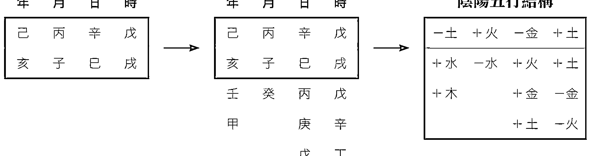

在這個八字結構中有一個核心位置，那就是日柱的天干，我們把它稱作「日主」。這正是前一章命理史中提到的「今法時代」的重要貢獻，或者說，是宋代徐子平的重要歷史貢獻。他把原「古法模型」中年干支的核心地位移到了日干，並把它確定為「日主」。日主，也就是命主「我」，作為了八字結構的核心，圖示如下：

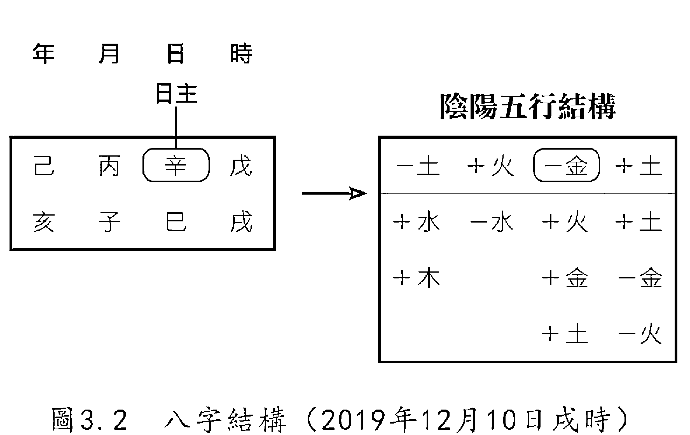

在圖中，我們把標記日柱的天干——辛，用小方框標記了出來，把它稱為「日主」。因為在今天的命理研究中，八字日柱的天干被認定是論命的**核心**和出發點。它有時也稱為「日元」或「命主」。我們時常聽到說，張三是「火命」，李四是「水命」。這裏所謂的「甚麼命」，就是指當事人八字結構中那個日主的五行屬性。上述八字日柱干支是辛巳，「辛」便成了日主。天干辛在五行中屬「金」，這時出生的嬰兒就是「金命」。辛金的陰陽屬性是陰性，所以也是「陰金命」。

為甚麼要認定日干為八字結構中的核心呢？

事實上，它有天文學的依據的。如果從作為天體之一的地球的運動出發，或許可以印證古人確定日主為八字結構的核心的合理性。地球自轉和公轉是地球運動的兩種主要運動方式。地球自轉導致了晝夜的更替；地球的公轉導致了一年四季氣候的更替。因此，以日柱為軸，輔以時柱，反映了地球的自轉運動；以年柱為軸，輔以月柱和日柱，則可以反映地球的公轉運動。圖示如下：

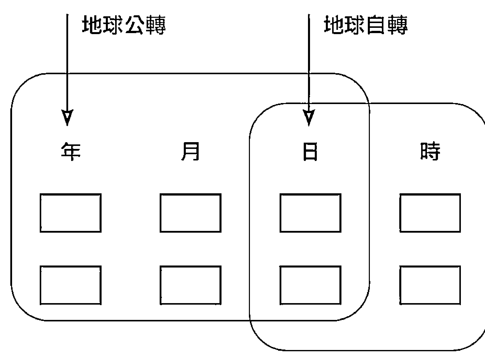

在這兩種運動中，日柱是重合部分，所以取日柱天干為核心，強調了作為運動體的地球本身，這不正是我們人類棲息的地方？

若進一步分析。地球圍繞着太陽運轉，月柱的地支——月支，反映着地球運轉的位置。具體來說，就是地球在黃道上運行的位置。所謂「黃道」，是地球上的人所看到的太陽一年內在天空恆星之間所走的視路徑。也就是觀察者以地球為參照物時，太陽繞地球作圓周視運動的軌道。簡單的說，地球一年繞太陽運轉一周。假定地球不動，從地球上看太陽，那是太陽在天空中移動。它一年移動的路線就是「黃道」——它是天球上假設的一個大圓圈。

人們把黃道劃分成了十二等份，每份相當於30°。每份用鄰近的一個星座命名，這些星座就稱為黃道星座或黃道十二宮。(1)這樣，相當於把一年劃分成了十二段。太陽在黃道上自西向東運行，每一段時間進入一個星座。比如，在西方，一個人出生時太陽走到哪個星座，就說此人是這個星座的命。最早有關黃道的歷史紀錄出現在古巴比倫文化當中，以後就形成了西方最初的占星術。

與西方不同，中國古代是用二十四節氣去對應太陽在黃道上運動的軌跡。每一個節氣對應於太陽視運動15°所達到的位置。二十四節氣又分為12個節氣和12個中氣。八字命理學上用的「月份」是以12個「節氣」來分割的。比如，正月（寅月）是從立春開始的；二月（卯月）起自驚蟄；三月（辰月）起自清明……雖然每兩個節氣之間正好相當於黃道軌跡的30°份額。但跟西方對應的星座基本上相差15天。因為星座是以「中氣」為界限的。比如，水瓶座起始於雨水；白羊座起始於春分；金牛座起始於穀雨……尤其值得注意的是，傳統命理學一年的起始點是立春，而西方則是以春分點為一年的起點。因此，傳統命理學的四季起始於立春。立春標記了春天的開始。在西方，春季則始於春分點。

# 為甚麼會有這樣的差別？

前文談到過「天人」關係是八字命理學的哲學基礎。其實，天人關係的哲學討論是從西方哲學中引進來的。在西方哲學中，強調的是天人相分，天人對立。這可以追溯到早期的希臘神話。希臘神話是多神崇拜的。雖然宙斯是奧林匹斯山上眾神之王，但眾神是各施其職的。跟其他民族神話中的神祇相比，他們更具有世俗性，帶有世俗人的色彩。他們並不是全能或完美的。不但在外形體貌上跟凡人相同，而且也具有人的七情六慾。他們熱衷於加入人間的紛爭。雖然他們要掌控一切的命運，然而，希臘神話中的「天人」關係更多地表現了人對自己命運的認識，同時讚揚了人間英雄對自身命運的反抗。古希臘的悲劇，正是表現人和命運的衝突，從而謳歌崇高壯烈的英雄主義。正因為如此，「人」等同於人間（地球），它與「天」（太陽）的關係，可以通過黃道的軌跡來反映。黃道軌跡反映了太陽與地球的距離位置。春分、夏至、秋分、冬至，是黃道上的四個重要節點，並由此劃分十二個星座，反映了地球跟太陽遠近距離的關係。它們自然是「天人」關係劃分的坐標系。

八字命理學所反映的「天人」關係，事實上是「天、地、人」的關係。它訴求的是天、地、人的和諧。它敬重「天、地」，但着眼於「人」。因為「人」是「天地合氣」(2)的產物。八字命理學探討的是人的命運，自然離不開人的「感受」。固然「冬至一陽生」，對於處於北半球的中華大地，太陽已經返程北移了，日照開始長了。但人們的感覺並沒有因日照延長了，而感到溫暖了。八字模型是兼顧天地人的。考慮到「天有陰陽，地有五行」——陽光的照射，對於中華大地特殊的地形地貌，有一個積寒、積熱的過程，也就是有一個轉化為生存在這塊土地上人所能感受到的寒熱、燥濕的過程。冬至以後，還要經過小雪、大雪，三九嚴寒，直到立春，才能迎來春姑娘輕盈的腳步。因此，以四季的循環為主要對象的八字陰陽五行模式，最終選取了立春節氣作為一年循環週期的起始點，是其邏輯的必然。(3)而立春、立夏、立秋和立冬，成了八字命理四季自然生態模型的節點。這是不同於西方星座界定的根本點。八字命理的研究者應該注意到這個重要的區分。

以下是在這樣四季自然生態模式下的月令五行分日用事： (4)

## 表3.1 月令五行分日用事

| 月份 | 地支 | 节气 | 天干主事 |
|------|------|------|----------|
| 正月 | 寅 | 立春 雨水 | 戊7日<br>丙7日<br>甲16日 |
| 二月 | 卯 | 驚蟄 春分 | 甲10日<br>乙20日 |
| 三月 | 辰 | 清明 穀雨 | 乙9日<br>癸3日<br>戊18日 |
| 四月 | 巳 | 立夏 小滿 | 戊5日<br>庚9日<br>丙16日 |
| 五月 | 午 | 芒種 夏至 | 丙10日<br>己10日<br>丁10日 |
| 六月 | 未 | 小暑 大暑 | 丁9日<br>乙3日<br>己18日 |
| 七月 | 申 | 立秋 處暑 | 己7日<br>戊3日<br>壬3日<br>庚17日 |
| 八月 | 酉 | 白露 秋分 | 庚10日<br>辛20日 |
| 九月 | 戌 | 寒露 霜降 | 辛9日<br>丁3日<br>戊18日 |
| 十月 | 亥 | 立冬 小雪 | 戊7日<br>甲5日<br>壬18日 |
| 十一月 | 子 | 大雪 冬至 | 壬10日<br>癸20日 |
| 十二月 | 丑 | 小寒 大寒 | 癸9日<br>辛3日<br>己18日 |

從表中可以看到，在正月（寅月），先是戊土主事7天，接着是丙火主事7天，再接下來是甲木主事16天。接着是二月（卯月），承接正月甲木，繼續主事10天，接下來是乙木主事20天。……事實上，第一章中的「地支藏遁表」（表1.3），即各地支內所含有的天干即人元的情況，正是根據各月五行分日主事的具體內容歸併出來的。(5)

有鑒於此，八字結構內的月柱地支被稱作為「提綱」。因為月柱地支標記了一年十二個月的時間段落，表述了地球公轉的位置。同時，它也清晰地反映了自然氣候四季的更替狀況。故它是八字結構的一個十分重要的信息點。

显然，日主（日干）和提纲（月支）是八字结构内部的两个重要的关注点。

## 黑箱

有了对八字结构的基本认识，我们要着手对它进行具体的剖析。

那么，如何下手呢？

我们不可能再像我们的古人那样，跟着师傅，依靠长时间的学习、实践、猜测、顿悟、再学习、再实践、再猜测、再顿悟……长期积累后，逐渐形成自己的分析手段和「顿悟」经验（或一种由经验到灵感而形成的理性认识）。我们应当利用现代的科学思想和工具，对这么一种古老的、可谓博大精深的关于人的命运的学问，或者说是不易琢磨的「玄学」，做出新的观察、形成新的认识和相对完备的理论和分析程式。笔者自己就是这样摸索着走过来的。

现代控制论的创始人维纳在《模型在科学中的作用》中指出，所有的科学问题都是作为「闭盒」问题开始的。若干可供选择的结构被密封闭在「闭盒」中，研究它的唯一途径是利用闭盒的输入和输出。

艾什比在《控制论导论》中对黑箱方法做了比较系统的阐述。这里的「黑箱」就是维纳的「闭盒」。他认为：「黑箱问题是在电机工程中出现的。给电机工程师一个密箱，上面有些插上接头，可以随意通上多少电压、电击或任何别的干扰；此外有些输出接头，可以借此作他所能做的观察。」

这就给了我们一个「黑箱」的研究方法。黑箱是指人们一时无需或无法直接观察其内部的结构，只能从外部的输入和输出去认识的某种现实系统。

其实，我们古老的中医学在方法论上也是一种黑箱的应用。中医师通过对病人的「望、闻、问、切」等外部观测做出诊断，立足于「有诸内必形诸外」的「司外揣内」观察方法，就是把病体视作黑箱，根据人体的输入和输出，做出「辨证施治」。

同样，我们可以把黑箱理论应用到八字命理学的分析上去。

首先，个人出生时间跟他的人生经历之间有着密切的联系，这是我们古人的假说。任何科学研究都是从假说开始的。根据这个假说，我们可以画出下面的图示：

对于每一个具体的人来说，出生时间跟他的潜质和人生历程，有着对应关系。既然他的出生时间是确定的，他的人生过程也是可以观察得到的，我们就可以进一步假定其背后存在着某种「机制」，而这样的联系正是受着这个「机制」的制约。这个机制就可以被看作是一个「黑箱」。于是，它们之间的关系可以进一步图示如下：

如图所示，作为这个黑箱一端的「输入」，是一个人的出生时间。作为黑箱另一端的「输出」，是关于这个人的生命潜质和人生历程的描写和预测。关于这个黑箱内部的真实的具体结构，谁也不清楚。如果说人体的「黑箱」还有望有彻底打开的一天，那么，这个制约人生的「黑箱」，至少到今天为止，我们对它的真实结构、内部构件，一无所知。

但是，当输入某个人的出生时辰，它可以输出关于这个人的的人生历程的某种近似的「描写和预测」。而能做出这种描写和预测，就是这个黑箱所具备的功能。因为的确存在有观察得到的某种对应关系存在。命理探索者就是在这种观察到的对应关系基础上，尝试去构建或模拟它的操作系统的。而「天地人」的感应、以及「气—阴阳—五行」的认识手段，为模拟这个黑箱的功能奠定了理论的基础。

可以说，八字命理学的发展历史，就是构建这个黑箱，使其具有描写和预测功能的历史。这个历史到今天还远没有结束。

## 多视角的分析

八字命理学，说到底，是一种对「黑箱」的探究，这就决定了它研究方法的基本特点。

物理学、化学、生物学等自然科学，它们的研究对象是具体的物质现象。这些物质现象是可以通过科学仪器测量出来的。因此，实验室、实验结果和逻辑推理，是它们不可或缺的研究手段。而命理学所面对的是一个「黑箱」，只能从功能上去「猜测」这个黑箱的机制。而且，它要描写的范围又太大、太宽泛，几乎囊括了人生的各个方面。从现代科学的学科领域来讲，它涉及了生理学、心理学、伦理学、社会学等诸多领域。因此，它不可能用一次性「猜谜」的追踪，就可以完成这样复杂的任务。或者说，它不可能通过一个观察角度，来全面地洞察这个黑箱的全部功能。它只能依靠全方位的、从不同的角度，通过揭示这个黑箱不同方面的功能，使其能最大程度上去完成描写和预测的任务。

事实也是如此。从前一章所述的命理学史来看，至少形成过以下不同的研究视角：

在图中，我们罗列了一些重要的视角，比如早期出现的神煞系统、刑冲会合系统，命理学成熟时期形成的强弱分析、调候分析、格局分析、形象分析等。我们将逐一接触和展现这些不同的研究视角，介绍它们具体的剖析方法。

由于命理学一直存在于俗文化中，缺乏系统的学术性研究。而江湖算命，常常良莠不齐，真假难辨。正因为如此，不少学了多年命理的人仍摸不着头脑，常有「易学难精」的感叹。笔者接触命理已有四十余年，也曾有过同样的感受。究其原因，一个重要方面，就是陷入了不同视角探求的迷魂阵里，常常是好像有所领悟，忽然又如坠云雾，有失之交臂之感。

当然，出现这样的情况，也有中国传统学术本身存在的问题。它重视实用，而轻视理论建构；重视领悟和顿悟，而轻视客观的理性分析，忽视概念和逻辑推理。同一个术语，比如「格局」、「用神」，常常在不同的地方有不同的含义，让接受现代教育的人确实很难掌握。有鉴于此，笔者将自己多年的领悟和论命经验贡献给读者，由现代科学控制论的黑箱理论带来的「多视角」的分析方法来组织以下「东山篇」的剖析进程。

## 注释

- (1). 它们是白羊座、金牛座、双子座、巨蟹座、狮子座、处女座、天秤座、天蝎座、射手座、摩羯座、水瓶座和双鱼座。
- (2). 「天地合气，命之曰人。」 （《素问.宝命全形论》）
- (3). 参见拙作《中国命理学史论》第三章。
- (4). 主要以《渊海子平》「月律分野之图编制」。
- (5). 考察「地支藏遁」跟「月令五行分日用事」的差异，基本上是将一月中同类的五行予以归并，如卯月（二月）中有甲、乙主事，则仅取乙为「藏遁」地支。

## 第四章 喻象：强弱和调候

现在我们开始对八字结构进行多视角的剖析。

八字命理推演的基础，首先是「喻象」。由于它的哲学基础是「天人合一」，或「天地人合一」，自然和人是交融在一起的。于是，自然被人化了，而人则被物化了。自然充满了生命力，而人的生命，又成了一种生动活泼的自然事物，交融在自然之中。这是八字命理学运思方面的重要特点。

### 十干喻象

诚如前文所指出的，八字结构具有两个重要的关注点，一个是日主（日干），一个是提纲（月支）。作为命局中的「我」，它可以由十个天干中的任何一个天干担任。比如，以下是著名历史学家钱穆先生命造（生于1895年7月30日戌时）^(1)：

| 天元 | 乙 | 癸 | 戊 | 壬 | → | -木 | -水 | +土 | +水 |
| --- | --- | --- | --- | --- | --- | --- | --- | --- | --- |
| 地元 | 未 | 未 | 寅 | 戌 | | -土 | -土 | +木 | +土 |
| 人元 | 己 | 己 | 甲 | 戌 | | -火 | -火 | +火 | -金 |
| （地支藏遁） | 丁 | 丁 | 丙 | 辛 | | -木 | -木 | +土 | -火 |
| | 乙 | 乙 | 戌 | 丁 | | | | | |

**命例1 乾造：钱穆先生（1895-1990）**

这里，除了标记出「八字」（年干支乙未；月干支癸未；日干支戊寅；时干支壬戌），同时，也标记了「地支藏遁」，即地支中所藏有的天干成分（如地支未的「藏遁」是己土、丁火和乙木）。这样，整个结构的天元、地元以及人元就都齐全了。

这个结构中，日主为「戊」，即阳土。这就是说，命局的主人「我」被物化为阳土。以下是十个天干的各自的喻象：

**表4.1：十干喻象及其性质**

| 天干 | 阴阳 | 喻象 | 性质 |
|------|------|------|------|
| 甲 | 阳木 | 松柏，乔木，栋梁 | 刚健，正直，积极 |
| 乙 | 阴木 | 芝兰，灌木，花草 | 柔弱，巧变，韧性 |
| 丙 | 阳火 | 太阳 | 热情，结实，坦白 |
| 丁 | 阴火 | 月亮，灯烛 | 纤细，敏捷，慧黠 |
| 戊 | 阳土 | 城墙，堤岸 | 厚重，单调，高亢 |
| 己 | 阴土 | 田园，软土 | 平坦，博厚，谦虚 |
| 庚 | 阳金 | 顽铁，宝剑 | 坚硬，锐利，硬直 |
| 辛 | 阴金 | 珠玉，钻石 | 敏感，温清，秀气 |
| 壬 | 阳水 | 江湖，汪洋 | 明朗，清澈，爽快 |
| 癸 | 阴水 | 雨露，泉水 | 包容，婉转，变化 |

从表中可以看到，阳土戊，它被看做是自然界中类似于城墙之类的厚土，或者是挡水的坚硬的堤岸。它显现出厚重、单调、高亢的特性。因此，对这个命造的日主可以做这样的描述：沉稳，厚重，重名誉，信实无欺；为人憨厚呆板，生活方式较为枯燥乏味。⁽²⁾这倒真有点学者的性格。

当然，从「厚重、单调、高亢」的特性联想开去，戊土还可以引申为虹霓、大地、山丘、高坡、建筑、仓库、寺院、古董、旧物、砖瓦、高台、讲台、老成、生硬等一系列表象。

用某种物象来做譬喻，是八字命理解读干支密码的主要方式。这或许需要解读者具备一定的想象力和生活阅历。八字命理由此来解读命主的性情，也称为「十干体性」。

确定了八字结构的核心——「我」以后，接着要讨论的问题是「我」的「强弱」。这就进入了第一个结构分析视角：强弱分析。

### 五行四时用事

关于日主的强弱，一般的原则是观察日主是否：（1）得令，（2）得地，（3）得助。

所谓「得令」，是指八字中月令地支属于日主比较旺盛的季节。这就要联系到八字中的月令地支「提纲」了。通过「提纲」观察日主出生时的外部气候环境。因为五行在不同的季节中呈现出不同的旺衰状态。下面是五行四时用事表：

**表4.2 五行四时用事**

| 五行 | 春 | 夏 | 秋 | 冬 | 季 |
| :---: | :---: | :---: | :---: | :---: | :---: |
| 木 | 旺 | 休 | 死 | 相 | 囚 |
| 火 | 相 | 旺 | 囚 | 死 | 休 |
| 土 | 死 | 相 | 休 | 囚 | 旺 |
| 金 | 囚 | 死 | 旺 | 休 | 相 |
| 水 | 休 | 囚 | 相 | 旺 | 死 |

表中的「季」是指春、夏、秋、冬四季的最后十八日，即立春、立夏、立秋、立冬各节气前十八日，为季土当令之时。

这个表反映了五行在不同季节中的旺衰状况。所谓「用事」，就是发生影响。它把五行的旺衰程度分成了五个等级：旺、相、休、囚、死。旺，是最强；相，是次强；休，是稍弱；囚，是更弱；死，则为最弱。此表刻画了自然界中五行在时间序列上呈周期性的旺衰起伏的变化。它为命理上的强弱推演提供了依据。

反观以上钱穆先生命造，日主戊土生于夏末季月，而且是在未月（六月）的后18天土旺时节，显然是得令。得令，自然强盛。

### 十天干生旺死绝历程

日主旺衰判定的第二步：是否得地？

所谓「得地」，是指日主在年、日或时的地支上是否有根基。这就牵涉到探求十个天干周行十二个地支的生旺死绝过程。这个过程可以列表如下：

**表4.3 十天干生旺死绝历程**

|    | 长生 | 沐浴 | 冠带 | 临官 | 帝旺 | 衰 | 病 | 死 | 墓 | 绝 | 胎 | 养 |
|---|---|---|---|---|---|---|---|---|---|---|---|---|
| 甲 | 亥 | 子 | 丑 | 寅 | 卯 | 辰 | 巳 | 午 | 未 | 申 | 酉 | 戌 |
| 乙 | 午 | 巳 | 辰 | 卯 | 寅 | 丑 | 子 | 亥 | 戌 | 酉 | 申 | 未 |
| 丙 | 寅 | 卯 | 辰 | 巳 | 午 | 未 | 申 | 酉 | 戌 | 亥 | 子 | 丑 |
| 丁 | 酉 | 申 | 未 | 午 | 巳 | 辰 | 卯 | 寅 | 丑 | 子 | 亥 | 戌 |
| 戊 | 寅 | 卯 | 辰 | 巳 | 午 | 未 | 申 | 酉 | 戌 | 亥 | 子 | 丑 |
| 己 | 酉 | 申 | 未 | 午 | 巳 | 辰 | 卯 | 寅 | 丑 | 子 | 亥 | 戌 |
| 庚 | 巳 | 午 | 未 | 申 | 酉 | 戌 | 亥 | 子 | 丑 | 寅 | 卯 | 辰 |
| 辛 | 子 | 亥 | 戌 | 酉 | 申 | 未 | 午 | 巳 | 辰 | 卯 | 寅 | 丑 |
| 壬 | 申 | 酉 | 戌 | 亥 | 子 | 丑 | 寅 | 卯 | 辰 | 巳 | 午 | 未 |
| 癸 | 卯 | 寅 | 丑 | 子 | 亥 | 戌 | 酉 | 申 | 未 | 午 | 巳 | 辰 |

这里，生死旺衰历程分成了十二个阶段，并配入十二个月中。这十二阶段是：长生、沐浴、冠带、临官、帝旺、衰、病、死、墓、绝、胎、养。它们各自的含义是：

- 长生——犹如婴儿之初生。
- 沐浴——犹出生后沐浴去垢，指幼儿阶段。
- 冠带——犹人渐长而需冠带。
- 临官——好像人由长而壮，可以出仕做官了。
- 帝旺——好像人的体力、智力都到达最旺盛的时候了。（但盛极也孕育了衰败的初兆。）
- 衰——盛极而衰，开始走下坡路了。
- 病——由衰败而生病。
- 死——由病而死。
- 墓——死而埋葬入墓。
- 绝——前气已绝，后气将续。
- 胎——后气继续结气成胎。
- 养——好像人养胎于母腹之中。

显然，它们表明了五行由盛而衰、由衰复盛、衰旺程度不同的十二个阶段。请注意表4.3，这里阳干和阴干的十二地支生死旺衰历程是不相同的。它们正好处于相反的顺序。

比如，甲木「长生」在亥，乙木则「死」在亥；甲木「死」在午，乙木则「长生」在午。这就是所谓「阳生阴死」，即阳干是顺着行走，从长生开始，沐浴、冠带、临官……，一直到养，再回到长生；阴干恰好是逆着行走，阳干的「死」正好是阴干的「长生」位置，然后，逆行，由长生开始，沐浴、冠带、临官……，一直到养，再回到长生。而阴干的「死」位，正好是阳干的「长生」位置。这种阳生阴死、阴生阳死的顺逆行走情况，在《李虚中命书》中已经提到：「阴生阳死，逆顺相因，甲气申方，乙绝酉位。」^(3)这里，「申」正是阳干甲的「绝」，而「酉」是阴干乙的「绝」位。

此外，这十个天干周行十二个地支的旺衰过程中，五行中的火与土周行顺序是一致的。也就是说，阳干丙火与戊土所临十二地支的状况完全相同，阴干丁火与己土完全一致。这是命理学上所谓的「火土同行」。^(4)

关于十天干在十二地支的生死旺衰历程，这是命理学史上经常争论的问题。不少学者认为，只要有五行在十二地支的生死旺衰就行了，这样属于同行的天干就不必再分了。这就是「阴阳同生死」的主张。

然而，当阳干和阴干在「死」与「绝」的位置上， 「阳顺阴逆」又似乎可以给予更细腻的描写。比如，甲木死于午，绝于申。午中藏遁是丁火、己土，尽是泄耗之物。而申中，藏遁有庚金，有壬水，有戊土。其中的壬水反倒可以用来灌溉甲木，这是「绝」地逢「生」。反过来，乙木死于亥，绝于酉。亥中有壬水、甲木，则「死」中有「生」。但酉中辛金，可真成了乙木的「绝地」。显然，阳干和阴干对于「死」和「绝」的不同性质，只有从「阳顺阴逆」的角度，才能更好地予以认识。

观察十天干生旺死绝历程表，实际上它把整个周而复始的过程划分为了三个阶段：从长生，经过沐浴、冠带、临官，到帝旺，这是第一个阶段，比喻新生儿从出生，一直到人生最旺盛的时候；然后，从衰开始，经过病、死、墓，一直到绝，这是第二个阶段，由强盛走向衰败；以后是胎和养，这是重新孕育新的生命的阶段。然而，在实际操作中，沐浴是强中之弱，而墓库是弱中之强。

对于十天干生旺死绝历程，我们在后面的「泰山篇」中还要做进一步的探讨。

对于以上钱穆的八字，我们可以从表中查出对应于日主戊土的四个地支的旺衰死绝状态，标记在八字中：

| 年 | 月 | 日 | 时 |
|---|---|---|---|
| 天元 | 乙 | 癸 | 戊 | 壬 |
| 地元 | 未 | 未 | 寅 | 戌 |
| 人元 | 己 | 己 | 甲 | 戊 |
| (地支藏遁) | 丁 | 丁 | 丙 | 辛 |
| | 乙 | 乙 | 戊 | 丁 |
| | 衰 | 衰 | 长生 | 墓 |

| 阴阳五行结构 | | | | |
|---|---|---|---|---|
| | -木 | -水 | +土 | +水 |
| | -土 | -土 | +木 | +土 |
| | -火 | -火 | +火 | -金 |
| | -木 | -木 | +土 | -火 |

**命例1A 乾造：钱穆先生（1895-1990）**

对于日主戊土，日支为长生，是自坐长生。年支、月支为衰；时支为墓。虽不旺盛，但都有根基。

最后，考察日干是否得助？

那就是观察天干是否有日干同类或生助日干的五行成分。年干乙木，月干、时干为壬、癸水。显然是不在日主一方的成分，对日主无帮助。

综合以上的观察，此命造日主戊土：（1）得令：戊土生于夏天季月，是土当令时节；（2）得地：两衰、一长生、一墓库，尚有根基。（3）得助：则全无帮扶。

总的来说，此日主当断为：偏强。

关于日主强弱的辨别，笔者在《八字命理学基础教程》中设计了「强弱图解分析法」，读者可以参考和并予以演习。

### 扶抑用神

有了基本的强弱评估，也就是找到了问题。问题是八字结构内部作为日主「同方」（包括「我」、「生我」和「助我」者）与日主「异方」（包括「我生」、「我克」和「克我」者）之间在五行能量方面处于了不平衡的状态。接下来是探求解决的办法，使它们能趋于平衡。一般来说，弱者宜扶，强者宜抑，过强者宜泄。八字内部若有担当这样任务的成分或机制，就被称为「用神」。

再来观察钱穆命造。既然日主「偏强」，八字结构要趋于平衡，只有对其日主采取抑制或宣泄（消耗）的手段，方能奏效。那么，这个结构内部有没有这样的机制呢？——有！年干透出的乙木正好能够用来疏此厚土，并且它在年、月、日地支内

获取更多好书，请加微信号：strcdts 官网：http://www.ac2011.cn

皆有根基，故可取乙木为候选「用神」。同时，乙木有天干壬、癸水相生。壬、癸水可以作为辅助用神的「相神」。图示如下：

**命例1B 乾造：钱穆先生（1895-1990）**

图中用神（乙木）的功能是帮助命局内部的五行恢复平衡。因为它涉及命局结构分析中的日主强弱问题，这类「用神」也就被称为「扶抑用神」。

其实，「不平衡」本是自然界中常见的现象。八字结构中出现了不平衡的状态并不足虑。问题是八字结构内部有没有使之恢复平衡的机制。有恢复平衡的机制，就有了「生机」。一般来说，具有「用神」的八字结构都是比较良好的结构。

> 命理经典《继善篇》说：「用神不可损伤，日主最宜健旺。」这是说，八字结构中既然有了「用神」，就希望它不要受到「损伤」。若受到损伤，它就无法再承担起它应有的作用。这也是八字结构成功的重要条件。

其实，强弱的评判也有一个「度」的问题。一般来说，命局日主在地支上有个「根」，就不会是弱不胜扶了。

以上是强弱分析的基本内容。

### 调候

作为八字结构分析的第二个重要视角是「调候」。

何谓「调候」？

调候，就是调和气候，也就是调和人跟环境之间的关系。人生活在这个地球上，必须要有一个「寒暖燥湿」既不太「偏」、也不太「过」的环境。这是人能活动于天地之間的最起碼的外界條件。沒有這樣的條件，人類何以生存呢？故八字結構中出現嚴重的調候偏向時，「調候為急」，即調候必須優先考慮，就成了命理中一條重要原則。

那麼，如何來確定八字結構的寒暖燥濕狀況呢？

實際上，寒暖是溫度；燥濕是乾濕度。寒暖主要是氣候；燥濕當以局勢論。作為克服這類障礙的主要手段，對於「暖燥」太過的狀況，最好是「雨露潤之」——用癸水滋潤；對於「寒濕」太過的狀況，則莫過於「太陽暄之」——用丙火照暖。在一般的情況下，夏天是容易引起暖燥的季節，冬天則是容易引起寒濕的季節，因此，各個日主，夏季基本上都離不開癸水，冬季都離不開丙火。癸和丙，是最重要的調候要素。

下面再來看一下錢穆先生的八字。錢穆先生生於夏季，正是燥熱的時令。所幸的是其八字有壬水、癸水出現在天干，於是八字結構就有了「自足」的調候用神，避免了夏季外部環境的炎燥氣候。圖示右頁：

|   | 年 | 月 | 日 | 時 |
|---|---|---|---|---|
| 天元 | 乙 | 癸 | 戊 | 壬 |
| 地元 | 未 | 未 | 寅 | 戌 |
| 人元 | 己 | 己 | 甲 | 戊 |
| (地支藏遁) | 丁 | 丁 | 丙 | 辛 |
|   | 乙 | 乙 | 戊 | 丁 |
|   | 衰 | 衰 | 長生 | 墓 |

|   | -木 | -水 | +土 | +水 |
|---|---|---|---|---|
|   | -土 | -土 | +木 | +土 |
|   | -火 | -火 | +火 | -金 |
|   | -木 | -木 | +土 | -火 |

## 命例1C 乾造：錢穆先生（1895-1990）

可見，夏天出生的人，命局中有癸水；冬天出生的人，命局中有丙火，都可算得上是「得天獨厚」的人了，至少其八字結構已經在相當程度上排除了「調候」偏頗的問題。

為了幫助初學者瞭解調候分析的內容，筆者在《八字命理學基礎教程》設計了干支寒暖燥濕計分的工具，讀者可以參考。通過計分評估，選取調候用神。

誠如第二章所談到的，命理學史上系統地討論調候問題的經典著作是《窮通寶鑒》（原名《攔江網》）。它是「以十干配十二月，察其生旺休囚，以定取用之準則」(5)。因此它的編排方式，是以十個天干分別對照十二個月，討論其取用的準則和內容，共一百二十組。台灣梁湘潤把它們編錄在以下十日干「調候用神表」中：(6)

## 表4.4 調候用神表

| 天干/月份 | 寅 (正月) | 卯 (二月) | 辰 (三月) | 巳 (四月) | 午 (五月) | 未 (六月) | 申 (七月) | 酉 (八月) | 戌 (九月) | 亥 (十月) | 子 (十一月) | 丑 (十二月) |
|----------|-----------|-----------|-----------|-----------|-----------|-----------|-----------|-----------|-----------|-----------|-------------|-------------|
| 甲       | 丙癸      | 庚丙戊丁己 | 庚丁壬    | 癸丁庚    | 癸丁庚    | 癸丁庚    | 庚丁壬    | 庚丁丙    | 庚甲壬丁癸 | 庚丁戊丙   | 丁庚丙      | 丁庚丙      |
| 乙       | 丙癸      | 丙癸      | 癸丙戊    | 癸        | 癸丙      | 癸丙      | 丙癸己    | 癸丙丁    | 癸辛      | 丙戊      | 丙          | 丙          |
| 丙       | 壬庚      | 壬己      | 壬甲      | 壬庚癸    | 壬庚      | 壬庚      | 壬戊      | 壬癸      | 甲壬      | 甲戊庚壬   | 壬戊己      | 壬甲        |
| 丁       | 甲庚      | 庚甲      | 甲庚      | 甲庚      | 壬庚癸    | 甲壬庚    | 甲庚丙戊  | 甲庚丙戊  | 甲庚戊    | 甲庚      | 甲庚        | 甲庚        |
| 戊       | 丙甲癸    | 丙甲癸    | 甲丙癸    | 甲丙癸    | 壬甲丙    | 癸丙甲    | 丙癸甲    | 丙癸      | 甲丙癸    | 甲丙      | 丙甲        | 丙甲        |
| 己       | 丙庚甲    | 甲癸丙    | 丙癸甲    | 癸丙      | 癸丙      | 癸丙      | 丙癸      | 丙癸      | 甲丙癸    | 丙甲戊    | 丙甲戊      | 丙甲戊      |
| 庚       | 戊甲丙壬丁 | 丁甲丙庚 | 甲丁壬癸 | 壬戊丙丁 | 壬癸      | 丁甲      | 丁甲      | 丁甲丙    | 甲壬      | 丁丙      | 丁甲丙      | 丙丁甲      |
| 辛       | 己壬庚    | 壬甲      | 壬甲      | 壬甲癸    | 壬己癸    | 壬庚甲    | 壬甲戊    | 壬甲      | 壬甲      | 壬丙      | 丙戊壬甲    | 丙壬戊己    |
| 壬       | 庚丙戊    | 戊辛庚    | 甲庚      | 壬辛庚癸 | 癸庚辛    | 辛甲      | 戊丁      | 甲庚      | 甲丙      | 戊丙庚    | 戊丙        | 丙丁甲      |
| 癸       | 辛丙      | 庚辛      | 丙辛甲    | 辛        | 庚壬癸    | 庚辛壬癸 | 丁        | 辛丙      | 辛甲壬癸 | 庚辛戊丁   | 丙辛        | 丙丁        |

## 要素的優化組合

事實上，以上「調候用神表」不僅彰顯了調候的要求，同時，它還展示了各個日干對其他五行要素的選擇。換句話說，它表述了天干要素之間的優化配置的問題。

若把上述在冬、夏兩季中起調侯作用的丙火、癸水暫放一邊，再將「調侯用神表」中與十日干關係最為密切的天干要素羅列出來，可以得到如下的一些重要配置：

- 甲——庚、丁
- 乙——丙、癸
- 丙——壬
- 丁——甲、庚
- 戊——甲、丙、癸
- 己——甲、丙、癸
- 庚——丁、甲
- 辛——壬、甲
- 壬——庚（辛）
- 癸——辛（庚）

首先，不難發現，天干甲、丁、庚三者之間聯繫異常緊密：對於甲，調侯用神(7)為庚、丁；對於丁，調侯用神為甲、庚；對於庚，調侯用神為丁、甲。甲、丁、庚，三者循環為用，體現了《窮通寶鑒》中的一個重要創見：用庚劈甲引丁。

其次，天干乙木跟丙火、癸水關係密切，這也是容易理解的。乙木是陰柔之木，猶如花草籐蘿灌木，自然喜歡丙火陽光的暄暖和癸水雨露的滋潤。

再次，天干丙火跟壬水的關係密切。徐樂吾曾注說：「丙火不畏水剋而懼土洩，日照江湖，分為晶瑩。」可見丙為太陽，壬為湖海，「日照湖海」，通過萬頃碧波的映照，反射出太陽的燦爛光輝來。所以，丙以壬水輔映，是丙、壬結合的特點。

> > 丙火不畏水剋而懼土洩，日照江湖，分為晶瑩。

再次，戊土和己土，無論是陽土還是陰土，若是火炎土燥，則為「旱田」，稼禾不長，必須要有雨露——癸水的滋潤，所謂「稼禾在田，最喜甘沛」。相反，濕泥寒凍時，又必須要有陽光——丙火的照暖，所謂「濕泥寒凍，非丙暖不生」。對於土，陽光和雨露都很重要。然而，《窮通寶鑒》還十分強調甲木對戊、己土的作用。它指出：「戊土厚重，非用甲木疏之，則土不靈。」而己土「令土暖而又潤，複用甲疏之」。顯然，土若沒有甲木的疏闢，則土不靈。

再次，辛金跟壬水的關係，也極為密切。與庚金喜丁火煅煉完全不同，辛金喜壬水淘洗。因此徐樂吾說：「庚金以剋為功，辛金以洩為美，其性質殊也。」為甚麼

> > 庚金以剋為功，辛金以洩為美，其性質殊也。

會如此？因為辛金是陰金，性柔和，比喻為珠寶首飾，是柔弱的金，故特別喜歡壬水的淘洗。

最後，壬、癸水跟庚金、辛金之間的配置關係。事實上，這是水跟其源頭的關係。《窮通寶鑑》說：「水不絕源，仗金生而流遠。」就是說，水依賴於金，方能源遠流長。尤其是在春、夏季節；到了秋季，特別是酉月，月令辛金司權，金水相生，名「金白水清」。此時，壬水「非旺非弱，但取其澄澈」；而「癸水清潤，辛金虛靈，金白水清，相得益彰。」由此可見水、金之間的密切關係。

再回過頭來看錢穆先生的八字。八字以戊土為日主，生於未月。查以上「調候用神表」，喜「癸、丙、甲」的要素組合。八字中未、未燥土，寅戌拱火，因此癸水高懸，輔以壬水，是極好的調候用神和良好的要素組合。八字已經燥熱，不宜丙火，是顯而易見的。然而，局中以乙木為主導勢力，而寅木（含甲木）則因與戌土相拱而損力。誠如徐樂吾在《窮通寶鑑》注文所言：「戊土以甲木為貴，四季皆同。乙木官星，無疏土之力，徒混雜耳。」顯然結構中用乙木來擔任疏土功能，是差強人意了。

## 註釋

- (1). 錢穆先生生卒時間見其墓碑鐫刻。
- (2). 見《命運的求索》152頁。
- (3). 《李虛中命書》，《四庫術數類叢書》（七），809-817頁。
- (4). 在西漢京房把五行的態勢引進易卦的時候，採取的是「水土同行」。因此，早期命理學也是採取「水土同行」的。在《李虛中命書》中采取的也還是「水土同行」。到《淵海子平》，則完全是「火土同行」了。
- (5). 徐樂吾語。
- (6). 錄自梁湘潤《余氏用神辭淵》。
- (7). 這裏我們仍用「調候」這個名稱，實際上它已經超出了狹義的「調候」（調節氣候）意義。

## 第五章 关系: 格局

本章讨论八字结构分析的第三个重要视角——格局分析。

在命理学史上，宋代徐子平的功绩并不仅是重新确定了八字结构的核心，同时「专主五行，不主纳音」；他还有一个十分重要的贡献是突破了「喻象」分析层面，开始向「关系」分析层面转移。这就是「十神」概念的形成和设立，开启了由十神到格局的全面研究。这正是本章要讲述的内容。

## 十神

什么是十神？所谓「十神」，就是日干与其他成分的阴阳五行之间关系的代名词。具体来说，当确定了八字结构中的核心——日主，它跟其他可能遇上的十个天干之间将构成什么样的关系呢？由于有地支藏遁，地支可以表述为不同的天干成分。因此，要讨论日主跟结构中其他七个干或支的关系，都可以统一到天干符号上来。故确定它们之间的关系，并冠以一定的名称，是分析工作的开始。因为有十种关系，就有了十种名称，统称为「十神」。它们是：

- 比肩、劫财、伤官、食神、正财、偏财、正官、七杀、正印、偏印。

右列是「天干十神表」：

## 表5.1 天干十神表

| 日干\十神 | 比肩 | 劫财 | 食神 | 伤官 | 偏财 | 正财 | 七杀 | 正官 | 偏印 | 正印 |
| :---: | :---: | :---: | :---: | :---: | :---: | :---: | :---: | :---: | :---: | :---: |
| 甲 | 甲 | 乙 | 丙 | 丁 | 戊 | 己 | 庚 | 辛 | 壬 | 癸 |
| 乙 | 乙 | 甲 | 丁 | 丙 | 己 | 戊 | 辛 | 庚 | 癸 | 壬 |
| 丙 | 丙 | 丁 | 戊 | 己 | 庚 | 辛 | 壬 | 癸 | 甲 | 乙 |
| 丁 | 丁 | 丙 | 己 | 戊 | 辛 | 庚 | 癸 | 壬 | 乙 | 甲 |
| 戊 | 戊 | 己 | 庚 | 辛 | 壬 | 癸 | 甲 | 乙 | 丙 | 丁 |
| 己 | 己 | 戊 | 辛 | 庚 | 癸 | 壬 | 乙 | 甲 | 丁 | 丙 |
| 庚 | 庚 | 辛 | 壬 | 癸 | 甲 | 乙 | 丙 | 丁 | 戊 | 己 |
| 辛 | 辛 | 庚 | 癸 | 壬 | 乙 | 甲 | 丁 | 丙 | 己 | 戊 |
| 壬 | 壬 | 癸 | 甲 | 乙 | 丙 | 丁 | 戊 | 己 | 庚 | 辛 |
| 癸 | 癸 | 壬 | 乙 | 甲 | 丁 | 丙 | 己 | 戊 | 辛 | 庚 |

從表中，我們可以查到日干與其他任何一個天干之間的關係。比如，日干甲遇到八字中出現的另一個甲，這個甲就是日干的比肩；遇到乙，是日干的劫財；遇到丙，是食神；遇到丁，是傷官；……順序查找，便可以得到它們各自的十神名稱。

前文討論日主強弱時，按五行的生剋關係，從日干出發，可以構成我方（包括「我」、「生我」和「同我」）和異方（包括「我生」、「剋我」和「我剋」）。若再把五行的陰陽區分放進去，五種關係就變成了十種關係。上表羅列的就是這十種關係。十神就是這十種關係的代名詞。

具體來說，「生我」者，為正印、偏印（也稱梟印）；「我生」者，為傷官、食神；「剋我」者，為正官、七殺（也稱偏官）；「我剋」者，為正財、偏財；「同我」者，為比肩、劫財。它們之間的關係可以圖示如下：

## 圖5.1 十神生剋關係

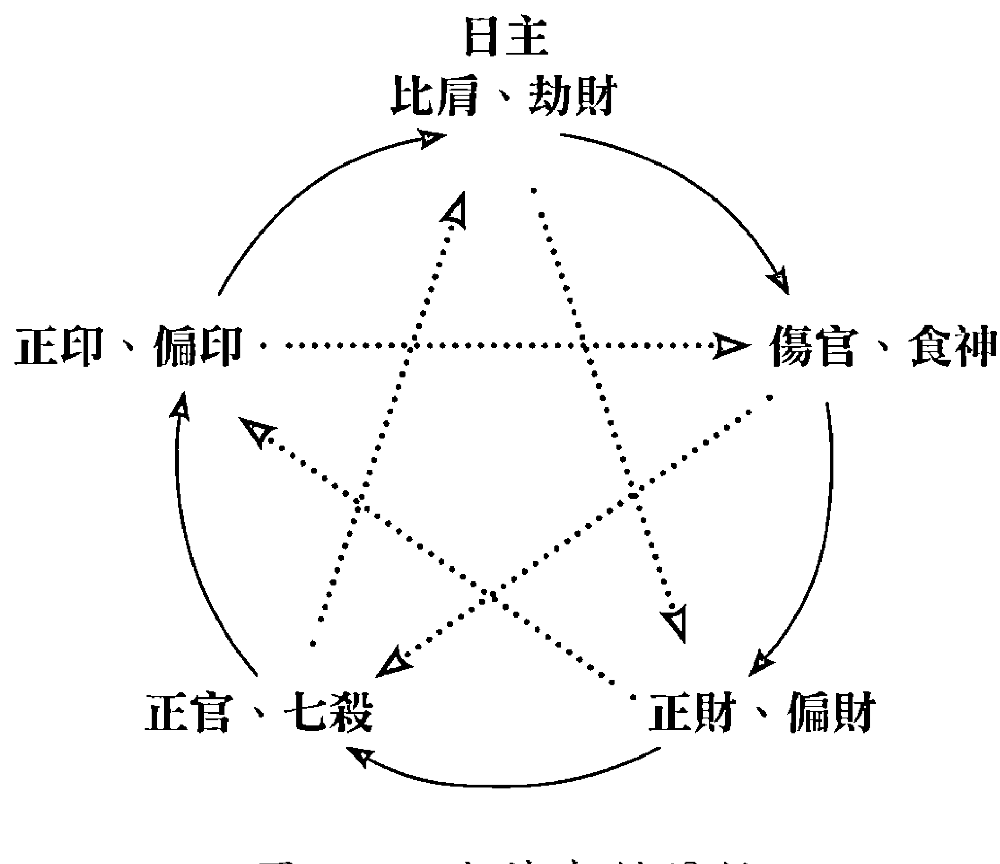

（圖中實線表示相生關係；虛線表示相剋關係）

因為天干之間有陽見陽、陰見陰、陽見陰、陰見陽的分別，所以把異性相遇（陽見陰或陰見陽）歸納為：正印、傷官、正官、正財、劫財；把同性相遇（陽見陽或陰見陰）歸納為：偏印、食神、七殺、偏財，比肩。顯然，這是根據日主跟各天干陰陽五行之間的生剋關係，對已有的天干符號的再一次符號化。

於是，對一個已經排好的八字，就可以根據上表，把十神符號標記在各個字的上下。這樣，各個天干以及地支內所藏的人元，它們跟日主的關係便通過標記的十神符號而一目了然了。

還是以錢穆的八字為例：

年 月 日 時
格局 官 財 才
天元 乙 癸 戊 壬
地元 未 未 寅 戌
人元 己劫 己劫 甲殺 戊比
（地支藏遁） 丁印 丁印 丙日 辛傷
乙官 乙官 戊比 丁印
衰 衰 長生 墓

陰陽五行結構
－木 －水 ＋土 ＋水
－土 －土 ＋木 ＋土 本氣
－火 －火 ＋火 －金
－木 －木 ＋土 －火

## 命例1D 乾造：錢穆先生（1895-1990）

這裏我們用以下的通用的簡體來標記八字結構中的十神：

官=正官；殺=七殺（偏官）；財=正財；才=偏財；印=正印；
P=偏印（梟神）；比=比肩；劫=劫財；傷=傷官；食=食神

十神關係的確立，大大擴大了命理描寫的廣度和深度。它從原本五行「喻象」的分析的層面，即直接用五行生剋關係的類象來討論各成分之間的關係，拓展到了「關係」分析的層面，即通過反映五行生剋關係的代名詞——十神來予以討論，這樣做便具有了更大的概括性。

## 基本功能

對一個具體的八字，標記了十神以後，就可以運用十神的概念去考察它們對日主的功能。以下是十神的一些基本特徵和功能：

### 1. 正官

正官是克制日主的。日干跟正官是陽見陰剋，或陰見陽剋，因異性相吸，陰陽和諧，剛柔相配，其情和洽，故是「陰陽配合成其道也」(1)。官者，管也。但正官對日主的管束，一般是善意的，故認為正官是善神。

- 功能：衛財，生印，拘身，制劫。

因此，日主旺盛，則喜正官，因正官有拘身的作用，使自身不敢胡作妄為；日強財弱，更愛正官，因為正官能克制劫財、護衛財源；若日主既旺，再見劫財，則需要正官制劫，使日主能潔身自好。

倘若身弱財旺，遂怕正官，財強猶恐自身不能勝任，何堪正官引財傷身；日干雖弱但印強，也怕正官，因為母多子病，不堪正官再來扶助印星；日主衰弱，當然怕見正官，身弱賴劫比幫助，自然不喜正官制去比劫了。

### 2. 七殺（偏官）

偏官是剋日主的，並與日主同性，即陰見陰、陽見陽。因為由日干算起，正好相隔七位，而且，陰陽同性相斥，不能調和，故其情剛烈，其氣暴戾，所以也稱「七殺」。殺者，殺也，是日主的對頭。若無制裁，必傷其身，即是道地的「殺」了。但若有制的話，則能借小人之力，護衛君子，以成威權，此時則稱為偏官。

- 功能：耗財，生印，攻身，制劫。

因此，日主強，喜七殺；若印輕，更喜殺來生印；若財重的話，也喜殺來耗財生印；身強往往劫重，七殺正好可以發揮它制劫的作用。

如果日主弱的話，大多是怕見七殺的：身弱極需比劫相助，而七殺正好是克制比劫的。所以論命時，見到七殺，一般要先行處理，這就是所謂「有殺先論殺，無殺方論用」(2)，也就是先看看結構中是否有制神能克制住七殺，或者有印綬來化解七殺。在早期命理中，因七殺暴戾，一般被認為是凶神。

### 3．正財、偏財

日主所剋，且與日主異性者，為正財；與日主同性者，為偏財。財無論正、偏，都是耗泄自身的，因此，自身必須強健，方堪任財。財雖為養命之物，但並非人人命中皆喜，關鍵在於自身的強弱。

- 功能：生官殺，泄傷食，制梟神，壞正印。

因此，日主強，則喜財。財不僅帶來財富，而且會生出官殺，克制比劫，保護財源，提高社會地位。若身強食神、傷官旺的話，喜財來流通食傷的秀氣，化為財帛可供享用。若身強印也重，更需要財來克制梟印，使自身不至於過旺而失去平衡。

倘若日主弱，就不再喜歡財來了。因為財能生出官殺，惹出禍害；同時財會破印，使自身失去依賴，變得更弱不堪扶了。

### 4．正印、偏印

生我者，為印綬。但異性相生，為正印；同性相生，則為偏印。印綬是生日主的，猶如父母，多施蔭庇。在早期命理中，一般把正印看作是善神，偏印看作是凶神。這有點跟正官、七殺的情形相似。原因是：正印能剋制傷官，保護正官，維護自身的地位；而偏印卻會剋倒食神。食神可以用來制殺，若食神被制，則七殺囂張，日主自然就會受到威脅。這也是偏印遇到食神，被稱為「梟神」的原因。

- 功能：生身，泄官殺，禦傷，挫食。

日主弱，自然喜歡印綬來助身；若官殺力強，則更需印綬來泄官殺之氣而生身。倘若身弱傷食重，也需印綬來挫傷食而扶弱主。在身弱用印時，偏印之力往往大於正印之力，此時用偏印較佳；如果身非過弱，不需要很大的生扶力量，則喜正印勝過偏印。因為正印之氣純，知所進退；而偏印之氣乖，所謂「愛之欲其生，恨之欲其死」，常常不知其進退。

若日主強盛，自然就不喜歡印綬來幫扶了：日干強，財官力薄，印綬會進一步耗泄財官的勢力；日干強，傷食輕，就怕印綬再來挫敗傷食，使自身的秀氣無法流轉，失去生財的機會。然而，在身強無須用印時，正印的出現，還可無大害；偏印太盛，尤其在身旺宜宣洩時，危害較甚。

### 5．傷官、食神

傷官、食神，同為我生，與我性異者為傷官，同性者為食神。在早期命理中，雖然傷食皆為我所生，但一般將傷官看作凶神，食神看作吉神。原因是：傷官會克制正官。正官是善神，能管束自身，使之循規蹈矩。然而遇上傷官，則被其所傷。日主失去管束，自然會放蕩不羈，傲物妄為了。食神就不同。食神能克制七殺，七殺乃攻身之物，它若得制，日主便可安然自適，悠遊裕餘；而且食神能生財，使其寬裕不竭。

- 功能：泄身，生財，敵殺，損官。

因此，日主強，財官無氣，這時最喜傷食，用傷食來流通自身的秀氣；若身強財弱，也愛用傷食來泄身生財；倘若官殺重而身輕，日主處處受制，也喜傷食來制官殺以存身。在制殺和生財方面，傷官之力不及食神之純之大；但若從泄秀這點而言，傷官之力就遠甚食神了。因為傷官之氣壯而厲，多謀善詐，只求實現目的，不擇手段，不像食神拘謹保守，故往往傷官成就為大。這有點像七殺之於正官，若得用適當，七殺反見顯赫。

倘若身弱，日主自顧不暇，自然就怕傷食來盜泄其氣了。財旺身弱，也不宜傷食。因為體力已弱，既不能任財，傷食再來生財，則未見其利而先蒙其害。如日主強，官殺輕，此時也不喜歡傷食。官殺為權尊，傷食破之，則喪失貴氣。食神過重，可用梟印挫之；傷官過重，則用正印為利。

### 6．比肩、劫財、祿、刃

與日主同類又同陰陽者，為比肩；與日主同類而不同陰陽者，為劫財。

甚麼是「祿」呢？在「十天干生旺死絕歷程表」中，對照日主天干，地支為「臨官」者，即日主之「干祿」，簡稱為「祿」。甲祿在寅，乙祿在卯，丙、戊在巳，丁、己在午，庚在申，辛在酉，壬在亥，癸在子。

甚麼是「刃」呢？「刃」是「羊刃」的簡稱。《淵海子平.論羊刃》說：「夫羊刃者，號天上之凶星，作人間之惡殺，以祿前一位是也。（如甲祿在寅，卯為羊刃。）……何谓羊刃？甲、丙、戊、庚、壬五阳有刃；乙、丁、己、辛、癸五阴无刃，故名阳刃。”具体来说，甲羊刃在卯，丙、戊在午，庚在酉，壬在子。(3)

不难发现，为禄的，地支中有日干的比肩；为刃的，地支中藏有日干的劫财。早期命理认为，比肩和禄是吉神；劫财和刃是凶神。原因是：比肩之性正而纯，劫财之性恶而杂。禄虽旺，但旺犹未艾，因此性较平和；刃则是旺气到了尽头，瞬息之间将转衰败，故其性刚暴，其气如刀刃之锋利，这就颇具险象了。

功能：帮身，任官杀，代泄，夺财。

因此，当日主衰弱时，喜比、劫、禄、刃的帮扶，才有生发之机，因为它们能助日干而任官杀，能代日干而受伤食之泄。从帮身的角度讲，劫和刃的力量较盛。当日主本身强旺时，比、劫、禄、刃则无用处。这时，劫、刃之害则甚于比、禄。倘如身强财弱，尚忧财之不足，此时劫、刃出现，分财夺财，一扫而尽，则为害尤烈。

显然，以上这些功能都是从十神相互之间的生克关系中引伸出来的。如果对于十神之间的生克关系熟悉的话，这些功能是不难理解的。它们成了八字命理推理的重要工具。

## 如何取格局？

了解了八字结构内各成分的十神关系、以及它们的基本功能以后，接下来的任务，就是选取格局。

什么是格局？这是命理学中一直令人困扰的名词。它在命理发展历史过程中曾有过不同的含意。这里不去追溯它具体的来龙去脉。对于初学者来说，格局，就是八字结构的大的分类。任何有意义的研究，面对纷杂众多的现象，总要先做出分类，才能进行深入分析。就像植物学研究，对种类繁杂的植物要进行分类一样。既然我们从五行走到了十神，那么，格局也可以分成十种。它们是：

- 伤官格、食神格、正财格、偏财格、正官格、七杀格、正印格、偏印格，以及建禄格、劫刃格。

那么，如何取格呢？

> 《渊海子平》指出：“凡格用月令提纲，勿于旁求年日时为格。”(4)

就是说，要从月令提纲中来取。

具体方法是：

1.  首先观察月令地支，即提纲，若月支本气透出于天干的，应先取为格。
2.  如果天干上未透出月支本气，而透出月支所藏之神，即以该神取为格局。如果支中藏有两神，皆透出天干，则酌取其一为格。
3.  如果月支与其他地支构成会方或合局，即以此会方或合局为格。
4.  如果以上三个条件都不能满足，此时就酌取有力而无克合者为格。

这里，还是以钱穆的命造为例来予以说明。

| 格局 | 年 | 月 | 日 | 时 |
|---|---|---|---|---|
|  | 官 | 财 |  | 才 |
| 天元 | 乙 | 癸 | 戊 | 壬 |
| 地元 | 未 | 未 | 寅 | 戌 |
| 人元 | 己劫<br>丁印<br>乙官<br>衰 | 己劫<br>丁印<br>乙官<br>衰 | 甲杀<br>丙印<br>戊比<br>长生 | 戊比<br>辛伤<br>丁印<br>墓 |

命例1E 乾造：钱穆先生（1895-1990）

命造日主戊土，生于未月（六月），月令提纲是未土。其本气为己土劫财，还含有丁火正印和乙木正官。按照以上的取格方法，首先注意到月令本气——己土劫财，但它没有透露；而属于地支中附属之气的乙木正官，却透露在年干上。根据取格方法（2），此命造的格局应取为正官格。正官格的人端庄正直，重责任，讲规范，有理想目标。这倒是符合国学大师钱穆先生的风范的。

为什么要这样取格呢？笔者认为，**取格的根本目的，是发现八字结构中除日干之外的主导力量**。这个主导力量一定程度上体现了命局主人的人生价值取向。它对应着人生活动的诸个领域。

> 诚如《三命通会》所说：“以五行之气，为月令当时为最。”

因此，从月令去寻找，是符合这个目标的。因为这是人出生时，月令地支所直接指向的外部自然生态环境中相关的五行最旺盛的气息，它直接影响了人的生命机制。从这里下手，就可以避免纷繁的现象，直接抓住了要领。

对于格局，一般而言：⁽⁵⁾

- **正官格：** 利于求名求官，女命旺夫。
- **正财格：** 利于求财求利，男命妻缘好。
- **七杀格：** 利于权力，但小人多。
- **偏财格：** 利于投机之财，桃花运多。
- **食神格：** 利于专业享受，女命旺子女。
- **伤官格：** 利于艺术，女命不利姻缘。
- **正印格：** 利于承继，安闲生活。
- **偏印格：** 利于宗教，女命不利子女缘。
- **建禄、羊刃格：** 白手起家，不利婚姻感情。

## 格局用神

同强弱分析、调候分析一样，格局分析的重要目的是选取格局的用神。它是结构内部的自我完善的机制。

那么，如何选取格局的用神呢？

这就要谈到对格局做出深刻研究的经典著作《子平真诠》。作者沈孝瞻把格局（依据代表格局的「用事之神」）分为两类：「善」者和「不善」者。前者「财格、官格、印格和食神格；后者是七杀格、伤官格、建禄格和羊刃格。」^{(6)}接着，对于「善」者，他的处理法则是「顺用之」（即顺着相生的线路处理）；对于「不善」者，处理法则是「逆用之」（即沿着相克的线路处理）。他主张「当顺而顺，当逆而逆，配合得宜，皆为贵格。」

这里的「善」和「不善」，虽然在分类上承继了《渊海子平》中的「善神」和「凶神」，但它们并不真的具有「善」或「凶」的实际内涵。它们只是分类的不同名称罢了，其目的是为了适应不同处理法则的需要。至于能否成为「贵格」，不在于「善」和「不善」；关键在于「配合得宜」四个字上。

那么，什么又是「配合得宜」呢？简单说，就是「善」类格局要符合「顺用」法则；「不善」类格局要符合「逆用」法则。这是选取格局用神的大原则。^{(7)}

具体来说，比如正官格，正官属于「善神」，不宜见伤官去克制它。正官格见伤官克制，一般情况下就是破格。正官格需要「顺用之」，就是说，如果身强官弱，应当以财扶官；如果身弱官强，则宜以印化官。财生官，或官生印，都是沿着相生线路「顺用之」。相反，对于「不善」的七杀，就希望「逆用之」，也就是使用克制的手段，用食神制约它，或用伤官驾御它，或者直接用羊刃与之抗衡。这就是「逆用之」的基本含义。

我们来考察一下作为正官格的钱穆命例，看看如何取用神：

|  | 年 | 月 | 日 | 时 |
|---|---|---|---|---|
| 用神 | 用神 |  |  |  |
| 格局 | 官 | 财 |  | 才 |
| 天元 | 乙 | 癸 | 戊 | 壬 |
| 地元 | 未 | 未 | 寅 | 戌 |
| 人元 | 己劫 | 己劫 | 甲杀 | 戊比 |
| (地支藏遁) | 丁印 | 丁印 | 丙印 | 辛伤 |
|  | 乙官 | 乙官 | 戊比 | 丁印 |
|  | 衰 | 衰 | 长生 | 墓 |

| 阴阳五行结构 |  |  |  |  |
|---|---|---|---|---|
| 一木 | 一水 | +土 | +水 |  |
| 一土 | 一土 | +木 | +土 | 本气 |
| 一火 | 一火 | +火 | 一金 |  |
| 一木 | 一木 | +土 | 一火 |  |

## 命例1F 乾造：钱穆先生（1895-1990）

此八字结构中，根据前面的强弱分析，日主方“偏强”。与之对比，正官乙木虽然在地支（未、未、寅）有根基，但仍显弱势。官弱身强宜扶官，八字月干和时干有癸水、壬水正、偏财，它们辅助乙木正官，具有格局用神的功能。显然，从格局到格局用神，这个八字是相当完备的。钱穆先生被中国学术界尊为“一代宗师”，更有学者谓其为“中国最后一位士大夫”，与吕思勉、陈垣、陈寅恪并称为“史学四大家”，除了其他因素之外，在命理上确有其成功的先天“基因”。

下面再来看一个正官格的案例。这是清代“太平宰相”刘墉命造。{8}

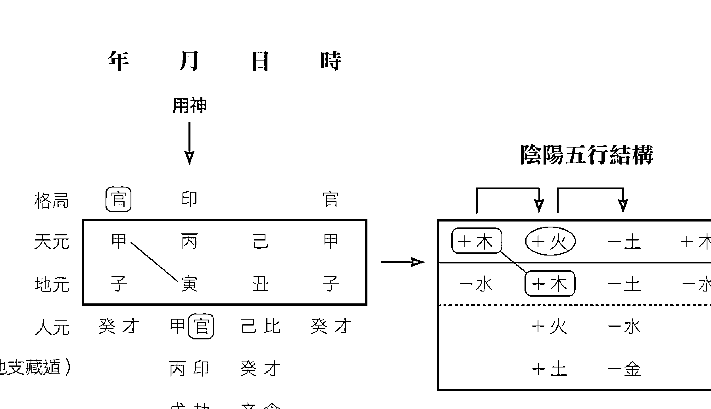

## 命例2 乾造：［清］刘墉

先看月令提纲，其中本气是甲木正官，它透出於年干，故取为正官格。也就是说，在这个八字结构中，除日干之外，甲木正官是此环境中的主导力量。同前钱穆命造一样，根据「善而顺用之」法则，与之相配合的「用神」可以有两种选择： (1) 取财来生官；或者 (2) 取官来生印。这时，就要了解日主本身的强弱。如果日主身强，则取 (1) ：用财来生官，即起到「生格功能」。此时，正官为格，财为用神。如果日主身弱，则取 (2) ：正官为格，正印为用神。用官来生印，印再生自身。这就是通过印来宣泄官的能量，即是发挥正官力量，强化自身；同时也起到它的「护格功能」。因为印能克制伤食，保护正官。

观察这个八字，己土生於正月，是木旺土衰之时，八字中仅有丑土为其根基，势力孤单，显然属於第 (2) 种情况。所以，应当取月干丙火正印为用神。於是，构成了官印相生的良好顺生格调。这是成功的官印相生格。

## 格局「高低」的评判

上面列举了两个命例，都是正官格。现在，我们来比较两者的「高低」。先说格局的高低。

构成格局的主要因素是结构中的主导势力，我们要求它「单纯」、「有力」。

单纯，就是命理学中常说的「清」。「清」是跟「浊」相对的。就如上面的八字，主导势力是正官，就不要再混入七杀。如果正官和七杀都有，就是「官杀混杂」，尤其是都显现在天干上，就变「浊」了。刘墉命造干支只有正官，没有七杀，所以十分单纯，好像金刚钻石没有一点瑕疵。而钱穆命造日主坐下有寅木七杀。尽管瑕不掩瑜，但与刘造相比，则略有逊色。

其次是「有力」。刘墉命造正官甲木通根於提纲月支寅木，是月令当旺之气，十分有力。钱穆命造正官乙木则通根於未土所藏之气（墓气）。就有力程度来讲，钱造则还是稍嫌不足。

此外，刘墉命造，月令地支所有成分——本气寅木、附属之气丙火和戊土，都透出天干，可谓「真神」得用。这是加分的。当然，天干透出两甲，有重官之嫌，则又有损清纯之气。

在格局方面，两造都很优秀。若要评分的话，国学大师比起“太平宰相”似乎略输一筹。

## 再评用神的高低

简单说，也有两条标准：一是「有力」，一是「有情」。

以此标准来评价这两个命造：钱造身强官弱，壬、癸水为用神，生扶官星；刘造官强身弱，丙火印星化官生身，以此而言，两造用神都很完善。若要进一步细细较量，刘造丙火正印根植於月令，其力气盛饱满；钱造虽干头呈露壬、癸雨水，但都虚透无根，相比之下，又较逊色了。

格局研究是书房派的「强项」，不断精益求精，佳作迭出，曾经是命理学的主流。它对于评判命主在社会上的功名地位，积累了丰厚的推算经验。只是在目前的大众社会里，它慢慢消退了其昔日的风采。

关于八格及建禄、劫刃格的基本特征和成败条件，可以参阅拙作《八字命理学基础教程》「格局述要」。

### 注释

- (1) 《渊海子平.正官论》。
- (2) 《渊海子平.五言独步》。
- (3) 一般认为，羊刃既是「禄前一位」，在阳干名「阳刃」；在阴干则为「阴刃」。《三车一览》解释说：“羊，言刚也。刃者，取宰割之义。禄过则刃生，功成当退，不退则过越其分，如羊之在刃，言有伤也。故羊刃常居禄前一位。”因此，阴干之刃则为：乙在辰，丁、己在未，辛在戌，癸在丑，即阴干的“冠带”之位。阳干之气以进为生旺，阴干之气以退为生旺，故阳干之羊刃在“帝旺”，阴干之羊刃在“冠带”。但《渊海子平》显然不主张阴干有刃之说。
- (4) 《渊海子平.宝法第一》。
- (5) 以下摘自郑伟雄《子平正源》，16-17页。
- (6) 现在一般把七杀、伤官、枭印和羊刃四者列为「不善」者。
- (7) 由于《子平真诠》用「用神」称「格局」（用事之神），因此用「相神」来指称实际意义上的「用神」。这是我们读《子平真诠》时应当注意的。
- (8) 取自钟义明《现代破译「滴天髓」》：“刘墉 嘉庆八年十二月二十八日（1804年2月9日）子时生。”，“这个刘墉不是中视周日八点档连续剧《宰相刘罗锅》的主角——那个鸡胸、驼背的刘墉（山东诸城人，1720-1805）。此‘墉’非彼‘墉’也。”（215-216页）

## 第六章 形象分析

本章要讨论结构分析的第四个视角——形象分析。这是一个相对比较特殊的分析视角。并不是所有的八字都呈现出一些比较特殊的形象特征，适合于做形象的分析。传统格局研究中的特殊格（或称「变格」），往往是具有特殊形象的八字结构，它们是形象分析的一个重要内容。

### 专旺格

在传统命理学中，八字命局可以分为两大类：正格和变格，或称普通格和特殊格。正格反映的是五行常规的变化；如果五行出现了「偏胜」，就落入了变格的范畴。诚如民国命理大师徐乐吾所说：

> 格局有正、有变。正者，五行之常规；变者，五行有所偏胜。然万变而不离其宗者：五行之理也。《子平真诠》明其常；《滴天髓》明其变。

我们在前一章里讨论的是正格，可以说，《子平真诠》代表了正格研究的高峰；现在讨论变格，往往是从《滴天髓》中获得方法论的启迪，可惜这本经典因其运思和文字的曲折艰深，往往难住了许多研究者。

以下清代李鸿章的八字常被作为专旺格的经典案例：

| 格局 | 年 | 月 | 日 | 时 |
|---|---|---|---|---|
|  | 日 | 劫 | 才 |  |
| 天元 | 癸 | 甲 | 乙 | 己 |
| 地元 | 未 | 寅 | 亥 | 卯 |
| 人元 | 己才 | 甲劫 | 壬印 | 乙比 |
| (地支藏遁) | 丁食 | 丙伤 | 甲劫 |  |
|  | 乙比 | 戊财 |  |  |
| → 阴阳五行结构 |  |  |  |  |
| -水 | +木 | -木 | -土 |  |
| -土 | +木 | +水 | -木 |  |
| -火 | +火 | +木 |  |  |
| -木 | +土 |  |  |  |
（注：图中包含合、合木局、合木等关系标注）

## 命例3 乾造：[清] 李鸿章（1823-1901）

观察其八字，可以清楚地看到，由天干甲乙、地支亥卯未（合木局）以及寅（寅亥合木），凝聚成完整的木的「形象」。年干癸水，为木之印绶；水生木，水木气势，同声相应。而且寅月正是万木竞秀的时光。唯有时干己土，为日干乙木偏财，是整个结构中「不和谐」的地方。所幸者，月干甲木，克合己土，使结构重归「纯真」。故徐乐吾先生将此命造称之为「格之纯粹者也」，是有道理的。

再看一个古代案例——张真人命造：

| 格局 | 年 | 月 | 日 | 时 |
|---|---|---|---|---|
|  | 比 | 劫 | 财 |  |
| 天元 | 戊 | 己 | 戊 | 癸 |
| 地元 | 戌 | 未 | 辰 | 丑 |
| 人元 | 戊比 | 己劫 | 戊比 | 己劫 |
| （地支藏遁） | 辛伤 | 丁印 | 乙官 | 癸财 |
|  | 丁印 | 乙官 | 癸财 | 辛伤 |

| 阴阳五行结构 |  |  |  |
|---|---|---|---|
| [+土] | [-土] | [+土] | [-水] |
| [+土] | [-土] | [+土] | [-土] |
| [-金] | [-火] | [-木] | [-水] |
| [-火] | [-木] | [-水] | [-金] |

## 命例4 乾造：张真人

八字日干戊土，年月天干透出戊、己土，地支辰戌丑未合成土局，唯一透出的时干癸水，也被日主合去（戊癸合），全局是一个纯粹的土象。这也是一个一行独旺的专旺格。

由此可见，专旺就是所谓「独象」，是指八字结构基本是由某一种五行（包括日干在内）所组成，故也称「一行得气格」。既然“地有五行”，故有五种专旺格：曲直格（木）、炎上格（火）、稼穑格（土）、从革格（金）和润下格（水）。显然，以上李鸿章命造是曲直格；张真人命造是稼穑格。

诚如任铁樵所指出：专旺格“皆从一方之秀气，不同六格之常情，必要得时当令，遇旺逢生。但体质过于自强，须以引通为妙，而气势必有所阙，务须审察其情。”(4)可见，由于专旺格的特点是八字某一五行得时当令，特别旺盛，因此就不能“逆”着来，抗其旺势了。换言之，不能再按正格以求取五行平衡为宗旨了。

> “诚如任铁樵所指出：专旺格‘皆从一方之秀气，不同六格之常情，必要得时当令，遇旺逢生。但体质过于自强，须以引通为妙，而气势必有所阙，务须审察其情。’”

怎么办？只能是「顺应」其势，取最旺之物为格，取旺神（比肩、劫财）与旺神所生之物（即食神、伤官）为用神，同时也取生旺神之物（即印星）做喜神。由于命局一行独旺，必须有食神、伤官来宣泄日主的旺气。故《滴天髓》强调说：“独象喜行化地，而化神要昌。”这化神就是食神、伤官，通过食伤来疏通其旺气，使其源远流长，从而造就富贵之高峰。如果命局中没有食伤来流通其气息的话，其富贵也就有限了。(5)

### 从旺格

还有一种八字结构情况称为「从旺格」。它与专旺格正好相反。如果说，专旺格在日主强弱等级上处于“极强”一端，而从旺格正好处於此强弱等级的“极弱”一端。《滴天髓》把这种情况称为「从象」。这是指八字结构中，全局气势偏旺一方，而独有日干逆其旺气，而且无生无助，於是不得不舍身还就，弃命向从，由此构成了「从旺格」（也称「从强格」或「弃命从强格」）。

比如以下任铁樵注《滴天髓》中的命例：

| 年 | 月 | 日 | 时 |
|---|---|---|---|
| 财 | 伤 |  | 伤 |
| 戊 | 丙 | 乙 | 丙 |
| 戌 | 辰 | 未 | 戌 |
| 戊财 | 戊财 | 己财 | 戊财 |
| 辛杀 | 乙比 | 丁食 | 辛杀 |
| 丁食 | 癸印 | 乙比 | 丁食 |

| 阴阳五行结构 |  |  |  |
|---|---|---|---|
| +土 | +火 | -木 | +火 |
| +土 | +土 | -土 | +土 |
| -金 | -木 | -火 | -金 |
| -火 | -水 | -木 | -火 |

命例5 乾造：从财格古例(6)

在这个八字结构中，地支皆为财（土），年干又透出正财，而月干、时干皆为丙火伤官，伤官又生财，其财势何其旺也。而日干乙木，孤立无援，只能放弃自己去随从土之旺势。因为土已汇集了一个「形象」。跟专旺格相反，日主此时只能弃命从势，所以，从旺格也称「弃命从旺格」。这里弃命从财，故为从财格。

在八字结构中，除日主外，其他成分都可能构成强势，如伤食，如财星，如官杀。因此，根据结构中强势的十神类别，可以形成从儿格（即从伤食星）、从财格、和从杀格。还有一种，虽然不是单独的一种势力，但由日主异方的几种成分共同构成一种强势，使日主不得不从，这种情况称为「从势格」。

> “从得真者只论从，从神又有吉和凶。”“真从之象有几人？假从亦可发其身。”

这里，一方面指出了，在从格中，日主所迁就、所从的那个强势主体，构成了八字的主体形象，所以日主只能跟随这个强势主体，以强势主体为自己的用神。故跟专旺格一样，从旺格也必须遵循「顺应」的原则，只是现在顺应的对象变了，不是日主自己所属的强势集团，而是结构中非日主的强势集团。

同时，《滴天髓》也提醒研究者，对于这类八字，由於原局的纯粹度、干支性情、时令的宜忌及行运的顺逆情况，还得十分慎重地判断其利弊。事实上，纯粹而完美的从旺格是很稀少的。常见的富贵命，大都是带有瑕疵的从财格、从杀格等。然而，这种八字，只要在行运中消除缺点，也可以表现出极大的成功来。

### 「强势」形象

除了上述专旺格和从旺格之外，事实上，八字中还有不少严格意义上讲并不属於特殊格的八字结构，但却具有一定「强势」（即一股强盛的气势），也需要用形象视角来予以分析。比如，曾为民国时期著名政治家，皖系军阀首领的段祺瑞命造。在徐乐吾所著《命理一得》中，段祺瑞八字为：

| 年 | 月 | 日 | 时 |
|---|---|---|---|
| 比 | 才 | 日 | 印 |
| 乙 | 己 | 乙 | 癸 |
| 丑 | 卯 | 亥 | 未 |
| 己才 | 乙比 | 壬印 | 己才 |
| 癸印 |  | 甲劫 | 丁食 |
| 辛杀 |  | 禄 | 乙比 |
|  | 合木局 |  |  |

| 阴阳五行结构 |  |  |  |  |
|---|---|---|---|---|
| 一木 | 一土 | 一木 | 一水 |  |
| 一土 | 一木 | +水 | +土 | 本气 |
| 一水 |  | +木 | 一火 |  |
| 一金 |  |  | 一木 |  |

命例6A 乾造：段祺瑞（1865年3月6日未时生） (7)

这是一个构成「独象」的曲直格（木）。乙木生于仲春建禄之地，地支有亥卯未木局，且时干有癸水生扶。唯月干有己土偏财透出，不利木势，但有双乙左右克之。然而生于丑年，“而丑为金之分野，有脱离祖基，别创局面之象”，“惟曲直不纯，” (8)故稍有瑕疵。

然而，据吴廷燮所撰《段祺瑞年谱》记载：“清同治四年乙丑二月初九日午时公诞生於安徽合肥。” 因此，段祺瑞应该早一个时辰出生，其八字为：## 命例6B 乾造：段祺瑞（1865年3月6日午时生）

于是，这个八字就很难再称之为属于专旺范畴的曲直格了。然而，虽然提早了一个时辰，时柱换了壬午，八字结构内部的水木强势并没有多大改变。三个木（两个乙木植根于月令卯禄），两个水（壬水植根于亥禄），再加上一个午火宣泄强木之气，而己土偏财依旧遭双乙克制。查其真实运途情况，与前面专旺格的看法并没有根本的差异，还是喜水木「顺势」，忌土金破局。谓予不信，可以检点其主要政途经历：

### 大运

| 1865年 | 1875年 | 1885年 | 1895年 | 1905年 | 1915年 | 1925年 | 1935年 |
| :--- | :--- | :--- | :--- | :--- | :--- | :--- | :--- |
| 1岁 | 11岁 | 21岁 | 31岁 | 41岁 | 51岁 | 61岁 | 71岁 |
| 戊 | 丁 | 丙 | 乙 | 甲 | 癸 | 壬 | 辛 |
| 寅 | 丑 | 子 | 亥 | 戌 | 酉 | 申 | 未 |

段祺瑞是袁世凯小站练兵时的主要骨干。段是1903年（亥运癸卯年）加入的，与冯国璋、王士珍并称为“北洋三杰”。袁世凯死后，北洋军阀集团分裂为直系和皖系，段为皖系军阀首领，于1916年至1920年、以及1924年至1926年，两次控制北京政府，任国务总理、执政府执政等职，是北洋军阀统治时期政治舞台上的重要人物。

查1916年至1920年，段氏是在癸水大运（2015年5月至2020年5月）。1920年，直奉两系结成反段联盟进攻皖系，皖军大败。7月19日，段祺瑞被迫辞职。此年庚申，已入酉运（2020年5月至2025年5月）。1924年甲子，10月23日冯玉祥发动北京政变，推翻大总统曹锟，先邀请孙中山北上，后与奉系妥协，请段祺瑞出山，任中华民国临时政府的临时执政。然而，1926年丙寅，发生了“三一八”惨案，4月9日段祺瑞被冯玉祥驱逐下台，退居天津租界当寓公。这还是在酉运。段祺瑞病逝于1936年11月2日，终年71岁。此年丙子，在刚跨进辛未大运不久。

固然，辛未运与段氏八字年柱乙丑天克地冲，流年丙子与时柱壬午天克地冲。是年段氏病逝。但根本原因还是辛金出干，破了乙木之势。纵观其政坛叱咤风云的时候，大多在水木运中，而见金则多为风雨飘摇，诸多不利。可见具有「强势」形象的八字，跟特殊格八字在处置上没有大的差别。

正是鉴于这样的原因，笔者提出「形象」这个分析视角，来处理具有「强势」形象的八字，而传统命理学中的变格、或特殊格（包括专旺和从旺）只是其中的一部分。笔者觉得，《滴天髓》提到的「两气合而成象，象不可破也。」过去一直被解释为「两神成象」或「两行成象」（即两种五行各占二干二支，没有其他五行混杂的八字），是误解了《滴天髓》的原意。这里的「两气合而成象」并不一定是指对等的两行。它们构成相生关系，在数量上也不一定要均等，只要能构成「强势」就可以了。既然已成形象，那只能顺其气势而为，不可轻易违逆其势。

前些日子看到一个「富婆」的八字，也具有特殊形象。八字如下：

年 月 日 時
食 劫 印
戊 丁 丙 乙
申 已 戌 未
庚才 丙比 戊食 己傷
壬殺 庚才 辛財 丁劫
戊食 戊食 丁劫 乙印
合 刑

陰陽五行結構
+土 -火 +火 -木
+金 +火 +土 -土 本氣
+水 +金 -金 -火
+土 +土 -火 -木

### 大運

1971年 1981年 1991年 2001年 2011年 2021年 2031年
4歲 14歲 24歲 34歲 44歲 54歲 64歲
丙辰 乙卯 甲寅 癸丑 壬子 辛亥 庚戌

## 命例7 坤造：「富婆」（1968年5月16日未时生）

这个八字构成的具体形象可以图示如下：

这个八字是火土成势。具体来说，从时干乙木起源头，乙木生左侧丙丁火（倒也构成了「地上三奇」乙丙丁），火向下扩展到月支巳火。接着，干头丁火又生年干戊土，同时地支巳火，生右侧戌未土。于是命局火土成了大势。这时，一个重要现象出现了：年干戊土向下生年支申金偏财；同时巳火向左克合申金。巳本是日主丙火之禄，可以看作日主自己的延伸。从「象」上看，火土积聚了大量能量灌输到申金偏财，同时作为日主延伸的巨手——巳禄，通过合克，又一把将此财产抢握在自己手中——以禄制财。由此构成了一幅生动的命主生财、夺财的画面。此女人的先天「时空基因」已经注定她会有一个「不寻常」的财富生涯。

其实，命主出生在农村寻常人家，没有受过多少教育，只是赶上了中国改革开放的好时光，家乡成了当地省级政府的致富样板地。于是，从癸亥运起下海从商致富，似乎什么都干过：做小商品产销，开砖厂做砖瓦，倒卖字画，金融借贷，不一而足。丑运最佳，积累财富几个亿。命理上的原因是日主坐库戌土去刑开了丑运财库，于是一发冲天。然而，壬子运中甲午年，岁运交战，被合作姐妹坑了巨额贷款，至今还陷在追讨的官司中。从命理角度讲，子运合了申金，成了半个水局，「逆」了命局的火土旺势，焉能太平？现在只有期待接下来的辛金运，再启财源，重上层楼。

## 浅谈「制局」

> 这里，笔者想起许多年前在尤达人著的《达人知命四十年》上读到的一个真实的八字故事：

这是1936年，在汕头近郊，几个朋友一起探讨八字。对一位姓蔡的小学教师的八字，尤达人发表了意见。他说：「将来乙运必发，发得不小，丑运必破，破得清光。」

右页是这位蔡先生的八字：

| 年 | 月 | 日 | 时 |
| :--- | :--- | :--- | :--- |
| 印 | 比 |   | 食 |
| 戊 | 辛 | 辛 | 癸 |
| 申 | 酉 | 巳 | 巳 |
| 庚劫 | 辛比 | 丙官 | 丙官 |
| 壬伤 |   | 庚劫 | 庚劫 |
| 戊印 |   | 戊印 | 戊印 |
| 禄 |   |   |   |

| 阴阳五行结构 |   |   |   |
| :--- | :--- | :--- | :--- |
| +土 | -金 | -金 | -水 |
| +金 | -金 | +火 | +火 | 本气 |
| +水 |   | +金 | +金 |
| +土 |   | +土 | +土 |

### 大运

| 5岁 | 15岁 | 25岁 | 35岁 | 45岁 | 55岁 |
| :--- | :--- | :--- | :--- | :--- | :--- |
| 壬 | 癸 | 甲 | 乙 | 丙 | 丁 |
| 戌 | 亥 | 子 | 丑 | 寅 | 卯 |

## 命例8 乾造：蔡先生（戊申年八月二十八日巳时生）

蔡先生当时说：

> 「一个清寒的教书先生，怎么会发财，而且发得不小。既然发了财，怎么会破，而且破得清光。」

尤达人的理由是：因为乙运是辛癸乙循序相生，身旺任财，宜其骏发致富。丑运是巳酉丑会劫局，身旺忌劫，故会破得清光。

当时其他人说，既然乙运既发，以后丙寅、丁卯东方运也应是好运。只有尤达人一人力持异议，说道：

> 「好景不常，盛宴难再。」

结果呢？抗战爆发后，蔡先生到大后方，因人介绍，当了一个田赋分处主任，居然不到几年就赚了数逾百万港币的财富，这正是他走乙运的时候。后来，为了防「劫」，他干脆辞了主任的职务，回到家乡，对赚来的财产做了妥善的安置。没有想到1949年解放军解放了潮汕地区。蔡先生1950年辗转逃亡到香港。当年流年庚寅，干头透「劫」，地支寅申相冲，财产统统被清算了。不仅乙运赚来的钱财，连祖上留下的田产、祖屋都清光了。尤达人10年前的「丑运必破，破得清光」不幸而言中了。以后20年，只是在工厂做职员，再也没有重振雄风的机会了。

关于这个命例，当时读了以后印象颇深。尤达人先生是从日主旺衰和地支会局来分析的。现在来看，它就是一个今天「盲派」所谓的「制局」问题。八字结构中没有木，即没有财，而日主建禄身强，时干有又食神吐秀。一旦大运出现乙木偏财，天干辛金动员起来，正好把乙木制个干净；局中本来就有戊土正印，把乙木的原神癸水也一同制去了。所以这财就大了。自然，过了乙运，地支会成劫局，又回到原地去了，一场戏剧谢幕，「盛宴难再」。

写到这里，想到《八字命理学动态分析教程》附录中王先生「专旺格漫谈」中例所举的一个成功的企业家的八字：

| 年 | 月 | 日 | 時 |
| :---: | :---: | :---: | :---: |
| 官 | 才 |  | 印 |
| 乙 | 壬 | 戊 | 丁 |
| 巳 | 午 | 午 | 巳 |
| 丙  P  | 丁 印 | 丁 印 | 丙  P |
| 庚 食 | 己 劫 | 己 劫 | 庚 食 |
| 戊 比 |  | 戊 比 | 戊 比 |
| 祿 | 刃 | 刃 | 祿 |

| 陰陽五行結構 |  |  |  |
| :---: | :---: | :---: | :---: |
| −木 | +水 | +土 | −火 |
| +火 | −火 | −火 | +火 |
| +金 | −土 | −土 | +金 |
| +土 |  |  | +土 |
| 本氣 |  |  |  |

### 大运

+   - 1974年 9歲 辛巳
- 1984年 19歲 庚辰
- 1994年 29歲 己卯
- 2004年 39歲 戊寅
- 2014年 49歲 丁丑
- 2024年 59歲 丙子

## 命例9 乾造：著名企業家（1965年7月3日巳時生）

这个八字也是具有特殊形象的，可以图示如下：

图6.2 命例图解（命例9）

它具有火土强势。从源头看，年干乙木生坐下巳火，地支巳、午、午、巳，皆是日主戊土之禄、刃，它们构成一片火海。时干再透出丁火，生日主戊土。真是火炎土燥。所幸的是，壬水独踞月干，可以润局，有调候之功。然而，水火无情，相激难容。这时，时干丁火遥合壬水，以熊熊火势，反制其财，构成了大富的局面。这是这个八字的画龙点睛之处。同时地支两巳两午，虚邀亥、子之水，为壬财之根基。这正是王先生在文中所分析的。

然而，这个八字也有隐患。每逢亥、子流年，这个虚邀的壬水之禄、刃得到「填实」，一旦坐实，便出现「反局」。旺水「破」了现存八字的火土强势。于是「灾情」接踵而来。这也为其人创业过程中几次大的起落经历所证实。

今年又到了亥、子「周期」，希望这位企业家朋友没有大的风波。

这里又要谈到《滴天髓》这本经典了。《滴天髓》在「四柱总论」中有個「众寡论」。其原文是：

> 强众而敌寡者，势在去其寡；强寡而敌众者，势在成乎众。(9)

徐乐吾先生在《子平一得》中对此做了解释：

> 四柱气势偏旺一方者，以顺其旺势为用，如有一二点逆旺气之神，必以去之为美。此逆气者在日干，即是从格；在年月时干，则为强众敌寡，势在去其寡。其理一貫相通也。(10)

仔细琢磨《滴天髓》的原意和徐先生的解释。《滴天髓》的原意是：（1）我方为强势，对方为弱势，则「去其寡」——制尽对方；（2）我方为弱势，对方为强势，则「成乎众」——顺势相助对方。

其中（2）所指的是前文讲述过的从旺格；而（1）所述的情形，正是这里讨论的情况。以上这位企业家的八字正是「强众而敌寡者，势在去其寡」，就是要制尽局中壬水财神，成就大事业。这跟《段氏理象学》中提出的「盲派」「追捕」原理也是相通的。

段氏所谓的追捕原理是：

> 当命局出现制局做功的情况下，被制的一方因相对孤立，而制方成党成势十分强大，这种情况下我们一般称这类制局为净制。制方称捕神，被制方称贼神。就像警察抓小偷一样，警察特别强的时候，如果小偷特别少，或者没有小偷，警察就没有用武之地。他就希望小偷出现，一出现正好就被他抓住，就可以体现他的价值。这是追捕的原理。(11)

警察是不怕小偷出现的，甚至希望多出现些小偷，让他们透露出警察的威风来。因此小偷多，并不可怕，反而体现了警察治安的能力。

然而，这位企业家的八字（命例9），也是有强大的警察队伍，围剿着「小偷」，然而一旦这个小偷（壬水）去勾结了「土匪」（亥、子旺水），则警察就未见的能解决得了。通过上述案例的分析，显然，「制局」成功与否，还是要对具体环境条件细加分析后才能下结论。

## 附：神煞举要

在第二章介绍命理学史的时候，我们提到过「神煞」。所谓「神」，是吉星；「煞」，是凶星。神煞是很早就流传的一种星宿照命和神煞入命的观念。把天上星宿、神煞跟人的命运联系起来，是出于古代人对星和神的崇拜心理。

神煞本身不是一种稳定的系统。究竟有多少个神煞？很难说清楚。它们随着岁月的流逝，自生自灭，自然淘汰。吴俊民《命理新论》中曾列出了一百九十余种名目。这里，我们选择一些目前还较常使用的神煞，(12)列表如下，供研究者参考：

### 表6.1 以日柱天干为主，见年、月、日、时地支者：

| 日干 | 甲 | 乙 | 丙 | 丁 | 戊 | 己 | 庚 | 辛 | 壬 | 癸 |
| :--- | :--- | :--- | :--- | :--- | :--- | :--- | :--- | :--- | :--- | :--- |
| 天乙贵人 | 丑未 | 子申 | 亥酉 | 亥酉 | 丑未 | 子申 | 丑未 | 午寅 | 巳卯 | 巳卯 |
| 文昌 | 巳 | 午 | 申 | 酉 | 申 | 酉 | 亥 | 子 | 寅 | 卯 |
| 干禄 | 寅 | 卯 | 巳 | 午 | 巳 | 午 | 申 | 酉 | 亥 | 子 |
| 羊刃 | 卯 | 辰 | 午 | 未 | 午 | 未 | 酉 | 戌 | 子 | 丑 |
| 红艳煞 | 午 | 申 | 寅 | 未 | 辰 | 辰 | 戌 | 酉 | 子 | 申 |

比如日干甲，见四柱地支有丑或未，则丑或未为「天乙贵人」；见巳，则为「文昌」；见寅，则为「干禄」；见卯，则为「羊刃」；见午，为「红艳煞」。关于天乙贵人、文昌、干禄、羊刃和红艳煞的命理涵义如下：

- 天乙贵人：吉神，主聪敏智慧，易近贵人。
- 文昌：吉神，主聪明过人，凡事逢凶化吉。
- 干禄：吉神。禄是俸禄，是养命之源。禄在年支，叫做岁禄；禄在月支，叫做建禄；禄在日支，叫做专禄；禄在时支，叫做归禄。一律均怕入空亡或犯冲。
- 羊刃：羊，有时写作「阳」，是刚的意思。刃即刀刃，是宰割的意思。羊刃比禄更强旺有力，主刚烈招祸，属凶煞。有的书主张，五阳干有刃，五阴干无刃。
- 红艳煞：主浪漫、色情。

### 表6.2 以日柱地支为主，见年、月、时地支者：

| 日支 | 子 | 丑 | 寅 | 卯 | 辰 | 巳 | 午 | 未 | 申 | 酉 | 戌 | 亥 |
| :--- | :--- | :--- | :--- | :--- | :--- | :--- | :--- | :--- | :--- | :--- | :--- | :--- |
| 将星 | 子 | 酉 | 午 | 卯 | 子 | 酉 | 午 | 卯 | 子 | 酉 | 午 | 卯 |
| 华盖 | 辰 | 丑 | 戌 | 未 | 辰 | 丑 | 戌 | 未 | 辰 | 丑 | 戌 | 未 |
| 驿马 | 寅 | 亥 | 申 | 巳 | 寅 | 亥 | 申 | 巳 | 寅 | 亥 | 申 | 巳 |
| 桃花 | 酉 | 午 | 卯 | 子 | 酉 | 午 | 卯 | 子 | 酉 | 午 | 卯 | 子 |
| 劫煞 | 巳 | 寅 | 亥 | 申 | 巳 | 寅 | 亥 | 申 | 巳 | 寅 | 亥 | 申 |
| 亡神 | 亥 | 申 | 巳 | 寅 | 亥 | 申 | 巳 | 寅 | 亥 | 申 | 巳 | 寅 |

- 将星：主有领导能力，可掌权柄。
- 华盖：主性情恬淡，资质聪颖，但难免孤独，易倾向哲学、宗教。
- 驿马：主迁动。古代驿为传送官府文书的机关，驿马是传递官文书的交通工具。所以驿马通常代表动态。驿马可吉可凶，视与原局五行配合论断。
- 桃花：又名咸池，主风流酒色。
- 劫煞：劫者，夺也。自外夺之谓之劫。多是非破财。
- 亡神：亡者，失也。自内失之谓之亡。易是非官讼。

### 表6.3 以年柱地支为主，见月、日、时地支者：

| 年支 | 子 | 丑 | 寅 | 卯 | 辰 | 巳 | 午 | 未 | 申 | 酉 | 戌 | 亥 |
| :--- | :--- | :--- | :--- | :--- | :--- | :--- | :--- | :--- | :--- | :--- | :--- | :--- |
| 孤辰 | 寅 | 寅 | 巳 | 巳 | 巳 | 申 | 申 | 申 | 亥 | 亥 | 亥 | 寅 |
| 寡宿 | 戌 | 戌 | 丑 | 丑 | 丑 | 辰 | 辰 | 辰 | 未 | 未 | 未 | 戌 |

命带孤辰、寡宿，六亲缘薄。男命不喜带孤辰，较易孤独；女命不喜带寡宿，容易夫早别离。

### 表6.4 以月柱地支为主，见日干或日支者：

| 月支 | 子 | 丑 | 寅 | 卯 | 辰 | 巳 | 午 | 未 | 申 | 酉 | 戌 | 亥 |
| :--- | :--- | :--- | :--- | :--- | :--- | :--- | :--- | :--- | :--- | :--- | :--- | :--- |
| 天德 | 巳 | 庚 | 丁 | 申 | 壬 | 辛 | 亥 | 甲 | 癸 | 寅 | 丙 | 乙 |
| 月德 | 壬 | 庚 | 丙 | 甲 | 壬 | 庚 | 丙 | 甲 | 壬 | 庚 | 丙 | 甲 |

- 天德贵人：最大安详之福星。主贵显、仁慈、敏慧、温顺，逢凶化吉，终身吉祥。较易接近宗教。
- 月德贵人：安详福寿两全之星，为人多仁慈，万事呈祥。

### 表6.5 以年柱、日柱六甲干支见地支者：

| 六甲旬 (年干支或日干支) | 空亡 |
| :--- | :--- |
| 甲子 乙丑 丙寅 丁卯 戊辰 己巳 庚午 辛未 壬申 癸酉 | 戌、亥 |
| 甲戌 乙亥 丙子 丁丑 戊寅 己卯 庚辰 辛巳 壬午 癸未 | 申、酉 |
| 甲申 乙酉 丙戌 丁亥 戊子 己丑 庚寅 辛卯 壬辰 癸巳 | 午、未 |
| 甲午 乙未 丙申 丁酉 戊戌 己亥 庚子 辛丑 壬寅 癸卯 | 辰、巳 |
| 甲辰 乙巳 丙午 丁未 戊申 己酉 庚戌 辛亥 壬子 癸丑 | 寅、卯 |
| 甲寅 乙卯 丙辰 丁巳 戊午 己未 庚申 辛酉 壬戌 癸亥 | 子、丑 |

这是由年干支或日干支查周围地支中是否有入空亡者。空亡，就是没有、消失的意思。天干仅十干，地支有十二支，因此，每十个天干配上地支之后，地支剩余的二支，则为空亡。

比如，甲子旬（以甲子为首的顺序十个干支）中没有戌、亥，所以，戌、亥为空亡。命中所忌的地支，若带空亡反为吉；命中所喜的地支，若带空亡则为凶。带有空亡的地支，若与他支合，则无妨；有相冲的地支，遇空亡可以解冲。年、月、日、时地支所主的人事，如带空亡，必不得力或难以成功。但若有三者皆入空亡，反主大贵。

### 表6.6 以年月日时天干见者：

| 天上三奇 | 地上三奇 | 人中三奇 |
| :--- | :--- | :--- |
| 甲 戊 庚 | 乙 丙 丁 | 壬 癸 辛 |

以日主为主，到年为顺者，主贵，如甲日、戊月、庚年；以年为主，到日为逆，主富，如甲年、戊月、庚日。物以奇为贵，三奇为贵人。

### 表6.7 以日柱干支见者：## 第七章 動態：大運和流年

又要回到前文我們對命運做出的比喻：「命」是車，「運」是車經過的道路。從第四章到第六章，我們一直在「考量」這輛車子，用多視角的方法，剖析這輛車子的內部結構，找出它所屬的種類和主要性能。現在，我們要開始考察路況了。如果說前者是靜態研究，現在就是動態研究。因為路途既是連續的，又是一程一程的。在命理學中，刻畫動態的過程，主要有「大運」和「流年」。一個大運是十年；流年即是每一年。它如流水，一年接着一年。它們都是由六十甲子中的一組干支來標記的。

### 大運和流年

要考察動態的「運」，首先要排出命造的大運和流年來。其實，我們在前章命例7「富婆」和命例9企業家的八字討論時都已經羅列了他們的大運。

大運是從八字結構中的月柱推導出來的。推導之前，先要確定是「順行」還是「逆行」。順行或是逆行的法則是：陽男陰女順行，陰男陽女逆行。所謂「陽男陰女」指的是：男命出生於年干為陽的年份，名為「陽男」（即男命生於年干為甲、丙、戊、庚、壬的年份）；女命生於年干為陰的年份，名為「陰女」（即女命出生於乙、丁、己、辛、癸的年份）。反之，「陰男」是指男命出生於年干為陰的年份；「陽女」是指女命出生於年干為陽的年份。

接着，就可以推大運了：陽男陰女，大運從月柱干支順推；陰男陽女，大運從月柱干支逆推，由此排除大運的干支序列。

比如，命例7「富婆」八字——戊申，丁巳，丙戌，乙未。年柱「戊申」，戊為陽土，因此是「陽女」，故大運從月柱「丁巳」逆推，第一步為「丙辰」，第二步為「乙卯」，……循序羅列。

再如，命例9企業家八字——乙巳，壬午，戊午，丁巳。年柱「乙巳」，乙為陰木，因此是「陰男」，故大運從月柱「壬午」逆推，第一步為「辛巳」，第二步為「庚辰」，……也是循序羅列。

再下去是求出大運的起始點。順推者，按出生的時間順序數至未來的節氣（不是「中氣」），「拆除乃三日為一岁」，得到大運的起始時間；逆推者，則從出生時間倒推、數至已過的那個節氣，也是「拆除乃三日為一岁」，得到大運的起始時間。無論大運是順行還是逆行，每一柱干支管十年。

這樣，命例7出生於1968年5月16日未時。當年立夏是5月5日18時56分，芒種是6月5日23時19分。因為是逆推，從16日未時倒數至前一節氣立夏5日酉時，然後除以3，約數為3，所以是3歲起運；若更精確的講，是出生後3年7個月2天2小時，即1971年12月18日15時交運。

同樣，命例9出生於1965年7月3日巳時。當年芒種是6月6日6時02分，小暑是7月7日16時22分。也因為是逆推，從7月3日巳時倒數至芒種6月6日卯時，然後除以3，約數為9，所以是9歲起運；更精確的講，是出生後9年零21天14小時，即1974年7月25日0時交運。

至於流年，也稱「太歲」、「歲君」，是按原局年柱干支順序排列出來的。每組干支管一年。比如命例7是1968年5月16日未時出生，年柱戊申即為當年流年，1969年則為己酉流年，1970年是庚戌流年……按序順推就是了。⁽¹⁾

對於大運，命理早期經典《淵海子平》的看法是：大運重地支，流年重天干，即「大運看支，歲君看干」。同時，大運須跟八字結構中日主旺衰相關聯，所謂「干旺宜行衰運，干弱宜旺運。」就是說，日主弱，大運須行幫扶日主的五行；日主強，則大運須走抑制或耗泄日主的五行，這樣方才稱得上是好運。

命理巨著《三命通會》更重申了「大運重地支」的看法。理由是「有東方、南方、西方、北方之辯」。⁽²⁾這是因為在大運中，地支無論順序或逆序，都可能依次出現構成三會方的三個連續成分，比如東方一氣，就是寅、卯、辰三個連續成分，這樣，戴上天干，三柱就是三十年。三十年在人生的旅途中可不是一個短暫的時間，大運地支指示了發展的趨勢，故值得予以重視。

同時，《三命通會》還指出，大運的喜忌應該跟八字內的用神掛起鉤來：對扶持用神的成分，要儘量幫助；同時，對於「損用神者」，即破壞用神的成分，要做出抑制。這也是辨別大運優劣的重要原則。

然而，近幾十年來，命理學界似乎更強調歲運「要一柱一柱地看」。香港朱鵲橋先生說：

> 大運每一柱管十年，流年每一柱只管一年。但歲運有干有支，古時曾經有人把歲運的干支分開來看，即大運每個字管五年，行運先行天干那五年，然後再行地支那五年，干支各自獨立。流年呢，是天干管上半年，地支管下半年。現在幾乎所有書本都同意了：歲運必須一柱一柱地看，而不是干支分割開來逐個字看。⁽³⁾

筆者基本上同意這樣的觀點，尤其是大運跟流年、跟八字結構各柱發生刑沖會合的時候，要干支同時兼顧；但大運的干和支，還是有分別對應於十年大運的前半期（上五年）和後半期（下五年）的區分的。同時，也要兼顧大運地支的方向，因為大運地支確實是以三會方的順序出現的。

### 四柱運限

其實，在八字內部也有一個動態的過程，稱「四柱運限」。只是過去沒有得到充分的重視和應用。

八字結構內部本身含有人一生過程的縮影式的段落。它是以時間的順序來做出安排的：年柱代表幼年和少年；月柱代表青年時期；日柱代表中年時期，時柱代表晚年時期。若更進一步，還可以標出具體的時段，稱為「運限」：

圖7.1 四柱運限

古人一般給八字每一柱分配15年，即年柱為出生至15歲；月柱為16至30歲；日柱為31至45歲，46歲以後的時間就歸於時柱了。這裏，我們根據今天人們的壽命，略加了一年，如上圖所示：年柱為出生至16歲，月柱為17至32歲，日柱為33至48歲，時柱為49歲以後。注意：這裏的運限只是個約數。

對於運限在推命中的應用，可參考拙作《八字命理學動態分析教程》有關章節。

### 案例分析

現在我們可以從八字結構出發，聯繫運限、大運和流年來具體分析一個命例的生命過程。比如，前面例舉過的錢穆先生命造：

| 年 | 月 | 日 | 時 |
| :--- | :--- | :--- | :--- |
| 官 | 財 | 才 |  |
| 乙 | 癸 | 戊 | 壬 |
| 未 | 未 | 寅 | 戌 |
| 己劫 | 己劫 | 甲煞 | 戊比 |
| 丁印 | 丁印 | 丙枭 | 辛傷 |
| 乙官 | 乙官 | 戊比 | 丁印 |
| 衰 | 衰 | 長生 | 墓 |
| 貴人 | 貴人 | 華蓋 |  |
|  |  | 拱刑 |  |

大運

| 1903年 | 1913年 | 1923年 | 1933年 | 1943年 | 1953年 | 1963年 | 1973年 | 1983年 |
| :--- | :--- | :--- | :--- | :--- | :--- | :--- | :--- | :--- |
| 8歲 | 18歲 | 28歲 | 38歲 | 48歲 | 58歲 | 68歲 | 78歲 | 88歲 |
| 壬 | 辛 | 庚 | 己 | 戊 | 丁 | 丙 | 乙 | 甲 |
| 午 | 巳 | 辰 | 卯 | 寅 | 丑 | 子 | 亥 | 戌 |

## 命例1H 乾造：錢穆先生（1895-1990）

首先簡述一下錢穆先生的生平和學術成就。

錢穆先生是現代著名史學家、教育家和思想家。字賓四。1894年生於江蘇省無錫縣。家世清貧，幼時喪父，中學畢業就無力求學。自1911年始任鄉村小學教師，開始教師生涯。同時發奮苦讀，自學成材。他是從鄉土中國走出來的一位史學巨擘。1930年發表《劉向、歆父子年譜》，名聲大噪，經顧頡剛推薦，被聘為燕京大學國文講師，結束了早年求學教書的艱苦年代，開始了以後幾十年的大學教書生涯。歷任北京大學、北平師範大學、西南聯大、齊魯大學、華西大學、四川大學、雲南大學、江南大學教授。

1930年至1949年期間，錢穆把民族憂患意識與自己的學術研究有機結合起來，建立了自己的史學思想體系。代表作有《先秦諸子系年》、《中國近三百年學術史》、《國史大綱》、《中國文化史導論》等。期間，抗戰勝利後，北大復校，散在各地舊的北大同仁都收到信函請返回北京，錢穆沒有得到邀請，故沒有再回北大。1949年南赴香港，1950年與諸友創辦新亞書院，並任院長，開啟了錢穆人生的一個新階段。此後15年，錢穆在極其艱苦困難的條件下，使新亞書院逐漸壯大。他在處理繁重的教務之外，還承擔許多課程，並著有《中國思想史》、《宋明理學概述》、《中國學術通義》等。1965年後，新亞書院與其他兩校合併為香港中文大學。1967年錢穆辭去新亞書院職務後，遷居台北，開始晚年生活。1968年膺選中央研究院院士。1990年在台北逝世，享年95歲。

錢穆著述頗豐，專著多達80種以上。他畢生弘揚中國傳統文化，高舉現代新儒家的旗幟，在大陸、香港、台灣都產生了巨大的影響。

我們來看其八字結構。

誠如前文已經分析的，日主戊土，生於未月。（1）從強弱來看，日主偏強。因為偏強，故喜年干乙木疏此厚土；更喜壬、癸水生助乙木。（2）從調候看，夏季土眾燥熱，幸有干頭壬、癸水顯露，有潤土解燥功能，能生養萬物。（3）再從格局看，乙木正官自月令提綱透出，並自坐木庫，為結構中非日主的主導勢力，故命局取為正官格。相對於日主厚土，官星略嫌柔弱，故喜財來扶官。現月干與時干有壬、癸兩財星，正好可以扶助官星，成就道德文章。（4）若再從形象論，《滴天髓》說：「戊土固重，既中且正，靜翕動辟，萬物司令。」此造戊土日主，四個地支皆有根基，穩定而厚實，確有固重中正之象。

綜合以上分析，正官為格，日主健旺，而官星位置恰當，其人必循規蹈矩，奉公守法，具有高雅氣質和優秀的領導才能。據錢穆先生的高足余英時教授說：

錢穆給人的第一印象是個子不高，但神定氣足，尤其是雙目炯炯，好像把你的心都照亮了。同時他是一位十分嚴肅、不苟言笑的人。跟他打成一片以後，就會發現，他是一個感情十分豐富，而情誼渾厚的人。他與學生交談時偶爾幽默一下也是有的。但是他的尊嚴永遠是在那裏的，使你不可能有一刻忘記。這絕不是老師的架子，絕不是知識學問的傲慢，更不是世俗的矜持。他一切都是自然而然的，這是經過人文教養浸潤以後的那種自然。這也許是中國傳統所謂的「道尊」，或現代西方人所說的「人格尊嚴」。………總之，他是一個感情豐富、情誼渾厚，而又有尊嚴、樸實無華的人。（4）

這正是錢穆命格的活生生寫照！

統觀全局，八字結構中壬、癸兩水為其用神，既可調候，又可鼎助官格。然而兩水虛浮，在地支中皆無根基，因此，這兩個「虛財」不能看作財富，只能解為才華。正是它們使錢穆成為現代學術史上自學成才的楷模。

從四柱運限講，癸水在月柱，壬水在時柱，意味著青壯年時期和晚年有兩個較大的發展機緣。事實上，錢穆第一個人生轉折點在1930年（35歲），在辰運庚午流年。首先，辰為水庫，八字結構中兩個虛浮的水通了根了。其二，流年庚金，使夏天的水有了源頭。據《窮通寶鑑》，夏月壬、癸水都需要金（辛、庚）來開源。其三，辰土財庫沖了局中戌庫，戌為印庫，既是學界揚名、也是升職之象。於是從中小學一步跨入了高等學府。

錢穆人生的第二個轉折點是1949年（54歲），他別妻離子、隻身南下香港，並在1950年創辦新亞學院。這是在戊寅大運。

1943年開始的戊寅運，與日柱戊寅伏吟。伏吟即兩柱干支相同。命書有「反吟伏吟，淚水淋淋」之說。確實，原局土厚，戊運難言好運。抗戰勝利後，由於錢穆與「疑古派」領袖的傅斯年有學術分歧，北大復校，校長胡適在美國，校務由傅斯年代理，錢穆竟不在被邀之列，這恐怕是重要原因之一。雖然錢穆此時已名重士林，然而離開北大，不能不存在內心的遺憾。

1949年錢穆已入寅運，寅為七殺，是戊土之長生，也為土之根基。此年成為錢穆人生的第二個轉折點，跟出現的己丑流年是分不開的。歲干支己丑，跟其八字結構中的年柱乙未、月柱癸未，都構成了天剋地沖，結構動搖不穩。而且己土出干，剋了癸水正財（妻星）；地支丑跟原局未、戌構成了三刑，傷及子女宮，故別妻離子，隻身天涯去，命乎？運乎？

1950年庚寅流年，錢穆開創了新亞書院，並任院長。正官得七殺之輔助，於是身體力行，在艱難困苦的條件下，排除萬難，培養人才。這裏，庚金食神又一次生財滋官。1953年後，錢穆大運轉入北方水地，水為財。新亞書院得到美國雅禮董事會的贊助。不久又得到美國福特基金會的捐助，並在哈佛燕京社的資助下開辦新亞研究所，一時學院的財務困難得到了解決。

1967年（72歲）錢穆告別新亞書院，遷居台灣。1968年遷入素書樓，膺選「中央研究院」院士，1969年任中國文化學院歷史所教授、台北故宮博物院特聘研究員。這時進入了子水大運，子為癸水之祿，局中戌癸合，潤土有情。接着是乙亥運，水木連環，晚年生活安定，專注於講學和著述。

1990年，又是庚午流年，在戌運。寅午戌合為火局，火炎土燥。此時錢穆已95歲高齡。由於台灣黨爭，民進黨以「非法霸佔」之名，要收回錢穆居住的素書樓。此時早已雙目失明的錢穆因不願受辱，於6月1日遷出，8月30日去世。1992年歸葬太湖之濱。

錢穆一生有過三次婚姻。

妻為財星，命局干頭正財、偏財俱顯，是多婚之象；水為財，為用神，故皆能得益。但是都是虛浮，容易為運歲比劫剋去。而妻宮無財星，似乎先天婚緣不足。

第一位妻子是無錫後宅鄒氏，1928年去世，新生嬰兒夭折。這是在辰運戊辰年。運歲相刑，同時戊辰流年與時柱壬戌天剋地沖，戊通根辰土，合剋癸水正財，沖剋壬水偏財，雙辰再衝子女宮，於是此年帶來痛心的悲劇。

第二位妻子叫張一貫，1929年與錢穆成婚。這是己巳年。巳為日主之祿，刑動寅宮（妻宮）。張一貫是一位知識女性，畢業於蘇州女子師範學校，曾做過蘇州北街第二中心小學校長。她為錢家生有三子二女。抗戰時錢穆流轉西南，隻身一人而去；1949年又南走廣州、香港，亦是一人而去，不免有一點為學「棄家」之嫌。這大概是妻緣不足的體現。他的子女全由張一貫一手帶大。

第三位妻子是胡美琦。1949年來香港，在新亞書院求學，成為錢穆的學生。1956年1月30日（還在農曆乙未年）與錢穆結為夫婦。胡氏未育，著有《中國教育史》等書。她是錢穆晚年的好伴侶。大概是應了時柱壬水偏財吧。

錢穆是1980年（85歲）在香港與三子、幼女見面，相聚七日，距1949年南下已卅一載。第二年又見到了長女、長侄。這時已在亥運。亥引動時干壬水，流年庚申、辛酉推潑助瀾，終於有了這樣暮歲的親人相聚。

### 註釋

-   (1). 目前電腦網絡上有不少「四柱八字線上排盤系統」可供免費使用。它們在排出八字結構的同時，一般也顯現大運和流年。但要注意輸入正確的出生時間以及性別。出生年份和性別是決定大運順逆的關鍵。
-   (2). 《三命通會·論大運》，第127頁。
-   (3). 朱鵠橋《命運推演算法則與操作第二冊》，143頁。
-   (4). 轉引自郭齊勇《錢穆評傳》，37頁。

## 第八章 符號論

在「東山篇」裏，筆者應用了現代控制論的「黑箱」方法，將命理學史上出現過的不同的探求途徑，通過不同的視角組合在一起，為學習者呈現入門的方略和命理分析的基礎知識。其實，它也是筆者近年出版過的三本八字命理《教程》的簡編。

> 孟子曰：「登東山而小魯；登泰山而小天下。」

讀完了「東山篇」的朋友，你們不會滿足眼底呈現的僅是「魯國」的景象吧？你們一定期盼更廣闊的視野，更蔥蘢壯麗的山河奇景？那麼，讓我們整理一下行囊，背上我們前輩的典籍和今人的書卷，重新再出發。這次會有些艱難了。因為前程有些路段還荊棘叢生，只有依稀可辨的探索者留下的足跡，尚未有已經修建成的大路。我們就摸索着前行吧！記得小時候背誦的馬克思的壯語：「在科學上沒有平坦的大道，只有不畏艱險沿着陡峭山路攀登的人，才有希望達到光輝的頂點。」

當前，與傳統命理誕生和發展所處的時代不同，這是一個從農業社會向現代工業社會演變的時代；一個從階級分層比較鮮明的「小農」社會，轉向都市化、市民公眾群體化的現代社會。在這一時期，社會經濟結構、文化形態、價值觀念都在經歷着深刻變化。尤其是進入信息時代後，人們的生活方式日新月異，對「命運」的描寫也進入了更加生動和細緻的階段。一邊是自主創業、超前享受、閃婚閃離、宅男宅女等全新生活方式層出不窮，另一邊是當前的命理學研究尚缺乏相對統一的價值標準。是時候嘗試用現代思想工具、現代方法來對傳統命理學進行新一輪論證了！

在傳統命理研究的歷史長河裏，始終存在着兩股主要的潮流：江湖派和書房派。徐樂吾先生曾說：

> 研習命理之人，自來分兩派：一江湖，二書房。江湖派根底太淺，缺乏常識，經驗雖富，不能融會貫通，且志在謀食，不足以語於作者之林，固無足怪；書房派之研習，又多視為消閒遣興之具，缺乏恒心與練習，義理較深，即似解非解，無確定不移之知見，一任術者信口雌黃，不能辨別其是非。此命理之所以失傳也。(1)

其實，江湖派人士的實踐是命理學發展的基礎。沒有江湖派人士的日常算命活動，積累大量的經驗，就很難會有書房派人士在理義上的分析和總結。然而，沒有書房派人士的探究總結，命理學的理論和實踐水準又無法得到進一步的提高。實驗、總結、提高，再實驗、再總結、再提高……，這本該是對事物認識深化的良好過程。

途徑。可惜，誠如徐先生所嘆惜的，自古而來就從未形成過良好的互動作用，這正是命理學發展遲緩、始終很難成為一門精湛的學術科目的重要原因之一。

其實，這樣的狀態後面有着深刻的社會原因。這是當時社會結構存在的不同的群體層次所造成的。書房派大都為士大夫或讀書人，他們所重視的社會價值取向，跟過街串巷的江湖算命師（大多為盲人）的服務對象迥異。前者關心的是功名成就；後者關心的是「家計小事」。(2)

今天的情況則大不相同了。城市、鄉鎮的市民群體已逐漸成為命理從業者的主要服務對象。而整個社會因為經歷着改革浪潮，人們對於「個體價值」的關注度上升到了前所未有的水準。相比尋找某種「範式」的答案，新時代的弄潮兒們更傾向於「定義」自己的人生。在這一時代背景下，職業算命師的業務推算也演化成了全方位的「人生指南」：從創業、財富、教育、職場，到戀愛、育兒、健康、養老等等，其範圍已經擴展到生活的各個領域。

多元的生活方式也帶來了「個性化」的困惑，有些甚至是沒有先例可循的。書本上的理論知識或是有限的個人經驗及體悟，此時已不足以覆蓋不斷更新的人生議題。這正是八字命理學發展至今面臨的全新挑戰。因此，書房派和江湖派不僅要實現合流，還應該合力探索反映當今社會特徵的話語，解讀更為瑣碎的生活信息，從而實現八字命理學研究的與時俱進和現代轉型。

## 語言的符號性

由於筆者所受的專業教育——語言學（計算語言學），因此，在研究命理的過程中，常常會跟語言學的理論和方法做比較。語言學是研究語言的科學。語言的本質是一種符號系統。

首先揭示語言符號的系統性、把語言成分放在與其他成分相互制約的各種關係中進行研究的，是瑞士語言學家費爾迪南.德.索緒爾（1857-1913）(3)。他的代表性著作《普通語言學教程》指出：「語言是一種表達觀念的符號系統。」這個定義概括了語言的社會性、符號性和系統性。索緒爾的語言學思想使他成為了現代語言學的重要奠基者，被後人稱為現代語言學之父。

由於看到了語言的符號性，索緒爾將語言研究納入符號研究的範圍，並首次提出來符號學的概念。在索緒爾看來，語言學是符號學中一個最特殊、也是最為核心的部分。符號學的研究方法和規律同樣適用於語言學。

他認為，語言符號由「能指」（Signifier）與「所指」（Signified）兩個部分組成。所指的就是概念。能指是聲音的心理印跡，或音響形象。語言符號有兩個基本特性：

（1）符號的任意性。這是指語言現象的社會性，慣例性。正是這種任意性的存在，才使語言現象變得如此紛繁複雜，同時又十分具有規律。
（2）符號構成的線性序列。一個人說話只能一詞一句地說，不能同時說幾句話。同時，索緒爾又有兩點補充：
（1）語言始終是社會成員每人每時都在使用的系統，說話者只是現成地接受，因此具有很大的持續性。
（2）語言符號所代表的事物和符號本身的形式，可以隨時間的推移而有所改變，因此語言是不斷變化和發展的。

接着，索緒爾把這種能指和所指的二元對立上升到系統的高度，因為語言中各個要素是一個有機聯繫的整體。在索緒爾看來，語言系統是個關係系統，也是個區別性系統。這是說，其中的每個成分的存在都離不開與其他成分的關係。正是這種成分之間在系統中的區別性關係構成了語言的價值。因此，索緒爾認為，語言是一個價值系統。

索緒爾還指出，語言中的關係有「句段關係」和「聯想關係」兩類。句段關係指語言的橫向組合。聯想關係由心理的聯想而產生，指語詞的縱向聚合。索緒爾揭示的這兩類關係，代表縱橫兩條軸線，成為每個語言單位在系統中的座標。

> 「句段關係」也稱組合關係，以符號的橫向的線性序列呈現出來。它包括兩方面的內容：一方面是句段各個成分之間的關係；另一方面是整體和部分間的關係。索緒爾指出：「整體的價值決定於它的部分，部分的價值決定於它們在整體中的位置，所以部分和整體的句段關係跟部分和部分間的關係一樣重要。」

「聯想關係」也稱聚合關係，相互有某種或某些關係的語言要素會在人的記憶中聯合成一個集合體，集合體中的某一要素在句段中的存在，常常使人想起該集合體的其他要素。以這種心理聯想為基礎建立起來的要素間的關係，就稱之為聯想關係。聯想關係的表現形式是多種多樣的，有多少關係類型就會有多少聯想聚合體。

> 句段關係是以語言符號的線性特徵為基礎的，而聯想關係是以語言符號的任意性原則為基礎的。但這兩種關係又是相互依存、不可分割的。句段關係的建立離不開對聯想集合體中的要素進行選擇，而聯想關係類型的確定也少不了句段關係所做的有益提示。正如索緒爾所說的：「空間上的配合可以幫助聯想配合的建立，而聯想配合又是分析句段各部分所必需的。」

索緒爾在對語言符號的研究基礎上，提出：「我們可以設想一種研究社會生活中符號生命的科學，它將構成社會學心理學的一部分，因而也是普通心理學的一部分，我們管它叫符號學。」索緒爾認為，符號學應該研究社會生活中符號的生命，研究社會所接受的、以集體習慣和約定俗成為基礎的符號表達手段。
由此索緒爾被公認為符號學，特別是歐洲符號學的創始人。

## 現代符號學

索緒爾的代表作《普通語言學教程》是他去世三年以後由他的兩位學生對部分學生的課堂筆記進行編輯、整理、出版的。符號學的另一位巨擘——美國皮爾斯（1839-1914）⁽⁴⁾，生前也沒有出版過符號學方面的專著。直到上世紀30年代後，隨著他的著作《皮爾斯著作全集》八卷本的出版，他的符號學理論才引起人們的注意。從上世紀70年代後，哲學界和符號學界對皮爾斯的研究逐漸升溫，不僅對皮爾斯筆記式原典的解釋和發揮構成了今日最具美國特色的符號學的重要內容，而且其符號分類的思想也被視為人類現代符號學思想史上最豐富的貢獻之一。

在皮爾斯的符號理論中，「範疇」思想佔有重要的地位。範疇概念是古希臘時代的亞里士多德開始提及的。他認為任何對象或事件只有它作為一個實體並至少具有一種屬性時，才能被表述出來。皮爾斯在研究了哲人的「範疇」思想以後，嘗試性地提出自己的「範疇」觀點。他認為，範疇應該建立在思維和判斷的關係邏輯上。任何一個判斷都涉及到對象、關係和性質這三者之間的結合。比如，在語言中，它表現為「主語——連詞——表語」的形式。換言之，任何判斷或命題的成分都應包括：（1）第一項（表語）；（2）第二項（主語）；（3）第三項（連詞）。要想確定「第二項」（對象），就必須已經知道「第一項」（特性），並且通過第三項（連詞）將特徵與對象聯繫起來。這樣一來，皮爾斯為人們勾勒出一個範疇表，它的構成要素只有三個範疇，可以抽象地表述為「第一項」、「第二項」和「第三項」，它們分別以基本範疇的身份共同構築起「普遍範疇」。

於是，皮爾斯認為，與「普遍範疇」的三個基本範疇相對應，任何一個符號都是由媒介、指涉對象和解釋這三種要素構成，這就是符號的「三位一體」性質。圖示於右頁⁽⁵⁾：

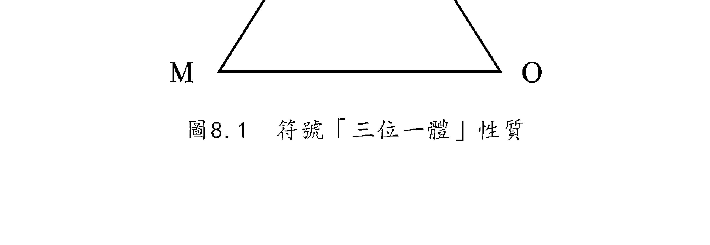

圖中M是媒介（即符號形體），O是指代對象，I是解釋。比如，M即是如「玫瑰」的發聲或書寫文字；O是如「玫瑰」指代的一種薔薇科的植物；I即符號可以表達的意義，如「玫瑰」可以引起「示愛」意義的聯想。皮爾斯說：「我把符號定義為這樣一個東西，這個東西被稱作是符號的指代對象，同時這個符號對一個人確定地釋放出一種效應，這個效應我把它叫做解釋，這樣的話，這種連帶關係說明解釋項也有對象所決定。」由此可见，在皮尔斯看来，一个符号裏有三样东西：符号本身，符号的指代对象，以及符号的解释项。

索緒爾的符號模型是二元的（即能指和所指之間的關係），是封閉系統。這個系統並不指向任何對象，也沒有所依存的語境。更重要的，是它不研究再現。而皮爾斯的三元式考察的是實際中的、包括其他的領域中的符號關係。他的三分模型有解釋項，它跟再現體相關聯，使符號變得有效且有意義。顯然，「符號解釋」概念的引入是皮爾斯理論中開拓性的創新，使它成為一種開放的系統，具有更大的伸縮性和解釋力。皮爾斯非常關注符號的實際效果和解釋，可以說他的符號學是一種「解釋符號學」。

皮爾斯在把三個範疇應用於符號媒介與指代對象之間的關係具體分析，進而得出這樣三種符號的類型：象似符（icon）、索引符（index）、象徵符（symbol）。象似符是通過寫實或模仿來表徵其對象，它與所指對象之間的聯繫靠的是性質上的某種相似性。照片、圖像、雕塑、電影形象、方程式和各種圖形就是該類符號的典型例子。(6)而索引符與指稱對象之間的關係不是模擬性的，而是因果關係或者時空上的連接關係，屬於這類符號的有路標、箭頭、指針、專有名詞、指示代詞等。象徵符則是這樣一種符號，它通過某種法規指稱其客體，這種法規通常是一般觀念的聯想，致使該象徵被解釋為指稱那個客體。它與指稱對象完全是約定俗成的，自然語言和各種標記系統基本上都是該類符號的代表。

皮爾斯的符號理論為分析當代社會生活中的各類符號提供了有效的分析手段。皮爾斯也被譽為「現代符號學之父」。

## 中國古代的符號思想

其實，皮爾斯符號學中的象似性概念，對我們中華古老的文化，尤其漢語語言文化有着重要的意義。因為象似性可以是知覺上的，也可以是聯想關係上的，而形象感知是決定因素。語言是思維的工具。從思維看，西方人以抽象的「音」為符號思維的基本樣式，這也就決定了西方人注重抽象思維的素質。中國人的符號思維以形象為主體，因為漢字就是象形文字，因此，漢民族更注重具體的形象思維，由此生發的符號思維也具有更強的創造性和想像力。

比起上世纪初开始形成的西方符号学，中国几千年前就已是「符号学」的故乡了，只是「百姓日用而不知」而已。

符号的象似性倾向在中国原始文化中就占有重要的地位。上古时代的图腾、偶像崇拜、礼仪、魔法等都是象似性的表现。而稍具系统的象似理论可以追溯到《易经》的象似主义。

在《易经》的系统里，指涉象似性的相关概念就是「象」。以下是《易经·系辞》中的经典阐述：

> 古者包羲氏之王天下也，仰则观象于天，俯则观法于地，观鸟兽之文与地之宜，近取诸身，远取诸物，于是始作八卦，以通神明之德，以类万物之情。

这里的观物取「象」，指的正是我们现在研究的符号创制的最初过程。何为「象」？简单说：「象也者，像也。」用符号学理论来解释，即「能指」和「所指」之间的关系为相似关系。以上《易经》的这段话表达了：天下之现象，可以称为意或法，它们客观存在在先，并有固有「象」之倾向；然后圣人加以模拟形容而赋之以卦象，从而以「象」来观察并拟象宇宙人事。我们以八卦为例，它的基本语言符号为两种：用「______」代表阳，用「_ _」代表阴。进一步用这两种符号，组成八种不同形式，叫做八卦，代表一定的事物。即：乾（______）代表天；坤（_ _）代表地；坎（_ _）代表水；离（______）代表火；震（_ _）代表雷；艮（______）代表山、巽（______）代表风；兑（_ _）代表沼泽。然后，以触类旁通之法，每一个卦象再引申为一系列的指称（所指），如乾为君，为父等等。在老子的《道德经》中也曾提到：「道可道，非常道；名可名，非常名；无名天地之始；有名万物之母。故常无，欲以观其妙；常有，欲以观其徼。」它指出万物有了指示它们的名字（一种符号），人们才能将它们更好的加以区别和研究，甚至才可能形成可以流传的文化，以备后人使用。

老子之后，有庄子中的象罔说、《尚书尧典》、王弼的「尽意莫若象，尽象莫若言」说、刘勰的「意象」说、刘禹锡的「境生于象外」说等等，事实上都很精彩的阐述了现代符号学的思想。

其实，八字命理所用的干支符号系统，从文字本身就具有取象的内涵。《史记·律书》及《汉书·历律志》对十个天干和十二个地支作了以下的诠释：

- 甲：「出甲於甲」，「甲」字同「芡」，指嫩芽破土而出的初生現象；
- 乙：「奮軋於乙」，指草木抽軋而生長；
- 丙：「明柄於丙」，意為陽氣充盛，生長顯著；
- 丁：「大盛於丁」，是說草木成長壯實；
- 戊：「豐茂於戊」，即日益茂盛；
- 己：「理紀於己」，指草木抑屈而起，到了成熟時期；
- 庚：「斂更於庚」，意思是果實已經收穫；
- 辛：「悉新於辛」，指萬物肅然更改，新的生機又開始醞釀；
- 壬：「懷任於壬」，意謂新的生命已開始孕育；
- 癸：「陳揆於癸」，指新的生命已經準備就緒，待時而萌。
- 子：「萬物滋於下」，「孳萌於子」，指草木的種子正吸收土中水分而萌芽，為一陽萌生的開始；
- 丑：「紐芽於丑」，謂草木在土中出芽，屈曲着要冒出地面；
- 寅：「萬物始生螾然也」，是指寒土中屈曲的草木迎着春陽從地面伸展；
- 卯：「言萬物茂也」，即生物逐漸繁茂；
- 辰：「振美於辰」，指生物速長如振，姿容秀美；
- 巳：「陽氣之已盡」，謂陽氣壯實至極；
- 午：「陰陽交於午」，即陽極陰生，生物成壯；
- 未：「萬物皆成，有滋味也」，指果實成熟，香濃味厚；
- 申：「陰用事，申賊萬物」，指陰氣之用漸顯，秋收過後，萬物蕭瑟；
- 酉：「萬物之老也」，謂生物衰敗變老；
- 戌：「萬物盡滅」，即草木凋零，生氣絕滅；
- 亥：「陽氣藏於下」，即陽氣伏藏於下，陰氣肅殺之力也快到盡頭了。

這裏，十天干和十二地支的「象」都與太陽出沒有關，而太陽的循環帶來陰陽往復消長的週期，對萬物的生長壯衰產生着直接的影響。

《史記》成書離我們已逾兩千年了。誠如胡壯麟教授所感嘆的：「但時間老人在數千年中沒有讓我們的先輩在符號問題上有更大的作為。(2)」

## 八字的符号学框架

事实上，八字命理学就是一种符号学。

它是由以上所述的十天干和十二地支组成。天干和地支不就是符号吗？八字结构就是由这二十二个符号构成的。只是它们通过字元（文字形式）出现，看起来不像八卦那样直接、形象，一望就可以把它们称为是皮尔斯模型中类似图形的象似符。

谈到干支，笔者自然想到自己的研究专业——语言学。传统语言学认为，语言有三要素：语音、词汇和语法。词汇中的语词是材料，它们是音、意结合的符号。语法是组词造句的规则。它把语词材料按照一定的规则组合起来，生成出无数不同的句子，来表达思想和进行交际。因此，语言是特殊的符号系统，语言学本身是一种符号学。

联系到命理学，命理学的「词库」就是十天干加上十二地支这二十二个符号。它的基本「辞汇」是六十个干支。它的「语法」就是天干间的「生克制化」和地支间的「刑冲合会」。它们反映了不同符号的组合关系，表达出不同的意义和信息。当然，由这二十二个符号组成的四柱结构，并不像自然语言那样是「开放」的系统，造出的句子可以是「无限」的。它只有561，600个四柱结构。但就其特性来说，命理学不就是一种符号学？

因此，我们可以用符号学的理论和方法建立八字的符号框架，并在传统命理已有的操作和剖析基础上，进一步挖掘它们所具有的更多信息，由此为八字结构剖析提供一种新的现代研究程式。这是笔者面对现代愈益丰富多彩的现实生活所做出的一种大胆尝试。

按目前三元（天元、地元和人元）所分的八字框架，可以记下后页的符号时空框架:

|      | 年   | 月   | 日   | 时   |
|------|------|------|------|------|
| 天元 | TY   | TM   | TD   | TT   |
| 地元 | DY   | DM   | DD   | DT   |
| 地支藏遁 | ZY1  | ZM1  | ZD1  | ZT1  |
|      | ZY2  | ZM2  | ZD2  | ZT2  |
|      | ZY3  | ZM3  | ZD3  | ZT3  |

图8.2 八字符号框架

图中T表示天干，D表示地支，Z表示地支藏遁。T区域与Z区域使用的符号是十天干，D区域使用的符号是十二地支。

在八字符号框架中，共有三个层面：天干层面，地支层面，以及地支藏遁层面。同一层面分别用Y、M、D、T的下标指示年、月、日、时，它们也是按序排列的横向关系。穿越层面的成分之间的相互联系，就是纵向关系了，或称竖向关系。

目前符号间的纵向关系以考察相合为主。

下面用钱穆命造来标记其中各层面存在的会合刑冲关系为例：

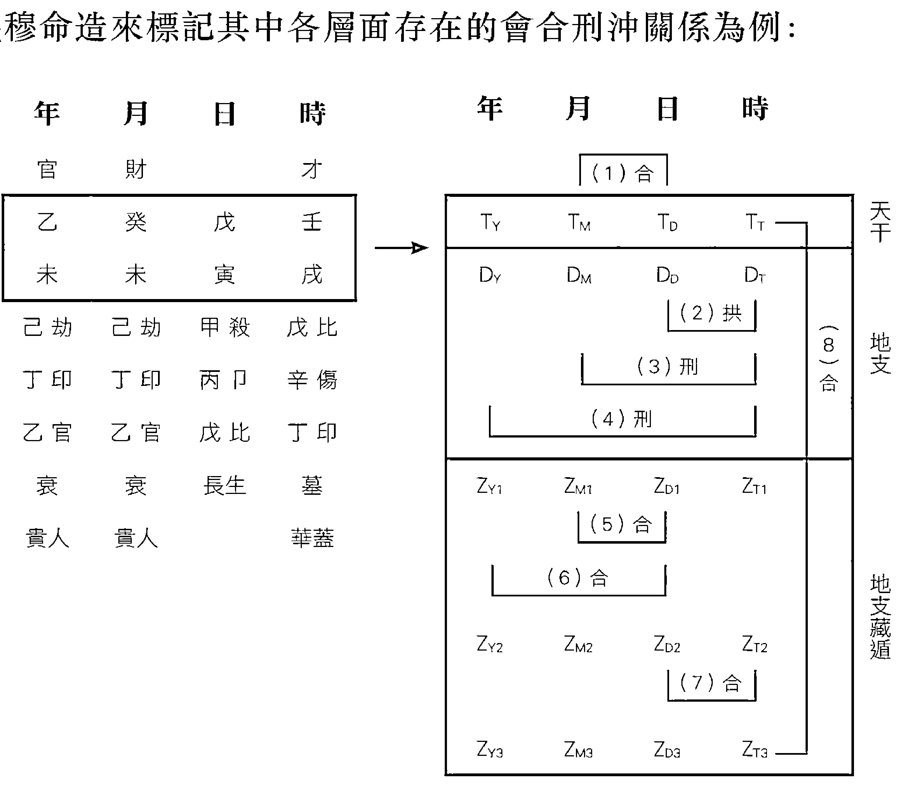

### 图8.3 乾造：钱穆先生（1895-1990）

图中指示了：1.天干层面：（1）戊癸合；2.地支层面：（2）寅戌拱；（3）未（月支）戌刑；（4）未（年支）戌刑；3.地支藏遁层面：（5）甲己合；（6）甲己合；（7）丙辛合；4.跨层面：（8）丁壬（时干）合。共八种关系。它为我们分析提供了依据。

当然，同一层面内部本身，又有组合关系和聚合关系，如前述索绪尔所指出的语言中存在的句段关系和联想关系，以天干层面为例，可以表述如下：

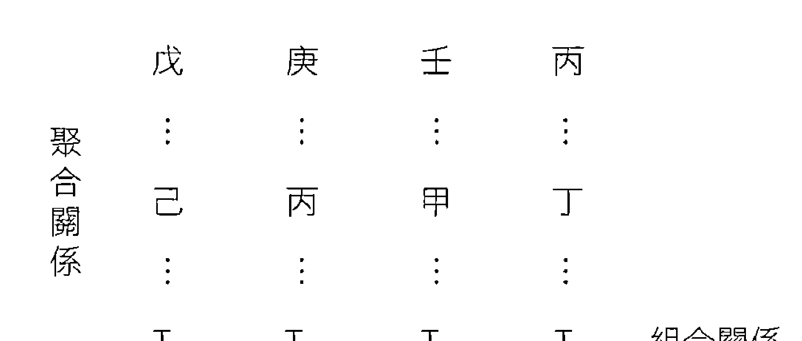

在天干层面中，天干符号共有十个，在组合关系上，年、月、日、时，每一个位置只能出现它们中的一个；在聚合关系上，每一个位置都可能有十个置换。至于具体的出现，还要受到八字排盘的五虎遁月、五鼠遁日，以及地支藏遁内容等规则的制约。

在完整的八字分析框架中，有天干层面、地支层面和地支藏遁层面，即所谓的天元、地元和人元，反映了天地人的时空结构。在这结构中，虽然有天干、地支两种不同的符号集，但是天干是单纯的，或者说，其成分是单一的，而地支则是复杂的，内部可以具有多种成分。然而，这些成分可以用地支藏遁的方式，转化为天干形式。由此可见，八字内部各符号之间的关系，可以通过天干作为基本元素来做出运算。因此，我们可以把天干符号作为分析程式的起始点。

这与「气—阴阳—五行」的认识世界的手段，以及「天地人合一」的八字命理推演的哲学基础，在本质上是统一的。

下面，我们就在这个符号框架内尝试新的八字分析程式。

## 注释

- (1) 《命理一得》，72页。
- (2) 梁湘润语。
- (3) 瑞士语言学家费尔迪南.德.索绪尔 (Ferdinand de Saussure 1857-1913) 是现代语言学的重要奠基者，也是结构主义的开创者之一。他的代表性著作《普通语言学教程》(Cours de Linguistique Generale)，集中体现了他的基本语言学思想，对二十世纪的现代语言学研究产生了深远的影响。
- (4) 皮尔斯 (Charles Sanders Peirce, 1839-1914)，美国实用主义哲学先驱之一、逻辑学家和符号学家。生前只发表过两篇论文。
- (5) 这是符号学家瓦尔特 (E. Walter) 用的图示。
- (6). 皮爾斯再把象似符按照它們的複雜程度分為三個小類：影像（image），該符號與其對象單純是屬性上的相似，如照片；擬象（diagram），此類符號的各組成部分與對象各部分之間相似，如地圖；隱喻（metaphor），這類符號與對象之間存在一般的類似關係，是通過此物與彼物的平行性來反映所指物特徵的符號，例如句子「這個人是一頭獅子」，就是一個隱喻符號。
- (7). 《語言符號學》（王銘玉著）「序」。

## 第九章 符號內涵：天干

我們首先嘗試用符號學的觀點來勾勒每個天干符號的基本屬性。

按照索緒爾的語言價值觀，語言系統中每一個符號是在跟其他符號的聯繫中，或在跟其他符號的區別性關係中顯現它自身的價值的。在第一章中，我們論述了命理學認識世界的「氣——陰陽——五行」框架。因此，要探究十天干符號解釋的基礎，也要將其置於這一認知框架下，從陰陽、五行的形成過程來揭示它們的性質。

### 五行系統

醫易同源。這裏借用古中醫學天人觀的表述來刻畫十天干的背景系統。

前文已經引用了《黃帝內經》之句：「夫人生於地，懸命於天，天地合氣，命之曰人。」那麼，天地之氣是如何構成的？

清代名醫黃元御在《四聖心源》中說：

> 陰陽未判，一氣混茫。氣含陰陽，則有清濁，清則浮升，濁則沉降……清濁之間，是謂中氣，中氣者，陰陽升降之樞軸，所謂土也。

> 樞軸運動，清氣左旋，升而化火，濁氣右轉，降而化水。化火則熱，化水則寒。方其半升，未成火也，名之曰木。木之氣溫，升而不已，積溫成熱，而化火矣。方其半降，未成水也，名之曰金。金之氣涼，降而不已，積涼成寒，而化水矣。

> 水、火、金、木，是名四象。四象即陰陽之升降，陰陽即中氣之浮沉……四象輪旋，一年而周，陽生於歲半之前，陰降於歲半之後。陽之半升則為春，全升則為夏，陰之半降則為秋，全降則為冬。

> 春生夏長，木火之氣也，故春溫而夏熱；秋收冬藏，金水之氣也，故秋涼而冬寒。土無專位，寄旺於四季之月，各十八日，而其司令之時，則在六月之間。土合四象，是謂五行也。

由此可以看出，宇宙的初期是個混沌的世界。只有先天一氣周流其間，這「一氣」中化生出了陰陽，因此也有了清濁。隨着清氣上升，濁氣下降，發生了氣的運動，有了五行中的木火金水。而陰陽之間，是中氣。中氣是土。土是陰陽升降之樞軸。於是，我們有了一幅完整的天地之氣周流、五行循環周轉的「天地氣交」構成的宇宙圖景。

| 氣 | 陰陽 | 五行 | 方向 | 季節 | 氣機 | 性質 | 德性 | 陰陽 | 天干 |
|---|---|---|---|---|---|---|---|---|---|
| | 陽 | 少陽 | 木 | 東 | 春 | 升 | 曲直 | 仁 | 陽 | 甲 |
| | | | | | | | | 陰 | 乙 |
| | 太陽 | 火 | 南 | 夏 | 浮 | 炎上 | 禮 | 陽 | 丙 |
| | | | | | | | | 陰 | 丁 |
| 陰陽 | 土 | 中 | 長夏 | 中氣 | 稼穡 | 信 | 陽 | 戊 |
| | | | | | | | | 陰 | 己 |
| 陰 | 少陰 | 金 | 西 | 秋 | 降 | 從革 | 義 | 陽 | 庚 |
| | | | | | | | | 陰 | 辛 |
| 太陰 | 水 | 北 | 冬 | 沉 | 潤下 | 智 | 陽 | 壬 |
| | | | | | | | | 陰 | 癸 |

圖9.1「一氣周流」的宇宙圖

其實，這幅圖景正是《子平真詮》開首所言的：「天地之間，一氣而已。唯有動靜，遂分陰陽。有老少，遂分四象。……有是四象，而五行具於其中矣。」

從圖中，我們可以看到春、夏之氣是少陽和太陽，是陽氣，是春生夏長，木火一家。而秋、冬之氣是少陰和太陰，是陰氣，是秋收冬藏，故金水一家。

這樣的聯繫很重要。(1)木火一家，木為母，火為子；木是火的源頭，火是木的成就。陽為氣，陰為形。木為少陽，陽中帶陰；火為太陽，是陽中之陽。從木到火，是從形到氣的轉換。木火是向上的，可以看成是由物向精神的轉化：木是書本、文字等有形的載體，火是書本知識的應用和昇華。木火可以象徵對知識、理想的追求，彰顯精神的活動，因為火代表了文明之象。

同樣，金水一家，金為母，水為子。秋天是成熟、收穫，冬天是終老、歸藏。這時，已經沒有春夏的活力，春、夏的願望都已塵埃落地，收穫的大小已成現實，體現了「陰」的特徵。金為少陰，還沒有完成對陰的轉化，故為重形之物體，是人群中辛苦做事的人。水為陰中之陰，是至陰之物，物極必反，形衰氣旺，故變化多端，隱秘不顯，多為幕後人物、謀略之士，為了生活動盪不定的人。

注意，火和水是兩種不同的氣，一個為陽，一個為陰。前者是朝上的，是上揚的，追求精神、理想；後者的朝下的，是沉潛的，追求物質、現世。前者奔向光明，給生命以永生，後者則把生命帶向了死亡。

至於土，它是陰陽的過渡與包容體。《子平真詮》說：「土者，陰陽老少、木火金水沖氣所結也。」故「土無專位，寄旺於四季之月，各十八日。」即立春前十八天，土氣開始鬆動；立夏前十八天，土氣最為疏鬆，呈現勃勃生機；立秋前十八天，土氣燥熱；立冬前十八天，土氣開始閉合，收斂，讓萬物蟄伏修養。五行中，唯土沒有方向。這在人生中也具有真實的意象，凡土月出生的人，他的理想和追求都比較模糊。

再進一步深入瞭解五行之間的關係，既然木火一家，木為母，火為子。這母子關係若出現偏向，就會有兩種情況：（1）母旺兒弱（命理中稱「母慈子滅」）；或（2）母弱子旺。這是相生關係出現的問題。前者，「火賴木生，木多火塞」；後者，「木能生火，火多木焚」。

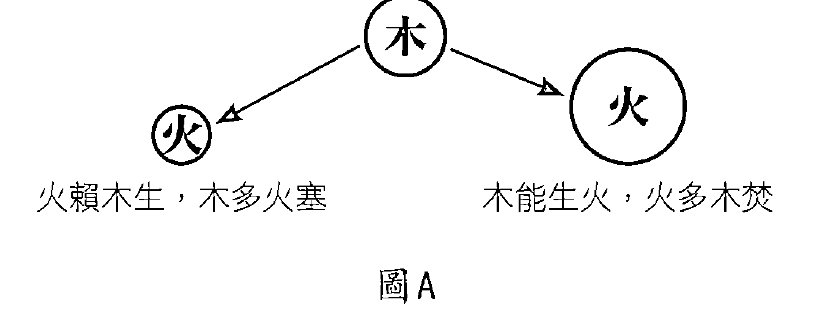

同樣，金水一家，金為母，水為子。這母子關係若出現偏向，也有兩種情況：（1）母旺兒弱，即「水賴金生，金多水濁」；或（2）母弱子旺，則「金能生水，水多金沉」。

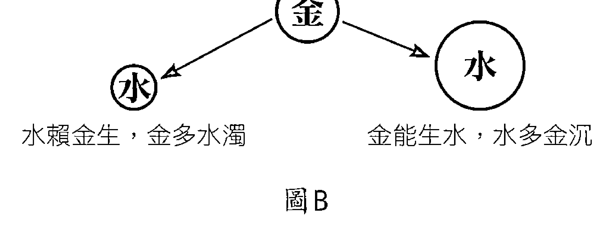

對於土，從母子關係講，有火土相生和土金相生兩類。若出現偏向的話，前者火土相生會有：（1）母旺兒弱，即「土賴火生，火多土焦」；（2）子旺母弱，則「火能生土，土多火晦」。

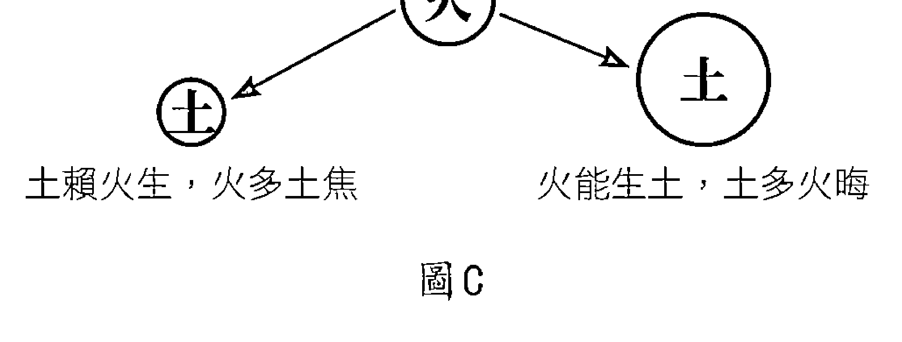

後者土金相生會產生的偏向：（1）母旺兒弱，即「金賴土生，土多金埋」；（2）子旺母弱，則「土能生金，金多土虛」。

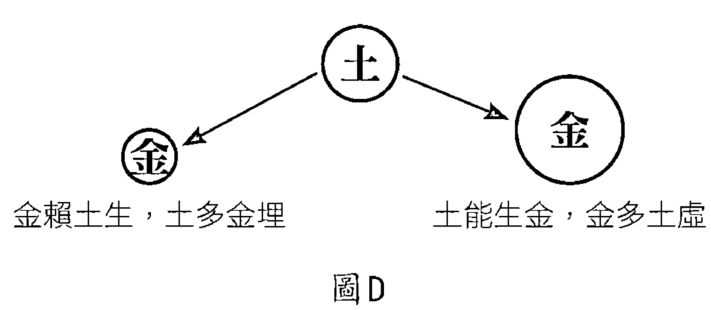

當然，從五行的相生關係講，還有「兩家」之間的交集：水生木。若出現偏差的話：（1）母旺兒弱，即「木賴水生，水多木漂」；從以上對「兩家」的分析，水追求現實，而木帶有精神的追求，兩者有點兒矛盾。水母越是灌輸物慾的東西，木子反而不知所從。相反，（2）子旺母弱，則「水能生木，木多水縮」。這是木氣太旺，肝陽上亢，腎水不足，很有思想的人反而變得沒有思想了。

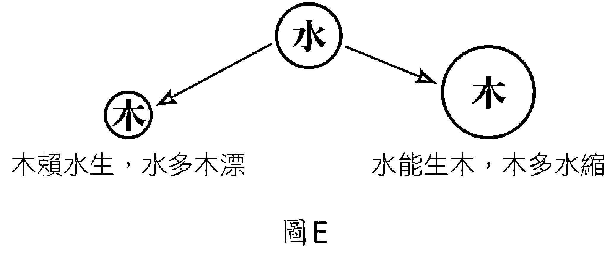

其實，除了五行相生關係的偏差問題，還有相剋關係的偏差，以下通過列表指示，就不贅述了。

表9.1 五行相剋關係的「偏差」

| 五行相剋 | 財重我寡型 | 敵強我弱型 |
| --- | --- | --- |
| 木土 | 木能剋土，土多木折 | 土弱逢木，必為傾陷 |
| 火金 | 火能剋金，金多火熄 | 金弱遇火，必見銷熔 |
| 土水 | 土能剋水，水多土流 | 水弱逢土，必為淤塞 |
| 金木 | 金能剋木，木多金缺 | 木弱逢金，必為砍折 |
| 水火 | 水能剋火，火多水乾 | 火弱遇水，必為熄滅 |

以上是深入認識十天干性質的前提——陰陽五行的大框架。這是圖9.1所展現的，即：從「氣」經過陰陽，到五行，構成了系統的第一個大層次。下面要進一步探討系統的第二個大層次：由五行到十天干。

### 十干體性

《子平真詮》說：「蓋有陰陽，因生五行，而五行之中，各有陰陽。」這是由五行，再分陰陽，便有了十個天干符號。

按照皮爾斯對符號「三位一體」的認識：符號，符號的指代對象，以及解釋項。比如，天干符號甲，如前文表4.1所示，它指代的「象」：喬木、松柏、棟樑；解釋項是：剛健，正直，積極。由於這個系統是開放的，解釋項可以是動態的，随着論命經驗的擴展和深化，持續不斷的添加新的內容。事實上，這就是傳統命理中的「十干體性」。

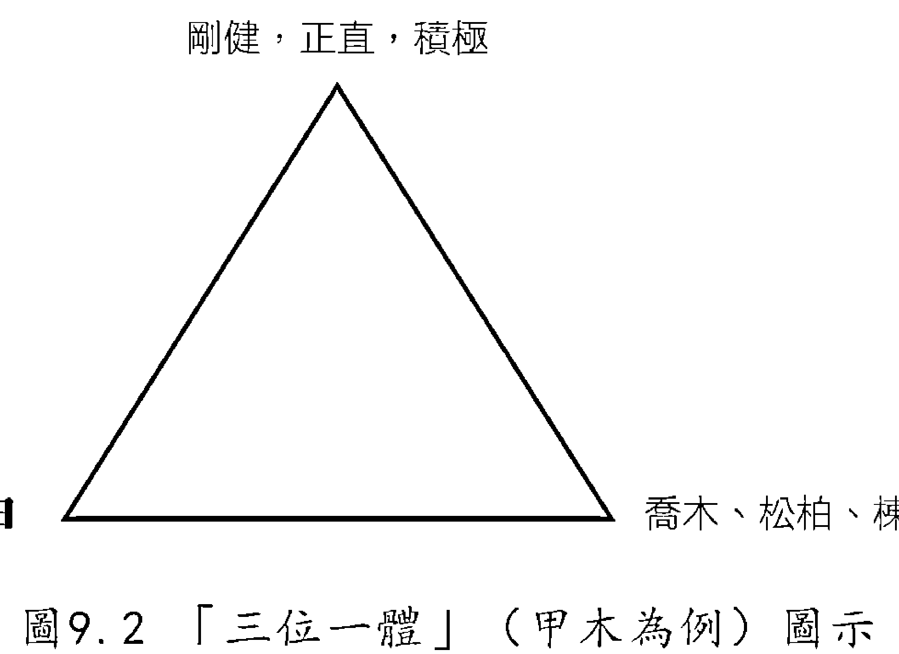

事實上，按照一定的取象原則，符號甲在各領域的投射可以是無窮無盡的。

> 《子平真詮》說：「即以木論，甲乙者，木之陰陽也。甲者，乙之氣；乙者，甲之質。在天為生氣，而流行萬物者，甲也；在地為萬物，而承茲生氣者，乙也。……以木類推，餘者可知。」這裏，因為陰陽不同的性質，同一五行的天干又被劃分為「氣」與「質」。陽對應的是氣，氣是動態的，是能量；陰則對應於質，質是靜態的，是物質。故甲木為木之氣，乙木為木之質。

以氣而論，陽干旺於陰干；以質而論，陰干堅於陽干。故清初陳素庵說：「陽干任剋之力輕而生物之力重，故陽日用印，有時喜偏，而丙、壬尤喜；陰干生物之力輕而任剋之力重，故陰日遇殺不畏其強，而丁、己尤不畏。」這裏指出了陰陽天干性質的差別。

關於十干的性質，命理史上較早的有《十干體象》詩。它們分別勾勒出十干的基本形態（象）和特徵。茲錄於下，並歸納其要點：

- **1. 甲木：**

> 甲木天干作首排，原無枝葉與根荄。
欲存天地千年久，直向泥沙萬丈埋。
斲就棟樑金得用，化成灰炭火為災。
蠢然塊物無機事，一任春秋自往來。

象：喬木，棟樑

- (1) 甲木無須乙木的幫助；(2) 甲木喜歡以辰、未為根基；(3) 木強盛時喜庚金的砍鑿；(4) 喜濕泥（己土、丑土）的滋扶；(5) 怕火旺木焚。

- **2. 乙木:**

> 乙木根荄種得深，只宜陽地不宜陰。
漂浮最怕多逢水，刻斷何須苦用金。
南去火炎災不淺，西行土重禍猶侵。
棟樑不是連根木，辨別工夫好用心。

象：花草，灌木

- (1) 喜陽支（如寅、辰）生根，忌寒濕之地；(2) 忌壬水氾濫；(3) 不喜金砍伐；(4) 弱時喜甲扶持；強時喜丙泄秀；(5) 運行南方時，忌火太旺；行西方運時則怕土和金過重。

- **3. 丙火:**

> 丙火明明一太陽，原從正大立綱常。
洪光不獨窺千裏，巨焰猶能遍八荒。
出世肯為浮木子，傳生不作濕泥娘。
江湖死水安能剋，惟怕成林木作殃。

象：太陽

- (1) 丙火幾乎不接受他干的生剋作用；(2) 遇壬水反有日照江湖之用；(3) 太強時易成燥命；(4) 出於天干時，可以救助浮木（壬水太多的甲、乙木）；(5) 不透天干時，則不能防止濕泥（癸太多之己土）之害；(6) 過於虛弱時，遇甲反而有害。(7) 濕木不能生火，反而晦火。

- **4. 丁火：**

丁火其形一燭燈，太陽相見奪光明。
得時能鑄千斤鐵，失令難熔一寸金。
雖少幹柴猶可引，縱多濕木不能生。
其間衰旺當分曉，旺比一爐衰一檠。

象：燈燭，爐火

- (1) 丁火和丙火是互不相干的火；見丙反而奪其光； (2) 強時能鍛鑄庚金； (3) 喜乾燥的甲木扶持；濕木（乙）則無用，需丙曬之方可用； (4) 與戊土有相互調整的作用。

- **5. 戊土：**

戊土城牆堤岸同，振江河海要根重，
柱中帶合形還壯，日下乘虛勢必崩。
力薄不勝金漏泄，功成安用木疏通。
平生最愛東南健，身旺東南健失中。

象：城牆，堤岸

- (1) 有強根可抑制壬水； (2) 月令盛衰很重要； (3) 強時以庚、辛金泄之，則勝過用甲木克制； (4) 在諸根（辰、戌、丑、未）中，跟辰關係密切，因為辰中有水分調節； (5) 太虛時喜戊土幫身，己土無甚作用。

- **6. 己土：**

己土田園屬四維，坤深能為萬物基。
水金旺處身還弱，火土功成局最奇。
失令豈能埋劍戟，得時方可用鋤基。
漫誇印旺兼多合，不遇刑沖總不宜。

象：田園

- 1. 以辰、戌、丑、未四者為根；
- 2. 本身弱而水、金旺時，則喜火（丙）或木（甲）的資助；
- 3. 強時才可以生金或埋金；
- 4. 濕土泄火力強；
- 5. 喜戊土相助。

- **7．庚金：**

> 庚金頑鈍性偏剛，火制功成怕水鄉。
夏產東南過鍛煉，秋生西北亦光芒。
水深反見他相剋，木旺能令我自傷。
戊己干支重遇土，不逢衡破即埋藏。

象：刀斧，劍戦

- 1. 性質剛直，喜怒無常，惟喜丁火控制，忌癸水接近；
- 2. 水太多，會沉金；
- 3. 春木不能見庚金；
- 4. 戊、己土能生金，但過量則會埋金；
- 5. 最忌土或水過多的狀態。

- **8．辛金：**

> 辛金珠玉性通靈，最愛陽和沙水清。
成就不勞炎火煅，滋扶偏愛濕泥生。
木多火旺宜西北，水冷金寒要丙丁。
坐祿通根身旺地，何愁厚土沒其形。

象：珠玉

- 1. 辛金似珠玉，喜愛丙暖、壬洗；
- 2. 強時也不喜丁火克制；
- 3. 弱時喜濕土相生；
- 4. 木火過強時，宜西北地支的救助；
- 5. 水冷金寒時，則要丙、丁取暖。

- **9．壬水：**

> 壬水汪洋並百川，漫流天下總無邊。
干支多聚成漂蕩，火土重逢涸本源。
養性結胎須未午，長生歸祿屬乾坤。
身強原自無財祿，西北行程厄少年。

象：汪洋

- (1) 壬水太強，易進難退，惟有順其勢； (2) 遇己土對自身有傷害； (3) 與丙火有良好關係； (4) 戊土可作堤岸，對壬水有抑制作用； (5) 壬水與癸水之間，有互助效果。

- **10. 癸水：**

癸水應非雨露麼，根通亥子即江河。
柱無坤坎身還弱，局有財官不尚多。
申子辰全成上格，午寅戌備要中和。
假饒火土生深夏，西北行程豈太過。

象：雨露

- (1) 癸水強度跟通根和季節有密切關聯，見亥、子水通根，就變得強大了；
- (2) 無根則弱，不喜財、官過強；
- (3) 見申子辰水局，則喜寅午戌會財；
- (4) 有壬水相助，則成江河。

對於十天干，《滴天髓》也有經典的論說。可見於下表⁽⁴⁾：

表9.2 《滴天髓》十干體性

| 十干 | 象 | 宜忌 |
|---|---|---|
| 甲 | 參天之木 | 春寒宜火，忌金。夏火熾宜辰土。秋土虛不用。冬水旺宜寅通根。 |
| 乙 | 柔木 | 丑濕土、未木庫，可培木。見丙丁，不畏申酉月生。生冬，有午亦無用，喜甲。 |
| 丙 | 猛烈之火 | 能剋庚金，忌辛合。土多，性慈。水多，顯節。寅午戌全，忌甲，焚滅。 |
| 丁 | 內柔之火 | 抱乙，孝。合壬（正官），忠。衰而不弱，旺而不烈。見甲，可秋可冬。 |
| 戊 | 重土 | 得水，能生萬物。火燥，喜潤。生於寅、申，忌沖。 |
| 己 | 卑濕蓄藏 | 不愁木盛，不畏水旺。火少火晦，金多金明。喜土助，能生萬物。 |
| 庚 | 剛強帶殺 | 見水，動而清。火煆，銳利。喜濕土，忌燥土。剋甲木，忌乙木。 |
| 辛 | 溫潤軟清 | 忌土多埋金。喜水，有救世之心。夏喜己土，冬喜丁火。 |
| 壬 | 汪洋剛中 | 支申子辰，干透癸則沖天奔地。合丁有情。從火土、相濟。 |
| 癸 | 至弱通天 | 能生木、制火、潤土、養金。合戊，地支見巳午，則化火。 |

《滴天髓》「論天干」開首兩句是：「五陽皆陽丙為最，五陰皆陰癸為至。」民國潘子端（水遠花堤館主）[5]曾對此指出：丙之性必強於其他四陽干，而癸之性也必弱於其他四陰干。水有剋火功能，對於丙火（喻為太陽）不過是雲遮日而已。對比其他陽干，其性多會受環境影響，如甲木「春不容金」、「秋不容土」；戊土有「火燥物病」；庚金有「土乾則脆」；壬水則會有失其剛性之可能。再看癸水，柔弱之至，亦不畏一切了。其他陰干則不然。乙木有「藤蘿系甲，可春可秋」；丁火有「如有嫡母，可秋可冬」；己土少不了「宜助宜幫」；辛金則「畏土」等。

此外，除壬癸外，陽干似不缺火，陰干似不缺水。陽干喜水濟之，陰干則喜火喧之。大約火為陽干之特性，水為陰干之特性。同時，陽極則陰生，陰極則陽生，所以丙辛合易化水，戊癸合易化火，物極則反。這都是很有見地的看法。

### 強度和活力

對於在八字結構中出現的天干符號，我們不僅要瞭解它們本身的體象和屬性，還要進一步瞭解它們的強度（旺衰，強弱程度）和活力（氣數狀態，生機，活躍度）。

關於強度，我們在前文討論強弱視角時已經做了分析。關鍵點在提綱——月令地支，它指示了八字結構所聯繫的外部環境時令的情況。同樣是天干符號甲木，在春天和秋天的旺衰程度是截然不同的。最簡單的方法，是觀察它在「五行四時用事」表（表4.2）中的位置。表中對不同五行用事的時段，用旺、相、休、囚、死五種狀態來予以標記。這也是我們強調提綱在八字結構中的重要性的原因。

接着，我們要討論天干的「活力」，這就要聯繫它的坐支了。事實上，干支總是一柱一柱地進入八字結構的。因此，真正揭示天干的所屬意象，往往離不開干支一體的考察，也就是要聯繫天干的坐支——地支。

每一個天干對應於十二個地支所呈現出來的不同的狀態，就是命理中十天干周行十二個地支的生旺死絕歷程，或天干十二運。前文（第四章）在觀察日主強弱狀態時，考察日主是否「得地」，就應用了十二生旺死絕歷程（見表4.3）。為了方便讀者，我們把天干的十二生旺死絕表再羅列於下：

表9.3 十干十二宮生旺死絕表

| 天干 | 长生 | 沐浴 | 冠带 | 临官 | 帝旺 | 衰 | 病 | 死 | 墓 | 绝 | 胎 | 养 |
| :--- | :--- | :--- | :--- | :--- | :--- | :--- | :--- | :--- | :--- | :--- | :--- | :--- |
| 甲 | 亥 | 子 | 丑 | 寅 | 卯 | 辰 | 巳 | 午 | 未 | 申 | 酉 | 戌 |
| 乙 | 午 | 巳 | 辰 | 卯 | 寅 | 丑 | 子 | 亥 | 戌 | 酉 | 申 | 未 |
| 丙 | 寅 | 卯 | 辰 | 巳 | 午 | 未 | 申 | 酉 | 戌 | 亥 | 子 | 丑 |
| 丁 | 酉 | 申 | 未 | 午 | 巳 | 辰 | 卯 | 寅 | 丑 | 子 | 亥 | 戌 |
| 戊 | 寅 | 卯 | 辰 | 巳 | 午 | 未 | 申 | 酉 | 戌 | 亥 | 子 | 丑 |
| 己 | 酉 | 申 | 未 | 午 | 巳 | 辰 | 卯 | 寅 | 丑 | 子 | 亥 | 戌 |
| 庚 | 巳 | 午 | 未 | 申 | 酉 | 戌 | 亥 | 子 | 丑 | 寅 | 卯 | 辰 |
| 辛 | 子 | 亥 | 戌 | 酉 | 申 | 未 | 午 | 巳 | 辰 | 卯 | 寅 | 丑 |
| 壬 | 申 | 酉 | 戌 | 亥 | 子 | 丑 | 寅 | 卯 | 辰 | 巳 | 午 | 未 |
| 癸 | 卯 | 寅 | 丑 | 子 | 亥 | 戌 | 酉 | 申 | 未 | 午 | 巳 | 辰 |

> 跟五行四时用事相比较，实务上，天干对十二生旺死绝的考察则用得并不多。究其原因，是其中应用的所谓「阳生阴死」原则，在历史上引起过命理学者的争论。最著名的有评注《滴天髓》的任铁樵。任铁樵说：「阴阳顺逆之说，其理出于洛书。然五行流行之用，不过阳主聚，以进为退；阴主散，以退为进。若论命理，则不专以顺逆论。……至于长生、沐浴等名，乃假借形容之辞。」^(6)由此可见，任铁樵是反对「阳生阴死」原则，主张「阴阳同生死」。

> 显然，任铁樵把十二宫当做是强弱旺衰的依据，跟五行四时用事混为一谈了。这种见解一直影响到现在。对此，刘文元在《四柱命理正源》中指出：

> 现代研究易经的人群中，有相当数量的人把五行旺衰与五行气数混淆在一起。……五行的旺、相、休、囚、死与五行的十二生旺死绝有着本质上的区别。旺、相、休、囚、死是以月令为基准来衡量每种五行的旺衰程度的一种标准。而十二状态（长生、沐浴、冠带……）是确认某种五行气数状态的一种标志。……

> 这里需要重点说明一下的是：旺、相、休、囚、死反映的是五行的能量级别大小，而十二状态（长生、沐浴、冠带……）则是反映了在一定能量级别下的某种五行的活泼程度^(7)。

这里，刘文元澄清了十干十二宫生旺死绝与五行四时用事的根本差别。前者涉及旺衰程度，或强度；后者涉及「气数」或「活泼程度」。

什么是「气数」？可以把它理解为是一种活力，一种生机，一种活泼程度、积极性、灵敏性⁽⁸⁾。

这里，我们对天干生旺死绝十二宫再做一次考察。十二宫是：

- 长生
- 沐浴
- 冠带
- 临官
- 帝旺
- 衰
- 病
- 死
- 墓
- 绝
- 胎
- 养

长生，是生长的基础。比如，植物的种子得到了适宜的生长环境就有了生气。因此，任何一种五行，不管目前力量大小，见了长生，也就是有了发展和壮大的基础。实务中，对于四生（寅申巳亥），就要以发展的眼光来对待它们。

沐浴，若继续用植物的成长来比喻，就是发芽阶段。从形体上讲，已经进入成长阶段了，但是正是刚刚发芽，还很稚嫩，反而十分脆弱，有相当的风险。所以沐浴也称为「败地」、桃花。怕感情脆弱，遭受刑伤。反而更希望得到一种关爱。

冠带，从人的成长来看，相当于人刚要成熟，却又未成熟的状况，好像刚刚长大又未明世事的孩子。它比沐浴的状态要好多了，但还是在成长的过程中。

临官，也就是禄位。这是福禄的禄，并不是官禄或禄马的禄。如果长生是为了以后的发展，那么现在就是最理想的位置了。前可进，到帝旺；后可退，回冠带。甲禄在寅，乙禄在卯，丙戊禄在巳，丁己禄在午，庚禄在申，辛禄在酉，壬禄在亥，癸禄在子。八字结构中的天干都喜欢见到地支有其禄，甚至「交互得禄」，彼此都处于得禄通根的状态。

帝旺，对于阳干也叫羊刃、临官或禄，是旺而不烈，进退皆宜，但帝旺则到了旺极的地步。中国古人崇尚「中庸」，认为物极必反，反而容易走向反面。正是因为到了这种情状，羊刃十分忌冲，一冲则加速变动，容易发生意想不到的悲剧。

衰，这是帝旺过后的状态，它是开始走下坡路了。但是「衰」字容易造成误解，好像「完了」。其实它只是衰落的开端，五行之气并不真弱，讲活力，其气数并不低于临官多少，只是趋势变了，前程开始暗淡了。衰地还是有其天干之根的。

病，这是因衰弱而染病，有受伤害的体验了。比如，甲木在卯为帝旺，在辰为衰，到了巳就是病地。巳是金的长生，木就易受金的伤害，故而有危险了。

死，是气绝了。对于人的生命而言，是阳寿阶段结束了。阳死阴生，对于阳气来说，气绝了，只剩下一个躯壳了。当然不是好状态。这是对阳干而言。对于阴干来讲，还要仔细观察。

墓，是死后的丧葬之地。入墓，也称入库，或者入墓库。墓是归宿，其中还是有相应的五行成分，墓中的墓神都是阴性的，大概是阳气返魂。因此就气数而言，墓的气机不能忽略。

绝，当然是最低落的阶段，什么也没有了。但是，绝处逢生，很可能孕育了新的转机。这就要仔细琢磨了。一般讲，阴干是真绝，而阳干则有绝地逢生的机缘。

胎，过了绝地，要重新结胎了。养，继续养胎。胎和养，比之死绝要好了些，毕竟有了新的生命，有了新的期待。养以后，则进入长生，开始新一轮的循环。

显然，承前文所述，十干分阴阳后，由于四时的分布流行不同，起始的宫位就不同。十二宫中，气的第一个能量状态就是长生，但阳长生与阴长生不同，因四时的运行，以生为顺，以克为逆，功成者退，知来者进。阳主气，主动，以进为退，故阳干长生顺行；阴主质，主静，以退为进，故阴干长生逆行，于是有了阳顺阴逆之分。

再观察上表，阳干顺行，其长生始于四生（寅申巳亥）；阴干逆行，长生始于四正（子午卯酉）。而阳干的长生，正是阴干的死地；阴干的长生，是阳干的死地。彼此正好互换。

以上简述了从长生到养这十二个宫的状况。作为坐支，它也影响了坐于其上的天干的属性和状态。通过以上的考察，我们可以把长生、临官、帝旺看作是气数中最具活力的节点；其次为冠带、衰、墓；再次为沐浴、胎、养；最欠活力的是病、死、绝。兹列表如下：

表9.4 十二生旺死绝坐支「活力」表

| 等级 | 生旺死绝十二宫 |
| :--- | :--- |
| 4 | 长生　临官　帝旺 |
| 3 | 冠带　衰　墓 |
| 2 | 沐浴　胎　养 |
| 1 | 病　死　绝 |

上表中将坐支所影响的天干活力分为4级。最高的为4，逐级下降，1级最弱。如果我们将它们标记在钱穆命造下方，可见钱穆先生还是一个很有生命活力的人。

| 年 | 月 | 日 | 时 |
| :---: | :---: | :---: | :---: |
| 官 | 财 |  | 才 |
| 乙 | 癸 | 戊 | 壬 |
| 未 | 未 | 寅 | 戌 |
| 己劫 | 己劫 | 甲杀 | 戊比 |
| 丁印 | 丁印 | 丙P | 辛伤 |
| 乙官 | 乙官 | 戊比 | 丁印 |
| 活力： | 3 | 3 | 4 | 3 |
| （衰） | （衰） | （长生） | （墓） |

图9.3 钱穆命造的日主「活力」标记

当然，其中最主要的是日柱戊寅，戊土自坐长生，长生为4级，因此，钱穆先生是对自己的追求是充满「活力」的。

以下是六十甲子各干支的「活力」表：

表9.5 干支活力表：

| 干支 | 甲子 | 甲寅 | 甲辰 | 甲午 | 甲申 | 甲戌 | 乙丑 | 乙卯 | 乙巳 | 乙未 | 乙酉 | 乙亥 |
| :--- | :---: | :---: | :---: | :---: | :---: | :---: | :---: | :---: | :---: | :---: | :---: | :---: |
| 活力 | 4 | 4 | 3 | 1 | 1 | 2 | 3 | 4 | 2 | 3 | 1 | 1 |
| 干支 | 丙子 | 丙寅 | 丙辰 | 丙午 | 丙申 | 丙戌 | 丁丑 | 丁卯 | 丁巳 | 丁未 | 丁酉 | 丁亥 |
| 活力 | 2 | 4 | 3 | 4 | 1 | 3 | 3 | 1 | 4 | 3 | 4 | 2 |
| 干支 | 戊子 | 戊寅 | 戊辰 | 戊午 | 戊申 | 戊戌 | 己丑 | 己卯 | 己巳 | 己未 | 己酉 | 己亥 |
| 活力 | 2 | 4 | 3 | 4 | 1 | 3 | 3 | 1 | 4 | 3 | 4 | 2 |
| 干支 | 庚子 | 庚寅 | 庚辰 | 庚午 | 庚申 | 庚戌 | 辛丑 | 辛卯 | 辛巳 | 辛未 | 辛酉 | 辛亥 |
| 活力 | 1 | 1 | 2 | 2 | 4 | 3 | 2 | 1 | 1 | 3 | 4 | 2 |
| 干支 | 壬子 | 壬寅 | 壬辰 | 壬午 | 壬申 | 壬戌 | 癸丑 | 癸卯 | 癸巳 | 癸未 | 癸酉 | 癸亥 |
| 活力 | 4 | 1 | 3 | 2 | 4 | 3 | 3 | 4 | 2 | 3 | 1 | 4 |

## 再考阴阳生死

《三命通会》有「论天干阴阳生死」一节，专门讨论了十天干经历地支十二生旺死绝的情况。根据上面的考察，联系其文，再来进一步观察十干的属性：

### 1. 甲木

甲木乃十干之首，主宰四时。在天为雷为龙，在地为栋梁，为阳木，禄在寅。据《三命通会》：甲为死木。死木者，刚木也。需要斧斤（金）砍削，方成其器。长生于亥，亥为河潭池沼死水，死木放在死水中，日益坚固，可成栋梁之材。然而至午地离火，火旺木焚，故死于午。经曰：木不南奔。

### 2. 乙木

乙木为阴木，在天为风，在地为树，禄在卯，根深枝茂，为活木，柔木。因此怕阳金砍伐，怕秋季木落凋零，喜润土（己）培植其根，喜活水（癸）滋其枝叶。己禄在午，一阴复生，所以稻花开于午时，乙木生于午地。到亥月（十月），壬禄当权，死水泛滥，土薄根虚，故乙木死于亥。经曰：水泛木浮。

### 3. 丙火

丙火丽于中天，在天为日，为阳火，禄在巳，为死火。死火者，刚火，喜死木（甲）发生其焰，不喜金土掩息其光。丙火生于寅，如太阳之火自东升起，至西而没，故死于酉。经曰：火无西向。

### 4. 丁火

丁火为文明之象，在天为列星，在地为灯火，谓之阴火。禄于午，乃六阴之首，内有乙木，能生丁火。乙为活木，丁为活火，乃阴生阴，如菜油点灯烛。至酉时黄昏，灯烛能辉煌，列星能闪烁，故丁生于酉。至于寅地，如日东升，群星退隐，灯烛无光，故死于寅。经曰：火明则灭。

### 5. 戊土

戊土厚载万物，聚于中央，散在四维，为阳土。禄在巳。喜阳火相生，畏阴金盗气。阳火者，丙火，生于寅。寅属艮，艮为山，山为刚土，即戊土。至于酉地，酉属兑金，盗泄其气。故戊土生于寅，死于酉。经曰：土虚则崩。

### 6. 己土

己土也在中央，是天之元气，地之真土，为阴土。喜丁火而生，畏阳火而炼。禄在午，午中丁火，能生己土，但又被乙木盗泄其栽培之气，因此，到酉地，丁火长生得旺，己土也因之而生。到寅位，寅中木火掌权，锻炼己土，己土因被烧烤，丧失生育能力，故死于寅。经曰：火燥土裂。

### 7. 庚金

庚金掌握着天地间的肃杀之权，决定人间的兵革战争，是阳金。其禄到申，申是刚金，喜戊土而生，畏癸水而溺。长生于巳，巳中戊土能生庚金，是阳生阳；巳中又有丙火，可以锻炼庚金，使庚金成钟鼎之器，叩之有声。若遇水土沉埋，则没有声响了。庚金到子地，子是旺水，金寒水冷，庚金会遭沉没之灾。所以，庚金生于巳，死于子。经曰：金沉水底。

### 8. 辛金

辛金是五金的首位，隐藏在山石深处，为阴金。辛禄在酉，酉中己土（酉为己之长生）可以生辛金，为阴生阴，谓之柔金。子位是辛金的长生之地，因为子水荡漾，淘去浮砂，方能出色，此乃水济金辉，色光明莹。至于巳地，巳为炉冶之火，将辛金锻成死器，同时，其中戊土，埋没其形。故辛金生于子，而死于巳。经曰：土重金埋。

### 9. 壬水

壬水喜阳土来做堤岸，害怕阴木盗走水气。在天为云，在地为泽，为阳水。其禄在亥，亥为沼泽存留下的死水，死水为刚水，赖庚金而生。庚禄到申，能生壬水，乃五行转养之气。至于卯地，木旺于卯，即能克土，土虚则崩，故堤岸崩塌，壬水没有阻拦，壬水走泄，散漫四野，流而不返，此时又被阴木盗泄，怎么存活？所以壬水生于申，而死于卯。经曰：死水横流。

### 10. 癸水

癸水是天干始终的交接之地，所以清浊分明，流向四方，有润下助土之功，滋生万物之德，在天为雨露，在地为泉脉，是阴水。其禄在子，子乃阴极阳生之地，辛生庚死之地，癸为活水、柔水，喜阴金而生，畏阳金而滞。癸水希望卯木掘地开通泉脉，这样癸水就可以通达四方。至于申地，申中庚金筑成围堰，使癸水不能流畅，困于池沼，无所作为。所以癸水生于卯，而死于申。经曰：水不西流。

其实，以上《三命通会》对各天干性质的刻画和评说，主要在十二生旺死绝历程的三个节点上：一个是禄，一个是长生，一个是死。然后提出了「经曰」这样的经典式的四字评断。兹列表于下：

表9.6 十干生、禄、病、死

| 天干 | 长生 | 禄 | 病 | 死 | 经日 |
| :--- | :---: | :---: | :---: | :---: | :--- |
| 甲 | 亥 | 寅 | 巳 | 午 | 木不南奔 |
| 乙 | 午 | 卯 | 子 | 亥 | 水泛木浮 |
| 丙 | 寅 | 巳 | 申 | 酉 | 火无西向 |
| 丁 | 酉 | 午 | 卯 | 寅 | 火明则灭 |
| 戊 | 寅 | 巳 | 申 | 酉 | 土虚则崩 |
| 己 | 酉 | 午 | 卯 | 寅 | 火燥土裂 |
| 庚 | 巳 | 申 | 亥 | 子 | 金沉水底 |
| 辛 | 子 | 酉 | 午 | 巳 | 土重金埋 |
| 壬 | 申 | 亥 | 寅 | 卯 | 死水横流 |
| 癸 | 卯 | 子 | 酉 | 申 | 水不西流 |

仔细观察此表，它反映了天干「阳生阴死」的特征。它的跨距就在各天干经历地支从长生、经过禄，然后至病、死的八个字的范围内，以后就是墓、绝、胎、养。阳干生于阳，而死于阴（指地支藏遁主气）；阴干生于阴而死于阳。而「经曰」简明扼要地指明到了病、死这个端点（当然还包括下面的墓、绝）上时，此坐支上面的相关天干可能会遇到的不利、甚至灾难。这里反过来刻画了天干的性质。

这是十分重要的文献，可惜当代很少有人注意到它。笔者曾在网上看到过所谓「盲师秘笈」，内有这样四句：「木在火中焚，金在水中亡；水在木中死，火死一方酉。」估计就是从这个文献来的。

## 命例分析

这里，笔者想到大家熟识的伟人的晚年。下面是他的命造：

| 年 | 月 | 日 | 時 |
| :---: | :---: | :---: | :---: |
| 殺 | 印 |  | 印 |
| 癸 | 甲 | 丁 | 甲 |
| 巳 | 子 | 酉 | 辰 |
| 丙劫 | 癸殺 | 辛才 | 戊傷 |
| 庚財 |  | 乙尸 | 辰 |
| 戊傷 |  | 癸殺 |  |
| 帝旺 | 絕 | 長生 | 衰 |
| 大運 | 1970年 | 77歲 | （丙） |
| 辰 |

命例10A 乾造

此命造是丁火日主，七杀旺，身弱，以甲木正印化杀生身，构成杀印相生的良好格局。按照丁火弱，晚年丙火大运比助日主，应该是上等好运。但事实并非如此。尤其是1971年「九一三」事件以后，按照身边护理医生说：「从那天起，我发现他的身体日渐衰老，食欲也大大下降了。他老人家病重后，则以鲜牛奶、豆浆和肉汤、鸡汤等流食为主。」

这就是上文丁火所联系的象：「火明则灭」。或者说，「丙夺丁光」。因为丁火的喻像是地上的灯烛，天上的星，它们在黑夜里明亮闪烁，到了白天则隐去了。想起小时候常听到的歌曲：「抬头望见北斗星……迷路时想你有方向，黑夜里想你心里明」这短短几句，的确刻画了夜间星斗的寓意。

> 「抬头望见北斗星……迷路时想你有方向，黑夜里想你心里明」

据亲自为他做手术的眼科大夫回忆，1975年7月28日，即他刚刚做了白内障手术的第五天，当时「房间里只有他和我两个人，戴上眼镜的他起先静静地读书，后来小声低吟着什么，继而突然嚎啕大哭，我看见他手捧着书本，哭得白发乱颤，哭声悲痛又感慨。事发突然，我既紧张又害怕，不知如何是好，赶快走过去劝慰他，让他节制，别哭坏了眼睛。过了一会儿，他渐渐平静一些，同时把书递给我看，原来是南宋著名思想家陈亮^(9)写的《念奴娇·登多景楼》」。陈亮力主抗金，曾多次上书南宋孝宗皇帝，反对「偏安定命」。此词大气磅礴，是开拓万古心胸的强音：「正好长驱，不须反顾，寻取中流誓。」它触动了晚年躺在病榻上的斗士的心弦。真是「烈士暮年，壮心不已」呵！

再看宋代著名理学家邵雍的命造：

| 年 | 月 | 日 | 時 |
| :---: | :---: | :---: | :---: |
| 官 | 官 | | 比 |
| 辛 | 辛 | 甲 | 甲 |
| 亥 | 丑 | 子 | 戌 |
| 壬 卩 | 己 財 | 癸 印 | 戊 才 |
| 甲 比 | 癸 印 | | 辛 官 |
| | 辛 官 | | 丁 傷 |
| 長生 | 冠帶 | 沐浴 | 養 |
| 空亡 | 貴人 | | 空亡 |
| | └───┘ | | |
| | 水會方 | | |

| 大運 | 6歲 | 16歲 | 26歲 | 36歲 | 46歲 | 56歲 | 66歲 |
| :--- | :---: | :---: | :---: | :---: | :---: | :---: | :---: |
| | 庚 | 己 | 戊 | 丁 | 丙 | 乙 | 甲 |
| | 子 | 亥 | 戌 | 酉 | 申 | 未 | 午 |
| | 沐浴 | 長生 | 養 | 胎 | 絕 | 墓 | 死 |
| 活力： | (2) | (4) | (2) | (2) | (1) | (3) | (1) |

命例11 乾造：［宋］邵雍（1011-1077）

邵雍（1012年1月21日戌时生），字尧夫，谥号康节，自号安乐先生。北宋著名哲学家、理学家、易学家、诗人。与周敦颐、张载、程颢、程颐并称「北宋五子」。少有志，喜刻苦读书并游历天下，并悟到「道在是矣」，而后师从李之才学《河图》、《洛书》与伏羲八卦，学有大成，并著有《皇极经世》、《观物内外篇》、《渔樵问对》、《伊川击壤集》等。

观邵雍命造，月令丑土中辛金正官双透，为正官格；地支亥子丑汇成北方一气，为正印，于是构成官印相生，是很好的格调。日主甲木通根在亥，自坐子水，不算弱。但是，生于腊月，不见丙火太阳出干，则输于了调候要求。全局金寒水冷，印重官轻；且重官（干头两辛）不贵，印旺而木不纳，似是有情而实无情。这必然导致命主不喜欢官印。官星虽为名誉，然寒金虚悬，官星便只会使人有名无利，为清高寒儒而已。故命主一生「淡泊名利」，不喜功名仕途，却能一生近贵。这是符合邵雍的人生经历的。

邵雍之所以走进玄学的殿堂，关键是时支戌土。戌为火库，内藏丁火伤官，藏火暖身，为文明之库。尤其是甲戌柱显现晚年，等寒印暖化之日，就是文才风流之时。冬令木火凋残，然木以生火，以显其光。火，就是那团埋藏在戊库里面的显学，才是他毕生的追求。因为藏之于库内，不正符合了「玄学」之象？

考察他的大运，是逆行退气，中年西方胎、养、绝之地，愈发天寒地冻，自然难显贵气了。66岁大运进入甲午，午为甲木之死地。流年丁巳，丁火伤官，伤官见官，破了正官格局；巳火本能生财，但遇亥水回冲，逢喜不喜，反遭其累。加之亥未拱木，巳丑拱金，金木冲战，命局动摇。是年孟秋，邵雍卧病百余日不起，自觉时日不多，一日大书《病亟吟》：「生于太平世，长于太平世，老于太平世，死于太平世。客问年几何，六十有七岁。俯仰天地间，浩然无所愧。」次日黎明溘然长逝。邵康节死于午地，也应了前文讨论阴阳生死时提到的甲木「经曰：木不南奔」之说。

> 《病亟吟》：「生于太平世，长于太平世，老于太平世，死于太平世。客问年几何，六十有七岁。俯仰天地间，浩然无所愧。」

还可见一命例，也是「木不南奔」。那是清代名将岳钟琪。

| 年 | 月 | 日 | 時 |
| :---: | :---: | :---: | :---: |
| | 合 | | |
| 食 | 財 | | 比 |
| 丙 | 己 | 甲 | 甲 |
| 寅 | 亥 | 辰 | 戌 |
| 甲比 | 壬P | 戊才 | 戊才 |
| 丙食 | 甲比 | 乙劫 | 辛官 |
| 戊才 | | 癸印 | 丁傷 |
| 臨官 | 長生 | 衰 | 養 |
| | 合 | | 冲 |

大運

|  | 1歲 | 11歲 | 21歲 | 31歲 | 41歲 | 51歲 | 61歲 |
| :--- | :---: | :---: | :---: | :---: | :---: | :---: | :---: |
| 天干 | 庚 | 辛 | 壬 | 癸 | 甲 | 乙 | 丙 |
| 地支 | 子 | 丑 | 寅 | 卯 | 辰 | 巳 | 午 |
| 状态 | 沐浴 | 冠帶 | 臨官 | 帝旺 | 衰 | 病 | 死 |
| 活力: | (2) | (3) | (4) | (4) | (3) | (1) | (1) |

岳钟琪，生于1686年（清康熙廿五年）11月8日戊时。字东美，号容斋，是民族英雄岳飞第21世嫡孙。为清代康熙、雍正、乾隆三朝名将。其父岳升龙，曾随康熙皇帝征伐噶尔丹，由军功被提拔为四川提督。岳钟琪24岁随父来到四川。次年，岳钟琪为任四川松潘镇中军游击，开始军旅生涯。

1719年（33岁），以准噶尔部入扰西藏，奉命率兵入川。次年夺桥渡江，直抵拉萨平乱。1723年（37岁）率部平定青海，授川陕总督，加兵部尚书衔。接着在云贵两地实行「改土归流」政策（摊丁入亩制度）。1729年（43岁）受命为宁远大将军率师出西路，攻准噶尔部游牧地伊犁。1732年（46岁）十月，以「误国负恩」等罪被夺官拘禁。1737年（51岁）被释放，贬为庶人。1748年（62岁），重新以总兵启用，复授四川提督。1750年（64岁），西藏珠尔默特那木札勒叛乱，岳钟琪奉命出兵康定，成功讨平叛乱。1754年，时年68岁的岳钟琪，抱病出征镇压邪教陈琨，兵胜而病卒于四川资州。

观察岳钟琪八字，甲木日元，生于亥月，提纲通根有源。初看似平淡无奇，其实在命主甲木通根寅禄，寅亥相合，亥印为我所用。寅中丙火又透年干，于是水印生「我」（禄），「我」生丙火食神，丙火又通戊库。食神有气，吐秀有情有力，应了命书所说的「食神有气胜财官」。故自幼熟读经史，博览群书，习武学射，样样精通。局中己土财星合甲木日元，为财来合身，更得辰戌二土之势，财星不弱，若为任一方，则有经济头脑，重视地方经济建设。纵观全局，印星为源，冬阳高照，一片中正温和之象，贵气天成。唯嫌日元甲木自坐财库，时上甲木又坐戌土，辰戌相冲，为自我反背，有生涯起伏之象。同时，结构用印喜食，但印星在下，不能透干，一透则直克丙火食神，易惹人忌妒，自相伤残。这是命局的主要特征。

61岁入丙午运，为乾隆朝重新启用。因为丙火引动了年干食神，食神吐秀，重新显露结构之精神。但66岁后入午地，68岁流年甲戌，三甲林立，又坐火库，辰戌相冲，寅午戌三合火局，寅禄也随火而焚，亥水也因火而化蒸气，火旺木焚，虽功成名就，如日中天，却将星陨落，应了「经曰：木不南奔」之象。

# 注释

+   1. 以下参考了王相山《相也太极命理学》（基础卷）。
2. 《命理约言》卷四「杂论」。
3. 见《渊海子平》、《神峰通考》和《星平会海》。
4. 錄自锺义明《命理乾坤》「盘根篇」。略有更动。
5. 见潘子端《滴天髓新注》（1938年）。
6. 徐乐吾编注《滴天髓徵义》，58页。

(7) 《四柱命理正源》，7-8页。

> (8) 《四柱命理正源》指出：「气数指的是某个干支在一定的时空中所储存某种五行能量多少与大小的一种标志。相当于物理学上所谓的『势能』。势能大的物体，其未来产生的动能也大。势能小的物体，其产生的动能也小。」（28页）

(9) 陈亮（1143-1194），字同甫，号龙川，学者称为龙川先生。婺州永康（今属浙江）人。南宋思想家、文学家。

## 第十章 干支與「環境」

前一章我們從十個天干符號出發，討論了它們的體性，並聯繫其坐支，討論了它們的強度、活力，以及一些應用的情況。現在，要進一步聯繫它們在結構中的「環境」，探討它們跟周邊其他一些成分發生的關係。

從干支角度看，天干為陽，地支為陰。陽主動，陰主靜。《子平真詮》說：「干動而不息，支靜而有常。」這是說，天干主氣，其性好動，遇生則生，遇合喜合，遇剋則戰；而地支主質，主形，其性好靜，處於相對穩定的狀態。《易經》說：「保合利貞」。靜是保合，是中和，是吉利的狀態。

其實，八字結構中地支保持「靜」的狀態的，並不多見。誠如王相山所說：「不論是江湖大師，還是研命的學者，對這一點感觸都很深：越是大富大貴的命，越簡單，越好看，不是氣場清純，格局純粹，就是沒有刑沖破害；越是普通命局，貧賤命局，越複雜，越難看，到處是刑沖破害，令人眼花繚亂，難以把握。」⁽¹⁾這確是經驗之談。

當然，靜止是相對的。一旦發生刑沖會合害破絕，地支就會「動」起來。究竟發生甚麼關係，怎麼變動，這就要結合干支做具體的分析了。

《玉井奧訣》⁽²⁾說：「天干專論生剋制化，地支專取刑沖破害。」這短短十六個字，指示了觀察干支組合關係的基本綱要：天干以生剋制化為關注點，地支則以刑沖破害為關注點。

正是干支與其「環境」之間發生的相互關係，構成了命理學的一個基本組成部分——刑沖會合系統。這是八字操作的基本工具。能否熟練應用，成了命理推演去刻畫豐富多彩的人生現象的重要方面。

## 刑沖會合

事實上，命理中的刑沖會合，包括了合、會、沖、刑、害（穿）、破、絕等多種形式。這裏逐一做個簡述。

### A. 天干相合

十個天干，每隔五位相合，共有五組：

- 甲己合
- 乙庚合
- 丙辛合
- 丁壬合
- 戊癸合

每一組都是一陰一陽的組合。當這十個天干充當命局日干時，若日干為陽，它所合的是財星。比如，甲日干合己，甲屬陽，己屬陰，己為甲之正財。相反，若日干為陰，它所合是官星。比如，己日干合甲，甲為己之官。

這五組相合，都是合中帶剋、剋中見合的。既然陰陽異性相合、相吸，終為有情，故有親近、管理、控制的意義。有些命理學家乾脆直接把這相合之物，作為日主的「價值取向」來看待。因為財與官，正是世俗中人們所嚮往、追求的東西。

命理學中，對於相合的干支，還有「化」的情況：

- 甲己合土
- 乙庚合金
- 丙辛合水
- 丁壬合木
- 戊癸合火

當然，從合到化，是需要條件的。這要看八字的配置情況而定。化，會改變原性；合而不化，則保留原性，大多是「兩失其用」。<sup>(3)</sup>

### B. 天干相沖

天干之間有如下的沖：

- 甲庚沖
- 乙辛沖
- 丙壬沖
- 丁癸沖

這四對相沖，主要來自於方位的對峙。甲與庚沖，乙與辛沖，是東與西的對峙；丙與壬沖，丁與癸沖，是南與北的對峙。顯然，相沖也有相剋的含義。就陰陽而言，它們又都是同性的，即陽剋陽、陰剋陰，相剋是無情的。剋本身也主「動」。

### C. 地支六合

地支六合如下：

- 子丑合
- 寅亥合
- 卯戌合
- 辰酉合
- 巳申合
- 午未合

這六組可以分成兩類，一類是「剋合」或「合剋」：

- 子丑（土剋水）
- 卯戌（木剋土）
- 巳申（火剋金）

另一類是「生合」：

- 寅亥（水生木）
- 辰酉（土生金）
- 午未（火生土）

因此八字結構中出現六合，都應當仔細觀察它們內部五行發生了甚麼變化。<sup>(4)</sup>六合在傳統命理中也有「合而化」和「合而不化」的問題：<sup>(5)</sup>

- 子丑合土
- 寅亥合木
- 卯戌合火
- 辰酉合金
- 巳申合水
- 午未合土

### D. 三會局和三會方

地支三會局，是指以下的組合：

- 木局：亥、卯、未
- 火局：寅、午、戌
- 金局：巳、酉、丑
- 水局：申、子、辰

以及：

- 土局：辰、戌、丑、未

木、火、金、水局是各取其長生、帝旺、墓庫三個位置組成，表示了五行的起始、旺極和終結三個點。土局則取方位的辰未戌丑四隅組成。

地支三會方，是指地支會合成東方、南方、西方和北方，即：

- 東方木：寅、卯、辰
- 南方火：巳、午、未
- 西方金：申、酉、戌
- 北方水：亥、子、丑

這裏，會方必須是相關的三個地支同時出現，缺一不可，只有這樣才能代表該五行強盛的旺氣。三合局則不同，若僅有兩字，只要中間那個代表專氣的中神在，如亥卯，或卯未，只要卯字在，依然合木氣，此時為「半合局」，合力遜於三字合局。在命局中，無論是三合局還是三會方，都具有較強的凝聚性，成為一股強勢。

### E. 地支六冲

地支六冲是：

- 子午冲
- 丑未冲
- 寅申冲
- 卯酉冲
- 辰戌冲
- 巳亥冲

冲，是衝突、相戰之意。但要考量相沖地支的五行內涵。子午相冲，是子中癸水剋午中丁火；午藏己土剋子中癸水。丑未相冲，是丑中辛金剋未中乙木；未中己土、丁火剋丑中癸水、辛金。辰戌冲，是辰中癸水剋戌中丁火，戌中辛金剋辰中乙木。巳亥冲，是巳中庚金克亥中甲木；亥中壬水克巳中丙火。寅申冲和卯酉冲，比较简单，都是金克木。

相冲的本意是往来互换，表示得到、互有、交换、保持联系。只有在冲中带克的情况下，才有破坏的作用。

### F. 地支相刑

地支之間有四種相「刑」的關係：

- 無禮之刑：子刑卯，卯刑子
- 三刑（無恩之刑）：寅刑巳，巳刑申，申刑寅
- 三刑（恃勢之刑）：丑刑戌，戌刑未，未刑丑
- 自刑：辰刑辰，午刑午，酉刑酉，亥刑亥

一般而言，命帶子卯刑者，較應注意色慾之厄；帶巳寅申三刑的人，較不利骨肉六親；帶丑戌未三刑者，較容易突遭挫折或多病災；帶自刑者，較缺乏獨立精神，常常會有始無終，固執己見，與人意見不合。

### G. 地支害（穿）和破

地支由於有「六合」和「六沖」這樣的雙重關係，於是產生了「六害」：

- 子未害
- 丑午害
- 寅巳害
- 卯辰害
- 酉戌害
- 亥申害

盲師稱「害」為「穿」。歌訣為：

> 鼠羊一斷休（子未穿），白馬怕青牛（丑午穿）；
> 虎見蛇如刀斷（寅巳穿），兔龍犯着不合美（卯辰穿）；
> 豬和猿猴不到頭（亥申穿），金雞與狗不交流（酉戌穿）。

「盲派」特別重視「穿」，認為它的危害性很大。穿有排斥、不容、破壞、傷害等含義；以相剋又帶穿的情況最嚴重，包括子未穿、卯辰穿、酉戌穿。

地支還有「破」的關係：

- 子卯破
- 丑寅破
- 卯午破
- 亥辰破
- 申未破
- 午酉破
- 戌巳破

其詩訣為：

> 兔鼠兩相不成婚（子卯破），牛虎相配兩爭紛（丑寅破）；
> 玉兔最怕烈马跳（卯午破），黑猪就怕跳龙门（亥辰破）；
> 猴羊场里断头婚（申未破），烈马就怕金鸡叫（午酉破），
> 狗在巳上难临宿（戌巳破）。

一般命书上不谈「破」，只有盲师谈论「破」。破，有破坏、无情、破解、破耗等含义。

### H. 地支暗合

地支间还有「暗合」：

- 寅丑暗合
- 午亥暗合
- 卯申暗合

理由是：寅中所有的甲木、丙火、戊土与丑中所有的己土、辛金、癸水各自正好六合；午中丁火、己土与亥中壬水、甲木也是六合；卯中乙木与申中主气庚金也是六合。这里首先是地支之间的主气（或本气）是相合的。

### I. 地支互绝

地支中有四绝：

- 子巳
- 午亥
- 卯申
- 寅酉

其原理来自地支阴阳相克。同性相克为冲，比如寅申，巳亥，子午，卯酉。异性相克则为绝，把两个五行相冲的地支同五行调换一个阴阳位置，就变成绝了。它来自江湖流传的口诀：

> 子巳绝在妇女，寅酉绝车马财，
> 午亥绝在口舌，卯申绝在道路。

绝，代表互相伤害之后彻底断绝关系这种状态。互相不来往了，但要注意，这几种绝又是暗合，子中癸水与巳中戊暗合，寅中丙与酉中辛暗合等。所以，绝实际又开始阴消阳长，开始了下一步合的过程，进入新一轮循环。

### 天干層面

在第八章里，笔者以现代符号学理论，构建了八字符号的基本框架；现在又有了以上刑冲会合的基本工具，我们可以讨论八字在各个层面上的具体操作了。

首先是天干層面。

### A. 連環相生

比如明代時的「學霸」商輅的命造：

年    月    日    時
生 ──▶    ──▶    ──▶
官    卬    
甲    丁    己    辛
午    卯    巳    未
丁 卬 乙 殺 丙 印 己 比
己 比       庚 傷 丁 卬
戊 劫 乙 殺
└──────火會方──────┘
命例13  乾造：［明］商輅（1414-1486）

「學霸」是現代網路語言，專指學界中的「霸主」。為甚麼說明朝名臣商輅是「學霸」呢？因為他是有明皇朝近三百年科舉考試中唯一一個得過「三元及第」<sup>(8)</sup>，即同時獲得解元（鄉試）、會元（會試）、狀元（殿試）第一名的人。看這個八字，天干四字處於「順生」的情況：年干甲木生月干丁火，月干丁火生日干己土，日干己土生時干辛金。五行連環相生，氣勢順暢，也稱「天干連珠」，自然是有情、貴顯的表現。

商輅，明代首輔。字弘載，號素庵，浙江淳安人。仕英宗、代宗、憲宗三朝，曆官兵部尚書、戶部尚書、太子少保、吏部尚書、謹身殿大學士，時人稱「我朝賢佐，商公第一」，卒諡文毅。著有《商文毅公集》等。

### B. 日干相合

前文已經提到，以日干為主，日干與月干、或日干與時干可能發生五種相合的情況：陽日干合財；陰日干合官。前者為「財來就我」；後者為「官來就我」。陰陽相合，皆為有情。相合有和合、親近、管理、控制之意。前一章所舉的清代名將岳鍾琪命造中就有這種狀況：

年 月 日 時

| 食 | 財 | 比 |
|---|---|---|
| 丙 | 己 | 甲 |
| 寅 | 亥 | 辰 |

命例11B 乾造：［清］岳鐘琪（1686-1754）

此八字己土正財合日主甲木，正財為妻星，「財來就我」，夫妻情深。查岳鐘琪生平，兩位夫人都是清正的官家之女：結髮原配夫人宋氏，是時任廣東肇慶府總兵宋秀之女；繼配夫人高氏，娶的是時任貴州巡撫高起龍之女。俱封一品夫人。他是16歲與宋氏結婚；21歲宋氏亡故。24歲與高氏結婚。高氏嫻熟弓馬，明悉軍事，佐理內政，井井有條。岳鐘琪每出征戰，署中內外，莫不肅然。待人以寬，人咸敬服。尤工吟詠，著有《高夫人集》四卷。

高氏與岳鐘琪伉儷情深，陪伴他遭冤曲以及隨後的布衣生活。她去世後，岳鐘琪哭之以詩云：「五載西曹我困危，長安寄食賴謀為。全家幸得歸田裏，相守反成永別離。一字如金愛惜之，卻因相敬故如斯。從今永擱閨中筆，自此無人解和詩。鬢增白髮面增癯，行亦無雙坐亦孤。仍向合歡床上臥，入簾涼月照鰥夫。」言辭真切，感人至深。

> 「五載西曹我困危，長安寄食賴謀為。全家幸得歸田裏，相守反成永別離。一字如金愛惜之，卻因相敬故如斯。從今永擱閨中筆，自此無人解和詩。鬢增白髮面增癯，行亦無雙坐亦孤。仍向合歡床上臥，入簾涼月照鰥夫。」

觀察岳鐘琪八字，月干正財不僅「財來就我」，而且還與坐支亥水中甲木相合，亥又合寅，寅為甲祿，乃甲木日主之延伸。足見情義之纏綿。惜日時雙甲，下面妻宮辰戌相沖。所以前妻僅相守五年，繼配高夫人生前也未能見到岳鐘琪重被召回朝廷之日。

下面是明代著名書畫家董其昌的命造：

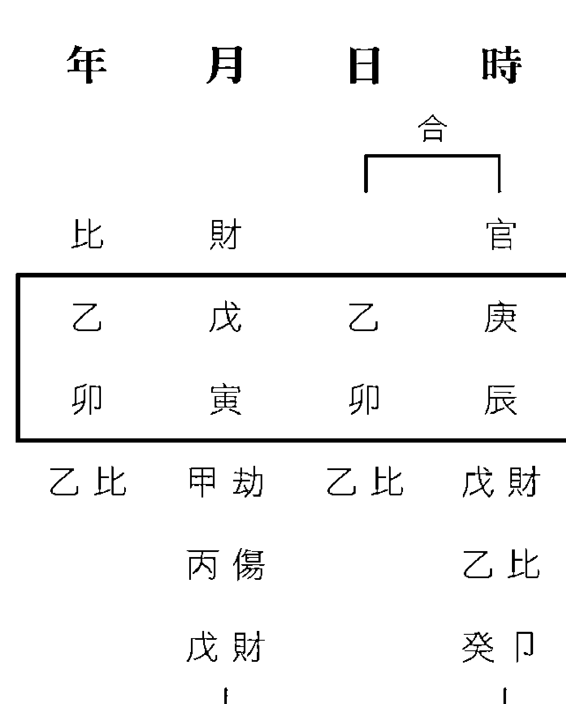

大运：

| 年龄 | 4岁 | 14岁 | 24岁 | 34岁 | 44岁 | 54岁 | 64岁 | 74岁 |
|------|-----|------|------|------|------|------|------|------|
| 天干 | 丁 | 丙 | 乙 | 甲 | 癸 | 壬 | 辛 | 庚 |
| 地支 | 丑 | 子 | 亥 | 戌 | 酉 | 申 | 未 | 午 |

命例14 乾造：[明] 董其昌（1555-1636）

董其昌（1555年2月10日辰时生），字玄宰，号思白，别号香光居士，松江华亭（今上海市）人。明朝后期大臣，著名书画家。1589年（万历十七年），中进士，授翰林院编修，官至南京礼部尚书。

董其昌擅画山水，笔致清秀中和，恬静疏旷；用墨明洁隽朗，温敦淡荡；青绿设色，古朴典雅。以佛家禅宗喻画，倡「南北宗」论，为「华亭画派」杰出代表。董其昌曾说：「晋人书取韵，唐人书取法，宋人书取意。」这是用韵、法、意三个概念概括了晋、唐、宋三代书法的审美取向。他的书法出入晋唐，自成一格。

最饶人兴趣的是，董其昌从34岁走上仕途到80岁告老还乡，为官18年，归隐27年。看董其昌八字，日干与时干乙庚相合，是官来就我。其「价值取向」是做官。八字结构也是戊土正财透出月干，生时干庚金正官，是财生官的格调。可是地支寅卯辰汇成东方一气，故财官都成了虚浮，所以一生对政治异常敏感，一有风波，就坚决辞官归乡，倾心于书画。固然，这和明代晚期的党争不休、风云诡谲有关。董其昌居然把明哲保身的政治智慧能用得这么出神入化，自然跟他大运一路西北而行有关。

以上讨论的是日主逢合，那么，日主之外的天干出现逢合的情况呢？

### C. 天干逢合

這就要看被合的成分在結構中的功能了。一般來說，按《子平真詮》對十神的分析，四吉神不宜被合，四凶神則被合為宜。故有「合官不貴」、「合財不富」的說法；反過來，「合殺為貴」、「合傷為喜」。當然，這個結論還是要回到原局去考量：這個成分是用神，被合去是用神受絆，降低了它在局中的作用，顯然不是好事；若是它是忌神，當然絆之為喜了。

下面是清末民初的著名政治活動家康有為命造：

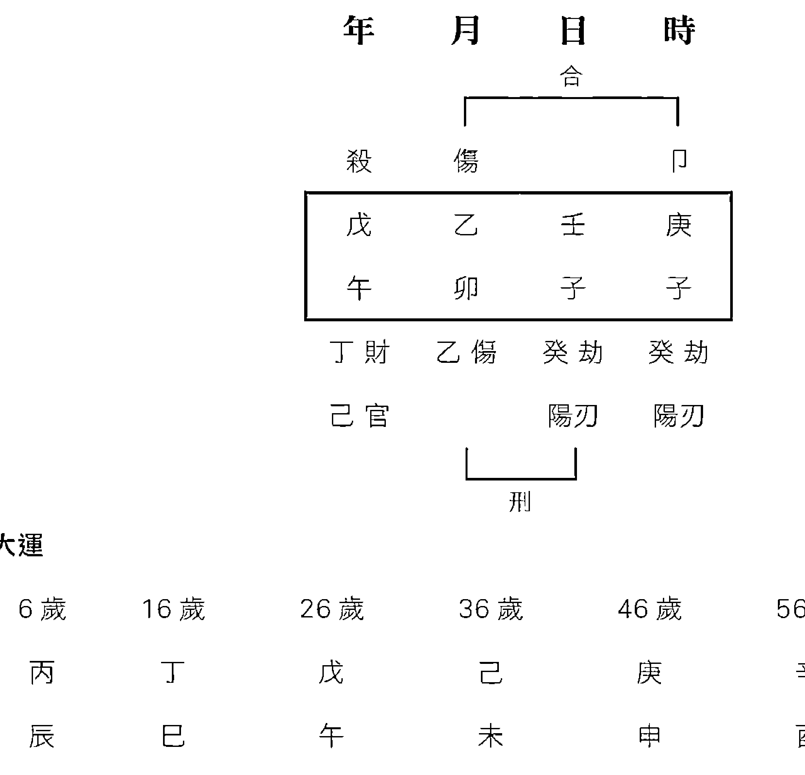

康有為（1558年3月20日子時生），原名祖詒，字廣廈，號長素，廣東省南海縣丹灶蘇村人，人稱康南海。中國晚清民初時期重要的政治家、思想家、教育家，資產階級改良主義的代表人物。

康有為出生於封建官僚家庭，1879年（光緒五年）開始接觸西方文化。1888年（光緒十四年），康有為再一次到北京參加順天鄉試，借機第一次上書光緒帝請求變法，受阻未上達。1891年（光緒十七年）後在廣州設立萬木草堂，收徒講學。1895年（光緒二十一年）得知馬關條約簽訂，聯合1300多名舉人上萬言書，史稱「公車上書」。
1898年（光緒二十四年）進行戊戌變法。變法失敗後流亡日本，組織保皇會。辛亥革命後，作為保皇黨領袖，他反對共和制。1917年，康有為和張勳發動復辟，擁立溥儀登基，不久宣告失敗。1927年病死於青島。

觀察康有為命造，實際上，這是具有特殊形象的八字。可以圖示如下：

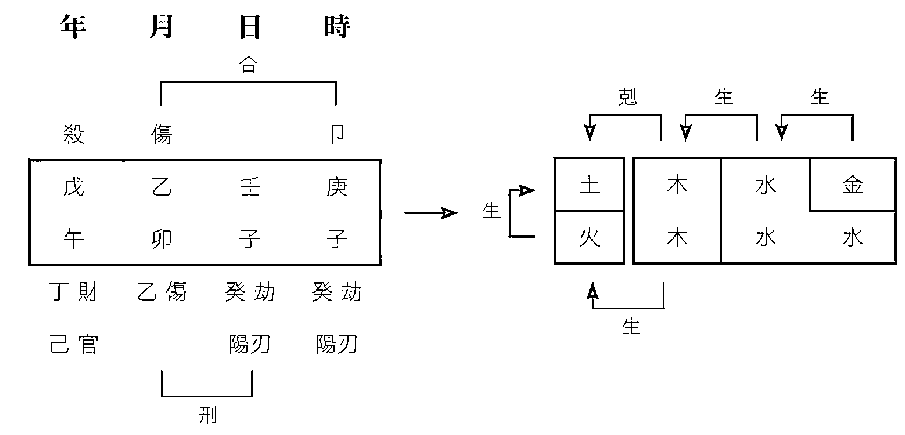

圖10.1 康有為八字圖示

從圖示可以看到嗎，日時兩柱為水，月柱乙卯為木，為旺水生強木，有水木清華之象。進一步觀察，地支卯木生午火，午火再生年干戊土。這樣，從時干庚金始，金生水、水生木、木生火、火生土，全局能量灌注到戊土七殺。七殺為權威，為號召力，為影響力。接着，月干乙木傷官，制約戊土，為傷官駕殺，控制住這個權力，影響力。所以命主是一個在歷史舞台上具有深遠影響力的政治人物。

從格局講，這是一個清純的傷官格，傷官駕殺，獲取權貴。可惜，這個乙木被時干庚金合去，庚金偏印合絆了這個乙木。儘管是遙合，乙木的智慧和行動力還是要被打個折扣的。戊戌變法，僅是「百日維新」（1898年6月11日-1898年9月21日），除了種種客觀的歷史原因，作為變法的主要領導者的八字也顯露了失敗的緣由。顯然，不能小覷這個「合」啊！

再看清代學者畢沅的命造：

```
年 月 日 時
合
殺 劫      官
庚 乙 甲 辛
戊 酉 寅 未
戊才 辛官 甲比 己財
辛官       丙食 丁傷
丁傷       戊才 乙劫
祿
```

| 年齡 | 2歲 | 12歲 | 22歲 | 32歲 | 42歲 | 52歲 | 62歲 |
|------|-----|------|------|------|------|------|------|
| 天干 | 丙  | 丁   | 戊   | 己   | 庚   | 辛   | 壬   |
| 地支 | 戌  | 亥   | 子   | 丑   | 寅   | 卯   | 辰   |

命例16 乾造：［清］畢沅（1730-1797）

畢沅，字繤蘅，亦字秋帆，江蘇鎮洋（今江蘇太倉）人。幼年失父，由母親張藻養育成人。因從著名學者沈德潛學於靈岩山，自號靈岩山人。1760年（乾隆二十五年）進士，廷試第一，狀元及第，授翰林院編修。累官至河南巡撫，湖廣總督。1797年病逝，壽67。

畢沅是清代著名学者。經史小學金石地理之學，無所不通，續司馬光書，成《續資治通鑑》，又有《傳經表》、《經典辨正》等。

觀察這個八字，月支酉金正官，但天干透出庚殺、辛官，為官殺混雜。月干乙木合住庚金，正好是去殺留官，結構便由此去濁澄清，以正官為格，成就這位著名學者。這是天干相合為喜的例子。

寫到這裏，想起最近遇見的一位熟識的朋友。他在美國讀的學位，以後留下工作並成了家。五年前「海歸」回來開公司，不料「後院」起火了。他的太太要跟別人走了。他的命造如下：## 命例17 乾造：鐘先生（1970年9月24日卯時生）

年 月 日 時
財  比  殺  大運
庚 乙 丁 癸  45歲
戊 酉 未 卯  庚
戊傷 辛官 己食 乙比  寅
辛才  丁比
丁比  乙比
合

命造年干與月干也是乙庚相合，庚為日主之正財，為妻星。目前正在庚金大運中。財運讓他回來謀財，不料也引動了年干庚財妻星，讓鄰邊的乙木有機可乘，來奪其愛了。看他一副沮喪的樣子，好像已經很難挽回了。他們還育有兩個女兒，都未成年。莫非又是命運在跟人開玩笑？

## D. 阻隔

下面是最近一位朋友來問的案例。朋友的學生有一位女友，已經同居了好幾年了。去年（2019年）11月，原來正談及婚嫁之事，突然那位女友變了臉，要求終止戀愛關係。他的學生感到十分不解，感情上不能接受：「是否神經不正常了？」於是拿來這位女友的八字，看看有沒有命理上的緣由。命造如下：

年 月 日 時
合
合
官 食 印
戊 乙 癸 庚
辰 卯 酉 戌
戊官 乙食 辛們 庚印
乙食 貴人 壬劫
癸比     戊官
害     沖
合

| 大運 | 流年 | 流月 |
|------|------|------|
| 2012年 | 2019年 | 11月 |
| 24歲 |      |      |
| 壬   | 己   | 乙   |
| 子   | 亥   | 亥   |

觀察這個八字，年柱戊辰，跟日柱癸酉正好是干支相合，戊為日主之正官，坐辰土，為日主夫星，可謂是「官來就我」，官有情於「我」。可是月柱乙卯，正好「豎」在兩者之間，成了天干通道的阻隔。好在乙木與時干庚金也遙合，減輕了阻隔之力道。前幾年，流年丙申（2016年）、丁酉（2017年）以及戊戌（2018年），不是火來化木，就是戊土直接來合日主，消了這個障礙。現在已走在子運了。子卯刑，申子辰合，顯然都不利戊土官星之根基。今年己亥流年，己土七殺來混官，亥水又合卯木，顯然都是有礙婚姻的信號。11月流月乙亥，乙木出干，直接引動了乙卯柱「豎」在年、日之間。儘管戊土官星有情，奈何乙木食神無情。食神也反映着命主自己的思想情感。於是就發生了要求「分手」的情況，莫非是「命」？據說，我朋友的學生已是坤造的第三個男友了。可見此坤造成婚的確不易（如果再把夫宮卯酉沖考慮進去）。

## E. 虚浮

日前看到一個女孩的命造：

| 年 | 月 | 日 | 時 |
| :---: | :---: | :---: | :---: |
| 印 | 印 | | 官 |
| 甲 | 甲 | 丁 | 壬 |
| 戌 | 戌 | 酉 | 寅 |
| 戊傷 | 戊傷 | 辛才 | 甲印 |
| 辛才 | 辛才 | | 丙劫 |
| 丁比 | 丁比 | | 戊傷 |

| 大運 | | 流年 | |
| :---: | :---: | :---: | :---: |
| 10 歲 | 20 歲 | 18 歲 | 24 歲 |
| 癸 | 壬 | 壬 | 戌 |
| 酉 | 申 | 辰 | 戌 |

## 命例19 坤造：1994年11月7日寅時生。

這個女孩在16歲喜歡上一個男生，追了兩年，在2012年（壬辰年）終於如願以償。遂與之同居，還幫助男友還債，並打算2019年25歲時結婚。可是2018年（戊戌年）5月（丙辰月）男友突然提出分手。原因是男友原來的女友追來了，還帶着一個幼兒。

從命造看，壬水正官透出在時干上，合進日干，也是官來就我，有情分。可是它在四個地支上沒有根基。這是天干成分虛浮的現象。命主15歲進入酉運。酉引動夫宮，少女情竇初開。18歲流年壬辰，跟日柱丁酉天合地合，壬水為官星，故追上了一個自己喜歡的男朋友。進入壬水正官運，與男朋友同居。2018年戊戌流年，丙辰月，冒出一個男友原來的女朋友，於是男友跟她分手。因為戊土傷官直剋壬水正官，因為虛浮，所以很容易被剋去。當然，丙辰流月，丙火生戊土，三戌沖辰，更是推波助瀾。

仔細觀察天干層面符號之間的關係，可以提取出很多有關命造生命特徵、以及人生過程的具體信息。

## 地支層面

下面我們探討地支層面的符號關係。地支要比天干複雜。前述的刑沖會合主要發生在這個層面上，它們帶來了命局豐富多彩的變化，需要分析者仔細識別。

## A．連環相生

天干層面時，我們談到天干連環相生，這是友情的表現。其實，地支也是如此。見下面命造：

| 年 | 月 | 日 | 時 | 大運 | 流年 |
|---|---|---|---|---|---|
| 劫 | 才 | | 比 | | |
| 己 | 壬 | 戊 | 戊 | 32歲 | 37歲 |
| 亥 | 申 | 辰 | 午 | 戊 | 丙 |
| 壬才 | 庚食 | 戊比 | 丁印 | 辰 | 子 |
| 甲殺 | 壬才 | 乙官 | 己劫 | | |
| | 戊比 | 癸財 | | | |
| 壬祿 | | 己祿 | | | |

命例20　乾造：1959年8月24日（農曆7月11日）午時生 ①

這是一個台灣的「富二代」。局中地支從時支午火生日支辰土，辰土生月支申金，申金再生年支亥水，一路順生，十分有情。雖然地支一般處於靜態狀態，但並不是說它們之間沒有一點影響了。此命局最妙處在於月干透出壬水偏財，此壬水以亥水為祿。可見此順生之「結穴」，正是月干之根源。月干為命主之父位。偏財為父星。其星坐其宮，故其父是某大企業的大股東，十分富有。

當然，此結構也有瑕疵，即年干己土劫財，緊鄰月干偏財，所以命主不慎的話，就有破財的機會。的確如此，在辰運丙子年（1996年），朋友向人調頭寸，由他代為背書，結果朋友跑到國外去了，害他承擔了2千多萬債務，被其父罵得狗血噴頭。究其原由，流年子，與大運辰，以及結構中之申、辰，會成申子辰水局，沖時支午火，引動了年干己土（午為己之祿），己土劫了壬水之財。局中瑕疵被引動了，成了應期。

這裏顯示，地支的活動聯繫着其上的天干成分。

## B．貪合忘剋

在中國歷史上，八字命理學最盛行的時期大概是明朝了。明朝歷代皇帝的名字，都是按照五行相生的關係來起的。(10)喜好命理的風氣一直延續到清代。清朝定都北京後第三個皇帝——雍正皇帝，或許是他們中對八字興趣最濃、最擅長操作的一個。據《明清皇室與方術》一書記載，雍正最信命運，以為人的休咎榮枯，甚至品操能力，在他誕生時已經決定了，推算八字就可明白。故雍正喜歡親自為大臣批八字。甚至，批八字，居然成了雍正觀察考核臣子德性與才能的重要窗口。他把臣子分為上中下、再分上中下共九等，作為日後選拔任用官員的初步依據。被劃入下等的人，可能就不能提拔重用了。

那麼，我們來看看這位喜好命理的皇帝自己的八字(11):

| 年 | 月 | 日 | 時 |
|----|----|----|----|
| 傷 | 印 | | 殺 |
| 戊 | 甲 | 丁 | 癸 |
| 午 | 子 | 酉 | 卯 |
| 丁比 | 癸殺 | 辛才 | 乙卩 |
| 己食 | | 文昌 | |
| | | 貴人 | |
| 丁旺 | 癸祿 | 長生 | 甲刃 |
| 戊刃 | | | |

- 9歲 乙丑
- 19歲 丙寅
- 29歲 丁卯
- 39歲 戊辰
- 49歲 己巳
- 59歲 庚午

命例21A 乾造：[清] 雍正皇帝（1678-1735）

愛新覺羅·胤禛（1678年12月13日卯時生），康熙帝第四子，母為孝恭仁皇后。1698年（康熙三十七年）封貝勒；1709年（康熙四十八年）胤禛被封為雍親王。在二廢太子胤礽之後，胤禛積極經營爭奪儲位，1722年（康熙六十一年）繼承皇位，次年改年號雍正。

雍正帝在位期間，勤於政事，自詡「以勤先天下」、「朝乾夕惕」。他的一系列社會改革對於康乾盛世的連續具有關鍵性作用。1735年（雍正十三年）去世。

雍正帝日干丁火，地支恰好是子、午、卯、酉。子午卯酉為四正，傳統命理稱為四位純全格。然而子午相沖，卯酉相沖。一般而言，子午沖，子水剋午火；卯酉沖，酉金剋卯木。同時，子午卯酉為四桃花，是五行的沐浴之地，命主容易風流成性。

觀察雍正八字全局，四個天干在地支上都有根基：丁火通根在午（祿），甲木通根在卯（刃），癸水通根月支子（祿），戊土通根坐支午（刃）。從格局上講，時干癸水七殺通根月令，為七殺格。冬月火弱，正好月干透出甲木正印，以甲木為用神，構成殺印相生的宏大局面。

雍正是在戊辰大運跨進辰的時候繼位做皇帝的，時年44歲，流年壬寅。為什麼要到辰運呢？固然有許多外部無法估算的條件，但從命理上講，日主終究生於冬月，地支子水剋午火，酉金剋卯木，木火根基均有損傷。雖然歷經丙寅、丁卯大運，扶助日主，終究避免不了地支的沖剋。現在，大運辰土出現，辰合酉，辰合子，把爭鬥兩個主動方一下子都牽制住了。

由此可見，會合能解刑沖，是具體論命中的一條重要的規則。《子平真詮》說：「八字支中，刑沖俱非美事，而三合六合，可以解之。」這就是論命時常說的「合能解沖」或「貪合忘剋」。

## C. 巳寅申三刑

在地支刑沖會合中，相對比較兇險的是巳寅申三刑。即寅刑巳，巳刑申，申刑寅，是氣雜不能融合而刑，稱作「無恩之刑」。《三命通會》說：「寅有生火刑巳上生金，巳上寄生土刑申上長生之水，申中生水刑寅中生火。不恤所生，遙相剋制，故曰無恩。」下面是鍾義明《命理腦筋急轉彎》中所載的一個八字^(12)，局中帶有巳寅申三刑：

| 年 | 月 | 日 | 時 | 大運 | 流年 |
| :---: | :---: | :---: | :---: | :---: | :---: |
| 辛 | 庚 | 壬 | 戊 | 1974年 | 1980年 |
| 巳 | 寅 | 辰 | 申 | 33歲 | |
| 丙才 | 甲食 | 戊殺 | 庚印 | 丙 | 庚 |
| 庚印 | 丙才 | 乙傷 | 壬比 | 戊 | 申 |
| 戊殺 | 戊殺 | 癸劫 | 戊殺 | | |
| 三刑 | | | | | |

命例22 乾造：某先生（1941年2月13日申時生）

命主去美國在兒子別墅內被炸死。事情發生在1980年庚申，命主在丙戌大運之戌中。台灣吳懷雲評說：「命中寅巳申帶三刑，三刑逢沖大部分不能自然逝世，都會遭到意外之不幸。」事實上，丙戌運跟日柱壬辰天剋地沖，已經埋下了動盪不寧的因素。流年庚申再引動原局中已有的寅巳申三刑，於是就發生了這樣的慘案。《三命通會》說：「辰是水庫，屬天罡。戌是火庫，屬地魁。辰戌相見，為天沖地擊。」這裏，辰上坐壬，戌上坐丙，火庫與水庫都裝滿了各自的五行能量，兩庫相沖，其象確似爆炸一般。自然，八字殺重而財運壞了印星，也是造成這慘案的命理原因。

## 這是一個空難的八字(13)：

| 年 | 月 | 日 | 時 | 大運 | 流年 |
| :---: | :---: | :---: | :---: | :---: | :---: |
| 己 | 壬 | 庚 | 庚 | 27歲 | 32歲 |
| 丑 | 申 | 寅 | 子 | 己 | 辛 |
| 己印 | 庚比 | 甲才 | 癸傷 | 巳 | 酉 |
| 癸傷 | 壬食 | 丙殺 | | | 陽刃 |
| 辛劫 | 戊印 | 戊印 | | | |
| 祿 | | | | |
| 沖 | | | | |

命例23 乾造：空難者（1949年8月28日子時生）

這是台灣遠東航空公司1981年8月22日空難中的罹難者。命局內有寅申相沖。32歲進入巳運，構成寅巳申三刑。流年辛酉，正是庚金日主之陽刃，巳酉丑又合金局，陽刃逢冲合，都容易造成突發事故，故有此奇禍。夫人和孩子都同機遇難。究其原因，財（妻星）和殺（子星）都在日支寅中，寅巳申三刑，將寅木徹底傷盡了。

筆者想起了一位故友的八字：

年 月 日 時
食 食     殺
丙 丙 甲 庚
戊 申 寅 午
戊才 庚殺 甲比 丁傷
辛官 壬比 丙食 己財
丁傷 戊才 戊才
庚祿 甲祿
沖
合火局

| 大運 | 流年 | 流月 |
|---|---|---|
| 2006年 | 2013年 | 6月 |
| 60歲 | | |
| 壬 | 癸 | 戊 |
| 寅 | 巳 | 午 |
| 丙祿 | | |

命例24 乾造：羅先生（1946-2013）

這是我熟悉的曾一起研討命理的朋友。他逝世前三天，我們還一起聚談。三天後的晚上，他外出散步，竟摔倒在路上。過路行人叫救護車把他送往醫院，在途中他就走了。醫生診斷是心肌梗死。

查看他的八字，局中木火炎炎，好在中年一路走的是金水運。60歲進入第六柱壬寅運。第六柱大運通常跟月柱天剋地沖，若結構內喜用在月柱上，則要十分注意，往往會成了「壽關」。2013年，已入寅運。流年癸巳，正好構成巳寅申三刑。當年流月戊午，又添火勢，又增燥氣，竟然發生了這樣的生命悲劇。

再進一步分析，局中天干為甲、丙、庚。是七殺格，食神制殺格局。寅為日主甲之祿，申為七殺庚之祿，流年地支巳為丙火食神之祿，三個祿正好碰上了，構成了巳寅申三刑，怎能不引起生命之患呢？可惜當時大家都沒有引起重視。

## D．傷祿

其實，干支通祿，也就是干通於支。干支是有連體之意的，有以下八組：

- 甲寅
- 乙卯
- 庚申
- 辛酉
- 丁巳
- 丙午
- 壬子
- 癸亥

其中前四組是坐祿；後四組，因為水火是陰陽錯配，依然可以當作為坐祿看。它們充當日柱時，干支一體，一般不宜被刑或被沖，容易引起災禍。如果放寬一些，以下干支也可以包括進去：

- 甲辰
- 乙未
- 乙亥
- 丙寅
- 丁未
- 戊午
- 己巳
- 辛丑
- 壬辰
- 壬申

這十柱中干要依靠支來生存，支壞了干也跟着壞了，因此也不宜遭受刑或被沖。

右頁我們來看北宋著名政治家、文學家歐陽修的命造：

| 年 | 月 | 日 | 時 |
|---|---|---|---|
| 食 | 財 | | 財 |
| 丁 | 戊 | 乙 | 戊 |
| 未 | 申 | 卯 | 寅 |
| 己才 | 庚官 | 乙比 | 甲劫 |
| 丁食 | 壬印 | | 丙傷 |
| 乙比 | 戊財 | 祿 | 戊財 |
| 合 | 合 | 沖 | |

| 大運 | 1歲 | 11歲 | 21歲 | 31歲 | 41歲 | 51歲 | 61歲 | 流年 | 1071年 | 1072年 |
|---|---|---|---|---|---|---|---|---|---|---|
| | 丁 | 丙 | 乙 | 甲 | 癸 | 壬 | 辛 | | 辛 | 壬 |
| | 未 | 午 | 巳 | 辰 | 卯 | 寅 | 丑 | | 亥 | 子 |
| | 64歲 | 65歲 | | | | | | | | |

命例25A 乾造：［宋］歐陽修（1007-1072）

歐陽修（宋真宗景德四年六月廿一寅時生），字永叔，號醉翁、六一居士，吉州永豐（今江西省吉安市永豐縣）人。北宋政治家、文學家。官至翰林學士、樞密副使、參知政事，諡號文忠。他是「唐宋散文八大家」^(14)之一。

觀察歐陽修的八字，日柱是乙卯，正是日主乙木坐祿。這個八字的關鍵點在卯（祿）跟申暗合，把月令正官合了進來，為我所用，如同「官來就我」；同時，它又阻礙了寅申遙沖，不破官星。這是此八字官貴的根據。然而，年干食神高透，生戊土雙財，戊土又坐寅、申，為氣質較弱之地，故為虛，為才華。所以命主又能文冠天下，開創宋代文壇一代風氣。筆者至今還能記得小時候讀的《醉翁亭記》中的佳句。

進一步觀察此造晚年61歲開始的辛丑大運。乙木為嫩木，忌辛金剋伐。八字幸有丁火食神制殺，反而成就了歐陽修政治生涯的巔峰。64歲辛亥年，辛金七殺強盛，但地支亥卯未三合祿局，是年，歐陽修授觀文殿學士、太子少師，這是他仕途生涯之巔。6月，歐陽修卻堅辭官職，隱居潁州（今安徽阜陽）。這種急流勇退的態度，令當時朝廷士大夫無不驚歎：「近古所無也」。可是第二年，65歲，流年壬子，局勢完全反背：壬水自坐強根合去年干食神丁火，於是七殺無制，直剋日元乙木；同時，子又刑卯，傷了祿身。是年9月，歐陽修在家中逝世。莫非他有知命的預感？

其實歐陽修對命運的確是有深入思考的。他在《夫子罕言利命仁論》中寫道：「貧富窮達，死生壽天，賦分而有定，循環而無端。聖人達之，內照乎神明；小人逆之，外減乎天理。則命之為義，豈不達哉！」所以歐陽翁生性樂觀，樂天知命，有「醉翁之意不在酒，在乎山水之間也。山水之樂，得之心而寓之酒也」這樣的灑脫之句。

下面是明朝中後期政治家、改革家張居正的命造：

| 年 | 月 | 日 | 時 | 大運 |
|---|---|---|---|---|
| 才 | 比 | | 比 | 7歲 庚辰 |
| 乙 | 辛 | 辛 | 辛 | 17歲 己卯 |
| 酉 | 巳 | 酉 | 卯 | 27歲 戊寅 |
| 辛比 | 丙官 辛比 乙才 | 辛比 | 乙才 | 37歲 丁丑 |
| 庚劫 | | | | 47歲 丙子 |
| 祿 | 戊印 | 祿 | | 57歲 乙亥 |
| 合 | 合 | 沖 | | |
| 命例26 乾造：[明]張居正（1525-1582） |

張居正（嘉靖四年五月初三卯時生），字叔大，號太岳，江陵人。明朝中後期政治家、改革家，萬曆時期的內閣首輔，輔佐萬曆皇帝朱翊鈞開創了「萬曆新政」。

1547年（嘉靖二十六年），23歲的張居正考中進士。1567年（隆慶元年）任吏部左侍郎兼東閣大學士。後遷任內閣次輔，為吏部尚書、建極殿大學士。1572年（隆慶六年），萬曆皇帝登基後，張居正為首輔，內閣進入張居正時代。當時明神宗朱翊鈞年幼，張又是皇帝的老師，因此一切軍政大事均由張居正主持裁決。在任內閣首輔10年中，張居正實行了一系列改革措施。財政上清丈田地，推行「一條鞭法」，總括賦、役，皆以銀繳，帶來了「太倉粟可支十年，周寺積金，至四百餘萬」局面。軍事和吏治上也都有革新，政體肅然，史稱「萬曆新政」。1582年（萬曆十年）夏，張居正突患急症去世，享年57歲。張居正也是明代唯一生前就被授予太傅、太師的大臣。但他為萬曆所忌恨，去世後被抄家、家屬流放，至1622年（明熹宗天啟二年）才恢復名譽。

張居正的八字日柱辛酉，也是日主坐祿。初看天干三辛一乙，地支兩酉一卯，比肩奪財，似乎一無是處。但仔細辨認，巳火正官在月令，官星有氣，而日主辛金之祿恰在巳火左右，合住此官。這個位置實在是太關鍵了。兩個酉金貪合巳火，而不沖卯，財星絕處逢生。三辛金通根兩酉祿，乙財通根卯祿，雙祿交互；而一巳火官星居中，兩酉爭合一巳，而不化官為劫。這樣官為用神，財為相神，專論財官，財官成格而取貴。其實，全局功在祿合官貴，「官來就我」，為我所用。

命造47歲進入丙子大運。丙火正官透出，再合三辛，把地支合官的優勢延伸到了天干，於是大權在握，成了政壇的中心，力圖精進，成就了「萬曆新政」。這是中國封建社會晚期的一次涉及政治、經濟、軍事和民族關係領域的全面而較深刻的改革，具有深遠的歷史影響。

1582年，張居正57歲，流年恰逢壬午，歲運天剋地沖，壬水剋丙火，即是傷官見官，官星被剋，群比無制而爭財，格局大破。同時，地支子刑卯，子午卯酉匯成四沖局面，整個結構像是突然轟塌了一樣，一代名臣，竟勞瘁而死。不僅如此，他死後被抄家，累及家屬，長子張敬修上吊自盡，張的另兩個兒子被充軍到邊塞，生死不知。事實上，八字年柱乙酉與時柱辛卯反吟（天剋地沖），已經預示了他身後的下場。

後人評說：「他是一個天才，生於紛繁複雜之亂世，身負絕學，他敢於改革，敢於創新，不懼風險，不怕威脅，是一個偉大的改革家，他獨斷專行，待人不善，生活奢侈，表裏不一，是個道德並不高尚的人。」 「張居正有着天使與惡魔這兩面。他也是一個真正的英雄，是一個孤獨的英雄。即使是現在又有多少人能夠懂他。」

## E. 地支互絕

關於地支互絕，命理書上一般都很少見，只有某些「盲派」應用。它們是：子巳，午亥，卯申，寅酉

> 《盲派命理探寶》說：「絕：異性相剋伐，意外之傷災，大凶、破壞、失和、病等意象，絕是相互的。」（15）

## 命例27 乾造：遺腹子（2017年3月1日巳時生）

最近看到一例解放軍已故烈士飛行員的遺腹子的八字(16)：

年 月 日 時
合 合
比 官 卩
丁 壬 丁 乙
酉 寅 亥 巳
辛才 甲印 壬官 丙劫
丙劫 甲印 庚财
戊傷 戊傷
絶 合 沖

這個八字的父星偏財在年支酉金，上面蓋着丁火，而且月支寅木緊挨着：寅酉互絶，且在上運前，以月柱壬寅為運。由於酉金（父星）遭丁剋寅絶，故此命造一出生就未能見到其親生父親。

於是筆者想到那位偉人的八字：

| 年 | 月 | 日 | 時 |
| :---: | :---: | :---: | :---: |
| 殺 | 印 | | 印 |
| 癸 | 甲 | 丁 | 甲 |
| 巳 | 子 | 酉 | 辰 |
| 丙劫 | 癸殺 | 辛才 | 戊傷 |
| 庚財 | | | 乙 卩 |
| 戊 傷 | | | 癸 殺 |

大運

流年

1910年

1920年

1930年

1920年

1928年

1937年

1938年

17歲

27歲

27歲

壬

辛

庚

庚

戊

丁

戊

戌

酉

申

申

辰

醜

寅

## 命例10B 乾造

這個八字結構內的正財妻星在年支巳火之中。巳火跟妻宮酉金是相合的（巳酉是半個金局）。他們之間是有情分的。但是月支子水與年支巳火是處於互絕狀態，也就是子阻礙了巳中庚財進入妻宮（酉）。這大概是命運的捉弄吧。可是筆者發現，一旦子水被合去，這個障礙物就被消除了。這好像是秦觀詞《鵲橋仙》所寫的「纖雲弄巧，飛星傳恨，銀漢迢迢暗度」那樣。

謂予不信，請看事實：命主的第一次婚姻在1920年，大運在辛（偏財），流年在庚申，庚為正財，申合局中子和辰，於是巳中庚財就入了妻宮。

1928年，他有了第二次婚姻。大運在酉，酉引動夫妻宮，流年戊辰，辰合月支子水，又一次消除了互絕障礙。

他的第三次婚姻在申運中。申合子和辰，又一次為巳酉合打開了通道。1937年丁丑，巳酉丑成財局，是戀情萌生的開始，於是有了1938年的結婚。

因為互絕的兩個地支，同時又有暗合的關係，比如，子巳，子中癸水合巳中戊土；寅酉，寅中丙火合酉中的辛金。所以，把它理解為：破壞、結束，接着重新開始，進入新一輪循環，或許更確切些。自然，這已經牽涉到地支藏遁的內容了。

## 地支藏遁層面

這是本書要開拓的一個重要方面，也是設計這個符號大架構的主要原因。命理的一般分析，僅在天干、地支之間進行。涉及到一些比較特殊的現象時，自然會引進地支藏遁的內容，來予以說明。但是迄今為止，並沒有將這樣的分析系統化。筆者在本書中要做的，是架構一個理論分析框架，把地支藏遁的分析容納進這個框架裏。這樣，不僅可以整理以往命理前輩和當代人已經做過的分析，還可以進一步在大的理論框架下做出新的開拓，挖掘新的信息，形成新的認識，獲取新的經驗，去接受日益豐富的現實生活的挑戰。這是本書寫作的主要宗旨。

實際上，對以下干支上下暗合的認識，已經為這方面探索拉開了帷幕。它們是：

- 丁亥
- 戊子
- 辛巳
- 壬午

我們可以標記如下：

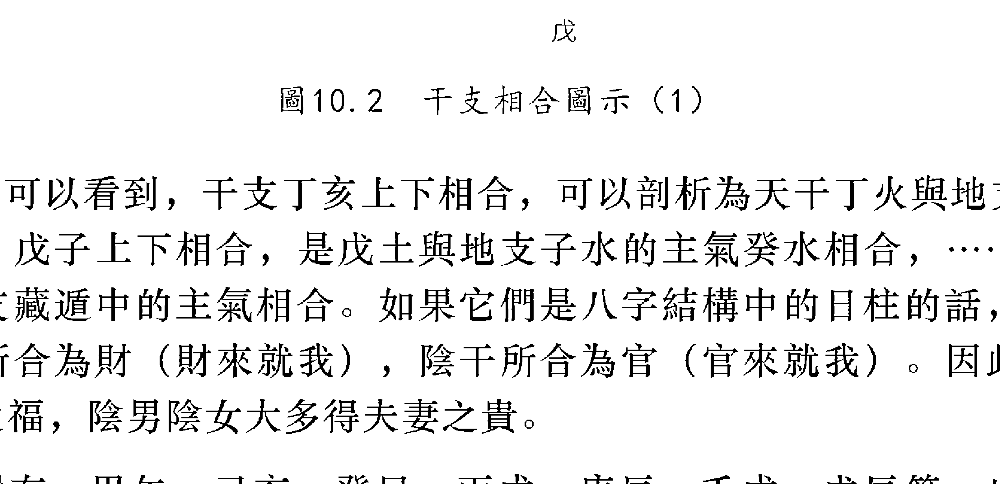

從圖示中可以看到，干支丁亥上下相合，可以剖析為天干丁火與地支亥水中的主氣壬水相合；戊子上下相合，是戊土與地支子水的主氣癸水相合，……這四組，都是天干跟地支藏遁中的主氣相合。如果它們是八字結構中的日柱的話，跟天干五合一樣，陽干所合為財（財來就我），陰干所合為官（官來就我）。因此，陽男陽女大多得夫妻之福，陰男陰女大多得夫妻之貴。

其實，還有：甲午、己亥、癸巳、丙戌、庚辰、壬戌、戊辰等，也是同樣的情況，只是天干所合的並非地支藏遁之主氣。丙戌、庚辰、壬戌、戊辰四柱，因為戌、辰為墓庫，所以相合更需要條件，就是只有當戌庫被丑、未刑開的時候，或辰庫被戌沖開時，暗合才有實際效果。這幾柱干支相合的情況圖示如下：

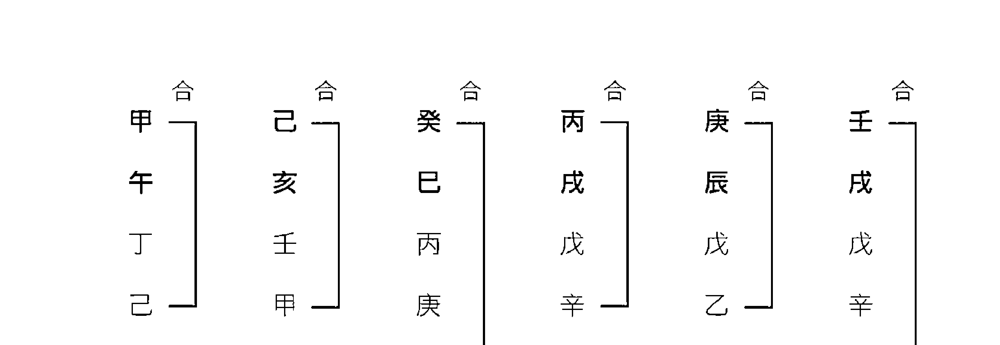

筆者見過這樣的八字：

**八字命盘**

| 年柱 | 月柱 | 日柱 | 時柱 |
|------|------|------|------|
| 丙辰 | 辛丑 | 丁亥 | 乙巳 |

**大運**

| 年齡 | 干支 |
|------|------|
| 9歲 | 庚子 |
| 19歲 | 己亥 |
| 29歲 | 戊戌 |
| 39歲 | 丁酉 |
| 49歲 | 丙申 |
| 59歲 | 乙未 |

## 命例28 坤造：張女士（1977年1月30日上午10時生）

張女士是影視劇演員，人長得很漂亮。現今40多歲了，舉止還是像個姑娘似的。她的夫君是菲律賓富商，長期在東南亞經商。夫妻聚少離多。筆者當時看了八字後，覺得她亥運成婚的可能性較大。因為亥水（25至29歲）引動了她的夫妻宮（亥）。於是進一步推測那幾年的流年：2002年壬午（她25歲），正好跟日柱丁亥干支上下相合，而且壬為正官夫星，來合日主丁火，是十足的「官來就我」。於是就斷：2002年有結婚之慶。——居然言中了。雖然日支（夫宮）亥與時支已是巳亥相沖，但這麼多年來，婚姻還十分穩定，沒有大的風波。筆者認為，需要感謝丁亥干支暗合的功效。當然，她和丈夫的年紀相差較大（有20來歲），巳亥六沖是亥（水）勝巳（火）敗，以及聚少離多等因素，也有作用。

這裹我們來看一下台灣地區領導人馬英九的八字。

| 年 | 月 | 日 | 時 |
| :---: | :---: | :---: | :---: |
| 傷 | 才 | | 食 |
| 庚 | 癸 | 己 | 辛 |
| 寅 | 未 | 酉 | 未 |
| 甲官 | 己比 | 辛食 | 己比 |
| 合 | | | |
| 丙印 | 丁P | | 丁P |
| 戊劫 | 乙殺 | 文昌 | 乙殺 |
| 殺庫 | | | 殺庫 |

| 大運 | | 流年 | | |
| :---: | :---: | :---: | :---: | :---: |
| 1999年 | 2009年 | 2008年 | 2012年 | 2016年 |
| 49歲 | 59歲 | | | |
| 戊 | 己 | 戊 | 壬 | 丙 |
| 子 | 丑 | 子 | 辰 | 申 |

## 命例29 乾造：馬英九（1950年7月13日未時生）

八字結構裹，天干傷食生財，癸水偏財無根坐在土庫上，顯然是才華。驟眼一看，這應該是一個教授的八字。為甚麼命主確是一個政治人物呢？因為地支上有兩個未庫。未庫是己土日主的七殺庫。然而，一個重要的線索不能忽視，那就是年支寅官與未庫的關係。儘管在地支層面，寅與未似乎沒有多的聯繫。但如以上命造圖示，寅中主氣甲木官星與未庫主氣己土相合。年柱主祖上，主政府，主官方權威。命主為己土，未中主氣己土可以看作是命主到了地宮，它與年支中甲木官星相合，也就是它得到了來自官方的資源。

證之事實，馬英九自美國留學回台灣，就在當時蔣經國身邊做英文秘書，陪伴了蔣經國八年。這是一筆不容忽視的政治財富，也由此使馬英九走上了政壇的不歸路。因此，當走到己丑大運時，成為了台灣地區兩屆最高領導人的時候，由丑這個食神庫（丑金庫為日主己土之食神）打開了七殺庫（未）、並控制七殺庫的時候，這個庫中儲存其內的甲木正官之政治能量也一併發揮出來了。

顯然，這種分層次、全面展現結構內涵的命理符號學框架，可以幫助我們進一步挖掘八字所具有的的信息。

最後，把天干層面、地支層面和地支藏遁層面則三個層面組合起來，以錢穆命造來予以展示它們之間的關係。下面是前文中已經標記了各層面存在的會合刑沖關係

# 的圖示：

| 年 | 月 | 日 | 時 |
| :---: | :---: | :---: | :---: |
| 官 | 財 | | 才 |
| 乙 | 癸 | 戊 | 壬 |
| 未 | 未 | 寅 | 戌 |
| 己劫 | 己劫 | 甲殺 | 戊比 |
| 丁印 | 丁印 | 丙P | 辛傷 |
| 乙官 | 乙官 | 戊比 | 丁印 |
| 衰 | 衰 | 長生 | 墓 |
| 貴人 | 貴人 | | 華蓋 |

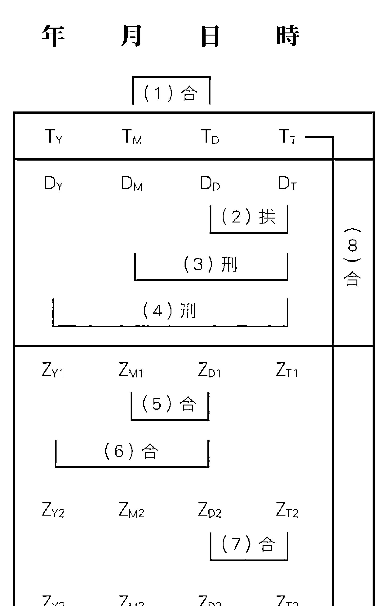

## 圖8.3 乾造：錢穆先生（1895-1990）

圖中指示了：1.天干層面：（1）戊癸合；2.地支層面：（2）寅戊拱；（3）未（月支）戊刑；（4）未（年支）戊刑；3.地支藏遁層面：（5）甲己合；（6）甲己合；（7）丙辛合；4.跨層面：（8）丁壬（時干）合。共8種關係。它為我們分析提供了依據。

現在我們可以逐一檢點它們在命理上的詮釋意義：

首先是從日主開始。日主戊土，是陽土，具有中正固重的性質。其像是堅實、厚重，如城牆，如堤岸。土為稼穡，種植稱稼，收割稱穡。它顯示土是生長萬物的，既為萬物提供能量，也管萬物的收藏。故土具有誠實、奉獻、包容、博愛的性情。這是命主個性的顯露。

戊土生於立秋前18天，土氣最為燥熱，象烘乾爐那樣，催着萬物快快成熟。現天干層面有戊癸相合（1），是癸水正財來就我日主。癸水如雨露，滋潤六月火燥的戊土，實有甘霖一般的效用。這是命主調候所需的元素，避免了「旱土」的危險。（若是「旱土」的話，就會喪失生育能力，變成死硬派了。）

日主戊土支坐寅木，是得甲木為用。土厚需甲木疏耘。《窮通寶鑑》認為，土多得一甲木出干，無庚、辛金相剋，乃獨殺為用，為人做事軒昂，篤厚好名聲。此八

字雖無甲木在干，但日主自坐寅木，也有同樣的效果。這是錢穆在學術上創新精神的根源。

在地支層面上：有寅戌拱（2），和兩個戌未刑（3，4）。一方面戌刑開未土，使乙木正官出庫，於是天干乙木得根，使錢穆一下子出了名。這印證了錢穆人生的第一次大轉折（1930年），因發表了《劉向、歆父子年譜》論文，贏得了學術聲譽，經顧頡剛的推薦，錢穆進入了大學學府，開始了大學教授的生涯。

另一方面，未刑開時支戌庫，成為火庫，正印庫，文明庫。它居於時支，是處於晚年，意義就更大了。它使錢穆的學問積累出現了火山噴湧的境地。接着，日支寅又與戌庫相拱火局，增加了火勢的能量，使錢穆先生通過自己的學術思想、學術著作，光照學術界，成為了國學的一代宗師。寅是日支，通過它，合了戌庫，回到了日柱，使命主可以擁有這樣的聲譽。

再進一步觀察地支藏遁層面，首先是寅未有暗合，表現在未中己土合寅中甲木（5，6），這樣，把兩個未都跟命主聯繫起來了。兩個未都是日主的貴人，已是劫財，可以看作是學術同道，甲木是日主的坐支，其中主氣甲木七殺，反映了命主的創新精神。甲己合，其像是命主的創新精神，被同道所欣賞，所認同，他們又都是貴人，或者說，是當時學術界頗具影響力的人物。

這又是印證了錢穆生命歷程的第一個轉折點：是當時史學界已享有名聲的古史辨領軍人物顧頡剛教授推薦了錢穆，去燕京大學任課，而最主要的原因是錢穆發表的《劉向、歆父子年譜》（17）。這篇論文梳理出兩漢經學諸史實，逐年列出，進而指出康有為《新學偽經考》說劉歆偽造古文經之不通有二十八處，解決了近代學術史上的一大疑案。這是錢穆的成名作。錢穆這種勇於在學術上挑戰並取得了成功，贏得了同道的讚譽。

在地支藏遁層面，我們還看到日支藏遁丙火偏印與戌庫中的辛金傷官相合（7），這是將思想的創新引歸到公眾的學術認識上去。而戌中丁火正印穿越地支層面，直接跟上面時上天干壬水相合（8）則更耐人尋味。壬水為偏財，這個偏財可以看作是才華，這個顯露的才華卻合剋了戌庫中的丁火正印，豈不是才華反而影響了他的學術聲譽？如果聯繫錢穆的真實人生，的確是這種情況。由於錢穆對古史的真知灼見，反而得罪了胡適的高足傅斯年。錢穆隨着自己史學理論體系的日漸成熟，對史料考據派曾進行過全面批評。為此，作為該學派領袖的傅斯年竟然在抗戰勝利後不聘錢穆回北大，同時也把錢穆拒之於中央研究院之外。才華反而帶來了困擾，這段現代學術史上的恩怨不是也明明白白的寫進了這個八字結構中了嗎？

以上對錢穆八字通過符號學框架的觀察和刻畫，可以展現出許多人生的細節來。

## 註釋

(1) 王相山《相也太極命理學》（基礎卷）。

(2) 載《三命通會》卷十。

(3) 現代「盲派」是否定「化」的功能的。

(4) 在這方面，「盲派」刻畫得比較細膩。不僅注意到地支之間的「合」，也注意到因合而產生的內部生剋、動靜關係。

(5) 但現代「盲派」不理會這六合究竟各自「合」成甚麼、「化」成甚麼。在他們看來，「地支六合並不講合化，只講合。」（《段氏理象學》，25頁。）

(6) 對於沖與刑的差別，朱鵲橋先生有過一個通俗的講法：沖是方位相沖，立場不同，是對抗；刑不是對抗，就是人與人之間「合不來」。天干沒有刑，只有地支才有刑，因為地支每一個宮位都代表了一種六親關係，於是刑必及六親。這種看法確實是經驗之談，頗有見地。

(7) 「穿」除了破壞的含義，還有一層「倒」的意思。正的東西可以被穿偏，偏的東西可以被穿正。這又是「象」了，具有象徵意義。

(8) 據稱第一個應該是黃觀，但被明王朱棣除名。

(9) 取自許羽賢《子平命學錦囊》，119頁。

(10) 見拙作《命運的求索》，436頁。

(11) 見劉躍軍《清朝皇室命譜》，2頁。

(12) 摘自鍾義明《命理腦筋急轉彎》，300頁。

(13) 摘自高景炎《八字實例解析》，119頁。

(14) 唐宋散文八大家是韓愈、柳宗元、歐陽修、蘇軾、蘇洵、蘇轍、王安石、曾鞏。

(15) 蘇國聖、蘇雙聖《盲派命理探寶》，31頁。

(16) 見《相也論命筆記》（油印本）。

(17) 最初發表在1930年《燕京學報》第七期上。

## 第十一章 角色和大舞台

命理學是通過個人出生的時空結構來刻畫個體生命的特徵以及他的生命過程的。有了前文已經展現的命理符號學的分析工具，本章嘗試應用它來對個體生命做全方位的描述。

人天生是社會的動物。人離不開社會的大舞台。人是社會大舞台上的一個的角色。誠如每一個人出生的時空結構（八字）只是二十二個干支符號庫（字庫）中取出的八個符號（可以重複取出）的組合，這個組合僅僅只是宇宙場氣運動循環中的561，600個片段結構之一，故他具有與生俱來的自己的獨特性。他比戲劇舞台上演岀的角色要更加複雜，面目更加多樣，個性更加豐富。根據符號學原理，這個獨特性是在系統的比較中存在的，也就是它的區別性特徵。

那麼，傳統命理是如何把這樣獨特的組合跟社會大舞台聯繫起來的呢？在《中國命理學史論》中，筆者把它歸納為兩個主要映射網絡：財官網絡和六親網絡。本章從財官網絡談起。

## 財官網絡

「財」，是錢財；「官」，是官貴，即權力和地位。

在中國歷史上，自秦始皇統一中國以後，建立了一整套中央集權的君主專制制度。秦皇朝只有十五年，但其影響十分深遠。跟這種集權官僚政治制度相適應的文化，稱作官文化。它以儒家道統為主幹，推崇官本位，用以維繫官僚地主階級內部的等級。同時，它明確和強化權力意識，將政治權力作為主體，並以此來控制經濟、文化以及社會生活的各個領域。因此，官是主導性的。自然，宋明以後，都市的擴展，尤其是近代出現的「富國強民」潮流，也把資本主義對財富的追求帶了進來，於是官和財逐漸結合一體。這種文化形態一直延伸到1911年的辛亥革命。

五四以後，這種文化形態受到了衝擊。尤其是到了現代社會，隨著農業社會向現代工業社會的轉型，社會民主、公正和公民群體獨立自由意識開始廣泛流行，對權力和財富的認識有了某種程度上的轉變。但權力地位和財富畢竟是許多人心目中追求的東西。尤其在國內目前的經濟大潮之下，以個人利益本位為導向的市場觀念逐漸成為主流。高速發展的社會既創造了機遇，也帶來了極大的不確定性和焦慮感。於是，人們尋求社會定位和認同的外部指標，大都集中到了財富的積累以及社會影

響力上。「財」和「官」具有了更大的吸引力。八字命理學是世俗文化中的一員，作為描寫和預測人生的工具，它不能不把「財官」作為重要的推算內容之一。

下面來看一下五行生剋圖中具有的十神的分佈跟論命中的「財官」之間的關係：

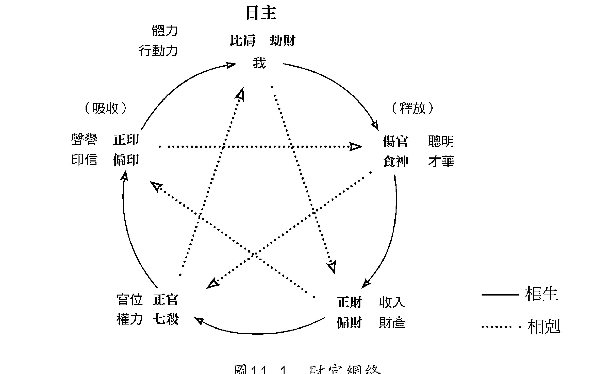

從圖中可以看到，傷官、食神是「我」所生，代表了聰明、才華；正、偏財是「我」所剋，代表了收入、財產；正官、七殺是剋「我」，代表了官位、權力；正、偏印是生「我」，代表了聲譽、印信。這裏，通過十神，把八字結構跟社會形態聯繫起來了。

事實上，體現五行生剋關係的十神對現實生活的映射可以分為三大主要領域：

- 1. 經濟領域
- 2. 政治領域
- 3. 知識領域，或精神領域

可以圖示如下：

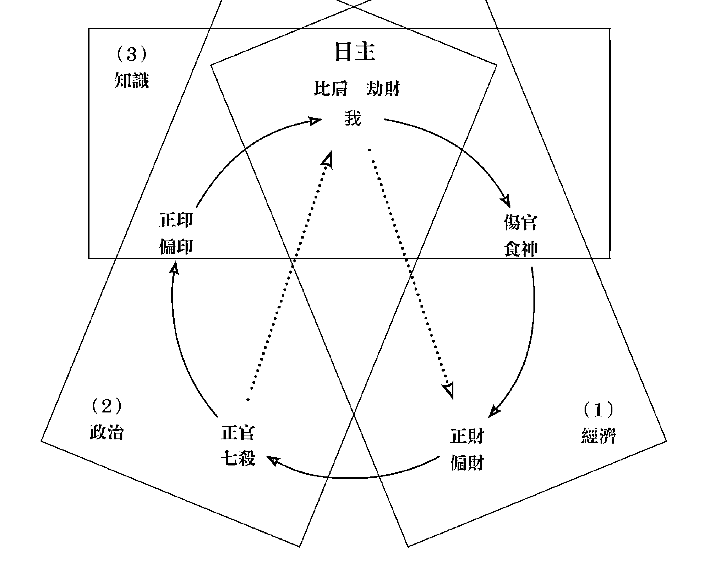

## 圖11.2 人生活動的三大領域

從圖中可以看到，（1）由日主與財星之間構成了第一個領域，是經濟領域，涉及「我」的經濟狀況，包括工作、收入、投資、財產等。核心是「我」與「財」星。我與財星是「我剋」的關係。（2）由日主與官殺星之間構成了第二個領域，這是政治領域，涉及「我」的政治社會地位、職業、官職、權力等。核心是「我」與「官殺」星。這裏，我與官殺之間是「剋我」關係。（3）由印星，經過「我」到傷食星，構成了第三個領域，這是精神領域。這裏，我把它稱之為「知識」領域。從印星到「我」，是「吸收」，由「我」到傷食是「釋放」，它們屬於精神活動範疇。

除了用十神或稱「星」去對應社會，八字命理還用四柱的位置，或稱「宮」，來映射「星」能出現的社會時空環境：

## 表11.1 宮位的時空環境

| 年柱 | 月柱 | 日柱 | 時柱 |
| :---: | :---: | :---: | :---: |
| 早年 | 青年 | 中年 | 晚年 |
| 國家，祖上 | 祖籍，家鄉，根 | 居所 | 門戶，遠方 |
| 遠方，國外，邊緣 | 家業，單位 | 家 | |
| 長輩，老人，外人 | 同事，老鄉，領導 | 至親 | 晚輩，街鄰 |
| 外部環境 | 父母影響 | 內心世界 | 交際能力，影響能力 |

這就是八字命理分析的基本社會框架。

## 「我」是誰？

> 在本書的第一章裏，提到了古希臘德爾斐神廟上刻着一句警世之言：

認識你自己！

面對一個現代人，命理分析第一步要回答的，大概就是：「我」是誰？
「我」是誰？——就是「我」在人生大舞台上究竟是一個怎樣的角色？

許多人終其一生可能並不清楚自己是「誰」。孔子說：「五十而知天命。」一個有知識文化的人也要年過半百的時候，方才知道自己的「天命」所在。傳統命理學根據「天人合一」的理念，通過八字結構的分析，居然能夠窺視這個「我」是誰？筆者不能不為中華古代先哲的睿智而由衷地折服。

根據前文的分析，關注的起點是日主（日干）。它是八字結構的核心，它展示了「我」的個性。要瞭解個性，這就聯繫到了十干體性。「我」是哪一種天干符號？「我」具有怎樣的屬性？接着，再聯繫到月令和坐支，瞭解「我」的強度和活力。再下面就要進一步展開「我」和所處的環境的各種關係，從中整理出各種與「我」相關的線索來。

下面我們以近代著名學者王國維的八字為例，來做分析。

| 年 | 月 | 日 | 時 |
| :--- | :--- | :--- | :--- |
| 官 | 劫 |  | 比 |
| 丁 | 辛 | 庚 | 庚 |
| 丑 | 亥 | 戌 | 辰 |
| 己土 | 壬食 | 戊土 | 戊土 |
| 癸傷 | 甲才 | 辛劫 | 乙財 |
| 辛劫 |  | 丁官 | 癸傷 |
| 墓 | 病 | 衰 | 養 |

示意图显示日柱与时柱相冲，年柱与月柱相刑。

## 大运

| 9歲 | 19歲 | 29歲 | 39歲 | 49歲 |
| :--- | :--- | :--- | :--- | :--- |
| 庚 | 己 | 戊 | 丁 | 丙 |
| 戌 | 酉 | 申 | 未 | 午 |

## 命例30 乾造：王國維（1877-1927）

王國維（1877年12月3日辰時生），字靜安，初號禮堂，晚號觀堂，又號永觀。浙江省海寧州（今浙江省嘉興市海寧）人。清末秀才。早年追求新學，把西方哲學、美學思想與中國古典哲學、美學相融合，形成了獨特的美學思想體系；繼而攻詞曲戲劇；後又治史學、古文字學、考古學。他平生學無專師，自辟戶牖，在哲學、文學、戲曲、美學、史學、古文學等方面均有深厚的造詣和創新，是近現代成就卓越的學術鉅子，國學大師。

然而，這樣一位傑出的學者，正當盛年的時候，卻選擇了自沉頤和園昆明湖的結局。生命由此戛然終止，給歷史留下了一個謎團。

我們來看王國維的命造。

日主庚金。庚金是刀斧，是頑鐵。金屬於秋氣，是收斂，是肅殺。金曰從革，是革故鼎新，是實幹，是拼搏，是攻擊，是毀滅，是更新，具有很強的殺傷性。

庚金自坐戌土之上；時干也是庚金，坐於辰土之上。庚戌、庚辰兩柱均是魁罡。魁罡坐命的人，性格聰明有才氣，文章振發，但同時又有剛強不屈，獨斷專行的個性一面。前文曾提到，辰為天罡，戌為河魁，乃陰陽絕滅之地。辰水庫屬天罡，戌火庫屬地魁，辰戌相見為天沖地擊。現在結構內，兩柱天干並列，地支辰戌相沖，水火之間的衝擊力之大，可想而知。火是熾熱、理想；水是寒冷、現實，若引申到精神層面，這樣水火的爭戰，真叫人處於不能自主的分裂狀態。

由此可見，王國維給歷史留下的「謎團」，可以從他的八字結構裏找到「謎底」。他的遺書開頭寫的是：「五十之年，只欠一死。經此世變，義無再辱。」事實上，他忍受不了這樣精神上的交戰，可是他又是一塊陽剛之金，孤僻，固執，無法妥協、苟且，只能用一死的方式來做個了斷了。

其實，這樣的爭戰還不僅在日時兩柱，它也充斥在整個結構。天干層面上是：丁（火）、辛（金）、庚（金）、庚（金），是火金相戰；地支層面則是：丑（土）、亥（水）、戌（土）、辰（土），是水土之戰。

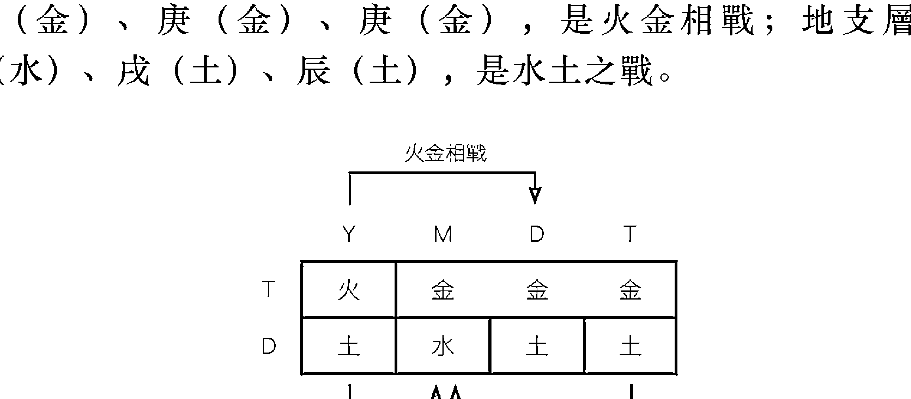

帶有這樣的認識，我們再去查看他的大運，一切都豁然開朗了。王國維成年後，19歲走己酉運，29歲走戊申運。天干為戊、己土，正好消除了火金之戰，因為火生土，土生金；地支為申、酉金，正好消除了水土之戰，因為土生金，金生水。尤其是地支，提綱亥水，內含壬水食神和甲木偏財。它是這個八字結構中精神生產、學術創造的基本元素。由於強金轉換了土水之戰，反而成了水的源頭，所以這段時光成了王國維學業上精進，成果斐然的年月。

王國維是1898年（21歲）年初到上海，開始他離開家鄉的求學之路。1901年在羅振玉資助下，去日本留學。後來因病回國，在各學堂任教習。1906年，又由羅振玉推薦，他到了北京，從事教育、編譯等工作。哲學和美學是他這時期的主攻領域。《人間詞話》和《宋元戲曲考》都是叫人矚目的研究成果。

辛亥革命後，他隨羅振玉亡命日本，成了「勝朝遺老」。在僑居的四年多時間裏，研究方向逐步轉向經史、小學。在協助羅氏整理大雲書庫藏書，得以盡窺其所藏彝器及其他石器物拓本，並與日本學者有了廣泛的交流。這為他後來從事甲骨文字及商周歷史研究，作出了超越前人的成就打下了厚實的基礎。

王國維1916年回國，進入了丁未運。丁火是官星。八字結構中丁火正官在年干上，因為出生於冬天，且坐於丑土之上，並無大的能量。但它終究可以驅寒，可以鍛金。丁火是庚金的最佳配置，也是這結構中的用神。現在丁火在大運上出現了，他受聘於倉聖明智大學教授，後又為清華大學研究院教授。他在甲骨文、殷周金文等方面作出了輝煌的貢獻，成為譽滿中外的學者。1923年受清廢帝溥儀征召，任南書房行走。

1926年進入丙午運，七殺來混正官。第一年流年丙寅。寅（流年）、午（大運），戌（日支）會成火局，是年長子病逝，隨之是與親家羅振玉的交惡。因為丙火剋合干頭辛金劫財。辛金（月干）劫財位在庚金之前，其象可以喻為兄長，現實中可以涉指羅振玉。羅振玉在王國維的生命中，一直是財力和精神的支柱。三十年金石之交竟然不堪一擊，這對王國維來說，無疑是心靈上的重創。

1927年流年丁卯，運歲干頭炎火直逼日主庚金，地支卯戌合火，亥卯合木，卯辰相穿。6月2日，時在乙巳月，巳再沖去亥水；丁卯日，午間，又是炎火，先生深藏內心的痛苦，無處傾訴；而孤僻、執著的個性，又使他無法釋懷，於是只有投水赴死，得到永久的解脫。雖然，記載說，那天先生似乎十分平靜，還是問友人借了錢，叫了一輛人力車前往頤和園。進了園。吸完一支煙後，躍身頭朝下扎入水中，自沉於園中昆明湖。可能這已經是風暴（炎火）激蕩後的平靜了。時支辰為水庫，竟然成了先生的歸宿，命乎？

王國維先生是筆者敬仰的國學大師。即使在我飄洋過海去異鄉的時候，他的《人間詞話》這本小冊子我一直帶在身邊。他給我印象最深的是兩個論說：

一個是「三種境界」論。在《人間詞話》之2（26）：「古今之成大事業、大學問者，罔不經過三種之境界。『昨夜西風凋碧樹，獨上高樓，望盡天涯路』，此第一境界也；『衣帶漸寬終不悔，為伊消得人憔悴』，此第二境界也；『眾裏尋他千百度，驀然回首，那人卻在燈火闌珊處』，此第三境界也。」這三種境界，可以用在學問上，也可以用在人生境界上。當然也可以用在命理的研究中。這是一種逐層的昇華。

另一個是他曾談到的「可信」和「可愛」的說法。他認為「哲學上之說，大多可愛者不可信，可信者不可愛。」王國維確實是一個文學天才，他的鑽研總在理性探索中包容著感情，比常人多一份對生命的敏感和領悟，何等的真率！他說：「知其可信而不能愛，覺其可愛而不能信，此近兩三年中最大之煩悶。」或許正是這樣的困惑，讓他選擇了自沉的結局。

性格決定命運，此話的確不錯。八字命理學打開了一扇窺探內在性格的窗戶。

我們再來看與王國維同時代的康有為。前文已經談到過康有為的命造，茲羅列於下：

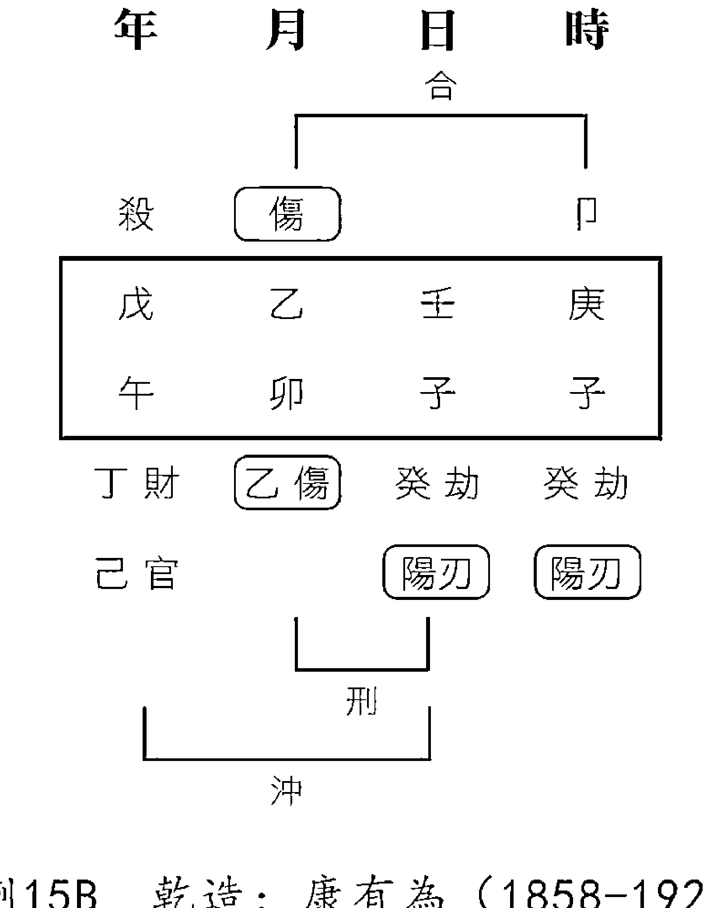

康有為的弟子梁啟超，對於乃師有這麼的評論：「先生是最富有自信力的人，他所堅持的主義，無論任何人都不能搖動。在學術上是這樣，做事情也是這樣，從來不肯為了做事而讓自己的主義有所遷就，但卻每每曲解事實來遷就他的主義，所以批評先生的人，總是說他武斷、執拗、專制。」或者說，剛復自用，是康有為有的個性。

反觀康有為本人，不到十歲就寫下了這樣的對聯：「大翼垂天四萬裏，長松拔地三千年」。他後來描繪自己：「其來世也，專為而已，故不居天堂而故入地獄，不投淨土而故來濁世，不為帝王而故為士人，不肯自潔，不肯獨樂，不願自尊，而以與眾生親。」儼然是一種入世的「教主」意識，是「救眾生」的聖人！

這樣的強烈的與眾不同的性格色彩，是否能從他的八字中透露出來呢？

的確能。觀察康的八字，日主壬水，自坐子水陽刃；時柱庚子，子又是陽刃。月柱乙卯傷官，連接日時的旺水，構成了一股水木旺勢。在命理中，傷官、陽刃，皆為凶神。它們乘著這股旺勢，自然不可一世，捨我其誰。傷官為自由星，最具有叛逆、反抗傳統、破舊立新、銳意進取的氣象。康的八字又是傷官制殺局面，七殺為輔，主特立獨行、天翻地覆的大作為！由此成就了歷史上著名的戊戌變法。

然而，命局中有強烈的陽刃加傷官組合，兩者都有過於自我的象。這種過於自信的心性彷彿一頭強牛，很容易迷失。它不適合從事實際的政壇操作，不適合現實政治。

治運動的組織和多方的協作，這就種下了戊戌變法失敗的根子。真是成也蕭何，敗也蕭何！

## 「我」的追求？

通過對八字結構的分析，打開了「我」的心靈窗戶，瞭解到「我」是誰，「我」的內心世界。那麼，下一個問題就是：「我」想做甚麼？或者說，「我」的追求？「我」的人生目標？這就是在人生大舞臺上，「我」對自己的期待，「我」究竟應該是怎樣的一個角色？

為了展開這個問題，筆者認為，可以把日主（日干）「我」範圍再擴展一些，把比肩、劫財和傷官、食神都包括進來，來進一步認識我的主觀世界。以上財官網絡可以做新的調整，圖示如下：

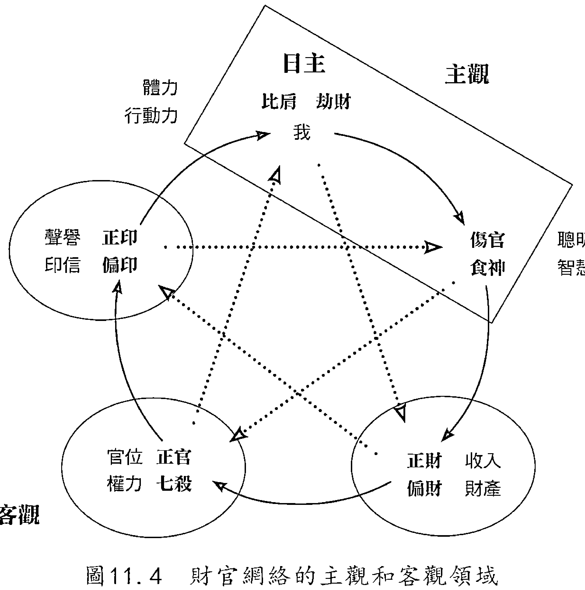

這裹，作為主觀方面，把「我」做了擴展，它還包括了比肩、劫財，傷官、食神。比肩、劫財主要象徵「我」的體力、行動力，是我的肢體（肉體）的延伸；傷官、食神則象徵「我」的精神世界——聰明、智慧，是我精神的延伸。財、官、印三者，則是外部世界，是「我」的訴求，「我」可能要追求的目標。顯然，不同的「我」，有不同的追求。我們能不能通過對先天時空結構的進一步分析，把它展現出來。這又是面對現代人，八字命理需要去努力、去探索的一項重要的解讀任務。

下面我們來看被稱為中國歷史上最後一位學者兼「賢相」的典型人物——曾國藩的命造。

```
年 月 日 時
合
財 傷 傷
辛 己 丙 己
未 亥 辰 亥
己傷 壬殺 戊食 壬殺
丁劫 甲印 乙印 甲印
乙印      癸官
拱
拱
```

## 大運

- 7歲 戊 戌
- 17歲 丁 酉
- 27歲 丙 申
- 37歲 乙 未
- 47歲 甲 午
- 57歲 癸 巳

### 命例31A 乾造：［清］曾國藩（1811-1872）

曾國藩（1811年11月26日亥時生），字伯涵，號滌生，湖南長沙府湘鄉（今湖南省婁底市雙峰縣）人。晚清重臣。湘軍的創立者和統帥。中國近代政治家、戰略家、理學家、文學家。官至兩江總督、直隸總督、武英殿大學士，封一等毅勇侯，諡曰文正。

曾國藩是歷史上頗具爭議的人物。他的身上集中了中國傳統官僚所具有的特點，也摻雜着文人的品格。前人曾這樣評論過：

> 「譽之則為聖相，讞之則為元兇。」

這是說，如果稱讚他的話，可以把他當做「聖相」；如果要審判他的話，說他是「元兇」也沒有甚麼不可。那麼，他究竟是一個怎樣的人呢？

觀察曾國藩命造。日干丙火兩側都是傷官。兩個傷官直接透露在日主左右，說明了命主性格帶有強烈的傷官特點。在分析康有為命造時，我們已經談到過傷官的特徵。傷官是一種靈秀之氣，但它張揚、外露，往往聰明過人，但又不循規蹈矩。它不怕權威，敢於創造，有率直的個性，可以做出突破性的成就。但也可能離經叛道，唯我獨尊，不為社會所接受。因此，我們可以看到，從骨子裏說，曾國藩是聰明，有才華，並具有叛逆心性的人。

然而，他並沒有成為剛愎自用、唯我獨尊的人。原因在哪裏？因為傷官順泄生了年干的辛金。辛金坐未土，是正財，正財在心性上比較現實，拘謹，它至少讓傷官的智慧有了發揮的地方。所以命書中說：「傷官見財者，又官高而財足。」相反，「傷官無財可依，雖巧必貧。」

事實上，曾國藩不僅沒有驕橫跋扈，相反提倡「慎獨」，以「誠」來檢討自己的所作所為，常懷敬畏之心。這當然是他修行的結果。他每天記日記，對每天言行進行檢查、反思，一直貫穿到他的後半生。他不斷地給自己提出更多的要求：要勤儉、要謙對、要仁恕、要誠信，知命、惜福等等，力圖將自己打造成當時的聖賢。無可非議，對於曾國藩一生的事業，修身是他走向成功的最重要的原因。實際上，只要我們認真探索，命造中是有這樣的線索的。

注意局中兩個己亥柱，誠如所標出的那樣，己土傷官穿越地支層面直接與地支藏遁中的甲木相合。甲木是偏印，它跟己土的關係是剋合。也就是說，印制了傷官。《子平真詮》說：「有傷官佩印者，印能制傷，所以為貴，反要傷官旺，身稍弱，始為秀氣。」也就是說，在傷官旺，身弱的情況下，印星的能力的發揮可以達到最大化。一方面，它約束了傷官的傲氣，讓命主變得接近中庸；另一方面，它又生助了日元，顯得自然而有情有義。這是符合曾國藩命造的。曾國藩是求仁得仁，在追求中自有他成為「聖賢」的一面。這固然與他後天的不懈努力有關，但先天命局中的確深藏著這樣的種子。

事實上，人性是複雜的。如果曾國藩只是生活在一個平靜的年月，或者在朝為官，或着閉門修行，歷史上就沒有曾國藩的位置了。真正讓他躋身於「最後」一個「聖相」位置的，還是他的軍功，還是在艱難困苦中撐住了搖搖欲墜的滿清皇朝。他組織和領導了湘軍，用了12年時間，把太平天國運動扼殺在血泊之中，故也有一個「曾剃頭」的諢號。

## 「我」會成功嗎？

這就來到下一個問題：「我」有追求，「我」的追求會成功嗎？

每個人都有夢。這個夢，會成為真實，還始終是在虛幻之中？這是我們研究命理的又一個現實任務，它要嘗試回答：這種追求僅是不切合實際的空想呢，還是通過人生的奮鬥，是可以實現的？如果可以實現，那又如何實現它？

帶著這個問題，我們接著分析曾國藩的命造：

| 年 | 月 | 日 | 時 |
| :--- | :--- | :--- | :--- |
| 財 | 傷 |  | 傷 |
| 辛 | 己 | 丙 | 己 |
| 未 | 亥 | 辰 | 亥 |
| 己 傷 | 壬 殺 | 戊 食 | 壬 殺 |
| 丁 劫 | 甲 印 | 乙 印 | 甲 印 |
| 乙 印 |  | 癸 官 |  |
| 合 |  |  |  |
| 大運 |  |  |  |
| 1848年 | 1858年 |  |  |
| 37歲 | 47歲 |  |  |
| 乙 | 甲 |  |  |
| 未 | 午 |  |  |

### 命例31B  乾造：[清] 曾國藩 (1811-1872)

在前圖（命例31A）中，我們可以看到在地支上有未與亥之間的「拱」，這是「拱」木局。但是天干並沒有木的存在。所以這個「拱」只是「待命」而已。當然「拱」木局對於日主是有利的。因為木能生火，而局中丙火偏弱。

然而，如果深入到地支藏遁層面，從圖示（命例31B）可以看到，年支未土中有丁火劫財。日主丙火在四個地支中，只有未土中有這麼一個火的根苗。未土是丙火的衰地（活力：3），對於丙火來說，還是比較活躍的。其中含有的劫財，可以看作是日主丙火在地支上的延伸。上文已經談到，比肩、劫財可以看作「我」的擴展，尤其是體力和行動力方面。比肩、劫財原本的象就是同我之物，如同伴、同夥、同學、同事、同黨、同道、戰友、合作者、股東等等。而且，與比肩相比，劫財更加膽大、剛烈、粗野、有攻擊性。這裏我們有理由把它喻為是曾國藩麾下的一個團隊，也就是曾國藩統帥的湘軍。跟一般的軍隊相比，湘軍確有它的特殊性。它的士兵都來自質樸健壯的湖南農民，而且有意把父子、兄弟以及有其他血緣關係的士兵編制在同個營隊裏，用宗族親緣關係維繫士兵。在組織上，每營士兵只服從營官一人，而全軍指揮權歸曾國藩一人。這事實上就是一支私人「家族」部隊。由它去合殺，殺是殺戮，殺是戰鬥力。注意，正是地支藏遁中，丁火劫財合了兩個亥水中的壬水七殺。曾國藩依靠這只打不散的家族部隊，在多次戰敗，自己兩次投水被救之後，終於從湖南一路打到了天京（南京），在1864年（同治三年）把曾經席捲了大半個中國的轟轟烈烈的太平天國運動鎮壓了下去。

我們可以對照一下曾國藩的運程。

他是在1853年（咸豐三年）受命組織湘勇的。1854年（咸豐四年）2月，湘軍傾巢出動。曾國藩發表了《討粵匪檄》。在這篇檄文裏，他聲稱太平天國運動是「荼毒生靈」，「舉中國數千年禮義人倫詩書典則，一旦掃地蕩盡。此豈獨我大清之奇變，乃開闢以來名教之奇變，我孔子、孟子之所痛哭於九泉」。這樣，他站到了道德的最高點，動員了當時廣大的知識份子參與到對太平軍的鬥爭當中。這是曾的傷官智慧的充分展現。

這時曾命造進入乙未運的未土了。它引動了原局的年支之未，開始了走上組軍爭戰的征途。可是是年5月，在靖港水戰中被太平軍擊敗，曾投水自盡，被部下所救。此年流年為癸丑，癸水為忌，丑再衝開未庫，此敗陣自然是為根子動搖所致。

1858年（咸豐八年）進入甲午運。甲為印，自亥水中出來，合己傷官，助丙火日主。甲是印信、印章，象徵着權力。為了圍剿太平天國，曾國藩不斷得到朝廷的加官進爵，權力賦予。而午，為丙火之強根，同時暗合兩個亥水七殺，大權在握，躊躇滿志。在此甲午運中，曾國藩走到了他人生的巔峰。

1864年（同治三年），曾國荃攻破天京（南京）。在曾國藩默許之下，湘軍燒殺搶掠，以致「秦淮河屍首如麻」。「曾剃頭」這個諢號正是這個時候得來的。此年流年甲子。子水跟大運午火相沖，它合命局辰庫，穿年支未土。這是曾國藩人生的大抉擇的時候。幾十年性格的磨練和洗滌，他已經克服了與身而來的近於剛愎倔強（傷官）的性格，他已經修成了剛柔並濟的儒家風範。他裁減湘軍，交出兵權，一變為溫厚寬容的聖相。於是，位列三公，權傾當朝，得到了清政府下一個漢族官吏前所未有的名利和權勢。故《清史稿》說：「嗚呼！中興以來，一人而已。」

作為個人，作為一個歷史人物，曾國藩成功了。梁啟超認為：曾國藩「終身在拂逆之中」，卻能「立德、立功、立言三並不朽，所成就震古鑠今」。其成功秘訣在於：「一生得力在立志自拔於流俗，而困而知，而勉而行，歷百千艱阻而不挫屈，不求近效，銖積寸累，受之以虛，將之以勤，植之以剛，貞之以恆，帥之以誠，勇猛精進，卓絕艱苦，如斯而已，如斯而已。」這是從主觀方面而言。若是從客觀方面而言，時代和命運，都是造就歷史人物不可或缺的因素。

作為歷史人物的曾國藩，還引起過另一個歷史偉人的感慨。在1917年，當時24歲的他在給朋友的一封信裹寫道：「愚於近人，獨服曾文正，觀其收拾洪（秀全）、楊（秀清）一役，完美無缺。使以今人易其位，其能如彼之完美乎？」

我們再來看他的命造。

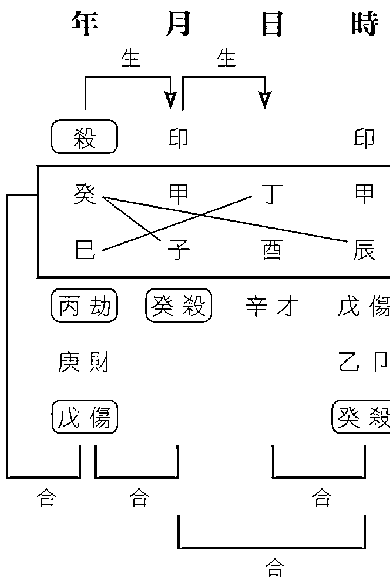

### 命例10C 乾造

通過命理符號學的框架，日主丁火通根於年支巳火。巳是丁火的帝旺（活力：4）。我們同樣可以把它看作是日主在地支上的延伸。

進一步看巳火中具有的藏遁：巳中的主氣是丙火，它是丁火的劫財。同以上對曾國藩命造的分析一樣，也可以看做是跟日主一起的一個團隊，也是日主行動力的體現。

巳中的戊土傷官，它體現了日主的智慧。這是一種才氣，一種叛逆精神，一種造反精神，一種大無畏精神。——「問蒼茫大地，誰主沉浮？」正是這種精神的寫照。

現在，它合住了月支子水中的癸水七殺。戊癸合是剋合。戊土傷官合制了癸水七殺，也就是說，日主的精神——「敢叫日月換新天」精神，控制了七殺所代表的「武裝力量」，於是精神化為了行動——革命行動：打破舊世界，創造新世界！

月支癸水又透現於年干。天干是顯性的，透露在天干，就是說，這種「造反」行動，是昭示於大眾社會的，是一種社會運動。請注意，這個處於地支藏遁層面的戊土傷官，直接穿越了地支層面，跟年干癸水七殺相合，直接控制了這個七殺。這兩個上下「合」癸之象，充分顯示了命主的智慧、命主的思想的巨大威力呵。

再分析下去，這個年干癸水七殺（權力），出自月令地支而出。冬天水旺，天地之間，由水當令主宰，其強度就可想而知了。這年干癸水（權力）還一直延伸到時支辰土。月支子水也遙合辰土。時柱主晚年時光。這說明命主的生涯註定是終生的革命家。辰土為水庫，它收攏、聚滿了水的能量。於是又一個亮點出現了：日支酉金，跟辰相合，它是「生合」，土生金，辰合進於酉。因此，這個聚滿了水的水庫（權力），仍然全部歸「我」掌控，它在日主座下。

這個「權力」又產生了甚麼呢？年干癸水生月干和時干甲木正印。正印是甚麼？正印是印章，是文書。這裏可以喻為權力的合法性。它不是「割据」，它是合法的，它成了正统，它創造了一個新的時代：東方紅，太陽升！

最後，甲木正印都生了日主丁火。——「數風流人物，還看今朝。」何等豪邁景象！這樣的運思，充分顯露了歷史人物的誕生還是有命理的緣由的。

當我們分析了這兩位歷史人物以後，接着一個問題就又來了：「我」會成功，那麼，「我」的成就會有多大？

## 「我」的成就大小？

其實，仔細琢磨以上兩個命造，命主成就能有多大，已經可以得到啟示了。命局所顯現的跟他們成就聯繫在一起的自然是七殺星了。

> > 《子平真詮》說：「煞以攻身，似非美物，而大貴之格，多存七煞。蓋控制得宜，煞為我用，如大英雄大豪傑，似難駕馭，而處之有方，則驚天動地之功，忽焉而就。此王侯將相所以多存有七煞也。」

反觀這兩個八字，都是七殺當令：一個是亥水七殺，一個是子水七殺；一個出生在亥月，一個出生在子月。這裏又要提到命理經典《滴天髓》了。

> > 《滴天髓》說：「令上尋真聚得真，假神休要亂真神；真神得用平生貴，用假終為碌碌人。」

《滴天髓》這個「真神得用」，是具有深意的。

那麼，何為「真神」？

筆者在《命運的求索》中曾談及過，一種就是「得時秉令之神也」(4)。或者說，命局中主導勢力是從月令地支中出來的成分。因為月令地支聯繫着出生時外部天地環境的氣候狀態，它所具有的成分自然是當時宇宙氣場中最有力量的元素。上述兩個命造都符合這樣的要求。局中的七殺都是月令的當旺之氣，所以有如此「驚天地，泣鬼神」之力，引領了歷史的進程。可謂：「時來天地皆同力，運去英雄不自由。」(5)

我們同樣可以應用這個原則來討論富命。

以下是中國近代著名的民族資本家榮宗敬的命造。他是榮氏家族的第一代開創者，是原中華人民共和國副主席榮毅仁（1916-2005）的伯父。

年 月 日 時       大運
財 食    殺       10歲 20歲 30歲 40歲 50歲 60歲
癸 庚 戊 甲       己   戊   丁   丙   乙   甲
酉 申 午 寅       未   午   巳   辰   卯   寅
辛傷 庚食 丁印 甲殺
壬才 己劫 丙卬
戊比    戊比
|__|
半火局

## 命例32 乾造：榮宗敬（1872-1938）

榮宗敬（生於同治十二年七月十二日寅時），名宗錦，字宗敬，江蘇省無錫榮巷人。榮德生之兄。早年經營過錢莊業。1901年起，與榮德生等人先後在無錫、上海、漢口、濟南等地創辦保興麵粉廠，福興麵粉公司（一、二、三廠），申新紡織廠（一至九廠），被譽為中國的「麵粉大王」、「棉紗大王」。九一八事變後，日本的麵粉和棉紗開始大量湧入中國市場，榮氏企業陷入了困境。

> >「戊生申月，透庚露甲，庚甲皆坐祿地，日時午寅會成火局以生身。殺旺食強而身健，食神生財兼制殺，故為上等格局。」

這樣的評論，言簡意明，的確闡述了這個命造的優點。但是，為甚麼榮宗敬在近現代中國歷史上能成為少數排得上號的民族資本家的代表呢？這還需要進一步挖掘。若從命造來講，關鍵在於天干食神生財，其食神，其財，皆出於月令地支申金中。這就是「真神」的作用，故能成其為大富局面。事實上，申之藏遁：申金、壬水、戊土，皆透出天干為用。這是最重要的因素。這就是命局分析中所謂「真神得用」。當然，時干透甲木七殺，使他身體力行，勇於創業。再加上己未、戊午、丁巳、丙辰幾十年火土連環大運，成就這了這位中國民族工商業的歷史人物。

下面是一個普通的台灣農家子弟的命造。早年不喜讀書，父母務農，初中畢業後在家幫忙，沒有一技之長，卻由於趕上了台灣「地產飆升」的好時光，由地產而成了富人[6]。

| 年 | 月 | 日 | 時 |
|----|----|----|----|
| 合 |    |    |    |
| 財 | 財 |    | 食 |
| 己 | 己 | 甲 | 丙 |
| 丑 | 巳 | 寅 | 寅 |
| 己財 | 丙食 | 甲比 | 甲比 |
| 癸印 | 庚殺 | 丙食 | 丙食 |
| 辛官 | 戊才 | 戊才 | 戊才 |
| 空亡 |    |    |    |
| 刑 |    |    |    |

| 年齡 | 6歲 | 16歲 | 26歲 | 36歲 | 46歲 | 56歲 |
|------|-----|------|------|------|------|------|
| 天干 | 戊 | 丁 | 丙 | 乙 | 甲 | 癸 |
| 地支 | 辰 | 卯 | 寅 | 丑 | 子 | 亥 |

## 命例33 乾造：1949年5月24日（農曆4月27日）寅時生

36歲入乙丑運。乙運，其父將市區兩棟舊平房以及市近郊兩甲農田過繼在他名下。進入丑運，農田重劃為建地，市區的舊屋拆除建大樓，於是一切改觀，一躍而成富人。觀其八字，命局確實有成為富人的先天基因。月令巳火，內含丙火食神、庚金七殺和戊土偏財，現天干透出時上丙火食神和年、月己土正財，構成食神生財的格調，可謂是真神得用，儼然是富格。同時，結構略嫌燥熱，己土為濕土，可以晦火。這個財來就我，真是天上落下了金元寶了。「目前住豪華別墅，出門賓士代步，一生至今若光靠他自己努力所得，恐怕連一根大樓柱子都買不起。」這只能說是命運使然了。

對於「真神」，還有一種解釋，那就是命局中日主具有在調候配置方面所需要的元素(7)。下面是民國初年上海灘屈指可數的「地皮大王」程霖生的命造(8)：

| 年 | 月 | 日 | 時 |
|---|---|---|---|
| 傷 |    |    |    |
| 丙 | 癸 | 乙 | 癸 |
| 戊 | 巳 | 亥 | 未 |
| 戊財 | 丙傷 | 壬印 | 己才 |
| 辛殺 | 庚官 | 甲劫 | 丁食 |
| 丁食 | 戊財 |    | 乙比 |

- 7歲: 甲午
- 17歲: 乙未
- 27歲: 丙申
- 37歲: 丁酉
- 47歲: 戊戌
- 57歲: 己亥

## 命例34 乾造：程霖生（1886-1943）

程霖生的父親程謹軒，是清末民初上海租界洋行的買辦。他佔有當時上海的大量荒地。程霖生繼承父業。因上海日趨繁榮，地價猛漲，數年以後，資金累積達白銀6000萬兩，成為上海灘上屈指可數的鉅商。到上世紀二十年代末，程霖生熱衷黃金買賣，恃富狂言要操縱上海黃金市場，結果受到官僚資本傾軋和社會勢力圍攻，加上時局不穩，金價和房地價大幅下降而最終破產，靠變賣家財度日。

命局以乙木為日主。從調候角度講，乙木為花草之木，最喜陽光和雨露，也就是丙火和癸水是它的最佳配置。現在，丙火在年干，兩個癸水分別在日主兩側，真可謂得天獨厚。這是完全符合上述真神得用的情況的。同時，月令為四月巳火，年干丙火通根於此（丙之祿），成為傷官格。兩癸則通根於亥（癸之帝旺），乙木自坐亥水，通根於未，亥未拱木局。丙火自坐戌庫。天干字字有根基，構成了水生木，木生火之勢。火是命局的發用，在年月兩柱，所以得到父親留下的巨額遺產。

早年木火連環，自然順暢。關鍵在酉運（43至47歲）。日柱乙亥為活木，活木最怕埋根之鐵，即怕金來壞木之根。再鮮豔美麗的花草，根被切斷了，就很難成活。所以，這一步運成了這位巨富的人生大轉折。何況酉合巳火，酉穿戌庫，破壞了結構的發用。當然，也有主客觀原因。主觀上講，命主個性過於狂妄（也是傷官的特徵），錯誤估計形勢，把資產全盤砸入；客觀上，也有全球性經濟蕭條寒潮，於是帶來了「雪崩」式的一敗塗地，僅短短二三年，就以破產告終（1931年），時在酉運末，辛未流年。接下來是戊戌運，戊土直接合剋干頭癸水印星，已無東山再起的可能了。

這裏值得補充一下，對于木的體性，《窮通寶鑒》跟《三命通會》的看法並不一致。一般來說，《三命通會》把甲木（陽木）看作是死木，乙木（陰木）看作是活木。死木為剛木，喜金來雕琢；而活木則怕金來砍伐。《窮通寶鑒》則根據甲乙木的坐支來區分活木和死木。它指出：

> 甲戌、乙亥木之源，甲寅、乙卯木之鄉，甲辰，乙巳木之生，皆活木也；甲申、乙酉木之剋，甲午、乙未木之死，甲子、乙丑金剋木，皆死木也。生木得火而秀，丙丁相同；死木得金而造，庚辛必利。生木見金自傷，死木得火自焚(9)。

這是研究中值得注意的地方。

## 註釋

- 1. (1) 《人間詞話新注》（王國維著，滕咸惠校注），5頁。
- 2. (2) 這可以從康有為組織京強學會中表現出來。當時許多封疆大吏也受到維新思想的感染，或者報名參加，或者慷慨解囊，捐錢支持。李鴻章也表示願意損資二千兩，申請入會。但強學會卻拒絕了他。這使李鴻章大為惱火，立場也發生根本轉變，從此把強學會看作是敵對者。
- 3. (3) 給黎錦熙的信（1917年8月23日）。
- 4. (4) 《滴天髓》註釋者任鐵樵語。
- 5. (5) 唐代羅隱的《籌筆驛》。
- 6. (6) 取自許羽賢《子平命學錦囊》，188頁。
- 7. (7) 這是徐樂吾在《滴天髓徵義》中所強調的。
- 8. (8) 見章千里《命運談屑》，67-68頁。
- 9. (9) 見《窮通寶鑒》「論木」。

## 第十二章 人間重親情

親情，就像一縷秋日裏的陽光，總能在蕭瑟的風雨中，溫暖失落者的心田；親情就像一場冬日裏的白雪，總能在污濁的旅途中，滌盡跋涉者的征塵。它就是這樣，沒有雜質，沒有距離，更沒有虛偽，僅僅是相通的血脈間彼此默默地相互關懷。

這是筆者從網上摘下的描寫親情的句子。是的，當你身在異鄉，遠離親人的時候，你會更加體會到它的溫暖、纏綿和可貴。重親情，是中國的古老傳統，也是中國漫長的農業社會形成的文明形態重要的組成部分，它已經浸透在我們的血液中了。這或許就是東方儒家文化與西方基督教文明的重要區別。

那麼，八字命理學是如何表述個體的親屬關係的呢？這就是前文提到的六親網絡。

## 六親網絡

所謂六親，這裏主要指：父母、夫妻、子女和兄弟姐妹，也就是主要的親屬關係。在命理學中，指示六親信息的，主要是「星」與「宮」。

所謂「星」，就是指十神。十神表述了日主與其他成分在陰陽、五行之間交叉構成的十種關係，它們也被用來具體指稱六親的內容。

下面是筆者在《八字命理學基礎教程》中所展示的男命和女命不同的六親網絡：

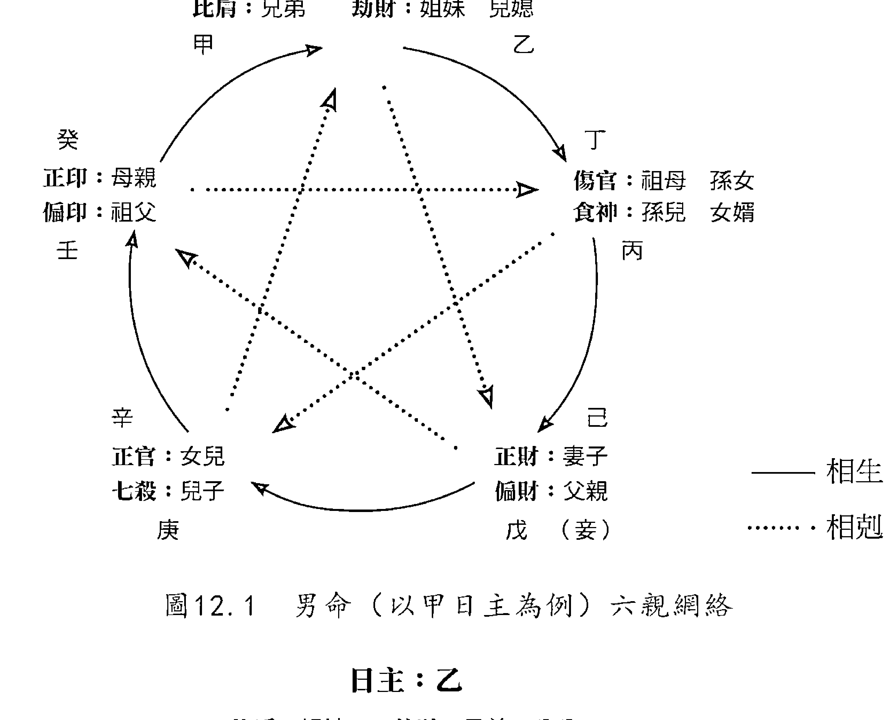

圖12.1 男命（以甲日主為例）六親網絡

這裏就不再贅述它們的推導過程了。讀者可以參閱《八字命理學基礎教程》第11章。

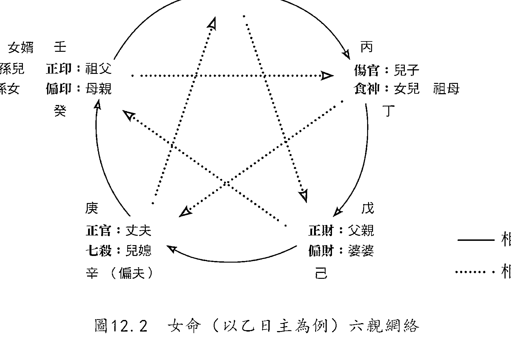

圖12.2 女命（以乙日主為例）六親網絡

在六親推導的邏輯基礎上，我們選取了以下的十神與六親「星」的對應關係：

### A. 男命六親：

表12.1 男命六親表

| 十神 | 六親 |
| :--- | :--- |
| 正印 | 母親 |
| 偏財 | 父親 |
| 正財 | 妻子 |
| 七殺 | 兒子 |
| 正官 | 女兒 |
| 比肩、劫財 | 兄弟姐妹 |

### B. 女命六親：

表12.2 女命六親表

| 十神 | 六親 |
| :--- | :--- |
| 正印 | 母親 |
| 偏財 | 父親 |
| 正官 | 丈夫 |
| 傷官 | 兒子 |
| 食神 | 女兒 |
| 比肩、劫財 | 兄弟姐妹 |

這樣的對應關係，也是目前命理界比較流行的應用方式。男命和女命的差異，主要在於夫妻和子女「星」的十神對應差別上。事實上，這裏只是定下一個基準，並不是劃一的教條。在具體應用時，往往需要活看。比如，一個具體八字中，沒有出現正印，難道這個人就沒有母親了？——這是違背常識的。這時，需要找一找，有沒有偏印？可以用偏印去取代正印，求取命主母親的信息。如果正印和偏印都沒有，也不能說此人沒有母親，只是跟母親的緣分較淺而已。

確定了「星」，我們再來看「宮」：

### 表12.3 六親宮位表

| 年 | 月 | 日 | 時 |
| --- | --- | --- | --- |
| 祖父 | 父親 | 兄姐 | 己身（我） |
| 祖母 | 母親 | 弟妹 | 丈夫/妻子 |
|    |    |    | 兒子 |
|    |    |    | 女兒 |

這是六親與四柱宮位的對應關係。在古時候，年柱代表祖上或祖輩，所以祖父、祖母安置在年柱。舊時代男女結婚早，百歲之內，四世同堂和五世同堂都有可能。現代社會，由於教育普及，受教育的時間較長，因而就業延晚等諸多原因，男女結婚年齡顯然後推了。同時小家庭的形式較普遍，所以這裏把原在月柱的父母，也延伸到了年柱。在實踐中，它的確有驗證度。

當然，也有的命理學家反對以天干代表宮位的理論，他們認為，只有地支才能充當宮位。

下面我們應用命理符號的框架，逐一探討六親的幾個主要側面。

## 父母

首先是父母。按照星來說，主要是偏財（父親）和正印（母親）；依宮來說，主要是年柱和月柱。下面我們就來看看前文已經探討過的幾個命例。

比如，清代名將岳鐘琪，出生武將世家，是宋代抗金民族英雄岳飛的第21世嫡孫。其父岳升龍，曾隨康熙皇帝西征噶爾丹，立了大功，被升為四川提督。岳鐘琪小時候也頗受父親教益，熟讀經史、博覽群書。23歲（1709年）時，父親還為他捐了個官，做了候補知府。

1710年（康熙四十九年），岳升龍因為母親年過九旬，向康熙帝提出入籍四川。獲准後，岳升龍全家遷入四川金堂縣栖賢鄉的松秀山（今岳公山）。岳鐘琪也隨之入了川籍。1712年（康熙五十一年）岳升龍逝世。此年岳鐘琪26歲，流年壬辰。

我們再來看一下岳鐘琪命造：

| 年 | 月 | 日 | 時 |   | 大運 | 流年 |
|:---|:---|:---|:---|:---|:-----|:-----|
|    | 合 |    |    |   |      |      |
| 食 | 財 |    | 比 |   | 21歲 | 26歲 |
| 丙 | 己 | 甲 | 甲 |   | 壬   | 壬   |
| 寅 | 亥 | 辰 | 戌 |   | 寅   | 辰   |
| 甲比 | 壬P | 戊才 | 戊才 |   | 祿   |      |
| 丙食 | 甲比 | 乙劫 | 辛官 |   |      |      |
| 戊才 |    | 癸印 | 丁傷 |   |      |      |
| 祿   |    |    |    |   |      |      |
| 合   | 冲 |    |    |   |      |      |

## 命例12B 乾造：[清] 岳鐘琪（1686-1754）

前文已經分析過，年支寅是甲木之祿，寅上之丙火是全局用神，因為時令在冬天，日主甲木需要丙火照暖，方才不寒。丙火居年干，正是父位。若從父星講，則是寅中之戊土偏財，也在年柱。喜用在年柱，故家世自有名望。

命主21歲起走壬寅大運，26歲轉入寅運。寅是日主之祿，同時也引動局內年支之寅（內有偏財父星）。命理有稱祿運為祿堂運，尤其是身偏旺的情況：「運走祿堂，不剋自己剋爹娘。」所以，的確有損父親的徵兆。而流年壬辰成了應期。壬水坐辰水庫，直撲年干丙火父位，這是其一；其二是流年與大運壬寅夾拱出一個卯字，地支寅卯辰匯成一劫局，故是年父親岳升龍亡故。

我們來看前述偉人造的情況。

1919年，命主26歲，那年患病多年的母親在10月5日病故，僅三個半月後，父親因感染傷寒於1920年1月23日去世。這在命造壬戌大運末，流年己未。

年 月 日 時 大運 流年
殺 印 印 17歲 26歲
癸 甲 丁 甲 壬 己
巳 子 酉 辰 戌 未
丙劫 癸殺 辛才 戊傷
庚財 乙卬
戊傷 癸殺
空亡
合

## 命例10D 乾造

此命造是七殺格，殺印相生，甲木正印是全局用神。正印為母，故自幼跟母親親近。他後來回憶說：「我家分成兩『黨』。一個是我父親，是執政黨。反對黨由我、我母親和弟弟組成，有時甚至於連僱工們也包括在內。」他深受母親疼愛。他說：「我母親是個仁慈的婦女，為人慷慨厚道，隨時都願意接濟別人。她同情窮人，並且當他們在荒年裏前來討米的時候，常常送米給他們。」再從宮位看，甲木正印占了父宮（月干）之位，同時母宮（月支）之水又透出於年干，再生甲木，故甲木生機盎然。命主出生以後，家境也逐漸改善，由貧農而中農、而近於富農。這是他父親節儉和善於經營的結果。

> 「我家分成兩『黨』。一個是我父親，是執政黨。反對黨由我、我母親和弟弟組成，有時甚至於連僱工們也包括在內。」

> 「我母親是個仁慈的婦女，為人慷慨厚道，隨時都願意接濟別人。她同情窮人，並且當他們在荒年裏前來討米的時候，常常送米給他們。」

戊運，戊穿酉（偏財），戊沖辰（甲印之根），不利父母。然而己未流年到來，成了應期。己土剋年干癸水（癸水自母宮來），合甲木正印，同時，未戌刑，未穿子（母宮），這樣，一下子把父母的星和宮都影響了。

1959年6月，命主回到闊別三十二年的故鄉韶山。在故居，他深情地佇立在父母的遺像前，自言自語道：「如果是現在，他們就不會死了。」次日拂曉，他踏着濕漉漉的晨露，前往父母的墓地弔唁。他雙手給父母獻上一束松枝，深情地說：「前人辛苦，後人享福。」

> 「如果是現在，他們就不會死了。」

> 「前人辛苦，後人享福。」

我們再來看北宋著名文學家歐陽修的命造。

歐陽修是三歲喪父。他是家裏的獨子，與母親鄭氏相依為命。孤兒寡母只得去投奔歐陽修的叔叔。叔叔家也不是很富裕，好在母親鄭氏是受過教育的大家閨秀，用荻稞在沙地上教歐陽修讀書寫字。叔父盡其所能，照顧生活。歐陽修自幼喜愛讀書，少年習作詩賦文章，文筆老練，有如成人，其叔由此看到了家族振興的希望，曾對歐陽修的母親說：「嫂子不必擔憂家貧子幼，你的孩子有奇才！他日必然聞名天下。」歐陽修三歲喪父那年是1010年（大中祥符三年），流年庚戌。圖示如下：

| 年 | 月 | 日 | 時 | 大運 | 流年 |
| :--- | :--- | :--- | :--- | :--- | :--- |
| 食 | 財 | | 財 | 1歲 | 3歲 |
| 丁 | 戊 | 乙 | 戊 | 丁 | 庚 |
| 未 | 申 | 卯 | 寅 | 未 | 戌 |
| 己才 | 庚官 | 乙比 | 甲劫 | |
| 丁食 | 壬印 | | 丙傷 | |
| 乙比 | 戊財 | 祿 | 戊財 | |
| 天河水 | 大驛土 |

## 命例25B 乾造：［宋］歐陽修（1007-1072）

命局年柱丁未，納音天河水；月柱戊申，納音大驛土，月土剋年水。年、月兩柱架構不穩，往往會有損嚴親的情況。這是《進階教程》裏談到過的。[^1]命造一歲起運，走丁未大運，恰與年柱反吟。而偏財己土父星正在年支未土，三歲庚戌年，戌未刑就成了喪父的應期。局中壬水正印（母星）在月支母宮，時在秋月，化金生木，解了滿局的燥氣，的確有慈母的恩澤。歐陽修之母「畫荻教子」已成了千古佳話。

下面是一個網上看到的一個男嬰命造：## 命例35 乾造：男婴（2014年3月18日辰时生）

这是一起真实的「厦门车祸男婴神奇爆胎案」。2014年3月18日早晨，市民段某的媳妇赵某肚子突然疼了起来。媳妇身怀六甲，可能要生了，段某就用摩托车载着媳妇去医院。8点30分左右，刚到厦门市海沧区「马青路」与「角嵩路」交叉路口附近，不料天降横祸瞬间来临。前面拐来一辆铲泥车，和摩托车相撞。段氏夫妇当场死亡。媳妇肚子中的婴儿却像被人踩破气球样，神奇爆出三米多远。随后被警方及好心人送往海沧医院抢救。好心的网友，也随即将此发往微信。当时婴儿脸部、四肢等都有不少擦伤。医护人员简单处理伤口后，立即汇集了普外科、骨科、神经外科、儿科等医生对婴儿进一步进行了会诊。结果男婴生命特别顽强，除了点擦伤，并没有大问题，体重8.4斤。医护人员说，「到下午，孩子的眼睛就睁开了，眼睛很大，很机灵，吃奶时也一直在踢被子，力气很大、哭声也很洪亮。」以上正是这个神奇降世的男婴的命造。

当他来到这个世界的时候，他的父母却去了另一个世界。究竟怎么回事？命造中有征兆吗？

- 观察这个命局，有以下一些特征：
- （1）跟上述欧阳修的八字一样，月柱丁卯纳音炉中火剋年柱甲午纳音沙中金。这是年月两柱不稳，有损严亲的重要信号。
- （2）时辰丙辰纳音沙中土，与年柱甲午纳音沙中金有纳音相生的关系，日柱戊子纳音霹雳火与时辰丙辰纳音沙中土则纳音相生，这个婴儿命虽硬，却有长辈庇护之兆，因此车祸后大难不死。
- （3）甲木为食神戊土的七杀，甲木年上坐下午火为羊刃，羊刃逢七杀且七杀被合，为凶兆。
- （4）日干与时干“戊癸合火”，日支与时支“子辰合水”，地支的水火交战。
- （5）年柱甲午跟日柱戊子天剋地冲。《继善篇》说：「年伤日干，明为主本不和。」其注曰：「年逢七杀剋日，祖宗无力过房。」这是跟祖上无缘之兆。
- （6）年支午与月支卯相破。午为月干丁火正印之禄，正印为亲生母亲。卯破午，正是伤了正印。时干透出偏印，命造还会有养母。
- （7）年支午为日主戊土阳刃。卯午破，其象是「我」挥刃破了母腹出来。从另一个角度看，午中己土劫财合了年干甲木七杀，甲木羊刃在卯，卯午破是自己操刀破了出来。
- （8）局中没有壬水偏财（父星）。若借用日支癸水正财，子卯刑，子午冲，都是不利生父的。
- （9）年柱处于空亡。年柱所对应的祖辈和亲生父母，都成了「空」了。

如果把这些因素放在一起，这个男婴的奇特遭遇就不是完全偶然的了。（当然，并不是这个时间出生的男婴都会有同样的遭遇。）然而，朝前看，时干丙火偏印（养母），贴着生日干戊土；戊子日柱，日干戊土合子水主气癸水正财（养父），子辰再合，可见这个男婴会遇上疼爱他的养父养母的。

## 夫妻

谈到夫妻，欧阳修的婚姻又是值得讲述的。

| 年 | 月 | 日 | 時 |
|---|---|---|---|
| 食 | 財 | | 財 |
| 丁 | 戊 | 乙 | 戊 |
| 未 | 申 | 卯 | 寅 |
| 己才 | 庚官 | 乙比 | 甲劫 |
| 丁食 | 壬印 | | 丙傷 |
| 乙比 | 戊財 | 祿 | 戊財 |
| | └─合─┘ | | |
| | └────合────┘ | |
| | | └─────沖─────┘ |

- 大運
- 21歲 乙巳
- 流年
- 25歲 辛未
- 27歲 癸酉
- 28歲 甲戌
- 29歲 乙亥
- 31歲 丁丑

## 命例25C 乾造：[宋]欧阳修（1007-1072）

命局中月干和时干双透戊土正财妻星，各自坐寅坐申。《滴天髓》论戊土有“若在艮坤，怕冲宜静”之句。它的意思是，寅是土的“气”的生长点，申是土的“质”的生长点，都是戊土较弱的位置，要稳定而不宜动摇，生机才不会受到破坏。现在两者各坐申和寅，它们又隔位遥冲着。同时，日支和时支为卯和寅，一为临官（禄），一为帝旺，两者为木之同类，有妻宫伏吟之象。局中的妻星和妻宫透露的信息，显然有多婚之兆。加上年支未土偏财，又遥合妻宫卯木，也是婚姻的线索。

### 来看事实：

21岁进入乙巳大运。22岁戊辰，欧阳修携《上胥学士偃启》文，谒知汉阳军胥偃。胥偃读后，大为赞叹，留下欧阳修，悉心调教。23岁己巳，由胥偃举荐，欧阳修春天参加国子监考试，得第一名，为监员，补为广文馆生。秋，赴国学解试，又得第一，为解元。24岁庚午，参加殿试，取为甲科第十四名，中进士，可谓“连中三元”。

25岁辛未，欧阳修迎娶恩师胥偃之女为妻。27岁癸酉，此年娇妻胥氏去世，年仅十七岁。
28岁甲戌，再娶杨大雅之女为妻。29岁乙亥，续弦杨氏又去世，年仅十八岁。
31岁丁丑，再娶已故宰相薛奎之二女为妻。这次总算安定了。

简而言之，这十年，先是遇上了恩师胥偃，由他推荐，一路功成名就。于是，「洞房花烛夜，金榜题名时。」居然是一年结婚，两年即丧偶；来年再婚，第二年再丧偶。所配新娘皆是大家闺秀，花样年华，这么就迅忽凋零了？

我们来检点一下：
大运乙巳，乙是比肩，是不利于财星的。巳则构成巳寅申三刑，刑动两个戊土正财的坐支申和寅。25岁辛未年，引动年支未土，未合妻宫卯木，故而成婚。第三年癸酉，癸合戊财，酉冲卯妻宫，妻宫有灾，娇妻亡故。下一年甲戌，财星戌土再合卯木，合动妻宫，又有姻缘之喜；同时，甲木劫财从时支寅中透出，统摄财神，亦为喜庆之象。再一年乙亥，亥水冲大运巳火，断戊财之原神，正财戊土受伤；亥水又合动未土与卯木，成亥卯未比劫局；同时，穿动申金，合动寅木，四支皆动，一片乱象。怎能不又殃及妻星？五年内，这一喜一悲，再一喜一悲，如此无常，只能归结于命运了！

这里又要谈到康有为。

1898年的戊戌变法是中国近代的一次具有爱国救亡意义的变法维新运动，跟它联系在一起的自然是康有为、梁启超等维新派人士。康有为在近现代史上的历史地位是不容置疑的。然而，这位提倡男女平等、提倡一夫一妻制、宣导世界大同的维新派领袖，自己却先后拥有六个太太，这是经常为人诟病的。

这是事实：

- 1. 第一位妻子叫张云珠。1876年（丙子）跟康有为结婚。康有为是年19岁，她22岁；她是1922年去世的。
- 2. 第二位妻子梁随觉。1897年（丁酉）结婚。康39岁，梁17岁。梁1969年去世。
- 3. 第三位妻子何旃理。美籍华人。1907年（丁未）跟康有为结婚。康50岁。何16岁。辛亥革命后，何随康回到国内，死于1915年，是年24岁。
- 4. 第四位：市冈鹤子，日本人，1911年（辛亥）康有为流亡日本时所娶。当时日本姑娘16岁。1974年在日本自杀。
- 5. 第五位：廖定徵。1915年（乙卯）结婚。
- 6. 第六位：张翠。这是1919年（己未），62岁的康有为在杭州西湖泛舟时遇见了西湖边上浣纱的乡村姑娘。康有为固执的认为这就是当年的西施，于是将这个19岁农家女孩娶回家。家人对康有为的这段婚姻极不祝福，他们的婚礼家人都没有参加。她成了康有为晚岁最宠倖的姨太。她是1945年去世的。

其实，看一下康有为的八字，对此并不让人感到惊讶：

```
      年   月   日   時
          合
      殺   傷   口
      ┌───────┬───────┐
      │ 戊   │ 乙   │ 壬   │ 庚   │
      │ 卯   │ 卯   │ 子   │ 子   │
      └───────┴───────┘
        丁財   乙傷   癸劫   癸劫
        己官         陽刃   陽刃
        ┌─破─┐┌─刑─┐
        │     ││     │
        └─冲─┘└─冲─┘
```

| 16歲 | 26歲 | 36歲 | 46歲 | 56歲 | 66歲 |
|------|------|------|------|------|------|
| 丁   | 戊   | 己   | 庚   | 辛   | 壬   |
| 巳   | 午   | 未   | 申   | 酉   | 戌   |

第一，命主为壬子日，壬水自坐阳刃。子为妻宫，羊刃为凶星，妻宫逢刃，妻子有损。其二，日支和时支都为子，这是妻宫重现，又是阳刃叠现，这是多次婚姻的明确征兆。其三，子午卯酉为桃花星，命局地支都占有了，有遍地桃花之象。其四，《渊海子平》说：「金水若相逢，必招美丽容。」金水太旺，主多情风流。命局金水甚旺，自然有风流的内心情怀。再次，局中伤官旺，也联系着欲望强烈、喜新厌旧、追求浪漫的个性色彩。最后，局中的正财妻星在年支，逢月支卯破，以及日支、时支的遥冲，这都是婚姻不稳定的因素。

显然，从八字分析，康有为有六位太太就不奇怪了。他若生活在今日，那只有不断的去结婚殿堂、又不断的去法院离婚了。

我们还可以分析一下，前三次婚姻的时间。第一次结婚在1876年，大运丁运，流年丙子。丁运是正财运，正财为妻，丁又合日主壬水，财来就我，显然是婚姻的时机。流年丙子，丙是财，子引动妻宫子，是婚姻应期。康有为娶了比他大三岁的表姐。第二次在1897年，流年丁酉。丁是正财妻星，又来合日主壬水，酉是日主的桃花，于是有了婚姻。第三次在1907年，流年丁未，又是丁财，地支未合午，未合卯，穿妻宫，居然合出了浪漫，年过半百的康有为吸引了异国长大的年轻姑娘，再结连理。

写到这里，我想到今年看到过的一个年轻人的八字，是在我学生家，是命造的父母来询问儿子的婚事。命造如下：

### 大运 | 流年
--- | ---
5岁 | 2016年
15岁 | 2017年
25岁 | 2018年
35岁 | 
庚戌 | 丙申（比、庚才、壬杀、戊食）
己酉 | 丁酉（劫、辛财）
戊申（庚才、壬杀、戊食） | 戊戌（食、辛财、丁劫）
丁未 | 

## 命例36 乾造：小姚先生（1987年11月23日早晨6点30分生）

看了排出的八字和大运后，我对其父母说：「你儿子的婚姻要慎之又慎。他女性缘好，但第一次婚姻失败的几率很高啊！」他们没有吭声。

我于是就给我的学生分析这个八字：

为什么婚姻要慎重？因为月干和时干透出两个辛金正财，正财为妻星。它们都合日主丙火，是财来就我，故命主女性缘很好。但是，它们都是虚透，在地支上没有根基。更要命的是，年干丁火劫财直接克月干辛金，这就是为什么说，第一次婚姻失败的几率很高。尤其要慎重，不然会有较大的失败可能性。其次，日支和时支有子卯相刑，妻宫也不安定。

接着看大运，25岁走戊申运。今年32岁，已经在申运了。显然，这几年谈婚论嫁已经是轰轰烈烈的了。因为申金可以是天干辛金财星的根基，它又合妻宫的子水，妻星和妻宫都动起来了，难道不是谈婚论嫁？何况确实也是结婚的年龄了。

现在就看流年了。从2016年丙申看起。此流年申金出现，会谈上女朋友。2017年丁酉，酉为辛金财星之禄，可以谈论婚姻大事了。无奈申酉两金都有丙丁火比劫盖头，很可能功败垂成。去年，2018年戊戌，倒是富于戏剧性的一年。

> 「你说，会发生甚麽？」

戊戌年，戌去合卯，解了子卯相刑，也就是解了卯印对妻宫的影响，申就有更好的机会，合进妻宫去了。下半年流月：庚申（约八月）、辛酉（九月），正是财星旺盛之时，有交女友的机会。

> 「是啊。」命造的母亲说：「谈了一个演奏演员，是甘肃人。谁知道十二月去甘肃看女方的家长，居然在那里领了结婚证了。」

她继续说：「他们从甘肃回来，已经是领了证的，只等着办酒席了。这样的情况，我们做父母的也只能接受。那婚房呢？我们是为儿子做了准备，但需要装修。今年一月，为了买新房的家具，这位准媳妇在商场里就跟我大闹了起来……我儿子在一旁也看不过去了，于是提出离婚。结果婚离了，给女方的彩礼拿不回来了。」

是的，十二月甲子，子是妻宫，甲印为文书，竟然变成了一张结婚证书，「闪婚」了。今年一月，还在戊戌年，流月是乙丑。乙为正印，命主的妈妈登场了。丑刑戌，卯就又出来了。卯刑妻宫，亥子丑汇成杀局，于是「闪离」紧跟着「闪婚」了。

这位媳妇性格暴烈，似乎也应了局中第一个正财月干辛金所坐地支亥水，亥水中有壬水七杀，故有性暴之象。好在第二个辛金正财，也就是未来的媳妇，坐卯印，应该是有学历的，而且妻宫子水正官，应该家庭出身和修养都不错。——我也只能这样安慰这对老人了。

## 最近在一本命书上看到这样的八字：

## 命例37A 坤造：台湾姑娘（农历1957年9月24日巳时生）

| 大运 | | | | 流年 | | | | |
| :---: | :---: | :---: | :---: | :---: | :---: | :---: | :---: | :---: |
| 9歲 | 19歲 | 29歲 | 39歲 | 19歲 | 22歲 | 25歲 | 27歲 | 30歲 |
| 壬 | 癸 | 甲 | 乙 | 乙 | 戊 | 辛 | 癸 | 丙 |
| 子 | 丑 | 寅 | 卯 | 卯 | 午 | 酉 | 亥 | 寅 |

这是一个台湾女孩子的命造。事实是：19岁乙卯年，高中毕业后跟表姐去日本打工。22岁戊午年跟店铺的老闆结婚。25岁辛酉投资不利，跟丈夫相处也不融洽。27岁癸亥年离婚。30岁丙寅年，遇到一个异性男友，很欣赏她，发生了恋情。但这位男友是有妇之夫，拿了一笔钱给她，让她自己开店。以后二十年就一直留在日本照看她的店铺，虽有男朋友，并没有婚姻。

我们可以对事实做进一步诠释：

为什么会远离家乡去异国生活？

首先是前文已经谈到的「主本不和」。命局年柱丁酉与日柱辛卯正好是天剋地冲。这显示与祖基缘薄，与长辈不和。因此大多数是离祖的命，会别祖离乡去远方。其次，时支巳火为日主之驿马，而且月支亥水与之遥冲，为马上催鞭。这是离乡的信息。而19岁正是进入癸丑大运，转运之际，流年乙卯，地支冲年支酉禄，所以该年去了日本。

### 第二，为什么戊午年结婚？

八字丁火七杀（男友或丈夫）在年干，年支又是酉金日主之禄，年柱主早年，故交男友或结婚时间会较早。这是命局内的信息。此时大运在癸水食神。食神剋七杀，本来是不利婚姻的。但是，戊午流年，戊土合剋癸水，反而解脱了对七杀的束缚。同时午为丁火之禄，也就是丁火（男友）到地支上来了，午破酉，酉为自身，这不就是有了亲密关系吗？而且，午合了亥，局中亥卯本是半合局，这样男友不就顺着这个通道进了夫宫了。所以戊午年结婚是在情理之中。

### 第三，为什么辛酉年生意不利、癸亥年离婚？

25岁辛酉年已入丑运。丑与命局中的巳、酉成巳酉丑的比劫局，金成局显然不利八字结构内的财星。生意不好是显而易见的。27岁癸亥流年，癸水剋丁火七杀，亥水引动月支亥水冲巳火，巳有丙火官星，是年干丁火七杀之根基，现在天干地支夫星一起被去掉了，只能是离婚了。

### 第四，为什么丙寅年会有男友，得到一笔投资开业资金？

这时大运已经到甲寅了。甲木是命主的正财。流年丙寅，是大运在流年中又扎了根。寅又是命主的天乙贵人。寅上坐丙火正官，丙合日主辛金，是官来就我，命主遇上了新的恋情。虽然没有婚事，但拿到了一笔开业的钱，算真的是有财运了。

为什么此女遇上的是已经有家室的男友呢？那就留待下一章再进一步探讨。

## 子女

下面我们来讨论命局的子女问题。

我们知道，康熙皇帝晚年为了接班人的问题伤透了脑筋。在两废太子的情况下，康熙已经心力交瘁。在生命的最后一年，他见到了胤禛（即后来的雍正皇帝）的第二个儿子弘曆（即后来的乾隆皇帝）。弘曆的相貌、言辞对答都使康熙感到惊奇，于是决定要让这个聪明灵秀、身体健壮的12岁小孙子跟自己一起回去，养育在宫中。此后，虽然只有半年时光，祖孙二人常在一起谈经论史，一起游玩，结下了很深的感情。乾隆后来自己回忆说：「康熙六十年，随皇考（雍正）至山庄，命予背诵所读经书，不遗一字。时皇祖（康熙）在旁，咸惊颖异。皇考奏皇祖，令予随侍学习。」因此，在康熙最终决定接班人的时候，这个小孙子也成了一个十分重要的考量因素。甚至雍正自己也说：「康熙帝病危时曾对阁老重臣马齐说：『四子雍亲王胤禛最贤，我死后立为嗣皇。胤禛第二子有英雄气象，必封为太子。』」这也十分坦诚地道出自己在取得皇位上倚重了弘曆这第二个儿子的优势。

那么，我们不妨再看一看雍正的命造：

年 月 日 時
傷 印 殺
戊 甲 丁 癸
午 子 酉 卯
丁比 癸殺 辛才 乙印
己食 文昌
貴人
丁旺 癸祿 長生 甲刃
戊刃

## 命例21B 乾造： [清] 雍正皇帝（1678-1735）

前文已经讨论过，这个结构是七杀为格。对于男命，七杀也是子星。现在子星正在子位。它以月令子水为根基，是局中最强的势力。它的坐支是卯，卯是癸水的长生、文昌、贵人。同时，月干甲木正印是全局用神，而甲木的根基正在时支卯木。八字结构的确反映出雍正的确有个好儿子——即后来的乾隆皇帝。看来，作为中国封建皇朝最后的盛世，延绵了一百三十余年的康乾盛世，冥冥之中也有天意。

下面我们可以看一下命例10的子女情况。

命主共有十个儿女：六个儿子，四个女儿。但在残酷的战争和苦难的环境下，一些子女或不幸夭折，或失却音信，或壮烈牺牲。最令命主心痛的大概莫过于长子的牺牲。

命主的长子出生于1922年10月24日出生长沙。1950年他要求入朝参战，得到命主支持，在志愿军司令部任俄语翻译兼机要秘书。同年11月25日上午因回指挥部取作战图时被凝固汽油弹击中而壮烈牺牲了。直到1951年1月2日，命主才得知爱子已经在朝鲜捐躯的消息。他沉默了好长时间，最后沙哑地发出一声催人泪下的叹息：「谁让他是我的儿子呢……」

我们已经多次解读过这个命造，现在，我们来探究一下他的子女现象，以及为什么1950年会发生丧子的原因。

| 年 | 月 | 日 | 時 |
|---|---|---|---|
| (殺) 癸巳 | 印 甲子 | 丁酉 | 印 (甲) 辰 |
| 丙劫 | 癸殺 | 辛才 | 戊傷 |
| 庚財 | | | 乙印 |
| 戊傷 | | | 癸殺 |
| | | | 空亡 |
| | | | 合 |

| 大運 | 流年 |
|---|---|
| 57歲 | 1950年 |
| 戊午 | 庚寅 |

## 命例10E 乾造

根据前文所列的男命六亲表，七杀是儿子，正官为女儿；而时干支为子女宫位。命造中七杀很旺，透露在年干，通根在月令地支。这是此命造多子女的命理根据。然而，为什么儿子没有很好的存留，更无法接班呢？因为时支为辰，辰为水库。七杀落于辰库中了。而日支酉金又去合了辰库，把库给关上了，库便成了墓。东西落入了墓中，就很难期待它发挥作用。况且辰为空亡。

那么，1950年发生的事如何解读？1950年，命造进入戊午大运。戊是伤官，戊合剋年干癸水。从财官网络看，它是伤官驾杀，大权在握。但从六亲网络看，子星七杀遭到了戊土伤官的合剋，是伤子的信号。然而，局中有保护神甲木正印，它可以制住伤官，不让它伤癸水。不幸的是，流年庚寅，庚金财星伤了甲木正印这个保护神，当然包括时干上的甲木正印。时干是儿子的宫位。这时，伤官戊土乘虚而入，合剋癸水，星宫同时被制，于是惨剧发生了。

这里，我们可以看到同样的符号，在不同的功能网络中，它们的指示意义是不相同的。

最后，就以这个命造为例，把命局中出现的已经讨论过的关系标记在右页的命理符号学的框架里：## 圖12.3 符號學框架圖示

圖中標記了框架中13個符號之間的關係：

天干層面：
- (1) 相生關係：癸水生甲木，甲木生日主丁火。

地支層面：
- (2) 巳、子互絕（又暗合）；
- (3) 辰酉六合；
- (4) 巳酉半合金局；
- (5) 子辰半合水局。

天干地支層面：
- (6) 日干丁火延伸到年支巳火；
- (7) 月支子水透出年干癸水；
- (8) 年干癸水入時支辰庫。

地支藏遁層面：
- (9) 年支巳中丙火合日支酉中辛金；
- (10) 月支子水中癸水七殺合時支辰中戊土傷官；
- (11) 年支巳火中戊土傷官合月支子水中癸水七殺；
- (12) 年支巳火中戊土傷官穿越地支層面而合年干癸水七殺；
- (13) 年支巳火中戊土傷官合時支辰土中癸水七殺。

至於它們相互關係的具體寓意，在前文命造（命例10）的多次分析中都已經一一予以闡述了。

## 註釋

- (1) 見拙作《八字命理學進階教程》，127頁。
- (2) 這裡用的是虛歲。跟文獻一致。
- (3) 翁秀花《八字十二宫推論》，251-253頁。
- (4) 公曆1957年11月9日。

## 第十三章 推開一扇窗

自第八章開始，在「東山篇」基礎分析上，我們嘗試做新的開拓。這就是從符號論的角度，將命理分析融入命理符號的大架構中去，由此來深化命理分析程式，尋找更細膩的命局信息，以適合目前十分豐富多彩的現實生活形態。

我們從天干符號開始，揭示它的基本屬性，然後，根據其月令，去刻畫它的強度；根據其坐支，去探究它的活力。接着，根據它與八字內部環境各個符號之間的關係，尋找它受到的不同的影響。然後，放進映射網絡中，對應於社會和六親兩大人生活動領域，從星和宮兩條基本線索下手，找出相應的描寫和預測內容。這是我們在「泰山篇」所做的拓展工作之概要。

下面我們進一步向前探索。這裏筆者強調，以下只是探索，並不是定論。

### 家人信息同步

這是命理研究者曾探討過的題目。親人之間的命造，具有一定的對應性。不僅在先天八字中，而且在後天生命過程中，也具有某種「同步」的信息。尤其是當其中某人發生重大事件時，和他關係親密的親人的八字及運歲中也往往能找到相應的指示信號。

在第十章中，我們引用過一個空難的男命八字（命例23）。他的妻子和幼兒是同機罹難的。他的結構中有損妻損兒的信息。前文已經做了分析。現在來看看他妻子的命造：

| 年 | 月 | 日 | 時 |
|----|----|----|----|
| 食 | 傷 |    | 殺 |
| 壬 | 癸 | 庚 | 丙 |
| 辰 | 卯 | 午 | 子 |
| 戊 | 乙財 | 丁官 | 癸傷 |
| 乙財 |    | 己印 |    |
| 癸 傷 |    |    |    |
| 冲 |    |    |    |

| 大運 | 流年 | 流月 | 流日 |
|------|------|------|------|
| 26歲 | 29歲 |      |      |
| 庚   | 辛   | 丙   | 壬   |
| 子   | 酉   | 申   | 申   |

命例38 坤造：空難者（1952年2月30日子時生）(1)

原作者把此命造解釋為「從旺」，似乎不妥。這裏，筆者重新予以詮釋：

首先，命造為甚麼會有如此大災？觀察命局，再聯繫大運、流年、流月以及流日，可以看到，它們正符合我們在第九章中討論十干體性時所說的庚金「金沉水底」的狀況。八字結構內部，日柱和時柱天剋地沖。子水沖剋午火。大運庚子，與日柱天比地沖，進一步沖午火。流年辛酉，由於酉的加入，地支匯成子午卯酉四敗地之沖戰，加上酉合辰土、酉破午火，命局地支全部動搖。同時酉為日主之陽刃，沖合陽刃，凶情已經構成。流月丙申，申與原局子、辰相合成水局，推波助瀾，同時卯申暗合。流日再見壬申，竟成一片汪洋。其象不是金沉水底嗎？原局出現了反局，導致了命主的凶災。

那麼，丈夫和兒子也同時罹難，如何解？丈夫是日支午火中的丁火正官夫星，時支子與日支夫宮午火相沖，星和宮同時沖壞。大運庚子，更引動子水攻午火。到流年辛酉，再酉午破。流月地支申再與子辰合水局，沖午火，夫星已經無處可躲藏了。其實，不僅夫星夫宮，就連時干上的丙火七殺，也被流年辛金合去；流月天干丙火再出現，流日干壬水再把它剋去。結構和運歲及流月中的火都被剋盡，其夫豈能太平安詳？再說兒子，女命傷官為子，局中有月干為癸水傷官，引之時支子水，遭子午冲，子卯刑。加上日、時雙柱反吟，命局中子息原本就不穩。最終申子辰水勢泛濫。自然兒子也一起遭殃。

這裏可以找到夫妻兩人同時遇難的相互「同步」的信息關係。

再看以下三個命例。

這是一個三口之家，先生是我八十年代美國留學時的同窗，他一直稱我為師兄。他太太跟我妻子一起在大學城裏的車衣廠裏打過工，女兒是我女兒小時候的玩伴。畢業後他找到一個教職，我們才分開。随着時間流逝，漸疏音訊，只知道他換了就職的大學，升任院長了。2011年春節聯絡時，才知道他家出了大事了。原來2010年6月30日深夜，女兒在南方的高速公路上發生了車禍，當時是男友駕車。第二天凌晨都不治身亡。我找出了當年記錄着他們一家人八字的小卡片，命造如下：

|      | 年   | 月   | 日   | 時   |
|------|------|------|------|------|
|      | 合   |      |      |      |
|      | ┌────┐ | ┌────┐ | ┌────┐ | ┌────┐ |
|      │ 食 │ │ 財 │ │ □ │ │ □ │ |
|      │ 癸 │ │ 甲 │ │ 辛 │ │ 己 │ |
|      │ 亥 │ │ 子 │ │ 巳 │ │ 亥 │ |
|      └────┘ | └────┘ | └────┘ | └────┘ |
|      | 壬傷 | 癸食 | 丙官 | 壬傷 |
|      | 合   |      | 合   | 合   |
|      | 甲財 |      | 庚劫 | 甲財 |
|      |      |      | 戊印 |      |
|      | 沐浴 | 長生 | 死   | 沐浴 |
|      | └───────┐ | ┌───────┘ |
|      | 沖   | 沖   |      |
|      | └───────┘ |      |
|      | 絕   |      |      |

| 大運 |      |      | 流年   | 流月 |
|------|------|------|--------|------|
|      |      |      | 2010年 |      |
| 6歲  | 16歲 | 26歲 | 27歲   |      |
| 乙   | 丙   | 丁   | 庚     | 壬   |
| 丑   | 寅   | 卯   | 寅     | 午   |
|      |      | 絕   |        |      |

命例39 坤造：劉女（1983年12月19日晚上9時45分生）

這是出事女兒的八字。從命局看，日柱辛金生於冬月，局中有四水，波濤洶湧，泄之過甚，故身甚弱。同時辛金又自坐巳火死地，受巳中丙火合剋。幸有亥水沖巳火，限制了巳火的克制能力。全局用神為時干己土偏印，可以生辛金，但己土坐亥水，又遭月干甲木遙合，其用也乏力。辛金是柔金，性虛靈，身弱尤其怕丁火七殺，所謂「成就不勞炎火鍛」。

26歲入丁卯大運。丁火七殺通根巳火，是凶神出來了；卯又為辛金絕地，辛金自身無氣，顯然此運有兇險。27歲流年庚寅，寅合絆亥水，巳火更有力了，換言之，丁火更強勁，施逆的時候到了。流月壬午，辛金剋泄交加，於是應期來了：辛亥日車禍，壬子日去世。亥是本命之驛馬，禍事發生在路途中。還有一個信息：駕車的是她的男友，巳為夫宮，從年支亥水看，巳是驛馬，正應了其象。丁火七殺為男友，丁火剋辛金，竟兩人同去見了上帝。這個意外，對於我同學夫婦來說，真是晴天霹靂啊！

下面是女孩父母的八字：

命例40 乾造：劉教授（1956年9月6日寅時生）

乾造丙火日主，原局時柱庚寅與年月丙申兩柱天剋地沖，丙火剋庚金，申沖寅，時柱主子女，顯然子女柱不穩。51歲入第六柱大運壬寅，匯成兩寅、兩申沖戰，局中震盪；54歲流年再見庚寅，與時柱庚寅伏吟，引動子女宮，應期來了。流月壬午，又冲日柱丙子，四柱全部动摇了。子中有正官女儿星，竟降祸在女儿身上，让「白发人送黑发人」，真是悲切！按此八字论，应该还有儿子（申中有壬水七杀），但我们那个时代是「一胎化」的时代，政策只能生一个孩子。出国前是大学教师，不可能去违背政策。出国后，又需要在异乡奋斗求生存，再加上年岁大了，也无精力去养孩子了。居然遇上这样的不幸，的确叫人唏嘘！

| 年 | 月 | 日 | 時 |
|---|---|---|---|
| 劫 | 官 | 才 |   |
| 丙 | 壬 | 丁 | 辛 |
| 申 | 辰 | 巳 | 亥 |
| 庚财 | 戊伤 | 丙劫 | 壬官 |
| 壬官 | 乙门 | 庚财 | 甲印 |
| 戊伤 | 癸杀 | 戊伤 |   |
| 合 | 冲 |   |   |
| 害 |   |   |   |

| 大运 | 流年 | 流月 |
|------|------|------|
|      | 2010年 |      |
| 45歲 | 54歲 |      |
| 丁 | 庚 | 壬 |
| 亥 | 寅 | 午 |

命例41 坤造：刘太太（1956年4月20日亥时生）

再看坤造，命局内日柱丁巳和时柱辛亥天克地冲，也是时柱动摇，子女宫不稳。年支申金又与时支亥水遥遥相害。亥水又是局中具有的子女星戊土伤官的绝地。这些都是不利子女的因素。45岁进入丁亥运，引动子女宫亥水冲巳火，同时亥亥自刑，都指向子女宫了。大运的最后一年——流年庚寅，与局中地支汇成寅申巳亥四冲，四柱动摇，应期来了。流月壬午，亥午暗合，午为日主之禄，亥中壬水合克午中丁火，甲木正印合克午中己土食神，灾星真是接踵而来。

从以上案例的观察和分析中可以看到，当家中有亲人发生重大事故时，在各自的命造结构和运岁中还是存在着某种「同步」信息的。

### 「太極點」轉換

前一章裏談到一個台灣到日本謀生的姑娘（案例38）離婚後，30歲時遇到了一個男友，相互欣賞，但是男友已是有家室的人了。從她的八字中能看到這個信息嗎？再來看這個命造：

| 年 | 月 | 日 | 時 | 大運 | 流年 |
|---|---|---|---|---|---|
| 殺 | 比 | 食 |   | 29歲 | 30歲 |
| 丁 | 辛 | 辛 | 癸 | 甲 | 丙 |
| 酉 | 亥 | 卯 | 巳 | 寅 | 寅 |
| 辛比 | 壬傷 | 乙才 | 丙官 | 太極點「我」 |   |
| 甲財 | 庚劫 | 偏財 |   |   |   |
| 祿 | 戊印 |   |   |   |   |
| 合 |   |   |   |   |   |

案例37B 坤造：台灣姑娘（1957年11月9日巳時生）

若仔細觀察，可以找到這樣的信息。如何看出來呢？就在那個時支巳火內。巳火內有丙火正官。如果把這個丙火作為「太極點」，即丙火是她的男友「我」，那麼同處在巳的藏遁內的庚金，就是丙火的財星，故可以看作命主男友丙火已經有自己的女人了。

這裏所謂的「太極點」只是一個借用語。宋代理學家朱熹說：「人人有一太極，物物有一太極。」(2)任何事物都可以看作是一個小太極。在八字結構中，日干是核心。自然可以把它看作是「太極點」。然而，結構中的任何一個符號，若作為一個新的出發點，它也可以被認作是一個新的太極點。這裏，地支巳火官星，作為她的男友，把丙火作為觀察點，或把丙火作為「日主」，庚金就是丙火的偏財，這樣，就可以做出推理，作為她的男友已經有自己的女人了。這是符合事實的。

這是八字研究中很有趣味的地方。當然，這個八字的情況也可以做另一種解釋。因為30歲流年丙寅，丙火自地支巳火中出來，見於天干。也就是巳火中的男友在現實生活中出現了。但天干有兩辛金，丙火同時合兩個辛金，它們都是丙火之財星，日主處於第二個位置上，按序是後到的，所以這位男友已經有自己的女人了。

再看一個案例。

| 年 | 月 | 日 | 時 |
|---|---|---|---|
| 才 | 比 |   | 印 |
| 丙 | 壬 | 壬 | 庚 |
| 申 | 辰 | 子 | 戌 |
| 庚 印 戊 殺 癸 劫 戊 殺 | 壬 比 乙 傷 辛 印 | 戊 殺 癸 劫 陽刃 丁 財 |
|   | 合水局 |   |   |

| 申 | 辰 | 戌 |
|---|---|---|
| 庚 ═ 食神 | 戊o ─ 「我」 ← | 戊o ─ 「我」 |
| 壬o ─ 偏財 ← | 乙 ═ 官 | 辛 ═ 傷官 |
| 戊o ─ 「我」 ← | 癸 ═ 正財 ← | 丁 ═ 正印 |
| 太極點 |   |   |

| 大運 | 流年 |
|---|---|
| 3歲 | 22歲 |
| 辛卯 | 戊午 |
| 13歲 | 24歲 |
| 庚寅 | 庚申 |
| 23歲 | 28歲 |
| 己丑 | 甲子 |

命例42 坤造：1956年4月15日戌時生(3)

事實：寅運戊午年（22歲）結婚，生一子。己運庚申年（24歲）離婚。丑運甲子年（28歲）因工作關係認識有婦之夫，「以偏夫為夫，反而穩定」。

我們來分析。

此八字四個地支中有三個是含有戊土成分的：申、辰、戌。戊土是日主的七殺星，可以看作是男友或夫星。如果我們把申、辰的地支藏遁展開，各自以戊土為太極點，作為命主所遇到的可能發生兩性關係的男性，它們有個共同點，都有財星在一起。比如申中有庚、壬、戊。以戊為太極點，壬就是戊土的偏財。若以辰來看，以戊土為太極點，癸水就是它的正財。這就是說，日主遇上申或辰，都可能是有婦之夫，或已有確定女友的男子。而地支戌中，有戊、辛、丁，以戊土為太極點，此殺星並沒有跟自己的財星同現。用這樣的認識來解讀此八字，似乎比較能表述實際發生的事態。

命造走寅運，寅沖開申子辰合局，22歲戊午流年，構成寅午戌合局，戊土為七殺，午沖子，引動夫宮，把戊土送進去，於是結婚了，生一子。接着己丑運。原局日主壬水坐陽刃，夫宮坐刃本不利婚姻。庚申流年，申子辰又合比劫局，於是出現離婚。丑運，丑合子，又動了夫宮。甲子流年，把申或辰再合進來，申或辰都是有已婚男人的「象」，於是成了有婦之夫的相好，這就成了命理推理的結果。

### 轉盤論法

> 香港林國雄在《八字精解》一書裏有一節題為「一個八字與無限」，他說：

通常一個人的八字就是推算那一個人的命運，你有沒有想過憑一個人的八字可以推算出所有與這個人有聯繫的人的命運，甚至可以推算出跟這個人沒有直接或間接關係的人的命運呢？這並不是癡人說夢。我就是這樣做的，這並不是自我吹牛。

後頁是他的做法：

| 年 | 月 | 日 | 時 |
| :---: | :---: | :---: | :---: |
| 劫 | 財 |   | 食 |
| 丁 | 辛 | 丙 | 戊 |
| 亥 | 亥 | 申 | 子 |
| 壬 殺 | 壬 殺 | 庚 才 | 癸 官 |
| 甲 刀 | 甲 刀 | 壬 殺 |
|   |   | 戊 食 |

| 大運 |
| :---: |
| 3歲 | 13歲 | 23歲 | 33歲 | 43歲 | 53歲 | 63歲 | 73歲 |
| 庚 | 己 | 戊 | 丁 | 丙 | 乙 | 甲 | 癸 |
| 戌 | 酉 | 申 | 未 | 午 | 巳 | 辰 | 卯 |

命例43 乾造：

林先生說：

這是一個男命。丙生於亥月。亥藏壬甲，天干並沒有透壬甲。壬是亥的主氣，壬是丙的七殺，這個男命是七殺格。

辛金是丙火的正財，男命以正財為妻，辛金就是丙的妻子。月支亥中壬水是辛金的傷官，丙的妻子就是傷官格。

丙以乙木為正印，為母親，亥月壬水為乙木的正印，所以丙的母親是正印格。

丙以庚金為偏財，為父親，壬水是庚金的食神，丙的父親便是食神格。

……如此類推，先找出六親的天干，比對原八字的月令，便能定出格局。寫格局是為了推算，要推算就是要斷強弱，明喜忌。(4)

然後，由格局進而討論各指稱五行的強弱，再去跟此命造的大運五行去比對，來確定吉凶。可惜，林先生只是談方法，並沒有比對命造以及相關親人的實際發生情況。(5)

跟林國雄相比，香港鄭偉雄《子平正源：轉盤論法》就比較具體了。書中有這樣一個案例分析：

| 年 | 月 | 日 | 時 |
|---|---|---|---|
| 正夫 | 正夫 |   |   |
| 劫 | 劫 | 才 | P |
| 癸 | 癸 | 丙 | 庚 |
| 巳 | 亥 | 寅 | 寅 |

夫星作合：夫不正

案例44 坤造：

鄭先生寫道：

- 丙火命，生於亥月，火生冬季身極弱，以寅木吸水生火為用神，年月癸水為夫，年月夫星出現，必然早有婚姻，可惜年月相沖，婚姻早離。

- 亥水為偏夫，是情人，是男朋友，亥與寅合，寅中有丙，是亥水本身的情人，暗合是是「暗度陳倉」，秘密情人、地下情，這就是「夫星作合，夫不正」。

- 這個亥水情人一邊與寅合，一邊與巳沖，上面有兩個癸水劫財，是以未有結婚，與父無緣，兄弟不和睦，生意常常周轉不靈，經濟拮据，入不敷支，要命主接濟。

為甚麼與父無緣呢？

以「轉盤」看，亥水以巳為偏財，偏財與命相沖。

- 偏財為父，與父無緣。
- 財又為妻，與妻無緣。
- 劫財為兄弟，兄弟分財，與兄弟不睦。
- 這個亥水合寅，有三重意思：
  - (1) 寅中有甲，甲是晚輩，可以與晚輩作合。
  - (2) 寅中有丙，丙是金錢，可以是「發錢寒」。(6)
  - (3) 寅中有戊，戊是七殺，可以是「工作狂」。
- 重點是亥水合寅而化木，只戀寅木，不戀丙火。
- 這麼忙碌的一個人，能夠有空餘時間付出感情給丙火事主嗎？(7)

這裏，鄭先生主要是以地支亥中之壬水為太極點，作為日主的男友（偏夫），把八字結構中的其他成分與之對比，形成新的十神關係，然後逐一分析。分析的結果，就是這個男人與父親、妻子、兄弟都無緣，只是愛錢。他對命主也不會真心付出。

由此，我們可以看到「轉盤論法」的具體分析過程。至於，究竟是不是這種情況呢，他與命主的相處過程如何，可惜沒有予以說明。

用同樣的方法，我們對以下命造，做一個分析：

### 大运

| 年份   | 年龄 | 干支 |
|--------|------|------|
| 1986年 | 4岁  | 丁未 |
| 1996年 | 14岁 | 丙午 |
| 2006年 | 24岁 | 乙巳 |
| 2016年 | 34岁 | 甲辰 |
| 2026年 | 44岁 | 癸卯 |

命例45 坤造：方小姐（1982年8月21日子时生）

方小姐出生时，父亲还是一个团级干部。如果我们把太极点移到月支申金的主气庚字上，把它作为太极点，指称方小姐的父亲。整个八字结构新的十神关系见后页：

## 图13.1 「转盘论法」图示

这里以庚金为太极点，指称命主的父亲，庚变成了「我」，八字中的其他成分跟它形成了新的十神关系（见图13.1）。月令地支申对于庚金来说，是禄，故其父亲為建祿格。建祿格一般為身強，實際上，局中有四個偏印，完全可以論強。因為「強」，可取火來煉秋金，就用天干丙火七殺為用神。如果聯係其父親的實際情況，1996年到2006年是他職位升遷的最好階段，即命主的丙午運，尤其在午運，被晉級到少將。

這個八字還有一個特點，申子相合，這就牽制了庚金的奮發之力。午運正好沖子水，解除了庚金戀水的情義，走到他官運的巔峰。果然，到巳運，巳合申，其父親從軍職上退下來了。

可見，通過「轉盤論法」可以從八字結構中找到與命主有較密切親屬關係的人的人生軌跡。但是，這種描述還是有一定範圍，有一定的條件的，需要做進一步探索。大概不可能像林國雄先生講的「無限」吧。

## 註釋

- (1). 取自高景炎《八字實例解析》，620頁。
- (2). 《朱子語類．卷九十四》。
- (3). 取自王姿尹《八字實錄：女命專論》，80頁。
- (4). 引文摘自林國雄《八字精解》，71-72頁。
- (5). 因此，網上也有易友批評林國雄的《八字精解》：「從他的那本書裏不難發現，通篇就是自我表演！如此嘩眾取寵的不倫不類的東西也敢稱是『八字精解』，實在令人無語！」（新浪博客：楊森批八字，2019-6-29）
- (6). 「發錢寒」是粵語，就是「很愛錢的意思」。
- (7). 《子平正源》，131-133頁。

## 名人命例索引

### 第四章
- 錢穆 命例1 （第五章、第六章、第七章、第八章、第十章）

### 第五章
- 劉墉 命例2

### 第六章
- 李鴻章 命例3
- 張真人 命例4
- 段祺瑞 命例6

### 第九章
- 邵雍 命例11
- 岳鍾琪 命例12 （第十章、第十二章）

### 第十章
- 商輅 命例13
- 董其昌 命例14
- 康有為 命例15 （第十一章、第十二章）
- 畢沅 命例16
- 雍正 命例21 （第十二章）
- 歐陽修 命例25 （第十二章）
- 張居正 命例26
- 馬英九 命例29

### 第十一章
- 王國維 命例30
- 曾國藩 命例31
- 梁宗敬 命例32
- 程霖生 命例34

## 主要参考文献
- 陸致極：《八字命理學基礎教程》，圓方出版社，香港，2016年
- 陸致極：《八字命理學進階教程》，圓方出版社，香港，2018年
- 陸致極：《八字命理學動態分析教程》，圓方出版社，香港，2018年
- 陸致極：《中國命理學史論：一種歷史文化現象的研究》，上海人民出版社，2008年
- 陸致極：《命運的求索：中國命理學簡史及推演方法》，上海書店出版社，2014年
- 陸致極：《中國命理學簡史及推演方法》（繁體本），萬里機構，香港，2015年
- 徐升：《淵海子平》（《評注淵海子平》，星相研究社編刊，上海春明書店，1938年）
- 萬民英：《三命通會》，隆泉書店，台北，1986年
- 任鐵樵注：《滴天髓闡微》，李雨田校訂，上海，1947年
- 徐樂吾評注：《子平真詮評注》，武陵出版社，台北，1986年
- 徐樂吾評注：《造化元鑰》，香港上海印書館印行，1980年
- 徐樂吾：《子平一得》，香港上海印書館印行，1980年
- 潘子端：《滴天髓新注》，1938年
- 韋千里：《相命全書》，大眾書局，台南，1973年
- 韋千里：《命運談屑》，武陵出版社，台北，1987年
- 尤達人：《達人知命四十年》，香港上海印書館，1984年
- 袁樹珊：《命譜》，中州古籍出版社，1995年
- 張耀文：《四柱推命十干密解》，台灣朋友出版社
- 吳俊民：《命理新論》，台北，1981年
- 吳懷雲：《命理點睛》，希代書版有限公司，台北，1985年
- 鍾義明：《現代破譯滴天髓》，武陵出版有限公司，台北，1997年
- 鍾義明：《命理腦筋急轉彎》，武陵出版有限公司，台北，1998年
- 梁湘潤：《祿命法：千年沿革史》，行卯出版社，台北，2013年
- 高景炎：《八字實例解析》，星相世界雜志社，1982年
- 朱祖夏：《命理應用精粹》（下），內部資料
- 韓雨墨：《中華帝王名臣命譜》，雨墨文化事業有限公司，1994年
- 林國雄：《八字精解》，新疆科技出版社，1996年
- 許羽賢：《子平命學錦囊》，武陵出版社，台灣，1997年
- 朱鵲橋：《命運推算法則與操作》（1-3冊），聚賢館文化有限公司，香港，1996年
- 王姿尹：《八字實錄：女命專論》，武陵出版社，台灣，2000年
- 陳寶良：《淵龍命學》，武陵出版有限公司，台北，2010年
- 翁秀花：《八字十二宮推論》，大元書局，台灣，2011年
- 凌志軒：《古代命理學研究：命理格局》，中山大學出版社，2012年
- 劉文元：《四柱命理正源》，中國工商出版社，2009年
- 段建業：《段氏理象學》，中國商業出版社，2011年
- 蔡昔瓊：《十干精粹》，西藏人民出版社，2012年
- 蘇國聖、蘇雙聖：《盲派命理探寶》，中國廣播電視出版社，2015年
- 劉躍軍：《清朝皇室命譜》，華齡出版社，2016年
- 鄺偉雄：《子平正源：轉盤論法》，圓方出版社，香港，2018年
- 相也：《格局真詮》，厚德堂國學工作室，2018年
- 相也：《相也論命筆記》（油印本）
- 何重建：《胎命（七柱論命）的原理與實務》，行卯出版社，台灣，2019年
- 陸致極：《八字命理新論》，益群書店，台北，1996年
- 陸致極：《八字與中國智慧》（《八字命理新論》增訂版），益群書店，台北，1998年
- 陸致極：《又一種「基因」的探索》，上海人民出版社，2012年
- 陸致極：《解讀時空基因密碼：疾病有數》，圓方出版社，香港，2017年
- 陸致極：《疾病早知道：再探讀時空基因密碼》，圓方出版社，香港，2019年
- 董向慧：《中國人的命理信仰》，上海人民出版社，2011年
- 王國維：《人間詞話新注》（滕咸惠校注），齊魯書店，1981年
- 費爾迪南·索緒爾：《普通語言學教程》，商務印書館，1980年
- 王銘玉：《語言符號學》，高等教育出版社，2004年
- 郭齊勇、汪學群：《錢穆評傳》，百花洲文藝出版社，2015年