# THE CUSTODIANS
# BEYOND ABDUCTION
# 監護人
# 外星綁架內幕 上

> Things are not always what they appear to be..

這是我們是誰
我們從哪裡來
以及我們可能的未來的催眠紀錄

你準備好了嗎？

劃時代的先驅催眠師
DOLORES CANNON (朵洛莉絲·侃南) 著

林雨蒨·張志華 譯

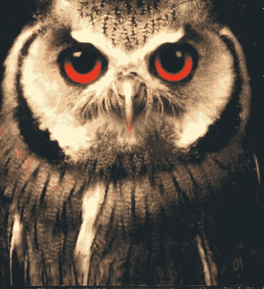

## St. Royal College
### 天使神秘学院

- 专业占卜预测机构
- 神秘学培训机构
- 水晶能量研究中心
- 官方淘宝：http://strc.taobao.com
- 官方微博：http://weibo.com/715104687
- 新书发布QQ群：659338717
- 购买更多好书请联系院长大天使

大天使
天使神秘学院 院长
QQ：715104687
手机/微信：13641926204

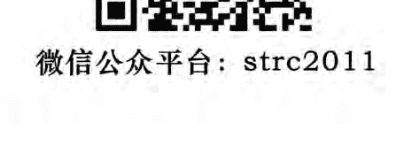

微信公众平台：strc2011

## 制作说明：

本书由《天使神秘学院》出重金从台湾购入的原版书籍扫描制作完成。为达到最好阅读效果，特地把原版书全部切开后，再经由专业扫描设备高精度扫描完成，并经过一张张的PS后期处理最终成书，其间花费大量的人力、物力以及时间，只为能给大家提供经济并优质的神秘学学习资料而努力。

本学院强力谴责某些机构和个人，把本学院花心血制作完成的电子书籍，包装后直接放在自家淘宝网上低价倾销的行为，以谋取不劳而获的经济利益。如果长此以往最终将无人愿意再为大家花心思制作电子书，那以后可能大家再无新书可读。

为让大家以后能够读到更多的好书，也为了本学院的良性发展。本学院恳请大家尽量做到如下几点：

- 1. 尽量在本学院的网站购买电子书籍。
- 2. 请勿用技术手段把电子书内的水印及加密去掉。
- 3. 在收到电子书后小范围传阅即可，千万不要公开传播，更别挂到淘宝网上低价销售。

同时为答谢广大支持者，学院电子书将做如下调整：

- 1. 学院会把一些早已收回制作成本的电子书折价销售。
- 2. 最新制作的电子书籍会开放打印功能，大家购买后有条件的可自行打印成书。

天使神秘学院
2017年6月

## 園丁的話

這本書的原文出版時間是在一九九九年，整整十五年前。

十五年後的今天，這樣的内容對大多數讀者的心智而言，可能還是很具挑戰性。

這本書裡的概念，顛覆了聖經裡有關人類起源的說法。或許這樣的概念，才能解釋許多人對聖經記載的那個憤怒、愛懲罰的神的疑惑，因而還原了祂的本來面貌。

我相信上帝是愛，宇宙也充滿愛與善意。不論是《地球守護者》、《迴旋宇宙》系列，還是《三波志願者與新地球》，透過催眠個案所傳遞的訊息，都一再提到萬物是一體，全宇宙的生命是一體的。

保持在愛的意識狀態，就會有心靈的進化和頻率的提升。

這年頭很多人喜歡說愛、說光、高舉正義的旗幟，但實際的行為卻是與愛和正義背道而馳。而我一直很不明白的是，為什麼有那麼多人看不清其中的矛盾？

我知道的愛是沒有分化、沒有批鬥、沒有仇視、沒有霸凌和恐嚇。愛，也不會以任何形式去傷害和嘲弄、羞辱與自己意見不同的人，甚至以此為樂事。但我觀察到近年來的台灣，越來越多有意識或無意識地認同或縱容對立、仇恨和恐懼的情緒。看似美好光明的口號或信念被用來偷渡負面的動機。如果在這樣一個小小的島上，人們都無法相互包容，只為了意識形態就能毫不猶豫的踐踏異己，不願走出受害者情結，或是明顯的以兩套標準看待事情，那還談什麼改變台灣？更奢望什麼新地球？

靈性一個很重要的概念，就是不會為達目的而不擇手段。目的不該被當作合理化不正當手段的藉口。這也是辨識小我的一個簡單標準。

我想，喜歡探討宇宙奧秘，對外星人主題有興趣，願意相信在這浩瀚的宇宙裡，地球不是唯一具有智能生命的星球的人，心胸應該是比較開闊的，至少，會比較願意放下舊思維，接受我們是一個整體的觀念；會願意耕耘自己的靈性，不去附和那些操弄和製造對立的負面手段。

那，就從自己做起吧！放下意識形態，放下雙重標準，放下選擇性的正義，放下以立場決定是非。也開始訓練自己的辨識力吧，因為許多事就如書裡說的，『事情並不都如它表面所呈現的』。事物的表象並不可信！

真正的愛與光並沒有兩套標準。

## 目録

- 第一章 啟蒙探索的方向
- 第二章 濃縮和扭曲的時間
- 第三章 事物的表象並不可信
- 第四章 隱藏於夢境的會訊
- 第五章 埋藏的記憶
- 第六章 宇宙圖書館
- 第七章 外星人說話了

> 林中两条岔路，而我……
> 选了人迹较少的路走
> 一切就此不同。
> ——美国诗人罗伯特·佛洛斯特（1874-1963）

## 第一章 改變探索的方向

九七九年，我開始從事回溯催眠和前世療法的工作。當時我從沒想到這條路將會帶我通往如此奇特的地方和情境。

在隨後的歲月，我被帶引走上陌生的偏僻小徑，有過不可思議的冒險，遇到來自過去幻境的有趣個案，並且取得了原本以為已經永遠失去的珍貴資料。這些都是透過驚人的回溯催眠技巧才得以揭露。我的時間全用在探索過去，並把發現寫成書。我被自己那永不滿足的好奇心、對研究的極度渴望，以及對知識的熱愛席捲，它們一路支持著我持續探索。

我對於將催眠應用在個案目前的生活並不是那麼關切，除非它可以來解決個案生理的問題；像是因前世產生的恐慌症或健康問題，或是從前世帶來的業力連結影響到這一世的家庭關係。

我在進行前世回溯時，只使用催眠的標準作法，也就是幫助個案瞭解和控制習性（抽菸和暴食等）。

我發展出的催眠技巧自動就能把個案帶入前世的情境，因此我並不用把焦點放在他們這一世。然而，這一切都在我無意間地被導向幽浮綁架現象之後有了改變。我的探險轉入了迥然不同和意想不到的方向。許多門開啟了，而我得以瞥見其他人認為不應揭露，且被未知的陰鬱和黑暗所掩蓋的世界。

有些人說，最好不要去探究人類心靈無法理解的事物。但是，如果那裡是知識和領悟的蘊藏之地，我知道我一定會去搜尋並提出無止盡的問題。任何研究的新管道對我都是挑戰，而且是我無法忽略的挑戰。只是，在進入這個研究領域之後，我不僅偏離了尋常的路線，我也需要改變技巧去適應新的狀況。

我對所謂「飛碟」的不明飛行物向來很感興趣。我閱讀過大部分跟這個現象有關的文獻資料，其中最令我印象深刻的是最初在一九六〇年代發生的案例，也就是貝蒂與巴尼·希爾（Betty and Barney Hill）的《被打斷的旅程》（The Interrupted Journey）。那是所謂「外星綁架」案例的始祖，其中許多描述讓我我相信希爾夫婦的經歷是確有其事。譬如外星人用心電感應溝通和不帶敵意的意圖，在我看來就有很高的可信度。我也會讀那些對天上奇怪且不肯默默消失的事件的評論。在權衡過正反兩方的意見後，我相信真的有些什麼事正在發生，而它並無法以懷疑論者的理性和邏輯思維去解釋。也許這整個主題從來就沒有要合乎邏輯，原本就非三言兩語能夠解釋得清楚。也許外星人的策略就是要達成他們現在正做的：激起人類的好奇心，去思考那些不可能的事。

一九四〇年代晚期和五〇年代初期，「飛碟」報導首次對大眾披露，卻普遍遭到嘲笑。當時還十多歲的我不斷想，那些事很可能真有點什麼玄機。這些年來，我對閱讀和追蹤最新的發展始終是被動的，我從沒想過自己會主動做起研究，甚至直接與來自另一個存在領域的外星人溝通。或許在詭異的領域工作多年，已經為我終於要發生的接觸做好了準備，因為當發生時，我既不感到震驚或不敢置信，也一點都不害怕。我只是好奇。好奇已成為我的註冊商標，並且幫助我取得了許多資料。

一九八五年五月，在友人米尔德莉德·希金斯（Mildred Higgins）的引介下，我跨入了幽浮研究和调查的领域。米尔德莉德是幽浮共同研究团体 MUFON（Mutual UFO Network）在美国阿肯色州的助理主任。她知道我对奇怪和不寻常的事物很感兴趣，猜想我可能会想认识一些调查员和对这方面有兴趣的人士。她邀请我参加办在她费耶特维尔（Fayetteville）家里的 MUFON 全州大会。虽然这个会议不属于催眠的回溯前世领域，但我认为，如果能够就我看过的幽浮案例问一些问题，应该会很有意思。

在会议里，我得知 MUFON 是最大也最受敬重的幽浮调查组织，会员遍及全球。由于与会人士大多是科学导向，我认为最好不要提到自己的工作。催眠在当时仍被许多人归类为荒谬的方法，但我不想忍受别人的讪笑。当时我的工作都是私下进行，很少有人知道我在探索什么。

MUFON 的国际主任华特·安德鲁斯（Walt Andrus）是在场人士之一，他非常健谈且真情流露，每一宗幽浮案例的细节似乎都在他的记忆里收归纳档，随时可以调出来。他对案例的了解令我印象深刻，其中有许多都经过他本人的调查。

另一位是卢修斯·法里胥（Lucius Farish），我第一次跟他见面时，对他没有太深的印象，但他后来对我跟幽浮的连结却有深刻的影响。卢修斯是个很安静的人，一般人不太会注意到他。他聆听时非常专注，像海绵般地吸收资讯。我现在知道他用这种方式学到的东西比站在舞台中央还多。他出版《幽浮新闻剪报服务》（UFO Newsclipping Service）月刊，世界上最新的幽浮资讯他都瞭如指掌。

会议还没结束，我对在场人士的感觉已经自在许多，于是透露了我是研究前世的催眠师。我预期他们会不理我，因为催眠绝对不是一种会被视为「科学」的方法。然而，出乎我的意料，华特说催眠有可能是很有用的工具，而任何能协助揭露资讯的工具都受到他们的欢迎。会议过后，我开始和卢修斯通讯。他支持我的工作，并没有像我曾担心的那样取笑我。过了一年，我才第一次接触针对幽浮的催眠研究。也就是在大概这个时候，恐怖小说家惠特里．史崔伯（Whitley Strieber）的著作《交流》（Communion）在屏幕上大放异彩。包德．霍普金（Budd Hopkins）的《消失的时间》（Missing Time）也出了一阵子，不过我因为埋首工作，一直没有拜读这两本书。巧的是，一九八六年五月，我的文学经纪人拿了史崔伯的书给我，告诉我里面有透过回溯催眠所得到的对幽浮的描述，建议我读一读。同时，卢修斯（朋友都叫他卢）也打电话来，他说希金斯又要在家里举办年度会议。卢提到，有个认为自己曾被外星人绑架的女子跟他联络，希望能做回溯催眠。卢想知道我愿不愿意催眠她。虽然我在这个领域毫无经验，卢认为我应付得来。毕竟，要找到一个对这类事情有经验的人（尤其是在阿肯色州）也很困难。卢说，大多数的精神病学家和心理学家不想处理这类不属于他们专业领域的案例。单是知道如何进行催眠并不足以胜任这个工作，你必须要能很自在地跟不寻常的事物交手，不被出现的任何状况干扰，并且要能进行客观的调查才行。我至少符合这点。我在诡异和超自然的领域已工作许久，我不认为会有什么事情能令我惊讶。如果我可以处理死于原子弹爆炸的男子《魂忆广岛》里的个案，或是亲眼目睹基督被钉死在十字架上的个案经验《耶稣与艾赛尼教派》的案例)，我应该会比大多数调查员更能处理人类被来自外太空的外星人绑架的事件吧。由于会议预计有三十个人出席，我担心那样的氛围是否适合进行这类回溯。那不会是有助进行一场成功催眠的放松环境。我平常都是到个案的家里，在绝对的隐私下进行疗程。偶尔可能有人在场，但那向来是经过个案的同意（那些人往往是应个案的要求才来），人数通常也很少。为了让个案能够放松，气氛十分重要。我告诉卢，那个女孩会像是被放在玻璃的金鱼缸里向大家展示，我不知道她对现场有这么多人会有什么反应。我认为，观众一定会影响到结果。因为这类个案超越了我平常的催眠范围，我也不免暗自担心。我对于该如何进行并不是很确定。我的催眠法会让个案自动回到前世，但现在我必须修正和改变工作习惯，好让个案能够专注在今生的事件，不要回到过去。我因为使用过许多不同的技巧，所以知道自己一定能找到一个有效的方法；我只是必须改变程序，而我并不知道到时会有怎样的效应或结果。我的其他方式都是可预期的，即使偶尔会有极少数人拒绝照模式走，但当遇到这种情形，催眠师只要懂得改变技巧，去顺应当时的情况即可。然而，在现在这个情形，我并没有时间演练或找出新的方法。我只能现场反复试验，见机行事了。满室旁观者对实验的进行真的不是很有帮助。总之，我在忐忑不安的情况下开始对这位年轻女子催眠，我心里担忧的不是主题，而是必须改变固定的工作模式。我又一次迈入未知的领域，这其中因为牵涉许多因素，让我无法确知结果会是如何。令人惊奇的是，我的技巧转换非常有效，我们获得了很多资料。催眠进行得非常顺利，在场人士并不晓得那是我第一次接这类个案。对我来说，那是开启幽浮调查之门的指标案例。在此之前，我从未听说有小灰人会在夜间把人从家中带到太空船上做试验。我也是第一次听说有星际地图，还有可回溯至童年的（外星）接触等等。这也是我第一次接触到个案的恐惧和创伤；这些感受是如此强烈，以至于情绪封锁住了资讯。那位年轻女子在过程中只能叙述她看到和听到的事，无法回答我问的许多问题，而这一切只引起了我的兴趣和好奇。我知道我可以发展出一种避开情绪的技巧，让潜意识来提供答案。这样的方法在别的个案很有效，因为潜意识拥有所有的资讯。我认为我只要能设计出方法，潜意识在这类案例也一定能发挥作用。当时，我已经在奇怪和诡异的领域中工作，因为就是在同一年（一九八六年）我开始接触了诺斯特拉达姆斯（Nostradamus）。接下来的三年，我都在写《与诺斯特拉达姆斯对话》三部曲。因此，不寻常的怪异事件和未知的领域并没有吓到我，反而唤醒了我作为报告者的好奇心，以及对拥有更多知识的渴望。那天离开会议要回家时，已过了午夜。在这样的经历之后，我实在不喜欢那么晚在没有车的乡间公路上行驶。所有奇怪的新资讯一股脑地涌上心头，我不免疑神疑鬼，在独自一人驾车的途中，不断地小心地看着天空。这次的回溯催眠是否表示外头真有外星人在跟人类接触？万一他们知道我刚做了这次催眠会怎样？也许就在这个当下，他们正在看着我。这个念头让我一路上心神不安。当我把车停进家里的车道，大松一口气时，已经凌晨一点了。

我知道自己想要更进一步探索这个领域，但也明白，在面对外太空生物跟人类接触的事件时，我有必要先处理自己这个非常人类的感受。我会感到恐惧是自然的。这些年来，看多了奇怪吓人的外星人试图占领世界的恐怖电影，我们早就被洗脑了。这些生物呈现出的形象向来是威胁而不是协助者。我要如何才能防止个案受到我个人感受的影响？我很清楚个案在催眠的出神状态下，会对包括催眠师心态在内的所有一切，变得更为敏锐。

这个案子开启了我跟类似案例合作的大门。它是典型的绑架情境，后来类似案例一而再，再而三出现，现在已是司空见惯了。我从工作中看到了浮现的模式，而当这同一个模式重复出现，我很快就会知道自己面对的究竟是真实的案例或只是幻想。

个案总是看到眼睛很大的小灰人对他们进行各种医疗检验，偶尔会在检验时看到比较近似人类的外星人。类似昆虫的奇怪外星人也时有所闻。而每一次都会有弧形的房间、桌子、对着桌子照射的明亮光线，还有个案说不出是什么的仪器。室内某处通常会有类似电脑的机器。他们也多次在个案离开太空船前，给个案看一张星际图或一本书，并说时机来临时，个案就会想起并理解那本书的内容。许多个案早在童年时期便与外星人有过接触；十岁似乎是一个关键期。我发现有几个案例甚至可以往前追溯三代。个案的母亲和外婆虽然不怎么情愿，却也叙述了类似的外星人采访和事件。

这让我觉得这是一个针对好几个世代研究并长期监控的实验室实验。

同一时期，我开始与菲尔合作，得到的资料后来写成了《地球守护者》。片片段段的资讯逐渐拼凑了起来。那本书讨论来自外太空的外星人对地球播种的古代太空人理论。我知道了外星人从地球生命开始便观察人类直到现在。所以，还有什么会比外星人至今仍监控我们，观察人类发展更自然的事呢？对我来说，这就是检查的原因，但为了让当事人的生活不受影响，事情必须隐密地进行。

在《地球守护者》里，我被告知最理想的是当事人对发生过的事没有任何印象，继续过着他们正常的生活。但我发现还是有些个案会想起令他们创痛的事件，而且往往是透过梦境，而非有意识地回想起来。

我也被告知，地球大气中的化学物质和污染，还有人体内的药物和酒精都会影响人脑的化学作用。这些会导致人们想起被绑架的点滴和片段，但是那些记忆会被情绪所扭曲。他们记起的并不是实际的事件。个案的意识心把事件转变成了一个情绪高张的记忆。我的工作就是要越过意识的情绪，直接与潜意识对话，就跟我在其他案例所做的一样。

经验告诉我，答案就藏在潜意识里。移除了情绪化的意识心智影响之后，真相自然会浮现。

许多调查员只研究目击幽浮和外星人降落之类的具体迹证，然后就止步不前了。有的研究员只研究绑架事件，然后就不再深入。我也是从这些事情开始，但却一直走了下去。我瞥见一个现在正开始浮现的广大全貌，而那是我们人类心灵几乎无法理解的奥秘，它将是有史以来呈现给人类的最重要的全局，一个有关我们是谁、我们从哪里来，以及我们要去哪里的故事。人类是已经准备好要学习关于自己故事的奥秘了？

几位作家和研究幽浮现象的调查员一致认为，不论有没有经过我们的同意，外星人似乎是在进行跟基因操作有关的某类工作。迹象也显示，这不完全是出于自私的科学动机，却像是在执行上级的命令，就像医院人员执行各种测试和检验时，通常会表现出的那种冷淡漠然的态度。有多少次我们想知道医院检验的理由，一样也被冷淡对待？当我们的孩子显露出同样的恐惧和好奇，为了让他们安静，我们会对他们说医生需要知道某些事，这些事他们不懂，就照医生说的去做，一点也不会痛的。即使我们知道检查的原因，可能也不会花时间去跟孩子解释，因为我们认为这样只会让孩子害怕，更何况，他们无论如何都不会了解。于是我们试图让孩子保持安静，直到该做的事完成。

然后我们常听到孩子说：「妈，你跟我说不会痛，可是明明就会！」这会造成不信赖感，就好像他们被欺骗了一样。在某些情况下，甚至会导致孩子对医生、护士或医院产生恐惧。也许我们误判了孩子，以为他们没有理解能力；但事实却不然。

外星人也表现出同样的态度，他们就像是面对孩童或智力不足的人，即使他们解释原因，对方也无法了解。被绑架者也跟我们的孩子有类似的反应，他们说外星人没有权力用这种方式对待他们。他们说外星人不尊重他们，也不费心解释究竟是怎么回事。

如果这些检查和试验涉及许多人，佔了地球人口不小的比例，我认为这可以跟每天都要进行数千百万次的婴儿健康检查相提并论。医生和护士是出于善意，是为了孩子的健康和福祉。但孩子并不了解，他们只知道自己被打扰、被触摸，有时还会疼痛。他们不明白为什么必须忍受这些。他们唯一的感觉就是被侵犯，以及对于未知的恐惧。在更高等的存在体眼中，人类也许就像是这些孩子。他们以他们认为最好的方式在照顾我们，但我们却无法理解他们的动机或目的。我们只知道自己的生活被打扰，我们感到害怕和愤怒。

因此，我认为我们应该尝试从不同的角度来看待这些事件。也许外星人并不是我们要害怕的对象，而是我们的老师或守护者。也许他们是在帮助我们度过一个关键的进化阶段。也许他们是在保护我们，免于我们自己造成的伤害。也许他们是在为一个更大的计划工作，而我们只是其中的一小部分。

当然，这只是一种可能性。我并不是说这就是事实。我只是在提供一个不同的视角，一个可以让我们重新思考这些事件的视角。毕竟，我们的恐惧和误解往往来自于未知。如果我们能够以更开放的心态去面对这些未知，也许我们就能找到答案，或者至少，能够与这些未知和平共处。

而这就是我写这本书的目的。我想要分享我所学到的东西，我想要提供一个框架，让人们可以用来理解这些复杂的事件。我想要鼓励人们去思考，去提问，去寻找属于自己的答案。因为最终，真相并不是由某一个权威人士或机构来定义的，而是由我们每一个人通过自己的体验和探索来发现的。

所以，如果你对这些主题感兴趣，我邀请你继续阅读下去。也许你会找到一些共鸣，也许你会提出一些质疑，无论如何，我希望这本书能够启发你，让你对这个世界有更深的了解。因为，正如我一直相信的，我们都是这个宇宙的一部分，我们都是相互连接的。而当我们开始意识到这一点时，我们就能够迈出走向一个更美好未来的第一步。

## 監護人 THE CUSTODIANS

上百次相同檢查、人滿為患的醫院的那種冷淡和漠然態度相提並論。經過了一段時間之後，檢驗變得固定和單調，他們覺得沒有需要解釋，也沒有足夠的時間和興趣去試著跟每一個人溝通。在這時候，如果有某個臨時員工花時間安排和安慰，他的善意在其他工作人員的機械化和明顯的忽略態度中，就會顯得特別突出，並被銘記在心。我相信外星人的態度不見得是忽視我們的個別人格，但有可能跟醫院一樣，是因為過多的工作量和窮於應付的例行公事的緣故。

許多研究者很努力想要找出檢測的背後原因。現在已有幾個不同的概念和解釋被提出來，未來還會有更多出現。每個涉入這個不尋常領域的人都會依據各自的研究、生活體驗、心態和期望，架構出自己對此的理論。其中有許多人認為，外星人正在進行基因操作或基因工程，目的為何各有不同的看法。有些人類是高等、幾近完美的種族，而外星人可能是來自不完美或瀕臨死亡的種族。或許他們不知地失去了繁衍能力，因此需要人類的精子和卵子，幫助他們的種族免於滅絕。他們希望透過不同種族間的交配來達成這個目的，就算不是經由肉體，也會透過臨床的科學實驗製造出人類與外星人的混種。由於這個概念在人類眼中非常恐怖，我們也會認為具有這種意圖的外星人很可怕。

我則有不同的理論。我相信外星人這麼做的目的是為了地球人，而不是他們自己。當然，我們已經看到好幾種不同的外星人和基因操作有關，其中可能有些比較負面的外星人是為了一己之私。但我相信，這些幽浮群體裡的叛離者或持不同意見者是少數。

就像我在《地球守護者》說明的，早在萬古以前，第一個人類出現在地球之前，就有一個在較高力量引導下，為我們這個世界制定好的計畫。這個宏偉計畫的設計與執行的方法，都遠遠超過人類所能理解。不同的存在體被指派去執行這個計畫裡的不同步驟，每個存在體只負責自己那一小部分，因此他們對整個計畫的完成並沒有什麼可說的。計畫的整體範圍大概也超過了他們的理解能力。由於他們用無限長的時間在地球製造、培育和修正生命，這對他們來說只是一份工作，一項任務。他們在許多處於不同成長階段的星球上頭，可能也有過類似的任務。當個別的存在體死亡，其他的存在體會接續他們的工作。這是個時間極長，並以一絲不苟的精細所協調執行的計畫。時間不重要，重要的只有最後的目標——創造出在生理和心智都很卓越的物種。這樣的計畫並非一蹴可幾，而就算是這麼小心翼翼的規畫也會有出錯的可能。畢竟，要預測到每一個可能發生的狀況是不可能的。

於是，就在一顆隕石墜落地球，帶來不適合這個星球的有機體時，美中不足的事發生了。那些有機體在它們原本的環境中是無害的，但在進入地球清新的大氣後，卻增生和變種成了易變無常的威脅；它破壞了播種人類的計畫，人體從此有了疾病。

原先的理想計畫是要創造出一種完美運作的身體，沒有疾病，可以享有很長的壽命。因此，當這個預料外的發展出現時，大家都很哀傷，議會的最高層級於是召開會議，決定接下來該怎麼做。他們既傷心又自責，因為偉大的實驗走了樣。但他們決定，既然已經為實驗付出了那麼多努力，最好就繼續下去，不要放棄整個實驗。他們決定將已經造成的傷害降到最低，接受不完美的部分，繼續努力，往前邁進。

## 第一章 改變探索的方向

人類在發展的早期持續受到這樣的照顧、修正和操縱。基因操作和工程從一開始就已是人類的一部份。這並不是什麼新鮮事。這就是為什麼我們之所以是現在這樣，而不是住在山洞裡，在荒野中艱難求生的原因。外星人很小心地培育和影響人類大腦的發展，把對他們而言非常平常，但對我們來說驚奇不已的心靈能力和直覺感受，一點一點地引入。隨著人類的發展遠離動物階段，並且變得有能力應付生活和種種事務，外星人就不被准許擁有那麼多的影響力了。地球一直被強調是個自由意志的星球，而宇宙法則嚴格規定，自由意志必須受到尊重。

外星人從地球園丁的任務轉變成了監護人。他們給了人類很多裝置與知識，好讓人類的生活變得容易些，然後我們這個新物種就必須自立自強。如果人類犯了錯，把知識用在錯誤的地方，那也是我們的權利，前提是不要侵犯到地球以外的生物的利益。

外星人受到嚴格的不干預法則的約束。當然，他們對人類的研究仍持續進行，不時需要檢視實驗，看看人類的發展以及對環境的適應情況，並在適當的時機透過基因操作進行修正。如果這些事情從時間之初即已開始，那現在又為什麼不會持續呢？如果他們是在更高力量的許可之下進行，而我們對那股力量卻連最基本的理解能力都沒有，我們又怎能說他們沒有權利？我們並不會對一個母親說她沒有權利或職權去照顧她的小孩。這是我看這件事的邏輯。

隨著人類的發展，我們對環境的影響已到了一個會反過來大幅影響人體的程度。我想，在人類環境經歷這些威脅性變化的時候，外星人進行更多測試和檢查並非巧合。他們當然想知道人類對自己的身體做了什麼；他們一直都很有興趣。他們持續關心並修正和調整人類，好讓我們能適應自己對大氣所注入的那些「東西」。還有什麼比這更順理成章的事呢？如果這包括了透過操作基因製造出更有適應力的人類，那就由他們去吧。我相信他們仍在試著修補萬古前隕石把疾病帶進他們的實驗所造成的傷害。我相信他們仍在努力回歸最初的夢想和設計，讓我們成為沒有疾病，擁有長到不可思議的壽命，因此完成了不起事蹟的人類種族。

我在《地球守護者》還談到了另一個計劃：創造完美的人類，讓這些人在宇宙的某處，另一個預備給他們的星球上生活的可能。當地球可能被核戰或其他事物汙染到無法復原時，這會是人類在乾淨的環境中重新開始的機會。我相信這是一個可能性，但也許不是唯一的一個。

一九八八年的秋天，我遇到一件怪事。某個夜晚，我忽然有種明確而不熟悉的感覺，好像有一整團的資訊不知怎地灌入了腦子裡。那個體驗完全不像是在作夢。事發當下，我清醒到足以理解那些資訊。我知道那是個概念，不是具體的句子或想法。它是以完整和簡潔的形式放到我的腦裡。

我常聽個案說他們接收到的資訊必須分解成語言才能被理解。現在我瞭解他們翻譯的困難了。

這是我第一次有這種體驗，也是唯一的一次（我認為）。我知道那個概念跟幽浮上外星人的行為和思考等等解釋有關。我知道它應該被放進我以後要寫的幽浮案例的書裡。我當時正在進行《與諾斯崔拉達姆斯對話》三部曲第一部的最後編輯工作，完全沒有察覺自己竟也在思索外星人使用基因工程的原因。我只是持續累積資料，期待有天把這些資料寫進我談幽浮案例的書裡。

我收到的概念、想法和說明，跟當時從其他幽浮作者那裡聽到的都不一樣。記下這些內容似乎很重要，重點是，那是我一直在找的資訊。我並沒有時間去分析，因為它有太多面向，但我知道我可以先記在心裡，隔天再把內容存到電腦。我繼續入睡，隔天早上醒來時，腦裡有種奇怪的感覺。我的人尚未完全清醒，那團資訊便以前一晚同樣的強度湧而來。這不是正常的狀況，因為通常醒來後，夢裡的內容會退去得很快，事後要回想，就算只是畫面，都不是容易的事。我得到的資訊並不是畫面，而是哲學性的思想。它再度強調我必須記住並寫下來。我知道我必須在它消失前趕緊存到電腦。當然，日常生活裡總是會有些阻礙。那天的第一要務是要跟女兒一起把我們小果園裡的桃子裝罐。成熟的桃子不能等，即使有資訊在腦裡跑來跑去，心有旁騖的情形下也是一樣。當最後一罐桃子封好放在桌上等候冷卻時，我才終於有時間可以一個人在電腦前工作。當然，接下來就是要思考如何將資訊轉成文字。這通常是最困難的部分，因為概念是整體的，但要轉換成文字，勢必得經過拆解，而這並不容易。我很清楚我一定會遺漏某些部分，不過我還是會努力。我收到的這個概念很有趣，我能夠以它的解釋為骨幹，建構出一本書，朝著預先形成的結論前進。雖然那樣的一本書當時只是我心裡深處的一個模糊影子，還談不上形式和內容。這些萌芽期在我的檔案裡冬眠，直到十年後才得以具體化。到了一九九八年，我已經累積了可以寫成一本書的大量資料，而這本書毫無疑問地就是依循著我在一九八八年所得到的概念。

### 概念

我發現，基因操作是為了保護人類，保存我們這個種族，保障我們的存續。以這種方式去看，基因操作其實是一項偉大和仁慈的行動，顯示了對人類的極大關懷。《與諾斯特拉達姆斯對話》三部曲裡強調，我們的生活方式很有可能毀於一旦。地軸傾斜的可能性已被預見。在這樣的災難期間，將有許多因素造成生命的殞落，像是洪水、地震、火山爆發、海嘯等各種已知和未知的不幸。接踵而至的疾病和饑荒又會帶來更多死亡。任何僥倖存活下來的人都必須非常堅強。我對人類很有信心，我相信我們有能力存活。就如諾斯特拉達姆斯相信的，我也相信這不會是世界的末日，而是我們所知的世界的末日。我們的生活方式將會有徹底的改變，但人類所具有的不屈不撓的美好特質，一定可以重建我們認為重要的生活形態。

我並不太喜歡想這件事，也不想認為這很有可能發生，然而，許多專家已經同意這個可能性確實存在。或許外星人只是看得比較遠，並且試著預測到每一個可能。他們不想再有措手不及的事發生。透過基因操作和基因工程，他們也許能夠創造出可以在污染環境中存活的人類——不只能夠抵抗癌症和其它因環境改變而產生的疾病，還能適應充滿巨大壓力的新生活形態。本書有個案例就看到自己在滿是病患和將死之人的場景裡，儘所能地提供任何一點協助。她沒有生病，也不會生病。幫助別人是她的工作。也許她就是為了這個目的而設計出的新人類，能夠禁得起地球變遷時的災難與隨之而來的重大危機。

### 觀察

自從我得到的資料讓我發展出一個理論：外星人十分關心我們這個物種的福祉，因為打從遠古以來，他們便一直看顧著人類；他們並沒有放棄我們的打算。有些人類正在接受準備，要在另一個預備中的星球生存，這個星球將會居住那些沒有疾病的個體。它被設計成跟地球類似，這樣一來，那些將要在原始狀態的新環境展開新生活或延續舊日子的人類，才不會受到驚嚇或太大的衝擊。有些人也可能正在接受準備，以便在地球發生浩劫性的變化後，繼續在這個星球上生存。我相信，未來當我們看到這個現象的所有不同面向時，我們將意識到外星人沒什麼好讓人懼怕的，相反地，我們應該把他們看作是祖先、兄弟或監護人來歡迎。他們在這項宏偉計畫的目的的最終將如水晶般明晰，並得到人類的理解。

從接觸到這個較為極端的觀點後，我發現自己觀察周遭事物的方式有了改變。它影響了我看待人類同胞和他們生活的方式，還有這些生命是如何在全球性的情境中息息相關。隨著我對這些事情的注意，監護人理論背後的邏輯也在我的心裡越來越清晰，越來越有道理。在遙遠的未來，人類很有可能也會擔任某個星球的監護人。這個想法不只可能，還極有可能成真。人類是非常好奇的動物，我確定當初展開照顧地球計畫的外星人也是。我很難想像一旦人類太空旅行的技術臻至完美，克服了我們的世界與外頭死寂世界的距離之後，我們會想要外面的世界跟發現時一樣死氣沉沉地沒有生命。在遙遠的未來，人類將具引介生命實驗的知識，也必定會從簡單的初步階段開始，先導入單純的細胞，看看在眼前的條件下，有哪些可以成長並適應原始的環境。

在經過了許多實驗之後，更複雜的生命形式將被導入，或是改變基因來適應環境。我相信天生好奇的人類一定會這麼做的。而且我們會推論這樣的實驗不可能造成傷害。因為進行實驗的星球本來沒有生命，或是只有最基本的細胞結構，因此人類就有了一個沒有生命的荒蕪星球做為實驗地。

這裡已一切就緒，等著成為未來科學家試驗不同生命形式適應力的遊戲場。所以這會傷害到誰呢？

外面的世界不會有地球上的種種限制，科學家因此能夠自由嘗試。

當然，他們會受到政府或至少某個較高位者的指導和指示，遵循著一個主要計畫的順序，一步一步進行。那個計畫一定是複雜到不是一般科學家可以獨立完成。接著，將會是照料、去蕪存菁和移等工作，也就是協助發展中的生命形式適應環境。這些瑣碎的任務會是交由教育程度較低的人（或甚至是機器人）來執行，因為這些工作只需要遵從指示。

母星的大眾可能知道，也可能不知道這些非公開的計畫，而計畫則可能無限期地發展，由那些認為「新」世界太過珍貴而不能終止實驗的科學家世代地進行下去。這些科學家將學到多到不可思議的新資訊，並用來造福地球人民——計畫如果也對母星的生活形態帶來幫助，自然就不會被放棄。

經過數不清多久的時間之後，生命的存在確立了，並且開始發展它自己的特質。或許來自地球的生物也被引介到實驗裡進行跨種繁殖，以便發展出能夠適應環境的基因，其結果可能就是一種有智能的動物。在這個過程中，人類很自然地會為了協助發展而操控基因，放進我們自己種族的特質。當新的生命出現，興奮之情將感染所有的科學界。這個產生的生物可能具有部分我們的特性，但由於必須適應本身的環境，所以大概不會和我們非常相像。他的眼睛、呼吸器官和循環系統可能跟你們不同，因此無法在地球存活，然而，他仍會被視為是類人動物 (humanoid)。

假使，這個新生物開始顯示出與大計畫不相容的缺陷，科學家會因此放棄計畫，毀掉他嗎？我想不會。我想人類仍有足夠的神性，他會把所有的生命看作是神聖的，就算是自己一手所創。我想人類會盡力幫助新的物種適應缺陷，或就是讓他們在演化的困境中，自生自滅。

隨著具有優勢或主要物種持續發展並開始展現文明的跡象，監督就會跟著減少。實驗者不需要隨時都在觀察。此外，看看新生物會如何自行發展可能也是個有趣的實驗。他們會有創造力嗎？好不好戰？為了瞭解自己的種族，我們會覺得有必要容許這些生物自行發展，同時研究哪些特點是自然發生，哪些是靠後天學習。但我們不會完全丟下他們不管。

指導者會前去和新生物一起生活，教導他們改善生活的方式。新生物則會視指導者如神，即使在他已返回母星很久之後，對他的崇拜依然不會改變。指導者一定是神，因為他具有如此不可思議的神奇力量和知識。他會教新生物採集食物和生存的方式。接著，為了研究生物的心智發展，指導者不會介入或干預後續的情況。知識一旦傳授出去，要怎麼使用就全由新生物自己決定了。介入太多很可能會徹底破壞實驗。

我們顯然還可以列出許多不同的因素，但以上會是大致上的情節。

這將是一直持續進行的實驗，而且永遠不會被母星放棄。經過許多世代以後，這個實驗會繼續出現在歷史的記錄裡。永遠都會有「看守者」負責觀察和更新記錄。為了瞭解基因的發展和環境對基因的影響，新生物中自然會有一些受到較嚴密的監控。如果發現問題，「看守者」便能透過修正基因來進行調整，並提供幫助。我相信我們不會認為這是干預，因為在理想的狀態下，生物不會覺察有異，所以可以不受影響地繼續他原本的生活。

為了不被生物察覺，實驗進展到這個先進的階段，科學家最好待在實驗室的玻璃後面。這跟在籠裡孵育飼養罕見鳥類的情形非常相似。在小鳥破殼而出後，照顧者會戴著怪誕的鳥面具或帽子，為的是避免成長中的雛鳥與人類認同。科學家的理論是，如果鳥以為自己是人類，以後到了野外將無法生存。牠必須跟自己的同類認同才行。

然而，如果當物種的發展轉了向，開始用他新發現的知識掀起戰爭呢？萬一戰爭的行為日趨嚴重，他們創造出具有可怕力量的武器該怎麼辦？萬一他們以輕率魯莽的方式使用新發明，威脅著要摧毀自己，還有他們的整個世界，又該如何？他們會容許這麼做嗎？我不這麼認為。如果實驗在數不清的世紀中一直受到保護和培育，在那一刻，我們會放棄實驗還是冒險干預？這會是非常重大的問題，而決定的責任很可能是在地球政府的最高層級。

我們有可能會決定讓他們做他們想做的事，當作是實驗的終極高峰。但是，我們會眼睜睜看著一切全毀嗎？我們很可能會採集細胞，進行複製，以便地球留下這些物種的一些樣本，也或者是到另一個荒蕪的星球重新來過。我們大概不會讓所有的努力就這麼化為烏有。我也相信，如果物種威脅要毀了他們整個星球，我們勢必會做點什麼來預防，因為它造成的衝擊會影響太陽系，甚至鄰近的星球和銀河系。這會造成太大的破壞，我們不能坐視不管。在那樣的時刻，我想我們終究會打破不干預的鐵律，讓物種知道我們的存在。我們會告訴他們，我們是互古以來他們的創造者、監護人和保護者。他們會接受我們嗎？會相信我們嗎？這會帶來任何改變嗎？

這整個情境聽起來像是科幻小說，但我們如何確知道這不會真的發生？我們如何確知道這種情境不僅已經成真，而且不只是在地球，還在宇宙間無數可能的星球上演？只要人類持續搜尋，就沒有什麼能限制他的成就。

一直以來，宇宙始終是人類的家。好奇心是我們從創造者和監護者繼承到的重要特性，它也一定會是我們日後將傳續給尚未出生的後代的重要特質——不論他們是在這個星球或是別處。

> 知識若無法分享便毫無價值。

## 第二章 濃縮和扭曲的時間

消失的時間是指當事人在沒有意識到的情況下，幾個小時不明原因地過去了。很多調查員探索過這些案例，本書稍後也會討論幾個例子，不過我發現了一個在我看來更奇怪的概念：被濃縮的時間。換句話說，就是事情用比平常少很多的時間完成。當然，從當事人的觀點來看，這兩個現象都是時間被神秘扭曲的例子。

人類因為被困在對線性時間的概念裡而受到束縛。據說，我們可能是宇宙裡唯一發明了方法來衡量某個並不存在事物的星球。我在工作中被多次告知，時間只是人類所發明的幻象，外星人並沒有這個概念。他們也告訴我，唯有克服對時間錯誤的想法，人類才能在宇宙間旅行。這是人類之所以被困在地球的主因之一。

雖然我們從心理的觀點可能可以瞭解這點，但要人類心智去接受時間不存在，就算不是不可能，也是非常困難的事。我們的生命完全陷在根深蒂固的時間裡，由分鐘、小時、日、週、月、年所組成，並以此衡量。我看不到人類要如何逃離這個概念，同時卻繼續在我們正常的平日世界中運作。我們相信，事情在一定長度的時間裡必須照著順序，從一點進展到另一點。沒有事情可以例外，沒有別的路徑可以走，因為那並不符合我們的信念系統。因此，我們的焦點是很狹隘的，焦點外的任何事物都被說成是不可能，因此不會發生，無法存在。

但如果，人類是住在另一個用不同方式環繞著太陽旋轉的星球，那我們要怎麼衡量時間呢？假設白晝恆常，或是永夜無光呢？假設那個行星有兩個太陽？那裡的人會用不同的方式衡量時間嗎？還是決定沒必要這麼麻煩？而那些在太空船上長時間旅行，在宇宙間不斷前行，沒有參照點可以區分日夜，也沒有理由區分季節和年分的存在體又是如何呢？這也難怪他們不瞭解時間對我們的意義，也經常覺得沒有道理。在類似並且甚至更極端的情況下，我們也很可能會認為創造出時間並教條式地堅持時間的概念並沒有意義。僵化的時間架構使人類看不到其他的次元和存在層面，但外星人沒有這個限制，因此能自由探索。在發現了其他的次元和存在層面後，外星人接著又找到使物質消失和重現的運送方式，他們可以迅速地穿越通往其他次元的裂隙，在那些缺口中介移動，輕鬆自如地就像是走過一扇門。當然，早在我們的祖先住在洞穴以前，外星人可能就已經在這麼做了。人類要想追上他們，還有好長的路要走。但除非人類拿掉遮蔽的眼罩，看到事情的可能性，要不永遠也找不到那些裂隙。話說回來，如果有別的類人物種找到了方法，那麼我們也有可能找到。假使自人類存在以來，外星人就透過心靈將我們所需要的資訊提供給我們，那麼他們也有可能現在正試著傳送消除時間障礙的秘密，幫助我們看到那珍貴的時空門戶的所在。外星人似乎能接受許多對人類心靈來說，幾乎不可能領略的形而上概念。注重「具體細節」的調查員或研究者總是希望所有事情都保持單純，如果他們看不到，衡量不到，接觸不到或是無法解剖，那麼它就不存在。他們對一小時旅行幾英里可以抵達最近的星球的這類概念比較自在，因此窮力發展能夠達成這項任務的能源。要他們領會靠心靈力量旅行並且進出不同次元的概念，就會困難得多。然而，幽浮謎團的解答再也不是那麼單純。越去挖掘這個謎團，概念就變得越複雜，對心智越是挑戰。或許這是為什麼我們直到現在才被給予這些另類資訊。

在我們人類心智必須習慣外星人用我們可以理解的方式搭乘幽浮旅行，譬如使用某類型的傳統能源來超越光速，以符合地球科學家所理解的物理法則。這些年間，資訊就像是用湯匙一點點地餵給人類，一次只給我們當下應付得來的量。當我們適應了概念的各個部分，當觀念不再令我們害怕之後，他們又會提供拼圖裡更複雜的一片。我真的懷疑人類到底有沒有瞭解完整概念的一天，就像我們並不會預期一個還在學走路的幼兒能夠瞭解幾何學或微積分一樣。因此，我們人類大概永遠不會有那個機會吧。

我被多次告知，不要期待我所有的問題都會得到解答。有些知識好比良藥，有些則如毒藥一般，它的傷害會多過幫助。因此我接受凡是提供給我的資訊，我也發現，當我分析它們，試著瞭解那些概念時，我又會得到更多資訊讓我消化，而它們也從未超過我的因應能力。這也是我一直以來寫書的方法，我試著用大眾能夠領會和理解的方式來呈現這些概念，而現在，這本書將會涵蓋之前不曾呈現的內容。探索者的面前仍有許多未被標明的未知領域，而我希望能朝那些地方前行。我們正如嬰兒學步般地，一步步踏入未知的世界。

我們認為，這些外星人和飛行器的行動並不符合我們所知道的物理法則。我們認為他們在做的事「不合自然規律」。因此對他們的存在抱持極大懷疑。人們說，報告所說的那些外星人表現的本事，根本是不可能的。而我認為，我們終將發現那些現象是自然的，而非不自然。外星人遵循的可能是我們尚未發現，或是連想都沒想過的新物理法則。由於不符人類的現實架構，所以我們會覺得新奇，但對他們來說卻再自然不過。

根據我收到的資料，幽浮之所以能從視線或雷達螢幕消失不見，是因為它們能突然改變振動頻率。你只要觀察過風扇或螺旋槳葉片在旋轉加速時是如何看不到葉片，你就對那是怎麼回事有了粗淺的概念。我們這些住在地球實體環境的人是在一個較低的頻率上振動。這個概念會在我的另一本書《迴旋宇宙》有進一步的解釋。

這些外星人有許多並不是生活在其他星球，而是在其他次元。在那些次元裡，有許多其他的世界（有的是實體世界，有的不是）偶爾會與我們的世界並行存在，但它們振動的速度較快。通常，我們完全不會意識到彼此的世界。比較先進的其他世界察覺到了我們，於是不時會前來地球觀察。降低和維持較慢的頻率不論多久，都被描述為痛苦的事。如果人類要進入那些次元就剛好相反，我們的振動必須加速，再回來時則必須放慢下來。

這些外星生命有許多已經演化到純能量的階段，他們不再需要肉體。然而，當需要身體跟人類互動時，他們也能以肉身顯現。我並不明白為什麼純能量的存在體在旅行時還需要太空船。也許他們為了維持生命，不只把他們的環境帶著走，像是重力、大氣等等，而且也包括了他們的振動速度。

## 第二章 濃縮和扭曲的時間

許多案例顯示，被帶上小太空船的人類在身體上並沒有受到什麼持續的影響。也許這就是原因。那些飛行器進入我們的振動速度並在這裡運作，所以人類沒有適應的問題。小灰人通常就是在這些較小的飛行器上出現；這些被複製或製造出來的生物，顯然比其他型態的外星生物更容易在這些頻率中運作。小灰人是高大灰人依自己的形象所造，以便帶到地球進行瑣碎的僕役工作。他們採集人類、動物、植物等樣本，送到大型太空船上的實驗室做分析。

人類被帶上較大太空船或「母船」的案例並不多。這些船隻通常是在大氣層的高處，因為過於龐大降落不易。不過，我現在認為，它們也是以不同的頻率振動，所以才會是隱形的（對我們來說）。也許太空船上的外星生命無法輕易調整到較慢的振動，因此偏好待在他們自在的舒服的環境裡。人類可以在有限的時間裡這樣運作，但無法無限期地下去，否則身體就會瓦解。

當從太空船上回來，個案會經歷複雜和困難的過程——重新調整身體，降低振動速度。當身體從這個痛苦經歷回到原本的系統，當事人會感到困惑、迷惘，或出現暫時性的麻痺和其他生理症狀（例如瘀血）。這可以解釋為什麼很少有人類被帶上大型太空船的案例，而登上小型飛行器和看到小灰人的經驗則常見得多，因為一般人可能無法適應登上大太空船所需經歷的生理變化。

一九九八年，與蘇聯一同登上和平號（MIR）軌道太空站的最後一位美國人返回地球。據他表示，在處於無重力的狀況下那麼久後，最難適應的便是要習慣自己身體壓迫性的重量。

湯姆一直為了一九七二年在麻薩諸塞州發生的消失時間事件感到困擾，因此想一探究竟。他當時是為了生意的事去客戶家開會，與在場的其他人共進了一頓美好的晚餐，隨著時間慢慢過去，夜色越來越深，有個女子邀請湯姆到她的公寓留宿，好讓他不用趕回隔壁城鎮的家。他當遠先從最簡單的解釋找起，再進入較複雜的可能性。在很多案例裡，簡單的解釋就是答案。潛意識具有所有的記憶，它會報告真正發生的事件，不會有意識心干預所產生的情緒渲染或扭曲。我總是告訴調查員，當個案報告消失的時間或其他看似符合模式的經驗時，不要馬上下結論。永遠或幽浮有直接的接觸，特別是有光（或飛行物）出現的時候。但我發現情況不一定如此。很多案例都只是當事人的心靈封鎖了不愉快或受創的經驗，和外星人並無關聯。只要催眠的狀態深到能夠直接聯繫潛意識心智，我們就能取得正確的資料。消失時間的事件並不總是跟表面所呈現的一樣。一般以為，經歷消失時間的當事人是跟外星人

由於某些不明的原因，有些人偏好用複雜的解釋來解釋他們生命裡的事件。『我有過消失的時間，所以一定被帶上幽浮過』因為某個神秘的心理過程，這個抽象的推論比平凡但不愉快的解釋更容易被接受。我有個個案確實有過消失的時間，也確實與外星人有過接觸，但那卻是一個在錯誤的時間到了錯誤地方的案例。

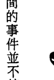

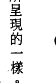

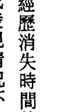

湯姆記得那夜那位女士正在開車的時候，在一些樹的上方，有道亮光劃破天際。那位女士似乎因此變得緊張，但接下來的事湯姆就不記得了，他只記得第二天早上在她的公寓裡醒來。他沒有服用任何藥物或喝酒，始終無法解釋消失的時間。沒多久，那位女士搬走了，湯姆並不曉得她去了哪裡。他只記得對方有點奇怪，不是很親切，也不太愛說話。

透過催眠，湯姆重返當日的場景，回憶起事件的確切日期，並描述了那頓可口的晚餐。他提供了許多他的意識心智已經遺忘的細節，其中有許多都跟我們要找的真相無關，但顯然所有的資訊都存在著，而且隨時可以接通取得。那位女子的名字叫史黛拉，湯姆說她的車是全新的一九七二年龐帝克火鳥。當他們循著鄉村小路駕車前往她的公寓，時間已近午夜。湯姆敘述了他們之間的閒聊。然後，他的眼角餘光瞥見他以為是一團火球或「流星」之類的東西。天空上的光越來越亮，眼看著就要朝他們逼近。

引擎突然熄火了，車就停在路的中央。史黛拉非常害怕，但說來奇怪，湯姆的反應卻很不同。他突然覺得疲憊不堪，接著就睡著了。這絕不是正常的反應。我知道他的潛意識一直是清醒的，我可以向他請教。

他的潛意識告訴我，他和史黛拉都睡著了。有道耀眼的光包圍住車子，光從所有的窗戶照進來。接著，車門被打開，他們睡著的身體被移出車子。我問是誰帶他們出來。「他們看起來像人類。一個褐色頭髮的男子，另一個是金髮。他們把我們帶出車外，檢查了車子裡面，然後看著我們，拿一個東西對著我們上上下下，最後才把我們放回車裡。」

湯姆說他們讓他無意識的身體保持直立，用一個儀器在他全身上下檢查。儀器在操作時發出喀答喀答的聲音。我認為他們要用這種方式把他抬起來應該會很重。他回說大概吧，不過他們做起來卻不怎麼費力。我請他描述那個儀器。「它看來細細長長的，類似電視的天線，大約有十三或十四英寸長（譯註：約33－35公分），周圍有電線包著。它會閃爍顏色，是介於螢光綠和深紫色的閃光。當儀器經過身體時會發出光，還有喀答的聲響。但我不知道它的用途。」

接下來他們就被放回車裡。引擎動了，他們又行駛在路上。兩名男子和光通通消失不見。史黛拉說：「唉，我剛剛有剎那一定是睡著了。我一定是太累了。」湯姆也覺得自己打了瞌睡。然後史黛拉看了一下錶，她被自己看到的時間嚇了一跳。「唉，天啊！兩點半了！我們不是十二點走的嗎？唉，我不知道怎麼回事。我們最好趕快。」在開車去她的公寓途中，他們都沒有再提起這事。湯姆覺得非常累，好像能量耗盡了一樣，剩餘的路程猛打瞌睡。到了公寓，史黛拉帶他去客房，他一頭便栽倒在床上。除了隔天早上被電話吵醒外，他不記得其他的事。

我問他的潛意識知不知道為什麼被那個看起來奇怪的儀器檢查。它回答：「是的，我知道為什麼。是因為史黛拉。她在波士頓南部一家公司工作，那家公司正在準備越戰的軍事機密。史黛拉可以接觸到所有不同類型的資訊。我想他們是想從她身上得到資訊，和我沒有太大關係。我只是剛好在他們跟她接觸的時候在場而已。他們監控她，大概已經和她接觸過很多次了。我知道有什麼不對勁，因為她總是很緊張不安的樣子。她很多疑，不容易交朋友，而且常常搬家。在她搬來麻州之前，

湯：不是，他們不擔心她捲入間諜活動或類似的事。她是他們在監控的人之一，就只是這樣。她也會接觸到各類型的科學論文、專題著作和這類性質的事。這是她被監控的原因。

朵：你現在跟我說的有關她的資料，是你本來就知道，還是現在才知道？

湯：噢，我知道她有學位。我也知道她在波士頓外郊一家和電機工程有關的公司工作，但我原先不曉得她跟間諜活動有關。

朵：那麼你剛才發現的她被監控這件事，你當時並不曉得？

湯：對。她對被監控這件事感到很困擾，因此才在世界各地旅行。她想遠離他們。這件事過後她很快就離開了。我猜猜她應該是搬離了麻州，因為我連絡不上她。

朵：你沒有再見過她？

湯：沒有，她必須去……（停頓，然後很驚訝）去休士頓。史黛拉離開是因為她被調到休士頓。

朵：好。那天之後你還有過類似的經驗嗎？看到那個光或什麼的？

湯：沒有，再也沒有過。那是唯一的一次。

我覺得這個案例很有意思，因為這個時間消失的個案並不是外星人注意的目標。如果個案是在想像，他會有很大的想像空間，但他甚至不是事件的主角。此外，他說他後來再也沒有過類似的事件，這一點也很有趣。如果這是他想像出來的，他很容易就能把故事延伸下去。然而，卻沒有任何後續。

一九八八和八九年，我遇到三個會想到跟時間扭曲，甚至移動到另一個次元有關的案例。

一九八七年的夏天，盧在地方超市的免費報紙上刊登了一則小廣告，徵尋過不尋常幽浮事件的人打電話給他。那是他第一次，也是唯一一次刊登這種廣告。

一位名叫珍奈的女子打電話過去，說她前一晚在他那個地區遇到奇怪的事。那個女子很不安，不願公開自己的身份。她告訴盧，事發當時她從科羅拉多州經過康威區回家，卻只花了十五分鐘。那段路程大約是五十英里，通常要花上四十五分鐘。此外，四線道的州際公路上完全不見其他車輛也挺怪的。回到家後，她養的幾隻狗又不尋常地狂吠。盧說，看來我們有了一宗時間濃縮而非時間消失的案例。過程中唯一可能和幽浮有關的，就是她看到巨大明亮的光在一些樹頂上頭。不過她是個不想透露身份的商界人士，談論這件事似乎令她覺得尷尬。

盧於是到她家跟她詳談。他發現珍奈是個非常實事求是的人，從沒閱讀過幽浮方面的資料，也沒有任何興趣。她認為如果真的發生了什麼，一定會有符合常識的合理解釋，但她實在很難解釋時間的加速和天上的光。盧問她是否願意接受催眠，她非常抗拒。我叫盧不要勉強，讓她自己做決定。但如果有可能，我會想跟她見上一面。

接下來的一年，盧時不時會與珍奈聯繫。她緊抓著各種對那道光的奇怪解釋，甚至接受那是有人在樹上用鏡子往上反射的亮光。由於太想找到一個解釋，結果解釋反而比實際的事件還要詭異。

她也提到她做了一些奇怪的預知夢，這是她生命中第一次出現這種靈媒傾向。

盧屢次試圖安排我和珍奈會面，卻總是沒成。每次珍奈都有別的對她來說更重要的事要忙，而那通常跟生意有關。顯然地，那個經歷雖然令她震撼，對她卻不是最重要的。

第一次聽到她的案例時，濃縮時間的概念對我還是新鮮的怪事，所以一直見不到面也無妨。在這期間，我又遇到兩個明顯類似的案例。我認為這些案例之間可能有共通性，尤其是本章提到的凡勒莉和艾迪。

終於，在一九八九年的四月，我在尤里卡溫泉市（Eureka Springs）的歐札克幽浮大會上見到了珍奈。她勉強答應出席。盧介紹了我們認識。珍奈說那個週末至少有其他三十件事是她寧願去做的，參加這場大會並不是其中之一。她對這方面純粹就是不感興趣。大會上，她一直很專心地聆聽著說話，也看了會議所放映的照片和投影片，不過並沒有什麼和她的經驗類似，所以她認為這只是在浪費時間。當大多數的人都還在會議廳的時候，我們兩人先到了大廳，坐下聊天。

珍奈是很有魅力的金髮女子，成熟，但不會太過於世故。她把自己打扮得很好，給人一種她習慣跟富裕、教育程度高的人士往來的印象。然而她很友善，不會給人勢利眼的感覺。她和我在一起顯然很放鬆，很快就告訴我她的故事。能把事情說出來，好似讓她鬆了口氣。她像是知道我不會笑她，而是要幫助她。由於她最近腦裡一直閃過其他細節，她感到困擾，這才決定要探索這件事。她依然對事情會有合理解釋保持正面的態度，她相信只要能找到解釋，這件事就不會困擾她了。她非常仔細和確實地向我描述了細節。

我確信她自己已經核對過這起奇怪的濃縮時間事件，因為她似乎是那種想替每個可能的細節找到證據，滿足自己好奇心的人。她的確這麼做了，她已經跟好幾個人核對過事發當晚她離開小岩城餐廳的時間，確定自己開上四十號州際公路是在午夜前後。

她沿著公路一直開，然後轉向通往她家的那條路。由於那個區域只有一條馬路可以進出，不論白天還是晚上，總是會有車子經過。珍奈幾乎天天走這個路線，對每個轉彎，還有路上的每棟房子瞭如指掌。但那晚一切似乎都變得陌生和不同。天空沒有半點星光，路上也十分安靜，連蟋蟀的聲音都沒有。她清楚地注意到沒有任何一間房子有光，一向亮著的戶外汞燈也熄了。珍奈很熟悉這一帶，向來老遠就能看到的沿路房子裡的燈光，那時卻萬籟俱寂，沒有半點生命跡象。路上空無一車，她覺得很不尋常。

接著她就看到了那個東西。一個龐然大物懸浮在右前方的樹頂上。那是個巨大的橢圓體，散發出非常獨特的亮橘色的光。光是包覆在橢圓形裡，並沒有往外投射。橢圓體上沒有標誌、窗戶、輪廓或其他顏色的光，就是純粹的橘色橢圓。乍看下，她以為那是夕陽，而光和顏色則來自雲的反射的錯覺。這是她想到的第一個解釋，只不過太陽早在幾個鐘頭前就下山了。接著她又想到流星和極光的可能。雖然一輩子從沒看過這樣的東西，她仍試著把這個物體與某個合理的事物連結。她減緩車速，慢慢靠近觀察。這麼做通常會很危險，因為路上會有其他車子開過，然而，路上卻一反常態地不見任何車輛。

的動物在前面的馬路上。她開到那個東西的旁邊，停下車端詳，卻驚訝地發現那是隻被凝結成一個不尋常姿勢的普通家貓。他蹲坐著，毛髮豎起，兩隻前掌舉在空中，往上凝視著那個吸引了珍奈注意的物體。那隻貓沒有死，只是詭異地凍結在凝視那個物體的奇怪姿勢裡，幾乎是在呆滯（或說生命暫停）的狀態。那是珍奈遇到的唯一生命跡象，如果要這麼說的話。

她繼續慢慢地開，並一邊凝望著那個物體。當開到它的旁邊，它卻以一種奇怪的方式不見了。它的頂端和底部緩緩合而為一，上下匯聚後，就不見蹤影，樹頂再度是一片黑暗。珍奈用兩手比給我看（做手勢），我得到的印象是一隻巨大的眼睛垂下了眼皮。我問珍奈是否確定它不是往降到樹的後面而離開了她的視線範圍。她說如果是這樣的，她應該會透過樹叢看到它下降時的光。她很肯定頂端和底部合在一起，然後光就消失了。那個物體有可能仍在原處，只是處於無光的狀態。由於天空沒有星星，所以它有可能是融入了黑暗裡。不論是怎麼回事，珍奈接著便加速回家，比之前還感到困惑。她說她不曾覺得害怕，只是讚嘆、驚奇和納悶。她精明的心思一直試著想瞭解那到底是什麼東西。

當她把車開進自家車道時，她養在牢固圍欄裡的純種狗突然怒吼了起來。牠們吠吼嚕叫，咬著欄杆想要出來。珍奈說牠們是很溫馴的品種，以前從來不會這樣。通常她或別人進入車道，牠們叫都不叫一聲。但那晚回到家時，牠們卻像瘋了一樣。我問她是否注意到車子或自己身上有什麼不尋常，她說沒有。

當珍奈進了屋子看到時間，她吃了一驚。她將屋裡所有的時鐘都對過一次，每個時間都是一樣的。她估計自己只花了十五分鐘就回到了家。這太快了，沒有可能，尤其她又是用那麼慢的速度開車。她叫醒她先生，要他告訴她時鐘上顯示的時間，並要他隔天記得她回家的這個時刻。

珍奈說她後來會突然記起和那晚有關的事。她記得當自己第一眼看到那個物體時，前方公路有某樣東西從她車前快速飛過，同時，公路中央突然有道閃光。她描述那跟鏡子的反射光很像，忽然地快速翻轉，並因此出現閃光。她不是很能清楚描述，但那讓她想起嘉年華會奇幻屋裡的鏡廳。

我們始終沒有進行催眠，雖然我相信這個故事還有更多內容。珍奈不願再更深入探索，因為她生活的所有條不紊。她很投入她的事業，不想被任何事物分心或製造生活裡的混亂。她把這個事件看成一件怪事，雖然她可能永遠也無法瞭解，她還是要繼續過她的日子。

我的工作最重要的一點，就是當事人能夠繼續過他們正常的生活。不論他們有過什麼樣的經歷，我的目的是協助他們理解，並試著將那個經歷整合到他們的人生。如果揭露更多只會令他們困擾，那麼就最好不要再繼續探索。我也告訴那些出於好奇而想做催眠的人，有時他們可能會發現一些他們希望自己不曾去接觸的事情，而資訊一旦被揭露，就無法再放回去了。在這種情況下，珍奈很可能是明智的，因為她不想瓦解她仔細規劃好的人生。

事情本該如此，我尊重每位個案的意願。

接下來的兩個案例，個案的意識都對事件留下了鮮明的記憶。在催眠下，這些記憶被增強，提供了更多的細節。

艾迪是三十多歲的勞工，對於要談自己的經歷很猶豫，她在女友的鼓勵下才肯開口。他看上去尷尬而且明顯不安，對錄音機也顯得不自在。我把錄音機放在桌上，我告訴他，只要再過幾分鐘，他根本就不會記得錄音機的事了。由於在訪談時，我們很容易忘記其中細節，使用錄音機可以確保故事的正確性，同時也確認意識記憶的內容，以便跟透過催眠所揭露的記憶有所區隔。這樣說著說著，艾迪終於放鬆下來，很快就忘了錄音機的存在。

他敘述的是一件將近二十年前的往事。當時他還是個十七歲的高三生，住在密蘇里鄉下的農場社區。有一天他去城裡找朋友，晚上在回家的路上。他駕著自己的老卡車行駛在鄉村的塵土小路，一路上房舍稀少，要隔很遠才看得到下一間房子。

當他第一眼看到那個光時，他還以為是戶外的水銀燈。有些農夫用水銀燈取代白熾燈，那是那個地區剛開始有的新東西。然而，那個地方通常是沒有燈的。當他朝那個光靠近時，他越來越清楚那不是農場的戶外電燈。因為光越來越亮，而且還越來越高。它朝艾迪靠近，停在他的上方，跟著他的卡車行進。艾迪把頭伸出窗外看。

就在大約離他家還有半英里左右的時候，那個物體突然移動到他的前方，在一群樹叢上方盤旋。那個時候，他可以看到它的形狀像個大鏡片，由裡而外透著橘色的光，中央有一個旋轉的帶狀物使得光一閃一閃，底部則是金屬的銀色。艾迪好奇地把車停在山丘下，下了車，坐在卡車的引擎## 第二章 濃縮和扭曲的時間 ▲ 047

蓋上，直盯著那個奇怪的物體瞧。他一點都不害怕，自己也覺得奇怪，但猜想這大概是因為他在鄉下長大，長時間待在戶外的關係。當他坐在那裡觀看的時候，一道藍光從那個東西的底部射出，照亮了下面的樹叢。它全然靜止地懸浮著，儘管紐帶在旋轉，卻沒有發出半點聲響。至於大小，艾迪估計它的寬度和我們現在所在的房間差不多，也就是二十五英尺左右（譯註：約7.6公尺）。艾迪坐在那看了大約十五到二十分鐘。在這段期間，另一件怪事發生了。

住在離他家約三英里的鄰居一家人，駕著他們破爛的卡車開來，車上有兩個大人和一群坐在後面的小孩。艾迪揮舞著兩隻手，指著上方，急切地要吸引他們的注意。由於他的卡車有部分車身停在路上，他知道他們一定看到他了。可是他們完全沒有減速就開了過去，就好像他是個隱形人似的。之後他雖然很想問他們為什麼沒有停車，卻怎麼也無法開口向任何人提起這件事。

回到家後，艾迪尖叫著跑上樓。他的父母原本已經睡了，突然被他驚醒。他要他們到窗戶往外看，但是那個光已變小到跟水銀燈一般，一瞬間就閃滅消失。不論他父母看到了什麼，都跟他目睹的大型飛行器相差甚遠。那一整年，當地傳出了很多目擊事件，有些甚至是警察看到的，唯獨沒聽說有哪一起像艾迪那樣近距離的目擊。艾迪怕被人嘲笑，因此沒有說出自己的經歷。「我是那種不需要那類注意的青少年。」

我很能認同他的感受，因為我也一樣住在偏僻的鄉村社區，你會非常自覺鄰居是怎麼想你。他說：「這麼多年來，我都把這件事放在心裡，想著自己大概是瘋了，或是有什麼心理上的原因才會虛構出這個故事，雖然事實並非如此。我的確看到了那個東西。我的心裡一直在掙扎。我想接受自己看到的，也不想承認那是什麼。不過那個東西距離近到我認為一把好用的BB槍就可以打中它。每次我想跟某個人說這件事，我都會覺得對方心裡八成會認為我瘋了。我就是不想讓自己面對那樣的反應。」

許多人在報告自己的經歷時都有同樣的感受。在這個事件之前，艾迪從未讀過任何和幽浮有關的書。身為一個農場男孩，他對打獵和設陷阱比較有興趣。直到多年以後，他才開始從書裡尋找和他所見事物類似的事件。「我感覺到某種共通性。我找到了一些片段，但沒有一個是和我的體驗特別相似的。」

我有個感覺，艾迪對於向我透露這麼多感到不自在。我想他仍然覺得自己會被取笑，他不想讓自己陷於那樣的處境。我覺得他鼓起了很大的勇氣，才能對我，這麼一個陌生人說出埋藏多年的往事。

現在他放鬆多了，也同意接受催眠。我和他約好下週進行，看是否能獲得更多細節。

催眠下出現的新資料並不多。艾迪對那件事的記憶很正確。我決定問他的潛意識，取得他的意識沒有的資料。如果個案的出神狀態夠深，我們就能做到，而且通常會有出乎意料的答案。我想知道是不是有什麼艾迪的意識沒有察覺到的事。他的回答是他被灌注了某些東西。他們給他片片斷斷的資訊，也給了他指引。他不斷提到灌注，而當我問那是什麼意思時，他說了一個我不懂的字，我只能用拼音的方式把它寫下來：converging。這個字對我沒有任何意義，艾迪也說他不知道它的意思。

他說太空船傳給他片段的資訊，幫助他發展和成長。那是很具體的東西，那些資訊被身體的細胞吸收，不過他並不知道那些資訊是什麼。

許多人以為自己既然有過目擊經驗，很可能也曾經被綁架，只是後來並不記得。我發現情況不一定如此。在某些案例，光是目擊就已足夠，因為下意識的資訊並不需要實際接觸便能傳送。一切都發生在意識的層面。因此，許多人以為自己的經驗僅止於目擊，但他們事實上經歷到的要多得多，而且以超乎他們所能想像的方式影響他們。

我問潛意識為什麼會發生在艾迪身上，回答是他很脆弱／容易受傷（vulnerable），他很天真，很容易受影響，因此會讓接觸比較容易。要跟物質心態較重或世俗的人溝通就比較困難。我被告知，「脆弱」或「天真單純」是描述容易的接觸對象的恰當形容詞。令人驚訝的是，個體不相信這些事並不重要，因為他們的目標是要吸引這個個體的注意。他們在尋找機會，一個能進入個體、進入那個人核心的方式，這樣才能種下種子。

我對他所說的種子很好奇，他給了我一個奇怪的答覆：「那是他們的存在，他們一體性的種子。我不是分離的。是一體，不是兩個，而是一個。種子，或概念，經由光的注入被種在心靈裡。對整體的記憶都在細胞裡。只要有機會就能播種。我們跟他們都是一體。我們不是被創造成兩個，而是一個。他們要我們知道這點，……」而那一晚，他（指艾迪）有機會看到我們。他是個植入資訊的理想人選。」艾迪的一生顯然還有別的時候也受到教導，只不過他沒有起疑。由於這些教導和概念直接進入他的潛意識，他對它們並沒有意識上的記憶，他只記得曾遇到動物行為異常的怪事。

## 監護人 THE CUSTODIANS ▲ 050

「接觸」也常會透過動物的眼睛發生，因為她們志願以這種方式被使用；透過驚奇的元素。艾迪在動物的眼睛裡看到一體的心靈／精神。在某些情況下，那不是真的動物，而是幻覺。之所以如此，是為了找到個案身上脆弱的地方。「那個人必須安靜。他必須停止他的世界。」外星人可以透過出其不意的元素讓人看到並不存在的事物。他們使人沒有提防。但我原先以為人類並不是隨時都在保持警戒。我們必須找到方法讓他們訝異。當那個人專注在某件事上，也許是個飛行器或動物什麼的，當我們吸引到他們注意力的時候，我們就能停止他們的世界。接著灌注才能發生。我們利用不尋常／驚訝這個元素。如果那個人照著平常的生活作息，我們無法吸引他們的注意力，那就起不了作用。必須要以某種方法轉移他們的注意力或焦點才行。」

我說這意味著為了找到這些小縫隙，他們必須持續監控才行。他說確實如此。這也解釋了為什麼旁人看不到他們。因為那些人的世界並沒有被暫停。

他說：「不只動物可以被用來執行這件事，夢也可以。在這樣的情況下，那會是受到控制的夢境，有著不尋常的特質。也就是清明夢，那種比平常的夢更真實的夢。很多時候這些夢從頭到尾會伴隨著身體的感受，直到當事人醒來。這些夢常是彩色的，或是帶有恐懼，但都是有特色的夢。夢的內容並不重要。這樣的夢境會比平常的夢來得更生動鮮明。即使醒了，夢裡的一切還是很逼真與清晰。這樣的夢可能帶有恐懼的情緒，因為有時必須在作夢的人沒注意時擄獲他們的注意力，就像讓清醒的人出其不意一樣。恐懼是最強大的情緒，有時可被用來促成個體世界的暫停，不論是在夢裡還是清醒的時候。透過創造一種強烈的情緒，接觸會更容易發生。驚訝和恐懼這兩個要素會觸發意識和覺醒。恐懼只是暫時被拿來使用，但它必須要用得正確。它只是一個〈製造接觸〉的機會，然而有些人卻緊抓著它不放。對許多人來說，恐懼比訊息本身更容易瞭解。人們其實沒什麼好恐懼的，但他們想要抓著那個情緒不放。許多人需要很多的恐懼才能暫停他們的世界，但那是他們的選擇。」

朵：聽起來，這些存在體以一種我們不瞭解的方式使用情緒。

艾：我們〈指人類〉也以我們不瞭解的方式使用情緒。

朵：所以真的沒有什麼好害怕的？

艾：對。那只是輕敲破殼，並沒有要造成傷害。

這次經歷還有個奇怪的情形，就是那輛滿載著人卻無視於艾迪的卡車。類似情況也出現在其他的案例。這個經驗顯然只是為了艾迪一個人，因為其他人都沒有察覺到天空上的巨大太空船和艾迪。這是最不尋常的部分。

我住在鄉下，只要看到有車停在鄉間小路的一旁，一定會停下來看看他們是不是需要協助。這是很一般的禮貌，因為鄉下的房子間隔遙遠，要找到人幫忙可能會有困難。你永遠不會無視於一個進退維谷的鄰居，就這樣從他身邊經過。艾迪在那些人的眼裡顯然是隱形的。他陷在自己小小的時間扭曲裡，其他人則完全不受影響。這確實是很私人的體驗。

## 第二章 濃縮和扭曲的時間

艾迪醒來後，想起一些和動物有關的怪事。其中一次發生在他牧場幫忙父親的時候。當時他正駕駛一輛牽引車，突然有隻鴿子飛了下來，停在他的右前臂。他嚇了一大跳，也覺得當下好像有什麼事發生。另一回是他坐在玉米田時，一隻土狼走向他，開始圍著他繞圈圈。土狼對人類大多避之唯恐不及，因此這個現象很不尋常。還有一次，他在森林裡打獵，一頭鹿讓他走上前碰觸，一點都不怕他。在這幾次他感覺有些什麼事發生，讓他慢了下來。這使得他看待事情的角度不同了。

在幽浮案例裡，有很多人報告動物出現異常的舉止。作家惠特里·史崔伯稱部分案例是「簾幕記憶」（screen memories），即當事人看到的是動物的幻相，它其實遮蔽了真正在場的事物。我想這些事告訴了我們，接觸不一定要是很具體或很戲劇性的，它也不一定要是和外星生物有實際的接觸。它可以在你最沒有預期的時候，以非常微妙的方式發生。它在意識留下了鮮明的印象，但就在心智的注意力被分散而沒有監控到資料的輸入時，更深奧的事就在潛意識層面發生了。

我自己就跟一隻貓頭鷹有過不尋常的經驗，我一直記得這件事，主要就是因為情況實在太怪異了。我不記得日期，但確定是冬天。我想那應該是發生在我完全投入幽浮資料以前的事，因為是直簾幕記憶個案的出現，我才發現那件事的重要性。

事情大約發生在一九八八年前後。那天我去別的城市參加上學團體的會議，開車回家時，已經過了午夜。我住在歐札克山脈一片林木覆蓋的山頂，那是個很偏遠的地方。住得偏遠對我來說並不是困擾，因為我經常旅行演講，很多時候都在這世界的繁忙城市裡。經過許多忙亂的活動之後，我很享受回到家的孤獨。上山的路程有四英里，沿途只有大約五棟房子，我家離最近的鄰居有一英里，因此這一路上都很暗，我也已習慣了在晚上看到野生動物出沒。

當車子開到山頂，我剛經過最後一位鄰居的柵門。就在我快到家的時候，車頭大燈照到了一隻站在路中間的大貓頭鷹。我朝牠開近，牠一動也不動。牠就站在那裡，顯然是被車燈迷惑住了。牠的頭跟我車子的擋泥板同高，所以我可以清楚看到牠和牠那一眨也不眨的大眼睛。我按按喇叭，又靠近了一些。我不想傷害牠，只是想要牠離開道路。牠轉過身，張開大大的翅膀，非常貼近地面地飛了起來，降落在車燈剛好照射不到的地方。我再一次向前，牠仍保持不動，等我逼近了面前，才又飛了一段很短的距離再降落，然後轉身面對車子。這個情況一直持續到我開到了柵門前面為止。

牠會停在我車子前方的幾個不同地方，定睛凝視著我，每次都要好幾秒之後才肯移動。

這個場面實在很奇特，所以我笑了。我不怕牠。我只是不斷和牠說話，請牠離開，因為我不想輾到牠。但牠非得要我靠近並按喇叭，才肯動那麼一下，所以我連續這樣做了幾次。由於牠不斷停下來，又低飛掠過地面一小段距離後降落，我行進的速度因此慢了許多。終於，在最後一次牠飛到了車道入口的另一邊，然後站在那裡，看著我轉進去。

我告訴女婿關於貓頭鷹的奇怪行徑，他認為很不尋常，因為貓頭鷹不會那樣。我的女婿懂得設陷阱、打獵，他對這片森林裡的動物行為非常熟悉。他也說到那隻貓頭鷹聽起來體型非常巨大。

後來，當有簾幕記憶經驗的個案，特別是那些和貓頭鷹有關的個案出現以後，我認為很有趣。

我不認為我的經驗是屬於簾幕事件，因為我當時並沒有感到恐懼，只覺得有趣。此外，我很確定自己並沒有消失的時間，因為進了屋子後我還看了時鐘，過了一段時間才上床睡覺。直到多年以後，在一九九六年的十月，這個事件才帶著一絲不安重新浮現。那時我剛完成在蘇格蘭和北英格蘭的巡迴演說，有時間可以在倫敦待上幾天，先好好享受難得的無事一身輕，再去英國南部的多塞特（Dorset）演講。我對放鬆的想法大概和一般人不一樣。我利用那段時間去了倫敦的自然歷史博物館。博物館和圖書館是我最喜歡的地方。我從佇立著重建的恐龍的大廳，走到將每個動物種類都保存在展示箱裡的旁廳。我在博物館裡逛了好幾個小時。當我走到鳥類的展示廳時，我著實嚇了一跳。所有種類的貓頭鷹都被放在同一個展示箱裡展示，然而，其中居然沒有一隻和我多年前在杳無人跡的路上看到的貓頭鷹一樣巨大！沒有任何一隻是可以高過擋泥板的。我震驚到一股寒意往下竄過背脊。我驚訝地看著牠們，滿腦子都是困惑和疑問。那晚我在路上究竟看到了什麼？那晚還發生了別的事嗎？我從來沒有這麼懷疑，一直只當那是件怪事。但現在我知道了，如果還有別的事發生，那也是為了我即將要做的工作所進行的簡單和溫和的準備，我完全沒有必要害怕。我的意思並不是說這是跟外星人接觸的例子。我只是說，它跟之後我調查過的案例有著不尋常且令人驚訝的共通性。至少，它已在我心裡浮現問號。本書其他章節提到，一旦他們吸引了你的注意，外星人可以讓事情在瞬間發生。而究竟有多少事可能在我們意識不知道的狀態下發生，實在是不可思議。

## 監護人 THE CUSTODIANS ▲ 052

我調查過另一起發生在小岩城的事件，當事人是位女性，她在交通尖峰時段經過一條繁忙的公路去上班。她看到一艘膠囊形狀的巨大飛行器驟然出現在前方空中。她以為大多數的車子會因此發出刺耳的煞車聲，然而卻一切如常。人行道上有人在慢跑，她瘋狂地從車上對他們揮舞喊叫，不斷往上指，想要吸引他們的注意。但他們繼續慢跑，宛如她是隱形的。她把車子停在人行道路邊，看著那艘飛行器做了幾個猛烈的旋轉後飛走。它是那麼的巨大，但其他人卻完全沒注意到。她沒有被綁架，也沒有別的事情發生。

這起事件跟我調查過的另一個案例雷同，而那個案例是一九九七年在半個世界之外的英格蘭所發生的事。這些外星人有能力創造出不讓別人目擊的個別體驗嗎？本書後面會更詳細的探索另一個類似案例。

顯然地，有相當多的事一直發生在我們身上——在另一個層面。只有當某件事的發生，讓意識注意到了之前經歷的事，我們才會感到不自在。我認為，既然我們大多數沒有察覺在另一個層面發生的事，而且也不能做些什麼，那我們就不該擔心，以免容易變得疑神疑鬼。

希望有朝一日我們將會發現，這一切其實都在計畫之中，所謂看似瘋狂的舉動背後都有它的目的。

這些事件和珍奈的經歷似乎是不同的類型。艾迪的世界裡仍有動作，珍奈的沒有。她周遭的世界停止了，私人的世界則繼續運作。她像是比她平常存在的次元移動得更快。世上的一切之所以看起來都停了下來，是因為它們以較慢的速度在行動。珍奈就像是，在不同的次元之間快速地滑進滑出。以下是另一個案例。

當凡勒莉第一次告訴我她的幽浮經歷時，我不是特別感興趣，因為我當時還沒深入探索這個領域。那似乎是個平常的目擊經歷，直到她開始重新敘述某些不尋常的情境。

在一九八八年的冬天，當我為她進行這次催眠療程的時候，我在這方面的調查已更為投入，我決定要對這個案例多問些問題，以便留下記錄。現在的我看得出來，這和我前面提到的兩個時間扭曲的案例是相關的。

三十多歲的凡勒莉是在附近小鎮工作的女理髮師。我在她休假的時候去她家，請她對錄音機複述經歷。事情發生在一九七五年左右，她那時還住在阿肯色州的中西部，一個叫史密斯堡（Fort Smith）的中型城市的外郊。那天，她的朋友來找她，到了凌晨兩點，朋友們多已打道回府，有個女孩等著凡勒莉開車送她回城裡的公寓。她們是在沿著一些小巷，朝公路開去的時候，看到了那個奇怪的物體。

那是個很大很亮的白色發光體，比月亮還大。為了看個仔細，凡勒莉把車停在街邊。她們離一個陸軍基地不遠，因此猜想那個東西可能跟軍隊的夜間行動有關。由於那個物體是傘狀的，凡勒莉一度以為是降落傘，但沒多久便看出它不是那麼一般的東西。就在她們盯著那個物體瞧時，它突然快速地筆直飛來，在車子上方盤旋。凡勒莉被嚇到了，她倒退車子，掉頭朝城市的方向開去。當她開到公路上時，白色的發光體移動到乘客座的旁邊，跟她們同步移動。它沒有固定的形狀，似乎會變形，不過從頭到尾都非常白、明亮、而且發光。凡勒莉加速駛去，決心要盡快開到市區。接著她注意到一個奇怪的現象：雙線道上完全沒有車輛，也沒有燈光（聽起來跟珍奈的經歷出奇地雷同）。這個不尋常的狀況一直持續到她駛離公路，轉向市區為止。她看到街燈在她靠近的時候，一盞接著一盞地熄滅，所幸她還看得到路面。沒有東西在動，草和樹木全都靜止，呈現一片怪異的死寂。她們沒看到任何貓、狗、其他車輛、人，或是房子裡的任何燈光。就好像她們是這個世界上僅有的兩個人，感覺有如「陰陽魔界」般詭異。

凡勒莉形容那個情況很像是在真空裡，沒有聲音，沒有動作，什麼都沒有。她們經過的區域，街燈都是滅的，然而有個柔和的光芒從她們的上方某處散發出來。她們決心要到有人的地方。她們經過一座大型購物商場，那裡有家通宵的餐廳。這時候那個物體在商場的上方盤旋。當車子經過那家二十四小時營業的餐廳時，她們發現裡面一片漆黑，四下無人；完全沒有任何生命跡象。她們繼續開著，一路上沒有遇到任何車或任何人。雖然已經很晚了，但通常城市的街道這時候還是會有人。情急之下，她們決定去一位友人位於鬧區的辦公室。那個朋友經常工作到很晚，她們知道他一定還在。當她們進到辦公室時，她們的世界又恢復了正常。她們沒有告訴友人路過的真正原因，在那裡也只停留了一會兒。然後凡勒莉就送她的朋友回到公寓。

在她朝著公路，往自己家的方向行駛的時候，那個物體又出現了，就好像一直在等著她一樣。原先在辦公室和開車去友人公寓時，一切都很正常。現在那個光又回來了，在駕駛座的旁邊跟她同步前進。她急忙返回家門，開進車道後，那個物體才突然間加速離開，一下子消失在夜空中。凡勒莉說，它一開始和離開的速度都那麼快速，看來絕對是受到控制。

經過討論，我們決定進行催眠，好找出事件的更多細節。她很快回想起一些小事，包括那個女孩的名字（她的意識想不起來）、她們離開房子的確切時間、車子的樣式和年份，還有她對在那麼晚還得開車送對方回家的氣惱。她的呼吸明顯加速，激動地描述咋見那個物體以及後來瘋狂朝市區開去的情況。她對她的朋友說：「開這麼快真是蠢。如果它想抓我們，哪有可能抓不到。」她試著到城裡有人煙的地方，想要找到目擊證人。她在催眠下所描述的，跟她意識的記憶非常貼近。

凡：我們知道只要進了史密斯堡，一定會有人。靠近商場的地方總是有輛巡邏車，也總是有人在珊寶餐廳吃東西。反正我們本來就會經過那裡。…真的很怪。沒有東西在動。沒有車，沒有動物。什麼都沒有。好詭異。感覺我們像在扭曲的時間裡，好像陰陽魔界。可是街燈…我們前面好像有燈，可是……當我們到了那裡，燈就沒了。就像電力出了問題。我們到了商場區，那個東西就在建築物上面。我想把它當成月亮，可是是很奇怪的月亮。它會改變形狀，所以不可能是月亮。

朵：它變成什麼形狀？

凡：我無法精確的告訴你。它不像月亮那樣圓圓的。它比較橢圓，但沒有清晰的輪廓。它是白色的，發著光。——珊寶餐廳裡沒人。

朵：你能聽到你車子的引擎聲嗎？

凡：聽不到。我們什麼都沒聽到。我想我們的心臟跳得太快了。（笑聲）

她醒來後說，她真的感到心跳加速，像是又重新經歷了一次事件，並體驗到所有的身體徵狀。

凡：所有的一切像是在扭曲的時間裡，除了我們。車子還在動。我們可以聽到彼此的聲音。車子以它該有的方式運作。此外沒有半點聲音，靜悄悄的。這太奇怪了。

整個路不見其他車輛，也沒有任何生命跡象。她們決定要去朋友的辦公室，當一轉入通往那裡的街道，一切似乎就恢復了正常。應該有燈的地方都亮著。到了辦公室，她們想告訴朋友這個瘋狂的經歷，卻因為那裡的每件事都很正常，反而覺得自己的故事荒謬之至。

送那個女孩回到公寓後，凡勒莉朝自己家方向的公路開去。那個物體又出現了，陰陽魔界的氣氛也回來了。再一次地，沒有聲音，沒有車，沒有燈光，沒有人，儘管在辦公室時一切都是那麼正常。

## 監護人 THE CUSTODIANS ▲ 060

凡：我必須開車回家。所以……我就開車回家。那個光還在跟著我走。它似乎沒有惡意，但我仍然很怕。正發生的這件事很怪。——我要格林達答應我絕不要跟別人說。我不要別人以為我瘋了。我不想被關起來。我要她承諾不會告訴別人。——我回到家，轉進車道。那個光在我眼前刷地一下子離開，就跟它第一次出現時一樣快速。不見了。

她在催眠下所記得的記憶與她的意識記憶差不多。我知道唯一能得到更多資料的方法是要求和她的潛意識說說話。於是我問它，凡勒莉在開車但感覺不到有光或動作的時候，究竟是發生了什麼事。

凡：檢查。那是對這個實體的觀察。她這趟旅程從頭到尾都被觀察。那段經過是確有其事。太空船是在她開車的時候，觀察、接收能量模式並做檢測。

朵：那是怎麼做到的？

朵：噢，不難。

凡：沒有。那個設備在技術上很先進而且效應深遠。事實上，這種事常有，不用移動載具（指身體），就能進行檢查或觀察。

朵：這種檢查有什麼目的嗎？

凡：只是資訊。不是壞事。

## 第二章 濃縮和扭曲的時間

朵：為什麼她覺得自己在扭曲的時間裡？
凡：的確是在扭曲的時間裡。
朵：你能說得詳細一點嗎？
凡：這個事件裡轉移（指資訊）的能量和動力影響了她對模式的認知。影響了她對周遭環境的認知，就好像時間被暫停了。
朵：可是她覺得自己真的在開車。
凡：她是在開車。
朵：她也認為她能覺察到周遭的環境。
凡：是的。但你也知道，朵洛莉絲，有更多的事發生在不只一個層面。許多事能同時發生。你知道的。
朵：我越來越能意識到這點。
凡：這只是同步時間事件的另一個例子。
朵：我對沒有燈光、車輛和其他東西這件事很好奇。你的意思是，在她當下的環境之外，時間真的暫停了？
凡：是的，但這並不會妨礙到這個世界。高於這些事件的力量不過是暫時停止了路上的事。你瞭解嗎？
朵：我在努力瞭解。你是說就好像一切都凍結了？
凡：是的。只不過那是非常瞬間的，什麼都不會被影響。
朵：其他人的生活一點都不受影響？
凡：對。
朵：可是真的沒有燈光嗎？
凡：對，有瞬間是真的沒燈光。
朵：是能量造成的嗎？
凡：是的，沒錯。
朵：其他人會注意到沒有任何燈光嗎？
凡：不會。這個模式，這個觀察只發生在這一個人身上。還有她的朋友。
朵：所以如果有人在外面看，對他們來說是一切如常？
凡：這裡的時間要素就是那時沒有人從外看向裡面。
朵：你的意思是那裡沒有人？
凡：什麼都沒有。那就是一剎那，一閃而過，就只是個片刻，就好像都沒有人似地。
朵：所以在那一刻，這個情境中並沒有其他人。
凡：沒錯。
朵：所以時間被濃縮了？（是的。）實際上時間過得比她以為得少。（是的。）所以時間不是流失，而是被濃縮了。

凡：對。對她來說，那似乎是很長的時間，但其實不然。

朵：可是在那個瞬間有傳遞了什麼嗎？

凡：對於靈魂記憶模式的觀察。光。觀念的制約。思想的過程。條件作用。有關人類接收和傳送能力的制約情形。還有因為透過條件作用和訓練而在意識心所產生的模式的衝突。以及關於這些存在體是誰的實相。你瞭解嗎？

朵：資訊是雙向交流嗎？

凡：是為了促進理解的互換，雖然很令人害怕，但她一直很清楚的是，那其實是極大的祝福，可以說是個禮物。那是去承認不被社會所允許的概念，是去認知到更偉大的生命，以及比現況更豐富的事物。

朵：這跟那個朋友也有相互作用嗎？我的意思是，兩個人身上都發生了這件事嗎？

凡：很難說這輕微的推動對另一個人有什麼作用。我比較能直接說明這一個人（指凡）的狀況。不過，顯然觀察不只和這個戴具有關，也跟和她在一起的人有關。這樣才合理。否則她應該會是一個人。所以這是在收集資訊。

朵：但是有交流嗎？換句話說，存在體也對她發送資訊嗎？

凡：是的，在較深的層面上。不是在意識層面。

朵：但沒有傷害。

凡：噢，沒有，沒有。沒有傷害。

## 監護人 THE CUSTODIANS ▲ 064

凡：有些人這麼相信，相信那是有的。

朵：對，但那些人是迷失在夢的狀態裡。他們在許多方面都處於混亂，糊裡糊塗的。

凡：你可以告訴我跟太空船或那些收集資訊的外星生物有關的事嗎？

朵：不能。我只能告訴你他們是好的，善良的。

凡：傳遞資訊給她是要讓她在生活裡使用嗎？

朵：是的。她的內在知道，還因此對自己的恐懼感到尷尬。

凡：但是對不瞭解的事物感到害怕是人性。

朵：對，不過她想要勇敢。

凡：她會被選中是有什麼特別的原因嗎？還是她只是剛好在適合的地方？

朵：隨著那道光的傳輸，許多光體都振作起了精神，可說是被提升了。這些靈魂的意識跟他們的兄弟、姊姊，還有神的其他存在體都是連結在一起的，甚至在他們的意識覺醒前就已連結。

凡：所以不是因為她剛好在那裡。這件事是有計畫的？

朵：永遠都有個計畫。

凡：事件發生是因為他們剛好在那裡嗎？

朵：不是，他們的情況不是。

凡：對吧。你認為有人是因為剛好在那裡嗎？

朵：我不知道。我還在努力學習。不過這顯然是件好事。對她有幫助。
凡：的確是為了她好。一切都和我們怎麼使用和用它來做什麼有關。
朵：她傳輸給他們的資訊應該也能增加他們的理解，這也是件好事。
凡：噢，沒錯。他們的理解超越以往了。有很多資訊進入這個人。只是資訊通常是由別的認知來推動。
朵：有件事一直困擾著我。我似乎只接觸或遇到正面的經歷。可是我聽過有人有過負面的體驗。那是因為也有負面的存在體嗎？
凡：我的看法不是這樣。我的看法是，他們之所以蒙上了一層負面的概念和說法，是因為他們的意識創造出那些故事。故事在被創造的過程中受到太多的扭曲。
朵：那麼你認為是恐懼和類似的情緒影響了他們的認知？
凡：當然。恐懼是唯一創造出黑暗和負面的東西——恐懼底下還有一連串事物，但它們不及愛、生命和上帝。
朵：那麼你認為他們的經歷是真的，但意識將事情認知為負面的？
凡：我認為有這個可能，不過我並不是無所不知，我不是全知的。
朵：那就會衍生出一個問題：既然意識心可以被欺騙，誤以為那是負面的經歷，那麼它是否也能將負面的經歷誤以為是正面的？
凡：不能。它無法被愚弄或誤以為是正面的經歷。你瞧，差別就在這裡。那些我們認知為正面的事物，我們認知為良善，認知為神。而那些我們認知為負面的，是幻象／錯覺，是夢的狀態。因此，如果我們認知它為正面的、良善的、神的，那麼我們的認知就是正確的。如果我們把它認知為負面，那麼事情是有可能是負面的，但只是因為它被轉變成負面的。也就是它被認知和被使用的方式。（因為）缺乏理解。你瞭解嗎？

朵：瞭解。這正是我相信的。只是有些人認為他們被這些存在體傷害。

凡：有些人相信自己受到這些存在體的傷害，還有他們的鄰居、朋友的傷害，這是他們的認知。我們必須瞭解並漸漸領會，所有的事情都是好的。如果我們的認知是出於恐懼，那麼它就會是負面的。恐懼會扭曲和污染。我只能告訴你我最深處心靈所說的話。而在那最深處的靈魂說，如果我們出於恐懼回應，事情就會是負面的。

朵：也許那是為什麼我只遇到正面的經歷。

凡：我認為選你真是選得很好。

朵：我也被告知基因實驗和基因工程的事。有些實驗的成果看起來不像人類。

凡：我相信基因實驗正在這個星球上發生，不過是發生在人類身上。

凡：這是個有趣的概念。你是指地球上有人在朝這些路線做實驗？

凡：對，不過這不會被容許繼續下去。我所掌握的資訊是，確實有來自其他星球的存在體在地球層面，他們是為服務人類而來。相較於人類，他們有許多方面都更先進。人類是神，是造物主的共同創造者。他能創造出他的心靈讓他創造的所有事物，而創造若不是出於愛就是出於恐懼。

## 交流

凡勒莉的潛意識說，她從未與太空船或外星存在體有過真正的接觸。唯一有過的接觸是資訊的交流。

凡勒莉醒來後還記得第一部分，因為那是對事件的再一次真實體驗，但她對最後我跟潛意識的對話並沒有印象。聽到錄音帶那部分時，她很驚訝自己說了那些話。這很典型。潛意識提供資訊時，個案不會記得。每次聽起來都像是透過別的存在體在說話，潛意識也總是用第三人稱稱指它所具有的身體，而不以「我」自稱。它永遠都是那麼抽離，因此能夠進行分析而且保持客觀。

來自另一個地方、另一個星球的人，我們的兄弟姊妹，是出於愛而來，出於對人類的愛，對地球這個星球的愛，對宇宙本身的愛。他們在我們需要的時候出現，在我們覺醒的時候出現。

## 第三章 事物的表象並不可信

惠特里·史崔伯是第一位在幽浮與外星人的連結上，使用「簾幕記憶」這個名詞的作者。這是指對事件或事物的不正確記憶。有個什麼被加了上去，重疊在真正發生的事情上面，心靈因此用不同的方式去解讀。它通常是以一種比較安全和溫和的方式去詮釋，因此當事人不會受到驚嚇或創傷。剛聽到這個名詞時，我猜測這是潛意識心靈的防禦系統，將它認為對心靈有害的記憶或嚇或創傷。

事物的真實面向，隔絕在外的一種保護方法。

簾幕記憶通常與動物有關。我遇過幾起這類案例，發現實際所發生的情形被加上了一層「覆蓋」，也就是我所謂的「裝飾的表層」。不知為何，貓頭鷹在這個現象裡顯得特別重要。《地球守護者》裡的菲爾就曾在深夜的馬路，被一隻貓頭鷹嚇到；他朝公路俯衝，飛掠菲爾的車子。透過催眠，我們發現那根本不是貓頭鷹，而是在公路上的外星人太空船和小小人迫使他停車，他的潛意識則用較溫和的方式偽裝那個場景，不讓他記得真正發生的事。

接下來我要描述的「覆蓋」記憶似乎和消失的時間有關。我認識布蘭達已經好些年，她是跟我諾斯特拉達姆斯合作的主要連結。就在我們的工作進行得如火如荼之際，我開始當起幽浮調查員，使用催眠來調查可疑的綁架案例。一九八九年一月的某天，我去她家進行我們固定的催眠，她告訴我一九八八年三月發生的一起不尋常插曲。她認為那件事很古怪，但出於某些原因，之前一直沒有對我提起。她看到我現在對幽浮現象比較投入，認為我應該會感興趣。她並不知道那跟幽浮或外星人有沒有關聯，不過絕對跟消失的時間和貓頭鷹有關。 那天她下了班，正從費耶特維爾開車回家。這段行程通常會花上半個小時左右。事情發生時，她位於鄉間的家就近在眼前了。當時太陽已經西落，只是天色尚未全暗。她轉過一個彎，忽然看到一隻貓頭鷹在她那條線道的正中央。那不是我們這個區域常見的棕色貓頭鷹，而是明亮的白色貓頭鷹，胸口有著顯眼的銀色，一雙深黑色的眼睛，非常漂亮。布蘭達不想撞到牠，於是放緩車速，心想那大概是在北部幾州或加拿大等氣候寒冷地區常見的「雪鴞」。後來有位動物學家友人告訴我，寒冬的阿肯色州的確有可能見到雪鴞，不過不可能遲至春天還看得到。如果那真的是的話，確實是非常罕見的情形。 布蘭達見到貓頭鷹的第一眼，牠的臉是面向另一個方向，但接著就轉頭看向她，拍拍翅膀朝卡車直飛而來。牠的翼幅與擋風玻璃一樣寬，因此嚇了布蘭達一跳。當牠低空掠過卡車頂時，布蘭達轉過頭去看後車窗，卻什麼也沒看到。貓頭鷹就這樣消失，也沒有任何鳥蹤。布蘭達轉回頭來面向擋風玻璃，驚愕地發現天已經黑了。她閃過一個念頭：天色未免暗得太快了。她非常困惑，不得不打開車燈，駕駛最後四分之一哩的路回家。當她進到家裡，習慣性地看向時鐘。時間理該是五點半左右，但實際上卻已近七點。中間那一個半小時怎麼了？布蘭達非常確定自己下班的時間，因為她只在夏天才會加班。 她覺得這件事很怪，也聽說過這類怪事發生時，有些事情會被意識記憶封鎖。

我問她有沒有注意到其他不尋常的事情。她記得的部份主要是事件過後的幾天，她對電器有種奇怪的影響力。這種事過去偶爾也曾發生。由於她個人的電場還是什麼的，她沒辦法戴錶。不過她的感受卻是第一次這麼深刻，因為效應持續得特別久。這一次所有的電子設備都失常了。那幾天她只要動一下，電視的焦距就會一下失焦一下清楚。上班時，電腦畫面不斷跳動，時鐘和計算機都怪怪的。她認為她的電場比平常更強烈地跟電器互動，她對聲音也變得更敏感。她的自然聽力擴大到比正常聽力更高的範圍，聽得到較高的音頻。接連數日，她對多數人聽不到的高音頻特別敏感。自然聽力也是一件怪事。她說電話響起前會發出高音調的嗶嗶聲，但大多數人都聽不到。因此她會在電話響前就先接了起來。她的上司很困惑，忍不住說：『拜託，布蘭達，別那麼急躁，你也先讓電話響再接吧。』她也能聽得到某些店家的保全系統所發出的尖銳高音，聲音之大，她的耳膜都痛了，然而也只有她一個人聽到。她只能試著在情況恢復正常前，盡量遠離購物商場。在家的時候，如果她要替時鐘上個發條就可以把它毀了。辦公室的鐘是電子鐘，她不需要去動，但只要她和電子鐘在同一個房間，它們就會失常，而且再也無法完全正常。辦公室裡微波爐上的時間也會有問題。當布蘭達要按計時器上的數字，微波爐就會發出很吵的嗶嗶聲。甚至連碰都還沒碰，只要朝它靠近就會這樣。她對電子設備的奇怪效應持續了整整四天才恢復平靜。我們決定把這次的催眠用來探索那段消失的時間，看看當時是否發生了什麼事，而不是依慣例跟諾斯特拉達姆斯聯繫。布蘭達認為，即使發現有什麼怪異的事情發生，她也不會覺得困擾。

開始催眠後，我引導她回到一九八八年三月下旬，她立刻進入駕著卡車回家的場景。一路上，她都在談白天的工作，還有她有多擔心不久前剛出車禍的母親。這些都是她在開車時的思緒。她很疲倦，急著想回家洗個熱水澡，好好放鬆一下。轉過一個彎，就快到家時，她看到某個東西站在她那條線道的中央。她停下車以免輾過去。她的意識記得她是減緩車速，但現在她說她完全停下來車來。另一件令人詫異的事，是她在路上看到的不是貓頭鷹。

朵：馬路上是什麼東西？
布：很難說。我想如果我們活在古時候，我會說那是個天使。
朵：（驚訝）天使？
布：或許是來自較高層面的存在體？我看到一個男人站在我那個車道的中央。他散發著白光……全身上下。他的衣服看起來也是白色的。
朵：你的意思是那個光像是環繞著他的氣場？
布：差不多。（她有困難說明）有點像是稍微過度曝光的黑白照片。你知道，就是全身的顏色都很淺，然後散發出白光。
朵：那個光和燈光不一樣嗎？
布：嗯……很難形容，因為它有點像燈光，也有點像氣場。又有點像是曝光過度的照片，或許這些全都混在一起了。

朵：他的衣服也是白的？
布：我看起來是。但有可能我看的顏色不是很正確，因為他周圍好亮。就連他的頭髮也散發著白光。
朵：你看得到他的五官嗎？
布：很難，太亮了。我頂多只能說看起來像是經典的希臘雕像上的古典希臘五官。非常均勻，平坦的額頭和漂亮直挺的鼻子，還有很均勻的五官。
朵：他大概多高？
布：六呎，六呎二吋。
朵：那麼他很高大。
布：是的，高頭大馬。他站在那裡往四處看。我看到有光從他的眼睛散發出來。當他向我看過來時，我看不到那些光。可是當他往旁邊看時，我就看得到他眼睛射出的光線。我不知道那些光有什麼作用。他看到我。我已經停下車了，這樣才不會撞到他。我不想傷到他。他向卡車靠近，朝駕駛座走來，一邊走一邊對卡車做了個手勢。他揮動他的手，就揮了一次。（她緩緩地揮動左手）朝著跟卡車引擎蓋平行的方向，然後再往上跟擋風玻璃平行的方向。他揮手的時候，手是在卡車上方約六到八英寸高的地方。
看樣子，她的意識心是把這部份記成貓頭鷹低飛掠過卡車。那隻貓頭鷹顯然是來自她的意識所製造的覆蓋物，因為她在出神狀態時，毫不遲疑地指出對方是人，一次也沒提到白色貓頭鷹。
布：我搖下車窗，看他是不是需要搭便車或什麼的。

看到這麼不平常的人，會有這樣的反應似乎很奇怪。對方若看上去是個平凡人，這麽反應會很正常。但情況並非如此。搖下車窗對一個發光的存在體說話絕對不尋常，踩油門離開現場才是預期中的反應。但布蘭達顯然不覺得害怕，也不認為會有危險。我問她是否感到困擾。

布：這是很怪，但我對他是誰還有他在做什麼很好奇。我想如果他想傷害我，大概早就殺了我吧。他發出這麼多光，眼睛又會射出光線，我想如果他要從他站著的地方直接除掉我並不成問題。

朵：所以你不怕他？

布：嗯……我很忐忑，也許有點緊張，不過沒有驚慌失措什麼的。我問他是不是需要幫忙，還是需要搭車去別的地方。他說：「噢，祝福你，孩子。我感謝你伸出援手。我的交通工具就在那裡。」他指向馬路旁的山丘。

朵：你有看到什麼嗎？

布：沒有。我只看到山丘，上面有幾棵雪松。他的手勢給我一種那裡有東西的感覺，在山丘比較遠的那一邊，也許要越過山頂。那裡無論如何都超出了我的視線。

我常去布蘭達家，所以開車經過那條路很多次。在這次的經歷之後，我特別注意那座山丘。它在一個農場的中央，離馬路不遠，頂端有幾棵樹，附近沒有房舍。因為不高，所以如果飛行器要藏在從馬路上望過去而不被人發現的地方，體積一定不大。除非他做了什麼，讓人家看不到。

布：我問他：「你是誰？我沒辦法不注意到你的外表和我不一樣。你是外星訪客還是從較高層面來的？」他說他來自長老議會。我問：「那是怎樣的議會？議會通常是提出建議或是管理一個團體什麼的。」他說有不同的訪客造訪過地球各個地區，帶回了有關地球發展進度互相矛盾的報告。有個團體贊成與人類公開接觸，另一個團體支持讓人類保持現在這種無知的狀態。由於他是長老議會的成員，他們決定由他過來親自看看地球上的情況。這是個相當秘密的任務，你也可以說是個發現真相的任務，目的是取得更多的資訊，以決定是否讓地球保持無知，還是要與人類接觸，把人類帶入光、健康和知識裡。

朵：那就是你所謂的「無知」嗎？（指不知外星人的存在）
布：嗯……雖然人類懷疑，而有些人希望或夢想著有外星生命，但通常就政府官員的顧慮而言，並沒有外星生命這種東西。這是他們（指外星人）所謂的無知，是指不接受事實。他們在考慮用人類可以應付的方式與人類接觸，讓人類不再懷疑有外星智能生命的存在。在人類（的文明）能追上他們，能夠加入他們以前，外星人一直過著自己的生活。
朵：他和你溝通的時候是開口說話嗎？

布：不完全是。我想你可以說那是「以聲音表現的心靈感應」。我可以非常清楚地聽到他說的話，好像他真的在說話似的，可是他的嘴巴沒有在動。我想他是把他的念頭投射到我的心裡，在我的認知裡變成非常悅耳的聲音。

朵：接下來呢？

布：他說他必須繼續做他的事，我則需要回家。我幫不了他的忙。然後他再一次在我的眼前揮手。當他揮手的時候，我想是因為他的心靈力量，後來我就看不到他了。我也不再記得這個經歷。

朵：我很想知道他為什麼會在馬路中間？

布：我始終沒能確定。我的印象是他去了很多地方，觀察人類和所有正在發生的事。我感覺他想知道在一路上遇到一般人會發生什麼情況，想看看我會不會驚慌地跑掉，還是受到驚嚇而做出類似攻擊的舉動。

朵：嗯……大概有些人會這麼做。

布：沒錯。但我猜你會說他是在做平均取樣。他四處出現在不同的人面前，再讓他們忘了這個經歷。他記下他們對他外貌的反應，試圖瞭解當人類知道外星生命存在時，普遍會有的反應。

朵：哦，他的全身都很白很亮。他的衣著風格基本上很寬鬆舒適。像是一件有帶子的長袖衣服，還有個披風之類的。他的腰上繫了條腰帶，衣服好像有幾個小袋子和口袋，讓他可以隨身攜帶東西。他的腳上穿著布靴，雖然大約有一寸厚，看起來卻很柔軟和有彈性。他穿著輕飄飄的袍子，

布：## 監護人 THE CUSTODIANS
## 第三章 事物的表象並不可信

但有兩或三層，所以在這個季節他看起來很暖和。衣服像是用織得很精美的羊毛或類似的東西製成的。

朵：他有頭髮嗎？

布：噢，有。看起來是白色的直髮，前面有修剪過，後面大概長到肩膀。他太耀眼了，所以我看不清楚他身上有沒有別的顏色。他的皮膚和頭髮看起來都很白，眼睛看起來是銀色的。鬍子刮得很乾淨。

朵：他的眼睛還有發出光嗎？

布：沒有，和我說話的時候沒有。但他在看四周景色時，眼睛會射出光線。

布：真的很奇特，但我很開心，因為他不介意我問問題。

朵：你還問了他什麼問題？

布：我問他外頭是否真的有生命，還是只是我的個人的一廂情願。他說：「沒錯，外頭真的有生命，而且有許多不同的種類。」有各式各樣的生命，不同的外表和能力。有幾個種族的外星人期望人類能發展出可靠的太空船，好加入他們，成為銀河社群的一份子。他說不同的種族有不同的特徵。有些種族比較好戰，有些種族生性愉悅和幽默。然後他說了些我認為奇怪卻讓我覺得有希望的話。他說：「你不久後就會知道這些了。」所以我想那是指在我這輩子的時候，人類或許能夠到其他的星球。

布：我很好奇議會在哪裡？你有沒有問他？

朵：他說他沒有特定的位置。他們就是在所有成員決定的地點碰面。我得到的印象是他們有一艘太空船，很大的船，他們最常在那艘船上碰面，進行他們的事務。議會成員來自不同的星球，代表著好幾個不同的種族。

布：你說他有人類的五官。

朵：對，他看起來像人類。我問他：「外太空那些星星上的生命是不是有各種難以想像的形式和樣貌？還是基本上都跟人類相似？」他說我們會發現兩者都有：有和我們類似但略微不同的生命，還有完全不同以至於難以相信他們真的是具有智能的生命。

布：你說你看到他的手。看起來像人類的手嗎？

朵：他的手很大，手指很長。如果他的手放在鋼琴上，很容易就用我跨九到十鍵的方式跨上十二到十三鍵（她用她的鋼琴家背景來做比較）。相對於手掌的比例，他的手指顯得很長。不過我記憶最清楚的，是他和我們一樣有五根手指。因為他穿著輕飄飄的衣服，我看出來他是不是有什麼和我們不同的身體特徵。我注意到的主要是他比一般人高大。但我後來想，他來的地方大概有較高的健康標準，所以他們可能比人類的平均身形更高大。

布：你的意思是他比較高還是比較巨大？

朵：比較巨大。身高更高，肩膀也比較寬，還有一雙大手。他的牙齒很漂亮。我想他這輩子應該沒去過牙醫。他似乎很溫和又很有智慧。他說有些種族害怕我們，其中一個原因在於我們多少去找過牙醫。

有攻擊的傾向，有時可能有些好戰。他說如果人類可以學著控制這點，我們的未來會非常光明。她對這個奇怪遭遇所能提供的資訊似乎就是這些了。我知道直接對她的潛意識說話總是可以得到更多資料，於是我要要求和她的潛意識對話。潛意識從沒有拒絕過我。

布：實際上，他真的像布蘭達描述的那樣發光。但他讓布蘭達遺忘了一些肉眼可見的身體差異，或是一開始就不讓她看到。我想你可以說他對自己施法，讓自己看起來完全像是人類。

朵：你能告訴我他真正的模樣嗎？

布：他的頭髮是白色的，在飄動，頭髮長度比布蘭達記得的還長，髮線比較往後。他有非常尖的美人尖，不過布蘭達對他的認知是像年輕男子那種直髮線。他確實有雙大手，只是很瘦，然後手指有多出來的關節。在我們指尖的地方，他又多了個中間的關節，所以他的手指和我們彎曲的方式不一樣。

朵：他有幾根手指？

布：四根，但他有雙拇指。

朵：（這點令人驚訝）雙拇指？你的意思是？

布：兩根大拇指。他的手比我們的要長，因為有比較多的骨頭。他在正常的位置上有根拇指，在它

布：所以他有兩根大拇指和四根手指，一共有六根。一手各六根。指甲比我們窄長。角質層（指甲根部）是很明顯的U型，不像我們的是方方的。

朵：他的臉也長得不一樣嗎？

布：比布蘭達記得的還要粗獷。他意識到布蘭達可能會因為他的長相而害怕。他的眼睛很大，又因為散發的力量而耀眼，上面還有濃密的眉毛。他的眼睛事實上是全白的，看不到虹膜和瞳孔。

朵：我看視障者的眼睛像那個樣子。你說的是像那樣嗎？

布：對。除了他的白色部分會發光，因為那是他所散發的力量。

朵：其他的五官呢？

布：其他的五官看起來很正常。顴骨很高，臉頰凹陷，下巴的輪廓很明顯，不過耳朵很難說，因為被頭髮蓋住了。

朵：他的皮膚真的是白色的嗎？

布：我想不是。因為太亮了，所以很難分辨出真正的膚色。從他的頭髮和皮膚，還有眼睛和皮膚之間的對比來看，膚色似乎較深，可是因為在發光，看起來比實際上白。

朵：有。他有和我們一樣的鼻子和嘴巴嗎？

布：有。他有和我們一樣的鼻子和嘴巴，不過很難說牙齒是不是跟我們的一樣，因為他說話時沒有張開嘴巴。他是透過思想投射說話。

朵：可是布蘭達看到牙齒。

布：那是因為她看到的形象偶爾會微笑。真正的他很嚴肅。

朵：所以他的臉沒有表情。

布：噢，有表情，只是從沒有露出牙齒。他會彎彎眉毛，歪歪頭之類的，但沒有笑過。他的臉從正面看來確實比較窄，往嘴巴傾斜的線條比我們的更尖也更窄。相較之下，我們的線條比較平。

朵：他穿著衣服，不過比布蘭達形容的要複雜得多。有很多金屬製品在他的衣服上。

布：他穿著衣服，跟布蘭達描述的一樣嗎？

朵：他穿著衣服，不過比布蘭達形容的要複雜得多。有很多金屬製品在他的衣服上。

布：那些是各式各樣的工具。有的只是裝飾。有些代表他的階級。有的是太空船的遙控器之類的。

朵：那有什麼用途嗎？

布：那些是各式各樣的工具。有的只是裝飾。有些代表他的階級。有的是太空船的遙控器之類的。這些都在他的衣服上，他的腰帶上。他的胸前斜掛著工具帶（她的手勢顯示有兩條帶子），上面裝滿了金屬的東西。

朵：你說那些是工具類的東西？

布：比較像按鈕和開關這些東西。看起來像小瓶子，但它們都有用途，不單是裝飾作用。如果是工具，也是非常小型的工具。

朵：所以就連衣服都和布蘭達以為的不一樣。

布：是有類似，像是輕飄飄的袖子和下擺。她只是沒看到工具和她會稱為「小玩意兒」的東西。他不讓她看到那些小玩意兒。

朵：有什麼原因嗎？

布：有，因為人類在技術上還不成熟，如果太快接觸到太多外來的先進科技，有可能會是災難。

朵：人類總是想學新東西。你的意思是我們無法瞭解或處理還是什麼的嗎？

布：無法處理。那就好比在地球歷史上有船員發現南太平洋上的新島嶼，然後把槍當禮物送給部落首領一樣。首領很以他的禮物為豪，到處揮舞著槍說：「嘿，看看我有什麼。」然後因為不懂得照顧和使用，意外地走火傷人。

朵：我想到的字是「自律」。

布：不，不是這個意思，是他不瞭解東西該如何應用。因為你一旦瞭解一樣東西該怎麼運用，自然就會懂得自律。

朵：所以他們認為最好不要讓我們一次看到太多。

布：沒錯。我們被視為有智能的物種，而且很有好奇心。他們知道我們如果看到某個東西並記得的話，一定會想辦法知道自己看到的是什麼，然後試著打造出來。

朵：真的有光從他的眼睛發出來嗎？

布：有。他們的機器不只可以透過機器本身運作，還可以透過身體運作。它也可以使用身體。眼睛射出的光可能來自於掃描四周景物並分析成份的機器，也或者是來自機器的光，用來設定尋找某個特定元素。有可能是許多不同的情形。

這個機器和身體的結合聽起來很像是《星辰傳承》裡的案例。在某些案例，身體被接上了電源，只要動動肌肉就能操控太空船。那本書敘述很多外星人事實上成了太空船的一部分。我認為這很像那些新的虛擬實境遊戲，只是把機器和身體的共同運作做了怪異的延伸。看來，現在這不只是一個，而是兩個「覆蓋物」的案例。布蘭達的意識記得的是單純的貓頭鷹版本，這跟在催眠下提供的兩個版本完全不同。這些外星人顯然能用許多方式影響我們的認知，而唯有催眠能夠揭露表象下的真實。然而，我們會知道什麼是真實，什麼是幻象嗎？

朵：他不曉得她會開著卡車過來似乎有些奇怪。

布：他知道的。

朵：喔？我以為他很驚訝。

布：不，她才是驚訝的那個。他知道她會是一個人。她是他想要接觸的對象。

朵：他有什麼特別的理由想跟她接觸嗎？

布：有的。長老議會對特定的一些地球人保持追蹤，當跟人類接觸的時機對了，這些人又還活著的話，他們就會是最先被接觸的對象。好幾個世紀以來，外星人一直是這麼做的。在長老議會看來，達文西曾是最有希望的人之一。隨著世代的交替，每個世代都有他們特別會去觀察的對象。

朵：她有什麼特別不同的地方，所以他們才決定好要先接觸的對象嗎？

布：他們想接觸的人有幾個特徵。這些人必須非常聰明。（布蘭達有著天才的智商，因此符合這點。）還有開放的心胸和接受新事物的意願。（她肯定是心胸開放的，不然絕對不會同意進行我們這個奇怪的實驗。）他們也必須是在靈性上進化，並跟較高層面有連結，努力改善自己並會接受新事物的人。會以正面方式克服生命中所遭遇的困難，而不對周遭的人帶來負面影響。有些人在克服自己的困難時，會把周圍的人拉下水。那不是他們想要的類型。他們要的是透過正面方式克服困難的人。

朵：他們會跟這些人保持聯繫嗎？還是觀察他們一輩子嗎？

布：是的。這些人一輩子都在他們的密切注意之下。他們不時會與這些人接觸。有時候他們會讓對方記得，但大多數時候會蒙蔽他的記憶，以免他的日常生活變得複雜。

朵：有，有過。尤其是她還很小的時候，但她不記得了。他們跟她接觸，幫助她開始準備這單子可能遇到的事件。

朵：那是同一類的外星人嗎？

布：有時候和這一個類似，有時候是不同外貌的外星人，因為是來自不同的種族。不過通常是和長老議會有密切聯繫的存在體。他們一起工作。

朵：他們怎麼追蹤某個人？人類這麼常到處移動。他們怎麼找得到這些人的位置？

布：他們能認知你的心靈放射，也能清楚看到你的氣場。而且這些個體中，有的是高度發展，他們能比人類感知到較高層面。一旦知道你的氣場、你的高我和你的心靈放射是什麼樣子，他們很容易就能追蹤到你。每個人都是獨一無二的，沒有兩個人一模一樣。他們也有機器可以幫忙。他們把資訊放進機器裡，讓機器描繪這個星球。看看這個有著這樣類型的氣場和那種類型的心靈放射的人在哪裡？然後機器便會指向目標的位置。

朵：那麼他們不用對她的身體做什麼就可以找到她。

布：他們不需要每次都對她的身體做什麼。她九歲的時候，他們第一次跟她接觸，那時候他們確實有為她接種。很像是打疫苗。這很難解釋。

朵：我想到打針或類似的事。

布：對，很像。接種會留下一個疤痕或在皮膚上留下某種記號。他們把一種物質注射到人體內，加強感知。那會幫助他對 esper 能力更敏感，因為那些能力在銀河社群非常重要。

朵：這個字我不懂。esper 能力？

布：那不是很常見的字。只是另一個表示所有超感官能力的方式。

朵：你想的是 aspirations（渴望／志向）。

朵：我想錯了。（她把它拼出來）[esper]，esper 能力（超能）。

布：她熟悉。我是從她那裡用這個字的。

朵：噢，你是從她的語彙裡找到這個字。——好，他們在身體的哪部份注射？

布：她的是在左前臂上的這個腫塊。

朵：是怎麼做的？

布：晚上她睡覺的時候。等她醒來後你問她，她會告訴你那是什麼時候的事。因為這個腫塊出現時看起來很怪。

朵：有用到器具嗎？

布：有。看起來像個銀管子，抵住手臂的那端很平，或許稍微有些往內彎。當你把它壓在手臂上，管子裡的東西會刺穿皮膚，注射到血液裡，不過不會痛。

朵：但會留下一個小腫塊？

布：傷口好了之後，接種的地方會留下腫塊。等她醒來她可以描述最初的情況，還有後來傷口是怎麼好的。除了注射進去的東西，還有一個小銀球。那是個非常小的工具，可以調整和人類的心靈放射一致，幫助他們的機器追蹤這個人。如果在這個人的生命裡真的要發生接觸，他們便可以啟動留在體內的『東西』。那時候它的作用會像個翻譯機。她可以把思緒投射出去和他們溝通，也能聽到他們的想法。即使是用聲音溝通，就算他們說著她聽不懂的語言，她也能夠理解。當聲音進入腦裡，就會被轉換成她能夠理解的符號。她身體裡的那個東西有這個功能。

朵：我稱它是銀之類的東西是因為它的樣子。不過它不是真的用銀做的。它的直徑可能有八分之一英吋（譯註：約0.32公分），位置是在她的前臂，就在他們替她接種的腫塊下面，在橈骨和尺骨這兩塊骨頭之間，肌肉的下面。那是接種時一起注射進去的。他們只來一次就完成接種，之後就

朵：現在沒有。

布：曾經有過？

朵：就我所知沒有，但未來有可能會因為各種原因把東西放進她體內。

朵：手臂裡的東西有沒有造成任何身體上的問題？

布：沒有，也不應該會有。

朵：X光呢？X光可以拍到嗎？

布：有可能，雖然可能性不高。它是被放在兩個骨頭之間，其中一根骨頭可能會擋住X光的視線。

朵：她的身體裡還有其他的外來物嗎？

布：不用再進到她住的地方。他們可以透過儀器追蹤她的思想。

放在這個位置就是因為不容易發現和取出。這個東西裝設的方式，我想你可以說，它可以對附近神經傳輸訊息，跟大腦連結。

朵：我聽過有些人的頭裡面有東西。

布：未來如果時機許可，可能會有東西放進她的頭裡。但目前長老議會偏好他們所觀察的人是完全自由的（以自己意志行動）。

朵：把東西放到頭裡的目的是什麼？

布：我不確定。宇宙銀河社群中有不同的種族和團體，而不同的團體有不同的目標和目的。他們使用不同的工具，所以可能會用不同的人類接觸。雖然接觸應該是透過長老議會來協調安排，不過有些團體會用自己的工具而不是長老議會許可的。

朵：如果他們這樣做議會不會介意嗎？這不是違反他們的規定了嗎？

布：有些違反了規定，有些沒有。這要看是怎麼做的，以及有沒有傷害到當事人。還有，這對當事人造成什麼影響。

朵：你能看到她九歲時，在她的手臂裡放東西的外星人是什麼樣子的嗎？

布：他們是很溫和的類型。接種發生的時候是在晚上，所以很難看清楚他們的長相。他們跟她在公路上看到的那個人不一樣。他們沒有頭髮，頭很平滑。他們像是銀色的。手也不一樣，有三根手指和一根大拇指。他們不像她在公路上看到的人那麼高大。這些人的骨頭比較長，他們很瘦長，身體構造非常纖細。他們有深色的眼睛，我能說的就只有這樣，因為他們的臉是在陰影下。

朵：你說他們是很溫和的種族？

布：對。他們對知識有極大的好奇心。他們是在長老議會的指示下做這件事。還記得嗎，長老議會包括了許多不同種族的生命。生命的類型有無限多，當你把整個宇宙算進來時，生命是包羅萬象的。單是在這個銀河系，就有許多不同種類的生物，有著不同的外貌、文化、能力、看待事情和建造成物的方式。當你看到某些種族的外觀，你就會瞭解那些地精（小矮人）和小精靈的傳說是怎麼來的。因為在古代的時候，有時外星訪客不是那麼小心，被一些人目擊又沒有蒙蔽他們的記憶，於是是特殊外表的人的傳言就這麼開始。當你聽到那些非常高大和奇形怪狀，或是非常小而且看來纖弱的人的傳說，那很有可能就是跟過去來訪地球的種族有關。

朵：是議會叫他們來這裡做這些事的嗎？

布：應該是要這樣的。

朵：可是不見得總是如此？

布：對，不見得。不過他們盡可能透過長老議會來協調，盡量減少傷害。

朵：我發現跟這些不同生物有過接觸的人，比我們最初以為的要多很多。

布：對，因為公開與地球接觸的時機比以前更近了，而且很有可能發生在他們一直在觀察的現在這一代人身上。許多外星人都很急切地希望人類能加入銀河社群，他們真的很希望如此。

朵：我們一直聽到有人說自己被綁架。你知道這方面的事嗎？

布：他們確實偶爾會對人類的身體做較密切的檢查。這是為了追蹤醫藥科學和人類演化的進展。他們想為加入銀河社群時的人類類型做好準備。他們想在這件事發生的時候，為人類消除疾病。為了做到這點，他們必須先檢查人類，才能研發對各種疾病的療法。然後他們就能在我們公開接觸時提供我們療法。

朵：聽起來很合理。那些身體檢驗是怎麼執行的？

布：通常是用光和某種特定能量，類似我們用X光來檢驗骨頭。他們有不同的能量頻率可以檢查身體的特定部位，確定它的狀態或是在什麼發展階段。

朵：這是，在個案家裡的床上進行的嗎？

布：不是，他們必須把人類帶到設置有這些儀器的太空船上。這些儀器會發出特定的能量，檢查身體裡的特定事物。因為工具太多了，不容易運送。他們可以在你家做部份檢查，但不會像在太空船上面做的檢查那樣徹底。

朵：我想人們把這個叫作綁架。

布：意圖並不是要綁架。如果真想綁架人類，他們會把人類帶上太空船，飛得遠遠的，永遠不放他們回地球。這只是檢查，目的是繼續收集他們需要的資訊。人類相對的則可以提供銀河社群個別的專長和成就：我們的好奇心、智能、對藝術和音樂的喜愛，還有我們建造事物和理解事物的方式。這些是我們能對銀河社群的貢獻。

朵：我也聽說有些外星人似乎很冷漠，好像沒有情感一樣。

布：有些看上去確實如此，那只是因為他們專注於追求知識，沒有表現情緒或情感的理由。有些則是天生含蓄，比較用心靈感應來表達情緒，而不是身體的動作。

朵：我曾經和見到這些外星生命之後，非常恐懼的個案談過話。

布：對。那很不幸，他們真的沒有要傷害我們的意思。會那麼害怕的人通常沒有打開心胸，或是對這個體驗沒有準備。他們沒有把這看做是美好而且要去珍惜的新體驗，反而聯想到深夜的怪獸

朵：電影還有在後面追著他們的暴眼生物（我笑了），所以才會那麼害怕。

布：不完全是人類的正常反應。

朵：這完全是人類的正常反應。但如果他們從小受到的訓練是要這樣子反應，那麼，對，這是正常反應。但要看他們小的時候是怎麼接觸到這種事，還有他們的家庭是哪種態度。

布：小受到的訓練是驚嘆和好奇，那又不一樣了。這要看他們小的時候是怎麼接觸到這種事，還有他們的家庭是哪種態度。

朵：傳言有人看到美麗的金髮外星人。你認為他們是真實存在，還是只是某種幻覺？

布：有種外星星族是白頭髮，他們有些人非常美麗。她看到的這個就是那個種族的成員。所以他們有可能看到的是這些人。但同時也可能有假象的成分，使他們看起來更美，以免人類害怕。他們是依人類的標準變美，這樣人類的反應才會比較正面。

朵：有道理。人類基本上是恐懼導向的動物。

布：不一定非得如此。

朵：我還有幾個問題。她的卡車停在路上的時候，萬一有人在那個存在體和她說話時經過呢？他們會看到這個存在體嗎？

布：他們看不到那個存在體，也看不到她的卡車。那一段馬路很直，他們只會經過而不會注意到自己跟她擦身而過。他們會以為自己只是直直地開過去，因為他們看不到她，也看不到那個存在體。

朵：因為她停在路上，我想知道他們會不會撞上她的車。

布：不會，他們只會繞過去繼續開，但永遠不會知道是怎麼回事。
朵：這是怎麼做到的？
布：和她看到那個存在體的不同外表一樣，他改變了她對所看到事物的認知。他們對任何人類都能這麼做。他們只是改變人類對所見事物的認知。如果有人過來，他們不會看到一輛卡車停在路中間，然後有人在對駕駛說話。他們只會看到一條開放且空蕩蕩的馬路。他們只會繼續開他們的車。
朵：原來如此。他們這樣安排是不讓任何人在這個過程中受到傷害。
布：沒錯。他們並不想傷害到任何人。
朵：總之，在這個發生在三月的事件裡，確實有那麼一個有身體的存在體，他不僅改變了布蘭達對他的認知，他也封鎖了布蘭達的記憶並放進貓頭鷹的影像。這麼說對嗎？
布：對，這是為了保護布蘭達和他自己。他想跟布蘭達接觸，但不想讓布蘭達的生活變得複雜。所以他讓布蘭達以為自己在路上看到的是一隻非常美麗的貓頭鷹。這樣她的生活就不會受到影響。此外，因為他改變了布蘭達眼中的他，這件事對布蘭達而言會是個比較溫和的經歷，她對這個體驗也會更加開放。因為如果她看到他真正的模樣，可能會有較強烈的恐懼成分。他盡可能讓布蘭達的感受是愉快的。
朵：這樣很有道理。可是她現在用催眠的方式記起來不會造成對她的困擾吧？
布：不會，完全不會。她非常想記起這件事。我認為這很好。我允許這件事。等她醒來後，她會記得這一切，這對她繼續準備時機的到來會有幫助。她已經準備好要接受這個資訊。這是她會想起那隻貓頭鷹的原因，這樣她才能用現有的技術來獲得資料，然後她就能記起所有的事。

朵：布蘭達說，事件過後幾天，她的聽力有些狀況，而且有些什麼影響到了電器類的用品。是什麼造成這些情況？
布：因為她跟那個存在體互動，她的氣場吸收了一些額外的能量。這個能量大部份被她的身體使用，但還是有多的。她的氣場把多出來的能量拋了出來，你可以說那就像無形的閃電。結果便是她的耳朵會耳鳴，也會聽到非常高的音調。她的身體因為額外的能量也干擾了電子物品的運作。
朵：這都是因為接近那個存在體的關係？
布：這是因為她可以接收較高的事物，她和她的氣場對較高能量是開放的。所以當她靠近那個存在體，除了吸收了來自於他的靈性和心智的知識，她也吸收了一些氣場的能量。有些過多的能量無法立刻使用，導致了這些副作用。那就像電線傳送太多的電力會冒出火花一樣。
朵：她的健康有沒有因此受到影響？
布：沒有，沒有負面影響。體內多出來的能量對一些療癒過程有益，因為體內隨時都在進行療癒。這完全不會干擾到身體要做的事，只是讓她多聽到了一些聲音，還有影響到她周圍的電子器具。她也不是太驚訝，因為她這輩子對身邊的時鐘一直會造成影響。她念高中時，有一陣子還會影響到販賣機。她的聽力向來也很敏銳。她沒有因為這些效應而緊張，它們不過就和她以前有部份是因為她的能量場和她的心靈能力，有部份是因為她對時間的認知。

## 第三章 事物的表象並不可信

朵：有部份是因為她的能量場和她的心靈能力，有部份是因為她對時間的認知。
布：在她的文化裡，大多數人從小被教導要很在意時間。你要意識到分鐘、小時，還有「唉呀，我必須在五分鐘內到那裡。」她因為興趣和成長的方式不同，對時間發展出較為全面的觀點，她是以季節、年份和世紀去思考，而不是分鐘和小時。因為她對時間有不同的觀點，對周圍的時鐘和錶就造成了影響。可以說她是以不同的速度在過時間。
朵：是因為她的能量場的關係？
布：有部份是因為她的能量場和她的心靈能力，有部份是因為她對時間的認知。
朵：什麼意思？
布：發生過的事情類似，但仍有些不同，也強烈了些。這對她聽力的影響來來去去，有時只持續幾分鐘、幾個小時，或者就像這次，一連持續了好幾天，這才是令她困擾的事，因為她已經習慣聽力效應很快就會消退。她的情形是，她對時鐘、錶等計時裝置的影響力是她獨有，而且會一直持續的效應。

催眠結束後，我接著錄下她有意識的記憶。
朵：你的潛意識說，你醒來後會告訴我前臂的事。
布：我手臂上的腫塊？（她解開釦子，拉起襯衫袖子。）這個從我九歲開始就有，幾乎二十年了。

那個腫塊在她的肘關節下面一寸半的前臂內側，大小和疣差不多，但很平滑，而且是粉紅色的。疣通常都很粗糙。我摸了摸，發現它的底下不像是腫塊或囊腫那樣硬硬的。
布：我想可能有個卷繭之類的東西連到一條神經，因為有時候如果我用特定方式揉它，手腕會覺得刺痛。
朵：你記得它是什麼時候出現的嗎？
布：記得很清楚。一九六九年的感恩節週末。我們去我奶奶家過節。那時我們住在休士頓，我奶奶住路易斯安那。我們週日要回休士頓，我就是在那天早上醒來注意到手臂上有個地方變得泡泡的。
朵：像是昆蟲咬傷嗎？
布：不是，完全不像。它是白色的，像是皮膚下有個氣泡，圓鼓鼓的，泡泡的。
朵：我想到了血疱，不過那通常是血紅色的。
布：它比較像是水疱，只是裡面沒有液體。它不透明，可是很白，摸起來粗粗的。我醒來發現它的時候，它的寬度只有四分之一英寸（譯註：約0.63公分），但白天它一直擴散，到了中午已經是一毛硬幣的大小。它比水疱更凸，大概是現在的三倍高。我給我媽和奶奶看，她們也不知道是什麼。不會痛，但有一點刺刺的。我知道那不是蜘蛛咬傷的。不紅也不痛。她們認為還是不要亂弄得好，或許它會自然消失。那天我們開車回家時，我注意到它變得更大了。隔天早上我醒來要去上學，它的大小和二毛五的硬幣差不多。終於，第三天早上醒來時，泡泡的部份消掉，手臂上出現一個五毛大小的開放性膿傷口，中間的地方就是現在這個腫塊。它看起來像是膝蓋破皮又不小心磨掉了結痂，會冒血、有黏黏的東西和液體。它一直結痂、破裂和化膿，潰爛處的邊邊會鼓起來。這個情形持續了三個禮拜。它是開放性的化膿傷口，圓圓的裡面一碰就痛，很脆弱。好不容易，它開始一點一點縮小，裡面乾掉，變得像是硬硬的瘡。它總共花了六到八個禮拜才變小，接著便往內縮，但鼓起來的地方過了一陣子才消。我都貼著OK繃，免得碰傷它。
朵：既然大到像五毛錢硬幣，應該會留下疤痕才對。
布：是啊，你會這麼想。但它一直縮，一直縮到很小。有天早上我醒來時，看到上面長出了一層皮。痊癒後，基本上就跟今天這樣差不多，就是這個小腫塊。以前有個往一邊延伸的小分支，不過兩三年前掉了。這個小腫塊始終都是這樣。偶爾會癢，有時上層的皮膚會剝落，特別是曬過太陽之後。
朵：你有沒有看過醫生？
布：有，我看过，医生也不明白那是什么。他唯一想到的是因为猫抓而引起的某种真菌感染，可是我身边不曾有过猫啊。十九年来它都是这样，除了偶尔会痒或刺刺的，没有造成任何问题。

布兰达手臂上的小肿块是个谜。我们可能永远也没法发现十九年前是否真的有装置植入她的体内，也不晓得那个东西现在是否还在。只要没有造成任何身体上的问题，或许最好不去理会，就让它继续保持神秘。有些人一旦发现植入物便想取出来，但我的看法是，外星人如果想把东西放在那里，一定还会再放新的进去。

我不仅在一九八〇年代刚投入调查时遇过这些奇怪案例，以下我会举一个近期的个案，显示外星人具有创造出比个别的动物还要更大规模的幻觉。

克莱拉在一九九七年多次写信和打电话给我，希望我能替她催眠。那时已经有很多人想要催眠，所以我不再在家里进行，也不接新的个案，除非我要去他们居住的城市演说，而且有多余的时间。此外，我也不再于演讲当天替人催眠。我发现在演说旅程中做太多不一样的事会分散我的能量，因此我只在没有安排太多事情的时候进行催眠。克莱拉说她是在一九九六年的十二月，新墨西哥州圣塔菲市的香缇克里斯托（Shanti Cristo）大会上第一次见到我。在那场会议，我只为之前就已排定的人催眠，没有时间排入别的个案。我通常跟他们说，我会把他们登记在名单上，等下次我要到他们的城市，再来安排。因此，我并不记得克莱拉，也不记得有跟她说过话。但她发现我在一九九七年的五月要去好莱坞参加研讨会，便打电话来要求安排催眠。她虽然住在旧金山附近，却愿意开车到好莱坞。在这种情况下，我无法拒绝她。

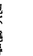

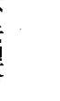

## 第三章 事物的表象并不可信

那次的會議是個慘劇。主要原因在於缺乏宣傳和規劃。演說者全到了，卻沒有人來參加。因為沒有聽眾，有好幾場演說被取消。那是我參加過最糟的一次研討會，但我倒因此空出不少時間。我的朋友菲爾把這趟行程變成觀光之旅，帶我去看我從少女時期在幽暗的電影院裡便夢想一遊的好萊塢。我之前一直沒有時間好好參觀這個城市，若不是待在飯店就是會議中心，演說結束後也總是直接前往機場。我們決定好好利用這個糟糕的情況。我很開心能看到這個城市光鮮燦爛的一面。因此，當克萊拉來到我在飯店的房間要進行催眠的時候，我很放鬆，也有充分的時間和她相處。克萊拉是位迷人的金髮女子，大約四十多歲，看起來活潑、聰明、健康情況良好。我試圖從催眠眼前的談話找出進行回溯的原因或問題。她說主要困擾她的是幾年前發生的時間消失事件。克萊拉偶爾會因公前往夏威夷參加會議。那次事件發生時，她正在茂伊島上開車。當時已近黃昏，不過天色仍微亮，她正在找一家以前去過的飯店。飯店座落在海灘，她想在那裡邊吃晚餐邊欣賞海景。當她開著車尋找那家飯店時，發現自己錯過了入口，於是決定再往前多開一段，找個地方調頭。茂伊島的這一區種了許多茂盛的熱帶植物，雙線道兩旁都是棕櫚樹。沿途房子不多，由於離馬路有段距離，並不容易被看見。克萊拉終於看到了一條可以迴轉的車道，雖然她心裡意識到，以前開在同樣的路上不曾注意到這條車道。她開了進去，發現那裡是一處小住宅區，裡面都是模組式房屋。這些房子位於棕櫚樹群間，環境非常優美。奇怪的是，克萊拉不記得曾在這路上看過這個社區。她將車子開進了車道，正要迴轉

這就是她最後記得的事。下一刻，她發現自己在島嶼的另一端，行駛在一條繁忙的四線公路上。這時天色漆黑，她完全不知道自己是怎麼到那裡的。

一年後，她又回到茂伊島參加會議。出於好奇，她開上同一條路，想找到當時迴轉的車道。她始終記得那次奇怪的經歷。她開車繞遍了該區，儘管她又找到那家飯店，卻始終找不到那處組合屋住宅區。從此這件事就一直困擾她，也因此促使她進行這次催眠。她想查出當晚到底發生了什麼事，還有她怎麼會那麼詭異地到了茂伊島的另一端，卻絲毫沒有開車到那裡的記憶。克萊拉是很棒的催眠對象。我毫無困難地讓她立刻進入了深度的催眠狀態。她記得事件發生的日期，因此我引導她回到一九九四年三月，她來到夏威夷茂伊島的當天。她敘述自己站在當時住的「茂伊太陽」旅館前，正要走進玻璃門。她才剛到，為的是參加年度的研習會。她喜歡來這裡出差，因為工作之餘也能好好放鬆休息。她很喜歡這家旅館四周開滿的繽紛花朵。

- 克：不同的飯店。
- 朵：很遠嗎？
- 克：嗯，可能有好幾英里。兩、三英里遠。我從沒在那裡用過餐。我只是曾經經過。它座落在海邊，

## 第三章 事物的表象並不可信

而我住的旅館是在小山丘上。我很想體驗坐在飯店裡，享受窗戶全部打開，聆聽著浪濤沖刷海灘的那種感受。我想去那裡想很久了，但就是沒去過。
朵：哦，你現在在開車往那裡去嗎？
克：對。
朵：是幾點的時候？
克：才剛黃昏。我不知道確實的時間，不過有點微暗。
朵：你認為天很快就會暗了？
克：嗯，大概吧。我沒有多想。
朵：好，你快到飯店了。告訴我你在做什麼。
克：我開在南基萊（South Kihei）路上。天色越來越暗。因為那裡沒有街燈，視線並不清楚。我正經過亞斯特蘭（Astland）。那是個很大的地方，我錯過了那條車道。附近有很多樹。車道看起來……嗯，不是很隱密，但我就是錯過了。（懊惱）我就是沒看到。於是我又往前開了一段，想找個地方調頭回去，因為我真的很想在那家飯店用晚餐。（在這一段催眠裡，她有時像是邊開車邊自言自語，但也會回答我的問題。）我在開車。我發現這個地方……好。我看到了這個地方。這是一條死路。很好，看來是調頭的好地方。嗯……我以前從沒看過這個地方。（困惑）咦……這裡有漂亮的棕櫚樹和花叢，還有一道籬笆，不過我可以看到籬笆的另一邊。那裡有各式各樣的……（不知道該如何描述）像是模組式房屋（組合屋），或是……很時髦的移動式拖車屋。好……嗯，這個地方很漂亮。
朵：你找到了調頭的地方？

## 监护人 THE CUSTODIANS

克：是的。是條死路，我現在正在迴轉。（輕聲地）然後我看到這些亮光。（頓，覺得困惑。）就像……讓人眩目的強光。
朵：光在哪裡？
克：（她的呼吸變快）從天上來的。它就像是光的漏斗。一個漏斗，寬的那一端向下朝著我。就像……（困惑）
朵：尖端朝上？
克：對。幾乎就像……來自太陽，就好像你透過樹叢看著這個很明亮、很明亮的光芒。……我感覺這個光有非常強大的能量。（深呼吸好幾次）
朵：是很密實的光嗎？
克：它是像放射狀的光。好幾道光線。
朵：從底部散發？
克：（從她的聲音和呼吸，可以明顯看出她正經驗到不尋常的事，而且有一些不安。）底部，對。
朵：沒有！我就是存在。我存在。
克：什麼意思？
朵：（無法置信的語氣）感覺上我就是這個光的一部分。
你還在你的車上嗎？

## 第三章 事物的表象并不可信

克：没有。我感觉我正在飘浮。就好像我是光的一部分。（深呼吸几次）我就只是光。仿佛超越了时间和光……我像是在移动。我要去某个地方，但我不知道我要去哪里。不过没关系。
朵：是种移动的感觉？
克：是啊！飘浮的感觉……移动的感觉……（深呼吸好几次）很愉快。
朵：你能看到的就只有颜色吗？
克：（慵懒缓慢地回答）一些颜色，还有金色的光。非常平静。（她很放松地吐了一口气）这感觉就是我是一切，一切就是我。万有一切就在那里。万有一切就在这里。万有一切存在。
朵：让我们看看你要去哪里。
克：是的。向上移动。上升。移动到另一个地方和另一个时间。
朵：让你看看你要去哪里。
克：（迟疑）我觉得好像着陆了。这个地方看来就像……（大叹一声）很难描述。

我的抄录先在此告一段落，因为很快就会进入复杂的概念。完整的催眠记录将放在《迴旋宇宙》序曲，我會在那本書裡將本書只触及的表面深入扩展为理论和概念，那会是令人难以想象的观念延续。现在只要提到克莱拉不是被送上太空船，而是到了另一个次元的星球上就足够了。我把这个案例放在这里只是为了表示甚至环境也会是幻觉。

在疗程的最后，我跟克莱拉的潜意识对话。

- 朵：你能不能解释当她开在夏威夷路上，来到那处迴转地点的时候发生了什么事？
- 克：她是在那个时间和地点被「送到」那儿。因为那个地方是为了她才显现（物质化），之后并不适合让她回到那个特定地点。因此她被带到一个……公路上她知道的地方，所以车子才会出现在那儿，这样她也才知道要怎么开到她当时想去的饭店。
- 朵：所以那次回去必须是在夏威夷的某个特定地点和时间？
- 克：不见得。那只是一个她可以在身体里会觉得舒服的地方。为她创造出的那个空间有她喜欢的美丽景色。那会是一个她可以彻底和全然放松的地方，转移（指资讯）也才能完成。
- 朵：没错。那只是去物质化，然后在另一个地方回复为物质形态。
- 朵：连人带车从一个地方移往另一个地方是常见的情形吗？
- 克：噢，是的。噢，是的。
- 朵：这种事经常发生？
- 克：经常发生，经常发生。
- 朵：当这种情况发生时，身体也是去物质化后再成形吗？
- 克：是的。

## 第三章 事物的表象並不可信

- 朵： 這是對身體沒有傷害？
- 克： 沒有傷害。身體變成純能量。
- 朵： 沒錯。
- 朵： 那麼她和車子只是從一處被移到另一處。
- 克： 是的。
- 朵： 所以當她來到，我想我應該說當她恢復意識，她才會在島上的另一個地方。
- 克： 對。
- 朵： 所以當她恢復意識的時候，她已經在島上的另一個地方。而且那時候也在開車。
- 克： 是的。
- 朵： 而直到這一刻，她對之前發生的事完全沒有記憶。
- 克： 是的。
- 朵： 這個情形在她身為克萊拉的這生是唯一的一次嗎？
- 克： 發生過許多次了。不過這一次是發生在她願意探討，願意知道發生了什麼事，以及怎麼發生的時候。其他幾次的時機並不成熟，那時她還沒準備好去瞭解，或者說，那時她在地球的物質生命還沒有成長到可以理解這種事的時候。
- 朵： 所以這次是因為發生了不尋常的事，她才會記得。
- 克： 沒錯。
- 朵： 她現在可以知道這些資料了嗎？
- 克： 是的。她應該知道這些資料。她一直渴望知道。她現在也可以瞭解了。

朵：而且這對她會是幫助。我們不想造成任何傷害。
克：對。這對她是件開心的好事。

接著我請潛意識退場，然後讓克萊拉的人格完全回到她的身體裡。這種能量的釋放或改變總是非常明顯，因為催眠個案的呼吸在這時候會變得沉重。

我帶引她回到現在，並回到意識完全清醒的狀態。

所以，真相並不總是像表面所呈現的。我們真能確定自己看到和體驗到的事情是真的嗎？還好它們是以一種微妙和溫和的方式完成，所以唯一的影響是令我們好奇，然後，通常也就把它當成是件怪事而作罷。恐懼這麼溫和的事並沒有好處，尤其是我們無法預期這樣的事件何時會發生，自然也無法控制。

謎團繼續著，而且越來越深奧。

## 第四章 隱藏於夢境的資訊

夢什麼時候不是夢呢？當事件的真實記憶被潛意識遮蔽，它就會以夢的形式出現嗎？夢究竟是什麼？我們要如何才能知道其中的差異？還有，知道這個差異對我們有好嗎？這類事情也許還是不要碰觸得好。

我在工作時聽到的報告，有很多都不是個案與外星人的實際接觸，也不是目擊太空船。相反的，個案往往是被奇怪和生動到異乎尋常的夢境所困擾。這些夢通常有著不尋常的性質，是他們忘不了的夢。

我們每個人，偶爾都會有非常特別強烈和清楚的夢境，感覺格外真實，而我們通常都會慶幸那只是場夢。也有一些夢是我們久久難忘的。這是我們稱為「睡眠」的陰影世界裡的正常部份，它大都是潛意識對清醒時的生活事件所做的解讀，也是潛意識試圖透過象徵，傳遞訊息給我們的方式。

那麼，是什麼讓跟幽浮、外星人或太空飛行有關的夢與眾不同呢？我們又為什麼要去注意它們？

我總是要說：「沒壞的東西就別修理！」如果當事人活得好好的，沒有因為哪個記憶而造成問題，那麼最好就別去探索，把它當成一件有趣的怪事就好。沒有必要只是為了好奇而讓生活變得更複雜。記得，一旦打開盒子，就沒辦法再關上了。你無法忘記自己想起來的事。而這可能會對你之後的人生造成永久的影響。

不論個案透過催眠療法揭露什麼資訊，我都希望能為他們帶來正面的影響。因此，凡是探索夢境所得的資訊，都必須用正面的態度整合到個案的人生，好讓他們能夠處理並回歸正常的生活。同樣的規則也適用於與外星人互動並保有意識記憶的人。

這一生才是最重要的，個案必須盡可能正常地過下去。因此，催眠師的職責是幫助個案處理所揭露的任何訊息，並且全面和正確地看待它們。

在我的另一本書《生死之間》裡，我們發現靈魂事實上從不睡覺。只有身體會感到疲勞，而靈魂在等待身體醒來的時候則是覺得百般無聊。所以當身體睡著時，我們的靈魂或靈，也就是真正的我們，會展開很多冒險旅程。它可能去了靈界，與大師和指導靈會面，聽取建議或學習更多的課題。它也可能到世上其他的地方旅行，或甚至往外探索其他的世界和次元。這些行程有時會留下片段的印象，特別是常見的飛行夢。

我們最本質的部分與身體之間有一條「銀線」作為連結，因此靈魂總能在身體醒來前回到身體裡。這條臍帶要一直到身體死亡並釋放靈魂自由的時候才會斷掉。

在我還沒調查幽浮以前，我從未想過肉身會在睡眠的狀態下到別的地方。畢竟，身體如果被移動，應該就會醒來，不是嗎？我從調查這些奇怪的可能性中學到了很多。在這些案例裡，我小心地質疑，確定那是身體真正的經歷，而不是靈魂出竅。這兩者會很類似，但描述並不一樣。

在靈魂出竅的情形，當事人可能會記得脫離身體時的感覺。他們常往下看，看到自己睡著的身體躺在床上，他們也會講述自己在外後重回到那個空殼的情形。此外，他們常描述看到連結靈魂## 第四章 隱藏於夢境的訊息

與身體的「銀線」。偶爾，他們還會形容當在外面太久，被銀線拉回去的感覺。我在工作中發現，身體有可能在靈魂不是時刻都在身體裡的情形下生存，身體會被存在於身體裡的生命力支撐，然後如果沒有靈魂，身體便無法無限期的存在。另一種體驗，也就是身體真的跑出去的情況，則有不同的描述。我的第一個這類型個案是位名叫約翰·強森（John Johnson）的非裔美國人，他是個很棒的人，一位心理學家，常跟我一起訪問疑似被幽浮綁架的案例。當時我才剛開始調查，一切還很新奇。我覺得我們像是在開墾新的田地。我當時還沒發現在所觀察到的模式，那畢竟是要調查過許多案例之後才會有的發現。由於我不是心理學家，每當第一次訪問那些認為有過外星經歷的個案時，我很依賴約翰的專業。他會問個案我永遠也想不到的問題，他的問題很能幫助我們瞭解個案和個案家人的心理健康狀態。有時當我們要開車回家時，在車裡他會告訴我個案的心理失常，他懷疑個案幼時可能曾被虐待。有的案例令他懷疑當事人是在幻想或尋求注意力。我跟著他學到了要注意的跡象，這是無比珍貴的一課。大多時候他會說對方的家庭正常，個案顯然經歷了他相信是真實的經過。如果約翰認為值得或有必要追蹤下去，我們便會再安排與個案見面，如果不是他，就是我進行催眠。我非常珍惜並看重我們一起調查案例的那三年當中，他所給予我的協助與建議。雖然他因為心臟虛弱而受苦，仍為了調查這些不尋常的主題，與我一起旅行了許多路。他像是把心臟藥當成糖果在吃，然而他說和我共事是支撐他的動力。我們的工作關係一直持續到一九九○年，五十三歲的約翰心臟病發過世才終止。

## 監護人 THE CUSTODIANS

一九八七年我們剛認識不久，約翰就告訴我他個人的奇特經歷；他說他希望透過催眠探索這段經驗。事情發生在一九八一年，他去埃及旅行的時候。旅行社安排他在開羅的飯店和一位陌生人同住。他對那晚的事情沒有什麼印象，除了醒來時發現自己站在另一個男人的床旁，那自然會讓對方驚醒。他不記得自己有起床，也不記得自己怎麼會走到那裡。他只記得有東西發著藍光。我提出他或許是在夢遊；在一個陌生的環境中入睡，夢遊是很常發生的狀況，尤其如果又因為旅行而疲累。他考慮過這個解釋，但他不曾夢遊，所以打消了這個可能性。他很確定自己去了某處，他要我幫他查出他到底去了哪裡。

開始催眠前，他透露他擔憂心臟可能在進入出神狀態的時候會有問題。他列出需要觀察的症狀，只要那些症狀一出現，我就要帶他出催眠狀態。我告訴他，我確信不會發生這樣的事。我說的沒錯，他的催眠進行得非常順利。我知道他是催眠師，所以很確定要讓他進入出神狀態並不會太困難。因為他知道程序，也完全配合。他一進入出神狀態，我便引導他回到抵達埃及的那天。他剛下飛機，正準備過海關。

當探討的事件跟個案的現世生活有關，回到事發當下有可能令他們不安。許多催眠師都說，回到事件發生之時會令個案焦慮。由於我是帶個案回到事件發生之前，而不是事發當下，因此不曾遇過這個案抗拒。用這個方式，我們可以從後門偷溜進去，從後面逼近。

約翰先是重新經歷了與旅行團一起在機場過海關的情況，然後我讓他來到下榻的飯店。他對飯店和回房前吃的餐點做了詳細的描述。長途旅行令他疲累不堪，他回房倒下頭就睡著了。

如我先前所說的，潛意識從來不睡覺。它永遠都曉得發生了什麼事。我知道如果那晚真有事情發生，潛意識一定會告訴我。如果那只是場夢或夢遊，潛意識也會如實告知。

朵：那晚有發生任何不尋常的事嗎？
約翰的回答令我吃了一驚。「我被叫了出去。」
朵：你能解釋這是什麼意思嗎？
約：我被叫出去。我穿過了房間的天花板，從屋頂出去。
那時我以為他說的是靈魂出竅。「你經常這樣嗎？」
約：偶爾。
朵：你說有人叫你。你知道是誰嗎？
約：不知道。我不認得那個聲音。我從沒聽過那個聲音。

我請他敘述發生了什麼事。

## 第四章 隱藏於夢境的訊息

約：我就是往上飄浮。飄浮著穿過物體，穿過實體。我以前也這麼做過。

接著，約翰發現自己在一個燈光昏暗的圓形房間裡，站在一面發著白光的巨大石板前。石板大約有十五英尺高，八英尺寬。他察覺自己並非獨自在房裡，但他的注意力全都在大石板上。「我在研究這塊石頭。石頭上有課題。」

朵：你以前看過這塊東西嗎？

約：這一塊沒有，不過我看過其他的。我看過也有文字在上面的東西，可是不是水晶形態。

朵：在你研究它的同時，你能跟我分享它上面寫了什麼嗎？

約：不行。我不記得它寫了什麼。我一看完就忘了。

朵：可是重要的是你讀了之後，另一部份的你會記得，不是嗎？（是的。）這是為什麼你會被叫來這裡的原因？來讀這個？

約：我想那是我來這裡的部份原因。另一個原因是學習。

我不斷試著要他分享他讀到的文字，卻是徒勞無功。

約：我不記得了。我學習，然後瞬間就把它忘了。它已經變成我的一部份。

## 第四章 隱藏於夢境的資訊

前一秒他還在石頭前研究，下一秒他就回到了飯店房間。「我回到我的房間了。我不在我的床上。我的床在那裡。但我現在站在另一張床這邊。」我仍然以為他是靈魂出竅。「那你是在回到身體裡就站起來了嗎？」

約：我沒有回到身體裡。我的身體跟我在一起。

我很驚訝，完全出乎意料，因為這是我第一次聽到這種情況。「你的意思是你的身體穿過了天花板？那不是有點不尋常嗎？」

約：（很平淡的口氣）不會。我有時候會穿牆。

朵：我的意思是，如果那晚有人看著你的床，他會看到你的身體躺在那裡嗎？（不會。）你知道這是怎麼做到的嗎？

約：瞬間傳輸／移動（teleportation），指瞬間移動物體到另一個時空）。

朵：你是自己做到的嗎？

約：不是，我無法用自己的意志做到。當我被叫出去的時候才行。

這讓我有點嚇到，一時間想不出合理的問題。

## 監護人 THE CUSTODIANS

朵：你發現自己去的那個圓形房間，那是物質的實體房間嗎？

約：對，它是實體的。

朵：你的身體也是嗎？還有地板、牆壁和那個房間裡的東西是實體的嗎？

約：對，全都是實體的。

我以為他可能是在靈魂層面，或許是像《生死之間》描述過的學校或是學習的廳堂。

朵：你知道那個房間在哪裡嗎？

約：不知道。但我可以告訴你我在裡面看到什麼。(他再次看到)當我面對石板時，右邊有好幾個控制板，還有欄杆。控制板比地板高大約二十四吋(譯註：約61公分)，那裡有一條走道。我看到控制板和測量的儀器，我不懂它們是什麼。那不是要給我看的。我只是在掃視這個房屋的時候看到的。

朵：你可以把它們跟別的東西做比較嗎？

約：我不知道。我是隔著一段距離看到刻度盤和測量的儀器。

朵：欄杆是沿著房間的邊緣嗎？

約：對，它環繞房間。我在的這裡像是個凹陷的房間。它比室內其他地方要低。我感覺有別的東西在場，但我沒辦法往那個方向看。房間很暗。光線好像主要就是來自這個水晶面板。我看到那

## 第四章 隱藏於夢境的訊息

邊（指方向）有些紫色，不過我不知道那是什麼。

朵：你以前來過這裡嗎？

約：我沒有來過這裡，我不知道我以前有沒有來過這個房間。這房間對我來說很新鮮。我不認得路。

朵：我去過很多地方。我不知道我以前有沒有來過這個房間。我不熟悉這個房間。我去過許多房間。也許去那個房間一次就夠了。很多房間我都只去過一次。

約：我不知道。我只看到這個房間。我沒有去別的地方。我一進來就是這個房間。離開時也是從這個房間離開。我沒有去別的地方。

朵：你去這些不同的地方有多久了？

約：一輩子了。

朵：你說它們不一樣。是怎麼個不一樣？

約：有時我是在禮堂，有時候在比較小的房間，有時在圖書館。有時我只有移動的感覺，它可以是飄浮的感覺，或是高飛時的加速。以前我這麼做是因為那陣子我剛好沒有別的事情好做，沒有東西要學。因為沒有要工作，所以就自己一個人。自由的感覺很令人振奮。有時候在這些小小的旅程當中，我會看到一些生命體。他們看起來像人類。以前是人類，但現在死了。不過說他們死了只是因為他們已經不在這個世界上了。這些聽起來像是靈魂晚上去靈界研究和學習的地方。

## 監護人 THE CUSTODIANS

約：有時候是我的身體，有時是我的星光體。很難說什麼時候是身體的體驗，因為無法證實或確認。在埃及那次的經驗絕對是我的身體。

朵：我想它們很類似，因為不論是哪個情況，你的智能都在。（是的。）當你的身體穿越牆壁和天花板板的時候，那是怎樣的感覺？

約：就是移動的感覺，就只是動作。我不記得。我就是到了那裡。我不知道我做了什麼。

朵：可是當你醒來，發現自己站在室友的床旁邊，你有沒有看到房間裡有什麼奇怪的事？

約：我看到一道藍光從天花板射下來。

朵：很亮的藍色？

約：不是，不是。是淺藍。比如更鳥的蛋的顏色（藍綠色）再深一些些。

朵：你認為那道光是什麼？

約：我認為它是什麼？它是座滑坡。不是真的滑坡，但我看到一座滑坡，好像是為了讓我回房間才出現的。我現在可以看到它。它從天花板一直到地板，大約有三呎寬。它把我帶回房間。它跟分解身體的分子有關。我想不出來還有什麼其他的方法可以完成這樣的事。

朵：你認為那道光是從哪裡來的？

約：我不知道。但我出去時是在光裡，回來時也是。它給我一種滋養的感覺，是很好的光。

朵：它在房裡多久？

## 第四章 隱藏於夢境的資訊

約：我看到後就消失了。然後我發現自己回到了房裡，站在另一張床的旁邊，就好像我是被放在那裡。室友被我驚醒，可是我不記得自己怎麼會到那裡的。

看來我們無法取得更多關於這個經驗的資料，於是我指示他離開正在觀看的場景，帶他回到現在（一九八八年）。催眠開始前，約翰要求我瞭解他的健康狀況。我在其他人的催眠療程中也問過潛意識個案的身體問題，並請它開出治療的方法。潛意識向來以一種沒有情緒的抽離態度進行，就好像我們談的是第三者。以下這簡短的敘述顯示，潛意識可以有多麼客觀。

朵：（我對約翰的潛意識說話）他擔心他的健康。你能掃描他的身體，告訴我們哪裡有問題嗎？
約：我還不夠深刻做那個掃描。那個掃描需要能遍及全身的器官。我還沒達到那個深度。我的狀態還無法到達那個意識深度。

約：我還不夠深刻做那個掃描。那個掃描需要能遍及全身的器官。我還沒達到那個深度。我的狀態還無法到達那個意識深度。
朵：潛意識可以客觀地看看身體，給我們一些資料嗎？不一定要很徹底。不論你能跟我們說什麼，

朵：潛意識可以客觀地看看身體，給我們一些資料嗎？不一定要很徹底。不論你能跟我們說什麼，我們都會很感謝。
朵：好。（停頓）現在……心臟快死了。它有一天會停止……很快就會。
這份全然不帶情緒的客觀令我詫異。「這是這個身體最主要的問題嗎？」

## 監護人 THE CUSTODIANS

約：是的。它維持身體的運作。
朵：約翰能夠做些什麼來改善這個情況嗎？你有沒有任何建議？
約：（強調的語氣）沒有。當時問到了，他就會走。
朵：沒有辦法可以改善？
約：沒有。沒有。他不想做任何事。他很滿足。他已經接受。
我為約翰的健康和安好下指令，不過我知道不會有用。如果潛意識確定沒有復原的希望，那麼我們凡人也束手無策。
約翰醒了之後，他對潛意識說的話完全沒有印象。這個情形很常見。個案會記得部份催眠的過程，但對於我跟潛意識的對話則往往一片空白。我想最好是讓約翰自己放錄音帶聽的時候知道這事。
約翰反而想談談他對那個房間的印象。大部份的描述都和催眠時說的一樣。『我看不清楚刻度盤和測量儀器那些東西，我離它們大概有二十呎遠。那是個很大的房間，而且很高。你知道，聽起來很瘋狂，可是有一刻我真的懷疑自己是不是在地球裡面。之所以會這麼想，有一點是因為牆壁很陡峭，就像岩石。事實上，它比較像洞穴。就連地板也像是岩石。』
一週後，聽過錄音帶的約翰打電話來討論那次的催眠，而且劈頭就說，他絕不相信自己的身體被帶離了飯店房間。他無法相信那是經由分解分子或其他的方式做到。他邊說邊哈哈笑著，我跟著他一起笑，我說：『嘿，那是你說的，可不是我喔。』他說如果他是聽別人說，而不是出自自己的口，

## 第四章 隱藏於夢境的資訊

或許他還會相信。他真的把這當成玩笑來看，但我猜猜想他對催眠的認識夠深，足以讓他意識到這些事情的真實性，否則自己不會說出那些話來。他只是想對自己有個合理的說法，跟其他有過類似經歷的人一樣，他們會試著去找別的解釋，好讓自己的意識能夠接受。所以，就算你是調查員並且熟悉催眠技巧，顯然反應都會是一樣的。

約翰在醫院協助將死的病患對即將進入的世界有所準備。他在自己踏上這趟旅程前做了很多好事。然後，就如他的潛意識所說的，他的心臟停止了跳動。

我跟約翰學到了許多調查的程序，我也會永遠懷念他的忠告。雖然我們合作時間很短，我很慶幸有認識他的榮幸。

約翰的經驗顯示了區分接觸外星人和靈魂出竅的難度。我一邊和菲爾合作，進行《地球守護者》，一邊也開始注意個案不尋常的夢境。菲爾對於跟外星人的接觸並沒有意識上的記憶，只有情感感受創的夢。當探索他的夢時，我們發現他跟外星人的實際接觸可以回溯到童年時期。透過這些發現的細節，我看到一個又一個後來反覆出現的模式。

### 凱莉

莉和我碰面的經過由於太過牽強，無法被視為巧合。我的朋友康妮曾對我提過，她有位多年老友凱莉是住在休士頓的藝術家。凱莉有過一些奇怪的夢和幻象，會讓人聯想到跟外星人的接觸。康妮認為我會想跟她配合，可是凱莉住得太遠，這個可能性微乎其微，她先生又管她管得很緊，不讓她離家遠行。自從康妮搬來阿肯色州之後，凱莉沒來找過她，雖然她們兩人是很好的老友。但接著，奇怪的巧合介入，把我們拉在一塊兒。康妮去休士頓找凱莉時突然病重，唯一能回到阿肯色州的方法便是凱莉開車載她回來。在這個情況下，凱莉的先生不得不點頭答應，於是她的阿肯色之旅終於成行。

康妮回到家後，在週二的晚上打電話給我，要我去她家見凱莉，聽聽她的經歷，或許也做次回溯。

康妮知道凱莉不會再到我們這裡，所以這會是凱莉唯一一次見到我的機會。

我週四早上要去小岩城參加會議，週三是最後一個能見她的日子。於是，週三晚上我們共進晚餐，然後我請凱莉對錄音機說出她的經歷。她記得自己作過和外星人有關的夢，但她最想瞭解的是有一次的靈魂出竅和她看到的幻象。雖然其他人不覺得那有什麼，她的人生卻受到很大的衝擊。我相信幫助她要比發現另一宗與幽浮有關的資料更重要。

靈魂出竅的經歷發生在一九七八年的某個晚上，她當時正準備睡覺。她很確定自己那時還沒睡著。她只是換上睡袍，坐在床邊，突然間聽到房間角落傳來一個低沉的聲音說道：「凱莉，跟我來！」

「他沒有說出聲來，聲音是直接傳到這裡。」她指著她的前額。「我覺得自己像條濕毛巾。你知道，就是當你把毛巾放到水裡再拿出來，它會全部吸在一起又很重？接著我感覺自己在往上飄，脫離了

## 第四章 隱藏於夢境的資訊

我的身體。突然間，一個灰色、模糊、沒有形體，什麼都沒有的東西和我一起飄浮。我在離開身體的時候看到的。那個沒有形體、朦朦朧朧的東西，有雙黑色眼睛，深邃，充滿著愛。然後突然間，我們不在房裡了。我們飄浮在所有東西之上。

凱莉從這個視角連續看到了五個場景。它們似乎都和她未來的人生事件有關，而且是依時間的先後順序出現。對我來說，那些場景充滿了象徵意義，與潛意識在夢中使用的型態相似。這件事發生在多年以前，其中有的經歷已經在凱莉的人生成真，只除了那件印象最強烈，引起她最多恐懼和困惑的事件還沒有發生。她一直沒能忘記那事。

她看到很多的水。不能判定是湖還是海，只知道山丘和樹木一直往下延伸到水邊。她在上方漂浮著往下看。水是綠色的，波濤洶湧，看來有暴風雨的樣子。天空全是綠的，浪很大。她看到好幾千條死魚翻著肚子浮在水上。兩隻白鳥忽地從天際往下飛掠水面。

接下來，她看到一個部份遭到毀壞的城市。成千上百的人病了，病情或輕或重。她看到自己身在其中，正在餵他們吃東西，照顧他們。她的腦裡出現一句話：「有些人還能吃，對有些人，食物到了嘴中卻成了醋。」我覺得這聽起來很像聖經經文。在這個畫面裡，她知道自己沒有病，她也知道自已不會生病。

當她抗議：「為什麼是我？」答案出現了：「讓你看這個並不是要你恐懼。不要害怕。這是你被派到地球的原因。你必須為了這些即將發生的事情做好準備。」然後又重複了三到四次的「不要害怕」

## 監護人 THE CUSTODIANS

凱莉繼續說道：「然後突然之間，我發現我回到自己的房間，坐在床上。我望向我先生，看他有沒有醒來。他躺在床上打呼。我往房間四處看，我的身體是顫抖的。房間沒有什麼變化。我站起來，到小隔間裡抽菸，只抽了幾口就熄了它。我在冒汗，心裡怕得要死。我不是害怕我看到的事，我害怕是因為我知道我自己沒有睡著。我不知道那究竟是怎麼回事，但最後我還是爬上床去睡覺。」

「隔天早上我打電話給四、五位牧師。我說有東西來找我，告訴我未來的事。嗯……我很快就發現我不該打電話給他們。他們的第一暗示都是我的心理有問題。所以我學到了有些事情不能和他們討論。我知道那不是一場夢。我連著兩、三年都在害怕，因為我知道那些事情一定會發生。我不是相信那些事情會成真，而是知道那些事情一定會發生。當最初的幾件事開始出現，對整個情況更沒有幫助。」

她指出這個經驗是她最想在催眠時探索的事。她很確定其他（會讓人聯想到外星人）的經歷雖然生動得令人不安，但它們「只是夢」。我鼓勵她也告訴我那些夢，就算是做個紀錄。

她描述了一場夢，或者該說是「惡夢」，由於非常生動，她一直忘不了。那是在一九六三年的九月初，她十九歲，還在德州念大學的時候。在那個「夢」裡，她發現自己身在一個有弧度的房間裡，裡面有一排排的孵化箱。她說是孵化箱，因為箱子裡有嬰兒，但那些嬰兒和她看過的都不一樣。她曾經把他們的樣子畫了下來，她說會把那些畫寄來給我。那些嬰兒有很大的頭和眼睛，跟他們完全不同浸在液體中的迷你、皺縮的身體形成強烈對比。他們完全浸在液體裡，她知道他們在這些液體下成

長。嬰兒之間不但會用心靈互相溝通，他們還懂得很多複雜的辭彙。每個孵育箱中的嬰兒似乎都是在同樣的發展階段。他們的皮膚發亮，散發著珍珠光澤，白到近乎透明。 接著，有個女子進來房間，她掉了顆膠囊在地上。它看起來像是緩釋膠囊，只不過是透明的。這是用來放進液體裡，長嬰兒用的。我以為她的意思是那個膠囊裡的東西被加到液體裡，用來幫助嬰兒的成長。但她強調膠囊就是嬰兒。 「它就像是會長出嬰兒的種子。他們把膠囊放進液體，嬰兒就從膠囊中長出來，然後繼續長大。 可是她掉了這個在地板上，所以我彎下身子，撿起膠囊，放進我的口袋裡。我想要跟別人說，拿給他們看，因為我知道這就是他們（指外星人）的方法。可是房間裡有人說我不該有這個膠囊。他們在生氣，所以我很害怕。就在那個時候，我醒了。」 凱莉繼續說：「總之，這就是我的夢。到現在我還忘不了。整個大學時期，我不斷夢到同一個夢的片段。我有個感覺，覺得自己晚上在那個育嬰室工作，而不是在睡覺。難怪我醒來時總會那麼累。我不知道這跟幽浮有沒有關係。我是個藝術家，是個創作的人。有可能是因為這樣，也或者那就只是個夢。即使做了催眠，我記得的事可能也不會比我現在告訴你的多。」 催眠時，康妮在一旁觀看。凱莉告訴她想搜尋的大致日期，我們同意盡可能探索所有的事件。 過去的經驗告訴我，如果事件只是夢，潛意識會據實以告，如果她不回溯到那一天，我們就不會知道真相。 凱莉證實是個優秀的個案，很快便進入很深的出神狀態。我帶她回到靈魂出竅看到幻象的那一

## 第四章 隱藏於夢境的資訊

The request was rejected because it was considered high riskThe request was rejected because it was considered high riskThe request was rejected because it was considered high risk

## 第五章 埋藏的记忆

我做过许多催眠，个案都只是对目睹的经验记起更多细节，因此我们并没有期待会挖掘出什么非比寻常的事。此外，法兰有个想在催眠时顺道了解的私人问题，那是我会称为「业力关系」的问题。她从小就就跟祖母有过摩擦，她想不通是为了什么，因为她很爱祖母，但她有个感觉，自己好像曾经做过冒犯祖母的事。如果摩擦的起因不是在这一世，那么回溯前世的催眠确实能对此做最好的处理，所以我并没有很专注在这个问题，我只是记录下来，想著如果有时间就会追查。法兰是个理想的个案。

她令人讶异地自动回到了童年时的一起不寻常事件。由于潜意识不会没由来地浮现某件事，我决定先问一些问题再说。她回到了七岁的时候，重温自己那个年纪的经历，而言谈举止和脸部表情都惊人地符合年龄。七岁的她盘腿坐在床中央，正在玩一套小瓷盘。这事之所以不太寻常，因为那些盘子是祖母的，她是不准拿来玩的。但她认为只要在一张大床上玩，要弄破也很难。她拿著小水罐、杯子和小盘子，高兴地发出咯咯笑声。她说：「它们不是我的，不过被我拿来玩了。我爸爸在这里，他教我怎么玩。」

她口中的父亲并不是她的生父，但他要求法兰这么称呼他。显然他不是陌生人，而是某个固定会来看她的人。我请法兰描述对方，她说那是一个站在床边，非常高瘦的人。「他身上披著一块布，看起来跟我穿的衣服一点也不像。」描述到他的身体特徵时，她很迟疑。「我很难看著他。他的脸像是你用模型玩黏土，然后把黏土揉得很光滑的样子。他没有头髮和眉毛，眼睛又大又黑……不过这真的不重要。」他教她如何飘浮。他把手放在她的头顶，她的身体和小盘子便一起升到半空中。有一点刺痛感，但她觉得很好玩，哈哈笑著跟他说话。

就在这个时候，祖母非常突然地闯进来。她听到说话声，想知道房间里是怎么回事，她以为孙女在做什么坏事。法兰的专注力被突然闯进的祖母打断，小盘子全掉下来破了。祖母不懂她怎么会打破盘子，便对她发了脾气，法兰坚持自己什么也没做。奇怪的是，祖母似乎没看到那个人。他是在祖母从门口进来的时候就消失了呢？还是怎么回事？

法兰自动回溯到祖母和她之间的不愉快事件。小女孩觉得很生气，因为她被不公地指责她不是故意做的事。当然，就算她解释了关于「父亲」的事，祖母也不会理解。法兰会被指控是在幻想或说谎。长大后，她的意识虽然知道童年时好像发生过什么，但在催眠之前却一直想不起来。

我想对那个外星人有多些了解。小法兰回答，从她有记忆以来，他就在她的身边。他常在森林里和她见面，和她一起走路、说话。「他教我如何聆听，去听见。听大人听不到的声音。他教我怎么去看那些大人看不到的颜色和东西。好美。」

朵：他来看你的时候，是怎么来的？
法：（困惑）我不知道。他就站在那里了。有时候我发现他在，我就走向他。有时候我知道他会出现。我不知道我怎么会知道的。我心里知道他会出现。
朵：除了在房子里和森林，你还在别的地方见过他吗？（她不太愿意回答，大概从没有对人谈过这件事。）我只是好奇。你可以告诉我大人不会相信的事。有人相信你不是很好吗？
法：是啊。他相信我。
朵：我就是这么想的。但你在房子和森林以外的地方遇过他吗？
法：我想有吧。森林里有光。很大的光。有楼梯可以走到光里。他在我旁边，我们从楼梯上去。
朵：楼梯通到哪里？
法：到那个很大的光的下面。

她描述走上光做的楼梯。楼梯的顶端有一扇金属门。灰色的，看起来像金属，摸起来却感觉很柔软。那个外星人想让她看看这个地方，但说她不能在这里待很久。那里有个走廊，还有可以通往很多房间的门口。可是那些门看来很怪，一层一层的。「有一个地方我不该去，我不能去大房间。这间就没问题。」

在她被准许进入的房间里，有一个看起来像是金属的圆筒，座落在一个很合大小的平台上。「它很亮，不像门上的金属。」我想知道圆筒多大。「还没大到我能钻进去的程度。如果我躺下来，大概会到我这里（她的鼻子）。可是我进不去，它不够大。照说里面应该是要有某种动物。」

那个外星人手上拿着他从森林里的鸟窝取的几颗鸟蛋。他告诉法兰，他必须把蛋放在房里。「这是为什么我会进去的原因。」
朵：他怎么处理那些蛋？
法：（孩子气的声音）噢，他把它们放到一个……一个东西里……（指向左边）。我不确定那里有什么麼。看起来很怪。有一点亮光，但看起来像某种布。可是……不像平常的布。他把蛋放在那里。
朵：你的意思是像窗帘？
法：是呀，有一点。可是这个不一样。它有光。他说那是帮助蛋孵化。噢！会保温。我喜欢观察这种事。
朵：那么他把蛋带进去，观察它们孵化，这是给你看那个房间的原因。
法：她试着用她童稚的方式解释其他房间有更多这些槽，雏鸟会被放进其中一个槽里，保护她们的安全。
法：他们在槽里放不同的东西，不同的动物。我不认为那些东西是从这里来的。那个动物。牠不是这里的。
朵：你认为牠从哪里来？
法：星星。父亲就是从那里来的。
朵：那是很远的地方，不是吗？他有没有说是哪里？
法：他说我不会明白。他只说星星。
法：哦，这可以解释为什么动物在槽里比较安全。
法：我想是的。
朵：他有没有给你看别的东西？
法：没有。我们得走了。我们必须回去了。离开的时间到了。
朵：很好玩吧？
法：当然。我还想再去。（咯咯笑）他喜欢我的红头发。
朵：是吗？或许是因为他自己没头发。（她哈哈笑）
朵：你们回到外面了吗？
法：对。楼梯就像白色的光。很特别，你可以踏在上面。我回到森林后，父亲用他的手指轻轻敲了我的前额，然后我一直听到：「忘掉」

我试着了解法兰后来是否再见过他，或是和他有过更多的冒险历程。但令人难过的是，他告诉法兰，因为盘子事件使得他惹祖母生气，他以后不能来了。他说法兰必须把他忘了。我可以感觉到他对这个小孩有非常真切的情感，心里其实不想离开，却不得不如此。他似乎很开心能与法兰互动，还有教导她那些事。他们之间就算还有其他互动，我也没能在她的记忆库里找到。把他忘掉的暗示若不是很有用，就是他真的没再出现过。催眠疗程的其他部份都跟法兰的目击经历有关，但只出现很一般的资讯。

## 四

十多岁的贝芙莉是位画家，然而，以此为业不一定能换得温饱。为了赚取生活费，她不得不接招牌看板的绘画。令她讶异的是，这方面她做得还挺成功的。空闲时，贝芙莉仍追求自己的艺术表现。她住在一栋完全嵌在欧札克山区里一处山坡的奇特房子，房子盖得很像是在山洞里生活，只有前面墙壁门窗所照射进来的光线才让人感觉到户外的存在。一九八八年，我们就是在那裡做的催眠。

贝芙莉想探索前世，希望能为健康和金钱问题找到解释；这是我们最初的计划，但潜意识常有其他的想法。由于它不会无缘无故提起某事，遇到这种情况我总是顺其自然。浮现的资讯通常会是个案需要知道的，和催眠原有的打算反而没什么关系。

在催眠前的面谈讨论中，贝芙莉告诉我她有些一直忘不了的奇怪童年经历。她并没有因此烦恼，她把那些当成罕见而有趣的事。「一年级时，据说我和我朋友派翠西亚在放学后离家出走。学校对街有一大片森林地，我们去了那儿。我对在那里的时候发生了什么事、待了多久之类的都没有印象。可是我们的父母都出来找我们了。我那时还没有时间概念，因此不晓得了多久。我家离学校有六个十字路口，当我妈找过来时，我们已经在回家的半路上。我一点都不记得那段时间发生了什么事，只记得爸妈对我们离开那么久非常大惊小怪。他们说学校三点就放学了。可是我们到家时天都快黑了。当时他们已经准备要报警。令我讶异的是，如果那是我第一次逃家，我应该会有印象，至少记得一部分情况，可是我完全没有印象。我只记得我们过街进入森林。除了后来被找到和因此惹上麻烦，其他事都忘得一干二净，也不记得当时玩得开不开心。」

她一边回想童年，一边又提起其他奇怪的记忆。「我的房间在屋子的最里面。我喜欢自己独处。我经常回到房间，关上门好避开爸妈，坐在自己床上作白日梦。至少我认为自己是在作白日梦。我会坐在床上，接下来身子就会有点摇晃。等恢复意识时，人已经在地板上了。我妈说我大概是睡着后从床上掉了下来。可是我知道我没有睡着。整个小学期间一直都是这样。」

催眠前的面谈讨论涵盖了许多她人生中的事件。我都是在这个时候了解个案，试著明瞭他们想在催眠下探索什么。有时他们说的话会跟催眠内容有关，有时则否。在贝芙莉的情形，我记下来的不寻常记忆有好几个。由于谈到童年，她又想起另一个回忆：跟恶梦有关的负面记忆。

「这是我所能记得的最早记忆了，那一定是在三岁的时候。我梦到很大的虫。我知道年龄是因为我记得我那时有隻狗。那些大虫会上我的床，但没有伤害我。他们让我联想到『竹节虫』，有著像昆虫那种长长的身体和细小、脆弱的触角，还有超大的眼睛。」

由于别的案例也提过「竹节虫」似的外星人，这引起了我的注意。她是在形容外星人，还是只是记忆起了孩童时期的生动想像？我没有让她知道我听说过多虫类的外星人。我想要她提供自己的描述。

「他们不像蜘蛛那样圆圆的，他们是长型的虫。有些虫长得就像那样，其中一种是竹节虫，另一种是螳螂。他们身体的正面上方有附肢，背后也有。他们和我一样大。当然，我那时还只是个小女孩。她们没有伤害我，可是跑到我的上面来时真的吓到我了。我的床是单人床。因为我躺在床上，他们由上而下俯看著我，看起来比我还大。他们的身体没有碰到我。他们用触脚类的东西撑著身子停在我的上方，所以他们的身体和我的身体之间还有空间。房间里通常会出现两、三隻，最少一隻，但都只是一个劲地看著我。我从幼年有记忆开始就做这些恶梦了。那时我还没看过电影，更别说是恐怖节目了。」这些巨虫的颜色暗沉，有著类似蚂蚁的大眼睛，但她很清楚他们绝对不是蚂蚁。

「有好多次我都是尖叫著醒来。有时我会起床，走到后院去找我的狗，把他带到床上和我一起睡。我妈不准狗进家里。我怕黑，但我却会在黑夜中走出去，把狗带进来，让他进被窝里和我一起，这样我才能睡得安稳。我住的地方气候很热又潮湿，房子里大多会有蟑螂。可是我没有梦过蟑螂。暑假时我会到乡下和祖母住，在那里也从没做过恶梦。」

随着贝芙莉继续回忆，她又提起另一件让她留下强烈印象，从没忘记的奇怪经历。那是一九七○年代初期，她成年后的事了。当时她已婚，有个儿子，一家人住在休士顿的郊区。他们家是那条街上唯一后院光秃秃没有树的房子。这不重要，反正他们打算在那里盖个游泳池。有天，贝芙莉和先生在房子最后面的卧室睡觉，但一个怪声音却吵醒了她。

她边笑边说：「我知道那是一艘飞碟。我心想：『噢，又是他们。』不要问我这个想法是从哪里来的。我根本不晓得飞碟会有什么声音。我醒来后一听到那个声音，直觉上便知道那是什么。罗伯还在睡，从头到尾没有醒来。我觉得他没有被那个声音吵醒很奇怪，但我没有叫他。就我所知，我并没有下床，也不知道自己到底醒来多久。我只是继续睡，没有起来。不过正常来说我会下床。大多数人听到后院有声音都会起来察看，可是我知道我并没有下床。」
「我问她那个声音像什么，她的回答很熟悉。「听起来嗡嗡的，像是高速飞机。」我们联想了好几个声音，然后她找到一个接近正确的形容。「听起来不像是飞机的螺旋推进器。你知道小孩玩的陀螺放在桌上旋转时的那个声音吗？像呜呜或嗖嗖声。一种高音调的旋转声音，像风转得很快，只是声音更大一些。那个声音不是很吵。我的意思是，不是整个街坊邻居都会被吵醒的那种音量。」
「我提出那个声音可能是直升机，只不过这样的话，声音应该会更大声才对，音调也不同。另一个联想是：「也很像洗衣机在转的时候，但我知道它转得更快。我很确定自己没有睡著。我躺在那里听，心里想著：『哦，不过就是后院有艘太空船。』我并不害怕。就我所知，我只是回头继续睡。」

这确实是个奇怪的反应。晚上听到奇怪的声响，通常第一个念头会是有人在后院，而他们可能会闯进屋子里来。你的第一反应会是恐惧，然后大概会起床，看向窗外。我同意这些记忆都是奇怪的事件。我把它们记了下来，但我们最关心的是为她目前的问题找到解答，而不是探索幽浮。她说她对幽浮反正也不感兴趣。

贝芙莉改变了话题，开始讨论她的许多身体状况。她从小到大都有医生难以确诊的奇怪症状，情况很不寻常。「这已经到了变成笑话的程度。他们一直不晓得我是怎么回事。即使做了很多检查，还是无法有定论。他们始终没能确定。我去大医院检查时也一样。他们跟我保证会找出问题，但找不出来时态度就变得保守。我开了十三个小时的车，花了两千美元的医疗检验费，却还是不晓得到底是哪里出了问题。这实在很令人沮丧。」有些问题至今仍在，因此也是她想探索的方面之一。她想知道为什么她有这么多身体状况，又是怎么产生的。她推测这类的业或许是源自前世。持续的金钱问题也令她担忧。因此，当我们开始疗程时，健康和金钱是我们的主要焦点，童年回忆只不过是有趣的旁线。

贝芙莉进入深度催眠状态后，我用了照说能让她自动进入前世的技巧，但她只看到各种旋转的颜色。这种情况很常发生，而我可以让她往别处行进。在我让她进入更深的催眠状态后，贝芙莉开始描述现在在这一世的一幕。她再度变成第一天上学的六岁小孩，发出高亢的咯咯笑声，边说著她被留在厕所，并在偌大的学校回廊上迷路的事。她并不害怕，反而觉得是探险。她以小孩的举止和说话模式，详细地描述她一年级的老师和朋友，也仔细介绍了学校的格局布置。

潜意识从来不会毫无理由地提起一件事，所以我想到这或许是个完美的机会，可以探索她跑到学校对街森林里的记忆。

朵：好，学校附近有森林吗？
贝：嗯。就在对街，不是车很多的那条街，是小马路。那里有点阴森。我通常不进到森林里面。不过我可以的！
朵：怎么个阴森法？
贝：有那些树木的地方很暗。不过里面什么也没有，就只是很多树。还有，很早就暗了。
朵：好，贝芙莉，我要你往前到你放学后和女同学一起走进森林里的那一晚。女同学叫什么名字？
贝：派翠西亚。
朵：好。现在是那天下午，学校放学了。所有的小孩都回家了吗？
贝：没有。他们在操场。我们只是到处闲晃。
朵：你以前有没有进去过森林？（没有。）为什么你们决定要在这个下午进去森林？
贝：（严肃的语气）我们要离家出走。
朵：是吗？为什么要这么做？
贝：因为我们不喜欢家里。
朵：嗯，他们活该。
贝：这个做法很极端。
朵：为什么你们要离家出走？发生了什么事吗？
贝：没有。没事。我们只是决定要这么做，因为我们不喜欢在家里。而且，我们现在有时候也应该能去一些地方了。
朵：为什么是现在？
贝：因为我们大了，已经上学了。
朵：不怕迷路吗？
贝：喔，我们大概还是会回家吧。我不知道我们会不会永远待在外面。我想有些小孩以前也曾经过那条柏油路。那不算是街道。你知道，就只是条马路。我想其他的小孩也去过。
我其他的也去过。
朵：好，跟我说说发生了什么事。
贝：我们在里面闲晃。树木真的好大喔。没有草。我的意思是，你可以走在树跟树的中间，地上有松针之类的东西，不是家里院子的那种草。
朵：你们在森林里做了什么？（停顿）（她的表情和眼睛的动作显示有事情发生）怎么了？
贝：（困惑）我不知道。（停顿许久）我想我不应该说。我想我什么都不该做。我不知道她在哪里，可是我想我们什么都不该做。
朵：谁在哪里？
贝：派翠西亚。
朵：她不是跟你在一起吗？
贝：（停顿）我看不到她。我想我凝结了。
朵：你的头脑没有凝结，它可以跟我说话，而且你完全不会觉得困扰。它知道事情的经过，还能跟我说话。
贝：像是……被抹得一干二净。像挡风玻璃的雨刷的作用一样。
朵：什么意思？
贝：我不知道。（手势）弧形的。（手势）它就在我前面。我什么都不该做。
朵：你能看穿它吗？
贝：我想我不应该看。
朵：我不会要你做任何会让你惹上麻烦的事。我只是好奇。它是从哪里来的？
贝：（停顿）我不知道。我只是在森林里走著，然后……我想它是粉红色的。（她开始害怕）像是个防护罩。（她的声音颤抖著，眼睛泛起泪水。）就在我前面。（现在她像个小孩般毫不掩饰地大哭和啜泣）它让我觉得我不能动（明显沮丧）。

她可以跟我说，告诉我发生了什么事。她恢复了镇静。我说了一些安抚的话，帮助她放松，不再情绪化。过了几分钟，大声的啜泣停止了。我向她保证，
朵：你说它是粉红色的？
贝：是啊，是个粉红色的东西，它好像会麻痹所有的东西，还有我的脑袋。它从我的一边到我的前面再到我另一边。
朵：就在你的面前吗？
贝：我不知道。我知道的就这些。
朵：换句话说，你现在只能看到这些。（是啊。）当你们在森林中走动的时候发生了什么事？
贝：我们可以看到里面某个地方有阳光。我觉得很亮，也很漂亮。阳光透过树林洒下来。我想它没有全部都照到。我想它是照在右边。
朵：你知道阳光有时是这样的。然后你们做了什么？
贝：我想我们只是看著它。
朵：它是阳光吗？
贝：（困惑）我不知道。我不能……这个粉红色的东西……我什么都不能做了。就好像它停止了一切。（手势）只除了它从这里到了这里（就在她的视野范围）。它没有碰我。它很光滑，可是我无法透视它。它让一切停止了。它让我脑袋停下来了。不痛。我没有任何感觉。我什么都看不到，只看到这个粉红色的东西。它整个在我面前，像防护罩一样。
朵：你的脚下有什么感觉？
贝：我感觉不到我的脚。我只觉得麻木。
朵：你有没有听到什么？
贝：没有。一切都被停止了。像是静止的照片。我看不到更远的地方……（叹气）浅黄色、粉色……它似乎凝结了一切。
朵：好吧。可是，记得这只是暂时的，它一点都不会令你困扰。

贝芙莉说不出任何感受，就好像她身体的感官真的被全部冻结一样。我很快意识到追查这件事只是白费力气。她的潜意识还没准备好要释放这个资讯。我于是带领她到下一个可以感受的场景，不论是听觉、嗅觉或感觉。令人惊讶的是，她突然开始咯咯笑了起来。

贝：我们从森林中跑出来，边跑边笑。我们出来了。（笑声）
朵：什么意思？
贝：哦，我们刚刚出来了。（大叹，然后笑声）我们出来了！（停顿）我的头发卷卷的。
朵：什么意思？
贝：喔，我们有卷卷的头发。我们咯咯笑著跑出森林的时候，头发都在弹跳。（大叹）我们做到了！
朵：你们在森林的时候有没有发生什么事？
贝：我不知道。（困惑）大概有吧。
朵：什么意思？
贝：嗯，你知道，就是当你去到某个没有去过的地方，你会怀疑自己能不能出来。我们出来了。
朵：你们在森林里做了什么？
贝：我想只是玩吧。我不记得了。我想我们只是进去到处乱走。（叹气）我必须过马路了。森林里很暗，可是我们进去的时候，学校里还有阳光。现在真的越来越暗，所以我们最好回家了。
朵：我想你们最好在惹上麻烦前回家。
贝：我想我们已经惹上麻烦了。
朵：你们决定不出走了吗？
贝：是啊，我想是吧。我想我们必须回家。我不知道我们是不是……噢！我想她们追来了。我们的## 監護人 THE CUSTODIANS

媽媽。她們追來了。差不多快到校園了。
朵：哦，她們沒有離開那麼久，有嗎？
貝：我不知道。現在大概……也許已經六點了。到了晚餐時間之類的。天越來越黑了。
朵：值得嗎？
貝：我想是吧。她們其實也沒那麼大驚小怪。或許是因為派翠西亞的媽媽也在的關係。如果是我想自己一個人就一定會的。可能吧。派翠西亞住在回我們家那條路上的右手邊。我住在左邊。
朵：哦，你媽媽有說什麼嗎？
貝：有。(一個煩躁、責罵、童稚的聲調配上手勢)「你們去哪裡了？我一直在找你們。」她沒有打我屁股。(咯咯笑)
朵：你們有了一次小小的冒險，不是嗎？(嗯。)好，貝芙莉，我要你離開這個場景，飄離這裡。你這一生中還有別的時候看到那個粉紅色的防護罩嗎？還是那是唯一的一次？
貝：我想我沒有看過粉紅色的防護罩。我不記得有防護罩。有時候我就這樣出神了，什麼都不曉得，就好像一切都停止了。
朵：我現在數到三，我要你回到有過那種感受的時候，就算你沒看到粉紅色的防護罩也沒關係。你能夠解釋事情的來龍去脈，還有發生的地點。我會數到三，然後我們就會去另一個你有過那種體驗的時空，如果有的話。一、二、三。你在做什麼？你看到了什麼？
貝：我想我從自己的房間窗戶出去了。(困惑) 剛從窗戶出去到了空中。
朵：從窗戶爬出去？
貝：不是。就是……就是被吸了出去。
朵：你幾歲？
貝：八或九歲。也許十歲。
朵：窗戶是開著的嗎？
貝：是啊。是開著的。現在是夏天。我坐在床上，然後就被吸出窗外了。
朵：這很不尋常嗎？
貝：（笑聲）在我聽來是有點不尋常。（嘆氣）我想這發生過不僅一次。現在是傍晚。我家旁邊有一塊空地。晚上有時我會坐在地板上，靠著窗台，看著晚上經過的人車。
朵：接著發生了什麼事？
貝：我不知道。我只是從窗戶出去，然後又回來了。
朵：出去的時候感覺如何？
貝：感覺像是……很快的移動……就是嗖地從窗戶出去了。（困惑）我不知道我是怎麼做到的。
朵：穿過紗窗？那會是什麼感覺？
貝：（困惑）我想我沒感覺到什麼。
朵：好，我要你跟著那個感覺。現在你穿越了紗窗。讓我們跟著你從窗戶出去。告訴我發生了什麼

## 第五章 埋藏的記憶

貝：我想我在和某個人說話。身高跟我差不多的人。可是我不是真的看到他們。
朵：你怎麼知道他們在那裡？
貝：我不知道……真的。我想只有一個，在我的右邊。我們邊走在空中，他邊跟我說話。我看不到他。我只是有個印象，一種感覺。有點圓圓的頭。一切都很好，我們只是在說話。我不記得有特別注意什麼或看著什麼。
朵：你說你感覺像在空中行走？
貝：是啊。直接穿過隔壁的空地。我想我是在飄浮。下半身沒有什麼感覺。
朵：你們在談什麼？
貝：我想只是彼此問候。很友善的問候。就像我們又碰面了。像是我認識的人。
朵：感覺很熟悉？
貝：是啊。感覺像是同一個人，不是第一次見。
朵：你往哪裡飄浮？
貝：（嘆氣）我不知道。我只能看到這麼多。就好像我知道我們要去某個地方，但其他什麼都不曉得。
朵：你看得到建築物嗎？
貝：這裡沒有建築物。這是塊空地。下個路口有兩到三棟房子。我可以看到遠方的燈光。不過大多只是……空地。

這段描述和《地球守護者》裡的一段很像。菲爾在太空船上也看到了類似「護士」的生物。對方也是皺皺巴巴的，而且讓菲爾有被關心的感覺。
我下指令，貝芙莉能夠想起這件怪事的經過。記憶就在那裡，而現在大概是出現的時候了。接著她突然指著右邊的太陽穴，說她頭痛。「像是頭痛。好像被擠壓到還是什麼的。」我給予催眠指令，消除她的任何不適，然後跟她說記憶會浮現，我們可以把它當成奇特的事來觀看和檢視，有必要的話，也可以用旁觀的方式。

貝：我想大概有個什麼在那裡，但我不相信真的有。可能是我虛構出來的。
朵：你看到什麼讓你覺得是自己虛構出來的？
貝：喔，大概是編出來的遊戲吧。就是和這個小生物一起在空中，然後進到太空船裡。
貝：是啊，我從窗戶出來，然後往上飄得更高一些些了。大概四到五呎高。比窗戶還高。
而且你是和另一個人一起飄浮。
朵：你覺得你離地很遠嗎？
貝：是啊。我是說，那不是真的人。那不是人。它圓圓的。像人，但它的顏色不像。它是灰棕色的，皮膚皺皺的，像大象的皮膚那麼粗。事實上，它讓我想起大象鼻子的皺褶。他的樣子很怪，但我感受到很多的愛。我對他有熟悉感，他不是陌生人。

朵：好，告訴我你看到什麼。我們不要擔心這是不是遊戲。如果是遊戲，我們就來玩這個遊戲。我們可以玩得很開心。你看到什麼？
貝：嗯，我們知道我們是要去那裡的（指太空船）。他是被派來找我的。
朵：哦，我就是知道。我不知道我是怎麼知道的。我只知道我穿過窗戶，他就在那裡了。然後我們要回去……像是再去一次。右邊有艘類似太空船的東西。它在發光，在空地的最後面。那是塊很大的空地。但我就只看到這樣。
貝：那是他告訴你的嗎？
朵：那個東西看起來是什麼樣子？
貝：它是圓的，平的，亮亮的。
朵：像球那樣圓？
貝：不是，它像圓盤。它很薄。上面是圓的，底部有點平，不過不是很厚。還有，它是發亮的，像在發光。很像日光燈。全都是銀白色的。
朵：我納悶如果有人朝這裡看的話，會不會看到。
貝：我不知道。附近沒有人。
朵：你出去的時候，如果你媽進你房間會怎樣？她會在房裡看到你嗎？
貝：我想確定貝芙莉的身體是真的穿越窗戶，還是只有她的靈體。
貝：不會。我不在房裡。不過我想她從來沒有那樣過。就算她這麼做了，也只會認為我是在屋裡別的地方。她不會真的要找我或什麼的。我知道我總是會把房門關上。而且我想我沒有不見很久。

她對這個事件的認知顯然是身體實際有過的經歷。
朵：你想那個圓盤有多大？
貝：跟房子一樣大。嗯，或許沒有大到像房子那樣，但比車子大很多。如果你把三輛車放在一個圓圈裡，大小就差不多。
朵：告訴我現在的情況？
貝：我想它剛停止了。我看不到……它有繼續下去。我看不到接下來的情況。我只看到剛剛看到的那些。就是過了空地的一半，看到太空船在另一邊，然後一切就停了。我看不到別的。
朵：你並不知道自己有沒有更靠近太空船？
貝：我不知道。我想大概有。我們就是要往那裡去的。
朵：然後你還記得什麼？
貝：我每次都從床上跌到地上。每次回去時都是這樣。我在床上，然後就跌到地上。每一次。
朵：你是怎麼回到床上的？
貝：我想他們就把我放在那裡。然後我跌到地上，接著我就醒了。

朵：你有這些經驗多久了？
貝：我知道至少有一到兩年。已經很久了。從我有自己的房間開始。在我有自己的房間以前我不記得有發生過。不過我現在也不記得在還沒有自己的房間前我睡在哪裡。我想大概有個夏天發生得特別頻繁吧。
朵：每次情況都一樣？從窗戶飄出去，出去到那麼遠的地方，然後回來？
貝：嗯。可是回來時不是跟出去同樣的方式。我好像就是落到床上。然後再跌到地上。因為每次我都會想：「我在地上幹嘛啊？」
朵：你媽媽有沒有聽到你跌下來的聲音？
貝：有，她聽到了！她聽到砰的一聲。她進房裡，問我在幹嘛。我告訴她我剛從床上跌下來。我想她看我好好的沒事。但我知道她在另一個房間聽到聲音了。
接著我請她離開正在看的場景，飄回到更早以前。
朵：我要你飄回到你很小、常作怪夢的時候。你想談談這些嗎？
貝：嗯……他們真的很可怕，因為那些東西會在晚上進我房間。我睡在靠裡面的牆的單人床，房間很暗，他們會等大家都睡覺後才進來，然後到處爬來爬去，還盯著我看。他們有著很大的眼睛，像巨大的昆蟲。我認為他們是大蟲蟲。房間另一邊有扇窗。那裡有時會有光投射進來，我看到有幾隻在地板上，床尾也有。他們會到我的臉和胸口的上方。然後我會張開嘴想尖叫，可是卻發不出聲音。只有真的要醒來時才叫得出聲。

朵：他們有多大？
貝：比我還大。大到幾乎跟我的床一樣。他們在我的身體上面，跟我頭對著頭。
朵：現在你看著他們，他們在哪裡？
貝：好，有一隻顏色很淺，或者他是被光照到。有兩隻在地板上（手勢）。
朵：在你的右邊？
貝：我的床靠牆，不在房間中間，所以我的右邊就是房裡其他的空間。地板上有一隻還是兩隻。有月光還是什麼的光照了進來。我們的窗簾是百葉窗，開得不是很緊。然後還有一或兩隻在我的床尾。他們如果不是朝我爬上來，就是身體長到可以把臉伸到我的臉的正上方，看著我的眼睛、鼻子和耳朵……。他們可以伸展他們的腳還是什麼的，撐著身體在我的上方卻不會碰到我。他們的腿長到可以在我上面支撐著身體。可是他們偶爾會碰我的臉。
朵：告訴我他們的樣子。

貝：他們有很大的頭，還有很大的黑色眼睛。牠們的身體很細長，手臂看起來跟腿的東西一樣長。他們就像昆蟲。像蚱蜢或是那種身體前後都有長長的腿的東西。他們很光滑，流線型的那種光滑，就像是一條長管子，只是有那些腿或手臂什麼的冒出來……像昆蟲的腳。我想地板上的那幾隻不太一樣。牠們的顏色比較淺。我想他們比較矮，身體也比較胖。
朵：她們的臉看起來也像昆蟲嗎？
貝：我只記得眼睛。還有那個大大圓圓像螞蟻的頭。圓圓的，然後尖下來，還有很大的眼睛。床上的幾隻顏色比較深，地板上的比較淺。我知道他們的顏色不一樣。
朵：你有看到手嗎？
貝：沒有，如果他們有手，手也是在床上，但我是往上看著他們的臉，沒有往下看。
朵：可是你說他們偶爾會碰你的臉。
貝：對！他們有手指。他們打開我的眼睛，在我的臉上戳來戳去。我只看到手指，很瘦、很瘦的手指。像這樣弄我的臉（做手勢，像是在觸碰或摸她的臉頰。這個回憶讓她很沮喪，開始掉淚）。
朵：換成是我，我也不會喜歡。她們還有做別的事嗎？
貝：（哭泣）我只記得這些。（哭泣，激動）然後我就會尖叫、尖叫，再尖叫。

我用面對一個驚恐的孩子的語氣說話，幫助她鎮定下來。

## 第五章 埋藏的記憶

朵：你有沒有注意過他們是怎麼進到房裡來？
貝：（驚訝）他們一定是從窗戶進來的。我的門似乎向來都是關著的，因為我一叫，我媽就會跑進來，可是她每次都要先開門。我想他們沒有從門出去。
朵：在你尖叫後發生什麼事？
貝：我想他們離開了。我不知道我是不是想嚇走他們。我是因為很害怕，所以就叫了。我想如果我叫得出來早叫了，但之前我沒辦法叫。等我叫得出聲時，他們就會離開。我想我媽是被我吵醒就進到房裡來。不過她一直沒看到他們。
朵：你有跟她提到他們嗎？
貝：我想我告訴過她有大蟲子來抓我。她只說我作惡夢了，繼續睡就好。
朵：是啊，聽起來真的很像惡夢。
貝：有時候我知道他們要來，就會去抱我的狗。這樣他們就不會來了。
朵：你怎麼知道他們要來？
貝：我上床睡覺時就知道他們會出現。我就是知道。
朵：也許狗讓牠們不靠近你？
貝：或許是，或許是我抱著狗睡覺的時候都沒有醒來。也可能是不像作惡夢時那樣醒來。
朵：從窗外照進來的光是很亮的光嗎？還是怎樣呢？
貝：似乎是很亮的光。我以為是月光，可是你知道那可能是那個東西在天空上發亮，光從百葉窗透了進來。

奇怪的是，隔天，同樣的封鎖狀況也出現在另一位幽浮個案身上。她體驗到一股似乎會凍結或靜止事物的能量漩渦，一樣也是在過了某個時候想不起任何事。在如此接近的時間裡，同樣的記憶封鎖接連出現在兩個不同的人身上，真的很有意思。 我的調查到了比較後期（一九九〇年代），時不時會有這種狀況出現。有時我看得出來，那是因為個案尚未準備好要探究這類的事，所以潛意識把資訊封鎖住。其他時候我納悶是不是外星人下了催眠後暗示，防止個案恢復更多的記憶。 我認為這次催眠探索到的事已經足夠了。 在後續對貝芙莉的催眠療程，我們得以消除阻礙並且發現了隱藏在屏障後的事物。 我和貝芙莉隔了幾週後見面，進行了另一次催眠。我們仍試著找出能夠解釋她這一世健康和金錢方面的事。這一次，之前的障礙不見了。她的潛意識一開始就讓她看到兩段不同的前世。其中一世在沙漠，另一世顯然是在美國南北戰爭時期。我讓她自己選擇要探索哪一個，她毫不費力地就進入這世紀初劃下句點的那世。內容很平淡，在我看來不是很有趣，但這很正常，也確實提供了貝芙莉一些重要資訊。

接著，她進入先前有過驚鴻一瞥的另一世，那個在沙漠的人生。她當時是個中年男子，屬於沙漠遊牧民族的一員，正趕著一群山羊旅行。山羊對他們的生存非常重要，不僅是他們的食物來源，到了城鎮還可以出售或交換日常必需品。我引導貝芙莉走過那一世的重要事件，跟著她在市集銷售並交易要帶走的貨物。她喜歡到處遊蕩，不受法律的規範也不被城市生活的限制所束縛。當問到部落名時，她給了這個名字 — Teleg，但她不確定那是部落名或城鎮名，還是她自己的名字。她認為他們是在埃及。這一世出現了很多資料，不過仍是平淡無奇的一生。

當我要她前往那一世的另一個重要日子時，令人驚訝的事發生了。一般來說，我通常都是帶個案經歷完整的一生，觸及重要的日子，最後以死亡為終點。偶爾，個案會跳到另一段不相關的前世，這也很常見，它顯示了剛接受催眠時，潛意識對維持在一段前世的不穩定性。個案如果呈現這樣的情況，我通常是順其自然，因為潛意識提出的事情可能更重要。一般在經過幾次催眠之後，個案往往就能維持在同一段前世，探索許多細節。

貝芙莉的潛意識顯然認為沒有必要繼續挖掘沙漠人生，它決定跳到它認為更有意義的事。我原本可以讓她回到沙漠那一世去尋找更多資料，但我決定這次照潛意識的意思。由於它上一次給過我們阻礙，我想這次它可能準備好要開門了。

我請貝芙莉離開市集的那幕，往前到她生命中另一個重要日子。「你在做什麼？你看到了什麼？」

## 監護人 THE CUSTODIANS

貝：我在我爸的加油站外面的車道。
朵：（她顯然離開了沙漠那一世）哦？那是在哪裡？
貝：就在我家同一條街上。
朵：是在哪一個城鎮？
貝：在施里夫波特（Shreveport）。
朵：你在那裡做什麼？
貝：和那裡的工作人員玩。他們在教我杜魯門和ABC，還有數數。
朵：噢。你幾歲？
貝：五或六歲。
朵：你的名字是貝芙莉嗎？
貝：嗯。他們也教我怎麼拼我的名字。
朵：你上學了沒？
貝：還沒，可是等我去上學時，我會比學校其他的孩子懂得還多，因為艾迪在教我。艾迪是黑人。我不知道為什麼他們叫他黑人，他們明明是咖啡色的。
朵：是啊，沒錯。嗯，如果有人在教你，那麼你很幸運。你會比其他小孩懂得更多，不是嗎？
貝：嗯。而且我很快樂。我喜歡艾迪。可是他只有一隻手。
朵：是嗎？發生什麼事了？

## 第五章 埋藏的記憶

貝：（平淡的語氣）另一隻手被砍斷了。

孩童典型的直言有時很出人意外。

朵：喔？你說你爸有個加油站？

貝：嗯。艾迪替他工作。艾迪和我爸差不多聰明。

朵：喔，我想有他教你真好。

現在屏障似乎降下了，我決定再去探索森林那一幕。她顯然在一個更深的催眠狀態裡。表情、手勢，甚至身體動作無一不展現出小女孩的性格。我重新架構我說話和問問題的方式，就好像是在跟一個小孩說話。

朵：讓我們往前到你一年級，去學校上課的時候。往前回到你和你的朋友進到學校旁邊森林的那一天。你們為什麼要去森林？你們不想回家嗎？

貝：不想！我們想待在外頭，多玩一下。

朵：你喜歡學校嗎？

貝：還可以。我遇到很多不認識的人。上學很簡單。我們就是一直在書上畫顏色。

朵：你沒有學字母和別的嗎？
貝：有呀，可是我已經認得字母了。我是學校裡最小的一個，不過目前為止我跟他們知道得一樣多。
朵：好，現在誰和你在一起？
貝：老師，她就要結婚了，我想不起她的名字。可是我可以看到她的臉。她有褐色的頭髮。她快結婚了，她的姓會不一樣。然後還有克林頓。還有另一位老師。然後是我的朋友派翠西亞。還有一個叫巴比的男生。
朵：這些人在你的教室裡？
貝：在學校的操場。
朵：哦，那麼你有沒有進去森林？
貝：有啊，放學的時候，每個人都走了以後，我和派翠西亞去了。
朵：跟我說說森林裡是什麼樣子？
貝：（輕聲，帶著孩子氣的炫耀）很嚇人喔。
朵：（輕笑）但是是好玩的嚇人的那種嗎？
貝：對呀。樹木很高喔。我們在做不該做的事，所以一直咯咯笑。
朵：你們以前也進去過森林裡面嗎？
貝：沒有進去那些森林裡。我去過其他的小森林。这座森林很大，可以走很遠。

## 監護人 THE CUSTODIANS

貝：我會從我們進去的路回去。
朵：你們邊走邊看到了什麼？
貝：嗯……我們看到很多樹。

語畢，她停頓了很久，眼球的動作顯示她經驗到某個情況。

朵：派翠西亞和你差不多年紀嗎？

「是啊。」她的聲音回答時變得小聲許多。我知道有事正在發生，但我必須很小心，不去引导或是给她暗示。

朵：你看到什麼？

貝：（謹慎的語氣）我想森林裡有東西。可能是老鼠。可能不是。可能是大蟲蟲。

朵：我什麼都看不到，但我知道裡面有東西。我可以聽到。

貝：聽起來像什麼？

朵：（停頓）就只是在動的聲音。裡面有東西在動來動去。

朵：你要去看看是怎麼回事嗎？

## 監護人 THE CUSTODIANS

貝：我不知道。我想我們最好不要再進到更裡面了。我想我們最好就待在這裡。——我看到光。

朵：從哪裡來的？

貝：從森林裡面，朝著我過來。

朵：光多大？

貝：不是很大，但是是藍色的，藍白色，向前投射出來。

朵：跟手電筒的光差不多大嗎？

貝：不，比手電筒的光要大。

朵：像車頭燈？

貝：有點。大概就是那麼大，對。

朵：可是車頭燈不是那種顏色，不是嗎？（不是。）光過來的速度很快還是很慢？

貝：很慢。但我不曉得該怎麼辦。（嘆氣）我必須勇敢。

朵：你想做什麼？

貝：嗯……我想我什麼都不能做。我不認為我可以跑。我想我已經被抓住了。

朵：為什麼你認為自己沒辦法跑？

貝：我就是這麼覺得。我想已經太遲了。我像在一個捕動物的陷阱裡還是什麼的。我想我現在沒辦法退出來了。我感覺好像沒辦法轉身還是怎樣。

朵：光還在嗎？

## 第五章 埋藏的記憶

貝：嗯。我想我們在跟著它走。對，它把我們拉向它。
朵：它現在有多大？
貝：跟我一樣大。
朵：你原先說它和車頭燈差不多大？
貝：那是在它出來的地方，後來成了一道很大的光。當它變成和我一樣大的時候，我就哪裡都去不了。我的周圍都是光。
朵：派翠西亞呢？
貝：我不知道。我猜也被光包圍住了。
朵：你說你感覺想要跟著光走？
貝：我想我是不得不。我不認為我現在跑得了。就算我跑了，它也會抓住我。我走在葉子上，往前走，不過好像是光要我這麼做的。它很亮，亮到讓我看不到東西。不過沒關係。它沒有傷害我。
朵：告訴我發生了什麼事。
貝：哦，我們進去裡面，進到這個很小的建築裡，裡面都是光。我看不是很清楚。它大概跟車子差不多大。我猜比車還大。
朵：形狀呢？
貝：圓的，像是半顆球。
朵：你怎麼進去的？

朵：它是在地上嗎？
貝：不是，它不在地上。它在地面上。算是。它很低，不過是在地面上。我有點像是往上飄到那個像是窗戶的東西，然後進到裡面。接著他們就讓我睡覺。

朵：在他們讓你睡覺以前，你看到了什麼？

貝：小小人。他們看起來不太像人，像小生物，比我大不了多少。他們很和善。也許是我幻想出來的朋友。

朵：有可能。你看得到他們的臉嗎？

貝：小蟲似的臉，只不過顏色很淺。我的意思是，他們不像蟲子那麼黑，皮膚有點粉粉灰灰的，像小孩的皮膚，可是有張像昆蟲的臉。你知道昆蟲的臉都很醜？

朵：他們有頭髮嗎？

貝：沒有。他們沒有一個有頭髮。他們只是讓我睡覺。

朵：你能看到他們的眼睛是什麼樣子嗎？

貝：大大圓圓的，像黑色紐扣之類的。很大很大的眼睛。

朵：鼻子和嘴巴呢？

貝：他們沒有，不算有鼻子和嘴巴。也許吧。他們就是有張……蟲的臉。你知道，他們沒有我們這種五官。

## 第五章 埋藏的記憶

朵：你有沒有注意到他們身體的其他部位？

貝：像幽靈的身體。你知道嗎，我認為他們沒有腿。我想他們只是飄來飄去。也許他們有腿，可是跟我的腿不一樣。他們的身體和手臂，還有腿，都好瘦。我不知道它們怎麼撐得住身體。所以我才說他們有點像在飄。而且，這裡面全是粉紅色。顏色、光，全都是粉紅色。我猜是給小女孩的粉紅色。我不知道。

朵：很合理，不是嗎？你能看到他們有幾根手指嗎？

貝：噢，他們有……不是三就是四根手指。

她伸直五根手指頭，用另一隻手扳下了小姆指。非常稚氣的手勢。

貝：他們沒有小姆指。他們有大拇指和……兩根……不，上面這裡一定還有第三根。我的學校有個男孩有六根手指。這些人只有四根。他的名字叫雷斯特。他有六根手指和六根脚趾。

朵：這些人只有三根手指和一根大拇指。所以也是會有這樣的事。（嗯。）這些小小人有沒有穿衣服？

貝：沒啊。就像動物不穿衣服一樣，這些人也沒有穿。你知道哦，我什麼都沒看到。

她的語氣帶著點神秘。她指的是生殖器官嗎？

## 監護人 THE CUSTODIANS

朵：你在房間裡還看到什麼？你說那裡有粉紅色的光？

貝：是啊。到處都好多光。還有很多桌子。不是很多桌子。是一些桌子。像醫生的桌子。像檢查桌。然後還有一個房間。一個小房間。那個房間的桌上有放大鏡之類的東西。

朵：什麼意思？放大鏡？

貝：它們像是往上豎起然後又下來的東西。（做手勢）像是把燈折下來。不是往下折，它有個可以彎曲的部份。先往上，然後下來。他們想照哪裡都可以。

朵：喔，對，你的意思是它可以轉動。像醫生那種大燈？（對。）它會放大嗎？

貝：我想會。它是在另一個房間。在那裡。（她擺動手臂，快速地指向她的左邊）就在另一張小桌子那裡。燈就在牆壁裡那個像長棍子的東西上。

朵：你說那裡有很多燈？在哪裡？

貝：牆壁上。很亮。你知道，就像室內的燈都藏起來了，可是還是整個亮亮的。嗯，很亮，整間房間都好亮，可是我現在看不到燈在哪裡。

朵：你的意思是，它們像是藏在某個東西後面？

貝：對，或者就是來自牆壁，除了另一個小房間裡那個大大彎彎的燈以外。他們在那裡檢查你。那裡也有桌子。我不知道他們用那些桌子做什麼，因為他們從沒把我放在那張桌子上。也許那是給大人用的。

朵：桌子看起來比較大嗎？

貝：桌子看起來比較大嗎？

朵：是啊。桌子在房間中央的一個圓圈裡。

我請她說明。

貝：那些是長桌子。然後還有一張、兩張、三張……。也許它們不是用來檢查的桌子。可能是裝某種東西的箱子。很堅固，你可以裝東西進去。像是抽屜什麼的。

朵：那些桌子看起來是用什麼做的？

貝：不銹鋼。很亮。

朵：如果它們在一個圓圈裡，圓圈的中間有東西嗎？

貝：沒有，中間沒有任何東西。可是你可以走進去，走在它們中間，在桌子與桌子之間。

朵：好，除了桌子以外，你還看到什麼其他的東西嗎？

貝：我看到開合橋。

朵：那是什麼？

貝：它是在外面，可以把門關起來的東西。

朵：你是從那裡進來的嗎？

貝：我想是吧。我進來時它已經是開著的。但我知道它在外面，現在他們把它關起來了。

朵：你在那個房間裡還有沒有看到別的東西？

## 第五章 埋藏的記憶

## 監護人 THE CUSTODIANS

貝：牆壁上有轉盤、按鈕，還有其他可以駕駛這艘太空船的東西。它們排成一圈。整個看起來……像飛機。這對我來說太複雜了。有些東西看起來……我的意思是，它看起來不像是真的電視。它不是個盒子。它像是面板，或是你可以在上面看東西的螢幕。他們現在沒有打開螢幕，但我想象當他們飛行的時候會打開。——你知道我猜中間那些東西是什麼嗎？我敢說它們是那些小人的床。我敢說它們就是。他們八成睡在上面，把所有的東西都放在底下。

朵：這有道理，不是嗎？好，在那裡你還看到了什麼？

貝：沒了。我準備要走了，真的。

朵：什麼意思？

貝：我準備要離開了。準備出去，然後回家。

朵：你剛剛說他們讓你睡覺？

貝：他們帶我去那個房間。我好想睡，眼皮都睜不開了。到了那裡，我……我不記得了。我就睡著了。

朵：他們做了什麼讓你想睡覺？

貝：我想他們用那些光照我。它會讓我睡覺。

朵：你是自己到桌子上的嗎？

貝：不是，因為我太想睡了，一定是他們把我放上去的。我就……飄上去的。但他們好像也有抬我。然後我就失去知覺了。我想是光造成的。那些光真的很怪。它們會做各種事。當你進到光裡就不能去別的地方。當它拉你進去時，你就不得不跟著它走，因為你什麼都做不了。進去後，我知道裡面全是粉紅色的，但仍然有點白，還有種黃黃的粉紅色。那是因為它太亮了，就跟太陽光是黃粉紅的一樣。你知道，不是鮮麗的那種黃粉紅。可是它能讓你睡覺，也能讓你醒來。它一定什麼都能做。

朵：但即使你睡著了，你還是能夠記得，而且你能告訴我你在桌上時發生了什麼事。

貝：（輕聲）他們靠向我。他們把那個燈拉低，對著我的全身照。

朵：他們在看什麼？

貝：（稚氣的口吻）只是看看我是什麼做的。然後就跟在臥室裡他們爬向我的時候一樣。

朵：都是同樣的東西嗎？

貝：我不認為是一樣的。他們的顏色比較淺。（激動）我想他們只是在看，可是我不能動。我不能說話。

朵：沒關係。你可以跟我說話。

貝：不是說真的會痛，可是就是不能動。好可怕。（她快哭了）他們碰我，不過我不是因為這樣不能動。我就是動不了。像是被凍結了。

朵：你認為這跟那個燈有關嗎？

貝：跟那個燈或那張桌子有關。

朵：桌子的感覺是怎樣？

## 監護人 THE CUSTODIANS

貝：我感覺不到，因為我不是真的躺在上面。我是在桌子的上方。桌子看起來像是冷冷的。我好像就是躺在半空中。

朵：他們在看你的時候做了什麼？

貝：他們發出一些小聲音（她發出像是小小的吱喳聲，又像是高音調的振動聲），好像討論得很熱烈。

大部份的個案都說那些生物是用心靈或精神感應溝通，沒有發出任何聲音。但本書和《星辰傳承》的少數個案報告了一種高聲調，有時有旋律的口語溝通。

朵：你聽得懂嗎？

貝：聽不懂。（她發出更多吱喳聲）就像小螞蟻。忙碌的小螞蟻。

朵：那樣說話很好笑，不是嗎？他們還做了什麼？

貝：沒了。他們結束了就把燈放回牆上。它可以放在牆裡。

聲音聽起來不沮喪了。好像他們一結束，她就鎮定下來了。

貝：他們全圍著我。你知道，感覺像要窒息了。

朵：他們為什麼那麼靠近？

## 第五章 埋藏的記憶

貝：他們在看。我想他們把我身體裡面都看透了。

朵：全部看透？你認為他們可以這麼做？

貝：用那些光就可以。對啊。全看透了。所以我不在桌子上，這樣他們也能從下面看。他們用那個光就可以。然後他們開始往後退開。我像是在粉紅色的睡眠裡。我離開桌子的區域，下來了。

朵：就浮起來了？

貝：是啊，然後是直立的。接著有點像是被這個光帶到另一個房間。然後我就離開了。

朵：你直接走出門嗎？

貝：對呀。走下斜坡。我又回到森林裡了。

朵：我很好奇他們為什麼要做這些？

貝：我想我沒辦法想太多。他們一直發出那些無意義的聲音。他們唯一一次說話就是檢查我的身體的時候，所以我想跟這個有關。可是他們讓我麻痺，沒辦法想太多或是太好奇。尤其我又是一個小孩，他們看起來不是很強壯，不過如果是個大人，跟他們比他們也不會比較大。

朵：他們看起來不是很強壯，不過你認為他們有把你抬起來。

貝：是光抬的。

朵：好，這是你第一次去那個地方嗎？

貝：不是，但那是我第一次從森林去。其它時候他們是直接把我從床上帶走。

## 監護人 THE CUSTODIANS

朵：所以妳對那個地方很熟悉？（是啊。）嗯，妳知不知道派翠西亞還有沒有跟你在一起？

貝：我從森林裡跑出來才想起派翠西亞。不過那個房間不是很大，我不知道她還會在哪裡。我沒看到她。不過那些光會做各種各樣的事。所以光……（困惑）她可能也在那裡，只是我沒看到她。

朵：但妳走出去的時候已經醒了嗎？

貝：我記得走下斜坡，人在森林裡。然後有好幾分鐘我什麼都不記得。接著派翠西亞和我就咯咯笑著跑出森林。

朵：那個看起來像是半個圓圈的大光怎麼了？

貝：我不知道。我們丟下它在森林裡不管了。

朵：你說他們會到你的房間找你？

貝：嗯。那很嚇人。我一點也不喜歡。有時候他們會在我的房間裡做，嚇得我要死。有時候會把我從房裡帶出去。

朵：怎麼帶出去的？

貝：從窗戶出去。

朵：抱著你從窗戶出去？

貝：（氣惱）他們不必抱我。光會。就像在坐電梯，只不過是光。

朵：窗戶是開著的嗎？

貝：開或關著不重要。如果是關著的，我們就直接穿越。

朵：那很神奇，不是嗎？

貝：是啊。他們很神奇。

朵：嗯，你想你離開的時候，如果有人進到房間，會看到你在床上嗎？

貝：他們不會讓任何人進來。他們從來沒被逮到。我想他們讓時間靜止了。我想他們是這麼做的。

朵：他們看起來都長得一樣嗎？

貝：不是。有一些看起來有點不一樣。他們看起來像是毛毛蟲的身體加上手臂和腳。

朵：你的意思是瘦又長？

貝：凹凸不平的身體。你知道毛毛蟲的背上有突起嗎？

朵：知道。

貝：像是鼓起來？

朵：對。那些只是信差。我知道他們是。

朵：凹凸不平的那些？是什麼讓你認為他們是信差？

貝：我看到他們的唯一時候，是他們用光把我從床上帶去那個房間，然後他們就走了。那是我唯一看到他們的時候。他們跟我說話。他們不用嘴巴講話。他們像是護士。你知道就像你走在醫院走廊時，護士會照顧你一樣？那就是他們做的事。我想他們也只做這些。

朵：他們對你說什麼？

貝：「你今天好嗎？」他們不是用說的，他們用想的就好，然後你會知道他們在想什麼。就好像他們對你很好，是因為他們知道必須帶你去那裡。

## 第五章 埋藏的記憶

其他案例也報告過這類型生物，《地球守護者》裡就有提到。有趣的是，因為這類外星人顯示出對個案的關心，個案都稱他們是護士，其他類型的外星人則是冷淡，心不在焉，態度往往不關心或不感興趣。個案說，護士類型的外星人帶有一種女性的感覺，雖然沒有任何東西顯示出性別。

朵：這些人的臉長什麼樣子？

貝：他們跟其他人一樣，只是比較黑，比較粗糙。他們不是那麼平滑。不是那麼細緻。

朵：他們的臉也凹凸不平嗎？（沒有。）他們的眼睛是什麼樣子？

貝：他們也有很大的黑眼睛。

朵：只有皮膚不一樣？

貝：嗯，我想他們也比較胖。

朵：他們有任何毛髮嗎？

貝：沒有，沒有任何毛髮，但有點像是鬍子剛長出來那樣，全身都是小小、短短、硬硬的毛。不是很密集，只是這裡一點那裡一點的在他們咖啡色的小身體上。

朵：在粗粗的、凹凸不平的身體上。

貝：真的是很粗的皮膚。但也不像母牛的皮膚。也許比較像豬皮。我認為他們是某種工人。

朵：這些人都沒有穿衣服，對嗎？

貝：沒有，沒有，他們不用穿。

## 第五章 埋藏的記憶

朵：他們怎麼送你回到房間？

貝：我不知道。我總是醒來就在房裡了。我猜他們用同樣的方式送我回去，不過你看，那時候我已經睡著了。

朵：好，每次你去那裡，這些人都在桌上用燈對你做同樣的事嗎？

貝：我猜不是每次都一樣。有時他們會亂搞我的頭髮。他們會拿走一些，然後也會抽些血。

朵：他們是怎麼做的？

貝：就這樣取出去。你知道你是怎麼從吸管吸出東西的？嗯，這個很小。他們不用吸的或是用針之類的東西，他們就是讓血往上流一點點，然後就拿到血了。直接從皮膚出來。我沒看到任何工具。我想他們沒有工具。

朵：血從皮膚出來後到了哪裡？

貝：進到一個小……東西。一個小罐子。（手勢）他們也取了些我的小便。他們拿著罐子到下面，然後……就拿了。

貝：我猜他們是想發現更多東西。他們不會留我很久。我猜他們不想讓我爸媽或別人知道，因為好像都沒有人知道他們。你不談他們。我不談他們。那就像是……隱約在那裡。

朵：你的意思是那跟你是分割的，是嗎？

貝：對，所以他們不會留我很久。如果留我太久，他們大概會被人發現。或許他們一次不能做完所有的事吧。我是這懷想的。也許因為他們沒有留我很久，只好不斷帶我回去做其他的事。

## 監護人 THE CUSTODIANS

朵：這麼說合理。但重要的是，他們沒有傷害你，不是嗎？

貝：他們沒有傷害我，可是我不喜歡他們讓我在那個像桌子的東西上面的時候，然後全往我身上靠過來。

朵：是啊，而且你不能動。那會有點嚇人。我猜他們做那些是有原因的。

貝：那不關我的事。我認為很差勁，因為他們都這樣偷偷來。那就像是另一個世界。而在這個世界大家都不談。我不知道為什麼，但事情就是這樣。

朵：好，如果我再來看你，你會多跟我說一些嗎？

貝：我猜想吧。

朵：因為我很感興趣，也想跟你說話。我不會跟別人說，也絕對不會讓你惹上麻煩。

貝：你知道的，我不認為你會害我惹上麻煩。我想他們不會再來了。

她的聲音現在比較成熟，顯然已把那個小孩留在過去。

貝芙莉醒來後只記得這次催眠裡的沙漠和粉紅色的光，其他的都沒有印象。

我還沒來得及從她家離開，一場暴風雨便匆匆來襲，於是我留下來和她共進晚餐。她想先聽一些錄音帶的內容，而她聽的時候就好像是第一次聽到。她目瞪口呆，對自己說過的話完全沒有印象，不停地說自己一定是在虛構。

## 第五章 埋藏的記憶

幾天後，我們再次碰面做催眠。因為上次催眠時得到的突破，這次我想專注在她的幽浮經驗上。我想發現那次她在休士頓聽到後院的太空船，卻沒有起床察看，反而繼續睡覺的事。她曾因為先生沒有醒來而氣惱。

在她進入出神狀態後，我請她回到一九七三到七五年住在德州休士頓的某個時候。我請她回到後院傳出不尋常聲響的那個晚上。我開始倒數，接著她便自動回到那晚。那是一九七四年，當時她正準備上床睡覺。

貝：我們的臥房很大，有條拱形走廊可通到浴室。

朵：現在你要上床了。你直接就去睡了嗎？（對。）你整晚都熟睡？

貝：不是，有人進到房裡。

朵：你認識的人？

貝：不是。是個人影，很像幽靈，大大的，很高。我想是個男性人影。像柳樹一樣。

朵：你說柳樹是什麼意思？

貝：像是會在風裡搖擺。它幾乎是透明的。

朵：沒有多實體的樣子？

貝：對。高大。看來白白的，很像鬼，但不是鬼。灰白色的。在房裡靠近門的地方徘徊。

朵：接下來發生了什麼事？

## 監護人 THE CUSTODIANS

貝：我只是躺在那裡看著它。它進來房裡，在門口和衣櫥的門之間。我知道它越來越靠近床。我很害怕。

朵：對，我想你一定會怕。你沒預期到會有這種事。後來怎麼了？

貝：我不知道。就……（嘆息）我知道後院有東西。

朵：你怎麼知道？

貝：它有光。它發出光。有東西在後院降落。（無奈的語氣）我猜是一艘太空船，它發出光。

朵：是什麼讓你覺得那是艘太空船？

貝：我就是知道。

朵：不可能是車子還是別的嗎？

貝：不可能在後院。車子不可能開得進去。院子周圍有很高的木籬笆。

朵：不會是哪個人拿著燈在外面還是什麼的嗎？

貝：我不認為不是。它是接近地面。我透過……三個大窗戶上的竹簾，我透過竹簾看到光。

朵：那個光看起來很大嗎？

貝：不會，其實很小。我的後院沒有樹。我們大概是唯一後院沒有樹的。我們想在那裡做個游泳池。

朵：你有聽到什麼聲音嗎？

貝：我不知道我是不是聽到外面的聲音。就像我知道有聲音，可是不是用耳朵聽到的。我大概就是這樣被吵醒的。然後我感覺到房裡的這個東西。它在我睡覺的位置的對面。

朵：在你先生那一邊？

貝：嗯，不過他沒醒。

朵：是哪種聲音吵醒你？

貝：像是一種高功率的電鑽或是鋸子之類的東西，但沒有那麼沉。那個聲音比較輕，是快速旋轉的聲音。

這聽來絕對很熟悉。

朵：你認為是它把你吵醒的？

貝：我想是。我的意思是，它並不大聲。那就像是你感覺到有別人，知道有人在那裡。這時候你多少會受到驚嚇。

朵：所以不是聲音本身，而是聲音和有人的感覺。

貝：對。如果那個聲音是別的東西，它的吵鬧程度一般來說不會吵醒我。但那個聲音還伴隨著一種感覺。

朵：你認為這是你先生沒聽到的原因嗎？

貝：大概吧。他說他比我淺眠，但顯然不是。

朵：你是看到這個人影的同時也看到後院的光？

## 第五章 埋藏的記憶

## 監護人 THE CUSTODIANS

貝：我想我是面對門口，所以先看到人影。不過我可以知道在我後面窗戶的地方，有光透過竹子捲簾照進來。

朵：不可能是月亮嗎？

貝：它是有點像月光一樣透進來，但不是從那麼上面照進來。那是像一種集中的光。你知道月光是到處都是？

朵：我知道。我只是覺得你認為那是艘太空船很有意思。

貝：那是一艘太空船。

朵：好，之後還發生了什麼事？

貝：那個人影朝我老公那一邊靠近，不過我老公沒有被吵醒。它是因為我才在那裡。我知道的，因為這已經進行一段時間了。

朵：所以不是新鮮事。然後呢？

貝：我不知道。人影就停在那裡。我是左側躺在床上，面對門口，看著這個人影，同時知道後院有光，然後那個人影就凍結在那裡。這讓我害怕。你知道，（嘆氣）我心裡感到恐懼。這是為什麼我認為你面對它，發現到底發生了什麼事非常重要。這樣你就不会再害怕了。一旦發現真相，我們就能走出來，把這件事放下。你能看到是因為你的潛意識把一切都記了下來，即使身體的意識並沒有記憶。所以當時一定有事情發生而封鎖了你的意識。發生了什麼事？那個人影做了什麼？

## 第五章 埋藏的記憶

貝：那個人影繞過床腳，從窗戶出去。我跟著它走。（語氣淡然）我直接從窗戶走出去。

朵：這和你小時候常做的事情很像，不是嗎？

貝：嗯。我想那是為什麼我會這麼害怕。

朵：為什麼這次你會怕？

貝：我想我每次都很怕。怕這整件事。人不應該能穿越窗戶出去。

朵：沒錯。嗯……你認為那像是夢嗎？夢裡可以做這些事。

貝：也許吧。也許我的靈魂出去了，我的身體沒有。我不知道。（嘆氣）也許他們讓我物質化解？（她對這個字不是很確定）然後再重新物質化。可能我的身體確實出去了。

朵：你認為如果你先生醒來，他會在床上看到你嗎？

貝：他沒有醒來。（沉思）我的身體非去不可。如果沒去，他們又何必在乎有沒有人醒來或進來？

朵：你從窗戶出去後，去了哪裡？

貝：到了後院。進到一艘太空船。它小小圓圓的……嗯，不是真的很小，足夠讓人進去。那一定是他們派來的飛船。你知道，有一些船比較大，這一個是小的。它是銀色的，頂部是圓頂狀，中間——不是中間——大概是在圓頂下面四分之三的部份，有一個圓形的邊緣。然後在它的下面還有一點點凸起。不是很凸，而是淺淺小小的，在底部。它的底部不像頂部那麼圓。整個船隻## 第五章 埋藏的记忆

朵：光是从哪里来的？
贝：从那个凸出的圆边边。它像是和什么东西一起的，然后那个东西会发光。
朵：接下来呢？发生了什么事？
贝：我们升到半空中，然后飞走了。
朵：里面是什么样子？
贝：小小的，有点挤。我进去后就坐下，然后我们起飞。椅子很像躺椅。我说的不是庭院椅，我的意思是像牙医的躺椅或是那种你可以往后靠的椅子。
朵：好，那个外星人跟你在一起吗？
贝：（惊讶）我想他太高了，没办法在里面，除非他……我想在房间里的是那个生命的本体 (essence)。
朵：你认为这会是他纤细微弱的原因吗？
贝：嗯。我想他是把自己的一部份投射到我房里，但他比较沉重的身躯是留在太空船。这里有两到三个外星人跟我在一起。他们很小。
朵：他们也坐着吗？
贝：不是。他们走来走去。这里没有多少空间。太空船比篱笆矮，篱笆有六呎高。我想他们有足够的空间可以走动。他们不像那个投影那么高。他们比较矮。我必须坐下来。嗯，我想我可以站

朵：那些东西在哪里？
贝：在墙里面。就像一个小驾驶座舱。
朵：屏幕上有什么东西吗？
贝：地图和图表。我不是看得很清楚，不过我知道上面就是这些东西。我的意思是，我惊了一眼。
朵：你是说像某种陆地的地图……
贝：天空的图。我猜它就像是飞机上会有的图，你知道，飞行图。飞机一定有一再使用的路线图，所以在屏幕上的是去别处的路线。很像图表。可能是某种雷达。它像坐标纸，有直线和水平线。有些屏幕上没有这个，只有线条……相互交错，然后往不同方向延伸。我看不懂。屏幕是白色的。线条全都是同样的深色。也许那是个电脑系统。屏幕看起来就是这样，有点像电脑屏幕。所有的东西都内建在墙壁里。墙壁是圆形的。
朵：好。那些小小人是什么模样？
贝：他们是灰色的，很矮，只有三到四呎高，皮肤坑坑巴巴。
朵：坑坑巴巴？什么意思？
贝：凹凸不平。他们的外表不光滑也不柔软。嗯，他们可能是柔软的，但皮肤很粗。像电影里的ET，不过没那么极端。看起来粗糙，有可能不粗。事实上，当你实际去碰的时候，我认为可以起来，可是只能站在中间。（贝芙莉是个娇小的女人，只有五呎出头）他们好似不必坐着。他们在做事。你知道，走来走去，按按钮和看着屏幕。

朵：能不能看到；但看起来有又厚又粗的感觉。
朵：你看得到他们的脸吗？
朵：可以。他们的脸小小的，没有头发。我想他们没有任何毛发，或者就算有，也在比较隐密的地方。他们没有像我们一样往外凸出的耳朵，但有类似我们的眼睛。不是大的黑眼睛。他们有眼睛，也有鼻子和嘴巴。
朵：像你的一样？
朵：不，他们的脸很粗，像是很老很老的人，有着好皱好皱的脸，脸上数不清的皱纹。他们的头很小，头顶又比下巴要大，下巴几乎是缩成了尖尖的。他们的脸看来有点内缩。像北京狗那种扁扁的脸。
朵：我懂你的意思。他们在按按钮时，你看得到他们的手吗？（嗯。）他们有几根手指？
朵：五根？四根手指和一根大拇指？
朵：他们有五根手指。
朵：嗯。不过比我的长。
朵：从你的位置你看得到他们的脚吗？（嗯。）那是什么样子？
朵：很像有蹼。他们有五根脚趾。跟身体比起来，他们的脚很大。脚趾的部份很宽，脚趾跟脚趾中间有蹼。不过不像鸭子的蹼。没那么多。他们的脚就像是……比方说吧，人脚和有蹼的鸭脚的混种。

《星辰传承》也报告过这种脚。还有一种类似的脚有着连指手套般的外形，但皮肤底下的骨头像山脉一样隆起。

> 朵：你有没有看到任何可以区分性别的方式？

> 贝：没有。我想他们是信差或工人。我不认为他们是机器人。如果是的话，那一定是非常精密的机器人。我想他们是活的。

> 朵：他们有用任何方式和你沟通吗？（没有。）你坐在椅子上，之后又发生了什么事？

> 贝：喔，我们起飞了。飞出院子，往左边飞出去。

> 朵：你可以感觉得到移动吗？

> 贝：不怎么感觉到。我感觉升起来，离开了地面。但之后就不怎么……没有任何移动的感觉。可以感觉到转弯，但只要是往上或一直往同一个方向，直直往前或后退或什么的，就感觉不到动作。

> 朵：你有没有听到什么声音？

> 贝：没有。我们没有飞很久。我们朝天空另一艘太空船飞去。

> 朵：有没有窗户可以看到外面？

> 贝：有，可是我是进去到了里面以后才知道。那里有些像小舷窗的窗户。全都在圆顶周围凸出的地方。我猜光也是从那里来的。在那个小平台似的东西上面，我想下面也有。

> 朵：可是飞行时你无法透过窗户看到东西？

## 监护人 THE CUSTODIANS

贝：那时我是面对室内的中间。不，我看不到东西。我像是半睡半醒着。

朵：然后你说他们去了一艘较大的太空船？

贝：进去了较大的船，从旁边进去的。旁边好像有个开口，然后它就进去里面了。接着圆顶打开。

（努力做出正确描述）顶部打开了，或是开一部份。可能是全开。我不确定。如果不是圆顶全开就是一半往后打开，打开的部份就暴露在外面。然后我就出去（小太空船），沿走廊走。

朵：他们和你一起走吗？

贝：嗯。走廊很光滑。很流线型。浅色的墙。我不认为是白色，大概是米白色。带点浅色金属或布料质感。我不知道地板是怎样。它有点像是机场的跑道。像隧道，但很大。他们把我放在房间。

那是个小房间，他们让我待在那里。那里没有桌子。这是为了方便他们进来看我。

朵：谁？那些小小人？

贝：不是，不是同样的人。他们去找他们的……我猜是上司。然后那些人进来。我想这像是心理检查。没有人说话。他们只是围着我，检查我的脑袋。他们像昆虫。我猜跟我小时候看到的是一种，但他们不是真的昆虫。他们的四肢非常有弹性，很能弯，很瘦。他们大概比坑巴巴的小人高个一呎左右。可能跟我差不多，差不多高。他们是灰白色的，所以比粗粗的小人的颜色要浅。他们是……你刚刚是怎么称他们的？他们不是那么实体。很飘渺纤细。坑坑巴巴的小人并不飘渺。他们凹凸不平。

朵：你说在你房间里的那个很飘渺。

贝：对，跟这些一样。也许他们是透过这些坑坑巴巴小小人把自己投射出去。

朵：你说他们有很瘦的附肢。他们有手指或手吗？

贝：有啊。有一根大拇指，三根手指。

朵：有没有穿衣服？

贝：没有。在我看来，衣服会比他们还重。衣服会比他们的身体更重，更扎实。如果他们真的有穿衣服，那也像是他们身体的一部份了。

朵：你的意思是，那不是他们能脱下来的东西？

贝：嗯，也许他们可以脱下来，但是穿上后，看起来就是身体的一部份。我不知道他们是不是天生就是这个样子，他们没有穿任何衣服。或者我看到的外观的一部份就是衣服，而实际上是可以移除的，不过看起来和他们的样子并没有不一样。并没有衣服和皮肤或肉还是什么的分界。

其他案例也报告过这种情况。有些外星生物的皮肤很细致，容易受伤，所以从一出生便被一直包覆在一种薄膜似的物质里，以保护皮肤。

朵：你之前说，因为房间很暗，你一直看不清楚他们到底有多少附肢。现在你看到了吗？

贝：就只有两只像手臂和两只像腿的附肢。（手势）腿用很笔直的角度往上弯，脚底的部份向下，可是看起来很像底下还有其他的腿。手臂也一样。它们很瘦，非常瘦，几乎可以对折。（动作）

## 监护人 THE CUSTODIANS

她似乎很受挫，一脸沮丧，因为很难描述清楚她看到的画面。

朵：好。房间里还有其他东西吗？
贝：没有。房间只是个小隔间，盒子似的房间。
朵：里面有灯光吗？
贝：有啊。好像是从墙壁发出的光。没有灯光的装置。在这里他们不是『打开』墙壁就是『关闭』，就像我们会开灯或关灯一样。我看不到任何把手或按钮，不过我想墙壁就是这样子运作的。
朵：整个墙壁就像是盏灯？
贝：没错。
朵：你说他们围绕着你，好像是某种心理检查？你怎么知道？
贝：（叹气）哦，我不知道。但有一点，他们只是看着我的头。他们没有碰我。我知道他们是在投射什么。我不知道他们是不是把自己投射到我的头里，还是从我的脑袋抽出东西到他们的脑袋里，或两者都有。
朵：当这些事在进行的时候，你的脑子里会出现画面吗？
贝：没有。我就是知道。就好像我的头和这个外星生物之间有股拉力。然后我感觉我的头又和另一个外星生物之间有拉力。这个情况一直来来回回。
朵：那里有几个？

贝：一定有五个左右。（停顿）四个。

朵：四个？然后你感觉和这四个之间都有股拉力。

贝：嗯。我不是一直感觉到。我是先从一边感觉到，然后再另一边。我想这是因为我转动，所以会特别察觉到某个方向。我想这一直都在进行。我们全都是站着的。他们像是穿过我的脑袋走来走去。

朵：可是你不觉得困扰，是吗？

贝：对，这整件事只是让我不自在。不是痛苦，可是他们在做通常不会做的事，所以我会觉得不安。我不喜欢。

朵：有点讨厌？

贝：不止这样。这事会让我害怕。我像是被他们摆布。就像你在医院生小孩的时候，他们会告诉你做些什么。你在生小孩的过程中，你只能生，不能有异议。我爸总是跟我说，生小孩的时候，你是任人宰割。

朵：嗯。你什么也做不了。

贝：什么也做不了。就是这种感觉。我不晓得他们要什么。我不知道为什么他们要一直这么做。我甚至不知道他们从这里面可以得到什么。我的脑袋没有收到什么东西啊。

朵：所以你认为以前也发生过这种事？

贝：噢，是啊，我小时候就发生过。但他们大多时候是在检查我的身体，都是身体方面的事。或许

## 第五章 埋藏的记忆

他们已经学得够多，或者这只是一次不一样的检查。谁知道呢？他们像是能够进到我的脑袋，把资料拿出来，或者到处看看，瞧瞧里面有什么。而我却一点办法都没有。

朵：可是你在生理或心理上并不觉得困扰，真的吗？

贝：生理上，我不觉得困扰。心理上，嗯，那就像是没有隐私。身体像是被扒光光，但心理上更糟。

朵：你完全被摊在台面上。然后他们看的还不仅是现在。他们进到你的脑袋后什么都看。过去都在你的脑里。没有半点秘密。

贝：你是你是指你全部的记忆？

朵：嗯。还有我知道的事，我的知识。

贝：我纳闷他们为什么对你的记忆有兴趣？

朵：我不知道。我只知道一辈子的故事都在我的脑袋里。我是知道故事的人。他们要看的不是你的智力。他们检视的是我存在的本质。所以不只是今天的事。当检视心灵时，他们检视的是十年前、十五年前或上上週。随他们选。他们找他们想看的，不然就到处走走，看看别的。他们看你的资料和知识，这些都储存在你的心灵里。还有感受。

朵：你的情绪吗？

贝：我的情绪，是啊，这大概比别的都更重要。为什么他们在我十岁生日时做了什么？他们事实上已经看过一切。有可能主要是想知道大脑是怎么运作的，心灵是怎么运作的，还有情感、情感是怎么运作的。

## 监护人 THE CUSTODIANS

朵：他们得到资讯后要做什么？

贝：我猜是放进他们自己的心灵还是脑袋里。我不知道。

朵：有什么机器、工具或其他东西吗？

贝：没有。这都是透过心灵感应进行。但我几乎可以看到光波在我和他们的脑袋之间来来回回。

朵：有点像电流？（是的。）你有没有试着和他们沟通看看？问他们为什么这么做？

贝：这次没有。我不记得我是不是……如果我不曾问过，那就很蠢。但如果问了，我想我并没得到

过回答，所以我放弃了。

朵：我想你應該會很好奇。

贝：哦，我是很好奇。可是他们没有理由沟通，因为他们已经知道了啊。

朵：可是你不知道。

贝：他们知道我好奇。他们知道我有疑问。他们知道我不想他们做这个，但他们还是做了。所以问

也没有用。他们如果想要我知道就会让我直到。就像没必要做任何言语上的表达。一切都在

我的脑袋里。他们知道我脑里有什么。他们要我知道的事就会让我知道，不然就不会。我问也

朵：除了满足你自己的好奇心以外。

贝：可是他们不会回答，所以也满足不了。他们想知道我们的脑袋里都在进行些什么。原因的话，

我就不知道了……我猜是因为我们是不同的种族。如果到了另一个星球，不论那是什么

## 监护人 THE CUSTODIANS

朵：有可能。

朵：有可能。
贝：我们在这里就做了啊。我们拿动物做实验。
朵：好。这个过程很久吗？
贝：大概二十分钟吧。
朵：他们只做了这件事吗？就只是这个交流……不是真的有交流，只是一种连结的方式。（是啊。）
接下来呢？

贝：他们离开房间。然而那三个带我下船的人过来找我，我们回到小船上。然后就飞回去了。
朵：你没有看到那艘较大的船的其它部份？
贝：没有。我只知道一定比我来的那艘要大许多，因为整个小船都进去了，看起来也只是占一小部份空间而已。你知道我们人类曾谈论在外太空建造一个可以殖民的基地？我觉得那是类似的东西，就算没那么大，也很接近了。我不知道为什么我这么想，因为我并没有看到其它部份。就只是个感觉。

朵：那么他们带你回来之后呢？
贝：我进到小太空船。它对我们来说像是个短程的交通工具还是直升机什么的。我们乘着它离开，但我不记得回到地面或我的床上的部份了。
朵：你不知道它是不是又在后院降落？

生命，我们可能也会对他们做同样的事。

## 第五章 埋藏的记忆

贝：大概是，不过我没看到。我不记得了。事实上，我想我完全不记得了。接下来就是早上了。我认为他们有能力可以关闭我的大脑功能。或是打开，让它曝光，就像把你的肚子剖开一样，只除了不是真的切开。
朵：但你没有受到任何伤害。
贝：没有。身体上没有。没有地方会痛。我的意思是，你的脑袋没有真被打开。
朵：隔天你有什么后遗症？
贝：隔天我还记得房里有个人影。我记得自己在外面有艘飞碟在等我，但其他的都不记得了。我纳闷自己是不是在作梦。我不记得有任何身体上的后遗症，不过我想他们在进行的时候，我的头在痛。
朵：检视这个体验和谈一谈是好的。这样我们就能让它过去。
贝：也许吧。但这已经是过去的事了。所以也没什么要特别着墨或处理的。
朵：没错。重要的是，这件事没有令你困扰。对吗？
贝：我想有。我想它到现在仍然困扰我。还有它对我的脑袋做的事。就好像我必须生活在谎言里。
贝：我的意思是，人总不能一天二十四小时都在说谜。所以我认为我乾脆就把它忘了。把它封锁住。而这点，我认为造成了心理上的伤害。
朵：你说活在谎言是什么意思？
贝：哦，你必须一天二十四小时表现得好像这件事不存在，没有发生过。我的意思是，没有人认为

## 监护人 THE CUSTODIANS

它存在，没有别的人谈它。如果你知道这件事是真的，那么你就得活在谎言里，不然不能融入这个世界。

朵：因为大家不会相信你？
贝：当然不会相信我啦。
朵：但你自己也有很多地方不记得了，不是吗？
贝：对。不过那就是我的意思，要一天二十四小时都活在谎言太难了，尤其在你年轻的时候。所以我不知道。我想他们做了很多事。但我想就心理上来说，我们自己的心智也会为了能跟它共存而把它掩盖。就像是全面的忽视。全面的忽略。

朵：我很好奇他们怎么知道要去哪里找你？
贝：他们向来都晓得。我不知道是不是他们对我做了什么，还是他们用心灵就可以。如果是用心灵力量，他们只要扫描，我的位置就会出现。我的意思是，有可能是这样。我真的不知道他们是怎么知道的。我只知道他们似乎无所不知，嗯……虽然我这么说，可是显然他们并不知道所有的事。如果他们什么都知道，就不会来调查了。但他们懂得的事情比我多好多，感觉他们像是什么都知道。

我准备让她前往另一个场景，但她突然打断我。“或许我跟什么事情有关，他们做这些事的其

## 第五章 埋藏的记忆

他对象也是。他们也对别人这么做。

朵：你这么认为？

贝：噢，是啊。我看过他们和其他人在太空船上，就跟他们抓我去一样。我不知道这一切是怎么回事，但我知道上面有别的人类。

朵：这是什么时候发生的事？

贝：发生不只一次。我知道他们也对其他人这么做。我刚刚说到他们是怎么找到我们的。你看过那些大家贴在墙上的世界地图？他们会在特定地方用红色、紫色或别的颜色的点来标示？我想我们身上有个什么东西可能会发出哔哔声还是闪光，他们知道哪些是他们一直在检查的人。我不知道是不是有某个东西，还是说他们一旦检查过我们，我们就会变成那样，变成会发出某种光还是声音信号到某个地方，然后电脑一扫描，我们就会被找到，就跟作战的导弹会找到目标一样。我的意思是有某个雷达，有种你可以找到东西的东西。我们（指人类）也做得到。所以有某种东西可以帮助他们追踪检验过的人。我们大概被某种方式留下了标记，我猜就像我们替鸽子做记号一样。

朵：好。我们可以找出答案。我想要跟你的潜意识说话。贝芙莉的身体有没有被某种方式做了标记？他们是否对她的身体做了什么，以便能再找到她？

贝：是的。我想那是在她的鼻子里。我想是在这里的中间。（她指着鼻梁）在脸上，在鼻子里。

## 监护人 THE CUSTODIANS

> 朵：鼻梁？（对。）那里有什么？
贝：我不知道那是像蜜蜂一样圆圆的，还是一个小正方形，像纸一样的东西。不过那不是纸，比纸更有份量。它不知怎地就被放在里面。
朵：它有什么功能？
贝：它发出某种信号。
朵：这有困扰到她吗？
贝：有，它造成了某种头部问题，头痛、鼻窦问题。我想任何时候只要有外来的东西在头部或身体其他部位就会造成些微问题。不管它是什么，对我们来说就是个外来物。它不是要造成任何问题，但我想还是造成了。就像你戴隐形眼镜或是有东西跑进眼睛里的时候一样。
朵：你的意思是它的本意不是要引起问题，但它不属于人体，所以可能会造成像副作用一样的一些问题。
贝：对。至于会有多困扰，就要看你个人的健康状况。
朵：它是什么时候被放在那里的？
贝：我想是很多、很多年前，年纪很小的时候。非常小，或许还在摇篮里的时候。
朵：所以它一直都在。可是潜意识可以帮忙减轻任何外来物体造成的问题？（是的。）因为我们对它可是没办法。如果它在里面，就不能去动它。
贝：我想可以做一些调节，协助中和它引发的效应。

## 第五章 埋藏的记忆

朵：这是她身体里唯一的外来物吗？

贝：我不确定。脑部可能有东西。一个监控装置。我想是在右边。（她把手放在头顶的右边）可能是靠后面。

朵：那是什么装置？

贝：我想是监控脑波的活动。

朵：它是什么样子？

贝：我不知道晶片是什么样子，但我有个感觉，它一定就像电脑里用的晶片。某个微小的东西。也许不像纸那么薄，可能有一些些厚度，不过非常非常小。

朵：这个东西有没有造成问题？

贝：不是会引起注意的问题。我意识到这些东西的存在所产生的问题，比物体本身还多。

朵：那么你认为她最好不要知道吗？

贝：不是，当我说「意识」的时候，我不一定是表示有意识的觉察。她其实觉察到这个东西的存在，而且是一直觉察到。因为这样而引发的情绪焦虑就足以对她造成问题。

朵：我明白了。我们不想让她有任何不适。主要是她能快乐和健康。

贝：嗯，我不认为可以忽略它（指体内的东西）。

朵：没错。但或许我们可以帮忙减轻它造成的问题或副作用。如果你可以用任何方式协助她，我会很感谢。

## 监护人 THE CUSTODIANS

贝：我想接纳大概是唯一的答案。我不知道还能建议什么……虽然我知道的或许比我以为的更多……。但我知道的事情比他们少太多了。我要处理的是超越了我所知道的。
朵：没错。在这种情况下，最好是去忽略它。但在身体上，我们想要减轻这些物体可能造成的问题。
我于是引导贝芙莉回到现在，将她带回完全清醒的状态。我照她在催眠开始前的要求，给予戒烟的暗示。她醒后只记得戒烟指令的一部份，还有潜意识对她戒除这些习性有多么困难的评论。她对脑里有东西的部份没有印象。我想也最好不要现在就告诉她。她听了录音带以后就会知道。或许到时她会比较能够接受。我不想让她沮丧或受到惊吓。
我后来没有再催眠贝芙莉。她决定不再探索幽浮事件。显然她的潜意识认为她发现的事情已经够多了，不想让她的生活复杂化。大概也是基于同一个理由，她把录音带束之高阁，一次也没听。令人惊讶的是，我的个案中有很多人始终无法鼓起勇气去听催眠疗程的录音。催眠结束后，他们就把录音带收了起来。或许这样也好。
我们始终没有找出贝芙莉为什么会有奇怪的健康问题。或许这是外星人监控她的原因之一；他们可能也想了解吧。
贝芙莉继续过着画招牌和兼职画家的生活，所以这些奇怪的催眠疗程显然没有不好的影响。

这些年來，特別是在涉入幽浮調查之後，我都會把自己生活裡發生的怪事做記錄。我從不曉得這些事件究竟是不是超自然現象，但如果它們不尋常到足以引起我的注意，我就會寫下來。我也不知道以後是否會派上用場。我和個案合作時也是一樣。由於做了大量的筆記，當我想把事件寫到書裡時，往事又會歷歷在目。本書的細節就是這麼來的。

在編纂本書的焦點案例時，我翻閱我的筆記，發現自己曾發生過一件讓我聯想到貝芙莉的事。

我一直認為貝芙莉醒來後發現後院有奇怪的光線，卻不起床察看的反應很奇怪。但在我自己的事件中，我也表現出同樣的無動於衷，並在不尋常事件發生的當下，把它當成正常的事去接受。

以上這些案例大多是在一九八〇年代晚期，尤其是貝芙莉的相關事件。我的筆記記載我的經歷發生在一九八八年十二月，正是調查這些事件的高峰期。不過我在當時並沒想到兩者之間的關聯。

## 我的筆記：

一九八八年十二月十八日，我在大約凌晨三點醒來去上廁所。當我走出臥室，經過短短的走廊到廁所時，我注意到有道明亮的光，從前廳的大觀景窗投射進來，不僅照亮了房間裡大半的東西，也照射到走廊的牆壁。我對自己說，一定是滿月，滿月的光就是這麼亮。我在臥房的時候沒注意到這個光，因為為了擋光，那裡的窗簾都拉上了。

我在廁所時是面向走廊，透過廁所門口可以看到走廊牆壁，我發現前廳投射進來的光線就照在部分的牆壁上。我什麼都還沒想，突然間那光就離開了，一切都暗了下來。光不是啪地一下子不見，而是較漸進式的，但速度還是很快。黑暗似乎從右邊往左移動，快速把光吞沒。光只有再短暫地閃現一下，然後整個房子就都變得非常暗。如果有強風的話，確實會如此。不過當我從廁所回到房間，拉開窗簾往外看時，卻不見月亮和雲層，也不覺得有風。那是個平靜、清澈、星光點點的夜晚。

我納悶自己如果先去了前廳而不是廁所，是不是會看到大觀景窗的外頭有什麼東西。我經常會到窗前觀望月亮或星星，但內心卻讓我沒法做別的事。光消失的方式暗示了移動，就像是從窗戶的左邊移動到右邊。這可以解釋走廊是從另一個方向一路暗下來的情況。

我的房子跟別的房子不一樣，建造的方式並不一般。它有兩層樓，客廳、臥室和廚房都在二樓。客廳有一扇觀景大窗，面對著人煙稀少、高低起伏的山坡。我考慮過有車子經過家門前道路的可能，但後來放棄了這個推測。道路在幾百呎外，房子又被一排濃密的樹木遮蔽。我曾經看過車子來回經過這條路上許多次，每次車燈投射到牆上的光都是分散和閃爍的，這是因為樹林的關係。每當有車子經過時，樹的輪廓也一定會映照在牆上。即使是車子開上我家車道，然後停在門前，那個光線也不一樣。我觀察過這個情況許多次了。那道光並不是從路上或車道投射進來的車燈。它一定是從一個較高的角度照進來，而且是非常耀眼的光，不然不能照亮整個房間和走廊。

約莫一週之後才真的是滿月。我觀察滿月是否會在晚上造成同樣效果，結果發現一年之中的這個時候（冬天），月亮會直接越過屋頂，而不是像夏天那般掛在窗前。因此，從窗外投射進來的月光角度不一樣，並沒有造成我先前看到的光影效果。直到現在我還在納悶，如果早點去窗前的話，不知道會不會看到什麼。

我並不是說我看到的光是一架幽浮，但這件事顯示當我們在夜間因奇怪的光或聲音而醒來時，我們的反應和行為卻不見得會依常理走。

## 第六章 宇宙圖書館

當個案進入出神的夢遊狀態後，有很多方式可以獲得資訊。通常這會是來自重溫前世的經歷，但由於他們侷限在某一特定一世的身體裡，所以會受到限制和阻礙。個案只能描述他們個人所知並在那一世接觸到的事物。我發現最好的資料是來自當我引導個案進入人世之間（一世與下一世間）的過渡期，也就是所謂的「死亡」狀態的時候。這時物質身體的限制移除了，遮蔽的眼罩也被取下，他們有管道取得想要探索的任何資料。

我在靈界發現了一個神奇的地方，那裡有無限的知識。我最喜歡在靈界的圖書館調查和研究。我的個案曾用很多不同的方式描述，但我相信他們談的都是同一個地方，只是以各自的認知替它定位。許多人形容它是一棟真實的建物，那裡有許多不同形式的知識，尋找者依他本身的進化程度而取得。

不僅書架上有書可以閱讀，當事人也可以進入房間，資訊會以3D全像的方式呈現在牆面上。許多時候，當我們進入圖書館時，會有一位看守者或圖書館員來迎接，理論上是要審核我們是否有使用的許可。接著，他會引導我們到圖書館的適當區域，我們可以在那裡找到要找的資料。雖然在少數案例裡，個案對圖書館的描述不太一致，但我相信他們說的都是靈界的同一個地方。

有位個案這麼描述：那是所有世界裡我最喜歡的圖書館。

朵：我去過圖書館。你可以跟我說你的圖書館是什麼樣子嗎，這樣我就知道是不是同一間？

S：它是白色的。沒有天花板，沒有屋頂。它有柱子。書是放在玻璃書櫃的層板上。每個區域都有人類所知的各種主題和形式的書。有記錄所有存在過的世界歷史的書，也有指出將要存在的世界的書。這裡收藏過去，收藏未來。因為這些都是一體。

朵：有人負責管理嗎？

S：（熱切的口吻）有！

朵：我叫他「管理員」。是同一個人嗎？

S：是的。我雖然叫他書籍「看管人」，但他的目的跟管理員相同。不過圖書館有好幾間，每間都有自己的管理員。每間也都有各自的資訊。就像這個世界有不同的團體，那個世界裡也是。那個世界的每個團體都有自己的系統。就像不同種族有不同的習俗，那裡的團體也有對應的體系。舉例來說，有一座圖書館是醫學圖書館，專門針對有興趣學醫的人。有的圖書館跟星星有關，那是給想要學習天文學或占星學的人使用。也有一整個圖書館就只涵蓋一個主題的。我們在那些地方真的能學到很多東西。我們也可以學習我們注定要知道的事，畢竟我們也只能知道這麼多。有很多資料並不是要給我們看的。

朵：對，我以前就聽說過，有些知識是毒藥而非良藥。我們不但不能瞭解，它還會阻礙我們。

一九八七年，有個個案進入圖書館尋找資料，因此有更多的資訊出現。個案回答了相當多的問題，他的回答都已跟其他也接觸到同樣資料的個案的答覆整合在一起。由於資料非常類似，我把它們編輯成像同一個人在說話，但實際上是來自好幾位不同的個案。這些資料都是在我還沒開始積極調查前就已經傳遞過來。（譯註：以下 S 代表個案，非人名）

S：我剛進入圖書館的圓形大廳。

朵：圖書館管理員在嗎？

S：他正朝我過來。他是個光體，穿著一件白袍，有個帽兜，他的臉非常安詳幸福。好美。他閃耀著光芒，跟他周圍的色彩一起脈動。

朵：如果他能幫我們找到這個時代所知的幽浮、飛碟或外星飞船現象的資訊，我們會非常感謝。我們能夠取得這個資料嗎？

S：他現在帶我去觀看室。我在房間的中間，一切就都在我的周圍發生，像全像式的立體影像。你可以從所有角度看到，我就是這樣子在看。他指向螢幕上不同的東西。他說我們所稱的太空船有很多有趣的事，但它們都是計畫的一部份。他說宇宙裡有很多、很多、很多的星球已經演化出較高的生命形式，超越了我們在地球這所考驗學校所能理解的範圍。他在給我看……（讚嘆敬畏的語氣）我看到……噢，無數的、數不清的星星。好寧靜好美。他在給我看地球，他還指著不同的星星。他說：「較高的生命形式生活在這個區域……在那邊那個區域，還有這一塊。」他給我看其他世界的美麗照片。有一個好漂亮的紫色行星。他說那是許多幽浮的家鄉。他說那些外星人必須複製一個運輸工具。他們可以以靈魂形態離開母星外出旅行，但當他們靠近地球大氣，他們就必須在一個運輸工具裡面顯現，而那基本上就是我們所稱的「太空船」。

朵：你的意思是，他們是在進入我們的大氣之後才創造出太空船？

S：沒錯，因為地球的密度和振動性質跟他們的星球很不一樣。

朵：你知道那個星球在哪裡嗎？或是有多遠？

S：他說到跟參宿四 (註：Betelgeuse, 位於獵戶座) 有關的事。我想那是個星座或恆星。

朵：為什麼他們要來這裡？

S：圖書館管理員現在正在跟我說明。他說，他們之所以來地球，是因為地球即將成為靈性宇宙的一部份。來自宇宙各地的許多生命都已聚集在此，要共同見證這個重大的事件。

朵：你的意思是，他們在這裡只是觀看？

S：分析和觀看。

朵：好，如果他們以靈體形式旅行到這裡，並形成太空船，那他們自己也跟著變成實體了嗎？

S：因為地球的振動和他們的星球不同，他們必須形成太空船才能進入地球大氣。這是他們能夠降落和觀察地球的一種方式。就跟我們登陸月球類似，我們必須攜帶氧氣之類的東西。

朵：這很令人困惑，因為我以為他們既然是靈體形式……但你的意思是，他們多少把自己的身體也轉移過來。然後再創造出這個太空船？

S：是的，這對他們來說很困難。地球的振動本質正在改變，他們將在場觀看，但他們不能在這個振動裡運作，所以必須使用像是太空船的交通工作來保護自己。

朵：他們有肉體，實質的身體嗎？

S：沒有，在他們的母星上沒有。

朵：在這個星球呢？

S：在這個星球，他們用一種像是身體殼的東西罩住自己，好讓他們可以在這個振動性質中運作。

朵：這個身體殼看起來是什麼樣子？

S：他們試著看起來像是人類。我看到他們有漂亮的臉和眼睛，還有金髮，他們的皮膚幾乎是金色的。

朵：那麼他們在母星上是什麼樣子？

S：他們有更能量化的身體，可以隨意改變形體。

朵：所以他們在這裡就只是觀看？

S：觀察是比較好的字。他們在不同的時期確實也試著跟其他人接觸。

朵：這麼做的目的是什麼？

S：讓人類知道他們（指人類）被觀察。他們在這裡是為了地球將變得更文明，繼而成為靈性宇宙的一部份的這件重大盛事。

朵：那麼他們想要地球上的某些人知道有別的生命在觀察？

S：我真的無法回答這個問題。

朵：你不知道還是不被允許回答？

S：圖書館管理員說：「每件事都有它的目的。不要質疑。」他說一切終將揭曉。還有其他的外星生命也在這裡。他們的出現最終都會有個目的，但現在這個資料還不能說明。他們是為了一個明確的目的才在這裡，只是現在還不能透露那個目的是什麼。

朵：嗯，我們可以問他特定的問題嗎？他會給你看到答案嗎？

S：要看是什麼問題。他說，重要的是要瞭解以你們心智能力的等級，你可能無法明白這個傳輸管道正在使用的一切。他說以你們此刻的演化速度，有些問題不能回答。

朵：如果不能回答，他就這麼跟我們說。好，那我們可以檢視這個太陽系嗎？

S：他現在正指向圍繞著太陽排列的其他星球。

朵：有多少顆？

S：他說在地球結束前，我們會發現這個太陽系有十六顆行星。他說大約在二〇四〇年將發現一顆巨大的行星，西元三千年左右又會發現一顆行星。之後再發現一顆，而那會是最後一個。這將會發生在基督之後約六千年左右。

朵：這些行星現在有沒有生命？

S：他說所有的行星都有生命，但可能不是我們在地球世界所熟悉的。

朵：有沒有人類或類人的居民？

S：在太陽系的這個區域沒有。地球是唯一的一個。

朵：過去曾經有過嗎？

S：有。他說火星上一度有過類人類的生命。他現在就指著它，它是顆紅色的行星。他說金星上曾有過類靈體的人類。他說所有行星上都有靈魂存有，他們就像是管理人和看守者。

朵：這些靈魂形式的存在體曾在那個行星或其他地方有過肉體嗎？

S：在這些行星的靈魂大多有著比你們地球人更高的振動頻率。對他們來說，到地球必須降低振動，所以是很痛苦的事。這也是為什麼他們不常在地球層面以人的形體出現—具體化。不過他們現在和過去都曾經來過，未來也會。只是這對他們來說很辛苦，因為降低振動頻率會很辛苦。就像是試著把龍捲風壓縮到一個玻璃杯裡一樣。

朵：很好的比喻。你說火星上曾經有人類的形態？

S：是的，但這是很久以前的過去了，以我們地球的計算，差不多是七萬五千年前。當時火星上存在著與地球類似的生命體，但因為對能量的誤用……他們跟太陽系這個部份的靈性進展並不一致。結果，他們被放逐到宇宙的另一部份。

朵：他們的文明有留下遺跡嗎？

S：當人類探索到那個地區的時候，便會發現他們文明的證據，但是這個資訊不會被准許透露給一般大眾。

朵：為什麼不會被准許？

S：他說，因為人類仍然是透過自己的貪婪、力量與支配／控制感在運作。因此這類資訊只有大權在握且居支配地位的人才會知道。

朵：畢宿五（譯註：Aldebaran，屬金牛座）。

S：離我們最近、具有智能生命，並且有能力在宇宙間旅行的星系是哪個？

朵：現在來地球的那些太空船和外星生命呢？

S：那些外星人在觀察地球，但不會怎麼干預。他們確實是懷著對人類的善意與和平而來，因為他們在努力幫助地球兄弟改善進化的速度。他們有許多是來自畢宿五、參宿四和又稱犬星的天狼星。來自那個區域的存有是這個銀河系的一份子，跟地球人本是同源。目前他們正靜觀和期待地球的進化速度成長到較高程度，好在銀河聯邦裡有一席之位。那是以光和愛為中心的先進生存的靈性聯盟，我們則是屬於那個計畫。他說，並非所有來到地球的外星生命都是正面的。有一個群體會被你們視為負面，不過他們是少數。他們屬於另一個邦聯。

朵：你能告訴我他們長什麼樣子嗎？

S：他們普遍有爬蟲類的特徵，眼睛很像爬蟲類。他正在給我看其中一個的圖片。他說他們最初是透過爬蟲類家系演化，地球人會說「像爬蟲類」。他們的皮膚不像我們的這麼平滑，很粗糙，但不真的是介殼。他們有眼睛，長條狀的瞳孔。他們不是真的有鼻子，但有鼻孔。他們的嘴巴事實上很小，也不像我們在地球上那樣吃東西。看起來他們是吸進能幫助他們生存的要素（CSS9CCES）。他現在在給我看這整個種族大小不同的成員，他們的身體從四呎到八呎都有。

朵：有，他們有四肢。他們有類似蜥蜴手指的東西，很像鳥爪，但不是爪。它是越來越細。

朵：他們有幾根手指？

S：要看是來自哪個系統的物種。有些有四根，有的三根，也有的有六根。

朵：他們有像我們這種可以跟其他手指相對的大拇指嗎？

S：四根手指的有。其他的沒有。

朵：身體上的毛髮呢？

S：他們沒有我們這種毛髮，也沒有毛皮。他們在身體不同的部位有保護性的外層，那是比毛髮還堅硬的皮膚。舉例來說，生殖系統附近的皮膚就很硬，因為他們在繁殖時會激發變硬的感官，會對彼此粗魯，於是那個部位就演化得較堅韌。

朵：他們有不同的性別嗎？

S：有，他們有不同的性別，但三根手指的有一些是雌雄同體。三根手指的男性和女性都能夠育後代。他們看起來像爬蟲類，所以生殖系統是排卵。他現在給我看一個影像。他說這是他們生育的方式。他們會生蛋，蛋是放在身體裡的特別腔室。

朵：他們有耳朵嗎？

S：他說他們的聽覺非常敏銳。他們的頭蓋骨上面有著像是殼類的東西，不像耳朵，但他們能聽到的音高範圍比我們廣。

朵：他們的太空船呢？他們最常被看到在哪種飛行器裡？

S：他們的太空船比較是圓筒形。有些是雪茄狀。其他的看起來像蛋或球體。他們使用他們那個地方的有機材料來建造太空船。它混合了橡膠、塑膠、玻璃纖維和金屬，是一非常堅硬的物質，但是有機的。它可以禁得起許多熱度變化和極端的寒冷，而且很耐久，畢竟他們的母星是在宇宙的另一邊。那個材質很有彈性。它經過很多變化，因此可以擴張和收縮。他們已經懂得利用太陽能，所以太空船的動力來自於太陽能聚集器。我們會稱它是太陽能 (solar energy)，但對他們來說那是恆星的能源。他們集中來自不同恆星的光束，驅動太空航行。他們叫它星能聚集器，因為他們在旅程中使用不同的恆星作為指引系統，去他們想去的地方。他們來的地方離地球很遠，他們才剛在我們這個銀河系的這部份漫遊。

朵：他們在過去一千多年才開始在這個區域漫遊。

朵：他們在這裡多久了？

S：我們要如何分辨正面導向和負面導向的外星人？

朵：這是個很有趣的問題。你們會對那些對地球人有親切感的較高階生命體感覺契合。你們會感受到愛和幸福，還有友情。來自另一個邦聯的外星生物基本上非常冷淡、不帶情感，你們會感到害怕。最明顯的感覺就是恐懼。

朵：有人目擊過高大金髮的外星人。你知道他們的事嗎？

S：這些比較像人類的外星人是屬於這個銀河系統。

朵：他們在這裡有基地嗎？

S：他們使用過天王星的兩個衛星。他現在給我看天王星，那是他們在銀河系這部份探索時的基地。

朵：他們在地球上有基地嗎？

S：類人類的外星人有。他正在讓我...他們來這個星球已經千百萬年了。我們會稱他們為「看守者」(The Watchers)。

朵：這些人曾經與人類接觸過嗎？

S：有，為了特定的理由。如果不是協助人類靈性的成長，就是要傳遞新發明等這類事物的資訊。他們在地球變動的時候將會為地球服務。

朵：類人外星人的太空船是什麼樣子？

S：通常是傳統的碟形，基本上是由某類金屬製成。非常閃亮，是會發亮的金屬。我不知道是哪一種。他說，未來你們將會知道這些太空船和這個金屬的資料，但它不是在地球上開採的，地球也沒有可以比較的金屬。...他們是用思想的能量發動太空船。「思想的能量」，這是給我的詞。透過群體思想的能量提供快速推進力。這個能量會被收集起來，儲存為電池的能量。太空船的動力就是這麼來的。

朵：電池是由什麼材料或物質組成的？又是怎麼運作？

S：（微笑）他剛剛把一張巨大的藍圖放到我面前。我看不懂。他在說，思想是能量，地球人不瞭解。

## 第六章 宇宙圖書館

解思想有多麼強大。他說你們很難理解。它本身並不是收集在電池裡。...我不瞭解他想說什麼。他說你們的心靈很難領會那個意思。地球人，人類，終有一天會擴展意識，然後能夠瞭解這個現象。但以目前的進化速度來說，你們還沒有準備好要接收這個訊息。

S：看守者除了穿越空間旅行，也在時間中旅行嗎？

朵：身為先進的生命體，他們能在各種空間旅行。而時間就是空間。

S：曾經有太空船在地球上被擄獲或墜毀嗎？

朵：有兩艘爬蟲類型的外星人太空船曾經在地球墜毀。一個靠近亞利桑那州的沙漠，另一個在印度洋。

S：有被找到嗎？

朵：在亞利桑那墜毀的那一艘。

S：船上有人嗎？

朵：船上有兩具燒焦的屍體。

S：他們呢？

朵：他說他們現在已經被焚毀了，但科學家曾研究過他們。他說美國政府和蘇聯政府曾經跟外星人有過多次接觸，不只是爬蟲類型的外星人，還有來自這個銀河系地帶的外星人。不過他們怕引起人民的驚慌，所以沒有把資訊透露給一般大眾。在蘇聯，曾有一位電波望遠鏡的操作員與外星人通訊，結果長官拔了他的官階，還把他送去別的地方。他們送他到精神病院...電擊，現在他……（在問問題）精神崩潰了嗎？嗯。他因為對蘇聯地下組織透露了這方面的資料，所以被如此對待。他們認為他的舉動會引起人民的驚慌，會使他們失去掌控和權力。

朵：他收到哪一類的通訊？

S：他們之間透過電子脈衝建立了一種密碼。

朵：類似我們的摩斯密碼？

S：不，不像摩斯密碼。他現在在給我看某種像是把光轉譯到雷達螢幕上的脈衝。

朵：你提到的看守者，他們有任何任何人住在地球裡面嗎？

S：沒有，他們不住在地球裡。他們住在自己的太空船裡。

朵：我的意思是，地球裡面有住人嗎？以地球是中空的理論來說。

S：沒有。他正在給我看地球的照片。他說，萬古以前地底曾被挖掘為基地使用。這些看守者重新發現了這些洞窟。就像探索者在爬山時偶爾會回到同一個洞穴，但不是真的會住在裡面一樣。

朵：我們聽說有些太空船出現在地球各處，像是在收集能量或水，這些案例是怎麼回事？

S：他們不是在收集水，也沒有在收集能量。他們事實上是替電場充電，並接收通訊、能量。他們在監控海裡的各種生物，包括鯨魚、海豚、鯊魚。他在給我看他們做的實驗。當他們出現在跟通訊以及動力有關的各種設施上空的時候，他們也在監控我們的通訊、電子容量和核動力。

朵：他們多少給了人類他們在依賴我們的動力設施來運作的印象。人們以為他們從發電廠之類的地方取得動力。

S：（微笑）他說，不，不是這樣的。這些外星人的演化太先進了，你們還在幼稚園，他們已經到了高中層級了。

朵：他們一定旅行了非常遠的距離。他們在行星間或是銀河與銀河之間的通訊模式是什麼？

S：一樣，思想的力量。

朵：跟之前的問題有關……為什麼他們不透過無線電頻率來回應我們呢？

S：他說他們過去有過。我們剛剛也才談到發生在蘇聯的事。可是，同樣的，人類還沒準備好。他是這麼說的：「人類還沒準備好。」人類懼怕較高、較先進的外星生命會統御他們。

朵：好，現在我們得到的印象是基本上是有爬蟲類型和看守者兩個主要類型。還有多少類型在造訪地球？

S：目前出現在銀河系這區的就是這兩個主要族群。還有比看守者更先進的外星生命，他們偶爾會來地球。但他們只……噢，每一萬年來一次。

朵：這些人和地球人類的創造有關嗎？

S：有，看守者曾協助塑造人類。他說你們會把他們看作天使。他們過去確實曾在人類面前以天使的形象出現。還有，是的，他們幫助了這個星球上的生命的形成，並協助生命演化到較高程度。他們現在仍然在協助，協助人類進化的速度。他們現在在試圖創造出更完美的人類身體，他們在人類對疾病的免疫力和抵抗力方面努力。所以最後將會有那些具有那樣血統的人類身體對地球現在大多數的疾病最有抵抗力。本質上，這個基因工程的意圖就是要創造更完美的身體。一旦靈魂的覺察提升了，就能更完美地轉換到這些更完美的身體裡。更完美的靈魂需要更完美的身體。

朵：那麼他們實際上是幫助多於傷害，不是嗎？

S：確實。在這當中並沒有任何一點傷害的意圖。

朵：有些外星人似乎能進入屋子裡，而警鈴卻完全沒有響動。他們就這樣出現在屋子裡了。他們是怎麼做到的？

S：他們使用一種反物質能量，因此他們像是可以散佈和分解，然後再出現。他們傳輸時用的也是同一種方式。

朵：你的意思是，他們分解身體？

S：對，分解身體的分子，然後再重組。

朵：這似乎是痛苦的經歷。

S：噢，是的，確實是。這是為什麼人類事後大多不會記得。外星人把他們的記憶拿走了，因為如果果記得這類經歷，對他們會很痛苦。

朵：喔，這樣的話那這是體貼的行為。

S：看守者是來協助人類從最初的原始進化到靈性的光輝，好讓人類能參與他們所稱的『邦聯』，也就是進化的生命體在這個銀河系的聯邦。有些別的生命有他們自己的目的。他們在宇宙各地都有可以探索的網絡，可以看看外頭有些什麼，有什麼是可以讓家鄉星球的生命體利用的東西。他們在過去千年來獲准來地球，看看地球上有些什麼是對他們有用的。他們已經從地球採集了一些東西，像是水晶，不同類型的石頭，尤其是鎂。這是為什麼他們會出現在非洲和亞洲地區，特別是在印度附近。他們從地球拿了一些對他們的生命形式非常珍貴但在母星找不到的礦物。他們也帶走植物做基因工程，好讓植物適應跟地球很不同的母星環境。他們家鄉的大氣、重力和密度跟地球不一樣，然而，他們那個不一樣的世界也是需要植物的。

S：為什麼看守者不能防止負面的外星人來地球？

朵：地球上的古文明是否曾接觸過這些外星人？

S：因為他們（指負面的外星人）仍在探索，並還沒有征服不同的世界。除了我們的世界之外，宇宙各地還有別的世界有著和我們類似的進化階段。他正在給我看另一個看起來很像地球的星球，它在一個非常遙遠，連名字都還沒有的恆星附近。它跟地球很像，他們也一直在觀察那個星球。但除非這些外星人變得更好戰，更執迷於宇宙間擴張他們的領域，要不然看守者並不能做什麼。

S：喔，在亞特蘭提斯的時代，許多關於水晶、能量、光和太陽光、太陽能之類的資訊都是和外星人自由交換的。看守者在那個文明的發展採取一個比較主動的角色，在雷姆利亞人的文明也是。他們也跟埃及人和巴比倫文明，還有印度河流域的人民互動。這些民族在某個時期或階段是都曾跟看守者有過連結。

朵：那麼看守者是當時唯一來訪地球的外星人嗎？

S：是的，他們是當時唯一獲准來到這個星球的外星生命。

朵：看守者都是同一個類型，同一個種族嗎？

S：他稱我們是「人族」(Terrans)，跟他們有同樣的基因組成。看守者是類人類。他們可能有一些

朵：看守者知道宇宙其他地方的事嗎？

S：圖書館員說他們擁有完善的知識。而且他們一直跟母星基地和所有基地都有通訊。他們有……

朵：爬蟲類型的生命在這方面不一樣嗎？因為他們沒有這種溝通技能和知識？

S：他說他們使用咔嗒信號 (clicking signals)，那是他們發展出來的。聽起來像卡喀聲，信號透過他們體內和太空船上的儀器傳送和放大。它能在很大的時間弧線中傳送。他們利用恆星的力量回傳不同的咔嗒信號。這是他們將資訊從他們星系的一端傳送到另一端的方法。

朵：現在有任何類人類的外星人在地球上跟人類一起生活嗎？

S：有。他說他們有些人轉世到地球，為的是在地球快速發展到更高振動形式的時候，幫助地球走過這些變化。

朵：我的意思是，他們有沒有是以自己原本的形式生活在我們之中？不是轉世為人。

S：很多來自這些地區的靈魂已經轉世到地球。沒錯，看守者中的類人類也有以原本形式生活在地球上的，他們散佈在全世界，而且大概只有三十六個。他們在監控人類在核子、雷射和破壞性技術方面的成長與能力。

朵：那麼人數不多，不至於被我們發現。

S：有六個聚集在我們的西南方，三個在我們的東北方，一個在西北方，兩個聚集在我們國家的中央地帶，還有一個應該是在佛羅里達。有兩個在波多黎各的電波望遠鏡附近。其他的散佈在全世界各地。

朵：他們會互相聯繫嗎？

S：是的。他們一直在監控各類型的能量發展。

朵：這些類人類生命是否有過跨種族的繁衍或是跟地球人有後代？

S：他們被禁止這麼做。過去有過。人類就是這樣子成長的。他們早期曾與動物般的生物混種並協助類人形式的生物進化。不過並沒有交配。他們用的是我們稱為基因工程的技術。他在給我看像是實驗室的情況，這是人類的起源。他給我看引自聖經上的句子：「神之子娶人之女為妻。」

他引述的是《創世紀》的第六章第二節：「神的兒子們看到人的女子美貌，就隨意挑選，娶來為妻。」以及同一章第四節：「那時候有巨人在地上，後來神的兒子們和人的女子們交合生子。」

S: 遠段經文就是這麼來的，描述發生過的事。但現在他們不能再這麼做了，因為這是違反自由意志。你瞧，看守者尊重我們的自由意志。然而，爬蟲類型則視我們為較低的生物形式。他們從爬蟲類的模式演化，因此在我們所謂的「靈性演化」的進化程度並不高。圖書館管理員說，看守者是較高的靈性能量，我們只要容許自己在較高的靈性模式運作，便能排拒負面的生命體。

一個有趣的觀察是，爬蟲類型是外星人的負面成員，而聖經裡的蛇、角蝗（一種小毒蛇）、龍等等，也多代表負面的影響。

管理員開始直接對我們說話。

S: 重要的是，你們必須知道，在經歷過即將的混亂時期和地球變化之後，你們將一帆風順。將會有很多的學習。你們將在星際旅行方面得到協助。你們將開始對你們的宇宙和所有其他宇宙有更多的瞭解。宇宙的其他領域將提供協助，你們則會加入他們。雙邊將有密切且知識性的交流與合作。你們之前從未有過這樣的關係。宇宙中的其他生命早知道你們，但你們不知道他們。你們將會知道的。一切都會進行得很順利。在混亂過後會鬆一口氣。

朵：為什麼他們要協助我們？

S：他們對誰都會給予協助。等你們到了那個位置，你們也會做同樣的事。因為我們都是一體的部分，彼此息息相關。你們一直沒有覺察這點，因為你們一直是在初期階段。你們將會從那個階段成長，進入我們都是一體的意識。就像人類理性時代來臨的時候。

朵：你說我們彼此息息相關。你的意思也包括生理上嗎？

S：基因什麼的。

朵：你說的是生理外觀？

S：是的。大家都得從某個地方來，而我們在生理上都是有關聯的。但更重要的是形而上的連結。你們有一個開始，而從歷史來看，你們所知的也只是地球。但在那之前還有個開始，或者該說你們在這裡以前便存在了。這個就不是你們的歷史書會知道的了。

S：有一派思想認為，我們全是在這個星球上起源和演化。人類是透過物種的演化而創造出來的。

S：是的，透過氣體、薄霧和固體的混合與碰撞，就意外冒出了他們認為具有生命的東西……。這不是真的。外頭有很多、很多的行星 —— 如果我們要這麼稱它們 —— 目前還沒有任何生命。如果它們有了生命，那也不是因為事情就這樣發生了，而是用某種方式創造出來的。如果不是星球本身將經歷某個改變，從此能夠支持生命的運作，就是它已經可以被播種，然後生命的種子就會被放在那裡，好讓生命能夠演化。

朵：你的意思是，從來沒有哪個星球有偶然誕生的原生，土生土長的生命？

S：沒錯。生命不是始於意外。任何的原生生命要看你想回溯到多久遠以前。你瞧，如果有東西早在史前就存在，你們會認為它是原生的。但那只是因為你們的歷史有限，不代表它一定就是原生的。這要看你們想回溯到多遠以前。

朵：那麼可以說所有的生命、植物、礦物或什麼的，都必須經過引進，然後才能開始嗎？（是的。）

S：對。以後也不會。那會很沒有規律。相當——我不知道那個字是什麼——非常沒有條理，非常失控，缺乏統一。那會混亂無比。

朵：我在想的是，在行星自然的降溫時，混和了氣體和其他的必要元素，因此生命可以自發性的演化。

S：不。生命不是這樣子來的。在氣體和/或不論你指的什麼的降溫中，棲息地可能會變得有能力支持一種生命形態的生存，但生物並不會自己演化出來。生命就是這麼的珍貴和重要。你們不了解它實際上是多麼被小心呵護。並不是說設立了一個系統，生命就會自行出現，而其他人並不知道它或跟它毫無關係。生命不是這樣子被創造出來的。任何一個星球上的生命形態都經過許多照料，它們是小心規劃出來的。在生命發生以前，環境會先被安排好。生命就是如此被看重。

朵：我在想這樣的計畫會有多麼巨大，需要多少人的參與。

S：我對這些事不是全部都有答案。我只知道它的規模遠比你們所能想像得還要宏大。

朵：我想想到的是那些可能存在、所有數不清的世界，還有執行這類計畫的個體數量。

S：沒錯，但他們不完全是個人。還有偉大的力量。比我所知的更偉大，所以我無法說明。

朵：我想的是那些會被派出去做這些不同工作的個體。但你的意思是除此外還有個什麼。

S：有某個超越並在那之上的，沒錯。我剛剛不曉得你指的是物質的對應物（physical counterparts）。你是這個意思嗎？

朵：我想是吧。就是負責做這件事的。這似乎是個很龐大的計畫。

S：這是意識的問題，和派出去做這件事的人數多少倒沒有那麼大的關係。確實有些人被派出去做這個性質的工作。但也可以集體植入一個意識，而不是個別地被派遣。這兩者都會發生。

朵：我想想到的是必須出去並執行不同事項的個體。我知道他們一定是從別人那裡接到命令，或是聽從於某個知道這個更宏偉計畫的人。

S：我最初就是以為你是這個意思，這我已經回答過了。那是遠遠超過了我所知道的事，我甚至不知道要怎樣讓你瞭解。

朵：那麼，集體意識比較像是一個靈（魂）。（是的。）它無法具體顯化成事物。

S：可以，意識可以具體顯化成事物。

朵：它可以顯化生命？（可以。）在什麼時候，初始階段嗎？

S：事實上，任何階段都可以。只是它通常不是這麼做的，不是這麼隨機。我說「它」，但它不是「它」。意識隨時都能顯化事物，即時且不費吹灰之力。你們沒有意識到在你們運作的意識層面之下還有一股意識的力量，但這是事實。你們就像是嬰兒，才剛開始緩慢前行，進入你們意識的那部份覺察領域。如果意識想要具體顯化出一個星球，上面居住著許多人，它可以做到。它只是不會這麼做。

朵：我想你指的是我們信念系統中所認定的神。

S：那可能是真實的，但它不只是個信念。它是個顯化。相信確實會使它成真。但不論你們相信與否，意識都存在。如果你們無法相信，那只是你們認識它的能力降低了。

朵：所以生命可以透過這個意識產生，也能透過其他個體的操作？

S：是的。而那會是比較適當的方式。你瞧，意識不單是在外頭顯化。它從來不停止。意識不會回收／撤回。當它向外顯化，它就會永遠持續。所以意識多少會對隨機創造出另一個星球，然後丟許多⼈在上面有所謹慎，畢竟它無法讓他們「消失」。它可以收回自己以及自己對那個星球的專注，但它已經顯化的東西會有自己的意識，而且會一直、一直持續下去。所以較高意識不會這麼思慮不周、沒有規律或不負責任的做這樣的事。它會創造喜悅、舒適、愛，以及所有我們認為正面的事物。它不會做那種讓某整個星球都不曉得接下來該怎麼辦的事。

另一位個案用不同的方式描述圖書館。

S：我在一個類似……我可以找到最接近的概念是圖書館。它不在我剛剛才離開的那個靈魂／靈性層面。如果你想的話，我可以向你描述這間圖書館。它的卡片目錄好到不能再好。這間圖書館本身並沒有藏書，但它有知識的核心。知識在它自己的空間飄浮，一個個如光點般明亮閃耀。它們環繞著你，你被這一點一點的知識包圍著。當你決定要學哪種知識，那些知識的能量就會被你吸引過去。你看著這些光朝你靠近，它們可以說是停在你的頭上，只是我們的肉體並不在這裡。你能夠從這些光裡吸收知識。

朵：這會比閱讀一本書要快得多。它跟我想像中有書放在書架上的圖書館並不一樣。

S：對，但圖書館是我所能找到最接近的概念。它擁有所有的知識。只是這跟我與它的連結能力有關。你在這個地方不會有任何限制，如果有限制，那也是因為我才受限。我可以找到我們要找的資訊，但我描述的方式能幫助你理解嗎？這就是限制。知識全都在這裡，閃亮耀眼，準備好被學習。如果答案是在別的地方，我就把自己投射到那裡。這不會是問題。

她醒來後仍對圖書館有著鮮明的印象，想對它的外觀補充說明。

S：那個圖書館層面像一個巨大球體狀的能量場域。球體裡面就是圖書館層。球體不是為了阻止任何東西，它只是圖書館的外觀。它閃亮耀眼，而且是活的，像個脈動的光體。我猜測有許多人會稱呼它為阿卡西圖書館（Akashic library），因為它就是如此。我以自己的方式去理解它，稱它為圖書館，因為那是我給它的標籤，但這個場域遠超過一個有書架和書本的圖書館。它更為活躍，有生命力。它有所有曾經存在過或將會存在的事物的震動頻率模式。它們都在那裡，等著被檢索。

這個場域有著磁性，以保持資訊的秩序。它不允許任何人進入。它只是要讓資訊有條理地在這個區域裡。我猜你可以稱它是一種磁性索引系統，它會吸引資訊過去，然後快速移動，使資訊歸到正確位置。當你使用這間圖書館的時候，你的意識或什麼的會是在正中央漂浮，然後每一點資訊都在不同形狀的光裡，在周遭漂浮著，有時淚滴狀，有時圓形，或很像聖誕樹的裝飾。它們全都閃爍著不同的顏色。不知道為什麼，光的形狀、顏色，還有它發亮的方式，會告訴你的意識它是哪一種資訊。

我很好奇它們的差別在哪裡？

我猜就像是動物主題的書和政府部門的程序書等等諸如此類的東西。就是不同的主題。我有種感覺，如果你心裡沒有特別想知道什麼，那麼其中一個形狀就會觸發些什麼。但如果你有想找的資料，那麼具有那個資訊的光就會靠過來，像是跟你融合在一起。然後當它離開時，你就已經從它那裡瞭解了資料。我感覺自己因此得到許多新知識。

我想你的潛意識會把它渴望的資料吸引過來。

我想是吧。因為背景是深藍色，所以那些光真的很明顯很耀眼。

你是怎麼進入那個球體的？

用想的把自己想進去。

就直接從牆壁或什麼的走進去？

是啊。我有個感覺，你只要想著：「我現在想要在圖書館裡。」然後當你睜開眼的時候，你就在那裡了。那裡很美。圖書館是給所有靈魂存有使用。而那些在物質實相層面能夠接觸到這個圖書館的人，通常也是因為他們有個非常渴望的問題想得到答案。這就是我最喜歡搜尋知識的地方，就像我很享受在阿肯色大學的圖書館研究一樣。能夠一整天都待在知識的殿堂，對我來說絕對是如魚得水。每當把個案帶到靈界，我都有很多不同主題的問題想問。自開始調查幽浮事件以後，我就利用機會在靈界的圖書館尋找跟幽浮和綁架事件有關的資料。我後來把這些資料跟催眠所得的資料比較，我發現不僅沒有矛盾，反而很相似，而且為我們想瞭解的現象提供了額外的內容。以下的這些資料，有些是在一九八五、八六、八七年相繼傳遞過來，當時我還只是在好奇階段，尚未展開實際的調查。

一位女性個案到了圖書館後，在那裡觀察外太空。這似乎是詢問有關外星人和幽浮的最好時機。

S ：我現在正在看這個銀河系。圖書館的這區有全像式的效果，所以我覺得自己就像是在星群裡。

朵：你能告訴我當你看著銀河系時你看到什麼嗎？

S ：哦，我看到地球。地球就像顆綠寶石。還有其他恆星也有像地球一樣的行星。其中有的有生命，有的沒有。生命在不同的發展階段。

朵：你能看到我們這個太陽系裡的其他行星嗎？

S：可以。有十顆。九顆是你們已經知道的，水星、金星、地球、火星、木星、土星、天王星、海王星、冥王星。科學家假設的那顆星球是在冥王星後面。它就在那裡。科學家已經給了它一個名字，但這個載具覺得很難發音。我不確定我能發出那個音。這個行星很遠，然而太陽仍是它的軌道中心。太陽看起來對它就只是一顆明亮的星星，因為太遠了。……它沒有從太陽接收熱，但它確實繞太陽運行，所以會被視為這個太陽系裡的行星。

朵：我想問些跟我們稱為幽浮和飛碟有關的問題。

S：星際旅行工具，好的。

朵：那是比較正確的詞彙。

S：我知道你要談的這個現象的概念。幽浮有很多種類型。它們有同樣的基本形狀，這是因為有個銀河文明透過「時間扭曲」，能夠以快速光速的速度旅行，而交通工具必須是這個基本形狀，才能撐得過這個旅程，不過還是會有些細節上的不同，這是因為他們來自這個銀河文明的不同國家。不同的幽浮來到地球有不同的原因。其中一批，最古老的一批，他們一直在注意地球的發展。你們可以說地球一直是他們最得意的計畫。而這個特定的國家——我要這麼稱——他們是思想家和實驗者的國家。他們想知道，如果他們在這個星球歷史中一段可塑性很高的時期做了某特定行為，結果是否會一如他們的預測。

朵：什麼行為？

S：就是從地球還沒有生命的時候就開始溫和干預的一種穩定模式。地球就像是個能生育的子宮，生命在這裡發展，他們則藉由在地球上播種原始生命（proto-life）來加速這個過程。這樣一來，他們可以控制生命的發展，看它會往哪個方向走，而非讓地球自行發展它的自然生命。你可以稱這些人是古代人。他們始終注意著地球，追蹤事物的發展。他們偶爾會給些助力，讓生命持續往他們要的方向發展。這個銀河裡的其他文明也為了不同的原因派太空船來到地球。其中一個定期派五艘飛船，看看這裡是否已發展出類似的科技，地球人是否已準備好要加入銀河文明，或至少跟這個偉大文明的一些成員有開放的貿易。有一個文明顯然心態比較多疑，派出的太空船只探索軍事設施，好確定我們的武器發展、軍隊和科技探索不會傷害到宇宙的其它地區。還有另一種類型的太空船來到地球，我說『類型』，不過這些工具基本上都很像。我要說的是幾個不一樣的，他們主要來自不同的地方。有一種太空船來地球只是出於好奇。他們一直想瞭解每個人的一切。他們從地球跟太陽的距離就知道地球可以支持生命的發展。他們觀察地球，發現這裡確實有生命，但他們看到在政治和宗教架構下所發生的事，他們知道直接跟這個星球上的生命接觸並不是好主意。主要是在於情況棘手，還有總是接近爆發邊緣的暴力。他們一直在注意人類，因為他們想與人類接觸。他們覺得兩個文明可以聯手建造出很偉大的事物，發展成一股銀河力量。他們看到我們很努力地在發展，只是還沒有準備好。適當的時機尚未來臨，所以他們還在等待。他們會試驗性地進行接觸，看看人類發展得如何。他們在不同的時期來到地球，偽裝自己混進人群。他們藉著心靈能力能夠感知人類社會和心理發展的普遍趨勢。偶爾他們會對人類做生理檢驗，追蹤人類生命科學發展的程度，因為他們在自己的星球很重視這一方面。他們有個理論，認為一個種族的生命科學的進步程度，還有他們一般來說在飲食、醫療照護、健康和營養方面是如何照顧自己，都會跟科技發展的程度類似。

朵：他們不是唯一來到地球的外星人，是嗎？

S：不是，不是。很多別的外星生命也一直在觀察地球，但他們是最密切的。他們是最容易跟我們最先接觸成功的外星生命之一。不過他們大多是被動觀察，並不怎麼常直接干預任何人類。以前是一百年一次，但近期地球的生命科學快速發展，他們才比較常介入。他們覺得離順利接觸人類並分享他們科技的時機已經越來越接近。這些是會旅行到你們星球的幽浮團體。他們是有肉身的類型，因為我覺得你問的資料是那些次元跟你們緊密重疊的太空船。他們的次元跟你們的次元非常靠近，所以你們要感知到他們並沒有困難。有好些個、好些個幽浮是你們永遠感知不到的，純粹是因為他們的次元跟你們的次元重疊得不夠。而這些幽浮的長、寬、高次元跟你們的感知密切對應，但他們時空的次元跟你們的不同。於是，從你們的觀點來看，（和它們有關的）時間似乎被扭曲了。由於時間的扭曲，這些幽浮看起來以非常快速和敏捷的方式行進。同時，當人類跟他們有近距離的接觸時，都會因為時間被扭曲，而感覺時間像是被無限地延伸。

朵：這類太空船是來自哪裡？

S：很難說，因為銀河系有很努力的星際社群，它們可以來自好幾個不同的地區，要看他們是為什麼來你們的星球。

## 第六章 宇宙圖書館

他們全都知道彼此的存在。他們之間也經常有密切的接觸，看是什麼團體／族群。有一個是來自銀河系的另一個旋臂，要經過相當長程的旅行才到得了地球。他們對地球有很大的興趣，因為早在千萬年前他們就在地球留下早期的殖民地。因此，就某個意義而言，人類是他們的後裔。對地球有興趣的族群有好幾個。不過，要知道，地球不是他們唯一感興趣的星球。好幾個不同的族群因為不同的原因對不同行星的發展有興趣，這要看那些星球正在經歷什麼發展階段而定。所以很自然地，對地球發展有興趣的族群就會是最常跟你們接觸的外星人。其中有些族群聯合起來在這個區域的空間放置了暫時的隔離區，給地球一段自行發展的時間。原因是人類正處於一個關鍵階段。以宇宙時間來看，不過是一眨眼之前，人類已進入核子時代，而這對任何文化都是關鍵時期。此刻，他們知道自己不敢干預，否則一切可能瓦解以至於毀滅。他們必須不採取行動地等待，看看一個新認識核動力的種族會如何應付和處理這個議題。如果處理得當，隔離便會消除，他們將開始派遣技術顧問來指導這個星球和人類，幫助你們做好加入銀河社群的準備。顧問將被派來激發新的想法、回答疑問，並對科學家說明他們以為什麼不可能研究的一些領域，因為目前制定的科學法則就是什麼事情都有可能。人類要融入銀河社群的主要方式，是成為接近和接觸新宇宙，還有這些新宇宙裡的銀河社群的主要角色。因為人類有學習和理解新宇宙所必要的探究心靈，也有不受到新宇宙過度或不適當影響的力量。所以，可以說有一個較高的力量在看顧著這一切。朵：比較古老的力量。力量越古老，他們在銀河種族的階級越高。

朵：我們對外星人綁架人類並帶上太空船的報告很有興趣。圖書館裡有任何關於這類外星人的資料嗎？

S：有。在無數個世紀以前，他們乘著太空船來到地球。我稱他們為古代人，或Old Ones。他們對地球「播種」，好讓智能生物在這裡發展。他們也因此回來收集樣本，看看他們的「計劃」變得如何。他們在觀察情況的發展，因為他們想透過「間或的協助發展」的方式，在這個宇宙創造更多有智能的生命。他們覺得能做到這點的最好方法，是從地球上比較聰明的物種之一得到資料，而那就是人類。

朵：你可以告訴我一些古代人的事嗎？你說他們在地球有生命以前就在了？

S：對。當地還處於很初始的階段，他們的科技就已經發展到銀河等級了。因為地球當時有極端氣候的問題，他們必須對地球工作。他們幫助地球平衡氣候，好讓生命能夠發展。偶爾，地球又會失去平衡，他們必須再幫她恢復平衡。過去的冰河世紀就是因為這樣子來的。

朵：你的意思是他們積極的介入氣候？（是的。）他們也積極涉入物種的事嗎？

S：是的，他們有進行基因操作。當物種開始發展之後，你必須試著加快發展的過程。

我在《地球守護者》已發現這點，但只要有機會，我總是喜歡透過其他的個案確認這些理論。

S：那是現代人之所以發展得這麼快速的一個原因。他們發現這類人猿動物（猿猴），看到了基因的潛力和更大的腦容量。他們看到手指的靈巧，知道他們會很容易發展出工具和技術。這種手指對於技術在早期的發展很重要。於是他們開始操作，而第一件事便是改變骨骼結構，讓手能自由地製作工具。在手能自由且習於製作工具之後，他們開始致力於提高腦容量，讓人類能夠自由地發展出他們現在有能力操作的技術。接著，他們開始密集地操作基因，在不危及這個種族的情況下，盡可能加速這個過程。他們在一個實驗室型態的地方做這件事，但他們也讓人類在自己的自然環境中發展。他們取了人類的精子和卵子，在實驗室裡操作基因，再回來以人工受精的方式讓女性受孕。他們從以前到現在一直在做這件事，古代的歷史將他們記錄成天使之類的訪客。

朵：在生命到達這個階段以前呢？當生命還在非常初始的細胞階段？他們那時候有做什麼嗎？

S：噢，有的，從頭到尾，各個階段，他們都在協助生命往可行、可生存的方向前進。

我當作什麼都不知道似地問問題，然而我是再一次地檢驗我已經得到的資料。如果好幾位個案都提供同類型的資訊，而且沒有矛盾，那麼資訊就更加正確可靠。

朵：你能告诉我他们开始进行时的资料吗？

S：當單細胞動物出現時，他們促使它們生成好幾種不同的類型，以便營造出平衡的生態。每當某種單細胞動物顯示出試圖凝聚一起，成為多細胞組織的時候，他們會促使它發生，於是單細胞動物逐漸發展成多細胞生物之類的生命。他們一直在促進這件事，不是很激進，而是溫和地確定生命持續往正面、有效的方向發展。因為他們觀察過許多星球上的生命都是從單細胞階段發展，雖然單細胞動物會開始粘結成一團，卻總是不成功，於是又分開成只是單細胞動物，然後過了一陣子，單細胞動物開始相繼死亡，星球再次是沒有生命的狀態。

朵：他們那時候也有操作基因嗎？

S：那時比較像是選擇性育種。鼓勵最好的細胞，繁殖最有潛力的生命。很像你們選最好的動物育種，比如說，繁殖馬並培育他們發展出特定的特性。

朵：那麽他們會讓其他沒有發展正確的動物絕種。

S：對。他們對那些在演化路上走到盡頭的動物不會採取什麼行動。他們讓他們自己死亡。地球令他們興奮的事情之一，就在於這裡的分子和化學物質的豐富種類可以結合出無限的變化。當他們處理氣候時，他們讓氣候的狀況有利於這些不同的複合物結合成複雜的生命形式。在這個時候他們便開始積極地——干預不是正確的字——積極地參與。他們也協助這些複雜的形式結合成更複雜的生命。他們當時必須做很多精細的化學工程。然後生命逐漸發展成……首先是病毒之

朵：你是說像阿米巴原蟲之類的嗎？

S：它們先發展成病毒。就如你們所知，病毒在液態的媒介下，在水裡的時候，它可以像生物一樣運作。當你把它從水裡取出，它會乾掉成為晶體，然後就不動了。這有點是中間體的型態。之後這些單細胞動物透過自然的演化過程開始改變？

S：對，他們運用自然的演化過程，但不斷推動他們進入確定的路線，這樣才能持續發展成較複雜的有機體而不致解體。因此這就很像是在照料一個水耕園地一樣。

朵：他們在進行這些的時候，一直都待在地球上嗎？

S：他們就是從那個時候，開始在月球上的，所以也算是在這裡。由於他們仍然在處理地球的氣候，所以盡可能遠離地球比較安全。但他們必須在生命形式還是在海裡時採集樣本，看看它們發展得如何，並以此來調整化學作用。他們在進行這些的時候，一直都在附近密切觀察。

朵：那一定用了非常非常多的時間。

S：是的，這是個長程計畫。

朵：所以他們多少是以這裡為基地，持續地來來回回。旅行到其他星球尋找適合的生命是古代種族平時在做的事嗎？

S：不，這只是他們做的其中一件事。他們有幾個主要的計畫，但是這個最直接影響到我們。他們做這個是因為他們自己最初開始時，有個種族一直在幫助他們。然而，到他們成為銀河的一股力量時，那個種族已經絕跡了。就文明而言，這個古代種族非常先進和古老。他們之所以一直努力幫助別的種族，原因之一是要協助這個銀河系成為一個平衡的社群，並且有能力與其他的銀河系互動，最後並與其他宇宙互動。

朵：當他們在操作基因和發展物種的時候，有沒有出過什麼錯，發生過問題？

S：有。他們偶爾會看到某個特定分支發展的方式不如預期，並且衍生出問題。或是它沒有照應有的方式發展。這時候他們會試著操作基因，或如果錯得太嚴重，他們會不再管那個物種，讓它走完它正常的演化過程。他們不會干預，但也不會主動滅除它們。

朵：古代種族現在仍然積極透過基因操作來改變人類嗎？

S：是的。他們現在做的事主要是要延長我們的壽命，幫助人體普遍變得更健康和強壯。他們也在協助醫療專業人員，讓他們較容易有新的發現。他們是透過心靈提供想法。

朵：我被告知現在是人類知道自己種族的起源和一切是如何開始的時候了。

S：是的。你們的科學家建立了演化的理論。他們是在正確的軌道上。他們只是不知道所有的事實，也不知道所有參與其中的影響力。

朵：沒有外星人的干預，生命難道不會自行演化？

S：這個觀點充滿變數。生命有可能會自發性地演化，但會花上更久的時間，而且一開始可能會有很多錯誤。有些生命會演化，然後滅絕。然後一切又要從頭來過。直到正確的組合開始發展。

朵：如果沒有干預，你認為我們最後是否會演化到人類的階段？

S：也許最後還是會，但所花的時間會多出上萬倍。

朵：那麼在其他的星球有一些原生生物，而且沒有被干預嗎？

S：當然。一個星球上的生命對那個星球來說，都是原生物種，只是環境被當成像溫室一樣。當你把植物，比方說把番茄種在外面，它會發育、成長，然後結出果實。你把它放進溫室，它也會成長、發育和結番茄。只是速度更快。

朵：你認為如果沒有針對基因的直接操作，我們有可能發展成為現在這樣的智能生物嗎？

S：這是有疑問的。是有這個潛能，至於是否是自發性、自動的觸發卻是完全不同的事。但他們認為有這個潛能，因此確保它立刻就被觸發。

朵：你認為基因操作在宇宙很常發生嗎？

S：我很確定是的。當然，如果這裡有生命，這證明生命在時間的某個點自發性地發展，並且發展到了他們（指外星人）可以開始操作其他生命發展的先進階段。所以生命確實會自發性地發展。

朵：那麼過去生命一定曾經自發性地發生過。

S：噢，是的，發生過好幾次。否則生命最初是從哪裡開始的呢？它一定是從某個地方開始的。

朵：觀察我們的外星人裡頭，有沒有一個是來自我們這個太陽系？

S：不是直接來自太陽系。有些看守者在這個太陽系有基地，他們是從基地過來的。他們在基地有輪班人員，但你不能說他們是來自這個太陽系。他們來自銀河系的另一個地區，只是在這裡工作。他們有些喜歡把基地建立在較大行星的較大衛星上面，特別是木星和土星的衛星，因為距離太陽夠近，可以有足夠的太陽能來運作他們的科技和機器，而且距離也方便觀察地球，但又不會被他們所謂地球人「剛萌芽」的技術發現。

寫到這，我想到一九八〇年代早期的一次催眠。個案看到自己身在一個不毛之地，似乎是在別的星球上。他和其他人還有一些機器在洞穴裡，他們在談論我們，也就是地球人，說他們在觀察我們。當時這聽起來很怪，但現在我懷疑個案在催眠中看到的也許是其中一個基地。

朵：那我們的月亮呢？

S：他們一直以我們的月亮為基地，直到二十世紀。那是個理想的地點。他們就在我們上面，所以，打個比方，他們不用下床就能觀察我們。他們把自動機器留在那裡。他們設置了自動信標和自動觀察設備，當他們想觀察得仔細一點時，他們可以調頻到他們的機器。他們偶爾會來保養和維修，但不會留下任何人員，因為人類正在積極探索月球，他們還不想與人類直接接觸。

朵：我們的人有機會找到這個設備嗎？

S：不見得。月亮挺大的，而且已經探索到的部份還很少。他們有能量保護罩可以偏移人類儀器的能量，所以當他們觀察人類的時候，不會被我們發現。

朵：那那麼透過望遠鏡也不能看到什麼？

S：一般來說不能。有一個探測器差點發現那個設備，但設備的主人及時發現，對探測器做了點什麼暫時性的功能失常之類的。所以他們的基地大多是在別的行星上。

S：沒錯。在其他行星的衛星上。有時人類會透過望遠鏡看到這個太陽系的其他星球上頭有遺跡之類的東西。那些確實可被歸因於過去的觀察者和他們廢棄的古老觀察站。

朵：地球上有他們的基地嗎？

S：不是大的設施。地球的偏遠地區有一些你們會稱為中途站的地方，當他們派人在地球觀察時便會用上。那不是為了要跟人類接觸，只是觀察人類，蒐集他們的心靈感受。他們會先到這個中途站，在那裡住一小段時間，習慣氣候、重力和空氣等等。這樣當他們進入人類當中，就能表現得更像人類。如果他們要某些人留下來長期觀察，他們會把他們偽裝成醫生，或某個在觀察人類的過程中，有能力積極助人的角色。

朵：但這些基地會是在孤立偏遠的地方嗎？

S：一般來說是的。它們通常在山區；較為偏遠而且氣候不會太惡劣的地方。因為他們要適應的是正常的氣候，如果是在氣候嚴酷的地方就不符合中途站的目的。他們要中途站在氣候溫和，甚至接近正常的地方，所以會是在山區，在山與山之間的山谷，有很多綠色植物和氣候溫和的地方。

朵：這些外星人和太空船除了來自別的行星，還有沒有從別的地方來的？

S：你的意思是什麼？他們只來自行星。他們全生活在行星上。

朵：他們都生活在物質的、三次元的行星上？

S：是的。不一定是和我們同樣所在的三次元，但都是三次元的行星。對生活在那些行星上的人來說，一切都是實體的。他們習慣了那個特定的三次元。

朵：我想我原先想的是第四次元。

S：這些行星有的跟第四、五和第六，或第十二、十三和十四次元有關。但那些是不同組（sets）的各種次元，因為次元有無限多。而這些行星除了散佈在不同的銀河，也散佈在不同的次元之間，為的是一切保持平衡，不至於太過擁擠。

朵：我也聽說他們來自於不同的存在層面。這指的是同樣的嗎？（是的。）我們以為這些太空船和船上的人只是來自附近的銀河和類似我們的行星。

S：不是的。那是宇宙空間的距離似乎如此遼闊的原因之一。因為在這一組的次元裡，什麼都沒有，但在其他次元的其他組裡卻有生命。

朵：所以這並不是一個空蕩蕩的空間。

S：沒錯。只是從（你們）這些次元無法感知到。

朵：但如果有人經過這些次元，他們會知道它們是實體的嗎？即使從地球上看不到東西？

S：它們不可能被感知到，因為它們不在這些次元裡。

朵：如果我不能領會全部的資訊，我能做的就是把這些寫下來，讓能夠理解的人理解。

S：那些教育程度較高，較知識化的人可能會較難理解，他們更固守於自己的想法。

我想讓對話回到我比較能夠理解的事情，而不是聚焦在這些複雜到令我頭疼的概念。這些概念讓我覺得我可憐的腦袋瓜像是被扭來扭去的麻花卷。

這類概念及理論會繼續在《迴旋宇宙》系列進一步探討。現在只要提到我們周圍有無數的世界，但他們對我們來說是隱形的，這是因為他們在不同的頻率振動，這樣應該就夠了。那些世界的居民認知他們周遭的環境是實體的，而且不知道我們的存在，就像我們沒察覺到他們的存在一樣。然而有些精通太空旅行的外星人已經知道要如何加速或放緩自身的振動，因此可以在不同的次元中來來去去。

朵：說到我們的太陽系，你能告訴我有關小行星帶的事嗎？

S：可以。當各行星還在發展的時候，那裡原本有個行星。當時木星幾乎就要發展成太陽，成為圍繞著太陽轉動的雙恆星之一。木星本來會是比太陽小的太陽。由於來自木星和另一顆很接近的大行星——土星的強大重力，使得位於木星和火星之間的行星無法承受。它一方面被拉往繞太陽旋轉，同時又被木星牽引去繞著木星轉。這些力量迫使那顆星球破裂成碎片。

朵：木星是很大的行星，重力太大了。為什麼它沒有繼續發展成另一個恆星？

S：它還沒有大到可以啟動必要的核反應（譯註：指核融合）。一旦核反應被啟動，它大概就能自己持續下去，不過它還沒有足夠的質量去啟動核反應而成為一顆恆星。古代種族（古代人）可以啟動核反應，但他們覺得這個太陽系沒有必要有兩個太陽。他們覺得這對在地球發展的新生命## 第七章 外星人说话了

我第一次与苏珊合作是在一九八六年的十月。她因为被好几种过敏困扰，我们试图从前世寻找她的问题根源。她是个出色的个案，立刻便进入深度的出神状态。疗程非常成功，我们探索了好几个前世，所得的资料也证明很有帮助。她的气喘问题可以回溯到某段她因肺炎过世的前世；那世她死的时候还是个孩子。在现在这一世，凡是会干扰到她呼吸的东西，都会引发潜意识对死亡的恐惧并诱发气喘发作。

当接下来的疗程出现外太空的外星人时，我们都很惊讶，因为那绝对不是我们在找的资料。苏珊从来没有目击幽浮的经验，她没做过这类的梦，对幽浮也没有任何兴趣。她完全没预料会找出这些资讯，然而她却成了我跟外星人直接接触的管道，外星人开始直接对我说话。事情自然而然就这样发生了，而且建立了一个持续且带来惊人结果的模式。

当时，我们就快完成一段发生在一九三〇年代的英格兰前兔回溯。她在那一世死亡之后，我引导她到「另一边」（灵界）寻找死后世界的资料。只要遇到能进入深度催眠的理想个案，我都会这么做。我试着收集不同主题的资讯，日后再合并比较，确认真实度。因此，当我要求她描述在死后看到什么的时候，我心中对她说些什么已有些想法。一开始，她的声音显得懒洋洋，话说得很慢。

你在那裡有沒有看到什麼？或是有沒有什麼可以看的？

(停顿)嗯，我看到……一个电脑部门。

我很惊讶，这跟我基于其他个案所见到的画面而期待的回答完全不同。那些个案的许多报告都合并在《生死之间》这本书里说明。

电脑部门？

这里有些生物。他们好像在监看着什么。他们有控制键和开关，坐在椅子上盯着东西瞧。我看到不清楚他们在监控什么。这里有很多东西，地图和……现在我在所有东西的上方。地球。我看到各大洲。他们在监测海里和各大洲发生的事。他们在观察。他们知道得比较多。我在学习。他们让我看。他们这么做是因为有另一个力量在指导，他们是那个力量的使者。他们做这些是为了帮助人类。

我以为她看到的可能是灵界的电脑室：我之前不被允许进入的房间。因为每个人的人生的所有组成要素都收集在那里，每个人转世来生的细节也都是在那里研究，所以有所限制。既然我已经引导苏珊到了灵界（或所谓的「死亡」），我试着把她的回答跟我已知的事情做个比较。

### 球形物体和控制板

他们的理解力比较强。在这些层次，知识和科技比较先进。许多高阶的理解正在发生。

你能看到他们的样子吗？

他们穿白色的衣服。看起来全身都是白的。头圆圆的，看起来比较矮小，像是宇宙人。他们的眼睛比较大。他们坐在椅子上，动转盘和开关。他们有一扇往外看的大窗子。窗子环绕成一圈。中间有个球型物体的构造。

半球体的底部边缘是平的。看起来是用几支脚撑在地板上。透明的，里面有发光的水晶像是在移动。闪亮的极小水晶不停在动。长长的管状物从天花板垂下，围住球体的上半部。管状物是透明的固体。光线（？）透过管状物往下照射。这和太空船的推进力有关，同时也控制隐形装置。当苏珊说出这些话时，她自己也很惊讶。她不晓得这些话是打哪里来的。这个装置位于太空船的中心。

那么这是一艘实体的飞行器？

它可以被看到，也可以隐形。要看他们的主要任务是什么，要监控什么。结晶的球体提供这艘飞行器推进的能量，也控制着这艘飞行器的反重力装置。

你说他们允许你看这些？允许你看他们在做什么是很不寻常的事吗？

（呆板的语气）我们以前接触过。他们以前就监控过我，探测过我。他们并不介意，因为我是他们的兄弟，又是为和平而来。他们想要得到像我这样的生命体的协助。

他们会在意我知道这些事吗？

不会。现在不会。他们想要资讯被解译。

他们愿意和我分享资讯吗？

愿意。已经开始。他们会使用我来通讯。

我想得到资讯。我要他们了解，我只会把资讯用在好的方面。他们知道吗？

知道。资讯只提供给能加以利用的个体，能以有效益的方式应用的人，否则的话资讯就没有用处。

他们瞭解我想怎么使用吗？

他们很能心灵感应。（语气柔和）他们在进行接触。（她的声音变了，听起来很机械化，再次像个机器人。）我们正在扫描。

在停顿之后，我感觉自己已被扫描了。我全身感到刺痛，尤其是头部。我不认为那是我的心理暗示，因为我完全不晓得要期待什么。那感觉绝对是身体上的，而且毫无预期。虽然这很令人不安，我试着保持镇静，好让他们能对我有个清楚的印象，尽管我并不认为这会造成什么差别。我觉得他们大概可以比我自己更清楚地看到我自己和我的动机。

有些现象必须解释得更清楚。而你是资讯的桥梁。你有书写的能力。这是必要的。

写下来就能传达给其他人。

我看到一个外星人。全白的身体。矮小。长长、瘦瘦的手臂。大头。大大的深色眼睛。我现在看到他的全身了。他的腿。不过我没看到他身上穿着衣服。他像是在看我。他在看我。

她能看到的飞行器那边有道弯墙。有些外星人坐在萤幕、旋钮和控制键前的椅子上，但除了那一位，其他人都没有在注意她。她不知道那个外星人在船上的位阶。他用心电感应与她沟通。她后来解释，那些外星生命是光头，可是他们的眼睛和《交流》的封面并不一样，不是那么歪斜。他们的身体类似电影《第三类接触》（Close Encounters of the Third Kind）里的模样，不过不像孩童。他们的四肢比较结实、粗壮，较不灵活。

这种话一般来说会令催眠师紧张，对于要怎么进行下去可能没有把握。但我当时正在进行诺斯特拉达姆斯的资料，早已习惯和没有肉身的存在体说话。个案的福祉永远是我主要的顾虑。只要确保了这点，我的好奇心便会接手，我会有好多的问题。我也发现，确保互动最简单的方式就是开始问问题。

他愿意和我们分享资讯吗？

他想透过我传递讯息。

你自己觉得呢？

我很乐意（笑声）。

我对他很好奇。这是什么地方？

这是一艘太空船。

我们在哪个房间？

这里只有一个房间。——他现在在试着跟我的能量融合。他在试着整合。（一连串长而深的呼吸。然后出现一个比较低沉的声音。）请等一下。

什么？（我惊了一跳。那不是苏珊的声音。）

请等一下。

好。但记得我们要保护她。

是的。没有伤害。没有伤害。（更多深沉的吐气，然后是一个机械化的声音。）她必须暂时移除自己，好让这个传送能够更完整。她在阻挡。我正在移除她的意识阻碍。她不习惯这类的经验。

这是一开始必须慢慢来。

这是很自然的。所以我们一开始必须慢慢来。

我正在帮她。这会花点时间，但是个开始。我可以透过她整合一部分，但必须更完整才能有最正确的资料，不能有她的思想来合并和改变资料。你了解吗？

了解。所以我们才要小心，而且要慢慢来，这样会更有效益。

我在扮演母鸡的角色，试图在苏珊经历这奇怪的体验时保护她。

是的，我了解。

她必须习惯跟较高类型的振动整合。她的意愿对这类的指令和沟通是开放的。她不是在意愿上阻挡，阻碍是比较实质面的。能量只习惯在一处。但它需要习惯在一个转换的意识状态，习惯意识在交替的状态，当传输进行时，在那里等待。你了解吗？

现在我可以给你部份资讯，不过我仍然在处理她的口语传递。还有心理图像……她需要习惯这类的传输。我现在仍然跟她的意识有较多的结合，但随着时间，她将能够为了暂时性的交流更完整地移除自己（的意识）。

好的。我们有耐性。——你能给我看那个房间里有些什么，并说说它们的用途吗？

现在很难传达确实的词汇。有些问题你可能稍后要再重复才会得到正确的措辞。但我会尽可能用她能够描述的字。它们可能类似，但并不精确。

语言和用词永远都很困难。

我们有一台电脑，我正在给她看，上面有很多灯。像是一块四四方方的板子，上面布满了小小的圆圆的灯。像块游戏板，也像她在想的线条、一排排的，上上下下，垂直，平行，完全覆盖住正方形的银板。灯全亮着。红灯……蓝……不同颜色的灯亮起时表示不同的意义。它们是由圆形的转盘控制，转到不同的位置就有不同的记号。这是我们船上的主要电脑类型。它有个名字，但我有困难传达。她说了某个听起来像“telekinetic board”的东西（telekinetic，是指以心灵／念力移动或操作物体）。听起来很像，但不是正确的字。我们在试着传达给她的是听来像telekinetic的字。它有你们形容是线条的东西。有些线条长，有些短。沿着转盘的外围，线条与线条间的空间标记着纬度、经度、高度。这艘太空船要往哪里移动就是由它们在控制。她没办法看到表面。我在尽可能给她更多的视觉影像。电脑外部是银色的。它不是真的正方形，因为它是内建在太空船里，所以她没办法看到……虽然她现在在视觉化。在那些小小的灯后面有很多线路，或你们打开微电脑时会看到的东西。你会看到许多电子类的衔接部份，许多电线，不过它们是用你们星球上找不到的材质做成的。这是非常复杂的系统。就我们所知，你们没有这类东西。

是哪里不同？

它的材质和功用。它控制反重力——她接收不到正确的字——飞行器的操纵。你的星球上有人在实验反重力的飞行器，但跟我们已发展出的层次不一样。他们从坠毁在地球上的飞行器残骸中得到了一些想法。我相信你们的空军一直把这当成机密。知道的人很少，但他们已经在没有适当材质的情况下，尽可能地复制部份碎片。他们目前只能做到这样，但他们没有速度。要做对这些事情，还有好多事需要进化。而且一定要用到特定材质才能创造出这些特定效果。这是我们选择此时与人类沟通，帮助人类用更快的脚步演化和进步的原因之一。我们想帮助人类探索其他次元，更容易旅行到其他的次元和星球。我稍后会多说明那些复杂的……词汇……那个字。再次地，这不是我真正想说的意思。但我们会多说明技术层面的细节。她对电子类事物懂得的词汇不够多。这是为什么我必须在能量上更完全地与她整合，因为这样我才能比较详细的传达。她在这一世的意识不是很机械这方面的知识。我知道你们种族的女性没有这样的倾向。这比较是人类中的男性或雄性的部份。能力是有，但不曾培养。所以如果我能更完整地通过她沟通，我就能给你更清楚的细节。我想你也会比较喜欢这样。

材料显然非常重要。

是的。就像你们的社会会把特定金属用在电子方面，做成电脑。譬如说，如果是用木头，它就不会像用金属类物质制成的电脑那么好用。所以在你们称为电脑和发电机的组成和运作方式里，材质确实扮演重要的角色。有些东西可以在其他星球上取得，只要你们到了那里，不论是坐太空梭还是——在我看来那会是大规模先进运输的第一步——当你们能在其他星球上收集到那些物质，我想你们会发现它们有很多用途，而这会让人类社会的技术和科学更加进步。

你认为我们在地球上找得到能够复制部份制程的替代品吗？

可以用炼金术的方式。以你们可能没想到的方式将特定金属混合。是的，除了目前为止的发现，还有更多可能性。

那样就会发展出全新的金属吗？

是的。它必须是用特定的方式，特定的温度，特定的混合完成。类似的物质可以被创造出来，但不是完全相同。你们必须利用你们现有的资源。

我们也许快接近了。

是的，这之所以会有这次交流的另一个原因——帮助人类得到些新发现。

如果这个飞行器只有一个房间，它到底是多大呢？

（停顿，迟疑，像是不确定）再次地，她对估算尺寸方面能力不强。（笑声）我想说……你们所谓的码，直径三千码（注：一码约0.91公尺）。大概在这个范围里。呃，三百，三千，呃，晚一点再问这个。（笑声）我想如果她看到三百码有多长，她会知道究竟是你们的三百还是三千码。

好，你能告诉她这艘飞行器的外表是什么形状吗？

圆形的，顶部椭圆形。底部比顶部平一些，像是一把碗倒过来。银色，看起来像金属。边缘……

我想你已经告诉过我动力来源。它就在这个房间的中央？对吗？

对。那个圆柱，像个水晶球体。它产生这艘飞行器的动力。它是在一个环状、透明的圆管／圆轴里。球体的上部份是个半圆形，像半颗球。

我了解水晶的一些作用。我知道它们有很多用途。那是一颗大水晶吗？

那是从另一个星球的结晶物质取出，再被雕刻成球体，就像你们可能用石英雕出一个水晶球一样。它虽然不是透明的，无法看透，但里面有东西，球形体里有东西。它是能量的转变器（transmuter）。

我想你已经告诉过我动力来源。它就在这个房间的中央？对吗？

对。那个圆柱，像个水晶球体。它产生这艘飞行器的动力。它是在一个环状、透明的圆管／圆轴里。球体的上部份是个半圆形，像半颗球。
我了解水晶的一些作用。我知道它们有很多用途。那是一颗大水晶吗？

那是从另一个星球的结晶物质取出，再被雕刻成球体，就像你们可能用石英雕出一个水晶球一样。它虽然不是透明的，无法看透，但里面有东西，球形体里有东西。它是能量的转变器（transmuter）。

刚开始誊写这卷录音带的时候，我以为她想说的是“发射器”（transmitter），但当我查阅定义时，我明白了这两个字的差异。发射器发射东西，转变器则是将某个东西从一个形式改变或转化为另一个形式。

水晶里看起来有不同颜色的光在闪烁。它不是完全透明的。换句话说，里面有形状和形体。有光。

它是这艘飞行器上操作一切的主要动力来源吗？

它是主要的动力来源。

不是唯一的一个？

不是，电脑控制其他动力来源，以防哪个动力受到任何损害的话，还有同样数额的备用动力能源可以替代。所以我们通常都能回到我们出发的地方。飞行器坠毁是非常罕见的。坠毁通常是因为大气的状况。问题和飞行器没多少关系，和大气状况加上错误比较有关。太空船上的某个外星存在体做了错误的设定。所以这两者是有可能合并发生的。

那么你们的人是有可能出错？

这也很少发生。我们不把它看作是你们会说的“错误”，然而总是有学习更多事物的空间。事情会发生，我们就在那时候针对情况做调整。

换句话说说，你们并不是不会出错的。

对。这只是身为一个活生生的生命的正常过程，我们不会把它看作是个需要被惩罚的错误。你们人类似乎觉得错误出现时必须有罪恶感。有时还会加上惩罚来强化罪恶感，以避免错误再犯。我们不觉得有这个必要。每当发生你们所谓的“错误”时，我们就会自动补救修正。当当事人知道事情已经发生。他们知道，而且更好的是能从中学习。这就够了。我会说罪恶感和惩罚是地球人无法进步更快的主因之一。他们烦恼、担心在这类事上，使得自己无法进步。这是个阻碍。当这些阻碍能够移除，人们就更能追求他的梦。他能够实现事情，让事情更容易发生，因为他没有防碍自己的进展。大多数的疾病就是这样来的。这个星球被同型态的强化包裹住了。孩子从年纪很小的时候就学到这些制约，这和限制有关。人类如果想要进步得更快，就必须学习克服限制，超越自己的极限。这样的训练从小时候开始会很有帮助，因为这些行为模式……

你的这艘飞行器能自己在太空旅行吗？

你说“自己”是什么意思？

喔，我一直在想，因为它不是那么大，它是来自另一个飞行器，还是它可以自行来回你们的母星？

现在我和她（这个载具）是在非常初步的状态。我正在整合这个能量。我想更……夸张地，你……

任何大气状况或其他什么的毁于一旦，我们总是可以回得去母星。我们认为我们的想法很有智慧。

距离的跳跃。其他形态的存在体可能有不同的做法，但就我们这种生物而言，只要母星没有因

上某类保护才行，这是因爲这里的细菌。它对我们来说是不相容的。在飞行器里，我们把转盘

不适应这个星球和这里的大气。我们能够短时间离开我们的太空船，但就算是短暂离开也要用

器，以防飞行器发生问题，如果我们回不去，我们就会被困在这个大气里。我们身体的细胞并

### 监护人 THE CUSTODIANS

你可以告诉我你们的母星在哪里吗？这可能不太容易。

比你们称的北极星还远，但是往那个方向。直直过去的第五颗星。（停顿）我想说 "centra"。

星星的名字听来像是这个发音。……她接收的不是完全正确。"Centeria"？类似的音。噢，我想以后会表达得比较准确。

它在我们这个银河系吗？

不是。呃…它超越这个银河系好些光年。有些性质不同的银河体系离你们还比较近。

那么你是来自另一个银河，这么说对吗？

我好像有不是和是两个答案。是也是不是。因为我们会去很多银河。我们有母星，但我们不常在那里。我们总是在旅行和探索，大部份的时间都在太空船上。我们把探索到的资讯传回去，不会总是直接回母星。我们不用回去也能把资讯传回去。

是用心灵感应的方式传送还是……？

部份是。我们的船上也设置了传送装置。有一个接收和传送的仪器。在家乡基地有一根细细的金属杆，很像你们会想成是天线的东西。它是纯粹为了我们的太空船架设的。资讯会到达这个东西，这根杆子，然后往下传送，那里的存在体会进行解码，然后记录到我们的……你们会称为历史书的东西里。我们从宇宙不同生物身上所得到的科学资料也在那里面。

## 第七章 外星人说话了

朵：那根天线类的杆子是在母星上？（是的。）你们能够传送有形／具象的物质就像传送讯息一样到那么远的地方吗？

苏：不能。有些东西我们会在船上分析，然后送出资讯。我们在船上做研究所发现的资讯，大都是用文字或通讯的形式传送。

朵：那么你们实际上传送实体的物质？

苏：不必，几乎没有过。我们会传送自己和太空船，但这情形也很少。我们能把我们的船维持在你们所谓的「地球空间」里很长的时间。时间对我们而言跟你们所知的不同。我们轻而易举就能穿越许多光年。我们已经在这个银河系找到足够的资源，维护和保养我们的太空船，维持太空船运作的能量，所以能量不会耗尽，不像这个星球上的许多东西都会消耗殆尽。我们的太空船所使用的材质可以维持很久。你们可能会用更耐久的说法或措辞。

朵：我有好多好多的问题。我想问问跟你们的身体有关的事。你们需要任何营养吗？就是我们说的食物？

苏：流质。我们摄取一种流质。环境会给我们维生的东西。我们船里的空气维持在特定的温度、浓度（consistency），所以我们的肉体载具不致毁坏。我们没有你们所称的「变老」。我们停留在一个外形。当一个生命体如你们所知的「诞生」，它确实是从较小的形体开始，成熟之后就维持在那个形态。并没有老年。我们可以透过心灵能力维持自己，像是用视觉化来保持年轻。类似这样。我们几乎天生就会这么做。如果我们有人受伤了，或是进入了会造成任何形态恶化的环境，我们会试着回母星取得，不然也会尽力去另一艘可能有多余流质的太空船拿。在必须回母星之前，我们通常会先找到另一艘太空船。

朵：那么你们不是一直都需要它来维持生命？

苏：不用。太空船里的大气状况设定在特定的气温和速率——我想不到正确的字。我们创造出特定的空气，而它会维持我们的体能。我们之所以不能离开太空船很久的原因之一，就是外头的空气会使我们的健康恶化。

朵：空气，你的意思是地球的大气？（是的。）那么你们不需要食物之类的东西，除了那个流质。那是用喝的吗？

苏：我想是用喝的，但也可以用注射的。不必一定是用喝的。我们真的不需要你们所知的食物。

朵：那么流质不是从嘴里喝进去的？

苏：那可以是一种方式，不过比起用喝的，更常是注射到嘴里。就像是你们给某个人——她现在在想的——像是静脉注射之类的。放进一条管子，然后再透过管子把东西灌进去。你瞧，这是为什么紧急时才用。我们的系统可以吸收母星上的一些植物生命，但不是必要。我们的系统或如你们所称的「身体」，具有我们生存所需的一切，只要大气对了就可以。你瞧，当一个人摄取食物是会有成长的效果，而这会在日后对人类外形产生老化效应。这是为什么我们能够维持身体在同个大小的原因之一。因为我们没有摄取会改变身体尺寸的食物。食物在以后会产生老化效应。

## 监护人 THE CUSTODIANS

这或许可以解释本书提到的那种纤细微弱、非实质存在体的例子。另一种保护自己的方式。

苏：如我先前所说，我们可以短暂离开太空船。如果我们留下身体，只用能量的形式离开会比较容易。你了解吗？我们可以比较容易地移动自己的能量投射而不被大气条件所影响。这也是我们比较喜欢也宁愿只短时间这么做的原因。

朵：空气必须维持稳定不变？

苏：是的，这对我们这种身体来说很重要。

朵：那么，就生存而言，看来最重要的是船里的空气。

苏：是的。

朵：我想知道如果你们发生了紧急状况却没有这个流质，地球上有没有你们可以用来取代的东西？

苏：并不是这个星球上找得到的东西，但或许有什么我可以用来比较。她现在看到一个红色液体的画面，不过那不是血。比较像是维他命之类的物质。也许她现在想到红色的维他命液。我想你可能会想到维他命 B－12 或 B－6，但是以液体注射到身体。浓度可能类似，像那类的东西，像维他命液，只是不一样。

朵：这是个有趣的概念。那个流质是由什么组成的，大致上？

朵：这样一来你们就不会伤害到身体。

苏：对，如果是用身体形式离开太空船，我们必须维持在一种心理状态。我们要设定自己维持在恒常的空气状况，不被影响。但我们无法永远维持在那个思维模式。我们必须再次改变。这个解释有帮助吗？

朵：有。我想我了解。如果有人类在太空船上，他们能在同样的空气中呼吸或生存吗？

苏：我们不喜欢带着人类的完整肉身到我们的太空船上。除非他们周围有些保护，而我们也保护自己不受那个人的伤害，因为人类不会习惯我们船上的空气。在把他们带上船以前，我们会让他们进入类似出神的状态。我们保护他们的意识，好让意识能承受不同的空气而不造成身体上的伤害。但，再强调一次，如果地球人在我们的船上太久——通常他们会立刻回去——他们会很难在那样的空气下存活。事实上，我想这可能会造成健康问题，而不只是要适应我们而已。这整个经验可能会让他们受到轻微的惊吓。两者相加则可能对那个人的健康有害。

苏：通常他们会立刻回去——他们会很难在那样的空气下存活。事实上，我想这可能会造成健康问题，而不只是要适应我们而已。这整个经验可能会让他们受到轻微的惊吓。两者相加则可能对那个人的健康有害。这是为什么这些事都在很短的时间内完成。别的外星人有时不会把地球人送回去。那个人大概过了一段时间后便会死亡。我们不喜欢这么做，因为我们是来这里提供协助的。有些外星人以比较动物性的观点来看待人类生命，对待人类就像你们对待牛一样。你知道的，他们可能会为了科学的理由解剖人类，只要把人类想成是没有智慧的动物。通常他们绝对不会有吃人或那类性质的事，而且可能是等人死了之后才进行这类实验。但是我们尊重这里的生命。我们在议会已承诺要帮助在这里的人，即使我们进化许多。我们在这些生命身上看到希望，他们也想接触我们。他们尊重我们，我们也尊重他们。但有些来自其他体系的生命，并不属于议会成员，也不像我们把人类生命看得那么珍贵。

朵：我很高兴你们尊重人类生命。因为这样的话，我们的思考是类似的。我想我们可以沟通得更好，因为我们对生命有同样的感觉。

苏：曾经有一两个人类被送到我们的星球和其他星球。别的外星人也做过类似的事，但这是很少见的情形。人类可以活着抵达外星的唯一方式，就是立刻上太空船并立刻送去母星。他们能否从这样的经历存活下来，时间是关键。这不总是愉快的体验，然而有些人类渴望发生，而那个渴望便會创造出机会使得事情发生。但一旦他们到了那里，有时他们并不如自己所预期得那么高兴。他们因为没有同类而感到寂寞。对他们来说，刚开始时很有趣，而且会因为自己被选上而感到荣耀。但就如大多数人一样，他们渴望有伴。

朵：他们在那里必须待在特殊的空气里，不是吗？

苏：是的。就像我说过的，人类被自己的情绪所包围。他们会感觉到较多的障碍，并因此体验到所谓的『寂寞』。这可能会影响到他们不想活下去的程度。但我不了解这其中的道理。

朵：如果他们有这样的感觉，难道不能把他们送回来吗？

苏：（叹气）大多数人类很难经历两次这样的过程（指来回）还活得下来。这对身体系统是很大的震撼。他们不习惯在那种速度下旅行，通常一抵达就需要医疗方面的照顾。有些人甚至无法活着抵达，因为他们系统所受到的伤害。大多数人只渴望有别的人，有另一个人类也送去那里，但他们以为自己想去，但事情真实发生了，他们发现情况跟想像不同。

苏：如果那个人因为我们的教导而有足够的进步，那么他可能有机会坐上太空船，学习如何控制飞船，但通常他们也只能进行短距旅行。由于没有适合这类旅行的身体，要他们学习如何旅行到遥远的地方会很困难。我们的身体可以在高速下前进，像是光年，而且不会对身体造成伤害。可是人体有它的限制。在它还没进化以前，它无法像我们一样轻松地处理这类旅行。有一些演化程度较高、具有人类形态的存在体确实在宇宙间旅行。但你要知道，他们不是人类。他们有人类的外观，但分子结构已经改变。他们比较进化。这是为什么他们能够进行太空旅行，其他人类则很难不因为这类旅行而产生严重的身体副作用。

朵：那么他们看起来像人类，但其实不是。这类型的外星人也来地球吗？

苏：对，他们也来这里。

朵：他们的外表会误导，不是吗？我们会以为他们是人类。

苏：是的。你瞧，有些类型的存在体可以有很多种形体。他们把这当成工具，可以更密切地研究和观察人类。他们有的不像我们这类型会受到大气环境的影响。有这种能力的生命非常进化。

朵：你的意思是他们可以形成一个身体？

苏：他们就像是你们会称的「变色龙」，可以改变形体，融入环境。他们基本上是能量。如果你看他们没有身体的样子，那会像是飘浮着的液态能量。

朵：飘浮？会是实体的吗？

苏：当它有身体的时候就有些实体。但你如果看到他们的自然形态，那会比较像液态能量的存在体。就像你们身体里的灵魂，只是没有身体。看起来很像。但这些存在体即使是在他们所谓的原始或正常状态下都进化得多。就某种程度来说，我们所谓的「灵体」，对他们就像是肉体。

朵：但他们有能力制造出一个肉体。

苏：对，因为他们非常进化，轻而易举就能显化事物。

朵：看起来有好多事是我们不知道的。

苏：生命的形式有很多种。单是在你们的星球就有很多生物形态，有很多物种，像是昆虫、动物物种、植物生命。你知道，要说出所有不同物种的名称是很困难的。所以如果你们能这么看待，你们会明白外头的宇宙也有许多、许多的生命形式。其他行星上的生命种类和形态也是各式各样的，它们的昆虫生命、植物生命和你们的星球非常不同。

朵：你说他们带人类上太空船的时候，会让人类处在出神状态。这是为了让人类适应环境，而且也是保护他们的心灵。这么说对吗？

苏：意识。

朵：他们的意识？

苏：还有他们的心灵。

朵：我向来认为不记得这些经验有时反而是仁慈的，这样就不会干扰到他们的正常生活。

朵：这是，保护他们，让他们离开时不完全处于这个地会称之的「震慑」状态。伤害个体不是我们的目的，所以我们不想给他们带来这种体验。

苏：对，两者都有。

朵：所以这也是为了让他们能够适应大气。

苏：是的。这是为什么他们大多数人很快就回去的原因。如你所知的，时间几乎停止了。这些事可以在眨眼间发生。时间可以被改变，而且会发生人类在现发展阶段难以理解的事。这是为什么这么些不同的人会有这样的经历。甚至是这个管道（指苏）也有过这个经验。许多事几乎是在眨眼间发生，这是因为时间在人类的心智里被改变了，但在我们（指外星人）的心智，时间并没有真正的改变。那其实自然得很（咯咯笑）。

朵：对你们来说怎样都很自然。我常常在想个体是受到了某种催眠。

苏：那是传送到个体意识的一种心灵感应，是他们能接收的东西。此外，脑部也有不同的点可以被刺激。她会说像鸦片剂……产生鸦片剂的效果。能量如果被推往脑部的特定部位，就会产生出神状态。这类意识就类似现在正在发生的情形。这是为什么你可以做你现在做的事，在你们所谓的催眠状态下。透过一种能量形式的传递，意识的特定部位被刺激。类似这样，只不过这个能量的速率要高得多，也比较强。人脑的特定部位会受到比这种出神状态还要强烈得多的刺激。

朵：有些人在这些经历后确实会残留部份记忆，有的人则是在睡梦状态会突然记起片段，也有的人什么都不记得。

苏：原因是在于每个人的大脑都不太一样，因此和其他人的大脑会有些微不同的反应。基本结构是相似的，但每个人脑内压力点的位置都不太一样。只是一点点的不同。但也因此会有些微变化。

每个人的状况——他所消化的药物，摄取的食物——都会对不同的分子结构和进入脑部的化学成分造成改变。如果有人撞到头，发生脑震荡之类的情形，脑中的液体（指脑浆）也须调节适应。医疗情况也会影响脑部。进入身体的麻醉品会影响液体的流动。这些都是那个人会对这类经验如何反应的要素。所以有的人会回想起较多的事。因为当能量推进脑部时，每个人调适反应的方式不同。有的人会记得，会想起更多，有的人不会。此外，这也要看他们的意识发展到哪个层次，还有他们愿意接受和处理哪些事情。有的人害怕再次接触类似的经验。他们倾向把整个经验都埋藏起来，不让自己知道，因为他们害怕面对。

朵：所以这是很个人的。

苏：对，很个人。

朵：有趣的是，我们能够透过催眠接触这些记忆。

苏：那是透过刺激脑部特定的部位和细胞。

朵：记忆库还是什么吗？我一直很好奇是怎么作用的。

苏：是电的传输。就像是电神经（electrical nerves）被传送到脑部的不同部位。人脑里有些地方负责储存数据和资讯，有的部位用来创造和显化想法。催眠就像是电流猛冲到线的另一头。我知道。

## 监护人 THE CUSTODIANS

是这样的，在生理上来说，如果你们看得到的话，就像是那样。

当一个人在出神状态并被带上太空船，这会在他的心智产生阻碍或封锁吗？

意识的阻碍是要保护个体。对不习惯有这类经历的人来说，这样的经验会令他们非常难受。所以就像是，打个比方，某个人发生意外或车祸，他们的大脑会自动保护自己不体验到特定类型的痛苦。大脑会自动让它自己进入不同的意识状态。那是为什么有些人会有灵魂出窍的体验。他们的意识在试图保护本身不去感受到那个经验的“惊吓”或你们可能称之的“恐怖”。它保护自己的方式很类似灵魂出窍。

我觉得这些听起来很有道理。不过催眠师可以避开这些保护性的封锁。

他们打开这些被关上的门。

但我那也要当事人愿意才能开得了。

是的，要他们愿意，门才会稍微开启。

如果他们不想记得或是去经验……

那么他们就会把门关上。有这类外星经历的人都是和外星有链接，否则通常不会发生这种事。

要有这样的体验，他们必须先有渴望。他们想要扩张自己的意识。他们可能不承认，但早在事情发生以前，他们就已经准备好要有这个经历了。

是的，这我相信。……嗯，我真的很感谢你告诉我的一切。我想征求你的许可，希望下次能再跟你谈话。可以吗？

## 第七章 外星人说话了

苏：可以。等她更习惯这类形态的信息传输，我就能提供你更好的叙述。

朵：我认为你今天做得非常好。

苏：我只是勉强跟她的能量场整合，只是勉强。我们已经协议好要透过这个载具交流。我们想要协，想帮忙。

朵：谢谢你让我们跟你说话。

苏：也谢谢你。

接着我带引苏珊恢复完全的意识。我很好奇当外星人透过她说话时，她有什么体验，于是又打开录音机。

苏：我一醒来就想起看到一个白色头的外星生物，完全没有头发。但我看到黑色的大眼睛，而且正在看着我。它真的在看我。它似乎是在一种我无法形容的层次上跟我沟通，对我发出我无法用口语描述的特定内容。当我变得比较有意识时，我很真实地感受到他的头，还有那个眼睛是如何盯着我瞧。我们之间有明确的接触，我能感受到一股非常强大的能量。到现在我还感觉得到部分的能量在我的头里。

朵：但那是很好的感觉，不是吗？

苏：是种安心的感觉，对。我的意思是感觉很好。可是很强大，几乎像是在催眠状态。

## 监护人 THE CUSTODIANS

朵：这是你现在记得的全部？他盯着你瞧？

苏：对，现在。

她说那个外星人似乎把一团资讯放进了她的脑袋里，还“扫描”了她的脑。放进去的资讯要比她告诉我的更多。当我问到下次要怎么跟他接触时，他给她看一个“三角形”符号。她称那是金字塔，她似乎不知道那个符号对我的意义。这个符号在许多绑架经历中一再被看到，通常是在太空船里或是勋章上。

苏珊并没有因为这次的经验而受到惊吓，她觉得很开心很兴奋。她感觉他们并不担心资讯会交到“错误”的人手上，只认为何必费事给一个不知道要怎么处理的人。当他说他在扫描我时，她的身体感觉到了什么，我则有头皮刺痛的感觉，像是头皮发麻。

我和苏珊下一次的催眠是在一九八七年的三月，尤里卡温泉市的MUFON大会。这是唯一一次由MUFON赞助的会议。隔年便由卢和艾德·马祖尔（Ed Mazur）接手，并改名为欧札克（Ozark）幽浮大会，名称沿用至今。大会上的主要讲者均为蓝皮书和恶意计划（译注：美国空军在一九五O到七O年间调查不明飞行物的研究计划）的退休军方调查人，因此内容是专门针对怀疑主义

## 第七章 外星人说话了

以及官方对整个幽浮现象的否定。然而，更有趣的实验则在远离大会厅的地方进行着。卢是我在当时刚进行调查时，唯一分享案例资讯的人。我在这类的调查才刚踏出最初几小步，很需要有个可以信赖的人一起讨论案例，交流看法。卢就是这一个人。他在我們共事的这些年間，从未辜负我对他的信任。听到苏珊的回溯催眠有了令人惊讶的转折，他说他也想旁观催眠和提问。他在费耶特维尔和米纳（Mena）举行会议时已有过这样的经验。我们认为这次会议期间是进行催眠的最好时机，因为透过这次大会大家都聚在一起了。不少人也表达了参与的兴趣。在会议上忍受了接连几小时的官方否定后，这绝对会是氛围的转变。苏珊从来没有在众人面前被催眠过，自然对这次疗程很紧张。当晚的大会结束后，我们回到汽车旅馆的房间，她开始忐忑不安。看到越来越多人集合，她更是紧张。她要求其中几位离开，谨慎委婉的向那几人提出，避免让他们有被冒犯的感觉。旅馆房间里还有大约十个人在场。大多数是我在其他会议上遇过的调查员，有一位是后来和我一起调查幽浮案例的心理学家约翰·强森。在接下来的几年，约翰成了我在领域探索时不可或缺的同伴。当时是一九八〇年代，研究幽浮案例的专家还没几位。我们都在相互学习，也从自己的错误里学。约翰给人的印象是个沉默含蓄的绅士。他安静地坐着观察，话不多。由于还不太认识他，我担心出神状态下的个案与外星人沟通的想法，对他来说会太过激进而难以接受。由于其他人都接触过我这类工作，所以我比较在意约翰会怎么想。但他说他相信轮回，也了解状况，这令我很惊讶。他因为在退伍军人医院照顾临终患者，所以很能接受形上学的思想。惊喜之余，我放松地开始替催眠

## 监护人 THE CUSTODIANS

做准备。我把注意力转向苏珊，有点担心结果，因为这是她第一次在这么多人面前要进入出神状态，我不知道会发生什么事。她显然也很担心，因为她开始深呼吸，试图放松。但她其实不必担忧，因为我知道关键字自然会发挥它的作用，她会很容易就进入出神状态。由于室内的灯光干扰到她，我们都把灯关了，只开厕所的门，让那里的光透过来。我使用关键字，然后倒数，引导她回到我们曾经跟那个存在体说话的场景；希望能再次找到他。如果成功的话，我打算为房里的幽浮调查员重复问一些问题过的问题。每一个人都安静地坐在半漆黑的房间里，等待着接下来会发生的情况。

朵：我会数到三，数到三的时候，我们就会在那里，回到了那个场景。你在做什么？你看到了什么？

“说得具体点！”一个很有威严的声音突然出现，吓了我一跳。就好像我们打扰或打断了某个人一样。情况完全出乎我意料之外。

朵：具体一点？好吧。上次我们说话时，我正试着多了解你和你的太空船的事。

气氛突然间改变，说话的声调非常柔和，“你们想知道什么？”然后音量又提高而且几乎是不耐烦地：“你们在找什么资料？”

朵：你告诉过我，你们乘的那个太空船只有一個房间。是这样吗？

苏：你之前提到的那艘？

朵：是的。还是说我们现在在哪里？

苏：我在一艘太空船里。我不是都会在我们之前提到的那艘太空船上。我偶尔会转移。有些太空船的用途不同。

朵：你现在的这艘是什么用途？

苏：你们可能会说它是“侦察船”。它是用来观察。我现在在试着和她的意识说话。这对她来说要做一点调整。能量不同，她正在适应。

朵：好。但记得不要伤害到载具（指个案）。

苏：没有伤害。

朵：这需要花点时间才能习惯，是吗？

他显然不想拐弯抹角和闲聊，开门见山便说：“你们想知道什么？”

## 第七章 外星人说话了

苏：（机械性的语气）观察，监控。对各种生物。

苏：这个资料会被送到距离这个行星很多光年以外的母星基地，那里的生命会再做一次分析。我只是把资料传过去。我尽可能取得许多可以传送的资料。我们有一个通讯设备，它让我们很容易就能把资料传送到很远的地方。

苏：你们对这大概很难完全瞭解。我们是很心灵感应型的生命体。我们可以用心灵传送到遥远的地方，但我们也有一个声音装置可以放射和发送振动的声音。声音可以传送到你们已发现的更远距离之外。有很多方式可以让声音传得更远。我们有一个你们会称为金属管之类的物质，振动的声音有点像是被推进去，然后经过管子再被推出来。它必须对准特定地点的特定方向，一个特定的振动位置，我们的转盘会设定在那里。资料是立即被传送过去。由于距离的关系，会有一些你们所谓的时间迟滞。有时需要你们所谓的“好几天”，才会实际到达那里。

朵：好的。你说太空船是用来侦察？你指的是哪种功能？

朵：为什么你们这么做？

朵：那是哪种装置？它的动力是什么？

朵：它的动力（指传送装置）是来自被引导进去的声音吗？

房里有个人开始咳嗽，造成了些干扰，他于是起身走到隔壁房间。我的注意力被分散了。

## 第七章 外星人说话了

朵：地球所有的记录也都收在那里吗？

苏：哦，你说资讯会在另一端被解码，然后放进你们的档案？你们一直在对不同的生物做记录吗？记忆库就永远不会被忘记，很容易就能回想起来。我们不用把它记录在书里。我们确实有储存不同例子或体验的地方。它们被放在你们可能会称为地面下的容器，以免受到我们星球恶劣天气的伤害。

朵：我想你之前跟我说过另一个行星上面有个像天线杆的装置？对吗？

苏：那是这些讯息的接收器。有发送类型的杆子和接收类型的——你们会称为是“旗竿”；一个非常高的金属圆柱状的东西。讯息会被送到精确的地点，到达有着同样振动的位置。这是为什么它最后会到达那里而不会跑错地方。就像接收无线电信号的天线一样，用法很类似。它被当作接收那个频率的接收器。

这和菲尔在《地球守护者》中提出的概念一样，也就是一些外星通讯是透过音调传送到很远的地方。

苏：还有编码在声音里的讯息。就像你们有的摩斯密码一样，很类似。这样说你可以理解吗？

朵：可以。虽然我们无法瞭解那个声音，但我可以瞭解这个概念。

苏：我们并不关心跟地球有关的所有记录。我们有了我们想从地球和许多其他行星系统取得的东西。我们只拿我们感兴趣的。我们不需要全部。我们已经能够瞭解这里的许多生命形式。这对我们来说很简单。

朵：其他人的人可以问你问题吗？

苏：我会试着回答他们，在这个结合的能量状态下尽我最大的努力。

我以为其他人会跟之前几场催眠时一样地大声提问，然而有些人开始递了纸条过来。在半漆黑的状况下，要看清楚问题还真不容易。我念出第一个问题：“你们的身体是如何穿越这么远的距离？”

苏：转移能量有很多不同的方法。电磁、思想和其它方式都能完成同样的目的。在许多情况下，这只是从一个次元的实相转移到另一个次元。此外，只要心理上做调整，就能让指挥太空船的人所控制的能量，照着他们的意愿去做。换句话说，就跟思想传送一样。只要心里想着自己到了某个地方，你就会到达那里。随着你们对你们实相的瞭解和意识的扩展，你们将明白心灵能力对周遭的实体／物质有着直接的影响。当那些物体在与你们一模一样的心灵频率上共鸣，你们对那个物体就有绝对的控制。你们世界现在的频率多少是散乱分歧的，没有两个共振是一模一样。然而，当这些物质和心灵能量共振，它们也能被心灵能量转移出去，它们会依控制它们的……

## 第七章 外星人说话了

思想指令出现和消失。你们很快就会得到那个技术（以思想动力推动飞行器）。但议会在这个时候还不能让你们拥有这个技术，必须要等你们进步到更负责任的层次才行。你们已经用核能让整个星球的存在陷入危险。你们不知道自己在做什么，却还是做了。我们请你们不要用核武危害到宇宙其他地方。我念出下一个问题：“你们在收集地球人的哪方面资讯？”

苏：人类在许多方面都很特殊和独特。这是为什么我们现在正试着协助人类。我们也对地球本身和它的环境变化感兴趣。这里的生命较不进化，有时几乎是野蛮，但我们对这里的生命抱着很大的希望。人类正在发展，在我们的协助下快速进步。我们已经和地球人合作了很长一段时间。我们用心灵感应的方式影响，透过梦境帮助人类在技术上、科学上有所进展，来到人类可能会称为“情绪成熟”的状态。情绪会对人类造成巨大破坏和混乱，直到你们学会如何掌握和控制情绪。人类必须学习如何用正面能量自我驱策，也要学习如何转化负面的能量。负面能量是你们所熟悉的愤怒、嫉妒等类型的情绪。这些是人类的堕落，它们阻碍人类的进步。正面情绪则是驱策人类前进。但这整个星球要有这样的领悟会需要一些时间。

朵：（念问题）你们这类的存在体有激情吗？

苏：跟你们的不一样。当我们想进行你们所谓的“繁殖”时，会有一种亲密感。一个生命会因这个

## 第七章 外星人说话了

目的的跟另一个生命结合，建立紧密链接。但我们不像你们会专注在或是对这些情绪、情感念念不忘。我们没有执着。我们比较抽离，因为这些情绪或激情会是进化的阻碍。我们的本性不会让情绪阻止我们进步。有些别的外星生命对这些强烈的情绪很着迷，只因为他们体会不到。他们很好奇，但他们也把它看作几乎是阻碍。他们认为它也可以是有帮助的，这要看你们想怎么去使用你们所谓的“感受”。如果是使用在正面，它们就能帮助生命进化。这要取决于个体自己。

朵：我很好奇你们对情绪/情感的了解是否跟我们一样。

苏：我们会观察其他生命的情绪。需要了解的都已经知道了。但是我们把人类看作能量管道，看作能量。人体里有一个一直在旋转的涡旋，不断输送周遭的各类能量。许多人没有觉察到这点。

他是指身体的脉轮吗？它们常被描述为旋转中，而且必须旋转或和谐地运作，身体才能维持健康平衡。

朵：听起来很棒。那么，你们有性别吗？

苏：我们是雌雄同体。换句话说，我们每个人都能生殖后代。

朵：我对这个很好奇。你的意思是你们会轮流当不同的性别，还是一个身体里有两个性别？

## 第七章 外星人说话了

苏：在我们的情况是用心灵感应。我们用心灵投射出要生长的（生命）影像。不是会“变老”的那种生长，而是在我们称为“腹部”的部位会肿胀起来。跟人类要经历的时间相比，我们的生命是在很短的时间内形成。当他从你们称为腹部的地方出来，腹部又会立刻密合，没有动手术或切口的需要。一切都在心里完成。这个生命出来的时候个头较小，然后会长到一个大小就停止生长。只要大气的状况维持在特定状态，他们能一直维持在那个大小。

朵：所以你们会决定什么时候想要生殖。这不是件无意识的事。

苏：两个生命之间会共同决定由谁来生殖。我们也可以交换，这不重要。我们这种生命体在很小的年纪就很进化。他们一能走路，我们就给他们看银河图，他们随即就在星际间旅行。这是我们

的本性。我们在这个领域非常先进。

朵：我对情感很好奇。你们对这些年轻人，这些孩子有什么样的感受吗？

苏：你们会教养小孩吗？

朵：跟你们不一样。

苏：我们有教导的渴望，但这不是在感情上的。这对我们就是本能。教导的本能。教导年轻的生命直到成熟。我们的小孩会自动学习他们需要学习的事。这是根深蒂固在他们的组成中，在我的

组成里。我们需要知道什么，就会有那样的发展。这很容易。我们有教导和进步的本能，而不是滋养类型的本能。那不一样。如果有人受伤或受害，我们会送出一种感受。那不真的是你们

### 监护人 THE CUSTODIANS

朵：所知的悲伤。如果可能，我们也会做点什么去修复那个人，如果真有这样的需要。（对。）我在努力瞭解你们和我们之间相同和不同的地方。你们从来没有任何像是愤怒的负面情绪？

苏：类人动物次族群的……我找不到翻译上的对等词汇，但类人动物的一般分类下还有次族群。有很多跟你们一样的身体。在你们星球上播种的就是这种性质。还有一些是你们的远亲，但在你们的标准来看非常不传统，不寻常。这一种是你们的远房堂兄弟，是比较常来访的类型。你们可能会称的机器人只是自愿来进行任务的工作者。他们离开了自己被设计出来的地方，自愿为这个“成就”提供服务。我不太愿意用“实验”这个字，因为结果已经被预测，而且也已经知道。然而，没用“任务”是因为大部分工作是……我发现我必须中断这段对话。我被告知你们误解了这段谈话的方向。我们给予的资料被误解为是侵略性的，而不是协助性质。我们不希望让你们有我们是以征服者，而非协助者前来的想法。

另一张字条递了过来：“此时最常来访地球的是哪一种生命？是指有身体的外星人。”

朵：你刚刚提到结果是已知的。你能告诉我们那是什么意思吗？

苏：是最终的结果，而不是个别和个人的结果，那会是你们每个人必须以自己的方式去创造出来的。

朵：最终的结果是什么？

## 第七章 外星人说话了

苏：人类种族的意识提升到宇宙层级。成为星际人的兄弟，而不是征服者或下属。

朵：这些机器人看起来是什么样子？

苏：在你们的描述裡外表灰白的，还有个子小小的，就是最典型的。眼睛是他们最显著的特征，纯粹是因为那是沟通的接收器或受体。

朵：他们的眼睛和人类的眼睛是同样功能吗？

苏：某个程度。他们用眼睛看，但能够看到多过你们所称的可见光谱，包括红外线和紫外线的范围。

朵：他们的眼睛有瞳孔吗？和我们的功能一样吗？

苏：他们聚焦和捕捉光线的方式不同。在这方面他们不一样。他们确实可以接收光线，但方式多少是基于不同的原理。

朵：他们的眼睛有眼皮吗？

苏：就覆盖方面来说没有。不像你们会说你们的眼皮会盖住眼睛。

朵：他们有跟我们类似的呼吸系统吗？

苏：类似的地方只在于有分解的作用，而不是消化或吸收氧气。

朵：这些人的身体需要营养的物质吗？

苏：纯心灵能量就够了。他们不需要靠物质的营养维生。他们是能量体，靠纯能量就可以了。

朵：那这是我们所谓的永恒生命。

苏：不是这样的，因为身体的使用期限到了就会消失。

## 监护人 THE CUSTODIANS

朵：那麽他们不像人类一样会消耗东西？

苏：在广泛的物质意义上不会。

朵：那渗透作用呢？你说他们是能量体。他们会通过渗透作用吸收吗？

苏：有吸收（作用）。他们会分解化合物，或许也对可能出现的异常来进行修正。至于营养，他们比较是从能量来源取得能量，而不是靠消化或呼吸功能。

朵：你的意思是像大气中的成分？还是说他们是靠哪类能量维生？

苏：心灵能量。

朵：情感会滋养他们吗？

苏：并没有情感的成分。这些被称为机器人的并没有情感，但对心灵能量会有反应。

朵：他们会被影响，但不是靠那个维持或滋养。

苏：我的意思是，别人的情绪会滋养他们吗？

朵：他们会有任何病痛折磨，并因此减少寿命吗？

苏：没有我们可以想到的。不过，在一定的环境下，可能会变衰弱。

苏：问题成堆地递给我，我努力在灯光昏暗的房间里组织它们。

朵：这些生物是怎么繁殖后代？他们是被复制、被制造出来还是怎样呢？

## 第七章 外星人说话了

苏：在……中央地区有个过程……打个比方，这很类似你们政治体系里的郡或州。州长性质能量所在星球被指派进行一个程序，这个程序是混和身体和心理性质的能量，因此身体建造物被赋予了心理的反响。我说的不是认同感，而是能让那个物质创造物对心理刺激有回应。那些机器人对你们的心理能量会有回应，但他们听命或从属于那些指导这个特定行动的人。机器人是他们的仆役。

朵：机器人是被复制，或以某种方式制造出来的吗？由别的个体制造出来的？

苏：两者都是，因为他们的心理能量是由生命力所提供。在某个意义上，在制造程序上是组装多过于成长，他们是被制造出来的。然而他们有生命力在这些组件里，因此他们也是元件或机器。

朵：他们会和地球人沟通吗？

苏：我想澄清，他们会沟通，但不是和地球人沟通，而是和他们的上级沟通。人类并不直接指挥这个运作。然而，他们确实会回应人类的情绪，只是不到智能互动的程度。

朵：他们的上级是谁？

苏：那些负责那个特定任务的人。机器人和他们之间会有互动。然而，还有远远超越他们，在他们之上的意识成分。这就像宇宙的主人派出这些下属，于是他们参与主人想进行的任何任务并且回报。跟你们的军队结构很类似。

朵：他们瞭解人类的情绪吗？

苏：这么说是正确的。他们可以同感，感受情绪。

# 另一個問題：「這些機器人有能力繁衍嗎？」

蘇：這不正確。他們沒有生殖的能力。他們的本質不是自我存續。他們純粹是一種創造物，透過一個結合的過程賦予生命力，而那股生命力會使他們對接觸到的其他生命力有反應和產生共鳴。然而他們無法生殖。

朵：在太空船上還有別的生命跟這些機器人在一起嗎？

蘇：當然。有很多很多不同形式的生命，但他們不必一定要在。

朵：他們比較像我們嗎？需要食物、

蘇：沒錯。

朵：他們的外表也是人類特徵，不過大多時候不會被發現。他們或許在觀察，但不會被看到。他們

蘇：沒錯。

朵：你的意思是，他們通常不在人前出現？

蘇：沒錯。

朵：這類生物是什麼樣子？最常跟這些機器人生物在一起的？

蘇：和支持你們維生的形態不同。

朵：他們會需要地球上的什麼成分或東西嗎？非從地球取得不可的東西？

蘇：那會是能量成分，不太是有形/實質的化合物，這個能量在你們的星球很普遍。電力和水的精神性（spiritual aspects）是兩個例子。

朵：我在想他們需不需要像是水之類的東西。

蘇：倒不是需要水，而是水所轉化的能量。

朵：這是為什麼有人在發電廠上空看到他們的原因嗎？

蘇：可能，但不一定如此。他們會在發電廠上方有很多可能的原因。觀察。操縱。實驗。

朵：跟這些生物有某種形式的接觸或溝通的地球居民多嗎？

蘇：我們會說，是的，有很多人是自願的。

蘇：為什麼他們要把人類帶上太空船？這麼做的目的是什麼？

朵：你們必須瞭解，你們會居住在這個星球並不是像有些人覺得的是個偶然，也不是像另一些人覺得的，就像你們聖經的敘述，上帝用自己的形象造人，這樣的理解多少是基本教義派的觀點。

蘇：我們要求你們瞭解，人類存在於這個星球，可以說，是由那些回來檢查他們努力的成果的生命體所給予的。

有人輕聲問我問題，讓我一下子分了心。那個存在體也聽到了。

蘇：問題是什麼？

朵：你說你用飛行器偵察，你們也偵察別的行星嗎？

蘇：偵察在這個太陽系和其他太陽系的行星體系。

朵：在我們的太陽系，除了地球外，你們有沒有發現其他星球有智慧的生命？

蘇：噢，有的。有次元存有。有些振動得非常快。你們無法用你們所稱的「肉眼」看到他們，但他們是存在的。有些非常高度進化。有的甚至就存在於你們的星球，可是你們不完全感知得到。如果你們是在類似的次元範圍，你們會比較能夠察覺。就像我的載具真正告訴我的，今晚你們曾討論你們稱為「火星」的行星上是否有生命的可能性。

朵：那裡有生命嗎？

蘇：有，不只一種。那裡有智能生命。在那裡的進化生命形式是光體。他們反射不同程度的光，會像閃光一樣地出現。這是為什麼你們這類生命不一定能看到他們的原因。如果他們想要以更明亮的光體顯現，他們也做得到。假使他們不想被看到，也是可能的。

朵：那麼他們不像我們一樣有物質身體。

蘇：對，不過那裡還有一種不像他們那麼進化的動物生命。那種動物生命在那裡有牠的目的。牠們對……構成那個星球的物質（substance）有幫助。牠們的身體就是為了適應那裡的環境狀況。但他們不是那裡的進化生物。

# 第七章 外星人說話了

朵：那是一種碳基形態的生命形式嗎？

蘇：是的，在你們會稱為的「大氣」裡，有一種碳類物質。它是一種混和物，混和大氣的化學類型……化學物質——字……。

朵：是啊，用字永遠都很困難。我被告知很多次了，這個語言不夠充分。——我有另一個問題。外星人是否曾經跟地球上有權力的人接觸過？

蘇：噢，是的，很多次。他們之間有協議，已經進行很多年了。

朵：他們跟誰協商？

蘇：政府領導人。向來是和政府。

朵：外星人有承諾用什麼做交換嗎？

蘇：有時政府換來能量資訊、醫藥資訊、外星人的活動資訊、失蹤太空人的資訊。

朵：（驚訝）失蹤的太空人？

蘇：有很多太空人失蹤。

朵：在我們這個時代？在二十世紀？

蘇：自一九六○年以來，有很多人失蹤。

朵：他們是怎麼失蹤的？

蘇：他們被送去外太空，但因為飛行器太原始，機器故障使得他們無法回到地球。有些人在飛行器裡死亡，其他人則漫無目的地飄浮著，然後被別的太空船發現，帶到不同的地方做研究。有時透過這些協商，這些個體會獲准回到地球。

朵：他們那時還活著嗎？（是的。）可是我們，民眾都相信我們知道所有太空旅行的事。

蘇：不是的。一直有一些很秘密的發射升空，美國和俄羅斯都有。其他國家也做過實驗，包括日本、中國、英國、加拿大。所有所謂的「先進」國家都曾送太空船到太空。

朵：我們以為只有美國和俄羅斯這樣的主要國家。你的意思是，其他這些國家也有太空計畫，還有可以讓太空船升空的地方？

蘇：他們都曾經實驗過。許多都因為損失，還有害怕大眾的反應而中斷實驗。

朵：所以這些不同的國家都有太空站？

蘇：是的，在他們的軍事設施裡。

朵：可是如果有人失蹤，我認為我們應該會知道才對。

蘇：不會，因為他們害怕因此被制止。很多時候他們不知道那些人在哪裡，不知道那些人是否還活著。

朵：被帶回來的人難道不會告訴別人？

蘇：不會，因為他們不記得了。

朵：他們不記得飛行和被外星人帶回來的事？

蘇：對。如果他們要被送回來，他們的記憶庫就會被中斷以便保護所有的事。這是經過雙方同意的。

朵：是外星人中斷的嗎？

蘇：是的。他們覺得這個星球的人的進化程度不夠高，還不能知道那些星球的位置和技術。我們這時候可不想要有不速之客。

朵：但你說政府官員知道這件事。協議裡有部份是要知道那些太空人發生了什麼事嗎？

蘇：是的。他們被告知太空人在我們這裡，還有我們會或不會交還他們。這會是他們知道的內容。

朵：那麼外星人會追蹤我們的太空飛行。

蘇：那是當然的。

朵：你說這些協議和交涉到現在仍在進行？

蘇：當然。

朵：外星人有得到什麼作為回報嗎？

蘇：我們得到我們需要的天然材料，那些東西在地球很普遍，但在其他行星上就不是那麼容易找到。還有……有時候我們會把人帶來做研究。

朵：你們怎麼得到那些人？

蘇：和政府協商。他們讓我們帶一些人走。

朵：他們告訴你們要帶走誰嗎？（是的。）他們為什麼會有這個決定權？你們難道不能直接帶走你們想要的人嗎？

蘇：噢，可以，但我們同意帶走他們選定的人。

朵：我很好奇他們怎麼決定誰該被帶走。

蘇：起初都是些不受歡迎的人，但後來我們決定我們不再需要這類人。

朵：哪種人被視為不受歡迎的人？

蘇：表現不如預期的軍事人員或是有紀律問題的人。這也引起我們一些顧慮，所以我們不再帶這些人走。現在我們一起走的是自願在一定的時間裡合作，提供服務的。時間是事先同意好，然後我們才帶他們走。

朵：你的意思是你們稱為「不受歡迎」的人製造了紀律問題？

蘇：是的，他們並不是很令人愉快。

朵：喔，那現在以志願者身分去的人都是軍事人員嗎？

蘇：不是。有些來自醫療領域，有些是科學界的人，他們也想學習和實驗。不過這些志願者很清楚，當他們要回來的時候，所有他們知道的事都不能帶回去。

朵：那麼他們回來的時候就不記得 了？（對。）他們能解釋自己為什麼消失了一段時間嗎？

蘇：一般來說是跟別人說他們要去休長假。

朵：他們回來後，心裡難道不會為了這段無法說明的時間而感到困擾？

蘇：有時會。不過他們寄望在接下來的二十年間會想起來。

朵：像是隨著時間，記憶會慢慢釋放之類的？（是的。）好，那些被帶走的「不受歡迎」的人有沒有被送回來？

蘇：有些有，有些沒有。

朵：我在想他們的家人。如果他們突然消失，那要怎麼對家人說明？

蘇：大多數沒有家人，不然就是已經疏離。

朵：這是為什麼他們會被選上？（是的。）但現在去的人是自願的。他們不是在違反他們意願的情況下被帶走。

蘇：沒錯。

朵：我認為這點很重要。但這仍然是和政府合作？（是的。）有人說地底下有些基地，尤其是美國。你知道這方面的事嗎？

蘇：你們不曉得的基地有很多，地下和地上的都有。

朵：我被告知外星人在其中一些基地跟政府一起工作。

蘇：沒錯。我們正試著串聯我們的努力，開放我們的知識，前提是要用在正確的目的。由於政府發覺一般大眾還沒準備好要接受這種合作網絡的事實，事情直到現在仍保持得非常隱密。但在接下來二十或三十年間，這一切都會變成常識。

朵：你能告訴我，他們在那些基地主要是一起在進行什麼嗎？

蘇：外太空旅行、能量系統、醫療科技、食物儲存和準備、製作補充品。

朵：這些都是好事，我們會認為讓大眾知道這些沒什麼關係。現在去的醫療和科學界的那些人，是自願接收資訊還是提供資訊給外星人？

蘇：兩者皆有。

朵：所以是雙向的。有傳言說某些地下基地在進行基因實驗。

蘇：是的，醫學界的人，還有別的外星人也在做。別的生命形式對這個一直很有興趣。

朵：主要都是政府在進行這些實驗嗎？這是誰的想法？

蘇：最初來自外星人。他們投入這個領域很久了，對這方面一直有興趣。人類只想發展出超級人類，這和外星人的目標不見得有交集。

朵：這是為什麼政府同意進行這些實驗的原因嗎？他們想創造出一個超級種族？

蘇：不全然是。這只是其中一個層面。

朵：喔，那我們的政府還為了什麼目的的投入基因實驗？

蘇：有些人希望能找到基因問題的解答。為什麼會發生，又要如何預防。還有若一旦發生，是否能夠改變。

朵：這是很好的想法。那創造超級種族呢？有在進行嗎？

蘇：很多人期望它能進行。不過，因為地球上許多相關人士的恐懼，害怕情況會失控，進行得不是很順利。目前他們的焦點主要是在基因上的弱點，還有如何去處它們。

朵：這是外星人主要關心的事？

蘇：不。他們想創造更高界域的生物，具有實現多種成就的能力。

朵：超級人類種族似乎不會有情緒？我的瞭解正確嗎？

蘇：情緒主要是人類的特徵，其他星球並沒有情緒。這對我們來說是研究的領域。

蘇：沒錯。

朵：那麼外星人感興趣的主要是發展一個新的人種？你說的是某種較高階的物種，不見得是超級種族？

朵：有傳言說地底基地在創造怪獸，非常可怕的混種還是變種什麼的？你知道關於這方面的事嗎？

蘇：這種事難免會發生。你們形容為可怕的，對另一個種族而言卻可能是美麗的。當你開始在基因實驗裡結合物種，就是會有變種發生。

朵：這個概念在我們聽來令人反感。這些不同的物种會有我們所知道的靈魂或靈魂嗎？

蘇：有些有，有的沒有。這要看它們是怎麼來的。如果是基因變種，本質上是機器人，那就沒有靈魂。他們純粹是由基因產生。相反的，如果他們一開始源頭是靈魂本質，那麼結果就會有靈魂的作用／功能。

朵：那智能呢？這是在創造另一種勞工種族，還是他們像人類一樣具有智力？

蘇：現在被實驗的物種有很多。有的本質是機器人，他們沒有智能；有的很有知識素養。

朵：這些被創造出的生物或不同的物種最後會怎樣呢？

蘇：有些已經被安置到對這些事物比較能夠接受的星球。

朵：曾經有任何被安置到地球上嗎？（沒有。）那麼政府知道這些實驗的目的？（是的。）所以政府的醫生和科學家也在配合進行？

蘇：有一些。不是全部。只有少數被選中的人。

蘇：所以這是已經和外星人協商好的事情之一。他們讓政府取得這些實驗的知識，交換他們需要的自然材料。

蘇：沒錯。

朵：政府能保守這個秘密不讓人民知道實在太驚人了。

朵：事情被隱藏得很好。我們的理解是，過去只有非常少的人才能知道這些協商。

蘇：美國總統呢？他們會知道這些事嗎？

朵：有的知道，有的不知道。這要看他們自己的個性。

蘇：有時候總統是最後一個知道事情的。

朵：我想知道他們怎麼能隱藏這些派有軍事人員的基地，而不讓總統知道它們的存在和功能。

蘇：沒錯。

朵：那麽這些基地是被保護的，軍事人員和資金則來自其他的預算或什麼的。

朵：我猜猜它們戒備森嚴。是這樣嗎？

蘇：多多少少。它們沒有你以為的那種保護。沒有槍械或飛彈。它們是以其他方式被保護著。

朵：好，我們聽說內華達有個基地有很多武裝守衛和軍人，沒有人可以靠近。那裡是其中一個地方嗎？（我想到的是惡名昭彰的五十一區）

蘇：不是，那是別的，那裡純粹是軍事行動的基地。

朵：外星人跟那裡無關？（無關。）有軍事人員和守衛的地方會引人注意。你的意思是這樣嗎？

蘇：對，但我們跟軍事活動無關。

朵：我們被告知有很多軍事武器，例如隱形轟炸機是來自外星科技。是外星人給我們的。這是真的嗎？

蘇：部份是。我們提供的技術主要是為了太空旅行，不是為了使用在軍機上。

朵：我明白了。你看得到內華達基地在做些什麼軍事實驗嗎？必須要有這麼高度的防護？

蘇：軍事實驗的目的是要提高軍隊運輸的速度，還有軍事武器，以及防衛敵軍戰士攻擊的能力。

朵：敵軍什麼？

蘇：敵軍的人員。

朵：可是我們認為現在沒有需要抵抗的敵人，為什麼還有理由繼續進行軍事實驗？

蘇：掌權者中總是有人想要掌控其他的種族和人類。為了這個目的，他們致力發展可以促成這個目的的機制。

蘇：總統（一九八七年的老布希）知道內華達的這座軍事基地嗎？

朵：是的，他知道。

蘇：所以如果是跟軍事防禦有關的事，他會知道。

蘇：沒錯。

一九九八年，在我動筆寫這本書時，五十一區已經悄悄地秘密關閉了。這是因為不想被公眾和媒體注意嗎？

朵：看來有很多發生的事一般人都不知道。我可以把你今天告訴我們的事情告訴大家嗎？

蘇：這沒有問題，因为在接下來三十年間，這些事都會是常識。我們希望能跟這個星球的人組成一個聯盟，這樣我們就能以朋友的身份來來去去。——我的載具準備要結束傳輸了。我感覺到有些人還有問題，不過這必須盡快結束。她很累了。

朵：好的。我們不想做任何會讓她不舒服的事。——有人想知道，除了地球有人類這種生物，你們還有在別的地方發現嗎？

蘇：我在上次的催眠對你描述過。流質的生命體。液態飄浮的流質。像變色龍的。可以有很多形式。高度進化的存在體。他們能融入許多行星的文明，把自己變得就像是那裡的生物一樣。他們可以是人形，可以是星際兄弟的形體，他們能以許多形式出現。我想這是你們在這個星球上遇過最接近人類的類型。

朵：其他星球呢？你們在其他星球也發現過其他人類形態的生物嗎？

蘇：還有一個星球有類似人類的生命形式，但因為環境的關係，他們不是很進化。他們的進化需要更久的時間。他們有相似的人類特徵，但天性跟這裡的生命不一樣。

朵：我相信我們只剩下幾個問題。有任何存在體或太空船是來自或可以穿越地球內部的嗎？在你們的南極圈

蘇：沒錯。在你們墨西哥灣的海岸下面，有個區域現在住著亞特蘭提斯人的後裔。在你們的南極圈下面也住著跨次元性質的存在體。

蘇：地球內部跟我們科學家所認知的一樣嗎？

朵：它有個實心的內核和浮動的地幔，但不是連續的實體地幔。

蘇：地球是中空的嗎？

朵：這麼說不正確。

蘇：地球裡面是不是有很大的地區是中空的，適合一個大文明的生存？

朵：是的。雖然就地球的總體積來說不大。但以空間感和你們的距離相較，空間是足以維持一個文明。

蘇：是在你提到的那些地區？

朵：是的。還有其他的。然而這些是現在在你們的變動中扮演顯著角色的。

蘇：你剛剛說這個載具越來越累了，是嗎？

朵：是的。當我被召喚的時候，我就能協助。我來是為提供資料，幫助人類的進化。解決人類可能有的未解決的問題。這不會強加於任何人。如果你想要得到更多資訊，你可以要求我。我會協助並傳遞資料給你。如果有需要的話，我也會用心靈感應協助你們的進展。

蘇：好的。我很感謝你的協助。我會把資料傳遞給其他人，而且是只為好的、正面的用途。

蘇珊脫離出神狀態後，覺得胃很不舒服。她說她沒有想吐，但好像有很多能量在她體內打轉。

現場有位治療師協助處理她的狀況。以前蘇珊每次做完催眠後感覺都很美好，有時甚至還是笑著醒來。由於這個情況是頭一次出現，我認為可能和催眠前她的緊張感有關。房間裡人很多，她因為處於敏感的狀態，可能感應到了別人的能量。此外，我們在一週內兩次使用了這位存在體的能量，可能做得太快、太多了。或許她需要更多時間習慣傳導這類能量。我真的認為這是許多因素所合併造成的現象。

蘇珊因為進入非常深度的出神狀態，她並不曉得催眠時房間裡發生的其他事。有些調查員拒絕認真看待這類調查，因此以刻薄諷刺的評論取笑我們（我沒有放在書裡），我下定決心再也不容許這類的質疑。我認為催眠是一種取得資訊，研究和探討的方法，但我很快在意識到，一九八七年的調查員還沒準備好接受。他們之中有些人還沒從形上學的角度來看待這個主題。

我逐漸明白，除非調查員瞭解形上學，否則他們無法明白幽浮和外星人的複雜本質。這些全都互有關聯，無法區隔開來。然而，那種要求「具體細節」類的調查員始終存在。我猜想這個領域容得下各類調查員。

我們都握有謎團的零星片段，我們不能自以為自己手中那一點東西就是全部的拼圖。有太多細微變化與差異，因此我們必須學著一起研究。

大多數的人離開了，有幾個人留了下來，我們一直談到過了凌晨一點。蘇珊大約就是在那個時候去淋浴，然後叫我進去看她的腳；她從浴室出來後，發現自己腳上佈滿了大紅斑。斑只在腳上，沒有延伸到腳踝，而且也已開始褪色，漸漸恢復成原有的膚色。沒有人真的知道該怎麼解釋，除了這和外星能量有關外。這也可能跟她在催眠療程開始前的緊張有關。

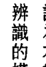

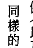

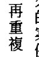

當時我還不曉得在接下來的幾年，我會有其他個案的身體也受到類似能量影響的案例。而我很快就察覺，當在最深度的出神狀態下，人體能做許多我們以為不能的事。在進行這類工作時，要記得的最重要原則就是：「不要造成傷害！」然而你也必須持續對可能出現的意外做好心理準備。

> 「不要造成傷害！」

外星訊息。她當時在念商學院，比較想找一份工作。我向來都是尊重個案的意願，因此沒有要求她繼續。我並不需要擔心，因為我已經與來自另一個世界的存有建立了直接的接觸，事情自然會有後續。

他們（外星人）找到了一位有願意的聆聽者，交流將會透過其他的方式繼續。

我已經開啟了另一扇冒險的大門。

認為本書第一部（譯注：上集）的所有案例（以及沒有被我收錄進來的案例）都依循著一個可辨識的模式，這點相當值得我們注意。同樣的特性在世界各地一再重複，這種重複的內容是無法幻想出來的，尤其許多案例的個案幾乎沒有接觸過幽浮文獻。在一九八〇年代，也就是大多數這類案例被調查的時候，市面上還沒有多少這類主題的書籍。即使是已出版的書，也不是把重點

# 第七章 外星人說話了

## 監護人 THE CUSTODIANS ▲ 340

放在我發現的層面，像是：最常被目擊的外星人類型、類似形態的太空船、外星人執行工作時的類似程序、類似動機，以及一再提及的對地球播種的故事。

由於個案間不可能串連合作，這些相似處讓故事更有真實性。此外，當其他調查員和出版品還把外星議題當成是負面和邪惡的事物報導時，我的個案一致地都會敘述一個仁慈有愛心的善意生物。就連科學也認可當一個實驗重複進行而結果都一樣時，這就是確立真實性的可靠證據。

最重要的是，書裡的個案並不希望曝光或出名，他們反而希望匿名，而為了尊重他們的意願，我改變了他們的名字和職業，好讓他們能夠繼續過清靜的生活。

(待續)

## 宇宙花園 先驅意識07

## 監護人——外星綁架內幕〔上〕

THE CUSTODIANS "Beyond Abduction"

作者：Dolores Cannon
譯者：林雨蒨、張志華
編輯：宇宙花園
版型：黃雅藍
出版：宇宙花園
網址：www.cosmicgarden.com.tw
e-mail：gardener@cosmicgarden.com.tw
通訊地址：北市安和路1段11號4樓
總經銷：聯合發行股份有限公司
電話：(02)2917-8022
印刷：金東印刷事業有限公司
初版一刷：2014年09月
定價：NT$ 450元
ISBN：978-986-89496-7-6
THE CUSTODIANS "Beyond Abduction"
Copyright © 1999 by Dolores Cannon
Published by arrangement with Ozark Mountain Publishers
Chinese Edition Copyright © 2014 by Cosmic Garden Publishing Co., Ltd.
ALL RIGHTS RESERVED. 版權所有 • 盜版必究 • Printed in Taiwan

> 國家圖書館出版品預行編目資料

監護人——外星綁架內幕〔上〕/ 朵洛莉絲・侃南
（Dolores Cannon）著；林雨蒨、張志華譯.-- 初版.--
臺北市：宇宙花園，2014.9
冊；公分.--（先驅意識：07）
譯自：The Custodians "Beyond Abduction"
ISBN：978-986-89496-7-6（上冊：平裝）
1. 外星人 2. 不明飛行體 3. 奇聞異象

326.96 103017127

## 作者简介

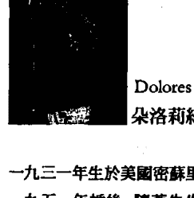

Dolores Cannon
朵洛莉丝·侃南

一九三一年生於美國密蘇里州，聖路易市。
一九五一年婚後，隨著先生的海軍職務旅居世界各地。一九六八年年初透過催眠接觸到輪迴概念。她的先生是位業餘的催眠師，在使用催眠幫助一位婦人減重的過程中，無意間回想到個案的前世。在當時，前世仍屬「非正統」的主題，鮮有人對此領域進行探索。這次事件引發了她對輪迴的興趣。一九七〇年，先生因傷退役，全家搬到阿肯色州的山丘。她由此開始了寫作生涯，投稿於各雜誌和報社。

子女成人後，她投入回溯和輪迴的領域，鑽研各類催眠方式並發展出自己獨特的技巧，能最有效地幫助釋放隱埋在個案潛意識的前世資料。她也因此發現了從未有過地球經驗的外星靈魂。透過她與外星人和異次元高度進化的生命體所建立的合作關係，我們得以一窺宇宙和生命的奧秘。

自一九七九年起，她先後已催眠了上千位個案，並將內容彙整為多本著作。她稱自己為記錄「失落的知識」的回溯催眠師和心靈研究者。她的作品包括《地球守護者》、《迴旋宇宙》系列、《三波志願者與新地球》、Conversations with Nostradamus、Jesus and the Essences等等。

她的兒孫是她在平凡的家庭生活和另一個看不見的奇幻世界之間的最好平衡。除了寫作，她也教導她獨特的量子療癒催眠療法，這個技術可以使操作者直接與個案的「潛意識」（高我）溝通，得到對個案最具療癒效果的資訊。

譯者／林雨蒨、張志華
林雨蒨 澳洲墨爾本大學研究所畢業。譯作繁多，包括《追尋失落的玫瑰》、《三波志願者與新地球》（合譯）、《聖塔菲星空下的回憶》等。
封面設計／高鍾琪

這本書是《迴旋宇宙》系列的前導。

朵洛莉絲透過不同的個案

取得了相似度極高的外星和地球資料。

- 12年期間的案例，涵蓋的主題包括了：
- 神秘消失的時間
- 來自不同次元和存在層面的太空船
- 外星人和地球政府的秘密合作與資訊交換
- 人體內的植入物、簾幕記憶
- 不同的外星種族來訪地球的目的
- 外星人綁架地球人的原因和基因工程的計劃。

請打開你的心，

繼續體驗這場沒有侷限的心智旅程。