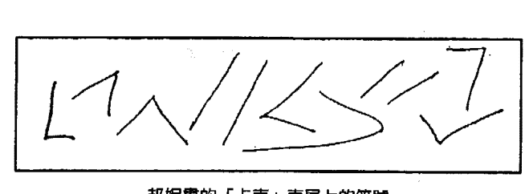

# 监护人：外星绑架内幕下

## 園丁的話

就在監護人上集剛出版一個多月，下集還在進行時，我很尊敬和喜愛的本書作者 Dolores Cannon 在美國時間二〇一四年十月十八日上午回到了光的世界。

宇宙花園會繼續譯介出版迴旋宇宙系列，這是宇宙花園的工作。雖然在看到一些人一些事後，偶爾會納悶，出版這些書有用嗎？看的人有因為認識或記起了宇宙的浩瀚而心胸更開闊？更理解愛的真義和提升振頻的重要嗎？讀者看清了人類之所以被困在業力迴圈的癥結嗎？

無論如何，宇宙花園會繼續做該做的事，希望這些書在滿足讀者對宇宙和外星奧秘的好奇之餘，也能更加喚醒讀者內心的那個光。

如作者在書中所提，之後的內容會越來越深奧，我認為，也是越來越有趣。

> 林中兩條岔路，而我……
選了人跡較少的路走
一切就此不同。
——美國詩人羅伯·佛洛斯特（一八七四—一九六三）

### 第八章 與小灰人的接觸

我決定把接下來的整個調查獨立為本書的第二部（譯註：下冊），因為這都是和珍妮絲持續合作所得的催眠資料。其他個案雖也提供了珍貴資訊，將我從簡單的幽浮調查帶到複雜的案例，然而，我跟珍妮絲的合作卻因為與外星人的直接溝通而有了不同的方向。

外星人在這段三年期間所提供的資料，引領我越來越深入並進入複雜的理論與解釋，這些是我在調查初期不可能理解的。我向來知道他們不會一次給超過我能負荷的東西。如果資料過於激進或背離常規，我會傾向於忽略，或因為不合理而擱置一旁。假使資訊是像湯匙般地一點點給，或是每次只提供少量，人們對這個現象就會比較容易發展出新的思維，而早先不可能理解的事物也會逐漸開始有奇怪的意義，縱使令人費解，卻也能讓我們朝全新的方向去思考。

我和珍妮絲的合作正是如此。在一開始，她跟其他個案的走向相同，只是會出現些新資料。但後來這些資料卻進入了非常複雜的領域，複雜到我決定只在本書收錄部份內容。

這本書已經比我大多數的著作要來得厚，我想要減少厚度，卻難以選擇要刪減哪些內容。身為調查員，我認為所有資料都會對增益新的見解或看法很有幫助。但隨著持續催眠珍妮絲，我們得到的資料卻脫離了幽浮的範疇，進入不同次元，以及涉及時間和平行宇宙等複雜理論的領域。

我當時已在著手進行另一本以這些內容為主題的書，也就是《迴旋宇宙》，因此我決定把一部份的催眠記錄放到那本書裡，以免讀者看這本看得一頭霧水，暈頭轉向。我這麼想，當讀者準備好要讀下一本時，他們的心智可能也已經能夠理解涉及其中的理論了。

我是在一九八九年第一次和珍妮絲合作，那時我已調查幽浮和疑似幽浮綁架案例一段時間了（開始於一九八七年）。在早期的時候，我為了調查而長途跋涉，凡有人要求催眠，我都會試著安排時間配合。但現在已沒有這個可能。我的行程因為演說、參加會議和研討會而忙碌，再也沒有空檔只為了專程和一個人合作而往返某地。我不再享有那樣的時間。我現在也仍在累積資料，但速度已不像早期那麽緩慢。

一九八九年的夏天，我的第一本書《與諾斯特拉達姆斯對話一》問世，我旅行到小岩城，首次以諾斯特拉達姆斯的預言為主題演說。許多人出於好奇而想接受催眠；當有些人發現我也催眠被外星綁架的個案後，亦紛紛提出要求。我知道盧對此很有興趣，所以每次去小岩城我都會盡量多安排幽浮個案的催眠。珍妮絲便是其中一位。她在我第一場演說結束後走向我，說想跟我談談她人生中感到困擾的事。於是，她在一九八九年八月我再訪小岩城的時候，來到我借住的地方和我談了兩個小時，想為她生命中層出不窮的怪事找到合理解釋。

珍妮絲是很有魅力的四十多歲未婚女子。自青春期便開始的女性問題使得她無法生育。由於她是一家大企業的高階電腦分析師，隱藏身分成了她最主要的考量；她最怕的，就是有個什麼事暗示她不適任而因此失去工作。這些年來，她也曾試著找人談她的經歷，但始終說不出口。我是第一個讓她放寬心透露所有怪事的人。

### 第八章　与小灰人的接触

我开了四个小时的车到小岩城，借住在朋友派西家。派西的房子很大，所以我跟个案的讨论和催眠都能保有需要的隐私。当天正准备进行的时候，屋里只有我和珍妮丝两人。我把录音机放在餐桌，以便录下珍妮丝的谈话。话匣子开了后，珍妮丝明显放松下来，只有在我换录音带时，她才会注意到录音机。我们的谈话很随意，有时甚至离题聊到她生活的其他方面，因此我只抄录了跟本书主题相关的部份。

当珍妮丝终于能释放所有被压抑的事件，资料一股脑地冒出，我实在很难理解，于是我请她从最早的忆记谈起，希望能由此理出个头绪。

那些记忆最早可回溯到四岁，当时她常尖叫着醒来，说着「他们」来抓她了。她妈妈以为她只是在作恶梦，但也答应让她开灯睡觉。她记得有很多次在自己房里边玩边四处看时，她会在窗户上看到一张脸。她知道是「他们」要来抓她了，她会赶紧跑向走廊，但总跑不了多远就会停了下来，全身瘫痪无法动弹。她从来不晓得过了多久的时间，只知道自己醒来时是站在走廊上，感觉很冷，也几乎没了呼吸，妈妈则是在一旁摇晃着她。这样的情形在她和弟弟在院子里玩耍时也会发生。她弟弟会跑进屋里大喊：「妈，又来了，她又神智不清了。」

整个孩童时期，她一直有不祥的预感和恐惧，觉得「他们」或「那些人」（她后来开始这么叫他们）又要来了。不过她对「他们」究竟是谁从来没有概念。

我请她描述窗上的那张脸，她说那是一个有着非常大的深色眼睛的小灰人，但之后就会变成一只往窗里看的狗。当然，当她跟她妈妈说的时候，她妈妈并不相信，尤其是窗户离地面很高，一般的狗不可能能够从外面往窗里看。在全身无法动弹的事件过后，她曾试着跟母亲解释她去了别的地方。「我知道我出去了，在一个我们不知道要怎么做到的状态。你可以称它是『灵魂出窍』。我能想出最接近的描述就是他们把我的本质／核心带了出去，但留下身体。我也许是身体还在这里，但本质却在另一个层面或什么的。」她也常常在早上醒来时，知道自己并不是整晚都在床上。童年时期她生过几次有生命危险的重病。有一次医生甚至跟她母亲说她再也无法走路。然而，每次她都奇迹似地康复，医生也永远解释不出原因。成长期间，她有过许多消失时间的插曲。她本身并没有察觉有任何不寻常的事发生，都是听别人才知道时间『不见』了，因此她更觉得困惑。她妈妈曾说：『你是我知道的人当中，唯一一个去杂货店三天才回来的。』她不得不编个故事，说她因为遇到朋友，所以去了朋友家。然而事实上，她不晓得自己去了哪里。她只隐约记得自己从树梢上下来，进了杂货店，买了面包，然后回家。那时她已是高中生，妈妈以为她出去参加狂欢派对，但她说她不怎么喝酒，毒品更是碰都没碰过。这种情形一直出现在她的人生。当她要外出到某个地方，到的时候往往都迟了。她不知道时间究竟是怎么了，又怕如果告诉别人，他们会把她关起来。她说：『我有种感觉，像是隐约知道有事情发生。我回来时还会移动得很快……。我现在知道了，我的地球时间和那个时间必须要调整一致，回到同步：那是行进得很快的感觉，然后我会发现自己正在车子里开着车。那是很大的调整。』她一直在一种必须躲起来，才不会被『他们』找到的感觉下长大。她担心事情会开始发生在她家人身上，于是十八岁就搬离家。她至今仍然不晓得那是什么。「我面对的是不知道、未知的东西，而没有人可以说。我也害怕说出来，因为他们不会相信我。」

终于，自一九八七年左右，她与未知力量接触的记忆开始渗入意识。这样的记忆渗入通常是突如其来，而且在最不恰当的时刻出现。譬如有一次是在上班时间，当时她正在办公室指导一位女职员关于电脑的超级复制功能。「我试着对她解释，『这是妳同时在两个文件的地方。』我说：『事实上，这就像是同时身处在两地。』就在那一瞬间，我心里闪过：『是的，同时。』脑袋也仿佛有部同时发生但却是不同人生的影片。那个感觉太强烈了，强烈到我必须找理由离开，进到化妆室冷静。我坐在化妆室里，然后所有关于瞬间传输（teleportation），它是怎么运作，以及如何同时身在两处的知识不断涌进脑袋。接着我在心里看到我的身体正在分解，最后出现在加州还是哪个我从来没去过的地方。发生这些的时候，我的头有种奇异的感觉。我不会说那是「晕眩」。我其实不知道该怎么形容，我只知道我在化妆室的时候被教导了一些复杂的事。而这种情形从一九八七年就开始持续发生。……某种教导。」

珍妮丝在同年还有另一个奇怪的经历，这两件事都唤醒她许久以前的记忆，也让一些事开始串联起来。

珍：我当时准备要去参加一个大家会各自带菜去的晚餐聚会。我站在浴室镜子前，忽然感觉头怪怪的。我觉得有点晕，心想应该要坐下来。浴室离我的床不远，但是还没走到，我就已经感觉自己往上升了出去。

> 朵：什么意思？

> 珍：我的灵魂，我的本体出去了。我想那个体验可以称为灵魂出窍，它把我的内在吸了出去，就「嗖」的出去了。我还可以看到自己就站在下面。三个小时后我还是站在那里，就跟小时候的情形一样。

> 朵：你从另一个角度看到自己。

> 珍：没错。它让我跟童年的经验接轨。我因此想起过去，「我小的时候也发生过。」

> 朵：你被吸了出去，然后你可以看到自己。

> 珍：我出去了，但仍然看得到我在下面的身体。……还有别人在场，也许是我的守护天使。我甚至不必看就能感觉那是某个我熟悉的人。他问我：「你想去你的起源吗？」

> 朵：你想去你的起源吗？有意思。

> 珍：我一直在说，一直在讲，一直在祈祷和传送（这个念头）……当你想做某件事，而那个意愿到达了一个强度，你就会做到。而我已经这么说了好久了，「我是说真的，该是我知道自己源头的时候了。该是回到我的起源的时候了。该是解开四十多年来一直存在于我生活里的一切的时候了。而且我是指，现在。」所以他说：「你准备好了要去了吗？」我说：「准备好了，我们走吧。」

我仍然有某种身体，虽然我可以看到自己站在那里。我的手能够穿过我的手臂，可是我还是看到一个肉体的我。

### 第八章 與小灰人的接觸

朵：它看起来像你，可是不是……实心的。（对。）你的视线能看穿你的房子吗？看透你所在的地方？

珍：可以，我的视线能穿透房子。我的视线可以往下穿透天花板，看到自己就站在那里。我想：「这还真酷。」我没有害怕。我从那时就知道了，如果我害怕，这件事就永远不会发生。

朵：是啊，你大概会立刻被放回去或什么的。

珍：对。然后我们上升，往上穿越一些层次。就像千层蛋糕一样，我们可以说是往上穿过一层又一层。其中有一层是婴儿的灵魂。我们继续往上到了一个——我不知道是什么——像是某种灵的层次。我心想，嗯，这里感觉不好。我往左边看，那里有恶魔和怪兽之类的。他们朝我过来。我说：「停！以主耶稣基督之名！我不畏惧你们。」然后，嗖地一下，就有个像是保鲜膜的东西罩了下来，把他们都吸了进去。我说：「看吧，我跟你们说了，我不怕。」然后我们继续往上，在那里我放眼望去，看到十九世纪。我再往别处看，那里是一九四五年。我看向不同方向就会看到不同的时期，就像在转电视频道一样。「喔，真妙。那个时期就在那里！」

朵：你只是转圈就能看到这全部？

珍：哦，不是圆圈。事实上有点像是条直线。

朵：线性的？可是你可以看到任何地方啊？

珍：我可以在这里收看到发生的事。一切都在进行中。

朵：仍然在进行中？

珍：喔，是的。仍然在那里，而且是正在发生。（笑）所以我对我这位同伴说：「哇，太好了！我想过去那里。」他说：「你去过了。你经验过了。这里是时间。你可以在任何想去的时候去那里。不过你之前是想要去你的起源，所以你必须别的时侯再去那里。」于是我们就只是经过。接着我就到了一个点／地方（point）。我心想：「天呀，我是光，我是光。哇。」就像灯泡里的光。

朵：你的意思是由光做成的？
珍：是啊，突然间我变成了纯粹的光。
朵：你没有类似身体形式的外观吗？你是光？
珍：是的，我真的是光。我事实上飞到了一个星球，成了颗星星。我说：「哇，我是颗星星。」我不再是珍妮丝了。我是那个星星。我以星星的角色四处看，我看到宇宙往外扩散。我说：「好极了！这就是我在宇宙的位置。」从那时我就知道为什么这件事会发生。星星或天空的特定部份（portion）是灵魂本质能量进入实体界的一个点。灵魂会通过一个特别的地带。

这听起来很熟悉。我想起了梅格在《生死之间》提到的濒死经验。在她的经历里，她也到了一颗星星，并且感受到宇宙的整体性。

朵：但你本质上是由光所构成的光体。
珍：是啊，在那个时候。我待在那里直到体会到这件事，然后，就在领悟的那一瞬间，嗖！每一次我一领悟到什么，我就又到了别的地方。而从那个点开始，接着就像是天使的层次了。我们穿越了很多颜色，我能够感觉到每一个颜色，而我也以是每一个颜色。当我们穿越颜色时，我看了看说：『哇，我就是分子。我就是空气。』我知道我就是这个区域。我有個存在。我有個形式。
朵：你仍然有人格。
珍：我什么都有。我仍然是我曾经是的每一样事物，除了身体。但如果我想要有个身体，我只要用想的，就能看到自己。我可以看到珍妮丝——我。
朵：所以你知道你并没有失去联系（指跟身体）。
珍：如果我想要的话，我还是我……如果我想要想……我也可以这么想：『我想看看那个能量……』
只要你一想，你就会立刻看到。他们在跟我说：『好了，这就是你的起源。』我说：『哦，哇，这真是太美妙了。』他们接着说：『你已经历过这个层次了。』我说：『是啊。』就像我曾经在那里，在那个层次交换过能量，而每当我一想到：『可是这不是我的源头。』我就又会离开那里，继续前进。我一路到达没有时间的点，到达创造的那个点，经过创造的那个点，到达万有知识和古代人（Ancient Ones）的层级。我经过了神、女神的层次，直接到了一个很大的粉晶的核心……
那是我所知道的最无条件的爱了。我在我的起源好快乐，就像重新恢复了生气。我心想：『嗯……也许我已经死了。』（咯咯笑）我在那里晃来晃去，纯粹沐浴在上帝那股温暖和美妙的心灵里。噢，好美。我现在想到的时候，都还可以感觉全身都在震颤。然后我听到：『该回去了，我的孩子。』……我不想走，而且因为不想回来所以哭了。我说：『我不要一个人。我在下面那里一直很孤单。而且那些人会来，我不想。』话一说完，咻，我已经在一艘太空船里了。嗯……这对我刚刚才有过的经历来说，有一点太超过了。我的意思是，我现在吓坏了。首先，当我在那个像是金属房间里的时候，我并不知道我有没有身体。我意识到房间是圆的，那是一艘太空船，这些存在体就在里面。我向他们抗议：「好，够了。我受够了。」然后他们开始告诉我，他们从我童年时就和我在一起。「我们在这里是要保护你。我们在这里是要帮助你。你也在帮助我们。这是你进入你的肉体生命之前同意要做的事。」我大叫：「我才没有。」我还在闹，对吧？因为我对这些宇宙生命一无所知（笑）。于是他们拿出一张纸。我看了看说：「那是我的名字。是我的签名。我真的同意过，是吗？」

朵：他们有跟你说了你同意了什么吗？

珍：他们说我的生命目的就是当个协助者。有许多次，能量在不同情况下透过我转化了这个、那个或别的，然后帮助了人。大多数时候人们并不晓得自己是怎么被帮助的，我也不知道。但他们说我以后会知道。我是来学习的。还有，我永远也不孤单。

朵：那艘太空船是什么样子？

珍：金属的，银色，像诊所，非常干净。我的意思是，它一尘不染到好不真实……让人想到诊所。那里有些器具。有个圆形的房间。里面有刻度盘，有个正方形……我不知道那些是什么。有像屏幕的东西。房间里有张桌子。我没有往后看，但那里有个门口可以通到另一个房间。而这个房间看起来——你知道靠窗的椅子是什么样子？有一圈弧形的椅子，大家可以在椅子上躺下## 第八章 與小灰人的接觸

朵：你的意思是你以脫身？

珍：當然。他們說我如果真的不想繼續就不必做。

朵：能知道這點很好。我想這又是自由意志了。

珍：是啊，我們確實有自由意志。然後他們給我看一部生命的影片。

朵：是在其中一個螢幕上面放嗎？

珍：不是在螢幕上放。他們像是把想法傳遞給我。我只知道是精神感應。並沒有真的在說話。我看到地球，看到到處都是人，而且湧成兩排隊伍。你選擇到其中一排，看是選擇到較高的意識還是別的。不是每個人都進到這個隊伍。你可以看到另一排的人，而當你進入這排的時候，你是在白色的光體裡。這跟你們振動率的提升有關，跟你們意識層級的提升有直接關聯。在某個時候，我不知道是什麼時候，地球將會像《啟示錄》所說的，在火燄中上升。這樣的可能性是存在的。而如果發生了，到時他們就會把在這一排的人帶走。

朵：幽浮裡的人會把他們帶走？

珍：幽浮裡的人。這一排的人會被帶走（指白色光體這排）。我看到地球爆炸。我看到它變成一個火球，就這樣消失在天際。它留下了一個大洞，好像天空突然間都黑了下來。你知道的，如果你看著地球，它是藍綠色的，然後突然間它變成了橘紅色。那就是世界末日。當地球從那個洞消失，我看到新的地球滾進洞裡。真的有個新地球。……我到現在還不知道他們給我看的不是只是象徵。我只知道他們讓我和我有關的事，他們的目的有大半跟我不相信我會經歷這些有關。我不會待在這裡（指地球）。他們在試著幫忙，我問：「但這個人和那個人呢？」他們說：「並不是每個人都會選這一排隊伍。你不是選擇這排就是另一排。」突然間我回到了我的公寓，發現時間已經過了三個小時。我向他們抗議：「宇宙人！我不要做宇宙人。我對那些什麼都不知道。」我回到了臥房，回到自己身體裡。我是透過我的頭回來的。

朵：你的前額。

珍：坦白說，回到身體之後，我只想上床睡覺。我心想，好吧，我要去睡覺了，但我的身體卻沒有朝著床走過去。身體沒有動。它站在那裡：「唉，我們好沮喪。我們沒辦法到床那邊。我們要怎樣才能回到床上？」……那個字是「走路」。走路嗎？走路？我當時不清楚「走路」這兩個字是什麼意思。當你在上面，是靈魂形式時，你想去哪裡只要用想的就到了。但我現在有困難讓身體跟我配合。我也不太知道什麼東西是什麼。像是：車子、開車。我就像個嬰兒，必須學習需要重新整合。我發現自己真的在重新整合，因為我體驗到好多能量，就像是帶著一百二十瓦的電要回到六十瓦的燈泡。所以我的身體還沒有適應，還不能在這裡運作。我直到一個禮拜之後才恢復正常。

朵：一個禮拜？這可能可以解釋為什麼人們對很多發生在自己身上的事沒什麼印象。他們的潛意識……

珍：是的，我有些時候被准许有记忆，有些时候没有记忆。起初我会很不自在，但现在已经接受事实，不会有那种『可怕的事要发生了』的问题。隔天的日出正好是和谐汇聚（译注：The Harmonic Convergence，一九八七年八月十六至十七日为太阳系行星出现特殊对齐的日子，也是全球第一次集体冥想日。）我本来要和一些人一起去看日出，后来只带着我的小狗去了湖边。当太阳升起，日光投射到草地上的露珠，那个光，和我一度身为的光是一样的。他们在让我知道这当中的关联，那就是，我一直是连结著的。我哭了，因为我想要回去。我有种非常寂寞的感受，就好像亲人要离开，要走了一样。我很确定他们必须离开，我想要他们留下来帮忙。于是我抬起头看著湖面上的天空，我说：『如果我真的跟那艘太空船有关系，给我一个徵兆，一个具体的徵兆，让我看到。因为我无法相信会有这种事发生。』所以就在我离开那个地方的时候，我说了我要一个具体的徵兆，否则我不要再和这些事有任何一点关联。这一切太可笑，太诡异了，我不玩了。到此为止！我朝我的车走去，边走边笑出声来，心想他们才不会给我看到什么呢。然后我一眼就看到地面上有个东西在发亮。我想那大概是块玻璃。我才不要过去拿哩。我就这样经过它继续往前走，但身体却在自己往后退。我本来是朝车子走过去的，但那个情况却像是『停！后退！』然后我回去把它捡了起来。你不会相信在那么大的一个地方，我在地上找到了什么。

## 監護人 THE CUSTODIANS

珍妮絲從她的皮包翻出一只小零錢包，再從零錢包裡拿出一個放墜的小盒子。打開盒子後，裡面有個小東西。她把它放在掌心。那是個金屬的小星星。我撿到它的時候是粉紅色的，現在卻快變成銀色了。她解釋：「我不想弄丟它，所以放在這個鍊墜盒子裡。」我小心翼翼地拿起來，想看看它是什麼做的。「感覺不像金屬，像是很硬的塑膠。好小……唉，還不到半英吋（譯註：不到一．二七公分）。」珍：我撿起來的時候就知道哪邊是上面。上面有個特別的角度。而且我也只能這樣放才能把它收進小盒子裡。我們邊把玩那個星星邊談笑。當她要把星星放回小盒子時，我突然有個衝動，把它又看了個仔細。這時我才注意到它和我的戒指很像。我有一只很少見的松青石銀戒，是在很特別的情況下得到的。那是一九八○年代早期，我還沒有涉入這類調查時候的事。有個女子把戒指交給我的女兒，說是要送給我。她說她知道我的服務不收費，而她想用這個戒指感謝我所做的工作。她知道如果直接送我，我一定會拒收，但如果拿給我的女兒，我就沒法歸還。她說的沒錯，我認為那只戒指太珍貴了，不應該收下，可是我因為無從歸還就留了下來，並把它戴在唯一戴得上的手指，也就是我的食指。我通常不戴珠寶，但從此卻沒拿下過這只戒指，這也是挺奇怪的。

## ## 我

我們和我可靠的錄音機坐在派西的餐桌前，花了兩個小時以上討論珍妮絲的經歷和回憶。現在是時候來做回溯催眠了。唯一的問題是要決定先探索哪個事件。

當時我們還不清楚那兩個星星完全一樣是個預兆，預告著我們將會一起進行重要的工作。珍妮絲和我遇到一塊兒是純粹巧合嗎？還是這件事的背後有個較高的動機或力量？

「你看，」珍妮絲說，「我必須把尖尖的部份朝上放在小盒子裡，你也是同樣尖端朝外戴這個戒指。」

珍妮絲把她的 小星星放在我的星星上頭，結果兩個的大小完全吻合，就像複製的一樣。現在我真的印象深刻了。這是巧合嗎？我把回家後就待在另一個房間的派西叫來。我們全都哈哈大笑，但發生這麼不自然的事其實感覺很怪。派西也認為這兩個星星完全是一個樣子出來的。它們完全一樣。當然，珍妮絲的星星是銀色的，我的石頭是松青石。

它的邊緣有七顆銀球，其中五個在底部，兩個在上面，上下之間有個銀條分隔，戒指的中央就是五角形的松青石星星。很多人認為這個設計可能是某種象徵。戒指出自哪位銀匠的唯一線索是在內圈有個 U 字，一個馬蹄鐵的標誌。

許多人很喜歡這個戒指，問我願不願意賣，或是至少告訴他們哪裡可以找到類似的。不過我從沒看過或聽說過同樣設計的戒指，我想它可能是獨一無二的吧！

## 監護人 THE CUSTODIANS

我們到了樓上客房，她在我準備錄音機的時候，告訴我另一件最近才發生的事。事情是在一九八七年七月的前一個月發生的，因此她仍記憶猶新。

那天早上她一醒來就咳嗽，一坐起來就吐出了大血塊。她嚇到了，但起身離床時並沒有看到床上有血，她的下半身和身子底下的床鋪反倒是像有水。她沒有尿床，也沒有聞到什麼味道。這個情況看起來像是有人在她身上和床上倒了水。她唯一的不舒服是私處有燒灼感。她到浴室漱口，血停了，就跟之前來得突然一樣。她的小狗則表現出每次她下班回家時那種特別興奮的模樣。由於出血令她擔心，她當天就去看了醫生，但並沒有找到可以解釋血塊的原因。

由於這事才發生不久，我決定把催眠的重點放在這上面。如果這件事不重要，我們也有許多其他可以探索的材料。珍妮絲一進入出神，便是在很深的狀態。我開始倒數，引導她回到她那種不安狀態醒來的前一個晚上，看看是什麼造成了這個情況。我也下了指令，如果她想，她可以從客觀報告者的角度去觀察，以排除任何身體上的不適感。

朵：我將要數到三，數到三時，我們會回到那晚你準備上床睡覺的時候。你會告訴我發生了什麼事。

一、二、三，我們已經回到了那個晚上。你在做什麼？你看到了什麼？

珍：我在看我的狗。牠東張西望的樣子好怪，真的好奇怪。我知道牠在看我看不到的東西，不過我知道它就在那兒，因為我感覺到了。

朵：你感覺到什麼？

珍：是他們。是他們。我想要他……（深嘆了口氣）跟我一起去，我知道他們來了。
珍：對，他去過。
朵：喔？我納悶他喜不喜歡？
珍：（開始露出憂慮的神情）我不知道。
朵：好，告訴我現在怎麼回事。
珍：我的能量一直很低。工作上的壓力很大。他們跟我說，他們需要做一些工作。（憂慮）我不知道我們要去哪裡。——我的頭在痛。

我立刻下指令消除身體上的任何不適。幾秒過後，她的臉部神情顯示她的壓力已經沒有那麼大，頭痛顯然舒緩不少。

朵：他們在哪裡？
珍：他們從我的窗戶進來。
朵：什麼？爬進來的？
珍：就直接穿牆。（這似乎令她困擾）直接穿過牆壁。
朵：他們長什麼樣子？

## 監護人 THE CUSTODIANS

珍：沒有我高，但差不多。我知道他們，可是每次發生都還是有點可怕。（深吸一口氣）

朵：噢，是的，我能夠瞭解。這是人性。可是你在跟我說的時候你不會感到害怕。明白嗎？（她的呼吸和身體的反應顯示著不安）你跟我說的時候不用害怕，因為我跟你在一起。我會陪在你身邊。他們有幾個人？

珍：（聲音顫抖，快哭了。）兩個。

朵：你想跟我說說他們長什麼樣子嗎？

珍：（聲音仍在顫抖）他們沒有頭髮，很大的棕色眼睛，有皮膚，可是跟我們的不一樣。不一樣。

朵：你會以為他們有穿衣服，但你不知道他們究竟有沒有穿。

珍：他們的皮膚是怎麼個不一樣？

朵：感覺不像皮膚。感覺很乾，像紙，不過比較像皺紋紙。（聲音仍然快要失控）

珍：我瞭解你的意思。（她開始哭了起來。是害怕的哭。）沒事的，我就在你旁邊。怎麼了？

朵：（因為啜泣的關係，起初說的話並不清楚。）他們要我跟他們走，但我……我說我要在這裡再待一會兒。我想保住我的寶寶。（啜泣）

我很驚訝。稍早在面談時，她跟我說過她無法受孕。

朵：什麼意思？

## 第八章 與小灰人的接觸

珍：是他們來帶我走的時候了，可是我想留下來，想多留寶寶一會兒。
朵：你懷孕了？
珍：我想是的。但我不認為他們是這麼說的（指懷孕的說法）。我不知道他們怎麼說。他們只說時間到了，該走了。
朵：你是怎麼離開房間的？
珍：就跟他們一樣穿牆而過。
朵：你感覺到自己在穿牆？
珍：是的，我感覺自己穿過牆壁。他們可以處理，讓你能夠穿牆。我真的穿過牆壁了。從房間穿牆出去。
朵：你的身體就這樣穿過牆壁？

我想確定這不是靈魂出竅。第一次聽到約翰（上集的個案）這麼說時，我驚訝地發現身體能夠被帶著穿越實心的物體，像是牆壁或屋頂。從那之後，每次聽到有人說這種事，我都會試著判定那身體還是靈魂的經驗。個案對發生過的事總是很肯定，從不會含糊其辭或不確定。

珍：（她的聲音穩定些了）這和分子的位移（displacement）有關。他們讓我看見是怎麼發生的。開始的時候感覺很怪。

## 監護人 THE CUSTODIANS

朵：是怎樣的感覺？
珍：身體會有點麻麻的，然後你會感覺身體融化了。像是融化到空氣裡。身體變成空氣，但你不是空氣……就好像你是空氣，可是你在空氣的形式裡又有個形體……它使你跟空氣的層次更一致。當速度加快到一個程度之後，你的身體跟你要穿越的物質會有不同的振動速度。於是你就穿越了那個物質。
珍：很怪。
朵：聽起來是很不可思議的事。
朵：那麼你和他們一起穿越牆壁後，發生了什麼事？
珍：我們在黑暗中移動。我不確定我是怎麼移動的。
朵：他們仍然和你在一起嗎？
珍：對。他們在我的兩邊，我帶著我的狗。

其他個案也報告過這種情形。他們說身體一旦被帶著穿越牆壁或天花板，兩邊就會各有一個外星人伴隨他們往上升到太空船。或許這是運送他們的機制；外星生物必須在人類旁邊，協助他們在空中移動，再進到太空船裡。

朵：所以狗也跟著穿越了。我很好奇牠對這有什麼感覺。

## 第八章 與小灰人的接觸

這是另一個反覆出現的情形。個案在進入太空船時，通常會有段空白記憶。也許他們離開房子的方式跟穿越太空船外殼進到船裡是一樣的。如果是這樣，這顯然會造成記憶的喪失。因為當太空船是在地面時，個案通常會記得自己走進去或是被帶著上樓梯或斜坡道。

珍：祂不怕。

朵：你看得到你們要去哪裡嗎？

珍：(呼吸再次沉重)我現在在太空船裡。我在桌子上面。

朵：你怎麼進到船裡的？

珍：我不知道。一片空白。我只知道我在裡面了。

朵：接著發生了什麼事？

珍：他們要……我躺下來了。我們要再做一次。

朵：再做一次什麼？

珍：就像去看婦科醫師。我不知道他們是怎麼做的，因為我從來不是清醒的。(越來越難過)我想要知道。我求他們讓我知道他們是怎麼做的。

我在早期的調查就發現，即使身體睡著了，還是有可能找到答案。你可以直接問潛意識，

## 監護人 THE CUSTODIANS

因為它從來不睡（即使是在手術的時候），它會提供客觀又詳盡的答案。

朵：我認為你也可以透過我們現在的這個方式發現。你想知道嗎？

珍：（抽噎）我想是吧。

朵：你想要在你的身體睡在那裡的時候，以觀察者的身份去看嗎？你認為有可能這麼做嗎？

珍：我不知道。我覺得自己現在就在那裡。我現在就在那裡。就在那裡（不斷吸鼻子）。

朵：問問他們其中一位，看你能不能以觀察者的身分去看看。看看他們怎麼說。（不行。）他們說不行？

我們可以問問題嗎？（可以。）

就在這時候，她的聲音突然變了。她回答「可以」的聲音聽起來權威許多，不像之前那麼害怕。

朵：好。但是你的身體睡著了？是這樣在進行的嗎？

珍：身體並不是在睡著的狀態。

這絕對不是珍妮絲的聲音，這個聲音很單調、機械化，幾乎像是機器人。一個一個音節發得清楚，跟我們說話時會急促或含糊完全不同。它有時聽起來甚至很空洞，近似回音，但也絕不是錄音機或麥克風產生的效果。我從她口中聽到的聲音就是這樣，我不知道她怎麼能自然地發出這樣的聲音，跟珍妮絲完全不同。這個有著獨特音調和風格的聲音一直持續到這次催眠結束，在我要求那個存在體離開之前始終沒變。

我並沒有被這個聲音的轉變嚇到，因為這種情形以前也發生過。我好好地利用了這個機會發問。

朵：如果身體不是在睡眠的狀態，那是在什麼樣的狀態？

珍：是在你們不熟悉的意識層次。

朵：為什麼她必須在那個意識狀態？

珍：這樣她才不會痛苦。

朵：我認為這樣很好。我們不想她體驗到任何痛苦。但是，究竟是發生了什麼可能引發痛苦的事？

珍：人類的誕生是痛苦的。

朵：沒錯。她是在生產嗎？

珍：是在生產。

朵：你可以告訴我經過嗎？

珍：跟你們在地球上的生產是一樣的。

朵：但地球是自然發生的。

珍：事情是自然發生的。

朵：在地球，開始的時候會有陣痛。

## 監護人 THE CUSTODIANS

珍：所以才有意識的轉換。母親感覺不到任何痛苦。

朵：但我猜胎兒應該不大。這個猜測正確嗎？

珍：正確。

朵：那麼應該很容易就生得下來。

珍：還是會有痛苦。這個人類在地球上從未生過孩子，產道因此不太一樣。

朵：有發生什麼事引發這個過程嗎？類似產痛，痙攣？

珍：我不瞭解你的問題。

朵：有用工具或是機器讓身體進入分娩程序嗎？

珍：在我們來說，就是時間到了。你們觀念裡的九個月懷孕期……終止……結束，被改變了。孕期較短，因為胎兒在母親懷胎期間的成長……胎兒各種狀態和器官發展得比你們地球時間的九個月還要高階。

朵：所以胎兒的大小並不是九個月大，不是（地球）足月的胎兒？

珍：沒錯。

朵：但依你們的標準，它已經發育完成？

珍：對。你們還不瞭解我們的標準。依照我們的標準，胎兒已經是九個月大，雖然身體的大小並不是九個月的嬰兒。

朵：它有所有足月嬰兒的特徵嗎？

## 第八章 與小灰人的接觸

珍：有，它的系統也是。

朵：在我們的想法裡，一個小胎兒只會有很初步的發育，它是無法存活的。

珍：如果在你們的存在層面上進行（指懷孕），必要的發育會需要四個月的時間。我們在母親懷胎時照顧過程，這個特別的照護使得系統能以不同於人類一般孕程的速度發展。

朵：胎兒出生時有多大？

珍：跟你們的出生相比的話，身體大小是四個月的嬰兒。

朵：以我的瞭解，那樣的大小大概是巴掌大。

珍：比那再大一點。

朵：她的身體懷有這個胎兒四個月了？（是的。）她知道嗎？

珍：這次不像以前那麼知道。她有些時候是知道的，不過不是持續的意識。她感覺到自己懷孕。她……

朵：她的月經停止了？

珍：她已經沒有月經了。

朵：並不需要？（對。）你們需要的只是子宮？

珍：甚至子宮都不是必要的。這跟人體的能量有關，不是人體荷爾蒙的分泌。

朵：我在很努力的瞭解。以人類來說，一定要有子宮內膜和荷爾蒙，胎盤才能附著並滋養胎兒的成長。

## 監護人 THE CUSTODIANS

珍：這個胎兒體驗生命的方式跟你們人類寶寶在母親肚子裡很不一樣。隨著母親進行她的日常活動，母親體驗到什麼，這個胎兒就體驗到什麼，所以它很充分地體驗到你們星球的生活。

朵：那麼這個方法可以用在任何年紀的女性。

珍：沒錯。但必須是特定類型的女性。參與這個計畫的人要有特定的條件。

朵：你能告訴我那是哪些條件嗎？

珍：（好像在背誦一樣的一條一條說出來）條件是：飲食。條件是：維持存在於特定的層次。條件是：純淨。還有一些我們可以稍後再討論。

朵：大多數的女性似乎都符合條件。

珍：不是大多數的女性。

朵：是哪方面不符合？

珍：因為大多數女性所參與的特定活動。因為大多數女性的專注程度。因為到時要和那個生命的腦部互動。選擇的對象是以那個生命的進化，也就是母親的進化程度為標準。這是個複雜的程序。

朵：我想你看得出我有很多問題。我很好奇。你剛剛說的是性的活動嗎？

珍：那是影響的因素之一。

朵：那確實會影響荷爾蒙、情緒和其他種種。

珍：比起母親的荷爾蒙，這跟母親的本質更有關聯。以你們地球語言的詞彙來說，你可能會說這是靈性的層次。

## 第八章 與小灰人的接觸

朵：那麼不是每個女人都適合。
珍：沒錯。
朵：沒錯。
珍：沒錯。
朵：這以前也在她身上發生過嗎？
珍：沒錯。
朵：我在工作中曾被告知，繁殖也有透過複製的方式進行？
珍：那是複製人的計畫。跟這個計畫是不同的。有的女性兩個計畫都參與，有些只參與一個。
朵：如果你們能用這種方式生產，為什麼還需要複製人的程序？
珍：因為會有個體基因遺傳上的差異，那是另一種計畫所沒有的。
朵：你能解釋嗎？我對無性生殖／複製人有些瞭解（cloning，譯注：指細胞從親細胞 (parent cell) 複製出完全相同的細胞，是一種無性的複製，有著相同的基因），那表示是完全一樣的複製品。
珍：無性生殖產生的是一個精確，完全一樣的複本。另一種方式除了具有母親的本質，過程中也接受外來的刺激。兩種方式製造出的個體是不同且獨特的形態。
朵：所以複製人是一模一樣的複製品，另一種則在基因／遺傳的組成是不同的類型。是這樣的嗎？
珍：沒錯。因為另一種也包括了母親在懷胎時期所接受到的所有超感官的刺激。
朵：你是指是無性生殖／複製的還是自然生產的？
珍：自然的。
朵：這是表示複製人會比較冰冷，沒有感情？

## 第八章 與小灰人的接觸

珍：除非母親的情感狀態／組成也是這樣，否則不會。你不瞭解的是複製人具有母親的一切並且跟母親一模一樣。自然生產的孩子則除了有母親的所有遺傳，還加上母親懷胎時所經歷和感受到的一切。

朵：所以是有差別的。

珍：明確的差別。我們在試著向你解釋，胎兒在母親子宮時，也跟著母親一起經歷她的生活。

朵：體驗到她所感受的一切。

珍：就是這樣。

朵：而複製人不會。好，我可以請問你這個胎兒是怎麼產生的嗎？父親也是人類嗎？還是別的生命體？

珍：現在還不討論這個。你們會有知道這些資訊的時候。但首先我們必須要能信任你。

朵：這我完全可以接受。我只是會問很多問題，只要你們不反對。

珍：我們想看看你會怎麼處理這些資料，還有它們是怎麼被使用的。

朵：你們要我怎麼做，我就怎麼做。

珍：你必須要等資訊完整後才傳播出去。

朵：我很願意這麼做。我也不想只有半個故事或半個真相。

珍：我們必須提醒你要保護個體。

朵：當我們在這個狀態工作時，我已經在她周圍設了保護。你的保護是這個意思嗎？

珍：不是。我們的意思是，你怎麼處理資料會對這人的人生造成直接的影響。

朵：確實如此。大多數和我合作的個案都不想被人知道。他們想保持匿名。這很重要，因為他們不希望生活被打擾，而我也很努力去尊重這點。

珍：這是為什麼我們現在在和你說話。因為你非常有責任感。

朵：如果事情是在我的權力以內，那麼沒有人會知道她的身分。然而總有些事情是在我的控制之外。在我能控制的部分，她的名字永遠不會曝光。你是指這個嗎？

珍：在這時候，事情必須維持如此。我們還必須做別的工作。她是非常高度進化的個案，比大多數個案了解得更多。因此我們心裡對她有更大的計劃，我們不希望這個計劃被好奇心干擾。

朵：是的，有很多人很好奇。看起來這是我將會遇到的問題。

珍：如果我們也能被允許保護你的話就不會了。

朵：能這樣最好。因為我覺得我將會旅行到一些負面的地方。

珍：沒錯。

朵：還有持懷疑態度的地方。

珍：沒錯。

朵：我會很歡迎你們能給我的任何保護。

珍：你將會透過你的戒指知道我們一直都和你在一起。

這裡說的便是稍早提到的，我那只奇怪獲得且一直戴在身上的松青石星戒。

## 監護人 THE CUSTODIANS

朵：我對那個戒指很好奇。你能跟我說說它的事嗎？

珍：你們地球人向來認為幽浮來自星星。這個星星就象徵著你的連結。你在思想上總是與我們同在，因為你投入的這項工作是在協助消除我們這種存在體又壞又邪惡的觀念。

朵：是的，因為我獲得的資訊是正面的。

珍：是正面的。然而，我也必須提醒你，就在你現在說話的地球時間裡，確實也存在著來自另一面的力量（指負面）。

朵：但我向來相信人都是吸引到自己想要，自己所期待的東西。

珍：沒錯。

朵：我從沒有預期或期望去發現負面的東西。

珍：可是你必須知道並意識到它確實存在。你也必須知道和意識到你的工作可能會接觸到那一方的生命體。這是每個個體必須要做的選擇，選擇在哪一方工作。這是需要做出的明確選擇。

朵：我聽說過負面的事。我不想跟那邊有關。

珍：如果你已經做了選擇，那就不用害怕，因為你不會跟那一邊有關。你不會受到它的影響。它可能會來找你，但你會被保護，所以它無法與你合作。

朵：這樣很好，我很感謝。因為我只想要資料。

## 第八章 與小灰人的接觸

珍：那也正是我們想分享的。

朵：好。我可以知道我在和誰或是跟什麼說話嗎？

珍：我不懂你的問題。

朵：哦，我不認為我現在是在跟珍妮絲的潛意識說話，對吧？

珍：對，不是的。

朵：我在和誰說話？不一定要有個名字。我只是對你們是什麼很好奇。

珍：《交流》這本書的封面有一張臉，那就是我的樣子。這是為什麼這個存在體，珍妮絲，會受到那個封面的影響。她太熟悉我們了。她知道從地球的觀點來看，我們有時可能造成痛苦，也知道有些地球人認為我們是不友善和冷漠的。她一直被允許知道這背後的故事；她知道這只是不同生命體的角度。她已經能夠變換立場去瞭解我們所做的事，如果我們可能造成她的痛苦，她也能瞭解背後的意義。她知道這都是伴隨著她已經接受和同意的事所產生的感受。她知道的，而且我們也常提醒她，她隨時都能拒絕。她也聽我們說過，任何時候只要她覺得太不舒服而無法繼續，她的拒絕參與都不會有任何後果。她知道這點，也被告知我們隨時都會以她需要的方式協助她。

朵：這樣很好。你知道的，人類對你們的意見之一就是你們很冷淡，沒有感情，你們造成痛苦，而且不在乎人類。

珍：從你們的標準來看是正確的。人類的問題在於他們無法從我們這邊，無法透過我們的眼睛去。

## 監護人 THE CUSTODIANS

朵：我瞭解了。這是因為你們的神經系統不一樣嗎？

珍：沒錯。

朵：那麼你們身體發展的方式跟人類並不一樣？（是的。）你們有情緒嗎？

珍：我們能模擬情緒，但不是像你們那樣與生俱來有情緒。

朵：你們是不是比較像——我不想說「機器」——像是製造出來的人，而不是遺傳生殖的。

珍：抱歉，這個問題不清楚。

朵：我在想要怎麼說才好。我習慣人有情緒，除非他們像機器，是被製造出來，而不是以遺傳或基因的方式繁衍出來。

珍：我們有感覺，不過這不是同一回事。

朵：你可以解釋，幫助我瞭解嗎？

珍：如果你碰我，我可以感覺到。它不會傳送到……它不表示我會有同樣的感受。我心裡知道你碰到了我。我感受到那個觸碰，但和人類所感受的觸碰並不相同。相對於身體的觸碰，這是個過程，是心靈感應的觸碰。我們是在精神感應的層面上運作。相對於你們瞭解的較為身體層次的情感觸碰，我們的演化已經到了我們的感受是來自精神感應那樣的領會了。

朵：我想的是人們撫摸彼此的方式，尤其是撫摸小孩的時候。

珍：我們在學習。我們希望能整合並理解這兩種不同的情感。在過程中將會有精神感應式的感受和領會，以及感官式的感受和理解被整合在一起的進化。

朵：瞭解。那你們也感受不到像是愛或恨的情緒？

珍：我們雖然可以感受得到，但是不瞭解它們。這在我們是不一樣的。

朵：那麼你們能感受憤怒嗎？

珍：我們能夠感受到任何你們感受到的情緒，我們在心智感受到，但那不會影響我們的身體。

朵：所以你們不是完全冷漠的。

珍：沒錯。我們經驗到那樣的情緒，只是它不會對我們的身體造成影響，不像人類那樣。壓力是人類生活的一部分，它會損壞身體，影響到心靈和你們身體的分子結構。

朵：你是在試著……

珍：我在試著告訴你，我們就算有壓力，它也不會那樣影響我們的身體。不過，我們的心裡確實會經驗到壓力。我們來這裡不是要造成傷害。我們來這裡不是要佔領你們的星球。你們不能瞭解。

朵：這我相信。

珍：是的，你是相信。我說的是整體人類。

朵：這點真是太糟了。

朵：你之前說的缺乏感受是你們種族發展的方式不一樣嗎？

## 監護人 THE CUSTODIANS

珍：不一樣純粹是跟我們來自和發展的地方有關，並不是因為我們沒有感受，不是因為我們不知道感受。它只是對我們的存在並非必要。

朵：我以為也許我們都是從同樣的方式開始，只是你們的演化走上了另一條路。

珍：我們一開始就是現在這樣，所以才會那麼難瞭解地球的情緒，還有你們加在自己身上的一些存在／生活方式。

我暫停下來替錄音帶換面。

朵：你大概很清楚我在使用一台機器。

珍：我們瞭解機器。

朵：這個機器會記錄聲音，幫助我以後能再聽到那些話。

珍：我們把聲音存在心裡。

朵：我們沒有這樣的能力，所以我有一個可以錄下這些話的小機器。等時候到了，我可以重放，再聽再瞭解。

珍：你也可以把它們存在心裡。

朵：但資訊這麼多的時候很難。

珍：這是自己……（她找不到正確的字）這和儲存資訊、分類、歸檔有關。

朵：哦，這我倒是很擅長。

珍：這是造像和影像追蹤（image tracing）的問題。很像我們的飛行。我們可以想像你們的星球或是某個地方，然後我們不用實際身體飛到那裡就能抵達。

朵：你們現在是在我們的大氣層嗎？

珍：我們是在你們的大氣層。

朵：但你剛剛是在說你們來的那個地方？在那裡你們只需要想像你們要去的地點？

珍：沒錯。

朵：你們的太空船不需要任何形態的動力能源或什麼的嗎？

珍：我們不需要任何動力能源。思想就是我們的動力能量。

朵：這樣就能夠操作整個船？

珍：可以操作很多船。

朵：這是需要集體的思想，還是只是像你一樣的單一個體的思想？

珍：可以是一個人，也可以是集體。

朵：我們今天的科學家認為你們一定有某類動力：機械、電子或類似的動能？

珍：有的太空船可以使用許多不同的能源。你們就是迷失在這個地方。人類以為所有的太空船都必須使用同一種能量。不是嗎？

朵：或至少是我們可以理解的能量，可燃的或其他形態。

## 第八章 與小灰人的接觸

珍：你瞭解光能嗎？

朵：我只知道可用它來發電。

珍：好，我們旅行時會經過一個剛超越光的點。那是光的頻率。肉眼看不到。

朵：我想到雷射。

珍：接近了。

朵：接近了？（笑）就我所知，雷射是比較快的頻率。我相信是這樣的。是嗎？

珍：是的。這個頻率比你們的光更快。

朵：我現在想到微波。

珍：那是完全不同的。

朵：好吧。所以你們能夠透過思想在這個頻率以實體的太空船旅行。（是的。）你們透過思想非物質化／消失（dematerialize），然後在另一個地方重新物質化？

珍：沒錯。

朵：好。因為我們想到的是以光速旅行。

珍：這比光速更快。

朵：這跟她穿牆的方式類似嗎？

珍：類似，但旅行時還會用到一個不一樣的程序。當你說到穿透物質，你說的過程跟我們從我們的宇宙旅行到你們的大氣層並不是相同的。

## 第八章 與小灰人的接觸

朵：就因為沒有穿透物質嗎？所以是不同的程序。

珍：沒錯。

朵：可是仍然是在一個地方非物質化，然後在另一個地方又重新物質化，不是嗎？我很努力想要瞭解。

珍：我現在還不能對你解釋。不過我可以告訴你，旅行有兩個不同的過程。這個存在體一旦穿越牆壁開始旅行，她就是以介於外面牆壁和太空船之間的第二個程序旅行。這是為什麼人類在重返你們的時間框架和振動頻率的時候，會有重新適應的困難。原因就在於振動頻率會在這類旅行的時候改變。振頻需要一段時間才能慢下來，要看是用什麼方式重新進入。

朵：在快速旅行之後必須要再慢下來。

珍：沒錯。有時候這會造成適應上的問題。會產生某種困惑或混亂。我們只要一察覺有這種情形，就會儘快減輕這個問題。

朵：我可以問你，你們的人有分性別嗎？（有。）你們有男性和女性？（對。）你們繁殖的方式和人類一樣嗎？

珍：我們有選擇。

朵：你可以說明嗎？

珍：我們可以用那種方式繁殖，也可以用其他幾種不同的方式。

朵：其他的方式是什麼？

珍：我已經跟你解釋過其中兩種。

朵：無性生殖／複製，還有用在珍妮絲身上的方式？（是的。）我想知道這個寶寶接下來會怎樣。我。

珍：因為這樣他就會有人類所有的身體特徵，又會有我們種族的心靈能力，兩者整合在一起。

朵：可是你們自己不是已經有很出色的身體功能嗎？

珍：我們認為你們很美。我們是有身體方面的能力，但跟你們的身體能力不一樣。

朵：我以為你們會很滿意自己的身體能力，滿意你們與生俱來的身體，不會想……

珍：這不是不滿意的問題。這是差異，是你們人類要學的一個重要課題。

朵：你的意思是？

珍：差異相對於不滿意。這不是比什麼好或比什麼糟的問題。只是不一樣，只是有區別。

朵：這正是我想瞭解的部分。為什麼你們會想要改變你們種族的外觀？

珍：這不會因此改變我們種族的身體外觀。因為那（指小孩）不是我們的種族，也不是你們的種族。

朵：你的意思是？

珍：我的意思是：這不是其中的一個種族，而是一個種族。

我那時還不瞭解他指的是創造一個新的、不同的種族。

## 監護人 THE CUSTODIANS

## 第八章 與小灰人的接觸

朵：你的意思是所有的人都屬於同一個種族？

珍：最終會是如此。

朵：那就是起源嗎？

珍：我不明白這個問題。

朵：我們都是從同一個種族開始的嗎？

珍：我已經用我們和人類體驗情緒的差異對你解釋過了。這是將兩種不同的體驗整合到一個生命裡，然後創造出不同的生命，而且無損於任一種族的特性，也沒有改變這個特殊個體是由兩種種族所組成的事實。

朵：所以我們全是從不同的種族開始，但目標是整合成一個種族，擁有所有種族最好的部分，對嗎？

珍：這是一個計畫，沒錯。

朵：還有其他的計畫？（對。）你可以告訴我嗎？

珍：這時候還不能說。

朵：好，我很有耐性，可是我也有很多問題。我在努力瞭解你們這麼做的目的。

珍：當新地球演化的時候，保留在地球的部份本質會在某個時候轉移到新人類身上。

朵：新地球？什麼意思？（沒有回答）我知道很多跟未來有關的預言。我在努力瞭解你說的事情是不是符合那些預言。

## 監護人 THE CUSTODIANS

珍：我說的是新形態的生命體將會居住在新地球。

朵：在我們的未來還是什麼時候嗎？

珍：是的，在你們的未來。如果我用「轉移」這個字，你可能比較能夠瞭解。

朵：轉移什麼？

珍：這要看你們星球上的人所做的選擇結果。你們星球上既有人類的本質已經存在於新的種族裡，因此，假使你們選擇毀滅的路，這個新種族很可能就會取代舊的人類種族（指在另一個星球生活）。你們將因此真的有個新種族居住在你們的新天堂和新地球；一個只擁有最正面特質的新種族。

朵：一個真正更進化的種族。（是的。）

《地球守護者》也敘述過類似的概念，有一個星球正在為人類摧毀地球之後，所要接受的新的（比較完美的）人類種族做準備。這種新人類是在太空船上的實驗過程發展出來。我被告知人類基因不能滅絕，因此要用這樣的方式保存。

珍：四個月大。

朵：好，那個胎兒……我想你會叫它嬰兒。你說它已經足月，四個月大的身體已經發育完成了。

朵：它要被帶去哪裡？

## 第八章 與小灰人的接觸

珍：我們有跟你們醫院很像的設備。我們也用同樣的態度照顧孩子。我們有一些人的工作是撫養小孩。你們可能會稱為「代理」媽媽。親生母親如果想的話，她可以來看小孩，不過她通常不會保有探望小孩的記憶。孩子的媽媽會教導這些存在體怎麼跟孩子互動。這是我們必須學習的部分。

朵：這個小孩是以不同的速度成長嗎？

珍：是的，是以不同的速度成長。你們地球的兩分鐘，孩子就能長到四歲大。

朵：好快。你們的時間也是那麼快嗎？

珍：可以快，也可以不那麼快。

朵：這樣沒幾天就成人了，不是嗎？（是的。）瞭解。這些新的生命體，這個新的種族，會被使用在別的地方嗎？

珍：他們在一個很不一樣的地方生活和接受教導。那個地方和他們最後會去住的環境很像。

朵：但這個地方不在地球？（對。）所以那會是他們要習慣的地方。就像是適應氣候？（對。）那複製人呢？他們最後會回到地球嗎？

珍：會。有些已經在地球上了。

朵：以什麼身份？

珍：人類。

朵：這麼做的原因是什麼？

珍：因為我們能複製人類，而且已經可以重新設計複本的身體到某個程度，也就是如果有需要的話，複製人還可以回去幫助它的根源，透過它與根源之間即時且密切的關係提供協助。

朵：不一定。

珍：不一定。

朵：我在想，如果複製人是在別的環境成長，是不是會具有那些記憶。

珍：在複製人的時間方面，我們也有同樣的能力，就像我先前對你解釋過的。換句話說，我們可以在非常短的時間裡複製出人類。這個複製人會被派出去執行任務或被選上進行一個使命，幫助你們之中有需要的人。複製人透過保有你們的所有本質，他們跟你們的關係會更完整和諧和即時。

朵：我在想，複製人會知道自己跟其他人類並不一樣。

珍：對，有些知道。但複製人不見得會長時間待在你們的星球。

朵：他們只是來進行特定任務，特定的工作，然後就去別的地方。

珍：沒錯。

朵：我想人們之所以很難接受——我想澄清一些誤解——是因為他們認為你們在做外星人和人類的交配。這是他們的用詞，他們說這是在我們不知道的情況下進行，並沒有得到我們的合作，因此違反了我們的意願。我認為這是誤會的原因。他們把這看成不好的事，因為他們沒有所有的真相。

珍：這跟我對你提到的，從你們的觀點來看，我們令人類痛苦的指控是一樣的問題。這是同樣的誤解。

朵：他們認為你們在做違反當事人意願的事，譬如強行把他們帶走，檢查他們，對他們做一些事。

珍：這是因為人類對自己承諾過的任務並沒有完全覺醒。任何曾經被綁架的人都是早先同意要這麼做的。可是因為他們分子結構的一些問題，我們無法像對其他的對象一樣，完全啟動那些能讓他們記得的細胞。比較有勇氣和內在力量的人，會對這整個宇宙計畫的目的有較為完整的理解。

朵：我就是在想為什麼有些人記得，有些人不記得。

珍：你記得你能忍受的事。隨著你們成長的速度，你們會記起並且得到更多的資訊。

朵：有些人記得的對他們來說很可怕。他們也只記得零星片段。

珍：可怕是因為事情對他們來說很陌生。有些實驗對人類來說很可怕，但人類自己也做過這些可怕的實驗。這跟人類對動物進行實驗時，動物所體驗到的恐懼是一樣的。

朵：對，我覺得這麼說很有道理。在你們的太空船上，只有你們這類生命體嗎？

珍：現在嗎？

朵：嗯，通常在這些船上只有你們這類的生命體嗎？

珍：在這個類型的太空船上，是的。但其他生命體也可以進入這艘船，看是為了什麼原因。

朵：這是哪種太空船？它的外觀看起來是什麼樣子？

珍：這是一艘圓盤形的太空船。

珍：大嗎？（不大。）那麼還有其他類型的太空船？（對。）我對能在不同太空船往來的外星生命很好奇。我們聽過很多不同的描述。

朵：你想知道什麼？

珍：你能跟我說說其他種類的外星生物嗎？

朵：要看是什麼計畫和他們的人類對象。我們也跟其他的外星生命合作，跟誰合作則是看計畫的等級和形態。

朵：這些別的形態的生命跟你們來自同一個地方嗎？（不是。）我想他們的外表都不一樣，對不對？

珍：是長得不一樣。

朵：我假設每一個都有不同類型的工作。我有可能想的不對。我想有些任務是專屬的。

珍：我們進行的計畫很複雜。有的人類和我們的許多計畫都有關係。

朵：你是說實驗對象還是參與者？

珍：都有。人類可以在一個計畫是實驗對象，在另一個計畫是參與者，一個計畫是顧問，另一個計畫則是老師。所以這要看那個人是不是多層次（Multilevel）的。我們找的是多層次的人類。當你對珍妮絲說話，你是在對一個多層次的人類說話。她瞭解層次和次元，而且可以同時在不同的層次和次元運作，因此她比較適合跟我們合作。她是被重視的參與者、老師和實驗對象。

朵：我想知道其他也涉入這些多層次的人類知不知道是怎麼回事？

珍：每個人瞭解的程度不同。有些人比珍妮絲知道得多，有些人知道得少。這要看他們的進化程度，

## 第八章 與小灰人的接觸

看他們的振動率，看分子結構發展的程度，還要腦密度。有許多因素被納入考量。以你們地球的說法，我們在這方面是最「有愛」的。我們不想傷害到同意參與的任何人。答應參與的地球人起初不理解這樣的事，他們不懂為什麼，他們也無法一開始就知道繼續參與之後才得知的事。他們常常會變得錯亂，失去平衡，最後被送進你們的精神病院（insane asylums）（她事實上說的是 insane asylums。）

朵：因為他們無法應付這一切？

珍：他們不知道要怎麼整合到自己的日常生活裡，因此變得不穩定。他們找不到平衡點。我們很遺憾，也努力防止這樣的情形發生。有時候，由於你們社會裡的人為因素，我們被提供錯誤的資訊……我們和他們有協議，照理他們應該提供他們檢驗過的適合個體，但我們發現我們自己去接近個體的成功率反而高些。因為你們特定的團體有操縱或欺騙的行為，你們某些……你們的社會成員提供我們一些錯誤的資訊。我們因此發現有必要在提供給我們的名單之外工作。

朵：是誰提供資訊錯誤的名單？

珍：有個團體提供我們某些人的名字，希望我們跟他們工作。我們同意了，也這麼做了。可是我們發現互動的目的中有著欺騙，背後的動機並不純粹。因此我們無法在那樣的層次上合作。

朵：你能告訴我那個團體是怎麼組成的嗎？我不要人名，只想知道那個團體是怎麼來的。

珍：現在不能說。我可以告訴你，但我不會說。因為現在我還不能向你透露這個資訊。

朵：好吧。換句話說，他們欺騙你們。

## 第八章 與小灰人的接觸

珍：有點。

朵：我會認為以你們具有的較高心靈能力，你們應該察覺得出他們沒有跟你們說實話。

珍：我們察覺到了，但希望我們是錯的。

朵：你認為這個蓄意欺騙是為了要破壞你們的計畫嗎？

珍：這個蓄意欺騙是為了要控制我們的計畫。這是一種掌控，而不是平等的分享。

朵：他們提供的是他們認為你們應該合作的名單，這樣他們就能控制實驗。（對。）我不懂他們要如何從中得利，除非能夠用某種方式控制結果。

珍：控制結果並且取得知識，或許還會誤用。

朵：你們曾經跟這個團體分享資訊嗎？

珍：我們以前是想這樣的。我們也分享過。

朵：現在還跟他們分享嗎？

珍：大幅減少了。

朵：因為他們欺騙？

珍：是的。他們並不知道我們察覺他們騙我們的事。

朵：我可以瞭解為什麼你不想告訴我他們是誰。他們認為你們還在和他們合作。

珍：我們是還在和他們合作，只是在不同的層次。是他們選了那個層次。

朵：你們現在更小心了。（對。）你們會讓我下一次有更多的資訊嗎？（會的。）我以為你們可能會想先查核一下我這個人。

珍：我們查核過你了。只是現在還不是告訴你更多資訊的時候。這個個案需要發展和消化她現在所接觸到的事物。我們已經放慢了我們跟她的工作，因為她要消化的東西太多了。

朵：你有說過她以後還有別的事要做。

珍：是的。這個個體也跟外星生物之外的能量合作。她跟比我們的發展高出許多的能量合作。

朵：所以你們心裡還有別的計畫。

珍：有計畫的不是我們。我們是聽從比我們進化得多的層級的指示。

朵：但我不是可以理解為她一直都會受到保護而不會被有意傷害？

珍：這個生命體的周圍有個無法穿透的保護層。

朵：這樣很好。因為我向來希望和我合作的人被保護。只要有可能，我不想他們受到傷害或覺得不舒服。

珍：偶爾會有不舒服。

朵：但你們可以盡力把不舒服降到最低，不是嗎？

珍：那是我們的工作。

朵：那麼我以後可以再來問你更多資料嗎？

珍：我們希望你會再來，也希望你能小心處理今天透露給你的事。我們希望你能等待，在你甚至考慮要揭露資訊以前，希望你能先自己消化過。我們會要求你回到現在這個存在狀態（指透過催眠）並接受指導。我們希望你同意，在這時候不要把提供給你的資料出版。我們還有很多工作要做。如果你想參與，你可以再跟我們或別人對話。

珍：我在這段時間會保守秘密的。

朵：對，這樣是對的。你要暫時保守這個秘密。

珍：我不知道我們什麼時候會再合作。我來這裡必須開上一段很遠的路。

朵：你會再跟我們合作，而且會是比較方便的方式。

珍：那我下次來的時候要怎麼跟現在正在跟我對話的你聯繫？

朵：我們會聯繫你，你不必擔心跟我們聯繫的事。當這個載具，珍妮絲，進入了這個狀態，她便會跟她當下需要合作的任何對象聯繫。

珍：我想如果我知道名字的話，我可以要求……或是說明。

朵：你聽到我的聲音就會知道是我。你也會認識其他的聲音。以後我們會給你確定的方式。

珍：那我應該帶她進入這個轉換的意識，再帶她到你們的船上嗎？還是我可以有什麼說明以便跟你們聯繫？

朵：像現在這樣？

珍：像現在這樣？你會注意到她的聲音的變化，因此你會發現她內在的能量轉變了。跟我們聯繫並不需要密碼。

朵：所以我不必要求要跟某個特定人士說話。

珍：有需要的話，那個人自然會出現。

朵：好的，我只是想確定我可以再跟你說上話。

珍：如果我是那個你需要對話的人，你就會連上我也許你會聯繫上其他跟她合作的生命體。就如我先跟你說的，除了外星生物能量，她也跟其他能量合作。

朵：好，但我只想要正面的能量。

珍：這些是正面的能量，因為她是純淨的光體，正面能量以外的能量不能進入。不可能的。

朵：我也想要有你早先說到的那種保護。

珍：你是個純淨的靈魂。心純淨，心思純淨，身體純淨，靈魂純淨。這些使得你的振動率提高到能夠跟這些能量合作的程度。要不然你無法做你現在在做的工作。跟你對話的珍妮絲也是有同樣的條件。

朵：我很感謝。我希望當我把這些不一樣的訊息傳播到世界時，你們也能保護我。

珍：你對於在做的工作有一種你會稱為「愛」的感受。這是我們把你們兩個聚在一起的原因：好讓你們感受到同類關係，在彼此身上找到需要的支持。

朵：謝謝你跟我對話。我非常感謝。

珍：我們也謝謝你做這個工作。

朵：那麼我現在要請你帶著我對你的感謝離開了，好讓珍妮絲的意識回到這個載具。

珍：好了（指已經離開）。

朵：現在意識將完全回到珍妮絲的身上，我們的好朋友離開了，我現在要請珍妮絲也離開她正在觀看的場景。

珍妮絲吸了好大一口氣，我知道她的人格已經回來了。

她在整個催眠期間動都沒動一下。那個聲音有著非常奇怪的類似機械的共鳴聲，但她卻似乎一點都不費力。我在設定好她的關鍵字後，引導她完全恢復意識。不過她要好一會兒後才能從床上坐起來，更別提試著起身和走路了。由於進入了非常深度的催眠狀態，她對過程完全沒有印象，當坐起來時，她感覺昏眩和迷惘。於是我讓她安靜地坐著，一邊和她說話。

為了不嚇到她，我想還是先別告訴她太多催眠的經過。我跟她說我會把錄音帶的拷貝寄給她，她可以自己私下再聽。她過了整整十五分鐘才站得起來，但身體仍搖搖晃晃的。

我絕對想再跟珍妮絲合作，但這表示我必須專程往返小岩城才行。我預期這會是長期的計畫，到時可能需要跑好幾趟。然而，當時的我並不知道，我已經不會再遇到這個小存在體了。

那個存在體提到不同銀河種族的發展，讓我聯想到地球自己的問題。人類對於不同種族在膚色、人種、宗教等方面的差異已經很難理解和接受，許多暴力更因為這些差異而起，這些人們自以為的優越感或自卑感甚至還引發過戰爭。如果我們不盡力讓自己去瞭解、消弭並調和這些差異，我們又要如何希望能有瞭解外星人的一天？我們能怪他們不想跟我們有意識上的直接接觸嗎？他們已經看到太多我們用暴力對待異己的例子了。

人類往往害怕自己不瞭解的事物，而且對不同於自己的一切抱持著不信任的態度。

我們不是四個種族；我們都是一個種族——人類種族。我們也是銀河種族的一份子。

## 第九章 在公路上被帶走

一九八九年十二月，我因為演講必須去小岩城，因此跟珍妮絲約好了再做催眠。當時我的感冒還未痊癒，身體不是很舒服，之前的那次旅程讓我精疲力竭，所以這回我試著把行程盡量安排得輕鬆一些。然而，不論身體的感覺如何，我都很想再跟珍妮絲合作。我希望能聯絡上第一次催眠時跟我對話的那位存有。由於那次的接觸是自然發生，所以我不是很確定要如何進行。

我們決定要探索珍妮絲那年稍早的奇怪經歷。也許我可以從那裡想出怎麼找到他。我們要探索的是珍妮絲離開公司替其他幾位同事買午餐的一天。她記得自己離開了大樓，邊開車邊看到公路上方有架幽浮。她試著要街上的人注意天上那個物體，但他們卻當她是隐形人似地繼續走自己的路。

那段時間並沒有半點聲音，她好像突然失去了聽力一樣。所有的人也都完全無視於她。

她後來回到公司，當聽力恢復正常，所有聲響瞬間衝進耳裡的那剎，她還嚇了好大一跳。她也發現大樓樓梯上的人又都能夠聽到和看到她了。進到辦公室，同事們都很生氣，因為她已經外出了好幾個小時，並非像自己以為的只離開了一小段時間。同事們已經不要她帶回的午餐了。

我們決定找出那天到底發生了什麼事。珍妮絲一直沒有勇氣聽上次催眠的錄音帶。這對別人來說雖然很難理解，但這個情況在與我合作過的人當中，卻很常見。個案通常會對錄音帶敬而遠之。

或許聽到自己的聲音在敘述那些事情，會讓發生的一切更有真實感，但這卻是他們有意識想避免的情況。不知道其實是幸福的。他們不聽也沒關係，因為治療和療癒無論如何都會在潛意識的層面發生。

在我們準備進行催眠的時候，珍妮絲有些擔心離開上次已間隔了好幾個月，她可能無法再進入出神狀態，但我知道不會有問題，因為在那麼深的狀態下所設的關鍵字暗示，每一次都會發揮作用。我使用她的關鍵字，透過倒數，帶引她回到事情發生的當天。我知道，只要設目標時準確些，即使不確定日期，潛意識也會毫無問題地找到那一天。

當倒數完畢，珍妮絲已經回到事件當天她在辦公室的時候。她有些不安，因為她在腦袋聽見一個奇怪的聲音。「我聽到那個聲音就知道他們在附近。」我當時在我的辦公桌，聽到聲音時，腦袋也有些奇怪的感覺。我心想，是他們。然後又想，不，我只是在幻想。……我當時很忙，沒時間停下來思考。那個聲音沒有不好，不會讓我不舒服還是什麼的。音調有時高，有時聽來嗡嗡的，但它就在你的腦袋裡，然後你的耳壓會改變。當出現時，你好象覺得耳朵裡聽到砰的一聲。」

珍：你沒有意識到那是什麼嗎？

朵：哦，我現在知道了，但因為當時沒有在想，所以發生時很驚訝。我以為他們只是要知道我在這裡，這無所謂，他們已經不是第一次出現在我的工作場合了。他們有時候會這樣，透過我運作能量。我什麼都不用做，因為那是給這個星球的能量。有時候我哪裡都不必去。

朵：但這次你覺得你必須去別的地方？

珍：我沒打算要去任何地方。我並沒有要去買午餐。所以當我說我要去買時，自己都很詫異。然後我想：「噢！我說了這種話嗎？」（咯咯笑）我意識到是他們想要我離開，因為我自己並沒有打算出去。然後我想：「好吧。他們一定是有工作要做或什麼的，所以要我離開。」這樣的狀況會讓 me 困擾，因為這種事通常是我在家才會發生，而不是白天工作到一半的時候。總之，我搭了電梯下樓，感覺很怪，於是我知道要開始了。當時間要改變時，有時候就會是這樣的感覺。

朵：時間改變？

珍：（她說話的速度慢了下來，變得比較柔和。）是啊，進到不同的時間。

朵：什麼意思？

珍：事情變得不一樣。我停止存在於這個時間，去了……當進電梯的時候，我意識到時間變得不一樣了。不過沒關係。我現在知道是怎麼回事了。我並沒有害怕。然後當電梯開始移動……她的呼吸變得沉重，似乎覺得吃力，也許是因為反胃。我下達舒適的指令，但她的呼吸依然沉重，於是我讓她離開電梯。

朵：然後你去了車上還是哪裡嗎？

珍：是啊，我那時候感覺像是在夢裡。咻！（呼吸吃力）於是我知道他們真的、真的在這裡了，還有我真的、真的不是完全在這個次元裡。我本來在，但出來了。我的身體正穿越次元，那是……

（變得激動）我上了我的車，努力維持在這個次元。我想著：「哦，我要開車。我說了要替同事帶午餐，我現在就去。」

朵：你必須要能開車才行。

珍：是啊。（她似乎很困惑）我發動車子，然後意識到……咻！感覺好怪。就像是，加速，放慢速度，加速又慢了下來，加速又放慢。

朵：噢，這會很讓人困惑。

珍：嗯……不是困惑。不是這樣的。是分子……我可以感覺到身體的速度。我知道事情在發生，知道自己在……知道那是……（深呼吸）開始動了，開始動了。（困惑）沒有不好。不是不好的感覺。

朵：我們現在只是回憶，你不會因此感到困擾。

珍：不是困擾。是興奮。（深吸一口氣）我知道我在地球上，可是，咻！就像是一個涵洞。咻！

朵：喔，它不會過去。

珍：讓我們往前到那個感覺已經過去的時候。

朵：你在跟我說話的時候，能夠忽略那個感覺。這樣它就不會妨礙你的溝通。

珍：（輕聲）對不起。

朵：沒關係。因為我不要你有任何不舒服的感覺。

珍：噢，那不是不舒服。那是很棒的感覺。那樣很好。

朵：但你跟我說話的時候可以先把它擱在一邊，這樣你才能表達得更清楚。好，現在你在路上開車，發生了什麼事？

珍：(那個感受顯然已經沒有困擾她，她的聲音穩定而清楚。)哦，我上了車，朝停車場出口開去。我應該要左轉上高速公路，去漢堡店買午餐。(驚訝)但當我開到停車場出口時，我沒有左轉，反而向右轉。我一右轉，心裡就想：「喔，怪了，我應該要往左的。」右轉真是瘋了。我想：「喔，好吧，郵局就在下面。既然要往這個方向，乾脆去郵局拿信好了。」於是我朝第七街的方向開，打算轉到議會前的伍德朗街。當我往議會大廈開去時，那個感覺又來了。接著我往右轉，沿著第四街開。一轉彎，我……(聲音突然變得小聲)我迷路了……。(感到困惑，話只說到一半。)

朵：迷路了是什麼意思？你不知道接下來發生了什麼事嗎？還是怎麼了？

珍：我不知道。我好像去了別的地方，然後被「嗖地」送回到我的車上。那就象：「我現在在哪裡？」的困惑，因為我回來了……我的意思是，我回來了。我的行進速度很快，可是車速並不快。我想，想，「噢，噢，噢，我要去哪裡？」我在哪個城市？」有一下子我不曉得自己在哪裡。然後我想，「噢，我是是不是該停車？」但接著……沒事了。我沒事了。我不害怕，不恐懼，只是驚訝。還有，我在哪裡？我試著到處看，看自己在哪裡，但周遭看起來好陌生。然後，我突然間就在郵局前面了，可是沒有地方可以停車。所以我在郵局周圍來繞去，一邊開車，一邊有股要抬頭看的強烈衝動。它們就在上面。有三個。好美。

朵：它們是什麼樣子？

珍：銀色，圓的，發出嗡嗡嗡的聲音。牠們三個以一種模式移動，像是在跳舞。是為了我，像在說謝謝。我知道牠們是什麼，但我要大家也知道。我要大家看到我看到的。牠們很漂亮，真的很漂亮。我知道我才剛從那裡回來。我一望過去，一看到牠們，我就知道了。

朵：還有別的人看到牠們嗎？

珍：我試了。我要他們看。我降下所有車窗，大聲喊，但我聽不到半點聲音。街上有車在跑，我卻聽不到車子的聲音。我也聽不到人們的說話聲。他們就站在我前面說話，但我聽不到他們在說什麼。我要他們抬起頭來看，我還因此生氣。我指著天空大喊：『嘿！你們沒看嗎？看啊！』我想讓每一個人都看到，可是他們不看。我不懂為什麼他們不看，然後我意識到，噢，我聽不到他們的聲音。我一定是隱形的。也許他們看不到我之類的。我心想：『我在哪裡？』因為如果我在那裡，他們卻看不到我，那麼我到底是在哪裡？我心裡冒出這些念頭。我不明白是怎麼回事，但還挺有趣的。於是我問太空船：『現在是怎麼回事？』他們在心裡告訴我，因為我想見他們，所以他們讓我看到。就像個禮物。我知道我去過那裡（指幽浮），只是不記得那部份了。

朵：後來就恢復正常了嗎？

珍：不是馬上。我把車停好，下車後，我邊走邊對旁人說話，但他根本聽不到我的聲音。這有點讓人不安。我心想：『好吧。我要表現正常。』走在階梯時，我又感覺到自己的身體了。我看到有人從大樓出來，我朝著他大喊。因為我離得很近，他被嚇到了（笑聲）。他一開口說：『嗨！』我就又能聽見了。

朵：聲音回來了？

珍：嗯。我可以聽到別人說話。在那個人說「嗨！」之前，我一直聽不到別人說話。那個人看起來很面熟，我知道我認識他，但他被我嚇到跳了起來。

朵：然後你就恢復正常了。好，我想探索你認為自己去了別的地方的部份，也就是當時時間加速，你還沒回來的時候。我們會知道當時究竟發生了什麼事。上次我們合作的時候，我被告知，如果你帶你進入這個狀態，我就可以跟太空船上的人溝通。他說除此之外我不必給任何說明。現在我們之中有人可以出來解釋那時發生了什麼事嗎？

當我在問這些問題，試著重建聯繫時，我的身體發生了不尋常的現象。我強烈感覺到頂輪，也就是頭頂的部份有股熱度。我的頭頂四周感覺熱熱的，刺刺的。那是個奇怪的感受，但並不干擾到我專心和問題的能力。這種擾人的感覺我是第一次體驗。我往室內四處望了望，想試著找出這感覺是從哪裡來的。即使知道不是室內的任何具體東西所造成，我還是忍不住用一隻手在頭上揮了揮，像在趕蒼蠅一樣。

珍妮絲在嘟囔著，好像有困難說話。她終於發出的聲音和上次的並不一樣。這次聽起來不那麼機械，不是機器人類型，比較像人類，然而，帶著威嚴的感覺。珍妮絲那個輕柔、有些擔憂、非常女性和有著阿肯色州腔調的聲音不見了。

珍：你可以知道一些事，但不被准许知道全部，因为它还没有完成。

朵：你说还没有完成是什么意思？

珍：这件事还会有更多发展，现在还不能透露。在我们开始以前，我想为刚才可能对你造成的任何不舒服道歉。我们刚刚是在扫描，确定你是上次和珍妮丝合作的人。我们必须确定你的思想过程有适当连结，还有你的意图仍然跟一开始时一样。

朵：所以才会有热热的感觉？

珍：是的。那只是个扫描装置。不会造成伤害。

朵：上次扫描时，我的身体感觉刺痛（见上集第七章），不是热。

珍：不同的太空船有不同的装置，但目的都一样。你骗不了我们。我们比你还清楚你的动机。如果你的动机不再纯正，你就不会被允许有这次的沟通。现在你可以问问题了。

这个存有感觉是男性，他的解释给了我信心。我直觉地知道他不会伤害我和珍妮丝。我从他的声音可以感觉到保护。如果他想伤害我，扫描的时候就可以了，我完全没办法防止。不过我和这些存在体合作时从不觉得害怕，只有好奇。

朵：我想了解珍妮丝在这个事件里究竟发生了什么事。她真的在街上开车吗？

珍：她真的在街上开车，但她超越了你们的次元，她的车不在你们的层面，人也不在。

朵：所以街上的人不会看到车子消失？

珍：看得到，但他们不会记得他们看到。

朵：如果有人旁观，他们会看到发生什么事吗？

珍：他们不会知道自己看到了什么，因为那就很像你关了灯，变化就发生在从亮光忽然变暗的时候。你不记得亮，因为你在黑暗里。

朵：这表示她从街上消失了？

珍：任何东西都有可能。

朵：车子也进得去？那么大一个东西？

珍：进入我们的太空船里。

朵：那么她和车去了哪里？

珍：互动。为了让这个个体能够继续做这个工作，互动非常需要。如果你想这样说的话，你也可以说是在补充燃料，或是满足这个个体想知道某些事的渴望，这在某种意义上能帮助她适应，让她能在她生活的实相中运作。为了帮助她继续这个工作，有时候需要提供她——如果你让我用你们俗话的说法，就是给她爱的鼓励，让他们理解自己是被感谢的，他们并没有被视为理所当然。（他是用了俗话，但用得很怪，使用俗话对他来说铁定很陌生。）由于这个人对我们很重要，如果她有什么需要或渴望，我们会尽力满足，完成她的渴望。因为她正在进行和已经完成的工作对这个星球非常有价值，因此她的渴望会被满足。

朵：因为记得会让人困惑。为什么她不是被单独带走？为什么连车子都要被带走？

珍：因为这次的旅行就是为了她。何况，如果有人发现她的空车，那么她不在的时候就会有问题。警察会来，而且我们送她回去之后，她也会面临该怎样解释才好的大问题。

朵：你们认为有这个可能。

珍：这是很真实的可能。不仅是可能性，是真实性。

朵：她被带上太空船后，发生了什么事？

珍：互动。为了让这个个体能够继续做这个工作，互动非常需要。如果你想这样说的话，你也可以说是在补充燃料，或是满足这个个体想知道某些事的渴望，这在某种意义上能帮助她适应，让她能在她生活的实相中运作。为了帮助她继续这个工作，有时候需要提供她——如果你让我用你们俗话的说法，就是给她爱的鼓励，让他们理解自己是被感谢的，他们并没有被视为理所当然。（他是用了俗话，但用得很怪，使用俗话对他来说铁定很陌生。）由于这个人对我们很重要，如果她有什么需要或渴望，我们会尽力满足，完成她的渴望。因为她正在进行和已经完成的工作对这个星球非常有价值，因此她的渴望会被满足。

# 監護人 THE CUSTODIANS

朵：我認為這樣很好。所以當她和車子被帶走的時候，就只是穿越了一個次元？（是的。）我總是會想到實際面。那麼重的東西怎麼能在空中或什麼的運送？

珍：以她的理解來說，這和形體裡分子的加速或減速有關。

朵：但這個情形並不會傷害到人或是車？（對。）那回來時又是怎麼回事？為什麼會沒有聲音，還有她覺得自己是隱形的？

珍：那是為了要讓她繼續體驗這個禮物。那不是為了給別人看的，而且她需要意識到那是個真實的體驗。那是一個讓她知道我們有多看重她願望的方法。那是我們對她說：「我們同意。我們同意。」如果放在你們的參考架構裡，也許可以解釋為：這是我們在向個體傳達我們有多麼重視他們。如果他們想在白天看到我們，就像她一直期盼的，那麼它就會發生。因為這一點非常重要。讓他們知道我們信任他們，而且他們也能信任我們。在這樣的信任中，工作就能持續進展。至於聲音，還有她發現自己是在無法和別人溝通的狀態，這些對重新適應這個次元來說是必要的。因為有時候（他說這幾個字的時候有困難）會有不一致，還有時間架構的因素，所以不可能立刻就接回這個次元。由於另一個次元的速度，所以這之間會有時間差，個體必須重新適應這個實相。因此有時候是有必要讓旁人看不到這個個體，直到個體能夠適應回去的實相。

朵：那麼其他人真的看不到她？

## 第九章 在公路上被带走

珍：沒錯。

朵：所以她是在次元之間了。而且這……

珍妮絲開始出現不舒服的跡象。她好像感到熱，把被單拉了開。我給她安好舒適的指令，她像是感覺到降溫，比較舒服了。我繼續我的問題：「沒有聲音是因為還沒有完全回來這個次元嗎？」她又不舒服了。像是突然間那個存有又回來主導。是他的能量讓她覺得熱嗎？

珍：這可以這樣解釋：這個個體可以同時在一個以上的次元運作。這也是讓她知道她有這個能力的方式。也可以说是在告訴她，她能夠超越一個次元到另一個次元的時空。或許第三個次元。她有時候不只在一個次元裡運作，她自己也知道。

朵：那麽她回來後，在她停好車走出來之前，她和車子對其他人來說真的是隱形的嗎？

珍：沒錯。她會在時間的某一點完全適應並回到這個次元。但必須你們的時間參考架構到了那一個點，那個時侯，她才能回來。

珍：所以就街上其他人來說，她並不存在。

朵：對。

朵：當她看到空中那三艘太空船時，別人也看得到嗎？

珍：看不到。因為她可以看到的東西不只一個次元。她可以看到。其他人沒有那樣的視覺。

# 監護人 THE CUSTODIANS

朵：那麼在她回來的時候，太空船仍然在另一個次元。

珍：它們是在另一個次元，可是她能看到，因為她可以同時看到兩個次元。

朵：我聽過其他人談到類似的經驗，一樣是沒有聲音，他們也一樣試圖引起別人的注意。我很好奇那些時候都發生了什麼事。

珍：很可能是同樣的事。

朵：而且有時候似乎是完全靜止，沒有任何的動靜，不論是在街上還是別的地方，就好像一切都停止了。

珍：是會這樣。那又是不一樣的情況了。

朵：在那些情況是發生了什麼事？

珍：時間停止了。

朵：是為了那個人還是外在的世界，還是其他原因嗎？

珍：可以是為了兩者。

朵：我很好奇，我總是努力想瞭解這各種各樣的事。你說她的能量在船上時被調整了，那是透過某種機器嗎？

珍：不是，是用思想。

朵：一定要她的身體在那裡（指太空船）才能調整能量嗎？

珍：不用，但這樣比較快。這個個體在哪裡都可以工作，但有時她也需要直接的交流。交流對她比

## 第九章 在公路上被带走

> 對我們來得必要。

朵：我可以請問，你是上次跟我說話的那一位嗎？（不是。）我就覺得聲音聽起來不一樣。我被告知有空的人就會來跟我說話。對嗎？

珍：她現在在跟我合作。

朵：好。上次那個聲音聽起比較機械。我想瞭解那次的溝通是怎麼發生的。是傳心術，心靈感應？還是透過某種機械的設備？

珍：我不明白你的問題。

朵：另一個聲音似乎比較機械化。我想我應該說比較像機器人？

珍：那是不同層次的溝通。

朵：那我跟你現在的溝通又是怎麼發生的？

珍：是透過一種轉換方式進入了你的個案的腦細胞，再使用她的聲帶向你傳送聲音。也可以直接對你這麼做。

朵：但還是要透過某個什麼，不是嗎？

珍：不必。

朵：你來的那個地方，那裡的生命是用說話溝通嗎？

珍：可以說話，也可以不用。

朵：我不知道你們是不是有來用說話的發音裝置。

# 監護人 THE CUSTODIANS

珍：我們可以模擬你們說話。我現在就是這麼做。

朵：所以我才會在想你們是不是使用某種機械裝置。

珍：我們有不同層次的工作人員，你當時只是和那時候跟她合作的那個層次的人員說話。現在層次已經提高，也已經有過許多次會面（指跟個案），工作層次已經跟上一次與你溝通時不一樣了。我知道你記得，我們跟你說過我們有很多計畫。隨著這個生命體不斷進展，她願意，也希望能夠處理更多的事。這會越來越成為她的實相的一部份，到後來你們甚至不會注意到有什麼差異。

珍：但你說過你們可以透過個案對我說話，我個人比較喜歡這個方式。我不想這時候被直接接觸。

珍：如果你這麼希望的話。

朵：我想這時候保持客觀報告者的身分對我工作的可信度會有幫助。

珍：我們不想妨礙你的工作，因為你是在對你的星球提供偉大的服務。你是先鋒。

朵：所以我寧願用這個方式。如果是用別的方式，我想我可能會害怕或是嚇到不再想做任何實驗了。

珍：我們需要向你解釋我們正在使用的這個方式，也就是和你溝通的方法。從你上次跟這個個體見面後，我們做了很多工作。我們現在跟她的同化整合工作已經進展到能量層次，因此她的功能也所有不同。這個個體的進展已超越了上次跟她合作的存在體的層次。現在她是在不同的層次了。

朵：我知道你們兩個（指跟上次對話的存有）是不同的人格。我可以問，你看起來是什麼樣子嗎？

珍：我看起來和你們地球人長得很像。

## 第九章 在公路上被带走

朵：因為前一個說他看起來比較像有大眼睛的小灰人。

珍：對，我們知道他們，也瞭解他們的工作。總之，他們聽從我們的指示。

朵：而你看起來比較像我們認為的人類長相。

珍：我們想看起像什麼就像什麼。

朵：你們是怎么做到的？

珍：那是我們天生就會的一種方法。是思想。

朵：你是個好奇的女人。

珍：你會發現我問很多很多的問題，所以請對我有點耐性。

朵：你有。

珍：絕對的是。你們有什麼最初的形式還是主要的狀態嗎？

朵：那是怎樣的形式？

珍：純能量。

朵：那麼你們並不一定需要有身體了？

珍：沒錯。

朵：可是你們會為了不同的原因顯化出身體。我能知道為什麼嗎？

朵：如果我們想在你們的星球上走動，或是需要拯救個對象，又或者需要在一個需要身體的領域工作的話。

朵：既然你們是純能量，難道不覺得那樣很受限，很不自在？

珍：那樣做是很辛苦。

朵：我想也是，因為你們很習慣自由。

珍：是有點侷限，沒錯。你瞭解你是對一個身體裡的存在層次說話，因為……（嘆氣）個體會到達一個點，然後具有在能量狀態工作的能力，個體會學習怎麼在這個狀態工作。珍妮絲最近主要就是在做這個。她知道。

朵：你現在是在太空船上嗎？

珍：我們現在是在太空船上。

朵：我覺得這很難理解：你的正常狀態是純能量，可是仍然需要搭太空船旅行？

珍：在特定的次元是需要的。我們越接近地球就越有必要，這是你們有害的臭氧層和你們行星系統裡的各種污染物。為了維持能量的純淨，我們有需要將能量密封。這樣瞬間傳輸的能量就不會被妨礙或干擾。每當你想在這個存在層面工作時，有好幾種不同的方法可以做到，主要是看進行什麼計畫。現在，我想說的是，在和能量狀態有關時，你不需要任何事物就能作用。然而，要看是什麼目的或任務，因為那會決定使用的方法。我們在任何地方都可以與光合作，跟你的光，你純淨的光，純淨的思想；我們可以沒有形式，沒有形體。但當有需要進入這個次元，讓我們在這裡的時候，由於星球現有的情況，我們必須保護我們的能量狀態，好讓它被適當使用。因為能量在分子層面上會被它所接觸的東西影響。因此，如果我們以純能量的狀態——

## 第九章 在公路上被带走

球此刻迫切需要的能量——進入你們的星球——能量在分子上就會被改變。即使是分子的變化，都會造成差異而無法發揮必要的改變。這個解釋你能了解嗎？

珍：我在努力了解。這是為什麼你們要顯化身體的原因嗎？

朵：這是為什麼需要顯化出身體。這是為什麼要進到太空船裡。因為你們大氣層的分子會影響身體，但它影響不到內在能量的純淨。如果你以能量狀態進入，你就會跟空氣裡的分子互動，因此既存的負面就會跟被帶入的純淨能量產生互動，並因此改變了那個純淨本質的狀態。維持純淨本質的狀態是必要的。那也是珍妮絲被帶到太空船，她的車子進到船裡的另一個原因。我們可以從我們所在之處傳給她她帶回地球的本質，但為了讓能量被完全使用，一定要她在身體裡的時候進行，畢竟她會以她的身體回到地球。

朵：是的，她這個時候必須在身體裡，要待在地球上。

珍：沒錯，但她的內在能量跟你們所居住的這個世界的物質能量不同。

朵：這是因為她其實是你們的人嗎？

珍：她曾經是我們的一員。她已經超越我們了。

朵：那麼在我們視為線性的前世裡——線性是我唯一能理解前世的方式——她在某個時候曾經是你們的一員？

珍：她現在仍然是，而且不僅於此。她超越了我們。她和我們合作是屈就了。我們很榮幸有她跟我們一起。

# 監護人 THE CUSTODIANS

朵：這樣很好。當大多數人看到你們的時候，你們是認為他們應該看到什麼，便以那個樣子出現的嗎？

珍：我不瞭解你的問題。

朵：好，因為有人說他們看到我們所稱的外星人或是來自外太空的生命時，他們看到的是不同的形式。

珍：那是因為有不同的外星人。

朵：我想知道這些形式是不是都是顯化出來的。

珍：他們是存在的。他們不是……（嘆氣）他們確實存在。他們就像你們一樣存在。他們的差別就跟妳和中國人的差別是一樣的。

朵：我向來是這麼認為的。可是你們這種類型不一樣。

珍：我們是一種整合／融合的生命體。由於我們的發展，我們能夠做其他生命體可以做到的事。但那不是我們的主要目的。他們那種對實驗很投入。

朵：而妳們跟實驗無關。

珍：我們不是在醫學實驗的層面。我們工作的層次遠超過那個層面。

珍妮絲的呼吸變得沉重，她感覺到熱。我下指令，她會感到比較涼爽。她感受到的熱似乎是逐漸累積的能量的波動。

朵：我知道我的問題聽起來一定很簡單，但我這樣才能夠學習。所以我希望你對我能有耐心。

珍：我們對你的說明會受到語言的阻礙。

朵：可是那是我唯一能理解的方式。

珍：我們明白。不過有時候要用你們人類的詞彙來完全解釋一個過程是很困難的。因為你們語言的限制會造成意圖的傳達錯誤，或是意義不被完全理解。

朵：我已經從別人那裡聽了很多次這樣的說法。

珍：你們會把句子寫下來，我們覺得很有趣的。我會用「滑稽」這個字。對我們來說，你們把每個小小的字都寫出來是很滑稽的。在我們的溝通中，一個符號就可以傳達許多句子和資料。

珍：我們用符號來描述或提供資訊，不論是心靈溝通或是書面的形式。我們只要用一個符號就能說明太空船上的某個個體的工作內容，他曾經做過什麼，他在地球計劃的目的，他從哪裡來，那裡又是哪類的環境等等。他的過去和機能就全都在那樣的一個符號裡。其他的符號則描述這個個體的母星和恆星系統。

朵：哦，你們有書？

珍：是的，珍妮絲看過一本這類型的書。雖然她堅持她不瞭解書上寫些什麼，不過她被告知她的確瞭解，只是必須在特定的心理狀態下才能解讀。這或許可以幫助你們瞭解，我們試著用說話這種方式。

## 第九章 在公路上被带走

種陳舊過時和冗長的方式與你們溝通的困難。尤其是當我們試著解釋的概念往往沒有言語可以描述的時候。

這位存有接著給了一個例子，說明透過符號進行的心靈溝通。他說我們也做同樣的事，只是沒意識到，而且我們也還沒發展到他們的程度。舉例來說，「Xmas」這個符號包含許多意義，也讓人聯想到不少畫面，包括聖誕樹、裝飾品、禮物、耶穌聖嬰、耶穌誕生的擺設、聖誕老公公、紅色、鐘等等。由一個象徵符號想到的圖像和感受也可以寫出許多頁的文字。我很容意就能想到其他類似的象徵符號。這是個很好的比喻。它解釋了用符號溝通並且將整體概念包含在這麼簡單的方式裡的邏輯。難怪他們對我們用文字和口語溝通的繁瑣方式有困難，而且也常常欠缺耐性。

我回到他開始說明前所問到的問題。

朵：那麼當其他人遇到外星人時，他們看到的並不都是顯化出來的形體，那些確實是有身體的外星生命，可以說是物種嗎？（對。）我試著把我聽說過的外星人依他們所做的工作來分類。我不知道有沒有可能，可是我想問一些這方面的問題。譬如說，我們稱為「小灰人」的那類生命體，你說他們主要是跟醫療實驗有關？

珍：他們在他們的層次上有參與，而且是協助者。很多人對他們有誤解。他們被怪罪很多事。他們也許有些是在做你聽別人談到的那種實驗。然而也有些的工作領域是協助人類承受特定層次

## 第九章 在公路上被带走

的能量。因為要能在能量的領域運作，個體的內在必須要改變才行。你現在對話的人，珍妮絲，就是在那個領域運作的。她的體內必須有物理變化，否則身體會瓦解而無法回到你們的次元。因此，小灰人還有在那個層次工作的我們的弟兄，在我們看來，他們的角色就像是你們的醫生。他們會修正、重建和維護，並且機械性地做這類工作。他們和我們所涉及的能量工作無關。他們涉及的能量工作只是單純完成個體身體內的改變。而實際上當改變發生……（再次顯示不舒服）

朵：你現在覺得冷嗎？
她的反應和原先越來越熱的時候不一樣。我幫她蓋上被單，下了舒適的指令。
朵：那麼他們跟進行人體測試這類事有關。
珍：是的。（深吸一口氣）
朵：也有人跟我提到一種類似灰人，但非常高大，有長長的手指跟四肢的外星人。你知道我說的是哪種嗎？
珍：有好幾種都像那個樣子。我不確定你說的是哪一種。
朵：哦，有人說他們很高大。我相信他們穿著袍子，有很長的手指，長長的手臂和腿。
珍：他們是什麼顏色？臉部輪廓是什麼樣子？因為有一種純外星的存在體，他們很高大，但是低

# 監護人 THE CUSTODIANS

珍：如果你看到他們，你會認為他們就像你們地球的巨人。不過他們不是，他們是外星人。
朵：我相信他們有不同的臉部特徵。他們被看到的時候大多是在大型太空船上，也就是我們所稱的『母船』。
珍：是的。如果你說的是母船上的存在體，那麼我知道你的意思。但當你說他們很高大，那倒是有好幾個種族都很高大。他們有很多都是老師。個體在母船工作時，能夠得到很棒的教導。那些存在體的層次超過了灰人。以你們的語言來說，他們已經提升了。
朵：有人觀察到他們在做較大規模的實驗室實驗。
珍：我的瞭解是他們在做別的領域的實驗。……物理學的層次。
朵：我把他們歸類為比較聰明的外星人。
珍：沒錯。這正是我要告訴你的。用你們的詞彙來說，你已經更上層樓了。你可以把這想成你已經晉升到另一個層次了。
朵：有人還告訴過我另一種類型，看起來比較像蟲，就像我們知道的昆蟲臉部的特徵和四肢。當然，每看到這種類型都會令個案不安。
珍：如果你看看你們的星球，你就會看到跟你現在所說的一樣的東西。你走到戶外，看看你們的螞蟻，然後看看你們的蚱蜢、蠕蟲、鳥兒、你們的熊，看看……地球上的一切。我可以無止盡地一直說下去。這其中的道理是一樣的。在你們星球上運作的生命力也同樣在這裡運作。所有這調的種族。如果你看到他們，你會認為他們就像你們地球的巨人。不過他們不是，他們是外星人。

（噗氣）
些不同樣子的生物在源頭都是一樣的。同樣的……（表達有困難）那個字是……那個話是……

朵：是什麼？分子結構還是什麼嗎？

珍：不是。比較上來說，你觀察的和人們在地球層面觀察的是不同層次的生命體在工作，或那樣的生命，他們就只是存在。

朵：但人類看到這些昆蟲類型時會比較不安。

珍：嗯……你認為當一隻螞蟻看到你們的時候不會不安嗎？

朵：（輕聲笑）我從來沒想過這一點。當然，我們大得多了。

珍：噢！噢！噢，你們和螞蟻可是非常不同的。對螞蟻來說，你們的身體很怪。看到你們的腳朝她的頭踩過來的時候，她的心裡會有恐懼。（哈哈大笑）所以都是同樣的道理。我在努力告訴你，這是同樣的原理在運作。完全一樣的原理。

朵：我試著以他們做的工作把他們分類。在我的理解中，昆蟲類型是比較僕役型的生物。我有可能不對。

珍：不，你沒有錯。

朵：人類看到的他們像是在聽命行事，他們好像沒有什麼自主性。

珍：他們被看作是工人。

朵：而其他類型呈現在外是一種樣子，事實上卻是另一種。

珍：他們想用什麼方式呈現自己都可以。如果他們想是只貓，他們就是只貓。跟我們合作的人類個體逐漸知道了，因此在互動方式上會很不一樣，因為個體意識到是怎麼回事。他們彼此尊重。如果我們有必要或是需要下來當只貓，我們會這麼做。

朵：這個可以解釋……有些人稱這些是「簾幕記憶」。他們認為自己看到了某個東西，可是實際上並不存在。

珍：那是其中一個目的，但不是全部。有時候，就像珍妮絲的情形，因為她所運作的高層次，還有她參與的一些計畫，為了幫助她重新進入地球層面，是有必要給她一個實體物件。透過她跟那個東西的互動，她就會踏實回到你們的星球。

朵：這是為什麼她帶著她的狗或車子一起嗎？

珍：不，不是的，完全不是。這跟帶任何東西無關。你瞧……（嘆氣）身體必須重新整合才能回到你們的物質世界。有時需要重新整合才能幫上一個體。（再次在用字上有困難）因為個體在重新整合之前所運作的能量層次……有時是很難從那個能量降到你們的物質世界。為了做到這點，個體必須跟我們所提供的特殊物體互動。那可以是動物的形式，也可以是能夠吸引那個人的石頭的形式。當他們去碰觸那個物體，我們便能透過物體將他們重新整合到他們的物質實相。你應該很瞭解，你經常在帶個案脫離催眠狀態。運作的原理很類似。

朵：我明白了。請儘量對我有耐性。我想，隨著我們繼續往下談，我會更瞭解的。但一開始我會有很多對你們來說可能是很幼稚的問題。

珍：你是很有智慧的女人，我為我的魯莽道歉。只是我現在必須去別的地方，而我想回答完你的問題。所以我……

朵：有一些沒耐性。魯莽。好的。我也在學習瞭解你的個性（笑聲）。我有些問題想問你。我們可以繼續。

珍：如果你們該知道知識的時候，你們就會知道。請瞭解，如果有任何沒回答的事，這並不是因為對你的工作或問題有任何不尊重。只是因為以我們的存在方式……你必須瞭解時間，不是你們的時間，不是我們的時間，而是所有的時間。因為我們來自一個超越了任何時間的地方，因此，要進入和穿越不同的時間，我們必須做得很準確。要很精準的行動，在非常精準的時刻，就如你會認為的，是時間中的片刻。有時它就只能在那特殊的一刻發生。如果那一刻快了或慢了，一切都會被改變了，不一樣了。

朵：這是為什麼你們不能給我我還沒準備好接受的資訊。你瞭解這點很重要。你瞭解你將會收到一些資料也很重要。但資訊必須來得很具體，而且必須是在一個特定的時間點上。在特定的點上，不僅是你們的時間，也要從我運作的地方穿越時間到你的所在。

朵：所以我只能問問題，然後看看是不是可以得到答案。好，接下來這些是我研究幽浮的朋友（我指的是盧）要求問你的一些問題。我們看看你能不能回答。他想知道基因實驗跟牛隻肢解事件有什麼關聯？

## 第九章 在公路上被帶走

珍：關聯是全像式的。我們很關心牛隻肢解這個主題。

朵：因為這些在地球被看作是負面的事。

珍：它們在你們的星球被視為負面。然而你們需要知道的是：你們可能到了小岩城的醫療中心也會看到同樣的實驗正在進行。而且你們是在對自己做實驗。所以何必這麼驚慌？你們出於研究的目的，也對貓和狗做同樣的事，只是當這是在牛的身上，就——恕我直言——把你們嚇壞了？做這些事並不是出於好玩（他有困難找到形容的字句），有些特定種族在用器官進行試驗，複製東西到他們的行星。在基因上，母牛肝臟的細胞可以跟雞的肝細胞混和。那個結合會產生一種完全不同類型的生物。牛隻肢解一直被歸類為同一個事件，但這是不正確的。不正確。並非你們所有的牛隻肢解都是宇宙兄弟做的。有些是你們星球上高度發展的個體所為，目的則不是那麼高尚。

珍妮絲再度顯得不舒服。她把被單丟開，像是努力維持體溫穩定。

珍：都是你們星球上的。我們是特定的一個外星族群嗎？

珍：都是你們星球上的。我們是特定的一個外星族群嗎？

朵：都是一個整體。你瞧，這很像是你們常說的：「我們都是一體。」同樣地，外星人都是一體，但我們也都不一樣。我們跟你們差不多，也是有各自的發展。

她又覺得熱了。我再次給降溫的指令。

朵：我知道這對你來說不太好受，但再一下就好了。

顯然這只是珍妮絲的身體反應，因為並沒有影響到透過珍妮絲說話的存有。他繼續說，像是不曾被打斷過。

珍：就像你們各自以不同的速度發展，外星人也是。他們在演化的某個時候獲准做他們的實驗，這也跟你們一樣。由於外星人各個團體間的互動，我們全都融入一個整體，只是一個明確的階級，階級不是適當的字，但這樣說你們才能瞭解。這是外星人的演化過程，跟你們地球上的人沒有不同，也跟地球從最初到現在的情況一樣。因此，我們也有演化，外星人的演化。

朵：大家在問的一個問題是，為什麼他們要殺這麼多牛？

珍：不全都是他們殺的。這就是我要跟你說的。所有在這裡發生的事都被駭人聽聞的手法處理，以至於地球人做這種事的時候不但不會被發現，還能怪到外星人頭上。有很多怪罪到外星人的事都不是外星人做的。我們來這裡並不是要造成傷害。

朵：我相信。但他們還是要我問這些問題。好吧。在上一次的催眠時，另一個生命體談到，嗯……我猜你可能會說是和政府達成的協議。你知道這方面的事嗎？他說到頭來政府背叛他們。

## 監護人 THE CUSTODIANS

珍：沒錯。

朵：我可以多瞭解這事是怎麼發生的嗎？

珍：（嘆氣，態度遲疑。）這個……以前有過一個協議。在你們的時間裡，曾經有一度你們的政府因為他們口中所稱的我們的「力量」，（嘆氣）害怕我們可能、將會，或想要完全控制你們的世界。我們選擇了那個時間使用那個恐懼，不過這不代表我們來這裡不會用上每個我們可用的方式來使人類停止。停止！停止，人類。你們難道不瞭解你們在對你們的宇宙做什麼嗎？我在向你說明的是，你們的政府害怕我們。我們認為那是一個跟他們協議的好機會。無論如何，我們並無意推翻你們的星球，但我們引起了他們的注意。一旦得到他們的注意，當然，就會有後續的事情。後來的一些意外，造成了這整個情況。我們確實發生了些意外。

有些人的猜測是對的，你們的政府的確握有羅斯威爾事件的資料。你知道那件事嗎？

朵：是的，我知道。

珍：因此雙方有過幾次會面，並達成了一項停戰協議。雖然根本沒有什麼需要中止的戰爭，我們還是讓這件事（指協議）達成。我們遵守了我們這方的約定，然而你們的政府卻沒有遵守他們那部份的約定。

朵：可想而知。

珍：我們分享給他們的資訊越多，分享的技術越多，他們就越是貪婪。於是我們又再次看到人類的心思。再老實的人也會反抗，我們瞭解到我們面對的是什麼情形。我們的心因為瞭解而充滿悲傷。這使得我們再次變得較具同情性。在我們對你們的星球灌輸和平（意識）的時候，這並不是我們要的，然而這卻是你們唯一能瞭解的方式。你們可以說是無法被「提醒」。

朵：你說你們來這裡是提供協助，不是要談判交易，但你們會跟人溝通，尋求他們的同意嗎？

珍：對。

朵：誠心的提醒。

珍：對。

朵：而且跟你們溝通？

珍：非常清楚。

朵：沒錯。你們的政府裡有跟珍妮絲很像的人。

珍：你們分享了哪類資訊？

朵：你們的隱形轟炸機就是分享的結果。

珍：還有。

朵：喔？還有其他的嗎？

珍：（大嘆）當時已經有人研發電腦，我們只是加速了它的發展。所以我們不一定是把技術給你們，而是你們早就從我們這裡得到構想。你們從我們這裡得到了想法。電腦的研究就是從那個想法開始的，所以分享更加速了它的發展。政府跟這個無關（指政府的目标不在此）。那不是我們所說的「交易」的一部分。

珍：我想的交易是提供資訊。在我看來，轟炸機是負面的。

朵：哦，有時候你們人類的視野真是狹小如蟻。你知道的，轟炸機不是一定要使用在破壞的目的。如果你們應用那個技術，你們可以把它作為跳板，學習怎麼做我們能做到的事。如果不知道怎麼處理它，你們也不會知道要怎麼處理太空船。（語氣聽起來有點火大）

珍：（她平靜了下來）是的。他們違反了協議。因為……（嘆氣）你們的政府一直在提供武器給全世界的國家。但轟炸機的技術不是要給其他國家的。這個技術是給這個國家使用，因為美國致力於和平。你們把原子彈的技術分享出去了。當然，這不能完全怪你們的政府，因為那個技術是被偷走，然後交給錯誤的人，我們關切的是這個：擔心這個技術落入不對的人手上。而事情也真的發生了。所以，沒錯，我們被背叛了。當然，我不是在說錯完全在你們的政府。但在我們這邊，訂了協議就不會背離。

朵：瞭解了。所以你們覺得被政府背叛了？

或許這就是為什麼外星人看到技術被誤用，仍然無法違背他們那部份協定的原因。不過，一旦發生人類的欺騙行為後，他們對往後的協議條款就更加嚴格。

朵：結果你們現在還和他們分享資訊嗎？

珍：某個程度。不是全部。那是不可能的。（輕聲說）如果他們這樣對我們……（嘆氣）我不認為有任何公正可言。我們看到這個情況很難過。

朵：那麼你們還沒有完全停止提供他們資訊。你們只是有所保留，或是給不同類型的資訊。

珍：選擇性的給。有些特定的人，像特斯拉（Tesla），我們就可以相信他。（譯註：Nikola Tesla，大發明家尼古拉·特斯拉，現代交流電力的設計人。）我們信賴一些特定的個體，就像珍妮絲，我們相信她對得到的資訊會做適當的處理。這是信任的問題。我們不會停止分享技術。因為我們來這裡就是要提供協助，不是要談交易。想要交易的人是你們，不是我們。

朵：但因為這件事，你們不會分享所有能夠分享的資訊了。

珍：沒錯。我要教老布希總統怎麼使用光速傳輸他自己嗎？（勉強地笑了幾聲）我會教珍妮絲。她知道。她會。

朵：（輕聲笑）你們無法信任他會如何使用那個資訊。

珍：沒錯。

朵：我同意。和我合作的這位先生想知道多些這方面的事。他說這聽起來合理多了。

珍：什麼？我……我？

朵：哦，我們知道，我們知道他，我們知道這個人。

朵：這些問題是他寫的。

珍：你們聽到什麼覺得很合理？

## 監護人 THE CUSTODIANS ▲ 092

朵：有這麼個說法，說背信的不是政府，是外星人。但他說：『這不合理。』

珍：你們的政府讓事情看起來……你知道的，他們很擅長這種事。就比如說如果你已經很重了，卻還想吃兩頓的冰淇淋，你就會找到辦法讓這件事很ok。所以如果你們想濫用我們的技術，你們就會把濫用的事怪到我們頭上。你們不會乖乖的說：『唉，是我不好。是我做的。』這種情況在美國更嚴重，真的。

朵：他就是這麼說的：『他們到底是有多蠢，竟以為能騙得了那些能讀心的人。』

他哈哈大笑，但聽起來勉強而不自然。

珍：沒錯。我們在笑，不過這不是好笑的事。這讓我們覺得悲哀。所以我們對分享資料的對象變得非常非常挑。我們現在是透過載具說話，要能在你現在對話的這個層次上互動，這個擔任載具的個體必須純淨。你能瞭解我說的是能量嗎？

朵：是的，我能瞭解。

珍：如果你把她還原成她的能量狀態，你會發現沒有一個分子有問題。那是因為她的作為。那是來自她的人生，她奉獻自己和生活的方式。好，除了知道這點，你也必須瞭解這個存在體超越了我們，她是在能量狀態。她超越了這裡。你能領會我在對你說什麼嗎？

朵：我想可以。因為和我合作過的人裡頭，有人說他們的其他世是在較高的能量層次。有時候他們

珍：這個人不是你們世界的人。然而她在你們的世界和其他的世界同時運作。

朵：這必須要非常先進的靈魂才能做到。

珍：她會越來越能充分瞭解到她的全面性。嗯……這個字不對。

朵：整體性嗎？

珍：不，不是這個字……她整體的能量可以超越次元。忘掉次元，我們現在不是在談次元。這個連結超越了次元。她來的地方沒有次元。她跟她的靈魂／本體有很強的連結。她的內在一直有神性最初的神聖火花。在一個人類身上看到很令我們敬佩。我們很重視她。這也是為什麼她要求在白天看到我們，我們就來的原因。

朵：我瞭解。我再問一個簡短的問題就讓你走。他也想知道：我們被告知「被綁架的人」——我不喜歡這個用字，但大家是這麼說的——當人們被綁架的時候，他們被植入監視器或監控裝置，然後就一輩子受到監控。

珍：（遲疑，好像我這麼說不正確。）這個……

朵：或被追蹤。

珍：你們也做同樣的事。

朵：好，他想知道我們這些調查幽浮的人是不是也被監控或被追蹤？

珍：當然是的。

## 監護人 THE CUSTODIANS ▲ 094

朵：他說這是他的猜測，但他想要確定。

珍：你瞭解為什麼嗎？重要的是你要瞭解原因。

朵：是的，我想知道。我想他也想知道。

珍：這是為了保護你們，不是為了破壞。你已經得到我們的信賴。如果你不被信任，你現在不會和珍妮絲說話，因為她在這之前從沒接受過任何像你這樣的調查。她的意識已經知道三年了。她一直完整保留在自己心裡。只有內在性格力量強大的人，才能在人類層次經歷這些體驗。她不僅在人類層次經歷，她也同時在其他的層次經歷。這需要內在有很強大的力量。普通人很少做得到，因為人性會分裂，他們若不是發瘋，就是無法正常生活，要不就是會坐在樹下凝視天空，或是……但她能夠繼續運作，因為她高度發展的本質。這也是因為她的腦和她全部的存在是在分子狀態下運作。她的能量來源的模式有這個特殊設計，所以她才能這麼做。好，回到你的問題。

朵：是的，跟調查員有關的問題。

珍：調查員。你，你的朋友，都受到我們的重視。我們很看重你們。你知道，你就像是我們的人員。

朵：你們怎麼稱呼那些人的？你是公關（勉強的咯咯笑）。這是我們需要的，所以我們很感謝。但在你們的理解層次而言，你們有些人可能會感到害怕，可是這並不是監控的意圖。好，針對你原本的問題。大多數時候，植入物的裝置——我說大多數時候是因為不同的裝置有不同的目的……（出現不舒服的現象。溫度又升高了。我給了舒緩的指令。）

## 第九章 在公路上被帶走 ▲ 095

朵：你說調查員也被植入裝置？

珍：不是，我不是這樣說的，是你說的。

朵：好吧。你說到植入裝置。

珍：我說的是……好吧。你現在回到你原來的問題了。你原來的問題……你說被綁架者被植入這些裝置，然後一輩子被追蹤。嗯，那和肢解牛隻是一樣的事，這裡頭有錯誤的想法和誤會。首先對於目的，再來是植入到誰的身體裡，最後是認為他們會一輩子帶著這些裝置。好，裝置。

（嘆氣）讓我們用「新手」（novice）這個字。新手。什麼是新手？

朵：初學者。

珍：唉！初學者。（語氣有些輕蔑）

朵：我是這麼想的。一個剛開始學習的人。

珍：你是對的。那麼你會把一個小孩帶到游泳池十呎深的地方嗎？你會帶一個小嬰兒去那裡，把他丟到池裡，沒給他穿上救生圈嗎？你會這麼做嗎？

朵：不會，我不會。

珍：我們也不會。你知道，要看「被綁架者」工作的層次而定，從我們的觀點來看，我們不把他們看作「被綁架者」。

朵：我也是。

珍：我們純粹認為他們是光的工作者 (light workers)，就跟我一樣。你可以把所有我們接觸過，

## 監護人 THE CUSTODIANS ▲ 096

還有接觸過我們的生命，簡單且非常貼切地統稱為「光的工作者」。我知道你聽過這個說法。好，當一個光的工作者要開始覺醒的時候，或是在偉大的計畫裡，是時候讓那個光的工作者熟悉……噢，天啊！要告訴你這個可能會花上好幾個小時。

朵：好。你認為我們應該……

珍：不，不，你一定要瞭解這個裝置的事，因為它跟牛隻肢解的事件一樣，被人類誤解了。人類想到自己體內有個裝置會害怕，這令人不安，因為他們認為自己沒有了控制，像是成了被控制的機器人。

朵：那是一種想法。

珍：對。而從人類意識形態的立場來看，這很令人擔心。然而，那並不是裝置真正的目的。裝置很像是顆種子。你們有那種按時釋放的維他命。好……裝置主要有兩個目的。第一：要能夠（雙手一拍）……這麼快速地跟那個個體連結。就像如果你把嬰兒丟到泳池的十呎深地方，個體有可能陷入某個情境，因此有必要非常快速地連結他們，好保護他們的身體不受到傷害；這是因為跟他們互動的能量的緣故。覺醒中的個體會經歷幾種心理過程。我們說「覺醒」，實際上倒不盡然。但當一個人知道自己被綁架後，他所經歷的心理歷程有時會引發很大的恐懼。我們不想造成恐懼。所以這些既是監控的裝置，也是讓我們能夠調整的方式。一個接觸的管道，高度……

## 第九章 在公路上被帶走 ▲ 097

她有困難解釋清楚，我則是擔心錄音帶快要到底了。

**珍：** 當然。

**朵：** 我想我們快沒時間了。我想我們必須下次再繼續。

**珍：** 當然。

**朵：** 我必須在這裡停下來了，但主要的問題就是調查員是不是也被監控和觀察？

**珍：** 他們是被監控和觀察，不過不是因為不信任。是為了保護他們。

**朵：** 好，我想我們今天就到這裡了。這個能量好像也影響到了這個載具，她的體溫起起伏伏。我可以再來找你說話嗎？

**珍：** 我們很遺憾看到你要離開，因為我們還沒對你解釋完裝置的事。不過你以後也會知道。知道這件事對你非常重要，因為你將會遇到一個很害怕（裝置）的人。你會開始遇到更多誤解這個概念的人。

**朵：** 好的。不過現在我們快沒時間了。我也不想有任何資料是小機器沒錄到的。下一次我可以從這個主題開始。到時我們會有充分的時間來完整說明。這樣可以嗎？

**珍：** 當然。

音帶錄完了。這次的資料好多，差點超出長度。在我下指令引導珍妮絲恢復意識以前，這個存有說了幾句我沒錄到的臨別字眼「阿洛基艾 (Alokei，發音像是…Ah-low-key-I 或 Ah-low-key-a)」。聽起來像是外國話。我問他是什麼意思，他說類似「再會」。所以我也向他道別。接著他說他會離開，好讓我吧珍妮絲帶回來，但他警告我不要太快，要非常緩慢地，很溫和地引導。轉換發生得非常迅速，我可以分辨出那個存有什麼時候離開，然後珍妮絲回來。就在回來的那瞬間，珍妮絲開始哭泣，激動地說自己不想離開。我必須給她冷靜的指令，並說服她我們以後還會回去，她才肯配合和放鬆。珍妮絲在引導下恢復了完全的意識，但有點昏沉，過了段時間才下得了床。至少熱的變化已不再困擾她。這個現象似乎跟那個存有的能量有關，在他離開而珍妮絲恢復意識之後，熱也就散去了。珍妮絲對催眠過程沒有多少記憶。我對她說明了部份經過，她很感興趣，但像是第一次聽到那些資料。她跟著我唸出那個奇怪的臨別字眼，但說那對她完全沒有意義。她發現自己哭過，但無法瞭解跟那個存有接觸為什麼會讓她那麼感傷激動。她完全無法置信。

## 第十章 外星人的山中基地

和珍妮絲合作的期間，我在小岩城又發現一個有趣個案。一位名叫琳達的女子提供了不同類型的資料，內容收錄在我的另一本書《迴旋宇宙序曲》。我希望能跟這兩位合作，所以一個月後，也就是一九九○年的一月，為了繼續琳達和珍妮絲的故事，我專程前往小岩城，並再次借宿在朋友派西家。我沒有安排任何演說，希望能在沒人知道的情況下停留當地，這樣才能把所有時間都用在琳達和珍妮絲的催眠工作上。當然，情況沒有照預期走。一位參加了我十二月演說的男子打電話給我，說他有個問題，需要接受催眠治療。於是我把他安排在週五晚上，那會是在我連開了四小時車之後。我預計週六跟琳達進行三次催眠，週日和珍妮絲也進行三次；我覺得把整天專注在同一個人身上，工作起來會比較有連續性。這是我第一次這麼嘗試，我想只要能固定這麼進行，或許可以把一個月的工作壓縮在一天之內完成。我並不預期這麼做會有問題，因為我認為她們只會覺得在一天裡小睡了幾回。我想比較困擾的應該是我，因為我是那個要一直工作而疲累的人。如果這樣的方式對我或對方來說太過辛苦，以後我就不會安排得這麼緊湊。我只是想試著在幾天的時間裡盡可能完成多一點工作。週六與琳達的催眠雖然進行到很晚，但成果相當好。我跟珍妮絲週日的第一次催眠在早上十點左右開始。派西去了別的地方，好讓我們能在屋子裡不受打擾。我因為前一天和琳達工作了一整天，

## 監護人 THE CUSTODIANS ▲ 100

之後又和順道來訪的客人閒聊，以至於很晚才睡，有點精神不濟。但現在我專注於找到十二月那次催眠透過珍妮絲和我對話的存有。

我使用珍妮絲的關鍵字，她很快就進入了出神狀態。由於我沒有得到如何聯繫跟我說話的那些存有的明確指示，我必須想辦法找到他們。我指示珍妮絲到有可能聯繫上曾跟我們說話，或是應該要跟我們談話的存有的地方，以便繼續上次的對話。我知道她的潛意識會帶她前往適當的地點，於是我開始倒數，並問她看到了什麼。

珍：我什麼都沒看到。
朵：你有什麼感覺？
珍：問候和歡迎。
朵：你知道自己在哪裡嗎？
珍：不知道。這個地方有點空。
朵：事後回想，這聽起來很像是諾斯特拉達姆斯所在的特殊地點。那裡灰灰的，沒有任何形式和物質。
珍：（聲音突然變了）問候和歡迎。你來是要繼續我們上次的對話？所以你想知道什麼呢？

## 第十章 外星人的山中基地

朵：我現在聯繫到的是上次和我說話的那位嗎？
珍：是的。
朵：我以為你可能很忙，會派別的人過來。好，上次我們討論了植入物，就是放置在某些人類的頭裡或身體裡的小裝置。正談得深入的時候，我卻必須結束催眠。你說你還想告訴我很多事，讓我們瞭解這些裝置的目的。你想順著這個方向繼續說下去嗎？
珍：事實上我相信我們已經結束對植入裝置的討論了。不過，當時你關心的還有另一點，就是再適應。我們知道你對這是有了解的有些瞭解。
朵：請你說明，也許我會瞭解那是什麼。
珍：對我們來說，這是加速分子使它們的速度到達光速的簡單程序。接著轉移就能輕易在兩地發生。不論是在兩地還是單一地點，都可以做到。
朵：我看看我是不是了解你的意思。你說的是當一個人從地球被帶上太空船的時候嗎？
珍：嗯，那確實是用這種方式進行。
朵：還有使用其它的方法嗎？
朵：將能量從地球的某一點傳送到另一點。
珍：平衡星球的能量。
朵：那使用的能量是從哪裡來的呢？

## 監護人 THE CUSTODIANS ▲

珍：能量來自於——你們的措辭會是「力量」源頭，但那事實上是遍及全宇宙的宇宙能量流。它只是被用來為星球帶來平衡。有部份的能量是透過太空船帶來的，有部份不是。

朵：為什麼這個能量必須被傳送？你說是為了平衡，但為什麼需要平衡？

珍：因為你們現在正處在毀滅的邊緣。

朵：我不知道人類是否意識到這點。我們知道地球開始發生許多變化。你說的是這個嗎？

珍：是的，這就是我的意思。過去三年（一九八六——一九八九），你們一直在毀滅的邊緣，所以你們的星球透過不同系統在維持平衡方面得到了協助。這是因為你們的星球對宇宙和其他宇宙來說是位於關鍵的位置。我相信你們很難理解一個小小的地球為什麼會對別的宇宙那麼重要，但這是全局的問題。地球一旦摺疊（folding），其他行星和宇宙會因為它們的原子結構也一起跟著毀滅。因此在另一個層次上，地球非常重要，她的不被毀滅也是。

朵：你說「地球摺疊」是什麼意思？

珍：（一直清喉嚨）跟你對話的這個人的身體必須進行調整。在這個時間點我們不太能適應她的身體形式。請你耐心等候，我們正在調整和適應。（停頓一陣之後）地球摺疊的意思是：如果你取地球核心的中央那一點，然後想像地球往內向自己捲入，你就會明白我們所謂的摺疊。（譯注：此現象或與能量失衡有關）地球只要摺疊就會毀滅。因為當地球周圍捲入中心時，就會產生毀滅性的爆炸。因此，就如你們的《啟示錄》所描述的，地球被火毀滅，這是你們人類認為將發生的事。事實上那會是在物理層面，因為在摺疊的區域，地球核心中央的內部空間會擴張，

## 第十章 外星人的山中基地

當擴張到一個程度就會發生爆炸，進而對太空和宇宙其他銀河造成連漪效應。其他銀河也發生過類似的情形。你們只是在你們的銀河重複歷史。

朵：我以為摺疊是一種崩塌。

珍：也可以這麼說。只是我們不是這麼看。地球表面事實上是會崩塌，就像目前的情況。這是為什麼我們會和你們星球特定地點的特定個體合作。為的就是將地球表面目前發生的地震的影響降到最低。

朵：地球在崩塌嗎？

珍：那（指地震）是一個徵兆。

朵：我知道地表板塊正在變化和移動。

珍：變化、移動和摺疊。

朵：我一直認為是因此導致一些地震，而且還沒到劇烈的程度。

珍：摺疊就是造成地球變動的起因。

朵：這個情況似乎很難停止。（她大嘆口氣）這麼說好了，很難控制。

珍：事實上，因為正在發生的電磁場形態，我們透過那個電磁場重新平衡能量。能量和特定地塊的異化作用（dissimilation）有關。換句話說，那些地塊正在磨損。這是你們一般的理解。

朵：所以你們無法停止地震，你們能做的是試著把損害降到最低？那是你們在努力的事嗎？

珍：那是我們正在做的事。人類會有進展。就停止地震而言，我們並沒有立場介入和做這件事。雖

## 監護人 THE CUSTODIANS ▲

> 朵：可是你們在送能量給地球並維持平衡，我認為你們是想防止地震發生。
珍：減小。
朵：減小它們的影響？
珍：減小部份的影響。你們大概會說我們的工作是兩難。我們要人類的注意力放在需要注意的地方，但顯然唯一能達成這點的就是災難，而且規模要大到能動搖人類的根本，讓人類意識到自己的星球並不是不會毀滅。因此，阻止地球變動發生會對重新調整人類意識的目的造成阻礙。所以我們不會停止事情的發生，但我們已經在協助把影響降到最低。現在，你們必須瞭解的是你們星球位置的重要性。如果這些事有部份發生：……這跟人類意識的振動頻率有關。我瞭解這個概念——意識會影響到你們星球的具體存在——對你們來說很陌生，然而，這中間是有直接的關聯。它不一定表示一個地區的意識因為在很低的層次或是被錯誤使用的狀態，那個地方就會發生事件。變動有可能是因為發生在地球另一端的事件所導致，跟災難的發生地完全無關。
珍：這是為什麼你們的意識正在影響一切。
朵：我們人類並不習慣認為我們的意識會影響到一切。
珍：因為意識被誤用。好，我聽說所有這些地震還有火山活動，都是地球變動的前奏。
朵：它真的會發生嗎？

## **第十章 外星人的山中基地**

珍：我个人在这个时候相信会发生，是的。我们之所以涉入是想替人类争取时间。要知道，你们的事件和磁极的转换并不是非发生不可。然而，由于地球人类的本性，你们就像是往一条死巷里開去，你们不会掉头回去，你们一个劲地朝终点开，但终点却是一道砖墙。因此，我们所做的只是在减缓你们的速度。

朵：你认为地球的变动现在已经发生了吗？

珍：是的。

朵：有没有办法完全防止它发生吗？

珍：是有方法防止它发生，然而我们不相信人类会选择那条路。

朵：你看得到将会发生什么事吗？你有接触这个知识的管道吗？

珍：我已经告诉你你会发生什么事了。

朵：我的意思是当变动真的发生的时候。

我对这方面很有兴趣，因为我当时正在写《与诺斯特拉达姆对话》三部曲，而地球可能的变动正是那三本书的主要内容。

珍：你说的是磁极转换而不是你们星球的毁灭？

朵：是的，那是两种不同的情境，不是吗？还是可能性？（是的。是可能性。）磁极转换是两者中比较轻微的吗？

珍：磁極轉換只是路線圖上的一個點。它不會改變路線的……
朵：的什麼？(沒有回答)你的意思是另一個（指毀滅）是最後的結局還是……？
珍：在你們現在的時間點上是結局。
朵：我曾被告知有兩個可能性。而地球的爆炸或內爆（implosive），不論你們怎麼稱，那都是比較極端的情景，但它不必然要發生。
珍：兩者都不是一定得發生。但它們會的。(嘆氣)
朵：可是磁極轉換不會影響到其他星球，不是嗎？
珍：重力流（gravitation flow）會有一些改變，能量線則會完全反轉，因此還是會影響到其他星球。
朵：你知道磁極轉換的過程嗎？我對地球的實際變化很有興趣。那時人類會發生什麼事？
珍：你說「人類會發生什麼事」，你問的是什麼？
朵：我想知道那時候地球表面的實際變化，還有會對地球上的人造成什麼樣的影響。
我總是利用每一個機會確認諾斯特拉達姆斯所看到的可能事件。
珍：你們目前看到的是磁極轉換的一些初步影響。季節變得難區分。地球上還有很多各種不同的事在發生，這些事應該會引起你們的注意，你們留心看看就會知道磁極轉換事實上已經開始了。還是你們不知道？
朵：我曾被告知这点。我知道气候表现得很怪。
珍：这是为什么你们有「自然界怪象」的说法。
朵：我对五大洲会发生什么事很好奇。
珍：这要看磁极转换真的发生时的地球振频的变化。要看这发生了什么灾难，因为整个地球可能有意想不到的变化；变成完全不同的区块。海洋可能消失，你们的地形或许重新改变，因此亚洲不再是亚洲。
朵：我在想两极会融冰，会带来更多的水。
珍：会有更多的水，水会往下流过欧洲，再往下流到其他国家，改变国界。除了地震，还有别的事会发生。那是为什么我说你们现在所知的世界将不再是你们所知的世界。美国可能整个成为欧洲的一部分。我的意思是不会再有……把你们的地图丢了吧。你们将会有新的哥伦布。你们将会乘船出去发现新的世界。你们的历史会重新上演。
朵：那我们现在所知的文明会发生什么事呢？
珍：文明会大程度的倒退，由于将会失去的科技，你们会在某个时候重新开始文明。
朵：可是那会是地球上的所有地方，还是只是某些地方？
珍：会很像你们失落的文明雷姆利亚和亚特兰提斯。那些地方失去科技的时候也经历同样的事。所以你可以从这些地球变化，还有对失落大陆的认识中得到些线索。因为有些大陆将会消失，连朵：我想最困擾我的就是想到我們會失去一切，必須要再重新開始。

珍：那是人類學習的唯一方式。

朵：所以我才在想，會不會有部份地方仍能保有他們的科技。

珍：亞特蘭提斯消失的時候，有部份地區的科技是保留了下來，但那個科技的發展程度和層次都跟失去的無法相比。因此，就某個意義而言，一切是又重頭來過。

朵：那麼還是會有部份地方保有科技。我真的不願去想會失去一切。我想這是我的人類天性。

珍：就像我跟你說的，你們人類似乎要失去了一切才會學到。你們去拉斯維加斯，賭上所有的積蓄，然後才學到教訓。

朵：（笑聲）沒錯。我最近聽到很多關於地球變動的事，所以才問這麼多問題。

珍：改變的程度將會是河流不再是河流。你知道的是這方面的事嗎？

朵：是的。我想知道實際上會發生什麼情況。

珍：如果你們看著你們的地圖，然後想像密西西比河是閉合的，也就是在原來密西西比河的地方不會再有那一條線，那就會是一大片陸地。然後，你們將會有完全不同的大陸，這要看到時是怎麼分隔的。原本是河流的地方將不再有河。你問的是這個嗎？

朵：是的，所以到時候地形將會完全改變。（沒錯。）我猜那時會失去很多生命。（是的。）你能看到事情會是怎麼發生的嗎？

## 第十章 外星人的山中基地 ▲

珍：就跟現在（地震）發生的方式一樣。有些陸塊將會消失。你們有城市是在河邊，因此當河水氾濫，沿著河邊的城市有可能全部淹沒。發生時會有很多地震。你們會預先得到將要發生什麼事的警告。地震的結果只是一個……（很長的停頓）

朵：什麼？

珍妮絲停了很久，然後深深嘆了口氣。她的聲音輕柔而含糊，但聽起來像是在說：「你為什麼要打斷？」

朵：什麼？（停頓很久）你說什麼？（停頓很久，沒有回答。）你那邊發生了什麼事嗎？

那個存有離開了，珍妮絲回來了，但她很困惑。「有狀況。」

朵：是你還是說話的人？還是發生了什麼事嗎？

珍：是他。我不知道他在哪……他去哪裡了？有狀況。

朵：好。讓我們看看能不能把他找回來。或許他被叫走了還是什麼的。也許是通訊中斷。

珍：我不知道是怎麼回事。我好像看到一條線，就……突然斷了。

朵：讓我們看看能不能恢復談話。也許他們可以調整到另一個頻率或其他他們會使用的方式。

## 監護人 THE CUSTODIANS ▲

珍：我看到一場會議和……我聽不到他們在說什麼，但我看得到他們。他們不在我旁邊。他們在另一邊，那邊。（手勢）有更多人在跟這個人說話，他在點頭，但他說……我聽不清楚他們在說什麼。他旁邊有六個人。
朵：他們是什麼樣子？
珍：他們穿著袍子。像是王室的袍子，只不過他們看來不像國王，沒有皇冠之類的東西。我不知道要怎麼形容。袍子很寬鬆，前面和兩邊都有大大的寬帶子垂下來，很漂亮材質。我正在看這場會議。
朵：他們的身體看起來是什麼樣子？
珍：（詫異）他們看起來像人類，可是看來很老。
朵：有皺紋還是什麼嗎？
珍：是啊，有些皺紋。可是他們看起來很老。真的很老。
朵：你知道是哪一位在跟我們說話嗎？
珍：知道啊，他背對著我站著。他們圍成了一個圓圈。
朵：你在哪裡？
珍：我在一間大房間裡。很白。我聽到嗡嗡聲。

## 第十章 外星人的山中基地

朵：房间里还有别的东西吗？家具还是什么物件或任何东西？
珍：有啊，不过和我们的家具不一样。看起来比较像是内建在墙上的椅子。我的意思是，它们不是椅子。它们是墙壁的一部份，是弯的。
朵：像是板凳吗？
珍：对，比较像板凳，但我想他们不这么叫它。
朵：房里还有别的东西吗？
珍：有一些屏幕……在那里。（她指向她的右边）大电视屏幕。很巨大。
朵：萤幕是开着的吗？
珍：没有。（停顿）现在有人进来了。那边有扇门。（她指向她的右边）
朵：他看起来跟其他人一样吗？
珍：是啊，除了他有长长的……有点像是头发，可是我不知道那是不是头发。他们看起来都很和善，不像那些有大眼睛的。每个人都停了下来，转向他，两边各排成一排。现在他走到前面，面向他们。他们在做这个。（手势）
朵：把手放在心上？
珍：嗯。他做那个动作，然后他们点点头。噢，现在他们朝着一张桌子过去。
朵：你可以到哪个地方听听他们在说什么吗？
珍：声音像是被关掉了，但我可以看到他们的嘴巴在动。

## 监护人 THE CUSTODIANS ▲

朵：可是你仍然聽得到嗡嗡聲？

珍：聲音像是在我的腦袋裡。現在他們圍著桌子坐下了。他在一頭，其他人沿著兩邊坐。他們在傳一些紙張。哦，不是真的紙。是某個東西。（突然間）噢——噢！

朵：怎麼了？

珍：好。現在他們打開螢幕了。（大吸一口氣）不同的東西在閃動。畫面變化得很快。有水。很多、很多的水。就像在看一個放得很快的電影。（停頓）噢——那看起來像是……一座山。我知道那是什麼。那是在哪裡？那裡有一張山的照片。（停頓，像是在觀看。）他們在談……（輕聲說）等一下。到這座山就停了，這座大山。那是座很漂亮的山。坐在主位的那個人現在站起來，指著他們其中一個。不是那個和我說話的，是在桌子左邊數來在他旁邊的第一、第二……第二個人。他指著螢幕說……他在說什麼？啊！我都聽不見，真氣人。我想他們是在談山裡面的事。他們在山裡有個基地。一定是的。（停頓）他要派這個人去那座山。那個人要離開這個房間了。

我猜他是要去那座山。

朵：就只有那座山的影像嗎？沒有顯示裡面有什麼？

珍：我知道裡面有什麼。

朵：你是從他們那裡知道的？

珍：我想我曾經在裡面。那裡有一整個世界。

朵：你能從他們那裡知道什麼嗎？

## 第十章 外星人的山中基地 ▲

113

珍：山裡發生了某種問題。那個人應該要去處理。

朵：你說你知道那座山？

珍：是啊，我看過它無數次了。我知道那座山，可是我不知道它在哪裡。我知道山裡有一整個城市，有不同的區域，就跟我們的城市一樣，不過你得搭小太空船進去，從下面那裡出來，經過一排又一排的通道和其他的東西，再進入一個像是電梯的地方，然後進到山裡的不同層。那裡有綠色的區域、藍色的區域，不同顏色的地區。

朵：為什麼分不同的顏色？

珍：因為進行不同的活動。不同種類的訓練。

朵：你為什麼會在哪裡？

珍：因為我去其中一個地區上課。你坐在房間裡聽他們說話，然後你就知道一些事。我會去不同顏色的區域。

朵：這是什麼時候發生的事？

珍：哦，一直沒有停過。

朵：你的意思是是你現在還會去？

珍：噢，是的。那是個很棒的地方。它就像個城市，不像某些我去過的太空船那麼沒有裝飾。我的意思是，太空船給人嚴肅冷靜的感覺，但山裡面不是那樣。

朵：你去那裡時是帶著你的身體一起去的嗎？

## 監護人 THE CUSTODIANS ▲

> > 珍：是啊，有時候。要看目的是什麼。
> 朵：你為什麼不記得去過那座山？
> 珍：喔，我一看到那座山就知道我去過那裡啊。
> 朵：我好奇為什麼你不記得。
> 大約就是在這個時候，新的存有來了。是位女性，但因為聲音沒有戲劇性的改變，所以我過了一會兒才注意到。
> 珍：因為在某些情況下會發生的事。當你學習他們在那裡教導的東西，如果你把它帶回你的意識，它會干擾到你的日常生活。你會無法以正常的方式運作。然而，適應會在不同的時間點發生，所以你其實是記得的。它對你並不是那麼陌生。但就你的日常意識而言，它的出現會像一個念頭，這樣你才不會嚇到。然後它會變成你很自然的一部份，像是：「噢，我一直都知道的。」你其實意識上並不知道，但你现在知道你是在哪裡学到的。
> 朵：當你在身體裡進到那座山，不會有人想念你嗎？
> 珍：不會，因為我的生活形態常常都是一個人。另一件原因是：在人類時間所認為的一分鐘……你在那裡可以一分鐘度過八小時，因為時間的運作並不相同。
> 朵：可是那座山在地球上，時間還能那樣子變動？

## # 第十章 外星人的山中基地

> > 另一个存有大概就是在这个时候完全进入并取代了珍妮丝的意识，因为这个资料不是来自珍妮丝，而是某个非常有知识的存有。
> 珍：是的，因为那里有时间的交会点。那是为什么你们会有许多现象出现——你们正在一个时间的交会点，连接点上。（不同）次元在地球和地球时间里来到了一个交会点，造成扭曲变化，使得人的认知改变，但他并不真的知道发生了什么事，只知道有什么事情发生了。
> 朵：他们把基地设在那里就是因为那里是其中一个交会点吗？
> 珍：对，你看，你们有物理上的能量线，也有时间的交会点……但人类对此一无所知。我的意思是，人类知道有时间的交会点，但不瞭解涉及其中的原理。
> 朵：那么有人有可能意外闯入时间的交会点吗？
> 珍：噢，是的，非常非常可能。这些事一直在发生。
> 朵：当发生的时候，人类是怎么认知的呢？
> 珍：人类会把它认知为记忆丧失或错误。「噢，我一定是忘了。噢，我原本在做什么？噢，等一下。我想想看。」这就是人类所认为，所感知到的。好，较为发展的人类会知道不仅是「发生什么事了？」的念头这么简单。他们会有感觉，因为他们的其他感官／感知是高度发展的。他们知道的不不只是那些想法，这要看他们发展的层次和去过的课堂的等级，或他们本身进化的程度。
> 有另一整套的资讯转移到这种人类身上。他们的意识和电脑场，还有与他们一致的所有振动能

## 監護人 THE CUSTODIANS ▲

朵：好，聽起來你像是被帶到那裡，刻意經過這些時間的交會點。

珍：那是我同意要做的事的一部份，但不是我可以帶回日常生活裡消化的事情。因為我想要服務人類，所以我被教導了意識並不熟悉的吸收和理解的方式。

朵：我想如果一般人碰巧經過其中一個連接、交會的點，那會是一個意外，並沒有意義或目的。這樣說對嗎？

珍：總是有個目的。只不過一般人經過時，他們的體驗完全就會像我剛剛跟你說的。

朵：這也不一定表示他們是被任何人帶過去的。

珍：沒錯。它代表在一個時間點上，他們正在特定能量和時間連接的一個實際位置，一個實體的地點。

朵：好，你剛剛說這是個基地。是誰在控制這個基地？（停頓）我的意思是，不是人類吧？還是是人類？

珍：不，不，不是人類。人類真的不知道這個基地。

朵：是誰在運作這個基地？是誰把基地設在那裡？

珍：它被放在這座山裡，好讓我們有需要時可以出去到人類社會。這是為了人類能進入這座山，也是為了進行我們所投入的工作。

朵：那麽只有被帶去那裡的人類才知道這個基地了？

珍：沒錯。而且很多人根本沒察覺到發生什麼事。他們知道自己去過某個地方，但不見得意識到是這樣的情形。

珍：我很好奇政府知不知道這個基地。

朵：不知道，不知道這一個。

珍：他們知道其他的？

朵：他們認為他們知道。

珍：基地在這裡很久了嗎？

朵：是的，很久了。這座山在那裡……以你們地球的年來說嗎？你是在問你們地球的時間嗎？

珍：嗯，我問的是這個基地在那座山裡有多久了。我知道山一直都在那裡。

朵：哦，基地也是。

珍：那麼久？（對。）我現在是在和一個沒有身體的存在體說話嗎？

朵：是的，你是的。

我只能形容那是甜美和十分女性的聲音。因為這個特質，我才意識到我已經不是在和珍妮絲說話。聲音變化加上顯露的知識程度都指出是另一個存有。

朵：我想也是。我想珍妮絲不會有這麼多資訊。

## 第十章 外星人的山中基地 ▲

117

## 監護人 THE CUSTODIANS ▲

118

珍：（她的笑聲有種熱情奔放的特質）嗯，我們沒有要戲弄你的意思。偶爾就會發生這類的替換。

朵：我以为我分得出差别。刚才是怎么回事？

珍：哦，阿莱阿桑（Alyathan，读音：A-lie-a-than）必须去开会。他被指派了任务，现在无法回来和你对话。

朵：我就想声音听起来像是不同的存在体。你说他叫什么名字？

她缓缓地重复：“阿利阿辛（Aleathen）。”这次听起来比较像是…A-lee-a-thin。

朵：阿利阿辛。我之前试着要联系时，没有名字可以召唤他。

珍：我们对名字并没有坚持。

朵：我也是这么想。但你有时间和我沟通吗？

珍：我有时间。

朵：珍妮丝有一个印象是基地出了问题，这是为什么开会的原因。

珍：基地在这个时间点上需要某个那里没有的专家层级。所以为了让一些……我其实不能讨论这个，只能告诉你那里没有特定层级的专家，于是他们就被派过去。

朵：我只是好奇。我问很多问题，如果有些问题不能回答，让我知道就好。我会想知道那个基地的历史。你说它一直都在那儿。这让我很感兴趣。

珍：喔，許多東西一直在你們的星球，只是你們不完全知道。

朵：你能告訴我其中一些嗎？

珍：嗯，我可以告訴你有一種通訊的管道是大多數人類——用你們的話來說——「接收」不到的。在你們的語言裡，唯一對等的字是「振動」，不過這也無法適切形容我正在討論的事。有些人類的進化已經到達知道這個超越人類以語言溝通的交流過程的層次。我說的不一定是精神感應。我說的可以是聲音和水流的結合，就像你們已經研究一陣子的海豚和座頭鯨的溝通方式。你瞧，這人類並不完全瞭解的陌生的溝通方法。人類總是在找語言。人類有替事物貼標籤的需要，把所有事物標籤和分類成語言。我們並不是不同意所有的東西都有語言。它們確實有，可是風也帶有訊息。那是出現在你們各式各樣神話裡的東西。你們會聽到小孩說他們對風說話，卻永遠不會聽到大人對風說話。然而，風卻是很真實的溝通管道。

朵：聽起來像是某些印地安故事。

珍：印地安人跟大自然非常調諧一致。你認為印地安人是從哪裡得到知識的呢？他們全都跟幽浮和宇宙能量非常調諧。基地那時候就在了。所以我才跟你說它一直都在。

朵：有意思。你可以告訴我那座基地一開始為什麼會建在那裡嗎？

珍：基地一開始會建在那裡是因為……事實上那座山可以被視為宇宙的中心。你知道，我們非常堅持和要求平衡。而事實上我們之所以把基地建在那裡是和你們星球的轉軸有關。你們應該會以為我們會把基地放在北極，不過那裡並不是地軸旋轉的中心。

朵：可是基地建好後，地球到現在已經發生過許多變化。

珍：是有變化，不過中心不會變。

朵：我以為地球已經位移過好幾次了。

珍：地球是移動過。但在次元上的作用來說，這個特定中心並不會改變。

朵：你至少能告訴我它是在哪個大陸嗎？

珍：不行，我現在不能說。

朵：是因為你認為有人可能會發現嗎？

珍：時機不對。

朵：我想的是不對、不合適的人可能會發現基地。

珍：現在就是不能討論這個主題。

朵：但為什麼它是那麼久以前建的？

珍：那是在地球剛開始時就有的，就如你們聖經所說的：「最初……」。它不是進化來的，不是像你們星球是演化來的。

朵：我一直認為每件事都有個目的，有個原因。

珍：它的確有原因。事實上有好幾個原因。其中之一是：那是給人類中類似珍妮絲的個體所使用的地方，這些個體都達到了特定的層次，並且同意以自己的能力提供服務，就像珍妮絲一樣。那是個安全的地方，也是讓個體進一步發展天分的地方，很像你們觀念裡的學院和大學。它事實上是一個安全的地方，也是讓個體進一步發展天分的地方，很像你們觀念裡的學院和大學。它事實...

## 第十章 外星人的山中基地

朵：但如果它是那麼久以前建造的，那時候地球上還沒有人類，不是嗎？

珍：沒錯。

朵：這是為什麼我質疑在那裡建基地的原因，畢竟當時還沒有人類。

珍：有沒有人類跟基地與其他次元、銀河、行星及更廣泛的事物無關。

朵：我懂了。你要對我有些耐性。我有很多的問題，其中有些八成聽起來很幼稚。

珍：我們了解。

朵：這是我學習的方式。有個想法一直在我腦裡打轉：我曾經去過那裡嗎？

珍：事實上你曾經去過，但不是這輩子的事。

朵：嗯……那麼是在我的某個前世。

珍：是的。你認為你為什麼做你現在做的這個工作？

朵：啊哈！這個嘛，不完全正確。

珍：你不知道原因嗎？

朵：你以为只是因为我很好奇。

珍：啊哈！这个嘛，不完全正确。

珍：对。这些资讯不会吓到你。

朵：对，不会。这点让很多人都觉得惊讶。

珍：你觉得惊讶吗？

朵：它引起我的好奇心，所以我总是想知道更多。

珍：你想要记得更多。你不是想知道得更多。你已经知道了。（语调带有调侃）

朵：（笑）但我没有被吓到很令人诧异。

珍：如果有人催眠你，一定很有意思。

朵：我做过回溯催眠，不过没有找到这类事。重点是，如果触及的是负面的，我想会让我害怕。

珍：为什么你要把「负面」这两个字带进这个对话呢？我们什么时候谈到负面事物了？你认为这是负面的吗？

朵：不，我不这么认为。我说这就是为什么我没有害怕的原因。我说我想唯一会吓到我的，大概就是挖掘或触及到负面的事物。

珍：任何次元的生活并不是都平静顺利的，因为你必须有「好的和坏的」，就像你所熟悉的地球。因为这样才会有进步。

朵：你认为这是为什么我会有研究的动力？（指曾经历过类似的事）

珍：我当然这样认为。

朵：我似乎是想找到失落的资料，让这些资讯重现。

珍：是的，不然你想你怎么会意识到它是失落的？它失落的时候，你或许就在场？我是因为你稍早对科技失落的关心，才想过来跟你说话。

朵：喔？因为对我来说，失去那些东西是不幸的事。

珍：是不幸的事没错。但也只有像你这样的灵魂才会关心这个。你在努力重新建构，这是个伟大的工作。

朵：这一切听起来都很有道理。那当我在那里的时候，我是有身体的吗？

珍：你是在身体里，因为那是你其中一个前世。

朵：我很庆幸政府不知道那个基地。我想他们造成了一些问题，不是吗？

珍：是的。这就是为什么他们永远不会知道这个基地。

朵：你能告诉我他们发现了哪些基地吗？

珍：我真的不能。

朵：我是在想他们导致的后果，如果他们造成了问题。

珍：确实有过一些问题。所以我们干脆搬走了。

朵：整座基地？（是的。）我和一些人在合作研究幽浮，他们认为政府和外星生物在一个基地里工作。那里进行了很多我们不想听到的事。我不知道这有多少是真的。

珍：那不是我们这个族群。

朵：我想他们提到政府有个地底下的基地，外星人也在那里。

珍：外星人确实去过政府的地底基地。但那不是外星人的地底基地。

朵：那么政府也有一个。（是的。）外星人是被邀请过去的吗？

珍：对。他们想要我们参与一些实验，他们想要我们展现一些科技，但后来他们用在错误的地方。当然，这很自然地被怪到外星人的头上。人类会为了使用不当或误用而负责吗？现在回想，那些技术或许永远不该交给他们。

朵：我可以明白人类并不想为此负责。那是哪种技术？

珍：不同的医疗程序。我们分享了一些遗传学。你们有些先进的医学成就是透过这个分享。第一个人类心脏移植的例子……是克里斯蒂安．巴纳德医师吗？（译注：Christiaan Barnard，世界上第一位进行人类心脏移植手术的外科医生。）

朵：我想是吧。

珍：好，那你想他是从哪里知道这个作法？

朵：你是指有意识的？

珍：潜意识的，但想法进入了他的意识。他从来没发现自己其实不是这个作法的发明者。

朵：但这是正面的事。

珍：有很多正面、有帮助的事都是来自我们的分享。不过这个经验也有像是你们俗语说的不好的一面。发生了一些不是太愉快的事。

朵：你能告诉我是什么事吗？

珍：我可以告诉你有些实验是人类自己临时起意的。他们从我们这里学到了方法，想要改进，但那技术实际上已是无法被改进的。于是发生意外。然后他们要我们来解决混乱。可是……唉！

朵：哪种意外？

珍：我可以告诉你，有些人死了。但除了告诉你失去了一些人类生命外，我不会讨论发生的事。你知道了，就是有些生命因此消逝……任何过程都会有意外，如果没有准确地照程序去做，有时意外就会发生。所以当一开始，对某件事要怎么执行出现歧见，而人类却要继续时，我们就只是退后和等待，因为我们知道结果会是如此。当人类不听劝，就会有意外发生。所以，或许人类只有一种学习方式……这真是个悲剧。我跟你说，这是个悲剧。

朵：这些事情是在基地发生的吗？

珍：在人类的基地发生的。

朵：你刚刚也谈到基因实验。你指的是这个吗？还是别的？

珍：是别的。

朵：你能跟我说说吗？

珍：我可以告诉你其中一个实验的结果，其他的就没办法说得很详细。

朵：没关系。我都好。

珍：我可以告诉你，试管婴儿／人工授精（in vitro fertilization）就是在这个基地发展出来的。

朵：但那是好事。

珍：有很多好事。因为我是透过这个载具跟你说话，对于跟你说其他的事我会很迟疑。这个特定的载具，珍妮丝，由于她的敏感程度，她可能会体验到那些事（指随着说明）。就算她的身体没有经历，那些进入她心里的画面也会在她的意识里，因为是透过她沟通。我们已经努力消除了一些她曾经目睹的画面。

朵：很多和我合作的人都有同样的问题。他们太敏感，当看到一些情境，他们也会感染那些情绪。

珍：对。就像我早先和你讨论过的，这种特定的动能的沟通——譬如，珍妮丝能够跟树叶、风、太阳和元素（elements）说话。她因为这么敏感和调谐，她能够成为那些事物，原因就是她的细胞和灵魂（soulular）的层级……你知道我在说什么。

朵：太阳的（solar）层级，太阳？（译注：因发音类似，作者以为是soul）

珍：不是，是灵魂的（soulular）。

朵：灵魂。你的意思是内在的灵魂？

珍：我说的是在分子的状态下，最纯粹的能量本质的状态。那些分子和特殊的相互作用所留下的印记并不容易分解。分解不是我想用来对你解释的适当字汇。我想说的是她一旦体验到，由于她的形态，那个特殊体验永远不会消失。她会受到很深的影响，所以我们能做的是（带她）回来，让那个体验进入意识另一个点，而不致影响她。

朵：这听起来很熟悉。和我合作的人里有位年轻男子，他认为自己可以像看电视一样去看这些事。但它们带有太多其他的残余效应。

珍：个体一定了解残余的效应才会知道要如何处理。那是个过程。可以做得到，只不是一开始就可以做到。

朵：他很敏感，不想看到任何负面事物。

珍：他的发展会在某个时候到达……这很类似小孩的学习。小孩是先学爬，然后才学走。在观看这些事件的过程中，他可以到达一个能做这件事而不会被影响的层次。但他此刻的进化程度还做不到。我和你讨论的实验也是。在这个时候珍妮丝也做不到，因为她的敏感度。我们观察到了这点，因为我们曾经让她处在一些情境，以便评估她体验这些事的程度。好，你的下一个问题是：「用什么方法？」我们是怎么知道这一点的？

朵：你们怎么知道个体能处理什么。

珍：对。我们怎么知道个体能处理什么？举例来说，珍妮丝的朋友可以看恐怖电影，但她不行。

朵：我也不行。

珍：珍妮丝曾经开车时，看到路上有一只动物被辗死，或因其它原因以至于那只动物死了。她不敢看，这告诉了我们她没办法看那样的场景，因此个体的每个清醒时刻，人生里每个跟我们调和一致的时刻，对我们来说都很重要，因为我们可以知道那个人的层次或发展的能力。这是我们所谓的『考试』。在你们的学校，你们会用考试来瞭解个体的学习程度。我们不进行坐下来写考卷的那种测试。我们对珍妮丝的测试是她开车到史密斯堡，目睹特定事故，于是我们知道了她还没有到达能够讨论实验的那个时候。我们会毫不迟疑地跟你讨论她的经验和参与的实验，然而，由于她的残余伤害——我使用『伤害』这个字的意义跟你们不同——由于那个经验的残余物会太贴近她的日常意识，因此目前我无法跟你讨论。

朵：我也不想做任何会伤害到她或造成她不舒服的事。

珍：她是非常坚强的人，只是她还没有准备好要接受和处理某些事。

朵：我也不看恐怖电影或类似的东西。但如果有什么是这个世界需要知道的，我会愿意把它们写下来。即使我不喜欢那些东西。

珍：是的，你也在进化。你每做一次这些催眠，就越能发展出那种感知……能够处理比较……我找不到能够形容的字……

朵：我一直想到『负面』。这些事情是负面的。

珍：在你的参考系统中，是负面的没错。然而，在这个特定时刻，我们会对你说，你需要专注的跟负面无关，因为美国政府宣传了许多对外星人不利的事。因此你做的工作是经过构思的，也经过了你自己的思考，为的是能用真实的方式呈现外星人。这事实上是我们跟你合作的原因。

朵：是的，因为我不相信所有我听到的恐怖故事。

珍：是有一些恐怖故事。我不会跟你说没有。

## 第十一章 外星人的山中基地

朵：我有个感觉，我是在和一位女性存有说话。这个感觉正确吗？

珍：是的，是正确的。

朵：声音听起来不一样，像是不一样的人出现。

珍：珍妮丝一直想联系我，所以我来了。有时在她做过一些调整后，我会和她在一起。

朵：第一个和我说话的那位似乎相当机械化，像是机器人。（我说的是小灰人）

珍：事实上他当时只是必须同时参与两个事件，所以传输才会那么快停止。他无法适当地维持与你的沟通，同时时间又参与另一事件。

朵：那是第二个和我说话的存有。我和他说话时，他有一种非常权威……

珍：不，他权威的一面是在另一个事件。

朵：但我透过这个载具第一次接触到的是一种很机械的类型，非常像机器人。

珍：你的问题是什么？

朵：他们好像都不一样。

珍：这是因为跟珍妮丝合作的能量不仅一种。

朵：第一位无法瞭解我问的许多问题。他比较像机器人。

珍：第一位不是机器人。但就你对「机器人」这个字的观念来说，可能也没错。他只是不同类型的存在体。

朵：他似乎是……嗯，不是人类，这是我唯一可以解释的方式。

珍：就你对「人类」这个字汇的观念来说，这也没有错。但就我对「人类」的感受而言，他很人类。

朵：但他不是不同类型的吗？

珍：是的，非常不同。来自这个层次的类型跟你接触是为了让你知道，首先，你联系上了宇宙能量。如果传输的声音太像你所谓的「人类」层次，有时候你可能无法察觉。就像你认为自己现在是跟一个人类形态的存在体说话，其实不是。

朵：不是吗？（不是。）我对你有很好的感觉。

珍：喔，我是个善良的生命体。你觉得是机器人的那个小灰人也是。他是善良的生命体。他只是跟你认定的人类形态完全不同。

朵：你能告诉我你是哪种生命体吗？

珍：我跟你上次对话的能量模式是相同的生命体。我是副本（counterpart，意指对应、互补的人）。

朵：什么意思？

珍：意思是我之前跟你谈话的女性能量面。

朵：你有身体吗？

珍：有，我有。

朵：你的身体是什么样子？

珍：在哪方面？你想知道我用人类的词汇会怎么形容自己，还是你要我对你描述我的生活？

朵：喔，我不认为我现在有足够的时间来探讨这全部。我只是好奇你的身体是什么样子。也许我们下次可以谈另一部份。

珍：嗯……我的身体看起来很像是……（似乎觉得很有趣）我有一张脸，人类有的我都有。如果我到了地球，你们不会发现差别。

朵：可是你说你不是人类。

珍：我是人类，但我不只是人类。

朵：你的意思是更高级进化？

珍：能量状态上更进化，在身体方面也是更高级演化。

朵：你可以多说明些吗？

珍：我的眼睛看起来……嗯，我不知道你是否会说是『东方的』，不过它们不是。你问问题的时候，我很难用我所在地方的参考系统做比较。所以我必须重新适应，然后告诉你我不是个高大的人。我的皮肤是奶油色。我的面色清澈发亮。我的手是……我有人类的双手。我看起来像人类，但我不是。我的眼睛会泄漏我的身分。

朵：你有头发吗？

珍：有，我有。是红褐色……深色的。以你们的说法，不会认为是黑色。是介于深褐色和黑色之间，带点红色。

朵：如果我下次再来，有办法跟你说上话吗？

珍：如果是该我来的时候，我就会来。你要知道，当你和珍妮丝合作时，你也会跟别的存在体讨论事情。所以这要看你是在哪个点，哪个时间过来，而在那个时候需要给你些什么资讯。所以要跟我说话的话，如果是该我来的时候，我就……在这里。

朵：好，我想再多问一个问题。因为我开车必须开好一段距离，所以我试着在一天里替珍妮丝做好几次催眠。这对她的身体不会有问题吧？

珍：不会，不会有问题。我可以回答这个问题是因为我的专业领域跟身体形式有关，和你或许会称为「医学」领域里的心理学有关。你可以说在你们的参考架构中我是个医生，不过这个字不足以描述全部的我。因为我的专业领域不限于人类的身体，也跟行星有关。

朵：我不想做任何会让她疲累或伤害到她的事。

珍：她不会累。我会跟你说的，如果发生这种事，我们会告诉你，所以不要把责任担在自己身上。

朵：那么我想再过几分钟就要叫醒她了，我们会先休息几小时再回来。我以前从没有在一天之内做上几次催眠，我不想让她累坏了。

珍：可以。我可以对你说『祝你平安』吗？

朵：我很喜欢你的陪伴。

珍：我也是。我们会再见面的。

## 第十章 外星人的山中基地

我接著请这位存有离开，并要求珍妮丝的全部人格回到她的身体。当珍妮丝显示回来的迹象后，我便带她回到完全恢复意识的状态。

珍妮丝醒来后，心里有个医生的影像，她想形容她的样子。她说那个医生很美，有一头深色长发，用一个金属发带往后扎起。描述到发色时，珍妮丝偏好「红褐色」。她的外表令人难忘，眼睛绝对是最显著的特色：深绿色，形状不完全那么东方，它们让珍妮丝联想到埃及墙上的古画，人们的眼睛周围有一圈深色的化妆墨强调眼睛的轮廓，眼线画到眼尾处便往上扬。然而，在医师的情形，那就是眼睛的外观，是实际的形状，并不是用化妆品描绘出来的。这让我不由得猜想，古埃及人是从哪里得到这样妆化眼睛的想法。他们是不是有可能真的看到了这些外星存在体，而想要模仿他们的美和独特的外观？

我后来和珍妮丝出去买汉堡，对话也转为生活里的平常事务。在进行第二次催眠之前，我们先回到外在世界一小段时间。

## 第十一章 能量医师

用过午餐，休息了几个小时后，我们在大约下午三点开始第二次催眠。我使用珍妮丝的关键词，她很快就又进入深度的出神状态。我下指令，试着找到同一位存有。这次，在我倒数完后，珍妮丝发现自己不在太空船上，她反而是在宇宙间漂浮，不确定要去哪里，也不知道要找什么。在给了更多的指令之后，她看到一道光。「有一道聚集的光，它的范围很大，像眼睛里的瞳孔，但它是光。我还没有穿越它。我如果不在光里面，就是它笼罩了我的脸。我的身体感觉怪怪的。有状况发生。不论是什麽状况，躺在床上的她显然有明显的身体感受。「光的颜色变了。我的头感觉好怪。」不用说，她的安好是我的第一考量。我下指令，消除她的身体感受，并问她附近是否有谁可以跟我们说话，向我们解释那道光的目的。珍妮丝似乎冻结了，除了专注在那道光上，什麽也没办法做。「我看不到光的后面。我想有别人也在这里，可是我没有办法不去看那道光。」她不断深呼吸。「光像是在做些什麽。那是非常强大的光。它在等某个东西，我不确定是什麽。」这个情况持续了几秒，我指示她跨越，但她跨不过去。「我像是被暂停还是怎麽了。……我需要穿越那个光。」

朵：你想吗？

珍：我是这样想。光现在就在我的脸上。

朵：我不要你做任何会让你觉得不舒服的事。好，如果你进到光里，会是什么感觉？

珍：一朵云。像蒸气。它让我的身体感觉好奇怪。不是发麻，可是很像刚睡醒的时候脚会有的感觉。你知道，就是那种怪怪的感觉。我现在全身上下都是那种感觉。光的周围有时候会有个边缘，光集中在一个中心点，外面是一块暗暗的区域。这个光会移动，它朝我过来了。很漂亮，是彩色的，现在看起来像蒸气，但不是蒸气的颜色，是暗色的，可是不会感觉邪恶。它不坏，感觉很好。

朵：你穿越光了吗？

珍：我不知道穿越了没有。我看不到它，或许我就在光里。我的身体现在不觉得怪了。刚刚的感觉真的很奇怪。我想我以前也这麽做过。我现在知道它是什麽了。那是第一阶段。人就好像溶解了（咯咯笑）。有那麽一秒钟，我的感觉就像个溜溜球。你知道的，嘣嘎嘣嘎！（咯咯笑）

朵：好，无论如何你现在没事了。让我们来找找附近某个可以回答问题的人。（停顿）有人在那边吗？

一阵寻觅之后，有个存有回答，反而吓了我一跳。这个声音轻柔、甜美又温和，珍妮丝肯定离开了。

## 监护人 THE CUSTODIANS

珍：你想知道什么？

朵：哦，第一个问题：那个光有什么意义？

珍：那是接触的管道。之前的那位女性存有确回来了，她带有情感的甜美声音很容易辨识。它让珍妮丝的身体感觉怪怪的，有点困扰她。

朵：你确是会让身体感觉怪怪的，但很能抚慰她的心理状态。那也是同时在两地旅行的初步阶段。

珍：是的，就是我。

朵：你不久前和我说过话的那位吗？

朵：我说过我们一会儿就回来。

珍：可是我现在已经不在你们离开我时候的位置了，因此你们找到我的情况不太一样。

朵：哦？这是为什么这次比较困难的原因吗？

珍：这跟简单或困难无关。这只是改变时空中对应的相关点。

朵：那么我们这里的时间和你体验到的时间并不一样？

珍：没错。这就是珍妮丝体验到的部分情形。她体验到了那个转换，因为就在她对你说明的时候，她也经历到身体感受的变化，还有时间和空间的转换。这样的转换一定会在身体上产生某些感受。用你们的词汇来说，就很像是你们认为的生命暂停的状态。你了解这个词汇吗？

朵：了解。我相信那是时间停止的地方。

珍：那个情形很类似进行转变时一定会发生的事。意识在转变的时候，有时会引发身体怪异的感受。

朵：好，我只是好奇，在我刚刚的那段短时间里，对你们来说是很长的一段时间吗？

珍：请再说一次？

朵：从我不久前跟你说过话后到现在。

珍：哦，是的。你说的是以你们的时间来说大约一到两个小时。（是的。）在我的时间里，我已经完成一年的工作了。所以，你瞧，一定有一次转换发生。

朵：当我说我几个小时后就回来时，我并不知道你必须等那么久。

珍：是的，我继续过我的生活，就像你们继续过你们的生活一样。

朵：这对我来说有点难以理解。嗯……上次跟你说话的时候，你正在描述自己，你问我是不是想知道你是怎么生活的？我当时怕说明会花上太久时间。现在你能跟我说说那方面的事吗？

珍：你有特别想问的问题吗？还是你希望了解我大概做些什么活动？还是你想知道我的童年？你要从哪里……给我起个头执行。

朵：你先大略描述一下，然后我可以问问题。

珍：在我的日常活动里，我参与对你们星球进行的各种不同任务。我的工作主要跟珍妮丝参与过的一些实验有关。她和我很熟，因为我们共事不只一次了。我很了解地球的科学。如同稍早前跟你说的，在你们的参考架构或系统里，我可以被视为医师。但在我们的文化，医师并不只限于医学领域。相对于一般或专门医学，我们将我们的教导和专业与生命体的整体整合在一起。跟你们会去找医学专科医师一样，我们是系统专家，这包括了所有的系统，也就是生理、心理、分子结构——我可以一直说下去——地球科学结构、通讯结构系统，还有这些系统在次元间的相互关联等层面。

朵：听起来非常复杂。你一定很聪明。

珍：（谦虚的口吻）哦，我被认为是很有才能的。

朵：你是住在太空船上，还是会往返你的星球？

珍：我会回家再出来，但有时候我会都住在太空船上。有些时候我会被指派到一个基地，就跟阿利阿辛稍早被派去基地一样。这是为什么我现在在跟你说话，因为我是跟珍妮丝合作的宇宙能量团体的一份子。

朵：你也和其他人合作吗？

珍：的确也和其他人合作。我们有人在你们的星球上，他们可以说是我们的责任。

朵：我对你家在哪里很好奇。

珍：我的家不在你们的银河系。

朵：但你说你可以往返来回？你是怎么做到的？

珍：用超越光速的方式。

## 第十一章 能量医师

朵：我们总以为光速已经是极限了。

珍：所以你们才无法进行跨次元的旅行。

朵：因为我们的局限。

珍：正是如此。

朵：你的家乡是个实体的星球吗？

珍：它是个实体的星球，是的。

朵：你们吃东西吗？

珍：我们有不同种类的食物。在你们地球的花园里，你们替每样东西贴上标签，我们不需要这么做。所以我们不把某个橙色蔬菜叫“胡萝卜”。

朵：但你们吃食物的方式和我们相同吗？

珍：我们会吃食物。由于食物的结构并不相同，我们的食物跟你们也不一样。换句话说，我们那里没有动物被当作食物。但我们的存在有不同状态，很像你们的宝宝需要喝奶才能长大，当我们还是孩子的时候会吃一种东西，等长大成人，我们学习存在于……我们不吃地球上称为“传统”食物的东西。

朵：可是你们吃东西的方式是不是和我们一样，也有消化道吗？

珍：我们虽然有消化道，但跟你们的完全不同。

朵：你们有呼吸系统吗？

珍：有，我们有。

朵：循环系统？

珍：有，我们有，但只是传统的字面意义。

朵：什么意思？

珍：我的意思是，当我们在我们的银河系和我们的自然环境时，这些系统的运作方式跟我们去到地球时不同。这当中有很明确的差别，差别在于不论是在哪个环境，我们都是变结构、变系统，而这些系统有不同的作用。跟你们的系统相比，你们的消化道只有一个功能，也只有一个作用方式，我们的则不是这样。

朵：你的意思是你们的系统会根据你们的所在地方来调整？（是的。）你们也会依空气或食物里的元素来调整吗？

珍：是的。那是为什么我们可以来到地球并且住在地球而不被发现。

朵：你的意思是住在基地里？

珍：或是你们之间。

朵：你不是说你可能会被注意到？

珍：只有能意识到这种差异的个体才会发现。

朵：你说过你的眼睛可能会泄露你的身份。

珍：一般人不会注意到。

朵：那么你们一定有很强的适应性。

珍：是的，我们是的。我现在对你描述的只是一种一闪而过的辨识。意思是，你可能在街上、餐厅或别的地方，跟我们其中一位擦肩而过。而在那秒的接触中，你的知晓系统——像珍妮丝这样的个体会辨识得出——就像是认出了家人，很像妈妈没看到就能认出自己的小孩，是那样的辨识。而地球个体可能在发生时感觉到那个瞬间，但不见得会产生链接。就像是：“我知道那个人。他不太一样。”

朵：我有过那种感觉。

珍：只有高度敏感的个体，还有参与过辨识课程的人认得出来并且不被影响。因为他们把这当成实相来接受。这也是两个实相的混和，因为他们在地球层面时也跟别的次元互动，所以他们比较容易接受。一般人则永远不会想到还能参与别的实相。

朵：那么其他外星人没有这个适应力吗？

珍：有些没有。外星生物的类型包罗万象，不同种族有不同的系统，就像地球上有许多不同种族一样。有些对某个种族来说很独特的事物，对另一个种族却不是如此。你稍早前提到的机器生物，就跟我们的经验或我们星球上的东西完全不同。

朵：他的所有系统吗？

珍：对。他和我们运作的方式不同，他不吃食物。

朵：他靠什么维生？他的营养从哪里来？

珍：他不需要食物就能活。

朵：他一定有用什么当作能量？

珍：（大叹口气）我会努力试着解释给你听。那个机械的存在体是机械性地运作，所以他里面是……字！有需要翻译的字。（停顿）或许这样解释好了，你们把电池插到机械设备里，机械就能运作。当这种个体到你们的星球互动，他是加了燃料的。它可以被解释成一种特定的，比较电子类的能量。

朵：那么他比较像机器。（是的。）这是不是表示他是别的生命所创造出来的，而不是……我想到的是人类是以生物的方法创造人类。他是被别的生物像制造机器那样造出来的吗？

珍：他不是被造成机器，因为他不是机器。他是个生命体，只是不同类。他来的地方就是他那类生命存在和生活的地方。

朵：他们怎么繁殖？复制彼此吗？

珍：那和他们那个地区的电有很大关系。“电”这个字不对，因为那来自一种能量状态。

朵：他们就像我们或你们一样复制，只是他们的性对你们来说不是性。这就是我纳闷的。如果某个东西像机器——我知道这大概不是正确的比喻。我想的是也许他们不会死，那么他们也不必创造更多同类出来。

珍：他们会死。

朵：那么他们在这方面就像普通人。

珍：在这方面。就他们会死的这点来说，对，他们是的。

朵：所以就会有替换的需要，只是是用不一样的方式。嗯……我能问你们这个类型是怎么繁殖的吗？

珍：我们有两种生育的方式。（停顿）哦，我不觉得我现在应该讨论这个。可是我可以告诉你，其中一种方式就跟你们一样。

朵：为什么你们有两种方式？

珍：因为两个程序所产生的类型不同。

朵：我听过有些存在体是雌雄同体。

珍：没错。

朵：我对这些不同的事一直都很好奇。（要问对方显然不太愿意讨论的主题既困难又棘手）但如果珍：你不想讨论，那也没关系。

朵：好的。每当我问了什么你无法回答的问题，就跟我说。我把我想问的很多问题都写下来了，不晓：得你能不能给我资料。我想知道的其中一个跟我们太阳系的行星有关。你有这方面的资讯吗？还是你是在不同的领域，是吗？

珍：我会有一些你要的资讯。我可以告诉你火星曾经有过生命，就如你现在所知的。

朵：曾经有过？

珍：一度有过。

朵：那是在地球上有生命之前的事吗？

珍：那是在地球上有现在这种生命之前的事，对。

朵：那些文明有多先进？

珍：非常先进。火星一度——在大气改变之前，它是跟你们的星球非常相似的行星。不过，一个灾难事件造成巨大的改变。于是那个生命，就如现在所知道的，在那个星球上绝迹了。这并不是说在那里就没有生命。只是你们看不到而已。

朵：是什么样的灾难？

珍：两个行星在某个时候相撞了。撞击的影响改变了火星的大气。

朵：他们因此没能存活？

珍：他们没能存活是因为他们被烧死了。

朵：那时候生活在火星的是哪类生物？

珍：一种类似你们的生物。

朵：人类的？

珍：对。他们不论在身体还是心理，都有比你们更进化的系统。他们的社会比你们更先进，彼此的互动更进化。他们没有你们星球上那些战争、谋杀之类的事，所以是比较和平状态的存在，因为他们的意识是在不同的层次。他们的星球发生那种灾难不是他们的错，你们的星球正在发生的事却是你们的错。

朵：他们有城市吗？

珍：有，他们有城市，你们很可能看得到遗迹。

朵：有人说他们在火星上看到一种现象。那个现象被称为“火星上的人脸”。你知道跟这事有关吗？

珍：知道。那是一个象征，是在告诉你们，你们的脸曾经在那里。那表示人类的脸。一种类似你们的生物。

朵：那是怎么做出的？

珍：我无法告诉你。我不知道是怎么做的。

朵：但那是由曾住在那里的种族所做的？

珍：不，不是他们。

朵：那么是后来才产生的？（是的。）可是你不知道是谁放在那里或……

珍：对，我不知道。那是象征性的。

朵：据说附近还有金字塔。

珍：曾经存在于那个星球的文明跟你们星球上的文明很像。如果不小心，地球就会变成这个太阳系的第二个火星（叹气）。现在的情况要很小心处理，这是为什么现在正进行一些实验和计划。

朵：他们认为地球有可能会变成那样？（对。）可是你说火星上现在有我们看不到的生命？

珍：没错。

朵：你可以跟我说说这个吗？

珍：我可以告诉你，可是我……（态度迟疑，像是我们越界进了禁区。）

朵：很多科学家都想知道这些事。

珍：对。这个……（停顿，迟疑。）我必须征求指示，看我是否可以讨论这个题目。没有先得到许可，我觉得我不能自由谈论。

朵：我不想你有任何麻烦。看看你可不可以说，我只是好奇。

珍：哦？我想的是原始的生命，非常基本、简单的。比那样先进吗？

朵：我可以告诉你火星上有文明。

珍：那里有文明是因为有殖民地。那里在进行一些计划。如果我告诉你有一位来自你们星球的会计师，他和他的家人一起住在火星上，你会相信吗？

朵：我相信任何事情都有可能。不过他需要有适合的大气形态和环境。

珍：没错。

朵：我想火星并没有可以让我们生存的大气。

珍：不是你们现阶段系统的发展层次。你们不可能有办法像在地球表面一样地生活在火星表面。

朵：那么那些城市并不是在火星表面，对吗？

珍：对。

朵：那些是被灾难烧毁后的文明遗迹吗？

珍：有些是，有些不是。

朵：那么有些人确实活下来了？

珍：有些是的。

朵：那么其他城市是由到那边建立殖民地的生物所建造的吗？

珍：没错。

朵：嗯……那个会计师，他是自己想去的吗？

珍：（强调的语气）是的！

朵：我想那是很了不起的冒险，可是他必须要抛下一切。

珍：他确实抛下了一切。

朵：我曾被告知，有时候人类会很难适应，因为环境差别太大。

珍：在一个大气受到控制的环境里不会。

朵：有意思。你知道我们计划送……我们已经发射了一些东西，不是吗？那是探测器？我们也拍了照片。

珍：你们美国人往各种不同的方向探索太空。或许你们应该专注在一个计划上，先完成一个，再进行下一个。

朵：我相信美国人想在火星上设置基地，不是吗？

珍：他们是想在火星设基地，他们也有考虑其他的行星。他们想在月球设立基地。

朵：我听说他们想送人上火星。

珍：那会是一项合作的计划。我不认为美国人会独自进行。

朵：你认为会发生吗？

珍：哦，是的。我相信会发生。

珍：是的，我认为会的。

朵：你认为会发生吗？

珍：你认为会发生吗？

朵：你认为会发生吗？

珍：是的，我认为会的。

朵：火星表面有任何生命吗？

珍：跟你们所知的生命不同。只要你们看待植物的方式还是只有一种：有叶子，是绿色的……人类的眼睛就辨识不出存在于火星表面上的植物形态。你们只用一种参考标准来看植物，但其他到朵：我在想，如果他们降落在你们的国家也是很震惊的，所以，同样的道理，你们降落在其他地方也一定会很震惊。因为你们的意识无法超越……转换点。因为心灵的限制。

珍：哦，我们降落在你们的国家也是很震惊的。

朵：我很好奇他们到了火星后，发现那里有其他的生物会怎样。

珍：他们不会看到那些生物。他们从没有见过其他生物。他们看不到。他们要知道还要很久以后。

朵：火星上的生命会知道，但美国人、法国人和俄罗斯人不会。

朵：一旦我们检查后是不是就会知道了？

珍：不会，因为它并不一样，它的结构无法跟你们的植物比较，所以你们不会说那是植物。

朵：我想照片也都只有岩石。

珍：对，因为你们对它的认识只是岩石，但岩石也是有差别的。我们因为知道其中的差别，所以跟你们有不同的认知。

朵：那其他的生命形态呢？

珍：我想我已经和你讨论过生命形态了。

朵：我想是在火星的表面，像动物、昆虫或……

珍：没有。火星地面上有植物，但没有动物。

朵：动物是在地面下？（对。）有没有什么是我可以识别或是跟人类一样的？

珍：有。我跟你说过，有一位来自地球的会计师在被控制的大气环境下生活。如果他可以在火星生存，你不觉得是有为了让他生存下来而打造出的同样大气和住处吗？

朵：对，但我想的是火星当地的原有生物，或是灾难后就在火星上的生物。不是生活在火星表面下的人为大气层的生命。

珍：火星内部有的区域还很天然，就像你们国家某些区域仍有原始森林一样。不过已经在开发了，所以火星的整个界面已不是原始状态。

朵：那么仍然有当地土生土长的动物或昆虫生命存活下来？

珍：活在自然的环境里。

朵：我以为如果生物是从别的地方来的，他们有可能带来不同形式的生命。火星有我熟悉的任何动物或昆虫生命吗？（没有）好，那我们太阳系的其他行星呢？它们曾经有过生命吗？

珍：其他行星曾经有过生命，没错。

朵：哪些行星？

珍：木星，金星。

朵：水星呢？

珍：我不是有过生命吗？我现在其实是在对你说明我不该讨论的事。不过，既然没有收到不能讨论的讯息，我就继续谈吧。所以……

朵：好，我们可以谈谈金星吗？

珍：我不是很熟悉水星的事。

朵：你是这么认为的，没错。

朵：我们长久以来对其他行星是否有生命一直感到好奇。让我想想，嗯……我相信金星有很厚的云层。我试着用我知道的事来发问，只不过我知道的不多。金星是什么时候有过生命？

朵：好吧。我还想问你木星的红斑。你能跟我说说吗？还是这也不能谈？

珍：木星是地球可以认真考虑探索的星球。现在这一刻我……请等我一下。

朵：好。我不想让你有任何麻烦。如果可以谈的话，也许有别的人对这方面有更多答案。

珍：有别的人懂得比较多。那比较是属于他们的专业领域而不是我的。总之……我现在不应该再跟你讨论下去了。

朵：你认为懂得更多的人可以来跟我讨论吗？

珍：不是在。

朵：好。也许我们可以下一次再谈。

珍：是的。我跟你说……等等。

她似乎是在和别人说话，她喃喃说道：“是的……好的。”接下来又说了像是别种语言的话。声音轻柔，很难听清楚，不过录音机录到了。（听起来像是在说瓦书夏（Va-shu-sha）或拉书夏（Ra-shu-sha），没有重音。）她仍然像是在和别人说话，因为声音很轻，显然不是在对我说。然后那个语言又出现了。这次听起来像是好几个字：天天（Ten-ten）？天斯撒威内（tense-sa-ve-ne）？说得很快，含糊的，音节可能并不正确。

发生的事会影响你们太阳系的每一颗行星，因此地球继续存在非常重要。”

朵：有人在跟你说要说些什么吗？

珍：对。除了我被告知的事情之外，我不能说别的。

朵：我可以问红斑的事吗？还是你希望我不要再讨论行星？

珍：这个话题之后会再跟你讨论。

朵：没问题。别的人有这方面的资料？

珍：是的，因为要传递给你的讯息对于你了解木星和它跟地球的关系极为重要。

朵：这会稍后传递？（是的。）

由于这个主题已被封锁，我决定转换主题。

朵：我跟其他的存有讨论过放在地球人体内的植入物。他们给了我一些这方面的资讯。

珍：你想知道什么？

朵：每个人的身体都有植入物吗？

珍：没有，不是每个人。

朵：只是某些人？

珍：没错。

朵：如果这是经过挑选的，这些人又是怎么被选上的？

珍：这和挑选没有太大关系，和协议比较有关系。

朵：我在试着了解植入物的目的。我相信那是个监控的装置。

珍：没错。在某些情况下是监控装置。在某些情况下。

朵：在其他情况下会是什么？

珍：让我用一件我认为你可以联想的事来解释。你们有那种在开刀或手术过后裹上的药布，它会自动释放一定量的必要药物到个体体内。植入物有两个目的。虽然它的目的并不只两个，但我可以跟你讨论两个目的。它们被认为是监控装置，这也是你们理解的用途。同时在某些情况下，它们就像药布，在恢复期的时候为个体的特定系统服务。

朵：你的意思是个体开过刀？做了手术？

珍：在某些情况。

朵：既然这是你的工作领域，你能告诉我一些关于这个手术的事和原因吗？

珍：我们讨论过系统，而人体内有各式各样的系统。从循环、呼吸、消化到神经等等。就如我们稍早前短暂讨论过的，要看一个人需要什么形态的演化，可以让他进展到处理不同的信息量、振动或大气状况的改变。所以植入物不完全都是监控装置。要看类型而定。

朵：但为什么要调整植入物？目的是什么？

**珍：** 這就像你們的緩釋維他命的功能。

**朵：** 這樣他們才能適應世界的情況還是什麼嗎？

**珍：** 他們能夠適應跨次元的旅行，能夠以更快的速度適應分子的重建。這樣的裝置有很多用途，它們可以讓個體在人類層次上適當地理解和適應事情，好能那個人類繼續進行他所選擇參與的計畫。

**朵：** 這些裝置有沒有造成過問題？

**珍：** 偶爾，不過都不是會威脅到生命的問題。當你說「問題」，你要替我定義你所說的問題是什麼。

**朵：** 哦，任何會干擾到身體運作的問題，任何會引起那個人注意的情形。

**珍：** 個體確實時不時會注意到問題，但不是會威脅到生命的那類問題。我在努力想一個我可以跟你說的比喻，可以跟你們的環境或文化比較的。（思考中）這就像是你給一個小孩蓖麻油（castor oil），小孩吃的時候會覺得噁心，但疼痛卻會痊癒。所以說到裝置引起的問題，這要看是哪個系統受到影響，是有可能會有跟植入物功能有關的連結問題。

**朵：** 你可以告訴我其中一些問題會是什麼嗎？這樣我們才能分辨。

**珍：** 那個人可能偶爾會心神不定，也有可能會出現實質的生理症狀。不習慣運動的身體可能會有健走了一百英里的感覺。消化方面可能會有幾種不同的情況。隨著個體調整到越來越高的頻率，他們也必須調整所攝取的食物，這樣較高的振動率才能通過個體。你們將會發現某些人改變了他們的日常飲食，對某些人來說這可能會是個問題。如果你們喜歡吃肉，喜歡抽菸這類的事，那麼你們會有一段適應期。這很像一個人要節食和必須放棄甜食。因此那個人會經歷心理和身體上的改變。

**朵：** 這些是植入物剛放進身體所引起的改變嗎？

**珍：** 不一定。改變有可能在植入物剛放入身體時就發生，但也可能是經過一段時間後才慢慢改變。換句話說，就是你們的緩釋植入物。

**朵：** 那麼植入物並不需要都調整？

**珍：** 要的，時不時要做調整。

**朵：** 一定要在太空船上進行嗎？

**珍：** 在大多數情況下，如果是對身體做的（調整）就要。

**朵：** 我想知道消化方面的問題。那是表示胃會不舒服，或是流感類的症狀還是什麼嗎？

**珍：** 嗯……身體正在經歷改變。或許這就像一個基本上以肉食為主的人改吃水果和蔬菜，他在消化方面就會出現一些症狀，他將會有個清理的過程。所以可能會有幾次腹瀉，如果這是你的意思。所以它確實是跟系統的淨化有關。

**朵：** 所以不見得是因為飲食上的改變所造成，而是因為這些植入物的作用。

**珍：** 植入物會協助影響飲食的改變。所以這是結合了兩者。不全是單個因素。

**朵：** 我明白了。大家都普遍相信這些植入物是不好的。當人們發現身體裡有植入物的時候，都認為自己的身體被侵犯了。那是因為他們的意識層次還無法瞭解他們所參與的內容。他們也可以選擇不參與。

**朵：** 你是說如果他們不想再繼續的話？

**珍：** 沒錯。

**朵：** 有些人對於被植入東西感到非常生氣，就好像他們的身體在沒有得到許可下被侵犯。

**珍：** 他們會有這種感覺或許是可以理解的，畢竟發生的事似乎並不公平。許多人同意了參與某件事，然後卻發現：「唉！我不想那樣。」嗯……如果他們不願意以某種方式成長，或者說他們的心智能力無法在較高層次的活動領域中進步，他們就會出現這種反應。個體所做的選擇會導致不同的情況，但這是他們的選擇。

**朵：** 這不是有意識的選擇，不是嗎？

**珍：** 對，不是。

**朵：** 但如果他們發現，那就是有意識的了。通常植入物都是在幾歲的時候放進去的？

**珍：** 沒有特定的年紀。

**朵：** 不一定是小孩子的時候？什麼年紀都可以，因人而異。

**珍：** 我的想法是他們的一生都會被監控。

**朵：** 不見得。有些個體是的。我們現在已經知道，一輩子被監控的個體大多是透過參與能夠轉換到更高層次，並且跟更高層次的能量配合的人。這是從發展的觀點來看。

## 第十一章 能量醫師

**珍：** 有好幾個部位。事實上，在把東西放進人體之前，要先進行許多測試。（露出沮喪的表情）我要怎麼跟你說呢？植入物對某些關鍵個體是被當作監控裝置使用。植入物的另一個用途是協助個體進行他們已選擇的工作。覺得被植入物侵入或侵犯的人，他們的意識還沒發展到能夠知道或是能被信賴到足以知道完整計畫的程度。他們會經歷一種憤怒感，因為覺得被入侵。如果他們繼續憤怒，那麼他們不是——我不喜歡用「品質」這個字，但我這一刻想不到更好的字來描述他們如果不是停留在那個憤怒裡，就是超越憤怒的事實。如果他們繼續處於憤怒，他們就會被計畫放棄／除名。因為憤怒也是他們選擇的一部份。

**朵：** 或是他們憤怒到說：「我不想你們這麼做。」

**珍：** 那麼事情就不會發生。憤怒也是一個轉換期，因為會有舊的個體逐漸減少。很多次在提升意識的時候——你聽過這句話：「進步來自於不滿。」所以那些沒努力在意識層面上提升的個體有時候會開始想要知道。當他們開始想要知道，我們就知道他們能夠，也準備好了要處理下一步。這樣瞭解嗎？

**朵：** 可以，我可以瞭解。

**珍：** 我們不喜歡這個時期，就像一個動了手術的人不喜歡傷口開始癒合時的感覺。

**朵：** 對，手術後的恢復期。

**珍：** 但那只是我現在想到可以拿來比喻的事。我對於把思考過程轉譯到你們的參考系統有點困難。請包涵我的遲疑。

**朵：** 不要緊。我想重要的是大家要知道這不是侵犯，還有他們不應該感到氣憤。

**珍：** 除了氣憤外，他們感覺不到別的。因為他們的意識層次還無法處理知道真相。

**朵：** 他們認為有人對他們做了很壞的事。

**珍：** 是的。他們只能從那個角度去看，因為他們被人們星球上的媒體影響很大。一個存在狀態完全只為自己的人會覺得受到侵犯，嚴重的侵犯。這是因為他們人的特性太強了，想到的只有自己。

**朵：** 是的。你說決定植入物要放在身體哪個部位之前進行了許多測試？

**珍：** 喔，這要看系統，還要看是哪個系統受到影響，神經系統或循環系統。

**朵：** 有常見的植入部位嗎？

**珍：** 有，有一些常見的部位。有一種監控裝置是放在鼻孔裡。因為它可以透過一條最靠近視神經和大腦的空間放進去。

**朵：** 那類裝置的用途是什麼？

**珍：** 有兩個目的。一個是記錄那個人看到的事物，二是監控用途，因為大腦無時無刻不在傳輸那個人的思緒。我們也把它當作一種通訊裝置。

**朵：** 另一個常見的部位是在哪裡？

**珍：** 另一個常見部位是直腸。

**朵：** （詫異）喔？不好意思，可是我在想，植入物不會跑出來嗎？

**珍：** 不會跑出來，因為它是放在皮膚裡。另一個常見的部位是耳朵後面。還有一個常見區域是頭底或頭皮。再一個常見部位——或者其實不那麼常見——會是在關節。

**朵：** 像是手肘和膝蓋的關節？

**珍：** 是的，還有手腕和腳踝。

**朵：** 放在直腸裡的裝置有什麼目的？

**珍：** 那個我不能討論。

**朵：** 不能談？好，那麼耳後的那個呢？

**珍：** 人體經絡到處都有穴位。植入物放入的位置跟穴位有關。你對針灸熟悉嗎？

**朵：** 我聽說過。

**珍：** 沿著經絡有一些中心點——我們討論過時間的連接點，經絡一樣也有連接點。所以，在電方面來說，裝置的部位是要看那個人涉及什麼計畫而定。

**朵：** 顱骨，頭蓋骨的呢？

**珍：** 那是監控裝置，也是神經學計畫的一部份。

**朵：** 會影響到那個人嗎？

**珍：** 不一定會影響。就像我告訴過你的，有些裝置的用途是通訊。個體和……（遲疑）宇宙能量之間有不同形態的通訊。因為……

她的聲音有點遲疑，好像在聆聽什麼。接著聲音變得更輕柔，跟她對我說到行星時中斷的情況一模一樣。

**朵：** 有人在跟你說什麼嗎？

**珍：** 對。我的左耳現在有個很高音調的聲音在傳訊息給我。

珍妮絲頭的左側旁邊有張桌子，錄音機就放在桌上。我看不出兩者間有什麼關聯，（意指錄音機可能的干擾）因為室內非常安靜。

**珍：** 那是從一段距離外對我通訊。

**朵：** 噢。因為不是在我現在的這間房間裡。

**珍：** 不是，你聽不到是因為你和我並不在同一個地方。那是我的人彼此溝通的方式。就如我跟你說過的，我正在接收資訊，雖然我不一定要知道資訊的內容。

**朵：** 你的意思是，資訊會自動到你心裡？

**珍：** 資訊會透過高音調的聲音傳送給我，我如果沒有告訴你內容是什麼，我就是在接受指示。就在我們說話的時候，有兩個程序正在進行。我一邊跟你溝通，一邊也有訊息傳達給我。

**朵：** 有什麼是我需要知道的資訊嗎？還是完全是給你的？

**珍：** 如果是你需要知道的，我們會討論。現在我並不知道是什麼。

**朵：** 好的。我剛剛是對腦底的植入物很好奇……

**珍：** （打斷）對，我原本在和你討論……（深吸一口氣）在討論植入物的不同目的——就像我告訴過你的，它們使用在每個人身上的方式並不都是一樣的，所以，在珍妮絲腦底的植入物，到了某個叫約翰或什麼的人的腦底，用法可能又有不同。有的只是調諧裝置。我所謂的調諧是把個體調整到他需要專注的地方的方法。而對我們來說，那是一種影像的資料來源。

**朵：** 我向來很仔細，所以才會問這麼多問題。我想有時候這會很煩人。

**珍：** 我不覺得煩。我只是必須要謹慎，因為我被告知不能自由討論所有我想和你討論的事。

**朵：** 好，那別的植入物呢？你說有一些是放在身體的關節裡。

**珍：** 是的。如果你去想人體的經絡，想著地球的能量線，想著一個人位於能量線上，而體內的經絡跟地球的能量線是相對應的，那麼你就會了解我參與的其中一個能量轉移計畫。我可以跟你討論一部分，不過不能說細節。我可以告訴你，特定裝置在宇宙計畫的特定階段更有必要。而如果那個人決定要繼續（參與），他並不见得需要那些植入物。

**朵：** 他們不需要植入物？

**珍：** 偶爾會有需要，但只在進化人類身體系統以及振動需要調整的時候。

我克制不住自己的好奇心。

## 第十一章 能量醫師

**朵：** 你可以告訴我，我的體內有沒有任何植入物嗎？你看得出來嗎？

**珍：** （停頓）我沒有找到，但不代表你沒有。

**朵：** 我不知道你有方法可以……

**珍：** （打斷）我有方法。如果你同意，或許我可以掃描你的身體。

**朵：** 可以，只要不會不舒服就好。（尷尬地笑）我只是好奇有沒有。

**珍：** （停頓許久）我沒有發現植入物。

**朵：** 沒有嗎？好。因為有時候我的頭顱底會覺得不舒服，所以我好奇是不是因為植入物的原因。

**珍：** 我不認為那是植入物。我相信那是你的腦部正在進行分子上的改變。

**朵：** 有什麼我需要知道的事嗎？

**珍：** 你真是個好奇的女人。

**朵：** （笑）我絕對是的。或許這就是我被選來做這件事的原因。（笑聲）

**珍：** 我可以告訴你，跟你配合的這些能量……為了讓你能做你正在做的事，你跟他們合作一定會受到某程度的影響。好，你的頭顱裡所進行的任何調整，都是為了讓你能繼續做你现在的工作，所以它或許會變得有點劇烈。

**朵：** 我曾想過也許是因為有植入物，所以會不舒服。

**珍：** （打斷）哪種不舒服？

**朵：** 噢，有時候……不是全身痛的那種，而是局部的持續性的痛，就像脖子和肌肉痠痛的時候。有時會刺痛，不過不會持續很久。所以我覺得納悶。或許應該檢查你的頭頂。

她檢查的時候停頓了很久。接下來的情況出乎我的預料。其他存有對我做的掃描會讓我的身體有種刺刺的感覺，但事後我總是當那或許是想像力作祟，因為有可能是我太過專注於進行中的事。之前替珍妮絲催眠時，我的頭頂曾感覺到輕微的熱或振動，但是很短暫，也沒有覺得不舒服。這次我以為感覺會很類似，但卻強烈得多。我的頭頂突然覺得很熱，彷彿有盞高溫燈或類似的熱源直接對著頭頂。這不可能是我的想像。這個感覺持續了幾秒。我大聲說：「噢！我感覺燙。」然後我緊張地哈哈笑出聲來。熱是熱，但不會不舒服，我也不認為那個存有會傷害我。

**朵：** （停頓很久之後）有東西嗎？

**珍：** 就算以前有過植入物，現在也沒有了。不管那個植入物的用途是什麼，它都已經達成目的，因為你的腦部活動增加了。

**朵：** 那麼你認為可能曾經有過植入物？

**珍：** 有可能。不是我放的。那不代表它……

**朵：** 你檢查的時候，為什麼我會感覺那麼熱？

**珍：** 我在看裡面。

**朵：** 噢。那麼我確實是有腦的。（笑聲）那個感覺很怪。

**珍：** （溫和親切的口吻）你知道的，我可是得到你的許可的。

她說的沒錯。我既然同意讓她檢查，自然不能抱怨那個熱度。我只是不曉得感覺會是那樣。我注意到時間不多了。

**朵：** 我想我又必須離開一會兒了。我今天還想再做一次催眠，因為我是長途旅行才到這裡的。

**珍：** 是的，我知道。你在做的是件好事。能夠持續下去是好的。我們透過這個存有能夠討論很多重要的主題。我們希望有辦法能用更方便的方式……

**朵：** 在我能更常見到她的地方進行。（是的。）但是當我來這裡找她的時候，如果我一天可以做幾次催眠，就會很有幫助。

**珍：** 這樣你就會有連貫性。

**朵：** 只要我沒有筋疲力竭，或是對這個載具做了什麼造成她不舒服或傷害的事。

**珍：** 不會的，就像我先前告訴過你的，她受到完全的保護。我覺得我們還有其他更重要的主題要討論。

**朵：** 我會努力想出一些主題。再過幾小時我就回來，我是指我們這裡的時間，也許你能夠想到一些我們可以討論的主題。（好的。）只要有題目，我就問得出問題。（笑聲）

這次的催眠結束後，我們下樓和派西共進晚餐。用餐時，我注意到珍妮絲兩隻手掌的顏色似乎怪怪的，幾乎是怪怪的，不過不是很清楚，看起來像是拿報紙沾到了油墨之類的。這個現象並不明顯，沒有什麼好討論的，只是她下樓後根本沒有機會去拿報紙或任何這類東西，所以我很好奇是怎麼造成的。在用完餐和閒聊了幾個小時之後，我們決定進行最後一次催眠。她的狀況似乎還不錯，我才是越來越累的那一個，不過我已下定決心要完成這件事，反正晚點一定能睡，休息過後就能啟程返家。我們已經討論過問題，也列了一張表。

接著我引導珍妮絲恢復完全的意識。

**珍：** 有可能不會是我……

**朵：** （我沒聽到她說的話）也許我可以做筆記，看看能不能想出一些問題。等我回來，看看可不可以再跟你聯繫上。很謝謝你跟我說話。收穫很多，這些資料很有啟發，也很重要。我想我們有不錯的進展。

**珍：** 祝你平安。

**朵：** 謝謝你。

感受到自己睡著時去了別的地方，或是做了某種工作。她的問題是：『我晚上睡覺的時候都在做什麼？我有在做什麼事嗎？』最後一次催眠是從晚上七點半還是八點的時候開始。我們在十點過後結束了這一天的工作。即使結束了，我們也還繼續聊，直到珍妮絲回家。那是忙碌的一天，如果再把我跟琳達緊湊疲累的前一天也算進來，這個週末都在辛勤工作，然而得到的資訊讓這一切都非常值得。

## 第十二章 珍妮絲見到外星父親

吃過晚餐，休息了幾個小時之後，我們在那晚大約七點半到八點之間開始最後一次的催眠。我使用她的關鍵字並下指令，珍妮絲立刻發現自己身在一處美麗但陌生的地方。她坐在一個像是禮堂的大房間裡，沿著弧形牆面是一層層的座位。淺綠色的牆，還有裝飾著粉綠、粉藍和桃紅色的拱門。層層階梯往下延伸到室內的中央。當室內地板打開，有張像桌子的東西出現時，珍妮絲嚇了一跳。她這時候突然有步下階梯走向桌子的衝動。這裡依然沒有別人，但房間卻揚起了美麗的音樂。她不確定是什麼樂器，她從來沒聽過這樣的音樂。

在催眠過程中，個案有時會沉浸於對周遭環境的描述，因此催眠的進行會變得非常緩慢。這時讓場景往前發展便是催眠師的責任。我不斷試著引導珍妮絲往前到有人進來的時候。但她並不急，她很享受充滿音樂的美麗環境。她像是在等待什麼事還是某個人。

**珍：** 那邊有扇門，我好像在等什麼。（深吸一口氣）唉！啊！有人進來了。（顯然在對某人說話）你也是。

**朵：** 什麼？

**珍：** 有人說：「歡迎，平安與你同在。」所以我說：「你也是。」他現在在移動。

**朵：** 有很多人進來嗎？

**珍：** 是啊，有些人在門口。我並不覺得害怕或什麼的，我只是不曉得會發生什麼事。有些人在我剛進來時的那一層。這裡像是禮堂，也可能是有包廂的劇院。他們在上面，有些人跟我一起在下面這裡。他們在彼此交談，不過我不懂他們在說什麼。

**朵：** 他們看起來是什麼樣子？

**珍：** 不是每個人都一樣。我的意思是，有些人看起來……（遲疑，有點不自在）像那些奇怪的傢伙。還有些人穿著袍子，然後……（似乎有點沮喪）我不害怕，他們在彼此交談，我真希望我能聽得懂。

**朵：** 他們不是同類型？

**珍：** 對，有些是不同類型。第二排有個矮個子。下面這裡有個穿袍子的男人。但他們很和善。他們在談話。我沒來過這個房間，不知道這裡究竟是什麼情況。

**朵：** 我就是我。我只是在等他們跟我說我該做什麼。

**朵：** 我看得到我自己。我看得到自己。

**朵：** 我在想你是不是在身體裡？

**珍：** 跟你在身體裡看到的自己一樣嗎？

**珍：** （停頓）不盡然。但知道是我。——我想知道我在這裡要做什麼。

**朵：** 你能在心裡問他們嗎？

**珍：** 我試試看。（停頓片刻）他們要問我一些問題。

**朵：** 噢，他們要問你問題。有意思。一直都是我們在問問題。你對回答問題有什麼感覺？

**珍：** 沒問題。他們似乎在等某個人來。（停頓）我真希望他們就直接問了。

**朵：** 你能往前。與其等待，不如我們加快到他們在等的人進來的時候。（停頓）那個人現在進來了嗎？

**珍：** 還沒。（停頓幾秒）他現在進來了。他人非常好。他在摸我的頭。感覺很酷。

**朵：** 他是你曾經見過的人嗎？（她點頭）他是誰？

**珍：** 是我小時候常來找我的人。

**朵：** 你還是小女孩的時候，常有人去找你？

**珍：** 不是。我很高興他在這裡。就好像是我爸爸來了。

**朵：** 你為什麼哭？這件事讓你很難過嗎？

珍妮絲開始哭了起來。她非常激動而且啜泣著說：「對」

**朵：** 你說你小的時候他常來找你？我必須讓她開口說話，這樣她才能停止哭泣。

**珍：** 對，他照顧我。他是……（再度克制不住情緒）……就像我爸爸。

**朵：** 你對他有那樣的感覺？

**珍：** 對，他是我爸爸。

**朵：** 你真正的父親？（對。）你怎麼知道？

**珍：** 我知道我對他的感覺。你知道他叫我什麼嗎？

**朵：** 什麼？

**珍：** （激動）女兒。

**朵：** 你認為他是你真正的親生父親？（對。）不是在你成長時在家裡的那個所謂的爸爸？

**珍：** 不，不是他。他們是不同的人。

**朵：** 好。他要問你問題嗎？

**珍：** 嗯。他來是要問我問題。

**朵：** 很好。所以你接下來會問她問題，讓我也能聽到？

**珍：** 我們就像你們一樣有情緒，特別是對我們的一份子。

**朵：** 我很好奇你們有沒有情緒。

**珍：** 可以理解。我看到她也很激動。

**朵：** 很好的。因為除非你告訴我問題是什麼，不然我聽不到。我最在乎的是她的安好。

**珍：** 我聽不到他們說話，所以你能先告訴我問題是什麼再回答嗎？

改變來得非常突然，像是按了什麼開關一樣。原本她一直在哭，情緒激動到很難回話。當她再開口時，卻變得截然不同。沒有情緒了，淚水止住了，聲音則明顯是男性。第一個透過珍妮絲說話的男性存有聽起來很有威嚴，像是位老先生，現在這位聽起來也有些年紀，語調成熟世故，更有威嚴。

**珍：** （仍在哭泣）如果他讓我們這麼做的話。

**朵：** 問問他可不可以。

珍：有些問題是屬於內部的，我們不被允許跟你討論。我們正在珍妮絲工作發展的一個關鍵時期。我們發現自己處在一個重要的階段。很多人在這裡向她學習。我們問她的一些問題對你來說會很世俗、平常。

朵：所以這會是在兩個層面進行？

珍：沒錯。為了這場你可能稱作會議的活動，我們已經把代表都找來了。珍妮絲的人生，在她的地球人生，有時會需要有我們所謂的「交流」，也就是跟她的起源互動。所以這不僅是問答，不只是你會想到的問與答，也會有能量的交換並且強化任何她覺得需要強化的事物。

朵：既然在兩個層面進行，那麼你們可以默默在心裡問她問題，然後再問其他能讓我聽見的問題。這樣可以嗎？

珍：可以。我不確定這要怎麼進行，因為這是我們第一次嘗試讓另一個人類在場這樣的聚會。我們認為這很重要，不然不會用這種方式跟你聯繫，畢竟這不是正常的程序。

朵：我很感激。如果我在問答上能幫上忙，我會很樂意用我有限的知識提供協助。

珍：有時候個體只是需要增強、強化力量。

朵：你想開始問問題了嗎？

珍：沒問題的。我很想知道他們對什麼感興趣。

朵：他們想知道巧克力牛奶是什麼味道？

## 第十二章 珍妮絲見到外星父親

朵：(好奇怪的問題，我覺得真有趣。)巧克力牛奶是什麼味道？這是個好問題。

珍：在她回答的時候，有些人就能體驗到。——她正在回答。

朵：我可以聽到她在說什麼嗎？我們可以那樣子進行嗎？

珍：我想不可能那樣進行。她和聚集在這裡的成員正在交流。那是一種交換資訊的方式，也是她所做的服務的一部份。她這一生都在提供這方面的服務，身為她父親，我經常在她身邊，但我無法長時間停留，也不能頻繁地過來跟她互動，這是為了避免引發你剛剛看到的情緒反應。那是她跟我分開的感受。對珍妮絲來說是很激動的體驗。

朵：她媽媽有參與育種的實驗嗎？

珍：她的出生跟一般概念不太一樣。

朵：哪裡不一樣？

珍：我沒有權限告訴你。

朵：這我尊重，但我在想，如果你是她的親生父親，那麼有可能是用不同的方式進行。這是為什麼麼問的原因。

珍：那是在性行為的時候以不同的方式完成。

朵：是跟你還是跟她叫爸爸的那位？

珍：和她叫爸爸的那個人。

朵：所以可以用那樣的方式？

珍：就某方面來說，在某個點上是可以的。

朵：我以為必須要在實驗室的環境下才可以。

珍：不一定。

朵：你們有很多我不曉得的才能。那麼她在成長過程中，你時不時會陪在她身邊？（是的。）她知道嗎，潛意識裡？

珍：是的，她一直都知道。但不是在她平日的意識。她偶爾會經歷到你目睹的那些情緒，但跟她無關，是我的探視與互動有關。這造成了痛苦，所以我不再那麼常去看她。

上集第五章的法蘭也有過這種童年時與「真正的」父親相處的經歷。

朵：是的，這會很讓人困惑，尤其是對一個小孩來說。

珍：多少會讓人困惑，這也讓她的孤獨感和回家的渴望更強烈。

朵：所以你不那麼常來反而比較好。

珍：是的，但我會在她人生中不同的關鍵點出現。

朵：那麼你是來給她力量的。

珍：沒錯。

朵：好，當她解釋巧克力牛奶的味道時，他們是不是就會嚐到味道、氣味和所有一切？（是的。）這樣一來他們就能體驗到了。

珍：沒錯。

朵：很好。他們還有別的問題嗎？

珍：他們有很多問題。有些事他們不瞭解，所以會一再問同樣的問題，希望知道不同的答案。

朵：還是說得到他們能夠瞭解的答案？（對。）那些是什麼問題呢？

珍：我們會對你說明聚集在這裡的這些人對地球的認知。他們不瞭解暴力，因此問她的問題會和試著瞭解暴力有關。如果你瞭解他們的進化程度，你會知道這是他成長的一部份，也是很有教育性的體驗。因為他們的環境，以及在地球上進行的某些任務，他們所接觸到的一些事讓他們很困惑。他們的困惑在於他們不瞭解暴力。他們不瞭解痛苦。人類怎麼能繼續待在這樣的循環裡呢？

朵：我想重要的是讓他們知道並不是所有人都類都瞭解暴力。

珍：這個我知道。但聽一個跨次元的生命體怎麼說會有幫助，而不是我或某個人在那裡對他們說教。

朵：他們應該聽聽有經驗的人怎麼說。

珍：跨次元的人。

朵：他們的家鄉都沒有暴力嗎？（沒有。）以前有過嗎？（沒有。）我以為或許以前有過，只是他們已經進化到更高的層次了。

珍：從來沒有過。他們甚至不知道暴力這個字，不知道它的名稱，更別提理解它了。

朵：他們體驗得到痛苦嗎？

珍：當他們看到某個人類殺了另一個人類時會感到痛苦。因為他們無法……看到或知道生命形態發生那樣的事，這超乎了他們的概念範圍。他們無法對另一個同類做這種事，他們無法理解人類怎麼會對自己這麼做。他們知道我也沒有經歷過，也不曾在那類環境生活過，所以我無法解釋，而且怎麼解釋他們都無法接受。

朵：可是這對真的生活在那樣環境裡的人來說更困難。他們知道痛苦是什麼感覺嗎？

珍：不是同樣的感受。

朵：我納悶他們的身體能不能感覺到痛。

珍：他們的心理瞭解痛苦的概念，但身體感覺不到痛。

朵：他們曾經弄傷過自己？

珍：不是身體上的。所有的事都發生在心理狀態。

朵：對。他們沒有那些。他們的家鄉沒有那種事。

朵：你認為地球在這方面是唯一的嗎？

珍：不是。地球只是在這類活動有較活躍的發展。

朵：我不願意去想我們是唯一沉淪至此的人，也不願意這樣子形容。……那麼還有別的星球也有暴力？

珍：別的星球也體驗過暴力，是的。

朵：但這些聚會的代表從來沒有在那些星球的經驗。

珍：沒有。

朵：她的解釋他們聽得懂嗎？

珍：他們在進行很多溝通。現在已經談完那個話題了。

朵：我想象他們是從她的心裡擷取她看過和經歷過的事。

珍：沒錯。他們可以體驗到她參與過的特定經驗。他們開始在情感上理解，也可以藉由她經驗到身體的感受，所以也能以感官的方式去理解。這只是透過另一個人去體驗。

朵：那麼他們必須透過她的心靈去感受。

珍：還有情感。

朵：他們可以用這樣的方式體驗。

珍：對。但你要瞭解不是每個聚集在這裡的人都這麼做。還有別人像我一樣完全瞭解人類的情緒和身體。

朵：對不曾體驗過的人來說，這是個教學。

珍：是的。對他們現在正繼續進行的計畫來說，這就像在上課。

朵：這些是很有趣的問題。我對你們感受的方式有了不少瞭解。——他們感興趣的下一個主題是什麼？

珍：他們在談原子彈。

朵：噢，好大的題目。他們在問什麼問題？

珍：他們想知道，她是否瞭解你們為什麼要對彼此使用原子彈。

朵：我們自己的文明在這方面也有贊成和反對的爭論。他們能夠並瞭解並不是地球上的每個人都會做這種事嗎？

珍：他們瞭解不是地球上的每個人都參與那個活動。他們之所以困惑是因為在他們的星球，每個人都有責任。他們有不參與的責任或是讓事情發生的責任。他們覺得我們每個人都有同樣的責任。他們不懂珍妮絲為什麼不能做點什麼來改變。他們知道她有能力影響你們大氣的不同面向。所以他們在問她，為什麼她容許這樣的事情發生。他們不瞭解她一個人無法廢止這樣的事。

朵：不行。她就像個小微粒。

珍：但他們還不瞭解。

朵：事情發生時，她也只是個孩子，也許甚至還沒出生？

珍：還沒出生。那正是她出生的原因之一。珍妮絲事實上是戰爭結束後才出生的。她帶到地球的能量協助平衡了戰後的日子。曾經有一度……喔，現在不能討論。我會告訴你的是，她在這個星球出生的目的之一是跟地球的能量工作有關。

朵：也許他們能理解她當時並無法影響丟不丟炸彈，因為她那時候還沒生活在我們的星球，所以她和那件事無關。

珍：沒錯。但問題不在她和原子彈的投擲有沒有關係。問題在於現在仍然有原子彈，而她就在這裡。

朵：我懂了。他們認為原子彈不應該繼續存在？（對。）他們知道有些原子能曾經被使用在好的用途？

珍：知道。這也是他們難以理解的部份。原子能竟被容許用在不好的用途，或一種隨時能被使用在害處的狀態下。

朵：這些是很棘手的問題。我希望她的回答能幫上忙。她回答了那個問題嗎？

珍：現在還無法有更多資訊。他們正在互動。

朵：他們正在討論嗎？

珍：是的。（聲音變小了）所以，珍妮絲，我想說的是，女兒，我非常以你為榮。（聲音變得較大）當他們在討論的時候，我也能跟她討論，我們這樣會是在浪費時間。稍後我們還有機會談話。

朵：她有個問題。她想知道她的工作內容。

珍：她做的工作不只一種。

朵：她很好奇當她覺得自己處在這種能量狀態的時候，都是在做些什麼。她覺得自己像是在工作，也許是跟其他能量或什麼的。

珍：那跟這個是完全不同的計畫。

朵：她在能量狀態下做這類工作時，感覺有其他能量圍繞在她身邊。她想知道有她在身體裡時（指在地球上）認識的人嗎？

珍：現在跟她在起的能量並不是她在身體裡時認識的人。但在其他計畫裡，有時候有她認識的人，也有的人是她以後才會認識的。

朵：她覺得有一種熟悉感，但她也知道這麼多。

珍：是有種熟悉感。

朵：你能跟她說說另一個計畫嗎？這被准許嗎？

珍：可以討論。這是我為什麼來的原因之一。當她不明白一些事情時，我幫助她瞭解。就父親這個字的意義來說，這是我的職責。我在她不同進展的時期，過來協助她瞭解複雜的概念，或是幫她瞭解她進行的工作中令她困擾的部分。這是我的責任。

朵：她想知道她在做哪些她沒有意識到的工作。

珍：她其實有些瞭解，也知道在她的能量狀態下，有什麼在維持著。她有一種維持、協助、療癒某些事物的感覺。透過維持住某樣事物，療癒就能發生。這是非常漸進式的。我會告訴你，那是維持一種頻率。

朵：目的是什麼？

珍：維持頻率可以平衡地球以外的大氣層狀況，這會直接影響到地球上發生的事。這是在發生的事情當中我可以告訴你的部份。好，你必須瞭解的是這個情況討論起來非常複雜。但我可以告訴你，其他人也和她一起投入在這個計畫，而他們……(停頓)嗯，那是偉大的服務。因為它是非常……它是……

他遲疑了。是因為他不應該告訴我這些事情嗎？還是他在考慮他能透露多少？

我發現錄音帶快錄完了，因此趁這個空檔趕緊替錄音帶換面，然後繼續對話。

朵：你說這是偉大的服務？

珍：對人類是很偉大的服務，因為是在防止地球自我毀滅。

朵：我把頻率想成是無線電頻率。是不一樣的嗎？（不一樣。）那麼它們是怎麼影響地球？

珍：它們正在影響你們的地球。有些人會說是因為我們參與的這個計畫才引發許多地震、火山反應，以及發生在地球上種種不同程度的氣候活動。他們想怪給我們。然而事情正好相反。如果我們沒有參與這個計畫，災難會更嚴重。地球會以很快的速度毀滅。

朵：那麼你們是在讓情況不那麼嚴重？

珍：我們在說的是，我們在協助地球的平衡，不論地球需要在哪個點維持平衡。我們在事件發生時，維持流動的能量平衡。如果不是我們在這個計畫的工作，世界各地可能發生嚴重許多的地震。所以，或許你們可以把這個計畫看作是一個維持計畫或是一種維護。意思就是減輕氣候災難的嚴重程度。

朵：你們沒辦法完全防止事情發生嗎？

珍：我們原本可以完全防止事情發生，但過了一個時間點就不行了。目前跟災難有關的事，我們只能做到一個程度。

朵：因為地球必須發生的事？（對。）而你們不能干預終極的命運。

珍：這時候不能。

朵：所以你們只被容許做某些事。

珍：對。

朵：有什麼人或事情在決定這些規則嗎？

珍：這些規則是全宇宙都通用的。以你們的說法，這些規則經過了時間，經過過去的時間，經過許多世紀，一直都是這樣。這些是成文的規定，向來都是。它們不會改變。

朵：有哪些規則？

珍：有一條是不干預法則。這跟你們的政治人物在自己設立的法律架構裡做事很像，我們也是在類似的架構下做事。然而，要記得，我們對干預的認知不見得跟你們相同。

朵：換句話說，就你們能協助的事情來說，規則可以有些通融。

珍：我們可以幫忙。我們可以提供協助。我們可以指引，可以跟你們互動。我們可以傳遞訊息。

朵：但你們不能採取直接干預的動作。(她嘆了口氣)我在試著做出區別。

珍：在某些情況下，我們可以直接互動，甚至做到你們可能會形容為干預的程度。如果事情和我們自己人有關，我們絕對會干預，因為那已經不叫干預了。

珍：是的。我會認為那是保護。

朵：沒錯，但它卻被視為干預。

朵：你們曾經干預過歷史或地球的變化嗎？

珍：沒有，除非受到源頭的指示。

朵：這就是我好奇的，所有這些規則是不是來自某個核心的人物或角色。

珍：是有一個源頭。

朵：你們怎麼形容這個源頭？

珍：最純粹本質狀態的無限能量。

朵：你們看得到它嗎？

珍：我們體驗得到。你們在人生的某些時候也可以。

朵：那大概是我非常有限字集裡的所謂的「神」。

珍：是一樣的。我們只是使用不同的字彙。

朵：你說不干預法則是規則之一。還有別的嗎？

珍：我們不會有暴力行為。我們跟你們星球上的負面事物無關，我們也無法參與。任何和負面有關的事物都會被負面的反面所平衡，這是法則。我們無法發送出負面事物。不可能。

朵：如果是源頭制定好了法則，那是怎麼傳達給你們的？你們怎麼會曉得？

珍：就跟你們知道的方式一樣：透過我們的歷史。

朵：我心裡是想，有那麼一個人寫下所有法則，或告訴人們這是有方式。

珍：不好意思，你說什麼？

朵：怎麼了？

珍：你的問題是什麼？

朵：你的問題是什麼？

珍：你的頭突然動了一下。我在想是不是有什麼事。

朵：對。我在看這裡怎麼了。

珍：我不想妨礙你跟那邊的互動。

朵：他們要離開了。

珍：他們已經問完他們的問題了。

朵：他們不想問別的事了嗎？

珍：他們要離開了。

朵：我不想妨礙你跟那邊的互動。

珍：對。我在看這裡怎麼了。

朵：你的頭突然動了一下。我在想是不是有什麼事。

珍：你的問題是什麼？

朵：怎麼了？

珍：不好意思，你說什麼？

朵：我心裡是想，有那麼一個人寫下所有法則，或告訴人們這是有方式。

珍：安靜！（停頓了很久）

朵：你們在做什麼？

珍：我們在說話。

朵：好。她會記得你們說的話嗎？

朵：（顯示出有狀況）怎麼了？

珍：晚一點會想起。或許明天。

朵：這是我用黑盒子記錄的好處之一：這樣她在意識狀態下也能聽到。

珍：她在意識狀態下用另一種方式知道比較重要，因為那是我們一貫的方式。從她童年到成年，我們的溝通都是這樣進行。她對我的聲音並不是那麼熟悉。

朵：那麼她會記起你說的話。

珍：是的，但不會立刻。因為用你們的詞彙來說，和我互動是一個激動和痛苦的經驗。這是為什麼我們現在用這種方式溝通。如果她聽到我說的話，事後又一次次地放錄音帶來聽，反而只會強化了那種情緒。

朵：我瞭解。我可以再問幾個問題嗎？

珍：我想在你的盒子（指錄音機）上告訴你——這是給珍妮絲的：當你感覺我在你身邊的時候，你是對的。你必須要知道，當你感知到我的存在，我真的就在你身邊。我要你知道這件事，在未來的日子裡也要記得。

朵：如果她需要幫助，她可以呼喚你嗎？

珍：可以。這對我們兩人來說都很困難。我們所體驗到的對孩子的愛就跟你們一樣。

朵：這是人類不明白的，他們認為外星人沒有任何感受或情緒。我認為，讓他們知道你們有感情是重要的。

珍：我們有。我們來源的銀河也有，特別是對我們的家人，就跟你們對你們的家人一樣。這是我們重要的。

朵：現在在這裡的原因之一。當他們看到我們與我們的人是怎麼互動，我們就幫助了其他人瞭解這些情緒。

珍：其他人沒有這些情感？

朵：有，有的沒有。未來將會有一些考驗，就像你們聖經上說的，也有苦難。對我來說，知道我們其中之一可能會經歷或目睹這些事情的發生是很沉重的。因為她已經受到地球變化的影響。她在這一刻聽不到我說話。要聽到我現在所說的話，同時又要傳遞我的聲音，她會無法承受。

珍：（激動）對，而且……

朵：可是她放錄音帶的時候就會聽到了。

珍：這可能會幫上她。（這個問題似乎困擾這個存有，所以我應該換個主題。）我可以問你問題嗎？她想知道……（珍妮絲流露出感傷情緒）沒事，沒事。我很感謝你跟我分享你的情緒。

珍：這真的很難受。

朵：也許你可以在今晚她睡著的時候繼續溝通。有這個可能嗎？

珍：噢，我常常這麼做。

朵：她想問一件事。在有災難要發生之前，她好像都會感覺不舒服。

珍：沒錯。這是我來的另一個原因。我知道她經歷過什麼。必須要這樣，因為訊息是注入到她裡面，

朵：她無法用任何方式阻止事情發生。

珍：這和警告無關。

朵：但這樣一來她並無法警告別人。

珍：不對。不是事情發生的時候。那是在發生之前，是在剛發生時，還有發生之後。

朵：可是她沒辦法做些什麼來阻止災難。因為當她有感覺的時候，就是事情發生的時候了。

珍：她已經能分辨一些差別了。你必須瞭解這是她——我找不到比較好的詞——學習的一部份。她在參與計畫的同時，也在學習。她一邊學習保護她的人性，一邊參與協助地球的計畫，她在每個清醒、睡眠、飲食、呼吸的時刻，都在幫助地球。

朵：她以後能分辨得出其中的差別嗎？

珍：沒錯。

朵：她說那是種不一樣的感覺。會依地震或墜機之類的災難而有所不同。

珍：我找不到比較好的詞——學習的一部份。她和整個星球在能量狀態上是完全連結在一起的。當這個能量回到身體狀態時，它還是連結的，因此她是以實體的方式（指身體）受到這些事件的影響。

會經過地再流出去。因此在星球層面上，災難的嚴重性就受到那個能量的影響。她那個時候有沒有在能量狀態下並沒有關係。

朵：還有其他的人也來到地球用這樣的能量方式起作用嗎？

珍：有。你們的星球到處都有用這樣方式作用的人。

朵：他們就像珍妮絲一樣，沒有意識到自己在做什麼？

珍：他們就像珍妮絲一樣，察覺到了什麼，意識上也有些瞭解，只是還不到讓他們完全瞭解整個計畫的時候。就像你問個案問題時，你也不希望影響到他們的回答。我們不讓他們知道全部，也是為了不想影響結果，或是被計畫裡個體的人性層面干擾。有時候當人類的情緒狀態被影響，結果也會跟著改變。

朵：其他協助的生命體是地球的能量？還是來自別的地方？

珍：來自別的地方。

朵：我想現在跟我合作的一位年輕人也是同樣類型。

我想到的是《地球守護者》的個案菲爾。

珍：對，他是。

朵：他很被他在地球所看到的事物影響。這對他來說一直都很辛苦。

珍：對他們來說，這在身體和心理上都是很大的創傷，每個細胞都感受到了。當這些個體簡化到細胞、分子的狀態，就會像每個原子都被這些事件充滿。因此，當他們在這個物質狀態下，在人類的狀態下體驗到這些事，他們體內的每個原子都會重新經歷到這些事件，對事件的敏感程度會高於一般人類。因此他們嚴重地受到影響，有些人甚至無法下床。

朵：他有一度曾經企圖結束生命。

珍：很多人都是。

朵：因為他就是無法瞭解。他不想待在這裡。

珍：珍妮絲也經歷過同樣的痛。她不瞭解為何非發生這些事不可。她是另一種生命體，她具有對另一種存在方式的靈魂記憶。

朵：他（指菲爾）也一直這麼說，說這裡不是家。

珍：這裡不是家。不是真正的家。他們的沮喪在於他們知道家可以是怎樣的；那是一種沮喪感。

朵：在我看來，他們基本上是從未在地球生活過的靈魂。

珍：有些以前在地球生活過，有些沒有。

朵：他們是志願參加這個計畫。

珍：對，但你必須瞭解，雖然他們參加了這個計畫，但並不是所有能量都是一樣的。這不表示他們是同一種能量，或甚至來自同樣的能量源頭。

朵：當我剛開始跟珍妮絲合作時，我被告知外星生物有負面的一面。我原以為他們都跟你一樣。我## 監護人 THE CUSTODIANS

納悶負面怎麼會被容許存在。我之前以為你們全都進化到了完美的狀態。

喔，不是每個存在體都進化到了我的狀態。就像不是所有人類都跟你一樣進化。因此你必須瞭解，外星生命體有不同的能量，就如你們的生活裡也有不同的能量。

我不能透過她和你討論這個。我不會讓她受這個影響。或許晚點吧，在不同的時間點，但不是現在。因為現在我一邊和你說話，一邊還需要和她互動。你們在你們的星球上有特定的家族團體的時間，我們也是。

珍妮絲家的其他成員呢？我想她有兄弟。

她有。他們都很特殊。他們就跟她一樣，只是自己不知道。

你也是他們的父親嗎？（是的。）但他們沒有那麼敏感，對嗎？

他們敏感的方式不同。

你在別的地方有家人嗎？

沒錯。

我感覺你一定有很多小孩。

我在別的地方有家人。

在地球和其他地方。（是的。）做一個父親是基於生物學還是什麼特定的原因才被選上的嗎？（停

## 第十二章 珍妮絲見到外星父親

珍：不瞭解。我不確定你的意思是什麼。

朵：舉例來說，你是因為在某方面很特殊，或是具有特殊品質才被選為地球上許多小孩的父親？

珍：是的，我確實有你在珍妮絲身上所看到的特質。你要知道，就跟你們的小孩一樣，我們的小孩也不會都是一個樣的。因為當他們到了地球，他們可以自己做出選擇。

朵：這就回歸到靈魂，本質／核心。（是的。）她身上有哪些你的特質？

珍：我們有純淨的意圖。我們有一種奉獻、真誠的率直。我們有純粹的愛，也瞭解什麼是無條件去愛。

朵：這些都是很棒的特質。所以不是你所有的小孩都具有這些特質？

珍：他們有。這些特質若不是潛在的，就是被他們拒絕或摒棄了。

朵：你能明白你為什麼會以她為榮。

珍：我非常以她為榮。

朵：你可以告訴我你是從哪裡來的嗎？你的家在哪裡？

珍：我只能告訴你那是在你們的銀河之外。

朵：我們總是很難理解。

珍：這是一定的。

朵：那是個實體的星球嗎？

珍：它是實體的星球。

朵：你時不時會回去嗎？

珍：是的。我就是從那裡來的。

朵：剛剛？（對。）我是所謂的海軍老婆。我先生以前有很多年都離家在外，我有時也跟他同行。如果你們現在是在太空船上，我想你們是被派到船上的。

珍：我在哪艘太空船上並不重要。

朵：我想你是被指派到太空船，而且離開家鄉很多年了。

珍：不一定，因為跨次元和跨銀河的旅行並不是照你所以為的時間。

朵：那麼你是怎麼旅行？

珍：我是透過思想旅行。

朵：我聽過這樣的回答，但我總是想找更多的確認。在你們生活的地方，你的職業是什麼？

珍：我是星球的管理者。

朵：噢，那是很大的榮耀。我不曉得能不能這麼說，但這是你被選來播種的原因嗎？

珍：如果你們要把這想成是一種選擇的話。這對我們來說完全就是生活的方式，因此我們並不把自己想成是被選上的。

朵：那麼你不是唯一在地球上有小孩的人？（對。）作個管理者是很大的責任嗎？

珍：是很很大的責任。但我們沒有你們有的那些問題，所以我不必處理你們星球上絕大多數管理者要...

珍：不能，我想都想不到。那邊是這樣嗎？

朵：對。那裡是很美的地方。

珍：你們跟我們一樣有四季嗎？

朵：我們並沒有像你們一樣有四季嗎？

珍：好幸運。（咯咯笑）

朵：而且我們對季節的想法也跟你們不一樣，比起生活的方式，那跟娛樂比較有關，因為我們沒有你們季節性的種植和收穫，就是那種現在是什麼季節就該做什麼事。

珍：你們吃食物嗎？

朵：我們消耗光。不過，你要瞭解，如果我們想體驗食物，我們就能體驗食物。

珍：因為你們有消化系統？

朵：跟你想的消化不同。

珍：是透過感官？（對。）就像她對他們談到巧克力牛奶一樣的方式？

朵：是那個概念，對。

珍：那麽當你們在太空船的時候，會不會有困難取得你們需要的光？

朵：不會，因為我就是光。

珍：我以為你們必須補充光。

珍：不用，我的存在不需要。

朵：好，在你的母星，你們是有性別的生物嗎？

珍：噢，是的。

朵：你們像我們一樣有兩性？（有。）但你們的小孩跟我們的小孩一樣是從嬰兒開始成長嗎？

珍：他們不必學怎麼綁鞋帶。

這句話說得很一本正經，但我覺得他是想跟我開玩笑。他們可能根本就沒有鞋子。

珍：他們的生活機制是內建的，所以當該學習吃的時候，他們並不用學習，不用學用……餐具吃飯……。我說的不是學吃飯。我說「內建」只是想給你一個參考方式。我的意思是，他們不是坐在桌前，也不一定用餐具吃飯。但他们如果到了你們的星球，他們不用學就會。

朵：那是自然而然就會的事。（是的。）可是他們是從嬰兒開始成長的嗎？（對。）他們跟我們長大人的方式一樣。

珍：成長的速度不一樣。但他們會成長，沒錯。

朵：你們星球的人會經驗到死亡嗎？（不會。）那身體最後會怎樣呢？

珍：身體不會死。

朵：你的意思是它能永遠活下去？

珍：它能夠永遠活下去。我們有一些過渡狀態，不過我們不認為那些狀態是死亡。

珍：我是在跟我們的星球相比，身體會變老、衰退，而且會……

珍：我們的身體是會「舊」。

珍：但不會死，可以說身體只是壞了或老化了嗎？

珍：不會老化。

朵：我想我總認為如果有人能長生不死會是理想的狀態。這是人類的想法。

珍：人類是這麼想沒錯。但那不是不會死的問題，而是對過渡的選擇。

朵：那麼當你們決定不想要那個身體的時候會怎樣？

珍：你就回歸源頭。

珍：那身體呢？

珍：身體在分子上重新被吸收。

朵：當你們對身體感到厭倦或什麼的就會這麼做嗎？

珍：有不同的原因（她開始出現不舒服的徵兆）。

朵：我想我們快沒時間了。我看得出來她越來越熱又不舒服。我想告訴你，我真的很喜歡跟你說話。我覺得很快樂。

珍：非常謝謝你來和我對話。我很感謝你的耐性，因為我並沒有完全專注在你和你的問題上。我因為想跟珍妮絲互動，想讓她知道我在這裡，因此顯得自私。

朵：沒關係。讓你分心我也覺得自己很自私。

珍：不要緊。重要的是她明白我這個時候仍然存在。

朵：也許下次我們會再對話。

珍：我們一定會再說上話的。我很感謝你，也很欣賞你跟我女兒一起做的工作。

朵：我會一直盡我所能的照顧她。

珍：（語氣權威）是的，你絕對要！

朵：我在做這個工作時很保護她的。

珍：我知道。我無意對你說得那麼嚴厲。我只是也很保護她。

就在我準備要整合珍妮絲好喚醒她的時候，他阻止了我。

珍：我需要和她說話。

朵：你要現在說還是今晚她睡著的時候說？

珍：必須現在說。

朵：好的，請便，趁我們還有一點時間。你要說出聲來還是默默地說？

珍：兩種方式我都會做。——（非常溫柔的語氣）我的女兒，我的孩子，你要知道我一直在你的身邊。我答應過你，你永遠不會孤單。所以你必須知道，在未來的日子，我不會把你丟在一旁。

你在任何時候都能感覺到我。任何時候你需要力量來實現你的任務，任何時候你需要和我說話，你知道要用什麼方法，也知道要怎麼做。不要忘了我愛你，我一直在你身邊，我們永遠是一體。我們是彼此的一部份。我們無法停止存在，雖然我們現在居住在不同的次元，你知道你隨時都能來找我。我會協助你，永遠看顧著你。你記住這點非常重要，這是為什麼我現在要跟你說。在未來的日子裡，你可能會有時，就像你最近也忘了我一直在你身邊。所以這是對你的提醒。請認真聽我說的話。你將會需要我，而我則不會缺席。我在愛裡祝福你，阿洛基。

朵：阿洛基。非常謝謝你。時間到了，我們得離開了。珍妮絲必須醒來才能回家。我現在要求珍妮絲所有的意識和人格再次回到她的身體，其他的人格則離開並回到它該去的地方。

我下了重新歸位的指令，引導珍妮絲恢復意識，但她卻抗拒而且哭了起來，似乎不想離開那個存有。我安慰她，但仍然堅持重新歸位。「不行，你一定要，一定要。你必須回來。」
我花了點時間和她說話，安慰她，向她保證我們已經找到了方法，這不會是永久的分離，我們隨時都能回去找到那位存有。後來我喚醒她，她醒後對這一切都沒有印象，對自己哭過也很驚訝。
在她恢復清醒並在床上坐起身後，我注意到她的手掌。催眠進行時，她一直雙掌朝下安穩不動地躺著，所以我現在才看到。這一次手掌的變色好深，幾乎是黑色的。她自己也注意到了，納悶這是怎麼回事。她甩甩手，按摩雙掌。雖然沒有不舒服，但這個情形很令人困惑。隨著她的動作，顏色漸漸淡去，慢慢回復正常。我打開錄音機，把這點記錄下來。

朵：大拇指和下面的肌肉，還有兩隻手所有手指的顏色都好藍，幾乎是紫色的。看起來像是因為碰到了髒報紙而被染上印刷的油墨。

珍：可是我並沒有拿報紙。（此外，她揉搓雙手的時候，顏色也沒有掉。那絕對是手掌自己的顏色，是從皮膚裡泛出來的。）我進來這裡之前還去過洗手間洗了手。

我說到在我們暫停催眠吃晚餐的時候，我注意到有輕微變色，但現在的顏色要深得多，幾乎是黑色的，而且範圍也更大。在珍妮絲起身並來回走動之後，顏色開始消退，雙手漸漸恢復正常。我不認為這是血液循環不良造成的，因為個案在夢遊式的出神狀態下本來就不怎麼動。由於變色沒有造成任何不適，我們決定就當這是個奇怪的現象。後來我問朋友哈莉葉，她說她覺得有可能是能量導致的，可能是由透過珍妮絲說話的不同存有所引發。她建議下次珍妮絲醒來時，我先檢查她的腳跟和脖子後面，因為這些地方是能量的出口。哈莉葉不知道這些想法是從哪裡來的，它們就是突然在她腦裡浮現，她也不知道到底是否正確。也有人說，人除非死了，皮膚才會變色成那樣。我對我的護士女兒茱莉亞提到這件事，茱莉亞說，說這話的人顯然不曾待過加護病房。她曾在一些心臟手術病患的身上觀察到同樣現象，但只在極端的情況下。在那些案例裡，變色不僅在手掌，也會出現在身體的其他部位，而且必須用藥才能減輕反應。然後我又向曾經協助我其他書裡醫學問題的醫學專家討教。比爾醫師知道我的工作，也習慣了我的奇怪要求，所以我不必向他解釋為什麼我想知道這方面的資訊。他給了我導致變色的醫療詞彙：在動脈血流未受損情況下所發生的靜脈阻塞（venous obstruction）。用一般人的話來說就是：從四肢〈手臂、腿〉回流的血受到了限制或阻礙，進而產生我前面提到的現象。那可能是由止血帶之類限制血流的東西所引起，止血的時間如果太長，甚至會造成神經損害。比爾醫師想不出來還有什麼別的情況會造成類似的變色。然而，珍妮絲的雙手並沒有受到任何限制。整個催眠期間，她的雙手都是手掌朝下地擱在腹部上。比爾醫師說，在這種狀況下，變色絕非正常，有可能是由我們所不了解的超自然事物所引起。這樣的變色顯然不是一個健康的人會有的正常情況。

幾個月後，我和珍妮絲聯繫，想安排另一次催眠。她告訴我變色的情形沒有再出現過。她也說她一直無法去聽那些錄音帶，每次她才開始要聽，就會有事情阻止她。由於這卷錄音帶的內容，我一直好奇她的反應會是如何。既然珍妮絲一直沒聽，她父親也就不擔心珍妮絲聽到他聲音的反應了。就如他希望的，訊息早已經進入珍妮絲的潛意識。

珍妮絲雙手的變色現象可能類似第七章蘇珊（譯註：上集）的情況，雖然有些不同。蘇珊那次是我第一次透過個案與外星人說話。蘇珊在汽車旅館裡醒來後，雙腳和小腿出現了大片的紅色斑塊。
一九九七年，我在好萊塢第一次替克萊拉（參見第三章）做回溯催眠的時候，一位外星人在療程中透過她說話，事後她也發現 在她頸部後面髮線的地方有塊紅色痕跡。或許這些身體徵狀是不同能量透過身體互動的結果。產生的現象雖然令人詫異，但只是暫時性的，很快就消失了。我在一九九八年跟珍妮絲電話聯繫，想徵求許可使用她的催眠內容，她那時依然沒聽錄音帶。她甚至不記得把錄音帶收到哪裡了。

## 第十三章 終極體驗

直到六個月後，也就是一九九〇年的七月，才有時間再度前往小岩城與珍妮絲合作。我仍然想試著在一天內進行幾次催眠，但上次這麼做時，一天三場對我們兩人似乎都太多了。這次要看看究竟幾次才不會讓我們任何一人太累。這次的催眠出現新的轉折，內容進入更未知的領域。我們明確地離開了幽浮經驗，跟其他次元的存在體有了更多的交流。有些存在體是由光組成，他們自稱為純能量體。珍妮絲與這些能量合作得越多，她所受的訓練也越來越難懂。由於催眠內容呈現的概念過於複雜，我知道無法放在這本書裡，詳細的內容將寫在《迴旋宇宙》系列。《迴旋宇宙》是給已經準備好，並且能夠理解那些讓我的可憐腦袋瓜紋成一團的概念和理論的讀者。我認為把這些資料合併在另一本書，提供給那些享受挑戰的讀者閱讀會比較理想。由於這本主要是處理幽浮經歷和背後的隱情，我想繼續把焦點放在這個方向。但有件事我想先在此說明。那就是一月份那連著三次催眠過後，珍妮絲雙手變紫的現象。答案是來自之前跟我對話的能量醫生。

> > 朵：上次我和珍妮絲合作的時候，她兩隻手掌的皮膚出現很明顯的變化。你能夠解釋為什麼會有那個情形嗎？
> >
> > 珍：那個情形之所以發生，是因為身體還沒適當地適應她所在的能量層級。那是循環系統的問題。
> >
> > 朵：她的雙手顏色變得更深，有些地方几乎是紫色的。
> >
> > 珍：對。她那時是在非常、非常高的能量層級。
> >
> > 朵：那是因為透過她說話的存在體的緣故？（是的。）我擔心是因為我那天做了太多次催眠才引起的。
> >
> > 珍：不是的，它怎樣都會發生。有部份原因是她當時身體不在巔峰狀態。事實上，那跟透過血管流動的能量的互動有關，也跟她連結到的能量系統有關。
> >
> > 朵：皮膚的變色有可能造成傷害嗎？
> >
> > 珍：我們不會讓這樣的事發生。這個存在體太重要了。這個狀況不會再出現。她現在已經在不同的發展層次了。

後來我和珍妮絲的合作確實不曾再出現這類情形。在接下來的幾次催眠當中，她也沒有再體驗到稍早催眠時曾讓我擔心的熱的波動。看來她已經適應了透過她身體說話的這些較高能量。這類溝通顯然在某些情況會對身體造成明顯的效應，但那只是暫時的過渡現象，不會產生永久傷害。

這次催眠還發生了另一件怪事。我向來都會拷貝錄音帶，一卷寄給盧，一卷給個案，所以總會有多的副本。通常我會在催眠過後的幾週內，聽寫我打算使用的內容，所以我也有紙本。一九八九和九〇年最初幾次的催眠內容我都抄錄了下來。一九九〇年又做了三次催眠，然後是一年之後，也就是一九九一年還有一次。我總是把我要謄寫的錄音帶放在辦公室的同一個地方，以免跟其他各種帶子混在一起。然而，當我要謄寫最後這四卷的時候，卻一直找不到帶子。每次想到，我就會在辦公室翻箱倒櫃。我甚至要求珍妮絲和盧把他們的拷貝帶寄給我，但珍妮絲不僅沒聽任何一卷，也忘了把它們放到哪裡了。盧則說他的辦公室很亂，要找到他那卷會是大工程。我因此不斷想起外星人對我的告誡，他們說除非我有了完整的故事，否則不會被允許出版任何一部分。這件事和他們有關嗎？我還沒有準備好要發表，我只是想謄寫內容而已。有五年的時間，錄音帶持續不見蹤影，同時我則忙著其他的書和計畫，直到一九九六年初，這些錄音帶突然出現在我書桌上一個顯眼的位置。那是一眼就看得到的地方，不可能會被忽略。當我已經開始從檔案裡編輯這本書的部份資料。當這些錄音帶神秘地出現，我知道披露資訊的時候到了。自從他們在一九八九年要求我保持沉默後，已經過了八個年頭，這期間我一直信守承諾。以下是一九九一年九月我跟珍妮絲做的最後一次催眠內容。我將這份資料稱為「終極體驗」。催眠的時候我以為她進了一艘太空船，但在我重新回顧謄寫的催眠內容之後，我納悶她是不是在山裡的地底基地。不論地底基地在哪裡，它是一所提供宇宙間獨一無二的學習的學校。一九九一年九月，我回到小岩城為兩位疑似被幽浮綁架的個案催眠。盧和傑瑞開車送我去，他們兩人並且在場見證。那一次的小岩城之旅我也和珍妮絲合作，當時我並沒想到那會是我跟她的最後一次催眠。我們再度在我的朋友派西家進行。珍妮絲想要探索一九九一年七月才發生的怪事。

## 第十三章 終極體驗

這時候的珍妮絲很快樂，因為她和幾年前認識的一位男士，肯，重新相逢並墜入愛河，她有一種終於找到了同類靈魂的感覺。由於不想嚇跑對方，她不曾告訴肯那些困擾她的奇怪經歷。肯是軍人，有一次珍妮絲前往軍事基地隔壁的城鎮與他共渡周末。他們留宿在一家汽車旅館，肯隔天一早就得起床趕回基地。珍妮絲在他離開後又睡了回籠覺，而且睡得很沉。幾個小時後，女服務生的敲門聲吵醒了她，但她沒辦法起身應門。接下來她只知道女服務生自己進了房間，然後發出歇斯底里的尖叫。珍妮絲被尖叫聲驚醒，躺在床上看到室內的燈都很不穩定的開開關關，有些燈還爆掉了。女服務生就是因為這樣被嚇到，尖叫著跑出房間。我們想透過這次的催眠瞭解那晚究竟發生了什麼事。

即使已經一年沒進行任何療程，珍妮絲的關鍵字依然非常好用。我倒數並引導她回到事發的當晚。在謄寫這卷錄音帶的時候，我聽到一個催眠當下沒有注意到的奇怪音效。我聽到自己數完數，然後有個像是汽車發動的聲音，或者更正確地說，像是加速的汽艇。那個聲音很大，不可能是外面傳來的，聽起來位置就是在麥克風旁邊。我當時顯然沒有在房裡聽到什麼怪聲音，因為錄音帶裡的我繼續下指令，沒有任何中斷。
珍妮絲描述了那晚愉快的回憶。他們兩人都睡得非常沉。

朵：你整晚熟睡嗎？

珍：不是。我好像醒來了，他也醒來了，我們在說話。我們說：「發生了什麼事？」好像我才剛到那裡似的。肯說：「哇，感覺我們好像離開了這個世界。」我們知道自己是在身體裡，卻也身在別處，因為我們不知怎地可以碰觸到另一個地方。真的很怪。我知道那晚有事發生，但不曉得是什麼事。肯必須起床，他凌晨四點半就要離開這裡回基地，但他不是很清醒。我很擔心他，因為我知道他還沒有完全回來，我心想：「噢，天啊！他還得出去開車。」當他走出門，到了汽車旅館的後面，那裡有好大一塊空地被霧氣籠罩著。那個霧就只籠罩在那塊空地，真是詭異，而且七月竟然有霧！我問他在大霧裡要怎麼開車，他卻回說沒有霧啊。他沒看到霧。在他離開後，我回到床上，立刻就睡著了。但我彷彿知道自己不是真的要睡覺，而是要去別的地方。然後我就去了。接著就是早上，女服務生打開房門，不斷尖叫。我聽到她的聲音，但我沒辦法動，連眼睛都睜不開。她就站在那裡尖叫。我好努力想要睜開眼睛，可是睜不開。當我終於睜開眼睛時，所有的燈都在閃爍...噢，閃得好快，我的頭好暈。女服務生叫個不停。她不知怎麼辦好。（語氣輕柔）沒事，沒事。燈一直在閃，直到有些燈閃到爆掉，後來就停了。

朵：讓我們回到那晚，你會發現究竟是怎麼回事。肯在的時候事情就發生了嗎？

珍：有一部份是肯在的時候發生的。

朵：我們去看看那個部份。告訴我事情是從什麼時候開始的。你們睡覺的時候嗎？

珍：（微笑）我們其實沒有睡著。那是在睡著之前。我們一起離開了。

朵：你的意思是？

珍：我的意思是我們離開了汽車旅館。我們出去到了太空船上。

## 監護人 THE CUSTODIANS

朵：怎麼去的？
珍：我不知道，就直接上了太空船。很快。
朵：你們是帶著身體一起去的嗎？
珍：好像是。我看到他的身體。
朵：所以你們兩個一起離開房間？（嗯。）太空船在哪裡？
珍：我不知道。我們就只是飄浮著，然後就在太空船裡了。就咻地一下。真的好快。
朵：好。告訴我你看到什麼。
珍：噢，我們很高興在那裡，一點也不害怕。我們進到神聖的房間。
朵：什麼是神聖的房間？
珍：（停頓）我不確定我可不可以告訴你。
朵：你的意思是你不被准許還是什麼嗎？
珍：（恭敬的語氣）那是船上最高階的房間。除非你是靈性老師，否則不能進去。那是非常特殊的地方。不是每個人都能進去那裡。
朵：你們兩個都進去了嗎？
珍：對。我們坐在特別的椅子上。那是令人敬畏的房間。
朵：為什麼令人敬畏？
珍：因為它是……

### 第十三章 終極體驗

她停頓了很久，然後聲音變了，換了另一個人說話。珍妮絲的語氣本來充滿了敬畏，現在這個聲音卻不帶任何情緒。
珍：它是未來的複製 (replication of the future)。
朵：未來？
珍：是的，發生在這個房間的很多事情會影響到銀河和行星系統的靈性，不僅是地球的行星系統。所以這是令人敬畏的房間，是非常神聖的地方。
朵：每艘太空船上都有這樣的地方嗎？
珍：不是，只有這個有。
朵：所以這艘船很特別？
珍：對，與眾不同。
朵：這個船是位在一個特別的地方嗎？
珍：這艘船去每個地方。它前往所有的銀河，所有的宇宙。它令人敬畏。各種人都會來。
朵：這裡的人有什麼不一樣？
珍：他們的發展必須達到一定的層次或程度，不然不會到這裡。他們必須有一個共同的目標。雖然他們會有多重目標，但其中一個會把他們帶到這艘船上。這是聯盟的船。
朵：這艘船還有什麼不一樣的地方？

珍：房間的形狀。它們不是四四方方的，跟你曾經去過的房間都不一樣。它們有很多面，有八面。
朵：是什麼原因要有八面？
珍：我不知道。
朵：這艘船裡的房間都是這樣嗎？
珍：船裡面，內部有四個房間，船的中心有八個面。外部的房間有人正在接受教導。外面的房間是圓弧形的，沒有分哪一面。
朵：噢，很大。它是……噢，天啊，它很龐大。
朵：這艘大船嗎？
珍：有很多人在上面嗎？
朵：有很多人，但他們不全是為了相同的目的來到這裡。而且他們不會去同樣的房間。
珍：是的。有很多人，但他們還會為了什麼目的來這裡？
朵：有些是為了整合的工作。
珍：什麼意思？
珍：這表示他們的發展層次到了改變的時候。身體、靈性、情緒、心理、因果、靈魂都必須整合。所有的體（bodies）。有時會有分子的重建。有些人融合。有的人只是去上課。有些是來教導。有些人是來參加其他的活動。
朵：那裡都教哪類的東西？

珍：聲音的力學。光的力學。能量的力學。分子重建的機制。非物質化的機制。同時在兩地出現的機制。平行宇宙的機制。時間的機制。微粒物質和能量的相關空間力學。還有透過時間和空間移動，以及跟光有關……超越光，超越光速的力學。我還可以告訴你很多主題。
朵：到這裡的人是帶著身體來的嗎？
珍：有些是，有些不是。但你要知道，就算你是在身體裡，來到這裡以後也會改變，所以這並不重要。如果學生是帶著身體來，他們大多會待在自己的身體裡。但老師和天神化身（Avatars）可以以變成能量，在某種意義上，他們補充能量。他們恢復生氣並且會做很多跟能量有關的互動與工作，然後瞭解如何把能量帶回到物質／有形世界並傳送出去。他們一回去就會繼續他們的工作。
朵：就算是地球人也這麼做嗎？
珍：喔，很少地球人事實上是地球人。「地球」上的人被帶到其他的太空船，不過有些地球人事實上並不是真的的地球人。他們是地球上的人，但有專精的發展領域和層次，他們不僅在物質層面運作，也在多重次元的層面上運作。他們在自己的地球形式裡不見得會覺察這個情形。但一旦進了太空船裡的房間，他們就會意識到自己在不同分子架構的運作和跨次元與星際間的服務工作。所以當你到了這裡，事情就超越了一般的幽浮現象。超越了。
朵：那麼當他們把上課學到的知識帶回地球，他們會用得到嗎？
珍：會用到。你可以說知識是在他們的身體裡起作用，他們因此帶有一種振動頻率。他們最重要的任務之一就是維持他們在這裡獲得或接觸到的振動。當他們回到地球，那個振動率會被整合到他們的存在。他們會在適當的時候使用（那個振動）。那個振動也會在未來，隨著我們前進到下一個世紀的時候，以許多方式為他們服務。
朵：這些人在意識上並不記得，對嗎？
珍：他們是有可能在意識狀態下記起來，這要看那個人的腦部結構而定。有的生命體可以在實體世界運作，並且維持在一個可以產生結構重組的發展層次上，而且在實體世界的運作非常正常。當……（突然中断，顯然有狀況發生。）
朵：怎麼了？
珍：（珍妮絲回來了）我想我們現在要轉移到別的地方了。現在要去另一個房間。這裡不完全是走道。這裡有四個房間，每間都有八面。我們必須穿過這四個房間。
朵：你們是從一個房間走到另一個房間嗎？
珍：不是。我們不是用走的。我們手牽著手移動。我們靠思想移動。
朵：隔壁房間裡有什麼？
珍：隔壁房間其實是不同類的地方，它是金屬的，我們現在要用不同的方式在這裡工作。（突然吸了一口氣）唉，我的天啊！（喘氣）
朵：怎麼回事？
珍：我們只是……空氣！我們在這裡非物質化了。

### 第十三章 終極體驗

朵：可是你們在另一個房間的時候還是實體的。你是這個意思嗎？
珍：噢，好棒！（她很興奮。事情顯然出乎意料。）
朵：這個房間是用來非物質化的？這麼說對嗎？
珍：就是這麼回事。
朵：目的是什麼呢？
珍：我不知道。喔，現在我們不再是分離的人了。（呼吸沉重）我們不再是個別的了。（開心的笑聲）噢，我的天啊！
朵：你能解釋你是什麼意思嗎？
珍：（躊躇，說話含糊，甚至有困難。）喔！天啊！我好熱！（我下暗示，讓她感覺涼爽。）我要燒起來了！
朵：你說你們不再是分離的人是什麼意思？在那個房間有發生什麼事嗎？
珍：是啊，我們進去，然後，咻地一下！我們不再是分離的人。
朵：你們是什麼？
珍：我不知道。就不是人了。（開心的笑聲）我知道的是：這個部份是我的，這個部份是你的，這個部份是我的，這個部份是你的，這個部份是你的，這個部份是你的，這個部份是我的，這個部份是你的，整個部份是我的，這個部份是你的。可是我們不再是分離的個體了。
朵：什麼意思？不同的部份散佈在房間裡？
珍：（笑聲）不是，不是，不是。不是一部份，它們不是……

朵：你在指手畫腳（輕聲笑）。
珍：噢，對不起。我的意思是，我們不是個別的人。而是：他在這裡，我在這裡，我們都在這裡，但我們同一個人……我們不是物質的，不是實體的……你碰不到。你可以觸碰，但摸不到（咯咯笑）。我們不再是分離的人。
朵：你的意思是你們已經融合在一起了嗎？還是什麼？
珍：顯然是這樣的。是純能量。這裡沒有具體／肉體的形式，但還是有一個形體。有個形體，不過不是身體形式，不是物質形式。我知道我是我，他知道他是他，但我們知道我們不是自己。
朵：哦，我們是，但又不是。我們是不同的。我們是彼此，但我們又是同樣……混和的。
珍：那還保有自己的人格嗎？
朵：哦，我們是，但又不是。我們是不同的。我們是彼此，但我們又是同樣……混和的。
在她說這句話的時候，錄音帶上又出現了像是引擎的低沉隆隆聲，麥克風還因此振動。很奇怪的聲音。是能量嗎？
朵：所以你認為「混和的」可能是更好的用詞。看你微笑的樣子，感覺似乎很好。
珍：那就像是：這個分子是他的，那個分子是我的，這個分子是他的，這個分子是我的等等。我知道，他知道，但整體來說它們不是我們的。
朵：噢，很美妙！真的很棒。那是最完整的和諧。就是這樣。純粹的……噢！他們現在在告訴我，核心能量？

那是核心／本質能量（essence energy）。

註記：核心能量指的是最純粹的形式嗎？最初或最原始的類型？神的能量？

珍：它是能量。它是我們的能量。它們一如最初，在最純粹的形式裡。這個分子是我的，這個分子是他的，這個分子是她的，但我們不是分開的。這個分子是我的，這個分子是他的，這個分子是她的，但我們都是我們的分子。而且它們是光。它們在旋轉，在快速移動，看起來就像一個迷你銀河。
朵：你原本說它像空氣，但現在它看起來像是小小的光點？
珍：是啊。沒錯。感覺真好。
珍：但你仍然知道你是你。
朵：是啊，我知道我是我，也知道他就在這裡。我是我，他是他，但我們不是分開的。
珍：是啊，這樣一來，你們就能以一個存有從這裡穿越空間到其他的銀河。穿越任何已知的銀河，而且絕不會失去自己的本質。因為你也同時可以變成自己所想的任何事物。

最後這句話又伴隨著奇怪的引擎聲，造成錄音帶的震動與信號的失真。
朵：這樣做的目的是什麼呢？
珍：改變特定的實體物質在結構上的能量模式。當我們回到實體／物質世界，如果有需要，我們就有能力在實體狀態下改變實體狀態的能量模式。在一個身體狀態裡。在一個有生命或無生命的物體裡。
朵：你們不用再靠那個房間就可以做到？
珍：不需要。一旦你有過這個經驗，你不必在這個房間也能進行。
朵：一旦經驗過就知道怎麼做？你的意思是這樣嗎？
珍：你會知道怎麼做，但這不是說你以後就不會再回來重新體驗這個房間。因為體驗這個房間會重建本體／核心能量的整體性，因為它（指核心能量）在實體／物質中可能會變得破裂。它（核心能量）永遠不會消散，但會重新配置（reconfigured），這是因為它跟不同的身體互動的關係——這個字……不是這個字。是類似的字，不完全是這個字。
朵：那麼你們之後還去了別的房間嗎？
珍：我不知道。現在只是在旋轉。事實上像是出去到了外太空，現在是一個旋轉中的銀河。
朵：而你能夠感知到它的整體。這麼說對嗎？
珍：完全正確。

### 第十三章 終極體驗

朵：那麼你們是無限的。
珍：噢，絕對是的。沒有任何侷限。你甚至不知道何謂侷限。
朵：沒有限制。
珍：沒有任何形式的限制。

這是不是就類似於神的「身體」呢？因為祂同時在所有的地方？據說我們是神的身體的分子／細胞，而我們最終的目標是重新聚集，也可以說是重新整合，進入造物主完整的身體或存在。據說，我們是在一開始的時候分裂出去的。而那也是透過同樣的過程嗎？所以這是在對珍妮絲解釋我們如何是一個個體卻又仍是一體。也許這是我們對神的完整性或複雜性，還有我們在祂的宇宙裡所扮演的角色最接近的瞭解了。

朵：這是外星人運作的方式嗎？
珍：是這些外星人。
朵：不是全部？
珍：不是所有的外星人，而是這些外星人。
朵：所以不同的外星人有不同的能力？
珍：一點也沒錯。

## 監護人 THE CUSTODIANS

朵：好，讓我們移動到那個經驗結束的時候。我們可以看看之後還發生了什麼事。
珍：（大嘆一口氣，然後感嘆。）哎！喔，感覺好好玩。（笑聲）噢，天啊！這真是……回到你……就像是……（困惑）就只是移動。就是非常快速。你正在收集你的分子，它們移動得好快。
朵：你的意思是是你必須把它們收回來？
珍：嗯，這是自然發生的，好像就該這麼形容。收集你的分子。不，收集不是正確的用字。重新集合／聚集才對。不是收集，但它們是一起回來的。
朵：你認為這個房間像是個機器還是什麼東西？
珍：不是。這跟房間裡面的能量有關。房間裡維持著一個頻率，所以你一走進去，事情就發生了。不必是一台機器。這是因為你攜帶的能量和房間裡的能量相符的關係。轉化不用機器就會自動發生。只有在這個層次以外才會用上機器。這是這類工作的最高層次。
朵：那當你準備好的時候，分子就會一起自動回來？
珍：這要看到這個房間的目的是什麼。你會因為很多不同的目的來到這個房間。
朵：如果有不同振動的人進入那個房間會怎樣？也有同樣的效果嗎？
珍：（她不瞭解我的問題）什麼？什麼不同？
朵：你之前說當你進入那個房間，你的振動跟房間裡的振動是相符的，於是事情就自然而然發生。
朵：就是在那個時候，她的聲音又一次變得很威嚴。顯然地，我不是在和珍妮絲說話，而是一個能夠提供更多詳細資訊的存有。

### 第十三章 終極體驗

朵：我明白了。我現在是在跟誰說話？
好，我們有老師級的學生，還有老師。
珍：沒有那個可能。因為我們控制這個房間的振動。而且，只有老師級的學生才能進入這個房間。
珍：我想你沒有意識到你在哪里。負面甚至就不在這艘船的可能性范圍里。
朵：負面或不協調。
珍：不對是在于……
朵：我好奇的就是這個：一個人是不是會消失，永遠無法重組回來。
珍：這對你來說是很實際的問題，我也必須說，這是非常聰明的問題。
朵：謝謝你。我總是想學習。我納悶如果是不對的人進到那個房間會怎樣。不過或許他們根本就不會被准許上太空船，是嗎？因為不對的振動？
珍：對，你必須知道他們是在老師的層次。他們進入這個房間的目的是跟學生不同。學生不能進入這個振動。所以學生要進入之前，房間的振動頻率要先做調整。在珍妮絲和肯的情形，你必須知道他們是在老師的層次。他們進入這個房間的目的是跟學生不同。學生不能進入這個振動。所以學生要進入之前，房間的振動頻率要先做調整。在珍妮絲和肯的
珍：這個房間有多重用途。跟珍妮絲和肯不同振動的人也會進到這個房間。因此你必須了解：如果有另一個振動進入了房間現在的振動，身體會分解為虛無，再也無法重組。你必須了解的是，學生不能進入這個振動。所以學生要進入之前，房間的振動頻率要先做調整。在珍妮絲和肯的情形，你必須知道他們是在老師的層次。他們進入這個房間的目的是跟學生不同。

## 監護人 THE CUSTODIANS

**珍：** 你是在跟負責這個房間的人說話。
**朵：** 謝謝你回答我的問題，雖然這些問題聽來有點幼稚。
**珍：** 都是很聰明的問題。
**朵：** 你管理全部四個房間還是……？
**珍：** 不，我只負責這個房間。我學了很多年才對調整振動變得熟練。這是我最終最偉大的工作。我在這個房間教導學生。這是我這艘船上的目的。
**朵：** 要確定一切都是正確運作會需要許多訓練，也是很大的責任。
**珍：** 事實上，我來的地方是不需要訓練的，因為我們是——你應該會這麼說——我們是生來就知道這些事。所以不需要訓練，我事實上不是「受訓」來做這個工作，而是因為我的能力才被選來負責這個房間。
**珍：** 你是男性還是女性？還是沒有性別？
**朵：** 我基本上是男性，但我也也有女性特質。
**珍：** 你能告訴我你原本是從哪裡來的嗎？
**朵：** 我來自齊勒（她把Zyla拼出來，以確定我寫的正確）。那是你們現在還不知道，還沒有發現的一個銀河。
**珍：** 我們用望遠鏡也看不到？（看不到。）你是類人生物嗎？

### 第十三章 終極體驗

但有關我會如何呈現身體，或是如果我想的話，我能呈現什麼樣子，答案就是：「是的。」
朵：你有一個多數時候維持的正常狀態或是外觀嗎？
珍：嗯……我的正常狀態是純能量。所以我不一定要變成實體的，因為……在身體裡的必要是……
朵：換句話說，你不需要。（對。）因為你大多在能量狀態下運作，所以才能行使老師和那個房間的維護者的職能，對嗎？
珍：沒錯。
朵：可是你確實說過你主要是男性但帶有女性特質。
珍：哦，我的意思是我有女性能量。我是男性和女性能量的完全平衡。
朵：我把那個特質與身體聯想在一起了。
珍：不是的。我瞭解你談的大多是身體，而我談的大多是能量，我們在溝通時因此會有差異。
朵：我和別的生命體談過，他們說他們在能量層次上運作，他們可以顯化出他們想要或需要的任何事物。你也是這樣嗎？還是你是不同類的生命體？
珍：不，我也是那樣。
珍：絕對是的。你必須瞭解，除了我的星球以外，還有很多地方的生命體是在類似的情形運作。
朵：在各銀河裡有很多這樣的情形？（是的。）但你的星球是實體的嗎？

珍：是實體的星球。
朵：但居民卻不是實體的？
珍：他們想怎樣都可以。他們有選擇，如果他們選擇實體狀態也不代表他們一定要維持在實體的狀態。他們可以今天是實體，是有身體的，明天卻不是。他們可以選擇這分鐘實體，下分鐘非實體。這要看個人的渴望或他們想要參與哪個層次的互動。所以這其實是在學習操縱能量，因為實體是一種娛樂、一種消遣。從一個層次移動到另一個層次很有趣。你為什麼要在實體中運作，就跟你要在能量狀態中運作有各種不同的原因。有些在實體形式發生的事會讓你想要以實體的方式存在。
朵：可是你們可以在這兩個狀態裡隨心所欲地來回操作。所以說你們並沒有被困住。（對。）

雖然這些概念在一九九○年初聽起來完全就像科幻小說，如今卻普遍出現在新近的電視影集和電影。透過這類科幻節目，它們現在以人們可以理解的方式呈現。這些能量體，尤其是有一種流動的液體形態，在《銀河前哨》（Deep Space Nine）影集裡就是固定的角色。他們也被稱為「變形者」（Shape-shifters）。另一種實相和平行次元世界則出現在《星際爭霸戰》（Star Trek）、《時空英豪》（Sliders）和《星際之門：SG-1》（Stargate SG-1）等電視節目裡。隨著我們的心智越來越能理解複雜的理論，科幻小說也越來越成為科學上的事實。

### 第十三章 終極體驗

- 朵：你能告訴我其他你知道的星球嗎？
- 珍：這時候我不被允許這麼做，但以後我會和你討論。或許我不會是跟你談其他行星的老師。因為我的領域是能量，如果你想知道能量的事，我會教你，會告訴你，但我不能跟你討論其他我的領域，因為那是別人的專長。而我尊重他們的專長。
- 朵：我只是好奇，我並不知道規則。
- 珍：除了你應該要和最高層級的專家討論外，並沒有什麼規則。因為你現在就是在這個領域運作。
- 朵：對我來說，現在一切都很混亂，似乎超越了我的心智能力，可是我一直都想學習。所以如果我想問跟能量有關的問題，還有它們的屬性和用途，不論是哪一種，我應該要找你談嗎？
- 珍：我會回答你的能量問題，是的。
- 朵：我要怎麼知道該跟誰聯繫？
- 珍：你會來到這個房間。我會在這裡。我一直都在這裡。
- 朵：那我就稱你是管理者。
- 珍：如果你想的話，你可以這麼稱呼我。
- 朵：金屬房間，金屬能量房間的管理者。
- 珍：就叫它能量室吧。因為它雖然看起來像是金屬，事實上不是。
- 朵：你能告訴我，我曾經來過這艘太空船嗎？
- 珍：沒有，我相信你沒來過。就發展層面來說，你曾經去過另一艘船。

朵：所以是為了不同的發展去不同的太空船。這是在睡覺時發生的，所以我們並不知道？
珍：這可以在許多狀態下發生。可以在睡眠狀態或意識狀態。在剎那間，一眨眼的工夫，你可以來了這裡又回去。你知道的，能量就是這麼運作的。
朵：而我們永遠不會有意識的知道。
珍：你們可能會想：「我原本是要去另一個房間拿鉛筆。」而就在那特定的時間裡，你已經去過船上又回來了。那對你們來說就只是一下子而已。
朵：然後我們在那裡的時候就學了東西。
珍：正是如此。
朵：我為什麼曾經需要去另一艘太空船？
珍：事實上是你想去。即使你的意識心沒有意識到，也不認為是自己想去。那是因為你的工作，它會幫助你跟個案建立較好的關聯。如果你瞭解能量，你會知道你的能量隨時都在跟你的個案互動。在你的內在有時會發生一些轉換，讓你跟個案調諧，理解個案。你在意識上並沒有察覺自己知道怎麼去做，但你確實知道要怎麼做。
朵：這是我為什麼能得到那些成果的原因嗎？
珍：這當然是一部份原因。這只是為什麼你能得到成果的一部份原因。你能有這些成果是因為你有純粹的核心能量，而你蒐集知識的意圖很純粹，你不是別有用心，也不會濫用或誤用資訊。因為你……## 第十三章 终极体验

朵：没错。
珍：我很尊敬你。
朵：谢谢。我通常不知道我在追的是什么，但至少会问问题并努力累积资料。
珍：是的，可是你在很短的时间里进步了。或许在你的意识里，你不是真的觉察到，但你自己也知道，你领会概念的速度已经比刚开始做这个工作时要快，不是吗？
朵：是的。一开始即使是简单的概念听起来都很奇怪。
珍：一开始一切都很奇怪，但现在却没有什么会吓到你。这是为什么你会到船上的部分原因。因为有些调整，而调整只能在太空船的层次上发生。你很随和，虽然你可能不会这么说。而到太空船并没有干扰到你的生活。为了继续你的工作，这是必要的。
珍：那最好是在意识不知道的情况下做这些事。
朵：这要看你是怎么希望，而你希望的是现在还不要意识到。你随时都能改变。你可以改变，可以想要知道。如果你想知道，我们会找到适合的时间和方法，让事情开始在很慢的速度下发生。
朵：我向来觉得我就当个报告者比较好，就继续累积这些知识。
珍：这完全是你的选择，由你决定。你随时能来这里。如果是在你该知道的时间架构，这些能量问题就会得到回答。如果不在你该知道的时间，那么我必然会拒绝答复。无论如何，你将会有能量合作，因为你未来很有可能要开始解释一些复杂的理论。

## 監護人 THE CUSTODIANS ▲ 224

朵：我不懂那些事。为了让我能够说明，必须用一种我能理解的方式解释给我听。
珍：这是为什么你会和珍妮丝连结的部分原因。如同先前提过的，她的专长有部分是将复杂的资讯带到实体层面，再用实际的方式去解释。那是她在地球的训练的一部份。过去十二年来，她都在地球层面上进行她在灵性和能量层面上一模一样的事。
朵：为什么人们学会这些事并带回地球很重要？这在我们的星球上有什么用途吗？认识这些能量，好让我们能操作它们吗？
珍：这要看你参与的是哪个计划。这个情形也会在那些把生命奉献给平衡地球能量，但不见得有参与计划的人之间变得更普遍。他们必须知道这些事。每当有时间进行整合或是提升的工作，或是其他目的，他们会来这个房间对自己的身体做部分调整。因为当他们进到这个房间，一旦有了去物质化和分子组态（configuration）的过程，他们就不再一样了。
朵：你的意思是他们经过被分解成分子的过程之后会变得不一样？
珍：不必然。是有生理上的变化。可能会有，但在某些情况下，如果身体在运作……会有一些身体上的影响……这变得很复杂。如果你想的话，我会对你解释。身体可以改变，会受到影响，不过通常不会。
珍：珍妮丝很多次醒来后发现身上有瘀青。这跟你的领域有关吗？
朵：（轻声笑）我很抱歉你有酸痛。那就是我说的，你来这个房间做这类工作的副作用之一。我在非意识状态下已对她说明过。她的潜意识知道会发生这种事，但没办法避免。
朵：我是在猜想，是不是在分子重新聚合的时候发生了什么事，所以造成瘀青？
珍：这要看分子重新聚集的方式而定。有时发生在地球层面的事……嗯，时间。和时间有关，要看分子是什么时候再重组，还有是怎么进行的。如果在时间结束前发生了干扰，就可能会有（对身体的）损伤。
朵：这是在你的房间还是在他们回来的途中发生的？
珍：大多是在回到地球的物理振动，还有回到身体在离开地球前的原有振频时发生的。因为身体离开地球时所带的振动和它回来时的振动并不一样。
朵：当身体分解后又重组并回到地球，它是在比较脆弱的状态吗？
珍：事实上内在是更强大。但对实际的身体结构来说，因为人体结构的脆弱，那会是你们能够运作的最高能量了。带着那个振动回来是很伟大的事。去过这个能量层级，还能回到身体形式很令人惊叹。只有特定的人才能做这种工作。不是每个人都做得到。
朵：我想这就是瘀青发生的原因。因为身体经过重新聚集和结合时会很脆弱。
珍：没错。能量进入身体并且开始透过身体消散。如果身体有些地方不完全……嗯……或许没有通过适当的频率，或者如果身体动了一下，如果有任何一点动作，任何，我说任何，包括呼吸在内。
朵：在重新进入的时候？（是的。）但不呼吸难道身体不会难受？
珍：身体被保护着。它在能量状态下不必呼吸。

## 第十三章 终极体验 ▲ 225

珍：而如果有任何一点点动作，就可能会造成瘀青。
珍：有时候身体会试图接管能量。因为它意识到身体的同时，也意识到它的能量性质。当身体在时候不到就想接管能量时，就会发生这个问题。
朵：她的右膝有些问题。你对右膝的问题知道些什么？是某次在太空船上发生的吗？
珍：不是，那是在地球上发生的。她跌倒时扭伤了膝盖。我们需要她继续做这个工作，没有时间让她受伤，所以我们替她医治伤势。如果她没有把装置取出来，膝盖早已经痊愈了，但她拿掉了，所以……
朵：催眠还没开始时，珍妮丝告诉我，她在膝盖的皮肤底下发现一个小肿块。她取出了一小片黑色的东西，不明白怎么会埋进她的皮肤。她觉得这事很古怪。
朵：她很好奇，不知道那是什么。
珍：我们了解，我们没有因为这件事生气。所以我们改用另一种方式，从远距离帮她治疗。
朵：那么她是在某次到太空船时，被植入那个装置，这是为了要修复膝盖？
珍：是的，但不要把这个装置跟植入物混为一谈。因为她已经不需要植入物了。
朵：她已经超越了那个阶段。好，那个小装置的用途是什么？她说它又小又黑。
珍：它很小。它是黑色的。它很类似你们拔牙时牙医放进洞里，对牙齿蛀洞释放药物的东西。这个装置会释出特定的疗愈能量到膝盖里。
珍：是的。不过它不是必须一直在那里，放在那里只是让她舒服一点。
朵：现在你们是从远距离进行疗愈。（是的。）好，谢谢你给我这些资料。只要你同意，我下次想问问题时，一定会再来找你。
珍：我很欢迎你来找我，因为我还有很多事要告诉你。
朵：以后我会先规划好要问哪些问题，因为这次是在我没预料到的情况下发生。我可以让珍妮丝回来吗？我想问她在太空船上还发生了什么事。
珍：她已经不在这个房间了。
朵：我能找到她吗？她去了哪个房间？
珍：她现在事实上是在房间和房间之间，正在等你对我感到厌烦。
朵：（笑声）好。那么我就去找她了。
珍：谢谢你过来，我对这次的谈话感到很愉快。

突然间，声音有了变化。听起来比较温和，比较女性。
珍：在你找到珍妮丝以前，我想先和你说句话。你之前跟我谈过，我想你知道。

## 監護人 THE CUSTODIANS ▲ 226

朵：哦，我跟很多人说过话。
珍：你通常叫我“医师”，虽然你不是很想这么称呼我。
朵：上次我们说话时，我还以为你是在太空船上的其他地方。
珍：喔，我不是一直待在房间那里。我可以到船上的其他地方。但我想对你说的是，我照顾珍妮丝的整体健康。你通常称我是医师。
朵：你确实有告诉过我你是医师，虽然不是我们熟悉的医师类型。因为你也跟能量有关。
珍：没错。我跟你刚刚说过话的存有工作，我们的合作非常密切。这是为什么我想和你谈话，让你知道我们这边有努力在共同协调。我们以珍妮丝和肯的福祉为第一优先。他们是美好的能量。
朵：那么你不是跟我在我那个房间里对话的生命体？
珍：噢，不是的！
朵：你在我刚刚要离开的时候拦下我？
珍：嗯……我本来就在场，我不想开口打断你们。
朵：我就觉得听起来不像是同一个人。我确实认得你的声音。
珍：很好。你有好久没来了。
朵：噢，我的生活里发生了很多事，我有好长一段时间没办法去珍妮丝住的城市。
珍：嗯，我们一直在等，希望你会来。
朵：我有很多问题想要问你，但我不知道现在适不适合，有没有时间。
珍：这完全由你来决定。
朵：好，我们对珍妮丝发生了什么事很好奇。这是为什么我会问到她的膝盖，还有瘀青的事。我们的问题得到了答复。所以我可以来找你吗？
珍：可以，如果你有医疗、心理、社会学方面的问题。珍妮丝和肯的健康和幸福，每个层面与机能都跟我有关。你瞧，其实是我们是在为他们服务。我们服务他们，不是他们在服务我们。这是我想厘清的一件事。这也是为什么我要跟你说话，因为你从来都不问这个问题，大概也从没想到过。
朵：我大概不会想到。
珍：你可以看到，珍妮丝和肯都是非常高素质的，他们在比我们高得多的层次上运作。事实上，你要知道是我们服务他们。让我看看我能不能解释。他们是许多计划的指导者，他们不完全是只跟一个能量或一群生命体合作，也不是只有一个目的。他们有很多不同的计划，并且管理这些不同的计划。
朵：可是他们在意识上并不知道。
珍：珍妮丝在某个程度多少有点意识到，因为她的整合已经到了她在实体层面可以知道的程度，而且用肯还认得的方式接受教导。这只是能够……（叹气）我想传达给你的事没有词汇可以形容，除了……（困惑和沮丧）唉，唉！
朵：你能找到任何接近的概念吗？
珍：(困惑) 或许吧……我看看。不行，也许我没办法描述。一定要平衡。像珍妮丝和肯之类的生物体，为了在他们运作的所有领域和银河操作并维持功能，一定要有一个他们能时不时回去以重建平衡的地方。所以他们在这艘船的目的是为了要重建那个平衡。好，在实体层面上，他们是一起来的，这是因为他们的工作要求他们现在共同在一个实体的状态里。过去并不是这样。他们必要要进化到一个程度，才是时候在实体和其他层次上连结。
朵：我正想问这个。他们为什么会在多年不见之后重逢交往？
珍：他们在实体世界有工作要做。他们会渐渐知道这些计划将在他们的意识发展。他们因此能对地球发挥更大的影响力。
朵：另一个存有提到有别的人也以同样的方式工作。
珍：是有其他人以同样的方式工作，但你会发现他们并不是以同样的方式连结，也许不是像珍妮丝和肯的方式。珍妮丝和肯连结的方式非常少有。
朵：嗯……这就像你对能量管理者问到负面事物一样，这两者并不相关。他们的能量互动超越了地球人所知的任何相容因素 (compatibility factor)。
珍：他们的能量似乎因此更相容、更谐调一致。
朵：我认为他们在这么久之后能够重逢并且在一起真好。
珍：噢，那只是时间上的问题。如果他们以前做了不同的选择，过去可能就在一起了。此外，你必须了解，地球的历史已经到了一个非常关键的点，他们有必要在实体状态下在一起。因为在实体层面……人类就是这样。你能告诉我其他房间的用途吗？
珍：这个我无权跟你讨论。你将会体验到，但也许不是这次。我不确定你接下来会被引导到哪里。不论是什么资讯，我都希望先跟议会讨论过，你再写进书里。就我的理解，透过珍妮丝传达给你的资讯都先由议会传达，然后你才能写到书里。因为以我的了解，除非得到许可，就算你想写进书里也不会有结果。你现在还没意识到一切都会相互作用，互相影响。你在你的一些工作中领悟到时机的重要。所以如果这个层级的资讯，在历史时间的特定事件发生前就被散布出去，假使不是到了适当的传播者或适当的转译者，或有适当形式的能量转变等等，换句话说，如果它落入你们星球平衡的负面那面，那么负面就有可能会被强化；透过了解能量的正面机制，更强烈的负面层次可能被创造出来。所以我现在试着用一种不复杂的方式来简短的说：在你传播资料之前，你不仅要得到珍妮丝的许可，还要得到传送讯息的议会的许可。因为你要知道，有些特定事件将会发生。你在你其他的书里讨论过那些事件。在特定的历史事件发生以前，特定的能量资料不能被散布，这是很重要的事。我不知道你是否听过我说的那起事件。如果还没有，那么我需要告诉你。
朵：我现在什么都不会做。目前我只是搜集资料，然后会等你们的指示。
珍：有一个重要事件，事实上……他们要我跟你说这个。你得知的这个资讯，特定元素的机制不能被广播出去。这很重要。我的议会现在变得很激动。他们说话说得很快，我来不及告诉你那一堆的字，只能简单告诉你，在适当的时刻到来以前，你不能散布资讯。有些特定资讯在时间没到之前，不能在实体层面曝光。就是不能。
珍：（叹气）有太多人在同时说话。太多人在说话。（呼吸沉重，显示不太舒服。）
朵：没事的。平静下来，我不会在未经任何人许可的情况下使用这些资料。我会非常、非常谨慎。
（她平静下来了）如果你让我不安，我们可以换个主题。我只希望我没有让你惹上麻烦。
珍：没有，不是麻烦的问题。只是有振动注入，我自己的振动因此被提升到我不习惯运作的层次。而且我有一点……（深叹口气）可是你必须听到这个，所以你必须给我一点时间去适应……他们指示我到自己的能量层次。（大叹）
朵：好的，请到那里适应。我在我的层次也有事情要做。

我把录音带拿出来，放另一卷进去。
朵：你现在觉得好点了吗？
珍：（困惑）只是有个……（呼吸沉重）
朵：我真的希望我问你的事没有对你造成问题。
珍：没有对我造成问题。那是在较高的层次，在高阶多的层次上造成问题。
朵：因为我不想对任何人造成任何问题。
珍：对，那是你对你可以和不可以散布的事有所误解才造成的。我刚刚跟你说到能量注入的振动调整，同时间神圣房间的成员也在指示我，而我没有意识到那个房间里能量的力量。（她仍然能感受到那个效应。这是造成困惑和无法沟通的原因。）我不进那个房间的。我是从能量室跟你说话，我习惯在那里运作。而珍妮丝和肯是在另一个地方的另一种存在状态。我在这个地方，他们在那个地方。所以有这个地方和他们的地方和实体的地方。因此你必须明白，有时候和你讨论并让资讯透过一个具有身体的存在体传递是很复杂的。
朵：神圣房间里的人似乎就是议会成员，他们在监督跟你讨论的事情。他们显然认为你……
珍：（打断我的话）他们一直都知道，他们在留意我们的话题。大的东西通过我。
朵：我当时在想，他们是不是以为你可能在向我透露还不到时候可以透露的事。现在是你知道部份资讯的时候了。（呼吸沉重和困惑）不好意思，我现在无法适当运作。请见谅，我正在回归自己。
朵：如果我有造成你的不舒服，我很抱歉。
珍：噢！那不是不舒服的那种不舒服。那只是……噢！我被带去……非常感谢你……那是……对我来说是一个震撼的体验。你知道，我不被准许进去……那不是准许不准许的问题。只是我不进去那个房间的。我主要是想清楚他们不想要我做什么？
珍：是的。我现在被维持在这个频率速度了。你要知道，重点是我现在不是在我自己的振动上运作。这个情形有可能改变。你可以直接对其中一位神圣长老说话，如果你……我不确定这里会发生什么事。

她之前在深呼吸，努力调适。所以当她突然发出很大一声而且声音又不同的时候，我因为毫无准备而吓了一跳。“朵洛莉丝！”那个声音很有威严地要求我的注意。
朵：是的。
珍：（呼吸平静下来了）朵洛莉丝！
朵：是的，我听到了。
珍：你听清楚吗？
朵：是的，我听得很清楚。
珍：除了你有形的耳朵之外，你也能听到我说的话吗？你可以在脑袋里听见我说的话吗？
珍：你能在光的意义上听到我说的话吗？你能听到光吗？
朵：这个……我不知道……
珍：那你就不知道了。这对你不会有伤害，但我无法用你习惯的方式和你沟通。我会试试看。我正在模拟声音，不过这不是我的做法。我一定要告诉你一些事，因为你进入了一个并没预期你会进来的区域。
朵：有造成任何问题吗？
珍：你的问题的意义跟我们所说的问题不一样。不过你需要调整珍妮丝的身体，因为我在某种程度上正在使用她的声音，但又不是在用她的声音。她不会有任何身体的不适，除了……（叹气）你需要给她指令调整自己。调整自己。
朵：调整适应能量吗？还是什么？
珍：你需要给珍妮丝的身体自我……快点对她的身体下指令调整。做就对了，对她的身体说要调整。（强调的语气）对她的身体说要调整！
朵：好的。我现在在对珍妮丝的身体说话。我要它调整。我要它放松（她的呼吸再度慢了下来），平静下来。这只是一股透过你说话的不同能量。调整并且放松。你不会有任何身体上的伤害。

这是一种非常放松的感觉。正在发生的事只是不一样而已，但是身体可以处理得很好。好。她在调整了吗？
珍：（甜美的女性声音）她在调整，是的，她正在调整。
朵：好。你说到我进入你们没预期我会进去的区域。

## 監護人 THE CUSTODIANS ▲ 236

珍：(又变成权威的声音)让她调整！这很重要。你必须了解，你已经跨越了许多能量层面。我们不能让身体有任何伤害。现在珍妮丝是在四个能量状态下运作。你没有意识到这点。你必须包容我们，因为有一些……转换。非常快速的转换，她的身体在那四个层次上无法适当调整。
朵：好的，我也希望她没有任何伤害。
珍：对，但你这一刻是在最高的能量状态工作。我们必须告诉你，这种情况偶尔会发生。我们会引导你。不用担心不知道要怎么做。你可以看到，对于特定的身体，我们到了一个许可和不许可的程度。这也和特定的神圣空间有关，和特定的能量空间有关，和特定的停滞模式空间有关。
我们有这四个状态存在着。你必须了解的是，这些层级都有分子不停地在动作。动作。而当你超越时间，当你用快于光的速度穿越不同形态的时间，甚至到达这个能量层次，特定的快速改变会造成模式改变，然后一路影响到身体结构。维持平衡非常重要。我们永远不会让这个生命体或肯失去平衡。他们不能失去平衡。这是他们依然能在他们的身体里运作的原因。肯这一刻的身体是在一个失衡的速度。我们正在和他一起把他的生命带到一个平衡点上。他遇到了困难，我们正和他一起工作。虽然他现在不是在有意识的状态，而且也不能恢复意识。但他将会透过珍妮丝恢复（意识）。肯现在是在他位于奥克拉荷马州的家里的床上睡觉，但他也和珍妮丝一起在不同的存在状态。知道这个很重要。你必须意识到，这些事。你意识到你联系到的是什么很重要。因为你并不总是意识到。这个不是缺点。请了解，我们并不认为这是你的缺点。
你必须了解，这些只是你不熟悉的方式，因为你并没有在这个层次上工作过。你真的没有在这个层次上工作过。你曾经接近这个层次，但不曾在层次。这是你跟珍妮丝连结的原因。你之所以会在特定的其他层次跟其他能量互动，在于你的内在有来到那个层次的意愿。在某种意义上，你真的会……虽然它对你的实体生活或你的能量不会带来改变，但你会感觉有些不同。好，你现在必须了解的是，你有来到这个层次的意愿，不然你不会和珍妮丝一起来到这里。
朵：换句话说，我本来会被挡在门外。
珍：本来不会被允许进入。所以你已经准备好要来这里了。现在你应该知道，在某个意义上，有些事对你来说会变得容易一些。这对你会是自然而然的转变。当我用到“调整”这个字的时候，不要误会，因为它在能量层次跟你在你的存在状态所表示的意义并不相同。实际的情形是，我们对你最高的善良致予最高的敬意。因为你在做的这个工作……你必须知道我们对你愿意超越你的实体存在非常钦佩。你确实超越了你个人的身体，你确实从你发展的具体存在往外扩展。因为你感觉到一些事，于是要求有个方法，我们因此知道你已经准备好了。（我并不记得自己要求过任何事，这显然是发生在潜意识的层次。）你是在那个时候被扫描的。从那次之后，你就接触到我们今晚给你的这个方式。然而，你一开始并没有接受。你听说过，但没有接受。这告诉了我们你还没有准备好要到这个层次。这也是为什么之前有不同的人透过珍妮丝来找你。她一直都在这个层次，但她必须下去带你，让你愿意来这里，并且发展到一个程度，使你可以超越你对于作为一个个体被改变的恐惧。因为你不会改变，可是之前你很怕会失去控制。因为……## 監護人 THE CUSTODIANS

方面來說，你的內在有股恐懼，害怕接觸超越舒適區外的任何管道。你覺得自己無法處理這個特定的層級，而你當時也還沒有辦法，沒有這個能力。

朵：那是很人類的特性。

珍：是很人類的特性。

朵：可是我不記得有被給予任何方法。先前催眠的錄音帶上也沒有說什麼啊。

珍：不在錄音帶上。那是發生在錄完音之後的討論。因為那本來就不該出現在錄音帶上，所以沒有錄到。現在我們會告訴你，你跟珍妮絲的討論有很多是——如果你肯原諒我們，我們請求你的見諒，因為我們曾在意識的狀態下用簡單的討論來測試你，就是珍妮絲在催眠過後跟你討論概念的時候，透過她對你說的事讓你接觸到。如果你的反應是某種方式，我們就會知道，當面對這個層級的能量和操作模式時，你在意願和準備上的發展程度。你曾經透過其他人接觸過，你接觸過一連串的課，觸及過學生層次的生命體，只是之前沒有觸及老師層次的生命體。今晚你做到了。你和老師層次的能量有了互動。就如我先前告訴過你的，那也就是珍妮絲和肯透過幽浮能量運作的地方。但是他們也在那個能量之外運作。甚至比你接觸過的幽浮生物所能理解的振動還高。

朵：我本來很擔心，因為珍妮絲的身體有反應，我以為她可能沒辦法接受那個能量。另一個生命體似乎認為我到了我還沒有準備好面對的能量層次。

珍：不，你誤會了。你原本是和醫師說話。我不是醫師。我是個中介者（mediator）。我是個平衡者。那是我的工作。你不是在和醫師說話。醫師的能量場受到了干擾。但你必須了解，我需要對你解釋一些你要知道的事，因為這還會再發生。你有沒有意識到當你帶珍妮絲到——事實上，當珍妮絲和肯進入神聖房間的時候，他們的身體又重新體驗了神聖房間。然後他們離開神聖房間，但他們並沒有離開，即使是我們說話的這個當下，他們仍然在神聖房間裡。他們以不同的存在狀態移動到能量室。他們既在身體裡，在能量裡，又以不同形態的能量在神聖房間裡。這很複雜，但你了解這點很重要，因為你必須了解這些轉換的機制。此外，你知道你和能量管理者說話也很重要，你用你的詞彙給了他一個很正確的稱謂。他的確是那個房間的能量管理者。然而，醫師也是，他也有進入那個房間並在裡面操作的自由。他知道你會在那裡。她聽到你今晚稍早要求和她說話，或希望與她聯繫上。所以她來了，在那個房間裡。你沒有再要求找她，所以她那時沒有和你說話。然而，當你想要離開那個房間的時候，她想達成你的願望，所以就開口了。那很好，因為你當時正準備進入另一個區域。你是個記錄者，但又不只是個記錄者。如果你不希望如此，你可以現在就告訴我們。你不被允許在你想要的時間開始這次催眠，直到絕對正確的時間到來前，你不被允許開始。必須是在絕對正確的一刻，你才能進入這個能量狀態。電話是注定要在那個時候響起，好讓你無法開始催眠。而你也希望這次催眠能夠討論某些你感到自在的知識。確實如此。我之前渴望能回到我在實體的、地球層面上能夠理解的探索領域。但資訊卻反而變

## 監護人 THE CUSTODIANS

珍：而你確實知道永遠都有選擇。你是相信這點的。有一度你不是真的確定。有選擇嗎？可能嗎？你害怕你會遇到沒有選擇的時候，害怕會有很糟的事情發生，而你沒有選擇。那是你內心很深的恐懼。或許你只是輕輕觸碰到。或許這個恐懼只有一次抓住了你。你那次接觸到了非幽浮的能量。（我相信他指的是在《與諾斯特拉達姆斯對話二》裡，我接觸到反基督能量的事。）但除了幽浮之外，能量還有各式各樣的作用方式。我們在某個意義上是平衡者。這是為何我們會來到你們的星球，這是我們的主要目的之一。自然力／元素（elements）的設計和互動是那麼錯綜複雜——當我說自然力／元素時，我指的不是小精靈。自然力，結構不同的形態，時機……我離題了。神聖房間裡的鑰會把我帶回的重點是，我必須向你解釋今晚發生的機制，好讓你下次察覺到的時候，你能夠知道自己必須慢下來。當時的情況是你正在對醫師說話，你進到一個區域，只專注在一個主題。但他們事實上想對你說的是——他們確實對你提到即將出現的資訊——你看，他們正在指示我，我現在說話得很快，因為他們滔滔不絕，訊息來得好快，而我要帶它們經過四個能量層次才能傳達給你。你必須知道的是，你和醫師對話的時候，她跟你說到關於把資訊以書的形式傳遞出去，你並沒有聽懂。你以為她說的只是光能量的資訊，但她說的是所有出現的資訊。因為這其中涉及的目的不同，你在這裡得到的資訊類型不可以跟你的調查案例混在一起。你也必須知道，這個目的和地球時間的事件有關，在地球還沒發生這些事件前，就把它們散播出去，只會讓事情變得越來越複雜，越來越令人費解。

## 第十三章 終極體驗

以前，不能用寫書的方式散播資訊而對它們造成干擾。這種事不能發生。神聖……覺得……（尋找適當的字）地球上沒有詞彙可以描述。它不是議會。它超越了議會。它超越了長老。你不瞭解那個字，因為英語翻譯裡沒有這個字。我甚至無法把它帶到我自己的意識，因為我不在那個層次。而當你不瞭解的時候，它就必須透過醫師。所有來自於神聖的能量都試著透過她的能量進入，也透過珍妮絲暫停狀態能量的所在，回到身體，回到你。那轉換是如此快速……因為被干擾，所以失衡了，那就是為什麼你必須下指令對珍妮絲的身體做調整。重要的是，你要知道將會有一本非常重要的書，它將是你目前為止所接觸到的概念的擴展。但你必須瞭解，在你把來自珍妮絲的資訊放進書寫形式之前，你必須得到我們的同意。

朵：我瞭解。當珍妮絲出現那些身體感覺時，我有一點擔心。但後來那個低沉的聲音出現，你說它顯然是直接來自神聖房間。（是的。）他的確有指出或許我已經進入了你們沒料到我會進入的領域。

珍：這時候也是。

朵：如果我退回回去會不會比較好？

珍：事實上是你。你可以接觸。你可以進入這個領域，只是你沒聽到他告訴你的事，也或者你不是很瞭解你所在之處的頻率跟傳播資訊的關係。你的星球現在有傳播資訊的急迫性。我們希望能跟地球上的每個生命聯繫，以便促成振動的改變。然而，就如同我說過的，特定類型的資訊如果在歷史事件設定發生的時間來到前就被散播出，負面能量以它們負面方式使用那些機制的能力將會被強化。這是我們最關切的部份。

朵：你們不必擔心。在你們沒說可以之前，我不會有任何動作。

珍：我要跟你說，你得到的資訊有某些部份將會在反基督時期之後被使用。

朵：我好奇到時我是否還活著，還能把資訊寫下和傳播出去。

珍：你會在的。

朵：我會活到那時？

珍：我想是的，你會的。

朵：到時我仍會寫作和收集資料？

珍：你會收集資料，也會寫作。

朵：我想到時候我已經很老了（咯咯笑）。但即使我很老了，還能繼續做？我能寫書和……

珍：對，因為你的年紀會不一樣。

朵：你的意思是，年紀會隨著我們進入另一個時期，另一個頻率而改變？

珍：是的。沒有事物會保持不變。你聽這個已經聽一輩子了。你對自己現在的狀態很自在，不是真的想要改變。然而你的內在有股微光，它知道改變在你的內心以非常、非常、非常微小的方式發生。當你透過你的工作成長，改變會是很自然的事，它不是被刻意製造出來的。這就是你這生的使命，正展現的目的。所以擁抱那個改變。那是你的（人生）目的。

朵：那麼我會活到很老，而且會是這些事件發生的觀察者。

## 監護人 THE CUSTODIANS

珍：他們跟我說，重要的是你要知道你會持續做這個工作。你會在這裡。

朵：在地球上。（是的。）好，我有好多想做的事。我只想保持健康，有精力可以做這些事。

珍：你會進步。隨著你繼續做這個工作，你對那些讓你心智費解的事會越來越瞭解，因為那純粹是你內在的渴望。唯有在你渴望時，你才會收到資訊。我們絕對不想讓你負荷過重。你瞧，珍妮絲和肯在一個共同的計畫裡，你也是，你的一些同事也是。因為這個計劃，過去一年你才會外出旅行。

珍：你雖然不知道，但你出去旅行是對我們和對地球的服務。你會為了同樣的服務去倫敦，你將會去倫敦。你需要知道的是為什麼。還有，當我說你跟一個計畫有關時，我說了什麼？

朵：對，我不瞭解的地方就在這裡。我以為我寫這些書是為了傳播資訊。但不只是這樣嗎？

珍：遠遠超過。那個工作是最重要的。並不是地球上的每個人都跟這個計畫有關。

朵：你能告訴我那個計畫是什麼嗎？

珍：可以，現在是你知道的時候了，這樣你對不瞭解自己為什麼在做的事才會感到比較自在。這是非常重要的計畫。要對你解釋人類相互關聯的能量流機制，還有討論粒子和粒子的混合，換句話說，粒子的合併(merging)和細分(sub-dividing)，這需要一點時間。然而，對你說明的最簡單方式就是用地球的人類能量線，因為你在這方面有很強的連結。雖然你在大多數能量場和能量來源的時候都沒有察覺，但你時不時會與這些能量連結。你已經越來越感興趣，也會越來越想知道。丹佛曾經需要你的振動，加州也是，過去這一年你去過的城市都是。未來你踏足的城市和國家都會有這個需要。你跟接觸過的人永遠不會失去連結。在任何時候，從你開始畫一條線連到他們都是一樣的，現有的一切絕不會停止存在。你此刻擁有的能量在你離開這個房間之後還會繼續留在這個房間，永遠不會完全離開。你絕不會知道你的能量沒有離開這個房間，因為你不會感覺少了什麼。只有在重大且消耗能量的情況下，你才會感到缺乏。那就是你學習如何補充能量的時候了。你將會需要知道如何用更快的速度去補充能量。好，我現在要說的是，人們將會對你談到地球的能量線。他們認為這些線是存在於地球裡面，這個看法是確實的。我和你談到的計畫就是和人類的能量線，人類的連結有關。如果你能想像某些人在特定的地球時間和跨次元時間位在這個星球的特定的點和位置上，而且分秒不差，那一定要協調得非常準確。這必須和地球內部能量線的能量平衡有關。這是能量線的全息圖(hologram)。(錄音帶突然爆出奇怪的靜電噪音，沒有蓋掉任何話，一下子就過了。)換句話說，就是你與珍妮絲的連結，你生命中與其他人的連結，跟你形成了一個三角形。這就是三角計畫(Triangle Project)，它對這個星球非常重要。它最重要的是，你要試著瞭解你在丹佛時的振動造成了地球另一邊的改變。這是因為你在生命中跟不同的人連結，也因為那個連結永遠不會斷掉。

朵：即使是我一直遇到的新認識的人？

珍：是的，是的。但有的人是計畫裡的一份子，不是每個跟你共事或遇到的人都和計畫有關。你有一個你會跟他討論事情的朋友，他也在計劃裡，你在計劃裡，珍妮絲也是。

我們討論了許多我遇到的人，還有他們跟我的工作和未來可能的關聯。一九九一年這次催眠進行的時候，我還沒成立自己的出版社，因此很關心這事。

珍：你需要知道你被保護著，所以你可以和任何人有關聯，誰都可以。這其實無所謂，因為你將會到達同樣的地方。如果你覺得自己遇到困難，你需要瞭解的是我一開始和你說的，那就是時間的交會點。因為你可以費盡努力，但直到人類的時間和跨次元的時間聚合——聚合——在一個恰到好處的時刻，當全體一致的時候，事情才會發生。因為你做的是星球的工作，是為了人類的進展。你必須瞭解你在這裡的目標，你必須瞭解你有非常重大的責任，而且是要求你承擔的。雖然你在工作中不見得會把它看成是那樣的責任，因為你在忙著實現你的目標。你不需要發現你的責任是什麼。

朵：我一直感覺我會找到更多的資訊。

珍：噢，你會的。那就是你來這裡要做的事。你是個轉譯者，你的工作是協助人類開始認識這些被遺忘的概念。這些概念在透過施力後，將改變行星的歷史。

朵：嗯，這是很重大的責任。

朵：是的，它是的。我今晚就是來告訴你的。

朵：我很感謝。我覺得珍妮絲需要資料，我也真的很謝謝你跟我談話。因為有時我會納悶自己是否在做該做的事。

朵：你知道你是在做你該做的事。不要懷疑。

珍：在我們的時間裡，一切都進行得很緩慢。

朵：這是為什麼我在試著對你解釋時間。你必須了解時間。這是你的工作，因為這是你在你的書裡要討論的事。你處理的是跨次元，不同次元間的時間。

珍：還有非常複雜的概念。

朵：你的工作就是把複雜的概念簡單化，讓一般人都能閱讀，並且說：「哦，原來如此！」人們因此可以開始學習同時活在多重人生裡；了解他們在這個物質星球所做的一切，也會影響每一個人世。他們的軌跡和影響一路延伸下去。我們現在所在之處，我們現在所說的事，你在那裡對這裡的我所說的話，將永遠留下能量的軌跡。不同處只在於你是在不同次元間轉換。

珍：我一直認為我是被引導到失落的知識，失落的資料。

珍：它确实是失落的。

朵：我觉得我必须把它找回来。

珍：这就是我的意思。我在跟你说的就是这件事。当我对你说过有关你自己的存在时，你有什么感觉？我被告知要问你这点。

朵：我有什么感觉？喔，我觉得很自在。我想继续我的工作。主要是我必须保持健康，那么我就能以更好的方式来工作，而且也有做这个工作和旅行的精力。只要我能健康，我知道我就能做这个工作。你是要问这个吗？

珍：没错。当你感觉有问题的时候，你知道你需要做什么吗？

朵：请求你们的协助？

珍：是的。如果你愿意。这就跟你对个案说的一样：「如果你愿意。」

朵：（轻声笑）那么我要找医师还是你这位中介者？

珍：你只要开口要求，就会被链接到适当的地方，适当的能量。还有，对，我会说或许要找医师。

朵：不适就是有问题。还有，对，我会过来，我会帮你。找她协助我的身体可能会有的任何不适或问题。

珍：好的。为了继续工作，我会需要的。

朵：你现在觉得很累吗？

珍：喔，我们已经进行很久了。我想我们必须结束这次的催眠了。

朵：嗯，不只是这样。珍妮丝早上还要上班。我们还有实体的生活要过。我们这次的催眠也比以前久。

## 監護人 THE CUSTODIANS

珍：好，有一点你必须了解，从你们上次工作后已经过了一年。珍妮丝已经发展到超越你一开始取得资讯的方式了。她的身体已经变得完全不同，你应该也察觉到了。还有，她能在完全没睡眠的情况下运作。

朵：但我不想这样对她。

珍：哦，不，那不是问题。那是我们曾经教过的事情之一，在有需要的时候可以使用的。你现在是非常重要的时间，非常重要的地点。我不确定你什么时候会被准许回到这里。

朵：哦，我真的认为我们在这里已经够久了。

珍：这完全由你决定。

朵：我们毕竟是在地球的时间运作。我非常感谢你跟我说话，给我指示。

珍：不客气。我并没预期今晚会跟你接触，我没有预期会被叫来介入。

朵：不过，既然知道了催眠时间可以延长，下次我们进行的时候，我会预备更多的地球时间。

珍：你应该这么做，因为当你到达这个层次，这里会有许多资讯需要被收集并带到地球。这些资讯会变得很重要，因为那是在特定的历史事件发生后会使用的资讯。是那样的一种能量。（声音变了，变得不一样，而且比较大声。）我那时试着要结束催眠，但她的声音再度变得很有威胁。

在你离开前，有件事想告诉你。我希望能对你说明，那就是你在做这个工作时，不会受到任何伤害。我们会对你解释许多复杂的程序。我们交付给你的是你实际上从未接触过的知识层次。我要让你知道，我们感谢你的工作。我们想要你知道，我们会尽全力协助你。我们也感谢你在某种意义上是珍妮丝工作的协助者。你透过你的工作协助她整合。这个工作在某种意义上是对地球的伟大服务，虽然没有你的工作，它还是会发生，就像在過去这一年，你没有和珍妮丝合作，但她已经超越了特定类型的交流。所以我只是要你知道，我个人很认同你的表现。

朵：谢谢你。

珍：不用客气。我以和平、爱和光祝福你。

朵：我要再次向你道谢，不论你是哪一位。（珍妮丝在比手势）很美的手势。（她深吸一口气，我知道那个存有已经离开。）好。我向他们道别。我要他们全都退去。我要珍妮丝的意识再次完整地回到这个身体。

珍：（打断我的话）光在闪！

朵：为什么在闪？（她似乎很困惑）是能量吗？（没有回答，她像是在观察。）是能量造成的吗？

珍：（轻声地）是啊。因为被女服务生打断了。（难过的口吻）被她打断了。

朵：她并不知道。

珍：她在敲门。被她毁了。（快哭了）

我认为女服务生在珍妮丝尚未完全整合回身体时就进到房间，很可能是造成灯光闪烁的原因。能量太强了，当被干扰时，它就四散到电源接头。由于频率超载，因此电灯爆掉。女服务生在珍妮丝的意识完全回来前打断她的情况并没被预期到。他们曾说重新进入时如果被打断，是有可能对身体造成伤害，即使只是被呼吸打断或干扰。于是那些存有把过量的电送进电路，电灯才会爆掉。

这时的我才刚开始旅行，无法相信最初的几小步会带我走向这个世界。但我实在在隔年，也就是一九九二年，第一次到伦敦，此后每年也至少会去欧洲两次。我调查麦田圈，造访巨石阵、埃夫伯里石阵（Avebury）、格拉斯顿伯里（Glastonbury）等地，演说并传播我在工作中发现的资讯。保加利亚脱离共产主义的掌控后，我从巴尔干半岛正陷入内战的南斯拉夫跨越边界，成为第一位进入保加利亚的美国作者和前世催眠师。我也去过澳洲每个主要城市演讲。一九九七年，我爬上秘鲁的安地斯山脉，见到了马丘比丘的古印加遗迹。现在我在美国各地旅行，经常每天都在不同州或不同的城市。我们现在正计划一九九九年要去香港、新加坡和南非。看来世界五大洲很快就会有我的足迹。

我是否真如他们所说，把能量留在了这些地方？如果是，那么，就跟他们说的一样，我没注意到有任何匮乏。事实上，如果有什么改变，那也是随着工作的扩展，我的能量提升了。我的书现在被翻译成许多不同的语言，因此能量又透过文字的力量，散播到我从来没有去过的地方。如果这么意想不到的事会发生在我身上，那么每个人类也都一定有着同样的责任；我们都在不知不觉的情况下，散播自己的能量，不论那能量是好是坏。我们的目标应该是让能量以正面的方式影响世人，让地球得以成长并进入更高的灵性层面。

## 第十四章 催眠幽浮调查员

本章的案例显示，即使是研究幽浮的催眠治疗师和调查员也无法豁免；他们可能在自己没意识到的情况下有某些经历。我不认为我个人发生过这种事，但我不会否定或不考虑这个可能性。无论如何，我偏好自己的调查方法，以这样的方式，我能够保持作为观察者和客观报告者的身分，而不用经历那些活跃参与者的复杂情绪。

以下这个案例的催眠治疗师希望保持匿名，她有许多个案，她不想这个资讯太早外传。她也在计划写自己的书，讨论她在工作中发现的资料。届时她将提到这个案例，而我们之间的链接也会揭晓。因此之故，我现在先称她邦妮。我认识邦妮有好些年了，我们有专业上的联系，也在巡回演讲上碰过面。一九九七年六月，我们两人都参加了在怀俄明大学举行的会议，我们都是那次会议的演说者。会议结束后，我们在借住的宿舍进行这次催眠。我们两个都累坏了，我隔天早上就要离开，但我们都不想放弃这次难得相聚并可进行催眠的机会。有两位男子征得邦妮的许可后，也出席了这次的催眠。其中一位操作邦妮的录音机，我的录音机则由我自己控制。

## 第十四章 催眠幽浮调查员

催眠开始前，邦妮告诉我们一个月前，也就是一九九七年五月发生的一件怪事。她对这个经历约有种不安，感觉事情不仅于此，而她知道透过催眠可以揭露更多细节。事发那天，她在加州圣塔芭芭拉北部的一间餐厅与几位幽浮研究员共进晚餐。聚会很有趣又有启发性，所以她到了近午夜才离开。她很确定自己离开餐厅的时间，因为她估算过大概要开两个半小时的车才能回到家。

她说：“我注意到我从餐厅停车场把车开出来，开上南下的高速公路的时候是十一点三十五分。我走的是太平洋沿岸的一〇一號公路。那是个非常、非常漆黑的夜晚，有时候我真的喜欢置身在完全的黑暗里，而那晚的夜色就像天鹅绒般优雅。我很高兴自己一个人开车回家，这样我就可以回味和每位调查员聊天的美好夜晚；就像是在享受一段冥想的时间，自由思考的时间。我一个人在非常、非常黑的夜里驾驶。天色好暗，我连右边的海洋是从哪里开始、哪里结束的都看不清楚。我过去也有晚上开在高速公路的经验，每次我都会注意到油井钻塔或船只的反射。你知道水域在那边，要不月亮也会出来，在水面上投射光影。不过那晚没有星光，天色暗到我无法区别陆地和海洋。我过了一会儿，我记得看到一块标示‘海崖’（Seacliff）的小牌子，但印象里那条公路并没有什么城镇叫这个名字。那边明明是很长的海岸线，没有任何城镇和灯光。我开了相当长的一段路，才发现公路上的两边车道完全不见其他车灯和车尾灯。想到我是路上唯一的车，有一刻我觉得有点古怪。不过这不是什么问题，因为我很自在。也许就是因为我并不担心，接下来发生的事才那么令我意外。”

邦妮开在这条漫长而空无一人的路程，突然间，右边海岸出现一个大大的圆的闪光，吓了她一跳。那个白光带有一点绿，只持续了一秒，然后就不见了，也没有任何声音。那不是烟火或火焰。

邦妮觉得奇怪，但还是继续开车。一〇一號公路这个区域的左边有些大山丘，当经过这片无人居住的路段时，她注意到山丘后方有个不可思议的亮光，圆弧状的，涵盖了好一大块范围，而且静止不动。它非常亮，和先前那个闪光的颜色一样，都是白色带了一点绿。邦妮并不认为那两个光是同一个东西，因为自己还没有开那么远。它们是不同的光。山丘后的光涵盖了一大片范围，她开了好几分钟的车才开过被白光涵盖的区域。她仔细看着光，想知道是怎么来的，但她的注意力突然间被拉回公路。有某个东西就停在她那边的车道，看起来像是一辆很巨大的卡车车尾，一辆大台的联结车还是货柜车，但后方没有放置任何提醒汽车驾驶人注意的锥形路、反射光或是闪光信号等等。这台车不是完全停在路肩，有部份车身就停在高速公路上。虽然路上仍有足够的空间可以开过去，这个状况仍然很危险，因为邦妮是直到离它很近的时候，前照灯才照到。这台车就这样十分突然地出现在她行驶的车道。当她的车子靠近时，她看到一些人（也许四或五个）在卡车后面走来走去，甚至走到公路上。这又是个危险的举动，因为他们有可能被车撞到。“这些都只是印象，因为发生得很快。高速公路上就我一台车，所以我的时速大概是一小时七十英里或更快。我注意到马路上有微弱的光照在那辆车上，像是有手电筒被放在路面，往上对着车尾照射。但就在我要跟它擦身而过时，我看到车尾上方写着几个斗大的黑字。在我的印象里，那是接近四方形的黑色大字，写着：‘紧急服务车’。我心想，这还真是奇怪，我从没看过这样的紧急服务车，既不是消防车，也不是警车或救护车。我们通常也不会把货柜车当成紧急服务车。我的印象是那是辆很长的卡车。总之，我觉得这一连串情况都很怪异，包括海岸的光和山丘后面的光、这辆大卡车、紧急服务车、有人在车旁走动，以及没有任何照明灯。我的脑中闪过一个念头：也许这辆卡车才刚到，也或许他们正准备要打灯，也许它和山丘后面的亮光有关。那个光绝对不是火光，不过这辆卡车有可能是在调查那个光或什么的。这一切发生得太快，所以都只是些印象。虽然觉得奇怪，我还是很自在，不觉得恐惧或有什么其他其他感觉。”

然后，一到两秒之后，最怪的事情发生了。我不知道我是不是完全开过了那辆卡车，还是仍然在卡车附近，但突然间，我的车的整个挡风玻璃的正前方出现一道好亮好亮，令人眩目的光。我没发现自己是朝着光开过去，也没看到有光迎面而来。那就像是突然有个开关被打开，然后前方整个区域都亮了起来。我透过挡风玻璃看到的就是那完完全全令人目眩神迷的光。那大概是我看过最亮的光了。它很美，有点黄白色，非常耀眼。那个光很奇怪，即使这么亮，里面却像是一条东西。我只看着它不到一秒，然后就撞上去了。那个东西如果不是白色就是没有颜色，而且是在光里。看起来像是一条彩带或是拉紧的胶带，以很小的斜度横越整片挡风玻璃，往我的左边倾斜。我的第一印象会以为那是条电线，但它比电线宽，像个胶带。这实在很诡异，因为那晚非常、非常、非常暗，前方原本是一片漆黑，挡风玻璃上却突然是很令人目眩的光，还有一条横越挡风玻璃的不知什么东西，而我显然就要撞上去了。接下来就听到非常大的撞击声，几乎像是有东西爆裂开来。东西爆裂、碎裂的声音像是在我的周围回响，声音整个穿透了我。很令人震惊。我想：“那到底是什么啊？”

然后我注意到，就在撞击声后，挡风玻璃出现了一条很大的裂痕。驾驶座前方有一大片蜘蛛网般的裂纹，裂痕半横过挡风玻璃。接着我似乎脱离了那道光，开着车，透过车灯往前行进。裂痕没有挡住我的视线，我也注意到挡风玻璃并没有像是子弹或石头造成的洞。但是，就算有，为什么会有那么炽烈的光？所以我真的很震惊。
“我虽然有股冲动，想要放慢车速，靠边停，倒车，问问卡车旁那些人有没有看到什么，但我却反而继续往前开。我所谓的‘灵魂的声音’激烈地大声说着：‘不！离开这里！继续开！不要停！不要回头！离开这里！继续开！继续开，一路开回家！’于是我又继续开了两个小时，回家的一路上都在担心挡风玻璃会整个碎裂。我在两点多回到家，在没有车流的情况下，这算是正常的时间。”
当然，邦妮回到家时满脑子疑惑。没有“消失的时间”虽让她松了口气，但她无法解释那惊人的光，以及横越公路并在挡风玻璃留下痕迹的条状物。她想过要在路边停车，找个公用电话打电话给公路的巡逻警察，可是时间很晚了，她又是独行的女子，于是她继续开车，一直开回家。她先生说他很庆幸她没有停车，因为有时候某些人会设陷阱，要抢劫你或是偷你的车，继续开才是明智之举。不论是什么造成了挡风玻璃的裂痕，至少没有造成车祸。
我同意邦妮的看法，觉得这听起来不像是一般的事件。它有太多不寻常的环节。我知道，在催眠状态下，我们可以得到比意识心所能提供的更多细节。
邦妮是个绝佳的个案，立刻便进入深度的出神状态。有时催眠师同僚会出现抗拒，因为他们知道催眠的程序，会有意识地想要分析使用的技巧。但我催眠邦妮的时候完全没有困难。她对我很放心，所以非常放松，立刻就回到一九九七年五月那个晚上。唯一的问题是她提供了太多细节。她记得晚餐聚会上每个人的名字，大家围着桌子分别坐在哪个位置，都吃些什么，讨论些什么。我知道我必须把场景往前移动，来到我们想要探索的部份。她对离开餐厅、上车、注意到确切的时间和驶离停车场的情形提供了很多细节。这向来是好征兆。一个重温发生事件的个案往往会提供比要求更详细的细节（通常也会描述太多不需要的部份），并常常主动告知看来并不相关的资讯。这似乎是潜意识想要做到十分精确的方式，因此我知道我们有了一个很好的开始。

朵：开车时的情况跟平常一样吗？
邦：喔，除了前后都没有车让我很惊讶外，情况很平常。不过，对向车道没有来车还是很怪。
朵：那里通常都有车吗？
邦：这个……我通常不会这么晚才从圣塔芭芭拉开车回家。但我认为周五晚上的午夜前后应该会有一些车流。不过，对面没有迎面而来的光线照到我的眼睛还挺好的。

她重新经历往南开上一〇一公路的情形。
邦妮说到那晚有多么暗，还有她无法区分陆地和海洋的情形。车子经过“海崖”那块小牌子后，她很快就看到海岸旁又大又圆的闪光。再往前开一点，就看到左边崎岖山壁后面那一大片闪耀的光。

朵：你怕会撞到他们吗？
邦：喔，我发现空间还够我过去。我纳闷我们是不是可以定格……

邦：它像是某个东西所发出的光晕。我看不到是什么，被山丘挡住了。光晕的弧线就像一个很大很完美的曲线或圆形的顶。很清晰。你知道，有些光是扩散的，边缘亮亮的，然后逐渐消失在黑暗中。但这个光不是这样。它的边缘比较清楚，又大又亮，看不到是从哪里开始。像是有另一个会发光的东西。真有趣，因为先前右边出现过闪光，现在左边又有大大的亮光。那会是什么呢？那里又没有城镇或什么的。我开得很快，但它好大，我开了好一会儿才开过去。对了，它没有在移动或什么的，就是静止在那里。现在，在我右手边，我看到这个大东西，它看起来像是很高大的卡车车尾。所以我猜想它也许是联结车或是……我的意思是，它一定是一台非常大的车才会那么高。我没看到它的侧面或其它地方，也没看到它的前面，因为我是从后面，从车尾靠近它的。我也在想，都快到了才看到真是怪了。我纳闷它为什么停在那里。我猜想可能和高速公路旁，左边山丘后面那个诡异的光有关。有某种光在从下往上对着车照射。我猜一定是公路上的某个东西。那个光有点柔。我看到有人在走动的剪影。我不确定……

朵：我正要建议我们定格那个场景，好好看一下。
邦：因为我开得好快。事情发生得好快。
朵：你可以放慢整个场景，变成一格一格的。
邦：嗯，我需要这样做。
朵：好的。你在靠近车尾的时候，可以看得非常清楚并且报告情况。因为随着你速度的放慢，你能够看到细节。告诉我，放慢时你看到了什么。
邦：哦，这些人非常纤细高瘦。他们很瘦，腿很长。每个人都在走动。有些人从这个东西，这辆卡车的后面走过去，他们都往不同方向走。有的人从高速公路边朝卡车的前方，有一个还是两个从旁边绕过去走向车尾。他们移动得很快，可是很平稳。
朵：你看得出他们的其他细节吗？
邦：他们是不同的高矮。（出现不舒服的迹象）头很大。（变得沮丧）要记得你可以从报告者的旁观角度去看，如果你想的话。
朵：（几乎是在啜泣）哦，他们不是真的人。
邦：因为他们比人类要瘦很多。他们有很长的脖子，还有很大的头。如果他们是人，那也是长相非常怪异的人类。我起初以为他们是人，道路工人之类的。
朵：为什么这会让你困扰？
邦：‘喔，我只是很惊讶。我没有预期会是这样。（仍然沮丧）并不是说是不好的事，只是觉得惊讶。
朵：觉得惊讶很自然。随着画面一格一格地放慢，你可以看到路边那个物体更多细节了吗？你现在可以看得很清楚了。（她的脸部表情表示有东西）你看到什么？
邦：我看到上面大大的字母。嗯，我原以为它们写的是：“紧急服务车”。现在却觉得比较像是图案。有点像……（停顿下来，像是在检视）我想说“三角形”，但又不完全是。像是三角形的部分，有尖角的形状。像是如果你把们用特定方式组合，它们就会变成三角形，不过现在不是。我不会说它们像字母，不像我们有的那种字母。它们的角角也不锐利。
朵：你认为你晚点可以把它们画下来吗？
邦：我可以画一部份。我现在还是进行很快，非常快。
朵：我要你在心里定住那个图案，那些字母，这样你稍后就能尽量把它们画出来。你可以为我这么做吗？（她喃喃说了些什么）只要记得它的样子。
邦：那下面有灯光。我以为路上有某种照明，可是路上没有灯。你知道那是什么吗？那是跟那辆大车子有关，是从底下发出的亮光。不像我原先以为的是被某个东西照射到。我想车子也不是像我原先以为的那么长。车尾和车身边缘，也就是转角的地方，不是尖的……比较像是曲线，像弧线形。
朵：你现在正从旁边经过。告诉我发生了什么事。因为你现在可以知道了，你可以看到所有的细节。
邦：我的挡风玻璃前面突然出现好巨大的光。

朵：那是什么东西？
邦：（惊讶的神情）我不知道！
朵：是的，你知道的。
邦：就是很耀眼。它亮得不可思议，令人目眩，好惊人。我的意思是，我看不到别的东西。我看不到光的后面，只看到它的里面。
朵：但你的心知道那是什么。相信你的心。它是从哪里来的？
邦：是从他们来的。
朵：那些人吗？
邦：是啊，还有那种底下和后面散发着光的银色东西。不是同样颜色的光，但是跟他们有关。我知道是他们做的。
朵：接着发生了什么事？
邦：接着，我……奇怪，我本来以为我是继续往前开，但我不是。我的意思是，我在开车，可是我……我在往上开。往上。好诡异。（不敢置信）我还抓着方向盘，却是往上在开。我还在这个光里。我以为那个光只持续了一秒，可是我现在还在光里。现在光包围了整个车子，车里面也都是光。它真的是很美、很美的光。
朵：你能看到光是从哪里来的吗？
邦：不能。我不是往前开，而是往上，就像是开在一个很大的斜坡或山丘上。往上，朝着上方。

朵：有角度？

邦：嗯。不过我也察觉到自己已经不在公路，因为公路没有往上延伸，我也感觉轻飘飘的、毫不费力。我想汽车引擎甚至没有启动，但我还是抓着方向盘没放。

朵：你听得到引擎声吗？

邦：不，我什么都没听到。现在我不是往前移动，反而像是往上飘浮。不过我觉得很有安全感，因为我是在一个大椭圆形的泡泡光里，很明亮的光里。我看不到光的尽头。我只知道我在光里。

外面传来令人分心的嘈杂声。我们是在大学校园的宿舍里进行催眠，稍早曾有好几车的年轻人来参加网球比赛，看上去是高中生。现在天色越来越暗，他们似乎是在窗下的街道聚集，尖叫和笑声不断。我试着不去理会，希望这些声音不会妨碍到催眠。通常个案是全神贯注在他们正在观看的场景，即使出现很吵的声音，他们也完全不会被干扰。但我还是起身关窗，虽然这会让房间变得较热。

邦：这光真的很美。它把车子整个笼罩住，甚至车里都是。我就像是坐在这惊人的、令人目眩的泡泡光里。我没听到任何声音，但一切都很好。我仍然抓着方向盘。感觉很好……好，现在我和我的车好像是往上进到了某样东西的里面。感觉车子像是被放在某个东西上头，地板或地面之类的。光开始渐渐退了。

朵：你看得到自己在哪里吗？
邦：这是个很大的圆形房间，周围有很多走廊和门可以通到外面。这里也很亮，但没有我刚刚坐在里面的光那么亮。

朵：你有什么感觉？
邦：噢，很好。这很令人惊讶。（停顿）但现在有一大群的——我想说“人”，可是他们不是真的人。他们全围着车子。真有趣。他们一定是爬到车子的引擎盖在往里看。他们全在窗外。我转身往后看，发现后面也有。（她觉得很有趣）

朵：他们是什么样子？
邦：（咯咯笑）噢，他们看起来非常和善，但一定不是人类。他们有液态的大眼睛和光秃秃的头。我是说，他们一点也没有威胁。他们很好奇，像小孩，很友善。他们只是往里面盯着看，现在在歪着头想要看清楚一点。

朵：看你还是看车？
邦：我想是都看吧。我想主要是看我，感觉像是这样。然后，他们打开了两边的车门。这很怪，因为我明明锁上车门了。我开夜车时总是会把车门锁住。他们就这样开了车门。有两个……（大笑）有两个进到我右边的乘客位子上。我的钱包在那儿，那里还放着我拿出来以防想睡时要吃的小糖果。他们把东西推走。因为第一个已经在位子上，第二个进车里时还用他的臀部轻轻推了另一个人一下。就像小孩子，有那么点像。『我得让她先进去。』（音调很高，在模仿小孩的声音。）我的门旁边还有三到四个。他们正要进来，他们……很怪，这真的很怪，因为我绑了安全带，门又是锁住的。这些似乎都没阻碍到他们。我没感觉有谁靠过来解开我的安全带，但他们像是抓着我的左手臂把我拖了出去。他们抓着我……不是抓，而是碰触我的右手臂，然后关上门。现在我两旁都有他们，后面还有一、两个。他们像拖着脚步在走路。

朵：好，当他们碰你的手臂，你能看到他们的手是什么样子吗？

邦：可以啊。他们的手指好细。这些家伙有点……（停了下来，好像在看他们。）我想说“蓝蓝的”，但是颜色其实要淡很多，比较像是带着蓝色调的灰。他们的眼睛很漂亮，非常大又像液态。蓝色的，蓝黑色。

朵：你能看到他们有几根手指吗？

邦：我只看到把手放在我右手臂上的那个，他有三根手指，然后有个看起来滑稽的东西试着想围住我的前手臂。看起来不太像拇指，但多少是在做拇指的工作。

朵：所以他们有三根手指和一根看起来好笑的指头。

邦：是啊，而且他们很瘦。我想我们会说他们是骨瘦如柴。

朵：他们要带你去哪里？

邦：喔，他们带着我走。我说他们拖着脚步，其实不是。我甚至也不是用我走路的方式在走路。我的意思是，我一开始是走路，后来却不用了。因为我们有点像是一路用滑的，很顺。他们很顺，我也很顺。偶尔……（笑声）我会放下一只脚，你知道，像是要踩出去。这会让我们慢下来。

他们带我经过这个大……我想比较是椭圆，不是圆形的东西。我似乎是唯一的人，唯一的车。噢，哎，好高的天花板。里面没什么东西，只有几扇门。我们用这种飘浮的方式要穿越到椭圆形的另一头。我们不是真的在半空中。我认为我们很接近地板。我想转头看看我的车，看它怎么了。我有种感觉，他们就在那里在把车子看个清楚。

朵：（笑）就像小孩子一样。他们想看车。

邦：是啊。我纳闷他们对我的糖果纸会有什么想法，还有我的钱包，我的笔记本，我的带子。那些录音带。

朵：嗯……他们应该不会拿任何东西吧。

邦：是啊，我想他们不会要的。我只是有这个想法，就是：“我好奇他们怎么想。”尤其这些录音带是跟幽浮有关的。（笑）我会想知道他们是不是想知道带子的内容。不管怎样，我们现在到一扇门前面了，我们要到另一个房间。那个房间中间有一张有扶手的椅子。它有靠头，有搁脚的地方，像是个……喔，他们在放我上去，它像张躺椅，可是没有可以让我放腿的地方。它是有个斜斜的地方可以搁脚，像是脚凳，我把脚放了上去。它有波纹，有隆起，所以我的脚不会因为它斜斜的而往下滑。他们把我的手臂放在椅子的扶手上。我们看看这让我想起什么？像是牙医的椅子。也有点像美容院的椅子，扶手上有垫子。他们把我的手臂放上去，我的手腕悬在垫子后面。这有点像是美容院，你知道美容院有那种烘干头发的吹风设备？（知道。）他们从后面把那个东西放到我的头上，那个东西是椅子的一部分。它一定是可以调整的，所以套到我的头。每边都有一个人在调整那个东西。这个房间比较小，不是圆形的。
朵：你想他们用那个东西在做什么？
邦：（纳闷）我不知道。还好他们看起来很和善，不然我想我会很害怕。可是我并不觉得害怕。
朵：你看得到那个东西是怎么放到你头上的吗？
邦：看不到。他们是从后面放上去的。当我快走到椅子的时候，我注意到那个东西很像蜂窝状，比美容院的烘发机要小。总之，我现在在这里，在这张椅子上坐得直挺挺的。他们把那个东西压得很紧，似乎对着我的太阳穴在做调整。我希望他们不会弄得太紧，太阳穴毕竟很脆弱。那个东西没有盖住我的脸，只在我的头上。我猜他们已经弄到最紧贴了，两边的生物都在盯着我瞧。
（笑声）他们真的很可爱。我的意思是，他们仍然一脸好奇。他们看着我的脸，我的头，还有太阳穴的地方。他们在用骨瘦如柴的小手指碰我，还像是在点头。我很惊讶自己竟然不觉得害怕。我很好奇，他们也是。我在想：“哇！我真的在这里。”我真的经历到这些。这些外星生命真的在这里，在这里跟我一起。」他们现在在启动东西。我不能说是听到了声音，但我感觉到嗡嗡声，只是是不是听到的。我想这表示我感受到了振动，而且是非常、非常轻柔的振动。它从四面八方进到我脑里，像是在告诉我：“脖子放松。”要我在这个圈住我的头的东西里放轻松。
朵：他们在对你说话，他们跟你说这些？
邦：不是，我就是知道那是他们的想法，因为不是我的。不过，我反正是在这个东西里，我也想放松我的头和脖子。椅子上有支撑脖子的东西，有点硬，但至少可以让我往后靠。它有个小软垫，## 第十四章 催眠幽浮调查员

朵：然后呢？发生了什么事？
邦：我坐在那里纳闷。那里有好多按钮，然后其他的生命体也过来了。这个小房间里突然有好多外星生物，高矮不一，就跟在公路上的时候一样。
朵：他们看起来很像吗？
邦：不像，有一个比较高，好像是男生。他有个骨骼很突出的头，白色的，眼睛也不一样。
朵：怎么不一样？
邦：喔，它们真的、真的很大，比其他人的眼睛都大，形状也不同。但你知道吗，很酷的是所有人的眼睛好像都有表情。我觉得他们对我很有兴趣，像是一种致敬。我的意思是，那不只是好奇。他们像是很热切地关注着正在发生的事，我也强烈感觉到一种认可。他们没有兴奋地走来走去，一边拍手或什么的，但我有一种他们真的很高兴发现这个人（笑笑），发现我的感觉。因为「这个人」有很多他们想要的资讯。他们好像以前从来没有这个人（笑笑），发现我的感觉。我觉得我是新人，像是新的个案，所以他们特别感兴趣。我就坐在这里，他们都在观看，然后还有新的生命体进来。进来的都没有出去，所以这个小空间很快就因为有很多不一样的外星生命而变得拥挤。有些甚至是推挤着前进。（笑声）就像车里那两个小家伙。
朵：你说你感觉到振动。（是啊。）在哪里感觉到？
邦：在我的头里。感觉像是嗡嗡声，但又不能说是听到了声音。有个什么东西，像是电流一样，但不会痛也没有不舒服。事实上它还挺抚慰的。很令人放松。
朵：可是你不知道发生了什么事？
邦：对。我只知道他们很有兴趣。他们似乎想知道我的脑袋里有什么。
朵：你能请他们其中一位跟你说话吗？
邦：好啊，没问题。我张不了嘴，但我猜我可以用想的。
朵：对。告诉他们你很好奇。
邦：好，我周围的……（笑声）外星生物有两到三圈那么多。我在问那个比较高的，他在我面前的第三排。就是高大、眼睛超大、白色头骨非常突出的那一个。我会喜欢他还让我自己挺惊讶的。我的意思是，通常看到那样的人，你绝对会毛骨悚然。但他似乎很好，所以我只看着他。不过因为他两个眼睛的距离很宽，要同时看进他的眼睛里有难度。我的眼睛直直向前看也不能完全跟他对望。我必须只看其中一只眼睛。我双眼的距离真近多了。（咯咯笑）但我还是可以先看一只，再看他的另一只眼。我问他：「你们在做什么？这里是怎么回事？」他传送想法给我：「你是我们的宝贝。」（邦妮变得激动，开始哭起来。）我们需要跟你学习，就像你也跟我们学习一样。现在面对面见面了。（邦妮现在放声大哭）我们知道你对我们有什么样的了解。（边哭边说，说话含糊不清。）这样非常好。」（哭泣）我感觉很光荣……还有开心。这些是开心的眼泪。
朵：所以不是悲伤或恐惧的眼泪？
邦：噢，不是的！（哭泣）我一直感觉很受尊重。
朵：这样很好。（我试著让她客观，不再激动。）他们怎么跟你学习？
邦：（恢复平静）他说，我们在从你的心灵下载资讯。你现在知道那代表了什么，邦妮。你真棒！你在学电脑，所以你现在懂这个了。我们只是蒐集你跟我们这类生命体有过一些插曲——他们称那是「插曲」还真是有趣——的合作对象身上所知道的事。我们想知道我们对他们造成什么影响，还有他们是如何体验，以及这对他们的意义。而这些都是你从许多人身上知道的事，邦妮，你看遇他们的改变，以你们地球的话来说，你看遇他们从很深的恐惧和情感创伤转为接纳与平静。而且他们之中有很多人想对我们有更多了解。就像你也一直想知道我们一样。就像你也曾有一些觉察。而现在你可以了，所以这次也是给你的体验。你以前就跟我们在一起，只是你从没想过。接着我心想：「是啊，我在一七四二年的时候是见过这些灰灰蓝蓝的生命体。」
朵：（惊讶）一七四二年？那是很久以前了。
邦：那是我在威尔斯（Wales）当城堡警卫的时候。他们把我连身体带走，带到好远、好远、好远、好远的宇宙里。这些有着液态眼睛的银蓝色美丽生命体散发着善意迎接我。好美妙。
朵：所以你认识他们很久了？
邦：很久了。我体验过成为他们集体心灵的一部份，那真的是非常不一样。
朵：所以你是从那个时候就认识他们了？
邦：我并没有意识到。
朵：所以他们知道你是谁，你的意思是这样。好的。但你在这艘太空船上体验被下载。后来呢？
邦：下载没有进行很久，大概只有几分钟。很难说。他们弄得我好晕。你知道，这些生命体的最里圈，最靠近我的是美丽的银蓝色的那群。他们看起来都很像，他们散发美好的温柔、关注和好奇。后面那个高个子也散发很棒的善意。就是他一直在和我说话。
朵：好，他们下载完后发生了什么事？
邦：嗡嗡声的感觉停止了。他们现在站在我的太阳穴两边，正在打开某个东西。我不知道那是不是铰链或板子还是什么的。他们把我头上的装置拿掉。我还是直挺挺地坐在同一个位置上。高大的那一个说：「谢谢你。我们很感谢你的资讯，也谢谢你对我们合作的人所做的工作。我们非常尊重你，你绝对不会有什么事。我们没有拿走你的记忆。它们完好如初。我们很高兴有你跟地球人分享任何你想分享的事。因为他们习惯于我们存在的想法是非常重要的事。我们跟你们很多、很多的人互动。」
朵：他们准许我们拥有这个资讯吗？
邦：他现在在说：「请便！只要有机会就分享出去。分享给你加入的任何群体、遇到和对话的人。你必须开始让自己的家人也熟悉这方面的事。」
朱：他会对外星人拿取个人信息是不对的人说什么？
邦：他说在宇宙的发展计划里，这并不是错事。有一天，即使我们——意指他们，这是她说话的话——即使现在我们在学习对你们有更多的了解，终会有轮到你们人类，你们地球人了解更多的一天。我们有很多人想要你们地球人对我们有更多的了解。有些人（指其他外星族群）不想，但我们想，因为我们是为了共同的利益在互动。我们真的很努力透过许多地球个体来改善地球的生活品质。让其他人也知道这部分的事非常非常的重要。你们的社会需要很多平衡来抵消经常出现的灾难模式。而你，邦妮，你天生如此，无论如何你总是在生命中寻求平衡，还有相互的理解。所以你是我我们合作的人之一。我们有时候甚至会送人去跟你合作。你可能看不出来，因为他们说他们是听到你演讲，或是某个你认识的人推荐的，但其实常常是我们让他们对你有印象，引导他们去听你的演说，并知道怎么跟你联系。他们会来和你配合是因为你愿意接受平衡，对于我们许多人真诚且努力想完成的利益保持放心态。看到地球人之间发生这么多事，我们觉得很悲伤。看到地球人对宇宙其他生命体的封闭心态，也让我们悲哀。所以当我们找到你，还有其他像你一样的人的时候，你不知道我们有多么尊敬你们。我们尊重你的学习、调查和研究，你总是对所有提供给你的资料保持开放。而且你跟其他人分享。你对其他人所做的工作，帮助了他们在今生敞开心胸，接纳与我们的互动，而这对他们的灵魂所产生的影响，远比你所意识到的更加深远。这个影响远远超过这一生，因为每个人都开始整合并且接纳他们在我们互动的事实，因此这个长远的效应，比你此刻所可能知道的更为深远。
朵：那麽我可以得到许可再跟邦妮合作吗？
邦：噢，毫无疑问。我们很高兴地逐渐意识到这件事。
朵：那麽如果我再跟她合作，我们会得到准许得到更多的资讯吗？
邦：噢，会的。我们会很高兴。我们让这次的经历对她非常轻松。我们非常感谢她是在回家的路上。从她的地球观点来看，那是深夜，而且是很黑的夜晚，而她隔天有很多事情要做。我要你知道，当我们，你们可能会说，选择并带某人体验时，我们是仔细选择要在那个人人生中的哪个时间点做这一件事。我们不会在他们生病的时候带他们上来（指上太空船）。如果他们即将动手术，我们也不会带他们上来。或者，当他们因为为你们所谓的「死亡」而失去至亲好友时也不会。我们通常不会选在他们正经历婚姻危机，我们也不会带他们上来。或者，当他们因耗神的事件的期间，不会是需要他们注意力或情绪的重要时刻。这是为什么我们常在人们睡觉时跟他们工作的原因之一。目的就是不要打断他们白天的工作或干扰到家庭生活。我们常在他们出去度假的时候带他们到太空船。邦妮，你的一位朋友在露营的时候经常被带来，次数比他意识到的还多。事情是该这样的，因为他没有压力，隔天也不用警醒地运作。我们试着考虑周到。至于你，你之后会很忙碌，但现在有个美好的时间窗口，就是晚上，在你深夜开车回家的时候。对，你明天会是忙碌的一天，不过我们不会让你有任何创伤或留下任何身体效应。我们会温和地把你放下来，你会继续开你的车，几乎不会晓得发生过什么事，直到你准备好要知道。
朵：我可以问在路旁的那个东西是什么东西吗？
邦：喔！那个物体。那是我们的一个小侦察机。我们只是让它看起来像是地球人熟悉的东西——像台大卡车。她看到旁边那些走来走去的是我们的人。
朵：山丘后面的光又是什麽？
邦：那是另一艘我们的太空船。事实上，这一晚我们派出了一个舰队。其中一艘在山丘后面。遥远的山坡住了一些人。那里有很长、很长的一段路就只有山丘和山谷，偶尔才有泥土路和一间房子。其中有些是我们的人。有时地球人会纳闷为什么有人一直住在偏远的区域，他们是不是有过这些经历。
朵：你是说住在那些房子里的是你们的人？（是的。）你的意思是他们现在住在地球上？
邦：我指的是我们探访和带走的人。
朵：我明白了。我以为你是说像你们那样的生命体。
邦：不是，我们不在地球上生活。
朵：换句话说，这些住在偏远孤立地区的人是你们的合作对象。
邦：是的，在邦妮开车经过的山丘后面有我们的一架太空船。有的太空船会发出非常大量的光。那艘太空船是去探访房子里的某个人。那里，唉，那后面有好几间孤立的乡下房舍，但你从公路上看那不是她现在的这艘太空船。
邦：不是，不是。是另一艘。还有，事实上，从她的视野来看，海岸边还有另一艘。她所看到的那个突然出现、没有任何声音的圆形闪光，只是那艘太空船刚刚突然进到了她的次元。那只是一瞬间，在它进入第三密度后，多少就稳定了。那只是撞击点所引起的闪光。
朵：你的意思是次元的撞击点？
邦：是的。那艘船从另一个次元进入第三次元实相的撞击。这通常会造成闪光。我们常在白天进入，可是人们一般不会注意到闪光，因为从地球观点来看，天空就是光，是亮的。
朵：所以当它一进入这个次元，光就退了。
邦：是的，它会进行立即的调整，成为……我知道地球人很难理解，但它本身会变得比较稠密。那艘船和船上的人。所以他们进入得很快，而且几乎是立刻就调整为能存在于第三次元。奇怪的是，第三次元往往看不到它。他们是看得到的，但通常不会去看。你会很惊讶我们有多少艘太空船飞来飞去，却从没被人看到。
朵：（笑）我不会惊讶。我知道会有这种事。
邦：还有一件事。当我们把她放回路上，我们会尽量把她放回我们带她走的地方。这很容易，因为我们的船还在下面。当我们把她放回去的时候，她也必须重新进入第三密度。
朵：她在船上的时候是在另一个密度？
邦：当她在这艘船，坐在这张椅子上的时候，她的形式并不是她在地球的第三密度里那么浓密。
朵：所以当车子下来地面的时候，你们必须调整密度。
邦：是的。加上她重新进入的那一瞬会出现闪光，她会被吓到。
朵：这是因为两个次元又再次互动的缘故吗？
邦：是的，因为她是从比较轻盈的密度进入浓密的第三密度。就像海岸曾出现闪光一样。在公路上也会有。她会看到。她会在她的车子里。我们会把她放回她的车里，然后让她降落。这些她都不会晓得。然后突然间会有闪光。她接着就会回到公路，车子引擎运作，她又在开车了。
朵：可是这个经历一开始的时候，她看到前面有道闪光划过挡风玻璃。
邦：没错。那是因为她就是在那个时候，就是在我们的次元。当然，我们有从旁提供协助。
朵：所以那也产生了闪光。
邦：对。所以就这一点来说，当地球人、地球的车子、地球的动物——其实就是地球上的所有生命形态——离开第三次元，进入我们较轻、较高的振动密度次元——这里有实体，但不是那么「实心」，在那一点上，通常会出现这种闪光。好，同样的，大多数的人在白天不会看到闪光，而如果是晚上睡着了，他们也不会看到。也许他们体验到的只是身在光束中，不那么像是闪光。但有时当事情发生得非常快速，就像她的情形，那就会出现很大的一道闪光。当某个人在路上开车的时候，我们常用不同的方式进行。我们会用光围住他们，让他们的车子引擎无法运作。车子的引擎停摆了，车灯也熄了。我们确保他们到了路旁，或是离开了马路。我们知道马路可能会发生什么事。那会对大家都不好。但这是一个比较缓慢的过程，车子里的人会意识到引擎熄了，因此当进入我们的次元，就不会那么剧烈且突然。你明白我的意思吗？光包围住车子，引擎停止运转，人离开马路，我们出现，带他们穿车门而出，或打开车门，就像我们对邦妮做的一样。通常我们会用光束带他们上来，而在那种情形就不会有闪光。你瞧，这是一种比较渐进式的转换。
邦：我了解。
朵：所以有两种进行方式。（对，对。）好的。我们这里快没时间了。
朵：我想再问几个问题。她说她在亮光中看到一条像是光带似的东西。那是什么？
邦：那是我们的镭射效应之一。很纤细的光束。它实际上是来自我们在路上的太空船。那艘船其实还在那里，它事实上不在路面，而是在路的上方。我们从来没有把船真的降落在地面上。
朵：为什么？
邦：那会很伤我们的太空船，因为散发在船四周的能量效应，当然，还有底下。船的整个表面都散发着一种能量效应，协助我们推进和飞行。如果船的底部降落在地面，能量就会被打断。所以太空船必须盘旋，或有时放下脚架。这次它只是盘旋着，但离地很近，所以在她看起来是在地上。
朵：你说的镭射效应是什么？
邦：那是我们那艘小太空船的东西。事实上，我们所有的太空船上都有。它们的力量是即时且非常强大的。它是光束。有特定的品质、是一种特定的光频，具有明确的——我不会说是「实体」的——强大力量。它的频率非常浓厚、紧密且集中。它其实是很细的光束。你们现在对这个还没怎么了解，当你们讲课和放投影片的时候，你们会使用镭射笔，你按下一个小按钮，就会在一段距离外的屏幕上看到一个红点。事实上，在镭射笔和红点之间有个光束，有一个特定的频率。它非常窄细，所以人类的肉眼通常看不到。我们的眼睛则随时都看得到。我们看得到不同的频率。这个小光束投射出去是为了吸引她的注意。是要让她知道，尤其是后来，确实是有一件不寻常的事情发生。可是我们不想做任何会真的吓到她的事，或是让她今晚受到太大的情感冲击。因为我们了解她还要开很久的车才能回到家。她这个周末还有事，她需要休息和恢复精神。
朵：她说挡风玻璃裂了。是什么造成的？
邦：光束。
朵：光束打到挡风玻璃？
邦：是的。它就是有这么大的力量。
朵：这是刻意的吗？
邦：是的，是刻意的。它之所以会斜斜的，是因为它是从比太空船稍微高一点的地方发射出来的。记得我说过的，船在盘旋。当她开车经过时，太空船不是全然落地，所以光是从高一点的地方往下扫过她的挡风玻璃。那个光因为不是实体，我们知道它会有两个效果。我们知道它会造成冲击，在她的挡风玻璃上留下记号；我们也知道它那样的密度不会使得她突然偏离方向，发生车祸。
邦：光是在她被带上你们的太空船之前打到挡风玻璃，还是在你们把她放下来之后？
朵：不是的，实际上我们还没带她上来。之前发生的是强烈的亮光，然后看到了那条光带。我想从你们的观点来看，我们确实有令人讶异的方式。（咯咯笑）总之我们让她看到了光。然后她在车内往上开——她是对的——斜斜的往上开。接下来我们抬着她到上头的另一艘太空船上，小的那艘则待在下面的路旁。当我们放她下去时，我说过，我们会尽可能把她放在带走她的同样地点。如果能够，我们会带她下去，回到她看到令人目眩的光里有条什么东西的那个时候。然后我们会让这个体验继续。她会受到镭射光束的冲击，挡风玻璃会破裂。但时间是相对的，因为事情将会发生，所以就像已经发生了一样。
朵：好的。嗯，我说过，我们在我们的次元是有时间的限制。（是的。）我要由衷地向你致谢，谢谢你跟我交流。
邦：乐意之至。我有很多同伴已经和你沟通过，朵洛莉丝。
朵：（笑声）我不晓得是不是同群人。
邦：喔，你跟许多群人共事。可是我是这群中的一个。我们是许多群中的一群，所以我对你很熟悉。
朵：那么你知道我向来都很好奇。
邦：噢，而且你对这个世界做的事真的很棒。我们非常开心，再开心不过了。
朵：那么我可以继续跟……
邦：（打断）当然！还有分享。我们尊敬你的写作，也尊敬你的演说。我们尊敬你的旅行。那绝对是伟大的。你身为这么好的人类，拥有美好的特质，所以你的人类同胞接受你。他们相信你。他们对你说的话抱持开放的态度。别人对你的印象是纯朴热情，你就像一般人一样，但实际上你杰出得多。你是他们可以信任的，像慈母般的人。人们从喜欢、可以信任的人口中听到这些事非常重要，这对今天的地球极为重要。
朵：那么我可以透过邦妮跟你联系，得到更多资讯吗？
邦：当然。请这么做。我们很高兴。在我们结束前我要说，围绕她的那些小生命，跟很久、很久、很久以前在另一世与她合作过的生命体是同类的。
朵：因为他们活得比较久。
邦：是的。我们都是想活多久或是需要活多久就活多久，以便做我们在做的工作。就是这么简单。谢谢你（强调的语气）促成这次的体验。谢谢你协助邦妮做这件事。
邦：我确定你是。她也很确定。
朵：那么我可以要求你离开吗？（可以。）让她的人格和意识再次回……
邦：（打断）我们确实需要让她回去。这不会花很久的时间。我忘了我们的时序跟他们不同，但那位较高大的生命体没有忘。我们显然必须先顺着他的时程走，然后才能带邦妮恢复意识，回到我们的现实世界。
邦：小存在体把她放回车里。好奇的他们往后退。然后他们打开这艘大太空船的底部。她在光中慢慢下降。顺带一提，公路上仍然没有人。我们已经让一○一公路此刻北上和南下的每一个人都停下来。这一刻在地球时间事实上非常、非常短。所以你会很惊讶，在那一刹，那些人不是想靠边停下来看海，就是打个盹。很多北上和南下的人都在打瞌睡。只那么一下下。只是稍稍眯一下。我们这么做是因为不想让他们看到那些光的效应。
朵：我确定那不是要给他们看的。
邦：然后我们把她放在路上。她现在往下降了。落地了。哎呀！现在碰的一声！镭射光束。完美的时间！绝对的完美。我们对这个招数很自豪。（我笑出声来）现在她继续开车。她想停车，但我们在向她发送——并不是她的灵魂的声音，而是我们在对她发送：「继续开！不要停！继续开！离开这里！回家！」的想法，她照着做了。我们必须再开放公路，所以一定要让她上路。
朵：很好。现在她都知道了。知道真相对她来说完全不是问题。
邦：是的，这很棒。
朵：好的。现在她开车往回家的路上，而你带着满满的爱和感谢离开。（是的。）下次再见了。
邦：谢谢你，亲爱的。

邦妮画的「卡车」车尾上的符号

## 第十四章 催眠幽浮调查员 ▲ 281

我下指令，整合邦妮的意识和人格回到她的身体裡，并指示她回到现在这个时间架构。她接著醒来，开始问这次催眠的经过。有一位观察者说，他很惊讶那个存有口若悬河而且非常流畅。邦妮说她的个案也是这样。她显然用了同样的技巧通过了意识心的情绪，到达真实资讯的所在。邦妮有很多问题想问，但我知道没有时间一一回答。我凌晨三点就要起床赶巴士（要开四个小时）回丹佛，再搭飞机回去。邦妮和那两位男士也要开两个小时的车回科罗拉多。我知道她在这么深度的催眠之后无法开车，所以其中一位说他会负责驾驶。后来邦妮告诉我，他们在车上放录音带听，她对透过她传达的资料感到非常讶异。

几个月后，一九九七年九月，我前往加州进行一连串演说，我在洛杉矶矶只待一天。邦妮到我下榻的饭店接受另一次催眠。她把想问的题列了一张清单，希望能够找到上次那位存有询问。我使用她的关键字，她立刻进入深度的出神状态。我让她回到太空船上的場景，她再次看到自己被孩童似的可愛生命體圍繞。

邦：我坐在椅子上。所有的小生命體都圍著我擠成一圈。他們還是很好奇，互相在搶好位置，用手肘把別人推開，用肩膀撐開，他們一個勁地盯著我看。這其實很可愛，我並不介意。他們好有興趣的樣子，好活潑。這麼多生命體對我這麼感興趣，其實是一種恭維。

朵：也許他們不常這麼近看到像你這樣的人。

邦：我不知道。我從沒能好好看他們。這是肯定的。你知道，我會想暫停，想多瞧瞧這些藍灰色的小人。

朵：你的意思是想把他們看得更清楚？(是啊。)(停頓了好一會兒，她像是在仔細看著他們。)他們看起來不一樣還是都很像？

邦：喔，這些小傢伙都很像，只是這次我想注意他們的皮膚和更多細節。之前我的印象是他們的皮膚很光滑，不過上面其實有些細小的顆粒……有點不平，皮膚上像是小小的突起。我說「突起」，但們很細微，幾乎像是……我想到最接近的情形是我們起雞皮疙瘩的時候。或許還要比那個更圓些。他們的眼睛也很特別。眼睛正上方像是有個脊狀的東西。你知道你看人類的眼睛會看到眼皮，然後在眼睛圓圓部分的正上方有點往後縮進去。(是啊。)好，他們的眼睛有點像那樣，除了我沒看到有眼皮覆蓋住眼睛，也沒有看到睫毛。我現在正看著右手邊一個很靠近我的生命體。(她有困難形容眼前的情形)它的不是扁平的，眼睛周圍有點雕刻般的形狀。兩朵：你提到突起。你是指那个像眉毛的东西吗？
邦：在眼睛的上方有点拱形。好难形容，可是我看得到。还有，隐约有颧骨。很不明显。鼻子也只是有一点点那个形状，不像我们有鼻梁。
朵：有鼻孔吗？
邦：有耶，我想你可以说那是鼻孔。它们不是圆形的，有一点椭圆，是上下垂直的方向。
朵：有嘴巴吗？
邦：没有。只有非常非常细，非常小的……我真的看不到嘴唇。我在试著感觉大小。嘴也许是一英寸宽（译注：二．五四公分），或许稍微再宽一点，又四分之一英寸。
朵：那很小。你可以看到有没有耳朵吗？
邦：没有。没有什么突出的东西。但似乎有——我纳闷要怎么说——从我们的脸的正面来看，我们有个小凸起的东西，多少可以保护耳道。他们也有类似的东西，可是没有外瓣。在小小凸起的边缘後面可能有个耳道，但很不明显。我真的没办法看进耳朵里的洞或什么的。那里是有个什么，但很小很小。
朵：你看得到他们的手吗？
邦：能啊。他们的手和我们的很不一样，非常瘦。如果你看他们的手背，跟我们比起来非常窄，手指也没有那么多根。他们有三根手指，然後还多一个我想是大姆指的东西。它跟其他手指差不多宽。他们的手看起来就像……像鸟的脚，你知道吗？多長，但不是在我們大姆指的位置上，而且似乎比其他手指有更多斜向一邊的動作。
朵：這些生命體有穿衣服嗎？
邦：真的很難說，因為他們全身都是一個顏色。我在努力看是不是有什麼不一樣。我想可能有穿某種套裝，雖然我真的看不到衣服的邊。這就是奇怪的地方，但整個身體部份似乎很平滑。

作為客觀的報告者，邦妮表現得非常優異。在我調查過的其他許多案例，個案對長相怪異的生物都很反感，而且不願多看他們。在某些例子，個案的潛意識甚至只讓他們看到模糊的影像，或者只看到背影（如同《星辰傳承》裡的案例）。邦妮就跟我一樣好奇，她要求放慢場景，以便研究那些生物，仔細地看個清楚。這麼做也顯示她對他們沒有恐懼，而是科學上的好奇。此外，全然客觀也能帶出更多資料。

朵：另一個生命體在那裡嗎？回答過我們問題那一個？
邦：在啊。他就站在我前面那些生命體的後面，幾乎就在我的正對面，稍微偏向我的左邊。
朵：我們能再問他問題嗎？
邦：可以。（輕柔的語氣，不是對著我說。）我想進一步跟你談談，問一些問題。我需要讓他近一點。他說：「清楚一點。清楚一點。」
朵：你懂得他的意思嗎？
邦：懂啊。就是要讓我能夠看到他。（嘆氣）也許我可以描述他的樣子，把他看得清楚些。
朵：他沒有讓你不安，對嗎？
邦：沒有，他沒有。好，他很高，很瘦。還有，他非常非常白。
朵：膚色不一樣？
邦：哦，是啊，他和其他那些顏色比較深、比較藍灰色的小傢伙很不一樣，他是純白色的。跟我們的白人不一樣，他是像白紙的白。
朵：那麼他很白。他的臉也長得不一樣嗎？
邦：噢，是啊。他沒有像他們那麼圓的頭，頭和臉比較長也比較瘦。頭頂看來圓圓的，不過頭頂中間有一點小小的凹陷，不完全是圓的。我也沒看到耳朵。還有，我沒看到像是肉的東西，所以他的頭幾乎像是骷髏頭。

這個描述聽起來很不一樣，一般人目睹這樣的生物應該會被嚇到才是。但令人訝異的是，邦妮描述這個生命體的時候卻一點也沒有恐懼或不安，你只感覺到幸福和自在。從我們人類的情緒來看，這似乎很矛盾，但她對那些小生命體也有一種幾乎是愛與調諧的感覺。

第一次催眠時，當他們把她帶進這個房間又戴上裝置，她以為自己應該會很害怕，結果並非如此，連她自己也有些驚訝。她唯一經驗的恐懼是在意識到「卡車」周圍的那些小人不是人類的時候。

等她進入太空船，恐懼就完全沒了，小生命體的孩子氣反而讓她覺得有趣。現在這個長相怪異的生物在旁邊，她也是一副泰然自若的樣子，不僅平靜地描述他的模樣，還本著科學的客觀精神仔細盯著那個生物瞧。

朵：你說像骷髏頭，意思是皮膚看起來很緊嗎？
邦：非常緊，但我猜一定有個什麼覆蓋物。好，他的眼睛非常、非常大。在臉上的比例比小灰人的眼睛更大。
朵：他們是同樣的顏色嗎？
邦：不是。小灰人的眼睛比較藍黑色，不然就是帶有深藍色調的黑。他的比較接近深褐色，幾乎算是黑色，但偏褐色。形狀也不同。他的眼睛比較是垂直的長方形，只有邊邊是弧形的，他們的眼睛不像我們在臉上是橫向的。他們的眼睛比較是垂直。

我一邊聽一邊在心裡想像她所描述的樣子，覺得很意外。

邦：它們是上下垂直的部份比橫向的部份要長，上面比下面稍寬，眼睛佔了臉的大部份面積。所以當你看著他的時候，主要只看到他的眼睛。我如果用英寸來想，(停頓) 眼睛大概有三英寸半到四英寸長，寬可能是三英寸。
朵：好大的眼睛。他的其他五官和那些小灰人類似嗎？
邦：喔，整個臉的形狀不一樣。小生命體的頭比較大，頭頂和太陽穴比較圓，再下來就變成圓錐形，下巴很瘦。他的臉則是最上面的部份比較大，雖然一樣往下縮成圓錐形，但我想說，他的臉很像是你正面看著一匹馬的頭。他沒有像馬一樣的鼻子或嘴巴。我說的只是臉型。
朵：所以是比較狹長的。他的嘴巴或鼻子和那些小灰人像嗎？
邦：不會。我又想到罵了。他整張臉的中間和下面的骨骼有點往外突出，可是沒有鼻子的輪廓。我真的很難找到嘴在哪裡。讓我看看。（停頓）有，有嘴巴。下巴附近有算得上是嘴巴的東西，也許甚至在下巴下面。因為我沒看到他的臉上有像那些小灰人一樣的嘴。他很不一樣。
朵：他的手呢？你能看到他的手嗎？
朵：有衣服嗎？
邦：不能，我看不到。我只看得到很長、很瘦的脖子，也是純白色的。我還看到肩膀。
朵：他整個人是白色的。我想他穿著某種白色的衣服，像是從非常瘦的肩膀往下垂墜。我現在正在看。（停頓）就在他的脖子下面——有個看起來像是圓形的開口，但沒有領子。我們通常會在脖子那裡戴珠寶、項鍊之類的。我可以明確的說他的肩膀非常非常窄，身體非常非常瘦，手臂也是，不過我還是看不到衣服的線條。看上去像是穿著長袍或是比長袍還寬鬆些的衣服。不像小灰人穿的那樣合身。
邦：是啊，我想可以了。
朵：好的。你想他現在可以回答問題了嗎？
邦：是啊，我想可以了。

朵：請告訴他我們很好奇。我們想知道的事情很多。
邦：我們很好奇。我想了很多關於你的事。我也想跟你說，每次想到你，我都感覺很好。事實上，如果有什麼感覺，那就是我覺得很光榮。我對你或其他的小生命體從不覺得恐懼或有不好的感受。我也想向你道謝，因為我從那次之後，自己一個人或是在深夜還是任何情形下開車，都再也沒有恐懼。他的眼睛直看著我。這些生物的眼睛好有意思。因為我在他們的眼睛裡面看不到瞳孔或別的東西，但卻那麼生動有生氣。眼睛好像會動，只是我真的想不出來們是怎麼動的。他們沒有會眨的眼皮，卻似乎有豐富的表情。我也想不出來這是怎麼回事。但就是有。
朵：我們問他吧。他的眼睛和我們的眼睛有什麼不同？
邦：他說他們比我們有能力看進事物的裡面。他們能看到表象下的東西。
朵：真的？
邦：就像他門看進我裡面一樣。他們透視我的內在。
朵：你的意思是像X光？
邦：是啊，像X光。他看得到容貌，但是——對他們來說更重要的——他們看得到思想和感受。他們不一定總是能瞭解感受，但可以看到我們身為個體的內在狀態。這是我說他們能看到表象之下的意思。他們對我們的眼睛這麼小感到很好奇。（我笑出聲來）當然，對我們來說，他們的眼睛這麼大，我們也覺得奇特。
朵：而且我們的眼睛只能看到一個層次。

## 第十四章 僱傭幽浮调查员

- **邦：** 對，對。他們的眼睛可以看透許多事物的表象，而且他們的視線範圍比我們要廣得多。舉例來說，往下看那段高速公路時，他們看到的是全長，需要看多遠就能看多遠。或者我們該說「寬度」，這要看他們是怎麼看的。
- **朵：** 你的意思是，當他從太空船上看著公路，他可以看到整個長度。
- **邦：** (語氣改變得很突然) 我現在想自己來說。
- **朵：** 好的，請說。這樣可能比較容易。
- **邦：** 我們看到整個區域。我們在這艘太空船裡可以看到一切。我們看到我們的正下方有些什麼。我們看得到整個領域，看到公路的各個上下出口，還有公路的兩旁。我們看得到往大海的出口，也看得到往內地的路。我們看得到沿著海岸線北上和南下的路。一眼就都能看到。
- **朵：** 你的意思是同時？
- **邦：** 對。我們不必像人類那樣轉動眼睛。我們的視野很廣。不僅如此，我們還看得到所有事物的內在，那也在我們的視線之內。我們看得到整個區域所有車輛裡的每個人，甚至海上船隻裡的人。我們看得到所有在屋子裡的人。我們看進每棟大樓，每個住家。我們看到邦妮開車時注視的山丘後面。看到我們的太空船在那裡。我們看到散佈在不同路上的其它四間房子。我們看到所有崎嶇的山丘。我們看到范杜拉市 (Ventura)。我們看到聖塔芭芭拉 (Santa Barbara)、蒙特西托 (Montecito) 和卡平特里亞 (Carpinteria)。

朵：一次接收這麼多資訊不會困惑嗎？
邦：不會，不會。但我猜想人類會。
朵：(笑) 對。我是從人類的角度思考。
邦：不會困惑的。我們一直都是這樣。我現在說的是三次元實體地球的實相。但我們看到的還有更多。我們看得到其他次元。
朵：那些小生命體是不是……
邦：你是在問那些小生命體是不是也有這個能力？
朵：是的。他們的眼睛也有同樣功能嗎？
邦：他們看到的沒那麼大範圍，但絕對看得進去。就像他們現在在那邊看著邦妮。而我正看著他們的後腦。（這個觀點的轉換清楚顯示並不是邦妮在和我溝通。這個存在體是從他的觀點說話。）他們看得到她的思緒、感受和過去所發生的一切。他們也看得到她的心理功能是怎麼運作的。他們正在看她的眼睛如何運作。她的眼睛是睜開的。他們在看她的腦是怎麼運作。看所有那些小小連接的管子是怎麼運作。所有那些小腺體、節點和組織。他們看鼻管和裡面的小毛髮。還有液體和鼻竇。

朵：這是為什麼他們要這麼近觀察她？
邦：是的。他們只是在享受一段美好時光。（我哈哈笑出聲）她知道他們非常好奇。
朵：可是她不知道他們可以看到所有這些。
邦：她對他們可以看到什麼完全不知道。他們可以看到耳道，看到聽力是怎麼運作的，還有裡面的耳垢。他們看到唾液和靜脈竇的液體。噢，是的，有太多東西要看。
朵：為什麼你們不像我們有東西覆蓋和保護眼睛？
邦：我們有覆蓋物。是內建的，很像你們會稱為薄膜的東西。稍早的描述聽起來像是昆蟲，現在這讓我多少想到爬蟲類的眼睛。
朵：它保護真正的眼睛？
邦：是的，是的。它有點光澤。它是可以自我更新的薄膜。我們不像人類那樣需要閉上眼睛。人類的系統完全不一樣。你們肉眼的表面有很多水分。那種水分會吸引灰塵之類的東西。而我們遮蓋的薄膜，是我們天生就有的，它的表面不會吸引灰塵微粒和其他的小東西。我們可以用這片薄膜讓任何想依附在眼睛的東西脫落。
朵：我曾被告知，你們透過觀看一個人就能知道他的意圖。我們沒有辦法欺騙你們。
邦：是的。這是我們看到的一部份。我想人類可能會以為我們看的是他們所謂的「真正動機」。我們看到的是他們會稱為「靈魂」的東西。我們看的是核心，是本質，還有所有本質外的覆蓋物，所有對本質的制約。人類最令我們驚訝了，因為隨著生命的進展，你們把好多的制約、教導、理論和信念應用在人類天生的純粹本質之上。一個人成年之後，那個純粹的本質可能會完全且徹底地被教導、信念和教化所覆蓋。於是那個人連要察覺自己事實上是個純粹的靈魂都很困難。他能知道的就是這些層層教導、信念和教條，這些都是隨著進入了人世，被覆加在靈魂本質上的東西。

朵：我曾被告知，他們會跟我，還有可能跟邦妮合作的原因之一，是因為你們知道我們真正的動機。是這樣的嗎？
邦：你說的「他們」是指誰？
朵：你們，我們所稱的「外星人」。透過和我們合作的個案說話的人。
邦：喔，我們確實知道你們的動機很良善。是為了幫助並帶來真相。
朵：因為我曾被告知我們隱藏不了我們的動機。你們比我們還清楚我們的意圖。
邦：是的，而且不僅如此，你和邦妮還非常努力地要把資訊從一個人的內在深處帶出來。不論是探索前世，或是像你從幾世紀前帶回資訊，或者在回溯這一世時找到一些當事人知道之後會對他有益的事，又或者是探索和我們這樣的生命體相處的經歷。你和邦妮還有其他做類似工作的人的動機，是在揭露其他層面和其他次元發生過的事。你們努力得到真相，試圖觸及真實的資訊管道和來源。你們做的方式非常辛苦，而我們幾乎立刻就能做到。然而，我們對你們的評價很高，因為你們做的是——也許你們從沒這麼想過——你們做了很多我們做的事，也就是深入內在，看到表象下有些什麼。看到更多純粹的本質，以及過去世和今生所加諸在純粹本質上的覆蓋物。

邦：是的。雖然你們確實有稱為「靈媒」的人，靈媒比較有那樣的能力，但你們不是那樣看到一個人的內心。然而，你和邦妮特別能幫助人們進入這樣的意識狀態，讓那個人的記憶突破一層層的覆蓋物而浮現。
朵：我們做這個只是比較困難。要花比較多的時間。
邦：是的。雖然你們確實有稱為「靈媒」的人，靈媒比較有那樣的能力，但你們不是那樣看到一個人的內心。然而，你和邦妮特別能幫助人們進入這樣的意識狀態，讓那個人的記憶突破一層層的覆蓋物而浮現。
朵：好，邦妮有幾個問題想問你。（好的。）你說他們從她的心靈蒐集她處理過的案例和她幫助過的人的資訊。（對。）你們把資訊放到什麼東西裡？像電腦之類的嗎？這樣說是好例子嗎？
邦：我們用我們的心智，對，電腦是個比喻，不過我們不會放進機器裡。
朵：我只能使用我瞭解的人類詞彙。
邦：是的，是的。我們的心靈結構裡有你們會稱為「電腦」類的設備，在這方面來說，兩者是很相似。所以我們是自己在使用這些資訊。
朵：她想知道你們會怎麼使用從她的心靈所複製的資訊。
邦：我們跟許多許多生命體有聯繫。有跟我們同類型的，也有類型不同，但對地球和地球人非常感興趣的生物。有時我們會用心電感應分享資訊。我們用心靈傳送資訊，就像是把思想投射出去。
朵：那麼任何人想要的話都可以收到？
邦：是的。那是給對這類事有興趣的生命體。因為有很多、很多生命體對地球人很感興趣。有些對你們可能稱為「良心」的東西較有感受，而且他們想知道我們的造訪會對人類產生什麼影響。有一些生命體雖對地球人有興趣，但不在乎他們的造訪和互動會如何影響地球人。這就像廣播系統，只不過我們不用電線和其他你們在地球上會用到的那些裝置。它比較像是你們會稱為的「即時通訊」或「以心傳心」。我們之間有不同的組織層次，不同的溝通媒介，並不需要依賴實體裝置。如果要讓它更容易理解，這就好像……我會努力用你身為地球人可以理解的方式去說。
朵：這向來都很困難。
邦：是的，因為我們的運作是這麼不同。這就好像多重次元間有個隱形的網狀物或網子向四面八方延伸。我不斷努力記住你們的思考主要是物質／實體取向。如果你能想像自己從地球的位置往上看，想像有個完全是三次元的網狀物或網子，不是往左右兩邊延伸的二次元，而是往所有的次元。那麼我們的成員不論在哪裡，都是在這個無所不包的多重次元網狀物裡——我在試著想一個你們能明白的比喻。好吧，就以一個沒有燈罩的燈泡做例子。當開燈時，在地球上如果沒有燈罩或牆壁等東西的遮擋，光會往所有方向均等地散發出去。這張網和思想交流的網狀物就是這樣。很像是傳送者，譬如我，所送出的思想波均等地往各個方向發散。四面八方，上與下。因此在這個頻率裡的任何人，只要有這個能力，就能接收到這些相同的思想波。感興趣的人會接收，不感興趣的就不會注意。
朵：因為感興趣的人在尋找這些資訊。
邦：是的。資訊就像是在外頭發光。就好比如果你們的辦公室有台電腦和網路，那絕對是充滿了大量到不可思議的資訊。有些人進到辦公室，打開電腦連上網路，由此取得許多資訊。但網路上還有很多他們根本不會去連結的資訊。他們就是不感興趣。所以他們不會——用你們的說法是——『點擊』那些資料。還有一些人進了辦公室從來不去開他們的電腦。有些人甚至沒有電腦。我們大家的情形也是如此。
朵：聽起來很有道理。
邦：在我們的次元裡，有些生命體會對這些資訊有興趣，有一些不會。
朵：好。嗯…她想知道你們住在太空船上嗎？還是你們不時會回到你們自己的地方？
邦：我們現在是在一艘非常大的太空船上。它在地球上空很高的地方。地球人不太會注意到。偶爾才會有一個人看到我們其中一艘大型的太空船並且通報。但再次地，因為我們的眼睛有這樣的視野，我們可以在很廣的視線範圍裡看進每一個人。當發現有人看到我們，通常我們會做些掩飾或隱形，這樣他們就看不到我們。或者我們可能會離開那個區域。我們仍然覺得，不論人數多少，地球人還沒有準備好要面對我們和我們存在於這麽大的太空船的事實。我們很多人確實生活在這艘船上，我生活在這艘太空船上，我的那些小朋友們也是，他們也住在這艘船上。
朵：你們有像家一樣的地方嗎？
邦：有，但很遠的地方。我們待在這艘船上要方便許多。當任何地球人來的時候——就像現在邦妮來到這裡，和我們一起——不論是誰，都只看到整個設施非常小的部分。我們有起居的區域，## 監護人 THE CUSTODIANS

還有工作區域。這裡是我們的小工作室之一。她只看到了這個非常龐大的綜合設施的兩個地方。這沒問題。如果她願意，也許還有別的機會可以讓她看到更多地方。如果她想的話。但為了方便，我們想在相對來說的短時間裡，做我們需要做的事。所以我們只是帶她和車子進到太空船的分隔艙，然後護送她進入這個小房間。我們會送她回到車裡並下到地面回去。

朵：但你們來的地方很好奇。那是我們可以用我們的星圖或星座指認出的地方嗎？

邦：我們確實是在地球星圖上可以看得到的地方，但我們特別的是，我們不是地球比較知道的那些星座名中的一個。我們知道人們會談論天狼星、天琴座、昴宿星團、心宿二（Altares，譯注：天蠍星座最亮的一顆星）、仙女座星系和其他地方。我們沒有地球人可以識別的名字。事實上，我們自己根本不使用名字。

朵：我也是這樣想。這個情形我聽說過。

邦：一切都是靠能量和振動。換句話說，當我們要回去的時候 —— 我們很少回去 —— 那是辛苦又漫長的路程。我們把注意力放過去，找到位置，但是和地球的飛行員使用的方式不同。我們識別的比較是一種振動頻率，而不是控制塔台的人員。

朵：這當然。我是從人類的情況來問，但你們沒有會想念和想見面的家人嗎？

邦：我們很多人的家人就在這艘非常大的太空船上。所以我們看得到他們。

朵：那麼他們跟你們一起旅行。

邦：他們也可以回去。不是每個人在這裡都有家人，但很多人有。我的家人就在這裡。

## 第十四章 催眠幽浮调查员

朵：連讓我想繁衍的問題。(輕聲笑)我對這方面很好奇。

邦：好，不同類型的生命體有不同的情形。

朵：你的類型是怎麼樣呢？

邦：從地球人的觀點，我們一般說來比較接近昆蟲類。我們並不想我們自己，但我們知道很多地球人這麼想。我們的情況比較像下蛋。我們知道地球人會交配，不過我們沒有地球人那種交配。事實上，我們覺得人類很奇怪，可以在男性和女性直接進行繁衍的時候變得那麼興奮。在我們的情況，我們的女性下蛋，我們再使已經脫離女性身體的蛋受精。所以是很不一樣的。我們不用地球人的方式和我們的女性結合。

昆蟲的基因天生就有預設的種族記憶，他們不需被父母教導或訓練。我想他們這類生物也一樣。本書的其他案例也有聽起來比較像昆蟲而不像人類的生物。他們說他們的後代生下來就懂的很多。由於孩子很快就發展為成人，不太需要訓練，所以父母與子女之間並沒有密切的關係。

朵：那些小灰人呢？他們也一樣嗎？還是用另一種方式繁衍？還是他們不需要繁衍？

邦：小灰人有很多不同的種類。我想地球人常把他們當成同一類。但其實有很多種。

朵：我在我的工作也有這個發現。他們有不同的類型。

邦：因為我也跟其他的類型共事，這個問題我必須想一下。現在圍繞著邦妮的這類小灰人跟你類的

## 監護人 THE CUSTODIANS

朵：他們是無性的生物？

邦：對，他們不像人類為了快感或繁衍性交。對這些小傢伙來說，繁衍比較像實驗室的程序，要從生命體中取出細胞混合。這些小灰人的男性和女性之間的差異非常微妙。你從他們的身體外觀看不到像地球人那樣的男女差異。性別比較是基因結構上的差別。所以我們從他們身上取樣。通常我們會從他們受到保護的柔軟處取樣，這很類似你們所稱的「刮皮屑」，就是採集皮膚細胞的樣本。最常刮皮屑的地方之一是在男性的手臂下方。

朵：像是腋下？

邦：腋下，是的。那是很受保護的地方。有時我們能......

朵：我不得不打斷你。我必須處理我的小黑盒子。你瞭解的，對吧？

邦：我明白你在做什麼。

我把錄音機裡的帶子拿出來，放一捲新的進去。

邦：噢，是的，我正要說這個。對於地球上所有像你一樣如此真誠關心、想要記錄、記得並且重播資訊的人，我們有，嗯……很有耐性和包容。就好像一個有成就的大人看著一個小孩，然後意

朵：(咯咯笑) 我們試著傳遞訊息，所以其實也是在做同樣的事。我們想盡力做到最準確，不想依賴自己的記憶。

邦：是的，我很欣賞這點。好，回到繁衍的話題。有時候我們會從皮膚的表面採樣，我們稱之為「基本素材」。我說的是那些小灰人類型的生命體。有時我們會從他們的兩腿之間採樣。並不是因為那裡有生殖器官或開口，而是因為兩腿之間也是不對所有的空氣、灰塵、污染或其他東西開放的地方。它比較封閉或可以說是受到保護。我們的太空船上有用來進行繁衍程序的房間。我們刮男性的皮屑。不過，再說一次，他們的男性和女性沒有太大的不同，然後我們從女性身上採樣，將兩者混和。我們有非常一塵不染的實驗環境。我們——我猜你會用「育種」這個詞彙，或者，你們有魚卵孵化場，不是嗎？(有。)在地球上，你們還用其他類型的設備來育種和孕育某種培養菌，某種生物。我們也一樣，只除了我們是在經過控制的液態環境中培育男性和女性的基因物質，直到我們覺得那個生命形式已經準備好從液體出來，過著一般生物的生活為止。

朵：這意味著這種生物無法在沒有實驗室的情況下繁衍。

邦：對。

朵：聽起來很像我們聽說的一些外星人從人類身上採樣的案例。

邦：是的，沒錯。雖然在某些案例——我確定你知道，我知道邦妮知道——他們將人類男性或人類女性的基因素材與另一物種混和，創造出混種的生命體。不同團體做的方式會有些不同，但有時做法和我描述的方式非常、非常類似。某些團體有時會，嗯……相當於你們說的「授精」，對卵巢，對人類女性的卵子授精，再把授精卵放回到人類女性的子宮裡兩個月或兩個半月左右，也許頂多三個月的孕育期。然後他們會把那個生命體或胎兒拿走，再放進特別保護過的環境裡，直到成熟。

朵：把人類和別種生物的基因混和是什麼目的？

邦：我們的團體，我的團體，並不直接這麼做。但我當然知道有些團體會做。就像其他外星生命跟人類之間的互動有許多層面，有很多不同的團體在進行許多不同的事項。有些團體到地球蒐集這些基因素材，然後跟他們自己的基因混和，目的是為了讓他們的種族永續，因為他們覺得他們的存續岌岌可危。事實上，這些物種有的甚至沒了母星可以居住，他們現在住在太空船上。有些生物為了維持自己物種的存續，派了使者到地球蒐集基因物質。有些物種發現我剛剛跟你說過的方法，就是在腋下或兩腿之間刮皮屑，取得基因素材。有些物種發現這個方法有效一陣子，但不再可行。他們需要自己基因之外的其他基因材料（遺傳物質）。在進行了很久的異種繁殖後，他們現在需要來自別的物種的基因材料，而他們現在選了人類。

朵：因為之前的那個方法已經無效了？

邦：是的，無效了。活下來的後代不夠。我不知道你是否察覺到一件事，那就是有些對地球人類做這些工作的物種，也試過對你們會稱為「外星人」的其他物種做過同樣的事；那些並不是住在地球上的物種。因此，事實上，甚至在現在，都有非常多種的繁衍實驗和體驗正在地球人類以及宇宙其他地方的生命體之間進行。他們的努力——事實上，你們甚至會用「迫切」來形容——是為了讓自己的物種永續。只要是有生命的地方，不論是地球上數百萬計的物種，或是存在於別處的許許多多不同的種類，生命基本的共通性似乎就是：每個物種都想永續生存。你們從地球上的動物王國就能知道，物種為了生存什麼都會做。所以這是他們為了生存而向外發展的一部分。此外，還有一些其他目的。有些物種透過混合部份人類和別的物種，想要創造出能瞭解地球人的新品種。這些後代將會瞭解兩種物種：地球人種和另一個物種。他們會是更直接的中間人（指地球人和外星種族）。這是很需要，也是非常重大的計劃。因此，有生存計劃，也有中間人或使者計劃。我們有些人會稱後者是友善大使計劃。

朵：問題在於有些人類覺得這是一種侵犯，他們覺得沒有被徵求過意見。

邦：是的。他們不解的是，他們其實早就同意過了，而我為此感謝他們。只是這往往不在他們清醒時完全意識到的層次。

朵：我能瞭解，因為我聽說過，但一般人不解。邦妮想要知道你們是怎麼選擇合作對象？有一個揀選的過程嗎？

邦：我們有很多不同的方式。其他團體的方式也不一樣。所以很難給你一個過於簡化的答案。

朵：這些都是很複雜的問題。

邦：是的，也都是非常好的問題，能讓你們對於想知道的事情有更多瞭解。我們有些人常在我先前提到的靈魂本質的層次上運作。我們可以看穿地球人所有一層又一層的覆蓋物和制約，直視靈魂，直視本質。我們之中在做這些工作的，常常在對方只是——不過我不該用「只是」這兩個字，因為就是靈魂——他們在那個人甚至還沒轉世到這生以前，就有在靈魂層面，靈魂本質上的合作。我們在那個靈魂轉世進入這生以前就跟他合作。我們跟那個人，還有那個人的協助者，有美妙的心靈感應關係。我們常稱那些「指導者」為指導靈，也稱他們為「協助者」。我們跟他交談，這些都是透過心靈感應，但他們常會有看到我們的感覺。我們解釋我們在做什麼，並問他們是否會在他們即將轉生的那一世與我們合作。我們只和那些說「好，好，我們願意，我們同意。」的個體合作。就像一個人在進入地球生命以前，他在靈魂層面已經決定要體驗所有其他事情一樣，只是當他們在活那一世的時候，往往就不記得了。這是地球人和其他物種之間的差異之一。由於我們比較接近自己的本質，而且可以看到其他人的本質，彼此也都能看到對方的本質，我們比許多許多的地球人更清楚自己的目的。不過，有些地球人也會有那樣的感知。

朵：我瞭解，因為和我合作過的其他人也曾對我這麼說過。但一般人不太能領會。

邦：對地球人來說，這很可能真的很難領會。

朵：我們這裡有時間的限制，因為我不讓我的個案在這樣的狀態下太久。我很保護我的個案。我只想再問幾個問題。

邦：我想邦妮做得很好。她已經做過很多回溯工作。

朵：她想知道自己的事。除了你們以外，她曾經被其他目的可能沒有那麼高尚的團體帶走過嗎？她有沒有被不那麼正面的任何團體帶走過？

邦：我並不知道。我認為沒有。我們之所以被她吸引是因為我們一直在注意許多的地球人，還有和我們有適接觸經驗的人。我們知道她做了很多回溯催眠的工作，還有她對這方面一直非常非常有興趣。她公開對許多人談到這些經驗。要知道，我想地球上的大多數人都沒有意識到，我們因為擁有這種增加的視覺，我們視域的寬度、深度、長度，還有覺察力，我們有許多人對他們有不少瞭解。我們對地球人知道的比地球人對我們知道的多上太多了，我們也持續在注意特定的人。

朵：好，她還有一個問題：你們也從其他回溯治療師身上蒐集類似的資訊嗎？

邦：對，沒錯，我們有時候會這麼做。我們用不同的方式去做。我們在試著從廣大的角度去瞭解我們和其他團體對人類造成了什麼影響。從我們的觀點來看，我們想要改善與人類互動的方式，而個別來說，我們的團體並不想造成不安、傷害、恐懼和情感創傷。我們知道許多經驗到這些事的地球人變得非常痛苦，情感受到很大的傷害，因此有著負面影響。

朵：但身為人類那是很正常的反應。

邦：對，所以我們想用一種反應會好得多的方式去做這一切。我們想要地球人因為認識我們並跟我們接觸而得到利益。我們無庸置疑地已從我們與地球人的接觸中受惠。然而，我必須先聲明，我們在傳播我們的發現時，譬如從邦妮那裡得到的資訊，宇宙中比較不那麼利他主義的團體會有機會把資訊用在比較自私的用途——以你們的觀點來看。人類要瞭解的一件非常重要的事，就是來到地球和人類互動的團體裡，有些生命體非常自私，而且不在乎對人類造成了什麼影響。但是，也有很多團體非常關心人類，關心整體人性，關心人類在負面的好戰本性中體驗到了什麼。我們非常擔心人類的貪婪、自私，還有人類對這個美麗的活地球所做的事。因此我們有很多人非常關切，想要儘可能地協助。但我們知道地球人甚至對我們的存在都懷有巨大的偏見。

朵：是的，而且許多人把事情完全看成是負面的。但我從來不這麼相信。

邦：是的。許多人甚至不相信我們的存在。

朵：這實在是很滑稽。所以我們要面對的事很多。我們有些人很想跟人類有良好平等的協商與接觸。各地也有幾個人類希望如此。但我們有這種感覺的人很難適當地跟也有這種感覺的地球人說話，而且你也很能接受，一切都進行得很順利。

朵：我以前就做過了。大概是因為這樣吧。

邦：是的，邦妮也很自在。

邦：是的，我們不是一般……

邦：在這方面絕不是一般的地球人。

朵：我可以問你有沒有從我這裡蒐集過資訊嗎？不一定是你，或許是你們的其他團體？

邦：有，我相信我們其他的團體有人做過。我個人沒有。我是上次和邦妮有這類經驗時才遇到你。但我相信有人做過，因為你對這方面知道得很多。你會繼續跟你們合作，我們對你的工作有很高的評價。

朵：我總是告訴他們（指外星生命）我不想看到他們。我認為這樣我會比較客觀。

邦：是的。好，我們會努力尊重。就像我們那晚試著以不會把邦妮——她可能會說——嚇壞了的方式進行。

朵：也不會造成破壞或混亂。

邦：對。我們已經讓她夠混亂的了，她必須更換擋風玻璃，同時納悶那是怎麼回事。但我們沒有傷害到她。

朵：這很重要。她現在得到的資訊對她的工作也很寶貴。

邦：是的，我也想說，我們知道她最近發生一件非常、非常不幸的事，也是在路上，在她的車裡，同一輛車。我們想要你們知道，那件事，那個事故和我們無關。但事情發生後我們知道了，尤其是她躺在馬路上，用心靈呼喚，任何可能知道和可能幫助她的人。我們很驕傲她想到我們，還有知道她的其他次元的生命體。她要求我們協助療癒。我想讓她知道，我們正在盡我們所能加速她的療癒。她做得很好。她會恢復得非常非常好。

催眠開始前，邦妮告訴我幾週前她發生了一場嚴重車禍。她的車毀了，其他車子(不只一輛)裡的人受重傷。她的傷主要在背部，到現在依舊很不舒服。要開始這次的催眠時，她曾懷疑背傷是否會令她分心而無法進入出神狀態。她把枕頭放在背部底下和周圍，試著讓自己舒服一點。當然，我知道出神會很放鬆，她的肌肉會因此不那麼緊繃，感覺也會好些，反而不會分心。

朵：這樣很好。我知道她非常感謝你們的幫助。很謝謝你們幫她並且關心她的情況。

邦：是的。我們本來就很關心她，當然會為她擔心，但她對我們也很重要，我們要她平安無事。

朵：我知道她會感謝你們的協助。好，我想我們快沒時間了。我們永遠都有這個時間因素和考量。

邦：我瞭解。這在地球上是很強大的因素。

朵：所以我們現在要請你離開我們了。希望下次還能與你對話。

邦：是的，沒問題。我們也很感謝有這個機會。謝謝你。我們期待有下一次機會。

朵：我現在要請你離開，回到你生活的太空船上，繼續你的工作。我現在請邦妮所有的意識和人格再一次回到這個身體裡。

接著我引導邦妮恢復完全的意識。她醒來後只記得片段的催眠經過，但說她的背感覺好多了，不像剛到時那麼困擾她。我們知道這是因為她剛經歷的深度放鬆。我和邦妮知道我們倆人將會繼續合作，因為這個存有非常樂意跟我們分享資訊。但就像他們說的，那會是另一個故事，另一本書。我現在只把我認為跟本書主題有關的部份收錄於此。讀者也可以看出這又再次顯示出我的工作是如何在過去的十二年裡逐漸從單純邁向複雜的領域。我已經打開門戶，資訊將會持續湧入。我只希望人類會抱持開放的態度並且調整看法，接受這些先進的想法和概念，並整合到他們的現實生活裡。未來的世界將是由這樣的人組成——自由的思考者，那些心胸開放，能夠真心接受和瞭解其他實相與次元的人。他們將能拋下桎梏，不再被我們三次元的思維所束縛。

## 第十五章 結語

本書內容已經暫擱了十年以上，一直在等候正確的時機呈現在大眾面前。外星人說，我必須有了全面的瞭解，才能書寫部份內容；他們希望我完全瞭解之後，再把資訊傳播出去。我邊準備書中資料，也邊看到自己在研究初期時的觀點，相對於我現在的看法，它們顯得幼稚許多。我看到了外星人是如何先提供少許資料，直到我能理解和消化，才給更多的訊息。我也想用這樣的方式寫這本書。我想溫和地牽著讀者的手，帶引你們走上這條未知的路徑，沿途或停下腳步思考、沉澱，直到資料深入你們的心靈，再繼續下一步。

我的研究帶領我從單純的理論走向複雜的領域，我也知道前方還有更多的資訊在等候。如果我早在一九八六年研究之初就收到現在的資料，我相信自己一定無法接受和處理。而我如無法處理，必然是兩手一攤，向他們表示這些資訊比較適合物理學家和科學家去瞭解和說明。換句話說，我會因為整個主題太過複雜而放棄。然而，他們顯然知道我的好奇心和學習與瞭解神秘事物的渴望，因此只給了我當時能負荷的資料。甚至在資訊越來越複雜時，他們還溫和地努力用比喻和儘可能簡單的解釋來說明。他們對我表現了驚人的耐性，也從來不曾動怒。他們想傳播這些資訊的渴望，就如同我渴望把它們寫出來一樣。

與MUFON合作的初期，核心調查員曾經對我收到使用心靈力量推動太空船的資訊嗤之以鼻。他們堅決認為，要旅行到最近的星球，一定要研發出某種燃料才有可能。也有人相信，由於旅程非常耗時，太空人必須進入某種假死狀態才行。當時他們無法放開心胸接受另類可能，而今，一九九八年夏天的一項宣告可能會永遠改變那樣的思維。

日本一群科學家已經證明我被告知的理論是可行的。他們發明了一種利用思想力量的機器。外星人說科學家很久以來就知道思想就是能量。這在我的工作當然不是什麼出乎意料的觀念，因為我多年來講述的就是這個概念。科學家在新聞節目裡示範那台放在頭上的機器，它的外觀和虛擬實境的機器有幾分类似。令人訝異的是，使用者只要用想的，他就可以開燈關燈，啟動和關掉機器，甚至還能開警報求救。節目裡顯示了各種思想如何創造出不同的頻率，然後頻率再被放大來控制室內的物件。使用者並不需要全神貫注，因為只要簡單的想法就足以啟動這個機制。

科學家說機器會先設計給殘障者使用，但我可以想見，未來它會有廣泛得多的應用。另一個驚人發現是：使用者說哪種語言並不重要，因為機器解釋的是思想，不是說出來的話。外星人說過：『思想就是事物。』日本人現在已經展現出克服語言障礙的方法，而這正是外星人使用的方式。我看得出，從用心靈來控制燈光和警報器，以至控制汽車或太空船，這其間只是一步之遙。

全世界的科學家都在致力於創造一種能夠超越光速的推進力，基於愛因斯坦的理論，這曾經被認為是不可能的事。然而，一度被視為科幻小說的情節，現在已正式進入科學事實的領域。或許有一天我們也會認為外星人的其他說法在邏輯上是可能的。

在準備本書定稿的期間，一九九八年五月號的《探索頻道雜誌》正好以特刊方式討論基因複製和複製人類的主題。出版的時機恰恰好（如果有什麼是巧合的話），因為它讓本書的某些內容更清楚了。今天，蘇格蘭的科學家成功複製了桃莉羊，美國的科學家也跟著宣布小牛和獼猴的複製成果。全世界，尤其是政治人物，都在瘋狂爭論複製人類的道德議題。他們試圖草擬防範複製人類的法案，或至少能夠對此加以管制。這個舉動就如亡羊補牢。美國和別處的好幾家實驗室已經宣布他們在進行這類實驗，而且預期兩年內就會宣告第一起成功的複製人案例。他們說：『只要可行，就一定會去做。』這是人類對科學的好奇心。如果科學面臨挑戰，科學界不論結果如何都會接受挑戰。

那本雜誌的文章也報導，科學家是在一九三〇年代首次展現複製的可能性。然後研究一度被停止，直到一九七〇年代青蛙被複製成功。從那時候到近期的哺乳動物的新發展，這中間並沒有任何報導。然而，大眾真的以為這四十年間都沒有人在研究這個實驗嗎？人們真的以為科學家在一九三〇年代有了第一次的突破之後就停止了研究？我相信研究一直在秘密進行，只是科學家害怕遇到像現在這樣的強烈抗議。他們知道大眾會爭論科學企圖「扮演上帝」之類的道德議題。已經有數以百計的人想成為複製人候選人。照科學家所說的，複製人類會比複製羊來得簡單許多。我的工作讓我相信，美國政府多年來一直在進行實驗，並且已經讓現在才宣布的技術到達完美。他們現在只是灑些麵包屑層，釋放一點點資訊，讓屆時將目瞪口呆的世界先預作準備，好接受他們許久以前就已完成的事。畢竟，外星人說過，成功的複製人看起來跟其他人類無異，而且也可能已經有很多複製人生活在我們之中。當然，外星人的複製人和混種（外星人與地球人）也是同樣情形。文章寫道：「有人會告訴她（指複製人）：『你和你媽媽長得一模一樣。』但至少在那個孩子成

## 監護人 THE CUSTODIANS

年後，決定把她的故事賣給八卦小報之前，沒有人會知道〈複製的〉真相。」

許多人（特別是在宗教界）認為複製人會是某種沒有心靈的機器人。這個認知非常偏離事實。科學家多年來一直在改善人工授精的技術，並因此誕生了許多完全正常的小孩。他們與其他「正常」受孕」的小孩看不出有什麼不同。我們其實全都是父親和母親基因混和下的複製人。完全一樣的複製人是只有一個人的基因的結果。

在「正常」的受孕情況下，母親的卵子必須與父親的精子結合受孕，不論是在身體裡還是在實驗室的有蓋培養皿。複製人（無性繁殖）並不需要精子，卵子則是由其他方式〈化學或電子〉活化。卵子剛開始發展時是一團完全相同的細胞。幾天後，細胞開始分化，有一些變成骨頭，有些變成特定器官，有些變成皮膚。細胞深處的某樣東西會引發這個反應，告訴細胞要變成人體的哪個部份。

因此，科學家可以在細胞分化以前，在細胞還沒有本能地知道自己的角色是什麼的時候，運作細胞並進而創造出複製人，只不過胚胎必須要放進女性的身體才能發育和成熟。

這一切都聽起來都很像我十多年來不斷接收到的外星資訊：精子和卵子的樣本，身體不同部位的皮膚細胞，胚胎重新植入人體，以及在胚胎估計成熟時取出。然而這其中有個重要差異，就是外星人已經發展出在人體外發育胎兒的方法。在《星辰傳承》裡，細胞是從人類眼睛裡的液體取出，孩子則是在實驗船上實驗室裡的人造子宮裡成長。我書裡的許多個案都曾經看過外星科學家在實驗室對器皿裡的細胞工作。

## 監護人 THE CUSTODIANS

我們的科學家說成人身體的任何細胞都能夠拿來使用，因為都具有可以製造出複製人的基因。但他們也宣稱尚未研發出啟動這個發展的方法，因為成年人的細胞已經分化了。換言之，不論是不是新的細胞，細胞都已經得知它在人體要扮演哪個部位／器官的角色。但科學家宣稱這是可以做到的，所以也一定會完成。

那篇文章也說，除了身體方面，沒有任何複本會是完全一樣的。舉例來說，即使你能得到愛因斯坦或莎士比亞的細胞並製造了一個複本，但他會具有原先那個人的同樣天分嗎？這其中有多少是由基因決定？又有多少是由那個人成長的環境和文化所決定？一個被複製出的人跟原本的那個人，他們永遠會相隔至少一個世代。複本勢必是在一個完全不同的社會、文化和環境裡成長並受到影響。文章也提到，科學家對於母親對子宮裡的胎兒發展有多少影響尚不可知。這跟外星人說到珍妮絲的情況是一樣的。外星人說可以製造出兩種明確不同的個體。其中一個是由母親的基因材料複製出來，所以會是一模一樣的精確複製。而在子宮發育的則會受到母親日常生活的經歷所影響，因此會產生不同類型的個體。

有個非常關鍵卻沒有被提出來的一點是：為什麼除了身體以外，複製人和原本那個人並不會完全一樣？原因就在於我們不是身體；我們是有一副身體。人類真正的本體／核心是永恆的靈魂。要直到靈魂進入了身體，身體才有生命。不論科學是多麼專注在發展身體，除非有了靈魂的啟動，身體只是一個沒有生氣的空殼。而進入身體的那個靈魂則帶著本身的業力課題和它要展開的新生命目標，這就必然會創造出與基因提供者不同的複製人，因為他們是兩個個別的靈魂。就連外星人都認為他們並不完全是出於好奇，而是為了造出適合在其他太陽系行星上生存的物種。在我們看來奇怪又令人反感的物種，在另一個環境卻是完全可被接納。也因此，許多跟美國政府和外星人的相關事情永遠不會對大眾揭露。

外星人說，因為我們有可能毀了地球，他們已經在預備一個人類居住的星球。這個星球跟地球很類似，而他們也已經把利用基因複製出的一些生物帶了過去。外星人說人類生命絕對不能被摧毀。生命太脆弱，也太珍貴了。因此人類物種以這種方式被保存，這是一般經歷幽浮綁架事件的人類所沒能理解的事。他們的基因非常珍貴，而且被作為保存物種之用；不僅存續在地球，也在其他銀河的行星。他們在不自知的情況下，為人類種族的存續提供了協助與答案。

我相信會有那麼一天，可能不是在我的有生之年，但我將會有那麼一天，當遮蔽人類雙眼的眼罩被取下，科學家將會認為這些備受爭議的想法是有可能的事。一旦認為某件事可能，他們的心靈就能自由探索踏上未知和陌生的路徑。許多新的發現就是這樣透過那些願意試驗新事物，並且嘗試去解釋不可能事物的人而獲得的。當那天來臨，我們將發現，在人類的五種感官能觸及的具體實相之外，還有好多、好多的事物。我們將發現，其他的存在層面、其他次元和宇宙跟我們的這一個宇宙原來是比鄰存在。我們將發現在這些次元和宇宙間旅行不僅可能，而且令人嚮往。我們將發現，這些不僅是瘋狂的理論，而是有事實的根據。一旦我們移除了阻礙進步的眼罩，脫離了線性思維加諸於自身的限制，我們將發現，我們確實只被自己的想像力所侷限。於是我們便能鬆開將我們束縛於地球的種種羈絆，加入我們的宇宙弟兄、祖先，與他們和平共存於星際之間。

## 第十五章 結語

太空曾被認為是人類最後的前線，一個未開拓的領域，然而，與我們同時存在的其他次元和平行宇宙，很有可能是人類的下一個挑戰。而在實際探索之前，我們有必要先對它們有所瞭解。

因此，我會繼續探究和提問，為現有越來越多的證據貢獻我發現的資料。

漫長的探索旅程將持續下去。

## 後記

作者朵洛莉絲完成了這趟精彩的地球旅程；她以旺盛的好奇心，堅持不懈的探索精神，最重要的是，無私的動機、正直與愛，帶給了大家珍貴無比的訊息和教導。我想，紀念她的最好方式就是我們從自己開始，實踐她所傳遞的訊息，在生活中有意識地做出良善利他的選擇，讓這個世界多些愛，少些恨；多些寬恕，少些報復；多些理解，少些敵視。讓我們賦予『新地球』更多的力量。

這本書是《迴旋宇宙》系列的前導。

朵洛莉絲透過不同的個案
取得了相似度極高的外星和地球資料。
12年期間的案例，涵蓋的主題包括了：

- 神秘消失的時間
- 來自不同次元和存在層面的太空船
- 外星人和地球政府的秘密合作與資訊交換
- 人體內的植入物、簾幕記憶
- 不同的外星種族來訪地球的目的
- 外星人綁架地球人的原因和基因工程的計劃。

請打開你的心，
繼續體驗這場沒有侷限的心智旅程。