# 1000个最强精油配方

## 圖文解說與實用細節

#### 我的精簡配方

最簡單的方法：一個症狀用一至兩種單方精油來解決。只需買一或兩瓶精油，就夠了！

#### 完整配方

雖然比較費工一點，但每個人都能做到，靠自己都能完成。當配方超過三、四種單方精油時，就建議您到藥局買複方精油，因為他們能快速地為您準備，而您就不需要買很多瓶單方精油了。

#### 請藥局客製

在法國，這些配方需在藥局完成，因為需要一些特殊的材料（膠囊、栓劑等）或含有某些不容易取得的單方精油。若附近有專業的芳療藥局，當然要請他們客製。不然有些藥局會將訂製服務外包給廠商。

考慮到療程時間，有時會建議多買些膠囊、栓劑或陰道栓劑。一開始可以先買30顆膠囊或6顆栓劑或陰道栓劑，先試試看是否可以完全地接受這樣的療程並持續下去。

您可以請醫生開立這本書建議的客製處方；或一些有芳療實驗室的藥師或管理師，可以提供您意見。若您的醫生不懂芳療，對芳療沒有正面的看法，請洽詢其他有登錄在我部落格的藥局。

> 編註：台灣的藥局不像法國有芳療服務，請洽專業芳療師客製。

報價問題：各製化是要收費的，每家藥局的報價不盡相同。選個您能接受的價格吧！

### 出版社提醒事項

以上作者之叮嚀，只適用於法國。因法國芳療師多為藥師或醫師出身，法規同意消費者去藥局由具芳療執照的藥師調配精油配方。

但是，目前台灣在使用精油上仍以外用為主，衛生福利部食品藥物管理署限制精油不能涉及醫療行為，因此建議讀者將此配方作為自然的輔助療法使用。

讀者在自行調配內服的膠囊或蜜劑之前，請諮詢信任且有證照的專業芳療師如何安全使用膠囊或蜜劑。膠囊與蜜劑之材料皆可在藥局購買，請購買時諮詢藥師尺寸和使用方式。

---

## 孕婦、嬰兒及小孩專用

所有適合以上三類族群的專用配方，當然也適用於所有人。

### 特別定義

- 嬰兒：3～30個月
- 小孩：30個月～6歲
- 大孩子：6～12歲
- 成人：12歲以上

⚠「口服」配方是預留給6歲（含）以上的小孩。

### 哪裡買精油？

藥局、有機商店、網購：  
普羅芳（Pranarôm）、璞醫香（Puressentiel）、芳香園區（Aromazone）、高絲碧歐娜（Cosbionat）、楷萃（Phytosun）、南方之光（Lueur du Sud）、自然與發現（Nature et Découvertes）……（以上推薦為作者個人立場）

---

# 1000個最強精油配方

### 哪裡買純露？

網購，例如：芳香園區（Aromazone）、南方之光（Lueur du Sud）。（以上推薦為作者個人立場）

### 劑量的換算

- 20滴 ≈ 1毫升（ml）（根據廠商的精油滴口不同，有些1ml = 32或40滴）
- 1茶匙 = 5毫升
- 1湯匙 = 3茶匙 = 15毫升
- 1毫升可供早、晚各擴香一小時。這個量適用於「乾式」擴香機。若是用超音波水氧機（不到50歐元就可以買到），只需加幾滴精油即可。

### 療程時間

若沒有特別說明，可以持續使用到好轉或症狀完全解除為止。

### 必要的配件

- 若需調配精油，一定要買附帶滴管的不透明玻璃瓶（深色更好）。
- 「擴香」配方：建議購買精油擴香機。無論水氧機（有霧氣）或不加熱的擴香產品皆可。避免使用過度加熱的擴香方式，尤其薰香爐，不適合保健擴香。

---

## 各種芳療使用方法的主要劑量（最高劑量）

| 方法 | 說明 |
|---|---|
| 口服 | 一次2滴，每日3次。限一種精油合併服用：搭配1茶匙蜂蜜、橄欖油、1/4顆方糖或一顆中性錠。請勿口服純精油（100%濃度未稀釋），也不要飲用加入精油的水。 |
| 泡澡 | 15～20滴加入1湯匙起泡基質，或牛奶、浴鹽、沐浴露。小孩用10滴。 |
| 薰香 | 6滴加入1茶匙泡澡基質或牛奶中。 |
| 擴香 | 依照擴香儀製造商建議劑量。若沒有擴香儀，可將4～5滴精油滴在茶碟上並放在溫熱處。 |
| 嗅吸 | 乾式：2～5滴純精油滴在面紙或枕頭上。濕式：6滴加入熱水碗中。 |
| 按摩 | 4滴（小孩）～6滴（成人）稀釋在1茶匙植物油中。 |

### 警示

本書收集的芳療配方可處理日常生活的小傷小病。若病情需要就醫診斷，本書內容不能取代醫師的專業諮詢。

---

## 精油按摩：神經叢

心神經叢  
薦神經叢（以前稱「聖神經叢」）  
腹腔神經叢（以前稱「太陽神經叢」）

腹腔神經叢的自我按摩建議用於緊張、焦慮，例如：焦慮不安（p.44）、神經性氣喘（p.61）、注意力缺乏／過動兒（p.112）等。

三個神經叢的自我按摩也推薦用於情緒遭受打擊的情況（p.101）。神經叢是神經密度極高的中心區域。

---

## 精油按摩：常見的按摩／自我按摩區域

（圖示）

---

## 牙齦膿腫

#### 我的精簡配方

- 塗抹  
  用棉花棒或指尖沾1滴丁香花苞精油，塗抹疼痛牙齦，每日3～5次，持續2～3日。

#### 完整配方

- 塗抹  
  調合：  
  - 丁香花苞精油 1滴  
  - 月桂精油 1滴  
  - 聖約翰草浸泡油 2滴  

  用指尖塗抹牙齦，每日3次，持續2～3日。

- 漱口  
  將上述2滴精油稀釋在半杯溫開水中，每次用餐後漱口（不要吞下）。

- 使口氣清新的漱口水  
  - 真正薰衣草精油 1滴  
  - 丁香花苞精油 1滴  
  - 胡椒薄荷精油 1滴  
  - 茶樹精油 1滴  

  將4滴精油加入溫水並攪拌均勻。每日漱口3～4次，每次約5分鐘。（使用前需攪拌）

### 口腔

可吞服野馬鬱蘭膠囊50毫克2顆，每日3次，持續3天，可加速痊癒。

---

#### 孕婦專用

#### 完整配方

##### 塗抹

- 真正薰衣草精油 1滴  
- 茶樹精油 1滴  

以手指沾精油塗抹疼痛牙齦，每日4～6次，持續4～5天。此配方具有抗菌、抗發炎、止痛及幫助修復的作用。

---

### 小孩專用（5歲以上）

#### 我的精簡配方

##### 漱口

倒2茶匙月桂純露，或藍艾菊純露、百里香純露、丁香花苞純露（混合更佳），每日漱口5次。

讓純露在口腔內流動沖刷後吐出，不需再用清水漱口。若孩子太小，可用棉花棒沾純露塗抹口腔。

> 注意：使用的是純露，不是精油。

#### 完整配方

##### 塗抹

調合：

- 茶樹精油 1滴

- 羅馬洋甘菊精油……1 滴

以棉花棒或指尖沾精油，塗抹在會痛的部位，每日 3～5 次，持續 2～3 日。

## 皮膚膿腫

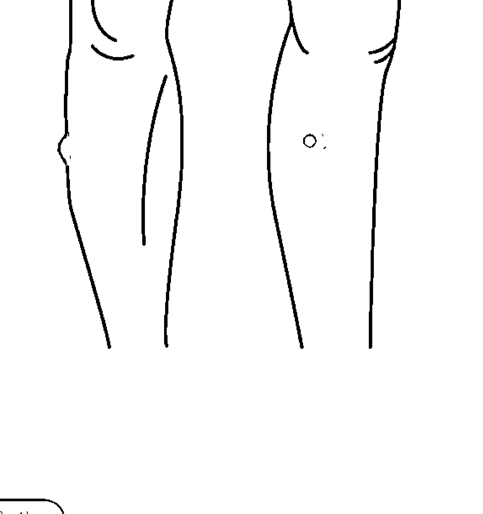

### 我的精油配方

- **塗抹**  
  以 1 滴茶樹精油直接塗在膿腫處，每日 3～5 次，連續 3 日。並輕輕地按摩會痛的膿腫患部。（不用弄破外皮）

#### 完整配方

- **塗抹**
- 調合：
  - 茶樹精油……1 滴
  - 月桂精油……1 滴
  - 真正薰衣草精油……1 滴
  - 聖約翰草浸泡油……3 滴

塗在膿腫處，每日 3～5 次，連續 3 天。

請參考局部。

##### 口服

若長很多膿腫或反覆發作的話，除了上述的塗抹，請加口服超抗菌的精油，以便清血和排毒（通過排毒器官）。請藥師依據下列配方準備 60 顆膠囊：

- 錫蘭肉桂精油……20 mg
- 野馬鬱蘭精油……20 mg
- 檸檬精油……20 mg

早、晚各服 1 顆，持續 3 週。

#### 孕婦專用

#### 完整配方

- **塗抹**
  - 月桂精油……1 滴
  - 茶樹精油……1 滴
  - 60% 酒精……2 滴

每日局部塗抹 4～5 次，直到膿腫完全消失。

---

## 塵蟎

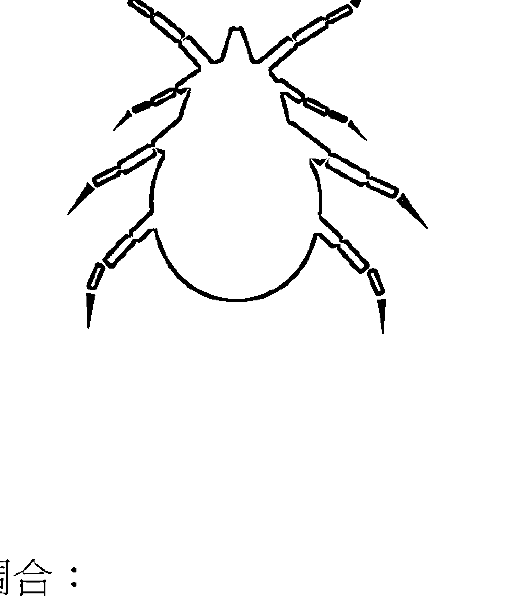

#### 完整配方

#### 噴霧

在 200 ml 噴霧瓶裡調合：

- 歐洲赤松精油……2 ml
- 檸檬精油……2 ml
- 百里酚百里香精油……2 ml
- 真正薰衣草精油……2 ml
- 丁香花苞精油……2 ml
- 爪哇香茅精油……2 ml
- 茶樹精油……2 ml
- 杜松漿果精油……2 ml
- 中國肉桂精油……2 ml
- 歐膠尤加利精油……2 ml
- 70% 酒精……裝滿 200 ml（或 180 ml）

先用吸塵器徹底地打掃一次。接著在每個房間噴 6 次，再將所有的門和窗戶關上一個小時後，再用吸塵器打掃過一次所有的空間。每個月做一次這樣的打掃消毒。

---

## 分娩（準備）

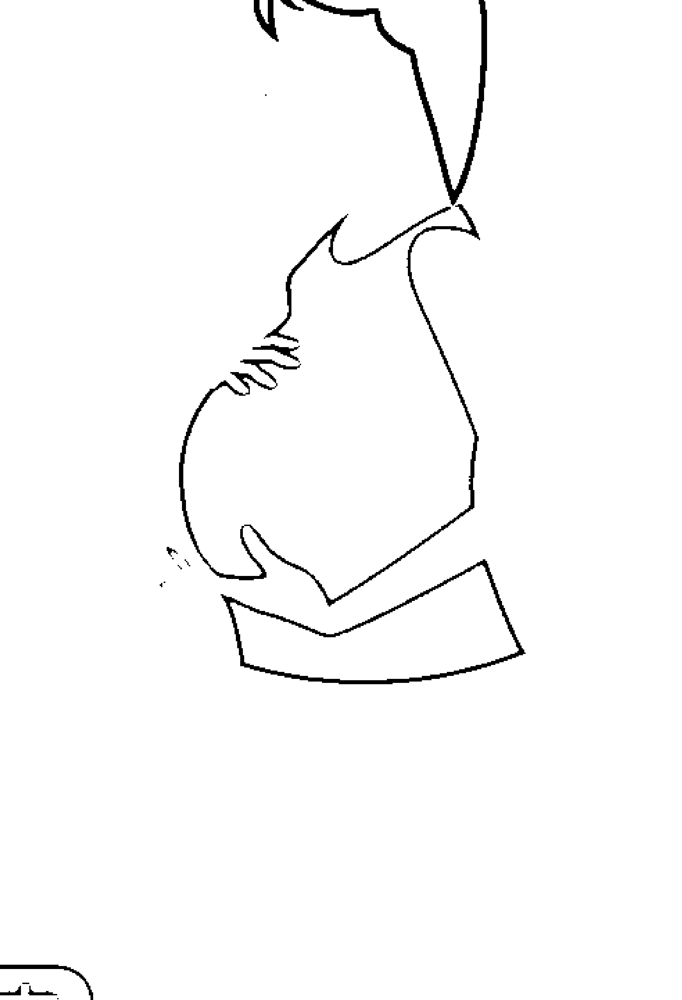

### 我的精油配方

- **口服（分娩前 7 天）**  
  倒 1 滴快樂鼠尾草精油入茶（可能的話用綠茶，並以蜂蜜調和讓精油乳化），若不喜歡茶就加入方糖。一天喝 2 回，或各 2 次將加了快樂鼠尾草精油的方糖放在嘴裡慢慢融化吸收，但只能在分娩前一週服用。懷孕八個月內禁止用這個處方。這個含快樂鼠尾草的茶可以緩解分娩的疼痛，幫助分娩前的羊膜破水。

- **塗抹和吸聞（分娩前 1 天）**  
  用 1 滴羅馬洋甘菊精油，直接塗在手腕內側，或加上 1 滴塗在腹腔神經叢上。或直接打開精油瓶吸聞，每日嗅聞 2～3 次以幫助放鬆。

---

### 放鬆會陰

##### 塗抹

調合：

- 真正薰衣草精油……2 滴
- 依蘭精油……1 滴
- 羅馬洋甘菊精油……1 滴
- 小麥胚芽油……5 滴

輕柔地按摩會陰，每日 2 次。

分娩前 15 天。

---

### 幫助對抗緊張、焦慮

#### 塗抹和吸聞

在 2 ml 瓶裡調合：

- 苦橙葉精油……10 滴
- 羅馬洋甘菊精油……5 滴
- 月桂精油……5 滴
- 榛果油……裝滿 2 ml

分娩前幾天和分娩中，用 3 滴塗抹肚臍神經叢和手腕內側。焦慮時，也可以直接打開瓶子吸聞。

分娩前 10 天。

---

### 促進／加強宮縮（在產房）＋緩解疼痛

##### 塗抹

- 玫瑰草精油……5 滴
- 側柏醇百里香精油……5 滴
- 丁香花苞精油……2 滴
- 榛果油……10 滴

非常輕柔地以「畫圈圈」方式，塗抹下背和肚子，在分娩倒數 2～3 天，每日塗抹 3 次。開始準備分娩時，請伴侶（或助產師）用以上方式每半小時按摩一次，直到分娩。也可以自己極輕柔地塗抹肚子。

分娩前 3 天和分娩當天。

---

##### 吸聞

- 月桂精油
- 快樂鼠尾草精油
- 大馬士革玫瑰精油
- 茉莉精油

取以上任何一種精油數滴，或調合上列精油數滴，塗抹在手腕內側，並靜心、盡可能地大口深深吸聞。

---

### 產後讓會陰緊緻

##### 塗抹

- 岩玫瑰精油……1 滴
- 玫瑰天竺葵精油……1 滴
- 義大利永久花精油……1 滴
- 甜杏仁浸泡油……10 滴

輕柔地按摩會陰，每日 2 次。

---

### 若是產後情緒低落

請藥局客製。

##### 塗抹

請藥師依據下列配方準備按摩油：

- 月桂精油……2 滴
- 橙花精油……2 滴
- 羅馬洋甘菊精油……2 滴
- 甜馬鬱蘭精油……2 滴
- 真正薰衣草精油……2 滴
- 大馬士革玫瑰精油……2 滴
- 玫瑰海棠油……裝滿 5 ml

依上述的方法使用。

> 編註：產後情緒低落屬短暫的狀況，不同於 p145 的產後憂鬱症，那是一種病症。

---

## 痘痘

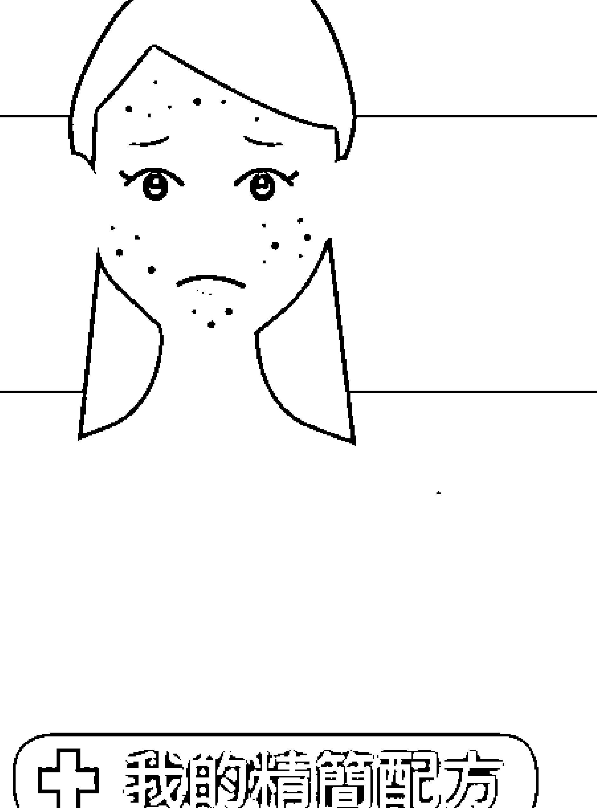

## 我的簡簡單單配方

##### 塗抹

早、晚洗臉後，用 1 滴茶樹精油直接塗抹痘痘處。

---

#### 完整配方

##### 塗抹

在 150 ml 深色瓶裡均等調合：

- 真正薰衣草純露
- 羅馬洋甘菊純露
- 馬鞭草酮迷迭香純露
- 鼠尾草純露

早、晚以中性或弱酸性洗淨後，倒數滴複方純露在化妝棉或無菌紗布上以消毒皮膚。

> ⚠ 請注意，別弄錯：純露比精油溫和許多！

然後：

##### 塗抹

在 10 ml 深色瓶裡調合：

- 茶樹精油……2.5 ml
- 穗花薰衣草精油……2.5 ml
- 丁香花苞精油……2.5 ml
- 月桂精油……2.5 ml

早、晚用以上的複方精油在每顆痘痘上各塗 1 滴。

---

### 蒸臉

在盛熱水的碗裡倒入：

- 廣藿香精油……1 滴
- 檸檬精油……2 滴
- 真正薰衣草精油……2 滴
- 綠花白千層精油……1 滴

臉朝著碗，沐浴在芳香的水蒸氣裡 15 分鐘。早上再以玫瑰純露敷料塗抹臉。

---

### 若臉上和背上有嚴重的痘痘

應該要用以上提過的精簡配方和完整配方，再加下列兩個配方。

#### 請藥局客製

##### 塗抹

請藥師依下列清單製作面膜：

- 茶樹精油……1 ml
- 穗花薰衣草精油……1 ml
- 馬鞭草酮迷迭香精油……1 ml
- 檸檬精油……1 ml
- 摩洛哥堅果油……3 ml
- 綠泥粉……20 g
- 真正薰衣草純露……30 g
- 中性凝膠……裝滿 100 g

完整地塗抹在皮膚上（臉和背），10 分鐘後用敷料或乾淨的海綿以清水洗淨，每週敷 2 次臉。

> 提醒：將面膜放在冰箱裡，可以保存三個月。使用時請用勺子或塑膠抹刀取一部分出來，而不要直接用手指挖取。

---

## 1000 個最強精油配方

##### 口服

請藥師依下列配方準備 60 顆膠囊：

- 圓葉當歸精油……20 mg
- 錫蘭肉桂精油……20 mg
- 檸檬精油……20 mg

早、晚服 1 顆膠囊，持續一個月。這個配方可以促進排毒素（肝）。休息八天後可以再重複這個療程。

#### 完整配方

##### 塗抹

在 5 ml 瓶裡調合：

- 埃及天竺葵精油……10 滴
- 穗花薰衣草精油……10 滴
- 茶樹精油……10 滴
- 玫瑰果油……裝滿 5 ml

以此調合油 1 滴塗抹痘痘處，每日 2 次直到完全改善為止。

#### 我的精簡配方

##### 塗抹

早、晚用 1 滴茶樹精油，一點一點地擦（一顆痘痘一顆痘痘地擦）。

---

## 耳鳴（耳朵裡有嗡嗡聲）

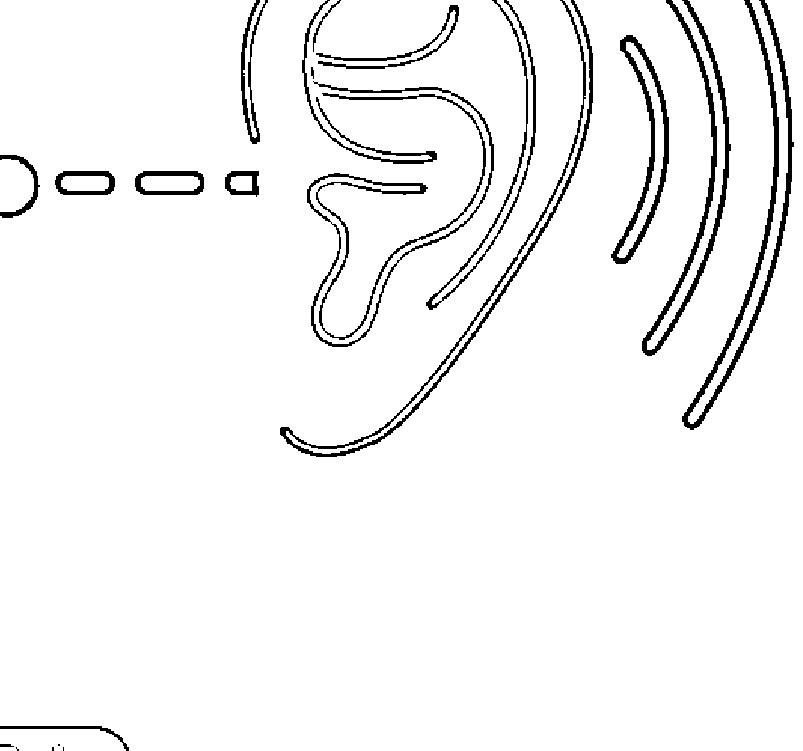

#### 我的精簡配方

- **塗抹**  
  以 2 滴義大利永久花精油按摩耳朵周邊，每日 3 次直到改善為止。

#### 完整配方

- **塗抹**
- 調合：
  - 義大利永久花精油……1 滴
  - 羅文莎葉精油……1 滴
  - 榛果油……2 滴

每日按摩耳朵周邊 3 次，直到改善為止。

---

## 1000 個最強精油配方

### 完整配方（若上列的配方還不夠力）

##### 塗抹

在小茶碟裡調合：

- 義大利永久花精油……1 滴
- 依蘭精油……1 滴
- 冬青白珠／芳香白珠精油……1 滴
- 薰陸香精油……1 滴
- 絲柏精油……1 滴
- 龍艾精油……1 滴
- 甜杏仁油……3 滴

每日按摩耳朵周邊 3 次，直到改善為止。

另外調合：

- 白千層精油……1 滴
- 檸檬精油……1 滴

倒精油在泡過溫水的棉花上，再把棉花放在耳廓上溫敷。等棉花變涼了再拿開。每日可以溫敷 1～2 次。

---

## 請藥局複製（植物療法）

##### 口服

請藥師依下列配方準備：

- 銀杏萃取液……75 ml
- 小蔓長春花萃取液……75 ml

取 1 茶匙稀釋在一杯水裡，每日喝 2 回，持續 10 天或 20 天。在 20 天療程結束後，若症狀沒有緩解再複診。

> 編註：目前冬青白珠（Gaultheria procumbens）數量已少，建議可以使用成分類似的芳香白珠（Gaultheria fragrantissima）。

---

### 母嬰專用

#### 完整配方

##### 塗抹

- 法國羅勒精油……1 滴
- 苦橙葉精油……1 滴
- 聖約翰草浸泡油……5 滴

按摩耳朵周邊（不是裡面），每日 3 次，持續 10～15 天。

---

## 脹氣

#### 我的精簡配方

- **口服**

倒 1 滴薑艾精油在中性錠片上服用，每日 1～3 回，持續 3～4 天。

> 法國羅勒精油又稱歐洲羅勒或甜羅勒。

---

## 1000 個感冒精油配方

#### 完整配方

##### 塗抹

調合：

- 龍艾精油……1 滴
- 小茴香精油……1 滴
- 胡椒薄荷精油……1 滴
- 聖約翰草浸泡油……3 滴

三餐飯後，慢慢地按摩肚子和胃的地方，持續一週。

##### 口服

調合：

- 熱帶羅勒精油……1 滴
- 胡椒薄荷精油……1 滴

用小麵包屑沾這 2 滴精油，三餐飯前服用。

#### 孕婦專用

#### 完整配方

##### 口服

- 苦橙葉精油……1 滴
- 檸檬精油……1 滴
- 橄欖油……2 滴

在午餐和晚餐後，將這 4 滴調合油倒在 1 茶匙蜂蜜裡或中性錠片上，持續口服 4～5 天或更久。

---

#### 小孩專用

#### 我的精簡配方

- **口服和塗抹（3 歲以上）**

用餐前或不舒服時，讓孩子服用 1 茶匙羅勒純露。

> 注意：是純露，不是精油！

不舒服時，用 2 滴薑精油稀釋在 5 滴任何一種植物油裡，按摩胃的位置。

---

## 酊酒

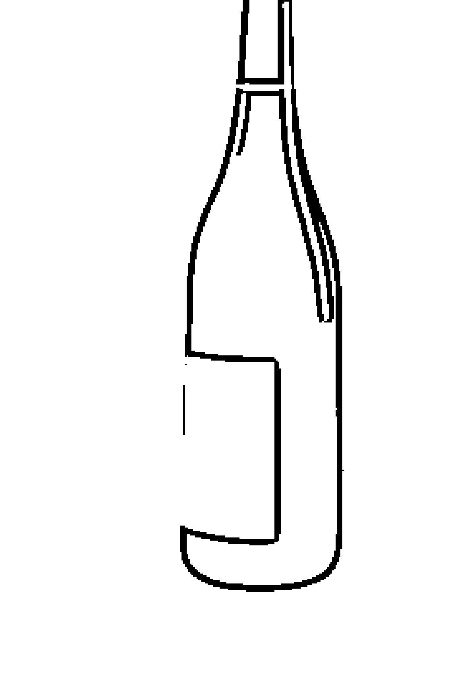

請藥局客製（或者手上有精油的話，可以自己調合）。

### 吸聞和口服

請藥師將下列精油調合入 5 ml 瓶裡：

- 歐白芷根精油……1 ml
- 杜松漿果精油……1 ml
- 八角茴香精油……1 ml
- 月桂精油……1 ml
- 馬鬱蘭酮迷迭香精油……1 ml

倒 2 滴在額頭中間和手腕內側吸聞，若需要可以盡可能地吸聞，白天或晚上都可以（沒有限制）。您會察覺到越來越沒有喝酒的需求，漸漸地就不想喝酒了。

並倒 1 滴這個複方精油在 1 茶匙蜂蜜裡或中性錠片上服用，每日 3～5 回。

---

## 哺乳

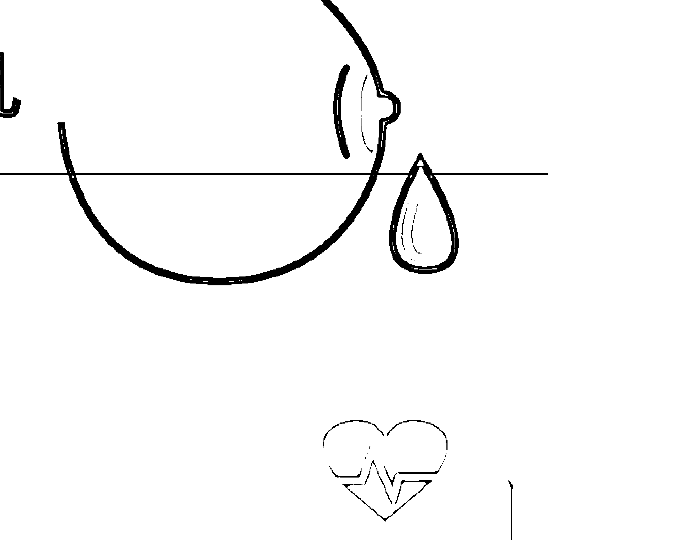

### 奶水不夠

#### 我的精簡配方

**塗抹**

倒 2 滴甜茴香精油在 1/2 顆方糖上，含在（媽媽的！）嘴裡慢慢融化吸收，每日 3 回。

#### 完整配方

- 甜茴香精油……10 滴
- 榛果油……1 茶匙

每日用上列配方按摩胸部 3～4 次。哺乳前要清洗一下乳房。

##### 口服

- 八角茴香精油……1 滴
- 甜茴香精油……1 滴

把精油滴在 1 茶匙蜂蜜裡或中性錠片上，每日 3 回。

---

### 奶水太多

#### 完整配方

**塗抹**

混合：

- 土木香精油……3 滴
- 薰陸香精油……3 滴
- 聖約翰草浸泡油……3 滴

每日塗抹乳房 3 次，哺乳前要清洗一下乳房。

---

### 乳房充血

#### 我的精簡配方

**塗抹**

用洋甘菊或真正薰衣草純露濕敷、輕拍，每日 4～6 次。

#### 完整配方

**預防用的塗抹（生產前一個月）**

調合：

- 羅馬洋甘菊精油……1 滴
- 玫瑰天竺葵精油……1 滴
- 金盞菊浸泡油……2 滴
- 小麥胚芽油……2 滴

---

## 1000 個最強精油配方

### 治療用的塗抹

調合：

- 岩玫瑰精油……1 滴
- 薰陸香精油……1 滴
- 穗花薰衣草精油……1 滴
- 玫瑰天竺葵精油……1 滴
- 聖約翰草浸泡油……5 滴

哺乳後塗抹在乳房上，或用上述配方做敷料塞入胸罩內，每 4 小時重複一次。等到下次哺乳前，用橄欖油或茶花油塗抹乳房，再仔細地擦拭乾淨。

---

### 乳房裂痕

#### 我的精簡配方

**塗抹**

哺乳後用 1 滴穗花薰衣草或真正薰衣草精油輕輕地按摩乳房，可以持續多日。

#### 完整配方

**塗抹**

在 100 ml 深色玻璃瓶裡調合：

- 岩玫瑰精油……10 ml
- 胡蘿蔔籽精油……20 ml
- 真正薰衣草精油……30 ml
- 丁香花苞精油……10 ml
- 小麥胚芽油……15 ml

哺乳後取 1～2 滴調合油輕輕地按摩乳房。若需要可以一直持續下去。小麥胚芽植物油可以幫助癒合，是抗裂痕的好油。此配方的精油對寶寶無害，但最好在哺乳前用甘油酒精擦拭一下乳房。

---

### 停止哺乳

#### 我的精簡配方

- **口服**  
  倒 2 滴胡椒薄荷精油在 1/4 顆蔗糖上，放入嘴裡融化吸收，每日 3～4 回。

- **注意**  
  開始口服胡椒薄荷精油時，您應該已完全停止哺乳了。這支精油口服後會進入母乳，不適合再餵奶給寶寶。

- **塗抹**  
  用 2 滴胡椒薄荷精油輕輕地按摩乳房，每日 4 次，持續 2～3 天。

#### 完整配方

- **塗抹**
  - 胡椒薄荷精油……2 滴
  - 檸檬迷迭香精油……5 滴
  - 土木香精油……1 滴
  - 薰陸香精油……1 滴
  - 聖約翰草浸泡油……1 茶匙

以此調合油輕輕地按摩乳房，每日 4 次。

#### 膠囊處方

- **口服**

請藥師依下列配方準備 30 顆膠囊（若需要則可以準備更多）：

- 玫瑰天竺葵精油……25 mg
- 胡椒薄荷精油……10 mg
- 檸檬薄荷精油……10 mg

每日服用 3 顆，直到回復正常。

---

## 皮膚過敏

#### 我的精簡配方

- **塗抹**

用 2 滴羅馬洋甘菊精油塗抹在過敏處，每日 2～3 次，直到過敏好轉。

#### 完整配方

- **塗抹**
- 調合：
  - 羅馬洋甘菊精油……5 滴
  - 玫瑰天竺葵精油……5 滴
  - 真正薰衣草精油……5 滴
  - 金盞菊浸泡油……10 滴

每日塗抹在過敏患部 2～3 次，直到過敏改善。

體質超級敏感和經常過敏：

#### 請藥局客製

- **口服**

請藥師依下列配方準備 30 顆膠囊：

- 圓葉當歸精油……20 mg
- 胡蘿蔔籽精油……20 mg

- 摩洛哥藍艾菊精油 ........................................ 20 mg  
- 檸檬精油 ........................................ 20 mg  

早、晚服 1 顆，持續 15 天。

提醒：皮膚是一種排泄管道。這個配方有助於消除過敏原和毒素。

##### 塗抹

請藥師依下列配方製作敷粉：

- 甜艾精油 ........................................ 1 g  
- 羅馬洋甘菊精油 ........................................ 1 g  
- 摩洛哥藍艾菊精油 ........................................ 1 g  
- 芳樟精油 ........................................ 1 g  
- 威尼斯石粉 ........................................ 100 g  

每天在過敏處部擦 3～4 次，持續 3～4 天。

## 呼吸道過敏（塵蟎、花粉症、蟑螂、灰塵、鼻腔發炎等）

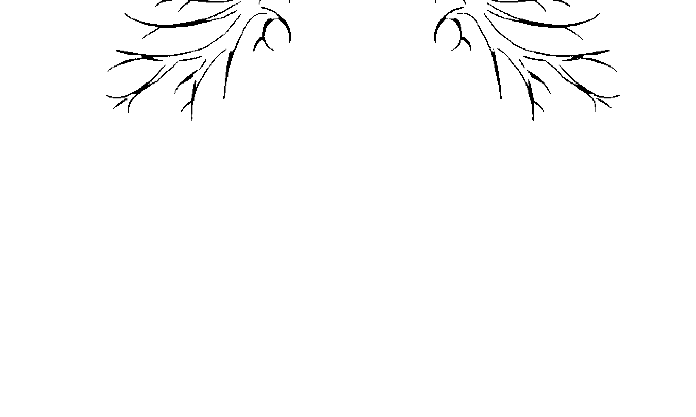

總註：芳樟，拉丁學名 Cinnamomum camphora；英文是 Ho Wood。

#### 我的精簡配方

- 口服  
  倒 2 滴龍艾精油在中性錠片上服用，每日 2～3 回。

提醒：請循「精簡」配方針對預防特別有效。若已經不舒服了，效果會比較不明顯，但還是會有感覺的。

#### 完整配方

- 塗抹  
  調合：  
  - 龍艾精油 …… 5 滴  
  - 綠花白千層精油 …… 5 滴  
  - 羅馬洋甘菊精油 …… 2 滴  
  - 瓊崖海棠油 …… 1 湯匙  

以此調合油塗抹鼻翼、胸腔和上背，每日 2～3 次，持續 3～6 天。輕輕地按摩所有堵塞的部位，但盡可能避免塗抹眼睛周圍。

- 擴香  
  在擴香儀裡均等倒入：  
  - 綠花白千層精油  
  - 澳洲尤加利精油  
  - 檸檬精油  

過敏時可以在生活空間（家裡、辦公室）擴香，每次 20 分鐘，每日 3 次。

## 請藥局／香藥

#### 鼻腔滴液

在 30 ml 圓鼻滴管瓶裡調合：

- 綠花白千層精油 ........................................ 20 滴  
- 龍艾精油 ................................................ 20 滴  
- 羅馬洋甘菊精油 .......................................... 10 滴  
- 甜杏仁油 ................................................ 裝滿 30 ml  

各倒 1 滴入鼻孔裡，每日 4 次，持續 5 天或更久。

##### 口服

請藥師依下列配方製作 30 顆膠囊（或更多）：

- 龍艾精油 ................................................ 25 mg  
- 羅馬洋甘菊精油 .......................................... 25 mg  
- 玫瑰天竺葵精油 .......................................... 25 mg  
- 真正薰衣草精油 .......................................... 25 mg  

若快過敏了，可以先每日服用 1 顆。若已經過敏的話，每日服用 3 顆，持續 2～3 週。這個配方可以改善敏感體質和長期的舒緩過敏狀況，效果廣受好評。

## 閉經（沒有月經）

### 我的精油配方

##### 塗抹

以 2 滴快樂鼠尾草精油稀釋在數滴榛果油裡，按摩下腹部，每日 2 次，持續 3 週。停 8 天後再重複療程，每日 2 次，每個月按摩 15 天，直到恢復月經。

##### 口服

加 1 滴快樂鼠尾草精油在中性錠片上或 1 茶匙的蜂蜜裡，放入嘴裡慢慢融化吸收，每日口服 3 回，持續 3 週。停 8 天後再重複療程，每日 2 回，每個月服用 15 天，直到月經來。

### 催經配方

##### 塗抹

調合：

- 快樂鼠尾草精油 …… 3 滴  
- 洋茴香精油 …… 2 滴  
- 月見草油 …… 5 滴  

以此調合油按摩下腹部。每日 2 次，持續 3 週。停 8 天後再重複療程，每日 2 次，每個月按摩 15 天，直到來經。

## 起水泡

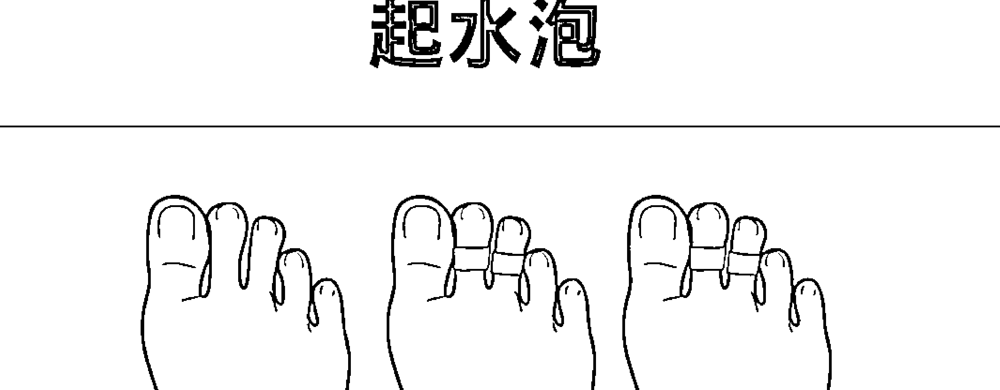

#### 我的精簡配方

用乾淨的針刺穿水泡後塗 1 滴真正薰衣草精油。輕輕按壓兩側以將裡面的液體排出。再塗 1 滴真正薰衣草精油，2 個小時內每半小時塗一次。

#### 完整配方

##### 塗抹

在 5 ml 瓶裡調合：

- 真正薰衣草精油 …… 1 ml  
- 茶樹精油 …… 1 ml  
- 玫瑰天竺葵精油 …… 1 ml  
- 甜杏仁油 …… 2 ml  

以此調合油 1 滴塗抹在已被擠出水泡的患部，再貼透氣敷料，每日 3 次，持續 2～3 天。後續如上，但傷口不要覆蓋（不貼敷料），直到復原為止。

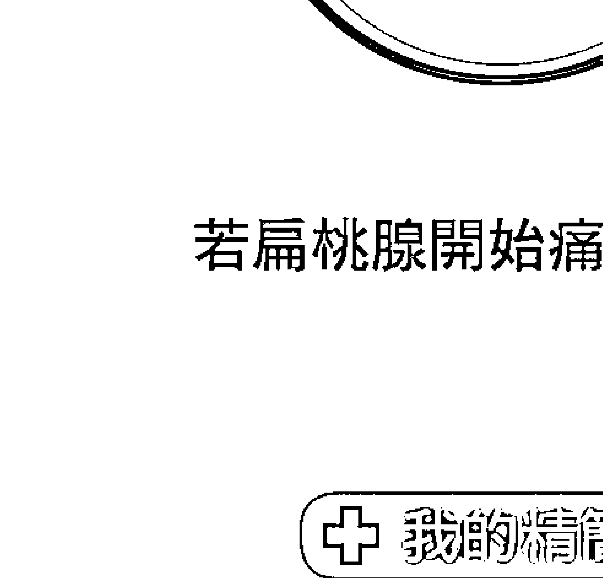

## 扁桃腺炎

若扁桃腺開始痛，可用口服和局部塗抹處理。

#### 我的精簡配方

- 口服  

倒 1 滴側柏醇百里香精油在 1/2 顆糖上、1/2 茶匙蜂蜜裡或中性錠片上，再放入嘴裡融化吸收，每日服用 4～6 回。外加 2 滴精油直接塗脖子和疼痛處。

## 1000 個感冒精油配方

若已經發炎，可以併用口服、局部塗抹和以直腸黏膜吸收的栓劑。

#### 完整配方

- 口服  
  在 5 ml 深色滴管瓶裡調合：  
  - 側柏醇百里香精油 …… 5 滴  
  - 綠花白千層精油 …… 5 滴  
  - 胡椒薄荷精油 …… 2 滴  
  - 冬季香薄荷精油 …… 2 滴  

倒 1 滴上列的複方精油在 1/2 顆糖上、1/2 茶匙蜂蜜裡或中性錠片上，再放入口腔裡融化吸收，每日服用 4～5 回。

**漱口**  
取 2 滴複方精油稀釋在一杯水裡，再加 10 滴乳化劑，攪拌均勻後漱口（在喉嚨裡發出「咕嚕咕嚕」聲），每日 3～4 次。漱口完不要吞下去，要吐出來。

- 塗抹  
  調合：  
  - 側柏醇百里香精油 …… 1 滴  
  - 茶樹精油 …… 1 滴  
  - 芳樟精油 …… 1 滴  
  - 甜杏仁油 …… 1/4 茶匙  

按摩脖子時特別加強扁桃腺部位，每日按摩 3～4 次。

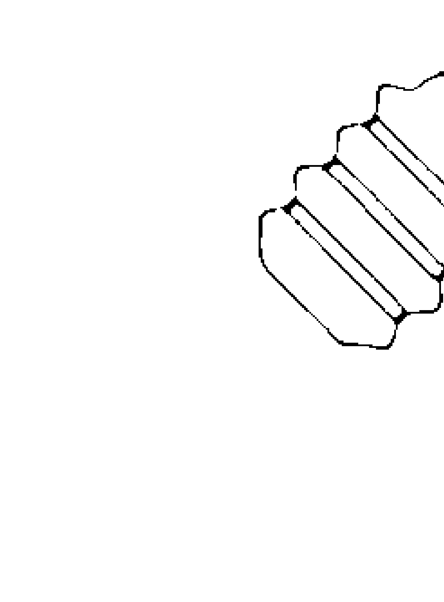

### 使呼吸道暢通的蜂蜜

在 1 茶匙百里香蜂蜜裡，加 1 滴澳洲尤加利精油，含入嘴裡融化吸收。或稀釋在蝶豆花茶、迷迭香茶或乾燥花茶裡。

## 請藥局後製

##### 口服

請藥師依下列配方製作 30 顆膠囊：

- 馬鬱蘭精油 20 mg  
- 茶樹精油 20 mg  
- 側柏醇百里香精油 20 mg  
- 丁香花苞精油 20 mg  

照三餐服用，每次 2 顆，持續 3 天後改成每餐服用 1 顆，再持續 3 天。

##### 栓劑

請藥師依下列配方製作 12 顆栓劑：

- 桉油醇樟精油 70 mg  
- 側柏醇百里香精油 50 mg  
- 茶樹精油 30 mg  
- 聖約翰草浸泡油 20 mg  

每日施用 3 顆，連續 2 天後減為每日 2 顆，再持續 3 天。

#### 孕婦專用

### 我的精簡配方（懷孕滿 3 個月後）

##### 口服

倒 1 滴側柏醇百里香精油在小茶匙蜂蜜裡，再放入嘴裡融化吸收，每日服用 4 回，持續 3 天。

#### 完整配方

- 塗抹  
  - 側柏醇百里香精油 …… 1 滴  
  - 桉油醇檸檬精油 …… 1 滴  
  - 瓊崖海棠油 …… 2 滴  

塗抹在痠、有疼痛的部位，每日 4 次，持續 3 天。

- 漱口  
  - 側柏醇百里香精油 …… 2 滴  
  - 月桂精油 …… 1 滴  
  - 乳化劑 …… 10 滴  
  - 溫開水 …… 半杯  

在嘴裡咕嚕咕嚕地漱口，讓漱口水確實地在嘴裡流動，尤其要到喉嚨的底部，漱口後要將水吐出，不要吞進去。每日 4 次，持續 2～3 天。

#### 小孩專用

#### 我的精簡配方

**口服（適用 6 歲以上的小孩）**  
倒 1 滴側柏醇百里香精油在方糖上，讓小孩吸吮，每日 2～3 回。

#### 完整配方

- 塗抹在皮膚上  
  調合：  
  - 側柏醇百里香精油 …… 1 滴  
  - 芳樟精油 …… 1 滴  
  - 甜杏仁油 …… 3 滴  

當扁桃腺腫脹和疼痛時，可以此調合油塗抹脖子，每日視情況塗抹 3～4 次。

### 漱口（適用 5 歲以上的小孩）

以茶匙均等調合以下純露入杯子裡：

- 月桂純露  
- 玫瑰純露  
- 真正薰衣草純露  

讓孩子以此複方純露（不要加水）漱口（若孩子覺得好玩的話，請他們用力在喉嚨裡發出「咕嚕咕嚕」聲），每日 4～5 次。

注意：這裡是用純露，不是精油！

### 塗抹在皮膚上

在 10 ml 瓶裡調合：

- 側柏醇百里香精油 ............ 1 ml  
- 茶樹精油 ............ 1 ml  
- 芳樟精油 ............ 1 ml  
- 甜杏仁油 ............ 7 ml  

嬰兒：取 3 滴塗抹於扁桃腺部位，每日 2～3 次。  
小孩：取 5 滴塗抹於扁桃腺部位，每日 4 次。

### 以直腸黏膜吸收的栓劑（治療扁桃腺的結痂栓劑）

12 顆栓劑的劑量：

| 成分 | 嬰兒 | 小孩 |
|---|---|---|
| 側柏醇百里香精油 | 15 mg | 20 mg |
| 茶樹精油 | 15 mg | 20 mg |
| 丁香花苞精油 | 5 mg | 10 mg |
| 金盞菊浸泡油 | 10 mg | 10 mg |
| 栓劑的賦形劑 | 1 g | 1 g |

第一天的早、午、晚各用 1 顆，第二天則早、晚各用 1 顆，持續 4～6 天。

## 血管瘤

#### 我的精簡配方

塗抹在皮膚上。  
早、晚梳洗後，以 1 滴義大利永久花精油塗在血管瘤處。  
若 10 天後沒有任何改善就停用，因血管瘤已積累成形了。

## 焦慮不安

#### 我的精簡配方

吸聞  
直接打開羅馬洋甘菊的精油瓶來吸聞，平靜而深深地吸聞 2～3 秒以解除焦慮不安的情緒。

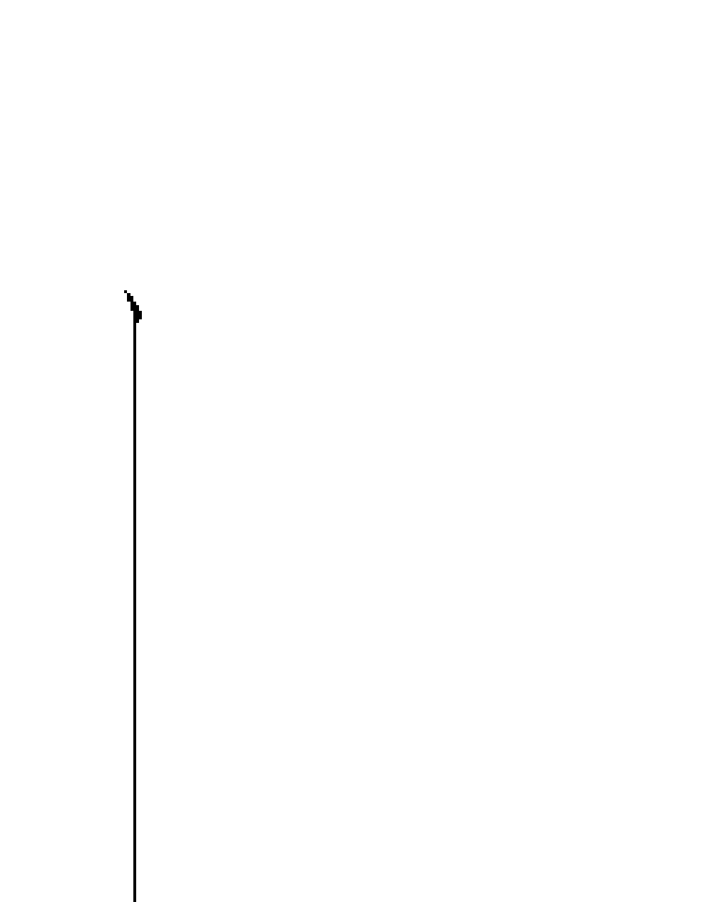

#### 完整配方

- 擴香  
  在擴香儀裡倒入：  
  - 芳樟精油 …… 5 滴  
  - 依蘭精油 …… 5 滴  
  - 乳香精油 …… 5 滴  
  - 沒藥精油 …… 5 滴  

擴香 20 分鐘，若需要可每日擴香到 3 次。

- 塗抹  
  調合：  
  - 依蘭醇檸檬精油 …… 1 滴  
  - 依蘭精油 …… 1 滴  
  - 芳樟精油 …… 1 滴  
  - 熱帶羅勒精油 …… 1 滴  
  - 橙花精油 …… 1 滴  
  - 瓊崖海棠油 …… 5 滴  

深深吸聞後，輕輕按摩足弓、腹腔神經叢、手腕內側、太陽穴和脊椎。

## 請藥局客製（經常焦慮的狀況）

- 口服  

請藥師依下列配方製作 30 顆膠囊（或更多）：

- 依蘭精油 …… 10 mg  
- 檸檬馬鞭草精油 …… 10 mg  
- 紅桔精油 …… 20 mg  
- 依蘭醇檸檬精油 …… 20 mg  
- 歐白芷根精油 …… 20 mg  

每日服用 3 回，連續 10 天。若需要繼續的話，停 8 天後可以重複療程。

#### 孕婦專用

#### 我的精簡配方

白天吸聞  
感覺焦慮「上來」時，可直接打開羅馬洋甘菊的精油瓶來吸聞。

#### 完整配方

- 白天塗抹  
  - 苦橙葉精油 …… 1 滴  
  - 依蘭精油 …… 1 滴  

當需要時，以這 2 滴純精油（不稀釋）塗在腹腔神經叢及手腕內側。

- 晚上塗抹  
  - 羅馬洋甘菊精油 …… 1 ml  
  - 苦橙葉精油 …… 1 ml  
  - 依蘭精油 …… 1 ml  
  - 瓊崖海棠油 …… 2 ml  

需要有好心的夥伴協助，充分地按摩後背，包含脊椎兩側。

- 擴香（在家裡、辦公室、車上等空間）  
  - 真正薰衣草精油  
  - 甜馬鬱蘭精油  

早、晚各擴香 10 分鐘，或緊急狀況下可每小時擴香 10 分鐘。

### 芳香浴

調合：

- 羅馬洋甘菊精油 …… 5 滴  
- 真正薰衣草精油 …… 5 滴  
- 甜馬鬱蘭精油 …… 5 滴  
- 泡澡的基質 …… 1 湯匙  

將上列材料倒入已放好溫水的浴缸。晚上泡澡 15～20 分鐘後不需再沖水，擦乾身體後穿上浴袍就上床睡覺。

#### 小孩專用

#### 我的精簡配方

吸聞  
用 2 滴羅馬洋甘菊精油塗在小孩的手腕內側，並請他深深吸聞數次。

#### 完整配方

##### 吸聞

在 5 ml 滾珠瓶調合：

- 羅馬洋甘菊精油 …… 0.5 ml  
- 紅桔精油 …… 0.5 ml  
- 芳樟精油 …… 1 ml  
- 真正薰衣草精油 …… 3 ml  

充分搖勻後打開瓶子讓小孩吸聞，深深地、盡量心平氣和地嗅聞 3～4 次。若需要可每 10 分鐘重複吸聞，直到情緒完全緩和下來。

### 塗抹在皮膚

在 10 ml 瓶裡調合：

- 羅馬洋甘菊精油 2 ml  
- 芳樟精油 2 ml  
- 龍艾精油 0.5 ml  
- 橙花精油 0.5 ml  
- 甜杏仁油 5 ml  

取數滴調合油，沿著脊椎按摩及脖子、胸腔、肚子、足弓。若需要可以每小時按摩一次直到恢復平靜。

2 滴甜馬鬱蘭精油塗腹腔神經叢。若需要，可每半小時塗抹一次，重複 3～5 次。

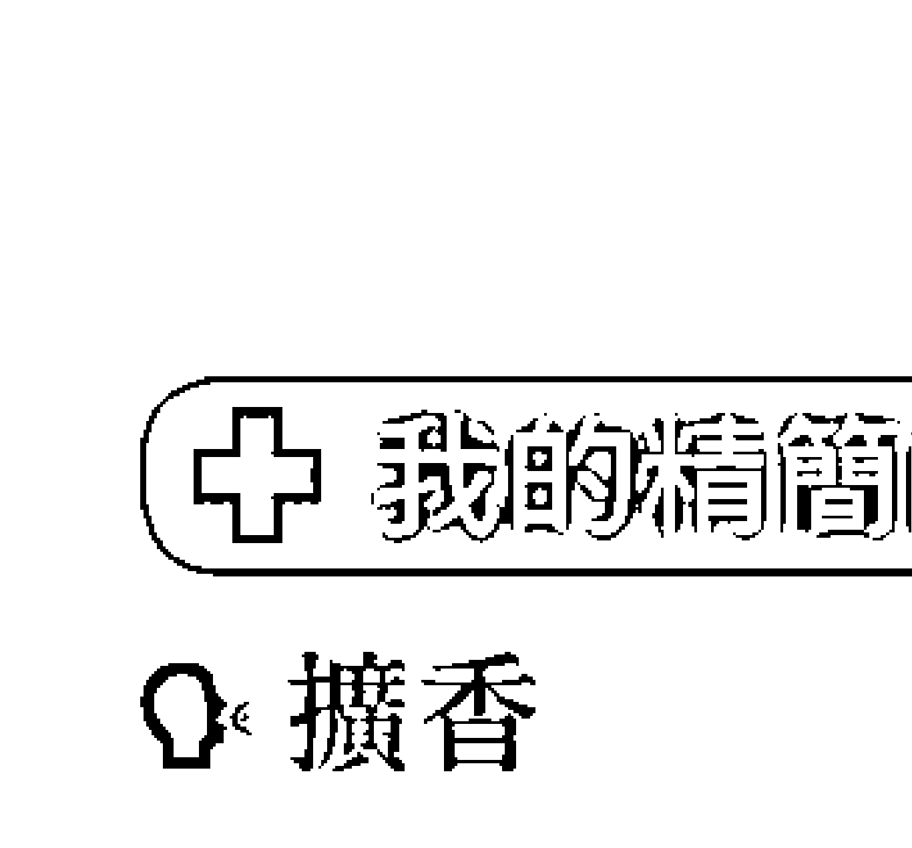

## 驅蚊

#### 我的精簡配方

- **擴香**：以爪哇香茅精油做環境擴香。  
- **塗抹**：以數滴檸檬尤加利精油塗抹在皮膚上。  
- **噴霧**：噴爪哇香茅精油在桌巾及衣服上——避免碰到眼睛和嘴唇。

#### 完整配方

##### 擴香

在 30 ml 瓶裡均等調合：

- 爪哇香茅精油  
- 錫蘭肉桂精油  
- 檸檬尤加利精油  
- 玫瑰天竺葵精油  
- 丁香花苞精油  
- 胡椒薄荷精油  

傍晚時，倒 10 滴複方精油在擴香儀裡蒸香直到精油用盡。晚上睡前放數滴在枕頭上。

##### 塗抹

調合：

- 爪哇香茅精油 ........................................ 1 滴  
- 檸檬尤加利精油 ........................................ 1 滴  
- 玫瑰天竺葵精油 ........................................ 1 滴  
- 樟腦迷迭香精油 ........................................ 1 滴  
- 瓊崖海棠油 .............................................. 3 滴  

塗抹在身體暴露在外的部分，每 2 小時補擦一次（若天氣很熱一直流汗，可以更頻繁地塗抹）。

## 動物驅蚤

#### 完整配方

#### 塗抹（預防用）

在 30 ml 噴瓶裡調合：

- 超級醒目薰衣草精油 …… 10 滴  
- 玫瑰天竺葵精油 …… 10 滴  
- 茶樹精油 …… 20 滴  
- 大西洋雪松精油 …… 10 滴  
- 酒精 …… 裝滿 30 ml  

早、晚均勻噴灑在毛髮及項圈上，每週 2 次。

注意：不要噴到動物的眼睛。

## 焦慮

#### 我的精簡配方

口服及吸聞  
點 1 滴羅馬洋甘菊精油在 1 茶匙蜂蜜裡或中性錠片上，並嗅聞打開的精油瓶。

#### 完整配方

#### 塗抹和口服

調合：

- 羅馬洋甘菊精油 …… 1 滴  
- 甜馬鬱蘭精油 …… 1 滴  
- 橙花精油 …… 1 滴  
- 依蘭精油 …… 1 滴  

以此複方精油塗在足弓、手腕內側，以及滴 1 滴複方精油在 1 茶匙蜂蜜裡或吐在舌片上。每日 3 次。

#### 小孩專用

#### 我的精簡配方

塗抹  
點 2 滴甜馬鬱蘭精油在小孩的手腕內側，並請他深深吸聞。每日 2～4 次。

#### 完整配方

##### 泡澡

在浴缸或茶碗中倒入：

- 真正薰衣草精油 …… 5 滴  
- 紅桔精油 …… 5 滴  
- 泡澡的基質 …… 1 湯匙  

晚餐前或睡前，將上列材料倒入泡澡水裡，再讓小孩進入浴缸泡澡 20 分鐘。並配合一些特別令人平靜的背景音樂，例如：蕭邦、莫札特或在大自然裡錄製的聲音（鳥鳴、海聲等）。擦乾身體前不需再沖洗。

- 口服  
  - 薰衣草或洋甘菊純露  
    每次讓小孩喝 1 茶匙，也可以稀釋在菩提花茶裡。每日 2～3 次。  

⚠ 注意：是純露，不是精油！

- 擴香  
  - 真正薰衣草精油  
  - 甜橙精油  

各倒 20 滴入乾淨的擴香儀裡。在孩子活動的空間擴香，每次擴香 15 分鐘。每日 2～3 次。

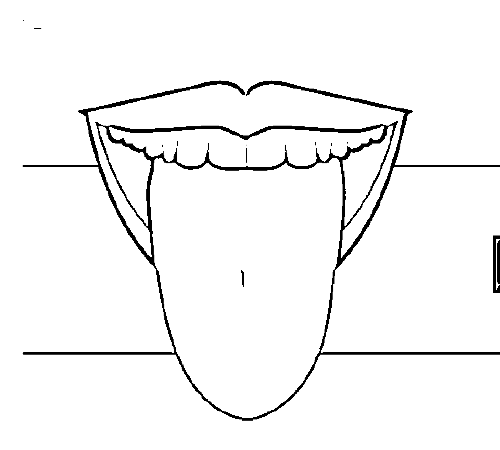

## 口腔潰瘍

#### 我的簡單配方

- 塗抹  
  直接點 1 滴月桂精油在潰瘍處部，若需要則每日點 2～3 次。

#### 完整配方

##### 塗抹

調合：

- 丁香花苞精油 …… 1 滴  
- 月桂精油 …… 1 滴  
- 白千層精油 …… 1 滴  
- 金盞菊浸泡油 …… 3 滴  

每日塗抹潰瘍患部 3～4 次，持續 3～5 天。

### 漱口水

調合：

- 月桂精油 …… 1 滴  
- 丁香花苞精油 …… 1 滴  
- 穗花薰衣草精油 …… 1 滴  
- 乳化劑 …… 10 滴  

漱口前將這些原料倒入半杯熱水裡，每日漱口 2～3 次，連續 3 天。

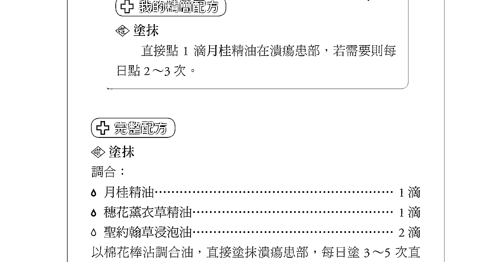

#### 我的精簡配方

##### 塗抹

直接點 1 滴月桂精油在潰瘍患部，若需要則每日點 2～3 次。

#### 完整配方

##### 塗抹

調合：

- 月桂精油 …… 1 滴  
- 穗花薰衣草精油 …… 1 滴  
- 金盞菊浸泡油 …… 2 滴  

以棉花棒沾調合油，直接塗抹潰瘍患部，每日塗 3～5 次直到痊癒或持續 3～4 天。

#### 小孩專用

#### 我的精簡配方

- 塗抹在黏膜處  
  以 1 滴茶樹精油稀釋在橄欖油裡，直接用（乾淨！）的手指塗抹潰瘍處；每日塗抹 3～5 次。

#### 完整配方

鵝口瘡（在嘴裡有幾處潰瘍）

- 塗抹在黏膜處  
  在 10 ml 瓶裡調合：
- 茶樹精油 …… 2 ml  
- 白千層精油 …… 2 ml  
- 聖約翰草浸泡油 …… 6 ml  

取 1～2 滴調合油塗抹在每個潰瘍處，每日塗 4～6 次，直到明顯改善為止。

- 漱口水（適合 5 歲以上的小孩）
- 羅馬洋甘菊純露  
- 月桂純露  
- 丁香花苞純露  

讓孩子用 1 湯匙的複方純露漱口，請他好好地讓漱口水在嘴裡流動，以確保純露可以浸泡到所有的口腔黏膜，10～20 秒後吐出純露。請孩子每日這樣漱口 3～5 次。

> 注意：是純露，不是精油！

---

## 食慾不振

#### 我的精簡配方

- 口服  
  用 1 滴薑精油在 1 茶匙蜂蜜裡或中性錠片上，每日 3 次，持續 20 天。

#### 完整配方

- 口服

調合：  
- 薑精油 …… 1 滴  
- 胡椒薄荷精油 …… 1 滴  

放這 2 滴精油在 1 茶匙蜂蜜裡或中性錠片上，飯前半小時服用，連續 20 天。

#### 小孩專用

#### 完整配方

- 口服

調合：  
- 甜茴香精油 …… 1 滴  
- 薑精油 …… 5 滴  

取此複方精油 1 滴加入 1 茶匙蜂蜜裡，兩頓主餐的飯前 10 分鐘服用，連續 10 天。

---

### 若噁心想吐

調合：  
- 薑精油 …… 1 滴  
- 檸檬精油 …… 1 滴  

加這 2 滴精油入半茶匙蜂蜜裡，每日服用 2～3 回。

- 塗抹  
  在 10 ml 瓶裡調合：
- 羅馬洋甘菊精油 …… 2 ml  
- 芳樟精油 …… 2 ml  
- 甜杏仁油 …… 6 ml  

取 3～5 滴調合油輕輕按摩腹腔神經叢、肚子，每日按摩 3 次，連續 3 週。

或

若有肝臟充血、口臭：

- 口服  
  在 200 ml 瓶裡均等調合：
- 野生胡蘿蔔籽純露  
- 馬鞭草酮迷迭香純露  
- 錫蘭肉桂純露  

兩頓主餐（通常是午餐和晚餐）前服用 1 茶匙的複方純露，連續 3 週。

⚠ 注意：是純露，不是精油！

- 在 5 ml 瓶裡調合：
- 檸檬精油 …… 2 ml  
- 檬果油 …… 3 ml  

加 1 滴入 1 茶匙蜂蜜裡讓孩子每日服用 2 回，連續 10 天。  
您也可以將這些蜂蜜加入天然的花草茶（迷迭香、香蜂草、薄荷……）裡。

---

## 關節炎和骨關節炎

#### 我的簡單配方

- 塗抹

以數滴冬青白珠／芳香白珠精油稀釋在等量的山金車浸泡油裡，再塗抹膝蓋、手肘或其他發炎的部位，每日塗抹 3～5 次直到改善為止。

#### 完整配方

- 塗抹（在 10 ml 瓶裡調合）：
- 冬青白珠／芳香白珠精油 —— 1 ml  
- 檸檬尤加利精油 —— 1 ml  
- 義大利永久花精油 —— 1 ml  
- 月桂精油 —— 1 ml  
- 胡椒薄荷精油 —— 1 ml  
- 聖約翰草浸泡油 —— 5 ml  

按摩疼痛的部位 1 分鐘。每日施用 3 次，直到明顯改善為止。

- 泡澡（調合）：
- 冬青白珠／芳香白珠精油 —— 5 滴  
- 杜松漿果精油 —— 5 滴  
- 超級醒目薰衣草精油 —— 5 滴  
- 海松精油 —— 5 滴  

🛁 泡澡的基質 …… 1 湯匙  

將以上材料倒入 38.5°C 熱水裡泡澡 20 分鐘。每日泡澡直到改善為止。

#### 請藥局客製

- 口服
- 熱帶羅勒精油 …… 20 mg  
- 胡椒薄荷精油 …… 20 mg  
- 檸檬尤加利精油 …… 20 mg  
- 杜松漿果精油 …… 20 mg  

用餐時一起服用，甚至可以加入一些橄欖油以保護消化道黏膜，每日 2 顆連續 20 天。若需要再繼續的話，停 7 天後再重複療程。

---

## 過敏性氣喘

#### 我的精簡配方

- 口服  
  點 1 滴龍艾精油在 1/2 方糖上，再放入嘴裡融化吸收，每 15 分鐘口服一次，直到有明顯的改善。

- 塗抹  
  取 2 滴龍艾精油，輕輕按摩腹腔神經叢及喉嚨。

- 提醒：氣喘發作時，請避免吸聞精油。

### 請藥房配製

##### 塗抹

請藥師依下列配方調一瓶 10 ml 的按摩油（若您手上有這些精油的話，可以自己準備）：

- 龍艾精油 …… 1 ml  
- 羅馬洋甘菊精油 …… 1 ml  
- 摩洛哥藍艾菊精油 …… 1 ml  
- 阿密茴精油 …… 1 ml  
- 玫瑰海棠油 …… 6 ml  

以 5 滴調合油塗抹腹腔神經叢、上背和脊椎。每 15 分鐘塗一次直到好轉。

##### 栓劑

請藥師依下列配方製作 6 顆（或更多）栓劑：

- 阿密茴精油 …… 20 mg  
- 依蘭精油 …… 20 mg  
- 龍艾精油 …… 50 mg  
- 摩洛哥藍艾菊精油 …… 20 mg  
- 格陵蘭喇叭茶精油 …… 20 mg  
- 雪松鴨嘴草浸泡油 …… 20 mg  

預防用：晚上施用 1 顆。  
發作時：當天施用 2～3 顆。

### 定期深入治療

- 口服

請藥師依下列配方製作 30 顆膠囊：

- 圓葉當歸精油 …… 30 mg  
- 檸檬精油 …… 30 mg  

早、晚各服 1 顆以強化肝臟功能，每個月服用 10 天。

---

#### 小孩專用

#### 我的精簡配方

- 擴香

當小孩不在時，請用檸檬精油擴香以淨化空氣。早、晚以乾式擴香儀加入 20 滴左右的精油擴香半小時，特別在氣喘發作的高峰期間。

> 請避免在有過敏小孩的環境擴香和讓他們吸入這些薰香。

#### 完整配方

- 塗抹  
  在 10 ml 瓶裡調合：
- 甜馬鬱蘭精油 —— 1 ml  
- 阿密茴精油 —— 0.5 ml  
- 羅馬洋甘菊精油 —— 0.5 ml  
- 西部黃松精油 —— 0.5 ml  
- 龍艾精油 —— 1 ml  
- 甜杏仁油 —— 6.5 ml  

預防用（在支氣管炎、感冒、花粉症期間）：用 3 滴調合油塗抹腹腔神經叢和足弓，每日一次，例如可以在睡前時塗抹。

發作時：如上用法，但每半小時塗抹一次，連續 3 次。

#### 請藥局客製

**栓劑**

| 成分 | 嬰兒 | 小孩 |
|---|---|---|
| 阿密茴精油 | 5 mg | 10 mg |
| 龍艾精油 | 10 mg | 15 mg |
| 羅馬洋甘菊精油 | 20 mg | 25 mg |
| 西第薰衣草精油 | 10 mg | 15 mg |
| 金盞菊浸泡油 | 10 mg | 10 mg |
| 栓劑的賦形劑 | 1 g | 1 g |

預防用：在「有風險」可能發作期間，晚上睡前用 1 顆，持續數日。  
發作時：第一天用 3 顆（盡量以早、午、晚的間距各 1 顆），接著第二天早、晚各 1 顆，持續 2～3 天。

---

## 神經性氣喘

#### 我的精簡配方

- 塗抹  
  以 1 滴羅馬洋甘菊精油塗抹腹腔神經叢，並放 1 滴在 1 茶匙蜂蜜裡或中性錠片上。發作時每 15 分鐘塗抹一次。

### 請藥局調製

- 塗抹  
  請藥師依下列配方調製一瓶按摩油（若您有這些精油的話，可以自己準備）：
- 真正薰衣草精油 …… 1 ml  
- 高地牛膝草精油 …… 1 ml  
- 紅香桃木精油 …… 1 ml  
- 紅檜精油 …… 1 ml  
- 瓊崖海棠油 …… 裝滿 30 ml  

預防氣喘發病的話，每日按摩 2 次後背、胸腔、脊椎。發作時每半小時按摩一次，直到完全改善為止。

### 栓劑（建議的方式）

請藥師依下列配方製作 6 顆（或更多）栓劑：

- 羅馬洋甘菊精油 …… 20 mg  
- 真正薰衣草精油 …… 20 mg  
- 甜馬鬱蘭精油 …… 50 mg  
- 歐洲赤松精油 …… 20 mg  
- 阿密茴精油 …… 15 mg  
- 聖約翰草浸泡油 …… 20 mg  

預防用：晚上施用 1 顆。  
發作時：每日施用 2～3 顆。

或您較喜歡膠囊的話：

##### 口服

請藥師依下列配方製作 30 顆（或更多）膠囊：

- 羅馬洋甘菊精油 …… 10 mg  
- 真正薰衣草精油 …… 10 mg  
- 甜馬鬱蘭精油 …… 10 mg  
- 歐洲赤松精油 …… 20 mg  
- 阿密茴精油 …… 10 mg  

預防用：一天 2 顆，每個月服用 10 天。  
發作時：一次 2 顆，每日服用 3 回，持續 3～4 天。

---

#### 孕婦專用

#### 完整配方

- 塗抹

調合：  
- 法國羅勒精油 …… 1 滴  
- 羅馬洋甘菊精油 …… 1 滴  
- 真正薰衣草精油 …… 1 滴  
- 歐洲赤松精油 …… 1 滴  
- 檸果油 …… 5 滴  

以此調合油按摩腹腔神經叢和上背。發作時請每小時按摩 1 次。

- 口服（若情況嚴重，懷孕滿 3 個月後）
- 法國羅勒精油 …… 1 滴  

加在中性錠片上或橄欖油裡，再放入口腔裡融化吸收，每隔 15 分鐘服用 1 回，一天服用 2～3 回。

---

#### 小孩專用

#### 完整配方

##### 塗抹

在 10 ml 瓶裡調合：

- 甜馬鬱蘭精油 …… 1 ml  
- 依蘭精油 …… 0.5 ml  
- 阿密茴精油 …… 0.5 ml  
- 摩洛哥藍艾菊精油 …… 0.5 ml  
- 甜杏仁油 …… 7.5 ml  

預防用（在疲勞或壓力很大期間）：取 3 滴調合油塗抹腹腔神經叢，每日睡前塗抹一次。

發作時：如上用法，但每半小時塗抹 1 次，連續 3 次。

#### 請藥局製劑

| 成分 | 嬰兒 | 小孩 |
|---|---|---|
| 阿密茴精油 | 5 mg | 10 mg |
| 西部黃松精油 | 10 mg | 15 mg |
| 羅馬洋甘菊精油 | 10 mg | 15 mg |
| 紅桔精油 | 20 mg | 30 mg |
| 金盞菊浸泡油 | 10 mg | 10 mg |
| 栓劑的賦形劑 | 1 g | 1 g |

預防用：在「有風險」可能發作期間，晚上睡前施用一顆，持續數日。  
發作時：第一天施用 3 顆（盡量以早、午、晚的間距各 1 顆）；接著第二天早、晚各 1 顆，持續 4～6 天。

> *法國羅勒精油又稱歐洲羅勒或甜羅勒。*

---

## 產後情緒低落（媽媽沒哺乳）

#### 完整配方

- 塗抹  
  在滴管瓶裡調合：
- 胡椒薄荷精油 …… 2 ml  
- 馬鞭草酮迷迭香精油 …… 1 ml  
- 西部藍松精油 …… 1 ml  
- 熱帶羅勒精油 …… 2 ml  
- 聖約翰草浸泡油 …… 4 ml  

取 8 滴調合油沿著脊椎塗抹、腹腔神經叢和手腕內側，每日 2 次直到改善為止。

> 注意：這個配方「不」適合還在哺乳的媽媽，對嬰兒有神經毒性的風險。對還在哺乳的媽媽，請參考下一頁。

---

## 產後情緒低落（媽媽哺乳中）

#### 我的簡單配方

- 塗抹  
  以 2 滴黑雲杉精油塗抹在腎上腺上，早、晚各 1 次，連續 10 天。

#### 完整配方

- 塗抹  
  在滴管瓶裡調合：
- 羅馬洋甘菊精油 …… 1 ml  
- 甜馬鬱蘭精油 …… 2 ml  
- 熱帶羅勒精油 …… 1 ml  
- 甜杏仁油 …… 26 ml  

取 8 滴調合油沿著脊椎塗抹、腹腔神經叢和手腕內側，一天 2 次直到改善為止。

- 擴香  
  在擴香儀倒入：
- 山雞椒精油 …… 5 滴  
- 佛手柑精油 …… 5 滴  
- 紅桔精油 …… 5 滴  

每日擴香 3 次，持續 10 天。

---

##### 塗抹

調合：

- 玫瑰天竺葵精油 …… 5 滴  
- 紅桔精油 …… 5 滴  
- 瓊崖海棠油 …… 1 湯匙  

請好心人以此調合油幫您按摩身體，早、晚各 1 次。

---

## 腹脹

#### 我的精簡配方

- 口服和塗抹  

倒一滴龍艾或熱帶羅勒精油在方糖、中性錠片或 1 茶匙橄欖油裡，再放入嘴裡融化吸收，並用 2 滴精油按摩肚子。

#### 完整配方

##### 塗抹

調合：

- 龍艾（或熱帶羅勒）精油 …… 1 滴  
- 藏茴香精油 …… 1 滴  
- 芫荽籽精油 …… 1 滴  
- 胡椒薄荷精油 …… 1 滴  
- 瓊崖海棠油 …… 半茶匙  

在兩餐之間按摩肚子和胃的部位，直到完全改善為止。

### 若再復發的話

請藥局客製

- 口服

請藥師依下列配方製作 60 顆膠囊：

- 熱帶羅勒精油 …… 10 mg  
- 胡椒薄荷精油 …… 10 mg  
- 八角茴香精油 …… 10 mg  
- 甜茴香精油 …… 10 mg  
- 檸檬精油 …… 10 mg  

三餐飯後服用 1 顆，連續 20 天。

---

## 受傷

### 我的精油配方

- 塗抹  
  以數滴真正薰衣草精油塗在傷口患部，一日塗抹數次。

#### 完整配方

- 塗抹  
  若有傷口，在瓶裡調合：
- 茶樹精油 …… 1 ml  
- 真正薰衣草精油 …… 2 ml  
- 岩玫瑰精油 …… 2 ml  

以 1～2 滴精油塗抹傷口，靜置自然風乾後再重複塗抹 2～3 次。若傷口很小，就用上列的複方精油塗抹。若是大傷口，請將複方精油等比例稀釋在瓊崖海棠油裡（即 5 ml）再使用。

---

#### 孕婦專用

#### 完整配方

- 塗抹  
  調合：
- 真正薰衣草精油 …… 1 滴  
- 茶樹精油 …… 1 滴  
- 金盞菊浸泡油 …… 2 滴  

每日塗抹 3 次，連續 2 天後改為早、晚各一次，直到復原。

---

#### 小孩專用

#### 完整配方

- 塗抹  
  以下列的複方純露清洗傷口：

- 岩玫瑰純露 …… 50 ml  
- 天竺葵純露 …… 50 ml  
- 玫瑰純露 …… 25 ml  
- 薰衣草純露 …… 25 ml  

蓋好以後將紗布浸泡成敷包，再直接濕敷在傷口上。早、晚各 1 次，連續 1 天。

> 注意：是純露，不是精油！

然後

調合：

- 芳樟精油 …… 1 ml  
- 岩玫瑰精油 …… 1 ml  
- 茶樹精油 …… 0.5 ml  
- 玫瑰天竺葵精油 …… 0.5 ml  
- 金盞菊浸泡油 …… 裝滿 15 ml  

第一天取數滴塗抹傷口及其周圍 3～4 次，第二天則早、晚各塗 1 次直到完全復原。用防過敏膠帶貼在乾敷料的四個邊角以保護傷口。

---

### 促癒合的蜂蜜

調合：

- 真正薰衣草精油 …… 1 滴  
- 茶樹精油 …… 1 滴  
- 麥蘆卡蜂蜜 …… 1 茶匙  

早、晚塗抹在傷口患部，直到完全復原。

---

## 瘀青（血腫）

#### 我的精簡配方

- 塗抹  
  盡快用 1 或 2 滴義大利永久花精油塗抹在被撞到的部位，每日塗抹 3～5 次。

### 剛發生的血腫

跌倒（甚至是嬰兒）、創傷、傷口、骨折：促進血腫變小和對抗體內血腫。用數滴義大利永久花精油塗抹受傷處，每日塗抹 5 次。若車禍後您的臉受傷腫了，可以在腫脹的部位塗抹數滴純精油（不稀釋）；若需要的話，24 小時內可以塗抹 6 次，您將感受到明顯的消腫效果。

### 舊血腫

用數滴義大利永久花精油塗抹受傷部位，每日 2 次，持續 2～3 個月。

#### 完整配方

##### 塗抹

若是小瘀青  
在深色滴管瓶裡均等調合：

- 義大利永久花精油  
- 月桂精油  

若瘀青「剛剛發生」，可以用 4～6 滴複方精油塗抹在血腫患部，每日 3 次，連續 2 天。若是舊傷的話，則要持續塗抹數週。

若是剛剛撞到的大瘀青  
在深色滴管瓶裡調合（若皮膚沒有受傷）：

- 義大利永久花精油 …… 3 ml  
- 月桂精油 …… 2 ml  
- 山金車浸泡油 …… 5 ml  

每日用 4～6 滴調合油塗抹在瘀青處 4～6 次。

若是舊瘀青  
在 10 ml 深色滴管瓶裡調合：

- 義大利永久花精油 …… 3 ml  
- 絲柏精油 …… 1 ml  
- 月桂精油 …… 2 ml  
- 玫瑰果油 …… 4 ml  

每日用數滴調合油輕輕按摩瘀青患部 2 次，有時要持續久一點：2～3 個月。

---

#### 孕婦專用

#### 我的精簡配方

- 塗抹（小面積的瘀青：1～2 個銅板大小）  
  以 1 或 2 滴義大利永久花精油塗抹於瘀青處，每日 3 次，連續 2 天。從第三天開始則每日 2 次，持續 5 天。

或

- 塗抹（更大面積的瘀青）  
  以 3 滴義大利永久花精油稀釋在 10 滴山金車浸泡油裡，每日塗抹於瘀青部位 3 次，連續 2 天。第三天開始則每日減為 2 次，再持續 5 天。

> 注意：懷孕時不要塗肚子！

---

#### 小孩專用

- 塗抹  
  若要處理的瘀青面積不大：  
  以 1 或 2 滴義大利永久花純精油（不稀釋）塗抹在瘀青患部，每日 3～5 次，持續 2～3 天。

#### 完整配方

若要處理的大面積瘀青  
在 10 ml 瓶裡調合：

- 義大利永久花精油 …… 4 ml  
- 山金車浸泡油 …… 6 ml  

取 3 滴或更多的調合油輕輕按摩瘀青部位，每日 3～5 次，持續 2～3 天。

若有傷口且流血的話  
調合：

- 義大利永久花精油 …… 3 滴  
- 月桂精油 …… 1 滴  
- 岩玫瑰精油 …… 1 滴  
- 超級醒目薰衣草精油 …… 1 滴  

取數滴複方精油直接塗抹傷口患部，一天 4 次，連續 2 天。第三天則減為一天 2 次，再持續 3～5 天。

## 熱潮紅

#### 我的精簡配方

- 口服  
- 例：1 滴快樂鼠尾草精油在中性錠片上，或稀釋在 1 茶匙橄欖油裡。
- 停經前：每日服用 3 回，從月經周期的第 7 天到第 21 天。
- 停經後：每日服用 3 回，連續 20 天。停一週後再重複。
- 但每個月要觀察停止服用那週的狀況。

#### 完整配方

- 塗抹
- 快樂鼠尾草精油 …… 1 滴  
- 絲柏精油 …… 1 滴  
- 義大利永久花精油 …… 1 滴  
- 薰衣草精油 …… 1 滴  
- 甜杏仁油 …… 1 茶匙  

以此調合油按摩腹腔神經叢和下背，每日 2～3 次，每個月要按摩 20 天。

#### 請藥局客製

口服  
請藥師依下列配方製作 90 顆膠囊：

## 1000 個感覺精油配方

- 絲柏精油 …… 25 mg  
- 乳香精油 …… 25 mg  
- 胡椒薄荷精油 …… 25 mg  
- 檸檬精油 …… 25 mg  

早、晚服用 1 顆，連續 20 天。停一週後再重複療程。

---

## 癔球症*

#### 我的精簡配方

**吸聞**

直接吸聞打開的甜馬鬱蘭精油瓶，就可以立即緩解。因為精油的活性化學成分會直接進入大腦發揮作用，並立刻進入血液循環。

---

## 貪食症

#### 我的精簡配方

**口服**

倒 1 滴馬鞭草酮迷迭香或檸檬或紅桔精油在中性錠片上，每日服用 3～6 回。

> * 癔球症：一種自律神經失調的症狀，喉嚨有如梗著的異物感。

#### 完整配方

- 吸聞  
- 在 10 ml 瓶裡調合：  
  - 錫蘭肉桂精油 …… 0.5 ml  
  - 丁香花苞精油 …… 1 ml  
  - 熱帶羅勒精油 …… 1 ml  
  - 羅馬洋甘菊精油 …… 0.5 ml  
  - 甜杏仁油 …… 裝滿 10 ml  

取數滴塗抹在手腕內側嗅聞，在白天或晚上都可以隨時吸聞（沒有任何限制）。

口服：當有咳東西的衝動時，可倒 1 滴調合油在 1 茶匙蜂蜜裡或中性錠片上口服，每日最多 6 回。

---

## 細支氣管炎（非細菌性的）

#### 我的精簡配方

塗抹：以 2 滴土木香精油加 2 滴甜杏仁油，塗抹前胸，24 小時內按摩 2～3 次。

#### 完整配方

- 擴香（滿 3 個月大的嬰兒適用）
- 在瓶裡均等調合：  
  - 芳樟精油  
  - 真正薰衣草精油  
  - 桉油醇檸檬精油  

早、晚在活動的空間（嬰兒在的地方）擴香 10 分鐘。

#### 請藥局客製

##### 塗抹

請藥師依下列配方調製一瓶 15 ml 按摩油：

- 高地牛膝草精油 …… 1 ml  
- 土木香精油 …… 0.5 ml  
- 桉油醇檸檬精油 …… 1 ml  
- 芳樟精油 …… 3 ml  
- 助溶劑 …… 2.5 ml  
- 甜杏仁油 …… 7 ml  

每日以此調合油 6～8 滴塗抹於前胸 3～5 次，其中 1 次要在呼吸治療前使用，直到痊癒為止。

> ⚠ 注意！在控制不當的狀況下使用土木香，可能會有小小的「驚嚇」風險。請嚴守以上的劑量。建議請藥局備妥，讓有芳療專業的藥師準備並確認，以避免所有可能的錯誤發生。若有按照以上劑量執行的話，這個配方建議絕對沒有任何風險。

##### 栓劑

請藥師依下列配方製作 18 顆栓劑：

- 土木香精油 …… 5 mg  
- 高地牛膝草精油 …… 20 mg  
- 羅馬洋甘菊精油 …… 10 mg  
- 金盞菊浸泡油 …… 10 mg  
- 栓劑的賦形劑 …… 1 g  

早、午、晚各用 1 顆，持續 5～6 天。

> ⚠ 注意，只有這些「化學類型」的精油適合以上配方；不能以其他任何精油替代。

---

## 急性支氣管炎（乾咳）

#### 我的精簡配方

- 口服  

加 1 滴絲柏精油入 1 茶匙蜂蜜裡、小方糖或中性錠片上，再放入嘴裡融化吸收，每日服用 4 回。

#### 完整配方

塗抹  
在瓶裡均等調合：

- 絲柏精油 …… 1 滴  
- 沉香醇百里香精油 …… 1 滴  
- 桉油醇樟樹精油 …… 1 滴  
- 綠花白千層精油 …… 1 滴  
- 玫瑰海棠油 …… 4 滴  

以此調合油按摩前胸和後背，每日 4 次連續 10 天。

---

## 1000 個最強精油配方

##### 擴香

- 絲柏精油  
- 澳洲尤加利精油  
- 桉油醇檸檬精油  

早、晚在活動的空間以 10～20 滴複方精油擴香。

## 精油局部製

##### 栓劑

請藥師依下列配方製作 6 顆栓劑：

- 絲柏精油 …… 30 mg  
- 澳洲尤加利精油 …… 40 mg  
- 桉油醇檸檬精油 …… 30 mg  
- 沉香醇百里香精油 …… 25 mg  
- 聖約翰草浸泡油 …… 20 mg  

每日施用 3 顆連續 2 天，第三天則減為每日 2 顆再持續 3 天。正常情況下，這樣的量就會痊癒了。但如果需要的話，可以再持續施用 6 天（2 顆／天）。

##### 口服

請藥師依下列配方製作 30 顆膠囊：

- 錫蘭肉桂精油 …… 25 mg  
- 野馬鬱蘭精油 …… 25 mg  
- 百里酚百里香精油 …… 25 mg  

照三餐服用，每次 2 顆連續 5 天。

---

#### 孕婦專用

#### 完整配方

##### 塗抹

- 茶樹精油 …… 1 滴  
- 桉油醇檸檬精油 …… 1 滴  
- 澳洲尤加利精油 …… 1 滴  
- 榛果油 …… 3 滴  

塗抹前胸和上背，每日 3 次連續 10 天。

### 或（如果還持續咳嗽）

- 澳洲尤加利精油 …… 1 滴  
- 沉香醇百里香精油 …… 1 滴  
- 月桂精油 …… 1 滴  
- 檸檬油 …… 5 滴  

若有支氣管炎的話，請塗抹支氣管和喉嚨，每日 3 次連續 10 天。

##### 擴香

在擴香儀裡均等倒入：

- 歐洲赤松精油  
- 桉油醇樟精油  

每日擴香 3～4 次，每次 10 分鐘。

### 口服（懷孕滿 3 個月後）

- 桉油醇樟精油 …… 1 滴  
- 澳洲尤加利精油 …… 1 滴  

將這 2 滴精油加在中性錠片上或 1 茶匙百里香蜂蜜裡，再放入嘴裡融化吸收，每日 3 回連續 5 天。

---

## 小孩專用（3 歲以上）

請醫師諮詢

##### 栓劑

請藥師依下列配方製作 18 顆栓劑：

- 絲柏精油 …… 20 mg  
- 澳洲尤加利精油 …… 20 mg  
- 桉油醇樟精油 …… 20 mg  
- 沉香醇百里香精油 …… 15 mg  
- 聖約翰草浸泡油 …… 20 mg  

每日施用 3 顆連續 3 天，第四天則減為一天 2 顆再持續 3 天。正常情況下，這樣用量孩子就痊癒了。但若需要的話，可再繼續施用 6 天（維持 2 顆／天）。

---

## 急性支氣管炎（有痰咳嗽）

#### 我的精簡配方

- **口服**  
  加 1 滴綠香桃木精油入 1 茶匙蜂蜜裡（小方糖或中性錠片上），再放入嘴裡融化吸收，每日服用 4 回，連續 8 天。

- **塗抹**  
  以 2 滴綠香桃木精油塗抹支氣管的部位和上背，每日 3 次持續 8 天。

#### 完整配方

- **塗抹**  
  在瓶裡均等調合：  
  - 綠香桃木精油 …… 1 滴  
  - 桉油醇樟精油 …… 1 滴  
  - 土木香精油 …… 1 滴  
  - 瓊崖海棠油 …… 3 滴  

  以此調合油按摩前胸和後背，每日 4 次持續 10 天。

- **擴香**  
  在瓶裡均等調合：  
  - 綠花白千層精油  
  - 澳洲尤加利精油  
  - 桉油醇樟精油  

  早、晚在活動的空間以 20 滴複方精油來擴香。

---

## 請藥房客製

### 松針

請藥師依下列配方製作 6 顆松針：

- 土木香精油 15 mg  
- 高地牛膝草精油 15 mg  
- 藍膠尤加利精油 50 mg  
- 桉油醇樟精油 50 mg  
- 聖約翰草浸泡油 20 mg  

每日施用 3 顆連續 2 天（若需要則服用 3 天）。

##### 口服

請藥師依下列配方製作 60 顆（或更多）膠囊：

- 錫蘭肉桂精油 25 mg  
- 野馬鬱蘭精油 25 mg  
- 百里酚百里香精油 25 mg  

照三餐服用，若體重約 60 公斤就每次口服 2 顆，若體重約 80 公斤或超過就每次口服 3 顆，持續 5～10 天。

---

#### 小孩專用

### 發燒的精簡配方

塗抹（適用 6 歲以上的小孩）

以 1 滴澳洲尤加利純精油（不稀釋）塗抹前胸，每日 3 次。

---

## 1000 個感冒精油配方

- 沉香醇百里香精油 …… 1 滴  
- 桉油醇樟精油 …… 1 滴  
- 土木香精油 …… 1 滴  
- 芳樟精油 …… 1 滴  
- 甜杏仁油 …… 4 滴  

早、晚以此調合油按摩前胸、後背和足弓，持續一週。在冬天，尤其是流感期間可以更頻繁地使用。

### 治療用

在 10 ml 瓶裡調合：

- 桉油醇樟精油 …… 2 ml  
- 綠茶松木精油 …… 1 ml  
- 澳洲尤加利精油 …… 2 ml  
- 甜杏仁油 …… 5 ml  

取此調合油 5 滴按摩前胸和上背，每日 3～4 次，持續 5～6 天。

##### 栓劑

請藥師依下列配方製作 12 顆栓劑：

| 成分 | 嬰兒 | 小孩 |
|---|---|---|
| 澳洲尤加利精油 | 10 mg | 15 mg |
| 芳樟精油 | 15 mg | 25 mg |
| 土木香精油 | 5 mg | 5 mg |
| 沉香醇百里香精油 | 15 mg | 20 mg |
| 金盞菊浸泡油 | 10 mg | 10 mg |
| 栓劑的賦形劑 | 1 g | 1 g |

早、晚各施用一顆，連續 6 天。

---

## 慢性支氣管炎

#### 我的精簡配方

- 口服  

加 1 滴絲柏精油入 1 茶匙百里香蜂蜜裡（小方糖或中性錠片上），再收入嘴裡融化吸收，每日服用 4 回。在 20 天的療程結束後停用 10 天，再重新開始新療程。

#### 完整配方

##### 塗抹

調合：

**若是乾咳**

- 絲柏精油 …… 1 滴  
- 澳洲尤加利精油 …… 1 滴  
- 桉油醇樟精油 …… 1 滴  
- 綠花白千層精油 …… 1 滴  
- 玫瑰海棠油 …… 4 滴  

以此調合油按摩前胸和後背，每日 4 次連續 10 天。接著減半為每日 2 次再持續 10 天。停用 8 天後再重複療程，每日按摩 2 次，持續 20 天，以此類推。

**若是有痰咳嗽**

- 綠香桃木精油 …… 1 滴  
- 桉油醇樟精油 …… 1 滴  
- 土木香精油 …… 1 滴  
- 瓊崖海棠油 …… 3 滴  

以此調合油按摩前胸和後背，每日 4 次連續 10 天。接著減半為每日 2 次再持續 10 天。停用 8 天後再重複療程；每日按摩 2 次，持續 20 天，以此類推。

---

## 膠囊局部型

##### 栓劑

**若是乾咳**

請藥師依下列配方製作 42 顆栓劑：

- 絲柏精油 …… 30 mg  
- 澳洲尤加利精油 …… 40 mg  
- 桉油醇檸檬精油 …… 30 mg  
- 沉香醇百里香精油 …… 25 mg  
- 聖約翰草浸泡油 …… 20 mg  

每日施用 2 顆連續 10 天。停用 8 天後再重複療程。

**若是有痰咳嗽**

請藥師依下列配方製作 24 顆（或更多）栓劑：

- 土木香精油 …… 25 mg  
- 高地牛膝草精油 …… 25 mg  
- 藍膠尤加利精油 …… 40 mg  
- 桉油醇檸檬精油 …… 30 mg  
- 聖約翰草浸泡油 …… 20 mg  

每日施用 2 顆，持續 10～20 天。

---

#### 小孩專用

#### 完整配方

##### 塗抹

在 10 ml 瓶裡調合：

- 桉油醇檸檬精油 …… 2 ml  
- 沉香醇百里香精油 …… 1 ml  
- 澳洲尤加利精油 …… 2 ml  
- 甜杏仁油 …… 5 ml  

早、午、晚取此調合油 4～5 滴，塗抹在小孩的前胸和上背，持續 12 天，若需要可繼續使用。

#### 請藥局客製

##### 栓劑

請藥師依下列配方製作 24 顆栓劑：

| 成分 | 嬰兒 | 小孩 |
|---|---|---|
| 澳洲尤加利精油 | 20 mg | 30 mg |
| 桉油醇樟腦精油 | 10 mg | 15 mg |
| 沉香醇百里香精油 | 10 mg | 15 mg |
| 桉油醇迷迭香精油 | 10 mg | 15 mg |
| 金盞菊浸泡油 | 10 mg | 10 mg |
| 栓劑的賦形劑 | 1 g | 1 g |

早、晚各施用一顆，持續 12 天。停一週後再重複 12 天的療程。

---

### 曬黑（加速）

> 我的精油配方

- 塗抹  

加 5 滴胡蘿蔔籽精油入日常保養乳液裡，攪拌均勻後直接使用。

---

## 1000 個最強精油配方

#### 完美配方

- 塗抹  
- 在瓶裡調合：  
  - 胡蘿蔔籽精油 …… 3 滴  
  - 胡蘿蔔浸泡油 …… 100 滴  

> 搖均勻以充分融合。出門前塗抹全身和臉。使用助曬乳液基本上不會有問題，但絕對要避免用噴霧劑，因它可能有致癌風險。

---

### 燒傷

#### 我的精簡配方

塗抹

**若是小面積燒傷**

在燒傷處塗抹 2 滴穗花薰衣草純精油（不稀釋）。每 15 分鐘塗抹 1 次，重複 3～4 次。隔天再擦 3 次。

**若是燒傷面積很大**

以 4 滴穗花薰衣草精油稀釋在 4 滴植物油裡（任何植物油，手上有什麼就用什麼），再依照上述的使用方式。

---

## 完整版配方

##### 塗抹

調合：

- 穗花薰衣草精油 …… 1 滴  
- 真正薰衣草精油 …… 1 滴  
- 玫瑰天竺葵精油 …… 1 滴  
- 茶樹精油 …… 1 滴  
- 聖約翰草浸泡油 …… 3 滴  
- 玫瑰果油 …… 3 滴  

依照上述的使用方式，後續早、晚塗抹直到完全復原。

> 注意！若是嚴重燒傷、傷及嬰兒或小孩、燒傷面積很大或燒到臉，請諮詢醫生。若是化學灼傷或已有痛感（可能已傷到神經而深度燒傷），也請諮詢醫生。

---

#### 孕婦專用

#### 我的精簡配方

##### 塗抹

以 2 滴穗花薰衣草精油塗抹燒傷處，一個小時內每 15 分鐘擦一次。

然後：

**若是小面積燒傷**

於燒傷處以 2 滴穗花薰衣草純精油（不稀釋）塗抹，每日 3 次，連續 5 天。

**若是燒傷面積很大**

以 4 滴穗花薰衣草精油稀釋在 1 茶匙聖約翰草浸泡油裡，依照上述的使用頻率。

---

#### 小孩專用

#### 完整配方

###### 舒緩

首先，盡快地將燒傷處泡冷水（水龍頭），讓流水沖涼降溫 3～5 分鐘。然後：

###### 治療

- 塗抹  
- 在 10 ml 瓶裡調合：  
  - 穗花薰衣草精油 …… 5 ml  
  - 聖約翰草浸泡油 …… 5 ml  

立即取此調合油數滴，充分地塗抹在燒傷處（超過患部），每 10 分鐘擦一次，每日塗抹 3～5 次。隔天則每日塗抹 3 次，直到完全復原。

###### 修復

幾天後，為了皮膚再生和避免留下難看的疤痕：

- 塗抹  
- 在 30 ml 瓶裡調合：  
  - 真正薰衣草精油 …… 1 ml  
  - 玫瑰天竺葵精油 …… 1 ml  
  - 胡蘿蔔籽精油 …… 1 ml  
  - 玫瑰果油 …… 裝滿 30 ml  

以此調合油按摩燒傷患部，每日 3 次。每次按摩時要好好地「滾動」皮膚，以幫助皮膚組織軟化，這很重要。

## 膽結石

#### 我的精簡配方

塗抹

以 2 滴阿密茴香精油塗抹肝臟部位，每半小時塗抹 1 次，直到有明顯改善。

#### 完整配方

##### 塗抹

- 阿密茴香精油 2 滴  
- 熱帶羅勒精油 1 滴  
- 格陵蘭喇叭茶精油 1 滴  
- 胡椒薄荷精油 1 滴  

塗抹肝臟部位，依照上述的使用方法。

##### 口服

- 馬鬱蘭醇迷迭香精油 1 滴  
- 檸檬精油 1 滴  

加這 2 滴精油入中性錠片上或 1 茶匙蜂蜜或植物油裡，再放入嘴裡融化吸收，一小時內每 15 分鐘服用 1 回。

---

## 腎結石

#### 我的精簡配方

##### 塗抹

以 2 滴絲帶羅勒精油塗抹腎臟、肝臟和肚子的部位。每 10 分鐘塗抹 1 次，直到去看醫生（若有開處方，再加上醫生的治療）。

---

## 老繭

#### 完整配方

##### 塗抹

在 15 ml 深色滴管瓶裡調合：

- 玫瑰天竺葵精油 —— 1 ml  
- 胡蘿蔔籽精油 —— 1 ml  
- 真正薰衣草精油 —— 1 ml  
- 金盞菊浸泡油 —— 12 ml  

沐浴後，以磨腳石加幾滴調合油，磨掉老繭。

---

## 腕隧道症候群

#### 我的精簡配方

##### 塗抹

- 以 3～4 滴冬青白珠／芳香白珠精油按摩疼痛處，每日 3 次。

#### 完整配方

##### 塗抹

- 冬青白珠／芳香白珠精油 …… 4 滴  
- 山金車浸泡油 …… 3 滴  
- 聖約翰草浸泡油 …… 5 滴  

按摩拇指到前臂手臂，包含手腕。依需要可以多塗抹幾次（每日至少 3 次）。

---

## 癌症（伴隨化療）

#### 我的精簡配方

##### 口服

加 2 滴側柏醇百里香精油到迷迭香花草茶裡，每日飲用 2～3 回。

##### 擴香

加數滴真正薰衣草精油入電子擴香儀裡做空間擴香。也可再加數滴紅桔或苦橙葉，使配方更完整。

##### 塗抹

早、晚以 2 滴格陵蘭喇叭茶精油按摩肝臟部位。

#### 請藥局客製

##### 口服

請藥師依下列配方準備 60 顆膠囊：

- 格陵蘭喇叭茶精油 …… 10 mg  
- 側柏醇百里香精油 …… 20 mg  
- 圓葉當歸精油 …… 20 mg  
- 檸檬精油 …… 20 mg  
- 熱帶羅勒精油 …… 10 mg  

早、晚各服用 1 顆，連續 10 天後停 10 天。整個化療期間都可以服用。

---

## 癌症（伴隨放射治療）

#### 我的精簡配方

##### 塗抹

以數滴綠花白千層純精油（不稀釋）塗抹在即將被放射治療的部位（預防用）。

放射治療後，立即用 2 滴綠花白千層精油稀釋在 4～5 滴聖約翰草浸泡油裡。後續每日塗抹 2 次，持續 2～3 天。這個簡單的動作可以避免皮膚被灼傷。

---

### 惡夢

#### 我的精簡配方

##### 吸聞

睡覺前，吸聞打開的羅馬洋甘菊精油瓶。若半夜被惡夢驚醒，可以再聞 1 次。

#### 完整配方

##### 塗抹

- 羅馬洋甘菊精油 …… 1 滴  
- 西部黃松精油 …… 1 滴  
- 甜馬鬱蘭精油 …… 1 滴  
- 歐白芷根精油 …… 1 滴  

睡前半小時，以此調合油塗抹在手腕內側和腹腔神經叢上，持續 2～3 週。

#### 泡澡放鬆以紓壓

- 羅馬洋甘菊精油 …… 5 滴  
- 紅香桃木精油 …… 5 滴  
- 紅檜精油 …… 10 滴  
- 泡澡基質 …… 1 湯匙  

每晚泡澡 20 分鐘，持續 2～3 週。

##### 擴香

在擴香儀裡均等倒入：

- 檸檬醛樟精油  
- 檸檬精油  
- 紅桔精油  

睡覺時在臥室擴香 10 分鐘。

#### 小孩專用

#### 擴香和吸聞

在擴香儀裡均等倒入：

- 真正薰衣草精油  
- 芳樟精油  
- 紅桔精油  

上述其中一種精油約 20 滴（若擴香儀是空的）。孩子睡覺時在臥室裡擴香 15 分鐘，並在枕頭套上各點 1 滴精油。若孩子半夜被惡夢驚醒，可以讓他直接吸聞打開的羅馬洋甘菊精油瓶。

---

## 橘皮

##### 塗抹

在 100 ml 瓶裡調合：

- 杜松漿果精油 …… 5 ml  
- 榛果油 …… 95 ml  

早、晚以此調合油 10 滴或更多，在有橘皮的部位做深度按摩。

### 沐浴前按摩油（100 ml）

- 義大利永久花精油 …… 3 ml  
- 大西洋雪松精油 …… 5 ml  
- 絲柏精油 …… 5 ml  
- 葡萄柚精油 …… 5 ml  
- 檸檬精油 …… 5 ml  
- 山金車浸泡油 …… 裝滿 100 ml  

沐浴前取 10 滴按摩需要處理的部位，按壓、揉捏橘皮組織。

⚠ 此配方不適用於懷孕和哺乳婦女。

#### 沐浴後按摩

請藥師依下列配方準備一瓶 100 ml 保濕身體乳：

- 義大利永久花精油 …… 2 ml  
- 薄荷尤加利精油 …… 2 ml  
- 馬鞭草酮迷迭香精油 …… 5 ml  
- 大西洋雪松精油 …… 5 ml  
- 絲柏精油 …… 2 ml  
- 冬青白珠／芳香白珠精油 …… 2 ml  
- 杜松漿果精油 …… 3 ml  
- 沉香醇百里香精油 …… 2 ml  
- 榛果油 …… 20 ml  
- 保濕緊緻身體乳 …… 裝滿 100 ml  

早、晚梳洗後輕輕按摩。

⚠ 此配方不適用於懷孕和哺乳婦女。

##### 口服

請藥師依下列配方準備 60 顆膠囊：

- 熱帶羅勒精油 …… 30 mg  
- 高地牛膝草精油 …… 10 mg  
- 綠薄荷精油 …… 15 mg  
- 絲柏精油 …… 25 mg  

早、午、晚各服 1 顆，連續 20 天後停一週再重複療程。

---

### 掉髮

#### 我的精簡配方

##### 塗抹

以 5 滴大西洋雪松精油稀釋在 10 滴荷荷芭油裡，晚上或洗髮前 1 小時做頭皮局部按摩。

#### 完整配方

#### 塗抹：洗髮精

先將 200 ml 富含高嶺土的有機洗髮精倒出 1 茶匙（可加入 3 滴大西洋雪松精油於這 1 茶匙洗髮精裡），再加入：

- 大西洋雪松精油 …… 10 滴  
- 狹葉薰衣草精油 …… 10 滴  
- 檸檬精油 …… 10 滴  
- 玫瑰草精油 …… 10 滴  
- 綠花白千層精油 …… 10 滴  
- 茶樹精油 …… 10 滴  

用新的「防掉髮」洗髮精照平常方式洗頭。

---

#### 孕婦專用

#### 完整配方

#### 頭髮保養油（30 ml）

- 穗花蒔蘿草精油 …… 1 ml  
- 花梨木精油 …… 1 ml  
- 玫瑰天竺葵精油 …… 1 ml  
- 月桂精油 …… 1 ml  
- 荷荷芭油 …… 裝滿 30 ml  

每晚取 10 滴輕輕按摩整個頭皮。

另外：  
加 4 滴檸檬精油入平常慣用的洗髮精裡。

---

## 油性髮質

- 大西洋雪松精油 …… 3 滴  
- 檸檬精油 …… 3 滴  
- 30% 酒精 …… 裝滿 2 ml  

每週 2 次塗抹整個頭皮，幾分鐘後再用含高嶺土的溫和洗髮精洗淨。

---

## 乾性髮質

##### 塗抹

加 5 滴依蘭精油稀釋在 20 滴蓖麻籽油裡，晚上睡覺時塗上護髮膜，隔天洗淨，每週 2 次。

---

#### 完美配方

### 塗抹：洗髮精

在 200 ml 富含蘆薈的洗髮精中加入：

- 依蘭依蘭迷迭香精油 …… 30 滴  
- 依蘭精油 …… 10 滴  
- 真正薰衣草精油 …… 10 滴  
- 玫瑰天竺葵精油 …… 10 滴  

---

### 頭髮沒有光澤

#### 我的精簡配方

##### 塗抹

直接加 2 滴側柏醇百里香精油在即將使用的洗髮精劑量裡。

##### 清洗

1 公升水 + 10 ml 蘋果醋 + 5 滴橙油醇迷迭香或檸檬精油，用來沖洗頭髮。

#### 完美配方

#### 塗抹：洗髮精

在 200 ml 洗髮精裡加入：

- 橙油醇迷迭香精油 …… 10 滴  
- 側柏醇百里香精油 …… 10 滴  
- 檸檬精油 …… 10 滴  

---

## 屈公病

#### 完整配方

#### 塗抹（驅蚊配方）

- 檸檬尤加利精油 …… 3 ml  
- 爪哇香茅精油 …… 5 ml  
- 玫瑰天竺葵精油 …… 2 ml  

以 2～3 滴塗抹暴露部位（手腕、腳踝、脖子等）。特別在清晨與傍晚。至少每小時補擦 1 次，並以精油防蚊液噴灑環境。

### 請藥房客製

##### 口服

請藥師準備膠囊：

- 野馬鬱蘭精油 …… 20 mg  
- 茶樹精油 …… 25 mg  
- 沉香醇百里香精油 …… 25 mg  
- 檸檬香茅精油 …… 25 mg  
- 丁香花苞精油 …… 15 mg  
- 肉桂葉精油 …… 15 mg  

居住在該區期間，早、晚各服 1 顆。

---

## 手術前／後

### 手術前：我的抗感染精簡配方

##### 吸聞

手術前幾天吸聞打開的羅馬洋甘菊精油瓶，每日數次。

#### 完整配方

##### 塗抹

按摩油：

- 羅馬洋甘菊精油 …… 2 滴  
- 檸檬馬鞭草精油 …… 2 滴  

手術前 2 天與手術後 2～3 天，按摩腹部腫脹處，每日 2～3 次。

---

## 手術後：我的消腫精簡配方

##### 塗抹

以 1～2 滴義大利永久花精油按摩血腫或瘀青處。每日 3～5 次，2～3 天後改為早晚各 1 次直到消失。

### 完整配方（血腫面積大）

在 10 ml 瓶裡調合：

- 義大利永久花精油 …… 2 ml  
- 瓊崖海棠油 …… 8 ml  

依上述方式使用。

---

## 情緒受創

### 我的補憂配方

##### 塗抹

以 3 滴羅馬洋甘菊精油慢慢按摩腹腔神經叢。

#### 完整配方

- 羅馬洋甘菊精油 …… 1 滴  
- 大馬士革玫瑰精油 …… 1 滴  
- 胡椒薄荷精油 …… 1 滴  
- 穗甘松精油 …… 1 滴  
- 甜馬鬱蘭精油 …… 1 滴  

按摩腹腔神經叢、心神經叢、薦神經叢與手腕內側並吸聞，可重複 1～2 次。

---

## 小孩專用（情緒受創）

#### 我的簡單配方

- 吸聞：讓小孩吸聞羅馬洋甘菊精油瓶 2～3 次，每 15 分鐘一次。  
- 塗抹：1～2 滴大馬士革玫瑰精油塗抹腹腔神經叢。

#### 完整配方

在 5 ml 瓶裡調合：

- 大馬士革玫瑰精油 …… 0.5 ml  
- 穗甘松精油 …… 0.5 ml  
- 沒藥精油 …… 0.5 ml  
- 山金車浸泡油 …… 裝滿 5 ml  

取 1～2 滴塗抹腹腔神經叢。

---

## 身體受創

#### 我的精簡配方

##### 塗抹

小範圍受傷（如手指被門夾到）可用數滴胡椒薄荷純精油塗抹。  
小孩可用 1 滴於腳踝等部位，但不要塗抹靠近臉或脖子。

---

## 膽固醇

#### 我的精簡配方

##### 口服

1 滴馬鬱蘭酮迷迭香精油滴在中性錠片或 1 茶匙橄欖油中，飯前含服。連續 20 天，停 1 週後再重複療程。

### 請藥局調製

請藥師準備 60 顆膠囊：

- 馬鬱蘭酮迷迭香精油 …… 20 mg  
- 義大利永久花精油 …… 20 mg  
- 格陵蘭喇叭茶精油 …… 20 mg  
- 苦橙葉精油 …… 20 mg  
- 胡椒薄荷精油 …… 20 mg  

每日三餐各 1 顆，連續 20 天，停 1 週後再重複療程。

---

## 疤痕

### 我的精簡配方（正常疤痕）

以 1～2 滴義大利永久花精油按摩疤痕處，每日 3 次。

#### 完整配方

在 10 ml 瓶裡調合：

- 義大利永久花精油 …… 1 ml  
- 真正薰衣草精油 …… 1 ml  
- 冬青白珠／芳香白珠精油 …… 1 ml  
- 岩玫瑰精油 …… 1 ml  
- 小麥胚芽油 …… 2 ml  
- 玫瑰果油 …… 2 ml  
- 聖約翰草浸泡油 …… 2 ml  

每日塗抹疤痕處 2～3 次。

### 疤痕增生

用 1 滴冬青白珠／芳香白珠純精油輕輕按摩疤痕。  
新疤痕持續 1 個月，舊疤痕可持續數月。

---

## 嬰兒玫瑰疹

### 嬰兒專用完整配方

在 30 ml 瓶裡調合：

- 芳樟精油 …… 2 ml  
- 摩洛哥藍艾菊精油 …… 1 ml  
- 真正薰衣草精油 …… 2 ml  
- 瓊崖海棠油 …… 裝滿 30 ml  

每日 3 次塗抹疹子。

### 栓劑（藥師製作）

- 桉油醇檸檬精油 …… 20 mg  
- 綠花白千層精油 …… 20 mg  
- 月桂精油 …… 20 mg  
- 金盞菊浸泡油 …… 20 mg  
- 栓劑基質 …… 1 g  

製作 24 顆：早晚各 1 顆 1 週，之後每晚 1 顆再 1 週。

---

## 腹絞痛

#### 我的精簡配方

##### 塗抹

2 滴熱帶羅勒精油 + 3 滴榛果油稀釋，每日按摩肚子 2～3 次，持續 1～2 天。

---

## 孕婦專用（腹絞痛）

#### 完整配方

##### 塗抹

- 羅馬洋甘菊精油 …… 2 滴  
- 法國羅勒精油 …… 2 滴  
- 佛手柑精油 …… 4 滴  

輕輕按摩肚子，每日 2～3 次。

#### 口服（懷孕滿 3 個月）

- 羅馬洋甘菊精油 …… 1 滴  
- 法國羅勒精油 …… 1 滴  

加入 1 茶匙橄欖油中含服，每日 3 次，不超過 2 天。

---

## 小孩專用（腹絞痛）

在 10 ml 瓶裡調合：

- 羅馬洋甘菊精油 …… 1 ml  
- 龍艾精油 …… 1 ml  
- 紅桔精油 …… 1 ml  
- 瓊崖海棠油 …… 7 ml  

取 4～6 滴順時針按摩肚臍周圍，每日 3～4 次。

法國羅勒精油又稱歐洲羅勒或甜羅勒。

⚠ 若寶寶未滿 3 個月不能使用精油，可只做按摩。

### 口服（純露）

- 羅馬洋甘菊純露  
- 月桂純露  
- 香蜂草純露  

1 茶匙稀釋於半杯水，每小時飲用 1 次，每日 2～3 次。

⚠ 注意：是純露，不是精油！

---

## 感染性腸胃炎

### 我的精油配方

##### 塗抹

2 滴熱帶羅勒或歐芹精油稀釋於植物油中按摩腹部。

##### 口服

2 滴熱帶羅勒或歐芹精油加入介質（蜂蜜、糖、植物油等）含服，每日 3 次。

#### 完整配方

在 10 ml 瓶裡調合：

- 龍艾精油 …… 2 ml  
- 芫荽籽精油 …… 1 ml  
- 超級醒目薰衣草精油 …… 1 ml  
- 胡椒薄荷精油 …… 1 ml  
- 甜馬鬱蘭精油 …… 2 ml  
- 聖約翰草浸泡油 …… 3 ml  

6～10 滴按摩腹部與下背，每日 4 次，持續 5～7 天。

### 請藥局客製（口服）

製作 50 顆膠囊：

- 熱帶羅勒精油 …… 10 mg  
- 錫蘭肉桂精油 …… 15 mg  
- 甜茴香精油 …… 35 mg  
- 冬季香薄荷精油 …… 10 mg  
- 穗花薰衣草精油 …… 10 mg  

早、午、晚各 1 顆，5～7 天。

#### 小孩專用

- 龍艾精油 …… 1 滴  
- 甜茴香精油 …… 1 滴  
- 羅馬洋甘菊精油 …… 1 滴  
- 聖約翰草浸泡油 …… 5 滴  

打圈按摩腹部與下背，每日 3～4 次。

---

## 腸胃炎（慢性、潰瘍性結腸炎）

#### 我的精簡配方

- 塗抹：2 滴熱帶羅勒或乾艾精油稀釋於椰子油中按摩腹部。  
- 口服：2 滴熱帶羅勒或乾艾精油加入中性錠片或蜂蜜中含服，每日 3 次。

#### 完整配方

在 10 ml 瓶裡調合：

- 龍艾精油 …… 2 ml  
- 光葉麝香精油 …… 1 ml  
- 超級醒目薰衣草精油 …… 1 ml  
- 胡椒薄荷精油 …… 1 ml  
- 甜馬鬱蘭精油 …… 2 ml  
- 聖約翰草浸泡油 …… 3 ml  

每次 6～10 滴塗抹腹部與下背，每日 4 次，持續 5～7 天。

### 膠囊（藥局客製）

請藥師製作 30 顆膠囊：

- 熱帶羅勒精油 …… 10 mg

- 胡椒薄荷精油 …… 15 mg  
- 甜茴香精油 …… 35 mg  
- 穗花薰衣草精油 …… 10 mg  

早、午、晚各服 1 顆，持續 5～7 天。

#### 孕婦專用

- 我的精簡配方
- 塗抹  
  1. 1 滴羅馬洋甘菊精油和 2 滴法國羅勒精油稀釋在 5 滴聖約翰草浸泡油裡，以順時鐘方向輕輕打圈按摩肚子。若需要則可以重複施作直到不痛了。

口服（懷孕滿 3 個月）—— 若是很嚴重，直接倒 1 滴法國羅勒精油在 1 茶匙蜂蜜裡或中性錠片上，每日 2 回，最多 2 天（不可以再延長服用時間）。

#### 小孩專用

完整配方

塗抹  
調合：

- 甜茴香精油 …… 1 滴  
- 羅馬洋甘菊精油 …… 1 滴  
- 聖約翰草浸泡油 …… 3 滴  

以此調合油用打圈的方式按摩肚子和下背，每日 3～4 次直到舒緩為止。

> *法國羅勒精油又稱歐洲羅勒或甜羅勒。*

## 注意力缺乏／過動兒

#### 小孩專用

- 完整配方
- 塗抹

在 10 ml 瓶裡調合：

- 芳樟精油 …… 1 ml  
- 檸檬精油 …… 1 ml  
- 真正薰衣草精油 …… 1 ml  
- 甜杏仁油 …… 7 ml  

早、晚以此調合油 3 滴塗抹在手腕內側和腹腔神經叢上，每個月使用 20 天。

## 開車（專心、警覺、放鬆）

- 我的精簡配方
- 口服  
倒 1 滴胡椒薄荷精油在方糖或中性錠片上，再放入嘴裡融化吸收，每小時服用 1 回。

- 擴香  
透過車上點菸器的連接頭使用車用擴香儀，並配合胡椒薄荷、檸檬和熱帶羅勒精油擴香。

- 孕婦專用
- 我的精簡配方

- 在車上擴香  
透過車上點菸器的連接頭使用小擴香儀，並用檸檬精油擴香，每小時擴香 5 分鐘。

- 口服（口腔黏膜吸收／含服）  
倒 1 滴檸檬精油在 1 茶匙蜂蜜裡或中性錠片上，每 2 小時服用 1 回。這比咖啡或刺激性飲料更適合孕婦，而且強烈建議懷孕期間不要喝這些飲品。

## 卵巢和子宮充血

我的精簡配方

- 塗抹  
以 4 滴乳香精油稀釋在數滴婆羅洲榛果油裡，塗抹下腹。若需要則可以重複多次。

## 結膜炎

完整配方

- 洗眼睛  
- 均等調合：  
  - 洋甘菊純露  
  - 矢車菊純露  
  - 香桃木純露  
  - 玫瑰純露  

直接以此複方純露慢慢地倒入眼睛裡「洗眼」。若您對液體倒入張開的眼睛裡感到不舒服的話，可以用純露做敷料濕敷眼睛，最後再點一般的抗生素眼藥水（如果需要的話）。

> ⚠ 注意：別搞混了！是純露，不是精油。我們從不將精油滴入眼睛裡。純露必須選擇有機產品，且冷藏保存。

#### 孕婦專用

完整配方

塗抹  
在 100 ml 瓶裡調合：

- 洋甘菊純露 …… 50 ml  
- 矢車菊純露 …… 50 ml  

每日 2～3 次，以此複方純露洗眼睛。正確的劑量是：在瓶子裡裝滿以上的複方純露再倒入張開的眼睛裡洗眼，直到用盡。再以純露敷料濕敷在眼皮上，每日敷 3～5 次。

> 注意：別搞混了！是純露，不是精油。我們從不將精油滴入眼睛裡。

#### 小孩專用

完整配方

局部塗抹  
建議您請藥局客製，在瓶裡均等調合：

- 洋甘菊純露  
- 矢車菊純露  
- 月桂純露  
- 岩玫瑰純露  

大量而直接（但非常輕柔地！）倒這個複方純露到孩子的眼睛裡，或準備純露敷料濕敷在眼皮上停留幾分鐘。壓一下敷料，讓眼睛可以泡在純露裡。

> 注意：別搞混了！是純露，不是精油。我們從不將精油滴入眼睛裡。

## 便秘

#### 我的精簡配方

塗抹  
早上起床前，以 2 滴薑精油稀釋在數滴榛果油裡，再以「腸道按摩手法」：畫大圈的方式按摩肚子。

口服  
用餐前加 1 滴薑精油到 1 茶匙橄欖油裡，再放入嘴裡融化吸收，持續數日直到恢復正常。

#### 完整配方

塗抹  
調合：

- 薑精油 …… 1 滴  
- 熱帶羅勒精油 …… 1 滴  
- 甜馬鬱蘭精油 …… 1 滴  
- 海松精油 …… 1 滴  
- 瓊崖海棠油 …… 1/2 茶匙  

按摩肚子和下背，每日施作 3 次，連續 1 週。

##### 口服

在 1/2 茶匙橄欖油裡加入：

- 薰衣草精油 …… 1 滴  
- 熱帶羅勒精油 …… 1 滴  

每日服用 2～3 回直到恢復規律的排便。

#### 我的精簡配方

- 塗抹  
早、晚以 3 滴薰衣草精油稀釋在 3 滴椰子油裡，並按摩下背。

- 口服（如果需要）  
加 1 滴薰衣草精油在中性錠片上，每日服用 1～3 回，持續 2～3 天。若便秘問題再發生，則每日服用 1 回，連續 1 週。

### 我的精簡配方（小孩）

- 口服  
加 1 滴薰衣草精油在 1 匙（無糖）的蘋果泥裡，每日餵小孩服用 3 回。

完整配方  
塗抹在皮膚上  
在 10 ml 瓶裡調合：

- 薄荷油 …… 1 ml  
- 龍艾精油 …… 1 ml  
- 芳樟精油 …… 2 ml  
- 甜杏仁油 …… 6 ml  

早、晚取此調合油 5 滴，以順時鐘方向（腸道方向）按摩肚子和脊椎，持續 1～2 週。

## 康復期

#### 我的精簡配方

- 口服  
早、晚飯後 1 滴胡椒薄荷精油在 1 茶匙蜂蜜或中性錠片上服用，持續 2～3 週。

#### 完整配方

- 擴香  
在擴香儀裡倒入以下精油各 10 滴：  
  - 胡椒薄荷精油  
  - 龍腦百里香精油  
  - 檸檬精油  

在活動的空間裡擴香，早上、下午各 1 小時。

- 塗抹  
在 10 ml 瓶裡調合：

- 胡椒薄荷精油 …… 10 滴  
- 黑雲杉精油 …… 20 滴  
- 歐洲赤松精油 …… 20 滴  
- 桉油醇樟精油 …… 20 滴  
- 佛手柑精油 …… 20 滴  
- 龍腦百里香精油 …… 50 滴  
- 榛果油 …… 裝滿 10 ml  

取此調合油 10 滴，按摩手、腳和下背，每日 2 次，持續 3 週。

口服  
在 1/2 顆方糖上加入：

- 錫蘭肉桂精油 …… 1 滴  
- 胡椒薄荷精油 …… 1 滴  

早、晚飯後將方糖放入嘴裡融化吸收。

## 百日咳

#### 小孩專用

我的精簡配方

擴香  
加 10 滴澳洲尤加利和 10 滴檸檬精油入精油擴香儀裡，如果沒有擴香儀的話就加入茶碗裡，並將茶碗放在適度的熱源上，例如散熱器，但不要放在燈泡上和火焰（蠟燭）上。要一直淨化孩子和他兄弟姊妹的活動空間，甚至他父母的活動範圍。每日擴香數次。

#### 完整配方

塗抹  
在 15 ml 瓶裡調合：

- 絲柏精油 …… 2 ml  
- 桉油醇迷迭香精油 …… 2 ml  
- 桉油醇樟精油 …… 3 ml  
- 甜杏仁油 …… 8 ml  

以此調合油 4～6 滴按摩前胸和上背，每日 3～4 次。

### 膠囊局部配製

栓劑  
請藥師依下列配方製作 24 顆栓劑：

- 龍艾精油 …… 10 mg  
- 綠花白千層精油 …… 15 mg  
- 絲柏精油 …… 15 mg  
- 澳洲尤加利精油 …… 30 mg  
- 聖約翰草浸泡油 …… 20 mg  

以上是 2 g 栓劑的劑量。

每日施用 3 顆，連續 3 天。第 4 天則減為早、晚各 1 顆，再持續 5～7 天。

## 美體

#### 完整配方

塗抹  
創造歡悅感

在 50 ml 瓶裡調合：

- 大馬士革玫瑰精油 …… 0.5 ml  
- 馬鞭草酮迷迭香精油 …… 0.5 ml  
- 芳樟精油 …… 5 ml  
- 昆士蘭堅果油 …… 裝滿 50 ml  

偶爾想要放鬆時，可以在沐浴後或泡澡後用這個調合油按摩全身。

##### 塗抹

緊實用

在 50 ml 瓶裡調合：

- 胡蘿蔔籽精油 …… 0.2 ml  
- 玫瑰天竺葵精油 …… 2 ml  
- 太平洋檀香精油 …… 1 ml  
- 甜橙精油 …… 1 ml  
- 岩玫瑰精油 …… 1 ml  
- 依蘭精油 …… 1 ml  
- 琉璃苣油 …… 裝滿 50 ml  

每日早上梳洗後，用這個調合油好好地按摩皮膚鬆弛的部位。

## 曬傷

我的精簡配方

##### 塗抹

以數滴真正薰衣草純精油（不稀釋）塗抹在曬傷的部位。若是剛剛曬傷的話，每 15 分鐘塗抹 1 次，並重複 4～5 次。隔天繼續塗抹直到完全不痛為止。

## 燒燙傷配方

塗抹以鎮定肌膚

在 50 ml 深色瓶裡調合：

- 羅馬洋甘菊純露 …… 10 ml  
- 胡椒薄荷純露 …… 10 ml  
- 真正薰衣草純露 …… 10 ml  
- 大馬士革玫瑰純露 …… 10 ml  

以此複方純露浸泡成超「清涼」的敷料，並濕敷在曬傷的皮膚上。每 15 分鐘更換 1 次敷料，直到完全舒緩為止。

> 注意：別搞混了！是純露，不是精油！

塗抹以治療  
調合：

- 穗花薰衣草精油 …… 1 ml  
- 義大利永久花精油 …… 0.5 ml  
- 茶樹精油 …… 0.5 ml  
- 玫瑰天竺葵精油 …… 1 ml  
- 金盞菊浸泡油 …… 5 ml  
- 聖約翰草浸泡油 …… 5 ml  
- 玫瑰果油 …… 5 ml  
- 小麥胚芽油 …… 5 ml  

視曬傷的面積大小，以適量的調合油塗抹，每日 3～4 次，持續 2～3 天。

> 孕婦專用

我的簡單配方  
塗抹：以 5 滴真正薰衣草精油稀釋在 1/2 茶匙聖約翰草浸泡油裡。當天塗抹 5～6 次。越快採取行動用油，越快可以讓曬傷緩和下來而不至於太嚴重，只是會曬得不夠均勻而已。

#### 小孩專用

完整配方

塗抹  
1. 以純露緩和  
在 50 ml 深色瓶裡調合：

- 羅馬洋甘菊純露 …… 10 ml  
- 胡椒薄荷純露 …… 10 ml  
- 真正薰衣草純露 …… 10 ml  
- 大馬士革玫瑰純露 …… 10 ml  

大量地以此複方純露浸泡敷料後再濕敷，每日 2 次。

塗抹  
2. 以精油油膏  
在 10 ml 瓶裡調合：

- 真正薰衣草精油 …… 2 ml  
- 聖約翰草浸泡油 …… 4 ml  
- 金盞菊浸泡油 …… 4 ml  

以此調合油敷潤局部塗抹在曬傷處。第一天使用 4～5 次，接下來 2 天只要每日塗抹 2～3 次。

## 抑制食慾

我的情緒配方

口服  
加 1 滴馬鞭草酮迷迭香或檸檬歐紅柑精油在中性錠片上服用，每日 3～6 回。

#### 完整配方

吸聞  
在小瓶裡均等調合：

- 丁香花苞精油  
- 錫蘭肉桂精油  

簡單地打開精油瓶蓋並直接吸聞。這個複方精油可以幫助抑制食慾。視需求而定，一天可以吸聞多次。

我的簡單配方

吸聞  
直接打開精油瓶蓋吸聞苦橙葉或依蘭精油。

完整配方

塗抹和吸聞  
調合：

- 苦橙葉精油 —— 1 滴  
- 依蘭精油 —— 1 滴  
- 檸檬油 —— 2 滴  

當需要時就塗抹在手腕內側並深深吸聞。

口服（懷孕滿 3 個月後）

- 苦橙葉精油 —— 1 滴  
- 羅馬洋甘菊精油 —— 1 滴  

加這 2 滴精油在中性錠片上服用，每日 4 回。

## 酒糟性皮膚炎

我的精簡配方

- 塗抹  
早、晚用 1 滴義大利永久花精油塗抹在明顯的微血管擴張部位，直到改善為止。

- 加 10 滴義大利永久花精油到原來使用的保濕霜（50 g）裡，再充分攪拌均勻。跟平常保養一樣，早、晚塗抹。

完整配方

塗抹  
在 10 ml 瓶裡調合：

- 義大利永久花精油 …… 1 滴  
- 岩玫瑰精油 …… 1 滴  
- 玫瑰天竺葵精油 …… 2 滴  
- 綠柏精油 …… 1 滴  
- 胡蘿蔔浸泡油 …… 1/2 茶匙  
- 小麥胚芽油 …… 1/2 茶匙  

早、晚用這個調合油 1 滴塗抹在有酒糟性皮膚炎的部位。

#### 孕婦專用

我的精簡配方

- 塗抹  
早、晚以 1 滴義大利永久花精油稀釋在 2 滴瓊崖海棠油裡，塗抹在微血管擴張的部位，持續 4～5 天。

- 日常保養皮膚前，加 1 滴在日霜裡＋1 滴在夜霜裡，再塗抹在臉上。

## 割傷

我的精簡配方

- 塗抹  
若是小傷口，就用 1～2 滴真正薰衣草純精油（不稀釋）塗抹在割傷處。

- 若血流不止，可以在傷口上塗抹 2 滴岩玫瑰精油；若手上沒有岩玫瑰就改用玫瑰天竺葵精油。

#### 完整配方

- 塗抹  
  - 岩玫瑰精油 …… 1 滴  
  - 真正薰衣草精油 …… 1 滴  
  - 茶樹精油 …… 1 滴  

塗抹在「清創」後的傷口上，每日 4 次，持續 3～4 天。

#### 孕婦專用

完整配方

- 塗抹  
  - 玫瑰天竺葵精油 …… 1 滴  
  - 真正薰衣草精油 …… 1 滴  

直接以這 2 滴純精油（不稀釋或稀釋在少量的酒精裡）塗抹在割傷處。24 小時內使用 3 次直到傷口癒合。

## 抽筋

完整配方

- 塗抹  
  - 超級醒目薰衣草精油 …… 1 ml  
  - 龍艾精油 …… 1 ml  
  - 樟腦迷迭香精油 …… 1 ml  
  - 冬青白珠／芳香白珠精油 …… 1 ml  
  - 聖約翰草浸泡油 …… 3 ml  
  - 山金車浸泡油 …… 3 ml  

每 15 分鐘輕輕按摩 1 次，直到抽筋緩和為止。

> 孕婦專用

完整配方

- 檸檬尤加利精油 …… 1 滴  
- 真正薰衣草精油 …… 1 滴  
- 法國羅勒精油 …… 1 滴  
- 檸檬油 …… 3 滴  

在受傷的肌肉上做局部深壓直向的按摩，每日做 3～5 次，持續 2～3 天。盡可能地摩擦雙手以熱敷受傷的肌肉。

## 皮膚龜裂

我的精簡配方

塗抹  
以 2 滴真正薰衣草純精油（不稀釋）塗抹在皮膚龜裂的部位，每日 3 次直到癒合為止。

完整配方

- 真正薰衣草精油 …… 1 滴  
- 岩玫瑰精油 …… 1 滴  
- 小麥胚芽油 …… 3 滴  

局部塗抹。若需要則可以重複使用直到改善為止。

## 神經問題

#### 我的精簡配方

塗抹  
在茶碗裡稀釋：

- 橙花、熱帶羅勒或羅馬洋甘菊精油 …… 2 滴  
- 甜杏仁油 …… 10 滴  

以此調合油按摩肩膀、後背和腹腔神經叢。

#### 完整配方

擴香  
以下列精油數滴做空間擴香：

- 甜馬鬱蘭精油  
- 依蘭精油  
- 真正薰衣草精油  

以此複方精油或輪流用上列單方精油擴香（最好是透過電子擴香儀）。

泡澡  
調合：

- 真正薰衣草精油 …… 10 滴  
- 泡澡的基質 …… 1 湯匙  

將上列材料加入已放好的熱水裡，再泡澡約 20 分鐘。

吸聞  
緊急狀況下，可以用其中一種精油（甜馬鬱蘭、依蘭或真正薰衣草）滴在手帕上或手腕內側，並深深吸聞。

## 乳痂

### 嬰兒專用

完整配方

塗抹在皮膚上（滿 2 個月後）  
調合：

- 玫瑰天竺葵精油 …… 2 滴  
- 芳樟精油 …… 2 滴  
- 茶樹精油 …… 1 滴  
- 玫瑰草精油 …… 1 滴  
- 甜杏仁油 …… 10 滴  

早、晚塗抹在頭皮上，連續 1 週。請不要塗抹到臉部。

## 膀胱痛（間質性膀胱炎）

完整配方

塗抹  
調合：

- 羅馬洋甘菊精油 …… 1 滴

- 甜馬鬱蘭精油……2 滴  
- 依蘭精油……1 滴  
- 龍艾精油……1 滴  
- 聖約翰草浸泡油……5 滴  

按摩下腹，每日 4 次，連續 5 天。

#### 請藥局客製

##### 口服

請藥師依下列配方製作 30 顆膠囊：

- 月桂精油……30 mg  
- 龍艾精油……20 mg  
- 苦橙葉精油……20 mg  
- 真正薰衣草精油……10 mg  

早、午、晚各服 1 顆，連續 5 天。

## 膀胱炎（和其他尿道感染）

#### 我的精簡配方

##### 塗抹

以 2 滴檸香精油塗抹下腹，每日 3～5 次，連續 5 天。

##### 口服

加 1 滴冬季香薄荷精油在中性錠片上或 1 茶匙橄欖油裡，再放入嘴裡融化吸收，每日服用 4 回，連續 5 天。

## 1000 個最強精油配方

#### 完整配方

##### 塗抹

調合：

- 側柏醇百里香精油……1 滴  
- 冬季香薄荷精油……1 滴  
- 龍艾精油……1 滴  
- 檀香精油……1 滴  
- 玫瑰海棠油……3 滴  

每日按摩下腹 4 次，持續 3～5 天。

##### 口服

倒入：

- 側柏醇百里香精油……1 滴  
- 冬季香薄荷精油……1 滴  

將這 2 滴精油加入 1 茶匙橄欖油裡，再放入嘴裡融化吸收，每日服用 3 回，連續 5 天。

#### 孕婦專用

#### 完整配方

##### 塗抹

調合：

- 側柏醇百里香精油……2 滴  
- 茶樹精油……2 滴  
- 法國羅勒精油……2 滴  
- 橄欖油……6 滴  

每日用這個快速配方按摩下腹 4 次，持續 4～6 天。

#### 口服（懷孕滿 3 個月後）——限短期治療

調合：

- 冬季香薄荷精油……1 滴  
- 法國羅勒精油……1 滴  
- 橄欖油……1/2 茶匙  

每日服用 3 回，連續 5 天。

## 皮屑脫屑

#### 完整配方

##### 塗抹

在 2 ml 瓶裡調合：

- 玫瑰天竺葵精油……5 滴  
- 玫瑰果油……1 ml  
- 甜杏仁油……1 ml  

以此調合油 2 滴塗抹在皮膚脫屑的部位，每日使用 3 次直到不再脫屑。

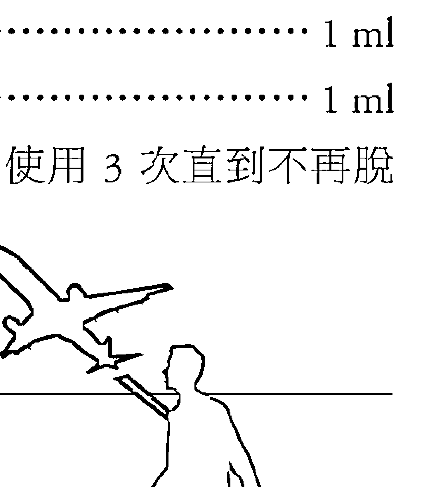

## 時差

### 我的補給配方

##### 口服

加 1 滴錫蘭肉桂精油（若沒有就用檸檬、薑或胡椒薄荷）在中性錠片上，每日服用 4 回，連續 3 天。

## 閃到腰、腿拉傷

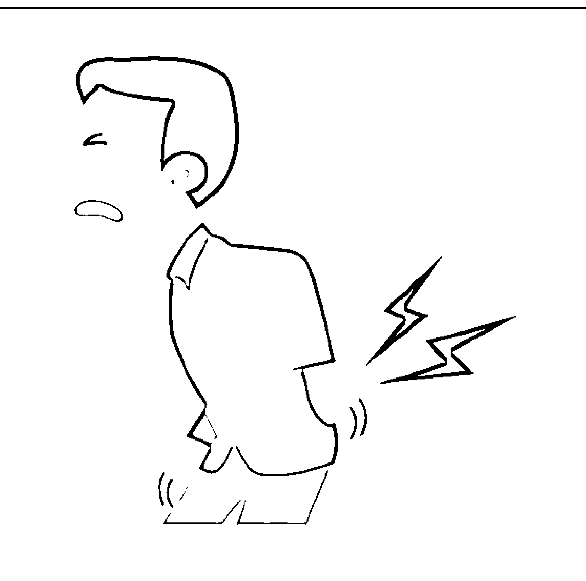

#### 我的精簡配方

##### 塗抹

以 3 滴月桂精油塗抹在疼痛的部位，輕輕搓揉久一點（但千萬不要深壓導致疼痛加劇）。每日使用 3 次直到不再疼痛。

#### 完整配方

##### 塗抹

調合：

- 月桂精油 — 1 滴  
- 冬青白珠／芳香白珠精油 — 1 滴  
- 檸檬尤加利精油 — 1 滴  
- 檸檬迷迭香精油 — 1 滴  
- 超級醒目薰衣草精油 — 1 滴  
- 義大利永久花精油 — 1 滴  
- 山金車浸泡油 — 10 滴  

盡量以輕柔的力道按摩受傷的部位，每日 3 次直到不再疼痛。  
「滲抹」這個字眼在這個情況非常適合，因為別在肌肉受傷的部位按摩，不要急，尤其別再使受傷加劇。手的溫度有助於精油在皮膚裡的吸收。千萬不要受寒，也別待在太涼爽和風太大的環境。

## 自然抵抗力（強化以抗傳染病）

#### 我的精簡配方

##### 吸聞

以 2 滴莎羅白樟或桉油醇樟精油滴在手帕上或手腕內側，並深深吸聞。每日嗅聞 4～5 次。

#### 完整配方

##### 擴香

在擴香儀裡均等調合：

- 桉油醇樟或莎羅白樟精油  
- 澳洲尤加利精油  
- 綠花白千層精油  

在「有風險」的季節裡，早、晚擴香 30 分鐘。

## 癬癢

#### 我的精簡配方

##### 塗抹

若是處理小面積的話，以 1～2 滴真正薰衣草純精油（不稀釋）塗抹在癬癢處。  
若皮膚會癢的面積較大的話，請將真正薰衣草精油稀釋 50% 在金盞菊浸泡油裡（5 滴薰衣草加入 5 滴金盞菊浸泡油裡）。  
若需要則可以一直使用。

#### 完整配方

#### 塗抹（在 10 ml 瓶裡調合）

- 真正薰衣草精油 — 0.5 ml  
- 羅馬洋甘菊精油 — 0.5 ml  
- 玫瑰天竺葵精油 — 0.5 ml  
- 胡椒薄荷精油 — 0.5 ml  
- 杜松漿果精油 — 0.5 ml  
- 琉璃苣油 — 5 ml  
- 玫瑰果油 — 2.5 ml  

視要處理的癬癢面積大小，取適量塗抹，依實際需求每日塗抹 3～4 次。

#### 請藥局客製

#### 塗抹（請藥師依下列配方製作爽身粉）

- 羅馬洋甘菊精油 — 1 g  
- 摩洛哥藍艾菊精油 — 1 g  
- 真正薰衣草精油 — 1 g  
- 威尼斯滑石粉 — 裝滿 100 g  

每天以這個爽身粉輕拍患部 3～4 次，持續數日。

#### 孕婦專用

#### 完整配方

##### 塗抹

1. 以純露舒緩  

- 羅馬洋甘菊純露  
- 真正薰衣草純露  
- 玫瑰天竺葵純露  

以化妝棉或紗布沾純露濕敷，可以視需求而敷很多次。

注意：是純露，不是精油！

2. 以精油治療  

- 真正薰衣草精油……3 滴  
- 檸檬尤加利精油……3 滴  
- 玫瑰天竺葵精油……3 滴  
- 金盞菊浸泡油……5 ml  
- 琉璃苣油……5 ml  

取數滴局部塗抹會癢的部位，每日 2～3 次。

3. 以上療效爽身粉繼續照護

### 請藥局製作

請藥師依下列配方在粉盒裡製作爽身粉：

- 真正薰衣草精油……2 g  
- 羅馬洋甘菊精油……2 g  
- 玫瑰天竺葵精油……1 g  
- 威尼斯滑石粉……裝滿 100 g  

每天以這個止癢爽身粉在癢處輕拍 2～4 次。

#### 小孩專用

#### 完整配方

##### 塗抹

1. 以純露舒緩  

均等調合：

- 真正薰衣草純露  
- 玫瑰純露  
- 洋甘菊純露  

用紗布或拋棄式紙巾充分地浸泡在純露裡，再輕拍會瘙癢的部位。

2. 以精油治療  

在 10 ml 瓶裡調合：

- 德國洋甘菊精油……0.5 ml  
- 摩洛哥藍艾菊精油……0.5 ml  
- 檸檬尤加利精油……0.5 ml  
- 真正薰衣草精油……2.5 ml  
- 金盞菊浸泡油……6 ml  

以數滴調合油局部塗抹，每日使用 3～4 次直到不癢為止。

或（若上列配方還不夠）

在 10 ml 瓶裡調合：

- 檸檬尤加利精油……0.5 ml  
- 龍艾精油……0.5 ml  
- 羅馬洋甘菊精油……0.5 ml  
- 金盞菊浸泡油……裝滿 10 ml  

局部塗抹搔癢處（皮膚過敏、濕疹……），若需要則可以每日使用 3～4 次。

#### 請藥局客製

請藥師依下列配方，用 100 g 燕麥作的爽身粉：

- 羅馬洋甘菊精油……1 ml  
- 檸檬尤加利精油……2 ml  
- 真正薰衣草精油……3 ml  
- 威尼斯滑石粉……裝滿 100 g  

每天在瘙癢處撲粉 2～3 次。

## 肛門瘙癢（寄生蟲）

#### 小孩專用

#### 我的精簡配方

塗抹

以 2 滴羅馬洋甘菊精油稀釋在 4～5 滴甜杏仁油裡，再用手指塗抹局部。每日 3～4 次，若需要則繼續用到這討厭的瘙癢消失。每次塗抹完要徹底洗手。

#### 請藥局客製

栓劑配方：

- 羅馬洋甘菊精油……25 mg  
- 苦橙葉精油……20 mg  
- 金盞菊浸泡油……10 mg  
- 栓劑的賦形劑……1 g  

請藥師依下列配方製作 6 顆栓劑。每日施用 1 顆，在每個月相變化時連續施用 3 個晚上。也就是下次滿月時用 3 顆，新月時再用 3 顆。

## 陰道瘙癢（非真菌引起的）

#### 我的精簡配方

##### 塗抹

以 1 滴真正薰衣草稀釋在 3 滴任何一種植物油裡，每日局部塗抹 3～5 次，若需要則可塗抹更多次。

#### 完整配方

##### 塗抹

在 10 ml 瓶裡調合：

- 真正薰衣草精油……1 ml  
- 超級醒目薰衣草精油……1 ml  
- 羅馬洋甘菊精油……2 ml  
- 金盞菊浸泡油……6 ml  

以此調合油 2～3 滴做局部塗抹，每日 3～5 次，或需要可以更多次。

##### 清洗

輕輕沖洗陰道，可立即獲得舒緩：

- 真正薰衣草純露……50 ml  
- 羅馬洋甘菊純露……50 ml  

以陰道沖洗器將這個複方純露輕輕地灌入陰道，每日沖洗 2～3 次。這不是日常清潔保養的方法，只有在癢癢時才使用。

注意：是純露，不是精油！

## 陰道瘙癢（真菌引起的）

請諮詢醫師。

##### 口服

請藥師依下列配方製作 60 顆膠囊：

- 茶樹精油……20 mg  
- 丁香花苞精油……20 mg  
- 沉香醇百里香精油……20 mg  

照三餐服用，持續 20 天。

### 用陰道栓劑

請藥師依下列配方製作 6 顆陰道栓劑：

- 真正薰衣草精油……50 mg  
- 丁香花苞精油……50 mg  
- 茶樹精油……50 mg  
- 沉香醇百里香精油……50 mg  
- 玫瑰草精油……50 mg  
- 金盞菊浸泡油……20 mg  

晚上睡前塞入 1 顆入陰道裡，連續 6 晚。

#### 完整配方

##### 塗抹

調合：

- 玫瑰天竺葵精油……1 滴  
- 月桂精油……1 滴  
- 茶樹精油……1 滴  
- 荷荷芭油……5 滴  

早、晚梳洗後，塗抹在陰唇上，持續 10 天。

## 1000 個最強精油配方

### 口服（懷孕滿 3 個月後）

- 月桂精油……1 滴  
- 茶樹精油……1 滴  

加入中性錠片上，每日服用 3 回，持續 10 天。

## 牙齒（長牙）

### 嬰兒專用

#### 我的精簡配方

塗抹

直接以 1 滴羅馬洋甘菊純精油（不稀釋）塗抹在牙齦或疼痛的牙齦上。

#### 完整配方

##### 塗抹

調合：

- 真正薰衣草精油……1 滴  
- 羅馬洋甘菊精油……1 滴  
- 聖約翰草浸泡油……2 滴  

當嬰兒牙疼時，用手指（要非常乾淨！）沾 2 滴調合油，並直接塗抹在疼痛的牙齦上，每日使用 4～5 次。

## 牙醫（害怕看牙醫）

#### 我的精簡配方

##### 吸聞

- 去牙醫前和看牙後，讓孩子直接吸聞打開的羅馬洋甘菊精油瓶。  
- 看牙前，倒 1 滴羅馬洋甘菊精油在手腕內側，讓孩子在看牙時可以繼續嗅聞到令人放鬆的氣味。

## 濕疹

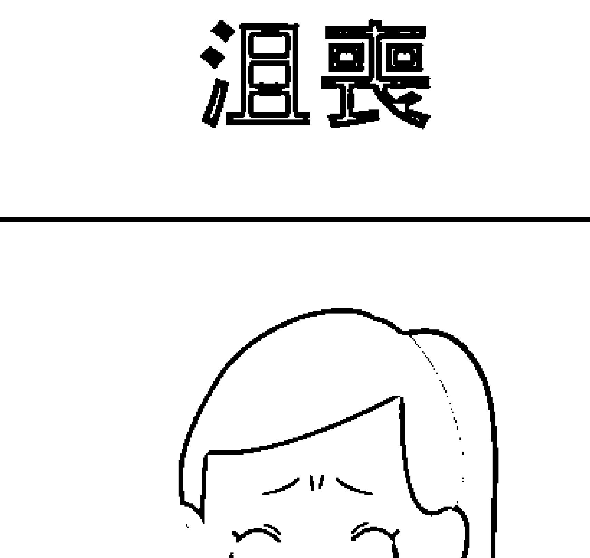

#### 我的精簡配方

##### 口服

倒 1 滴檸檬馬鞭草精油在方糖上，再放入嘴裡融化吸收或加入熱的花草茶裡，每日服用 3 回，持續 3 週。

#### 完美配方

##### 塗抹

調合：

- 檸檬馬鞭草精油……1 滴  
- 馬鞭草酮迷迭香精油……1 滴  
- 橙花精油……1 滴  
- 芳樟精油……1 滴  
- 榛果油……1/2 茶匙  

以此調合油塗抹腹腔神經叢、足弓、手腕內側和整條脊椎，並深深地吸聞手腕。每日使用 2 次，持續 3 週。  
別急！請延長塗抹的時間，因為「皮膚貼皮膚」的按摩會分泌舒緩和抗憂鬱的化學物質。

##### 擴香

在 30 ml 瓶裡調合：

- 檸檬馬鞭草精油……2 ml  
- 桉油醇樟精油……5 ml  
- 檸檬精油……5 ml  
- 胡椒薄荷精油……3 ml  
- 乳香精油……5 ml  
- 歐洲赤松精油……10 ml  

早、晚在活動的空間擴香 30 分鐘，持續 3 週。在白天則可以打開精油瓶嗅聞。

##### 口服

請藥師依下列配方製作 60 顆膠囊（可重複療程）：

- 檸檬馬鞭草精油……5 mg  
- 山雞椒精油……10 mg  
- 甜馬鬱蘭精油……20 mg  
- 依蘭精油……5 mg  
- 月桂精油……10 mg  
- 胡椒薄荷精油……20 mg  

照三餐服用，持續 20 天。休息 10 天後，再服用 10 天，以此類推。

#### 孕婦專用

#### 我的精簡配方

- 塗抹：早、午以 2 滴歐洲赤松精油塗抹腎臟的部位，持續 3 週。  
- 擴香：早、晚以山雞椒精油擴香 30 分鐘。  
- 口服：加 2 滴檸檬精油在中性錠片、方糖上或 1 茶匙蜂蜜裡，再放入口腔裡融化吸收，每日服用 3 回，持續 12 天。

## 產後憂鬱症

#### 我的精簡配方

- 塗抹和吸聞：以 1 滴大馬士革玫瑰精油塗抹在腹腔神經叢和手腕內側，並深深吸聞，每日 3 次，持續 15 天。  
- 塗抹：以 4 滴橙花精油稀釋在 1/2 茶匙橄欖油裡，（由腳到心臟的方向）按摩身體，每日按摩 2 次。

### 口服（口腔黏膜吸收／含服）

加 1 滴檸檬馬鞭草或山雞椒精油在中性錠片上或 1 茶匙蜂蜜裡，再放入嘴裡融化吸收，每日服用 2 回。

#### 完美配方

##### 擴香

在擴香儀裡倒入：

- 山雞椒精油……10 滴  
- 真正薰衣草精油……10 滴  
- 乳香精油……10 滴  
- 佛手柑精油……10 滴  

上午擴香 10 分鐘，晚間擴香 10 分鐘。

## 消脂

#### 我的精簡配方

##### 口服

- 加 1 滴檸檬精油入中性錠片上服用，每日 3 回持續 3 週。  
- 加 3 滴胡椒薄荷精油入 1 公升的水裡（最好是氣泡水），並在白天喝完。

##### 塗抹

以 6 滴大西洋雪松精油稀釋在 1 湯匙瓊崖海棠油裡，每日按摩脂肪堆積的部位 2 次。

注意：大西洋雪松精油禁用在孕婦或哺乳媽媽身上。

#### 完整配方

### 淋沐

在 30 ml 深色滴管瓶裡調合：

- 大西洋雪松精油……2 ml  
- 葡萄柚精油……1 ml  
- 義大利永久花精油……0.5 ml  
- 薰陸香精油……0.5 ml  
- 馬鞭草酮迷迭香精油……2 ml  
- 玫瑰海棠油……裝滿 30 ml  

早上淋浴後按摩脂肪堆積處，再以 3～5 分鐘的滾動按摩手法加強。

## 肝排毒

#### 完整配方

##### 口服

懷孕前的治療

將下列精油調合在 1 ml 瓶裡：

- 胡椒薄荷精油……10 滴  
- 馬鞭草酮迷迭香精油……5 滴  
- 側柏酮百里香精油……10 滴  
- 國藥鼠尾草精油……5 滴  

複方精油 2 滴 + 2 茶匙蜂蜜，加入 1/2 公升「迷迭香和波爾多葉」花草茶裡。  
24 小時內喝完，持續 8 天療程。

懷孕中的治療

- 檸檬精油……2 滴  
- 橄欖油……1/2 茶匙  

每日 3 回放入嘴裡融化吸收，持續 8 天。  
若要替代橄欖油，可以用中性錠片或 1/2 茶匙蜂蜜加入茶裡攪拌。

## 糖尿病（補充療法）

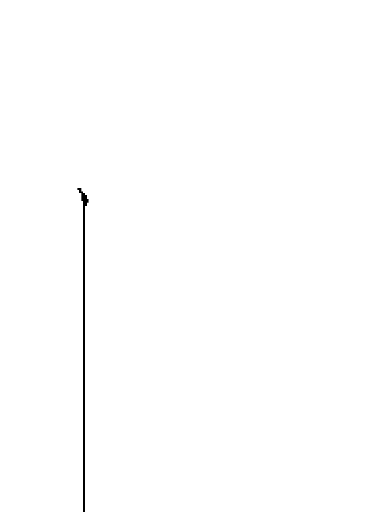

#### 我的精簡配方

##### 口服

三餐飯後，直接點 1 滴波旁天竺葵精油到中性錠片上服用。

#### 完整配方

##### 口服

在 5 ml 瓶裡調合：

- 胡蘿蔔籽精油……1 ml  
- 義大利永久花精油……0.5 ml  
- 波旁天竺葵精油……1 ml  
- 馬鬱蘭酮迷迭香精油……1 ml  
- 檸檬精油……1.5 ml  

三餐飯前或飯後，以此複方精油 2 滴加在 1 茶匙橄欖油或亞麻薺油裡，再放入嘴裡融化吸收。  
持續 3 週後停 1 週，再重新開始 3 週，以此類推。這是可以長期進行的療程。

#### 孕婦專用

#### 我的精簡配方

- 塗抹：早、午以 1 滴歐洲赤松精油塗抹腎臟的部位，持續 10 天。  
- 口服（口腔黏膜吸收／含服）（懷孕滿 3 個月後）：  
  - 倒 1 滴波旁天竺葵精油在中性錠片上口服，早、晚服用持續 10 天。  
  - 倒 1 滴依蘭精油在中性錠片上口服，在每個月最後 10 天的早、晚服用，可一直持續到分娩為止。

## 感染性腹瀉、腸胃炎和神經性腹瀉

#### 我的精簡配方

若與壓力有關：

- 口服：直接倒 1 滴甜馬鬱蘭精油在中性錠片上服用。  
- 塗抹：以 1 滴甜馬鬱蘭精油塗抹腹腔神經叢的部位，每 3 小時使用 1 次。

若是感染造成：

- 口服：三餐飯前或飯後，加 1 滴冬季香薄荷精油入 1 茶匙蜂蜜或橄欖油裡，再放入嘴裡融化吸收，持續 3～5 天。

#### 完整配方

- 冬季香薄荷精油……10 滴  
- 丁香花苞精油……10 滴  
- 中國肉桂精油……10 滴  
- 甜橙葉百里香精油……10 滴  
- 熱帶羅勒精油……10 滴  

以此複方精油 2 滴加到方糖上或 1 茶匙橄欖油裡，再放入嘴裡融化吸收，每日服用 4 回。

### 請藥房客製

##### 口服

若擔心在服用這些刺激性較高的精油時會刺激嘴巴、舌頭和消化道，可以服用膠囊化製劑。請藥師依下列配方製作 30 顆（或更多）膠囊：

- 丁香花苞精油……10 mg  
- 龍艾精油……10 mg  
- 中國肉桂精油……10 mg  
- 甜百里香精油……10 mg  
- 檸檬薄荷精油……10 mg  

每日服用 3～4 回（每餐各服 1 顆），持續 10 天。

#### 孕婦專用

#### 完整配方

### 口服（懷孕滿 3 個月後）

若腹瀉跟壓力有關：

- 苦橙葉精油……1 滴  
- 羅馬洋甘菊精油……1 滴  

加這 2 滴精油在中性錠片上口服，24 小時內服用 2～3 回。

若是胃腸炎型造成（病毒）：

- 桉油醇樟精油……1 滴  
- 月桂精油……1 滴  

加這 2 滴精油在中性錠片上服用，每日 3～4 回，持續 3～5 天。

若是感染型腹瀉（可疑的食物、可疑的菜、急性感染性腹瀉……）：

- 茶樹精油……1 滴  
- 側柏醇百里香精油……1 滴  

加這 2 滴精油在中性錠片上服用，每日 3 回，持續 3～5 天。

若很嚴重的腹瀉和被感染：

- 野馬鬱蘭精油（或錫蘭肉桂精油）……1 滴  

加入 1 茶匙蜂蜜或一點點橄欖油裡，再放入嘴裡融化吸收，每日 4 回，持續 3～5 天。

注意：作用力很強！

---

#### 小孩專用

#### 完整配方

##### 塗抹

在 10 ml 瓶裡調合：

- 茶樹精油……1 ml  
- 龍艾精油……1 ml  
- 桉油醇迷迭香精油……1 ml  
- 甜杏仁油……7 ml  

以此調合油 6～8 滴塗抹肚子，每日 4～5 次，持續 3～5 天。

##### 口服

在瓶裡均等調合：

- 冬季香薄荷純露  
- 錫蘭肉桂純露  
- 百里酚百里香純露  

讓孩子服用此複方純露 1 茶匙，每日 3 回，持續 2～3 天。

注意：是純露，不是精油！

---

## 不易受孕

我的精簡配方

### 心理障礙（男女皆可）

- 吸聞：直接打開大馬士革玫瑰精油瓶吸聞，每日 3～5 次。  
- 塗抹和吸聞：以 1 滴大馬士革玫瑰純精油（不稀釋）塗抹在手腕內側並吸聞，每日 3～4 次，直到受孕成功。  
- 塗抹：以 3 滴大馬士革玫瑰精油稀釋在 1 茶匙瓊崖海棠油裡，按摩腹腔神經叢和整條脊椎（男女皆可）。最好的按摩時刻是晚上，可以讓身體完全放鬆及促進甜睡的性愛。若需要則持續使用數週。

### 卵巢失調

- 吸聞：直接打開快樂鼠尾草精油瓶嗅聞，在排卵期的 5 天裡（月經週期的第 8 天到第 13 天）每日吸聞 2～3 次。

---

## 消化不良

#### 我的精簡配方

##### 口服

直接倒 1～2 滴胡椒薄荷精油在中性錠片上或 1 茶匙橄欖油裡服用，或加入蜂蜜裡再與花草茶（有薄荷或迷迭香更好）攪拌均勻。感覺需要時就可以服用。

#### 完整配方

##### 塗抹

- 荳蔻精油……1 滴  
- 熱帶羅勒精油……1 滴  
- 芫荽籽精油……1 滴  
- 紅橘精油……1 滴  
- 榛果油……3 滴  

飯後以此調合油按摩肚子，持續 4～5 天。

##### 口服

- 胡椒薄荷精油……1 滴  
- 檸檬精油……1 滴  

飯前或飯後當甜點服用，將這 2 滴精油加入 1/2 顆方糖或一點點蜂蜜裡，再放入嘴裡融化吸收（或加入 1 杯迷迭香花草茶裡），持續 8～10 天。

### 助消化的蜂蜜

將 1 滴薑精油加入 1 茶匙迷迭香蜂蜜裡，三餐飯後服用。

---

#### 孕婦專用

#### 我的精簡配方

##### 口服

三餐飯後，加 1 滴檸檬精油在中性錠片（或方糖上）服用，再放入嘴裡融化吸收。

---

#### 小孩專用

#### 我的精簡配方

##### 口服

加 1 滴檸檬精油入 1 茶匙橄欖油裡，或小方糖、或 1 小匙蜂蜜、或中性錠片上（藥局買的），每日讓孩子服用 2～3 回。

### 完整配方  
注意：是純露，不是精油！（若一直消化不良）

##### 口服

在瓶裡均等裝入以下 4 種純露：

- 胡椒薄荷純露  
- 馬鞭草酮迷迭香純露  
- 側柏醇百里香純露  
- 檸檬馬鞭草純露  

早、晚讓孩子服用 2 茶匙的量，直到孩子感覺完全恢復為止。這是排毒的方法。

---

## 手指挫傷

#### 我的精簡配方

- 塗抹：以 2 滴義大利永久花純精油（不稀釋）塗抹在手指挫傷處，並按摩 5 分鐘。15 分鐘後再重複 1 次。若瘀青很嚴重，當天用義大利永久花再塗抹 4～5 次，第二天開始每日使用 2 次，持續 2～3 天。這隻精油可以取代山金車凝露。  
- 吸聞：打開羅馬洋甘菊精油瓶吸聞，可使心情較快回復。

---

## 兒童生長痛

小孩專用

#### 完整配方

##### 塗抹

在 10 ml 瓶裡調合：

- 檸檬迷迭香精油……1 ml  
- 龍艾精油……0.5 ml  
- 檸檬尤加利精油……1.5 ml  
- 山金車浸泡油……裝滿 10 ml  

以此調合油 5～6 滴按摩會疼痛的部位，輕輕按摩以幫助精油透過皮膚吸收。按摩本身也可以舒緩發炎的狀況。

---

## 藥物（戒斷輔助）

請藥局客製

#### 塗抹和吸聞

請藥師依照下列配方準備 1 瓶 5 ml 的複方精油：

- 肉豆蔻精油……0.5 ml  
- 馬鞭草酮迷迭香精油……1 ml  
- 熱帶羅勒精油……1 ml  
- 野地薄荷精油……0.5 ml  
- 月桂精油……1 ml  
- 歐白芷根精油……1 ml  

以此複方精油 2 滴塗抹在額頭中間及手腕內側，無論是白天或晚上（沒有限制）都可以常常這樣嗅聞。您將會觀察到自己對藥物的需求越來越少，例如：想要用藥的慾望漸漸地降低了。

##### 口服

倒 1 滴這個複方精油在 1 茶匙蜂蜜上服用，每日 3～5 回。

---

## 障礙（閱讀障礙、運動障礙）

#### 小孩專用

#### 我的精簡配方

嗅香  
早、晚用真正薰衣草精油擴香 30 分鐘。

讓孩子直接嗅聞打開的大馬士革玫瑰精油瓶，每日吸聞 3～4 次，持續數天。觀察看看症狀有沒有稍微減輕。若有的話，接著繼續每日嗅聞 2～3 次，要持續一段很長的時間。相反地，若沒有看到改善的話，請改用香草精油測試。使用方法如前述一樣（外加幾滴一起泡澡）。

---

## 扎傷

#### 我的精簡配方

塗抹  
取出異物後，馬上在傷口處用 1 滴真正薰衣草或 1 滴茶樹精油消毒。當天後續再塗抹數次。

---

## 濕疹（乾性／脂溢性）

### 乾性濕疹

#### 我的精簡配方

塗抹  
直接用 2 滴穗花薰衣草精油塗抹在濕疹患部，每日 2～3 次。

#### 完整配方

- 真正薰衣草純露  
- 快樂鼠尾草純露  
- 大馬士革玫瑰純露  

塗抹：舒緩潤膚露  
在 100 ml 瓶裡均等調合以下 3 種純露，以做溫和的清洗。

以此複方純露加入滅菌敷料裡，早、晚敷在濕疹患部，持續 20 天或更久。

注意：是純露，不是精油！

然後：

- 芳樟精油……1 滴  
- 摩洛哥藍艾菊精油……1 滴  
- 真正薰衣草精油……1 滴  
- 玫瑰天竺葵精油……1 滴  
- 月見草油……1 茶匙  

以純露清洗後，再以此護理潤膚油輕柔地塗抹濕疹處。持續 20 天後，停用 10 天，再繼續使用。

---

### 脂溢性濕疹

#### 我的精簡配方

- 塗抹：直接以 2 滴穗花薰衣草精油塗抹在濕疹患部，每日 2～3 次。

#### 完整配方

- 薰衣草純露  
- 鼠尾草純露  
- 玫瑰純露  

在 100 ml 瓶裡均等調合，以做溫和的清洗。  
以此複方純露加入滅菌敷料裡，早、晚敷在濕疹患部，或每日使用 2 次，持續 20 天。停用 1 週後再重新開始。

注意：是純露，不是精油！

然後

#### 請藥局客製

塗抹（無油凝膠）：

- 真正薰衣草精油……1 ml  
- 玫瑰天竺葵精油……1 ml  
- 玫瑰草精油……1 ml  
- 摩洛哥藍艾菊精油……1 ml  
- 中性凝露……裝滿 30 g  

先以純露清洗後，再以此無油凝露塗抹濕疹處。每日 2～3 次，直到完全改善。若要長期護理則每日 1 次。

---

#### 孕婦專用

- 真正薰衣草精油……1 滴  
- 玫瑰天竺葵精油……1 滴  
- 羅馬洋甘菊精油……1 滴  
- 月見草油……5 滴  

塗抹：調合後每日局部塗抹 2 次。

---

#### 小孩專用

#### 完整配方

#### 1. 以純露舒緩

- 真正薰衣草純露  
- 大馬士革玫瑰純露  
- 羅馬洋甘菊純露  

在 100 ml 瓶裡均勻調合。  
以紗布或化妝紙巾充分浸泡純露，再大範圍輕拍濕疹部位（超過濕疹邊緣），每日 3 次。

注意：是純露，不是精油！

#### 2. 以精油護理

在 30 ml 瓶裡調合：

- 玫瑰天竺葵精油……2 ml  
- 玫瑰草精油……1 ml  
- 羅馬洋甘菊精油……1 ml  
- 真正薰衣草精油……2 ml  
- 金盞菊浸泡油……8 ml  
- 玫瑰果油……8 ml  
- 月見草油……8 ml  

依患部面積決定用量，每日塗抹 3 次，持續至痊癒。

---

## 凍瘡、龜裂、水泡

#### 我的精簡配方

塗抹：

若凍瘡部位很小（例如腳尖），可直接用 2 滴真正薰衣草純精油（不稀釋）局部塗抹，每日 3 次。

若範圍較大（超過手指寬度），可用 2 滴真正薰衣草精油稀釋在 2 滴玫瑰果油裡再塗抹。

---

#### 小孩專用

#### 完整配方

塗抹（在 20 ml 瓶裡調合）：

- 真正薰衣草精油……20 滴  
- 芳樟精油……20 滴  
- 岩玫瑰精油……10 滴  
- 聖約翰草浸泡油……5 ml  
- 金盞菊浸泡油……5 ml  
- 小麥胚芽油……5 ml  

依患部面積決定用量，每日使用 3～4 次，連續 2 天。  
第 3 天改為每日 1 次（晚上），直到完全癒合。若凍瘡在腳上，可覆蓋一層親水性紗布保護。

---

## 扭傷

### 我的急救配方

塗抹

若可以的話，請馬上冷敷：用冷敷凝膠或冰塊，盡量冷敷久一點以縮小發炎範圍。

然後：

以 3 滴義大利永久花純精油（不稀釋）塗抹在扭傷處，輕輕塗抹避免加重疼痛。

#### 完整配方

調合：

- 義大利永久花精油……1 滴  
- 胡椒薄荷精油……1 滴  
- 檸檬尤加利精油……1 滴  
- 月桂精油……1 滴  
- 冬青白珠／芳香白珠精油……1 滴  
- 山金車浸泡油……5 滴  

輕柔塗抹患部，再用繃帶固定關節。每日 2 次。

---

#### 孕婦專用

#### 完整配方

塗抹（調合）：

- 義大利永久花精油……1 滴  
- 月桂精油……1 滴  
- 檸檬尤加利精油……1 滴  
- 山金車浸泡油……5 滴  

每日局部塗抹 4～6 次，連續 2 天。第 3 天改為每日 2 次，直到完全復原。輕輕按摩即可，不要做強力按摩。

---

## 夜尿（尿床）

#### 小孩專用

#### 完整配方

塗抹（在 15 ml 瓶裡調合）：

- 絲柏精油……4 ml  
- 紅橘精油……2 ml  
- 月桂精油……1 ml  
- 甜杏仁油……8 ml  

睡前用 6～8 滴按摩腹腔神經叢、下背與足弓。

#### 請藥局客製

塗抹（配方）：

- 絲柏精油……5 ml  
- 甜馬鬱蘭精油……2 ml  
- 沒藥精油……1 ml  
- 榛果油……7 ml  

早、晚以 3～4 滴按摩腹腔神經叢、足弓、手腕內側與整條脊椎，持續約 20 天。

---

## 病毒流行病（流感、腸胃炎、感冒、單核球增多症）

#### 完整配方

##### 擴香

在擴香儀裡均等調合：

- 澳洲尤加利精油  
- 檸檬精油  
- 桉油醇樟精油  

每 2 小時擴香 10 分鐘。

##### 塗抹

調合：

- 澳洲尤加利精油……2 滴  
- 桉油醇樟精油……2 滴  
- 檸檬精油……5 滴  

塗抹前胸、後背、喉嚨與耳朵周圍，每日 3 次，連續 5 天。

#### 請藥局膠囊（口服）

請藥師製作 30 顆膠囊：

- 桉油醇樟精油……25 mg  
- 側柏醇百里香精油……25 mg  
- 月桂精油……10 mg  
- 澳洲尤加利精油……25 mg  

有症狀時開始服用，每日 4 次，每次 1 顆，連續 5 天。

---

#### 孕婦專用

### 口服（懷孕滿 3 個月後）

- 桉油醇樟精油……1 滴  
- 月桂精油……1 滴  

加入中性錠片、小方糖或 1 茶匙蜂蜜裡，放入口中融化吸收，每日 3～5 回，連續 5 天。

---

## 會陰側切

### 我的精油配方

塗抹：

以 2 滴真正薰衣草精油稀釋在 2 滴玫瑰果油裡，每日塗抹切口 3 次，直到完全復原或約 15 天。

---

## 擦傷

#### 我的精簡配方

塗抹：

依擦傷面積大小，在發生當天用 2～5 滴茶樹或真正薰衣草純精油（不稀釋）塗抹 2～3 次。  
第 2 天起早、晚各一次，持續 2～3 天。

之後若要淡化疤痕，可每日用玫瑰果油按摩 2 次，直到疤痕消失。

---

## 嬰兒尿布疹（紅屁股）

嬰兒專用

#### 完整配方

塗抹（在 10 ml 瓶裡調合）：

- 芳樟精油……10 滴  
- 穗花薰衣草精油……10 滴  
- 羅馬洋甘菊精油……10 滴  
- 玫瑰天竺葵精油……10 滴  
- 金盞菊浸泡油……3 ml  
- 玫瑰果油……裝滿 10 ml  

每次換尿布後取數滴塗抹紅疹部位（或易長疹處以預防）。

---

## 褥瘡（壓傷）

### 我的精油配方

塗抹  
以 1 滴真正薰衣草純精油（不稀釋）塗抹局部，每日 3 次。

#### 完整配方

#### 塗抹：溫和清洗

在 100 ml 瓶裡均等調合：

- 真正薰衣草純露  
- 百里香純露  
- 蠟菊純露  

加入滅菌敷料濕敷患部並輕壓 2～3 分鐘。

注意：是純露，不是精油！

#### 然後塗抹：治療潤膚泥

調合：

- 真正薰衣草精油……2 滴  
- 月桂精油……2 滴  
- 絲柏精油……2 滴  
- 義大利永久花精油……1 滴  
- 玫瑰果油……1/2 茶匙  
- 小麥胚芽油……1/2 茶匙  
- 高嶺土或綠礦泥粉……1/2 茶匙  

攪拌成泥狀後，早晚厚敷患部，15 分鐘後再用上述純露清洗。持續至痊癒。

---

### 促癒合的蜂蜜

- 真正薰衣草精油……1 滴  
- 茶樹精油……1 滴  
- 麥盧卡蜂蜜……1 茶匙  

早晚塗抹傷口直到完全復原。

---

## 胃病（胃痛、胃酸過多、胃食道逆流）

#### 我的精簡配方

- 口服：加 1 滴熱帶羅勒或歐芹精油入 1 茶匙蜂蜜，再加入一杯甘草或馬鞭草茶攪拌飲用，每日 2～3 回，持續 10 天。  
- 塗抹：以 2～3 滴羅馬洋甘菊精油稀釋在數滴橄欖油裡，做局部按摩。

#### 完整配方

##### 口服

- 胡椒薄荷精油……1 滴  
- 荳蔻籽精油……1 滴  

將這 2 滴精油加在中性錠片、1/2 塊方糖或 1 茶匙橄欖油裡，飯後服用，每日 2～3 回，直到灼熱感完全消失。

##### 塗抹

若您經常會胃痙攣的話，請在 10 ml 深色瓶裡調合：

- 龍艾精油……10 滴  
- 胡椒薄荷精油……10 滴  
- 甜馬鬱蘭精油……10 滴  
- 榛果油……裝滿 10 ml  

每日緩慢地按摩胃及會疼痛的部位。

#### 請藥局客製

##### 口服

請藥師依照下列配方製作 30 顆膠囊：

- 芫荽籽精油……20 mg  
- 羅馬洋甘菊精油……10 mg  
- 熱帶羅勒精油……10 mg  
- 胡椒薄荷精油……10 mg  

飯後服用 1 顆，每日 2～3 回，連續 1 週。

## 頭暈、緊張、躁動

#### 我的精簡配方

口服和吸聞  

直接倒 1 滴羅馬洋甘菊精油在 1 茶匙蜂蜜裡或中性錠片上服用，每日 3 回，持續 5～10 天。外加直接嗅聞打開的精油瓶。

---

## 1000 個感冒精油配方

#### 完整配方

##### 塗抹

調合：

- 真正薰衣草精油……1 滴  
- 羅馬洋甘菊精油……1 滴  
- 紅桔精油……1 滴  
- 玫瑰海棠油……3 滴  

以此調合油塗抹腹腔神經叢、足弓、手腕內側，以及放 1 滴在 1 茶匙蜂蜜裡服用，每日 3 次。

---

#### 孕婦專用

#### 完整配方

#### 躁動（若平常不會煩躁不安）

##### 塗抹

調合：

- 羅馬洋甘菊精油……1 滴  
- 真正薰衣草精油……1 滴  
- 苦橙葉精油……1 滴  
- 玫瑰海棠油……3 滴  

當有需要時，隨時可以此調合油緩慢地塗抹腹腔神經叢和腳底。

##### 泡澡放鬆

- 依蘭精油……3 滴  
- 真正薰衣草精油……5 滴  
- 苦橙葉精油……5 滴  
- 泡澡的基質……1 湯匙  

將上列材料放入已放好熱水（37°C）的浴缸裡。晚上泡澡至少 20 分鐘，泡澡後不用再沖水而直接穿上浴袍上床睡覺。

---

## 過動症（若一直「不斷地動來動去」）

##### 泡澡放鬆

調合：

- 真正薰衣草精油……15 滴  
- 泡澡的基質……1 湯匙  

將上列材料放入已放好熱水（37°C）的浴缸裡。晚上泡澡至少 20 分鐘，泡澡後不用再沖水而直接披上浴袍上床睡覺。

##### 擴香

在擴香儀裡均等倒入以下精油數滴：

- 苦橙葉精油  
- 真正薰衣草精油  

每日擴香 3～4 次，每次 15 分鐘。

##### 塗抹

調合：

- 真正薰衣草精油……1 滴  
- 依蘭精油……1 滴  
- 檸檬油……2 滴  

塗抹在腹腔神經叢和手腕內側（並深深吸聞），若有需要則每 15 分鐘塗抹 1 次，直到恢復「正常」。

### 口服（懷孕滿 3 個月後）

- 苦橙葉精油……1 滴  

加在中性錠片、小方糖或 1 茶匙蜂蜜裡，再放入嘴裡融化吸收，每日服用 3～4 回，進行 10 天療程。

---

#### 小孩專用

#### 我的精簡配方

##### 口服

每日給孩子服用 1 茶匙橙花純露 2～3 回，也可以稀釋在菩提茶裡飲用。

##### 吸聞

在「發作」時，讓孩子直接吸聞打開的羅馬洋甘菊精油瓶。若需要則讓他重複吸聞（一般吸聞 1 次就夠了）。

#### 完整配方

> 以下所有的方法視情況而定，可以一起或分開使用。

#### 若是有讓孩子上床或睡著的困擾

##### 擴香

在擴香儀裡倒入：

- 苦橙葉精油 —— 10 滴  
- 紅桔精油 —— 10 滴  
- 真正薰衣草精油 —— 10 滴  

就寢前，在孩子的臥室擴香 1 小時。

#### 若在白天有躁動的情況

##### 塗抹

調合：

- 甜馬鬱蘭精油 —— 1 滴  
- 甜橙精油 —— 1 滴  
- 真正薰衣草精油 —— 1 滴  
- 甜杏仁油 —— 5 滴  

將孩子塗抹在手腕內側、腹腔神經叢、足弓和整條脊椎上，每日 2～3 次，再加晚上睡前塗抹 1 次。

##### 泡澡

調合：

- 甜橙精油……5 滴  
- 真正薰衣草精油……5 滴  
- 泡澡的基質……1 湯匙  

將這些芳香材料放入已放好熱水（最高 38°C）的浴缸裡，並用手攪拌一下。讓孩子安靜地泡在水裡 15～20 分鐘，若可以搭配柔和音樂更好。

---

## 拔牙

#### 完整配方

##### 塗抹

在 2 ml 瓶裡調合：

- 月桂精油……3 滴  
- 胡椒薄荷精油……2 滴  
- 羅馬洋甘菊精油……3 滴  
- 岩玫瑰精油……3 滴  
- 山金車浸泡油……裝滿 2 ml  

以此調合油 2 滴塗抹在將要被拔牙的臉頰。拔牙前 15～30 分鐘塗抹，及當天拔牙後每小時塗抹 1 次。

---

## 肌肉無力

#### 完整配方

##### 塗抹

調合：

- 檸檬迷迭香精油……1 滴  
- 超級醒目薰衣草精油……1 滴  
- 義大利永久花精油……1 滴  
- 冬青白珠／芳香白珠精油……1 滴  
- 檸檬尤加利精油……1 滴  
- 月桂精油……1 滴  
- 山金車浸泡油……5 滴  

早、午、晚以此調合油塗抹下背（腎臟位置），持續 1 週。

---

## 持續性疲勞（過勞）

#### 我的精簡配方

##### 口服

早、午、晚直接倒 2 滴胡椒薄荷純精油（不稀釋）在半顆方糖上服用。

#### 完整配方

##### 擴香

在擴香儀裡均等倒入以下精油數滴：

- 檸檬精油  
- 胡椒薄荷精油  
- 熱帶羅勒精油  
- 歐洲赤松精油  

早上和下午，在活動空間擴香 1 小時。

##### 塗抹

調合：

- 芳樟精油……1 滴  
- 沉香醇百里香精油……1 滴  
- 熱帶羅勒精油……1 滴  
- 歐洲赤松精油……1 滴  
- 黑雲杉精油……1 滴  
- 山金車浸泡油……5 滴  

每日沿脊椎塗抹 3 次，持續 10 天。

#### 請藥局客製

##### 口服

請藥師依照下列配方製作 60 顆膠囊：

- 牛至肉桂精油……10 mg  
- 熱帶羅勒精油……10 mg  
- 百里酚百里香精油……10 mg  
- 胡椒薄荷精油……10 mg  
- 丁香花蕾精油……10 mg  

用餐時服用 1 顆，每日 2 顆，持續 3 週。

---

#### 孕婦專用

### 我的精油處方

#### 塗抹（白天）

早上和中午以 2 滴黑雲杉精油塗抹腎臟部位，持續 10 天。若需要可以繼續保養。

---

## 心理疲勞

#### 我的簡單配方

- 口服：倒 1 滴苦橙葉精油在中性錠片上服用，每日 3 回。  
- 吸聞：倒 1 滴月桂精油在手腕內側並深深吸聞，每日 3～4 次。

#### 完整配方

##### 塗抹

- 芳樟精油……1 滴  
- 橙花精油……1 滴  
- 苦橙葉精油……1 滴  
- 月桂精油……1 滴  
- 山金車浸泡油……3 滴  

塗抹在整條脊椎及手腕內側，每日 3 次持續 20 天，並將手腕放在鼻孔前深深吸聞。

### 需膠囊容器

##### 口服

請藥師依照下列配方製作 60 顆膠囊：

- 熱帶羅勒精油……10 mg  
- 錫蘭肉桂精油……10 mg  
- 檸檬馬鞭草精油……5 mg  
- 苦橙葉精油……10 mg  
- 桉油醇樟精油……10 mg  

每日口服 3 回，持續 20 天。

---

## 性疲勞（性無能）

#### 我的精簡配方

##### 塗抹

以 2 滴依蘭或檸檬薄荷精油塗抹脊椎，每日 2 次，連續 10 天。

##### 口服

- 檸檬薄荷精油 1 滴  
- 錫蘭肉桂精油 1 滴  

放在方糖上或 1 茶匙蜂蜜裡，再放入口中融化吸收。每日服用 3 回，持續 2～3 週。

#### 完整配方

##### 塗抹

調合：

- 依蘭精油……1 滴  
- 檸檬薄荷精油……1 滴  
- 黑雲杉精油……1 滴  
- 甜扁桃植物油……6 滴  

早晚按摩下背及薦部經絡，持續 3 週。

### 膠囊配製

##### 口服

請藥師依照下列配方製作 60 顆膠囊：

- 薑精油……30 mg  
- 錫蘭肉桂精油……20 mg  

傍晚和行房前各服 1 顆，持續 20 天。

---

## 孕期假宮縮

#### 孕婦專用

#### 完整配方

##### 塗抹

調合：

- 羅馬洋甘菊精油……1 滴  
- 法國羅勒精油……1 滴  
- 埃及海棗油……3 滴  

塗抹下腹及下背，1～2 小時內每 15 分鐘使用 1 次（若宮縮停止就停用）。這是少數可以局部塗抹肚子的建議。

##### 口服（口腔黏膜吸收／含服）（懷孕滿 3 個月後）

- 羅馬洋甘菊精油……1 滴  
- 法國羅勒精油……1 滴  

點在舌上或中性錠片上服用。若需要一天服用 1～2 回。

> 法國羅勒精油又稱歐洲羅勒或甜羅勒。

---

## 發燒

#### 完整配方

#### 泡腳

調合：

- 澳洲尤加利精油……10 滴  
- 泡澡的基質……1 茶匙  

將腳泡在較熱的水裡（38～39°C）15 分鐘（若水變涼可再加熱水）。泡完腳無需沖洗，擦乾並保暖。

##### 塗抹

調合：

- 澳洲尤加利精油……3 滴  
- 桉油醇樟精油……5 滴  
- 檸檬油……10 滴  

以此調合油按摩前胸及後背，每日 3 次。

#### 請藥房製劑

##### 栓劑

請藥師依下列配方製作 6 顆栓劑：

- 澳洲尤加利精油……60 mg  
- 桉油醇樟精油……50 mg  
- 綠花白千層精油……30 mg  
- 聖約翰草浸泡油……20 mg  

48 小時內每日使用 3 顆。

---

#### 孕婦專用

#### 完整配方

##### 泡澡

- 澳洲尤加利精油……10 滴  
- 桉油醇樟精油……10 滴  
- 泡澡的基質……1 湯匙  

將精油與基質攪拌後倒入浴缸。水溫需與體溫相同，讓體溫慢慢下降。24 小時內可使用 2～3 次，持續 2 天。

---

#### 小孩專用

#### 完整配方

##### 塗抹

在 5 ml 瓶裡調合：

- 芳樟精油……10 滴  
- 桉油醇樟精油……10 滴  
- 澳洲尤加利精油……20 滴  
- 甜杏仁油……裝滿 5 ml  

取 5～6 滴按摩前胸及後背，每日 5～6 次，持續 2 天。

##### 泡澡

- 芳樟精油……5 滴  
- 桉油醇樟精油……5 滴  
- 泡澡的基質……1 湯匙  

---

## 請藥局複製

##### 栓劑

請藥師依下列配方製作 6 顆栓劑：

| 成分 | 嬰兒 | 小孩 |
|---|---|---|
| 桉油醇樟精油 | 20 mg | 30 mg |
| 茶樹精油 | 20 mg | 30 mg |
| 澳洲尤加利精油 | 20 mg | 30 mg |
| 金盞菊浸泡油 | 10 mg | 10 mg |
| 栓劑的賦形劑 | 1 g | 1 g |

每日施用 2～3 次，持續 2 天。

---

## 肛裂

#### 完整配方

##### 塗抹

調合：

- 岩玫瑰精油……1 滴  
- 真正薰衣草精油……1 滴  
- 金盞菊浸泡油……8 滴  

用手指輕輕塗抹受傷部位，每日 3 次直到癒合。

---

## 肝臟疲勞

#### 我的精簡配方

##### 口服

加 2 滴胡椒薄荷精油入 1 茶匙蜂蜜或橄欖油裡，再放入口中融化吸收。每日服用 2 回。

#### 完整配方

##### 塗抹

調合：

- 馬鬱蘭酮迷迭香精油……1 滴  
- 格陵蘭喇叭茶精油……1 滴  
- 龍艾精油……1 滴  
- 檸檬油……3 滴  

以此調合油按摩肝臟位置，每日使用 2 次。

#### 請藥局客製

##### 口服

請藥師依照下列配方製作 30 顆膠囊：

- 圓葉當歸精油……15 mg  
- 馬鞭草酮迷迭香精油……15 mg  
- 胡椒薄荷精油……5 mg  
- 熱帶羅勒精油……10 mg  
- 檸檬精油……5 mg  

每日服用 3 顆，連續 10 天；休息 10 天後再重複療程 10 天。

#### 孕婦專用

#### 我的精簡配方

口服  

加 2 滴檸檬精油在中性錠片上服用，每日 2 回。或加入 1 茶匙百里香蜂蜜，再放入迷迭香花草茶中攪拌，每日飲用 2 杯。

#### 小孩專用

#### 完整配方

口服  

- 檸檬純露  
- 胡椒薄荷純露  
- 馬鞭草酮迷迭香純露  
- 胡蘿蔔籽純露  

一次 2 茶匙複方純露稀釋在 1 杯水裡，在兩餐之間飲用，每日 2 回。可開胃、強化免疫力、排肝臟毒素並淨化口氣。

> 注意：是純露，不是精油！

---

## 腳踝扭傷

#### 完整配方

##### 塗抹

1. 先用冷水敷料或冷敷墊冷敷 10 分鐘，15 分鐘後再敷 1 次。

2. 在 5 ml 瓶裡調合：

- 義大利永久花精油……10 滴  
- 檸檬尤加利精油……20 滴  
- 月桂精油……20 滴  
- 山金車浸泡油……裝滿 5 ml  

取 5～6 滴在局部輕輕按摩，每日 3～4 次，持續 2～3 天。

---

## 嚴寒

#### 我的精簡配方

##### 口服

加 1 滴側柏醇百里香精油在小方糖上，再放入口中融化吸收，每日服用 2～3 回。

#### 完整配方

##### 塗抹

調合：

- 側柏醇百里香精油……5 滴  
- 甜杏仁油……10 滴  

每日按摩前胸與後背 2 次。

##### 泡澡

在浴缸熱水（38°C）中加入：

- 側柏醇百里香精油……20 滴  
- 泡澡的基質……1 茶匙  

泡澡至少 20 分鐘，泡後不用沖洗，穿浴袍保暖休息。

#### 我的精簡配方

##### 塗抹

以 5 滴側柏醇百里香精油稀釋在 1 茶匙橄欖油裡，多按摩手腳促進血液循環。按摩方向朝向心臟，每日 2～3 次。

#### 口服（口腔黏膜吸收／含服）（懷孕滿 3 個月）

加 1 滴側柏醇百里香精油在中性錠片、1 茶匙蜂蜜或方糖上服用，每日 2 回。

---

## 療瘡

#### 我的精簡配方

##### 塗抹

以 1～2 滴茶樹精油塗抹局部，每日數次。

#### 完整配方

##### 塗抹

在 1 ml 深色滴管瓶裡調合：

- 茶樹精油……1 滴  
- 印度藏茴香精油……1 滴  
- 中國肉桂精油……1 滴  
- 真正薰衣草精油……1 滴  
- 玫瑰天竺葵精油……1 滴  
- 60% 酒精……裝滿 1 ml  

以此配方 1 滴塗抹在疔瘡部位，每日 2 次。

#### 請藥局客製

#### 口服（若疔瘡變大或多處發生）

請藥師依照下列配方製作 60 顆膠囊：

- 圓葉當歸精油……20 mg  
- 錫蘭肉桂精油……20 mg  
- 胡蘿蔔籽精油……20 mg  
- 檸檬精油……20 mg  

早晚各服 1 顆，持續 3 週。

---

#### 孕婦專用

#### 完整配方

##### 塗抹

- 月桂精油……2 滴  
- 茶樹精油……1 滴  
- 90% 酒精……3 滴  

每日局部塗抹 4～5 次，持續 4～5 天。

---

## 疥癬

#### 請藥局客製

##### 塗抹

請藥師依下列配方製作調理霜：

- 羅勒精油……3 ml  
- 丁香花苞精油……3 ml  
- 胡椒薄荷精油……3 ml  
- 摩洛哥藍艾菊精油……1 ml  
- 液體石蠟氧化鋅霜……300 ml  

晚上塗抹在有疥瘡的皮膚上並包紮，使藥膏與皮膚接觸約 10 小時，連續使用 3 天。務必遵守劑量與使用時間。

---

## 膝蓋疼痛

#### 我的精簡配方

##### 塗抹

以 2 滴冬青白珠／芳香白珠精油打圈按摩，每日 3 次直到完全改善。

#### 完整配方

##### 塗抹

調合：

- 冬青白珠／白珠精油……1 滴  
- 檸檬尤加利精油……1 滴  
- 胡椒薄荷精油……1 滴  
- 山金車浸泡油……3 滴  

按摩患處，每日 3 次直到完全改善。

---

## 牙齦發炎

#### 我的精簡配方

##### 塗抹

以 2 滴月桂純精油（不稀釋）或稀釋在 2 滴金盞菊浸泡油裡，每日塗抹 2～3 次發炎部位。

#### 完整配方

##### 漱口

在 100 ml 瓶裡均等調合：

- 岩玫瑰純露  
- 月桂純露  
- 胡椒薄荷純露  
- 沉香醇百里香純露  

注意：純露（Hydrosol）不要與精油（Essential Oil）混淆。  

以此複方純露（不加水）1 湯匙漱口，每日 3～4 次。

##### 塗抹

調合：

- 月桂精油……1 滴  
- 丁香花苞精油……1 滴  
- 穗花薰衣草精油……1 滴  
- 岩玫瑰精油……1 滴  
- 金盞菊浸泡油……3 滴  
- 聖約翰草浸泡油……3 滴  

用手指沾此調合油按摩牙齦發炎與口腔傷口，每日 3～4 次直到完全復原。若只是單純牙齦發炎，大約 3～4 天即可改善。

---

#### 孕婦專用

#### 完整配方

##### 漱口

調合：

- 洋甘菊純露  
- 月桂純露  

每日以此複方純露漱口 2～3 次。

> 注意：是純露，不是精油！

##### 塗抹

### 牙齦痛

調合：

- 月桂精油……1 滴  
- 穗花薰衣草精油……1 滴  
- 聖約翰浸泡油……2 滴  

用（很乾淨）的手指頭沾這個調合油以按摩牙齦，每日使用 3～5 次。

### 牙齦流血

調合：

- 穗花薰衣草精油……1 滴  
- 波旁天竺葵精油……1 滴  

每日用這 2 滴純精油（不稀釋）以手指頭按摩牙齦 3 次。

### 牙周病

調合：

- 羅馬洋甘菊精油……1 滴  
- 月桂精油……1 滴  
- 穗花薰衣草精油……1 滴  
- 金盞菊浸泡油……3 滴  

每次刷牙後，或每日最少 3 次（提醒：理想中應該是吃完東西就要刷牙，所以若您每日小食 5 回，就要塗抹 5 次）以這個配方用手指頭按摩牙齦，持續 3～4 天。這是止痛、癒合及抗發炎的配方。

#### 小孩專用

#### 完整配方

塗抹  

在 5 ml 深色滴管瓶裡調合：

- 月桂精油……1 滴  
- 穗花薰衣草精油……1 滴  
- 羅馬洋甘菊精油……1 滴  
- 金盞菊浸泡油……1/2 茶匙  

取 2 滴調合油，每日用手指頭按摩牙齦 4～5 次，持續 3～4 天。

---

## 痛風

#### 我的精簡配方

塗抹  

以 2 滴冬青白珠／芳香白珠精油輕輕按摩會痛的關節，每日 3 次，持續 5～7 天。

#### 完整配方

##### 塗抹

- 冬青白珠／芳香白珠精油……1 滴  
- 杜松漿果精油……1 滴  
- 樟腦迷迭香精油……1 滴  
- 胡椒薄荷精油……1 滴  
- 義大利永久花精油……1 滴  
- 聖約翰草浸泡油……5 滴  

輕輕按摩會痛的關節，每日 3 次，持續 5～7 天。

#### 泡腳

- 檸檬尤加利精油……2 滴  
- 樟腦迷迭香精油……2 滴  
- 冬青白珠／芳香白珠精油……2 滴  
- 泡澡基質……1 茶匙  

每日 2 次將腳泡入很熱（38°C）的水裡 10 分鐘。

##### 口服

調合：

- 杜松漿果精油……1 滴  
- 檸檬精油……1 滴  

加入 1 茶匙蜂蜜、半顆方糖或 1 湯匙橄欖油裡，每日服用 3 回，持續 1 週。

---

## 流感

#### 我的精簡配方

塗抹  

以 3 滴桉油醇樟精油塗抹下背、整條脊椎和前胸，每日 4～5 次。

口服  

加 1 滴桉油醇樟精油入 1 小匙蜂蜜、橄欖油或半顆方糖上服用，每日 4 回。

### 使呼吸道暢通的蜂蜜

加 1 滴錫蘭肉桂精油入 1 茶匙百里香蜂蜜裡，再含在嘴裡慢慢融化吸收。  
也可以稀釋在迷迭香茶或百里香茶裡飲用，每日 3 回。

#### 完整配方

##### 塗抹

- 桉油醇樟精油……10 滴  
- 澳洲尤加利精油……10 滴  
- 月桂精油……10 滴  
- 茶樹精油……10 滴  
- 榛果油……裝滿 5 ml  

在 5 ml 深色滴管瓶裡調合。以調合油數滴輕輕按摩下背、整條脊椎及前胸，每日 4～6 次，連續 2 天。  

此配方也可以每日塗抹 1 次作為預防流感之用（可明顯提升免疫抵抗力）。

##### 擴香

- 檸檬精油  
- 桉油醇樟精油  
- 澳洲尤加利精油  

均等調合入 10 ml 瓶裡。早、晚各擴香 1 小時。  
非常建議在流感期間在辦公室、托兒所或養老院等人多場所擴香作為預防。

#### 請藥局客製

口服膠囊（超活力配方）

請藥師依下列配方製作 30 顆膠囊：

- 百里酚百里香精油……25 mg  
- 錫蘭肉桂精油……25 mg  
- 野馬鬱蘭精油……25 mg  

每次服用 2 顆，每日 3 回，持續 5 天。

### 栓劑（避免口服）

請藥師依下列配方製作 12 顆栓劑：

- 澳洲尤加利精油……60 mg  
- 月桂精油……20 mg  
- 側柏醇百里香精油……50 mg  
- 桉油醇樟精油……20 mg  
- 聖約翰草浸泡油……20 mg  

每日施用 3 次，連續 2 天；第 3 天則早、晚各 1 顆，再持續 3 天。

### 預防流感（流感或非流感季節）

##### 擴香

- 檸檬精油  
- 桉油醇樟精油  

均等倒入擴香儀，在家裡、辦公室或車上早晚各擴香 10 分鐘。

#### 塗抹（第一孕期）

調合：

- 澳洲尤加利精油……1 滴  
- 桉油醇樟精油……1 滴  
- 榛果油……3 滴  

每日塗抹前胸及後背 2 次。

###### 治療

塗抹：

- 月桂精油……2 滴  
- 澳洲尤加利精油……2 滴  
- 桉油醇樟精油……2 滴  
- 橄欖油……5 滴  

每日塗抹 6 次於前胸、後背及足弓，連續 3 天。  
第 4 天減為每日 3 次，再持續 3 天。

口服（懷孕滿 3 個月後）

調合：

- 桉油醇檸檬精油……1 滴  
- 側柏醇百里香精油……1 滴  

加入半茶匙蜂蜜（最好是百里香蜂蜜）含在口中融化吸收，每日 4 回，連續 5 天。

---

#### 小孩專用

### 塗抹（3 個月以上嬰兒）

在 5 ml 瓶裡調合：

- 桉油醇檸檬精油……1 ml  
- 芳樟精油……1 ml  
- 甜杏仁油……3 ml  

取 10 滴調合油按摩嬰兒前胸與後背，每日 2 次，持續 2～3 天。

### 塗抹（3 歲以上小孩）

在 5 ml 瓶裡調合：

- 月桂精油……1 ml  
- 茶樹精油……1 ml  
- 桉油醇檸檬精油……1 ml  
- 甜杏仁油……2 ml  

取 10 滴調合油按摩前胸及上背，每日 3 次，持續 2～3 天。

### 栓劑（請藥局客製）

| 成分 | 嬰兒 | 小孩 |
|---|---|---|
| 桉油醇樟腦油 | 20 mg | 30 mg |
| 芳樟精油 | 10 mg | 15 mg |
| 澳洲尤加利精油 | 10 mg | 15 mg |
| 金盞菊浸泡油 | 10 mg | 10 mg |
| 栓劑賦形劑 | 1 g | 1 g |

每日施用 3 顆，連續 2 天；第 3 天減為早晚各 1 顆，再持續 3 天。

---

## 宿醉

#### 我的精簡配方

口服  
直接倒 1 滴胡椒薄荷純精油（不稀釋）在半顆方糖上服用。

塗抹  
以 1 滴胡椒薄荷精油塗抹太陽穴並緩慢按摩。若需要，一天最多可使用 3 次。

#### 完整配方

口服調合：

- 檸檬精油……1 滴  
- 胡椒薄荷精油……1 滴  

加入 1 小匙蜂蜜、半顆方糖或 1 茶匙橄欖油裡服用，一日 3 回。

---

## 痔瘡

#### 我的精簡配方

塗抹  

以 1 滴薰陸香精油稀釋在 3～4 滴瓊崖海棠油裡。  
梳洗後及如廁後，用手指頭沾調合油塗抹痔瘡患部。

#### 完整配方

塗抹調合：

- 薰陸香精油……1 ml  
- 義大利永久花精油……1 ml  
- 絲柏精油……0.5 ml  
- 岩玫瑰精油……0.5 ml  
- 穗花薰衣草精油……1 ml  
- 胡椒薄荷精油……0.5 ml  
- 聖約翰草浸泡油……10 ml  

早晚梳洗後局部塗抹，以及每次如廁後塗抹，每日約 3～5 次。

### 栓劑（請藥局製作）

請藥師依下列配方製作 12 顆栓劑：

- 薰陸香精油……40 mg  
- 義大利永久花精油……10 mg  
- 絲柏精油……30 mg  
- 穗花薰衣草精油……40 mg  
- 聖約翰草浸泡油……20 mg  

使用前 1 小時將栓劑放入冷藏或冷凍，以產生冷麻醉效果。  
早晚各 1 顆，持續 3～7 天。

### 口服膠囊

請藥師製作 60 顆膠囊：

- 馬鬱蘭酮迷迭香精油……25 mg  
- 絲柏精油……30 mg  
- 薰陸香精油……20 mg  

預防與保養：每次 2 顆，每日 1～2 回，每月服用 10 天。  

治療：每次 2 顆，每日 3 回連續 5 天；第 6 天起每次 1 顆，每日 3 回再持續 5 天。

#### 孕婦專用

在 2 ml 瓶裡調合：

- 薰陸香精油……5 滴  
- 義大利永久花精油……5 滴  
- 金盞菊浸泡油……裝滿 2 ml  

每次用 2 滴，梳洗後及如廁後塗抹患部，每日 4～6 次。

---

## 肝炎

#### 我的精簡配方

口服  
1 滴馬鞭草酮迷迭香精油加入 1 茶匙蜂蜜含服，每日 3 回。

塗抹  
1 滴檸檬草精油（不稀釋）塗抹肝臟部位，每日 2～3 次。

### 完整配方（塗抹）

調合：

- 熱帶羅勒精油……1 滴  
- 格陵蘭喇叭茶精油……1 滴  
- 側柏醇百里香精油……1 滴  

每日塗抹肝臟部位 2～3 次。

### 口服膠囊（請藥局客製）

製作 60 顆膠囊：

- 圓葉當歸精油……15 mg  
- 馬鬱蘭酮迷迭香精油……5 mg  
- 熱帶羅勒精油……5 mg  
- 格陵蘭喇叭茶精油……5 mg  
- 綠花白千層精油……5 mg  
- 沒藥精油……10 mg  

早、午、晚各 1 顆，連續 20 天。停 10 天後再重複療程。

#### 孕婦專用

塗抹：

- 格陵蘭喇叭茶精油……1 滴  
- 桉油醇樟腦精油……1 滴  
- 側柏醇百里香精油……1 滴  
- 榛果油……3 滴  

早晚塗抹肝臟部位，最少持續 2 個月。

口服（懷孕滿 3 個月後）

- 桉油醇樟腦精油……1 滴  
- 側柏醇百里香精油……1 滴  

滴在中性錠片上服用，每日 3 回連續 10 天；停 10 天後再服用 10 天，持續 2 個月。

---

## 口腔疱疹（唇疱疹）

### 我的精油配方

塗抹  

每 2 小時以 2 滴綠花白千層純精油（不稀釋）塗抹患部。  

若長在敏感部位，可稀釋：  
2 滴精油 + 2 滴聖約翰草浸泡油或金盞菊浸泡油。

#### 完整配方

在 2 ml 深色瓶調合：

- 綠花白千層精油……10 滴  
- 穗花薰衣草精油……5 滴  
- 桉油醇樟精油……10 滴  
- 胡椒薄荷精油……5 滴  
- 金盞菊浸泡油……裝滿 2 ml  

覺得發癢時即可開始塗抹，每次 1 滴，每日約 10 次。  

若已長出疱疹，則每次 2 滴，每日 5～6 次，持續 2～3 天。

#### 孕婦專用

- 茶樹精油……1 滴  
- 桉油醇樟精油……1 滴  
- 穗花薰衣草精油……1 滴  

刺痛時開始塗抹，每日 8～10 次。

#### 小孩專用

精簡配方  

直接以手指沾 1 滴綠花白千層純精油塗抹患部，每日 3 次。

完整配方（復發）

2 ml 滾珠瓶調合：

- 綠花白千層精油……3 滴  
- 莎羅白檀精油……3 滴  
- 穗花薰衣草精油……3 滴  
- 金盞菊浸泡油……裝滿 2 ml  

每小時塗抹 2 滴，連續 2 天；第 3 天改為每日 3 次直到痊癒。

---

## 生殖器疱疹

### 我的精油配方

塗抹  

2 滴綠花白千層精油稀釋在 7～8 滴聖約翰草浸泡油中，每 2 小時塗抹一次。

#### 完整配方

2 ml 深色滴管瓶調合：

- 綠花白千層精油……4 滴  
- 茶樹精油……4 滴  
- 胡椒薄荷精油……2 滴  
- 金盞菊浸泡油……裝滿 2 ml  

每次 2 滴塗抹於黏膜患部，每日 5 次。

### 藥局製劑（常復發者）

膠囊配方（60 顆）：

- 桉油醇檸檬精油……30 mg  
- 澳洲尤加利精油……20 mg  
- 茶樹精油……10 mg  

早晚各 1 顆，連續 20 天；停 1 週後再服 20 天。  
之後每月服用 10 天以增強免疫力。

#### 孕婦專用

- 茶樹精油……1 滴  
- 桉油醇檸檬精油……1 滴  
- 穗花薰衣草精油……1 滴  
- 聖約翰草浸泡油……10 滴  

刺痛時開始塗抹，每日 4～5 次。

### 陰道栓劑（藥局製作）

| 成分 | 劑量 |
|---|---|
| 羅馬洋甘菊精油 | 20 mg |
| 穗花薰衣草精油 | 30 mg |
| 側柏醇百里香精油 | 30 mg |
| 桉油醇檸檬精油 | 50 mg |
| 茶樹精油 | 50 mg |
| 聖約翰草浸泡油 | 20 mg |

每日使用 2 顆陰道栓劑，連續 10 天。

---

## 睡前講故事陪伴孩子入眠

小孩專用

#### 我的精簡配方

擴香  
講故事時，在臥房裡用真正薰衣草精油擴香。

吸聞  
睡前熄燈前，在孩子枕頭上滴：

- 羅馬洋甘菊精油……1 滴  
- 甜橙精油……1 滴

---

## 打嗝

#### 我的精簡配方

口服  

1 滴薑精油（不稀釋）滴在半顆方糖上服用。  
若需要，10 分鐘後可再服用一次。

---

#### 孕婦專用

#### 完整配方

塗抹：

- 羅馬洋甘菊精油……1 滴  
- 法國羅勒精油……1 滴  
- 檸檬油……2 滴  

塗抹腹腔神經叢與脖子。若需要 10 分鐘後可再塗一次。

口服（懷孕滿 3 個月後）

- 羅馬洋甘菊精油……1 滴  
- 法國羅勒精油……1 滴  

滴在半顆方糖上服用。若需要可每半小時服一次，一天最多 2～3 次。

---

#### 小孩專用

#### 我的精簡配方

口服  

1 滴歐芹精油滴在半顆方糖上讓孩子吮吸。  
若需要 5 分鐘後可再服一次。

註：法國羅勒精油又稱歐洲羅勒或甜羅勒。

---

## 情緒不穩

### 我的精油配方

吸聞  

直接打開真正薰衣草精油瓶蓋，深深、緩慢地吸聞，只專注在香氣上。

#### 完整配方

塗抹調合（2 ml 瓶）：

- 真正薰衣草精油……10 滴  
- 羅馬洋甘菊精油……5 滴  
- 橙花精油……5 滴  
- 熱帶羅勒精油……5 滴  
- 山雞椒精油……5 滴  
- 玫瑰海棠油……裝滿 2 ml  

塗抹腹腔神經叢、手腕內側與腳背。

擴香  

在 10 ml 瓶中均等調合：

- 真正薰衣草精油  
- 甜馬鬱蘭精油  
- 依蘭精油  

早晚各擴香 1 小時。

口服調合：

- 芳樟精油……1 滴  
- 古檸葉精油……1 滴  

滴在方糖、1 茶匙蜂蜜或中性錠片上含服。  
早晚各 1 次，持續 15 天。

---

## 唾液分泌過多

#### 我的精簡配方

「舒服」的漱口  

均等混合半杯：

- 月桂純露  
- 快樂鼠尾草純露  

直接漱口，每日可 2～3 次。只用純露，不加水。  

⚠ 注意：使用的是純露，不是精油。

---

## 高血壓（及心跳過快／心悸）

#### 我的精簡配方

口服  

1 滴依蘭精油加入 1 小匙蜂蜜含服，每日 3 回。

吸聞  

手腕內側滴 1 滴依蘭精油並深吸氣，每日 3 次。

⚠ 以上建議也適用於心跳過快的情況（非運動或緊張造成）。

#### 完整配方

##### 擴香

- 均等調合：
  - 依蘭精油
  - 真正薰衣草精油
  - 山雞椒精油

早、晚用這個配方在活動的空間擴香 30 分鐘。

##### 塗抹

- 調合：
  - 甜馬鬱蘭精油 …… 1 滴
  - 依蘭精油 …… 1 滴
  - 真正薰衣草精油 …… 1 滴
  - 羅馬洋甘菊精油 …… 1 滴
  - 玫瑰浸泡油 …… 3 滴

以此調合油按摩腹腔神經叢和肩膀，每日 2 次。

## 請藥局諮詢

##### 口服

- 請藥師依照下列配方製作 30 顆膠囊：
  - 超級醒目薰衣草精油 …… 20 mg
  - 依蘭精油 …… 15 mg
  - 真正薰衣草精油 …… 10 mg
  - 甜馬鬱蘭精油 …… 10 mg
  - 馬鬱草酮迷迭香精油* …… 10 mg

早、晚服用 1 或 2 顆，直到恢復正常（您不再感覺心跳太快）。

> * 有心悸的情況才需要。

#### 孕婦專用

#### 完整配方

- **塗抹和吸聞**
  - 依蘭精油 …… 2 滴
  - 真正薰衣草精油 …… 1 滴
  - 檸檬油 …… 3 滴

塗抹腹腔神經叢和手腕內側（並深深吸聞），每日 2～3 次。

- **塗抹（若「情緒暴走」）**
  - 羅馬洋甘菊精油 …… 1 滴
  - 苦橙葉精油 …… 1 滴
  - 檸檬尤加利精油 …… 1 滴
  - 檸檬油 …… 3 滴

塗抹腹腔神經叢及心神經叢，視需求可以使用很多次。這兩個「塗抹」配方可以輪替使用。

- **口服（懷孕滿 3 個月後）**
  - 苦橙葉精油 …… 1 滴
  - 檸檬馬鞭草精油 …… 1 滴

加在 1 小匙蜂蜜上或半茶匙橄欖油裡，再放入嘴裡融化吸收。每日 3 回，療程持續 20 天。

- **擴香**
  - 真正薰衣草或苦橙葉精油

早、晚用其中一種精油擴香 10 分鐘。

## 低血壓

#### 我的精簡配方

- **口服**

加 2 滴胡椒薄荷精油在 1 匙蜂蜜裡，再放入口中融化吸收。每日 2 回（最好在早、午餐後服用，請避免在晚上服用）。

- **吸聞**

用 1 滴胡椒薄荷精油塗在手腕內側並深深吸聞。

#### 完整配方

- **塗抹和吸聞**

調合：

  - 胡椒薄荷精油 …… 1 滴  
  - 樟腦迷迭香精油 …… 2 滴  
  - 歐洲赤松精油 …… 1 滴  
  - 山金車浸泡油 …… 5 滴  

早、晚以此調合油按摩腹腔神經叢和腎臟部位。  
也用 1 滴塗抹在手腕內側並深深吸聞。

- **口服**

調合：

  - 胡椒薄荷精油 …… 1 滴  
  - 百里酚百里香精油 …… 1 滴  

將這 2 滴精油加在 1 小匙蜂蜜裡，再放入薄荷茶裡攪拌。最後加數滴檸檬汁再慢慢地飲用。

#### 孕婦專用

#### 完整配方

- **塗抹和吸聞**
  - 歐洲赤松精油 …… 1 滴
  - 側柏醇百里香精油 …… 1 滴
  - 檸檬油 …… 2 滴

每日塗抹在手腕內側並深深吸聞 2～3 次，加上早、午塗抹在腎臟部位。持續使用到血壓回復正常。

- **口服（懷孕滿 3 個月後）**
  - 薑精油 …… 1 滴
  - 側柏醇百里香精油 …… 1 滴

加在方糖上、蜂蜜裡或麵包屑上服用，每日 2～3 次，持續 10～20 天（若在第一天已有令人滿意的效果，就可以停止服用了）。

## 免疫力

#### 我的精簡配方

**塗抹**

每日（尤其在秋天）以 1 滴檸檬或桉油醇檸檬精油（不稀釋）塗抹腹腔神經叢。

#### 完整配方

##### 塗抹

調合：

- 桉油醇檸檬精油 …… 1 滴
- 沉香醇百里香精油 …… 1 滴
- 月桂精油 …… 1 滴
- 檸檬精油 …… 1 滴

從九月到二月這段期間，早晨時以此複方精油直接塗抹於前胸和上背，每個月使用 10 天。

## 請藥房客製

##### 口服

請藥師依照下列配方製作 60 顆膠囊：

- 野馬鬱蘭精油 …… 25 mg
- 錫蘭肉桂精油 …… 25 mg
- 桉油醇檸檬精油 …… 25 mg
- 茶樹精油 …… 25 mg

照三餐服用 1 顆，持續 3 週後停 1 週，再重複療程服用 3 週。

#### 孕婦專用

#### 我的精簡配方

##### 塗抹

在病毒入侵期間，每日用 2 滴桉油醇檸檬精油塗抹腹腔神經叢、手腕內側、前胸和後背 3～4 次，持續 20 天。

##### 擴香

在擴香儀裡倒入數滴桉油醇檸檬精油，在家裡、辦公室或車上，早、晚擴香 10 分鐘。

- **吸聞**

白天直接吸聞打開瓶蓋的桉油醇樟精油（或倒數滴在乾淨的手帕上吸聞）。

- **口服（懷孕滿 3 個月後）**

加 1 滴桉油醇樟精油在方糖上，再放入嘴裡融化吸收。每日 3 回，每個月服用 10 天。

#### 小孩專用

請藥局客製

- **栓劑（3 歲以上）**

請藥師依下列配方製作 21 顆栓劑：

  - 綠花白千層精油 …… 20 mg  
  - 芳樟精油 …… 20 mg  
  - 茶樹精油 …… 10 mg  
  - 聖約翰草浸泡油 …… 20 mg  

每日施用 1 顆，持續 3 週。

- **塗抹**

在 10 ml 瓶裡調合：

  - 澳洲尤加利精油 …… 1 ml  
  - 桉油醇樟精油 …… 2 ml  
  - 芳樟精油 …… 1 ml  
  - 甜杏仁油 …… 6 ml  

從九月到二月這段期間裡，每日塗抹 3 次前胸和上背，每個月使用 10 天。  
在 3 週的療程期間可以交替使用栓劑和按摩，停 1 週後再重複療程 3 週。

## 膿疱瘡

- **完整配方**

- 塗抹：舒緩露

調合：

  - 月桂純露  
  - 薰衣草純露  
  - 薄荷純露  

⚠ 注意：是純露，不是精油！

早、晚梳洗時，將敷料浸泡在此複方純露裡以清洗膿疱瘡患部。

然後

- 玫瑰天竺葵精油 …… 1 滴  
- 茶樹精油 …… 1 滴  

每日用手指頭沾精油塗抹膿疱瘡患部 3 次，直到痊癒。

#### 小孩專用

- **完整配方**

- 塗抹

1. 以純露舒緩

均等調合：

  - 真正薰衣草純露  
  - 月桂純露  
  - 百里香純露  

用紗布或化妝棉紙巾充分地浸泡在複方純露裡再輕拍膿疱瘡患部，每日 3 次。

⚠ 注意：是純露，不是精油！

然後

2. 以精油護理

在 5 ml 瓶裡調合：

- 茶樹精油 …… 1 ml  
- 芳樟精油 …… 1 ml  
- 聖約翰草浸泡油 …… 3 ml  

每日取數滴調合油在局部塗抹 3 次，直到膿疱瘡患部消失。  
這個治療需要持續數日，甚至數週，而且要嚴格執行，不能擅自停用。

## 幽門螺旋桿菌感染（胃炎、潰瘍）

請藥局客製

口服：依序服用這兩個配方

- 請藥師依照下列配方製作 30 顆膠囊：

  - 薰陸香精油 …… 25 mg  
  - 百里酚百里香精油 …… 25 mg  
  - 錫蘭肉桂精油 …… 25 mg  
  - 希臘野馬鬱蘭精油 …… 25 mg  
  - 沉香醇百里香精油 …… 25 mg  

早、晚服用 2 顆，連續 7 天。

馬上接著  
（所以要請藥師同時製作這兩種膠囊）

- 請藥師依照下列配方製作 30 顆膠囊：

  - 桉油醇檸檬精油 …… 20 mg  
  - 綠花白千層精油 …… 20 mg  
  - 胡椒薄荷精油 …… 20 mg  
  - 穗花薰衣草精油 …… 20 mg  
  - 檸檬精油 …… 10 mg  

早、午、晚服用 1 顆，連續 10 天。

這兩種配方對幽門螺旋桿菌非常有效。建議用餐時一起服用，若可能的話甚至可以加一點橄欖油一起口服。此療程必須停 10 天後再重複 1 或 2 回合的療程。

#### 孕婦專用

#### 我的精簡配方

- **塗抹**

以 1 滴法國羅勒和 1 滴羅馬洋甘菊精油按摩腹腔神經叢及食道的部位，視需求每日使用 3～5 次。

- **口服（懷孕滿 3 個月後）**

加 1 滴羅馬洋甘菊精油在中性錠片上或 1 茶匙蜂蜜裡，再放入嘴裡融化吸收。每日服用 2～3 回，直到不痛為止。若灼熱感很強烈的話，請替換成 2 滴法國羅勒。如上用法，每日服用 2～3 回，但療程不要超過 1 或 2 天。

## 孕婦婦科感染

完整配方

◇ 塗抹  
調合：

- 茶樹精油 …… 1 滴  
- 桉油醇樟精油 …… 1 滴  
- 月桂精油 …… 1 滴  
- 檸檬油 …… 5 滴  

每日 3 次塗抹在恥骨上。

### 沖洗陰道

- 真正薰衣草純露 …… 50 ml  
- 玫瑰純露 …… 50 ml  
- 雞尾洋甘菊純露 …… 50 ml  
- 沉香醇百里香純露 …… 50 ml  

均等調合以上純露裝入 200 ml 瓶裡。每日用陰道沖洗器以 20 ml 灌洗陰道，每日使用 2 次，持續 4～5 天。

> 注意：是純露，不是精油！

### 口服（懷孕滿 3 個月後），若感染很嚴重

- 野馬鬱蘭精油 …… 1 滴

加在 1/4 茶匙橄欖油裡服用，每日 3 回連續 5 天。

#### 請藥局客製

請藥師依下列配方製作 12 顆陰道栓劑：

- 薰陸香精油 …… 30 mg  
- 檸檬尤加利精油 …… 30 mg  
- 穗花薰衣草精油 …… 30 mg  
- 側柏醇百里香精油 …… 30 mg  
- 茶樹精油 …… 30 mg  
- 金盞菊浸泡油 …… 20 mg  

早、晚各施用 1 顆，持續 5～6 天。

## 失眠

> **我的精簡配方**

**吸聞**

宜打開瓶蓋將甘菊精油深吸聞 4～5 次，睡覺熄燈前就要完成。（趁還沒失眠前，吸聞後蓋上精油瓶馬上放到枕頭下……不然就太遲了！）

#### 完整配方

##### 擴香

- 紅檜精油  
- 桉油醇樟精油  
- 苦橙葉精油  

在 10 ml 純植物油中等量調合；睡前在臥室擴香 1 小時。

##### 塗抹

在 5 ml 深色滴管瓶裡調合：

- 甜馬鬱蘭精油 …… 10 滴  
- 格陵蘭喇叭茶精油 …… 10 滴  

## 1000 個憂鬱精油配方

- 真正薰衣草精油 —— 10 滴  
- 桉油醇樟精油 —— 10 滴  
- 超級醒目薰衣草精油 —— 10 滴  
- 紅橘精油 —— 10 滴  
- 山雞椒精油 —— 10 滴  
- 瓊崖海棠油 —— 裝滿 5 ml  

晚上和睡前各取 3 滴調合油塗抹腹腔神經叢。

##### 泡澡

在已放熱水的浴缸裡倒入：

- 甜橙精油 —— 4 滴  
- 紅橘精油 —— 4 滴  
- 佛手柑精油 —— 4 滴  
- 熱帶羅勒精油 —— 4 滴  
- 泡澡的基質 —— 1 湯匙  

讓自己泡入浴缸 20 分鐘後直接上床睡覺（無需再沖洗）。連續 2 週每晚睡前泡澡。

### 請藥局配製

##### 口服

請藥師依照下列配方製作 30 顆膠囊（可重複療程）：

- 甜馬鬱蘭精油 —— 15 mg  
- 桉油醇樟精油 —— 10 mg  
- 苦橙葉精油 —— 10 mg  
- 熱帶羅勒精油 —— 10 mg  
- 格陵蘭喇叭茶精油 —— 5 mg  

晚餐和睡前各服 1 顆。

## 藥草蜂蜜

加 1 滴山雞椒精油到 1 茶匙薰衣草蜂蜜裡再吸吮。或稀釋到菩提茶、橙花茶或香蜂草茶裡飲用。

#### 孕婦專用

### 我的精油配方

**擴香和吸聞**

睡前在臥室用數滴真正薰衣草精油擴香 15 分鐘並倒數滴在枕頭上。若覺得真正薰衣草不夠力的話，熄燈前可以打開羅馬洋甘菊精油瓶深深吸聞 4～5 次，並倒 2 滴在枕頭上。

**塗抹**

睡前以 2 滴甜馬鬱蘭精油塗抹腹腔神經叢、手腕內側及足弓。

#### 完整配方

- **塗抹 調合：**
  - 甜馬鬱蘭精油 …… 1 滴
  - 真正薰衣草精油 …… 1 滴
  - 依蘭精油 …… 1 滴
  - 榛果油 …… 10 滴

睡前請別人幫忙以此調合油沿著脊椎按摩。

- **泡澡 調合：**
  - 依蘭精油 …… 2 滴
  - 真正薰衣草精油 …… 5 滴
  - 甜馬鬱蘭精油 …… 5 滴
  - 泡澡基質 …… 1 茶匙

晚上將以上材料倒入已放熱水（38°C）的浴缸裡，至少泡 15 分鐘。泡澡後無需再沖洗，將自己裹入舒服柔軟的浴袍再上床睡覺。

#### 小孩專用

- **完整配方**

##### 泡澡

在已放熱水的浴缸裡倒入：

- 苦橙葉精油 …… 5 滴  
- 真正薰衣草精油 …… 5 滴  
- 泡澡的基質 …… 1 茶匙  

讓孩子泡澡 20 分鐘，泡澡後無需沖洗而直接擦乾後讓他上床睡覺。持續 2 週晚上睡前泡澡。

##### 塗抹

- 真正薰衣草精油 …… 1 ml  
- 甜馬鬱蘭精油 …… 1 ml  
- 甜橙精油 …… 0.5 ml  
- 甜杏仁油 …… 裝滿 15 ml  

晚上洗澡後，幫孩子按摩全身並加強整條脊椎及前胸。

## 擦爛性濕疹

#### 小孩專用

- **完整配方**

##### 塗抹

1. 立即舒緩

在瓶裡均等調合：

- 真正薰衣草純露  
- 羅馬洋甘菊純露  
- 大馬士革玫瑰純露  

將敷料或化妝棉浸泡在此複方純露裡，再輕拍紅疹處。

> 注意：是純露，不是精油！

## 然後

#### 請藥局客製

##### 塗抹

2. 長期紓緩

- 真正薰衣草精油 …… 1 ml  
- 芳樟精油 …… 1 ml  
- 羅馬洋甘菊精油 …… 1 ml  
- 威尼斯滑石粉 …… 裝滿 100 g  

先以純露清潔並擦乾皮膚皺褶處後，再以特製的精油爽身粉在過敏發炎處撲粉，每日 3～4 次，持續 1 週。

## 腸躁症

#### 我的精簡配方

- **口服和塗抹**

直接倒 1 滴龍艾純精油（不稀釋）在方糖上再放入嘴裡融化吸收；或者用 2 滴塗抹肚臍並稍微按摩。每日 2～3 次。

#### 完整配方

- **口服**
  - 龍艾精油 …… 1 滴
  - 芫荽籽精油 …… 1 滴

早、午、晚用餐後，將這 2 滴精油加在 1 茶匙橄欖油或蜂蜜裡服用，每日 3 回，每個月口服 20 天。

- **塗抹**

調合：

  - 龍艾精油 …… 1 滴  
  - 甜馬鬱蘭精油 …… 1 滴  
  - 羅馬洋甘菊精油 …… 1 滴  
  - 椰子油 …… 3 滴  

每日塗抹肚子 2～3 次，直到改善為止。

## 易怒

#### 我的精簡配方

- **塗抹**

早上、下午及有衝突時，以 2 滴甜馬鬱蘭精油按摩腹腔神經叢及足弓。

- **泡澡**

加 10 滴甜馬鬱蘭精油在 1 茶匙泡澡基質裡，讓自己泡在富含芳香物質的熱水（38°C）裡 20 分鐘。

#### 完整配方

- **口服**

倒入：

  - 羅馬洋甘菊精油 …… 2 滴  
  - 格陵蘭喇叭茶精油 …… 2 滴  
  - 蜂蜜 …… 1 茶匙  

平心靜氣地放入口腔裡融化吸收。

## 雙腿沉重

#### 我的精簡配方

- **塗抹**

早、晚以 5 滴絲柏精油稀釋在 10 滴瘦身按摩油裡，從低處（腳踝）向上（小腿、膝蓋）按摩，持續 20 天的療程。

- **口服**

加 2 滴快樂鼠尾草精油在 1 小匙蜂蜜裡，並放入口腔裡融化吸收，每日 2 回。

- **泡澡**

以 10 滴絲柏精油調合在 1 湯匙橄欖油裡，或最好是泡澡基質裡，再倒入已放水不太熱的浴缸裡，泡澡 20 分鐘，每週 2 次。若您有勇氣的話，泡澡後稍微用冷水沖沖下肢。

## 1000 個最強精油配方

#### 完整配方

##### 塗抹

在 5 ml 深色滴管瓶裡調合：

- 絲柏精油 …… 10 滴  
- 胡椒薄荷精油 …… 5 滴  
- 綠花白千層精油 …… 10 滴  
- 薰陸香精油 …… 10 滴  
- 杜松漿果精油 …… 10 滴  
- 山金車浸泡油 …… 裝滿 5 ml  

早、晚用盡量 5 ml 調合油按摩，從低處（腳踝）向上（小腿、膝蓋）；甚至背脊柱按摩，持續 20 天的療程。

## 請藥局膠囊製

##### 口服

請藥師依照下列配方製作 60 顆膠囊：

- 絲柏精油 …… 10 mg  
- 義大利永久花精油 …… 10 mg  
- 薰陸香精油 …… 10 mg  
- 檸檬精油 …… 10 mg  
- 苦橙精油 …… 10 mg  

早、晚服用 1 顆，療程持續 20 天。若要持續療程的話，需要休息至少 1 週再重新開始。

#### 孕婦專用

#### 完整配方

##### 塗抹

調合：

- 檸檬精油 …… 2 滴  
- 薰陸香精油 …… 2 滴  
- 側柏醇百里香精油 …… 2 滴  
- 玫瑰海棠油 …… 1 茶匙  

以此調合油從腳踝向膝蓋按摩，每日 2 次持續 10～20 天。在飛行或炎熱天氣裡可以再使用。塗抹後別將腳暴露在太陽下（可能會產生光敏色斑）。

##### 泡澡

- 檸檬精油 …… 10 滴  
- 側柏醇百里香精油 …… 5 滴  
- 泡澡的基質 …… 1 湯匙  

晚上將以上材料倒入已放溫水的浴缸裡，大概泡 15 分鐘。泡澡後無需再沖洗，將自己裹入舒服柔軟的浴袍裡。

## 不寧腿症候群（RLS）

#### 完整配方

##### 塗抹

- 真正薰衣草精油 …… 1 滴  
- 甜馬鬱蘭精油 …… 2 滴  
- 絲柏精油 …… 3 滴  
- 山金車浸泡油 …… 1 湯匙  

每晚睡前從底部向上按摩（從腳踝到臀部），直到症狀消失。

> 編註：不寧腿症候群又稱睡眠腿抽搐，病患常在晚上想睡時產生下肢麻癢、灼熱、痠的症狀，甚至覺得如蟲爬般的異常感。

## 喉炎／咽炎

#### 我的精簡配方

- **口服**

加 1 滴側柏醇百里香或 1 滴綠花白千層精油在半顆方糖上、半茶匙蜂蜜或中性錠片上，再放入口腔裡融化吸收，每日服用 4～6 回。

- **塗抹**

以 1 滴側柏醇百里香或 1 滴綠花白千層精油稀釋在 4～5 滴茶籽油裡，再塗抹脖子及疼痛的部位。

#### 完整配方

### 口服和漱口

在 2 ml 深色滴管瓶裡調合：

- 側柏醇百里香精油 …… 10 滴  
- 綠花白千層精油 …… 10 滴  
- 胡椒薄荷精油 …… 10 滴  
- 冬季香薄荷精油 …… 10 滴  

加 2 滴在半顆方糖上或半茶匙蜂蜜裡，再放入口腔裡融化吸收，每日服用 4～6 回。

取 3 滴加一撮粗鹽稀釋在一杯水裡漱口，之後要吐出來，不要吞下去！每日使用 3～4 次。

- **塗抹**

調合：

- 芳樟精油 …… 2 滴  
- 茶樹精油 …… 2 滴

- 側柏醇百里香精油 …… 2 滴  
- 榛果油 …… 半茶匙  

每日塗抹 3～4 次脖子，並加強扁桃腺部位。

### 請藥局調製

### 口服（成人和大孩子）

請藥師依照下列配方製作 30 顆膠囊：

- 野馬鬱蘭精油 …… 20 mg  
- 茶樹精油 …… 20 mg  
- 側柏醇百里香精油 …… 20 mg  
- 丁香花苞精油 …… 20 mg  

照三餐每次服用 2 顆，連續 3 天。第四天則減為每餐 1 顆再繼續 3 天。

##### 栓劑

請藥師依下列配方製作 12 顆栓劑：

- 桉油醇樟精油 …… 70 mg  
- 側柏醇百里香精油 …… 50 mg  
- 茶樹精油 …… 30 mg  
- 聖約翰草浸泡油 …… 20 mg  

每日施用 3 顆，連續 2 天。第三天則減為每日 2 顆再繼續 3 天。

#### 小孩專用

#### 完整配方

##### 塗抹

調合：

- 檸檬精油 …… 1 滴  
- 茶樹精油 …… 1 滴  
- 側柏醇百里香精油 …… 1 滴  
- 甜杏仁油 …… 半茶匙  

每日塗抹 3～4 次脖子，並加強扁桃腺部位。

---

## 1000 個最強精油配方

### 精露局部療法

控制  
請藉此下列配方製作 12 顆栓劑：

| 成分 | 嬰兒 | 小孩 |
|---|---|---|
| 澳洲尤加利精油 | 5 mg | 10 mg |
| 茶樹精油 | 15 mg | 20 mg |
| 側柏醇百里香精油 | 15 mg | 20 mg |
| 金盞菊浸泡油 | 10 mg | 10 mg |
| 栓劑的賦形劑 | 1 g | 1 g |

早、晚各施用 1 顆，連續 6 天。

## 嘴唇乾裂

#### 完整配方

##### 塗抹

在 2 ml 瓶裡調合：

- 穗花薰衣草精油 …… 10 滴  
- 玫瑰果油 …… 裝滿 2 ml  

每日以此調合油 1 或 2 滴塗抹嘴唇 2～3 次，直到完全癒合。

---

## 性慾低落（女性）

#### 完整配方

##### 塗抹

在滾珠瓶裡調合：

- 依蘭精油 …… 1 ml  
- 大馬士革玫瑰精油 …… 0.5 ml  
- 橙花精油 …… 0.5 ml  
- 杏桃核油 …… 8 ml  

每日取數滴此調合油按摩下背 2 次。

##### 擴香

在擴香儀裡倒入：

- 香草精油 …… 3 滴  
- 佛手柑精油 …… 3 滴  
- 依蘭精油 …… 3 滴  

每晚在房間裡擴香至少 10 分鐘。

> 孕婦專用

#### 我的精簡配方

- 吸聞  
  每日直接吸聞打開瓶蓋的大馬士革玫瑰精油 3～4 次。

- 塗抹  
  早、晚用 1 滴大馬士革玫瑰精油塗抹腹腔神經叢，並以 1 滴塗抹手腕內側後深深吸聞，直到恢復性慾。

---

#### 完整配方

- 塗抹（很理想但很貴）

在 5 ml 深色滴管瓶裡調合：

- 大馬士革玫瑰精油 …… 0.5 ml  
- 檸檬精油 …… 4.5 ml  

晚上請枕邊人取數滴調合油幫您按摩脊椎。

---

## 性慾低落（男性）

#### 我的精簡配方

- 塗抹  
  以 2 滴依蘭或檸檬薄荷精油塗抹脊椎，每日 2 次，連續 10 天。

- 口服  
  - 檸檬薄荷精油 …… 1 滴  
  - 錫蘭肉桂精油 …… 1 滴  

將精油加在方糖上或 1 茶匙蜂蜜裡，再放入嘴裡融化吸收。每日服用 3 回，持續 2～3 週。

#### 完整配方

##### 塗抹

調合：

- 依蘭精油 …… 1 滴  
- 檸檬薄荷精油 …… 1 滴  
- 黑雲杉精油 …… 1 滴  
- 瓊崖海棠油 …… 6 滴  

早、晚按摩下背及薦神經叢，連續 3 週。

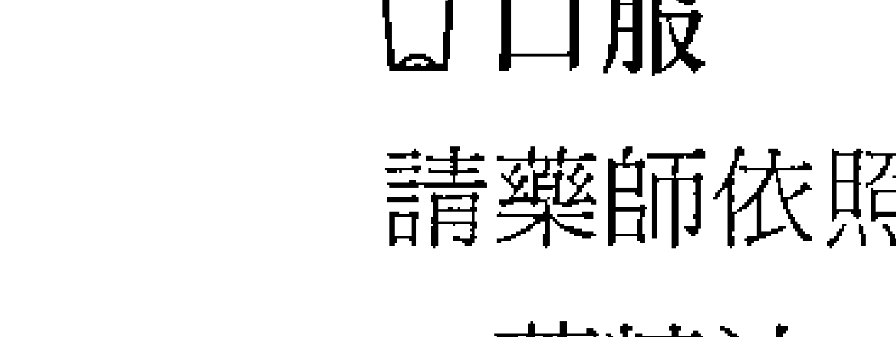

##### 口服

請藥師依照下列配方製作 60 顆膠囊：

- 葛蘭精油 …… 20 mg  
- 錫蘭肉桂精油 …… 20 mg  
- 依蘭精油 …… 10 mg  

傍晚及行房前各服用 1 顆，連續 20 天。

---

## 驚嚇（情緒）

#### 小孩專用

  
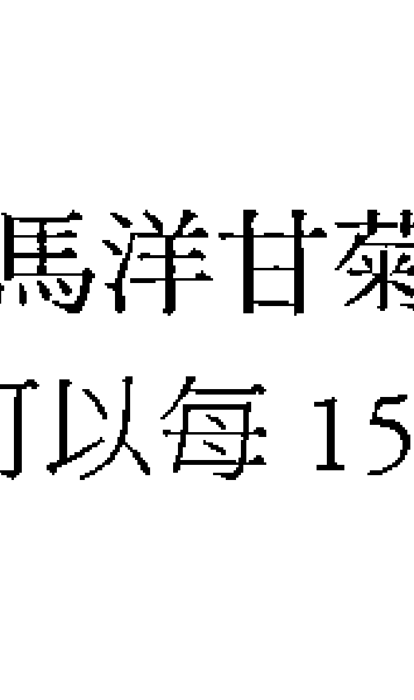

#### 我的精簡配方

以盡速緩和情緒：

- 吸聞  
  直接讓孩子吸聞打開瓶蓋的羅馬洋甘菊精油，可以一口氣大量吸聞 2～3 次，也可以每 15 分鐘吸聞 1 次，重複 2～3 次。

- 塗抹  
  以 1 或 2 滴大馬士革玫瑰精油塗抹孩子的腹腔神經叢。

---

#### 完整配方

##### 塗抹

在 2 ml 深色滴管瓶裡調合：

- 沒藥精油 …… 2 滴  
- 穗甘松精油 …… 2 滴  
- 大馬士革玫瑰精油 …… 2 滴  
- 山金車浸泡油 …… 裝滿 2 ml  

以此調合油 1 或 2 滴塗抹在孩子的腹腔神經叢。

---

## 萊姆病

#### 我的精簡配方

塗抹  
一發現被叮咬後，馬上在被叮處敷上以數滴綠花白千層及穗花薰衣草精油浸泡的濕敷料，每日濕敷數次，連續 2 天。

### 請藥局調製（若已確診）

##### 口服

請藥師依照下列配方製作 60 顆膠囊（可重複療程）：

配方 1：

- 多苞葉尤加利精油 …… 20 mg  
- 冬季香薄荷精油 …… 20 mg  
- 野馬鬱蘭精油 …… 20 mg  
- 山肉桂精油 …… 20 mg  
- 圓葉當歸精油 …… 10 mg  

配方 2：

- 丁香花苞精油 …… 20 mg  
- 茶樹精油 …… 20 mg  
- 羅馬洋甘菊精油 …… 20 mg  
- 檸檬精油 …… 10 mg  

餐前服用 1 顆，連續 20 天後停 8 天。再開始服用第二種配方，一樣在餐前服用 1 顆，連續 20 天後停 8 天。以此類推，交替使用這兩種配方，持續 3 個月。接下來服用 10 天再停 8 天，再換另一種配方重新開始 10 天再停 8 天，直到症狀解除。

⚠ 重要：調理 3 個月後要去驗血檢控。

### 6 歲以上的小孩專用

請藥局客製  
口服

請藥師依照下列配方製作糖漿：

- 茶樹精油 …… 1.5 g  
- 希臘野馬鬱蘭精油 …… 1 g  
- 丁香花苞精油 …… 1 g  
- 乳化劑 …… 15 g  
- 草莓糖漿 …… 裝滿 150 g  

加入 1 茶匙的特製糖漿在 1 杯水裡，讓孩子每日飲用 2 回，連續 20 天。

---

## 熱帶病（預防用）

#### 我的精簡配方

- 口服  
  加 1 滴錫蘭肉桂和 1 滴野馬鬱蘭精油在 1 茶匙蜂蜜或橄欖油裡，早、晚服用 1 回。從第一天抵達到旅程的最後一天都要服用。

---

## 喉嚨痛

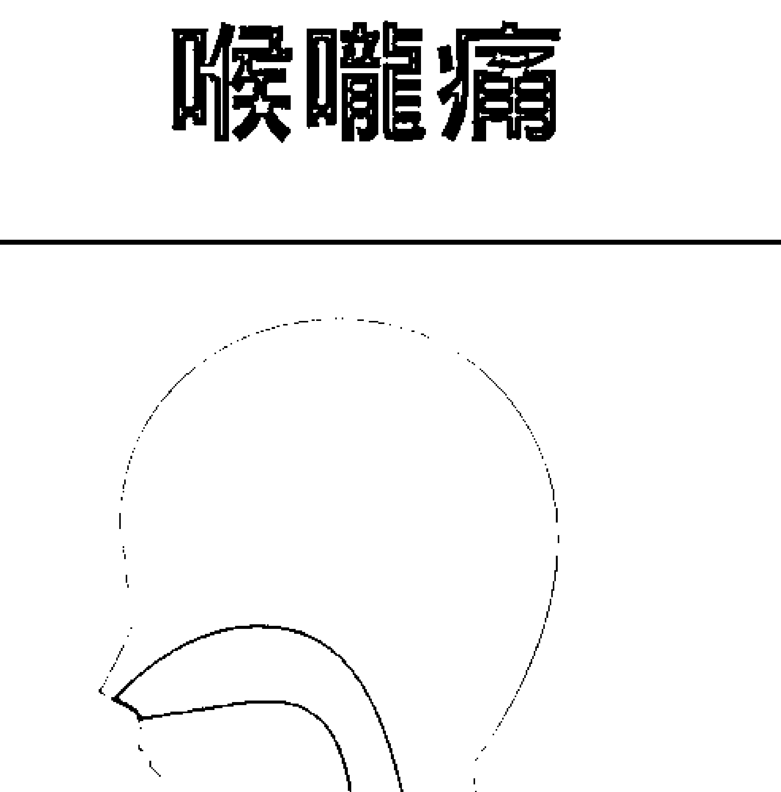

#### 我的精簡配方

- 口服  
  加 2 滴側柏醇百里香精油在 1 小匙蜂蜜裡，再放入嘴裡強化吸收，每日服用 3～5 回。

##### 塗抹

調合：

- 側柏醇百里香精油 …… 1 滴  
- 茶樹精油 …… 1 滴  
- 綠花白千層精油 …… 1 滴  
- 月桂精油 …… 1 滴  
- 金盞菊浸泡油 …… 5 滴  

輕輕沿著喉嚨按摩，包括上頸及淋巴結，每日 3 次，連續 3 天。

##### 口服

調合：

- 側柏醇百里香精油 …… 1 滴  
- 胡椒薄荷精油 …… 1 滴  

將這 2 滴精油加入 1 小匙蜂蜜裡，再放入 1 杯百里香茶裡攪拌後慢慢飲盡。

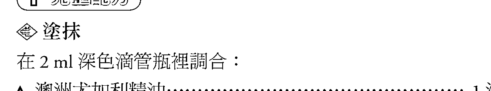

##### 塗抹

在 2 ml 深色滴管瓶裡調合：

- 澳洲尤加利精油 …… 1 滴  
- 桉油醇樟精油 …… 1 滴  
- 側柏醇百里香精油 …… 1 滴  
- 金盞菊浸泡油 …… 1 茶匙  

取此調合油數滴，輕輕按摩脖子並加強扁桃腺部位。每日使用 3 次，連續 3 天。

---

## 牙痛

#### 我的精簡配方

- 塗抹  
  以棉花棒或手指頭沾 1 滴丁香花苞精油塗抹在痛的牙齒或牙齦上，每日 3～4 次，持續 2～3 天。

#### 請藥局客製

- 塗抹  

請藥師在 10 ml 瓶裡調合：

- 丁香花苞精油 …… 8 ml  
- 杜松漿果精油 …… 2 ml  

取 1 滴塗抹在牙齦上，若需要可以每日塗抹數次。

#### 小孩專用

- 塗抹  

調合：

- 羅馬洋甘菊精油 …… 1 滴  
- 月桂精油 …… 1 滴  
- 甜杏仁油 …… 2 滴  

將這 4 滴倒在（很乾淨）的手指頭或棉花棒上，再輕輕按摩疼痛的牙齦。

---

## 背痛

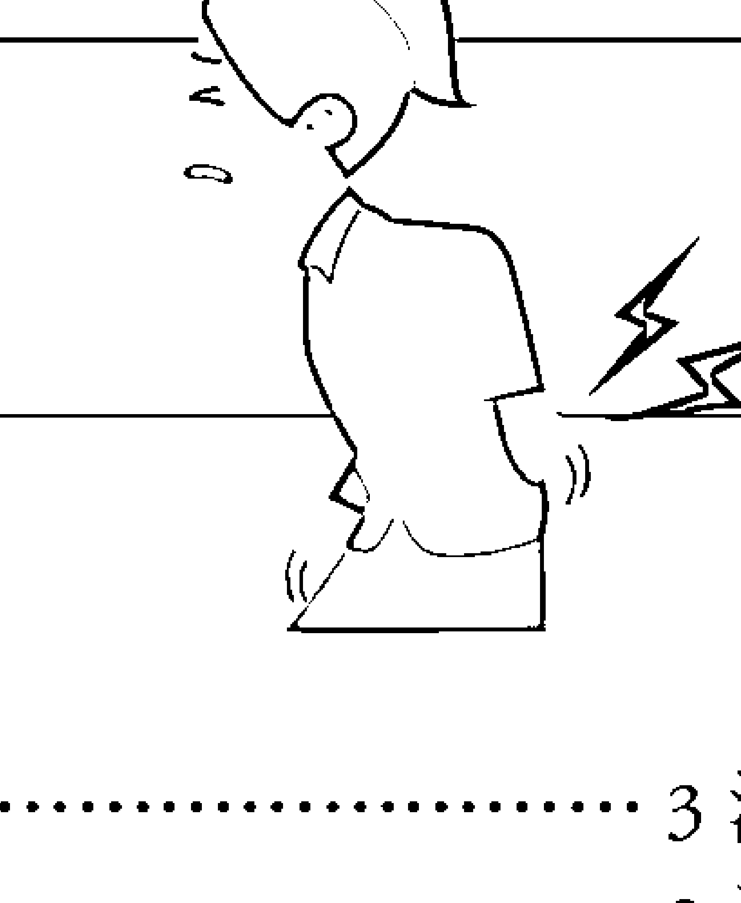

#### 完整配方

##### 塗抹

- 月桂精油 …… 3 滴  
- 羅馬洋甘菊精油 …… 3 滴  
- 檸檬尤加利精油 …… 3 滴  
- 山金車浸泡油 …… 1 茶匙  

當有需要時，請伴侶（或好友）在您泡澡或沐浴後以此調合油幫忙按摩後背。您也可以自己按摩腰部，雖然比較麻煩但同樣有效。

坐骨神經痛專用  
以上述調合油沿著坐骨神經的痛點及神經按摩，每日 2～3 次直到改善為止。

##### 泡澡

調合：

- 檸檬尤加利精油 …… 10 滴  
- 超級醒目薰衣草精油 …… 5 滴  
- 泡澡的基質 …… 1 湯匙  

晚上將以上材料倒入已放好熱水（熱等於止痛藥）的浴缸裡，泡澡約 20 分鐘。無需沖洗，擦乾身體後將自己裹入舒服柔軟的浴袍裡，趁身體還熱熱的躲入棉被裡入睡。

急性腰痛（腰痛）專用

#### 我的精簡配方

- 塗抹  

以 3 滴冬青白珠／芳香白珠精油稀釋在 12 滴山金車浸泡油裡，塗抹下背並按摩久一點（輕輕就好不要用力按壓，以免更痛）。

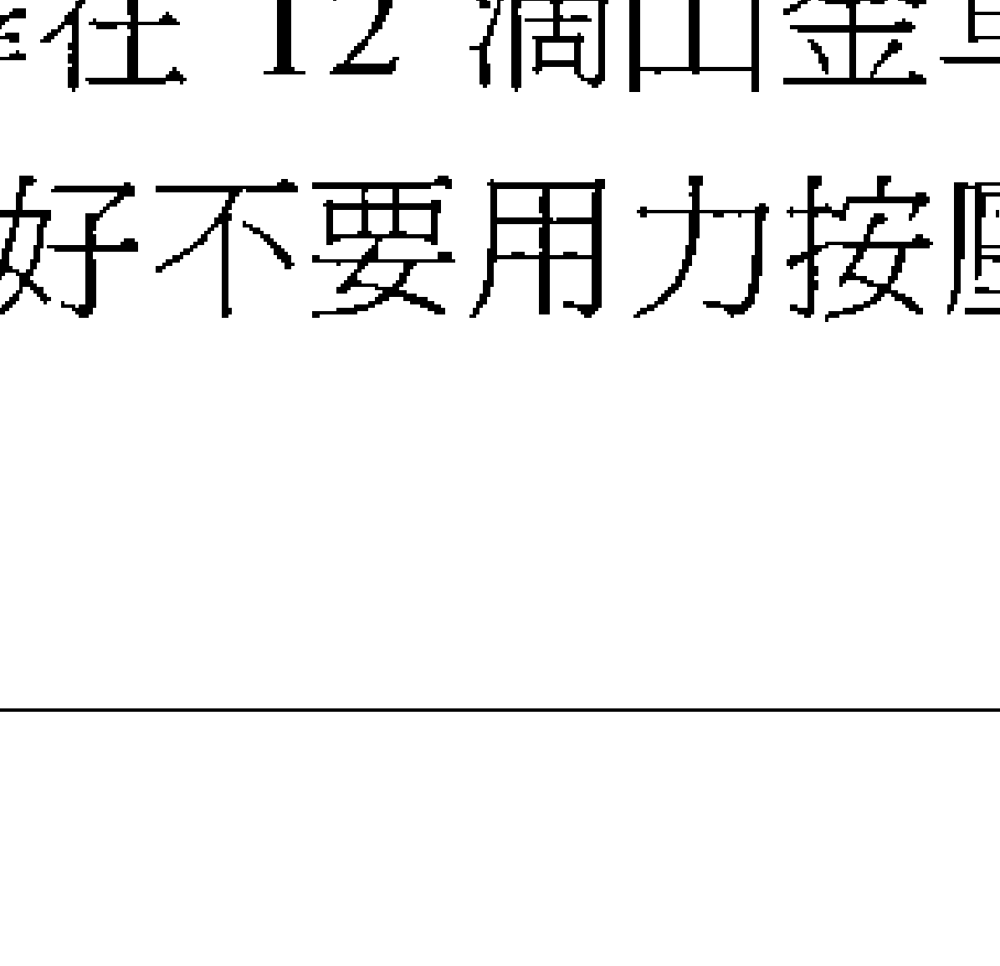

---

#### 完整配方

##### 塗抹

調合：

- 冬青白珠／芳香白珠精油 …… 2 滴  
- 檸檬尤加利精油 …… 2 滴  
- 樟腦迷迭香精油 …… 2 滴  
- 月桂精油 …… 2 滴  
- 超級醒目薰衣草精油 …… 2 滴  
- 義大利永久花精油 …… 1 滴  
- 山金車浸泡油 …… 10 滴  

塗抹下背堵塞的部位並慢慢按摩，千萬別施力把自己弄痛了。手溫有助於皮膚吸收精油。別待在溫度低的空間、涼爽的房間及背後有風的地方。塗抹 4～5 次後會感覺有明顯改善。隔天繼續每日按摩 3 次，直到完全不痛。

#### 孕婦專用

#### 我的精簡配方

- 吸聞  
  每日直接吸聞打開瓶蓋的羅馬洋甘菊精油 3～4 次，持續 2～3 天，以避免肌肉痙攣引起宮縮。

- 塗抹  
  以 5 滴檸檬尤加利精油稀釋在半茶匙山金車浸泡油裡，每日塗抹背部 3 次，持續 3～4 天。

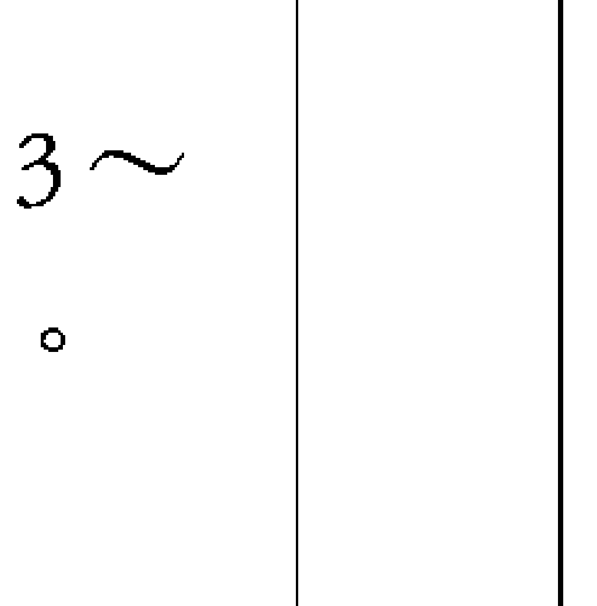

---

#### 完整配方

##### 塗抹

在 5 ml 瓶裡調合：

- 冬青白珠／芳香白珠精油 …… 10 滴  
- 檸檬尤加利精油 …… 10 滴  
- 義大利永久花精油 …… 5 滴  
- 山金車浸泡油 …… 裝滿 5 ml  

以此調合油每日塗抹背痛患部 3 次，持續 3～4 天。

---

## 頭痛／偏頭痛

### 我的隨身配方

- 塗抹  

以 2 滴胡椒薄荷純精油（不稀釋）塗抹太陽穴及額頭（注意：要避開眼睛）。若是在家裡，可以準備濕敷料：先將敷料沖冷水再加 2 滴胡椒薄荷精油上去，放敷料在額頭上濕敷幾分鐘。用這個方法更能緩解頭痛。

---

#### 完整配方

##### 塗抹

在 5 ml 深色滴管瓶裡調合：

- 胡椒薄荷精油 …… 1 ml  
- 羅馬洋甘菊精油 …… 0.5 ml  
- 熱帶羅勒精油 …… 1 ml  
- 超級醒目薰衣草精油 …… 1 ml  
- 冬青白珠／芳香白珠精油 …… 1 ml  

取此複方精油 2～3 滴，在太陽穴及眉毛以上的額頭部位按摩（注意：要避開眼睛）。視需求則每半小時重複 1 次。

#### 請藥局客製

##### 口服

請藥師依照下列配方製作 30 顆膠囊：

- 羅馬洋甘菊精油 …… 10 mg  
- 真正薰衣草精油 …… 20 mg  
- 熱帶羅勒精油 …… 20 mg  
- 檸檬精油 …… 10 mg  
- 甜馬鬱蘭精油 …… 10 mg  

每次服用 1 顆，每日 3～4 回。

> 孕婦專用

#### 我的精簡配方

在家裡、辦公室、車上……擴香  
以數滴真正薰衣草或甜橙精油擴香 10 分鐘，每日 2 或 3 次。

---

#### 完整配方

- 真正薰衣草精油 …… 1 滴  
- 法國羅勒精油 …… 1 滴  
- 月桂精油 …… 1 滴  
- 山金車浸泡油 …… 3 滴  

局部塗抹太陽穴、額頭及後頸（「不舒服」的部位），每日使用 1～3 次（視需求而定）。

---

## 暈車

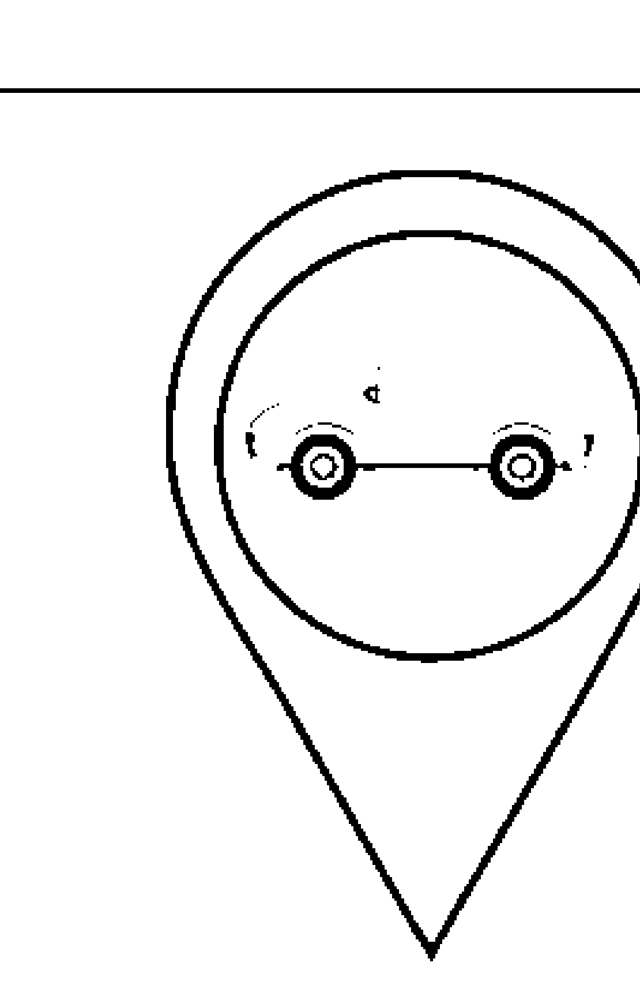

#### 我的精簡配方

- 口服  
  加 1 滴胡椒薄荷精油在半顆方糖上，再放入嘴裡融化吸收。視需求可服用數回。

- 吸聞  
  直接吸聞打開瓶蓋的胡椒薄荷精油。

> 法國羅勒精油又稱歐洲羅勒或甜羅勒。

---

#### 完整配方

塗抹和吸聞（成人、大孩子）  
調合：

- 熱帶羅勒精油 …… 1 滴  
- 胡椒薄荷精油 …… 1 滴  
- 檸檬精油 …… 1 滴  

想吐時，以此複方精油按摩胸部上方。您也可以用吸聞的方式，效果也很好。

#### 孕婦專用

#### 我的精簡配方

- 塗抹  
  用 2 滴薑精油塗抹手腕內側、腹腔神經叢及膝子。視車程狀況可使用多次。

- 口服  
  加 1 滴檸檬精油或薑精油在中性錠片或小方糖上，再放入嘴裡融化吸收。視車程狀況可服用數回，但不要超過 4 回。

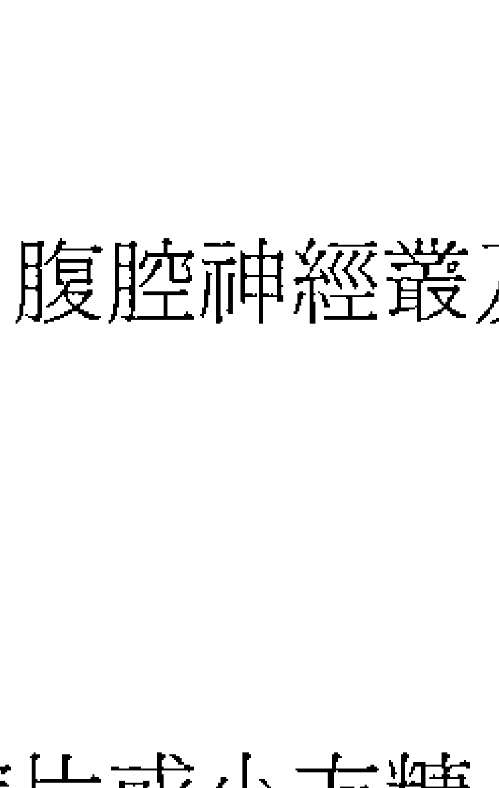

---

#### 小孩專用

### 我的精油配方

- 塗抹  
  用 1 滴薰衣草或甜馬鬱蘭精油，輕輕按摩腹腔神經叢（不需加植物油，在這種狀況可以用純精油，不稀釋）。

- 吸聞  
  讓孩子直接吸聞打開瓶蓋的薰衣草精油。

- 口服  
  在半顆方糖上倒 1 滴薰衣草精油，出發前讓孩子服用。若有需求旅程中可繼續服用。

---

## 孕婦臉部黃褐斑

#### 孕婦專用

#### 完整配方

塗抹  
調合：

- 芹菜籽精油 …… 1 滴  
- 檸檬精油 …… 1 滴  
- 摩洛哥堅果油 …… 2 滴  

局部塗抹斑點處，只能在晚上使用（千萬別在白天使用，若在太陽底下曝曬可能會加深斑點）。

---

## 按摩

#### 完整配方

##### 塗抹

1. SOS 助循環、淋巴引流  
- 義大利永久花精油 …… 3 滴  
- 薰陸香精油 …… 3 滴  
- 玫瑰海棠油 …… 1 茶匙  

2. SOS 緩解肌肉骨骼系統的疼痛  
（扭傷、坐骨神經、急性腰痛、風濕症、落枕……）

- 冬青白珠／芳香白珠精油 …… 3 滴  
- 檸檬迷迭香精油 …… 1 滴  
- 月桂精油 …… 2 滴  
- 山金車浸泡油 …… 1 茶匙

## 3. SOS 搔癢  
（老年癢、麻疹癢、曬太陽過敏癢……等確知或不明原因）

- 真正薰衣草精油 …… 3 滴  
- 羅馬洋甘菊精油 …… 1 滴  
- 檸檬尤加利精油 …… 2 滴  
- 金盞菊浸泡油 …… 1 茶匙  

## 4. SOS 不寧腿症候群

- 超級醒目薰衣草精油 …… 2 滴  
- 絲柏精油 …… 3 滴  
- 甜馬鬱蘭精油 …… 1 滴  
- 玫瑰海棠油 …… 1 茶匙  

## 5. SOS 肚子痛  
（胃痛、消化不良、壓力造成的肚子痛、經期痛）

- 普艾精油 …… 3 滴  
- 羅馬洋甘菊精油 …… 2 滴  
- 胡椒薄荷精油 …… 1 滴  
- 玫瑰海棠油 …… 1 茶匙  

## 6. SOS 壓力症狀  
（痙攣、神經緊張、躁動）

- 真正薰衣草精油 …… 3 滴  
- 苦橙葉精油 …… 2 滴  
- 依蘭精油 …… 1 滴  
- 榛果油 …… 1 茶匙  

## 7. SOS 微生物感染  
（快，提升免疫力！）

- 芳樟精油 …… 3 滴  
- 茶樹精油 …… 3 滴  
- 榛果油 …… 1 茶匙  

任選一種調合油，塗抹在手腕內側微血管上，並慢慢打圈塗抹在腹腔淋巴腫脹處。若可以的話，也塗抹腳底並緩緩按摩久一點。

#### 小孩專用

## 完善配方

塗抹

在 10 ml 滾珠滴管瓶裡調合：

### 1. 柑橘調
- 檸檬香茅精油 …… 6 滴  
- 山雞椒精油 …… 6 滴  
- 紅桔精油 …… 6 滴  
- 瓊崖海棠油 …… 裝滿 10 ml  

### 2. 花香調
- 真正薰衣草精油 …… 8 滴  
- 橙花精油 …… 4 滴  
- 甜馬鬱蘭精油 …… 6 滴  
- 瓊崖海棠油 …… 裝滿 10 ml  

### 3. 異國情調
- 白千層精油 …… 6 滴  
- 桉油醇樟精油 …… 6 滴  
- 玫瑰天竺葵精油 …… 6 滴  
- 瓊崖海棠油 …… 裝滿 10 ml  

### 4. 香草調
- 香草精油 …… 18 滴  
- 玫瑰果油 …… 裝滿 10 ml  

挑選其中一種調合油數滴，幫孩子做一個完整的身體按摩，這樣對有入睡障礙的小孩很有安撫作用。簡單地在肚子、頸、腳等部位做局部按摩，也很有幫助。重要的是與孩子建立連結：短短幾分鐘就像半小時，而精油可以進一步提高這個連結的效益。

## 循環不良

#### 我的簡單配方

- **塗抹**  
  以 2 滴薰陸香精油稀釋在 5 滴瘦身海棠油裡，每日按摩手、腳 2 次。

- **口服**  
  加 1 滴薰陸香精油在方糖或中性錠片上，再放入嘴裡融化吸收。每日 3 回。

#### 完整配方

- **塗抹**  
  在 2 ml 深色滴管瓶裡調合：  
  - 薰陸香精油 …… 1 滴  
  - 義大利永久花精油 …… 1 滴  
  - 絲柏精油 …… 1 滴  
  - 玫瑰海棠油 …… 10 滴  

  以此調合油 10 滴，每日按摩腿及手臂 2～3 次。

- **口服**  
  此為通用配方，適用於一般的循環問題：寒冷、靜脈曲張、靜脈炎、雷諾氏症等。  

  請藥師依照下列配方製作 60 顆膠囊（可重複療程）：  
  - 絲柏精油 …… 20 mg  
  - 薰陸香精油 …… 20 mg  
  - 檸檬精油 …… 20 mg  
  - 丁香花蕾精油 …… 10 mg  

  每日服用 3 顆，持續 20 天。停 1 週後再繼續 20 天。

## 口氣不佳

#### 我的精簡配方

- **口服**：緊急狀況：直接倒 1 滴胡椒薄荷精油在舌頭上服用。

**漱口**：每日數次的護理：加 1 滴胡椒薄荷精油在一小杯水裡，再全部倒入嘴裡漱口（或分 2 次），嘴裡每個角落都要漱到，包括：兩頰、舌頭、舌下、上下顎，再吐掉漱口水。這樣可以讓口氣保持清新持續數小時。用餐後和感覺口氣不佳時都可以這樣漱口。

## 記憶喪失

#### 我的精簡配方

- **口服**：加 1 滴絲柏或義大利永久花精油在中性錠片上（交替使用更好），每日服用 3 回。

> 此為緊急狀況的用法，僅限當日使用，一日不要超過 6 回。長期使用必須諮詢專業芳療師。

## 停經

請參考「熱潮紅」（p.73）和「情緒不穩」（p.209）。

## 單核細胞增多症（接吻病）

請藥局客製

##### 栓劑

請藥師依照下列配方製作 24 顆栓劑：

- 綠花白千層精油 …… 25 mg（小孩） / 50 mg（成人）  
- 桉油醇樟精油 …… 30 mg（小孩） / 50 mg（成人）  
- 月桂精油 …… 20 mg（小孩） / 40 mg（成人）  
- 金盞菊浸泡油 …… 10 mg（小孩） / 10 mg（成人）  
- 栓劑的賦形劑 …… 1 g（小孩） / 3 g（成人）

早、晚施用 1 顆，持續 12 天。

## 被咬傷（狗、蛇等動物）

#### 我的精簡配方

- **塗抹**
  - 清理傷口（用水 + 肥皂），擦乾後立即用數滴薰衣草精油塗抹傷口。每天多塗抹幾次。

### 促癒合的蜂蜜

- 混合：
  - 真正薰衣草精油 …… 1 滴  
  - 茶樹精油 …… 1 滴  
  - 麥盧卡蜂蜜 …… 1 茶匙  

早、晚塗抹傷口直到完全復原。

#### 小孩專用

#### 我的精簡配方

- **塗抹**

1. 清理傷口  
   - 用水和肥皂徹底清洗傷口。

2. 以精油護理  

以 2 滴穗花薰衣草和 2 滴茶樹純精油（不稀釋），輕輕塗抹傷口。當天每小時塗抹 1 次，隔天開始每日塗抹 3 次，持續 5～6 天，接著早、晚各擦 1 次直到完全癒合。

## 鵝口瘡（口腔念珠菌病）

請藥局客製

塗抹

請藥師依照下列配方製作：

- 芳樟精油 …… 1 ml  
- 月桂精油 …… 1 ml  
- 玫瑰草精油 …… 1 ml  
- 金盞花浸泡油 …… 裝滿 5 ml  

用（乾淨的）手指取 2～3 滴，塗抹整個口腔裡的黏膜，每日 3 次，持續 10 天。

若 10 天後鵝口瘡還沒完全消失，請藥師依照下列配方製作（這個配方沒有比較強或比較好，只是換個配方而已）：

- 玫瑰草精油 …… 1 ml  
- 芳樟精油 …… 1 ml  
- 茶樹精油 …… 1 ml  
- 玫瑰天竺葵精油 …… 1 ml  
- 穗花薰衣草精油 …… 1 ml  
- 金盞菊浸泡油 …… 裝滿 5 ml  

用手指取 2～3 滴，塗抹整個口腔裡的黏膜，每日 6 次，持續 1 週或更久。

## 產前憂鬱

#### 孕婦專用

#### 完整配方

- **擴香**
  - 依蘭精油  
  - 橙花精油（和其他精油，如花梨木、紅桧等精油）  
  - 甜橙精油  

每日數次用以上其中一種精油擴香 10 分鐘。

##### 泡澡

- 橙花精油 …… 5 滴  
- 檸檬精油 …… 10 滴  
- 泡澡的基質 …… 1 湯匙  

將以上材料倒入已放好水（溫水）的浴缸裡。早上泡澡 10 分鐘後無需再沖洗。應該說在用「薰衣草」沐浴後，泡個芳香澡。

## 肌肉痛／腰痛、攣縮

#### 我的精簡配方

**塗抹**

以 2 滴冬青白珠／芳香白珠精油按摩肌肉患部，若需要可以塗抹數次。

#### 完整配方

**塗抹**

調合：

- 冬青白珠／芳香白珠精油 —— 1 滴  
- 檸檬迷迭香精油 —— 1 滴  
- 超級醒目薰衣草精油 —— 1 滴  
- 義大利永久花精油 —— 1 滴  
- 檸檬尤加利精油 —— 1 滴  
- 野地薄荷精油 —— 1 滴  
- 山金車浸泡油 —— 10 滴  

依需求做局部按摩，每日 2～3 次，持續 5 天。

**若是運動後的抽筋**

調合：

- 龍艾精油 —— 1 滴  
- 超級醒目薰衣草精油 —— 1 滴  
- 苦橙葉精油 —— 1 滴  
- 冬青白珠／芳香白珠精油 —— 1 滴  
- 山金車浸泡油 —— 5 滴  

輕輕按摩抽筋的部位。每半小時塗抹 1 次直到完全改善。

## 皮膚真菌感染

#### 我的精簡配方
- **塗抹**
  - 以 1 滴茶樹純精油（不稀釋）塗抹皮膚患部，每日 2～3 次直到痊癒。這需要一點點時間復原，可能需要 3 週或更久的時間。

#### 完整配方
- **塗抹**
  - 調合：
    - 茶樹精油 …… 1 滴  
    - 月桂精油 …… 1 滴  
    - 沉香醇百里香精油 …… 1 滴  
    - 玫瑰天竺葵精油 …… 1 滴  
    - 玫瑰草精油 …… 1 滴  
    - 瓊崖海棠油 …… 5 滴  

每日塗抹 3 次持續 20 天或更久，直到完全復原。

#### 孕婦專用

#### 完整配方

- **塗抹**

在 5 ml 深色滴管瓶裡調合：

- 花梨木精油 …… 10 滴  
- 玫瑰天竺葵精油 …… 10 滴  
- 茶樹精油 …… 30 滴  
- 月桂精油 …… 10 滴  
- 荷荷芭油 …… 裝滿 5 ml  

取數滴塗抹患部，每日 2 次，持續 5～6 週，若需要則可以使用更久。

## 指甲真菌症（灰指甲）

#### 完整配方

- **塗抹**

在 10 ml 深色滴管瓶裡調合：

- 玫瑰天竺葵精油 …… 3 ml  
- 茶樹精油 …… 3 ml  
- 月桂精油 …… 3 ml  
- 真正薰衣草精油 …… 1 ml  

以手指或棉花棒沾 1 滴複方精油仔細地塗抹灰指甲患部。早、晚各 1 次，持續 5～6 週。

## 消化道真菌病／口腔念珠菌病

#### 我的精簡配方

- **口服**  
  加 1 滴錫蘭肉桂精油在 1 茶匙橄欖油裡，再放入嘴裡融化吸收，每日 3 回持續 20 天。停 10 天，若需要可再重複 1 次 20 天的療程。

- **塗抹（口腔念珠菌病）**  
  以手指或棉花棒沾 2 滴茶樹純精油（不稀釋）做局部塗抹，每日 3 次直到痊癒。

- **漱口**  
  加 6 滴月桂精油在一杯溫水裡，做一次徹底的漱口，在嘴裡每個角落：上、下、左、右，都要漱到。每日 3 次。

#### 完整配方

- **口服**

調合：

- 茶樹精油 …… 1 滴  
- 錫蘭肉桂精油 …… 1 滴  

將這 2 滴精油加入 1 茶匙橄欖油裡服用，每日 3 回，持續 20 天。

## 請藥局後製

##### 口服

請藥師依照下列配方製作 60 顆膠囊：

- 茶樹精油 …… 20 mg  
- 錫蘭肉桂精油 …… 20 mg  
- 玫瑰草精油 …… 20 mg  
- 希臘野馬鬱蘭精油 …… 20 mg  
- 沉香醇百里香精油 …… 20 mg  

每日服用 3 顆（早、午、晚），持續 20 天。

#### 孕婦專用

#### 完整配方

**漱口（白天）**

- 茶樹精油 …… 1 滴  
- 乳化劑 …… 8 滴  

加入 1 小杯溫水裡漱口，每日 2～3 次。

**漱口（晚上）**

- 茶樹精油 …… 1 滴  
- 月桂精油 …… 1 滴  
- 乳化劑 …… 8 滴  
- 「念珠菌專用」益生菌 …… 1 包  

加入 1 小杯溫水裡，刷牙後用它來好好地漱口。

**口服（懷孕滿 3 個月）**

- 茶樹精油 …… 1 滴  
- 月桂精油 …… 1 滴  

## 香港腳

#### 我的精簡配方
- **塗抹**
  - 以 2 滴茶樹純精油（不稀釋）塗抹香港腳患部，每日 2～3 次直到痊癒（需要一點時間處理，3 週或更久）。

#### 完整配方
- **塗抹**
  - 調合：
    - 茶樹精油 —— 1 滴  
    - 月桂精油 —— 1 滴  
    - 玫瑰天竺葵精油 —— 1 滴  
    - 穗花薰衣草精油 —— 1 滴  
    - 玫瑰草精油 —— 1 滴  
    - 瓊崖海棠油 —— 6 滴  

  每日塗抹 3 次直到痊癒。

- **泡腳**

每晚將腳泡入：

- 茶樹精油 —— 4 滴  
- 沉香醇百里香精油 —— 1 滴  
- 野馬鬱蘭精油 —— 1 滴  
- 泡澡的基質 —— 1 茶匙  

將以上材料全部倒入已放熱水的大盆子或浴盆裡，再將腳放入盆裡泡 15 或 20 分鐘，無需沖洗而直接擦乾。每次洗澡後擦乾身體，記得趾縫間也要擦乾，最後再用 1 滴茶樹純精油（不稀釋）直接塗抹香港腳患部。

## 噁心／嘔吐

### 我的精油配方

**口服**

加 1 滴胡椒薄荷精油在半顆方糖上，再放入嘴裡融化吸收（需要可服用多回，但一天不要超過 6 回。若不想吃方糖，可以直接倒 1 滴在舌頭上服用）。

### 手術後噁心的專用配方

**吸聞**

在 2 ml 深色瓶裡調合：

- 薰衣草精油 …… 10 滴  
- 檸檬精油 …… 10 滴  
- 胡椒薄荷精油 …… 5 滴  

直接打開精油瓶並深深吸聞，視需求可以嗅聞數次，但 24 小時內不要超過 5 次。

#### 完整配方

**口服**

在 2 ml 深色滴管瓶裡調合：

- 檸檬精油 …… 10 滴  
- 胡椒薄荷精油 …… 10 滴  
- 薰衣草精油 …… 10 滴  

> 此為緊急狀況的用法，僅限當日使用，一日不要超過 6 次。長期使用必須諮詢專業芳療師。

## 1000 個感冒精油配方

- 龍艾精油 …… 10 滴  

取此複方精油 2 滴加在紅糖上，再放入嘴裡融化吸收。視需求可服用多回，直到完全改善。

> 注意：此配方不適用於孕婦。若您是孕婦的話，請參考下列孕婦的專用配方。

#### 孕婦專用

#### 我的簡單配方

**口服**

以 1 滴檸檬或羅馬洋甘菊或薰衣草精油稀釋在 1 茶匙蜂蜜裡，或加在方糖或中性錠片上，再放入嘴裡融化吸收。第一次服用要在起床前，後續視需求每日可服用 4～5 回。

**吸聞**

晚間睡前閱讀時，放 2 滴薰衣草精油在枕頭套上和床頭燈罩上，以預防隔天早上起床會有噁心感。

#### 完整配方

**口服**

在 2 ml 深色滴管瓶裡調合：

- 歐洲羅勒精油 …… 10 滴  
- 羅馬洋甘菊精油 …… 10 滴  
- 檸檬精油 …… 10 滴  
- 真正薰衣草精油 …… 10 滴  

取此複方精油 2 滴加在紅糖上，再放入嘴裡融化吸收。視需求可服用數回（但一天不要超過 6 回）。第一次服用要在起床前，後續視需求可再服用數回。

#### 小孩專用

### 我的精油配方

- **口服**

加 1 滴檸檬精油在 1 茶匙蜂蜜裡，再給小孩服用，每日 2～3 回。

## 神經痛

### 我的精油配方

- **塗抹**

以 1 滴穗花薰衣草和 1 滴羅馬洋甘菊精油，沿著疼痛的神經塗抹。視需求可重複塗抹。

### 請藥房配製

- **塗抹**

請藥師依照下列配方製作：

- 義大利永久花精油 …… 0.5 ml  
- 羅馬洋甘菊精油 …… 1 ml  
- 西洋蓍草精油 …… 0.5 ml  
- 山雞椒精油 …… 0.5 ml  
- 穗花薰衣草精油 …… 1 ml  
- 瓊崖海棠油 …… 裝滿 10 ml  

取此調合油 4～6 滴塗抹在神經會痛的部位，視需求可以重複塗抹。

## 鼻塞／流鼻涕

#### 我的精簡配方

**吸聞**

倒 5 滴綠花白千層精油在手帕上吸聞，每日 4～6 次。

#### 完整配方

**吸聞**

調合：

- 綠花白千層精油 …… 1 滴  
- 桉油醇樟精油 …… 1 滴  
- 澳洲尤加利精油 …… 1 滴  

先擤鼻涕，再用海水噴鼻劑清洗鼻腔。

## 然後

白天乾式吸入：倒 5 滴複方精油在手帕上並深深吸聞，每日 4～6 次。

晚上濕式吸入（睡前）：先在一碗熱水裡倒入複方精油。在碗前面舒服地坐好，並將臉放在蒸氣上方，最後用一條大毛巾將頭蓋住，以跟外面隔離。

## 鼻滴

在 30 ml 附圓頭滴管的瓶裡調合：

- 胡椒薄荷精油 …… 0.5 ml  
- 真正薰衣草精油 …… 1 ml  
- 龍艾精油 …… 1 ml  
- 摩洛哥藍艾菊精油 …… 1 ml  
- 甜杏仁油 …… 裝滿 30 ml  

在每個鼻孔裡滴入 2 滴調合油，頭要往後仰才能讓調合油在鼻內到處流動。

## 鼻塞

#### 完整配方

##### 擴香

在擴香儀裡倒入：

- 芳樟精油 …… 5 ml  
- 澳洲尤加利精油 …… 5 ml  

每小時在孩子活動的空間擴香 10 分鐘。

##### 塗抹

- 澳洲尤加利精油 …… 6 滴  
- 土木香精油 …… 3 滴  
- 金盞菊浸泡油 …… 裝滿 2 ml  

以此調合油 2～3 滴塗抹鼻翼，每日 3～4 次。

## 流鼻涕

##### 擴香

在擴香儀裡倒入：

- 桉油醇檸檬精油 …… 5 滴  
- 澳洲尤加利精油 …… 5 滴  
- 桉油醇迷迭香精油 …… 5 滴  

每小時在孩子活動的空間擴香 10 分鐘，持續 2～3 天。

##### 塗抹

在 2 ml 深色滴管瓶裡調合：

- 桉油醇檸檬精油 …… 10 滴  
- 芳樟精油 …… 5 滴  
- 甜杏仁油 …… 裝滿 2 ml  

先以海水填鼻劑清洗鼻腔，後用吸鼻器將鼻涕吸出來，再用調合油 2～3 滴塗抹鼻翼。依這個方法一天可以使用 3 次。

### 鼻滴（5 歲以上的小孩）

在 30 ml 附圓頭滴管的瓶裡調合：

- 桉油醇檸檬精油 …… 1 ml  
- 芳樟精油 …… 1 ml  
- 穗花薰衣草精油 …… 0.1 ml  
- 膠冷杉精油 …… 0.1 ml  
- 甜杏仁油 …… 裝滿 30 ml  

請孩子自己先擤鼻涕，再用海水噴霧劑清洗鼻腔。接著在每個鼻孔滴入 2 滴調合油，每日 3 次，但不要超過 4～5 天。

## 指甲脆弱

#### 完整配方

塗抹

在瓶裡調合：

- 檸檬精油 …… 10 滴  
- 小麥胚芽油或月見草油 …… 5 ml  

每週以此調合油按摩手和指甲 2～3 次。

## 腮腺炎

> 小孩及嬰兒專用

#### 完整配方

塗抹

在 2 ml 深色滴管瓶裡調合：

- 桉油醇樟精油 …… 5 滴  
- 澳洲尤加利精油 …… 5 滴  
- 羅馬洋甘菊精油 …… 3 滴  
- 聖約翰草浸泡油 …… 裝滿 2 ml  

以 3 滴調合油塗抹下巴和脖子，每日 3 次，持續 4～5 天。

##### 栓劑

請藥師依下列配方製作 12 顆栓劑：

- 桉油醇樟精油 …… 30 mg（嬰兒） / 40 mg（小孩）  
- 薰陸香精油 …… 10 mg（嬰兒） / 15 mg（小孩）  
- 羅馬洋甘菊精油 …… 10 mg（嬰兒） / 15 mg（小孩）  
- 金盞菊浸泡油 …… 10 mg（嬰兒） / 10 mg（小孩）  
- 栓劑的賦形劑 …… 1 g（嬰兒） / 1 g（小孩）

早、晚各施用 1 顆，持續 4～5 天。

## 麥粒腫

#### 完整配方

洗眼時

在 100 ml 純水中均等調合：

- 洋甘菊純露  
- 矢車菊純露  
- 薰衣草純露  

慢慢將複方純露直接倒入眼睛（或用敷料浸泡純露敷眼睛，若您無法接受將液體倒入張開的眼睛）裡做「眼浴」。

接著塗抹一般的眼用軟膏：等同於小麥胚芽油，白天塗抹 3 次，再加睡前 1 次。

> 注意：是純露，不是精油。絕對不能在眼睛裡倒入精油。

## 中耳炎

#### 我的精簡配方

塗抹

以 1 滴澳洲尤加利或 1 滴綠花白千層精油按摩耳朵周圍（或雙耳），每日 3 次，直到改善。

#### 完整配方

塗抹

- 澳洲尤加利精油 …… 2 滴  
- 綠花白千層精油 …… 2 滴  
- 茶樹精油 …… 2 滴  
- 沉香醇百里香精油 …… 2 滴  
- 聖約翰草浸泡油 …… 10 滴  

取 2 滴調合油按摩耳朵周圍（或雙耳），每日 3 次直到改善。

#### 請藥局客製

耳滴

請藥師依下列配方製作耳滴，在 10 ml 附圓形滴管的瓶裡調合：

- 馬鬱蘭酮迷迭香精油 …… 4 滴  
- 茶樹精油 …… 4 滴  
- 穗花薰衣草精油 …… 4 滴  
- 聖約翰草浸泡油 …… 裝滿 10 ml  

慢慢滴入 1 滴到耳道裡，每日 4 次。

##### 栓劑

請藥師依下列配方製作 12 顆栓劑：

- 澳洲尤加利精油 …… 40 mg  
- 綠花白千層精油 …… 40 mg  
- 義大利永久花精油 …… 20 mg  
- 摩洛哥藍艾菊精油 …… 20 mg  
- 聖約翰草浸泡油 …… 20 mg  

每日施用 3 顆，連續 2 天後，第三天則減為每日 2 顆，再繼續用 3 天。

#### 孕婦專用

#### 完整配方

- 澳洲尤加利精油 …… 1 滴  
- 檸檬尤加利精油 …… 1 滴  
- 榛果油 …… 3 滴  

每日在耳廓周圍（耳朵周圍）塗抹 4 次，持續 5 天。

或

以棉芯浸泡在調合油裡，再輕輕塞入耳道裡，每日 3 次，直到痊癒。

#### 小孩專用

### 急性中耳炎

#### 完整配方

塗抹

在 2 ml 深色滴管瓶裡調合：

- 綠花白千層精油 …… 3 滴  
- 檸檬尤加利精油 …… 3 滴  
- 沉香醇百里香精油 …… 3 滴  
- 聖約翰草浸泡油 …… 裝滿 2 ml  

取調合油 3 滴塗抹耳周並輕輕按摩，每日 3 次，持續 1 週。

### 口服（6 歲以上的小孩）

在小瓶裡調合：

- 桉油醇檸檬精油 …… 1 ml  
- 側柏醇百里香精油 …… 1 ml  
- 桉油醇迷迭香精油 …… 1 ml  

加 1 滴複方精油在方糖上或 1 小匙蜂蜜裡，再讓小孩吸吮。每日 3 回，連續 3 天。

### 滴入耳裡（若塗抹外用還不夠的話）

在 5 ml 滴管瓶調合：

- 義大利永久花精油 …… 2 滴  
- 摩洛哥藍艾菊精油 …… 2 滴  
- 綠花白千層精油 …… 2 滴  
- 甜杏仁油 …… 裝滿 5 ml  

以棉芯沾 2 滴調合油，再輕輕塞入耳朵裡，每日 3 次，連續 3 天。

##### 栓劑

請藥師依下列配方製作 12 顆栓劑：

| 成分 | 嬰兒 | 小孩 |
|---|---|---|
| 側柏醇百里香精油 | 20 mg | 30 mg |
| 綠花白千層精油 | 15 mg | 20 mg |
| 義大利永久花精油 | 5 mg | 10 mg |
| 摩洛哥藍艾菊精油 | 5 mg | 10 mg |
| 聖約翰草浸泡油 | 10 mg | 10 mg |
| 栓劑的賦形劑 | 1 g | 1 g |

每日施用 3 顆，持續 3 天。

## 漿液性中耳炎（滿 3 歲的小孩）

#### 完整配方

- 塗抹  
  在 5 ml 深色滴管瓶裡調合：  
  - 義大利永久花精油 …… 2 滴  
  - 桉油醇迷迭香精油 …… 2 滴  
  - 甜杏仁油 …… 裝滿 5 ml  

  取調合油 3～4 滴輕輕按摩耳周，每日 3～4 次，持續 1 週。

- 滴入耳裡  
  在 5 ml 滴管瓶裡調合：  
  - 義大利永久花精油 …… 2 滴  
  - 甜麻籽油 …… 裝滿 5 ml  

  以棉芯沾 2 滴調合油，再輕輕塞入耳朵裡，每日 2 次，連續 3 天。

## 心悸

#### 我的精簡配方

- 口服  
  加 1 滴依蘭精油在 1 小匙蜂蜜裡，再放入嘴裡融化吸收。每日服用 3 回。

- 吸聞  
  以 1 滴依蘭精油塗抹在手腕內側並深深吸聞。

#### 完整配方

擴香

均等調合：

- 依蘭精油  
- 真正薰衣草精油  
- 山雞椒精油  

早、晚在活動的空間擴香半小時。

塗抹

調合：

- 甜馬鬱蘭精油 …… 1 滴  
- 依蘭精油 …… 1 滴  
- 真正薰衣草精油 …… 1 滴  
- 羅馬洋甘菊精油 …… 1 滴  
- 瓊崖海棠油 …… 2 滴  

以調合油按摩腹腔神經叢和脖子，每日 2 次。

### 請藥房諮詢

口服

請藥師依照下列配方製作 30 顆膠囊：

- 超級醒目薰衣草精油 …… 20 mg  
- 依蘭精油 …… 15 mg  
- 真正薰衣草精油 …… 10 mg  
- 甜馬鬱蘭精油 …… 10 mg  
- 馬鞭草酮迷迭香精油 …… 10 mg  

早、晚服用 1 或 2 顆，直到恢復正常（您不再感覺心跳太快）。

#### 孕婦專用

#### 完整配方

- 塗抹和吸聞  
  - 依蘭精油 …… 2 滴  
  - 真正薰衣草精油 …… 1 滴  
  - 榛果油 …… 3 滴  

  塗抹在腹腔神經叢和手腕內側（並深深吸聞），每日 2～3 次。

- 塗抹（若「情緒暴走」）  
  - 維底洋甘菊精油 …… 1 滴  
  - 苦橙葉精油 …… 1 滴  
  - 檸檬尤加利精油 …… 1 滴  
  - 榛果油 …… 3 滴  

  塗抹在腹腔神經叢和心神經叢上，視需求可以塗抹數次。您可以用「塗抹」的兩個配方交替使用。

- 口服（懷孕滿 3 個月）  
  - 苦橙葉精油 …… 1 滴  
  - 檸檬馬鞭草精油 …… 1 滴  

  加在中性錠片上或 1/2 茶匙橄欖油裡，再放入口腔裡融化吸收。每日 3 回，持續 20 天。

- 擴香  
  - 真正薰衣草精油  
  - 苦橙葉精油  

  早、晚用其中一種精油擴香 10 分鐘。

## 瘧疾

##### 塗抹

請藥師依下列配方製作（大約可塗抹 100 次）：

- 多苞葉尤加利精油 …… 2 ml  
- 叮咬香茅精油 …… 1 ml  
- 丁香花苞精油 …… 1 ml  
- 助溶劑 …… 裝滿 10 ml  

預防被叮咬：以此配方 2 滴塗抹在前胸、後背及暴露在衣服外的部位。在外旅行或出門在外時，每日塗抹 2～3 次。

處理已被叮咬處：如上使用方式，但劑量要三倍，也就是每次 2 滴，每日塗抹 6 次。

### 口服（預防用）

請藥師依照下列配方製作 60 顆膠囊：

- 冬季香薄荷精油 …… 20 mg  
- 錫蘭肉桂精油 …… 20 mg  
- 希臘野馬鬱蘭精油 …… 20 mg  

旅行出門在外期間，每天早上服用 2 顆，旅行結束回家後再繼續服用 3 週。

## 甲溝炎

#### 我的精簡配方

塗抹（使成熟軟化）

每 15 分鐘用泡過溫水的敷料並加數滴真正薰衣草精油熱敷，直到完全成熟軟化。

#### 完整配方

塗抹（以消毒）

在 100 ml 瓶裡均勻調合：

- 岩玫瑰純露  
- 月桂純露  
- 真正薰衣草純露  
- 百里酚百里香純露  

每天大量地用以上純露加在無菌敷料上，敷在發炎的甲溝炎患部，每日使用 3～4 次。

塗抹（以癒合）

調合：

- 真正薰衣草精油 …… 1 滴  
- 月桂精油 …… 1 滴  
- 側柏醇百里香精油 …… 1 滴  
- 丁香花苞精油 …… 1 滴  
- 綠花白千層精油 …… 1 滴  
- 60% 酒精 …… 1 茶匙  

以純露敷料消毒後，直接以此稀釋精油 3～4 滴塗抹在甲溝炎患部。

## 腸道寄生蟲（阿米巴蟲、蟯蟲、蛔蟲）

針對所有的寄生蟲

#### 我的精簡配方

口服

加 2 滴沉香醇百里香精油在 1 茶匙蜂蜜裡或中性錠片上，再放入口腔裡融化吸收。每日服用 3 回。

## 阿米巴蟲

### 請藥局複製

口服

請藥師依照下列配方製作 60 顆膠囊（可重複療程）：

- 冬季香薄荷精油 …… 25 mg  
- 多苞葉尤加利精油 …… 25 mg  
- 沉香醇百里香精油 …… 25 mg  

早、午、晚各服用 1 顆，持續 20 天，停 1 週後再繼續 20 天。

口服（如上述配方沒有根除所有的寄生蟲）：

請藥師依照下列配方製作 30 顆膠囊（可重複療程）：

- 茶樹精油 …… 30 mg  
- 丁香花苞精油 …… 30 mg  
- 羅馬洋甘菊精油 …… 10 mg  

##### 栓劑

請藥師依下列配方製作 6 顆栓劑：

- 太平洋檀香精油 …… 40 mg  
- 沉香醇百里香精油 …… 40 mg  
- 羅馬洋甘菊精油 …… 20 mg  
- 茶樹精油 …… 30 mg  
- 聖約翰草浸泡油 …… 20 mg  

每日施用 1 顆，連續 3 天，停 15 天後再進行 1 次療程，最好是滿月或新月期間施用。

#### 孕婦專用

我的簡單配方

口服（懷孕滿 3 個月）

加 1 滴茶樹和沉香醇百里香精油在中性錠片上服用，每日 3 回，連續 5 天。下次等滿月時再服用。

#### 小孩專用

### 梨形鞭毛蟲（滿 3 歲的小孩）

栓劑

請藥師依下列配方製作 30 顆栓劑：

- 多苞葉尤加利精油 …… 10 mg  
- 羅馬洋甘菊精油 …… 20 mg  
- 野馬鬱蘭精油 …… 10 mg  
- 金盞菊浸泡油 …… 10 mg  

每日施用 2 顆，持續 2 週。

## 蟯蟲（滿 3 歲的小孩）

栓劑

請藥師依下列配方製作 6 顆栓劑（可重複療程）：

- 沉香醇百里香精油 …… 20 mg  
- 芫荽籽精油 …… 10 mg  
- 馬鞭草酮迷迭香精油 …… 10 mg  
- 檸檬精油 …… 10 mg  
- 聖約翰草浸泡油 …… 20 mg  

早、晚各施用 1 顆，連續 3 天。15 天後再重複一次，試試在滿月或新月期間施用。

## 蛔蟲（滿 3 歲的小孩）

栓劑

請藥師依下列配方製作 6 顆栓劑（可重複療程）：

- 茶樹精油 …… 20 mg  
- 沉香醇百里香精油 …… 20 mg  
- 羅馬洋甘菊精油 …… 20 mg  
- 樟腦迷迭香精油 …… 10 mg  
- 聖約翰草浸泡油 …… 20 mg  

每日施用 2 次，連續 3 天。下次是隔 15 天後的新月和滿月再進行 2 輪（總共要有 3 次的療程）。

口服

在 100 ml 瓶裡均勻調合：

- 沉香醇百里香純露  
- 冬季香薄荷純露  
- 羅馬洋甘菊純露  

以此複方純露 1 茶匙加入 1 杯飲用水裡，在月相變化時每日喝 2 回，持續數月。若是施用栓劑的那幾天就一起進行（這是補充）。

> 注意：是純露，不是精油！

## 油性肌膚

#### 完整配方

- 塗抹  
  在瓶裡均等調合：  
  - 玫瑰純露  
  - 冬季香薄荷或百里香純露  

  搖勻後，用化妝棉沾幾滴塗抹臉部。  
  ⚠️ 注意：是純露，不是精油！

- 早上塗抹  
  加入：  
  - 玫瑰天竺葵精油 …… 1 滴  
  - 真正薰衣草精油 …… 1 滴  

  加到您的保濕日霜裡，並跟平日保養一樣塗抹。

- 臉部柔拿（凝膠型和黑頭粉刺型的青春痘）  
  在盛有熱水的碗裡倒入：  
  - 廣藿香精油 …… 1 滴  
  - 檸檬精油 …… 2 滴  
  - 真正薰衣草精油 …… 2 滴  
  - 綠花白千層精油 …… 1 滴  

  臉置於碗上方，並沐浴在芳香水蒸氣裡 15 分鐘。接著早上以浸泡過玫瑰純露的敷料塗抹臉部。

- 晚上塗抹  
  抗青春痘調理油：  
  - 真正薰衣草精油 …… 1 滴  
  - 玫瑰天竺葵精油 …… 1 滴  
  - 紅桔精油 …… 1 滴  
  - 檸檬精油 …… 1 滴  
  - 荷荷芭油 …… 10 滴  

  塗抹在完全洗淨的皮膚上。

## 美化皮膚

#### 完整配方

塗抹

在深色瓶裡調合：

- 大馬士革玫瑰精油 …… 0.5 ml  
- 芳樟精油 …… 5 ml  
- 小麥胚芽油 …… 50 ml  

早、晚以此精華油數滴塗抹在完全洗淨的臉上。

## 皮膚鬆弛老化

#### 完整配方

塗抹

臉部配方（白天）

在 30 ml 深色瓶裡調合：

- 芳樟精油 …… 1 ml  
- 玫瑰天竺葵精油 …… 1 ml  
- 快樂鼠尾草精油 …… 0.5 ml  
- 超級醒目薰衣草精油 …… 0.5 ml  
- 岩玫瑰精油 …… 1 ml  
- 玫瑰果油 …… 13 ml  
- 摩洛哥堅果油 …… 13 ml  

梳洗後，以此精華油數滴塗抹在完全洗淨的臉上，並按摩久一點以加強皮膚的吸收。

### 臉部配方（晚上）

在 30 ml 深色瓶裡調合：

- 玫瑰天竺葵精油 …… 1 ml  
- 真正薰衣草精油 …… 1 ml  
- 依蘭精油 …… 0.5 ml  
- 岩玫瑰精油 …… 1 ml  
- 小麥胚芽油 …… 裝滿 30 ml  

梳洗後，以此精華油數滴塗抹在完全洗淨的臉上，並配合按摩以加強皮膚的吸收。

### 身體緊實保養油

在 100 ml 深色瓶裡調合：

- 芳樟精油 …… 15 ml  
- 大馬士革玫瑰精油 …… 0.5 ml  
- 玫瑰天竺葵精油 …… 5 ml  
- 馬鞭草酮迷迭香精油 …… 5 ml  
- 岩玫瑰精油 …… 5 ml  
- 摩洛哥堅果油 …… 50 ml  
- 小麥胚芽油 …… 裝滿 100 ml  

沐浴後，以此調合油塗抹按摩全身，再很快地用微涼的水沖一下（若能在皮膚留下一層薄膜，那就更好了）。

## 乾性肌膚

#### 我的精簡配方

塗抹

以 2 滴芳樟精油稀釋在 3 滴小麥胚芽油裡，將它當成平常肌膚保養品一樣使用。按摩後調合油的油脂會被皮膚吸收。

## 請藥局複製

##### 塗抹

請藥師依下列配方準備：

- 玫瑰草精油 …… 10 滴  
- 鼠尾草精油 …… 10 滴  
- 琉璃苣油 …… 25 ml  
- 小麥胚芽油 …… 25 ml  

早、晚以此精華油數滴塗抹在完全洗淨的臉上，並按摩臉和脖子以加強皮膚的吸收。

## 敏感肌膚

#### 完整配方

##### 塗抹

在瓶裡均等融合：

- 羅馬洋甘菊純露  
- 真正薰衣草純露  
- 鼠尾草純露  
- 胡椒薄荷純露  

早、晚梳洗後，以浸泡過複方純露的化妝棉擦拭臉部，能立即舒緩鎮定皮膚。

> 注意：是純露，不是精油！

然後

在 50 ml 深色滴管瓶裡調合：

- 依蘭精油 …… 20 滴  
- 真正薰衣草精油 …… 10 滴  
- 玫瑰天竺葵精油 …… 10 滴  
- 金盞菊浸泡油 …… 裝滿 50 ml  

以純露擦拭臉部後，再取精華油數滴塗抹保養，如同用護理油呵護皮膚一樣。

---

## 頭皮屑

#### 完整配方

##### 塗抹

先將 200 ml 富含高嶺土的有機洗髮精倒出 1 茶匙（為了挪出空間以加入精油，不要浪費，可以加 3 滴大西洋雪松精油到這 1 茶匙的洗髮精裡），再加入：

- 茶樹精油 …… 30 滴  
- 玫瑰天竺葵精油 …… 20 滴  
- 大西洋雪松精油 …… 10 滴  
- 杜松漿果精油 …… 10 滴  

用您新的「抗頭皮屑」洗髮精，跟平常一樣洗頭髮。並用指腹移動式地按摩頭皮，停留 2 分鐘後再沖洗。

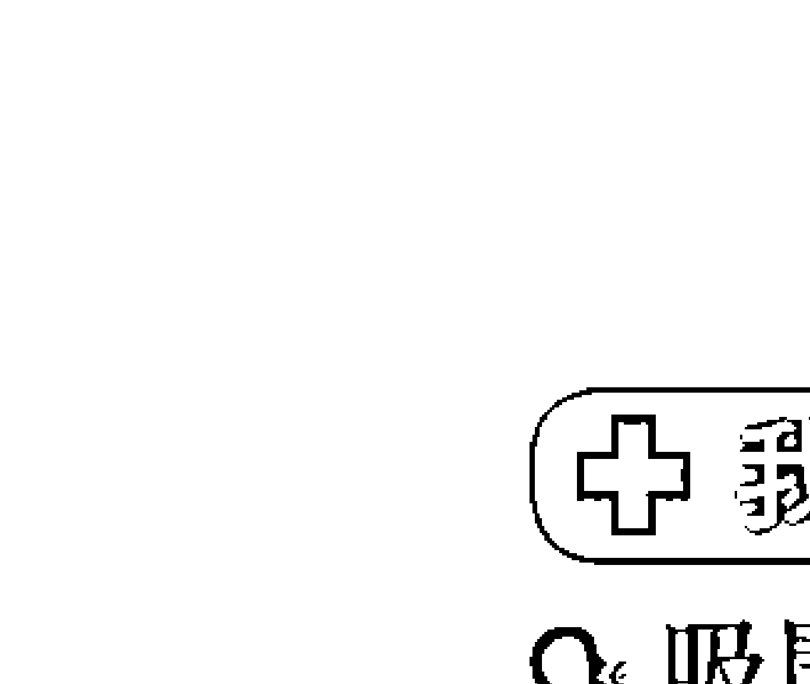

---

## 硬脊膜外注射

#### 我的精簡配方

##### 吸聞

直接吸聞打開的羅馬洋甘菊精油，在注射前嗅聞 2～3 次。

##### 塗抹

注射前半小時以 2 滴羅馬洋甘菊精油塗抹腹腔神經叢和即將被注射的部位，注射前再塗抹一次。

以上兩種（吸聞和塗抹）配方應該足夠讓人感到完全放鬆，以達到「前驅麻醉」的效果。若還是無法放鬆的話，請再加入以下的口服配方。

### 口服（口腔黏膜吸收／含服）

注射半小時前倒 1 滴羅馬洋甘菊精油在 1 茶匙蜂蜜裡服用。

---

## 白帶

#### 我的精簡配方

##### 口服

加 1 滴錫蘭肉桂精油在中性錠片上、小方糖上或 1 茶匙蜂蜜裡，再放入口腔裡融化吸收。每日服用 4 回，連續 3 天。

#### 完整配方

#### 沖洗陰道

在瓶裡均等調合：

- 薰衣草純露  
- 月桂純露  
- 冬季香薄荷純露  
- 洋甘菊純露  
- 土木香純露  

每天早上以陰道沖洗器將此複方純露 20 ml 灌入陰道裡，持續 10 天。

⚠ 注意：是純露，不是精油！

#### 請藥局客製

##### 口服

請藥師依下列配方製作 60 顆膠囊（可重複療程）：

- 錫蘭肉桂精油 …… 10 mg  
- 冬季香薄荷精油 …… 10 mg  
- 茶樹精油 …… 10 mg  
- 鼠尾草精油 …… 20 mg  

每次服用 2 顆，每日 4 回，連續 5 天。第六天則減為每日 3 回，再繼續 10 天。

### 陰道栓劑

請藥師依下列配方製作 18 顆陰道栓劑：

- 鼠尾草精油 …… 30 mg  
- 丁香花苞精油 …… 30 mg  
- 月桂精油 …… 40 mg  
- 茶樹精油 …… 40 mg  
- 聖約翰草浸泡油 …… 100 mg  

早、晚各塞入 1 顆入陰道裡，連續 9 天。

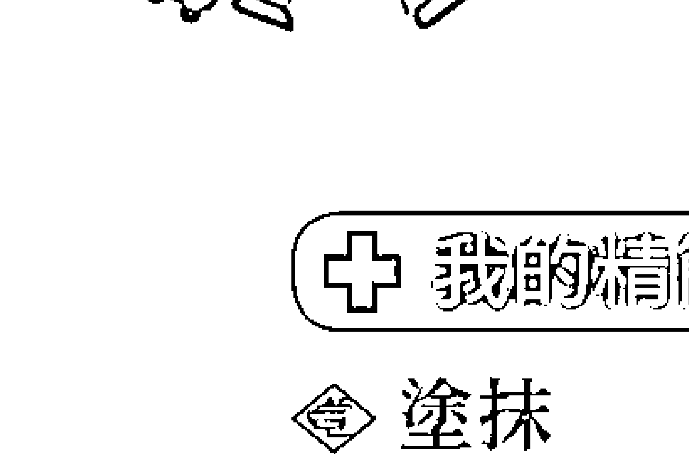

---

## 害怕搭飛機

#### 我的精簡配方

- **塗抹**：以 2 滴羅馬洋甘菊精油慢慢塗抹在腹腔神經叢上。  
- **吸聞**：直接深深吸聞打開的羅馬洋甘菊精油，視需求可嗅聞多次。

#### 完整配方

#### 塗抹和吸聞

調合：

- 羅馬洋甘菊精油 …… 1 滴  
- 苦橙葉精油 …… 1 滴  
- 真正薰衣草精油 …… 1 滴  
- 甜馬鬱蘭精油 …… 1 滴  
- 月桂精油 …… 1 滴  
- 瓊崖海棠油 …… 5 滴  

輕輕塗抹在腹腔神經叢和手腕上，再將手放在鼻子下方深深吸聞精油的氣味。

---

## 靜脈炎

#### 我的簡單配方

##### 塗抹

以數滴義大利永久花精油稀釋在一點點的瓊崖海棠油裡，輕輕地做局部按摩。每日按摩數次，直到您的循環改善為止。

#### 完整配方

##### 塗抹

調合：

- 義大利永久花精油 …… 1 滴  
- 檸檬精油 …… 1 滴  
- 月桂精油 …… 1 滴  
- 山雞椒精油 …… 1 滴  
- 瓊崖海棠油 …… 5 滴  

沿著發炎的部位輕輕按摩，每日 5～6 次，持續 20 天。若需要可以再繼續使用。

##### 口服

請藥師依下列配方製作 60 顆膠囊（可重複療程）：

- 絲柏精油 …… 25 mg  
- 檸檬尤加利精油 …… 25 mg  
- 義大利永久花精油 …… 25 mg  
- 檸檬精油 …… 10 mg  

每次服用 1 顆，每日 3 回，持續 20 天。停 10 天後可再重複療程。

---

## 身上穿洞

##### 塗抹

以數滴真正薰衣草純精油（不稀釋）塗抹穿洞的部位。可每天塗抹數次。

#### 完整配方

##### 塗抹

在 2 ml 深色滴管瓶裡調合：

- 茶樹精油 …… 10 滴  
- 超級醒目薰衣草精油 …… 20 滴  
- 岩玫瑰精油 …… 20 滴  

以 1～2 滴塗抹在穿洞部位，靜置和收乾後再重複塗抹 2～3 次。

---

## 螫傷、咬傷（蚊子、蜘蛛、黃蜂、海蜇、蠍子）

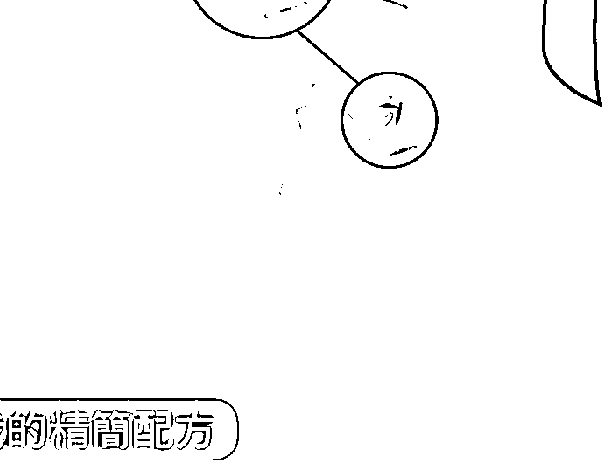

#### 我的精簡配方

##### 塗抹

3 分鐘內每 15 秒用 2 滴薰衣草精油塗抹一次，接下來視被哪種小生物叮咬、螫傷的情形及疼痛的狀況，可以在 2 個小時內每 15 分鐘重複塗抹被叮咬的患部。

#### 完整配方

##### 塗抹

調合：

- 薰衣草精油 …… 3 滴  
- 胡椒薄荷精油 …… 1 滴  
- 檸檬尤加利精油 …… 2 滴  
- 玫瑰天竺葵精油 …… 2 滴  
- 茶樹精油 …… 2 滴  

每 3 分鐘用 1～2 滴複方精油塗抹在被叮處，直到完全改善為止。

---

#### 孕婦專用

#### 完整配方

#### 預防

**吸聞和擴香**

在 10 ml 瓶裡調合：

- 爪哇香茅精油 …… 2.5 ml  
- 檸檬尤加利精油 …… 5 ml  
- 玫瑰天竺葵精油 …… 2.5 ml  

分別噴在枕頭、浴袍或睡衣上，還有暴露在外面的四肢（手臂、腳等部位）也要噴，以建立像盾牌般的有效防護圈。晚上則可用電子擴香機擴香。

---

#### 小孩專用

#### 完整配方

#### 塗抹（治療）

在 10 ml 瓶裡調合：

- 玫瑰天竺葵精油 …… 1 ml  
- 穗花薰衣草精油 …… 4 ml  

被蟲傷後請立即以此複方精油數滴塗抹患部，每 15 分鐘一次，重複 2～3 次。

#### 完整配方

#### 針對黃蜂、海蜇、蠍子

**塗抹（治療）**

在 10 ml 瓶裡調合：

- 穗花薰衣草精油 …… 3 ml  
- 義大利永久花精油 …… 0.5 ml  
- 胡椒薄荷精油 …… 0.5 ml  
- 檸檬尤加利精油 …… 1 ml  
- 金盞菊浸泡油 …… 5 ml  

被蟲傷或咬傷後立即以此調合油數滴塗抹 4～5 次，接著每 10 分鐘 1 次，後續每日塗抹 3～4 次，直到傷口完全消腫不痛。

---

## 玫瑰糠疹

#### 完整配方

在大瓶裡均等調合：

- 洋甘菊純露  
- 玫瑰純露  
- 薰衣草純露  

將敷料或化妝棉浸泡在大量的複方純露裡，再濕敷玫瑰糠疹患部，每日可使用多次。

> 注意：是純露，不是精油！

---

## 汗斑

#### 完整配方

##### 塗抹

在 5 ml 瓶裡調合：

- 芳樟精油 …… 1 ml  
- 茶樹精油 …… 1 ml  
- 沉香醇百里香精油 …… 1 ml  
- 金盞菊浸泡油 …… 2 ml  

取數滴局部塗抹患部，每日 3 次，直到改善為止。

---

## 哭泣

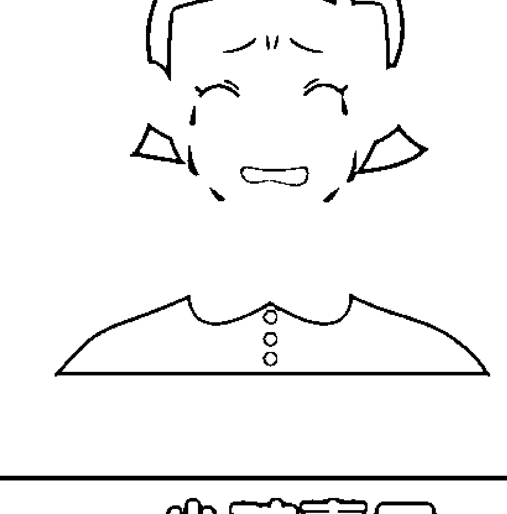

### 小孩專用｜完整配方

##### 塗抹

**若肚子痛**

在 5 ml 瓶裡調合：

- 甜茴香精油 …… 0.5 ml  
- 羅馬洋甘菊精油 …… 0.5 ml  
- 龍艾精油 …… 0.5 ml  
- 聖約翰草浸泡油 …… 裝滿 5 ml  

取此調合油 4～5 滴輕輕按摩肚子，若需要則每日使用 3～4 次。

**若驚恐**

在 5 ml 瓶裡調合：

- 羅馬洋甘菊精油 …… 10 滴  
- 甜馬鬱蘭精油 …… 40 滴  
- 甜杏仁油 …… 裝滿 5 ml  

取此調合油 3～4 滴塗抹腹腔神經叢和手腕內側，並讓孩子吸聞。

---

## 若發燒和眼睛水汪汪（已被感染）

##### 栓劑

請藥師依下列配方製作 6 顆栓劑：

| 成分 | 嬰兒 | 小孩 |
|---|---|---|
| 桉油醇樟精油 | 20 mg | 30 mg |
| 芳樟精油 | 20 mg | 30 mg |
| 茶樹精油 | 10 mg | 10 mg |
| 聖約翰草浸泡油 | 10 mg | 10 mg |
| 栓劑的賦形劑 | 1 g | 1 g |

24～48 小時內，每日施用 2～3 次。

---

## 黑頭粉刺

#### 完整配方

##### 塗抹

在 10 ml 瓶裡調合：

- 檸檬精油 …… 0.5 ml  
- 玫瑰天竺葵精油 …… 0.5 ml  
- 真正薰衣草精油 …… 0.5 ml  
- 荷荷巴油 …… 裝滿 10 ml  

每日取數滴塗抹在黑頭粉刺上 1～2 次。

#### 面膜

調合：

- 真正薰衣草精油 …… 2 滴  
- 檸檬精油 …… 2 滴  
- 綠礦泥粉或高嶺土 …… 2 茶匙  

以好品質的水製泥膜充分攪拌，若泥膜太厚可以再加一點水。接著敷在臉的中軸線上（下巴、鼻子、前額）和有黑頭粉刺的部位。靜置 10 分鐘後再清洗乾淨。

---

## 污染

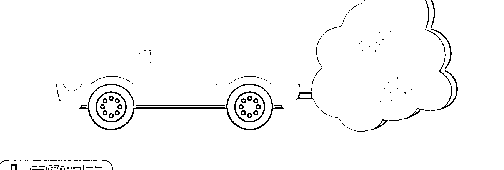

#### 完整配方

#### 噴霧

在 200 ml 噴霧瓶裡調合：

- 歐洲赤松精油 …… 2 ml  
- 百里酚百里香精油 …… 2 ml  
- 真正薰衣草精油 …… 2 ml  
- 丁香花苞精油 …… 2 ml  
- 爪哇香茅精油 …… 2 ml  
- 茶樹精油 …… 2 ml  
- 杜松漿果精油 …… 2 ml  
- 中國肉桂精油 …… 2 ml  
- 廣藿香精油 …… 2 ml  
- 檸檬精油 …… 2 ml  
- 70% 酒精 …… 裝滿 200 ml  

每週在生活的空間噴 2 次，甚至超過 2 次，也可以每天用擴香儀加入上述但不加酒精的複方精油，擴香半小時。

---

## 跳蚤

#### 我的精簡配方

##### 塗抹

在有風險的期間，每天早上在頭皮幾個不同的區塊上各用 1 滴超級醒目薰衣草純精油（不稀釋）塗抹。

#### 完整配方

#### 驅蟲（預防）

**洗髮精**

在瓶裡均等調合：

- 真正薰衣草精油  
- 按摩薰衣草精油  
- 檸檬迷迭香精油  
- 杜松漿果精油  
- 玫瑰天竺葵精油  

每天加 3 滴複方精油在洗髮精裡，跟平常一樣洗頭髮。接著用數滴純精油（不稀釋）塗抹太陽穴部位及頭皮，再按摩。

### 治療（請藥局客製）

（勿用在 3 歲以下的小孩）

##### 塗抹

請藥師依下列配方製作：

- 超級醒目薰衣草精油 …… 4 ml  
- 茶樹精油 …… 2 ml  
- 桉油醇迷迭香精油 …… 2 ml  
- 大西洋雪松精油 …… 1 ml  
- 胡椒薄荷精油 …… 1 ml  

連續兩晚以此複方精油數滴塗抹在後頸、耳後和頭皮上。靜置一晚，隔天早上用「驅蟲」的方法洗頭與塗抹精油。使用 8 天後停 15 天再重複療程。也就是要處理孵化未孵化的卵，以防止這些卵變成幼蟲。

---

## 前更年期

### 亂經

#### 我的精簡配方

- **口服**：加 1 滴快樂鼠尾草精油在中性錠片上或 1 茶匙橄欖油裡服用，每日 3 回，持續 2 個月。  
- **塗抹**：以 2 滴快樂鼠尾草精油塗抹下腹或下背，每日 3 次，持續 2 個月。

---

## 情緒憂鬱

#### 我的精簡配方

**口服和塗抹**

直接倒 2 滴甜馬鬱蘭精油在 1 茶匙蜂蜜裡服用，或塗抹在腹腔神經叢上，每日 2～3 次。

**口服**

每天早上加 1 滴快樂鼠尾草精油在中性錠片上服用。

---

## 攝護腺腫大／腺瘤

#### 我的精簡配方

##### 口服

倒 1 滴太平洋檀香精油在 1 茶匙蜂蜜裡服用，每日 3 回，持續 10 天。

#### 完整配方

##### 塗抹

在 2 ml 深色瓶裡調合：

- 太平洋檀香精油 …… 5 滴  
- 綠花白千層精油 …… 5 滴  
- 多苞葉尤加利精油 …… 5 滴  
- 絲柏精油 …… 5 滴  
- 薰陸香精油 …… 5 滴  
- 瓊崖海棠油 …… 裝滿 2 ml  

晚以此調合油按摩下腹和下背，持續 3 週。停 10 天再重複療程。

### 請藥房客製

##### 口服

請藥師依下列配方製作 60 顆膠囊（可重複療程）：

- 熱帶羅勒精油 …… 20 mg  
- 月桂精油 …… 10 mg  
- 薰陸香精油 …… 10 mg  

**預防**：每次服用 1 顆，每日 2 回持續 20 天。停 10 天再重複療程。  

**治療**：每次服用 2 顆，每日 3 回持續 20 天。停 10 天後每週連服 5 天（週末六、日不服用）持續數月。

---

## 攝護腺炎

### 精療局客製

##### 栓劑

請藥師依下列配方製作 42 顆栓劑（可重複療程）：

- 廣藿香精油 …… 10 mg  
- 薰陸香精油 …… 25 mg  
- 絲柏精油 …… 20 mg  
- 義大利永久花精油 …… 20 mg  
- 檸檬香茅精油 …… 20 mg  
- 聖約翰草浸泡油 …… 20 mg  

早、晚各使用 1 顆持續 20 天，若需要可以停 7 天後再重複療程。

##### 口服

請藥師依照下列配方製作 30 顆膠囊：

- 熱帶羅勒精油 …… 20 mg  
- 月桂精油 …… 10 mg  
- 絲柏精油 …… 10 mg  

**預防**：每次服用 1 顆，每日 2 回，每個月服用 10 天。  

**治療**：每次服用 2 顆，每日 3 回，持續 20 天。若需要則停 10 天後再重複療程。

---

## 乾癬

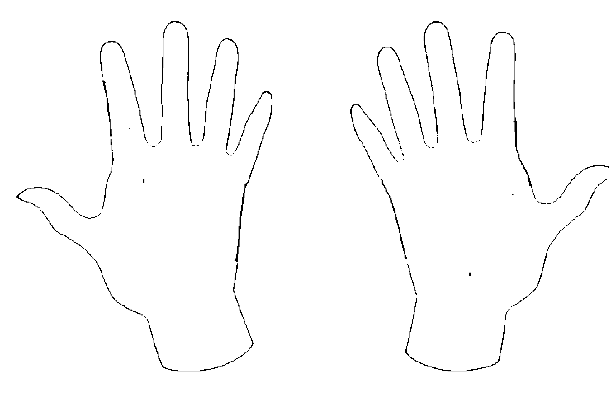

#### 我的精簡配方

**塗抹**

以 2 滴馬鞭草酮迷迭香精油稀釋在榛果油裡，直接塗抹在乾癬患部，每日 2～3 次。

#### 完整配方

##### 塗抹

在 5 ml 深色滴管瓶裡調合：

- 馬鞭草酮迷迭香精油 …… 10 滴  
- 義大利永久花精油 …… 10 滴  
- 玫瑰草精油 …… 10 滴  
- 玫瑰天竺葵精油 …… 10 滴  
- 聖約翰草浸泡油 …… 1 ml  
- 琉璃苣油 …… 1 ml  
- 玫瑰果油 …… 1 ml  

每天塗抹在乾癬患部 2～3 次，直到改善為止。

---

## 對抗成因之一「神經緊張」

##### 吸聞

- 沒藥精油 …… 2 滴  
- 大馬士革玫瑰精油 …… 1 滴  

將精油滴在手腕內側並將手靠近鼻孔深深吸聞，每日嗅聞多次。

### 孕婦專用｜完整配方

##### 塗抹

- 真正薰衣草精油 …… 2 滴  
- 羅馬洋甘菊精油 …… 2 滴  
- 穗花薰衣草精油 …… 2 滴  
- 玫瑰果油 …… 1/2 茶匙  

每天塗抹在乾癬患部 2～3 次，直到有顯著的改善為止。

---

## 雷諾氏症候群

#### 我的精簡配方

##### 塗抹

以 2 滴絲柏精油稀釋在 2 滴瓊崖海棠油裡，並按摩手指和腳趾的末端。

#### 完整配方

##### 塗抹

調合：

- 絲柏精油 …… 2 滴  
- 側柏醇百里香精油 …… 2 滴  
- 瓊崖海棠油 …… 5 滴  

每日塗抹四肢末端 2 次。

---

## 拒絕上學焦慮

#### 小孩專用

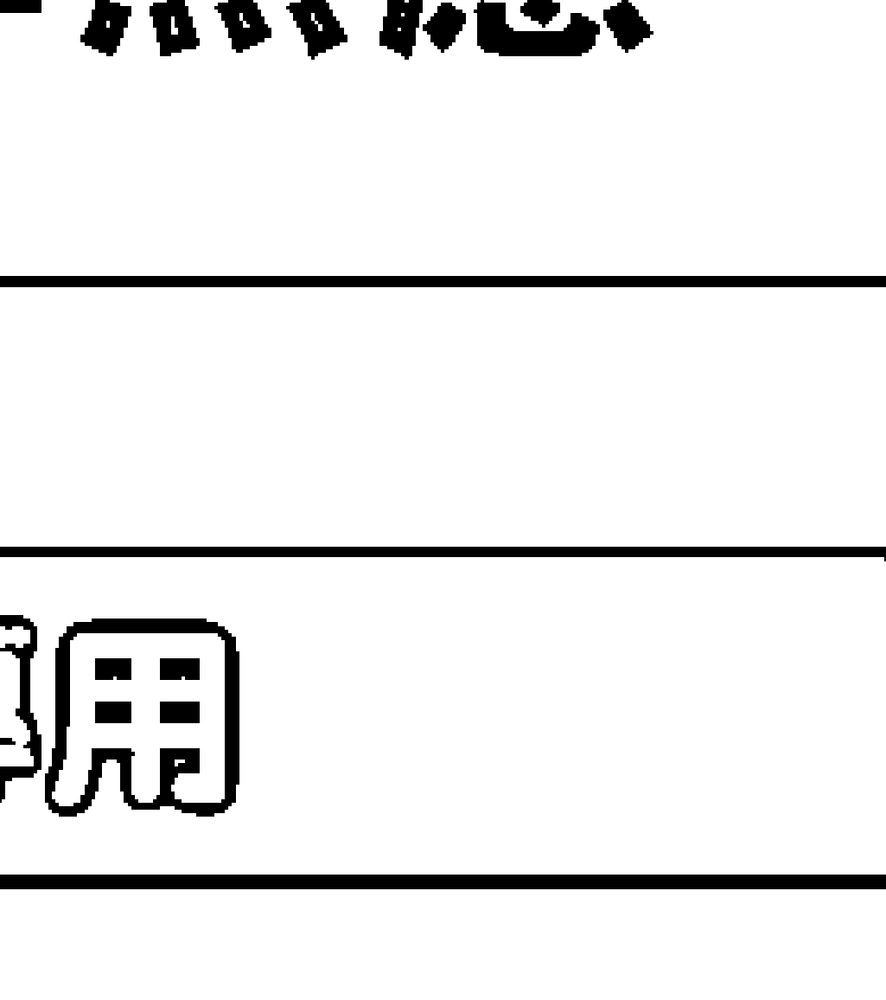

#### 我的精簡配方

**塗抹**

以 2 滴甜馬鬱蘭精油塗抹在腹腔神經叢上，每日 3～5 次。

#### 完整配方

**吸聞**

在 5 ml 瓶裡調合：

- 羅馬洋甘菊精油 …… 2.5 ml  
- 芳樟精油 …… 2.5 ml  

充分搖勻精油瓶後再打開讓孩子深深吸聞，盡量心平氣和地嗅聞 3 或 4 次。若需要可以讓孩子每 10 分鐘嗅聞 1 次，直到焦慮完全平息。

---

#### 完整配方

##### 塗抹

在 10 ml 瓶裡調合：

- 真正薰衣草精油 …… 2 ml  
- 芳樟精油 …… 2 ml  
- 龍艾精油 …… 1 ml  
- 橙花精油 …… 0.5 ml  
- 甜杏仁油 …… 4.5 ml  

取此調合油數滴，按摩雙條脊椎、脖子、前胸、肚子和足弓，每日 2～3 次。

---

## 經痛（經前和生理期）

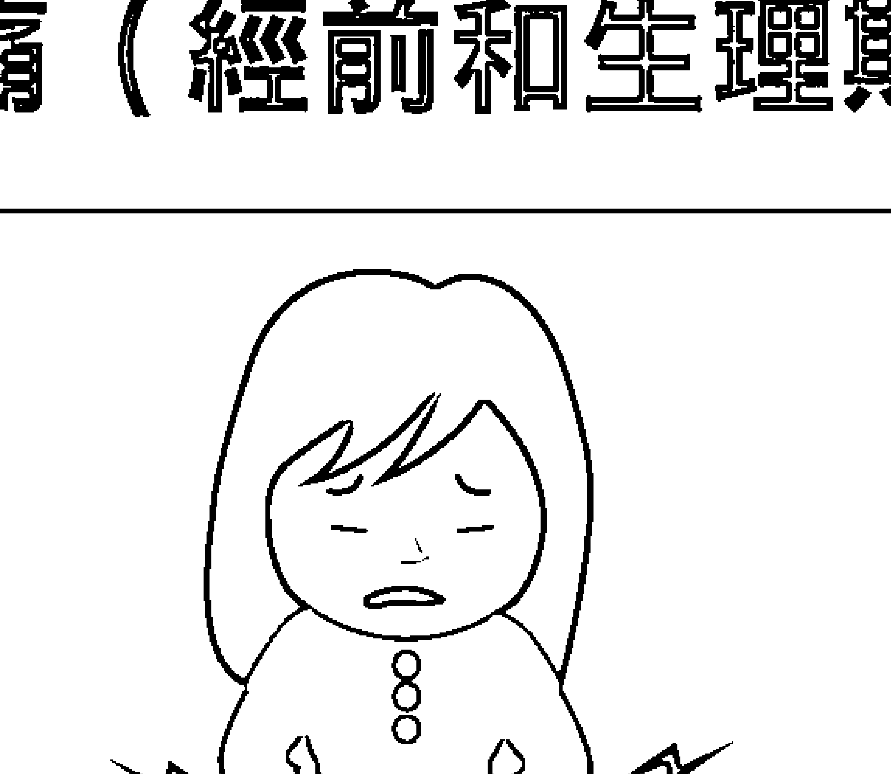

#### 我的簡單配方

**口服和塗抹**

倒 1 滴龍艾精油在 1 茶匙蜂蜜裡服用，1 滴稀釋在 4～5 滴橄欖油裡再塗抹下腹（輕輕按摩）。每小時使用 1 次，直到肚子完全不痛。

#### 完整配方

##### 塗抹

調合：

- 龍艾精油 …… 5 滴  
- 薰陸香精油 …… 5 滴  
- 聖約翰草浸泡油 …… 1/2 茶匙  

經前和來經痛時，以此調合油按摩腹部，每日 2 次，連續 3 天。

#### 請藥局客製

##### 口服

請藥師依下列配方製作 30 顆膠囊：

- 龍艾精油 …… 50 mg  
- 洋茴香精油 …… 25 mg  
- 蒜柏精油 …… 25 mg  
- 快樂鼠尾草精油 …… 10 mg  

每次服用 1 顆，每日 3 回。月經前 3 天開始服用到月經來後第 14 天。重複 3 次療程。

## 月經過多

#### 我的精簡配方

口服

加 1 滴岩玫瑰或 1 滴玫瑰天竺葵精油在中性錠片上服用，每日最多 5 回（視需求），持續 1～2 天。

---

## 月經過少

#### 完整配方

##### 口服

在 5 ml 深色滴管瓶裡調合：

- 快樂鼠尾草精油 …… 2 ml  
- 鼠尾草精油 …… 1 ml  

取此複方精油 1 滴加在中性錠片上或 1 茶匙橄欖油裡服用，從月經來開始每日服用 3 回直到第 14 天，重複 3 次療程。

##### 塗抹

經前和經期中，取此複方精油 2 滴按摩下背，每日 3 次持續數日。

---

## 全身放鬆

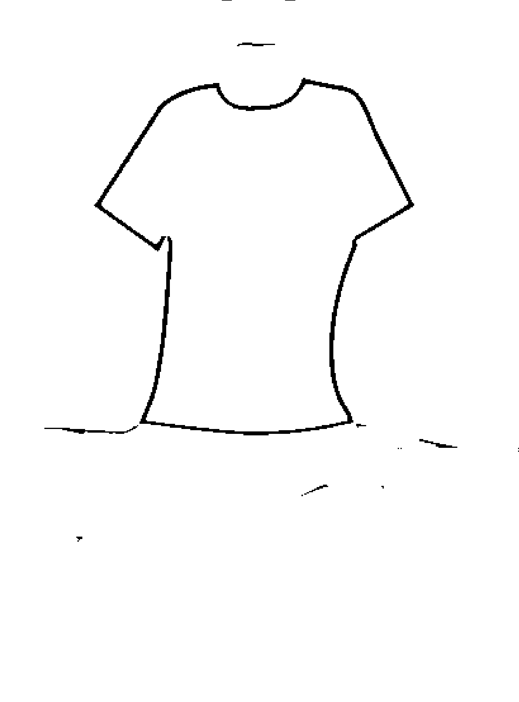

#### 完整配方

##### 塗抹

在 10 ml 瓶裡調合：

- 真正薰衣草精油 …… 1 ml  
- 羅馬洋甘菊精油 …… 0.5 ml  
- 依蘭精油 …… 0.5 ml  
- 榛果油 …… 8 ml  

請人用這個超級放鬆的調合油數十滴幫您按摩後背，每日 1～2 次。

#### 擴香（在家裡、辦公室、車上）

在擴香儀裡倒入：

- 真正薰衣草精油 …… 10 滴  
- 苦橙葉精油 …… 10 滴  

早、晚以此複方精油或輪替擴香 10 分鐘。

##### 泡澡

調合：

- 真正薰衣草精油 …… 10 滴  
- 苦橙葉精油 …… 5 滴  
- 泡澡的基質 …… 1 湯匙  

晚上，在放好溫水或熱水的浴缸裡倒入以上原料，泡澡 20 分鐘後無需沖洗，擦乾身體後穿上柔軟的浴袍，上床睡覺。

---

## 水腫

#### 我的精簡配方

- 口服  

加 1 滴檸檬精油在 1 片方糖片上服用，每日 3 回。

---

## 靜脈局部型

##### 塗抹

請藥師依下列配方製作按摩油：

- 芹菜籽精油 …… 1 ml  
- 喜馬拉雅雪松精油 …… 1 ml  
- 絲柏精油 …… 1 ml  
- 玫瑰天竺葵精油 …… 1 ml  
- 鼠尾草精油 …… 1 ml  
- 瓊崖海棠油 …… 25 ml  

按摩難看的部位：大腿、小腿和手臂，總是從最遠端向心臟的方向按摩（依照您的狀況，例如：從小腿往上到膝蓋，或從膝蓋往上到大腿，或從手肘往上到肩膀等）。

##### 口服

請藥師依下列配方製作 30 顆膠囊（可重複療程）：

- 芹菜籽精油 …… 20 mg  
- 檸檬精油 …… 20 mg  
- 胡蘿蔔籽精油 …… 20 mg  

照三餐各服 1 顆，連續 10 天。若需要可以重複療程再服用 5 天或 10 天。

⚠ 注意：不適用在孕婦身上。

#### 孕婦專用

#### 我的精簡配方

口服（懷孕滿 3 個月）

加 1 滴檸檬精油在中性錠片上服用，每日 3 回，持續 4～5 天。若需要則可以延長療程。

---

## 鼻咽炎

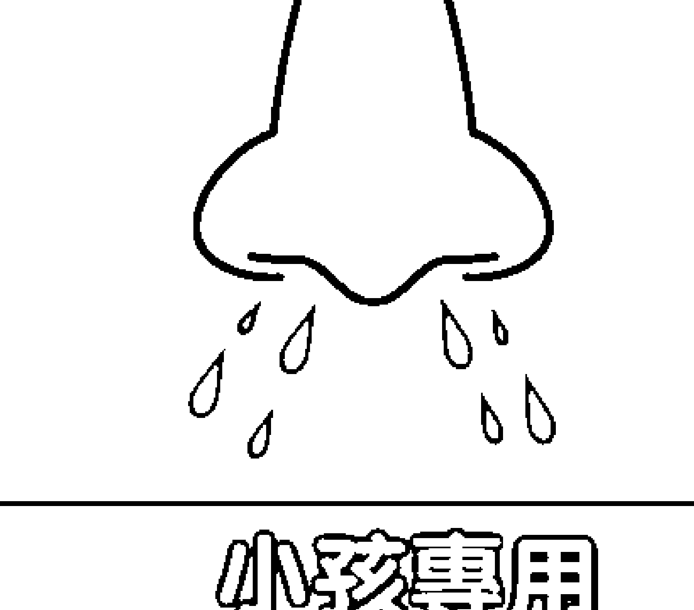

#### 小孩專用

#### 完整配方

在 10 ml 瓶罐調合：

- 茶樹精油 …… 1 ml  
- 桉油醇樟精油 …… 1 ml  
- 芳樟精油 …… 1 ml  
- 側柏醇百里香精油 …… 1 ml  
- 甜杏仁油 …… 6 ml  

##### 塗抹

用 3～4 滴塗抹脖子、前額和太陽穴，每日 3 次，持續 3～5 天。

#### 口服（6 歲以上的小孩）

- 桉油醇樟精油 …… 1 滴  
- 茶樹精油 …… 1 滴  

在半顆糖上、1 茶匙橄欖油裡或 1 茶匙蜂蜜裡倒入，讓孩子每日服用 3 回，持續 3～5 天。

---

### 請藥局調製

### 鼻滴（滿 5 歲的小孩）

在 30 ml 附圓鼻滴管的瓶裡調合：

- 茶樹精油 …… 0.5 ml  
- 澳洲尤加利精油 …… 0.5 ml  
- 桉油醇樟精油 …… 0.5 ml  
- 甜杏仁油 …… 裝滿 30 ml  

請孩子自己先擤鼻涕，再用海水噴霧劑清洗鼻腔，接著在每個鼻孔滴入 1 滴調合油。滴劑進鼻孔時，請孩子躺下來或坐著頭往後仰。每日使用 3 次。

##### 栓劑

請藥師依下列配方製作 18 顆栓劑：

| 成分 | 嬰兒 | 小孩 |
|---|---|---|
| 茶樹精油 | 20 mg | 25 mg |
| 澳洲尤加利精油 | 10 mg | 15 mg |
| 側柏酮百里香精油 | 10 mg | 15 mg |
| 桉油醇樟精油 | 10 mg | 15 mg |
| 聖約翰草浸泡油 | 10 mg | 10 mg |
| 栓劑的賦形劑 | 1 g | 1 g |

每日施用 2～3 顆，持續 3～5 天。

---

## 風濕

#### 我的精簡配方

- 塗抹  

以數滴冬青白珠／芳香白珠精油稀釋在山金車浸泡油裡，塗抹關節、手肘或其他發炎的風濕患部，每日 3～5 次。

#### 完整配方

##### 塗抹

在 5 ml 深色滴管瓶裡調配：

- 冬青白珠／芳香白珠精油 …… 10 滴  
- 檸檬迷迭香精油 …… 10 滴  
- 檸檬尤加利精油 …… 10 滴  
- 月桂精油 …… 10 滴  
- 超級醒目薰衣草精油 …… 10 滴  
- 山金車浸泡油 …… 裝滿 5 ml  

取數滴或用全部的調合油，按摩四肢不舒服的部位 1 分鐘。每日 3～5 次，直到改善為止。

##### 泡澡

調合：

- 冬青白珠／芳香白珠精油 …… 5 滴  
- 杜松漿果精油 …… 5 滴  
- 海松精油 …… 3 滴  
- 超級醒目薰衣草精油 …… 5 滴  

泡澡的基質：1 湯匙

將上述所有材料倒入 38.5°C 的熱水裡，再入浴泡澡 20 分鐘。每天泡澡，直到改善為止。

### 讓藥局客製

##### 口服

請藥師依下列配方製作 60 顆膠囊：

- 杜松漿果精油 …… 45 mg  
- 胡椒薄荷精油 …… 25 mg  
- 檸檬精油 …… 10 mg  

早、午、晚各服 1 顆，持續 3 週。

---

## 感冒／鼻炎（病毒型）

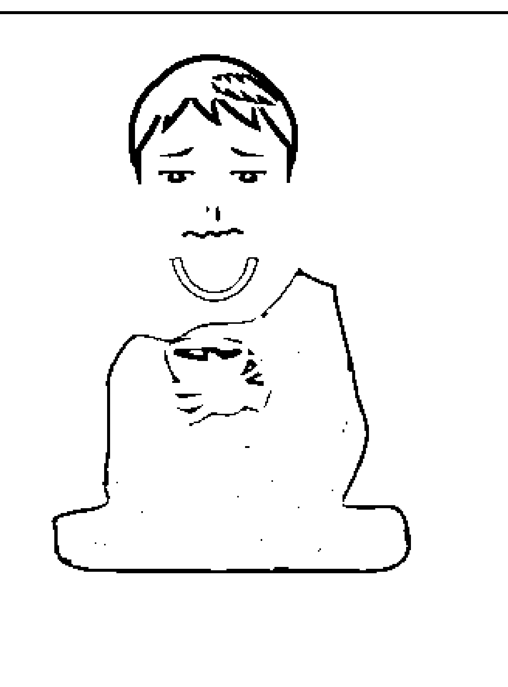

#### 我的精簡配方

- **口服**：加 1 滴澳洲尤加利精油在中性錠片上或小方糖上，再放入口腔裡融化吸收，每日 4 回。  
- **塗抹**：以 1 滴澳洲尤加利精油局部按摩鼻翼的部位。

#### 完整配方

#### 鼻滴

在 30 ml 附圓鼻滴管的瓶裡調合：

- 澳洲尤加利精油 —— 1 ml  
- 龍艾精油 —— 0.5 ml  
- 玫瑰天竺葵精油 —— 1 ml  
- 羅馬洋甘菊精油 —— 1 ml  
- 金盞菊浸泡油 —— 裝滿 30 ml  

請務必去藥房買噴鼻器，而不要用效果較差的古早型鹽水滴瓶。先以海水噴鼻劑清洗鼻腔，接著在每個鼻孔滴入 1 滴調合油，每日 4 次。

---

##### 吸聞

在盛有熱水的碗裡倒入：

- 胡椒薄荷精油 …… 2 滴  
- 澳洲尤加利精油 …… 2 滴  
- 綠花白千層精油 …… 2 滴  

在溫暖舒服的家裡，將頭和碗覆蓋在大毛巾裡，徹底吸聞這個配方持續 10 分鐘。請遵守在第 333 頁建議的吸聞使用說明。

##### 口服

在蔗糖上加入：

- 澳洲尤加利精油 …… 1 滴  
- 桉油醇樟精油 …… 1 滴  

放入口腔裡融化吸收，每日 4 回。

##### 塗抹

調合：

- 月桂精油 …… 2 滴  
- 澳洲尤加利精油 …… 2 滴  
- 桉油醇樟精油 …… 2 滴  
- 玫瑰海棠油 …… 6 滴  

以此配方按摩後背和前胸，每日 6 次，連續 3 天。

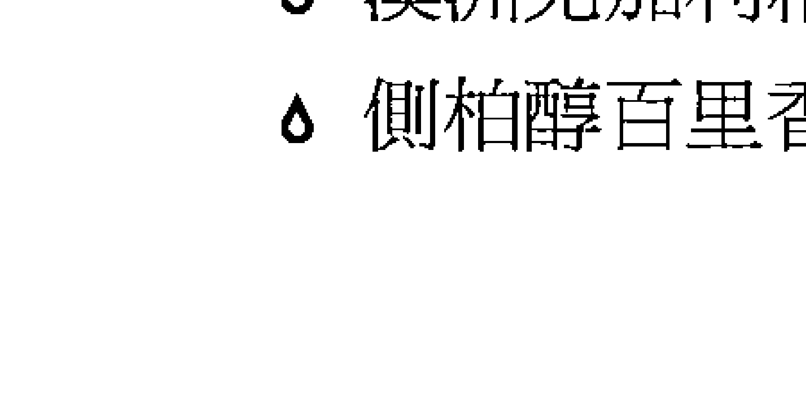

### 使呼吸道暢通的蜂蜜

在 1 茶匙百里香蜂蜜裡加入 1 滴澳洲尤加利精油，再放入口腔裡融化吸收。或稀釋在蝶豆花茶、迷迭香茶或乾燥花茶裡飲用。

---

### 請藥局製作

### 栓劑（建議方式）

請藥師依下列配方製作 6 顆栓劑：

- 澳洲尤加利精油 …… 50 mg  
- 側柏醇百里香精油 …… 20 mg  
- 月桂精油 …… 10 mg  
- 聖約翰草浸泡油 …… 20 mg  

每日施用 2 顆，連續 3 天。

---

#### 完整配方

##### 塗抹

在 10 ml 深色滴管瓶裡調合：

- 茶樹精油 …… 1 ml  
- 桉油醇樟精油 …… 2 ml  
- 綠花白千層精油 …… 1 ml  
- 澳洲尤加利精油 …… 1 ml  
- 甜杏仁油 …… 5 ml  

以 5～6 滴調合油塗抹於前胸和上背，每日 3～4 次，連續 3 天。

### 口服（6 歲以上的小孩）

在半顆方糖上、1 茶匙橄欖油或 1 茶匙蜂蜜裡加入：

- 桉油醇樟精油 …… 1 滴  
- 芳樟精油 …… 1 滴  

每日讓孩子服用 3 回，連續 3 天。

#### 請藥局客製

#### 鼻滴（5 歲以上的小孩）

在 30 ml 附圓噴管的瓶罐調合：

- 桉油醇樟精油 …… 0.5 ml  
- 澳洲尤加利精油 …… 0.5 ml  
- 芳樟精油 …… 0.5 ml  
- 甜杏仁油 …… 裝滿 30 ml  

請孩子先擤鼻涕，再用海水噴鼻劑清洗鼻腔，接著在每個鼻孔滴入 1 滴調合油。

##### 栓劑

請藥師依下列配方製作 6 顆栓劑：

- 茶樹精油 …… 20 mg（嬰兒） / 25 mg（小孩）  
- 澳洲尤加利精油 …… 10 mg（嬰兒） / 20 mg（小孩）  
- 桉油醇樟精油 …… 20 mg（嬰兒） / 25 mg（小孩）  
- 聖約翰草浸泡油 …… 10 mg（嬰兒） / 10 mg（小孩）  
- 栓劑的賦形劑 …… 1 g（嬰兒） / 1 g（小孩）  

早、晚各施用 1 顆，連續 3 天。

---

## 髖關節滑囊炎

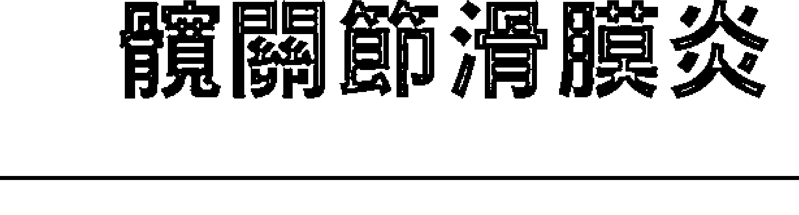

#### 請藥局客製

##### 塗抹

在 10 ml 瓶裡調合：

- 綠香桃木精油 …… 1 ml  
- 莎羅白檀精油 …… 2 ml  
- 芳樟精油 …… 2 ml  
- 冬青白珠／芳香白珠精油 …… 1 ml  
- 白助溶劑 …… 裝滿 10 ml  

取此配方 5～6 滴塗抹在髖關節上，每日 4～5 次，持續 1 週。

---

## 花粉熱

#### 我的精簡配方

- **口服**  
  加 2 滴龍艾精油在中性錠片或小糖上，再放入嘴裡融化吸收，每日 2～3 回。  

- **注意**  
  此「反射」治療對預防特別有效。若已經過敏了，效果就沒那麼明顯。這時請使用以下完整配方。

#### 完整配方

#### 塗抹與吸聞

在 2 ml 深色滴管瓶裡調合：

- 龍艾精油 …… 1 ml  
- 桉油醇樟精油 …… 1 ml  

以 2 滴塗抹鼻翼（鼻子外圍）、前胸和上背；再以 2 滴滴在面紙上方便吸聞，每日 2～3 次直到改善為止。輕輕按摩堵塞的部位，但盡量避免靠近眼睛。

##### 擴香

在 5 ml 瓶裡均勻調合：

- 綠花白千層精油  
- 澳洲尤加利精油  
- 檸檬精油  

以此複方精油在生活空間（家裡、辦公室）擴香，每次 20 分鐘，每日 3 次。

### 鼻滴

雖是可選擇的用法之一，但若呼吸困難，強烈建議此方法。請藥師依下列配方在 30 ml 附噴鼻管的瓶裡製作：

- 澳洲尤加利精油 …… 1 ml  
- 苦艾精油 …… 0.5 ml  
- 羅馬洋甘菊精油 …… 1 ml  
- 玫瑰天竺葵精油 …… 1 ml  
- 金盞菊浸泡油 …… 裝滿 30 ml  

先擤鼻涕，再用海水噴鼻清洗鼻腔，接著在每個鼻孔滴入 1 滴調合油。每日 4 次，連續 5 天，若需要可延長。

##### 口服

請藥師依下列配方製作 30 顆膠囊：

- 苦艾精油 …… 15 mg  
- 羅馬洋甘菊精油 …… 15 mg  
- 玫瑰天竺葵精油 …… 15 mg  
- 真正薰衣草精油 …… 15 mg  

在有風險期之前開始每日服用 1 顆；在過敏期間每日 3 回，持續 2～3 週。

#### 孕婦專用

#### 我的精簡配方

- **塗抹**：在關鍵時期，每天 2 次以 2 滴黑雲杉精油塗抹腎上腺部位。  
- **口服（懷孕滿 3 個月）**：急性發作期間，加 1 滴羅馬洋甘菊和 1 滴法國羅勒精油在 1 小匙蔗糖或百里香蜂蜜裡，放入口中融化吸收，每日 3 回。

---

#### 小孩專用

#### 請藥局客製

#### 鼻滴（5 歲以上的小孩）

在 30 ml 附圓鼻滴管的瓶裡調合：

- 龍艾精油 …… 0.1 ml  
- 玫瑰天竺葵精油 …… 0.5 ml  
- 岩玫瑰精油 …… 0.5 ml  
- 甜杏仁油 …… 裝滿 30 ml  

在每個鼻孔滴入 1 滴調合油，每日 2～3 次，若需要可延長。

---

## 皺紋

#### 我的精簡配方

#### 塗抹（白天）

使用日霜時加入 2 滴芳樟精油一起塗抹，如平時保養一般。  
或在 60 g 日霜裡加入 1 ml 芳樟精油並充分攪勻，再依平時保養程序使用。

#### 塗抹（晚上）

使用夜霜時加入 1 滴玫瑰天竺葵和 1 滴岩玫瑰精油，充分調合後如平時保養般使用。

---

#### 完整配方

##### 塗抹

在 10 ml 深色滴管瓶裡調合：

- 玫瑰天竺葵精油 …… 8 滴  
- 岩玫瑰精油 …… 6 滴  
- 玫瑰草精油 …… 10 滴  
- 芳樟精油 …… 8 滴  
- 小麥胚芽油 …… 2.5 ml  
- 摩洛哥堅果油 …… 2.5 ml  

晚上卸妝洗淨臉後，塗抹在臉、脖子和胸口。

### 面膜

調合：

- 馬鬱草酮迷迭香精油 …… 3 滴  
- 芳樟精油 …… 3 滴  
- 青檸檬或菩提蜂蜜 …… 2 湯匙  

每週敷臉 2 次，敷臉後靜置 5 分鐘，再以冷水洗淨。

---

### 我的精油配方

### 鼻滴

晚上睡覺前，先以海水噴鼻噴一下鼻子和喉嚨以加強咽喉保濕，再將 1 滴檸檬精油與 1 滴甜杏仁油調合後滴入每個鼻孔。

---

## 麻疹

#### 小孩專用

#### 完整配方

##### 塗抹

在 5 ml 深色滴管瓶裡調合：

- 茶樹精油 —— 0.5 ml  
- 桉油醇樟精油 —— 1 ml  
- 玫瑰草精油 —— 0.5 ml  
- 真正薰衣草精油 —— 0.5 ml  
- 甜杏仁油 —— 裝滿 5 ml  

以 6～8 滴調合油塗抹前胸和上背，每日 3～4 次，持續 1 週。

#### 請藥局客製

##### 塗抹

一瓶 100 g 爽身粉：

- 穗花薰衣草精油 —— 1 ml  
- 芳樟精油 —— 1 ml  
- 茶樹精油 —— 1 ml  
- 摩洛哥藍艾菊精油 —— 0.5 ml  
- 威尼斯滑石粉 —— 裝滿 100 g  

每天在麻疹處擦粉 3～4 次，持續 1 週。

| 成分 | 嬰兒 | 小孩 |
|---|---|---|
| 月桂精油 | 5 mg | 10 mg |
| 桉油醇樟精油 | 25 mg | 40 mg |
| 芳樟精油 | 20 mg | 35 mg |
| 聖約翰草浸泡油 | 10 mg | 10 mg |
| 栓劑的賦形劑 | 1 g | 1 g |

**栓劑**

請藥師依下列配方製作 24 顆栓劑，每日施用 3 次，持續 1 週。

---

## 風疹（德國麻疹）

#### 小孩專用

#### 完整配方

##### 塗抹

在 5 ml 深色滴管瓶裡調合：

- 茶樹精油 —— 0.5 ml  
- 桉油醇樟精油 —— 0.5 ml  
- 玫瑰草精油 —— 0.5 ml  
- 真正薰衣草精油 —— 0.5 ml  
- 甜杏仁油 —— 裝滿 5 ml  

以 6～8 滴調合油塗抹前胸和上背，每日 3～4 次，持續 1 週。

### 請藥局調製

##### 塗抹

一瓶 100 g 爽身粉：

- 穗花薰衣草精油 —— 1 ml  
- 芳樟精油 —— 1 ml  
- 茶樹精油 —— 1 ml  
- 摩洛哥藍艾菊精油 —— 0.5 ml  
- 威尼斯滑石粉 —— 裝滿 100 g  

每天在風疹過敏處撲粉 3～5 次，持續 1 週。

##### 栓劑

請藥師依下列配方製作 24 顆栓劑：

| 成分 | 嬰兒 | 小孩 |
|---|---|---|
| 月桂精油 | 5 mg | 10 mg |
| 桉油醇樟精油 | 25 mg | 40 mg |
| 芳樟精油 | 20 mg | 35 mg |
| 聖約翰草浸泡油 | 10 mg | 10 mg |
| 栓劑的賦形劑 | 1 g | 1 g |

每日施用 3 次，持續 1 週。

---

## 流鼻血

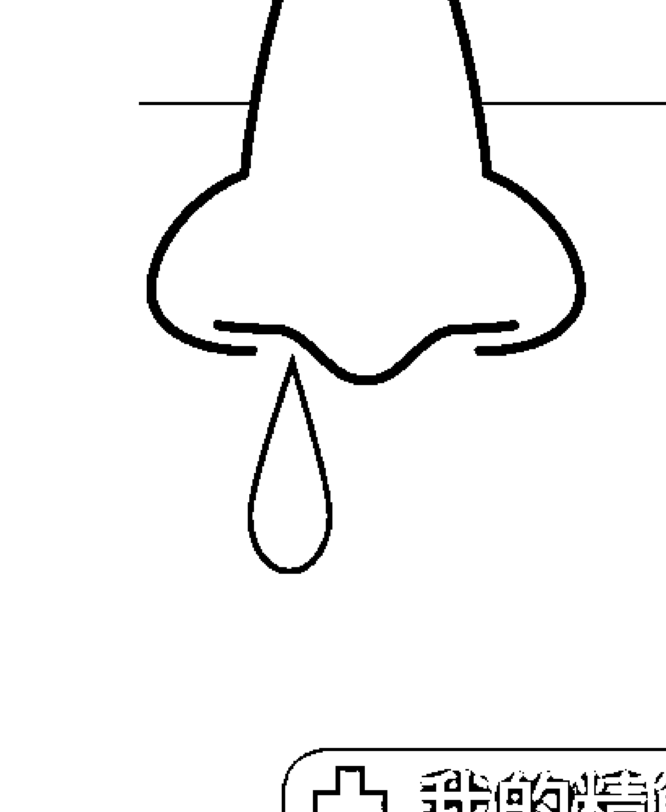

#### 我的精簡配方

- **塗抹**

倒 2 滴岩玫瑰精油在一撮棉花球上，再小心地塞入鼻孔裡，並用手指壓住鼻孔，但不要靜置超過半小時。若超過半小時，取出棉花球時可能會拔除已癒合的結痂而再度流血。

#### 小孩專用

#### 完整配方

- **塞入鼻孔**

在 2 ml 滾珠瓶調合：

- 岩玫瑰精油 …… 2 滴  
- 玫瑰天竺葵精油 …… 2 滴  
- 瓊崖海棠油 …… 裝滿 2 ml  

用一撮棉花球沾滿調合油後塞入鼻孔裡，並用手指壓住固定及塞緊 2～3 分鐘。靜置約半小時後再小心取出棉花球。

---

## 猩紅熱

#### 小孩專用

#### 完整配方

##### 塗抹

在 5 ml 深色滴管瓶裡調合：

- 茶樹精油 …… 0.5 ml  
- 桉油醇檸檬精油 …… 0.5 ml  
- 玫瑰草精油 …… 0.5 ml  
- 真正薰衣草精油 …… 0.5 ml  
- 甜杏仁油 …… 裝滿 5 ml  

以 6～8 滴調合油塗抹喉嚨、前胸和上背，每日 3～4 次，持續 1 週。

### 請藥局調製

##### 塗抹

一瓶 100 g 爽身粉：

- 穗花薰衣草精油 …… 1 ml  
- 芳樟精油 …… 1 ml  
- 茶樹精油 …… 1 ml  
- 摩洛哥藍艾菊精油 …… 0.5 ml  
- 威尼斯滑石粉 …… 裝滿 100 g  

每天在會癢的猩紅熱患部撲粉 3～5 次，持續 1 週。

| 成分 | 嬰兒 | 小孩 |
|---|---|---|
| 月桂精油 | 5 mg | 10 mg |
| 桉油醇檸檬精油 | 25 mg | 40 mg |
| 芳樟精油 | 20 mg | 35 mg |
| 聖約翰草浸泡油 | 10 mg | 10 mg |
| 栓劑的賦形劑 | 1 g | 1 g |

**栓劑**

請藥師依下列配方製作 24 顆栓劑。  
每日施用 3 次，持續 1 週。

## 坐骨神經痛

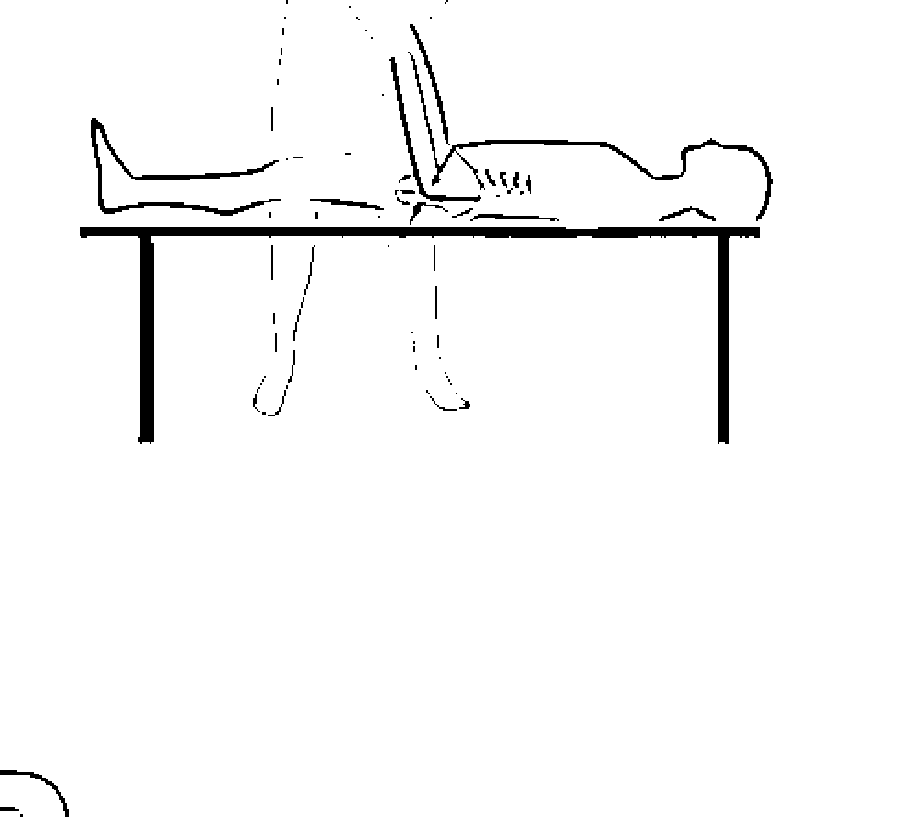

#### 我的精簡配方

**塗抹**

以 3 滴冬青白珠／芳香白珠精油稀釋在 5 滴山金車浸泡油裡，塗抹下背和整個大腿。輕輕按摩久一點，但千萬不要施力而增加疼痛感。

#### 完整配方

- 冬青白珠／芳香白珠精油 — 2 滴
- 檸檬尤加利精油 — 2 滴
- 樟腦迷迭香精油 — 2 滴
- 月桂精油 — 2 滴
- 超級醒目薰衣草精油 — 2 滴
- 義大利永久花精油 — 1 滴
- 山金車浸泡油 — 10 滴

沿著神經的路線輕輕按摩（用「塗抹」這個字眼來說更恰當）。慢慢塗抹，千萬不要施力而增加疼痛感。溫熱有助於皮膚對精油的吸收。

---

## 陰道乾澀

### 我的精油配方

- **塗抹**：以 1 滴快樂鼠尾草精油稀釋在 2 滴植物油裡，每日按摩 2 次下腹，持續 20 天。
- **口服**：加 1 滴快樂鼠尾草精油在中性錠片上服用，每日 2 回，持續 20 天。

#### 請藥局客製

- **陰道栓劑（懷孕禁用）**

請藥師依下列配方製作 18 顆陰道栓劑：

- 快樂鼠尾草精油 …… 50 mg  
- 鼠尾草精油 …… 50 mg  
- 馬鞭草酮迷迭香精油 …… 50 mg  
- 聖約翰草浸泡油 …… 100 mg  

每晚施用 1 顆，每週用 5 天，每個月用 3 週，持續 2 個月。若需要可以重複療程。

---

## 乳房痛

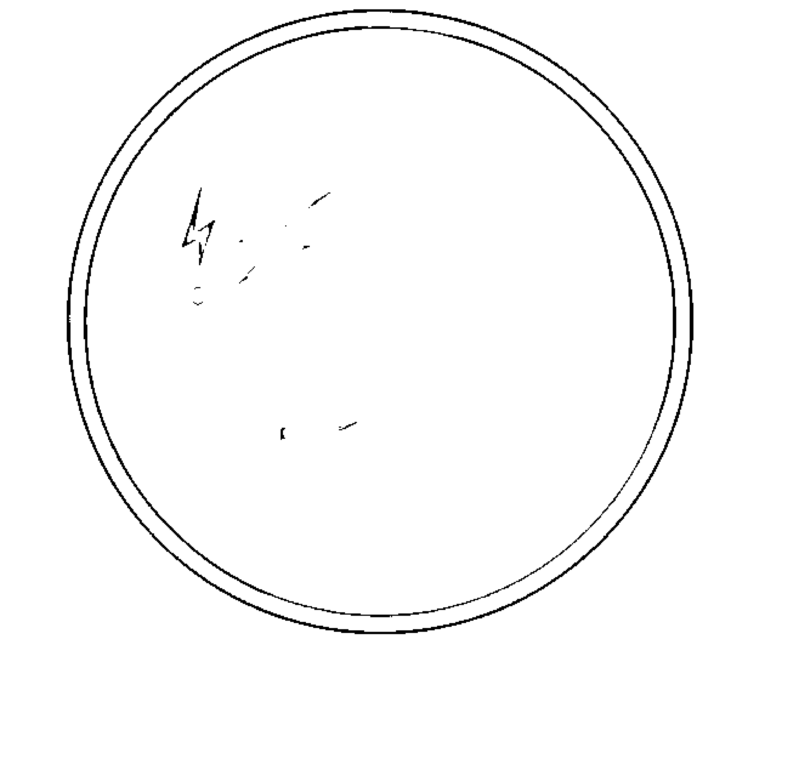

#### 我的精簡配方

**塗抹**

- 以浸泡過洋甘菊純露的敷料（別擰乾！不是精油）濕敷在超級敏感的乳房上，每日 3～4 次直到完全改善。

編註：可選擇羅馬洋甘菊或德國洋甘菊純露。

---

## 性成癮

#### 我的精簡配方

- **口服**：加 1 滴大馬士革玫瑰精油在方糖上，再放入口腔裡融化吸收，每日 3 回。
- **吸聞**：倒 2 滴大馬士革玫瑰精油在手腕內側並深深吸聞，或直接吸聞打開的精油瓶。
- **塗抹**：以 2 滴大馬士革玫瑰精油塗抹心神經叢。

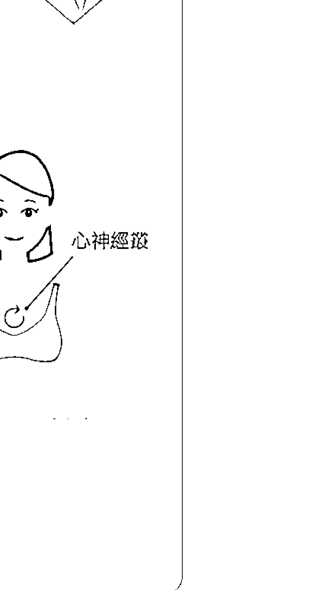

#### 完整配方

**吸聞和口服**

在 5 ml 瓶裡調合：

- 絲柏精油 …… 1 ml  
- 檸檬馬鞭草精油 …… 1 ml  
- 窄葉利亞沒藥精油 …… 1 ml  
- 羅馬洋甘菊精油 …… 2 ml  

倒數滴在手腕內側吸聞，在白天或晚上可以盡量吸聞（完全沒有時間限制）。若需要可以倒 1～2 滴複方精油在 1 茶匙蜂蜜裡直接服用。

---

## 愛滋病（強化免疫力）

#### 我的簡單配方

**塗抹**

- 每天以 1 滴桉油醇樟葉純精油（不稀釋）塗抹心神經叢，特別是秋天。

#### 完整配方

**塗抹**

調合：

- 桉油醇樟葉精油 — 1 滴  
- 檸檬精油 — 1 滴  
- 沉香醇百里香精油 — 1 滴  
- 月桂精油 — 1 滴  

每天早上直接將複方精油塗抹在前胸和上背，每個月使用 10 天。

#### 請藥局客製

**口服**

請藥師依下列配方製作 30 顆膠囊：

- 野馬鬱蘭精油 — 25 mg  
- 澳洲尤加利精油 — 25 mg  
- 綠花白千層精油 — 25 mg  
- 月桂精油 — 25 mg  
- 芫荽籽精油 — 25 mg  

照三餐每次服用 1 顆，每個月服用 1 週。

---

## 鼻竇炎

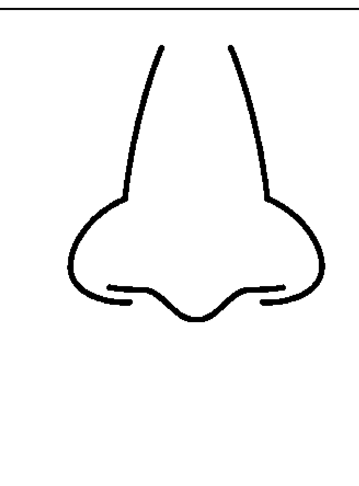

#### 我的精簡配方

**吸聞**

- 先以海水噴鼻劑清洗鼻腔後，再倒 2 滴澳洲尤加利純精油在手帕上嗅聞，每日 4～5 次。

#### 完整配方

**塗抹**

在 5 ml 深色瓶裡調合：

- 澳洲尤加利精油 10 滴  
- 茶樹精油 10 滴  
- 胡椒薄荷精油 10 滴  
- 桉油醇精油 10 滴  
- 金盞菊浸泡油 裝滿 5 ml  

取此調合油 3 滴局部塗抹在上頷竇和額竇部位的皮膚上，每日 4 次。

**口服**

- 澳洲尤加利精油 1 滴  
- 側柏醇百里香精油 1 滴  

加這 2 滴精油在中性錠片上或 1 茶匙橄欖油裡，再放入口裡融化吸收，每日 4 回，連續 5 天。

---

## 1000 個最強精油配方

##### 吸聞

在 2 ml 深色瓶裡調合：

- 桉油醇樟精油 …… 10 滴  
- 茶樹精油 …… 10 滴  
- 芳樟精油 …… 10 滴  
- 胡椒薄荷精油 …… 3 滴  

以海水噴鼻劑清洗鼻腔後，再倒 6 滴複方精油在熱水裡吸聞 10 分鐘，每日 2 次。完成後不要出門到空氣污染的地方，當然也不要抽菸。除了這個濕式吸聞外，您也可以在白天的其他時間做乾式吸聞，只要簡單地倒數滴複方精油在手帕上並深深吸聞，每日 4～5 次。

> 需購藥局容器

### 鼻滴

請將以下列配方在 30 ml 深色附圓鼻滴管的瓶裡調合：

- 茶樹精油 …… 12 滴  
- 土木香精油 …… 8 滴  
- 胡椒薄荷精油 …… 4 滴  
- 澳洲尤加利精油 …… 8 滴  
- 金盞菊浸泡油 …… 裝滿 30 ml  

在左右鼻孔裡各點 1 滴，每日使用 4～5 次。

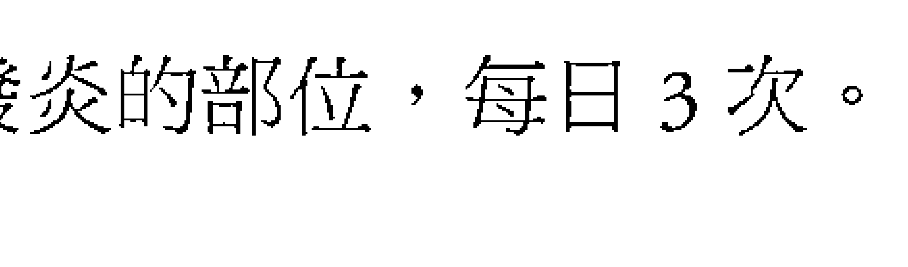

##### 塗抹

在 5 ml 深色滴管瓶裡調合：

- 澳洲尤加利精油 …… 10 滴  
- 桉油醇樟精油 …… 10 滴  
- 茶樹精油 …… 10 滴  

以此複方精油 1 滴稀釋在一點植物油裡，塗抹在鼻子和臉部發炎的部位，每日 3 次。

---

##### 吸聞

**濕式吸聞**

早、晚倒 10 滴複方精油在盛有熱水的碗裡，將您的臉移放在碗的上方並「悶在」大毛巾裡，深深吸聞芳香蒸氣 10 分鐘。做完這個濕式吸聞後不要出門到空氣污染的地方。

**乾式吸聞**

以海水噴鼻劑清洗鼻腔後，倒 3～4 滴複方精油在手帕上並深深吸聞，每日 3～5 次，持續 3～5 天。

#### 小孩專用

- 茶樹精油 …… 8 滴  
- 芳樟精油 …… 8 滴  
- 土木香精油 …… 5 滴  
- 金盞菊浸泡油 …… 裝滿 5 ml  

**塗抹**

在 5 ml 深色滴管瓶裡調合：  
以 2 滴調合油塗抹前額，每日 3～5 次，持續 5～7 天。請注意眼睛：不要塗抹得太近！

- 綠花白千層精油 …… 20 mg  
- 澳洲尤加利精油 …… 20 mg  
- 義大利永久花精油 …… 5 mg  
- 桉油醇樟精油 …… 20 mg  
- 聖約翰草浸泡油 …… 10 mg  
- 栓劑的賦形劑 …… 1 g  

**栓劑**

請藥師依下列配方製作 6 顆栓劑：  
早、晚各應用 1 顆，連續 3 天。

---

## 消化道痙攣

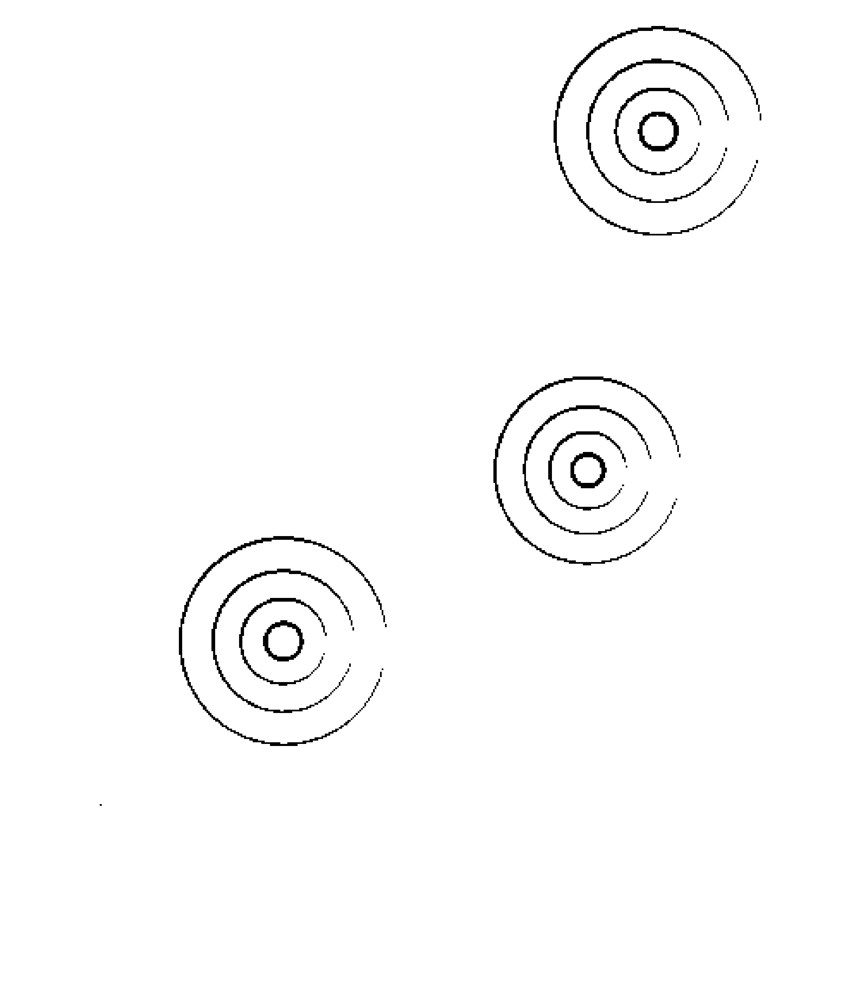

#### 我的精簡配方

**吸聞**

直接嗅聞打開的羅馬洋甘菊精油，每日 1 或 2 次。

#### 完整配方

- 羅馬洋甘菊精油 …… 2 滴  
- 法國羅勒精油 …… 2 滴  
- 真正薰衣草精油 …… 2 滴  
- 榛果油 …… 6 滴  

以打圈的方式按摩肚子，每日 2～3 次，持續 2～3 天。

> ＊法國羅勒精油又稱歐洲羅勒或甜羅勒。

---

## 婦科痙攣

**塗抹**

- 龍艾精油 …… 1 滴  
- 羅馬洋甘菊精油 …… 1 滴  
- 苦橙葉精油 …… 1 滴  
- 橄欖油 …… 5 滴  

24～48 小時內，每日塗抹下腹 2～3 次。

---

## 痙攣症

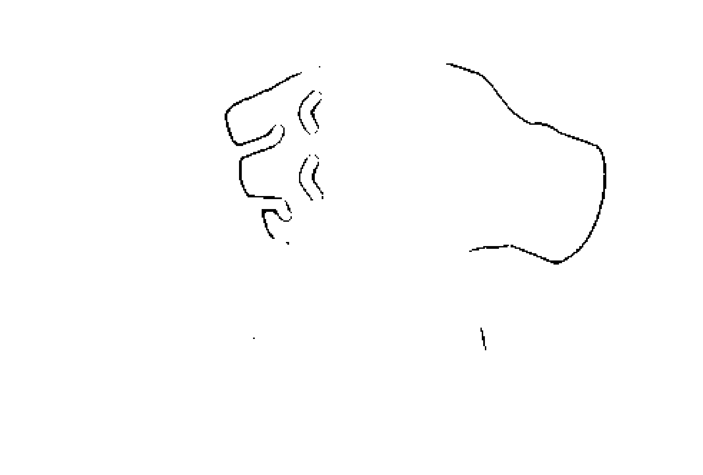

**口服**

直接倒 1 滴龍艾精油在 1 茶匙蜂蜜裡服用，視情況可再服用 1 或 2 回。

---

## 1000 個最強精油配方

#### 完整配方

**口服和塗抹**

在 5 ml 瓶裡調合：

- 真正薰衣草精油 — 1 ml  
- 依蘭精油 — 1 ml  
- 甜馬鬱蘭精油 — 1 ml  
- 香蜂草精油 — 1 ml  
- 苦橙葉精油 — 1 ml  

加 2 滴複方精油在中性錠片上、1 茶匙蜂蜜或橄欖油裡，再放入嘴裡融化吸收，每日 3 回。以及用 3 滴複方精油塗抹腹腔神經叢和手腕內側，每日 2～3 次。

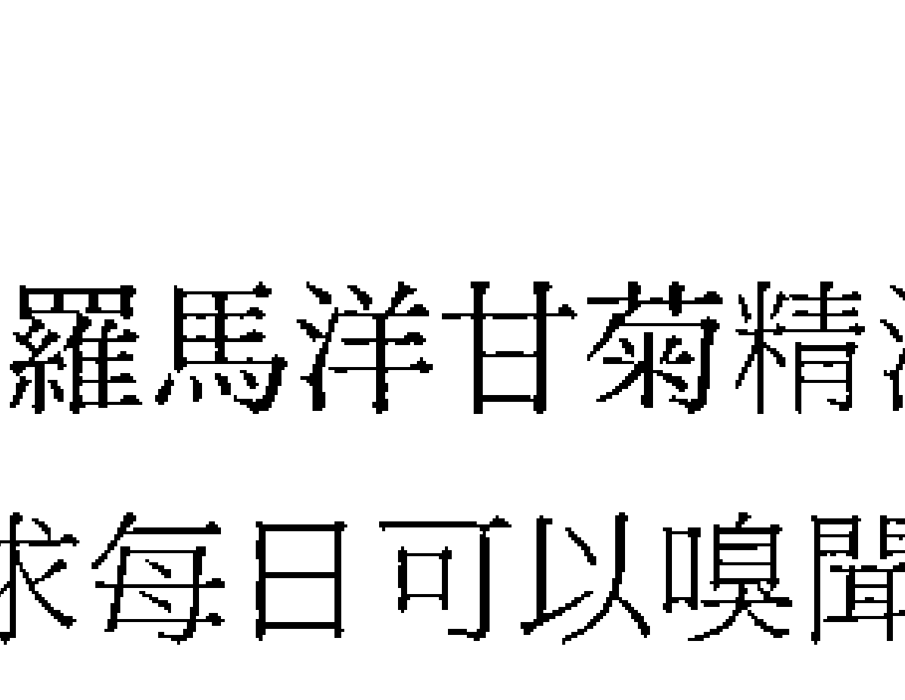

#### 我的簡單配方

**吸聞**

直接打開羅馬洋甘菊精油並深深吸聞以「放鬆平息」，視需求每日可以嗅聞數次。

#### 完整配方

**塗抹和吸聞**

調合：

- 羅馬洋甘菊精油 — 1 滴  
- 真正薰衣草精油 — 1 滴  
- 苦橙葉精油 — 1 滴  
- 榛果油 — 3 滴  

塗抹在手腕內側（深深吸聞）和腹腔神經叢上，每日 2～3 次。

---

## 運動痠痛

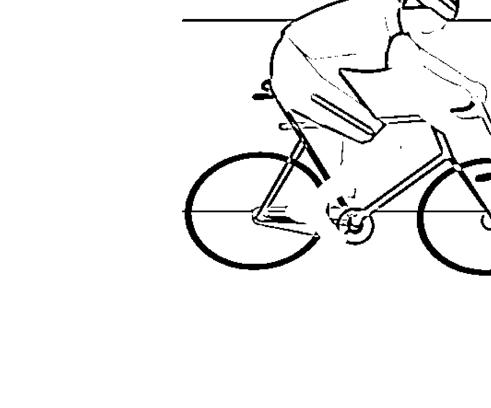

#### 我的精簡配方

**塗抹**

- 以 2 滴冬青白珠／芳香白珠精油稀釋在數滴山金車浸泡油裡，塗抹在疼痛的部位並輕輕按摩，但別弄痛了自己。

#### 我的精簡配方

**口服**

- 以 2 滴胡椒薄荷精油稀釋在 1 湯匙龍舌蘭蜜裡，再倒入 500 ml 氣泡水或普通飲用水裡，在運動時喝。  
- 冬天在戶外時，可以多加一點蜂蜜。夏天時，若您流很多汗的話，就多補充水分。開始運動的前 30 分鐘能量最多，可以每 15 分鐘喝 2 口水。

#### 完整配方

**塗抹**

**運動前的配方**

- 檸檬尤加利精油 …… 1 滴  
- 超級醒目薰衣草精油 …… 1 滴  
- 依蘭精油 …… 1 滴  

---

## 1000 個最強精油配方

- 絲柏精油 …… 1 滴  
- 榛果油 …… 1 茶匙  

塗抹並配合按摩以放鬆肌肉和關節。

**運動後的配方：在疼痛或受傷後有水腫的情況下調合：**

- 檸檬尤加利精油 …… 1 滴  
- 冬青白珠／芳香白珠精油 …… 1 滴  
- 義大利永久花精油 …… 1 滴  
- 檸檬迷迭香精油 …… 1 滴  
- 胡椒薄荷精油 …… 1 滴  
- 山金車浸泡油 …… 1 茶匙  

塗抹並配合慢慢按摩受傷或疲勞的部位，每日 2～3 次，持續 2～3 天。

---

## 壓力

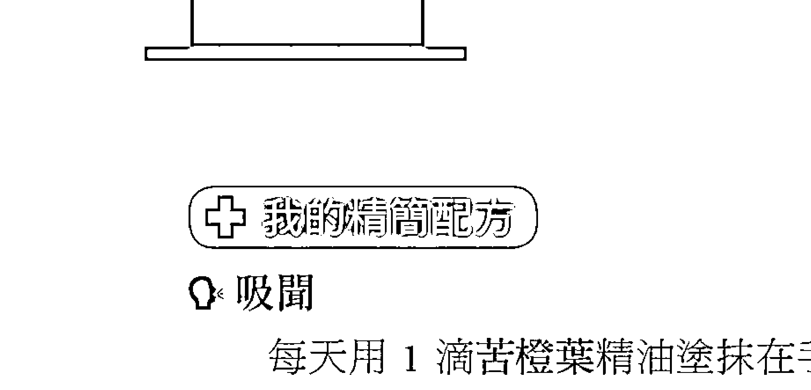

#### 我的精簡配方

**吸聞**

每天用 1 滴苦橙葉精油塗抹在手腕內側 2～3 次，並將手放到臉的前方深深吸聞。

---

#### 完整配方

##### 擴香

在擴香儀裡倒入下列精油各 10 滴：

- 苦橙葉精油  
- 依蘭精油  
- 甜橙精油  
- 真正薰衣草精油  

早、晚在生活的空間擴香半小時，最好以電子擴香儀來擴香。

### 吸聞和塗抹

調合：

- 苦橙葉精油 …… 1 滴  
- 甜馬鬱蘭精油 …… 1 滴  
- 紅桔精油 …… 1 滴  

塗抹在手腕內側並將手放到鼻子前深深吸聞，每日 3 次。也要塗抹在腹腔神經叢上。

### 請藥局諮詢

**口服（若是長期壓力、焦慮性格）**

請藥師依下列配方製作 30 顆膠囊：

- 甜馬鬱蘭精油 …… 20 mg  
- 真正薰衣草精油 …… 20 mg  
- 檸檬馬鞭草精油 …… 10 mg  
- 紅桔精油 …… 10 mg  

每次服用 1 顆，每日 3 回（早、午、晚上睡前），持續 10 天。晚上睡前服用有助於對抗與壓力有關的輕度睡眠障礙。

---

#### 孕婦專用

#### 我的精簡配方

**塗抹和吸聞**

以 2 滴大馬士革玫瑰精油塗抹在手腕內側（深深吸聞）和腹腔神經叢上，依需求可以使用多次。

**「怯場」專用**

每當有怯場的情況發生時，用 2 滴苦橙葉精油塗抹在手腕內側（深深吸聞）以及腹腔神經叢上。

**擴香**

以數滴真正薰衣草精油擴香 15 分鐘，每日 2～3 次。

**口服（懷孕滿 3 個月）**

例 1：滴苦橙葉精油在中性錠片上服用，每日 2～3 回。

#### 完整配方

**泡澡**

- 真正薰衣草精油 …… 5 滴  
- 苦橙葉精油 …… 5 滴  
- （或羅馬洋甘菊精油 …… 5 滴）  
- 泡澡的基質 …… 1 湯匙  

晚上睡前，將以上材料倒入已放好水的浴缸裡，泡澡至少 15 分鐘。泡完澡後無需沖洗，擦乾身體後直接上床就寢。

---

## 嗜甜

#### 完整配方

主要在調整對糖、酒、菸和所有毒品的黏著程度。

**吸聞和口服**

在 5 ml 深色滴管瓶裡調合：

- 錫蘭肉桂精油 …… 0.5 ml  
- 佛手柑精油 …… 1 ml  
- 玫瑰草精油 …… 1 ml  
- 羅馬洋甘菊精油 …… 0.5 ml  

在白天或晚上，以此複方精油數滴塗抹在手腕內側並深深吸聞，視需求可以嗅聞數次（沒有時間限制）。

當有想吃甜食的衝動時，可以倒 1 滴複方精油在 1 茶匙橄欖油裡服用，每日可以服用到 6 回。

---

## 超重（女性）

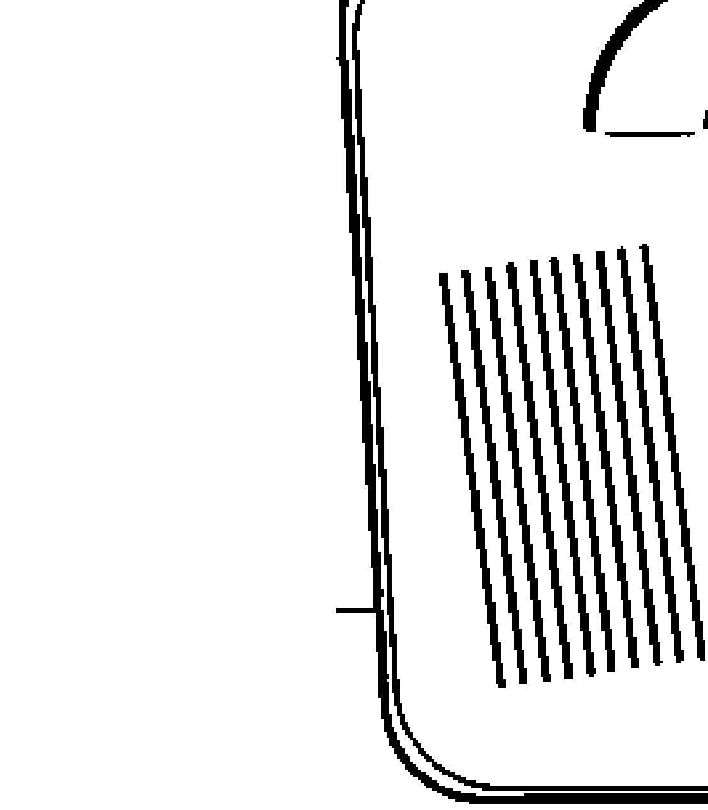

#### 我的精簡配方

**口服**

三餐飯後，倒 1 滴檸檬精油（不稀釋）在中性錠片上服用，每日 3 回。

#### 請藥局客製

- 圓葉當歸精油 …… 20 mg  
- 芹菜籽精油 …… 20 mg  
- 胡蘿蔔籽精油 …… 20 mg  
- 熱帶羅勒精油 …… 20 mg  
- 中國肉桂精油 …… 20 mg  
- 檸檬精油 …… 20 mg  

每次服用 1 顆，每日 3 回（早、午、晚），持續 20 天。停 1 週後再重複療程。

##### 塗抹

- 絲柏精油 …… 1 ml  
- 杜松漿果精油 …… 1 ml  
- 馬鞭草酮迷迭香精油 …… 1 ml  
- 樟腦迷迭香精油 …… 1 ml  
- 大西洋雪松精油 …… 1 ml  
- 玫瑰果油 …… 5 ml  

每日按摩 2 次肚子、下背和大腿。

---

#### 孕婦專用

#### 我的精簡配方

- **吸聞**  
  每當嘴饞時，可直接打開羅馬洋甘菊精油瓶以深深吸聞，每日最多 2 或 3 次。

- **口服（懷孕滿 3 個月）**  
  直接倒 1 滴檸檬精油在 1 茶匙蜂蜜裡或中性錠片上服用，每日 3～4 回。

#### 完整配方

- **塗抹和吸聞**

  - 羅馬洋甘菊精油 …… 1 滴  
  - 真正薰衣草精油 …… 1 滴  
  - 苦橙葉精油 …… 1 滴  
  - 榛果油 …… 2 滴  

  塗抹在手腕內側（深深吸聞）和腹腔神經叢上，每日 2～3 次。

- **泡澡**

  調合：

  - 真正薰衣草精油 …… 5 滴  
  - 苦橙葉精油 …… 5 滴  
  - 泡澡的基質 …… 1 湯匙  

  晚上睡前，將以上材料倒入已放好水的浴缸裡，泡澡至少 15 分鐘後無需再沖洗，穿上柔軟的睡袍後就直接上床就寢。

---

## 超重（男性）

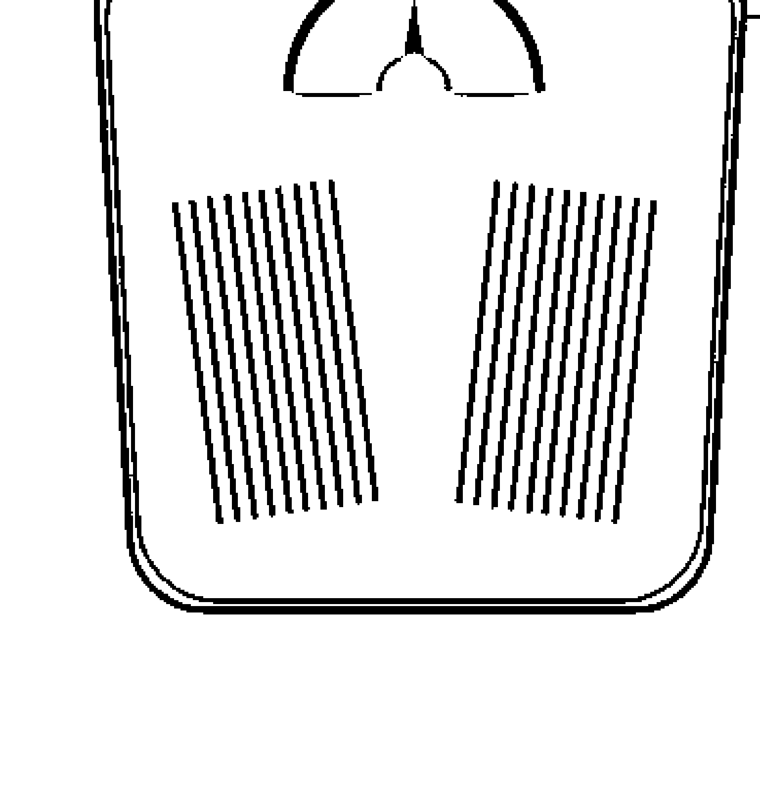

#### 我的精簡配方

**口服以調節食慾**

在早晚餐之間，當有需要時（感覺肚子餓），就倒 1 滴葡萄柚純精油（不稀釋）或 1 滴杜松漿果純精油（不稀釋）在中性錠片上服用，每日 3 回。

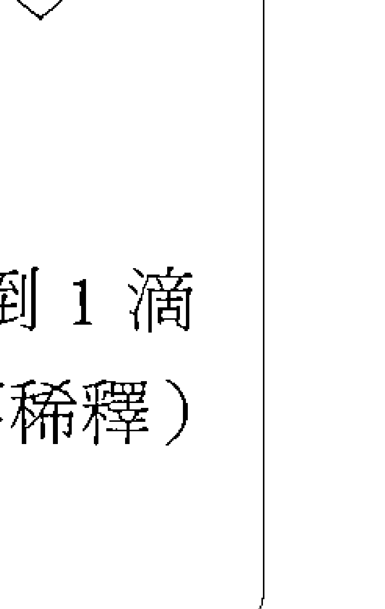

---

## 手足口病

#### 我的精簡配方

**塗抹**

以（乾淨！）的手指沾 2 滴月桂純露直接塗抹在有口腔水泡的部位。

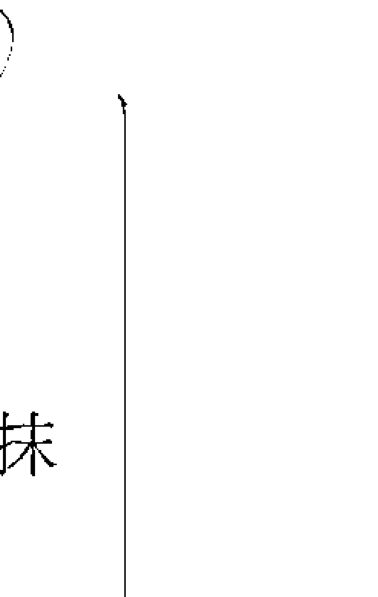

---

#### 完整配方

（嘴裡有很多水泡）

##### 塗抹

在 10 ml 瓶裡調合：

- 丁香花苞精油 …… 1 ml  
- 月桂精油 …… 1 ml  
- 白千層精油 …… 2 ml  
- 聖約翰草浸泡油 …… 6 ml  

取 1 或 2 滴調合油塗抹在長水泡的部位，每日使用 4～6 次直到完全復原為止。

##### 漱口

均等調合：

- 洋甘菊純露  
- 月桂純露  
- 百里香純露  

將 1 湯匙複方純露放入孩子的嘴裡，請孩子讓純露在嘴裡上下左右擺動，以讓所有的黏膜都有接觸到純露。10～20 秒後必須將純露吐出來，每天這樣漱口 3～5 次。

> 注意：是純露，不是精油！

---

## 戒菸

#### 我的簡單配方

**擴香**

以 10 滴紅桔或甜橙精油做 10 分鐘的環境擴香，每日 4～5 次。

## 1000 個感覺精油配方

## 請藥局複製

可吸聞和口服  
請藥師依下列配方在 10 ml 瓶裡調合：

- 歐白芷根精油 …… 1 ml  
- 馬鬱蘭酮迷迭香精油 …… 1 ml  
- 太平洋檀香精油 …… 1 ml  
- 澳洲尤加利精油 …… 1 ml  
- 絲柏精油 …… 1 ml  
- 羅馬洋甘菊精油 …… 1 ml  
- 野地薄荷精油 …… 1 ml  

以 2 滴複方精油塗抹在前額中間和手腕內側，視需求您可以在白天或晚上（毫無限制）盡量嗅聞。您將漸漸地會發現越來越沒有抽菸的需求，想抽菸的慾望越來越低，甚至有一天就不想抽了。

倒 1 滴複方精油在 1 茶匙蜂蜜裡服用，每日 3～5 回。

#### 孕婦專用

#### 完整配方

##### 泡澡放鬆

- 真正薰衣草精油 …… 5 滴  
- 羅馬洋甘菊精油 …… 5 滴  
- 泡澡的基質 …… 1 湯匙  

早上和晚上（較理想），將以上材料倒入已放好水的浴缸裡，泡澡至少 20 分鐘後無需再沖洗（然而早上只要沖個薰衣草澡），直接擦乾身體即可。

##### 吸聞

在小瓶子裡調合：

- 羅馬洋甘菊精油  
- 檸檬精油  

每當想點香時，直接打開複方精油並深深吸聞，每日可以嗅聞 5 或 10 次（依習慣而定）。

##### 擴香

- 甜橙精油  
- 苦橙葉精油  
- 真正薰衣草精油  

在您的活動空間：家裡、房間、辦公室……擴香使用上列精油，每 2 小時擴香 10 分鐘。

##### 塗抹

調合：

- 真正薰衣草精油 …… 1 滴  
- 羅馬洋甘菊精油 …… 1 滴  

塗抹在手腕內側（深深吸聞）和腹腔神經叢上，視需求可以使用多次。

---

## 皮膚上的白斑

完整配方

##### 塗抹

調合：

- 丁香花苞精油 …… 1 滴  
- 玫瑰天竺葵精油 …… 1 滴  
- 快樂鼠尾草精油 …… 1 滴  
- 茶樹精油 …… 1 滴  
- 小麥胚芽油 …… 3 滴  

每天局部塗抹白斑患部 2 次，持續 20 天。

---

## 老人斑

#### 完整配方

##### 塗抹

- 芹菜籽精油 …… 1 滴  
- 胡蘿蔔籽精油 …… 1 滴  

加入平常使用的日霜和夜霜的劑量裡（即塗抹時各加 1 滴如上的精油，或最好是各加 2.5 ml 的精油到保養品裡，這樣就不會忘記擦了……）。取數滴塗抹在有斑點的部位，每日 2 次，至少持續 15 天。勿在太陽下曝曬。

### 若斑還沒退

在 10 ml 深色滴管瓶裡調合：

- 玫瑰天竺葵精油 …… 10 滴  
- 芹菜籽精油 …… 10 滴  
- 義大利永久花精油 …… 10 滴  
- 玫瑰果油 …… 裝滿 10 ml  

取數滴塗抹在有斑點的部位，每日 2 次，持續 1 個月。勿在太陽下曝曬。

---

## 心跳太快

#### 我的精簡配方

##### 口服

加 1 滴依蘭精油在 1 小匙蜂蜜裡，再放入嘴裡融化吸收，每日 3 回。

##### 吸聞

用 1 滴依蘭精油塗抹在手腕內側並深深吸聞。

#### 完整配方

##### 擴香

均等調合：

- 依蘭精油  
- 真正薰衣草精油  
- 山雞椒精油  

早、晚以此複方精油在您活動的空間擴香半小時。

##### 塗抹

- 甜馬鬱蘭精油 …… 1 滴  
- 依蘭精油 …… 1 滴  
- 真正薰衣草精油 …… 1 滴  
- 羅馬洋甘菊精油 …… 1 滴  
- 瓊崖海棠油 …… 5 滴  

每天以此調合油按摩 2 次腹腔神經叢和肩膀。

#### 請藥局客製

##### 口服

- 超級醒目薰衣草精油 …… 20 mg  
- 依蘭精油 …… 15 mg  
- 真正薰衣草精油 …… 10 mg  
- 甜馬鬱蘭精油 …… 10 mg  
- 馬鞭草酮迷迭香精油 …… 10 mg  

早、晚服用 1 或 2 顆，直到恢復心跳正常（應該不會感覺心臟再蹦蹦跳了）。

---

#### 孕婦專用

#### 完整配方

#### 塗抹和吸聞

- 依蘭精油 …… 2 滴  
- 真正薰衣草精油 …… 1 滴  
- 橙果油 …… 3 滴  

塗抹腹腔神經叢和手腕內側（並深深吸聞），每日 2～3 次。

### 塗抹（若「情緒暴走」）

- 羅馬洋甘菊精油 …… 1 滴  
- 苦橙葉精油 …… 1 滴  
- 檸檬尤加利精油 …… 1 滴  
- 橙果油 …… 3 滴  

塗抹在腹腔神經叢和心神經叢上，視需求可以塗抹數次。您可以用「塗抹」兩個配方交替使用。

### 口服（懷孕滿 3 個月）

- 苦橙葉精油 …… 1 滴  
- 檸檬馬鞭草精油 …… 1 滴  

加在 1+1 匙蜂片上或 1/2 茶匙橄欖油裡，再放入嘴裡融化吸收。每日 3 回，持續 20 天。

##### 擴香

- 真正薰衣草精油  
- 苦橙葉精油  

早、晚用其中一種精油擴香 10 分鐘。

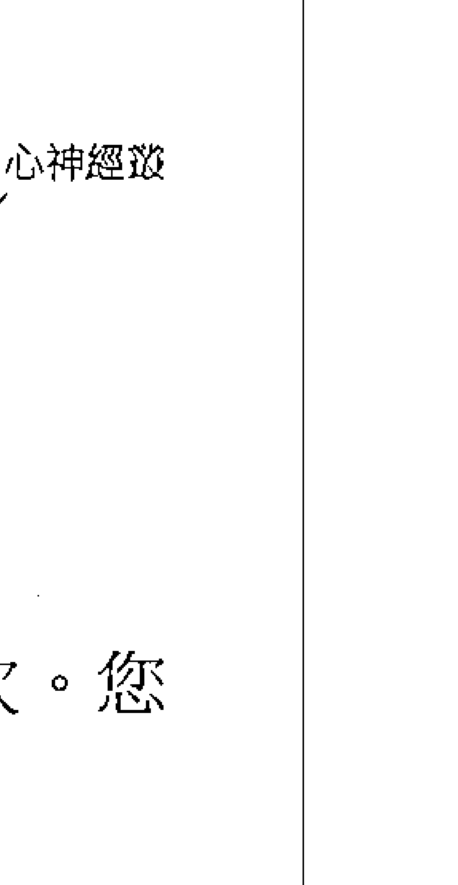

---

## 癬

手部局部製劑

##### 塗抹

請藥師依下列配方製作調理霜：

- 茶樹精油 …… 3 ml  
- 山雞椒精油 …… 3 ml  
- 丁香花苞精油 …… 3 ml  
- 胡椒薄荷精油 …… 3 ml  
- 摩洛哥藍艾菊精油 …… 1 ml  
- 濃稠的氧化鋅霜 …… 300 ml  

晚上塗抹全身後，用繃帶包起來以確保氧化鋅霜跟皮膚保持接觸 10 小時。連續使用 3 天。請務必遵守劑量和靜置的時間。

### 口服（成人和大孩子）

請藥師依下列配方製作 60 顆抗菌的膠囊：

- 茶樹精油 …… 25 mg  
- 玫瑰草精油 …… 25 mg  
- 桃金孃酚百里香精油 …… 25 mg  
- 玫瑰天竺葵精油 …… 25 mg  

早、午、晚服用 1 顆，每日 3 回，持續 20 天。

---

## 暗沉的膚色

#### 完美配方

##### 塗抹

在 5 ml 深色滴管瓶裡調合：

- 檸檬精油 — 10 滴  
- 玫瑰天竺葵精油 — 10 滴  
- 摩洛哥堅果油 — 裝滿 5 ml  

晚上以此調合油數滴塗抹並拍擦臉頰。

---

## 肌腱炎（高爾夫球肘、網球肘、阿基里斯腱）

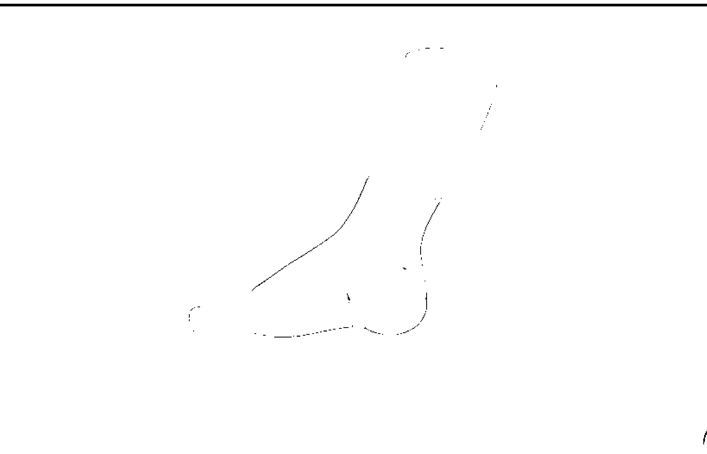

#### 我的精簡配方

##### 塗抹

以 2 滴冬青白珠／芳香白珠精油稀釋在數滴山金車浸泡油裡，塗抹在疼痛的肌腱炎部位，塗抹時千萬別施力以免再度引發痛感，每日 3～4 次。

#### 完整配方

##### 塗抹

在 5 ml 深色瓶裡調合：

- 冬青白珠／芳香白珠精油 …… 15 滴  
- 檸檬尤加利精油 …… 10 滴  
- 樟腦迷迭香精油 …… 10 滴  
- 義大利永久花精油 …… 3 滴  
- 胡椒薄荷精油 …… 3 滴  
- 山金車浸泡油 …… 裝滿 5 ml  

塗抹在肌腱炎會痛的部位，每日 4～6 次直到痊癒。

#### 請藥局客製

##### 口服

請藥師依下列配方製作 60 顆膠囊：

- 月桂精油 …… 10 mg  
- 苦橙葉精油 …… 10 mg  
- 熱帶羅勒精油 …… 30 mg  

早、晚服用 1 顆，持續 10 天。

#### 孕婦專用

##### 塗抹

在 5 ml 深色滴管瓶裡調合：

- 真正薰衣草精油 …… 1 ml  
- 檸檬尤加利精油 …… 2 ml  
- 榛果油 …… 2 ml  

以 10 滴調合油做局部按摩，每日 2～3 次。

---

#### 小孩專用

#### 完整配方

##### 塗抹

在 5 ml 瓶裡調合：

- 冬青白珠／芳香白珠精油 …… 5 滴  
- 檸檬尤加利精油 …… 5 滴  
- 月桂精油 …… 5 滴  
- 西部黃松精油 …… 5 滴  
- 山金車浸泡油 …… 裝滿 5 ml  

以此調合油 5～6 滴局部塗抹在肌腱炎患部，每日 3～4 次持續數日，直到改善為止。

---

## 落枕

#### 我的精簡配方

##### 塗抹

以 2 滴樟腦迷迭香精油塗抹並輕輕按摩會疼痛的部位，每天重複 3～4 次。

#### 完整配方

##### 塗抹

調合：

- 樟腦迷迭香精油 …… 1 滴  
- 義大利永久花精油 …… 1 滴  
- 野地薄荷精油 …… 1 滴  
- 冬青白珠／芳香白珠精油 …… 1 滴  
- 聖約翰草浸泡油 …… 3 滴  
- 山金車浸泡油 …… 3 滴  

以此配方做局部按摩，每日 3 次，若需要可持續 2～3 天。

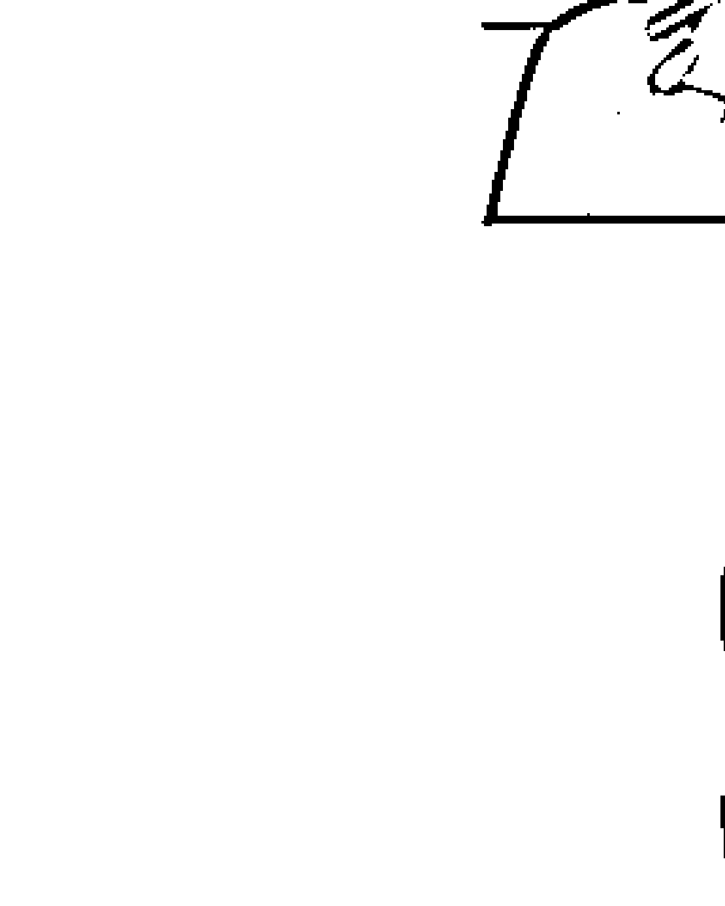

---

## 濕咳（有痰咳嗽）

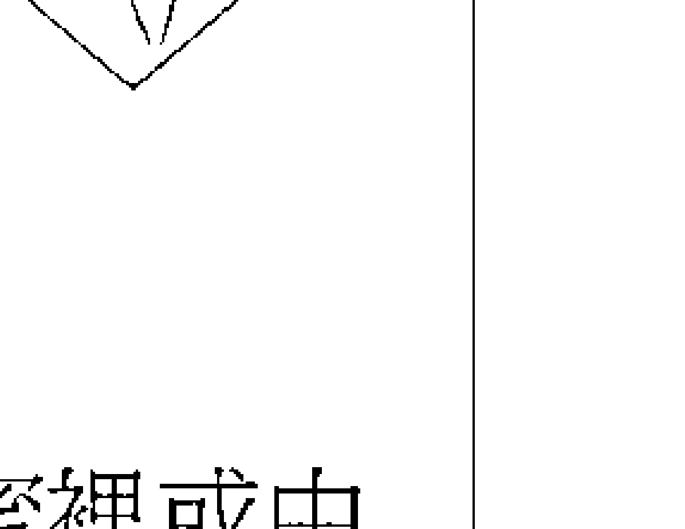

#### 我的精簡配方

##### 口服

加 2 滴綠香桃木或藍膠尤加利精油在 1 茶匙蜂蜜裡或中性錠片上服用，每日 3～4 回。

#### 完整配方

#### 塗抹和吸聞

調合：

- 綠香桃木精油 …… 1 滴  
- 土木香精油 …… 1 滴  
- 藍膠尤加利精油 …… 1 滴  

以此複方精油塗抹在前胸、後背和喉嚨上，每日 3～5 次。並直接倒 3 滴精油在乾淨的手帕上嗅聞 5～6 次。

#### 攜香

調合：

- 綠香桃木精油 …… 5 ml  
- 澳洲尤加利精油 …… 5 ml  

早、晚各用 10 ml 複方精油攜香 1 小時。

---

## 1000 個最強精油配方

#### 請藥局客製

#### 錠劑

請藥師依下列配方製作 6 顆錠劑：

- 土木香精油 …… 15 mg  
- 高地牛膝草精油 …… 15 mg  
- 茶樹精油 …… 25 mg  
- 百里酚百里香精油 …… 25 mg  
- 藍膠尤加利精油 …… 35 mg  
- 聖約翰草浸泡油 …… 20 mg  

每日使用 2～3 顆。

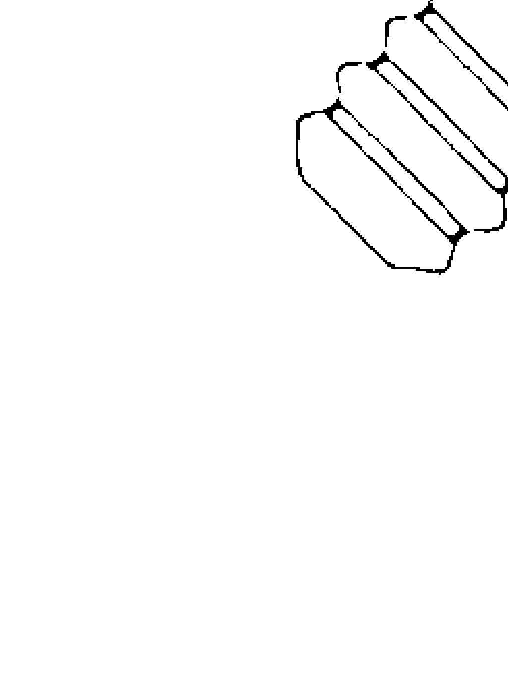

### 使呼吸道暢通的蜂蜜

在 1 茶匙的百里香蜂蜜裡，加 1 滴藍膠尤加利精油，再放入嘴裡細化吸收。或稀釋在蝶豆花茶、迷迭香茶或乾燥花茶裡。

#### 小孩專用

完整配方

##### 塗抹

在 15 ml 瓶裡調合：

- 桉油醇樟精油 …… 2 ml  
- 綠花白千層精油 …… 1 ml  
- 甜杏仁油 …… 裝滿 15 ml  

以此調合油 4～6 滴塗抹前胸、上背，每日 3 次，持續 3～4 天。

---

## 請藥房客製

##### 栓劑

請藥師依下列配方製作 12 顆栓劑：

| 成分 | 嬰兒 | 小孩 |
|---|---|---|
| 土木香精油 | 5 mg | 10 mg |
| 桉油醇樟精油 | 20 mg | 30 mg |
| 側柏醇百里香精油 | 5 mg | 10 mg |
| 綠花白千層精油 | 10 mg | 20 mg |
| 金盞菊浸泡油 | 10 mg | 10 mg |
| 栓劑賦形劑 | 1 g | 1 g |

每日施用 2～3 次，持續 3～4 天。

---

## 乾咳（抽菸者的氣管炎）

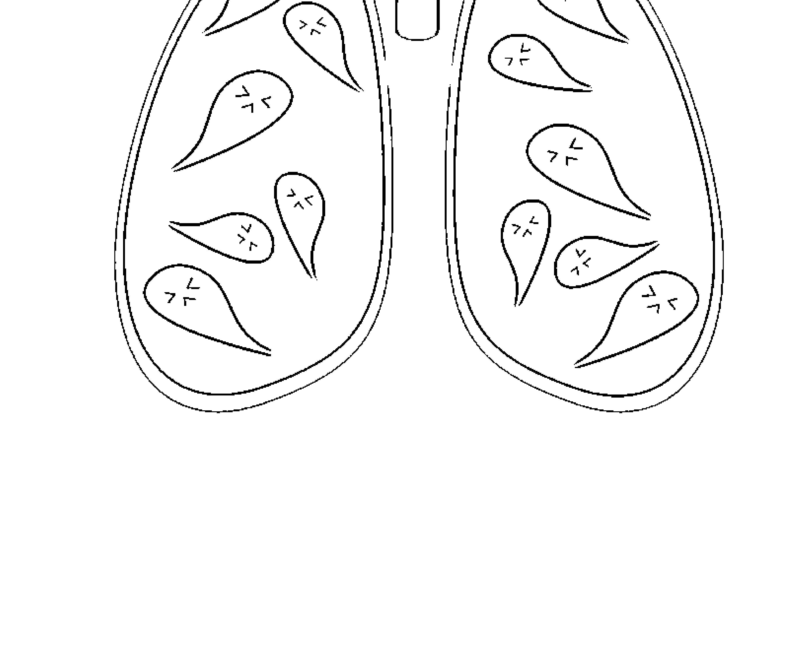

#### 我的精簡配方

##### 口服

加 1 滴絲柏精油在 1 茶匙蜂蜜裡或小方糖上，再放入嘴裡融化吸收，每日 4 回。

#### 完整配方

##### 口服

調合：

- 絲柏精油 …… 1 滴  
- 沉香醇百里香精油 …… 1 滴  

將這 2 滴精油倒入 1 茶匙的百里香蜂蜜裡，再倒入百里香茶裡攪拌均勻，慢慢飲用。

##### 塗抹

調合：

- 絲柏精油 …… 1 滴  
- 沉香醇百里香精油 …… 1 滴  
- 龍艾精油 …… 1 滴  
- 榛果油 …… 3 滴  

以此調合油塗抹在前胸、後背和喉嚨上，每日 2～3 次。

##### 擴香

調合：

- 絲柏精油 …… 5 ml  
- 澳洲尤加利精油 …… 5 ml  

以此 10 ml 複方精油來擴香，早、晚各半小時。

---

### 使呼吸道暢通的蜂蜜

在 1 茶匙的百里香蜂蜜裡，加入 1 滴澳洲尤加利精油，再放入嘴裡融化吸收。或稀釋在蝶豆花茶、迷迭香茶或乾燥花茶裡。

#### 請藥局客製

##### 栓劑

請藥師依下列配方製作 24 顆栓劑：

- 絲柏精油 …… 25 mg  
- 茶樹精油 …… 25 mg  
- 桉油醇樟精油 …… 25 mg  
- 河香薷百里香精油 …… 25 mg  
- 澳洲尤加利精油 …… 25 mg  
- 聖約翰草浸泡油 …… 20 mg  

每日施用 2 顆，持續 5～10 天。

---

## 怯場

#### 我的精簡配方

##### 吸聞

倒 1 滴苦橙葉精油在手腕內側，將雙手放在臉前並深深吸聞，每日 2～3 次。

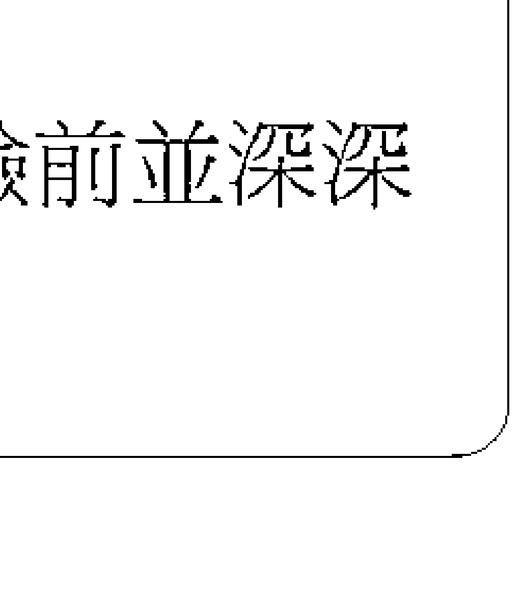

---

## 1000 個感覺精油配方

## 亮澤配方

##### 擴香

在擴香儀裡倒入以下精油各 10 滴：

- 苦橙葉精油  
- 依蘭精油  
- 甜橙精油  
- 真正薰衣草精油  

早、晚在活動的空間擴香半小時，最好是用電子擴香儀。

### 吸聞和塗抹

調合：

- 苦橙葉精油 …… 1 滴  
- 甜馬鬱蘭精油 …… 1 滴  
- 紅桔精油 …… 1 滴  

塗抹在手腕並將手放在鼻前深深吸聞，每日 3 次。  
也要塗抹在腹腔神經叢上。

#### 請藥局客製

##### 口服

請藥師依下列配方製作 30 顆膠囊：

- 甜馬鬱蘭精油 …… 20 mg  
- 真正薰衣草精油 …… 20 mg  
- 檸檬馬鞭草精油 …… 10 mg  
- 紅桔精油 …… 10 mg  

每次服用 1 顆，每日 3 回（早、午、晚睡前），持續 10 天。晚上睡前服用有助於對抗與壓力有關的輕度睡眠障礙。

---

#### 孕婦專用

### 我的精油配方

- **塗抹和吸聞**：以 2 滴大馬士革玫瑰精油塗抹在手腕內側（深深吸聞）和腹腔神經叢上，視需求可以使用多次。  
- **擴香**：以數滴真正薰衣草精油擴香 15 分鐘，每日 2～3 次。  
- **口服（懷孕滿 3 個月）**：倒 1 滴苦橙葉精油在中性錠片上服用，每日 2～3 回。

#### 完整配方

##### 泡澡

- 真正薰衣草精油 …… 5 滴  
- 苦橙葉精油 …… 5 滴  
- （或羅馬洋甘菊精油 …… 5 滴）  
- 泡澡的基質 …… 1 湯匙  

晚上睡前，將以上材料倒入已放好水的浴缸裡，泡澡至少 15 分鐘後無需再沖洗，擦乾身體後就直接上床就寢。

---

## 出汗過多或發臭

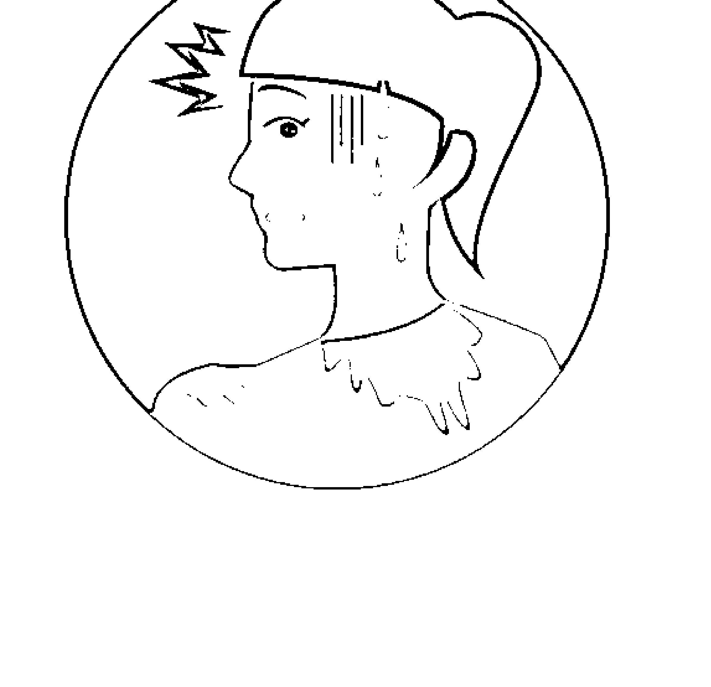

#### 我的精簡配方

##### 塗抹

早上沖澡後，以手指點 1 滴玫瑰草純精油（不稀釋）塗抹在乾淨、擦乾皮膚的腋下。這樣做通常可以讓您相安無事撐到晚上。

#### 請藥局客製

##### 塗抹

請藥師依據下列清單製作凝膠：

- 胡椒薄荷精油 …… 1 ml  
- 快樂鼠尾草精油 …… 1 ml  
- 絲柏精油 …… 1 ml  
- 玫瑰天竺葵精油 …… 1 ml  
- 岩玫瑰精油 …… 1 ml  
- 中性凝膠 …… 裝滿 50 ml  

早、晚梳洗後，約取一顆榛果的劑量塗抹在容易出汗的部位。這個配方不適用在有乳腺疾病的人。

---

#### 孕婦專用

#### 我的精簡配方

##### 塗抹

梳洗後，以 2 滴苦橙葉精油稀釋在 2 滴玫瑰果油裡，塗抹腋下和足弓。

---

## 出汗（腳）

#### 完整配方

##### 塗抹

在 10 ml 葡萄籽油中調合：

- 絲柏精油 …… 1 ml  
- 快樂鼠尾草精油 …… 1 ml  
- 胡椒薄荷精油 …… 0.5 ml  
- 荷荷芭油 …… 裝滿 10 ml  

早、晚塗抹在洗淨而擦乾的腳上，並配合按摩直到完全吸收。請記得腳趾間也要塗抹！

#### 灌粉

調合：

- 絲柏精油 …… 30 滴  
- 快樂鼠尾草精油 …… 30 滴  
- 胡椒薄荷精油 …… 20 滴  
- 滑石粉 …… 100 g  

將以上材料倒入灌粉瓶裡。在穿鞋前灌在鞋內的底部。我們建議請藥劑師製作這個爽身粉，以便能徹底混合均勻材料。

## 旅行者腹瀉（水土不服）

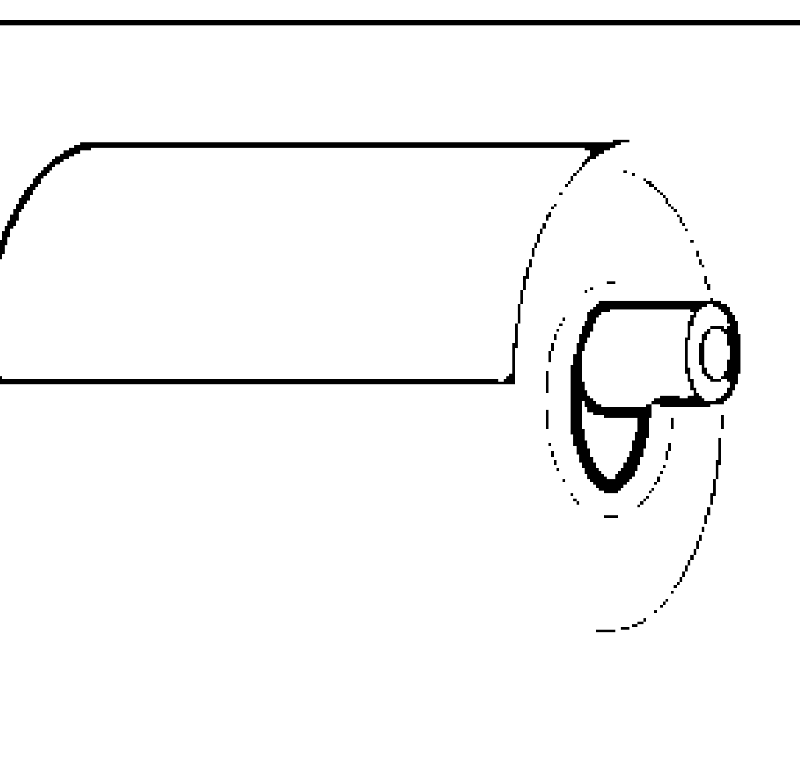

#### 我的精簡配方

- 口服  
  加 1 滴錫蘭肉桂或野馬鬱蘭精油在 1 茶匙橄欖油裡服用，每日 4 回。

#### 請藥局客製

預防用（例如去熱帶國家旅行之前）

- 口服  

請藥師依下列配方製作 30 顆膠囊：

- 野馬鬱蘭精油 …… 20 mg  
- 錫蘭肉桂精油 …… 10 mg  
- 馬鞭草酮迷迭香精油 …… 20 mg  
- 胡椒薄荷精油 …… 5 mg  
- 冬季香薄荷精油 …… 20 mg  

出門前一天開始到旅遊期間，每日早上服用 1 顆。若您患了旅行者腹瀉，每日服用 4 回，每次 2 顆，連續 3 天；第四天則減為每日 3 回，再繼續 3 天；最後回復到剛開始的劑量，每日 1 顆。

---

## 荨麻疹

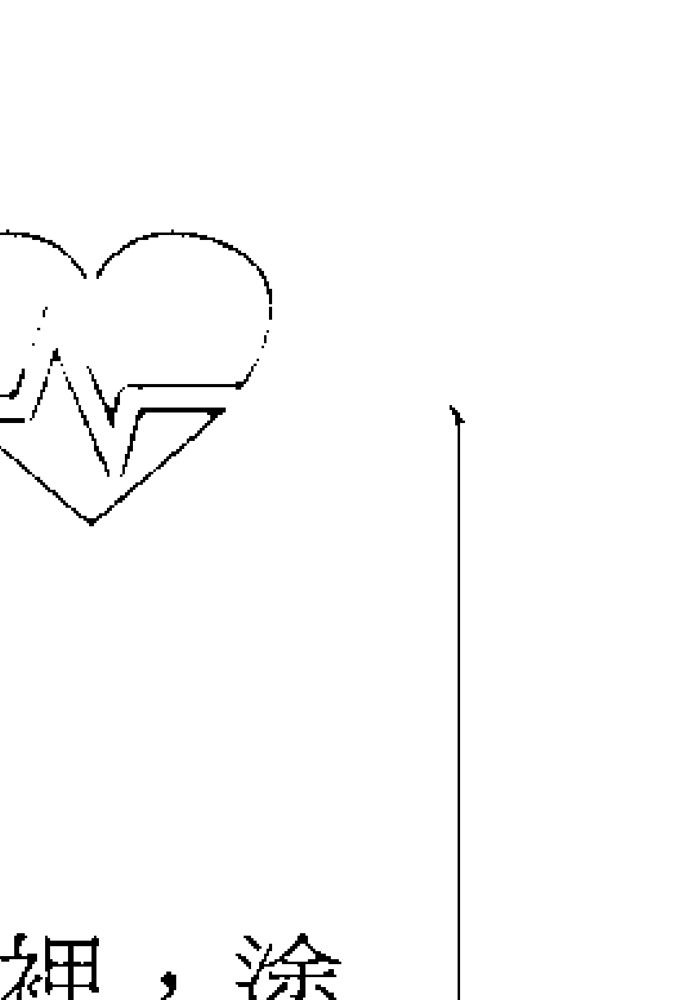

#### 我的精簡配方

- **塗抹**  
  以 1～2 滴穗花薰衣草精油稀釋在數滴甜杏仁油裡，塗抹荨麻疹患部。每日 3 次直到不癢為止。

#### 完整配方

- **塗抹**

調合：

- 穗花薰衣草精油 …… 1 滴  
- 羅馬洋甘菊精油 …… 1 滴  
- 胡椒薄荷精油 …… 1 滴  
- 金盞菊浸泡油 …… 3 滴  

每日塗抹荨麻疹患部 3～4 次，直到改善為止。

- **口服**

在中性錠片上倒入：

- 圓葉當歸精油 …… 1 滴  
- 檸檬精油 …… 1 滴  

每日服用 3 回，持續 1 週。

---

## 請藥局客製（若全身都癢）

##### 塗抹

請藥師依下列配方準備爽身粉：

- 摩洛哥藍艾菊精油 …… 2 ml  
- 穗花薰衣草精油 …… 2 ml  
- 羅馬洋甘菊精油 …… 1 ml  
- 玫瑰天竺葵精油 …… 1 ml  
- 滑石粉 …… 100 g  

視需求每天在身上灑粉 2～4 次。

#### 完整配方

##### 塗抹

1. 以純露舒緩  

- 真正薰衣草純露  
- 羅馬洋甘菊純露  

在白天可以用敷料或化妝棉浸泡在大量純露裡再濕敷。

2. 以精油治療  

- 真正薰衣草精油 …… 1 滴  
- 羅馬洋甘菊精油 …… 1 滴  
- 玫瑰天竺葵精油 …… 1 滴  
- 金盞菊浸泡油 …… 3 滴  

每日局部塗抹 4～6 次，持續 1～2 天後減為每日塗抹 3 次，再繼續 5 天。

---

#### 小孩專用

#### 完整配方

- 塗抹  

在 15 ml 瓶裡調合：

- 穗花薰衣草精油 …… 1 ml  
- 摩洛哥藍艾菊精油 …… 1 ml  
- 芳樟精油 …… 1 ml  
- 金盞菊浸泡油 …… 6 ml  
- 甜杏仁油 …… 6 ml  

以此調合油數滴塗抹在導疹患部，每半小時塗抹一次，連續 3～5 次。

---

## 陰道炎

#### 我的精簡配方

- 塗抹  

以 1 滴側柏醇百里香精油稀釋在 5 滴金盞菊浸泡油裡。早、晚塗抹陰唇直到改善為止。

#### 完整配方

- 塗抹  

在 2 ml 深色滴管瓶裡調合：

- 側柏醇百里香精油 …… 3 滴  
- 真正薰衣草精油 …… 3 滴  
- 月桂精油 …… 3 滴  
- 金盞菊浸泡油 …… 裝滿 2 ml  

早、晚取 4 滴調合油塗抹唇部，直到改善為止。

---

## 霉菌局部感染

### 陰道栓劑

請藥師依下列配方製作 18 顆陰道栓劑：

- 綠花白千層精油 …… 30 mg  
- 馬鬱蘭酮迷迭香精油 …… 20 mg  
- 穗花薰衣草精油 …… 30 mg  
- 金盞菊浸泡油 …… 10 mg  

每日施用 2 次，將栓劑塞入陰道裡，持續 9 天。

---

## 水痘

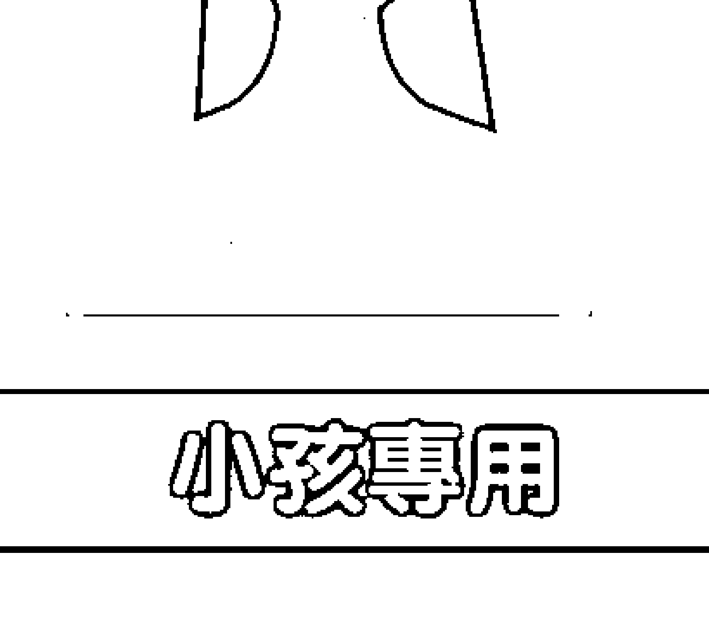

#### 小孩專用

#### 完整配方

- 塗抹  

在 15 ml 瓶裡調合：

- 穗花薰衣草精油 …… 2 ml  
- 摩洛哥藍艾菊精油 …… 1 ml  
- 桉油醇樟精油 …… 3 ml  
- 綠花白千層精油 …… 1 ml  
- 甜杏仁油 …… 8 ml  

以此調合油 6～8 滴塗抹在長水痘的患部，每日 3～4 次，持續 1 週。

#### 請藥局客製

##### 塗抹

依下列配方製作 100 g 爽身粉：

- 穗花薰衣草精油 …… 1 ml  
- 芳樟精油 …… 1 ml  
- 茶樹精油 …… 1 ml  
- 摩洛哥藍艾菊精油 …… 0.5 ml  
- 威尼斯滑石粉 …… 裝滿 100 g  

每天在會癢的部位撲粉 3～5 次，持續 1 週。這個含精油的爽身粉既抗菌防腐又可以舒緩皮膚。這個配方可緩解您可憐小孩的皮膚癢。

##### 栓劑

請藥師依下列配方製作 24 顆栓劑：

| 成分 | 嬰兒 | 小孩 |
|---|---|---|
| 芳樟精油 | 5 mg | 10 mg |
| 桉油醇樟精油 | 25 mg | 40 mg |
| 摩洛哥藍艾菊精油 | 5 mg | 10 mg |
| 聖約翰草浸泡油 | 10 mg | 10 mg |
| 栓劑的賦形劑 | 1 g | 1 g |

每日施用 3 次（非常抗病毒和止癢），持續 1 週。

---

## 靜脈曲張

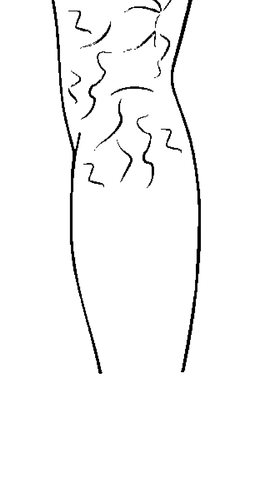

#### 我的精簡配方

- **塗抹**  
  以 2 滴薰陸香純精油（不稀釋）塗抹在靜脈曲張的部位，每日 2～3 次，由下往上塗抹。

#### 完整配方

- **塗抹**

在 10 ml 深色滴管瓶裡調合：

- 薰陸香精油 …… 5 滴  
- 絲柏精油 …… 5 滴  
- 綠花白千層精油 …… 5 滴  
- 胡椒薄荷精油 …… 2 滴  
- 杜松漿果精油 …… 5 滴  
- 廣藿香精油 …… 5 滴  
- 瓊崖海棠油 …… 裝滿 10 ml  

早、晚取數十滴調合油按摩腳，由腳踝往上半身塗抹。

---

## 靜脈局部護理

##### 口服

請遵照依下列配方製作 60 顆膠囊：

- 薰衣草精油 …… 25 mg  
- 薑精油 …… 10 mg  
- 檸檬精油 …… 25 mg  

早、午、晚（依三餐）服用 20 天。停 8 天後再重複療程。

> 此配方不適用於乳腺疾病患者。

---

#### 孕婦專用

#### 完整配方

##### 塗抹

調合：

- 薑精油 …… 1 滴  
- 義大利永久花精油 …… 1 滴  
- 檸檬精油 …… 1 滴  
- 玫瑰海棠油 …… 5 滴  

早、晚按摩腳踝、小腿和大腿：由下往上塗抹，並沿著靜脈曲張部位加強塗抹。

> 注意！塗抹後請勿直接曝曬太陽！若是夏天要裸露雙腿的話，只在晚上按摩就好。

---

## 妊娠紋（肥胖紋）

#### 塗抹（預防）

請藥師依下列配方準備一瓶 125 ml 調合油：

- 紅桔精油 …… 4 ml  
- 馬鞭草酮迷迭香精油 …… 0.5 ml  
- 芳樟精油 …… 1 ml  
- 玫瑰天竺葵精油 …… 0.5 ml  
- 佛手柑精油 …… 0.5 ml  
- 依蘭精油 …… 0.5 ml  
- 玫瑰果油和小麥胚芽油均等比例 …… 裝滿 125 ml  

每天早上梳洗後，塗抹在可能「遭殃」的部位：胸部、肚子、骨盆、臀部、大腿和膝蓋。

> ⚠ 注意：此配方不適用於孕婦。

###### 治療

#### 我的精簡配方

- 塗抹  

以 2 滴義大利永久花精油塗抹在產後有妊娠紋的部位，每日 2 次。

> ⚠ 注意：此配方不適用於孕婦。若您是孕婦的話，請參考「孕婦專用」配方。

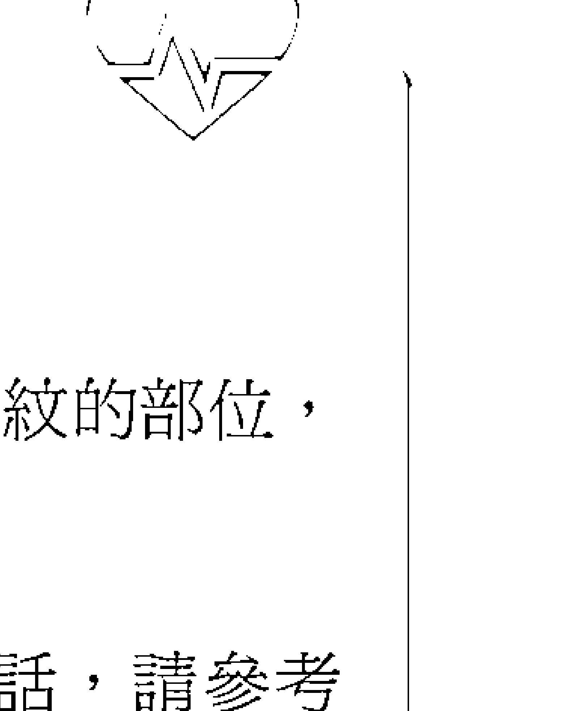

#### 完整配方

在 15 ml 深色滴管瓶裡調合：

- 紅香桃木精油 …… 10 滴  
- 岩玫瑰精油 …… 10 滴  
- 玫瑰天竺葵精油 …… 10 滴  
- 義大利永久花精油 …… 10 滴  
- 綠花白千層精油 …… 10 滴  
- 薰陸香精油 …… 10 滴  
- 玫瑰果油 …… 裝滿 15 ml  

搖晃後，局部塗抹在產後有妊娠紋的部位，並輕揉按摩久一點，每日 2 次。

> 注意：此配方不適用於孕婦。

#### 請藥局客製

請藥師依下列配方準備一瓶 125 ml 調合油：

- 義大利永久花精油 …… 3 ml  
- 馬鞭草酮迷迭香精油 …… 3 ml  
- 頭狀薰衣草精油 …… 3 ml  
- 紅香桃木精油 …… 5 ml  
- 真正薰衣草精油 …… 5 ml  
- 岩玫瑰精油 …… 3 ml  
- 鼠尾草精油 …… 3 ml  
- 玫瑰果油 …… 50 ml  
- 小麥胚芽油 …… 裝滿 125 ml  

取 5 滴調合油塗抹在產後有妊娠紋的部位，並按摩久一點。每日 2 次，持續 15 天或更久。

> 注意：此配方不適用於孕婦。

---

#### 孕婦專用

#### 完整配方

從懷孕初期開始塗抹。預防，從皮膚開始「緊縮」時調合：

- 月見草油  
- 小麥胚芽油  
- 玫瑰果油  

在懷孕期間每天早上沐浴後，取適量調合油塗抹胸部、大腿、肚子、臀部和膝蓋等，特別加強容易有妊娠紋的部位。此複方植物油可以滋養皮膚並幫助恢復彈性。

懷孕滿 3 個月：

在 30 ml 深色滴管瓶裡調合：

- 玫瑰天竺葵精油 …… 4 滴  
- 芳樟精油 …… 4 滴  
- 玫瑰果油 …… 10 ml  
- 摩洛哥堅果油 …… 10 ml  
- 琉璃苣油 …… 10 ml  

洗完後取 10 滴調合油塗抹在需要被呵護的部位（臀部和大腿），每日 2 次。

若在分娩和哺乳後出現妊娠紋：

在 60 ml 深色滴管瓶裡調合：

- 綠花白千層精油 …… 2 ml  
- 岩玫瑰精油 …… 2 ml  
- 鼠尾草精油 …… 1 ml  
- 義大利永久花精油 …… 1 ml  
- 玫瑰或波旁天竺葵精油 …… 2 ml  
- 大馬士革玫瑰精油 …… 1 ml  
- 玫瑰果油 …… 裝滿 60 ml  

早、晚如上述建議方式塗抹，但按摩久一點，並配合滾動按摩手法。

---

## 疣

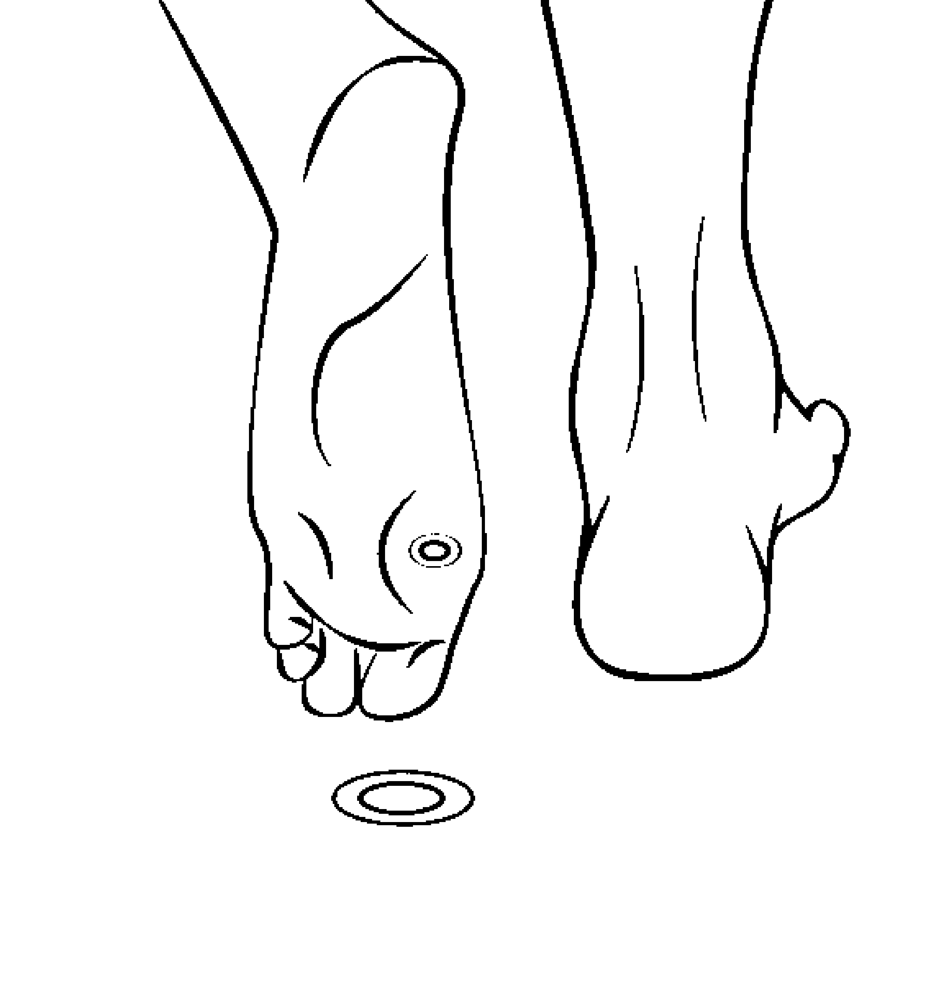

#### 我的精簡配方

- **塗抹**  
  用 1 滴檸檬精油和 1 滴茶樹精油局部塗抹在長疣的部位。早、晚各一次，直到疣消失為止。

#### 完整配方

- **塗抹**

在 5 ml 深色滴管瓶裡調合：

- 野馬鬱蘭精油 …… 1 ml  
- 杜松漿果精油 …… 1 ml  
- 中國肉桂精油 …… 1 ml  
- 丁香花苞精油 …… 1 ml  
- 冬季香薄荷精油 …… 1 ml  

梳洗後，沾 1 滴複方精油在棉花棒上塗抹在長疣的患部，並用敷料覆蓋靜置。每日 2 次，持續 2～3 週，直到疣消失為止。

---

## 請藥局客製（若長數個疣）

##### 口服

請藥師依下列配方製作 60 顆膠囊：

- 桉油醇樟樹精油 …… 30 mg  
- 丁香花苞精油 …… 10 mg  
- 茶樹精油 …… 20 mg  
- 龍腦百里香精油 …… 20 mg  

早、晚各服用 1 顆，持續 3 週。

#### 小孩專用

##### 塗抹

在 5 ml 抗腐蝕的塗藥瓶裡調合：

- 希臘野馬鬱蘭精油 …… 0.5 ml  
- 錫蘭肉桂精油 …… 0.5 ml  
- 冬季香薄荷精油 …… 0.5 ml  

早、晚使用 1 滴直接塗抹在長疣的患部，持續 1 個月。塗抹後用繃帶覆蓋。請將精油保存於小孩拿不到的地方。

---

## 沙啞失聲

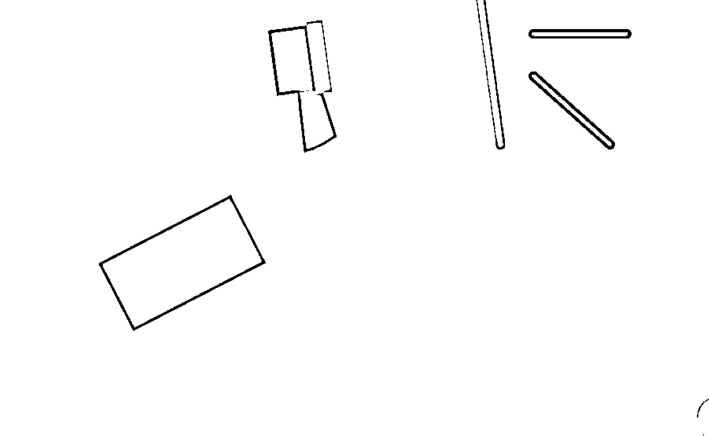

### 我的精油配方

- 口服  

2 滴絲柏精油加入 1 茶匙蜂蜜裡，再拌入百里香茶裡飲用。每日 3 回。

#### 完整配方

- 口服  

- 絲柏精油 …… 2 滴  
- 羅馬洋甘菊精油 …… 1 滴  
- 葡萄柚籽萃取液（藥局） …… 20 滴  

將以上材料倒入半杯水裡均勻攪拌後飲用，每日 2 回。

- 漱口  

早、午、晚將上述材料稀釋在一杯水裡後漱口。

---

## 帶狀疱疹

#### 我的精簡配方

- 塗抹  

以 2 滴純綠花白千層精油稀釋在 5 滴榛果油裡，直接塗抹在會痛的帶狀疱疹患部。每日 4～6 次。

> 提醒：一旦帶狀疱疹發生了，只能處理止痛和避免併發症（尤其是繼發感染）。白白忍痛是沒有用的，必須盡力減輕疼痛。另外，也無法阻止結痂後再發作的「循環」。

#### 完整配方

- 塗抹  

調合：

- 綠花白千層精油 …… 4 滴  
- 桉油樟葉精油 …… 2 滴  
- 胡椒薄荷精油 …… 2 滴  
- 穗花薰衣草精油 …… 2 滴  
- 聖約翰草浸泡油 …… 10 滴  

以調合油局部塗抹在帶狀疱疹的神經分布上。48 小時內每日塗抹 6 次，之後減半為每日 3 次直到完全癒合。請避免搔抓、按摩或過度碰觸皮膚，只需塗抹即可。

---

### 請藥局調製

##### 口服

請藥師依下列配方製作 60 顆膠囊：

- 核油薄荷精油 …… 30 mg  
- 澳洲尤加利精油 …… 10 mg  
- 丁香花苞精油 …… 10 mg  
- 綠花白千層精油 …… 10 mg  
- 胡椒薄荷精油 …… 10 mg  

早、午、晚各服用 1 顆，持續 2～3 週。

---

#### 孕婦專用

#### 完整配方

- 塗抹  

- 核油薄荷精油 …… 1 滴  
- 茶樹精油 …… 1 滴  
- 穗花薰衣草精油 …… 1 滴  
- 聖約翰草浸泡油 …… 5 滴  

若需要可以頻繁地塗抹水泡患部，每日最多 6 次。

---

## 精油對照表

| 精油 | 中文 | 法文 | 英文 | 拉丁學名 |
|---|---|---|---|---|
| 1 | 月桂 | Laurier noble | Bay Laurel | Laurus nobilis |
| 2 | 土木香 | Inule odorante | Elecampane | Inula graveolens |
| 3 | 薰陸香 | Lentisque pistachier | Mastic | Pistacia lentiscus |
| 4 | 羅馬洋甘菊 | Camomille romaine | Roman Chamomile | Chamaemellum nobile |
| 5 | 德國洋甘菊 | Matricaire | German Chamomile | Matricaria recutita |
| 6 | 真正薰衣草 | Lavande officinale | True Lavender | Lavandula angustifolia |
| 7 | 穗花薰衣草 | Lavande aspic | Spike Lavender | Lavandula latifolia |
| 8 | 超級醒目薰衣草 | Lavandin super | Super Lavender | Lavandula burnatii super |
| 9 | 頭狀薰衣草 | Lavande stoechade | Lavender Stoechas / Stoke Lavender | Lavandula stoechas |
| 10 | 玫瑰天竺葵 | Géranium rosat | Geranium | Pelargonium asperum |
| 11 | 波旁天竺葵 | Géranium rosat var. Bourbon | Geranium Bourbon | Pelargonium graveolens |
| 12 | 岩玫瑰 | Ciste ladanifère | Cistus | Cistus ladaniferus |

| 精油 | 中文 | 法文 | 英文 | 拉丁學名 |
|---|---|---|---|---|
| 13 | 胡蘿蔔籽 | Carotte | Carrot Seed | Daucus carota |
| 14 | 丁香花苞 | Girofle | Clove Bud | Syzygium aromaticum |
| 15 | 胡椒薄荷 | Menthe poivrée | Peppermint | Mentha piperita |
| 16 | 胡薄荷 | Menthe pouliot | Mint Penny‑royal | Mentha pulegium |
| 17 | 綠薄荷 | Menthe verte | Spearmint | Mentha spicata |
| 18 | 檸檬薄荷 | Menthe citronnée / Menthe bergamote | Bergamot Mint | Mentha citrata |
| 19 | 薄荷尤加利 | Eucalyptus mentholé | Peppermint Eucalyptus | Eucalyptus dives |
| 20 | 澳洲尤加利 | Eucalyptus radié | Narrow‑leaved peppermint | Eucalyptus radiata |
| 21 | 藍膠尤加利 | Eucalyptus globuleux | Blue Gum | Eucalyptus globulus |
| 22 | 檸檬尤加利 | Eucalyptus citronné | Lemon Eucalyptus | Eucalyptus citriodora |
| 23 | 多苞葉尤加利 | Eucalyptus à cryptone | Eucalyptus Polybractea, krypton | Eucalyptus polybractea cryptonifera |
| 24 | 圓葉當歸 | Livèche rac. | Lovage | Levisticum officinale |
| 25 | 摩洛哥藍艾菊 | Tanaisie annuelle | Blue Tansy | Tanacetum annuum |
| 26 | 龍艾 | Estragon | Tarragon | Artemisia dracunculus |
| 27 | 芳樟 | Bois de Hô | Ho Wood | Cinnamomum camphora CT linalol |

| 精油 | 中文 | 法文 | 英文 | 拉丁學名 |
|---|---|---|---|---|
| 28 | 鼠尾草 | Sauge officinale | Sage | Salvia officinalis |
| 29 | 快樂鼠尾草 | Sauge sclarée | Clary sage | Salvia sclarea |
| 30 | 小茴香 | Cumin | Cumin | Cuminum cyminum |
| 31 | 洋茴香 | Anis vert | Anise | Pimpinella anisum |
| 32 | 甜茴香 | Fenouil doux | Sweet Fennel | Foeniculum vulgare |
| 33 | 八角茴香 | Anis étoilé / Badiane | Star Anise | Illicium verum |
| 34 | 藏茴香 | Carvi | Caraway Seed | Carum carvi |
| 35 | 印度藏茴香 | Ajowan | Ajowan | Trachyspermum ammi |
| 36 | 側柏醇百里香 | Thym à thujanol | Thyme, CT Thujanol | Thymus vulgaris (Thymus vulgaris thujanoliferum) |
| 37 | 沉香醇百里香 | Thym à linalol | Thyme, CT Linalool | Thymus vulgaris CT linalol (Thymus linaloliferum) |
| 38 | 百里酚百里香 | Thym à thymol | Thyme, CT Thymol | Thymus vulgaris thymoliferum |
| 39 | 龍腦百里香 | Thym saturéoïde | Thyme Borneol | Thymus satureioides |
| 40 | 牻牛兒醇百里香 | Thym à géraniol | Thyme Geraniol | Thymus vulgaris geranioliferum |
| 41 | 冬季香薄荷 | Sarriette des montagnes | Winter Savory | Satureja montana |
| 42 | 野馬鬱蘭 | Origan compact | Oregano | Origanum vulgare / Origanum compactum |

## 精油對照表

| 精油 | 中文 | 法文 | 英文 | 拉丁學名 |
|---|---|---|---|---|
| 43 | 茶樹 | Arbre à thé | Tea Tree | Melaleuca alternifolia |
| 44 | 桉油醇樟（舊名：羅文莎葉） | Ravintsara | Ravintsara | Cinnamomum camphora cineoliferum (Cinnamomum camphora, CT Cineole) |
| 45 | 義大利永久花 | Hélichryse italienne | Immortelle / Helichrysum | Helichrysum italicum |
| 46 | 依蘭 | Ylang-ylang | Ylang Ylang | Cananga odorata |
| 47 | 乳香 | Encens | Frankincense | Boswellia carterii |
| 48 | 沒藥 | Myrrhe amère | Myrrh | Commiphora myrrha |
| 49 | 熱帶羅勒 | Basilic exotique | Tropical Basil | Ocimum basilicum |
| 50 | 橙花 | Néroli | Neroli | Citrus aurantium |
| 51 | 檸檬馬鞭草 | Verveine citronnée | Lemon Verbena | Lippia citriodora |
| 52 | 歐白芷根 | Angélique | Angelica Root | Angelica archangelica |
| 53 | 苦橙葉 | Petit grain bigaradier | Petitgrain Bigarade | Citrus aurantium bigarade |
| 54 | 甜馬鬱蘭 | Marjolaine des jardins | Sweet Marjoram | Origanum majorana |
| 55 | 爪哇香茅 | Citronnelle | Citronella Java Type | Cymbopogon winterianus |
| 56 | 錫蘭肉桂 | Cannelle de Ceylan (écorce) | Cinnamon Bark | Cinnamomum verum / Cinnamomum zeylanicum |

## 1000 個最強精油配方

| 精油 | 中文 | 法文 | 英文 | 拉丁學名 |
|---|---|---|---|---|
| 57 | 喜馬拉雅雪松 | Cèdre d’Himalaya | Himalayan Cedar | Cedrus deodara |
| 58 | 大西洋雪松 | Cèdre de l’Atlas | Cedarwood | Cedrus atlantica |
| 59 | 白千層 | Cajeput | Cajeput | Melaleuca leucadendra |
| 60 | 綠花白千層 | Niaouli | Niaouli | Melaleuca quinquenervia |
| 61 | 薑 | Gingembre | Ginger | Zingiber officinale |
| 62 | 冬青白珠 | Gaulthérie couchée | Wintergreen | Gaultheria procumbens |
| 63 | 杜松漿果 | Genévrier commun | Juniper Berry | Juniperus communis |
| 64 | 海松 | Térébenthine | Sea Pine | Pinus pinaster |
| 65 | 阿密茴 | Khella | Khella | Ammi visnaga |
| 66 | 格陵蘭喇叭茶 | Lédon du Groenland | Labrador Tea | Rhododendron groenlandicum / 舊名 Ledum groenlandicum |
| 67 | 西部黃松 | Pin de Patagonie | Western Yellow Pine | Pinus ponderosa |
| 68 | 高地牛膝草 | Hysope couchée | Mountain Hyssop | Hyssopus officinalis decumbens |
| 69 | 紅香桃木 | Myrte rouge | Red Myrtle | Myrtus communis CT acétate de myrtényle |
| 70 | 綠香桃木 | Myrte vert | Green Myrtle | Myrtus communis CT cinéole |
| 71 | 歐洲赤松 | Pin sylvestre | Scots Pine | Pinus sylvestris |

| 精油 | 中文 | 法文 | 英文 | 拉丁學名 |
|---|---|---|---|---|
| 72 | 法國羅勒（又稱歐洲羅勒或甜羅勒） | Basilic français (basilic européen ou basilic doux) | Sweet Basil | Ocimum basilicum CT linalol |
| 73 | 黑雲杉 | Épinette noire | Black Spruce | Picea mariana |
| 74 | 山雞椒 | Litsée citronnée | Litsea | Litsea cubeba |
| 75 | 芫荽籽 | Coriandre | Coriander | Coriandrum sativum |
| 76 | 絲柏 | Cyprès de Provence | Cypress (France) | Cupressus sempervirens |
| 77 | 桉油醇迷迭香 | Romarin à cinéole | Rosemary Cineole | Rosmarinus officinalis CT cineole |
| 78 | 樟腦迷迭香 | Romarin à camphre | Rosemary Camphor | Rosmarinus officinalis camphoriferum |
| 79 | 馬鞭草酮迷迭香 | Romarin à verbénone | Rosemary Verbenone | Rosmarinus officinalis CT verbenone |
| 80 | 玫瑰草 | Palmarosa | Palmarosa | Cymbopogon martinii |
| 81 | 花梨木 | Bois de rose | Rosewood | Aniba rosaeodora |
| 82 | 檸檬香茅 | Lemongrass | Lemongrass | Cymbopogon flexuosus (Cymbopogon citratus) |
| 83 | 大馬士革玫瑰 | Rose de Damas | Damask Rose | Rosa damascena |
| 84 | 穗甘松 | Nard de l'Himalaya | Spikenard | Nardostachys jatamansi |
| 85 | 太平洋檀香 | Santal jaune | Sandalwood Pacific | Santalum austrocaledonicum |

| 精油 | 中文 | 法文 | 英文 | 拉丁學名 |
|---|---|---|---|---|
| 86 | 檀香（印度白檀） | Santal blanc | Sandalwood | Santalum album |
| 87 | 佛手柑 | Bergamote | Bergamot | Citrus bergamia |
| 88 | 檸檬 | Citron | Lemon | Citrus limon |
| 89 | 紅橘 | Mandarin | Mandarin Red | Citrus reticulata (mandarine zeste) |
| 90 | 甜橙 | Orange douce | Sweet Orange | Citrus sinensis |
| 91 | 葡萄柚 | Pamplemousse | Grapefruit | Citrus paradisi |
| 92 | 苦橙 | Orange amère | Bitter Orange | Citrus aurantium |
| 93 | 莎羅白樟 | Saro | Saro / Mandravasarotra | Cinnamosma fragrans |
| 94 | 中國肉桂 | Cannelle de Chine | Cassia | Cinnamomum cassia |
| 95 | 肉豆蔻 | Noix de muscade | Nutmeg | Myristica fragrans |
| 96 | 野地薄荷 | Menthe des champs | Field Mint | Mentha arvensis |
| 97 | 香草 | Vanille | Vanilla | Vanilla planifolia |
| 98 | 希臘野馬鬱蘭 | Origan de Grèce | Greek Oregano | Origanum heracleoticum |
| 99 | 芹菜籽 | Céleri | Celery Seed | Apium graveolens |
| 100 | 膠冷杉 | Sapin baumier | Balsam Fir | Abies balsamea |
| 101 | 廣藿香 | Patchouli | Patchouli | Pogostemon cablin |
| 102 | 香蜂草 | Mélisse | Melissa | Melissa officinalis |
| 103 | 利古蕾草 | Achillée de Ligurie | Ligurian Yarrow | Achillea ligustica |

## 疾病索引

### A. 皮膚
- 皮膚腫瘤 16  
- 痘痘 22  
- 皮膚過敏 34  
- 起水泡 38  
- 曬黑（加速）85  
- 老斑 90  
- 橘皮 94  
- 曬傷 121  
- 酒糟性皮膚炎 125  
- 皮膚癌 128  
- 皮膚腫瘤 133  
- 癬癢 136  
- 濕疹（乾性／脂溢性）159  
- 凍傷、龜裂、水泡 162  
- 褥瘡（壓傷）169  
- 疔瘡 188  
- 疥瘡 189  
- 生殖器疱疹 205  
- 膿疱疹 217  
- 接觸性濕疹 224  
- 皮膚真菌感染 258  
- 菜花病 236  
- 香港腳 262  
- 麥粒腫 270  
- 甲溝炎 278  
- 油性肌膚 282  
- 美化皮膚 283  
- 皮膚鬆弛老化 283  
- 乾性肌膚 284  
- 敏感肌膚 285  
- 頭皮屑 286  
- 蕁麻疹（咬傷：蚊子、蜘蛛、黃蜂、海蜇、螞蟻）291  
- 玫瑰糠疹 294  
- 汗斑 294  
- 黑頭粉刺 296  
- 乾癬 303  
- 癬 320  
- 皮膚上的白斑 347  
- 老人斑 348  
- 癌 351  
- 暗沉的膚色 352  
- 蕁麻疹 365  
- 疣 375  
- 帶狀疱疹 378  

### B. 女性特有／孕期
- 分娩（準備）19  
- 哺乳 30  
- 閉經（沒有月經）37  
- 產後情緒低落（媽咪憂鬱）64  
- 有哺乳 64  
- 乳房 65  
- 熱潮紅 73  
- 卵巢和子宮充血 114  
- 失眠 120  
- 陰道搔癢（非真菌引起的）140  
- 陰道搔癢（真菌引起的）141  
- 產後妊娠症 145  
- 不易受孕 153  
- 會陰側切 167  
- 孕期假宮縮 180  
- 孕婦痔瘡 220  
- 性慾低落（女性）233  
- 停經 253  
- 產前憂鬱 256  
- 硬脹與乳汁射出 286  
- 白帶 287  
- 經痛（經前和生理期）306  
- 月經過多 307  
- 月經過少 308  
- 陰道乾澀 327  
- 乳房痛 328  
- 婦科感染 335  
- 孕婦腹部黃褐斑 247  
- 陰道炎 367  
- 妊娠紋（肥胖紋）372  

### C. 疼痛、口腔
- 牙齦腫脹 14  
- 口腔潰瘍 52  
- 牙齒（長牙）142  
- 牙齦（害怕看牙醫）143  
- 拔牙 175  
- 膝蓋疼痛 190  
- 牙齦發炎 190  
- 口腔疱疹（唇疱疹）203  
- 唾液分泌過多 210  
- 嘴唇乾裂 232  
- 喉嚨痛 238  
- 牙痛 240  
- 背痛 241  
- 頭痛／偏頭痛 243  
- 肌肉痛／腰痛、痙攣 257  
- 神經痛 265  
- 運動疲痛 337  
- 口氣不佳 252  
- 單核細胞增多症（接吻病）253  
- 頭蝨（Infestations）255  
- 口腔念珠菌病 260  

### D. 呼吸道／耳鼻喉
- 耳鳴（耳朵裡有嗡嗡聲）25  
- 呼吸道過敏（蕁麻、花粉症、蟎蟲、灰塵、鼻腔發炎等）35  
- 扁桃腺炎 39  
- 過敏性氣喘 58  
- 神經性氣喘 61  
- 細支氣管炎（非細菌性的）75  
- 急性支氣管炎（乾咳）77  
- 急性支氣管炎（有痰咳嗽）80  
- 慢性支氣管炎 83  
- 百日咳 119  
- 自然抵抗力（強化以抗傳染病）135  
- 病毒流行病（流感、腸胃炎）166  
- 發燒 181  
- 流感 194  
- 喉炎／咽炎 230  
- 鼻塞／流鼻涕 266  
- 眼睛炎 269  
- 中耳炎 271  
- 鼻竇炎 311  
- 感冒／鼻炎（病毒型）314  
- 打鼾 321  
- 流鼻血 324  
- 鼻竇炎 331  
- 濕咳（有痰咳嗽）355  
- 乾咳（抽搐性的氣管炎）357  
- 沙啞失聲 377  

### E. 外傷
- 受傷 67  
- 瘀青（血腫）69  
- 燒傷 86  
- 身體受創 103  
- 疤痕 104  
- 割傷 126  
- 手指挫傷 156  
- 扎傷 158  
- 擦傷 168  
- 鼻上穿洞 290  

### F. 骨頭和關節與筋膜
- 關節炎和骨關節炎 57  
- 腕隧道症候群 91  
- 抽筋 127  
- 閃到腰、脫位 134  
- 扭傷 163  
- 肌肉無力 176  
- 腳踝扭傷 186  
- 僵腿痛 227  
- 腿不寧症 229  
- 脫臼（關節脫位）235  
- 髖關節滑膜炎 317  
- 坐骨神經痛 326  
- 痙攣症 335  
- 肌腱炎（高爾夫球肘、網球肘、阿基里斯腱）352  
- 落枕 354  

### G. 消化道
- 脹氣 27  
- 食慾不振 55  
- 腹脹 66  
- 食慾症 74  
- 腹絞痛 106  
- 感染性腸胃炎 108  
- 腸胃炎（慢性、潰瘍性結腸炎）110  
- 便秘 116  
- 抑制食慾 123  
- 感染性腹瀉、腸胃炎和神經性腹瀉 149  
- 消化不良 154  
- 胃病（胃痛、胃酸過多、胃食道逆流）170  
- 痔瘡 199  
- 幽門螺旋桿菌感染（胃炎、潰瘍）218  
- 腸躁症 225  
- 消化道真菌病 260  
- 噁心／嘔吐 263  
- 腸道寄生蟲（阿米巴蟲、蛔蟲、蟯蟲）279  
- 消化道痙攣 334  

### H. 情緒
- 困酒 29  
- 焦慮不安 44  
- 焦慮 50  
- 憂鬱症 74  
- 惡夢 93  
- 手術前後 100  
- 情緒受創 101  
- 沮喪 143  
- 興奮、緊張、躁動 171  
- 心理疲勞 178  
- 情緒不穩 209  
- 易怒 226  
- 害怕器械 288  
- 恐懼 295  
- 壓力 338  
- 怯場 359  

### I. 頭髮、指甲
- 掉髮 96  
- 油性髮質 97  
- 乾性髮質 97  
- 頭髮沒有光澤 98  
- 指甲真菌症（灰指甲）259  
- 指甲脆弱 269  

### J. 嬰幼兒特有
- 嬰兒玫瑰疹 105  
- 注意力缺乏／過動兒 112  
- 乳痂 130  
- 兒童生長痛 156  
- 夜尿（尿床）165  
- 嬰兒尿布疹（紅屁股）168  
- 發燒 181  
- 睡眠激動、常伴孩子入眠 207  
- 拒絕上學焦慮 305  
- 麻疹 322  
- 風疹（德國麻疹）323  
- 手足口病 344  
- 水痘 368  

### K. 重大疾病、慢性病
- 膽結石 89  
- 腎結石 90  
- 癌症（伴隨化療）91  
- 癌症（伴隨放射治療）92  
- 感冒 103  
- 虛弱恢復期 118  
- 膀胱痛（間質性膀胱炎）130  
- 膀胱炎（和其他尿道感染）131  
- 肝排毒 147  
- 糖尿病（補充療法）148  
- 藥物（戒斷輔助）157  
- 肝臟疲勞 184  
- 痛風 193  
- 肝炎 201  
- 高血壓（及心跳過快／心悸）210  
- 低血壓 213  
- 記憶喪失 252  
- 心悸 274  
- 靜脈炎 289  
- 攝護腺腫大／腺瘤 300  
- 攝護腺炎 302  
- 雷諾氏症候群 304  
- 風濕 312  
- 猩紅熱 325  
- 愛滋病（強化免疫力）330  

### L. 日常生活、清潔
- 磨牙 18  
- 蜱蚤 48  
- 動物騷擾 50  
- 屁股痛 99  
- 時差 133  
- 肛門搔癢（寄生蟲）139  
- 消脂 146  
- 持續性疲勞（過勞）176  
- 性疲勞（性無能）179  
- 肛裂 183  
- 畏寒 186  
- 宿醉 198  
- 打嗝 207  
- 免疫力 214  
- 失眠 221  
- 性慾低落（男性）234  
- 熱病症（類流感）238  
- 暈車 245  
- 按摩 248  
- 循環不良 251  
- 被咬傷（狗、蛇等動物）254  
- 癢疹 277  
- 污染 297  
- 挑食 298  
- 全身放鬆 308  
- 水腫 309  
- 嗜甜 341  
- 超重（女性）342  
- 超重（男性）344  
- 戒菸 354  
- 出汗過多或發臭 362  
- 旅行暈機（水土不服）364  
- 靜脈曲張 370  

### M. 其他
- 血管瘤 44  
- 結膜炎 114  
- 神經問題 129  
- 障礙（閱讀障礙、運動障礙）158  
- 花粉熱 318  
- 性成癮 329  
- 心跳太快 348

## 懷孕時禁用的精油

請勿在懷孕期間使用含有神經毒性和類雌激素的單萜酮類精油，尤其是以口服方式使用。這類精油可能也含有芹菜腦、驅蚊酮、異硫氰酸烯丙酯、黃樟素、反式洋茴香腦，可能會影響懷孕。

### 含單萜酮的精油

- Achillea ligustica 利古蓍草
- Achillea millefolium 西洋蓍草
- Achillea moschata 麝香蓍草
- Acorus calamus 菖蒲
- Anethum sowa 印度蒔蘿
- Anethum graveolens 蒔蘿
- Artemisia vulgaris, et toutes artemisia sauf dracunculus (estragon) 除了龍艾（estragon）以外，艾蒿及所有艾屬
- Inula helenium 土木香
- Chrysanthemum balsamita 膽香菊
- Ocimum camphoriferum 樟腦羅勒
- Agathosma betulina 圓葉布枯
- Calamintha nepeta et sylvatica 假薄荷與野風輪菜
- Cinnamomum camphora 樟樹
- Carum carvi 藏茴香
- Cedrus atlantica 大西洋雪松
- Cedrus deodara 喜馬拉雅雪松
- Chenopodium ambrosioides anthelminticum 驅蟲藜
- Curcuma longa et Curcuma zedoaria Roscoe (zédoaire) 薑黃
- Cupressus arizonica 澳洲藍絲柏
- Eucalyptus polybractea cryptonifera 多苞葉尤加利
- Eucalyptus dives Schau. piperitonifera 薄荷尤加利
- Teucrium marum 貓百里香
- *Helichrysum italicum* 義大利永久花  
  提醒：此精油含有「溫和的」單萜酮，可小面積、少量用於皮膚。
- *Hyssopus officinalis* 牛膝草
- *Lantana camara* 馬纓丹
- *Lavandula stoechas* 頭狀薰衣草
- *Mentha piperita* 胡椒薄荷
- *Mentha pulegium* 胡薄荷
- *Mentha suaveolens dihydrocarvoneiferum* 蘋果薄荷
- *Mentha longifolia ou Mentha sylvestris* 馬薄荷
- *Mentha spicata* 綠薄荷
- *Brassica nigra* 黑芥
- *Myrica gale* 香楊梅
- *Petroselinum crispum et sativum apioliferum* 歐葉歐芹與平葉歐芹
- *Rosmarinus officinalis camphoriferum* 樟腦迷迭香
- *Rosmarinus officinalis verbenoniferum* 馬鞭草酮迷迭香
- *Ruta graveolens* 芸香
- *Santolina chamaecyparissus* 棉杉菊
- *Ocotea pretiosa* 巴西黃樟
- *Salvia fruticosa* 三葉鼠尾草
- *Cyperus* 莎草
- *Tagetes glandulifera* 萬壽菊
- *Tanacetum vulgare* 艾菊
- *Geranium macrorrhizum* 大根老鸛草
- *Curcuma zedoaria Roscoe* 莪朮

### 含類雌激素精油

（請勿在懷孕期間使用，但可以在懷孕末期使用以促進分娩，或在生產後使用以促進或停止哺乳。）

- *Pimpinella anisum* 洋茴香
- *Illicium verum* 八角茴香
- *Melaleuca cajeputii* 白千層
- *Foeniculum vulgare var. dulce* 甜茴香
- *Melaleuca quinquenervia* 綠花白千層
- *Ravensara anisata* 洋茴香羅文莎葉
- *Salvia officinalis* 鼠尾草
- *Salvia sclarea* 快樂鼠尾草

### 不含單萜酮但會導致流產的精油

- *Juniperus sabina* 又子圓柏

## 電子回函

### 活動內容

NEW！新企劃【成為新書試讀員】

大樹林出版社將邀請您搶先閱讀新書，撰寫書評。  
填妥線上回函完整資料，你也有機會收到新書公開贈書。

### EMAIL 驗證

請用手機掃描電子回函 QR code，並填妥線上回函完整資料，  
即可獲得《最新的科學研究發表》的原文電子檔。

## 出版社服務

如果你需要本公司的服務，歡迎使用以下方式：

### 【作者投稿】

主題：健康、心理學、芳療、命理學等非文學類書籍  
稿約：《投稿—大樹林出版社》作者／暫定書名

請將企劃書與部分或全部書稿、作者簡介、出版經驗等資料準備齊全，以 Email 寄至信箱：notime.chung@msa.hinet.net

※ 十個工作日內，會回覆審稿結果。  
※ 請詳填姓名、聯絡方式，並於信中註明：單色／全彩、純文字／是否需配圖、預定頁數、預算，將為您規劃報價。

### 【媒體合作】

請於 Email 來信簡述合作內容，會由專人與您聯絡。  
Email：service@guidebook.com.tw

### 【版面合作】＆【團購優惠】（30 本以上）

請洽業務承辦人：邱小姐  
信箱：educationbook.ting@gmail.com  
電話：02-2222-7270#12

### 【芳療個案諮詢】

請洽大樹林學院：加入以下大樹林的帳號，以便購買商品與諮詢

LINE　微信

### 法國家喻戶曉的配方寶典

用精油解決日常的各種不適。

本書收錄了 1000 種最強精油配方，對治療各種日常疾病格外有效。不但照顧所有年齡層，還包含 300 多種日常症狀，例如：感冒／鼻炎（病毒型）、鼻塞、喉嚨痛、牙痛（成人／小孩）、過敏、支氣管炎、胃病、偏頭痛、痔瘡、帶狀疱疹、婦科感染、老人斑、不孕、產後憂鬱、膽固醇……

### 具醫療臨床基礎的配方書

丹妮兒．費絲緹是一位執業 40 年的專業藥師，也是精油專家。本書的精油處方彙整同時附上成人、孕婦或兒童、嬰幼兒等的配方與劑量注意事項。對新手讀者也十分友善，提供只需一兩種精油就能解決問題的「精簡配方」，當然書中也包含專業芳療師必備的「完整配方」。讓你在家裡也能使用具專業醫療規格的法系芳療，幫助你快速恢復健康。

## Amazon 讀者齊聲 5 星推薦

- ☆ 這是不使用藥物即可治療的好方法！
- ☆ 這是一本非常高質量的書。我總是在本書中找到解決問題的方法。
- ☆ 自從有了這本書，我買了一些我需要的精油，我看到真正的效果。我推薦！
- ☆ 藥師準備的配方值得信賴，無論孕婦還是哺乳期的孩子，都可以找到適合自己的方法。
- ☆ 這是我第二次購買這本書。我第一本借給了一位老先生，但那個人拒絕把書還給我。我認為這對老年人非常有用！