## 植物精油能量全書
## 認識119種植物精油的身心能量

作者◎肯園資深芳療師 許怡蘭

審定◎溫佑君

# # 作者简介

許怡蘭 Gina

- 台大哲学系毕
- 肯园资深芳疗师
- 肯园香气私塾讲师
- 德国芳疗协会认证芳疗师

师承温佑君、私淑孔子、时常梦见荣格。
追求人文观点的芳香疗法。

大二在纽约流浪时与精油堕入情网，
由理性主义者变成神秘主义者。
从此旅行也从生命的中轴，
变成认识世界各地植物的探险。

想知道更多关于作者的资料，请参考
www.canjune.com.tw

# # 审定者简介

溫佑君

- 专业芳疗师，肯园负责人
- 东吴大学社会系 毕
- 英国肯特大学哲学研究所 毕
- 伦敦芳香疗法学校 毕
- 目前为肯园香气私塾负责人

作品有：
- ◎翻译《芳香疗法精油宝典》
- ◎审订《芳香疗法大百科》、《芳香疗法的艺术》
- 《发现肯园》、《精油图鉴》

## 植物精油能量全書

## The complete guide to Essential Oils Energy

作者：肯園資深芳療師 許怡蘭

審定：溫佑君

## 目录 Contents

- 推薦序 4
- 作者序 6
- 如何使用本書 8
- 茹絲的蛋與香氛抓周 10
- Ruth von Braunschweig 精油成分屬性表 18

### 針葉樹—松科

- 落葉松 (Larix europea) 24
- 黑雲杉 (Picea mariana) 24
- 膠冷杉 (Abies balsamea) 25
- 歐洲赤松 (Pinus sylvestris) 25
- 西伯利亞冷杉 (Abies sibirica) 26
- 大西洋雪松 (Cedrus atlantica) 26
- 喜馬拉雅雪松 (Cedrus deodara) 26
- 歐洲冷杉 (Abies alba) 27
- 道格拉斯杉 (Pseudotsuga menziesii) 27

### 針葉樹—柏科

- 維吉尼亞雪松 (Juniperus verginia) 24
- 杜松漿果 (Juniperus communis) 25
- 高地杜松 (Juniperus communis var. montana) 27
- 絲柏 (Cupressus sempervirens) 27

### 橄欖科

- 乳香 (Boswellia carterii) 31
- 沒藥 (Commiphora molmol) 31
- 欖香脂 (Canarium luzonicum) 31

#### 樟科

- 羅文莎葉 (Ravensara aromatica) 36
- 花梨木 (Aniba rosaeodora) 36
- 樟樹 (Cinnamomum camphora) 36
- 山雞椒 (Litsea cubeba) 36
- 芳樟 (Cinnamomum camphora) 37
- 中國肉桂 (Cinnamomum cassia) 37
- 錫蘭肉桂 (Cinnamomum verum) 37
- 月桂 (Laurus nobilis) 37

### 桃金孃科

- 松紅梅 (Leptospermum scoparium) 42
- 茶樹 (Melaleuca alternifolia) 42
- 檸檬細籽 (Leptospermum citratum) 43
- 檸檬尤加利 (Eucalyptus citriodora) 43
- 香桃木 (Myrtus communis) 43
- 檸檬香桃木 (Backhousia citriodora) 44
- 藍膠尤加利 (Eucalyptus globules) 45
- 史密斯尤加利 (Eucalyptus smithii) 45
- 澳洲尤加利 (Eucalyptus radiata) 45
- 卡奴卡 (Kunzea ericoides) 46
- 薄荷尤加利 (Eucalyptus dives) 46
- 丁香 (Eugenia caryophyllus) 46
- 多苞葉尤加利 (Eucalyptus polybractea) 47
- 白千層 (Melaleuca cajuputii) 47
- 綠花白千層 (Melaleuca quinquenervia) 47

#### 菊科

- 南木蒿 (Artemisia arborescense) 52
- 羅馬洋甘菊 (Anthemis nobilis) 52
- 永久花 (Helichrysum italicum) 52
- 龍艾 (Artemisia dracunculus) 53
- 印蒿 (Artemisia pallens) 53
- 土木香 (Inula graveolens) 53
- 摩洛哥藍艾菊 (Tanacetum annuum) 53
- 德國洋甘菊 (Matricaria recutita) 54
- 野洋甘菊 (Ormenis mixta) 54
- 西洋蓍草 (Achillea millefolium) 55
- 艾草 (Artemisia vulgaris) 55
- 萬壽菊 (Tagetes patula) 55

#### 唇形科

- 真正薰衣草 (Lavandula officinalis) 60
- 穗花薰衣草 (Lavandula latifolia) 60
- 頭狀薰衣草 (Lavandula stoechas) 61
- 檸檬薄荷 (Mentha citrata) 61
- 馬鬱蘭 (Origanum majorana) 61
- 甜羅勒 (Ocimum basilicum) 62
- 香蜂草 (Melissa officinalis) 62
- 醒目薰衣草 (Lavandula hybrid) 63
- 野馬鬱蘭 (Origanum vulgare) 63
- 牛膝草 (Hyssopus officinalis) 63
- 高地牛膝草 (Hyssopus officinalis var. decumbens) 63
- 百里酚百里香 (Thymus vulgaris) 64
- 桉油醇迷迭香 (Rosmarinus officinalis) 64
- 胡椒薄荷 (Mentha piperita) 64
- 綠薄荷 (Mentha spicata) 64
- 龍腦百里香 (Thymus satureioides) 65
- 側柏醇百里香 (Thymus vulgaris) 65
- 馬鞭草酮迷迭香 (Rosmarinus officinalis) 65
- 熱帶羅勒 (Ocimum basilicum) 65
- 快樂鼠尾草 (Salvia sclarea) 66
- 鼠尾草 (Salvia officinalis) 66
- 沉香醇百里香 (Thymus vulgaris) 67
- 蜂香薄荷 (Monarda didyma) 67
- 冬季香薄荷 (Satureja montana) 67
- 樟腦迷迭香 (Rosmarinus officinalis) 68
- 神聖羅勒 (Ocimum sanctum) 68
- 廣藿香 (Pogostemon cablin) 68

# ## 傘形科

- 歐白芷根 (Angelica archangelica) 74
- 白松香 (Ferula galbaniflua) 74
- 阿密茴 (Ammi visnaga) 74
- 印度藏茴香 (Trachyspermum ammi) 74
- 藏茴香 (Carum carvi) 75
- 莳蘿 (Anethum graveolens) 75
- 小茴香 (Cuminum cyminum) 75
- 胡蘿蔔籽 (Daucus carota) 76
- 圓葉當歸 (Levisticum officinale) 76
- 芹菜 (Apium graveolens) 76
- 茴香 (Foeniculum vulgare) 77
- 洋茴香 (Pimpinella anisum) 77
- 歐芹 (Petroselinum sativum) 77
- 芫荽 (Coriandrum sativum) 77

# ## 芸香科

- 橙花 (Citrus aurantium) 83
- 苦橙葉 (Citrus aurantium) 83
- 桔葉 (Citrus reticulata) 83
- 佛手柑 (Citrus bergamia) 83
- 檸檬 (Citrus limonum) 84
- 葡萄柚 (Citrus paradisi) 84
- 甜橙 (Citrus sinensis) 85
- 苦橙 (Citrus aurantium) 85
- 桔 (Citrus reticulata) 85
- 萊姆 (Citrus limetta) 85

# ## 豆科

- 銀合歡 (Acacia dealbata) 89
- 秘魯香脂 (Myroxylon balsamum) 89
- 鷹爪豆 (Spartium junceum) 89
- 霧陵香豆 (Dipteryx odorata) 89

# ## 禾本科

- 岩蘭草 (Vetiveria zizanoides) 93
- 玫瑰草 (Cymbopogon martinii) 93
- 檸檬香茅 (Cymbopogon flexuosus) 93

# ## 薑科

- 薑 (Zingiber officinalis) 97
- 豆蔻 (Elettaria cardamomum) 97
- 鬱金 (Curcuma aromatica) 97
- 大高良薑 (Alpinia galanga) 97

# ## 馬鞭草科

- 檸檬馬鞭草 (Lippia citriodora) 81
- 馬纓丹 (Lantana camara) 81
- 貞節樹 (Vitex agnus castus) 81

# ## 杜鵑花科

- 格陵蘭喇叭茶 (Ledum groenlandicum) 105
- 白珠樹 (Gaultheria procumbens) 105
- 杜鵑 (Rhododendron anthopogon) 105
- 复方精油诠释法—家族星座分析 106
- 科属与中英文俗名索引 110
- 学名索引 112
- 化学结构与中英文俗名索引 114

### 始知春水戀桃花

2004年3月，以色列政府暗殺了哈瑪斯的精神領袖雅辛之後兩日，我在情勢緊張的耶路撒冷城，靜靜聆聽同時是眼鏡蛇攻擊直升機駕駛員的猶太導遊，在一株橄欖樹下講故事。他手撫老樹中空的樹幹，用近乎唱頌經文的聲調說著：「聖殿被拆毀的那一日，所有的樹木都紛紛落葉以示哀悼，唯獨這棵橄欖刺眼的綠葉仍然隨風招展。其他的樹就問了：『橄欖啊橄欖，你難道沒有半點悲慟之情？』橄欖平靜地回答：『我的悲慟之深，就連落葉也無法傳達，以後你們就會看到，其實我的內心早已被撕裂。』他接著解釋，這就是為什麼上百年的橄欖樹幹總共是裂成兩半。

我到地中海周邊的國家旅行，與橄欖樹遭逢的次數不知凡幾，而每次在課堂上講述橄欖油時，總還是覺得自己對這種植物的感受不夠深刻。但這故事就像個催化劑一般，把它在梵谷筆下令人揪心的扭曲樹形、和在各方研究裡紓解心血管壓力的數據、以及這趟旅途中所見、隔著滿山滿谷橄欖樹對峙的阿拉伯與猶太社群，全部交融於一體。對我和我的學生們來說，此後入口的每一滴橄欖油，都會洋溢著歷史的香氣，而滑過肌膚的每一抹橄欖油，也會滲進不同文化的軌跡。

其實不單是橄欖油，所有的芳香植物都會在不同的時空裡向我們「顯靈」，例如使你聽見西藏頌缽的鬱花杜鵑，或是帶人走進六朝怪談的樟樹，又像是為莎翁名劇「皆大歡喜」畫龍點睛的馬鬱蘭，以及令人頓悟希臘神話中愛情悲劇的月桂。每一種香氣的背後都有講不完的故事，這些故事見證了人類如何藉著植物探索和擴展自己的存在。少了這些故事，精油也不過是一些有氣味的藥物而已。那些科學主義基本教義派認為，精油的療效只須建立在氣相色譜分析的尖峰圖、與白袍操刀的動物實驗上。然而，連微聚水或機能水的科學研究，都已顯示人的意念能夠改變水的結晶，我們又有什麼理由拒絕，讓那些環繞著芳香植物的詩詞歌賦，喚醒潛藏在強大美感中的癒力？

從鄉野傳奇到藥學屬性，這中間還需要植物學做聯結的橋樑。因為某一植物的形貌樣態與生長特性，不僅能提供藝術創作的靈感，往往也暗示了它的用途或專長。換句話說，詩人揭露了植物的靈魂，藥師挖掘出植物的力量，而植物學家則觸碰到植物的身體。沒有這具身體，靈魂與力量都顯得渺茫。瑞士的科學家甚至在實驗中發現，藥草萃取液加入銅溶液後形成的結晶，會與它對治器官或組織的結晶驚人地神似。所以，我的芳療課常常變成生物課，學生交來的作業裡，可能夾著一段白千層的枝葉，或附上一幀他與檸檬尤加利的合照。他們被鼓勵去跟活生生的植物親近，並時時翻閱植物圖鑑，以期提高用油時的直覺與判斷力。

如此，原本歌德的詩意想法—植物的物質形態中隱含著精神存在體，成了我們這些芳療師的堅實信仰，也被當作學習芳療登堂入室的兩把鑰匙之一（另一把是精油的化學結構，請見商周出版之《精油圖鑑》一書）。後來發現，這把鑰匙開啟的，還不僅是芳療的大門，更是莊子所謂「天地有大美而不言，……聖人者，原天地之美而達萬物之情」的感通境界。有一個學生就會在報告裡驚歎：「從今而後，芹菜再也不只是芹菜了！」而我和學生們悠遊於這條進路久了，漸漸感到「不如眾樂樂」的必要，這也就是這本「精油植物學」的緣起。

本書作者許怡蘭雖然是我的學生，但能完成這樣資料富贍、文筆雅馴的作品，全憑她個人極高的天分與極深之用功。我在閱讀她的初稿時，腦海中不禁浮現清朝詩人馬曰璐「杭州半山看桃花」裡的名句：「紅影到溪流不去，始知春水戀桃花」。希望讀者也能感染作者的深情，從植物的秘密生活裡，找到自己安身立命的所在。

溫佑君

### 元年春王正月

「元年春王正月，公即位。」這是《春秋》一書中最為人所熟知的體例。身為公羊學的愛好者，《春秋》對我而言，不只是政治哲學鈕著，也是充滿理想的架空奇幻文學，變化自由自在不亞於易經。《春秋》之公羊傳之所以迷人，正因其對諸多謎題提供詮釋之道。

而我對《植物精油能量全書》的期待也是如此，它並不是本嚴肅的學術專著，而是一本「在渾沌中尋找意義」之作。只不過我希望詮釋的並非一人之教、一家之言，而是想以香氣替自然下註解，由香氣來體會人類的各種生命情境。

透過自然與人類，我們感受到了渾沌生氣蓬勃，也感受到了意義的美好深長。對看慣台灣精油書籍的讀者而言，這樣的書應該算得上「另類」，若拿來和國際間芳療出版品比較，大概也沒有類似著作。本書主旨並非精油效果或用法闡述，而是希望讀者在閱讀之後，能更加強與精油植物間的認識，跳脫一般僅僅強調「美容、放松」之工具需求，進而能有更深刻的發現。

當中內容大多出自我近年來的學習心得，部分資料得自臨床經驗，某些理論來自哲學觀點，另外，也是在對《精油圖鑑》篇幅未及的部分，加以補遺，雖然文字與個人智慧難免有其極限，總希望不致「述而不作」，而能如公羊今文家發揮春秋之義一樣，將承自恩師的理念落實在書裡。

以植物科屬來為精油做區分，能讓讀者不再單純地將精油只當作產品或藥品看待，且更系統性地掌握芳香療法的應用方向。與植物親近，是進入芳療世界最重要的關鍵，我最大的期待，正是希望本書能引發觀者對草木的天賦情感，唯有在此前提之下，精油才真正能為人類生存處境，提供實際上與美感上的解決之道。

可惜的是受限於以科屬為主的基本架構，部分「落單」的遺珠(該屬常用精油在兩種以下)難以被編入，像是花香類精油、或是敗醬草科等等，便只好先行捨棄。待下一本談「精油性格類屬」的專書中，再做詳述，这一点请读者见谅。另外碍于篇幅，在单一精油的阐释上有限，且毕竟若真要深入剖析，恐怕单纯文字叙述并非理想方式，书籍只能提供一种概念，而无法涵盖全部面向。

能撰写这本书，是一个很好的机会，能彻底地对我的芳疗观做体检，认识自己和植物间的互动关系，并且厘清哪些知识来自课堂研习，哪些则是自己亲身实践所带来的「真知」。但也正因为整个撰写过程，就是我个人的自省过程，在行笔间，我不仅自身获得莫大成长，也不断发现新的视界。于是写了又改、改了又写，除了增删以外，也改变过全书的整体架构，但仍然只要一回顾旧文，就觉得还有空间再加以修正。这种惟恐不够适切、不够完满的焦虑感，反而使得完稿一再延宕。

迷惑了好一阵子之后，再度将《春秋公羊传》读了一次，突然，产生了一股安定的感受。所谓「经典」，常代表它能在不同的诠释下能呈现新的意义，并且与时俱进。缺乏自信固然是原因之一，但当我试图让这本书尽可能无误，并且将来无须再修正，岂不是种过度期待与自我膨胀？但既然个人向来不赞成将任何书籍，视为颠扑不破的真理，那么我的知与行，其实是相互矛盾了。

书籍并不只是一堆死的文字之集结，在文章中真诚地与读者分享生命，意谓也要接受这生命还会有改变的空间、成熟的历程。一个认真做学问的人除了实事求是、小心查证以外，当他发现所知有所偏差，应该提起足够的勇气去推翻过去的自己。所以我如自觉已完整呈现当下的自己，又何必担心将来觉得这本书不够完善？当改则改之！

诚挚地希望，这本书不会是单向发声，而能得到读者的回响。请不吝将您的个案经验或用油体会与作者分享，我期待能与诸君一起成长。

感谢恩师温佑君老师，她带来诸多启发、鼓励、与包容，不仅引导许多人看到这片美好风景，也让我有机会重新发现自己的可能性。在此也要再次感谢编辑群的耐心与欣赏。

### 如何使用本書

## 1 植物型態與能量

你可知道一棵植物的長相，與它的療效間息息相關？認識植物的型態與生態，將讓你更能掌握精油的使用方向，甚至有助於開發直覺，更有效率、更有創造力、更一針見血地對每種精油的作用做分析。

### 針葉樹

- 1. 冷杉 (Abies alba)
- 2. 大西洋雪松 (Cedrus atlantica)
- 3. 银冷杉 (Abies alba)
- 4. 其他针叶树种

## 2 香氣與能量

不只化學結構可以影響精油香氣，事實上，植物學上同一家族的芳香藥草，它們在香氣上也會有共通特色。這些香氣和精油的效果究竟有何關係？透過「香氣與能量」單元，你將更有系統地來學習和記憶香氣。

## 3 臨床身心應用

你還在看從A到Z排列的精油書嗎？你可知道精油的身心療效不需要死背，而有一套簡易清楚的原則可以遵循？透過對不同植物科屬的理解，讓你在短時間內就建立一套正確的芳療使用概念。

### 5 精油小百科
针对119种单方精油，做深入浅出的解说，汇集了芳疗师的产地观察和临床经验，包括坊间书籍少有收录的重要精油，是扩展你芳疗眼界的踏脚石。

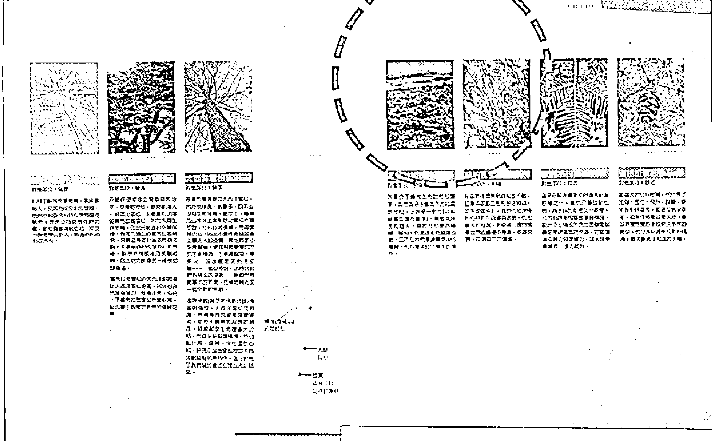

### 4 所对应的身体器官
将同科属的精油植物，标示出它最重要的作用部位，并加以分类。让你在同中见异，并且一目了然地知道该把精油使用在哪个方向。

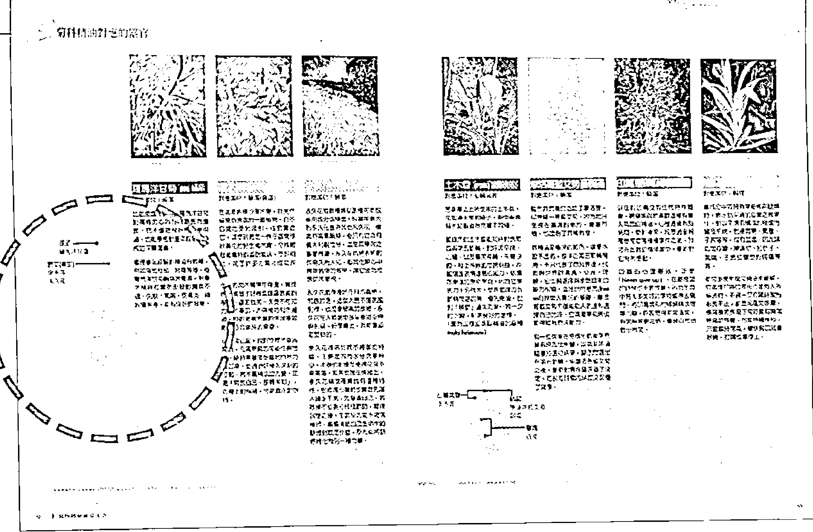

# # 茹丝的蛋 与 香气抓周

### 精油的成分判读
先告诉大家一个最基本的精油化学概念——精油其实是种「混合物」，它不会只有一种成分，而会同时包罗容纳许多不同的化学分子，就好像一支曲子，里面必须要有许多音符一样。

若要了解所用的「音符」到底是什么？要知道这些「音符」会在乐曲的什么地方出现？就要使用特殊方法与仪器，这也就是我们时常用来判读精油成分的GC-MS（气相色谱分析）。透过GC-MS的图谱，可以看出精油内各种不同成分的含量高低，也能知道它们挥发的速度（与香气之调性组成特别相关）。

但是GC-MS并非万能，这种科学方法也有自己的局限。例如说，它只能分析与鉴定化学成分，但是却无法分辨出这些成分是天然的、还是人工合成。那么，到底要怎么抓出人工合成的伪品呢？

当两个分子间，组成原子完全相同，看起来几乎没有差别，但结构却刚好「对称」，宛如我们的左手与右手，又好像站在镜子前面一样，就叫做「镜像异构物」。几乎红遍了半边天的「左旋C」，就是一种「镜像异构物」，「左旋」、「右旋」，指的是当实验室使用旋光仪，光遇到分子的时候会向右偏或向左偏。

若将天然精油以旋光仪测试，大多为左旋，也有右旋。但是人工合成的香精油，因为左旋与右旋的「镜像异构物」数量相同，而不具有光学活性，也就是光遇到了人工合成的香精油，不会左偏也不会右偏，这种状况称之为「消旋」。因此，比起GC-MS来，这种旋光特性更能帮助科学家判断精油的真假。

但是，GC-MS的分析结果，对芳疗师来说仍然是极宝贵之重要资料。因为透过对成分的理解，我们可以掌握不同精油的香气调性、药学属性、心灵属性，并且分辨相似精油间的差异。这也就是为什么有愈来愈多芳疗研究者，喜欢引用特定「精油化学模型」的原因。

# # 精油化学模型
看不习惯GC-MS图谱的人，往往无法从里面理出头绪。只见上上下下波峰波谷，附记着许多化学名词。就连受过训练的芳疗师，时常也不能很快地准确掌握GC-MS的资讯，许多芳香分子即使属于同一种「化学大类」，因为结构的不同，挥发程度仍然不同，图谱上的位置也不会在一起，呈现纷然杂陈的样貌。

为了更有效率、更一目了然地解读GC-MS之资讯，让使用者能立刻掌握每种精油的个性，许多专家发展出了「精油化学模型」，也就是先建立一套标准模型，规定每种化学大类的位置，再让芳香分子依所属的化学大类放入正确位置。

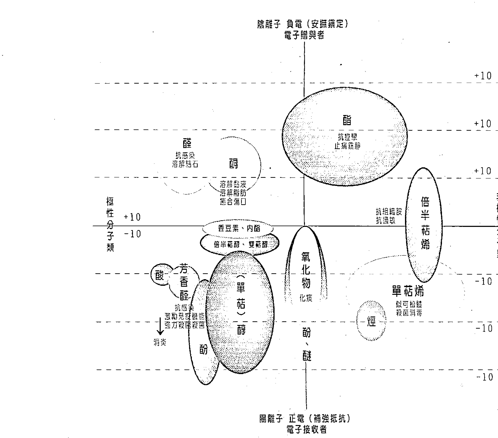

最有名的精油化学模型，是由法国的法兰贡（Pierre Franchomme）与潘威尔医师（Daniel Penoel）一起发表的「四象限坐标模型」，他们合著《精确的芳香疗法》（l'aromatherapie exactement）一书，于1990年出版，并以芳香分子的极性（也就是亲水性或疏水性）和带电程度（正电或负电），来决定各种化学大类的位置。他们所建立的模型，为包括史栊贝尔（Kurt Schnaubelt）等研究者所引用。

但四象限模型最大的缺点是，它是个从「物质」层面来分析精油的工具，但除了对「阴阳」的诠释以外，却较难与芳疗在情绪方面的特性作结合。这点其实与法系芳疗的特色相关。法系芳疗名家多半着力于精油的医疗应用，也因此在芳香抗菌检验（aromatogram）的发展上卓有心得。可以说法系芳疗本身即充满阳性特质，对那些阴性的、精微的、浑沌的心灵层面则兴趣较低。

之后，德国的生物化学家茹丝·冯·布朗史万格（Ruth von Braunschweig）提出了另一套精油化学模型，这套模型与四象限的开放图型不同，而是封闭式的椭圆型，所以俗称为「茹丝的蛋」。

### 茹丝的蛋
「茹丝的蛋」可以说是最简易、最一目了然的模型，可以一望即知各个芳香分子所占之比例轻重，其图型也十分便于记忆。无论对芳疗的初学者、或是对进阶研究者而言，都是极佳的工具。模型中各个化学大类之标准位置，乃茹丝·冯·布朗史万格基于自身的化学专业所决定，但另外也参酌不同芳香分子的情绪作用，使得「茹丝的蛋」不只能让使用者理解精油之「物质」层面，也能立刻分析与掌握其「心灵」作用。

从这个模型，可以看出德系芳疗的特色所在：即「实事求是的科学精神」和「对人与宇宙间关系的哲学探索」。这也就是为什么德国在科技工艺上的成就，向来备受推崇，但是又能产生许多伟大的哲学家、社会学家、神学家，并且成为「人智学」（Anthroposophy）的大本营。

初学者可以利用「茹丝的蛋」，轻松地认识精油，掌握它最重要的作用方向。而进阶研究者则应更进一步地去体察这些分子的性格、它们代表的能量、分子间的互动等等…，帮助你找到理想的诠释角度。

# # Ruth von Braunswieg精油化学结构图

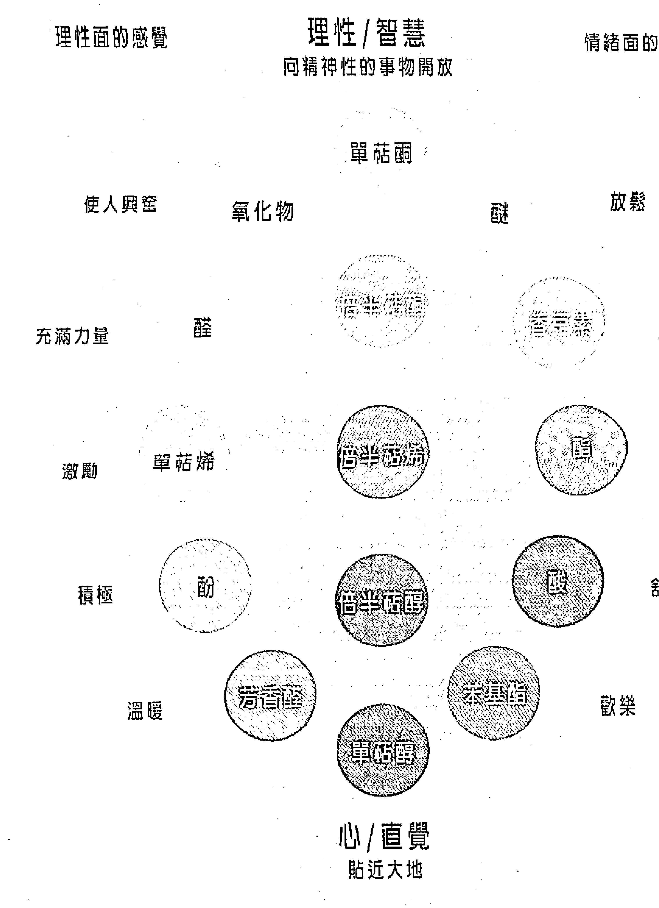

### 「茹丝的蛋」之配置
偏左边者：
为较阴性的芳香分子，多半具有消炎、抗痉挛等效果，也特别令人感到安抚镇静，适合处理各种外显性情绪问题。

偏右边者：
为较阳性的芳香分子，多半具有抗菌、补气等效果，特别令人得到激励振奋之感，适合处理各种内缩性情绪问题。

偏上方者：
就生理层面来说特别利脑，强化大脑活动力或使思虑清晰。就心理层面而言，则有助我们与宇宙性的智慧相结合，体察万物背后的精神力量、发展灵性。

偏下方者：
就生理层面来说，特别有利于生殖系统之保养。就心理层面而言，使我们更贴近本能与直觉，发挥自身特质，并产生丰沛的灵感与情感。

在中央者：
为分子较大，因此较稀有的倍半萜类化学结构，有助于平衡修护，是「茹丝的蛋」之中心，与「自我」问题相关，包括自我价值、自爱、和自我疗愈，可以处理潜藏已久的问题根源。

### 芳香分子的个别力量：
- 除了中轴上的芳香分子未作注解以外，其他化学大类都有标示其个别力量。醚 (放松)、香豆素/内酯 (清凉)、酯 (缓和)、酸 (舒展)、苯基酯 (欢乐)、芳香醛 (温暖)、酚 (积极)、单萜烯 (激励)、醛 (充满力量)、氧化物 (使人兴奋)。

### 《精油图鉴》与「茹丝的蛋」
《精油图鉴》(2003年商周出版)一书，是目前使用「茹丝的蛋」最重要的芳疗著作。其中150幅精油化学模型图，乃温佑君老师根据茹丝的理论自行绘制而成。

首先要注意的是，所谓 GC-MS 的数据，事实上只对所检测的样本来说是有效的。意思是说：假设我在 2005 年 3 月 1 日下午 3：00，用气相色谱分析仪，检测了一份 2004 年普罗旺斯 A 农场出产的真正薰衣草，结果里面乙酸沉香酯占 42%，那么这个数据其实只属于单一样本，我不能说其他产地、其他产季，甚至其他时间所检测的真正薰衣草精油，都会有 42% 的乙酸沉香酯。这不只是科学上的基本概念，也说明了精油身为「农产品」的事实。

《精油图鉴》上的之数据，许多并非单一样本，而为广泛收集检测结果所得出的平均值，或由研究单位所提供之合理范围 (reasonable range)，因此部分蛋型图会有比例加总后大于 100% 的情况发生。另外，一些 GC-MS 图谱中可见的精油成分，因比例过于微量，也不会绘制于蛋型图中，这也就是比例加总后小于 100% 的原因。

对于每个精油应该归属何分类，应以「影响力大小」为准，而不以仅「成分比例」为准。例如大西洋雪松精油中，倍半萜烯的含量较高 (<80%)，但影响精油气味

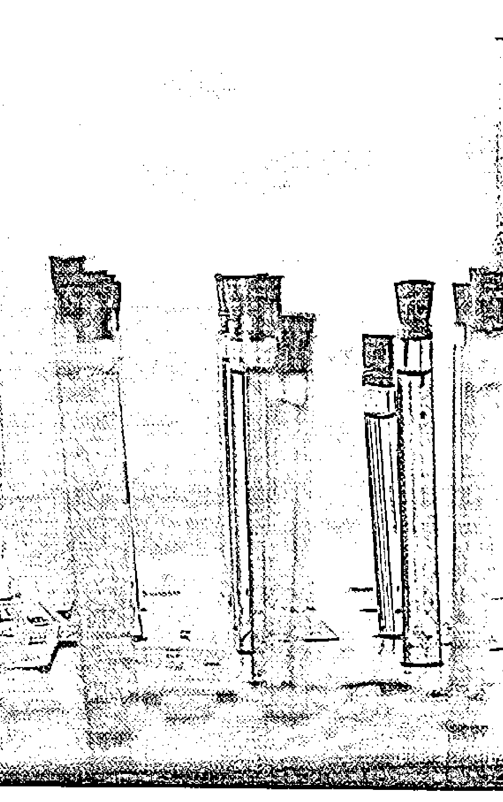

及作用的却是倍半萜酮(<20%),因此归入倍半萜酮类。

茹丝老师建立模型后，曾经调整过「芳香醛」的位置，使得《精油图鉴》出现一个矛盾之处：书前的「Ruth von Braunschweig精油化学结构图」(第19页)为新版模型，芳香醛在左下，但书中几个蛋型图却为温佑君老师在模型改版前绘制，为旧版模型，芳香醛在右下(共有安息香、秘鲁香酯、鹰爪豆、香草、水仙、红花缅栀、小茴香、多苞叶尤加利)。请读者还是以新版的左下位置为准。

### 香气抓周
「香气抓周」是由「茹丝的蛋」所衍生出的一个精油游戏，也是种帮助芳疗师决定适用精油的身心判读方式。因为有趣又有效，因此广受欢迎。

让我们先解释何谓「抓周」。中国民间习俗中，小婴儿满周岁时要庆贺宴客，进行抓周「礼」(表示仪式)。从宋朝开始，就有不少关于抓周礼的记载，讲究的人家会准备道释经书、首饰珠宝、彩缎花朵，普通一点的人家也会拿出文房四宝、尺秤算盘、女红针线。把小婴儿带到令人眼花缭乱的「玩具」前面，不加引导，让他凭直觉去抓想拿的东西，以预卜孩子的志趣与将来发展，这就是抓周。

「香气抓周」则是把抓的东西全部换成精油，让受试者凭直觉选取自己想拿的精油。它的步骤为：

1.  准备16瓶代表各芳香分子化学大类的精油
    每种化学大类选择一瓶单方精油即可，关于每个精油所属化学大类，请参考本书或《精油图鉴》。例如——单萜烯：桔、丝柏、莳萝等。
    - 酯：苦橙叶、佛手柑、快乐鼠尾草等
    - 苯基酯：白珠树、茉莉、安息香等
    - 单萜醇：花梨木、玫瑰草、茶树等
    - 倍半萜醇：檀香、岩兰草、广藿香等
    - 倍半萜烯：西洋蓍草、没药、依兰等
    - 倍半萜酮：松红梅、永久花、大西洋雪松等
    - 香豆素、内酯：零陵香豆、圆叶当归、芹菜
    - 醛：柠檬香茅、香蜂草、山鸡椒等
    - 氧化物：香桃木、白千层、月桂等
    - 酚：丁香、野马郁兰、百里香百里酚
    - 单萜酮：鼠尾草、牛膝草、绿薄荷
    - 醚：龙艾、茴香、欧芹等

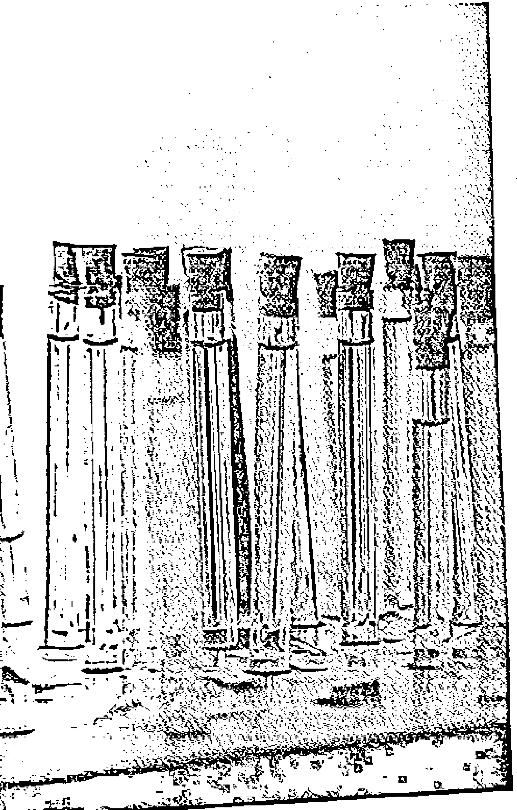

部分「茹丝的蛋」上有位置，但书上无此分类的芳香分子（如芳香醛、酸），建议精油如下：
- 芳香醛：小茴香、锡兰肉桂、中国肉桂、香草
- 酸：安息香、秘鲁香脂、银合欢、苏合香

2.  将这16瓶精油以大小相同之精油瓶盛装
    为了让每瓶精油「抓」起来的感觉没有差异，将它们装在样式统一的瓶子里。并全部放进盒子或篮子等容器中。

3.  准备「茹丝的蛋」标准模型图
    你可以直接使用本书或《精油图鉴》中附的图，也可自行绘制。

4.  让受试者抓取三瓶精油
    不需用眼睛看，也不需用鼻子闻，让受试者凭直觉将手放进容器里抓取精油，一次一瓶，总共拿出三瓶。

5.  芳疗师进行判读
    芳疗师将这三瓶精油，依其化学分类放置在「茹丝的蛋」标准模型图上。
    接着判读受试者当下的问题，并与他讨论适用精油。

### 如何判读抓周结果
香气抓周所抓出的三瓶精油，有两种诠释方向：

#### (一) 代表受试者当下的身心状态
因此可使用方向或位置相反的其他精油，来加以平衡。

例如抓出单萜酮、醚、氧化物，受试者可能用脑过度，需要放下思虑，回归自己，可以使用「茹丝的蛋」中靠近下方的单萜醇、苯基酯等。

#### (二) 代表受试者所需要的能量
因此可直接使用所抓出的精油，来补充现在所欠缺的能量。

例如抓出倍半萜烯、香豆素、酯类，受试者可能自我要求极高，很容易紧张，时常抽筋，并受疼痛问题所困扰，可以使用他所抓的精油来做改善。

以上看起来是两种相反的解释方向，事实上却有着相同时根源。有时你的身体只会忠实反映自我状况，但有时你的身体知道自己需要什么。至于到底要朝(一)或朝(二)来判读，则有赖芳疗师的经验与直觉。

精油并非一种「产品」，它不是天生就这样一派瓶瓶罐罐，也不是由工厂

大量制造出来的成品。我们必须了解，精油是植物经过「转化」后的另一种型态，就像人的生命终结以后，还能以灵魂型态存在一样。因此精油也有生命，精油也会变化。在初蒸馏完之后，精油仿佛还停留在激烈振荡的震撼中，各种分子尚未融合。因此你如果去闻刚蒸馏好的精油，会觉得带有一种土味与陈腐味，甚至有一点焦味，还没办法完全显现出它在香气上的特色，唯有静置一段时间（可能是数月到数年）之后，这瓶「活着」的精油才能自己慢慢变化出成熟的香气来，就像红酒需要在橡木桶里蕴酿自己一样。当你开封使用之后，精油当然也还会继续氧化、继续衍生出新的化学变化。

所以精油不但充满个性，甚至具有生命。它正是许多植物灵魂的集合体，你不是在使用一个产品，而是在与一个新型态的植物生命进行对话。

如果你相信在这个世界上，能量与能量之间可以互相吸引，那么要理解香气抓周就不困难了。有些时候我们也经验过那样莫名的吸引力，例如见到一朵盛开的玫瑰，你突然瞠目结舌，不忍离去，好像灵魂被她给吞噬；随手往大拍卖的花车底下一捞，居然捞出一件颜色、样式仿佛为自己量身打造的的洋装；不经意晃进诚品，眼角余光突然扫过某本书，又不知为了什么有股冲动把它拿起来翻阅，却发却发现书上的一句话解决了困扰你多时的感情问题……。

如果你曾经历过这些，就能够理解，为什么某些植物的生命，特别能跟你的生命相呼应；为什么你会抽到那瓶精油；为什么它道出现在的心情。

心理学大师荣格(C. G. Jung)，提出过重要的「共时性原理」(Synchronicity)，他认为「偶然与巧合」并不单纯是机率问题。「共时性」表示宇宙的一切存在形式之间，有种神秘而和谐的关联性，万事万物都由肉眼不可见的巨大能量连结在一起。事物之间没有因果关系，但是却有所呼应，会在适当时空共同出现，让我们产生极大的敬畏与启发。当我们试着去发现这些神秘的「共时性」，当我们发现「物质」与「精神」间的牵系、「外在」与「内在」间的牵系、「植物」与「人体」间的牵系、「精油」与「情绪」间的牵系……。事实上，你便正让自己进入神圣经验当中。香气抓周，正是这样一种神圣经验的体现。

当然，如果你认为这仍然完全只是机率问题，那么也不用太过介意它的准确度，不妨将香气抓周当成小游戏，这是另一种切入芳疗、认识自己的方式，可以增添使用精油的乐趣。

# # Ruth von Braunschweig 精油成分属性表

| 精油成分 | 代表精油 | 心理层性 | 生理层性 |
|----------|----------|----------|----------|
| 单萜烯 | 欧白芷根 (～90%) 针叶树 (～60-80%) 苦橙叶 (～60%) 茶树 (～50%) 柑橘类除佛手柑外 (～90%) | 强化一个人的精神结构与坚韧 不拔之力量，消弭焦虑，增进 活力 | 帮助消化，调节黏液分 泌，止痛抗风湿，也可 用于神经受到惊吓 |
| 酯 | 佛手柑 (～35%) 薰衣草 (～50%) 快乐鼠尾草 (～60-80%) | 镇定，唤醒感受与直觉，明朗 冷静 | 抗黏液过多，强力消 炎，助眠，抗痉挛 |
| 苯基酯 | 茉莉、依兰 安息香、秘鲁香脂 | 使人享受生活，柔情胜水 满足感官 | 抗沮丧，护肝胆 护肤 |
| 单萜醇 | 玫瑰与天竺葵 (～60%) 花梨木与玫瑰草 (～80-95%) | 强化神经，提振情绪， 带来本土特质之欢愉， 温暖亲切，强化心灵 | 激励免疫功能，平衡， 抗微生物 适于对抗慢性病 |
| 酮、醛、醚、氧化物 | 穗甘松 (～10-20%) 大西洋雪松 (～5-10%) 永久花 (～7-10%) 松红梅 (～25%) | 对抗心灵上的缺憾与伤疤，增 进感应能力以及精神的清澈度 (使灵魂越来越干净) | 三酮： 抗黏液作用强，促进皮 肤再生，促进结痂，促 进伤口痊愈，化痰 |
| 香豆素 | 佛手柑 (～3.6%) 零陵香豆 (～50%) | 使人平静而愉悦，松弛紧绷神 经之功效颇强 (少量即有大用) | 强力抗痉挛，促进血液 循环 |
| 烃 | 柠檬香茅 (～65%) 山鸡椒 (～75%) | 从惶惑不安和前途茫茫的状态 中抽身，对心灵有强大的刺激 作用 | 消炎，抗微生物 |
| 茴香醛 | 藏茴香，香草 | 抗焦虑作用强，可温暖心扉 | 壮阳补肾，帮助消化 |
| 氧化物（桉油醇） | 蓝胶尤加利（70%） 香桃木（~55%） 桉油醇迷迭香（~50%） 穗花薰衣草（~30-35%） | 增进逻辑思考，为精神打气加油 消除恐惧 | 化痰，激励循环 止痛，抗风湿 |
| 酚 | 百里酚百里香 丁香（~75-85%） 肉桂皮（~80%） | 增加生存的乐趣，给予力量以 对抗冷感 | 激励免疫之作用极强， 抗微生物 止痛 |
| 单萜酮 | 薄荷（~20%） 鼠尾草（~35-55%） 头状薰衣草（~80%） | 在心灵方面有很高的功效！ 使精神清澈与开阔 高量有神经毒性 | 促进皮肤与黏膜再生 伤口愈合化痰 |
| 醚 | 龙艾（~80%） 茴香（~65%） | 抗沮丧，平衡神经 | 神经性失眠 胃肠痉挛 |
| 倍半萜烯 | 松红梅（~70%） 没药（~90%） 岩兰草（~90%） 大西洋雪松（~80%） | 彰显与放射自我，提高自我安 全感，提高对自己的敬意，给 予内在的力量，保护神经 | 抗组织胺 消炎 止痒 安抚皮肤 |
| 倍半萜醇 | 胡萝卜籽（~40-55%） 松红梅（~5%） 檀香（~90%） | 提振情绪，使感受平和 平衡压力荷尔蒙 对抗灵媒体质之困扰 | 平衡免疫功能 平衡内分泌腺体 促进皮肤再生 |
| 酸 | 香胶、树脂 | 让心灵减压 | 消炎，抗痉挛 |

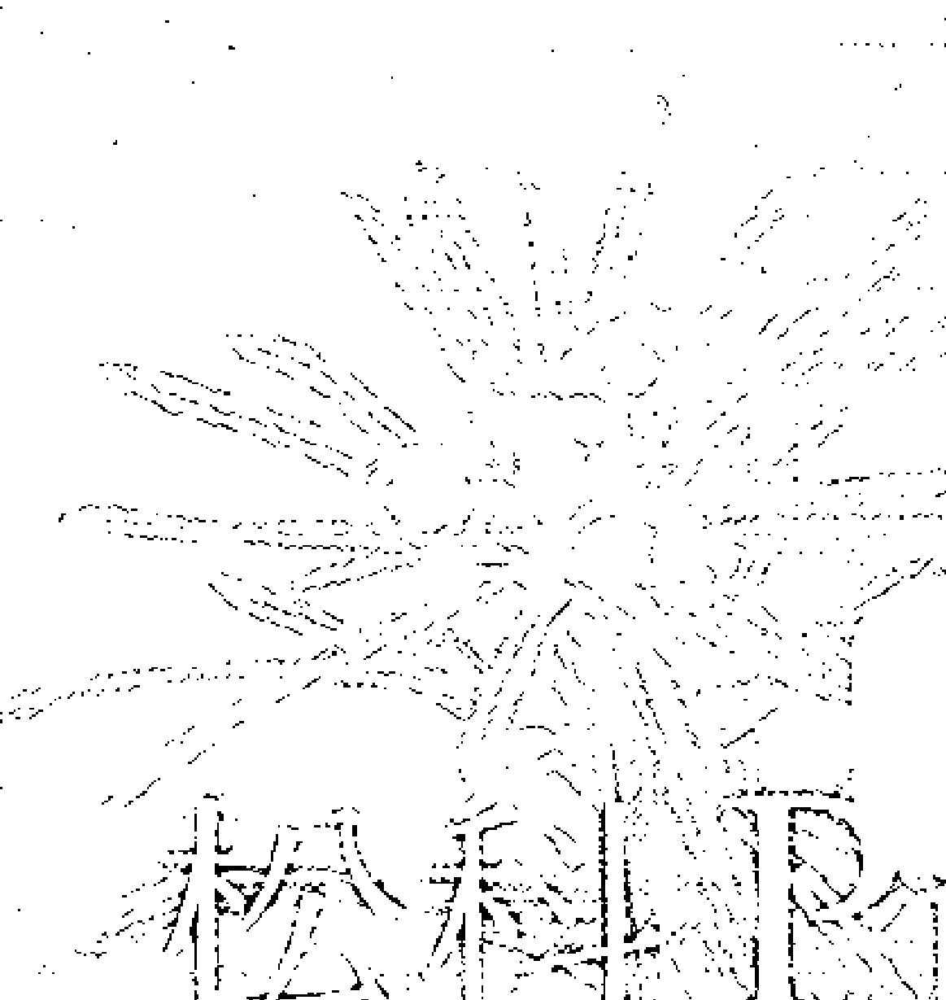

# # 针叶树 松科 Pinaceae
# # 柏科 Cupressaceae

松科代表精油
- 胶冷杉 (Abies balsamea)
- 欧洲冷杉 (Abies alba)
- 西伯利亚冷杉 (Abies sibirica)
- 道格拉斯杉 (Pseudotsuga menziesii)
- 欧洲赤松 (Pinus sylvestris)
- 落叶松 (Larix europea)
- 黑云杉 (Picea mariana)
- 大西洋雪松 (Cedrus atlantica)
- 喜马拉雅雪松 (Cedrus deodara)
- 杜松浆果 (Juniperus communis)
- 高地杜松 (Juniperus communis var. montana)
- 丝柏 (Cupressus sempervirens)
- 维吉尼亚雪松 (Juniperus verginia)# 植物型態與能量

針葉樹是大地上最古老的植物之一，其出現遠比闊葉樹種早，冰河時期結束後，針葉樹退卻至寒冷地帶，但在原始時代，它們的分布比今日更廣。

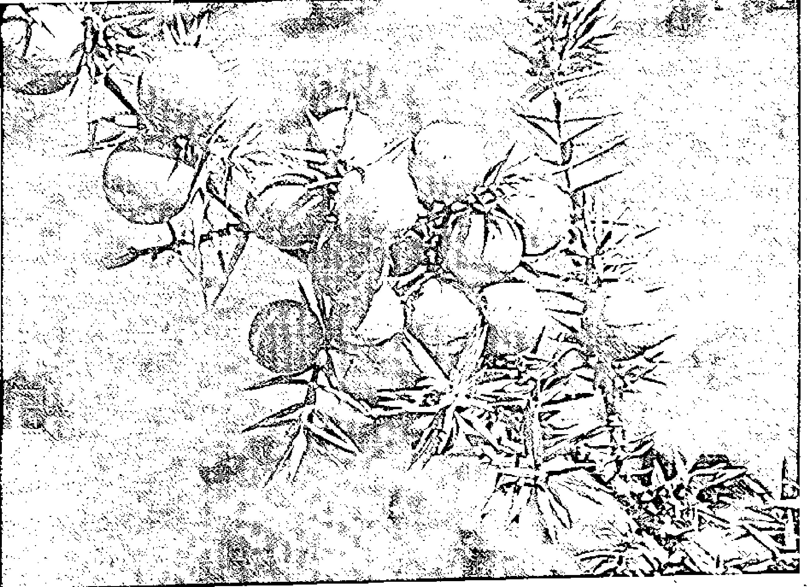

松科葉片細瘦，柏科葉片較肉質且有鱗片，但它們都含有蠟質，且表面積小，可避免水分散失，能熬過冷而乾的環境。針葉樹的根部結實深長，足以支撐起高大樹身，並且抵禦強勁風雪。

氣候溫暖的地區，針葉樹容易被比喻為陽剛的樹種，人們崇尚它堅毅不凋的特質與雄偉樹身；但寒冷地區裡，針葉樹林鬱鬱成蔭、遮天蔽日，卻也給人大地之母的陰性感受。

針葉樹的能量：簡單、嚴肅、而內斂，給人強大的支撐感，在心靈虛弱不振時，給予行動的活力，任何需要得到支持的狀態下，筆者均會優先使用松科精油。心靈上的虛弱時常意味免疫能力之低落，而松科植物對兩方面均有助益。

針葉樹的結構明確且集中，它讓身心能量得以聚集，足以強化一個人的精神力，當事物澄清明確，我們便可超越眼前的迷惑。面臨重大抉擇、或做價值判斷前，均可多加使用之，尤其攸關生命的大事，更需要針葉樹精油來幫助。

它的優點不在克服困境，而在讓人認識困境的意義。堅定或有恆並不是一味忍耐，而是有所信念。

現代社會愈來愈缺乏信念，針葉樹可以加強人的精神骨幹。可惜的是市面上好的松科精油很少，它容易被以松節油混摻、也容易被混為一談，大部分廠商甚至無法辨別自己販賣的是哪個品種，品質自然難以維持。

### 香氣與能量

針葉樹精油與原植物氣味很像，馬上令人聯想到茂密樹林。歐洲人喜歡它熟悉的香氣，台灣消費者則覺得與它有些距離，就像仰望高大的松杉或紅檜一樣，會體會到自己的渺小。

針葉樹精油的氣味十分高遠，有的細膩、有的粗重，其香氣基本上都是激勵的，並不激情，而是平穩安靜中，帶有正面積極的力量。消極、焦慮的土象星座與淋巴型體質者，將從中受益良多。

香氣的引夢效果不錯，當中又以雪松類和杜松最明顯，針葉樹所引的夢境，都能使靈魂澄清。自古以來，針葉樹的香味被認為能趕走負面能量，它代表「正氣」，中正之氣可驅邪避疫。因此針葉樹很適合擴香，它的抗菌能力良好，亦可淨化氣場，若朋友搬家或新居落成，筆者都建議他們必先以針葉樹加檸檬精油擴香數天，整個空間給人的感覺將完全不同。

針葉樹精油成分以單萜烯為主，這是最常出現的芳香分子，本身沒有明顯氣味，因此常常被廠商利用分餾、精餾的方式去除。食品、化妝品、藥品工業中所添加的精油，都經過去萜烯處理。經過此步驟，精油的氣味會變得比原本濃重持久，卻沒有生命，失去了原本微妙而細緻的平衡。

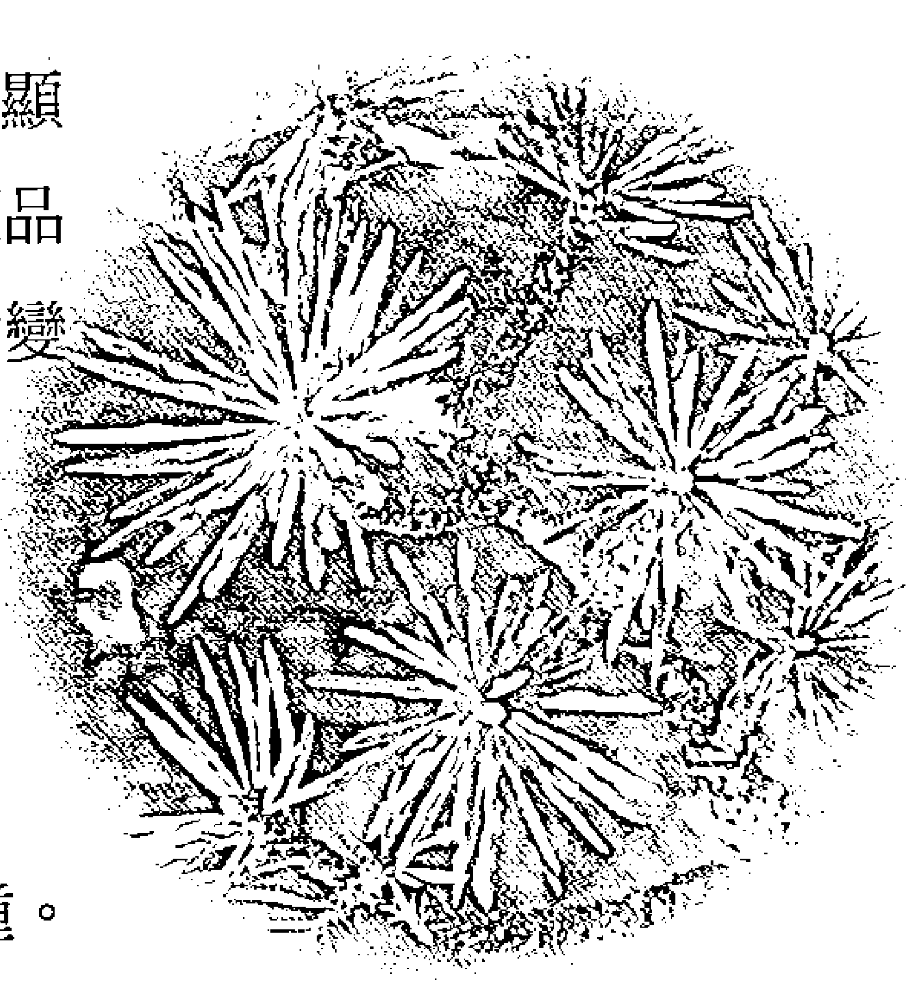

### 臨床身心應用

單萜烯決定針葉樹精油的療效。它的特性包括補氣、消炎、抗感染三種。

以現代觀念來看，補氣其實就是補強神經傳導物質 (Neuro-Transmitter)，神經傳導物質是人體內的溝通信差，傳遞訊息至受體，而使細胞產生各種不同的反應。若神經傳導物質的質與量低落，身體各部分系統溝通受阻，就會產生障礙。而針葉樹精油有助於改善這類現象。

單萜烯的消炎並非直接作用在患部，而是先影響神經傳導物質，再激發體內產生類似可體松的消炎物質，喚起人類自身原有的消炎能力。中醫使用松香 (馬尾松或油松的樹脂)來處理風濕及各種瘡傷腫痛，而針葉樹精油也對應相同症狀，關節問題或組織發炎，可用它來做緩解調節。

針葉樹精油的抗感染力，同樣是透過神經傳導物質，來喚起身體的自癒系統。例如使正腎上腺素活化，來與感冒病毒競爭受體。它在呼吸系統的抗感染作用特別明顯，與桃金孃科不同的是，針葉樹精油不會讓黏膜乾化，可保持呼吸道的濕潤，因此病患會感到更為舒適，也比較適合用來當長期保養或預防。

台灣山地有許多珍貴資源，日據時代起，日本人便有計畫地研究台灣的各種松、杉、柏科植物。比較晚近的研究中，除了含抗癌成分的紫杉醇而紅極一時的紅豆杉外，林試所謝瑞忠博士也發現台灣杉木品系精油以醇類成分為主，抗菌活性極佳，而原產之台灣杉(Taiwania cryptomerioides Hayata)精油，根據美國普渡大學的研究，其中所含之α-杜松醇也有抑制癌細胞的效果。

因此，如何保護生長緩慢、日漸稀少的台灣針葉樹種，其實是一大功課。2002年在苗栗三義所發生了「馬尾松滅門」事件，「火炎山自然保留區」，旨在保護台灣面積最大的冰河孑遺馬尾松族群，不料受到松材線蟲侵害，相關單位的防疫動作又不夠積極，導致馬尾松全數死亡，成為最大的生態浩劫，提供我們警惕。

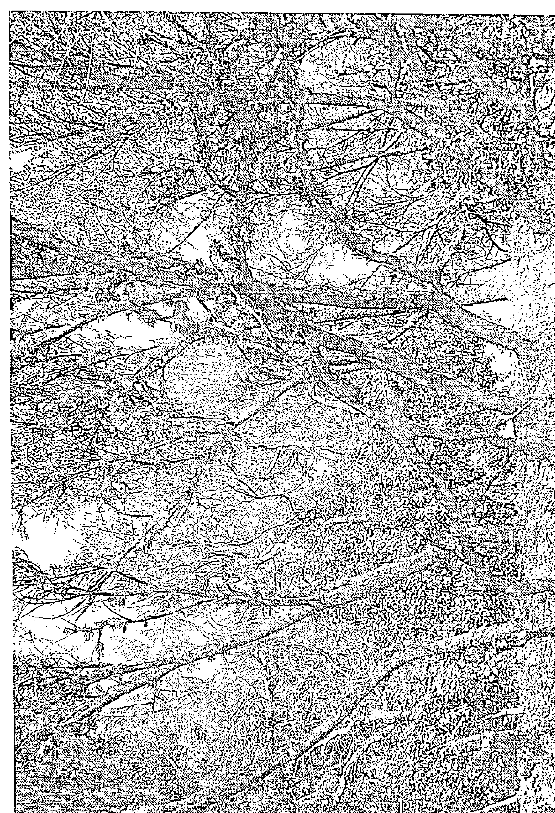

### 松／柏科精油對應的器官

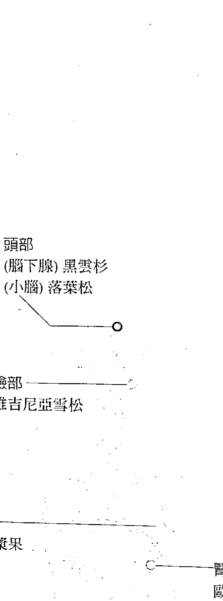

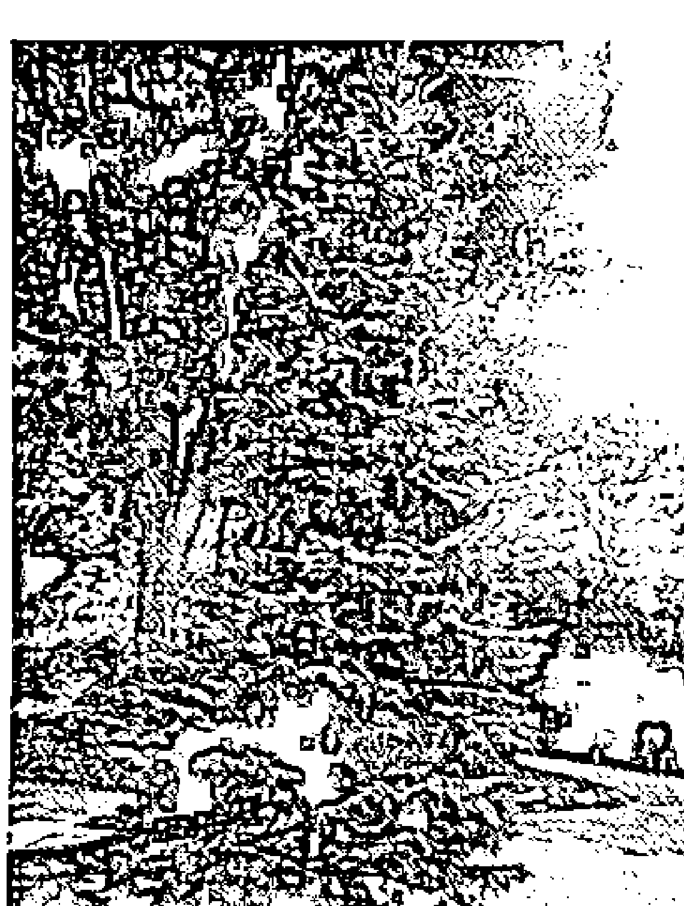

#### 黑雲杉 (單萜烯)

對應部位：頭部(腦下腺)

能調理極度疲勞之後，因為神經混亂而引起之各種問題。例如大考、熬夜、加班後，產生粉刺面皰，或是陰道搔癢感染，甚至突然感冒病倒。當感到精力耗竭，無能為力時，黑雲杉會助我們度過最艱困的時期。

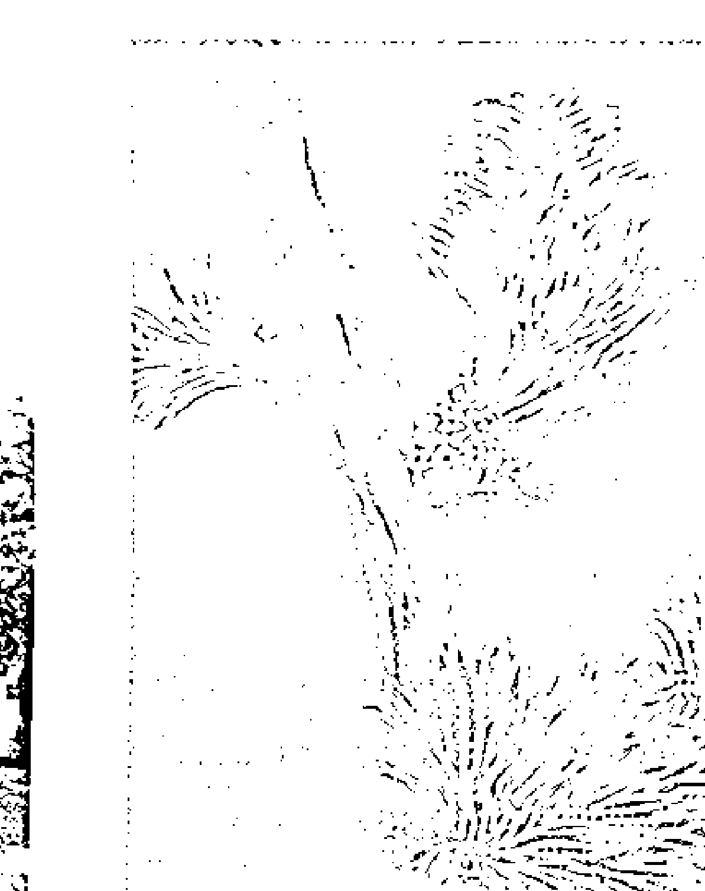

#### 落葉松 (單萜烯)

對應部位：頭部(小腦)

落葉松精油有兩種，一種由木質部分蒸餾，另一種則是自樹脂取得。松科精油、樹脂類精油、柑橘類精油——這是最能吸收陽光能量的前三名，而落葉松樹脂同時身為前兩者，成為保存最多陽光能量的精油之一，能一掃陰霾，有助擺脫焦慮的過度自我關切。

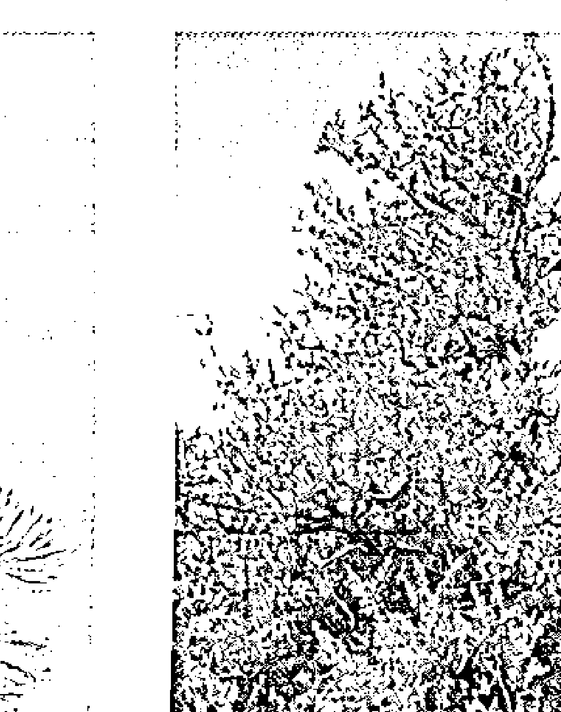

#### 維吉尼亞雪松 (倍半萜烯)

對應部位：臉

倍半萜烯與自我內在力量相關。當我們面臨一些「隱性」的壓迫，例如他人期待、世俗價值觀、感情剝削、框架束縛等時，逃脫不是真正解決之道。維吉尼亞雪松正可喚醒自覺，讓人表現出內在真實的力量，不再為壓迫所苦。

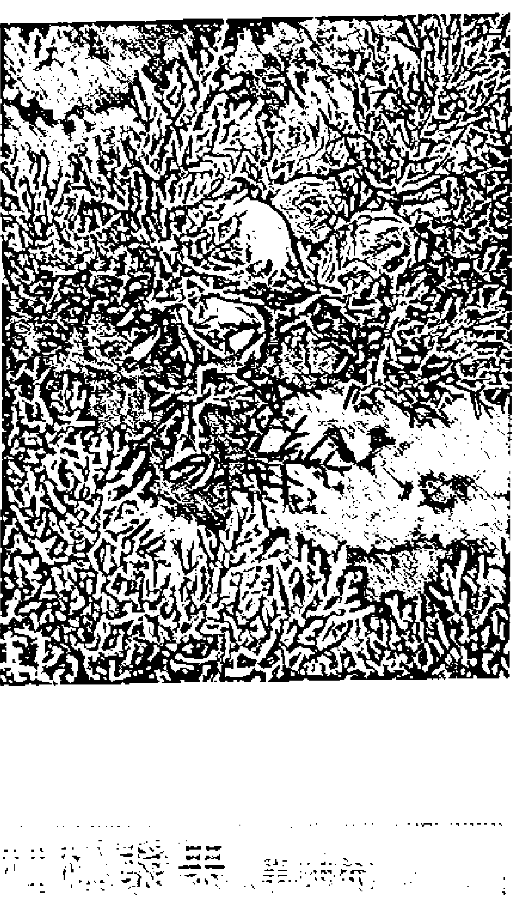

#### 杜松漿果

對應部位：肝膽

無論心理排毒或生理排毒，杜松漿果都有極佳的表現，甚至「空間排毒」亦佳。筆者若剛搬入新家，一定先以檸檬及杜松精油薰香數天。它能淨化精神，掃除想像出來的陰影與恐懼。臨床上可能會出現有益的排毒反應，亦會引夢。

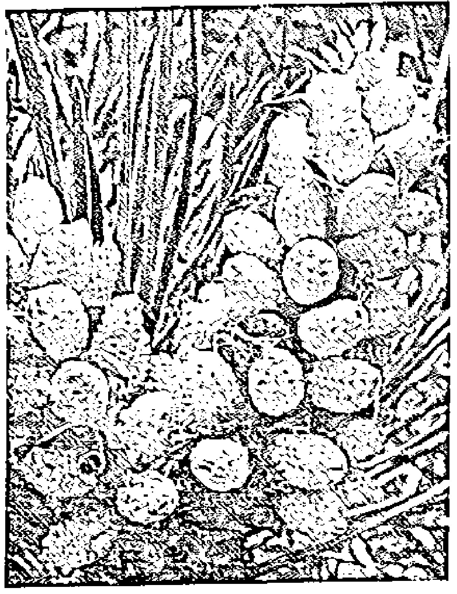

#### 歐洲赤松

對應部位：腎臟(腎上腺)

樹皮赤褐色，無論樹型或氣味，都有一種粗壯且渾朴直率的力量，讓人聯想起握緊的拳頭。歐洲赤松對積弱不振、四體不動、講究逸樂的現代人，或所謂「草莓族」而言，是一帖良方，讓整個人的氣節煥然一新。

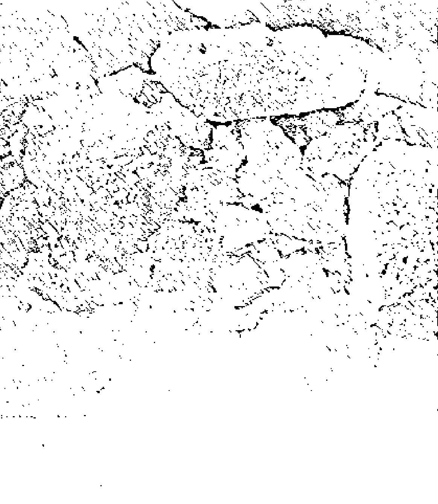

#### 膠冷杉

對應部位：氣管

因為化學結構中有倍半萜酮，因此在單萜烯類松科精油中，膠冷杉的消解黏液、化痰能力最佳，較高的酯類成分亦使其有良好止咳效果。

提到「有益呼吸道」精油，一般最常提到尤加利等桉油醇類精油，但桉油醇會乾化黏液，使某些人感到呼吸道乾燥、更不舒服，這種情況下，使用膠冷杉來調理呼吸道較為理想。

- 膠冷杉
- 西伯利亞冷杉

- 喜馬拉雅雪松
- 大西洋雪松

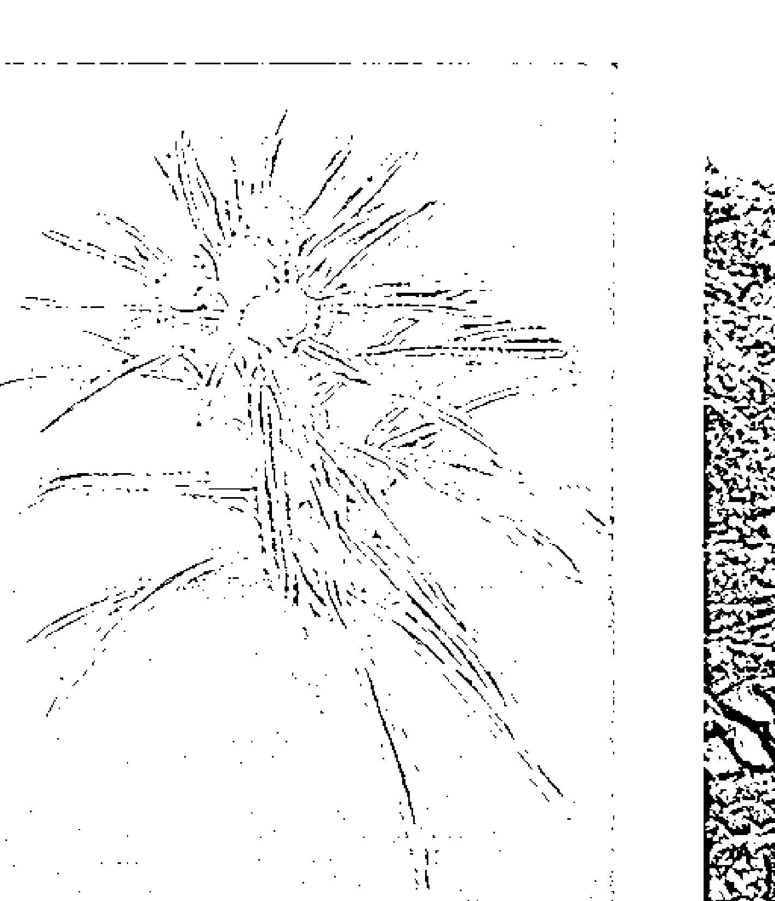

#### 對應部位：氣管

松科中酯類含量最高，氣味最怡人，又因為成分中的雙醇，使西伯利亞冷杉特別帶有母性氣息，提供支持與陪伴的力量。那些需要得到協助、卻又不願意開口的人，最適用西伯利亞冷杉。

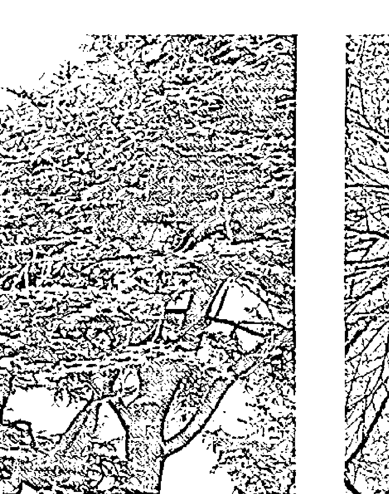

#### 喜馬拉雅雪松（倍半萜酮）

對應部位：肺部

只要仰望那像血管脈絡般分叉、交疊的枝椏，總是能讓人一眼認出雪松。主要產於印度的喜馬拉雅雪松，因為面臨生存危機，因此已被政府列管保護。現在市面上的喜馬拉雅精油，其實並非從針葉或樹身萃取，而是廠商經印度政府同意後，取得老樹根後再蒸餾所得。因此它亦能算是一種根部類精油。

喜馬拉雅雪松的大西洋酮含量比大西洋雪松更高，因此也具抗腫瘤潛力。惟需注意，有時使用喜馬拉雅雪松劑量較高，反而會引起癌症病患的情緒反彈。

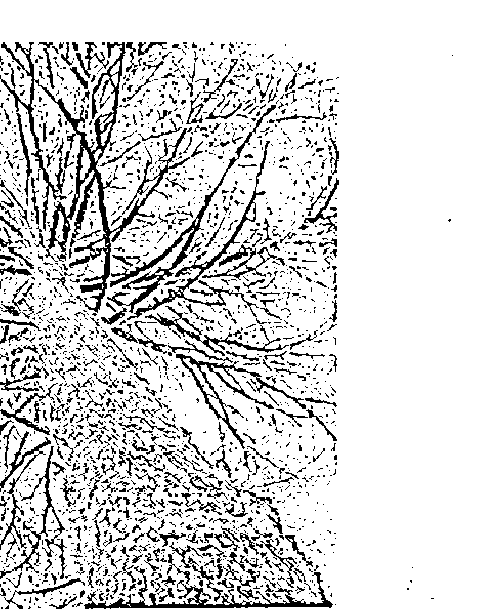

#### 大西洋雪松（倍半萜酮）

對應部位：肺部

原產於摩洛哥之大西洋雪松，因為面積廣、數量多，目前並沒有生態危機。基本上，精油乃自家俱工業剩餘之雪松木屑萃取，材料取得價廉，市場價格也低，因此不會在蒸餾設備上做太大的投資。產地許多小型蒸餾廠，便是用最簡單的方式生產精油：土窯蒸餾筒、燒柴火、溪水便是天然冷卻器……。看似原始，卻符合我們對精油的信念——用自然界最基本的元素，使植物轉化至一個全新的生命。

處理陳舊(甚至累積數代)的傷害與悔恨，大西洋雪松是首選。無論身為加害者或被害者，那些不願意去回想的過往，時常都是生命裡重大的結。而倍半萜酮類精油，特別能化解、修補、淨化這些心結。研究亦指出雪松裡的大西洋酮具有抗癌特性，這正對應了我們關於癌症心理成因的認識。

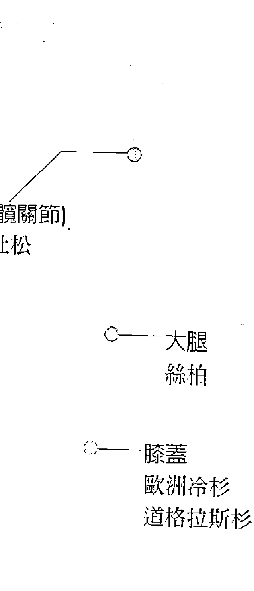

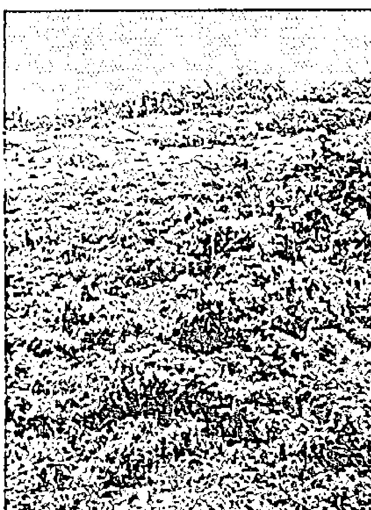

#### 高大杜松（精油）

芳香分子偏向的上方的杜松漿果，與芳香分子偏向的下方的高大杜松，正好是一對一比（以絲蛋型圖為基準）。兩者氣味差距甚大，高大杜松更為細緻、緩和，它處理那些幽微古老，已不在我們意識層面中的童年，例如童年時所發生的事件。

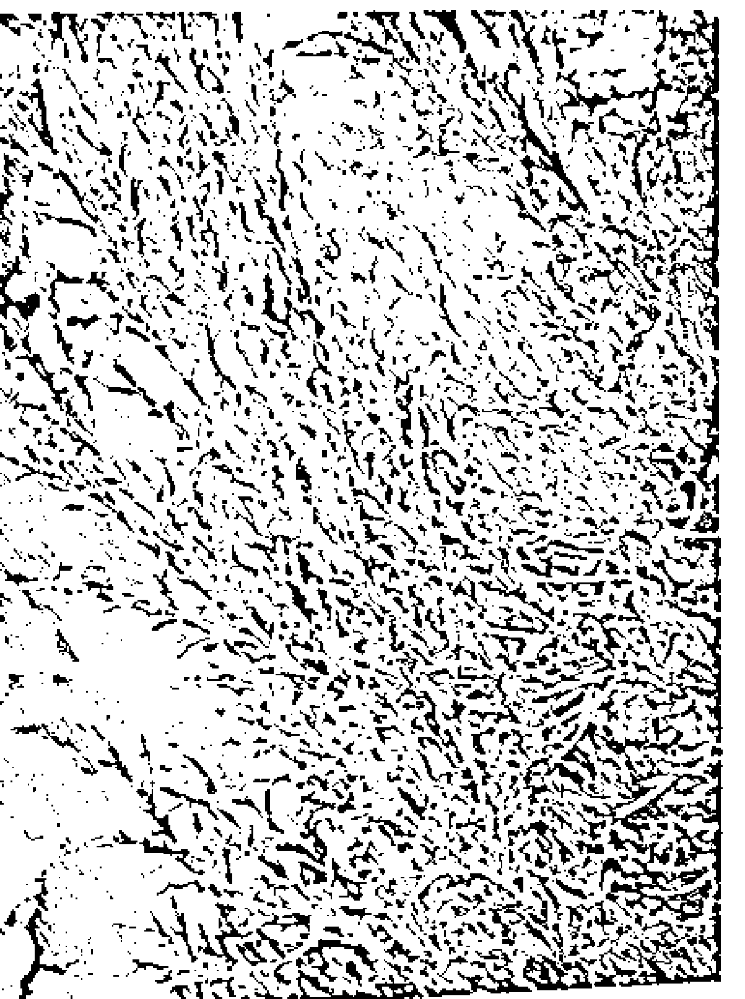

#### 絲柏（精油）

在田野裡想見到絲柏並不難，它集中收斂的樹形很好辨認。而生理效用上，我們也發現絲柏的特點在疏通與收斂，而它最大的益處，是能讓心靈自繁雜世界的喧囂中抽身，收斂回歸，認識真正的價值。

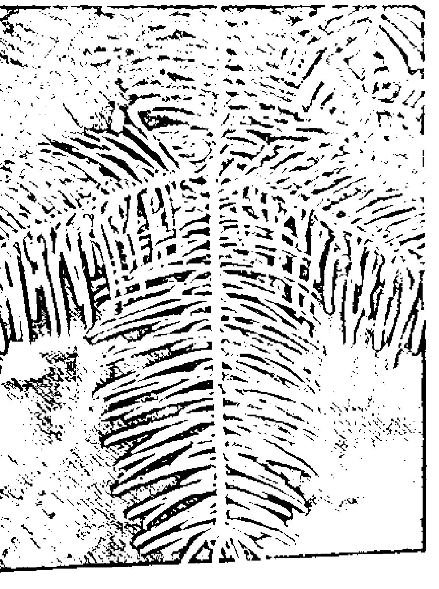

#### 歐洲冷杉（精油）

這是在歐洲最常見的高大針葉樹種之一，當地只要談到松樹，幾乎指的都是此一品種，它也有許多相關故事與傳說。歐洲冷杉精油所含的乙酸龍腦酯是帶甜香氣的來源，它能增進直觀力與理解力，讓人類學會謙卑、進而超升。

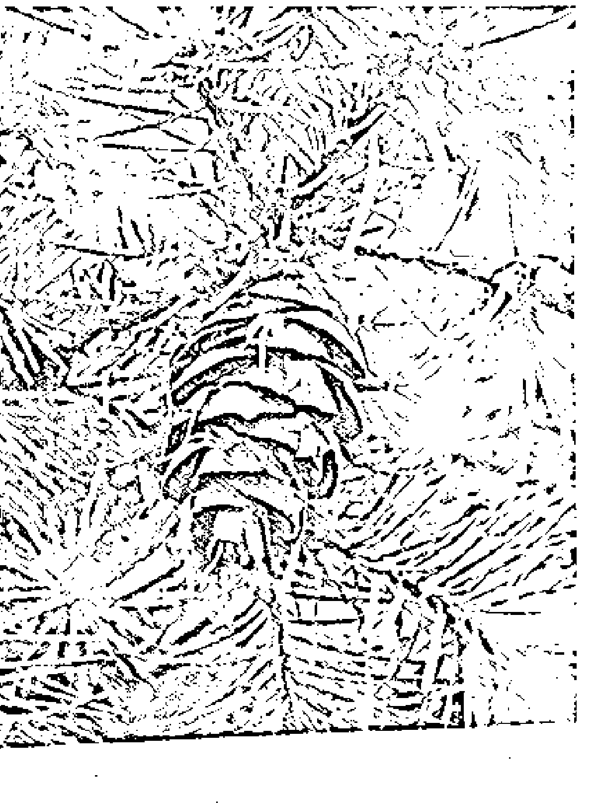

#### 道格拉斯杉（精油）

最高大的松科樹種，它代表了冷靜、理性、飛昇、跳脫，使用於對峙場合，能避免紛爭產生。如果性格屬容易失控、會以非理性激烈手段解決事件的典型，也可多用道格拉斯杉精油，養成更通達和諧的人格。

## 橄欖科 Burseraceae

- 乳香 (Boswellia carterii)
- 沒藥 (Commiphora molmol)
- 欖香脂 (Canarium luzonicum)

### 植物型態與能量

橄欖科植物為喬木，果實橢圓型，最大特徵是粗糙樹皮裡，有可分泌精質與樹脂的管道(離生腺道)。只要割破樹皮，黏稠樹脂便會流出，日曬乾燥之後固化，並且顏色變深，可以從樹幹上剝離。

不受人為干擾的狀態下，有時樹脂也會自然地溢出，它的產生與成分都很複雜，是植物因應環境，所演化出的自我保護方式。對橄欖科來說，樹脂扮演了循環系統、免疫系統之角色。除了修護外傷保護樹皮，樹脂與植物的抗病力也有關係。植物的健康狀況，與樹脂的質量是相對應的。

我們可以將樹脂視為植物能量的凝聚體，而由樹脂所取得的橄欖科精油，對補充能量、調整能量都十分有助益。

橄欖科精油的產地為第三世界國家，雖然人民過得清苦艱難，但特別能感受心靈能量，這點不僅可從文化感受，也可從當地植物的特質上反映。越是資源貧瘠的地區，人們越是會需求強大的精神力量。

於是橄欖科樹脂，自古以來就被賦與很高的價值，其精油也能使人產生堅定的意志與信仰，無論處於何種環境，皆能維持自己人格的高貴之處。

### 香氣與能量

橄欖科精油皆從樹脂而得，自古以來，這些樹脂多用作焚香，而精油香氣，確實也容易給人「一縷青煙」的聯想，有的帶有煙燻氣息，有的輕快而冉冉上升。

橄欖科精油成分以倍半萜烯及單萜烯為主，這兩種芳香分子都沒有太明顯的氣味，甚至被香水工業認為必須去除掉，加上樹脂類原料揮發速度就慢，所以橄欖科的香氣，給人的印象是清淡、空靈、幽微的。

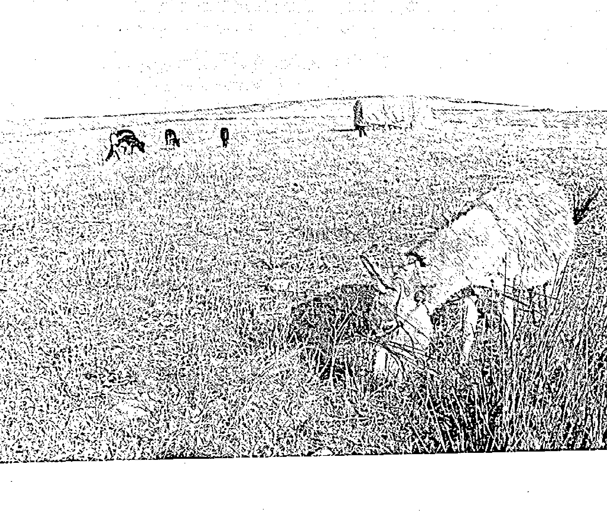

倍半萜烯與單萜烯，對神經系統的功效強大。但即使不清楚其化學成分，甚至不知道精油名稱，在吸聞橄欖科精油時，會很自然地感覺其香氣集中在頭部位置，甚至比較敏感的人，還能發現到頭頂與眉心，與它的能量相共鳴。

這種奇妙的體驗，無論對橄欖科的歷史背景是否具有認識，都可以感受得到。建議每個人都可以在使用本科精油時，試著閉上眼並觀想頭部位置。

傳統上常說，橄欖科精油的香氣使人「呼吸深長」。創世紀中提到耶和華吹了一口氣進入泥土，它就成了「有靈的活人」，呼吸並不是氣體交換而已，空氣代表生命與靈性，呼吸動作就是人被生命充滿，再將生命送出，與其他人分享。瑜珈修行者認為呼吸是對全身之滋養，也是一樣的道理。

呼吸問題常肇因於恐懼，呼吸短淺象徵失去了生命力量與尊嚴，個體靈魂與更高智慧間的交流也變得困難。而橄欖科精油的萜烯類成分，除了讓呼吸回復平穩深長，緩和情緒以外，它的香氣更能開啟靈性，讓我們超越自己有限的存在。

# ● 臨床身心應用

樹脂代表植物的自體修護功能，因此橄欖科精油也最常用於皮膚及黏膜的發炎與損傷。它可以直接保護受創部位，也能透過神經系統來發揮消炎能力。

談到黏膜，呼吸系統與生殖泌尿系統是橄欖科的強項。當這些部位被黏液包覆 (包括多痰、分泌物過多等)，橄欖科精油能加以消解疏通，同時抗菌。

筆者以本科精油為主，處理上呼吸道發炎與尿道炎(同時)的女性，成效良好，可與桃金孃科精油交替使用。建議使用方法除了口鼻薰蒸、塗抹胸口，還包括坐浴和調油按摩，這些個案普遍反映坐浴比按摩有效。但若因感染嚴重而對坐浴有所顧慮，將純油滴在底褲上也是另一種處理方法。

此外，各類皮膚問題，橄欖科精油抗菌安撫、癒合傷口的能力也為人稱道。已經乾裂脫皮，及紅腫過敏的皮膚，用橄欖科精油通常可以阻止脫皮嚴重化，像濕疹、牛皮癬、膿皰型痘痘。因黏膜與皮膚問題，而使用過多抗生素、類固醇的人，使用本科精油仍然都有不錯的回報。

## 橄欖科精油對應的器官

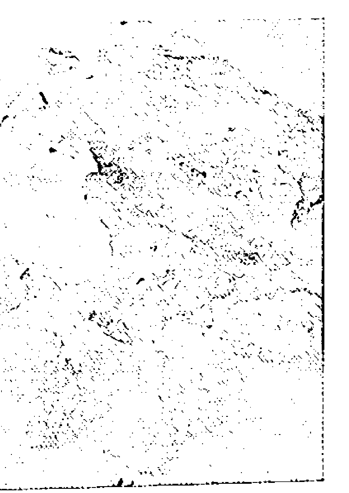

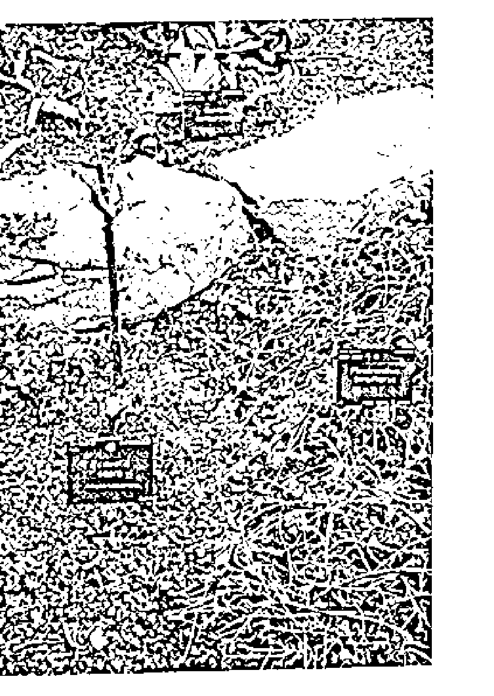

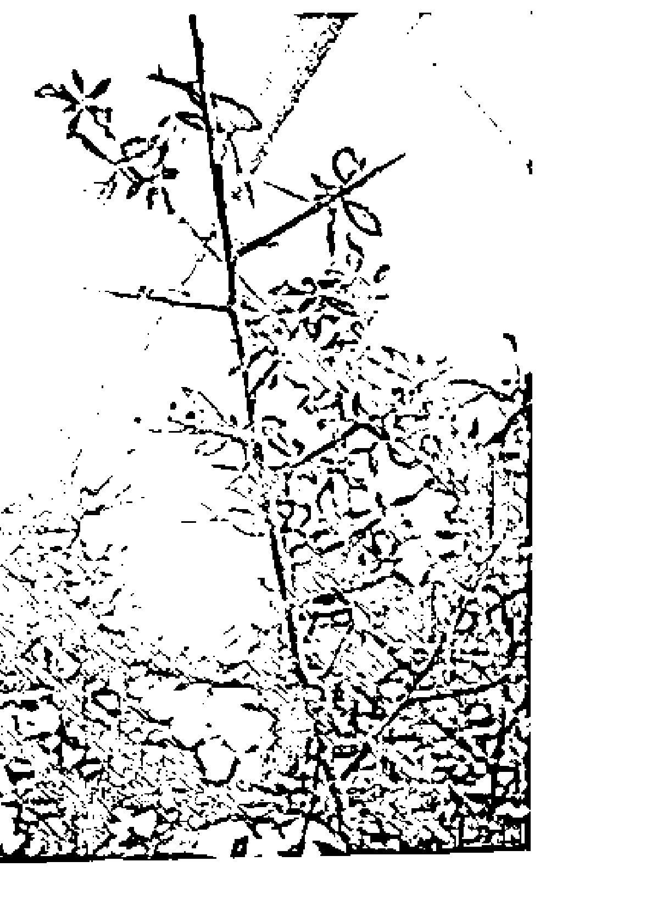

對應部位：臉部

對應部位：肺部

對應部位：頸部(甲狀腺)

相對於千年來被賦予神聖意義的乳香與沒藥，欖香脂顯得比較平民化一些。它的香氣介於輕盈的乳香與低沉的沒藥之間，容易被接納。欖香脂帶給我們一種平凡人面對殘酷生活的勇氣，即使我們並非聖賢，仍能真誠面對自己、維持信念。

乳香中文譯名出自希伯來文原名的「牛奶」之義，用以形容樹脂乾燥前白色濃稠的狀態。乳香所牽涉的，是人的「信念」，聖經強調信心若有一粒芥菜種大，便可以移山，而乳香正是信仰力量的表現。

在神學家眼中，沒藥防腐愈創之特性，所代表的意義為「死亡與再生」，而在我的臨床使用感想裡，也確實感受到沒藥精油能帶人渡過死之低谷，進入另一種生命。

它像其他橄欖科精油一樣可處理不癒傷口，特別適用傷口會疼痛的狀況下。而對疼痛、拉扯、爆烈的情緒，欖香脂也可加以平撫，另補以一種輕盈明快之感，讓我們對外界的騷擾泰然處之。

各大宗教都看重乳香的價值，顯見它對第七脈輪之影響，乳香既成為人類經驗裡共通的宗教象徵，它也代表一種寬容異己的胸襟。黨同伐異是常見之人性弱點，宗教上的門戶之見，甚至引起過許多戰爭。但是，乳香讓我們明白，有些力量超越一切力量，有些價值超越一切差異，當你認識到那更高真理之時時，就能對世事有更寬大悲憫的態度，而不会把心力浪費在爭辯上。

樹脂是植物生命力「流出」並「實體化」的產物，而哲學的「流出說」，則認為世界萬物乃由超越性、精神性的存有(神)，將其本質流出而成，因此萬物的本性便是神的本性。將流出說與沒藥這類樹脂精油作比照，非常有趣。

沒藥能作用於下視丘，適合用於第六脈輪(第三隻眼)，幫助人類求取真知，並洞悉人心與一切隱藏的事理。透過下視丘，它也能影響腦下腺，進而平衡全身腺體，所以也是重要的內分泌用油。

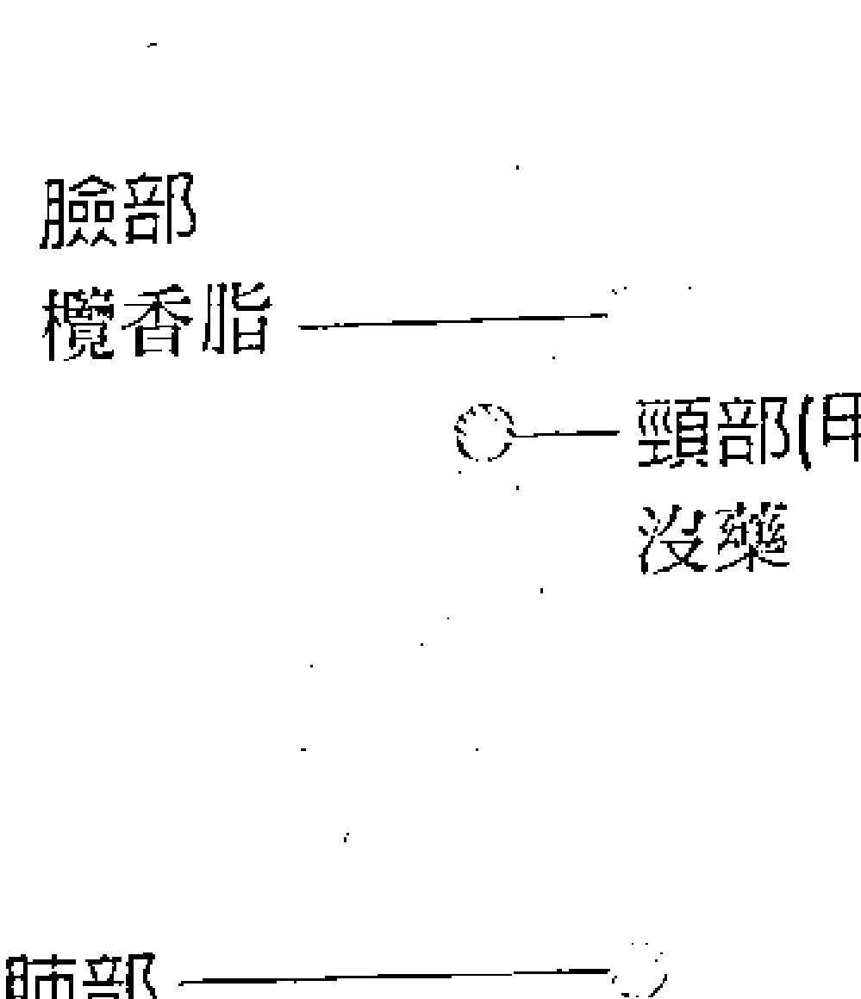

#### 樟科
Lauraceae

- 羅文莎葉 (Ravensara aromatica)
- 花梨木 (Aniba rosaeodora)
- 芳樟 (Cinnamomum camphora)
- 樟樹 (Cinnamomum camphora)
- 中國肉桂 (Cinnamomum cassia)
- 錫蘭肉桂 (Cinnamomum verum)
- 月桂 (Laurus nobilis)
- 山雞椒 (Litsea cubeba)

# • 植物型態與能量

樟科植物多半在春天開花，它們的花朵十分不起眼，大約乳白到淺黃色，非常小，花軸上有許多分枝，每個分枝上又再長出一些小花梗，整個花序看起來，就像大樹上又長了許多棵迷你樹似地，非常可愛。

這些花雖然常常被人忽略，但它的香氣卻很迷人。很難想像在這麼陽性、強壯的枝幹上，居然可以長出香氣輕盈美妙的小花，所以筆者的芳療前輩許麗香老師，常形容芳樟是陰陽兩性的「美麗佳人杜蘭朵」。樟科植物能提供人支持的力量，也同時提供陪伴的力量。

樟科植物的葉片表面光滑無細毛，葉片邊緣則平整，沒有鋸齒狀。大部分樟科植物有「三出脈」特徵，也就是從葉基長出三條放射狀的主脈，一直延伸至葉緣。

嫩葉在「幼年期」時，都薄而細，摸起來十分柔軟，等到葉片成熟後，老葉卻變得既厚且硬，較易折斷。有趣的是：筆者觀察發現，樟科精油也特別適用於特別是幼年寂寞孤單、長大之後自我保護過強的人。

這類人格可能表現出兩種極端：一種是早熟老練、世故精明；另一種卻是以神經粗、天真、傻大姊之面貌，來掩蓋自己。前者彷彿沒有童年，後者彷彿尚未脫離童年，但如果仔細去探索，會發現他們可能都有不太愉快的幼時記憶。

在海寧格博士所創之家系系統排列治療中，強調唯有媽媽能讓女兒成爲一個女人、妻子、與母親，也唯有爸爸能讓兒子成爲一個男人、丈夫、與父親。這個理論除了強調「序位」，也強調支持與陪伴能促使人們成熟。

筆者手邊的個案中，「早熟」或「拒絕成熟」所產生的問題，常常都會顯現於下方脈輪，包括生殖系統及免疫系統。像男性性機能障礙、女性婦科問題，而無論哪種性別，皆可能體弱易受風寒，或有氣喘。樟科植物生長得慢，卻很紮實，質地緻密，它提供支持與陪伴，讓人重新檢視自己生長歷程，並且面對童稚時的不快與成年後的轉變。

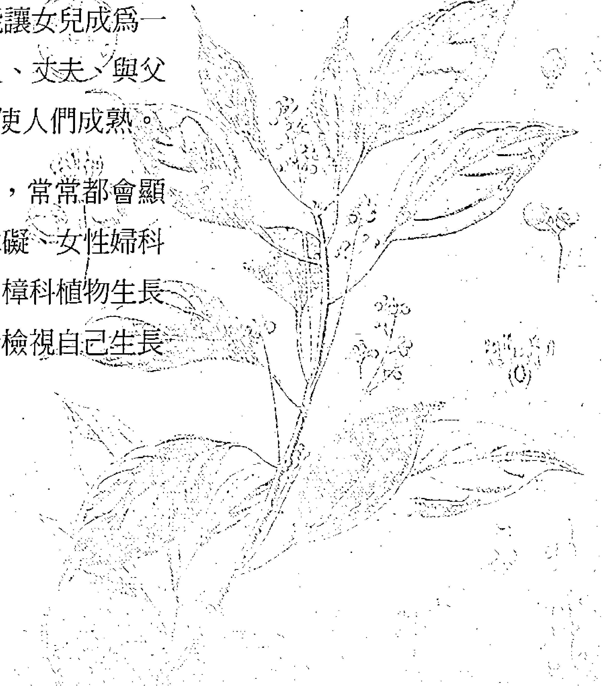## 香氣與能量

樟科植物多生長於熱帶與亞熱帶地區，受日光直射，它的氣味與能量非常熾烈，說一是一、說二是二，非常明快地馬上傳遞。那香氣感覺起來不像長了翅膀的小鳥，而是一記快速球。芳香分子愈是單一的樟科精油，就愈有這種特質。

這樣直接而強大的香氣與療癒力，使樟科精油宛如七月太陽，若一下子劑量太高，就會像給植物過多日曬般，可能會讓人吃不消。

台灣本土樟科植物，像芳樟、樟樹、與山雞椒，療效強大，而萃取部位皆非來自樹皮或主幹，所以採集並不會危及植株生命，符合生態考量。

另外由胡大維博士所推廣的台灣土肉桂，也值得注意。胡博士曾在WORKSHOP裡面，與我們分享台灣樟科植物的品系，並帶他採集的土肉桂枝葉與我們分享。土肉桂是台灣特有樹種，香氣濃而不衝，將葉片放進嘴裡，除了辛辣以外，嚐起來十分香甜，它的成分以肉桂醛為主，其產油量與品質直追錫蘭肉桂，現在也已有以土肉桂精油做生物防治之相關研究。

筆者現場操作過芳樟與土肉桂的小型蒸餾，我認為台灣精油價格競爭力可能比不上中國大陸所產，但蒸餾所得之純露則應會在市場上佔一席之地，從成分來推測，這些樟科植物的純露應該都具有很強抗病能力，只等待被做更進一步探索。

### 臨床身心應用

樟科精油普遍具有強大抗病能力，對病毒、細菌、黴菌、寄生蟲都有效果。另外也可用於驅風與止痛，因此對應各種急性感染，樟科精油都能發揮作用，尤其是黏膜組織的感染，包括呼吸系統、消化系統、生殖系統問題。

樟科植物的生命力強，那是一種「受摧折後能再站起來」的生命力。日本廣島原子爆炸後，第一種長出的植物便是樟樹；而九二一大地震後，東勢林管處也在崩塌地廣植山雞椒，來穩固土質。在各式各樣災變之後，樟科都能提供重生的希望。

也因此，樟科精油可以說是「置之死地而後生」的選擇。它特別適用於情緒引起之免疫系統危機，處理重大打擊後出現的感染問題。

感冒可以說是最常見的感染，也最容易被忽略。但感冒症狀背後可能有十分複雜的原因，包括生理面向與心理面向。除科學研究證實壓力會造成免疫力降低外，感冒時常緊跟在重大挫折後，例如工作不順、期望落空、大考結束、投資失敗……。流鼻水可以是另一種宣洩，代表那些無法被表達出的眼淚，而感冒正是身體的哭泣與吶喊。這種身心狀況下，可以多多使用樟科精油。

樟科精油不只是消極抗病毒或抗菌，而有更積極的意義。已發生的事件會留下陳跡，重點是如何在陳跡之上建立新的城池，超越對擁有或失去的執念，就能重新欣欣向榮。

樟科精油提供的是一種堅強的衝勁，對需要馬上振作，而沒有時間傷感的人而言，會是免疫系統之極佳助益。此外，它也能抑制意外傷害或重大疾病後可能產生的感染現象。

## 樟科精油對應的器官

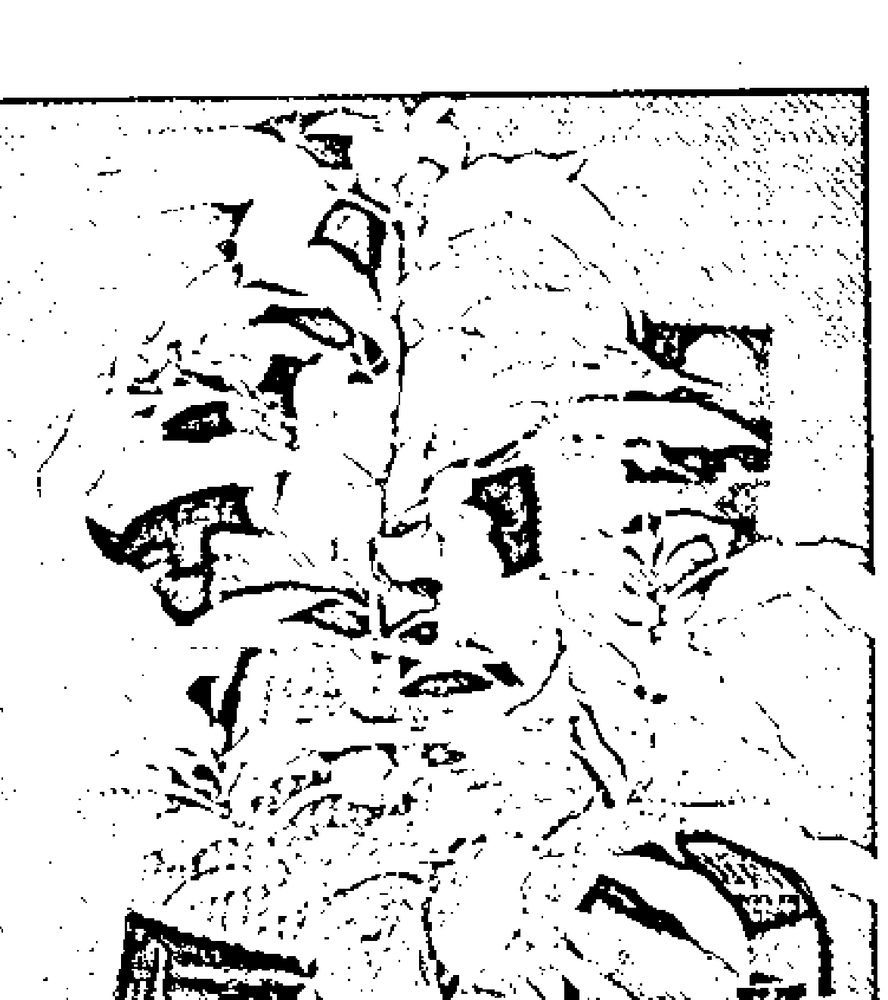

羅文莎葉 (單萜烯類)
對應部位：肺部
成分雖然以桉油醇為主，但其他組成卻非常多樣化，所以羅文莎葉的抗病毒效果，比其他單一分子精油更加全面，可以處理複雜而多變的情況。加上樟科有益於呼吸系統的特性，因此她被筆者認為是預防SARS(嚴重急性呼吸道症候群)之良方。
多分子精油的共通特性，便是對神經系統之調整作用，可使神經由混亂狀態進入平衡，因此可處理許多問題，例如睡前口服一滴羅文莎葉精油，就可消除混亂引起的失眠。

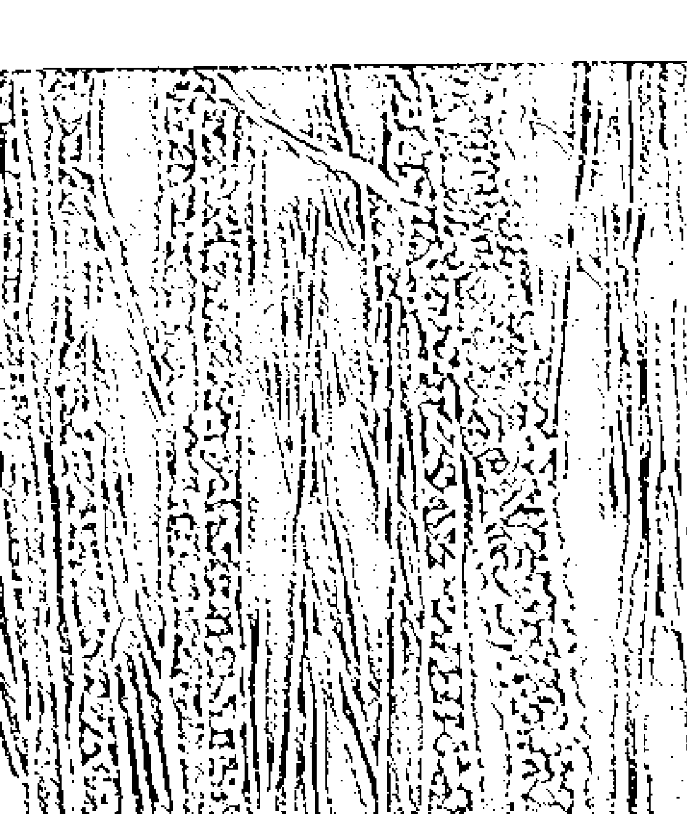

花梨木 (單萜烯醇)
對應部位：肺部
幾乎完全以單萜醇為主，單萜醇類精油能幫助人貼近自我本質，不同的是花梨木帶人從自我出發，再進入與他人之互動與關懷，它能令我們重新找回純厚溫暖的本性，自愛愛人。
對過度沉溺於自憐情緒中，或是受害者意識過強的人而言，花梨木能提供非常積極正面之幫助。因為體察世界的真實苦難，正是超越小我不幸的重要關鍵。

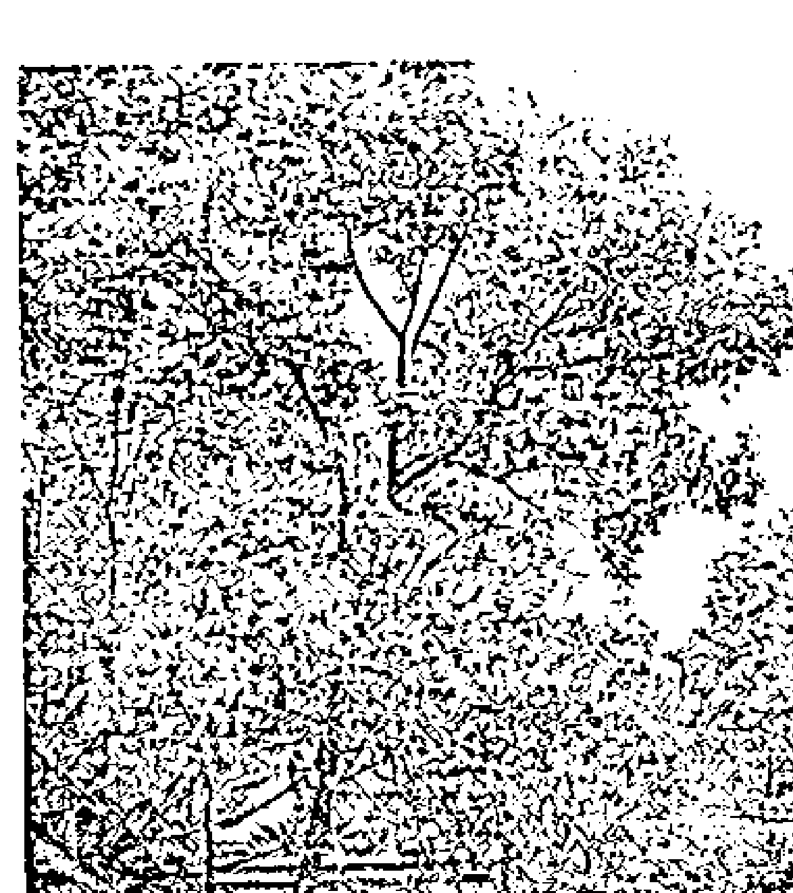

樟樹 (氧化物類)
對應部位：肺部
由本樟樹葉片所蒸餾，且未經精製，無論成分與氣味，皆與自樹身萃取之樟腦油有所差異。
樟樹精油在英系芳香療法中被歸為禁用精油，但其實只要經過專業人員輔導，謹慎劑量，它對筋骨問題特別有益，可作為肌肉關節專用之按摩配方，少量亦可清肺，處理呼吸系統之多痰、濃痰問題。

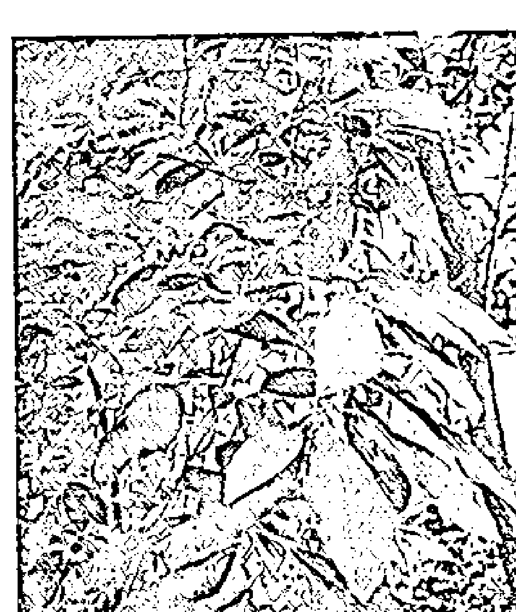

山雞椒 (醛類)
對應部位：腸胃
用量高時，檸檬醛的氣味占壓倒性優勢，感覺直率、尖銳，低劑量時，卻能感受到其他氣味的微妙轉折，宛如看似樸拙不文，卻粗中有細的山村野夫。
推薦太過在意一般價值觀，或深受考試升學壓力所苦者使用，有助跳出汲汲營營的人生，認識自己真正的追求。

| 器官 | 精油 |
|------|------|
| 肺部 | 羅文莎葉 |
| 肺部 | 花梨木 |
| 肺部 | 樟樹 |
| 腸胃 | 山雞椒 |
| 腸胃 | 中國肉桂 |
| 腸胃 | 錫蘭肉桂 |

## 中國肉桂
對應部位：腸胃

與錫蘭肉桂比起來，分子較單一，刺激性也更高，因而價格低廉許多。在筆者的親身體驗中，觀察到其止痛效果略勝錫蘭肉桂一籌，這可能來自於它較高比例的芳香醛與香豆素所致，除了抗痙攣，也能阻斷前列腺素，達到止痛效果。

中國肉桂不僅增元氣，更令人正氣凜然，彷彿一股嫉惡如仇的正義之火，能堅持理念與目標，不受邪氣所侵。

## 錫蘭肉桂
對應部位：腸胃

氣味較軟較甜，分子多樣化，有廣效的抗菌力。因為對皮膚有刺激性，肉桂被英系芳香療法規入禁用精油，但只要以低劑量稀釋，將是第一名的抗菌精油，亦同時提升免疫力。

它能燃起如火的熱情，包括對人事物投入與獻身，甚至英雄主義式的浪漫或殉道者精神，當失去動力的時候，肉桂皮帶來使不死鳥再生的希望，對抗那些耗損生命元素的負面力量，勇往直前。但它對拘謹保守者則太過強烈，需要循序漸進使用。

## 芳樟
對應部位：生殖區

以沉香醇為主，氣味怡人，用來處理生殖泌尿道問題時，個案對其香氣的接受程度相當高。

雖然安全性亦高(與民間常用之樟腦油不同)，按筆者某位同事曾使用少量芳樟薰香，卻有頭暈不舒服的反應，讓她百思不得其解，後來發現這其實出自情緒層面。當事人是獨生女，童年時長期感到孤單不安，而能提供支持與陪伴力量的芳樟，引發了她潛意識裡隱藏的幼時記憶，但這同時也是一種正面的心理排毒反應。

## 月桂
對應部位：膝蓋

是樟科精油中，酯類成分含量最高的一種。因此與其他氧化物為主的精油相比，最為甜美。

筆者曾建議一位容易焦慮、怕冷、氣喘體質的女士，以月桂精油與月桂純露做長期調理，兩個多月後，皮膚狀況讀到改善、情緒上變得平和但振奮、思考方向較光明，目前她正積極地準備轉跑道尋找工作上的第二春。

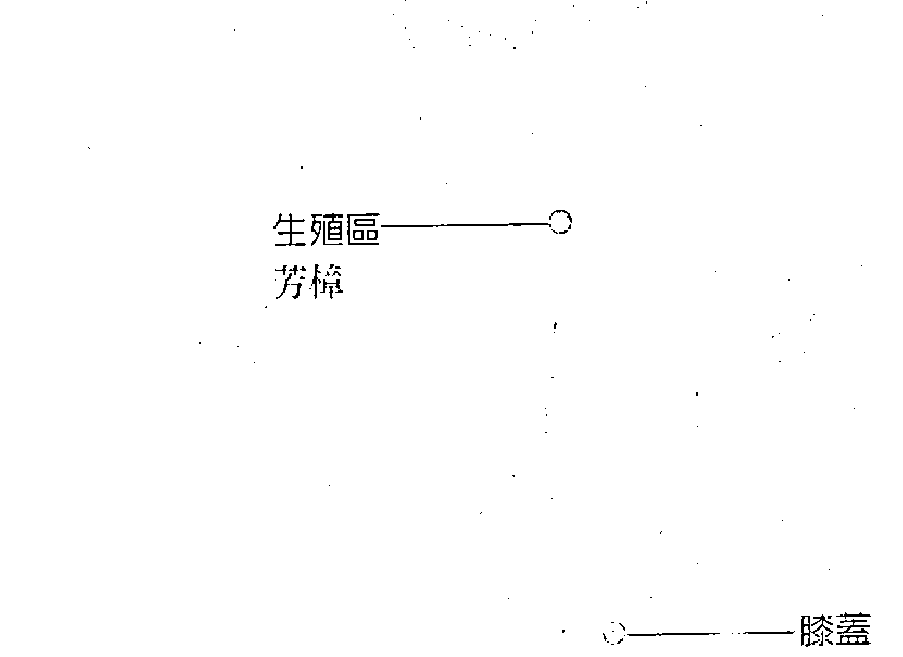

#### 桃金娘科
### Myrtaceae

## 桃金娘科代表精油

- 松红梅 (Leptospermum scoparium)
- 卡奴卡 (Kunzea ericoides)
- 柠檬细籽 (Leptospermum citratum)
- 柠檬香桃木 (Backhousia citriodora)
- 柠檬尤加利 (Eucalyptus citriodora)
- 蓝胶尤加利 (Eucalyptus globules)
- 史密斯尤加利 (Eucalyptus smithii)
- 澳洲尤加利 (Eucalyptus radiata)
- 薄荷尤加利 (Eucalyptus dives)
- 多苞叶尤加利 (Eucalyptus polybractea)
- 香桃木 (Myrtus communis)
- 白千层 (Melaleuca cajuputii)
- 绿花白千层 (Melaleuca quinquenervia)
- 茶树 (Melaleuca alternifolia)
- 丁香 (Eugenia caryophyllus)

### 植物型態與能量

桃金娘科植物主要產於澳洲，她們的共同特徵是雄蕊多如睫毛，花絲細長柔白，子房下位——也就是花謝了以後，連著梗的花托會膨大長成果實。我們常吃的蓮霧、芭樂等，都是桃金娘科的植物，切開果實看到的鬚狀物，正是枯乾退化的雄蕊。

桃金娘科雖然花朵纖弱，但植株卻能長的高大。陽性能量與陰性能量共聚一堂的情況，使得桃金娘科精油特別能喚醒人對身體的知覺，尤其是屬於非意識層面、本能的部分。這與一般認為桃金娘科精油「提神醒腦」印象，其實並無衝突。它能激發理性思維與抽象能力，同時亦能回歸原始的、物質的需要。

桃金娘科植物生命力堅強，台灣氣候也很適合其生長，除大葉桉以外、白千層已成為常見觀賞樹種，在花市也可購買到松紅梅或檸檬尤加利。

目前農家與消費者似乎有「香草熱」，熱中於開發芳香藥用植物，但強去栽種不合風土的植物，長遠來說利基不大，不如栽種桃金娘科植物，例如檸檬尤加利、檸檬香桃木，不僅環境適宜，療效上也有很大潛力。在日本及澳洲，已有廣部千惠子教授等人針對檸檬香桃木的錠片，做AIDS及抗癌的臨床研究，並得到良好成果。

### 香氣與能量

如果看過芭樂、蓮霧開花的盛況，不難想像同科植物的風采。筆者造訪英國皇家植物園(Kew Garden)之時，正逢園中桃金娘科細籽屬的花期，那大叢大叢聚集成團的柔美花朵，散發著獨特香氣，令人驚嘆不已。本科精油的氣味，也一樣也在人們感官留下強烈印象。細籽屬精油，都是神經系統重要用油。

隨著芳香療法日益普及化，茶樹、尤加利、白千層與綠花白千層，都已成為入門選擇。有些人誤以為這些精油的氣味差不多，「都是涼涼嗆嗆的藥水味」，其實，品質好的桃金娘科精油，不但香氣各見巧妙，身心療效也各有所長。

若發現桃金娘科聞起來真的太過相似，或氣味太衝，有可能是廠商以抽出或合成之桉油醇(1,8-Cineole)來假冒精油。這些產品成分單一，缺少天然精油的協同作用，效果與能量也殘缺不完整，雖然價格便宜，卻是認真看待芳香療法者絕不會購買的劣質品。

桃金娘科精油們，彼此間相容性很好，調和數種同科精油，可以讓氣味修飾得更圓融和諧，並且無須擔心互相搶味。筆者亦發現臨床應用上，同科精油調配後，抗病能力會加乘提高，可能與協同作用有關，但還是需要經芳香抗菌學試驗，推測才能成立。

### 臨床身心應用

筆者發現有不少「上下同時失調」的個案——用腦過度而頭部緊繃漲痛，下肢冰冷僵硬，桃金娘科精油會是處理這類失調好選擇。

另外一種「上下同時失調」，是同時發生呼吸道及生殖泌尿道感染，產生失調者，多半比較焦慮，並且與身邊伴侶或親人的關係需要調整。肺部與氣管的樣子，很像樹木倒著放，各種樹木類精油基本上對呼吸系統皆有盆，桃金娘科是其中主要大類，它與生殖系統的相容性也很佳，可以同時解決上下問題。

處理壓力，不能永遠以放鬆舒緩類的油將對方「放倒」，必須衡量個案狀態，若他目前「不能倒」，該恰當地給予提振及補充能量。此時各種樹木類精油都很適合，當中桃金娘科特別能提高當事人對身體之認知，唯有了解自己的狀態，才能對壓力有所自覺。

坊間有些觀念，刻意將桃金娘科精油分出高下等級。事實上，孰優孰劣之分並不存在，單看芳療師如何配合對象的需要來選油。

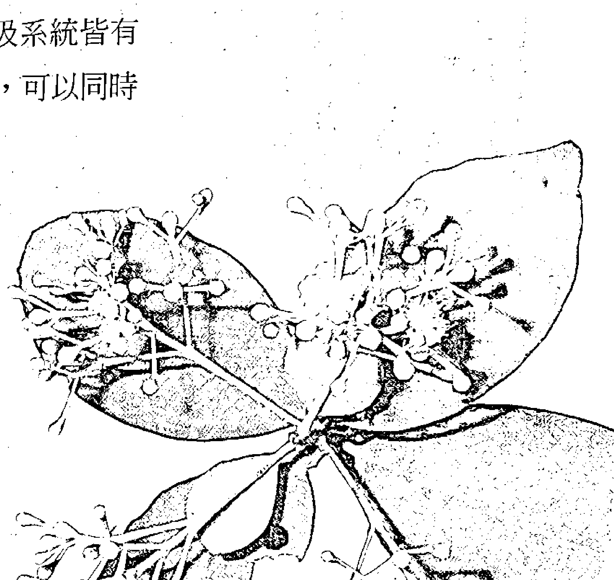

## 桃金娘科精油對應的器官

- 頭部 —— 檸檬細籽
- 臉部 —— 松紅梅 香桃木
- 嘴部 —— 茶樹
- 肩膀 —— 檸檬尤加利

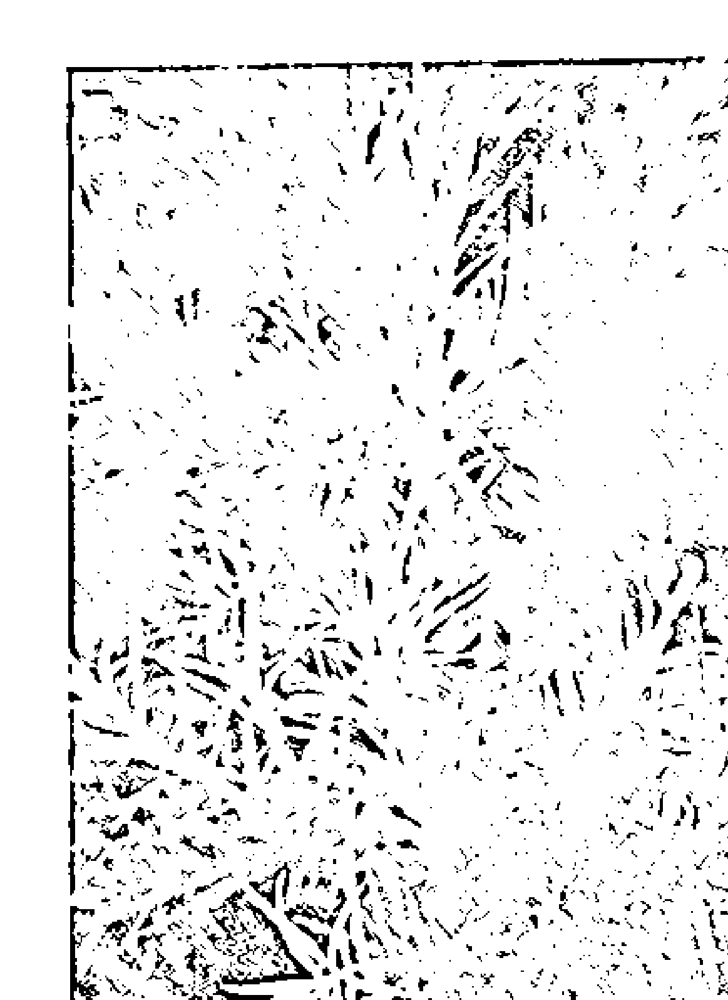

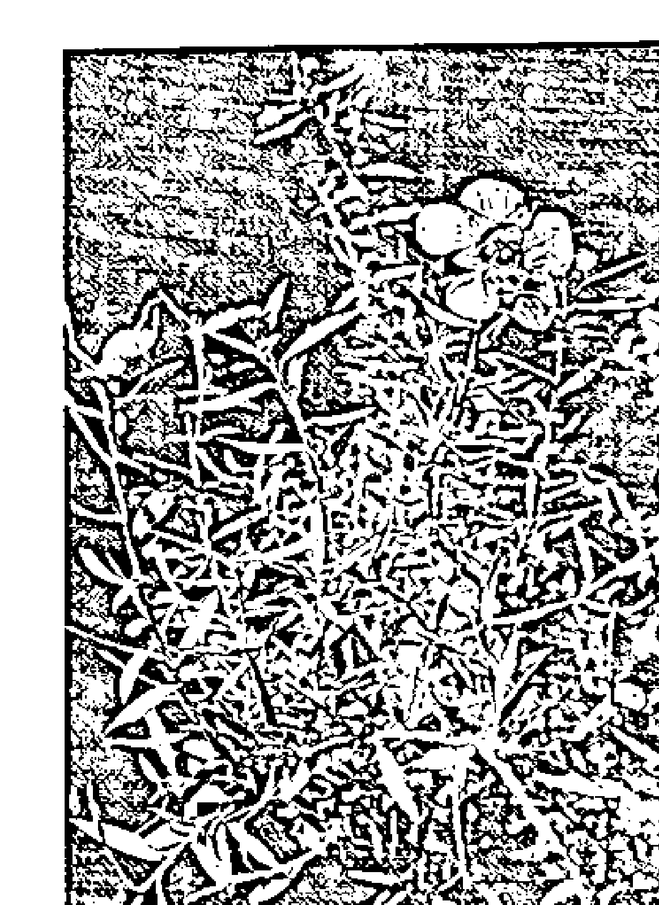

茶樹
對應部位：嘴部

茶樹在市場上有很高知名度，廠商尤其強調其抗菌效果。不過好的茶樹精油桉油醇在15%以下，主要成分為萜品烯四醇，其抗菌力其實沒有那麼「萬能」，效果更佳的精油所在多有。不過，茶樹能提升免疫系統，激勵IgA，是標準「預防勝於治療」的用油。

對慢性疲勞症候群、時常小病不斷的人、或感冒季節而言，是很好的日常保養。但若已開始進入嚴重感染，幫助就比較有限。

松紅梅
對應部位：臉部

松紅梅是將陰性特質發揮得淋漓盡致的油，她的香氣十分女性，帶有果香，又自然而然融合進體味當中。事實上，女性對松紅梅的接受度確實也比男性更高，這是一種非常能讓人貼近自我，又特別能喚起性別自覺的精油。

筆者做過的個案中，發現可處理性別因素引發的失眠(如生理期、夫妻突豁)與神經系統失調，對生殖系統亦發揮很好的抗菌效果，且能與原本正常的益菌共存，維持身心的安定。

在一些個案中，生殖泌尿道感染會發生在家族中許多女性成員身上，這很可能與家庭裡的性別問題相關，此時用松紅梅便很理想。而無論男女，松紅梅都能幫助認識自我存在的價值，讓人勇於堅持本色、堅持追求。

### 香桃木（圖）
對應部位：臉部

香桃木十分矮小，在叢生又彼此交纏的植株中，可以發現迷你型小白花，分為五瓣而花絲纖長，代表本科屬的典型特徵。即使枝幹粗礪，花朵卻脆弱至極，才一摘下，花瓣就已片片飄落到腳邊，令我印象深刻。在神話裡，這種嬌柔的特質也使她成為陰性象徵。

香桃木的氧化物與酯類有很好的均衡度，因此不妨礙睡眠，不但可給氣喘兒使用，情緒上也特別能使人「真情流露」。無論缺乏表達的勇氣，或是隱藏過多憤怒，香桃木都有明顯作用。

有些人在使用香桃木後的一段時間內，猛冒痘痘，其實多半是因為壓抑的憤怒得到了宣洩：對突然產生的憤恨，醛類精油可以即時平抑，但長期累積的怒氣，則以香桃木最為擅長。

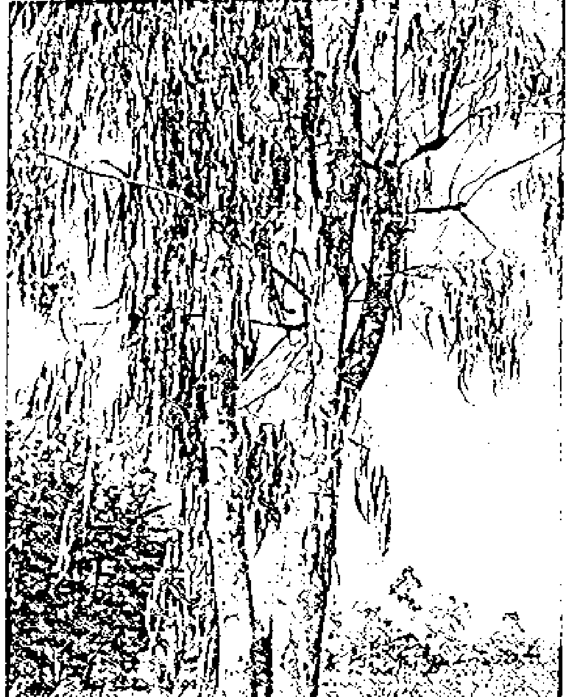

### 檸檬細籽（圖）
對應部位：頭部

在醛類精油中，檸檬細籽和檸檬馬鞭草的香氣細緻，讓人感到愉悅，對神經系統的效果亦佳。

檸檬細籽是木本，檸檬馬鞭草是草本，他們對應的性格情緒也與型態相關。檸檬馬鞭草則適用於外向、變動、不安的心靈；而檸檬細籽適用於較內向、壓抑、沒有定見、躊躇無法前進的人。

檸檬細籽使人擺脫自己塑造的情境，不再逃避現實，而能釐清自己的問題點。而對於憤怒型人格或Pita過高者的皮膚問題，檸檬細籽同時抗菌、安撫、調理情緒，效果特別好。

### 檸檬尤加利（圖）
對應部位：肩膀

檸檬尤加利十分適應台灣的風土氣候，在花市都可買到，也很容易就將植株照顧得很強壯。

它的成分以香茅醛為主，比一些以檸檬醛為主的精油刺鼻，所以引起的好惡也很分明。

與檸檬香茅一樣，它特別適合處理各種跌打損傷、痠痛、肌肉關節毛病……，不過檸檬香茅擅長急性症狀；檸檬尤加利卻對長期慢性問題特別有利：檸檬香茅與下半身較為相合，檸檬尤加利則比較能對應上半身問題。

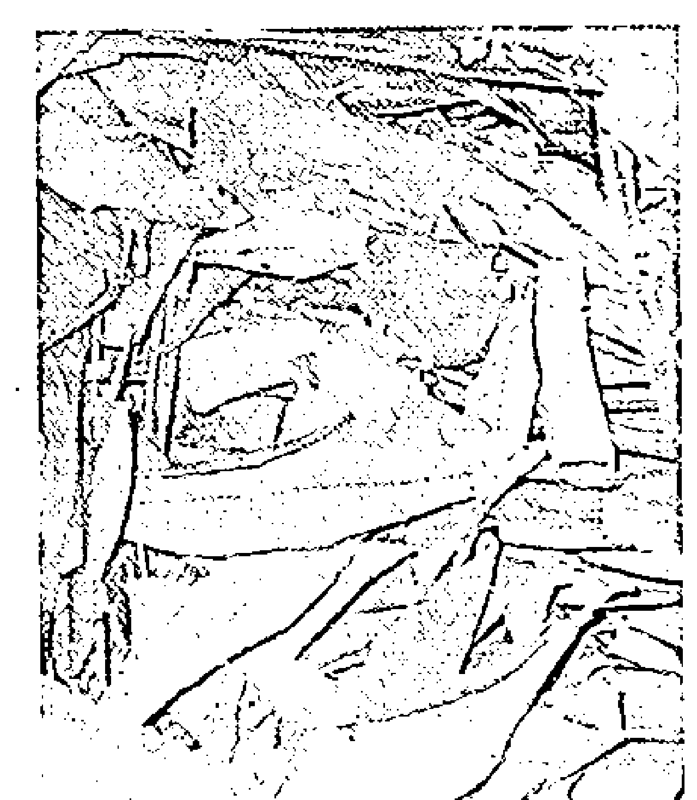

檸檬香桃木（圖） 對應部位：上背(脊椎)

檸檬香桃木原產於澳洲昆士蘭原始森林，本屬屬名因紀念十九世紀植物學者白豪氏Backhouse而得。它是目前市面上含醛最高的精油，檸檬醛比例可高達95%。醛類典型之抗病毒抗黴菌屬性，可謂發揮得淋漓盡致，而抗病毒特性和抗腫瘤間亦有密切關係。

晚近研究指出檸檬香桃木臨床上可對抗AIDS，其實不只來自其抗病毒力而已，更因為他的香氣能使人「返璞歸真」。把人從一種大起大落敢愛敢恨的、張力太強的、太戲劇性的情境裡拔擢出來，而這是許多HIV帶原者共通的情境。

| 部位 | 精油 |
|------|------|
| 上背(脊椎) | 檸檬香桃木 |
| 氣管 | 藍膠尤加利 |
| 氣管 | 澳洲尤加利 |
| 氣管 | 史密斯尤加利 |

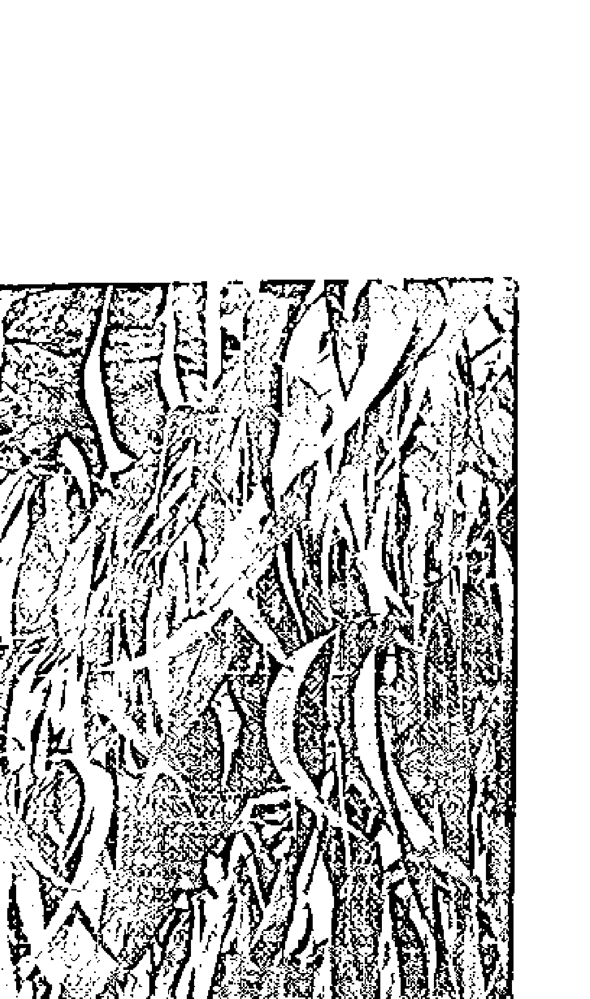

## 藍膠尤加利
對應部位：氣管

這是坊間最常見的尤加利品種，來自海拔愈高之產地，品質愈佳、芳香分子種類愈豐富。但市面上可買到者，許多是人工合成品，想買高海拔產地也不容易。

它的氧化物比例最高，氣味也最衝，像一股強勁的風，適用於所有呼吸道疾病，雖然它給人酷涼的感受，另一方面卻又能激勵循環，暖化肢體。

一般來說嬰幼兒不太使用藍膠尤加利，因為它乾化黏液的作用，可能會使小Baby柔弱的呼吸道黏膜過分乾燥。

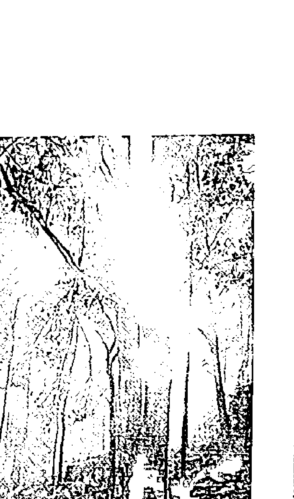

## 澳洲尤加利
對應部位：氣管

有20%的單萜醇，因此柔美好聞，頭角崢嶸的氧化物被磨得圓融。蘇珊卡蒂（Susan Catty，純露專書作者）認為尤加利純露(藍膠品種)的氣味相當難聞，但若嚐嚐澳洲尤加利純露，卻會發現它十分清甜可愛。

單萜醇提高了澳洲尤加利的親膚性，它的護膚抗菌效果佳，還能補強虛弱的身心，當我們處在盲目付出的狀態下時，澳洲尤加利能流失的力量，但又能幫助我們重新尋找定位，對自我冷靜評估。

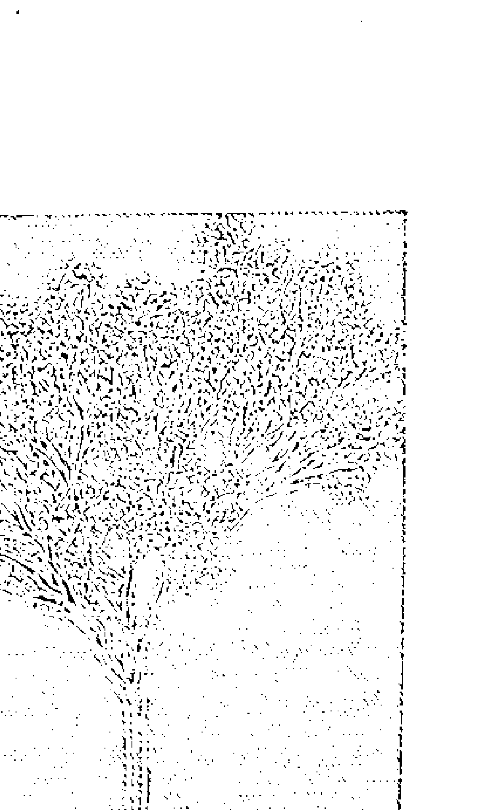

## 史密斯尤加利
對應部位：氣管

傳統上都說澳洲尤加利適合小朋友使用，但其實真正最不刺激、小朋友最宜者，是史密斯尤加利。因為它比澳洲少了醛類，所以更溫和，基本上沒有使用禁忌，兒童的呼吸與消化系統感染問題，皆可使用。

尤加利十分耐旱，因生長於乾燥炎熱地區，又富含精質，不時會引起森林大火，但生命力仍強。它隨生隨滅、隨滅隨生，給我們的啟示是「順應生命中的變動」，這種委婉溫和、屈而不折的特質，在史密斯尤加利身上最清晰可見。與昆士蘭堅果油並用，更能讓使用者發揮中庸圓滑的精神，無意、無必、無固、無我。

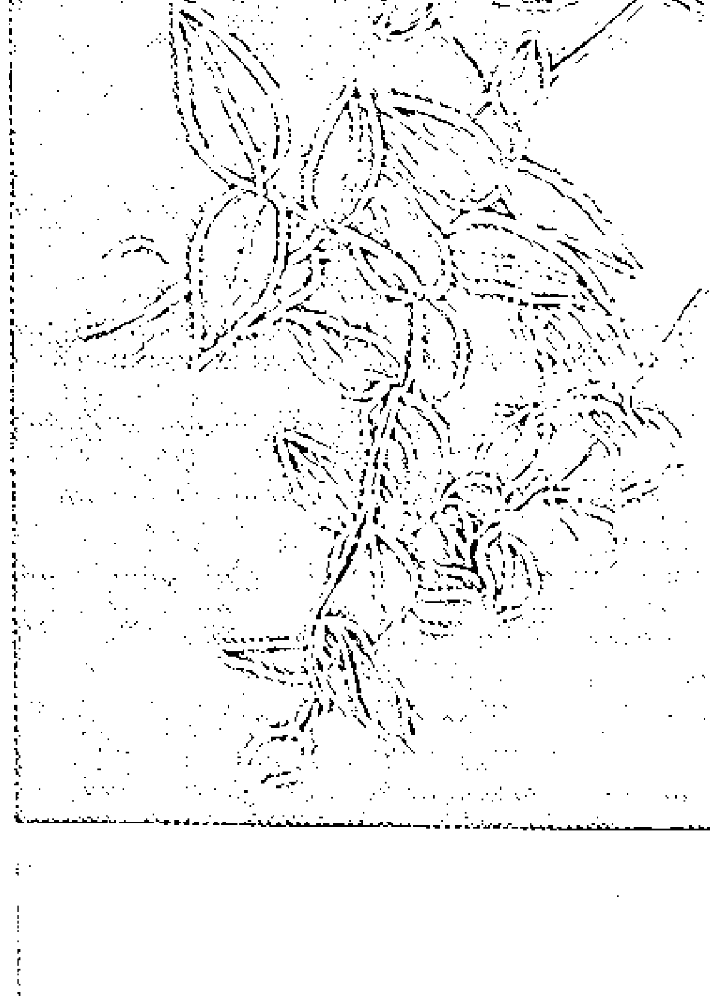

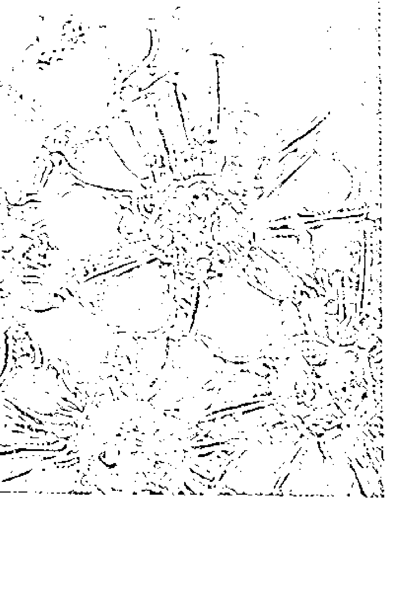

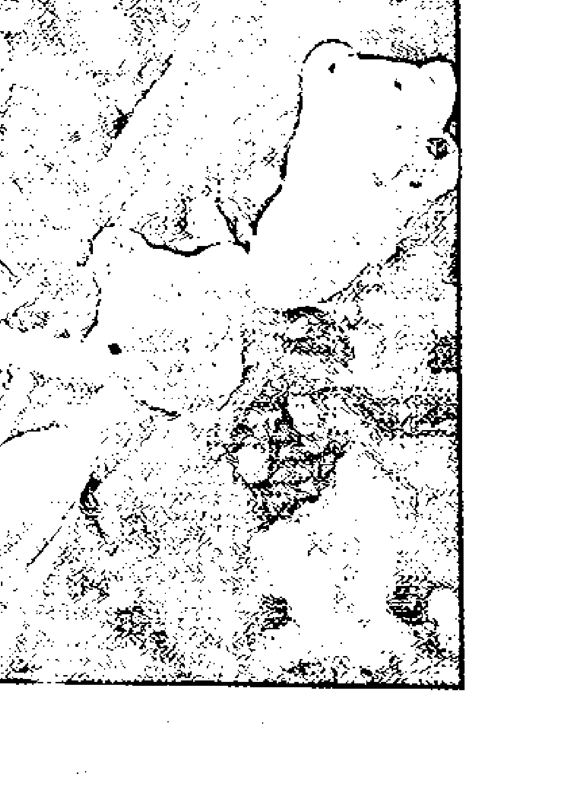

## 薄荷尤加利（精油）
對應部位：腎臟

薄荷尤加利的利腎效果極強，可用於處理各種腎臟病。但基本上，腎臟問題的最主要關鍵，還是在「伴侶關係」上。當強大的性能能量無法得到平衡，情感與情慾缺乏適當出口，或是缺乏分辨、過濾、選擇伴侶的能力，便容易產生腎臟問題。

筆者手邊有此類案例，當事人雖然年輕，但腎臟功能卻欠佳，還有水腫、痛風、循環不良、性機能障礙等問題，並在短短幾年間急劇增胖，喪失原有的體型架構。經過討論以後，發現他與妻子間存在第三者陰影，當事人長期壓抑情感，拒絕表達自己，最後僵硬的夫妻關係完全顯現在腎臟功能上。

薄荷尤加利處理這類問題，除了利腎臟細胞再生以外，它的倍半萜烯成分助人承認自己的情感，回歸中心；單萜酮成分則予我們理性智慧與超脫，讓感情缺憾昇華為另一種力量，以完成其他更有意義的事。

## 卡奴卡（精油）
對應部位：腎臟

卡奴卡的香氣常被形容為過熟的香蕉，亦有人認為這是種十分肉感的氣味，十分容易辨認。

與其他細籽屬的兄弟姐妹一樣，卡奴卡對神經系統有強大的影響力，而因為其成分又以單萜烯為主，敏感一點的人，甚至能感受到它的能量是直接朝上方脈輪而去。

有的人在使用時，會感到輕微頭痛(與其他單萜烯類精油並用時更加明顯)。會發生這種狀況的人，多半Vata（阿輸吠陀中的能量分類）過高、神經活躍，只要降低用量、或是改用在下半身、甚至與其他低音類精油相調和，就能夠改善。

相對來說，卡奴卡特別適用於另一種能量典型Kapha。對遲緩、反應不靈活、渙散失去結構的心靈；及行動不便、代謝與排毒慢、容易感冒或有呼吸系統問題的身體，特別有調整功效。可視為冬季的重要保養油。

## 丁香（精油）
對應部位：腸胃

丁香花苞在剛長成時，小叢小叢群聚在枝頭，與葉面一樣青綠而油亮，一點都不起眼，後來顏色才轉趨艷紅色，最後開出花絲細長柔美的花朵。

開花前後，丁香的氣味截然不同，成熟的花苞聞起來正如我們所熟知的精油，但開花之後，卻散發一種輕快微酸的清香，令人陶醉。

丁香精油取自於花苞，富含植物開花前的爆發力，它的特色便是強勁但不形於外，火熱卻沉潛，能帶給人大溫暖的支持。

與其他酚類精油比較起來，顯得更為內斂(丁香酚亦比其他酚類溫和)，卻更具創造性與生命力，適合用於第二脈輪的對應部位。除了眾所皆知之止痛抗菌效果以外，亦可調整甲狀腺方面的問題。

| 器官 | 精油 |
|------|------|
| 腎臟 | 薄荷尤加利 |
| 腎臟 | 卡奴卡 |
| 腸胃 | 丁香 |多苞葉尤加利
對應部位：生殖區

多苞葉尤加利對應生殖系統的效果最好，對兩性的生殖器官感染與病變，都能發揮作用。例如各種莫名的疣與突起、起疹發炎、分泌物不正常、性病等症狀，多苞葉尤加利是極佳選擇。許多生殖系統感染來自非意願的性行為，但確有其他感染，來自複雜的性接觸，處理這類問題是多苞葉尤加利的專長。

我的兩位個案在少女時期受過性侵害，受到重大創傷，但未因此而排拒性行為，反而極希望與人產生性接觸。缺乏安全感的人，會有與人親密交往的渴求，需要透過性行為來縮短與他人的距離，才會覺得自己被愛、被重視、被需要，但一方面又在當中感到疏離，因此想逃開或尋找新的紓解對象。這種狀況下除了容易受到感染，也容易產生其他生殖系統病症。

當獲得和諧穩定的伴侶關係時，問題能得到排解，但更重要的是必須對此有所自覺，逐漸不再依賴性以肯定自己。多苞葉尤加利搭配其他倍半萜類的精油，正能協助人早日重拾對自我的尊重感受。

白千層
對應部位：生殖區

本屬的植物能防止放射線傷害，因此白千層是放射線治療前後必備的精油，而抗壓效果也讓它適合作美白護膚用途。

白千層能促進毛細血管循環，而達到暖身、發汗、處理循環問題（例如靜脈曲張或痔瘡）之效，當然還能用在各種呼吸道感染。心理上則能幫助擺脫困窘，讓人開朗帶勁！

綠花白千層
對應部位：生殖區

桃金嬢科中親膚性最佳，具廣效抗生素特性，對皮膚與黏膜感染特別有效，另外它亦屬多分子精油，在神經系統方面有良好的調整作用，使人擺脫陰霾猜忌、倍感清新。

含多種倍半萜醇與倍半萜烯，能使我們回歸內在的中心，對癌症病患來說，這也是重要的保養用油。

- 生殖區
- 多苞葉尤加利
- 綠花白千層
- 白千層

菊科
菊科代表精油

- 艾草 (Artemisia vulgaris)
- 龙艾 (Artemisia dracunculus)
- 印蒿 (Artemisia pallens)
- 南木蒿 (Artemisia arborescence)
- 西洋蓍草 (Achillea millefolium)
- 罗马洋甘菊 (Anthemis nobilis)
- 德国洋甘菊 (Matricaria recutita)
- 摩洛哥蓝艾菊 (Tanacetum annuum)
- 野洋甘菊 (Ormenis mixta)
- 永久花 (Helichrysum italicum)
- 土木香 (Inula graveolens)
- 万寿菊 (Tagetes patula)

植物型態與能量

菊科植物極易辨認，其最顯著的特徵就是頭狀花序。在花序中央的不是花蕊，而是小小的管狀花，外圍也不是花瓣，而是舌狀花。若為菊科植物作素描，想畫得好可不容易，只要仔細觀察，便會發覺這麼多管狀花舌狀花，讓人眼花撩亂，難以下筆。

菊科植物看似單純，但層層管狀花，卻像曼陀羅般環繞排列著，它比我們所想像更複雜而有深度，是個由許多小單元組成的宇宙。

開黃花的植物給人希望與光的能量，特別具有療癒力。翻開以顏色做分類的藥用植物圖鑑，會發現黃色占去大半篇幅，但他們其實各有其個性。因光線反射方式不同，在蜜蜂蝴蝶眼中，黃色花朵可能變成多種不同顏色。

在所有黃花植物裡，菊科最能與太陽相輝映。除了顏色以外，一輪輪花序的長相與太陽最接近，看起來熱力洋溢。事實上，菊科植物卻味苦性寒，自古就被認為有清涼解毒之效，例如牛蒡就屬於菊科一員。

這種看似熱性，實則涼性之矛盾特質，讓菊科又多增添一份複雜度。也因此，它能處理比較複雜的問題，菊科植物適應力原本就強，其精油的使用範圍亦全面而廣泛，但消炎、鎮靜、撫慰人心，為其主要特質。

仔細觀察菊科芳香植物的葉與莖，若呈銀灰色，且長相毛絨絨，代表植株體內有不少酮類成分，例如永久花、印蒿等便為例子。這類菊科植物修護細胞的效果較佳。

香氣與能量

菊科精油的個性很強，鮮有氣味清淡者，並且香氣分明，很容易做區分與辨認。台灣市場上以羅馬洋甘菊及德國洋甘菊較為常見，除了廠商專業度、價格(菊科精油較昂貴)考量以外，另一個因素便受限於氣味，其實非常可惜。

未經稀釋的純精油雖不易親近，但劑量降低後，就變得甜而怡人，那也是種入世的、容易引發許多記憶的氣息。對香氣之欣賞能力需要被培養，菊科精油便是明顯一例，喜歡它香氣的人，以進階程度芳療愛好者居多。

偶爾聽聞有些人，是衝著效果而用菊科精油，但一談到氣味，卻難掩排斥之色。其實，若害怕或討厭一種氣味，仍會降低它在你身上產生的影響。

菊科的乾燥藥草、精油、純露，香氣差異頗大，芳香分子之組成與狀態顯然不同，效果自然不能一概而論。以製造過程來看，反倒最流行的花草茶，恐怕只有安慰劑(placebo)效應。

臨床身心應用

就中醫觀點，菊科植物特別有助於養肝，並認為肝若為邪風所襲，將造成自律神經失調、情緒焦慮不安的現象，免疫力低弱。並且呈現在皮膚上的症狀，為皮膚脆弱、紅腫發癢、過敏起疹。

而分析菊科精油，也發現確實對於處理自律神經問題有效，處理發炎、痙攣、或情緒及毒素無法疏洩的情況，也十分理想。不只精油可以消炎解毒，菊科植物的純露與浸泡油 (山金車油)，療效與氣味也都強大。

菊科艾屬的精油對婦科問題特別好，他們多半含有酮類，能夠驅蟲通經。

菊科精油對應的器官

| 部位 | 精油 |
| --- | --- |
| 頭部 | 羅馬洋甘菊 |
| 臉部(鼻部) | 南木蒿、永久花 |

羅馬洋甘菊 (酯)
對應部位：頭部
比起德國洋甘菊，羅馬洋甘菊對複雜的心因性問題更為擅長。它不僅是很好的兒童用油，也能療癒對童年經驗所造成的深層傷害。
處理童年經驗的精油有數種，例如高地杜松、薔薇等等，但羅馬洋甘菊酯類含量高，對重大精神打擊所引發的腸胃不適、失眠、氣喘、皮膚炎、神經痛等等，都有很好的發揮。

南木蒿
對應部位：臉部(鼻部)
在北非岩礫沙漠地帶，我突然留意到遠處的一叢植物，且不自覺地受到吸引，往前靠近它，沒想到竟是一株正盛開球狀黃花的野生南木蒿。全株散發著獨特的香甜氣味，莖幹粗壯，花了許多力氣才成功採集。
而一將南木蒿帶在身邊，當晚便連續做了好幾個饒富意義的夢境。這是我第一次受不可知力量所牽引，而與植物有所邂逅，妙的是南木蒿的生理療效剛好符合當時的需要。
從發現它起，我的旅程才宣告開始，充滿無窮的可能性與想像，隨時等著接受當地自然力量召喚，並遇到好幾次深刻的感動。南木蒿精油的力量，正是「開放自己、接觸未知」，心靈上的探險，才是真正的旅行。

永久花
對應部位：臉部
永久花有數種類似品種可萃取藥用成分或精油，但當中義大利永久花雖與其他永久花一樣含有高量酯類，但只有它含有義大利酮成分，這是其療效之重要根源。永久花抗疤去瘀的作用久為人知，但其化解心中陳年舊傷的效果，讓它更為芳療師所重視。
永久花最佳產地在科西嘉島，有趣的是，這個大島不僅民風剽悍，也是拿破崙的故鄉。永久花在人類眼中多半象徵安撫與包容，但事實上，其能量卻是堅毅的。
永久花得名於其不凋萎的特質，主要是因為水分含量較少，本身的乾燥反使得花朵不會零落。如果表現在情緒上，永久花精油確實也有這種特性。
它修護心傷的步驟是先讓人鎮定下來，先釐清自己，去除掉不必要的枝枝節節，凝練沉穩之後，生命反而能不凋落摧折。當看清楚自己生命中的缺憾到底是什麼，反而能將缺憾轉化為另一種力量。

土木香 (Inula helenium)
對應部位：心臟氣管

芳香療法上所使用的土木香，花如滿天星般細小，與中藥典籍所記載者為同屬不同種。

藍綠色的土木香能同時對應第四與第五脈輪，對呼吸系統、心臟，以及聲帶長繭、失聲沙啞、發炎等喉部問題有益，亦能增進表情達意的能力。依序漸進的原則來說，因為它癒合力十分強大，並非處理四、五脈輪問題的第一優先用油，但對「積鬱」過久而非一朝一夕的沉疴，則是很好的選擇。

(圖為以根部萃取精油的品種 Inula helenium)

摩洛哥藍艾菊 (Tanacetum annuum)
對應部位：肺部

雖然我們親自造訪了摩洛哥，卻無緣一見藍艾菊，因為她只生長在偏遠的南方，實屬可惜，也證明了其稀有度。

其精油是極深的藍色，像墨水般不透明，標準的第五脈輪用油，不只代表了自我表達，代表與世界的溝通、交流、理解，它也與選擇與承受結果的能力相關，這是自由意志(free will)與個人責任的基礎。

摩洛哥藍艾菊不僅能助人表達和選擇自己的路，它高量單萜烯也能帶給我們決斷力。

有一位個案在感情出軌後突然莫名原因地失聲，以氣卦用油隨意抽選的結果，顯示問題出在第五脈輪。用摩洛哥藍艾菊之後，重新對異性關係做了決定，在很短時間內喉部又回復了健康。

印蒿 (Foeniculum vulgare var. dulce)
對應部位：肺部

以往對印蒿沒有任何特殊體會，聽學姊說她喜歡這種有春天氣息的精油，心裡還會有點納悶。但到後來，經歷過至親罹患癌症等種種事件之後，我才在困難的情境當中，重新對它有所感動。

印蒿的心理療效，正是「Never give up」，在最絕望的時候也不要放棄，因為生命中有太多美好的事物值得去奮鬥。將印蒿調和柑橘類精油按摩心輪，呼吸變得非常清爽，有開胸解鬱之感，會很自然地發出微笑。

龍艾 (Artemisia dracunculus)
對應部位：腸胃

當成分中同時有單萜烯與醚類時，表示抗平滑肌痙攣之效果佳，對以平滑肌構成的幾個內臟及系統，包括腸胃、氣管、子宮等等，均有益處。因此諸如胃痙攣、腸躁症、拉肚子、氣喘、子宮痙攣型的經痛等等，都可多使用龍艾精油來緩解。它處理打嗝的效用也是為人所稱道的，不過一旦打嗝時間拖很長不止，那麼用龍艾按摩，橫膈膜要恢復正常時會有瞬間疼痛的感覺，可能持續幾秒，只要暫時閉氣，很快胸口就會舒暢，打嗝也會停止。

| 部位 | 精油 |
| --- | --- |
| 氣管 | 土木香 |
| 肺部 | 摩洛哥藍艾菊、印蒿 |
| 腸胃 | 龍艾 |

德國洋甘菊
對應部位：生殖區

德國洋甘菊的花型與羅馬洋甘菊有顯著不同，比較接近我們印象中菊科植物的樣貌，管狀花與舌狀花比例完美，給人一種可愛鄰家少女的感覺，十分賞心悅目。

它能處理情緒上纖弱的、莫名的、無法對外人訴說的不安，例如即將步入婚姻或成為母親前的不安。在四大藍色精油中，德國洋甘菊最適宜用於橫膈膜以下部位（包括消化問題與婦科問題）。

早期台灣精油業者所極力推崇的昂貴單方精油，除了玫瑰以外，便數羅馬洋甘菊與德國洋甘菊。而德國洋甘菊抗敏消炎能力勝出，因此又常被視為解決皮膚問題的萬用方。

其實這類抗敏消炎、具抗組織胺特性的精油，劑量頻率宜節制，因組織胺作用乃是讓血管壁滲漏，使巨噬細胞活動自如，太濫用抗組織胺物質可能導致免疫功能降低。

野洋甘菊
對應部位：生殖區

野洋甘菊從來不是種植在花園，而是寶石般散落在摩洛哥的大地上，路邊單獨一叢野洋甘菊並不起眼，但當聚集成花野，鮮明的黃色會與藍天相映，鋪陳為一片驚人美景。

我們將野洋甘菊抱了滿懷，新鮮花朵氣味與精油相仿，但花心另有一種醉人的蜜香。在原產地，它們將被採收、曬乾、並且在簡易爐灶中被蒸餾，除了最原始的水、火、風、土以外，不再有別的人工因素加以干預。

野洋甘菊最大心靈療效，是帶給群體的支持。沒歸屬感、環境轉換、離鄉背景、孤立無援、無法融入團體、過度依賴他人、恐懼孤獨等狀況，都適合使用野洋甘菊。對於因人際關係而產生的消化、皮膚、感染等問題，效果亦佳。我個人特別推薦癌症患者應使用野洋甘菊，會是很好的情緒調理。

艾草（菊科）
對應部位：生殖區

艾草精油帶著熟悉又甜膩的強烈糖果香，只要聞過一次就很難忘記，大多數人其實都滿喜歡它稀釋後的氣味。艾草精油對神經系統十分激勵，能夠引夢。

在我的個人經驗中，倍半萜酮類精油所引之夢效果也好，通靈夢境明顯、能令靈魂澄清，而艾草所引之夢則色彩瑰麗、變化多端，十分魔幻寫實。

因含高量側柏酮，英系芳療師多艾草視為危險精油，但它卻是重要的婦科調理用油，特別是心理狀態與寒性體質引起的遲經、黏液分泌過多，或是經期不順在嘴角四周產生的痘痘等等，可經專業人員指導後低量使用。

萬壽菊（菊科）
對應部位：生殖區

萬壽菊的花型豔麗，潑辣外放，但卻是單萜酮類精油，與心靈和智性相關。如果以人來比擬，那萬壽菊就是標準的智慧型美女，它帶給人的助益也在這種靈肉的平衡性。

菊科精油植物中，萬壽菊是唯一有光敏性者，但這也代表它特別能加強人對陽光的感受和反應，其精油多半處理生殖泌尿道或腳底問題，帶給這些陰濕區域一道活潑的光照，對時常壓抑自己本質(尤其是女性特質)的人，萬壽菊十分有益。

西洋蓍草（菊科）
對應部位：腳踝

西洋蓍草在西方是典型的療傷藥草，阿基里斯全身上下唯一沒有「神化」的弱點——後腳跟，在受傷後據傳便是以西洋蓍草治療；蓍草在中國則是問卜求卦的工具。而兩者在觀念上相通的地方是：透過植物，人類獲得神聖力量的助力。具備倍半萜烯(自我)與單萜酮(靈性)的西洋蓍草精油，代表著對宇宙智性的嚮往。這種嚮往可化為衝破黑暗時代、進入理性主義時代的力量。

唇形科 Lamiaceae

- 真正薰衣草 (Lavandula officinalis)
- 穗花薰衣草 (Lavandula latifolia)
- 醒目薰衣草 (Lavandula hybrid)
- 頭狀薰衣草 (Lavandula stoechas)
- 樟腦迷迭香 (Rosmarinus officinalis)
- 桉油醇迷迭香 (Rosmarinus officinalis)
- 馬鞭草酮迷迭香 (Rosmarinus officinalis)
- 胡椒薄荷 (Mentha piperita)
- 綠薄荷 (Mentha spicata)
- 檸檬薄荷 (Mentha citrata)
- 蜂香薄荷 (Monarda didyma)
- 馬鬱蘭 (Origanum majorana)
- 野馬鬱蘭 (Origanum vulgare)
- 鼠尾草 (Salvia officinalis)
- 快樂鼠尾草 (Salvia sclarea)
- 牛膝草 (Hyssopus officinalis)
- 高地牛膝草 (Hyssopus officinalis var. decumbens)
- 熱帶羅勒 (Ocimum basilicum)
- 甜羅勒 (Ocimum basilicum)
- 神聖羅勒 (Ocimum sanctum)
- 百里酚百里香 (Thymus vulgaris)
- 沉香醇百里香 (Thymus vulgaris)
- 側柏醇百里香 (Thymus vulgaris)
- 龍腦百里香 (Thymus satureioides)
- 冬季香薄荷 (Satureja Montana)
- 廣藿香 (Pogostemon cablin)
- 香蜂草 (Melissa officinalis)

植物型態與能量

唇形科多半為低矮的草本植物，它們的莖不是圓形，而是四方形，全身鋪著一層短毛。這毛絨絨的部分，便是唇形科植物的分泌細胞 (表皮腺毛)，它們分泌與儲藏精質，只要摩擦葉片表面，腺毛便會釋放出精質來，我們可以聞到濃郁的香氣。

因為在分泌細胞構造上，唇形科比其他植物更容易散失精質，所以它成了最為人所知的芳香植物。家族裡也最多成員被列入藥典，學名冠有「officinale」或「officinalis」(拉丁文入藥典的意思)。

唇形科植物的重要特徵，便是它的花形。花冠分為兩部分，看起來像開啟的嘴唇一樣，通常上方有兩片唇瓣，下方有三片唇瓣，很好辨認。上唇瓣的任務是保護下方之雄蕊與柱頭，下唇瓣則是昆蟲的「停機坪」。

有的下唇瓣顏色或有斑點，這就是「蜜源標記」，像是餐廳亮著招牌，引導顧客「食物在這裡」。當昆蟲降落在下唇瓣時，會發現花蜜隱藏在花心最深處，因此只好奮力把身體往內擠。

一旦有訪客，唇形花便顯出其精巧絕妙的構造設計。昆蟲的重量引發槓桿原理，而讓雄蕊壓低，花粉黏附在昆蟲背上。當牠造訪下一朵花時，同樣地，槓桿原理又會讓花粉沾到柱頭上。太重或太輕的昆蟲，可能都沒辦法在這精巧的平衡裡完成授粉，蜂類的大小最適宜，相對地，蜂類長長的口器也最容易吸取花朵管狀基部的花蜜。

因此唇形花看似朱唇輕啟，欲語還羞，其實在傳宗接代方面，一點都不被動，等於用構造半強迫式地，讓傳粉者為自己提供更好的服務。唇形科植物是積極的，但那種積極並非汲汲營營，而是準備萬全、好整以暇。

唇形科芳香植物，多生長在地中海型氣候區，喜愛明亮開敞的環境。它們長得比較低矮，甚至沿地面匍匐生長，能量很接近地表，與下方脈輪也比較相關，所以大部分唇形科植物，能量狀態都很踏實，並且貼近我們的本能情感與生存需求。

但是開紫花的唇形科植物比較不同，它的花色與頂輪相同，代表著聖哲或神明頭上的光圈。所以紫色花的植物，像薰衣草、牛膝草等，反而容易與精神性事物結合，有助滌淨人的靈魂。

### 香氣與能量

唇形科家族龐大，在萃取精油的芳香植物中，聲勢最浩大。因為種類繁多，氣味也五花八門，各有巧妙。

整體來說，唇形科的香氣屬於中音調性，在調香時可以做為骨幹，讓配方顯出性格來。但其揮發速度快，給人的感受是往外發散，而非向內集中，所以若與樹木類精油相比，樹木類精油提供向上、直立而分明的結構，唇形科精油則讓人得以站穩腳步，往四周橫向延展。

所以誰適用唇形科呢？看得見自己、卻看不到別人的人，很適合唇形科精油。這類人格喜歡追求成長，但向上爬升的過程裡，卻容易忽略環境、忽略群己關係。過度放大自己的問題或需求。但是，我們與唇形科植物一樣，需要聚居、需要群落、需要藉傳粉彼此分享與溝通，因此「獨善其身」直著長是不夠的，還要能橫著長。

### 臨床身心應用

唇形科精油應用最廣泛，栽種到採收花費的時間短，使用歷史又悠久，是最為人所熟知的芳香植物。但是變種、亞種、栽培種等變異很多，光一個薄荷屬便足以讓人眼花撩亂。此外，即使購買前留意學名區分，也不一定能真正掌握它的性質與成分。

若要討論精油的「化學類型」(CT，chemotype)，便不能不討論唇形科。若相同植物，具有不同化學特性，其主要化學組成便被稱為這個精油的CT。CT差異與環境相關，我們要建立一個概念—精油是農產品。農產品直接受土地與氣候影響，人文條件與自然條件，均足以改變植物體內的成分消長。

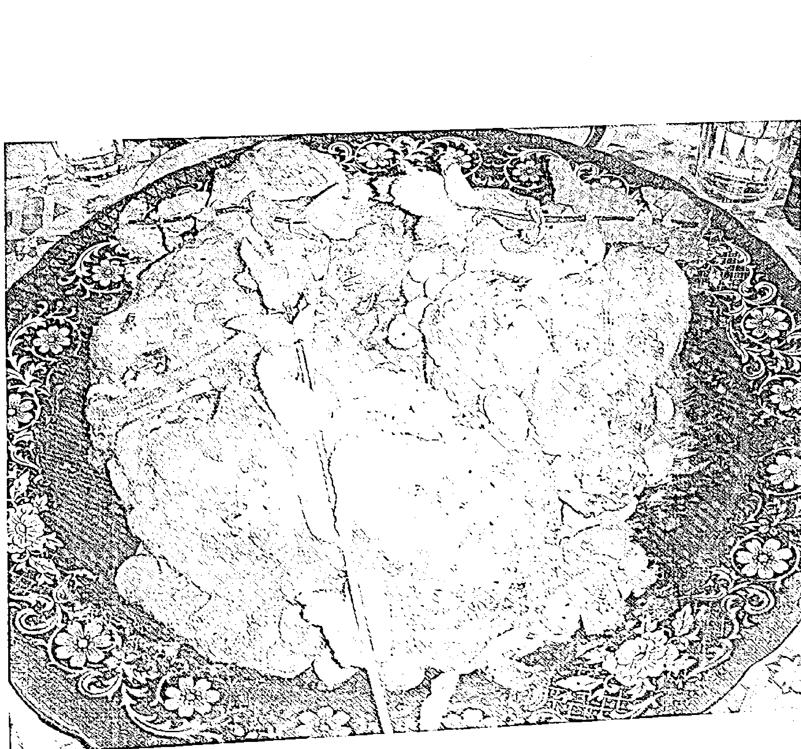

因素，則來自唇形科植物與地表相近的能量狀態。它特別敏感、特別容易感知到土地之微妙變化。

我與恩師曾在台中農改場張博士帶領下，參觀中部的芳香植物栽植。兩人興致盎然，因為雖然大都是原本熟悉的唇形科植物，但無論氣味或外形，與國外所見都不同，也顯見CT上已有差異。這便是很典型「橘越淮而為枳」的故事。

所以要掌握唇形科精油的身心療效，一定要先了解品種，再掌握CT。俗名雖一樣是薰衣草、百里香、迷迭香，卻可以區分出許多種類，療癒方向也大不相同。能提供較多選擇，或能清楚說明精油品種與化學類型的廠商，專業程度比較高，讀者可多多觀察比較之。

## 唇形科精油對應的器官

- 頭部
  - 真正薰衣草
  - 頭狀薰衣草 (耳鼻)
  - 檸檬薄荷
  - 穗花薰衣草
- 頸部(甲狀腺)
  - 馬鬱蘭

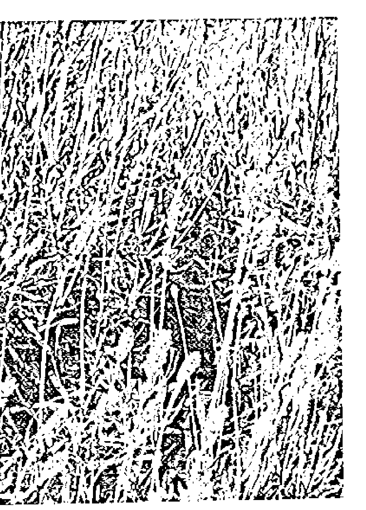

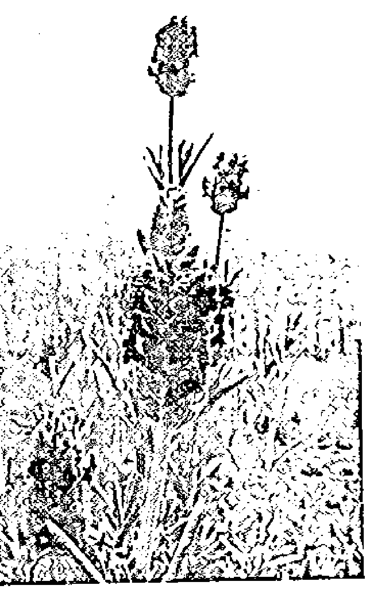

### 真正薰衣草(醇)
對應部位：頭部

多分子精油均對神經系統有益，並且適合長期使用，在各種薰衣草中，真正薰衣草的芳香分子最為平衡全面且多樣化，因此適用於各種情緒問題、心身症、調理自律神經失調等。

真正薰衣草具有母親特質，台中一位芳療師為她不足月的小Baby，在保溫箱內滴真正薰衣草，孩子恢復狀況良好，身體十分健康，與剛出生時的照片簡直判若兩人。

真正薰衣草通常小叢地與其他植物錯落生長，人們印象中普羅旺斯或北海道的整片紫色花田，都不是真正薰衣草。

筆者在英法所見的真正薰衣草，葉片顏色較青綠，在盛產酮類精油的摩洛哥，卻呈現銀灰色，原因可能與海拔有關，但灰撲撲的葉片，也代表摩洛哥真正薰衣草的酮類成分較高。

### 穗花薰衣草(氧化物)
對應部位：頭部

單萜酮含量較高，因此對傷口修護、燒燙傷處理、皮膚再生美白等很有幫助，在薰衣草精油中護膚效果最佳，加上成分中的氧化物，使其處理呼吸道問題的能力勝過真正薰衣草。

穗花薰衣草最主要的氣質是有條理、振奮、洞察力、思慮清新，特別提神利腦，但若想拿穗花薰衣草來助眠，恐怕要失望了。

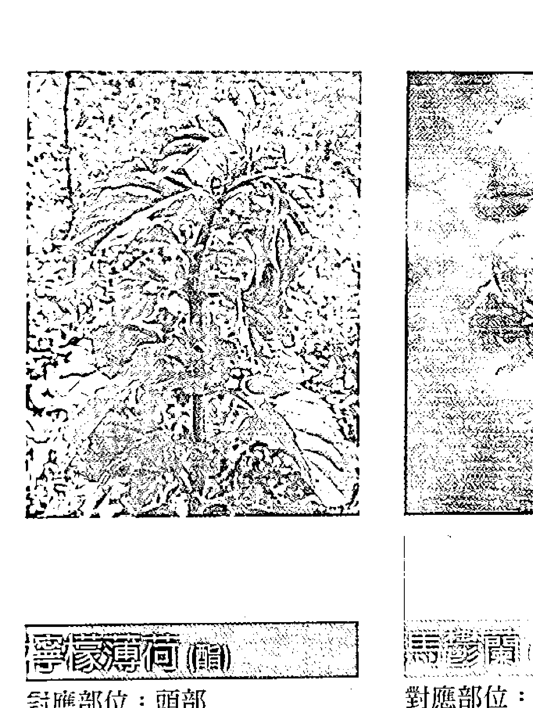

### 檸檬薄荷 (單萜烯)
對應部位：頭部

在薄荷屬植物裡，檸檬薄荷的莖片看起來特別豐滿多汁，其性能量的影響，似乎也不言可喻。檸檬薄荷有極佳補身作用，可以提升生殖系統機能，特別是卵巢功能，所以雖然對男性之性功能皆有激勵作用，但是對女性而言，更為明顯。

性能量與創造力相關，當性能量受阻時，顯現出的傾向便是憂鬱、沉悶、索然無味、虛假不實，而這也是現代人(尤其是夏娃齒輪的中產階級)普遍的毛疾。此時，檸檬薄荷有助帶回一種新的刺激，改變情緒，並具有全面性地提振，提神效果優異。

基本上，所有酯類都可作用於一氨基丁酸的受體——一種神經傳導物質量太少會感到憂鬱，與血清素作用像。

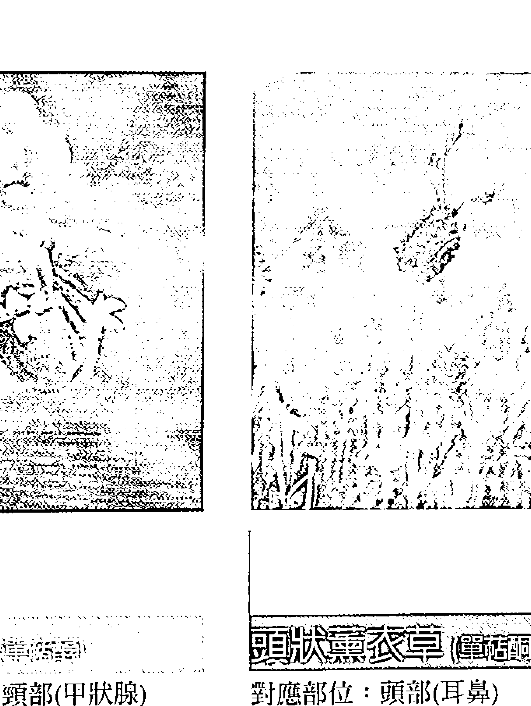

### 馬鬱蘭 (單萜烯)
對應部位：頸部(甲狀腺)

傳統上認為馬鬱蘭有節欲作用，但這其實只是其「平衡」特性的一小部分而已。從成分上來看，當單萜烯與單萜醇都強大時，該精油將特別提升人面對變化之能力，馬鬱蘭就是典型例子。它能調節自主神經，抑制過度發達而失調的內分泌腺體(例如甲狀腺、性腺)，讓人對外在事物的反應不會太激烈、太亢奮。

當我們不把注意力放在外界環境的變化，才能回過頭來省察自己內在的變化。我們往往難以坦然面對自身真正的面貌，而喚起人接受自我、甚至進一步改變自己的勇氣—這正是馬鬱蘭精油的最大貢獻。

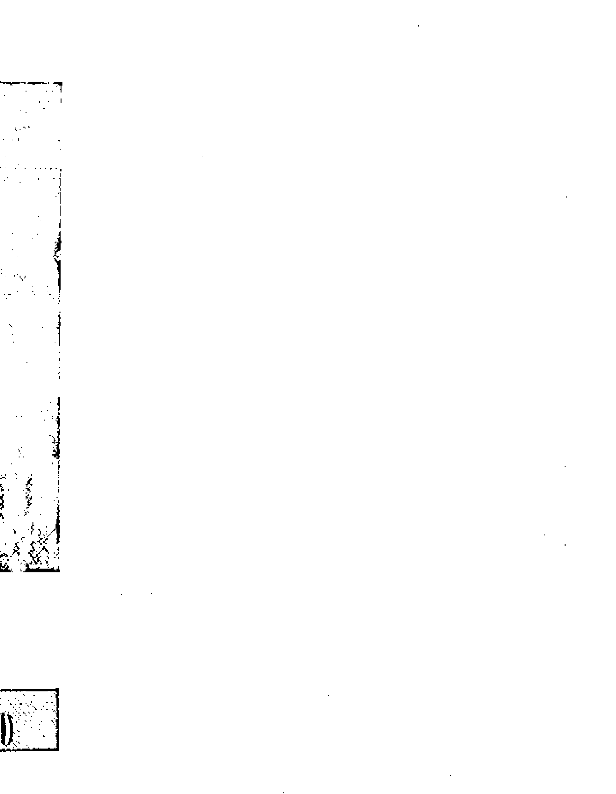

### 頭狀薰衣草 (單萜烯)
對應部位：頭部(耳鼻)

英語系芳香療法中認為它屬於危險精油，著墨不多。但無論從花形或成分來看，頭狀薰衣草都是最與頂輪共鳴的精油。

當我赤腳溯過亞特拉斯山的溪流，爬上嶙峋的岩塊，見到那深紫搖曳花朵時，覺得「氣」完全被集中到頭上，而其他旅伴，也表示感受了相同的震攝，它非常具有存在感，幾乎是壓倒性地。

我將之插在髮帽稍沿，方才還在路上遺失的財物煩憂，卻突然參透「一切安排都是最好的安排」。這不是自我安慰，而是了悟了事物背後之理。我深切體會到頭狀薰衣草開放頂輪，使人耳聰目明的能力。奇妙的是：一樣不加水，放在窗邊的花梗生氣蓬勃，插在頭上的花梗卻凋謝極快，就像能量已完全注入頂輪一樣。

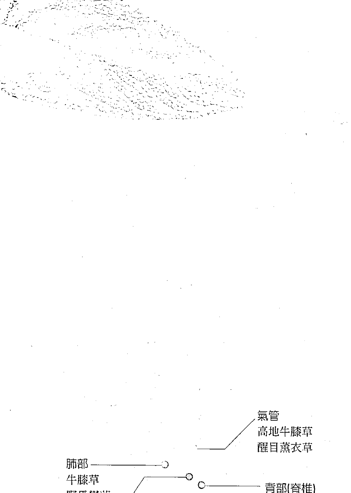

### 香蜂草（圖）
對應部位：心臟

香蜂草雖然極易種植生長，但分泌精質的腺毛密度較低，萃取量也低，因此價格居高不下，坊間摻偽的狀況非常嚴重。猛然一聞，確實不易分辨香蜂草與其他醛類精油，但仔細觀察，會發現真正的香蜂草精油還帶種蜂蜜香氣，這蜂蜜香氣在香蜂草精油中表現得更為徹底。

香蜂草是心輪之重要用油，舉凡處理恐懼、心悸、高血壓、焦慮、胸悶、心臟衰弱等狀況，都是它的強項。以香蜂草為主的護膚油，有助處理心因性之皮膚炎、濕疹等等，對痘疹也有諸多成功個案。

礙於價昂而無法取得精油的話，不妨多使用香蜂草純露，香蜂草純露的鎮靜效果佳，對神經系統有很大的安撫作用，助眠、降血壓、護膚、退燒等作用不亞於其精油，處理痘疹亦相當快速。

### 甜羅勒（圖）
對應部位：心臟

一般市面上賣的羅勒，都是甜羅勒。因為品種的關係，「九層塔」其實是個不恰當的譯名，應該只有熱帶羅勒才能譯為「九層塔」。

葉片寬大的甜羅勒，氣味直接強烈，很少能被複方裡其他香氣所掩蓋。一般來說，個性魯直的人會比較喜愛它，因為彼此個性上是很相近的。

甜羅勒的能量純樸耿直，適合對應「紅樓夢賈府」般大家庭的問題。無論家族內勾心鬥角、規矩禁忌太多、做作虛偽、姻親人比人氣死人…，這些狀況，都需要甜羅勒這個直率的「劉姥姥」來加以調和。

甜羅勒能讓人拋開高姿態，偶爾也要感受偶爾粗魯不文的快樂…。它補身、激勵、補神經的效果良好，按摩眉心與額部，能緩解能量損耗引起的頭痛。

#### 唇形科

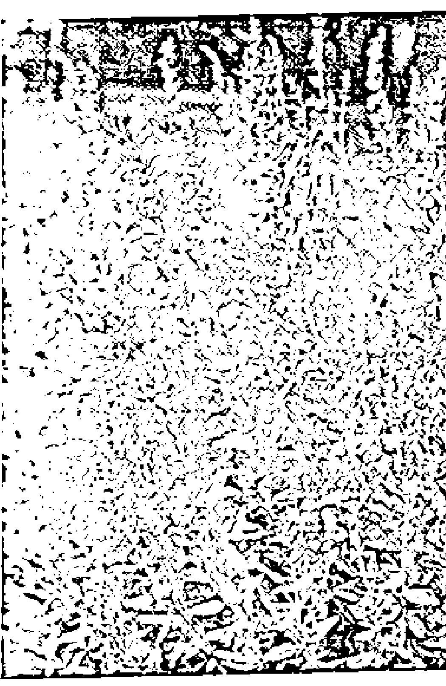

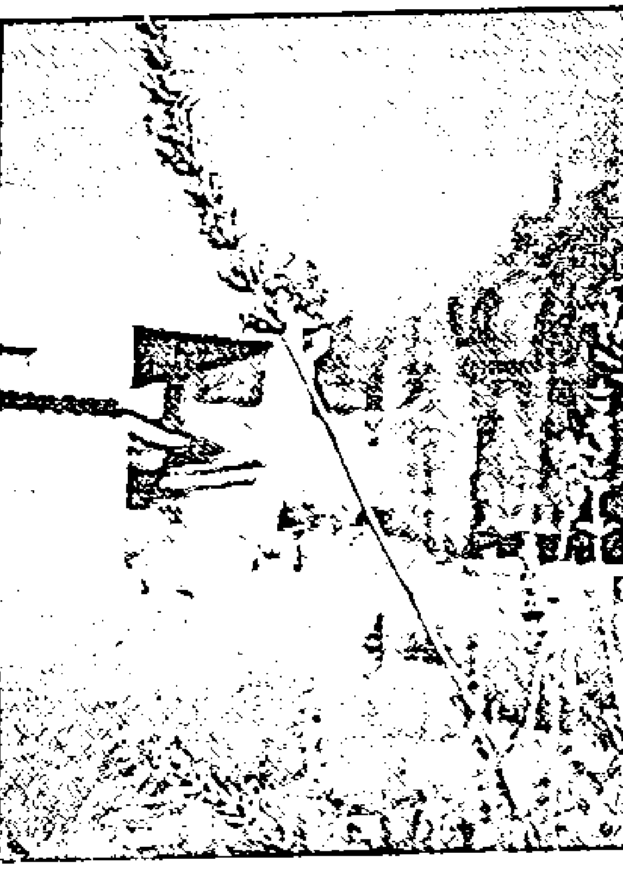

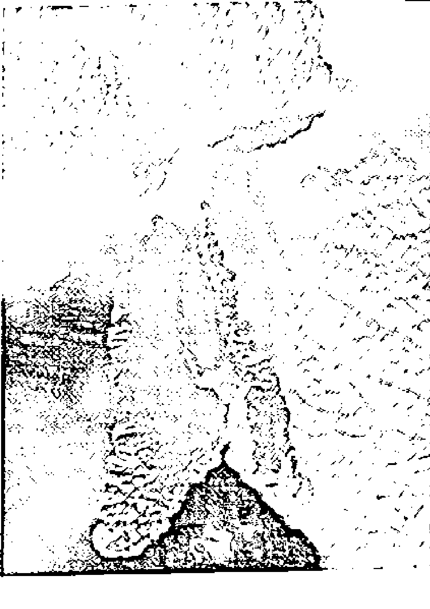

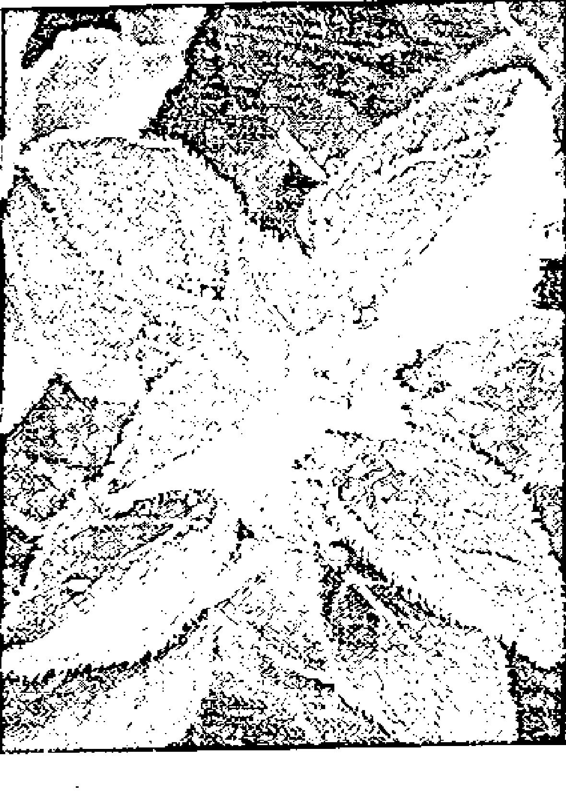

### 高地牛膝草（氧化物）
對應部位：氣管

牛膝草因成分以單萜酮為主，嬰幼兒孕婦應避免，但高地牛膝草則不然，安全性高，小朋友都可使用，對各種呼吸系統癌症特別好。

氣味細緻，帶有一股清爽嬌高的感覺，比其他氧化物類精油更甜美，適合稚氣未脫、容易受周遭環境影響而焦慮的人，使人精神狀態較為安定鎮靜，不會壯志未酬、卻先被自己擔心害怕所擊倒。

### 醒目薰衣草（酯類）
對應部位：氣管

真正薰衣草身形矮小細緻，且為陰性精油；穗花薰衣草身形高大粗猛，且為陽性精油。而這一陰一陽、一母一父的特質，同時顯現於其雜交品種醒目薰衣草身上。雖然效用較不那麼特出，但它確實具有親代的特點，某些書籍上認為醒目薰衣草療效低落(甚至全無)，其實是看扁它了。

如果在各種薰衣草中，只能選擇一種作為居家用油，個人會先選擇醒目薰衣草。

### 牛膝草（酮類）
對應部位：肺部

與頭狀薰衣草同為紫色花朵的靈修用油，不過牛膝草的應用歷史與範圍，要更為悠久廣大。舊約聖經裡數度提及牛膝草，它除了有滌淨靈魂的意義，其代表的天人關係，其實是雅歌中「我屬良人，良人也屬我」的愛情關係。

牛膝草讓人類能與更高的靈性存在相互整合，但那不是被「吸收」，不是大吃小，而是天與人在平等的狀態下合為一體、彼此交融。

> 「我屬良人，良人也屬我」

牛膝草帶來的「天人合一」，是人文主義的，人不僅是天地的一部分，他也要做自己，尊重更高智慧的引導，不代表失去自我。使用牛膝草精油能啟發靈性，提升領悟參透真理的能力，且避免我們產生虛無感或喪失本質，因此不失控。它的威力也顯現在我們的對外互動(呼吸系統)和內在整合(生殖泌尿系統)上。

### 野馬鬱蘭（酚類）
對應部位：肺部

常以香料角色出現於南歐菜餚中(別名奧瑞岡)，比起同為酚類的百里香，它的氣味更加溫潤。如果說百里香像徹底反社會的抗議分子，那麼野馬鬱蘭則比較接近「抗議不忘生活」之人。早年創立無殼蝸牛聯盟的李幸長先生，可謂最接近我對野馬鬱蘭的感受。李先生後來開設連鎖餐飲店，事業輝煌，但仍不忘其社會運動的本色，極力喚起大家對教育問題的注意。

野馬鬱蘭正代表這種能安於貧也能安於富，不受安逸生活所羈絆的自由心靈。任何想打破因循、跳脫窠臼的人，都應該多使用它，讓自己活得更有聲有色。

另外，走出校園後日漸社會化而慢慢失去理想的「犀牛一族」，也會獲益良多。野馬鬱蘭特能提升免疫機能，對下半身的感染問題亦有奇效。

63

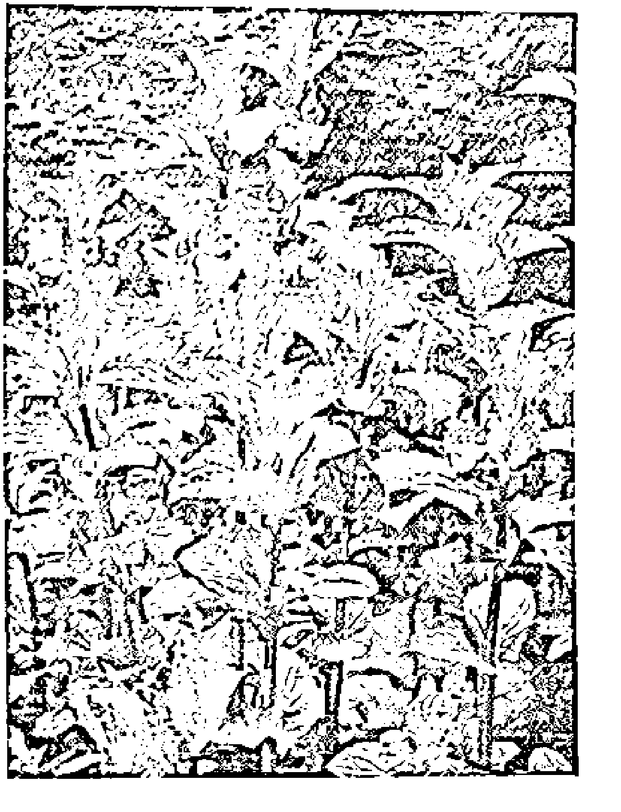

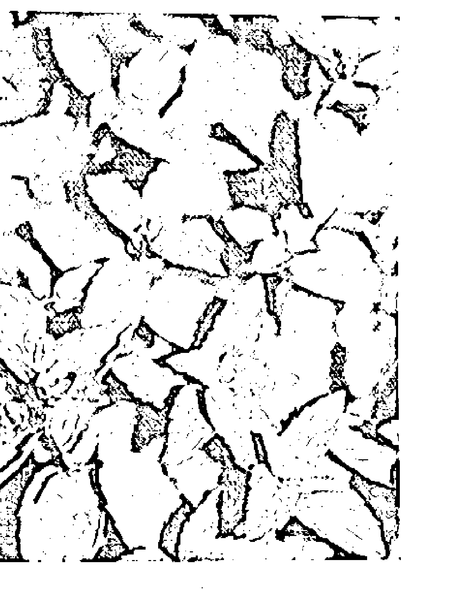

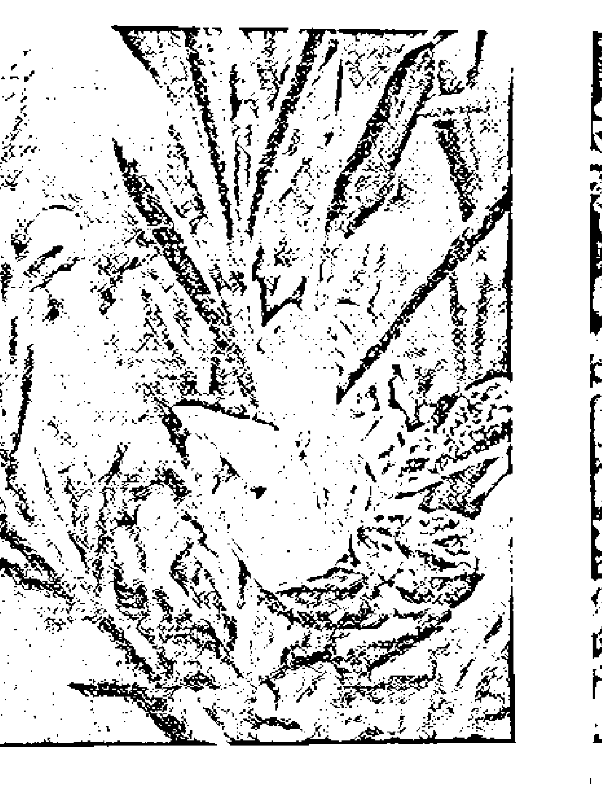

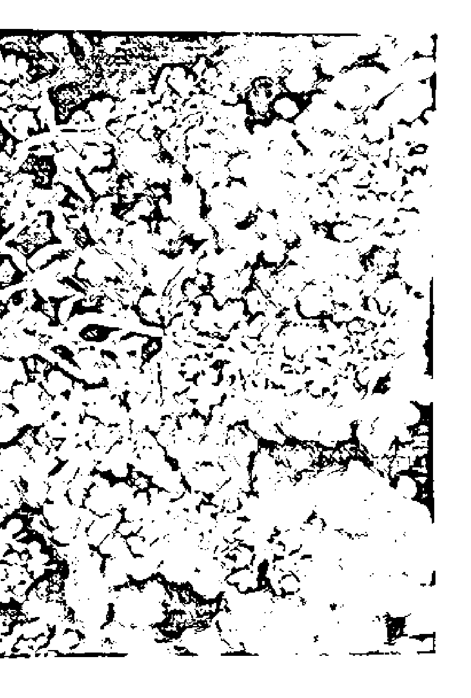

### 胡椒薄荷（Peppermint）
對應部位：腸胃

胡椒薄荷雖然含有薄荷酮，但因以水合方式存在，加上配合其他成分之協同作用，所以安全性高。它應用範圍廣大，但也有所限制，例如一般常用來止癢、止痛、止瀉，但其雖然能暫時抑止症狀，卻無法治本。

另外許多人也用薄荷處理暈車，但因為它對神經系統較為刺激，用來止吐，可能反而更想吐。但是，薄荷養肝利膽的作用非常良好，例如B型肝炎帶原者，便可用來做調理。

唇型科薄荷屬種類非常多，共同特徵是十分好種，只要給予充足水分，甚至會像流氓般在你的花園賴著不走，因此本屬精油，較不適用於本身就有攻擊性的人身上，相對地，對太退縮而不主動的人則很適合。

### 綠薄荷（Spearmint）
對應部位：腸胃

綠薄荷是胡椒薄荷的母株，但通稱的綠薄荷，其實還有許多不同品種。

以往我以為綠薄荷和胡椒薄荷應從枝梗顏色區分，但後來發現不夠準確。不過從種名Spicata（有穗的），可以知道綠薄荷的花朵長的像毛穗，這一點與胡椒薄荷顯著不同。兩者香氣相較起來，胡椒薄荷涼而衝，綠薄荷則很甜，就像我們印象裡青箭口香糖的味道。

綠薄荷時常用做食品或藥品的矯味劑，它使環境「調和」的效果確實也很棒。阿拉伯人除了會以小茴香來替全羊大餐去味，也會搭配一把綠薄荷同食，不僅助消化、去油解膩，完全折衝掉羊肉腥羶，而且還提神利腦。

綠薄荷精油讓人靈活而圓滑，懂得立身，避免衝突，回教世界裡強調處世智慧的商人文化，想必亦受惠於它不少，只要主人請客人坐下來喝杯薄荷茶，一切危機都能在笑談裡解除。

### 桉油醇迷迭香（Rosemary ct. Cineole）
對應部位：腸胃

在產地北非見到桉油醇迷迭香，震撼度截然不同！迷迭香在沙漠裡，身形高挑威猛，尖長葉片銳利到嚇人，稍稍一碰，不只能割傷皮膚，還能聞到超乎想像之辛辣嗆衝，儼然就是遊牧民族劍拔弩張的姿態。而在坎崎山區生長時，堅韌的木質莖十分低矮卻錯綜複雜，粗而扭曲地交纏著，叢叢連綿數個山頭，彷彿沒有止盡，圓短葉片的氣味則酷涼無比。迷迭香，就是這樣一種明快又淡漠的生命型態，充滿防衛性與戰鬥力。

但看那小小白色花朵，卻又是如此纖柔空靈，唇瓣恰巧只能容「XS」號的昆蟲容身。我觀察著小型蜂類跳舞似地採蜜與傳粉，突然了解了為何迷迭香在俐落瀟灑的外表下，另有一股甜美。

對需要領導力、需要做決斷的人而言，它具有補強效果。但如果性格外冷內熱（甚至面恶心善），能量封閉內縮，迷迭香也能幫助緩緩打開自己，不會帶來劇烈的改變，也不會讓人感到頓時失去自我控制，因此男性很能夠接受。無論是增進你對他人的理解，或增進他人對你的接納，桉油醇迷迭香都有佳作。

### 百里酚百里香（Thyme ct. Thymol）
對應部位：腸胃

除了以抗病力、提升免疫聞名以外，百里酚百里香的心靈療效著重於「創造的勇氣」。

舉個例子，日本社會的資訊焦慮十分嚴重，即使明白跟隨群眾往往將抹殺自己，人們還是擔心自己與眾不同，人人害怕離開框架，害怕離開群體價值觀。想逆向而行，不追求世人眼中的價值，而另尋其他理想，是需要勇氣的。

百里酚百里香有助打破虛偽的社會常識，與其憤世嫉俗的量能轉為變化的熱情，不但能起心動念，在遇到困難、虛弱不振時，亦能打氣激勵。

### 對應部位：腸胃
- 胡椒薄荷
- 綠薄荷
- 桉油醇迷迭香
- 百里酚百里香

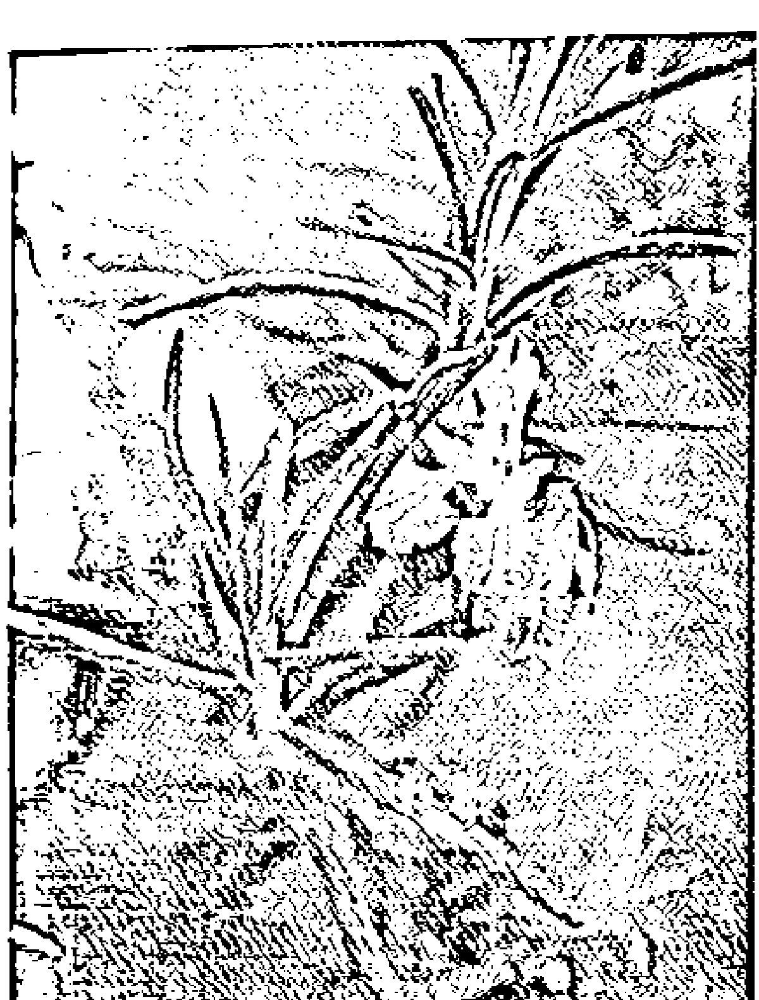

### 馬鞭草酮迷迭香
對應部位：肝臟

馬鞭草酮迷迭香效用大而危險性小，產地有限，使它一向量少而價昂。身為多分子精油，真調節神經系統之作用可想而知，透過此一途徑，馬鞭草酮迷迭香對第二、第三脈輪特別有益，並安撫生殖系統與消化系統問題。

馬鞭草酮成分能化解黏液與脂肪，卻又能令精神狀態向內收斂，馬鞭草酮迷迭香便呈現出這種「先打散、再集結」的能量特質。因此可以「切斷」惡性循環，處理心理上的「癮頭」和生理上成癮症，例如安非他命、尼古丁成癮……等。

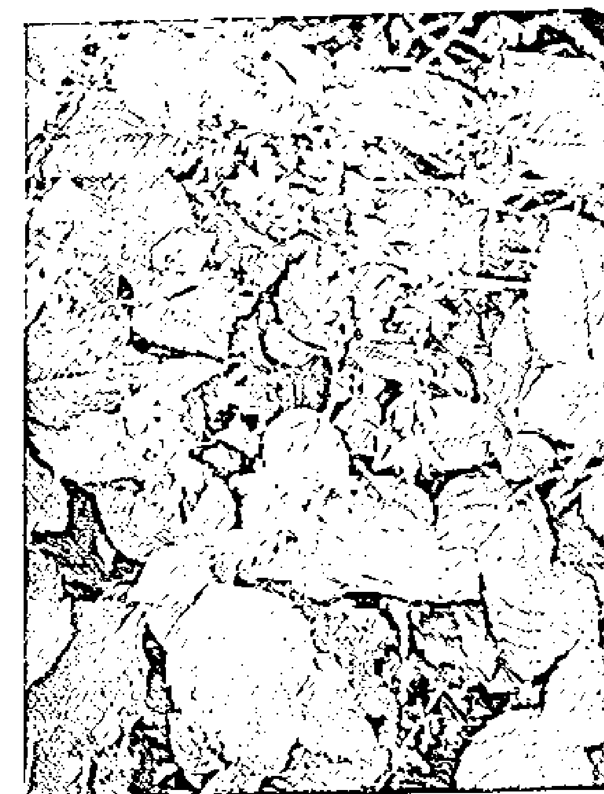

### 熱帶羅勒
對應部位：肝臟

熱帶羅勒裡所含的甲基醚薑葉酚，遠高於甜羅勒，因此它在氣味上不僅更加強勁，並且具有強大抗菌、抗病毒效果，研究指出熱帶羅勒（九層塔）能處理肝炎病毒。

肝炎是一種長期慢性的感染，不容易治療，肝臟一旦發炎損傷，癒合時會增生結締組織，當結締組織遍布，肝臟將失去功能，這就是一般所稱之肝硬化。肝炎在台灣雖然非常普遍，卻不容小覷。

若您是 B 型肝炎帶原者，建議多食用九層塔，並以熱帶羅勒做敷包用在腹部，或是按摩肝膽之反射區。熱帶羅勒具有通經效果，能強化子宮肌肉，幫助經血排得更乾淨，並減緩疼痛感。

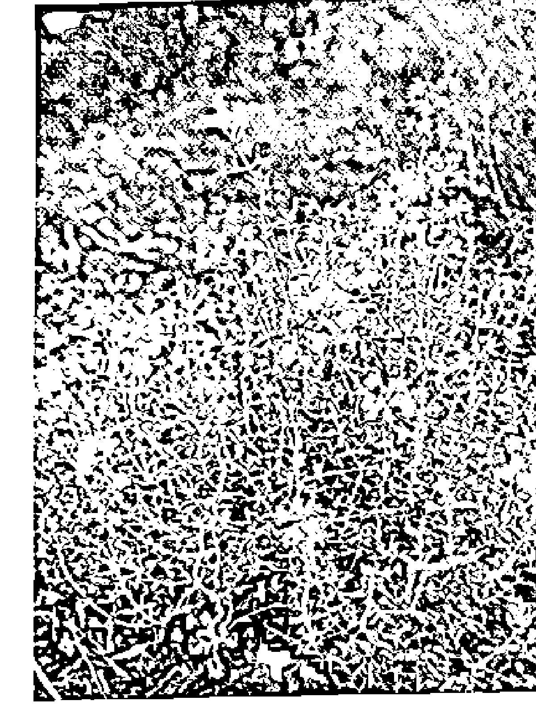

### 側柏醇百里香
對應部位：肝臟

談到對免疫系統的作用，側柏醇百里香可謂最為全面。它的作用溫和而強大，刺激性低。除了強力抗感染，並提升免疫力以外，也能激勵肝臟細胞。

肝臟也屬於免疫「防衛機制」的一部分，其內皮系統會消滅外來異物，以保護身體。因此在傳染病流行期間，或重感冒時，每日口服側柏醇百里香精油或純露，是最好的預防保養之道。

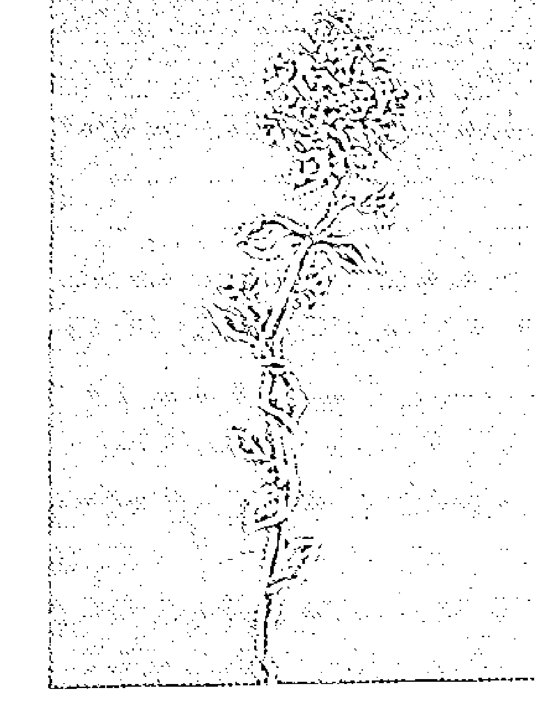

### 龍腦百里香
對應部位：膽囊

龍腦百里香對提升性機能特別有益，處理男性問題時，效果更加顯著。琴瑟融洽不只是生理面而已，它也牽涉到更深層的互動。伴侶關係是最親密的關係，性機能反映出對他人的抗拒或接納，不能與自己的伴侶互動，其實也代表無法真正與外界互動。

龍腦百里香不僅在生理上補強性機能，心理上也有助消除恐懼——特別是擔心自己失去控制力的恐懼。若我們把性視為一種控制的工具(無論男女)，幾乎不可避免地會產生恐懼，進而散失能量。

- 肝臟
  - 馬鞭草酮迷迭香
  - 熱帶羅勒
  - 側柏醇百里香
- 膽囊
  - 龍腦百里香

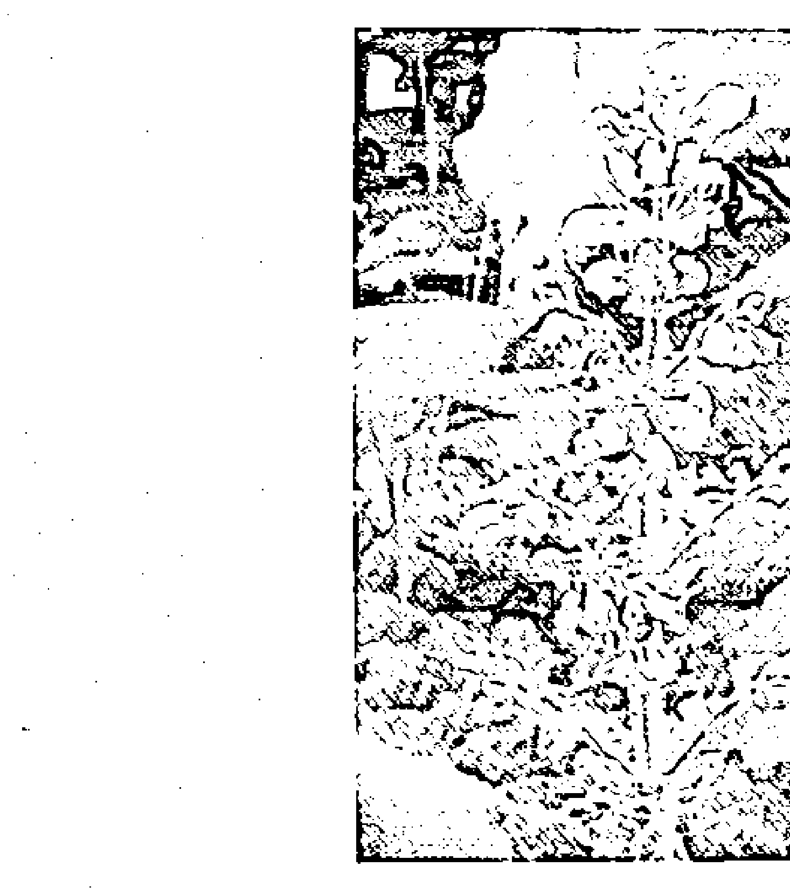

### 快樂鼠尾草
對應部位：生殖區

現代人大多是阿輸吠陀(Ayurveda)分類中的「Vata」形，能量過度集中頭部，常常「頭大身小」，體質虛弱，易有憤世嫉俗、世故、嘲諷、躁鬱等毛病。流行的都會健身俱樂部，並不能解決身體失能問題，因為在充滿聲光刺激的環境下，意念只會更加外放，而無法回歸到身體原始的存在。

快樂鼠尾草正是原始能量的象徵，莖葉大而有力，花朵巨碩艷麗，我摩擦葉片，想知道香氣是否真如恩師所形容像「少男體味」，居然嚇一大跳，因為頓時某種汗水、泥土、夾雜費洛蒙的氣息傳了過來(彷彿置身下午五點台大籃球場)，非常感官、非常踏實。無怪乎快樂鼠尾草精油能讓我們紮實感受到身體，予人真實的生存感。其多分子結構對神經系統有調理效果，是一重要的身心整合用油。

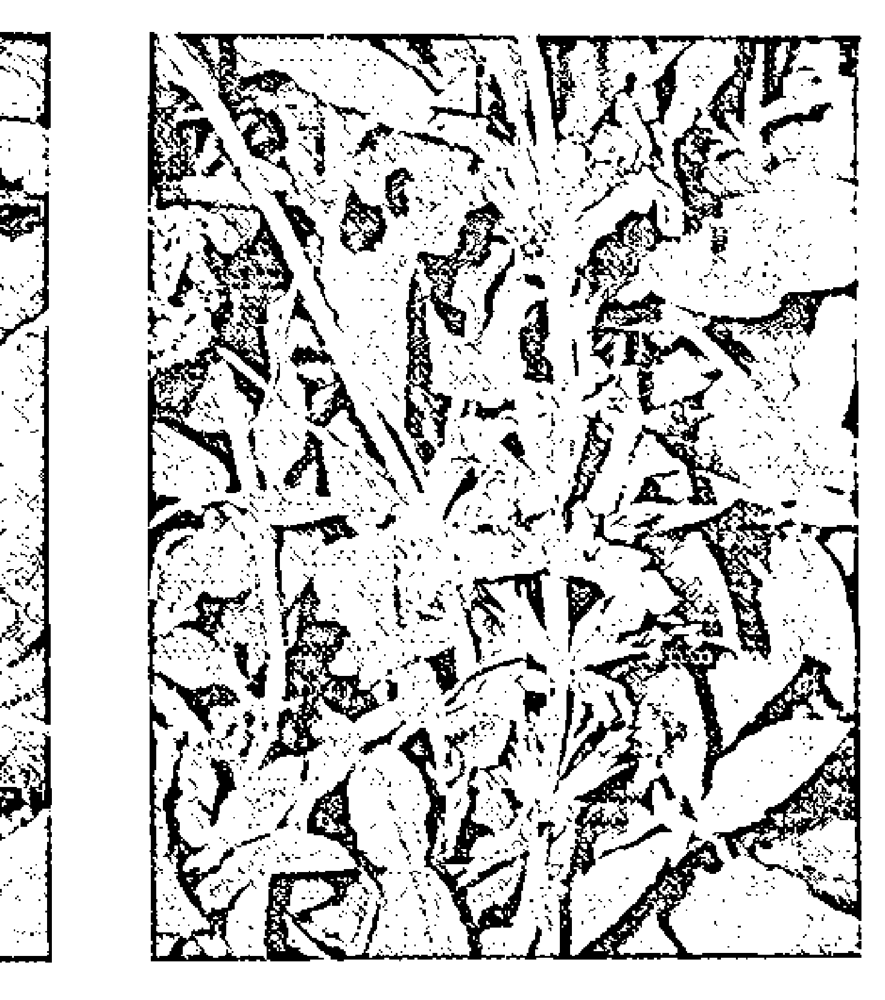

### 鼠尾草
對應部位：生殖區

鼠尾草與快樂鼠尾草外形差異大，氣味、成分也不相似。雖然某些書中建議以快樂鼠尾草替換鼠尾草，事實上，它們卻是無法互相取代的。

鼠尾草精油含有40%側柏酮，但因為它的側柏酮種類較多，因此毒性其實比我們想像得要低，只要在專業芳療師輔導下，注意劑量，一樣能安全地使用它。

鼠尾草有類似雌激素之效果，可處理更年期問題與月經問題，但是不含類雌激素成分(類雌激素分子太大，無法存在於精油之中)。所以所謂「類雌激素精油」，其實是透過神經系統來產生作用，而非真正地「補充女性荷爾蒙」，這是以往部分書籍上的錯誤。

除了婦科問題以外，鼠尾草有改善循環問題、分解脂肪、促進皮膚再生作用，其純露效果顯著而安全性高，但精油的氣味特別使人安定超然，即使在極度非理性的環境刺激下，也能保持不脫序、不混亂。

- 生殖區
  - 快樂鼠尾草
  - 鼠尾草
  - 蜂香薄荷
  - 沉香醇百里香
  - 冬季香薄荷

## 蜂香薄荷（蜂花薄荷）

对应部位：生殖区

蜂香薄荷艳红奔放的花朵，与其一脉轮特别对应，它对第一脉轮所掌控的范畴特别具有影响力，包括处理生殖泌尿系统感染、性机能低落、创造力缺乏等等。此外，第一脉轮也对应原生家庭与族群力量，其所衍生的问题，也可用蜂香薄荷来调理。

曾看过一位相关个案，她来自气氛不睦之原生家庭，生理上受自体免疫疾病与尿道炎所困扰，而心理上，家族亦展现巨大的支配力量，她长期压抑天性，也压抑自我的需求。在用蜂香薄荷后，她开始做了许多愤怒地责骂家人的梦（这是现实生活里不会发生的），连续几天之后泪流不止，但几星期之后，尿道炎问题完全解决，至今也没有再复发过。

## 沉香醇百里香

对应部位：生殖区

最适合小朋友的抗感染精油，可处理从感冒到肠胃不适等各式各样的问题。气味温暖宜人，不刺激皮肤，脆弱敏感的生殖泌尿区可使用，特别是霉菌感染或搔痒，以温水坐浴的方式用沉香醇百里香泡澡，已有许多成功个案。如果不习惯坐浴，将沉香醇百里香纯露制成喷剂也很方便。

沉香醇百里香有温暖、振奮的能量，像「国王的新衣」故事裡，一针见血说出事实的儿童一样，它带来童稚的勇气，让我们宛如孩子般诚实直接、无所疑惧，充满尝新与挑战的渴望。

其有助於缓和僵化的亲子关系，特别是在父母子女间，无法坦诚、缺乏沟通之状况下，轻盈的香气能让彼此重温童年时代的单纯窝心（必须亲子双方皆使用之）。

## 冬香薄荷（冬绿薄荷）

对应部位：生殖区

若认识「romantic」在西方世界裡的意义，便能很快掌握冬香薄荷之精神。浪漫派音乐与浪漫主义绘画，充满张力、奇幻、英雄、与激烈的情感，和冬季香薄荷在本质上非常相近。对寒冷的心理和生理，使用此精油宛如一剂强心针，让人摆脱冷感与虚弱无力，强化性能量，为处理男性阳萎第一名的提振精油。

## 神聖羅勒 (酚類)

對應部位：背部(脊椎)
神聖羅勒在印度教中，是甚受崇視的圖騰植物。它的療效記載於阿輸吠陀典籍中，歷史悠久，其神聖程度僅次於蓮花。寺院旁時常種植這種植物，以便採集使用於重要的宗教活動中。

從它的主要化學結構(酚類與醚類)，我們可以看出，神聖羅勒具有「激勵與迷醉」兩種特質，看似矛盾，但在祭儀中，確實同時需要這兩種特質，使人興奮、受到感召；也使人恍惚，更進入天人合一之境。我們可以僅僅因為生理療效而用神聖羅勒，但抱著儀式性的心情來使用它更佳，如此將體會到：心靈的超升與領略，將助你擺脫自身的哀傷和恐懼。

## 樟腦迷迭香 (單萜酮)

對應部位：大腿
樟腦迷迭香中的單萜酮、單萜烯、氧化物，三者比例接近，各擅勝場，因此它除了有處理肌肉筋骨問題的長處以外，可謂最能增進神經活躍的利腦精油。

其利腦作用不偏不廢，包含對生活層面事理的認識；對邏輯與抽象事物的認識；對靈性與更高智慧的認識。樟腦迷迭香能加強思考分析能力，靈活判斷以外，還能讓人感到愉快自在。

## 廣藿香 (倍半萜類)

對應部位：小腿
廣藿香帶有潮濕的泥土味與藥草味，有些人甚至會形容它的香氣像「五分珠」，成分中的倍半萜烯與倍半萜醇都很強大，難分軒輊，表示廣藿香穩定平和、向內集中的力量很高，並且對皮膚之鎮靜修護效果佳。

它具有地母神的特質，原始、直觀、包容，像看似不起眼卻擁有強大能量的人，能助你提升感官知覺，找回本能與情緒，也安撫受到驚嚇的靈魂。我以廣藿香、萊姆、桔葉為配方，幫自己調了一瓶「安神油膏」，不只氣味怡人，更能疏通胸中緊縮淤塞的感受。

| 对应部位 | 精油 |
| :--- | :--- |
| 背部(脊椎) | 神聖羅勒 |
| 大腿 | 樟腦迷迭香 |
| 小腿 | 廣藿香 |

## Main Document Title

This is the first paragraph of the document, containing handwritten or printed text that spans the width of the page.

This is the second paragraph, continuing the content with more text and possibly detailing various points or information.

This is the third paragraph, concluding the content or providing additional remarks, occupying the lower portion of the page.

### 伞形科

植物精油

#### 伞形科代表精油

- 歐白芷根 (Angelica archangelica)
- 白松香 (Ferula galbaniflua)
- 胡蘿蔔籽 (Daucus carota)
- 圓葉當歸 (Levisticum officinale)
- 阿密茴 (Ammi visnaga)
- 藏茴香 (Carum carvi)
- 印度藏茴香 (Trachyspermum ammi)
- 茴香 (Foeniculum vulgare)
- 洋茴香 (Pimpinella anisum)
- 芹菜 (Apium graveolens)
- 歐芹 (Petroselinum sativum)
- 芫荽 (Coriandrum sativum)
- 莳蘿 (Anethum graveolens)
- 小茴香 (Cuminum cyminum)

### 植物型態與能量

「繖形」又有人寫做「傘形」，其實意義是相通的。繖形花序 (Umbel)的特徵，是每支開花的莖(花軸)上，會長出許多有梗的小花，小花的梗兒差不多長，圍成一圈或一球，看起來就像隻雨傘。大部分繖形科植物，都是「無限繖形花序」，也就是在同一根花軸上，還有頂端，會長出數個像小雨傘一樣的繖形花序，因此很好辨認。

雖然在大多數人印象中，繖形科植物多屬於脆弱的香料蔬菜，但其實它也能長得很粗壯高大，而無論看起來是否柔弱，它們普遍具有強韌生命力。繖形科的花形呈現星狀，花序看起來像一群被互古放置好的星體，因此，本科植物所代表的能量是星體、宇宙的能量。

在常見精油中，接近土地能量的科屬較多，接近天空能量的科屬較少，繖形科精油象徵著宇宙自淨與自律的能量，其實是很難得的。而臨床上，它確實對於人「內宇宙」的整體淨化，具有良好反應。

### 氣味與能量

繖形科精油中的含氮化合物，會使植物呈現一種動物化的氣味，帶來活躍與動能，並且促進代謝。由本科植物所萃取的精油氣味深邃，香氣很具存在感，讓人很難不去注意到，但是濃重而不渾濁。一開始無法接受本科精油的人不少，因為它的氣味有時會引起一些藥味的聯想。並且若劑量拿捏不好，容易把其他精油的香氣都掩蓋。就烹飪觀點來看也是一樣，若使用得法，繖形科香料會是佐餐良伴，為料理加分的好配角，但分量一過就喧賓奪主了。

但是若低劑量地調配繖形科精油，它澄澈清晰的本質就得以凸顯。作者手邊有一些個案，是使用後產生夢境之真實案例，雖然夢的內容各有不同，但歸結起來，與飛行、無重力都有關聯，甚至有一位小姐，是夢見自己的頭與腳完全錯置了。

這幾例個案還有另一共同點，便是其周遭環境長期較為封閉，與外界有一層隔膜。而他們普遍認為對夢境感受良好，有衝破、自由、擺脫制約、不再窒息的印象。

不少繖形科精油，對神經系統影響都很深遠，因此將來相關夢境之研究，或許能成爲我們一窺堂奧的入手處。雖然繖形科精油也是有名的排毒精油，但目前所收集的個案中，尚未出現使用後做惡夢的例子。

### 臨床身心應用

繖形科植物是常入菜的香料，例如中國人特別喜歡的芫荽與芹菜、歐洲人常用的茴香與時蘿、以及產於中東的小茴香等等。

而在悠久的運用歷史裡，人們發現，繖形科不但可以提升食物美味，去除異味，還能幫助消化。例如在中藥典籍中便說到，小茴香的效果爲「溫中開胃，理氣止痛，溫肝散寒」，芫荽則能「消食下氣」。可以想見，繖形科精油最顯著的共同特點，便是對消化系統的益處。

它特別能處理身心「鬱積」問題，例如消化不良、腸胃蠕動減緩、消化液減少、脹氣、便秘，這些其實是情緒鬱積時，會顯現於生理上的反應。而這種鬱積往往來自身心「進」與「出」間的質量不均衡。

消化系統是我們接受與處理外在事物之處，工作比呼吸系統更爲複雜繁重。兩者間還有一處不同：人不易選擇所呼吸的空氣，卻可以選擇食物。

因此消化系統除了代表人與環境的互動，更取決於「自我選擇」。消化不良或腹瀉除了是情緒反應以外，也跟處理外界訊息的能力有關。「只進不出」、「只出不進」和「濫進濫出」，都是引起問題的原因。

「鬱積」是典型「只進不出」的毛病。如果一個人不斷向外追尋，若不多抓些東西，就沒有存在的實感；或是一直擔心事物消逝，而沉溺於過去；這類人格有消化不良問題的比率很高。

而繖形科精油不僅利肝膽，也補腎助排毒，它可加強蛋白質與脂肪的分解消化，同時幫忙讓身體應該「放掉」的那些毒素得以離開，在心靈上也衝破加諸於自己的桎梏。只要重新選擇哪些東西該進入體內，哪些東西該出去，此後便不致於再爲此困擾。

水分滯留或水腫，也是一種典型的鬱積，以女性爲多。許多水腫與荷爾蒙間有關係，這類女性通常也有其他婦科問題。但愈與外界欠缺溝通，愈是不願發展新的思想與關係，往往愈容易產生水分滯留。繖形科精油也是這類情況的解決之道，除了按摩用法之外，各種體液問題都能用純露作處理，茴香純露是不錯的選擇。

含酮類的繖形科精油，可促進細胞再生，是很好的護膚精油。但要注意購買的品項，因爲除了芹菜、白松香以外，都有一些光敏性成分，白天用在太陽曬不到的部位爲佳。

但繖形科精油排除毒素與廢物的特性，卻讓它不適宜長期使用。過度刺激代謝不只對身體形成負擔，此外心靈上也會有趨於貧乏的危險。繖形科精油能量集中於上方脈輪，能使人心澄澈，對汲汲營營於世俗的人特別有效，能幫助你消化過多的感情與物質欲望，但使用太多，則容易變得仙風道骨、脫離現實，失去生命的豐饒與厚度，讓日子過的太扁平乏味。

### 伞形科精油对应的器官

### 欧白芷根（根部）

对应部位：头部

欧白芷的个头高大，往往出乎人意料之外，阿密茴的伞状花是平行发展，欧白芷庞大的花序，则是宛如星体，壮丽地向上下四方爆开。而历代图鑑作者或画家，总不忘替它希腊列柱般的茎与节，多描绘几笔。

欧白芷便是这样强大、超然、结构明确。它代表对自我的信念，对待生命中的困境，能真正以过程论而不以结果论，生出一种知不可为而为之的力量来。要注意您所购买的是根部萃取或种子萃取精油，前者较使人集中而稳当，後者的能量却属於发散型。

### 阿密茴（花）

对应部位：心脏

阿密茴有着最典型的伞状花，类似白色蕾丝花边，花序无比精緻美丽，为了支持硕大的花序，茎颇粗，可以承受很大压力，但北非原野是伞形科的乐园，要认出阿密茴，还是得检查有没有如莳萝或茴香般的柔软线状叶。它虽不易攀折，但一离开土地，便会很快开始失水捲曲，花序和叶片都蜷成一球。

阿密茴对心脏血管与呼吸系统的作用，固而使其成为生理与情绪的救急用油。不过低剂量平日使用，亦可让你在重度心碎之前，先培养一颗强壮的心，防患未然。

### 白松香（全株）

对应部位：颈部（侧边）

由於白松香只产於伊朗，始终与我们缘慳一面。它虽然生长在战地，却是一种和平的药草，这种人与土地的互动关系十分有趣。

白松香带来深层的寧静感，能平復暴烈情绪。曾有顾客说，白松香气味让她联想到母亲的温柔；也有人是在闻了白松香之後，便停止号泣；更多的个案则是显现在脓肿结节的处理上。

皮肤暗瘡代表的是隐忍而没有爆发的怒气，如果未妥善处理，许多愤恨可能会以最极端的方式表现出来，许多皮肤问题用白松香按摩或敷面後，都得到明显改善。

### 印度藏茴香（种子）

对应部位：手肘

当酚类与对伞花烃成分同时存在时，此精油的止痛效果将加成，印度藏茴香与冬季香薄荷便是一例，不过比起多分子之冬季香薄荷，印度藏茴香的皮肤刺激性略强一些。

它驱胀气的功能逊於藏茴香，但抗菌能力却远远胜出，对热带地区的各种感染问题特别有效，亦十分激励性机能，鼓励人勇往直前，重燃对世界的嚮往。

### 伞形科

### 藏茴香 (藏茴香)

對應部位：腸胃

藏茴香能促進膽汁分泌，有益消化脂肪，它對大魚大肉、飲食無度所造成的腸胃道不適很有益處。
不只生理上的口腹之欲，心理上永遠填不滿的欲望，往往也會發酵變質，甚至讓人無法甘於平淡，在各方面都想追求極致，最後卻失去了味覺，什麼事物都引不起胃口。無論身或心的缺乏節制，藏茴香皆能發揮作用。

### 小茴香 (小茴香)

對應部位：腸胃

能處理消化系統的香料類或繖形科精油如此多，到底應該如何選擇呢？其實有個很好的原則：「用當地植物最好。」所以在中東或北非，常用來沾食羊肉的小茴香，是旅行時最能克服腸胃水土不服的良方。
它的香氣極具感染力，幾粒小茴香籽足以改變一鍋菜的味道，不僅去腥羶、去脹氣、還能去除過度膨脹的欲念。
它有雙面效果，可以讓人放下未被滿足的遺憾，或是讓人乾脆燃起動力，去實現自己的妄想。因此在北非，我們總不忘調侃自己又再次克服了苦戀、單戀、不倫之戀(因為餐餐都有小茴香……)。

### 蒔蘿 (蒔蘿)

對應部位：腸胃

蒔蘿所含之藏茴香酮安全性較高，比例較低，因此它仍然是重要的兒童消化用油，孩子的消化系統(包括排泄)，往往是他的表達不安或寂寞的直接媒介。而對太過嬌養腸胃、吃太多精製食品的大人，或是神經太過纖細、敏感的大人，蒔蘿易能幫助排出生理與心理的毒素。

| 对应部位 | 精油 |
| :--- | :--- |
| 腸胃 | 蒔蘿 |
|  | 小茴香 |
|  | 藏茴香 |

# 圆葉當歸（內酯）

對應部位：肝腎

内酯類精油雖然種類不多，但生理效用皆很突出，圓葉當歸就是最好的例子。它是養肝解毒第一名，對充斥污染、藥物累積、文明病的現代社會來說，圓葉當歸是不可或缺的，但只適合短時間的排毒療程，而不宜長期使用。

### 芹菜（內酯）

對應部位：肝腎

芹菜精油由種子萃取，不僅沒有光敏問題，其成分中的呋喃內酯還具有美白作用(抑制自由基產生的褐脂質)，適用於斑點問題，但若希望讓皮膚整體亮白，還是要配合酮類精油使用，以激勵細胞之新陳代謝。

### 胡蘿蔔籽（倍半萜醇）

對應部位：肝腎

野胡蘿蔔極不起眼，小白花時常開在路邊無人青睞，根部也比改良後大量種植的胡蘿蔔瘦了一大圈。它養肝補腎的效果是被世人重視已久的，但調整腺體的平衡功能則較少為人之。在倍半萜醇類精油中，胡蘿蔔籽之芳香分子種類多，補強神經之效果比其他同類精油更好，芳療師雖常用岩蘭草保護氣場，但我的個人經驗中，胡蘿蔔籽亦有保護作用，使人免於自身感應力強而受到過大的震盪。

| 对应部位 | 精油 |
| :--- | :--- |
| 肝腎 | 圓葉當歸 |
|  | 芹菜 |
|  | 胡蘿蔔籽 |

### 伞形科

### 洋茴香（蒔蘿）

對應部位：生殖區(子宮)
洋茴香與茴香雖常被混淆，它們的外型卻差別很大：洋茴香高大而開黃花，洋茴香矮小而開三花；洋茴香葉為線狀，洋茴香別為鋸齒狀。它所含之醚類比茴香更高，可處理雌激素不足造成的問題，並且抗痙攣效果效果佳，可用於神經肌肉方面之止痛。

### 茴香

對應部位：生殖區(子宮)
茴香又被稱為甜茴香，如果試著嚐一嚐，它確實帶著辛辣味和甜味，雖然是佐餐良伴，茴香卻可做為體重控制的輔助用油，其氣味可刺激大腦飽食中樞，以降低食慾，但這需於空腹時吸聞，若餐後再使用茴香，反而促進消化、增進食慾。茴香成分中的反式洋茴香腦，可發揮類似雌激素的效果(但成分並非類雌激素)。

### 歐芹（洋芹）

對應部位：生殖區(子宮)
對古希臘人而言，歐芹並非一種日常蔬菜，而是與死亡相連結的神聖植物，常獻在墓地上；但對猶太人來說，歐芹卻又會用來歡慶新生兒的誕生。在這一死、一生之間，我們不僅看到文化差異，也可以對歐芹做一番新的體會。歐芹代表由生至死，再由毀滅中再生的循環，如聶魯達詩中所言：「他們誕生，他們死亡，有生之年重演多次，像大自然一樣生生不息。」 這個特性不只顯現在歐芹促進代謝、抗氧化的作用上，也顯現於它對生殖系統(創造力與生命力)的影響。不停死亡，不停再生，將一切終結視為轉化的開端，這是歐芹帶來的情緒更新效果。

### 芫荽（香菜）

對應部位：生殖區(卵巢)
再怎麼天天使用香菜的人，也認不出它的氣味，因為它乃由種子萃取，以沉香醇為主的香氣十分清甜可人。芫荽精油中為右旋沉香醇，芳樟、花梨木等為左旋，人工合成者則為消旋，一般認為左旋沉香醇的生理作用較為突出。 芫荽精油那種爽朗中帶著溫暖的能量，足以消除緊張，改善任何枯燥乏味與精神疲勞，提振體力。由於醇類的親水度較佳，加上芫荽精油能對應生殖泌尿系統問題，所以它是最佳泡澡精油之一。

| 对应部位 | 精油 |
| :--- | :--- |
| 生殖區(子宮) | 洋茴香 |
| 生殖區(子宮) | 茴香 |
| 生殖區(子宮) | 歐芹 |
| 生殖區(卵巢) | 芫荽 |# 芸香科
Rutaceae

### 芸香科代表精油

- 葡萄柚 (Citrus paradisi)
- 桔叶 (Citrus reticulata)
- 桔 (Citrus reticulata)
- 柠檬 (Citrus limonum)
- 莱姆 (Citrus limette)
- 甜橙 (Citrus aurantium)
- 苦橙 (Citrus aurantium)
- 苦橙叶 (Citrus aurantium)
- 橙花 (Citrus aurantium)
- 佛手柑 (Citrus bergamia)

## 植物形态与能量

芸香科植物为灌木或乔木，重要特征是具有油囊。透过光源观察其叶片，可以看到一些较透明的小点，这便是油囊（离生腺囊），果皮上的更方便观察。搓揉叶或果皮，油囊破裂释放出精质，便能闻到一阵清香。

不只是叶片与果实，事实上芸香科的花朵也一样有油囊。远看它的花，觉得似乎很脆弱，但近一些观察，会发现花瓣柔软丰厚，并且在光线下也能看到透明小点。

所以芸香科植物之花、叶、果，都储存着精质，各部位处于一种蕴育饱满的状态，就像水快要满溢，也难怪本科植物的能量，特别丰饶，并且带着“给予”的倾向。

芸香科精油的“给予”特性，使它成为填补内心空洞的第一选择。现代人虽然物质生活不匮乏，内心却愈来愈缺乏圆满自足的力量，而它正能对应这些“不满足”所造成之问题。

芸香科精油多为柑橘属。柑橘属原产于亚洲，十八世纪起，才开始较被欧洲人所知，但一直到十九世纪，植物学家还是沿用林奈时代的旧分类法，使得众多柑橘属植物被打入杂种与变种之列，造成柑橘属的学名大混乱，直到二十世纪，才有更多学者对柑橘类的命名分类法，做出重大改进。

柑橘属的花、叶、果，皆可以萃取精油，但萃取方式不同，化学结构与应用方法也有差异，因此不宜混淆。

有些人认为苦橙加苦橙叶，可以用來取代橙花精油，又有些书上主张在性质与适用症状上，橙精油与橙花精油非常类似。以上我个人不甚同意。正如不同植物都有其美妙之处，每种精油也一样各擅胜场。若我们能真正理解每个配方背后的意义，就能从不同角度來调油，而左右逢源，自由地将配方做替换，但这不代表某种精油，能被另外一种真正“取代”。

## 气味与能量

柑橘文化与中华历史，几乎是同时并行。先秦时代文献中，记载最多之果树便是柑橘。包括《周礼》、《庄子》、《淮南子》、《吕氏春秋》、《山海经》等典籍，都不忘为其添上几笔。从中可以看出，最晚在战国时代，已经有大规模柑橘种植，而若再往前推算它从野生进展到栽培的时间，中国柑橘文化史大约已四千年。

屈原留下有名的《橘颂》，抒发他对理想人格与情操之向往追求。他特别强调“橘为社树”，“后皇嘉树”是南方楚国之象征，并具有神灵力量。

在先民的自然崇拜中，用來象征神明或族群之“社树”，不是随意选择。人们偏好强韧美丽的植物，其中又以有香气或具有疗效的植物为首选（事实上此两种特质也是一体两面），藉以避疫、驱邪、趋圣。因此橘树之所以被认为并非凡品，便是来自它的香气。

一想到柑橘属，我们的第一印象就是果皮的香气。台湾消费者特别热爱果实气味的精油，其实有其文化渊源，因为这个味道已经联结了数千年文化与记忆传承，几乎人人喜爱。

如果想送礼，柑橘果实类精油，大概是最不会出错的选择。它几乎能与任何精油相搭配，调油时可使各种气味更加和谐。任何场合若需“润滑”人际关系，也可以多多应用果实类精油。

柑橘属的花朵非常芬芳，橘子花、柳丁花、金桔花、文旦花等，香气均不逊于常用以萃取精油的苦橙花。柑橘花朵洁白，其精油的能量也清亮纯粹，比其他花香类精油多了一种素净的感觉，它的香气能“驯化”能量太过阳性的心灵，安抚愤怒的情绪。

柑橘叶片香气，相对于热闹的果实与沉静的花朵，显得中性许多，气味轻盈但不高亢，像是家族中比较中庸的成员。许多排行老二、或常当“夹心饼干”的人，都会喜欢叶片精油。

## 临床身心应用

本科果实类精油堪称最安全温和，是孕妇与儿童的重要用油，其化学成分中，含有高量单萜烯，是很好的补“气”精油，对孕妇与病人特别有滋补功效，并调整神经传导物质与神经系统。

身兼医师的自然疗法专家贝尔高斯基博士（Bruce Berkowsky, MD, PHD, MH），便认为甜橙精油特别能对应脑下腺前叶与交感神经，改善感官使用过度的问题，重新强化头部，唤起知觉。而若使用柠檬精油，于脑下腺后叶的对应反射区，则可提升副交感神经，使人得以松弛并休养生息。

有些厂商的说明书中，会说“柑橘类精油富含维生素C，因此有美白效果”，其实这是个错误的观念。就萃取方式而言，无论柠檬精油或甜橙精油，都不会留下维生素，它们会有美白效果，是因为溶解部分老化角质及积存的油脂污垢，使脸色较为明亮清新。

### 芸香科精油对应的器官

含酮类成分的精油能促进细胞再生，美白效果比柑橘类好很多，因此喜欢白皙肤质的人，选择酮类精油來护肤更佳。

果实类精油令人觉得丰饶饱满。从疾病人格研究中可以发现：若常处在无法满足的状态，而陷入悲伤或无力感中，容易发生糖尿病、痛风、便秘，而果实类精油能施以安慰，让我们明白生命有舍有得，亦能安抚镇静情绪，处理消化不良、胀气、食欲不振、厌食症等消化系统障碍。

柑橘叶片类的精油，被笔者用在心身症与心理疾病上。它有助摆脱环境所带来的焦虑，例如与家人的爱恨纠葛、來自家中的压力与挫败、人生选择受到束缚、日常生活太封闭、被设下许多框架……等。

叶片类精油也有助改善心因性的消化不良、失眠、长痘痘、经痛。对生理痛，桔叶效果不见得比肉桂、丁香还差，这来自成分中极佳之抗痉挛与镇静特性。

柑橘花朵类精油，对皮肤问题有极佳助益。情绪通常在第一时间会反应在皮肤，接下来则是消化系统。花朵类消愤怒、抗沮丧的作用，正好可调治神经性皮肤炎，和过敏、发痒、发炎等症状。

### 佛手柑

对应部位：头部（大脑）

佛手柑与下方脉轮特别能相呼应，因此是个能“处理实际问题”的心理咨询重要用油。所谓实际问题，表示当事人的恐惧与烦恼偏向物质层次，例如工作、金钱、房产等等，或是与原生家庭、伴侣等相关的人际关系问题。

佛手柑处理阳性情绪（那些总是把一切烦忧挂在嘴上的人），作用比较显著，它平抑逢人便想抱怨的焦虑感，让我们不为眼前短暂的不快烦心，而愿意去寻求真正沟通。

佛手柑与下方脉轮的关联，也显现在它与生殖泌尿道的相合上，是温和处理长期慢性感染的妙方，黏膜脆弱、皮肤敏感的人使用更佳。

市面上有贩售FCF的佛手柑，已抽掉香豆素，因此不具光敏感性，可以在白天直接用于日光照射处。但事实上，香豆素是使佛手柑得以具有强大心灵疗效的关键，不仅具有抗痉挛效果，香豆素还能强化人对阳光的知觉，以抵抗心理与现实的冬季。因此FCF佛手柑，可谓已失去一半灵魂，除了护肤用途以外，其他需求建议还是使用一般佛手柑为佳。

### 桔叶

对应部位：大脑

桔原产于东亚，地中海地区乃十八世纪后才引进移植。但在摩洛哥摘下桔叶揉捏挤碎，却可惊讶地发现它比台湾桔叶浓郁太多。当地烈日风沙，雨水稀少，和原产地气候条件并不相同，另外，这里的柑橘类多半乏人照料，别说落地一堆果子无人闻问，就连枝头成熟的橙橘，也鲜有人多看一眼，树上不见农药痕迹，也不刻意施肥，为何植物香气如此强烈？

愈给予植物一个极限环境，它愈能“精炼”自身，积极求取生存，终究发展出强大的力量。农药与肥料使原本的抗病能力、营生能力被取代，植物不再需要对抗自然的挑战，便会直接反应在整体能量与精质合成上。

人类也是如此，极端压缩、矛盾、挣扎，都是精炼的过程，能让生命放出不同的香气。这是恶劣地理区盛产药用植物的原因，也是让桔叶香气产生差异的原因。

对应部位：脸部

一样是柑橘类叶片，一样是酯类精油，但苦橙叶与桔叶精油，却带来两种截然不同的能量。苦橙叶把精神“活化”起来，让人对新鲜事物跃跃欲试；桔叶则把原本过度亢奋、活跃、聒噪的小麻雀，变成沉静的天鹅。前者是由里往外放，后者是由外向里收，这是很有趣的现象，也值得芳疗师用做选油参考。

精神一旦被压抑过久，很容易变得迟缓而固化，如果马上从牢笼里放出到广大的世界，我们反而往往不知所措。

笔者个案中，姐姐参加联考，妹妹却参加自学班，而最无法适应的，反而是妹妹俩的母亲。母亲面对角色与态度的变坏，十分头痛，开始出现忧郁症倾向，后来即用苦橙叶处理，反应很好，它确实既能安抚平静，又能给人创意与自在的心灵，不过以低剂量开始为宜——这是芳疗处理情绪问题的原则。

### 橙花

对应部位：肺部

橙花在含苞待放之时，十分圆润，像颗温婉的蛋，但香气已经浓郁到教人心醉。无论从形态或功效来看，橙花都是很好的孕妇用油，可舒缓怀孕期间的焦虑心情、产前产后忧郁症，分娩时亦能强化骨盆腔肌肉而加速产程，对身边没有丈夫亲人陪伴的孕妇产妇而言，更加需要。

橙花精油纯洁而温暖，能唤起天人合一的感受，自尊心强、放不下身段、控制力过于强大的领导者，也能与万物同乐。橙花消肝脏之火，可以止愤，愤怒或沮丧后，出现之皮肤及生殖泌尿道感染，橙花也能发挥效用。橙花纯露比精油含较高比例之alpha萜品醇，在抗芽胞菌与霉菌的力量，比精油更胜一筹。

### 葡萄柚

对应部位：肝脏

葡萄柚是十九世纪才栽培出的变种，香气特别年轻、新鲜、动感，亦给人载歌载舞的热带气息。在所有柑橘类中，它的单萜烯比例最高，对神经传导有一定调整作用，用于时差问题上，效果显著，是旅行必备用油。

当体内气场混乱时，也能加以疏导，例如体虚或感冒时，虎口合谷穴酸麻疼痛，以葡萄柚纯油一滴按摩，能改善之。

想要与人关系融洽，但又想保持一些距离感和独立性的人，特别适合使用葡萄柚。它带来和谐的群体关系，但不会逾越应有的分际，公共场所亦可多加熏香使用。

### 柠檬

对应部位：肝脏

柠檬精油含有对伞花烃，只要氧化，此成分会变成类似酚一样对皮肤具刺激性，气味也会变冲。许多消费者使用柠檬精油时，有过刺痛、红热的经验，便以为它是刺激性极强的精油，其实这些例子，往往都是因为使用已经氧化变质的精油所致，只要特别留意其气味变化，并注意保存，便能防止问题发生。

柠檬精油能化结石，并激励肝脏细胞，与其他养肝精油相比，较适合长期使用，在专业芳疗师指导下可进行口服。如不口服，临床上发现，以精油敷包直接在腹部肝脏位置温敷，亦能发挥调理作用。

若时常做恶梦，可用柠檬、杜松、大西洋雪松为配方，甚至当处于恶梦般充满威胁、恐惧的真实生活中，柠檬也有助于心灵的跳脱与澄清。

| 对应部位 | 精油 |
| :--- | :--- |
| 肝脏 | 葡萄柚、柠檬 |
| 肠胃 | 苦橙、甜橙、桔、莱姆 |

### 对应部位：肠胃

苦橙精油与甜橙精油，在成分、气味、效用上都十分接近，但甜橙阳光童真，苦橙则更细腻、更轻盈。橙精油极有感染力，像发光发热的小太阳，为生命带来欢笑，这并非感官的欢乐，而是灵魂最纯洁的“天放”状态。

除了处理各种忧郁（特别是冬季忧郁）以外，若处于无法信任他人的疑惧中，橙精油也能让我们愿意重新成为社群的一分子。

在笔者经验中，特别在各种久别重逢之情境下，甜橙与苦橙精油，都是“绑在老橡树上的黄丝带”（yellow ribbon on the old oak tree）。

### 对应部位：肠胃

一般芳疗书籍的压榨法叙述，多半已经过时，现在甜橙精油不被单独萃取，而是成为柳橙汁的副产品。

在参访甜橙精油压榨厂时，那大型输送带及震耳欲聋的机器声，让我不由得对讲究效率的现代工业生产过程感到讶异，也体认到在这种不经蒸馏的状态下，原植物的品质更容易直接反应在精油品质上。

### 对应部位：肠胃

桔的气味宁静而平淡，那是家乡的气息，唤起尘封美好回忆，但又模糊到无法真正捕捉，它是“the old good days”，儿时玩伴、某位严厉又慈祥的老师、昔日参加比赛的挫败与荣耀、乡下外公外婆家……。当它们经过周边，是如此不起眼，但等到记忆稀薄起来，我们却又深切感到鱼离水的困窘。

我们都期待戏剧化的人生，渴望王子或外星人从天而降，把自己从无止尽的日常中解放出来，等到真的去冒险或流浪，才开始怀念与感伤。

对容易忽略身边小小幸福的人而言，桔精油能让你发现平淡生活也有光芒、也有价值、也有令人满足的乐趣。

对已经成为游子的心灵来说，异乡无眠的夜里，桔精油则成为家的怀抱，是抚慰并呼唤你归来的乡音。

### 对应部位：肠胃

呋喃香豆素含量较高，需注意其光敏性，但也因为这个成分，莱姆在振奋中，给人另一种沉静清凉感。台湾人对莱姆并不熟悉，但对较缺乏变化和想像力的日常民族来说，莱姆的香气特别带来好奇心与幽默感，因此德国人十分喜欢。

市面上可购买到无光敏性的佛手柑与莱姆，但相对地能量不完全，抽取掉重要的抗痉挛放松成分——香豆素。所以无光敏性的精油虽然方便使用，情绪调理效果却大打折扣，值得斟酌。

#### 豆科
Fabaceae

#### 豆科代表精油

- 银合欢 (Acasia dealbata)
- 秘鲁香脂 (Myroxylon balsamum)
- 鹰爪豆 (Spartium junceum)
- 零陵香豆 (Dipteryx odorata)

## 植物形态与能量

豆目底下只有三科，分别是苏木科、含羞草科、蝶型花科，也因此，有时人们会直接将豆目称为豆科，而将以上三科当作豆科的亚科。豆科植物很普遍，也很好辨认，有的花朵长相毛绒绒，有的则像飞舞的蝴蝶，花朵同时具有雄蕊与雌蕊，最后会结成荚果。

长长的荚果是豆科植物最重要的特征，也因此，容易害羞紧张的人特别适用豆科精油，会有宛如从豆荚中弹跳出来一般的感受。

许多豆科植物都开黄花，黄花特别给人希望与光的能量。虽然菊科植物也多见黄花，但菊科只有面对太阳的那一面带有其热力，根部较苦寒，整体来说是偏冷凉的；而豆科则是将阳光蕴积于豆荚中，虽然含蓄不外显，却慢慢点燃身心，疗愈力和缓中见劲道，本科精油适合潜移默化、循序渐进地使用。

## 气味与能量

豆科精油大多是以溶剂萃取法得到原精（Absolute），因此保留了较大的芳香分子。其主要成分以苯基酯为主，这是一种能唤醒感官、增加生存乐趣的芳香分子，因此豆科精油的气味，都十分甜美而令人愉悦，虽然并非从花朵部位萃取，它的香气却能产生花朵的印象。

笔者将豆科精油用在癌症病人的个案上，发现反应极佳。一般来说，调理重症患者的情绪常推荐使用花香类与果实类，但有些花香类，像是玫瑰精油，亦可能引起“情绪排毒”。

有的卧床病人，感官会失调而变得格外敏感，笔者所接触的个案便不太接受玫瑰精油，表示太过浓郁。而如果遇到对方有下意识的情绪抗拒，可从玫瑰纯露來使用起，亦可用豆科精油取代花香类精油。

果实类精油令人联想到节庆、家族、丰收；豆科精油则唤回生命中美好的记忆。它们的香气十分调和，除了重症患者之外，任何需要增强求生意愿的状态都很适用。

## 临床身心应用

豆科精油与心轮相对应，可全身使用，亦可优先按摩胸口。“胸闷”是前来咨询的客人中，很常见的主诉症状，但若排除呼吸系统或消化系统因素，又要处理原因不明的胸闷，笔者最常使用豆科精油。

尤其对性格胆小内向，时常胸部内缩的个案而言，更加适合，能帮助他们打开心轮。生理效用上，豆科精油普遍有强心、促进血液循环之效，让肢体及心灵都冰冷的人，感到格外温暖。

对曾受失望打击，而长时间处于自我封闭状态的人，豆科精油也有融化冰山的效果，让停滞的生命再度流动。能量不阻塞，就能拥有生命的强度。

豆科精油普遍也有抗痉挛的效果，尤其对付痉挛型疼痛。神经痛、生理痛、重症病患的疼痛控制等等，都可考虑使用气味甜美的豆科精油，唯剂量宜斟酌，请勿过量。

临床个案中发现，豆科精油的催情效果堪与花香类精油比擬，理由还是在于其放松情绪及通血流的效果，不过我们一再提到，身心暖化必须慢慢进行。豆科原精常呈凝结状，使用之前先加温使其暖化，正需要相同的耐心。

笔者从豆科精油获益良多，在所有科属中，它最能让我体验到“时间是生命中最美妙的因素”这句话的意义，而在等待中，也给予“盼望”之力量，不因苦难忘却人生的快乐。除了病患本身以外，个人认为家属也应该多多使用。

我喜欢用新约圣经中的一段话，來形容豆科精油：

> “生有时、死有时；栽种有时、拔出所栽种的也有时；杀戮有时、医治有时；拆毁有时、建造有时；哭有时、笑有时；哀恸有时、跳舞有时；拋掷石头有时、堆聚石头有时；怀抱有时、不怀抱有时；寻找有时、失落有时；保守有时、舍弃有时；撕裂有时、缝补有时；静默有时、言语有时；喜爱有时、恨恶有时；争战有时、和好有时。”（传道书三章2~8节）

### 豆科精油对应的器官

#### 秘鲁香脂（精油）

对应部位：肺部

白色的花像蝴蝶般优美，亦极其芬芳，但精油乃从树脂部分蒸馏而得，在树脂类精油中，气味最软最甜，予人花香般的联想。对个性退缩、不能放开自己享受生命的状况，或血压偏低、问题皮肤的典型，将有所助益。

#### 鹰爪豆（精油）

对应部位：心脏

鹰爪豆的香气勾魂摄魄，花朵大，摇曳着最鲜明的皇室正黄色。很难想像这种价昂珍贵的精油，在摩洛哥与西班牙，却是高速公路旁随处可见的观赏兼水土保持植物。

鹰爪豆的茎向上发散，有划破天空的气势，线条俐落分明。它虽然予人自由奔放的热情，却仍能维持精神结构的凝练。

#### 银合欢（精油）

对应部位：心脏

淡黄色绒球般的花，像一个个小烟火，极密、极柔软、极脆弱，稍一触碰，花粉就纷然飘落。花香甜美，只要靠近闻一下，就能敞开心轮。笔者在摩洛哥时，摘取了野地正盛开的银合欢，仅仅只是将她靠在胸口而已，就有一切郁闷皆融化消散的感受。

银合欢的能量是大器的，不执着于自己，不执着于苦痛，随遇而安，有容乃大。会让你知道颠沛流转只是生命的表相之一，人间的无常背后，一定有一终极的意义存在。

#### 零陵香豆（香豆素）

对应部位：心脏

我承袭先进许丽香老师之观察，继续做了许多相关个案的研究，发现若第一次以茹丝的蛋（Ruth's Egg）做香气抓周，并同时抽中零陵香豆（香豆素）与香草（芳香酸）精油，那么当事人常常属于严以律己律人、对自己要求很高的典型，并且可能有耳疾问题，例如重听、眩晕症等。有趣的是：有时并非当事人自己有这些身心特点，而是当事人的双亲之一。而对这类自我要求极高的个案，亦发现到香豆素含量最高的零陵香豆，特别能帮助他们放松。

| 对应部位 | 精油 |
| :--- | :--- |
| 肺部 | 秘鲁香脂 |
| 心脏 | 鹰爪豆、银合欢、零陵香豆 |

#### 禾本科
Poaceae

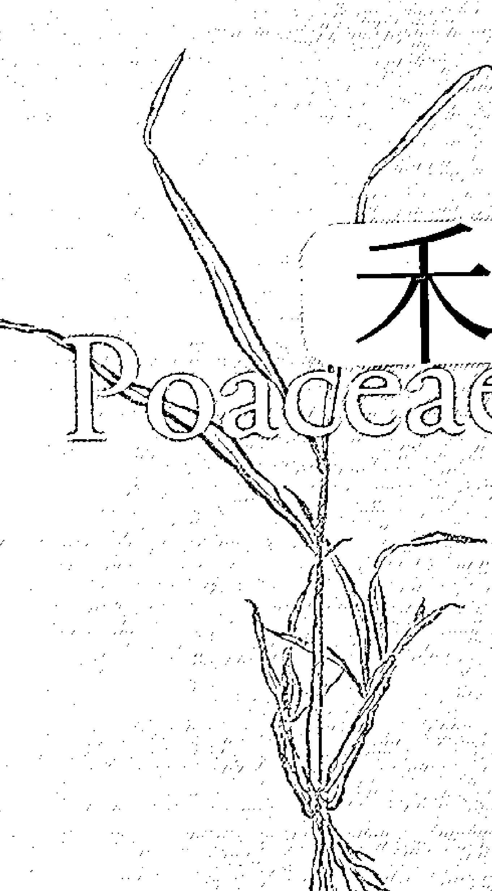

#### 禾本科代表精油
- 岩蘭草 (Vetiveria zizanoides)
- 玫瑰草 (Cymbogon martinii)
- 檸檬香茅 (Cymbopogon flexuosus)

### 植物型態與能量
禾本科植物與人類的關係最密切。地球上絕大部分人口以禾本科為主食，我們吃米飯麵包、食用蔗糖、使用竹子搭鷹架、以牧草養活性畜、用蘆葦編織草席……幾乎生活裡任何一個面向，都離不開禾本科。

雖然禾本科如此重要，長相卻不起眼。他們多為草本，葉片抽得細細長長，莖桿上長出綠黃小花，花謝以後結成穗狀穎果，小小穎果內絕大部分空間，留給了營養豐富的種子與胚芽。

禾本科植物發芽率高，生長點多，可以快速分化分知，一子就「長大成人」，進入植物的生殖階段。正因爲能很快地傳宗接代、改朝換代，所以它能不斷調整自己以配合環境。一變再變的結果，不但讓禾本科種類非常多樣化，成為植物界五大科屬之一，更讓它有超強的適應能力。無論海邊溪畔、峭壁高，都能見到禾本科的足跡。

這些看起來最脆弱、生命最短暫的植物們，其實卻是有韌性而不退縮的。

> 巴斯卡(Pascal)說：「人是會思想的蘆葦。」舊約聖經用禾本科的蘆葦，來形容人類生命之脆弱與短暫。但一根蘆葦如果會思想，就有自覺，知道自己的弱小與環境的強大，承認宇宙中有無數超越自己的東西。

如同海德格(Heidegger)主張人是一種「向死的存在」，只有當人瞥見自身生命的侷限，他真實的存有才有可能從靈魂深處淌流出來。當我們認識自己像禾本科植物一樣隨時會毀滅時，相同地，我們也像它一樣生機無限。

禾本科的根部雖然不深，卻與葉一樣有韌性。他能渡過乾旱季節、熬過草食動物的掠食，只要得到雨水，便能迅速回復綠意。因此在各種遭受過破壞的地區，常常都是先鋒植物，溫度與濕度很少造成影響。

筆者的一位資深芳療前輩，便時常讓我想起禾本科植物。她的生命歷程並不順暢、頗多挫折，但是卻樂天知命，對旁人而言也帶來極大啟發。就像我們可以透過禾本科精油，認識自己的脆弱與堅強，得到小草一般倒了又再站起來的能量(甚至，像打不死的蟑螂)。

### 氣味與能量
禾本科精油的香氣相似度不高，但色彩都很強烈，與其他精油調和後使用，可以將比較「銳角」的部分變得圓融。

植物界很少有像禾本科適應力這麼好的，也很少有像它一樣，能不被人類活動與草食動物嚴重破壞，而和平共存的。禾本科香氣與其他精油之調和度，其實比我們所想像的更高，與調性相似的氣味調和得更好。例如檸檬香茅加檸檬、玫瑰草加玫瑰或花梨木、岩蘭草加穗甘松……在療效與氣味上，組合起來都很不錯。

禾本科的氣味很「草根」，岩蘭草濕軟的泥土香氣自不在話下，而玫瑰草與檸檬香茅帶著薑的辛辣感，也會令人想到「根部」。因此無論氣味屬於高音、中音、或低音，基本上，貼地生長的禾本科，與較低脈輪容易共鳴，精油與下半身的連結都強。

### 臨床身心應用
禾本科精油促進循環的作用好，對血液與淋巴系統均有激勵效果，加上使用在下半身極佳，可以用禾本科精油來處理腳部冰冷、容易瘀血、水腫、靜脈曲張等問題，除了按摩以外，以熱水做足浴並添加精油，效果不錯，足部有黴菌感染狀況的人更值得嘗試。

已經產生的靜脈曲張其實沒辦法完全回復，但卻可用禾本科精油防止它繼續惡化，甚至明顯地淡化顏色與痕跡，尤其如果加入能疏通血脈的精油更佳，不過持續而和緩的運動，恐怕絕不可少。筆者使用檸檬香茅、玫瑰草、零陵香豆作配方內容，為個案調配腿部專用油，效果甚佳。這個個案的職業為教師，使用後除了感到腿部舒緩不痠痛，下肢冰冷與靜脈問題也得到改善。

禾本科精油有益循環，也有益心臟。玫瑰草與心輪對應；檸檬香茅舒緩心悸、高血壓；岩蘭草處理胸悶與冠狀動脈問題。以低劑量調和三種禾本科精油，可作胸口的日常保養油。

這個組合除了能保養心輪，對免疫系統也能調整。玫瑰草與檸檬香茅之抗菌、抗黴、抗病毒效果佳，而玫瑰草與岩蘭草能激勵提升免疫系統。筆者有一個案有細菌性心內膜炎病史，便建議他以此配方作預防保養。

#### 禾本科精油對應的器官
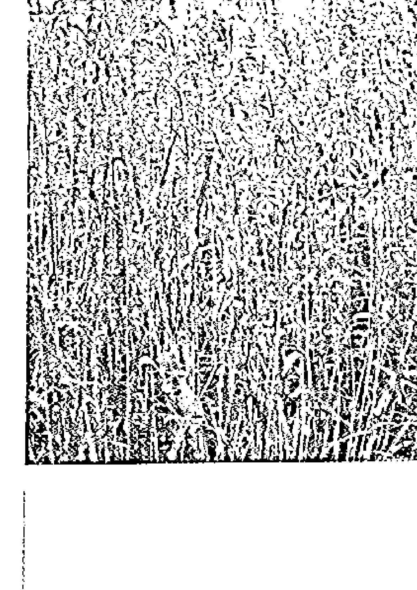

### 玫瑰草 (Palmarosa)
對應部位：生殖區

她的成分雖然不複雜，但氣味卻予人豐富之感，就像萬花筒一樣。對有的人來說，玫瑰草太過活色生香，但對需要得到解放的人而言，玫瑰草有一種替代補償作用，並給冰冷的生活帶來刺激暖化，但不會讓你覺得自己完全變成另一個人。

面皰問題、及長期慢性的生殖泌尿道感染，使用其做保養，效果也很突出。

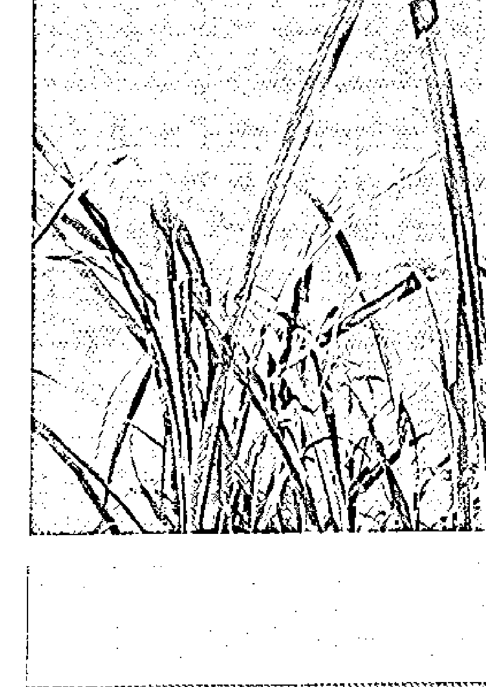

### 檸檬香茅 (Lemongrass)
對應部位：大腿

與台灣出產的香茅油品種不同，香茅成分以香茅醛為主，檸檬香茅則以檸檬醛為主，相較起來，檸檬醛的氣味會更細緻，療效也更強大。

其氣味給人粗莽的聯想，檸檬香茅不僅是筋骨勞動後的好伴，它肢體的、血肉的意象，對上班族、公教族、或四體不動者，都是情緒上良好的提振劑。

檸檬香茅有助促進物質代謝，利排水，這也是它在瘦身方面作用為人稱道的原因。

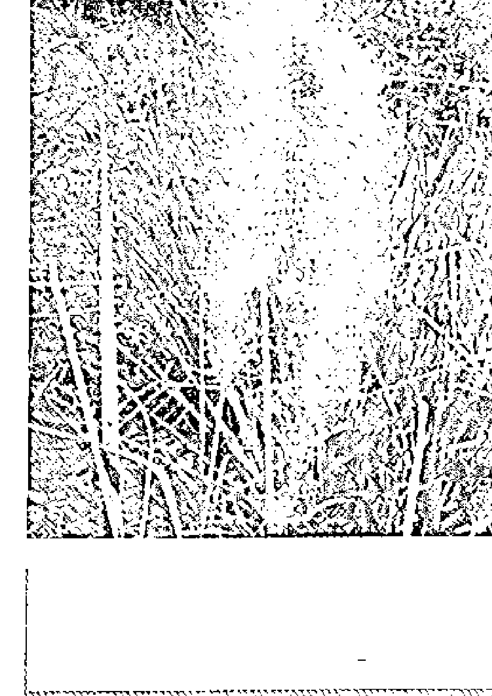

### 岩蘭草 (Vetiver)
對應部位：頭部

肯園芳療師在進行療程前，一定先以岩蘭草純油塗抹太陽神經叢位置，這是強化並保護自我氣場的方式，使能量得以集中。

蘇格拉底以德爾菲神殿上銘刻的「認識你自己」做哲學方法，使用岩蘭草則是另一種讓我們得以回歸中心、認識自己、並體會自我存在根基的方式。

當一個人失去了自我中心，就不口服，臨床上發現以精油的空缺，於是會出現各類上癮症。上癮不見得只針對所謂毒品煙酒，其他像網路依賴、手機成癮(需要時時刻刻與人連繫的需要)，甚至戀母情結、戀女情結等等，都是一種上癮症。處理這類心理症狀，岩蘭草是溫和又有效的選擇。

- 頭部 —— 岩蘭草
- 生殖區 —— 玫瑰草
- 大腿 —— 檸檬香茅

#### 薑科
Zingiberaceae
- 薑 (Zingiber officinalis)
- 豆蔻 (Elettaria cardamomum)
- 鬱金 (Curcuma aromatica)
- 大高良薑 (Alpina galanga)

### 植物型態與能量
薑科植物的共同特色，是肉質的地下莖。地下莖帶有芳香與辛辣，會橫向生長，養分與時間充足的狀況下，地下莖可以蔓延得十分肥厚而巨碩。薑科植物普遍十分耗費地力，需要施肥，通常屬於勞力密集農業，也因此，有機栽種之薑科精油較為稀少而昂貴。

雖然薑科植物全株都有香氣，但精華集中於地下莖與種子。原產於亞洲地區的薑科植物，地下莖與種子作香料使用，也是傳統醫學中常用藥物。

莖的原始功能本來在「支持」與「運輸」，除了支撐植物體之外，還要負責輸送養分與水分，但薑科的地下莖屬於一種變態莖，它的功用已不只於此，而成為營養儲藏器官與繁殖器官。雖然深埋於地底，但地下莖與根還是有明顯分別：觀察薑科地下莖，可以發現上面都有節，葉芽與真正的根，正是從節上長出。

薑科植物將營養蘊藏在沒有人看得到的地底，它的真實能量比外表更巨大，很適合「外實內虛」者使用。無論體形壯而體力弱、或表面風光而內在困窘，都可以用薑科精油，溫和地滋補身心，讓人得到一種充實感。對長期臥病者或老人孕婦，也有補身作用。

所有植物的根部，都能讓人「根著於地」，由薑科地下莖萃取出的精油，但意義上與根部很接近，可以直接反映出土地的能量。在世事浮沉、傍徨無依、精神物質都感到匱乏之時，薑科精油可給予豐碩穩定的力量，使人不去逃避環境。

有一個案，是出國留學，在國外嚴重不適應，因而時常消化不良的男士。筆者建議使用薑精油，結果他決定每次洗頭時，將薑精油添加進洗髮精裡，持續三星期後，消化問題居然有顯著改善。通常大家會認為：若處理腸胃道問題，應該直接在腹部或其他對應用油，此一個案則證實，調理神經系統也能間接處理心因性的消化問題，而薑精油豐富的倍半萜烯類成分，正是安定神經的一帖良藥。

### 香氣與能量
風型人格也很需要薑科精油的協助。風型人格或黃膽汁型人格，興趣多元多變，追求廣泛，卻不易找到自己真正的終極關懷。而薑科精油除了能給予充實感及穩定感，它的氣味也受不愛單調的風型人格喜歡。
因為本科精油香氣，易給人豐富多彩的印象，即使是薑精油，清淡中也有層次，重口味的豆蔻與鬱金，更令人聯想起高更或畢卡索畫作。穩定與變化對薑科精油而言，是可以同時存在的兩種特質，在我心中，薑科是潑辣卻又清純的少女。

### 臨床身心應用
薑科精油最主要的功能是在消化系統方面，包括能夠健胃整腸，及抗黏膜發炎特性。對胃寒、消化不良、胃口不佳、脹氣等情況，都有緩解的效果。
亞熱帶氣候盛產的薑科精油，很適合冬季使用。季節變化時產生的消化系統問題、血行不良、風濕關節問題、慢性疲勞等等，都可運用薑科精油協助之。除了之前提過的「外實內虛」狀況以外，「外熱內冷」體質也最能從它受益。

像肉桂、丁香等其他香料類精油，對完全寒性體質的人影響較大，宛如點起一把火。而薑科的散寒效果則較為溫和，不會助火，外熱內冷的人使用起來會很舒適。

消化系統與第三脈輪相對應，而第三脈輪和自我意志、人際關係等相關，薑科精油是強化第三脈輪的好方法。筆者剛開始從事芳療工作時，曾不熟悉職場文化而屢生挫折，當時一位前輩鼓勵使用豆蔻精油，便開始早晚各一滴純油塗抹太陽神經叢位置。不到三天，滿腹怨氣與脹氣症狀同時消失無蹤。但後續觀察中發現，嚴重的第三脈輪阻塞，使用顏色更鮮黃的鬱金精油，效果似比豆蔻更佳。

性溫和卻也是薑科精油的好處，無論對熱性體質的人，或孕婦及小朋友，都很適用。甚至薑精油還以止孕吐著稱，無論是懷孕初期的嘔吐，或旅途中暈車暈船，只要準備一些薑精油（可再搭配檸檬精油）吸聞，或調成按摩油塗抹頭頸與胸口，都有助改善不適。

薑科植物除了薑最為中國人所使用以外，也是重要的熱帶香料，在印度阿輸吠陀中佔有一席之地，例如鬱金是咖哩粉的主要材料，在許多最新研究中，都顯示其具有抗癌的潛力，大高良薑則正是中藥裡所談到的「紅豆蔻」。

#### 薑科精油對應的器官
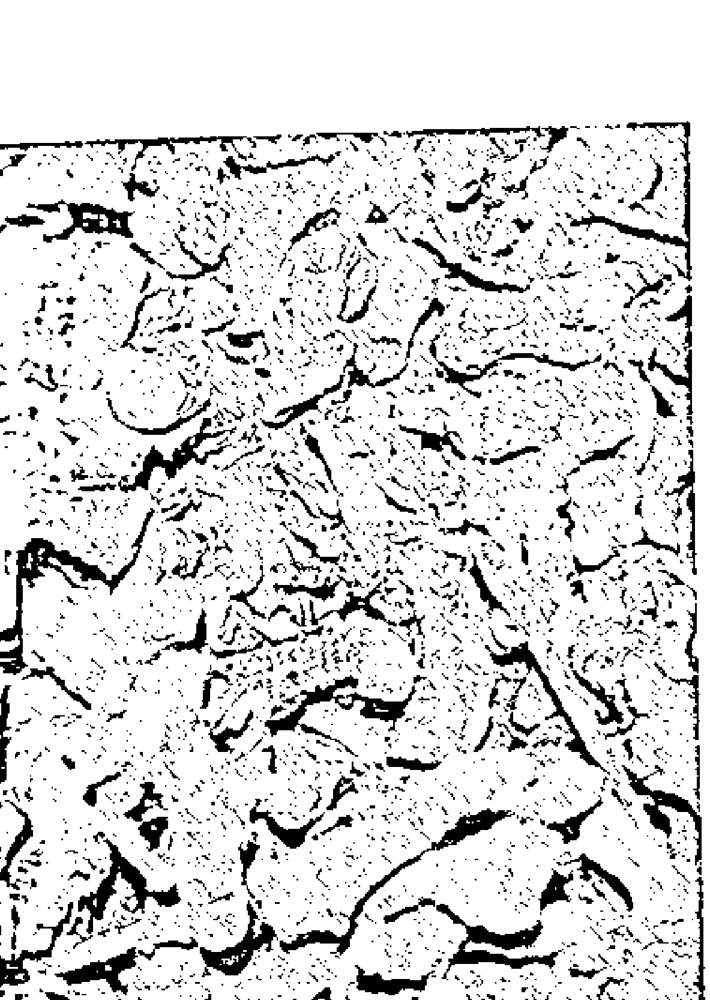

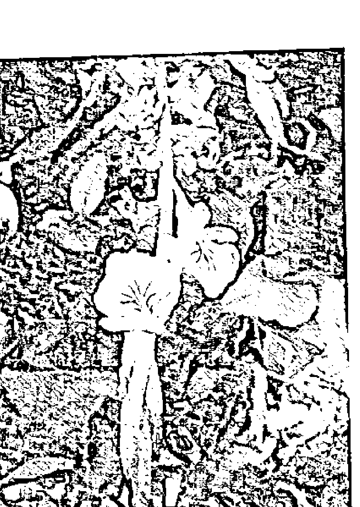

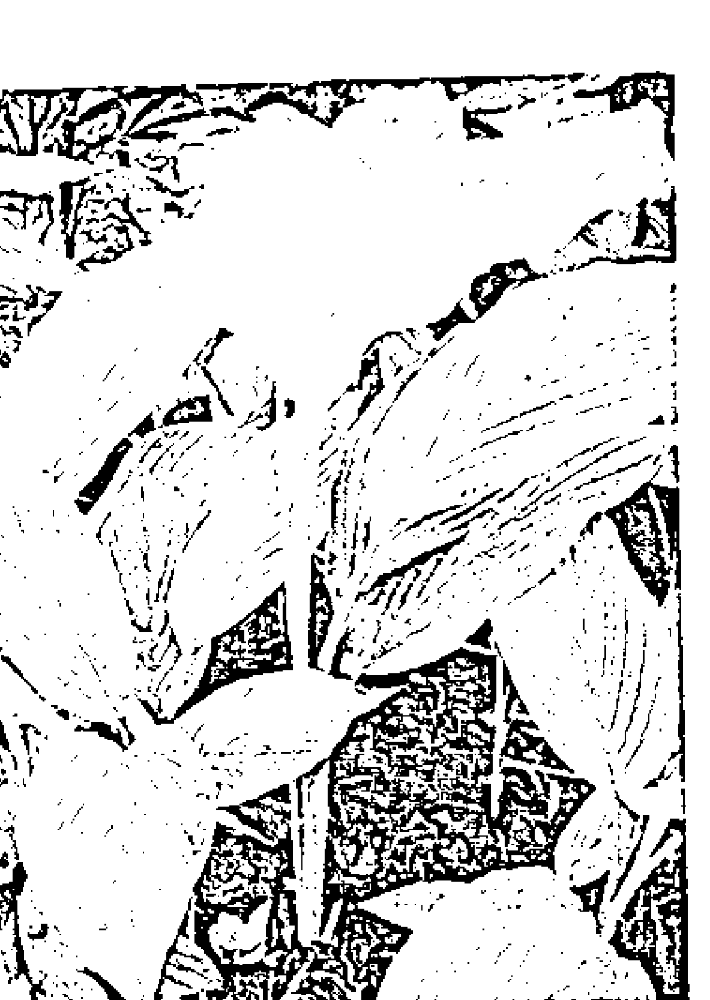

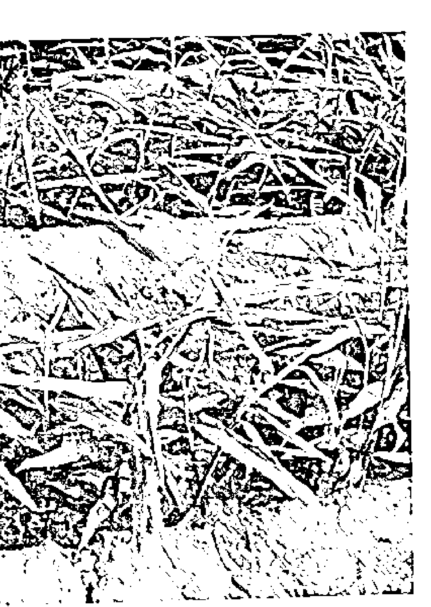

### 大高良薑
對應部位：腸胃

如果想在市場購買，那麼「南薑」這個名詞會比「大高良薑」更為通用，它聞起來辛辣與甜美兼具，給人一種清爽的感受。

情緒方面，大高良薑精油確實也能打開「心有千千結」，它的方式是「大禹治水」，讓快滿溢出來的感受、有紓解與表達的管道，而非理性冷靜地使其昇華。

所以使用大高良薑時，會讓你慢慢地、微微地從壓抑與日常中脫軌，但不會失序。而心中鬱結所造成的胸悶、腹寒等症狀，也跟著迎刃而解。

### 豆蔻
對應部位：腸胃

氧化物類精油裡，豆蔻的酯類成分含量最高，與桉油醇比例接近，因此它能同時兼具激勵與鎮靜效果。一方面增強邏輯、使人頭腦清晰；另一方面又舒緩平和。

除了它種種著名的消化方面效果以外，筆者亦從個案中發現豆蔻精油十分適合用在親子關係當中，對父代母職(或母代父職)的單親家庭，它能帶來嚴謹卻又溫和的力量。

### 薑黃
對應部位：臉部

薑黃的葉片光滑、葉紋深刻，整體線條充滿力道、碧綠耀眼，雖然個頭算不高，卻一派俐落貌，給人一種短小精悍之感。

精油如同原植物一樣個性分明，顏色及氣味突出，需要低劑量使用。目前許多實驗已顯示出薑黃與同屬植物薑黃的抗癌作用，其類黃酮成分也使得它得以抗氧化，因此薑黃能保護細胞，避免內在與外在刺激造成的傷害。

### 薑 (倍半萜烯)
對應部位：脊椎

凡是倍半萜類精油，以及根部類精油，都對神經系統有很大正面影響。薑精油雖然取自地下莖，但以型態來看，可歸類為根部類精油，因此它除了是消化用油、關節用油、也是重要的神經用油。

筆者自身偶受頭痛困擾，在醫院檢查不出什麼異樣，但接受「LET生命能量檢測」時，發現問題可能在腦部下視丘的能量不平衡，經由環指測試並選出薑、檸檬、甜橙等精油。

這個檢測結果非常有意義，因為薑及單萜烯的柑橘類，確實對神經系統有幫助。於是筆者以此來調整了自己的用油方向，以往調整婦科問題皆直接由生殖區入手，後來則改由神經一內分泌系統整體治本，薑精油扮演了相當重要的角色。

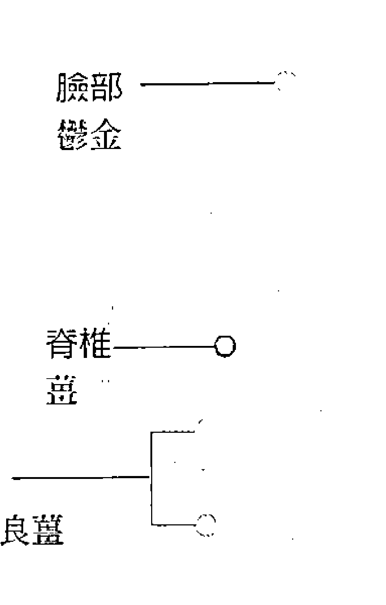

#### 馬鞭草科
Verbenaceae

#### 馬鞭草科代表精油
- 檸檬馬鞭草 (Lippia citriodora)
- 馬纓丹 (Lantana camara)
- 貞節樹 (Vitex agnus castus)

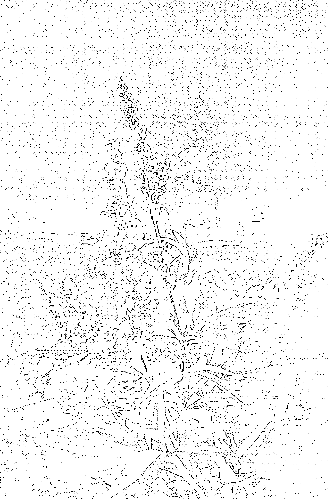

### 植物型態與能量
馬鞭草科植物的茎與枝都是四角形，葉片通常對生（兩兩對稱生長），花莖軟而細長，尾端有些下墜，並且由許多小花在尾端組成花序，看起來就像馬鞭。

馬鞭草科通常是極佳的蜜源植物，野外觀察時，先搜尋馬鞭草科植物，不難發現蝴蝶翩翩飛舞的蹤跡。它們所生的核果亦甜美多汁，是許多鳥類的最愛，而種子不會消化，常常隨著鳥類被帶到新的地方，落地生根。

它們利用花蜜來驅使蜂蝶為自己傳粉，利用果實來驅使鳥類（甚至哺乳類）為自己播種，堪稱將植物傳宗接代的本事，用得淋漓盡致。於是許多馬鞭草科藥草，都入婦科藥，對生殖系統與女性機能有很大助益。

馬鞭草科耐旱性強，可以熱耐高溫炎熱，在荒野或沙灘，都能長得很好。它們看起來野性很強，莖通常很有韌性，加上會生絨毛甚至倒刺，所以不易攀折。講的比較客氣，說馬鞭草科活力充沛、生機蓬勃；講的比較不客氣，會說它們根本長牙舞爪、不易馴服，簡直是植物中的野馬。

因此，筆者會將馬鞭草科精油，應用在有自我貶低傾向的個案身上。特別是長期壓抑、無法表達自己看法的人，或時常怪罪自己、喜歡承擔所有責任的人，甚至處理「受害者情結」。我們能從馬鞭草科植物獲得積極能量，藉著它來抵抗自己或環境所帶來的壓迫。

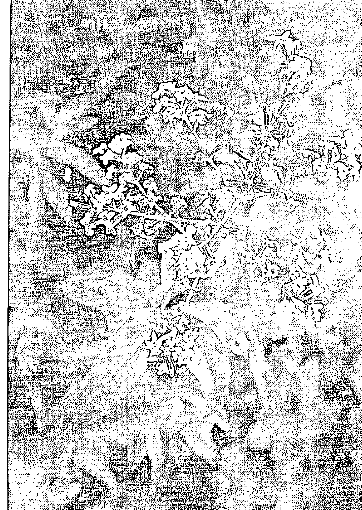

### 香氣與能量
馬鞭草科精油的香氣，帶點苦味與甜味，氣味偏陰性，對女性的影響也比男性強大。

只要少許，它的氣味就對神經系統有所影響。例如可應用於心理排毒的馬纓丹，筆者嘗於醫院內使用「一滴」精油幫癌症個案做按摩，鄰床病患反映說這個氣味讓他不舒服，另一個對方不喜歡的氣味則是喜馬拉雅雪松。由於此兩者皆屬於倍半萜酮類精油，因此鄰床患者的好惡反應，其實是很值得探討的一件事。

### 臨床身心應用
馬鞭草科精油雖然種類不多，重要性卻不容忽視。它們能幫助我們應付工業社會所產生的現代人兩大毛病：一、生殖系統障礙；二、惡性腫瘤。

在生殖系統障礙方面，貞節樹是目前已知唯一一種，能促進黃體素分泌的精油。生活步調、飲食習慣與環境荷爾蒙之害，使得女性出現婦科問題的比率提高，除了生理痛與PMS以外，為子宮肌瘤、子宮內膜異位、卵巢囊腫所苦的人也越來越多。而貞節樹果實之精油或錠劑，能調節腦下腺，使體內荷爾蒙正常化，對以上症狀有緩解效果。

馬纓丹精油可以用來通經、檸檬馬鞭草精油則激勵性腺，它們對生殖系統與器官，都具備調節作用。民間常用之馬鞭草科藥草，也都有類似特性。

在惡性腫瘤方面，根據國外最新報告，貞節樹精油可以用來處理婦科癌症個案，日本廣部千惠子教授之研究更指出，貞節樹精油可以直接抑制與殺死卵巢癌細胞，在試管實驗中也顯示，它具有偵測作用，對正常細胞沒有傷害，卻能選擇性地作用於異常細胞。

醫界目前已知有數種病毒，與癌症關係密切，將來亦可能還有新的發現。而馬纓丹與檸檬馬鞭草精油，有優越抗病毒、抗感染能力，這也象徵了抗腫瘤的潛力，期待日後更多個案與實驗之證明。

#### 馬鞭草科精油對應的器官
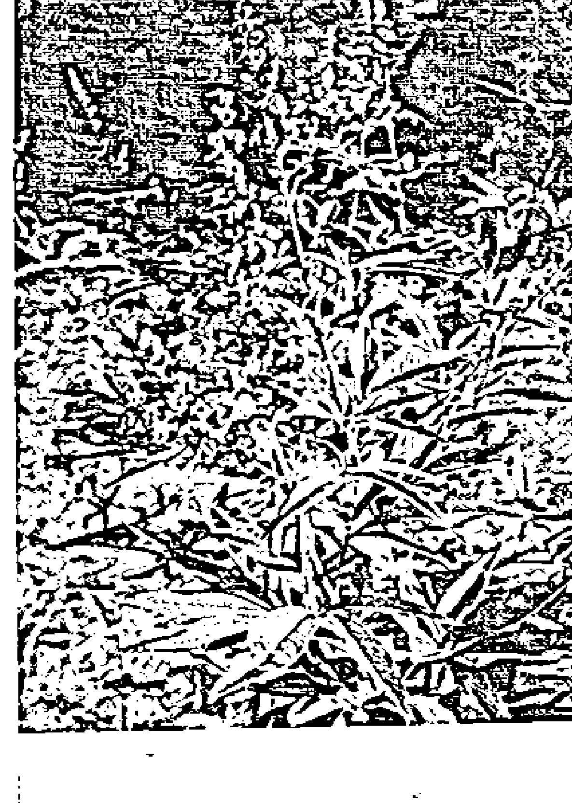

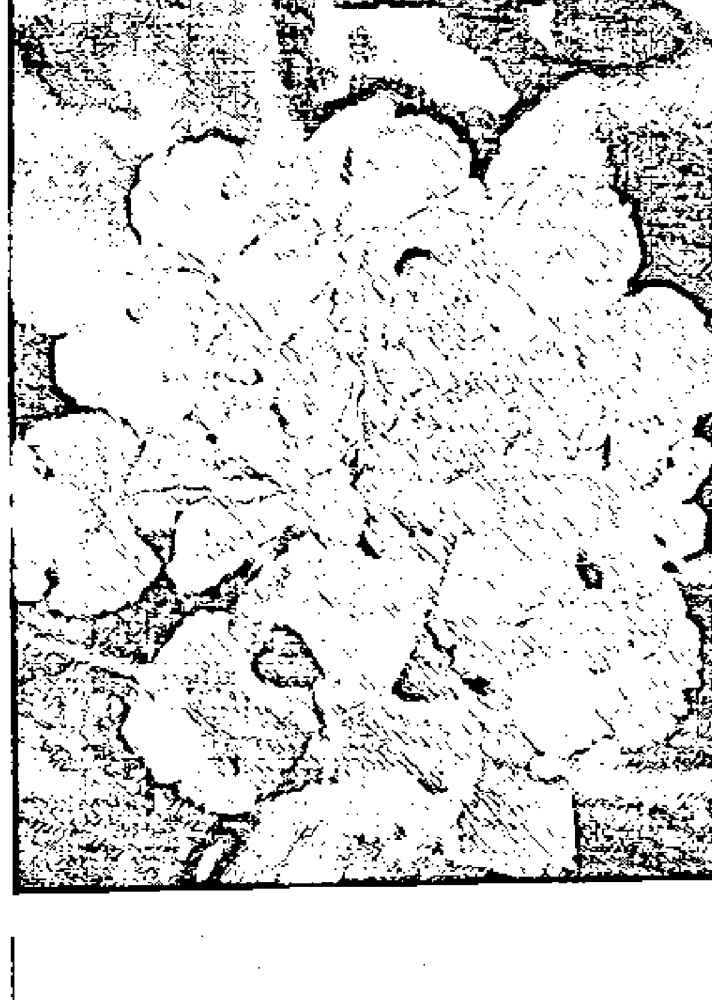

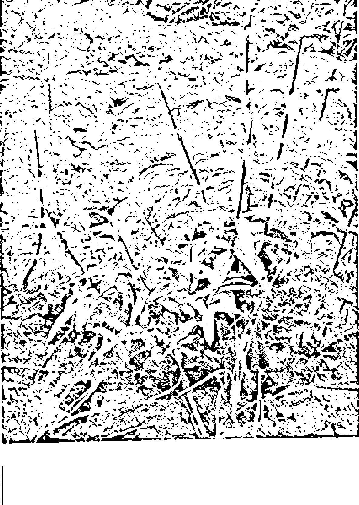

### 貞節樹 (倍半萜酮)
對應部位：生殖區

在國外，貞節樹產品已是健康食品店及藥局的熱門商品，包括酊劑、膠囊、錠劑等等，一般分為枝葉或漿果兩種，以漿果效果較好，而要調理生殖系統方面，確實也該選擇由植物生殖器官（漿果）所萃取者為佳。
學者指出貞節樹的成分能調節腦下腺，促進黃體素，因而可協助處理許多婦科症狀。激勵雌激素的精油有許多種，但已知與黃體素相關的精油卻只有貞節樹，可見其重要性。目前日本清泉女大廣部千惠子教授針對貞節樹抗婦科腫瘤做研究，得到很大進展。而在台灣，實際將貞節樹應用在PMS、經痛、更年期、多囊性卵巢等的症狀緩解，也有許多成功個案。

### 馬纓丹 (倍半萜酮)
對應部位：背部(脊椎)

馬纓丹雖為外來樹種，現在卻是台灣常見植物，它的歸化情況雖然使生態學者頗感憂心，但也證明了其適應力與生命力，只要隨手插枝，就可輕易生長，而長滿銳刺又繾曲的枝幹，更使得其他植物不容易在它身旁找到空間。
無論是有刺的外形、鮮麗花色、或植株的毒性，這都在宣告世界，馬纓丹的特質就是「戰鬥」！「生存」！在倍半萜酮類中，它可謂最具戰爭性格的精油。
馬纓丹精油沒有原植物的毒性，但有原植物的解毒功能。筆者在熱帶雨林區發生不明原因皮膚感染時，馬纓丹精油消炎癒合效果最佳。馬纓丹調節並整合全身系統，以抵禦外侮，宛如重整軍隊，亦是重要的心理排毒油。

### 檸檬馬鞭草 (單萜)
對應部位：胰臟

提到法國的芳香產品，一般多半會聯想到薰衣草，事實上以檸檬馬鞭草氣味為訴求的產品更加盛行，即使大多為混攪品或偽品（因為真品價格太高昂）。真正的檸檬馬鞭草，聞起來不該像檸檬香茅般刺鼻，比較沒那麼激昂，而有種複雜微妙的甜香。
對自我認知錯亂、過著「雙面人生活」的人來說，例如過度膨脹與偽裝、欺騙、不忠、言行不一等等，檸檬馬鞭草能助人跳出二選一的局面，進而得到另一種層次的超脫。

- 背部(脊椎)——馬纓丹
- 胰臟——檸檬馬鞭草
- 生殖區——貞節樹

### 杜鹃花科
Ericaceae

#### 杜鹃花科代表精油
- 格陵兰喇叭茶 (Ledum groenlandicum)
- 白珠树 (Gaultheria procumbens)
- 杜鹃 (Rhododendron anthopogon)

### 植物型態與能量

杜鵑科是分布最廣的植物科屬之一，全球各地都有原生種的杜鵑科植物，變異與種類也特別豐富。一般說來為小喬木或灌木（但也有長到二十多公尺的大型杜鵑科植物），葉片互生——葉片交錯地由枝上長出。花冠裂為五瓣，看起來是漏斗狀或鐘狀。

杜鵑花科是最能在「極限環境」下存活的植物。在日夜溫差大、紫外線強烈的高山地區或北極圈，當針葉樹也消失了蹤跡，杜鵑花科時常是僅存的木本植物。也正因為如此，許多窮山惡水地區，杜鵑花科常是當地最著名之植物，例如喜瑪拉雅山區、中國西南山區等等，尼泊爾甚至以本科的高山杜鵑為國花。

岩礫地表土很少、沼澤地酸度很高，除了苔蘚類以外，一般植物無法生存，但杜鵑花科偏好酸性土，而且根比較淺，故即使是這麼惡劣的環境，還是長得很好。

若只看路邊或校園的觀賞用杜鵑，很難體會杜鵑花科的真正特質。在台灣高山上，看玉山杜鵑、森氏杜鵑等高地植物的生命力，才會被它頑強而高貴之姿態所折服。花季時向陽坡面杜鵑怒放，讓人忘了美麗的花朵背後，其實貧瘠寒冷。

杜鵑花科的根部常被真菌寄生，這些真菌不會讓植株生病，能增進土壤養分的分解，讓杜鵑花科植物吸收利用，反成了對它有幫助的「共生者」。

因此，杜鵑花科精油特別給人堅毅的力量。針葉樹的堅毅是超越得失勝敗的，禾本科的堅毅是百折不撓的，而杜鵑花科的堅毅，則讓人類體會到：與其向生命中的苦難抗議，不如默默地、踏實地尋找問題解決之道。

真菌能協助植物共生，苦難能轉化為養分。若我們受盡試煉，卻能從中找尋意義，得到力量，那麼苦難會是人生裡最值得尊敬的一部分。就像舊約聖經說的：「祂雖然以艱難給你當餅，以困苦給你當水，你的教師卻不再隱藏，你眼必看見你的教師。」

人之所以為人，是因為有自覺與自省能力，並且在苦難中還能維持高貴的心靈。這正是杜鵑科精油所能帶來的啟發與影響。

### 香氣與能量

萃取精油的杜鵑花科植物，都生長在高山與寒帶，它的香氣也特別清而高冷，帶有一種原始潮濕的霧氣。

它予人一種神聖之感，其香氣能促進精神的集中，使疲軟散漫狀況得以提振。杜鵑花科精油的氣味，有助於「精煉」自我。

若用來擴香或使用在頭部，要避免一下子就下太高劑量，或最好搭配低音類的精油來平衡。

### 臨床身心應用

杜鵑花科精油的共同特點，是對「排毒」特別有助益，可養肝、激勵肝腎解毒功能。長期受煙酒、藥物之害，甚至吸毒成癮者，均適合以杜鵑花科精油調理身心。除了能協助排出身體中的毒素，這些精油的能量，能使人脫離「以外物來逃避挫折」的心理狀態。

而生長在極限地帶的杜鵑花科植物，偶有助於調整體內的「氣候」，防止神經與免疫失調所引起的混亂，例如氣喘、風濕、著涼感冒。

> > 傳統上認為杜鵑花科有止痛消炎之效。《神農本草經》（公元220-265 年）中記載杜鵑花：「……味溫辛，主賊風在皮膚中淫淫痛，溫瘧惡毒諸痺。」用來萃取精油的Sunpati杜鵑，除了被拿來製作宗教儀式用的線香，也是喜馬拉雅山區著名的養生飲料，被認為有很好的止痛作用；另外，加拿大原住民曾採集格陵蘭喇叭茶的葉片煮茶，用來治療喉嚨痛與感冒。

白珠樹因含有高量的水楊酸甲酯，其止痛效果原本就為人稱道，但其他杜鵑花科精油的止痛效果是否與傳統用法相符呢？

筆者自身以往每逢天氣變冷變濕，就容易腰痛，生理期前尤其嚴重，這與體質及長期飲食習慣欠佳有關。為此調了數種配方，以杜鵑加甜橙或紅桔為較長期的保養，並常喝薑湯。春夏季節提早保養三個月，該年秋冬起便不再有這類不適。

事實上，杜鵑精油能調節「壞的前列腺素」合成，其單萜烯成分也有近似可的松的效果，因此能消炎止痛，還可應用在皮膚問題與關節問題。而格陵蘭喇叭茶效用廣泛，其抗痙攣特性有止痛作用，與傳統用法十分相符。

#### 杜鵑花科精油對應的器官

對應部位：肝臟

主脈伸出葉端，喜歡生長於濕冷地區，能在沼澤區一帶生長，是極佳的養肝精油。其香氣極易辨認，不會與其他氣味混雜，它的心理處方，是使人在面對重大的道德兩難時，能超越一己之私，做出符合信念的抉擇，且接受這個選擇所帶來的結果。

對應部位：頭部

在喜馬拉雅山區，人們將高山杜鵑視為神聖的植物之一，它的長相與台灣平地的觀賞杜鵑很不一樣，但葉片主脈伸出葉端的此一特徵仍然是相同的。這種杜鵑看似低矮，能量卻是挺拔的，外柔內剛。對外強中乾、不耐試煉的人而言，會有很好的作用。（圖為台灣高山之森氏杜鵑）

對應部位：手臂

與台灣原生的高山白珠樹同屬不同種，不過皆低矮貼地生長。白珠樹精油有抗凝血功能，應避免與類似功能的抗凝血藥品一起使用。它的氣味與市面的酸痛貼布或藥膏類似，但坊間產品幾乎都以人工合成的水楊酸甲酯為成分。白珠樹氣味涼而提振，有如一盞聚光燈，照亮最陰暗的角落，藏在內心深處的欲求得以現形，讓我們正視自己與人性。雖然它不是著名的排毒用油，但其掃除負面心理狀態之特質，卻在臨床上也讓我有數次深刻的體會。（圖為台灣高山白珠樹）

## 複方精油 詮釋法

## ——家族星座分析

## 以煉金術眼光重新看待芳香療法

分析與破解芳療名師的精油配方，是學習自己調油最快速有效的方法。有時候比起自己設計調香，那些芳療名師的配方往往氣味更迷人、反應也更顯著。但是了解複方精油的生理療效很容易，要詮釋它內在的心靈特質卻不簡單。

一般我們對複方精油的詮釋有兩種，其一是單純的「加法」，認為配方的療效便是裡面所有單方療效之加總。其二是「約法」，在裡面的單方中尋找共通療效，求最大公約數，去掉枝枝節節。

但無論是加法或約法，都有其弊病。「加法」變成了單純「1+1=2」，忽視了調香這個動作，調香不只是混合，他更對精油的物質面與精神面產生了變化。「約法」雖然方便，但是當少數成分與其他成分沒有共同方向時，這少數成分卻變得妾身未明，好像只是一種點綴性的香氣而缺乏意義。

讓我們以鍊金術 (Alchemy) 的眼光重新來看待芳香療法。鍊金術是從埃及、古希臘、阿拉伯世界到中世歐洲不斷傳承的一種學術，它同時強調思慮與實踐，並且認為物質與精神是不二分的。

### 賢者之石

從字面上看，人們會以為鍊金術的目的是為了提取黃金，事實上，鍊金術士終生之目的乃製作「賢者之石」 (Philosopher's Stone)，它也被稱為點金石，因為只要少量就能將賤金屬轉變為貴金屬，而這還只是賢者之石的作用之一而已，它甚至還能治療百病、並讓植物回復生機。賢者之石代表宇宙間的第五元素，是神性的物質性顯現。一旦得到賢者之石，鍊金術士就可以把所有的書燒掉，因為世界上再沒有什麼智慧需要再去追求。

為了得到賢者之石，鍊金術士必須先從自然物中分離出單純、單一的元素，例如汞、盐、硫、铁……等。接着再将这些单一元素，以各种复杂的化学方式结合。炼金术的基本原理，就是让相异、对立的元素们合而为一，不只是在物质层面必须相融，元素的心灵层面也需要更进一步地整合。

每一个元素都具特殊意义，他们分别代表天上不同星体，亦代表黄道十二宫与人体器官。简单说来，融合各元素以得到贤者之石，就是要让天地奥秘和宇宙秩序，具体而微地显现在同一个整体上。没有任何单一元素是多余的。

因此当我们以炼金术眼光来检视复方精油时，必须了解每种单方精油，它们各有各的角色，有特定且必须之位置，彼此间亦有特定关系。调香就像炼金步骤，单方植物已经融合为一，他们是一体的。复方精油是个全新的生命，宛如大爆炸后诞生的新物质。

所以要认识复方精油，必须先认识其中每种单方的角色，他们就像一个家族，本身会形成特定故事、特定方向。这就像你抬头望向天，辨认夜空中许多星星的位置，再将这些星星用想像线条串连在一起，最后会得到一个几何图形，从几何图形里，你又发现了它像人类、像自然物、像神明……，一个星座就这样产生了。

因此，这套复方精油的研究与诠释方法，称为「家族星座推演」。其目的在补「加法」和「约法」之不足，成功地诠释复方精油，并且让每瓶复方精油都拥有自己的故事。

### 家族星座推演步骤

- 1. **将配方中的精油做分类**
   拿到一个配方时，先把里面的单方精油分群组。例如根据植物科属、型态、生态、化学结构、气味、疗效、能量等来分组。
- 2. **找出相似油与相异油**
   你会发现有1-2组，其精油数目特别多，这声势浩大的群组即为相似油。而只身落单，没有同伴的，就是相异油。
- 3. **从相似油推演出共通点**
   相似油群组，代表整瓶复方的主要疗效方向。例如若某复方中特别多伞形科精油，則它對消化系統和物質代謝必定特有助益。
- 4. **從相異油推演出平衡點**
   相異油看似方向和整瓶複方呈現者不同，但卻往往是個平衡點。它可以改變整瓶複方的氛圍，扮演畫龍點睛角色，或是平衡整瓶複方的能量，是一個轉折的關鍵。
- 5. **確定每種油的個性位置並重建架構**
   找出相似油和相異油之後，讓我們再根據對各個精油的認識理解，或者根據聞香，來為每個單方賦與特定個性與角色。一旦讓群組與單方性格鮮明化，那就可以讓每個單方找到它在大架構裡的位置，你可以自己建立一段故事，或是引入神話、童話等現成的故事。
- 6. **讓大架構融合濃縮在單一方向上**
   現在你手上有一段精油組成的故事了，他就像一個星座，或者是一首交響曲。對這個星座的圖型，你可以下自己的定義，對這首交響曲，你也可以有自己的心情。無論如何，看似龐大複雜的故事，它必定有一中心主旨，必定對你個人會產生某些意義。找出這個意義來，你便在這個複方上有了全新的視野，因為它代表你的內在心靈，對這個配方產生的共鳴。

### 【案例分析】

品牌名稱 : Ainus

產品名稱 : CT4（單萜烯 4）

成分內容 : 歐白芷、蒔蘿、白松香、乳香、橄欖脂

#### 第 1 階段分析：

型態相似油：白松香、乳香、橄欖脂（樹脂類）
型態相異油：歐白芷、蒔蘿
能量相似油：白松香、乳香、橄欖脂、歐白芷（精神能量）
型態相異油：蒔蘿
主要療效：皮膚與呼吸系統、精神能量的提升

#### 第 2 階段分析：

乳香一直被認為是神聖的香氣，乃各古代宗教中獻祭必備之品，它因為是樹木的病理產物，所以也被認為代表血液，因此也象徵生命。
歐白芷又叫聖靈根，從學名 Angelica archangelica 可以看出，它自古以來就與天使的形象息息相關，因爲備受推崇之療效與喜歡生長於水邊之特性，歐白芷被認爲象徵著療癒天使拉斐爾(Raphael)。
白松香和它的同族兄弟阿魏，是羅馬時代到中古世紀的熱門藥草，但西方人只聞其香、只知其用，卻不知道這種樹脂的本尊是哪種植物。
因爲它強烈有特色的香氣，有一度還被名醫們認爲會導致脹氣，甚至被稱爲是惡魔的氣味。

欖香脂主要產於菲律賓，它與其他橄欖科植物一樣，性喜貧瘠地區。
但欖香脂卻能激勵與補氣，促進細胞再生等身體整體機能，有助補身、戰勝病魔，也讓人產生一種不屈不撓的勇氣和毅力。

蒔蘿的枝葉特別細嫩，其精油也特別適合用來處理小朋友的消化問題，溫和又有效，是理想的兒童用油。

- 乳 香 = 神 （超自然力量的來源、宇宙法則自身）
- 歐白芷 = 天使（拯救、幫助）
- 白松香 = 惡魔（挑戰、負面動力、人性陰影）
- 欖香脂 = 使徒（堅忍、等待）
- 蒔 蘿 = 兒童（新生、單純）

### 【套入故事】

- 可套入埃及神話中最著名的一段故事。
- 乳香 = 歐西里斯 (Osiris)
    - 有高貴的神性，超然的力量，被嫉妒的弟弟塞特所殺
- 白松香 = 塞特 (Set)
    - 狂暴而失去理性，但是他的負面作爲卻讓宇宙得到正面發展整合
- 欖香脂 = 伊西絲 (Isis)
    - 歐西里斯之妻，不屈不撓尋找與拯救丈夫
- 歐白芷 = 阿努比斯 (Anubis)
    - 伸出援手，將歐西里斯製成木乃伊，使其療癒重生
- 蒔蘿 = 何魯斯 (Horus)
    - 伊西斯受死去丈夫靈啟，困頓中所生之子，是太陽神

我們在精神面將歷經死亡、忍耐與等待、療癒、新生……這幾個階段，就像太陽的起落般，由生到死，再由死到生，這是宇宙亙古不變的法則。不公義的惡事之所以會發生，是爲了讓正面力量與負面力量整合，內心的黑暗欲望，也能促成精神的進步。

### 科屬與中英文俗名索引

#### 芸香科

- 葡萄柚 Grapefruit 84
- 苦橙 Orange, Bitter 85
- 甜橙 Orange, Sweet 85
- 苦橙葉 Petitgrain 83
- 橙花 Neroli 83
- 桔 Mandarin 85
- 桔葉 Petitgrain, Mandarin 83
- 檸檬 Lemon 84
- 萊姆 Lime 85
- 佛手柑 Bergamot 83

#### 松科/柏科

- 歐洲赤松 Scotch Pine 25
- 黑雲杉 Black Spruce 24
- 落葉松 European Larch 24
- 歐洲冷杉 Fir, Silver 27
- 膠冷杉 Fir, Baslsam 25
- 西伯利亞冷杉 Fir, Siberian 26
- 道格拉斯杉 Fir, Douglas 27
- 杜松漿果 Juniper Berry 25
- 高地杜松 Juniper, Mountain (Alpine) 27
- 絲柏 Cypress 27
- 喜馬拉雅雪松 Cedar, Himalayan 26
- 大西洋雪松 Cedar, Atlas 26

#### 杜鵑花科

| 科屬 | 精油名稱 | 對應頁碼 |
| :--- | :--- | :--- |
| 杜鵑花科 | 格陵蘭喇叭茶 Labrador Tea | 105 |
| 杜鵑花科 | 杜鵑 Rhododendron | 105 |
| 杜鵑花科 | 白珠樹 Wintergreen | 105 |

#### 傘形科

- 歐白芷根 Angelica 74
- 白松香 Galbanum 74
- 蒔蘿 Dill 75
- 阿密茴 Khella 74
- 小茴香 Cumin 75
- 印度藏茴香 Ajowan / Ajwain 74
- 藏茴香 Caraway / Carvi 75
- 洋茴香 Anise 77
- 茴香 Fennel, Sweet 77
- 芫荽 Coriander 77

#### 橄榄科

- 欖香脂 Elemi 31
- 乳香 Frankincense 31
- 沒藥 Myrrh 31

#### 桃金娘科

- 卡奴卡 Kanuka 46
- 茶樹 Ti Tree / Tea Tree 42
- 松紅梅 Manuka 42
- 檸檬香桃木 Lemon Myrtle 44
- 檸檬細籽 Lemon-scented Tea Tree 43
- 檸檬尤加利 Lemon Eucalyptus 43
- 藍膠尤加利 Eucalyptus, Blue gum 45
- 澳洲尤加利 Eucalyptus radiata 45
- 史密斯尤加利 Eucalyptus smithii 45
- 綠花白千層 Niaouli 47
- 白千層 Cajeput 47
- 香桃木 Myrtle 43
- 薄荷尤加利 Eucalyptus, Peppermint 46
- 多苞葉尤加利 Eucalyptus polybractea 47
- 丁香 Clove 46

#### 馬鞭草科

- 貞節樹 Vitex / Chaste Tree 81
- 馬纓丹 Lantana 81
- 檸檬馬鞭草 Lemon Verbena 81

#### 菊科

- 羅馬洋甘菊 Chamomile, Roman 52
- 德國洋甘菊 Chamomile, German 54
- 摩洛哥藍艾菊 Blue Tansy 53
- 野洋甘菊 Chamomile, Wild 54
- 永久花 Immortelle / Everlasting 52
- 印蒿 Davana 53
- 南木蒿 Artemisia arborescens 52
- 土木香 Inula / Elecampane 53
- 艾草 Mugwort 55
- 圓葉當歸 Lovage 76
- 芹菜 Celery 76
- 歐芹 Parsley 77
- 胡蘿蔔籽 Carrot Seed 77
- 龍艾 Tarragon 53
- 萬壽菊 Tagetes 55
- 西洋蓍草 Yarrow 55

#### 唇形科

- 快樂鼠尾草 Clary Sage 66
- 鼠尾草 Sage 66
- 牛膝草 Hyssop 63
- 高地牛膝草 Hyssop, Highland 63
- 真正薰衣草 Lavender, True 60
- 頭狀薰衣草 Lavender, French 61
- 穗花薰衣草 Lavender, Spike 60
- 醒目薰衣草 Lavandin 63
- 沉香醇百里香 Thyme, Linalol 67
- 側柏醇百里香 Thyme, Thuyanol 65
- 龍腦百里香 Thyme, Borneol 65
- 百里酚百里香 Thyme, Thymol 64
- 蜂香薄荷 Bergamot Mint 67
- 胡椒薄荷 Peppermint 64
- 綠薄荷 Spearmint 64
- 檸檬薄荷 Lemon Mint 61
- 冬季香薄荷 Winter Savory 67
- 甜羅勒 Basil 62
- 熱帶羅勒 Basil, Tropical 65
- 神聖羅勒 Tulsi / Holy Basil 68
- 野馬鬱蘭 Oregano 63
- 馬鬱蘭 Marjoram 61
- 桉油醇迷迭香 Rosemary, Cineol 64
- 樟腦迷迭香 Rosemary, Camphor 68
- 馬鞭草酮迷迭香 Rosemary, Verbenone 65
- 香蜂草 Melissa 62
- 廣藿香 Patchouli 68

#### 豆科

- 秘魯香脂 Peru Balsam 89
- 鷹爪豆 Broom 89
- 銀合歡 Mimosa 89
- 零陵香豆 Tonka 89

#### 薑科

- 大高良薑 Galanga 97
- 豆蔻 Cardamom 97
- 鬱金 Tumeric / Turmeric 97
- 薑 Ginger 97

#### 樟科

- 花梨木 Rosewood 36
- 芳樟 Ho 37
- 樟樹 Camphor 36
- 山雞椒 Litsea / May Chang 36
- 中國肉桂 Cassia 37
- 錫蘭肉桂 Cinnamon 37
- 羅文莎葉 Ravensara 36
- 月桂 Bay / Laurel 37

#### 禾本科

- 玫瑰草 Palmarosa 93
- 檸檬香茅 Lemongrass 93
- 岩蘭草 Vetiver 93## 學名索引

#### A
- Abies alba 歐洲冷杉 27
- Abies balsamea 膠冷杉 25
- Abies sibirica 西伯利亞冷杉 26
- Acacia dealbata 銀合歡 89
- Achillea millefolium 西洋蓍草 55
- Alpinia galanga 大高良薑 97
- Ammi visnaga 阿密茴 74
- Anethum graveolens 莳蘿 75
- Angelica archangelica 歐白芷根 74
- Aniba rosaeodora 花梨木 36
- Anthemis nobilis 羅馬洋甘菊 52
- Apium graveolens 芹菜 76
- Artemisia arborescens 南木蒿 52
- Artemisia dracunculus 龍艾 53
- Artemisia pallens 印蒿 53
- Artemisia vulgaris 艾草 55

#### B
- Backhousia citriodora 檸檬香桃木 44
- Boswellia carterii 乳香 31

#### C
- Canarium luzonicum 欖香脂 31
- Carum carvi 藏茴香 75
- Cedrus atlantica 大西洋雪松 26
- Cedrus deodara 喜馬拉雅雪松 26
- Cinnamomum camphora 芳樟 37
- Cinnamomum camphora 樟樹 36
- Cinnamomum cassia 中國肉桂 37
- Cinnamomum verum 錫蘭肉桂 37
- Citrus aurantium 苦橙 85
- Citrus aurantium 苦橙葉 83
- Citrus aurantium 橙花 83
- Citrus aurantifolia / Citrus limetta 萊姆 85
- Citrus bergamia 佛手柑 83
- Citrus limonum / Citrus limon 檸檬 84
- Citrus paradisi 葡萄柚 84
- Citrus reticulata 桔 85
- Citrus reticulata 桔葉 83
- Citrus sinensis 甜橙 85
- Commiphora myrrha 沒藥 31
- Coriandrum sativum 芫荽 77
- Cuminum cyminum 小茴香 75
- Cupressus sempervirens 絲柏 27
- Curcuma aromatica 鬱金 97
- Cymbopogon flexuosus / Cymbopogon citratus 檸檬香茅 93
- Cymbopogon martinii 玫瑰草 93

#### D
- Daucus carota 胡蘿蔔籽 76
- Dipteryx odorata 零陵香豆 89

#### E
- Elettaria cardamomum 豆蔻 97
- Eucalyptus citriodora 檸檬尤加利 43
- Eucalyptus dives 薄荷尤加利 46
- Eucalyptus globulus 藍膠尤加利 45
- Eucalyptus polybractea 多苞葉尤加利 47
- Eucalyptus radiata 澳洲尤加利 45
- Eucalyptus smithii 史密斯尤加利 45
- Eugenia caryophyllata 丁香 46

#### F
- Ferula galbaniflua 白松香 74
- Foeniculum vulgare 茴香 77

#### G
- Gaultheria fragrantissima / Gaultheria groenlandicum 白珠樹 105

#### H
- Helichrysum italicum 永久花 52
- Hyssopus officinalis 牛膝草 63
- Hyssopus officinalis var. decumbens 高地牛膝草 63

#### I
- Inula graveolens 土木香 53

#### J
- Juniperus communis 杜松漿果 25
- Juniperus communis var. montana 高地杜松 27

#### L
- Lantana camara 馬纓丹 81
- Larix europaea 落葉松 24
- Laurus nobilis 月桂 37
- Lavandula vera / Lavandula angustifolia / Lavandula officinalis 真正薰衣草 60
- Lavandula stoechas 頭狀薰衣草 61
- Lavandula latifolia / Lavandula spicata 穗花薰衣草 60
- Lavandula hybrida 醒目薰衣草 63
- Ledum groenlandicum 格陵蘭喇叭茶 105
- Leptospermum citratum / Leptospermum petersonii 檸檬細籽 43
- Leptospermum ericoides / Kunzea ericoides 卡奴卡 46
- Leptospermum scoparium 松紅梅 42
- Levisticum officinale 圓葉當歸 76
- Lippia citriodora 檸檬馬鞭草 81
- Litsea cubeba 山雞椒 36

#### M
- Melaleuca quinquenervia 綠花白千層 47
- Melaleuca cajuputii 白千層 47
- Melaleuca alternifolia 茶樹 42
- Melissa officinalis 香蜂草 62
- Mentha citrata 檸檬薄荷 61
- Mentha piperita 胡椒薄荷 64
- Mentha spicata 綠薄荷 64
- Monarda fistulosa / Monarda didyma 蜂香薄荷 67
- Myroxylon balsamum 秘魯香脂 89
- Myrtus communis 香桃木 43
- Matricaria recutita / Chamomilla recutita 德國洋甘菊 54

#### O
- Ocimum basilicum 甜羅勒 62
- Ocimum basilicum 熱帶羅勒 65
- Ocimum sanctum 神聖羅勒 68
- Origanum majorana 馬鬱蘭 61
- Origanum vulgare 野馬鬱蘭 63
- Ormenis multicaulis / Ormenis mixta 野洋甘菊 54

#### P
- Petroselinum sativum 歐芹 77
- Picea mariana 黑雲杉 24
- Pimpinella anisum 洋茴香 77
- Pinus sylvestris 歐洲赤松 25
- Pogostemon patchouli / Pogostemon cablin 廣藿香 68
- Pseudotsuga menziesii 道格拉斯杉 27

#### R
- Ravensara aromatica 羅文莎葉 36
- Rhododendron anthopogon 杜鵑 105
- Rosmarinus officinalis 桉油醇迷迭香 64
- Rosmarinus officinalis 樟腦迷迭香 68
- Rosmarinus officinalis 馬鞭草酮迷迭香 65

#### S
- Salvia officinalis 鼠尾草 66
- Salvia sclarea 快樂鼠尾草 66
- Satureja montana 冬季香薄荷 67
- Spartium junceum 鷹爪豆 89

#### T
- Tagetes minuta / Tagetes patula 萬壽菊 55
- Tanacetum annuum 摩洛哥藍艾菊 53
- Thymus satureioides 龍腦百里香 65
- Thymus vulgaris 沉香醇百里香 67
- Thymus vulgaris 側柏醇百里香 65
- Thymus vulgaris / Thymus zygis 百里酚百里香 64
- Trachyspermum ammi / Trachyspermum copticum 印度藏茴香 74

#### V
- Vetiveria zizanioides 岩蘭草 93
- Vitex agnus castus 貞節樹 81

#### Z
- Zingiber officinale 薑 97

### 化學結構與中英文俗名索引

#### 單萜烯類
- 葡萄柚 Grapefruit 84
- 桔 Mandarin 85
- 苦橙 Orange, Bitter 85
- 甜橙 Orange, Sweet 85
- 檸檬 Lemon 84
- 萊姆 Lime 85
- 歐洲赤松 Scotch Pine 25
- 黑雲杉 Black Spruce 24
- 落葉松 European Larch 24
- 歐洲冷杉 Fir, Silver 27
- 膠冷杉 Fir, Balsam 25
- 西伯利亞冷杉 Fir, Siberian 26
- 道格拉斯杉 Fir, Douglas 27
- 杜松漿果 Juniper Berry 25
- 高地杜松 Juniper, Mountain (Alpine) 27
- 絲柏 Cypress 27
- 格陵蘭喇叭茶 Labrador Tea 105
- 杜鵑 Rhododendron 105
- 歐白芷根 Angelica 74
- 白松香 Galbanum 74
- 蒔蘿 Dill 75
- 欖香脂 Elemi 31
- 乳香 Frankincense 31
- 卡奴卡 Kanuka 46
- 貞節樹 Vitex / Chaste Tree 81

#### 酯類
- 羅馬洋甘菊 Chamomile, Roman 52
- 快樂鼠尾草 Clary Sage 66
- 苦橙葉 Petitgrain 83
- 檸檬薄荷 Lemon Mint 61
- 真正薰衣草 Lavender, True 60
- 醒目薰衣草 Lavandin 63
- 佛手柑 Bergamot 83

#### 苯基酯類
- 白珠樹 Wintergreen 105
- 秘魯香脂 Peru Balsam 89
- 鷹爪豆 Broom 89
- 銀合歡 Mimosa 89
- 桔葉 Petitgrain, Mandarin 83
- 大高良薑 Galanga 97
- 阿密茴 Khella 74

#### 單萜醇類
- 花梨木 Rosewood 36
- 芳樟 Ho 37
- 芫荽 Coriander 77
- 沉香醇百里香 Thyme, Linalol 67
- 側柏醇百里香 Thyme, Thuyanol 65
- 龍腦百里香 Thyme, Borneol 65
- 蜂香薄荷 Bergamot Mint 67
- 胡椒薄荷 Peppermint 64
- 甜羅勒 Basil 62
- 馬鬱蘭 Marjoram, Sweet 61
- 玫瑰草 Palmarosa 93
- 橙花 Neroli 83
- 茶樹 Ti Tree / Tea Tree 42
- 野洋甘菊 Chamomile, Wild 54

#### 倍半萜酮類
- 松紅梅 Manuka 42
- 永久花 Immortelle / Everlasting 52
- 印蒿 Davana 53
- 喜馬拉雅雪松 Cedar, Himalayan 26
- 大西洋雪松 Cedar, Atlas 26
- 馬纓丹 Lantana 81

#### 香豆素與內酯類
- 零陵香豆 Tonka 89
- 土木香 Inula / Elecampane 53
- 圓葉當歸 Lovage 76
- 芹菜 Celery 76

#### 醛類
- 檸檬香桃木 Lemon Myrtle 44
- 檸檬細籽 Lemon-scented Tea Tree 43
- 檸檬尤加利 Lemon Eucalyptus 43
- 檸檬香茅 Lemongrass 93
- 山雞椒 Litsea / May Chang 36
- 檸檬馬鞭草 Lemon Verbena 81
- 香蜂草 Melissa 62
- 小茴香 Cumin 75

#### 氧化物類
- 藍膠尤加利 Eucalyptus, Blue gum 45
- 澳洲尤加利 Eucalyptus radiata 45
- 史密斯尤加利 Eucalyptus smithii 45
- 綠花白千層 Niaouli 47
- 白千層 Cajeput 47
- 香桃木 Myrtle 43
- 羅文莎葉 Ravensara 36
- 月桂 Bay / Laurel 37
- 豆蔻 Cardamom 97
- 桉油醇迷迭香 Rosemary, Cineol 64
- 高地牛膝草 Hyssop, Highland 63
- 穗花薰衣草 Lavender, Spike 60

#### 酚類
- 中國肉桂 Cassia 37
- 錫蘭肉桂 Cinnamon 37
- 丁香 Clove 46
- 神聖羅勒 Tulsi / Holy Basil 68
- 野馬鬱蘭 Oregano 63
- 冬季香薄荷 Winter Savory 67
- 印度藏茴香 Ajowan / Ajwain 74
- 百里酚百里香 Thyme, Thymol 64

#### 單萜酮類
- 頭狀薰衣草 Lavender, French 61
- 艾草 Mugwort 55
- 鼠尾草 Sage 66
- 牛膝草 Hyssop 63
- 藏茴香 Caraway / Carvi 75
- 萬壽菊 Tagetes 55
- 樟樹 Camphor 36
- 薄荷尤加利 Eucalyptus, Peppermint 46
- 多苞葉尤加利 Eucalyptus polybractea 47
- 綠薄荷 Spearmint 64
- 樟腦迷迭香 Rosemary, Camphor 68
- 馬鞭草酮迷迭香 Rosemary, Verbenone 65

#### 醚類
- 熱帶羅勒 Basil, Tropical 65
- 龍艾 Tarragon 53
- 洋茴香 Anise 77
- 茴香 Fennel, Sweet 77
- 歐芹 Parsley 77

#### 倍半萜烯類
- 西洋蓍草 Yarrow 55
- 德國洋甘菊 Chamomile, German 54
- 南木蒿 Artemisia arborescens 52
- 摩洛哥藍艾菊 Blue Tansy 53
- 鬱金 Tumeric / Turmeric 97
- 薑 Ginger 97
- 沒藥 Myrrh 31

#### 倍半萜醇
- 胡蘿蔔籽 Carrot Seed 76
- 岩蘭草 Vetiver 93
- 廣藿香 Patchouli 68

## 活動1
探索潛藏在植物與身體深處的能量和美感

凡購買此書憑本券，即可免費參加2005年5~12月肯園香氣私塾"偶得新知"課程一次
請勾選欲參加之課程，填妥此表背面資料寄至肯園 台北市大安區光復南路二段133號5樓，註明"香氣私塾"收

- 五月 老鷹，再見 (5/8) 下午2:00~4:00
- 六月 凱龍能量治療 (6/12) 下午2:00~4:00
- 七月 自我照護工作坊 (7/24) 下午2:00~4:00
- 八月 芳香肢體能量療法 (8/13) 下午2:00~4:00
- 九月 生活在他方 (9/3) 下午2:00~4:00
- 十月 自然療法 - 回春篇(Anti-Aging) (10/1) 下午2:00~4:00
- 十一月 你的音樂的處方箋 - 音樂治療 (11/6) 下午2:00~4:00
- 十二月 神秘嘉賓 (日期未定) 下午2:00~4:00

- 因每堂課皆有課程人數限制，請盡早報名以免向隅
- 肯園香氣私塾 教室地點 台北市大安區復興南路二段151巷3號4樓
- 肯園網址：http://www.canjune.com.tw
- 詢問專線：02-2708-1279 #15 鄭小姐

## 活動2
凡購買此書憑本券，即可免費參加2005年5~12月肯園香氣私塾"生活探索理論篇"一個單元（共三次）
請勾選欲參加之課程，填妥此表背面資料寄至肯園 台北市大安區光復南路二段133號5樓，註明"香氣私塾"收

- 數字的神祕花園 5月15~29日 每週日下午2:00~4:00 共三次
導覽資料《生命密碼》商周出版
- 品味倫敦&流行音樂 6月5日~26日 每週日下午2:00~4:00 共三次
- 植物 焚香 儀式 7月3日~17日 每週日下午2:00~4:00 共三次
- 寵物的芳香療法 8月7日~21日 每週日晚上7:00~9:00 共三次
導覽資料《寵物的芳香療法》世茂出版
- 香氣讀書會 9月4日~25日 每週日下午2:00~4:00 共三次
導覽資料《牧羊少年奇遇記》保羅柯爾賀著 時報出版
《卡夫卡變形記》卡夫卡著 晨星出版
《追憶似水年華》普魯司特著
- 聲、舞、寂、靜 10月9日~23日 每週日下午2:00~4:00 共三次
導覽資料《坎伯生活美學》立緒出版
《耶穌也說禪》心靈工作坊出版
- 虹光療法 11月13日~27日 每週日下午2:00~4:00 共三次
- 純露芳香療法 12月11日~25日 每週日下午2:00~4:00 共三次

- 因每堂課皆有課程人數限制，請盡早報名以免向隅
- 肯園香氣私塾 教室地點 台北市大安區復興南路二段151巷3號4樓
- 肯園網址：http://www.canjune.com.tw
- 詢問專線：02-2708-1279 #15 鄭小姐

## 活動3
凡持本券至肯園消費2小時依沙蘭伸展療程（限當次付費）
即可獲得Anius CT系列複方柑橘屬類精油10ML一瓶（葡萄柚、桔、苦橙、檸檬、萊姆）價值600元
使用期限：2005/04/20~2005/12/31止

- 本券使用地點：限肯園香覺戲體（新生店）與清嬉原室（ATT店）兩家店
香覺戲體 台北市新生南路一段97巷25號 <捷運忠孝新生站3號出口> (02) 2772-1801
清嬉原室 台北市忠孝東路四段219號2樓 <ATT旗艦廣場AVEDA2樓> (02) 2772-0466
- 肯園網址：http://www.canjune.com.tw

讀者姓名：______________________ 生　　日：______________________
E-mail：________________________ 電　　話：______________________
住　　址：____________________________________________________
職　　業：____________________________________________________

-   您從何處得知本書訊息
您瞭解芳香療法的方式　□上課　□看書　□上網　□與專業人士討論
您有興趣收到肯園電子報嗎？　□有　□無
您是否有參加過肯園香氣私塾　□是　□否
精油對您來說是屬於　□休閒生活　□美容保養　□醫療保健　□靜坐冥想
您選購精油的途徑　□網購　□郵購　□店內　□其他
(以上皆可複選)

讀者姓名：______________________ 生　　日：______________________
E-mail：________________________ 電　　話：______________________
住　　址：____________________________________________________
職　　業：____________________________________________________

-   您從何處得知本書訊息
您瞭解芳香療法的方式　□上課　□看書　□上網　□與專業人士討論
您有興趣收到肯園電子報嗎？　□有　□無
您是否有參加過肯園香氣私塾　□是　□否
精油對您來說是屬於　□休閒生活　□美容保養　□醫療保健　□靜坐冥想
您選購精油的途徑　□網購　□郵購　□店內　□其他
(以上皆可複選)

讀者姓名：______________________ 生　　日：______________________ 職　　業：______________________
E-mail：________________________ 電　　話：______________________
住　　址：____________________________________________________

-   您從何處得知本書訊息
您瞭解芳香療法的方式　□上課　□看書　□上網　□與專業人士討論
您有興趣收到肯園電子報嗎？　□有　□無
您是否有參加過肯園香氣私塾　□是　□否
精油對您來說是屬於　□休閒生活　□美容保養　□醫療保健　□靜坐冥想

## ANYUS神話之旅
尋自我神話原型
傾聽四季流轉 創造生命神話

## 全新ANYUS生命情境用油系列 即將於五月正式上市
探索潛藏在植物與身體深處的能量和美感

### ANYUS生命情境用油系列
- 植物油沛芳
- 純露沛芳
- 按摩沛芳
- 薰泡沛芳
- 滾珠沛芳

肯園
Aromatology Healing Sanctuary
www.canjune.com.tw

香覺戲體 台北市新生南路一段97巷25號1樓
Tel 02-27721801 Fax 02-27721802

清嬉原室 台北市忠孝東路四段219號2樓<ATT旗艦廣場 AVEDA二樓>
Tel 02-27720466 Fax 02-27516261

雲天芳泉 台北市敦化南路二段201號40樓<遠東飯店>
Tel 02-23763165 Fax 02-23763159

翠湖芳庭 台北縣烏來鄉堰堤3號<春秋烏來渡假酒店>
Tel 02-26617610 Fax 02-26617622

## 植物精油能量全書
The complete guide to Essential Oils Energy

- 總 策 劃：肯園香氣私塾
- 作 者：許怡蘭
- 攝 影：許怡蘭、劉秀蓮、溫佑君、許麗香、陳品玫、張倉雅、陳星羽、陳逸宏、詹逸棠、劉寅生
- 手繪植物：吳佳陵
- 版面構成：舞陽美術、張淑珍
- 校 對：陳煥雅、吳效真
- 責任編輯：廖秀淩

- 發 行 人：何飛鵬
- 法律顧問：中天國際法律事務所 周奇杉律師
- 出 版：商周出版
  - 台北市民生東路2段141號9樓
  - 電話：(02)2500-7008 傳真：(02)2500-7759
  - E-mail：bwp.service@cite.com.tw

- 發 行：英屬蓋曼群島商家庭傳媒股份有限公司 城邦分公司
  - 讀者服務專線：0800-020-299 24小時傳真服務：02-2517-0999
  - 劃撥帳號：19833503
  - 戶名：英屬蓋曼群島商家庭傳媒股份有限公司城邦分公司

- 香港發行所：城邦(香港)出版集團有限公司
  - 香港灣仔軒尼詩道235號3樓
  - 電話：(852) 2508 6231 或 2508 6217 傳真：(852) 2578 9337

- 馬新發行所：城邦（馬新）出版集團
  - Cité (M) Sdn. Bhd. (458372 U)
  - 11, Jalan 30D/146, Desa Tasik, Sungai Besi, 57000 Kuala Lumpur, Malaysia.
  - 電話：603-9056 3833 傳真：603-9056 2833
  - email : citekl@cite.com.tw

- 印 刷：中原造像股份有限公司
- 總 經 銷：農學社
  - 電話：(02)2917-8022 傳真：(02)2915-6275

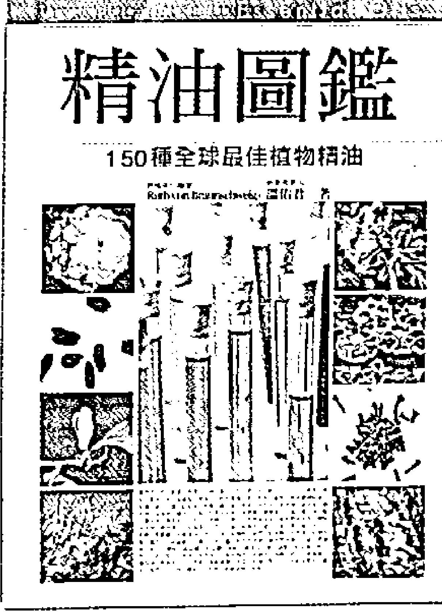

### 延伸閱讀

## 《精油圖鑑》
150種全球最佳植物精油
作者◎Ruth von Braunschweig／溫佑君
定價◎450元

Ruth von Braunschweig是德國生化學者同時又是國際知名的芳療專家。在本書中，她和肯園溫佑君老師合作將她發明的「茹絲的蛋」，以一目瞭然的方式介紹150種精油成分，使初學者能盡快掌握各種精油的身心療效。

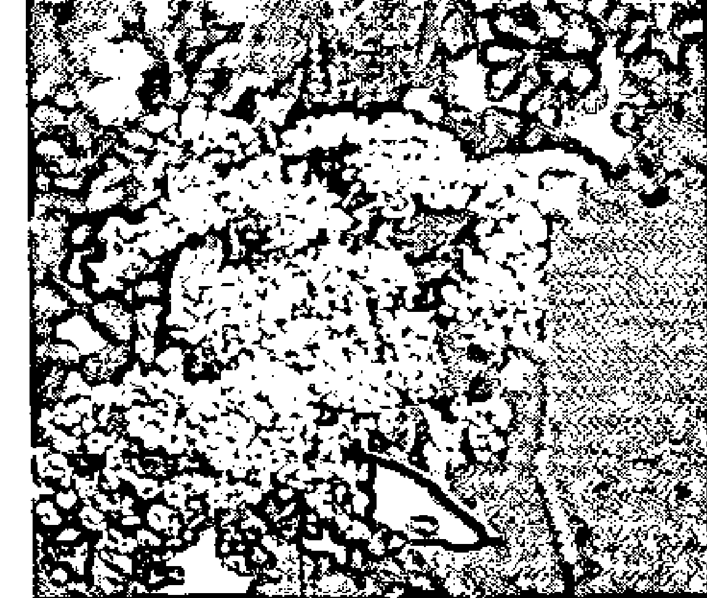

## 認識119種植物精油的身心能量
植物精油能量全書
The complete guide to Essential Oils Energy

你還在看從A到Z排列的精油書嗎？你可知道精油的身心療效不需要死背，而有一套簡易清楚的原則可以遵循？透過對不同植物科屬的理解，讓你在短時間內就建立一套正確的芳療使用概念。

以植物科屬來為精油作區分，讓讀者不再單純地將精油只當作產品或藥品看待，且更系統性地掌握芳香療法的應用方向。

植物型態與能量 從植物的外型或生態特徵，來了解植物與精油的性格。

香氣與能量 透過植物精油的香氣來感受精油帶來的身心能量。

身心特質 書中內容大多出自作者近年來的學習心得，部分資料得自臨床經驗，某些理論則來自哲學觀點。

精油小百科 針對119種單方精油，做深入淺出的解說，匯集了芳療師的產地觀察和臨床經驗，包括坊間書籍少有收列的重要精油，是擴展你芳療眼界的踏腳石。

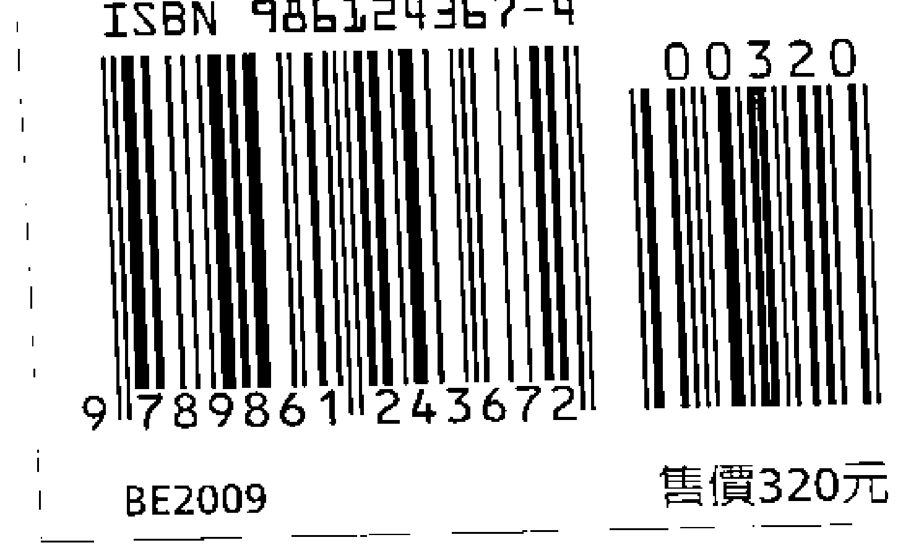

售價320元

