## Essential Oils for Mindfulness and Meditation
## 正念——疗愈

英国IFA前教育主席教你
用精油协助静心冥想，
全身放松，一夜好眠！

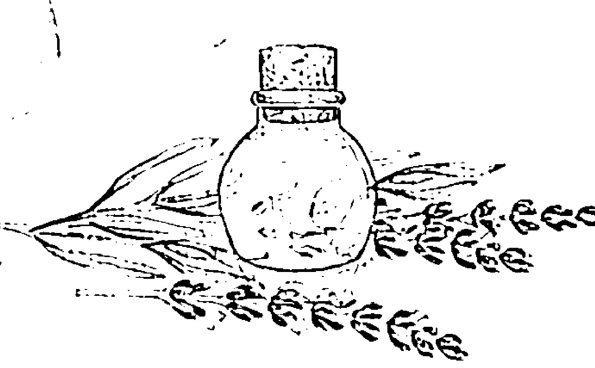

HEATHER DAWN GODFREY
海瑟·唐恩·高芙瑞 著
林岱莹｜郑百雅 译

## 天使神秘学院

*   ※ 专业占卜预测机构
*   ※ 神秘学培训机构
*   ※ 水晶能量研究中心
*   ※ 神秘学资料库
*   ※ 官方微信：strcdts
*   ※ 微信公众平台：strc2011
*   ※ 读书交流QQ群：
    *   占星塔罗占卜师交流群：814594478（加入密码：PDF）
    *   神秘学其他综合群：659338717（加入密码：PDF）

微信号：strcdts
天使神秘学院

天使神秘学院 院长QQ：715104687

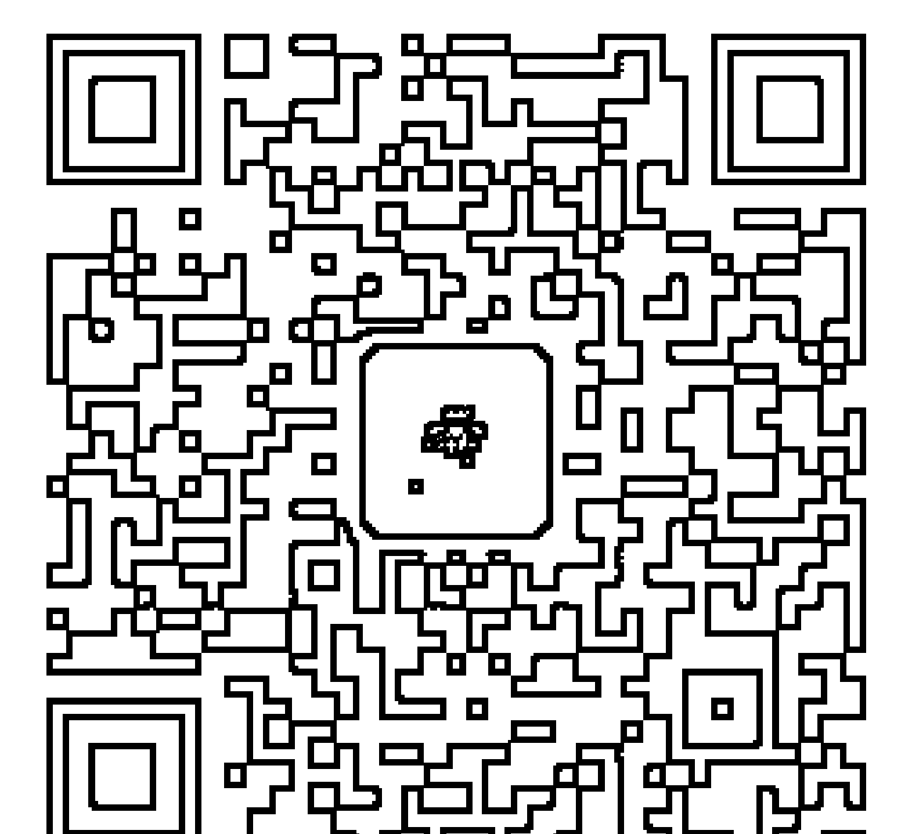

微信公众平台：strc2011

## 制作说明：

本书由《天使神秘学院》出重金从台湾购入的原版书籍扫描制作完成。为达到最好阅读效果，特地把原版书全部切开后，再经由专业扫描设备高精度扫描完成，并经过一张张的PS后期处理最终成书，其间花费大量的人力、物力以及时间，只为能给大家提供经济并优质的神秘学学习资料而努力。

本学院强力谴责某些机构和个人，把本学院花心血制作完成的电子书籍，包装后直接放在自家淘宝网上低价倾销的行为，以谋取不劳而获的经济利益。如果长此以往最终将无人愿意再为大家花心思制作电子书，那以后可能大家再无新书可读。

为让大家以后能够读到更多的好书，也为了本学院的良性发展。本学院恳请大家尽量做到如下几点：

*   一、尽量在本学院的网站购买电子书籍。
*   二、请勿用技术手段把电子书内的水印及加密去掉。
*   三、在收到电子书后小范围传阅即可，千万不要公开传播，更别挂到淘宝网上低价销售。

同时为答谢广大支持者，学院电子书将做如下调整：

*   一、学院会把一些早已收回制作成本的电子书折价销售。
*   二、最新制作的电子书籍会开放打印功能，大家购买后有条件的可自行打印成书。

天使神秘学院
2019年1月

## 正念——疗愈

英国ICA前教育主席教你
用精油协助静心冥想，全身放松，一夜好眠！

Essential Oils for Mindfulness and Meditation

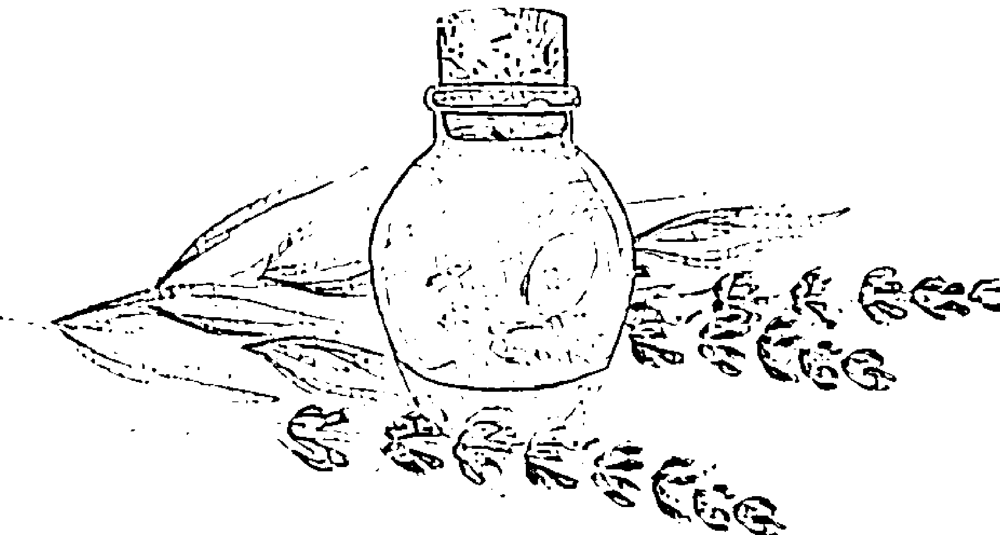

HEATHER DAWN GODFREY
海瑟·唐恩·高芙瑞 著
林岱莹 | 郑百雅 译

## 免责声明

*   精油是一种辅助疗法，不能取代正式医疗。
*   本书讯息仅供参考，若需治疗疾病，建议您与医师咨询，并接受诊断，请不要只依赖本书提供的资讯。
*   本书的资讯不能用于诊断、治疗或预防任何疾病。

# 精油与正念

### 静心

> > 「有一种与众不同的方式，让人迫不及待想要探寻如何增进心里的幸福感。本书要告诉你静心和芳香疗法这类经典的工具将如何抚慰心灵，相辅相成保持内心的平静与洞察力。就像熟悉的玫瑰和乳香精油，协助正念和静心时进入寂静以及启发灵感。而当你再次嗅闻到在静心期间时所使用的精油香气，它甚至能够引领你转化觉察回到静心模式。」

作者是一位芳疗师，不仅专业地使用精油，也研究这些强大的植物成分产生的影响。读者将会明白以谨慎且系统化的科学实证为后盾，探索传统习俗与主观经验间的知识是一条理想的道路；正念静心与嗅闻精油会如何缓解焦虑或使心灵平静，其从古代历史、宗教信仰以及现今辅助医学实证的观点等面向来解释。涉及在实验模型中，受试者与精油试验的科学研究。读者易吸收作者的诠释，因此也增加了本书的价值与实用性。

详尽解说关于精油的剂量和安全建议是使用这些有效的植物浓缩萃取物的必备条件。顺带一提，认识默默影响身心的日常食物、饮品以及含有精油成分的保养品，将会令人大开眼界。

> > 「这本书必定对实践芳香疗法与正念静心的人产生长远的重大影响，感谢作者海瑟・唐恩・高芙瑞赋予这本著作的灵感。」

爱莲娜・斐瑞　博士
纽卡索大学神经科学系荣誉教授

> 「《正念芳疗》是在精油领域一项很重要的突破。当其它书籍仍着重在精油特性和症状处理，海瑟・唐恩・高芙瑞为我们提供各种精油渊博的科学知识，以及开通往觉察和静心的新领域。这本精彩的精油实用指南，就像是日常生活里的宝贵帮手、专业人士幸福感知的泉源，以及提供给想要更深切了解自我本质的人。」

埃瓦尔德・柯莉洁
《水晶魔杖和整体反射疗法》作家
CRYSTAL WANDS AND HOLISTIC REFLEXOLOGY

> 「这本有趣的书籍融合精油科学与神奇的炼金术，还有在静心练习时应用精油香气，个人发生的轶闻与实证。当深陷在现今忙碌生活的漩涡里，它将带领读者踏上『高度专注当下』的训练旅程，如何后退一步用智慧寻找内在平衡，这是一个及时的提醒与基础指导的重要指南。」

苏菲・欧修夫斯基 博士
《医师，怎么了？让英国国民医疗保健服务重启人性》作家
DOCTOR, WHAT'S WRONG? MAKING THE NHS HUMAN AGAIN
英国国民医疗保健服务研究员和编辑
SPZ 联合有限公司董事

## CONTENTS

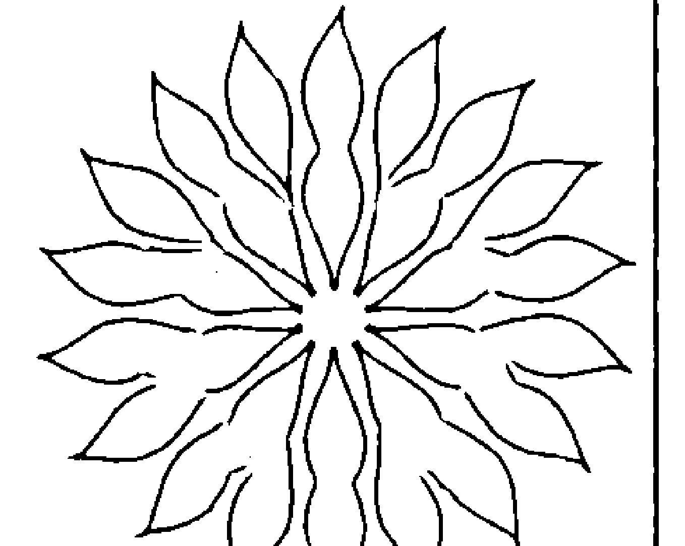

作者序 Preface  6

谢辞 Acknowledgements  9

前言 Introduction  11

# Part 01 正念是什么？

为什么需要正念？如何让正念融入生活？ 18

*   正念觉察练习 21
*   深度专注静心 25
*   正念静心练习 28
*   正念的作用：实证资料 30
*   累积四十年的个人心得 34
*   正念练习：预备……开始！ 37

# Part 02 精油的科学

从科学实证解释精油效用 40

精油是什么？ 40
精油和静心 45
精油如何被身体吸收？ 48
宁静精油 51
感受气味 53
精油的心理情绪及对记忆的效用 69
记忆 74

# Part 03 精油的使用方法

安全使用精油与八种疗愈用法 76

*   安全使用精油  76
*   八种疗愈方式  83

# Part 04 放松、运动、补充营养

放松、运动、补充营养 94

放松与运动：探寻健康的平衡点 94
运动与促进肢体灵活度的练习方法 98
最佳营养指南 105

后记  踏上你的探索旅程 118

参考书目 125

注释  120

索引 134

## — 作者序 —

### PREFACE

多年前当我初次邂逅精油领域之时，我是在伦敦为罗伯·滴莎兰德（Robert Tisserand）工作。早期那段期间，是他第一次开展芳香油事业（Aromatic Oil Company），随后称之为滴莎兰德芳香疗法（Tisserand Aromatherapy）。当时的我是个实习生，青涩单纯且充满理想，我相信在未来的日子里，我的生活在我面前即将展开无限可能的未来。因此，当一位友人邀约我到科西嘉岛工作一个季节时，我毫不犹豫立即答应，并假设当我准备回程时，也可以顺利衔接原有的工作。然而，在一年之内，我结婚了，并且期待第一个孩子的到来，我的理想确定溶蚀在遥远的地平线了。

若狂地注意到一本由罗伯·滴莎兰德所撰写的书《芳香疗法的艺术》（The Art of Aromatherapy）。翻起书本每一页都令人着迷。记忆瞬间翻涌而上；突然，我好像闻到空气中蔓延着玫瑰、依兰依兰和洋甘菊散发出的阵阵丝缕清香。我记得，就好像前一天的事情，罗伯和强纳森（大家都称他们为“杰克”和“韩斯”）正在为干燥的洋甘菊和玫瑰秤重，还有将精油装填在深褐色的小瓶子里。我的感官被丰美的芬芳气息与欢乐的气氛唤醒——甜香、辛香味、泥巴味、叶片香、果香、木香、花香——渗透空间里的每一个角落，消融了在老旧公寓里潮湿难闻的异味。 在书店那个偶然的机会之下，我重温舒适、熟悉、感动人心的感觉，我的灵感被重新燃起火花。我的孩子逐渐成长，现在正是时候拾起早期在伦敦的理想，我必须重新编织和圆满这段旅程。 我在索尔福德大学获得咨询与辅助医疗荣誉双学位，以及拥有专业执照来带领正念，以及督导心理咨询与治疗关系。我在索尔福德大学的健康与社会照护学院担任教授、开设多种课程，包括芳香疗法临床实务，并且提供服务予教职员工和学生。我也在私人的执业诊间提供精油治疗超过25年。

我很幸运地与一群客人合作（父母、祖父母、照护者、教师、研究员、专业经理人、护理人员、针灸师、咨询师，以及在健康照护领域的各式专业者），他们都是为了不同的理由而来探寻疗愈的方式。其中包括在工作要求完美的角色中平衡生理、心理与情绪的健康；或是处在压力、紧张的情况下，例如：失眠、轻度忧郁或焦虑；以及在具挑战性的生活中寻求支持，像是面临丧亲之痛、失业或关系破裂。反之，遭遇激励人心的事件，例如：搬家、换工作，或是即将踏入婚姻等。有时候只是单纯希望能放松和增加幸福感，但可能是最重要的因素。

事实上，撰写这本书的灵感来自于我长期观察客人对精油香味的反应。我察觉他们接收香气的历程，经由感知吸引他们专注和觉察当下。我也注意到这些时刻是如何充实他们，因为香气渗透他们的心灵并且似乎触动心理意识的反应和效果。这些反应最初是经由观察脸部表情变柔和与呼吸变平缓而来，接着客户回馈他们变得更有精神、思绪清晰，还有芬芳的气息让人着实感受到放松与心更沉稳。

藉由可测量神经系统的生理反应能够证实他们的这些历程。

正如多年前刚开始与精油连结时，我的静心状态也是如此。当我开始学习静心，觉得静心就像是一种吟唱或嬉皮式的练习，封存在脑海的影像则像是披头士乐队以及超觉静坐的创始者玛哈礼希（Marharishi Mahesh Yogi）坐在一起。静心并没有改变我的命运或是生命中的课题，但它却像是无形的工具，至始至终奠定我的现实感，当我因为认知偏差而感到不安，它平息我狂乱的心智，将我的视野理出清晰的脉络。我并没有每天静坐，但我随时这么做，当我选择留心、专注于觉察时，这种不带条件、持之以恒的体悟，就只是“在那里”。

正念类似静心架构的一种应用工具，最终目标相同。它是古老智慧的实践，尽管以佛教传统哲学为基础，但它仍然占据现今主流文化的前景。正念排除一切宗教性，是具经济价值、抗压力、抗焦虑、抗忧郁的工具。主流健康照护越来越愿意采纳其作为自我帮助的方法，因为它可以安全的独立运作，或是与常规治疗同时并用。

在我这个年纪，我知道生命就是一趟旅程，没有什么秘境准则。我们各自行走于属于自己的道路，时而安逸时而艰辛。然而，生活中常伴随着正面与负面的处理方式来面对压力与喜悦。从古至今放眼全球，正念和静心已经被重视且实践，它是最具肯定且兼具正面影响力的方式之一。

凭借自己的能力在静心过程与治疗中相辅相成，精油扮演珍贵的辅助角色，特别是当我们运用在处理心理与情绪行为的问题，它就像是让人们重新振作、支持和踏实的力量。这些特点对于每个人在处理日常事务时，都具有特殊的意义，看似单纯却极为重要。

透过我的临床实务经验以及观察客人对精油的回馈，还有我自己的体悟，我注意到如何丰厚彼此间的关系，如何练习与感受愉悦、疗愈且鼓舞心灵，以及这些改变将会如何逐渐穿透成为有益健康的幸福感。精油仿佛是大自然给予推动变化的礼物；陪伴我们在生命的旅途中，经历起起落落，以及喜悦和挑战，它是永远支持我们的最好伙伴。

# 精油的輔助角色

在不斷變化的時間和生命旅途中，精油如同家人和朋友般陪伴著我們，它常用來薰蒸、焚香、清潔、消毒、抗菌、殺菌和防腐，也與身心健康、愉悅感官的香水密切相關。因此，精油不僅是涉及穿著的品味與魅力，也兼具保護作用、意圖象徵，還有裝飾功能和強調宗教的儀式與習俗。

當代科學、儀器設備和研究方式，均使人們更能深入了解有機和無機物質的實用機制、特性、組成和化學結構，從而讓我們更理解周遭世界。它們也教導我們很多關於身體健康的知識，就像病毒、細菌、疾病；而最重要的是，在飲食和生活態度扮演支持和維持良好健康的角色。隨著提升整體健康和幸福感的美好前景，身心靈的整合越來越被認為是身心健康的重要指標。

在歷史上，精油一直有被使用的紀錄，為了防護、提振、康復、享樂主義的品質，緊密地支持著生理和心理、情緒、精神，顯然連結了生命與存在的務實、天然、超越塵俗的動態。

從這方面來說，並不是將這個觀點從另個見解分開（化約論和生機論），而是科學也許有助於掃除被誤解的神話與謬見，深入洞察身體驚人的自癒本能，能量醫學及精油配方發揮了輔助作用，證實植物有助於維護健康與保持平衡，如此兩全其美。事實上，精油應用在醫學治療、美容成分、心靈應援上，品質穩定的精油連結了人類與大自然、心理精神領域。

在古代的醫書、專著以及聖典中提到許多參考資料，證明了精油的能動性：

> 有兩塊麵包的人，讓他把其中一塊丟給水仙花；麵包是身體的糧食，而水仙則是靈魂的食物。

蓋倫（公元 120 – 200）
希臘醫師、外科醫師、哲學思想家

> 你應該把生病的人
你要遮住他的臉
燃燒絲柏和藥草
偉大的神會淨化邪惡
讓邪惡的靈魂將退居一旁……
願善良的精神、仁慈的天賦重現當下

古巴比倫 發燒咒語
阿薩基馬爾蘇蒂，第六卷³

> 在穿上衣服之前，塗抹油或是油膏，以及在肌膚灑上些許香粉。

阿維森納 (公元 980 – 1037)

《醫典¹》 (THE CANON OF MEDICINE¹)

> 那焚香的煙和眾聖徒的祈禱，從天使的手中一起上升到神的面前。

啟示錄 8:4

> 應該在藥草最茂盛時拿來蒸餾，花朵也應如此。

尼古拉斯·卡爾佩珀 (1616 – 1654)

《英國醫生擴大了》 (THE ENGLISH PHYSITIAN ENLARGED⁵)

> 黑天神克里希那說，他以自己的能量進入到每一顆星球，以他無懼的威力在全世界佔主導地位，支持所有移動的和非移動的靈魂及眾生。他，他自己就是月光的亮度，滋養所有的藥草和農作物，例如：稻米、水果以及穀物。

《博伽梵歌》15:13 (SRIMAD BHAGAVAD – GITA15:13⁷)

> 然後耶和華吩咐摩西說：「你要取馨香的香料，就是拿他弗、施喜列、喜利比拿；這些馨香的香料和純淨乳香都要一樣多的分量。你用這些加上鹽，按照混香之法，做成清淨聖潔的香。」

出埃及記 30:34⁶

> 你的花園中果木繁盛，有石榴的果園，有佳美的果實，鳳仙花與哪噠樹，有番紅花、菖蒲、肉桂、有各式各樣的乳香樹、沒藥、沉香以及一切上等的香料。你是園中的泉源，活水的井，是從黎巴嫩流動下來的溪水。

雅歌 4:13 – 15

> 香料與薰香使人心生愉悅。

箴言 27:9

根據歷史典故，以及在宗教、風文化和心靈實踐上的持續使用而得到證明，精油應用在祈禱、刻意專注和靜心時，能夠做為一種潛在支持的力量。精油被證實作用在能夠影響心理與情緒反應的邊緣系統，進而對心情與情緒產生不同的影響，具備鎮靜、穩定或是激勵人心的力量。某些精油，例如：乳香和廣藿香可以調節呼吸，並且逐漸滲入和諧與沉靜的感知體悟；所以它們能夠舒緩焦慮、紛擾的心。其它的精油，例如：玫瑰和紅桔（mandarin），它們溫和促進機能並且使人開心。此外，其中還包括真正薰衣草和天竺葵，可以提供鎮靜和提振兩者之用，當然，它們亦是平衡情緒的用油。

透過即時覺察到的芬芳氣息，精油挑起我們活在當下此刻的感知，特別是當它們直接被吸入（例如：滴在面紙上）或者是周遭處於充滿香氣的環境裡。

事實上，在古老時期，人類（和動物）早已塑造氣味偵測用以確保生存機制，並且與記憶有著強大的聯繫。因此，精油可以被用來增強記憶力，以及最初偵測到氣味時，用來回溯過往事件、想法和感受經歷，這就好比氣味會逐漸滲透心理與情緒行為之間的連結。

舉例來說，在靜心過程裡可能會不自覺地吸入揮發的單方或複方精油，之後在靜心當下，偵測到氣味即會觸發的以往經驗，因此在當下可能會重新經歷以往感受到的平靜和鎮定。這便能用來作為一種提醒，讓你保持靜心、維持正念覺察，還有此時此刻體驗到平靜與和諧的感覺。

在這方面，由於氣味會帶動心理與情緒行為之間的連結，精油儼然成為具有價值的輔助工具，尤其是當應用在諮商輔導、心理治療以及認知行為療法（CBT）時，這就如同類似靜心和放鬆的技巧。

精油在單獨使用時即有效果，但是當它們被調和在一起，就可能會增加療癒的效果。

比方說，精油的芳香分子與療癒特質融合調香藝術，讓感性、芬芳豐美的氣息來賦予快樂和創造力。所以，從這個意義上來說，氣味就像顏色一樣，可以用來繪畫、營造氛圍，表達和增進感情、情緒和心情，同時也提供了強化免疫力的寶貴作用。

基於多年與客戶和學生合作的專業經驗，本書如同入門的教科書，而且是資訊豐富的自我療癒手冊，引導你安全使用精油，用來補充和支持正念和靜心的實踐。

# 本書簡介

第一章，將會介紹你有關正念的理論與練習，告訴你實踐正念涵括哪些類型，有完整的指引足以指導你練習，其中有些研究是練習正念所獲得的益處，還有些是我對於靜心的個人反思。

第二章，對於精油化學有清楚的基本描述，以及介紹各種不同的精油如何影響我們的身心系統。有數百種精油可以透過臨櫃或是網路採購……等。然而，並非所有的精油都適合個人使用。精油主要被生產運用於製藥、食品、加工、香水和化妝品產業。實際上，芳香療法的市場僅佔基本生產總量不超過百分之五。第二章將提供大量豐富的指南以便讓你做出自己的選擇，並且學習安全使用與應用精油的各種方法。

在第二章裡，也精選出一系列重要的精油成為你在調製療程配方的根基。這系列的精油最初主要是應用在特殊需求的族群（例如：用在嬌弱或敏感的客人身上），其中也包括最不危險，但仍然非常有效的精油（儘管沒有精油是完全零風險）。它們涵蓋最具價值的治療功效，統稱為寧靜精油（Serenity Essential Oils），並且適合想要應用精油協助自我療癒的人，以及那些具慧眼的學生作為學習的良好基礎。

然而，為了幫助大眾應用於不同社會情境下，本書也列出包括使用範圍較廣泛的精油。但是，會特別突顯十六種寧靜精油，以便你識別這些在本書涵蓋最深入的精油。尤其會特別說明具有靜心和放鬆本質的精油，其涵括簡單明瞭、易於遵循的圖表來幫助你辨別他人的狀態，並且協助與指導你挑選出最適合的精油。

第三章，主要介紹個人應用精油的方式，為你提供充足的細節來調配屬於自己的作品，其中包括乳霜、乳液、香膏、精油嗅棒及室內擴香的方法。

第四章，除了正念和精油之外，還可藉由額外的放鬆技巧、規律運動和補充營養來促進身心健康。書中也提供這些重要工具的示意圖以概略說明之。

在本書中也列出推薦的參考文獻，讓為本書成為一本完善的指南，讓你完全沉浸在寧靜、富有創造力，以及當下綻放芬芳的每一個瞬間。

# Part 01
# 正念是什么？
# What Is Mindfulness?

# 為什麼需要正念？
# 如何讓正念融入生活？

正念（Mindfulness）是有意識地覺察當下的每分每秒，關注、聚焦，並把意識放在此時此刻。

> 正念是活在每一個當下，注意自己的內在和外在正發生什麼，不帶任何先入為主的看法，不帶條件和預先設想，只是柔軟地、無條件地，泰然接受一切發生。那是一種心靈上的平靜與沉著。心理治療師克里斯·梅斯（Chris Mace）在《正念與心理健康》（*Mindfulness and Mental Health*）一書中，曾對正念一詞做出簡明有力的說明：

正念是時刻保持覺察的態度——正念覺察是接納一切，沒有排除心。所有的感受、想法和感覺，都只需要如其所是地去經歷。微妙的是，正念覺察實際上意味著心中無「念」。即便腦袋的想法喋喋不休，也不需要給予特別的關注。當人們不再像平常那樣不自覺去限制自己的覺知，便能察覺萬物如是的本質。

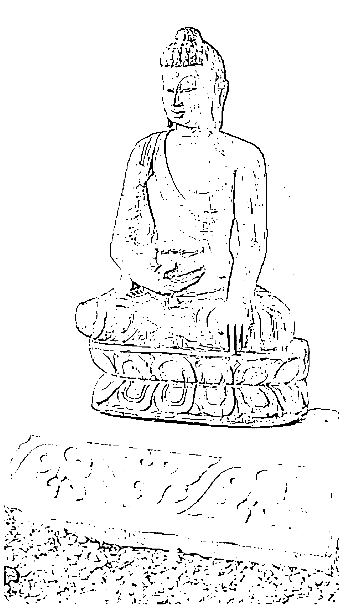

## 正念是一種內觀

正念也是一種內觀 (insight meditation)，這樣的概念從佛教思想衍生而來，在 1970 年代傳入西方。雖然正念有著深厚的佛學根源，但實際進行的方式相當簡單，因此即便在與宗教無關的個別情境當中，也能幫助人們把注意力集中在此時此刻：幫助每一個人在自己日常生活的節奏中保持覺察，專注於當下。正念也成功被運用在醫療院所中，達到紓解憂鬱、焦慮、創傷後壓力症候群、壓力與壓力相關症狀等效果。因此正念經常是人們推崇的自我支持技巧，也曾被列為慢性疼痛管理的建議方式之一。

當代佛教內觀大師德寶法師 (Bhante Henepola Gunaratana) 在他闡述正念的大量著作當中，曾經提到，並不是只有佛教徒才能受益於正念：

所以，正念究竟需要多少信仰的成分？你需要皈依為佛教徒嗎？你需要放棄從小投入的信仰傳統，或深植心中的理想典範嗎？你需要把大腦推論的一切，或你對這世界的理解都丟到一旁嗎？當然不是。你可以留下現在在你身上的所有參照框架，只去接受自己準備好接受的。一次一點點，只接受那些你真正覺得對自己有益的部分。不過，你確實需要某種程度的信仰。這樣的信仰就像是讀一本很棒的小說，或做一個科學實驗所抱持的信念一樣，也就是：你需要「願意暫且不懷疑」……所謂信仰，它的本質不過是願意暫且接受某個自己尚未驗證、核實的事物。

## 靜心（冥想）是一種體驗

靜心本身就是一種體驗的過程，是一個連接有限及無限之境（或說是內在最深處）的橋梁。從這個角度來看，靜心者可能經歷許多不同的意識演化階段或層次，從肉身層次有限的覺察，到進入深邃而無可名狀的內在覺知，出現頓悟理解及深刻的領會等狀態。神秘學家與神學家費洛茲·梅赫塔（Phiroz Mehta）在《整體意識》（*Holistic Consciousness*）這本書中，曾用以下文字說明無可名狀（wordless）是一種什麼樣的感受：「並不是用我們平常理解一種概念或想法的方式去傳達或接收，而是先透過整體意識，在其中迸發一種瞬間、直接、無形無狀的發現……然後它才『被賦予』形貌，化為具啟發性的想法和文字。」^3

# 正念減壓法

正念減壓法（mindfulness-based stress reduction，MBSR）的先驅者——喬·卡巴金（Jon Kabat-Zinn）博士，曾在 2004 年一篇名為＜正念的感官覺醒＞（Coming To Our Senses）的文章中，提到可以用「神奇的五感」作為紮根、定錨的工具，幫助個人進入全然的覺知狀態，充分欣賞當下的體驗：

- 去看當下能看見的、去聽當下能聽見的——用這五個感官，再加上佛陀說的第六個感官，那是最重要、能整合一切的感官，是心靈本來就具有的，以非概念性的方式曉知事物的能力。^1

這樣的正念專注技巧就像把感知者帶到一口深井邊，但擁有技巧不代表取得井水。水（個人經驗）是透過勺桶（正念專注），從井中被提取出來，讓人得以嚐到、窺見整片海洋的一貌。靜心的技巧（集中的專注力），就像是舀水的勺桶，讓感知者能從內在的意識深井，從那與生俱來、無限制的靈魂當中，取得一舀井水（不是從外在、從上面或遠方，而是從內汲取本就在那兒的一切）。

正念（或有意識的）覺察練習，以及深度專注靜心，是正念練習的兩種方式。

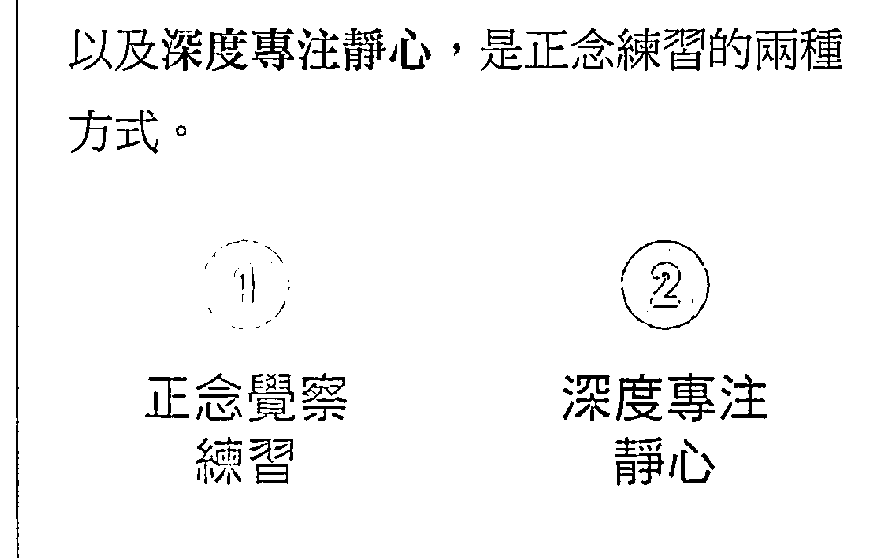

> 意識：泛指一切精神活動，如個人運用知覺、記憶、想像等心理活動，覺察自身狀態與周遭環境的變化，進行主動積極的一種認識體驗。

冥想：透過深思，改變意識的一種形式。透過靜坐或搭配瑜伽動作，集中心神在呼吸吐納上，自然讓腦袋試著集中在一個想法上。在不受外界打擾的情況下，達到處理壓力、維持身心平衡的效果。

# 正念覺察練習
Mindful Awareness Practice

正念覺察練習，或有意识的覺察練習（又叫内觀，vipassana）著重於清楚覺察此時此刻發生的一切，專注於當下，個人從外界或內在感覺到、觀察到、經驗到的一切。正如德寶法師所說，只要透過心智去檢查注意力是否集中，就能達到這樣的狀態：

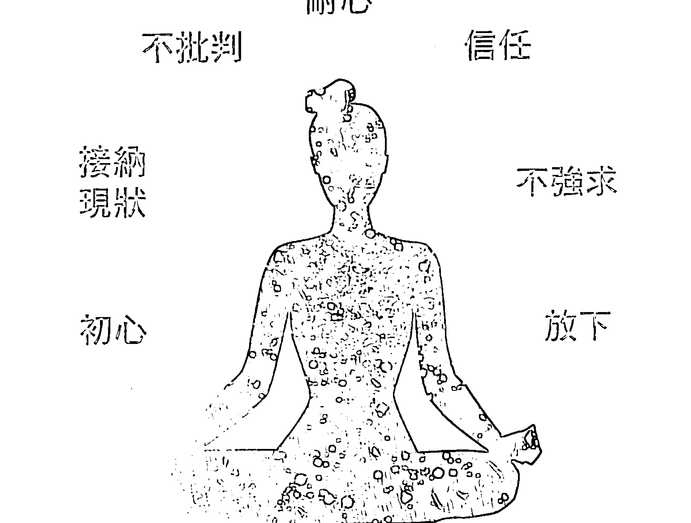

- 耐心
- 不批判
- 信任
- 接納現狀
- 不強求
- 初心
- 放下

所謂正知（clear comprehension）是指時時保持全然覺察，在進行任何活動、身體做出任何行為、出現任何感受時，都始終帶著意識去經歷。這是一種轉而向內的自我監察機制，專注於所有身體和心靈正發生的一切。正知需要「全然的專注」（bare attention）（這裡的全然指的是以其純粹的本質，不加諸任何其他）；這樣全然的專注，能確保你的注意力以正確的方式，集中在正確的事物上。這是一種品質管理，時時監控著你的注意力放在哪裡，以及這樣的覺知以何種方式發生。

# 意識當下的想法和身體感受

透過將自己定錨在每一個瞬間，由外在或內在帶來的感覺、感受和觀察，去意識到每一個當下，並時時刻刻維持這樣的覺察，你將能抵達通往意識覺知的大門，而這扇門，就是單純地活在當下。正念練習能幫助你把注意力專注在此時此刻，而經歷每一刻時，單單只是處在當下，就能在不知不覺中注入平靜、完整和接納等感受——那是一種難以言喻，完完整整存在於這世界的感受。容我更進一步舉例說明正念覺察的體驗。

此時此刻，我正坐在書桌前，雙手放在筆記型電腦的鍵盤上。

微風從窗戶進到我所在的位子上，在我專心敲打這些字句的此時，輕撫著我的臉龐。

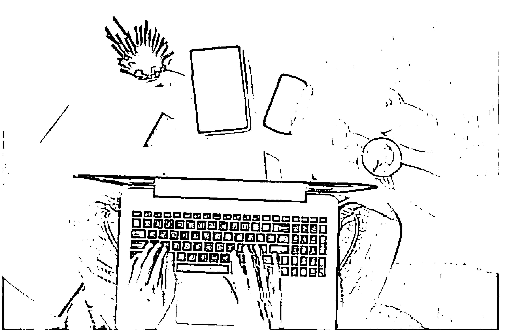

遠方有鴨子嘎嘎叫著，聽見風吹向半掩的百葉窗，也聽見它把外面的樹葉吹得沙沙作響，還聽見遠處車子的引擎聲。

落日將至，外界的光線逐漸暗了下來。

鳥兒正嘰嘰喳喳地發出聲響。

到我的肩膀和頸部因為長時間維持相同姿勢而疼痛。

嘴裡微苦、刺激的味道，那味道來自不久前我喝下的咖啡，而咖啡的氣味現在還留在我的氣息當中。

椅子頂著我的臀部，我的腳隔著柔軟的地毯，正踩在堅實的木地板上。當我把注意力放在這些此時此刻的感覺上（雖然像流水帳一樣零散），我清楚地發現，我感覺很平靜。

我正有意識地覺察我的呼吸，感受溫暖柔軟的空氣從鼻腔進入我的喉嚨，暖暖地注入我的肺，接著氣息往上，從鼻子呼出。

這一刻，我內心充滿平靜，
感覺如此安詳。透過這樣
檢查此時此刻的感覺，我
便將自己帶到了意識覺知
的大門前，而這個有意識
地覺察自我的狀態，讓我
感到平靜。

# 正念覺察練習的方式

你可以把它當作是一種練習，用一種更有條理、事先規劃好架構的方式來進行，例如用身體掃描的方式，躺下或坐下從頭到腳感受自己的身體。或者，我也可以為自己找一個注視點，將注意力放在眼前所及的物品或聚焦點上；我持續穩定地注視這個物品或這個點，允許所有的經驗升起，允許我的意識、我的視線持續對這個外在世界裡的特定範圍敞開，同時注意同一時間在我內在出現什麼感受，我的身體感覺如何，我腦袋裡是否有喋喋不休的想法，我的感官感覺到什麼。沒有抵抗，只有觀察、承認與接受。

我可以在一天當中的任何時刻，練習這樣聚焦我的注意力。這麼做可以幫助我把自己定錨在此時此刻，鍛鍊我對當下的覺知能力；在我發覺自己因周圍的事情分心的時候，在我吃飯、洗碗、走去車上、坐下來和學生談話的時候。在每一刻，我都能為自己帶來「全然的專注」，不帶任何條件，不做任何批判。

# 正念覺察是一種存在的方式

正念覺察或有意識的覺察練習，是一種存在的方式，是一個不斷持續的經驗，最好透過在日常生活中規律留心、自律並付諸毅力來完成。越常進行規律的練習，它的影響就越豐富完整——經常做簡短的練習，會比一週一次，或偶爾一次好得多。有意識的覺知能使靜心進入更深沉的狀態。因此，正念不只是一個放鬆的技巧，或紓解壓力的手段而已。不過，危機通常是觸發轉變的催化劑。當你選擇用正念覺知與靜心作為對應的工具，並且去經驗這個過程，它或許能為你帶來頓悟般的發現，那是你先前從未想過或忽略不看的，一種對現狀的覺知。正如美國心理學教授蕭娜·夏比洛 (Shauna L. Shapiro) 與同僚在研究文獻中提到的：「正式的靜心會滲入日常生活，將靜心者所做、所感受、所經驗的一切，帶入一種更巨大而不帶批判的意識當中。」

將焦點放在覺察當下、處於現時現地，這樣的做法後來也被完形治療法（gestalt therapy）、認知行為療法（cognitive behavioral therapy，CBT）和心理諮商納入作為治療的工具之一。例如，心理學家與人本主義哲學家艾里希·弗洛姆（Erich Fromm）就曾在《聽的藝術》（*The Art of Listening*）一書中寫到：「重要的是，將患者（案主）當成一齣戲裡的英雄人物，而不是用集各種情結於一身的角度去看待他（她）。而且，事實上，每一個人本來就是戲劇中的主角。」⁷……〔當你去看、去感受、去感覺、去覺察，就能使能量開始流動，進而運作……能量因此能集中去到特定的方向，並且帶來效果〕。

這樣的角度幾乎在所有助人的領域都適用，同時也和這些療法重要的核心精神不謀而合；其中，用在整合性的治療領域尤其貼切，例如針灸、芳香療法、寶雲治療（Bowen）、瑜伽，以及前述的認知行為療法等，當然也包括正念覺知的實踐。

> 「正念就是覺察。此刻，我充分覺察我身體每一瞬間的狀態，包括我的姿勢、我身體裡正經歷的一切，我也充分覺察我的思想，也就是我的每一個念頭；我完完全全專注於當下。」⁸

弗洛姆更進一步提到：「正念就是覺察。此刻，我充分覺察我身體每一瞬間的狀態，包括我的姿勢、我身體裡正經歷的一切，我也充分覺察我的思想，也就是我的每一個念頭；我完完全全專注於當下。」⁸

因此，正念覺知練習特別可以用來幫助個案（或任何個人）將自己定錨在此時此刻的經驗，這在為焦慮、憂鬱或創傷後壓力症候群等患者工作時尤其重要，因為那能使患者穩穩處在當下，讓現時現地不僅成為一個出發的起點，也是經歷探索的旅程後回歸的終點，這一點是很重要的。畢生提倡案主中心治療法的心理學家卡爾·羅哲斯（Carl Rogers）便多次重申這一點：很重要的是，諮詢師必須有意識地處在當下，以清晰的覺知去接納一切，並處在和諧、正向及同理的狀態，以此為基礎去進行工作。在諮詢師「與案主同行」的路上，必須保持這般對現時現狀的覺知和專注。

> 「當我們提供這種心理上的氛圍，允許一個人只是存在在當下……我們所汲取運用的，其實是普遍存在於所有生物身上的行為傾向。」⁹

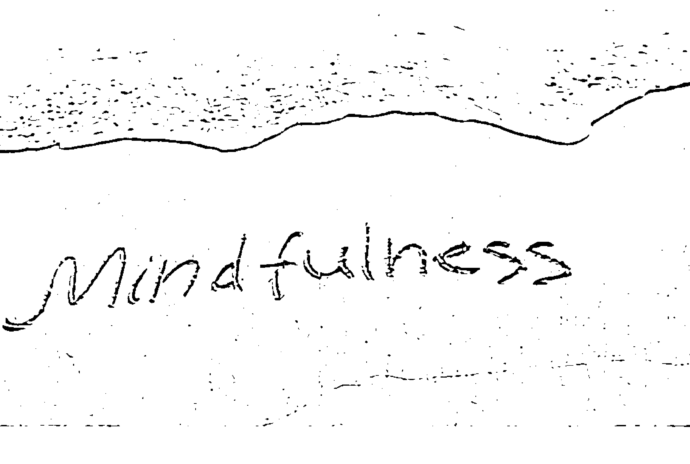

## 深度专注静心 Deep Concentration Meditation

深度专注的静心（又称「止息」，shamatha）是正念练习的第二种方法（有些人倾向用「温和的觉性」（gentle awareness），而不是「深度专注」，强调这个练习在选择上的不同）。正念觉察练习帮助我们为深度的静心打下基础，也就是以更集中、更具体的方式投注自己的注意力。而要训练自己的专注和集中度，温和的自律是必要的。这种更深度的集中静心又分为四个基础面向：

### 佛家八正道

以上图示这四个基础面向，正是构成佛家所言八正道（The Noble Eightfold Path）的梁柱。正如成语「瞎子摸象」的典故（每个人摸到不同的大象部位——有人摸到象鼻，有人摸到象腿、象耳、象尾等，于是各自根据自己的经验，宣称「大象其形如蛇，或如鼓等」），不同作者在描述正念的品质时，使用的词语也会有所不同。下表首先比较德宝法师10与梅斯11对八正道的描述。接着，再列出正向心理学家史奈德和罗培兹12，以及夏比洛等人13对于正念要素的描述。

## 正念练习及静心的核心主题与要素

### 崇高的八正道

| 海斯 (MACE // 2008) | 德贾潘纳 (GUNARATANA // 2009) | （其他描述） |
| :--- | :--- | :--- |
| 1. 戒（sila） | 1. 正见 | 5. 正命 |
| 2. 定（samadhi） | 2. 正思惟 | 6. 正精进 |
| 3. 慧（panna） | 3. 正语 | 7. 正念 |
| 静定凝神的要素为： | 4. 正业 | 8. 正定 |
| | 5. 正精进 | |
| | 4. 正见 | |

### 正念的要素

| 史宾德与罗培兹 (Snyder and Lopez, 2007) | 夏皮洛等人 (Shapiro et al., 2006) |
| :--- | :--- |
| 1. 正思惟 | 存在于当下有三个相互依存的核心特质，分别是： |
| 2. 正念 | 接纳 |
| 3. 正定 | 同理 |
| | 慷慨 |
| | 温和 |
| | 感激 |
| | 放舍 |
| | 慈爱 |
| | 不批判 |
| | 不强求 |
| | 敞开 |
| | 耐心 |
| | 信任 |

1. 苦（dukka）
2. 无常（anicca）
3. 无我（anatta）

尽管使用的词汇不同，从上述专家学者的论述中仍能看出，正念的核心主题似乎在于为正确的行为与态度（道德行径）、正确的关注焦点与正确的意念（正确的智慧），提出一个普遍通用的解方。而这一切的结果，正如德宝法师所说，是一种「欢快的觉醒」^{14}，或者，如夏比洛等人所言，静心的目的，是要让意识从这令人不尽满意的现状（或说是一种「常态」，或「瓶颈」）中醒来，真正见识到我们真实的本性。^{15}而正念觉察与静心的回报，便是一种发生在灵性层面、丰富深刻的体验与知晓；或简单来说，就是明白到事物「本来的样子」。

- 深呼吸
- 正念觉察
- 聆听内在的想法、情绪
- 感觉当下这一刻

- 数息（数呼气）
- 深度专注静心：是用冥想的方式，透过专注的力量，把心带回呼吸上
- 随息（不控制呼吸）
- 止息（感觉不到呼吸）

## 正念静心练习

*Mindfulness Meditation Practice*

虽然正念有深厚的佛学论述背景，但正念静心练习并不必然要与宗教有关（不过显然不免带有灵性的成分在其中）。这样的练习需要有恒心，但不必执着，也不需要既定的仪式或礼俗。虽然某些仪式或礼俗能在表面上起到提醒的作用，进而协助个人的练习，然而，重要的仍是要注意区分纪律和偏执的不同。提倡正念静心练习的专家认为，正念觉察练习与静心可以和其他信仰同时并存，或者可以外于任何信仰来单独地练习。正念是一种实际、简单的过程，仅仅支持个人将心念集中在此时此刻，并经历单纯存在当下的感受。

然而，德宝法师提到那份「愿意暂且不怀疑」的心念，似乎仍然需要一定程度的信仰做支持，至少必须维持足够的信念，直到正念练习的结果显现出来，尤其这通常并非一蹴可几。唯有通过持之以恒温和的练习，正念的影响才会开始浮现至意识层面，进而渗透到每天的日常生活当中，让个人时时刻刻带着一份更大的意识，去经历自己的「一切行为、感受和体验」^16。

藏传佛教香巴拉传承（Shambhala）的领袖—萨姜·米庞仁波切（Sakyong Mipham Rinpoche）以融合东西方观点为其教导特色。他建议的静心方式如下：

> 每天两次、每次十到二十分钟，在一个不会太嘈杂或令人分心的地方盘腿而坐，或坐在椅子上双脚踩地；背部挺直或以靠背支撑，眼睛直视前方，目光落在数吋之遥的低处，注视一个物品，注意力放在那个物品或是自己的呼吸，或两者同时并行。目光专注地直视该物，不需将周围景物也纳入；维持这样的视线，每当思绪飘移，就轻轻将注意力带回到注视的物品或自己的呼吸上，过程温和轻柔，不需要强迫自己。

这么做的目的，是要让心感到平静，且能带着慈悲去觉察，进而让这样的觉察状态渗透进个人的意识当中。

然而，作用精微却相对简朴的正念，在学术界确实曾引起一番论战，尤其就像前文提到的，不同佛教派系传承之间，使用的字语也有所不同（例如温和的觉性与专注等）。钱伯斯（Chambers）等人在 2009 年收录于《临床心理学评论》（Clinical Psychology Review）（期刊）的文章中，曾经以正念练习的两个主流派别，去探讨「正念究竟是一种单独存在的独特概念，还是意识本身就具有的一种本质，散布或含括在个人各种状态之中」？一派认为正念是不加思索地只去经历现状，另一派认为正念是一种次级的思绪处理方式，〔也就是个人透过思绪与觉知（或认知诠释），认定以全然接纳或不带批判的方式来看待现状〕。和前者的全然不加思索、处在当下、非批判性的觉察状态不同。

这两者的不同，和作者、教导者（老师或指导者）及受教者（学生、案主与读者）两方的诠释观点（灵性、宗教、个人价值观）都有关系。举例来说，个人如何评价并描述自己的静心体验，不仅和本人与静心过程的关系有关（如同前述瞎子摸象的典故），也是透过本人的滤镜（语言）传递给外界。这样主观的看法，可能影响到对实际静心过程的表达和叙述方式，也会影响到相关信息的论述与描绘。不知怎的，单纯存在当下（just being）的概念被掩盖或埋藏，甚至迷失在试图从情感或认知层面去了解、证明和描述静心的经历，或想具体弄清楚静心的经验和体验的过程当中（或许就像是试着抓住一块湿滑的肥皂一样）。

为避免这样模棱两可与令人困惑的情况，德宝法师建议，比较好的做法是：把焦点放在正念有什么作用，而不是试图解释正念是什么。举例来说，正念就和所有其他静心练习一样，是从具体的实作演练开始，例如：目光直视一个物体；而这样实际练习静心的结果是可观察、可比较、可测量的，例如：专注力、平静和泰然沉着的程度都能获得提升。

## 正念的作用：实证资料
What Mindfulness Does: Research Evidence

夏比洛等人在〈静心与正向心理学〉（Meditation and Positive Psychology）文中提到，佛法和正念能为心理学带来补充，彼此间也有共通的部分，尤其在支持个人发展出正向自我意识这一块。他们在文中指出：「静心就像一份地图，带领人们达到最理想的敞开、觉知和洞察程度。」20 举例来说，梅斯曾在书中讨论库兹等人（Kutz et al.）以「静心与心理治疗」为主题做的一份实验。这个实验中，二十位患者在接受心理治疗之余，也以正念作为辅助，研究者发现，这些患者的负面倾向和焦虑状况都降低了（不过，这份研究同时也发现，静心在敌意、关系、家庭与性调适，以及情绪压抑等方面，没有造成任何影响。）21 库兹等人发现，静心很大程度上为受试者带来改变，包括有能力触及多年来从未处理的感受和记忆、洞察力增强，并且能够有成效地持续接受治疗；这些特质都说明，将正念与其他治疗方法整合并行的做法不仅可行，还相当有经济效益。22

### 静心与正念减压时的大脑反应

① 静心
静心能对大脑前额叶、前扣带皮层、边缘系统和顶叶带来影响，尤其深度静心状态和左前脑下方的神经活动有强大的关联，也就是和静心者本身的主观经验有关。

② 正念减压
后扣带皮层、顶颞叶交界处和小脑活动都增加了，这些区域也是和学习及记忆、情绪调节、自我指涉过程和观点采纳有关的大脑部位。

2009 年《认知心理学期刊》（Journal of Cognitive Psychotherapy）曾收录一篇探讨正念减压法（MBSR）对大脑自我指涉（self-referential）行为机制有何影响的文献。研究者以十四位社交恐惧症患者为实验对象，结果发现，正念减压能增进个人自尊、降低焦虑程度；增进正向感受，降低负面的自我认可；与注意力调节相关的大脑活动更加活跃，而用概念性语言做自我评价的相关大脑活动则降低了。23 研究者认为，正念减压法有机会改善不当或扭曲的社交性自我观感，并有机会改变个人看待自己的方式及维持专注的能力。之所以带来这样的结果，可能是因为正念减压法能以正向的方式，重新调整内在对话的遣词用字，于是个人能在意识层面上，打破过去以负面方式自我陈述的习惯。规律的正念练习确实能为神经传导路径和大脑活动区域带来改变，进而重新编写倾向自我打击并强化负面行为的自我对话内容，最终让个人重新拾回以正面角度看待自己的能力。

2006 年，《应用护理研究》（Applied Nursing Research）期刊中的另一篇文献指出，美国一间大型长青保健教学医院，招募在长照单位工作的护理人员与助手，参加一个正念练习计划。比起尚未参与这个计划的控制组来说，他们不仅疲劳综合症获得缓解，也都提高了放松程度和生活满意度。24 研究者于是总结，正念练习可以作为职员压力管理的有效方法。

同样地，夏比洛等人也在 2005 年发表过一篇关于医疗专家（护士、社工人员、物理治疗师和心理咨询师）参与正念减压计划的研究。结果发现，和未参加相关活动的控制组相比，实验组不仅压力降低，自我之爱也更加提升了（慈爱是上述正念特质列表中的一项）。25 受试者的心理挫折感、对生活的不满，以及工作疲劳的程度都有所改善；虽然这部分在实验组及控制组之间并没有明显的差异，但受试者确实认为正念减压计划为自己的生活带来了实质的正向改变。此外，研究者也提到研究进行期间，受试者中途放弃的比例达到 44%，比平均退出比例 20% 高出许多；而受试者退出的理由多半是工作负担太过沉重，无法同时兼顾研究，因为自己的闲余时间实在太少了！

### 静心与正念减压时的大脑反应

由 王 等人（Wang et al.）在2010 年于《精神病学研究期刊》（Psychiatry Research）发表的论文中指出，静心能对大脑前额叶、前扣带皮层、边缘系统和顶叶带来影响，尤其深度静心状态和左前脑下方的神经活动有强大的关联，也就是和静心者本身的主观经验有关。26 2011 年，同一份期刊刊载了侯索（Holzel）进行的研究，该研究以十六位身体健康、未接触过静心的受试者为对象，观察正念减压计划在神经方面的影响。结果发现，受试者左海马回的灰质浓度提高了。27 而全脑分析的结果则发现，和控制组相比，正念减压组的后扣带皮层、顶颞叶交界处和小脑活动都增加了，这些区域也是和学习及记忆、情绪调节、自我指涉过程和观点采纳有关的大脑部位。高汀等人（Goldin et al.）的研究（也就是前述针对社交恐惧症所做的研究）也有类似的结果。藉由比对社交恐惧症患者在正念减压前与正念减压中的神经影像，该研究发现，正念减压法和大脑的前脑活动具有正相关；正念减压法对社交恐惧、忧郁、反覆不休的念头、焦虑都能带来中度的减轻效果，同时能使患者自尊感获得提升。28 这样的研究结果说明，正念练习对神经传导机制有可能带来正向的改变或重新编写的作用。规律的静心似乎能带来平抚人心的效果，这样的效果不只在静心当下显现，而是能渗透到日常生活的其他时间。负面的、自我攻击性的内在对话和思考模式、态度、感知及行为，都有可能通过在静心时那全然存在当下的经验，而被扭转或改善，那是一种正面的、不受到任何威胁的状态；同时，刻意以正面的方式进行内在自我肯定，也能达到重新训练或重新调整神经回路的作用。 这是一种感觉自己已然完整的正面感受，无需顾虑当下的情况（焦虑、忧郁、反覆不休的念头和身体的疼痛等），通过采纳正念的温和、慈爱等特质，让自己在意识上获得平静和自我赞许的感觉，这些都让个人能够发现自己真正的掌控权所在何处。于是，这种专注于当下的正念特质，对于纾解焦虑、改善自我形象和自我认知都能带来促进的作用。吊诡的是，当感知者将自己定锚在现时现地的经验，一个重新自我探索的旅程也将同时展开。

研究证据显示，从静心过程中的大脑影像可以看出，静心能带来显著且持续的神经反应，也就是说，规律的静心练习可以帮助个人以正面的态度重组原先负面的自述、想法、态度和行为，强化自我之爱、正面的自我形象，并减轻焦虑、忧郁的感受，以及大脑中反覆不休的念头。精油同样也能对脑中类似区域的神经回路带来激励和影响，因此精油的作用与静心练习有某些共通之处，尤其在镇定、安抚、扎根和提振情绪等方面。然而，由于研究经费难以取得，至今仍没有多少大脑影像证据能证实（或驳斥）精油在这方面的作用。

### 静心当下所产生的……

**负面**
自我攻击性的内在对话和思考模式、态度、感知及行为，都有可能通过在静心时那全然存在当下的经验。

**正面**
以正面的方式进行内在自我肯定，也能达到重新训练或重新调整神经回路的作用。

**扭转或改善**

### 结论

通过采纳正念的温和、慈爱等特质，让自己在意识上获得平静和自我赞许的感觉，这些都让人能够发现自己拥有真正的掌控权。

## 累积四十年的个人心得 Personal Reflection

我个人的静心经验已经四十年有余（是说静心的历程长短和时间并不重要，因为静心永远是一种当下的体验）。在正念觉察练习与静心的过程中，我都能发现许多文献里提到的元素。我的静心练习是传承自普仁·罗华（Prem Rawats，又称马荷罗基）的教导，专注于将注意力转而向内的静心技巧；并且和正念一样，并不局限于任何一种宗教信仰。同样地，我的静心传统也强调把意识放在当下，并且臣服、放手，让当下的静心经验充满整个觉知。这个静心作法同样非常简单。唯一的条件是必须规律练习这些静心技巧，除此之外没有其他规矩。就和正念一样，这也是一种经验的过程；唯有积极投入，最终才能欣赏其中之美，并感觉到连结与平静。

> 普仁罗华是这么说的：「和平必须注入人们的生活当中。需要和平的不是这个世界，而是这世界上的人。当全世界的人都在内心感到和平，这世界就会和平。我们寻求的和平就在自己之内;它就在我们心中，只待被你发觉。」29

### 静心呼吸法

在我练习正念觉察的时候，多年来练习的静心呼吸法，也就是有意识的观息，很自然会一同伴随；两者似乎有互相加强的效果。确实，将注意力放在呼吸上，是所有静心法门与放松技巧的重要特色。不过，有些时候，观息反而会带来反效果（例如；焦虑症或恐慌症发作时，或者对强迫症患者而言），因为将注意力放在呼吸上，可能造成患者过度呼吸、恐慌，或是更执着要控制。它也可能使个人回想起先前在负面状态中的经验，进而触发类似的反应（遇到这类情况时，最好的做法是让静心者分心，而不是过度聚焦）。静心需要的专注不是强迫或僵硬的，而是一种温和、带着慈爱的觉察；绝不是像军队一样的命令、纪律、一丝不苟与强制管理。

### · 静心的时机

我发现，正念觉察练习应用在我准备静心之前，或者在静心结束时最有帮助。我在一天当中也会断断续续地练习正念觉察。当然，我并不是时时刻刻处在正念觉察或静心的状态，但我确实有选择权；通过用上述两者之一的方式引导我的注意力，我能清楚意识到，无论当下我将注意力投注在哪里，那份存在当下的体验一直都持续且无条件地伴随着我。

在当下的体验一直都持续且无条件地伴随着我。

正念觉察的技巧对我来说是一种实际而具体的作法。刻意去留心注意自己内在和外在的感受及经验，确实就像是一份地图一样1)，是一个参照点，让我可以将自己的觉知导向每一个瞬间当下的注意焦点，提醒我时时处在归于中心的意识当中。

## 用精油协助静心

我也发现，如果我在静心过程中用单方精油或复方精油扩香，之后会更容易回忆起那样平静的感受；只要闻到同样的气味，即便我已投入日常生活当中，仍然能忆起那样的感觉。这同样也启发或提醒我，要时时对当下保持觉察，时时把「彼时彼刻」的平静及觉知，带到「此时此刻」。当我一直有意识地感受自己每时每刻的存在，就相当于去到那意识的大门，在那连结着有限及无限意识的桥梁上。当我带着慈爱之心，那处于现时现地的觉知，就能消融所有蒙蔽了眼睛的分离感受。

## 准备好了，再开始静心

不过，有些人认为，将注意力放在当下，也可能使人更加注意到不悦的事物，或强化那些占据着当下意识的想法或感受；毕竟专注意味着把自己的所有感受视为焦点，因此这些感觉也可能更加显著。这样的说法确实有道理。我个人就曾因此有过不愿静心的时刻。当内心有着令人不舒服的想法、记忆、情绪或痛苦，且声音大到难以忽视，我发现用其他正面的活动让自己分心会是更好的做法，身体或心理活动都是——例如散步、画画、阅读、沉浸于一齣舞台剧或电影、享受好友的陪伴、规划一连串正向有益的行程……也就是能占据注意力、更适合当下使用的工具。藉由这样刻意分散注意力，让我更能暂时更后退一步。于是，我看待那些事物的观点也自然能被恰当地分散到整个情境当中，原本夸张鲜明的情绪反应也能稍微平抚一些。

当然，意识焦点也或许情有可原地，会被其他事物占据（例如饥饿、口渴、疼痛，甚至那些还没支付的账单、需要应急措施的事情）。像这样的分心，可能在不知不觉（或刻意）的情况下，成为一种逃避或否认，变成一张能遮盖掉痛苦、恐惧或任何当下议题的斗篷。这样的分心可能看来像是一种保护，让我们无须经历自认为痛苦、受伤的感受，以及承认这一切可能引发的恐惧；也有时候，个人需要他人的支持、帮助或专业的协助。在这样的状况下，静心可以作为一种辅助的工具，当我们准备好（或如果我们愿意准备好）接下掌控的责任时，便能通过静心协助自己。

正念练习：预备……开始！

Practicing Mindfulness: Getting Started

一般来说，大部分的「正念减压计划」为期八周，并需要每周参加一次两小时的课程，加上每天一小时的个人静心练习。参加者透过这样的方式建立起正念觉察与静心的模式及习惯，因此即便在计划结束后也能继续下去。萨姜·米庞仁波切则建议每天以十到二十分钟的时间进行两次静心（早晚各一次）。要是这个规律因不可抗拒的原因被打破，也要怀抱慈爱的心去接受——也就是，重要的是自律心而不是执著强迫自己。他建议初学者可以从以下几种方式开始：

① 静心前准备：凝聚正念意识焦点

瑜伽
伸展身体，练习能增进觉知的动作，以及有助平衡、强化肌肉骨骼的动作。

身体扫描
渐次地将注意力从脚趾移动到头部（或从头部到脚趾），观察身体不同部位的感受。

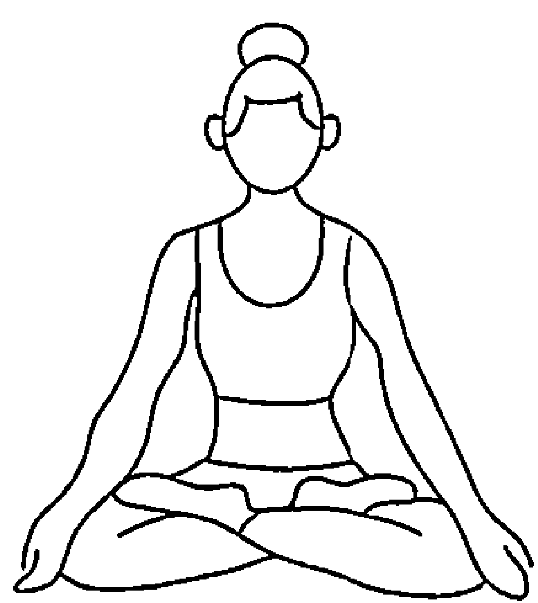

正念觉察练习
目光注视一个物品、注意自己的呼吸，或注意周围环境。留意此时此刻正发生著什么（我正看到 / 听到 / 感觉到 / 尝到 / 感受到 / 触碰到什么）
适用情境：我正走著 / 坐著 / 准备著食物 / 正著装打扮等

② 坐下来静心

目光轻柔地注视一个物品，充分意识到自己身体的感觉、此刻的念头与情绪，同时持续把注意力拉回到自己的呼吸上；当心思飘移，就把注意力再带回注视的物品，以及当下的感觉上。

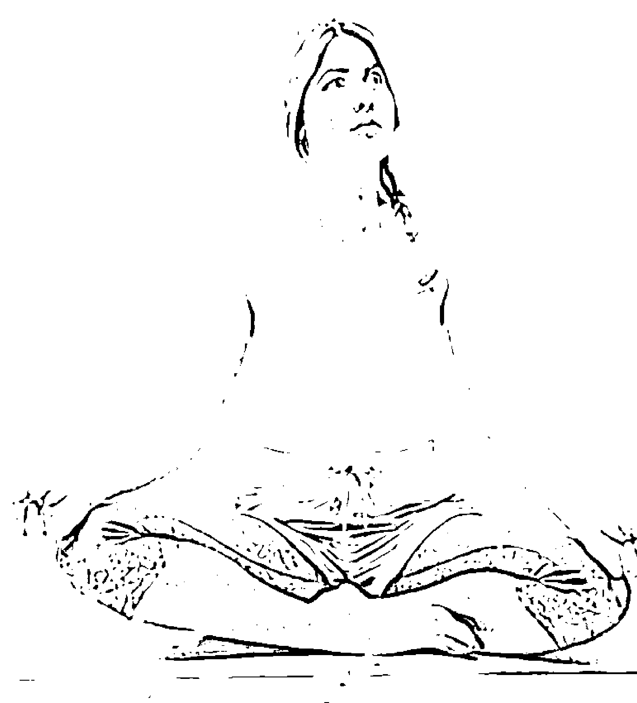

所谓正念或止息（shamatha），或静心，在那当下我们的目标是让心思沉稳、平静。我们将会发现到，这样的平静与和谐是心灵自然的一面。我们只不过是透过正念练习去发展及强化它，最终，我们将能达到内心平和的状态，而不需挣扎痛苦。我们的心会自然充满喜乐。

> 练习的目标：
保持每分每秒活在当下的态度，透过每天的「静心准备」及「坐下来静心」的练习，帮助你能把意识拉回到现在，时时刻刻单纯存在当下，存在于此时此刻丰盛的宁静当中。

Part 02
用精油协助静心
Essential Oils as Meditation Companions

从科学实证解释精油效用

精油拥有许多提升与改善身心健康和幸福感受的本质。它们可以促进心智清晰与集中专注力。它们也许会逐渐灌输一种平静、提振、激励和唤醒的觉知与感受。它们是在静心时最美妙的伙伴。

精油是什么？What is an Essential Oil?

精油是高度浓缩、挥发性、具有芬芳气味的植物化学衍生物，其萃取来自于某些植物、树木和灌木的不同部位，例如：

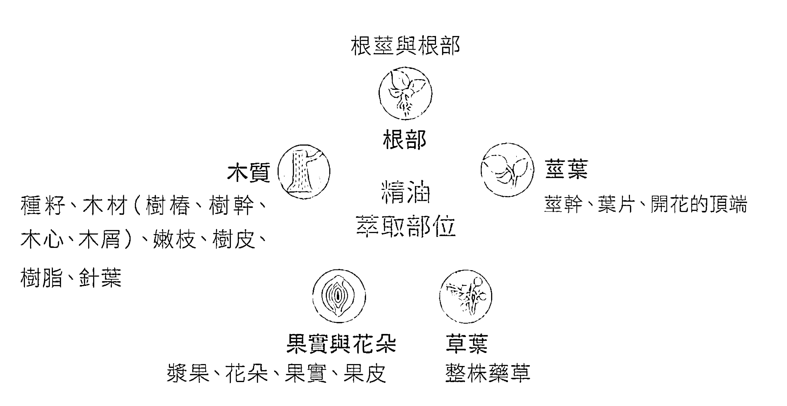

蒸气蒸馏法 Steam distillation

精油萃取的方式主要是透过蒸气蒸馏法（steam distillation）的过程。

当蒸气的热能与压力强行通过植物原材，蕴含在植物特殊腺体与分泌细胞内的精油则会被释放出来。然而，柑橘类的果香精油，例如：甜橙、红桔、柠檬和葡萄柚则是萃取自广为所知的冷温压榨法（expression）。此种方式是以破坏果皮油囊而获取精油。果香精油中含有高比例易挥发的萜烯分子，它们容易被高温所毁坏。

冷温压榨或浸吸法 Maceration

历史上记载，精油是通过冷温压榨或浸吸法（maceration）萃取而得。浸吸法是指将植物原材浸渍在暖热的动物性脂肪、油脂或是水中。当植物原材被其渗透时，它们的结构已被破坏进而释放出分泌细胞里的精油。然后再将脂肪、油脂或是水的混合物加以过滤予以分离。这些残余的精油相对适合应用在香水、抹香膏（油膏）或是疗愈药膏。

溶剂萃取法 Solvent extraction

溶剂萃取法（solvent extraction）类似蒸馏；然而，取代水与蒸汽的则是化学溶剂（例如：丙酮、己烷或甲苯）去溶解、助长或「浸出」精油与非挥发性成分。这样的方式热源较少，适合用在花瓣和花朵这类细致的植物原材（例如：玫瑰与茉莉）来予以分离精油，否则它们会被蒸气蒸馏法强烈的热源和压力毁坏成分。溶剂萃取法首先会产出含蜡质的软泥并称之为凝香体（concrete），为了将蜡质与精油分离，接着会使用强醇溶液（例如：乙醇）冲刷凝香体，并尽可能的萃取更多精油。最后，乙醇会被类似真空蒸馏的方式再次去除而产生较黏稠的物质，也就是大众常见的原精（absolute）。原精残留些许可剂和醇类，因此并未归类于纯精油品项。它们的挥发性较低，也因此比蒸气蒸馏所产的精油更趋稳定。原精的香气往往非常浓郁馨香，经常作为延续芳香气味的定香剂，因此主要用于化妆品和香水产业。

纯精油应是蒸馏或冷压法过程中萃取所得，没有额外物质被添加或移除。然而，有时必须重新精炼或矫正以除去精油里的不良分子。举例来说，佛手柑被去除具有光毒性的呋喃香豆素（furocoumarins），然后重新贴标称为去光敏佛手柑（bergamot FCF）。

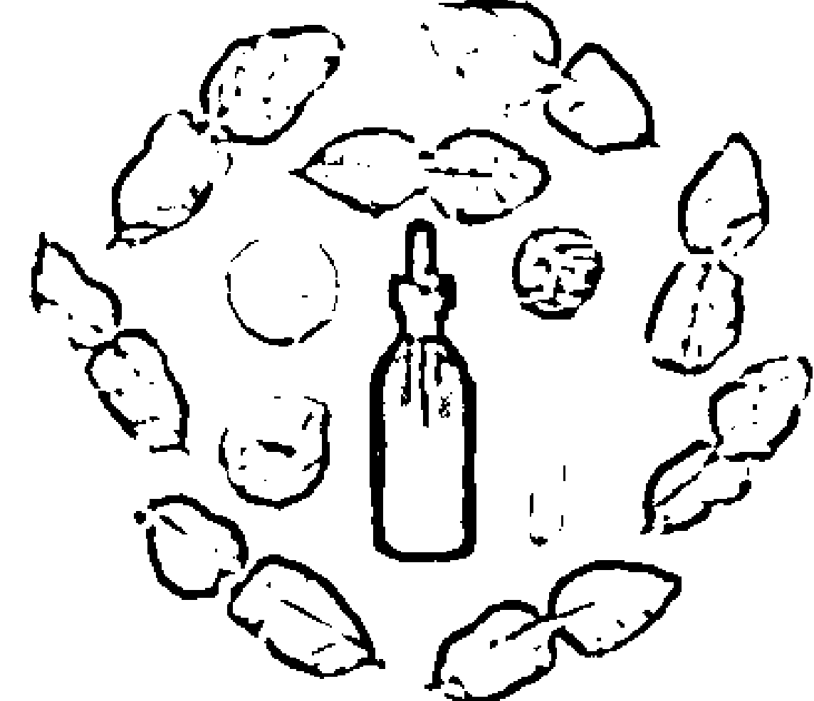

略举精油储存在植物的部位 *

| 植物部位 | 提炼精油 |
| :--- | :--- |
| 树皮 | 肉桂 |
| 浆果 | 杜松浆果 |
| 新鲜花朵 | 橙花（也称作 Orange blossom）、玫瑰、依兰依兰 |
| 花朵 | 金盏花、德国洋甘菊、罗马洋甘菊、丁香花苞、意大利永久花、茉莉；花朵顶端：快乐鼠尾草、牛膝草、真正薰衣草、柠檬香蜂草、甜马郁兰、胡椒薄荷、迷迭香、百里香 |
| 果实 | 黑胡椒、山鸡椒、八角茴香 |
| 全草（叶片） | 香茅、柠檬草、玫瑰草 |
| 叶片 | 白千层、肉桂、快乐鼠尾草、尤加利、牛膝草、真正薰衣草、柠檬香蜂草、香桃木、绿花白千层、广藿香、胡椒薄荷、苦橙叶、迷迭香、鼠尾草、茶树、百里香 |
| 针叶 | 丝柏、欧洲赤松 |
| 树脂 | 乳香、白松香、没药、吐鲁香脂 |
| 果皮 | 佛手柑、葡萄柚、柠檬、莱姆、红桔、苦橙 |
| 根部、茎干 | 欧白芷根、姜、穗甘松、缬草、岩兰草 |
| 种籽 | 苦茴香、藏茴香、豆蔻、胡萝卜籽、芫荽、茴香、肉豆蔻 |
| 嫩枝和枝干 | 白千层、肉桂、丝柏、尤加利、香桃木、绿花白千层、苦橙叶、茶树 |
| 露出地面的整株植物 | 苦茴香、天竺葵、迷迭香（品质较差）、西洋蓍草 |
| 木质（树桩、树干、木心、木屑） | 大西洋雪松、花梨木、檀香 |

* 在这张表格中，标示为粗体字的精油品项，是被我特别挑选出来且命名为宁静精油。完整的解释请参考下一章节：

并非所有的植物皆可萃取出精油。根据滴莎兰德与杨 (Tisserand and Young) 所撰写的《精油安全：专业健康照护指南》 (*Essential Oil Safety: A Guide for Health Professionals*)¹一书中，以及知名精油研究员布来恩·劳伦斯² (Brian M. Lawrence) 与《精油研究期刊》 (*Journal of Essential Oil Research*) 创办人，他们都提到世界上估计存有三十五万种植物，但其中只有一万七千五百种植物 (5%) 具有芳香的气息。

迄今，只有四百种特定芳香植物的精油适合用于商业用途；有百分之五十是专门为其用途所栽种，而其它则是在野外生长、种植和采收。

含有精油的植物主要生长在温带森林、林地、草原、灌木丛、地中海沿岸与热带雨林气候区域。例如：德国洋甘菊（蓝色）精油来自生长在北欧林地、德国、匈牙利和英国的草原植物。

罗马洋甘菊，还有真正薰衣草和其它的草本精油则是来自于法国、西班牙和英国所种植的植物。最珍贵的玫瑰精油来自于土耳其、保加利亚、伊朗这些地中海区域灌木丛里所生长的玫瑰花朵。玫瑰草和柠檬香茅来自于热带区域的印度和瓜地马拉。在某些情况里，植物生长种植在一个区域，而在另一个区域被蒸馏，举例来说：就像是干燥的香料。

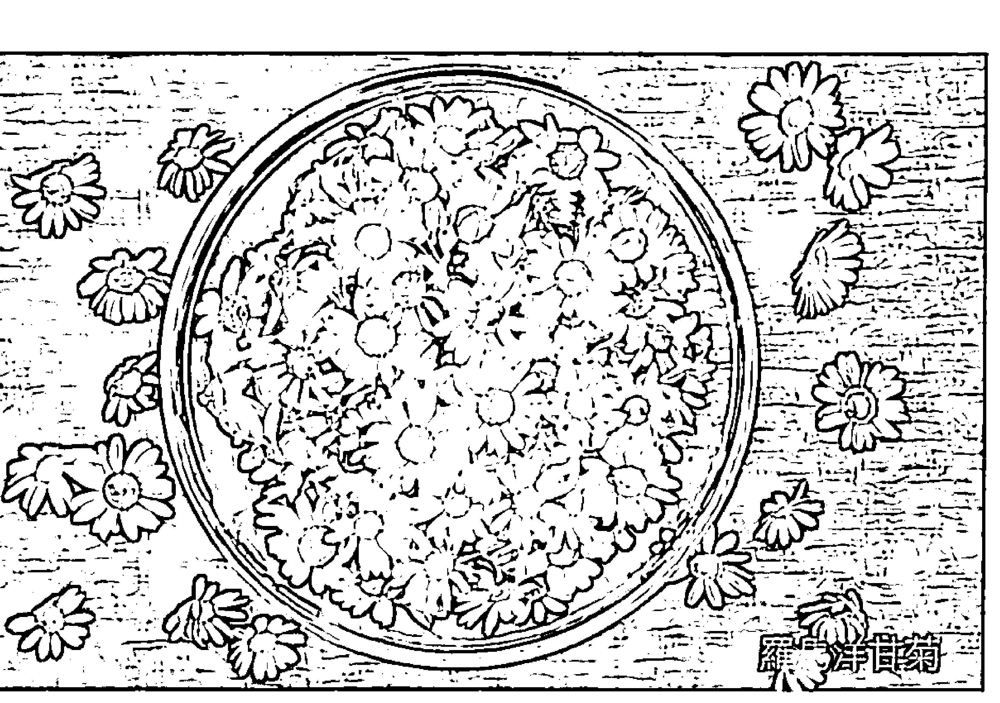

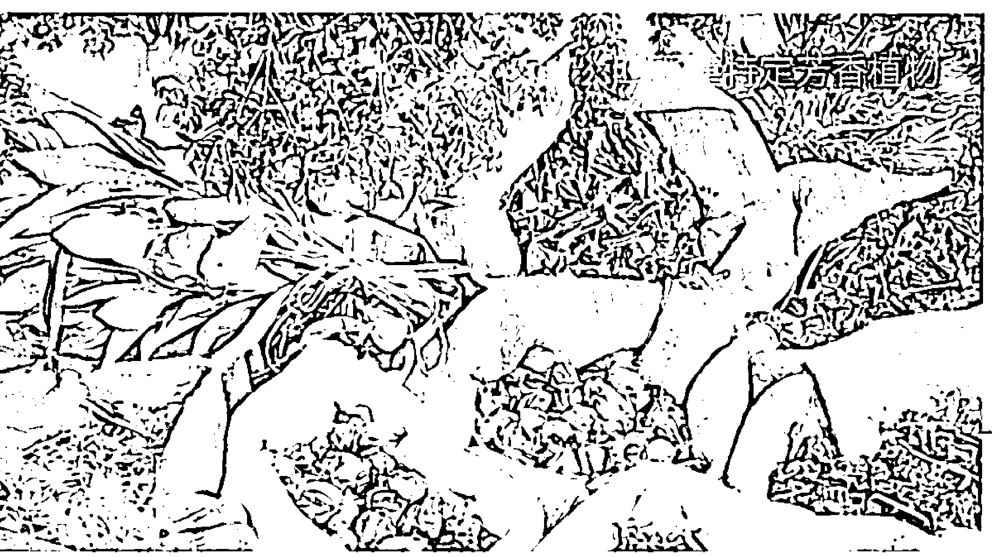

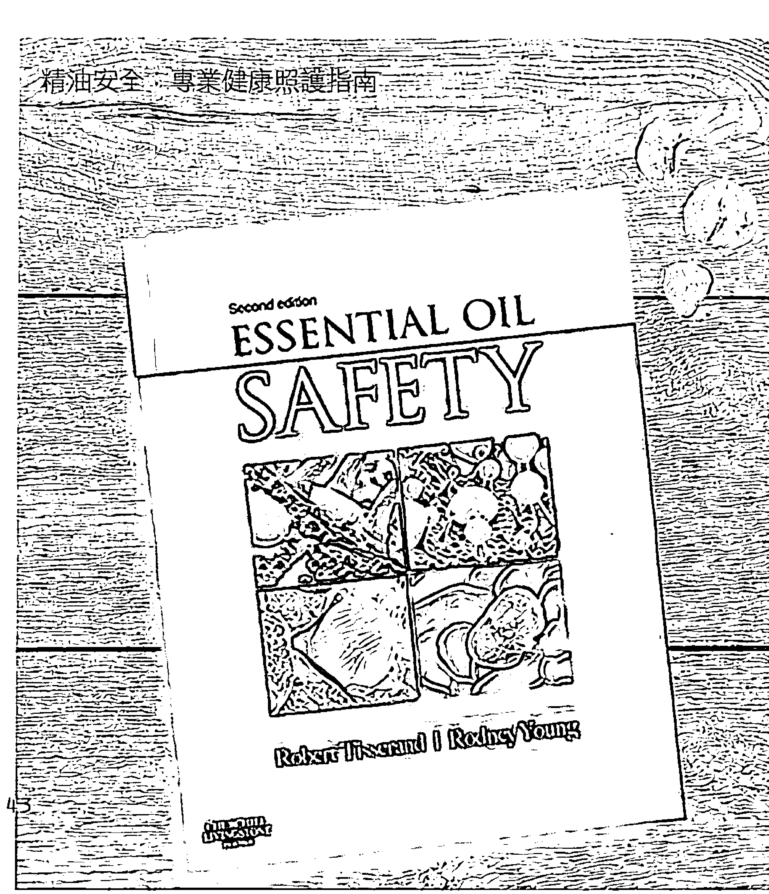

许多精油来自于工业副产品所得（例如：柑橘类的甜橙、柠檬和莱姆是为了食品、制造和香水产业而被生产）。以下列出含有精油的加工产品和食品，以便说明精油在日常生活中的普遍性。

| | | |
|---|---|---|
| 空气清新剂 | 口腔清洁剂 | 披萨 |
| 酒类 | 胶 / 黏着剂 | 食品和饮料调味剂 |
| 动物饲料 | 冰淇淋 | 保鲜剂 |
| 防腐剂 | 驱虫剂 / 杀虫剂 | 食用色素 |
| 烘培食品 | 乳液、乳霜 | 印刷油墨 |
| 饮品(伯爵茶、茉莉和玫瑰茶、草本茶) | 腌肉制品 | 香皂 |
| 漱口水 | 牙膏 | 润喉糖 |
| 蜡烛 | 鼻腔喷雾剂 | 肥皂粉 |
| 甜食糖果 | 药膏 | 罐头食品 |
| 隐形眼镜 | 涂料 | 软性饮料 |
| 速食、方便食品 | 纸类 | 烟草制品 |
| 化妆品与彩妆品 | 香精（香水、淡香水、古龙水、须后水） | 胃补剂 / 泻剂 |
| 止咳糖浆 | 牙科用品 | 纺织工业 |
| 制药（抗菌剂、抗真菌、解充血剂） | 消毒剂 | 兽医用品 |
| 洗衣清洁液 | 衣物柔软精 | 橡胶制造业 |

精油和静心 Essential Oils and Meditation

呼吸，确实被认为是通往意识的入口、地球与神圣之间的连结、灵魂与物质生活之间的联系，是宇宙万物与内在精神之间的桥梁（意识）。呼吸非常重要；它维持了生命的活力。精油分子随着呼吸吐纳而注入身体。当精油分子随着呼吸被携入鼻腔穿越嗅球时，它启动了封存在大脑已久的过往思绪，藉由意识的察觉，进而觉悟在内在与外在世界的微妙差异。侦查到气味的当下，试图嗅闻芳香气味的行为中，在那一刻，嗅闻香气者的意识与呼吸就瞬间连结起来了。

芳香的历史

从古至今，香水被用运用在刺激意识的察觉，觉察我们的精神自我（spiritual self）。举例来说（至今仍存在）：焚烧或是烟薰香料和树脂被用于宗教仪式、习俗和各类庆典里，在祈祷仪式中——烟雾象征着灵魂，意识则是即将通往浩瀚万象或者是超越高我（higher self）的象征。像这样的宗教仪式和习俗，原先的初衷是为了提醒人们保持清晰、专注在出入息之间，持续澄明地察觉，以便与全知全能的神圣有所连结。
事实上，众多精油的参考资料，有香气的花朵、药草和香料都被记载于各式各样的经文里，包括例如：吠陀经、古兰经、博伽梵歌和圣经…等。而圣经提到几种精油在历史上使用于治愈、净化和防护，还有象征祷告与宗教仪式的方式。这些精质、香脂和焚香主要从压碎或浸泡过的根部、树皮、嫩枝与叶片，以及植物或树木所渗透出来的胶质与树脂提取而得之。（见第46页表格）

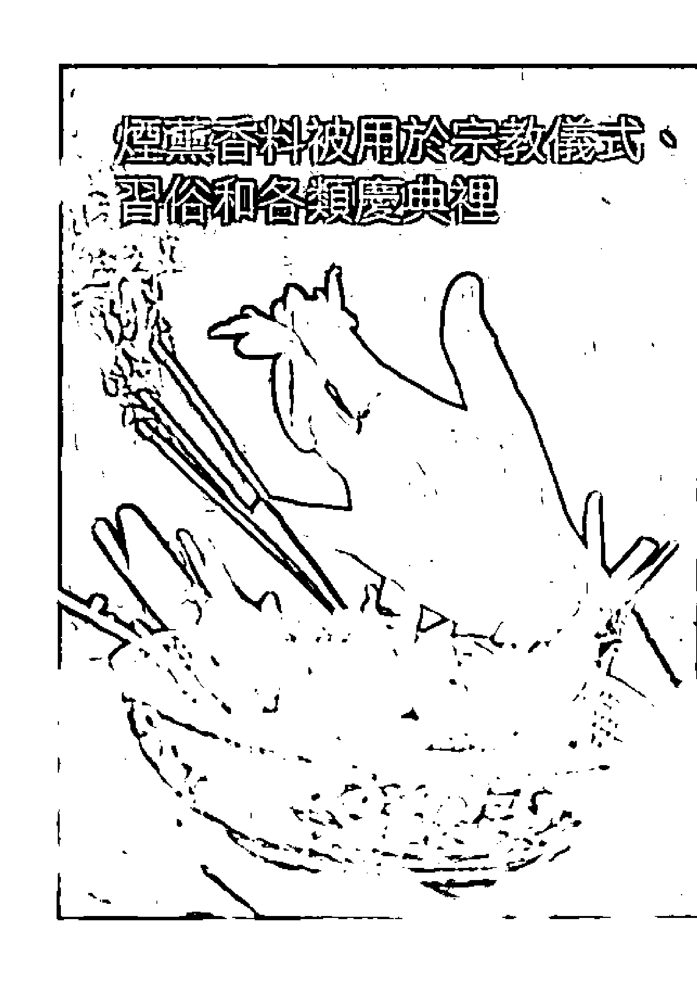

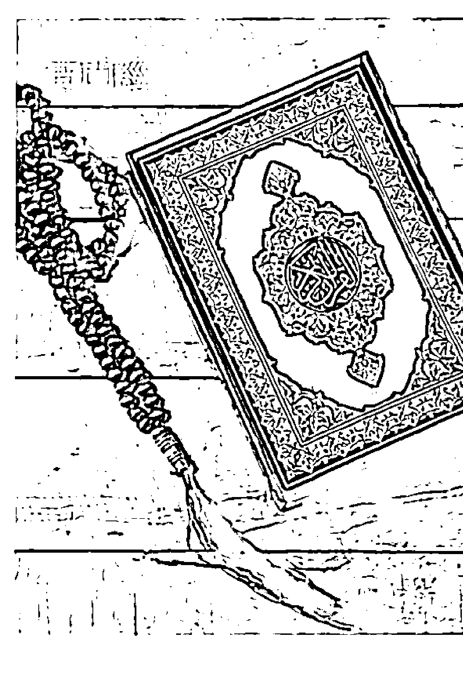

精油可以用來搭配静心前的准备工作（例如泡澡、按摩或空间里的扩香），也可以在静心过程中帮助你定心、专注、警觉和清醒，同时让脑海里挥之不去的念头安静下来，安抚烦躁不安的情绪（可以当作个人香水使用，或在空间中扩香），静心过后，精油可以做为一种记忆线索，以它提振身心、扎根和平衡的特质，温柔地提醒你把注意力拉回此时此刻。

圣经*中提到的精油（树脂、胶质、精质和焚香）

| 中文名称 | 拉丁学名 |
| :--- | :--- |
| 基列的香脂 | Balm of Gilead / Pistacia lentiscus |
| 安息香 | Benzion styrax / Styrax benzoin |
| 菖蒲 | Calamus / Acorus calamus |
| 中国肉桂 | Cassia / Cinnamomum cassia |
| 大西洋雪松 | Cedarwood / Cedrus atlantica |
| 锡兰肉桂 | Cinnamon / Cinnamomum zeylanicum |
| 乳香 | Frankincense (olibanum) / Boswellia carterii |
| 白松香 | Galbanum / Ferula galbaniflua |
| 岩玫瑰 | Labdanum (cistus, rock rose, onycha) / Cistus ladanifer |
| 没药 | Myrrh (ancient mimosa?) / Commiphora myrrha |
| 檀香 | Sandalwood (possible cross-reference with aloewood, oud, oohd, agr) / Santalum album |
| 穗甘松 | Spikenard (nard) / Nardostachys jatamansi |

* References: Exodus 30:22-25, 30:34; Leviticus 2:1, 2:16, 6:16, 14:4, 14:6, 14:49, 14:51, 14:52, 24:7; Numbers 16:46-48, 19:6, 24:6; Nehemiah 8:15; Esther 2:12; Psalm 45:8, 51:7, 141:2; Proverbs 7:17, 27:9; Solomon 1:3, 1:12, 3:6, 4:6, 4:11-14, 4:13-15, 4:40; Isaiah 55:13, 60:6; Jeremiah 6:20, 8:22; Malachi 1:11; Matthew 2:11; Mark 14:3; Luke 1:10; John 19:39; Philippians 4:18; Revelations 5:8, 8:3

被挑选的精油将会是依照个案或对你而言，你想要或需要什么？在本文中并非提供所谓最好的复方用油，端看在任何特定的时刻，最适合你使用的是哪些精油。与生俱来所拥有的嗅觉会帮助你发掘其中的秘密；相信你的直觉，这会是一个很好的起始点。以下各章节将会提供大量资讯，有助于指导你的选择权。木质、树脂、根部和盛开的玫瑰是引领你开始着手的通用指南，这些香气在传统用途中占有一席之地，并且常用于支持静心与祈祷仪式。

木质与（盛开的）花朵组合有益于平衡和提振。木质辅以呼吸顺畅。树脂和根部具有踏实或接地气。香料与柑橘类则具激励、警觉与活跃度。药草予以机能平衡；有些是刺激作用（例如：迷迭香），有些则更加放松（例如：甜马郁兰），真正薰衣草和广藿香则是含括二者皆有。

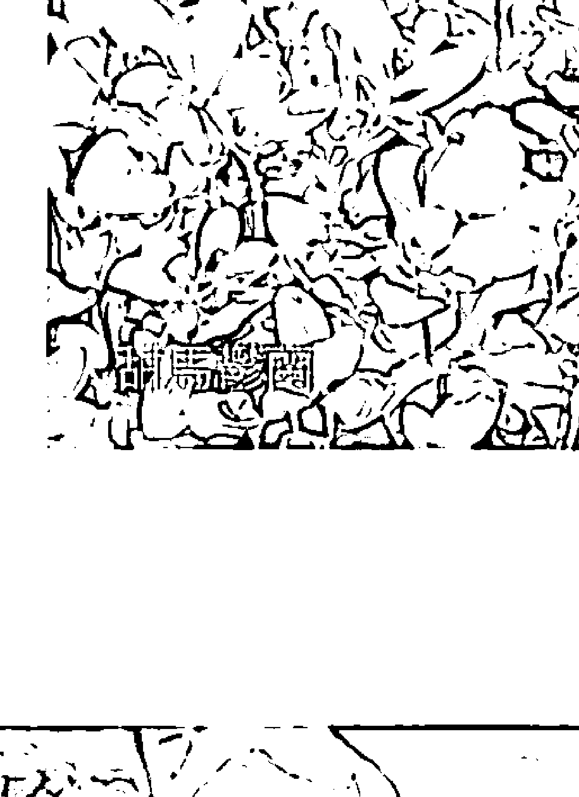

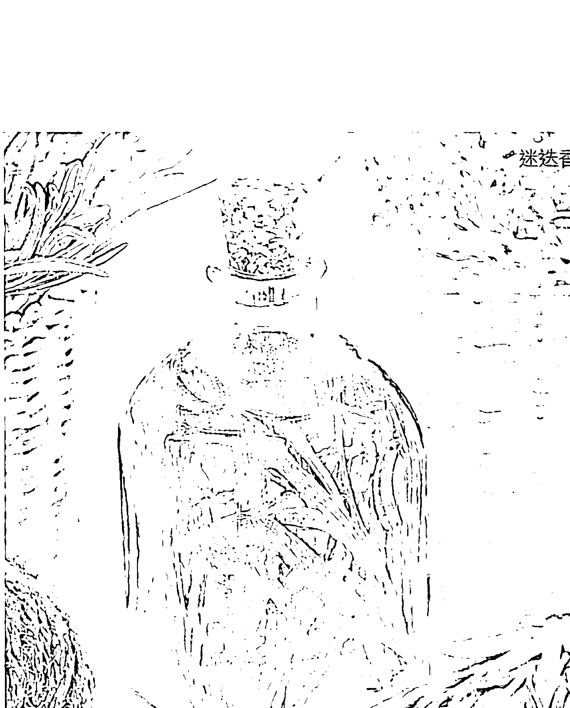

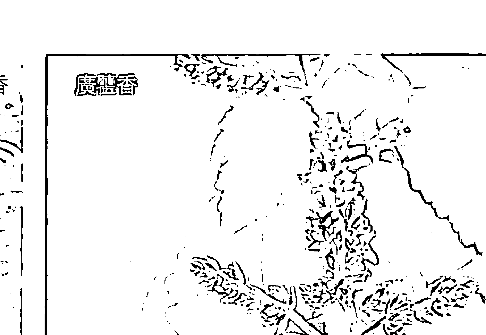

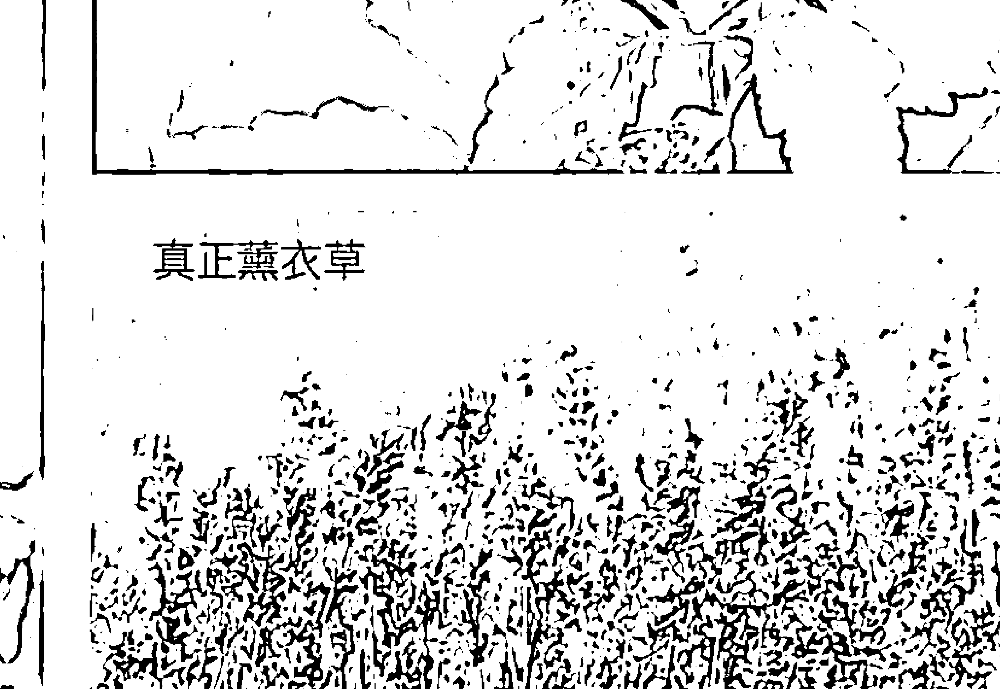

## 精油如何被身体吸收？

How are Essential Oils Absorbed by the Body?

### 精油进入身体途径的三种不同方式

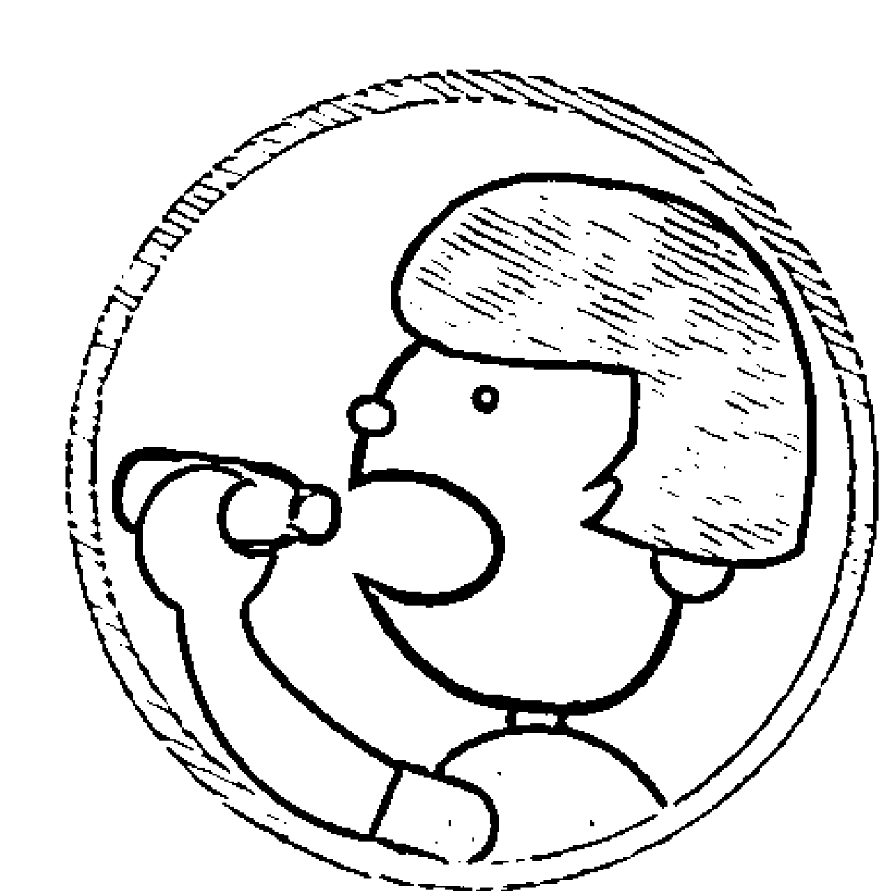

**口服摄取**
（这个原则也适用于经由直肠或阴道栓剂让直肠或阴道吸收）※ 谨慎使用

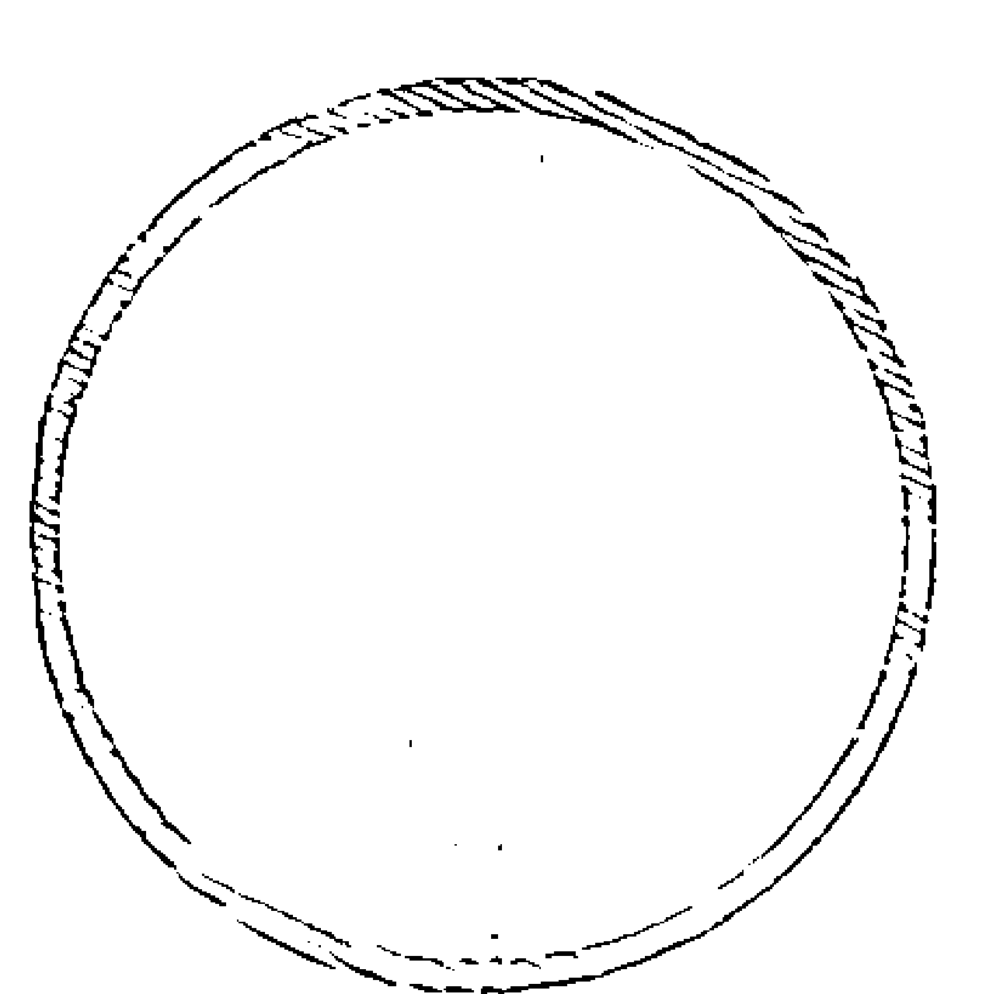

**经皮吸收途径**
（皮肤）

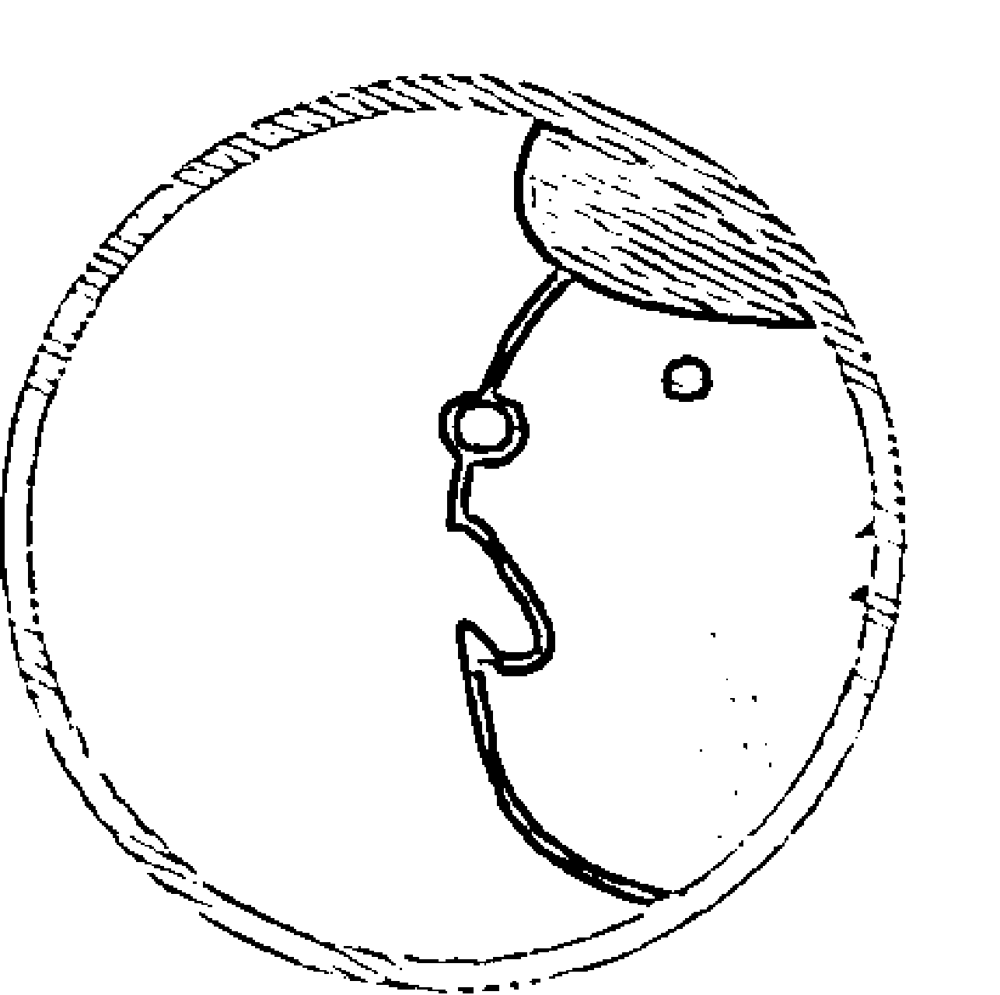

**嗅觉吸收途径**
（嗅闻）

**口服摄取 Oral Ingestion**
口服摄取，除非合格的健康医疗照护人士接受过完整的精油专业训练，并且能开具处方与审慎计算剂量，否则在任何情况下，我并不主张口服精油。
口服精油有非常多的注意事项仍需谨慎考量，因此切勿贸然进行。口服摄取精油时，95～100%的精油将会被体内的系统吸收（肠胃道的吸收不像皮肤，皮肤的上皮组织具部分屏障作用，因此只能部分吸收）。再者，绝不允许直接吞咽精油（浓度过强），因为它们会引发严重的黏膜刺激。虽然精油会迅速地从体内或体外代谢且排出，但如此也会导致增加肾脏和肝脏功能损害的风险，以及对消化系统相关的器官产生内在刺激。口服某些精油是在口服毒素。
同时内服精油与用其它处方药物，其成分会增强负面化学交互作用，因而导致潜在风险或加剧其作用。例如：甜桦木（sweet brich）和冬青（wintergreen）精油绝不能在一个注射或口服抗凝血剂（Warfin）时使用；因为这些精油有增加抗凝血和稀释血液的潜在危险。

在滴莎兰德与杨（Tisserand and Young）的著作《精油安全：专业健康照护指南》（Essential Oil Safety：A Guide for Health Professionals），特别警示口服贞洁树（chaste tree）、蓝丝柏（cypress blue）、西澳檀香（sandalwood W. Australia）、以及小花茉莉原精（jasmine sambac abolish）可能与例如：盐酸伊米胺（imipramine）、阿米替林（amitriptyline）这些三环类抗抑郁剂（tricyclic antidepressants）不相容，或是具吗啡作用的药物像是可待因（codeine）也不相容。这些精油同样是透过肝脏的CYP2D6酵素代谢，若口服精油则会与药物竞争代谢途径，使得药物代谢速度减缓而造成血中浓度升高，其它例如：CYP1A2、CYP2C9、CYP2D6以及CYP3A4的代谢酵素，亦同。嗅闻和皮肤局部涂抹香脂杨（balsam polar）、蓝色洋甘菊（blue chamomile）、鼠尾草（sage）、西洋蓍草（yarrow）也可能增强CYP2D6酵素代谢作用。³

## 经皮（皮肤）吸收途径 Percutaneous (Skin) Absorption

皮肤覆盖着身体的表面，是身体系统的一部分，也是身体最大的器官。皮肤具备部分的屏障与穿透性，它包含且保护体内器官、肌肉、韧带和骨骼，其透过肌肉颤抖和皮肤排汗的方式以调节体温。皮肤由三个主要构造所组成：表皮（最浅层）、真皮（中间层）以及脂肪皮下组织的皮下层所构成。真皮层含有血管和淋巴管、神经，还有通过真皮到达最浅层和毛发的汗腺与皮脂（油）腺；因而使皮肤既滋润又油滑。

精油是亲水（hydrophilic）与亲脂（lipophilic）二种成分所组成，因为它们会挥发，而且迅速蒸散。通常温暖抚触皮肤也会加速精油蒸发的倾向。若直接涂抹纯油在皮肤上，精油里的亲水分子（hydrophilic molecules）与皮肤上的水分相互结合，在精油挥发的同时，也会促使皮肤干燥而增加刺激的机会。精油不应未经稀释就直接涂抹于皮肤。它们必须被适当稀释并混入植物油（例如：葡萄籽油或甜杏仁油）、基底膏、乳霜或乳液里。这些介质不仅是用来保护与滋润皮肤，它们也提供润滑作用以帮助涂抹和按摩，当然也会促进精油分子的吸收（乳霜和乳液倾向于水相，其有助於親水性的吸收，油相和香膏則有助於親脂性的吸收)。

塗抹於皮膚之後，精油分子會在表皮組織持續停留一段時間。某些精油分子最終會進入到微血管，從那兒擴散到血液和淋巴系統，然後再循環至全身。然而，大部分的精油都是從皮膚揮發，有些分子則順其自然地被嗅吸。實際上，只有不到10%的純精油會被吸收至體內。^1

按摩是一種促進循環（反而有益於精油吸收）以及在靜心之前幫助放鬆的好方法。同時也會提升正向自我價值、尊重和平等心。即使微量地使用精油，也有益於集中注意力且專注其中、緩解紛擾思慮與憂愁，逐漸注入一種和諧與平靜的感受，有助於清潔鼻竇道來改善呼吸系統，讓呼吸更深層、更徹底。

## 嗅覺吸收途徑 (Olfactory Absorption (Inhalation))

嗅覺是指鼻子意識到氣味過程的感受。作為吸收精油的方式，嗅覺本身與具有高度揮發性質和帶有芬芳氣味的精油非常契合。由於嗅覺吸收與靜心的關係最為重要，應用的方式明列於下述詳細說明之。

## 嗅覺的吸收及其應用方式

| 面紙或試香紙 | 芳香按摩 | 飲食 / 藥草 / 香料 |
| --- | --- | --- |
| 蒸氣吸入法 | 室內擴香 | 居家用品 |
| 香水 | 蠟燭台 / 樹脂薰香 | |
| 臉部 — 乳霜、乳液、凝膠或基礎油 | 身體乳和按摩油 | |
| | 芳香泡浴 | |
| | 淋浴（在熱氣中蒸散） | |
| | 線香焚燃 | |

## 寧靜精油 Serenity Essential oils

有四百種芳香植物當作精油使用，而我特別挑選出十六種當作是寧靜精油（Serenity Essential Oils）。由於它們的危害風險最小並且彼此有互補的特性，每一支精油皆有助於靜心、放鬆、壓力管理或是在具有壓力的情況中，擁有無比寶貴的支持力量。

| 中文名稱 | 英文名稱/學名 |
| --- | --- |
| 白千層 | Cajeput / Melaeuca cajupti |
| 胡蘿蔔籽 | Carrot Seed / Daucus carota |
| 德國洋甘菊 | Chamomile, German / Matricaria recutita |
| 羅馬洋甘菊 | Chamomile, Roman / Anthemis nobilis |
| 絲柏 | Cypress / Cupressus semperivirens |
| 乳香 | Frankincense / Boswellia carterii |
| 白松香 | Galbanum / Ferula galbaniflua |
| 芳香天竺葵 | Geranium / Pelargonium graveolens |
| 真正薰衣草 | Lavender / Lavandula angustifolia |
| 紅桔 | Mandarin / Citrus reticulata |
| 廣藿香 | Patchouli / Pogostemon cablin |
| 苦橙葉 | Petitgrain / Citrus aurantium var. amara |
| 奧圖玫瑰 | Rose Otto / Rosa x centifolia, Rosa x damascena |
| 穗甘松 | Spikenard / Nardostachys jatamansi, N. grandiflora |
| 茶樹 | Tea Tree / Melaleuca alternifolia |
| 岩蘭草 | Vetivert / Vetiveria zizanioides |

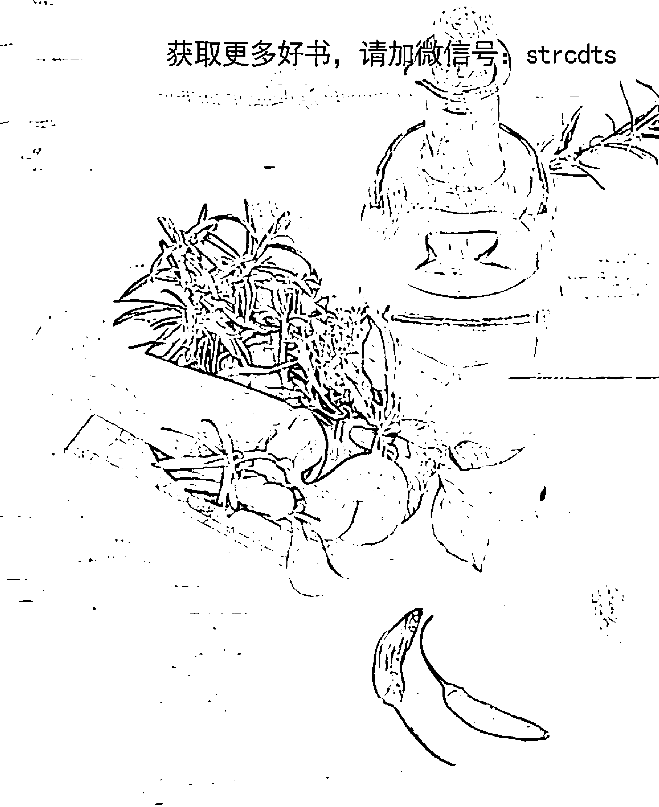

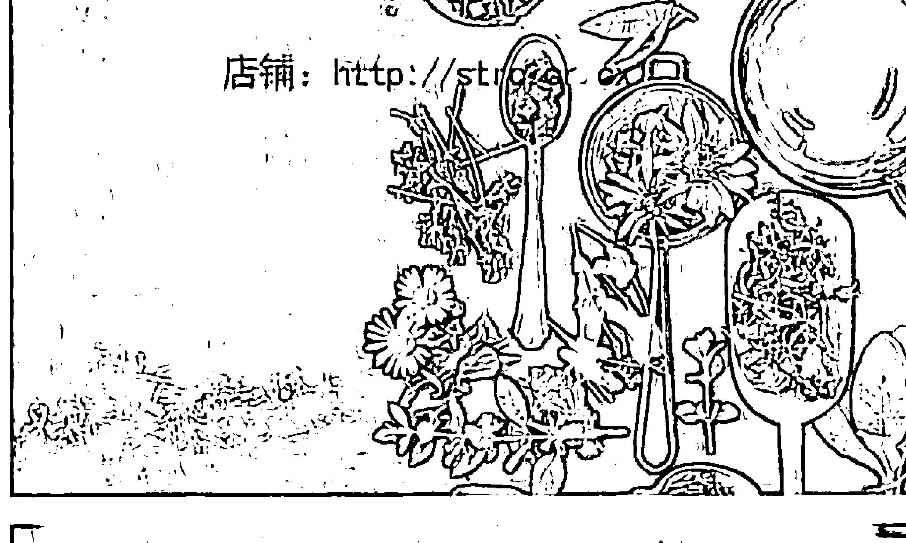

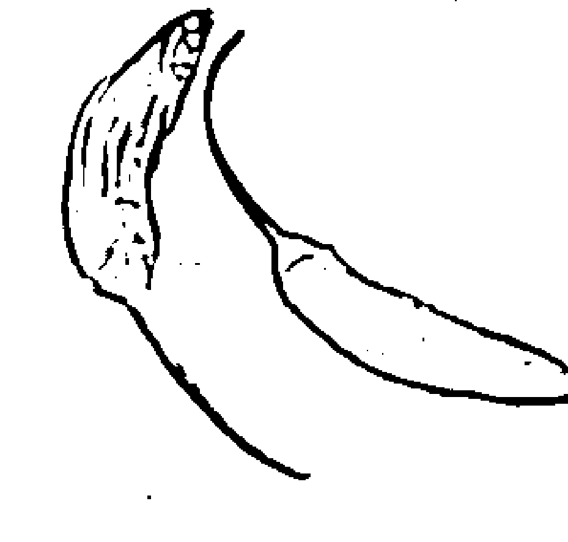

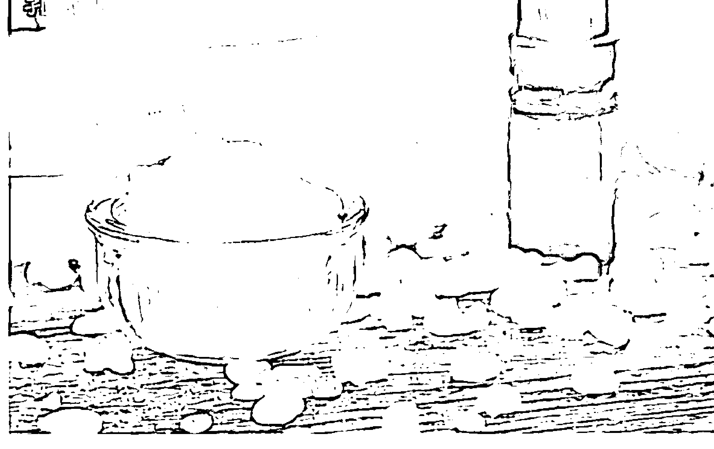

这些被挑選出來的精油特點，是我的客人經常用來幫助他們放鬆和減壓的選項，例如：緩解失眠、焦慮和憂鬱……等相關症狀。另一個特點是從中國古代到埃及中世紀的藥草師、煉金術士和調香師，皆看的到使用它們的足跡出現在歷史經典、論述、古代文明醫學和哲學著作。關於它們的知識，早已被薩滿巫師、祭司、療癒師和早期醫師記錄，並且橫跨世界，穿越時光隧道傳播至今。

所有的寧靜精油都具有潛在支持靜心的力量，特別是絲柏、乳香、白松香、廣藿香、奧圖玫瑰以及穗甘松更具有顯著的影響力。

## 感受氣味 The Sense of Smell

從精油中滲出的化學分子，或是從花朵與植物油腺裡分泌的精油，當它們揮發時，很容易與周圍空氣裡的氧分子結合。精油分子會隨著呼吸跟著空氣流入體內。吸入含有精油分子的空氣至鼻腔（nasal cavities）時，會先抵達並通過位於鼻腔內部兩側頂端，稱為「嗅上皮」的表皮組織，在此之前，精油分子也會往下通往氣管而進入肺部。

### 嗅覺路徑

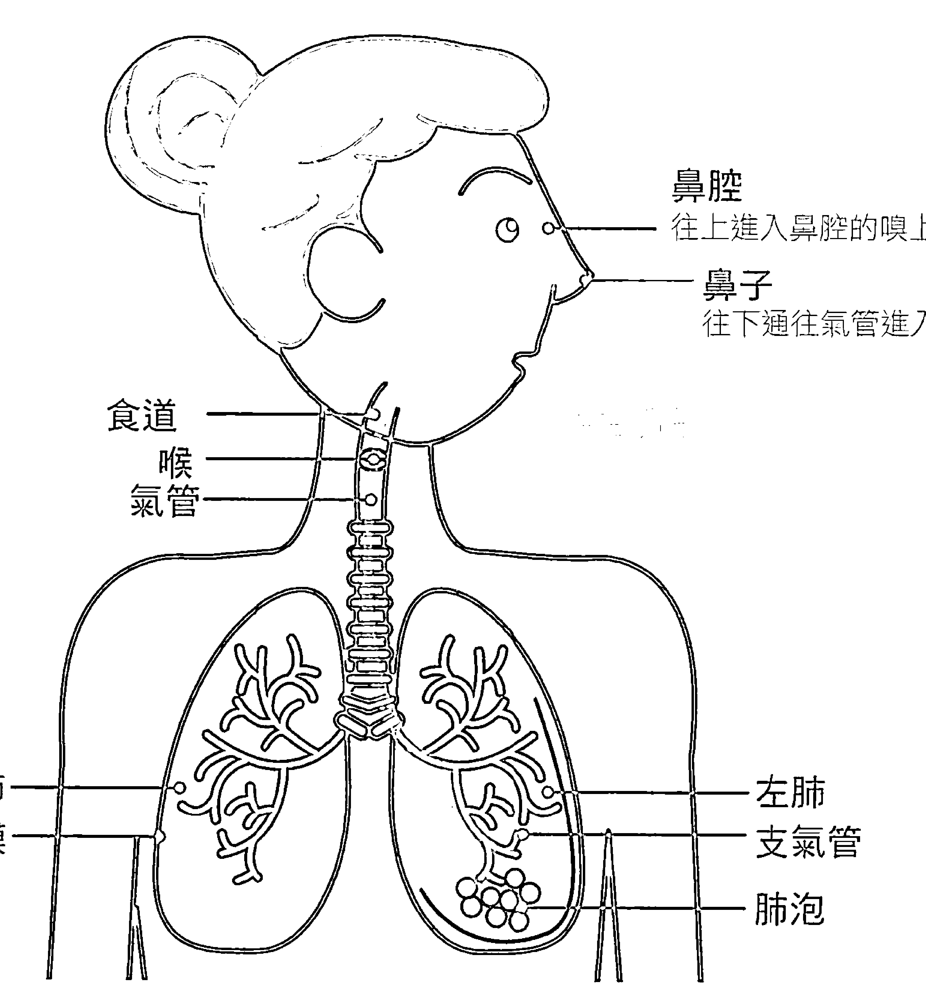

## 精油吸收至體內

從上頁的示意圖，我們看到含有精油分子的空氣透過鼻子穿越嗅上皮，往下通往位於食道前方的氣管，接著進入左右分支的支氣管和細支氣管而抵達肺腔。接著下頁右圖，空氣透過肺泡（alveoli）——氣體與血液交換的主要場所來進行氣體交換。肺臟分成左肺和右肺，主要由許多稱之為肺泡的一群既微小且中空的氣囊所組成，成年人約含有三億五千萬個肺泡，表面積約略為80～120平方碼。

兩兩相連的肺泡之間，有一層很薄且部分帶有肺泡小孔的肺泡壁相隔。肺泡外圍有許多由肺小動脈和小靜脈所形成的豐富微血管網絡，透過肺泡壁和微血管壁的擴散作用，肺臟內含有大量氧氣和二氧化碳的空氣腔室與血液之間，則在此進行非常迅速的氣體交換。

氧氣以及其它傳播在空氣裡的混合物，例如：精油的芳香分子，從口或鼻吸入的瞬間會穿越肺臟肺泡內，並且擴散到動脈微血管內的血液，其會由肺泡空氣中收集氧氣。富含氧氣的血液從肺臟（經過小動脈和動脈）透過循環系統開始它的旅程而傳遞至全身細胞內；因此，精油分子會隨著血液流動而進入體內器官與細胞。另外一面，經由氣體交換所產生的二氧化碳，則會從呼吸細胞擴散到血液中——血液由器官和其它組織透過靜脈，最終擴散到靜脈微血管。被包覆在血液裡的揮發性混合物與二氧化碳會離開血液釋放到肺泡空氣中，接著以反方向的方式經過支氣管和氣管，最後將氣體交換完畢的廢氣從口或鼻呼出體外。

## 偵測氣味分子

空氣進入鼻腔會先由內襯的纖毛阻擋塵埃顆粒，並且使含有塵埃的黏液往咽的方向移動吞入或吐出，然後再和一系列通往肺臟的空腔和管道相互連接其作用。隨著吸入空氣裡的氣味分子（odorant molecules）傳入鼻腔，該分子會先被覆蓋於上皮組織表面當作是氣味溶劑的黏液——溶解和沉積，接著根據他們的形狀再與纖毛受體細胞（cilia receptor cells）結合而偵測出該氣味（類似鑰匙插入相符的鑰匙孔）。纖毛受體細胞具有能力提供大量複雜組合辨識氣味的能力（類似矩陣效應），如此有助於提高偵測多種細緻香氣差別的能力；這就像是六個樂透號碼可以按照不同組合，形成數百萬種數字組合的方式。氣味分子與嗅覺受器細胞上的纖毛接觸時，會觸發神經脈衝且沿著神經纖維傳遞到嗅球（olfactory bulb）內嗅小體的僧帽細胞（mitral cell）。

## 肺泡、微血管和小動脈

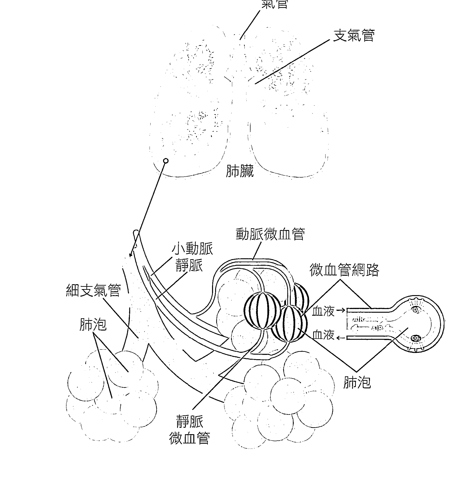

僧帽細胞是位於嗅球內嗅小體上的神經元，當氣味結合蛋白質抓住氣味分子並與受體結合後，它們反過來改變嗅覺受體構形，由嗅球延伸出的神經元軸突所形成的嗅徑，傳遞訊號到達大腦顳葉皮質的主要嗅覺區，以及部分邊緣系統（有時候亦指為情緒腦），其中包含的結構例如：下視丘、杏仁核以及海馬迴。

## 嗅覺系統

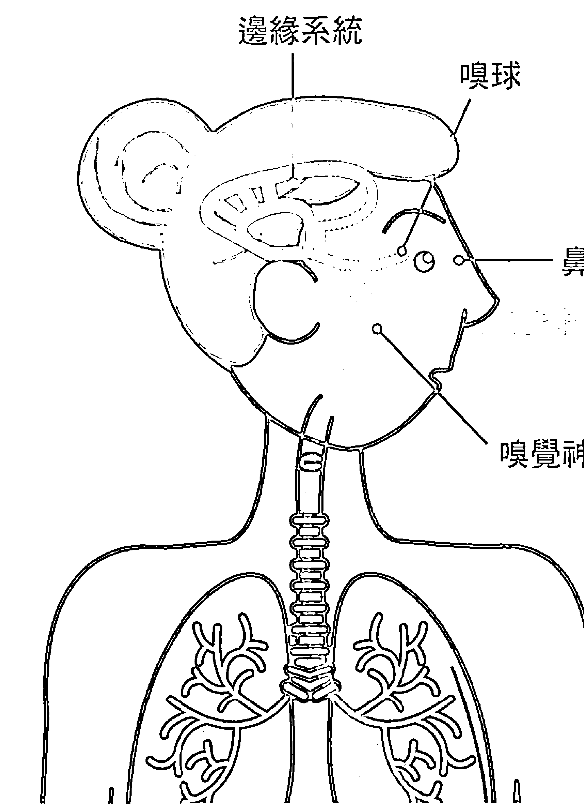

### 腦內的嗅覺之旅

在嗅球內負責傳遞訊息的僧帽細胞會沿著嗅徑軸突前進，直到它們在前連合 (anterior commissure) 處匯聚。前連合是一群重要的特化纖維，它位在額葉皮層中央下方，靠近邊緣區域穹窿列前面的位置，其也是大腦的中線並且連接左半球和右半球。左右二側的鼻腔及其嗅徑直到此處是完全分開的。

## 氣味進入腦部的嗅覺路徑

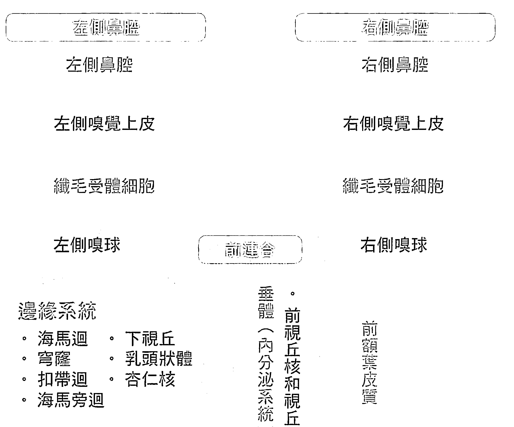

### 邊緣系統

具功能性的邊緣系統呈兩個左右對稱的 C 形結構，並且包括四個主要部分。一側由海馬迴和穹窿組成，另一側由扣帶迴（cingulate gyrus）和海馬旁迴所組成的邊緣葉，下視丘、乳頭狀體以及杏仁核也是邊緣系統的一部分。該系統透過內分泌與自主神經系統的刺激與影響而運作。與偵測氣味相關的邊緣系統結構，例如：海馬迴和杏仁核，是在原始脊椎動物發展中負責提供感覺訊號，維持它們生存的重要功能——辨識食物、擇偶、掠食者、腐爛或毒氣……等危險的化學藥劑。

### 舊腦 Old Brain

邊緣系統被稱為舊腦的原因是它最接近腦幹，這些結構位於中腦的區域。從包含在大腦原始部分內的結構到前腦皮質（它是構成新哺乳動物大腦區域的一部分），邊緣系統透過來自視丘的多巴胺神經傳導物質的訊號，直接連接到前額葉皮質（位於額葉）。

### 多巴胺 Dopamine

多巴胺是一種由神經細胞所釋放出來的化學物質，它可將訊號傳遞到大腦與身體內其它的神經細胞。前額葉皮質是大腦感覺辨認、推理、判斷、分類以及從邊緣系統接收有關情感和本能訊息（還有其它例如：視覺、聽覺和觸覺）來決定反應的地方。

### 腦下垂體 Pituitary Gland

腦下垂體和下視丘透過垂柄體附著而在功能上能相互連接。儘管存有這個界面，腦下垂體（主要的內分泌腺）並非是構成邊緣系統的一部分。然而，當我們感覺經歷到喜悅或恐懼這類的情緒煽動時，就會促使下視丘（hypothalamus）影響腦下垂體釋放出影響血壓或刺激心臟…等激素。腦下垂體直接參與代謝和誘導多種生理激素的功能與過程，例如:生長、血壓調節、性器官功能、甲狀腺功能、腎臟水平衡、溫度控制、緩解疼痛以及將食物轉化為能量。

### 大腦邊緣系統的構造與位置圖

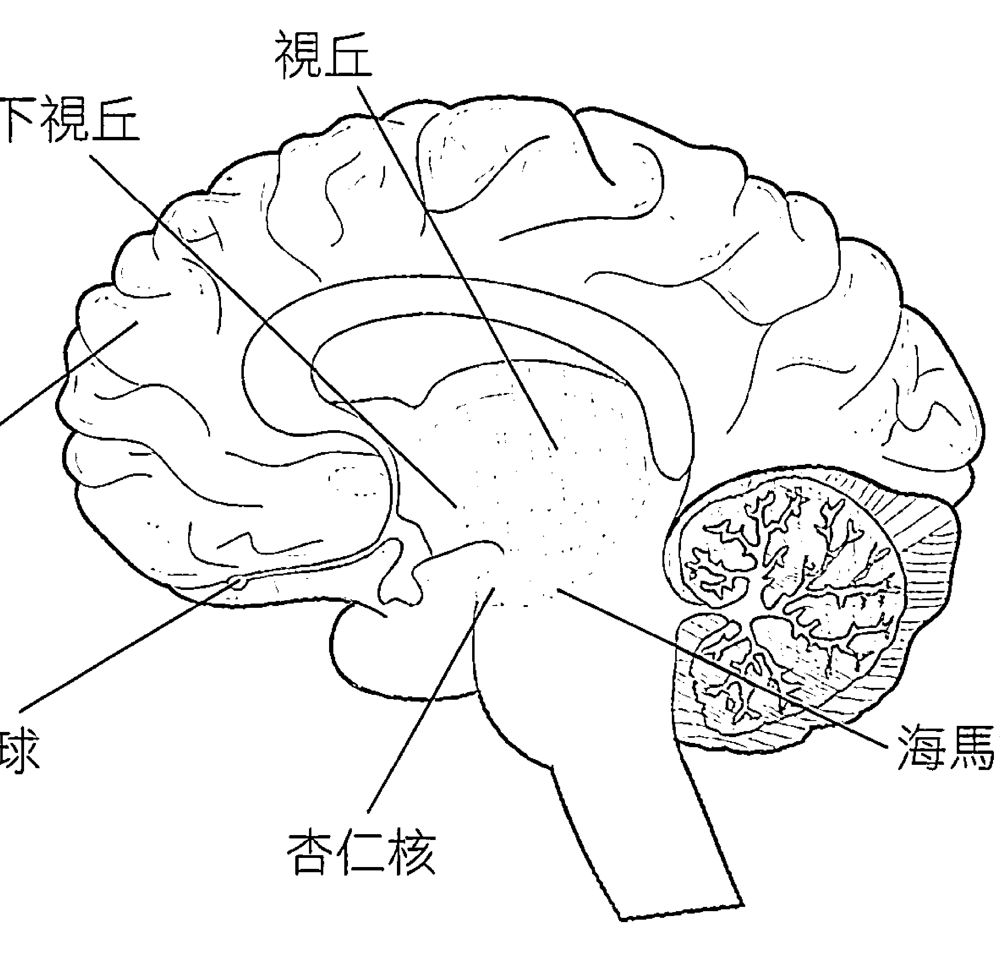

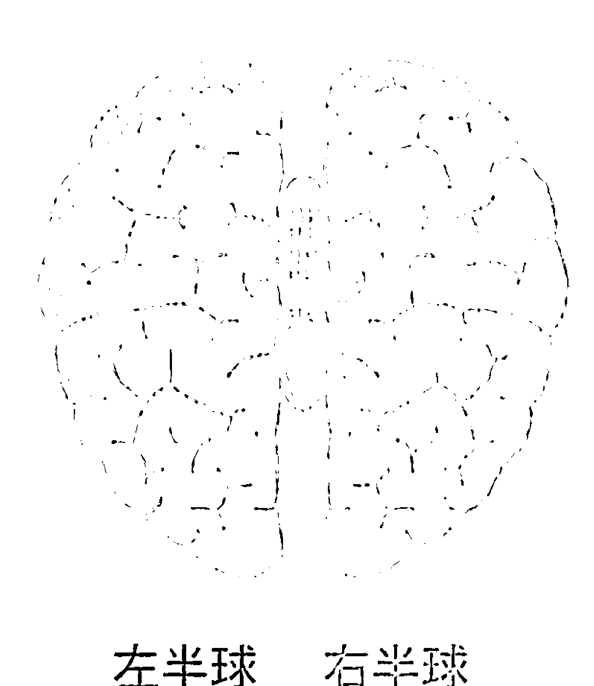

## 大脑如何控制身体的运动和功能以及如何处理讯息

人类的大脑被区分为两个半球（hemipheres），左半球与右半球；半球彼此间以内部的胼胝体（corpus callosum）相互连接通信功能。大致来说，**大脑左半球**在符合逻辑性的思考历程与活动等功能较为重要，而**大脑右半球**对于创造性的音乐和艺术天分等功能较为重要。在生理上，**大脑左半球**负责身体右边的神经活动与肌肉运动，**大脑右半球**则负责身体左边的神经活动与肌肉运动。这也包括肌肉的控制。根据实证指出，**大脑左半球**参与较多的常规或是需要精心排练的过程，而**大脑右半球**则参与较多新状况的处理。然而，脑部损伤的研究显示，当神经通路被重新定向到未受损的部位时，大脑左右两个半球具有相同的能力来处理大多数的日常行为，不过根据遭受损伤的性质与脑区仍然有例外。（例如：遭受损伤的海马迴，它可能会导致不可逆的长期无法记忆新事物的障碍）

## 左右两个大脑半球之间的功能差异

| 左脑功能 | 右脑功能 |
| --- | --- |
| 思考层次的分析 | 3D 立体影像 |
| 瞭解符号语言 | 抽象 |
| 处理细节 | 艺术性 |
| 语法 | 创造力 |
| 语言 | 情感表达 |
| 字义与句型 | 容貌识别 |
| 逻辑 | 愉悦型 |
| 数学 / 数字演算 | 整体思考 |
| 最近的说话记忆 | 想像力 |
| 理解力 | 洞察力 |
| 现在和过去 | 直觉力 |
| 推理 | 音乐感 |
| 理性 | 哲学与宗教 |
| 安全感 | 图像 |
| 科学技巧 | 复杂型态的触觉 |
| 序列的控制 | 现在和未来 |
| 理论的 | 冒险精神 |
| 对时间敏感 | 空间与形態的感受 |
| 文字 | 自发性 |
| 书写 | 视觉心像 |
| 阳刚 | 阴柔 |
| 阳性 | 阴性 |

## 边缘系统与精油的分类

边缘系统与各种感觉有关，是一群相互连结的功能构造，它参与一系列复杂心理与情绪之间的交互作用、生理以及行为反应。

因此，边缘系统虽然负责了内在情绪，但很难将某些行为、激素和功能归因于一个特定的大脑区域；有许多变数起作用，几乎不能分割成单一归类。

精油在疗愈上的功能归类，例如：激励、镇静以及放松等等，也是属于概括性的术语分类。然而，实际上许多精油同时拥有激励和镇静二种疗愈特性（例如：佛手柑、洋甘菊、快乐鼠尾草、天竺葵、真正薰衣草、甜马郁兰、广藿香以及依兰依兰），因此需视其它精油是较具镇静 / 激励性较小，或激励性较强 / 较不镇静的性质，而不是归类成单纯的一种或另一种。

精油一旦被身体系统吸收之后，它们似乎有选择性的针对目标以支持或恢复身体功能，帮助心理与情绪行为之间的平衡，激励免疫系统并且对抗病原体。芳疗师彼得与凯特·戴米恩（Peter and Kate Damian）在其著作《芳香疗法：香气与心灵》（Aromatherapy: Scent and Psyche）指出「精油……作用在大脑半球之间跨越性的协调」，即使透过低剂量嗅闻，也能快速有效地作用在心理 / 精神的活动。⁵

下述表格内容，标示出精油通常使用在心理与情绪行为之间的影响、具主观地描述性用语，以及在某些情况下，精油适合用来缓解的症状。

| 在心理与情绪行为上精油最常用来作为……的功能 |
| :--- |
| o 镇静 / 舒缓 |
| o 激励 / 提振 |
| o 平衡中枢神经系统 |

| 精油对于影响心理与情绪之间关系的描述性用语 |
| :--- |
| o 平衡 | o 滋养 |
| o 振奋 | o 支持 |
| o 安抚 / 镇定 | o 提振 |
| o 踏实感 | o 温暖 |
| o 活跃 / 活力 |
| o 提神醒脑 |

| 精油适合用来支持或缓解的心理与情绪行为 |
| :--- |
| o 愤怒 | o 精神倦怠 |
| o 焦虑 | o 精神疲倦 |
| o 忧郁 | o 心境波动不安 |
| o 恐惧 | o 神经衰弱 |
| o 悲伤 | o 神经紧绷 |
| o 头痛 | o 躁动不安 |
| o 失眠 | o 震惊 / 打击 |

## 氣味接受器

不僅只有嗅覺上皮，氣味接收器在其它組織內也有。它們遍佈於全身的組織器官（例如：肝臟、心臟、腎臟、脾臟、結腸、肺臟、腦部和睾丸）以及在表皮組織中，它們具有能力來檢測多種化合物質。就像嗅覺檢測，氣味接受器偵測到氣味分子，然後觸發並且傳遞神經訊號以激活細胞反應。例如：腎臟裡的氣味接受器，有助於控制代謝功能和調節血壓。睾丸內的氣味細胞透過吸引而幫助受精，並且將精子細胞引導至卵子。角質細胞是表皮層的主要細胞，它含有嗅覺受體；氣味分子刺激這些細胞，影響細胞增生、移行、重塑與恢復活力——這正是傷口癒合的重要過程。然而，除了嗅上皮之外，氣味細胞的其它研究相對較新，需要更進一步的研究以佐證這些細胞的功能程度。儘管如此，這個發現對於精油的應用仍然非常重要，其有助於精油在癒合、重塑與恢復皮膚活力的特性。

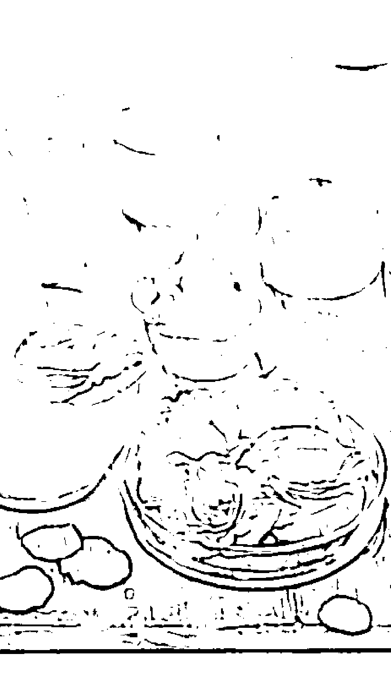

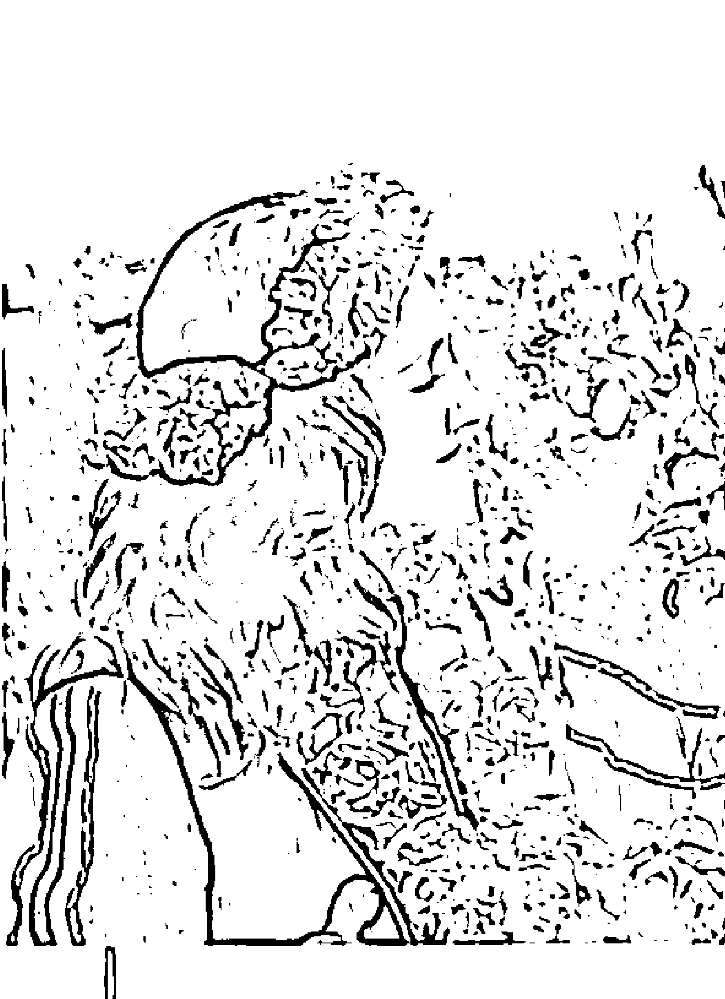

## 寧靜精油與邊緣系統

所有的精油以各種不同的方式影響邊緣系統，其中有部分更為重要。某些寧靜精油在本章前面已提到具有顯著的影響力，其詳情如下所述。舉例來說，乳香的鎮定作用有助於副交感神經系統（parasympathetic nervous system）。天竺葵支持情緒平衡的感覺。玫瑰具有改善和幫助內分泌系統，特別是受腦下垂體調節的內分泌系統。如前所述，下視丘和腦下垂體（主要的內分泌腺）彼此相連。靜心同樣會影響腦下垂體釋放激素，因而讓身心有平靜的感受。

## 寧靜精油對大腦邊緣系統構造可能產生的顯著影響

| 構造 | 中文名稱（英文俗名） | 拉丁學名 |
|------|----------------------|----------|
| 腦下垂體 | 廣藿香（Patchouli） 玫瑰（Rose） | Pogostemon cablin Rosa x damascene / centifolia |
| 下視丘 | 乳香（Frankincense） 天竺葵（Geranium） | Boswellia caterii Pelargonium asperum / graveolens |
| 前視丘 | 玫瑰（Rose） | Rosa x damascene / centifolia |
| 杏仁核與海馬迴 | 天竺葵（Geranium） | Pelargonium asperum / graveolens |

根據主要的化學成分、揮發／蒸發速度以及香氣調性，精油被區分為三大類。由於精油通常包含各式各樣化學組成的複雜本質與精微差異，因此以調性（Tone）作為精油的分類（例如：音感還可區分為音色、音準、快板、慢板、輕柔、響亮、柔和、和諧⋯等。）這就類似一個管弦樂團必須協調各種樂器的聲音以產生旋律的共鳴，精油中的每種化學成分都擁有獨特的音調，因此如同管弦樂團，每種精油也都擁有屬於自己的共振旋律。在接下來的內容（見第64頁表格）為了易於區分每種調性，故分別以不同的顏色標示：粉紅色代表前調（Top notes / 最不穩定）、綠色代表中調（Middle notes / 傾向在前調與後調之間的協同或平衡），膚色則代表後調（Base notes / 相對穩定）。

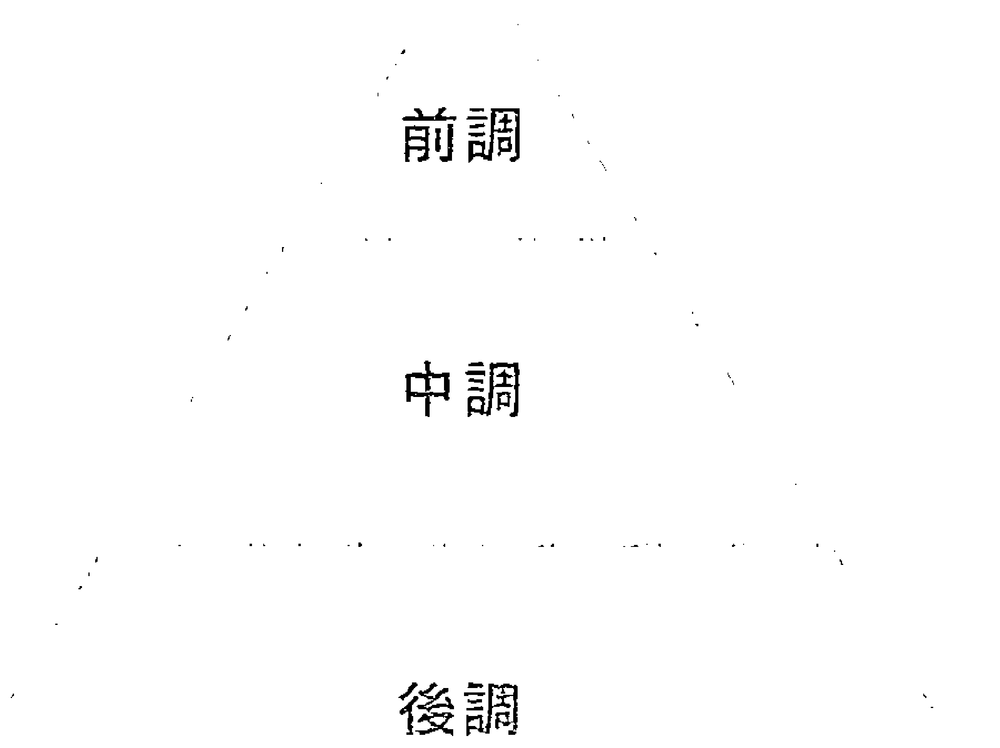## 寧靜精油的香調與特性

| | 前調 | 中調 | 後調 |
|---|---|---|---|
| 精油類型 | 檸檬與其它柑橘果香類、葉片類 | 藥用植物、花朵頂端 | 樹脂、木質、根部新鮮花朵 |
| 療癒作用 | 提振、激勵、精神充沛；幫助記憶以及頭部和腦部功能 | 平衡、和諧、恢復活力 | 放鬆、接地性、鎮定、平靜 |
| 緩解 / 支持 (常見應用方式) | 極度的疲憊、憂鬱、低落 / 沮喪、倦怠、對先前感興趣的事物失去興趣、意興闌珊 | 身體的機能、代謝、消化、生理期、改善循環（血壓的） | 緊張、心神不寧或飄忽不定、過度亢奮；慢性（或長期）病症、年長者；焦慮 |
| 療癒本質 | 快速 | 中等 | 稍慢 |
| 經皮吸收速度 | 半小時～1小時 | 2～3小時 | 4～6小時或以上 |
| 蒸發速度 | 0～30分鐘 | 至少8小時 | 至少12～24小時、一週，甚至更長久 |
| 波動率 (範圍：1～100) | 最不穩定：1～14 | 15～60 | 相對穩定：61～100 |
| 香氣特徵 | 瞬間穿透性 | 圓潤、輕柔芬芳 | 沉穩、豐美、馨香 |
| 精油氣味與揮發特性 | 新鮮、獨特的芳香氣味；易於辨識、輕盈、揮發快速而容易導致刺激性 | 緩和前調的氣味；配方主核心；具特色、柔和溫暖（不鋒利） | 協助定香與維持療癒作用；當前調與中調揮發後，仍然微渺地徘徊著；黏稠、餘味 |
| 精油品項 | 白千層、白松香、紅桔、苦橙葉*、茶樹 | 胡蘿蔔籽、洋甘菊、絲柏*、乳香*、天竺葵、真正薰衣草、苦橙葉*、玫瑰*、穗甘松* | 絲柏*、乳香*、廣藿香、玫瑰*、穗甘松*、岩蘭草 |

*部分精油的香調、療癒作用和特性有些重複，其取決於植物的來源（形態或萃取部位）、化學成分和揮發率；有時候，精油的分類會因作者而異。在本表格中，標示星號（*）的精油，其香調介於兩類之間，可依個案需求（或要求）選擇搭配其一香調做搭配。
標示粗體字則意指香調的次要位置（調香移動的方向），例如：苦橙葉會從前調進入中調的調性、乳香則從後調進入中調、絲柏則從中調進入後調。
為了降低香氣揮發率和蒸發速度，以及在療癒本質裡從快速（前調）到稍慢（後調）之間的連結性，所有的個案處方裡，至少必須包含一項中調的精油。

## 寧靜精油使用於心理與情緒行為之間以及與邊緣系統構造的關聯性

| 精油品項 | 與邊緣系統的潛在關聯 | 在心理與情緒行為之間潛在的支持與療癒特性 |
|----------|----------------------|------------------------------------------|
| **前調** |  |  |
| 白千層 Cajeput Melaleuca cajuputi | 前視丘 | 集中專注力、提神醒腦、清晰思緒、在面臨成長、改變與轉化時，能提起勇氣、快速適應以展現新的自我、強化決心且不斷向前邁進。 |
| 白松香 Galbanum Ferula galbaniflua | 下視丘 | 平衡；安撫與激勵二者皆有；平息極端不穩定的情緒、神經緊繃、更年期症狀、經前症候群（PMS）、壓力以及和壓力相關的狀態；滋養；改善緊張情緒並且恢復精神與活力。 |
| 紅桔 Mandarin Citrus reticulate | 下視丘 杏仁核 | 鼓舞情緒；安撫內在小孩；舒緩焦慮、憂鬱與低潮、過度亢奮、活躍與躁動（甜橙能增加活力，但紅桔有助於鎮靜）、失眠、神經緊繃、恐慌發作、經前症候群（PMS）、壓力以及和壓力相關的狀態；具有鎮定的本質。 |
| 苦橙葉 Petitgrain Citrus aurantium var. amara | 前視丘 下視丘 | 緩和憤怒、焦慮、憂鬱、過動、失眠、精神倦怠、神經衰弱、神經緊繃、經前症候群（PMS）、無望的感受、壓力以及和壓力相關的狀態；具鎮定神經系統的作用。 |
| 茶樹 Tea Tree Melaleuca alternifolia | 前視丘 下視丘 | 激勵與促進活力恢復；消除精神疲勞和倦怠、神經衰弱、擁有勇氣面對與適應震驚／打擊。 |
| **中調** | | |
| 胡蘿蔔籽 Carrot seed *Daucus carota* | 前視丘 下視丘 | 紓解焦慮、冷漠與壓迫感；在充滿壓力與煩擾時仍然保持平靜；適合優柔寡斷、猶豫不決和心智與情緒耗弱的狀況；鎮定神經系統；恢復活力；心靈澄淨明朗。 |
| 德國洋甘菊 Chamomile, German *Matricaria recutita* | 前視丘 下視丘 | 紓解焦慮；身心敏感不安，例如：壓力、失眠、頭痛、偏頭痛、情緒波動不安、緊張、經前症候群（PMS）鎮定神經系統以及安撫活躍的思緒。 |
| 羅馬洋甘菊 Chamomile, Roman *Anthemis nobilis* | 前視丘 下視丘 杏仁核 | 緩解憤怒、焦慮；鎮定失眠、壓力、恐懼、煩躁易怒、缺乏耐心、經前症候群（PMS）、躁動；鎮定心智、情緒和神經系統；最有助於與太陽神經叢內，精神緊張所引起的消化相關問題。 |
| 絲柏 Cypress *Cupressus sempervirens* | 前視丘 下視丘 杏仁核 海馬迴 | 緩解憤怒、焦慮、困惑和優柔寡斷、長期悲觀與不悅、悲傷與喪親之慟、無力感、缺乏耐心、暴躁和偏激（不寬容）、無法集中專注、神經緊繃、經前症候群（PMS）；調節自主神經系統、壓力以及與壓力相關的狀態、失控的哭泣與淚水；鎮定的效果。 |
| 芳香天竺葵 Geranium *Pelargonium graveolens* | 前視丘 下視丘 | 安撫與激勵二者皆有；紓解焦慮、憂鬱和低潮、頭痛、嫉妒猜忌、神經緊繃、情緒波動不安、更年期症狀、少經 / 經前症候群（PMS）、壓力以及和壓力相關的狀態；平衡太陽神經叢與神經系統；提振；調節內分泌（類似荷爾蒙）。 |
| 真正薰衣草 Lavender *Lavandula angustifolia* | 前視丘 下視丘 杏仁核 | 低劑量有鎮靜作用、高劑量有激勵作用；緩解躁動、憤怒、焦慮、憂鬱、悲傷與喪親之慟、頭痛、失眠、暴躁和偏激（不寬容）、躁鬱症（須專業治療介入）、情緒波動不安、神經緊繃、恐慌、經前症候群（PMS）、絕望感、震驚/打擊、太陽神經叢內緊張集結的相關問題、壓力以及和壓力相關的狀態、懷疑。 |
| **後調** | | |
| 乳香 Frankincense Boswellia carterii | 前視丘 下視丘 杏仁核 海馬迴 | 紓解憤怒、焦慮、困惑和優柔寡斷、鬱悶和情緒低落、長期悲觀與不悅、恐懼與偏執、悲傷與喪親之慟、過度亢奮、活躍與躁動、缺乏耐心、猶豫不決、暴躁和偏激（不寬容）、情緒波動不安、神經緊繃、恐慌發作（放鬆且使呼吸不再急促）、經前症候群（PMS）、怨恨與沮喪、悲傷與絕望；鎮定；幫助釋放不必要的想法與記憶；幫助靜心並探尋內在寂靜。 |
| 廣藿香 Patchouli Pogostemon cablin | 前視丘 下視丘 | 低劑量鎮靜、高劑量激勵；緩解情感淡漠、困惑和優柔寡斷、鬱悶和情緒低落、神經衰弱、神經緊繃、恐慌發作、經前症候群（PMS）、壓力以及和壓力相關的狀態；刺激內分泌；幫助靜心、集中內在信念與安靜平和的感受。 |
| 奧圖玫瑰 Rose Otto Rosa × damascena、 Rosa × centifolia | 前視丘 下視丘 杏仁核 | 低劑量鎮靜、高劑量激勵；緩解躁動、憤怒、焦慮、憂鬱（特別是產後）情緒低落、恐懼與偏執、悲傷與喪親之慟（失落感）、憎恨、精神緊張以及荷爾蒙失調引起的頭痛、偏頭痛、過度敏感、失眠、嫉妒猜忌、神經緊繃、恐慌發作、經前症候群（PMS）、怨恨與沮喪、悲傷與絕望、壓力以及和壓力相關的狀態；刺激內分泌（類似荷爾蒙）；催情/激情劑。 |
| 穗甘松 Spikenard Nardostachys jatamansi、 Nardostachys grandiflora | 前視丘 下視丘 | 平衡交感與副交感神經系統（滋養交感神經、調節副交感神經系統）；踏實感；抒解焦慮、悲傷與喪親之慟、憎恨、頭痛與偏頭痛、過度亢奮、活躍與躁動、歇斯底里、缺乏耐心、失眠、暴躁和偏激（不寬容）、更年期症狀、神經性消化不良、神經緊繃、恐慌發作、經前症候群（PMS）、躁動不安、壓力以及和壓力相關的狀態；鎮定。 |
| 岩蘭草 Vetivert Vetiveria zizanioides | 前視丘 下視丘 杏仁核 | 使用藥物治療時減輕戒斷症狀（特別是鎮靜劑）；平衡中樞神經系統；抒解焦慮、困惑和優柔寡斷、體重減輕、憂鬱、過度亢奮、活躍與躁動、過度敏感、缺乏耐心、神經衰弱、更年期症狀、神經緊繃、恐慌發作、經前症候群（PMS）、壓力以及和壓力相關的狀態；鎮定（特別是神經系統）、接地氣、踏實感。 |

第 68 頁提供「一目了然」的圖表，其概述具有多種特性的寧靜精油。這張指南或示意圖，主要是根據從生理到心理與情緒行為之間的療癒目標，以及應用在環境氛圍、感官美學和調製香水的角度將精油分類。它有助於在特定需求時，快速且輕鬆挑選合適的精油。

## 寧靜精油提供些麼

（僅提供環境適用，非口服）

心理層面

邊緣系統：心理、情緒、荷爾蒙

抗憂鬱
- 羅馬洋甘菊
- 真正薰衣草
- 奧圖玫瑰

消除緊張
- 胡蘿蔔籽
- 乳香
- 真正薰衣草
- 穗甘松
- 岩蘭草

抗焦慮
- 德國洋甘菊
- 羅馬洋甘菊
- 乳香、紅桔
- 真正薰衣草
- 廣藿香、苦橙葉
- 岩蘭草

激勵內分泌
- 生殖系統
- 天竺葵
- 玫瑰
- 刺激胰島素分泌⁷（抗糖尿病）
- 胡蘿蔔籽
- 天竺葵
- 副交感神經系統
- 請見消除緊張

環境氛圍／感官美學

室內擴香
以寧靜精油為主，特別常用的為：
- 果香類
- 木質調
- 花香調
- 樹脂類

香水

單方精油
- 精油
- 廣藿香
- 奧圖玫瑰

原精
- 玫瑰

複方精油（挑選2、3、或4種）
- 白千層
- 洋甘菊
- 絲柏
- 乳香
- 白松香
- 天竺葵
- 真正薰衣草
- 紅桔
- 廣藿香
- 苦橙葉
- 玫瑰
- 岩蘭草

## 精油的心理情緒及對記憶的效用
Exploring the Psycho-Emotional and Physiological effects of Essential oils

大腦接收與整合外在感覺以及神經刺激的反應，有助於內在的自我平衡、覺察環境，以及意識到更深層的問題，例如：存在、人際關係以及與外在世界的關係。偵測到香氣的同時，會觸發一連串神經、生理、情緒和愉悅相關的感受，而這些錯綜複雜的反應難以獨自分離。也許很難具體地證明或解釋精油是如何影響大腦，但是它們的芳香分子確實會引發不同程度的神經反應（即使只有短暫的影響），透過嗅聞或循環吸收精油的影響，似乎與心情、情緒、記憶力、專注力和認知反應有關。也因此為了充分理解這個領域，正不斷進行研究和實驗。

## 最新研究

事實上，有大量研究（主要由食品與製造業、化妝品和製藥產業或其代表進行）探討精油對於心理治療的效果，例如：注意力、專注力、生產力、激勵與鎮靜內在情緒、心情狀態（焦慮、憂鬱）、記憶力和失眠的影響。本章節將提供迄今為止，最新的幾篇研究結論。

使用小鼠的動物研究，雖然在倫理道德上存有爭議，但是在探討精油對於基本生理與行為影響研究時，由於消除許多潛在影響主觀性的內在情緒變數，因此仍然非常具有意義。然而，這些研究並沒有完全反映出若是應用在人類現實生活情景中的真實複雜性，其中精油是否觸發特殊心理與情緒作用或是愉悅感受的反應，因而有助於個體的行動結果，或者相反，精油實際上對於個體的心理、認知和生理功能皆具有複雜的影響力（由內到外，或是由外到內的反應）。

一篇由巴赫鮑爾（Buchbauer 1993）及其夥伴發表的研究〈嗅聞芳香化合物和精油對於鎮定的作用〉，其測試小鼠是否能夠透過精油來降低牠們的活動力（自發性的），他們證實真正薰衣草、橙花、沉香醇和乙酸沉香酯（單體）以及低濃度嗅聞香茅時（血液樣本顯示含有這些芳香化合物），具有鎮靜的作用。因此，他們得出結論「結果有助於正確解釋『芳香療法』這個用語（在吸入香氣之後，對個體行為產生激勵或鎮定作用）」。8 另一篇由科瓦等人（Kovar et al. 1987）發表類似的研究，其證實小鼠在吸入迷迭香精油之後的運動活力，具有鎮靜作用，他們歸因於一種在血液樣本中，檢測到的迷迭香單體成分 1,8 - 桉油醇的影響。9

諾桑比亞大學心理學系主任馬克・摩斯（Mark Moss 2003）及其夥伴進行涉及 144 名受試者研究，實驗組比較使用迷迭香和薰衣草精油對於認知和情緒的影響，以測試記憶力和警覺度；而對照組完全沒有使用精油。在含有精油擴香的環境中，讓受試者參與各項認知的任務，受試者會意識到他們正在執行任務，但完全不知道精油是研究的一部分。研究者發現迷迭香（*Rosmarinus officinalis*）和真正薰衣草（*Lavandula angustifolia*）精油對於認知功能的各個層面，均具有顯著的影響。薰衣草降低了工作記憶（working memory）的表現，削弱了記憶和專注力的強度和時間；而迷迭香提高了工作記憶的速度與品質、二次記憶，並且提高警覺度；研究中也指出，在含有迷迭香和薰衣草的環境中參與各項認知任務時，受試者均產生了滿足的感覺。10

隨後，摩斯與奧利弗（Moss and Oliver 2012）進行一項在數學任務中測試速度、準確度與心理評價的小型研究，其中有 22 名受試者在含有迷迭香精油的環境中進行，其觀察到在 1,8 – 桉油醇含量較多的環境有助於提高效率。11

然而，鷹柏格（Ilmberger）及其夥伴研究「精油對於人類注意力的影響」，發現精油對在場受試者的核心注意力功能並沒有明顯的影響，但是觀察到其主觀評價與目標任務的績效之間存在複雜的關聯性。因此，他們提出建議是關於使用精油（研究中使用胡椒薄荷、茉莉和依蘭依蘭）或是成分（1,8 – 桉油醇和薄荷醇）而產生基本形式的專注行為，實際上主要是受心理所致，而受試者對於氣味的期望可能會影響動機以及後續的行為表現，即使只是心理暗示。12

## 精油對生理的影響

醫學博士泰瑞・弗里德曼（Terry S. Friedmann, M.D. 2001） 發表一篇有關「注意力不足過動症（ADHD）」的研究。研究檢視真正薰衣草（*Lavandula angustifolia*）、大西洋雪松（*Cedrus atlantica*）和岩蘭草（*Vetiveria zizanioides*）精油應用在提高專注與注意力的效果，其對象是介於6～14歲被診斷患有注意力不足過動症(ADHD)的兒童。腦波圖(EEG)被用於測量使用精油前後大腦區域的β和θ腦波活動，受試者被要求在靠近鼻子的地方，手握已打開的精油瓶(三種之一)深呼吸三次，一天三次，為期三十天，對照組則沒有接受任何治療。研究結果證實明顯改善大腦活動，其中岩蘭草(100%)減輕了注意力不足過動症(ADHD)的症狀，大西洋雪松(83%)略有減輕，而真正薰衣草(55%)卻無明顯的改善。此研究也支持了摩斯等人(Moss et al. 2003)日後所探討的實驗結果。13

倫敦國王學院教授克萊夫·巴拉德等人(Clive G. Ballard et al. 2002)發表一篇〈芳香療法可作為嚴重失智症患者安撫躁動，是安全又有效的治療方式〉。其研究發現將檸檬香蜂草精油加入乳液裡，每日二次塗抹在72名嚴重失智患者的臉部與手臂，其大幅降低了他們的躁動行為；對照組則使用葵花油取代檸檬香蜂草精油加入乳液裡。

雖然治療方式是應用在局部皮膚塗抹乳液，但由於是塗抹在患者的臉部，因此他們也吸入了檸檬香蜂草的香氣。14

紐卡索大學神經化學病理學教授愛蓮娜·斐瑞(Elaine Perry)在審閱有關芳香療法治療失智症有效性的評論中，她在2014年指出應用薰衣草和檸檬香蜂草增加了活動能力與溝通能力，並且降低出現困難行為。斐瑞(Perry)也指出在乳霜中加入薰衣草、甜馬鬱蘭、廣藿香和岩蘭草這些複方精油，並且塗抹在患者皮膚(再次強調，需考慮嗅聞的效果)，提高了他們的警覺度、滿足感與夜間睡眠品質，降低躁動、退縮與徘徊遊走的程度。15

安德魯·彭杰利等人(Andrew Pengelly et al. 2012)發表一篇「迷迭香對於年長者認知功能影響」的短期研究。其研究是以口服粉末狀的乾燥迷迭香為實驗方式。當低劑量口服750毫克時，在平均年齡為75歲的28位年長者身上發現，提高採購日常烹調用品消費行為的記憶，但若以高劑量口服6000毫克時，卻明顯損害記憶功能。因此，必須非常注意所有藥草使用的劑量，特別是高濃度且具揮發性成分所組成的植物精油，即使非常低的濃度也可捕捉到香氣，並且具有潛在的頭部反應。16

在測試阿茲海默症與失智症時，記憶的速度常被用來當作是認知功能的指標。一篇由金博等人(Jimbo et al. 2009）發表在《老年精神醫學》的研究指出，使用調合的迷迭香和檸檬精油以及薰衣草和甜橙精油，這些複方精油改善了被診斷患有阿茲海默症與失智症年長者的相關認知功能取向。研究結論得出，芳香療法是一種非藥物的治療方式，特別是對於阿茲海默症患者，具有改善認知功能的潛力。17

赫茲等人（Haze et al. 2002）發表在《日本藥理學期刊》的研究，調查正常成人在嗅聞精油時對於交感神經活動的影響，並且在血液樣本中測量血壓與兒茶酚胺 (catecholamine)。其研究結果顯示「與吸入檸檬酸三乙酯這個無味溶劑相比較，嗅聞黑胡椒、龍蒿、茴香或葡萄柚精油，交感神經的活動量相對增加 1.5 至 2.5 倍」，還有「相反地，嗅聞玫瑰或廣藿香精油，交感神經的活動量相對降低 40%」。故此研究結論得出「嗅聞精油的香氣，可以調節正常成人交感神經系統的活動」。18

鄭和陳（Chang and Chen 2011）研究佛手柑精油對於自主神經系統的影響，更具體的來說，它就像是在工作場所歷經生理與心理壓力之後的紓壓良藥。受試者被置於充滿精油香氣或噴霧的環境裡 10 分鐘，並且分別在吸入精油前、中、後測量血壓與心率。研究結果指出，精油似乎「推動自主神經系統趨向平衡狀態」。19

斯蒂芬·耶林克內（J. Stephan Jellinek 1999）在〈香氣與心智狀態〉一文中建議，當香氣涉及影響心理狀態的時候，藥理機制遠遠小得多，雖然最終難以證明這點，但是藉由香氣影響心理動力學的因素，可能基於下述幾點：

## 香氣影響心理動力學的因素

- **(A) 藥理機制**
  影響中樞神經系統或荷爾蒙。
- **(B) 語義機制**
  用以解釋某些氣味對於個人經驗的影響。
- **(C) 愉悅機制**
  為情緒狀態提供輕鬆愉快的感受。
- **(D) 安慰機制**
  此點是立基於主觀的期望。20

## 比较药理机制与心理动力学的影响

| 影响因素 | 药理 | 意义 | 愉悦 | 安慰 |
|----------|------|------|------|------|
| 生物性 | :) |  | :) |  |
| 个人经历 |  | :) | :) | :) |
| 文化风俗 |  | :) | :) | :) |
| 个人特质 |  |  |  | :) |
| 嗅觉敏感度 |  | :) | :) |  |
| 刺激物特质 | 化學 | 香氣 | 香氣 | 榮譽感 |

> △以上图表改编自耶林内克（Jellinek）的研究发现。

瑪麗亞·馬爾福等人（Maryam Marofi et al. 2013）近期一項雙盲並且以安慰劑作為對照組的臨床試驗中，評估芳香療法使用的大馬士革玫瑰（Rosa damascena）對於兒童術後疼痛感的影響（對象介於3～6歲的兒童），其研究觀察到嗅聞玫瑰香氣之後的兒童，疼痛感明顯下降。試驗是經由父母或監護人同意，以及醫院臨床研究部門的道德許可，64名兒童隨機分配為A、B兩組別；A組兒童使用大馬士革玫瑰精油，B組則使用甜杏仁油。兩組兒童均接受完全相同的術後照顧護理。當術後的孩子被送進他們的病房時，就會立刻使用學齡前兒童術後疼痛量表（TPPPS）來評估疼痛。研究方式是分別將1滴或2滴玫瑰精油，或甜杏仁油滴在眼膜大小的棉片中，並且與孩子的頭部距離12英吋（約30.5公分），在手術後的3、6、9至12小時重覆用疼痛量表的評估。儘管第一次評估之後，兩組兒童的疼痛感幾乎沒有差異，而且在術後都有減輕疼痛感，但隨後的評估確實證實，精油組在疼痛強度的平均分數明顯降低。由於甜美的香氣可能會刺激愉悅感受與安慰效應，但這些幼兒年紀較小，尚未形成對氣味的主觀或對愉悅感受的期盼。然而，芳香分子也可能會激發獨立個體的生物性/藥理反應。

## 記憶 Memory

與視覺、觸覺、聽覺其它的感官比較起來，氣味的記憶與我們更緊密連結。多重感官同時被刺激，記憶被深化和強化的可能性會持續更長的時間。特別是在執行不太由意識控制認知過程，例如：創造性工作、學習或死記硬背的時候，其皆然未涉及判斷、評論、推理或理性評估。因此，像是按摩、靜心、視覺色彩或放鬆技術這類活動中，同時施以精油擴香，也許會更深化記憶，並且獲得令人難忘的經驗（反之亦然）。

瑞秋·赫茲(Rachel Herz)是美國布朗大學精神病學與人類行為學系的終身教授，也是全球嗅覺研究領導專家。她在探索氣味誘發記憶作用時，明顯地觀察到任何的氣味都能夠喚起一個人過往的快樂回憶，並且提升正面情緒、減少負面情緒、降低壓力以及減少免疫系統發炎反應的可能性。

> 氣味的誘發
她也發現，氣味誘發記憶可能會激發特定的情緒，例如：自信、動力和活力。

赫茲發現，由氣味所引起的記憶比起其它感官刺激引起的記憶，前者更具有情感的豐富性，在具有氣味的空間，經歷到特定情緒來臨時，透過觀察杏仁核的活動增強，氣味也被譽為是追尋往事的最佳線索。

維琪·皮特曼(Vicky Pitman 2000)進行的一項研究「芳香療法與學習困難的兒童」，她運用氣味與記憶之間的密切關係，幫助過度活躍的兒童來安撫他們的躁動不安。

> 薰香精油搭配色彩
她在環境中薰香特定的精油，並以視覺色彩搭配自我按摩的方式注入一種平靜與和諧的感受，當再次故意擴散與記憶相同氣味之時，用以平息兒童們的躁動行為，並且協助他們專注在學習之中。

皮特曼觀察到「值得注意的是，精油與身心放鬆時會增進專注力。學生們毫無疑問地持續更長時間的平靜，並且從心煩意亂的情緒中快速復原，課程被中斷的次數也隨之減少」。

# Part 03

# 精油的使用方法

# Applying Essential Oils

## 安全使用精油與八種療癒用法

精油的應用方式各式各樣；使用得當，它們幾乎沒有任何風險。然而，它們非常有益於身心療癒，但是必須控制用量，特別是每天或頻繁使用時。

以常規來說，透過香水、按摩、乳霜、乳液、油膏這些經皮吸收的方式，以及經由蒸氣吸入或任何嗅聞吸收的方式，精油的安全限制用量為每日 6 滴。根據多年的執業經歷，我觀察到即使使用少量精油，也能獲得非常有效的回饋。以下精油的應用方式，適合使用在正念與靜心期間，因為它們是最理想的輔助夥伴。

## 安全使用精油

除非是經由受訓合格的生物醫學、藥理學或草藥學背景的專業人士開立精油處方，否則我不主張口服攝取精油。

精油化學和生理面所產生的交互影響極為重要，因為精油是高度濃縮、具揮發性且含有芳香氣味的化學物質，若是應用不當或是保存方式錯誤，可能會引發刺激和致敏的潛在風險，對少數人來說，更有可能產生過敏的反應。

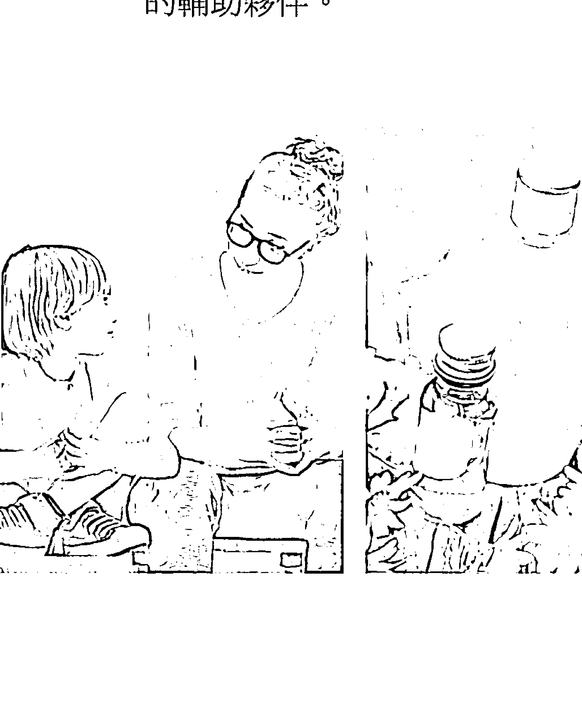

## STEP ① 精油採購

首先，必須確認是具有信譽的商家，其提供天然的精油、正確的包裝與完整的標籤——植物科屬和生長地、拉丁學名、批量批號、安全禁忌與檢測數據……等，以確保供應來源的完整性。低於市售平均價格的精油，很可能不純且經常被摻雜劣質或廉價的化學成分。同理，非常昂貴的精油，往往也摻雜更便宜的精油或填充化學物質來提高其利潤。仔細閱讀瓶身標籤，或是商家提供的產品資訊，確保選購精油的正確性。

## 精油的保存方法

含有滴管且儲存於深褐色或深藍色瓶身的精油，以防止紫外線的傷害；而使用滴管的瓶身是為了限制用量、抑制快速氧化、防止溢出；如有必要，最好選擇具有防呆設計的瓶身防止兒童意外誤食。絕對不要購買儲存在塑膠瓶身，以及存放在燈火通明、溫暖貨架上面的精油。精油是易燃品，應該遠離火源（如：蠟燭）以及高溫的區域。

## 精油安全守則

在使用之前，必須確認你已經瞭解精油的化學成分、療癒作用、適用症狀、禁忌與安全等的相關注意事項。

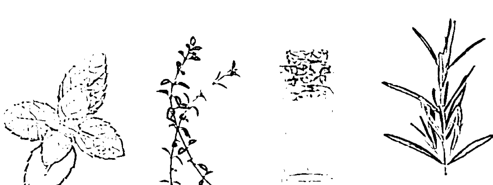

## STEP ② 貼膚測試

貼膚測試是一種預防措施，以確保應用單方或複方精油的安全性。然而，在考量每次使用哪些精油而做的測試，是沒有必要且不切實際。下述提供一些指標，以作為選擇性的使用參考：

+   曾對香水、保養品、家庭用品、金屬或化學成分…等產品敏感或過敏的經驗。
+   曾患有（或現在是）濕疹、哮喘、皮膚炎或花粉熱的疾病。
+   对特定植物敏感或过敏，因为来自该植物的精油可能会触发类似状况。
+   目前或最近长期的慢性疾病（免疫系统较弱）。
+   对特定食物或食品添加剂敏感或过敏，*例如* 坚果、种子、柑橘类水果、草药、加工香料、色素或防腐剂。

若個案目前出現以上狀況之一，應遵循下列指導原則施作貼膚測試：

+   在挑選過的基礎介質加入 1～2 滴單方或複方精油，*例如* 葡萄籽油、橄欖油或是其它你將會使用到的植物油，或是未經加工的無香乳霜或乳液。初步測試避免使用甜杏仁油、胡桃油、榛果油……等這類堅果油脂。
+   清潔並且拭乾即將要進行測試的局部皮膚，*例如* 手肘、手腕或是前手臂上方。
+   使用可生物分解的棉簽或棉片，將已被稀釋好的精油加入其中。
+   使用預防過敏的繃帶，覆蓋在欲進行測試的局部皮膚上。
+   在局部皮膚靜置 24～48 小時。
+   測試期間避免接觸水分。
+   移除繃帶，依照國際接觸性皮炎研究小組（ICDGR）的貼膚測試量表標準，判讀該測試區域是否有刺激現象。
+   如果測試區域沒有刺激現象或僅輕微發紅，即可使用此次已被稀釋好的精油。（繃帶也可能會引發輕微發紅，一旦移除即會復原）
+   若判讀結果呈現陽性反應（依ICDGR貼膚測試量表的 3～5 項），切勿使用此次已被稀釋好的精油。若是使用複方精油，可分別將單方精油重新單獨測試以確認致敏原；排除過敏原之後，再次進行複方精油的測試。

## 國際接觸性皮炎研究小組（ICDGR）貼膚測試量表標準

+   □ 沒有反應。
+   □ 可疑反應：非常輕微或平的紅斑。
+   □ 弱陽性反應：輕微非水泡性、可觸摸之紅腫反應。
+   □ 強烈陽性反應：強烈的紅腫或個體出現水泡反應。
+   □ 極度強烈陽性反應：強烈的紅腫、水泡或潰瘍性反應（或延伸超出局部測試區域）。
+   □ 刺激性反應：一旦移除測試，紅斑即會復原。

## 精油安全規範

+   1. 切勿直接吞嚥或口服攝取精油。
+   2. 切勿直接在皮膚上使用純精油（濃度過強），一般常用植物油或其它例如：乳霜、乳液或油膏來稀釋精油。未經稀釋的精油可能導致過敏或刺激性較強，常用於急救的薰衣草與茶樹精油例外，因為它們可當作是昆蟲叮咬、輕微燒燙傷、皮膚擦傷或是輕度皮膚感染的急救用品。儘管如此，由於仍存在致敏的風險，因此不建議長期局部使用這些精油。（重覆使用的結果，將會逐步擴大致敏反應）
+   3. 切勿讓兒童接觸（供應商是否有提供防呆設計），並且遠離寵物。
+   4. 意外誤食：嚴禁催吐。飲用全脂牛奶，立即尋求正統醫療協助。保留誤食的精油與瓶身標籤，以便醫療人員確認詳細資訊，例如：拉丁學名、批量批號、購買日期……。
+   5. 接觸眼睛：精油很容易透過指尖傳遞到眼睛，使用精油之後請務必洗手。若是純精油不慎接觸眼睛，立即使用植物油或全脂牛奶沖洗眼部，接著再使用乾淨的溫水徹底清洗眼部。有時候，稀釋過的精油也會透過蒸氣嗅吸、全身浴或沐浴時不慎接觸眼睛，此時應立即以乾淨的溫水徹底清洗眼部。如清洗眼部之後仍有刺激或刺痛感，應立即尋求正統醫療協助。
+   6. 皮膚不良反應：使用植物油稀釋皮膚上的精油，接著使用無香香皂和溫水徹底清潔該區域並且確認已無任何殘留。徹底擦乾該部位，爾後使用無香味的乳霜或油脂緩解刺激感。
+   7. 僅從具有信譽的商家購買精油，其將會提供完整的安全（檢測）數據資訊。
+   8. 僅購買具有滴管且儲存於深褐色或深藍色瓶身的精油為了精準劑量的測量，以及預防溢出或意外誤食。
+   9. 保存期限：使用前先確認保存期限，並且記錄何時購買。空氣中的氧氣會讓精油迅速氧化，因此未開封的精油可保存兩年，已開封可保存一年。若是已開封的柑橘類精油（例如：紅桔）則僅能保存6個月的效期。
+   10. 絕對不要將開封之後，相同的精油互相「填滿」。
+   11. 除非是首次開封的精油在當下迅速使用完畢，否則殘留在瓶身或容器內的少量精油不宜保留。
+   12. 精油使用後宜立即更換蓋子，以減緩氧化速度。
+   13. 精油儲存於陰涼處並且遠離熱源與陽光直射之處，最好是冰箱。雖然有些精油（例如：奧圖玫瑰）在非常低溫時會凝固，但它們會在室溫裡恢復液態狀。
+   14. 立即擦拭溢出的精油，因為精油會溶解／損壞聚苯乙烯、塑料、清漆、油漆、拋光與層壓表面塗料。

## STEP ③ 精油劑量

謹慎地調配精油劑量是非常重要的，若是過度使用或應用不當，非常容易引起皮膚與黏膜組織的刺激和致敏。精油調配的比例似乎非常複雜，特別是考量到滴管孔洞大小不同，因此難以達到絕對精準的劑量。然而，為了安全起見，精油的使用劑量必須被限制。依據「經驗法則」，請參閱下面列出精油劑量指南的約略平均值。

### 基礎介質使用

高劑量的精油應用在面積較小的局部皮膚，刺激和致敏性的反應風險會隨之增加。若以每日 6 滴精油為限的基準，將其加入基礎介質並應用在全身按摩則不致於產生刺激作用，但若是以相同的劑量應用在臉部、腋下等敏感區域，則容易引發刺激的反應。

面積較小的局部皮膚，在基礎介質中加入不超過 1～2 滴的精油；請務必記住這點，特別是製作急救藥膏、乳霜或乳液時。

若要製作面霜或臉部保養用品須減少精油的用量，並且不時地更換精油的選擇，偶爾也須要「不使用精油」的休息時刻。

### 成年人用量

健康成年人在每 24 小時之內的最大精油使用量限為 6～10 滴。相同的精油僅能應用 2～3 週期，接著「不使用精油」休息一週，並且定期更換精油的選擇。

以下的指南將幫助你計算稀釋在植物油、乳霜、乳液、油膏或凝膠等基礎介質中的精油劑量與複方比例。

#### 基礎介質與精油劑量＝複方比例

- 5 毫升基礎介質加入 1 滴精油＝ 1% 複方
- 5 毫升基礎介質加入 2½ 滴精油＝ 2.5% 複方
- 5 毫升基礎介質加入 5 滴精油＝ 5% 複方

#### 精油濃度公式計算

□ 毫升基礎介質 ×20× □% 劑量濃度 ×0.01＝精油滴數

#### 精油劑量指南

- 5 毫升 (約略為 0.17 液量盎司)＝ 100 滴精油
- 10 毫升 (約略為 0.34 液量盎司)＝ 200 滴精油

## STEP ④ 適當劑量

適當的精油劑量必須依據個案的年齡、健康狀態（強壯或虛弱）以及其它，例如：過敏或哮喘等因素而決定。以下分別提供特殊族群應如何降低劑量、正常成人以及急性與短期劑量應用的標準指南。

### 正常劑量

適合應用於普遍情況與正常成人。

**精油劑量**
- 5 毫升基礎介質加入 2½ 滴精油 = 2.5% 復方
- 10 毫升基礎介質加入 5 滴精油 = 2.5% 復方

### 降低劑量

即使是稀釋後的精油，我個人並不建議 12 個月以下的嬰兒直接使用精油，這是由於他們的內臟器官尚未完全發育成熟。以下的資訊包括這類特殊族群應如何安全應用精油。不論情況為何，嚴禁在剛出生且未滿 3 個月的嬰兒身上使用精油，而對於滿 3 個月至 24 個月大的嬰兒來說，最大限量為 1 滴精油加入 20 毫升（或以上）的基礎介質，並且禁止使用藥草、辛香或柑橘類的精油。以下的說明適合應用在兒童、虛弱者、年長者、易敏感者、溼疹或哮喘患者，同時也可當作是臉部保養的復方基準比例。

### 急救 / 短期劑量

適合應用在急救或是偶爾短期使用，以避免或降低已知的精油刺激性。

**精油劑量**
- 5 毫升基礎介質加入 5 滴精油 = 5% 復方
- 10 毫升基礎介質加入 10 滴精油 = 5% 復方

**精油劑量**
- (A) 5 毫升基礎介質加入 1 滴精油 = 1% 復方
- 10 毫升基礎介質加入 2 滴精油 = 1% 復方
- (B) 10 毫升基礎介質加入 1 滴精油 = 0.5% 復方
- 20 毫升基礎介質加入 2 滴精油 = 0.5% 復方
- (C) 20 毫升基礎介質加入 1 滴精油 = 0.25% 復方

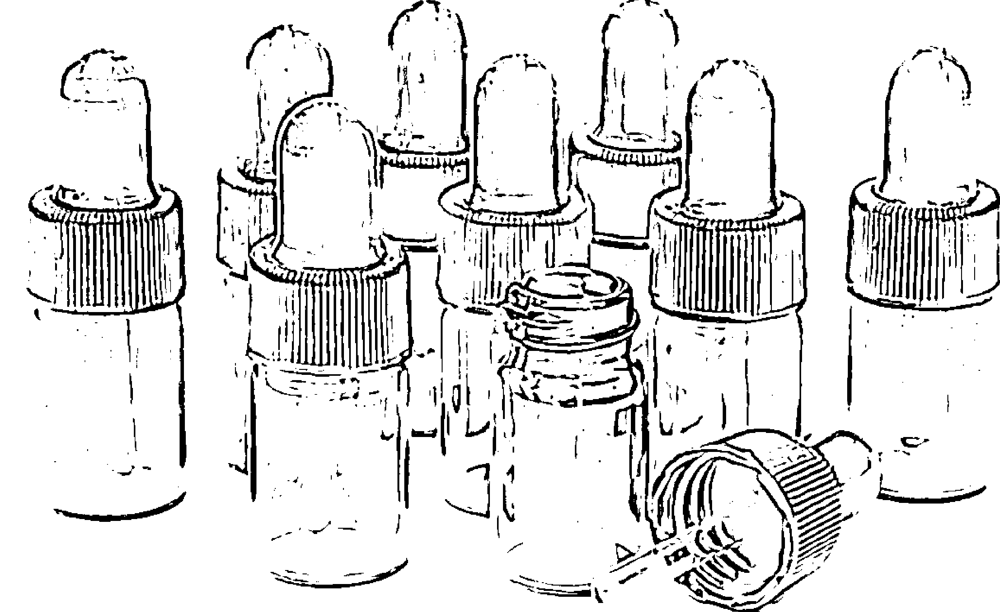

## 應用精油：大眾準則

+   1. 依據你所設定的目的或特殊要求來決定將會使用哪些精油，是為了幫助放鬆、心智提升警覺度、創造特定環境氛圍、改善特定情緒（提振、踏實、平衡）或是幫助靜心等。
+   2. 可以單獨使用被挑選過的單方精油；然而，也可以精心挑選出 2～3 種相關的精油，並且調製成複方，也一樣有效。
+   3. 若是你決定使用一種精油以上的複方搭配，請確認它們之間的協調與互補性，並且限制為 3～4 種不同的精油。
+   4. 若是使用多種精油互相搭配時，為了增加芬芳氣味的平衡與持續性，應考量到氣味的調性。（後調協助定香且氣味持久，前調揮發非常快速）
+   5. 調製放鬆精油時，避免加入具刺激性的精油。
+   6. 避免重覆使用相同的單方或複方精油，不定時更換你的選擇。若是你經常使用精油來提升心理與情緒素養，請記得「少即是多，多即是少」降低精油用量，以適應長期使用。
+   7. 暫停一段時間；舉例來說，使用精油 3～4 週之後，休息一週。更改單方精油或是複方精油的組合以避開你對特定精油或是精油內的化學分子過於敏感。
+   8. 若是感到噁心、嘔吐，出現頭痛症狀，或是皮膚浮現疹子、紅腫或發癢，請立刻停止使用你所挑選的單方或複方精油。（特別是正在使用的時候）
+   9. 若在公眾區域或公開場所擴香精油，務必徵得它人同意，以確保該區域的人同意 / 意識到此環境正在擴香精油。千萬不要誤以為每個人都喜歡精油的香氣或是你所選擇的精油。

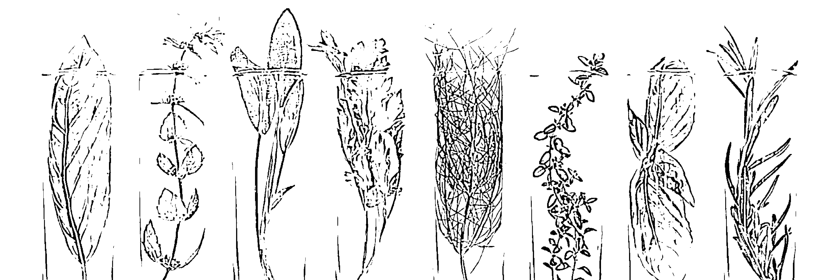

## 八種療癒方式

以下提供精油應用的大眾準則，其與本章節所提供的八種療癒方式相關。

### 滾珠瓶

滾珠瓶最適合療癒的應用以及美感香水的調製，方便、安全且容易使用。

### HOW TO MAKE

+   1. 在 10 毫升的滚珠瓶裡加入半滿的基礎油，像是荷荷芭油、琉璃苣油、葡萄籽油等。
    *☆注意事項 禁止使用礦物油。*
+   2. 爾後加入 10 滴單方或是已搭配好的複方精油。
+   3. 最後將基礎油填滿至瓶身的肩線，並將滾珠與瓶蓋鎖緊。
+   4. 在手掌與手指間緊握滾珠瓶並且輕晃瓶身數次，直至精油與基礎油相互融合。
+   5. 將滾珠瓶靜置於陰涼處 24 小時，以便讓精油更均勻地擴散到基礎油中。

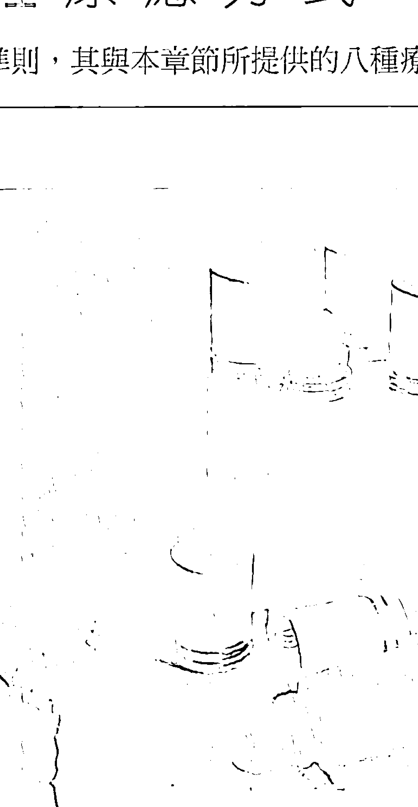

**〈工具〉**
10毫升滾珠瓶

**〈使用方式〉**
取下外蓋並將精油滾珠塗抹於手腕、太陽穴或是特定的需求部位，使用後立即更換滾珠並且限制在 6 週內使用完畢。
*☆注意事項 僅限個人使用。滾珠瓶可以重覆使用或回收。重覆使用或回收之前，以溫肥皂水將滾珠瓶沖洗乾淨並且徹底晾乾。*

#### 〈應用指南〉

+   美感目的：展現魅力、心情、特殊場合、主題性
+   焦慮與憂鬱
+   頭痛
+   促進或強化記憶力
+   改善心理與情緒的素質例如：悲傷、快樂、失落、緊張、愉悅；或是為了使心情平衡、沉靜、活力、鎮靜或提振
+   壓力相關的情況

### 精油嗅棒

精油嗅棒是以疗愈为主的应用。由于精油嗅棒不会直接接触到精油，即使是大一点的孩子也容易使用且很安全。与其它的疗愈应用方式相比（例如：香水），精油嗅棒专为个人嗅吸所设计，宜更谨慎使用。精油嗅棒主要提供一种清洁且有效的精油吸入方式；当嗅吸精油时会立即对呼吸系统（咽喉和肺部）和边缘系统（心情、情绪与心智清晰）产生影响。它们方便放在口袋或包包里随身携带，并且在需要时随时使用。

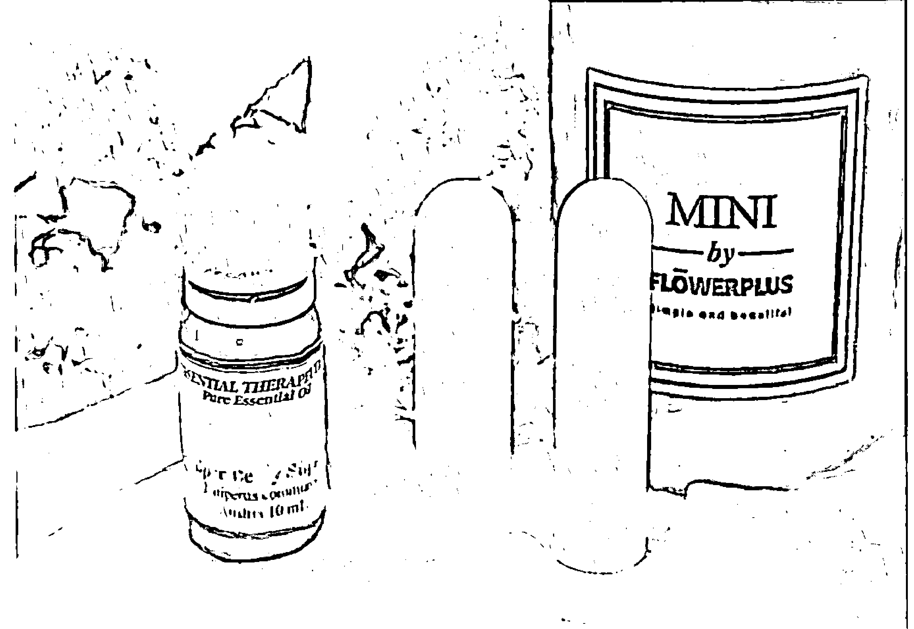

### HOW TO MAKE

+   1. 先用镊子将精油嗅棒内的棉卷条取出。
+   2. 滴入 2 ~ 6 滴单方或是已调和好的复方精油。
+   3. 尔后将棉卷条放回精油嗅棒内，压平塑胶盘并且拧上保护盖以锁住香气。

#### 〈工具〉

6.5cm 嗅棒、一条棉芯、镊子

#### 〈使用方式〉

旋开外盖，手持精油嗅棒并且依需求将嗅棒的顶端放入一侧鼻孔（塞住另一侧）嗅闻，在另一侧鼻孔重复相同的方式。使用后立即更换含有精油挥发物的外盖。

#### ★注意事项

仅限个人使用。精油嗅棒可以重复使用或回收。在重复使用或回收之前，以温肥皂水将精油嗅棒冲洗干净并且彻底晾干。下次使用时，仅需更换棉卷条或以面纸取代之，重复使用以不超过 2 ~ 3 次为限。

#### 〈应用指南〉

+   精油嗅棒适用于下列情况：
+   焦虑与忧郁
+   胸腔感染
+   感冒与流行性感冒
+   头痛、失眠
+   提升免疫（抗菌、抗感染、抗病毒）
+   促进或强化记忆力的提升
+   改善呼吸系统
+   心智清晰（理清头脑与思绪）
+   改善心理与情绪的素质
    例如：悲伤、快乐、失落、紧张、愉悦；或是为了使心情平衡、沉静、活力、镇静或提振
+   鼻塞、咽喉炎
+   压力以及和压力相关的状态## 精油面紙

面紙是一種快速且容易上手的精油嗅吸方式。當你在乾淨的面紙上滴入些許精油，精油的芳香分子則會快速的揮發，並且立即產生影響與益處（直接嗅聞精油瓶的效果有限）。這樣的應用方式為頭痛、震驚和不安、感冒與流感提供急救的療癒措施。

1.  在面紙上滴入1～3滴單方或複方精油。
2.  直接嗅聞面紙所散發出來的精油香氣。

### 工具

精油瓶、面紙

### 使用方式

請勿將含有精油的面紙直接接觸及臉部或鼻子，以避免刺激皮膚。

### 即時性需求

為了緩解頭痛、震驚和不安這類即時性的需求，或是因應急救的療癒措施，精油面紙是一種很有效的處理方式。將已滴入精油的面紙握入手中，左右手呈封閉式的上下交疊狀（手心的溫度可幫助精油揮發），並且張開位於拇指與食指之間的虎口處，直接嗅聞精油即可。嗅聞完畢後，請務必洗手，徹底清洗可能殘留在手指與掌心裡的精油。

### 應用指南

-   焦慮與憂鬱
-   胸腔感染
-   感冒與流行性感冒
-   頭痛、失眠
-   提升免疫(抗菌、抗感染、抗病毒)
-   促進或強化記憶力的提升
-   改善呼吸系統
-   心智清晰（理清頭腦與思緒）
-   改善心理與情緒的素質 例如：悲傷、快樂、失落、緊張、愉悅；或是為了使心情平衡、沉靜、活力、鎮靜或提振
-   震驚和不安
-   鼻塞、咽喉炎
-   壓力以及和壓力相關的狀態

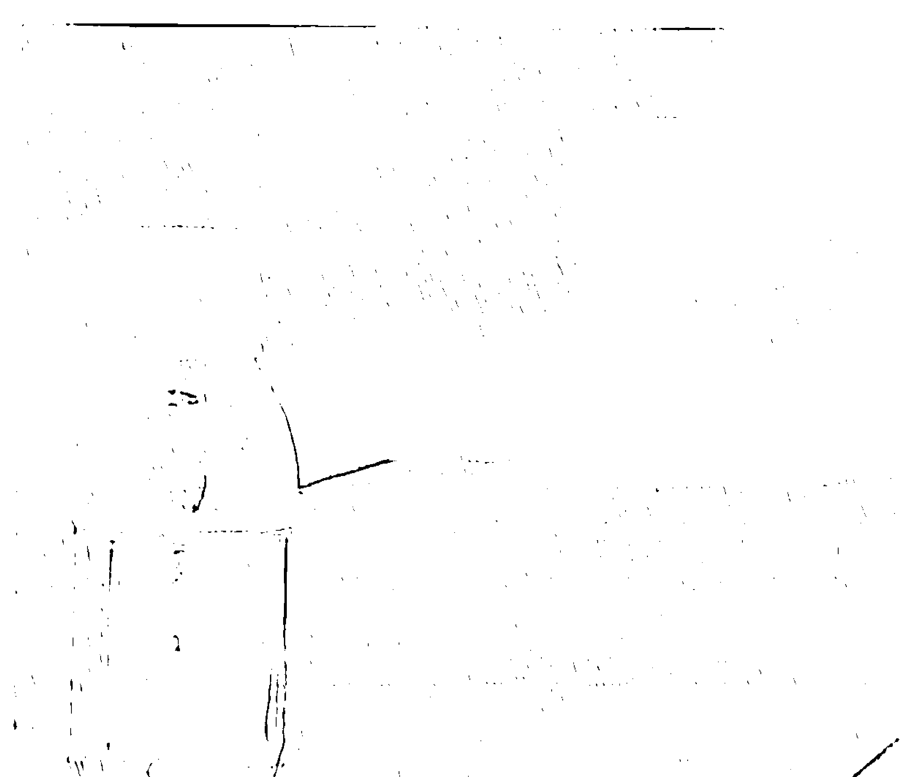

## 蒸氣吸入法

蒸氣吸入法是一種益於清潔鼻竇、緩解咽喉炎與胸腔感染，以及暢通肺部系統的方式。它也有助於臉部毛孔打開並且幫助清潔髒污，因此可媲美為清爽的桑拿美容！

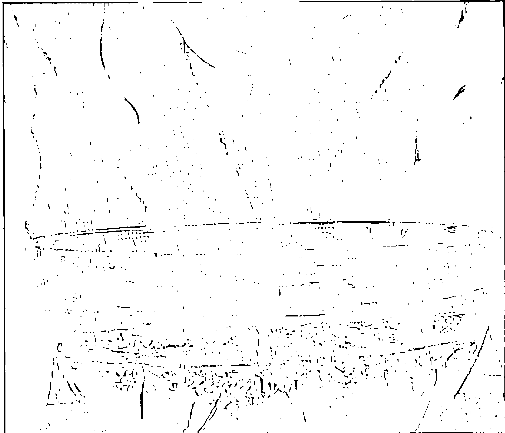

### HOW TO MAKE

1.  使用蒸氣吸入法需要事先準備電熱水壺、冷水、耐高溫的碗、面紙、大毛巾和精油。
2.  在開始之前，請確保你所準備的用具是放在安全且穩固的位置，遠離兒童與寵物。
3.  首先，使用電熱水壺將冷水加熱至沸騰，接著將熱水小心倒入耐高溫的碗裡，先讓熱水稍微冷卻防止精油快速揮發。
4.  接著加入 2～4 滴的單方或複方精油。

### 工具

電熱水壺、冷水、耐高溫的碗、面紙、大毛巾

### 使用方式

將大毛巾覆蓋在你的頭上，並罩住熱碗以便吸收隨著熱水所蒸散的精油。閉上雙眼，持續幾分鐘以鼻子深吸、嘴巴深呼的方式嗅吸精油，最後取下大毛巾，重新調節呼吸。若有需要，適時補充熱水和精油，並且重覆 2～3 次。

### 注意事項

在操作的過程中感到過於刺激或是頭暈，請立即停止。由於精油在一定程度上較刺激黏膜，因此請適度使用，切勿超過上述劑量。若是個案容易過敏、患有哮喘或癲癇，精油劑量必須減半（使用 1～2 滴精油），操作全程中務必小心謹慎。

### 應用指南

蒸氣吸入法適用於下列情況：

-   焦慮與輕度憂鬱
-   胸腔或支氣管感染
-   感冒與流行性感冒
-   頭痛、失眠
-   提升免疫（抗菌、抗感染、抗病毒）
-   改善呼吸系統
-   減輕黏液黏度並且促進排除（祛痰）
-   心智清新（理清頭腦與思緒）
-   改善心理與情緒的素質 例如：悲傷、快樂、失落、緊張、愉悅；或是為了使心情平衡、沉靜、活力、鎮靜或提振
-   鼻塞、咽喉炎
-   皮膚照護：淨化毛孔髒污、痤瘡和油性皮膚、讓臉部與頸部皮膚恢復活力與彈性（在蒸氣吸入法之後，使用冷水或金縷梅純露洗臉可緊縮毛孔的效果）
-   豐厚以及恢復光澤的頭髮

## 室內擴香儀與蠟燭擴香台

蠟燭擴香台不僅可營造出溫馨的環境氛圍，更是受到大眾非常歡迎的精油擴香方式。然而，它必須小心謹慎地使用。舉例來說，在離開環境之前必須先確認蠟燭已熄滅、遠離兒童並且置於不易攜得之處等。

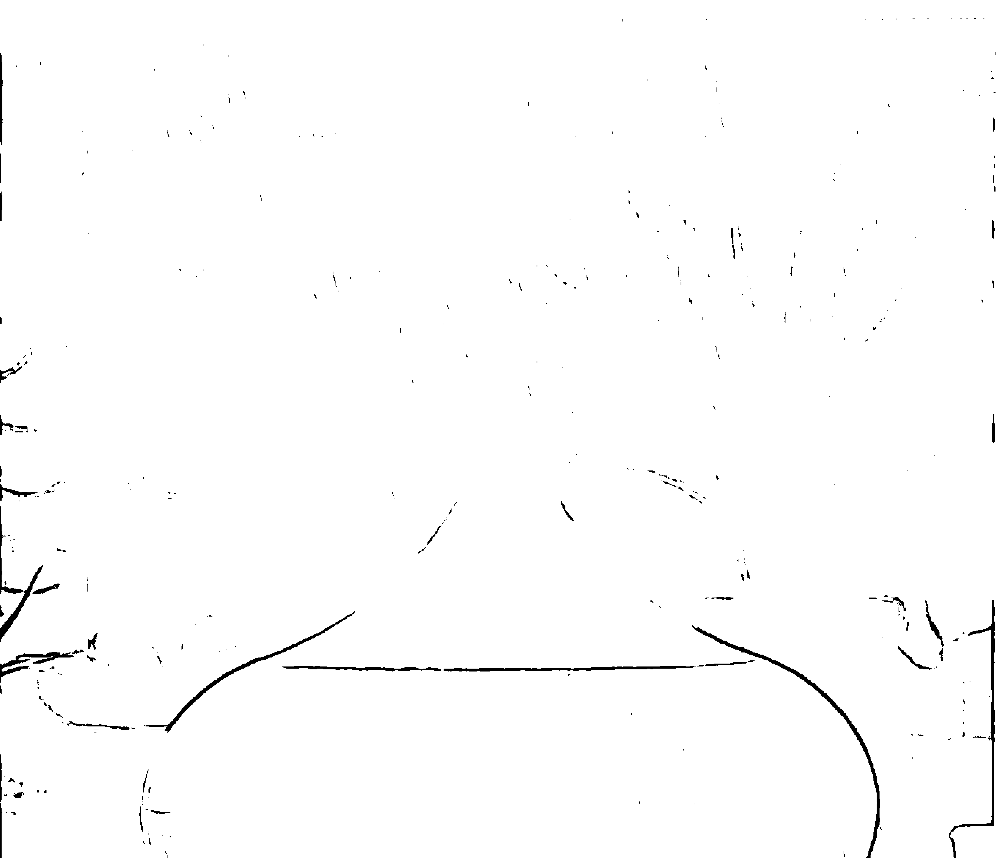

插電式的霧化與擴香器在設計上有所創新與突破，而且越來越廣受歡迎，特別是它們使用起來非常安全（仍須謹慎使用）。這樣的應用方式，傾向將精油更迅速擴散到較大的空間環境裡，與其它擴香方式相比，似乎更保有香氣的完整性。

大多數的單方精油可以任意使用各種方式擴香，但是有些精油特別清新舒爽、馨香濃郁，或者可能過於黏稠。適合與其它精油調合成為複方以創造更溫暖的環境氛圍，僅列舉幾個例子如：冷壓萃取法的紅桔和萊姆，木質類的檀香、大西洋雪松、絲柏、松，花香調的依蘭依蘭、橙花、當然還有玫瑰，樹脂類的乳香和沒藥。

奧圖玫瑰精油非常昂貴，玫瑰原精也不便宜，因此可購買5%已混合在荷荷芭油裡的精油。奧圖玫瑰和玫瑰原精二者皆是非常濃郁的花香調，即使少量也有非常好的效果。

切記，氣味的偏好非常主觀，常常一個人喜歡的味道並不代表另一個人也喜歡，當你準備在公共區域擴香精油時，請留心你所選擇的精油是否合適。

嗅覺感官很容易適應香氣，即使氣味仍然存在，但大腦在短時間已停止承認氣味而產生嗅覺疲勞。只要離開此處並再次返回瀰漫香氣的空間裡，便能夠再次偵測到精油香氣；這點也可當作是否需補充精油的良好指示。

## 插電式擴香風扇或擴香儀

這些擴香設備通常附有相關的使用說明，只要在設備裡滴入6～8滴單方或複方精油，需要時再補充即可。在方便的時候，短時間開啟使用，而非一直不斷擴香精油。

## 蠟燭擴香台

將水分注入擴香台並且點燃蠟燭，滴入6～8滴單方或複方精油，需要時再補充即可。為了避免水分快速蒸發，最好選用凹槽較深的蠟燭擴香台。在手邊準備一小壺水隨時補充水分，切勿讓擴香台的水分完全蒸發殆盡。

### 注意事項

使用時應特別留意，嚴禁無人看管。蠟燭擴香台應放置在安全、穩固的位置，避免被兒童接觸或寵物碰撞。

### 應用指南

插電式擴香風扇或擴香儀，以及蠟燭擴香台適用於下列情況：

-   空間美感香水
-   抗焦慮
-   抗憂鬱
-   鎮靜
-   改善或提振心情與情緒
-   提升或創造特殊的環境氛圍
-   失眠
-   掩蓋令人難受的氣味
-   減少或對抗空氣中的微生物
-   緩和躁動與不安（鎮定、改善心情與情緒）
-   壓力以及和壓力相關的狀態
-   提振

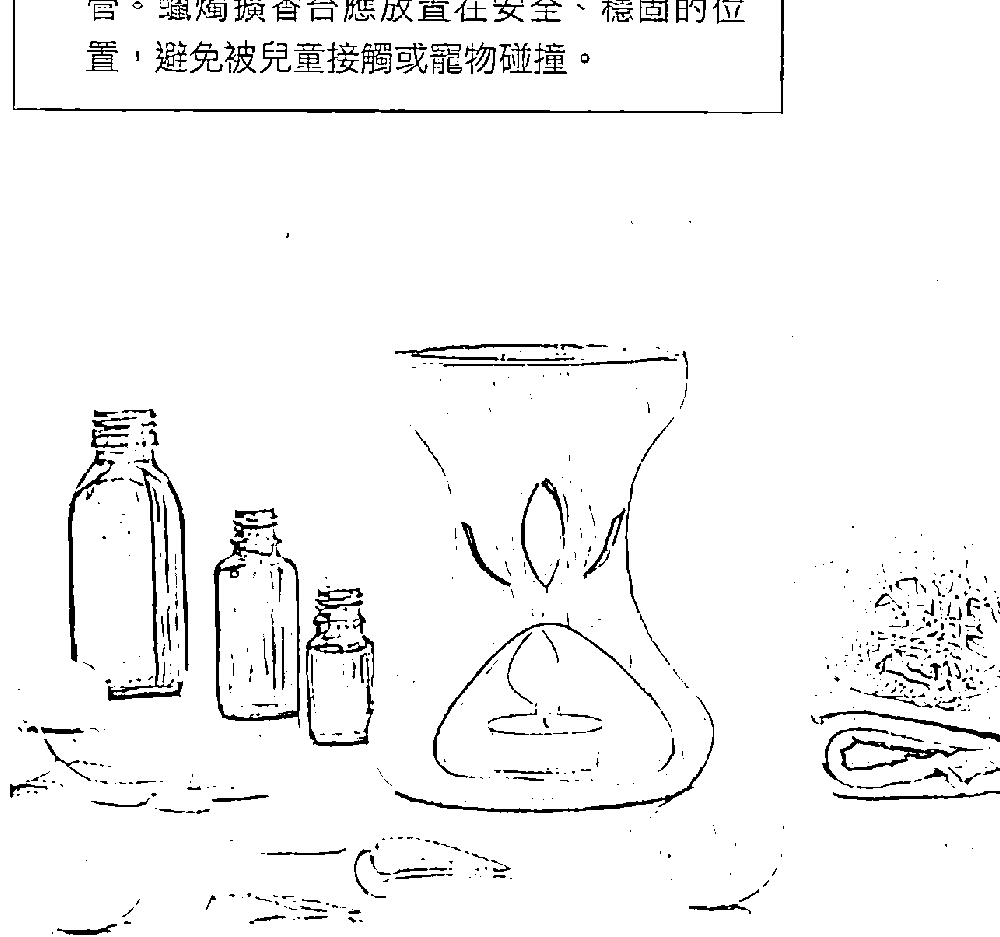

## 樹脂薰香盤

乳香、沒藥和白松香這些樹脂是來自於樹皮或植物莖幹切口所流出較黏稠的液體，在乾燥之後得以使用。當它們經過加熱之後，樹脂會釋放出精油的香氣。

### 注意事項

陶瓦製的樹脂薰香盤導熱速度不如金屬製的快速，在安全操作上可作為優先的選擇，但是它們也必須被放至於安全穩固的位置，以免被撞倒而打翻。金屬製的薰香器具外觀華麗且類似籠狀的結構（在宗教儀式上經常使用），當樹脂燃燒之後所蔓延出來的香氣，透過外觀上的孔洞釋出，由於容器的頂端有一條鏈子，因此它可以被安全地拿著（或行走）。

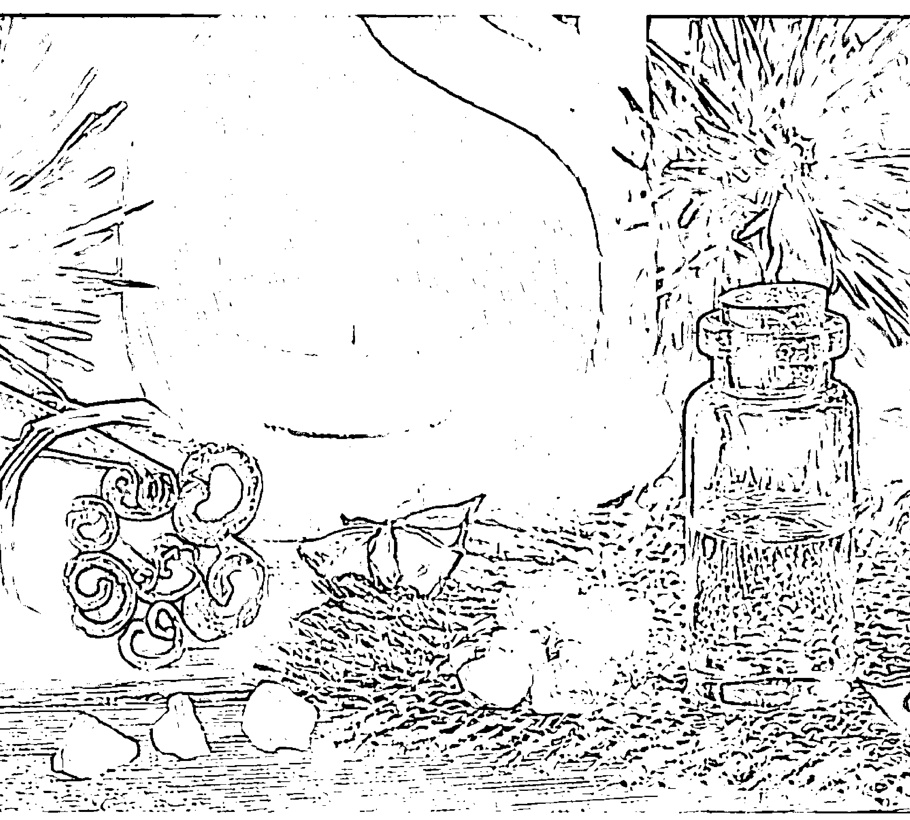

### 工具

碳餅、長柄鉗、薰香盤

### HOW TO MAKE

1.  準備一塊小而扁平的碳餅，使用長柄鉗或鑷子將其固定在薰香盤中，當碳餅被點燃時就會迅速地加熱。
2.  接著再使用長柄鉗或鑷子夾起一塊樹脂置放於碳餅的頂端。
3.  當樹脂被加熱之後，就開始熔化且分解出具有精油香氣的煙霧瀰漫於周圍環境裡。

### 應用指南

樹脂薰香盤適用於下列情況：

-   美感
-   改善或提振心情與情緒
-   提升或創造特殊的環境氛圍
-   掩蓋令人難受的氣味
-   靜心

### 使用方式

燃燒樹脂時，嚴禁無人看管。每次使用必須確保碳餅與樹脂已完全燃燒殆盡，如途中不予使用，請用水熄滅熱源。將容器置放於安全的位置以防兒童或寵物接觸而發生意外。

## 精油泡浴

精油使用在泡浴的目的是放鬆作用。當應用芳香泡浴時，吸收途徑是透過吸嗅熱蒸氣所散發出的芬芳氣味，而非經由皮膚表皮吸收精油。雖然溫熱水泡浴有助於表皮吸收，但其實是作用在促進排汗（排泄）而非吸收精油。熱水也會讓皮膚變得乾燥，因此將精油與油性或脂肪類的基礎介質先行混合形成屏障，預防精油的刺激性以及避免由熱水讓皮膚更乾燥。

### How to make

1.  將適中溫度的水注入浴缸中。
2.  進行芳香泡浴前，先將6～8滴單方或複方精油調合至20毫升的植物油中，混合後再倒入浴缸。

### 注意事項

切勿直接將純精油滴入浴缸，水與熱氣會加劇精油使皮膚更乾燥與刺激。

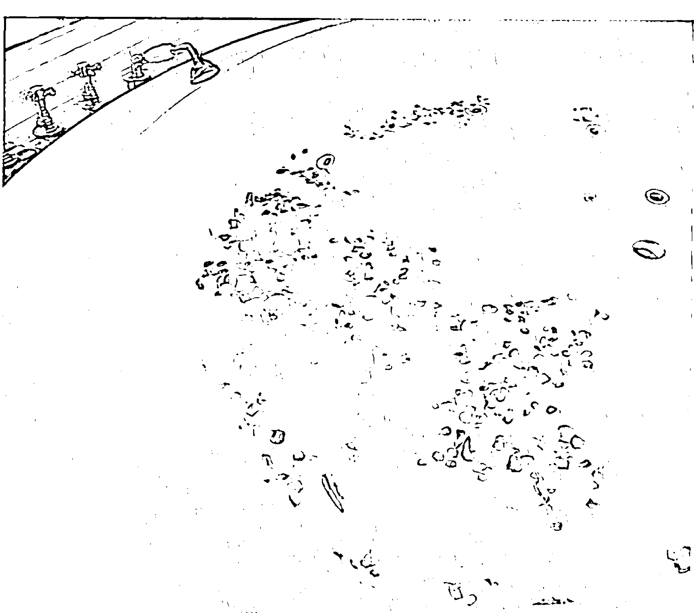

### 工具

20毫升精油瓶、精油、植物油

### 使用方式

若是芳香泡浴應用在兒童、虛弱者或年長者，應降低精油劑量，並請特別留心植物油會讓浴缸變得更溼滑。（植物油可換成浴鹽50g）
為了讓效果更好，可關上門窗，但切勿單獨置留兒童進行芳香泡浴。

### 注意事項

這裡列出不可以使用於泡浴的精油：羅勒、肉桂、丁香、胡椒薄荷與百里香。這些精油具有高度風險而導致皮膚的刺激，胡椒薄荷與百里香會讓體溫下降。

### 應用指南

芳香泡浴適用於下列情況：

-   抗憂鬱作用
-   鎮定不安與躁動
-   改善心情和情緒
-   失眠（建議睡前應用芳香泡浴）
-   放鬆
-   呼吸系統疾病，包括感冒與流行性感冒
-   壓力以及和壓力相關的狀態
-   淺表皮膚問題
-   提振

## 自我局部按摩

自我局部按摩是陪伴自己最美妙的方式。任何在軟組織上的滑推與刺激都會促進循環和淋巴引流。具有節奏的揉捏與溫和按壓有助於肌肉放鬆，撫觸也有撫慰人心的效果。泡浴或沐浴之後，當你的皮膚保持在溫暖、乾淨又水潤時，使用乳液或植物油當作自我局部按摩的潤滑媒介，或是在基礎介質中添加精油的效果會更好。

### HOW TO MAKE

1.  在一個小調油缽或調油容器裡，倒入你所選挑選的基礎介質以及 4～6 滴單方或複方精油，加以混合。
2.  將小調油缽或調油容器放在一個碟子上，方便取得使用。

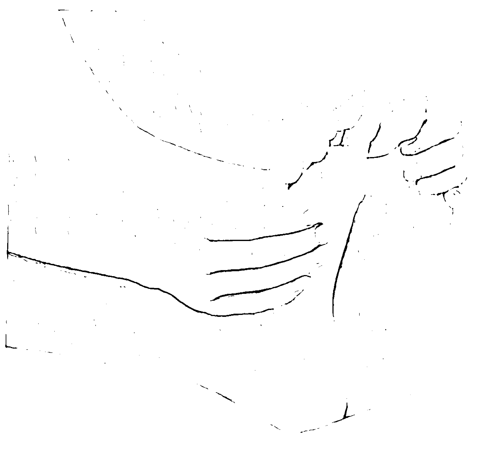

### 工具

調油容器、碟子、乳液或植物油

### 使用方式

將適量的精油混合物倒入手掌中，然後塗抹在按摩區域。雙手的手掌、手指依序在四肢、腹部、臀部、肩膀、頸部和臉部，有節奏地畫圈按摩。溫和拉提、揉捏皮膚及軟組織，例如：上臂、腿部和臀部。

### 按摩方式

由下往上（腳→頭）能刺激循環，適合日間；由上往下（頭→腳）有助於鎮靜放鬆，適合夜間。

### 注意事項

勿用力摩擦肌膚，以免受傷。

### 應用指南

自我局部按摩適用於下列情況：

-   提升白天的警覺度與幫助傍晚靜憩
-   鎮靜、放鬆
-   潤滑、柔軟與滋養肌膚
-   自我賦權、撫慰性
-   刺激淋巴與循環系統
-   刺激內分泌腺與激素的釋放
-   透過肌膚的末梢神經刺激神經系統
-   壓力以及和壓力相關的狀態
-   透過表皮來促進排毒
-   支持感受到價值、自我價值與自尊
-   提升免疫系統
-   提振

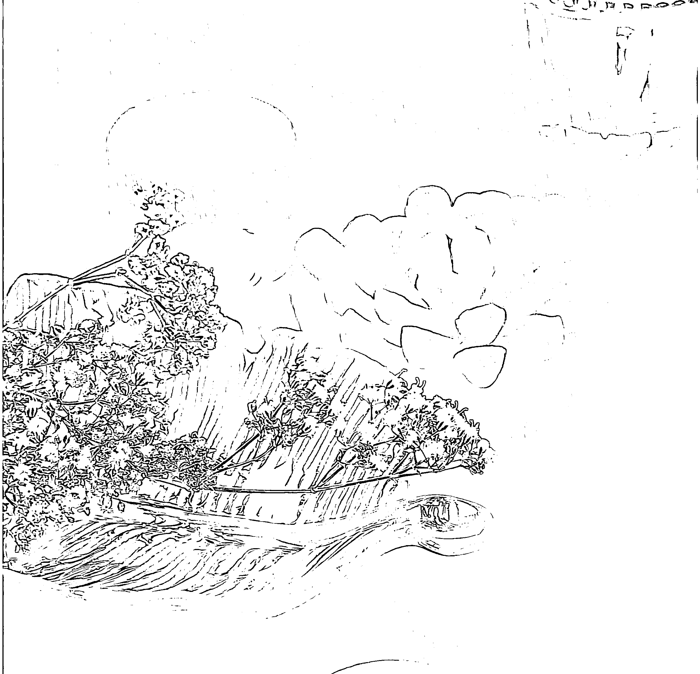

# Part 04
## 其他協助身心健康的療愈技巧
Complementary Wellness Techniques

## 放鬆、運動、補充營養

除了精油與正念之外，運用身心健康管理工具的團隊成員還支持個體維持他們的內外控制點，其中包括充分休息，以及更多的放鬆技巧、運動和補充營養。

## 放鬆與運動：探尋健康的平衡點
Relaxation and Exercise: Finding a healthy balance

平衡是維持健康生活方式的金鑰：正確地衡量生活裡每件事的適度性——運動與沉靜、工作與休息、飲食與節食。我們的身體與大腦是運作在規律的週期波動中。

## 晝夜節律
Circadian rhythm

受到陽光與黑暗的刺激，持續呈現以 24 小時為週期的運作變動。它會影響身體功能的變化，例如：消化、排便與睡眠模式。在 24 小時日夜循環的週期中，這些功能會在某些時刻被抑制或優化。

## 次晝夜節律
Ultradian rhythm

意指 90 ～120 分鐘腦波頻率週期。大腦比其它的器官或肌肉更活躍，因此它的運作較快。這意味它只能維持短暫的激烈活動。大腦會自動從左半球（理性、解決問題）切換到右半球（創造性、直覺），從主動切成被動模式，並歸零。在睡眠時也會持續這段週期，分成深度睡眠和作夢的兩階段。因此，在一天之中，我們的專注力和注意力會從頂峰到逐漸減弱。大腦疲憊之前，我們能維持 90 ～120 分鐘的注意力，並切換模式使其恢復。

## 壓力、傷害、身心症的疾病來源

我們的身體功能和最佳表現是透過規律、平衡、有節奏的活動與休息週期而來。然而，現代生活的需求似乎與這些自然節奏不一。自從工業革命以來，人們的行動力變得更機械化，而非藉由工業的發明輾轉從沉重的勞動中解放出來，就另一種意義來說，我們看起來就像是奴隸。理應做得更少，我們反而被期望做得更多；甚至在休息時間也必須被工作消耗掉。我們的祖先每天僅花費幾個小時狩獵和滿足生活所需，而現今的我們幾乎整天工作：24 小時購物、10 小時輪班，我們在電腦或機器的面前坐上好幾個小時不停工作，或是一次次不斷重覆相同的行為或動作。也因此，我們更容易從原本存在的自然狀態裡分心、脫節與分離。這就是壓力、傷害、身心症與疾病的來源。

## 保持自我平衡的方法

我們每個人都擁有屬於自己存在的方式：圍坐在營火堆旁邊、分享故事、播放音樂和跳舞、讓身體自然的擺動、創造美麗的藝術品，只需要簡單地觀察並欣賞大自然的日常與季節性的節奏。透過覺察與自發性，我們可以掌握屬於自己的平衡。
透過自我覺察與主動性，我們可以掌握管理自己的身心平衡。例如：透過刻意運動（主動）與身體放鬆（被動），特別是如果我們能夠與大腦的次晝夜節律（Ultradian rhythm）同步，那我們就幫助自己身體恢復健康，並且維持身體的自然節律與平衡。

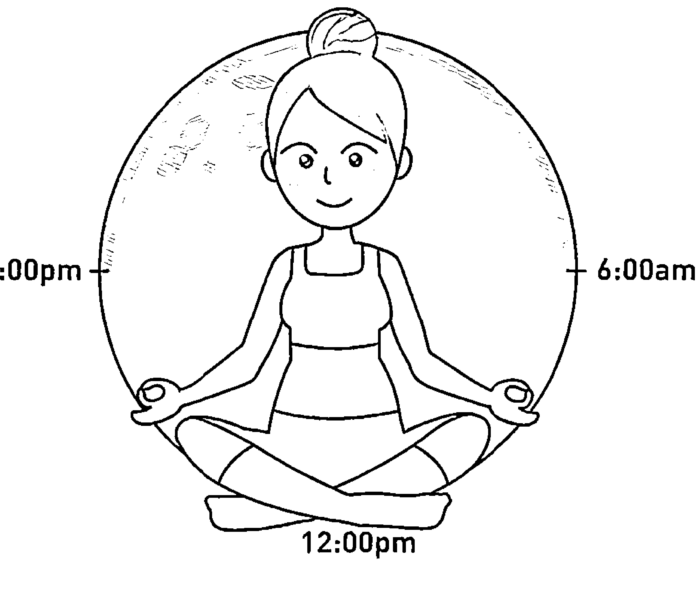

## 促進身心整合的運動方式

第一種運動是伸展且強健肌肉與韌帶；提高靈活度、關節運動、穩定核心肌群、改善身體姿勢與體態；並且協助體內系統與器官運作順暢。

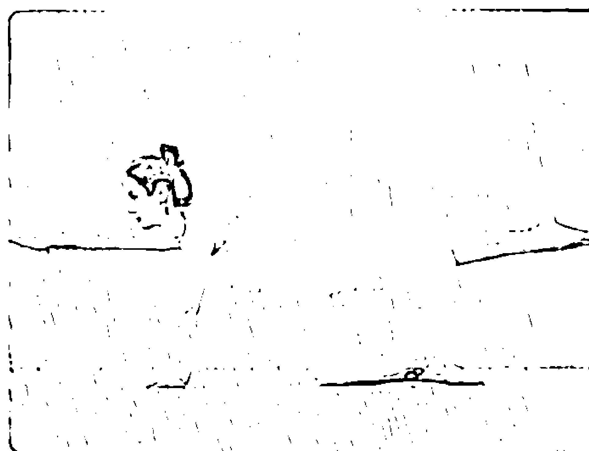

例如：瑜伽、溫和的皮拉提斯，以及兼具身體覺察和矯正技巧的亞歷山大技巧與費登奎斯療法。這些練習方式也可以幫助身體在更劇烈的運動或體能活動之前先行暖身，預防韌帶、關節和肌肉拉傷或損傷。

第二種運動是較為激烈並且持續涉及心血管系統的刺激、強化肌肉功能（包括心肌），改善身體的協調性與肌耐力。

例如：慢跑、健行、登山、游泳、體能活動、舞蹈和武術等。

所有的運動都能改善循環、消化和新陳代謝；增加廢物的移除；強化肌肉功能並且改善靈活度；刺激大腦產生幸福感的神經傳導物質——多巴胺、血清素、催產素和腦內啡。

## 促進副交感神經系統「休息與消化」的放鬆模式

第一種是專注和深度放鬆的寂靜技巧，就像是靜心、可視覺化以及帶有意識的鎮靜技巧。
例如：肌肉放鬆、吟頌與祈禱、聽音樂或是聆聽像是河水流動、海邊浪花拍打沿岸礁石所發出的大自然美聲。

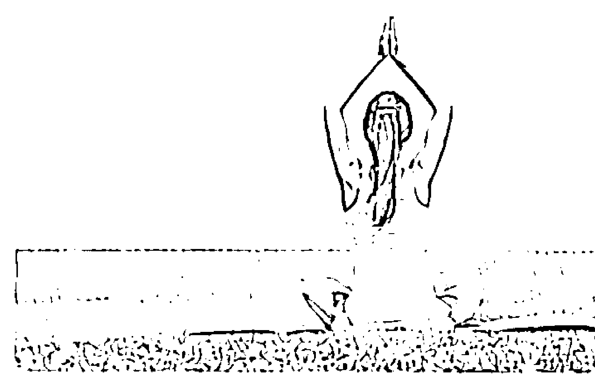

第二種與創意活動有關，就像是畫圖、繪畫以及其它創造性的喜好。
例如：閱讀的樂趣、在大自然中漫步等。

## 在運動與放鬆的期間，身體可以休息、滋養和康復，而二者皆可改善睡眠品質。其它的益處說明如下：

-   改善免疫功能
-   提高能量水平
-   改善循環
-   提高氧氣攝取並改善細胞呼吸作用
-   降低心臟病與中風的風險
-   降低血壓
-   預防心理健康問題的產生
-   改善記憶力與學習能力
-   提升專注力
-   思緒更清晰
-   更好的應對機制和技巧
-   提高自尊心

## 運動與促進肢體靈活度的練習方法
Exercise and Mobility Practices

延展與核心肌群的訓練是負責保護脊椎穩定、強化腰部與腹部的肌耐力；提升柔軟度、增強運動時的肌肉彈性、平衡與協調性，以及調整和維持體態最佳健康。

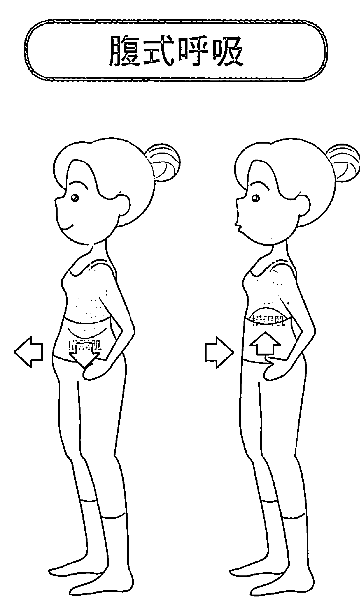

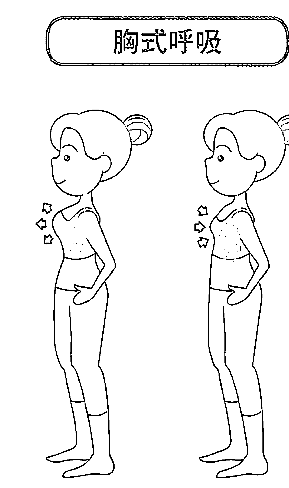

正確的呼吸是指著重在橫膈肌的移動（腹式呼吸）而非僅使用胸腔部位的肌肉（胸式呼吸），這點在運動、靜心與放鬆期間相對重要。正確呼吸可以給肺部充足的氧氣增加肺活量，幫助身體與肌肉維持肌耐力，提高警覺度與專注力。

以下的步驟說明，有助於檢查並且調整你的姿勢與呼吸方式。

## 正位與深呼吸練習

1.  正面平躺，將你的頭部放在一個小墊子或枕頭上。
2.  放鬆肌肉並確保你的脊柱處於中線位置：健康的脊柱是由三條自然曲線所組成的 S 形，分別是頸椎、胸椎和腰椎。檢查並調整你的脊柱是否位於正位，將雙手自然地輕放在臀部二側。輕輕地上下移動骨盤，並且找到舒適合適的位置。保持這個姿勢。然後根據背部的自然曲線，調整身體其它部位。
3.  維持正位的姿勢，將一隻手放在腹部、另一隻手放在胸部。當你每一次吸氣與呼氣的循環之間，放在腹部與胸部的手會隨著呼吸而上下移動。呼吸較短淺時，胸部與肩膀會跟隨著上下移動，而正確的腹式呼吸，肩膀不會移動。
4.  持續練習正位與深呼吸，緩慢增加平時呼吸的深度，一直到你感覺自然且舒服。爾後，在運動與其它活動時，你將更有能力並且掌握這樣的呼吸方式。

當你平躺練習一陣子之後，你可以試著開始以站姿練習：想像有一條中線從你的腹部或太陽神經叢輕輕地向前拉動，同時，另一條線從你的頭頂輕輕向上拉起。維持這種正位姿勢並且有意識的放鬆身體其它部位，接著在日常中持續深呼吸的練習。

## 運動與讓肢體靈活的練習

### 幫助與改善

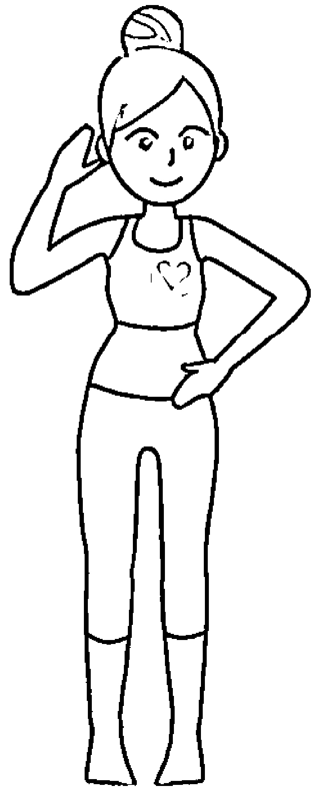

| 幫助與改善 | 延展與穩定核心肌群運動 | 覺察 & 調整體態 |
| :--- | :--- | :--- |
| 肌肉張力、關節運動和新陳代謝 | 瑜伽 | 亞歷山大技巧 |
| 強化心肌活動量 | 皮拉提斯 | 費登奎斯療法 |
| 循環 | 健走 | 骨療醫學 |
| 淋巴引流 | 游泳 | 按摩治療 |
| 氣體交換 (增加肺活量) | 騎腳踏車 | 芳香按摩 |
| 促進消化 | 規律的運動 | 撥恩療法 |
| 移除廢物 | | 魯爾夫治療法 |
| 神經功能 | | |

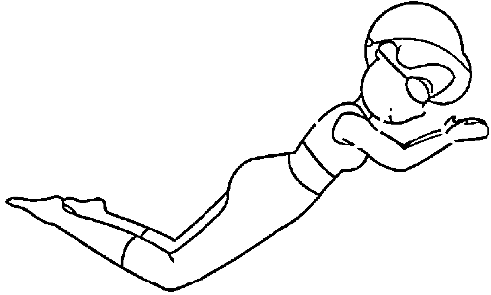

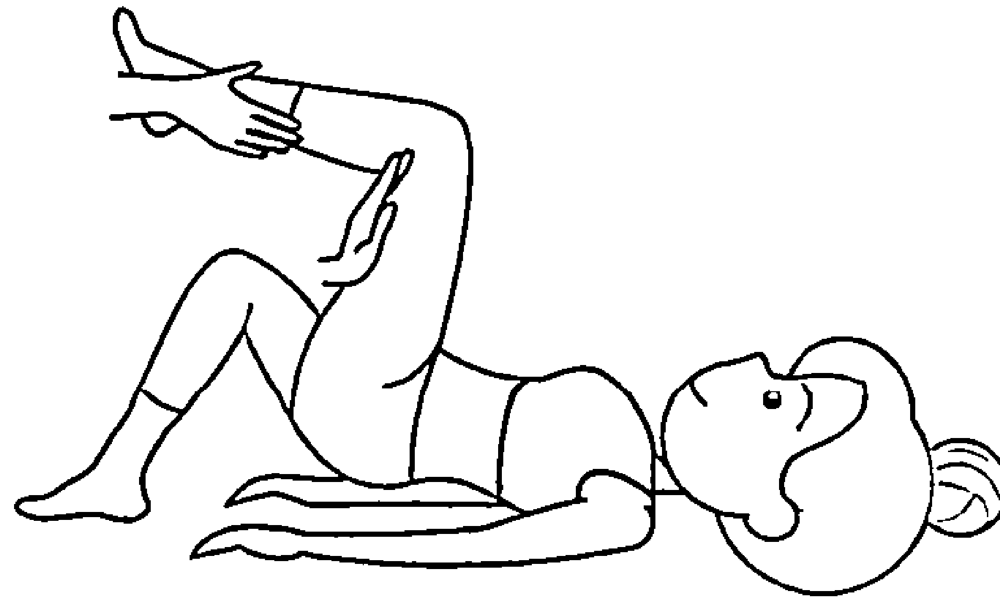## 暖身動作

在開始運動、放鬆或正式靜心之前，養成良好的習慣去檢查且調整你的姿勢與呼吸方式。在一天之中，當你注意到自己處於慵懶的時候，你也可以溫柔地回復到最佳正位姿勢。慵懶，看起來似乎很舒服，但為了讓你保持直立抵抗重力的拉力，肌肉需要額外更努力的工作，因此實際上是消耗更多的能量。

慵懶也會壓縮和增加內部器官的壓力。

在熱身和伸展肌肉與韌帶之後，才可進行劇烈的運動。瑜伽和皮拉提斯提供非常有用的熱身延展姿勢，瑜伽也為無法進行劇烈運動的人，提供一種安全且有效的溫和運動方式。

除了健身房之外，還有很多運動方式可以在日常生活中進行，這些方式也可以變得很有趣！

- 上下樓梯取代電梯
- 走路或騎腳踏車去工作
- 游泳、舞蹈
- 以及整理家務或車子（把它當作是運動而非苦力）

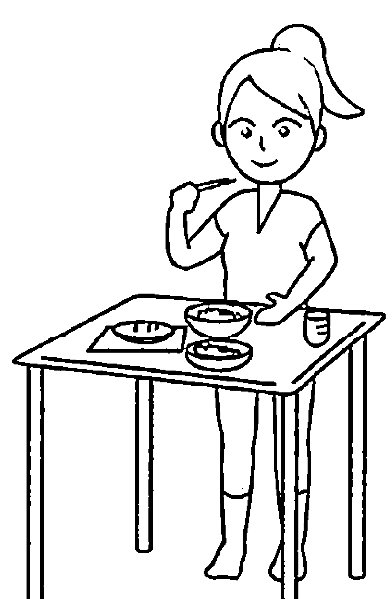

設計一個站立式的桌子或餐桌，減少你坐著的時間。

「散步和聊天」取代喝咖啡聊是非。

若是你必須坐在辦公桌前工作，每隔一小時站起來散步或是進行簡單的伸展運動。關鍵是，盡可能的以多種不同的方式活動身體。

請記得，放鬆與久坐不動不一樣，放鬆是指刻意去行動，正如運動可以短時間穿插在一整天中，協調一致地放鬆也是如此。

## 最佳的運動

以下提供的練習著重於正位姿勢，增加肌肉與韌帶的彈性，以及肢體靈活度。

### 瑜伽 Yoga

瑜伽是古老印度教精神與修道的紀律，它源起於印度 5,000 ～ 6,000 年前，並且在十九世紀被引進西方世界。在西方主要以健康和放鬆為主，並與簡單的靜心、掌握呼吸控制，以及展現一系列特定的身體姿勢相關。瑜伽包含各式各樣不同的練習方式，其中又以哈達和阿斯坦加二種瑜伽類型最廣為人知。哈達瑜伽專注於調整與平靜生理與心理力量訓練的練習。阿斯坦加瑜伽則是一種鍛煉身體的運動，並且與身體、心理和心靈的自我成長有關。瑜伽可提高身體靈活度與平衡性，並且強化下半身的力量。

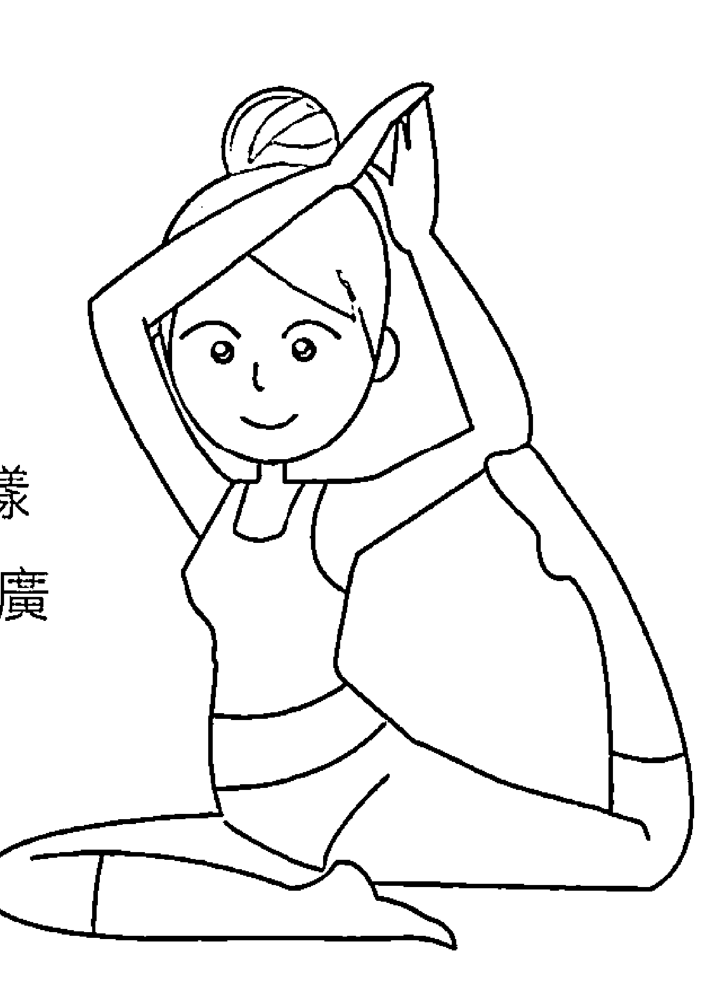

### 皮拉提斯 Pilates

皮拉提斯的創立與命名是來自於德國人約瑟夫·皮拉提斯 (1883 ～ 1967)。運動的核心在於改善體力、靈活度、姿勢以及強化心理意識，並且也強調正位體態、呼吸頻率、強化核心肌群，以及改善肌力的協調性與平衡。皮拉提斯運動包括舒展四肢與強化技巧，它會應用到墊子與特殊設計的運動設備。

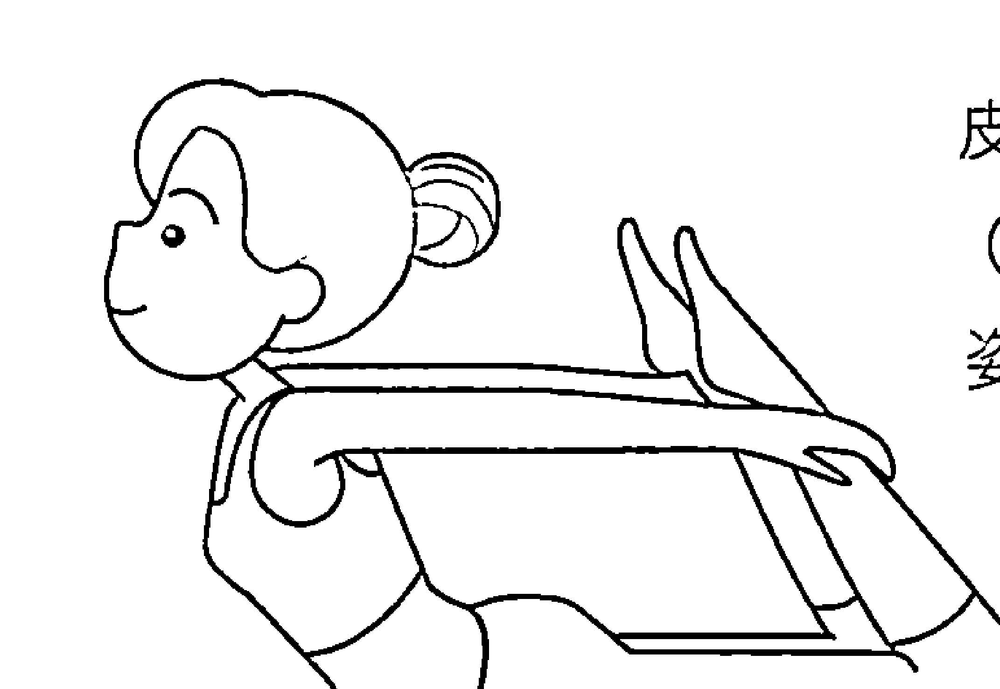

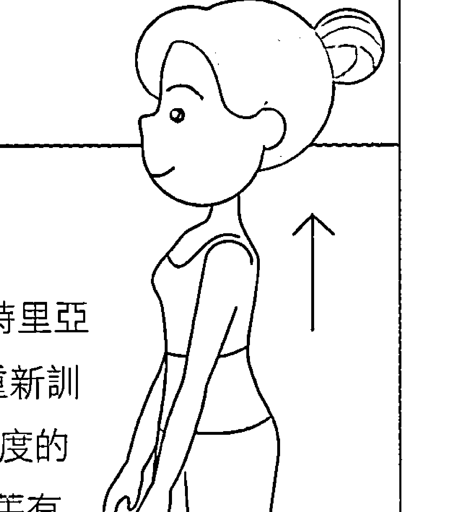

### 亞歷山大技巧 Alexander Technique

一種學習與教育的過程。此技巧的命名與創始者是費德里克·麥特里亞斯·亞歷山大 (1869 ～ 1955)，技巧設計的目的是幫助一個人重新訓練運動與姿勢的習慣，透過覺察與意識來微調肌肉張力，以確保適度的力道來應對身心和諧的狀態。培訓涉及意向引導為原則以及打破舊有的慣性限制，重點則是掌握運作機能的協調性以提升身體輕鬆的運動與移動技巧。

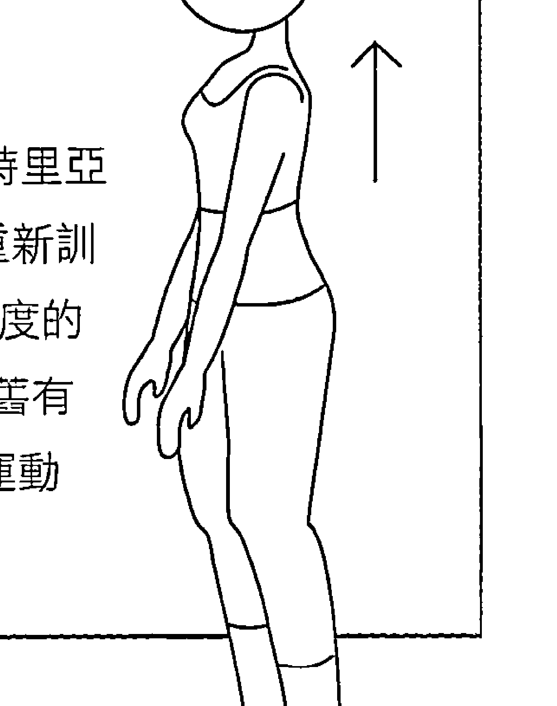

### 費登奎斯療法 Feldenkrais

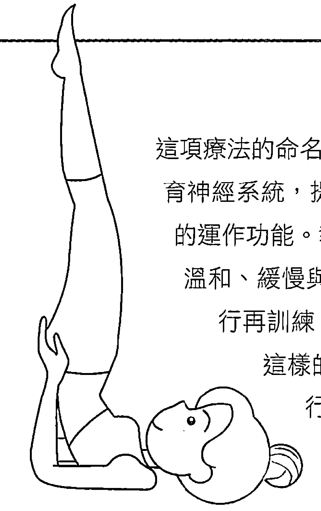

這項療法的命名與設計是摩謝·費登奎斯（1904～1984），目標是重新教育神經系統，提高動能以便讓身體更有效、更舒適地進行動作與身心整合的運作功能。執業者專注引導探索自我動作的習慣模式和歷史。接著，以溫和、緩慢與重覆性的訓練導引受術者適應新的動作模式，幫助他們進行再訓練，鼓勵他們允許這種新的動作模式開始進入生活中的日常。

這樣的動作方式可由執業者（被動）或受術者（主動）來完成執行。費登奎斯最終的目的是從沒有疼痛或動作的限制，讓無意義的運動功能轉變為功能良好。

### 撥恩技巧 Bowen

由湯瑪士·安布羅斯·撥恩（1916～1982）設計且命名的撥恩技巧，是一種非常輕微且溫和的獨特性技術，其作用於身體的軟組織（筋膜）進而刺激大腦的神經反應。這種治療方式是應用一系列微小的「動作」，使用拇指和食指，沿著肌肉、肌腱和筋膜輕柔地滾動，然後暫停（治療方式的重要特徵），爾後允許身體重新組合自己。動作設計的目的是激發組織和神經通路來開啟與大腦的溝通。受術者在整个施作過程中穿著完整。治療效果並非立時可見，但在療程後卻顯而易見整體身心的改變結果。

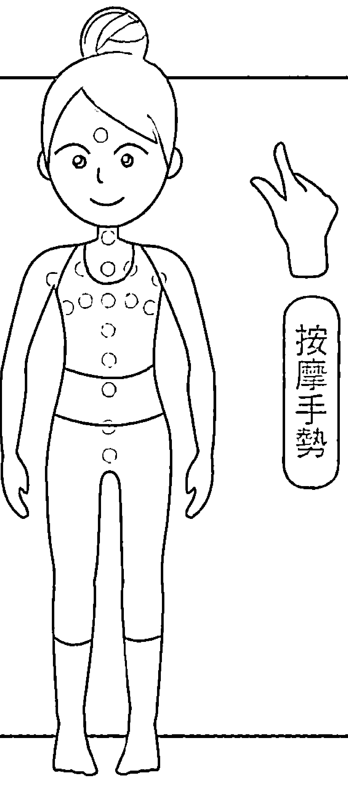

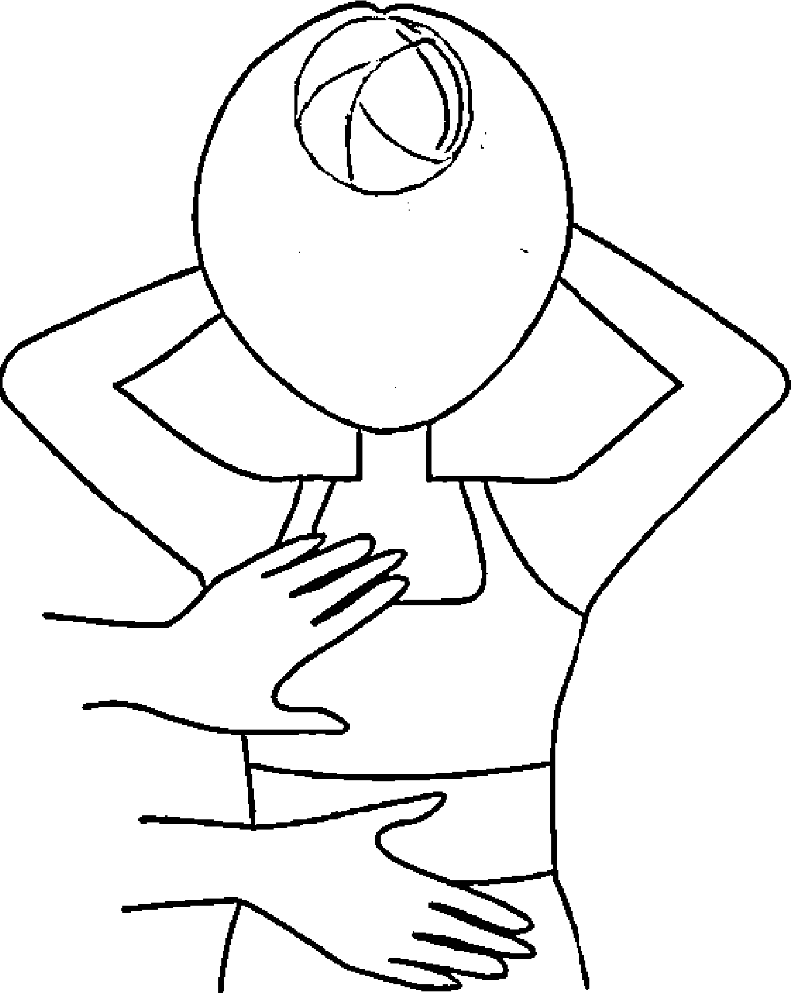

### 按壓治療 Rolfing

這種動力的深層組織按摩，包括評估和治療肌肉、肌腱、韌帶與結締組織來控制疼痛和損傷，並且協助康復。根據受術者的需求，治療師會提供深層組織按摩，或是結合其它合適的按摩技術。治療的目的是，恢復和最大化身體在無痛的狀態下有效運作的能力。

### 骨疗医学 Osteopathy

骨疗医学系统的基本原则是奠基于个体良好的健康，其受到肌肉、韧带、结缔组织（筋膜）以及骨骼（特别是脊柱）是否顺畅运作、协调和在正确的位置而有所影响。疗程施作包括延展、按摩肌肉组织和骨骼位置矫正。治疗的目的为增加关节灵活度、缓解肌肉紧张、促进血流供应至组织、重新调整脊柱改善骨骼姿势，减轻和预防肌肉拉伤，如此便能使身体内部器官和系统更有效地发挥作用。

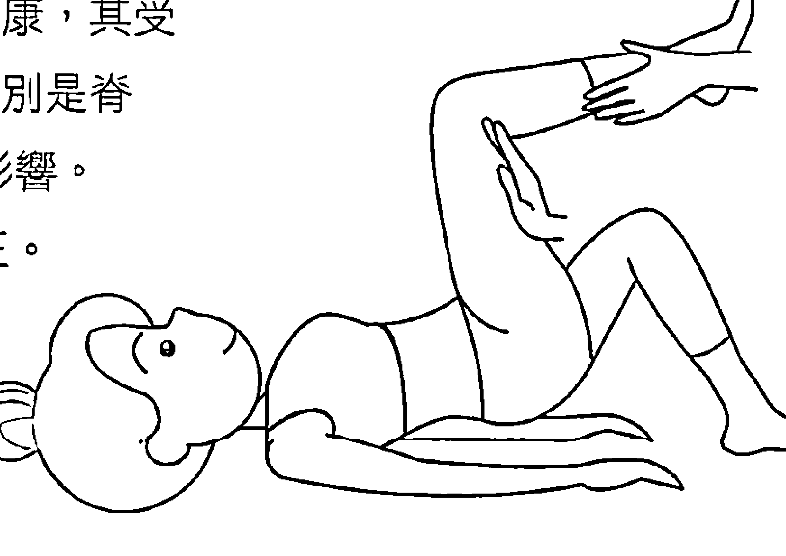

### 鲁尔夫治疗法 Remedial Massage

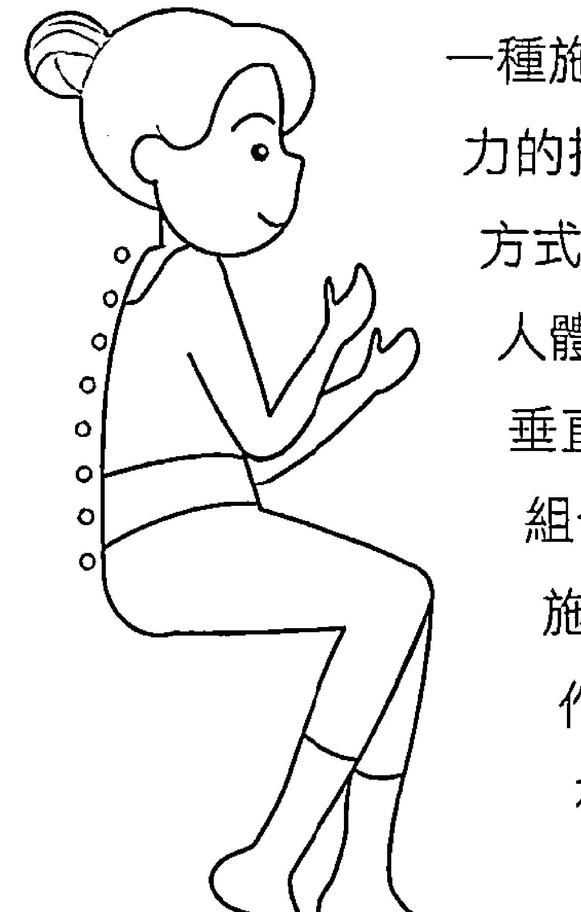

一种施作在软组织上按摩深层组织的方式，目的是以最小化和减少重力的拉力方式，重新调整身体的结构和达到姿势最佳化。此种治疗方式为爱达·鲁尔夫（1896～1979）设计与命名。鲁尔夫认为，人体肌肉做正确的延伸而不受到伤害，是受益于与地球地心引力的垂直线平齐。由于治疗方式涉及主动与被动、深层和浅层的动作组合来延展筋膜，因此受术者有时会感到疼痛。鲁尔夫治疗法的施作历程为：前三个动作侧重于身体的浅层组织，接下来四个动作侧重于深层组织，最后的治疗动作则着重于全身。治疗目标在于减轻肌肉和精神上的疼痛，根据地心引力的拉力方式让身体恢复正位，改善和促进更舒适的动作。

### 芳香按摩 Aromatherapy Massage

芳香按摩是一种深度放松的疗愈方式，其融合一系列流畅性的动作与对肌肉和软组织的轻柔安抚手法。根据受术者的需求和治疗师的风格与技术，通常会结合应用多项按摩技术，例如：温和的指压和瑞典式按摩。芳香按摩的主要目标是达到深度的放松、缓解肌肉紧张、温暖表层组织，以及促进循环以帮助精油被皮肤表皮、表皮下的软组织和循环系统吸收。

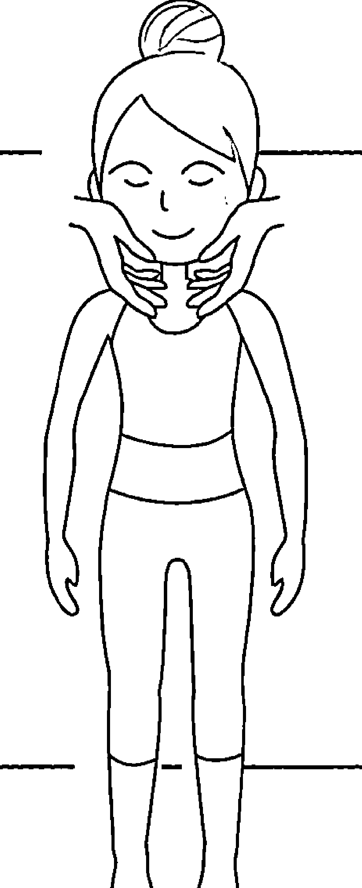

## 最佳營養指南
### Guidelines for Optimal Nutrition

整體健康的重要因素除了我們的飲食吃了些什麼，飲食的時間和方式也格外重要。建議在放鬆的時候進食，千萬不要邊走邊吃。當然，影響營養素有效被吸收的重要因素，就是去享受食物。若是你經常感到焦慮，少吃但要保持血糖的穩定（低血糖會加劇焦慮感），你可以在日常飲食中，包括幫助緩慢釋放能量的碳水化合物，例如：燕麥和其它全穀類。不要省略其中一餐；早餐必須吃得好，午餐和晚餐適中即可（勿於晚間食用不易消化的食物）。

## 每日均衡的飲食金字塔

食用各式各樣的新鮮蔬果以確保攝入食材中的重要營養素（蛋白質、碳水化合物、脂肪、維生素、巨量和微量礦物質）。

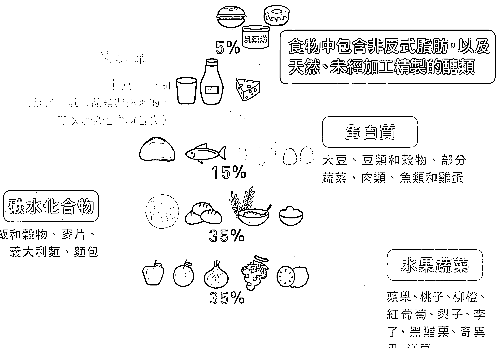

肉類是非必要性的；植物確實能提供豐富的蛋白質、鐵質以及其它重要營養素的來源，而根據蔬菜和穀物生長的土壤品質，會影響巨量和微量礦物質含量的多寡。與富含肉類和動物性產品的食材相比，素食可以大大降低碳排放量（畜牧業和食品生產），減少溫室效應。¹ 這並非意謂著完全不食用肉類而是適量食用（尊重個人的選擇），並且選購自具有道德、環保意識的友善供應商。

## 食物的營養價值

接下來幾頁所提供的圖表，說明各式各樣富含營養素食物的來源，有益於你挑選食物幫助每日營養均衡。表列的食物提供健康消化所需的巨量營養素（蛋白質、碳水化合物、脂肪和水分）、微量營養素（維生素、巨量和微量礦物質）以及纖維質。維生素按字母順序優先列表，接著是巨量礦物質和微量礦物質，而礦物質則按人體所需多寡依序列列表。

## 人體維持健康功能所需的各種維生素和礦物質

| 维生素和矿物质 | 重要营养素的食物来源 | 缺乏营养素的症状 |
| :--- | :--- | :--- |
| **维生素 A** （提高免疫功能、黏膜修复、维持视力） | 类视色素（动物性来源）鱼类、肝脏、鸡蛋、牛奶、奶油、起司、乳制品 β-胡萝卜素（植物性来源）大豆、胡萝卜、山药、甘薯、南瓜、黄色蔬菜、杏果、桃子、番木瓜、哈密瓜 | 干眼症、夜盲症、无法适应外界光线的强弱、皮肤粗糙干燥/角质化、容易感冒和感染、牙齿珐琅质流失、肾结石、过敏 |
| **维生素 B1 硫胺** （容易被热摧毁、促进碳水化合物的同化作用，参与醣类代谢转化为能量、帮助蛋白质与碳水化合物分解、记忆功能、保护黏膜、髓鞘与神经功能发长） | 肝脏、牛奶、蛋黄、豆类（豆荚、豌豆、扁豆、花生…等等）、米糠、谷物和麦麸、啤酒酵母、糖蜜、绿叶蔬菜、黄色蔬菜、水果 | 神经系统失调：精神官能症、神经衰弱、易怒、对噪音敏感、疲劳、恐惧、焦虑、健忘、甲状腺功能低下、食欲不振、心悸 |
| **维生素 B2 核黄素** （辅助碳水化合物和蛋白质代谢、皮肤生长与健康功能、肠道内壁与血管壁细胞） | 肝脏、鸡蛋、牛奶、乳制品、啤酒酵母、绿叶蔬菜 | 唇裂与生疮、口角及舌头发炎、结膜炎、白内障、脂漏性皮肤炎、红血球受损导致贫血或心脏疾病、牙齿问题、损害胎儿健康 |
| **维生素 B3 菸酸** （与细胞中的能量释放有关、促进人体利用碳水化合物、蛋白质与脂肪酸以产生能量、与其它 B 群协同将主要营养素转化成能量） | 肝脏、鱼类、鸡蛋、啤酒酵母、原生小麦胚芽、花生、奶油、酪梨、果干（例如：椰枣、无花果、梅干） | 糙皮病（可能导致皮肤鳞屑、腹泻与精神障碍疾病）、消化不良、疲劳、丧失幽默感、头痛、忧郁、失智、思觉失调 |
| **维生素 B5 泛酸** （与胺基酸代谢有关、帮助碳水化物、蛋白质与脂质有效利用、皮肤再生） | 肉类、内脏类（肝脏、肾脏）明太子、蜂王浆、原生小麦胚芽、全谷类、豆荚、啤酒酵母、糖蜜、坚果 | 心理压抑、易怒、忧郁、低血糖、过敏、关节炎、胃疾（溃疡、消化不良和便秘）、疲劳、头发灰白、皮肤病 |
| **维生素 B6 吡哆醇** （与碳水化合物、脂质、胺基酸代谢的适当功能有关、协助免疫系统制造抗体） | 肝脏、肾脏、鸡蛋、牛奶、豌豆、豆荚、大豆、啤酒酵母、原生小麦胚芽、糖蜜、甘蓝 | 皱纹、指甲纵线老化、无法晒黑、对阳光敏感、舌炎、嘴唇周围干裂、手脚麻木、儿童抽搐、忧郁、肌肉颤抖（如帕金森氏症）、癫痫、低血糖、糖尿病、食欲不振、高胆固醇、肾结石、关节炎、过敏、贫血、浮肿、勾起恶梦 |
| **维生素 B7 生物素** （又称维生素H）（辅酶、由肠道微生物合成、与碳水化合物代谢有关、促进皮肤、消化道、神经的健康、新陈代谢、细胞形成与再生） | 肝脏、蛋黄、牛奶、坚果、啤酒酵母、糙米、水果、番茄 | 湿疹、皮炎、食欲不振、疲劳、肌肉痠痛 |
| **维生素 B9 叶酸盐、叶酸** （细胞分裂增生的重要物质，合成核酸的关键） | 肝脏、肾脏、蛋黄、天然圆酵母、豆荚、绿叶蔬菜、胡萝卜、哈密瓜、南瓜、酪梨 | 巨母红血球性贫血、忧郁、精神疾病、癫痫发作、食欲不振、舌痛、消化困难 |
| **维生素 B12 钴胺** （维护髓鞘、神经系统与脊髓神经功能正常、DNA 产生因子、红血球细胞形成、骨髓再生、有助肠胃道、呼吸道内壁和褪黑激素的生成） | 肝脏、肾脏、肉类、鸡蛋、乳制品、发酵酒、酵母 | 严重：恶性贫血 轻微：舌痛、呼吸急促、心悸、冷漠、虚弱、协调不良、记忆力衰退、阿兹海默症、情绪紊乱 |
| **维生素 B15 全生育酸** （抗氧化物质、预防细胞氧化与延长细胞寿命、促进胺基酸的形成、强化肝脏功能、温和激励神经与内分泌系统、非必需维生素） | 啤酒酵母、糙米、全谷类、南瓜籽、芝麻 | 细胞减少氧合作用、容易疲劳、易受公害污染物质侵害身体、早衰、心脏疾病、腺体与神经障碍 |
| **维生素 C 抗坏血酸** （抗氧化物质、保持血液中的胆固醇不被氧化、与蛋白质代谢有关、促进细胞间胶元蛋白的合成、容易受热损坏） | 所有柑橘类水果和新鲜果汁、黑醋栗、接骨木、玫瑰果、胡椒、花椰菜、番茄、甘蓝、绿叶蔬菜、甜瓜、山药、马铃薯（生到半熟） | 容易感冒、感染与过敏、牙龈出血或发炎、牙齿缺陷、毛细血管破损与皮下点状出血、中风、贫血、皮肤皱纹、食欲不振、疲劳、神经紧张、焦虑、忧郁、伤口愈合不佳 |
| **胆碱** （类似维生素 B 群、由肝脏转化来自食物的营养素、支持神经系统） | 动物脑、肝脏、蛋黄、啤酒酵母、原生小麦胚芽、绿叶蔬菜 | 肝脏脂质变性、肾炎（肾脏疾病）、胆结石、摄取不饱和脂肪会引起严重的脂肪堆积在肝脏（胆囊综合症）、神经肌肉疾病、高胆固醇、动脉粥样硬化、高血压 |
| **维生素 D** （皮肤经阳光中的紫外线照射后活化而得、由食物在肝肾进行转化、促进钙和磷在肠道的吸收率、维持骨骼与牙齿正常生长、发育及健康的成分） | 鱼肝油、沙丁鱼、鲱鱼、鲑鱼、鲔鱼、营养强化乳、鸡蛋、奶油、起司 | 牙齿与骨质疏松、儿童可能会出现佝偻病、蛀牙、疲劳、关节炎、近视（短视） |
| **维生素 E** （抗氧化物质、对细胞膜的完整性很重要、防止多元不饱和脂肪酸受到氧化形成过氧化物质、保护动脉壁以及神经周围的髓鞘） | 蛋黄、奶油、牛奶、坚果、大豆、全麦和谷类、原生小麦胚芽和小麦胚芽油、植物油、绿叶蔬菜 | 疲劳、早衰、不孕症、流产、肌肉失养症、溶血性贫血、冠心病、形成血栓、静脉肿胀发炎、血液循环不良导致的跛行、性腺退化（睾丸、前列腺）、烧伤与伤口愈合不良 |
| **肌醇** （由葡萄糖制成、储存在所有活性细胞） | 肝脏、肾脏、动物脑、啤酒酵母、小麦胚芽、糖蜜、花生酱、哈密瓜 | 高血压、高胆固醇、动脉粥样硬化、皮炎、便秘、落发 注意：糖尿病患者、咖啡与饮酒过量可能会导致体内缺乏肌醇，因此需适时补充剂量以防止造成肌醇缺乏症 |
| **维生素 K** （合成、活化许多参与凝血机制与骨骼代谢过程的蛋白质、参与骨钙素活化、直接参与植物的光合作用） | 肝脏、鱼类、鱼肝油、蛋黄、优格、白脱牛奶、苜蓿、绿叶蔬菜、海带、红花籽油、大豆油 | 凝血时间延长、出血、缺乏血小板，缺乏症通常是由于代谢缺损，或肝功能障碍、结肠炎、乳糜泻所引起（乳糜泻是由于肠道对麸质不耐受而引起的，麸质是一种在小麦、黑麦和大麦中发现的蛋白质） |
| **维生素 P 类黄酮** （植物新陈代谢的副产物、降低血糖与血脂、改善胰岛素抗性、抗炎、帮助铁质吸收） | 柑橘类水果（特别是果皮）、葡萄、黑醋栗、杏果、荞麦叶、樱桃、玫瑰果 | 紫斑症 |
| **钾（K）** （参与细胞内活动、肌肉收缩、传递神经脉冲、维持体液电解质平衡） | 柑橘类水果、绿叶蔬菜、香蕉、马铃薯、番茄、凤梨、酪梨、坚果（大部分的食物来源皆有） | 水肿、高血压、心律不整、神经紧张、疲劳、关节炎 |
| **钠（Na）** （与钾离子在细胞膜上积聚电荷，帮助神经脉冲的传导） | 肉类、贝类、鸡蛋、牛奶、营养面包、海盐、酱油、Tamari 酱油、海带、甜菜、胡萝卜、若逢菜、蒲公英 | 肠气、体重减轻、肌肉萎缩、疲劳、脱水 注意：缺乏症非常罕见，可能是由于过度排汗而引起 |
| **钙（Ca）** （与骨骼和牙齿骨硬度中的维生素D和磷有关，参与血液凝固和肌肉收缩作用） | 鱼类，特别是鱼罐头、牛奶、起司、乳制品、芝麻与芝麻酱、大豆、花生、核桃、葵花籽油、蜂蜜、糖蜜、绿叶蔬菜 | 骨质疏松、骨折、蛀牙、佝偻病、神经紧张、肌肉疼痛、腿部抽筋、牙齿磨损、皮肤疾病、皮肤色素沉着、唇疱疹、口疮、月经过量、生长受损 |
| **磷（P）** （与骨骼和牙齿骨硬度中的维生素D和钙有关，有助于维持体液与血液的酸碱值平衡） | 肉类、肝脏、肾脏、鱼类、鸡蛋、起司、坚果和种籽、全谷类、原生小麦胚芽、麦片 | 骨骼与牙齿发育不全、佝偻病、牙龈感染与出血、关节炎、食欲不振、肌肉软弱无力 |
| **镁（Mg）** （扮演身体300多种重要生化反应的催化因子、促进骨骼、心脏、神经、肌肉以及免疫系统的功能运作与维护） | 坚果（特别是杏仁）、种籽、小麦胚芽、黄玉米、全谷类（特别是糙米、小米）、豆荚、豌豆、无花果、柠檬、葡萄柚、苹果、绿叶蔬菜、咖啡、大自然补品—白云岩 | 心律不整和心脏病、神经跳跃、抽搐和癫痫、前列腺肥大、疲劳、尿床、肾结石 |
| **硫（S）** （帮助酶反应与蛋白质合成、形成胶原蛋白、细胞呼吸、维护头发、指甲和皮肤的健康） | 非金属矿物质，富含于动物与植物的细胞中、存在于四种胺基酸硫胺素和生物素（维生素B群） | 关节炎、毛发断裂、指甲脆弱、皮肤干燥 |
| **铁（Fe）** （一种重要的矿物质，有助于身体周围的氧气输送利用，并参与血糖转化为能量、血红蛋白和红血球的构成原料、有助于保持头发、皮肤和指甲的健康） | 肝脏、肾脏、牛肉、生蛤蜊、牡蛎、蛋黄、干豆、燕麦片、糖蜜、桃干、葡萄干、李子、绿叶蔬菜 | 缺铁性贫血、脸色苍白、虚弱、呼吸急促、脆甲症 |
| **锌（Zn）** （抗氧化物质、预防皮肤和肌肉老化、支持细胞分裂和生长、对于大脑的味觉与嗅觉侦测以及健康的视力非常重要） | 肉类、鱼类、生牡蛎、蛋黄、牛奶、烘豆类、全谷类、原生小麦胚芽、啤酒酵母、南瓜籽、葵花籽、芥菜籽、蘑菇 | 前列腺问题、不孕症、性成熟延迟、月经失调、生长发育迟缓和侏儒症、出生缺陷如：智能不足和学习缓慢、容易感染和伤口愈合不良、关节疼痛、动脉硬化和血液循环不良、疲劳、食欲不振、味觉与嗅觉异常、易患糖尿病、过敏、粉刺、妊娠纹、指甲白点、盗汗 |

| 維生素和礦物質 | 重要營養素的食物來源 | 缺乏營養素的症狀 |
| --- | --- | --- |
| 錳 (Mn) （參與骨骼生長及發育、適當神經功能的必需元素、參與尿素循環與代謝、抗氧化物質、儲存在骨骼、肝臟和腎臟） | 堅果、南瓜籽、全穀類、全麥、燕麥、豌豆、丁香、薑、茶葉、綠葉蔬菜，特別是波菜、水芥菜、甜菜葉、胡椒薄荷、草莓、黑莓、香蕉、糖蜜 | 對碳水化合物的耐受性低、骨骼異常（腿過長或過短）、肌肉流失的狀況、抽搐 |
| 銅 (Cu) （生產與儲存鐵質以及維護器官健康功能的新陳代謝、維護骨骼、結締組織、大腦和心臟成長與適當功能、參與紅血球細胞的形成與合成，並且釋放維持生命的蛋白質與酶） | 肝臟、腎臟、海鮮，特別是貝類、大豆、豆類（豆莢、扁豆）、全穀類、特別是全麥和黑麥、糖蜜、巧克力、花生、胡桃、梅乾、羽衣甘藍、蘋果 | 貧血、疲勞、呼吸急促、皮膚色素沉著 |
| 碘 (I) （合成甲狀腺素和三碘甲狀腺原胺酸的重要原料、與硒之間有營養上的關係、在哺乳期間維護胃黏膜、唾腺、動脈壁、胸腺、表皮脈絡叢、腦脊液與乳房健康功能） | 貝類、海帶、海藻、洋蔥、草莓、牛奶、優格、雞蛋、海鹽 | 甲狀腺腫大——特徵是下頸部的甲狀腺腫大 甲狀腺功能減退症——症狀包括肥胖、毛髮斷裂、脈搏加快、心悸、體質偏寒、便秘、虛弱、經血量過多、神經緊張、煩躁不安、對感冒和感染的抵抗力低 |
| 鉻 (Cr) （活化胰臟分泌胰島素，幫助血糖平衡的重要營養素、有助於碳水化合物、脂肪和蛋白質的儲存與代謝） | 肉類、雞蛋、貝類、蛤蜊、糖蜜、原生小麥胚芽、米糠、花椰菜、大蒜、羅勒、蘋果、香蕉、綠豆 | 疲勞、生長遲緩、肥胖、高血壓、高膽固醇、葡萄糖代謝受損、糖尿病 |
| 氟化物（FI-） （是形成骨骼礦物質化和牙齒琺瑯質的關鍵養分、儲存在骨骼、牙齒、甲狀腺與皮膚） | 海鮮、起司、海帶、含氟飲用水、茶、少量自然存在於空氣、水、植物與動物中 | 骨骼和牙齒去礦化、皮膚皺紋、對感冒與感染的抵抗力降低、能量水平較低 |
| 鉬 (Mo) (儲存在肝臟、腎臟、腺體、骨骼和牙齒琺瑯質裡、伴演正常身體機能的重要角色－保護細胞、創造能量、幫助肝腎排除廢物、有助於脂肪和碳水化合物的代謝，以及某些胺基酸的分解) | 內臟器官、牛奶、起司、雞蛋、豆類（扁豆、豆莢、豌豆）、堅果、種籽、全麥穀類、深綠葉蔬菜、綠豆、小黃瓜 | 容易蛀牙、食道癌、男性性慾低落 |
| 硒 (Se) (抗氧化物質，特別是與維生素 E 有協力作用、參與甲狀腺素的合成、增進免疫系統功能、精子活動力) | 肝臟 魚類：鮪魚、鱈魚、比目魚、鮭魚 貝類：牡蠣、扇貝、龍蝦 牛油、巴西堅果、葵花籽、原生小麥胚芽、啤酒酵母、大蒜、洋蔥、全穀類 注意：食品加工時，硒會被破壞；各種未經加工的食物可以提供最佳的膳食硒來源 | 疲勞、容易受感染和疾病的影響、早衰、癌症傾向、性慾低落、心境波動不安 |
| 鍺 (Ge) (抗發炎、平衡／調節身體的離子並且移除多餘的正離子、強化免疫系統、改善血液循環、提升氧氣水平、加速身體細胞的新陳代謝、移除有害毒素、降低膽固醇) | 微量存在於大多數的食物裡、豐富的含量存在於人蔘、大蒜、蘆薈、紫草、花椰菜、芹菜、蘑菇、大黃、蕃茄汁 | 增加退化性疾病的傾向，與早衰、感染、免疫系統疾病、心臟疾病、高膽固醇、關節炎和骨質疏鬆症有關 |
| 硼 (B) (影響身體利用鎂和磷正常代謝所需的元素、提升更年期婦女的雌激素) | 水果：蘋果、桃子、柳橙、紅葡萄、梨子、李子、黑醋栗、奇異果、蘇丹娜葡萄、椰棗、蕃茄 蔬菜：酪梨、橄欖、洋蔥 大豆、鷹嘴豆、紅腰豆、博羅特豆、扁豆、榛果 | 鈣質流失、骨質脫鈣、關節炎、更年期婦女雌激素較低、生長遲緩、鈣和鎂的代謝異常 |

蛋白質的基本構成單位是胺基酸；胺基酸是由胺（－NH2）和羧胺（－COOH）所組成的有機化合物。蛋白質還具有另外的胺基酸特異性碳原子位於「側鏈」，其連接於「主鏈」或「主幹」上。人體的水分含量最多，而蛋白質則是形成肌肉細胞和身體組織的第二大重要成分。雖然約有 500 種已知的胺基酸，但只有 22 種是維持人體適當運作功能所需要的胺基酸。其中，有 9 種胺基酸非常重要稱為必需胺基酸，因為它們不能由身體的其它化合物生成；必須從食物（飲食）中攝取吸收。

## 蛋白質扮演著建造身體組織的角色

### 細胞
每一個細胞核中都可以發現核蛋白。

### 酶
具有催化功能的蛋白質，由食物分解吸收、在細胞中的營養吸收和廢物移除、成長、發育、組織修補、再生作用。

### 血紅蛋白
富含鐵質的蛋白質，在體內負責運輸氧氣。

### 肌紅蛋白和彈性蛋白
在肌纖維中發現。

## 骨骼
主要由蛋白質構成（加上鈣、鎂以及磷酸鹽）。

## 激素
調節人體的代謝作用。

## 抗體
免疫系統。

## 角蛋白
頭髮和指甲的主要構成物。

## 缺乏蛋白質的症狀和特徵
通常是水腫、體重減輕、頭髮稀疏及枯黃、指甲縱線老化、膚色蒼白、皮疹、全身無力、傷口癒合緩慢、睡眠障礙、頭痛和頭腦昏沉。還有其它的心理症狀包括易怒、喜怒無常、憂鬱、焦慮、缺乏活力，以及缺乏行動力。以下的圖表可當作是每日蛋白質攝取量參考，以確保你是否攝取足夠的蛋白質。

## 每日蛋白質攝取量
| 年齡階段 | 攝取量 |
| --- | --- |
| 1～3 歲嬰幼兒 | 13 公克 |
| 4～8 歲兒童 | 19 公克 |
| 9～13 歲兒童 | 34 公克 |
| 14～18 歲女孩 | 46 公克 |
| 14～18 歲男孩 | 52 公克 |
| 19 歲以上女性 | 46 公克 |
| 19 歲以上男性 | 56 公克 |

## 從食物攝取而來的蛋白質

### 完全蛋白質（營養價值高）
完全蛋白質是指在一種食物中含有所有的必須胺基酸，種類齊全、含量充足與比例適當而滿足健康所需。

### 不完全蛋白質（營養價值次之）
不完全蛋白質是缺乏某一種或某些必須胺基酸，蔬菜是食物的主要來源。然而，不完全蛋白質可結合起來提供一系列胺基酸，最終產生「完全蛋白質」。

例如：米飯、小麥、玉米這類穀物配合豆類中的豆莢、豌豆、扁豆食用，共同提供足夠的胺基酸形成完整的完全蛋白質。再者，例如：鷹嘴豆和皮塔餅、花生醬和全麥麵包、米飯和豆糊（Dhal / 扁豆）等也是如此。這些料理可以平均分配在每日的餐點中，而不需要每一餐都食用。

## 人體所需的 22 種胺基酸

### 必需胺基酸
身體無法自行合成

- 組胺酸
- 異白胺酸
- 白胺酸
- 離胺酸
- 甲硫胺酸
- 苯丙胺酸
- 羥丁胺酸
- 色胺酸
- 緬胺酸

### 非必需胺基酸

- 丙胺酸
- 精胺酸 *
- 天門冬醯酸
- 天門冬胺酸
- 半胱胺酸 *
- 麩氨酸
- 麩醯胺酸 *
- 甘胺酸
- 脯胺酸 *
- 吡咯離胺酸 *
- 硒半胱氨酸 *
- 絲胺酸 *
- 酪胺酸 *

* 代表在某些特殊情況時應為必需胺基酸 — 例如：兒童成長時所需

## 氨基酸（蛋白質）食物的來源

### 營養價值高
#### 完全蛋白質

### 營養價值次之
#### 不完全蛋白質

### 動物性來源
肉類、魚類、雞蛋、起司和其它奶製品（除了奶油）

### 植物性來源
藜麥、蕎麥、大麻籽、奇亞籽、大豆、豆芽（以及下述蔬菜協同來源）

### 蔬菜協同來源
穀物（米飯、小麥、玉米）＋豆類（豆莢、豌豆、扁豆）、螺旋藻＋穀物＋堅果

### 含有氨基酸（蛋白質）的蔬菜
大豆、扁豆、黑豆、鷹嘴豆、奇亞籽、豆腐、南瓜籽、葵花籽、傳統燕麥片、蕎麥、豌豆、杏仁醬、花生醬、杏仁和其它堅果類、藜麥、小米、小麥、糙米、玉米、亞麻籽、椰子、花椰菜、菠菜、羽衣甘藍、羅馬生菜、蘑菇、朝鮮薊

## 踏上你的探索旅程

暴風雨的中心內，寂靜無風；失序混亂的中心點，沉著平靜；存在的核心是擁有和諧。

靜心會帶領著我們的意識恢復到內在的和諧、平靜與寂靜。時時保持意識覺察，全心全意安住在當下，有意識地參與當下每一刻。

靜心不是魔法棒，不是輕輕一揮就能把所有的煩惱拋諸腦後讓你「從此過著幸福快樂的生活」。你的婚禮當天可能會下雨，當你即將啟航度假時，你的班機可能會被取消，你可能無法贏得比賽，或是無法如你所期盼的順利晉級。

靜心的作用就是讓你站在每一個當下的中心去觀察，從而領悟此時此刻的真實現況。

當下的片刻，並未要求你去做無法做到的那些的事務，而以當下為中心的覺察和靜心，隨之而得的結果則是當下豐美的實相。這有點像重塑心靈。像在自然界中，一個過度耕作且枯竭，被遺棄和貧瘠的土地，經過多年反復種植相同的作物，隨著大自然輝煌地復甦其領土，它將會突然開始綻放芬芳。

在重新發現屬於我們自己的輝煌時，接著我們會意識到生活裡充滿了奇蹟，甚至在雨天中的婚禮依舊浪漫、光采奪目。

精油是大自然賦予最珍貴的恩賜——地球孕育豐碩萬物的表現之一，提供驚人的療癒本質。它們具有生理上的保護、滋養以及癒合作用。覺察到精油所蔓延的香氣，我們會意識到自己的出入息，也因此立即意識到當下的片刻。精油的芳香分子能激發身體的多種反應，就靜心而言，最顯著的就是它對大腦邊緣系統的影響，以及間接帶來寧靜扎根、提振情緒的能力；此外，它還能增強記憶力並且提高警覺度；帶來愉快和喜悦的感受。

當你閱讀本書至尾聲時，現在的你，可以開始準備航向屬於自己的探索旅程。書裡所提及的正念與靜心哲學和練習的基本原則，為你的親身實踐奠定了基礎，你可以在自己身上不斷發掘無數的益處。

切記，靜心是一種自覺性、積極主動的過程。

同樣地，既然已經認識精油的基本性質，以及精油如何在體內發揮作用，你可以信心十足且安全地體驗和探索哪一款精油最適合你，並且把它當作是實踐靜心時最美妙的夥伴。例如：選擇不同的單方精油來創作一瓶個人化的複方精油，並且在靜心練習時瀰漫著精油的香氣，這可能會有助於你保持覺醒、專注當下或是平靜心情。在日常的工作中，你也可以將複方精油加入荷荷芭油或葡萄籽油，隨身攜帶當作是白天所使用的香水，如此也有助於提醒你回復到靜心模式，或是溫柔地提示你保持意識覺察的狀態。

最後，我留下著名詩人哈利勒・紀伯倫的一段話給你：

> 你的日常生活就是你的聖殿和信仰。
無論何時進入，帶上你所擁有的全部。

## 注释

## 前言

+   1. Brand, *Revolution*, 129.
+   2. Burch, “The Mindful Way to Well Being,” 1.
+   3. Quote from ancient Babylonian tablet, found in Tisserand, *Art of Aromatherapy*, 20.
+   4. Gruner, *Treatise on the Canon*, 233.
+   5. Culpeper, *English Physitian Enlarged*, 275.
+   6. All Biblical references in the book are quoted from www.biblestudytools.com/kjv.
+   7. Rudra Vaisnava Sampradaya: Sridhara Swami Commentary, *Srimad Bhagavad-Gita* 15:13. www.bhagavad-gita.org/Gita/verse-15-13.html (accessed May 20, 2018).
+   8. Tisserand, *Art of Aromatherapy*.

## PART 1.

## 正念是什麼？

+   1. Mace, *Mindfulness and Mental Health*, 1.
+   2. Gunaratana, *Beyond Mindfulness*, 1.
+   3. Mehta, *Holistic Consciousness*, 36.
+   4. Kabat-Zinn, “Coming to Our Senses,” 1.
+   5. Gunaratana, *Beyond Mindfulness*, 17.
+   6. Shapiro et al., “Meditation and Positive Psychology,” 634.
+   7. Fromm, *Art of Listening*, 39.
+   8. Fromm, *Art of Listening*, 180.
+   9. Rogers, *A Way of Being*, 134.
+   10. Gunaratana, *Beyond Mindfulness*, 32–34.
+   11. Mace, *Mindfulness and Mental Health*, 9, 13.
+   12. Snyder and Lopez, “Mindfulness, Flow, and Spirituality,” 243–62.
+   13. Shapiro et al., “Mindfulness-Based Stress Reduction for Health Care Professionals,” 164–76.
+   14. Gunaratana, *Beyond Mindfulness*, 32–34.
+   15. Shapiro et al., “Mindfulness-Based Stress Reduction for Health Care Professionals,” 164–76.
+   16. Shapiro et al., “Meditation and Positive Psychology,” 634.
+   17. Rinpoche, “How to Do Mindfulness Meditation.”
+   18. Chambers et al., “Mindful Emotion Regulation,” 560–67.
+   19. Gunaratana, *Beyond Mindfulness*, 32–34.
+   20. Shapiro et al., “Meditation and Positive Psychology,” 634.
+   21. Mace, *Mindfulness and Mental Health*, 73–74.
+   22. Kutz et al., “Meditation and Psychotherapy,” discussed in Mace, *Mindfulness and Mental Health*, 73–74.
+   23. Goldin et al., “Mindfulness Meditation Training and Self-Referential Processing in Social Anxiety Disorder,” 242–57.
+   24. Mackenzie, “A Brief Mindfulness Based Stress Reduction Intervention for Nurses and Nurse Aides,” 105–9.
+   25. Shapiro et al., “Mindfulness-Based Stress Reduction for Health Care Professionals,” 164–76.
+   26. Wang et al., “Cerebral Blood Flow Changes Associated with Different Meditation Practices and Perceived Depth of Meditation,” 60–67.
+   27. Holzel et al., “Mindfulness Practice Leads to Increases in Regional Brain Gray Matter Density,” 36–43.
+   28. Goldin et al., “Mindfulness Meditation Training and Self-Referential Processing in Social Anxiety Disorder,” 242–57.

Prem Rawat, "Words of Peace," www.youtube.com/user/wopgyt. Additional quotes of Prem Rawat can be found at www.inspiringquotes.us/author/7539-prem-rawat and at http://theypi.net/quotes.php?title=Peace-needs-to-be-ineveryones-life-It-is-not-the-world-that-needs-peace-it-is-people&id=206 (accessed May 21, 2018).

Shapiro et al., "Mindfulness-Based Stress Reduction for Health Care Professionals," 164–76.

Rinpoche, "How to Do Mindfulness Meditation."

Rinpoche, "How to Do Mindfulness Meditation."

## PART 2.

## 用精油协助静心

+   1. Tisserand and Young, Essential Oil Safety, 5.
+   2. Lawrence, Essential Oils 1988–1991, 187–88.
+   3. Tisserand and Young, Essential Oil Safety, 58.
+   4. Tisserand and Young, Essential Oil Safety, 42.
+   5. Damian and Damian. Aromatherapy, 94, 141–65.
+   6. Busse et al., "A Synthetic Sandalwood Odorant Induces Wound Healing Process in Human Keratinocytes via Olfactory Receptor OR2AT4, 2823–32; Stone, "Smell Turns Up in Unexpected Places"; Griffin et al., "MOR23 Promotes Muscle Regeneration and Regulates Cell Adhesion and Migration," 649–61; Pluznick et al., "Functional Expression of the Olfactory Signaling System in the Kidney," 2059–64; Spehr et al., "Identification of a Testicular Odorant Receptor Mediating Human Sperm Chemotaxis," 2054–58.
+   7. Sheppard-Hanger, Aromatherapy Practitioner Reference Manual, vol. 2, part III, Clinical Index, 446.

## PART 4. 其他協助身心健康的療癒技巧
COMPLEMENTARY WELLNESS TECHNIQUES

- 1. U.S. Department of Health and Human Services and U.S. Department of Agriculture, 2015–2020 Dietary Guidelines for Americans, 8th edition, December 2015, https://health.gov/dietaryguidelines/2015/resources/2015-2020_Dietary_Guidelines.pdf; Auestad and Fulgoni, “What Current Literature Tells Us about Sustainable Diets, 19–36”; Rosi et al, “Environmental Impact of Omnivorous, Ovo-lacto-vegetarian, and Vegan Diet.”

## 後記 CONCLUSION

- 1. Gibran, The Prophet, 91.

## 参考書目

Alexander, Michael. "How Theories of Motivation Apply to Olfactory Aromatherapy." International Journal of Aromatherapy 10, no. 3–4 (2001): 135–51.

Auestad, Nancy, and Victor L. Fulgoni, III. "What Current Literature Tells Us about Sustainable Diets: Emerging Research Linking Dietary Patterns, Environmental Sustainability, and Economics, Advances in Nutrition 6, no.1 (January 2015): 19–36. https://doi.org/10.3945/an.114.005694.

Ballard, Clive G., John T. O’ Brien, Katharina Reichelt, and Elaine K. Perry. "Aromatherapy as a Safe and Effective Treatment for the Management of Agitation in Severe Dementia: The Results of a Double-Blind Placebo-Controlled Trial with Melissa." Journal of Clinical Psychiatry 63, no. 7 (2002): 553–58.

Beauregard, Mario. "Mind Does Really Matter: Evidence from Neuroimaging Studies of Emotional Self-Regulation, Psychotherapy, and Placebo Effect." Progress in Neurobiology 81, no. 4 (2007): 218–36.

Beshara, Mary C., and Diane Giddings. "Use of Plant Essential Oils in Treating Agitation in a Dementia Unit." International Journal of Aromatherapy 12, no.4 (2002): 207–12.

Brand, Russel. Revolution. London: Random House, 2014.

Buchbauer, Gerhard, Leopold Jirovetz, Walter Jager, Christine Plank, and Hermann Dietrich. "Fragrance Compounds and Essential Oils with Sedative Effects upon Inhalation." Journal of Pharmaceutical Science 82, no. 6 (1993): 660–64.

Burch, Vidyamala. "The Mindful Way to Well Being: The Breathworks Approach." Breathworks for Living Well. 2010. www.breathworks-mindfulness.org.uk/PDF/Breathworks_mindfulness_article_Jan_2010.pdf (accessed May 20, 2018).

Busse, Daniela, Philipp Kudella, Nana-Marie Gruning, Gunter Gisselmann, Sonja Stander, Thomas Luger, Frank Jacobson, et al. “A Synthetic Sandalwood Odorant Induces Wound Healing Process in Human Keratinocytes via the Olfactory Receptor OR2AT4.” Journal of Investigative Dermatology 134, no. 11 (2014): 2823–32.

Carmody, James. “Evolving Conceptions of Mindfulness in Clinical Settings.” Journal of Cognitive Psychotherapy 23, no. 3 (2009): 270–80.

Chambers, Richard, Eleonora Gullone, and Nicholas B. Allen. “Mindful Emotion Regulation: An Integrative review.” Clinical Psychology Review 29, no. 6 (2009): 560–72.

Chang, Kang-Ming, and Chuh-Wei Chen. “Aromatherapy Benefits Autonomic Nervous System Regulation for Elementary School Faculty in Taiwan.” Evidenced-Based Alternative and Complementary Medicine 2011, Article ID 946537 (2011). http://dx.doi.org/10.1155/2011/946537.

Clarkson, Petruska. Gestalt Counselling in Action. 2nd ed. London: Sage Publications, 1999.

Cordon, Shari L., Kirk W. Brown, and Pamela R. Gibson. “The Role of Mindfulness Based Stress Reduction on Perceived Stress: Preliminary Evidence for the Moderating Role of Attachment Style.” Journal of Cognitive Psychotherapy 23, no. 3 (2009): 258–69.

Culpeper, Nicholas. The English Physitian Enlarged: With Three Hundred, Sixty and Nine Medicines, Made of English Herbs that Were Not in Any Impression Untill This, Being an Astrologo-physical Discourse of the Vulgar Herbs of this Nation . . . London: John Streater, 1666.

Damian, Peter, and Kate Damian. Aromatherapy: Scent and Psyche; Using Essential Oils for Physical and Emotional Well-being. Rochester, Vt.: Healing Arts Press, 1995.

Davenport, Liam. “Dietary Change Key to Improving Mental Health, Experts Say.” Medscape. September 26, 2015. www.medscape.com/viewarticle/851553#vp_1.

Friedmann, Terry S. “Attention Deficit and Hyperactivity Disorder (ADHD).” Essential Science Publishing, 2001. http://files.meetup.com/1481956/ADHD%20Research%20by%20Dr.%20Terry%20Friedmann.pdf (accessed May 21, 2018).

Fromm, Erich. The Art of Listening. Edited and with a foreword by Rainer Funk. New York: Continuum, 1994. Reprint, London: Constable, 1998. Page references are to the 1998 edition.

Gabriel, Lynne. Speaking the Unspeakable. New York: Routledge, 2005.

Gattefosse, Rene-Maurice. Aromatherapy. Translated and edited by Robert B. Tisserand. Saffron Walden, U.K.: CW Daniel Co., 1995.

Gibran, Kahlil. The Prophet. London: William Heinemann, 1980.

Godfrey, Heather. “Aromatherapy: Purely Simply, Effectively; Boundaries of Professional Practice.” International Journal of Clinical Aromatherapy (2011). ——. “Counselling: A Journey in Experiential Learning.” Aromatherapy Times 1, no. 65 (2005): 10–12. ——. “Counselling Skills: An Inseparable Aspect of Therapeutic Relationships.” Aromatherapy Times 1, no. 55 (2002): 28–31. ——. “Essential Oils: Complementary Treatment for Attention Deficit Hyperactive Disorder.” International Journal of Clinical Aromatherapy 6, no.1 (2009): 14–22.

Goldin, Philippe, Wiveka Ramel, and James Gross. “Mindfulness Meditation Training and Self-Referential Processing in Social Anxiety Disorder: Behavioral and Neural Effects.” Journal of Cognitive Psychotherapy 23, no. 3 (2009): 242–57.

Griffin, Christine A., Kimberly A. Kafadar, and Grace K. Pavlath. “MOR23 Promotes Muscle Regeneration and Regulates Cell Adhesion and Migration.” Developmental Cell 17, no. 5 (2009): 649–61.

Gruner, O. Cameron, ed. and trans. A Treatise on the Canon of Medicine of Avicenna. New York: AMS Press, 1973.

Gunaratana, Bhante H. Beyond Mindfulness: In Plain English. Boston: Wisdom Publications, 2009.

Hanh, Thich Nhat. The Miracle of Mindfulness. London: Rider, 1991.

Haze, Shinichiro, Keiko Sakai, and Yoko Gozu. “Effects of Fragrance Inhalation on Sympathetic Activity in Normal Adults.” Japanese Journal of Pharmacology 90, no. 3 (2002): 247–53.

Herz, Rachel. “A Naturalistic Analysis of Autobiographical Memories Triggered by Olfactory Visual and Auditory Stimuli.” Chemical Senses 29, no. 3 (2004): 217–24. https://doi.org/10.1093/chemse/bjh025. ———. “The Role of Odor-Evoked Memory in Psychological and Physiological Health.” Brain Sciences 6, no. 3 (2016): 22. http://doi.org/10.3390/brainsci6030022.

Holzel, Britta K., James Carmody, Mark Vangel, Christina Congleton, Sita M. Yerramsetti, Tim Gard, and Sara W. Lazar. “Mindfulness Practice Leads to Increases in Regional Brain Gray Matter Density.” Psychiatry Research: Neuroimaging 191, no. 1 (2011): 36–43.

Ilmberger, Josef, Eva Heuberger, Claudia Mahrhofer, Heidrun Dessovic, Dietlinde Kowarik, and Gerhard Buchbauer. “The Influence of Essential Oils on Human Attention. 1: Alertness.” Chemical Senses 26, no. 3 (2001): 239–45.

Jimbo, Devi, et al. “Effect of Aromatherapy on Patients with Alzheimer’s Disease.” Psychogeriatrics 9, no. 4 (2009): 173–79.

Jellinek, Johannes. “Odours and Mental States.” International Journal of Aromatherapy 7, no. 2 (1995): 115–20.

Kovar, Karl-Arthur, et al. “Blood Levels of 1,8-cineole and Locomotor Activity of Mice after Inhalation and Oral Administration of Rosemary Oil.” Planta Medica 53, no. 4 (1987): 315–18.

Marofi, Maryam, et al. “Evaluation of the Effect of Aromatherapy with Rosa Damascena Mill. on Postoperative Pain Intensity in Hospitalized Children in Selected Hospitals Affiliated to Isfahan University of Medical Sciences in 2013.” Complementary Therapies in Clinical Practice 21, no. 3 (2015): 247–54.

Moss, Mark, et al. “Aromas of Rosemary and Lavender Essential Oils Differentially Affect Cognition and Mood in Healthy Adults.” International Journal of Neuroscience 114, no. 1 (2004): 15–38.

Moss, Mark, and Lorraine Oliver. “Plasma 1,8-cineole Correlates with Cognitive Performance following Exposure to Rosemary Essential Oil Aroma.” Therapeutic Advances in Psychopharmacology 2, no. 3 (2012): 103–11.

Pengelly, Andrew, et al. “Short-Term Study on the Effects of Rosemary on Cognitive Function in an Elderly Population.” Journal of Medicinal Food 15, no. 1 (2012): 10–17.

Perry, Elaine K. “Aromatherapy for the Treatment of Alzheimer’s Disease.” Essentials of Lavender Essential Oils (2016).

Pitman, Val. “Aromatherapy and Children with Learning Difficulties.” International Journal of Aromatherapy 4, no. 1 (1990): 20–23.

Jellinek, J. Stephan. “Odours and Mental States.” International Journal of Aromatherapy 4, no. 3 (1998-1999): 115-20.

Jimbo, Daiki, Yuki Kimura, Miyako Taniguchi, Masashi Inoue, and Katsuya Urakami. “Effect of Aromatherapy on Patients with Alzheimer’s Disease.” Psychogeriatrics 9, no. 4 (2009): 173-79.

Kabat-Zinn, Jon. “At Home in Our Bodies.” Interview by Joan Duncan Oliver. September 2002. www.bemindful.org/kabatzinnart.htm.

———. “Coming to Our Senses: A Conversation with Jon Kabat-Zinn.” Interview. Inquiring Mind, Fall 2004. www.inquiringmind.com/Articles/JonKabat.html (accessed May 20, 2018).

Kovar, K. A., B. Gropper, D. Friess, and H. P. Ammon. “Blood Levels of 1,8-cineole and Locomotor Activity of Mice after Inhalation and Oral Administration of Rosemary Oil.” Planta Medica 53, no. 4 (1987): 315-18.

Kutz, Ilan, Joan Borysenko, and Herbert Benson. “Meditation and Psychotherapy: A Rationale for the Integration of Dynamic Psychotherapy, the Relaxation Response, and Mindfulness Meditation.” American Journal of Psychiatry 142, no. 1 (1985): 1-8.

Lawrence, Brian M. Essential Oils 1988-1991. Wheaton, Ill.: Allured Publishing, 1993.

Mace, Chris. Mindfulness and Mental Health: Therapy, Theory and Science. London: Routledge, 2008.

Mackenzie, Corey S., Patricia A. Poulin, and Rhonda Seidman-Carlson. “A Brief Mindfulness Based Stress Reduction Intervention for Nurses and Nurse Aides.” Applied Nursing Research 19, no. 2 (2006): 105-9.

Marofi, Maryam, Motahareh Sirousfard, Mahin Moeini, and Alireza Ghanadi. “Evaluation of the Effect of Aromatherapy with Rosa Damascena Mill. on Postoperative Pain Intensity in Hospitalized Children in Selected Hospitals Affiliated to Isfahan University of Medical Sciences in 2013: A Randomized Clinical Trial.” Iran Journal of Nursing and Midwifery Research 20, no. 2 (2015): 247–54. www.ncbi.nlm.nih.gov/pmc/articles/PMC4387651/.

Mearns, Dave, and Brian Thorne. Person-Centred Counselling in Action. London: Sage Publications, 1999.

Mehta, Phiroz D. Holistic Consciousness: Reflections of the Destiny of Humanity. Shaftsbury, U.K.: Element Books, 1989.

Moss, Mark, Jenny Cook, Keith A. Wesnes, and Paul E. Ducket. “Aromas of Rosemary and Lavender Essential Oils Differentially Affect Cognition and Mood in Healthy Adults.” International Journal of Neuroscience 113, no. 1 (2003): 15–38.

Moss, Mark, and Lorraine Oliver. “Plasma 1,8-cineole Correlates with Cognitive Performance following Exposure to Rosemary Essential Oil Aroma.” Therapeutic Advances in Psychopharmacology 2, no. 3 (2012): 103–13. www.ncbi.nlm.nih.gov/pmc/articles/PMC3736918/.

Muhammad, Ali. “Medicinal Flora in Holy Quran.” Academia. www.academia.edu/7872565/Medicinal_Plants_in_The_Quran (accessed May 20, 2018).

National Institute for Mental Health. “Transforming the Understanding and Treatment of Mental Illness: Mental Health Medications.” Last revised October 2016. www.nimh.nih.gov/health/publications/mental-health-medications/index.shtml.

Ong, Jason, and David Sholtes. “A Mindfulness-Based Approach to the Treatment of Insomnia.” Journal of Clinical Psychology 66, no. 11 (2010): 1175–84.

Pengelly, Andrew, James Snow, Simon Y. Mills, Andrew B. Scholey, Keith A. Wesnes, and Leah Reeves Butler. “Short-Term Study on the Effects of Rosemary on Cognitive Function in an Elderly Population.” Journal of Medicinal Food 15, no. 1 (2012): 10–17.

Perry, Elaine. “Aromatherapy for the Treatment of Alzheimer’s Disease.” Journal of Quality Research in Dementia 3 (2014).

Pipe, Teri B., Jennifer J. Bortz, Amylou Dueck, Debra Pendergast, Vicki Buchda, and Jay Summers. “Nurse Leader Mindfulness Meditation Program for Stress Management.” Journal of Nursing Administration 39, no. 3 (2009): 130–37.

Pitman, Vicky. “Aromatherapy and Children with Learning Difficulties.” Aromatherapy Today 15 (2000): 20–23.

Pluznick, Jennifer L., Dong-Jing Zou, Xiaohong Zhang, Qingshang Yan, Diego J. Rodriguez-Gil, Christoph Eisner, Erika Wells, et al. “Functional Expression of the Olfactory Signaling System in the Kidney.” Proceedings of the National Academy of Science 106, no. 6 (2008): 2059–64.

Rinpoche, Sakyong Mipham. “How to Do Mindfulness Meditation.” Lion’s Roar. July 28, 2017. www.lionsroar.com/how-to-do-mindfulness-meditation.

Rogers, Carl. A Way of Being. New York: Houghton Mifflin, 1980.

Rosi, Alice, Pedro Mena, Nicoletta Pellegrini, et al. “Environmental Impact of Omnivorous, Ovo-lacto-vegetarian, and Vegan Diet.” Scientific Reports 7, no. 6105 (2017). doi:10.1038/s41598-017-06466-8.

Ryan, Sheila. Vital Practice Stories from the Healing Arts: The Homeopathic and Supervisory Way. Henderson, Nev.: Sea Change, 2004.

Schnaubelt, Kurt. Advanced Aromatherapy: The Science of Essential Oil Therapy. Rochester, Vt.: Healing Arts Press, 1995.

Shapiro, Shauna L., John A. Astin, Scott R. Bishop, and Matthew Cordova. “Mindfulness-Based Stress Reduction for Health Care Professionals: Results from a Randomized Trial.” International Journal of Stress Management 12, no. 2 (2005): 164–76.

Shapiro, Shauna L., Gary E. R. Schwartz, and Craig Santerre. “Meditation and Positive Psychology.” In Handbook of Positive Psychology, edited by C. R. Snyder and Shane Lopez, 632–645. New York: Oxford University Press, 2002.

Sheppard-Hanger, Sylla. The Aromatherapy Practitioner Reference Manual. 2 vols. Tampa, Fla.: Atlantic Institute of Aromatherapy, 1998.

Snyder, C. R., and Shane Lopez. “Mindfulness, Flow, and Spirituality: In Search of Optimal Experiences.” In Positive Psychology, 243–62. London: Sage Publications, 2007.

Sorensen, Janina. “The Hormonal Activity of Vitex agnus-castus and Its Importance in Therapy.” Pre published lecture paper (forwarded to author 2001).

Spehr, Marc, Gunter Gisselmann, Alexandra Poplawski, Jeffrey A. Riffell, Christian H. Wetzel, Richard K. Zimmer, and Hanns Hatt. “Identification of a Testicular Odorant Receptor Mediating Human Sperm Chemotaxis.” Science 299, no. 5615 (2003): 2054–58.

Stone, Alex. “Smell Turns Up in Unexpected Places.” New York Times. October 13, 2014. www.nytimes.com/2014/10/14/science/smell-turns-up-in-unexpected-places.html?_r=0.

Tisserand, Robert. The Art of Aromatherapy. Saffron Walden, U.K.: CW Daniel Co., 1997.

Tisserand, Robert, and Rodney Young. Essential Oil Safety: A Guide for Health Professionals. 2nd ed. London: Churchill Livingstone, 2014.

Valentine, Katie. “Americans Should Consider Eating Less Meat for Environmental Reasons, Scientists Say.” ThinkProgress. February 20, 2015. https://thinkprogress.org/americans-should-consider-eating-less-meat-for-environmental-reasons-scientists-say-1e47c83af400.

Valnet, Jean. The Practice of Aromatherapy. Saffron Walden, U.K.: CW Daniel Co., 1996.

Wang, Danny J. J., Hengyi Rao, Marc Korczykowski, Nancy Wintering, John Pluta, Dharma S. Khalsa, and Andrew B. Newberg. “Cerebral Blood Flow Changes Associated with Different Meditation Practices and Perceived Depth of Meditation.” Psychiatry Research: Neuroimaging 191 (2010): 60–67.

Werbach, Melvin R. “Nutritional Influence on Aggressive Behavior.” Journal of Orthomolecular Medicine 7, no. 1 (1995): 45–51.

Williams, David G. The Chemistry of Essential Oils: An Introduction for Aromatherapists, Beauticians, Retailers and Students. Weymouth, England: Michelle Press, 2006.

———. Lecture Notes on Essential Oils. London: Eve Taylor, 2000.

## 索引（以首字注音分类关键词）

- 八正道25～26
- 不完全蛋白质115、117
- 白千层42、51、64～65、68
- 白松香42、46、51～52、64、65、68、89
- 彼得与凯特·戴米恩61
- 吡哆醇107
- 拨恩·汤玛士·安布罗斯103
- 拨恩疗法（技巧）100、103
- 边缘系统15、30、32、55～58、61～63、65～68、84、118
- 鼻腔22、44～45、53～54、56～57

- 皮肤炎77～78、107
- 皮拉提斯96、100、101～102
- 普仁·罗华34
- 硼112
- 胼胝体59

- 面纸15、50、84～86
- 马克·摩斯70～71
- 玛哈礼希7
- 玛瑞亚·玛尔娄73
- 迷迭香25、58、63、86～88
- 玫瑰3、6、15、41～44、47、51～52、62～64、67～68、72～73、79、87、108～109

- 摩謝·費登奎斯103
- 酶107、110～111、113
- 鎂110、112、114
- 錳111
- 鉬112

- 泛酸107
- 芳香分子46～48
- 芳香按摩50、100、104
- 芳香泡浴50、90
- 芳香疗法3～4、6～7、16、24、61、69～74
- 《芳香疗法：香氣與心靈》61
- 《芳香疗法的藝術》（羅伯·滴莎蘭德）6
- 芳香天竺葵15、42、51、61～64、66、68
- 焚香13～14、45～46
- 佛手柑41～42、61、72
- 佛教8、19、28～29
- 肺部53～54、84、86、98
- 肺泡53～55
- 費羅茲·梅赫塔20
- 費登奎斯療法96、100、103
- 氟化物111
- 費德里克·麥特里亞斯·亞歷山大102
- 輔助角色8、13
- 副交感神經62、67～68、97## A

- 大脑半球 60–61
- 大西洋雪松 42、46、70–71、87
- 多动特性 67
- 多巴胺 58、96
- 碘 111
- 胆碱 108
- 蛋白质 55、105–111、113–115、117
- 德宝法师 19、21、25–29
- 滴沙兰德 6、43、49
- 贴肤测试 77–78
- 调香 15、52、64
- 泰瑞・弗里德曼 70
- 铜 111
- 铁 106、109、110–111、113
- 《听的艺术》（艾里希・弗洛姆）24
- 钠 109
- 尼古拉斯・卡尔佩珀 14
- 脑下垂体 50–51、55–56
- 柠檬香蜂草 42、71
- 宁静的精油 16、42、51–52、62–65、67–68
- 冷压萃取法 87
- 临床 7–8、29、73
- 《临床心理学评论》29
- 留心 7、11、23、35、87、118–119
- 铬 111
- 磷 108、110、112、114
- 硫 110
- 硫胺 106、110、116
- 类黄酮 109
- 理查・钱伯斯 29
- 鲁尔夫治疗法 100、104
- 灵活度 96、98、102
- 罗素・布兰德 11
- 蜡烛扩香台 87–88
- 过度活跃的儿童 74
- 个案 24、47、64、70、78、81、86
- 钴胺 108
- 钙 108–110、112、114
- 盖伦 13
- 滚珠瓶 83
- 骨疗医学 100、104
- 广藿香 15、42、47、51–52、61–64、67–68、71–72

### G

- 口服 48–49、68、71、76、79
- 抗坏血酸 108
- 抗焦虑 8、68、88
- 抗忧郁 8、12、68、88、90
- 克里斯・梅斯 18、25–26、30
- 克莱夫・巴拉德 71
- 扣带回 57
- 苦橙叶 42、51、64–65、68
- 矿物质 106–112
- 扩香 16、35、46、52、68、70、74、82、87–88
- 扩香器 87

### H

- 精油采购 77
- 精油研究 43
- 精油应用 13、15、70、80、83
- 精油嗅棒 16、84
- 精油的影响 69
- 精油的分类 61、63–64
- 精油吸入 15、53、54、70–72、84
- 《精油安全：专业健康照护指南》43、49
- 《精油研究期刊》43
- 《静心与正向心理学》30
- 静脉微血管 54–55
- 寂静 3、67、97、118
- 角质细胞 62
- 钾 109
- 肌醇 109
- 交感神经 62、67–68、72、97
- 紧张 7、64–68、83–86、103–104、108–111
- 记忆 6、15、30、32、36、46、59、60、64、67、69–71、74、83、85、97、106、108、118
- 基本原则 104、119
- 巨量矿物质 106、109
- 经皮吸收 48–49、64、76
- 急救 79–81
- 浸吸法 41
- 旧脑 58
- 觉察当下片刻 11–12、23
- 觉醒 27、119
- 剂量 3、48、61、66–67、71、79–81、86–90、109

### J

- 活动与休息周期 95
- 活在当下 11–12、15
- 哈利勒・纪伯伦 119
- 哈达瑜伽 102
- 呼吸频率 102
- 荷尔蒙 66–69、72
- 后调 63–64、67、82
- 胡萝卜籽 42、51、64、66、68
- 海马回 32、55、57–59、63、66、67
- 红桔 15、41–42、51、64–65、68、79、87
- 穗甘松 42、46、51–52、64、67–68
- 核黄素 107
- 唤醒 6、40

### K

- 气味侦测 6、46–48、55
- 气味 15、22、35、40–41、45、50、53、55、57、62、64、70、72–74、76、82、87、90
- 气味记忆 35、73–74
- 气味接收器 50、54–55、57、62
- 气管 53–56、86
- 前连合 56–57
- 前视丘 57、63、65–67
- 前额叶皮质 57–58
- 前调 63–65、82
- 情绪脑 55
- 全生育酸 108
- 视丘 57–58
- 穹窿 56–57
- 启蒙 12
- 亲水 49–50
- 清洗眼部 79
- 亲脂 49–50

### X

- 小动脉 54–55
- 心理与情绪行为 7–8、15、61、65–67
- 下视丘 55、57–58、62–63、65、67
- 香水 13、16、41、44、46、50、67–68、76–77、83–84、88、119
- 锌 110
- 硒 111–112、116
- 嗅觉路径 53

### Y

- 嗅闻吸收 76
- 嗅觉系统 56
- 嗅球 45、54–58
- 嗅觉上皮 53–54、57、62
- 吸收速度 64
- 萧娜・夏比洛 23
- 纤毛受体细胞 54、57
- 杏仁核 55、57–58、63、65–67、74
- 中调 63–64、66
- 正位姿势 99、101–102
- 正念减压 20、30–32、37
- 正念静心 28
- 《正念与心理健康》18
- 《正念的感官觉醒》（卡巴金・乔）20
- 注意力不足过动症 70–71
- 注意事项 48、77、83–84、86、88–91
- 蒸气吸入法 50、86
- 蒸气蒸馏法 40–41
- 真空蒸馏法 41
- 昼夜节律 94–95
- 整体意识（梅赫塔）20
- 真正薰衣草 15、42–43、47、51、61、64、66、68、69、70–72、79
- 镇静 28、31、77、81–83、85–86、99–102、104、107、113
- 锗 112

### Z

- 纯精油 41、79、90
- 茶树 42–51、64–65、79
- 生物素 107、110
- 失智 71–72
- 深呼吸 71、99
- 深度专注静心 20、25
- 术后疼痛 104、105
- 食物的来源 106、117
- 食物 3、13、37、57–58、78、105–113、115、117
- 身体扫描 23、37
- 树脂薰香盘 89
- 圣经 45–46
- 摄取量 114
- 《日本药理学期刊》 72
- 《认知心理学期刊》 31
- 乳头状体 57
- 乳香 3、14–15、42、46、51–52、62–64、67–68、87、89
- 溶剂萃取法 41
- 左脑 60
- 坐着的练习 37、101
- 自我局部按摩 91
- 宗教 45、89
- 僧帽细胞 54–55
- 最佳营养指南 105
- 次昼夜节律 94–95
- 萃取 3、40–41、64、87
- 丝柏 9、13、42、49、51–52、64、66、68、87
- 斯蒂芬・耶林克内 72–73
- 索尔福德大学 23
- 素食 106
- 萨姜・米庞仁波切 44、53
- 右脑 60
- 烟碱素 107
- 亚历山大技巧 96、100、102
- 洋甘菊 6、42–43、49、51、61、64、66、68
- 药理机制 72–73
- 《应用护理研究》 31
- 营养均衡 106
- 营养价值 106、115、117
- 叶酸盐/叶酸 108
- 岩兰草 42、51、64、67–68、70–71
- 意识觉察 21、23
- 雾化与扩香器 87
- 雾化器 88
- 维生素 112–22
- 完全蛋白质 115、117
- 维琪・皮特曼 74
- 原精 41
- 微量矿物质 105–106、110
- 语意机制 72
- 约瑟夫・皮拉提斯，106
- 愉悦机制 72
- 瑜伽 96、100、102
- 慵懒 101
- 阿兹海默症 71–72、108
- 阿斯坦加瑜伽 102
- 阿维森纳 14
- 爱莲娜・斐瑞 4、71
- 爱达・鲁尔夫 104
- 安全规范 79
- 安德鲁・彭杰利 71
- 安慰机制 69、70
- 胺基酸 107–108、110、112–113、115–117
- 按摩 46、49–50、74、76、80、91、100、103–104
- 二氧化碳 54

# 关于作者

海瑟・唐恩・高芙瑞

在索尔福德大学进修的海瑟，她曾获得咨询与辅助医疗双重荣誉学位，以及拥有专业执照来带领正念和督导咨询与治疗关系。同时，她也从博尔顿大学荣获合格教师资格的证书。多元化的角色，让她在索尔福德大学的健康与社会照护学院任职数年。

她曾担任整合照护、辅助疗法、芳香疗法、沟通技巧，以及专业技能的项目负责人与讲师。

海瑟在相关领域的专业期刊发表过许多文章和研究论文，包括《临床芳香疗法国际期刊》（IJCA）。她遵循着英国国际芳疗师协会（IFA）的最高标准，在2013年受聘为教育主席，并以顾问和考官身分，协助英国国际芳疗师协会的教学培训专案。她也是英国国际整体治疗师联合协会（FHT）的成员。

透过她私人的执业诊间，海瑟持续提供专业培训、精油治疗、治疗师的专业督导与发展，以及入门的初阶工作坊。欢迎浏览她的官网：

www.aromantique.co.uk

# 填写线上回函，抽好礼！

请扫描左侧 Qrcode，并填妥线上回函完整资料，即有机会抽中「Plant Therapy 罗马洋甘菊精油」乙个（价值 820 元）

- ☆中奖名额：共 2 名。
- ☆活动日期：即日起～ 2019 年 12 月 06 日截止
- ☆公布日期：2019 年 12 月 09 日会于大树林脸书专页公布中奖者，并以 EMAIL 通知中奖者。中奖者需于 7 日内 EMAIL 回覆您的购书凭证照片（订单截图或发票）方能获得奖品。若超过时间，视同放弃。
- ※一人可抽奖一次。本活动限台、澎、金、马地区。

☆追踪大树林脸书，获得优惠讯息及最新书讯

# 赠品资讯

赠品内容：「Plant Therapy 罗马洋甘菊精油」乙瓶

原产于英国的罗马洋甘菊，其名称源于希腊文的「地上的苹果」，确实有着甜美、绿色、苹果般的香气。因为温和，孩童可以安心使用，因此是阖家大小都通吃的睡前香气。香气如此舒缓，如此温柔，又如此放松，就像催眠曲。

国家图书馆出版品预行编目资料
获取更多好书，请加微信号：strcdts
店铺：http://strc.cr.cx

正念芳疗：英国 IFA 前教育主席教你用精油协助静心冥想，全身放松，一夜好眠 / 海瑟 . 唐恩 . 高芙瑞 (Heather Dawn Godfrey) 著；林岱莹, 郑百雅翻译 .-- 初版 .-- 新北市：大树林, 2019.09
面； 公分 .-- (自然生活 ;34)
译 自：Essential oils for mindfulness and meditation : relax, replenish, and rejuvenate
ISBN 978-986-6005-89-3(平装)
1.芳香疗法 2.香精油
418.995
108009239

大树林学院
www.gwclass.com

# 正念芳疗

英国 IFA 前教育主席教你用精油协助静心冥想，全身放松，一夜好眠

Essential oils for mindfulness and meditation : relax, replenish, and rejuvenate

作 者／海瑟・唐恩・高芙瑞（Heather Dawn Godfrey）
翻 译／林岱莹、郑百雅（译第一章）
总 编 辑／彭文富
执行编辑／黄懿慧
美术编辑＆绘图／April
封面设计／叶馥仪

出 版 者／大树林出版社
营业地址／23357 新北市中和区中山路 2 段 530 号 6 楼之 1
通讯地址／23586 新北市中和区中正路 872 号 6 楼之 2
电话／(02) 2222-7270 传真／(02) 2222-1270
E-mail／notime.chung@msa.hinet.net
官 网／www.gwclass.com
Facebook／www.facebook.com/bigtreebook

发 行 人／彭文富
划拨帐号／18746459 户名／大树林出版社
总 经 销／知远文化事业有限公司
地 址／新北市深坑区北深路 3 段 155 巷 25 号 5 楼
电话／02-2664-8800 传真／02-2664-8801

初 版／2019 年 09 月

ESSENTIAL OILS FOR MINDFULNESS AND MEDITATION by HEATHER DAWN GODFREY
Copyright: © This edition arranged with INNER TRADITIONS, BEAR & CO.
through BIG APPLE AGENCY, INC., LABUAN, MALAYSIA.
Traditional Chinese edition copyright: 20XX BIG FOREST PUBLISHING CO., LTD
All rights reserved.

定价：350 元 / 港币：117 元 ISBN /978-986-6005-89-3 版权所有，翻印必究
◎本书如有缺页、破损、装订错误，请寄回本公司更换 Printed in Taiwan

中国 | 服务窗口
大树林学苑—微信

台湾 | 服务窗口
大树林学院 — LINE

# Aromatherapy

# 身心灵全面进化的自我学习课程

｜生活芳疗｜情绪疗愈｜认识花精｜无痛泌乳｜

欢迎加入会员 | 购物享有优惠与课程讯息

[www.gwclass.com](http://www.gwclass.com)

课程讯息欢迎详阅网站介绍

# 即将开课：

- 免费芳疗入门课
- 美肤芳疗产品 DIY
- 巴哈花精入门课
- 失智老人记忆训练
- AAA认证芳疗课
- 母婴照护师

欢迎详阅网站 微信 | 服务窗口

大树林学院
新北市中和区中正路 872 号 6 楼之 2
(近捷运环状线 - 中原站)
电话 (8862)2222-7270
传真 (8862)2222-1270
Mail service@gwclass.com

# 每天 10 分钟练习正念静心，消除压力与焦虑。

早上用精油协助静心，让你保持良好的专注力，让工作高效率！

睡前用精油协助静心，让你纾解思绪，减轻焦虑，一觉好眠！

现在，你就从「什么也不做」开始……。

打开精油薰香机，点几滴适合你的疗愈精油，
精油散发的香气，能瞬间将注意力带到当下。

然后运用腹式呼吸专注在自己的呼吸上，
你会发现表情变柔和，呼吸变平缓。

经历正念觉察与深度静心之后，
享受身心平静、情绪平衡的效果。

正念帮助你专注现在，静心为你带来心灵平静，
而不是流连于后悔、伤心、焦虑、担忧或期待之中。

# 用精油协助静心的时机

1.  想要放松身心
2.  想提高专注力、洞察力
3.  经历负面情绪
4.  出现烦恼的时候
5.  重大会议或考试前
6.  离婚、转职、丧亲等重大事件

# 适合用正念芳疗放松的人

1.  工作上要求完美的人
2.  家庭职场两头烧的人
3.  睡眠品质很不好的人
4.  轻度忧郁或焦虑的人
5.  容易有社交焦虑的人
6.  喜欢用精油疗愈的人