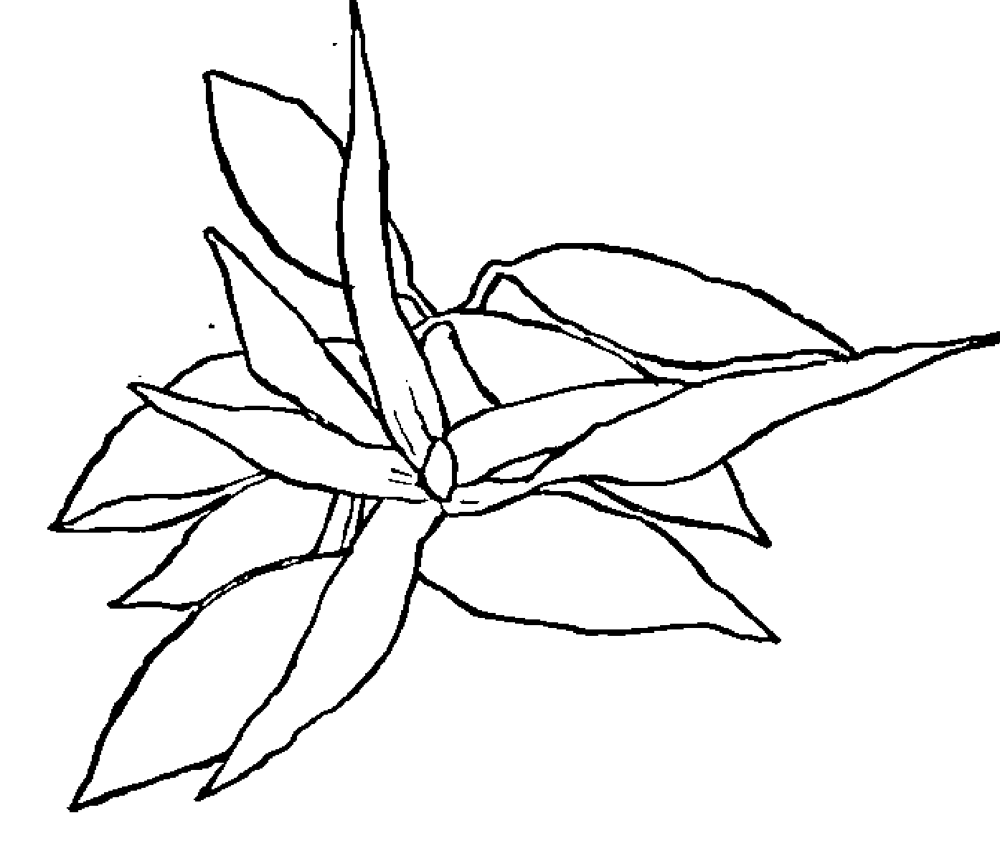
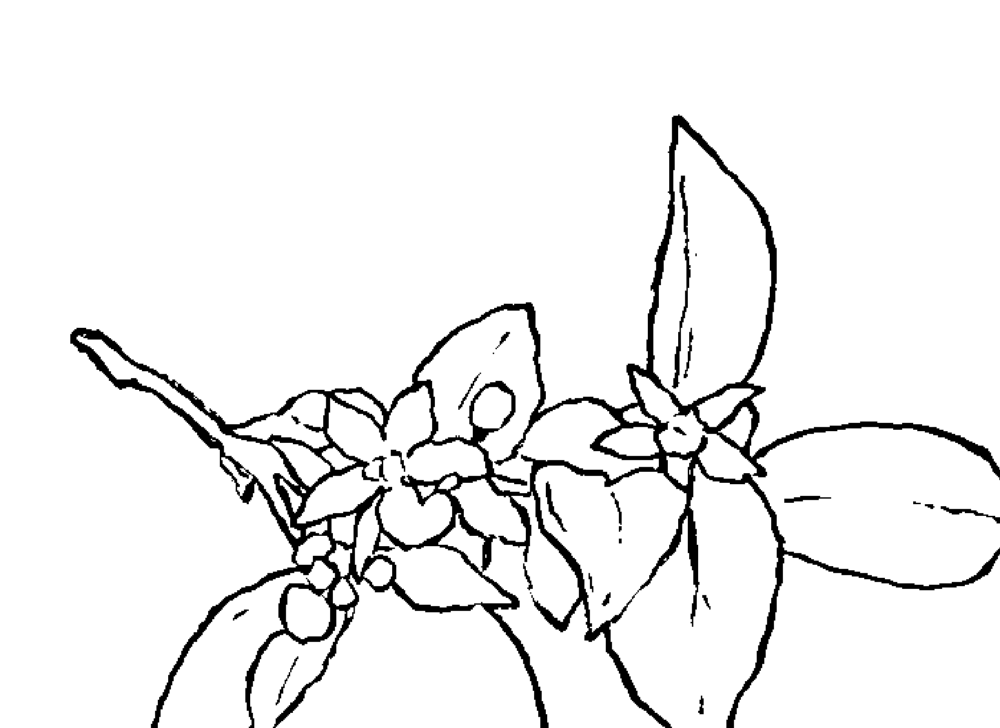
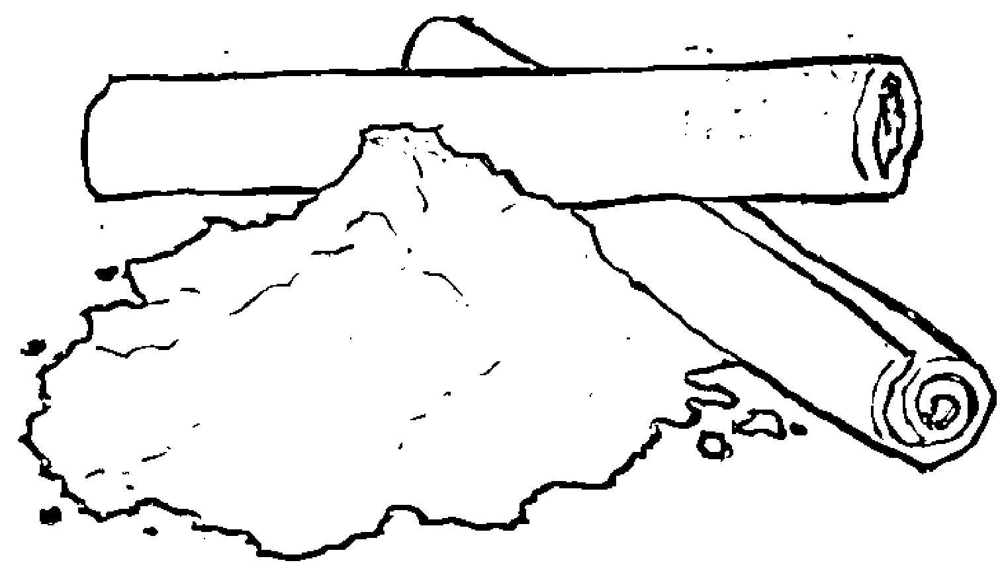
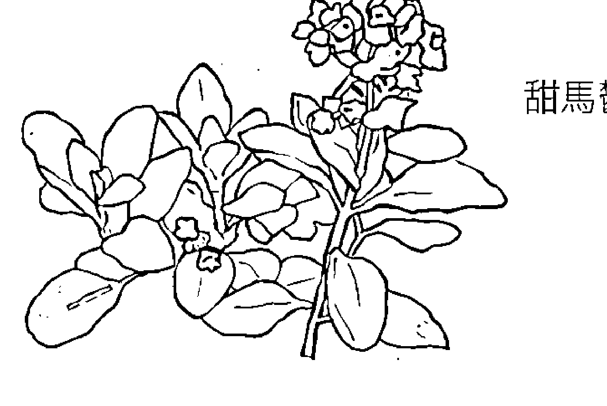
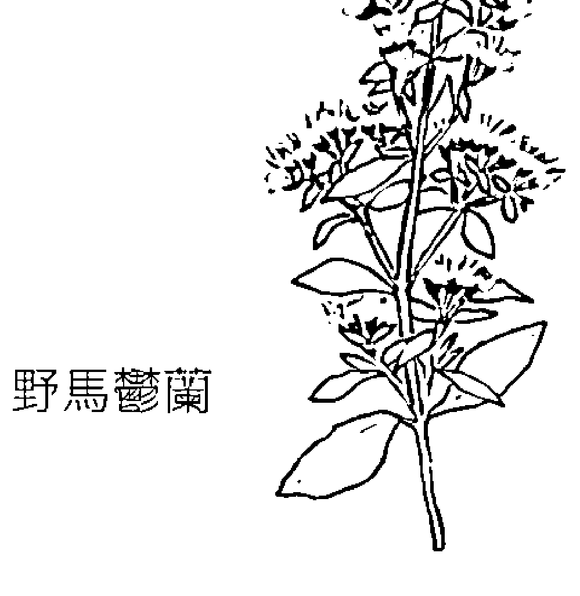
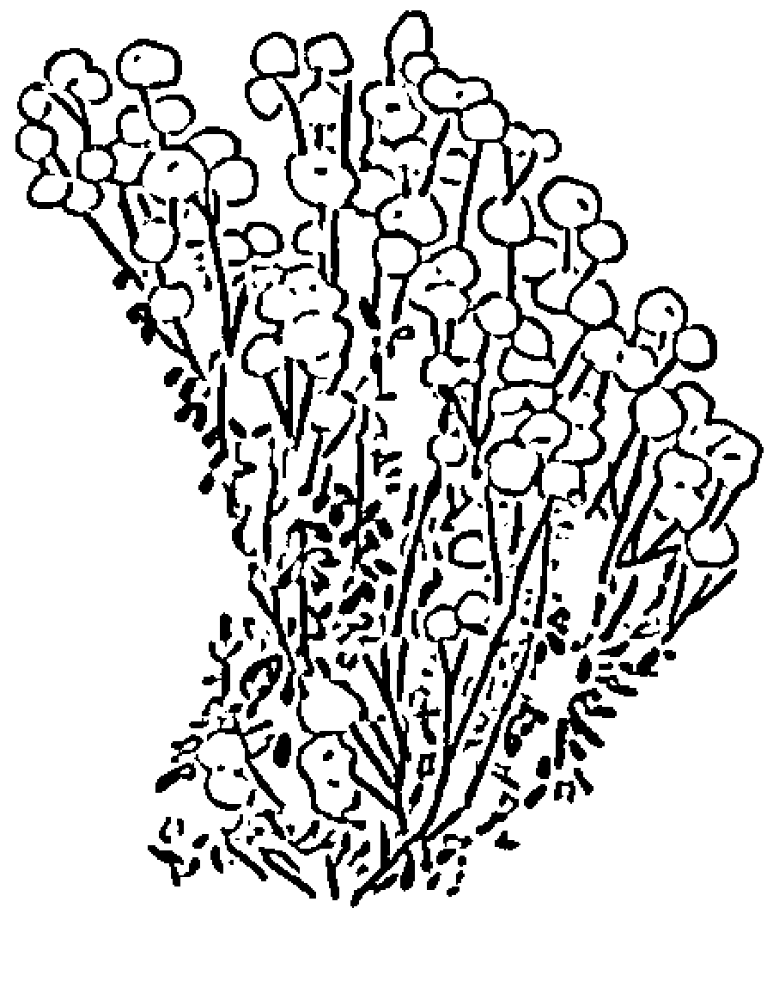
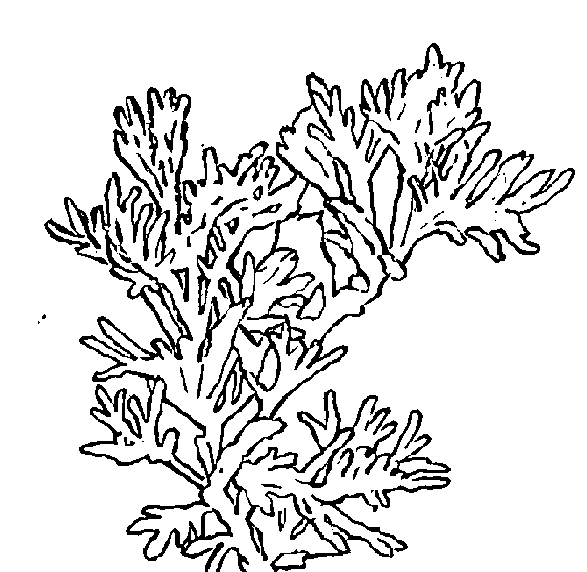
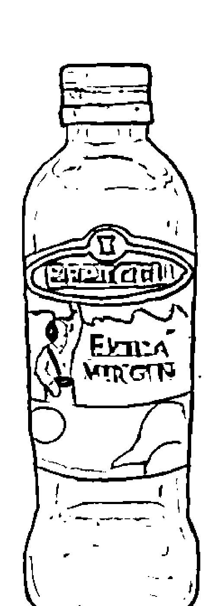

# 生活里的芳疗小百科

# Aromatherapy

由內到外, 溫柔保養身體與心靈的植物療癒對策

芳療家Florihana推廣中心主持人 Sherry 著

這是一本融會並應證使用者問題的芳療解方，
從植物療癒的原理開始講解，
細心解答那些在芳療生活中，理不出脈絡的疑問，
拾起漏缺的芳療知識碎片，
享受精油、純露與植物油更貼身對症的療癒。

## Sherry（陳韋瑄）

現為芳療家推廣中心主持人，畢業於政大廣告系，輔修政治、哲學。後又修得政大政治所碩士學位，主攻馬克思與女性主義。擅長在看似不相干的事物中找出連結，因此對於可以同時療癒身心靈三層面的芳香療法深深著迷，並希望可以讓更多人體會到芳療的魅力。

# 芳療家

法國頂級有機精油品牌 Florihana 台灣總代理，深受各大芳療社群與使用者喜愛，以實惠價格提供品質優異的芳療產品及溫暖親切的服務，並致力於分享推廣專業的芳療知識與課程。

## <序曲> 讓靈魂徹底被療癒，芳香生活的一天

起床，用芳香的純露噴灑臉部。一下，再一下，讓細緻的水霧慢慢地灑落肌膚，喚醒還在被窩裡打滾的靈魂。趁著水滴快要滴落皮膚的時候，用兩三滴芳療面油一起均勻塗抹全臉，體會水乳交融滲透進肌膚底層的潤澤感受。盥洗時，在漱口水中加入一些胡椒薄荷純露，讓口氣更為芬芳清新。在廚房準備早餐，將水煮蛋淋上一些橄欖油，再撒一撮海鹽，烤箱裡的吐司正散發出昆士蘭堅果油的誘人香味，優格裡除了新鮮水果，還有幾滴覆盆莓籽油，增添了風味與口感的層次。簡單又滿足的一餐為接下來的一天充飽電。

從擁擠的人潮、車潮中脫身，踏進工作的場域，來一點菩提純露，讓自己心情平緩下來，以從容的態度處理一件又一件的公事。開會時，為自己準備一杯純露水，檸檬馬鞭草或香蜂草純露，讓人在沉悶或煩躁的對話氣氛中，保持清明自在。午餐之後，血液都跑到胃部，頭腦感覺有些昏沈？迷迭香、月桂純露既能幫助消化，也讓頭腦保持專注，辦事效率不減反增。下班了，但工作中的「阿雜」心情還縈繞不去？回到家，用香氣洗滌自己的心靈。薰衣草、佛手柑、花梨木，輕柔的氣味陪伴情緒波動慢慢和緩下來。給辛苦工作的自己一個獎勵，用滑潤的植物油塗滿全身，加上幾滴自己最愛的植物香氣，然後去泡澡，或者淋浴好好地洗掉，讓一整天下來身心靈的塵埃回歸自然。

## 基礎篇

## Q1、什麼是芳香療法？

「芳香療法」，或許因為有「芳香」二字，可能最常是跟各種「香香的」產品或服務連結在一起。比如說：香氛蠟燭、造型優雅的擴香竹或薰香台、煙霧繚繞的水氧機、一罐罐裝在深色瓶子裡的按摩油、氣味濃郁的精油，或者聞起來香香的 SPA 會館。這些可以是芳香療法的不同面貌，但芳香療法也不僅於此，它不只是用來妝點生活雅趣的用品，還是一種個人的生活方式。或者說，芳香療法能夠幫助我們往內探索，重新了解自己，進而讓生活產生良好的變化。

那麼，究竟什麼是芳香療法呢？它是使用從芳香植物萃取出的天然植物精質作為素材，以吸嗅、稀釋塗抹精油，或者口服純露的方式，讓這些具揮發性的芳香物質與我們的身心靈對話，進而啟發我們本有的自癒能力，以幫助個人的平衡與健康。芳香療法除了可以讓空間聞起來芬芳宜人，拿茶樹精油抹痘痘、護膚是芳香療法，用按摩油消除肩膀痠痛也是芳香療法，在使用這些產品的同時，透過植物幫助我們去認識自己的狀態，從而讓自己產生療癒的感覺，這就是芳香療法的迷人之處。

什麼叫作療癒呢？我們可能會說：「醫師拜託您治好我的病！」，但不太會跟醫師說「請您療癒我」。治療與療癒的差異從字形中可見端倪，就是在於「心」。身體上的痛不一定會帶來心裡的苦，治療是針對身體層次上的病痛，然而，療癒卻關乎身心靈的完整。

是的，身、心、靈，三者是互相關連的。身體不舒服，心裡通常也不太能快活起來，更會影響到我們的思維、意識狀態。舉例來說，在肚子痛的時候也蠻難保持笑口常開，並且專注地思考；同樣的，當心痛時，我們的身體也會覺得比較無力，甚至心臟也會感覺到疼痛，思緒像是被抽空一樣無法動彈。

請想像身心靈是一間房子，當我們經歷到一些太痛苦的事件，為了保護自己，於是可能會把相關回憶的房間一間間給塵封起來，以免因碰觸而更加不舒服。但也由於這樣表象的切斷，我們看起來與部分的自己分離了，實際上痛苦卻還在原地等著我們把它帶出來。療癒，是讓我們重新有能力打開「那個房間」，穿透痛苦，然後跟它道別，而我們也得以重新變得完整。

### 帮助生命得到更好發展的「精質」

那麼，為什麼植物精質能夠幫助我們自我療癒？植物身為一種生命體，除了維持生存的機制——像是國小自然科學裡講的光合作用與呼吸作用之外——另外還發展出一些機制，和生死存亡沒有直接的關係，但是能讓生命能夠有更好的發展，「精質」就是這樣的產物。

比如說，植物透過氣味更能吸引到昆蟲、鳥類幫助授粉以繁衍下一代，或者祛除害蟲；當土壤中的微生物影響到生存時，精質也能夠幫助抵抗，甚至修復損害。再來，與光合作用及呼吸作用不同，精質在各個植物之間有很大的差異化，就像是一個植物的個性所在。這樣的物質可以說是植物適應環境、與環境溝通的一種方式，也是植物自我修護的工具。因此當我們在使用精油或純露時，其實也是同時與植物對話、借鏡，幫助自己走過正面對的困境、協助自己與分離的自己溝通。除了處理失衡的情況，也可以讓自己有更正向、更神采奕奕的狀態。

### 透過「氣味」這種方式與植物的精神互動是芳香療法很重要的特色

精質具有揮發性的特質，讓嗅覺在芳香療法中佔有舉足輕重的角色。氣味可以被鼻子很精準地捕捉到，但是眼睛看不到，耳朵聽不到，肉體也無法觸碰到，就像是一個人的精神跟情緒，感覺空無不可捉摸，但又確實存在。的確，精質對於我們的精神與情緒也會有很好的影響。

精質還有另外一個特色，它一方面有科學儀器可以檢測出的化學分子（物質性的一面），但又有著個別化學分子加總以外的效果（超出物質的一面），如同一個人並非是其成長背景、學經歷的加總，而是一種有機體的變化。

其實，以現在科學之發達，要在實驗室裡製造出類似植物有的香氣、或是代表性的芳香分子已經是很平常的事情，更有其他方法可以抗痘、美白、除疤、淡斑等等。芳香療法的誘人之處在於，使用者在其中可以是主動挑選使用產品的主角，而不是被動地接受開立出來的藥方。此外，自己並非消極地承受物質對於身體的影響，而可以與植物精神互動往來，這一點，是再厲害的科技也無法做到的。

### 精質是怎麼與我們的身心靈互動的呢？

當植物精質揮發至空氣中，我們的鼻子捕捉到了芳香分子，這些小東西就會經由鼻腔進入身體，一部分到了嗅球，它很接近我們的腦部邊緣系統，尤其是杏仁體與海馬迴這兩個部分。杏仁體是我們的情緒中心，並引發一連串的神經反應；海馬迴則是長期記憶中心，過去到了哪些國家遊玩，認識了哪些人，會儲存在這個部位。

當芳香分子刺激到嗅球時，同時也會影響到杏仁體還有海馬迴。我們對於氣味的情緒反應也會與記憶有關，因此，如果過了一陣子後對於同一個植物味道產生截然不同的反應，是很有可能的事情，因為情緒與記憶兩者在我們腦部中原本就是那麼的接近。

另外一部分的芳香分子會到達肺部，並經由肺泡進入肺部毛細血管，因而在全身循環，所以別小看吸嗅精油這個小動作，其實對於身體就已經產生很大的影響。還有一種精質進入身體的方式是透過皮膚吸收，比如說以純露噴灑肌膚，或者用精油跟植物油調成按摩油塗抹皮膚。由於精油的分子很小，所以可以很有效率地通過肌膚的層層關卡到達真皮層，再進入血管循環，因此針對皮膚保養，或者皮膚下的一些情況（像是瘀青），都可以給予很直接的幫助¹。

### 具公信力的國際有機認證機構

由於芳香分子能夠很快進入身體並產生影響，因此，它的品質也就更加需要注意了。芳療產品來自於農作物，而農作物可能受到污染的來源非常多，比如說灌溉用水，或土壤中有重金屬，都會讓農作物受到影響。而現今大部分的慣行農法種植方式會使用化學肥料與農藥，這些東西都會殘留在植物精質中。也因此，在使用芳療時，確保手上的產品沒有農藥、重金屬等污染是很重要的一件事。

另外，因為「與植物的精神對話」是芳香療法很重要的特色之一，所以我們在挑選時，也不希望選購到由人工合成出，或者經人工調整後的產品。就像喝果汁是希望吸收水果的營養，而不是想要喝進一堆色素、香精還有增稠劑。芳療產品從栽種到蒸餾、壓榨、包裝、運輸是很長的生產鏈，要一一確保各環節的品質，對於在末端的消費者來說，是有一定的難度。

所幸，目前全球已發展出許多具有公信力的有機認證機構，幫助我們把關產品的品質。比如說 Ecocert，算是有機認證的入門款²，另外像是歐盟有機認證、法國 AB 有機認證、英國土壤協會有機認證、美國 USDA 有機認證、澳洲有機認證 ACO、日本有機認證 JAS 等等，都是享譽國際的有機認證。

> 註｜1 關於肌膚保養相關的介紹請參考 p.124  
2 Ecocert 認證又分為天然化妝品與有機化妝品兩類。天然化妝品中，總成分需有 95% 以上是天然成分，或來自於天然來源。產品中的所有植物成分至少要有 50% 以上是有機認證，且總成分要有 5% 以上是有機認證的。有機化妝品的規定更嚴格一些，總成分中需有 95% 以上是天然成分，或來自於天然來源。另外所有植物成分至少要有 95% 以上是有機認證，且總成分要有 10% 以上是有機的。

## 進階篇

## Q2、精油和植物油、精油和純露有什麼不一樣？

精油、植物油、純露與基底油，剛認識這些名詞時，很容易被過去對文字的理解給弄糊塗，但因為芳療本身是近代由英法發展起的新興另類療法，所以名詞以英文來理解，也許能更快掌握要義。

## Q3、精油可以直接抹在皮膚上嗎？

也許很多人對於精油的印象，來自於聽說過薰衣草、茶樹精油可以直接塗抹肌膚，因此覺得精油可以直接塗抹在肌膚上，不過，這在芳療中並不是常見的使用方式。

## Q4、調自己的配方：手上有好多罐精油，可以把它們混在一起使用嗎？

芳療產品可以分成兩大類：單方或複方。單方意思是只有單一種植物的產品；複方指的是多種植物混合在一起的產品；同樣的，也會有複方植物油與複方純露……

## Q5、了解植物的化學特性：CT 是什麼？

植物的芳香分子會受到氣候、環境影響而有所不同，每一年甚至不同天採收的植物，所製造出來的芳療產品氣味上可能就會有些差異，而化學型就是這樣的特性長期發展出來的差異化……

## Q6、同屬不同種：同樣的植物卻有這麼多不同名稱，為什麼？

介紹比較三大芳療植物精油家族，了解儘管是相似的植物，或許有作用重疊的地方，但每一種植物仍有不同的特色，更容易挑選出符合自己需求的用品……

## Q7、芳療中常見易混淆的精油

前面介紹了同屬不同種的精油，還有同種植物因為生長環境不一樣，因而精油有不同的化學類型。除此之外，還有一些精油是比較常見但又容易分不清差異的，這邊作一些介紹……

## Q8、溫和的療癒，認識純露的特性

純露與精油是同一個生產過程中出現的產物，但因性質不同，使用方法也相差很多。在過去的芳香療法中，純露很少會被提到，或被視為生產精油的副產品、沒有精油時的替代用品等……

## Q9、純露日常：多種面向的應用方式

在確認手上拿到的純露品質優良，可以接觸敏感的視覺器官，以及進入身體循環時帶來的是幫助，而不是毒物後，接下來會思索的應該會是：我該拿手上這瓶水溶液怎麼辦呢？

## Q10、純露的保存：純露開封以後一定要放冰箱嗎？

純露是蒸餾過程中，含有水溶性芳香分子的水溶液，大部分為有機酸，容易因照射到陽光、反應溫度變化，以及受到黴菌影響而變質……

## Q11、植物油的妙用：All you need is Oil！

因為精油不適合長期直接塗抹在肌膚上，需要稀釋的介質。在眾多可以溶解精油的介質候選人中，植物油對於肌膚保養以及身體保健突出的效果，最適合擔負這個重責大任……

## Q12、植物油日常：多種面向的應用方式

植物油是構成身體健康運作不可或缺的存在，那麼，我們該如何把這樣的好東西運用在生活之中呢？其實最簡單的方式就是……

## Q13、植物油的保存：植物油開封以後要放冰箱保存嗎？

植物油的主要成分是各種脂肪酸，而最容易造成脂肪酸產生變化的不是溫度，而是空氣中的氧氣。所以，保存植物油的關鍵就是……

## 應用篇

## Q14、睡眠障礙的芳療選項

睡眠障礙有很多種類型：難以入眠、淺眠、多夢、夢遊、很難起床等；而影響睡眠主要大概有三大因素：自律神經、褪黑激素，以及潛意識……

→ 延伸練習：墜入甜美夢鄉 — 創造自己的睡前小儀式  
→ 延伸練習 2：花精對於睡眠障礙的幫助

## Q15、芳療護膚小學堂：保養各類肌膚的基礎選擇

護膚產品何其多，不同膚況，需要的保養品取向也會不太一樣，因此，了解自己的皮膚是哪一種類型，是讓護膚發揮效果的一個好的開始……

→ 延伸閱讀：各類膚質適用芳療產品對應表

## Q16、芳療護膚小學堂 2：皮膚狀況大集合

雖然前面介紹了肌膚保養的大原則，但是身為人體最大的器官，也是與外界接觸最多的器官，肌膚的狀況真可以說是五花八門……

→ 延伸閱讀：改用芳療保養可能出現的各種皮膚狀況

## Q17、過敏的芳療應用

過敏，其實是身體對於特定物質的「過度敏感」，原本是要保護自己、減少困擾的機制，現在卻反而變成困擾的來源……

## Q18、呼吸道系統的芳療保健

除了助眠、護膚，再來常被問到的芳療運用，就是跟呼吸道保健相關的問題了，如鼻塞、咳嗽、感冒引起的全身性症狀、過敏性鼻炎、長期乾咳、氣喘、扁桃腺發炎等。

→ 延伸思考：關於呼吸的身心觀照

## 工具篇

## Q21、擴香工具的比較

薰香是芳香療法中很重要的一種運用方式，也可是芳香療法的特色之一。市面上有很多種擴香工具可以薰香，然而每一種特性並不相同，適合使用的空間條件也不相同……

→ 延伸思考：擴香工具比較表

## Q22、對身體友善：利用芳療產品進行居家清潔

市面上販賣的清潔劑都會添加一些氣味，好讓產品使用起來味道不會那麼刺鼻難聞，但相信現在大家已經知道，大部分產品的香氣來源，其實是人工合成香精……

→ 延伸閱讀：個人清潔的芳療好夥伴——手工皂

## Q23、出外旅行的芳療應用小妙招

平常在家瓶瓶罐罐可以隨時取用很方便，可是如果要出去時，行李箱空間有限，要帶哪些東西一起出門就是一場天人交戰……

→ 延伸閱讀：個人旅遊芳療包

### 附錄 1、常見精油簡介  
196  

### 附錄 2、常見純露簡介  
203  

### 附錄 3、常見植物油簡介  
206  

### 附錄 4、常見應用問題配方建議  
211  

## <跋> 感謝你參與了這本書的完成  
222

## 如何挑選品質合宜的芳療產品

市面上的芳療產品供應商不勝枚舉，各有不同特色，但其中也有很多是混淆視聽的不良商家，有一些簡單的方法，可以幫我們降低一些買錯產品的風險。

首先，每種植物產出精油的比例不同，因此，同樣一罐 5 毫升的單方植物精油，不同植物所需要的原物料數量也不同；成本不同，也應該要反映在價格上。於是，像檸檬精油跟玫瑰精油，同樣的容量包裝就不會是同樣的價錢，它們可能只有在實驗室合成氣味時的成本比較接近。如果看到每種單方植物精油價格都一樣，或者是只有兩三種價格的供應商，通常我的假貨雷達都會響起。

再來，每一種芳香植物能夠萃取出精質的部位也不相同，比如說檸檬是果實，玫瑰是花瓣，如果供應商標示萃取自檸檬枝，或者玫瑰葉片，還是換一家購買比較妥當。不過，價格可以自己訂，萃取部位翻書或網路搜尋就能找到資料，而關於產品標示很常被提到的重點——植物的拉丁學名，也逐漸為人所知，這些，只要有一台標籤機，都可以印出來。不過，有機認證絕不是廠商自己說了算，也因此前面會介紹一些具有代表性的有機認證，方便消費者挑選品質無慮的產品。

另外，還有些廠商把植物油加到精油裡面當成精油在賣，而未標示稀釋濃度。這種情況比較容易被發現，因為植物油的質地是潤滑的，跟精油具揮發性的特色相差甚遠。比較難發現的是混摻氣味近似的精油，然後以較高價植物精油的名義賣出。

我們最常聽到的，是把玫瑰天竺葵摻到玫瑰精油中，破解方式是：由於玫瑰精油裡面有玫瑰蠟的成分，在低溫情況下（約攝氏 18 度 C 左右）會產生結晶，如果有混摻到其他精油，因為玫瑰蠟的成分不夠高，因此不會有結晶的情況。

## 精油、純露與植物油有什麼不一樣？

一開始接觸芳療，可能會被許多新接觸的名詞弄得有些頭昏眼花。其實，在芳療中最常見的大概就是三個主角：精油、純露與基底油。剛認識這些名詞時，很容易被過去對文字的理解給弄糊塗，但因為芳療本身是近代由英法發展起的新興另類療法，所以名詞以英文來理解，也許能更快的掌握到要義。

# 精油（essential oil）與基底油（carrier oil）

精油（essential oil），是植物具揮發性的液態芳香分子¹，經壓榨或水蒸餾萃取後而得的非水溶性物質，富有植物香氣，具揮發性，也是一種濃縮物質。通常會以薰香或是調和基底油作為按摩油來使用，像是薰衣草、茶樹、迷迭香精油。

基底油（carrier oil）就英文字面上來說，是作為媒介、載體的油脂，由於是從植物萃取而成，中文也常就稱作「植物油」。它不具揮發性的物質，且大部分的植物油並不具有液態的芳香分子²，主要是擁有潤澤感的質地，像是橄欖油、芝麻油、荷荷芭油。

雖然精油與植物油兩個名稱中都有「油」，可是質地上卻有很大的差距。當純精油接觸到皮膚，會像酒精一般揮發到空氣裡，不太會有殘留的感覺；但是植物油就會在皮膚上形成薄膜，然後慢慢的從

> 註｜1 通常會被稱為精質（essence），以和經過壓榨、蒸餾後而得的精油（essential oil）作區別。
> 2 例外者如黑種草油及伊諾菲倫（瓊崖海棠）油，則含有些許芳香分子。

皮膚細胞間隙中滲透到表皮層的深處。

另外，兩者的氣味也不相同，精油是植物的芳香分子，大部分富有濃厚的氣味，常見的香味像是甜橙、薄荷、迷迭香、薰衣草等。植物油雖然也會有味道，但較不具發散性，香氣也比大多數精油來得要淡。這兩種產品的不同，就像是辣椒、大蒜與醬油、香油之間的差異，一個是香料，一個是醬料，雖然都有一個「料」字，但質地與特性都不相同。

精油和植物油常會一起出現的原因，是由於精油本身為高濃縮又容易揮發的脂溶性物質，單獨使用對於皮膚容易造成刺激，且類似酒精的質地並不適合用來持續性按摩皮膚；可是，當我們把精油與植物油一起調和時，就會成為充滿香氣、對皮膚滋潤且容易推展的按摩油³。

# 純露（hydrolat）與精油（essential oil）

純露（hydrolat）是在蒸餾植物芳香部位時，和精油一起生成的產品。我們將植物的芳香部位放入蒸餾桶中，利用水蒸氣通過桶子，把植物的芳香分子帶出細胞壁，將這樣充滿植物香氣的氣體經過冷卻系統變成液態，此時液體會有分層現象，一部分不溶於水的物質

註｜3 關於調和按摩油的詳細說明請參考 p.34

我們稱之為「精油」，另外一部分的水溶液則稱為「純露」。

純露的英文有許多名稱，「花水」（flower water）是另外一個比較常見的名字，但因為並非所有純露都由花朵製作而成，且有些純露在添加酒精、防腐劑後作為保養品也會稱為花水，所以在芳療中還是會以「純露」（hydrolat）來指稱這種收集蒸餾植物芳香部位水蒸氣而得的水溶液，以作出區分。

雖然純露和精油都有植物的香氣，但純露並不等於精油加水。第一，精油本身就是不溶於水的部分，所以要把它和水均勻混合，勢必需要加入其他物質，像是氫化植物油而得的精油分散劑、乳化劑。其次，純露裡主要含有的是植物的水溶性芳香分子，和精油主要是脂溶性的芳香分子有些差異。

所以，同一種植物的精油和純露味道會有些不同，是很正常的。就像同樣是肉，肥肉跟瘦肉的口感、味道也不同。以真正薰衣草這個植物來說，精油氣味主要來源之一是乙酸沉香酯，這種化學分子比較不親水，也就是說，我們熟悉的薰衣草精油的氣味來源，在純露中幾乎是不會出現的，因此薰衣草純露的味道和精油會有一些差距。

## 常見製作方式及帶來的差異：

水蒸餾法、蒸氣蒸餾法、壓榨法與溶劑萃取法

萃取植物精質的方式有很多種，蒸餾法是最常見的一種，又可以分為「水蒸餾法」或「蒸氣蒸餾法」。前者是把植物芳香部位泡在水裡煮沸，時間較久，不過植物接觸到的溫度較低，適合對於溫度比較敏感的植物（如橙花、玫瑰）。後者則是讓水蒸氣通過植物芳香部位，植物接觸到的溫度較高，生產時間較短，像是薰衣草、快樂鼠尾草這種植物，就很適合用這種方式萃取精油，因為它們的精質大部分為酯類這種容易水解的化學分子，如果浸泡在水裡太久，氣味反而容易產生變化。

另外，還要談到「壓榨法」以及「溶劑萃取法」，這也是目前精油供應商常會使用的方法。由於植物儲存精質部位不同，適用的萃取法也會不一樣，像是精質在果皮的柑橘類（如檸檬、葡萄柚等），就會使用壓榨法獲得精油。但工廠使用的壓榨法並不是像我們在家中擠果汁一樣，首先他們會將果實浸泡在水中，讓果皮軟化，以利後續壓榨出更多精油；還會讓果實滾過像是插花用劍山那樣密集的尖銳物品，以幫助在壓榨過程中釋放出植物精質；接著就會把果實通通放到壓榨桶中，擠壓出像是果汁的液體，最後把這個液體導入離心機，用快速旋轉的方式，讓不溶於水的植物精油以及剩下的水溶液分開來。

溶劑萃取法則是近年發展出來的技術。使用化學有機溶劑⁴浸泡植物的芳香部位，溶出植物的芳香分子。經過第一次加熱把溶劑揮發後，會獲得保留植物芳香分子的蠟質物體，我們稱之為凝香體（concrete），之後再把這個凝香體與酒精混合，利用酒精把芳香分子帶出，再將酒精揮發，這才獲得植物精質。由於這個方式取得的植物精質，和過去使用蒸餾法而得的精油在化學成分上有些不同，會保有更多種植物芳香分子，因此，我們也會使用不同的名稱作為區隔，稱之為「原精」（absolute）。

如同我們會因為植物特性不同而把柑橘類果實用壓榨法產出精油，通常會使用溶劑萃取的植物大概有兩個特色：萃油率低、精質易受溫度破壞。

舉例來說，花朵類的精油大多萃油率低，像是大概要一百五十朵大馬士革玫瑰才能產出一滴精油，使用溶劑萃取法大概可以提升一倍以上的萃油率；而像茉莉的精質很容易受到溫度破壞，因此大多是由溶劑萃取方式取得，市面上也少見茉莉精油。

生產方式不同，所獲得的產品特性也會有些不同。像是玫瑰，用蒸餾法或是溶劑萃取法，所得的物質就會有所差異。蒸餾法得出的玫瑰精油，裡面含有玫瑰蠟這個成分，在室溫約攝氏 18 度時會有結晶的情況發生，也因此，可以檢視自己手上的玫瑰精油，如果在冷得要下雪的天氣還是可以直接滴出，那麼就可以合理懷疑裡面有添加其他物質⁵。玫瑰原精因為是透過溶劑萃取，和蒸餾法相比保留更多種植物芳香分子，所以聞起來會更貼近花朵本身的氣味。

這兩種萃取方式各有不同特色，就像是同一條魚，用蒸、用煎，風味也各不相同，很難一較高下。在購買時除了可以用氣味偏好作為選購標準，也可依用途來挑選適合的產品。比如說如果要護膚用，但本身對於化學有機溶劑又異常敏感，那麼就不要把原精拿來使用。假設是要調香，那麼較接近真實花朵氣味的大馬士革玫瑰原精，會比酸味突出的大馬士革玫瑰精油更容易搭配一些。

> 註｜5 像是前篇提到的玫瑰天竺葵，還有玫瑰草，因為含有較多玫瑰精油氣味代表來源「牻牛兒醇」這個化學分子，但成本相對較低，常有混雜玫瑰精油高價賣出的情況發生。

另外，以壓榨法取得的柑橘類精油，由於沒有經過高溫洗禮，所以在擴香時如果是用加熱的方式，氣味比較容易產生變化，舉例來說，以壓榨法取得的甜橙精油，在擴香後會從新鮮柳丁氣味變成用烤箱烤過的柳丁氣味。此外，在壓榨法生產過程中，可能會有果皮壓榨後的雜質無法完全過濾，且果皮部位也可能有不溶於水的臘質出現在精油中，造成精油看起來有點霧霧的樣子，但這是正常現象，並不影響精油的品質。

## 精油、純露、基底油比較表

|  | 精油 | 純露 | 基底油 |
|---|---|---|---|
| 香氣 | 主要為植物親脂性芳香分子 | 主要為植物親水性芳香分子 | 少有植物芳香分子，有堅果、種籽氣味但大多不明顯 |
| 質地 | 具揮發性，類似酒精，不溶於水 | 和水一樣，不溶於油 | 無揮發性，在皮膚停留時間較長，有潤澤感，不溶於水 |
| 常見用法 | 薰香、與基底油調和成按摩油 | 護膚水、加入水裡像花草茶一樣飲用 | 與精油調和稀釋塗抹肌膚，口服保健 |

# 為什麼這次的芳療產品

味道跟之前都不一樣？

有許多人開始接觸芳療是因為想追求「香香」的感覺，不過如果進到品質良好的芳療產品店家，鼻子可能會有一些些受到衝擊，或許你將會發現，竟然許多植物的氣味跟過去印象中相差好多。

為什麼會這樣子呢？首先，我們對於氣味的記憶來自於我們的經驗，在過去經驗中，除了直接面對真實的植物外，我們相遇的植物氣味大部分很可能並不是真正的植物氣味。這看起來有點像是繞口令，不過，這個意思是，市面上多數標榜特定植物氣味的產品，如玫瑰沐浴乳、薰衣草洗衣精、迷迭香洗髮精等等，大部分的香氣來源其實是人工合成的香精。

現在的科技非常發達，我們可以用機器檢測出一個植物氣味代表性的芳香分子是什麼分子，以及它的化學結構，然後用人工的方式，在實驗室裡複製出非常類似的芳香分子。聽起來很高科技而且工程浩大，的確是。那麼為什麼製造商放著原本的植物精油不用，要如此大費周章呢？

人工香精的最大特點在於穩定。一個產品從生產到消費者手上，會經過很長的時間，運輸、倉儲等條件都會影響到產品的品質與氣味。精油、純露、植物油這些產品都不能夠長時間放在高溫的環境，要不然很容易增加變質的可能。

人工香精的穩定性一來讓產品從生產到銷售過程的可變因子減少，二來，也許也是最重要的，消費者不會遇到「這次商品與之前商品味道不同」的情況。這件事有點像是雞生蛋蛋生雞的邏輯。是因為生產者提供香精產品讓消費者經驗到同樣的氣味，所以認為香氣都應該是一樣的；或者因為消費者不能接受有出入的氣味，所以讓生產者改使用不會有變化的香精？

事實上，在整個精油產出總量中，芳療使用的精油是佔很少數的⁶。大部分的精油被廣泛運用在化妝品、保養品、食品以及藥品等產業中。而精油要加入在一般大量生產的產品裡，也並不是一件簡單的事。比如說，我們熟悉的柑橘類精油，很常出現在食品、香水、清潔用品裡，但是柑橘類精油的主要成分「單萜烯」，揮發速度快、親油脂、不溶於水相產品，這對於生產者來說會造成很大的變數，像是剛生產時的氣味與消費者使用時的氣味會差很多，還有如果用於香水中，液體會出現雲霧狀，不是清澈的，銷售觀感不好。

也因此，當他們要加入這類精油時，首先會「去萜烯」，也就是把精油中這類不穩定的成分抽取掉。處理過後的精油氣味跟原本的精油氣味會有差異，這也就是為何在前面提到，我們相遇的植物氣味大部分都不是真正的植物氣味。

另外，就算是同一個植物的精質，每一年甚至每一天都會有所不同。為什麼會這樣呢？我們就要回到「精油是怎麼產生的？」這個最初的問題來回答了。精油本身是植物的二次代謝物，在作用上是幫助植物適應環境等因素而有的產物，於是精油成分會因環境不同而有所差異。

比如說，有研究指出在天氣暖的時候，植物會產出比較多萜烯類的成分，增加下雨的機率以調節氣溫⁷，這自然會影響到精油氣味的變化。再來，採收時植物的狀態也會有影響，大太陽時採收與下雨時採收，所生產出來的精油、純露也會有些許不同。這些氣候因素都是無法人為控制的，所以，在精油的生產過程中，其實變數是非常多的。

當我們習慣人工香精的穩定，或者說一成不變時，對於精油、純露，容易產生同樣的期待，但必須要說明，每一次購買的芳療產品有一些些不同，這個是很正常的事情。比如說像水果，每一年的芒果味道可能會不太一樣，但我們依然能夠嚐得出這是芒果的滋味。精油、純露同樣是由這樣自然的植物生產出來的東西，而芳香分子又是更細微的氣味，因此，氣味上的差距可能又會比我們使用整個植物時要來得更大。

另外一種情況，則跟我們個人的氣味感受有關。前面提到，我們的嗅覺與情緒和記憶是有連結的。有一些時候，明明是同一瓶精油，但在擺放一陣子之後，再聞味道就不喜歡了。這可能是因為，同樣、類似的氣味對於有不同生命經歷的我們來說，意義與感受再也不一樣了。

更常出現的是，過去沒有特別喜歡某種精油的味道，但突然有一陣子像著迷一樣，不管什麼用途都會把這個新歡加入。這可能和我們的生活經驗還有環境變動有關，特定芳香分子對於我們情緒、身體的作用會引發新感受，也因此，對於同一個植物氣味我們可能會產生截然不同的反應。

還有一種可能，是產品真的氧化變味了。氧化的精油味道可能會變得比較鈍、濁，甚或刺鼻。純露變質時則會出現難聞的酸敗味，同時大多會出現雲霧狀的懸浮物⁸。這種變質的情況基本上用我們的鼻子都可以判斷出來，就像是剛煮好的飯是一種味道，放了半天後，氣味會有一些轉變，但還是正常範圍內。可是到餿掉了，就是另外一回事了。

一般來說，精油使用完，轉緊瓶蓋放在避光陰涼處，可有效延長精油良好的狀態，但不同種類的精油保存期限略有差異。像前面提到的柑橘類精油，大多是易揮發的萜烯類分子，因此保存期限較短，建議大概在八、九個月內用完。常見的薰衣草、茶樹、迷迭香精油，通常在一年內的狀態最好。最主要還是跟開關瓶蓋、精油接觸到空氣的頻率有關。至於像是檀香、玫瑰精油則是越陳越香，十年都不算少見。

> 註｜7 Adam, David. "Scientists discover cloud-thickening chemicals in trees that could offer a new weapon in the fight against global warming". The Guardian. October 31, 2008.

> 註｜8 關於純露的保存與變質請參考 p.90

# 我真的不喜歡

這次芳療產品的味道，怎麼辦？

如果真的很難接受手上這一次的芳療產品的氣味，有幾種做法可以參考：

精油的話，請考慮把它跟真正薰衣草調在一起。薰衣草的協同能力很強，因此大多能夠把原本較為突出的氣味軟化。如果購買純露後剛開封發現味道怪怪的，先別急著用，在使用經驗上，純露和精油與植物油相比，更容易受到運輸過程的影響，通常會說是「暈機」。在固定的保存環境中放個三天到一星期再打開來聞聞看，旁邊可以擺放較具穩定性質的東西，比如說薰衣草、岩蘭草精油，甚或是一些水晶會有幫助。

我自己使用過粉晶滾石包圍著月桂純露，氣味變得比較柔和。當然，如果是因為純露剛蒸餾出來，芳香分子比較活躍，通常擺放 2～3 個月後，氣味也會穩定下來。如果是覺得植物油的氣味不能接受，就把它跟其他味道較淡的油（像是荷荷芭油）調和在一起吧！

## 精油可以直接抹在皮膚上嗎？

也許很多人對於精油的印象，來自於聽說過薰衣草、茶樹精油可以直接擦痘痘，因此覺得精油可以直接塗抹在肌膚上，不過，這在芳療中其實並不是常見的使用方式。

通常我們要使用精油接觸皮膚，會先將精油與植物油調和稀釋後再塗抹。多了這一道手續，有些人覺得好麻煩，但是從精油特質來看，這卻是保障我們使用安全的最好方式。為什麼呢？因為精油雖然看起來小小一罐不太起眼，但它是由大量的植物芳香部位經過壓榨、蒸餾等萃取方式取得的高濃縮產品，又具有揮發的特性，如果直接使用在皮膚上，容易造成刺激；長期使用，也會讓皮膚變得乾燥、脆弱。

講「高濃縮」三個字有時比較沒有感覺，這裡舉一個具體的例子：以萃油率在精油界中算翹楚的檸檬精油來說，也要有 200 公斤的檸檬果實才能壓榨得到 1 公升的檸檬精油。平均下來，大概一顆檸檬（約 66 克）可以產出 10 滴檸檬精油。也就是說，平常我們在擠檸檬汁時，從果皮噴發出來接觸到皮膚的精油，可能就已經超過一滴檸檬精油的量了。這個是萃油率高的極端，另一端萃油率超級低的精油，可就是完全不同的情況了。比如說大馬士革玫瑰，一滴精油大概是 150 朵玫瑰才能生產出來，那可是好大一束花。

我們不會長期頻繁的接觸到這麼大量的植物，想像每天都有 150 朵玫瑰包圍著自己，雖然幸福但也會暈陶陶的呢！直接使用這樣高濃度的物質容易造成身體代謝的負擔，挑戰身體對於大量物質的耐受度。也許用一次兩次感受不到影響，但是長期下來，

身體的代謝都在加班的狀態，哪一天若是罷工，就是身體全面性的崩盤了。

平常我們可能只會接觸到幾片九層塔葉，或者一點點肉桂粉，裡面既有的刺激物質很微量，因此不會產生太大影響，但當把精油這樣大量植物濃縮萃取出的精華直接用於皮膚上，就會造成皮膚刺激。除了上述提到的兩個精油，另外像是丁香、野馬鬱蘭就是出了名會刺激皮膚的精油，它們在未經稀釋的狀態下觸碰到肌膚是會產生痛楚的。如果接觸到這些精油但肌膚沒有出現紅、痛的情況，可以合理推估產品有經過植物油稀釋、與其他精油調和，或者精油本身經過人工化學調整。

另外，柑橘類的精油，像是佛手柑、葡萄柚等，含有讓皮膚對於光線更加敏感的物質——呋喃香豆素，如果使用在皮膚上濃度太高，照射到陽光（日光燈倒不用擔心），皮膚可能會出現紅腫癢的過敏情況，一般人則會加速黑色素的變化。不過也不用太感到恐懼，如果我們稀釋到比較低的濃度，加上是在夜間使用，或者塗抹在不會直接照射到陽光的皮膚部位，其實不用太擔心會有光敏性的問題發生。佛手柑精油是柑橘類精油裡光敏性最強的精油，建議濃度在 0.5% 以下，其他像是檸檬、甜橙等大概在 1% 左右都算安全。可是假設原本皮膚對於光線就會過敏，出門在外都要包緊緊的，那麼柑橘類的精油建議還是不要在白天使用，或者薰香即可。

並不是所有天然的東西就都是安全的，有很多天然的菇類一吃就會斃命。重要的是，我們對於自己使用的東西要有充分了解，清楚它的特性為何，就能在安全範圍內做出各種應用。

此外，在急症時，我們的確會把一些比較不會產生刺激的精油，如薰衣草、茶樹等略取一滴直接塗抹於肌膚上，像是廚房中有時會出現的一些小燙傷、切傷，使用真正薰衣草精油直接塗抹患處，很快就能幫助復原；而茶樹最出名的大概就是處理痘痘了，但以我個人經驗來說，茶樹不一定總是有效，還是要回到痘痘產生的原因去挑選適合的產品幫助來得更大。

如何分配各種精油的滴數可參考 p.43 的配方設計說明。

個人使用經驗上有直接使用過但沒有產生刺激的精油有：薰衣草（被鍋蓋燙傷、不小心劃傷手指）、茶樹（痘痘，但不總是有效）、檸檬（止血）、乳香（一直有湯湯水水的痘痘）、永久花（瘀傷）、大西洋雪松（感覺快要感冒的時候塗在腳底、尾椎）。

關於痘痘產生的原因以及挑選產品的建議請參考 p.134。

## 精油可以吃嗎？

和「精油可以直接塗抹肌膚嗎？」像是雙胞胎一般會出現的另一個問題，就是「精油是否可以食用？」了。回到精油這個產品本身的特質：高濃縮。在前文中提到，一滴精油可能是擠一顆檸檬汁會接觸到的量，也有可能是 150 朵玫瑰萃取出來的量，不同植物精油背後代表的生物訊息多寡各不相同。再來，每個精油的刺激程度也不同，有些精油可能才進到嘴裡就對口腔黏膜造成傷害了。加上如果口服精油，基本上一路要到小腸的腸絨毛才會被吸收，因此，在綜合吸收效率以及使用安全度高低來說，口服精油並不是最推薦的使用方式。

此外，精油本身的物質可能會與我們使用的其他物質產生不好的反應。比如說聖約翰草，如果是口服的方式，吸收的物質會與抗憂鬱的藥劑產生交互作用，一來可能造成身體無法代謝，二來可能讓藥劑效果加倍或失效，這都不是在使用藥劑時所樂見的。

也因為如此，在英國的芳療體系中，口服精油是完全被禁止的行為。不過，在法國的芳療系統裡，的確就有口服精油的使用方式。可是，這大多是自然療法醫師所開立出來的處方，會在短時間內（三天）高濃度（20％以上）密集的使用，以紓緩緊急症狀。如果不清楚精油對於身體的影響，是不建議做這樣比較有風險的行為。

但反過來說，前面提到一滴檸檬精油可能比我們擠一顆檸檬會接觸到的量還要來得少，因此，像這樣的物質（低於或約等於平日會接觸到的量，且植物本身會被拿來食用，如檸檬、胡椒薄荷），如果確認植物來源是安全的，沒有農藥、重金屬殘留的問題，加上生產過程也沒有人工化學的調整或破壞，符合這些條件的精油，的確是會有人把它拿來口服使用。

不過還是要提醒，擴香時，對於不喜歡的味道或是出現了不良反應，只要停用就好；塗抹在皮膚上出現不適的情況，可以用植物油稀釋減低反應或者停用。但當把精油吃進去身體裡時，如果出現不良的反應就很難停止了。因此，這樣的使用方式，需要更被謹慎對待，要建立在對於精油的了解、對於自己身體的了解，還有對於產品品質的了解上，若有任一環節沒有把握，都不建議這樣子長期使用。

## 可以直接在手上調和嗎？

有許多人知道精油長期直接接觸皮膚並不好，但可能對於調油覺得麻煩，或者認為自己沒有適當的工具，所以習慣直接將植物油與精油在手上調和使用。這樣的確有達到稀釋的作用，不過，我們卻很難掌握到每次使用的精油濃度。如果有效，下一次比較難成功複製，如果沒有效，也沒有基準去調整比例。再加上用一隻手捧著植物油，另一隻手得要操作各個精油瓶，如果是用在臉部，也許調一次就可以，但若要比較大面積的按摩，那麼油可能會從指縫間流出，或者要調許多次才能按摩全身。比較適當的作法，還是找一個知道容量的容器來裝油，然後依比例加入適當的精油量來使用。

## 精油可以加到蘆薈膠、乳液裡嗎？

蘆薈膠本身是水相的產品，精油不溶於水，所以將精油加入蘆薈膠中，或者其他水相的保養品，像是化妝水、XX 萃取液、精華液等，並不會像精油加入植物油中一樣均勻分散而達到稀釋的作用。因為蘆薈膠本身稠性較高，所以可以透過攪拌的方式，讓精油平均且穩定地分散在其中。但是，也因此如果要將精油加入蘆薈膠，特別注意一定要充分攪拌均勻，以避免精油分散不均而造成肌膚刺激。

或者，可以先將精油加入一些植物油中，再跟蘆薈膠攪拌在一起，像是打蛋一樣，變成像是乳液的質地。至於將精油加入乳液，因為乳液本身比較稠，所以也是要透過攪拌才能讓精油均勻分散，建議使用成分較單純的乳液，如無香乳液，以避免乳液本身成分與精油產生化學反應而對肌膚有不好的影響，失去護膚的效果。

## Q4
調自己的配方
手上有好多罐精油，
可以把它們混在一起使用嗎？

## 調製配方兩大原則：作用屬性與氣味分配

其實如果認識自己的需求和認識手上既有的東西，再掌握兩個搭配的原則：「作用屬性」與「氣味分配」，就可以簡單創造出屬於自己的配方。

如果有人問我，想放鬆該用什麼配方，我會先問對方手上有哪些產品，因為也許既有的素材就能夠組合出很棒的結果，或者只要再搭配一兩項新產品，就能達到很全面的幫助。提到搭配的原則，首先我們要設定這次調配的目的，再挑選出相應作用屬性的單方產品。

認識自己的主要需求很重要，網路上有很多人分享使用芳療的經驗，同樣一個助眠，可能就有上百種配方。一來，這表示沒有一種配方是所有人用都會有效的，二來，這代表每一種配方背後都有不一樣的設計邏輯，或者說，成功的原因是不一樣的，因為失眠的種類也有很多種。因為心情低落睡不好，與用腦過度睡不好，成因不同，解決方案可能也會不一樣。了解自己的需求，就算不是自己設計配方，在挑選複方產品或者配方選項時，都可以幫助自己更有效率的找到適合選項。

在確認需求與找出對應作用屬性的單方產品後，也許會發現手上有有的產品已經有四五種都可以滿足需求，那就已經蠻足夠的。當然，精油也跟衣櫃裡的衣服一樣，永遠會覺得少一個／件。如果覺得需要採買，那麼通常我會再評估精油的適用性，是只滿足這一個配方，或者可以有更多應用？每一種植物都有其特別之處，但是在應用上也會有重疊的地方，比如說消化不好，可以用薄荷、迷迭香、月桂等，不過胡椒薄荷的涼感算是較具不可取代性，迷迭香幫助記憶的效果特別有名，月桂又可以加強淋巴循環。這些相差異的地方，哪些是自己比較有可能用到的？請依這樣的情況去挑選。

再來，就是氣味分配。作用方向固然重要，但是芳香療法的特色，就在於從氣味上也能調整身心狀態，因此，在作用與氣味中間取得平衡也是一門藝術。精油分子有分大小，揮發速度快慢不同，依據這樣的特性，又可以把精油氣味分為三種：前調、中調、後調（或被稱底調）。

我們可以把這三類氣味想成是合唱團中的高音部、中音部與低音部，豐富的音律因為三個音部疊合在一起而顯得更有層次，氣味也是如此。單聞一種味道，我們的鼻子還有身體可能很快就會習慣，可是如果有不同氣味交織在一起，甚至隨時間有不同層次的氣味出現，就會覺得更加飽滿。

前調類的精油氣味輕盈明亮，像是檸檬、甜橙、佛手柑、茶樹、綠花白千層、薄荷等；中調類的氣味比較持平悠長，薰衣草、甜馬鬱蘭、天竺葵、花梨木、黑雲杉等就屬此類；至於後調類的氣味則是沉厚濃郁，常見的像是檀香、岩蘭草、廣藿香、大西洋雪松、岩玫瑰、苦橙葉，以及花朵類的精油像是玫瑰、茉莉、橙花、依蘭等氣味十分飽滿持久，都可以算是後調。

安全牌的配法，是前調：中調：後調以 3：2：1 的比例下去搭配。有幾種後調，就搭配幾種中調，整個氣味結構會比較平衡。如果覺得有點難記，那麼最簡單的搭配方式有兩種：味道重的少一點，味道淡的多一些；另一種則是喜歡的多一點，沒那麼喜歡的少一些。

除了以香氣調性來安排，同類屬性的搭配起來也不太會出錯，像是柑橘類的混合在一起，就都是很輕盈愉快的感覺，但可能缺點是氣味延續性比較差；樹木類的混合在一起就很有清新感，假設再加上前、中、後調的設計，就會出現仿若在森林漫步的氣味感受。

如果今天調配的是按摩油，那麼精油分配還要考慮到對於皮膚的刺激還有身體的影響。丁香、肉桂、野馬鬱蘭皮膚刺激度高，比例不要佔太多；艾草、鼠尾草有神經毒性，比例也不要太高。

前面講的都是精油的混搭，純露跟植物油其實也是一樣，先確認自己的需求，再挑選相應的產品，不同純露可以彼此混合，不同植物油也可以彼此混合，就像調餃子沾醬一樣，醬油、醋、香油可以隨意加。

至於純露要與植物油或者純露與精油混合，那就比較不建議了，因為原本屬性就是無法彼此均勻混合，會需要界面活性劑才能將兩者好好地結合在一起。

純露的混搭就比較沒有前中後調的考量，主要還是依「需求」量身打造，不過，像是沉香醇百里香本身帶有一些花香調，所以如果加一點在玫瑰、茉莉等純露中，氣味會融合得蠻好的；而菩提很多人覺得有奶茶香，跟玫瑰搭在一起，就像在喝玫瑰奶茶一樣。就我個人使用經驗來說，覺得胡椒薄荷、藍膠尤加利、月桂以 3：2：1 的比例加入水中也很好喝，是口感清爽的花草茶。

至於植物油的混搭，大部分是以「質地」還有「保存」為考量，有些油（如伊諾菲倫油、小麥胚芽油）質地比較濃稠，如果用在全身按摩可能比較不好推勻，這時就可以加入延展性比較好的油，像是甜杏仁、杏桃核、橄欖油等；而玫瑰果、覆盆莓籽、黑莓籽、月見草、琉璃苣這類高效能的油，如果要塗抹肌膚，也可以先與荷荷芭油調和在一起，以延長保存的時間。再來，有一些油的味道很重，像是昆士蘭堅果油、摩洛哥堅果油、椰子油、伊諾菲倫油、月見草、琉璃苣等，如果要跟精油調成按摩油，可能會蓋過精油的味道，那麼也可以把它跟氣味較淡的植物油調和在一起使用。

## 學習設計配方：
以肌肉痠痛配方設計為例

想要紓緩運動完的肌肉痠痛，設計配方前我會先檢視手邊精油，其中挑選出：廣藿香（幫助循環）、月桂（加強淋巴代謝）、檸檬香茅（紓緩肌肉痠痛）、依蘭（解痛鎮定）、甜馬鬱蘭（擴張微血管、解痛、疏通）。

因為是一般運動完紓緩肌肉還有幫助乳酸代謝，因此使用幫助循環以及血液流通的精油；如果是長期疼痛，可能會使用效果更強的精油如冬青白珠樹、薑、樟腦迷迭香等。

以調配 30 毫升 5% 的身體按摩油來說（精油濃度調配方式，請參 p.37），要加入 30 滴精油，就前面的算式來說，5 種精油去分配 30 滴，平均一種精油大概加 6 滴。

由於我皮膚對於廣藿香特別敏感，所以我不會加太多，且又習慣在晚上做運動，因此這個按摩油會在晚上使用，於是具提振效果的月桂還有檸檬香茅，就不會佔太多比例；相對的，原本也有放鬆屬性的甜馬鬱蘭及依蘭，就會是整個配方的主角，這部分是「功能取向」的考量。

就「氣味取向」來說，廣藿香、依蘭屬於底調類精油，因此會需要一定的數量，支撐整體香味。檸檬香茅會是比較突出的氣味，所以用量也會相對少一些，而我特別喜歡月桂和甜馬鬱蘭的氣味，所以滴數分配會有喜愛度加權。綜合兩方面之後，我調出來的滴數分配會是：廣藿香 6、月桂 5、檸檬香茅 3、依蘭 4、甜馬鬱蘭 12。

這個分配沒有標準答案，每個人對於功能還有氣味的取向偏重都不一樣，這裡提供的是我平常在調油時的思路給大家參考。

## 進階篇

Aromatherapy

## Q5
了解植物的化學特性
CT 是什麼？

CT 是 Chemotype（化學型）的英文縮寫。在一些植物的拉丁學名後會有 ct. 的縮寫，表示這一種植物精油，有不同的化學分子比例，ct. 後面標示的會是特別突出的化學分子名稱（也就是化學類型）。通常在中文裡，我們是會把這個突出的化學分子名稱擺在植物名稱前來稱呼。就像香菇貢丸和芋頭貢丸，都是貢丸，但是兩者突出的成分不同。比如說「桉油醇」迷迭香，是指這個迷迭香精油中「桉油醇」這種化學分子比較多。

為什麼會有這種情況呢？前面有講到，植物的芳香分子會受到氣候、環境影響而有所不同，每一年甚至不同天採收的植物，所製造出來的芳療產品氣味上可能就會有些差異，而化學型就是這樣的特性長期發展出來的差異化。同一種植物因為長時間生長在不同區域，遭遇到不同的氣溫、雨量、日照等因素影響，芳香分子的化學比例可能會產生顯著的差異。

因為生長區域造成的差異，不僅在氣味上可能有明顯不同，作用方向也可能有些不一樣。一般來說，唇形科植物很容易用插枝繁殖，分布範圍廣泛，因此生長條件差異甚大，所以出現化學型的變異機率也比較高。就像，同一道菜隨著品嚐的人增加了，在世界各地都有在烹調，口味上的變化就會差很多，像印度咖哩跟日本咖哩雖然都是咖哩，但型態就差距蠻大的。或者說，同樣是酸辣湯，可能也會因為地區氣候不太一樣，在口味上會偏酸或偏辣不一。

> 註｜2 另外還有龍腦百里香，但其學名為 Thymus satureioides，實為另外一種百里香。特長於久病之後的補身調養，也有一說用於滋陰補陽。

## 化學型代表性的例子：迷迭香與百里香

迷迭香（Rosmarinus officinalis）常見的化學型有三種：樟腦、桉油醇、馬鞭草酮，而這三種迷迭香固然有作用相同的地方，例如幫助消化、提神醒腦、提升免疫力等，但也有各自的特色。

舉例來說，在西班牙與克羅埃西亞生長的迷迭香，樟腦及龍腦這類的酮類成分較多，我們叫它「樟腦迷迭香」（Rosmarinus officinalis ct. camphor），可以用在肌肉痠痛、神經痛與抽筋，特別適合用於消除肝腎的刺激，但由於含有較多比較刺激的酮類，不建議給嬰幼兒及孕婦使用；而在非洲的迷迭香所產出的精油中，桉油醇這種化學分子佔得比例較高，被稱為「桉油醇迷迭香」（Rosmarinus officinalis ct. cineole），這種迷迭香精油相對比較溫和，對於黏膜的感染特別有幫助；位於南法科西嘉島的迷迭香，富含馬鞭草酮，則被稱為「馬鞭草酮迷迭香」（Rosmarinus officinalis ct. verbenone），馬鞭草酮這種化學分子有良好的再生能力，用於肌膚保養是再好也不過了，對於祛痰也很有幫助，也有許多人會把馬鞭草酮迷迭香列入養肝用油之中。雖然是酮類，但馬鞭草酮算是比較安全的，嬰幼兒與孕婦在使用時注意劑量，謹慎使用。

> 註｜2 另外還有龍腦百里香，但其學名為 Thymus satureioides，實為另外一種百里香。特長於久病之後的補身調養，也有一說用於滋陰補陽。

## 化學型代表性的例子2：甜羅勒、熱帶羅勒、神聖羅勒（Ocimum basilicum）

還有一個代表性的例子，如「甜羅勒」（Ocimum basilicum ct. cineole）與「熱帶羅勒」（Ocimum basilicum），兩者氣味相去甚遠，讓人很容易忘記它們其實學名相同，皆是 Ocimum basilicum，是化學類型 CT 的差異。

甜羅勒是在歐美地區生長的羅勒，就是義大利麵青醬的原料，但它的精油味道總讓我想到水煮花生。甜羅勒的沉香醇較多，讓人沉定，又帶有一點醚類可以鬆綁自我制約造成的緊繃感，例如紓緩因為扛了太多責任而無法放鬆的情緒；熱帶羅勒就是我們熟知的九層塔，氣味奔放，它的醚類成分佔主角位置，對於抗癌症與抗感染有優良表現。

另外有一種羅勒——神聖羅勒（Ocimum sanctum），就真的不是 CT 差異了。它在印度是重要的神聖藥用植物，被用於驅邪，含有較多的丁香酚，另外有一些醚類，是激勵又迷幻的一款精油，這樣的屬性跟它的名字「神聖」羅勒相呼應。宗教的神聖性激勵我們超脫俗世的限制，又讓我們沉醉在靈性的開闊中。熱帶羅勒與神聖羅勒兩者刺激性較高，因此劑量建議低於 1%，並且不要長期使用。

## 被中文翻譯隱藏的精油化學型

值得一提的是，因為翻譯名稱的關係，我們俗稱的羅文莎葉、樟樹還有芳樟看起來好像是不同植物，但其實也是化學型的關係，這三種植物的拉丁學名都是 Cinnamomum camphora，中文有人翻成桉油樟，不過桉油樟又有人是用來特定稱呼羅文莎葉。所以購買時還是要留意拉丁學名。

其中，樟樹的樟腦成分最多，也被稱呼為「本樟」，羅文莎葉則以桉油醇為主，芳樟則是以沉香醇為主。如果以化學型來為這三種植物正名的話，樟樹可取名為樟腦桉油樟（Cinnamomum camphora ct. camphor），羅文莎葉（Cinnamomum camphora ct. cineole）則為桉油醇桉油樟，芳樟便是沉香醇桉油樟（Cinnamomum camphora ct. linalool）。

雖然化學型看起來讓人覺得眼花撩亂，不過因為還是同一種植物，所以基本功能還是相同。可以想成我們習慣的手搖杯飲料店，同一種飲品無糖去冰跟全糖全冰喝起來會是很不同的感受。因此，在使用上如果能更了解自己的需求，就能更容易挑選到有效的工具。

> 註｜3 還有一種植物「芳香羅文莎葉」（Ravensara）是馬達加斯加原生種，學名是 Ravensara aromatica，可能因為學名長得跟羅文莎葉（Ravintsara）有些像，所以兩者有些混淆。但芳香羅文沙葉主要成分是酚類與醚類，刺激程度較高，使用上要特別小心，不要將它與溫和的羅文莎葉搞混了。

## Q6
同屬不同種：同樣的植物
卻有這麼多不同名稱，
為什麼？

## 薰衣草家族：真正薰衣草、穗花薰衣草、醒目薰衣草、頭狀薰衣草

薰衣草算是芳療中最常見的精油，許多人對於芳療的印象就是來自於薰衣草的氣味，或者它的功效，不過在芳療中其實使用了很多種薰衣草，並不是每一種的味道都跟大家印象中一樣。

在購買產品時，容易因為產品標明不清楚，而錯買不適合的精油，甚或即使標明清楚了，但因為不認識，所以不知從何下手。這些薰衣草算是近親，同屬不同種，因此有不同的拉丁學名以幫助我們辨明這些植物其實不是同一種植物。這跟化學型那種：其實是同一個植物，但因生長環境不同，造成化學分子比例不同，是兩種不一樣的情況。

薰衣草屬下大概有三十幾種的薰衣草，其中芳療最常使用大概就是「真正薰衣草」（Lavandula angustifolia，或是 Lavandula officinalis）了。它的用途非常廣泛，消毒殺菌、鎮定安撫、修護美膚等等，幾乎使用者希望透過芳療解決的問題，它都能幫得上忙。就像是家中的媽媽一樣，有什麼事情，我們習慣就會先叫聲「媽～」。有媽媽出馬，似乎任何問題都能有初步的改善。

真正薰衣草的特色在於對氣味還有功能的協調性好，能夠將不同的氣味還有不同植物的特性統合在一起，因此我在剛開始接觸芳療時，幾乎每一罐複方精油都會加入薰衣草。不過也由於它非常好用，十分常見，因此常會被和「普通」劃上等號。但被我們視為理所當然的，往往正是我們不可或缺的。當我發現我幾乎每一罐複方都離不開薰衣草後，我又過了一段不加薰衣草，甚至手上沒有薰衣草的日子。這種情節有點像是從小被媽媽保護得好好的孩子，在長大過程中，渴望離開媽媽的羽翼，體驗冒險的生活；而在闖蕩一番之後，又能以不同的層次與角度去理解、珍惜母親在自己生命中扮演的角色。現在，我不會把薰衣草當成我調配方的安全牌，也不會一味的避開使用它，也算是一種「見山是山，見山不是山，見山又是山」的人生體驗。

另外一種薰衣草，「穗花薰衣草」（Lavandula latifolia）跟真正薰衣草就很不一樣了。和我們一般印象中安撫、溫柔的薰衣草氣味不同，穗花薰衣草的氣味更為勇猛一些，這是因為它和真正薰衣草相比，含有更多的樟腦成分，另外「1-8 桉油醇」這種氣味上比較清涼的化學分子也佔主要角色，因此氣味上就有很大的差異。

也由於組成分子不同，穗花薰衣草並不擅長幫助睡眠，而是在消融呼吸道黏液，還有皮膚細胞再生這方面有較突出的表現。我個人喜歡在白天時使用穗花薰衣草，因為同樣會有一些放鬆的作用，但是不會讓人感到想休息的程度，再搭配像是迷迭香、歐洲冷杉、大西洋雪松，就是很棒的工作用油。

「超級醒目薰衣草」（Lavandula X burnatii）則是上述兩種薰衣草衍生出來的後代。之所以叫醒目，不是因為它能夠讓人眼睛睜大不睡覺（雖然可能的確有些人會出現這種反應），而是因為它長得比真正薰衣草及穗花薰衣草更為醒目顯眼。這種品種之所以產生，是由於蜜蜂授粉時，把真正薰衣草的花粉傳到穗花薰衣草，於是產出兼有兩種植物特色的新型，能夠幫助放鬆，但是不會像真正薰衣草那樣催人入眠；在處理呼吸道的狀況上，它又比穗花薰衣草來得溫和一些，適合給小孩或長者使用，現在授粉工作已由人工取代，培育出許多種不同的醒目薰衣草。

一般印象中一大片整齊壯觀的薰衣草田，大多是醒目薰衣草。它的萃油率比真正薰衣草高，又可以大面積栽種採收，因此在價格上也會比較低。雖然在心理層次上的影響，可能不像真正薰衣草或穗花薰衣草來得顯著，可是在身體層次上的應用範圍廣泛，日常生活中有需要大量使用薰衣草但又有預算考量時，是很棒的一隻精油。

頭狀薰衣草（Lavandula stoechas）產生的精油含有較多的酮類化學分子，這一類的化學分子大多比較刺激，所以在使用上要更注意劑量。它常會被用來處理通經及嚴重的呼吸道黏液，算是一隻不到最後關頭不會拿出手的精油。

> 註｜1 我要坦承，過去有一段時間，我對於醒目薰衣草這種人工栽培的品種，在芳療運用上是有點不屑一顧的，不過在一次使用經驗後我對它大大改觀。我有一次去爬司馬庫斯，因為平常沒怎麼在運動，大量活動後雙腿乳酸堆積得厲害，但出門在外調油選項不多，我以醒目薰衣草為主角來調按摩油，大概不到半小時，雙腿就只剩關節處有些因使用過度而產生的酸澀感，腿部肌肉的痠痛不翼而飛。它讓我發現原來單純因為過度使用身體而產生不適，芳療處理起來的效率竟可以這麼高；從另一個方向想，如果身體有些情況用芳療處理好一陣子還不見起色，或許需要往更深的層次，比如情緒、心理去探索，重新設計配方。

## 薄荷家族：胡椒薄荷、綠薄荷、檸檬薄荷

介紹完薰衣草，其實芳療中還有另外一個植物——薄荷，也擁有非常多親戚，讓人眼花撩亂。這個家族裡較常在芳療出現的有胡椒薄荷（Mentha piperita）、綠薄荷（Mentha spicata）、檸檬薄荷（Mentha citrata），另外還有串門子的冬季香薄荷（Satureia montana）、夏季香薄荷（Satureja hortensis）、蜂香薄荷（Monarda didyma）。

「胡椒薄荷」的氣味清涼，具有高穿透力，是一般印象中的薄荷味道，稀釋塗抹在肌膚上會產生涼感，對於中暑、發燒有緩解作用，也能夠紓緩頭痛。當然，薄荷原本就是廣泛使用在料理中的香料，所以它對於消化也會有很好的幫助。暈車時除了把胡椒薄荷抹在太陽穴，也可抹在胃部外側的肌膚。

「綠薄荷」的氣味相比起來，甜味更多了一點，如果有吃過青箭口香糖，對於它的氣味就不會感到陌生。綠薄荷和胡椒薄荷相比，少了些涼感，在止癢方面可能弱一些，但在處理消化問題一樣很厲害。也有資料提到能幫助分泌膽汁，對於身體消化油脂會有助益。

> 註｜2 豇知識：綠薄荷又被稱為「留香蘭」，而生產青箭口香糖的公司名稱也就是「留香蘭」，這樣會不會比較好記憶呢？

「檸檬薄荷」跟前面兩種薄荷的組成分子不太一樣，它有比較多的酯類，也就是幫助放鬆的化學分子。如果是累過頭想用薄荷提振精神再挑燈夜戰，用到檸檬薄荷的話可能沒多久就要找床鋪睡覺囉！另外，它也可以補強生殖系統，不分男女都可以使用。

至於來串門子的「冬季香薄荷」與「夏季香薄荷」，這兩個完全跟薄荷沒有關係，只是中文名字中有薄荷兩個字。冬季香薄荷是多年生植物，夏季香薄荷是一年生植物，兩者的強項在於抗菌、消除呼吸道黏液、提升激勵能量、重振雄風。「蜂香薄荷」也是和薄荷完全不同的植物，含有大量的牻牛兒醇，抗菌效果好，用於皮膚上可以控油，但要注意劑量，過高容易造成皮膚發紅發熱等刺激現象。

## 鼠尾草家族：鼠尾草與快樂鼠尾草

最後，再介紹一組芳療中常被入門者搞混的植物：鼠尾草（Salvia officinalis）與快樂鼠尾草（Salvia sclarea）。這兩種植物對於平衡婦科相關內分泌都有幫助，但是在程度上不同。

如果是一般經期紊亂還有經前症候群等情況，我會選擇使用「快樂鼠尾草」精油，若是已有三個月以上經期未至，我才會考慮使用「鼠尾草」精油。之所以有這樣程度上的差別，在於鼠尾草精油本身酮類成分比較高，是具有神經毒性的側柏酮，因此在使用劑量上要特別注意。快樂鼠尾草則完全沒有這種成分，因此不用有這種顧慮。

兩種植物在作用方面上也不太相同，鼠尾草抗菌、消除黏液、幫助傷口癒合的效果突出，也是在西方常用的淨化藥草；快樂鼠尾草則適用於放鬆、護膚。鼠尾草像是嚴謹的家族企業繼承者，家中有狀況都一肩扛下，為了保護家人（我們的身體）因此也具有比較強的攻擊性；相比起來，快樂鼠尾草則像是無憂無慮的遊俠，遇到事情有三兩化千金的能力，讓身體輕鬆回到悠然自得的狀態。

這樣的介紹比較，重點並不在於比較哪種植物更為厲害，而是想說明，就算是相似植物，或許有作用重疊的地方，但每種植物仍有不同的特色，了解這點，就可以更容易挑選出符合自己需求的用品。

## 表一 薰衣草精油比較整理

| 品名         | 真正薰衣草       | 穗花薰衣草       | 醒目薰衣草       | 頭狀薰衣草       |
|--------------|------------------|------------------|------------------|------------------|
| 代表成分     | 酯類             | 樟腦             | 兼有酯類與樟腦   | 酮類             |
| 突出作用     | 情緒放鬆、護膚   | 消解黏液、激勵精神 | 身體層次狀況     | 通經、抗菌       |

## 表二 薄荷精油比較整理

| 品名         | 胡椒薄荷         | 綠薄荷           | 檸檬薄荷         |
|--------------|------------------|------------------|------------------|
| 代表成分     | 單萜醇、單萜酮   | 酮類（藏茴香酮） | 酯類             |
| 突出作用     | 解熱、消化、鎮痛 | 消化、分泌膽汁   | 放鬆、生殖系統養護 |

## 表三 鼠尾草精油比較整理

| 品名         | 鼠尾草           | 快樂鼠尾草       |
|--------------|------------------|------------------|
| 代表成分     | 酮類（側柏酮）   | 酯類             |
| 突出作用     | 抗菌、消除黏液、淨化 | 放鬆、護膚       |

## Q7  
芳療中常見易混淆的精油  

# 杜松（Juniperus communis）  

  

常見的杜松精油大概有三種：杜松枝、杜松漿果，以及高地杜松（Juniperus communis var. montana）。杜松擅長處理體內的水分代謝，同時在空間、能量淨化上也有很好的表現。有一說是杜松枝排水效果強，對於身體負責處理水分代謝的腎臟來說可能會造成負擔，如果已知腎臟有功能低下甚或是疾病的情況，可以改用較為溫和的杜松漿果，或者使用杜松純露。  

高地杜松是生長在較高海拔的杜松，氣味上更為清冽，在能量淨化上有非常卓越的作用。以淨化效果來說，高地杜松像是祖師爺爺，杜松枝像是掌門人，杜松漿果則是剛入門的小道士了。  

# 依蘭（Cananga odorata）  

  

依蘭又有「香水樹」的別名，在香水產業裡是很重要的香氣來源，可以幫助放鬆、紓緩酸痛。它的花朵蒸餾時間很長，8～24小時不等，會依蒸餾時間分段產出精油，第1個小時蒸餾出的稱為「依蘭特級」，1～3個小時的部分為「依蘭一」，3～4個小時的是「依蘭二」，第4個小時到最後蒸餾出來的是「依蘭三」。  

完全依蘭則是沒有分段蒸餾的混合體。蒸餾前段比較多容易揮發的小分子，氣味比較輕盈，情緒放鬆效果好，蒸餾後段會有比較多大分子，氣味比較渾圓飽滿，對於身體上的消炎解痛效果更為突出。依蘭特級與完全依蘭的差異，只在化學分子的比例多寡，作用上並沒有分歧的地方，可以依使用需求或氣味偏好來挑選。  

# 甜橙（Citrus sinensis）與苦橙（Citrus aurantium）  

  

橙又分為甜橙與苦橙，這種植物在芳香療法裡面很特別，從葉片、花朵到果實都有精油，但三者氣味相差甚多，精油萃取率也是天差地別。  

通常花朵與葉片會使用苦橙，因其味道較突出，而果實則會用甜橙與苦橙。橙花要1500公斤花朵才能產出1公升的精油，果實則只需要200～300公斤就能有1公升精油，葉片居中，大概100～200公斤生產1公升精油。  

# 肉桂（Cinnamomum zelanicum）  

  

肉桂的枝、皮跟葉都能蒸餾出精油，枝與皮兩者作用差異不大，但是氣味差很多。  

肉桂皮是我們熟知的肉桂氣味，在蘋果派等甜點會出現的味道，肉桂枝的丁香酚與丁香花苞精油中的量差不多，但化學分子種類比丁香多元一些，在氣味上很接近丁香的味道。枝跟皮萃取出來的精油對於皮膚刺激性較高，使用時建議稀釋在植物油中，要不然很容易發紅、出現刺痛。肉桂葉相較起來氣味較為溫醇，精油中易刺激皮膚的成分也較少，但相對來說，抗菌消炎的能力也溫和一些。  

# 甜馬鬱蘭（Origanum majorana）、野馬鬱蘭（Origanum compactum）、西班牙馬鬱蘭（Thymus mastichina）  

  
  
  

這三種植物中文名字雖然都有「馬鬱蘭」，但屬性完全不一樣。甜馬鬱蘭與野馬鬱蘭都是牛至屬中的親戚，「甜馬鬱蘭」氣味輕柔，有幫助放鬆、平衡自律神經、擴充微血管解痛的作用；「野馬鬱蘭」又別名奧勒岡、牛至，是義大利料理中重要的香料之一，由此可以知道它對於消化會有幫助，但野馬鬱蘭的強項在於消毒殺菌，像是香港腳、灰指甲的情況都能派它上場，但其對肌膚的刺激性也高，要跟植物油稀釋後再塗抹使用。  

甜馬鬱蘭與野馬鬱蘭只有一字之差，但差之毫釐，失之千里。通常我會這樣記：甜馬鬱蘭可以幫人進入甜甜的夢鄉，是比較放鬆取向的精油；野馬鬱蘭取前面兩個字「野馬」奔騰的形象，比較是激勵、殺菌的路線。  

從「西班牙馬鬱蘭」的學名可以看到，它是百里香屬的植物，與前面兩種馬鬱蘭是完全分屬在唇形科下的不同家族，但西班牙馬鬱蘭的外型跟一般百里香不太一樣，反而跟甜馬鬱蘭比較像，又常見於西班牙，所以就被叫作西班牙馬鬱蘭了。  

種加詞 mastichina 與 Mastic 熏陸香有關，因此應該要翻為熏陸香百里香比較貼近學名（雖然它跟熏陸香也不太像）。西班牙馬鬱蘭有著一般百里香的作用，提升免疫力、消毒殺菌，對於呼吸道感染有很好的幫助，而且是百里香家族中氣味較溫和柔美的一款精油，比較不像藥局的味道。適合在感冒初期使用，幫助身體一起打仗。  

# 香桃（Myrtus communis）、檸檬香桃木（Backhousia citriodora）  

  
  

這兩者雖然中文名字都有「香桃木」三個字，但其實是同屬桃金孃科不同家族的遠親。「香桃木」別稱桃金孃，是傳說中維納斯的桂冠上所使用的植物，與回春、美貌有關係，它也擅長處理呼吸道系統的情況，可以消除黏液。  

香桃木又分紅香桃木與綠香桃木，兩者是化學類型 CT 的差異，作用相近，氣味上頗不相同。紅香桃木「乙酸桃金孃烯酯」比例較高，約 20%，而在綠香桃木不到 2%。綠香桃木較多的是 α-蒎烯，這樣的差異表現在氣味上，紅香桃木氣味較沉著，綠香桃木則比較輕盈。  

「檸檬香桃木」最主要的成分是「檸檬醛」，這是一種消毒殺菌很厲害的化學分子，尤其是針對黴菌，所以若有香港腳、灰指甲，也可把它加入調理精油名單中。  

# 艾草（Artemisia vulgaris、Artemisia herba alba）  

芳療中的艾草精油，與端午節會用的艾草（Artemisia argyi）是同屬但是不同的植物。比較常見的是 Artemisia vulgaris，又稱北艾，另外也有 Artemisia herba alba，也稱為白艾。兩者差異不大，主要成分都是側柏酮，具有神經毒性，用量不會太多，也不會長期使用。  

  

艾草的學名 Artemisia 來自於希臘女神中的月神，也就是羅馬神話中的黛安娜，因此可以想見艾草對於女性生理期有幫助。如果說生理期超過六個月都沒有來，就可以考慮使用艾草精油。  

艾草，精油中酮類成份較高的植物常會有些銀白色絨毛  

## Q8  
溫和的療癒，  
認識純露的特性  

  
  

另外，有機酸本身能輕微消炎，進入消化系統也可幫助消化，再加上不同植物芳香分子的特性，作用會有加成效果。像是羅馬洋甘菊純露、德國洋甘菊純露，這兩種純露對於敏感性肌膚可以說是必備的產品，具強大的鎮定作用，面對皮膚起疹、發癢、發紅等等狀況都能夠緩解。而因為兩種植物名稱相似，所以常會有人好奇它們到底有什麼不一樣？其實兩者作用方向相同，只是羅馬洋甘菊是從神經、皮膚系統下手，減少過敏訊號的產生，德國洋甘菊則是阻斷皮膚受體接收到過敏訊號。  

舉例來說，過敏訊號和快被二一的成績單一樣不受歡迎，使用羅馬洋甘菊像是學期中認真學習，或更像是在期末時發現大江東去，到研究室拜託老師補考，或補交報告；德國洋甘菊則是在家中等待郵差，搶在家人之前攔截成績單。一般來說，如果是平常就容易產生過敏反應的情況，我會使用羅馬洋甘菊作日常保養；而若是已經發作出來的過敏情況，在當下我會選擇使用德國洋甘菊。  

另外，很常被問起差異的純露，就是玫瑰系列了。同樣都是玫瑰，用起來是否有什麼差別呢？要說大家都一模一樣，那是不可能的，但也不會說大馬士革玫瑰純露保濕，而千葉玫瑰純露控油，作用方向不可能左右相反。  

一般來說，主要還是在於氣味上的差異：大馬士革玫瑰的荔枝酸香味突出，像是雍容華貴的皇后；白玫瑰相比起來尾韻有一種近似蜂蜜般的甜味，又多了一點點親切感，讓我想到英國的凱特王妃；千葉玫瑰味道最為清雅，有人形容它像是清晨玫瑰花瓣上的露珠，還帶有一點點青草的芬香，我覺得像是剛成年的公主。我常被問到，哪一種玫瑰最多人買，就我的觀察，每個人心目中最愛的那一朵玫瑰香氣都不一樣，每種玫瑰都有自己的支持者。  

扣除氣味，三種玫瑰的差異，大概在於心靈層次上的影響。大馬士革玫瑰有種完全敞開、毫無保留給予愛的霸氣在，或者說，能提升我們的自信，相信自己給出的是值得的，相信自己是有能力可以付出的；白玫瑰因為花朵是純淨的白色，和包容一切、付出無私的愛有關，也能提醒我們天真無邪的特質；千葉玫瑰因為花瓣繁複、重疊，所以叫作「千葉」，如果在表達情意上，容易出現「心有千千結」的情況，可以考慮使用千葉玫瑰幫助纖細的自己慢慢綻放出專屬的姿態。  

至於岩玫瑰，雖然它的中文名字中也有玫瑰兩個字，很容易被認為和前面三種玫瑰是一家的，但從拉丁學名就可以知道，其實完全沒有關係。  

有許多使用者滿心期待的打開岩玫瑰純露，接著就會出現受到驚嚇的表情。它的氣味濃烈，有人說像是烤地瓜，有人說像是烏梅汁，總之和印象中的花香是搭不上邊的。雖然氣味接受度不如玫瑰，但是岩玫瑰強大的作用還是收服了很多人。它外用在肌膚上有很強的收斂作用，能夠緊緻皮膚，且止血效果也很好。如果有一些輕微出血的情況，像是流鼻血、咬到舌頭等不方便用精油的情況，用岩玫瑰純露盥洗患處，蠻快就能看到幫助。在拔完牙之後，也可以考慮使用岩玫瑰純露漱口，幫助凝血¹。如果是拿來飲用，能夠改善子宮內膜異位或經血過多的情況，也有使用者會把它用來處理小孩子腸病毒產生的發燒。  

註｜1 感冒、免疫力、呼吸道問題要如何使用純露及其他芳療產品，請參考 p.150  

## Q9  
純露日常  
多種面向的應用方式  

前面，我們介紹過純露的特性，這樣溫和的產品，究竟該如何使用在日常生活中呢？純露可以拿來作肌膚保養、飲用、清潔、敷眼，當然，這些使用方式有一個大前提就是，手上的純露品質要夠好，可以接觸到我們敏感的視覺器官，以及進入身體循環時帶來的是幫助，而不是農藥、重金屬、防腐劑、酒精。  

在確認手上拿到的純露品質優良後，接下來會思索的應該會是：我該拿手上這瓶水溶液怎麼辦呢？  

純露的應用方式非常廣泛，舉例來說，早上起床，我會先用純露噴濕全臉，到水滴快要掉下來的程度，然後用化妝棉擦掉，再噴一次，接著再擦掉，這算是我早上的洗臉步驟。之後第三次用純露噴臉，一樣是到水滴快要掉下來的程度，然後取一些面油抹臉，完成早上的保養；喝水時我會加入純露，就能有花草茶般的享受。  

# 安全飲用純露的方式  

  

回到純露的本質，它是水蒸餾植物芳香部位的蒸氣冷凝後形成的水溶液，大部分其實是水，裡面含有微量的植物水溶性芳香分子。純露本身可以直接喝，只是口感不太好，氣味太濃郁反而會覺得苦澀。（是的，雖然純露大概只有0.2～0.05%的芳香分子，看起來非常少，但對於我們身體來說，已經很足夠。）  

通常，我們會再把純露加到水裡或其他飲品中使用，這樣氣味層次比較能夠呈現出來。所以我們可以知道，稀釋純露和稀釋精油的原因不同，前者只是氣味上的考量，稀釋比例隨個人喜愛的口味濃淡調整，沒有一定限制；但是精油稀釋是有安全上以及使用效率的考量，所以會依使用部位不同，有不同的稀釋比例。  

那有沒有直接喝純露的時候呢？老實說，我個人在感覺快要感冒時，會喝沉香醇百里香或者藍膠尤加利。如果加到水裡還是覺得改善的幅度不大，這時候我就會直接喝純露。個人最高紀錄一天喝掉 300 毫升的沉香醇百里香，當時因為對於純露還沒有那麼了解，心中還是有些擔心，覺得喝這麼多純露不會有事情嗎？結果我得到的經驗是，當下要感冒的症狀緩解了，後來也沒有再發作¹。  

不過，如果我們是在使用純露調理特定情況時，其實不用這麼多的量，平均一天喝 20 ～ 30 毫升的純露，就能夠感受到它帶來的幫助。至於要加到多少的水裡面？前面提到了，這個隨個人喜愛的口味調配，沒有規定。就像調蜂蜜水一樣，要加多少蜂蜜到多少水裡，完全是看個人喜歡的氣味濃淡。一般來說，大概一個 350 毫升的馬克杯中，加個 3 ～ 5 毫升的氣味就蠻不錯的。但像我個人口味重，可能加個 20 毫升我都不嫌多。  

當花草茶一樣飲用時，早上我會用比較明亮、清新的氣味，像是香蜂草、月桂、迷迭香等。吃飽飯後，會來一些胡椒薄荷、檸檬馬鞭草純露幫助消化。晚上睡覺前，喝個橙花或菩提純露醞釀睡意，在有些自律神經已失調的情況下，喝到橙花馬上會有頭腦關機的感覺²。  

> 註｜1 感冒、免疫力、呼吸道問題要如何使用純露及其他芳療產品，請參考 p.150  
> 2 關於睡眠障礙的產品選擇，請參考 p.116  

# 將純露使用於居家清潔與擴香  

平常打掃家裡時，也可以把純露加到清潔水裡，用來拖地、洗衣都很棒！拖地時，我大概會一桶水加 10 ～ 20 毫升的純露，洗衣服則是 30 毫升左右。基本上，加入的量沒有限制，主要是氣味還有成本上的考量，泡腳、泡澡的時候，也都可以加入純露。通常我泡腳的水可能加 10 毫升，泡全身的水可能會加到 50 毫升，讓濃郁的香氣慰勞最近比較辛苦的自己。  

如果平常有蒸臉的習慣，也可以用純露取代蒸餾水來蒸臉，那真的是很寵愛自己的享受。倘若家裡有使用水氧機，也可以試著把橙花、玫瑰純露加到裡面使用，享受淡淡的花朵香縈繞。  

我平常使用擴香石，有時候會把這兩種純露加到盤面上，取代同植物單價比較高的精油來擴香。我一直很難忘懷，有一次倒玫瑰純露在擴香石上，再加上岩蘭草、甜馬鬱蘭，還有一瓶柑橘類的複方，之後就離開房間去洗澡，回到房間後當下認不太出來這個氣味是什麼，感覺是一個成熟的男性氣味，但又不是陽剛猛烈的感覺，是很紳士、溫柔、體貼又有赤子之心的形象。  

玫瑰純露的花朵調性軟化岩蘭草的剛毅線條，而甜馬鬱蘭帶來柔和的一面，再用柑橘類精油搭上岩蘭草，感覺像是沉穩看待世事但依然保有天真的成熟男性，整個氣味很溫柔的包覆著自己，讓人能安心入睡。如果你很希望嘗試花朵類的氣味，但又有預算上的限制時，純露真的是一個很好的選擇。  

# 同時療癒身與心的純露保養  

另外，在日常生活之中，我們可能會遇到一些小狀況，純露也都能派上用場。比如說，眼睛感到乾澀、疲倦時，可以將化妝棉浸濕純露，濕敷眼睛十分鐘；且還蠻多人會使用純露來當洗眼液，或當眼藥水這樣直接進入眼部的方式。  

不過，一般提到能直接使用在眼睛的純露有四種：德國洋甘菊、羅馬洋甘菊、矢車菊、香桃木，其中前面三種很容易受到環境影響，開封後很難保證沒有微生物在純露裡開始生長，所以我不太建議習慣性的把純露當成洗眼液、眼藥水來使用；如果真的遇到情況（如結膜炎），手邊有「未開封」的洋甘菊純露（前提是經微過濾，裡面沒有微生物）可以考慮沖洗眼部，快速消除發炎的情況。  

但是，以我自己的經驗來說，其實用濕敷就會有幫助了，而且還更為安全。眼睛是很敏感的器官，而且它原本就有不讓異物進入的機制，因此我們在保健上，應該選擇比較謹慎的方式，而不是反倒增加風險，造成眼睛的負擔。用玫瑰純露敷眼睛也很舒服，可以幫助血液循環；永久花則有化瘀的作用，如果前一天晚上哭了，隔天又有重要的會議不方便以紅腫的眼睛示人，可以考慮用玫瑰混合永久花純露一起濕敷。  

用永久花純露濕敷，對於瘀青也會有幫助，而當成化妝水使用時，能夠緊緻肌膚、均勻膚色、淨化斑點。另外，它也常被用來當成漱口水，強化我們的牙齦，可以考慮以永久花純露與水採 1：1 的比例

## 純露常見的功能簡表

| 功能取向 | 純露種類 |
|---|---|
| 護膚 | 玫瑰、茉莉、菩提（保濕） 橙花、金縷梅、薄荷（控油） 洋甘菊、薰衣草、香蜂草（敏感肌） 永久花、岩玫瑰、矢車菊（抗皺） |
| 睡眠 | 橙花（自律神經）、洋甘菊（情緒）、菩提（安定心神） |
| 消化 | 迷迭香、胡椒薄荷、月桂、檸檬馬鞭草、百里香、 西洋薔草（消化機能低下） 橙花、香蜂草（焦慮引起的消化不適） |
| 呼吸道 | 香桃木、杜松、絲柏（器官已出現不舒服） 百里香、尤加利、迷迭香（提升整體免疫力） |
| 婦科保養 | 玫瑰、鼠尾草、天竺葵、絲柏（穩定婦科相關內分泌） 永久花、岩玫瑰（子宮內膜） |

## 純露已經產生變質的訊號

那麼，要如何判別純露是否產生變質呢？純露開封之後，因為接觸到空氣，氣味上會產生一些些改變，這個是正常的，但如果出現了很明顯的酸敗氣味，那麼可能就已經產生變質。就像是剛煮好的飯與放了半天之後的飯相比，氣味上一定有所不同，可是這樣的氣味差異，跟飯餿掉了的氣味相比，是非常不一樣的。

此外，如果純露中出現懸浮物，那麼也是產生變質的指標。純露在整個生產過程中，從蒸餾完畢到收集再到填充包裝，過程中各種污染的可能性，對於品質有所要求的廠商會用各種方式避免這樣的情況發生，比如說在無菌的環境下收集、填充產品，或者填充時使用微過濾，降低純露中可能存有的微生物數量。

理論上，好品質的純露不應該會出現肉眼可見的雜質，不過在我的使用經驗中，還是有遇到純露中有些許植物殘渣，會累積在瓶身底部，隨著搖晃液體時而浮動，靜置一陣子之後又沈澱，也沒有影響到使用的品質。可是，如果出現的是像雲朵一般的懸浮物，很可能是由細菌生長而成，那麼建議不要再用在比較細緻敏感的皮膚部位，如臉部、私密處等。

一般身體正常的情況下，遇到一些微生物、黴菌，是有足夠抵抗力可以處理的，但若身體已經處於較弱的情況（又不自知），這時又大量使用已經有微生物發展的純露，會產生不好的影響。尤其是用在嬰幼兒、孕婦，以及年事高的長輩時，更要注意純露的品質。

## 純露變質了，該怎麼處理？

那麼，如果手上的純露產生變質情況，該怎麼辦呢？全部倒掉實在是會有些心痛，通常我會把純露過濾一次（用咖啡濾紙或細緻的棉巾），把懸浮物濾掉後再將純露煮沸。煮沸的過程中會散失掉一些芳香分子，因此作用會比原本的狀態來得弱一些，但是依然會有香氣。煮沸之後，我可能會直接拿來當泡腳水用，或者填裝進瓶子裡，在清潔時加入水中，讓環境有植物的芳香。

## 純露的保存

一種產品適當的保存方式，與產品本身的特質有關。純露是蒸餾過程中，含有水溶性芳香分子的水溶液，大部分為有機酸，容易因照射到陽光、反應溫度變化，以及受到黴菌影響而變質。針對這樣的特性，冰箱因為溫度穩定，也不是黴菌活躍的環境，更不會照射到陽光，所以是比較理想的保存環境。

不過，回歸到產品特性，若是保存環境本身是陰涼處，不會有明顯的氣溫變化，空間也沒有大量的黴菌，基本上純露也不會變質。由於每個人的保存環境條件並不相同，所以通常會建議最保險的保存方式，也就是放到冰箱裡。不過要注意，用冰箱保存通常會再分裝出來使用，避免每天拿進拿出，反而讓純露時常有溫度的改變，更會加強變質的可能性。另外，純露要保存在冰箱裡面，而非冰箱門上，因為冰箱門是冰箱中溫差最大的地方。

除了保存環境條件，每種純露的穩定度也有所不同。像玫瑰純露本身有些抗菌力，比較不容易受到環境影響產生變化，如果連這樣的純露都很快變質了，那麼真的要注意一下保存環境是否太過潮濕，或者需要全面性清潔。

另外一端，像是德國洋甘菊、羅馬洋甘菊、矢車菊、金縷梅等純露，個性比較嬌嫩，所以保存環境力求穩定，建議若短時間內（一個月）無法用完，請分裝出來使用，原裝瓶放冰箱保存。分裝使用時，最好先用酒精將分裝瓶潤洗一次，倒掉酒精，再倒入一些些純露潤洗一遍，減少可能殘留的酒精氣味，之後再正式分裝純露進去。

## 純露變異度表

### (1) 容易受汗染的純露

開封後若在 1 個月內無法用完，務必分裝使用，原裝瓶放冰箱裡保存：德國洋甘菊、羅馬洋甘菊、矢車菊、金縷梅、聖約翰草、菩提。

### (2) 次易受汗染的純露

在氣溫較高、變化較大時，建議放冰箱保存：香蜂草、杜松、胡椒薄荷、西洋蓍草、絲柏、大西洋雪松、檸檬馬鞭草、橙花、茉莉。

### (3) 不易產生懸浮物的純露

若是外用，且冰箱沒有空間，可考慮放在陰涼處保存：玫瑰、百里香、尤加利、香桃木、迷迭香、肉桂、薰衣草、永久花、月桂、鼠尾草。

## 植物油的妙用

All you need is Oil !

## 植物油、礦物油與動物油脂的比較

植物油在植物的生命中扮演著能量供給的角色，當新生植物尚未發展出自行光合作用的能力前，就會使用儲存在種子中的油脂供給自身生長營養。

除了植物油之外，我們常聽到的油，還有動物油脂及礦物油，這些油脂都可以稀釋精油，但為何芳療偏好使用植物油呢？因為植物油除了三酸甘油脂這個油脂的基本成分外，因應植物生長而產生的各種需求，還會有許多脂肪伴隨物質，能夠強化脂肪酸在身體內的運用效果。

像是酪梨油，來自於酪梨果肉，由於對於植物來說，繁衍是最重要的事，富含油脂的果肉吸引了動物採食，然而果肉中還有其他成分，可以保護果實不容易受到天氣影響而失去對於動物的吸引力；或者延長果實的成熟時間，讓果實有更長的賞味期限來等待動物食用並幫助植物繁衍。這些其他成分，對於植物油的保存，以及我們用於皮膚保養上，都有很高的價值，也是其他種油脂比較沒有的特色。

現代飲食習慣中，葷食者大多已攝取足夠，甚或過多動物油脂，且飲食中的動物油脂大多為飽和脂肪酸，身體可自行合成，因此不必再錦上添花。

礦物油則是從石油提煉而出，特色是穩定、質地滑潤，難以被皮膚吸收並利用，可以把它想像成保鮮膜，能夠保護食物新鮮，但對已經開始敗壞的食物卻無回天之術，無法將其回復到健康的狀態。對於皮膚保養也是，礦物油很適合拿來防護肌膚受到外在物質刺激（像是洗碗精等清潔劑），但當皮膚已受損、老化，礦物油最多是被動隔絕，無法主動提供營養，讓肌膚回到更健康的狀態。

每一種油脂有其特性，使用者在了解之後，就能依自己的需求挑選真正適合的產品。

## 植物油蘊含豐富營養價值

除了將植物油塗抹在肌膚上，其實我們最常做的是口服植物油。聽起來好像很專業，但這其實就是我們在吃東西時會攝取到的。這個看似平凡無奇的生活習慣，裡面暗藏玄機。前面提到，脂肪酸是身體維持健康運作必要的營養素，但當我們吃進脂肪酸後，它在身體裡面的運作分解並不會像擠果汁一樣迅速，立刻就變成身體可以利用的物質，中間會經過一連串的化學作用，需要身體中的礦物質、維生素還有酵素一起參與。

不過，要注意的是，並不是所有吃進來的脂肪酸都可以順利參與這個過程，經過高溫、重複加熱的油脂營養素會被破壞，身體可利用的資源也變少了。所以，在使用植物油時，要特別注意品質是否已經被破壞，以及使用方式是否造成營養素流失。

大部分的植物油提供了豐富的不飽和脂肪酸，這些脂肪酸可分成三類：Omega-3、Omega-6、Omega-9，它們在我們身體中分別有著不同功能。Omega-3 在身體內，會被轉化成前列腺素三（PGE₃），這種內分泌物質可以消弭前列腺素二（PGE₂）的作用，也就是減少發炎反應，另外也是大腦、神經及眼睛組織的細胞基石。所以常有人提到過敏或皮膚炎可以多吃富含 Omega-3 的植物油，想要改善視力也可以用它，代表性的植物油像是亞麻籽油，α-亞麻酸是它的主要成分。

Omega-6 則是會被轉化成前列腺素一（PGE₁）以及前列腺素二（PGE₂）。前列腺素一同樣可以消炎，還會影響神經傳遞；前列腺素三與前列腺素一相比，前者像是保全或警察，後者則像是國家元首發號施令，並宣告國家危機已經解除；至於前列腺素二，它負責讓白血球聚集在一起，也會增加痛覺敏感度，這對於身體來說是很重要的事，就像是警報機制，讓身體對於不友善的入侵者能夠做出適當回應以維護健康運作。然而，當前列腺素二過多時，身體的警報機制就會過度敏感，可能只是很少的物質進入身體，都會被判定為極大危險而產生劇烈反應，也就是我們俗稱的過敏反應，嚴重時甚至會造成自體免疫攻擊。

值得慶幸的是，自然的物質總是保有特定的平衡。當我們攝取到植物油中的 Omega-6 時，大部分會被身體轉化為前列腺素一，只有在需要的時候才會被召喚轉換為花生四烯酸，再轉換成前列腺素二。那麼，為什麼過敏情況還是很常見呢？這是因為，肉、蛋、奶中含有豐富的花生四烯酸，會直接轉換成前列腺素二，我們吃進去多少，身體就會轉換出多少，而不像植物油的來源，身體會依需求去調整轉換比例。

過去提到減緩過敏、炎症等情況，常會建議增加 Omega-3 的攝取。其實，植物油的 Omega-6 脂肪酸更有幫助，像是 γ-亞麻油酸在體內會更有效直接轉換成前列腺素一，而富含 γ-亞麻油酸的植物油，有琉璃苣籽、月見草、黑醋栗籽油等。

市面上很常見的椰子油主要為飽和脂肪酸，因為身體能夠自行合成，且飲食中大多有足夠來源，所以在此不多討論。但值得注意的是，和動物脂肪一樣是飽和脂肪酸，椰子油成分結構特殊（中鏈脂肪酸），很容易被身體拿來利用，較不會造成心血管的負擔，甚至還可以點燃新陳代謝的運作。

## 至於 Omega-9 這類脂肪酸，其實身體也可以自行合成，但是吃進去利用的效率比較高。最常見的 Omega-9 脂肪酸是油酸，最具代表性的植物油就是橄欖油了。普遍印象中，橄欖油有降低膽固醇、減少心血管疾病的作用，這主要是來自於 Omega-9 的作用，當然，還有加上橄欖油其他的脂肪伴隨物質，像是橄欖多酚、植物固醇等來加成效果。

脂肪酸進入身體中，後續的化學反應都會利用到同樣的資源：維生素、礦物質、酵素等。身體中這些資源有限，變成脂肪酸會彼此競爭，所以，保持脂肪酸平衡攝取是很重要的一件事，不能偏廢。有一說，Omega-3 與 Omega-6 最理想的比例如是 1：3，而大麻籽油的脂肪酸正好符合這個比例，因此如果想要體驗植物油帶來的身體平衡運作，但又沒有什麼特定的需求，大麻籽油是照護全面的好選擇。

透過認識植物油的成分，我們能大略掌握每種植物油的特性，然而，每種植物因為生長環境不同，種類特性不一樣，也會發展出相異的脂肪伴隨物質，這些物質總和起來造成的作用，並非像計算機按數字一般加總即可。

這比較像是我們在認識新朋友一樣，知道一個人的成長背景、從事的行業、平日的嗜好等等，或許可以稍微了解他的一些特質，但這並不代表這個人的全部。反過來說，就算我能列舉出我的好朋友身世背景等基本資料，卻也無法就此說明為何我們會是好朋友，為何我就與他相談甚歡。

使用芳香療法，就是在與植物對話，植物油如此，精油、純露亦如是，同樣的產品，用在不同人身上會有不同的火花，就像與人交往一般，光看個人簡介與真正去聊天認識會有差異，真正去使用產品，細細體會它與自己身體的交互作用，也能夠更了解自己。

## 三酸甘油脂是什麼？
（飽和、不飽和、反式脂肪是什麼？）

在我接觸植物油的過程中，最頭痛的就是各種化學問題了。偏偏植物油的許多特性就是跟化學分子有關，像是前面提到的各種脂肪酸，其實就是由它的化學結構的樣貌來命名。

油脂基本上就是三酸甘油脂，是一種由一個甘油分子和三個脂肪酸分子組成的酯類有機化合物。如圖 A 所示，油脂有共同的部分，也就是前端的甘油結構，它們會串連在一起，後面接著不同的脂肪酸。像我這樣對於化學一竅不通的人，就把這樣的東西想成是一所學校，學校中老師就是那幾位（如甘油結構的部分），但是學生班級就很不一樣了（如後面脂肪酸的部分）。

有一類班級，學生都超級乖，老師講什麼就做什麼，上課乖乖聽講，一邊看黑板一邊抄筆記。可以想像這樣的班級很穩定、很安靜，帶起來得心應手，要學生做什麼馬上就會做什麼，這就像是飽和脂肪酸；而有另外一類班級，大部分學生也是乖乖上課，可是有一些學生比較坐不住，喜歡換位子跟同學聊天，這樣的班級就會比較活潑，像是不飽和脂肪酸的特性。

前面提到的 Omega-3、Omega-6、Omega-9 指的就是活潑學生所在位置。Omega-3 像是黑板第三排都坐著彼此聊天的學生，甚至後面幾排也會有；Omega-6 則是第六排都是這樣的學生，後面幾排也有；Omega-9 就不太一樣了，可以把它想成是距離黑板最遠的第九排有兩個在聊天的學生，雖然不是全班都乖乖上課抄筆記，但跟前面兩種情況相比，還算是穩定。

把這樣的特質帶入脂肪酸與身體的交互作用，Omega-3 跟 Omega-6 都是比較活潑的脂肪酸，進入身體之後，會自己主動去找細胞來交朋友。Omega-9 雖然也會有主動交朋友的能力，但就不會像其他兩類那麼活躍。

另外還有一種脂肪酸叫作反式脂肪酸，人體並無法辨認及利用這種脂肪酸。這種脂肪酸以極微量的方式存在於自然界中。量少時，人體有能力可以排出這樣的脂肪酸，但是當大量攝取時，超出身體能處理的量，就會囤積在體內造成不好的影響，最常見是堆積在心血管、形成內臟脂肪等。這類脂肪酸最大的來源，就是高溫破壞後的油脂及人工加工油脂，像是乳瑪琳這種人造奶油或是酥油等。

## Q12
植物油日常：
多种面向的应用方式

植物油是构成身体健康运作不可或缺的存在，那么，该如何把这样的好东西运用在生活中呢？其实最简单的方式就是从「吃」开始。

我们最常接触到植物油的机会就在饮食中，然而现代主流的饮食、烹调习惯让我们虽然吃进去许多油，但真正可以被身体拿来利用的却是非常少。植物油中的脂肪酸会与身体有许多互动，当植物油的温度过高，这些原本可以被身体拿来利用的脂肪酸就会产生变质，变成身体处理起来非常没效率的反式脂肪，其他可贵的脂肪伴随物质等营养也会被破坏掉。因此，如果希望感受植物油对身体带来的帮助，挑选冷压初榨的植物油口服是很好的方式¹。

不过，要直接吞一口油到肚子裡，可能会有些心理障碍，或许我们可以用理智说服自己做这件事，但其实也可以不用那么纠结，品质良好的植物油都会有一种油脂香气，这种味道拿来拌面或者沾面包，都非常适合。像是已经普遍使用的橄榄油，如果还是难以入口，可以加上柠檬汁搅拌一下轻微乳化，就能成为很好的沙拉酱，用来拌生菜或者汆烫过的青菜都很不错。另外，像是南瓜籽油饱满的坚果香，也很容易让人忘记在吃油。除此之外，葡萄籽油带有一些果皮香气，如果沙拉中有水果时搭配起来也很宜人。我个人喜欢在优格中加入谷片、果乾、水果之后，再淋上一些些覆盆莓籽油，让酸味与甜味融合不同层次的果香在口中跳舞。

不过，我最爱的还是用昆士兰坚果油烤吐司。先将吐司放入小烤箱中烤三分钟，下方受热面会呈现些微酥脆的表面，拿出来后翻面，在酥脆表面淋上昆士兰坚果油，再放入烤箱中烤三分钟，这时候，你就会闻到天堂般的感觉。当时间到，就可以享受香气丰盈、口感无懈可击的吐司了。如果觉得少了点什么，可以在烤完后淋上一些蜂蜜，让味道更丰富；如果手边有水果（我自己偏爱香蕉跟酪梨的口感），也可以切片放在烤过的吐司上，再淋上蜂蜜。家中若有肉桂粉，也可以再洒一些在最上面，光这样，就是一道让人非常满足的点心了，再配上一杯果汁、牛乳或豆浆，也是很棒的一顿早餐，极度推荐尝试！

当然，最实际的做法其实还是从调整饮食及烹饪的习惯做起，审慎使用料理用油，确保油脂本身的营养没有在制造过程中因加工而被破坏。用好的油，也用好的方式使用这些油，炒菜时可以用水炒法，少量的油搭上较多的水分，让锅中温度不至于到达植物油的冒烟点；或者改为汆烫后沥干淋上植物油，再加上一些海盐或香料粉。

如果平常有烘焙的习惯，也可以考虑将昆士兰坚果油、榛果油、椰子油这类富有香气的植物油加入食品中，尤其像椰子油的饱和脂肪酸占大部分，容易形成固态，可以取代一些奶油的用途。

## 用植物油油漱、洗油澡与洗油头

除了把植物油吃下肚以外，还可以把它含在口中漱口，这在印度传统疗法阿育吠陀中是很重要的一种排毒方式。俗话所说病从口入，口腔其实是我们与外界接触的关口之一，而植物油本身可以自由穿过细胞膜，将细胞内的毒素带出，因此每天使用 3～5 毫升植物油漱口 10～15 分钟可以有很好的排毒效果²。

所有品质良好的植物油都可以拿来「油漱」使用，但有蛮多人分享使用芝麻油与向日葵油油漱时，会有痰被抽出来的感觉，而使用橄榄油油漱时，则是有鼻涕被吸出来的情况³。除此之外，其实口腔健康对于身体也有很大的影响，有时候一些长期不解的消化问题，其实与失衡的口腔环境有关系，像是当口腔唾液分泌不足时，除了可能有口臭、蛀牙的情况，进食过程也会因为没有口水润泽而更为困难，淀粉也少了一道关卡被消化成糖类给身体利用。而油漱法可以刺激我们的口腔分泌唾液的功能，进而达到口腔环境平衡。

除了口腔排毒，我们还可以透过身体最大的器官——皮肤来排毒，这也被叫作「洗油澡」。使用方式很简单，将植物油一寸不漏的涂满肌肤，过程大约需要 10～15 分钟不等。涂完之后稍等一下，大概 5 分钟的时间，这段时间中，植物油自由穿越细胞膜的特性将再次派上用场，帮我们进行全身性的排毒，之后就可以把这些带着新陈代谢废物的油脂充分洗干净。

洗完之后每个人的反应不太一样，但大部分都是会觉得很想休息睡觉。我个人使用完会觉得身体变得比较轻松、轻盈，像是在云端上的感觉。由于这样的排毒范围比较全面，对于身体的影响也比较大，

注｜2 漱完口的油脂务必要吐出，有朋友分享家中长辈因为觉得把油吐掉浪费，因此习惯性又将油吃下肚中。我们漱口后的油中，会有许多口腔的细菌、代谢废物等，如果偶尔不小心吃掉不会有太大影响，但若刻意为之，反而与「排毒」的初衷相违背了。吐出的油脂不要直接冲下排水管，长期下来会造成水管阻塞。可以吐到废报纸或卫生纸吸附后丢掉，或利用一些清洁剂将其变成泡泡后再排到下水道中，会是比较妥当的处理方式。

3 每个人油漱后的反应不太一样，主文中提到的是大部分人会出现的反应，口腔附近的多余黏液会被加速排出。我个人使用上最有感觉的，则是过去生活中在聚会饮酒后使用油漱，会让整个人精神比较快恢复到正常状态。

## 植物油的肌肤保养术

另外，在芳香疗法中，最常见植物油的用法就是按摩油了，不管是脸部护肤或者全身按摩，都需要植物油来滋润我们的肌肤。如果用植物油来按摩脸部，可以去除皮肤上的多余物质，也可达到卸妆的作用。以都市的空气污染程度，不管有没有化妆，都建议每天花 3～5 分钟进行植物油脸部按摩，将可能造成脸部毛孔堵塞的物质清除干净。只要使用约 50 元硬币大小的植物油，抹匀全脸，然后开始轻轻画圈按摩即可。

在过程中，可能感觉什么都没有发生，或者渐渐搓出一粒粒小东西，这可能是老化要代谢的角质，或者原本肉眼不可见的脏污，都是很正常的。之后再利用纯露或水沾湿化妆棉，轻轻擦过再进行一般洗脸清洁程序即可。清洁完以后将要开始保养，而关于肌肤保养的部分，由于牵涉到纯露与精油，还有最重要的肌肤构造，请参阅 p.124 的完整说明。

除此之外，有一些植物油有隔绝 UVB 短波进入皮肤表皮层⁵的能力，像是荷荷芭油、覆盆莓籽油、黑莓籽油、摩洛哥坚果油、酪梨油等，直接涂抹或混合一些薰衣草精油再涂抹，都可以减少肌肤晒伤的情况。以我个人的使用经验，虽然植物油防晒无法阻挡 UVA 长波进入真皮层造成黑色素活跃（也就是只防晒伤，不防晒黑），但若搭上物理性遮蔽防晒，如帽子、防晒外套、遮阳伞等，两年使用下来，肌肤反而感觉比较白。也许是因为像覆盆莓、黑莓籽油可以很好的促进细胞再生，因此跟变黑相比，白的速度好像更快一些。

注｜4 关于使用手工皂洗头的详细介绍，请参考 p.185。
5 表皮层的知识，请参考 p.125 的肌肤构造介绍。

## Q13
植物油的保存
植物油开封以后要放冰箱保存吗？

植物油的主要成分是各种脂肪酸，最容易造成脂肪酸产生变化的不是温度，而是空气中的氧气。所以，我们在保存植物油时，减少产品接触空气的机会才是关键，是否要放冰箱保存，反而不是重点。

如果把植物油摆在冰箱里，但每天开开关关，植物油依然会很快产生变化，所以重点还是把植物油分装使用，不要每天打开让它有机会接触到更多氧气进行氧化反应。如果是要调按摩油，通常大概分装出来 3～6 个月用完的量。

对于身体有高效能的油，同时也就比较活泼，容易与氧气产生反应，因此最好在 6 个月以内使用完毕，如玫瑰果油、覆盆莓籽油、黑莓籽油、石榴籽油、月见草、琉璃苣籽等。比较特别的是荷荷芭，最主要的成分并不是脂肪酸，而是液态蜡，大约占 70% 的比例，所以非常稳定，不容易产生因氧化反应而有的油耗味，因此也很适合搭配前述提到的容易氧化的油脂，以延长保存期限。调配的比例不一，可以用荷荷芭油与高效能油以 50：50 的比例混合，甚或是 80% 的荷荷芭，对上 20% 的高效能油，油脂的护肤作用还是出得来。

氧气是油脂变质的关键因素，再来就是水分了，植物油遇到水容易发霉。我过去曾经把一瓶按摩油放在浴室里，又没有天天认真擦，一瓶用了快半年，气味上虽然没有出现油耗味，但某天定睛一看，发现油中出现悬浮物，原来是发霉了，只好整瓶倒掉¹。

注｜1 记得，油脂是流动性低的物质，所以不要直接倒入排水管中，利用一些界面活性剂增加它的流动性，才不会造成排水管阻塞，只好动用通水管的器具与产品。

## 植物油的旅程，你用的油是好油吗？

之所以会这么强调植物油的保存方式，就是要让它的营养成分用在身体吸收上，而不是和氧气结合。不过，市面上许多油脂在生产过程中，已被破坏掉多数营养成分，为什么呢？将富有油脂的植物部位用低温压榨，也就是俗称的冷压法，能保留最多植物油的营养成分，但同时，油脂的生产量也比较少；同样的原料量，当温度拉高时，就能产出更多的油脂，但脂肪伴随物质或脂肪酸本身可能就产生变化了；还有一种萃取方式是用化学有机溶剂溶出连压榨都无法取得的油脂，因为会需要用高温挥发掉溶剂，所以脂肪酸也可能产生变化，二来，溶剂挥发后也许还有非常微量的残留，但无法到零残留，对于人体的影响，也很难评估。

除了增加萃油率以外，还有考量品质稳定性而进行的精炼加工。从原料采收到消费者购买回家，植物油的旅程其实非常漫长，而旅途

并非总是舒适宜人，仓储条件也不一定都是在最佳条件。因此，有些厂商会将油脂再精炼，比如说加入磷酸减少油脂黏液化，以延长保存期限，但同时像卵磷脂这种保湿效果极好的成分也会被移除；或者是除去叶绿素、胡萝卜素等油脂会有的天然色素，以达到每一批油的外观以及气味都一致。消费者在选购产品时，应该要思考自己需要的是什么？以及为了达到满足自己这样的需求，使用的手段是否真的妥当。

有些人可能会觉得有点困惑，芳疗在用的植物油和家中厨房里的植物油究竟有什么不一样？由于芳疗使用植物油时，求的是植物油丰富的营养成分，因此冷压初榨是很基本的标准要求。然而现今食用油品质因上述的生产考量，就营养成分来说，大多远不及芳疗在使用的植物油。因此可以说，我们皮肤上抹的比我们吃进身体里的还要好。

以橄榄油来说，冷压初榨会在瓶身上标明「Extra Virgin」（如果是「低温第一道萃取」等接近冷压初榨的说法，大多可能只是在玩文字游戏），第二次冷压产出的叫作「Virgin」，营养较少一些，但对身体还是有好处。接下来，可能就是用高温压榨，或者有机溶剂萃取，产出的油部分会和冷压橄榄油调和，被称作「Pure」，另外还有橄榄粕油「Pomace」，是把有机溶剂萃取出来的油脂再做除色、除味的精炼，营养价值跟冷压初榨可能差到五倍以上。

通常 Pomace 是用作工业用的润滑剂等，不适合拿来人体使用，除非厂商拿自己的商誉开玩笑，恶意混淆、加工油品，基本上购买商品前多看看成分表还有产品说明，是可以帮助自己避开许多不必要的伤害的。

## 容器形式对于植物油保存的影响

容器的形式，对于植物油的保存与使用上会造成不同影响，在选购时也可依需求多加留意。

常见的滴头瓶较容易控制出油量，缺点是涂抹范围较大时，一滴一滴可能稍嫌不不够爽快。拔掉滴头直接用倒的还比较方便，但较常会有倒太多难再收回去的情况；另外，还有压瓶或喷瓶，使用起来感觉比较优雅，可以单手操作，但是因为有挤压的套件，长期使用下来可能会有卡油的情况，因此没有那么推荐。

除此之外，还有滴管瓶，虽然操作起来有在做实验的专业感，不过因为每次使用等于是一整根管子上的油脂都接触到空气再放回瓶中，其实会增加油脂变质的机会，所以也不是那么推荐；滚珠瓶在涂抹的时候，兼有一点按摩的作用，很适合局部涂抹时使用，但要注意的是，在滚出油的同时，也会把我们的皮肤角质滚进瓶中，因此使用没多久后，瓶中的油可能会有一些混浊，这并不是变质，如果对此有顾虑的话，可以考虑使用另外一种拍拍瓶，瓶口是一个小洞，可以把按摩油点在皮肤上。

那么，当一瓶植物油用完后，如果还想重复填充使用，应该要如何清洁瓶子呢？可以用洗碗精加上试管刷清洁，或把瓶子泡在洗碗精做成的泡泡水中，然后冲洗干净。由于植物油怕水，因此，完全干燥是很重要的事。如果有烘碗机当然比较方便，没有的话，可以用吹风机将瓶子吹干，甚或喷入一些酒精帮助水分挥发。由于这样的清洁过程真的蛮花时间的，加上跟直接填充新品比起来，如果有残存的水分对于油脂影响更大，因此，老实说，我大概半年到一年的时间才会清洁一次瓶子，如果瓶口或瓶身已有一些黏腻的油脂氧化物，可以用酒精擦拭，就会像新的一样了！

## 第二大影響睡眠的因素：褪黑激素

褪黑激素是身體的生理時鐘，讓我們感知到了該休息的時候，以及四季的變換。有一說葡萄柚精油有調節時差的作用，如果出現褪黑激素失調的情況，或許可以考慮一用。除此之外，我們可以選擇更簡單自然的方式給予幫助：好好吃東西、曬太陽，以及在沒有燈光的地方睡覺。

這是因為，褪黑激素的生成是由血清素轉變來的，而血清素又是由色胺酸加上陽光產生的。肉蛋奶等蛋白質食物及堅果是色胺酸的來源，因此，在早上的時間充分獲得這類營養來源加上陽光，就能確保我們體內有足夠的血清素。當有足夠的血清素時，不僅能幫助我們在白日的生活保持適度的警覺及敏銳的反應，並減少焦慮的情緒；當我們身體處在沒有光線的地方時，血清素就會在體內轉變為褪黑激素，讓我們進入休眠的狀態，因此睡覺時關燈是很重要的一件事。此外，如果白天血清素的分泌量不足，晚上也沒有足夠的褪黑激素，長期下來，身體將很難分辨現在到底是要保持清醒或者可以休眠，就會造成更嚴重的作息紊亂。

## 第三大影響睡眠的因素：潛意識

第三大影響睡眠的因素是「潛意識」。和我們能明確指出的想法不同，潛意識存在於我們腦袋中，但卻不會直接表現出來，可是它對於我們的影響力卻不亞於意識的作用，甚至更大。

比如說，有些人可能會潛意識迴避衝突場合，每次開會總是因為什麼事而晚到個十分鐘。夢境更是潛意識的王國，在其中所有的訊息都會以幽微及迂迴的方式表現出來，雖然睡覺時我們的身體看起來沒有什麼動作，但其實大腦仍然很忙碌，在不同的睡眠週期中，大腦的活躍度也不同。

在深層睡眠階段後的下一個階段就是快速動眼期，這個時候大腦運作和平常清醒時非常接近，這也是一般我們講的「作夢」。當壓抑太多情緒，或累積太多意識無法處理的情況，潛意識就會在夢境中進行整理。像是在夢中和伴侶吵架，或者辭掉工作，這些在現實生活中可能無法表達的心聲，就會透過夢境來完成，也就是佛洛伊德說的「夢是願望的達成」。

當然，夢境可能也不會那麼直白。象徵、隱喻是最常用的手法，好躲過意識的檢查。比如說夢到找廁所或許是因為身體當下真的需要去廁所，或者，是生活中需要像廁所那樣的隱私空間²。有些人的睡眠障礙來自於做太多夢，或者害怕會發生的夢境³，如果是這種情況，我們可以用一些根部類精油，一方面讓自己睡得更沉穩，另一方面也是利用根往地下長的力量，支持自己探往更深的黑暗處，像是岩蘭草、歐白芷根、纈草、穗甘松等精油，都會有幫助。

註｜2 有關夢境解讀的書籍甚多，有寬廣的領域可以探索。如果是一覺醒來想快速掌握夢境訊息，國外有許多網站有提供關鍵字搜尋，我個人愛用的有 hyperdictionary 跟 dreammoods 這兩個網站。如果夢中有比較突出的情節或物件、空間，都可以搜尋看看是否有什麼含意。

3 如果有縈繞不去的夢境讓人感到困擾，我會建議把它寫下來。我個人從小就會作關於電梯的惡夢，一直到大學時跟家人聊起，才知道我小時候好像有被電梯關過。後來我盡量每天把夢境記錄下來，也因為有文字紀錄，所以才有資料得以分析、比對。在這樣一年多以後，我作關於電梯的惡夢頻率，也從兩三天一次，到一年兩三次。

## 堕入甜美夢鄉——創造自己的睡前小儀式

隨著科技的發達，現在我們躺在床上也可以進行刺激的遊戲關卡或者收看扣人心弦的戲劇，這種情況都會影響到我們的睡眠。如果真的想要改善睡眠情況，不妨給自己創造一個睡前芳療小儀式，透過幾分鐘的時間，讓自己沉靜下來，進入黑夜的節奏，準備入睡。

- 關掉電視或電腦螢幕、放下手機。
- 以自己的需求調配出適當的按摩油，找一個舒服的地方坐著，將按摩油滴入手心1～2滴，搓揉後將手心放在鼻子前，深呼吸三次，感受芳香分子進入自己的身體，把累積在身體裡的壓力、情緒吐出，重複三遍。
- 取適量按摩油⁴，抹在腳底，也可以順便按摩腳底，幫助自己往下沉澱，回到身體的層次。
- 再來，可將按摩油塗抹在尾椎、胸口、肩頸等處。
- 最後，使用1～2滴按摩油塗抹太陽穴的位置，以食指與中指指腹輕輕以畫圈方式按摩。這時候可以搭配自己喜歡的放鬆音樂，約3～5分鐘的時間，以放鬆音樂的節奏按摩，眼睛可輕輕閉著，感受緊繃感隨著圈圈慢慢被釋放，一邊試著慢下呼吸。
- 音樂停止後，進行三次深呼吸，幫助釋放掉一些儀式過程中協助排出的壓力與情緒。
- 如果沒有使用按摩油的習慣，可以使用擴香，或者飲用純露，搭配進行最後一個步驟，並用雙指指腹按摩太陽穴3～5分鐘，一樣會有幫助。

註｜4 文中提到的精油，可依自己喜歡的氣味或觀察出的睡眠障礙類型搭配使用。像是薰衣草2：佛手柑3：花梨木3：天竺葵1的比例，調出來就是接受度蠻高的輕盈氣味；如果比較喜歡沉穩的氣味，可以考慮甜馬鬱蘭3：依蘭2：岩蘭草1。因為不是專門作為臉部保養使用，濃度可調5%。

## 花精對於睡眠障礙的幫助

睡眠障礙的類型與成因非常多元，有時不僅僅是身體層次的狀況，而是身、心、靈三者交互作用形成的。芳療因為運用了植物的芳香分子，所以可以從身體與心理兩方面進行作用，精油更是植物的精華，也攜帶著植物的特定能量品質，在靈性層次上也會給予一定的支持。除此之外，我們也可以選用一些能量訊息的產品，幫助我們在不同層次上排解狀況。

以平衡情緒狀態聞名的巴赫花精來說，龍芽草花精可以幫助我們面對自己真實的情緒，允許自己表露快樂、開心以外的反應，在夜深人靜、午夜夢迴時不因獨自酌飲傷心而無法入睡；櫻桃李花精則能讓我們釋放壓抑的情緒，如果表面上看起來沒有問題，實際上像是沸騰的水一樣只是鍋蓋被壓著，這種時候腦中可能很容易出現各種不好的想法，比如說等紅綠燈過馬路時總會出現往前踏一步被車撞到的畫面，或者等捷運時好像要克制自己才不會走到軌道裡。重複出現的危險想法與舉動，這都是過度緊繃的情緒所引起的狀況，使用櫻桃李花精能夠讓情緒溫柔的流走，不用因為擔心害怕失控，而不敢入睡。

如果是因為隔天有重大任務而緊張得睡不著覺，這時候就可以用榆樹花精，讓我們可以抓回自己既有的節奏，相信自己有能力可以面對所有的情況。另外，有些人是因為很急著想把事情做完，甚至很急著想要睡著（於是就更難入睡），那麼鳳仙花花精就是很好的選擇，它能夠讓我們慢下來，放下想要快速完成某件事的執著，放鬆於當下。

馬鞭草花精一來適合給工作狂使用（覺得睡覺是浪費時間，不肯停手休息），二來也適合用於無法停下遊戲或影片的情況。最後，白栗花精針對腦袋停不下來的情況特別有幫助，如果躺在床上一兩個小時都在想東想西無法入睡，那麼白栗花精會是好夥伴，可以將兩滴花精滴於舌下，或者四滴滴於飲用水中分次喝完。透過這樣能量振動的調整，讓自己平衡到能自在入睡的情況。

## Q15
芳療護膚小學堂
保養各類肌膚的基礎選擇

## 認識皮膚的第一層結構：表皮層

我們的皮膚可以分成三個層次：表皮層、真皮層，以及皮下組織。最上方的「表皮層」是負責維持真皮層的穩定，而表皮層又可以分成五層，最外側是角質層，讓紫外線不容易進入，角質層含有水分，健康的角質層細胞會整齊排列；在角質層外側有「皮脂膜」包覆，皮脂膜是位於真皮層中的皮脂腺與汗腺分泌出油脂與汗液混合而成的弱酸性薄膜，有助於防止水分散失。

一般說的乾性肌膚，指的是角質細胞含水量很低，角質細胞乾癢甚至有脫屑的情況。一來是因為細胞本身缺水，所以需要補水，二來，也與細胞保留水分的能力不足有關，這時使用油脂可以幫助肌膚把水分留住，並恢復到健康的狀態；油性肌膚主要是皮脂腺過於活躍，這可能與內分泌、飲食、作息，甚至是 DNA 有關。這時候我們可以用一些質地比較輕薄的植物油搭配純露使用，加上不過度清潔，也會讓皮膚情況慢慢趨於穩定。角質層正常來說呈現弱酸性，這樣的性質讓肌膚呈現負電狀態，可以阻隔病毒與細菌入侵身體。

第二層是「透明層」，只有手腳掌的部位有，是由下一層的顆粒層細胞蛻變為角質層細胞增生出來，比較厚而結實，富有彈性；再來，第三層是「顆粒層」，在這一層的細胞還具有活性，是角質的前身，含有角質素，是比較堅硬的組織，為鹼性，和上一層角質層酸性相對，形成離子的阻隔層，再一次隔絕外界異物入侵的影響；第四層是「有棘層」，有淋巴液在流動，負責供給運輸肌膚營養，這邊也有許多神經末梢，可以感知外在世界的刺激；第五層是位於表皮層與真皮層中間這兩大皮膚層次的「基底層」。細胞再生是這一層負責的，部分的皮膚細胞在此分裂往上推移、角化等變成最上層的角質層，皮膚的黑色素¹也在這一層形成，是影響膚色的關鍵。

真皮層與表皮層相接之處有基底膜，負責傳遞真皮層與表皮層之間的訊息，像是表皮層代謝的廢物透過基底膜回到真皮層再從汗腺排出，而表皮層需要的營養，也是由真皮層透過基底膜滲透到表皮層。另外，基底膜也能防止微生物等入侵真皮層，雖然感覺只是薄薄一層的表皮，事實上整個表皮層對於身體正常運作不受到外界侵擾，扮演了很重要的角色！

## 使用芳療保養肌膚的方式

保養品之所以可以護膚，主要是透過三個途徑進入皮膚：角質間隙、穿透角質細胞，還有毛囊口。使用芳療保養的好處，在於精油的分子非常小，相較於一般保養品最多到達表皮層中的基底層，精油能同時透過這三種途徑給予皮膚細胞滋養，並且一路到達真皮層，讓我們得以從更深層的地方開始保養皮膚，像是皮脂腺位於真皮層，開口於表皮層，透過精油到達真皮層也可以影響到皮脂腺。從底層肌膚就開始健康，角質化後到表皮，就比較不容易出問題。

二來，我們並不是只用精油去塗抹肌膚，作為基底油的植物油，本身富含各種營養成分能補充表皮層細胞的各種營養，而角質細胞的水分供給，就交由純露來負責。純露的弱酸性親膚性高，裡面微量的芳香分子同樣可以進入到真皮層中。當角質細胞缺水時，由於細胞不飽滿，排列起來也就比較不規則，保養品便比較難滲透進入肌膚，影響保養效率。所以，可以說保濕是肌膚保養的基礎。

所謂的保濕，並不是給予肌膚水分就好，給予水分讓皮膚細胞含水度提升後，還需要把它留住才行。肌膚本身含有玻尿酸的成分去抓水，我們人工補充玻尿酸也是一個方法，但是要注意，玻尿酸因為吸附水分效果很好，所以如果給水不足，它會反過來抓取細胞本有的水分，因此可能會有越用越乾的感覺。

另外一種留住水分的方法，就是利用油水不相容的原理，我們在使用完水相的產品後（例如化妝水），再用一些油脂塗抹在肌膚表面，就能夠達到肌膚保養需要的所有元素——油水平衡。這就是使用芳療保養的特色——簡單又有效果，先噴噴純露，再抹上面油，就給予健康肌膚所需要的資源，加上芳香分子的高穿透性，讓芳療保養比其他保養品從更深層就給予皮膚支持。

註｜2 純露跟蘆薈膠的比例不一，整體以蘆薈膠為主，大原則是讓整體維持在能停留於臉部的濃稠度。如果是以純露為主，加入蘆薈膠調到出現濃稠液態，那就是精華液，因為比較稠，所以在肌膚停留的時間會比較久，因此給予水分的能力會更好一些；如果把蘆薈膠當凍膜敷臉，由於量比較多，肌膚無法完全吸收，所以要把它洗掉，但若當成精華液或薄塗當作保濕的一環，因為量少，皮膚可以吸收，所以不用再清洗。當然，挑選添加物越少、越安全穩定的蘆薈膠越好，市售蘆薈膠有些為了消費者觀感，可能會添加綠色色素（但蘆薈肉本身是透明的），或者一些香氣（但蘆薈本身幾乎沒有味道），要多注意。

## 各類膚質適用芳療產品對應表

|  | 精油 | 植物油 | 純露 |
|---|---|---|---|
| 乾性、成熟肌膚 | 薰衣草、岩蘭草、檀香、乳香、沒藥、岩玫瑰、永久花 | 橄欖油、酪梨油、玫瑰果油、黑莓籽油、小麥胚芽油 (質地較為滋養) | 玫瑰、茉莉、菩提、薰衣草、蓮花、白玉蘭 |
| 油性肌膚 | 薰衣草、茶樹、苦橙葉、玫瑰草、快樂鼠尾草、大西洋雪松、絲柏、迷迭香、百里香、廣藿香、橙花 | 荷荷芭油、黑種草油、覆盆莓籽油、榛果油、葡萄籽油 (質地較為清爽好吸收) | 金縷梅、橙花、杜松、絲柏、百里香、胡椒薄荷 |
| 混合性肌膚 | 薰衣草、天竺葵、花梨木、香桃木、艾草、茉莉、玫瑰 | 芝麻油、向日葵油、杏桃核仁油、甜杏仁油、大麻籽油 | 玫瑰、茉莉、菩提、薰衣草 |

## 粉刺、痘痘

每個人幾乎都有碰過粉刺與痘痘的問題，那觸摸起來的不平滑感，以及視覺上可見的顆粒，相信很多人都會因此感到困擾。其實，粉刺與痘痘的關係十分密切，粉刺可以說是痘痘的前身，而痘痘是粉刺加上細菌增生而形成的。前一篇提到，「了解問題是解決問題的一半」，因此想解決粉刺與痘痘，要先了解它們是如何產生的。

其實，粉刺就是因為毛囊孔被封閉住，造成皮膚分泌出的油脂無法順利排出，又被角質包覆住堆積在毛孔裡形成的。這時候它會呈現白色，就是俗稱的白頭粉刺，或者閉鎖性粉刺；如果粉刺持續累積，達到冒出毛囊口的時候，因為氧化還有光線反射等因素，就會變成黑頭粉刺。毛囊孔可能會因為不正常角質堆積而封閉住，或當皮脂過度分泌，造成毛囊孔堵車，這兩種情況，都會使得粉刺出現。

因此可得知，要消除粉刺，應該從兩個方向下手：讓角質代謝正常化，以及減少過度的油脂分泌。如果是嚴重的角質堆積，可以先去角質，加上前篇提到的芳療保養，使得角質代謝穩定規律¹；後者則可以利用一些幫助減少油脂分泌的精油，像是苦橙葉、廣藿香、玫瑰草、大西洋雪松、迷迭香等。

從粉刺發展到痘痘的成因有很多，比如說當飲食過油，身體也比較容易分泌出過量油脂；壓力大的時候，交感神經佔上風，皮脂腺也會比較活躍；再來則是跟內分泌有關，雄激素會影響皮脂腺分泌出油脂，男性的雄激素較多，而女性在生理期前兩週左右也會有較多的雄激素；如果是青春期，或者生理期前特別容易冒出痘痘，可以使用一些平衡內分泌的精油護膚，像是天竺葵、快樂鼠尾草、依蘭、甜茴香、玫瑰、茉莉等。由於是因為內分泌導致，所以除了塗抹臉部，女性還可以塗抹下腹部，加強精油對於婦科系統的作用。

## 痘疤

走過粉刺與痘痘的過程，或許我們的肌膚已經平整許多，但俗話說：「凡走過必留下痕跡。」痘痘消失了，但當初嚴重發炎，或過度擠壓造成的肌膚組織深層損害而產生的疤痕，不會馬上消失。針對這個情況，我們可以使用幫助皮膚細胞再生的精油，像是義大利酮永久花、馬鞭草酮迷迭香、薰衣草，搭配上活化效果好的植物油，如玫瑰果、黑莓籽、覆盆莓籽、小麥胚芽等等一起使用。疤痕不只是在角質層發生的情況，可利用精油分子小的特性，讓它能深入一般保養品無法達到的真皮層，從更深處去消除疤痕。

## 毛孔粗大

通常由三種情況造成的：第一種是因為細胞缺水失去飽滿度，通常是短期的狀況，可以很快恢復；第二種是皮膚出油過度，造成皮脂出口的毛孔變大；第三種則是膠原蛋白減少，也就是老化的過程中，組織支撐力下降讓毛孔不像以往看來密合。

針對第一種，可以使用純露濕敷，或再加上蘆薈膠、玻尿酸等物質加強補充細胞水分，當然，後面記得再使用油類產品把水分留住；

註｜1 去角質是因應角質不正常堆積而有的行動。肌膚本身有代謝機制，正常情況下，角質的代謝週期是 28 天，每天都有不同部分的角質在更新。當皮膚恢復穩定狀態時，並不用特別去角質。如果過度去角質，將會削弱皮膚的保護力，等於是拆了城牆，讓外在因素更容易造成皮膚不穩定，而進入惡性循環。利用鹽跟植物油就是很好的去角質工具，在不嚴重的狀況下，單用植物油持續按摩皮膚就可以幫助軟化角質，讓肌膚回歸到正常的自我代謝更新機制。

一般講的 A 酸、杏仁酸等酸類物質，都是透過溶解角質減少角質堆積，但也可能同時溶解到一些保護肌膚的含水角質層，於是讓肌膚變得更薄，這也是為什麼一般做完果酸療程後，會覺得肌膚變得比較乾燥的原因；而如果肌膚變薄，等同自我保護的能力下降，更容易因為外界環境的髒污或細菌入侵，而引起更多青春痘的產生。

2 這也是為什麼有人會說「不要擠痘痘」，因為如果擠痘痘的工具（像是手）不乾淨的話，反而可能會引發痤瘡桿菌與其他細菌的戰爭，而導致更嚴重的發炎反應。也因此可以知道，不是不能擠痘痘，而是要確保是「乾淨的」擠痘痘。

## 斑點

斑點的出現可分為內在因素與外在因素。內在因素部分，腦下垂體控管的內分泌跟腎上腺素分泌失調，可能造成黑色素沈澱，像是懷孕時可能會出現斑點，但生產後幾個月後即會消失，或者在生理期、比較勞累時，皮膚斑點也會比較明顯。這種情況可用一些穩定內分泌的精油，像是馬鞭草酮迷迭香、黑雲杉等，搭配針對消除黑色素的永久花、芹菜籽、胡蘿蔔籽精油，而植物油可選用幫助皮膚細胞再生能力強的品項，另外，像是雛菊浸泡油（含有能抑制黑色素的熊果素）、雷公根浸泡油也是不錯的選擇。

外在因素部分，就是化妝品、保養品造成的色素沈澱，及過量照射陽光。解決方式首先就是更換造成色素沈澱的化妝品還有保養品，並注意清潔程序，使用植物油按摩臉部卸妝加上適當的清潔用品，可有效減少這部分的影響；再來就是注意防曬，市面上有非常多的防曬用品可以選擇，如果已經習慣芳療保養的肌膚觸感，對於市售的保養品、防曬品可能接受度沒有那麼高，就可以使用植物油防曬³。

## 蚊蟲叮咬

每一個人都有被蚊蟲叮咬的經驗，我小時候非常容易被蚊子叮，回一趟雲林老家雙腿就變成「紅豆冰」，我又特別喜歡去抓尚未復原的痂，久了就會留下許多疤痕。預防甚於治療，防蚊噴霧在居家清潔篇裡有介紹，但如果真的被叮到，薰衣草加上胡椒薄荷其實就非常好用了。胡椒薄荷涼涼的感覺可以止癢，薰衣草能減緩紅腫的發炎反應。這兩個精油可使用任何一種植物油當成基底油調和，不過有一些使用者反應伊諾菲倫油單擦也很有效果。

一般來說，蚊蟲叮咬對於皮膚的影響幾天就會消失，但如果像小時候的我一樣，無法控制自己的手，讓皮膚留下疤痕，除了等時間讓疤痕淡化，也可參考痘疤的配方（p.214），以加速代謝再生。

## 瘀青

皮下微血管因故破裂（通常是因為受到撞擊）而產生出血情況，血液累積在皮膚組織而有腫脹、變色的情況。剛剛碰撞到時，由於微血管還在破裂的狀態，因此不要使用活血的精油，免得讓血液擴散更嚴重，而是用幫助收斂、修護的精油，像是岩玫瑰、檸檬、絲柏、薰衣草、乳香等。

等到沒有那麼疼痛時，再使用活血化淤的義大利酮永久花、馬鞭草酮迷迭香、冬青白珠樹精油，搭配像是山金車浸泡油、聖約翰草浸泡油、伊諾菲倫油作調和，輕輕地按摩瘀青。單用永久花純露濕敷瘀青也能夠達到幫助。

如果是很容易瘀青，又很難好的情況，可以使用幫助身體循環的精油，去搭配植物油按摩身體來調理，像是月桂、廣藿香、迷迭香、葡萄柚、黑胡椒等。

## 皮膚龜裂

因為角質層細胞缺水嚴重，無法呈現規則排列，原本是要保護身體的城牆，但磚塊漸漸開始鬆動，甚至出現裂痕，造成疼痛。

這有可能是季節性的，比如冬天時皮脂本身分泌較少，加上血液循環較差，連帶肌膚營養運送也較差，因此最上方的角質層被內外夾擊，無法支撐；或者是接觸性的，因為時常接觸到溶脂性高、吸水力強的清潔用品，造成肌膚細胞無適當油脂保護，水分又被強力吸乾，造成角質細胞失去了正常堆疊的能力而瓦解。

這時候，我們可以使用提升皮膚含水度能力高的純露（如玫瑰、茉莉、菩提、薰衣草），先噴灑皮膚，然後抹上滋養度高的植物油（如橄欖油、酪梨油、玫瑰果油、黑莓籽油、伊諾菲倫油、小麥胚芽油），這樣很快就能夠感受到肌膚回到平滑有彈性的狀態。此外，還可以搭配岩蘭草、檀香加強肌膚抓水能力，以及乳香、沒藥、古巴香脂等樹脂類精油，跟綠花白千層、薰衣草以增進修護。

如果覺得一次擦兩罐很麻煩，也可以用純露與植物油、精油，利用乳化蠟⁴做成乳液，乳液分子小，吸收效果也好。約 75% 的純露：25% 的油：5% 的乳化蠟，先將油與乳化蠟隔水加熱到溶解，攪拌均勻後倒入溫熱的純露一起攪拌均勻，冷卻後滴入適當濃度⁵的精油即可。

註 4 由於油跟水並不相容，因此需要一個能把油水抓在一起的物質，讓兩者穩定待在一起，這種東西又被稱為界面活性劑。界面活性劑的種類有很多種，比較安全、不易造成刺激的選項是橄欖乳化蠟，它是由橄欖油氫化而成的產品，可在化工行買到。

5 關於精油的適當濃度請參考 p.37

## 改用芳療保養可能出現的各種皮膚狀況

長期使用市售保養品的人，在轉用芳療保養後，可能會發現自己的皮膚一下出現好多狀況，進而覺得自己不適合芳療保養，再轉回原本的用品。其實，因為芳療保養與許多市售保養品的保養機制不太一樣，因此皮膚可能會短暫出現青黃不接的時期。

市售保養品有很多種，有一些很認真去研究如何強化肌膚本身，但也有另外一些，講究的是塗抹完保養品後的觸感為何。這兩種是有差異的，因為，有很多保養品使用矽靈成分，讓我們使用完再觸摸肌膚會感覺肌膚滑潤光澤，但其實是因為矽靈填補了表面不平滑的部分。實際上，這對於角質層以下的肌膚組織，並沒有帶來什麼幫助。而且，這樣的填補還可能會造成毛孔阻塞，進而引發一連串的粉刺、痘痘的情況。

可是，在使用初期因為皮膚摸起來的狀態很好，很少人會察覺到其中的陷阱。如果這樣的产品又有比較不好的防腐劑及聊勝於無的有效成分，長期下來皮膚反而受到傷害，變得越來越敏感。

正因為許多保養品的保養機制其實是矽靈的潤滑，所以當沒有繼續定時填補矽靈時，原本皮膚的狀況就會顯露出來。長期饑餓、失衡的皮膚細胞與組織，並非芳療保養可以一天充電完成，修補時間長短，與肌膚原本的情況也有關係。這也是為什麼有些人會有「過渡期」，但又有些人是無痛轉換。

另外一種情況是「好轉反應」，在中醫或一些另類療法中常會看到。病人、個案在使用特定產品之後，狀況變得嚴重，但之後就完全消失，就像過去一直把垃圾塞到一個房間，不想要去處理或者無法處理，某一天因緣際會終於決定要清空房間，可是也許連鑰匙在哪都找不到了，最後找到時，把房間打開，會清出很多很多過去以為不存在的垃圾。

## 過敏的芳療運用

## 過敏常見的身體反應

過敏反應有非常多種，但大部分還是發生在皮膚、呼吸與消化系統；而過敏又能分成兩類：立即性過敏，以及延遲性過敏。

立即性過敏是一般人熟知的過敏，一碰到特定物質或情況，身體會馬上出現劇烈反應，很容易觀察到兩者間的關聯，所以一般來說也會自動避開；另外一種延遲性過敏則是比較少被知道的，因為可能要連續接觸同一物質達到一定的量，身體才會出現一些反應。由於時間較長，期間可能發生很多事情，加上身體變化是緩慢發生，像是類似感冒的呼吸道反應、漸漸擴大的濕疹、慢性的消化問題等，因此不容易被發現。

如果觀察到自己身體有長期的皮膚、呼吸或消化系統不良的情況，去作過敏原檢查固然可以找出一些延遲性過敏原，但資料庫有限，越大的資料庫，檢測費用也越高。我們有自己找出過敏原的方法，可以首先列出自己每天的飲食、用品內容，從最常接觸的高風險過敏原（像是牛奶、小麥等較常聽到的過敏原）開始，一個月停止攝入或接觸，記錄自己的身體變化，一個月後再次連續攝取、接觸時，留意身體在一個星期內發生什麼轉變。

聽起來很麻煩，不過通常不用到一個月就會發現延遲性過敏原，因為長期習慣要改變並不是那麼容易的事，當累積的過敏原停止進入身體時，狀況就會慢慢解除。在這期間，因為我們同時建立了觀察自己身體情況的新習慣，所以在不小心又吃到、接觸到正在避開的特定物質時，應該比較容易觀察到身體產生的些微變化。

舉我個人的例子來說，燕麥這個非常健康的食物，就是我的延遲性過敏原。只要連續 2～3 天都有吃到，臉上一定會憑空冒出大痘痘，而且是悶在裡面很難處理的那種。

## 急性過敏的芳療對策

找到過敏原避開它是一種策略，但有時過敏原「就是找不到」，然而身體持續出現急性的過敏反應，我們該怎麼辦？在芳療中，有四種植物可以阻斷過敏訊號（專業講法是含有抗組織胺）：它們分別是德國洋甘菊、摩洛哥藍艾菊、西洋蓍草，以及南木蒿。

這些植物都有「天藍烴」這個成分，也因此這四種精油顏色都是藍色的。天藍烴並不存在於植物之中，而是在蒸餾過程中，芳香分子因溫度轉變而成的物質，它本身是一種抗組織胺，可以搶在過敏訊號送達細胞受體前，先把過敏訊號攔截下來；天藍烴是一種蠻容易氧化的物質，打開德國洋甘菊使用沒多久，應該就可以發現精油從藍變綠，再由綠變褐，這是很正常的情況，但不太會影響它的效果，可以正常使用。

這四種植物雖然有同樣的一種物質，但畢竟是不同的植物，因此在應用上雖有相同的地方，但還是有些不同的差異。

「德國洋甘菊」除了對於皮膚過敏有很好的鎮定效果外，對於情緒、心靈也有冷卻作用，像是晚秋夜幕低垂時的深藍色天空所帶來的沉靜感受；「西洋蓍草」除了過敏之外，對於外傷、肌肉關節與神經發炎都有很好的幫助；「摩洛哥藍艾菊」的氣味輕盈，涼感明顯，像是在澄澈大海中悠遊一般，呼吸道不適時使用起來很舒服；「南木蒿」樟腦成分較多，對於消除呼吸道黏膜與消除疤痕的效果更突出，但也因為樟腦等單萜酮成分較多，刺激性較高，使用上劑量要特別注意，並避開給孕婦、嬰幼兒使用。

除了這四種精油以外，還有一種精油，可以從皮膚及神經系統下手調理，讓我們不容易產生過敏反應，它就是「羅馬洋甘菊」，稀釋後氣味帶有淡淡的蜂蜜甜或蘋果香¹，就氣味或抗敏的溫和屬性來說，都很適合給嬰幼兒使用。

## 総解過敏帶來的發炎反應

上面提到的是針對過敏本身的情況，而過敏會帶來的發炎反應，我們可以使用薰衣草、沒藥、乳香、古巴香脂、花梨木、廣藿香等精油幫助緩解。另外，依過敏反應的身體系統不同，使用方式也不同，比如皮膚過敏可以將上述對應精油加上金盞花浸泡油塗抹肌膚使用；如果發癢難耐，可以再加上胡椒薄荷利用涼感止癢；抹油前可以噴灑（或濕敷）德國洋甘菊、羅馬洋甘菊、薰衣草、香蜂草等純露，同時也幫助油脂吸收。

如果是處於很嚴重的情況下，建議先不要用精油，先用純露加上金盞花浸泡油，待狀況轉穩再加入1%的精油，確認不會造成刺激，可再慢慢往上加濃度。

呼吸道系統的過敏狀況，除了調油塗抹呼吸道外部肌膚外，也可以用吸嗅的方式，將1～2滴精油滴入大碗熱水中，再以毛巾包住頭部與碗，利用熱氣加速精油揮發進入呼吸道，並且濕潤呼吸道黏膜，

> 註｜1 過去我看到書上形容羅馬洋甘菊的氣味都嗤之以鼻，因為它的味道聞起來真的一點都不像蜂蜜或蘋果。不過，當我把它以極低的比例加入複方精油中（大概是10滴薰衣草＋1滴羅馬洋甘菊的比例），終於領悟到書上提到的那種美妙的感覺。所以如果覺得羅馬洋甘菊味道不好聞，不妨試試把它的比例降到極低，或許它的氣味層次才出得來喔！

## 呼吸道系統的芳療保健

除了助眠、護膚，再來常被問到的芳療運用，就是跟呼吸道保健相關的問題了，如鼻塞、咳嗽、感冒引起的全身性症狀、過敏性鼻炎、長期乾咳、氣喘、扁桃腺發炎等。

## 緩解呼吸道不適的症狀

呼吸道的狀況大概有幾個處理方向，可以依症狀搭配使用：發炎、黏液、痙攣。

發炎情況首選可以消炎的精油，如薰衣草、羅馬洋甘菊、摩洛哥藍艾菊、依蘭、乳香、沒藥等；如果是有鼻涕或咳不完的痰，一方面可以用化痰的桉油醇迷迭香、尤加利、穗花薰衣草、樟腦迷迭香、綠花白千層、羅文沙葉等，另外像是樹脂類的精油，如乳香、沒藥、古巴香脂等也有很好的幫助；如果是乾咳不停，則可以用抗痙攣的精油紓緩，像是真正薰衣草、甜馬鬱蘭、羅馬洋甘菊、快樂鼠尾草、苦橙葉等，再來，也可以用樹木類的精油加強呼吸道功能，像是絲柏、香桃木、大西洋雪松，甚或花梨木，都可以有很好的幫助。

由於呼吸道是我們跟外界接觸的重要器官，因此它出狀況通常跟我們身體的守衛——免疫系統有關，所以也可以用一些適度幫助提升免疫力的精油，像是百里香、迷迭香、尤加利、月桂等，幫身體加強免疫力；當然，這些狀況也要有細菌、病毒共同演出才會引發一連串身體反應，因此，也可以加入一些殺菌效果好的精油，像是茶樹、檸檬香桃木、玫瑰草、廣藿香等。

前面講的是一般的呼吸道感染情況，如果出現一些初期症狀，可以透過飲用沉香醇百里香純露加強全身性的免疫力，避免後續情況加重。個人使用過數次經驗，每次表現都讓人滿意。在感覺喉嚨有點卡卡，或者身體有點不尋常發熱的情況下，可試著大量使用沉香醇百里香純露，一直到情況好轉為止。當然，如果觀察到身體不見起色，尋求專業的診斷是比較保險的作法。

如果是有痰的情況，可以考慮飲用絲柏、杜松純露，此二者有助於水分代謝，且有收斂作用，馬鞭草酮迷迭香、尤加利純露則是可以幫助黏液消融；如果是長期咳嗽，可能是因為呼吸道功能低下，所以對於一點外在物質進入呼吸道都會有反應，這種情況可以用香桃木、大西洋雪松等純露來強化系統。

針對呼吸道不適，我們也可以調配按摩油塗抹呼吸道外側皮膚，或者用薰香方式讓芳香分子進入呼吸道達到紓緩的作用。有時候因為一直擤鼻涕，到後來鼻子兩側跟鼻翼都開始脫皮了，變得更加難受，使用按摩油塗抹也能避免這樣的情況發生。薰香的方式除了使用薰香工具讓空間充滿芳香分子，另外還可以準備一大碗熱水（熱到冒煙的那種），滴入一兩滴精油（不要貪心求多，太多會太嗆，反而不會有幫助），用毛巾包著自己的頭與碗公，吸嗅精油蒸氣。另外，在戴口罩的時候將一滴精油滴在口罩上，也可以有效紓緩呼吸道的狀況。

## 緩解感冒病毒與過敏性鼻炎、氣喘

如果是感冒病毒引起的全身性不適，像是發燒、頭痛，可用薰衣草和薄荷調成按摩油塗抹全身；薄荷、香蜂草純露也有解熱的作用，可以減輕症狀。我個人在剛接觸芳療沒多久時，曾在過年期間發燒，一直在 38.8 度左右徘徊，很難入睡，但因為只有急診，所以沒有去醫院就醫。在家裡把手上有的精油都抹過三四遍，活生生像一株薰衣草，但絲毫沒有退燒的徵兆。當時手上只有一罐香蜂草純露，決定死馬當活馬醫，只有這個沒試過，就用用看吧！加到水裡喝下去，在不知不覺間就睡著了，醒來時候人也覺得舒服很多，一量體溫發現已經降到 37.9 度左右，之後身體情況就慢慢回穩了。

香蜂草十分溫和，不管是小孩或長者都可以使用，清新微甜的氣味接受度也蠻高的。倘若使用很多打打殺殺派的芳療產品，像是百里香、尤加利、茶樹，仍感受不太到幫助，也許身體需要的並不是這種強力的支援，而是輕柔的安撫，這時候香蜂草就是很好的選擇。

除了因為外在病毒、細菌感染造成的呼吸道症狀，過敏性鼻炎與氣喘，也是很讓人困擾的情況。過敏性鼻炎或支氣管炎等呼吸道發炎，主要還是來自於免疫系統失衡的情況，因此除了呼吸道用油之外，加強減輕過敏反應也是很重要的思考方向。

像是德國洋甘菊、羅馬洋甘菊就可以加入使用的行列，不管是飲用純露、薰香或調油塗抹都會有幫助。另外，也可以口服必需脂肪酸含量高的植物油，以幫助神經系統正確傳遞訊息，以及消弭過度活躍的免疫系統訊號，像是琉璃苣、月見草、玫瑰果、大麻籽、亞麻籽等都是很好的選擇。值得一提的是黑種草油，由於它還含有黑種草酮與百里香氫醌，對於消除黏液特別有效果，因此假設是鼻塞或濃痰情況，可以感受一下它帶來的幫助。

誘發氣喘的情況非常多種，發作時會感覺胸悶、呼吸困難，或劇烈咳嗽等，由於這時候呼吸道是在緊縮的狀態，就不要再挑選具收斂作用的植物（如絲柏、尤加利、迷迭香、綠花白千層等），會讓情況更嚴重。我們可以從紓緩緊繃的呼吸道來下手，像是可以幫助呼吸深沈的乳香，就是很好的選擇。另外像是薰衣草、甜馬鬱蘭、快樂鼠尾草、苦橙葉這類抗痙攣的精油，也可以搭配使用。

## 關於呼吸的身心觀照

其實，每一次呼吸都是在接受和給予——接受空氣進入自己的身體，將體內的二氧化碳給予出去。如同呼吸一進一出，要平衡才能良好運作一樣，接受太多，可能也會有「喘不過氣」的情況發生，我們在生活中的接受和給予也要平衡，才是長治安久之計。

我們可以選擇要吃哪些食物，不吃哪些食物，卻比較難選擇要吸入哪些空氣。你吐出來的氣，混雜了各種物質，成為了我吸入的氣，透過呼吸，個體之間以不可見的方式交融在一起。當我們對於這種交融產生抗拒或逃避，可能就會表現在呼吸道的情況上。

像是因為感冒，所以不用上班，暫時得以逃離或許讓自己心裡不是那麼舒服的環境。喉嚨除了是呼吸道的一部分之外，也是我們溝通表達的管道之一。當喉嚨發炎、有濃痰、很難出聲、「開不了口」，可以試著感受一下，是否與心裡某一塊說不出的委屈、憤怒相共鳴了呢？

## Q19  
該如何使用芳療  
照護我的消化系統？

消化系統負責把我們從外界攝取的東西轉化成身體可以利用的，還有排出身體用不到的。每個人或多或少都有過消化系統出狀況的經驗，有些人可能是急性腸胃炎，有些人可能是長期的狀態。

針對長期的狀態，有兩個方向可以去觀察看看，一種是消化機能低下，另一種是因為情緒緊繃引起的腸胃不適。針對消化機能較弱的情況，我們可以用果實類還有香料類精油來補強，像是甜橙、檸檬、佛手柑、葡萄柚等果實類的精油，還有迷迭香、薄荷、百里香、月桂、黑胡椒、豆蔻、茴香、丁香、肉桂等。當然，如果是短暫因為吃太多而造成的消化不良，使用這些精油也可以很快地幫助自己腸胃舒服一些，可將精油調成按摩油塗抹在腹部，或者用薰香的方式，這些植物的純露也可以加到水裡面飲用，幫助消化。

我過去在讀研究所的時候，想用精油幫助專心，點了葡萄柚＋迷迭香＋檸檬香茅這個看起來很可以集中注意力的組合，但每次用，每次不到半小時就要先去找東西吃，根本無法專心讀書，幾次下來我才赫然發現，這個果實與香料的組合，其實是幫助消化跟開胃啊！

當我們要尋找東西吃的時候，身體的確會處於一個比較警覺的狀態，這是從遠古時代到今日人體的共通之處，畢竟「罩子要放亮」才能夠捕捉到食物啊！如果不想像我過去一樣，還沒讀幾頁書就跑去覓食，建議在果實類與香料類精油之外，再使用一些樹木、樹脂類的精油來平衡鞏固。但如果是用到甜橙＋肉桂皮＋安息香的組合，我想應該會無法控制的想先來個肉桂捲、可麗餅或者冰淇淋吧！

若是情緒一直處在緊繃的情況，造成消化功能不正常，久了之後消化機能的確會呈現比較弱的狀態，因此如果觀察到自己平常（或小時候、年輕時）消化並無太大問題，但在某個人生階段後（也許是換工作，或結婚、有小孩等人生重大變化），或者特定情況下，消化變得特別不好，那麼這就是跟情緒有關的消化問題。

為什麼情緒緊繃跟消化有關係呢？消化屬於自律神經控制的系統，也就是說，這部分並不會由我們的意識控制來進行，很難憑藉大腦思維去影響「現在停止消化」，或者「不要有拉肚子的感覺」，因為這是由自律神經去判定、操控的。

當整個身體覺得自己處於危險的狀態，它會啟動「戰或逃」（fight or flight）的機制。此時，身體的資源都會拿去支持跟戰勝危險或逃離危險有關的行動，是否能夠吸收剛剛吃進去的東西，對於這時的身體而言並不是最重要的事，活下去才是首要關注的。因此，如果處在緊繃狀態，身體會誤以為是生死存亡之際，因此關閉消化功能的開關，轉移至其他用處，消化功能低下而引起各種不適症狀。最明顯的像是要上台報告前，會覺得緊張到胃痛、想吐，或者一直想要上廁所。

跟情緒有關的消化不適，可以用一些紓緩焦慮，甚或平衡自律神經的精油、純露。像是橙花就是很棒的選擇，另外如檸檬馬鞭草、香蜂草，除了情緒紓緩外，原本對於消化機能加強就很有幫助，而甜馬鬱蘭、薰衣草、乳香、花梨木等比較輕柔的氣味也是我會考慮的選擇；如果是已經發炎的狀態，羅馬洋甘菊除了消炎，對於神經系統也有修復的作用，西洋蓍草能夠幫助消炎，也能加強消化系統的功能。

## 從口腔開始的消化旅程

我們的消化器官其實不只有胃跟腸，認真講起來，是從口腔就開始的。唾液幫助我們把咬碎的食物結塊，好吞嚥進入消化道，也能將澱粉類分解為醣類給身體利用。如果觀察到自己的口腔過於乾燥，甚或出現口臭的情況，這可能跟唾液過少有關係，這時候可以每天用油漱口 10 ～ 15 分鐘，除了加強唾液分泌，還可以幫助身體排毒¹。

如果有排便的困難，可以考慮每天口服 3 ～ 5 毫升的植物油，加強腸道潤滑度，減少排便阻力。像中醫會使用火麻仁，就是芳療中的大麻籽油來處理氣虛便秘（消化道機能低下），或者腸燥便秘（腸道水分不足）。另外，像是黑種草油，本身有百里香氫醌這種芳香分子，對於消化機能也有提升作用，加上原本就有幫助神經傳導的必需脂肪酸，對於功能低下的情況來說是很好的選擇。不過也因為有百里香氫醌芳香分子的成分，不建議連續使用超過三個月，避免造成身體代謝的負擔。

> 註｜1 關於「油漱法」，請參考 p.103

「消化」一詞除了指稱身體系統，通常也會運用在我們的生活語彙之中，比如說跟同學聊到「這本書太難了，我腦袋無法消化」，或者跟朋友說「最近工作量太多，超過我能消化的。」如果消化系統出現一些情況，可以溫柔的問問自己，是否生活中有一些感覺「無法消化」的事情呢？脹氣的感受是否和自己被情緒、事情塞滿的感覺有些類似？嘔吐的時候，是否有種自己逼著自己強吞下一些東西，但還是受不了的無助感呢？腹中累積許多身體用不到的殘渣，是否是在生活中也緊抓著一些覺得可能還有用的東西捨不得放手呢？拉肚子的時候，急忙跑去廁所，是否也想到處在不愉快的處境而試圖逃跑的感覺呢？

這些都是從身心學的角度，去看情緒與身體的關聯，如果已經用過各種強胃散、排便劑但仍不見好轉，給自己一個機會，從另外一個角度觀察，也許身體正在試圖用它的方式與你對話。

## Q20  
經痛  
可以用什麼精油紓緩呢？

經痛可能的原因有很多，但在痛起來的時候，大概沒時間與心思去研究那麼多。正在經痛的時候，可以用抗痙攣的精油，像是薰衣草、快樂鼠尾草、苦橙葉、羅馬洋甘菊、佛手柑、豆蔻等，它們的酯類化學分子比較多，可以幫助放鬆，減少痙攣；如果收縮劇烈，可以考慮加入龍艾、熱帶羅勒、肉豆蔻等醚類化學分子突出的精油，但要記得因為它們的刺激度稍高，用量最好在整體的1%以下比較安全。

另外，也可搭配減緩疼痛的精油，像是依蘭、甜馬鬱蘭、甜茴香、冬青白珠樹等。調成5%按摩油，如果感覺沒有改善，可以考慮把精油濃度拉高到10%，塗抹下腹部，加上熱敷，應該蠻快就可以感受到狀況減輕。

如果是偶爾出現的經痛，上述的按摩油選項應該足以讓經期平安度過。如果是頻繁、長期出現，冰凍三尺非一日之寒，緊急狀況處理好了，就可以把握機會好好調理，在平日就預防經痛再次發生。

想要減緩經痛發生，首先要了解經期是什麼，才能更清楚知道如何讓異常情況回歸正常。影響月經有兩大荷爾蒙：雌激素與黃體素，它們都是由卵巢濾泡所產出的。生理週期就是這兩個激素此消彼長而產生的韻律。

卵巢濾泡會分泌雌激素，雌激素會讓身體增加脂肪堆積在乳房還有臀部，讓女性身體發展出第二性徵，更加容易吸引到其他人發生性行為，增加培育胚胎的機會。（雌激素也有動情激素的別稱）。就像植物也會以各種方式來增加繁衍的機會。另外，在生理週期中，子宮內膜細胞接收到雌激素的訊號就會開始充血增厚，讓胚胎形成時，子宮內有足夠的沃土讓胚胎可以著床；當卵巢濾泡成熟時，雌激素也達到高峰，卵子被排出，卵巢濾泡變成黃體，分泌出黃體素。黃體素會維持著雌激素增厚的子宮內膜，等待胚胎著床，如果期間沒有精子跟卵子結合為胚胎，黃體素的濃度驟降，子宮內膜就會開始剝落，這就是月經。

簡單來說，每一個週期，子宮這間房間都在等待著客人（胚胎）入住，這時雌激素在身體裡面佔上風，就像是飯店會作廣告宣傳以吸引顧客上門，另一方面雌激素也會把房間整理好，鋪好柔軟細緻的床單等，為接下來可能住宿的客人作好萬全準備；再來，就是接待部——黃體素負責的階段，又稱黃體期。如果空房一直等無人，接待人員也會撤離，這時房間什麼人都沒有，就會有清潔部人員把房間重新整理，也就是子宮內膜剝落，進入下一個週期。如果宣傳部與接待部沒有接應好，也就是雌激素與黃體素兩者分泌不正常，或有太大落差，那麼就容易產生經前症候群或經痛。

## 對婦科系統有幫助的芳療產品

能加強婦科相關內分泌系統的精油有很多種，因為花朵本身就是植物的生殖器官，所以花朵類的精油都會有幫助；另外像快樂鼠尾草、天竺葵、甜茴香、絲柏會影響雌激素分泌，但要注意的是，這些植物精油並不是直接補充雌激素到身體中，而是它們有類似雌激素的化學結構，會誘發身體分泌出需要的雌激素。比較特別的是貞潔樹（別稱聖潔莓），它是少數能提升黃體素的植物，也因此如果有雌激素過多的情況，可以考慮使用貞潔樹增加黃體素的分泌以達到內分泌平衡。

我們除了針對失衡的雌激素或黃體素給予加強，再更進一步能透過  
調控內分泌的總管——腦下腺來平衡內分泌。就像是今天飯店的宣傳部與接待部沒有接應好，除了可以分別加強兩個部門的工作確實度，另一方面，也可以從更高的主管層級去調節這兩個部門的溝通。像是馬鞭草酮迷迭香、黑雲杉、胡椒薄荷、土木香、檸檬馬鞭草，這些精油有資料提到能調整內分泌的總管——腦下腺的運作。

以上提到的植物，除了可以用精油調成按摩油之外，也可以透過每天飲用 20～30 毫升的純露達到紓緩、平衡的作用。建議在非月經週期時飲用，月經時休息，讓全身有完整的淨化、調整，經期結束後再開始進行調理。

因為月經週期正是雌激素與黃體素兩個荷爾蒙濃度都低落的時候，如果這時我們又補充刺激這兩者分泌的物質，可能會有些擾亂身體運作。前面提到調整腦下腺的植物可以一直使用，但是月經時的不舒服症狀，建議用第一段中提到紓緩經痛的按摩油，或使用薰衣草、橙花、香蜂草等比較紓緩的純露。

很多人聽到經痛要用芳療，就想到永久花或岩玫瑰，但這兩個植物最擅長的，並不是調整雌激素或黃體素，而是針對子宮內膜異位而有的疼痛。子宮內膜異位，指的是子宮內膜細胞沒有乖乖待在子宮內膜裡，跑到其他地方去了，像是骨盆腔中的腹膜、大腸或卵巢。儘管在錯誤的地方，但又一同會接收到雌激素的訊號而開始充血，於是產生疼痛。如果發生在卵巢，卵巢內的積血難以排出，久了就會變咖啡色的血瘤，顏色就像巧克力，所以又稱為巧克力囊腫。

子宮內膜異位最主要的原因是經血逆流，少部分的經血並沒有從陰道流出，反而從輸卵管逆行進入腹腔。經血中含有一些子宮內膜細胞，當這群遊牧民族在子宮以外的地方定居時，就產生了子宮內膜異位。

由於這個情況跟經血排出有關，因此永久花這種可抗凝血、幫助血液流動的植物，就會很有幫助。此外，永久花還有強大的淨化效果，面對子宮內膜異位這種錯綜複雜的情況，有著一筆勾銷的能力；至於岩玫瑰，它有收斂的特性，能夠減少充血，紓緩子宮內膜細胞在其他地方充血造成的疼痛。由此可知，並不是所有的經痛都要使用到永久花跟岩玫瑰，還是要先了解自己屬於哪一種情況，處理起來就更容易感受到幫助。

## 當子宮孕育了生命之後

懷孕時內分泌會與往常的身體狀況有很大不同，懷孕初期可能因為內分泌有巨大變化而產生消化不適，也就是俗稱的害喜。這時孕婦可能會考慮胎兒的安全，不使用一般藥物來紓緩症狀，而芳療，就可以帶來溫和又直接的幫助。

不管是懷孕的哪一個階段，柑橘類的精油都是最好的朋友，因為它的來源是我們一般生活中頻繁接觸到的水果，所以就算使用精油，對於身體來說也不會產生太大的反應；柑橘類的精油既可以幫助消化，又可以幫助循環，除了前期因為內分泌不穩定而有的害喜，後期因為胎兒變大擠壓到內臟而產生的水腫，這些精油也可以有很大的幫助。另外，橙花與香蜂草純露，對於消化還有代謝也有很好的作用，而且很溫和，可以在孕期全程使用。

然而，自然揮發這種使用方式比較適合小範圍擴香，比如說汽車內，或是小型的洗手間。另外還有各種樣式的精油項鍊，也是透過自然揮發的方式讓香氣可以隨身攜帶，不過氣味範圍可能就只有近身時才會聞到淡淡香氣。適合自己需要聞香，但又不希望干擾他人嗅覺的時候使用。

### 常見擴香工具 2：加熱擴香型的蠟燭、燈泡、擴香石

加熱擴香大致上有三種工具：蠟燭、燈泡，及使用插電恆溫加熱的擴香石。這種擴香方式是利用精油遇熱會加速揮發的特性，使得短時間內空氣中有足夠多的芳香分子，讓我們進入空間時會有聞到香氣的感覺，擴香效果比自然揮發來得要好。

不過，要考慮的是，精油遇熱的同時可能氣味上也會產生一些變化，比如說甜橙精油，剛開始擴香時覺得很清新可愛，像是準備要校外教學的孩子，但在擴香半小時之後，氣味上可能就變得是曬了一整天太陽累癱的老師——從新鮮果實變成烤橘子的氣味。若是對香氣比較講究的使用者，這種方式可能就不太適合。

此外，像以蠟燭和燈泡加熱的款式，通常溫度會超過攝氏 70～80 度，在這種溫度下，精油還沒揮發完就已經燒焦，因此在使用上會需要加水使用，降低精油接觸的溫度，才不會一下就烤乾了。不過要留意的是，使用這種擴香方式時，一來精油遇熱可能會有氣味上的變化，二來遇水也會有水解變質的情況，這兩個條件加在一起，會讓擴香的效果和我們直接嗅聞精油瓶的香氣有所差異。

和蠟燭與燈泡的加熱相比，擴香石是更為安全的選擇。它使用插電讓金屬片恆溫加熱，不用擔心燭火是否有危險，也不會有過熱的疑慮，就算一時忘記關，不會產生很大的影響。清潔上也很方便，由於使用陶瓷材質，只要使用酒精擦拭就會和新的一樣。擴香石盤面上還可以擺放粗鹽粒，把精油滴在鹽粒上吸收後再遇熱揮發，如此一來能降低精油接觸到的溫度，也能讓揮發速度慢一些，香味更持久；二來要清潔時只需更換鹽粒即可，不用以酒精擦拭。鹽粒還可以倒入泡腳水或泡澡水中，當成芳香浴鹽使用。

目前市面上的擴香石又有淺盤和深盤的款式，兩者除了擴香盤面深淺不同外，再來就是加熱溫度的差異。淺盤擴香石大多是攝氏 50～60 度的溫度，精油可以直接滴在盤面上，或如前面提到加上鹽粒的使用方式；深盤擴香石的溫度可能就會有攝氏 70～80 度了，會如此設計，是因為這種擴香石常被拿來溫熱按摩油，這樣塗抹身體時會有溫潤的感覺。但也因為溫度的設定較高，所以如果要用來精油擴香，就要和蠟燭或燈泡加熱的款式一樣，加水或加粗鹽粒使用，避免精油燒焦。

過去擴香石大多是做一體成型，不過最近也有看到廠商提供擴香盤與加熱部位分離的款式，這樣用來溫熱按摩油更方便，不用拿著一整台擴香石，塗抹按摩油時比較輕鬆。要清潔盤面時，直接把上盤拿起來去水槽清潔，也不用擔心電線遇水的問題。

雖然擴香石對於精油氣味會有一些影響，但因為使用方便，只要將精油滴在盤面上即可，所以許多剛接觸芳療的使用者都會選擇這個當成擴香的好夥伴。一般來說 4～5 滴的精油就可以供四坪左右的空間擴香。由於每個人對於氣味的感受不同，若還是覺得氣味不夠，多加幾滴是沒有關係的。

超過四坪的空間，可能只有擴香石所在的區塊附近會有足夠的味道，如果空氣流動佳，當然香氣的範圍會更廣一些。使用者比較常會想了解的是，這樣使用香味可以持續多久？這個主要是看精油的種類，前面提到，小分子揮發速度快，大概 30 分鐘就聞不到味道了，大分子揮發速度慢，可能隔了一天還有氣味在。所以，通常我們會把不同精油調和在一起擴香使用，讓大分子拉住小分子，使得整體的氣味持續性更好。

### 常見擴香工具 3：煙霧擴散型的水氧機與擴香儀

煙霧擴散目前有兩種產品：水氧機與擴香儀。其實這兩種產品就本質上來說，可算是完全不同的，前者是將精油和水一起打成煙霧狀噴出，擴香儀則是使用純精油；水氧機運作時煙霧繚繞的視覺效果很容易吸引消費者的目光，光看著煙霧噴出來就有種療癒的感受，也強化了「有香氣被噴出來」的心理效果。

不過，如前面提到，精油遇到水會產生一些水解變質的情況，而水氧機把精油跟水一起打成煙霧有乳化作用，更容易造成氣味上的變化。尤其像是柑橘類的精油，遇到水可能會出現像是果實發霉的味道；再來，如果是比水重的精油（像是岩蘭草、安息香等），使用時會沉在底部，比較難被打出來擴香；第三，擴香時的煙霧其實大部分為水氣，芳香分子佔少數，擴香效果可能反而不若擴香石來得好。

芳香療法一開始是在歐美地區流行起來，這些地區大部分為溫帶或是地中海型氣候，空氣較為乾燥，因此，原本就有使用加濕器的機會。水氧機算是這種機器的改良版，因為有水氣擴散出來，所以會提升空間的潮濕度，兼顧加濕與擴香的效果。不過，台灣地區氣候大多潮濕，許多日子連開除濕機都來不及了，再造成空氣中濕度增加，對於呼吸道本身較弱的使用者可能會有不好的影響，需要注意。但是，水氧機特別適合像是醫院、診所、辦公大樓等有中央空調長年運作的地方。空調會降低空氣濕度，當太乾時，不僅是呼吸道，連眼睛都會有乾澀的感覺。

擴香儀是目前擴香效果最好的擴香工具了，基本上是利用白努利定律，直接把精油打成煙霧狀噴出，讓空氣中快速布滿大量的芳香分子，擴香範圍大，而且不會造成氣味上的改變。不過依各種款式設計不同，馬達噴出氣流時的聲音大小也不一。以左頁右圖的擴香儀為例，最小的氣流速度運作下大概是 6 分貝的聲音；但以另一種被稱為摩卡香氛機的款式來說，由於馬達直接噴氣，運作聲音就會比較大。對於聽覺比較容易受到影響的使用者，可以善用定時功能，在睡前先擴香，就寢時關閉，空間依然能有濃郁的香味。

此外，我其實並不建議在睡覺時使用擴香儀這一類的擴香工具，因為它的擴香效果太好，對於正在休息的身體反而會有嗅覺上的壓迫，可能會被香醒要把工具關掉。

大多人對於擴香儀的清潔好像常有「好麻煩」的印象，其實擴香儀只需要大概 4～6 個月用酒精保養一次即可，操作也很簡單，倒入兩次酒精至瓶身裡再倒掉就好了。

如果要更換擴香味道，把氣流轉到最大，讓瓶中殘餘的精油被打光，再加入新的精油即可，不太會有氣味的干擾，就像把碗裡的飯菜吃光以後裝湯，可能會有一點點之前的味道，但幾乎不會有影響。如果是對氣味比較講究的朋友，在滴入不同氣味的精油前，可以先加入一點點酒精後打開機器運作，將酒精噴出，清潔瓶身與管子，然後再滴精油。這種摩卡香氛機則幾乎不用清潔，但要注意機身不可倒置，以免精油直接透過管孔流出。

每種擴香工具都有其特色，主要看使用者的用途來挑選，若是今天希望客廳滿室生香但卻買到陶珠，可能就不是那麼適合；可若假設是想在洗手間增添香氣並用擺飾裝點生活情趣，那麼不同形狀的陶器工具就會是不錯的選擇；希望追求細緻的擴香效果，卻買到需要加水使用的擴香工具，那麼使用之後可能會大失所望。

了解各個工具的特質，並依自己的需求來挑選，就能找到最佳的香氣良伴。

## 擴香工具比較表

| | 自然揮發 | 擴香石 | 擴香儀 | 水氧機 |
|---|---|---|---|---|
| 應用範圍 | 1 坪左右的空間 | 4 坪左右的空間 | 10～12 坪 | 5～6 坪 |
| 使用精油量 | 約 3 毫升 | 一次約 5～10 滴 | 10～15 滴，供 90 分鐘的運轉 | 4～5 滴 或 30 毫升的純露 |
| 特色 | 造型多變 | 操作簡單 | 擴香效果好 | 視覺效果好 |
| 考量點 | 擴香效率較差 | 氣味可能有變化 | 產品單價較高 | 氣味變化、增加濕度 |

# 酒精的妙用

另外一個很好用的清潔用品就是酒精了！具高揮發性，可以把一些髒污快速帶走，而且像是 75%的藥用酒精，能夠進入到細菌細胞內側，破壞細胞核，真正達到殺菌的作用；90%的酒精因為乾燥效果太強，所以反而是瞬間讓細菌的細胞膜收乾，並不會真的殺到細菌。等到濕度恢復正常，細菌又起死回生了。因此，我們可以依需求來挑選使用的酒精濃度，如果想要達到消毒殺菌的作用，75%是比較適合的選項；但若是希望加速水分揮發，90%的濃度就比較適合。

所以，如果是想清潔擴香儀的玻璃瓶或按摩油瓶重複填充時的清潔，用 90%的酒精會比較好，因為不是要消毒殺菌，而是利用高揮發的特性；但像要當乾洗手用，或者現在許多店家都會提供馬桶坐墊清潔劑，這時候用 75%的酒精比較適合了，在此用途下，如果能加入一些精油，其實除了提升消毒殺菌的作用，還可以增加香氣，一舉兩得。這樣的酒精噴霧中的精油濃度並不用太高，因為酒精本身揮發性很好，可以幫助氣味擴散，通常 50 毫升的酒精我大概會加 20滴的精油，也就是大概 2%的濃度就已經很足夠。當然，如果希望氣味再濃一點，可再添加，畢竟覺得少要再加比較容易，但加太多要調淡，比較麻煩。

這種酒精噴霧的運用很廣，像把一些蚊蟲比較怕的精油加入酒精之中，就成為驅蚊噴霧了。最出名的大概就是檸檬尤加利跟檸檬香茅了，它們的香茅醛比例高（比香茅本尊還要高），驅蚊效果突出，許多市售的驅蚊液中都可以看到它們的蹤影，但味道也比較重，為了不讓自己成為一棵驅蚊樹，基於氣味考量，通常我會再加入穗花薰衣草（它的樟腦成分比較多）、天竺葵（花市中常看到的防蚊樹其實就是它的親戚）、迷迭香、胡椒薄荷、綠花白千層等，讓香氣比較有層次一些，要不然使用起來還沒驅蚊就先把自己給薰暈了。

請記得，這種酒精噴霧通常並不是直接噴在肌膚上，而是噴灑於身體外側或者空間中。但如果對於酒精有顧慮，也可以考慮一半水（或者純露更好，又有植物香氣）、一半酒精的比例，只是因為精油並不溶於水，因此這樣做出來的溶液本身會有混濁的情況。也可以在調配好之後放入冰箱約 8 小時，利用低溫穩定精油與酒精還有水的結合，比較不會出現油水分離。

精油加酒精也是很好的淨化噴霧，比如說搬入一個新空間後，或者任何覺得需要淨化的時候，用噴霧噴灑空間，並給予一些時間轉化空間的氣味、能量狀態，會有煥然一新的感覺。針對氣味的話，可以考慮檸檬、甜橙、茶樹、澳洲尤加利、薰衣草、胡椒薄荷；而關於無形的層次，淨化效果最強的，個人首推高地杜松，加上扎根能力強的岩蘭草，淨化的同時又讓能量場更穩固不易受到影響。薰衣草在這一塊也有很好的幫助，另外像是艾草、鼠尾草、雪松等都是不錯的選擇。

# 個人清潔的芳療好夥伴——手工皂

前面提到的是居家環境的清潔，關於個人清潔，我會建議使用手工皂。手工皂的製作原理很單純，油脂加上鹼性物質會產生化學反應，變成具清潔力的皂鹼，以及有滋潤保濕效果的甘油。

品質良好的手工皂使用富含營養的植物油在低溫下製作而成，除了皂鹼跟甘油以外，重要的是它保留了眾多植物油中非皂化的營養成分（也就是脂肪酸以外的脂肪伴隨物質），讓我們一邊洗淨身體的同時，能夠緩和皂鹼可能帶來的刺激。皂鹼並不可怕，我們的肌膚在正常狀態下是弱酸性的，使用弱鹼性的清潔用品反而是讓整個清潔過程在中性的狀態下完成。這樣純粹的清潔用品，讓清潔回到清潔本身，而不會造成肌膚過多的負擔。

一般市面上販售的香皂，在工廠生產過程中是用高溫以及高鹼製成，高溫過程已經會讓植物油產生變質，甚或，使用的植物油原料本身就没有什麼營養成分了，而且還會把皂化過程中，自然產出的甘油抽取出來另外使用，比如說提供給工廠製作保養品等。

肥皂失去了原本會有的甘油，又幾乎沒有非皂化物質，長期使用下來，如果又沒有注意肌膚保養，皮膚很容易因為清潔過度刺激而出現各種情況。至於像是沐浴乳，界面活性劑的種類有很多種，有些可能對皮膚有比較高的刺激性，而有一些界面活性劑太活躍，泡泡難消除，出了下水道之後，在河川可能會造成優養化的問題。

或者，為了達到洗澡時的潤滑感，有些沐浴乳中會再添加一些矽靈類的成分，填補肌膚最外層的角質空隙，讓使用者在洗完澡後有皮膚變好的感覺。另外還有一種弱酸性的界面活性劑，主打跟肌膚酸鹼度接近，不易造成刺激，但由於清潔力溫和，又可能導致清潔不足的情況。這些，反而都會讓皮膚的狀況越來越差。

雖然清潔肌膚的時間只有短短幾分鐘，但有許多人的皮膚問題，僅僅只是因為用錯清潔用品，長期下來每天一點點刺激而造成的。改用手工皂之後，肌膚變得穩定是有可能的，但不代表它是一種保養品，因為它的成分並不會透過皮膚細胞間隙滲透到肌膚中。

現在越來越多手工皂的供應商，訴求也越來越多元，在挑選手工皂時要特別留意：使用的原料、製作過程、商品訴求是否合理。由於不是保養品，因此如果說可以讓肌膚白皙，那是不太合理的。但如果是因為配方設計讓清潔力較強一些，所以能緩減肌膚出油，甚或滅痘，這個是有可能的。當然，皂中添加的氣味如果是精油而非香精，在清潔過程中，因為存在著天然香氣，也會有情緒調理的幫助。

不管是用油卸妝、洗油澡、洗油頭之後，用手工皂清潔，會讓皮膚恢復到當下最好的狀態，這就歸功於手工皂本身平衡的特性：皂鹼＋甘油＋珍貴的脂肪伴隨物質。不過我常常會遇到有人反映手工皂清潔不夠力，一來可能是挑選的肥皂原本就屬於比較溫和的，但大多情況是因為洗完油澡油頭後，清潔的次數還是跟平常洗澡洗頭一樣。

由於這時皮膚表層上其實和平常相比多出了很多油脂，因此清潔次數大概會要多 2～3 次，以皮膚感受到的乾淨程度為主。如果洗完油澡油頭，用慣常的清潔用品洗澡洗頭還是一次就乾淨，那麼可以再確認一下產品的成分，看是否有使用比較刺激的界面活性劑，連大量的油脂都可以一次帶走，這在平日清潔時對於肌膚就會造成很大的負面影響了。

如果發現常用的洗髮用品從頭洗到尾包含洗頭髮都超滑順，那麼裡面可能添加了矽靈的成分，讓毛鱗片在洗頭過程中沒有機會完全打開被洗淨，等於是做白工。這種洗髮用品在洗油頭後洗頭很難將油脂清潔乾淨，但可能還是有滑順的錯覺，那只是油脂被矽靈包覆在髮絲外面而已。

使用手工皂洗頭，在第一次沖濕後可能很難讓整顆頭起很多泡沫，沒有關係，確認每一個區塊都有搓揉到後就可以先沖掉，再洗第二次，這時泡泡應該就會更多一些。通常我洗到第三次才會有完全洗乾淨的感覺，不過也是要看各人挑選的手工皂清潔力與起泡力，還有水質的影響。

由於手工皂是由植物油製成，因此若用來清潔的水中礦物質含量較多（也就是俗稱的硬水），在洗頭時，可能會有越洗越乾澀的感覺。這是因為在用手工皂洗頭時，頭髮的毛鱗片會因為濕潤及鹼性的環境而完全打開，這讓我們可以更全面清潔頭髮，但手工皂中還會有部分的脂肪酸（也就是減緩皂鹼刺激的原因之一），脂肪酸當遇到硬水時，會形成皂垢卡在已經打開的毛鱗片中間，造成毛鱗片閉合不規則，而有乾澀的感覺。這種情況只要用檸檬酸就可以解決。

首先，要確定已經將頭髮上的肥皂沖洗乾淨，通常我會在沒有泡泡的情況下再多沖五六次，然後將溶解檸檬酸的水（比例大概是 1 公升的水對 1 / 2 茶匙的檸檬酸）分區塊淋在頭髮上，確保髮絲都有被潤濕到，然後再用清水沖洗一下，就會發現頭髮呈現正常清潔後的乾澀度。只要再吹乾，讓毛鱗片完全閉合，就會回到柔順的狀態囉！

# 抵達目的地後的緩解芳療

抵達目的地之後，可能會有時差的問題，像是果實類還有根部類的精油，可以幫助我們調節時差造成的不舒服。果實生長過程會有很多陽光的能量，而根部類的精油也可以幫我們抓回黑夜的節奏。最棒的是，這兩者通常也都有幫助我們下半身循環的作用，所以非常符合「應用度高」的考量點。

舟車勞頓後，該肚子餓了吧？在新環境也許吃食不見得那麼合自己口味，或者餐餐都大魚大肉，造成消化上的負擔。可以用果實類與香料類的精油調成按摩油，塗抹肚子。（果實類精油在旅遊時真的非常好用）。

再來就是住宿環境了，有一個放鬆舒適的睡眠環境有助於我們更快適應一個新的環境。有時候預定的住宿跟想像中的可能落差有些大，或者，雖然東西都正常，但就是「感覺怪怪的」，這時候，就可以用淨化噴霧噴灑空間，幫助空間恢復到比較合宜的狀態。

如果是住青年旅舍等上下鋪、半開放式的地方，那就把噴霧噴灑在自己身體外圍，保護自己。高地杜松＋岩蘭草的組合，可以說是不可或缺的配方，如果無法取得高地杜松，杜松枝或許可以考慮，杜松漿果的話可能有點太溫和。岩蘭草突出的扎根能力可以幫助我們鞏固氣場、建立結界，也能協助已清理好的環境維持穩定。

除此之外，我可能還會加上薰衣草、乳香、月桂。薰衣草本身也有淨化的功能，而且，它除了比較無法提振精神以外，幾乎沒有不能處理的情況，其高應用度也是很值得攜帶的一款單方精油；乳香本身具有神聖性，氣味上輕盈細緻，也能夠安定心神、放鬆焦慮；月桂清新的氣味可以讓空間有為之一亮的感覺，為空間重新注入活力。如果以 50 毫升的噴霧來說，一般可能加 5 滴就有足夠的氣味，但人面對未知的情境會下意識想準備比較多東西，所以我通常會加到 20 滴才罷手。以上述的精油製作噴霧來說，我大概會加 4 滴岩蘭草、3 滴乳香、8 滴高地杜松、2 滴月桂、5 滴薰衣草。

出門在外也還是要保養肌膚，不過保養品的內容記得依旅行地的氣候來調整。如果預計是去更熱的地方，純露可以加入一點控油的配方，基底油也再加入一些質地比較清爽的植物油；如果是比較冷的地區，那麼純露準備的量需要更多一點，基底油也可加入更為滋養的植物油，像是橄欖油、酪梨油、小麥胚芽油。

如果冬天要去緯度比較高的地方，像是北歐、俄羅斯等，那麼建議攜帶一罐純油膏塗抹在臉部，防止臉部肌膚凍傷，另一方面也有一點保暖的作用。油膏製作方面，可用雪亞脂（又名乳油木果脂）、可可脂等硬脂類植物油脂，加上平常是液態狀的植物油（也被叫軟油）以1：3的比例混在一起，如果想要持久度再高一些，就可以加入蜂蠟。

蜂蠟：硬油：軟油的比例是1：1：4。硬油、蜂蠟需要先隔水加熱才能融化成液體，再把軟油倒進去一起攪拌，放涼後就會形成固態。如果材料中有乳油木果脂，在成品冷卻後可能會出現一點一點像魚卵的東西，那是沒有融合完全的乳油木果脂，可以正常使用，不用太擔心。

另外，有許多人反應帶純露、精油出國，或從國外帶回來時，氣味會變得很奇怪。這個具體可觀察到的變化，目前還沒有找到科學上的解釋，不過，有使用者用很可愛的說法稱呼這樣的現象：它們「暈機了」。如果遇到這樣的狀況，可以嘗試用薰衣草、岩蘭草精油擺在旁邊幾天，幫助它們恢復穩定，假設手邊有一些礦石，也可以這樣擺放看看，通常大概一星期內氣味就會回穩了，不用太擔心。

註｜1 乳油木果脂與可可脂還有蜂蠟也有分成精煉與未精煉的，因為要用於護膚，所以建議挑選未精煉的產品，雖然氣味可能會重一些，但能幫助護膚的營養成分也比較多。

# 個人旅遊芳療包

在空間與應用度兩方面考量下，如果是兩星期內的旅行，我大概會帶一瓶 100 毫升的純露當化妝水，一瓶 15 毫升以下的按摩油瓶裝面油，兩瓶 50 毫升的按摩油瓶裝按摩油（一瓶按摩油取向會是比較提振的，應用在白天的情境，另外一瓶按摩油是比較幫助放鬆的，晚上睡前使用），一罐 50 毫升的噴霧瓶裝淨化噴霧，還有一罐薰衣草精油。

舉例來說，多年前夏天去加拿大旅遊時，我其中一罐按摩油裡面有葡萄柚、檸檬香茅、大西洋雪松、岩蘭草。這一罐既可以幫助調時差，又可以紓緩肌肉痠痛，還能加強下半身循環；如果真的出現消化不適的情況，因為有葡萄柚跟檸檬香茅，也可以塗抹在腹部給予幫助。這一罐我在日本轉機時拿出來塗抹小腿，原本是因為腿水腫想幫助水分代謝，結果一上飛機竟然一路熟睡，靠意志力醒來用餐，然後繼續睡。結果到了加拿大後，雖然是 12 小時的時差，但我的精神狀態非常好，完全沒有時差的反應，這才見識到芳療的威力。

另外一罐按摩油則有薰衣草、天竺葵、苦橙葉、乳香，一方面可以助眠，另一方面如果有出現一些呼吸道的情況或是類感冒，薰衣草、乳香可以抗發炎與消除黏液，薰衣草跟苦橙葉能抗痙攣，天竺葵也有殺菌的作用。如果現在讓我調整配方的話，可能還會加入側柏醇百里香，它有全面的殺菌效果又不會太過提振，讓配方更加周全。

# 附録

## 附録 1
常見精油簡介

| 名稱 | 氣味調性 | 簡介 |
|---|---|---|
| 佛手柑 Citrus bergamia | 前調 | 輕盈優雅的氣味，讓人心神舒朗，也能助眠、幫助消化。使用在皮膚上可以幫助控制油脂分泌。但有光敏性，需注意使用劑量並在夜間使用，或者挑選處理過的「無光敏」精油。薰香則沒有光敏性的影響。 |
| 檸檬 Citrus x limon | 前調 | 清新爽朗的味道聞了使人眼睛為之一亮，能提升專注力、幫助消化，是辦公室生活的良伴。可加強肝臟代謝功能，排出身體廢物，因而有使肌膚透亮的作用。可調成按摩油塗抹在肝臟外側皮膚，熱敷十分鐘，加強吸收。有光敏性，塗抹肌膚需注意濃度並避開陽光照射。 |
| 甜橙 Citrus sinensis | 前調 | 甜美飽滿的果香，聞了嘴角總會不自覺上揚。讓人放下心中複雜的思慮，回到孩童天真開朗的心情，也可幫助消化。是一款氣味接受度很高的精油，很適合營業空間擴香。 |
| 葡萄柚 Citrus paradisii | 前調 | 酸甜交錯的輕盈氣味，化解停滯卡關的低落心情，幫助消化、提升專注力，更在幫助體液流動代謝有突出的表現。是在雕塑身材曲線的配方中常會出現的角色。 |
| 薰衣草 Lavandula angustifolia | 中調 | 芳療中最廣泛使用的是真正薰衣草，可幫助放鬆、助眠、幫助皮膚修護、抗菌等，功能多元，除了可能較無法提振精神外，幾乎都能派上用場。如果剛接觸芳療但不知道要買什麼時，真正薰衣草是不可錯過的選擇。還有更多不同薰衣草的介紹，請參考 p.59。 |
| 甜馬鬱蘭 Origanum majorana | 中調 | 輕柔的葉片味，帶有一點點甜味，像是長捲髮的溫柔大姐姐一樣。平衡自律神經，幫助睡眠的良伴。可擴張微血管，因而有解痛的作用。 |
| 艾草 Artemisia herba-alba | 中調 | 和端午節看到的艾草並不相同，但也有淨化空間、能量的作用。擅長處理經期久久不至的情況，由於具神經毒性的酮類成分較高，因此在使用上建議不超過 1%的濃度。 |
| 快樂鼠尾草 Salvia sclarea | 中調 | 有點像是濃郁的茶葉香。可以放鬆精神、優雅的失去一些控制。抗痙攣，又能幫助雌激素分泌，是月經失調造成經痛時調按摩油的優先選擇。 |
| 玫瑰草 Cymbopogon martinii | 中調 | 草味，帶有一點點花香的感覺。因為含有牻牛兒醇這種玫瑰精油裡很突出的氣味來源，因而得名。可以幫助體液循環，用於肌膚可收斂油脂分泌，也有不錯的殺菌作用。爽朗的氣味可讓人放下對於小細節的執著和對自己的挑剔。 |

#### 香料類

| 名稱 | 氣味調性 | 簡介 |
|---|---|---|
| 羅勒 Ocimum basilicum | 中調 | 義大利青醬的主原料之一，可幫助消化、解痛。感到精神狀態低落時可為自己注入生命力，開創新篇章。不同羅勒的特性請參 p.55。 |
| 檬檬香茅 Cymbopogon citratus | 前調 | 泰式料理中常會出現的香料，可幫助消化、紓緩肌肉痠痛。氣味濃烈，可加入酒精中當成空間噴霧，驅除蚊蟲。 |
| 薄荷 Mentha piperita Mentha spicata | 前調 | 清涼的氣味讓人有茅塞頓開的感覺。幫助消化、提振精神、解痛、止癢。暈車時塗抹在太陽穴或腹部肌膚，能幫助紓緩不適。關於不同薄荷的介紹，請參 p.62。 |
| 迷迭香 Rosmarinus officinalis | 前調 | 煎煮肉類時常會用到的香料，可以想見有幫助消化的功能，除此之外也能暢通呼吸道。葉片與莖幹像是神經突觸一樣，出名的特長在於幫助記憶，讓過去經歷過的事變成讓當下生命更為豐富的香料，為像是一灘死水的生活引入活泉。常見的迷迭香差異請參 p.54。 |
| 百里香 Thymus vulgaris | 中調 | 藥局的味道，能提升免疫力，消毒殺菌效果好。植物環境適應力強，因此衍生出各種特性的百里香（請參 p.54-55）。能提振精神，給予勇氣去嘗試心中想但一直不敢做的事。 |
| 山雞椒 Litsea cubeba | 前調 | 常見的名稱有「山胡椒」、「馬告」，是原住民常使用的香料。比黑胡椒又多了一點接近檸檬的香氣，幫助提升專注力，也可幫助消化。功能近似檸檬尤加利、檸檬香茅，在驅蚊、調配痠痛按摩油時可更換使用，帶來新意。 |
| 甜茴香 Foeniculum vulgare | 中調 | 近似八角的味道，可幫助消化、溫暖身體，還可平衡婦科相關內分泌，幫助乳汁分泌（調成 3% 以下按摩油塗抹乳房，於哺乳前以羅馬洋甘菊純露擦拭）。提醒我們生命總能給予我們所需要的，只要開口表達，就能得到。 |
| 月桂 Laurus nobilis | 前調 | 明亮輕盈的味道，提神醒腦，幫助串連腦中分散的思路，蹦出新火花，創意工作者不可錯過的一款精油。用於身體按摩可幫助淋巴循環，如果感覺有太多陳舊難以揮別的身心靈廢物，讓月桂推你一把。 |
| 芹菜籽 Apium graveolens | 中調 | 熟悉的芹菜味，成分中的呋喃內酯可抑制黑色素形成，因此在淡斑方面有突出表現。可幫助身體代謝效率增加。 |

#### 樹木類

| 名稱 | 氣味調性 | 簡介 |
|---|---|---|
| 冬青白珠樹 Gaultheria fragrantissima | 前調 | 含有大量的水楊酸甲酯這種化學成分，其中水楊酸就是各種痠痛貼布的氣味主要來源，可以想見冬青白珠樹對於紓緩肌肉痠痛及關節發炎有很好的幫助。塗抹在肌膚上會帶來清涼感，並輕微溶解角質，如果有角質增生的情況可稀釋至 2% 左右塗抹，以幫助角質代謝。 |
| 花梨木 Aniba parviflora | 中調 | 淡雅的木質調帶有一絲花香，是氣味搭配度很高的一款精油。像是知心好友聆聽自己訴苦，然後被輕輕撫拍著肩膀，可以紓緩情緒緊繃，進而放鬆助眠。用於肌膚可平衡油脂分泌。 |
| 杜松 Juniperus communis | 中調 | 清冽的樹木味，能提升水分代謝，以及紓緩呼吸道不適的情況。可淨化空間與氣味。因不同萃取部位而產生的差異，請參 p.67 |
| 絲柏 Cupressus sempervirens | 中調 | 梵谷畫中常出現的尖形樹即是絲柏，悠長纖細的樹木味，可幫助身體代謝水分，刺激雌激素分泌，又有收斂的作用，常用於處理經血過多的情況，也可用在肌膚控油。 |
| 黑雲杉 Picea mariana | 中調 | 帶有一點甜味的木頭香，可促進內分泌平衡，處理壓力大導致的亂經、亂爆痘，可考慮加入按摩油中調理身體。 |
| 大西洋雪松 Cedrus atlantica | 後調 | 剛開瓶可能會覺得有些刺鼻，但置放久了就會有甜美的木質調氣味。挺拔的樹形，幫助我們從情緒泥濘中抽離出來，回歸本心。常用於頭皮油脂分泌調理，加一滴在洗髮精搓泡後洗頭即可。也能幫助體液代謝。 |
| 檀香 Santalum austrocaledonicum | 後調 | 深沉的木質香，悠長到讓人忘了呼吸以外還有什麼重要的事，具有良好的放鬆效果。使用在肌膚上可增加皮膚細胞保水的能力，也有抗菌消炎的作用。氣味非常深厚，可能到隔一天還可以聞到氣味。 |
| 岩玫瑰 Cistus ladanifer | 後調 | 濃厚的膠味，擅長止血、抗病毒、緊緻肌膚。厚實的味道能增強安全感，受到驚嚇時用以安撫心神。 |

#### 葉片類

| 名稱 | 氣味調性 | 簡介 |
|---|---|---|
| 香桃木 Myrtus communis | 中調 | 修剪完樹木後的葉片味，有些清涼感。抗菌，幫助呼吸道順暢，神話中美神維納斯頭上戴的桂冠就是由香桃木編織而成，因此也有養顏回春的作用。 |

#### 花朵類

| 名稱 | 氣味調性 | 簡介 |
|---|---|---|
| 玫瑰 Rosa alba Rosa damascena Rosa centifolia | 後調 | 濃郁豐厚的花朵香，光是聞到氣味就讓人覺得心花怒放。提升自信、敞開心胸表現自己與接受他人的注意。用作護膚表現甚為突出，與檀香搭配為經典的美顏配方。幫助氣血循環，使人容光煥發。可平衡婦科相關內分泌，加強生殖系統，並有極好的抗菌能力。 |

### 附錄 2
常見純露簡介

純露是以水蒸餾植物芳香部位時，水蒸氣冷卻後，得到的含有植物水溶性芳香分子的水溶液。另外會有一部分不溶於水的液體則被稱為精油。純露含有微量的芳香分子，因此對於身體作用溫和，品質良好的純露常被用於口服保健，依個人喜好的口味濃淡加入水中，較能享受到植物芳香的層次，直接飲用則較顯酸澀。可直接使用於肌膚，取代化妝水噴灑肌膚、濕敷加強、作為乳液成分等，都有良好的護膚作用。

#### 藥草

薰衣草 Lavandula angustifolia  
氣味和精油不太一樣（原因請參 p.24），但作用一樣全面。修護肌膚、鎮定、促進皮膚細胞再生，紓緩緊繃的情緒。

香蜂草 Melissa officinalis  
清新爽朗的青草香又帶有蜂蜜般的香味，是一款氣味接受度蠻高的純露。幫助消化、解熱、紓緩焦慮，外用在肌膚可以鎮定紅腫的情況，紓緩濕疹等過敏反應。也是孕婦及嬰幼兒可以安心使用的純露。

檸檬馬鞭草 Lippia citriodora  
像是仙草蜜一樣的味道。提升消化機能，解熱，也能平衡自律神經。外用在肌膚上可以鎮定肌膚，可當鬍後水使用。輕微幫助油脂分泌收斂。

聖約翰草 Hypericum perforatum  
氣味好比無糖的仙草茶。外用可幫助皮膚白皙，口服則使心情輕鬆（相關禁忌請參 P.40）。屬於比較容易受到環境中微生物影響品質的純露，建議分裝使用，原裝瓶放冰箱。

#### 香料

西洋蓍草 Achillea millefolium  
幫助消化，消除脹氣，淨化身心，處理貓狗的皮膚發炎情況也很有幫助。屬於容易受到環境中微生物影響品質的純露，建議分裝使用，原裝瓶放冰箱。

鼠尾草 Salvia officinalis  
平衡婦科相關內分泌，消除慢性疲勞。外用可輕微控油。

金縷梅 Hamamelis virginiana  
有點茶葉的香氣，收斂控油，鎮定皮膚。是擠完痘痘、粉刺後常用的收斂水。屬於比較容易受到環境中微生物影響品質的純露，建議分裝使用，原裝瓶放冰箱。

迷迭香 Rosmarinus officinalis  
刺激皮膚細胞再生，消除疤痕，淡化斑點，並有減少油脂分泌的作用。傳說中能回春的匈牙利皇后水即有迷迭香成分在其中。口服能幫助消化、提升注意力、提升免疫力。

薄荷 Mentha piperita / Mentha spicata  
帶有一些涼感，可以止癢、鎮定皮膚，並輕微控油。口服有助於消化、解熱，並能提振精神，是夏日午後辦公室很適合的一款純露。

月桂 Laurus nobilis  
爽口中帶有一絲辛辣的葉片香，能幫助思慮清晰，提升淋巴循環，加強代謝。外用於肌膚可輕微控油。

百里香 Thymus vulgaris  
提升身體免疫力，在感冒初期口服使用可幫助消除不適症狀。也能幫助消化。外用於肌膚可減少油脂分泌。

#### 樹木

杜松 Juniperus communis  
幫助呼吸系統，加強身體水分代謝。噴灑於空間可淨化氣味與能量場。用於肌膚保養可幫助減少油脂分泌。

絲柏 Cupressus sempervirens  
強化呼吸系統機能，幫助排痰或身體水分代謝。能影響婦科相關內分泌，並有收束的特性，若有經血過多的困擾，可考慮口服使用。外用則是輕微控油。

岩玫瑰 Cistus ladaniferus  
烏梅湯的氣味。抗皺，止血。口服可抵抗腸病毒，或與永久花搭配，可調理子宮內膜異位的情況。

#### 葉片

香桃木 Myrtus communis  
提升呼吸系統機能，可紓緩因感冒或長期抽菸而有的咳嗽。頻繁說話而過度使用喉嚨的情況也可以使用它來保健。用於肌膚可幫助控油。

天竺葵 Pelargonium x asperum  
使肌膚細緻，平衡過度的油脂分泌，並加強皮膚細胞保水的能力。口服能平衡婦科相關內分泌，紓緩經前症候群。

尤加利 Eucalyptus globulus  
清甜的葉片香，口服有點像在喝熱帶水果茶。消毒殺菌，在感冒初期口服使用，可幫助消除不適症狀。

#### 花朵類

玫瑰 Rosa damascena / Rosa alba / Rosa centifolia  
外用可提升皮膚細胞含水度，達到明皙透亮的效果。可幫助氣血循環，使皮膚白裡透紅。內服能平衡婦科相關內分泌，穩定月經週期。更多玫瑰純露介紹請參 p.76。

洋甘菊 Matricaria recutita / Chamaemelum nobile  
抗過敏的首選，雖然氣味較重，但因為強大功效，依然是許多芳療使用者愛好的產品。眼睛酸澀或疲勞也可拿來濕敷紓緩。開封後易受到環境中微生物影響品質，建議分裝使用，原裝瓶放冰箱。更多洋甘菊純露介紹請參 p.75。

橙花 Citrus aurantium  
控油，使肌膚白皙。可平衡自律神經，針對因情緒緊繃引起的睡眠障礙及消化問題很有幫助。與檸檬汁或蜂蜜調成飲品能增添細緻的風味。孕婦也可用來紓緩害喜的不適或水腫的情況，也適合給嬰幼兒使用。

永久花 Helichrysum italicum  
淨化肌膚斑點，消除疤痕，抗皺。活血化淤，濕敷可消除瘀青，口服則幫助經血量增加，或者釋放積累在心中長期不去的情結。

茉莉 Jasminum grandiflora / Jasminum sambac  
增加皮膚細胞含水度，提升肌膚白皙明亮感。口服能平衡婦科相關內分泌，加強生殖機能。易受環境中微生物影響品質，建議分裝使用，原裝瓶放冰箱。

菩提 Tilia x vulgaris  
氣味近似奶茶，跟其他純露搭配飲用可享受細緻的口味變化。安定心神，睡前使用能幫助進入放鬆狀態。外用於肌膚可增加皮膚含水度。屬於比較容易受到環境中微生物影響品質的純露，建議分裝使用，原裝瓶放冰箱。

矢車菊 Centaurea cyanus  
氣味像是烤地瓜焦糖化的部分，也有人說像是苦巧克力。主要用於濕敷以紓緩眼睛疲勞、外用消炎。

### 附錄 3
常見植物油簡介

#### a. 植物油

富含脂肪酸及各種脂肪伴隨物質，如維他命、生育酚、卵磷脂等，對於皮膚保養都有很好的幫助。脂肪酸也是人體健康運作不可或缺的營養素之一，腦神經、視覺神經細胞都需要脂肪酸來建構細胞膜，整個神經系統也需要脂肪酸幫助傳遞訊息。

現代飲食習慣中多有高溫烹調，已破壞油脂營養成分的活性，因此易讓身體無法獲取所需的脂肪酸營養，而可能產生各種亞健康甚至疾病的情況。於是在國外，多有書籍倡導每天口服 3 ～ 5 毫升有機冷壓初榨的植物油，以提升身體機能。

植物油最大的敵人是空氣中的氧氣，脂肪酸氧化後會產生廚房中常見的油耗味，此時植物油已失去活性，不建議再用來護膚或口服。保存植物油把握「分裝原則」，將植物油分裝出約三個月能用完的量，將原裝瓶瓶口擦乾淨，轉緊放陰涼處即可。擺放冰箱但每天開關，還是會讓植物油變質。

##### 種子

覆盆莓籽油 Rubus idaeus  
含有維他命 E 及胡蘿蔔素，對於抗老是特別優秀的護膚產品。由於它能保護肌膚免除紫外線的傷害，覆盆莓籽油的再生細胞與防曬作用也有助於對抗肌膚老化。  
除此之外，覆盆莓籽油能美化肌膚，使肌膚恢復活力並有健康的光采。它既能保濕又不會在肌膚留下油膩的觸感，適合油性肌膚使用。脂肪酸活性較強，易氧化，建議六個月內使用完畢。

黑莓籽油 Rubus fruticosus  
抗老化的寶物，可讓肌膚緊緻，恢復活力有彈性的狀態。它能幫助滋養、軟化以及再生肌膚，同時又減少紋路與皺紋。能加強皮膚對於陽光的耐受度，還能淡化斑點或各種肌膚瑕疵。質地稍微滋養，適合乾性或成熟肌膚使用。脂肪酸活性較強，易氧化，建議六個月內使用完畢。

大麻籽油 Cannabis sativa  
必需脂肪酸的比例為人體所需的黃金比例，是口服保健的優質選擇。質地清爽，吸收快，但有些許青草味，加上脂肪酸活性高，建議和其他油脂調和塗抹肌膚。

南瓜籽油 Cucurbita pepo  
含有礦物質鋅，資料指出口服使用可強化生殖機能及泌尿系統。另外類胡蘿蔔素對於視網膜也有很好的幫助。維他命 E 則能抗氧化。

有機葡萄籽油 Vitis vinifera  
含有原花青素，高效抗氧化，帶有葡萄果皮的香氣。質地清爽，適合油性肌膚使用。較易產生氧化反應，建議八個月內用完。

###### 黑種草油 Nigella sativa

黑種草油含有精油分子，質地清爽，傳統上被用於油性肌膚的鎮定與淨化，也能對抗粉刺。有資料指出，口服黑種草油對於長期的消化不良很有幫助。

###### 紅花籽油 Carthamus tinctorius

含有 Omega-6 和維他命 K，資料指出，口服保健可降低心血管脂肪。它也可被用於按摩油，或紓緩酒糟皮膚及遮瑕。質地清爽，與向日葵油接近。

###### 向日葵油 Helianthus annus

含有豐富的油酸、維他命 A、D 和 E。能深層滋養肌膚，很適合用於乾燥、脆弱、老化與受損的肌膚。富含太陽的能量，在心情陰鬱低落時，調和柑橘類或香料類精油按摩可幫自己充電。

###### 芝麻油 Sesamum indicum

滲透性極佳，在印度傳統療法阿育吠陀中是重要的排毒用油。含有單元不飽和脂肪酸，在皮膚上停留時間較久，保濕效果好，對於保護肌膚免於刺激是非常好的產品。它也能抗氧化並輕度防曬。

###### 月見草油 Oenothera biennis

因為特有的脂肪酸組成，有機月見草油對於所有類型肌膚都有保濕與保護的作用。含有 γ-次亞麻油酸，有修護作用，對於過敏皮膚有幫助，國外介紹植物油的書籍也很建議口服保健以從體內改善過敏現象。氣味比較重，加上質地較為濃稠，因此多與其他植物油調和使用。脂肪酸活性較強，易氧化，建議六個月內使用完畢。

###### 琉璃苣籽油 Borago officinalis

有機琉璃苣籽油富含 γ-次亞麻油酸，對於皮膚修護有良好效果。資料顯示，這種脂肪酸口服至體內可幫助神經訊息傳導正常，因而緩解過敏、經前症候群等情況。氣味比較重，加上質地較為濃稠，因此多與其他植物油調和使用。脂肪酸活性較強，易氧化，建議六個月內使用完畢。

###### 玫瑰果籽油 Rosa rubiginosa

和玫瑰花無關，是由智利野薔薇果實裡的種子壓榨而成，高效幫助皮膚細胞再生，除疤、淡斑、抗皺、平整紋路都有極佳的表現，是想讓肌膚維持青春不可錯過的選擇。脂肪酸活性較強，易氧化，建議六個月內使用完畢。

##### 果實、堅果

###### 昆士蘭堅果油 Macadamia integrifolia

含有棕櫚酸這種能保護肌膚的脂肪酸。它適合用來修護龜裂、脆弱的皮膚及預防、消除妊娠紋，還能讓乾燥、受損的頭髮恢復光澤。富含堅果氣味，香氣怡人，有飽滿的口感，但作為基底油時，因為氣味較濃郁，建議需要和其他植物油調和。

###### 榛果油 Corylus avellana

能軟化並撫平敏感肌膚，質地特別柔軟，不會留有油膩的感覺，有些微收斂作用，適合油性膚質使用。作為按摩油，它極能幫助增加肌膚彈性。

###### 摩洛哥堅果油 Argania spinosa

摩洛哥堅果油富含維他命 A 和 E。它以滋養的質地、柔軟肌膚及抗老化的特性聞名，對於成熟肌膚的再生是理想的用品。

###### 伊諾菲倫油 (瓊崖海棠油 )

有助於紓緩皮膚刺激（如曬傷、發炎及常有的皮疹），也能幫助皮膚細胞再生。這種油在幫助恢復切傷或傷口的過程中，被當成預防感染的殺菌劑，對於傷口癒合也很有幫助。含有大量脂肪伴隨物質，能紓解痠痛、消解氣結。樹脂類的成分讓它在低溫時，會從底部開始產生霧狀的半凝結狀態，用手溫暖即恢復正常。

### 附錄 4
常見應用問題配方建議

#### 1 油性肌膚配方

主要是皮脂腺過度活躍而產生的情況，飲食、季節、壓力等都會影響皮脂腺分泌油脂的多寡。常因過度清潔而造成角質層被破壞，形成敏感肌膚，利用純露＋面油的保養方式，可以讓油脂分泌恢復正常。

##### 純露：

金縷梅（控油效果最強）、橙花（控油效果其次）、百里香、胡椒薄荷、迷迭香、月桂（四者差異不大），可擇一或混合搭配使用。

##### 精油：

廣藿香 1 + 苦橙葉 2 + 玫瑰草 3（強力控油）

大西洋雪松 1 + 迷迭香 2（中度收斂）

天竺葵 1 + 薰衣草 2（平衡紓緩油脂分泌）

##### 基底油：

使用荷荷芭油、覆盆莓籽油、大麻籽油質地較清爽，不會為油性肌膚帶來負擔的感覺。黑種草油與榛果油則可幫助油脂收斂。

##### 保養方式：

於基底油中加入 3% 的精油，調成面油使用。早晚將純露噴濕全臉，到水滴快要掉下來的情況，以 2～3 滴面油與水滴塗抹均勻至吸收。若覺得油感太重，可再噴一些純露，再次塗勻吸收。

#### 2 乾燥肌膚配方

皮膚本身較少分泌油脂，或者因為氣候乾燥使得皮膚細胞缺水，年齡增長也會減少肌膚的保水力。在純露方面，可挑選能提升皮膚含水度的種類，精油則選用能加強細胞鞏固水分能力的植物，基底油要用包覆感強、質地比較滋養的植物油，彌補角質層之間的空隙。

##### 純露：

玫瑰、茉莉、菩提、薰衣草，擇一或混合搭配使用。如果是成熟肌膚，可再選搭永久花、岩玫瑰，加強緊緻。

##### 精油：

岩蘭草 1 + 依蘭 2 + 薰衣草 4（岩蘭草與依蘭氣味較重，因此比例放低，若喜歡這兩者氣味，薰衣草可以不用加這麼多）

茉莉 1 + 乳香 3 + 花梨木 5（優雅的氣味）

檀香 1 + 玫瑰 1（經典的護膚配方，可讓人容光煥發）

##### 基底油：

玫瑰果油、酪梨油、橄欖油、黑莓籽油、小麥胚芽油、甜杏仁油，擇一或混合搭配使用

##### 保養方式：

於基底油中加入 3%的精油，調成面油使用。早晚將純露噴濕全臉，到水滴快要掉下來的情況，以 3～4 滴面油與水滴塗抹均勻至吸收。若補水效果還不夠，可用純露浸濕化妝棉或面膜紙，每天濕敷 10～15 分鐘，之後再進行保養。

如果已經有脫皮甚至發炎的情況，可加入羅馬洋甘菊精油減緩發炎，而綠花白千層精油與沒藥精油可修復脫皮。基底油中可添加伊諾菲倫油，利用樹脂類的芳香分子加強作用。

#### 3 敏感性肌膚配方

因為環境壓力形成的易過敏膚質，或是清潔、保養用品過度刺激而養成的。使用比較溫和修護的芳療產品，一步步將膚況穩定下來。

##### 純露：

羅馬洋甘菊、德國洋甘菊、薰衣草、香蜂草，擇一或混合搭配使用，如果易發紅但不伴隨腫、癢，可添加金縷梅一併使用。

##### 精油：

沒藥 1 + 德國洋甘菊 2 + 薰衣草 3（正在發作時可考慮短暫性單用德國洋甘菊）

羅馬洋甘菊 1 + 乳香 2 + 薰衣草 3（日常調理或嬰幼兒使用）

##### 基底油：

a. 金盞花浸泡油（發作時首選！）

b. 月見草油、琉璃苣籽油、小麥胚芽油質地較為濃稠，不易推展，可搭配其他延展性較好的油（如甜杏仁、荷荷芭油）一起使用。

##### 保養方式：

a. 發作時，使用純露濕敷患處 10 分鐘，之後噴灑純露再抹油，以幫助油脂滲透吸收。情況嚴重時先不要使用精油，以免反而造成刺激；情況加重，可單純使用純露加上金盞花浸泡油，待狀況轉穩，再從 1%濃度開始調配按摩油塗抹。

b. 日常保養部分，將基底油中加入 3%的精油，調成面油使用。早晚將純露噴濕全臉，到水滴快要掉下來的情況，以 2～3 滴面油與水滴塗抹均勻至吸收。

#### 4 痘痘肌配方

油脂過度分泌，角質排列不規則，再加上細菌感染引起的發炎，除了參考油性肌膚的配方之外，此時的重點在於抗菌及消炎。另外，還有一種情況是內分泌紊亂引起的痘痘，肌膚本身可能不算油，適用的配方也就不一樣。

##### 純露：

參考油性膚質配方，百里香和玫瑰有不錯的抗菌能力，可以混合使用。

##### 精油：

a. 殺菌：茶樹、百里香、尤加利、迷迭香、綠花白千層

b. 消炎：乳香、沒藥、薰衣草、德國洋甘菊、羅馬洋甘菊

c. 平衡內分泌，除痘痘部位外可塗抹全身：天竺葵、快樂鼠尾草、黑雲杉、檸檬馬鞭草

##### 過油引起的痘痘：

茶樹 2 + 迷迭香 2 + 薰衣草 3（痘痘初期，針對殺菌，減緩災情擴大）

乳香 2 + 百里香 2 + 德國洋甘菊 1（災情擴大後收拾局面，可消炎、強力殺菌）

##### 內分泌不穩定引起的痘痘：

天竺葵 3 + 迷迭香 2 + 黑雲杉 1

##### 基底油：

參考油性肌膚配方

##### 保養方式：

基底油中加入 3%的精油，調成面油使用。早晚將純露噴濕全臉，到水滴快要掉下來的情況，以 2～3 滴面油與水滴塗抹均勻至吸收。若覺得油感太重，可再噴一些純露，再次塗勻至吸收。

#### 延伸應用：痘疤

痘痘肌衍生出來的應用，就是疤痕處理，這時純露可改用加強含水度的種類（參考乾燥肌膚配方），另外再加上幫助皮膚細胞再生的永久花純露、馬鞭草酮迷迭香純露，或薰衣草純露混合使用，也可將這三種植物的精油加入面油中強化作用。植物油部分，像玫瑰果油、覆盆莓籽油、黑莓籽油、小麥胚芽油、胡蘿蔔浸泡油也能幫助改善。

##### 純露：

玫瑰＋永久花＋馬鞭草酮迷迭香（依氣味喜好調配比例）

##### 精油：

永久花1＋馬鞭草酮迷迭香2＋薰衣草3

##### 基底油：

油性肌膚痘疤：覆盆莓籽油80％＋小麥胚芽油20％（覆盆莓籽較清爽，所以比例較高）

中性肌膚痘疤：玫瑰果油50％＋胡蘿蔔浸泡油50％

乾性肌膚痘疤：黑莓籽油30％＋小麥胚芽油30％＋玫瑰果油40％

##### 註｜

如果依舊被蚊子咬，可用真正薰衣草 1 + 胡椒薄荷 1，調成 5% 按摩油塗抹叮咬處，可以止癢又消炎；基底油的部分，可考慮康復力浸泡油或伊諾菲倫油，搭配效果更佳。其他精油還可以考慮使用消炎用的羅馬洋甘菊、乳香、沒藥，與有清涼感可止癢的冬青白珠樹。

#### 5 美白淡斑配方

可能因為肌膚含水度不足，角質細胞不通透光線而看來暗沈，或者照射太多陽光使得黑色素活躍，更進一步形成斑點。使用純露與面油護膚，長時間下來可以提升肌膚明亮度，並減緩黑色素沈澱的情況，甚至使斑點淡化消失。

##### 純露：

a. 美白：玫瑰、茉莉、橙花（較控油，油性肌適用）、聖約翰草（易受環境微生物影響變質，注意保存）

b. 提升含水度：玫瑰、茉莉、菩提、薰衣草

c. 細胞更新：永久花、馬鞭草酮迷迭香、薰衣草

##### 精油：

a. 斑點：芹菜籽、胡蘿蔔籽

b. 美白：玫瑰、茉莉、橙花

c. 細胞更新：永久花、馬鞭草酮迷迭香、薰衣草

芹菜籽1＋茉莉2＋薰衣草7

橙花1＋胡蘿蔔籽1＋迷迭香2＋薰衣草6（偏油性膚質使用）

玫瑰1＋永久花2＋胡蘿蔔籽2＋薰衣草5（兼具緊緻肌膚功能）

##### 基底油：

玫瑰果油、覆盆莓籽油、黑莓籽油、胡蘿蔔浸泡油、聖約翰草浸泡油

##### 保養方式：

基底油中加入3％的精油，調成面油使用。早晚將純露噴濕全臉，到水滴快要掉下來的情況，以3～4滴面油與水滴塗抹均勻至吸收。

#### 6 蚊蟲叮咬配方

可分成兩個部分處理：驅蚊蟲、止癢消炎。想驅除蚊蟲，可將精油加入酒精中製成空間噴霧，或加入按摩油中塗抹身體。個人經驗是空間噴霧效果比較好，用按摩油塗抹身體可能會先把自己薰倒。

### 基礎濃度：

50 毫升酒精中可加入 20 滴精油

##### 精油：

檸檬尤加利、檸檬香茅、香茅、胡椒薄荷、穗花薰衣草、迷迭香、天竺葵、大西洋雪松、綠花白千層（可自由選擇搭配）

##### 參考配方：

a. 檸檬尤加利 2 + 穗花薰衣草 2 + 綠花白千層 1  
b. 檸檬香茅 5 + 胡椒薄荷 3 + 迷迭香 2  
c. 胡椒薄荷 5 + 穗花薰衣草 5 + 天竺葵 3 + 大西洋雪松 2（氣味接受度較高，但驅蚊效果低一些）

##### 註｜

如果依舊被蚊子咬，可用真正薰衣草 1 + 胡椒薄荷 1，調成 5% 按摩油塗抹叮咬處，可以止癢又消炎；基底油的部分，可考慮康復力浸泡油或伊諾菲倫油，搭配效果更佳。其他精油還可以考慮使用消炎用的羅馬洋甘菊、乳香、沒藥，與有清涼感可止癢的冬青白珠樹。

#### 7 睡眠障礙配方

##### 壓力大的失眠

若是因情緒緊繃造成的失眠，可用精油薰香，或調按摩油塗抹身體。

a. 輕柔的味道：  
佛手柑 3 + 花梨木 2 + 薰衣草 1  
天竺葵 3 + 甜馬鬱蘭 3 + 薰衣草 2  

b. 甜美的味道：  
安息香 1 + 甜橙 5  
甜橙 7 + 茉莉 1 + 薰衣草 2  
黑雲杉 3 + 甜馬鬱蘭 2 + 依蘭 1  

c. 較深沉有層次的味道：  
岩蘭草 1 + 依蘭 1 + 甜馬鬱蘭 4 + 薰衣草 2  
苦橙葉 2 + 薰衣草 3 + 佛手柑 3  
檀香 1 + 岩蘭草 1 + 乳香 2 + 黑雲杉 2 + 花梨木 4  

除此之外，還可以在睡前喝一些橙花、菩提、薰衣草、羅馬洋甘菊、德國洋甘菊等幫助放鬆的純露。如果擔心會睡到一半跑洗手間，就還是用薰香或抹油的方式幫助自己吧！

##### 睡不沉的睡眠障礙

若是入睡沒有困難，但是很容易醒來的情況，可考慮多使用根部類精油，以增加安全感，也幫助我們睡得更沉穩。

a. 岩蘭草 2 + 薰衣草 3 + 天竺葵 1  
b. 歐白芷根 1 + 岩玫瑰 1 + 茉莉 2  
c. 纤草 1 + 依蘭 4、或纤草 1 + 天竺葵 6  
d. 纤草 1 + 茉莉 2  

##### 累到睡不著

當我們頭腦運轉過度，也會很難入睡，這時候除了選擇能幫助放鬆的精油，還可以點綴一些具提振效。

a. 岩蘭草1 + 迷迭香1 + 薰衣草3 + 佛手柑3  
b. 苦橙葉1 + 甜羅勒1 + 依蘭2 + 佛手柑4  
c. 廣藿香1 + 胡椒薄荷1 + 大西洋雪松2 + 天竺葵4  

#### 8 提升工作效率配方

有需要好好睡覺的時候，當然也就會有需要好好運作腦袋的時候。可以利用薰香、抹油或喝純露的方式，來提升自己的專注力以及腦袋運作的效率。

##### 精油：

a. 接受度高的氣味：  
檸檬1 + 胡椒薄荷2  

b. 如同身處森林中：  
檸檬2 + 迷迭香1 + 歐洲冷杉2  

c. 清新中帶甜味，是我寫文章的伴香：  
月桂 + 艾草 + 香桃木  

d. 爽朗開心的氣味：  
穗花薰衣草2 + 玫瑰草1 + 甜橙3  

e. 兼具幫助消化作用，可能引發食慾：  
葡萄柚3 + 迷迭香2 + 檸檬香茅1  

##### 純露：

可使用百里香純露、迷迭香純露、檸檬馬鞭草純露、香蜂草純露、胡椒薄荷純露、月桂純露，加一點到水中，每次喝水時都激勵一下自己。

##### 註｜

提振作用的精油比例不要高，通常加1～2滴即可；且通常在這種狀態下喝橙花或迷迭香純露，蠻快就能進入睡眠模式。

#### 9 感冒配方

在覺得喉嚨有點卡卡的初期階段，可以飲用沉香醇百里香純露來提升免疫力，避免後續情況加重。如果身體出現與病毒正式宣戰的情況，一方面以殺菌為考量，另一方面依不同症狀，搭配相對應的精油。

##### 精油：

a. 殺菌：百里香、茶樹、尤加利、迷迭香、薰衣草、羅文莎葉、綠花白千層  
b. 呼吸道不順：杜松、絲柏、香桃木、花梨木、黑雲杉、膠冷杉、大西洋雪松  
c. 消除黏液（鼻涕、痰）：穗花薰衣草、尤加利、迷迭香、乳香、沒藥、安息香  
d. 肌肉痠痛：薰衣草、甜馬鬱蘭、依蘭、廣藿香  
e. 發燒：羅馬洋甘菊、德國洋甘菊、薰衣草、檸檬馬鞭草、香蜂草、胡椒薄荷（飲用純露也可以帶來很好的幫助）

##### 參考配方：

茶樹 1 + 薰衣草 1（調油或加入熱水中作吸嗅）  
尤加利 1 + 羅文莎葉 1 + 綠花白千層 1 + 黑雲杉 2 + 乳香 2（幫助暢通呼吸道並使呼吸深長）  
羅文莎葉 1 + 花梨木 2 + 薰衣草 1 + 尤加利 1（睡前可善用羅文莎葉、花梨木、薰衣草的組合，以免太過激勵身體而不好入睡）

#### 10 過敏性鼻炎配方

由於起因源自於過敏，於是處理過敏是首要任務，再來，可搭配能加強呼吸系統機能的精油，才算是比較全面的調理。

##### 正在發作時：

摩洛哥藍艾菊 1 + 絲柏 2 + 薰衣草 2（因為藍艾菊的關係，會略帶一點清涼感）  
德國洋甘菊 2 + 尤加利 1 + 香桃木 2（很有藥感的氣味）

##### 日常調理：

羅馬洋甘菊 1 + 薰衣草 3 + 羅文莎葉 3  
羅馬洋甘菊 1 + 乳香 3 + 膠冷杉 4  

##### 保養方式：

調成 5% 按摩油塗抹呼吸道外側皮膚，並加強鼻翼兩側按摩。平日也可以飲用洋甘菊純露與樹木類的純露來保養身體。

#### 11 氣喘配方

因為環境變化或情緒壓力引起的呼吸困難，一方面在平常使用紓壓的精油使身心穩定（參考睡眠障礙配方），另一方面在發作時，可使用抗痙攣的精油紓緩。吸嗅或塗抹都會有幫助。

##### 保養配方：

乳香 2 + 花梨木 3 + 薰衣草 1（既可平穩情緒，又能幫助呼吸系統）

安息香 1 + 膠冷杉 3 + 甜橙 3（較為甜美的氣味）

##### 緊急處理：

苦橙葉 1 + 快樂鼠尾草 2 + 薰衣草 3（氣味比較沉）

羅馬洋甘菊 1 + 薰衣草 3 + 佛手柑 4（氣味比較輕盈）

#### 12 消化不良

如果是消化系統功能低下，用果實、香料類的精油調成按摩油塗抹腹部都會有幫助。如果是因為情緒緊繃引起的消化不良，橙花純露、檸檬馬鞭草純露、香蜂草純露口服也很不錯⁶。

##### 參考配方：

甜橙 1 + 肉桂 1（又甜又暖）

檸檬 1 + 綠薄荷 1（清新解膩）

迷迭香 1 + 胡椒薄荷 2 + 月桂 3（食指大動）

甜茴香 1 + 月桂 2 + 甜橙 3（消除過飽感）

山雞椒 + 黑胡椒（加速消化）

註 | 6 若是長期便秘，口服植物油會有很好的幫助。

#### 13 肌肉痠痛配方

單用藥草浸泡油的效果就很不錯，像是山金車浸泡油、聖約翰草浸泡油，或本身有芳香分子成分的伊諾菲倫油幫助也很大。若能加上精油，作用便能加成，像是擴張微血管的甜馬鬱蘭精油、依蘭精油；能消除乳酸堆積的檸檬香茅精油、檸檬尤加利精油；幫助血液循環的黑胡椒精油、薑精油、肉桂精油、丁香精油；可鎮痛的冬青白珠樹精油。另外，還有月桂精油、廣藿香精油、玫瑰草精油，可幫助身體代謝。

##### 參考配方：

薰衣草 3 + 甜馬鬱蘭 3 + 依蘭 1（適合睡前使用）

檸檬尤加利 1 + 薑 2 + 月桂 3（活絡血液與淋巴）

廣藿香 1 + 玫瑰草 3 + 依蘭 1 + 檬檬香茅 2（運動完之後按摩，減少乳酸堆積）

冬青白珠樹 2 + 檬檬尤加利 3 + 依蘭 1（紓緩痠痛）

##### 保養方式：

以不刺激肌膚為前提，調成 7～10% 按摩油塗抹痠痛的部位。

#### 14 排水、排毒配方

很多人都希望自己的身體能夠再小一號，其實每個人最美的樣子不見得都是纖細骨感。使用芳療或許真的能幫助身材更接近心目中理想的樣貌，但我覺得更特別的是，它可以幫助我們看見、接受自己專屬的美麗。

##### 水腫：

如果身體有水腫的情況（並非所有的腫都是水腫，手指壓下去後，皮膚久久才回彈就是水腫），杜松精油、絲柏精油、大西洋雪松精油、天竺葵精油、胡蘿蔔籽精油、葡萄柚精油、廣藿香精油、甜茴香精油，都可以幫助水分代謝。

##### 排毒：

想要排毒的話，可以考慮月桂精油（加強淋巴循環）、胡蘿蔔籽精油跟芹菜籽精油（加強肝臟解毒功能）、胡椒薄荷精油（腸道排毒）、鼠尾草精油（淨化）。

##### 參考配方：

絲柏 + 天竺葵 + 葡萄柚（排水）

大西洋雪松 + 月桂 + 胡蘿蔔籽（排水、淋巴、肝臟加強三合一）

##### 保養方式：

以 5～10% 的濃度調成按摩油，塗抹在希望加強的部位⁷。

註 | ⁷ 另外，也可依需求口服上述提到的植物純露，飲用 21 天休息 7 天，進行全身的淨化排毒療程。

#### 15 經痛配方

因為子宮過度收縮造成的疼痛，可用抗痙攣的精油調成按摩油塗抹腹部，並熱敷加強紓緩效果。

##### 參考配方：

苦橙葉 2 + 快樂鼠尾草 3 + 薰衣草 3

（適用於心中有苦說不出，不太喜歡「性」的人）

羅馬洋甘菊 1 + 薰衣草 3 + 佛手柑 4（輕盈甜美的氣味，如果是初經沒多久有的痛經狀況，此配方蠻能安撫因跨入不同人生階段而有的焦慮）

永久花 1 + 豇荾 2 + 薰衣草 3（永久花能幫助淨化、排出經血，減少子宮收縮排血的負擔。荾荾與薰衣草幫助放鬆與解除痙攣）

##### 日常保養：

薰衣草 1 + 甜馬鬱蘭 1 + 天竺葵 2 + 快樂鼠尾草 2（鎮定紓緩緊繃情緒，天竺葵與快樂鼠尾草還能平衡婦科相關內分泌，讓經痛較不容易發生）

永久花 1 + 肉桂 2 + 甜茴香 2 + 天竺葵 5（特別適用於平常嗜吃冰冷寒涼食物的人）

##### 保養方式：

調成 5% 按摩油塗抹在下腹部。如果有腰痠、頭痛等經前症候群情況，可擴大塗抹範圍到腰部、肩頸、頭部。

#### 16 經期不規律配方

婦科相關的內分泌不穩定，花朵類的精油都會有幫助，另外像是天竺葵精油、快樂鼠尾草精油、絲柏精油、甜茴香精油也能幫助平衡。黑雲杉精油、馬鞭草酮迷迭香精油、檸檬馬鞭草精油則能調整整體內分泌。如果是時差造成的經期紊亂，可以加入使用葡萄柚精油。

##### 參考配方

天竺葵 3 + 絲柏 2 + 黑雲杉 2（兼有加強水分代謝的功能）

快樂鼠尾草 3 + 馬鞭草酮迷迭香 3 + 葡萄柚 2（適用於時差造成的經期失調）

依蘭 1 + 天竺葵 3 + 快樂鼠尾草 2（接受自己的女性化，依蘭可用任何花朵類精油替換）

##### 保養方式：

調成 5% 濃度按摩油，每日塗抹下腹部。

## <跋> 感謝你參與了這本書的完成

首先感謝編輯斯韻當初非常積極的邀稿，讓我鼓起勇氣一頭栽入兼職寫作的生活。目前市面上已經有非常多的芳療書籍，為什麼我還要再多寫一本？這是我在問自己的。

現代芳療起源於歐美國家，因此大多芳療書籍是從外文翻譯。雖然在專業知識上提供了豐富的資料，但因為不同文化、環境、制度以及生活習慣的差異，有些內容並不那麼貼近在地使用者。所幸近年來華語圈已有許多前輩勞心勞力，貢獻自己所長，撰寫出許多引人入勝的書籍，華語芳療書籍已漸漸豐富。不過，從我自己剛接觸芳療，變成熟悉芳療的使用者，再到專業的芳療從業人士，一路走來，發現這過程中其實有很多生活中、操作上的小問題，可能因為比較枝微末節，在書籍裡面不太容易找到簡明的解答，也就自己慢慢嘗試，慢慢品味結果。

之後認識越來越多芳療愛好者，才發現，其實大家都走過同樣的路。如果能夠將這樣摸索的經驗分享出來，應該能夠幫助更多人在這條路上走得更順，也更加容易隨心所欲地享受芳療生活。

除此之外，我在服務顧客時常遇到類似問題，才發現原來大家在認識芳療的路上有著同樣的疑惑，但可能比較沒有時間去咀嚼這些新的語詞還有知識。在店面直接面對面的服務中，一方面並沒有辦法用太多時間仔細和顧客說明芳療的神奇之處，另一方面顧客可能也沒有心思去理解幾種薰衣草除了名字不一樣，還有什麼不同……

# Aromatherapy

在日復一日的解說中，漸漸精煉出更簡明的介紹方式，以生活化的語言，試圖讓顧客可以用更短的時間掌握到陌生的概念，這樣就不太會因為覺得芳療好難懂、好麻煩而失去了對體驗芳療美好的機會。

也就是說，這本書是基於我個人的芳療使用經驗，以及與眾多顧客交流而有的成果。哪些是最常被問到的、大家使用芳療時最首要關心的，或在接觸芳療時容易被忽略的重點，我已盡量搜羅到這本書中，希望有助於你對於芳療有更多不同面向的認識。

當然，每一門學問都是沒有止盡的，使用者的生活體驗也是千變萬化的。這本書無法包含所有的內容，主要以簡單、原則性的方式說明與介紹。祝福你在閱讀本書後，能夠掌握箇中奧妙，從而發展出自己應用芳療的能力，成為自己的芳療生活家。

這本書的完成，除了要再次感謝編輯斯韻之外，也要感謝美術設計——三人制創與插畫家筱帆讓這本書變得超美，另外行銷企劃于珊則讓這本書被更多人看到。當然，也要感謝我的工作夥伴們：謝謝老闆的推波助瀾及支持；安娜的鼓勵與建議；珊咪、文傑、小嵐提供平日店面服務經驗的交流；保養品專長的邦妮幫我特別審稿有關肌膚保養的篇章，以確保提供正確又容易理解的肌膚保養知識給大家；伊卡協助了我多篇文章的修正，讓本書中關於芳療基礎認識的部分有更明確的說明。另外，瑞秋、奕汝、宇釧、孟辰、小魏，也很謝謝你們，感謝這個天使夥伴團隊，總是流暢地彼此支援，這是很棒的工作經驗，讓我有機會以輕鬆愉快的方式獲得更多芳療知識，還有人生歷練。

最後要感謝家人的體諒，在一份超熱血的正職工作之外，還要再寫出一本書，時間管理上的確是很有挑戰的。謝謝親愛的老公無條件地支持我、鼓勵我，或許你比我更在乎這本書的完成呢！謝謝台北的爸媽忍受女兒這麼久不回家讓你們抱抱，感謝高雄的爸媽體諒我工作繁忙，沒能時常電話問候。謝謝我的朋友們，因為有你們，讓我得以深刻地感受不同的生活經驗，豐富了我的生命。最後的最後，感謝宇宙安排，讓這本書來到你的手中。
