# 精油全书
## 芳香疗法使用小百科

5000年芳疗历史演进·500种使用与配方·50种精油深入探讨

Melissa Studio · 编著 汕头大学出版社
澳洲芳香治疗师 卓芷聿 · 审订

审订序 / 卓芷聿

# 第1章 什么是精油

-   芳香疗法的演进
-   精油对人体的益处
-   萃取来源 / 方式
-   探索精油的内容物质
-   世界各地的芳香植物产地
-   基础油的介绍
-   精油和阴阳学的关系
-   成功调配精油
-   使用的禁忌
-   选购与保存
-   使用方法

# 第2章 精油疗效的实践

-   神经系统
-   呼吸系统
-   消化系统
-   肌肉 / 关节
-   皮肤系统
-   美容
-   泌尿 / 生殖系统

# 第3章 50种推荐精油

-   柑橘类 Citrus
    -   佛手柑 Bergamot......60
    -   葡萄柚 Grapefruit......62
    -   柠檬 Lemon......64
    -   柠檬草 Lemongrass......66
    -   橘子 Mandarin......68
    -   香蜂草 Melissa......70
    -   橙花 Neroli......72
    -   绿花白千层 Niaouli......74
    -   甜橙 Orange......76
    -   红柑 Tangerine......78
    -   马鞭草 Verbena......80

-   异国情调类 Exotics
    -   马丁香 Palmarosa......82
    -   广藿香 Patchouli......84
    -   檀香木 Sandalwood......86
    -   岩兰草 Vetiver......88
    -   伊兰伊兰 Ylang Ylang......90

-   花香类 Floral
    -   德国洋甘菊 German Chamomile......93
    -   罗马洋甘菊 Roman Chamomile......94
    -   天竺葵 Geranium......96
    -   茉莉 Jasmine......98
    -   薰衣草 Lavande......100
    -   玫瑰 Rose......104

-   香草类 Herbs
    -   罗勒 Basil......108
    -   快乐鼠尾草 Clary sage......110
    -   茴香 Fennel......112
    -   牛膝草 Hyssop......114
    -   马郁兰 Marjoram......116
    -   欧芹 Parsley......118
    -   欧薄荷 Peppermint......120
    -   迷迭香 Rosemary......122
    -   百里香 Thyme......126

-   辛香类 Spices
    -   安息香 Benzoin......128
    -   乳香 Frankincense......130
    -   没药 Myrrh......132

-   树脂类 Resin
    -   黑胡椒 Black Pepper......134
    -   豆蔻 Cardamom......136
    -   胡萝卜种籽 Carrot seed......138
    -   肉桂 Cinnamon......140
    -   丁香 Clove......142
    -   芫荽 Coriander......144
    -   莳萝 Dill......146
    -   姜 Ginger......148

-   木质类 Trees
    -   雪松 Cedarwood......150
    -   丝柏 Cypress......152
    -   尤加利 Eucalyptus......154
    -   杜松子 Juniper berry......156
    -   桃金娘 Myrtle......158
    -   回青橙 Petitgrain......160
    -   松 Pine......162
    -   花梨木 Rosewood......164
    -   茶树 Tee tree......166

# 第4章 芳香精油运用于各种症状简表......168

名词索引......172

芳香疗法——一门艺术，也是精确的治疗科学

《精油全书》是写给精油的爱好者或研习芳香治疗的专业人士看的，内容不仅包含了芳香药草的历史典故、主治症状、精油的阴阳性，更提供了许多的建议配方。我们从临床得知：阳病阴治、阴病阳治，也就是感冒属于阳病，则以桃金娘薰、吸效果较佳；若感冒表现出阴病特质，则应改选尤加利。本书所提供的配方及剂量是根据国际惯例及多年的临床经验，让读者在了解精油的特性及作用后，可进行下一步的芳香保健或治疗，但是由于每一个人的体质及心理状况不同，对于配方的反应会有所不同，若能根据自身的特殊条件有所调整，更能受惠于芳香治疗。若有疑问，应与有经验的芳香治疗师联络。同时建议在不清楚症状产生的原因时，应与医生沟通了解病情后，再决定使用何种治疗。切记芳香治疗属于辅助疗法，无法取代正统的医学治疗；本书不负责读者因不当误用而产生的后果。

在澳洲，芳香疗法与其他传统疗法如针灸、指压、足部反射疗法或香药草，同属于辅助疗法，具有保健、医治的效果。许多人经历各种身体治疗后产生良好效果，使皮肤得到改变，情绪得到安抚。芳香疗法就是以“芳香”作治疗，因此香气是相当重要的，使我们感觉更好、心情愉快，进而使生理的痛楚或不适减轻了。虽然芳香精油对身体也有直接的治愈效果，例如消炎、抗菌、镇定、安抚、抗过敏等一些简单轻微的状况，可以自行操作获得改善，但若想要处理较严重的疾病时如癌症、慢性病，则应请教专业医师或有经验的芳香治疗师。

芳香疗法在澳洲或英国已从一般的家庭用药、香氛用品，扩展为医院或安养院使用，例如在安宁病房运用芳香治疗，常有令人惊讶及满意的成果；薰衣草精油最常被用来处理病患的失眠问题，病人用后的经验是睡眠质量的提升、用药减少，心情更加愉快，对未来也有较高的期待。另外，恶臭的处理、伤口问题、皮肤干燥、瘙痒、淋巴水肿、疲劳、疼痛等，都是经常借助芳香治疗的“整体医护”效果来缓解。

芳香治疗是一门艺术，也是一门精确的治疗科学，着重对使用者整体性(身心灵)的了解，以促成配方的形成及各种相对应的使用法。因此从事芳香治疗工作者，除了认识精油外，应加强对其他学科的了解，如解剖生理学、心理咨询、营养学、按摩技法等。

这本《精油全书》的编写过程是艰辛的：资料多而复杂时，必须适当裁减；有些精油的资料又明显不足，只好费心搜罗。当中也有遭遇各家各派不同的意见，只有根据多次的使用经验及前辈的意见为之仲裁。我们经历了挫折、疲倦、欢喜及骄傲等各种情绪，像是妇人生产的心路历程，为的是将这美好的精油知识、观念传达给各位读者，同时以新的眼光及合宜的方法运用芳香精油。期望一家一人学精油，全家阖乐又健康。

澳洲芳香治疗师 卓芷聿
2002.5

## 01
Essential Oils

## 什么是精油

虽然芳香疗法只是一种辅助疗法，但仍然是一门复杂的知识，也因为它结合了生命科学、自然科学与艺术等学问，所以在使用前应该对一些精油的知识有所了解，才能自由地运用。

## 芳香疗法的演进

植物对人类有治病的神奇力量，在有几千年历史的古文明大国，早有记载；可以说在有人类的时候就有医疗行为。这可从动物生病时会自己找青草药治病得知。而人类也发现这些植物可以减轻生病时的不适和病痛，药草治病的经验就是靠代代口耳相传下来的。

### 中国

中国发展出的“中医”也是从神农尝百草开始，最令人叹服的经典就是“黄帝内经”——记载着许多疾病发生的原因以及治疗的方法，其中对植物运用的智慧，是现代药草学家的指南。稍晚李时珍的《本草纲目》，则记载了两千多种药材（植物）、八千多种配方，是现代“中医”的根本。

### 埃及

早在公元前三千年前，埃及人就已经开始使用香油香膏了。后来的人发现埃及的木乃伊能保存数千年不坏，就是添加了防腐剂，例如：雪松、没药。在金字塔的挖掘过程中，考古学家常常发现一些压榨或蒸馏木头、植物的器具。尤其在胡夫法老王建造的“大金字塔”中，发现不少化妆品、药品、按摩膏的记载；丝柏就是常被他们拿来驱魔的植物，眼睛发炎要用没药等等。而芳香油膏是他们献给神明的供品之一，在一千三百多年前的花岗岩石板上记载着，法老王以香膏献祭狮身神，而制作香膏的祭司们，可说是最早的调香师了。

芳香疗法的故事中，记载埃及艳后克丽奥佩德拉以精油护肤，让全身充满香气使安东尼及凯撒大帝成为她的爱情俘虏。埃及艳后曾耗费巨资以“香膏花园”的植物来制作香油，让自己的手部柔软；另外，她喜欢在谈判时擦上茉莉香膏加上运用政治、外交手腕，让凯撒为她平定内乱。

### 希腊、罗马

西方的芳香疗法始于埃及，发扬光大的却是希腊、罗马人。爱美女神阿夫罗戴蒂的神庙中记载最多，本世纪流行的“SPA”一词，在那个时代就是医疗浴池或医疗胜地的意思。在现代的希腊，还是有许多以芳香SPA为招揽观光客的胜地，像是安碧多罗丝，相传是太阳神阿波罗与阿夫罗戴蒂所生儿子的出生地。

罗马人的奢华远胜于希腊人，帝国扩展的力量所及，也将芳香油膏带至西亚的君士坦丁堡。罗马时代的香品分为固态、液态以及粉状；喜欢泡澡的罗马人，甚至以象牙制作容器，存放香膏；更不用说他们善加利用大理石、玛瑙、花岗岩以及玻璃等材料制作精美容器，来置放香膏。精致容器之外，他们使用香料的程度，更令人咋舌，往往一磅重的香精就要用数十种植物混合而成，常见的有没药、蜂蜜、豆蔻、香蜂草、菖蒲、肉桂等，无论是人体、衣物、床、墙壁甚至公共澡堂，都充满了香气。

> 希波克拉底
> (Hippocrates: 468-377 BC)
> 希波克拉底是古希腊时代的医生，被尊称为“医学之父”，他的言行以及医学研究，影响西方科学的研究，可说是欧洲医学的奠基人。他最著名的作品是搜集了四百多种植物的《药学集》，他最重要的学说是“体液学说”，他认为人体是由血液、黏液、黄疸以及黑疸四种体液组成。
> 希波克拉底留下的论文集《箴言》，说出了许多医学和人生至理名言，像“暴食伤身”、“无故困倦是疾病的征兆”、“粗食比精食更益于身体”、“寄身大自然最能身心畅快”都是脍炙人口的嘉言录。
> 西方的医生在开业时都要宣读一篇医疗道德的誓词，开头是“我要遵守誓约，矢忠不渝”，这个规范就是由希波克拉底首先提出来的医生宣言，二次大战之后，世界医疗大会据此制订了国际医疗人员道德规范。

### 中东

在宗教发源地的中东，也发现安放耶稣的墓穴中，有以色列人传统包遗体所用的没药香膏。而善于科学发明的阿拉伯人，将罗马人传过去的蒸馏法改良，成功地萃取玫瑰花精油。除了科学发明，阿拉伯人也善于做生意，他们将发现的精油、油膏以及花水，卖到世界各地。让欧洲人对保健治疗的观念更为精进。

### 印度

在印度也有植物经典，最著名的就是“吠陀经”，也是奠定印度传统医学“阿输吠陀医学”的根本。尤其印度是一个宗教国家，由宗教发展出来的药物运用，使得印度药材如丁香、黑胡椒、檀香、安息香等，成为最昂贵的药材。

### 近代现况

文艺复兴时代(14-16世纪)，草药学因活板印刷术的发明，可将先人用药草的智慧与知识出版而广为流传。最有名的就是1527年贝肯氏出版社出版的《贝肯氏的药草集》，16世纪还有所罗门所写的《药方大全》，到了17世纪，是英国药草师的黄金时代，当时出了几位大师，卡尔培波、帕金森、杰拉德…等，他们留下来的药草知识，对现代芳香疗法有莫大的帮助。

### 30~70年代

正式提出“芳香疗法”一词的化学家盖特佛塞 (René Maurice Gattéfossé)，有一次在家族的香水公司研发新产品时，不慎发生化学爆炸伤及手部，情急之下，迅速把手伸进旁边的一碗液体中，不可思议的是，灼伤的手竟然不那么痛了，水泡和伤口也减轻许多，而这碗液体正是薰衣草精油。盖特佛塞研究出薰衣草能消炎、杀菌疗伤的特性。自此他便对各种植物精油产生兴趣，开始着手研究精油的治愈功能，写下最早的“芳香疗法”专书。

并获得法国正式医疗许可。他的著作《芳香疗法》是现代芳疗师必备的参考书籍。
在盖特佛塞发表精油见解的时候，佛莱明爵士(Sir Alexander Fleming)也同时发现抗生素盘尼西林。这也是“天然的”疗法，由霉菌培养分离而出。当然今日我们不再使用天然的盘尼西林。

在50年代，玛格丽特·摩利(Marguerite Maury)研读许多盖特佛塞关于精油的著作，首次将“芳香疗法”用于美容回春上，并把芳香疗法传入英国。在《摩利夫人的芳香疗法》(Marguerite Maury's Guide to Aromatherapy)一书中，讲述了健康、美容、饮食、烹饪及精油的物理治疗。此外，摩利夫人除了致力于了解每一种天然精油的疗效外，还研究如何运用精油来护理皮肤，并提倡以复方精油来护理皮肤，所以摩利夫人是第一位将芳疗与美容结合的人。

70年代，雪丽·普莱斯(Shirley Price)出现，芳疗的运用有了重大的改变。雪丽认为一位芳疗师更须懂得丰富的解剖学、生理学、病理学及熟知各种芳疗专用精油之化学成分的疗效，并且具有特殊物理疗法的技术，所以她在1978年开办雪丽普莱斯芳疗学院(Shirley Price Aromatherapy College)。目前这个学会已受到大不列颠整体医疗组织 (British Complementary Medicine Association)所设立芳疗团体评鉴会(Aromatherapy Organisations Council)的肯定及认定其教育功能和资格。

90年代开始，芳香疗法又在我们的生活中活跃起来，融合了数千年来古文明智慧加上本世纪医学家及科学家的研究实证成果，它提供了我们有效又愉悦的保健选择，同时达到平衡身、心、灵的整体效果。

同一时期，法国的医生对精油发生兴趣，展开许多临床上的研究。人们对预防性的药物更有兴趣，同时更热衷于了解医学上的问题。

目前在欧洲已经有四十多所学校教导芳香疗法。而在法国，医生更可以专攻芳香疗法，并让芳香疗法成为患者治疗的选择之一，精油在法国更是医生认为可以服用的物质。

为了让精油的品质达到一定的标准，每种精油在萃取出后，其样品都须经过多项测试如旋光度分析、比重分析、定量分析、气体色层分析法、香味评估，其成分亦须合乎实验室所提出的书面报告的标准安全值，所以每种被运用于芳香疗法的精油都已有完整的临床及实验室分析报告来说明该精油的成分及功效。

从远古人类发现香药草植物影响人体健康的奥秘开始，演变至今，芳香疗法不仅是具有丰富的临床使用经验，更逐渐成为一个热门的辅助治疗学。

现在，芳香疗法使用植物精油的量只占全球市场极少部分。极大部分集中在香水业、食品业和药品业的使用，这几个行业才是精油的主要消费者。不过，他们对精油纯度的关心当然不如芳香疗法这个领域，因此有不肖业者常藉由加入一些品质低劣的油，或是加入仿植物芳香的化学香剂，来蒙骗消费者。

## 植物精油对人体的益处

大自然中的植物，主要靠光合作用存活在天地间；而复杂的光合作用让植物体内产生了一连串的生化反应，这种生化反应除了养活植物外，也让植物产生许多抵御外侮的药用化合物，其中有配糖体、生物碱、芳香油、酚类、有机酸，可以抗病毒、驱虫、防腐。

芳香油也称为精油，多半存在植物的油腺或腺毛中，有些则溶在树脂而充塞于植物体的空腔内。含芳香油的植物有唇形科、芸香科、桃金娘科、伞形科、樟科、姜科等。

### 精油对人的贡献

-   净化空气与杀菌：由于精油有抗菌防腐的成分，所以它有抗菌、抗微生物及抗病毒的特性。
-   提供细胞营养：因为精油含有荷尔蒙、维生素、抗生素，所以能提供我们身体细胞营养。
-   平衡身心灵：精油最重要的特质是气味，它会影响大脑的边缘系统，作用在嗅觉上，微小的芳香分子更会在中枢神经上引起心理以及生理不同层次的反应。
-   免疫功能：其中最重要的特性是芳香精油有助于加强身体的免疫系统，帮助抵抗各种病菌、病毒的攻击。
-   具有天然的防腐特质。
-   其他功能：请参考本书第三章。

## 精油和呼吸系统

精油经由深呼吸进入鼻腔，吸气时，空气中的精油分子会被带到鼻子最顶端的嗅觉细胞，透过细胞中的纤毛来记忆和传达香味，再透过嗅觉阀，传递到大脑的嗅觉区。精油中的化学物质促发神经化学物质的释出，而产生镇定、放松或是兴奋的效果。精油也会进入肺部，经过气体交换，进入血液循环。

## 精油进入大脑及肺

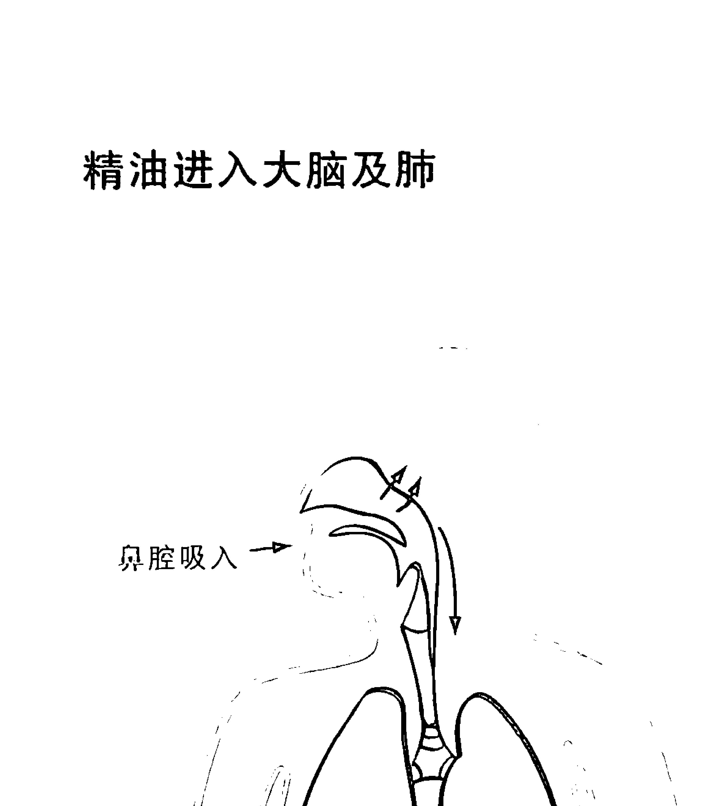

## 精油和皮肤系统

精油经由按摩进入皮肤的毛孔，随着血液的流动，精油停留在体内影响各系统可达数小时、数天甚至数星期之久，依个人的体质和健康状况而定。传送速度最快的为尤加利和百里香，大约30分钟可到达包括心脏、血液等循环系统；最慢的像是檀香、广藿香，大约要两小时。一般来说，精油可以在30分钟内完全被皮肤吸收，在数小时内经由皮肤、肺、尿液排出。

## 精油进入皮肤

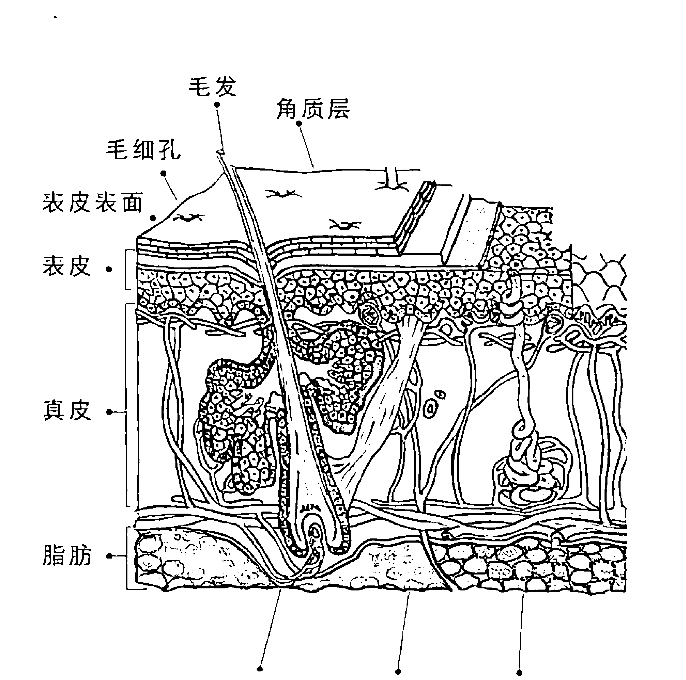

## 萃取来源、方式

### 什么是精油？

台湾自80年代末90年代初引进芳香疗法(Aromatherapy)以来，许多追求时尚、生活品质的人，多少都接触过“精油”(Essential Oil)，风潮所及，这一、两年来许多生活用品都标榜添加精油成分，例如，添加芳香精油的卫生纸、洗发精、喷雾水，至于化妆品就更不用说了，几乎每一家知名品牌都有产品标榜含有精油成分。

到底什么是精油？精油普遍存在于植物的各个部位，对植物的生长扮演重要的角色；它具备调节温度和预防疾病的保护功能；它能保护植物免受细菌及其他病菌的侵害。花瓣中的精油，可以吸引对自己有益的昆虫靠近，同样也能预防对自己不利的害虫接近，所以我们可以利用精油的这项特质在生活中驱逐害虫以及保健身体。

在台湾，进口的精油分为六大类，分别是香料精油、工业用精油、食用精油、化学精油、药物精油、芳疗精油。其中又以提炼芳疗用的精油最严谨，除了这些植物必须是有机植物外(就是栽种期间不能添加农药及杀虫剂)，而且提炼的精油还必须通过GC-MS测试，化学成分比例必须合乎标准值，才能归类为芳疗精油。所以有些植物闻起来虽然很香，若不符合标准值充其量只是芳香植物，并不属于芳疗植物。

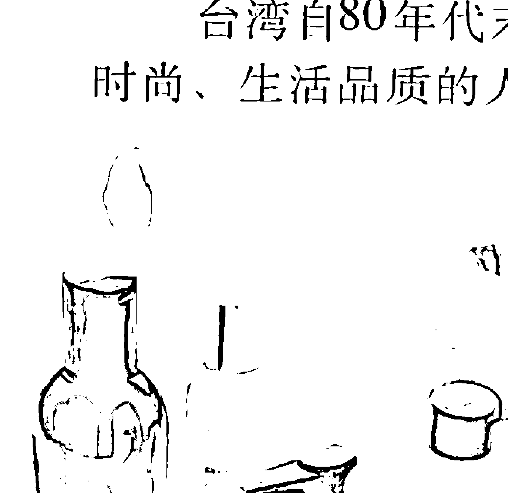

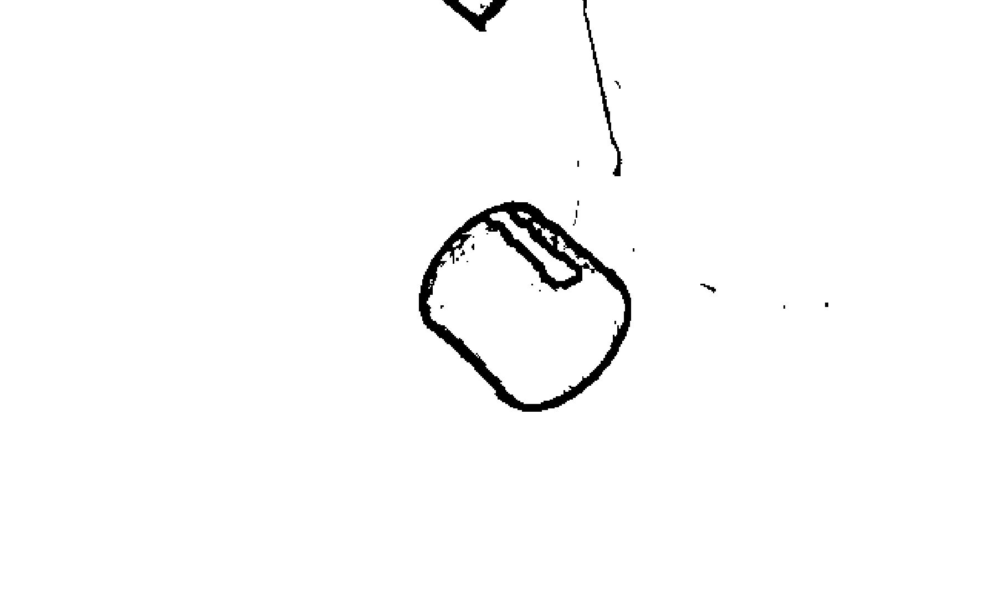

### 萃取来源

我们所熟知的精油，简单说就是从植物的叶子、花朵、种子、果实、根部、树皮、树脂、木材……以水蒸馏法、冷压榨法、脂吸法和溶剂萃取法，提炼出来的物质，具高度芳香性及挥发性的物质。除了单一部位可萃取出精油之外，有些植物可以在好几个部位萃取出精油，例如，苦橙就可从花苞、叶子及果实三个部位萃取出精油。

虽然大部分的精油都是以蒸馏法提炼，但也有些植物精油不适合或难以以此法提炼，像玫瑰花、茉莉花……花瓣精油是以脂吸法(Enfleurage)而得；也有些精油只要以压榨法即可得，像柑橘类的精油，取自植物的果皮压榨，例如以手刮橘子皮就会有油油的、香香的橘子精油产生。

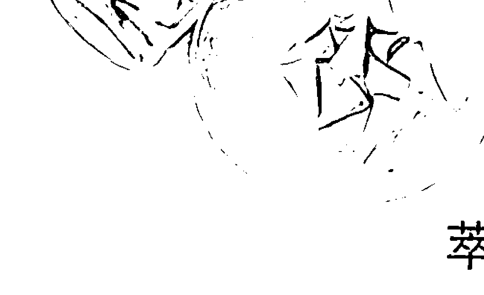

花朵：玫瑰、茉莉、万寿菊、德国洋甘菊、罗马洋甘菊、薰衣草、伊兰伊兰、马郁兰

种子：胡萝卜种籽、茴香、杜松子

果皮：甜橙、橘子、葡萄柚、柠檬、红柑

叶子：柠檬草、柠檬香茅、茶树、绿花白千层、快乐鼠尾草、迷迭香

树皮：肉桂

树脂：乳香、没药、安息香

木心：檀香、花梨木、雪松

根部：姜

### 萃取方式

每一种植物可以萃取出精油的量不尽相同，萃取量愈少的精油通常愈昂贵不易得，其中花瓣精油为最。一般来说，玫瑰花要3000-5000公斤、薰衣草要200公斤、柠檬要3000个，才能提炼出一公斤的精油。因此，玫瑰、茉莉、橙花这类精油通常10ml就要上万元，就是这个原因。

植物小百科：对大部分的植物来说，在开花前的上午9-11点采收干燥未损坏的叶子或小枝，具有最高的药效。

花瓣精油成本高，多半厂商会提供掺有基底油的混和油，而非100%纯花瓣精油，购买时要特别询问。

### 水蒸馏法

将新鲜的或经干燥处理的芳香植物原料放到蒸馏器中，由下方加热送入蒸气将植物的精油蒸发出来。含有精油的水蒸汽经由导管收集冷却后，蒸汽会冷却成液体，再依照水与精油的比重、密度的差异而分离出来。剩下来的水分当中，或多或少都有些精油溶在里面，就是所谓的花水，大部分精油是以此方式提炼出来的。

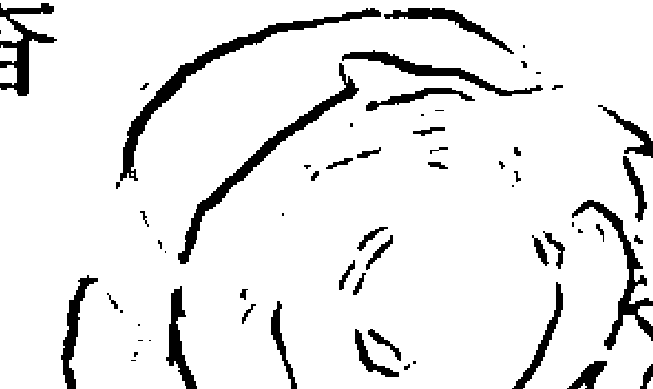

植物小百科：采收玫瑰花的作业，必须在早晨太阳还没出来的时候就要进行。并且采收地必须离提炼厂非常近，工人一采收就可以直接送往，愈短的时间提炼愈好。

例如：罗勒、胡萝卜种籽、洋甘菊、肉桂、快乐鼠尾草、芫荽、丝柏、尤加利、天竺葵、杜松、薰衣草、香蜂草、橙花、广藿香、欧薄荷、保加利亚玫瑰、迷迭香、花梨木、檀香、茶树、马鞭草、伊兰伊兰

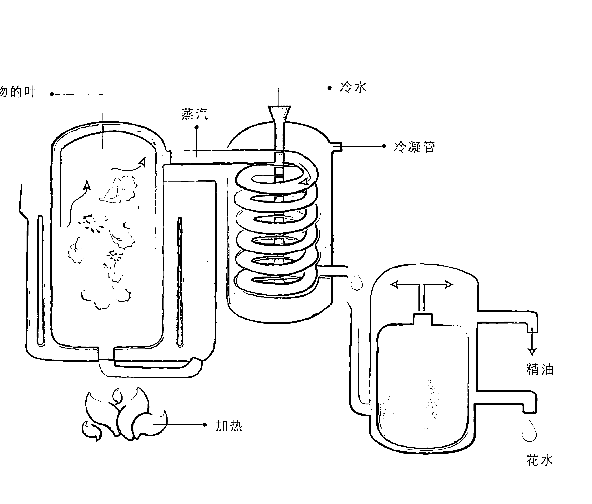

### 冷压榨法

此种方法多半用在柑橘类植物，因为精油多包含在这些植物的果皮中，萃取方式是在压碎果皮过程中加水，收集汁液后，经离心机将精油分离出来。

- 佛手柑
- 柠檬
- 葡萄柚
- 橘子
- 红柑

### 油脂分离法

以油脂吸收植物香气较佳的部分，再经酒精处理，并以机器搅拌，待酒精蒸发后，留下的便是芳香精油。

- 茉莉
- 橙花
- 玫瑰

### 溶剂萃取法

利用酒精、醚液态丁烷等溶剂，反复淋在欲萃取的植物上，再将含有香精油的溶剂分离解析，以低温蒸馏即可得到精油。这是最新的萃取方式，可用来取代油脂萃取法。

- 肉桂
- 鼠尾草
- 安息香

### 浸泡法

将花朵浸泡在热油中，使植物中的精油释放出来，再用过滤法萃取即可。

- 金盏花
- 胡萝卜
- 金丝桃

## 探索精油的内容物质

精油从香药草植物萃取而来，所以含有各种不同的天然化学物质。例如，甲酮、乙醛、苯酚、酯……有些精油含有三百多种成分，例如玫瑰；有些可能只有数种。成分愈复杂的精油愈不容易被合成化学模拟出来。

以下介绍几种精油中常见的化学成分：

- **酸(Acid)**：一种有机物，大部分为水溶性，是很好的抗炎物质、也具镇静效果，而且精油中含有酸。如弱酸，可以拿来治疗皮肤问题；如水杨酸，有除皱美肤的效果。
含有酸的精油例如玫瑰、伊兰伊兰、天竺葵、胡萝卜种籽油、香蜂草……

- **醇类(Alcohols)**：最常见的是单萜烯醇，抗菌效果不错，也能增强免疫力。这种醇类细分可分成沉香醇，如，薰衣草、橙花、伊兰伊兰。牻牛儿酸在回青橙、橙花、玫瑰、马丁香、天竺葵可取得。龙脑在薰衣草、松树中也有。薰衣草中的薰衣草醇以及天竺葵、香茅以及玫瑰中的香茅酸。除此之外，醇类还分倍半萜烯醇以及双萜烯醇，这两种醇都不易见，只存特定的几种精油中，前者是很好的增强免疫力、提振精神的成分；后者含有不错的动情激素。倍半萜烯醇在玫瑰、雪松、马丁香中可见。双萜烯醇能在快乐鼠尾草中找到。

- **醛类(Aldehydes)**：安抚中枢神经、抗炎疗效不错。醛类分为：柠檬醛、香茅醛、水茴香醛、洋茴香醛以及肉桂醛。
例如柠檬、天竺葵等精油中都含有柠檬醛；含有香茅醛有尤加利、柠檬、香蜂草。

- **酯类(Esters)**：精油中的香气味均由此而来，是一种香气分子。可以抗炎、抗痉挛以及平抚神经系统。由于此种分子的温和特质，所以较不刺激也不会伤害皮肤，是很安全的一种化学成分。
薰衣草酯在花香类精油中几乎都有，像茉莉、橙花。牻牛儿酯是薰衣草、尤加利。柑橘类中的橘子、甜橙以及橙花中的邻氨基苯甲酸甲酯。还有乙香沉酸酯含在快乐鼠尾草、薰衣草以及佛手柑中。

- **酮(Ketone)**：羰基(carbonyl group)与两个碳基结合的化合物总称，植物中的酮多是脂肪族酮以及含有芳香基的芳香族酮，存在于油脂氧化生成物中，大部分具有特异气味以及毒性。但黄体酮以及睾丸酮对生殖系统有不错的作用也能平衡荷尔蒙，甚至对皮肤以及神经系统都有不错的效果，例如菊科属精油。低量的酮对人体甚有帮助，例如杀菌功能。有些酮的作用强烈且有毒性，所以含酮的植物通常都不做精油萃取，以免造成危险。例如，鼠尾草中的侧柏酮，会导致流产，穗花薰衣草、欧薄荷、牛膝草中的酮成分，也可能导致早产，因此许多精油孕妇应该避免的理由，除了有调经作用之外，也是避免接触到含高量酮成分的精油，造成危险。

## 世界各地的芳香植物产地

- **加拿大**：芥末
- **美国**：葡萄柚、甜橙；柠檬、莱姆；薄荷、欧薄荷；芫荽
- **墨西哥**：莱姆、香草；茴香
- **危地马拉**：柠檬香茅、豆蔻
- **海地**：柠檬、莱姆
- **巴西**：葡萄柚、甜橙；柠檬、莱姆、香茅；柠檬香茅
- **英国**：欧薄荷；薰衣草；快乐鼠尾草
- **法国**：玫瑰、茉莉、天竺葵；薰衣草；马郁兰；迷迭香；百里香
- **西班牙**：百里香、尤加利；柠檬、迷迭香
- **摩洛哥**：天竺葵、雪松；茉莉、玫瑰；迷迭香
- **阿根廷**：香茅、柠檬
- **阿尔及利亚**：天竺葵
- **埃及**：茉莉、洋甘菊；天竺葵

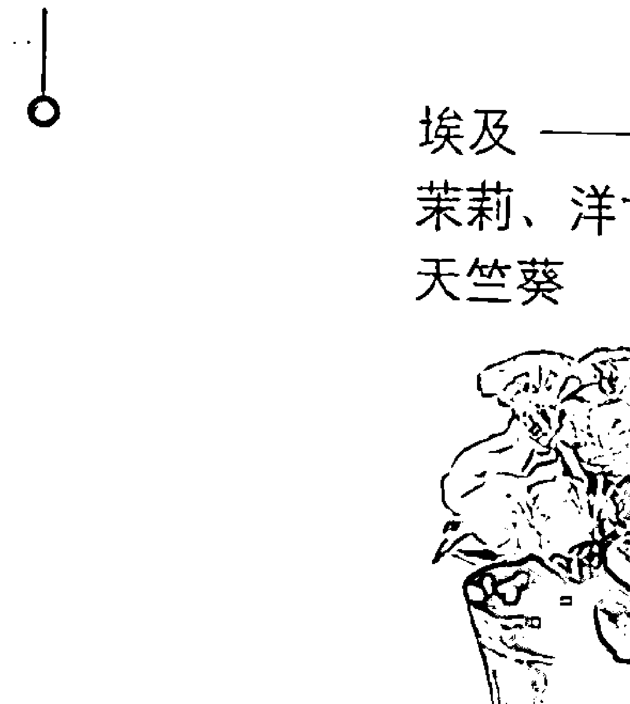

真正好的精油，因为关系到植物的品种、生长国家的气候、温度和湿度，工人采收时间、采收方法等各项条件配合才能产出优质精油。此图提供世界各地芳疗植物的最佳产地。

## 德国
莳萝、洋甘菊

## 俄罗斯
芫荽、鼠尾草
薰衣草、玫瑰

## 意大利
迷迭香
佛手柑
柠檬

## 保加利亚
玫瑰、快乐鼠尾草

## 中国
广藿香、香茅
肉桂、茉莉

## 土耳其
玫瑰、雪松
香茅、檀香
柠檬香茅

## 印度
檀香

## 菲律宾
伊兰伊兰

## 也门
乳香

## 索马里
没药、乳香

## 斯里兰卡
肉桂、欧薄荷
豆蔻、香茅

## 印尼
丁香、豆蔻
檀香、广藿香
安息香、香茅

## 马达加斯加
伊兰伊兰、丁香
香草

## 澳洲
尤加利、茶树

## 南非
尤加利、茉莉

# 基础油的介绍

基础油(base oil 或是carrier oil)，也有人称之为媒介油或是基底油。大多数的精油无法直接抹在皮肤上(除薰衣草和茶树外)，它们必须在基础油中稀释后，才可以广泛地用在我们人体的肌肤上。

基础油是取自植物的花朵、坚果或种子的油，很多基础油本身就具有医疗的效果。从生长在世界各地的植物种子里，我们可以制造出各种的植物油。有好几百种植物，它们的种子可以生产出油，其中只有少数的几种油是用在商业的用途上。一些植物油，例如，我们熟知的大豆油、花生油、橄榄油主要是为了食用，是营养和精力的良好来源，身体有了它就能产生热量，它是蛋白质的绝佳来源；为工业及家庭的用途，提供了润滑油及烹饪的材料。

芳香疗法使用的基础油是以冷压萃取得来(在摄氏六○度以下处理)，而食用的植物油，如大豆油是以200度以上的高温萃取而来，是平时在超级市场的货架上所看到的食用油。冷压萃取的植物油可以将植物中的矿物质、维生素、脂肪酸，保存良好不流失，具有优越的滋润滋养特质。

可拿来当作基础油的植物油，必须是不会挥发且未经过化学提炼的植物油，例如：甜杏仁油、杏桃仁油、酪梨油、荷荷芭油、小麦胚芽油等，这类油脂，富含维生素D、E与碘、钙、镁、脂肪酸等，可藉其稀释精油，并协助精油迅速被皮肤吸收。而一般的食用油通常经过高温提炼，已经失去天然养分，较不适合当作芳香疗法用的基础油。

这类油脂平时可保存在冰箱里，加入精油后，可保存六个月左右。因此每次调和的分量最好一次用完，或勿存放过久。

### 哪些油不适合当基础油？

不适合当基础油的通常是石油提炼的矿物油，如婴儿油或分子较大的绵羊油等。因为矿物油不但不含养分，还因为渗透力差容易阻塞毛孔，造成粉刺与脓疮；混和精油做按摩时，更会阻挠肌肤对精油的吸收，无法发挥疗效。

- ×婴儿油
- ×绵羊油

## 一、常见的基础油

### 甜杏仁油 Sweet Almond Oil

成分：维生素A、B1、B2、B6、E、蛋白质、脂肪酸。

特质：淡黄色，味道很轻柔，有润滑性但非常清爽，是中性不油腻的基础油。

概说：
属于中性的基础油。由杏树果实压榨而得，主产于环地中海地区的希腊、意大利、法国、葡萄牙、西班牙以及北非等地，最新的研究报告指出，对面疱皮肤有调理作用，对富贵手的敏感性皮肤也有保护功效。它与任何植物油皆可互相调和，因此也是最为广泛使用的基础油；食用可治咳嗽。购买时注意不要与苦杏仁油混淆，因为苦杏仁油有毒，不可使用。

适用：
具有良好的亲肤性，连最娇嫩的婴儿也可以使用。而含有高营养素的特质，是很好的滋润和混合油，适合婴儿、干性、皱纹、粉刺以及敏感性肌肤使用。
它的滋润、软化肤质功能良好，适合做全身按摩用，也能作为治疗痒、红肿、干燥和发炎的配方使用。
食用杏仁油可以平衡内分泌系统的脑下垂体、胸腺和肾上腺，促进细胞更新。

### 杏桃仁油 Apricot Kernel Oil

成分：维生素A、B1、B2、B6、C，以及矿物质及GLA。

特质：淡黄色，较甜杏仁油浓稠、黏腻一些，具有营养、缓和、治疗的特性。

概说：
取自杏桃核仁，多产于中亚、土耳其一带。经常和甜杏仁油混合使用。

适用：
肤色蜡黄或是脸部有脱皮现象的人非常适合；对重病以及身体虚弱的皮肤也很有助益；帮助舒缓紧绷的身体、早熟的皮肤、敏感、发炎干燥，可添加10~50%。

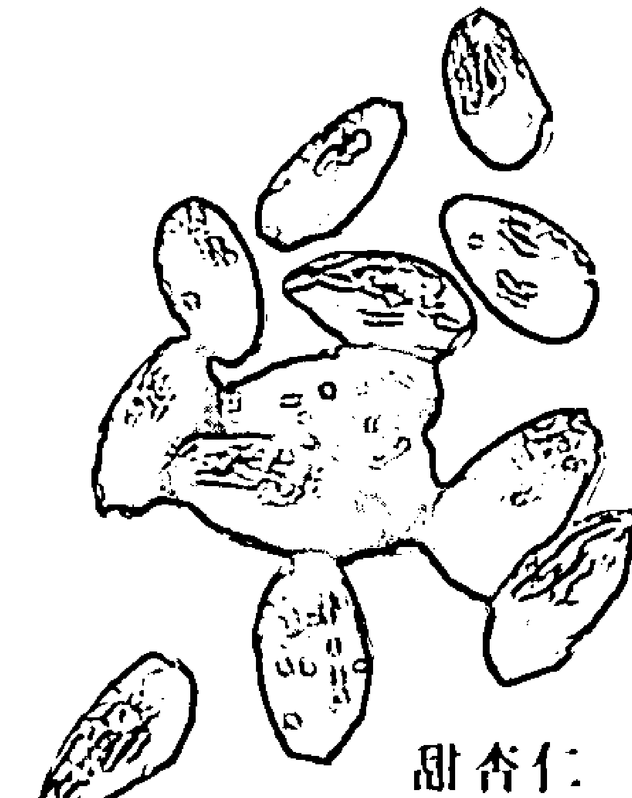

### 小麦胚芽油 Wheatgerm Oil

成分：蛋白质、泛酸、烟碱酸、维生素A、D、E、B₁、B₂、B₆，以及矿物质如钙、磷、铁、锌、镁等。还有不饱和脂肪酸如亚麻油酸、亚麻脂酸、油酸和卵磷脂。

特质：黄棕色、取自小麦种子发芽的部位；多产于美国、澳洲等大陆地区。

概说：
含高量天然维生素E，是一种抗氧化剂，它抗氧化的特质可延长复方精油的保存期限，只需10%的量添加在配方中。小麦胚芽油能清除自由基，促进人体代谢，预防老化，内服可预防治高血压、动脉硬化、心脏病及癌症等多种疾病。

适用：
消化、呼吸以及血液循环系统的配方皆适用。它含有脂肪酸可促进皮肤再生，对干性皮肤、黑斑、疤痕、湿疹、牛皮癣、妊娠纹有滋养效果。

### 荷荷芭油 Jojoba Oil

成分：矿物质、维生素、蛋白质、似胶原蛋白、植物蜡、Mytidyie Acid。

特质：呈黄色、萃取自荷荷芭豆。非常滋润、无任何味道、且油质较轻滑似脂腺分泌的油脂。荷荷芭是一种沙漠植物，如南加州、亚利桑纳州、以色列、澳洲等地区均有生产。具有高度稳定性，能耐强光、高温而保持结构不变，是可以久藏的油。

概说：
它有良好的渗透性，只要有空隙，都可以渗透；也具有耐高温的特质，并且分子排列和人的油脂非常类似，是稳定性极高、延展性特佳的基础油，适合油性敏感皮肤、风湿、关节炎、痛风的人使用，同时是良好的护发素。荷荷芭也含丰富维生素D及蛋白质，是很好的滋润及保湿油，可以维护皮肤水分、预防皱纹以及软化皮肤，适合成熟及老化皮肤，常用于脸部、身体按摩及头发的保养。它不是真正的油质，而是一种植物蜡，也具有不会腐臭的特质。

适用：
适合油性肌肤及发炎的皮肤、湿疹、干癣、面疱。可以改善粗糙的发质，是头发用油的最佳选择，在防止头发晒伤及柔软头发外，可帮助头发乌黑及预防分叉。

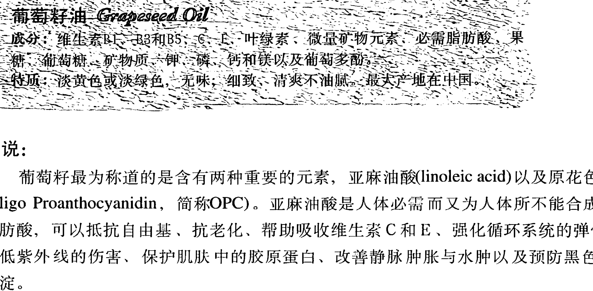

### 葡萄籽油 Grapeseed Oil

概说：
葡萄籽最为称道的是含有两种重要的元素，亚麻油酸(linoleic acid)以及原花色素(Oligo Proanthocyanidin，简称OPC)。亚麻油酸是人体必需而又为人体所不能合成的脂肪酸，可以抵抗自由基、抗老化、帮助吸收维生素C和E、强化循环系统的弹性、降低紫外线的伤害、保护肌肤中的胶原蛋白、改善静脉肿胀与水肿以及预防黑色素沉淀。
OPC具有保护血管弹性、阻止胆固醇囤积在血管壁上及减少血小板凝固。对于皮肤，原花青素可以保护肌肤免于紫外线的荼毒、预防胶原纤维及弹性纤维的破坏，使肌肤保持应有的弹性及张力，避免皮肤下垂及皱纹产生。葡萄籽中还含许多强力的抗氧化物质，如牻牛儿酸、肉桂酸与香草酸等各种天然有机酸，这些都是抗氧化的元素。

适用：
渗透力强，可作面部按摩及治疗时用，尤其是细嫩及敏感皮肤，油性、暗疮、粉刺皮肤。含丰富维生素F、矿物质、蛋白质，能增强肌肤的保湿效果，同时可润泽、柔软肌肤，质地清爽不油腻，易为皮肤所吸收。

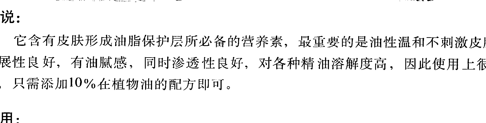

### 澳洲坚果油 Macadamia Oil

概说：
它含有皮肤形成油脂保护层所必备的营养素，最重要的是油性温和不刺激皮肤，延展性良好，有油腻感，同时渗透性良好，对各种精油溶解度高，因此使用上很方便，只需添加10%在植物油的配方即可。

适用：
可以做保湿霜，可以使肌肤柔软而有活力，保护细胞膜及滋润、保湿。身体护肤乳液也可以加澳洲坚果油，增加它的润滑度以及滋养度。

## 酪梨油 Avocado Oil

成分：矿物质、蛋白质、维生素A、B、B₂、D、E以及卵磷脂。

特质：甜甜的水果香，带有些油脂感以及果实的味道。味较重，颜色偏绿，并不适合单独使用，10%的量便足够。主要产于美洲赤道地区。

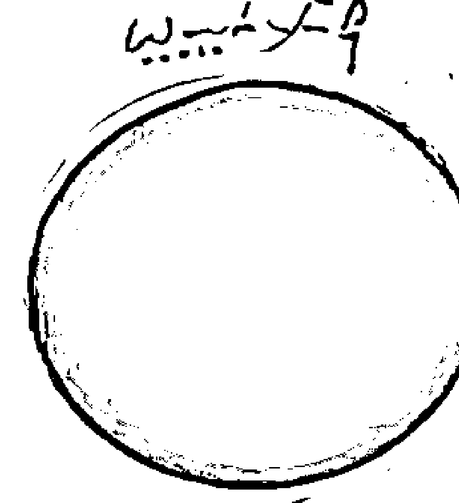

概说：
它营养度极高，从干燥的果实压榨的酪梨油，营养素丰富、质地较重，属渗透较深层的基础油。
中南美洲的印加文明时期，当地人即发现它丰富的营养素，是他们主要的食物之一。

适用：
适合干性皮肤、敏感性、缺水、湿疹肌肤使用。在脸部的使用上，它可以做清洁乳，深层清洁效果良好，对新陈代谢、淡化黑斑、消除皱纹均有很好的效果。

## 橄榄油 Olive Oil

成分：单不饱和酸、多不饱和酸、饱和脂肪酸、蛋白质、维生素E。

特质：呈淡黄色，温和不刺激，但有一些苦味。沿地中海岸栽植的品种，品质极佳。

概说：
橄榄食用油含有大量不饱和脂肪酸，对心血管循环效果极佳。不过芳香疗法用的橄榄油则必须经过冷压萃取过，与食用油不一样。由于刺激性极低，对阳光晒伤有缓和功能，可用于小孩子，不过因为有点味道，在芳香疗法上，目前仅使用于减肥、老化、晒伤及各种风湿、关节扭伤的较多。
气味强烈，油质黏重，较难做按摩，多用做护发。

适用：
可制成护发油、防晒油，可使皮肤变得柔软有弹性。

## 二、特殊用处的治疗用油

> **玫瑰籽油 Rose hip Seed Oil**
> 成分：γ-亚麻油酸、脂肪酸、柠檬酸以及维生素A、C。
> 特质：深黄或淡褐色，淡淡的苦味。萃取自智利野蔷薇果实的品质最佳。

**概说：**
南美洲3000米以上的高山，原住民栽种的无污染蔷薇，当地人称作 Rosa mosqueta。它最重要的成分是含有 γ-亚麻酸油，这种必需脂肪酸，对生殖系统非常有帮助。在食用上，它抗老化的功能也渐渐被发掘，所以对多发性硬化症、关节炎、高血压与胆固醇过高都有效。

**使用：**
一般肌肤、老化肌肤使用，有柔软肌肤、美白、防皱以及对妊娠纹皮肤有不错的疗效。具组织再生的功能，能有效改善疤痕、暗疮、青春痘。对保持皮肤水分功效卓著，也可以预防日晒后色素沉淀，晒伤甚至对牛皮癣、湿疹都有效；添加10%就够了，若非常干燥或老化肌肤可用100%。

> **月见草油 Evening Primrose Oil**
> 成分：γ-亚麻油酸、镁、锌、维生素C、E、B6以及烟碱酸。
> 特质：深黄色，有点药草味，压榨月见草种子而得。

**概说：**
原名晚樱草，傍晚开花天亮凋谢，北美洲东部干燥地区常见的植物。是印第安人的传统药草之一，两百多年前才传到欧洲。它是一种可以调合基础油与精油的油脂，具有多项治疗功能；虽然它最常被拿来制作胶囊内服，用在治疗心血管疾病及PMT、更年期，在芳香疗法的用法中，它调和乳液、乳霜，改善湿疹、牛皮癣。

**使用：**
可改善湿疹、异位性皮肤炎，帮助伤口愈合、指甲发育，解决头皮问题，只需添加10%的剂量于植物油中。

**圣约翰草油 St John wort Oil**
成分：金丝桃素、黄酮、丹宁酸、氢三苯甲酮、单烯。
特质：红色，将花苞放在油脂中浸泡过滤而得，有淡淡的草味。

**概说：**
圣约翰草，又称金丝桃；它是园艺学、植物学与医药学长期研究的主题。在南美洲的原住民，以这种植物发展出许多神秘的民族神话；在使用上也研究出不同的地域、品种、栽培环境及食用部位，而有不同的效用。
在食用上，像南太平洋的原住民，将它拿来当镇静剂使用，已超过三千年。所以它很早就被用来治疗感冒、梅毒、结核、痢疾等疾病；在西方，公元前二千年前希腊人也懂得以它来治疗轻度忧郁症；在德国以圣约翰草提炼出金丝桃成分，作为抗忧郁剂，已有很好的成就。美、德等科学家发现其除能有效对抗忧郁之外，还可以对抗爱滋病毒的其中一种。

**使用：**
它对皮肤创伤、烧烫伤、割伤、晒伤、蚊虫咬伤以及瘀伤都有很好的效果。具有止痛、抗发炎的功效，对肌肉疼痛、关节炎、痛风、风湿都不错；油性头皮(发)、头皮屑、青春痘、湿疹、静脉曲张，只要10 - 50%的剂量。

**如何选择基础油：**

+   以肤质选择：
    - 油性：甜杏仁油、杏桃仁油、荷荷芭油
    - 干性：酪梨油、小麦胚芽油
    - 敏感性：甜杏仁油
    - 老化：小麦胚芽油
    - 皱纹：酪梨油
    - 青春痘：荷荷芭油

+   以使用范围选择：
    - 全身：甜杏仁油、杏桃仁油
    - 脸部：甜杏仁油、杏桃仁油、荷荷芭油
    - 局部：小麦胚芽油、酪梨油
    ※小麦胚芽油、酪梨油、荷荷芭油在调配时只须占调配油的20%；小麦胚芽油、荷荷芭油最能保存精油的使用期限。

**金盏花浸泡油 Calendula**

**概说：**
金盏花的精油很难取得，以CO₂萃取的金盏花精油，相当昂贵，一般常见是以整个花朵浸泡在油脂中，做成金盏花浸泡油。它对皮肤有很好的滋润、抗炎、细胞再生作用，因此经常在伤口护理或处理晒伤、青春痘、湿疹等，以金盏花调成的乳霜会有美丽的金黄色。

**使用：**
青春痘、皮肤冻伤、尿布疹、皮肤病、皮肤疤痕、静脉曲张以及擦伤都有效；所以加入乳霜、润肤水，可添加15-25%或纯剂使用。

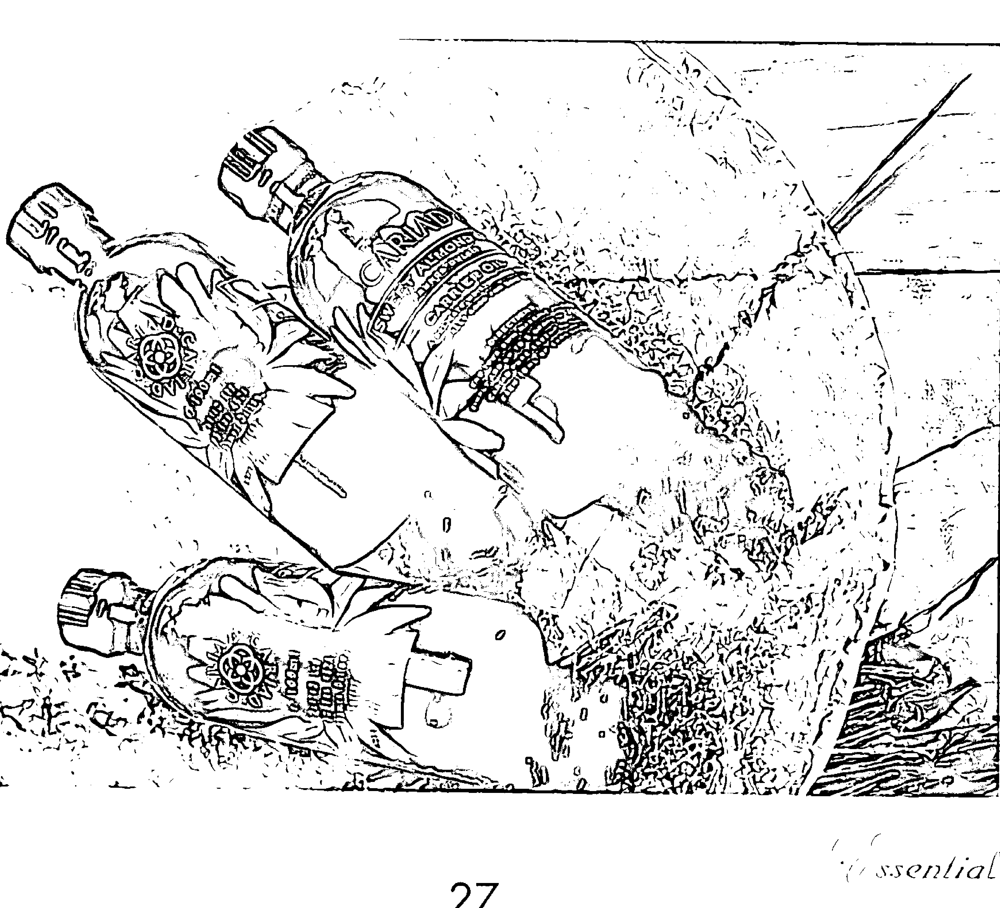

# 精油和阴阳学的关系

所谓身心灵的平衡，就是指身体的、心理的、精神的三方面达到和谐的状态。这也是芳香疗法的观念与价值所在。芳香疗法与药草医学、顺势疗法的原理相同，属于自然疗法的一部分，所以基本架构建 立在生命、阴阳以及自然三方面。
在中国有“气”的学说，西方世界也有“生命能量”之说，以及印度瑜伽里的“帕那”，其实可以统称为“生命力”。换句话说，万物生长存在都有它的特质与原因，也有它存在的价值。萃取于植物的精油，就是依照这种原理为人类所运用，精油的属性是什么，与人体交互作用之后，就会产生效果，甚至相同的精油使用在不同属性的人体之中，会产生不同的作用。例如，有些人会对某些气味感到快乐，有些人却可能没有明显的反应。
生命是有机体，会随着不同的个体而产生不同的特质，人如何运用身体，如何照顾它，就会表现不同的特征，它是一个一直在变化与维持平衡稳定的有机体。人类生命力的展现，就是身体在健康的状态下，所有正面生理能量的发生。身体健康表示体内和谐，就是维持在互相作用时的平衡状态，例如，造成现代人最大死因的癌症，是人体某个部分的细胞不断增生，无法与体内其他细胞互相作用，让身体无法平衡，使人产生不适感，无法正常生活。目前，癌症是一种无法治愈却有可能和它维持平衡状态，让生命延续下去的疾病。

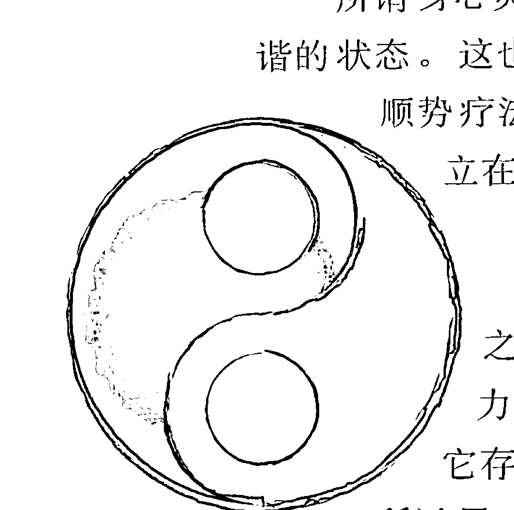

什么是顺势疗法？
顺势疗法是哈内曼大夫在19世纪末的研究项目。顺势疗法药物用作预防药可以增强病人的体质，帮助病人避免受某些疾病的感染。例如，一些慢性疾病。顺势疗法采用3000种以上不同的原料(它可以是昆虫、有毒动物、含有毒性的植物、化学分子)。所以有人又说它是一种以毒攻毒的疗法。

阴阳学说是中国古老的智慧，它的原则在于万事万物都有阴阳之分，存在于宇宙的任何地方、每一个角落。阴阳的宇宙说是：太极生两仪、两仪生四象、四象生八卦，两仪就是指阴阳。例如，种子这种极小的生命，也有它的阴阳，也需要阴阳，它生长所需土是阳、水是阴，发芽后向下扎根是阴、向上生长是阳，开花结果花是阴、果是阳，果实成熟是阴、掉落至土是阳，宇宙生命生生不息、循环演变，有句诗说：“化作春泥更护花”，最能说明这个道理。

阳的涵义是指雄性、热、光、干、刺激、主宰；阴就是雌性、冷、暗、湿、镇定、辅助。以人体来看，男人是阳、女人是阴；器官中，肝、心、肾、胃是阴；膀胱、肠、胆是阳，所谓阴阳协调，百病不生。对植物而言，也因生长环境的不同而分阴阳，植物精油更因萃取部位的不同分阴阳，例如，黑胡椒、檀香、乳香因气味的关系，归为阳性；玫瑰、洋甘菊、伊兰伊兰等花瓣精油，则属于阴性精油。

了解精油以及人体器官的阴阳属性，在运用精油时，可以有效调和不同的精油。例如，受风寒发冷，可以用阳性精油如黑胡椒或姜搭配治疗，民间常以“红糖姜汤”驱风寒。

属于阳性植物精油的有：佛手柑、葡萄柚、柠檬、橘子、红柑、柠檬马鞭草、黑胡椒、檀香、乳香、茉莉、肉桂、没药、茶树、尤加利

属于阴性植物精油的有：天竺葵、玫瑰、洋甘菊、伊兰伊兰、橙花

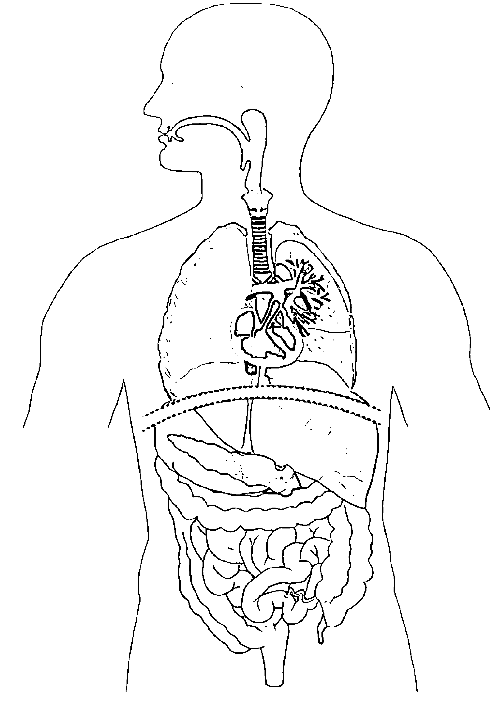

心、肝、胃是阳性

膀胱、肠、胆是阳性

# 成功调配精油

加了基础油的精油称之为混合油或复方按摩油，认识了基础油的种类后，可以依个人的需要，配合体质与生理的变化，别忘了，这气味最好是自己喜欢的，随时调整基础油、纯精油的种类与比例，调配出适当的按摩油。再利用按摩的手法(淋巴引流、瑞典式按摩等)，将植物精油渗透至身体内部，达到保健或治疗的目的。

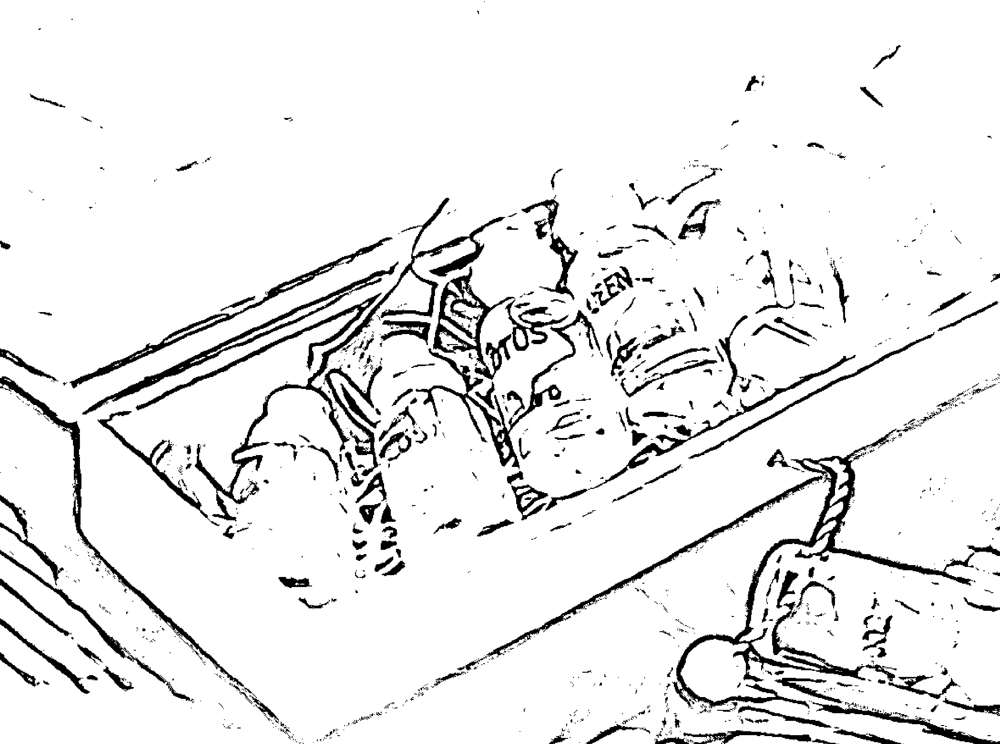

### 自己动手调配复方精油

不论是调配按摩用的混合油或是自己调配香水，首先你要找出自己喜欢的香味。打开两瓶精油，拿近鼻下约两寸的地方，轻轻地转圆圈，让不同的香味混合在一起，试试看混合的味道喜不喜欢。如果其中有一瓶的味道太强烈了，把它拿远一点，再次混合和增加另一种油稀释你不喜欢的那瓶，试试看别组精油有什么变化。

一般来说，花香类、柑橘类、异国情调类的精油很容易混合；草本类、木质类和柑橘类的精油也容易混合；辛香类则容易和树脂类以及木质类精油混合。(详见本书第三十二页)

不过，原则并非一成不变，当你越来越得心应手的时候，说不定会有意想不到的效果。

有些精油的味道比较强烈，像是尤加利、薄荷、柠檬，而檀香则比较弱，要花点时间才闻得到。这是由于我们前面提过的挥发性快慢的关系，在调配精油时，考虑不同精油的挥发速度有助于你了解这个混合油的香味能持续多久。

+   原则为：
    1. 一般肌肤：基础油的量(ml) ÷ 2 = 精油的最大滴数
       例如：20ml基础油约需10滴精油，这滴数是必须包含不同精油的总滴数。
    2. 孕妇或敏感性肌肤：基础油的量(ml) ÷ 4 = 精油的最大滴数
       20ml基础油需5滴精油
    3. 婴幼儿：20ml基础油的量只需2滴精油。

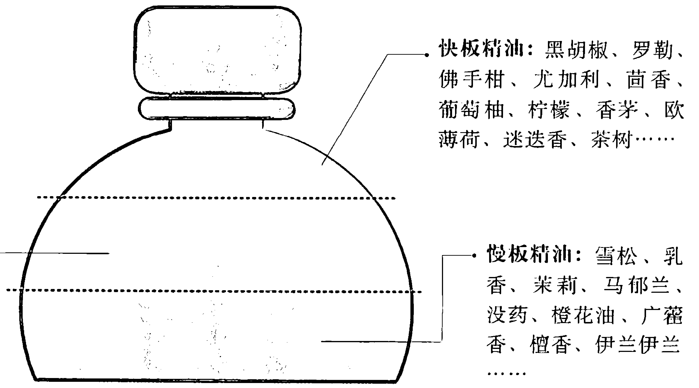

调和精油时准备一根5ml的茶匙，若为脸部按摩，大约用一、两茶匙基底油即可，而身体按摩则约需六茶匙，再依所需的比例调和精油。

# 精油的挥发速度

虽然称做精油，摸起来也是油油的，它却是高挥发性的物质，只要滴在纸上20分钟，就会完全挥发，例如薰衣草精油；当然也有挥发较慢的精油。所谓挥发性，指的是物质接触空气后消失的速度，也可以作为人体吸收快慢的判断，我们可以试着用音乐中的快板、中板、慢板来区分挥发的速度，虽然不是很精确，但却是一个参考值。

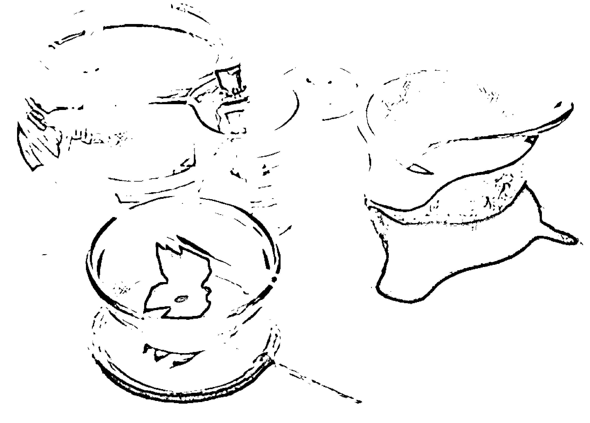

一般判断的方式是，将精油滴入基础油中放在室温下，香气持续24个小时称快板(Top)精油、72小时称中板(Middle)精油、1个星期以上称慢板(Base)精油。

-   **快板(Top)精油**：香气持续约24小时。
-   **中板(Middle)精油**：香气持续约72小时。
-   **慢板(Base)精油**：香气持续1个星期以上。

一般而言，快板精油香气较刺激、令人感到振奋，像欧薄荷；中板精油令人感到平衡和谐，薰衣草就是一种；慢板精油像檀香，给人一种沉稳的感觉，适合冥想沉思时使用，印度的修行者即偏爱使用檀香。

-   **快板精油特点**：香气较刺激，令人振奋，如欧薄荷。
-   **中板精油特点**：令人感到平衡和谐，如薰衣草。
-   **慢板精油特点**：给人沉稳的感觉，适合冥想，如檀香。

如同我们常听到香水分为前味、中味与后味，其实香味组合也是依循这些挥发速度快慢来搭配，散发出的香味也依序为挥发速度较快的，接着是挥发速度中等的，再来是挥发速度最慢的。

气味相近、植物科属相似或是挥发速度差不多的，都可以互相搭配，形成所谓的复方精油。使用复方精油的好处在于，功能类似的精油互相调配，可增强功效；功能差异大的精油调和，可扩大疗效，好比中药，也很少用单方。一次使用两三种不同的精油，不但可以增加香味的丰富性，同时还可以让功效有加成的效果，对于一些气味较不好闻却具有疗效的精油，也可藉由其他芳香精油的香气来调和不好闻的味道，让人在使用的时候更为舒适。

## 调制复方精油参考图：

左右相邻或与同类相调和，香气较佳；而花香类可与各类调和。

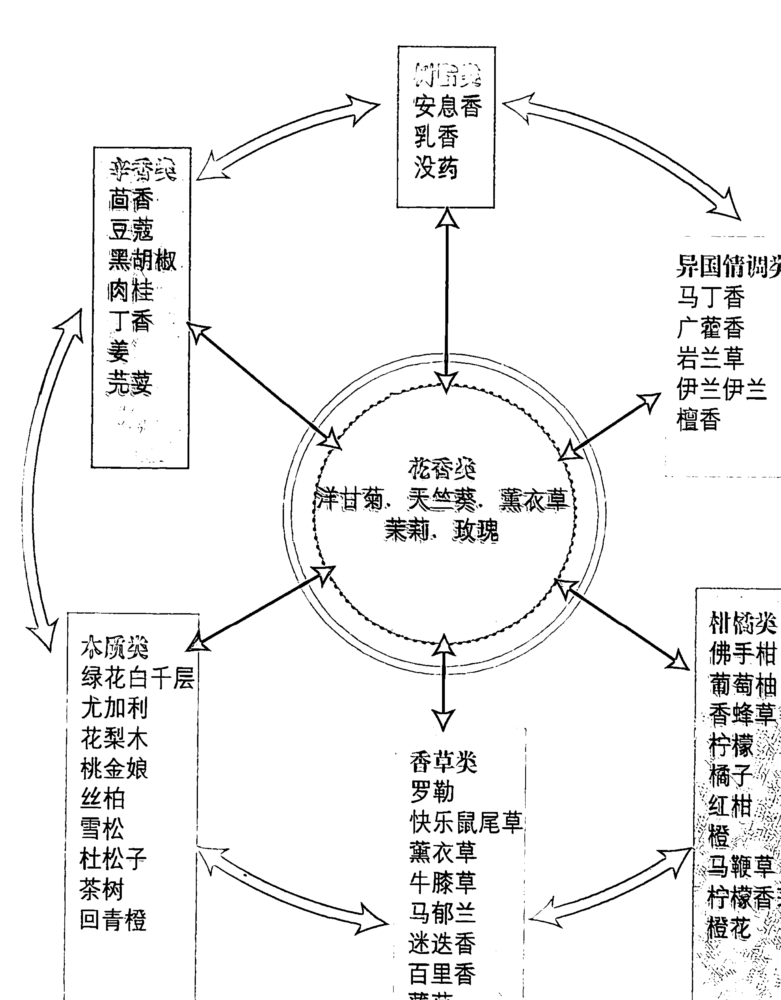

# 调配原则

了解精油的挥发速度之后，对调配复方精油有很大的帮助。例如，精油的滴数比例、哪一种精油比较相配等，若以功能区分，近似精油有相乘效果，至于计量除了依经验值外，可以参考快板：中板：慢板的比率是2：2：1。

调配精油时，则需要注意每一种精油之间的功能是否互相抵触，如果抵触的话，非但达不到调和精油功效加乘的效果，反而会出现反效果。相邻或同一类的精油彼此调和会有较佳的效果及香气。

## 调配混合油的工具：

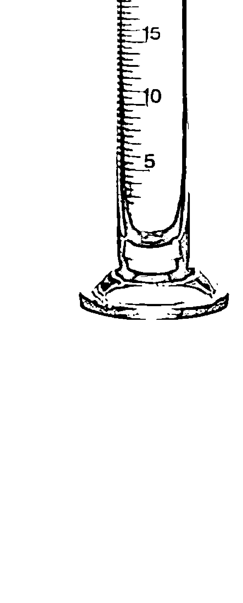

+   调制混合油需要哪些工具？
    1. 基础油
    2. 量杯：调配基础油及精油计量容器
    3. 精油：3-5种
    4. 精油瓶：存放按摩油。深蓝色、深褐色、深绿色皆可
    PS. 精油本身的瓶装设计有缺口，可准确地倒出1滴、2滴。

> 注意：考量基础油氧化程度、精油挥发性、存放环境等问题，调和基础油与精油时，建议最好只调制当次使用的份量或维持六个月即可。

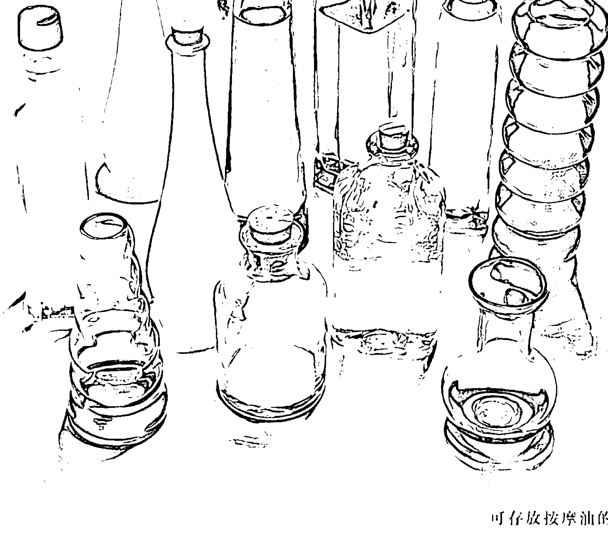

# 使用的禁忌

虽然芳香疗法在大部分的国家只是辅助疗法，还是有些国家将芳香疗法纳入医疗的范畴，配合药物治疗，让身体复元得较快(例如，英国、法国和澳洲)。了解精油使用的禁忌，才不会造成遗憾；尤其很多精油中都含有具有毒性的酮，酮向来是孕妇以及婴儿的禁忌，不宜长期、高剂量使用。

使用新的精油前，最好先做皮肤测试，以免过敏。简易的皮肤测试方法：在10ml的基础油中加入一滴精油(1%稀释)，抹在耳后、手肘弯曲处或手腕内侧，并在皮肤上停留24小时勿洗掉，如果没有红肿、刺激反应就表示可接受此种精油。一次最多可以试验6种精油，但是必须记录好什么精油涂在什么部位，这样才能确定哪一种是安全的。

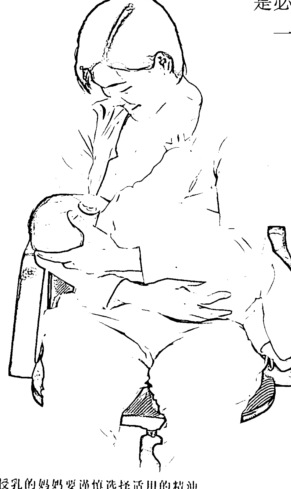

因为精油的分子极微小，很容易经皮肤渗透入体内，所以用精油按摩可以得到很好的效果。孕妇初期可先用植物油，第四个月再加入精油。婴儿使用精油按摩要在出生3个月后才能开始。

精油通常不能直接涂抹于皮肤上(目前只有薰衣草或茶树被认为可以安全直接使用)，要经过基础油稀释过才能用于皮肤上。除了不能直接接触皮肤，也不能碰到眼睛，若发生上述状况，应立刻用大量清水冲洗眼睛并就医。精油也不适合以口服(需专业指导)，或者是接触身体一些敏感部位，如直肠、阴道，只有某些精油例外。而且同一种精油最好不要天天使用，数种不同精油交替使用，最好两周换一次。

### 0~6个月婴儿

这个阶段的婴儿能使用的精油种类有限，可以在10ml的甜杏仁油或荷荷芭基础油中加入一滴的薰衣草或一滴的罗马洋甘菊或橘子精油，按摩小婴儿肚子；或使用室内熏香亦可。

### 6~12个月

只可使用洋甘菊、罗马洋甘菊、薰衣草、桔、橙花、玫瑰。

### 1~6岁

可使用洋甘菊、罗马洋甘菊、芫荽、薰衣草、橘子、橙花、花梨木和茶树。

### 7~12岁

除了罗勒外，书中指示的精油都可以用，使用的剂量为大人的1/2即可。

### 12岁以上

剂量可与成人同。

### 哪些状况下不宜使用精油？

怀孕妇女：怀孕初期的妇女不宜使用荷尔蒙类或通经类的精油，原因在于使用这类精油会导致通经，就是月经来潮，至于会不会流产，目前还没有证据显示。用基础油稀释过的比口服安全得多。

另外就是，气喘病患者最好避免使用蒸汽吸入法，以免发病。

除此之外，并非所有的精油都是安全的，仍有部分精油呈现毒性、具有毒素以及让人上瘾，甚至会造成皮肤损伤、抽搐或是流产，直接内服或纯剂按摩使用相当危险、不安全。

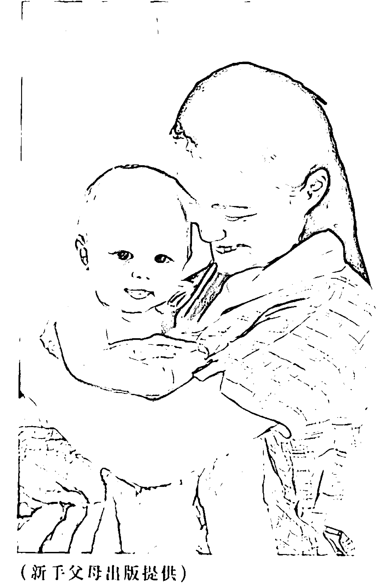

(新丁父母出版提供)

> 柑橘类精油(佛手柑和柠檬)通常有感光性，最好不要在白天使用，尤其佛手柑会持续好几天，所以不要直接加入水中泡澡。如果本身就有一些黑色素沉淀的问题，像是黑斑、老人斑、黑斑皮肤癌等，应低剂量使用。

# 选购与保存

想知道所有精油的不同味道，可以到精油专柜去试闻看看，但不一定需要马上买。你可以知道哪些精油的味道是你喜欢的、哪些精油是你不喜欢的。基本上，初上路的新手，可以考虑买薰衣草、茶树、尤加利，接下来再考虑想针对哪一方面的需求来选购。试试不同的精油从同类到不同类精油的选购，例如柑橘、香草、木质味……

在英语系国家，精油瓶身会标示英文名、拉丁文、纯度、保存期限、批号、使用说明、注意事项等符合GNP的条件。纯的单方精油还会标示“100% Pure Essential Oil”，并且用深色的玻璃瓶盛装（以深蓝、绿色与咖啡色为主）。若产品标示为“Aromatherapy Oil”大部分为掺和油或合成油，如果是“Environmental Oil”或“Fragrant Oil”时则为香精，其中精油的含量可能只有2%或3%，其余通常为合成香精，在味道上很香，但没有治疗效果，不属于芳香疗法。

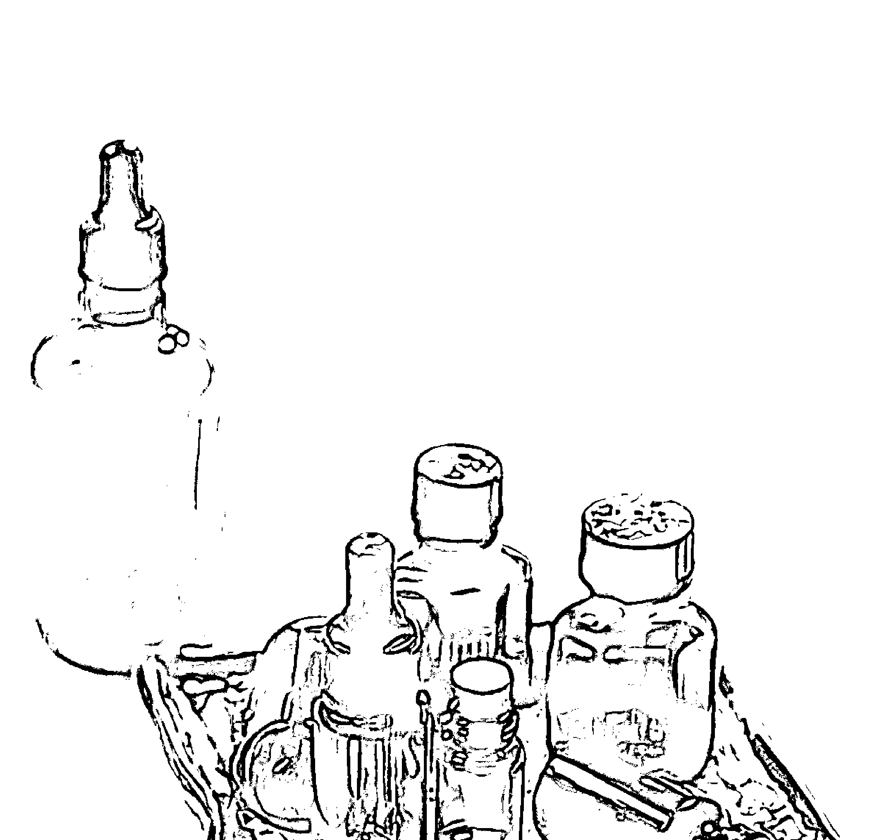

纯精油应该使用深褐色、深蓝色、深绿色的瓶子，避免直接接触光源，遇到氧化，破坏精纯度

### 夜市卖的一瓶50元精油可不可以买？

目前市面上卖的精油一瓶从50元到上万元不等，到底判断的标准在哪里？

+   1.植物名称：每一种植物精油都有它的主产国，像保加利亚的玫瑰精油、印度迈索尔的东印度檀香精油、澳洲的茶树精油和尤加利精油、法国南部的薰衣草精油……不同的品种，其疗效当然不一样。相同的植物在不同的地区，名称也不一样；例如，柠檬草(Lemongrass)，其实它就是台湾俗称的香茅草，唯有确认拉丁学名，才能保证所买的精油是否源自同一品科。
    2.价格：品质纯正的精油在蒸馏的过程中，不能添加任何的化学药剂，因此价格通常都不会太便宜。在台湾，有进口品牌保证的精油，一瓶10ml的精油最起码也要150～200元人民币。萃取不易的花瓣类如玫瑰、洋甘菊、茉莉，价格更贵；因此低价的精油，代表它可能掺杂人工合成的化学香料或非属于治疗级。
    3.认证书: 国内标榜进口的精油专柜，大多数都有合格的许可证，如果你还不放心，可以请业者出示原出口国的品质保证书。
    4.标签: 瓶身的标签上光有俗名是不够的，更讲究的还会附上该植物精油完整的拉丁学名。
    5.包装: 深色瓶，提供完整的资讯如保存期限、用法、功能、批号。
    6.蒸香: 由于精油挥发快，所以纯精油滴在水中会立刻散开，溶在水中；而劣质精油会成圆状悬浮在水面上。
    7.味道: 有丰富经验的芳疗师可判别品质，一般人的嗅觉由于长期习惯化学合成的香味，因此不见得能立即分辨，但可以学习。

纯精油怕光、怕高温易氧化，除用深色瓶子盛装外，最好放在恒温约30度以下的阴暗处；若要放在冰箱里，精油会变得有点混浊，因温差大，最好不要放冰箱，但植物油适合放冰箱。吞入精油可能会致命，所以一定要放在儿童接触不到的地方。

100%的精油通常可以保存个几年没有问题，像是檀香、乳香，就跟酒类一样越久越醇，但是要注意氧化的问题，如果常开盖子接触空气的话，精油就容易变质。不过也有不能久放的精油，像是柑橘类除了佛手柑外，保存期限都只有两年。

混合基础油后的精油保存期限较短，约两个月，所以购买这类精油的时候要特别留意保存期限，如果要延长保存期限，可以在混合油中再添加10%小麦胚芽油，可延长至6个月。

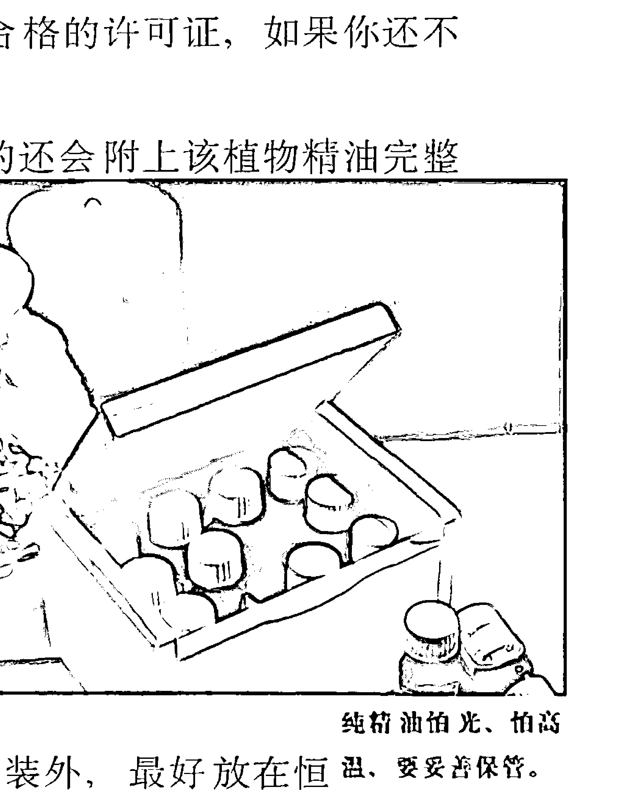

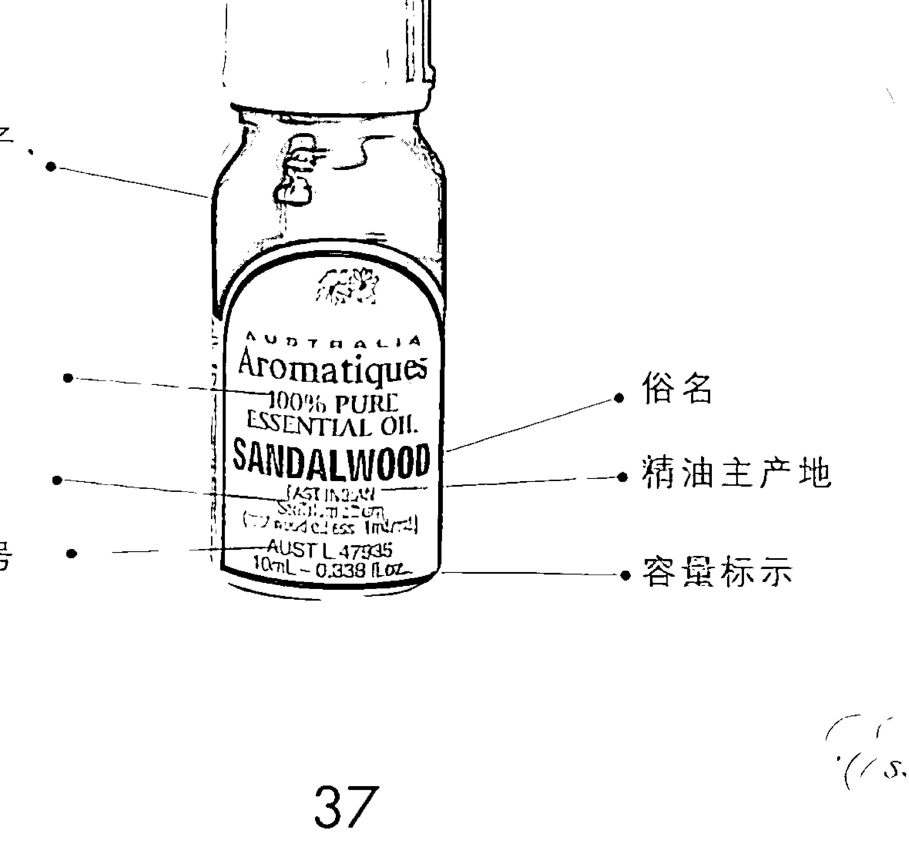

# 使用方法

精油进入身体的途径，透过皮肤及嗅觉进入身体，可分三种方法：

### 一、嗅觉吸收法

精油是挥发性高的物质，于室温中即可渐渐散布满室，若以加温的方式，会更快地充满空气中，在呼吸间即将植物分子吸入体内，这种方法在头痛、失眠、情绪不稳及呼吸道感染最有效。

- 1. 薰香式 – 是维护嗅觉顺畅、呼吸自然空气，不受污染物质伤害的最好方式；也可改善环境卫生，净化空气，避免感染病菌；香气可安抚情绪、改善精神状况如失眠、提升情欲等。

使用方法：

- a. 薰香的用具以陶瓷做成的薰香台以及无烟蜡烛为加热的能源，也有插电式的薰香灯，以及不用加水的薰香器，效果类似。
- b. 将开水或洁净的水倒入薰香台上方的水盆中，约置入八分满。
- c. 选择1~3种精油先后滴入盆中，一盆水的总滴数约6~8滴。
- d. 一个薰香台的理想薰香空间约为26.4平方米左右，房间不可完全密闭，需能透气，内外空气需能对流。
- e. 把精油直接加在干燥花中，或把精油混合基础油中加进干燥花中，亦可让香味持续数天。

- 2. 热水蒸汽式 – 透过水蒸汽可以使精油送进肺部循环，进入血液。这种方法对呼吸道感染最有效，但气喘病患者不宜。

使用方法：

将近沸腾的热水注入玻璃、陶瓷或不锈钢的容器(洗脸盆、碗或杯子)中，滴入4 ~ 6滴精油，以大毛巾或衣服盖住后颈，俯身于容器上方，以口、鼻交替呼吸直到舒适为止，这是治疗感冒及呼吸道感染最速效的方法，也是提神、情绪变换最好的方法。

- 3. 手帕式 - 将3 ~ 4滴精油滴在面纸或手帕上，开会、驾车、搭乘飞机、车、船或上课时皆可使用。
- 4. 手掌摩擦式 - 滴一两滴精油用双手摩擦生热，可以立即改善疲倦，提振精神。
- 5. 喷雾式 - 于100ml的喷式容器中注满纯水之后，加5 ~ 30滴精油摇晃均匀即可使用。直接喷于人时，由上方45度角往下喷，先后依序为：
    - 1. 要求其先坐下，放松心情，闭上眼睛。
    - 2. 喷其头顶上空，让雾气缓缓降至头部。
    - 3. 待其闻到气味时，才再喷其他的目标，如头发、脸及颈，勿喷到眼睛。

### 二、按摩吸收法

精油要经过基础油稀释调和后才能使用，经过按摩很快就能被皮肤吸收渗入体内。按摩最好的时机就是在刚洗完澡时，趁着身体微湿时效果最好。按摩时，力道可视需要而有不同，较快较重的按摩如搓揉、拍击，可提振精神；而轻柔的抚触、按压，则可舒压安抚或帮助睡眠。

这种方法可运用在脸部护理、全身按摩、减肥健胸、经痛、腹痛、便秘、淋巴引流等。这是一门古老的保养艺术，掌握的原则有三：

- 1. 身体按摩: 10ml基础油5滴精油。
- 2. 脸部按摩: 10ml基础油2 ~ 3滴精油。
- 3. 止痛按摩: 10ml基础油50滴，只做局部按摩3天。

### 三、按敷法

这种方法可适用在表皮问题，如刀伤、擦伤等，像薰衣草可直接用于烫伤的皮肤上。将患处先处理干净，擦干后，直接涂在患处，小疤痕则可使用棉花棒(避免使用塑胶制的棉花棒)，未经稀释的精油不宜直接涂于较大面积的皮肤上。

每一种表皮上的问题，都有两种以上的精油可以选择，可依个人体质来选择，若症状在3天后仍无明显的改善，就必须选择另外一种精油了。

使用时，需注意避免精油跑进眼睛。

- 1. 冷敷：一般用于发烧、流鼻血或运动伤害。头痛、发烧或流鼻血时，将精油2～4滴在湿毛巾上，置于额头上，加冰块或冰袋。在镇定、安抚皮肤时，用毛巾吸附表层的精油与水，约15分钟即可。
- 2. 热敷：深层洁肤、软化角质、经痛、神经痛、风湿关节炎、宿醉等有效。经痛时敷于腹部，宿醉敷于前胸肝脏与后背肾脏部位，肌肉酸痛、关节炎、风湿痛、痛风，除热敷外，还可配合手足、全身的按摩及精油浴或足浴。
- 3. 涂抹：各种外伤、蚊虫咬伤、止痒、头痛、止咳化痰、关节炎、风湿痛、香港脚、湿疹、轮癣、脓肿等，直接使用调好的稀释精油(50ml乳胶＋10～15滴精油)于患部上涂抹或直接将未稀释的精油擦于患部上。(薰衣草、茶树、德国洋甘菊)

### 四、沐浴法

精油可用于泡澡或泡脚，但未经稀释的精油，有时会损害某些材料的浴盆。浸泡前先将精油搅匀，水温不能过热，否则精油会很快蒸发，全身放松浸泡约20分钟。

- 1. 盆浴－体质调理、妇科感染问题、泌尿系统感染、香港脚、消除疲劳、风湿关节痛、发烧、血压问题、提高新陈代谢、减肥等。使用精油沐浴以低于摄氏37～39度为原则，因为过高的水温会使精油挥发太快且易使人疲劳，每次浸泡时间为15分钟。浸泡时需避免溅到眼睛，使用精油沐浴以适中的水温为主，放水动作完成之后，才把根据个人当天所需要的精油选好（1～3种），总滴数6～8滴；单方精油也可以用基础油稀释过再滴入水中。
精油会漂浮于水面，有的精油会扩散，有的凝聚成圆形，此时需用手掌以水平姿势打散，使精油均匀地分散在水面上，可利用反射原理按摩法，在自己相关的部位，轻柔地按摩，精油的渗透力极强，3分钟即抵达真皮层，5分钟抵达皮下组织，随着我们的血液运行全身。

- 2. 足浴 - 对于工作疲累导致的足部浮肿、感冒、冬天双脚寒冷，都可以利用精油4~6滴泡脚来舒缓症状，由于精油属于浓缩性质，所使用的足浴浴盆，最好是不锈钢材质，若是塑胶材质的则比较不理想。足浴时是进行足部病理反射按摩最好的时候，只要轻柔地按摩或者加入弹珠轻踩就可以了。
- 3. 臀浴 - 是生理保健的最佳方法，将配好的配方以温水进行灌洗，这样可以预防很多的妇科问题及疾病的产生。
- 4. 淋浴 - 三温暖或其它的沐浴法都可以利用纯植物精油，把沐浴精倒入丝瓜布中再滴入3~4滴精油，搓洗全身。
- 5. 灌洗 - 特别针对很多妇科问题，100ml的纯水滴入5滴的纯精油。

> 由于精油不溶于水，使用前需摇匀，或先将精油溶于保湿蜜中，再倒入纯水中。可制成保湿化妆水或改善空气品质，使人精神一振。

# 02 精油疗效的实践

芳香疗法的香精油除了怡人香味外，它的真正魔力是对人体的各部位系统产生疗效，进而使我们病痛得到纾解与改善。
在本章中，我们列出精神系统、呼吸系统、消化系统、肌肉/关节、皮肤系统、泌尿/生殖系统，以及女性朋友关心的美容保养，共七大课题，提供一般人常见的症状及适用的配方表。

## 神经系统

芳香疗法最具特色的功能，恐怕就是神经系统了；因为熏香是精油使用中较简单又能迅速感受到芳香疗法魔力的方式。

嗅觉，一直以来是人类或其他动物最敏感的器官；气味，除了影响心理层面，使心情变好，进而对身体还有一定的影响。

以下就几个常见的精神层面造成的问题，提出简单的配方。

### 压力

- **使用精油：** 薰衣草、伊兰伊兰、檀香、甜橙、罗马洋甘菊、回青橙、橙花、佛手柑、花梨木、快乐鼠尾草、罗勒、葡萄柚、马丁香、红柑、百里香、天竺葵、马郁兰、香蜂草、安息香、玫瑰、岩兰草、胡萝卜种籽、茉莉

**配方：**

- 熏香：薰衣草4滴+橙花2滴+回青橙2滴
- 泡澡：甜橙2滴+薰衣草3滴+花梨木3滴
- 按摩：甜杏仁油10ml+葡萄籽油10ml+甜橙4滴+薰衣草4滴+伊兰伊兰2滴

### 全身无力

- **使用精油：** 柠檬、迷迭香、橙花、伊兰伊兰、快乐鼠尾草、薰衣草

**配方：**

- 熏香
    - 1. 柠檬3滴+迷迭香2滴+橙花3滴
    - 2. 伊兰伊兰2滴+快乐鼠尾草2滴+薰衣草4滴
- 泡澡：伊兰伊兰2滴+快乐鼠尾草2滴+薰衣草4滴
- 按摩：甜杏仁油10ml+杏桃仁油10ml+伊兰伊兰3滴+快乐鼠尾草2滴+薰衣草5滴

### 烦闷·不安

- **使用精油：** 薰衣草、佛手柑、罗勒、欧薄荷、肉桂、柠檬草、檀香、快乐鼠尾草

**配方：**

- 熏香
    - 1. 罗勒2滴+欧薄荷3滴+佛手柑3滴
    - 2. 薰衣草3滴+佛手柑2滴+快乐鼠尾草3滴
- 泡澡：甜橙3滴+快乐鼠尾草2滴+薰衣草3滴
- 按摩：甜杏仁油16ml+小麦胚芽油4ml+佛手柑3滴+快乐鼠尾草3滴+薰衣草4滴

### 失眠

- **使用精油：** 薰衣草、佛手柑、罗马洋甘菊、马郁兰、橙花、檀香

**配方：**

- 熏香：薰衣草3滴+佛手柑3滴+檀香2滴
- 涂抹脸：荷荷芭油10ml+佛手柑1滴+马郁兰1滴+橙花3滴

### 焦躁

- **使用精油：** 薰衣草、檀香、天竺葵、柠檬、花梨木、岩兰草、橘子

**配方：**

- 薰香：薰衣草3滴+檀香2滴+天竺葵3滴
- 空间喷雾：纯水100ml+天竺葵10滴+薰衣草10滴+橘子10滴
- 泡澡：天竺葵3滴+薰衣草3滴+橘子2滴
- 按摩：小麦胚芽油4ml+葡萄籽油16ml+薰衣草5滴+檀香5滴
- 涂抹(于太阳神经丛区)：荷荷芭油10ml+薰衣草2滴+檀香1滴+天竺葵2滴

### 兴奋

- **使用精油：** 佛手柑、薰衣草、欧薄荷、柠檬、迷迭香、罗勒

**配方：**

- 薰香：佛手柑3滴+欧薄荷2滴+薰衣草3滴
- 涂抹：荷荷芭油10ml+佛手柑3滴+罗勒2滴

### 忧郁

- **使用精油：** 伊兰伊兰、茉莉、玫瑰、欧薄荷、甜橙、柠檬、橘子、薰衣草

**配方：**

- 薰香：柠檬5滴+欧薄荷3滴
- 按摩：甜杏仁油10ml+葡萄籽油10ml+薰衣草5滴+橙5滴
- 蒸汽：伊兰伊兰1滴+茉莉1滴+橘子2滴
- 泡澡：柠檬4滴+欧薄荷2滴+伊兰伊兰2滴
- 按摩：葡萄籽油10ml+伊兰伊兰2滴+茉莉1滴+橘子2滴

### 惊吓

- **使用精油：** 尤加利、欧薄荷、柠檬、杜松子、天竺葵、茶树、迷迭香、甜橙、伊兰伊兰、檀香、岩兰草

**配方：**

- 薰香：伊兰伊兰2滴+甜橙3滴+天竺葵3滴
- 泡澡：伊兰伊兰2滴+甜橙3滴+天竺葵3滴
- 按摩：甜杏仁油10ml+葡萄籽油10ml+迷迭香4滴+甜橙6滴

### 恢复精神、改变心情

- **使用精油：** 迷迭香、柠檬、欧薄荷、佛手柑、橙、杜松子、柠檬草、罗勒、花梨木

**配方：**

- 薰香
    - 1. 罗勒2滴+柠檬4滴+欧薄荷2滴
    - 2. 甜橙3滴+欧薄荷3滴+柠檬草2滴

### 强化注意力

- **使用精油：** 欧薄荷、甜橙、迷迭香、回青橙、杜松子、广藿香、柠檬、罗勒

**配方：**

- 薰香
    - 1. 欧薄荷2滴+柠檬3滴+迷迭香3滴
    - 2. 甜橙4滴+迷迭香2滴+罗勒2滴
    - 3. 伊兰伊兰3滴+广藿香2滴+柠檬3滴(被周遭的杂音干扰、缺乏注意力时)
- 泡澡：伊兰伊兰2滴+迷迭香4滴+罗勒2滴
- 按摩：甜杏仁油10ml+葡萄籽油10ml+薰衣草4滴+甜橙4滴+马郁兰2滴

### 紧张

- **使用精油：** 天竺葵、甜橙、伊兰伊兰、薰衣草、橙花、佛手柑、回青橙、檀香、花梨木

**配方：**

- 薰香：伊兰伊兰2滴+甜橙3滴+薰衣草3滴
- 泡澡：佛手柑2滴+薰衣草3滴+天竺葵3滴

### 增强记忆力

- **使用精油：** 迷迭香

**配方：**

- 薰香：迷迭香4滴+罗勒4滴
- 蒸汽
    - 1. 迷迭香2滴+尤加利1滴+柠檬1滴
    - 2. 欧薄荷1滴+柠檬草1滴+迷迭香2滴

### 消除疲劳

- **使用精油：** 薰衣草、丝柏、杜松子、天竺葵、迷迭香

**配方：**

- 泡澡：薰衣草4滴+天竺葵4滴
- 按摩：甜杏仁油10ml+葡萄籽油10ml+杜松子5滴+薰衣草5滴

### 环境

- **使用精油：** 没药、快乐鼠尾草、尤加利、丝柏、天竺葵、薰衣草、橙花、茴香、佛手柑、欧薄荷、檀香、柠檬草、广藿香、岩兰草

**配方：**

- 薰香：柠檬草2滴+欧薄荷3滴+佛手柑3滴

### 空气清净

- **使用精油：** 欧薄荷、甜橙、佛手柑、檀香、葡萄柚、杜松子、茶树、没药、尤加利、柠檬、薰衣草、柠檬草、迷迭香、丝柏、橙花、伊兰伊兰

**配方：**

- 薰香
    - 1. 柠檬4滴+尤加利4滴
    - 2. 欧薄荷3滴+尤加利3滴+柠檬草2滴
    - 3. 茶树3滴+迷迭香3滴+葡萄柚2滴
- 芳香喷雾：30滴前述的任一种配方与100ml矿泉水混合后用喷雾器喷洒在室内。

### 防虫

- **使用精油：** 丝柏、杜松子、尤加利、薰衣草、天竺葵、广藿香、雪松、欧薄荷、柠檬、罗勒、柠檬草、丁香

**配方：**

- 衣物防虫：雪松15滴+薰衣草15滴
- 驱赶蟑螂：薰衣草10滴+柠檬10滴+欧薄荷10滴
- 驱赶白蚁：丁香15滴+薰衣草15滴
- 驱赶蚊蝇：柠檬草8滴+欧薄荷7滴+天竺葵8滴+罗勒7滴
- 防虫喷雾：上列配方任一种30滴与100ml纯水混合后喷洒；或取4~6滴于棉花球上。

## 呼吸系统

呼吸系统最常见的毛病是流行性感冒引发的鼻炎、喉炎等相关症状以及肺炎、支气管炎、气喘。

治疗的方法以蒸汽吸入法和热敷为主，少部分要用到精油按摩。精油最大的特色就是有抗菌特质，对呼吸系统病症中最常见的痰、痉挛、咳嗽最有效，所以人们最容易患的流行性感冒，以芳香疗法来治疗是很好的选择。

尤其医学界早已证明尤加利精油对A型流行性感冒有很好的效果，其他像佛手柑、黑胡椒、快乐鼠尾草、欧薄荷、百里香、松、茶树、薰衣草以及柠檬等，都是治疗呼吸系统毛病的上选精油。

**使用精油：** 佛手柑、黑胡椒、快乐鼠尾草、欧薄荷、沉香醇、百里香、绿花白千层、桃金娘、尤加利、柠檬。

### 气喘

说明：肺部支气管痉挛，造成呼吸困难。通常由灰尘、小羽毛等过敏原造成，也有些是遗传性的原因。气喘通常是突发状况，所以治疗的原则是迅速吸入精油，患者最好随身携带闻香瓶，若临时找不到瓶子可以滴在手帕或纸巾上，以吸入法缓和呼吸；或是经常在家中薰香以降低气喘发生几率。另一种气喘是压力与忧郁造成，因此长期保养保持身心平衡的芳香按摩及薰香有效。

**配方：** 按摩法：杏桃仁油20ml + 佛手柑5滴 + 洋甘菊2滴 + 尤加利3滴(可用薰衣草、快乐鼠尾草薰香搭配)

### 支气管炎

说明：最常见的两个症状是咳嗽与痰。支气管炎分慢性与急性，最好的保养方法是长期按摩胸与背，并且注意减少牛乳制品及精制食物的食用，若患急性支气管炎，应尽快薰香以及蒸汽吸入，缓和发作时的症状。

**配方：** 按摩法：杏桃仁油10ml + 茶树2滴 + 百里香1滴 + 薰衣草1滴(可用乳香、迷迭香、没药、松，薰香或吸入)

### 感冒、咳嗽、喉咙痛、头痛

说明：传染感冒的病毒不下50种，还有许多变种，几乎是防不胜防，最好的方式是增强免疫力，在病症未发作时，就将病毒歼灭。感冒最常见的症状是咳嗽、喉咙痛、流鼻水、痰以及头痛。若病毒肆虐严重还会引发肺炎、鼻窦炎、耳痛发炎或是支气管炎。摄取大量的维生素C是抵抗病毒的好方法，最好的芳香治疗是薰香、漱口及泡澡，增强免疫力。

**配方：**

- 1. 薰香法：薰灯 + 薰衣草2滴 + 尤加利4滴 + 柠檬2滴
- 2. 泡澡：水1缸 + 薰衣草4滴 + 尤加利4滴 (或以柠檬、迷迭香、松、茶树、马郁兰、罗勒、百里香取代)
- 3. 按摩法：甜杏仁油10ml + 茶树1滴 + 薰衣草2滴 + 柠檬1滴 + 尤加利1滴(或以迷迭香、松取代)
- 4. 吸入法：热水1盆或手巾 + 薰衣草1滴 + 迷迭香1滴(可用欧薄荷、尤加利、茶树取代)

### 咳嗽

- 1. 按摩法：甜杏仁油10ml + 檀香3滴 + 茶树1滴 + 丝柏1滴(或以薰衣草取代)
- 2. 薰香(薰灯 + 檀香3滴 + 丝柏1滴 + 松1滴(或以薰衣草取代))
- 3. 吸入丝柏香气

### 喉咙痛

- 1. 按摩法：(甜杏仁油15ml + 薰衣草3滴 + 松1滴 + 快乐鼠尾草2滴(可用洋甘菊、檀香、柠檬取代))
- 2. 吸入法：1杯热水 + 薰衣草1滴 + 松1滴 + 没药1滴(或以洋甘菊、百里香、松、尤加利、檀香、姜、天竺葵取代)
- 3. 漱口法：1杯温水 + 茶树2滴

### 头痛

- 按摩法：甜杏仁油10ml + 薰衣草3滴 + 欧薄荷2滴(可用迷迭香、马郁兰、洋甘菊取代)

### 扁桃腺炎

说明：扁桃腺为链球菌感染发炎化脓，并感染喉咙附近造成喉头炎。使用强力杀菌效果的精油漱口是快速的治疗法。

- 1. 蒸汽吸入法：1盆水 + 百里香3滴 + 柠檬2滴 + 欧薄荷1滴
- 2. 以5ml的没药酊剂加入1杯水漱口，效果显著。

### 鼻窦炎

说明：鼻子上方的鼻窦容易遭受感染受阻塞，使得声音听起来平平的，严重时会发烧并引起脑膜炎。急性鼻窦炎应紧急送医治疗，慢性鼻窦炎应有长期薰香或每天都以吸入法畅通鼻子的耐心。症状严重时可轻轻按摩舒缓。

- 1. 吸入法：水蒸气或手巾 + 迷迭香3滴 + 天竺葵1滴 + 尤加利1滴(可用百里香、欧薄荷、茶树、罗勒、杜松子取代)
- 2. 按摩法：甜杏仁油10ml + 迷迭香2滴 + 天竺葵1滴 + 尤加利1滴 + 欧薄荷1滴

## 消化系统

消化系统指的是唾液分泌、口腔咀嚼、肠胃道分解吸收以及排泄等几个部位。芳香疗法运用于消化系统上，就可分为蒸香、背部腰部脊椎按摩、胃部腹部热敷或按摩，或浸泡患部等。

消化系统是人体消化吸收食物养分最主要的器官，而芳香植物早在千年前就为人类烹调食物所用，如迷迭香、茴香、欧薄荷和豆蔻等；而在传统的中药里，例如，茴香可刺激胃肠神经血管，促进消化液分泌，有健胃、行气的功效。植物精油抗痉挛、舒缓的功能，与中药疗效有异曲同工之妙。

### 反胃

说明：反胃的原因很多，常见的多是消化不良引发的，如果是怀孕反胃，不适用以下配方应特别注意。

- 吸入法：手巾+姜1滴+柠檬1滴(可用丁香、姜、欧薄荷、豆蔻取代)
- 涂抹法：甜杏仁油5ml + 丁香2滴(以顺时针方向按摩)

### 腹泻

说明：腹泻的几种原因包括病毒感染（感冒时，也常会有腹泻状况），或食物不洁或同时吃多种食物，暴饮暴食；或是神经过敏以及压力、情绪不稳造成的腹泻。几个类型的腹泻都是用腹部按摩来处理，只是所使用的精油稍有不同。

- 食物 - 甜杏仁油10ml + 尤加利1滴 + 欧薄荷2滴 + 百里香2滴
- 病毒 - 甜杏仁油10ml + 薰衣草2滴 + 柠檬2滴 + 茶树1滴
- 过敏(压力) - 甜杏仁油10ml + 薰衣草2滴 + 天竺葵2滴 + 洋甘菊1滴

### 胀气

说明：消化系统最容易排气不良，或有些食物容易产生空气，甚至开刀、服用抗生素也会产生胀气。

配方：涂抹法：甜杏仁油5ml + 薰衣草1滴 + 罗勒2滴，以顺时针方向涂抹在腹部。

### 口臭

说明：可分为消化不良与口腔不洁等几个因素影响，当然还有一般俗称的火气大，这跟胃也有关系。

配方：漱口：水1杯 + 柠檬1滴 + 薰衣草1滴 + 欧薄荷1滴

### 痔疮

说明：肛门口附近的静脉曲张，通常是久未排便引起，与饮食、生活习惯有很大的关系。

配方：浸泡法：水1公升 + 丝柏2滴 + 天竺葵1滴 + 广藿香1滴

### 打嗝

说明：消化不良的一种。

配方：吸入法：手巾 + 薰衣草2滴 + 柠檬1滴(或以茴香、洋甘菊取代)

### 消化不良

说明：若长期有不易消化的症状，改变饮食与多喝花草茶如洋甘菊或欧薄荷是一种好方法。经常顺时钟方向按摩腹部。

配方：按摩法：甜杏仁油5ml + 薰衣草2滴 + 马郁兰1滴(或以洋甘菊取代)

### 呕吐

说明：应先了解是食物、情绪还是流行性病毒引起的呕吐。以按摩或热敷胃部最有效。

配方：

- 病毒 - 甜杏仁油10ml + 黑胡椒2滴 + 洋甘菊1滴 + 马郁兰1滴
- 情绪 - 甜杏仁油10ml + 薰衣草2滴 + 柠檬1滴 + 欧薄荷1滴

## 肌肉 / 关节系统

### 痛风

说明：痛风发生是由体内尿酸蓄积，疼痛的特征是脚拇趾跟肿大、剧痛，更严重者还会引发肾炎。如果疼痛的主要原因是饮食引起的，除了避免再次食用发病的食物外，彻底改变日常饮食习惯也非常重要。

配方：
按摩：甜杏仁油5ml + 松2滴 + 百里香2滴

### 风湿 / 关节炎

说明：治疗风湿症最重要的就是早期发现早期治疗，一旦发现有左右手腕关节或手指关节肿痛、足部与膝盖关节疼痛、早上睡醒时两手无法随意志活动等症状，便疑似罹患风湿症。芳香疗法针对此症状提供最佳精油如杜松子、丝柏、茴香。

配方：
沐浴法：水1缸 + 杜松子2滴 + 丝柏3滴 + 茴香3滴

### 排毒 / 强化肝功能

说明：记忆力减退、头晕、心跳加速、失眠、容易生病，这些症状都是现代人工作、生活压力太大形成的文明病。很多人在不知不觉的情况下以西药来解决，结果是造成肝、肾等器官累积毒素，导致功能异常。芳香疗法可以促进细胞新陈代谢，帮助体内排毒。

配方：

- 沐浴法：水1缸 + 茴香1滴 + 丝柏4滴 + 杜松子2滴 + 柠檬2滴
- 按摩：甜杏仁油30ml + 茴香3滴 + 丝柏3滴 + 杜松子2滴 + 柠檬2滴

## 皮肤系统

皮肤可说是人体最大的器官，功能不只是保护覆盖我们的身体而已，它还有吸收、排泄等功能。在芳香疗法中谈到皮肤，大都是谈老化以及美容保养，所以我们将在下一章谈这个题目，在这一章我们专门谈一般皮肤疾病的处理以及护理，例如，疥癣、伤口……另有些皮肤疾病颇为复杂或者没有根治的方法，这里提及的芳香疗法，可以帮您做愈后的护理及减轻症状。

皮肤除了可调节身体冷热、隔绝水或一些有机体进入身体外，它还会分泌一种油脂及汗水，所以有排除身体毒素的能力，排汗就是排毒最直接的方式之一。如果体内有大量的毒物要透过皮肤排除，而超过皮肤所能负荷的限度，就会反应出来，例如，痤疮、过敏等皮肤最常见的问题。

较常见的几种皮肤病以及皮肤受伤的运用有以下几种:

### 脓疮

说明：皮肤化脓时，最先处理的是将脓挤出，最有效的方法是将有消炎作用的精油如薰衣草、茶树等，敷在患处，可减轻疼痛及预防感染扩散。

- 热敷法：热毛巾+薰衣草2滴+茶树2滴+檀香2滴(或以没药、柠檬、杜松、洋甘菊取代)
- 涂抹法：95芦荟胶10ml+薰衣草5滴+茶树5滴

### 香港脚

说明：香港脚即是霉菌感染，这种霉菌喜欢在温暖潮湿的地方孳生，所以住在亚热带的台湾人，很多人都感染过香港脚，除了在脚趾间发作外，也有可能在手指间、鼠蹊部、头皮。霉菌不容易根治，即使西医中的抗生素都没有可以根治香港脚的药。所以有杀菌效果的薰衣草、茶树、百里香以及有干燥作用的没药都是很好的尝试。

配方：浸泡法：水1公升+茶树2滴+没药1滴+薰衣草1滴

### 水泡

说明：切记勿将水泡直接戳破，虽然大部分的人都会忍不住有刺破水泡的冲动。直接将精油轻拍患部是最好的方法。

配方：直接涂抹法：薰衣草1滴+洋甘菊1滴(或以稀释的茶树、柠檬、没药取代)

### 瘀青

说明：表皮未破但微血管已经破裂的瘀伤或肿块，可先用冷、热敷交互使用，再用精油擦拭。

配方：涂抹法：95芦荟胶10ml+薰衣草2滴+德国洋甘菊2滴(或可用迷迭香、天竺葵、马郁兰、丝柏、牛膝草取代)

### 烧烫伤

说明：烧烫伤分三级，这里只谈较轻微以及局部的一级烧烫伤处理，较严重的烧烫伤应赶紧送医院。
即便是轻微的烧烫伤，也应该先用冷水浸泡患部。更重要的是避免伤口感染。
配方：直接涂抹薰衣草

### 橘皮组织

说明：这种症状多发于大腿周围，是脂肪堆积的结果，所以常在减肥的篇章看到解决橘皮组织的方法。但这种症状跟一般的脂肪堆积不同是其导因于毒素堆积的结果，也跟荷尔蒙、淋巴系统循环不良有关，所以几乎所有的成年女性多少都有这种困扰。

因为这种症状跟毒素堆积体内有关，所以排毒是消除橘皮组织的第一个步骤，以下几个方法可以有效排毒：1. 自然有机无毒饮食；2. 精油泡澡排毒；3. 按摩排毒；搭配芳香淋巴排毒的按摩手法为佳。

配方：

- 泡澡：水1缸 + 泻盐2汤匙 + 杜松子3滴 + 柠檬3滴 + 罗勒2滴(或以迷迭香、广藿香、快乐鼠尾草、马郁兰来取代)
- 按摩法：甜杏仁油10ml + 杜松3滴 + 柠檬2滴 + 丝柏3滴 + 茴香2滴 (或以马郁兰、罗勒取代)

### 疤痕

说明：伤口愈合之后，往往会留下痕迹难以消除，必须以精油按摩，以预防留下难看痕迹。

### 疱疹

说明：疱疹经常在抵抗力较弱时发生，大部分在口腔周围、生殖器官附近。

配方：涂抹法：95芦荟胶10ml + 佛手柑4滴 + 尤加利3滴 + 茶树1滴(也可以个别精油直接涂抹)

### 发痒 / 蚊虫咬伤

说明：不管是不明原因或是蚊虫咬伤的发痒，都可以先做简单的止痒去红处理。

配方：涂抹法：95芦荟胶50ml + 德国洋甘菊10滴

### 牛皮癣

说明：这也是很难根治的皮肤病，即新生细胞的速度比坏死细胞的速度快，使得皮肤表层出现发红、结痂以及不断脱皮。这种病症与压力、遗传有关。

配方：涂抹法：小麦胚芽油2ml + 玫瑰果浸泡油8ml + 佛手柑3滴 + 雪松2滴(可用能减轻压力的精油取代，例如薰衣草、檀香、洋甘菊、百里香)

### 疥癣

说明：被疥虫咬伤，奇痒无比、传染力高。刚开始会发痒，然后皮肤会干燥，最后会脱皮。

配方：

- 泡澡：水1缸 + 薰衣草4滴 + 百里香4滴
- 涂抹法：95芦荟胶50ml + 佛手柑3滴 + 薰衣草5滴 + 丁香2滴(或用柠檬、欧薄荷取代，但剂量要比前述精油更低)

### 荨麻疹

说明：一种过敏症，身体会出现红肿硬块，严重时与衣服摩擦会破皮。

配方：

- 直接涂抹薰衣草或湿敷洋甘菊精露
- 涂抹法：95芦荟胶 50ml + 薰衣草4滴 + 洋甘菊6滴(或用岩兰草取代)
- 泡澡：泻盐 + 洋甘菊4滴

### 肉疣

说明：病毒感染的肉疣，容易长在脚底。皮肤会出现圆形状的肿块，后会变成红肿再结痂，也出现痛感，通常身体抵抗力弱时容易感染。

配方：

- 直接涂抹：茶树或柠檬
- 涂抹法：95芦荟胶10ml + 百里香3滴 + 茶树2滴
- 按摩法：95芦荟胶10ml + 柠檬2滴 + 丁香2滴 + 肉桂1滴

### 趾头疽

说明：脚指甲长脓疱，疼痛难当。

配方：

- 热敷：热毛巾 + 薰衣草1滴 + 佛手柑1滴 + 洋甘菊1滴
- 包扎：纱布 + 薰衣草数滴

### 伤口或割伤

说明：有些精油不能直接涂在皮肤上，使用时应该特别注意使用说明。

配方：

- 湿敷法：温凉水100cc + 薰衣草5滴 + 茶树2滴(可用胡萝卜种籽、没药取代)
- 涂抹法：95芦荟胶10ml + 百里香1滴 + 薰衣草2滴 + 马丁香2滴

## 美容

### 护肤

不论任何肤质、任何症状都适用的基础油：

- 荷荷芭油、杏桃仁油、甜杏仁油、月见草油、玫瑰果浸泡油、澳洲坚果油、葡萄籽油、酪梨油、小麦胚芽油、金盏花浸泡油、胡萝卜浸泡油

### 预防皱纹

使用精油：薰衣草、橙花、茉莉、玫瑰、红萝卜种籽、檀香、甜橙、乳香、茴香

建议使用基础油：玫瑰果浸泡油、金盏花

#### 配方：

- ○脸部按摩
  - 基础油10ml + 檀香2滴+玫瑰1滴+红柑2滴
  - 面霜50ml + 檀香3滴 + 玫瑰3滴 + 红柑4滴

### 雀斑

使用精油：天竺葵、柠檬、檀香、回青橙、橙花、马郁兰、红萝卜种籽油

建议使用基础油：玫瑰果浸泡油、澳洲坚果油、小麦胚芽油

#### 配方：

- ○涂抹
  1. 年轻肤质：基础油(尽量使用玫瑰果浸泡油)10ml + 橙花2滴+柠檬2滴+回青橙1滴，外出前请勿使用
  2. 老化肤质：基础油10ml + 红萝卜种籽油2滴+天竺葵1滴+檀香1滴

### 回春

#### 配方：

- ○脸部按摩

### 一般肤质

基础油10ml +檀香1滴+玫瑰1滴+薰衣草2滴+天竺葵2滴(每天早晚两次)。

### 油性肤质

1. 基础油10ml + 佛手柑1滴+杜松子1滴+丝柏2滴+薰衣草2滴(每天早晚两次适量地涂抹按摩肌肤，外出前勿使用)
2. 基础油10ml + 柠檬1滴+薰衣草2滴+橘2滴(每天两次，适量地涂抹按摩皮肤，外出前勿使用)

### 干燥肤质

1. 基础油10ml + 薰衣草3滴+檀香2滴(每天早晚两次)。

### 敏感性肤质

甜杏仁油10ml + 德国洋甘菊3-5滴。

### 干燥及敏感性肤质

1. 基础油10ml + 檀香3 滴+洋甘菊2滴(每天两次，适量涂抹及按摩)
2. 基础油10ml + 薰衣草3滴+玫瑰1 滴+花梨木1滴(每天早晚两次，适量涂抹及按摩)

依上述不同肤质，选出适合自己状况的复合油4～5滴，加上基础油10ml抹在脸上并加以按摩。

### 老化松弛

#### 单方精油

橙花、乳香、玫瑰、薰衣草、檀香、伊兰伊兰、丝柏、迷迭香、广藿香

#### 基础油

酪梨油、玫瑰果浸泡油、小麦胚芽油、荷荷芭油、月见草油

### 肤色暗沉

#### 单方精油

- 天竺葵、德国洋甘菊、罗马洋甘菊、檀香、迷迭香、薰衣草、橙花、柠檬、玫瑰

#### 基础油

- 玫瑰果浸泡油、荷荷芭油、95芦荟胶、小麦胚芽油、月见草油

### 角质硬化

#### 单方精油

- 罗马洋甘菊、檀香、柠檬、雪松、茉莉、橙花、天竺葵、橘子、薰衣草、花梨木、马丁香

#### 基础油

- 荷荷芭油、月见草油、甜杏仁油

### 锁水保湿

#### 单方精油

- 檀香、罗马洋甘菊、茉莉、玫瑰、甜橙、茴香、马丁香、薰衣草、天竺葵

#### 基础油

- 荷荷芭油

### 湿疹

#### 使用精油：

- 薰衣草、沉香醇、百里香、香蜂草、茶树、快乐鼠尾草、佛手柑、天竺葵、杜松子、德国洋甘菊

#### 基础油

- 澳洲坚果油、月见草油、甜杏仁油

#### 使用配方：

95芦荟胶50ml + 德国甘菊3滴 + 沉香醇百里香2滴 + 薰衣草5滴 + 天竺葵6滴(涂抹)

### 黑眼圈

#### 使用精油：

- 罗马洋甘菊、玫瑰、薰衣草、天竺葵、檀香

○涂抹

95芦荟胶50ml + 罗马洋甘菊2滴 + 玫瑰4滴

### 护发

油性发质

#### 使用精油：

- 雪松、薰衣草、柠檬、丝柏、天竺葵、快乐鼠尾草、佛手柑、橘子、迷迭香

洗发精(无香料)100ml + 薰衣草15滴 + 丝柏10滴

干燥发质

#### 使用精油：

- 伊兰伊兰、玫瑰、天竺葵、薰衣草、檀香、广藿香

#### 使用配方：

1. 洗发精(无香料)100ml + 薰衣草15滴 + 玫瑰3滴 + 檀香2滴
2. 纯水100ml + 薰衣草5滴 + 檀香5滴，喷雾剂

### 掉发．头皮屑．分叉

防止掉发

#### 使用精油：

- 薰衣草、雪松、百里香、迷迭香、快乐鼠尾草、檀香、伊兰伊兰、杜松子

#### 使用配方：

纯水100ml + 檀香3滴 + 伊兰伊兰3滴 + 杜松子4滴(喷雾剂)

抑制头皮屑

#### 使用精油：

- 薰衣草、檀香、丝柏、迷迭香、茶树、尤加利、甜橙、百里香、快乐鼠尾草

#### 使用配方：

洗发精(无香料)200ml + 沉香醇百里香25滴 + 快乐鼠尾草25滴

滋润发质

#### 使用精油：

- 檀香、伊兰伊兰、杜松子、快乐鼠尾草、薰衣草、迷迭香、百里香

#### 使用配方：

荷荷芭油20ml + 迷迭香5滴 + 伊兰伊兰5滴(按摩头皮)

## 泌尿 / 生殖系统

从肾脏、输尿管到膀胱的泌尿系统，因男女的差异，容易感染的疾病也不同。女性的尿道较男性短许多，也较容易患膀胱感染症，许多病菌都是沿着尿道向上蔓延，感染膀胱，甚至引发肾脏炎。而男性因为尿道环绕的摄护腺组织，在中年以后容易肿大，影响排尿。另肾脏炎应以医生处方为主，不在这里详述。

对泌尿系统有帮助的精油大部分是有杀菌效果的精油，如檀香、杜松、快乐鼠尾草、百里香、尤加利、迷迭香、松树、马郁兰、佛手柑以及洋甘菊。尤其檀香、杜松子对葡萄菌感染特别有效。

而生殖系统的问题，男女有别的差异程度相当大，所以分开来谈；除此之外，许多精油都有促进荷尔蒙的功效，孕妇并不适合使用，甚至要禁绝，以免造成流产。生殖系统芳香保护的方式以臀部浸泡、按摩与冲洗等方式使用精油。

### 男性生殖/泌尿系统

男性最常见的是膀胱炎，经常由尿道炎引发而来，一般是细菌感染较多，也有的因为尿中的结晶堆积过多引发。刚开始时可用精油清洗尿道口，洗澡时可泡澡或局部浸泡，若下腹部疼痛还可按摩下腹部。

精油只适合在轻微症状时使用，若尿液已出现血液或流脓，必须医生处方。

除此，男性中年以后容易患的是摄护腺炎，有急性与慢性之分，大部分的男性都有慢性摄护腺炎。症状是小便灼热、下腹痛、尿频等等。

其他如尿道为细菌感染发炎疼痛，会出现尿频、排尿疼痛。

**使用精油：** 佛手柑、薰衣草、茶树、绿花白千层、柠檬、马丁香、德国洋甘菊、杜松子、尤加利、迷迭香、马郁兰、茴香、丝柏、牛膝草、百里香

**基础油：** 葡萄籽油、甜杏仁油、杏桃仁油

### 膀胱炎

1. 湿敷法：冷开水 + 德国洋甘菊5滴(必须是煮沸的水)
2. 浸泡法：水一盆100ml + 佛手柑4滴 + 杜松子4滴
3. 按摩法：甜杏仁油5ml + 薰衣草2滴 + 洋甘菊1滴

### 摄护腺炎

按摩法：甜杏仁油10ml + 薰衣草2滴 + 尤加利2滴 + 丝柏1滴

### 尿道炎

用法：治疗方法如膀胱炎。

### 龟头炎

抹擦：95芦荟胶5ml + 德国洋甘菊2滴 + 百里香1滴

### 阴囊积水

按摩：95芦荟胶10ml + 杜松子2滴 + 迷迭香2滴+茴香1滴

### 睾丸炎

按摩：95芦荟胶10ml + 茶树2滴 + 牛膝草1滴 + 佛手柑1滴 + 丝柏1滴

### 阴茎疼痛／发炎

抹擦：95芦荟胶10ml + 德国洋甘菊2滴 + 薰衣草1滴

### 滴虫感染

盆浴：没药5滴 + 佛手柑3滴

### 女性生殖系统

这个主题以月经为中心来谈，因为它是女性整体问题的核心，小到青春痘、粉刺、情绪不稳；大到子宫炎、不孕以及更年期问题，都跟月经、荷尔蒙分泌有关。
使用精油：玫瑰、伊兰伊兰、橙花、德国洋甘菊、薰衣草、乳香、没药、佛手柑、天竺葵、马丁香、欧芹、快乐鼠尾草、杜松子、茶树、丝柏、茉莉
基础油：甜杏仁油、月见草油、葡萄籽油、玫瑰籽油

### 阴道炎

盆浴：欧薄荷2滴 + 茶树4滴 + 百里香2滴

### 经前症候群 (情绪不稳)

按摩：基础油10ml + 玫瑰2滴 + 天竺葵2滴 + 伊兰伊兰1滴

### 经痛

按摩：基础油10ml + 薰衣草2滴 + 天竺葵2滴 + 快乐鼠尾草1滴

### 经血过多

按摩：基础油10ml + 佛手柑1滴 + 天竺葵2滴 + 丝柏2滴

### 经血过少

按摩：基础油10ml + 德国洋甘菊2滴 + 天竺葵1滴 + 玫瑰2滴

### 更年期／盗汗、身体潮红发热

按摩：基础油10ml + 欧薄荷2滴 + 天竺葵2滴 + 杜松子1滴

### 骨盆炎

盆浴：德国洋甘菊3滴 + 佛手柑2滴 + 薰衣草4滴

### 阴道感染

盆浴：茶树3滴 + 百里香2滴 + 尤加利4滴

### 膀胱炎

盆浴：德国洋甘菊3滴 + 佛手柑2滴 + 薰衣草4滴

### 念珠菌感染

盆浴：百里香3滴 + 佛手柑2滴 + 茶树4滴

### 白带

盆浴：没药3滴 + 绿花白千层2滴 + 薰衣草3滴

## 03 / Essential Oils
## 50种推荐精油

经过长期的开发，到目前为止，芳香疗法所运用的有用植物精油何止百种，在这里只介绍常见、常用以及容易买到的50种精油。

而单一精油的介绍与知识，也可以让运用者更能自由地调配复方精油。

## 标题名称

一般常见的植物精油名称。

## 学名

完整的拉丁学名，是世界共通的精油标示名，可作为读者购买精油时，俗名之外的重要依据。

### 概说

简明扼要地说明提炼此种精油的植物原形外貌，和精油对人体的疗效。

## 精油颜色

精油大部分都呈现淡黄色、黄色。

## 相配精油

若以气味来区分，精油可分为树脂类→花香类→辛香类→香草类→柑橘类→木质类→异国风味类，以顺时针方向成一个圆，通常在同一类的精油都能调适很好，紧邻的类别也能互相调配。

## 分类

以精油闻起来的味道来做分类。本书把精油分为七大类，分别是柑橘类、花香类、香草类、异国情调类、树脂类、辛香类、木质类。

## 植物分布

植物主要的分布区：
可能是国家也可能是某些地域。

### 历史

点出植物精油在人类史上使用的发展历程和趣事轶闻。

## 注意

提醒读者要小心使用精油，包括孕妇、老人、小孩以及敏感肌肤者。

### 精油档案

- 萃取：每种植物萃取的部位和提炼精油的方式。
- 特质：精油的颜色表现。
- 属性：每种精油都有它的阳性或阴性。
- 化学成分：植物精油的分子结构很复杂，包含不同的天然化学物质。酒精、酯、萜烯、酮、酚和乙醛，是主要成分。
- 主产地：此种精油在世界上品质最好、最多的主产国。

## 使用与配方

此部分所列的配方均为专业芳疗师针对本文精油列出的主要用途及其配方。

## 如何使用本章

## 佛手柑 Bergamot

学名：柑橘属 Citrus bergamia

科名：芸香科 Rutaceae

它是柑橘属，但是不能食用；也是柑橘属中最矮小的一种，约5米高。黄绿色的果实很小、呈梨形，且表皮凹凸不平，是萃取精油的来源，叶子狭长、开白色的小花。

它是意大利的特产，因为土壤跟气候的关系，在其他地方很少见、也不易生长，所以纯精油价格并不便宜。除非是以未成熟就掉落的佛手柑果皮蒸馏的精油来替代，但精油效果并不好，最好的精油还是要以成熟的果皮压榨取得。

### 精油档案

- 萃取：压榨果皮而得精油，最高等的佛手柑精油是以手工的方法压榨。
- 特质：清新淡雅，类似橙和柠檬，略带花香，是香水中最常使用的精油之一。它融合了果香与花香的丰富气味，是香水制造者的最爱。
- 挥发性：快板
- 主要成分：芫荽脂、香柑油脂、柠檬烯、松油醇、芫荽醇。
- 属性：阳
- 主产地：意大利、摩洛哥

### 植物小百科：

萃取精油的佛手柑，跟台湾坊间所熟悉的中药用佛手柑植物(因为果实长得很像手掌而得名)是不一样的柑橘属植物。

### 历史：

相传Christopher Columbus把佛手柑植物从Canary 岛引进到西班牙和意大利。

它的名字来自意大利佛罗伦萨北方的一个小城Bergemo，在意大利传统疗法中，经常以佛手柑果皮入药。

### 相配精油：

- 黑胡椒
- 安息香
- 雪松
- 肉桂
- 芫荽
- 丝柏
- 茉莉
- 薰衣草
- 柠檬
- 欧薄荷
- 回青橙
- 花梨木
- 檀香

### 使用与配方 USE & RECIPE

1. 神经系统：有强化作用，像神经疲劳、神经性失眠、心力交瘁时可以舒缓压力。
   舒缓/薰香：罗勒3滴 + 薰衣草3滴 + 罗马洋甘菊2滴
2. 消化系统：它是优良的肠胃抗菌剂，对一般消化问题像打嗝、消化不良都有效，最重要的是它调整食欲的功能，不论对厌食、贪食症都有用。
   消化/按摩：葡萄籽油16ml + 小麦胚芽油4ml + 佛手柑5滴 + 茴香3滴 + 姜2滴
3. 泌尿系统：它最大的功能就是对膀胱以及尿道的作用，它对这两个地方的发炎症狀都有不错的功效。
   发炎/盆浴：佛手柑3滴 + 薰衣草2滴 + 茶树3滴
4. 生殖系统：有抑制病毒的功能，可以治疗经性行为传染的疱疹，以及淋病、阴部瘙痒、白带。
   盆浴：佛手柑3滴 + 没药2滴 + 德国洋甘菊3滴
5. 皮肤：它的光敏性是柑橘属中最强的，用来制作晒黑剂；它也是对皮肤作用中最佳选择的精油之一，像湿疹、痈、皮肤溃疡、痤疮、皮脂漏以及牛皮癣都有效，是在皮肤上很好的抗菌剂。
   湿疹/涂抹：乳胶50ml + 佛手柑6滴 + 薰衣草6滴 + 茶树3滴
6. 情绪：气味清新，有提神效果；安抚愤怒和挫败感。
   薰香：佛手柑3滴 + 薰衣草2滴 + 丝柏3滴

### 注意：

具光敏性，使用后忌晒太阳，虽然它常被拿来当治疗皮肤问题的精油之一，但它的敏光特质不能忽视，即使是人造光源也要尽量避免，最好的方法就是晚上使用。

### 植物分布：

地中海沿岸的西班牙、意大利以及西西里岛；非洲象牙海岸。

## 葡萄柚 Grapefruit

学名：柑橘属 *Citrus paradisi*

科名：芸香科 *Rutaceae*

### 概说：

在柑橘属精油中，葡萄柚精油的产量较少，因为它的油脂腺深藏在果皮内里，外观黄澄澄的果实密结于两个人身高的枝桠，叶片厚实油亮、会开小白花。

原产于亚洲，但地中海沿岸的品种较多，现在则以美国佛罗里达州的品种较精良，也是世界输出的大宗；而以精油而言，以色列、佛罗里达州、巴西、加州所栽植的品种提炼出的精油较佳。

跟其他柑橘类植物一样，葡萄柚含有丰富的维生素C，也常用来缓和感冒症状；它还具有像柠檬般强烈、鲜明的精油味道，只要吸入，会感到浑身充满活力，令人精神百倍。

### 精油档案

- 萃取：蒸馏果皮
- 特质：清新甜美的柑橘香
- 挥发性：快板
- 主要成分：牻牛儿醇、柠檬烯、柠檬醛、松油萜
- 属性：阳性
- 主产地：巴西、美国加州、佛罗里达州

### 历史：

因为它是人工种植的树种，早期欧洲人拿来当装饰、布置庭园用，被沙达克船长带到加勒比海周围各岛屿之后，才开始慢慢商业化种植，是化妆品、香水的主要原料之一，也是人类重要的水果之一。

### 相配精油：

佛手柑、柠檬、乳香、天竺葵、茉莉、薰衣草、橙花、花梨木、迷迭香、罗勒、伊兰伊兰

### 使用与配方 USE & RECIPE

1. 消化系统：帮助消化，也是很好的开胃剂，厌食者可增进食欲。
   消化/按摩：甜杏仁油10ml + 葡萄柚5滴 + 芫荽3滴
2. 泌尿系统：治疗水肿、蜂窝组织炎、推动淋巴以及排毒利尿，因此对减肥效果佳。
   利尿/按摩：小麦胚芽油4ml + 甜杏仁油16ml + 葡萄柚5滴 + 杜松子3滴 + 茴香2滴
3. 情绪：警醒、减压、开怀欢畅，有抗忧郁的效果；尤其对季节性的情绪失调有很好的功能。例如冬季忧郁、昏睡等，用后可以提振精神，其甜美的气味，非常适合扫除死气沉沉的冬天忧郁症。
   抗忧郁/熏香：葡萄柚3滴 + 橙花3滴 + 薰衣草2滴

### 注意：

只要一开瓶，使用期限会缩短；另外擦抹葡萄柚精油后，不宜直接曝晒于阳光下，以免引起光敏反应。

### 植物分布：

亚洲、美国、中南美洲、地中海沿岸。

## 柠檬 Lemon

学名：柑橘属 Citrus limonum
科名：芸香科 Rutaceae

### 概说：

有刺的常绿灌木，是柑橘属植物中最矮小的，细小分枝很多，椭圆形的叶子在阳光下闪闪发亮，开花时香气强烈，多为小白花或淡红色的花朵。

柠檬的种类颇多，以果实的果皮为萃取精油的来源，以手压榨柠檬果皮就会有精油滴下来，其纯度甚至比蒸馏的还高；约3000个柠檬可以榨出1公斤的精油。

柠檬精油也是运用很广的精油，它的医疗价值在消化系统的使用上早已被肯定，像是祛胀气、帮助消化、清新口气，甚至对清血、对抗败血症都有不错的效果。

日本研究指出，吸入柠檬精油有助集中注意力；在现代的医院中，使用柠檬精油除了净化空气外，还可以去除医院中令人不悦的药水味道。

### 精油档案

- 萃取：以压榨法从果皮中榨出精油。
- 特质：淡黄色或绿色，味道虽清新芳香，但也颇强劲。
- 挥发性：快板
- 主要成分：柠檬烯、柠檬醛、牻牛儿酸、香茅油、樟烯。
- 属性：阳
- 主产地：美洲的美国、巴西、阿根廷，南欧的意大利，非洲象牙海岸。柠檬精油每年约产3000吨，主要市场在西欧，在使用量上仅次于同属柑橘属的橙。

### 历史：

英文的柠檬Lemon源自于阿拉伯文，柑橘类水果的意思。虽然原产地在亚洲，可是欧洲人在十字军东征时带回欧洲之后，就以柠檬为薰香剂以及驱虫剂。

东西方交流，柠檬经由波斯传到罗马，所以希腊罗马人说柠檬是波斯的苹果。罗马的园艺家也对栽植柠檬有很大的兴趣，一大片一大片的柠檬树就从罗马向意大利各地蔓延开来。阿拉伯人将柠檬带到北非，北非的摩尔人再将它带到伊比利亚半岛，所以安达鲁西亚也成为柠檬的主要产地。

### 相配精油：

- 安息香、豆蔻、尤加利、乳香、天竺葵、茉莉、杜松子、薰衣草、檀香、红柑、伊兰伊兰

### 使用与配方 USE & RECIPE

1. 呼吸系统：可抗菌，减轻喉咙痛、咳嗽等所有呼吸器官感染；发烧时，能使体温下降。
   流行性感冒／吸入蒸气：柠檬2滴 + 尤加利2滴 + 乳香1滴
2. 消化系统：消化上抑制酸性使胃中的碱性增加；促进胰岛素的分泌，可用来治疗糖尿病以及解除肝肾的充血现象；对全身有清洁净化的功能，消除便秘。
   便秘／按摩：甜杏仁油20ml + 柠檬7滴 + 芫荽2滴 + 豆蔻3滴
3. 循环系统：使血液畅通，减轻静脉曲张部位压力。当强心剂，升高血压，可恢复红血球的活力，减轻贫血的现象；刺激白血球，活络免疫系统，帮助身体抵抗传染性疾病。
   抵抗传染病／按摩：甜杏仁油20ml + 柠檬6滴 + 伊兰伊兰2滴 + 薰衣草2滴
4. 骨骼系统：它有对抗身体酸性的特质，能减轻痛风、风湿和关节炎。
   关节炎／按摩：甜杏仁油20ml + 柠檬5滴 + 杜松子3滴 + 德国洋甘菊2滴
5. 皮肤：可去除老死细胞使暗沉的肤色明亮，紧实微血管、促进胶原蛋白产生、淡化黑色素。对油腻的发肤有净化的功效。可软化结疤组织，预防指甲叉裂。
   脸部擦抹：95芦荟胶50ml + 柠檬3滴 + 橙花2滴 + 薰衣草3滴
6. 情绪：感觉烦躁时，可带来清新的感受，帮助澄清思绪。
   熏香：柠檬3滴 + 佛手柑3滴 + 回青橙2滴

### 注意：

柑橘类精油有不易保存的特性，购买时要仔细检查制造日期。白天使用后若受到阳光曝晒，会引起黑色素沉淀。需要低剂量使用，才不会引起过敏。

### 植物分布：

原产于印度、东南亚、中国以及日本，中世纪时最先传到意大利，现在以美国的佛罗里达、加利福尼亚及南欧的西班牙、葡萄牙和地中海沿岸栽植最多。

## 柠檬草 Lemongrass

学名：香茅属 *Cymbopogon citrates* / *Cymbopogon flexuoxus*

科名：禾本科 *Gramineae*

### 概说：

约90公分高的植物，外观接近香茅与马鞭草，搓揉叶子有柠檬味，会开灰色小圆锥形的花朵。它有许多种名称，如柠檬香茅、蜜蜂草、香茅草……

在热带地区能以人工种植，只要七、八个月即可采，因此一年有两次收成，算是产量颇丰的精油，所以常被拿来混充玫瑰或马鞭草。

主要的两种柠檬草所萃取的精油功效都不错，一种称“东印度柠檬草”，一种称“西印度马鞭草”，前者主产于印度，也是较早以前的主要萃取来源；后者产于西印度群岛，也是现在大宗生产的地区。

它的主要成分是柠檬醛，因此在化妆品、家庭清洁用品工业中，经常且大量的被使用。

### 精油档案

- **萃取：** 蒸馏叶子
- **特质：** 较常见的是黄棕色，也有红色，具柠檬香且气味强劲
- **挥发性：** 快板
- **主要成分：** 柠檬醛、牻牛儿醇、茴香醇、橙花醇、香茅油
- **属性：** 阳
- **主产地：** 西印度群岛以及印度

### 历史：

最早的使用文献纪录是印度，在印度称它为“红色的茎干”，但实际却不是红色的。被拿来退烧、改善传染病。

因属于热带常见植物，在亚洲的泰国菜食谱中，经常被拿来当香料使用；传到欧洲后，新鲜的柠檬草不易购买，以干货居多。

### 相配精油：

罗勒、雪松、肉桂、乳香、天竺葵、薰衣草、橙花、绿花白千层、马丁香、迷迭香、檀香、红柑、茶树。

### 使用与配方 USE & RECIPE

1. 呼吸系统：它有很强的抗菌力以及杀菌力，在预防流行性感冒的传染上有不错的效果，像喉咙痛、喉咙发炎或发烧效果都不错。
   杀菌 / 薰香：柠檬草3滴 + 尤加利3滴 + 松2滴
2. 肌肉系统：对舒缓肌肉的效果不错，可以减轻疼痛、消除乳酸、促进循环、缓解站累的双腿。能柔软肌肉也能使肌肉紧实，让松垮的肌肉恢复弹性
   按摩：甜杏仁油20ml + 柠檬草3滴 + 迷迭香4滴 + 芫荽3滴。
3. 情绪：可以让人感到清新，有激励、恢复精力的功效，对提振精神颇有助益。
   薰香：柠檬草3滴 + 甜橙2滴 + 罗勒3滴
4. 它的抗菌力可用在房子四周的清洁以及驱虫，对空气中的传染媒也有预防效果。
   可加水制作喷雾气：纯水100ml + 柠檬草10ml + 丁香10ml + 肉桂10ml

注意：纯柠檬草精油会伤害皮肤，务必稀释后使用

植物分布：原产于印度的香料植物，在亚洲热带地区均分布，像中国南方、锡兰等；其他热带地区如巴西、西印度群岛以及中非都看得见它的踪影。

## 橘子 Mandarin

学名：柑橘属 Citrus reticulata

科名：芸香科 Rutaceae

### 概说：

橘子也称做桔。橘子树的高度较甜橙树矮，叶子也比较小，是柑橘属植物中最为酸甜清香的品种；跟其他同属植物不同的是，橘子的果皮跟果肉并不紧黏，很好分离。

橘子与红柑属于同一根源，不过在精油的分类上还是可以做区别，尤其柑橘属植物的混种非常多，从亚洲传到欧洲之后，更是五花八门。比较有名的是橘子和甜橙的混种Temple Orange、橘子和葡萄柚的混种橘柚(台湾水果市场上已经可以买到)，以及红柑和甜橙的混种Clementines 。

橘子是中国和日本的主要水果，迟至19世纪才传到欧洲，但是在精油的萃取上，原料来源还是以欧洲和美洲的橘子为主。

### 精油档案

- 萃取：压榨果皮。
- 特质：闪闪发光的金黄色精油，除了酸酸的香甜味道外，还有淡淡花香味。
- 挥发性：快板至中板
- 主要成分：柠檬烯、安基苯甲酸甲酯、柠檬醛、香茅醛、牻牛儿醇。
- 属性：阴
- 主产地：意大利 (品质较好)、巴西 (产量较多)。

### 历史：

橘子的英文名字Mandarin是“清朝官员”、“满洲人”或“中国官话”的意思，因为橘子是以前中国南方进贡的重要水果。

传到欧洲两百年的时间里，欧洲地中海沿岸栽植的速度非常快，意大利变成橘子出口大国；后来巴西急起直追，种植面积不断扩大，有一部分原因是二次大战时从欧陆进口水果不易，使得美国人转而向巴西进口。

### 相配精油：

- 罗勒
- 佛手柑
- 黑胡椒
- 安息香
- 洋甘菊
- 芫荽
- 天竺葵
- 葡萄柚
- 薰衣草
- 柠檬
- 马郁兰
- 橙花
- 马丁香
- 回青橙

### 使用与配方 USE & RECIPE

1. 消化系统：它最主要的功能就是治疗肠胃问题，可以调和肠胃、也能刺激肠胃蠕动、帮助排气；还能镇定消化道，增加胃口、刺激食欲。
   因为它很温和，婴幼儿、孕妇以及老人都能使用，尤其是婴儿因为消化系统还未完全发育，改善打嗝或消化不良的现象，用后都非常有效。
   婴儿按摩：甜杏仁油20ml + 橘子3滴 + 莳萝2滴

   ※婴幼儿使用的稀释比例必须在1%以下，而且只需橘子精油即可。

2. 皮肤：虽然它跟所有柑橘属精油一样有光敏性，但它对疤痕跟妊娠纹颇具效果，尤其在怀孕初期就开始与同属其他精油一起用，效果更加显著。
   抗妊娠纹／按摩：甜杏仁油40ml + 小麦胚芽油5ml + 酪梨油5ml + 橘子6滴 + 乳香3滴（或用橙花） + 薰衣草3滴

3. 情绪：提振精神、安抚焦虑、帮助睡眠。
   薰香：橘子4滴 + 马丁香2滴 + 花梨木2滴

### 注意：

具光敏性不能久放：涂抹后不能晒到皮肤。

### 植物分布：

热带潮湿的地方几乎都可以找到这种果树，最早是中国、日本人的常用水果。亚洲的中国、日本、印度等南亚地区，欧洲地中海沿岸的意大利、西班牙，美洲的美国、巴西都是盛产地。

## 香蜂草

学名：蜜蜂花属 *Melissa officinalis*
科名：唇形科 *Labiatae*

### 概说：

“香蜂草”的英文名——Melissa，Melissa是英语系国家中女孩子喜欢用的名字，在拉丁文中还有“蜜蜂”的意思。这是由于叶子和花有强烈的味道，常招来蜜蜂和昆虫围绕花间，由此而得名。

这种植物喜欢长在地中海边土壤含铁丰富的地方，大约60厘米高，叶片细小、边缘有锯齿状、看起来毛茸茸的叶子；夏天时会开白色或黄色的小花，蜜蜂非常喜欢。

它的气味具有柠檬香，是很好的庭园植物，所以也称“柠檬香酯”或“香酯草”以及“蜜蜂花”。它也是很早就被拿来当香料以及药用的植物，它的医疗功效颇受肯定。

### 精油档案

- 萃取：整株植物(叶子和花)均可蒸馏
- 特质：甜甜的柠檬味带花香，精油呈淡黄色
- 挥发性：中板
- 主要成分：柠檬醛、香茅油、芫荽油醇、牻牛儿醇、柠檬烯
- 属性：阳，但具有高比例的阴
- 主产地：法国、西班牙

### 历史：

希腊神话中最著名的例子就是当丘比特的母亲不在时，蜜蜂就会以吃香蜂草的蜜蜂酿成的蜜喂丘比特。

虽然欧洲遍地是这种植物，但由于其叶子的含水量非常高，是最难萃取的药草精油，通常要六七吨才能生产1公斤的香蜂草精油，因此价格非常昂贵；它跟柠檬草以及柠檬的味道很像，因此一般人常以柠檬草来取代它当作复方精油。

古代的医生对它的功效赞不绝口，称它是“万灵丹”。许多医典中记载它对心脏、血管的帮助很大，尤其阿拉伯文的医经中可以找到香蜂草对抗忧郁以及治疗心脏病的纪录。

将香蜂草的功效发挥到极至的是英国人与法国人。在英国的伊莉莎白皇家草药园，香蜂草被归为“必须种植”的一种草药，几世纪以来，是英国极普遍的一种家庭必备草药；现在还有制作香蜂草酿的酒。

在法国，连僧侣都将它研发出消毒水、古龙水，总之，它在英、法两国被用在医疗上、食物上，甚至日常生活中。

### 使用与配方 USE & RECIPE

- 1. 呼吸系统：对流行性感冒引起的支气管炎、呼吸不顺有效，也能治疗哮喘、平缓呼吸道痉挛。
   **感冒／蒸气吸入：香蜂草2滴＋姜1滴＋尤加利2滴**

- 2. 神经系统：对神经不平衡造成的歇斯底里、心悸有效，可以预防晕眩、昏倒以及忧郁症。
   **防晕眩／薰香：香蜂草3滴＋岩兰草3滴＋罗马洋甘菊2滴**

- 3. 消化系统：它是一种滋补的精油，对平缓消化道很有功效，能帮助消化、祛胀气、健胃、抗胃痉挛、分泌消化液。
   **帮助消化／按摩：甜杏仁油20ml＋香蜂草4滴＋欧薄荷3滴＋豆蔻3滴**

- 4. 循环系统：它对心脏的功效是能平缓呼吸急促、心跳加速、心悸；尤其对降血压、止痉挛功效不错。
   **薰香：香蜂草3滴＋伊兰伊兰3滴＋快乐鼠尾草2滴**

- 5. 生殖系统：平顺调节月经，所以在不孕或月经不规则的问题上，可尝试用香蜂草；能调节排卵周期，因此在避孕上也可以用。
   **调经／按摩：植物油20ml＋香蜂草4滴＋天竺葵4滴＋罗勒2滴**

- 6. 皮肤：愈合伤口、止血、抗霉菌防湿疹，对头皮容易出油或是掉发秃头现象有帮助；适合油性青春痘肤质。
   **油性皮肤／按摩：甜杏仁油20ml＋香蜂草3滴＋雪松3滴＋杜松子4滴**

- 7. 情绪：振奋、积极，帮助落落寡欢的人。
   **薰香：香蜂草3滴＋甜橙3滴＋乳香2滴**

### 相配精油：

- 罗勒、洋甘菊、乳香、天竺葵、茉莉、杜松子、薰衣草、橙花、绿花白千层、甜橙、伊兰伊兰

> 注意：
孕妇避免使用。敏感肌肤或孩童小心使用。

## 橙花 Neroli

学名：柑橘属 *Citrus aurantium*
科名：芸香科 *Rutaceae*

### 概说

虽然柑橘属的花朵都可以萃取橙花精油，不过最上等的橙花精油还是萃取自塞维尔苦橙的小白花瓣(苦橙的果实也可以萃取苦橙精油，自叶子萃取的精油就是回青橙精油)。其次甜橙的花、柠檬的花、橘子的花也可以萃取精油，但质地没有那么好。

橙花精油是非常昂贵的精油，要1吨才能生产1公斤的橙花精油，购买时要特别注意。

橙花精华油：97%的荷荷芭油，3%的纯橙花精油混合而成

陈晓贤 摄

### 精油档案

- 萃取：由苦橙的白色花瓣以脂吸法取得
- 特质：透明的浅黄，带有苦味、药味
- 挥发性：中板到慢板
- 主要成分：芫荽油醇、橙花醇、柠檬烯、茉莉酮、吲哚、樟烯、酚乙酸
- 属性：阴(有高比例的阳)
- 主产地：意大利、法国、突尼斯、埃及、西西里岛

### 历史

橙花的使用与纪录，比橙晚了许久，一直到17世纪为了纪念一位意大利Neroil地区的公主才逐渐为人重视；这位公主以橙花来泡澡以及制作橙花油来薰香手套，这种使用方法风行一时，并成为威尼斯商人的重要交易物资，商人甚至发现了它对瘟疫的预防作用与治疗热病的好处，于是便随着贸易流传到欧洲各地。

在西班牙马德里的妓女，更用橙花的香味来吸引客人。不过橙花流传至今，却成了纯洁的象征。它不仅在数百年前就被用来作为新娘的捧花，也用为新娘的头饰，帮助新人平抚婚前的紧张情绪，给新人好预兆。有一种说法是橙花有安抚情绪与焦虑的功用，因而各种紧张、不安，如考试前、演说前的紧张情绪，都可以用橙花精油来舒解。

在中国，橙花油是制作保养品最好的材料之一。在19世纪维多利亚时代，橙花已经是制作古龙水最重要的香料了。

### 使用与配方 **USE & RECIPE**

- 1. 神经系统：它能激励副交感神经，因此对治疗失眠更是有用；也能改善神经痛、头痛、头晕(眩晕)。
  **失眠 / 薰香**：橙花3滴 + 罗马洋甘菊3滴 + 回青橙2滴
- 2. 消化系统：改善肠炎、腹痛腹泻，以及婴幼儿的腹绞痛。
  **腹痛 / 按摩**：杏桃仁油20ml + 橙花6滴 + 橘子3滴 + 欧薄荷1滴 ( 小孩剂量1/2)
- 3. 循环系统：它对心脏有不错的作用，可以减轻心悸、心脏肌肉收缩的程度以及心脏痉挛；如果是因为惊吓或歇斯底里引起的心脏问题，作用更大。
  **按摩**：葡萄籽油20ml + 橙花6滴 + 伊兰伊兰3滴 + 罗马洋甘菊1滴
- 4. 皮肤：这种精油最大的功效就在皮肤以及情绪上，对干性、敏感皮肤有很大的功效。怀孕时以橙花精油按摩腹部，是治疗妊娠纹以及静脉曲张的好方子。
  **敏感皮肤 / 抹擦**：乳50ml + 橙花4滴 + 乳香4滴 + 罗马洋甘菊3滴
- 5. 情绪：有助荷尔蒙的分泌与调节，是催情壮阳的妙方；也是好的抗忧郁剂，可治疗歇斯底里症，对激动、过度兴奋的情绪也有镇静作用。
  **抗忧郁 / 薰香**：橙花3滴 + 柠檬3滴 + 罗勒2滴

**相配精油：**
- 佛手柑、安息香、芫荽、天竺葵、茉莉、杜松子、薰衣草、柠檬、甜橙、马丁香、回青橙、玫瑰、迷迭香、花梨木、檀香、伊兰伊兰

> **注意：**
因为橙花精油可以使人舒解紧张情绪、所以需要专注力的工作或学习勿使用。

> **植物分布：**
它是苦橙、酸橙、塞维尔橙树，甚至从橘子、甜橙的花朵萃取而来，所以从中国、南亚到欧洲都可以看见它的踪影。

## 绿花白千层 Niauli

学名：白千层属 *Melaleuca viridiflora*
科名：桃金娘科 *Myrtaceae*

### 概说：

绿花白千层跟白千层都属于桃金娘科，但是两者差异颇大。绿花白千层与白千层在气味、成分以及功效上都有不同的作用也无法替代；绿花白千层提炼出的精油比较不刺激，也比较温和，是比较安全的精油。

它在南太平洋群岛上，尤其在澳洲，是一种大量野生的植物，它的树干会一层一层剥落树皮，叶子如长茅、有穗状的白花花序。

以生产并蒸馏绿花白千层为主要经济作物的新喀里多尼亚岛，甚少病虫害或疟疾，主要是因为绿花白千层飘落的树叶覆盖着地面，就像被强烈消毒药水清洗过一般。

### 精油档案

- 萃取：蒸馏叶子以及嫩枝
- 特质：浅黄或深黄都有，有强力的穿透气味，近似樟脑
- 挥发性：快板
- 主要成分：桉油醇、尤加利醇、松油醇、松烯、柠檬烯
- 属性：阳
- 主产地：澳洲、新喀里多尼亚岛

### 历史：

它是南太平洋的原生植物，当地土著早已经了解它强劲的杀菌功能；它也称做“戈曼油”，因为法国人是从戈曼岛将它运往欧洲。至于它的学名是探险家库克船长1788年前往澳洲的旅途中所命名。

传到欧洲之后，绿花白千层经常被医院用来消毒杀菌，尤其是在法国的产科病房。

### 相配精油：

- 雪松、丝柏、莳萝、尤加利、茴香、茉莉、杜松子、薰衣草、甜橙、欧薄荷、松、迷迭香

### 使用与配方 USE & RECIPE

- 1.呼吸系统：对胸腔方面的传染病非常有帮助，像慢性支气管炎、肺结核、肺炎或是流行性感冒引起的喉炎、咳嗽都有效，甚至气喘、鼻炎、鼻窦炎都可以用。
  **吸入蒸汽/咳嗽**：绿花白千层2滴+松2滴+尤加利1滴
- 2.泌尿系统：针对所有泌尿道的感染，如膀胱感染、白带引起的发痒也可以用它。
  **泌尿道感染/盆浴**：绿花白千层3滴+杜松子3滴+桃金娘2滴
- 3.皮肤：痤疮、脓肿以及疖疗。做放射线治疗时，涂抹它可以保护深层组织以免受损。
  **青春痘/抹擦**：芦荟胶50ml+绿花白千层5滴+佛手柑3滴+薰衣草5滴
- 4.情绪：振奋效果，使头脑清醒、集中注意力。
  **薰香**：绿花白千层3滴+回青橙3滴+迷迭香2滴

注意：孕期避用、小孩、婴儿不宜。

植物分布：
东印度群岛、澳洲、太平洋群岛。

## 甜橙 Orange

学名：柑橘属 *Citrus aurantium*
科名：芸香科 *Rutaceae*

### 概说：

无论是苦橙或是甜橙的果皮所压榨的精油，都是橙精油，它们所开的小白花萃取的精油即为橙花精油。

目前为止，全球从温带、亚热带到热带都有柑橘属植物。一般而言，柑橘属树种从4 - 10米高，叶子油亮、开白花，一年结一次的果子都可以萃取出精油来。当然，花瓣精油最难能可贵，产量少、价格高；其次才是果皮压榨的精油与叶子蒸馏而得的精油。

### 精油档案

- 萃取：压榨果皮
- 特质：金黄色，香甜的水果味。
- 挥发性：快板
- 主要成分：柠檬烯、佛手柑脑、柠檬醛、香茅油
- 属性：阴
- 主产地：加州、佛罗里达、西班牙

### 历史：

橙对欧洲人来说是非常难能可贵的植物，直到13世纪末，才因为西班牙船的探险历程，传到英国；而15世纪末才因为哥伦布发现新大陆，带到美国。18世纪，英国万国博览会最重要的展示品之一就是贵族温室花园里的橙树以及结实累累的橙；当时的英国人以大花盆栽种橙树，一到夏天就将它们搬到花园成为柑橘园，等到冬天又将它们抬回温室中。

目前几个主要柑橘属植物的产地，都是经过计划性的栽种，才能成为精油萃取来源的主产地；阿拉伯人经过地中海将柑橘带到西班牙，摩尔人将南西班牙变成柑橘乐园。在纪录中，可以看到南西班牙人如何使用柑橘来解决消化不良以及宿醉的问题。

而美国佛罗里达州以及中南美洲变成柑橘产地，当然要归功于发现新大陆的欧洲人，目前加州、佛罗里达州以及巴西都是主产地。

### 相配精油：

- 肉桂、芫荽、丝柏、乳香、天竺葵、茉莉、杜松子、薰衣草、柠檬、柠檬草、橘子、香蜂草、橙花、回青橙、玫瑰、花梨木、檀香

### 使用与配方 USE & RECIPE

- **1.消化系统：** 对紧张而引起的消化不良非常有效，其余如舒缓肠胃蠕动、腹泻、便秘以及刺激胆汁分泌，帮助消化。
  **消化不良/按摩：** 酪梨油10ml+甜杏仁油10ml+甜橙7滴+黑胡椒3滴+薄荷1滴
- **2.循环系统：** 它含有一种特别的维生素C及类黄酮，对血管循环有很大的帮助，或是心脏痉挛、心悸和降低胆固醇。其他如维生素B&C也是帮助新陈代谢重要的成分，微血管疾病适用。
  **加速新陈代谢/盆浴：** 甜橙3滴+天竺葵3滴+薰衣草2滴
- **3.情绪：** 舒缓紧张或压力，提振精神以及活力。
  **薰香：** 甜橙3滴+回青橙3滴+肉桂2滴

**植物分布：** 东亚的中国、南亚印度以及以西班牙为主的地中海沿岸，美洲的美国、中南美洲也广为栽种。

## 红柑 Tangerine

学名：柑橘属 *Citrus reticulata var.tangerine*
科名：芸香科 *Rutaceae*

### 概说：

它在柑橘属植物中是最接近橘子的一种，几乎来自同一个品种。不过红柑没有种子，橘皮非常红，是一种扁平圆形的水果。

红柑也被拿来当园艺植物，但它的等级较低，初秋即可采收，气味较橘子轻淡可是比较细腻香甜，因此更适合用来调护肤霜。

### 精油档案

| 项目 | 内容 |
| :--- | :--- |
| 萃取 | 压榨果皮 |
| 特质 | 深黄接近红色，非常甜兼具轻快的味道 |
| 挥发性 | 中板 |
| 主要成分 | 柠檬醛、柠檬烯、香茅醇、杜松萜烯。 |
| 属性 | 阳 |
| 主产地 | 美国、西西里 |

### 历史：

它原产于中国，但在日本被开发栽植得比较好；先传到欧洲再到美国，约在19世纪末才传到美国佛罗里达州，使佛罗里达成为最大产地。

将红柑带到美国的是一位军人Dancy，所以红柑在美国又称Dancy Tangerine。

红柑精油对于舒压、安抚、催眠佳。

### 相配精油：

- 罗勒、佛手柑、洋甘菊、快乐鼠尾草、乳香、天竺葵、葡萄柚、薰衣草、柠檬、柠檬草、橘子、橙花、甜橙、回青橙、玫瑰

### 使用与配方 USE & RECIPE

- 1. 消化系统：跟所有柑橘属植物一样，对肠胃系统非常有用，诸如胀气、消化不良、便秘等都有用。
  **肠胃问题 / 按摩**：酪梨油4ml + 甜杏仁油16ml + 红柑5滴 + 黑胡椒3滴 + 罗勒2滴
- 2. 循环系统：对心脏血管循环非常好，甚至对最末端的微血管循环都能照顾到；可以滋补动脉以及静脉，所以可以活络筋骨以及治疗瘀伤。
  **滋养末梢动脉 / 按摩**：酪梨油4ml + 甜杏仁油16ml + 红柑5滴 + 快乐鼠尾草3滴 + 薰衣草2滴
- 3. 皮肤：红柑对微血管助益颇大，可以解决脸部微血管问题；它也含丰富的维生素C，适合处理妊娠纹及苍白肤色。
  **润色 / 抹擦**：95芦荟胶50ml + 红柑4滴 + 玫瑰3滴 + 乳香3滴
- 4. 情绪：柑橘属的精油中，仅次于橙花，是最具催眠效果的一种；因为它非常甜，让人非常放松，对舒解压力有非常好的效果。
  **舒压 / 薰香**：红柑3滴 + 橙花3滴 + 乳香2滴

注意：有强烈的光敏性，涂抹后不要晒到太阳。

### 植物分布：

中国、日本、南北美洲、意大利以及西西里。

## 马鞭草 Verbena
**学名：** 过江藤属 *Lippia citriodora*
**科名：** 马鞭草科 *Verbenaceae*

### 概说：
马鞭草因具柑橘香气，又称柠檬马鞭草。马鞭草是生长在温暖地区的小型落叶灌木，约两米高。叶片细长有皱褶为淡绿色，花朵呈管状、色紫，整株树都会散发柠檬味。它又称防臭木，原产于南美洲的智利与秘鲁，17世纪才引进欧洲。

马鞭草产量少价格昂贵，因此商人常以味道近似的香茅或柠檬草来混充，不过只要仔细闻还是能分辨它们的不同，因为马鞭草味道非常细致高雅，不容易化学合成与仿冒。

马鞭草的叶子可以制茶饮用，有镇静功效，可以减轻支气管炎、鼻炎、消化不良的毛病。

### 精油档案

| 项目 | 内容 |
| :--- | :--- |
| 萃取 | 蒸馏叶子以及茎 |
| 特质 | 香甜的柠檬味，呈黄绿色 |
| 挥发性 | 快板 |
| 主要成分 | 柠檬醛、柠檬烯、沉香醇、牻牛儿醇、橙花醇、芫荽油醇 |
| 属性 | 阴 |
| 主产地 | 阿尔及利亚、西班牙 |

### 历史：
它是比较晚被发现也是比较晚开发的植物，17世纪自南美洲引进欧洲时，以一位植物学家Lippia 的名字来命名，它以柑橘属相近的Citriodora为种名，来表示它有柑橘属水果的味道。

引进欧洲以后，直到18世纪园艺家们才利用它矮小灌木以及香气的特质，来装点庭园，在万国博览会中大放异彩；也因为它的气味，成为调酒的香料。

# 相配精油:
- 佛手柑、洋甘菊、天竺葵、葡萄柚、薰衣草、柠檬、橙花、甜橙、马丁香、欧薄荷、玫瑰、迷迭香、花梨木

### 使用与配方 USE & RECIPE

1. 神经系统: 它有减压作用，所以对缓解压力或紧张引起的胃痛、消化不良效果不错; 它对神经系统有调和功能。
   - 减压/泡澡: 马鞭草3滴+迷迭香3滴+甜橙2滴

2. 皮肤: 治疗白头粉刺、青春痘、改善浮肿以及保湿皮肤; 降低发炎、牛皮癣症状。
   - 护肤/抹擦: 95芦荟胶50ml+马鞭草3滴+花梨木4滴+葡萄柚3滴

3. 情绪: 减轻失眠、压力以及帮助睡眠; 因为它能调和副交感神经，因此能让人放松精神。
   - 情绪放松/薰香: 马鞭草3滴+花梨木3滴+橙花2滴

注意: 光敏性强劲，必须小心使用。

### 植物分布:
南北美洲、加勒比海区、澳洲、欧洲。

# # 马丁香 Palmarosa

学名：香茅属 *Cymbopogon martini*
科名：禾本科 *Gramineae*

### 概说：
自禾本科萃取的精油有3种，柠檬草(Lemongrass)、香茅(Citronella)以及马丁香(Palmarosa)(也有人翻译成玫瑰草，因为它的气味近似玫瑰)。

这种热带植物，有细小的叶子，会开白色或淡蓝色圆锥花序，它有许多罕有的成分，造成独特又复杂的气味，尤其它柠檬醛的含量很高，味道介在玫瑰和天竺葵之间，但它价格不贵，所以常被拿来混充玫瑰精油。

马丁香有两个品种，Motia和Sofia，它们的产地和成分稍有不同，Motia品质较好。

### 精油档案
- 萃取：蒸馏叶子或花
- 特质：淡黄或黄绿色，花香干草味，非常甜并散发玫瑰般的气味
- 挥发性：快板
- 主要成分：柠檬醛、香茅醛、牻牛儿酯。
- 属性：阳(具有高比例的阴)
- 主产地：马达加斯加、巴西、印度、印尼、巴基斯坦

### 历史：
古印度人以它来作为抗菌剂，阿输吠陀医学中有记载，它是治疗发烧和肠胃炎的有效药草。马丁香精油量产之后，印度人常将两个不同品种的精油混合，换取较高的利润，商人以摇晃后气泡消失的速度来判断优劣，愈快消失表示品质愈好。印度是马丁香的原产地。

### 相配精油：
佛手柑、安息香、天竺葵、茉莉、杜松子、薰衣草、回青橙、玫瑰、花梨木、檀香、伊兰伊兰

### 使用与配方 USE & RECIPE

1. 神经系统：它抗感染效果好，对降低体温、退烧都有帮助。对神经性厌食症效果也不错。
   - 泡澡：马丁香3滴 + 迷迭香3滴 + 芫荽2滴

2. 皮肤：保湿效果不错，对干燥皮肤、老化皮肤以及皱纹都有效。
   - 保湿/抹擦：乳液50ml + 马丁香4滴 + 乳香4滴 + 薰衣草4滴

3. 情绪：安抚焦燥情绪，舒爽精神。
   - 薰香：马丁香3滴 + 柠檬3滴 + 天竺葵2滴

注意：未知。

植物分布：
热带植物，印度、非洲以及印度洋上小岛、南美洲。

# # 广藿香 Patchouli

学名：广藿香属 *Pogostemon cablin*
科名：唇形科 *Labiatae*

概说：它是原生于马来西亚的灌木，可以长到3.5米高，叶片宽大有细毛，会开白色的花，花瓣顶端泛着紫色的光彩。这种灌木会消耗大量的泥土养分，栽植农人经常会将它跟其他植物轮种，所幸一年可采收3次，精油价格才不至于过高。

广藿香虽然是唇形科植物，可是却有浓重的土质味，而且时间愈久味道愈重，甚至会让人反胃。但它的特质却是很好的定香剂，是香水工业中不可或缺的原料；复方精油中滴一滴广藿香，可以让气息持久。

### 精油档案
| 项目 | 内容 |
|------|------|
| 萃取 | 蒸馏晒干的嫩叶与嫩枝 |
| 特质 | 棕黄或棕绿色，味道有泥味刺鼻 |
| 挥发性 | 慢板 |
| 主要成分 | 广藿香烯、广藿香醇、丁香酚、杜松烯、安息香醛 |
| 属性 | 阳 |
| 主产地 | 中国、印尼、菲律宾、印度以及巴西 |

历史：它在东方国家中国、日本的传统医学中，经常被拿来当健胃或杀菌的药材；东南亚国家则是将它当作驱虫剂，防止蚊虫或毒蛇咬伤。

在印度它是传统的薰香剂以及定香剂，印度人的抽屉或制作香包时，都会放广藿香研碎的粉末；有名的印度红墨水，也是以广藿香独特的东方气息来吸引人的。

它传到英国应该是多亏东印度公司将东方大量的物资带到欧洲，19世纪风行一时的印度方巾，就是因为以广藿香熏香所散发的气味吸引人。

干燥的广藿香，在中药铺也可以看到。

引英国女士；英国纺织工业当时刚开始起步，取得得天独厚的配方，才将这种大方巾销往欧陆以及美国，成为英国纺织的特殊产品。第二次世界大战后，时装工业吹起东方风，以亚麻布设计的时装，都要以广藿香薰过，才具有神秘感。

### 使用与配方 USE & RECIPE

1. 神经系统：对神经衰弱有帮助，强化中枢神经，高剂量有刺激作用、低剂量具有镇静作用，是平衡中枢系统的最佳精油。
   - 镇定/薰香：广藿香4滴＋檀香3滴＋岩兰草3滴

2. 皮肤：它的再生作用很强，能帮助新生细胞，对粉刺、皮肤发炎、香港脚、头皮脂漏以及湿疹都有效。
   - 改善粗糙皮肤/按摩：小麦胚芽油4ml＋荷荷芭油16ml＋广藿香2滴＋薰衣草5滴＋乳香3滴

3. 情绪：激励、振奋人心，消除嗜睡以及清醒头脑。
   - 薰香：广藿香2滴＋佛手柑3滴＋柠檬草3滴

相配精油：佛手柑、黑胡椒、快乐鼠尾草、乳香、天竺葵、杜松子、薰衣草、柠檬草、没药、橙花、松、玫瑰、花梨木、檀香、伊兰伊兰

注意：应低剂量使用，否则会造成反胃、失去食欲。

植物分布：中国南方、东南亚国家的马来西亚、印度，以及西印度群岛、中南美洲的热带地区。

# # 檀香 Sandalwood

学名：白檀属 Santalum album
科名：白檀科 Santalaceae

### 概说：
这是一种寄生在其他树种上的常绿树，最高可以长到15米，有对生的卵形叶片，前端是尖形，花朵没有花瓣，只有花萼与雄蕊；檀香必须依附周围的乔木或灌木生长，以7年的时间来吸取其他树木的养分而成长的檀香木，长成后被它吸取养分的树木就会枯萎死亡。

以树皮的颜色来分，印度檀香又有白檀、紫檀以及黄檀之分，其中白檀才是萃取精油的来源，因此檀香精油，也称做白檀木精油。在东印度1000米以上的高山上，雨量充足的地方生长的檀香木，品质最佳。能够萃取精油的檀香木必须要有30年以上的树龄，若能达到60年的树龄所萃取的精油，更是极品；因为此时树心的含油量最高，香气与油质都很好。所以檀香精油的萃取并不容易，尤其在印度，提炼精油事业现在属于国营事业，由印度政府控制；至今印度只有两家檀香精油萃取工厂，以供应全世界所需。

### 精油档案
- 萃取：蒸馏檀木的木心，保存6个月，以达到适当的成熟度与香气。
- 特质：淡黄至黄棕色，黏稠而浓郁、香甜，有苦辣的香脂味。
- 挥发性：慢板
- 主要成分：檀香醇、檀香酸、白檀酮、樟烯。
- 属性：温和的阳
- 主产地：东印度。

除了白檀属的檀香精油之外，另外有两种檀香精油，一种专做染剂的红色檀香(S. Pterocarpus)、一种是澳洲产的檀香(S.Spicatum)，虽然可以萃取出精油，但品质不若印度檀香，因此价格便宜许多。

### 历史：
檀香在佛教以及印度教的祭典仪式或修行中，有独特的地位，它的学名就是来自梵文的“Candana”，阿输吠陀医疗中有记载：“白檀能治热病，紫檀能去风邪。”

在佛经中也多处记载，诵念《法华经》精进者，可嗅闻檀香。在《佛说戒香经中》，也认为檀香是最上等的香。

唐朝玄奘写的《大唐西域记》中，也有写到唐僧一行人看到白檀木的情况，“秣罗国的海边有秣刺耶山，其中有白檀香树，在夏天的时候，登于高处望之，则会看到大蛇萦绕于白檀木之上；因为白檀木性凉。”或许玄奘看到的就是全世界产白檀木精油颇负盛名的迈索尔省，从这里也可以看出白檀木的特质。

虽然中国北方不产檀香，可是在李时珍的《本草纲目》中，就已经详细记录了檀香的用处，像肠胃道疾病的胃痉挛、呕吐以及发炎的治疗方式，也可以治脓肿以及霍乱。

19世纪开始，欧洲的医疗界也开始研究檀香，对它治疗脓肿、发炎的功效，赞不绝口；法国医生对檀香在泌尿系统以及呼吸系统的治疗案例，也贡献卓著。

### 使用与配方 USE & RECIPE

1. 呼吸系统：对胸腔感染之支气管炎、肺部感染的喉咙痛、干咳也有效果。当黏膜发炎时，檀香能让患者感觉非常舒服，帮助入眠。
   - 蒸汽吸入：檀香2滴+没药1滴+薰衣草2滴

2. 神经系统：它对迷走神经有特殊效用，因此在心脏的补强上或许可以一试；它抗抽搐的特质，对神经紧张有镇定作用。
   - 泡澡：檀香3滴+杜松子3滴+佛手柑2滴

3. 免疫系统：可刺激免疫系统，预防细菌感染。还可用来治疗胃灼热。由于它收敛的特性，对腹泻亦有帮助。
   - 蒸汽：檀香3滴+茶树3滴+薰衣草2滴

4. 生殖系统：对生殖泌尿系统助益颇大，改善膀胱炎，按摩肾脏部位，可清血抗炎。催情的特性，可改善性方面的困扰，如冷感和性无能，抗痉挛和补强的功效，能带来放松和幸福的感觉。改善经性行为传染的疾病，对性器官有净化功能，可促进阴道的分泌作用。
   - 泡澡：檀香3滴+安息香3滴+玫瑰2滴

5. 皮肤：是一种平衡的精油，对于干性湿疹及老化缺水油性的皮肤有益。使皮肤柔软，维护真皮层的保水度，混和乳液之后，便是绝佳的颈部乳霜。改善皮肤发痒、发炎的现象。其抗菌的功效能改善面疱和感染的伤口。
   - 抹擦：乳液50ml+檀香5滴+薰衣草3滴+天竺葵2滴

6. 情绪：放松效果佳，可安抚神经紧张及焦虑。
   - 熏香：檀香3滴+乳香3滴+玫瑰2滴

相配精油：
佛手柑、黑胡椒、快乐鼠尾草、乳香、天竺葵、杜松子、薰衣草、柠檬草、没药、橙花、松、玫瑰、花梨木、檀香、伊兰伊兰

注意：
檀香的香气有极强的持续力，常常在衣物清洗过后，仍有香味残留。其催情的效果众所皆知，所以请谨慎使用。避免于沮丧时使用，因为可能会使情绪更低落。

植物分布：
南亚的印度、印度洋上的小岛、太平洋上的小岛、中国南方以及澳洲。

# # 岩兰草 Vetiver

学名：须芒草属 *Vetivera zizanoides*
科名：禾本科 *Gramineae*

### 概说：
这种热带地区的植物，根部会散发浓浓的香气，十分近似柠檬草；细长的茎以及狭长的窄叶倒是没有什么味道。

它的根须栽植两年以上才能挖出晒干萃取精油，愈老的根可以萃取出愈多的精油，这种特质与檀香近似。但它需要较长的种植时间，而且油质与水不容易分离，因此萃取过程繁复，有一种是酒精或苯萃取，但只有用蒸馏取得才有医疗价值，岩兰草精油也变得昂贵而且混充品很多。

### 精油档案
- 萃取：蒸馏叶子以及根
- 特质：泥土气、沉重的烟味以及温暖的胡椒味，深棕色
- 挥发性：慢板
- 主要成分：岩兰酮、岩兰醇、岩兰烯、杜松径
- 属性：阴(具有高度的阳)
- 主产地：印度、印尼

### 历史：
最早使用岩兰草的印度人，称它为Khas-Khas，认为它的香气能驱除病菌、安抚神经，因而特别珍贵。他们利用岩兰草的茎叶编成遮棚，遮风挡雨，晒干放在衣橱、窗户边以及做成草席、垫子、扇子等各种日用品。

阿拉伯人将它做成香包；印尼人以及太平洋上一些原住民将较长的茎叶拿来当屋顶，俄国人甚至将它用来薰貂皮大衣。

第一次世界大战以后，岩兰草跟广藿香一样成为制作香水的定香剂的重要来源。

相配精油：
- 安息香
- 雪松
- 丝柏
- 乳香
- 天竺葵
- 葡萄柚
- 茉莉
- 薰衣草
- 柠檬
- 广藿香
- 玫瑰
- 花梨木
- 檀香
- 伊兰伊兰

岩兰草精油对油性皮肤有改善作用

### 使用与配方 USE & RECIPE

1. 神经系统：平衡中枢神经，让人神清气爽；增强免疫力，抗压效果好；强化红血球，活血功能不错。
   - 泡澡：岩兰草2滴 + 迷迭香3滴 + 回青橙3滴

2. 皮肤：对油性皮肤以及痤疮有效。
   - 抹擦：95芦荟胶50ml + 岩兰草3滴 + 玫瑰2滴 + 丝柏3滴

3. 情绪：有镇静平衡感，对压力大、焦虑、失眠以及忧虑功效不错。
   - 薰香：岩兰草3滴 + 花梨木3滴 + 马郁兰2滴

植物分布：热带地区如印度、印尼、太平洋上的小岛以及中南美洲。

# # 伊兰伊兰

## Ylang-Ylang

学名：康纳加属 *Cananga odorata*
科名：番荔枝科 *Anonaceae*

### 精油档案
- 萃取：自新鲜的黄色花朵萃取最优质的精油。
- 特质：无色或黄色，流质状、清澈而有奇香且厚重。
- 挥发性：中板至慢板
- 主要成分：甲基苯、甲基水杨酸、丁香酚、牻牛儿醇、沉香醇、黄樟脑
- 属性：阴
- 主产地：爪哇、马达加斯加、菲律宾、留尼旺岛、西塞尔

### 概说：
它又叫做“香水树”；原产于菲律宾的热带树种，约30米高、细小的枝干如柳树般向下垂吊，却有宽大的叶子，夏天会开黄色、紫色或粉红色的小花。约需栽种5年以后才能采收花朵萃取精油，10年的树龄是产量最大的时间。

用来蒸馏精油的是黄色的小花，蒸馏过程中最先流出来的精油香气最浓，末段蒸馏出来的精油气味没有那么浓郁。虽然它原产于菲律宾，但引进各热带岛屿栽植后，在印度洋上的留尼旺岛、西塞尓反而有更好的亚种出现，称作Cananga。

### 历史：
南洋群岛的原住民女性都以它混合椰子油来当护发油，印尼人在雨季时以它涂抹身体预防传染病。

欧洲人发现它时，发现它跟水仙的气味很接近，并且更浓郁，开始尝试拿来制作香水，后来研发出一种发油称Macassar，就是以伊兰伊兰为主要成分的精油。

19世纪伊始，欧洲的医生开始尝试使用在医疗上，像疟疾、热病等热带性传染病的治疗都是使用它，因而发现了它的疗效。

它最大的功能在催情作用，从早期印尼人在新婚夫妇的床上撒满伊兰伊兰花瓣就可略知一二，在近代的医疗研究上，的确也发现它这方面的功效卓著。

### 使用与配方 USE & RECIPE

1. 神经系统：它抗沮丧和催情的特性，可用来帮助改善性冷感和性无能。对神经系统有放松的效果，但使用时间过长反而会引起反效果。
   - 泡澡：伊兰伊兰3滴＋玫瑰3滴＋薰衣草2滴

2. 呼吸系统：对呼吸急促和心跳急促特别有效，其镇定的特性可以让人放松。
   - 蒸汽：伊兰伊兰1滴＋乳香1滴＋丝柏3滴

3. 生殖系统：平衡荷尔蒙，调理生殖系统的问题，可称为子宫补药，用在剖腹生产之后，能给产妇一种温暖的感受。
   - 按摩：甜杏仁油10ml＋杏桃仁油10ml＋伊兰伊兰5滴＋玫瑰3滴＋茉莉2滴

4. 循环系统：既能降低高血压，也能预防低血压以及心悸，因为它的平衡作用很好又有激励作用。
   - 泡澡：伊兰伊兰3滴＋罗马洋甘菊2滴＋薰衣草3滴

5. 皮肤：平衡皮脂分泌，所以对油性和干性皮肤都有帮助。对头皮也有刺激及补强的效果，使新生的头发更具光泽。
   - 抹擦：95芦荟胶50ml＋伊兰伊兰4滴＋罗马洋甘菊4滴＋橘子4滴

6. 情绪：适合在容易兴奋的情况下使用，可调节肾上腺素的分泌，放松神经系统，使人感到欢愉。可舒解愤怒、焦虑、震惊、恐慌以及恐惧的情绪。
   激励效果好，有心悸或低血压神经质、情绪化者，可随身携带小瓶的伊兰伊兰精油，紧张时在手帕上滴几滴精油做深呼吸。
   对妇女生产过后引发的产后忧郁症也有帮助。
   - 薰香：伊兰伊兰3滴＋花梨木3滴＋雪松2滴

### 相配精油：
佛手柑、丝柏、天竺葵、茉莉、薰衣草、柠檬、香蜂草、橙花、广藿香、回青橙、玫瑰、花梨木、檀香

注意：低剂量使用，剂量太高容易引起头昏、反胃；会对极敏感皮肤产生刺激，发炎的皮肤和湿疹最好不要用。

### 植物分布：
热带地区的岛屿、南印度洋、南太平洋以及台湾、菲律宾。

# # 洋甘菊 Chamomile

### 概说：
洋甘菊用来制成精油的有两种，罗马洋甘菊(学名：Anthemis nobilis，黄春菊属)与德国洋甘菊(Matricaria chamomilla，母菊属)他是一种常年生的植物，原产于英国，蔓延于欧洲、北非和少数的亚洲地区，是英国最早使用的药草之一。

无论是罗马洋甘菊或德国洋甘菊，均为30厘米左右的高度、花中心为黄色、花瓣白色、叶子有点毛茸茸的，外型很像雏菊类。此类植物最适合栽种在多阳、土质含沙的土壤中，在18世纪的画作中经常见到，因为它又称铺地草，是欧洲人在园艺中喜欢种植于篱笆旁边的小花朵。

在花长成的时候，用剪刀自叶柄剪下花朵，把花瓣铺在棉布上，让它干燥，可制成花茶，洋甘菊是除了薄荷之外，英国人最爱喝的饮料之一，它有健胃、保肝、促进消化、稳定神经系统等多项功能。

两种洋甘菊的不同，在于它们的化学成分，以及它们在蒸馏的过程中会产生天蓝油烃的多寡，德国洋甘菊所含的天蓝油烃比例高于罗马洋甘菊，所以颜色呈深蓝色，而罗马洋甘菊呈淡黄色。

另外有一种洋甘菊精油称为摩洛哥洋甘菊(Chamomile moroccan/Ormenis mixta)，这种主产地在西北非、摩洛哥以及西班牙南部的混合洋甘菊，品质较差，不建议使用此种精油做治疗。

### 历史：
它的名字源自希腊文的“地上的苹果”，拉丁种名也有“高贵的花朵”的意思。古埃及人把它献给太阳，因为它能治热病，也有记载它是献给月亮的植物，因为清凉解渴；在一些埃及药典中，也有记录它安抚歇斯底里病人的用法。

将洋甘菊的效用发挥到极至的是英国人，早在盎格鲁撒克逊人到达英伦三岛时，它就是那个地区的药草之一，可能那里是洋甘菊的原产地吧。至于欧洲各地，中世纪时管它叫“铺地草”，因为到处都有人将它当作庭园草坪的植物。

## 德国洋甘菊
### German Chamomile

**学名：** 母菊属 *Chamomilla recutita*
**科属：** 菊科 *Compositae*

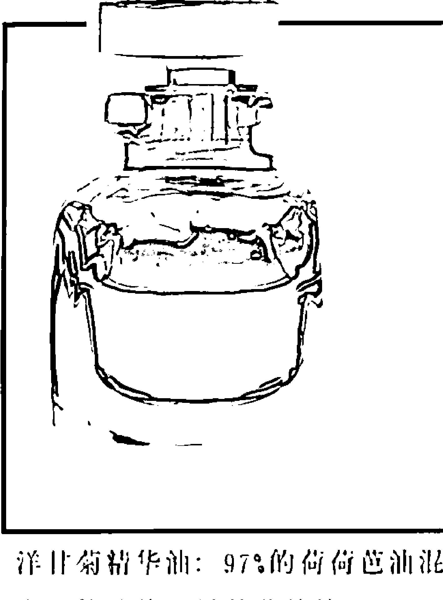

德国洋甘菊的外型很像罗马洋甘菊，不过德国洋甘菊比较小(约30厘米高)，花瓣较少、花心较小，除此之外，它还是一年生的植物。

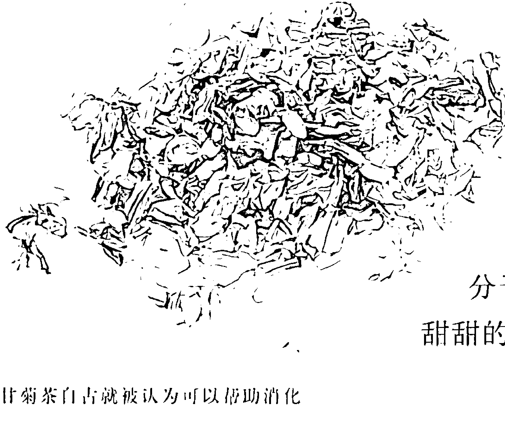

用蒸馏提炼蓝色品种的德国洋甘菊，其精油会呈现独特的深蓝色，近似蓝黑墨水，原因是在蒸馏过程中，把植物中的蓝色分子分解出来。闻起来也比罗马洋甘菊味道强烈，甜甜的如苹果味、还带点让人有醉意的清香味。

### 精油档案

**相配精油：**

- 佛手柑、黑胡椒、肉桂、快乐鼠尾草、芫荽、茴香、乳香、薰衣草、橙花、马丁香、玫瑰、迷迭香、花梨木

- **萃取：** 蒸馏自花朵，有苹果般的香味
- **特质：** 颜色较深、精油作用较强但较不刺激
- **属性：** 阴
- **挥发度：** 中板
- **化学成分：** 小茴香醛、天蓝烃
- **精油主产国：** 东欧、埃及、北美

由于德国洋甘菊也是属于萃取不易的花瓣精油，在台湾一瓶10ml售价至少要上万元，所以进口业者多半添加基础油调制成混合油出售，价格较易为大众接受。

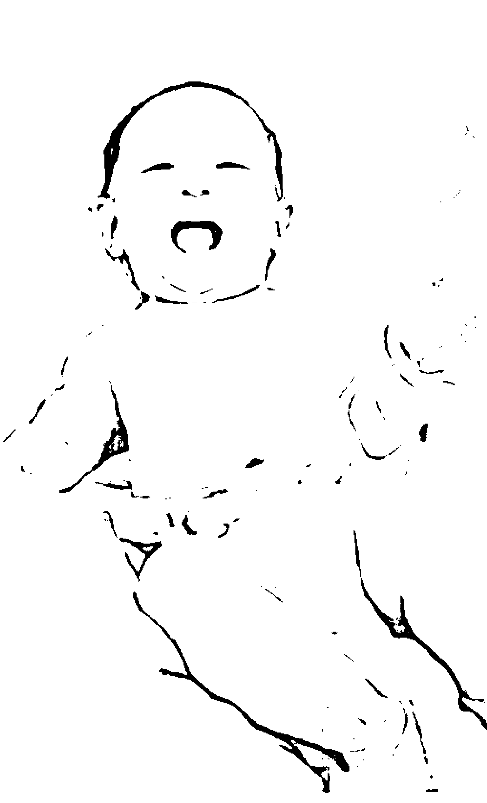

## 罗马洋甘菊
### Roman Chamomile

学名：黄春菊属 *Anthemis nobilis*
科名：菊科 *Compositae*

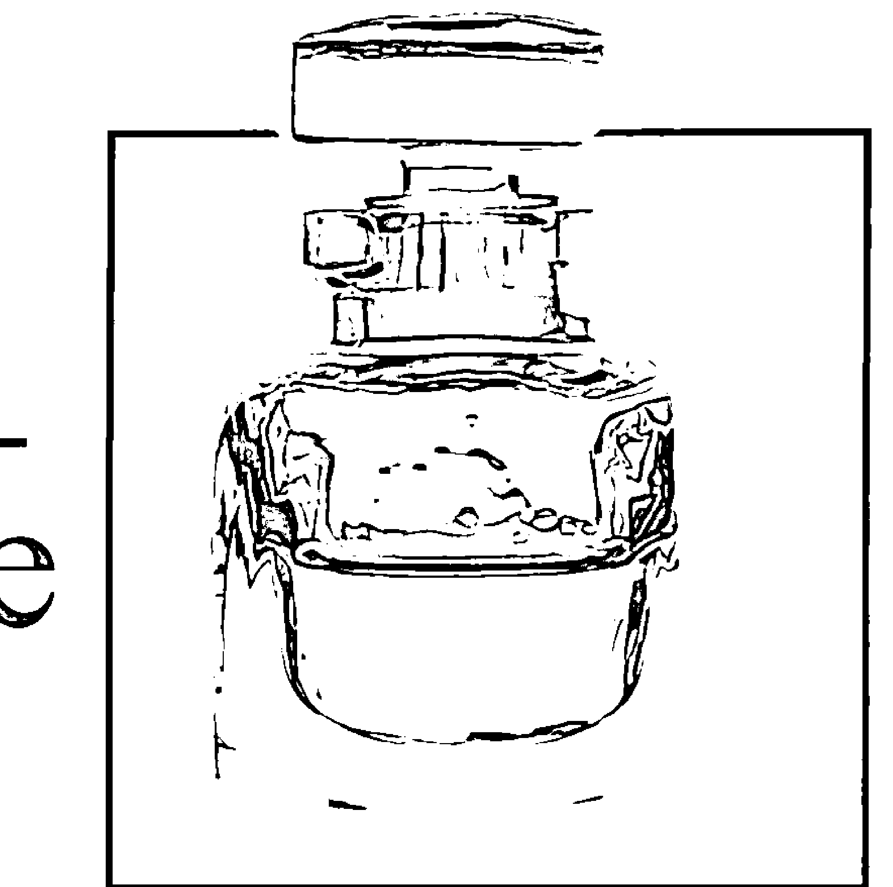

为多年生的植物，原分布在南欧到西欧，现在很多国家都看得到。花心为黄色、花瓣为白色，高度可以长到60厘米。蒸馏而成的精油颜色呈现黄色，带点甜甜的草本味。

### 精油档案

**萃取：** 蒸馏自花朵，有苹果般的香味
**特质：** 浅黄色
**属性：** 阴
**挥发度：** 中板
**化学成分：** 甲基酪胺酸、甲基丙烯酸、天蓝烃
**精油主产国：** 比利时、保加利亚、英国、法国、匈牙利、意大利

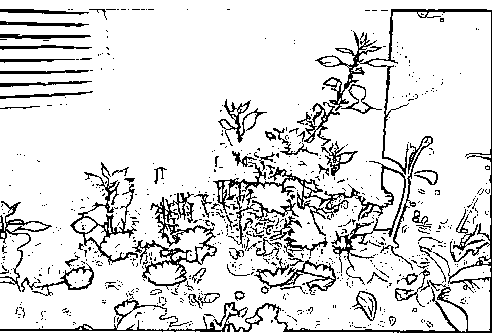

### 相配精油：

- 佛手柑、快乐鼠尾草、茉莉、玫瑰、天竺葵、薰衣草

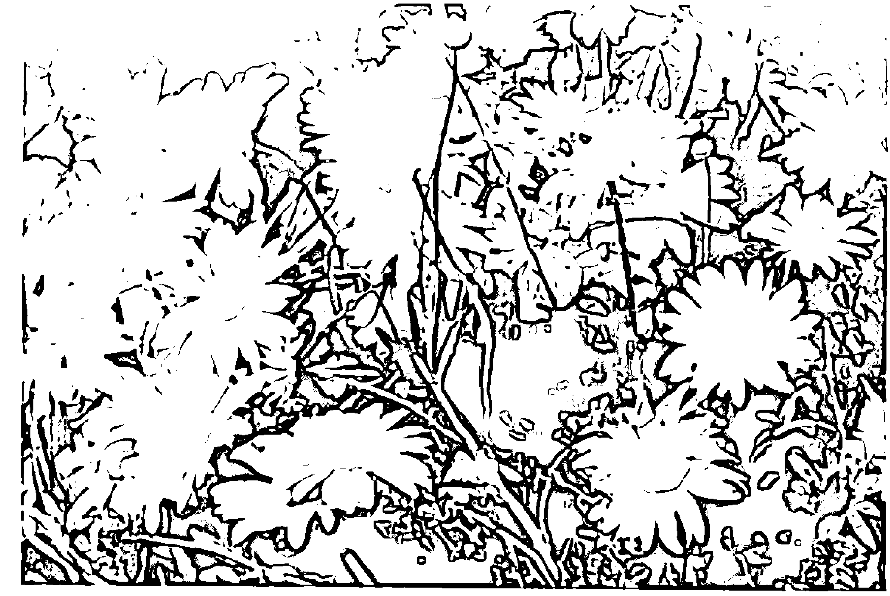

**注意：**
通经，所以怀孕前4个月勿用。勿高浓度使用。伤口红肿应冷敷使用。勿与艾草类精油弄混（色泽相同）。

### 使用与配方USE & RECIPE

1. 神经系统：治疗疼痛效果不错，如偏头痛、耳痛、牙痛；或是歇斯底里症状。
头痛／按摩：小麦胚芽油4ml＋葡萄籽油16ml＋德国洋甘菊5滴＋薰衣草3滴＋玫瑰2滴

2. 消化系统：对治疗胃胀气、排泄有不错的功效，胃溃疡、腹痛腹泻都可以用。
胃胀气／按摩：甜杏仁油10ml＋杏桃仁油10ml＋德国洋甘菊5滴＋姜3滴＋豆蔻2滴

3. 肌肉系统：肌肉酸痛到喉咙痛都可以用。
肌肉痛/按摩：甜杏仁油16ml＋小麦胚芽油4ml＋罗马洋甘菊5滴＋薰衣草3滴＋马郁兰2滴

4. 骨骼系统：关节炎、肌腱扭伤、关节肿痛，是良好的关节按摩精油。
关节炎／按摩：小麦胚芽油5ml＋金丝桃油5ml＋甜杏仁油40ml＋德国洋甘菊10滴＋杜松子7滴＋迷迭香8滴

5. 泌尿系统：解除泌尿结石，洗澡时滴几滴洋甘菊精油，除了对膀胱发炎有效外，也可以预防肾结石。
膀胱发炎／盆浴：德国洋甘菊6滴＋杜松子2滴＋檀香1滴

6. 生殖系统：通经剂，对经血过少、经期疼痛、月经不规则、子宫出血、阴道炎、阴部搔痒的妇女病都有用。
按摩：甜杏仁油10ml＋杏桃仁油10ml＋德国洋甘菊5滴＋玫瑰3滴＋天竺葵2滴

7. 皮肤：对干性、敏感皮肤极好。对治疗面疱、疱疹、湿疹、癣、微血管破裂有不错的功效；同样的可以用来保护脸部最敏感的眼皮肌肤，拿来做眼霜也不错。它可说是皮肤最佳精油之一。
脸部抹擦：95芦荟胶50ml＋德国洋甘菊5滴＋薰衣草3滴＋乳香2滴

8. 情绪：有安抚作用，失眠、紧张以及忧郁不安，可以舒解焦虑，让人感到天下太平。
薰香：罗马洋甘菊4滴＋橙3滴＋雪松2滴

9. 婴儿：它温和的特质，最适合让婴儿使用；若要帮婴儿按摩，温和的洋甘菊精油是首选。
按摩：甜杏仁油20ml＋德国洋甘菊3滴＋薰衣草1滴＋橘子1滴

花香类

## 天竺葵
### Rose Geranium

学名：天竺葵属 *Pelargonium graveolens*
科名：牻牛儿科 *Geraniaceae*

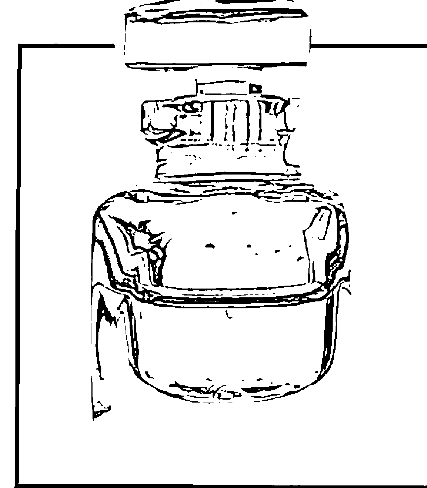

### 概说：

天竺葵虽有“天竺”之称，不过它并非来自印度，而是原产于非洲。在南欧经常见篱笆外种约30厘米高锯齿状叶子的植物，它会开小红花。天竺葵种类繁多，有700多种，不过能提炼精油的天竺葵只种在地中海沿岸的南欧以及北非，尤其是西印度洋的留尼旺岛。

萃取天竺葵精油的植物是一种称为“Pelargoniums”的天竺葵属植物，而非一般常见的“Geranium”（天竺葵）。用来提炼天竺葵精油的植物以“玫瑰香天竺葵”(P. graveolens)以及“Pelargoniums radens”与“P. capitatum”两个种系的混种为主。

### 精油档案

- 萃取：采集花及叶的部分蒸馏而成
- 特质：精油无色或呈淡绿色、气味甜而略重，有点像玫瑰，又稍稍像薄荷，所以常被用来假冒玫瑰精油，也常被用于制造女性香水的中味
- 挥发性：中板
- 主要成分：牻牛儿酸、牻牛儿醇、香茅醇、松油醇、柠檬醛、薄荷酮、丁香酚、椪烯。
- 属性：阴性
- 主产地：法国、留尼旺岛、西班牙、摩洛哥、埃及、意大利

天竺葵的叶子含有丰富的精油，会散发出一种特殊味道，东方人嫌它刺鼻，避之惟恐不及，而西方人却认为是香味，还拿来做香水的原料。最近育种学家利用遗传工程的新科技，把香茅的基因转移入天竺葵细胞内，“制造”出一种新植物叫做“防蚊树”，它的气味据说有很好的驱蚊效果。

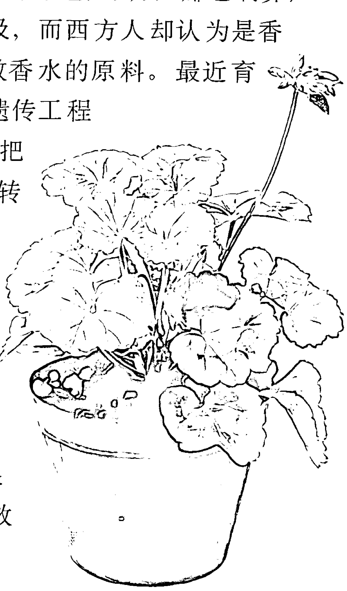

### 历史：

早在19世纪，法国人就做起天竺葵的精油生意，但今日大多数的精油都产自留尼旺岛，这个岛屿位于西南印度洋上，原本叫波旁岛。最早被使用的品种应该是P.capitatum，这种天竺葵长得比台湾常见的天竺葵较小，但精油含量甚高，直到今天还有人使用野生的品种。本世纪初期，摩洛哥开始大量生产天竺葵精油。它的香味经常被用于香水和肥皂中，或是假冒大多数的香料。

早期欧洲人常以天竺葵治疗伤口或驱虫，因此才会成为住家周围的观赏植物之一。在草药经典中也曾记载，它是治疗骨折的植物之一，可见它收缩伤口的效果不错，甚至有纪录谈到它使肿瘤消失的能力。

### 使用与配方 USE & RECIPE

1. 消化系统：可净化黏膜组织，特别是消化系统的黏膜，对胃炎和结肠炎也有所帮助。
2. 泌尿系统：具有利尿的特性，可帮助肝、肾排毒，所以也能帮助上瘾者戒除烟瘾、酒瘾。还可处理黄疸、肾结石和胆结石，以及糖尿病与泌尿道感染。改善水分滞留症状及肿胀的足踝。
   防泌尿道感染/盆浴：天竺葵3滴+杜松子2滴+佛手柑3滴
3. 内分泌系统：刺激淋巴系统以避免感染，排除废物，它也能强化循环系统，使循环更通畅。对喉部及唇部的感染有疗效，并能安抚神经痛。
   按摩：甜杏仁油20ml+天竺葵5滴+檀香3滴+快乐鼠尾草2滴
4. 生殖系统：它有调节荷尔蒙的功能，是很具平衡性的精油，因此对经前症候群、更年期问题有用，改善乳房的充血及发炎、胀痛。
   产后乳房胀痛/按摩：杏桃仁油20ml+天竺葵5滴+橙花2滴+薰衣草3滴
5. 皮肤：平衡皮脂分泌，对松垮、毛孔阻塞及油性皮肤也很好；堪称一种全面性的洁肤油。由于天竺葵能促进血液循环，使用后会让苍白的皮肤较红润有活力。
   油性皮肤/抹擦：乳液50ml+天竺葵4滴+玫瑰3滴+佛手柑2滴
6. 情绪：抚平焦虑、沮丧，还能提振情绪，让心理恢复平衡。由于它也能影响肾上腺皮质，因此能舒解压力。
   舒压/薰香：天竺葵3滴+葡萄柚3滴+伊兰伊兰2滴

相配精油：罗勒、佛手柑、雪松、肉桂、快乐鼠尾草、茉莉、薰衣草、柠檬、橙花、玫瑰、迷迭香、檀香

注意：可能刺激敏感皮肤，避免使用纯剂在皮肤上。能调节荷尔蒙，怀孕期间避用。

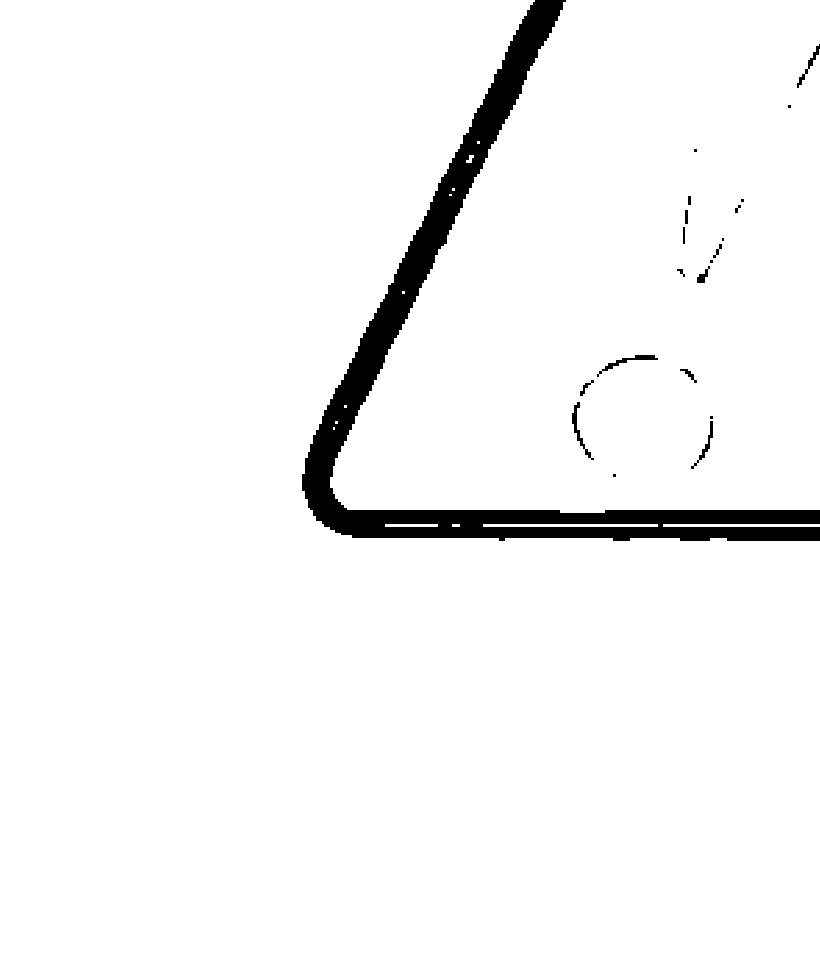

植物分布：世界各地不会降霜的地方：从中国、俄罗斯到非洲、埃及、摩洛哥、地中海区域。

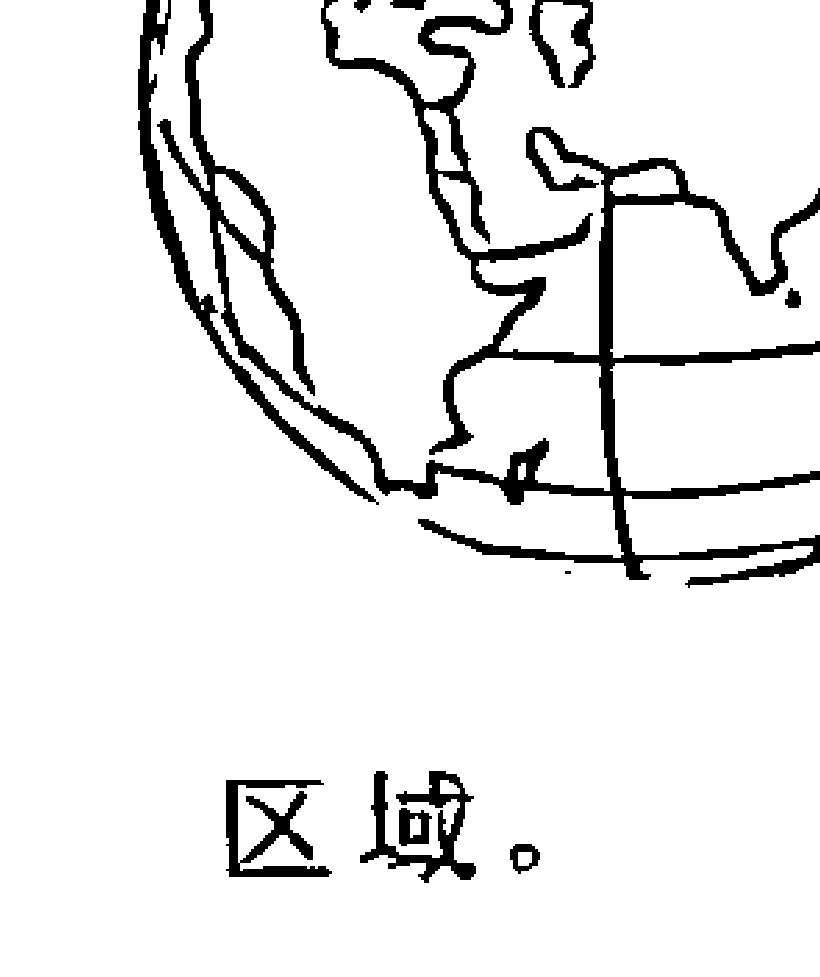

花香类
FIORO

## 茉莉 Jasmine

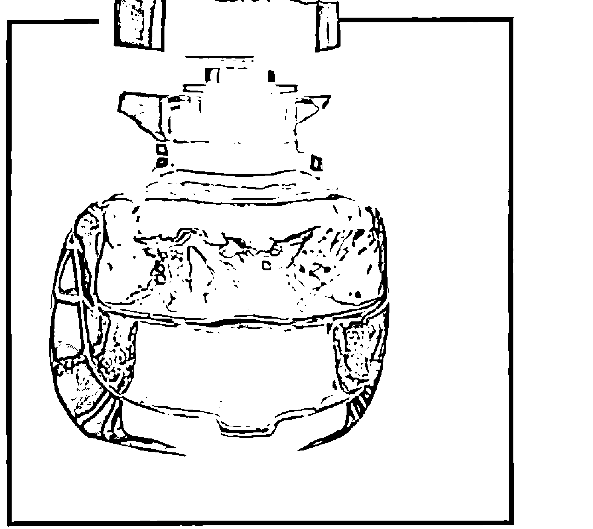

学名：茉莉属 *Jasminum grandiflorum / officinalis*
科名：木犀科 *Oleaceae*

### 概说：

它有“精油之王”的称号，有三百多个品种，主要有两种类型，常绿灌木或爬藤植物；花朵有白色或黄色，通常是管状白花，结成圆锥花絮。

茉莉花是制作香水重要的凝香剂，但是生产过程非常麻烦，因为茉莉花化学分子在夜间分泌特别旺盛，必须在夜间摘采花朵，让收集下来的花朵释放精油数日；萃取过程也非常繁复，先在橄榄油中浸泡数日，再以酒精萃取橄榄油，留下茉莉精油，当然也有以酒精直接萃取的精油，但是品质不佳，没有真正的疗效。

### 精油档案

- 萃取：脂吸法或以溶剂萃取花瓣
- 特质：色深，具黏性气味，非常浓郁的一种异国情调
- 挥发性：中板至慢板
- 主要成分：茉莉花酮、苯甲醇、苯甲酸、吲哚、沉香醇
- 属性：阳（稀释时偏阴）
- 主产地：北非的埃及、阿尔及利亚、摩洛哥，以及欧洲地中海沿岸的意大利、法国、西班牙

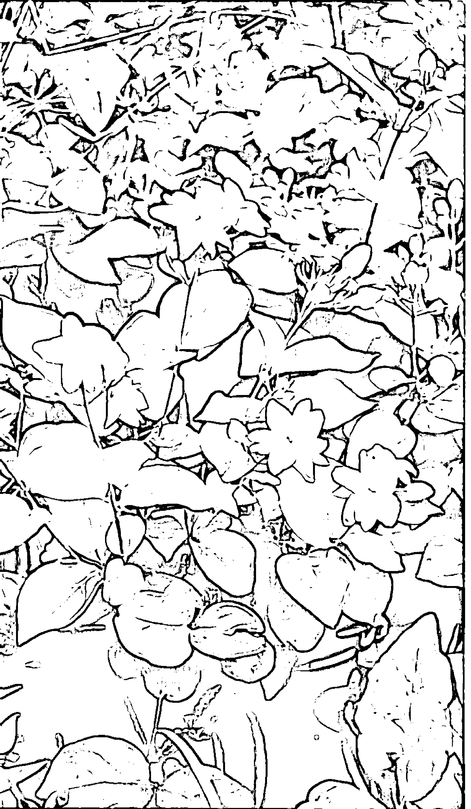

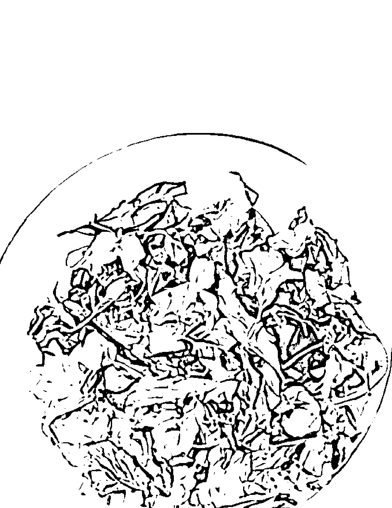

### 历史：

在中国最有名的茉莉花茶，取其香味广为饮茶者所好；在印度有“树丛月光”之称，因为它在夜晚气味特别浓郁，香气袭人，印度人是最早拿茉莉来做油膏、在祭典仪式中作薰香的。

茉莉的英文名称则来自阿拉伯文的yesmin，土耳其的茉莉为爬藤状，常被拿来当绳索。

大约800万朵茉莉花才能提炼出1公斤精油，所以它的价格和同属花瓣精油的玫瑰花、洋甘菊、橙花，都属于较贵的精油。在台湾，一瓶10ml的茉莉花纯精油就人民币3750元左右。

**相配精油：**
佛手柑、乳香、天竺葵、橙花、甜橙、马丁香、迷迭香、花梨木、檀香

### 使用与配方  USE & RECIPE

1. 生殖系统：是女性的最佳精油，减轻女性经痛、舒缓子宫痉挛；在生产时，是最佳精油，能强化子宫收缩，加速生产，尤其对平缓生产阵痛，效果显著。以茉莉精油按摩下腹部或腰部，有舒缓阵痛功能。在产后也可以用它来减轻产后忧郁症。在男性方面，可以改善前列腺肥大症以及增强性功能，增加精子数，适用于男性不孕、阳痿、早泄。
助产、止生产阵痛／生产阵痛／按摩：甜杏仁油40ml＋小麦胚芽油10ml＋茉莉3滴＋薰衣草3滴＋杜松子2滴

2. 皮肤：是护肤良方，对干燥、缺水、过油以及敏感的肌肤、湿疹、发炎具调理作用。它也适合所有类型肌肤，因为具有消炎、镇定效果，在淡化疤痕与妊娠纹上，也声誉卓著。
护肤／乳液：乳胶50ml＋茉莉3滴＋薰衣草4滴＋罗马洋甘菊4滴

3. 情绪：它是阳性温暖的精油，可以增加爱欲及性感；低剂量使用可帮助睡眠。使人精神愉快，忘记烦恼，可以驱逐忧郁、沮丧、安抚神经、产生正面的感受，有助于恢复精力。
安抚神经／薰香：茉莉3滴＋甜橙3滴＋檀香2滴

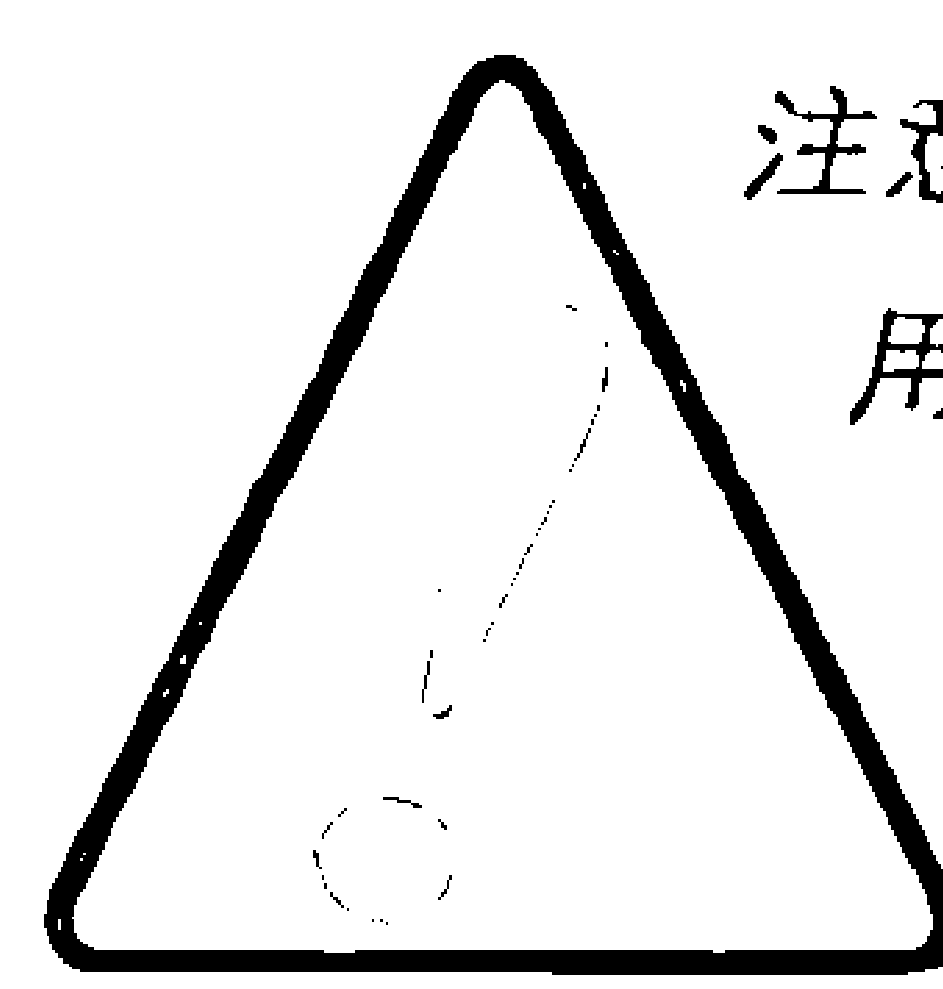

注意：剂量太高会让人感到沉重、使用剂量必须非常低，如0.25%即足，否则会干扰注意力。除此，妊娠期避免使用，只能在催生时协助生产。过度使用会干扰体液。高敏感肌肤避免使用。

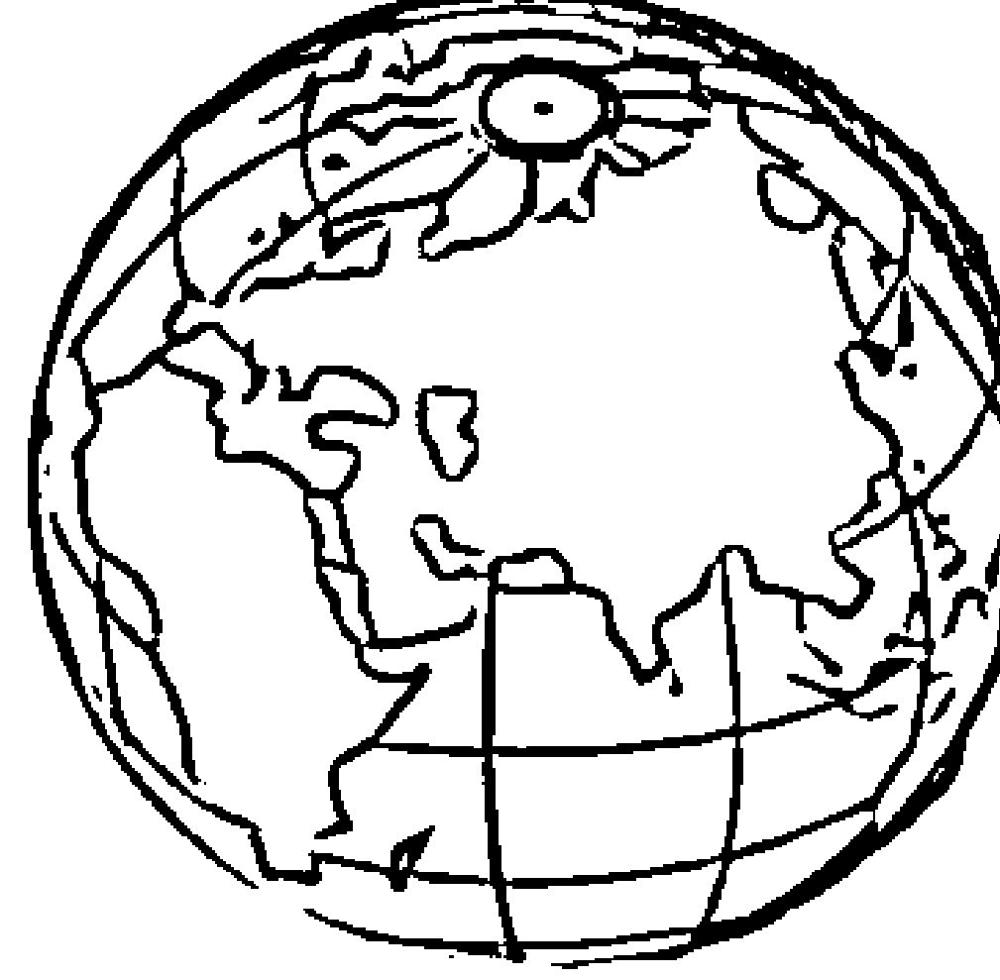

植物分布：
原产于印度、中国以及西亚的土耳其、伊朗一带；传至欧洲后在地中海沿岸的法国、西班牙适应最好，蔓延于北非一带，在埃及繁殖最快且品质最好。

## 薰衣草 Lavender

- 学名：薰衣草属 *Lavandula officinalis*
- 科名：唇形科 Labiatae

### 概说：

薰衣草主要分为5大类、28个品种，颜色由白色、紫色至蓝色都有。这种约1米高，茎干细长、叶片细小狭长有灰色绒毛的植物，花朵为穗状灰蓝色形成花串，是精油的主要萃取部位；但整株薰衣草都有油脂腺分布，所以不论是搓揉茎干还是叶子，都会有淡淡的香气跑出来，味道很容易被一般人接受。

薰衣草精油是最为广泛使用的精油，也是少数能直接涂抹于皮肤上的精油之一。建议刚开始使用精油的人，可以从薰衣草精油开始下手。

由于品种非常多，并且不断有新的野生种出现，购买精油时要特别注意是哪一种薰衣草精油。最纯粹、能在医疗上使用的只有Lavandula officinalis，即所谓的真正薰衣草或药用薰衣草。在工业上拿来当成香料添加剂多是“醒目薰衣草”(Lavandin)，它是薰衣草与穗花薰衣草的混生种，是很好的芳香剂。另外常见的“穗花薰衣草”(Lavender spike)，也被广泛用在香皂、洗发精等清洁用品上。还有特别要注意的是“头状薰衣草”(Lavender stoechas)，具强烈毒性，含有大量的酮，不宜自行使用。

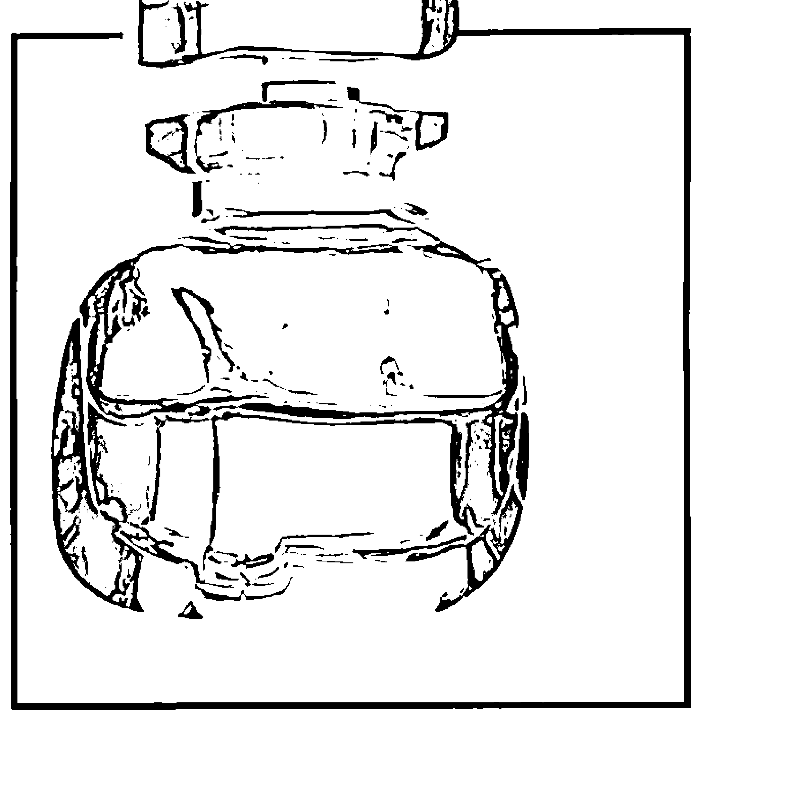

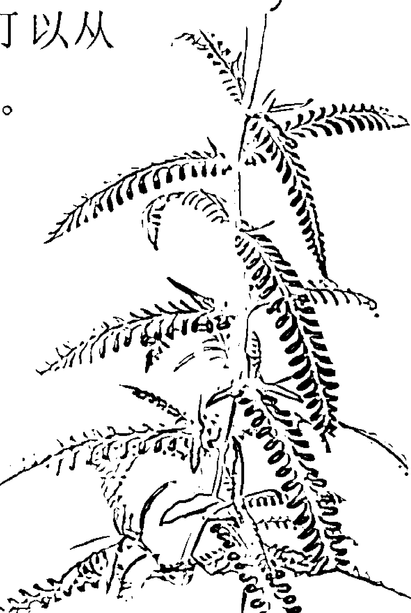

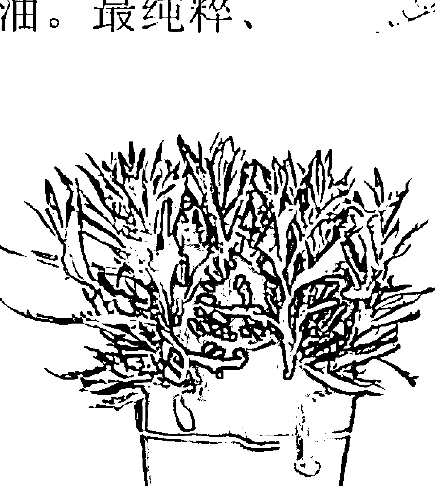

精油用的薰衣草适合栽种在高山上。

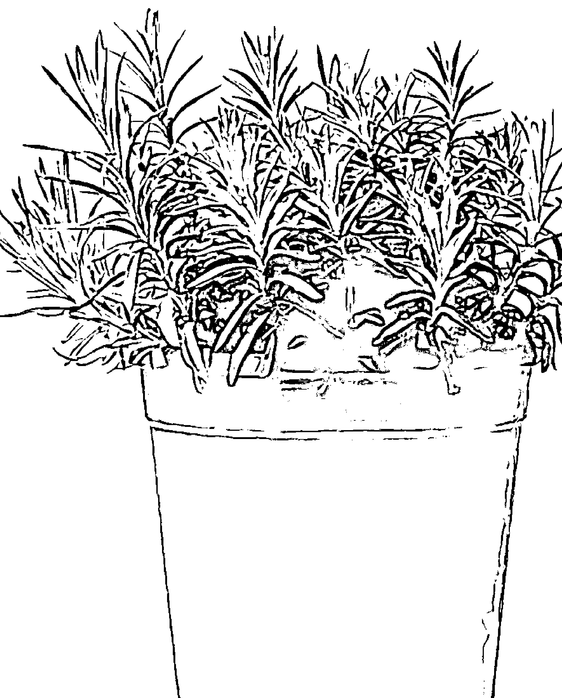

狭叶薰衣草俗称英国薰衣草(English Lavender)。所萃取出的薰衣草精油香味被视为最上品，多用在医疗上。

### 历史：

我们现在熟悉的薰衣草(Lavender)，在18世纪时，一直被称为“espic”，而在香草之乡普罗旺斯，薰衣草则被昵称为“epi”。Lavender一字源于拉丁文的“Lavare”，有洗净的意思。众所周知罗马人喜欢沐浴泡澡，它就是罗马人喜欢的泡澡香草植物之一。传至英国之后，英国名媛淑女喜欢用薰衣草来薰香、做香包。

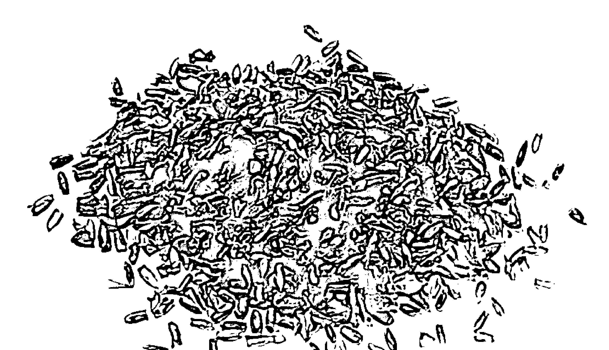

撷取薰衣草的花，可以泡茶饮用，有缓和头痛并镇静神经的作用。

薰衣草精油最有名的故事就是法国香水城的化学家盖提佛斯(Gattefosse)，在一次实验中不慎被烧伤，紧急将手浸泡在薰衣草水中，发现伤口迅速痊愈，这种神奇的疗效，引发了他钻研薰衣草功能的兴趣，并出版第一本“芳香疗法”(Aromatherapy)专书。在第一次大战期间，欧洲的一些军医如Dr. Jean Valet以薰衣草来治士兵的伤口。

### 精油档案

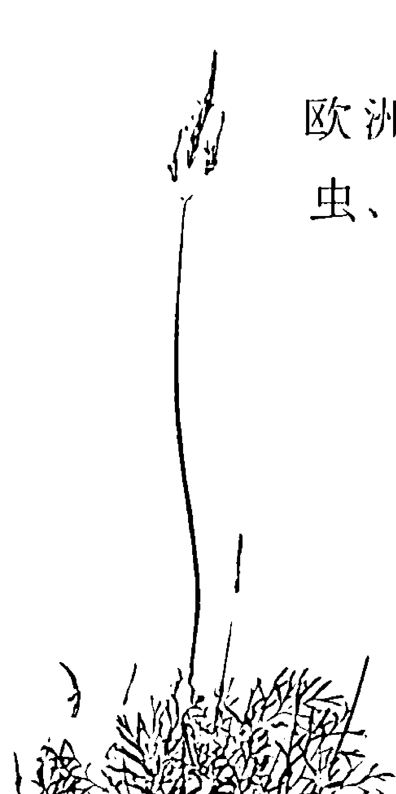

| 项目 | 描述 |
| :--- | :--- |
| 萃取 | 蒸馏自花朵 |
| 特质 | 黄色或黄绿色，非常清新的香味，会带一些些苦味 |
| 挥发性 | 中板到快板 |
| 主要成分 | 龙脑、牻牛儿醇、牻牛儿酯、薰衣草醇、薰衣草酯、沉香醇、柠檬烯、丁香油烃、香豆素、松油萜。它的成分非常多且复杂，也是薰衣草能跟大部分精油融合且使用在各种配方的原因之一。 |
| 属性 | 中性（阴偏阳） |
| 主产地 | 法国普罗旺斯、英国诺福克、塔斯马尼亚岛、欧洲3000米高的山上产的薰衣草，品质最佳。 |

更早之前，16世纪的欧洲人即用薰衣草来驱虫、杀虫，而莎士比亚的剧本中就曾经出现薰衣草，拿来当催情配方。

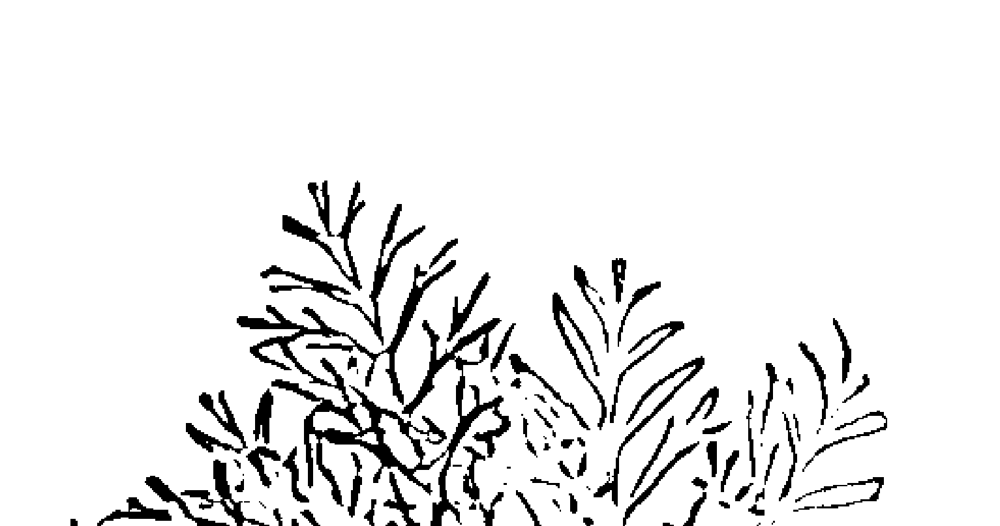

羽叶薰衣草(Pinnata)：在台湾是最受人喜爱的薰衣草品种，花期最长，在日本有个卡哇伊的名称——“蕾丝薰衣草”，一年四季都会开出淡粉色系的花串，唯独香味不作，属于“视觉系”的观赏薰衣草。

### 使用与配方 USE & RECIPE

1. 呼吸系统：抗痉挛的特质，对支气管炎、气喘、黏膜发炎，以及感冒喉咙发炎都有用。
蒸汽吸入：薰衣草2滴＋茶树2滴＋丝柏1滴

2. 神经系统：安抚激动情绪、改善失眠、偏头痛以及紧张恐慌和其他神经性的精神问题，如歇斯底里、颤抖、抽搐，甚至轻微癫痫都有效。
改善失眠／薰香：薰衣草3滴＋乳香3滴＋快乐鼠尾草3滴

3. 消化系统：帮助胃蠕动、刺激胆汁分泌；对反胃、呕吐、腹绞痛以及胃胀气等有效。
胃胀气／按摩：甜杏仁油20ml＋薰衣草6滴＋柠檬2滴＋欧薄荷2滴

4. 泌尿系统：抗炎特质，可以治疗膀胱炎以及尿道炎。
尿道感染／盆浴：薰衣草3滴＋檀香3滴＋杜松子2滴

5. 循环系统：刺激白血球增生、降高血压、心悸，以及对心脏问题等，都有镇静效果。
降血压／薰香：薰衣草3滴＋伊兰伊兰3滴＋甜橙2滴

6. 生殖系统：治疗经血量太少、经痛、白带问题及生产不适，舒缓产后疼痛。
经期疼痛／按摩：甜杏仁油20ml＋薰衣草4滴＋天竺葵3滴＋玫瑰3滴

7. 骨骼系统：对关节炎、关节痛有功效。
关节痛／按摩：甜杏仁油20ml＋薰衣草4滴＋迷迭香3滴＋德国洋甘菊3滴

8. 肌肉：止痛特性，舒缓肌肉痉挛、扭伤、肌肉疲累。
肌肉扭伤／按摩：甜杏仁油20ml＋薰衣草4滴＋迷迭香3滴＋马郁兰3滴

9. 皮肤：它的平衡特质，对任何状态的皮肤以及平衡皮脂分泌都有用；所以面疱、晒伤、湿疹、干癣、发脓、疤痕均可使用。
当护发剂，对秃头有些帮助。
湿疹／抹擦：乳液50ml＋薰衣草6滴＋德国洋甘菊2滴＋佛手柑2滴

醒目薰衣草(Lavandin)常混充薰衣草售卖，因为醒目薰衣草的生产成本较低。若不小心使用到醒目薰衣草，则药效全无。醒目薰衣草的价格是薰衣草的三分之一。

### 使用与配方 USE & RECIPE

10. 情绪：有镇静的特质，能净化、安抚心灵，减轻愤怒情绪；平衡中枢神经，让人保持平静，消除头痛、神经紧张、忧虑。
压力／熏香：薰衣草3滴＋橙花3滴＋回青橙2滴

11. 在清洁上可当杀虫剂，驱走蚊虫。还能消毒咬伤，以及净化空气。
薰衣草也是婴幼儿可以使用的精油之一，因为它的温和，是除了洋甘菊之外最适合婴儿使用的精油。诸如，舒缓腹痛、胃胀气、过敏、感染或者帮助睡眠。

### 相配精油：

- 洋甘菊、肉桂、快乐鼠尾草、天竺葵、茉莉、迷迭香、花梨木、柠檬、柠檬草、绿花白千层、广藿香、欧薄荷、百里香

> 注意：
低血压的人用了薰衣草精油后，会发生呆滞的现象。它也是通经药，所以避免在怀孕初期使用。

> 植物分布：
欧洲各地都可以看到薰衣草的踪影，尤其是西欧、南欧以及地中海沿岸，几乎遍布薰衣草。

## 玫瑰 Rose

学名：蔷薇属 *Rosa damascena*
科名：蔷薇科 *Rosaceae*

### 概说：

21世纪的玫瑰大概有上千种，几乎每年的世界玫瑰大展都会有新的品种出现，从人类对它的关注来看，玫瑰堪称花中之后无愧。

它原产于东方，最原始的品种含野生种就有250种之多，萃取精油的玫瑰称“香味玫瑰”，主要有四种：

-   ◎ 原产于法国的“红玫瑰”（R. Gallica），又称“法国玫瑰”、“普罗茵玫瑰”（Provins Rose），是大部分混种玫瑰的始祖。
-   ◎ 原产于法国的“百叶玫瑰”（R. Centifolia，也翻成五月玫瑰），又称“普罗旺斯玫瑰”（Provence Rose）、“伊斯帕罕玫瑰”（Ispahan Rose）或“摩洛哥玫瑰”（Morocco Rose），为红玫瑰的子代，所萃取的玫瑰精油，香气较浓郁。现在主产地在摩洛哥。
-   ◎ 原产于保加利亚、土耳其的“大马士革玫瑰”（R. Damascena），又称土耳其玫瑰、保加利亚玫瑰，这种玫瑰萃取的精油香气甜蜜。
-   ◎ “波旁玫瑰”（R. Bourbonica）它是“红玫瑰”与“中国玫瑰”（R. Chinensis，原生于中国四川一带，现在以印度跟阿拉伯国家产量最大）的混种，主产于印度。

无论是哪一个品种的玫瑰，都以在大马士革玫瑰萃取的精油为最贵，又有“保加利亚奥图玫瑰精油”(Bulgarian Rose Otto) 之称；1904年，保加利亚地区发明了一种溶剂萃取大马士革玫瑰精油，这种萃取法后来成为最普遍的萃取玫瑰精油的方法。在此之前，土耳其人以蒸馏大马士革玫瑰为主要生产方式，因此至今土耳其境内仍有许多玫瑰精油蒸馏厂。

由于保加利亚的萃取技术好，在巴尔干半岛地区，400米高的山区栽种了全世界品质最好的大马士革玫瑰；当然目前土耳其以及摩洛哥还有生产大马士革玫瑰精油。

在玫瑰栽植区，5月时节玫瑰盛开时，摘采工人会在午夜时分，以非常迅速的动作将一朵朵玫瑰摘下，在玫瑰园旁边的萃取工厂，将新鲜的花瓣放在蒸馏锅内，开始萃取精油的程序；要盛满萃取出来的玫瑰膏，需要24小时，且工人半步不能离开蒸馏锅，可说是耗时耗力的工作。

这么详细介绍玫瑰的品种，主要是因为它萃取不易，萃取1公斤的玫瑰精油，需要3000~5000公斤的玫瑰，因此购买时一定要注意它的产地、学名、价格，以免买到添加天竺葵或其他具有玫瑰气味的不纯品。

玫瑰精华油结合97%的荷荷芭基础油、以及3%成分的玫瑰精油

干燥的玫瑰花可以入茶用，具有养颜、活络全身血脉、预防便秘的功效。

### 精油档案

-   萃取：水蒸馏法；玫瑰花瓣之外，雄蕊也含有一些油脂，可与花瓣一起萃取。
-   特质：淡淡的黄绿色，芳香扑鼻。在低温下(摄氏15度至18度)，精油表面会形成一层薄薄闪亮的玫瑰蜡结晶；手温即可恢复正常。
-   挥发性：中板至慢板
-   主要成分：香茅醇、牻牛儿醇、橙花醇、苯乙醇、倍半萜环状醇。
-   属性：阴
-   主产地：摩洛哥、土耳其、法国、保加利亚

### 相配精油：

佛手柑、洋甘菊、豆蔻、雪松、肉桂、快乐鼠尾草、乳香、天竺葵、茉莉、薰衣草、柠檬、香蜂草、橙花、甜橙、马丁香、广藿香、花梨木、檀香

### 历史：

玫瑰在各个古文明国家，都有非常丰富浪漫的传说，在栽种以及使用上也有详尽的记载。阿拉伯人说玫瑰是穆罕默德眉尖上滴下的汗珠，希腊神话中，爱神丘比特以玫瑰贿赂沉默之神，要他透露维纳斯的恋情，所以玫瑰成为“沉默的象征”，因此西方人餐桌上方的天花板通常会雕饰玫瑰，表示“守口如瓶”。

在中国历史上，最引人注目的恐怕是北宋时期，赵家王朝为了取得玫瑰膏，曾派间谍到北方契丹人的宫廷中，只为了窃取契丹人进贡的玫瑰膏。

古罗马人与希腊人更不用说，大作家荷马在《伊里亚特》与《奥德赛》中都大大地赞美了玫瑰一番；罗马人在筵席时，遍撒玫瑰以示欢迎以及防醉酒。埃及艳后跟玫瑰的故事，更是说不完，在埃及木乃伊中最华丽的装饰就是玫瑰；更不用说西方古文明国家都有以玫瑰来祭祀的传统了。

玫瑰最负盛名的传说恐怕是波斯人的豪华婚礼了。征服波斯的蒙古皇帝，为了讨波斯公主的欢心，将环绕皇宫的花园渠道撒满玫瑰花瓣，也因为这样，在太阳底下蒸发的水面上，浮了一层油质；波斯人才发现玫瑰精油的妙处，玫瑰精油从这个时候开始量产。

阿拉伯地区的人喜爱玫瑰还不止于此，阿拉伯医生阿维西纳(Avicenna)，于公元九百多年在进行炼丹时，发现了蒸馏玫瑰所得到的玫瑰露对人体有无比的妙处，从那时起玫瑰露就是阿拉伯人常用的保养品。

在欧陆，中世纪的修道院即以栽植、培育玫瑰而闻名，闻名遐迩的玫瑰战争，更是以红玫瑰、白玫瑰为家族标志；在法国自法国大革命起，玫瑰露就是法国人主要的收入来源。

自古玫瑰就被拿来当做制作香水原料之一。

### 使用与配方 USE & RECIPE

-   1. **呼吸系统**：在呼吸道的感染上，能明显地减轻喉咙痛、咳嗽症状以及鼻窦炎。
    **吸入**：玫瑰2滴 + 薰衣草2滴 + 丝柏2滴
-   2. **神经系统**：神经性的厌食症或是神经性的紧张、歇斯底里都有舒缓效果。这也是婚礼中撒玫瑰花瓣的作用之一，其甚至对性交焦虑都有效。
    **舒缓薰香**：玫瑰3滴 + 甜橙3滴 + 乳香2滴
-   3. **消化系统**：由于它有抗菌和轻泻的功能，所以能净化消化道，也能改善晕眩、反胃、呕吐和便秘。
    **消化 / 按摩**：甜杏仁油16ml + 酪梨油4ml + 玫瑰5滴 + 橘子3滴 + 欧薄荷2滴
-   4. **循环系统**：对心脏颇有助益，能活化停滞的血液循环，降低心脏的充血现象，强化微血管。能清除毒素及酒精过度造成的肝充血，因此可以改善黄疸。
    **活络循环 / 泡澡**：玫瑰3滴 + 迷迭香3滴 + 天竺葵2滴
-   5. **生殖系统**：是不错的荷尔蒙补充剂，解除经前紧张，促进阴道分泌，调节月经周期。对不孕症有益，男性亦然，因为它能增进精子的数量。对性方面的困难也有帮助，尤其是性冷感与性无能。
    **调节月经周期 / 按摩**：荷荷芭油20ml + 玫瑰5滴 + 天竺葵3滴 + 快乐鼠尾草2滴
-   6. **皮肤**：适用于所有的皮肤，特别有益于成熟、干燥、硬化或敏感的皮肤。其紧实、舒缓的特性，对发炎现象很有帮助，由于它能收缩微血管，所以是治疗微血管松弛的神奇之宝。纯玫瑰精油对抗皱、消肿、修复微血管弹性疲乏也有意想不到的效果，甚至对某些神经性湿疹也有效。保加利亚玫瑰精油去黑斑的能力，也颇受称颂。
    **护肤 / 抹擦**：乳液50ml + 玫瑰4滴 + 薰衣草4滴 + 红柑3滴
-   7. **情绪**：可平抚沮丧、哀伤、嫉妒和憎恶的情绪，有助于提振精神，舒缓神经紧张和压力。是极女性化的精油，能使女性对自我产生积极正面的感受。帮助睡眠，改善失眠、头痛。
    **平抚心情 / 薰香**：玫瑰3滴 + 橘子3滴 + 马丁香2滴

**注意**：
提炼1公斤的精油需要3000 - 5000公斤的玫瑰，因此精油的价格居高不下，仿冒与不纯的精油充斥。以价格判断，若为药用，务必选购最佳的保加利亚玫瑰精油。玫瑰是通经药，避免在怀孕期间使用。

**植物分布**：遍布全世界。

## # 罗勒 Basil

学名：罗勒属 *Ocimum basilicum*
科名：唇形科 *Labiatae*

## ## 概说：

它有一百多个品种、颜色、大小、形状、味道各异，甚至可以说差异很大；光说气味就有柠檬香、丁香、艾草等不同的味道。但几乎都长到四十公分高，开白色或紫色小花，在茎上呈螺旋形排列；虽然叶子大小不一，但几乎都有细毛附在上面，捣碎后香味浓郁逼人。“罗勒”名称一般人不见得知道，但如果讲“九层塔”的俗名，大家就知道了。

罗勒被称为“香草之王”，也是高产值的香草香料。但台湾所种植的九层塔风味及品种与欧洲系列有很大不同，当然也不是提炼精油的主要来源。常见欧洲属九层塔有甜罗勒(Sweet basil)、紫叶罗勒(Dark opal basil )、柠檬罗勒(Lemon basil)、荷力罗勒(Holy basil)、肉桂罗勒(Cinnamon basil)等。其中甜罗勒之叶片大且其香味柔和带甜味，是意大利料理不可缺的香料。紫叶罗勒带有花香且叶色紫艳，常作生菜沙拉加味及装饰之用。欧洲罗勒适合本地早春初夏气候，栽培容易与本地种相似，亦可采用水耕种植。

## ## 精油档案

-   萃取部位：花朵及叶子，用蒸馏而成
-   精油特质：黄绿色，味道清新、甜雅怡人，尝起来辛辣有点苦味，气味具刺激性
-   挥发性：快板
-   主要成分：甲基对苯烯基酚、芫荽油醇、龙脑、樟脑、丁香酚、桉油酚、松油萜
-   属性：阳
-   主产地：东欧、南斯拉夫、法国、意大利、美国、马达加斯加

## ## 历史：

东方的古文明国家对罗勒的研究与运用已有一千多年的时间，在中国甚至拿它来入药，治疗癫痫。

在印度，除了祭祀时拿来敬供两位天神，将罗勒视为神圣的植物之外。罗勒也经常被运用在医疗中，印度的阿输吠陀医疗法中就有记载它的使用经验。

罗勒的英文名字是希腊文“basilicon”有“皇家”的意思，有一说它是国王在祭典时净身所涂抹的圣油，可见得非常高贵，至今希腊的教堂中仍然见牧师使用罗勒。

在欧洲，法国人自十六世纪即开始蒸馏罗勒精油；第二次大战时，许多植物取之不易，人们也开始以罗勒来制作香水。

### 相配精油：

佛手柑、黑胡椒、豆蔻、肉桂、快乐鼠尾草、丁香、芫荽、天竺葵、柠檬、橘子、马郁兰、橙花、回青橙、檀香

台湾品种的罗勒，是园艺中常见的香草植物，除了观赏用，也常用来入菜烹调用。

## ## 使用与配方 USE & RECIPE

1. 呼吸系统：治疗咳嗽感冒，对鼻塞有帮助；以吸入方式治疗头痛、偏头痛，对各种胸腔、呼吸道感染都有不错的效果，如支气管炎、发烧。
**感冒鼻塞／蒸汽吸入**：罗勒2滴＋松2滴＋安息香1滴

2. 神经系统：有强化作用，像神经疲劳、神经性失眠、心力交瘁时可以舒缓压力。
**舒缓／薰香**：罗勒4滴＋薰衣草3滴＋罗马洋甘菊2滴

3. 消化系统：它的抗菌作用可以用来清净肠胃、对呕吐、胃痉挛、恶心、打嗝以及消化不良都很好用。
**消化不良／按摩**：小麦胚芽油4ml＋甜杏仁油16ml＋罗勒5滴＋薄荷3滴＋罗马洋甘菊2滴

4. 生殖系统：它有刺激雌性荷尔蒙的作用，对经血过少、受孕困难有效，对产妇来说，可以治疗乳胀以及排除胞衣。
**按摩**：甜杏仁油16ml＋葡萄籽油4ml＋罗勒4滴＋薰衣草4滴＋茉莉2滴

5. 肌肉系统：降低尿酸作用，可以减轻痛风的肌肉疼痛，促进血液循环减轻肌肉痉挛。
**减轻肌肉痉挛／按摩**：酪梨油16ml＋小麦胚芽油4ml＋罗勒5滴＋马郁兰3滴＋迷迭香2滴

6. 皮肤：改善松垮、老化皮肤，清洁皮脂堵塞预防粉刺，滋养皮肤的功能不错。
**滋养皮肤／涂抹**：乳胶30ml＋罗勒5滴＋玫瑰4滴＋迷迭香2滴

7. 情绪：穿透力强，对振奋情绪的效果顽强，法国有一种催情酒即添加罗勒造酒，对忧郁、精神萎靡颇有效。
**忧郁／薰香**：罗勒4滴＋柠檬4滴＋杜松子2滴

8. 对清洁环境、驱虫，像蚊子、蝎子都有效。

**注意**：
怀孕期间请勿使用：勿泡澡过度刺激皮肤。

**植物分布**：
目前最好的罗勒产地是欧洲地中海沿岸，此外，东非、亚洲太平洋群岛也有生产。

## # 快乐鼠尾草 Clary Sage

学名：洋苏草属 *Salvia sclarea*
科名：唇形科 *Labiatae*

## ### 概说：

鼠尾草(Salvia officinalis)的种类非常多，大部分都含有毒成分的侧柏酮，但快乐鼠尾草却得天独厚，拥有其他鼠尾草的成分，却没有这项有毒成分。

因为使用鼠尾草精油有令人放松的幸福感，因此在台湾的芳疗业者把它翻译成“快乐鼠尾草”，也有人翻译成“欧鼠尾草”，译名不重要，重要的是它的学名是不是“Salvia sclarea”。

花瓣的末端有个硬块，为穗状花序，黄紫色的花苞非常美丽，在阳光下显得非常闪亮耀眼。

它美妙的坚果味，经常被人拿来当香水的材料，在英国与德国，甚至被拿来酿酒。但使用快乐鼠尾草精油时，切忌饮酒，否则严重宿醉、久醉不醒都有可能。

## ### 精油档案

-   萃取：蒸馏花苞和花
-   特质：无色，带有药草的气息，又带点坚果香，有些厚重的感觉
-   挥发性：快板
-   主要成分：洋苏草醇、洋苏草酮、桉油醇、沉香醇、芫荽酯、丁香油烃
-   属性：阳
-   主产地：俄罗斯、乌克兰、法国、摩洛哥

## ### 历史：

“Clary”一字源出于拉丁文的Clarus，是“净化”的意思，当药草使用时，它经常被拿来清除眼内的异物，所以在中世纪时，它有“耶稣的眼睛”之称。

“Sage”是拉丁文的Salvere，有“拯救”的意思，记载中有一些提到鼠尾草治疗的方式与效用，所以有句欧洲格言是“菜园中有鼠尾草，人怎么会死呢？”

古埃及人用它来治疗不孕，中世纪的欧洲人认为它可以帮助神经放松，除了罗马人将它带到欧洲各地之外，希腊人也对它推崇备至，将它当作恢复记忆与感官能力的神奇药草；它是医学之父希波克拉底搜集记载的四百多种药草之一。德国人与英国人最早用鼠尾草酿酒，在德国有一种加了鼠尾草的葡萄酒称做麝香葡萄酒；在英国也是用它取代蛇麻草来酿酒。

### 使用与配方 USE & RECIPE

-   1. 呼吸系统：有抗痉挛的作用，可以放松支气管，对气喘、喉咙痛，效果不错。
    **蒸汽吸入**：快乐鼠尾草1滴+安息香2滴+檀香2滴
-   2. 神经系统：它的镇静特质，对紧张带来的头痛或偏头痛效果不错，也能安抚焦虑、舒缓痉挛，所以它也有壮阳、催情剂之誉。
    **舒压/薰香**：快乐鼠尾草3滴+玫瑰3滴+马郁兰2滴
-   3. 消化系统：它温暖的特质，能滋补肾脏和健胃，祛肠胃胀气、帮助消化。
    **减压·消化/按摩**：甜杏仁油20ml+快乐鼠尾草5滴+薰衣草2滴+橘子3滴
-   4. 生殖系统：对女性子宫有很好的作用，如经期不顺、通经、经血过少，放松子宫、助产。
    **月经不顺/按摩**：杏桃仁油20ml+快乐鼠尾草5滴+薰衣草3滴+杜松子2滴
-   5. 皮肤：抗炎、抗菌、抑汗、紧实，任何肌肤均可用，尤其它对头皮出油有抑制效果、对头发增生也有帮助。
    **生发·控油/护发油**：荷荷芭油10ml+快乐鼠尾草3滴+迷迭香2滴
-   6. 情绪：它能引发幸福感，所以让人很放松。对神经紧张、虚弱、恐惧等身心症都有不错的效果，可以舒缓情绪、令人欢愉。
    **快乐薰香**：快乐鼠尾草3滴+甜橙3滴+花梨木2滴

**注意**：
另有鼠尾草精油(Sage)，不在此特别介绍，因属性与快乐鼠尾草相似，但具有毒性(侧柏酮)，且危险性较高，用量未掌握得当，易引起酒醉状态、中毒、严重头痛。
镇静效果强烈，甚至会使注意力难以集中，最好不要在开车前使用，也不要在饮酒前后使用。每次只能使用1%以下，孕妇、低血压、癌症患者避免使用。

### 相配精油：

佛手柑、雪松、乳香、天竺葵、茉莉、杜松子、薰衣草、柠檬、橘子、甜橙、檀香

**植物分布**：
只要土壤干燥的地区几乎都能生长，像原产地意大利、法国、德国、瑞士、俄罗斯以及西亚的叙利亚。

## 茴香 Fennel

学名：茴香属 *Foeniculum vulgare*
科名：伞形科 *Umbelliferae*

### 概说：

属于伞形科植物的一种，多年生、有蓝绿色的羽毛状叶子，会开黄色小花、花落后的地方结出种子，整株植物都会散发出香味，根、叶和全草也可药用。

多半生长在南欧、地中海一带，目前全世界热带地区的海边都可以看见它的踪影。

茴香，分成小茴香和大茴香（就是我们熟知的香料八角）。小茴香的种子外型呈圆柱形，两头较尖，外表呈黄绿色至灰棕色。以干燥、色清黄、香气足、无杂质者佳。

在中药上，由于它味辛、性温、散寒，常用来治疝气，是常用的行气、健胃、止痛药。

在烹饪上，其种子可用作面包、咖哩、苹果馅的调味，茴香酒也常被当作咖啡的调味酒。

大部分的伞形科植物都有一个共同的功能，就是对消化系统有很大的帮助，茴香也不例外，尤其在减肥以及排水的功能上。

### 精油档案

-   萃取：蒸馏压碎的种子提炼
-   特质：茴香油无色或极淡的黄色，有浓烈香甜味
-   挥发性：快板
-   主要成分：洋茴香酸、小茴香醛、茴香脑、茴香酮、樟烯、水茴香萜
-   属性：阳
-   主产地：地中海沿岸的法国、意大利、西班牙以及北非

### 历史：

中国人用它来治疗伤口以及烹煮香料，而茴香的拉丁文是指“干草”的意思，因为古希腊罗马人将茴香拿来饲养动物。

而中世纪时的欧洲人，用它来驱除恶灵。等到工业革命时代，人们已经知道它祛胀气、帮助消化的功能，英国人早知道它可以治蛇咬伤。

### 使用与配方USE & RECIPE

1.  消化系统：传统的祛胀气良药，开胃、除肠胃胀气、促进排便、利胃。
    助消化 / 按摩：甜杏仁油20ml + 茴香5滴 + 橘子3滴 + 欧薄荷2滴
2.  循环系统：因为它可以解毒、也利尿，这两样特质可以减轻体重，也是很好的减肥妙方。
    减肥 / 按摩：甜杏仁油16ml + 小麦胚芽油4ml + 茴香4滴 + 杜松子2滴 + 葡萄柚2滴 + 迷迭香2滴
3.  生殖系统：对女性荷尔蒙有帮助，通经、催乳、补身，在妇女更年期时，可以帮助荷尔蒙的调和；另对产妇分泌乳汁、增进乳汁量都有帮助。
    补身 / 按摩：甜杏仁油10ml + 荷荷芭油10ml + 茴香5滴 + 丝柏3滴 + 快乐鼠尾草2滴
4.  皮肤：保湿佳、防皱，橘皮症身体保养。
    涂抹：乳液50ml + 茴香3滴 + 天竺葵3滴 + 葡萄柚4滴
5.  情绪：困顿时可给予力量和勇气。
    熏香：茴香2滴 + 罗勒3滴 + 杜松子2滴

相配精油：
罗勒、天竺葵、姜、薰衣草、柠檬、马丁香、玫瑰、迷迭香、檀香

注意：
属于强效精油，过度使用会引发毒性，导致皮肤敏感，孕妇、儿童，癫痫患者避免使用。

植物分布：
目前全世界热带地区的海边都可以看见它的踪影。

# # 牛膝草 Hyssop

学名：海索草属 *Hyssopus officinalis*
科名：唇形科 *Labiatae*

概说：
原产于南欧，约60厘米左右绿色灌木，叶子细长狭小，似薰衣草；会开蓝色、白色或淡红色小花。在英法两地，经常种在篱笆边，一方面可装饰庭园，一方面是方便拿来入菜或泡茶。

### 精油档案

-   萃取：蒸馏叶子和花的顶端
-   特质：有温暖、厚重的药草味，气味尖锐具有穿透力，呈金黄色
-   挥发性：中板
-   主要成分：松樟、松油萜、龙脑、侧柏酮、樟脑、杜松萜烯
-   属性：阳性
-   主产地：德国、意大利、法国

历史：
在早期的宗教礼仪上，它是一种洁净的植物，所以在圣经中多有记载，它经常被拿来清洁庙宇或祭坛，在瘟疫或传染疾病发生时，也拿来驱除细菌。

它的净化功能也被中世纪的欧洲人拿来治疗麻疯病、制造饮料，甚至可以用来包扎伤口、去红肿。

相配精油：
芜荽、丝柏、莳萝、茴香、薰衣草、香蜂草、甜橙、迷迭香、花梨木

患有高血压的老人家，可以尝试用牛膝草精油降血压

### 使用与配方 USE & RECIPE

1.  呼吸系统：对抗细菌有很好的效果，所以对流行性感冒所引发的咳嗽、气喘、支气管炎等呼吸道疾病都有不错的效果。
    支气管炎/蒸汽吸入：牛膝草2滴 + 松2滴 + 薰衣草2滴
2.  循环系统：可以抗高血压、也可以治疗低血压，甚至可以当作滋补剂。
3.  关节/肌肉系统：可以舒缓风湿痛、关节炎以及痛风。
    关节炎/按摩：葡萄籽油16ml + 小麦胚芽油4ml + 牛膝草4滴 + 杜松子4滴 + 薰衣草2滴
4.  生殖系统：调整月经周期，对经期的水分滞留或中断也有效，可以治疗白带问题。
    治疗白带/泡澡：牛膝草3滴 + 桃金娘3滴 + 丝柏2滴
5.  皮肤：它的抗菌效果，可以使用在皮肤的伤口结痂、瘀血或皮肤炎。
    抹擦：乳(芦荟胶)50ml + 牛膝草4滴 + 德国洋甘菊4滴
6.  情绪：振奋精神、增进头脑敏锐度、解放郁闷心情。
    薰香：牛膝草3滴 + 柠檬3滴 + 迷迭香2滴

> 注意：由于它含有酮类，所以具毒性，只能以非常低的剂量使用，否则会引起抽搐。孕妇、癫痫患者严禁使用。

植物分布：
南欧以及中欧各地。

# # 马郁兰 Marjoram

学名：牛至属 *Origanum marjorana*
科名：唇形科 *Labiatae*

**概说：**
“马郁兰”，有些书籍或是进口精油商会翻译成“马荷兰”，或是“马乔莲”。马郁兰有很多不同的品种，最常见的是甜马郁兰（Origanum Marjorana）、盆栽马郁兰（Origanum Onites）、野马郁兰（Origanum Vulgare）以及快乐马郁兰（Origanum Marjorana, Vivace）。用来萃取精油的是甜马郁兰，要特别注意的是快乐马郁兰，因为它的侧柏醇含量很高；而野马郁兰萃取的精油功效不佳，这些都是购买马郁兰精油时要特别注意的。

它是60厘米高的小灌木，红色的茎有绒毛、叶子椭圆呈灰色；在夏天时会开白色、红色或是淡紫色的花，也是萃取精油的部位。马郁兰精油因为有降低高血压、改善头痛、偏头痛和失眠的功能，所以对上了年纪的人是很好的一种精油。

### 精油档案

-   萃取：蒸馏花朵。
-   特质：温暖，是一种香料类似黑胡椒的味道；深黄色或棕色。
-   挥发性：中板
-   主要成分：龙脑、樟脑、野马荷兰醇、松油萜、桧烯。
-   属性：阳
-   主产地：保加利亚、埃及、德国、匈牙利、摩洛哥、突尼西亚。

**历史：**
马郁兰也是最早的香料植物，更是声誉卓著的药用植物。
马郁兰的英文名字源自拉丁文的“margaron”，是“珍珠”的意思；它的学名是拉丁文“oros”山跟“ganos”快乐的意思，而古法文“mariol”看起来像小木偶的花串，就是马郁兰的花串形状。
这种植物在古文明国家，不论是印度、埃及还是希腊罗马，几乎都拿来祭神用，而且是祭祀黑暗冥神所用。在印度是祭湿婆神，在埃及是地府的冥神，至于在希腊则有个美丽的传说。原本平凡无奇无香无味的马郁兰；在爱神拿来治疗她儿子的伤口之后，变得甜美而香气迷人，因此希腊人用它们来祝贺新婚夫妇。它也被种在坟地边，让死者安息。

在欧洲不论是日常生活或是医疗上都非常依赖马郁兰，文艺复兴时期，它是制作果酱以及预防感染的香包的主要植物；在17世纪的英国，以佩带马郁兰来掩饰不雅的味道，而这一时期的许多医生记录了不少以马郁兰治疗神经失调的处方，像失忆、晕眩或瘫痪；到18世纪更进一步发现它能治疗风湿、风寒等病症。

### 使用与配方 USE & RECIPE

1.  呼吸系统：治疗胸腔部分的传染病及感冒引起的鼻窦炎、支气管炎、气喘以及头昏脑胀。由于它具有抗菌消毒的功能，因此对口腔疾病也极为有效，如鹅口疮或牙龈感染，以及感冒初期的喉咙痛。
    蒸汽吸入：马郁兰1滴+安息香1滴+姜3滴
2.  消化系统：帮助消化、刺激肠胃蠕动，是不错的健胃剂。温暖的特质也能安抚胃痉挛、治疗便秘、消除胃胀气。抗菌作用也可以治疗腹泻。
    帮助消化／按摩：甜杏仁油20ml+马郁兰4滴+杜松子4滴+茴香2滴
3.  生殖系统：调节月经周期，减轻经痛、子宫痉挛。
    经痛／热敷：马郁兰4滴+檀香2滴+快乐鼠尾草2滴
4.  神经系统：降低高血压，有助于改善头痛、偏头痛和失眠。
    降低血压／薰香：马郁兰3滴+伊兰伊兰3滴+薰衣草2滴
5.  肌肉系统：解决肌肉疼痛有效，尤其是消化问题和月经异常引起的下背部疼痛。影响血液循环，改善风湿痛与关节肿大，能扩张动脉与微血管，让血流畅通，适合做运动后的按摩油。
    运动后／按摩：甜杏仁油10ml+葡萄籽油10ml+马郁兰4滴+迷迭香4滴+柠檬草2滴
6.  情绪：能舒缓焦虑、压力、心理创伤。能强化心灵，在忧伤孤独时，有温暖情绪的作用。在情绪亢奋时，又是镇静剂，能降低性欲。
    温暖／薰香：马郁兰4滴+玫瑰2滴+乳香2滴

相配精油：
莳萝、尤加利、薰衣草、柠檬、橘子、橙花、甜橙、迷迭香

注意：
在国外，儿童使用马郁兰精油要有医师处方。使用时间过长可能导致精神状态迟缓，避免在怀孕期间使用。气喘者小心使用，低血压者避免使用，不适合忧郁症者。

植物分布：
原产于地中海沿岸的欧洲，蔓延至其他沿岸的非洲以及中东地区，西欧的英国、法国，再远至东欧的匈牙利，西亚的伊朗、北非的利比亚、埃及也是产地。

## 欧芹 Parsley

学名：洋芫荽属 *Petroselinum sativum*
科名：伞形科 *Umbelliferae*

欧芹适合生长在碎石区，可以从它的英文名字源自于希腊文的“石头”(petros)看出来；所以希腊人称欧芹为“石头芹菜”(petroselinum)。几个较常见的品种中，以欧陆的平叶欧芹以及英国的卷叶欧芹最常被使用。

整株欧芹都可以蒸馏精油，以种子蒸馏的精油最佳，欧芹有如萝卜的根部，可食用但精油含量很低；它有深绿色的叶子，开黄绿色小花，花落结子。

### 精油档案

-   萃取：蒸馏叶子、根以及种子
-   特质：黄色，一点点苦味
-   挥发性：中板
-   主要成分：芜荽醚、肉豆蔻醚、芹菜醛、松油萜
-   属性：阳
-   主产地：法国、德国

伞形科植物中，欧芹与芹菜常被混淆，虽然它们的成分相近，可是欧芹的主要成分——欧芹樟对泌尿系统有特别强劲的作用，很适合用来治疗肾脏或膀胱疾病。

从它的学名拉丁文sativum，可以看出它很早以前即被记载于希腊植物志上，公元前3世纪在罗马人的厨房里，也可以找到欧芹的踪影。

古埃及人跟古希腊人一样，都认为欧芹代表胜利，因此打胜仗的士兵都可以得到欧芹编织成的花冠；除此之外，埃及人也认为欧芹能治疗泌尿疾病，非常重视这种植物。

虽然罗马人很早就将它当作食物，却认为欧芹对孕妇以及婴儿不好，可能是他们很早就发现它有通经作用，甚至有民间传说将欧芹跟巫术连在一起。

文艺复兴之后的欧洲人，已较能用科学的方法来了解欧芹，发现欧芹含有丰富的维生素A跟C以及铁质，对妇女以及人体的循环系统非常好。

欧芹可调节循环系统，对肌肉扭伤很有帮助。

### 使用与配方 USE & RECIPE

1.  消化系统：它的镇静作用，可以安抚消化道不适以及胃绞痛，帮助清除反胃、胃胀气以及胃闷；在胃寒时也可以派上用场。
    胃闷 / 按摩：甜杏仁油10ml + 欧芹4滴 + 柠檬3滴 + 黑胡椒3滴
2.  循环系统：它能调节循环系统以及净化血液，因此对风湿痛、关节炎都有帮助，甚至抽筋、肌肉扭伤或痉挛都可以用。
    风湿痛 / 按摩：甜杏仁油16ml + 小麦胚芽油4ml + 欧芹4滴 + 丝柏3滴 + 天竺葵3滴
3.  泌尿系统：它的利尿作用，可以用来当利尿剂，治疗膀胱炎、肾脏炎以及体液排除。
    利尿 / 泡澡：欧芹3滴 + 杜松子3滴 + 茴香2滴
4.  生殖系统：调理子宫，能帮助子宫收缩，在生产时助产。在调理月经上也声誉卓著，让不规则的经期变得规则，并对这方面的不孕治疗有帮助。
    调经 / 按摩：甜杏仁油16ml + 小麦胚芽油4ml + 欧芹4滴 + 杜松子3滴 + 茉莉3滴
5.  皮肤：对微血管扩张非常有效，可退瘀血并促进血液循环。因此脸部微血管明显的人，可用它来收缩微血管。
    收缩血管 / 抹擦：乳50ml + 欧芹2滴 + 薰衣草3滴 + 玫瑰3滴
6.  情绪：稳定情绪，冷静暴躁的脾气。
    薰香：欧芹3滴 + 佛手柑2滴 + 花梨木3滴

相配精油：
天竺葵、薰衣草、柠檬、橘子、马郁兰、甜橙、迷迭香

注意：
使用这种强劲的精油剂量宜低，否则会使人头晕目眩。肾脏疾病者、孕妇跟痛经者都不宜使用，因为欧芹会引起子宫收缩。

植物分布：
地中海地区以及欧陆各地的碎石区。

# # 欧薄荷 Peppermint

学名：薄荷属 *Mentha piperita*
科名：唇形科 *Labiatae*

### 概说：

欧薄荷原产于欧洲，有二十多个不同的品种，能够萃取精油以及有医疗用途的是绿薄荷(M. Spicata)和水薄荷(M. Aquatica)的混种“胡椒薄荷”(Mentha Piperita)，也有人称它为辣薄荷。

它是可以长到90厘米高的多年生草本植物，细长方形的茎上有叶子对生，叶子与茎都有细毛覆盖在上面，这两个地方也是油脂含量最高的地方。夏天会开小白花，也有些是紫色的小花，花落后结种子，种子也是繁殖欧薄荷的方法。

除了胡椒薄荷之外，有一些欧薄荷也会被拿来萃取精油，最常见的是匍匐生长的胡薄荷 (M. Pulegium)，这也是最常见的一种欧薄荷；绿薄荷主要的成分是香芹酮，也经常拿来萃取精油以及所谓的美国香水薄荷 (M.Citrata)，又称柠檬薄荷，主要成分是方樟醇。

### 精油档案

-   萃取：欧薄荷分为黑色(有紫茎)或白色。必须在快成熟前采，因为此时精油含量最丰富，然后再以水蒸馏萃取。
-   特质：无色或淡黄色，香味清凉宜人、强烈、具穿透性，深呼吸能给人提神的感觉。新鲜的油很稀薄，但放得越久会越黏、颜色越深。
-   挥发性：快板
-   主要成分：薄荷脑、薄荷酮、柠檬烯、薄荷烯、水芹烯
-   属性：阳
-   主产地：美国、英国

### 历史：

它的属名Mentha就是希腊神话中被地府之王的妻子踩死的美女曼斯的名字，让她永远匍匐在地，任人践踏。在古埃及时代，它是祭神的植物之一，古罗马人或希腊人，也懂得用它来解毒，甚至在酒宴后送上欧薄荷，因为它有解酒功能。

在医疗上，希腊时代的医药典籍已有记载它利尿的功能，以及振奋人心的作用；罗马的药书则有它祛胀气的用法以及帮助消化的纪录，至于它对性欲的作用，正反两面的纪录都有，不过大部分的罗马人还是觉得它有催情作用。

能够生产优良品种欧薄荷的英国，直到17世纪才开始研究它的功能，从那时起可以看到许多的英国药典都有记载它对肠胃或神经系统的功能，英国茶中最有名的一种就是薄荷茶。

### 使用与配方 USE & RECIPE

1.  呼吸系统：顺畅呼吸道，流行性感冒的鼻子阻塞、流鼻水或呼吸困难都可畅通呼吸道。热时清凉，冷时暖身，治感冒的功效绝佳，因为它能抑制发烧和黏膜发炎，并促进排汗。利于呼吸道系统，有助干咳和鼻窦充血，治气喘、支气管炎、霍乱、肺炎及肺结核。
    感冒鼻子不通／蒸汽吸入：欧薄荷1滴＋尤加利2滴＋松2滴
2.  神经系统：对四肢麻痹以及疼痛的双脚有效果，可安抚风湿痛、神经痛和肌肉酸痛。它清凉、镇痛的功效，可减轻头痛、偏头痛和牙痛。
    头痛／薰香：欧薄荷3滴＋薰衣草3滴＋罗马洋甘菊2滴
3.  消化系统：对消化系统功能卓著，特别是急性的症状。可放松和轻微麻醉胃部肌肉，有效中和食物中毒，治呕吐、腹泻、便秘、胀气、口臭、绞痛、胆结石、反胃以及旅行疾病，可改善肝肾失调。
    肚子胀气／按摩：甜杏仁油20ml＋欧薄荷4滴＋姜3滴＋罗勒3滴
4.  生殖系统：治疗经痛、月经流量过少以及促进哺乳时的泌乳。
    经痛／泡澡：欧薄荷2滴＋天竺葵3滴＋马郁兰3滴
5.  皮肤：排除毒性淤积的阻塞现象，可改善湿疹、癣、疥疮和瘙痒。收缩微血管，舒解发痒、发炎和灼伤，也可柔软皮肤。清除黑头粉刺，对油性的发质和肤质极具效果。
    皮肤发痒／按摩：葡萄籽油10ml＋荷荷芭油10ml＋欧薄荷2滴＋薰衣草2滴＋德国洋甘菊1滴
6.  情绪：适用于神经系统，具有调节与激励作用。清凉的属性可安抚愤怒、歇斯底里与恐惧的状态，对疲惫的心灵和沮丧的情绪，功效绝佳。
    活力／薰香：欧薄荷3滴＋丝柏2滴＋柠檬3滴

相配精油：
安息香、雪松、肉桂、丝柏、薰衣草、柠檬、橘子、马郁兰、绿花白千层、甜橙、松、迷迭香

> 注意：
必须稀释，不宜单独泡澡、涂抹全身。欧薄荷会让人全身发冷。晚上勿用欧薄荷，易使睡眠习惯改变。能通经退乳，怀孕及哺乳期间避免使用。在做顺势疗法时勿用欧薄荷，具消解作用。

## 迷迭香 Rosemary

学名：迷迭香属 *Rosmarinus officinalis*
科名：唇形科 *Labiatae*

概说：
在台湾，迷迭香是大家耳熟能详的香草植物，因为植物的药用特色鲜明，所以被广泛用在我们的生活中，像是制成花草茶、烹饪入菜用。

迷迭香的英文名字是拉丁文的 “ros” 和 “marinus”，意思是“海之朝露”，原产于亚洲，现在是地中海沿岸的重要景观植物，主要是这种90厘米高的多年生草本植物，非常喜欢生长在水分充足的地方。夏天会开紫蓝色或白色的小花，叶片狭长细小，一面呈墨绿色、一面是灰蓝色。

唇形科植物中，除了薰衣草之外，最受欢迎的气味以及最常用的精油就是迷迭香了。一如薰衣草，它的成分复杂，容易与其他精油混合，功能也相当多，现在有许多基础乳液或基底霜，都会添加迷迭香。

迷迭香最为人所熟知的用法是保存肉类以及当肉类食物的熏香料，例如烤羊排。而真正的匈牙利水，最主要的成分就是迷迭香，最顶级的古龙水也是迷迭香水；在现代美容工业中，迷迭香也是最常被用来制作洗发精、香皂、润肤乳液的香草植物。

迷迭香精油可分为含有马鞭草酮与无马鞭草酮成分的精油，含有这种成分的迷迭香精油比较刺鼻，味道更厚重，但它对呼吸道黏膜的治疗也更有效。

饮用迷迭香茶可以消除胃肠胀气。

相配精油：
罗勒、雪松、肉桂、乳香、天竺葵、姜、薰衣草、柠檬草、橘子、香蜂草、欧薄荷、回青橙、红柑

### 精油档案

-   萃取：蒸馏叶子以及花朵
-   特质：无色，味道似于用手指掐出的樟脑树味，也像焚香与蜂蜜的味道，以及浓浓的药草味。
-   挥发性：中板
-   主要成分：龙脑、樟脑、松油萜、桉油醇、马鞭草酮
-   属性：阳
-   主产地：法国、南斯拉夫、西班牙、突尼斯、摩洛哥

### 历史

它是最早被使用的药草植物之一，在医疗、烹调、祭祀或宗教仪式上，都有很重要的地位。

希腊人焚烧迷迭香以敬神，罗马人也将它用在宗教仪式上；古埃及人的墓地以及木乃伊的棺木中，都会使用它。黑暗时代的欧洲也用迷迭香来驱病毒当作洁净病房以及瘟疫流行过后的杀虫剂。最早使用迷迭香的是英国人，他们发现迷迭香茶很适合在大鱼大肉之后饮用。

在各种文字的欧洲药草志上，都可以看到使用迷迭香的记载。法国人详述巴黎病房使用迷迭香的情形，英国人说明要如何在病人身上涂抹迷迭香，希腊人也认为它可以治肝病、预防胃溃疡，所以建议在烹调食物时就添加迷迭香，可以保肝健胃。

直到文艺复兴前期，欧洲人大概将迷迭香的功用研究得差不多了，并开始以蒸馏法萃取迷迭香精油。

# Herbs 香草类

### 使用与配方 USE & RECIPE

- **1. 呼吸系统：** 对肺也很有帮助，可改善感冒、气喘、慢性支气管炎与流行性感冒。

**蒸汽吸入：** 迷迭香2滴 + 安息香2滴 + 绿花白千层2滴

- **2. 神经系统：** 使脑部及中枢神经充满活力，可恢复知觉，能帮助治疗言语、听觉及视觉方面的障碍。治疗头痛、偏头痛也很好，特别在这些症状是由胃痛引起时。能改善晕眩，是极好的神经刺激品，帮助麻痹的四肢恢复活力；活化脑细胞，使头脑清楚，增加记忆力。

**活化脑细胞/泡澡：** 迷迭香3滴 + 薰衣草3滴 + 罗勒2滴

- **3. 循环系统：** 珍贵的强心剂和心脏的刺激剂，能使低血压恢复正常，调理贫血的效果也很好。

**强化心脏/按摩：** 甜杏仁油10ml + 葡萄籽油10ml + 迷迭香5滴 + 玫瑰3滴 + 牛膝草2滴

- **4. 消化系统：** 可改善肝脏充血现象，减轻肝炎和肝硬化，以及胆结石、黄疸、胆管堵塞。增强消化功能，改善结肠炎、消化不良、胀气和胃痛。

**消化不良/按摩：** 甜杏仁油10ml + 葡萄籽油10ml + 迷迭香6滴 + 黑胡椒3滴 + 茴香1滴

- **5. 泌尿系统：** 利尿属性有助于排除女性经期中水分滞留症状。对蜂窝组织炎、肥胖症也有效。

**减肥/泡澡：** 迷迭香3滴 + 葡萄柚3滴 + 杜松子2滴

- **6. 生殖系统：** 舒缓月经绞痛，改善经血流量过少的问题。

**经痛/按摩：** 甜杏仁油10ml + 葡萄籽油10ml + 迷迭香5滴 + 茉莉3滴 + 快乐鼠尾草2滴

- **7. 肌肉：** 是止痛剂，但不至于太镇静，可舒缓痛风、风湿痛以及使用过度的肌肉。

**肌肉酸痛/按摩：** 甜杏仁油16ml + 小麦胚芽油4ml + 迷迭香5滴 + 黑胡椒3滴 + 姜2滴

- **8. 皮肤：** 是很强的收敛剂，对松垮的皮肤有紧实效果，可减轻充血、浮肿的现象。它的刺激功能，对头皮失调有帮助，能改善头皮屑并刺激毛发生长。对皮肤发痒也有很好的抑制效果，可视为皮肤轻微发痒的天然抗菌剂。

**改善头皮屑/洗发：** 洗发精50ml + 迷迭香5滴 + 雪松3滴 + 丝柏2滴

- **9. 情绪：** 改善紧张的情绪、滞闷和嗜睡，能让人活力充沛，强化心灵，特别是在软弱和疲惫时。

**活力薰香：** 迷迭香3滴 + 佛手柑3滴 + 葡萄柚2滴

> 注意：
具高刺激性，不适合高血压及癫痫患者。避免在怀孕期间使用。会消除顺势疗法效用。

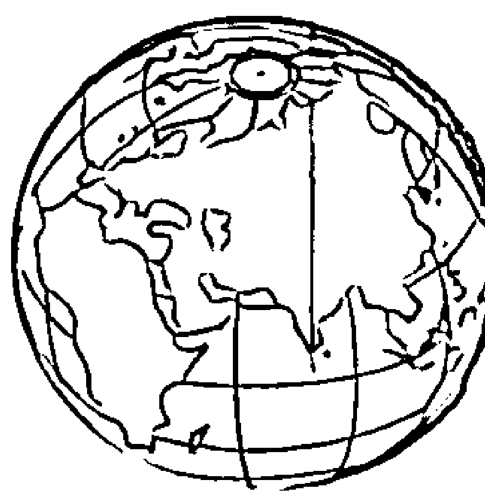

植物分布： 突尼斯、法国、西班牙

## 百里香 Thyme

学名：百里香属 Thymus vulgaris
科名：唇形科 Labiatae

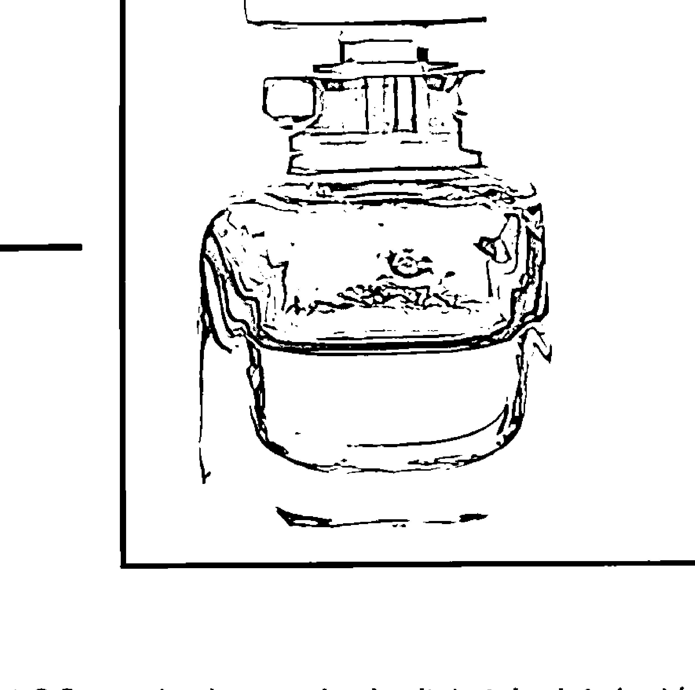

### 概说：

原产于地中海北岸的野百里香，蔓延至欧洲各地之后目前有300多种，虽然百里香精油都从同一种属萃取而得，可是因为生长地的不同，主要的化学成分也不尽相同。大约分成3种，含以百里酚为主的百里酚百里香，是最普遍的1种；含最多沉香醇的沉香醇百里香，最温和不刺激；以侧柏醇为主的侧柏醇百里香，抗病毒功效最强。

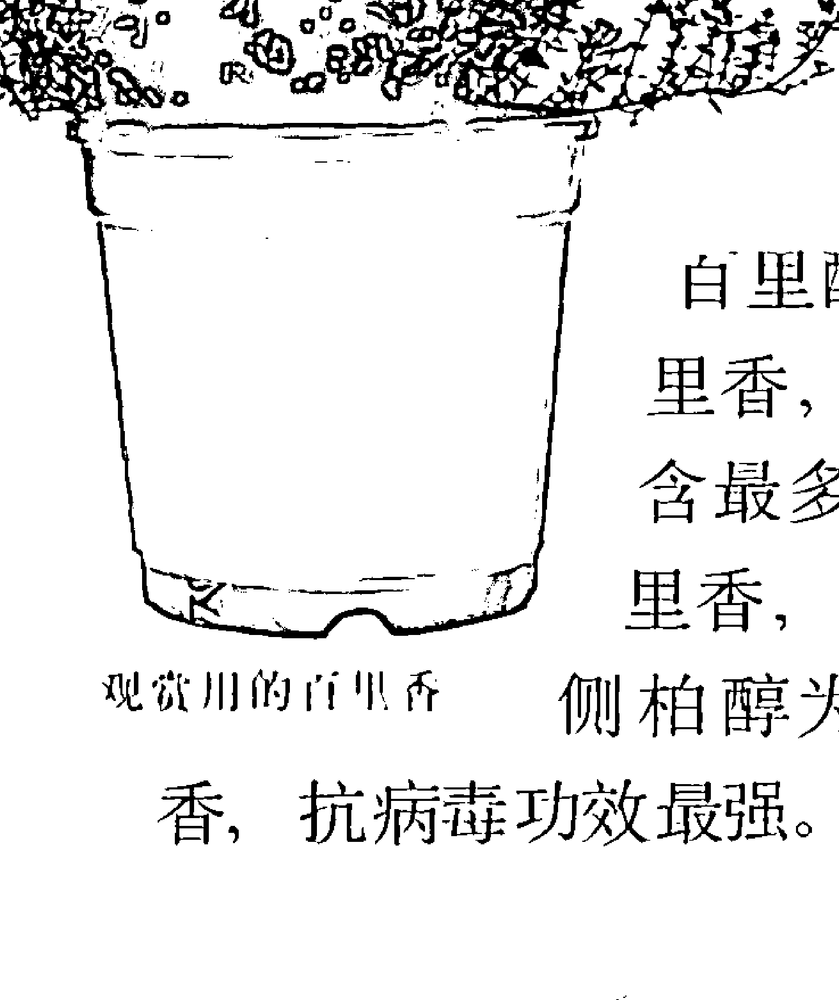

观赏用的百里香

它约30厘米高，叶片成深灰绿色旋状，能散发出浓郁的香味，会开白色或紫蓝色的小花。从百里香之名，就可以了解这种植物以香味取胜，有些会散发柠檬味、橘子味以及茴香味；有些会发出深沉的暗香，适合在庭院栽植；而味道最浓的是生长在西班牙的百里香。它喜欢温暖潮湿的地方，因此虽然冰岛也可以看到百里香的踪影，但终究不如北非、西班牙等地中海沿岸的植物芬芳。

百里香在蒸馏的过程中会产生一些变化，因此有些国家以金属容器蒸馏百里香，会有氧化的过程，所以有些精油会呈现红色；但现代的蒸馏厂都会再净化一次后再出售，颜色会成为淡黄色，因此坊间可以看到的沉香醇百里香精油颜色多是淡黄色。

### 历史：

人类很早就懂得在厨房使用百里香，因此它除了是药草植物之外，还是香料植物的一种。它的英文名字是希腊文的Thumos，有“香味”的意思，可见它芳香袭人的特质，自古即是。

公元前3000多年两河流域的人就开始使用它，古埃及人当它是防腐剂，古希腊人以它入菜，医学之父希波克拉底的400多种药单中，百里香就是其中的一种，他建议人们在餐后饮用它，原因即在于它帮助消化的功能。

### 精油档案

- 萃取：蒸馏叶子以及花
- 特质：淡黄色，有强劲刺激的香味
- 挥发性：中板
- 主要成分：百里酚、沉香醇、香荆藉酚、龙脑、芫荽油醇、松油烃、丁香油烃
- 属性：阳
- 主产地：法国、西班牙、北非

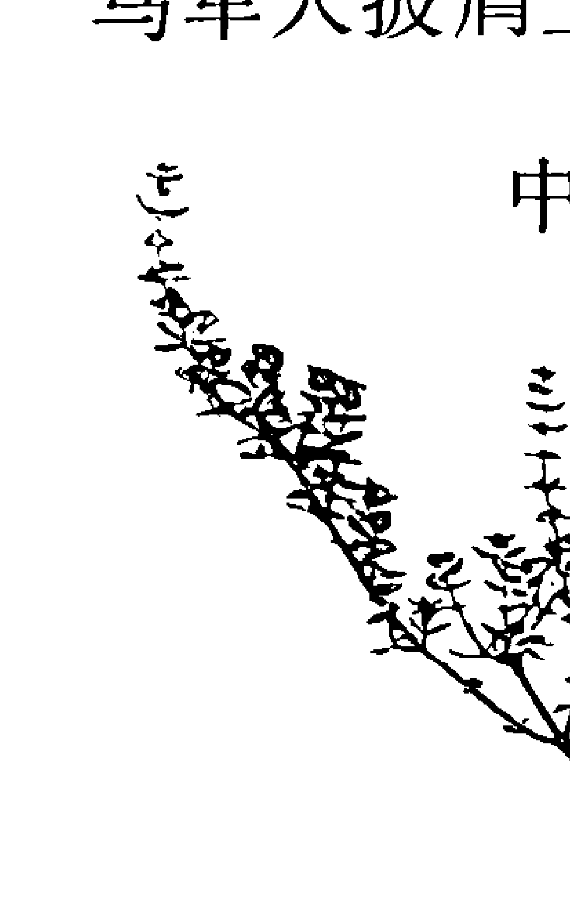

罗马人最著名的传说是出征前佩带百里香能激发勇气，因而流传下来使罗马军人披肩上都绣有百里香的图案；它在当时还以驱毒虫、解蛇毒而闻名。

中世纪瘟疫蔓延全欧洲，当时的欧洲人也用它来治疗疫病、麻疯病，后来的欧洲人都习惯在法院、审判庭等公共场所喷洒百里香水。

18世纪之后，人们对它的了解更多，它的激励、健胃、强化神经系统的特质，都一一被记载于医学书籍中。20世纪初的两次世界大战，欧洲各医院都以它为消毒剂。

### 使用与配方 USE & RECIPE

- **1. 消化系统：** 它的抗菌功能很适合当肠胃净化剂，帮助消化，治疗因细菌产生的腹痛、腹泻以及协助肠胃蠕动。

**压力型的消化不良／按摩：** 酪梨油4ml＋甜杏仁油16ml＋百里香7滴＋佛手柑3滴＋罗马洋甘菊1滴

- **2. 循环系统：** 它的抗感染功能，可以刺激白血球增生，刺激血液循环、降低血压以及恢复活力、增强大脑功能。

**促进血液循环／按摩：** 酪梨油4ml＋甜杏仁油16ml＋百里香3滴＋黑胡椒3滴＋迷迭香4滴

- **3. 泌尿系统：** 它的抗菌功能对尿道炎、膀胱炎都有效。

**泡澡：** 百里香3滴＋茶树3滴＋杜松子2滴

- **4. 生殖系统：** 减轻经期不适应症、月经过少、腹痛腹胀等；可以助产，加速生产并排除恶褥，对产后净化也有效。

**产后净化／按摩：** 酪梨油4ml＋甜杏仁油16ml＋百里香5滴＋茉莉2滴＋快乐鼠尾草3滴

- **5. 皮肤：** 痤疮、湿疹、伤口或其他皮肤病都可用；对头皮屑或头皮发痒也有效。

**痤疮／抹擦：** 乳胶50ml＋百里香4滴＋茶树4滴＋柠檬3滴

- **6. 情绪：** 具强化功能的气味可以振作情绪、消除疲惫、释放心灵、抵抗挫败。

**熏香：** 百里香3滴＋葡萄柚3滴＋雪松2滴

**相配精油：** 佛手柑、洋甘菊、雪松、杜松子、薰衣草、柠檬、绿花白千层、甜橙、马丁香、迷迭香

**注意：** 高血压、孕妇禁用；属于强劲精油，勿长期使用，以免中毒。

植物分布：欧洲各地，北自冰岛南至北非的地中海沿岸

# # 安息香 Benzoin

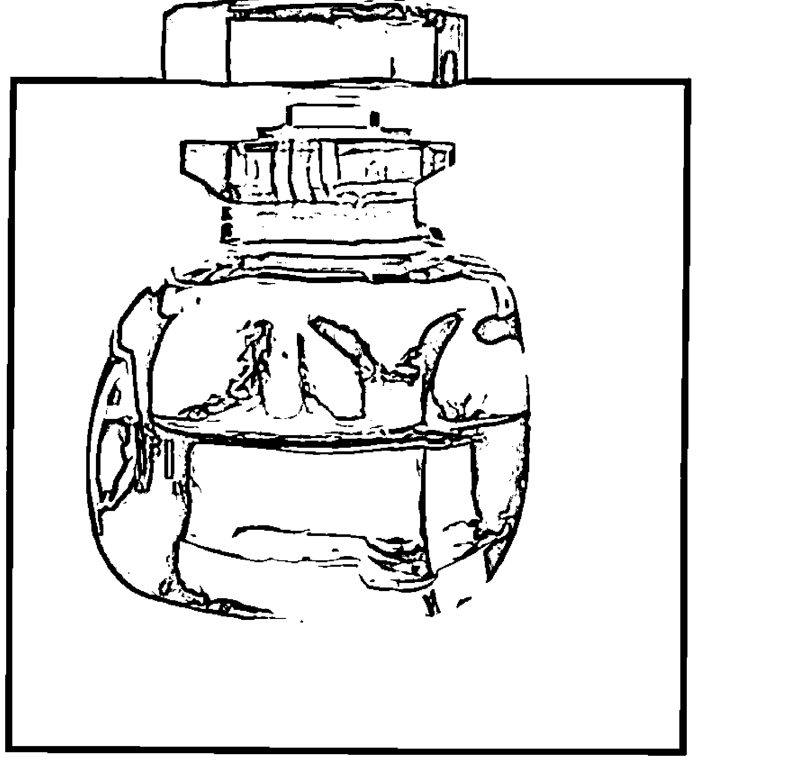

学名：安息香属 *Styrax benzoin*
科名：安息香科 *Styraceae*

### 概说：

早在数千年前，安息香、没药以及乳香，就是熏香最主要的香料。它是多年生的常绿树，可以长到20米高，树叶呈卵形且茂密，叶面会覆盖白色绒毛，夏天开红花，花梗白色也覆盖绒毛，甚至结成的球果都会覆盖绒毛。

安息香精油是从树干切口流出的树脂而得，它必须长到第七年才会流出树脂，此时产量最丰富，往后的12年每年可以提炼1.5公斤的树脂。树脂棕红色，有枞树的香味，溶于酒精中的树脂，香气可以持久不散。

### 精油档案
- 萃取：溶剂萃取树脂
- 特质：黏稠浓重的深棕红色，气味芬芳浓烈，也有香草味。
- 挥发性：慢板
- 主要成分：安息香酸、肉桂酸、香草醛、苯甲醛
- 属性：阳
- 主产地：越南、柬埔寨、老挝、爪哇、苏门答腊、泰国

要使用安息香有几种方法，在专卖纯精油的品牌店中，将安息香溶在乙基甘醇中，但已是化学合成物；也有溶在酒精中的安息香树脂，这种方式或许比较好，但最好还是到中药店买固体安息香树脂，要使用时再隔水加热溶化使用；或者买安息香溶解在Ho leaf中的精油。

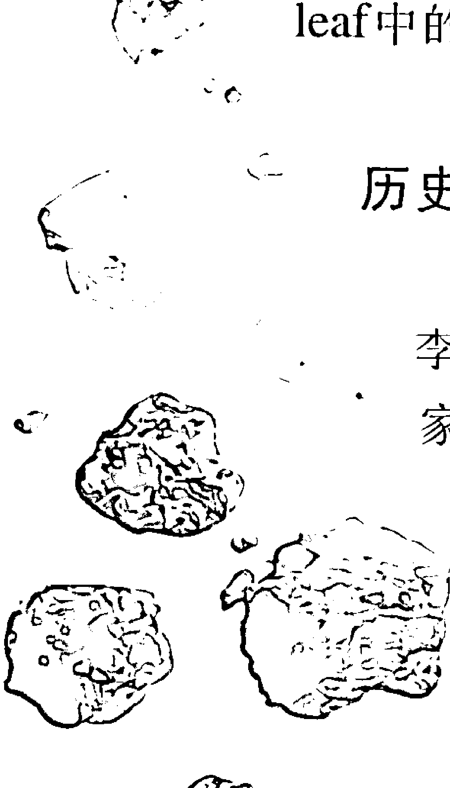

### 历史：

在东方经典中可以找到安息香在数千年前就为人使用的记录，如李时珍的《本草纲目》就有记载；《晋书》中也有一则故事是讲出家和尚佛图澄焚安息香以求水；佛经中也有对它的香味做过描述，说它“出于波斯国，又称辟邪树……取此物烧香，能通神明。”

英文的安息香，源于阿拉伯文的“Lubanjawi”，意思是“来自爪哇的香料”。在欧洲它有各式各样的名称，最有名的就是“班杰明胶”；希腊罗马人也知道这种香料，用它们来制作香包。文艺复兴时期，意大利王公贵族收到最令人兴奋的礼物，就是从东方来的安息香，因它是熏香最好的香料之一。

一般认为是葡萄牙的航海探险家将安息香带到西欧。不论是英国人、法国人或是西班牙人都非常喜爱它，西班牙预言家就曾调配一帖用安息香制作的香膏，来预防皮肤病以及抗痉挛。法国人与英国人都认为它对胸腔非常好，经常在病房焚烧这种香料，帮助病人稳定呼吸。

- 安息香
- 豆蔻
- 雪松
- 尤加利
- 乳香
- 茉莉
- 薰衣草
- 柠檬
- 没药
- 马丁香
- 欧薄荷
- 花梨木
- 檀香
- 伊兰伊兰

### 使用与配方 USE & RECIPE

- **1. 呼吸系统：** 安息香最大的功能是润肺以及畅通呼吸道，因此对咳嗽、喉咙痛、气喘、气管炎以及痰都有帮助。

**气管炎／蒸汽：** 安息香2滴＋尤加利2滴＋沉香醇百里香1滴

- **2. 泌尿系统：** 它可以治疗膀胱炎，对尿液流动也有帮助。

**泡澡：** 安息香3滴＋欧芹3滴＋绿花白千层3滴

- **3. 生殖系统：** 对女性的白带、男性的早泄都有用，其温暖安抚的特质，可促进情欲，消除冷感。

**促进情欲／按摩：** 小麦胚芽油4ml＋甜杏仁油16ml＋安息香5滴＋檀香3滴＋佛手柑2滴

- **4. 肌肉：** 它可以处理风湿引起的肌肉疼痛。

**肌肉疼痛／按摩：** 小麦胚芽油4ml＋甜杏仁油16ml＋安息香5滴＋马郁兰3滴＋杜松子2滴

- **5. 皮肤：** 它对龟裂、干燥皮肤非常有用，能使皮肤恢复弹性。此外对冻疮、皮肤溃疡、发疹或伤口都有疗效。

**皮肤炎／抹擦：** 乳胶50ml＋安息香8滴＋没药2滴＋德国洋甘菊2滴

- **6. 情绪：** 可安抚情绪，消除紧张与压力。对舒解忧虑、沮丧以及悲伤都有效。

**薰香：** 安息香4滴＋罗勒3滴＋快乐鼠尾草3滴

**树脂类**
**Resins**

> 注意：有些人会对它过敏，要先做皮肤检测。

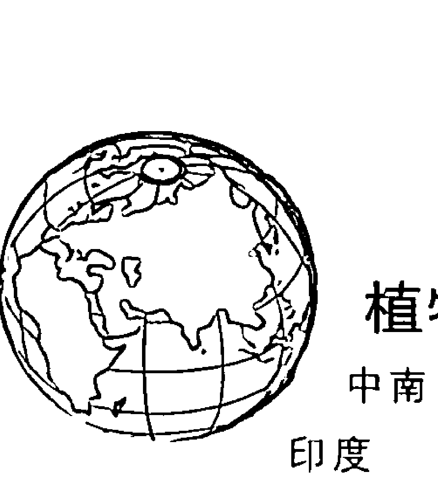

植物分布： 中南半岛、南洋各国以及印度

# # 乳香 Frankincense

学名：乳香属 *Boswellia carteri*
科名：橄榄科 *Burseraceae*

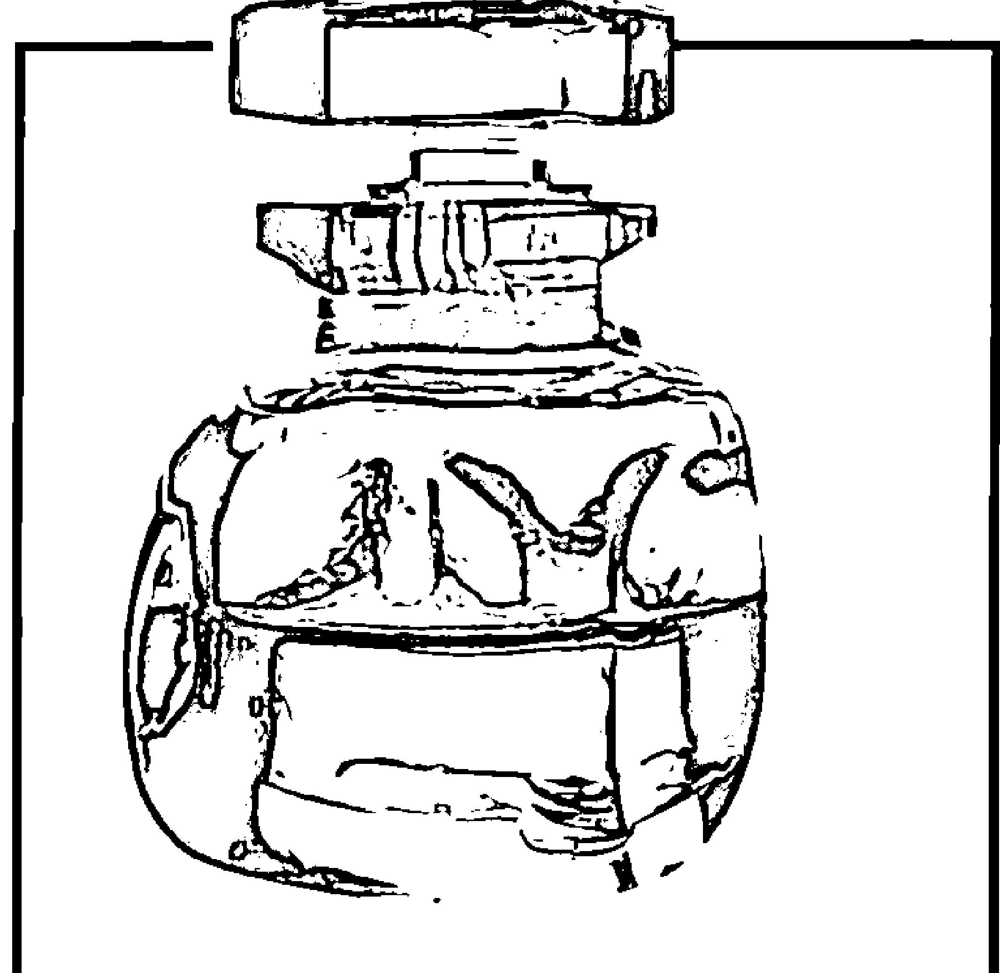

### 概说：

原产于两河流域以及北非的沙漠边缘，约高3~7米的小树，当树皮受到损伤时会流出树脂，树脂干燥后掉落地地上，古代人搜集地上的树脂并使用。

一如其他几种树脂类精油，是不错的杀菌剂，尤其是对呼吸道而言；跟没药一样，它们是最早被用来当焚香、静坐用的香料，因为它能让人思绪沉淀。

乳香精油最大的功能在于对皮肤的作用，它可以除皱、抗老化，改善油质皮肤。简而言之，对熟龄肌肤它是很好的精油。

另外乳香精油也广泛地被用在神经系统的障碍和泌尿系统发生的感染。

### 精油档案

- 萃取：蒸馏树脂。树干切出深痕后，所流出大颗椭圆形的黄色树脂，干掉后落到地面，便可收集起来。
- 特质：无色或淡黄色，有树脂的香气
- 挥发性：中板到慢板
- 主要成分：乳香醇、松酯、水芹烯、杜松烯、松油萜、苦艾萜
- 属性：阳
- 主产地：北埃塞俄比亚、索马里以及南阿拉伯半岛

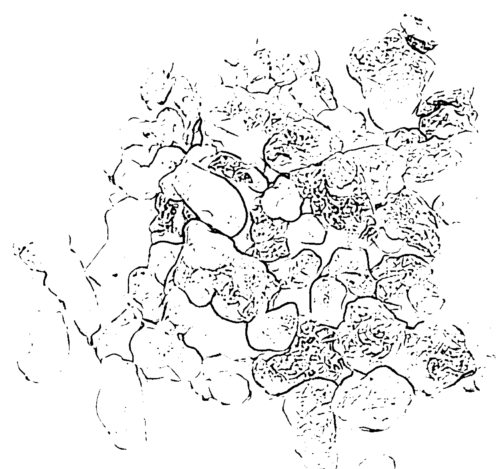

### 历史：

曾几何时，乳香的价值就跟黄金一样，数千年来它的评价极高。

古埃及的神殿中也认为焚烧乳香是敬神的行为。

地中海沿岸的民族，都以高价向腓尼基人购买乳香，运用在美容上，将它视为回春圣品。

乳香精油对熟龄肌肤有抗皱、抗老化的功能。

### 使用与配方 USE & RECIPE

- **1. 呼吸系统：** 清肺利呼吸(气喘), 对呼吸系统的感染很有帮助, 例如, 舒缓咳嗽、慢性支气管炎、喉炎等, 改善急而短促的呼吸。

**蒸汽吸入：** 乳香2滴+安息香2滴+薰衣草2滴

- **2. 泌尿系统：** 对尿道炎、膀胱炎、肾脏炎都有不错的效果。

**盆浴：** 乳香3滴+松3滴+檀香3滴

- **3. 生殖系统：** 在子宫方面, 对经血过量有不错的治疗效果; 它也有调和子宫的作用。

**按摩：** 小麦胚芽油4ml+甜杏仁油16ml+乳香5滴+天竺葵3滴+玫瑰2滴

- **4. 皮肤：** 能使老化皮肤新生, 对抚平皱纹功效卓著, 是真正的护肤圣品; 它收敛的特性能平衡油性肤质; 对伤口、暗疮、青春痘及发炎均有效果。

**青春痘/抹擦：** 乳液50ml+乳香6滴+伊兰伊兰2滴+薰衣草2滴

- **5. 情绪：** 让呼吸不再急促, 使人感觉平稳, 使心情好转且平和。它安抚的作用和清新的气味, 能帮助焦虑及执迷过往的精神状态。

**薰香：** 乳香3滴+天竺葵3滴+薰衣草2滴

注意： 孕期是否可用，有争议。

植物分布： 从东亚的中国到中东以及北非。

**树脂类**
**RESINS**

## 没药 Myrrh

学名：没药属 *Commiphora myrrha*
科名：橄榄科 *Burseraceae*

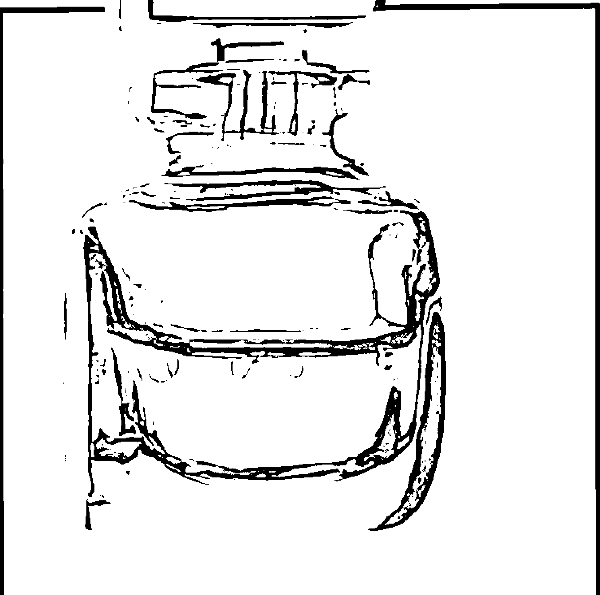

### 概说：

没药和乳香一样，都是取自树脂。没药有许多品种，属于橄榄科的灌木，最高可以长到4米，树干非常结实、多分枝；叶片成三叶排列、会开小白花。

它喜欢生长在沙漠边缘、异常干燥的地方，在尚未工业化的时代，捡拾没药通常是树皮破裂自然流出并风干后的树脂；或者商人让成群的山羊去吃没药的叶子，在自然摩擦撞伤树干的情况下，树脂沾染于山羊胡子上，再从山羊的胡子上拾取树脂。

没药品种虽多，但只有中东地区产的没药才是真正有疗效的没药，值得一提的是伊朗。树脂为淡黄色，干燥变硬时会转成红棕色，且有白色的纹路；有强烈的香脂气并又苦又辣，且有樟脑味。

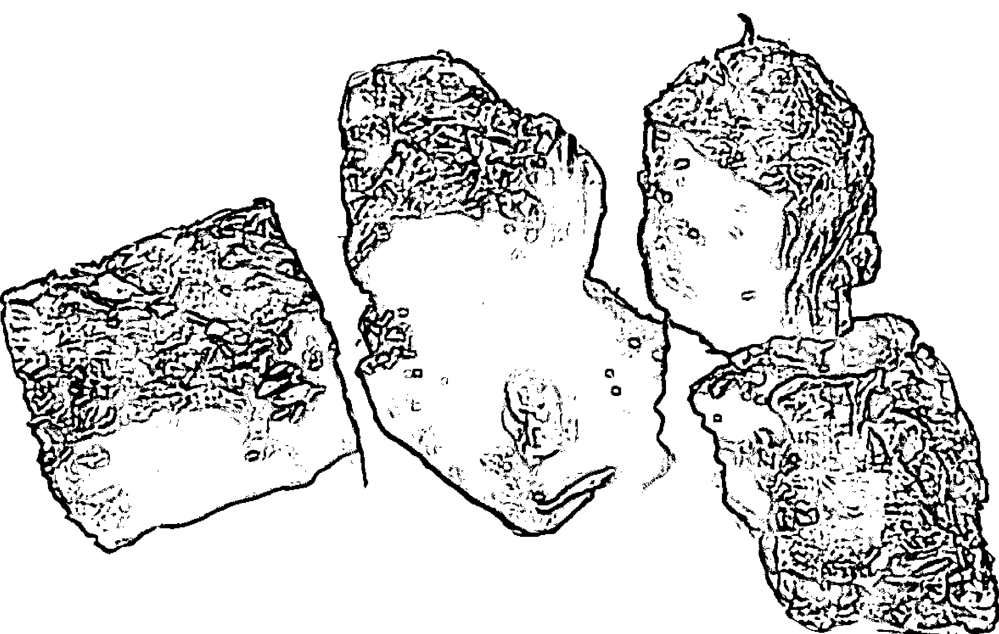

没药在传统中药里，有抗炎止痛的疗效。

### 精油档案
- 萃取：取自灌木分枝流出来的树脂
- 特质：有浓厚的烟味及苦味
- 挥发性：慢板
- 主要成份：没药酸、柠檬烯、双戊烯、松油萜、丁香酚、肉桂醛、杜松萜烯、树脂
- 属性：阳
- 主产地：北非、沙乌地阿拉伯

### 历史：

没药的英文Myrrh一字源自阿拉伯文“murr”，就是“苦”的意思。早在3000年前，没药就是古文明国家经常使用的药材、祭祀的供品及涂抹遗体的材料。

埃及在祭太阳神时，每天中午都会燃烧没药，在医疗上也以它作为抗炎药或制作木乃伊的药材；埃及妇女用的保养品中也多含没药。

古希腊人知道它对伤口的愈合有不错的功效，所以战士身上都会携带没药。

中国人更不用说，明朝李时珍的《本草纲目》记载它对外伤以及妇女子宫上的效用，甚至对暴躁的病人都以没药来治疗，所以它早已成为中药中活血止痛不可少的药引。

耶稣诞生时，东方三博士赠送的礼物就有没药、乳香、黄金，旧约里也有好几个例子跟没药有关，像妇女清洁净身等。

### 使用与配方 USE & RECIPE

- **1. 呼吸系统：** 治疗肺部呼吸道感染的咳嗽、鼻喉黏膜炎、喉咙痛以及气喘、支气管炎。

**蒸汽吸入：** 没药1滴+尤加利2滴+沉香醇百里香2滴

- **2. 生殖系统：** 对经血过少、阴道感染的白带或念珠菌有疗效，可以当阴道灌洗水，治疗阴道炎。

**阴道感染/盆浴：** 没药2滴+天竺葵3滴+德国洋甘菊3滴

- **3. 皮肤：** 杀菌洁净能力好，可治疗伤口、发炎、皮肤潮湿、香港脚等症状，或是口腔牙龈间的溃烂。可滋润干裂及冻疮皮肤，对皱纹也有效。

**抹擦：** 乳胶50ml+没药4滴+乳香4滴+薰衣草3滴

- **4. 情绪：** 是制造香水的基础香精之一，可让人感到温暖宜人。

**香膏：** 乳胶10ml+没药1滴+玫瑰4滴+乳香5滴

**相配精油：**
安息香、豆蔻、丁香、乳香、天竺葵、薰衣草、松、檀香、岩兰草

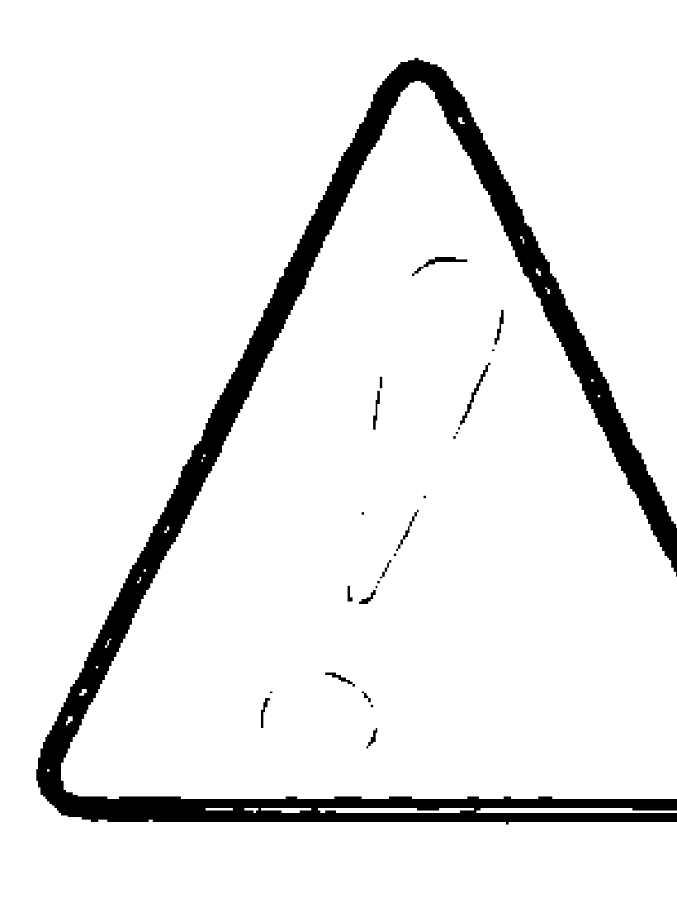

**注意：**
孕妇避免使用：一般人也不可以高剂量使用。

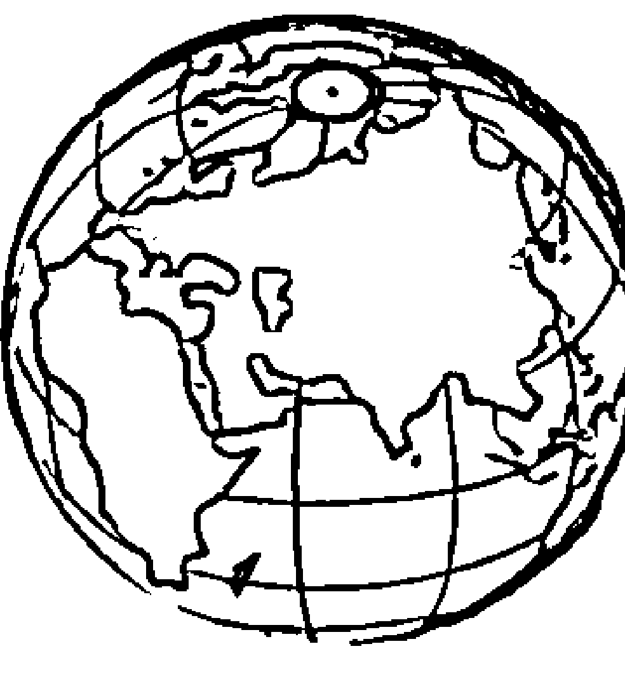

**植物分布：**
原产地在西亚、北非、印度等热带地区，在伊朗、沙特阿拉伯、利比亚、突尼斯以及索马里的庭园中或森林里。

## 黑胡椒 Blackpepper

学名：胡椒属 Piper nigrum

科名：胡椒科 Piperaceae

可以长到6米高的爬藤植物，喜欢在森林中攀附茂密枝叶的湿暗树干生长，叶片呈墨绿色、开白色花朵；果实刚开始是鲜绿色，成熟后转为红色。

胡椒约分为白胡椒、黑胡椒、绿胡椒，能够萃取精油的是黑胡椒，它气味比较浓重且含油脂量较高。

### 精油档案

- 萃取：蒸馏成熟的果实
- 特质：从无色到淡琥珀色，温暖的气味像是丁香而味苦
- 挥发性：中板
- 主要成分：丁香酚、肉豆蔻油醚、黄樟脑、樟烯、松油萜、没药烃、丁香油烃
- 主产地：新加坡、印度、马来西亚

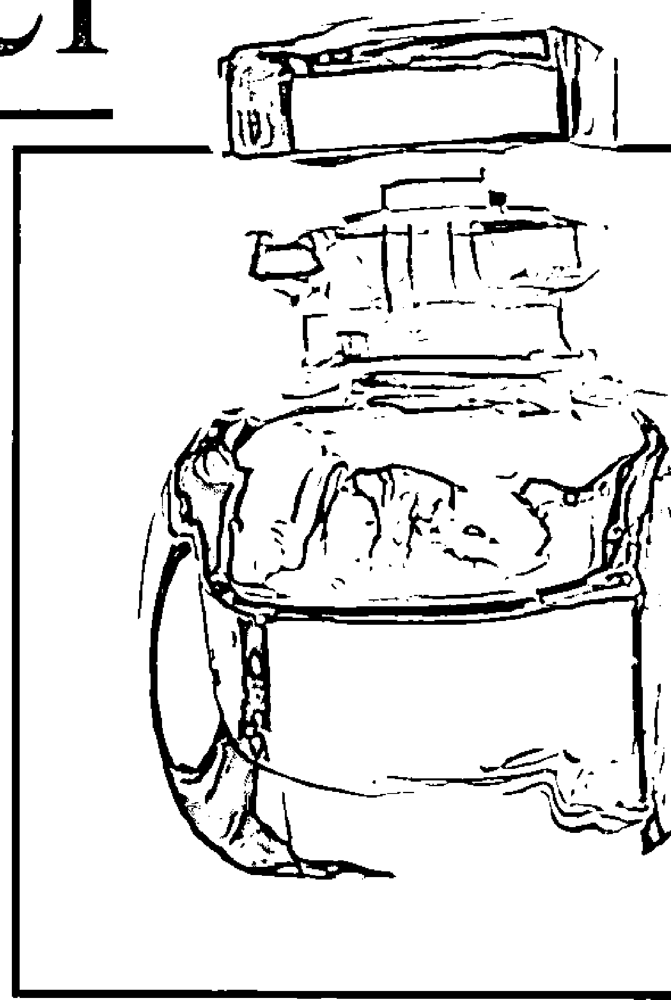

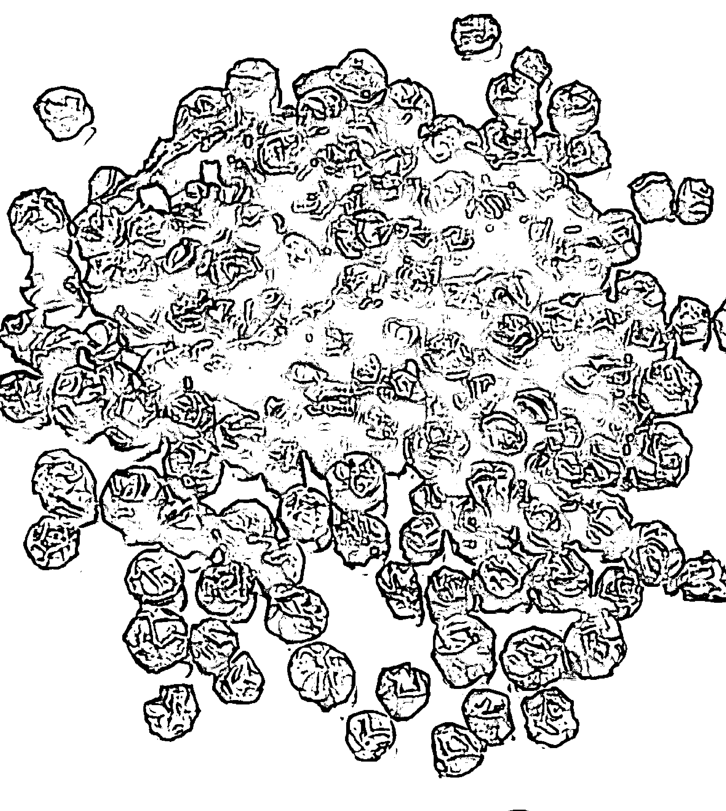

**历史：** 与肉桂、丁香一样，胡椒是引起海洋探险风潮的香料之一。

在4000年前中国与印度就已经有使用胡椒的记载，中国人不但拿它当烹饪的香料，更把它当作中药入药。

据记载，罗马人向匈奴人赎回罗马城的条件之一就是胡椒，可见亚洲人对胡椒的爱好。而从拉丁文的胡椒有“印度香料”的意思，就知道印度人使用胡椒的时间。印度人也以它来治疗霍乱和疟疾。

希腊罗马人知道胡椒可以当退烧剂，土耳其人更视胡椒为重要的经济作物，商业规模颇大，是主要的交易物资。

16世纪开始，欧洲人掀起一波波海洋探险热，多少人为它扬帆出海。当时的欧洲人就知道它可以治疗泌尿系统的疾病，像尿道炎。

### 使用与配方 USE & RECIPE

- 1. 呼吸系统：它温暖的特质可以驱风寒以及治疗流行性感冒，也可以拿来当退烧剂。
驱风寒／泡澡：黑胡椒2滴＋安息香3滴＋松3滴
2. 消化系统：对排气、刺激肠胃蠕动，帮助消化颇有效；有抗痉挛作用，可以平缓胃绞痛。
助消化／按摩：甜杏仁油20ml＋黑胡椒4滴＋安息香2滴＋马郁兰4滴
3. 泌尿系统：可以当利尿剂以及治疗排尿发生的灼热感。
利尿／盆浴：黑胡椒3滴＋茴香2滴＋欧芹2滴
4. 循环系统：刺激血液循环改善贫血，以及有助于体内积水的排除。
血液循环／按摩：甜杏仁油20ml＋黑胡椒2滴＋马郁兰4滴＋天竺葵4滴
5. 肌肉系统：是一种温暖的精油，对退烧、驱风寒、风湿、关节炎有效；对肌肉疼痛、僵硬也有效。
关节炎／按摩：甜杏仁油20ml＋黑胡椒3滴＋芫荽3滴＋薰衣草4滴
6. 情绪：平复悲伤、强化心智。
熏香：黑胡椒3滴＋柠檬3滴＋回青橙3滴

相配精油：

- 肉桂、快乐鼠尾草、丝柏、茴香、乳香、天竺葵、姜、牛膝草、薰衣草、马郁兰、橙花、甜橙、马丁香、迷迭香

SPICES 辛香类

## 豆蔻 Cardamom

学名：豆蔻属 *Elettaria cardamomum*
科名：姜科 *Ginger*

### 概说：

主要产于南印度与斯里兰卡2500米的高山上，在中国南方也可以找到；和姜是同一科的植物，具有相似的功能，较不刺激。所以有粗大的根茎、叶子也跟姜一样，平滑而大片、约10厘米长，会开黄紫色小花朵，卵形的果实中有六排棕色的种子，这是萃取精油的来源。

在印度的药经类的经典中可以查到，早在3000年前豆蔻就被拿来当药材使用；在东西方的贸易中，它也是很重要的香料植物；在埃及的文献中也有纪录，豆蔻是制作香水的重要材料。

### 精油档案

| 项目 | 内容 |
| :--- | :--- |
| 萃取 | 蒸馏自未成熟且烘干的种子 |
| 特质 | 透明无色却有香甜刺激，如姜一般温暖味道。 |
| 挥发性 | 快板 |
| 主要成分 | 柠檬烯、姜烯、松油醇、桉油醇 |
| 属性 | 阳 |
| 主产地 | 印度和斯里兰卡 |

### 历史：

在印度的药经中可以查到，早在3000年前豆蔻就是阿输吠陀疗法的药材之一；在东西方的贸易中，它也是很重要的香料植物，在希腊的文献上也找得到埃及人在宗教仪式中使用豆蔻的纪录。

将豆蔻带到欧洲的阿拉伯人，视它为重要的壮阳圣品，但希腊罗马时代的人，却认为它是制作香水的重要材料。

医学之父希波克拉底发现它有利尿的功能，其他药学研究者开始发现它对消化系统的功能，尤其是祛胀气，甚至对心脏的作用都有医生研究；更不用说中国人将豆蔻的使用发挥到极致，认为它是肠胃疾病的万灵丹。

海洋探险热潮之后，欧洲人对豆蔻的爱好仅次于番红花与香草，并发明了许多跟豆蔻有关的食谱，以致连煮咖啡都添加它。英国人将西非海岸称做香料海岸，就是十七、八世纪时，豆蔻经由西非运往欧洲而来的。

### 使用与配方 USE & RECIPE

- 1. 消化系统：它温暖的特质很适合拿来滋养胃部，尤其呕吐、消化不良或胀气时有不错的效果；它甚至对便秘或腹痛都有治疗效果。虽然不能治疗怀孕时的呕吐，却能让呕吐后的胃舒适一些。
胀气／按摩：甜杏仁油16ml + 小麦胚芽油4ml + 豆蔻2滴 + 姜2滴 + 欧芹2滴
2. 泌尿系统：它是好的利尿剂，排尿困难或疝气，都可以使用。
利尿／按摩：甜杏仁油16ml + 小麦胚芽油4ml + 豆蔻3滴 + 茴香3滴 + 欧芹2滴
3. 情绪：它是有名的壮阳催情植物，尤其为古代的印度人熟知，在精油的运用上，只能说它温暖与滋补的特质或许是增进情欲的媒介。豆蔻也有提振精神的效果，是一种很好的刺激剂。
提振精神／薰香：豆蔻4滴 + 罗勒2滴 + 柠檬2滴

### 相配精油：

- 黑胡椒、肉桂、芫荽、丝柏、莳萝、天竺葵、姜、牛膝草、茉莉、薰衣草、没药、橙花、绿花白千层、回青橙、玫瑰、迷迭香、伊兰伊兰

> 注意：颇辛辣的精油，稀释浓度愈低愈好，小心引起皮肤敏感。

### 辛香类
Spices

## 胡萝卜种子油

### Carrot Seed

学名：胡萝卜属 *Daucus carota*
科名：伞形科 *Umbellifera*

### 概说：

胡萝卜含有维生素A的前驱物，因此被认为有抗癌效用，除此维生素B、B2、C在医学上也被证明有防癌功能，这些在胡萝卜的成分中都找得到。

萃取精油的胡萝卜种籽最好是野生种，因为野生种的根不能食用，在茎上会开小白花，在精油的萃取上以种籽为主，虽然整根胡萝卜都可以萃取精油，或胡萝卜根部的浸泡油也含有丰富的维生素，但萃取精油时还是用种籽部分。

### 精油档案

| 属性 | 内容 |
| :--- | :--- |
| 萃取 | 蒸馏种籽 |
| 特质 | 呈淡黄色、清新的胡萝卜香气。 |
| 挥发性 | 中板 |
| 主要成分 | 胡萝卜醇、柠檬烯、松油萜、细辛脑 |
| 属性 | 阳性 |
| 主要产地 | 欧洲、印度、埃及 |

### 历史：

胡萝卜早在公元一百年左右，就被人类拿来当作食物，差不多时间也被当作药物使用，在希腊的药典中颇多记载。胡萝卜的英文名字源自希腊文“carotos”，被认为有利肝与胃的效用。直到工业革命前，欧洲人才发现它对皮肤的好处，开始研究它对皮肤的功能。

直到19世纪又发现它对免疫系统的作用，自此人们视胡萝卜为人类最佳的食物，诸如对眼睛、贫血、肝病、便秘……各种生理疾病都有不错的效用。

**相配精油：** 佛手柑、杜松子、薰衣草、柠檬、香蜂草、迷迭香、马鞭草

胡萝卜种籽油对成熟肌肤能有效防止或延缓皱纹产生。

### 使用与配方 USE & RECIPE

- 1. 消化系统：它是不错的净化油，对肝、胆以及肠胃系统的排毒作用相当好，像黄疸、肾结石、肝炎都有效。清肠胃、祛胀气、腹泻，甚至胃溃疡都能用。
排毒／按摩：甜杏仁油16ml + 小麦胚芽油4ml + 胡萝卜种籽5滴 + 豆蔻3滴 + 姜2滴

- 2. 泌尿系统：帮助排尿，减轻膀胱炎症状。
膀胱炎／按摩：甜杏仁油16ml + 小麦胚芽油4ml + 胡萝卜种籽5滴 + 杜松子3滴 + 檀香2滴

- 3. 生殖系统：它的通经功能，有调整经期帮助受孕的效果，也可以促进荷尔蒙平衡。
调节荷尔蒙／按摩：甜杏仁油16ml + 小麦胚芽油4ml + 胡萝卜种籽5滴 + 杜松子3滴 + 天竺葵2滴

- 4. 皮肤：在皮肤的运用上，胡萝卜种籽油有丰富又多变化的运用，它适合干燥成熟的皮肤，以及成熟肌肤长青春痘后留下的疤痕，可以让皮肤光滑有弹性，所以是预防皱纹的好配方之一。对湿疹、牛皮癣、皮肤溃疡、烧烫伤皮肤复原，都有极佳的效果，是皮肤的救星。
预防皱纹／按摩：乳液50ml + 胡萝卜种籽3滴 + 乳香4滴 + 橙花3滴

注意：孕妇最好小心使用。

**植物分布：** 北半球大部分的温带国家都可以看到胡萝卜的踪影，但现在看到的橘红色胡萝卜是荷兰人培育出来的，最大宗的生产地也就是欧洲各国沿海地区。

## 肉桂 Cinnamon

学名：樟属 *Cinnamomum zeylanicum*

科名：樟科 *Lauraceae*

### 概说：

原生于印尼的常年开花常绿植物，散见东南亚、斯里兰卡、更远至马达加斯加都有栽种，顶多长到5米的矮木。

在印度，它与没药、甘松香同为焚香祝祷的木材；树皮在干燥后形成树皮卷，越接近树干中心的树皮所制成的肉桂品质越上等。

在古时候就被拿来当作美味佳肴的添加剂，或是甜食和饮料，例如用在蛋糕、饼干、苹果派、面包、布丁、什锦水果中，也可用在汤类、肉类、番茄汁、蔬菜、通心面等，在咖啡、茶等饮料上撒些肉桂粉，效果也不错。

由于肉桂味辛、甘，性热。在中国的药理中，有温补肾阳、温中逐寒、宣导血脉的作用，也是健胃、祛肠胃胀气的好药材。

希腊罗马人拿它来制作香水，及至欧洲制酒术的发展，它也是调酒的香料之一。

几乎整棵肉桂树都可拿来萃取精油，不过一般人较常用的是以树叶蒸馏的精油，因为它不会像树皮或花苞蒸馏的精油那么刺激、肉桂醛的含量也没有那么高，较不会引发过敏。总之，肉桂精油是非常刺激性的精油，使用剂量要非常低。

### 精油档案

- 萃取：蒸馏树皮或树叶
- 特质：有甜甜的香味，若是以蒸馏树皮为主的精油会刺鼻并且闻得出香料的味道；若是蒸馏自树叶，味道较淡，色泽深黄。
- 挥发性：慢板
- 主要成分：芫荽油醇、肉桂醛、糖醛、苯甲酸酯、丁香酚、樟脑、苦艾萜、沉香醇
- 属性：阳
- 主产地：斯里兰卡、马达加斯加、印度、印尼

**相配精油：**
安息香、快乐鼠尾草、丁香、芫荽、丝柏、乳香、姜、薰衣草、马郁兰、松、迷迭香、百里香

干燥的肉桂树卷皮。

### 使用与配方 USE & RECIPE

- 1. **呼吸系统：** 是不错的抗真菌剂，对感冒或呼吸道感染都有治疗效果，尤其性热的特质，可以减轻感冒症状、保持体温。
**感冒/蒸汽吸入：** 肉桂3滴 + 罗勒3滴 + 安息香2滴
2. **消化系统：** 它有舒缓的功能，像胃痉挛、消化不良、胀气、恶心以及腹泻都有用。
**助消化/按摩：** 甜杏仁油20ml + 肉桂3滴 + 姜5滴 + 橘子2滴
3. **生殖系统：** 它温暖的特质，对循环不良或冷体质效果非常好。生殖系统方面，经痛、过少的经血量、来潮前的下腹闷滞都有效；在男性方面，可以治阳痿。
**经痛/按摩：** 甜杏仁油10ml + 小麦胚芽油10ml + 肉桂4滴 + 薰衣草4滴 + 没药2滴
4. **肌肉：** 能够舒缓关节疼痛、用作肌肉疼痛或镇痉挛按摩也不错。
**肌肉疼痛/按摩：** 甜杏仁油16ml + 小麦胚芽油4ml + 肉桂5滴 + 马郁兰3滴 + 德国洋甘菊2滴
5. **情绪：** 温暖、安抚的特质，帮助产生欢愉兴奋的效果，是一种催情剂。
**熏香：** 肉桂3滴 + 柠檬3滴 + 罗勒2滴

注意：
高剂量时易引起抽搐。肉桂皮精油不建议使用在皮肤上，避免用肉桂精油泡澡，最好以“吸入法”使用。稀释时剂量要非常低（1%）。
孕妇禁用。

植物分布：热带

## 丁香 Clove

学名：丁子香属 *Eugenia caryophyllata*
科名：桃金娘科 *Myrtaceae*

### 概说：

约10米高的常绿树，灰色的叶片小而细致、花苞红棕色呈指甲状。虽然几乎整棵丁香树都能萃取出精油，但只有花苞萃取出的精油才能用在芳香疗法上，因为由其他部位萃取出的精油有强烈的皮肤刺激性，购买时特别注意它的萃取部位。

它的气味以及成分有强大的抗菌、驱虫特质，东南亚国家以及欧洲瘟疫流行时，都是以它来预防以及抵抗传染病的流行；它的原产地南洋各群岛，在欧洲人尚未进入进行开发或商业活动时，甚少传染病流传，据了解就是丁香树的功劳。

### 精油档案

| 项目 | 内容 |
| :--- | :--- |
| 萃取 | 干燥的花苞 |
| 特质 | 这种精油刚蒸馏时呈无色或略带黄色，放久后转为深棕色，具强烈刺鼻味。 |
| 挥发性 | 慢板 |
| 主要成分 | 丁香酚、水杨酸甲酯、糖醛、丁香油萜、松油萜。 |
| 属性 | 阳 |
| 主产地 | 斯里兰卡 |

### 历史：

在印度的佛教经典中有记载，丁香是一种好的眼药，亦即消除昏沉、懈怠之用。佛教道场中也用丁香来清洁除臭，有净化之意。

在中国的药典中也记录丁香止痛的功效，尤其是牙痛时以丁香叶来止痛，它也当口香剂使用。

它抗菌的功能，更是欧洲人所重视的，防鼠疫是其一，镶入甜橙皮一起当芳香驱虫剂更是葡萄牙人常使用的方式。

### 相配精油：

罗勒、安息香、肉桂、葡萄柚、茉莉、杜松子、柠檬、橙花、甜橙、欧薄荷、迷迭香

### 使用与配方 USE & RECIPE

- 1. 呼吸系统：它的抗菌、净化功能，对呼吸道感染，尤其是流行性的疾病，效果很好。
呼吸道感染 / 蒸汽吸入：丁香1滴 + 尤加利2滴 + 松2滴
2. 消化系统：祛胀气，缓和肠胃痉挛，对呕吐、腹泻以及消化不良都有效。
消化不良 / 按摩：甜杏仁油20ml + 丁香2滴 + 薰衣草5滴 + 橘子3滴
3. 皮肤：促进伤口结痂、治疗慢性皮肤病，如狼疮。它治疗牙痛的功能更是声誉卓著，是很棒的止痛剂。
伤口 / 涂抹：95芦荟胶10ml + 丁香2滴 + 茶树1滴 + 雪松1滴
4. 情绪：激励、强化记忆改善沮丧、嗜睡以及温暖的情绪。
熏香：丁香3滴 + 肉桂3滴 + 佛手柑2滴

### 注意：

这是一种非常强劲的精油，使用时务必小心，不适合以按摩方式使用，因为它可能会刺激皮肤，1%低剂量使用，孕妇避用，勿泡澡用。丁香精油只有100%的纯精油才有医疗价值，又因为含有大量丁香酚，对金属具腐蚀性。

### 植物分布：

北印度洋沿岸，印尼、爪哇、摩洛加群岛、斯里兰卡、马达加斯加等印度洋各地。

## 芫荽 Coriander

学名：芫荽属 *Coriandrum sativum*
科名：伞形科 *Umbelliferae*

### 概说：

搓揉它的叶子会有难闻的味道，类似臭虫，即希腊文的“Koris”；幸好精油萃取自种子，而种子的味道清新甜美，不像叶子一般难以令人接受。

它跟一般伞形科的植物一样，翠绿的叶子如羽状，会开紫色或白色小花，花落结果，即是萃取精油的来源。

伞形科植物的共同特质是帮助消化系统发挥功能，刺激食欲；但它也是一种刺激剂。曾有记载，萃取芫荽精油的工厂，萃取槽打破，精油外泄，造成厂内员工情绪振奋，演变成打架以及呕吐不止的停工送医事件。

### 精油档案

| 项目 | 描述 |
| :--- | :--- |
| 萃取 | 以种子蒸馏而成 |
| 特质 | 甜甜的、但有些刺鼻，呈浅黄色 |
| 挥发性 | 快板 |
| 主要成分 | 芫荽油醇、松油醇、龙脑、桉油烃、牻牛儿醇、苦艾萜、水茴香萜 |
| 属性 | 阳 |
| 主产地 | 罗马尼亚、摩洛哥、俄罗斯 |

### 历史：

芫荽属于世界上最古老的香料植物之一；一千多年前，芫荽就被拿来当药草以及香料，阿拉伯人将它拿来当药膳、烹饪的作料，甚至在著名的巴比伦空中花园都可以见到它的踪影；传至埃及，埃及人也认为它是令人愉悦的香料，希腊罗马人更当它是调酒的配方。

在东方，印度人当它是医疗用的药草，可以治疗失眠、便秘；在中国它是常见的入菜作料。

### 使用与配方USE & RECIPE

- 1.消化系统：它的味道能刺激食欲，在治疗神经性厌食症之外，可以治疗胃痛、胃胀气；对口臭也很有帮助，尤其是消化不良的口臭。
胃胀气/按摩：杏桃仁油20ml+芫荽3滴+薰衣草5滴+姜2滴

- 2.肌肉：止痛的特质，能改善关节、肌肉疼痛；它也是温暖的精油，流行性感冒、受寒时的肌肉酸痛均可使用。
舒痛/按摩：甜杏仁油16ml+小麦胚芽油4ml+芫荽3滴+尤加利5滴+黑胡椒2滴

- 3.情绪：对消除嗜睡、紧张、疲累有效；并可以增进记忆力。
增进记忆力/熏香：芫荽3滴+迷迭香3滴+罗勒2滴

相配精油：佛手柑、黑胡椒、肉桂、丝柏、天竺葵、姜、茉莉、杜松子、橘子、香蜂草、橙花、回青橙、伊兰伊兰

植物分布：最早以南欧摩洛哥、地中海沿岸为主，目前以东欧高加索、亚美尼亚、俄罗斯地区以及南北美洲最多。

> 注意：易使皮肤敏感，剂量需非常低。高剂量使人反应迟钝。乳癌勿用，孕妇产后哺乳要避免使用。

## 莳萝 Dill

学名：莳萝属 *Anethum graveolens*
科名：伞形科 *Umbelliferae*

### 概说：

原来是长在印度的植物，根茎叶都是墨绿色，看起来像茴香，开着小黄花、有小小的果实。后传到地中海沿岸、欧洲等地，埃及人在5000年前即开始使用它。

### 精油档案

- 萃取：蒸馏果实
- 特质：有一股淡淡的药草味，看起来透明无色。
- 挥发性：快板
- 主要成分：藏茴香酮、丁香酚、柠檬烯、水茴香萜、松油烯
- 属性：阳
- 主产地：印度、埃及

### 历史：

埃及人拿它来当止头痛的药，希腊罗马人认为它对祛胀气、止嗝很有效。

传说中《圣经》里记载的“洋茴香”就是它，所以巴勒斯坦人早就知道它的功能；在北欧或西欧中古世纪时，认为它对安抚婴儿很有帮助，想来是它祛胀气的功能显著有效；在法国宫廷中，常被拿来当食物的作料或是烤面包。

### 相配精油：

- 佛手柑、雪松、肉桂、天竺葵、橘子、桃金娘、橙花、回青橙、迷迭香

### 使用与配方 USE & RECIPE

1. 消化系统：小儿胃胀气、消化异常时，可以用低剂量按摩腹部，但婴儿避免使用。对大人而言，便秘时可尝试使用，有消化不良的口臭也可以拿来当漱口水。以它抗痉挛的特质，止嗝效果颇佳。
    - 消化不良／按摩：甜杏仁油10ml＋杏桃仁油10ml＋莳萝5滴＋橘子3滴＋茴香2滴

2. 皮肤：具有收缩的特质，可以促进伤口愈合。
    - 伤口愈合／抹擦：芦荟胶30ml＋莳萝3滴＋迷迭香1滴＋丝柏1滴

3. 情绪：镇静阴郁低沉的心灵；放松心情。
    - 熏香：莳萝3滴＋甜橙3滴＋回青橙2滴

注意：怀孕期避免碰触使用，因有助产功效。

### 植物分布：

印度半岛、地中海沿岸。

## 姜 Ginger

学名：姜属 *Zingiber officinale*
科名：姜科 *Zingiberaceae*

概说：
这是热带多年生常绿的草本植物，会开白色小花；茎块是主要的香料食材，也是提炼精油的来源，姜的茎块多结节，颇像手掌或手指。

原产于西印度、盛产在亚洲热带地区，11世纪时经由香料路线传至欧洲，后由欧洲人带至加勒比海地区。目前品质最好的姜精油来源是牙买加的姜。

### 精油档案

- 萃取：蒸馏自根部
- 特质：色黄，深浅不一，芳香扑鼻、温暖使人愉悦。
- 挥发性：快板
- 化学成分：龙脑、柠檬醛、桉油醇、姜烯、姜素、姜酮
- 属性：阳
- 主产地：中国、日本、印度、危地马拉、牙买加

### 历史：

在中国，姜除了是食材、香料之外，也是药材；所以药膳料理中经常以姜提出食物的味道或去腥。中医认为姜可以排除湿气以及寒气，在冬天湿冷的气候中，多使用姜就能处理体内的湿气。在印度，也经常在药典中发现他们记录姜的用法，印度人对姜的热性多有研究，认为它们对催情的功能效果卓著。

希腊罗马人则认为姜是温暖的植物，尤其对胃部非常好，甚至有排毒的功能，所以姜茶是他们常用的饮料之一；后来欧洲人多以姜来做甜食，如姜饼屋。

### 相配精油：

豆蔻、肉桂、丁香、芜荽、尤加利、乳香、天竺葵、柠檬、迷迭香、玫瑰、欧薄荷、马鞭草

### 使用与配方 USE & RECIPE

1. 呼吸系统：去湿气或体液过多，如流行性感冒、多痰和流鼻水，可增进发汗。减轻喉咙痛和扁桃腺炎。
    - 感冒喉咙痛／蒸汽吸入：姜1滴+松2滴+尤加利2滴

2. 神经系统：对偏头痛、晕机、晕车、晕船有帮助。
    - 晕眩／手帕吸入：姜1滴+薰衣草2滴+薄荷1滴

3. 消化系统：调节和安定消化道，促进胃液分泌；对食欲不振、消化不良、胀气、腹泻、反胃以及坏血症都有效。
    - 按摩：酪梨油10ml+杏桃仁油10ml+姜5滴+豆蔻3滴+茴香2滴

4. 生殖系统：调节因受寒而规律不整的月经；催情剂，对治疗性无能有功效；用于产后护理，以消除积存的血块。
    - 消除血块／按摩：甜杏仁油10ml+杏桃仁油10ml+姜5滴+天竺葵3滴+杜松子3滴

5. 肌肉：可治疗关节炎、肌肉痛、扭伤、肌肉痉挛，尤其是下背部的疼痛。
    - 按摩：甜杏仁油16ml+小麦胚芽油4ml+姜5滴+芜荽3滴+迷迭香3滴

6. 骨骼：在止痛上，可舒解关节炎、风湿痛与抽筋、扭伤。
    - 扭伤／按摩：甜杏仁油16ml+小麦胚芽油4ml+姜5滴+德国洋甘菊3滴+杜松子3滴

7. 情绪：在消沉时能温暖情绪；使感觉敏锐并增强记忆；使人心情愉快；适用于疲倦状态。
    - 熏香：姜3滴+橘子2滴+甜橙3滴

注意：不宜直接涂在皮肤上，或在皮肤上搓揉，也不宜直接加在热水中泡澡，因为它会让皮肤产生不良反应，严重时会起疹并长水泡。高剂量时，可能引起皮肤过敏、轻微的光毒反应。

植物分布：中国、印度等亚洲热带地区，加勒比海地区。

## 雪松 Cedarwood

学名：
1. 桧属 *Juniperus virginiana* (又称铅笔柏、红刺柏)
2. 雪松属 *Cedrus atlantica* (白)

科名：
1. 柏科 *Cupressaceae*
2. 松科 *Pinaceae*

### 概说：

雪松精油又称为香柏木精油，以下我们以红雪松与白雪松来区分雪松精油，两者的科属虽不同，但功效只有些微的差异。

红雪松是制造铅笔的来源，一闻到它的气味就能明白，它与侧柏颇为相近，很容易被误认为侧柏精油；白雪松又称为大西洋雪松，大部分的雪松精油就是指它，而且许多人认为它才是真正的雪松精油，只有它才有真正的疗效。

雪松是常绿针叶，高大、坚固以及树龄长的树种。它的松针层一簇簇生长，在五六月初夏时分，会开始开小黄花，它是雄花；等雄花开始散播，才会开始开雌花。

雪松属的树种通常会结球果，而雪松的球果必须等待两年才会成熟掉落，有树脂的香味。因为它的树龄长，所以容易在墓地边看到它。

### 精油档案

萃取：木材部分以蒸汽蒸馏

- 特质：
    1. 红雪松：无色透明，木质香，有点类似檀香的味道，但气味较干燥。
    2. 白雪松：黄色黏稠，有树脂的香气，淡淡的松脂味，也近似檀香味。

挥发性：慢板

- 主要成分：
    1. 红雪松：雪松醇、杜松萜烯、侧柏酮
    2. 白雪松：雪松醇、杜松萜烯以及数种倍半萜烯类

属性：阳

- 主产地：
    1. 红雪松：北美洲
    2. 白雪松：摩洛哥

### 历史：

“cedar” 是闪族的语言，有意志力的意思。它或许是人类最早提炼的精油，在各个古文明国家中，几乎都有它的记载。

在地中海东岸，尤其是黎巴嫩、巴勒斯坦地区，曾经有大片大片的雪松森林，它们曾经是这个地区主要的建材。在《圣经》中也可以找到它的纪录，最明显的例子是耶路撒冷的所罗门大殿，就是以雪松为建材。

在埃及的木乃伊中，也可以找到雪松的成分，可见它有防腐保护的功能；古埃及文献更记载它对皮肤保养的功效。

在西藏的医学纪录中，它也是薰香、驱除恶灵以及蚊虫的药材。尤其在印度、西藏一带，无檀香时就以雪松来取代。

### 使用与配方 USE & RECIPE

1. **呼吸系统**：对支气管炎、化痰有疗效，所以咳嗽、呼吸道感染可尝试使用；若是结核病也颇有功效。
    - 呼吸道感染 / 蒸汽: 雪松2滴 + 迷迭香3滴 + 柠檬3滴

2. **泌尿系统**：是有效的消毒剂，对外阴瘙痒、尿道炎、阴道感染、膀胱炎、淋病均有效。
    - 盆浴: 雪松2滴 + 薰衣草3滴 + 杜松子3滴

3. **皮肤**：具有收敛、抗菌以及镇静效果，对任何油性皮肤造成的问题，如痤疮、头皮出油均有效。阳刚的味道，也很适合使用在刮胡水上。
    - 抹擦: 乳液50ml + 雪松6滴 + 罗马洋甘菊4滴 + 橘子3滴

4. **情绪**：松弛神经、舒缓压力，助于沉思冥想。亦有壮阳之说。
    - 放松 / 薰香: 雪松4滴 + 天竺葵2滴 + 柠檬2滴

5. 它是好的驱虫剂，甚至对老鼠都有用，更别说蚊子、飞蛾、蛀虫、跳蚤了。
    - 喷剂: 100ml纯水 + 雪松15滴 + 尤加利8滴 + 丁香7滴

### 相配精油：

- 罗勒
- 洋甘菊
- 肉桂
- 葡萄柚
- 杜松子
- 柠檬
- 橘子
- 甜橙
- 马丁香
- 迷迭香
- 马鞭草

注意: 孕期小心使用，预防流产。

### 植物分布:

红雪松分布在北美洲；白雪松以北非、中东等地较多。

## 丝柏 Cypress

学名：柏属 *Cupressus sempervirens*
科名：柏科 *Cupressaceae*

### 概说：

从希腊塞浦路斯岛由丝柏的学名(Sempervirens)命名，就可知道丝柏的生长地与地中海沿岸的关系。

丝柏是一种很实用的树种，有非常高的经济价值，它高大坚实、是圆锥形的树木，可以当建材、棺木，以及雕刻之用；它圆锥形的球果呈棕灰色，也是萃取精油的主要来源，它阳刚般的气味，可以拿来当男性古龙水或刮胡水，因为它的收敛效果很好。

以它收敛止血的特质，古埃及人的医疗经典中，几乎都会谈到它的止血效果，尤其特别提到它对痔疮出血、膀胱炎的疗效。

在希腊罗马神话中与幽冥地府有关的神或神殿，几乎都可以看到丝柏的踪影，因之也能判断出欧洲人多将丝柏种在墓地周围。

### 精油档案

- 萃取：蒸馏新鲜叶子及球果
- 特质：无色或呈极淡的黄色，有木质和香脂般迷人的琥珀味。
- 挥发性：中板
- 主要成分：桧醇、糠醛、松油醇、松油烯、樟烯、樟脑、伞花烃
- 属性：阴
- 主产地：法国、德国

### 历史：

丝柏跟许多桧属、柏属的树种一样，在传说与神话中都被当作跟死亡有关的植物；希腊神话中，太阳神将一位青年变成丝柏树，阴间之神的宫殿都是由丝柏树所构成。基督教的传说中，十字架就是由丝柏树所制作，希腊罗马人都将丝柏树种在墓地旁。

埃及时代，不论是埃及人还是阿拉伯人都以丝柏为棺木的木材，恐怕是因为它不易腐烂的特质吧。

### 相配精油：

佛手柑、安息香、快乐鼠尾草、杜松子、薰衣草、柠檬草、橘子、甜橙、回青橙、松、迷迭香、花梨木、檀香、伊兰伊兰

### 使用与配方 USE & RECIPE

1. 呼吸系统：咳嗽或气管发炎时，可以用熏香或蒸汽或是睡觉时滴在枕头上的方式，让气管畅通舒服。
    - 气管发炎 / 吸入蒸汽：丝柏2滴 + 安息香1滴 + 乳香2滴

2. 循环系统：收敛、洁净以及抗菌的特质，对结疤、除腋臭、利尿、杀虫、止血，以及治疗痔疮、静脉曲张非常好用。可以消除湿气，对水肿、风湿、发汗都有用。
    - 治疗痔疮 / 盆浴：丝柏3滴 + 罗马洋甘菊2滴 + 天竺葵3滴

3. 生殖系统：调整月经周期，对月经问题如经痛有用；或者更年期的问题也适用。
    - 经痛 / 按摩：甜杏仁油10ml + 葡萄籽油10ml + 丝柏5滴 + 快乐鼠尾草2滴 + 天竺葵3滴

4. 皮肤：控制水分流失，对成熟型肌肤颇好，多汗与油性的皮肤亦是最佳选择，利于伤口的愈合，具促进结疤功能。对微血管破裂或静脉曲张，有不错的效果，例如，脸部缺乏弹性、产生红血丝现象，也可以拿来按摩脸部。
    - 护肤 / 抹擦：95芦荟胶50ml + 丝柏6滴 + 柠檬4滴 + 橙花2滴

5. 情绪：舒缓愤怒的情绪，除去胸中之郁闷情绪。
    - 舒压 / 抹擦：95芦荟胶50ml + 丝柏3滴 + 玫瑰4滴 + 乳香3滴

注意：
可调节经期，避免在怀孕期间使用。
对静脉曲张颇具功效，应轻轻在周围擦过。

### 植物分布：

欧洲地中海沿岸以及北美洲。

## 尤加利 Eucalyptus

学名：桉属 Eucalyptus radiata
科名：桃金娘科 Myrtaceae

### 概说：

澳洲特有的无尾熊最喜欢的食物就是尤加利。尤加利精油也以澳洲产为主，三百多种的尤加利树均原生于澳洲，虽然目前中非、北非、北美洲等地也移植成功，但尤加利精油仍以澳洲产的澳洲尤加利精油(Eucalyptus radiata)最为广泛使用。

自尤加利的枝、叶蒸馏出精油。(卓茂庆 摄)

### 精油档案

- 萃取: 蒸馏小树的枝叶
- 特质: 精油呈流动的液态，色泽清澈淡黄，有樟脑般的气味跟淡淡的苦味。
- 挥发性: 快板
- 主要成分: 桉油醇、芳樟烯、香茅醛、樟脑、茴香萜、松油萜
- 属性: 阳
- 主产地: 澳洲

澳洲原住民很早以前就会用尤加利叶来治疗伤口，也知道焚烧尤加利树来驱虫、清洁四周环境。

19世纪尤加利引进欧洲之后，在医疗体系中研发出尤加利的抗菌剂以及工业量产的杀菌剂。

### 历史：

尤加利名字源自希腊文eucalyptos，意思是完整跟覆盖，因为它的花蕊是被紧紧包住的。它是德国探险家在澳洲所发现，并传到世界各地；也是他在19世纪时研发出它的医疗价值。

19世纪起尤加利的商业价值愈来愈高，因为它的杀菌功能为许多医生认可，渐渐地在各种商品中均有加入含尤加利成分的发汗剂、兴奋剂以及收敛剂。

### 相配精油：

安息香、芫荽、丝柏、杜松子、薰衣草、柠檬、柠檬草、香蜂草、松、茶树、百里香

### 使用与配方 USE & RECIPE

1. 呼吸系统：它是最具抗菌力的精油，虽然不能杀死流行病毒，但对流行性感冒的症状如发烧、气管炎、痰、发疹，都有不错的效果。对传染病疟疾、伤寒、麻疹、霍乱也可用。
    - 气管炎/蒸汽吸入：尤加利2滴 + 松2滴 + 安息香1滴

2. 泌尿系统：尿道炎、肾脏炎等发炎症状，都可以使用。
    - 尿道炎/盆浴：尤加利4滴 + 茶树2滴 + 乳香2滴

3. 肌肉：可用于按摩关节炎，对肌肉酸痛有止痛、活络的效果。
    - 肌肉酸痛/按摩：小麦胚芽油2ml + 甜杏仁油16ml + 酪梨油2ml + 尤加利5滴 + 薰衣草3滴 + 德国洋甘菊2滴

4. 皮肤：对疱疹和烫伤有帮助，促进皮肤新组织的建构。对伤口、溃疡与发炎状态，可改善阻塞的皮肤。
    - 皮肤阻塞/抹擦：95芦荟胶50ml + 尤加利4滴 + 薰衣草4滴 + 茶树3滴

5. 情绪：具冷静的效果，使头脑清楚，集中注意力。
    - 冷静/熏香：尤加利3滴 + 柠檬3滴 + 罗勒2滴

注意：
强效精油，在剂量上要小心。怀孕、高血压与癫痫患者避免使用；老人、幼童限制或小心使用；避免内服致毒。

木质类
Trees

## 杜松子 Juniper berry

学名: 桧属 Juniperus communis
科名: 柏科 Cupressaceae

### 精油档案

- 萃取: 蒸气蒸馏新鲜成熟的果实
- 特质: 无色或淡黄、淡绿。清新干净，略带辛辣味的木头香。
- 挥发性: 中板
- 主要成分: 龙脑、松油醇、松油萜、杜松烯、雪松烯、樟烯
- 属性: 阴
- 主产地: 欧洲意大利、法国、匈牙利、南斯拉夫以及北美加拿大。虽然北半球都可以看见它的踪迹，但愈南边的品质愈好，意大利产的杜松子精油即为精品。

### 概说:

杜松有60多种，为常绿灌木，最高可以长到10米，一般约2米左右。树干呈红色、叶子呈针状，每三片叶子以螺旋形紧密排列，会开小黄花，结的球果在成熟后会由绿转为黑色或深蓝色，这是萃取精油的主要部位；虽然树干或枝叶也可以萃取出精油，但是成分不佳、价值较低，在芳香疗法中最好使用杜松子精油，而非杜松精油。

### 历史:

杜松使用的时间颇早，在埃及以及欧洲的早期文献中，处处可以看到它的踪影。在瑞士境内发现的史前遗迹中，即有杜松子；古埃及人用它来当消毒剂，古希腊人更以燃烧杜松来防止流行病传染，同一期间罗马人也以它为抗菌剂，甚至在烹饪时使用。在西藏也是以焚烧杜松来防止传染病蔓延。

可以在法国的纪录中看到医院以焚烧杜松子来消毒；更早之前的欧洲医生，都认为杜松子是好的利尿剂以及治疗泌尿系统的肾脏、膀胱的好药材。杜松源自拉丁文juniores，意思是经常会结新果实的树，居尔特人则称它“gen”，是为小灌木。所以杜松子酒称做“gin”就是从这个语系发展出来的。从这里也可以看出，杜松除了是药材之外，也经常是制作饮料的添加物或是腌制食物的调味料。

### 相配精油：

- 佛手柑
- 安息香
- 雪松
- 丝柏
- 乳香
- 天竺葵
- 柠檬
- 甜橙
- 迷迭香
- 花梨木
- 檀香

大鱼大肉吃太多，体内毒素日积月累，可以用杜松子精油排出毒素。

### 使用与配方 USE & RECIPE

1. 呼吸系统：它的抗菌性对呼吸道感染有效，也可以治疗痉挛性咳嗽。
    - 薰香：杜松子4滴+尤加利2滴+乳香2滴

2. 消化系统：有排毒效果、净化功能，尤其对是肠道阻滞或者便秘、痔疮，所以在食用过量食物或酒精时，可以帮助排出堆积毒素。
    - 食用过量/按摩：甜杏仁油16ml+小麦胚芽油4ml+杜松子6滴+欧芹2滴+茴香2滴

3. 泌尿系统：在泌尿生殖系统上功效卓著，是很好的利尿剂，它帮助排尿的功能，还能削减蜂窝组织炎、水肿以及滞留的体液，所以减肥的人也适合用杜松。另外，对膀胱炎、尿道结石、肾结石、前列腺肥大、外阴感染都有效。
    - 减肥/按摩：甜杏仁油16ml+小麦胚芽油4ml+杜松子6滴+葡萄柚2滴+檀香2滴

4. 骨骼系统：它在治疗关节炎上早已声誉卓著，因为它可以清除尿酸，在痛风、风湿的治疗上也常被使用。除此之外，它对坐骨神经、四肢僵硬或疼痛，都能缓解。
    - 风湿/按摩：甜杏仁油20ml+杜松子4滴+尤加利4滴+德国洋甘菊2滴

5. 皮肤：是对付油性皮肤毛孔阻塞的好帮手，以它来深层清洁净化、治疗面疱青春痘颇有功效，对抗橘皮组织也不错；对湿疹、皮肤炎、干癣都有功效。
    - 皮肤炎/涂抹：胶50ml+杜松子4滴+迷迭香3滴+德国洋甘菊2滴

6. 情绪：它的清洁净化作用，可驱走屋内负面的能量，适合在冥想之前用，让人有焕然一新的感觉。可以镇静神经、令人清爽、帮助减压、激励人心。
    - 减压/薰香：杜松子4滴+佛手柑2滴+乳香2滴

注意：如有严重的肾病或其他肾感染时避免使用，孕期避免使用，敏感肌肤低剂量使用。

植物分布：在北半球几乎都可见到它的踪迹，喜好生于垩土与石灰岩质上。生产最茂密的地区是北欧的瑞典、苏格兰、英格兰，韩国、加拿大的森林也多此树种。

## 桃金娘 Myrtle
学名：桃金娘属 *Myrtus communis*
科名：桃金娘科 *Myrtaceae*

### 概说：
这种矮小常绿的灌木，原产于北非以及伊朗地区；在地中海沿岸蔓生之后，成为欧洲各地的庭园以及盆栽植物。
它最高也只有5米左右，有泛着油光的蓝绿色椭圆叶片，有白色或橘色的花朵，气味异常芳香，会结紫黑色的浆果。
它和尤加利是同一科的植物，也同样有驱虫树之称，对地中海沿岸的居民来说，一整棵桃金娘都是非常有用的树：叶子可以当烹煮肉类时的作料，甚至像包粽子的粽叶一样包裹要烧烤的鸡肉鸟肉；浆果可以生食也可以晒干后当香料使用，所以法国人称它为“科西嘉胡椒”；甚至树枝都是烟熏肉类时最好的木材，因为它的香气会造成特殊的风味。

### 精油档案
- 萃取：蒸馏新鲜的嫩叶子
- 特质：清澈的淡黄或淡绿色，气味非常清新宜人。
- 挥发性：中板
- 主要成分：桉油醇、桃金娘醛、牻牛儿醇、芳樟醇、沉香醇、樟烯
- 属性：阳，但有强烈的阴
- 主产地：科西嘉岛、摩洛哥、奥地利、突尼西亚

### 历史：
希腊罗马神话中，奥林匹克竞赛的优胜者，可以得到用桃金娘叶子编的头环来表示优胜及祝福；《圣经》中犹太妇女当新娘那一天，以桃金娘的花朵为头环以及捧花，象征幸福美满。欧洲地中海沿岸，尤其是法国人都会请女性在门前栽种它以辟邪。
古埃及人以桃金娘的叶子泡酒来退烧，古希腊时代它的杀菌能力就备受肯定，尤其是治疗膀胱感染。而罗马人用它来治疗呼吸道的问题，16世纪的欧洲人已经知道它的收敛效果，用它来清洁皮肤以及治疗皮肤炎，更调配了一种化妆水称做“天使之水”。
19世纪时，桃金娘的化学成分已经被分析出来，它的药物属性更加明确，那时候的医生已经用它来治疗呼吸道、生殖泌尿系统甚至消化系统的毛病。

### 使用与配方 USE & RECIPE
1. 呼吸系统：它的净化功能，对气喘、慢性支气管炎、鼻窦炎以及感冒引起的呼吸道感染都很有效。对孩童来说，尤加利比较刺激，改用桃金娘是很好的选择，因为它比较温和不刺鼻。
   支气管炎 / 蒸汽：桃金娘2滴+尤加利2滴+没药1滴（小孩可以不加尤加利）
2. 生殖系统：是子宫补药可减少白带。
   盆浴：桃金娘3滴+薰衣草3滴+德国洋甘菊2滴
3. 皮肤：是治疗油性粉刺的好帮手，也可治疗痤疮以及痤疮留下来的疤痕。可改善牛皮癣、毛孔粗大、瘀伤、油性肤质。
   抹擦：95%芦荟胶50ml+桃金娘4滴+佛手柑3滴+花梨木3滴

### 相配精油：
- 佛手柑
- 肉桂
- 芜荽
- 丝柏
- 莳萝
- 薰衣草
- 柠檬
- 柠檬草
- 迷迭香
- 花梨木
- 欧薄荷
- 百里香
- 茶树

> 注意：低剂量使用。

植物分布：北非、中东等地的地中海沿岸以及海中小岛上，中欧、东欧也有少部分。

## 回青橙 Petitgrain
### 概说：
回青橙是一种萃取自苦橙树叶的精油，也有人翻译成“苦橙叶”，它又被戏称是穷人的橙花，因与橙花香气、功能相似。
蒸馏自枝叶的回青橙香味较厚重，香水业者喜欢用它更甚于橙花，因此法国南部的香水城，有一段时间以生产品质精良的回青橙著名；现在主产地在巴拉圭，但品质不如从前。
比橙花精油便宜又比甜橙精油适合当作泡澡精油的回青橙，是用途颇为广泛的一种精油，它有柑橘属精油的所有特色；甚至它有别于其他柑橘属精油，有抑制皮脂分泌以及杀菌的功效，是很好的皮肤用油，而且它也不具光敏性。
尤其，回青橙没有橙花精油的苦味，所以几乎没有人不喜欢它的气味，它也因此成为制作高级古龙水的主要成分。

### 精油档案
- 萃取：苦橙树的叶及嫩芽蒸馏（苦橙树萃取出的三种精油之一，另外两种是由花朵萃取出的橙花精油，和由水果果皮萃取出来的苦橙精油。）
- 特质：木质香和花香交替散发，持续力强。
- 挥发性：中板至快板
- 主要成分：牻牛儿醇、芫荽酯、沉香醇、薰衣草酯、柠檬醛、柠檬烯
- 属性：阴
- 主产地：意大利、埃及、海地、巴拉圭

### 历史：
从英文字面上，Petit有细小的意思、grain指颗粒状，因此它的名字有“小果实”的意思，因为在几世纪前，回青橙精油是萃取自未成熟的果实，果实小如黑梅果般、尚未成熟前就将它采收，以萃取精油。

### 使用与配方 USE & RECIPE
1. 神经系统：它是神经系统的镇定剂，它放松的特性，能帮助缓和失眠与心跳加快的焦虑感。能放慢身体的步调，调理呼吸，放松痉挛的肌肉。有益于病愈的虚弱身体状态，因为它能温和地刺激免疫系统，增强对疾病的抵抗力。同时，它除臭的特性也能使身体保持清新有活力。能安抚胃部肌肉，因此可解决苦恼的消化问题。
放松／泡澡：回青橙3滴＋薰衣草3滴＋罗马洋甘菊2滴
2. 皮肤：调节皮肤功能，减低皮脂分泌，也是好的杀菌剂，所以对粉刺、青春痘等有不错治疗效果。另可治疗头皮屑。
减低皮脂分泌／抹擦：乳胶50ml＋回青橙4滴＋天竺葵4滴＋佛手柑3滴
3. 情绪：能安抚愤怒与恐慌，情绪低落时是好的抗忧郁剂，使心情焕然一新。
薰香：回青橙3滴＋橙花2滴＋甜橙2滴

### 相配精油：
佛手柑、豆蔻、雪松、天竺葵、薰衣草、柠檬、香蜂草、橙花、甜橙、马丁香、迷迭香、花梨木、檀香、伊兰伊兰

## 松 Pine
学名：松属 *Pinus sylvestris*
科名：松科 *Pinaceae*

### 概说：
松有一百多个品种，有些含有毒性，像矮松(P. Mugo)；萃取松精油的主要品种是欧洲赤松 (P. Sylvestris )，因此购买松精油要特别注意它的学名。
它属于高大型的球果树种，一般松树可高达40米，树皮多为红棕色，有灰绿色的针叶，会开黄色的穗花，结成球果需要两年。
虽然它整株松树都能蒸馏精油，但树皮蒸馏的精油品质不佳，最上等的精油是生长在北纬40℃以上的松树针叶及球果蒸馏而成的精油。

### 精油档案
- 萃取：蒸馏嫩针叶与球果
- 特质：无色或淡黄色，刺鼻的香味以及接近樟脑的气味。
- 挥发性：中板
- 主要成分：松烯、龙脑、苧烯、双戊烯、水芹烯
- 属性：阳
- 主产地：苏格兰跟俄罗斯东部

### 历史：
古文明国家几乎都找得到松树的记载，古埃及人以及古希腊人在祭典时焚烧松树，以净化环境；在希腊药典中也可以找到松树治疗肺病的记载，以及对呼吸道的治疗方法。
阿拉伯人也知道用松树治疗感染性疾病，尤其是呼吸道感染。松树在西欧最早发现于英格兰的罗马遗迹中，有球果以及树。
善于航海的苏格兰人，以松树制作出名的单轨帆船。
北美洲的印地安人用松树来治疗败血症。

### 相配精油：
雪松、肉桂、快乐鼠尾草、丝柏、尤加利、杜松子、薰衣草、桃金娘、绿花白千层、茶树、百里香

### 使用与配方 USE & RECIPE
1. 呼吸系统：它是很好的抗菌剂，对肺炎以及呼吸道感染有绝佳的效果，对流行性感冒时的喉咙痛、痰、流鼻水以及鼻窦炎都有效。
蒸汽：松2滴＋尤加利2滴＋檀香1滴
2. 肌肉：温暖的特质，对风湿或痛风时的肌肉疼痛很有效，也可以改善肌肉僵硬。
热敷：松3滴＋迷迭香3滴＋黑胡椒2滴
3. 泌尿系统：抗炎的作用对膀胱炎、摄护腺炎以及胆结石都可以尝试使用。
泡澡：松树3滴＋丝柏3滴＋薰衣草2滴
4. 情绪：振奋精神。
薰香：松3滴＋杜松子3滴＋罗勒2滴

注意：用低剂量，且特别注意学名。

植物分布：北半球高纬度地区、北美洲加拿大、中国东北、斯堪的那维亚半岛、苏格兰、俄罗斯。

## 花梨木 Rosewood
学名：花梨木属 *Aniba rosaeaodora*
科名：樟科 *Lauraceae*

### 概说：
树种非常少，只在南美洲的热带雨林区找得到，因此非常珍贵。约40米高的常绿树，会开黄色的花朵。
上个世纪30年代以前，只有法属圭亚纳的天然林中可以萃取出花梨木精油，世界环保人士呼吁不要使用花梨木精油，以免破坏雨林生态；30年代巴西雨林区才开始有计划种植花梨木，但以它的生长期、伐木的困难度，花梨木精油还是一种取之不易的芳疗用油。
由于它兼具木质味与花香味，是一种很好的香水原料；巴西的树种偏木质味，圭亚纳的树种有比较浓郁的花香味。

### 精油档案
- 萃取：由木心蒸馏
- 特质：味道辛辣的木质与花香味
- 挥发性：中板
- 主要成分：沉香醇、橙花醇、牻牛儿醇
- 属性：阳
- 主产地：亚马逊河流域

### 历史：
它被发现得晚，在芳香疗法的使用上也是很晚的事，早期的欧洲人喜欢将它的木心制作成梳子、镜框以及橱柜等。
中国明朝的时候，高级考究的家具，多是用花梨木制作。由于花梨木纹理漂亮，工匠们多采用通体光洁的处理，不作雕饰，以突出木材纹理的自然美。
所幸花梨木精油只要以木屑就可以蒸馏，在巴西亚马逊河流域有计划地栽种之后，巴西也发展出花梨木的蒸馏工厂。

### 相配精油：
雪松、肉桂、芜荽、丝柏、乳香、天竺葵、马丁香、广藿香、回青橙、松、玫瑰、迷迭香、檀香、岩兰草

### 使用与配方 USE & RECIPE
1. 神经系统：治疗冷头痛，适应时差，驱虫，帮助适应湿气和高温。有另外一种说法是，它对性欲有催促作用，因此对治疗性冷感或性无能，有提振效果。
提高性欲／泡澡：花梨木3滴＋玫瑰3滴＋天竺葵2滴
2. 免疫系统：它最大的价值就在免疫系统的使用，在免疫力低时，可为身体提供极佳的抵抗力，能抗菌、抗病毒；在激励的作用上，可以活化免疫系统。
活化免疫系统／薰香：花梨木2滴＋罗勒3滴＋薰衣草2滴
3. 皮肤：活化肌肤，适合干燥、敏感肌肤使用能抗皱防老化。
护肤／抹擦：乳液50ml＋花梨木4滴＋乳香3滴＋檀香3滴
4. 情绪：可稳定中枢神经，提振情绪；尤其它有特殊的抗忧郁效果，心情极端恶劣的人可以尝试。
薰香：花梨木3滴＋橘子3滴＋芜荽2滴

植物分布：南美洲热带雨林区

## 茶树 Tea Tree
学名: 白千层属 *Melaleuca alternifolia*
科名: 桃金娘科 *Myrtaceae*

### 概说:
茶树跟白千层属植物几乎是澳洲的特产，但茶树拿来提炼精油的时间较晚，但它后来居上，在抗感染的效果上，更甚于其他。
它的英文名字最早是Ti-Tree，后来拼成Tea-Tree时很容易被误会是一般人惯常饮用的红茶或绿茶。
它约8米高，一如其他白千层属或桃金娘科植物，有细长的叶子、会开淡黄色的花，以及木质果实，树皮一如会脱皮的蛇皮；喜欢生长在潮湿地带，因此在澳洲新南威尔斯有大量有计划地栽种。

### 精油档案
- 萃取: 蒸馏叶片与末端的小枝干
- 特质: 从无色至淡色，清澈、低黏度，味近似尤加利树。
- 挥发性: 快板
- 主要成分: 萜品醇、松烯、桉油醇
- 属性: 阳
- 主产地: 澳洲

### 历史:
最早使用茶树的澳洲土著人，以它们来治疗伤口以及受感染溃烂的皮肤。第一次大战后传到欧洲，欧洲人才开始研究它，拿它来跟绿花白千层以及桃金娘做比较，发现它抗感染的功效显著，在芳香疗法的使用上，后来居上。
第二次大战时，军需药品大量增加，医疗界对茶树的研究更精进，发现它对化脓、杀菌有非常好的效果，可以拿来处理伤口。
50年代开始，美国人对它发生莫大的兴趣，发现它是葡萄球菌以及念珠菌的克星；80年代开始，爱滋病蔓延迅速，研究人员对它报以更大的期望，希望能找出对抗爱滋的药物，虽然它不能直接杀死AIDS病毒，不过它在免疫系统上的功能还是深受重视。

### 相配精油：
肉桂、快乐鼠尾草、丝柏、尤加利、姜、薰衣草、柠檬、橘子、桃金娘、橙花、迷迭香、百里香

茶树精油对感冒引起的呼吸不顺、伤寒等症状，治疗效果很好。

### 使用与配方 USE & RECIPE
1. 呼吸系统：它治疗流行性传染病毒的效果非常好，如果在病毒一感染时就使用它来泡澡或蒸气，将病毒透过排汗排除，效果将非常显著。若有流行性感冒的症状，如呼吸不顺、鼻塞、喉咙痛都可以用它。
感冒鼻塞／蒸汽吸入：茶树2滴＋松1滴＋沉香醇百里香2滴
2. 免疫系统：帮助免疫系统抵抗传染性的疾病，缩短患病的时间，为强效的抗菌精油。用排汗的方式将毒素逐出体外。可治疗流行性感冒、唇部疱疹、黏膜发炎、腺体发热和牙龈发炎；强化免疫系统，协助爱滋病患治病（必须由合格的医疗人员来执行），强劲的抗病毒与杀菌特性，可治疗持续性感染，帮助病毒感染后的虚弱状态，让身体在复元的阶段增添活力。
强化免疫系统／泡澡：茶树3滴＋檀香3滴＋没药2滴
3. 生殖系统：抗霉菌的特性，可清除阴道的念珠菌感染，一般而言，对生殖器感染很有帮助。也可净化尿道，改善膀胱炎。消解生殖器与肛门的痛痒，也能舒缓一般性痛痒，如水痘和昆虫叮咬的红疹。
阴道念珠菌感染／盆浴：茶树3滴＋没药2滴＋德国洋甘菊3滴
4. 皮肤：净化效果绝佳，改善伤口感染的化脓现象，以及疖和痈。清除水痘和带状疱疹所引起的小痘痘和不洁部位。可应用于灼伤、疮、晒伤、癣、疣、圆癣、疱疹和香港脚；也可治疗头皮过干与头皮屑。
香港脚／抹擦：95%芦荟胶50ml＋茶树8滴＋尤加利4滴＋佛手柑3滴
5. 情绪：使头脑清新，恢复活力，尤其是用于受惊吓的情况。
熏香：茶树3滴＋杜松子2滴＋乳香3滴

注意：在皮肤的敏感部位，可能引起刺激反应（和饮用的茶完全不同）。

植物分布：澳洲

# 芳香精油运用于各症状简表
※此表为家居生活常用的精油，以及常发生的症状。

| 精油名称 | 气喘 | 支气管炎 | 喉咙感染 | 咳嗽 | 感冒 | 鼻窦炎/鼻塞 | 无胃口 | 消化不良 | 晕车船 | 呕吐 | 肠胃炎 | 肠胃胀气 | 痉挛 | 便秘 |
| :--- | :---: | :---: | :---: | :---: | :---: | :---: | :---: | :---: | :---: | :---: | :---: | :---: | :---: | :---: |
| 罗勒 (Basil) | ☆ | ☆ | ☆ | ☆ | | | ☆ | ☆ | ☆ | ☆ | ☆ | ☆ | ☆ | |
| 佛手柑 (Bergamot) | | ☆ | ☆ | ☆ | | | ☆ | ☆ | ☆ | ☆ | ☆ | ☆ | ☆ | ☆ |
| 黑胡椒 (Black pepper) | | ☆ | | | ☆ | | ☆ | ☆ | ☆ | ☆ | | ☆ | ☆ | ☆ |
| 胡萝卜种籽 (Carrot seed) | | | | | | | | | | | | | | |
| 雪松 (Cedarwood) | ☆ | ☆ | ☆ | ☆ | ☆ | | | | | | | | ☆ | ☆ |
| 德国洋甘菊 (Chamomile German) | ☆ | | | | | | | ☆ | ☆ | ☆ | ☆ | ☆ | ☆ | |
| 罗马洋甘菊 (Chamomile Roman) | ☆ | | | | | | | ☆ | ☆ | ☆ | ☆ | ☆ | ☆ | |
| 快乐鼠尾草 (Clary sage) | ☆ | | | ☆ | | | | | | | | | ☆ | |
| 丁香 (Clove) | ☆ | ☆ | | | ☆ | | | ☆ | | | | | ☆ | |
| 丝柏 (Cypress) | ☆ | | | ☆ | ☆ | | | | | | | | | |
| 尤加利 (Eucalyptus) | ☆ | ☆ | ☆ | ☆ | ☆ | ☆ | | | | | | | ☆ | |
| 茴香 (Fennel) | | ☆ | | | | | | ☆ | ☆ | ☆ | | | ☆ | ☆ |
| 乳香 (Frankincense) | ☆ | ☆ | | ☆ | | | | | | | | | | |
| 天竺葵 (Geranium) | | | | | | | | | | | | | | |
| 姜 (Ginger) | | ☆ | | ☆ | | ☆ | | ☆ | ☆ | ☆ | | | ☆ | |
| 杜松子 (Juniper berry) | ☆ | | | ☆ | | | | ☆ | | | | ☆ | ☆ | |
| 薰衣草 (Lavender) | ☆ | ☆ | ☆ | | ☆ | ☆ | | | | | | ☆ | ☆ | |
| 柠檬 (Lemon) | ☆ | ☆ | | | ☆ | | | | | | | ☆ | | |
| 柠檬草 (Lemongrass) | | ☆ | | | | | | ☆ | | | | ☆ | | |
| 马郁兰 (Marjoram ) | ☆ | ☆ | | ☆ | ☆ | | | | | | | ☆ | ☆ | ☆ |
| 橙花 (Neroli) | | | | | | | | | | | | ☆ | | |
| 甜橙 (Orange) | | ☆ | | | | | ☆ | | | | | | ☆ | ☆ |
| 广藿香 (Patchouli) | | | | | | | | | | | | | | |
| 欧薄荷 (Peppermint) | ☆ | ☆ | ☆ | ☆ | ☆ | ☆ | | ☆ | ☆ | ☆ | | ☆ | ☆ | |
| 回青橙 (Petitgrain) | | | | | | | | | | | | ☆ | | |
| 松 (Pine) | ☆ | ☆ | ☆ | ☆ | ☆ | ☆ | | | | | | ☆ | | |
| 玫瑰 (Rose) | ☆ | | | ☆ | | | | | | | | | | |
| 迷迭香 (Rosemary) | ☆ | ☆ | | ☆ | ☆ | | | ☆ | | | | ☆ | | ☆ |
| 花梨木 (Rosewood) | | | | | | | | | | | | ☆ | | |
| 檀香 (Sandalwood) | ☆ | ☆ | ☆ | ☆ | ☆ | | | | | | | ☆ | ☆ | ☆ |
| 茶树 (Tea tree) | | ☆ | ☆ | ☆ | ☆ | | ☆ | | | | | ☆ | | |
| 岩兰草 (Vetiver) | | | | | | | | | | | | | | |
| 伊兰伊兰 (Ylang Ylang) | | | | | | | | | | | | | | ☆ |||肌肉、骨骼、神经系统|神经系统|
|---|---|---|
|精油名称|肌肉痛、风湿痛、关节痛、撞伤/淤青、扭伤、循环不良、静脉曲张、高血压、低血压|焦虑、抑郁、偏头痛、惊吓、紧张|
|罗勒 (Basil)|☆, ☆, ☆|☆, ☆, ☆|
|佛手柑 (Bergamot)|, , |☆, ☆, |
|黑胡椒 (Black pepper)|☆, |, , , , |
|胡萝卜种籽 (Carrot seed)|, , , , , |, , |
|雪松 (Cedarwood)|, , , , |, , |
|德国洋甘菊 (Chamomile German)|☆, ☆, ☆, ☆|, , |
|罗马洋甘菊 (Chamomile Roman)|, , , , |, |
|快乐鼠尾草 (Clary sage)|☆, |, , |
|丁香 (Clove)|☆, ☆, ☆, ☆, |, , |
|丝柏 (Cypress)|, , , , |, , |
|尤加利 (Eucalyptus)|☆, ☆, ☆, ☆, |, , |
|茴香 (Fennel)|, ☆, ☆, ☆|, , |
|乳香 (Frankincense)|, , , |, , |
|天竺葵 (Geranium)|, , |, , , |
|姜 (Ginger)|☆, ☆, ☆, |, , |
|杜松子 (Juniper berry)|☆, ☆, ☆, |, , |
|薰衣草 (Lavender)|☆, ☆, ☆, ☆, ☆, ☆, ☆, ☆,|☆, ☆, ☆, ☆, ☆,|
|柠檬 (Lemon)|, , , |, |
|柠檬草 (Lemongrass)|☆, , |, |
|马郁兰 (Marjoram)|☆, ☆, ☆, ☆, ☆, ☆, |, , |
|橙花 (Neroli)|, , |, , , , |
|甜橙 (Orange)|, , |, , |
|广藿香 (Patchouli)|, , , |, |
|欧薄荷 (Peppermint)|☆, ☆, ☆, , |, , |
|回青橙 (Petitgrain)|, , , |, |
|松 (Pine)|☆, ☆, ☆, |, , |
|玫瑰 (Rose)|, , |, , , |
|迷迭香 (Rosemary)|☆, ☆, ☆, ☆, ☆, |, |
|花梨木 (Rosewood)|, , |, , |
|檀香 (Sandalwood)|, , |, |
|茶树 (Tea tree)|, , , |, |
|岩兰草 (Vetiver)|☆, ☆, ☆, |, |
|伊兰伊兰 (Ylang Ylang)|, , , , , |, , |

| 精油名称 | 神经系统 | 生殖系统 (失眠 / 经期差 / 经血过多 / 不规则 / 痛经 / 停经 / 经血不足) | 美容 (平衡油水分泌 / 预防皱纹 / 压力型肌肤 / 改善阻塞肌肤 / 疤痕 / 青春痘 / 毛孔粗大 / 妊娠纹) |
| :--- | :--- | :--- | :--- |
| 罗勒(Basil) |  | ☆ | ☆ | ☆ | | | | | | | | ☆ | | |
| 佛手柑(Bergamot) | | ☆ | | | | ☆ | | | | ☆ | ☆ | ☆ | ☆ | ☆ | |
| 黑胡椒(Black pepper) | | | | | ☆ | | | | | | | | | |
| 胡萝卜种籽(Carrot seed) | | | | ☆ | | | | | ☆ | | ☆ | | | |
| 雪松(Cedarwood) | | ☆ | | | | | ☆ | ☆ | | ☆ | ☆ | ☆ | ☆ | ☆ | |
| 德国洋甘菊(Chamomile German) | | | | ☆ | ☆ | ☆ | ☆ | | | ☆ | ☆ | ☆ | ☆ | |
| 罗马洋甘菊(Chamomile Roman) | | | | | | | | | | | ☆ | | ☆ | |
| 快乐鼠尾草(Clary sage) | | ☆ | | | ☆ | ☆ | ☆ | | | ☆ | | | | |
| 丁香(Clove) | | | | | ☆ | | ☆ | | | | ☆ | | ☆ | |
| 丝柏(Cypress) | | | ☆ | | ☆ | ☆ | | | | ☆ | | | | ☆ |
| 尤加利(Eucalyptus) | | | | | | | | | | | | | | |
| 茴香(Fennel) | | | | ☆ | ☆ | | ☆ | | | | | | | |
| 乳香(Frankincense) | | | ☆ | ☆ | | | | | ☆ | | ☆ | | | ☆ |
| 天竺葵(Geranium) | | ☆ | ☆ | | | ☆ | | ☆ | | ☆ | ☆ | | ☆ | ☆ |
| 姜(Ginger) | | | | | | | | | | | | | | |
| 杜松子(Juniper berry) | | | | ☆ | ☆ | | ☆ | | | ☆ | ☆ | | | ☆ |
| 薰衣草(Lavender) | | ☆ | ☆ | | ☆ | | ☆ | ☆ | ☆ | ☆ | ☆ | ☆ | ☆ | ☆ | ☆ |
| 柠檬(Lemon) | | | | | | ☆ | | | | ☆ | ☆ | | ☆ | ☆ |
| 柠檬草(Lemongrass) | | | | | | | | | | | ☆ | ☆ | | ☆ |
| 马郁兰(Marjoram ) | | ☆ | | | ☆ | ☆ | | ☆ | | | | | | |
| 橙花(Neroli) | | ☆ | | | | | ☆ | ☆ | ☆ | | | ☆ | | ☆ | ☆ |
| 甜橙(Orange) | | ☆ | ☆ | | | | | ☆ | ☆ | | | ☆ | ☆ | ☆ |
| 广藿香(Patchouli) | | | | | | | | | ☆ | | ☆ | ☆ | ☆ | |
| 欧薄荷(Peppermint) | | | | ☆ | | ☆ | ☆ | | | | ☆ | ☆ | | ☆ |
| 回青橙(Petitgrain) | | ☆ | ☆ | | | | | | | | ☆ | ☆ | | ☆ |
| 松(Pine) | | | | | | ☆ | | | | | | | | |
| 玫瑰(Rose) | | ☆ | | ☆ | ☆ | ☆ | | ☆ | ☆ | | | | | |
| 迷迭香(Rosemary) | | | | | ☆ | ☆ | | ☆ | | | ☆ | ☆ | | |
| 花梨木(Rosewood) | | ☆ | | | | | | ☆ | ☆ | | ☆ | | | ☆ |
| 檀香(Sandalwood) | | ☆ | ☆ | | | | | | | ☆ | ☆ | ☆ | ☆ | ☆ | ☆ |
| 茶树(Tea tree) | | | | | | | | | | | | ☆ | | |
| 岩兰草(Vetiver) | | ☆ | | | | | | | | | ☆ | ☆ | | |
| 伊兰伊兰(Ylang Ylang) | | ☆ | ☆ | | | | | | | | ☆ | ☆ | | ☆ |

| 精油 | 美颜-晒伤 | 美颜-湿疹 | 美颜-烫伤 | 美颜-疱疹 | 美颜-微血管破裂 | 美颜-回春 | 美颜-淡化细纹 | 美颜-消除黑眼圈 | 美体-紧实肌肤 | 美体-减肥/瘦身 | 美体-水肿 | 美发-健康头皮/头发 | 美发-去除头皮屑 | 美发-护发 |
| --- | --- | --- | --- | --- | --- | --- | --- | --- | --- | --- | --- | --- | --- | --- |
| 罗勒(Basil) | | | | | | | | | ★ | | | | | |
| 佛手柑(Bergamot) | | ★ | ★ | ★ | | | | | | | | ★ | | |
| 黑胡椒(Black pepper) | | | | | | | | | | | | | | |
| 胡萝卜种籽(Carrot seed) | ★ | | | | | ★ | ★ | | | | | | | |
| 雪松(Cedarwood) | | ★ | | | | | | | | ★ | | ★ | ★ | |
| 德国洋甘菊(Chamomile German) | ★ | ★ | ★ | ★ | ★ | | | ★ | | | | ★ | | ★ |
| 罗马洋甘菊(Chamomile Roman) | | ★ | | | | | | ★ | | | | ★ | | ★ |
| 快乐鼠尾草(Clary sage) | | | ★ | | | ★ | ★ | | ★ | | | ★ | ★ | |
| 丁香(Clove) | | | | | | | | | | | | | | |
| 丝柏(Cypress) | | | | | ★ | | | | ★ | ★ | ★ | ★ | | |
| 尤加利(Eucalyptus) | | | ★ | ★ | | | | | | ★ | | | | |
| 茴香(Fennel) | | | | | | ★ | | | | ★ | ★ | | | |
| 乳香(Frankincense) | ★ | | ★ | | | ★ | ★ | | | | | ★ | | |
| 天竺葵(Geranium) | ★ | ★ | | ★ | | | | ★ | | | ★ | ★ | | |
| 姜(Ginger) | | | | | | | | | | | | | | |
| 杜松子(Juniper berry) | | ★ | | | | | | | | ★ | ★ | | | |
| 薰衣草(Lavender) | ★ | ★ | ★ | ★ | ★ | ★ | ★ | | | | | ★ | ★ | |
| 柠檬(Lemon) | | | | ★ | | | | | | ★ | ★ | ★ | | ★ |
| 柠檬草(Lemongrass) | | | | | | | | | ★ | | | | | ★ |
| 马郁兰(Marjoram) | | | | | | ★ | ★ | ★ | | | | | | |
| 橙花(Neroli) | | | | | ★ | ★ | ★ | | | | | | | |
| 甜橙(Orange) | | | | | | | | | | | | ★ | | |
| 广藿香(Patchouli) | ★ | ★ | ★ | | ★ | | ★ | ★ | | | | ★ | ★ | ★ |
| 欧薄荷(Peppermint) | ★ | | | ★ | | | | | | | | | | |
| 回青橙(Petitgrain) | | | | | | | | | | | | | | |
| 松(Pine) | | | | | | | | | | | | | | |
| 玫瑰(Rose) | | ★ | | | ★ | ★ | ★ | ★ | | | | | | |
| 迷迭香(Rosemary) | | ★ | | | | ★ | ★ | | ★ | ★ | ★ | ★ | ★ | ★ |
| 花梨木(Rosewood) | | | | | | ★ | ★ | | | | | ★ | | |
| 檀香(Sandalwood) | | | | | ★ | ★ | ★ | ★ | | | | ★ | | ★ |
| 茶树(Tea tree) | | | ★ | ★ | | | | | | | | ★ | ★ | |
| 岩兰草(Vetiver) | | | | | | | | | | | | | | |
| 伊兰伊兰(Ylang Ylang) | | | | | | ★ | | | | | ★ | ★ | | |

此部份主要以本书列出的50种精油为查询索引，斜体字则为该植物的拉丁学名或科别名称。

# 中文索引

### 二划
- 丁香  142

### 三划
- 大马士革玫瑰  104

### 四划
- 天竺葵  96
- 月见草  25
- 牛膝草  114
- 尤加利  154

### 五划
- 佛手柑  60
- 甜香  82

### 六划
- 伊兰伊兰  90
- 百里香  126
- 安息香  132
- 肉桂  140
- 回青橙  162

### 七划
- 佛手柑  60
- 快乐鼠尾草  110
- 没药  130
- 豆蔻  136
- 杜松子  156

### 八划
- 岩兰草  88
- 玫瑰  104
- 乳香  132
- 茴香  144
- 松  162
- 花梨木  164

### 九划
- 香蜂草  70
- 红柑  78
- 马鞭草  80
- 马丁香  86
- 茉莉  102

### 十划
- 马郁兰  116
- 迷迭香  122
- 胡萝卜种籽  138

### 十一划
- 茴香  112
- 迷迭香  122
- 莳萝  146
- 桃金娘  158
- 茶树  166

### 十二划
- 甜橙  76
- 雪松  150

### 十三划
- 葡萄柚  62
- 黑胡椒  134
- 丝柏  152

### 十四划
- 广藿香  84

### 十五划
- 德国洋甘菊  92
- 欧芹  118
- 欧薄荷  120

### 十六划
- 橙花  72
- 橙  76
- 榄香  82
- 橘子  68

### 十七划
- 姜  148

### 十八划
- 柠檬草  66
- 柠檬  64
- 薰衣草  98

### 十九划
- 罗马洋甘菊  94

# 英文索引

### A
- avocado oil酪梨油  24
- *Aniba rosueaodora* 花梨木属(花梨木)  164
- *Anonaceae* 番荔枝科  90
- *Anethum graveolens* 莳萝属(莳萝)  146
- *Anthemis nobilis* 黄春菊属(罗马洋甘菊)  94

### B
- Basil 罗勒  108
- Benzoin 安息香  128
- Bergamot 佛手柑  60
- Black pepper 黑胡椒  134
- *Boswellia carteri* 乳香属(乳香)  130
- *Burseraceae* 橄榄科  130 132

### C
- *Cananga odorata* 康纳加属(伊兰伊兰)  90
- Cardamom 豆蔻  136
- Carrot seed 胡萝卜种籽  138
- Cedarwood 雪松(又称香柏木)  150
- *Cedrus atlantica* 雪松属(雪松)  150
- *Chamomilla recutita* 母菊属(德国洋甘菊)  93
- Chamomile 洋甘菊  92
- Cinnamon 肉桂  140
- *Cinnamomum zeylanicum* 樟属  140
- *Citrus aurantium* 柑橘属(橙花、甜橙、回青橙)  72 76 160
- *Citrus bergamia* 柑橘属(佛手柑)  60
- *Citrus limonum* 柑橘属(柠檬)  64
- *Citrus paradisi* 柑橘属(葡萄柚) 62
- *Citrus reticulata* 柑橘属(红柑/橘子) 78
- Clary sage 快乐鼠尾草 110
- Clove 丁香 142
- *Commiphora myrrha* 没药属(没药) 132
- Compositae 菊科 92
- Coriander 芫荽 144
- *Coriandrum sativum* 芫荽属(芫荽) 144
- Cupressaceae 柏科 150 152
- *Cupressus sempervirens* 柏属(丝柏) 152
- *Cymbopogon citratus / Cymbopogon flexuosus* 香茅属(柠檬草) 66
- *Cymbopogon martini* 香茅属(马丁香) 82
- Cypress 丝柏 152
- Dill 莳萝 146
- *Daucus carota* 胡萝卜属(胡萝卜) 138
- Eucalyptus 尤加利 154
- *Eucalyptus globulus* 桉属(尤加利) 154
- *Eugenia caryophyllata* 丁香属 142
- *Elettaria cardamomum* 小豆蔻属 136
- Fennel 茴香 112
- *Foeniculum vulgare* 茴香属(茴香) 112
- Frankincense 乳香 132
- German Chamomile 德国洋甘菊 92
- Geraniaceae 牻牛儿苗科 96
- Geranium 天竺葵 96
- Ginger 姜 148
- Ginger 姜科 136 148
- Gramineae 禾本科 60 88
- Grapefruit 葡萄柚 60
- Grapefruit oil 葡萄柚油 23
- Hyssop 牛膝草 114
- *Hyssop officinalis* 海索草属(牛膝草) 114
- Jasmine 茉莉 98
- *Jasminum grandiflorum / officinalis* 茉莉属(茉莉) 98
- Juniper berry 杜松子 156
- *Juniperus communis* 桧属(杜松子) 156
- *Juniperus virginiana* 桧属(铅笔柏) 150
- Labiatae 唇形科 70 84 100 108 110 114 116 120 122 126
- Lauraceae 樟科 140 164
- *Lavandula augustifolia* 薰衣草 100
- *Lavandula officinalis* 薰衣草属 100
- Lavender 薰衣草 100
- Lemon 柠檬 64
- Lemon balm (Melissa) 香蜂草 70
- Lemon verbena 马鞭草 80
- Lemongrass 柠檬草 66
- *Lippia citriodora* 过江藤属(马鞭草) 80

### M
- Marjoram 马郁兰 116
- Mandarin 橘子 68
- *Matricaria Chamomilla* 母菊属 92
- *Melaleuca alternifolia* 白千层属(茶树) 166
- *Melaleuca viridiflora* 白千层属(绿花白千层) 74
- Melissa 香蜂草 70
- *Melissa officinalis* 滇荆芥属(香蜂草) 70
- *Mentha piperita* 薄荷属(欧薄荷) 120
- Myrrh 没药 130
- Myrtle 桃金娘 158
- Myrtaceae 桃金娘科 142 158 166
- *Myrtus communis* 桃金娘属(桃金娘) 158

### N
- Neroli 橙花 72
- Niaouli 绿花白千层 74

### O
- *Ocimum basilicum* 罗勒属(罗勒) 108
- Oleaceae 木犀科 98
- Olive oil 橄榄油 76
- Orange 甜橙 76
- *Origanum majorana* 牛至属(马郁兰) 116

### P
- Palmarosa 马丁香 86
- Parsley 欧芹 118
- Patchouli 广藿香 84
- *Pelargonium graveolens* 天竺葵属(天竺葵) 96
- Peppermint 欧薄荷 120
- *Petroselinum sativum* 洋芫荽属(欧芹) 118
- Pinaceae 松科 150 162
- Pine 松 162
- *Pinus sylvestris* 松属(松) 162
- *Piper nigrum* 胡椒属(黑胡椒) 134
- *Pogostemon cablin* 广藿香属(广藿香) 84

### R
- Roman chamomile 罗马洋甘菊 94
- Rose Damascena 大马士革玫瑰 104
- Rose Bourbonica 波旁玫瑰 104
- Rose Gallica 红玫瑰 104
- Rosaceae 蔷薇科 104
- Ispahan's Rose 伊斯帕罕玫瑰 104
- Morocco's Rose 摩洛哥玫瑰 104
- Provence Rose 普罗旺斯玫瑰 104
- Rosemary 迷迭香 122
- Rosewood 花梨木 164
- *Rosmarinus officinalis* 迷迭香属(迷迭香) 122
- Rutaceae 芸香科 60 62 64 68 72 78 160

### S
- *Salvia sclarea* 快乐鼠尾草(快乐鼠尾草) 110
- Sandalwood 檀香 86
- Santalaceae 檀香科 86
- *Santalum album* 白檀属(檀香) 86
- Styraceae 安息香科 128
- *Styrax benzoin* 安息香属(安息香) 128

### T
- Tangerine 红柑 78
- Tea tree 茶树 166
- Thyme 百里香 126
- *Thymus vulgaris* 百里香属(百里香) 126

### U
- Umbelliferae 伞形科 112 118 138 144 146

### V
- Verbenaceae 马鞭草科 80
- Vetiver 岩兰草 88
- *Vetiveria zizanoides* 须芒草属(岩兰草) 88

### Y
- Ylang-Ylang 依兰依兰 90

### Z
- Zingiberaceae 姜科 148
- *Zingiber officinale* 姜属 148

## 图书在版编目（CIP）数据

精油全书/Melissa Studio编著. —汕头：汕头大学出版社，2003.1
ISBN 7-81036-504-5
Ⅰ.精… Ⅱ.M… Ⅲ.精油—基本知识 Ⅳ.Q3
中国版本图书馆CIP数据核字(2002)
第079811号

- 编著: Melissa Studio
- 审订: 卓芷聿
- 摄影: 黄仁益
- 封面 & 内页设计: ROSE & CHIEN Visual Art

本书经城邦文化事业股份有限公司商周出版事业部授权，出版中文简体字版本。非经书面同意不得以任何形式任意重制、转载。

# 精油全书

- 编著: Melissa Studio
- 审订: 卓芷聿
- 责任编辑: 胡开祥 庄少兰 吕志峰 王子暄
- 封面设计: 郭炜
- 责任技编: 姚健燕
- 出版发行: 汕头大学出版社
- 地址: 广东省汕头市汕头大学内
- 邮编: 515063
- 电话: 0754-2903126 0754-2904596
- 印刷: 深圳市普加彩印务有限公司
- 邮购通讯: 广州市天河北路177号祥龙阁3005室
- 电话: 020-85250480 邮编: 510620
- 开本: 890×1168 1/32
- 印张: 5.5
- 字数: 50千字
- 版次: 2003年9月第3版
- 印次: 2005年2月第7次印刷
- 印数: 50001-60000
- 定价: 30.00元
- ISBN: 7-81036-504-5/Q·3

版权所有，翻版必究
如发现印装质量问题，请与承印厂联系退换

## 什么是精油

虽然芳香疗法只是一种辅助疗法，但仍然是一门复杂的知识，也因为它结合了生活科学、自然科学与艺术等学问，所以在使用前应该对一些精油的知识有所了解，才能自由的运用。

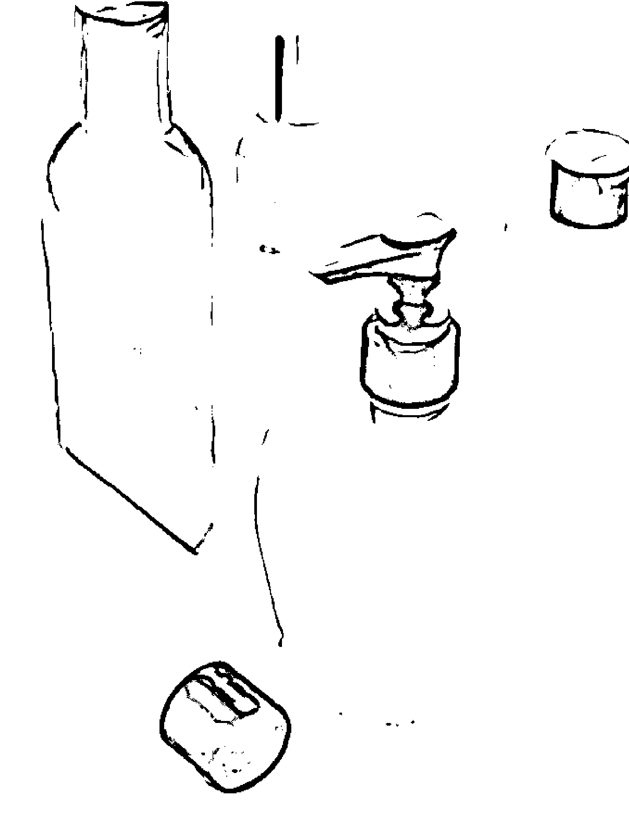

## 精油疗效的实践

芳香疗法的香精油除了怡人的香味外，它的真正魔力产生疗效，进而使我们病痛得到纾解与改善。在本章中，呼吸系统、消化系统、肌肉/关节、皮肤系统、泌尿生殖系统、美容保养，共七大课题，提供一般人常见的症状及适用的配方表。对于人体的各部位系统，我们列出精神系统、呼吸系统以及女性朋友关心的美容保养。

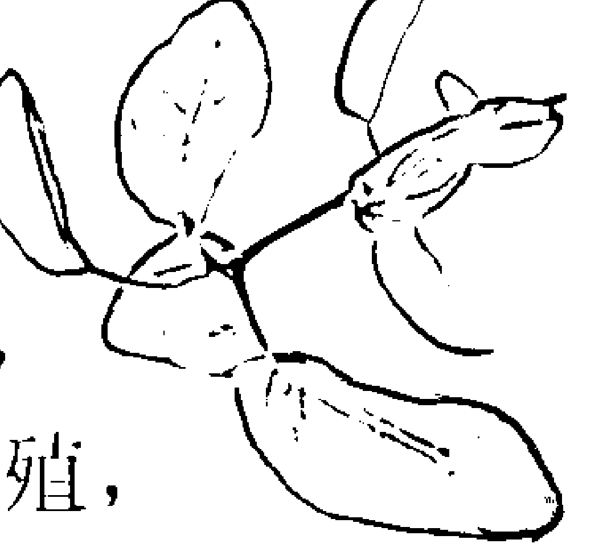

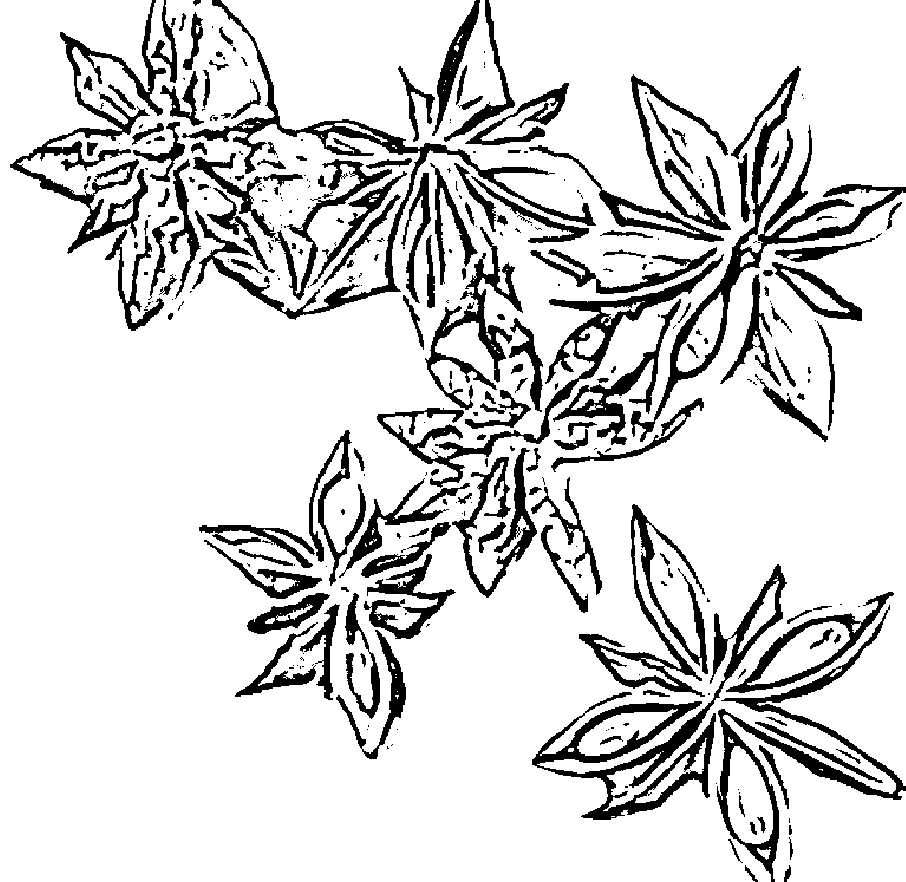

## 50种推荐精油

经过长期的开发，到目前为止，芳香疗法运用的有用植物精油何止百种，在这里只介绍常见、常用以及容易买到的50种精油。