# 精油圣经

# 150种全球最佳植物精油

# THE COMPLETE GUIDE TO ESSENTIAL OILS

# 茹丝·冯·布朗史万格 (Ruth von Braunschweig) / 温佑君 ◎ 著

# 汕头大学出版社

葡萄柚、桔、苦橙、柠檬、莱姆、欧洲冷杉、胶冷杉、西伯利亚冷杉、道格拉斯杉、欧洲赤松、落叶松、黑云杉、杜松浆果、高地杜松、丝柏、格陵兰喇叭茶、杜鹃、欧白芷根、白松香、莳萝、榄香脂、乳香、卡奴卡、岩玫瑰、黑胡椒、熏陆香、贞节树、罗马洋甘菊、快乐鼠尾草、苦橙叶、柠檬薄荷、真正薰衣草、醒目薰衣草、佛手柑、花梨木、芳樟、芫荽、沉香醇百里香、侧柏醇百里香、龙脑百里香、蜂香薄荷、玫瑰草、波旁天竺葵、玫瑰天竺葵、大马士革玫瑰、橙花、茶树、马郁兰、胡椒薄荷、野洋甘菊、甜罗勒、黄桦、白珠树、安息香、秘鲁香脂、鹰爪豆、银合欢、桔叶、大高良姜、阿密茴、香草、摩洛哥玫瑰、摩洛哥茉莉、阿拉伯茉莉、黄玉兰、白玉兰、水仙、晚香玉、红花缅栀、松红梅、永久花、大西洋雪松、喜马拉雅雪松、大根老鹳草、马缨丹、印蒿、桂花、紫罗兰、鸢尾草、零陵香豆、土木香、圆叶当归、芹菜 ……

[IMG]

[IMG]

[IMG]

[IMG]

# 精油图鉴

本书从严谨的科学事实出发，书中罗列的精油成分与属性疗效，除了参考世界各地的精油期刊文献外，大部分选录的资料，都是经过作者和学生的临床印证。

◎茹丝的蛋
德国芳香疗法专家Ruth老师发明了一个“茹丝的蛋”。透过图解，能让初学者一目了然地掌握各种精油的身心疗效，进而有意义且安全地使用精油。

◎手绘图片
部分植物生长地区特殊，前往不易，因此由芳疗师以手绘方式呈现。从这些珍贵的手绘里，不仅能看出芳疗师对该种精油的感受，而且能帮助读者了解原植物的精神。

◎气卦七轮
本书从气卦七轮养生学切入，分析在不同的气卦上使用合适的精油，有助于调理该气卦对应部位的身心状况。

◎收集精油150种
收集各类精油高达150种。所有的植物图片都经过品种方面的核对确认，以避免一般书籍常见的图片错误。

ISBN 7-81036-961-X
TQ·43 定价：29.80元

# 图书在版编目（CIP）数据

精油图鉴 / 茹丝・冯・布朗史万格(Ruth von Braunschweig)，温佑君著. — 汕头：汕头大学出版社，2006.5
ISBN 7-81036-961-X
Ⅰ. 精… Ⅱ. ①茹… ②温… Ⅲ. 香精油—图集 Ⅳ. TQ654.64
中国版本图书馆CIP数据核字（2006）第039176号

中文简体字版 ©2006由汕头大学出版社发行
本书经城邦文化事业股份有限公司商周出版事业部授权，同意经由汕头大学出版社出版中文简体字版本。非经书面同意，不得以任何形式任意复制、转载。

# 精油图鉴

作者：茹丝・冯・布朗史万格(Ruth von Braunschweig) 温佑君
责任编辑：廖醒梦 梁志英
责任校对：蒋惠敏
封面设计：黎小红
责任技编：姚健燕 李 行
出版发行：汕头大学出版社
广东省汕头市汕头大学内 邮编 515063
电 话：0754-2903126
印 刷：深圳大公印刷有限公司
开 本：787 × 1092 1/16
印 张：11.5
字 数：100千字
版 次：2006年7月第1版
印 次：2006年7月第1次印刷
印 数：6500册
定 价：29.80元
ISBN 7-81036-961-X/TQ·43

发行 / 广州发行中心 通讯邮购地址 / 广州市天河北路177号祥龙阁3004室
邮编 / 510620
电话 / 020-22232999 传真 / 020-85250486
马新发行所 / 城邦（马新）出版集团
电话 / 603-90563833 传真 / 603-90562833
E-mail: citeckm@pd.jaring.my
版权所有，翻版必究
如发现印装质量问题，请与承印厂联系退换

# 作者简介

## 茹丝·冯·布朗史万格
Ruth von Braunschweig

国际知名芳香疗法专家、精油专家，目前为德国芳疗协会荣誉会员及专任讲师。
拥有专业芳疗师与生物、化学学士双头衔的 Ruth老师，在德国举办过无数的专题演讲并写过无数的专刊。凭借丰富的化学专业背景，她所创立的精油化学结构分析模式，已经为广大的精油爱好者提供一条明确且科学的学习途径。
著作有《茶树精油》、《植物油》、《丝衣草与松红梅》（均为德文）。

## 温佑君

专业芳疗师。东吴大学社会系、英国肯特大学哲学研究所毕业。因对精油疗法的喜爱，后进入伦敦芳香疗法学校学习并取得优异成绩。目前为肯园香气私塾负责人。
本书为其采借在德国已注册著作权的“茹丝的蛋”，来介绍150种精油的成分，使初学者得以一目了然地掌握各种精油的身心疗效。

作品有：
翻译：《芳香疗法精油宝典》。
审订：《芳香疗法大百科》、《芳香疗法的艺术》、《发现肯园》。

[IMG]

《芳香疗法全书》 39.80元

[IMG]

《精油全书》 30.00元

[IMG]

《精油芳疗养生事典》 36.00元

责任编辑：廖醒梦 梁志英
封面设计：黎小红

# 精油图鉴

# The Complete Guide to Essential Oils

[IMG]

茹丝·冯·布朗史万格（Ruth von Braunschweig）
温佑君◎著

汕头大学出版社

推荐序 4

引言 6

如何使用本书 8

芳疗年表 10

光合作用——精油是如何形成的？ 12

精油蒸馏过程 13

气卦七轮与其对应范围 14

精油化学结构图 15

精油成分属性表 16

## 单萜烯类 18

- 葡萄柚 19
- 桔 20
- 苦橙 21
- 柠檬 22
- 莱姆 23
- 欧洲冷杉 24
- 胶冷杉 25
- 西伯利亚冷杉 26
- 道格拉斯杉 27
- 欧洲赤松 28
- 落叶松 29
- 黑云杉 30
- 杜松浆果 31
- 高地杜松 32
- 丝柏 33
- 格陵兰喇叭茶 34
- 杜鹃 35
- 欧白芷根 36
- 白松香 37
- 莳萝 38
- 榄香脂 39
- 乳香 40
- 卡奴卡 41
- 岩玫瑰 42
- 黑胡椒 43
- 熏陆香 44
- 贞节树 45

## 酯类 46

- 罗马洋甘菊 47
- 快乐鼠尾草 48
- 苦橙叶 49
- 柠檬薄荷 50
- 真正薰衣草 51
- 醒目薰衣草 52
- 佛手柑 53

## 苯基酯类 54

- 黄桦 55
- 白珠树 56
- 安息香 57
- 秘鲁香脂 58
- 鹰爪豆 59
- 银合欢 60
- 桔叶 61
- 大高良姜 62
- 阿密茴 63
- 香草 64
- 摩洛哥玫瑰 65
- 摩洛哥茉莉 66
- 阿拉伯茉莉 67
- 黄玉兰 68
- 白玉兰 69
- 水仙 70
- 晚香玉 71
- 红花缅栀 72

## 单萜醇类 73

- 花梨木 74
- 芳樟 75
- 芫荽 76
- 沉香醇百里香 77
- 侧柏醇百里香 78
- 龙脑百里香 79
- 蜂香薄荷 80
- 玫瑰草 81
- 波旁天竺葵 82
- 玫瑰天竺葵 83
- 大马士革玫瑰 84
- 橙花 85
- 茶树 86
- 马郁兰 87
- 胡椒薄荷 88
- 野洋甘菊 89
- 甜罗勒 90

## 倍半萜酮类 91

- 松红梅 92
- 永久花 93
- 大西洋雪松 94
- 喜马拉雅雪松 95
- 大根老鹳草 96
- 马缨丹 97
- 印蒿 98
- 桂花 99
- 紫罗兰 100
- 鸢尾草 101

## 香豆素与内酯类 102

- 零陵香豆 103
- 土木香 104
- 圆叶当归 105
- 芹菜 106

## 醛类 107

- 柠檬香桃木 108
- 柠檬细籽 109
- 柠檬香茅 110
- 柠檬尤加利 111
- 山鸡椒 112
- 柠檬马鞭草 113
- 香蜂草 114
- 小茴香 115

## 氧化物类 116

- 蓝胶尤加利 117
- 澳洲尤加利 118
- 史密斯尤加利 119
- 绿花白千层 120
- 白千层 121
- 香桃木 122
- 罗文莎叶 123
- 月桂 124
- 高地牛膝草 125
- 桉油醇迷迭香 126
- 豆蔻 127
- 穗花薰衣草 128

## 酚类 129

- 多香果 130
- 中国肉桂 131
- 锡兰肉桂 132
- 丁香 133
- 神圣罗勒 134
- 野马郁兰 135
- 冬季香薄荷 136
- 印度藏茴香 137
- 野地百里香 138
- 百里酚百里香 139

## 单萜酮类 140

- 头状薰衣草 141
- 艾草 142
- 鼠尾草 143
- 牛膝草 144
- 绿薄荷 145
- 藏茴香 146
- 万寿菊 147
- 樟树 148
- 薄荷尤加利 149
- 多苞叶尤加利 150
- 樟脑迷迭香 151
- 马鞭草酮迷迭香 152

## 醚类 153

- 热带罗勒 154
- 龙艾 155
- 肉豆蔻 156
- 洋茴香 157
- 茴香 158
- 欧芹 159

## 倍半萜烯类 160

- 西洋蓍草 161
- 德国洋甘菊 162
- 南木蒿 163
- 摩洛哥蓝艾菊 164
- 没药 165
- 穗甘松 166
- 缬草 167
- 蛇麻草 168
- 维吉尼亚雪松 169
- 依兰 170
- 郁金 171
- 姜 172
- 古巴香脂 173
- 一枝黄花 174

## 倍半萜醇类 175

- 檀香 176
- 胡萝卜籽 177
- 岩兰草 178
- 广藿香 179
- 暹罗木 180

科属索引 181
学名索引 182

[IMG]

# 推荐序

[IMG]

“Ätherische Öle wirken nicht auf geheimnisvolle, wunderbare Weise, sondern auf Grund ihrer biochemischen Zusammensetzung. Diese ist bei den einzelnen Ölen sehr unterschiedlich und prägt die spezifischen Eigenschaften und Indikationen.

Jedes ätherische Öl setzt sich aus einer Vielfalt organischer Verbindungen zusammen, den Inhaltsstoffen, die für den Duft und die Wirkung verantwortlich sind, Es ist nie ein einzelner Stoff, der den Charakter und die Eigenschaften eines ärtherischen Öls bestimmt, sondern immer die Gesamtheit der Inhaltsstoffe,

Jeder Inhaltsstoff hat zwar eine spezifische Wirkung, die auch häufig einzeln chemisch nachgewiesen sind. Aber nur die individuelle Kombination in jedem ätherischen Öl macht seine ganz speziellen Eigenschaften aus.

Es gibt hunderte von Wirkstoffen in den verschiedenen Ölen. Um jedoch den Überblick zu behalten und einen Einblick in die spannende Welt der Wirkweisen zu ermöglichen, werden die Hauptgruppen der Inhaltsstoffe vorgestellt. Die Einzelstoffe lassen sich in Gruppen zusammenfassen, da viele einen ähnlichen biochemischen Aufbau haben und somit auch ähnliche Wirkungsweisen aufweisen.

Benannt werden die Hauptgruppen nach ihrer chemischen Zusammensetzung.

Modell zu Wirkung ätherischer Öle:Das Modell gibt einen Überblick über die Zusammensetzung eines Öls,Konzentration bzw. Quantität einzelner Inhaltsstoffgruppen, sowie die Wirkung der einzelnen Stoffe und im Zusammenspiel die Eigenschaften des gesamten Öls.

Angeregt zur Entwicklung dieses Modells wurde ich durch die vielfältigen Diskussionen in Seminaren. Es wurde darin deutlich, dass der Anwender / Therapeut ein einfaches Hilfsmittel für einen verantwortungsvollen Umgang mit ätherischen Ölen benötigt, denn z.B. sind einige Inhaltsstoffgruppen stark anregend und gleichzeitig in hoher Dosierung auch hautreizend während andere seelisch ausgleichend und hautpflegend sind.

Ich freue mich herzlich darüber, daß dieses Modell von Yo-June ins Buch eingeführt ist. Durch die Beschreibung der Inhaltsstoffe und ihre Eingliederung in das Modell erleichtert dem Anwender die chemischen Zusammenhänge zu erkennen und im Rahmen der Aromatherapie sinnvoll anzuwenden”

Herzliche Grüsse

**[签名]**

精油的运作模式并非深奥莫测、玄不可解，而是建构在生化的组成成分上。

每一种精油的生化组成均不相同。 精油的特质、气味、作用及临床应用皆取决于各种有机体的独一无二组合。

学习者需谨记在心的是，精油的特质并非由某种特定分子所决定，而是取决于一种综合的协调性。 虽然生化实验证明某些成分确实具备特定的功效，但因每一种精油都拥有百种以上的有效物质，其作用机制自然不是单一的，也因此使得这个领域的探索随处充满令人惊喜之处。

为了带领有心人一窥芳疗之堂奥，我兴起了将数百种精油大类化的构想。

从化学属性来看，许多单一的化学成分具备类似的生化结构、拥有近似的作用机制，故可被归为同类。每一种精油依其化学组合类化后，再定义其基本的身、心、灵疗愈力，因而有了“茹丝化学结构图”的产生。

这个模式的好处在于能通过图解，使大家对精油的主要成分、每一大类的比重，以及各种成分间交替作用的方式，获得快速且清晰的概念。

这个模式的原创动力亦要感谢许多曾经和我共同学习的学员。 在许多各式各样的研讨会中，我发现精油的使用者 / 治疗师需要一个简易、一目了然的原则，辅助他们有意义且安全地使用精油。 例如：某些化学类属具有强大激励的作用，高剂量使用时会刺激皮肤；某些则具有镇定情绪、护肤的效果。

很高兴看到佑君在这本书里采用“茹丝化学结构图”的概念来介绍精油，我衷心期望所有芳疗爱好者能藉由这个化学结构图的帮助，安全、正确地应用芳香疗法。

> 茹丝·冯·布朗史万格
德国生化学者
国际知名芳疗专家

# 引言

[IMG]

编写这样一本严肃的教科书，背后其实有一个浪漫的理由。

一般人都以为学芳疗该是鸟语花香似的乐事一桩，但在我培训班上的学生，却常感“没顶”之苦。平日再熟悉不过的薰衣草，一会儿得分辩它长相互异的各个品种，一会儿要区隔它们相差无几的气味，不多时又出现变化多端的化学结构，最后还来段闻所未闻的电影情节，给这种精油的应用做寓言式总结。目不暇给的学生为免顾此失彼，只有拼命描摹“茹丝的蛋”——以德国生化学者Ruth von Braunschweig提出的模型为依据，替每种精油剪影塑像的成分图。

“茹丝的蛋”确实是我一再鼓吹的学习重心，因为消费大众的精油概念已被商品化，而有心深究者往往囿于语言的限制，仅能取得一些人云亦云的资讯，若不从罕见讨论的化学结构切入，是不可能突破这重重迷障的。就拿安眠的薰衣草来说吧，为什么它有这种作用？是否对任何睡眠困扰都有帮助？怎么有些人却愈用愈有精神、反而睡不着？如果你晓得，薰衣草富含的酯类以抗痉挛见长，自然不会怀疑它要如何让神经紧绷的人放松下来。但酯类是阴性的分子，不像阳性的醚类同时兼具抗痉挛和充电的功效，所以对那些耗损过度、累到睡不着的个案，富含醚类的罗勒可能比薰衣草更有帮助。而用起来反倒提神醒脑的怪胎薰衣草，其实并不是大家印象中的薰衣草，而是萃取自一种名为醒目薰衣草的杂交品种。同属不同种的薰衣草，就像同被归为印象派的塞尚与莫内，相去岂可以道里计？因此，我总要不厌其烦地提醒学生，开启精油大门的两把钥匙，一是植物分类，另外一把就是化学结构。受到这种观念的反复习染，学生将茹丝的蛋视若珍宝，应该可以算是尽得真传了。可是看到她们心无旁骛地画蛋，我总有一丝怅惘。因为，精油并不是芳香疗法的终点。

那么，什么才是芳香疗法的终点？这个重要问题的另一个提法是，学习芳香疗法的终极目的为何？既然是门疗法，习用的意义必然在于获得某种疗愈能力。表面上看来，的确是精油的化学结构决定了它的药学属性，是那些药学属性带给芳疗神奇的治愈力量。然而，多年的教学与临床经验让我清楚看到：单凭精油的化学结构，并不能产生全面的疗效。这个世界上最具疗愈力的，其实是德性之真和艺术之美，没有这两股力量“加持”，精油恐怕也是徒善不足以自行。举另一个对失眠和头痛有奇效的精油穗甘松来说好了，这种精油富含倍半萜烯，可以使人产生怡然自得的感受。而一个人在做下宽厚的决定时，或是赏玩书画之际，心中一样会产生怡然自得的感受。在这抽象感受的背后，是脑内啡与血清素具体运作的结果。脑内啡足以止痛，血清素助人安眠，可见人体内原就蕴藏着巨大的自愈能力。使用精油的目的，本在唤醒这种自愈能力，而德性与艺术既能带来相近的感受，自然也能唤醒这种自愈能力。相反的，若是长期抱持睚眦必报或汲汲营营的心态，或是生活当中只有柴米油盐或声色犬马，那么憩甘松带来的怡然自得，也会逐渐被剥蚀殆尽，使人再次坠入失眠头痛的深渊之中。

所以，在我看来，芳香疗法的终点就和所有宏伟深刻的学问一样，是要引领我们走进存在的本质，使人更加了解这个世界，同时也得以重新认识自己。而精油的化学结构，不过是这趟探索之旅的起点。话虽如此，泰半的芳疗书籍连这个起点也未能站上，在精美的印刷之下，却多是些立论不知依据、评述少经考证的传闻。因此，这本《精油图鉴》试图从严谨的科学事实出发，希望能帮助读者突破盲信、扫除疑虑。书中罗列的精油成分与属性疗效，除了对照法国芳疗权威潘威尔医师D. Panoel和化学家法兰贡P. Franchomme的研究成果，也参考世界各地的精油期刊文献，而且，大部分被选录的资料，都曾经过我自己或师友学生的临床映证。

这本书最特别的地方，当然还是前述的“茹丝的蛋”。这个模型是茹丝老师匠心独运的发明，使初学者得以一目了然地掌握各种精油的身心疗效。“茹丝的蛋”在德国已注册著作权，多蒙茹丝老师慨然应允，让我在书中采借其模型来介绍精油成分，以嘉惠中文读者。本书另一特点是，所有植物图片都经过品种方面的核对确认，就连手绘的部分也不例外，读者绝对可以放心从中捕捉植物原貌。但这本书并非DIY用油指南，而比较像是提供研究材料的简明手册。事实上，最初便是有感于学生抄笔记太辛苦，才兴起出版本书的念头，现在如愿完成，也算得上是教学相长的一种收获吧。

最后，特别要感谢肯园的艺术总监刘寅生先生，和肯园的芳疗师吴佳陵，佳陵栩栩如生的白描手绘，让那些罕能目睹的植物如在眼前。同时也让我那个浪漫的想法有机会实现 —— 希望我的学生们，可以省下抄笔记与描图的时间，听听精油如何和音乐、绘画、戏剧、文学和所有美的元素对话；也希望所有对精油感兴趣的朋友，能在坚实的科学基础上，探索和人生一般艰难但美妙的芳疗世界。

温佑君

## 如何使用本书

根据植物精油内含的主要芳香化学成分，将本书共区分为15个主要的章节；分别为单萜烯、酯类、苯基酯、单萜醇、倍半萜酮、香豆素及内酯类、醛类、氧化物、酚类、单萜酮、醚类、倍半萜烯及倍半萜醇等。这些成分组成提供了精油不同的性质、气味、作用及临床应用的身心疗效，接之各章节内的精油则再依其植物科属及化学成分的含量多寡依序排列。

- 精油颜色：萃取出的精油色泽。
- 药学属性：精油内含的芳香分子应用在医疗上的作用机制。
- 适用症候：适合使用的疾病或生理症状。
- 心理处方：特别适合在某些情绪状态使用，帮助内在重新回归平衡。例：丁香帮助化解无能为力不如归去之感。或者，可以提供某种特定的正面特质。例：茉莉带给人信心。

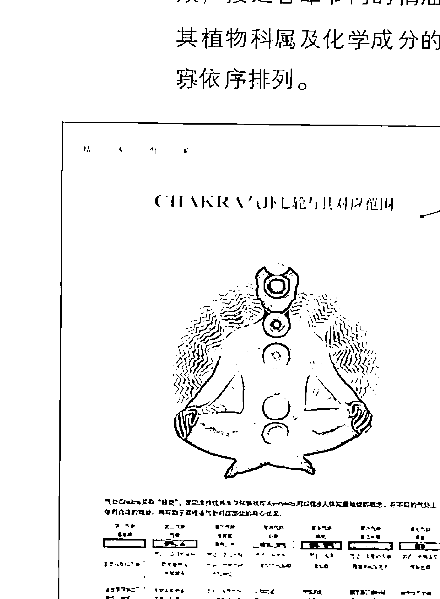

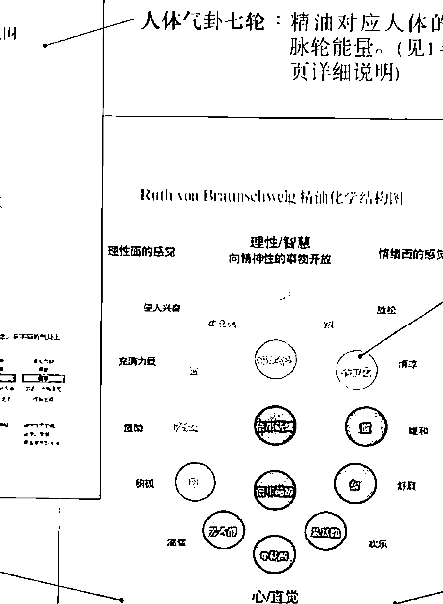

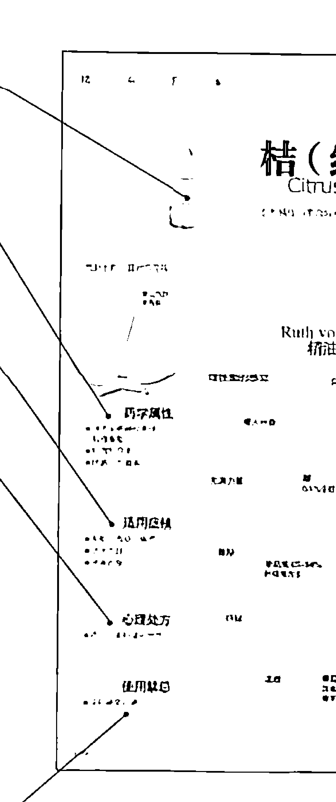

- 使用禁忌：使用时须注意的安全问题。
- 化学分子：代表同属性芳香化学成分。
- 茹丝蛋左侧：对应阴性情绪的阳性芳香分子位于此，如醛类、氧化物类。
- 茹丝蛋右侧：对应阳性情绪的阴性芳香分子。

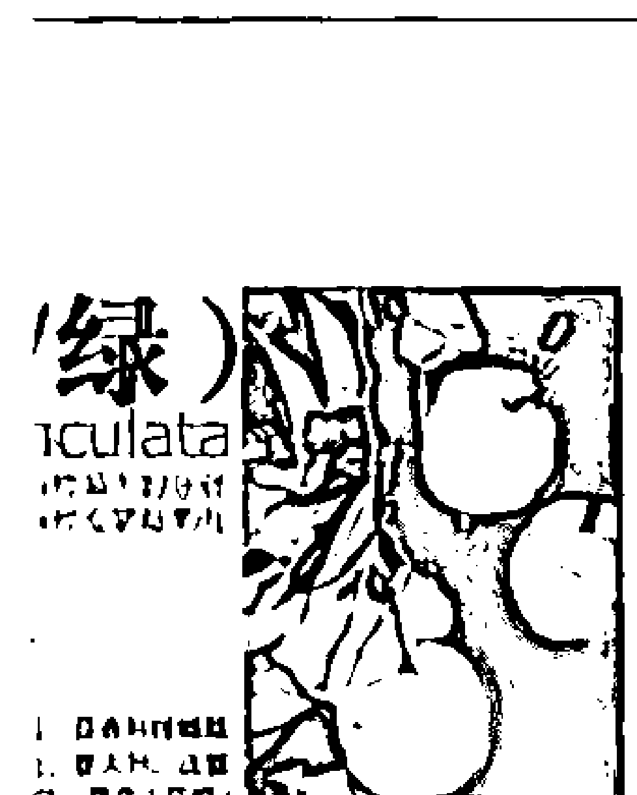

## 苦橙

- 植物科属：相同科属的植物常共相仿的特性或作用功能
- 重要产地：显示植物生长环境的气候土壤等天然因素
- 萃取部位：植物萃取的部位和萃取方式的不同将影响成分差异
- 化学分子比例：组成精油芳香分子的化学成分比例
- 植物名称：一般俗名，也是我们一般常见的植物精油名称
- 拉丁学名：完整的拉丁学名，是世界共通的精油标示名，可作为读者购买精油时，俗名之外的共同依据

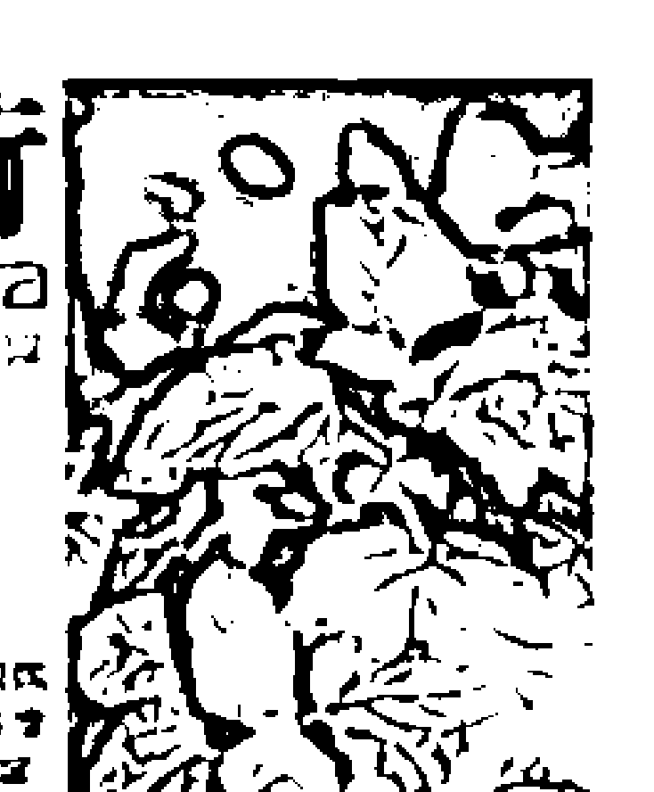

## 柠檬薄荷

- 化学分子比例：组成柠檬薄荷精油芳香分子的化学成分比例
- 重要产地：柠檬薄荷的主要生长产地环境特征
- 萃取部位：柠檬薄荷的萃取部位及方式对成分的影响
- 心理处方：柠檬薄荷精油的心理调节功效
- 使用禁忌：柠檬薄荷精油的使用注意事项

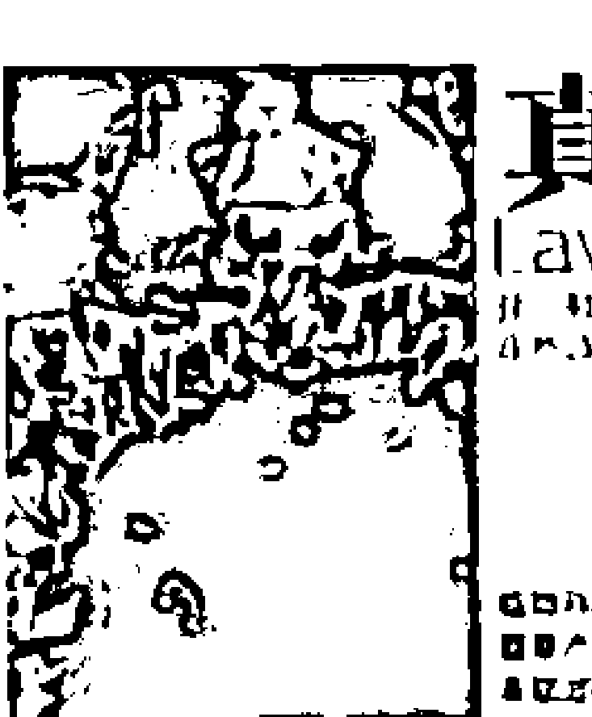

## 真正薰衣草

- 化学分子比例：组成真正薰衣草精油芳香分子的化学成分比例
- 重要产地：真正薰衣草的主要生长产地环境特征
- 萃取部位：真正薰衣草的萃取部位及方式对成分的影响
- 心理处方：真正薰衣草精油的心理调节功效
- 使用禁忌：真正薰衣草精油的使用注意事项
- 分类标签：所属的化学分类
- 图说：精油植物的特殊属性及外形描述

## 芳疗年表

**史前**
烟熏病患，食用芳香药用植物。

**公元前4000年**
古迹石板记录苏美人使用芳香植物。

**公元前3000年**
埃及
历史记录芳香药用植物的使用，包括医疗、美容、制作木乃伊、宗教仪式。

**公元前2000年**
印度
吠陀经典记录芳香药用植物的使用方法。（夏2205~1766 BC，商1765~1200 BC）

**公元前460 ~ 377年**
希腊
希波克拉底，整体疗法之父。其著作所载之药草处方有三百多种，现代医生在就业前仍需宣读“希波克拉底誓言”。（战国时代，黄帝内经403~221 BC）

**公元78年**
希腊
狄奥司哥底，其五大册的本草经中，列举了药草处方达五百种。（东汉章帝58 ~ 88 BC，班超的时代）

**公元131 ~ 199年**
罗马
率先对药用植物做出主要分类。（东汉华佗，208 AD）

**公元825 ~ 925年**
阿拉伯
拉齐，撰述24册药书《巴格达的医院》。（唐朝孙思邈，《备急千金要方》，652 AD）

**公元980 ~ 1037年**
波斯（今伊朗）
阿比西那，著作中记录了超过800种药用植物，运用按摩与食疗治病，改进当时的蒸馏法而萃取精油。（北宋王惟一，创制经络铜人，1026 AD）

**10世纪**
黑暗时代
罗马帝国崩溃后，药草传统主要保存于修道院中。盎格鲁·萨克逊药方集结成书，名为Leech Book of Bald。（五代至北宋初）

**12世纪**
十字军东征
带回阿拉伯的香水与蒸馏配备，开始用欧洲本土的芳香植物萃取精油。（北宋末，南宋初1127 AD）

**15世纪**
欧洲
印刷术传入，各国印制《药草志》，药商与药师都销售精油，大户人家会自备蒸馏房。（明朝）

**16世纪**
欧洲
Pietro Mattioli、Charles de l‘Ecluse、Banckes 出版药草志。（明朝李时珍，万历六年、1578 AD成书《本草纲目》）

**公元1597年** 英国
御医约翰·杰洛出版《药草简史》，在民间广为流传，是英国最早的药草书之一。（明朝万历十八年，1590 AD刊行《本草纲目》，狂销三十几版）

**公元1652年** 英国
卡尔·培波刊行《英国医师增订本药草志》，许多译自希腊文与拉丁文的医书，也都描述了精油的应用，实验化学开始兴起。（清朝顺治年间）

**公元1660 ~ 1742年** 菲德利奇·霍夫曼
对精油进行研究。（清朝雍正、乾隆年间）

**18世纪** 外科手术兴起，化学药物昌盛，植物疗法渐衰。（清朝乾隆年间，1735~1796 AD）

**公元1926年** 赫内·盖特福赛
法国化学家，现代芳香疗法之父，发表一篇论文，首创Aromatherapie一词，其书旋即出了英文版。（公元十五年，孙文逝世后一年）

**公元1950 ~ 1952年** 尚·瓦涅医生
他在这段时间担任法国派驻越南的外科军医，以精油治疗许多疾病和创伤，1953年返回法国后便运用精油进行医疗直到今日。曾任法国植物疗法与芳香疗法学会主席，并获颁荣誉勋位。所著之《芳香疗法之临床医疗》于1980年出版。

**公元1961年** 麝利夫人
出版《麝利夫人的芳香疗法》法文版，本是奥地利裔的法国外科护士，后来成为将芳香疗法引进英国与美容界的教母。

**公元1977年** 罗勃·滴莎兰德的《芳香疗法的艺术》出版，这是英语世界的第一本芳香疗法专书，也使罗勃·滴莎兰德成为英国芳疗界的先驱。

**公元1985年** 本部在英国的国际芳香疗法师联盟IFA创立，主导英语世界芳疗教学的方向，影响深远，1993年为其全盛时期，当时全英约有90所大大小小的芳香疗法学校，60册以上的芳香疗法专书，5000名左右的执业芳香疗法师。

**公元1990年** 德国芳疗协会Forum Essenzia创立，该协会并定期出版内容严谨详实之芳疗期刊，举办由医师、化学家、护理专业人员、自然疗法师所教授的课程与讲座，以及三年一次的国际芳疗学术研讨会。

**公元1996年** 法国医师潘威尔与化学家法兰贡合著之《精确的芳香疗法》法文版出版，此书是他们两人自70年代以来的研究成果总结，被奉为最具学术价值之芳疗圣经。

**公元2002年** 芳香疗法已成为另类疗法中的显学，有愈来愈多的中、西医投身其中以进行研究或临床应用；另一方面，它也是休闲产业SPA与美容界的流行宠儿，所以，芳香疗法在大众心目中的评价，仍视其认识深浅而在两极间摆荡。

## 光合作用——精油是如何形成的？

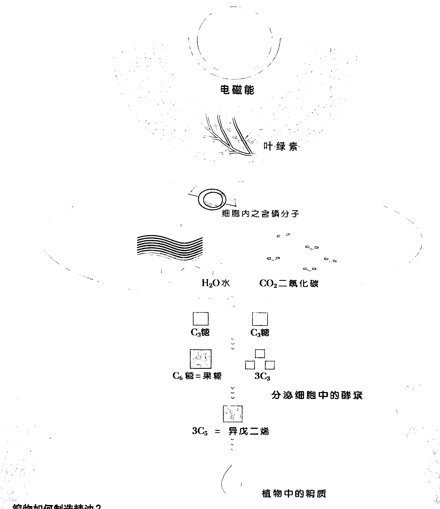

**植物如何制造精油？** 靠着众所周知的光合作用，植物不仅为自己生产粮食，某些植物还能进一步把这些养分再制成具有挥发性的芳香分子，以抵抗病虫害，或是在丛林大火时使地上枝叶迅速燃烧以保住根部。这些芳香分子被储存于植物不同部位的腺囊中，高温下或挤压时即会释出。

## 精油蒸馏过程图

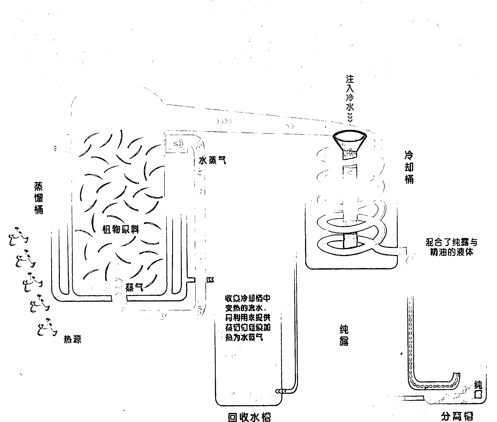

## 人类如何萃取精油？

蒸馏法是最常用的萃取方式，同时还能获得一种珍贵的副产品：纯露。压榨法专门用来萃取芸香科柑橘属的果皮类精油，而许多昂贵花香类的原精，由于花瓣娇弱，只能用溶剂（己烷）萃取。目前最佳的萃取技术是二氧化碳萃取法，但因为设备昂贵，尚未普及。

## CHAKRA气卦七轮与其对应范围

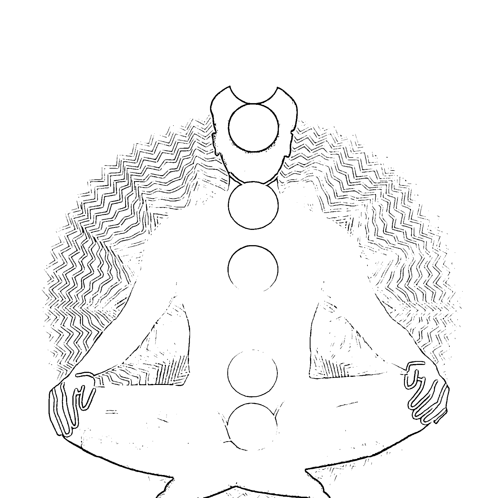

气卦Chakra又称“脉轮”，是印度传统养生学阿输吠陀Ayurveda用以指涉人体能量场域的概念。在不同的气卦上使用合适的精油，将有助于调理该气卦对应部位的身心状况。

| 第一气卦 基底轮 | 第二气卦 性轮 | 第三气卦 本我轮 | 第四气卦 心轮 | 第五气卦 喉轮 | 第六气卦 第三只眼 | 第七气卦 顶轮 |
| :--- | :--- | :--- | :--- | :--- | :--- | :--- |
| **红色，土** | **橙色，水** | **黄色，火** | **绿色，空气** | **蓝色，润气** | **靛色** | **紫色** |
| 梵语：自我的庇所 | 梵语：宝石之城 | 梵语：免灾免厄 | 梵语：纯净 | 梵语：无限的力量 | 梵语：千瓣莲花 | |
| 会阴与肛门之间 | 阴毛地带与生殖器官 | 肋骨与肚脐之间 太阳神经丛 | 心脏以上的胸部 | 喉与颈 | 两眉之间与之上 | 颅骨之顶 |
| 讯息传导物质 饮食、睡眠 基本物质需求 | 生殖泌尿功能 生育、创造 情绪、思维 | 消化，胃口与肝 与外界相通之处 自我意志的中心 体触神意之所 | 心肺功能 爱 连结身心的桥与 世界沟通的管道 | 呼吸系统、 甲状腺、淋巴 表达真理与创意 | 脑下腺、脑神经 理解与智慧 | 神经传导物质 灵性、慧根 基督教中的光环 |

### Ruth von Braunschweig 精油化学结构图

理性/智慧
向精神性的事物开放

理性面的感觉

情绪面的感觉

使人兴奋

放松

单萜酮

氧化物

醚

充满力量

清凉

倍半萜酮

香豆素

激励

缓和

倍半萜烯

酯

积极

舒展

酚

倍半萜醇

酸

温暖

欢乐

芳香醛

苯基酯

单萜醇

心/直觉
贴近大地

## Ruth von Braunschweig 精油成分属性表 Ⅰ

| 精油成分 | 代表精油 | 心灵属性 | 生理属性 |
|---|---|---|---|
| 单萜烯 | 欧白芷根（~90%） 针叶树（~60-80%） 苦橙叶（~60%） 茶树（~50%） 柑橘类除佛手柑外（~90%） | 强化一个人的精神结构与坚忍不拔之力量，消弭焦虑，增进活力 | 帮助消化，调节黏液分泌，止痛抗风湿，也可用于神经受到惊吓 |
| 酮 | 佛手柑（~35%） 薰衣草（~50%） 快乐鼠尾草（~60-80%） | 镇定，唤醒感受与直觉，明朗冷静 | 抗黏液过多，强力消炎，助眠，抗痉挛 |
| 苯基酯 | 茉莉、依兰 安息香、秘鲁香脂 | 使人享受生活，柔情胜水，满足感官 | 抗沮丧，护肝胆护肤 |
| 单萜醇 | 玫瑰与天竺葵（~60%） 花梨木与玫瑰草（~80-95%） | 强化神经，提振情绪，带来本土特质之欢愉，温暖亲切，强化心灵 | 激励免疫功能，平衡，抗微生物适于对抗慢性病 |
| 倍半萜酮/双酮/三酮 | 穗甘松（~10-20%） 大西洋雪松（~5-10%） 永久花（~7-10%） 松红梅（~25%） | 对抗心灵上的缺憾与伤疤，增进感应能力以及精神的清澈度（使灵魂越来越干净） | 三酮：抗黏液作用强，促进皮肤再生，促进结痂，促进伤口痊愈，化痰 |
| 香豆素 | 佛手柑（~3.6%） 零陵香豆（~50%） | 使人平静而愉悦，松弛紧绷神经之功效颇强（少量即有大用） | 强力抗痉挛，促进血液循环 |
| 醛 | 柠檬香茅（~65%） 山鸡椒（~75%） | 从惶惑不安和前途茫茫的状态中抽身，对心灵有强大的刺激作用 | 消炎，抗微生物 |

## Ruth von Braun-schweig 精油成分属性表 II

| 精油成分 | 代表精油 | 心灵属性 | 生理属性 |
|----------|----------|----------|----------|
| 芳香醛 | 藏茴香，香草 | 抗焦虑作用强，可温暖心扉 | 壮阳补肾，帮助消化 |
| 氧化物（桉油醇） | 蓝胶尤加利（70%） 香桃木（~55%） 桉油醇迷迭香（~50%） 穗花薰衣草（~30-35%） | 增进逻辑思考，为精神打气加油，消除恐惧 | 化痰，激励循环 止痛，抗风湿 |
| 酚 | 百里酚百里香 丁香（~75-85%） 肉桂皮（~80%） | 增加生存的乐趣，给予力量以对抗冷感 | 激励免疫之作用极强，抗微生物 止痛 |
| 单萜酮 | 薄荷（~20%） 鼠尾草（~35-55%） 头状薰衣草（~80%） | 在心灵方面有很高的功效！ 使精神清澈与开阔 | 促进皮肤与黏膜再生 伤口愈合，化痰 |
| 醚 | 龙艾（~80%） 茴香（~65%） | 抗沮丧，平衡神经 | 神经性失眠 胃肠痉挛 |
| 倍半萜烯 | 松红梅（~70%） 没药（~90%） 岩兰草（~90%） 大西洋雪松（~80%） | 彰显与放射自我，提高自我安全感，提高对自己的敬意，给予内在的力量，保护神经 | 抗组织胺 消炎 止痒 安抚皮肤 |
| 倍半萜醇 | 胡萝卜籽（~40-55%） 松红梅（~5%） 檀香（~90%） | 提振情绪，使感受平和 平衡压力荷尔蒙 对抗灵媒体质之困扰 | 平衡免疫功能 平衡内分泌腺体 促进皮肤再生 |
| 酸 | 香胶、树脂 | 让心灵减压 | 消炎，抗痉挛 |

## 单萜烯类

- 1. 葡萄柚 Citrus paradisi 96~98%
- 2. 桔（红/绿） Citrus reticulata 65~94%
- 3. 苦橙 Citrus aurantium bigarade 90~92%
- 4. 柠檬 Citrus limonum ~90%
- 5. 莱姆 Citrus limetta 42~64%
- 6. 欧洲冷杉 Abies alba 90~95%
- 7. 胶冷杉 Abies balsamea 75~90%
- 8. 西伯利亚冷杉 Abies sibirica 60%
- 9. 道格拉斯杉 Pseudotsuga menziesii 70~80%
- 10. 欧洲赤松 Pinus sylvestris 80%
- 11. 落叶松 Larix europea 80%
- 12. 黑云杉 Picea mariana 55%
- 13. 杜松浆果 Juniperus communis 50~80%
- 14. 高地杜松 Juniperus communis var. montana 50%
- 15. 丝柏 Cupressus sempervirens 70%
- 16. 格陵兰喇叭茶 Ledum groenlandicum 80%
- 17. 杜鹃 Rhododendron anthopogon 70%
- 18. 欧白芷根 Angelica archangelica 73~90%
- 19. 白松香 Ferula galbaniflua 65~85%
- 20. 莳萝（全株） Anethum graveolens 50~80%
- 21. 榄香脂 Canarium luzonicum 70%
- 22. 乳香 Boswellia carterii 40%
- 23. 卡奴卡 Kunzea ericoides 73%
- 24. 岩玫瑰 Cistus ladaniferus 50%
- 25. 黑胡椒 Piper nigrum 50%
- 26. 黑陆香 Pistacia lentiscus 50%
- 27. 贞节树 Vitex agnus castus 55%

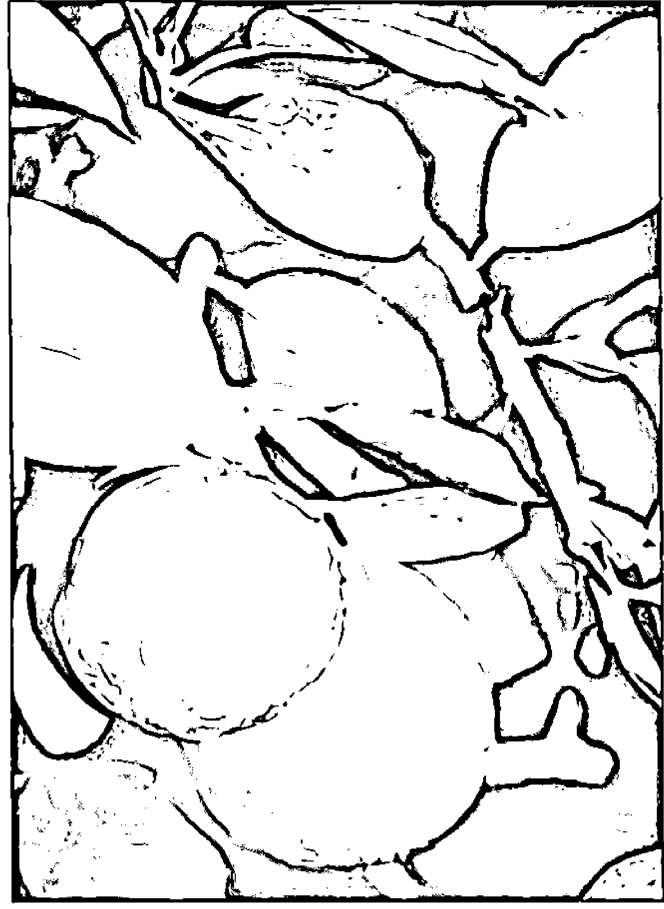

## 葡萄柚
### *Citrus paradisi*
18世纪才由柚类突变而来，是柑橘家族的新成员。

- 植物科属：芸香科柑橘属
- 重要产地：以色列
- 萃取部位：果皮（压榨）

## Ruth von Braunschweig
### 精油化学结构图

| | 理性面的感觉 | 理性/智慧 向精神性的事物开放 | 情绪面的感觉 |
| :--- | :--- | :--- | :--- |
| 使人兴奋 | | | 放松 |
| 充满力量 | 醛7% 牻牛儿醛为主 壬醛、癸醛、香茅醛 | 香豆素 ○ 呋喃香豆素 七叶树素、柑皮油素 莱姆素、香柑油酚 | 清凉 |
| 激励 | 单萜烯96~98% 柠檬烯 | | 缓和 |
| 积极 | | | 舒展 |
| 温暖 | | 心/直觉 贴近大地 | 欢乐 |

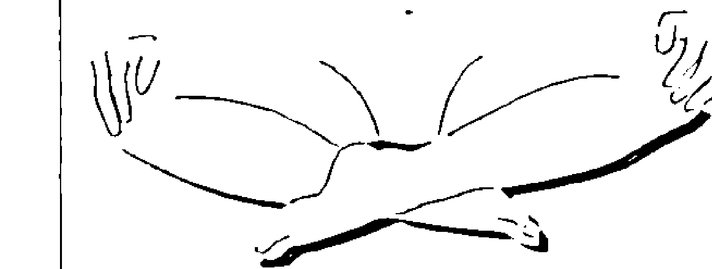

## 气卦七轮与其对应范围

第六气卦
第三只眼

## 药学属性

- ○ 有益消化，激励肝脏制造胆汁
- ○ 解毒
- ○ 利尿
- ○ 收敛

## 适用症候

- ○ 时差
- ○ 带状疱疹，念珠菌感染，粉刺
- ○ 水肿，蜂窝组织

## 心理处方

- ○ 激发自尊
- ○ 增加幽默感

## 使用禁忌

- ○ 注意其光敏性

## 桔 (红/绿)
Citrus reticulata

橘与橙最大的分别，在于橘皮与果肉较易分离，而橙皮紧贴果肉。

- 植物科属：芸香科柑橘属
- 主要产地：意大利、法国
- 萃取部位：果皮（压榨）

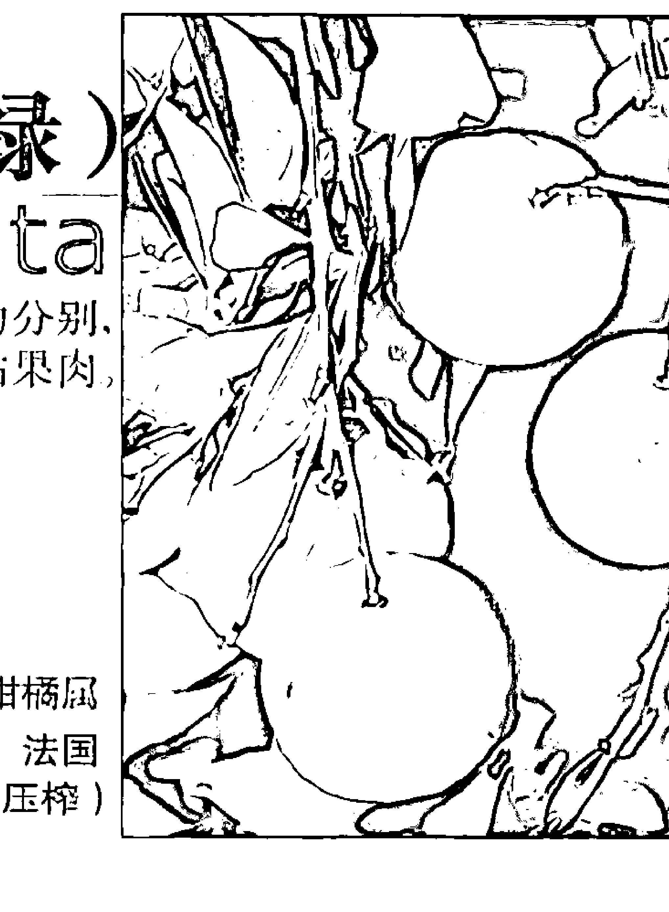

## 气卦七轮与其对应范围

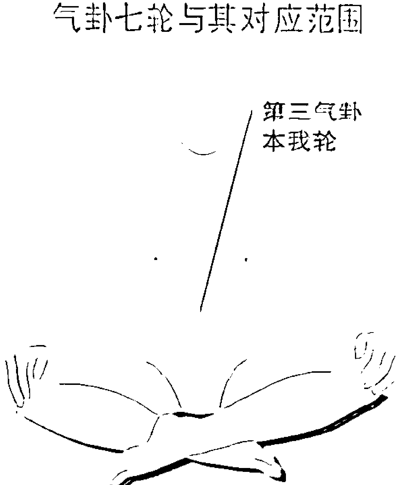

### Ruth von Braunschweig 精油化学结构图

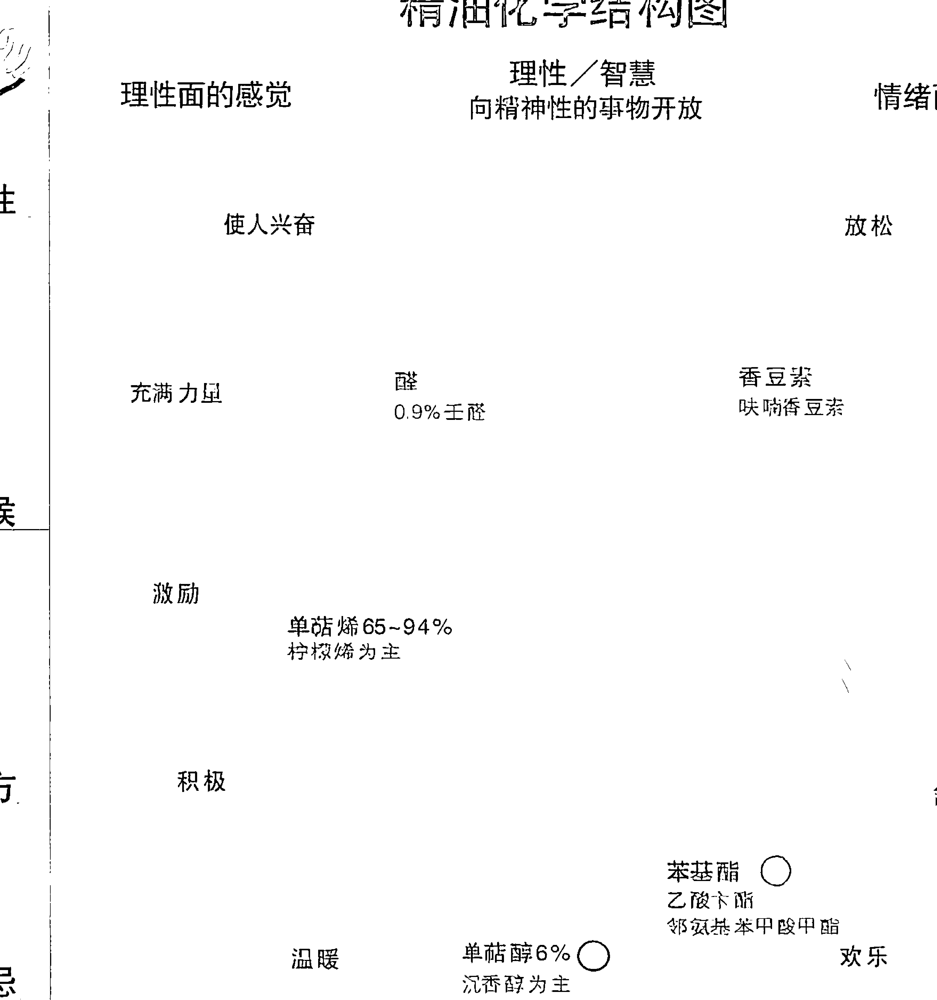

## 药学属性

- 调节中枢神经系统，轻微催眠
- 轻微抗痉挛
- 抗菌，抗霉菌

## 适用症候

- 失眠，激动，焦虑
- 消化不良
- 呼吸困难

## 心理处方

- 进入甜美和谐的世界

## 使用禁忌

- 涂后避免日晒

## 苦橙
Citrus aurantium bigarade
苦橙与甜橙相比，气味更细腻、层次更丰富

植物科属：芸香科柑橘属
重要产地：意大利、象牙海岸
萃取部位：果皮（压榨）

# Ruth von Braunschweig
精油化学结构图

理性面的感觉
理性/智慧
向精神性的事物开放

情绪面的感觉

使人兴奋

放松

充满力量

醛 0.8-7%
柠檬醛、香茅醛
壬醇、癸醇

香豆素
呋喃香豆素 > 0.09% 清凉
橙皮油素
香柑油内酯

激励
单萜烯 90-92%
柠檬烯为主
异松油烯

酯 2% ○
乙酸沉香酯
乙酸橙花酯
乙酸牻牛儿酯
乙酸香茅酯
缓和

积极

舒展

温暖
单萜醇 0.4-3%
沉香醇、萜品醇
橙花醇、牻牛儿醇
香茅醇
○

欢乐

心/直觉
贴近大地

## 气卦七轮与其对应范围

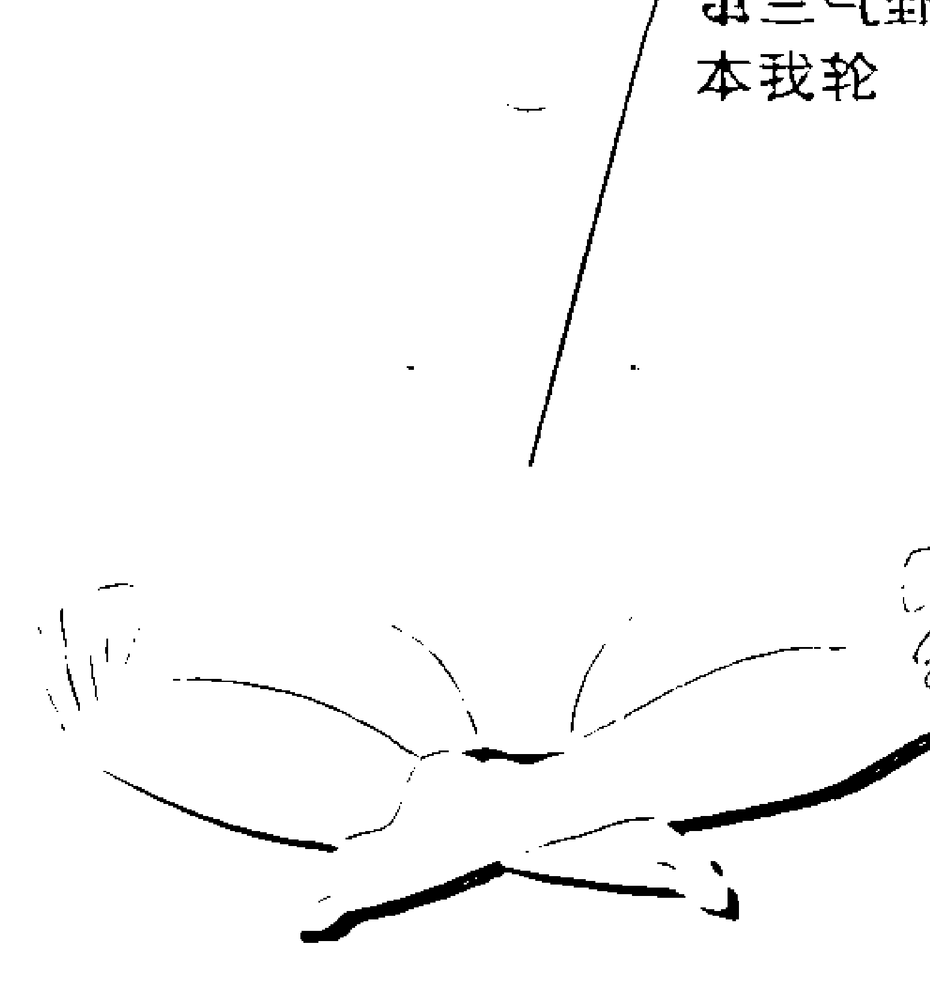

## 药学属性

- 安抚、镇静
- 抗凝血、减轻血液之过稠倾向
- 促进静脉循环
- 消炎

## 适用症候

- 焦虑，神经紧张
- 消化不良
- 肠道痉挛

## 心理处方

- 开心

## 使用禁忌

- 涂后避免日晒

## 柠檬 Citrus limonum

过早采收的果皮深绿，香气不浓。要等果实成熟转黄才会发出明显的香气。

- 植物科属：芸香科柑橘属
- 重要产地：美国、阿根廷、以色列、法国
- 萃取部位：果皮（压榨）

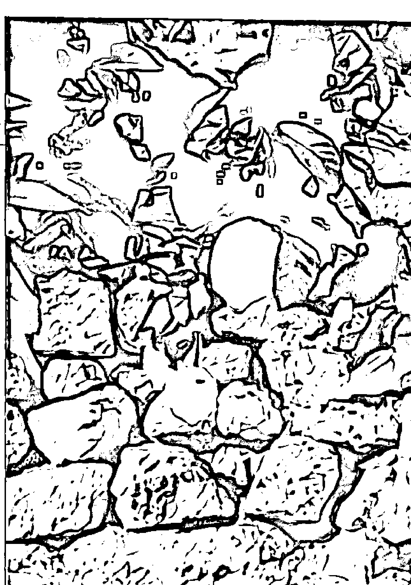

## 气卦七轮与其对应范围

## 药学属性

- 抵抗革兰氏阳性菌繁殖的细菌、抗链球菌
- 化解结石
- 镇静神经
- 活血、养肝

## 适用症候

- 肝功能失调
- 肾绞痛
- 贫血，血栓
- 传染病流行期间于医院，诊所，幼儿园净化空气

## 心理处方

- 摆脱恶梦

## 使用禁忌

- 涂后避免日晒

# Ruth von Braunschweig
精油化学结构图

理性/智慧
向精神性的事物开放

理性面的感觉

情绪面的感觉

使人兴奋

放松

充满力量

醛3%
己醛、辛醛、壬醛
庚醛、牻牛儿醛

香豆素 ○
呋喃香豆素 >1.5%
伞形酮、莨菪素
香柑油内酯

清凉

激励

单萜烯90%
柠檬烯72%、萜品烯15%、
对伞花烃1%、水茴香1%、
异松油烯1%

○ 倍半萜烯
β-没药烯2.5-4%

缓和

积极

舒展

温暖

单萜醇
壬醇、辛醇
己醇、癸醇
○

欢乐

心/直觉
贴近大地

## 莱姆
Citrus limetta

与柠檬相比，果形较圆而果皮较薄

- 植物科属：芸香科柑橘属
- 重要产地：墨西哥、加勒比海
- 萃取部位：果皮（压榨）

# Ruth von Braunschweig
精油化学结构图

理性面的感觉

理性/智慧
向精神性的事物开放

情绪面的感觉

使人兴奋

放松

充满力量

单萜烯 42-64%
柠檬烯

醛7%
牻牛儿醛为主
壬醛、癸醛、
香茅醛

- 香豆素○
- 呋喃香豆素 > 2%
- 莱姆素
- 香柑油内酯

清凉

- 酯
- 乙酸沉香酯27%
- 乙酸橙花酯
- 乙酸品烯酯
- 乙酸牻牛儿酯
- 乙酸龙脑酯

缓和

激励

积极

舒展

苯基酯
邻氨基苯甲酸甲酯○

欢乐

单萜醇
沉香醇0.7%
萜品醇1.05%
○

温暖

心/直觉
贴近大地

## 气卦七轮与其对应范围

第三气卦
本我轮

## 药学属性

- 抗肠胃痉挛

## 适用症候

- 胃痉挛
- 免疫机能低下
- 净化吸烟空间

## 心理处方

- 重拾对世界的好奇心，苦中作乐

## 使用禁忌

- 涂后避免日晒（蒸馏所得之精油则无光敏性）

## 欧洲冷杉
Abies alba

树皮色白，所以又叫银枞，一般是同一生长林区中最高大的树种，高40米

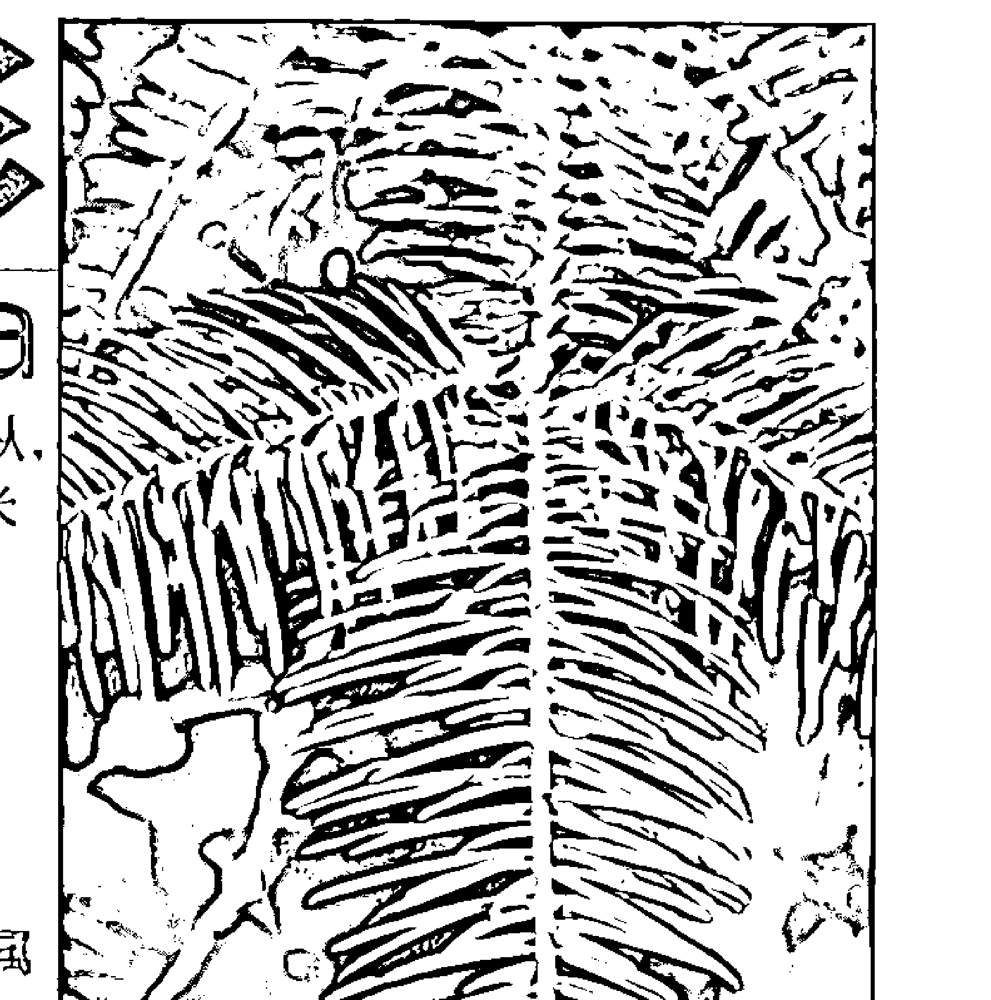

## 气卦七轮与其对应范围

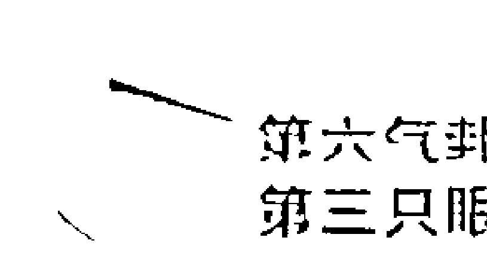

- 植物科属: 松科冷杉属
- 重要产地: 法国
- 萃取部位: 针叶（蒸馏）

# Ruth von Braunschweig
精油化学结构图

# 理性面的感觉

# 情绪面的感觉

- 使人兴奋
- 充满力量
- 激励
- 积极
- 温暖

- 放松
- 清凉
- 缓和
- 舒展
- 欢乐

- 单萜烯90-95%
  - α松油萜 24%
  - 柠檬烯 34%
  - 桉烯 21%

- 酯5-10%
  - 乙酸龙脑酯

## 药学属性

- 抗黏膜发炎
- 抗菌
- 抗关节病
- 激励

## 适用症候

- 急性与慢性支气管炎
- 着凉感冒
- 关节病
- 软弱无力

## 心理处方

- 减少恋世的倾向，增进对世界的理解

## 使用禁忌

- 无，但宜少量使用

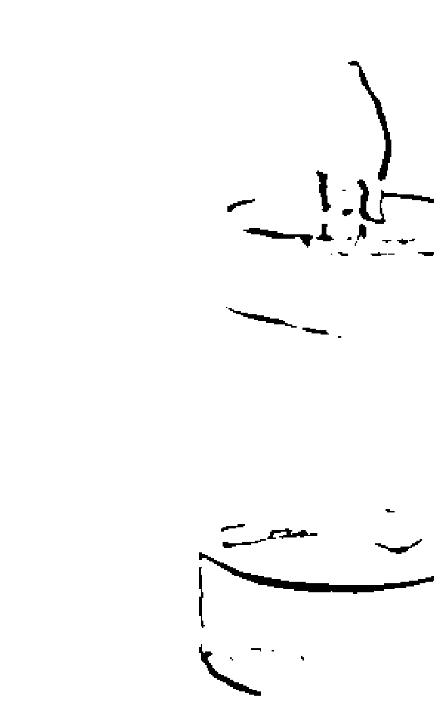

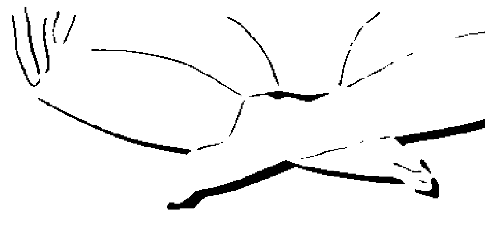

## 胶冷杉
Abies balsamea

树枝流出的胶脂极芬芳，故得其名

- 植物科属：松科冷杉属
- 重要产地：加拿大
- 萃取部位：针叶（蒸馏）

### Ruth von Braunschweig 精油化学结构图

### 理性面的感觉

- 使人兴奋
- 充满力量
- 激励
- 积极
- 温暖

### 情绪面的感觉

- 放松
- 清凉
- 缓和
- 舒展
- 欢乐

倍半萜酮
单萜酮75-90% α 与 β 松油萜为主 樟烯、柠檬烯、葑烯
酯10-25% 乙酸龙脑酯

## 药学属性

- 抗菌（葡萄球菌，大肠杆菌），抗寄生虫
- 抗痉挛
- 抗关节病
- 激励，阳性精油

## 适用症候

- 鼻炎、支气管炎、鼻窦炎、着凉感冒
- 蛔虫病
- 关节病

## 心理处方

- 独立自主，客观理性

## 使用禁忌

- 无，但宜节制用量

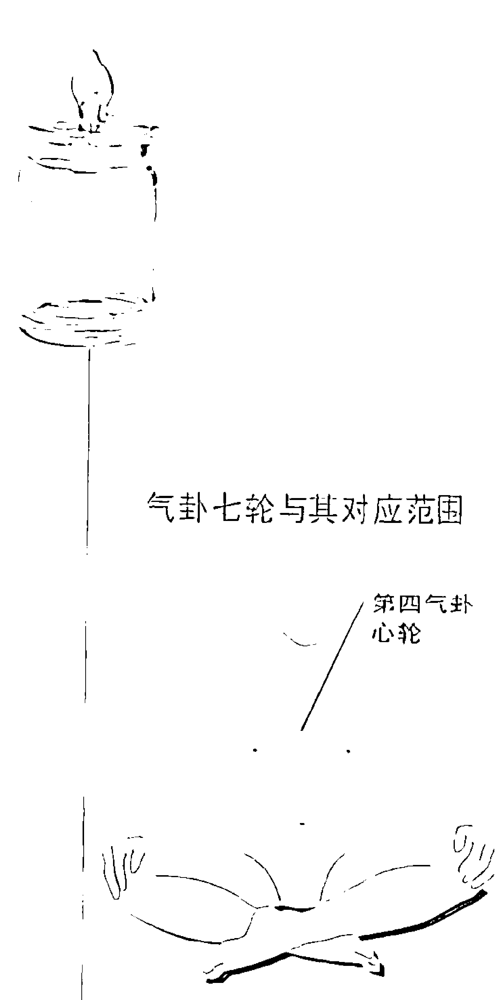

## 单萜烯类

心/直觉 贴近大地

## 西伯利亚冷杉
Abies sibirica
针叶较一般冷杉平滑浑圆，而且还覆盖着软白毛。

植物科属：松科冷杉属
重要产地：西伯利亚
萃取部位：针叶（蒸馏）

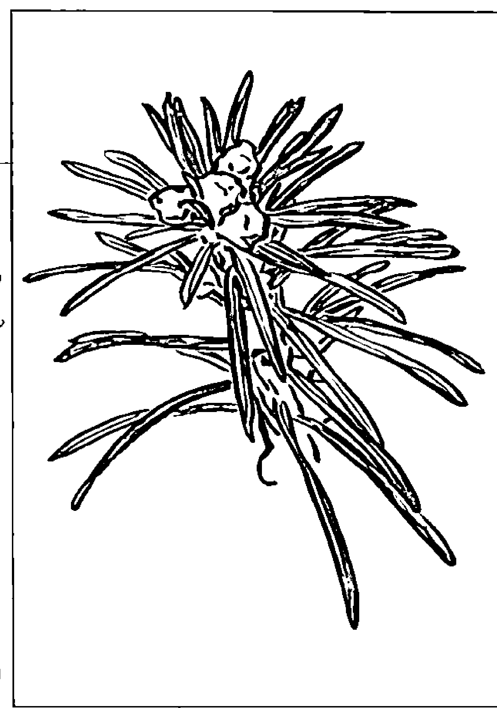

# Ruth von Braunschweig
精油化学结构图

## 气卦七轮与其对应范围

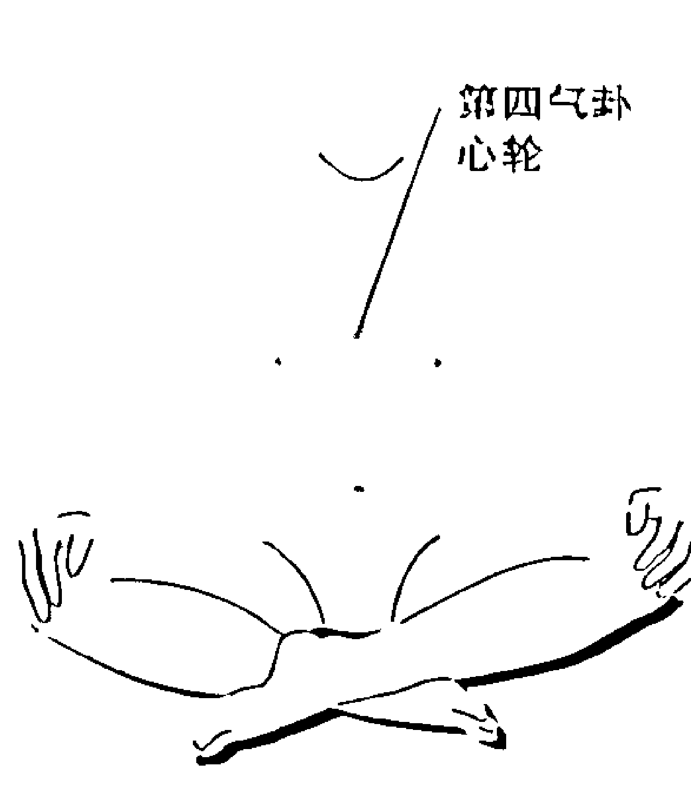

第四气卦
心轮

## 药学属性

- 抗痉挛
- 消炎

## 适用症候

- 气喘型支气管炎
- 痉挛型结肠炎
- 牙龈发炎

## 心理处方

- 冲淡成长过程的孤独

## 使用禁忌

- 无

理性面的感觉

理性/智慧
向精神性的事物开放

情绪面的感觉

使人兴奋

放松

充满力量

清凉

激励

单萜烯
松烯10%

酯30~42%
乙酸龙脑酯为主
乙酸萜品酯

缓和

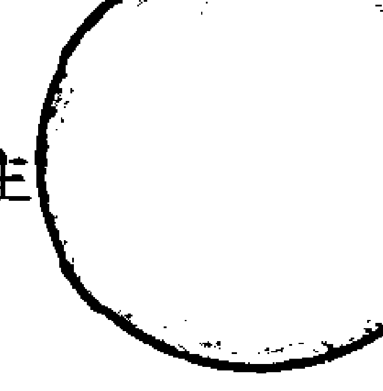

积极

○ 双醇
异冷杉醇

舒展

温暖

欢乐

心/直觉
贴近大地

## 道格拉斯杉
Pseudotsuga menziesii

可长到20层楼高（60米），独特的球果在鳞片间有三个尖苞片伸出。

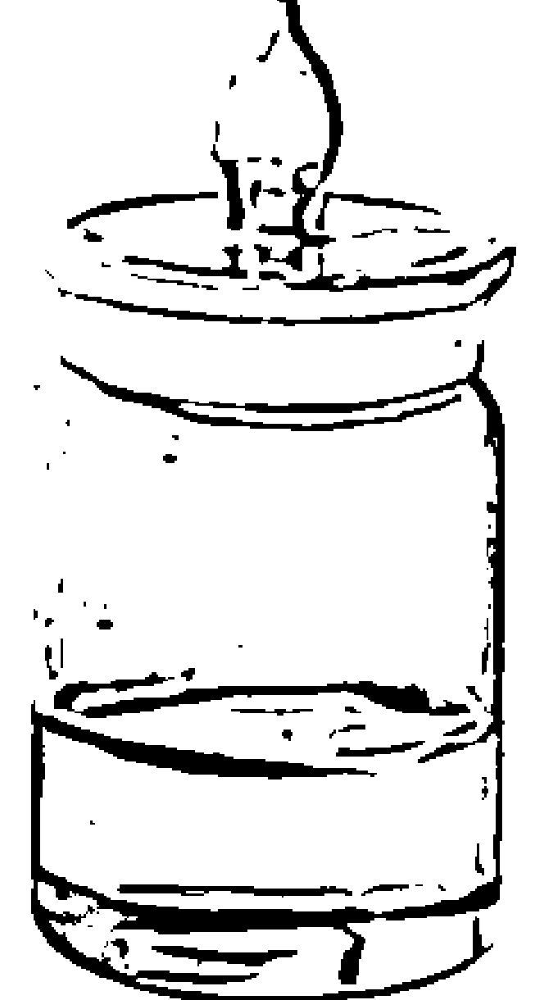

植物科属：松科伪铁杉属
重要产地：法国
萃取部位：针叶（蒸馏）

单萜烯类

气卦七轮与其对应范围

第四气卦 心轮

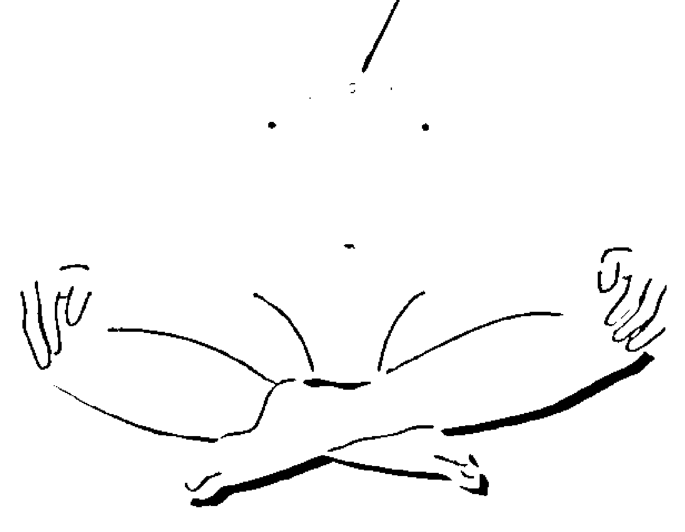

### Ruth von Braunschweig 精油化学结构图

理性面的感觉

理性 / 智慧
向精神性的事物开放

情绪面的感觉

单萜酮
樟脑

药学属性

- 抗菌
- 抗黏膜发炎，化痰

使人兴奋

氧化物
桉油醇

放松

充满力量

醛
柠檬醛

清凉

激励

单萜烯70～80%
樟烯 10%
α- & β-松油萜为主
柠檬烯 6～18%
樟烯、蒈烯

酯6%

缓和

适用症候

- 着凉感冒
- 鼻炎
- 关节炎

乙酸龙脑酯
乙酸牻牛儿酯
正己酸酯

积极

舒展

心理处方

- 化干戈为玉帛，消弭蛮横戾气

单萜酮6~10%
龙脑、牻牛儿醇

温暖

欢乐

使用禁忌

- 无

心 / 直觉
贴近大地

## 欧洲赤松 Pinus sylvestris

树皮呈铁锈色，是其特征。

植物科属：松科松属 重要产地：法国、埃及 萃取部位：针叶（蒸馏）

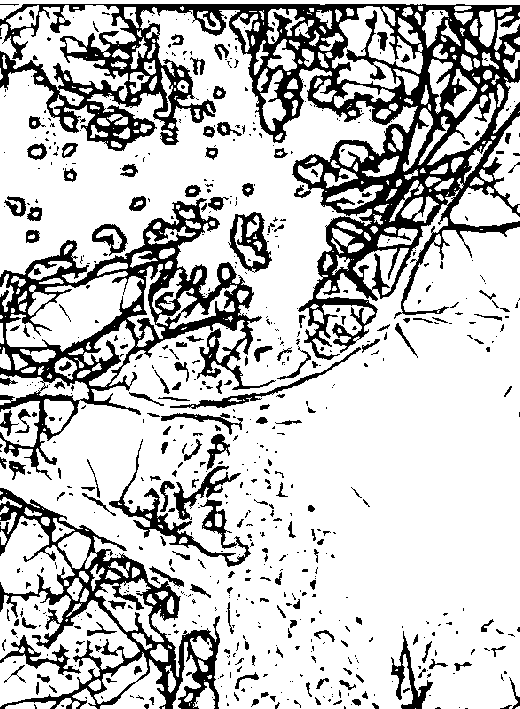

## 气卦七轮与其对应范围

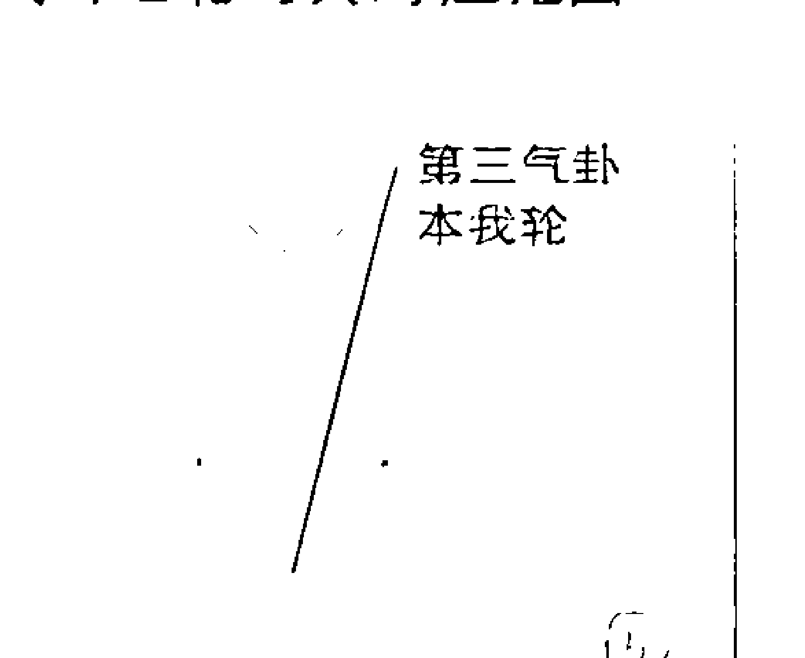

第三气卦 本我轮

## 药学属性

- 激励性的补身，补神经，提升血压
- 1993年研究显示：松油萜的消炎作用与启动肾上腺有关
- 解除淋巴阻塞，与子宫卵巢充血的现象
- 似荷尔蒙、抗糖尿病（脑下垂体→胰岛素）似可体松（脑下垂体→肾上腺），激励性机能（脑下垂体→性腺）

## 适用症候

- 虚弱无力，睾丸机能不彰
- 糖尿病
- 支气管炎，鼻窦炎，气喘
- 关节炎，风湿性关节炎

## 心理处方

- 不屈不挠，排除万难

## 使用禁忌

- 无（保存不当而氧化者，则可能刺激皮肤）

### Ruth von Braunschweig 精油化学结构图

理性/智慧 向精神性的事物开放

理性面的感觉

情绪面的感觉

使人兴奋

放松

充满力量

清凉

- 激励
- 单萜烯 80%
  - α-松油萜 40%
  - 柠檬烯 25-30%
  - β-松油萜 15%

倍半萜烯 长叶烯

酯 10% 乙酸龙脑酯 缓和

倍半萜醇 α-杜松醇

积极 舒展

单萜酮 龙脑 2%

欢乐

温暖

心/直觉 贴近大地

## 落叶松
Larix europea

会变色、落叶的针叶树，球果非常美丽。

植物科属：松科落叶松属
重要产地：奥地利
萃取部位：针叶 / 树脂（蒸馏）

# Ruth von Braunschweig
精油化学结构图

- 理性面的感觉
  - 使人兴奋
  - 充满力量
  - 激励
  - 积极
  - 温暖

理性/智慧
向精神性的事物开放

- 情绪面的感觉
  - 放松
  - 清凉
  - 缓和
  - 舒展
  - 欢乐

- 单萜烯为主
  - α-松油萜
  - β-松油萜
  - 柠檬烯

- 酯
  - 乙酸龙脑酯

- 倍半萜醇
  - α-杜松醇

- 单萜酮
  - α-萜品醇

心/直觉
贴近大地

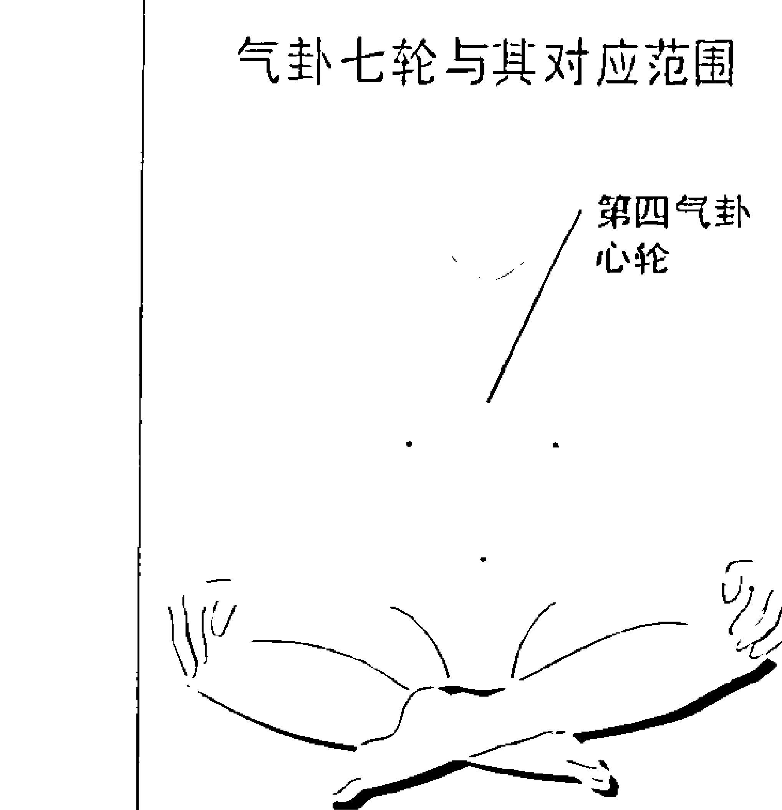

## 药学属性

- 强化神经（补充能量），导入放松状态，有益小脑
- 抗感染（肺炎球菌），杀菌消毒

## 适用症候

- 神经疲劳
- 肺炎，支气管炎

## 心理处方

- 在窘况百出时，仍能自我解嘲

## 使用禁忌

- 无（树脂较黏稠，稀释不够时会刺激皮肤）

## 黑云杉
Picea mariana

北美分布最广的针叶树，常用作圣诞树，针叶带着灰蒙蒙的蓝绿色。

- 植物科属：松科云杉属
- 重要产地：加拿大、美国东北部
- 萃取部位：针叶（蒸馏）

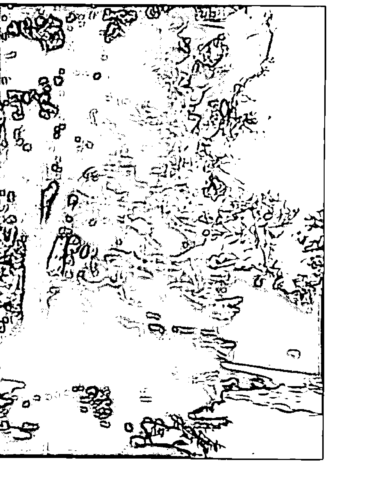

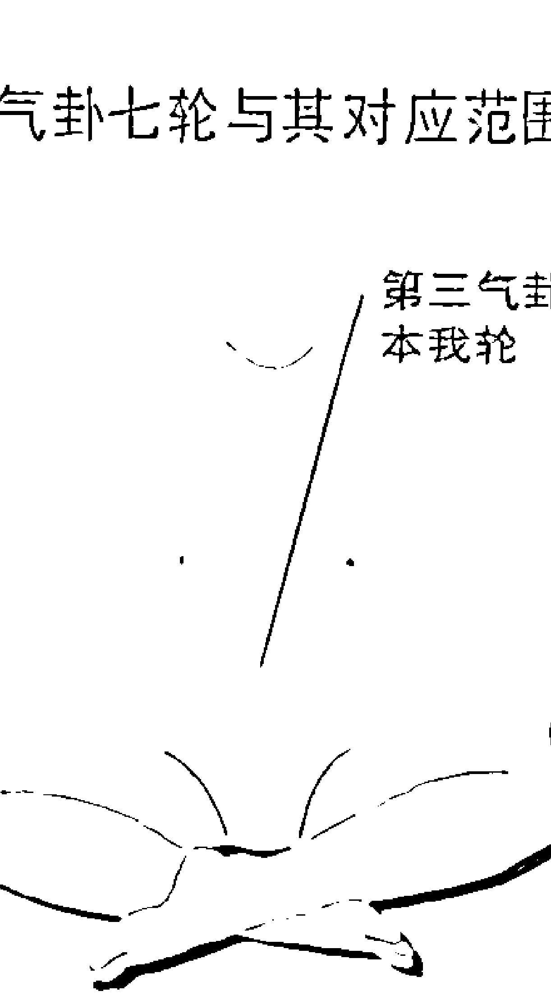

## 药学属性

- 补身、补神经、重新赋予太阳神经丛能量
- 似荷尔蒙、激励胸腺、似可体松（脑下垂体-肾上腺，脑下垂体-卵巢）
- 抗痉挛
- 抗感染、抗真菌、抗寄生虫、抗空气中的病菌

## 适用症候

- 粉刺与干性湿疹
- 前列腺炎
- 太阳神经丛痉挛、虚弱无力、筋疲力竭
- 甲状腺机能亢进

## 心理处方

- 反败为胜，有担当有肩膀

## 使用禁忌

- 无

### Ruth von Braunschweig 精油化学结构图

理性面的感觉

情绪面的感觉

理性/智慧 向精神性的事物开放

使人兴奋

放松

充满力量

清凉

单萜烯55%

倍半萜烯 长叶烯

酯30~37% 乙酸龙脑酯

缓和

激励

倍半萜醇 长叶醇

舒展

积极

单萜醇2.5% 龙脑

欢乐

温暖

心/直觉 贴近大地

## 杜松浆果
Juniperus communis

在普罗旺斯的山林小径行走，衣角很容易被它的针叶刺入。

- 植物科属：柏科刺柏属
- 重要产地：克罗埃西亚
- 萃取部位：浆果（蒸馏）

### Ruth von Braunschweig 精油化学结构图

- **理性面的感觉**
  - 使人兴奋
  - 充满力量
  - 激励
  - 积极
  - 温暖

- **情绪面的感觉**
  - 放松
  - 清凉
  - 缓和
  - 舒展
  - 欢乐

理性/智慧
向精神性的事物开放
单萜酮

倍半萜酮

单萜烯 50~80%

心/直觉
贴近大地

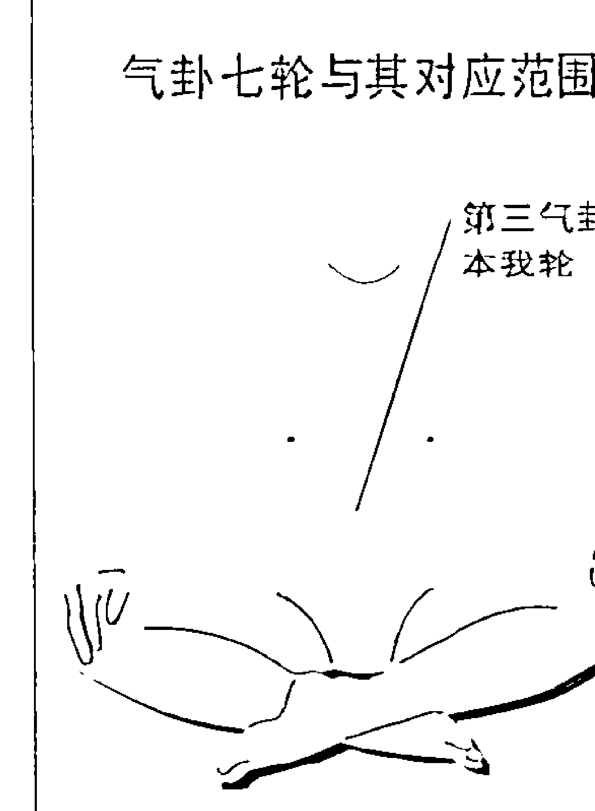

- **药学属性**
  - 利尿、消水肿
  - 抗结石
  - 抗风湿
  - 激励与补强消化系统，利胰脏

- **适用症候**
  - 轻微的肝胆失调
  - 胆结石
  - 感染性肠炎

- **心理处方**
  - 扫除不洁或受迫害的感觉

- **使用禁忌**
  - 无
  （过量对肾脏病有害者，乃杜松枝干所萃取，或生吃浆果的后遗症）

## 药学属性

- 消炎、止痛
- 抗菌，止痒
- 抗痉挛
- 调节自主神经系统

## 适用症候

- 痉挛性与发炎性肠绞痛，发酵性肠炎
- 神经炎，坐骨神经痛
- 风湿，关节炎
- 皮肤炎

## 心理处方

- 走出童年创伤

## 使用禁忌

- 无

## 高地杜松
Juniperus communis var. montana
因为要适应高山强劲的风势，而只能匍匐生长。

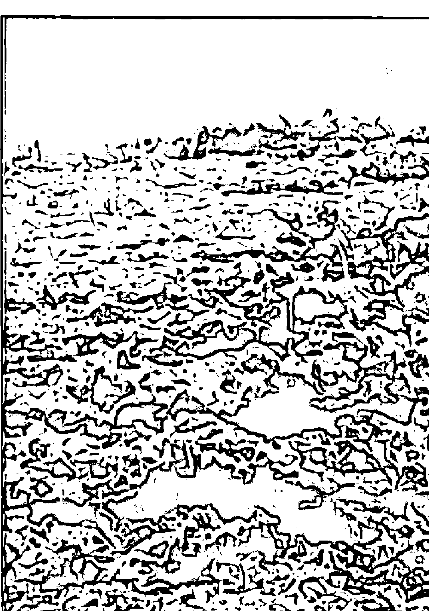

植物科属：柏科刺柏属
重要产地：科西嘉岛
萃取部位：针叶（蒸馏）

Ruth von Braunschweig
精油化学结构图

| 理性面的感觉 | 理性/智慧 向精神性的事物开放 | 情绪面的感觉 |
| :--- | :--- | :--- |
| 使人兴奋 | | 放松 |
| 充满力量 | | 清凉 |
| 激励 | 单萜烯 50% | 倍半萜醇 〇 酸 〇 | 缓和 |
| 积极 | | | 舒展 |
| 温暖 | | 心/直觉 贴近大地 | 欢乐 |

## 单萜烯类

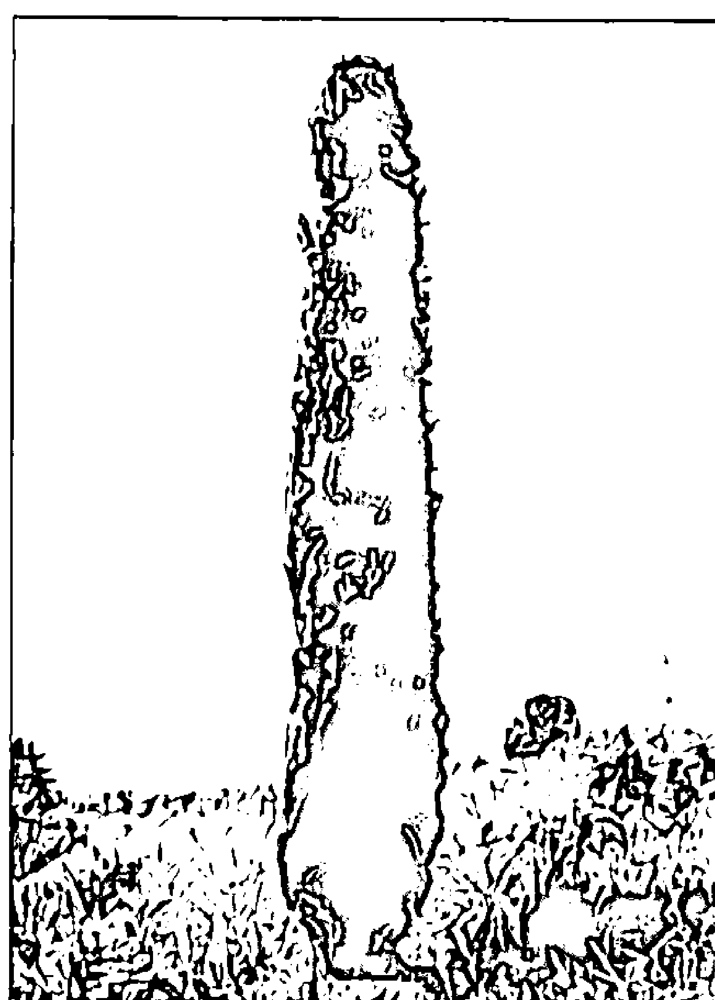

## 丝柏
Cupressus sempervirens

在原野一般身形苗条，但在罗马古迹遗址，也可长出巍峨的气势

植物科属：柏科柏属
重要产地：法国
萃取部位：针叶（蒸馏）

## 气卦七轮与其对应范围

第七气卦
顶轮

# Ruth von Braunschweig
精油化学结构图

理性面的感觉

理性/智慧
向精神性的事物开放

情绪面的感觉

使人兴奋

放松

## 药学属性

- 纾解静脉与淋巴郁积之毒素与废物
- 纾解前列腺之肿胀充血
- 收敛、止咳
- 双醇作用似雌激素

充满力量

清凉

## 适用症候

- 前列腺腺瘤，遗尿
- 各种支气管炎，百日咳，支气管痉挛，结核，肺结核，胸膜炎
- 静脉曲张，内外痔，皮下组织水肿
- 虚弱无力

倍半萜烯 15%

激励

单萜烯70%

缓和

倍半萜醇7%
双醇

积极

舒展

## 心理处方

- 反璞归真，静默自持

温暖

欢乐

## 使用禁忌

- 乳房发生痛性结节者

心/直觉
贴近大地## 格陵兰喇叭茶
Ledum groenlandicum

山叶片可以清楚辨识其杜鹃花科的“血统”。

- 植物科属：杜鹃花科喇叭茶属
- 重要产地：加拿大
- 萃取部位：整株药草（蒸馏）

## Ruth von Braunschweig
### 精油化学结构图

| 理性/智慧向精神性的事物开放 | 理性面的感觉 | 情绪面的感觉 |
| :--- | :--- | :--- |
| 单萜酮 | 使人兴奋 | 放松 |
| 倍半萜酮 | 充满力量 | 清凉 |
| 倍半萜烯 单萜烯80% | 激励 | 缓和 |
| 倍半萜醇 | 积极 | 舒展 |
| | 温暖 | 欢乐 |
| 心/直觉贴近大地 | | |

## 药学属性
- 引流肝脏，促进肝脏细胞再生
- 抗肿瘤
- 抗痉挛，助眠
- 解除郁积壅塞现象

## 适用症候
- 肝功能轻度不良，病毒型肝炎的后遗症
- 肾炎，肾结石，前列腺炎
- 失眠，神经质，太阳神经丛痉挛，甲状腺失调
- 过敏（机能过度活跃者）

## 心理处方
- 信守正道，刚正不阿

## 使用禁忌
- 使用过量会使人昏沉

## 杜鹃
Rhododendron anthopogon

这个品种只长在喜马拉雅山上4000米高处，低矮不显眼，与常见者大不同。

- 植物科属：杜鹃花科杜鹃花属
- 重要产地：尼泊尔
- 萃取部位：枝叶（蒸馏）

## Ruth von Braunschweig
### 精油化学结构图

| 理性/智慧向精神性的事物开放 | 理性面的感觉 | 情绪面的感觉 |
| :--- | :--- | :--- |
| 单萜烯70% | 使人兴奋 | 放松 |
| 倍半萜烯12% | 充满力量 | 清凉 |
| | 激励 | 缓和 |
| 倍半萜醇 | 积极 | 舒展 |
| | 温暖 | 欢乐 |
| 心/直觉贴近大地 | | |

## 气卦七轮与其对应范围

## 药学属性
- 消炎，似可体松，止痛，抗风湿
- 调节前列腺素之合成
- 抗菌、抗病毒、强化免疫系统
- 激励正肾上腺素与多巴胺之合成

## 适用症候
- 抗风湿
- 感染性疾病：若凉、支气管炎、流行性感冒
- 补强神经，可同时纾压与补强，抗忧郁

## 心理处方
- 带来一种轻盈的动能，充满女性的纯真与坚忍

## 使用禁忌
- 无

## 欧白芷根
### Angelica archangelica
紫色茎干，超乎想像的粗壮，喜欢生长在水边

**植物科属：** 伞形科独活属
**重要产地：** 匈牙利
**萃取部位：** 根部（蒸馏）

## 气卦七轮与其对应范围

## Ruth von Braunschweig
### 精油化学结构图

**理性/智慧**
向精神性的事物开放

**理性面的感觉**   **情绪面的感觉**

**使人兴奋**   **放松**

**充满力量**   **清凉**

**激励**   **缓和**

**积极**   **舒展**

**温暖**   **欢乐**

**心/直觉**
贴近大地

**单萜烯 73~90%**
α-与β-松油萜为主
柠檬烯 13%
β-水茴香萜 10~15%
γ-萜烯 15~20%

**香豆素 2%**

**酯**

**含氮化合物**
苯基酯

## 药学属性
- ○ 镇静（局部作用于中枢神经，实用上，对焦虑及腹部痉挛具正面之药理反应），助眠
- ○ 补气
- ○ 助消化，除胀气
- ○ 抗凝血

## 适用症候
- ○ 焦虑，神经衰弱失眠，睡眠困扰
- ○ 痉挛性肠炎
- ○ 胀气

## 心理处方
- ○ 愚公移山，元气淋漓

## 使用禁忌
- ○ 有较强之光敏性

## 单萜烯类

## 白松香
Ferula galbaniflua
花色鲜黄，茎干也十分坚韧。

- 植物科属：伞形科阿魏属
- 重要产地：伊朗
- 萃取部位：树脂（蒸馏）

## Ruth von Braunschweig
### 精油化学结构图

理性/智慧
向精神性的事物开放

理性面的感觉

情绪面的感觉

## 气卦七轮与其对应范围
第二气卦
性轮

氧化物

使人兴奋

放松

## 药学属性
- 消肿
- 主要作用于肾脏与阴道，可通经
- 补身
- 镇痛、轻微抗痉挛

充满力量

香豆素

清凉

## 适用症候
- 白带，痛经
- 溃疡，脓肿
- 淋巴腺病变

倍半萜烯

单萜烯65~85%
β-松油萜为主

激励

酯

缓和

倍半萜醇

积极

## 心理处方
- 平衡极端的情绪，放下激烈的抗争

舒展

含氮含硫化合物

单萜醇

温暖

欢乐

## 使用禁忌
- 无

心/直觉
贴近大地

## 药学属性
- 利胆，促进胆汁分泌
- 帮助消化
- 抗黏膜发炎，消解黏液
- 抗凝血

## 适用症候
- 儿童消化问题
- 养肾、肾脏炎、肝胆肾有问题
- 祛痰消肺，支气管急性发炎

## 心理处方
- 柔弱稚嫩的心灵得到百般呵护

## 使用禁忌
- 无（若是萃取自种子者，则含高比例之单萜酮，有神经毒性）

## 莳萝（全株）
Anethum graveolens
枝叶柔弱细软，迎风时还会摇曳生姿，开黄花。

- 植物科属：伞形科莳萝属
- 重要产地：法国、保加利亚
- 萃取部位：全株药草（蒸馏）

## Ruth von Braunschweig
### 精油化学结构图

理性/智慧
向精神性的事物开放

心/直觉
贴近大地

| 理性面的感觉 | 情绪面的感觉 |
| :--- | :--- |
| 使人兴奋 (酮 5-40% 藏茴香酮为主) | 放松 |
| | 清凉 (莳萝醚 3-10%) |
| 充满力量 (单萜烯 50-80% 水茴香萜为主) | 缓和 |
| 激励 | 舒展 |
| 积极 | 欢乐 |
| 温暖 | |

## 榄香脂
Canarium luzonicum

叶片油亮，果实颇似中国橄榄，靠地面处会伸出板根。

植物科属：橄榄科橄榄属
重要产地：菲律宾
萃取部位：树脂（蒸馏）

## 气卦七轮与其对应范围
第一气卦
基底轮

## Ruth von Braunschweig
### 精油化学结构图

理性/智慧
向精神性的事物开放

理性面的感觉

情绪面的感觉

## 药学属性
- 促进细胞再生，伤口愈合
- 激励腺体，健胃
- 抗菌，抗阿米巴原虫

使人兴奋

放松

醚12%
榄香脂醚

充满力量

清凉

## 适用症候
- 消化不良，结肠痉挛，腹泻，感染阿米巴虫
- 支气管炎
- 疮疡，静脉疮疡，伤口不愈，脓肿

激励

单萜烯70%
水茴香萜为主

缓和

积极

倍半萜醇
榄香脂醇

## 心理处方
- 明天会更好的信念，卷土重来的勇气

舒展

温暖

欢乐

## 使用禁忌
- 无

心/直觉
贴近大地

## 乳香
Boswellia carterii

生长不易，这株种在英国皇家植物园的娇客，四年只长了三十厘米。

- 植物科属：橄榄科乳香属
- 重要产地：依索比亚
- 萃取部位：树脂（蒸馏）

## 气卦七轮与其对应范围
第七气卦 顶轮

## 药学属性
- 抗沮丧
- 抗肿痛，激励免疫系统
- 抗黏膜发炎，化痰
- 促进伤口愈合

## 适用症候
- 支气管炎，气喘
- 伤口、溃疡
- 癌症、免疫机能不全

## 心理处方
- 激发自尊，增加幽默感

## 使用禁忌
- 注意其光敏性

## Ruth von Braunschweig
### 精油化学结构图

理性面的感觉

情绪面的感觉

理性／智慧
向精神性的事物开放

## 卡奴卡
Kunzea ericoides

乍看像白色的松红梅，但叶片没那么尖。香气比较浓，花朵成串而非单开。蒴果更小，而树形更高。

植物科属：桃金娘科
重要产地：新西兰
萃取部位：叶片（蒸馏）

### Ruth von Braunschweig 精油化学结构图

## 单萜烯类

理性面的感觉

理性/智慧
向精神性的事物开放

情绪面的感觉

## 气卦七轮与其对应范围
第五气卦 喉轮

使人兴奋

放松

## 药学属性
氧化物
桉油醇4.2%

- 激励正肾上腺素之生成
- 平衡荷尔蒙，强化免疫力
- 保护神经系统
- 杀微生物

充满力量

清凉

## 适用症候
- 北方国家的冬季疾病
- 结缔组织松软，淋巴型的体态

激励

单萜烯73%
α-松油萜为主

倍半萜烯5.7%

缓和

## 心理处方
- 溶化迟钝钝感的冰冻心智

积极

倍半萜醇4.4%
绿花白千层醇

舒展

## 使用禁忌
温暖

欢乐

- 无

心/直觉
贴近大地

## 岩玫瑰
Cistus ladaniferus
所分泌的胶脂使叶片油亮而黏手，花朵为白色（岩玫瑰品种繁多，许多书稿均误植为紫红花）。

植物科属：半日花科岩蔷薇属
重要产地：葡萄牙、西班牙
萃取部位：叶片、树脂（蒸馏）

## 气卦七轮与其对应范围

## Ruth von Braunschweig
### 精油化学结构图

理性面的感觉
理性／智慧
向精神性的事物开放
酮7%
使人兴奋
放松

## 药学属性
- 抗病毒，抗感染，抗菌
- 强效止血，促进伤口愈合
- 抗动脉炎
- 补强神经，调节中枢神经（作用于副交感）

充满力量
醛2-3%
清凉

## 适用症候
- 婴儿疾病，水痘，麻疹，猩红热，百日咳
- 病毒型疾病与自体免疫系统疾病，风湿，多发性硬化症
- 动脉炎，内外出血

激励
单萜烯 50%
α-松油萜为主
倍半萜烯5~10%
酯3%
缓和

积极
酚
倍半萜醇5~7%
酸
舒展

## 心理处方
- 从任何形态的疯狂脱序中清醒过来

温暖
单萜醇10~15%
苯基酯
欢乐
心／直觉
贴近大地

## 使用禁忌
- 无

## 黑胡椒
Piper nigrum

结实累累时最怕下雨，为防泡水而香气尽失，照料的园丁甚至要替棚架“穿雨衣”。

植物科属：胡椒科胡椒属
重要产地：马达加斯加、印度
萃取部位：果实（蒸馏）

## Ruth von Braunschweig
### 精油化学结构图

理性／智慧
向精神性的事物开放

理性面的感觉

情绪面的感觉

使人兴奋

放松

## 药学属性
- ○ 镇痛，止牙痛
- ○ 退烧
- ○ 催情
- ○ 激励消化腺之补药

充满力量

清凉

倍半萜烯 45%
β-丁香油烃 20~30%

## 适用症候
- ○ 牙痛
- ○ 咽峡炎，消化机能与肝胰机能不足
- ○ 发烧
- ○ 性机能衰弱

单萜烯 50%
松油萜、水茴香
及柠檬烯为主

激励

缓和

积极

舒展

## 心理处方
- ○ 突破传统，创意泉涌

含氮化合物○

欢乐

温暖

## 使用禁忌
- ○ 婴幼儿需节制剂量，以免发汗过度而脱水

心／直觉
贴近大地

## 熏陆香
Pistacia lentiscus

坚挺有弹性的典型地中海灌木，结鲜红色果实。

植物科属：漆树科黄连木属
重要产地：克罗埃西亚
萃取部位：叶片（蒸馏）

## 气卦七轮与其对应范围

## 药学属性
- 解消静脉与淋巴管的阻塞现象
- 健胃整肠
- 解消前列腺之充血现象
- 先阳后阴

## 适用症候
- 静脉曲张、内痔外痔，血栓性静脉炎
- 胃溃疡，糖尿病（辅药）
- 鼻窦炎（消除阻塞感）
- 前列腺炎

## 心理处方
- 随时保持机动性，进退有据

## 使用禁忌
- 无

### Ruth von Braunschweig 精油化学结构图

理性面的感觉

情绪面的感觉

理性/智慧 向精神性的事物开放

使人兴奋

放松

充满力量

清凉

激励

单萜烯50% 松油萜、玉桂烯 及桧烯为主

倍半萜烯>10% 大根老鹳草烯 杜松烯

缓和

积极

倍半萜醇

舒展

温暖

单萜醇

欢乐

心/直觉 贴近大地

## 贞节树
Vitex agnus castus

叶片会让人想起同科的柠檬马鞭草。幸好花色明艳，因此不致混淆

植物科属：马鞭草科牡荆属
重要产地：法国、以色列
萃取部位：叶片/果实（蒸馏）

## Ruth von Braunschweig
### 精油化学结构图

理性面的感觉

理性/智慧
向精神性的事物开放

情绪面的感觉

使人兴奋

放松

氧化物
桉油醇25%

充满力量

清凉

## 药学属性
- ○ 促进黄体素之分泌，选择性地作用于黄体素之受体，具似黄体素之作用
- ○ 促进母乳之分泌且
- ○ 抗肿瘤（雌激素过剩引起者）

## 适用症候
- ○ 子宫纤维肌瘤
- ○ 停用避孕药后促进正常排卵（1993年的实验证实，33名不孕妇女用了五个月之后，带来18%的受孕率）
- ○ 调经，经血过量，月经频繁，出血，少经
- ○ 减轻经痛及更年之症状PMS（1990的实验显示，对血疱、疹、水分滞留有效）

激励

单萜烯55%
α 与 β 松油萜40%
柠檬烯15%

缓和

积极

20%成分未知

舒展

## 心理处方
- ○ 以欣赏包容的眼光看待一切事物

温暖

欢乐

心/直觉
贴近大地

## 使用禁忌
- ○ 无

## 气卦七轮与其对应范围

## 单萜烯类

## 酯类
- **罗马洋甘菊**
  Anthemis nobilis/Chamaemelum nobile
  75～80%
- **快乐鼠尾草**
  Salvia sclarea
  75%～
- **苦橙叶**
  Citrus aurantium bigarde
  50～70%
- **柠檬薄荷**
  Mentha citrata
  66%
- **真正薰衣草**
  Lavandula angustifolia
  50%
- **醒目薰衣草**
  Lavandula burnatii
  50%
- **佛手柑**
  Citrus bergamia
  40%

## 罗马洋甘菊
**Anthemis nobilis / Chamaemelum nobile**
和德国洋甘菊最大的不同，在于罗马洋甘菊不具黄色花心，而且花瓣为重瓣。

- 植物科属：菊科春黄菊属
- 重要产地：法国、智利、英国
- 萃取部位：花（蒸馏）

## Ruth von Braunschweig
### 精油化学结构图

| 理性/智慧 向精神性的事开放 | 化学成分占比 | 情绪面的感觉 |
| :--- | :--- | :--- |
| **使人兴奋** | 单萜酮 13% 松香芹酮 | **放松** |
| **充满力量** | (图中位置，无对应文字) | **清凉** |
| **激励** | (图中位置，无对应文字) | **缓和** |
| **积极** | 倍半萜醇 3% 金合欢醇 | **舒展** |
| **温暖** | 单萜醇 3% 顺式松桧醇 | **欢乐** |
| **心/直觉** 贴近大地 | **脂肪族酯 75-80%** 欧白芷异丁酯 40% 欧白芷异戊酯 20% 欧白芷酸β-甲醚酯 10% 倍半萜内酯 ( ) | |

## 药学属性
- ◦ 前驱麻醉
- ◦ 抗痉挛，安抚中枢神经
- ◦ 消炎
- ◦ 抗寄生虫（钩虫，蓝氏贾第鞭毛虫）

## 适用症候
- ◦ 神经炎，神经痛
- ◦ 外科手术
- ◦ 神经性气喘

## 心理处方
- 掘出最深沉的恐惧，放在阳光下溶解

## 使用禁忌
- ◦ 无

## 快乐鼠尾草
### Salvia sclarea
和鼠尾草有明显的外观差异：快乐鼠尾草的叶片又大又粗，而花色则为淡粉色。

## Ruth von Braunschweig
### 精油化学结构图

#### 理性面的感觉
- 氧化物 - 使人兴奋
- 醛 - 充满力量
- 单萜酮
- 倍半萜酮
- 醚 - 放松
- 香豆素 - 清凉

#### 情绪面的感觉
##### 理性/智慧
向精神性的事物开放
##### 酯 75%
##### 乙酸沉香酯 50% - 缓和
##### 单萜烯 2.5%
##### 倍半萜烯 5%
##### 倍半萜醇
##### 单萜醇 15%
##### 双醇 5%
##### 含硫化合物
##### 欢乐
##### 心/直觉
贴近大地
##### 激励
##### 积极
##### 温暖
##### 舒展

## 气卦七轮与其对应范围

##### 第二气卦
性轮

## 药学属性

- ○ 似雌激素，催情
- ○ 抗痉挛、抗癫痫、放松
- ○ 抗糖尿病
- ○ 抗高胆固醇

## 适用症候

- ○ 月经不至、少经、更年期前期症候
- ○ 胆固醇过高
- ○ 皮肤受真菌感染

## 心理处方

- ○ 褪去世故尖酸的犬儒习气，与真实世界水乳交融

## 使用禁忌

- ○ 乳腺病患、癌症病人

## 苦橙叶
Citrus aurantium bigarade
与橘叶不同之处为：叶片较圆厚。

植物科属：芸香科柑橘属
重要产地：意大利、巴拉圭
萃取部位：叶片（蒸馏）

## Ruth von Braunschweig
### 精油化学结构图

#### 理性面的感觉

##### 理性／智慧
向精神性的事物开放

##### 情绪面的感觉
- 使人兴奋
- 放松
- 充满力量
- 清凉
- 激励
- 缓和
- 积极
- 舒展
- 温暖
- 欢乐

##### 心／直觉
贴近大地

## 药学属性

- ○ 抗痉挛
- ○ 平衡神经
- ○ 抗感染，杀葡萄球菌，肺炎杆菌
- ○ 消炎

## 适用症候

- ○ 呼吸道感染
- ○ 感染性面疱，疖
- ○ 慢性肝炎

## 心理处方

- ○ 让最刻板的空间，也能活泼起来

## 使用禁忌

- ○ 无

## 柠檬薄荷
Mentha citrata
与胡椒薄荷、绿薄荷的差异在于：叶片较大较圆。

- 植物科属：唇形科薄荷属
- 重要产地：法国、印度
- 萃取部位：整株药草（蒸馏）

## Ruth von Braunschweig
### 精油化学结构图

## 气卦七轮与其对应范围
第二气卦 性轮

## 药学属性

- ○ 补身，补强卵巢与男性性机能，激励腺体（肝与胰）
- ○ 平衡神经（作用与延髓和自三神经系统相同），抗痉挛
- ○ 消炎
- ○ 抗感染，抗寄生虫

## 适用症候

- ○ 卵巢功能不良，男性性机能衰弱
- ○ 神经疲劳
- ○ 心跳过速

## 心理处方

- ○ 给平庸的生活注入能量

## 使用禁忌

- ○ 无

#### 理性面的感觉

##### 理性/智慧
向精神性的事物开放

##### 情绪面的感觉
- 氧化物5%
- 1,8 桉油醇2.3%
- 沉香醇氧化物2.7%
- 使人兴奋
- 放松
- 充满力量
- 清凉
- 单萜烯 <1%
- 倍半萜烯 <1%
- β-丁香油烃
- 大根老鹳草烯
- 缓和
- 激励
- 积极
- 舒展
- 温暖
- 欢乐

##### 心/直觉
贴近大地

- 单萜醇 <30%
- 沉香醇 22-25%

## 真正薰衣草
Lavandula angustifolia
比一般印象里的“薰衣草”矮小，花色也不那么鲜艳，但细致的幽香则无与伦比。

- 植物科属：唇形科薰衣草属
- 重要产地：法国、保加利亚、克罗埃西亚、乌克兰
- 萃取部位：开花的药草（蒸馏）

## Ruth von Braunschweig
### 精油化学结构图

## 气卦七轮与其对应范围

## 药学属性

- 可强力抗痉挛，镇静，安抚，解除肌肉痉挛，降血压
- 促进伤口愈合
- 消炎，止痛
- 抗病毒感染，抗葡萄球菌

## 适用症候

- 神经系统功能紊乱（太阳神经丛痉挛），失眠，睡眠困扰，焦虑不安
- 感染性皮肤炎，过敏，伤口疤痕，静脉溃疡，烫伤，发痒
- 抽筋、胃灼热，心跳过速，静脉炎，血栓

## 心理处方

- 被无条件与绝对的爱包围环绕

## 使用禁忌

- 无

## 醒目薰衣草
Lavandula burnatii
为真正薰衣草与穗花薰衣草的杂交种，兼具真正薰衣草的艳紫花色，以及穗花薰衣草的三叉枝形。

植物科属：唇形科薰衣草属
重要产地：法国
萃取部位：开花的药草（蒸馏）

## Ruth von Braunschweig
### 精油化学结构图

##### 理性/智慧
向精神性的事物开放

#### 理性面的感觉

#### 情绪面的感觉
- 使人兴奋
- 氧化物
- 单萜酮 10%
- 放松
- 香豆素
- 充满力量
- 清凉

## 药学属性

- ○ 促进伤口愈合
- ○ 抗痉挛，镇静，安抚，解除肌肉痉挛
- ○ 消炎，止痛
- ○ 分解黏液，化痰
- 单萜烯 4.5%
- 酯50%
- 乙酸沉香酯为主
- 花香/甜香
- 花果儿香
- 激励
- 缓和

## 适用症候

- ○ 呼吸道感染
- ○ 睡眠困扰，焦虑不安
- ○ 烫伤，发痒

## 心理处方

- 积极
- 舒展
- ○ 宛如徜徉于普罗旺斯的阳光与空气中
- 单萜醇40%
- 沉香醇为主
- 欢乐
- 温暖

## 使用禁忌

- ○ 无

##### 心／直觉
贴近大地

## 佛手柑
### Citrus bergamia
因压榨的果皮不同，油色可能为绿色也可能为黄色

植物科属：芸香科柑橘属
重要产地：意大利、象牙海岸
萃取部位：果皮（压榨）

### Ruth von Braunschweig 精油化学结构图

### 理性面的感觉

- 使人兴奋
- 充满力量
- 激励
- 积极
- 温暖

### 情绪面的感觉

- 放松
- 清凉
- 缓和
- 舒展
- 欢乐
- 单萜烯30%
- 柠檬烯26%
- 松油萜、蒎烯
- 酯40%
- 乙酸沉香酯20-34%
- 单萜醇20%
- 沉香醇16%、橙花醇
- 牻牛儿醇、品醇

## 气卦七轮与其对应范围

## 药学属性

- 锁静、抗痉挛
- 抗感染，抗菌
- 微量可激励
- 健胃、助消化

## 适用症候

- 激动，烦躁不安，失眠
- 结肠积气，食欲不振，腹胀，肠痉挛
- 痤疮，伤口，皮肤病

## 心理处方

藉歌声驱走阴霾，用回味欢乐取代惊恐忧伤

## 使用禁忌

严重光敏反应（抽取掉香柑油内酯者则无光敏性，会标示为FCF）

## 苯基酯类

1.  黄桦
    Betula alleghaniensis
    99%
2.  白珠树
    Gaultheria procumbens
    99%
3.  安息香
    Styrax benzoe
    60 ~ 80%
4.  秘鲁香脂
    Myroxylon balsamum
    50 ~ 70%
5.  鹰爪豆
    Spartium junceum
    ~ 70%
6.  银合欢
    Acacia dealbata
    ~ 60%
7.  桔叶
    Citrus reticulata
    50%
8.  大高良姜
    Alpinia galanga
    50%
9.  阿密茴
    Amml visnaga
    ~ 40%
10. 香草
    Vanilla planifolia
    ~ 30%
11. 摩洛哥玫瑰
    Rosa centifolia
    63%
12. 摩洛哥茉莉
    Jasminum officinale
    ~ 30%
13. 阿拉伯茉莉
    Jasminum sambac
    ~ 30%
14. 黄玉兰
    Michelia champaca
    ~ 70%
15. 白玉兰
    Michelia alba
    ~ 60%
16. 水仙
    Narcissus poeticus
    ~ 60%
17. 晚香玉
    Polianthus tuberosa
    ~ 60%
18. 红花缅栀
    Plumeria rubra
    ~ 30%

## 黄桦
Betula alleghaniensis
桦木屑约有100个品种。图中为银桦Betula pendula。各种桦木均以美丽的柔荑花序引人垂怜。

- 植物科属：桦木科桦属
- 重要产地：美国
- 萃取部位：树皮（蒸馏）

## Ruth von Braunschweig
### 精油化学结构图

##### 理性/智慧
向精神性的事物开放

##### 理性面的感觉
- 使人兴奋
- 充满力量
- 激励
- 积极
- 温暖

##### 情绪面的感觉
- 放松
- 清凉
- 缓和
- 舒展
- 欢乐

##### 心/直觉
贴近大地

## 气卦七轮与其对应范围

## 药学属性

- 抗痉挛、止痛
- 消炎
- 激励肝脏

## 适用症候

- 肌风湿，肌腱炎，抽筋，关节炎，肱上踝炎
- 肝功能轻度失调
- 高血压，头痛

## 心理处方

- 禁得起磨难，让伤痕变成人生珍贵的纪念品

## 使用禁忌

- 使用过于频繁将降低止痛效果，剂量过高或滥用可能导致内出血与呼吸困难

## 白珠树
Gaultheria procumbens
低矮贴近地面，白色花朵状若灯笼袖，结红色小浆果。

植物科属：杜鹃花科白珠树属
重要产地：尼泊尔
萃取部位：叶片（蒸馏）

## Ruth von Braun Schweig
### 精油化学结构图

#### 理性面的感觉

##### 理性/智慧
向精神性的事物开放

#### 情绪面的感觉
- 使人兴奋
- 放松
- 充满力量
- 清凉
- 激励
- 缓和
- 积极
- 舒展
- 温暖
- 欢乐

##### 心/直觉
贴近大地
- 水杨酸甲酯99%

## 药学属性

- 激励肝脏
- 消炎、止痛、抗痉挛
- 扩张血管

## 适用症候

- 肌肉性风湿，肌腱炎，抽筋，关节炎、肱上踝痛（前臂劳损），多发型风湿性关节炎
- 轻度肝功能不良
- 高血压，头痛（肝毒循环所致）
- 冠状动脉炎（发作时有治愈作用）

## 心理处方

- 切断因循苟且的旧习，阻绝暂时逃避的退路

## 使用禁忌

- 使用过于频繁将降低止痛效果，剂量过高或滥用可能导致内出血与呼吸困难

## 安息香
Styrax benzoe
原植物开白花，叶片背面反白为其特征。

- 植物科属: 安息香科红皮属
- 重要产地: 印尼、泰国
- 萃取部位: 树脂(溶剂)

## Ruth von Braunschweig
### 精油化学结构图

##### 理性/智慧
向精神性的事物开放

##### 理性面的感觉
- 使人兴奋
- 充满力量
- 激励
- 积极
- 温暖

##### 情绪面的感觉
- 放松
- 清凉
- 缓和
- 舒展
- 欢乐

- 芳香醛
- 微量香草素
- 酸
- 安息香酸10~20%
- 苯基酯 60~80%
- 苯甲酸松柏酯
- 肉桂酸酯

##### 心/直觉
贴近大地

## 气卦七轮与其对应范围

## 药学属性

- 促进伤口愈合
- 抗黏膜发炎，化痰
- 抗胸腔病菌

## 适用症候

- 呼吸道黏膜感染
- 皮肤炎、粉刺、湿疹、干癣、痱疹、伤口、疖、溃疡、冻疮

## 心理处方

- 真诚的关注，温暖的问候

## 使用禁忌

- 极敏感之皮肤宜用少量

## 秘鲁香脂
Myroxylon balsamum
原生于中美洲的高大树种，也是南美洲北部的重要森林树种，豆荚如佛陀耳垂。

## 气卦七轮与其对应范围

植物科属：豆目蝶形花科南美槐属
重要产地：萨尔瓦多
萃取部位：树脂(溶剂)

## Ruth von Braunschweig
### 精油化学结构图

#### 理性面的感觉

##### 理性／智慧
向精神性的事物开放

#### 情绪面的感觉
- 使人兴奋
- 放松
- 充满力量
- 香豆素○
- 清凉
- 激励
- 芳香醛
- 香草素
- 缓和
- 倍半萜醇
- 金合欢醇
- 橙花叔醇
- 酸
- 安息香酸、肉桂酸
- 积极
- 舒展
- 苯基酯 50~70%
- 苯甲酸酯
- 肉桂酸酯
- 欢乐
- 温暖

##### 心／直觉
贴近大地

## 药学属性

- 促进伤口愈合 (激励表皮细胞的生长)
- 消炎，消毒，止痒
- 强心，提升血压
- 抗黏膜发炎，止咳化痰

## 适用症候

- 各类支气管炎 (急性、慢性、气喘性)，咳嗽、流行性感冒、肺结核
- 大肠杆菌引起的膀胱炎，尿道炎，肾盂炎
- 各类皮肤病，含寄生虫引起者 (疥癣、虱子病、头癣)

## 心理处方

- 打破自闭的藩篱

## 使用禁忌

- 某些人的皮肤不能适应，宜少量使用

## 鹰爪豆 Spartium junceum
鲜花的香气和茉莉相仿，而且是有过之而无不及；豆荚状若四季豆，花果俱落以后，远看有点像矮竹丛。

- 植物科属：豆目豆科鹰爪豆属
- 重要产地：法国，意大利
- 萃取部位：花（溶剂）

### Ruth von Braunschweig 精油化学结构图

### 理性面的感觉

- 使人兴奋
- 充满力量
- 激励
- 积极
- 温暖

理性/智慧向精神性的事物开放

### 情绪面的感觉

- 放松
- 清凉
- 缓和
- 舒展
- 欢乐

心/直觉贴近大地

## 气卦七轮与其对应范围

- 强心，利尿
- 止血，收缩血管，麻醉
- 通便，通经

- 心脏水肿、心肌衰弱、心跳过速
- 经血流量过大

- 脱去矫揉造作的面具，自由奔放

- 过量会导致呕吐、血压降低、刺激肾脏、心脏衰竭

## 银合欢
Acacia dealbata
开花时节满树金球，灿烂热闹的程度更胜它的近亲：台湾相思树。

- 植物科属：豆目含羞草科金合欢属
- 重要产地：法国
- 萃取部位：花（溶剂）

## 气卦七轮与其对应范围
第四气卦心轮

### Ruth von Braunschweig 精油化学结构图

理性／智慧 向精牝性的事物开放

### 理性面的感觉

- 使人兴奋
- 充满力量
- 激励
- 积极
- 温暖

### 情绪面的感觉

- 放松
- 清凉
- 缓和
- 舒展
- 欢乐

- 倍半萜烯
- 酸：乙酸、庚酸、棕榈酸
- 苯基酯：苯基醛、苯甲酸苯、棕榈酸酯

心／直觉 贴近大地

- 强心
- 使呼吸顺畅
- 收敛

- 腹泻
- 收敛油性敏感皮肤、整形手术后有助于修复伤口

- 解忧蠲忿，乐天知命

- 无

## 桔叶
### Citrus reticulata
和苦橙叶相比，较为扁平尖长。

- 植物科属：芸香科柑橘属
- 重要产地：法国
- 萃取部位：叶（蒸馏）

### Ruth von Braunschweig 精油化学结构图

## 气卦七轮与其对应范围
第四气卦 心轮

理性/智慧 向精神性的事物开放

#### 理性面的感觉

#### 情绪面的感觉
- 使人兴奋
- 放松
- 充满力量
- 清凉
- 激励
- 缓和
- 积极
- 舒展
- 温暖
- 欢乐

##### 心／直觉
贴近大地
- 单萜烯 10%
- 玉桂烯
- 罗勒烯
- 对伞花烃
- 单萜醇 30~40%
- 沉香醇 20~27%
- 苯基酯
- 邻氨基苯甲酸甲酯 50%

## 药学属性

- 强力抗痉挛
- 强力镇静

## 适用症候

- 失眠
- 焦虑
- 压力症候群

## 心理处方

- 解开使人濒临崩溃的纠葛情结

## 使用禁忌

- 无

大高良姜 Alpinia galanga

又名红豆蔻，花心中有两瓣相并，“豆蔻梢头二月初”指的就是它的花，根部外皮泛红，图中为干燥根部。

植物科属：姜科月桃属（良姜属）
重要产地：印度
萃取部位：根部（蒸馏）

Ruth von Braunschweig
精油化学结构图

理性/智慧
向精神性的事物开放

理性面的感觉

情绪面的感觉

氧化物
桉油酚 20~30%

使人兴奋

放松

药学属性

- 抗肠胃痉挛，防癌（因所含之肉桂酸乙酯和肉桂酸四甲氧基乙酯具强效 GST 促进功能）
- 燥热散寒
- 醒脾消食，健胃，祛胀气

充满力量

清凉

单萜烯
松烯、柠檬烯
对甲基苏合香烯

适用症候

倍半萜烯

- 心肌梗塞（辅药）
- 用于腹部冷痛，食积满胀，呕吐泄泻，饮酒过多
- 特别适合因为压力与紧张所引起的肠胃问题

激励

缓和

倍半萜醇

心理处方

积极

- 纾发长久积累的情绪

舒展

欢乐

温暖

使用禁忌

- 无

心/直觉
贴近大地

阿密茴
Ammi visnaga

饱满的白色伞形花序像是贵妇的遮阳伞，
结实干燥后，又像是收起来的纸伞。

植物科属：伞形科阿密茴属
重要产地：摩洛哥
萃取部位：开花之全株药草（蒸馏）

Ruth von Braunschweig
精油化学结构图

理性/智慧
向精神性的事物开放

无色酮体
二甲基呋喃并色原酮1%
阿密茴素0.1%

呋喃香豆素

酯
乙酸龙脑酯

苯基酯50%
异缬草酸苯酯

单萜醇25~30%
沉香醇
龙脑

心/直觉
贴近大地

理性面的感觉

情绪面的感觉

使人兴奋

放松

充满力量

清凉

激励

缓和

积极

舒展

温暖

欢乐

药学属性

- 抗痉挛
  (具罂粟碱之松弛作用)，舒张冠状动脉，舒张支气管，舒张子宫
- 阴性精油

适用症候

- 冠状动脉机能不良；动脉硬化
- 气喘发作（危急）
- 痉挛性肠炎，肝绞痛，肾绞痛

心理处方

- 抚平锥心之痛

使用禁忌

- 光敏性，过敏者之次级反应

气卦七轮与其对应范围

第四气卦
心轮

香草
Vanilla planifolia

喇叭状的黄花能结出剑鞘般的绿色果实，繁复的晾晒腌渍手续后，香草豆才会呈现咖啡色外皮。

- 植物科属：兰科香草属
- 重要产地：马达加斯加
- 萃取部位：果实香草豆（溶剂）

气卦七轮与其对应范围

药学属性

- 强力抗焦虑，催情，促进循环
- 解肝毒，软化动脉血管
- 健胃，补肾，利尿，利胆

适用症候

- 所含儿茶素cathechin可防蛀牙
- 催情，驱胀气，激励
- 抗痉挛、通经

心理处方

- 卸下冷漠的面具，心满意足

使用禁忌

- 过量可能引发皮肤炎、头痛、失眠

Ruth von Braunschweig 精油化学结构图

理性面的感觉

情绪面的感觉

理性／智慧 向精神性的事物开放

含200种芳香族成分

使人兴奋

放松

充满力量

清凉

激励

缓和

积极

温暖

欢乐

舒展

芳香醚 香草素3% 洋茴香醚

苯基醇 洋茴香醇

心／直觉 贴近大地

摩洛哥玫瑰
Rosa centifolia

学名为千叶玫瑰，粉红色的花瓣花如其名地层层相叠、纷至沓来，不像大马士革玫瑰那样敞开花心。

植物科属：蔷薇科蔷薇属
重要产地：摩洛哥
萃取部位：花（溶剂）

Ruth von Braunschweig
精油化学结构图

理性/智慧
向精神性的事物开放

理性面的感觉

情绪面的感觉

400种以上成分
酯类比大马士革玫瑰多

使人兴奋

放松

药学属性

- 局部麻醉（因高含量之苯乙醇与些许丁香酚）
- 除虫，抗风湿（香茅醇、牻牛儿醇与橙花醇的作用）
- 中等的抗菌效果（柠檬醛）
- 亲肤，除体臭（含合欢醇）

充满力量

清凉

玫瑰蜡8%

适用症候

- 反胃、宿醉、偏头痛
- 微血管破裂
- 肝功能不良、胆囊发炎

激励

缓和

单萜醇30%
牻牛儿醇&橙花醇 15%
香茅醇 18-22%

苯基酯
苯乙醇69%

积极

舒展

心理处方

- 沉浸于被爱的感受中，生命宛如含苞的花朵一瓣一瓣绽放

温暖

欢乐

使用禁忌

- 无

心/直觉
贴近大地

摩洛哥茉莉
Jasminum officinale
植物学上称之为法国素馨，有一变种又称大花茉莉，花形与叶形和我们熟悉的“茉莉”大不相同。

植物科属：木樨科茉莉属
重要产地：印度、埃及、摩洛哥
萃取部位：花（溶剂）

气卦七轮与其对应范围

第七气卦顶轮

Ruth von Braunschweig
精油化学结构图

药学属性

- 补阳，促进循环，驱寒，止咳化痰，提振情绪
- 补生殖之气，调经，催情，催乳健胸
- 促消化，解湿液，止合池
- 促进组织修复，保湿

适用症候

- 子宫方面之疾病，子宫发寒，晚经，停经，痛经，分泌物过多，助产，阳痿，性冷感
- 肌肉关节酸痛，下背痛，频尿而少，大便松散
- 沙哑失声，喉咙干痒，压力型头痛

心理处方

- 使自己受苦慢慢贴近梦，自信

使用禁忌

- 无

阿拉伯茉莉
Jasminum sambac
也叫中国茉莉，这才是我们熟悉的“茉莉”，
有重瓣，也有单瓣。

植物科属：木樨科茉莉属
重要产地：印度、中国
萃取部位：花（溶剂）

Ruth von Braunschweig
精油化学结构图

理性面的感觉

理性／智慧
向精神性的事物开放

情绪面的感觉

使人兴奋
充满力量
激励
积极
温暖

170 种以上成分
（单与倍半类比摩洛哥茉莉多）
倍半萜酮
素馨酮

放松
清凉
缓和
舒展
欢乐

酯
乙酸酯
乙酸沉香酯

苯基酯
邻氨基苯甲酸甲酯
苯甲酸、吲哚
单萜醇 + 沉香醇

心／直觉
贴近大地

药学属性

- 改善体质，中和阴阳两极
- 抗沮丧，抗痉挛，利神经
- 助产，补强子宫与性机能
- 清凉，止痒，促进伤口愈合

适用症候

- 皮肤炎、发烧、晒伤、中风、出血性疾病（如子宫出血）
- 结膜炎
- 疲劳、头痛

心理处方

鼓励与扩大同理心，宽容

使用禁忌

- 无

黄玉兰
Michelia champaca

外观与玉兰花无异，只是花瓣为橙黄色。

植物科属：木兰科含笑属
重要产地：中国
萃取部位：花（溶剂）

气卦七轮与其对应范围

药学属性

- 补身（尤其是生殖系统与皮肤黏膜组织）
- 抗痉挛，止咳
- 催情，激励
- 利尿

适用症候

- 退烧
- 催情，激励
- 保湿，柔软皮肤

心理处方

消弭动辄得咎的不安感，相信众生平等与小人物的尊严

使用禁忌

- 孕妇不宜

Ruth von Braunschweig
精油化学结构图

理性面的感觉

理性／智慧
向精神性的事物开放

情绪面的感觉

240 种成分

使人兴奋

放松

充满力量

清凉

激励

酯
乙酸苄酯

缓和

酸
苯乙酸
安息香酸

酚
丁香酚

积极

舒展

苯基酯&醇
邻氢甲酸甲酯苯
吲哚苯甲酯、
苯乙酚

温暖

单萜醇
沉香醇

欢乐

心／直觉
贴近大地

白兰
Michelia alba
树形伟岸，可达20米，喜欢生长在空气干净无污染处

植物科属：木兰科含笑属
重要产地：中国
萃取部位：花（溶剂）

Ruth von Braunschweig

精油化学结构图

理性面的感觉

理性／智慧
向精神性的事物开放

情绪面的感觉

使人兴奋

放松

充满力量

清凉

酯
乙酸苄酯

激励

缓和

酸
苯乙酸
安息香酸

酚
丁香酚

积极

苯基酯&醇
邻氨基苯甲酸甲酯苯。
吲哚类甲酯。
苯乙醇

舒展

温暖

单萜醇
沉香醇

欢乐

心／直觉
贴近大地

药学属性

- 开胸散郁、除湿化浊、行气止咳
解暑散热
除狐臭

适用症候

- 咳嗽、百日咳
中暑、头晕、胸闷
脾虚湿盛型白带

心理处方

- 不忘初心，永怀一个人一生中最纯净的想望

使用禁忌

- 无

水仙
Narcissus poeticus

水仙品种繁多，图中即萃取原精的品种，中文叫口红水仙，花被白色、副冠黄色，且有红色细缘。

植物科属：石蒜科水仙属
重要产地：法国
萃取部位：花（溶剂）

气卦七轮与其对应范围

第七气卦
顶轮

Ruth von Braunschweig
精油化学结构图

理性面的感觉
理性／智慧
向精神性的事物开放
情绪面的感觉

药学属性

- 催眠、麻醉、止痛
- 减缓神经系统的反应
（镇静安抚）、抗痉挛
- 催情

使人兴奋
放松

充满力量
清凉

适用症候

- 改善性机能问题、早泄、经前症候群与更年期的易怒与紧张
- 止肌肉酸痛，止咳，安抚欧斯底里与癫痫
- 头皮的补品，可生发

激励
缓和

芳香醛
丁香醛
苯甲醛

积极
舒展

心理处方

- 激发灵感，安于独处

苯基酯&醇
苯甲酸苄酯
苯甲醛
肉桂醇
苯甲酸甲酯

温暖
欢乐

使用禁忌

- 过量使人头痛反胃，
勿超过 2% 的剂量，
猫厌之

心／直觉
贴近大地

晚香玉
Polianthes tuberosa

热带高温性植物，筒形漏斗状花，与不同科属的夜香木都被称作夜来香

- 植物科属：石蒜科晚香玉属
- 重要产地：印度、摩洛哥
- 萃取部位：花（溶剂）

Ruth von Braunschweig 精油化学结构图

理性/智慧
向精神性的事物开放

理性面的感觉：
- 使人兴奋
- 充满力量
- 激励
- 积极
- 温暖

情绪面的感觉：
- 放松
- 清凉
- 缓和
- 舒展
- 欢乐

化学成分：
- 酚：丁香酚
- 倍半萜醇：金合欢醇
- 单萜醇：橙花醇、牦牛儿醇
- 苯基酯：水杨酸甲酯、邻氨基苯甲酸甲酯、苯甲酸苄酯、苯甲酸甲酯

药学属性

- 止痛，抗痉挛，消炎
- 放松神经肌肉组织，减轻生理疾病加诸随意肌与不随意肌的压力
- 催吐，利尿
- 宜配合肺与大肠经，或应用于基底轮。有益于呼吸与代谢

适用症候

- 膝盖、小腿发炎扭伤
- 婴儿脸部湿疹，胎毒（印度传统）
- 中枢神经不平衡，失眠，高血压

心理处方

- 以优雅的舞步滑过人生之低谷

使用禁忌

- 过量使人呆滞

心/直觉
贴近大地

红花缅栀
Plumeria rubra

和其他夹竹桃科植物一样，折断枝叶时便会流出白色乳汁，俗称鸡蛋花

植物科属：夹竹桃科缅栀属
重要产地：印度
萃取部位：花（溶剂）

Ruth von Braunschweig
精油化学结构图

理性／智慧
向精神性的事物开放

理性面的感觉

情绪面的感觉

药学属性

- 抗菌、抗霉（plumericin），抑制肺结核菌
- 抗疹，解热退烧
- 抗风湿，排毒净化、抗肿瘤
- 降血压
（1962年越南的国防医学院药学系发表之研究成果）

使人兴奋

放松

醛
柠檬醛

倍半萜酮
紫罗兰酮

香豆素

充满力量

清凉

酯
丁酸玫瑰酯
乙酸沉香酯

适用症候

- 高血压
- 呼吸系统感染
- 发痒与脚底龟裂，过敏红肿之皮肤、疱疹

激励

缓和

酚
丁香酚

倍半萜醇
岩兰草醇

芳香醛
肉桂醛

积极

心理处方

舒展

- 凝聚向心力，溶入团体，看得见希望，有如灿烂的阳光灌顶

苯基醇

单萜醇
萜品醇

温暖

欢乐

使用禁忌

- 皮肤极敏感者宜减量

心／直觉
贴近大地

单萜醇类

- >>1
花梨木
Aniba rosaeodora
90 ~ 95%
- >>2
芳樟
Cinnamomum camphora
90%
- >>3
芫荽
Coriandrum sativum
60 ~ 80%
- >>4
沉香醇百里香
Thymus vulgaris
70 ~ 75%
- >>5
侧柏醇百里香
Thymus vulgaris
50%
- >>6
龙脑百里香
Thymus satureioides
50%

- >>7
蜂香薄荷
Monarda didyma
90 ~ 95%
- >>8
玫瑰草
Cymbopogon martinii
80 ~ 95%
- >>9
波旁天竺葵
Pelargonium asperum
60 ~ 80%
- >>10
玫瑰天竺葵
Pelargonium rosum
55%
- >>11
大马士革玫瑰
Rosa damascena
80%
- >>12
橙花
Citrus aurantium bigarade
40%

- >>13
茶树
Melaleuca alternifolia
45 ~ 50%
- >>14
马郁兰
Oreganum majorana
50%
- >>15
胡椒薄荷
Mentha piperita
50%
- >>16
野洋甘菊
Ormenis mixta
40%
- >>17
甜罗勒
Ocimum basilicum
65%

花梨木
Aniba rosaeodora
树干与心材俱为红色，开黄花。大量砍伐势将危及南美热带雨林，应减少使用

植物科属：樟科阿尼巴木属
重要产地：巴西
萃取部位：木材（蒸馏）

Ruth von Braunschweig
精油化学结构图

理性面的感觉
理性／智慧
向精神性的事物开放
情绪面的感觉

使人兴奋
放松

充满力量
清凉

药学属性

- 抗感染，抗菌，抗病毒，抗霉菌，抗寄生虫
具激励补身之效

适用症候

- 成人与婴幼儿之耳鼻喉部感染，以及胸腔支气管之感染
- 阴道之念珠菌感染
- 沮丧，虚弱无力，工作过度、过劳

激励
缓和

积极
舒展

心理处方

- 心生慈悲，捐弃成见

单萜醇
(+)沉香醇90-95%

温暖
欢乐

使用禁忌

- 无

心／直觉
贴近大地

芳樟
Cinnamomum camphora

外观与萃取樟脑的木樟几乎没有分别，只有撕揉叶片、闻其气味，才能清楚区隔两者。

- 植物科属：樟科樟属
重要产地：中国
萃取部位：叶片（蒸馏）

气卦七轮与其对应范围

第四气卦 心轮

Ruth von Braunschweig
精油化学结构图

精油化学成分与对应的身心感觉图解。中央列出化学物质分类，左右两侧分别标注了其可能引发的理性面与情绪面的感觉词。

药学属性

- 强力抗感染，抗菌，抗病毒，抗霉菌
- 具激励补身之效

适用症候

- 呼吸道、消化道，与生殖泌尿道的感染问题
- 虚弱无力

心理处方

- 得到可靠的支柱与陪伴

使用禁忌

- 无

心／直觉
贴近大地

芫荽
Coriandrum sativum

粉红或淡紫的花形娇柔，果实饱满晶莹，堪称伞形家族最美丽的一员

植物科属：伞形科芫荽属
重要产地：阿根廷
萃取部位：种子（蒸馏）

气卦七轮与其对应范围

药学属性

- 激励，补身，健胃，补强神经
- 抗感染，杀菌，杀病虫，杀寄生虫
- 止痛

适用症候

- 月经不至、卵巢发肿
- 发酵型肠炎，口臭、狐臭，压力引起之胃溃疡和十二指肠溃疡
- 虚弱无力，精神疲劳

心理处方

- 使人愉悦坦诚，宛如心灵鸡汤

使用禁忌

- Vata过高而神经受损者

Ruth von Braunschweig
精油化学结构图

理性/智慧 向精神性的事物开放

理性面的感觉

情绪面的感觉

使人兴奋

单萜酮 7~9% 樟脑

放松

充满力量

单萜烯 10~20%
萜品烯 8%
对伞花烃 3%
柠檬烯 4%

香豆素
微量呋喃香豆素
伞形酮
香柑油内酯

清凉

激励
酯 2~3%
乙酸牻牛儿酯

缓和

积极

舒展

温暖

欢乐

心/直觉 贴近大地沉香醇百里香
Thymus vulgaris
(CT linalol)

在普罗旺斯海拔600米左右的山区，很容易找到野生种，花叶柔弱，木质茎则异常坚韧。

- 植物科属：唇形科百里香属
- 重要产地：法国
- 萃取部位：全株药草（蒸馏）

Ruth von Braunschweig
精油化学结构图

理性面的感觉
理性/智慧 向精神性的事物开放
情绪面的感觉

使人兴奋
放松

充满力量
激励
积极
温暖
欢乐

心/直觉 贴近大地

单萜酮
樟脑 < 1%

氧化物 <3%
桉油醇
沉香醇氧化物

醛<1%
牻牛儿醛、橙花醛

酯 5~16%
乙酸沉香酯
乙酸牻牛儿酯
乙酸龙脑酯

单萜烯 <5%
对伞花烃
松油萜、柠檬烯

倍半萜烯 < 5%
β-丁香油烃
α-葎草烯

酚 1~5%
百里酚
香荆芥酚

单萜醇 70-75%
沉香醇 50-75%
(牻牛儿醇 4%
侧柏醇 2%)

药学属性

- 抗微生物，
- 抗菌（葡萄球菌），
- 杀真菌（白色念珠菌），
- 杀病毒，杀寄生虫

- 补身，补强神经（中枢神经系统，延髓，小脑）
- 阳性补子宫

适用症候

- 念珠菌型口腔炎，胃炎，葡萄球菌引起之小肠结肠炎，寄生虫型结肠炎，糖尿病
- 念珠菌型膀胱炎，葡萄球菌引起之肾盂肾炎，肾上腺结核（爱迪生氏病），病毒型前列腺炎，念珠菌型阴道炎，葡萄球菌引起之输卵管炎和子宫发炎
- 支气管炎，支气管肺炎，胸膜炎，肺结核
- 神经疲劳、肌肉风湿、丁香、疣

心理处方

- 保持永不气馁的童心

使用禁忌

- 无

侧柏醇百里香
Thymus vulgaris (CT thujanol)

在普罗旺斯海拔较高的山区才能发现。栽种不易，所以这种精油的供应也很不稳定。

植物科属：唇形科百里香属
重要产地：法国
萃取部位：全株药草（蒸馏）

Ruth von Braunschweig
精油化学结构图

理性/智慧 向精神性的事物开放
理性面的感觉

情绪面的感觉

药学属性

- 抗感染，杀菌（披衣菌），强力杀病毒
- 激励免疫系统
- 激励肝细胞

适用症候

- 耳炎，鼻炎，流行性感冒，支气管炎，肺炎，扁桃腺炎
- 糖尿病，肝功能不良
- 膀胱炎，外阴道炎，子宫颈炎，子宫内膜异位，输卵管炎，龟头炎，尿道炎，前列腺炎，性病湿疣
- 皮肤炎

心理处方

- 患难见真情，不离不弃

使用禁忌

- 无

龙脑百里香
Thymus satureioides
百里香有350个品种，都能生长于粗瘠薄层的土壤中，通常高不过5厘米，短小精悍。

- 植物科属：唇形科百里香属
- 重要产地：摩洛哥
- 萃取部位：全株药草（蒸馏）

Ruth von Braun Schweig 精油化学结构图

理性面的感觉
理性 / 智慧 向精神性的事物开放
情绪面的感觉

药学属性

- 抗慢性感染
- 激励免疫系统，抗过高之γ-球蛋白
- 补强身体各个机能，强肝利胆
- 抗衰弱，催情，补子宫

适用症候

- 慢性感染，自体免疫系统疾病，关节炎
- 肝功能不良，粉刺面疱，胆囊运动失调，胆结石
- 肺结核，病毒性与细菌性鼻窦炎
- 一般性疲劳，虚弱无力，性机能衰弱，膀胱炎（感染与发炎），子宫松弛

心理处方

- 相敬如宾，体贴互助

使用禁忌

- 无

蜂香薄荷
Monarda didyma

红艳恣意的花卉，在普罗旺斯质朴的原野上极为抢眼

植物科属：唇形科藜那达属
重要产地：法国
萃取部位：全株药草（蒸馏）

气卦七轮与其对应范围

药学属性

- 抗感染，抗病毒，可抑制单纯疱疹与天花病毒，抗霉菌，抗菌（作用范围广泛），退烧
- 补身，强化神经，强化子宫
- 助消化

适用症候

- 呼吸道与生殖泌尿道之各种感染症状，退烧
- 无力、助消化
- 略可调经

心理处方

- 放下无谓的矜持，真情流露

使用禁忌

- 敏感皮肤宜降低剂量

Ruth von Braunschweig
精油化学结构图

玫瑰草
Cymbopogon martinii
大型杂草般的身形下，蕴藏了浓缩的柠檬红茶香。

- 植物科属：禾本科香茅属
- 重要产地：尼泊尔
- 萃取部位：全草（蒸馏）

精油化学结构图

理性/智慧 向精神性的事物开放
心/直觉 贴近大地

理性面的感觉
使人兴奋
充满力量
激励
积极
温暖

情绪面的感觉
放松
清凉
缓和
舒展
欢乐

单萜醇 80-95%
牻牛儿醇 70-80%
沉香醇 2-4%
橙花醇 0.2-1.5%

酯
乙酸牻牛儿酯 5~20%
甲酸牻牛儿酯
异丁酸牻牛儿酯
己酸与辛酸牻牛儿酯

倍半萜醇
榄香脂醇 0.3~1.4%

药学属性
- 抗微生物，抗多种病菌，抗霉菌，抗病毒
- 补身，补神经，补子宫，助产
- 补心脏，净化血毒

适用症候
- 尿道炎、膀胱炎、阴道炎、子宫颈炎、输卵管炎、分娩
- 白色葡萄球菌感染之粉刺面疱，干性与渗水性湿疹
- 口内炎，细菌性与病毒性肠炎
- 心脏无力，病毒血症

心理处方
- 化狂乱幻想而为旺盛活力

使用禁忌
- 无（敏感皮肤可降低剂量）

波旁天竺葵
Pelargonium asperum

与玫瑰天竺葵都是杂交种，一般标示的种名 graveolens 其实是其亲株。

植物科属：牻牛儿苗科天竺葵属
重要产地：留尼旺岛、埃及
萃取部位：叶（蒸馏）

气卦七轮与其对应范围
第三气卦 本我轮

Ruth von Braunschweig
精油化学结构图

理性面的感觉
理性／智慧 向精神性的事物开放
情绪面的感觉

药学属性

- 抗痉挛，放松
- 补强淋巴与静脉
- 激励肝脏与胰脏

适用症候

- 痔疮、痔疮性瘙痒
- 伤口、割伤、溃疡、预防妊娠纹、霉菌感染之皮肤病
- 神经性结肠炎、肝脏与胰脏之机能低下
- 风湿性骨关节炎

心理处方

- 填补局面不在掌控中的虚空，与情势不如预期的失落

使用禁忌

- 无

单萜醇 60~68%
香茅醇 33%
薄荷脑 12%
牻牛儿醇 25%

酯 20~33%
甲酸香茅酯 13%
甲酸牻牛儿酯 19%
乙酸香茅酯、牻牛儿酯
丁酸香茅酯

醛
香茅醛 1.1%
牻牛儿醛 9.8%

单萜酮
异薄荷酮 75%

氧化物

单萜烯

倍半萜烯

倍半萜醇

含硫化合物
含氮化合物

玫瑰天竺葵
Pelargonium roseum

花香调的气味其实来自于被覆了粗毛的叶片，花市有时称之为防蚊树。

- 植物科属：牻牛儿科天竺葵属
- 重要产地：中国
- 萃取部位：叶（蒸馏）

气卦七轮与其对应范围

Ruth von Braunschweig 精油化学结构图

- 氧化物：顺式与反式玫瑰氧化物 3.25%
- 单萜酮：薄荷酮2%，异薄荷酮4.5%
- 酯：25%（甲酸香茅酯17.5%，甲酸牻牛儿酯2.2%，丙酸香茅酯、牻牛儿酯，丁酸&巴豆酸牻牛儿酯）
- 单萜醇：65%（牻牛儿醇6.5%，香茅醇44.5%，沉香醇8.6%）

药学属性

- 抗感染，抗菌，抗霉菌
- 镇痛，化脓
- 补强神经、补身，收敛紧实

适用症候

- 皮肤感染，面疱感染，脓疡
- 感染性肠炎
- 虚弱无力，神经衰弱

心理处方

- 减轻疏离感，处理表面愈合而内里仍肿痛的心理伤口

使用禁忌

- 无

大马士革玫瑰
Rosa damascena

图中玫瑰摄自土耳其Isparta市 这种玫瑰虽以保加利亚产闻名，最初却是16世纪时由土耳其传入的

植物科属：蔷薇科蔷薇属
重要产地：保加利亚、土耳其
萃取部位：花（蒸馏）

气卦七轮与其对应范围

Ruth von Braunschweig
精油化学结构图

理性/智慧 向精神性的事物开放
理性面的感觉

情绪面的感觉

药学属性

- 促进胆汁流动，解肝毒
- 全方位之补品，补强神经
- 补生殖之气，调经，催情
- 散热，凉血，止血，收敛

适用症候

- 经血过多，助孕，性机能低落
- 皮肤病，伤口，迟缓性溃疡，皱纹皮肤，酒糟鼻，口疮，牙龈发炎
- 急性与慢性之支气管炎，气喘（重复感染），肺结核

心理处方

- 安抚沮砞回响，却得不到回应的愤怒、焦躁与狂暴

使用禁忌

- 无

醚
甲基醚丁香酚

氧化物
玫瑰氧化物

萜烯化合物
玫瑰蜡 <20%

酯 2.5-6%

苯乙醇 1%

含氮化合物
大马士革酮

倍半萜醇
金合欢醇

酚
丁香酚

橙花
Citrus aurantium bigarade

柑橘属的花形均很相似，香气也都不分轩轾的甜美

植物科属：芸香科柑橘属
重要产地：摩洛哥、莫三比克
萃取部位：花（蒸馏）

Ruth von Braunschweig
精油化学结构图

理性面的感觉
理性／智慧 向精神性的事物开放

情绪面的感觉

单萜醇 40%
沉香醇 30%
橙花醇 1.5%
牻牛儿醇 2.5%

单萜烯 35%
松油萜
柠檬烯

酯 6-21%
乙酸沉香酯
橙花酯、牻牛儿酯

倍半萜醇 6%
反式橙花叔醇
金合欢醇 I & II

苯乙醇
含氮化合物：
邻氨基苯甲酸甲酯 0.6%
吲哚 0.1%

单萜酮
茶螺酮

醛
癸醛

药学属性

- 抗沮丧
- 补强静脉
- 补强肝胰

适用症候

- 静脉曲张，痔疮
- 支气管炎，胸膜炎，肺结核
- 高血压、助产（支撑肌肉的强度）

心理处方

- 纯洁无私的情谊、忠诚

使用禁忌

- 无

茶树
Melaleuca alternifolia

这些是茶树的幼苗，长大以后的茶树和近亲白千层比，树身与叶片都要更为苗条修长，开的瓶刷形花也更为白皙柔密。

植物科属：桃金娘科白千层属
重要产地：澳洲新南威尔斯北部
萃取部位：叶（蒸馏）

精油化学结构图
Ruth von Braunschweig

气卦七轮与其对应范围

第五气卦 喉轮

药学属性

- 激励免疫系统之IgA与IgM，补身
- 抵抗大部分病菌，抗霉菌，抗病毒，抗寄生虫，消炎
- 保护表皮免受放射线伤害

适用症候

- 口疮病，口炎，牙龈发炎，牙床脓肿，口腔溃疡，脓沥，口咽炎，肠炎，阑尾炎
- 阴道感染，慢性念珠菌型外阴炎，毛滴虫型阴道炎，卵巢充血
- 开刀后之惊吓状态、预防放射疗法之皮肤损伤

心理处方

- 不断壮大自我，迎接每一个挑战

使用禁忌

- 无

氟化物<15%
1,8桉油醇 5~9%
环氧丁香油烃

单萜烯 45%
萜品烯 26%
对伞花烃 16~20%

倍半萜烯 8%
β-丁香油烃
绿花白千层烯
石竹烯
杜松烯

倍半萜醇
蓝胶醇
绿花白千层醇

单萜醇 45~50%
萜品烯四醇 45%
侧柏醇（微量）

马郁兰
Origanum majorana

绿色小绣球一般的花苞，绽放出一群小护士般的唇形花，给人明亮愉快的感受

- 植物科属: 唇形科牛至属
- 重要产地: 法国、埃及
- 萃取部位: 全株药草 (蒸馏)

气卦七轮与其对应范围

第五气卦 喉轮

Ruth von Braun Schweig 精油化学结构图

理性面的感觉
理性/智慧 向精神性的事物开放

情绪面的感觉

单萜烯 40%
萜品烯 28%
桧烯 2~10%
杨梅烯 1~9%
对伞花烃 5%

倍半萜烯 3%
β-丁香油烃
α-葎草烯

酯 3%
乙酸萜品烯酯
乙酸沉香酯

单萜醇 50%
萜品烯四醇 14~22%
侧柏酮 5~18%
α-萜品醇 6%
沉香醇 5%

醚 0.5%
洋茴香脑

药学属性

- 抗感染，抗菌 (肺炎球菌, 金黄色葡萄球菌, 大肠杆菌)
- 补神经, 调节自主神经系统, 尤其有益于副交感神经 (可降低血压, 扩张血管, 镇静, 节欲), 镇痛
- 平抑亢进之甲状腺机能

适用症候

- 自主神经系统失调, 甲状腺机能亢进引发之问题: 心脏血管方面 (心悸, 过度兴奋, 心律不整, 高血压, 昏厥), 肺部方面 (呼吸困难), 消化方面 (胆固醇过高, 十二指肠溃疡, 肠炎, 结肠炎), 性机能方面 (性器亢进, 性执迷, 乙醚上瘾), 神经心理方面 (焦虑, 压力引起之躁郁, 神经衰弱, 心情沉重, 精神病, 失眠, 麻痹, 癫痫, 眩晕)
- 各种疼痛: 神经痛, 风湿痛
- 呼吸道感染 (鼻炎, 鼻咽炎, 鼻窦炎, 支气管炎, 耳炎, 百日咳) 与消化道感染 (口疮, 腹泻, 肠胃炎, 葡萄球菌与大肠杆菌)

心理处方

认清最大的勇气在于接受自我

使用禁忌

无

胡椒薄荷
Mentha piperita

紫黑色茎，叶片绉摺深，所以触感略粗。

植物科属：唇形科薄荷属
重要产地：美、法、以色列、克罗埃西亚、印度
萃取部位：全株药草（蒸馏）

气卦七轮与其对应范围

第三气卦 本我轮

Ruth von Braunschweig
精油化学结构图

理性面的感觉
理性/智慧 向精神性的事物开放

情绪面的感觉

药学属性

- 养肝利胆，补强胰脏
- 杀病毒
- 止痛、止痒、止泻、止晕
- 作用似荷尔蒙，调节卵巢功能，助产

单萜酮 40%
薄荷酮 30%
胡椒酮
胡薄荷酮 <3%

氧化物 5%
1.8-桉油醇 5.75%
薄荷呋喃 <3%
胡椒酮氧化物

香豆素
七叶树素

单萜烯 <10%
松油萜
柠檬烯

倍半萜烯
β-丁香油烃
大根老鹳草烯
双环榄香脂烯

酯 <10%
乙酸薄荷酯

单萜醇 50%
薄荷脑 38-48%
胡椒脑

含硫化合物

适用症候

- 病毒性肝炎、肝硬化，胆绞痛
- 头痛、偏头痛，坐骨神经痛、带状疱疹，病毒性神经炎（影响视神经者），神经痛
- 瘙痒（荨麻疹、湿疹）
- 分娩、呕吐，晕车晕船，低血压

心理处方

- 慎思明辨，坦荡磊落

使用禁忌

- 2岁半前的幼儿勿内服，特定部位宜小心外用（前额、太阳穴、眼角）

## 野洋甘菊
Ormenis mixta

锯齿边的白色花瓣，拱起微突的黄色花心，最特别的地方在花心周围的一圈黄色“月晕”

- 植物科属：菊科
- 重要产地：摩洛哥
- 萃取部位：花（蒸馏）

## 气卦七轮与其对应范围

### Ruth von Braunschweig 精油化学结构图
理性面的感觉
理性／智慧
向精神性的事物开放
情绪面的感觉

## 药学属性
- 抗感染，杀菌（大肠杆菌），杀寄生虫
- 具补身作用，补强神经，催情

使人兴奋
单萜酮
樟脑

放松
氧化物
桉油醇

## 适用症候
- 大肠杆菌型肠炎，肠内寄生虫病，阿米巴脓肿
- 湿疹，干性皮肤炎，皮肤发痒
- 淋球菌病，性机能低下，前列腺炎、大肠杆菌型膀胱炎

充满力量
清凉
单萜烯
α-松油萜

激励
缓和
单萜醇
薰衣草棉醇33%
α-萜品醇
艾蒿醇

积极

## 心理处方
- 家乡的呼唤、亲情的安慰、组织的保护

舒展
温暖
欢乐

## 使用禁忌
- 无

心／直觉
贴近大地

## 甜罗勒
Ocimum basilicum

欧洲品种，和神圣罗勒及热带罗勒相比，叶片较大、较宽、较油亮。

- 植物科属: 唇形科罗勒属
- 重要产地: 埃及、欧洲、美国
- 萃取部位: 全株药草（蒸馏）

## 气卦七轮与其对应范围

## 药学属性
- 补强肾上腺皮质荷尔蒙
- 解除充血阻塞现象（前列腺，子宫）
- 抗动脉粥样硬化

## 适用症候
- 大肠杆菌引起之膀胱炎，前列腺阻塞充血，子宫充血
- 冠状动脉功能不良，冠状动脉炎，动脉硬化
- 干性湿疹

## 心理处方
- 在体制外悠游自得，不受操控

## 使用禁忌
- 无

### Ruth von Braunschweig 精油化学结构图
心/直觉 贴近大地

## 倍半萜酮类
1. **松红梅**
   Leptospermum scoparium
   25%
2. **永久花**
   Helichrysum italicum
   15～20%
3. **大西洋雪松**
   Cedrus atlantica
   20%
4. **喜马拉雅雪松**
   Cedrus deodara
   40%
5. **大根老鹳草**
   Geranium macrorrhizum
   50%
6. **马缨丹**
   Lantana camara
   40%
7. **印蒿**
   Artemisia pallens
   36～54%
8. **桂花**
   Osmanthus fragrans
   25%
9. **紫罗兰**
   Viola odorata
   10%
10. **鸢尾草**
    Iris pallida
    60%

## 松红梅
Leptospermum scoparium

常被称作纽西兰茶树，高2米的灌木，粉白泛桃红的花朵也是重要花材。

植物科属：桃金娘科细籽属 重要产地：纽西兰 萃取部位：叶（蒸馏）

### Ruth von Braunschweig 精油化学结构图
理性面的感觉
理性/智慧 向精神性的事物开放
情绪面的感觉

使人兴奋
放松
倍半萜酮25% 三酮

充满力量
清凉
单萜烯>2%
倍半萜烯65-68%

激励
缓和
积极
倍半萜醇5.5%

舒展
温暖
欢乐
心/直觉 贴近大地

## 药学属性
- 使心理平衡，皮肤状态安定
- 调节神经传导物质，如组织胺；似费洛蒙，增强性吸引力
- 促进肌肤与黏膜组织再生、伤口愈合

## 适用症候
- 皮肤瘙痒过敏，所有情绪引起之皮肤问题
- 阴道瘙痒、白带

## 心理处方
- 勇敢坚持自我

## 使用禁忌
- 孕妇与幼儿宜减量

## 永久花
Helichrysum italicum

银灰色的茎叶柔软被毛，黄花随时间从鸦黄、橘黄、一直转到浅棕，但绝不凋零。

植物科属：菊科蜡菊属
重要产地：南斯拉夫、科西嘉
萃取部位：花（蒸馏）

### Ruth von Braunschweig 精油化学结构图
理性/智慧
向精神性的事物开放
理性面的感觉
情绪面的感觉

使人兴奋
放松
倍半萜酮 15-20%
β-双酮
(意大利酮 I,II,III)

## 药学属性
- 去瘀 (所有精油中效果最强者)
- 降低胆固醇
- 激励肝细胞
- 抗痉挛

充满力量
清凉

## 适用症候
- 体内或体外淤血，静脉炎，皮肤发红、酒糟鼻
- 肝功能轻度不良，肝毒型头痛，病毒性结肠炎
- 鼻炎，所有的呼吸道痉挛现象，支气管炎，百日咳

倍半萜烯
β-丁香油烃

酯 75%
乙酸橙花酯
丁酸橙花酯

激励
缓和
积极

## 心理处方
- 打开一扇又一扇因哀恸或悲伤而锁上的心门

舒展

单萜醇
橙花醇

欢乐
温暖

## 使用禁忌
- 无

心/直觉
贴近大地

## 大西洋雪松
Cedrus atlantica

与黎巴嫩雪松不同之处，在于树冠呈尖顶而非平顶。所谓“大西洋”，是指其原产地摩洛哥的亚特拉斯山。

- 植物科属：松科雪松属
- 重要产地：摩洛哥
- 萃取部位：针叶（蒸馏）

### Ruth von Braunschweig 精油化学结构图
理性面的感觉
情绪面的感觉
理性／智慧
向精神性的事物开放
使人兴奋
放松
倍半萜酮 < 20%
α与β-大西洋酮
充满力量
清凉
激励
倍半萜烯 < 80%
雪松烯
缓和
积极
舒展
倍半萜醇 < 30%
大西洋醇
温暖
欢乐
心／直觉
贴近大地

## 药学属性
- 促进伤口愈合
- 促进动脉之再生力
- 促进淋巴流动、消解脂肪
- 抗癌（1996抗癌研究中显示：人类骨髓白血球病细胞在大西洋酮中会进行细胞自杀apoptosis）

## 适用症候
- 动脉硬化
- 蜂窝组织（浮肉），水分与脂质郁积，伤口
- 皮肤炎、落发

## 心理处方
- 引导痛苦但必须的自我追寻，由梦境得到启发

## 使用禁忌
- 无

## 喜马拉雅雪松
Cedrus deodara

与大西洋雪松不同之处，在于大西洋雪松叶端上扬，而喜马拉雅雪松叶端下垂。

- 植物科属：松科雪松属
- 重要产地：尼泊尔、印度
- 萃取部位：针叶（蒸馏）

### Ruth von Braunschweig 精油化学结构图
理性面的感觉
理性／智慧
向精神性的事物开放
情绪面的感觉

使人兴奋
放松
倍半萜酮 40%
α与γ-大西洋酮

充满力量
清凉
激励

倍半萜烯 30%
α与β-
喜马拉雅烯

缓和
积极

倍半萜醇30%
喜马拉雅醇

舒展
温暖
欢乐
心／直觉
贴近大地

倍半萜酮类

## 药学属性
- 促进伤口愈合
- 消解脂肪
- 抗癌 (1996抗癌研究中显示：人类骨髓白血球病细胞在大西洋酮中会进行细胞自杀apoptosis)

## 适用症候
- 支气管炎，肺结核
- 淋病
- 抗癌

## 心理处方
- 修复因漂泊而丧失的沟通能力，重新开启与超我的联系

## 使用禁忌
- 无

## 大根老鹳草
*Geranium macrorrhizum*

粉紫色的花伸出长长的花蕊，远看就像蝴蝶一般

植物科属：牻牛儿科老鹳草属
重要产地：保加利亚
萃取部位：开花的药茎（蒸馏）

### Ruth von Braunschweig 精油化学结构图
理性面的感觉
理性/智慧
向精神性的事物开放
情绪面的感觉

使人兴奋
放松
倍半萜酮50%
大根老鹳草酮

充满力量
清凉
单萜烯 4%

倍半萜烯 16%
β-丁香油烃
α-榄香烯
β-榄香脂烯
蛇床烯、愈创木烯
双烯

缓和
激励
积极

倍半萜醇
蛇床烯醇

舒展
温暖
欢乐
心/直觉
贴近大地

## 药学属性
- 壮阳，强化女性生殖系统
- 降血糖、消解黏液、分解脂肪
- 抗肿瘤

## 适用症候
- 呼吸道与阴道之黏膜发炎（或黏液过多病症）
- 调整时差
- 癌症

## 心理处方
- 安置不断追悔、难以平复的遗憾

## 使用禁忌
- 无

## 马缨丹
### Lantana camara

杂草般的灌木，鲜艳的花朵开起来一派理直气壮的热闹，绿色浆果成熟时转黑色。

- 植物科属：马鞭草科马缨丹属
- 重要产地：马达加斯加
- 萃取部位：叶（蒸馏）

## Ruth von Braunschweig
### 精油化学结构图
理性/智慧
向精神性的事物开放

- 理性面的感觉：
  - 使人兴奋
  - 充满力量
  - 激励
  - 积极
  - 温暖

- 情绪面的感觉：
  - 放松
  - 清凉
  - 缓和
  - 舒展
  - 欢乐

心/直觉
贴近大地

## 气卦七轮与其对应范围

## 药学属性
- 抗肿瘤、抗病毒
- 抗黏膜组织发炎，化解黏液
- 通经
- 促进伤口愈合

## 适用症候
- 慢性支气管炎，气喘
- 月经不调
- 肝胆功能不足，口疮
- 癌症

## 心理处方
- 强悍的生命力、屡败屡战的毅力

## 使用禁忌
- 无

## 印蒿
Artermisia pallens

和其他艾属家族的成员一样，叶片细长柔嫩，并结球状小黄花。

植物科属：菊科艾属
重要产地：印度
萃取部位：全株药草（蒸馏）

## 气卦七轮与其对应范围

### Ruth von Braunschweig 精油化学结构图
理性/智慧
向精神性的事物开放
理性面的感觉
情绪面的感觉

使人兴奋
醚
双醚
印蒿醚

放松

## 药学属性
- 抗黏膜发炎、消解黏液
- 极微量时可消除焦虑
- 愈合伤口

充满力量
清凉
双呋喃（非香豆素）
印蒿呋喃

倍半萜酮 36~54%
印蒿酮
艾酮

## 适用症候
- 脓痰的咳嗽、气管痉挛
- 神经衰弱、身体衰弱
- 疼痛的伤口

激励
缓和
积极

## 心理处方
- 永远感受春天的气息

舒展
温暖
欢乐

## 使用禁忌
- 无

心/直觉
贴近大地

## 桂花
Osmanthus fragrans

图中为一般最常见的银桂，白花小如米粒，而萃取精油的为金桂，花较大，呈金黄色。

- 植物科属：木樨科木樨属
- 重要产地：中国
- 萃取部位：花（溶剂）

### Ruth von Braunschweig 精油化学结构图
理性面的感觉
理性/智慧
向精神性的事物开放
情绪面的感觉

使人兴奋
放松

充满力量
清凉
倍半萜酮 25%
β-紫罗兰酮 17%
α-紫罗兰酮

单萜烯
罗勒烯

激励
缓和
积极

酸

舒展
苯基酯

单萜醇
沉香醇

温暖
欢乐
心/直觉
贴近大地

## 气卦七轮与其对应范围
第七气卦
顶轮

## 药学属性
- 祛风除湿、治关节疼痛
- 益脾、滋补、缓和胃下垂
- 安抚神经

## 适用症候
- 气喘
- 伤风
- 易于发红之皮肤

## 心理处方
- 与自己真正的感受接轨，使人回到中心，找到自我

## 使用禁忌
- 无

## 紫罗兰
Viola odorata

高15厘米，紫花状若蝴蝶，心形叶的背面生有细毛，空气中若杂质过多，就会堵住其呼吸通口。

植物科属：堇菜科堇菜属
重要产地：法国、埃及
萃取部位：叶（溶剂）

### Ruth von Braunschweig 精油化学结构图

## 药学属性
- 温和止痛、催眠
- 助肝脏解毒、利尿（养肾）
- 抗肿瘤
- 消炎、收敛毛孔

理性／智慧
向精神性的事物开放
理性面的感觉
情绪面的感觉

使人兴奋
放松
倍半萜酮
紫罗兰酮

充满力量
醛
壬基二烯醛 30~50%

清凉

## 适用症候
- 各种呼吸系统问题，肝肾功能低下
- 肺癌，乳癌，咽喉癌，肠癌
- 面疱，油性肤质，毛孔粗大
- 头痛，偏头痛，严重失眠，退烧，降温

激励
缓和

酸
丙酸、13碳酸
辛酸、辛烯酸、水杨酸
16碳酸

积极

## 心理处方
- 不疑不惧（安抚过于敏感、易受伤害、爱得太多、害怕团体者）

单萜醇
正己醇
正庚醇
正烯醇

苯基酯、苯基醇
苯甲醇
水杨酸甲酯

舒展
温暖
欢乐

## 使用禁忌
- 无

心／直觉
贴近大地

## 气卦七轮与其对应范围
第七气卦
顶轮

## 鸢尾草
### Iris pallida

品种繁多，用来萃取精油的品种，其蓝紫花色比一般观赏用花来的较淡。

- 植物科属：鸢尾科鸢尾属
- 重要产地：法国
- 萃取部位：根（溶剂）

### Ruth von Braunschweig 精油化学结构图
该图表展示了鸢尾草精油的化学成分及其与心理、情绪感受的对应关系。

图表分为左右两部分：
- **左侧为“理性面的感觉”**：与“理性/智慧 向精神性的事物开放”相关，包括：
  - 使人兴奋
  - 充满力量（与醛类：苯甲醛、糠醛相关）
  - 激励
  - 积极
  - 温暖
- **右侧为“情绪面的感觉”**：包括：
  - 放松
  - 清凉
  - 缓和（与酯类：肉豆蔻酸乙酯相关）
  - 舒展（与酸类：肉豆蔻酸相关）
  - 欢乐（与苯基酮类：苯乙酮、香草基甲基酮相关）

**核心化学成分**：倍半萜酮 60%（鸢尾草酮、紫罗兰酮）。

图表下方总结了其核心属性为“心/直觉 贴近大地”。

## 药学属性
- 抗黏膜发炎，止咳，化痰
- 驱肠内寄生虫

## 适用症候
- 慢性支气管炎与气喘型支气管炎，气喘，百日咳
- 皮肤炎

## 心理处方
- 高贵而淡然，令忌妒与忿忿不平的情绪风吹云散

## 使用禁忌
- 无

## 香豆素与内酯类
1. 零陵香豆
   Dipteryx odorata
   50%
2. 土木香
   Inula graveolens
   ~30%
3. 圆叶当归
   Levisticum officinale
   60%
4. 芹菜
   Apium graveolens
   5 ~ 15%

## 零陵香豆
Dipteryx odorata

树身非常高大，叶片椭圆油亮，开白色小花，果实被覆浅褐色外壳，黑色大型种子经处理后，表面会结出白色结晶（香豆素）。

- 植物科属：豆科二翅豆属
- 重要产地：巴西
- 萃取部位：豆荚（溶剂）

### Ruth von Braunschweig 精油化学结构图
理性 / 智慧
向精神性的事物开放
理性面的感觉
情绪面的感觉

使人兴奋
放松

充满力量
香豆素 50%

清凉
激励
缓和
积极
舒展
温暖
欢乐
心 / 直觉
贴近大地

## 气卦七轮与其对应范围

## 药学属性
- 麻醉，强力抗痉挛
- 强心，使血流畅通
- 松弛心神

## 适用症候
- 胸闷、腹痛
- 手脚冰凉
- 颈肩肌肉紧绷

## 心理处方
- 乘热气球翱翔，使人泰然自若、兴高采烈

## 使用禁忌
- 过量会麻痹心脏# 土木香
Inula graveolens

一般图鉴中标示者，皆为使用根部的另一品种 I. helenium，花叶大而显著，但萃取精油的品种，花叶均颇细小。

植物科属：菊科旋覆花属
重要产地：法国柯西嘉
萃取部位：全株药草（蒸馏）

## 气卦七轮与其对应范围

第五气卦
喉轮

# Ruth von Braunschweig
精油化学结构图

理性/智慧
向精神性的事物开放

理性面的感觉

情绪面的感觉

## 药学属性

+   使人兴奋
    放松
- 抗黏膜发炎，强力消解黏膜分泌物
- 抗痉挛，止咳，抗气喘
- 补强心脏，调节心脏，安抚，降血压
- 抗白血病、利胆

倍半萜内酯
土木香内酯30%

充满力量
清凉

## 适用症候

单萜烯
柠檬烯

倍半萜烯
β-金合欢烯

激励

+   高血压，
    左心室心跳过速，
    心律不整，冠状动脉炎
    (梗塞)，心脏衰竭
- 喉炎，气管炎，
    痉挛性咳嗽，
    慢性支气管炎，
    鼻咽扁桃腺炎
- 胆囊运动失调，
    病毒型肠炎

酯50%
乙酸龙脑酯

缓和
积极
舒展

## 心理处方

+   阴郁或惊恐乃至喘不过气

单萜醇
龙脑

温暖
欢乐

## 使用禁忌

+   在治疗慢性呼吸道感染时，可能引起有益的排毒反应

心/直觉
贴近大地

## 圆叶当归
Levisticum officinale

开黄色伞形花，叶片其实比较像掌形而非圆形，挺直，与人齐高。

植物科属：伞形科拉维纪草属
重要产地：法国
萃取部位：叶片（蒸馏）

# Ruth von Braunschweig
精油化学结构图

理性面的感觉

理性/智慧
向精神性的事物开放

情绪面的感觉

使人兴奋

单萜酮 <1%
樟脑
藏茴香酮

放松

呋喃内酯：10种 50-55%

香豆素&呋喃香豆素 2.5-4.5%

清凉
充满力量

单萜醇 12-25%
松油萜
水茴香萜
碳氢化合物 5-15%

激励

酯 <1%
乙酸萜品烯酯

缓和

倍半萜烯 <10%
α-古巴烯
佛手柑烯
榄香脂烯

积极
舒展

单萜醇 8%
己醇

欢乐
温暖

心/直觉
贴近大地

## 药学属性

+   解毒
    （激励肝细胞与胆管），
    抗毒素
- 补强神经
    （作用于小脑与交感神经），
    补强肌肉（平滑肌）
- 轻度抗凝血，
    减轻血管阻塞

## 适用症候

+   轻度肝功能不良与阻塞，
    中毒引起的疾病
    （化学毒素或药物），
    肝炎后遗症
- 轻度肾功能不良与后遗症
- 牛皮癣，风湿，关节炎

## 心理处方

+   意气昂扬，打破陈规

## 使用禁忌

+   有光敏性，
    也不宜长期使用

## 芹菜
Apium graveolens

开白花，大家熟悉的茎叶虽会产生皮肤的光敏性，种子却不具此危险。

植物科属：伞形科芹菜属
重要产地：法国
萃取部位：种子（蒸馏）

### Ruth von Braunschweig 精油化学结构图

理性／智慧 向精神性的事物开放

心／直觉 贴近大地

理性面的感觉

情绪面的感觉

使人兴奋
放松

醚
香豆素醚
伞形酮金合欢醚

充满力量
清凉

## 药学属性

+   美容（消除褐脂质）
- 激励肝细胞（有引流效果）
- 补身，补强神经系统，使肌肉紧实，帮助消化

呋喃内酯
8种5~15%

## 适用症候

+   衰弱，焦虑
- 轻度肝肾功能不良，随后之感染
- 斑点

倍半萜烯40% 蛇床烯

激励

单萜烯55% 柠檬烯

缓和

## 心理处方

+   心如明镜，不染尘埃

积极
舒展

## 使用禁忌

+   孕妇避免使用

温暖
欢乐

## 醛类

1.  柠檬香桃木 *Backhousia citriodora* 95%
2.  柠檬细籽 *Leptospermum citratum* 75～85%
3.  柠檬香茅 *Cymbopogon flexuosus/citratus* 60～85%
4.  柠檬尤加利 *Eucalyptus citriodora* 40～80%
5.  山鸡椒 *Litsea cubeba* 75%
6.  柠檬马鞭草 *Lippia citriodora* 40%
7.  香蜂草 *Melissa officinalis* 30%
8.  小茴香 *Cuminum cyminum* 30%

## 柠檬香桃木
Backhousia citriodora

高8米，油亮尖长的叶片，衬以远观毛绒绒的白色丛花，也是漂亮的庭园树种。（图中为干燥叶片）

植物科属：桃金娘科白棠氏属
重要产地：澳洲
萃取部位：叶（蒸馏）

# Ruth von Braunschweig
精油化学结构图

理性面的感觉

理性／智慧
向精神性的事物开放

情绪面的感觉

使人兴奋

单萜酮
胡椒酮

放松

醚95%
柠檬醛
（橙花醛42.5% 牻牛儿醛48.5%）
香茅醛0.3%

充满力量

倍半萜烯0.7%
β-榄香脂烯
β-丁香油烃
香树烯
大根老鹳草烯

清凉

单萜烯
玉桂烯0.4%

激励

缓和

## 药学属性

+   抗病毒、抗霉菌、抗菌（抗菌力在澳洲本土植物中排第一，澳洲 Charles Sturt 大学研究显示：抗霉菌效力比茶树优越）
    镇静
    抗肿瘤（醛类，尤其是柠檬醛一直被认为具有抗肿瘤属性。柠檬香桃木为含柠檬醛最多之精油）

## 适用症候

+   疱疹、艾滋病（日本广部千惠子教授临床验证）
    喉炎、支气管炎
    香港脚、灰指甲

## 心理处方

+   顺势而为，随遇而安

## 使用禁忌

+   过量会刺激皮肤

倍半萜醇
艾醇0.1%

积极
舒展

单萜醇
橙花醇0.2%
沉香醇0.5%
牻牛儿醇0.8%

温暖
欢乐

心／直觉
贴近大地

气卦七轮与其对应范围

第三气卦
本我轮

## 柠檬细籽
Leptospermum citratum/petersonii

高4米宽3米的圆树丛，尖长暗绿叶片，花形就像白色的松红梅。

+   植物科属: 桃金娘科细籽属
- 重要产地: 纽西兰
- 萃取部位: 叶 (蒸馏)

# Ruth von Braunschweig
精油化学结构图

理性面的感觉: 理性/智慧，向精神性的事物开放。
效果: 使人兴奋、充满力量（醛75-85%, 柠檬醛40-50%, 香茅醛35%）、激励、积极、温暖。
情绪面的感觉: 放松、清凉（酯: 甲酸与乙酸之牻牛儿酯, 香茅酯）、缓和、舒展、欢乐（单萜醇: 香茅醇、龙脑, 牻牛儿醇、橙花醇）。
心/直觉，贴近大地。

## 气卦七轮与其对应范围

第三气卦
本我轮

## 药学属性

+   镇静，抗沮丧、助消化
- 消炎
- 抗白色念珠菌、金黄色葡萄球菌，驱法老按蚊亦佳 (可维持4小时减少50%之效)，抗菌 RW 系数为15 (茶树为11)

## 适用症候

+   焦虑、压力、不安、沮丧
- 消化不良、肠绞痛
- 油性面疱皮肤

## 心理处方

+   犹豫彷徨时的定心丸

## 使用禁忌

+   敏感皮肤宜减品

## 柠檬香茅
Cymbopogon flexuosus/citratus

香茅属有 56 个品种，柠檬香茅与常见的香茅，是不同的品种，但都和芒草一样边缘锐利。

**植物科属:** 禾本科香茅属
**重要产地:** 尼泊尔、坦桑尼亚
**萃取部位:** 全草（蒸馏）

# Ruth von Braunschweig
精油化学结构图

## 理性面的感觉

+   使人兴奋
- 充满力量
- 激励
- 积极
- 温暖

## 情绪面的感觉

+   放松
- 清凉
- 缓和
- 舒展
- 欢乐

+   醛 60~85%：柠檬醛 75%（橙花醛 27%、牻牛儿醛 46%）、倍半萜醛、金合欢醛 3%
- 倍半萜醇 13%：金合欢醇
- 单萜醇 6%：萜品烯醇、龙脑、牻牛儿醇、橙花醇

心/直觉：贴近大地

## 气卦七轮与其对应范围

第三气卦
本我轮

## 药学属性

+   抗霉菌（须发癣菌、深红发癣菌、絮状表皮癣菌、石膏样小孢子菌）
- 防癌（1992年研究显示：此油所含之 d-limonene 和 geraniol 可增加体内之 GST 谷胱甘转移）
- 扩张血管、消炎

## 适用症候

+   消化及肝功能不良
- 动脉炎
- 浮肉、腿部疲软无力、酸麻

## 心理处方

+   予平淡生活以适当刺激，体现“休息是为了走更远的路”

## 使用禁忌

+   过量会刺激皮肤

## 柠檬尤加利
### Eucalyptus citriodora
叶片柔细飘逸，树皮会成片剥落，使得树干光滑白皙。

植物科属：桃金娘科桉属
重要产地：澳洲、巴西
萃取部位：叶（蒸馏）

# Ruth von Braunschweig
精油化学结构图

理性面的感觉

理性／智慧
向精神性的事物开放

情绪面的感觉

使人兴奋
放松

## 药学属性

+   驱蚊
- 止痛（尤其是颈背部，指/趾骨，肱上踝等部位）
- 抗风湿、降低血压

充满力量

醛 45~80%
香茅醛

清凉

## 适用症候

+   关节炎（颈背部，指/趾骨炎，肱上踝炎）、风湿性关节炎
- 心包炎、冠状动脉炎、高血压
- 膀胱炎、阴道发炎、带状疱疹

激励

酯
乙酸香茅酯
丁酸香茅酯

缓和
积极

## 心理处方

舒展

+   感受苍莽的气魄，不拘小节

单萜醇 25%
香茅醇 20%
牻牛儿醇 5%
薄荷二醇、松香芹醇

欢乐
温暖

## 使用禁忌

+   无

心／直觉
贴近大地

## 山鸡椒
Litsea cubeba

台湾泰雅族名其为“马告”，是栖兰山区的重要树种，长叶黄花，原住民用其种子当香料入菜。

植物科属：樟科木姜子属
重要产地：中国、印度
萃取部位：果实（蒸馏）

## 气卦七轮与其对应范围

### Ruth von Braunschweig 精油化学结构图

理性面的感觉

理性／智慧
向精神性的事物开放

情绪面的感觉

## 药学属性

使人兴奋

单萜酮 4%
甲基庚烯酮

放松

+   安抚，镇静、消炎
- 补强消化系统，开胃
- 抗病毒，抗感染，抗菌，抗霉菌：
    - 新月孢子菌、
    - 腐皮镰刀菌、
    - 链格孢菌、黑曲霉

充满力量

醛 75%
柠檬醛 = 橙花醛 34% + 香叶醛 40%
香茅醛 0.6%

清凉

酯 2%
乙酸香茅酯
乙酸香叶酯
乙酸沉香醇
乙酸萜品烯醇

## 适用症候

倍半萜烯 <1%
β-丁香油烃

激励

缓和

+   焦虑，躁郁，失眠，沮丧，神经紧张，病毒型神经炎
- 十二指肠溃疡，肠炎，食欲不振，消化不良

单萜烯 <14%
月桂烯
柠檬烯 8%

## 心理处方

积极

舒展

+   无视旁人的误解或怠慢，随和而轻松自在

单萜醇 5%
香茅醇、橙花醇、香叶醇
沉香醇、萜品烯醇

欢乐

## 使用禁忌

温暖

心／直觉
贴近大地

+   过量会刺激皮肤

## 柠檬马鞭草
Lippia citriodora
叶片表面有腺毛，衣角拂过就会磨擦出香气，开白色小花。

+   植物科属: 马鞭草科过江藤属
- 重要产地: 巴拉圭
- 萃取部位: 叶（蒸馏）

# Ruth von Braunschweig
精油化学结构图

理性/智慧 向精神性的事物开放
情绪面的感觉
理性面的感觉
使人兴奋: 氧化物6%, 桉油醇, 丁香油烃氧化物
充满力量: 醛40%, 柠檬醛 = 橙花醛12% + 牻牛儿醛26%, 光柠檬醛1.5%
激励: 单萜烯6%, 柠檬烯
积极: 倍半萜烯, β-丁香油烃、大根老鹳草烯, 金合欢烯、郁金烯
温暖: 倍半萜醇4~5%, 橙花叔醇、斯巴醇、丁香油烃醇; 单萜醇, 香茅醇、橙花醇, 牻牛儿醇、品醇
心/直觉 贴近大地
放松: 香豆素, 七叶树素
清凉: 酯, 乙酸牻牛儿酯, 乙酸橙花酯, 乙酸香茅酯
缓和
舒展
欢乐

## 气卦七轮与其对应范围

## 药学属性

+   抗各类感染，强效消炎，止痒
- 似荷尔蒙（甲状腺、胰岛腺）
- 消除疲劳、强效镇静、抗神经痛
- 助消化，激励胆囊、胰脏、脾脏、神经、性腺（睾丸、卵巢），消解结石

## 适用症候

+   焦虑、压力、失眠、沮丧、神经疲劳、多发性硬化症、风湿、干癣（牛皮癣）
- 肠炎、阿米巴痢疾、胆囊炎、糖尿病
- 大肠杆菌型膀胱炎、肾结石
- 冠状动脉炎、心跳过速、心脏疲劳、高血压、疟疾

## 心理处方

+   让过度膨胀的自我回复原形

## 使用禁忌

+   含微量呋喃香豆素，注意光敏性

## 香蜂草 Melissa officinalis

虽然非常容易生长，但萃油率极低，所以精油价格居高不下。

植物科属：唇形科香蜂草属
重要产地：法国、克罗埃西亚
萃取部位：叶（蒸馏）

## 气卦七轮与其对应范围

第四气卦 心轮

## 药学属性

+   消炎、抗过敏
- 安抚，镇静，助眠，抗忧郁
- 强心、降血压
- 溶解结石、增进胆汁分泌

## 适用症候

+   失眠，精神危机，歇斯底里，忧郁症
- 胃绞痛，反胃，晕车，胆结石
- 心悸

## 心理处方

+   避免小题大作，或为琐事烦恼

## 使用禁忌

+   高剂量可能刺激皮肤

### Ruth von Braunschweig 精油化学结构图

理性面的感觉

情绪面的感觉

使人兴奋
放松

氧化物
桉油醇
丁香油烃氧化物

充满力量

醛30%
柠檬醛=橙花醛 15% + 牻牛儿醛 15%
环柠檬醛

清凉

倍半萜烯20%
β-丁香油烃、大根老鹳草烯
波旁烯、葎草烯、荜澄茄烯

激励

单萜烯1%
罗勒烯

缓和

酯
乙酸牻牛儿酯
乙酸橙花酯
乙酸香茅酯

积极
舒展

倍半萜醇
杜松醇、金合欢醇、丁香油烃醇

温暖

单萜醇
香茅醇、橙花醇、沉香醇
牻牛儿醇、萜品醇
萜品烯四醇

欢乐

心/直觉
贴近大地

## 小茴香
Cuminum cyminum

叶片柔细似针，花色粉白，种子外壳有毛。

+   植物科属：伞形科孜然芹属
- 重要产地：印度、埃及
- 萃取部位：种子（蒸馏）

# Ruth von Braunschweig
精油化学结构图

## 药学属性

+   安抚，镇静，止痛，
    助眠，抗痉挛，消炎
- 调整低下之甲状腺机能
- 激励消化、开胃、驱胀气

## 适用症候

+   上腹疼痛，结肠积气，
    痉挛性肠炎，肝炎
- 失眠
- 甲状腺机能低下
- 关节炎、风湿、睾丸炎

## 心理处方

+   驱散萦绕不去的负面思绪

## 使用禁忌

+   高剂量可能刺激皮肤

## 氧化物类

| 序号 | 名称 | 学名 | 含量 |
| :--- | :--- | :--- | :--- |
| 1 | 蓝胶尤加利 | *Eucalyptus globulus* | 70～75% |
| 2 | 澳洲尤加利 | *Eucalyptus radiata* | 70% |
| 3 | 史密斯尤加利 | *Eucalyptus smithii* | 72% |
| 4 | 绿花白千层 | *Melaleuca quinquenervia* | 60% |
| 5 | 白千层 | *Melaleuca cajuputi* | 60% |
| 6 | 香桃木 | *Myrtus communis* | 45% |
| 7 | 罗文莎叶 | *Ravensara aromatica* | 50～60% |
| 8 | 月桂 | *Laurus nobilis* | 35% |
| 9 | 高地牛膝草 | *Hyssopus decumbens var. decumbens* | 60% |
| 10 | 桉油醇迷迭香 | *Rosmarinus officinalis* | 40～50% |
| 11 | 豆蔻 | *Elettaria cardamomum* | 45% |
| 12 | 穗花薰衣草 | *Lavandula latifolia* | 35% |# 蓝胶尤加利

## Eucalyptus globulus

图中为悉尼名胜，满山是蓝胶尤加利，其叶片表面树脂在阳光下折射出蓝光，故名“蓝山”。

- 植物科属：桃金娘科桉属
- 重要产地：中国、西班牙
- 萃取部位：叶（蒸馏）

### Ruth von Braunschweig 精油化学结构图

- 理性面的感觉：使人兴奋、充满力量、激励、积极、温暖
- 情绪面的感觉：放松、清凉、缓和、舒展、欢乐
- 理性／智慧：向精神性的事物开放
- 心／直觉：贴近大地

- 氧化物 70-75%：1,8桉油醇
- 单萜酮 < 0.1%：松香芹酮、薄荷香酮
- 醛：丁醛、己醛、异胡薄荷酮
- 倍半萜烯 8%：香树烯、愈疮木天蓝烃
- 单萜烯 12%：α与β-松油萜
- 倍半萜醇 8%：蓝胶萜、喇叭茶萜
- 单萜醇 0.2%：松香芹醇

## 气卦七轮与其对应范围

## 药学属性

- 祛痰
- 化解黏液
- 抗菌（葡萄球菌，大肠杆菌，念珠菌）

## 适用症候

- 耳炎、鼻咽炎、流行性感冒、鼻窦炎、支气管炎、肺炎
- 扁桃腺炎、淋巴腺感染
- 细菌感染之皮肤炎、念珠菌感染之皮肤炎

## 心理处方

- 逃离丑闻的阴影

## 使用禁忌

- 婴儿勿用

## 澳洲尤加利

### Eucalyptus radiata

叶片窄长，树皮粗糙，开白花。

植物科属：桃金娘科桉属
重要产地：澳洲
萃取部位：叶（蒸馏）

## 气卦七轮与其对应范围

### Ruth von Braunschweig 精油化学结构图

### 理性面的感觉

理性／智慧：向精神性的事物开放

情绪面的感觉：使人兴奋

氧化物 70%：1,8 桉油醇 60~72%，丁香油烃氧化物

放松

## 药学属性

- 祛痰、止咳
- 抗病毒（流行性感冒病毒）、抗菌
- 强壮身心

充满力量

醛 8%：香桃木醛、香茅醛、牻牛儿醛、橙花醛

清凉

## 适用症候

- 流行感冒、支气管炎、咳嗽、衰弱、畏寒
- 结膜炎、虹膜睫状体炎、粉刺面疱、耳炎
- 子宫内膜异位、阴道发炎

激励

单萜烯 8%：α & β-松油萜、玉桂烯

缓和

积极

舒展

## 心理处方

- 一新耳目

单萜醇 20%：沉香醇、龙脑、牻牛儿醇、萜品醇 14%

温暖

欢乐

## 使用禁忌

- 无

## 史密斯尤加利

### Eucalyptus smithii

全世界的尤加利共有六百多个品种，史密斯、澳洲、蓝胶算是外观较相近的。

植物科属：桃金娘科桉属
重要产地：澳洲
萃取部位：叶（蒸馏）

### Ruth von Braunschweig 精油化学结构图

| 理性面的感觉 | 理性/智慧：向精神性的事物开放 | 情绪面的感觉 |
| :--- | :--- | :--- |
| 使人兴奋 | 氧化物 72%：1,8桉油醇 | 放松 |
| 充满力量 | 单萜烯 42~64%：α-松油萜、柠檬烯 10%、对伞花烃 | 清凉 |
| 激励 | 单萜醇 20%：沉香醇、松香芹醇、牻牛儿醇、萜品醇 | 缓和 |
| 积极 | 心/直觉：贴近大地 | 舒展 |
| 温暖 | | 欢乐 |

## 药学属性

- 绝佳的祛痰剂、抗黏膜发炎、抗感染、抗病毒
- 平衡神经（不干扰睡眠）
- 抗风湿，止痛，退烧

## 适用症候

- 所有的呼吸系统传染病，儿童的最佳呼吸系统用油
- 较适合敏感体质使用，可长期使用于慢性病症，也可在急性时使用高剂量

## 心理处方

- 寻回童真的光芒

## 使用禁忌

- 无

## 绿花白千层

### Melaleuca quinquenervia

正确的学名应叫五脉白千层，因为叶片上有五条叶脉，而且开的是白花而非绿花，绿花是另一个品种。

植物科属: 桃金娘科白千层属
重要产地: 澳洲新南威尔斯、新克里多尼亚岛、马达加斯加
萃取部位: 叶 (蒸馏)

## 气卦七轮与其对应范围

## 药学属性

- 抗感染，抗菌 (对肠内细菌作用不大，但对金黄色葡萄球菌作用极强)，抗霉菌 (白色念珠球菌)，抗黏膜病菌 (如胸腔、生殖泌尿道、淋巴)，抗病毒
- 激励肝脏细胞，疏通静脉
- 抗肿瘤、似荷尔蒙
- 预防放射疗法之皮肤损伤、除皱

## 适用症候

- 冠状动脉炎，动脉粥样硬化，静脉曲张，痔疮
- 阴道疱疹，湿疣，梅毒，外阴道炎，白带，某些纤维瘤 (非荷尔蒙性之乳癌)，尿道炎，前列腺炎
- 扁桃腺炎，胃炎，胃溃疡，十二指肠溃疡，病毒性肝炎，胆结石，病毒性肠炎，腹泻，霍乱，直肠癌
- 干癣，蚊虫咬伤，疖，霉菌感染之皮肤炎，麻疯，重复感染之伤口，皱纹、预防放射疗法之皮肤损伤

## 心理处方

- 如沐神恩，受到祝圣与加持一般的心灵护卫

## 使用禁忌

- 孕妇宜减量

### Ruth von Braunschweig 精油化学结构图

## 白千层

### Melaleuca cajuputii/leucadendron

斑驳剥离的树皮是一大特征，是重要的行道树与校园树种。

植物科属：桃金娘科白千层属
重要产地：澳洲东岸、越南、印尼
萃取部位：叶（蒸馏）

### Ruth von Braunschweig 精油化学结构图

### 理性面的感觉

- 使人兴奋
- 充满力量
- 激励
- 积极
- 温暖

### 理性／智慧

向精神性的事物开放

### 化学成分

- 氧化物 60%
  - 1,8桉油醇
- 单萜烯
  - α & β - 松油萜
  - 柠檬烯
- 倍半萜烯
  - β-丁香油烃
- 倍半萜醇
  - 绿花白千层醇
  - 松油叔醇
- 单萜醇
  - 萜品醇

### 情绪面的感觉

- 放松
- 清凉
- 缓和
- 舒展
- 欢乐

### 心／直觉

贴近大地

## 药学属性

- 抗感染，抗菌、抗病毒（阴道疱疹）
- 消除静脉充血，促进发汗
- 似荷尔蒙、抑制子宫颈上皮异常增生
- 保护表皮免受放射线伤害

## 适用症候

- 静脉曲张、痔疮
- 呼吸道黏膜感染
- 阴道疹，子宫颈发育异常发炎

## 心理处方

- 超越传统，求新求变

## 使用禁忌

- 敏感皮肤与孕妇宜减量

## 香桃木

### Myrtus communis

桃金娘科植物多生长在热带美洲与澳洲，香桃木是罕见的原生于欧洲之品种，其总状花序极娇美。

- 植物科属：桃金娘科香桃木属
- 重要产地：摩洛哥
- 萃取部位：叶（蒸馏）

## 药学属性

- 激励肝脏
- 解除前列腺之充血
- 助眠
- 似荷尔蒙之作用（甲状腺，卵巢）

## 适用症候

- 先天性黏液稠厚症、咽喉炎（葡萄球菌或念珠菌引起者）
- 非大肠杆菌引起之尿道发炎，前列腺炎
- 甲状腺机能低下
- 眉毛与睫毛不足，皱纹皮肤

### Ruth von Braunschweig 精油化学结构图

## 心理处方

- 顺性而为，为爱奉献

## 使用禁忌

- 无

## 罗文莎叶

### Ravensara aromatica

外形很像樟树。ravensara 原文之意即为“美丽的叶子”。

植物科属：樟科罗文莎叶属
重要产地：马达加斯加
萃取部位：叶（蒸馏）

## 气卦七轮与其对应范围

第五气卦 喉轮

### Ruth von Braunschweig 精油化学结构图

**理性面的感觉**

理性 / 智慧：向精神性的事物开放

使人兴奋：氧化物 50~60%，1,8桉油醇

充满力量：单萜酮 <1%，樟脑

激励：醛 <1%，香桃木醛

积极：单萜烯 15~25%，松油萜、蛇床烯、柠檬烯

温暖：酚 <7%，丁香酚

放松：醚 1~2%，甲基醚丁香酚、黄樟脑

清凉：酯 <9%，乙酸萜品烯酯、乙酸龙脑酯

缓和

舒展

欢乐

**情绪面的感觉**

倍半萜烯 <3%：大根老鹳草烯、α-没药烯、β-丁香油烃

倍半萜醇 <1%：艾属醇、桉叶醇

单萜醇 5~7%：侧柏醇、龙脑

心 / 直觉：贴近大地

## 药学属性

- 抗感染，抗病毒，抗菌
- 止咳化痰
- 补强神经、助眠

## 适用症候

- 鼻咽炎，流行性感冒，鼻窦炎，支气管炎，百日咳
- 病毒型肝炎，病毒型肠炎，霍乱
- 疱疹，带状疱疹，眼部疱疹，水痘，斑疹伤寒
- 感染型单核白血球增多症，瘟疫，神经肌肉障碍错乱，失眠，肌肉疲乏

## 心理处方

- 在一团混乱中理出头绪

## 使用禁忌

- 无

## 月桂

### Laurus nobilis

唯一一种原生于欧洲的樟科芳香树木，开黄花，结绿色浆果。

植物科属：樟科月桂属
重要产地：克罗埃西亚
萃取部位：叶（蒸馏）

## 气卦七轮与其对应范围

第五气卦：喉轮

### Ruth von Braunschweig 精油化学结构图

### 理性面的感觉

理性/智慧：向精神性的事物开放

### 情绪面的感觉

## 药学属性

- 平衡神经（交感与副交感）
- 强力止痛、强力抗痉挛，扩张冠状动脉
- 改善淋巴阻塞
- 抗感染，杀菌（葡萄球菌、链球菌、肠内菌、淋球菌，肺炎双球菌，大肠克雷伯氏杆菌，螺旋菌），杀病毒，杀菌（白色念珠菌，热带霉菌）

使人兴奋：氧化物 35%，1,8 桉油醇

放松：醚 <5%，甲基醚丁香酚

缓和

舒展

欢乐：倍半萜内酯 3%

清凉

单萜烯 15~20%：松油萜、蛇床烯、水茴香

倍半萜烯 <5%：α-葎草烯、β-丁香油烃、榄香脂烯

## 适用症候

- 粟粒肿，肤质油腻，面疱，疖，溃疡
- 淋巴结炎
- 关节炎，骨肌肉风湿与变形，肌肉蜷缩
- 病毒型神经炎，自主神经失调

酚 <3%：丁香酚

倍半萜烯 <2%：艾屉醇、桉叶醇

酯 15%：乙酸萜品烯酯、乙酸龙脑酯

## 心理处方

- 心灵伟哥，与青春小鸟翩翩共舞

## 使用禁忌

单萜醇 12-15%：沉香醇、侧柏醇、龙脑

- 无，但用于皮肤宜节制

心/直觉：贴近大地

## 高地牛膝草

### Hyssopus officinalis Var.decumbens

因为生长在高地，与一般之牛膝草虽品种相同但是体形较矮，精油成分则大相径庭。

- 植物科属：唇形科牛膝草属
- 重要产地：西班牙
- 萃取部位：整株药草（蒸馏）

## 气卦七轮与其对应范围

第五气卦：喉轮

### Ruth von Braunschweig 精油化学结构图

### 理性面的感觉

理性/智慧：向精神性的事物开放

### 情绪面的感觉

使人兴奋：单萜酮 <1%，樟脑

放松：氧化物60%，1,8 桉油醇 2%、沉香醇氧化物 58%

## 药学属性

- 抗感染，杀病毒，杀菌（小范围之特定细菌，如链球菌，尤其是引起鼻腔与喉咙感染者）
- 杀霉菌，杀寄生虫
- 消炎
- 补身，激励，补强交感神经系统与太阳神经丛

充满力量：单萜烯 <20%，松油萜、柠烯、柠檬烯

清凉：倍半萜烯 <8%，β-丁香油烃、古巴烯、波旁烯

激励：酯 <2%，乙酸沉香酯、乙酸萜衣草酯

缓和

## 适用症候

- 咽喉炎，鼻窦炎，支气管炎，婴儿之细支气管炎，气喘（过敏性气喘则在治疗范围之外）
- 膀胱炎
- 轻微之肝功能不足，肝炎，肠功能迟缓

倍半萜醇：艾届醇

积极

舒展

单萜醇 <3%：沉香醇、异龙脑

## 心理处方

- 化解青春期的焦虑苦闷

温暖

欢乐

心/直觉：贴近大地

## 使用禁忌

- 无

## 桉油醇迷迭香

### Rosemarinus officinalis (CT cineol)

叶缘向内缩以免流失水分，茎干坚韧，是典型的地中海灌木。

植物科属：唇形科迷迭香属
重要产地：法国、突尼西亚
萃取部位：整株药草（蒸馏）

## 气卦七轮与其对应范围

第五气卦：喉轮

### Ruth von Braunschweig 精油化学结构图

### 理性面的感觉

理性/智慧：向精神性的事物开放

### 情绪面的感觉

## 药学属性

- 化痰
- 杀霉菌（白色念珠菌）
- 杀菌（金黄酿脓葡萄球菌，白色酿脓葡萄球菌，链球菌，大肠埃希式杆菌、尿道克雷伯氏杆菌，变形杆菌）

使人兴奋：单萜酮 10%，樟脑

放松

充满力量：氧化物 40-50%，1,8 桉油醇、丁香油烃氧化物

清凉

倍半萜烯 <6%：α-苧草烯、β-丁香油烃、杜松烯

酯 1%：乙酸龙脑酯

## 适用症候

- 着凉感冒
- 多发性硬化（佐药）
- 膀胱炎

激励

缓和

单萜烯 20-25%：松油萜、柠烯、水茴香萜

积极

舒展

## 心理处方

- 洒脱爽快，畅所欲言

单萜醇 <6%：龙脑、萜品醇、侧柏醇

温暖

欢乐

## 使用禁忌

- 无（避免高剂量）

心/直觉：贴近大地

## 豆蔻

### Elettaria cardamomum

枝挺叶茂，身形比人还高，结出绿色果实。

植物科属：姜科小豆蔻属
重要产地：厄瓜多尔
萃取部位：果实（蒸馏）

### Ruth von Braunschweig 精油化学结构图

**理性／智慧**

向精神性的事物开放

理性面的感觉：使人兴奋、充满力量、激励、积极、温暖

情绪面的感觉：放松、清凉、缓和、舒展、欢乐

氧化物 45%：1,8 桉油醇

酯 40%：乙酸萜品烯酯 35%、乙酸沉香酯

单萜烯 <7%：玉桂萜、蛇床萜、柠檬烯

单萜醇 <6%：沉香醇、萜品醇

**心／直觉**

贴近大地

## 气卦七轮与其对应范围

第五气卦：喉轮

## 药学属性

- 补身，激励，健胃，祛胀气，除口臭
- 抗痉挛（神经肌肉系统）
- 抗黏膜发炎，祛痰
- 抗感染，抗菌，驱虫

## 适用症候

- 消化不良，口臭，结肠痉挛，寄生虫病
- 胃灼热
- 着凉感冒，支气管黏膜发炎

## 心理处方

- 处变不惊的危机处理能力

## 使用禁忌

- 无

## 穗花薰衣草

### Lavandula latifolia

花穗在枯干时呈灰白色，三叉枝干为其特征。

植物科属：唇形科薰衣草属
重要产地：西班牙、法国
萃取部位：开花的药茎（蒸馏）

## 气卦七轮与其对应范围

第五气卦：喉轮

### Ruth von Braunschweig 精油化学结构图

理性／智慧：向精神性的事物开放

### 理性面的感觉

### 情绪面的感觉

## 药学属性

使人兴奋

放松

- 具细胞防御功能（严重烧伤）
- 抗黏膜发炎，止咳化痰
- 抗感染，杀菌（特别是金黄葡萄球菌），杀病毒，杀霉菌
- 止痛，激励，强心

氧化物 35%：1,8 桉油醇、沉香醇氧化物 4%

单萜酮 <15%：樟脑、侧茴香酮

充满力量

香豆素：微量

清凉

单萜烯 10%：松油萜、柠檬烯

倍半萜烯 <3%：β-没药烯、β-丁香油烃

酯 <2%：乙酸沉香酯

激励

缓和

## 适用症候

- 鼻炎，病毒型气管炎与支气管炎，镇咳
- 严重烧伤（一级），渗出型面疱，香港脚
- 神经炎，神经痛，虚弱无力

## 心理处方

积极

单萜醇 30%：沉香醇、龙脑、萜品醇

舒展

- 威武不屈，不畏强权

温暖

欢乐

## 使用禁忌

- 无

心／直觉：贴近大地## 酚类

1. 多香果 Pimenta dioica 90～95%
2. 中国肉桂 Cinnamomum cassia 78～88%
3. 锡兰肉桂 Cinnamomum verum 65%
4. 丁香（花苞）Eugenia caryophyllus 80%
5. 神圣罗勒 Ocimum sanctum 70%
6. 野马郁兰 Origanum vulgare 60～70%
7. 冬季香薄荷 Satureja montana 50%
8. 印度藏茴香 Trachyspermum ammi 50%
9. 野地百里香 Thymus serpyllum 50%
10. 百里酚百里香 Thymus vulgaris 30～40%

## 多香果
Pimenta dioica

又叫牙买加胡椒，果实晒干后确实颇似胡椒。树皮和许多桃金娘科植物一样会剥落。

植物科属：桃金娘科玉桂属
重要产地：牙买加
萃取部位：果实（蒸馏）

## 气卦七轮与其对应范围

## Ruth von Braunschweig
精油化学结构图

理性面的感觉
理性/智慧
向精神性的事物开放
情绪面的感觉

## 药学属性

*   使人兴奋
*   放松

*   抗感染、抗病毒、抗霉菌、抗寄生虫、强力抗菌（革兰氏阴性菌与阳性菌）
*   补身、补神经、补子宫
*   提升血压、略催情

| 类别 | 成分 | 含量 |
| :--- | :--- | :--- |
| 醚 | 甲基醚丁香酚 | 1.2~4.4% |
| 碳氢化合物 | 辛烷、十一烷、十二烷 | |
| 倍半萜烯 | β-丁香油烃 | 4~7.5% |
| 酚（为主） | 丁香酚、异丁香酚 6%、葵叶酚 0.3% | 90% |

充满力量
清凉

激励
缓和

## 适用症候

*   牙痛，扁桃腺炎，病毒型肝炎，疟疾
*   尿道炎，多发性风湿症
*   神经痛，身心俱疲，低血压，生产困难，甲状腺机能不规律
*   面疱感染

积极
温暖

## 心理处方

*   有勇有谋、冒险犯难

## 使用禁忌

*   注意稀释，可能让皮肤与牙髓产生烧灼感

舒展
欢乐
心/直觉
贴近大地

## 中国肉桂
Cinnamomum cassia

与锡兰肉桂相比，树皮较肥厚、颜色较深、气味较刺激（桂皮颜色愈淡，品质愈好）。

植物科属：樟科樟属
重要产地：中国
萃取部位：树皮（蒸馏）

## 气卦七轮与其对应范围

## Ruth von Braunschweig
精油化学结构图

理性面的感觉
理性／智慧
向精神性的事物开放

情绪面的感觉

使人兴奋

放松

## 药学属性

*   河北医科大学医学博士单保恩发现肉桂可提升免疫功能：活化T细胞、B细胞与巨噬细胞
*   美国农业部（马里兰大学农业研究所）2000年研究出：肉桂皮可抗糖尿病II型。
*   美国堪萨斯大学研究指出，肉桂可抵抗O157型大肠杆菌

| 类别 | 成分 | 含量 |
| :--- | :--- | :--- |
| 香豆素 | | 8% |
| 酚 | 愈疮木酚、香荆芥酚 | 5% |
| 酸 | 安息香酸、顺式与反式肉桂酸 | |
| 芳香醛（为主） | 反式肉桂醛、苯甲醛、水茴香醛 | 78-88% |

充满力量
清凉

激励
缓和

## 适用症候

*   上吐下泻、畏寒
*   糖尿病、痛经、阳萎
*   伤风感冒

积极

舒展

## 心理处方

*   热血正气，驱邪辟秽

欢乐

温暖

## 使用禁忌

*   敏感肤质、有出血倾向者及孕妇慎用

心／直觉
贴近大地

## 锡兰肉桂
Cinnamomum verum

叶片的三出脉为其特征，树皮与叶片味道颇不同，因为叶片以丁香酚为主，因此两者的价差也很大。

植物科属：樟科樟属
重要产地：斯里兰卡、马达加斯加
萃取部位：树皮（蒸馏）

## 气卦七轮与其对应范围

## Ruth von Braunschweig
精油化学结构图

理性面的感觉

理性／智慧
向精神性的事物开放

情绪面的感觉

## 药学属性

*   抗感染，强效抗菌，对98%的病菌均有效，尤其是球菌与杆菌，抗病毒，抗霉菌（例如念珠球菌，曲霉菌）抗寄生虫，抗发酵与杀菌
*   一般而言具激励与补身的效果，催情，催经（强化子宫收缩），利呼吸、利神经（强化交感神经系统）
*   使局部皮肤充血，轻度抗凝血，促进体液流动，有麻醉效果

| 类别 | 成分 | 含量 |
| :--- | :--- | :--- |
| 单萜酮 | 樟脑 | 1% |
| 氧化物 | 丁香油烃氧化物 | <1% |
| 香豆素 | | 0.65% |
| 单萜烯 | 13种以上 | 10% |
| 倍半萜烯 | β-丁香油烃 | 5% |
| 酯类 | 乙酸肉桂酯 | <5% |
| 酚 | 丁香酚 | 5% |
| 芳香醛 | 肉桂醛 | 65% |
| 苯基酯&苯基醇 | | <4% |
| 单萜醇 | 沉香醇、龙脑 | 7% |

使人兴奋

放松

充满力量

清凉

激励
缓和

积极

舒展

## 适用症候

*   齿槽脓漏，腹泻，痢疾，感染性与痉挛性结肠炎，伤寒
*   白带，阴道炎，少经，男性性机能不振
*   支气管炎，胸膜炎
*   尿道感染大肠杆菌，细菌型膀胱炎，热带地区之感染性与发热性疾病

## 心理处方

*   散发浪漫英雄的气概，放射浴火重生的光热

温暖

欢乐

## 使用禁忌

*   5岁以下孩童，敏感皮肤

心／直觉
贴近大地

## 丁香（花苞）
Eugenia caryophyllus

高大的大树，叶片坚韧油亮，花苞像钉子，绽放前会由绿转红。

植物科属：桃金娘科蒲桃属
重要产地：马达加斯加、印尼
萃取部位：花苞（蒸馏）

## 气卦七轮与其对应范围

## Ruth von Braunschweig
精油化学结构图

理性／智慧
向精神性的事物开放

理性面的感觉

情绪面的感觉

## 药学属性

*   抗感染，强力抗菌，抗病毒，抗霉菌，抗寄生虫
*   一般性的激励功能，补强神经，止牙髓痛，消炎
*   补强子宫，助产，提高表皮温度，升高血压
*   调整甲状腺机能，抗肿瘤

## 适用症候

*   牙痛，扁桃腺炎，病毒型肝炎，肠炎，霍乱，阿米巴型消化疾病
*   膀胱炎，输卵管炎，子宫炎
*   病毒型神经炎，神经痛，风湿性关节炎，低血压，极度疲劳，生产困难，甲状腺机能不规律，癌症
*   带状疱疹，多发性硬化症，脊髓灰质炎，表皮寄生虫病，疥疮，面疱感染

## 心理处方

*   化解无能为力、不如归去之感

## 使用禁忌

*   皮肤敏感者宜谨慎

## 神圣罗勒
Ocimum sanctum

叶缘呈锯齿状，被覆细毛，与甜罗勒、热带罗勒相比，叶脉刻痕较深、叶片较不平整。

植物科属：唇形科罗勒属
重要产地：印度
萃取部位：叶（蒸馏）

## 气卦七轮与其对应范围

### Ruth von Braunschweig 精油化学结构图

理性／智慧
向精神性的事物开放

理性面的感觉

情绪面的感觉

## 药学属性

*   补强神经（具调节作用，降低兴奋度）
*   抗感染，杀菌（金黄与白色葡萄球菌，肺炎双球菌，链球菌），杀病毒，杀寄生虫（1995年研究：抗阴道毛滴虫第一名）
*   似荷尔蒙（前列腺）

| 类别 | 成分 | 含量 |
| :--- | :--- | :--- |
| 醚 | 甲基醚丁香酚、甲基醚蒌叶酚 | 5% |
| 单萜烯 | 松油萜、罗勒烯 | 10% |
| 倍半萜烯 | β-丁香油烃、β-榄香轻烃 | 10% |
| 酚 | 丁香酚 | 70% |
| 单萜醇 | 沉香醇、品醇萜 | 5% |

使人兴奋

放松

充满力量

清凉

激励
缓和

积极

舒展

## 适用症候

*   支气管炎，肺炎，气喘，头痛
*   最宜热敷肝胆部位，适用于慢性肝病，肠绞痛，前列腺阻塞充血
*   神经系病，多发性硬化，发炎性关节炎（颈椎，腰椎）
*   子宫炎，输卵管炎，月经过多

## 心理处方

*   走出画地自限的框框，不再浪费生命于我执中

温暖

欢乐

## 使用禁忌

*   Pitta（火型能量）过盛，皮肤敏感者

心／直觉
贴近大地

## 野马郁兰
Origanum vulgare

鲜红的苞片配上淡紫的花朵，远看就像一团小火球，和娴静秀雅的马郁兰形成鲜明的对比。

植物科属：唇形科牛至属
重要产地：辛巴威
萃取部位：叶（蒸馏）

## 气卦七轮与其对应范围

## Ruth von Braunschweig
精油化学结构图

理性面的感觉

理性/智慧
向精神性的事物开放

情绪面的感觉

| 类别 | 成分 | 含量 |
| :--- | :--- | :--- |
| 单萜酮 | 樟脑 | |
| 单萜烯 | 松油萜、杨梅烯、品烯萜、对伞花烃 | 25% |
| 醚 | 甲基醚香荆芥酚 | 5% |
| 倍半萜烯 | β-丁香油烃 | |
| 酚（为主） | 香荆芥酚、百里酚 | 60-70% |
| 单萜醇 | 萜品烯四醇、沉香醇 | <10% |

使人兴奋

放松

充满力量

清凉

激励
缓和

积极

舒展

## 药学属性

*   强力抗感染，应用范围广泛（呼吸道，消化道，生殖泌尿道，神经，血液循环方面，淋巴结）
*   杀病毒，杀菌（1991年研究：抗革兰氏阴性与阳性菌有效，但对绿脓杆菌无效），杀霉菌，杀寄生虫
*   普遍之激励补身效果，提升免疫机能、消除疲劳

## 适用症候

*   鼻腔、支气管、肺部的感染
*   肾炎，膀胱炎，神经炎，淋巴结炎
*   低血压、虚弱无力，神经疲劳

## 心理处方

*   舍弃毫无营养的安逸生活，跳脱窠臼

温暖

欢乐

## 使用禁忌

*   可能刺激皮肤

心/直觉
贴近大地

## 冬季香薄荷
Satureja montana

较为低矮者，貌似百里香；较为高大者，又易与迷迭香混淆。

植物科属：唇形科风轮菜属
重要产地：法国
萃取部位：叶（蒸馏）

## 气卦七轮与其对应范围

第二气卦
性轮

### Ruth von Braunschweig
精油化学结构图

理性面的感觉

理性／智慧
向精神性的事物开放

情绪面的感觉

## 药学属性

使人兴奋

放松

*   壮阳，强化性机能
*   提升血压、补强神经，补强循环、镇痛（经皮吸收）
*   强力抗感染，抗病毒，抗菌，抗霉菌，抗寄生虫
*   普遍之激励补身效果，提升免疫机能

| 类别 | 成分 | 含量 |
| :--- | :--- | :--- |
| 单萜酮 | 樟脑 | |
| 氧化物 | 桉油醇、丁香油烃氧化物 | <1% |
| 醚 | 甲基醚香荆芥酚 | |
| 倍半萜烯 | β-石竹烯、β-丁香油烃 | |
| 单萜烯 | 萜品烯、对伞花烃等 13 种 | 45% |
| 酯类 | 乙酸沉香酯、乙酸萜品烯酯 | |
| 酚（为主） | 香荆芥酚、丁香酚、百里酚 | 50% |
| 倍半萜醇 | | <1% |
| 含氮化合物 | 大马士革酮 | |
| 单萜醇 | 侧伯醇、龙脑 | |

充满力量
清凉

激励

## 适用症候

缓和

*   细菌感染之支气管炎、肺结核、淋巴结炎
*   肾结核，念珠菌感染之膀胱炎，淋球菌膀胱炎
*   低血压，虚弱无力，神经疲劳，性机能衰退
*   牛皮癣、风湿性关节炎，关节

积极

舒展

## 心理处方

温暖

欢乐

*   干净俐落、斗志昂扬

## 使用禁忌

心／直觉
贴近大地

*   可能刺激皮肤

## 印度藏茴香
Trachyspermum ammi

外观与莳萝相仿，种子漂亮得像小甲虫。

植物科属：伞形科粗籽属
重要产地：印度
萃取部位：种子（蒸馏）

### Ruth von Braunschweig
精油化学结构图

理性/智慧 向精神性的事物开放

理性面的感觉

情绪面的感觉

| 类别 | 成分 | 含量 |
| :--- | :--- | :--- |
| 单萜烯 | γ-萜品烯25% 对伞花烃25% | 50% |
| 酚 | 百里酚45% 香荆芥酚5% | 50% |

使人兴奋

充满力量

激励

积极

温暖

放松

清凉

缓和

舒展

欢乐

## 气卦七轮与其对应范围

## 药学属性

*   修复劳损之肌肉
*   强力抗感染，抗病毒，抗菌，抗霉菌，消毒
*   普遍之激励补身效果、强化性机能
*   驱胀气，止吐

## 适用症候

*   胀气，消化不良，肠感染，霍乱，腹泻
*   皮肤感染
*   鼻炎，支气管炎

## 心理处方

*   忍辱负重，卧薪尝胆

## 使用禁忌

*   可能刺激皮肤

心/直觉 贴近大地

## 野地百里香
Thymus serpyllum

铺地生长，开起花来就像给大地穿上粉紫色的地毯。

植物科属：唇形科百里香属
重要产地：克罗埃西亚
萃取部位：整株药草（蒸馏）

## Ruth von Braunschweig
精油化学结构图

理性面的感觉
理性 / 智慧
向精神性的事物开放
情绪面的感觉

| 类别 | 成分 | 含量 |
| :--- | :--- | :--- |
| 单萜烯 | 松油萜、萜品烯、对伞花烃 | 40% |
| 酚 | 百里酚、香荆芥酚 | 50%（其中香荆芥酚30%） |
| 单萜醇 | 沉香醇、龙脑、萜品醇、牻牛儿醇 | 10% |

使人兴奋
放松

充满力量
清凉

激励
缓和

积极
舒展

温暖
欢乐

## 药学属性

*   抗感染，抗菌，抗病毒，抗霉菌，抗寄生虫，消毒
*   补身，健胃，补强神经
*   止痛

## 适用症候

*   虚弱无力，各类疲惫，自主神经失衡
*   流行性感冒，支气管炎，咳嗽，百日咳，感染引起的气喘与气肿，肺结核
*   膀胱炎，尿道感染、皮肤感染，脓痂疹，脓肿，痈，疽，伤口不愈
*   神经炎，坐骨神经痛，腰痛，酒精中毒，关节炎

## 心理处方

*   冒险犯难，开创新天地

## 使用禁忌

*   刺激黏膜

心 / 直觉
贴近大地

## 百里酚百里香
Thymus vulgaris
(CT thymol)

在普罗旺斯，这种百里香所在的海拔高度，比沉香醇百里香、侧柏醇百里香都要低，约400米左右。

植物科属：唇形科百里香属
重要产地：法国、西班牙
萃取部位：整株药草（蒸馏）

## Ruth von Braunschweig
精油化学结构图

理性/智慧
向精神性的事物开放

理性面的感觉
情绪面的感觉

| 类别 | 成分 | 含量 | 对应感觉 |
| :--- | :--- | :--- | :--- |
| 氧化物 | | 1% | 使人兴奋 |
| 醚 | | 1% | 放松 |
| 醛 | | 1% | 充满力量 |
| 单萜烯 | 松油萜、柠檬烯、萜品烯、侧柏烯、对伞花烃 20% | 40-50% | 激励 |
| 酯 | | 1% | 缓和 |
| 酚 | 香荆芥酚 2-3%、百里酚 25-37% | 30-40% | 积极 |
| 单萜醇 | 沉香醇、侧柏醇、龙脑、牦牛儿醇 | 2-10% | 温暖 |
| | | | 清凉 |
| | | | 舒展 |
| | | | 欢乐 |

心/直觉
贴近大地

气卦七轮与其对应范围
第三气卦
本我轮

## 药学属性

*   全面抗感染，抗金黄葡萄球菌与白色念珠菌
*   补强身体各机能
*   1994年瑞、西、英跨国研究显示百里酚、香荆酚可防Liposome氧化（抗脂质氧化）

## 适用症候

*   各部位的感染
*   疲惫（一般性）

## 心理处方

*   厌倦功成名就，另辟蹊径

## 使用禁忌

*   刺激皮肤

## 单萜酮类

| 编号 | 植物名称（中文） | 植物学名 | 单萜酮含量 | 编号 | 植物名称（中文） | 植物学名 | 单萜酮含量 |
| :---: | :--- | :--- | :---: | :---: | :--- | :--- | :---: |
| 1 | 头状薰衣草 | *Lavandula stochas* | 70～80% | 7 | 万寿菊 | *Tagetes patula* | 50% |
| 2 | 艾草 | *Artemisia vulgaris* | 64～72% | 8 | 樟树 | *Cinnamomum camphora* | 50% |
| 3 | 鼠尾草 | *Salvia officinalis* | 30～70% | 9 | 薄荷尤加利 | *Eucalyptus dives* | 40～50% |
| 4 | 牛膝草 | *Hyssopus officinalis* | 45～58% | 10 | 多苞叶尤加利 | *Eucalyptus polybractea* | 40% |
| 5 | 绿薄荷 | *Mentha spicata* | 55～65% | 11 | 樟脑迷迭香 | *Rosmarinus officinalis* | 30% |
| 6 | 藏茴香 | *Carum carvi* | 50～60% | 12 | 马鞭草酮迷迭香 | *Rosmarinus officinalis* | 15～30% |

## 头状薰衣草
Lavandula stochas

独特的“凤梨头”花形，把它和其他品种的薰衣草很明显地区隔开来。

植物科属：唇形科薰衣草属
重要产地：西班牙、葡萄牙
萃取部位：开花的药草（蒸馏）

Ruth von Braunschweig
精油化学结构图

理性/智慧 向精神性的事物开放

理性面的感觉

情绪面的感觉

| 类别 | 成分 | 含量 |
| :--- | :--- | :--- |
| 单萜酮 | 小茴香酮 45~50%、马鞭草酮、桉脑 15~30% | 70~80% |
| 氧化物 | 桉油醇、丁香油烃氧化物 | |
| 单萜烯 | α-松油萜 6.5%、柠檬烯 1.5%、桉烯 7% | 15% |
| 倍半萜烯 | δ-杜松烯、β-丁香油烃 | |
| 酯 | 乙酸橙花酯、乙酸龙脑酯 | |
| 单萜醇 | 沉香醇、α-茴香脑、δ-杜松醇、龙脑、α-萜品醇 | |

心/直觉 贴近大地

## 气卦七轮与其对应范围

## 药学属性

*   抗感染（特别是侵害耳鼻之绿脓假单孢菌）
*   抗黏膜发炎，分解黏液
*   促进伤口愈合、消炎

## 适用症候

*   口炎，严重耳炎
*   伤口，湿疹
*   慢性支气管炎，慢性鼻窦炎

## 心理处方

*   穿透妨碍耳目的浊气，体受疏朗的格调

## 使用禁忌

*   孕妇幼儿不宜

## 艾草
### Artemisia vulgaris
叶片柔软、背面反白，是富含酮类分子的植物一大特征。

植物科属：菊科艾属
重要产地：摩洛哥
萃取部位：全株药草（蒸馏）

## 气卦七轮与其对应范围

### Ruth von Braunschweig 精油化学结构图

### 理性面的感觉

| 理性/智慧 向精神性的事物开放 |
| :--- |
| **理性面的感觉** |
| **情绪面的感觉** |

| 使人兴奋 | 放松 |
| :--- | :--- |
| **充满力量** | **清凉** |
| **激励** | **缓和** |
| **积极** | **舒展** |
| **温暖** | **欢乐** |
| **心/直觉 贴近大地** |

| 成分 | 描述 |
| :--- | :--- |
| 氧化物 | 1,8 桉油醇 |
| 单萜酮 | α-侧柏酮 64~72% β-侧柏酮 桧脑 |
| 单萜烯 | 21种 |
| 倍半萜烯 | |
| 香豆素 | 1.9% 七叶树素 七叶树 伞形酮、莨菪素 |
| 倍半萜内酯 | 缓和 |
| 倍半萜醇 | 金合欢醇、榄香脂醇 杜松醇 |
| 单萜醇 | 沉香醇、艾草醇 杜松醇、龙脑 萜品烯四醇、薄荷脑 |

## 药学属性
- 通经；加速产程，排出胞衣
- 溶解黏液，化痰
- 抗感染，杀病毒，杀寄生虫

## 适用症候
- 白带，无月经，迟经，经痛
- 风湿，痛风
- 上呼吸道与下呼吸道之黏膜发炎型感染病

## 心理处方
- 有助于编织梦想，培养憧憟

## 使用禁忌
- 孕妇幼儿不宜

## 单萜酮类

## 鼠尾草
Salvia officinalis
表面毛绒绒、叶色银灰，是富含酮类分子的植物另一特征。开紫花。

植物科属: 唇形科鼠尾草属
重要产地: 法国、克罗埃西亚
萃取部位: 全株药草（蒸馏）

## Ruth von Braunschweig
### 精油化学结构图

| 理性面的感觉 |
| :--- |
| **理性/智慧 向精神性的事物开放** |
| **情绪面的感觉** |

| 使人兴奋 | 放松 |
| :--- | :--- |
| **充满力量** | **清凉** |
| **激励** | **缓和** |
| **积极** | **舒展** |
| **温暖** | **欢乐** |
| **心/直觉 贴近大地** |

| 成分 | 描述 |
| :--- | :--- |
| 单萜酮 | 30~70% α-侧柏酮 20~40% β-侧柏酮 2~14% 樟脑 |
| 氧化物 | <10% 1,8 桉油醇 丁香油烃氧化物 |
| 醛 | |
| 香豆素 | |
| 倍半萜烯 | 10~30% 莨草烯、β-丁香油烃 香树烯、 双帖烯：喇叭茶烯 |
| 单萜烯 | <15% 松油萜、柠檬烯 樟烯、鼠尾草烯 |
| 酯 | <5% 乙酸龙脑酯 乙酸萜品烯酯 |
| 倍半萜醇 | <5% 绿花白千层醇 双醇：泪杉醇 |
| 单萜醇 | 10~30% 沉香醇、萜品烯四醇 龙脑、侧柏醇 |

## 气卦七轮与其对应范围
第六气卦
第三只眼

## 药学属性
- 似雌激素，催经，促进伤口愈合
- 抗黏膜发炎，化痰，消解黏液
- 分解脂肪，抗蜂窝组织炎
- 抗感染，抗菌（对特定菌种有效），抗霉菌（白色念珠球菌），抗病毒（疹病毒）
- 利胆，激励胆汁分泌

## 适用症候
- 病毒感染之脑膜炎与神经炎，阿兹海默症
- 多发性风湿性关节炎，循环不良，腕骨隧道症候群
- 流行性感冒，支气管炎，鼻窦炎气喘、扁桃腺炎
- 唇部疱疹，口疮，病毒感染之肠炎，胆功能不佳，牙龈发炎、口臭、口坏疽
- 闭经，少经，更年期症候群，阴道疱疹，湿疣，扁平疣，白带
- 浮肉、伤口、落发、皱纹、狐臭、念珠菌感染

## 心理处方
- 秩序井然、神智清明

## 使用禁忌
- 孕妇幼儿不宜

## 牛膝草
Hyssopus officinalis
远看常被误认为薰衣草，花色从蓝、紫、到粉红都有。

植物科属：唇形科牛膝草属
重要产地：法国
萃取部位：全株药草（蒸馏）

## Ruth von Braunschweig
### 精油化学结构图

| 理性／智慧 向精神性的事物开放 |
| :--- |
| **理性面的感觉** |
| **情绪面的感觉** |

| 使人兴奋 | 放松 |
| :--- | :--- |
| **充满力量** | **清凉** |
| **激励** | **缓和** |
| **积极** | **舒展** |
| **温暖** | **欢乐** |
| **心／直觉 贴近大地** |

| 成分 | 描述 |
| :--- | :--- |
| 单萜酮 | 45~58% α & β 侧柏酮、 松樟酮 12-53 %、樟脑、 异松樟酮 5-33 % |
| 醚 | 4% 甲基醚香桃木酚清凉 甲基醚蒌叶酚 |
| 单萜烯 | 25~30% β-松油萜 |
| 倍半萜烯 | 12% β-丁香油烃 大根老鹳草烯 |
| 倍半萜醇 | 5~10% 橙花叔醇 艾属醇 |

## 药学属性
- 抗黏膜发炎，祛痰
- 调节脂肪之代谢（小肠与肝），消解油脂
- 抗气喘（减轻带痰之支气管炎的刺激），胸腔消炎
- 抗感染，杀病毒，杀菌（葡萄球菌，肺炎球菌）杀寄生虫

## 适用症候
- 鼻咽炎，鼻窦炎，支气管炎，气肿，气喘，咳嗽，肺炎
- 伤口，淤斑，伤疤，麻疯
- 卵巢问题（青春期）

## 心理处方
- 远离物欲，提升灵性

## 使用禁忌
- 婴幼儿，孕妇，癫痫患者

## 绿薄荷
Mentha spicata
在所有薄荷中，叶片最为窄长，叶面皱折也比较多，是胡椒薄荷的亲株。

植物科属：唇形科薄荷属
重要产地：美国、埃及
萃取部位：全株药草（蒸馏）

### 精油化学结构图
**Ruth von Braunschweig**

| 理性面的感觉 |
| :--- |
| **理性/智慧 向精神性的事物开放** |
| **情绪面的感觉** |

| 使人兴奋 | 放松 |
| :--- | :--- |
| **充满力量** | **清凉** |
| **激励** | **缓和** |
| **积极** | **舒展** |
| **温暖** | **欢乐** |
| **心/直觉 贴近大地** |

| 成分 | 描述 |
| :--- | :--- |
| 氧化物 | 1,8 桉油醇 2.2% |
| 单萜酮 | (-)-香芹酮 55~65%（又称藏茴香酮） 薄荷酮 0.4% 双氢香芹酮 1.8% 胡薄荷酮 |
| 单萜烯 | 松油萜、柠檬烯 柠檬烯 9~20% 杨梅烯 α-水茴香萜 |
| 倍半萜烯 | 4% α-榄香脂烯 β-丁香油烃 β-波旁烯 金合欢烯 |
| 酯 | 3.5% 双氢香芹酯 香芹酯 |
| 倍半萜醇 | 金合欢醇、榄香脂醇 杜松醇 |
| 单萜醇 | (-)-侧柏醇 20% 薄荷脑、龙脑、沉香醇 双氢香芹醇、香芹醇 |

气穴七轮与其对应范围
第六气穴 第三只眼

## 药学属性
- 镇痛（作用与延髓和小脑相同）
- 抗黏膜发炎，消解黏液
- 利胆，促进胆汁分泌
- 促进伤口愈合

## 适用症候
- 膀胱炎
- 神经系统功能混乱
- 伤口，疤痕

## 心理处方
- 情急智生，机巧善应变

## 使用禁忌
- 婴幼儿，孕妇

## 藏茴香
Carum carvi
其种子晒干后放大来看，就像咖啡色的香蕉。

植物科属：伞形科藏茴香属
重要产地：埃及、荷兰
萃取部位：种子（蒸馏）

## Ruth von Braunschweig
### 精油化学结构图

## 气卦七轮与其对应范围

| 理性／智慧 向精神性的事物开放 |
| :--- |
| **理性面的感觉** |
| **情绪面的感觉** |

| 使人兴奋 | 放松 |
| :--- | :--- |
| **充满力量** | **清凉** |
| **激励** | **缓和** |
| **积极** | **舒展** |
| **温暖** | **欢乐** |
| **心／直觉 贴近大地** |

| 成分 | 描述 |
| :--- | :--- |
| 单萜酮 | 50-60% 藏茴香酮 |
| 香豆素 | 7 甲氧基香豆素 |
| 单萜烯 | 40~45% 柠檬烯 |
| 单萜醇 | 2~6% 顺式藏茴香醇 |

## 药学属性
- 驱胀气
- 溶解黏液
- 利胆，促进胆汁分泌

## 适用症候
- 急性支气管黏膜炎
- 肝胆功能不足
- 食欲不振

## 心理处方
- 安于恬淡、不忮不求

## 使用禁忌
- 婴幼儿，孕妇

## 万寿菊
Tagetes patula

一般更常见的花形，像是菊花与康乃馨的混合，花色从橘到黄有各种搭配。
植物科属：菊科万寿菊属
重要产地：埃及、尼泊尔
萃取部位：花（蒸馏）

## Ruth von Braunschweig
### 精油化学结构图

## 理性/智慧 向精神性的事物开放

| 理性面的感觉 |
| :--- |
| **情绪面的感觉** |

| 使人兴奋 | 放松 |
| :--- | :--- |
| **充满力量** | **清凉** |
| **激励** | **缓和** |
| **积极** | **舒展** |
| **温暖** | **欢乐** |
| **心/直觉 贴近大地** |

| 成分 | 描述 |
| :--- | :--- |
| 单萜酮 | 50% 万寿菊酮 双氢万寿菊酮 |
| 香豆素 | |
| 单萜烯 | 30-40% 顺式与反式 β-罗勒烯为主 柠檬烯 |

## 药学属性
- 抗黏膜发炎，消解黏膜分泌物
- 通经
- 抗感染，抗霉菌（念珠菌）

## 适用症候
- 呼吸道黏膜感染
- 月经不至
- 脚底硬皮，鸡眼

## 心理处方
- 敢于表现自我、不畏首畏尾

## 使用禁忌
- 具光敏性，外用宜小心，内服勿过量；婴幼儿、孕妇禁用

## 樟树
### Cinnamomum camphora
这是木樟，叶缘比芳樟平整，叶形也较大，因为树干有纵深刻纹，远看如直行书写的文章，故得其名。

植物科属：樟科樟属
重要产地：中国、日本
萃取部位：叶（蒸馏）

Ruth von Braunschweig

### 精油化学结构图

## 气卦七轮与其对应范围

## 药学属性
- 少量有益心肺功能、且稍高则具激励效果
- 过量则有神经毒性，并可能引起癫痫
- 止痛、抗风湿
- 抗黏膜发炎、解消黏脂质

## 适用症候
- 慢性风湿、肌肉与风湿痛、挫伤
- 神经痛
- 虚弱无力、不省人事、轻度昏厥

## 心理处方
- 开拓前所未见之视野，生生长流

## 使用禁忌
- 婴幼儿、孕妇、癫痫

## 薄荷尤加利
Eucalyptus dives
红色细茎上，长出略窄的心形叶，叶片的银灰色，显示了酮类分子的存在。

植物科属：桃金娘科桉属
重要产地：澳洲、南非
萃取部位：叶（蒸馏）

## Ruth von Braunschweig
### 精油化学结构图

| 理性/智慧 向精神性的事物开放 |
| :--- |
| **理性面的感觉** |
| **情绪面的感觉** |

| 使人兴奋 | 放松 |
| :--- | :--- |
| **充满力量** | **清凉** |
| **激励** | **缓和** |
| **积极** | **舒展** |
| **温暖** | **欢乐** |
| **心/直觉 贴近大地** |

| 成分 | 描述 |
| :--- | :--- |
| 单萜酮 | 40-50% 胡椒酮 |
| 倍半萜烯 | 荜澄茄烯、水茴香萜、杜松烯 长叶烯、榄香脂烯 |
| 单萜烯 | 30% 水茴香萜 |
| 单萜醇 | 沉香醇、萜品烯四醇 胡椒脑、α-萜品醇 |

## 药学属性
- 促进肾脏细胞再生、利尿、消解尿石
- 化解黏液
- 抗菌

## 适用症候
- 尿毒症
- 肾炎，肾病：以水肿，尿蛋白为主征
- 白带过多

## 心理处方
- 跳脱感官世界，潜心参悟

## 使用禁忌
- 婴幼儿、孕妇

## 多苞叶尤加利
### Eucalyptus polybractea

一样有红色细茎和灰扑扑的叶片，和薄荷尤加利不同之处，在于叶片更窄长、叶色偏褐色。

**植物科属**：桃金娘科桉属
**重要产地**：澳洲 / 法国
**萃取部位**：叶（蒸馏）

## 药学属性
- 前列腺消肿
- 抗病毒
- 抗阿米巴、抗疟疾

## 适用症候
- 前列腺炎、副睾炎
- 生殖器及肛门周围之湿疣
- 淋病和披衣菌类之性病

## 心理处方
- 明哲保身，防微杜渐

## 使用禁忌
- 婴幼儿、孕妇

## Ruth von Braunschweig
### 精油化学结构图

| 理性面的感觉 → 理性/智慧 向精神性的事物开放 ← 情绪面的感觉 |
| :--- |
| **使人兴奋** ← 单萜酮 40% (隐酮为主，少许胡椒酮) → **放松** |
| **充满力量** ← 氧化物 10% (桉油醇，丁香油烃氧化物) → **清凉** |
| **充满力量** ← 醛 5% (水茴香醛，牻牛儿醛、香桃木醛) → **清凉** |
| **激励** ← 单萜烯 30% (对伞花烃) → **缓和** |
| **积极** ← 酚 (香荆芥酚，澳洲酚) → **舒展** |
| **积极** ← 倍半萜醇 (桉叶醇) → **欢乐** |
| **温暖** ← 单萜醇 5% (萜品烯四醇，α-萜品醇，沉香醇) → **欢乐** |
| **心/直觉 贴近大地** |

## 樟脑迷迭香
### Rosmarinus officinalis
开紫花、利脑的芳香植物基本上都开紫花，恰可与气卦七轮的顶轮色调相呼应。

植物科属：唇形科迷迭香属
重要产地：突尼西亚、法国、西班牙
萃取部位：全株药草（蒸馏）

## Ruth von Braunschweig
### 精油化学结构图

| 理性 / 智慧 向精神性的事物开放 |
| :--- |
| **理性面的感觉** |
| **情绪面的感觉** |

| 使人兴奋 | 放松 |
| :--- | :--- |
| **充满力量** | **清凉** |
| **激励** | **缓和** |
| **积极** | **舒展** |
| **温暖** | **欢乐** |
| **心 / 直觉 贴近大地** |

| 成分 | 描述 |
| :--- | :--- |
| 单萜酮 | 30% 樟脑 30% 马鞭草酮、蒎药香酮 甲基庚烯酮、己酮 |
| 氧化物 | 30% 桉油醇为主 丁香油烃氧化物 莨草烯环氧化物 |
| 倍半萜烯 | 3% β-丁香油烃 |
| 单萜烯 | 40% α 与 β-松油萜 柠檬烯、对伞花烃 桧烯、杨梅烯 水茴香萜 |
| 酯 | 乙酸龙脑酯 乙酸茴香酯 |
| 单萜醇 | 10% 沉香醇、萜品醇、龙脑、侧柏醇 |

## 药学属性
- 强化神经肌肉作用（依剂量而定）
- 非荷尔蒙性之通经作用
- 溶解黏液

## 适用症候
- 肌肉僵硬紧绷，肌肉痛，肌肉痉挛，肌肉风湿
- 脑性高血压，心脏衰弱
- 闭经，月经过少

## 心理处方
- 走出象牙塔，免于闭门造车、独孤求败

## 使用禁忌
- 癫痫

## 气卦七轮与其对应范围

## 马鞭草酮迷迭香
### Rosmarinus officinalis
虽然与桉油醇、樟脑迷迭香都是同一品种，但这种化学结构的迷迭香十分罕见，只在原产地出现。

植物科属：唇形科迷迭香属
重要产地：科西嘉，摩洛哥
萃取部位：全株药草（蒸馏）

## 气卦七轮与其对应范围

### Ruth von Braunschweig
### 精油化学结构图

| 理性／智慧 向精神性的事物开放 |
| :--- |
| **理性面的感觉** |
| **情绪面的感觉** |

| 使人兴奋 | 放松 |
| :--- | :--- |
| **充满力量** | **清凉** |
| **激励** | **缓和** |
| **积极** | **舒展** |
| **温暖** | **欢乐** |
| **心／直觉 贴近大地** |

| 成分 | 描述 |
| :--- | :--- |
| 单萜酮 | 15~30% 马鞭草酮 5~9% 樟脑 3~8% 异松樟酮 <1% |
| 氧化物 | 10% 桉油醇 |
| 醛 | <1% |
| 香豆素 | |
| 单萜烯 | 45~55% α-松油萜 柠檬烯、马鞭草烯 椪烯、水茴香 杨梅烯、罗勒烯 |
| 倍半萜烯 | <1% α-葎草烯 β-丁香油烃 |
| 酯 | 12% 乙酸龙脑酯 乙酸牻牛儿酯 |
| 单萜醇 | 15% 沉香醇、萜品醇、龙脑、侧柏醇 牻牛儿醇、马鞭草醇 |

## 药学属性
- 利胆、养肝
- 平衡内分泌，调节垂体→卵巢和垂体→睾丸
- 平衡神经（作用与剂量成反比）
- 促进伤口愈合
- 化解黏液和脂肪

## 适用症候
- 鼻窦、支气管炎
- 病毒型小肠结肠炎，大肠杆菌病，糖尿病（佐药）、肝炎
- 安抚太阳神经丛，骨盆与骶骨“打结”之消化或性方面问题

## 心理处方
- 兴高采烈，太阳底下都是新鲜事

## 使用禁忌
- 孕妇、幼儿、肝脏过度敏感

## 醚类
- 1. 热带罗勒 Ocimum basilicum 90%
- 2. 龙艾 Artemisia dracunculus 75%
- 3. 肉豆蔻 Myristica fragrans 14%
- 4. 洋茴香 Pimpinella anisum 95%
- 5. 茴香 Foeniculum vulgare 75%
- 6. 欧芹 Petroselinum sativum 50%

## 热带罗勒
Ocimum basilicum
就是我们熟知的九层塔，唇形花层层向上开展，所以被称为九层塔或七层塔。

植物科属：唇形科罗勒属
重要产地：科摩罗岛、亚洲
萃取部位：全株药草（蒸馏）

气卦七轮与其对应范围
第六气卦 第三只眼

## 药学属性
- 强力抗痉挛，调节神经（作用等同延髓，以及交感神经），止痛
- 抗感染，强力抗病毒，抗菌（葡萄球菌，肺炎双球菌）
- 消炎：因感染引起者
- 解除静脉之阻塞现象（大小隐静脉，胫静脉，肺动脉），解除前列腺充血阻塞现象

## 适用症候
- 胃积气，胃炎，胰脏功能低下（消化方面），A型与B型肝炎，肠胃痉挛、肠胃蠕动不畅
- 前列腺炎，尿道感染（葡萄球菌）
- 病毒感染之脑炎，病毒感染之神经炎，多发性硬化症，脊髓灰质炎，易于痉挛，神经系统功能紊乱，疲累虚弱（脑神经衰弱或大病一场之后）
- 多发性风湿性关节炎

## 心理处方
- 不论我们经历过什么，必定有某种无法理解、而只能相信的终极意义

## 使用禁忌
- 无

## Ruth von Braunschweig
### 精油化学结构图

| 理性/智慧 向精神性的事物开放 |
| :--- |
| **理性面的感觉** |
| **情绪面的感觉** |

| 使人兴奋 | 放松 |
| :--- | :--- |
| **充满力量** | **清凉** |
| **激励** | **缓和** |
| **积极** | **舒展** |
| **温暖** | **欢乐** |
| **心/直觉 贴近大地** |

| 成分 | 描述 |
| :--- | :--- |
| 单萜酮 | 1% 樟脑 辛酮 |
| 氧化物 | <3% 桉油醇 2.2% 反式罗勒烯氧化物 |
| 醚 | 90% 甲基醚蒌叶酚 88% 甲基醚丁香酚 1.6% 洋茴香脑 |
| 酯 | <1% 乙酸茴香酯 乙酸沉香酯 |
| 酚 | 0.5% 丁香酚 |
| 单萜醇 | <2% 沉香醇、茴香醇 萜品烯醇、香茅醇 |## 龙艾
## Artemisia dracunculus
叶片的走势像书法的行草一般，极具风姿。

- 植物科属：菊科艾属
- 重要产地：法国
- 萃取部位：全株药草（蒸馏）

### Ruth von Braunschweig
### 精油化学结构图

| 理性面的感觉 | 成分（理性/智慧） | 情绪面的感觉 |
| :--- | :--- | :--- |
| 使人兴奋 | 醚 甲基醚蒌叶酚 60-75% 洋茴香脑 | 放松 |
| 充满力量 | | 清凉 |
| 激励 | 香豆素 七叶树素 | 缓和 |
| 积极 | 单萜烯 15-20% 罗勒烯 | 舒展 |
| 温暖 | | 欢乐 |

## 药学属性
- 抗肌肉痉挛（如咳嗽、经痛、打嗝）
- 消炎、抗过敏
- 抗感染、抗病毒，抗菌抗发酵

## 适用症候
- 结肠发炎绞痛（热带性毒素感染的大肠炎）
- 经痛、经前症候群
- 任何痉挛现象、对神经质与淋巴型的痉挛特有效、晕车晕船，百日咳
- 神经炎、坐骨神经痛

## 心理处方
- 释放压抑的愤怒

## 使用禁忌
- 无

## 肉豆蔻
### Myristica fragrans
图中为干燥果核，新鲜时还贴着一层红色假种皮，外覆厚厚的果肉，果实外观有点像桃子。

植物科属：肉豆蔻科肉豆蔻属
重要产地：印尼
萃取部位：果实（蒸馏）

### 精油化学结构图
理性/智慧
向精神性的事物开放

心/直觉
贴近大地

理性面的感觉
- 使人兴奋
- 充满力量
- 激励
- 积极
- 温暖

情绪面的感觉
- 放松
- 清凉
- 缓和
- 舒展
- 欢乐

醚14%
- 肉豆蔻醚1.5~6%
- 榄香脂醚0.2~10%
- 黄樟脑1~3%

单萜烯90%
- 松油萜为主
- 柠檬烯、萜品烯
- 桧烯

酚
- 丁香酚、异丁香酚

单萜醇10%
- 萜品烯四醇1.05%

## 药学属性
- 抗氧化（保护肝脏中的多元不饱和脂肪酸过氧化，间接促进肝脏再生）
- 抗肿瘤（肉豆蔻醚：胃癌和肺癌，右旋柠檬烯：乳癌），但也可能致癌（黄樟脑）
- 止泻（因可抑制前列腺素之合成）
- 消炎（印尼传统治风湿性关节炎）

## 适用症候
- 一般而言具补身的效果，利神经，祛胀气，补子宫（催经）、助产
- 镇痛、结肠痉挛与感染，腹泻，寄生虫病
- 慢性与急性风湿，扭伤，疲劳酸痛

## 心理处方
- 听着心中的旋律，看见歌舞升平的远景

## 使用禁忌
- 过量使人呆滞

## 洋茴香
### Pimpinella anisum
图中为其种子，洋茴香开灿烂的白色伞形花，有锯齿的叶片成团扇状。

植物科属：伞形科茴芹属
重要产地：土耳其、西班牙
萃取部位：种子（蒸馏）

### Ruth von Braunschweig
### 精油化学结构图

- 理性面的感觉
  - 使人兴奋 (单萜酮 7% 洋茴香酮)
  - 充满力量 (醛 洋茴香醛 0.6%)
  - 激励 (倍半萜烯 γ-苧松烯 0.3%)
  - 积极 (酚 0.5% 异荽叶酚)
  - 温暖
- 情绪面的感觉
  - 放松 (醚 95%)
  - 清凉 (香豆素 呋喃香豆素 伞形酮 芫荽素)
  - 缓和
  - 舒展
  - 欢乐

醚 95%
- 顺式洋茴香脑 0.4%
- 反式洋茴香脑 93%
- 甲基醚蒌叶酚 2%

单萜醇 0.3~3.5%
- 洋茴香醇

## 药学属性
- 似雌激素，通经，帮助分娩，通乳（促进泌乳）
- 抗痉挛（神经肌肉方面）调节中枢神经与脊髓之反射机能，放松肌肉，具轻微麻醉性，有神经心理活性，止痛
- 祛胀气，健胃，补身并开胃（稍稍刺激消化液之分泌）、利胆，刺激胆汁分泌

## 适用症候
- 月经不至与流量过少，使经期规律，经痛，经前症候群，更年期问题
- 假性心绞痛（胃灼热），心悸，心血管神经兴奋，心区疼痛
- 神经紧张性呼吸困难，气喘，气喘型支气管炎，肺充血
- 瘫痪，腰痛，痉挛体质，喉头痉挛

## 心理处方
- 剔透玲珑的心思，照见万花筒般的世界

## 使用禁忌
- 婴儿，孕妇，癫痫患者忌用。过量将使人昏沉，刺激皮肤

## 茴香
### Foeniculum vulgare
幼小时的枝叶细密，远观仿佛一团绿色的烟云，长成后却摇身一变，一派粗挺劲直的模样。

植物科属：伞形科茴香属
重要产地：法国、克罗埃西亚
萃取部位：种子（蒸馏）

### Ruth von Braun Schweig
### 精油化学结构图

理性/智慧
向精神性的事物开放

理性面的感觉

情绪面的感觉

药学属性
- 抗肌肉痉挛，使肌肉放松使痛觉暂失，略带麻醉性，鼓舞人心，止痛
- 祛胀气，健胃，开胃（促进消化液之分泌）
- 利胆、增进胆汁分泌
- 似雌激素，通经，助产，催乳

适用症候
- 月经不至与流量过少，使经期规律，经痛，更年期问题
- 消化不良，胃痛，肠绞痛，吞气，胀气，寄生虫病
- 心悸，心脏疼痛
- 神经性呼吸困难，气喘，气喘型支气管炎，肺充血

心理处方
- 放慢在红尘奔波中的脚步，让世界尘埃落定

使用禁忌
- 婴儿，孕妇，癫痫患者忌用。过量将使人昏沉，刺激皮肤

化学成分：
- 单萜酮 3%：茴香酮、樟脑、洋茴香酮
- 醚 75%：顺式洋茴香脑 0.3~0.5%、反式洋茴香脑 52~70%、甲基醚蒌叶酚 2.8~4%
- 氧化物：桉油醇 6.5%
- 醛：洋茴香醛 0.1%
- 单萜烯 15%：α-松油萜 3.8~4%、柠檬烯 3.5~18%
- 香豆素与呋喃香豆素：伞形酮、七叶树素、香柑油内酯、莨菪素、补骨脂素
- 单萜醇 3.2%：茴香醇

心／直觉
贴近大地

## 醚类

## 欧芹
### Petroselinum sativum
一般西餐配菜所用者为绉叶欧芹，和萃油者同属不同种。

植物科属：伞形科洋芫荽属
重要产地：法国
萃取部位：叶片（蒸馏）

## 气卦七轮与其对应范围

### Ruth von BraunSchweig
### 精油化学结构图

理性面的感觉
理性／智慧
向精神性的事物开放

情绪面的感觉

## 药学属性
- 使人兴奋
- 充满力量
- 激励
- 积极
- 舒展
- 温暖
- 欢乐

醛
氧化物醚50%
- 芹菜脑
- 肉豆蔻醚
- 榄香脂醚
- 四甲基烯丙基苯醚

单萜烯50%
- 松油萜、水茴香
- 杨梅烯

倍半萜烯1.2%
- β-丁香油烃

苯基类
- 苯乙酮

单萜醇
- 沉香醇>60%
- 胡萝卜醇

- 补强神经（使人兴奋，高量会产生神经毒性）
- 强化肌肉，强化子宫，通经
- 抗黏膜发炎
- 抑制肺部肿瘤形成。（1992年美国研究显示myristicin肉豆蔻醚可抑制benzopyrene诱发之肿瘤形成。肉豆蔻醚还可促进保护谷胱甘转移GST。柠檬香茅、大高良姜亦有此作用）

## 适用症候
- 生殖泌尿道感染，尿道炎，白带
- 月经不至、少经
- 防癌

## 心理处方
- 给人生的盛宴提味，顺利分解难以消化的部分

## 使用禁忌
- 婴幼儿与孕妇

## 倍半萜烯类
1. 西洋蓍草 (Achillea millefolium) 15%
2. 德国洋甘菊 (Matricaria recutita) 20%
3. 南木蒿 (Artemisia arborescense) 25%
4. 摩洛哥蓝艾菊 (Tanacetum annuum) 30%
5. 没药 (Commiphora molmol) 40%
6. 穗甘松 (Nardostachys jatamansi) 66%
7. 缬草 (Valeriana officinalis) 11%
8. 蛇麻草 (Humulus lupulus) 60%
9. 维吉尼亚雪松 (Juniperus verginia) 60%
10. 依兰 (Cananga odorata) 33～38%
11. 郁金 (Curcuma aromatica) 66%
12. 姜 (Zingiber officinalis) 55%
13. 古巴香脂 (Copaifera officinalis) 55%
14. 一枝黄花 (Solidago canadensis) 55%

## 西洋蓍草
### Achillea millefolium
猛一看常被误为伞形科的野胡萝卜，自古用来占卜的茎叶呈羽状深裂状，是验明正身的判准。

- 植物科属：菊科蓍属
- 重要产地：匈牙利
- 萃取部位：全株药草（蒸馏）

## 气卦七轮与其对应范围

### Ruth von Braunschweig
### 精油化学结构图

理性面的感觉
理性/智慧
向精神性的事物开放

情绪面的感觉

使人兴奋
单萜酮
- 异艾酮 9%
- 樟脑 18%
- 侧柏酮

放松

充满力量
氧化物
- 桉油醇 1%

清凉
倍半萜内酯
- 母素

激励

缓和
单萜烯 35%
- 松油萜
- 苧烯
- 桧烯

积极
舒展
倍半萜烯
- 母菊天蓝烃
- 双氢母菊天蓝烃

## 药学属性
- 长于肌肉、关节、神经之消炎止痛
- 消炎，治伤口，促进伤口愈合
- 利胆、通经、抗黏膜发炎

## 适用症候
- 痛经，少经，前列腺炎
- 神经炎，神经痛
- 扭伤，韧带扭伤，挫伤，静脉淤疡

## 心理处方
- 重建神话中的秩序，不再因瞬息万变的表象而摇摆

## 使用禁忌
- 婴幼儿、孕妇（具神经毒性，有流产之虞）

心/直觉
贴近大地

## 德国洋甘菊
### Matricaria recutita
怎么搓揉其花叶，也不会流出如精油般深蓝的汁液，因为天蓝油烃这个成分是在萃取过程中形成的。

植物科属：菊科母菊属
重要产地：埃及、德国
萃取部位：花（蒸馏）

气卦七轮与其对应范围
第五气卦 喉轮

### Ruth von Braunschweig
### 精油化学结构图

理性面的感觉
理性／智慧
向精神性的事物开放

情绪面的感觉

使人兴奋
充满力量
激励
积极
温暖

单萜酮
- 侧柏酮

倍半萜氧化物
- 没药醇氧化物 A40%
- 没药醇氧化物 B8%

倍半萜烯
- 母菊天蓝烃 <5%
- 双氢母菊天蓝烃
- 反式-β-金合欢烯
- 没药烯

放松
清凉
缓和
舒展
欢乐

醚1~18%
倍半萜内酯
香豆素：
- 伞形酮
- 7甲氧基香豆素

倍半萜醇
- α-没药醇 10%
- 艾醇
- 金合欢醇

## 药学属性
- 长于消化问题与妇科问题
- 补强消化功能，健胃
- 似荷尔蒙、抗痉挛
- 消炎，促进伤口愈合，抗过敏

## 适用症候
- 皮肤炎，感染性伤口，溃疡，湿疹
- 消化不良，十二指肠溃疡
- 少经，经痛

## 心理处方
- 无处不在的支援

## 使用禁忌
- 无

心／直觉
贴近大地

## 南木蒿
### Artemisia arborescense
典型的艾属植物，银色绒毛状细叶显示。含有相当比例的酮，黄花卷成小球挂在枝芽之间。

- 植物科属：菊科艾属
- 重要产地：摩洛哥
- 萃取部位：开花之全株药草（蒸馏）

## 气卦七轮与其对应范围

### Ruth von Braunschweig
### 精油化学结构图

理性面的感觉
理性／智慧
向精神性的事物开放

情绪面的感觉

使人兴奋
单萜酮 60%
- 异侧柏酮 30 ~ 45 %
- 樟脑 12 ~ 18%

放松

充满力量
氧化物
- 丁香油烃氧化物

清凉
单萜烯
- 柠檬烯、葑烯

缓和
激励
倍半萜烯
- 母菊天蓝烃
- 双氢母菊天蓝烃

积极
舒展
温暖
欢乐

## 药学属性
- 长于皮肤系统过敏问题
- 抗过敏、抗组织胺
- 抗黏膜发炎、消解黏液
- 消炎、促进胆汁分泌

## 适用症候
- 支气管黏膜发炎与气喘
- 皮肤病
- 胆功能不良

## 心理处方
- 开放自我以接触未知

## 使用禁忌
- 婴幼儿、孕妇（具神经毒性，有流产之虞）

心／直觉
贴近大地

## 摩洛哥蓝艾菊
### Tanacetum annuum
典型菊科小花，白色重瓣，黄色花心。这个品种是北非特产，其他地区罕见。

植物科属：菊科艾菊属
重要产地：摩洛哥
萃取部位：开花之全株药草（蒸馏）

气卦七轮与其对应范围（图示：第五气卦 喉轮）

### Ruth von Braunschweig
### 精油化学结构图

理性/智慧
向精神性的事物开放

情绪面的感觉

| 理性面 | 作用 | 情绪面 |
| :--- | :--- | :--- |
| 使人兴奋 | 单萜酮/樟脑 | 放松 |
| 充满力量 | | 清凉 |
| 激励（单萜烯90%，松油萜、柠檬烯为主） | | 缓和 |
| 积极 | | 舒展 |
| 温暖 | | 欢乐 |
| 心/直觉 | 贴近大地 | |

## 药学属性
- 长于呼吸及任何过敏；气味最甜，蓝色最深
- 消炎，抗组织胺
- 止痒、止痛，镇静神经，降血压
- 抗白血症（激励胸腺）、似荷尔蒙

## 适用症候
- 气喘发作，肺气肿
- 神经炎，坐骨神经痛，肌肉风湿
- 刺激性皮肤炎，过敏性皮肤炎（成人儿童均适用），红斑，酒糟鼻，结核性麻疯
- 关节炎，糖尿病（辅药），高血压，静脉曲张，白血病

## 心理处方
- 为自己发声，表现自我

## 使用禁忌
- 少数有内分泌疾病之妇女

## 没药
### Commiphora molmol
尖刺如荆棘的枝干是其特征，同属的所有品种，均能流出树脂，也都被混合来蒸馏精油。

- 植物科属：橄榄科没药属
- 重要产地：索马利亚
- 萃取部位：树脂（蒸馏）

### Ruth von Braunschweig
### 精油化学结构图

理性/智慧
向精神性的事物开放

心/直觉
贴近大地

使人兴奋
充满力量
激励
积极
温暖

放松
清凉
缓和
舒展
欢乐

单萜酮
- 甲基异丁基酮 5.5%

醛
- 3甲基1,2丁醚 2.2%

倍半萜酮
- 蓬莪术酮（呋喃）

单萜烯
- 碳氢化合物
- 2-甲基5-异丙基呋喃 4.5%

倍半萜烯
- 榄香脂烯
- 古巴烯
- 蓬莪术烯（呋喃）

酚

## 药学属性
- 似荷尔蒙，调节甲状腺，抑制性欲
- 抗感染，抗病毒，杀寄生虫，灭菌
- 消炎、治创伤

## 适用症候
- 腹泻，痢疾，病毒型肝炎后遗症
- 表皮溃疡
- 甲状腺机能亢进，性冲动

## 心理处方
- 力挽狂澜，扭转不可收拾的局面

## 使用禁忌
- 无

## 穗甘松
### Nardostachys jatamansi
地表部分不超过15厘米，粉红色小花团簇于枝头，从海拔3000米以上的高山土壤掘它的根，是一件艰辛的工作。

植物科属：败酱科甘松属
重要产地：北印度山区
萃取部位：根部（蒸馏）

### Ruth von Braunschweig
### 精油化学结构图

气卦七轮与其对应范围
第二气卦 性轮

理性面的感觉
理性/智慧
向精神性的事物开放

情绪面的感觉

使人兴奋
放松
充满力量
清凉
激励
缓和
积极
舒展
温暖
欢乐

氧化物
- 桉油醇

倍半萜酮
- 马兜铃酮 6%
- β-紫罗兰酮
- 缬草酮

倍半萜醛
- 缬草醛

香豆素

单萜烯
- 松油萜
- 柠檬烯

倍半萜烯 66%
- β-瑟林烯 29%
- α-古芸烯 20%
- 马兜铃烯、蛇床烯
- 双环倍半萜、马榄烯

倍半萜醇
- 广藿香醇 6%
- 白菖油醇、穗甘松醇
- 缬草醇、马榄醇

## 药学属性
- 强化与调节脑下腺
- 安抚心脏、腹部与骨之神经丛、助眠
- 激励卵巢功能

## 适用症候
- 心跳过速、贫血
- 干癣、静脉曲张、痔疮
- 卵巢机能不足、葡萄球菌感染

## 心理处方
- 原谅所有的背叛与谎言

## 使用禁忌
- 无

心/直觉
贴近大地## 缬草

优雅的丛生白花，很难让人联想其荞麦面条般的根部，竟会发出那么浓重的气味。

- 植物科属：败酱科缬草属
- 重要产地：东欧、印度（品种不同）
- 萃取部位：根部（蒸馏）

### Ruth von Braunschweig 精油化学结构图

理性 / 智慧
向精神性的事物开放

理性面的感觉
使人兴奋
充满力量
激励
积极
温暖

情绪面的感觉
放松
清凉
缓和
舒展
欢乐

- 倍半萜醛 16%：缬草醛
- 单萜烯 38%：松油萜、柠檬烯、品烯、水茴香
- 倍半萜酮 18%：缬草酮
- 倍半萜烯 11%：β-丁香油烃、榄香脂烯、古巴烯、别香树烯
- 酯 6%：乙酸龙脑酯、异缬草酸龙脑酯、异缬草酸异丁香酚酯
- 酸：异缬草酸
- 单萜醇：龙脑、萜品醇、牻牛儿醇

心 / 直觉
贴近大地

## 倍半萜烯类

## 气卦七轮与其对应范围

## 药学属性

- 镇静，定神（降低中枢神经的反应 CNS，放松肌肉，尤其是呼吸系统与运动之肌肉）
- 降低体温
- J.Duke：降血压，抗菌，抗利尿，避免肝坏死，抗头皮屑

## 适用症候

- 助眠、神经衰弱，躁郁，妄想症，歇斯底里，神经痛，头痛，牙痛，心跳过速
- 强化眼力（视神经）
- 发烧，发炎
- 癫痫，过动儿，肠躁症，压力失忆症

## 心理处方

- 戳破妄念，凝神收心

## 使用禁忌

- 孕妇

## 蛇麻草

爬藤植物，叶片像葡萄叶，最著名的应是它的球果状果实。

植物科属：大麻科葎草属
重要产地：匈牙利
萃取部位：雌性柔夷花序（蒸馏）

## 气卦七轮与其对应范围

## 药学属性

- 似雌激素，激励性机能
- 镇静，平衡神经，抗痉挛（二环氯葎草烯口服可抗肠胃痉挛，1996），助眠
- 消炎

## 适用症候

- 神经性胃炎
- 心跳过速、心律不整
- 睡眠困扰

## 心理处方

- 从麻木不仁、槁木死灰中苏醒过来

## 使用禁忌

- 乳房痛性结节、荷尔蒙型癌症

### Ruth von Braunschweig 精油化学结构图

心/直觉
贴近大地

## 维吉尼亚雪松

其实是一种柏树，又名铅笔柏，因为俗名之混淆，常让人误为精油毒性高的侧柏。

- 植物科属：柏科刺柏属
- 重要产地：美国
- 萃取部位：木片（蒸馏）

### Ruth von Braunschweig 精油化学结构图

理性/智慧
向精神性的事物开放

理性面的感觉
使人兴奋
充满力量
激励
积极
温暖

情绪面的感觉
放松
清凉
缓和
舒展
欢乐

倍半萜烯60%
α & β-雪松烯40%
罗汉柏烯19%
花侧柏烯2%

倍半萜醇40%
雪松醇30%
羽毛柏醇5%
桉叶醇5%

心/直觉
贴近大地

## 气卦七轮与其对应范围

第七气卦
顶轮

## 药学属性

- 消除静脉阻塞，补强静脉
- 抗沮丧，强化神经传导
- 收敛发肤

## 适用症候

- 静脉曲张
- 忧郁症
- 油性发肤

## 心理处方

- 提升自觉，肯定自我存在的价值

## 使用禁忌

- 无

## 依兰

和水果释迦同科，卵形叶片油亮，最著名的，自然是它张牙舞爪、极尽挑逗之能事的黄色香花了。

- 植物科属：番荔枝科香水树属
- 重要产地：马达加斯加、科摩罗岛
- 萃取部位：花（蒸馏）

### Ruth von Braunschweig 精油化学结构图

理性/智慧
向精神性的事物开放

理性面的感觉
使人兴奋
充满力量
激励
积极
温暖

情绪面的感觉
放松
清凉
缓和
舒展
欢乐

单萜酮
醚 15%
对甲酚甲醚
醛
倍半萜烯 33~38%
α-金合欢烯
大根老鹳草烯
单萜烯
酯 5%
乙酸牻牛儿酯
倍半萜醇
金合欢醇
酚
苯基酯 10%
乙酸苄酯
苯甲酸苄酯
单萜醇 30%
沉香醇
牻牛儿醇

心／直觉
贴近大地

- 抗痉挛，止痛，平衡神经，抗沮丧
- 补强性机能，催情
- 安定血压、平抚心悸
- 抗糖尿病
- 激励体内生成脑内啡与血清素

- 心跳过速，高血压
- 性无能，冷感
- 糖尿病
- 极度疲劳

- 生机盎然、朝气蓬勃

- 无

## 郁金

同属品种不少，长相都很接近，开美艳绝伦的紫、桃红、黄花，根部可作黄色染料，萃成的精油也易染黄皮肤。

- 植物科属：姜科姜黄属
- 重要产地：印度
- 萃取部位：根部（蒸馏）

## 气卦七轮与其对应范围

### Ruth von Braun Schweig 精油化学结构图

## 药学属性

- 抗肿瘤、促进伤口愈合
- 激励，祛胀气，利胆
- 止痛、消炎

## 适用症候

- 癌症（子宫颈癌）
- 关节炎
- 胃炎、胃溃疡

## 心理处方

- 折冲钩翊，调和鼎鼐

## 使用禁忌

- 无

## 姜

生长极耗地力，所以需要休耕，或与其他植物轮种。

植物科属：姜科姜属
重要产地：马达加斯加、中国
萃取部位：根部（蒸馏）

### Ruth von Braunschweig 精油化学结构图

## 药学属性

- 抗风湿，补强关节与骨质
- 健胃，补强消化系统，祛胀气，促进肠胃蠕动，养肝，排毒
- 预防白内障
- 强化性机能，催情
- 止痛、止晕
- 抗黏膜发炎，化痰

## 适用症候

- 僵直性脊椎炎，关节炎，肌肉酸痛，风湿病
- 预防白内障，晕车，害羞，阳痿，抗血（间歇性跛行），预防中风
- 牙痛，腹痛，便秘
- 慢性支气管炎，着凉感冒，喉咙痛

## 心理处方

- 走出温室，接受成长的苦乐

## 使用禁忌

- 无

理性面的感觉
使人兴奋
充满力量
激励
积极
温暖

单萜酮 1%
隐酮

倍半萜烯 55%
20 种以上
姜烯 30%
γ-没药烯 7%
β-倍半水茴香 9%
芳姜黄烯 8%

醛 2%

单萜烯 20%
樟烯
β-水茴香萜
松油萜

倍半萜醇 33%
橙花叔醇
姜醇
桉叶醇

单萜醇 3%
香茅醇
沉香醇

情绪面的感觉
放松
清凉
缓和
舒展
欢乐

心／直觉
贴近大地

## 古巴香脂

枝繁叶茂的大树，高18米，开小白花，在树干钻洞会流出树脂。

- 植物科属：豆科古巴属
- 重要产地：巴西
- 萃取部位：树脂（蒸馏）

### Ruth von Braunschweig 精油化学结构图

理性/智慧 向精神性的事物开放

理性面的感觉
使人兴奋
充满力量
激励
积极
温暖

情绪面的感觉
放松
清凉
缓和
舒展
欢乐

- 倍半萜烯 72-90%
- β-丁香油烃 50-53%
- 反式-α-佛手柑烯 7-10%
- α-古巴烯 15%
- α-荜澄茄烯 3%

心/直觉 贴近大地

## 气卦七轮与其对应范围

## 药学属性

- 强力消炎

## 适用症候

- 泌尿道感染、尿道炎
- 支气管感染
- 伤口、溃疡

## 心理处方

- 不再动见观瞻，无需俯仰由人

## 使用禁忌

- 无

## 一枝黄花

黄色的圆锥花序满开时，总能把原野点地一片繁花似锦，高1米。

植物科属：菊科一枝黄花属
重要产地：加拿大
萃取部位：花（蒸馏）

## 气卦七轮与其对应范围

### Ruth von Braununschweig 精油化学结构图

理性面的感觉
使人兴奋
充满力量
激励
积极
温暖

情绪面的感觉
放松
清凉
缓和
舒展
欢乐

心/直觉
贴近大地

## 药学属性

- 消炎、激励肝细胞
- 降血压、安抚太阳神经丛与心脏神经丛
- 利尿

## 适用症候

- 心包炎、心内膜炎、动脉炎、高血压
- 自主神经失调、神经系统功能紊乱
- 轻度肝功能不良（中毒）

## 心理处方

- 找到明亮的宇宙中心，臣服于天上闪烁星辰与心中之道德律。

## 使用禁忌

- 无

单萜烯 90%
松油萜、杨梅烯
柠檬烯、水茴香烯

苯基酯
苯甲酸苄酯

## 倍半萜醇类

| 排名 | 植物 | 倍半萜醇含量 |
| :--- | :--- | :--- |
| 1 | 檀香 Santalum album | 80% |
| 2 | 胡萝卜籽 Daucus carota | 50～70% |
| 3 | 岩兰草 Vetiveria zizanoides | 60% |
| 4 | 广藿香 Pogostemon cablin | 35～40% |
| 5 | 暹罗木 Fokienia hodginsii | 35～40% |

## 檀香

其实是一种寄生树，卵形叶片油亮，开红色小花。

## 气卦七轮与其对应范围

- **植物科**：檀香科檀香属
- **重要产地**：印度 Mysore
- **萃取部位**：木质（蒸馏）

### Ruth von Braunschweig 精油化学结构图

理性/智慧
向精神性的事物开放

理性面的感觉
使人兴奋
充满力量
激励
积极
温暖

情绪面的感觉
放松
清凉
缓和
舒展
欢乐

- 倍半萜烯
- α-檀香烯
- β-檀香烯
- β-外檀香烯

- 倍半萜醇80%
- α-檀香醇
- β-檀香醇
- β-外檀香烯
- 倍半萜醚

心/直觉
贴近大地

## 药学属性

- 解除淋巴与静脉的阻滞现象
- 强心
- 安抚神经

## 适用症候

- 静脉曲张、痔疮、骨盆充血
- 心脏衰弱
- 神经炎、坐骨神经痛、腰痛

## 心理处方

- 云淡风轻，山高水长

## 使用禁忌

- 无

## 胡萝卜籽

普罗旺斯乡间小道最常见的植物，伞形花像一大片蕾丝花边，美不胜收。

植物科属：伞形科胡萝卜属
重要产地：法国
萃取部位：种子（蒸馏）

### Ruth von Braunschweig 精油化学结构图

理性/智慧
向精神性的事物开放

心/直觉
贴近大地

理性面的感觉
使人兴奋
充满力量
激励
积极
温暖

情绪面的感觉
放松
清凉
缓和
舒展
欢乐

氧化物 4%
胡萝卜醇氧化物

醚 4%
细辛脑

倍半萜烯 16%
β-没药烯 10%
β-丁香油烯 10%
胡萝卜烯

酯 3%
乙酸牻牛儿酯

单萜烯 10%
松油萜
桧烯

倍半萜醇 50-70%
胡萝卜醇

单萜醇 4%
沉香醇
牻牛儿醇

气卦七轮与其对应范围

## 药学属性

- 解毒肝肾、促进肝脏细胞再生，降低血胆固醇含量
- 激励型补药，补强神经，提升血压、具抗凝血作用
- 调节甲状腺机能

## 适用症候

- 肝功能轻度失调，葡萄球菌引发之肝脏脓肿
- 湿疹，脱皮，疖子，酒糟鼻，粟粒肿，疣，各种皮肤问题
- 低血压、贫血
- 甲状腺机能失调、神经衰弱、乳癌

## 心理处方

- 发现一沙一世界、一花一天堂的美丽

## 使用禁忌

- 无

## 岩兰草

根部抓地力极强，已被许多地区选作水土保持之重点植物。

植物科属：禾本科岩兰草属
重要产地：印尼、拉丁美洲
萃取部位：根部（蒸馏）

## 气卦七轮与其对应范围

第一气卦 基底轮

### Ruth von Braunschweig 精油化学结构图

理性面的感觉
使人兴奋
充满力量
激励
积极
温暖

情绪面的感觉
放松
清凉
缓和
舒展
欢乐

理性/智慧
向精神性的事物开放

心/直觉
贴近大地

倍半萜酮15%
α与β-岩兰草酮

倍半萜烯
岩兰草烯
三环岩兰草烯
岩兰草天蓝烯

倍半萜酯
岩兰草酯

酸
安息香酸
棕榈酸

倍半萜醇60%
岩兰草醇
三环岩兰草醇

## 药学属性

- 促进循环 (有益于动脉与静脉), 增加红血球数量
- 对于腺体具激励性之补强功能
- 激励免疫系统, 抗过敏、激励淋巴
- 通经

## 适用症候

- 冠状动脉炎
- 荨麻疹、一般之感染、免疫机能低下
- 无月经，少经

## 心理处方

- 从飘渺的云端返回坚实的地面, 由虚拟拉回真实

## 使用禁忌

- 无

## 广藿香

和民间熟悉的到手香不同之处在于，到手香全株满披细毛，而广藿香叶片皱褶深，略粗糙。

- 植物科属：唇形科刺蕊草属（广藿香属）
- 重要产地：印度
- 萃取部位：全株药草（蒸馏）

### Ruth von Braunschweig 精油化学结构图

### 理性面的感觉

使人兴奋
充满力量
激励
积极
温暖

单萜烯
松油萜、柠檬烯

### 理性/智慧
向精神性的事物开放

倍半萜酮
广藿香酮

倍半萜烯 40-46%
布藜烯
愈创木烯

倍半萜醇: 8种
广藿香醇35-40%
愈创木醇

### 心/直觉
贴近大地

### 情绪面的感觉

放松
清凉
缓和
舒展
欢乐

酸 2.5%

## 气卦七轮与其对应范围

第一气卦
基底轮

## 药学属性

- 补身，激励，助消化（健胃），催情
- 消除淤塞现象（如充血），补强静脉
- 促进组织再生

## 适用症候

- 脂漏性皮肤炎，粉刺，发炎性与过敏性皮肤炎，痂，手脚龟裂，寄生虫病
- 感染性结肠炎
- 内外痔，静脉曲张

## 心理处方

- 让每一个细胞传唱“我爱你”

## 使用禁忌

- 无

## 暹罗木

又名福建柏，比一般柏树长得要再纤弱些。

植物科属：柏科福建柏属
重要产地：越南
萃取部位：木质（蒸馏）

## 气卦七轮与其对应范围

## 药学属性

- 似荷尔蒙（影响脑下腺-睾丸、脑下腺-肾上腺这两条内分泌路线）
- 补强神经

## 适用症候

- 整体性的虚弱无力
- 补强男性性能

## 心理处方

- 提振疲软萎靡之心志，树立雄才大略之榜样

## 使用禁忌

- 女性不宜多用

### Ruth von Braunschweig 精油化学结构图

理性/智慧
向精神性的事物开放

理性面的感觉
使人兴奋
充满力量
激励
积极
温暖

情绪面的感觉
放松
清凉
缓和
舒展
欢乐

心/直觉
贴近大地## 科属索引（依植物俗名）

### 松科 Pinacea

| 中文名 | 英文名 | 页码 |
|--------|--------|------|
| 欧洲赤松 | Scotch pine | 28 |
| 欧洲冷杉 | Silver fir | 24 |
| 胶冷杉 | Balsam fir | 25 |
| 西伯利亚冷杉 | Siberian fir | 26 |
| 黑云杉 | Black Spruce | 30 |
| 落叶松 | European Larch | 29 |
| 道格拉斯杉 | Douglas Fir | 27 |
| 喜马拉雅雪松 | Deodar | 95 |
| 大西洋雪松 | Atlas Cedar | 94 |

### 柏科 Cupressaceae

| 中文名 | 英文名 | 页码 |
|--------|--------|------|
| 维吉尼亚雪松 | Pencil cedar | 169 |
| 杜松浆果 | Juniper berry | 31 |
| 高地杜松 | Juniper, highland | 32 |
| 丝柏 | Cypress | 33 |
| 暹罗木 | Siam wood | 180 |

### 橄榄科 Burseraceae

| 中文名 | 英文名 | 页码 |
|--------|--------|------|
| 乳香 | Frankincense | 40 |
| 没药 | Myrrh | 165 |
| 榄香脂 | Elemi | 39 |

### 樟科 Lauraceae

| 中文名 | 英文名 | 页码 |
|--------|--------|------|
| 樟树 | Camphor | 148 |
| 芳樟 | Ho oil | 75 |
| 罗文莎叶 | Ravensara | 123 |
| 锡兰肉桂 | Cinnamon | 132 |
| 中国肉桂 | Cassia | 131 |
| 月桂 | Bay | 124 |
| 花梨木 | Rosewood | 74 |
| 山鸡椒 | May chang | 112 |

### 桃金娘科 Myrtaceae

| 中文名 | 英文名 | 页码 |
|--------|--------|------|
| 史密斯尤加利 | Eucalyptus smithii | 119 |
| 澳洲尤加利 | Eucalyptus radiata | 118 |
| 蓝胶尤加利 | Blue gum eucalyptus | 117 |
| 薄荷尤加利 | Peppermint eucalyptus | 149 |
| 多苞叶尤加利 | Eucalyptus polybractea | 150 |
| 柠檬尤加利 | Lemon-scented eucalyptus | 111 |
| 柠檬香桃木 | Lemon myrtle | 108 |
| 茶树 | Tea Tree | 86 |
| 白千层 | Cajeput | 121 |
| 绿花白千层 | Niaouli | 120 |
| 柠檬细籽 | Lemon-scented Tea Tree | 109 |
| 松红梅 | Manuka | 92 |
| 卡奴卡 | Kanuka | 41 |
| 香桃木 | Myrtle | 122 |
| 丁香（花苞） | Clove | 133 |
| 多香果 | Allspice | 130 |

### 菊科 Asteraceae

| 中文名 | 英文名 | 页码 |
|--------|--------|------|
| 西洋蓍草 | Yarrow | 161 |
| 龙艾 | Tarragon | 155 |
| 印蒿 | Davana | 98 |
| 南木蒿 | Southernwood | 163 |
| 艾草 | Mugwort | 142 |
| 永久花 | Immortelle | 93 |
| 土木香 | Elecampane | 104 |
| 德国洋甘菊 | German Chamomile | 162 |
| 罗马洋甘菊 | Roman Chamomile | 47 |
| 野洋甘菊 | Wild Chamomile | 89 |

### 唇形科 Lamiaceae

| 中文名 | 英文名 | 页码 |
|--------|--------|------|
| 真正薰衣草 | Lavender, fine | 51 |
| 穗花薰衣草 | Spike lavender | 128 |
| 醒目薰衣草 | Lavandin | 52 |
| 头状薰衣草 | French Lavender | 141 |
| 快乐鼠尾草 | Clary sage | 48 |
| 鼠尾草 | Sage | 143 |
| 龙脑百里香 | Thyme, borneol | 79 |
| 侧柏醇百里香 | Thyme, thujanol | 78 |
| 沉香醇百里香 | Thyme, linalol | 77 |
| 百里酚百里香 | Thyme, thymol | 139 |
| 野地百里香 | Thyme, wild | 138 |
| 樟脑迷迭香 | Rosemary, camphor | 151 |
| 桉油醇迷迭香 | Rosemary, cineol | 126 |
| 马鞭草酮迷迭香 | Rosemary, verbenone | 152 |
| 胡椒薄荷 | Peppermint | 88 |
| 柠檬薄荷 | Lemonmint | 50 |
| 绿薄荷 | Spearmint | 145 |
| 甜罗勒 | Sweet Basil | 90 |
| 热带罗勒 | Tropical Basil | 154 |
| 神圣罗勒 | Holy Basil | 134 |
| 马郁兰 | Sweet Marjoram | 87 |
| 野马郁兰 | Oregano | 135 |
| 冬季香薄荷 | Winter Savory | 136 |
| 牛膝草 | Hyssop | 144 |
| 高地牛膝草 | Hyssop, highland | 125 |
| 香蜂草 | Melissa | 114 |
| 广藿香 | Patchouli | 179 |
| 蜂香薄荷 | Monarda | 80 |

### 伞形科 Apiaceae

| 中文名 | 英文名 | 页码 |
|--------|--------|------|
| 阿密茴 | Khella | 63 |
| 欧白芷根 | Angelica | 36 |
| 茴香 | Sweet Fennel | 156 |
| 藏茴香 | Caraway | 146 |
| 洋茴香 | Anise | 157 |
| 小茴香 | Cumin | 115 |
| 芫荽 | Coriander | 76 |
| 芹菜 | Celery | 106 |
| 胡萝卜籽 | Carrot | 177 |
| 莳萝（全株） | Dill | 38 |
| 白松香 | Galbanum | 37 |
| 欧芹 | Parsley | 159 |
| 印度藏茴香 | Ajowan | 137 |
| 圆叶当归 | Lovage | 105 |

### 芸香科 Rutaceae

| 中文名 | 英文名 | 页码 |
|--------|--------|------|
| 苦橙 | Bitter Orange | 21 |
| 橙花 | Neroli | 85 |
| 苦橙叶 | Petitgrain | 49 |
| 桔（红/绿） | Mandarin | 20 |
| 桔叶 | Petitgrain, mandarin | 61 |
| 葡萄柚 | Grapefruit | 19 |
| 佛手柑 | Bergamot | 53 |
| 莱姆 | Lime | 23 |
| 柠檬 | Lemon | 22 |

## 学名索引

### 花香类 Floral-scented oils

- 大马士革玫瑰（蔷薇科） Damask Rose 84
- 摩洛哥玫瑰（蔷薇科） Rose Maroc 65
- 阿拉伯茉莉（木犀科） Arabian Jasmine 67
- 摩洛哥茉莉（木犀科） Jasmine 66
- 桂花（木犀科） Osmanthus 99
- 红花缅栀（夹竹桃科） Frangipani 72
- 黄玉兰（木兰科） Champaca 68
- 白玉兰（木兰科） Michelia alba 69
- 晚香玉（石蒜科） Tuberose 71
- 水仙（石蒜科） Narcissus 70
- 依兰（番荔枝科） Ylang Ylang 170
- 紫罗兰（堇菜科） Violet 100
- 香草（兰科） Vanilla 64
- 鸢尾草（兰科） Iris 101

### 牻牛儿科 Geraniaceae

- 玫瑰天竺葵 Rose Geranium 83
- 波旁天竺葵 Geranium, burbon 82
- 大根老鹳草 Zdravets 96

### 豆科 Fabaceae

- 零陵香豆 Tonka 103
- 银合欢 Mimosa 60
- 秘鲁香脂 Beru Balsam 58
- 鹰爪豆 Broom 59
- 古巴香脂 Copaiba balsam 173

### 禾本科 Poaceae

- 柠檬香茅 Lemongrass 110
- 玫瑰草 Palmarosa 81
- 岩兰草 Vetiver 178

### 姜科 Zingiberaceae

- 姜 Ginger 172
- 豆蔻 Cardomon 127
- 大高良姜 Galanga 62
- 郁金 Turmeric 171

### 马鞭草科 Verbenaceae

- 马缨丹 Lantana 97
- 柠檬马鞭草 Lemon verbena 113
- 贞节树 Vitex 45

### 杜鹃花科 Ericaceae

- 格陵兰喇叭茶 Labrador Tea 34
- 白珠树 Wintergreen 56
- 杜鹃 Rhododendron 35

### 败酱草科 Valerianaceae

- 穗甘松 Spikenard 166
- 缬草 Valerian 167

### 其他各科植物精油

- 安息香（安息香科） Benzoin 57
- 黄桦（桦木科） Yellow Birch 55
- 岩玫瑰（半日花科） Cistus 42
- 蛇麻草（大麻科） Hops 168
- 肉豆蔻（肉豆蔻科） Nutmeg 156
- 黑胡椒（胡椒科） Black pepper 43
- 熏陆香（漆树科） Mastic 44
- 檀香（檀香科） Sandalwood 176

### A

- Abies alba 欧洲冷杉 24
- Abies balsamea 胶冷杉 25
- Abies sibirica 西伯利亚冷杉 26
- Acacia dealbata 银合欢 60
- Achillea millefolium 西洋蓍草 161
- Alpinia galanga 大高良姜 62
- Ammi visnaga 阿密茴 63
- Anthemis nobilis 罗马洋甘菊 47
- Anethum graveolens 莳萝（全株） 38
- Angelica archangelica 欧白芷根 36
- Aniba rosaeodora 花梨木 74
- Apium graveolens 芹菜 106
- Artemisia arborescens 南木蒿 163
- Artemisia dracunculus 龙艾 155
- Artemisia pallens 印蒿 98
- Artemisia vulgaris 艾草 142

### B

- Backhousia citriodora 柠檬香桃木 108
- Betula alleghaniensis 黄桦 55
- Boswellia carterii 乳香 40

### C

- Cananga odorata 依兰 170
- Canarium luzonicum 榄香脂 39
- Carum carvi 藏茴香 146
- Cedrus atlantica 大西洋雪松 94
- Cedrus deodara 喜马拉雅雪松 95
- Cinnamomum camphora 芳樟 75
- Cinnamomum camphora 樟树 148
- Cinnamomum cassia 中国肉桂 131
- Cinnamomum verum 锡兰肉桂 132
- Cistus ladaniferus 岩玫瑰 42
- Citrus aurantium bigarade 苦橙 21
- Citrus aurantium bigarade 苦橙叶 49
- Citrus aurantium bigarade 橙花 85
- Citrus bergamia 佛手柑 55
- Citrus limetta 莱姆 23
- Citrus limonum 柠檬 22
- Citrus paradisi 葡萄柚 19
- Citrus reticulata 桔（红橘） 20
- Citrus reticulata 桔叶 61
- Commiphora molmol 没药 165
- Copaifera officinalis 古巴香脂 173
- Coriandrum sativum 芫荽 76
- Cuminum cyminum 小茴香 115
- Cupressus sempervirens 丝柏 33
- Curcuma aromatica 郁金 171
- Cymbopogon flexuosus/citratus 柠檬香茅 110
- Cymbopogon martinii 玫瑰草 81

### D

- Daucus carota 胡萝卜籽 177
- Dipteryx odorata 零陵香豆 103

### E

- Elettaria cardamomum 豆蔻 127
- Eucalyptus citriodora 柠檬尤加利 111
- Eucalyptus dives 薄荷尤加利 149
- Eucalyptus globulus 蓝胶尤加利 117
- Eucalyptus polybractea 多苞叶尤加利 150
- Eucalyptus radiata 澳洲尤加利 118
- Ferula galbaniflua 白松香 37
- Foeniculum vulgare 茴香 158
- Fokienia hodginsii 迭达木 180

### G

- Gaultheria procumbens 白珠树 56
- Geranium macrorrhizum 大根老鹳草 96

### H

- Helichrysum italicum 永久花 93
- Humulus lupulus 蛇麻草 168
- Hyssopus officinalis var. decumbens 高地牛膝草 125
- Hyssopus officinalis 牛膝草 144

### I

- Inula graveolens 土木香 104
- Iris pallida 鸢尾草 101

### J

- Jasminum officinale 摩洛哥茉莉 66
- Jasminum sambac 阿拉伯茉莉 67
- Juniperus communis 杜松浆果 31
- Juniperus communis var. montana 高地杜松 32
- Juniperus virginiana 维吉尼亚雪松 169

### K

- Kunzea ericoides 卡奴卡 41

### L

- Lantana camara 马缨丹 97
- Larix europaea 落叶松 29
- Laurus nobilis 月桂 124
- Lavandula angustifolia 真正薰衣草 51
- Lavandula burnatii 匍匐薰衣草 52
- Lavandula latifolia 穗花薰衣草 128
- Lavandula stochas 头状薰衣草 141
- Ledum groenlandicum 格陵兰喇叭茶 34
- Leptospermum citratum 柠檬细籽 109
- Leptospermum scoparium 松红梅 92
- Levisticum officinale 圆叶当归 105
- Lippia citriodora 柠檬马鞭草 113
- Litsea cubeba 山鸡椒 112

### M

- Matricaria recutita 德国洋甘菊 162
- Melaleuca alternifolia 茶树 86
- Melaleuca cajuputi/leucadendron 白千层 121
- Melaleuca quinquenervia 绿花白千层 120
- Melissa officinalis 香蜂草 114
- Mentha citrata 柠檬薄荷 50
- Mentha piperita 胡椒薄荷 88
- Mentha spicata 绿薄荷 145
- Michelia alba 白玉兰 69
- Michelia champaca 黄玉兰 68
- Monarda didyma 蜂香薄荷 80
- Myristica fragrans 肉豆蔻 156
- Myroxylon balsamum 秘鲁香脂 58
- Myrtus communis 香桃木 122

### N

- Narcissus poeticus 水仙 70
- Nardostachys jatamansi 穗甘松 166

### O

- Ocimum basilicum 甜罗勒 90
- Ocimum basilicum 热带罗勒 164
- Ocimum sanctum 神圣罗勒 134
- Origanum majorana 马郁兰 87
- Origanum vulgare 野马郁兰 135
- Ormenis mixta 野洋甘菊 89
- Osmanthus fragrans 桂花 99

### P

- Pelargonium asperum 波旁天竺葵 82
- Pelargonium rosium 玫瑰天竺葵 83
- Petroselinum sativum 欧芹 159
- Picea mariana 黑云杉 30
- Pimenta dioica 多香果 130
- Pinus sylvestris 欧洲赤松 26
- Piper nigrum 黑胡椒 43
- Pimpinella anisum 洋茴香 157
- Pistacia lentiscus 乳香黄连木 44
- Plumeria rubra 红花缅栀 72
- Pogostemon cablin 广藿香 179
- Polianthus tuberosa 晚香玉 71
- Pseudotsuga menziesii 道格拉斯杉 27

### R

- Ravensara aromatica 罗文莎叶 123
- Rhododendron anthopogon 杜鹃 35
- Rosa centifolia 摩洛哥玫瑰 65
- Rosa damascena 大马士革玫瑰 84
- Rosmarinus officinalis 桉油醇迷迭香 126
- Rosmarinus officinalis 樟脑迷迭香 151
- Rosmarinus officinalis 马鞭草酮迷迭香 152

### S

- Salvia officinalis 鼠尾草 143
- Salvia sclarea 快乐鼠尾草 48
- Santalum album 檀香 176
- Satureja montana 冬季香薄荷 136
- Solidago canadensis 一枝黄花 174
- Spartium junceum 鹰爪豆 59
- Styrax benzoe 安息香 67

### T

- Tagetes patula 万寿菊 147
- Tanacetum annuum 摩洛哥蓝艾菊 164
- Thymus saturejoides 龙脑百里香 79
- Thymus serpyllum 野地百里香 138
- Thymus vulgaris 沉香醇百里香 77
- Thymus vulgaris 侧柏醇百里香 78
- Thymus vulgaris 百里酚百里香 139
- Trachyspermum ammi 印度藏茴香 137

### V

- Valeriana officinalis 缬草 167
- Vanilla planifolia 香草 64
- Vetiveria zizanoides 岩兰草 178
- Viola odorata 紫罗兰 100
- Vitex agnus castus 贞节树 45

### Z

- Zingiber officinale 姜 172