# 精油完全手册

300种精油科砷新知集成

EVIDENCE-BASED GUIDE TO 300 ESSENTIAL OILS

温佑君

芳疗其实承载着中医的文化，如何用中医的哲学思想解读精油的功效，本书完美地做到了这一点。
——上海交通大学农业与生物学院教授、芳香植物研发中心主任 姚雷

书中丰富的芳疗信息以浅白的字句呈现，介绍了300种精油植物、学名、香气印象。作者还根据在芳香疗法中实际使用的经验，仔细说明相关注意事项，将会是读者购买精油时的极好参考。
——台湾弘光科技大学化妆品应用系所 学术副校長 易光輝

温老师了解精油的奥妙，并能结合身体体质健康的科学理论。所以她的著作中不只是精油的使用方法，还有对精油产地、成分为严格的认知及确认。
——台湾屏东科技大学农园生产系 植生化及香草研究博士 傅炯山

我相信这本有这么深厚实证医学证据的书，会是医学界及芳疗人最重要的芳疗参考书，也可预期地会带来更深远的影响。
——台湾芳香医学医学会创会理事长 台安医院家庭医学科主任 罗佳琳

## 精油化学分子

## 中医经络理论

### 药学属性

### 适用症候

## 完整版单方精油指南

收录300种全球植物精油，含多种极具医疗价值与商业潜力的新兴精油，堪称芳疗风向标。

## 逾400种学术专著考证

精油“药学属性”与“适用症候”考证自各大学术专著并辅以临床验证个案佐证，权威准确。

## 收录中草药22种，拓展新视野

以化学组成分析与临床观察方式探讨中草药精油化使用方向，为芳疗界与中医界提供应用新思路。

## 首创芳香能量环模型图，融合药草与经络

以十二经脉子午流注图为蓝本，结合排列12大类芳香分子，依据作者25年临床观察，将芳香分子与经脉能量的共振关系以图呈现。

**300种**

**精油科研新知集成**

EVIDENCE-BASED GUIDE

TO
300 ESSENTIAL OILS

温佑君

# 图书在版编目（CIP）数据

新精油图鉴：300种精油科研新知集成 / 温佑君著 .-- 北京 : 中信出版社, 2019.1
ISBN 978-7-5086-9500-6
Ⅰ. ①新… Ⅱ. ①温… Ⅲ. ①香精油－图集 Ⅳ. ①TQ654-64
中国版本图书馆CIP数据核字(2018)第217646号

# 重要声明：

本书并非医学用药参考书，所述仅为有科学根据的一般性质，不具医药或芳疗专业训练的读者，请勿单凭此书自行使用精油。
若有误用问题，作者与出版社恕不负责。

# 新精油图鉴

## 300 种精油科研新知集成

著 者：温佑君
出版发行：中信出版集团股份有限公司
（北京市朝阳区惠新东街甲4号富盛大厦2座 邮编 100029）
（CITIC Publishing Group）
承 印 者：浙江新华数码印务有限公司
开 本：889mm x1194 mm 1/16 印 张：26.75 字 数：400千字
版 次：2019年1月第1版 印 次：2019年1月第1次印刷
广告经营许可证：京朝工商广字第8087号
书 号：ISBN 978-7-5086-9500-6
定 价：328.00元

版权所有 · 侵权必究
凡购本社图书，如有缺页、倒页、脱页，由销售部门负责退换。
服务热线: 400-600-8099
投稿邮箱: author@citicpub.com

# 目录

## 内文

- 【推荐序】易光辉 page 6
- 【推荐序】姚雷 page 7
- 【推荐序】傅炳山 page 8
- 【推荐序】罗佳琳 page 9
- 【自序】 page 10
- 【如何使用本书】 page 12
- 【芳香能量环】 page 16
- 【精油成分属性表】 page 18
- 【十二经脉与其对应范围】 page 20
- 【气卦七轮与其对应范围】 page 22

### page I

#### 单萜酮类

- 25 单萜酮类
- 26 1 利古蓍草
- 27 2 圆叶布枯
- 28 3 侧柏酮白叶蒿
- 29 4 艾叶
- 30 5 艾蒿
- 31 6 假荆芥新风轮菜
- 32 7 藏茴香
- 33 8 蓝冰柏
- 34 9 樟树
- 35 10 薄荷尤加利
- 36 11 多苞叶尤加利
- 37 12 牛膝草
- 38 13 头状薰衣草
- 39 14 白马鞭草
- 40 15 马薄荷
- 41 16 胡薄荷
- 42 17 绿薄荷
- 43 18 樟脑迷迭香
- 44 19 马鞭草酮迷迭香
- 45 20 薰衣叶鼠尾草
- 46 21 鼠尾草
- 47 22 棉杉菊
- 48 23 芳香万寿菊
- 49 24 万寿菊
- 50 25 夏白菊
- 51 26 艾菊
- 52 27 侧柏

### page II

## 香豆素与内酯类

- 53 香豆素与内酯类
- 54 1 中国当归
- 55 2 印度当归
- 56 3 芹菜籽
- 57 4 辣根
- 58 5 苍术
- 59 6 蛇床子
- 60 7 新几内亚厚壳桂
- 61 8 零陵香豆
- 62 9 阿魏
- 63 10 土木香
- 64 11 大花土木香
- 65 12 川芎
- 66 13 圆叶当归
- 67 14 欧防风
- 68 15 木香

### page I

## 氧化物类

- 69 氧化物类
- 70 1 芳枸叶
- 71 2 小高良姜
- 72 3 月桃
- 73 4 桉油醇樟
- 74 5 莎罗白樟
- 75 6 豆蔻
- 76 7 蓝胶尤加利
- 77 8 澳洲尤加利
- 78 9 露头永久花
- 79 10 高地牛膝草
- 80 11 月桂
- 81 12 穗花薰衣草
- 82 13 辛夷
- 83 14 白千层
- 84 15 绿花白千层
- 85 16 扫帚茶树
- 86 17 香桃木
- 87 18 桉油醇迷迭香
- 88 19 三叶鼠尾草
- 89 20 薰陆香百里香

### page IV

#### 倍半萜烯类

- 91 倍半萜烯类
- 92 1 西洋蓍草
- 93 2 树兰
- 94 3 树艾
- 95 4 澳洲蓝丝柏
- 96 5 大麻
- 97 6 依兰
- 98 7 大叶依兰
- 99 8 卡塔菲
- 100 9 台湾红桧
- 101 10 日本扁柏
- 102 11 没药
- 103 12 红没药
- 104 13 古巴香脂
- 105 14 马鞭草破布子
- 106 15 香苦木
- 107 16 古芸香脂
- 108 17 德国洋甘菊
- 109 18 蛇麻草
- 110 19 圣约翰草
- 111 20 刺桧木
- 112 21 维吉尼亚雪松
- 113 22 穗甘松

### page V

#### 倍半萜烯类（续）

- 114 23 中国甘松
- 115 24 番石榴叶
- 116 25 五味子
- 117 26 一枝黄花
- 118 27 摩洛哥蓝艾菊
- 119 28 头状香科
- 120 29 姜

## 醚类

- 121 醚类
- 122 菖蒲
- 123 龙艾
- 124 茴香
- 125 金叶茶树
- 126 鳞皮茶树
- 127 肉豆蔻
- 128 粉红莲花
- 129 热带罗勒
- 130 露兜花
- 131 皱叶欧芹
- 132 平叶欧芹
- 133 洋茴香
- 134 西部黄松
- 135 洋茴香罗文莎叶
- 136 防风
- 137 甜万寿菊

## 醛类

- 139 醛类
- 140 1 柠檬香桃木
- 141 2 泰国青柠叶
- 142 3 柠檬叶
- 143 4 柠檬香茅
- 144 5 爪哇香茅
- 145 6 柠檬尤加利
- 146 7 史泰格尤加利
- 147 8 柠檬细籽
- 148 9 柠檬马鞭草
- 149 10 山鸡椒
- 150 11 蜂蜜香桃木
- 151 12 香蜂草
- 152 13 柠檬罗勒
- 153 14 紫苏
- 154 15 马香科

## 酯类

- 155 酯类
- 156 1 阿密茴
- 157 2 罗马洋甘菊
- 158 3 墨西哥沉香
- 159 4 苦橙叶
- 160 5 佛手柑
- 161 6 小飞蓬
- 162 7 角甘菊
- 163 8 玫瑰尤加利
- 164 9 黄葵
- 165 10 真正薰衣草
- 166 11 醒目薰衣草
- 167 12 柠檬薄荷
- 168 13 含笑
- 169 14 红香桃木
- 170 15 水果鼠尾草
- 171 16 快乐鼠尾草
- 172 17 鹰爪豆

#### 苯基酯类

- 173 苯基酯类
- 174 1 银合欢
- 175 2 大高良姜
- 176 3 黄桦
- 177 4 波罗尼花
- 178 5 苏刚达
- 179 6 橘叶
- 180 7 沙枣花
- 181 8 芳香白珠
- 182 9 大花茉莉
- 183 10 小花茉莉
- 184 11 苏合香
- 185 12 白玉兰
- 186 13 黄玉兰
- 187 14 秘鲁香脂
- 188 15 水仙
- 189 16 牡丹花
- 190 17 红花细栀
- 191 18 晚香玉
- 192 19 五月玫瑰

#### 芳香酸与芳香醛类

- 193 芳香酸与芳香醛类
- 194 苏门答腊安息香
- 195 暹罗安息香
- 196 香草

### page VIII

## 倍半萜酮类

- 197 倍半萜酮类
- 198 1 印蒿酮白叶蒿
- 199 2 银艾
- 200 3 印蒿
- 201 4 大西洋雪松
- 202 5 喜马拉雅雪松
- 203 6 杭白菊
- 204 7 姜黄
- 205 8 莪术
- 206 9 莎草
- 207 10 大根老鹳草
- 208 11 意大利永久花
- 209 12 鸢尾草
- 210 13 马缨丹
- 211 14 松红梅
- 212 15 桂花
- 213 16 紫罗兰

### page IX

## 单萜醇类

- 215 单萜醇类
- 216 1 花梨木
- 217 2 芳樟
- 218 3 橙花
- 219 4 芫荽籽
- 220 5 巨香茅
- 221 6 玫瑰草
- 222 7 忍冬
- 223 8 茶树
- 224 9 沼泽茶树
- 225 10 野地薄荷
- 226 11 胡椒薄荷
- 227 12 蜂香薄荷
- 228 13 可因氏月橘
- 229 14 柠檬荆芥
- 230 15 甜罗勒
- 231 16 甜马郁兰
- 232 17 野洋甘菊
- 233 18 天竺葵
- 234 19 大马士革玫瑰

### page X

## 酚与芳香醛类

- 245 酚与芳香醛类
- 246 1 中国肉桂
- 247 2 台湾土肉桂
- 248 3 印度肉桂
- 249 4 锡兰肉桂
- 250 5 头状百里香
- 251 6 小茴香
- 252 7 丁香花苞
- 253 8 丁香罗勒
- 254 9 神圣罗勒
- 255 10 野马郁兰
- 256 11 岩爱草
- 257 12 希腊野马郁兰
- 258 13 多香果
- 259 14 西印度月桂
- 260 15 到手香
- 261 16 重味过江藤
- 262 17 黑种草
- 263 18 冬季香薄荷
- 264 19 希腊香薄荷
- 265 20 百里酚百里香
- 266 21 野地百里香
- 267 22 印度藏茴香

### page XI

### 倍半萜醇类

- 269 倍半萜醇类
- 270 1 阿米香树
- 271 2 沉香树
- 272 3 玉檀木
- 273 4 降香
- 274 5 胡萝卜籽
- 275 6 暹罗木
- 276 7 白草果
- 277 8 黏答答土木香
- 278 9 昆士亚
- 279 10 厚朴
- 280 11 橙花叔醇绿花白千层
- 281 12 香脂果豆木
- 282 13 新喀里多尼亚柏松
- 283 14 羌活
- 284 15 荜澄茄
- 285 16 广藿香
- 286 17 狭长叶鼠尾草
- 287 18 檀香
- 288 19 太平洋檀香
- 289 20 塔斯马尼亚胡椒
- 290 21 缬草
- 291 22 印度缬草
- 292 23 岩兰草

### page XII

### 单萜烯类

- 293 单萜烯类
- 294 1 欧洲冷杉
- 295 2 胶冷杉
- 296 3 西伯利亚冷杉
- 297 4 莳萝（全株）
- 298 5 欧白芷根
- 299 6 白芷
- 300 7 独活
- 301 8 乳香
- 302 9 印度乳香
- 303 10 秘鲁圣木
- 304 11 榄香脂
- 305 12 岩玫瑰
- 306 13 苦橙
- 307 14 泰国青柠
- 308 15 日本柚子
- 309 16 莱姆
- 310 17 柠檬
- 311 18 葡萄柚
- 312 19 橘（红/绿）
- 313 20 岬角白梅
- 314 21 海茴香
- 315 22 丝柏
- 316 23 非洲蓝香茅
- 317 24 白松香
- 318 25 连翘
- 319 26 高地杜松
- 320 27 杜松浆果
- 321 28 刺桧浆果
- 322 29 卡奴卡
- 323 30 落叶松
- 324 31 格陵兰喇叭茶
- 325 32 黑云杉
- 326 33 挪威云杉
- 327 34 科西嘉黑松
- 328 35 海松
- 329 36 欧洲赤松
- 330 37 黑胡椒
- 331 38 熏陆香
- 332 39 奇欧岛熏陆香
- 333 40 巴西乳香
- 334 41 道格拉斯杉
- 335 42 雅丽菊
- 336 43 鬃花杜鹃
- 337 44 马达加斯加盐肤木
- 338 45 秘鲁胡椒
- 339 46 巴西胡椒
- 340 47 香榧
- 341 48 加拿大铁杉
- 342 49 贞节树
- 343 50 泰国参姜

## 索引与参考资讯

- 345 适用症候索引
- 371 拉丁学名索引
- 377 英文俗名索引
- 383 简体中文俗名索引
- 387 植物科属索引
- 391 化学成分中英对照
- 401 参考书籍及期刊
- 409 300种精油范例文献酚与芳香醛类

- 中国肉桂
- 台湾土肉桂
- 印度肉桂
- 锡兰肉桂
- 头状百里香
- 小茴香
- 丁香花苞
- 丁香罗勒
- 神圣罗勒
- 野马郁兰
- 岩爱草
- 希腊野马郁兰
- 多香果
- 西印度月桂
- 到手香
- 重味过江藤
- 黑种草
- 冬季香薄荷
- 希腊香薄荷
- 百里酚百里香
- 野地百里香
- 印度藏茴香

### 倍半萜醇类

- 阿米香树
- 沉香树
- 玉檀木
- 降香
- 胡萝卜籽
- 暹罗木
- 白草果
- 黏答答土木香
- 昆士亚
- 厚朴
- 橙花叔醇绿花白千层
- 香脂果豆木
- 新喀里多尼亚柏松
- 羌活
- 荜澄茄
- 广藿香
- 狭长叶鼠尾草
- 檀香
- 太平洋檀香
- 塔斯马尼亚胡椒
- 缬草
- 印度缬草
- 岩兰草

### 单萜烯类

- 欧洲冷杉
- 胶冷杉
- 西伯利亚冷杉
- 莳萝（全株）
- 欧白芷根
- 白芷
- 独活
- 乳香
- 印度乳香
- 秘鲁圣木
- 榄香脂
- 岩玫瑰
- 苦橙
- 泰国青柠
- 日本柚子
- 莱姆
- 柠檬
- 葡萄柚

- 橘（红/绿）
- 岬角白梅
- 海茴香
- 丝柏
- 非洲蓝香茅
- 白松香
- 连翘
- 高地杜松
- 杜松浆果
- 刺桧浆果
- 卡奴卡
- 落叶松
- 格陵兰喇叭茶
- 黑云杉
- 挪威云杉
- 科西嘉黑松
- 海松
- 欧洲赤松
- 黑胡椒
- 熏陆香
- 夸欧岛熏陆香
- 巴西乳香
- 道格拉斯杉
- 雅丽菊
- 髯花杜猴
- 马达加斯加盐肤木
- 秘鲁胡椒
- 巴西胡椒
- 香榧
- 加拿大铁杉
- 贞节树
- 泰国参姜

## 索引与参考资讯

- 适用症候索引
- 拉丁学名索引
- 英文俗名索引
- 简体中文俗名索引
- 植物科属索引
- 化学成分中英对照
- 参考书籍及期刊
- 300种精油范例文献

### 推荐序

本书以精油的化学类型为分类原则，并搭配其药理属性和治疗症状的说明，相信更能让芳疗新手与资深芳疗师广泛应用。书中丰富的芳疗信息以浅白的字句呈现，介绍常见的300种精油植物、学名、香气印象，从掌握植物的姿态、用法、核心成分正确理解精油的功效，作者还根据在芳香疗法中实际使用的经验，仔细说明相关注意事项，将会是读者购买精油时的极好参考。

易光辉

台湾弘光科技大学化妆品应用系所学术副校长

### 推荐序

非常荣幸温老师能邀我为此著作写序，获得此书后即刻阅读，读后深感这是温老师又一部倾心倾力之作。我非常理解完成一部书不仅是一项艰难的体力劳动，更是一项艰苦的脑力劳动，但这本书从头到尾都让读者分享了愉快和美好、健康和智慧。大凡这个行业里想撰书之人都有一个共同的梦想，那就是让读者了解芳疗其实承载着中医的文化，以及如何用中医的哲学思想解读精油的功效，这本书完美地做到了这一点，实乃不易。在芳香植物种类的选择上也和以往有很大不同，大胆选用中国本土芳香植物，尤其是选用了不少香味草药，如山苍子、苦水玫瑰、广藿香、连翘等等，让中国元素精油一一登台亮相。她告诉世人：芳香植物不仅属于你们也属于我们。书的排版和设计非常赏心悦目，语言富有感染力。关于这一点给了大陆学者一个重要的启发，我们不禁要反思，只有把一个艰涩的科学问题表达得通俗易懂，才能让更多的百姓受益。后续部分详细列举了很多参考文献，一方面是文中所述内容的科学佐证，另一方面也是引导读者更多关注该领域的科学研究进展。非常感慨于温老师的执着、认真和耐心，其思想和理念影响了不少海内外华人追寻芳疗的道路，从而使芳香疗法走进百姓的生活中，在此深表感谢！

姚雷

于2018年上海两会会期中

上海交通大学农业与生物学院教授

上海交大芳香植物研发中心主任

### 推荐序

当我在20年前开始研究并推广香草及植物精油时，尚少有人对精油这一主题有兴趣，且使用者更是少之又少，市场都是合成香精的天下。

直到十多年前接触到温老师，方知此道不孤，也才知道那么早就有人投入实务精油的研究。这位精油达人，除了拥有专业知识外，其具有的推广教育热诚，更让我惊讶。主要是她了解了精油的奥妙，并能结合身体体质健康的科学理论。所以她的著作中不只有精油的使用方法，对精油产地、成分认知及确认更为严格。我想，温老师已经整理出如何用精油来诱导身体健康的机制了。

人类其实无法制造天然精油，精油是植物经由太阳能量生产出来的。所以自然产生香味的成分被认为有诱导人类大脑神经回路、启动调节身心机制的功用，并已在最近研究中陆续被证实了。

这也使人类以往束手无策的脑神经医学有了突破性发展，甚至与人类老化及寿命有密切关联。而温老师早在多年前即以精油理论实务及著作，传递健康信息，造福了许多人。这本新书的问世，让我迫不及待想一睹为快，也为她努力不懈的精神献上敬意及祝福。

傅炳山

台湾屏东科技大学农园生产系

植生化及香草研究博士

### 推荐序

正当思考如何写这篇序文的时候，我踏进了一部计程车，一股刺鼻的氨气味迎面扑来，与其银色奔驰的外型实不相配，脑海里浮现应有的印象是高级皮革味混合着上了油的气味。我不禁猜想着车子的主人到底在车上做了什么事，于是鼻子开始扮演起侦探的角色，帮着大脑搜集资讯。这么一段随着嗅觉刺激而来的思考，差点儿让我忘了本来正要做的事情。

你是不是也曾经因为某个气味翻搅起尘封的记忆？有没有因为飘来的气息挑起了抑制不住的情绪？不论在演讲或芳疗门诊时，总会有人问我为什么嗅觉对人的情绪和记忆有这么大的影响，从小到大我们总被教育要注意看、注意听，却没被提醒过要注意闻，即便嗅觉是一个近乎反射的本能。然而就算长久地被忽视，因着嗅觉对杏仁核（情绪中心）及海马回（记忆中心）有如此直接的连结，气味依然无时无刻不影响我们的潜意识、情绪和梦境，而情绪又与身体的病痛息息相关。

我很幸运能够成为温老师的学生，在众多芳疗流派当中，温老师对精油独特的见解、学理上精辟的分析，不只独树一格，其融合中西医学与芳疗的理论，也使我每次听老师的课、读老师的书都大有斩获，产生深深的敬佩！随着对精油的认识越多，就越觉得医学界实在需要好好重新认识芳香疗法；西医的治疗固然迅速有效，却常常忽略人的整体性，甚至有时陷于治疗症状却无法处理根源的窘境。因为症状其实是不平衡的结果，芳香疗法以植物本身的特性及化学分子，可以帮助人的身心灵重新达到平衡，症状自然就可以改善，才真的解决病人的问题。

曾经我的芳疗门诊来了两个梦游的患者，第一位是睡不着，而且睡着后会起来梦游，经过咨询我给了他帮助睡眠的精油，使用后不久因为焦虑解除，失眠跟梦游的症状都得到改善，他自然非常开心，便介绍给他的朋友。而这第二个梦游的患者，看到朋友使用精油后可以熟睡，兴奋地拿了第一个患者的精油去使用，没想到原本只是偶尔梦游，用了以后天天晚上都起来，搞得枕边人也跟着担心受怕，忙不迭地来问我。原来这个患者本身有许多伤痛的过往经验，尤其是被抛弃跟被虐待的回忆，在他熟睡之后这段被压抑的愤怒释放出来，导致梦游更厉害，所以我重新帮他调配适合的精油配方，着重在修复过往伤口。患者用了以后，经历了好些非常鲜明的梦境，一个月后梦游跟原先的头痛都消失了。这就是我喜欢芳疗的理由，因为它不止于处理症状，而能帮助疗愈。

医学是观察的科学，绝不能画地自限，必须以病人为中心，用开放的态度来寻找更多疾病的治疗方式。目前全球有四分之一以上的药物是从植物萃取原料，医学界目前也仍持续地从植物身上寻找更多能治病的药理成分。植物，一直都是医药最早的起源。温老师这本《新精油图鉴：300 种精油科研新知集成》不只收纳的精油数量为目前之最，书中针对每种精油还以化学分子、脉轮及中医经络理论来剖析其对身体与心灵层面的作用，如此完整的内容真是我们长期研究芳疗的人梦寐以求的。我相信这本有这么深厚实证医学证据的书，会是医学界及芳疗人最重要的芳疗参考书，将为台湾的芳疗界奠下更扎实的理论的基础，也可预期地会带来更深远的影响。于此郑重地推荐本书，同时再次对温老师致敬。

罗佳琳

台湾芳香医学医学会创会理事长

台安医院家庭医学科主任

### 回到乌苏里的莽林中

### 自序

2003 年《精油图鉴》在台湾首次出版时，薰衣草还是一个充满异国情调的名字，芳香疗法也不过就是一个新兴的美容风尚。那个时候，《精油图鉴》企图让一般人意识到：舒适的香氛里，有各式各样的分子影响身体的运作。由化学品类（chemo type）和植物分类切入，入门的芳疗学生则可从《精油图鉴》获得一个指南针，在气味的汪洋中不至迷失方向。我用简明字典的概念编写它，它也不负所托，成为许多人最常检索的一本芳疗书。

15年后，芳香疗法已经是众所周知的一种自然疗法。在瑞士，它甚至和中医、顺势疗法、阿育吠陀 (Ayurveda) 并列为医学院的选修课，同时是健保给付的对象。而在中文世界里，无论是芳疗认证课、相关书籍或精油品牌，都几近饱和状态。尤其网络的发达，使资讯像尼罗河的河水一样泛滥，芳香疗法已自成一块沃土。但是这片富饶的大地，能不能滋养出一个新的文明？到了 21 世纪，人类一边向前走，一边往回看，自然主义有没有办法在开发与永续之间找到平衡？

是这样的关注，决定了这本全新精油图鉴的视野。从 150 种扩充到 300 种，读者可以跟更多植物交朋友。环境一定程度上塑造了植物的个性，也就是香气。跟着香气旅行总是让人赞叹：再荒芜的土地都有它的生命力。比如地中海常见的“野草” 黏答答土木香，什么鸟不生蛋的地方都能冒出来，强悍的味道里饱含倍半萜类，能修复脆弱的呼吸道，它同时是许多小虫的爱巢，那些小虫又专克橄榄果蝇，使得黏答答土木香俨然成为橄榄树的盟友。

所以新版的《精油图鉴》，多了对生长习性和香气印象的描写。希望读者像掌握星座血型那样，理解这些植物从哪里来，又能带我们往哪里去。香气印象的评述极可能引发疑问甚至批判，以防风精油为例，一般的写法大概是“热性，略带香料感”，但本书说它闻起来宛如“小王子在自己的星球上照顾玫瑰”。这种抽象的论点，并非只是任意挥洒作者的主观感受，真正的目的是要激发读者的想象力。闻香不应对号入座的训练，每个人都有独一无二的鼻子。

300 种精油当中，有一个族群对中文读者而言既熟悉又陌生：中草药。中草药作为药材大家或许很熟悉，但作为原植物与萃取的精油，多数人是陌生的。就功能来说，精油与药材大致相仿，但精油因为直接作用于大脑的边缘系统，所以多了一个心灵效益可以探讨。以艾灸用的艾叶来说，从化学组成分析，加上临床的观察，它的精油能帮助我们“破除肿胀的自我，耐心融入多元的社群”。这个层面的应用，对芳疗圈和中药界来说，都是值得尝试的新思路。

特别在意科学证据的读者应该乐于知道，书中的药学属性与适用症候多半是从各大学术期刊整理而得。本书参考的期刊与专著超过 400 种，全部详列于附录。换句话说，每一条效用的背后，不是有研究报告支持，就是经过我和学生的个案印证。如果还把精油当作“另类疗法”“民间疗法”，恐怕已经跟不上现况。即使娇媚冶艳如依兰精油，也在实验中展现出防治登革热和控制糖尿病的潜力。相信热爱芳疗的朋友读到这么多新知，必然会为之一振。

本书的编排方式，是以精油的化学品系作为分类原则。从新增精油的名单可以看出，大分子精油愈来愈受到重视。所谓大分子精油，就是倍半萜类，包括倍半萜烯、倍半萜醇、倍半萜酮。这些分子通常在蒸馏尾声才出现，一般来说气味都称不上鸟语花香。正因为如此，过去常被以气味定高下的使用者忽略。然而晚近的科学研究显示，这些分子往往具备突出的作用，例如抗肿瘤、抗病毒、抗超级细菌，在稳定神经系统方面也是功效卓著。

用油的潮流从单萜类移向倍半萜类，其实也反映了某种时代精神。单萜类的精油气味鲜明、作用迅猛，善于单点突破；倍半萜类的精油则深不可测、出手平和，长于系统战与联合阵线。当人们散发着狼性、急于开疆辟土之际，是没办法受教于倍半萜类的。只有领略了“月明星稀，乌鹊南飞，绕树三匝，无枝可依”，才能沉淀下来，把频率调回和宇宙同步。这个时候，天地也会回报以静谧的庇佑，带领人们稳稳地走过高山与低谷。

一个世纪以前，俄罗斯的地理学家阿尔谢尼耶夫在乌苏里地区进行探险考察，结识了一位赫哲族猎人德尔苏乌扎拉，他把这段经历写下，出版《在乌苏里的莽林中》一书。透过德尔苏乌扎拉，我们看到人们过去如何与自然和谐共处，那种生活早已和人类猎杀殆尽的鸟兽一起消失了。2016 年的夏天，我走进西伯利亚人烟罕至的原始森林，惊喜地发现杜香，当下忍不住热泪盈眶——这就是德尔苏生火时闻到的味道！跟着那个味道飘进德尔苏的时空，我见证了能量的亘古不灭。

其实所有植物身上都追溯得到那股“洪荒之力”，经由气味把它传递出来的就成了精油。我们可以用现代的仪器检测分析它，然而香气里蕴藏的无穷奥秘，那些地球和日月星辰的对话，只有深情的凝视能够参透。但愿这本实用的工具书也能拉近读者与芳香植物的距离，除了用精油来保健养生，也能在香气之中逐渐宏大自己的存在感。

温佑君

2018年1月1日

### 如何使用本书

将精油的不同化学属性分成12大类，并建立一套精油成分解析模型“芳香能量环”，帮助读者了解精油的身心灵疗效。

300种精油便根据此模型概念，以其主要芳香分子编排成12章节。因此建议读者在深入单方精油内容之前，可先阅读本书前几章，包括：芳香能量环、精油成分属性表、十二经络与其对应范围、气卦七轮与其对应范围，有助于了解此精油成分解析模型。

### 植物名称

一般较常见的中英文俗名。

### 生长习性

主要说明此植物所偏好的气候、湿度、土壤、海拔等环境因素，或产生的影响，以及生长特征。藉此了解其身家背景，搭配观看植物照片，可呼应其精油对身心的作用。

## 学名

完整的拉丁学名，是世界共通的植物标示名称，可作为读者购买精油时，俗名之外的共同依据。

## 其他名称

此植物的别名，选录中文与外文各一个。

### 香氛印象

将此精油的丰富气味，以创意联想的方式来呈现，帮助读者了解其气质。

## 植物科属

相同科属的植物，通常具有相似的特性或效用。

## 主要产地

选录几个目前此精油的重要产区。俗谚“一方水土养一方人”，对于植物亦然，可从其原生地或适应良好区的地理人文背景，多认识该植物，并方便读者建构“香气与地域”的立体概念。

## 萃取部位

植物萃取的部位与萃取方式的不同，将影响成分差异。

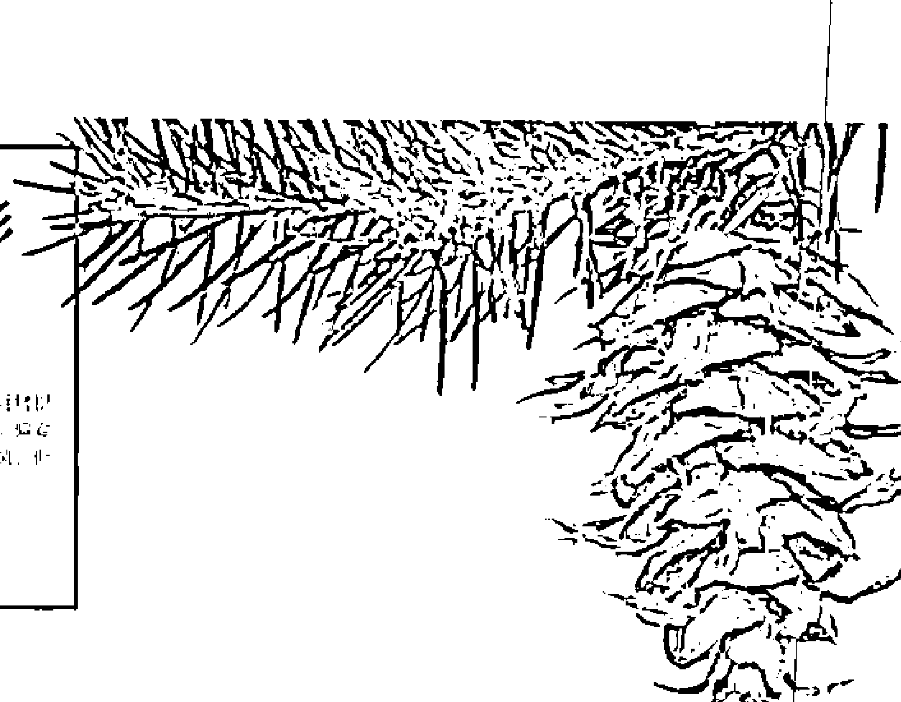

## 道格拉斯杉

Douglas-Fir

为松科黄杉属的常绿针叶高大乔木，是美国太平洋西北地区的主要森林树种，精油取自其针叶与嫩枝。

| 特性类别 | 详情 |
| :--- | :--- |
| **植物名称** | 道格拉斯杉 Douglas Fir |
| **学名** | *Pseudotsuga menziesii* |
| **其他名称** | 花旗松 / Oregon Pine |
| **香氛印象** | 像雨后森林般清新 |
| **植物科属** | 松科黄杉属 |
| **主要产地** | 法国，美国 |
| **萃取部位** | 针叶（蒸馏） |

| 精油特性 | 应用范围 |
| :--- | :--- |
| 1. 抗感染、抗菌、驱虫 | 皮肤创伤、烧伤、蛀牙、口腔卫生、食物中毒引起的肠胃不适 |
| 2. 抗卡他、祛痰 | 咳嗽、粘液瘤、呼吸道感染 |
| 3. 促进发汗和血液循环 | 风湿、关节炎、坐骨神经痛 |

主要成分：α-松油萜 32.87% / β-松油萜 15.45% 为主

萃油率 0.67%，23个可辨识之化合物（占91.08%）

心理疗效：提升对公众事务的关注，挣脱小情小爱的束缚

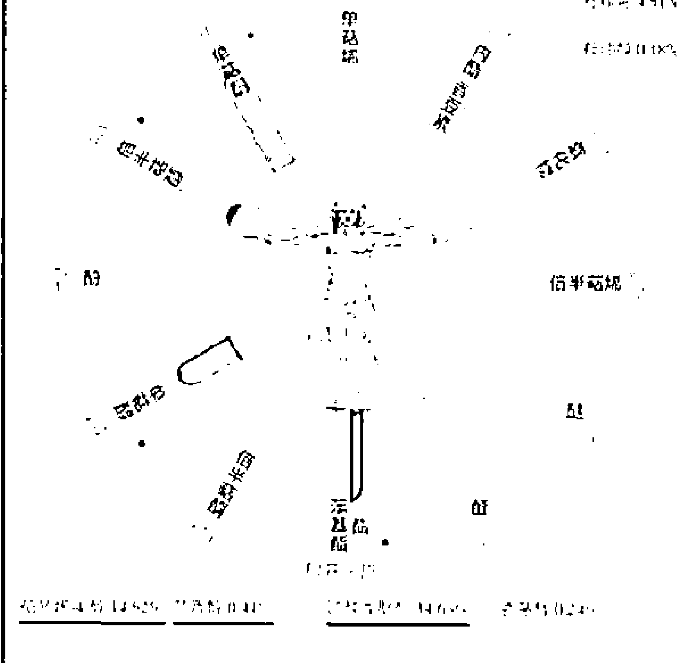

1. 另有不含萜类的化学品类（以 α-松油萜 32.87% / β-松油萜 15.45% 为主）。

### 药学属性

说明此精油所含芳香分子在疗效上的作用机转。一般来说，精油会有很多种效用，但为了方便读者更能聚焦，本书从近几年的最新研究、论文资料或临床中，选录出四大项药学属性。

### 适用症候

呼应此精油的各种药学属性，搭配适合处理的生理症状或身心问题。很重要的是该如何应用——必须先懂得芳疗知识，并能根据个案状况来选择合适用法、调整剂量等等。建议一般读者可先参考《香气与空间》《芳疗实证全书》等芳疗理论书籍，并事先征询过医师与芳疗师等专业建议后方始应用。

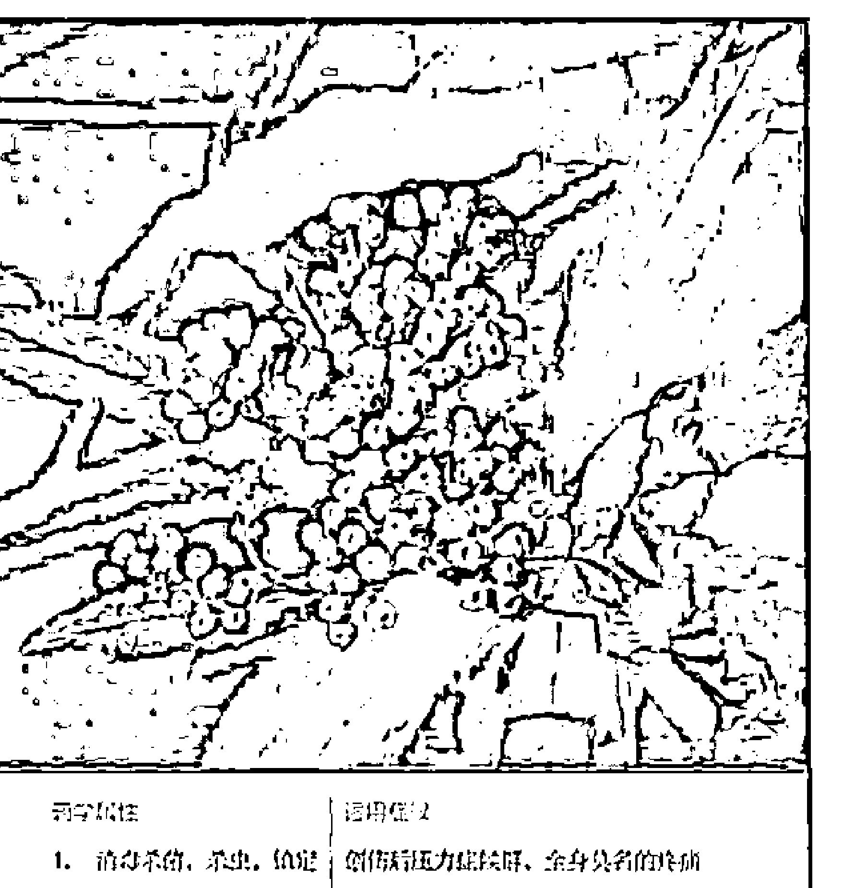

| 项目 | 内容 |
| :--- | :--- |
| 植物 | Psidium guajava |
| 科属 | 桃金娘科 |
| 萃取部位 | 叶片、果实 |
| 萃取方式 | 蒸馏 |

### 侧标

页码；所属的精油分类与代表颜色；此精油中文名。

### 核心成分

有三种数值：(1) 萃油率，通常可反映出部分资讯，例如该精油的萃取成本、珍稀度、价格等等。(2) 此精油在GC/MS检测中，目前可以辨识出的成分的数目（并非全成分的总数）。此数值较高代表此精油成分较复杂，有更多元用途；较低则生理作用较具针对性与直接性。(3) 可辨识成分占总数的比例值，若数值越低，代表此精油还有更多潜力等待人们未来发现。另外，有部分精油因为资讯不明确，故将这三种数值稍作省略。

### 适用部位

精油对应中医的十四经络，以及印度医学的七大气卦（Chakra，又称脉轮）。

### 心灵效益

特别适合在某些情绪状态中使用，有助于内在重新回归平衡，或提升某种正面特质，或塑造某类情境氛围。每一则心灵效益的头两字，即是所属精油大类的能量关键词。

### 注意事项

补充几个重要资讯，包括说明此精油的使用禁忌。若是较刺激皮肤的精油，则标有安全使用剂量。若有相近植物，则针对不同的品种、萃取法、产区所产生的精油成分，比较其差异。

## 芳香能量环

从精油所有芳香分子中选出几个代表性成分，然后归入12大类，制成环形的长条比例图。但为了强调少量分子也重要，长条图的比例并非绝对值，而是相对值。成分中文名的上下边，也有所属大类的代表色，若无乃是没被归入12大类者。环形的最外圈文字，象征各大类在能量疗效上的关键词。环形正中央人体图的红线，代表此精油呼应的经络线，实线代表正面，虚线代表背面。（因为参考多种样本检测，故成分比例可能位于颇大范围间，所呈现比例总和也非100%，tr则代表微量。）

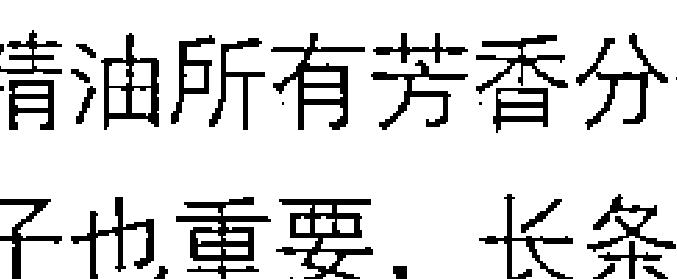

- 消炎抗菌，杀虫，止痒
- 止血，止血，收敛
- 促进消化，改善肠胃功能
- 消炎，消水肿

| 项目 | 内容 |
| :--- | :--- |
| 1 | 45年的休耕地上长出的番石榴的精油含有多种成分，许多在市面上看不到的成分。 |
| 2 | （补充其他相关说明） |## 如何使用本书

## 适用症候索引
以身体系统来分类各种症候，方便读者快速找到所对应的精油。但有些症候较复杂，会横跨不同身体系统，因此本书是依习惯来分类各系统中的症候，依据人体部位的上到下，以及症候的关联性，来做排序，而适用精油是以拼音来排序。

## 化学成分中英对照
因为本书选录的化学成分有些较罕见，还没有统一的中文译名，因此将全书出现过的精油化学成分做成中英对照表，方便读者明白是指哪个成分，也有助于查询相关的外文资讯。

| 英文名 | 中文名 |
|---|---|
| allyl tetramethoxybenzene | 烯丙基四甲氧基苯 |
| anethole | 茴香脑 |
| apiole | 芹菜脑 |
| asarone | 细辛醚/细辛脑 |
| davana ether | 达瓦醚 |
| dihydrocarveol | 二氢葛缕醇 |
| dihydrocarvone | 二氢葛缕酮 |
| 1,4-dimethoxybenzene | 1,4-二甲氧基苯 |
| elemicin | 榄香素 |
| epoxycarvone | 环氧葛缕酮 |
| eucalyptol | 桉叶油醇 |
| methyl carvacrol | 甲基香芹酚 |
| methyl chavicol (estragole) | 甲基胡椒酚（爱草脑） |
| methyl eugenol | 甲基丁香酚 |
| methyl iso-eugenol | 甲基异丁香酚 |
| methyl thymol | 甲基百里香酚 |
| p-methyl anisole | 对甲基苯甲醚 |
| myristicin | 肉豆蔻醚 |
| 2-phenyl ethyl methyl ether | 苯乙基甲基醚 |
| rose oxide | 玫瑰醚（玫瑰氧化物） |
| safrole | 黄樟素 |
| 3-tert-butyl-4-hydroxyanisole | 叔丁基-4-羟基茴香醚 |
| 1,3,5-trimethoxybenzene | 1,3,5-三甲氧基苯 |
| acetal | 乙缩醛 |
| bulnesial | 白木香醛（倍半萜醛） |
| beta-cyclocitral | β-环柠檬醛 |
| citral | 柠檬醛 |
| campholenic aldehyde | 樟脑烯醛 |
| citronellal | 香茅醛 |
| decanal | 癸醛 |
| 2-decenal | 2-癸烯醛 |
| 2,6-dimethyl-5-heptenal | 2,6-二甲基-5-庚烯醛 |
| 3,7-dimethyl-6-octenal | 3,7-二甲基-6-辛烯醛 |
| dolichodial | 多利醛 |
| farnesal | 法尼醛 |
| geranial | 香叶醛 |
| heptanal | 庚醛 |
| 7,10,16-hexadecatrienal | 7,10,16-十六碳三烯醛（倍半萜醛） |
| hexanal | 己醛 |

### 适用症候索引（按身体系统分类）
- 婴儿护理
- 婴儿腹泻
- 婴儿肠道绞痛
- 婴儿啼哭
- 婴儿啼哭（夜啼）
- 婴儿夜啼
- 儿童多动症
- 儿童发育迟缓
- 儿童过敏
- 儿童过敏性鼻炎
- 儿童消化不良
- 儿童自闭症
- 产后护理
- 产后抑郁
- 产后调理
- 老年护理
- 老年记忆力退化
- 老年痴呆
- 老年视力退化

### 按精油中文名拼音排序的列表
- Abies balsamea 香脂冷杉
- Abies sibirica 西伯利亚冷杉
- Abies alba 白冷杉
- Abies grandis 巨冷杉
- Abies veitchii 锡特卡冷杉
- Abies spectabilis 喜马拉雅冷杉
- Acacia decurrens 相思树
- Acorus calamus 菖蒲
- Aegopodium podagraria 羊角芹
- Agathosma betulina 互叶白千层
- Agathosma serratifolia 齿叶白千层
- Ageratina aromatica 藿香蓟
- Alpinia galanga 大高良姜
- Alpinia officinarum 高良姜
- Alpinia zerumbet 艳山姜
- Amomum villosum 砂仁
- Amyris balsamifera 脂檀
- Anethum graveolens 莳萝
- Angelica archangelica 圆叶当归
- Angelica dahurica 白芷
- Angelica sinensis 当归
- Anthemis nobilis 罗马洋甘菊
- Apium graveolens 芹菜
- Aquilaria agallocha 沉香
- Aquilaria sinensis 白木香
- Arctostaphylos uva-ursi 熊果
- Artemisia absinthium 洋艾
- Artemisia annua 黄花蒿
- Artemisia arborescens 大莳萝蒿
- Artemisia argyi 艾
- Artemisia capillaris 茵陈蒿
- Artemisia dracunculus 龙蒿
- Artemisia herba-alba (CT cineole) 白蒿（1,8-桉叶素型）
- Artemisia herba-alba (CT thujone) 白蒿（侧柏酮型）
- Artemisia pallens 白蒿
- Artemisia vulgaris 艾蒿
- Atractylodes lancea 苍术
- Atractylodes macrocephala 白术

## 拉丁学名索引、英文俗名索引、简体中文俗名索引
方便读者在听闻某精油的名称时，快速找到相关页码，了解其详细资讯。其中，拉丁学名与英文俗名是以字母来排序；简体中文俗名是以汉语拼音排序。

## 参考书籍、参考期刊、300种精油范例文献
本书所撰写精油的药学属性或适用症候，有其科学根据，所以列出相关的参考期刊与专著。而300种精油文献，则是在众多研究资料中，每一精油选出一篇代表性的出处。读者若有兴趣参考上述资料文献，可深入了解此精油的作用。

### 参考书籍
- Advances in Natural Product Chemistry (Proceedings of the Fifth International Symposium) Pakistan US Binational Workshop on Natural Product Chemistry, Karachi, Pakistan, January 1992)
- Agarwood: Science Behind the Fragrance
- Antimicrobial Potential and other Emerging Medicinal Properties of Natural Compounds
- Aromatherapeutic Blending: Essential Oils in Synergy
- Atlas des bois de Madagascar
- Bioactive Essential Oils and Cancer
- Chemical Dictionary of Economic Plants
- Chemistry of Spices
- Chinese Materia Medica Chemistry, Pharmacology and Applications
- Cinnamon and Cassia: The Genus Cinnamomum
- Citrus Oils: Composition, Advanced Analytical Techniques, Contaminants, and Biological Activity
- Comparative Endocrinology, Volume 2
- Cultivation Of Medicinal And Aromatic Crops
- Edible Medicinal And Non Medicinal Plants: Volume 4, Fruits
- Edible Medicinal And Non Medicinal Plants: Volume 8, Flowers
- Essential Oils and Aromatic Plants: Proceedings of the 15th International Symposium on Essential Oils
- Essential Oils Handbook: All the Oils You Will Ever Need for Health, Healing, and Well-being
- Essential Oils, A Handbook for Aromatherapy Practice
- Essential Oils Vol 9: 2005-2011
- Essential Oil Safety: A Guide for Health Care Professionals
- Ethnomedicine and Drug Discovery
- Fenaroli's Handbook of Flavor Ingredients
- Flowering Plants: Structure and Industrial Products
- Forest Product Livelihoods and Conservation: Case Studies of Non-Timber Forest Product Systems, Volume 1 - Asia
- Frontiers in CNS Drug Discovery, Volume 2
- Handbook of Essential Oils: Science, Technology, and Applications
- Handbook of Herbs and Spices
- Heartwood and Tree Exudates
- Herbs and Natural Supplements, Volume 2: An Evidence Based Guide
- Chary's Indigenous Drugs of India
- Iranian Entomology - An Introduction: Volume 1: Applied Studies
- Leafy Medicinal Herbs: Botany, Chemistry, Postharvest Technology and Uses
- Lead Compounds from Medicinal Plants for the Treatment of Neurodegenerative Diseases
- Leung's Encyclopedia of Common Natural Ingredients: Used in Food, Drugs, and Cosmetics
- Lipids, Liposome, Components and Essential Oils from Plant Sources
- Marine Cosmeceuticals: Trends and Prospects

### 300种精油范例文献列表
1. 乳香黄连木 / 狭叶乳香 / Agathosma bellidifolia / A. crenulata
2. 滨蒿 / 茵陈蒿 / Artemisia herba alba
3. 艾蒿 / Artemisia argyi
4. 艾蒿 / Artemisia vulgaris
5. 欧洲唇萼薄荷 / Calamintha nepeta
6. 葛缕子 / Carum carvi
7. 澳洲尤加利 / Eucalyptus dives
8. 蓝胶尤加利 / Eucalyptus globulus
9. 蓝桉 / Eucalyptus globulus
10. 圆叶尤加利 / Eucalyptus radiata
11. 十齿花 / Hypecoum erectum
12. 牛膝草 / Hyssopus officinalis
13. 头状薰衣草 / Lavandula stoechas
14. 白马鞭草 / Lippia alba
15. 长叶薄荷 / Mentha longifolia
16. 薄荷 / Mentha piperita
17. 绿薄荷 / Mentha spicata
18. 迷迭香 / Rosmarinus officinalis
19. 岩蔷薇 / Cistus ladanifer
20. 鼠尾草 / Salvia officinalis
21. 鼠尾草 / Salvia officinalis
22. 檀香 / Santalum album
23. 万寿菊 / Tagetes erecta
24. 万寿菊 / Tagetes erecta
25. 艾菊 / Tanacetum vulgare
26. 艾菊 / Tanacetum vulgare
27. 北美崖柏 / Thuja occidentalis

### 参考期刊文献
JEAN JACQUES FILIPPI. Composition, Enantiomeric Distribution, and Antibacterial Activity of the Essential Oil of Achillea ligustica All. From Sci.Agric. Food Chem., 2006; 54, 6308-6313.
A. Mollá, Dudu - Agathosma betulina and Agathosma crenulata (Rutaceae): A review. Journal of Ethnopharmacology 119, 2008: 413-419.
Rachel B. Essential oil from Artemisia herba alba Ass grown wild in Algeria: Variability assessment and comparison with an updated literature survey. Arabian Journal of Chemistry 7, 2014: 243-251.
刘红梅. 艾蒿化学成分及其生物活性研究进展. 华中农业大学学报（自然科学版）, 第36卷第1期, 2012年1月.
Maria Jose Abad. The Artemisia L. Genus: A Review of Bioactive Essential Oils. Molecules, 2012, 17, 2542-2566.
B. Marongiu. Chemical composition and biological assays of essential oils of Calamintha nepeta (L.) Savi subsp. nepeta (Lamiaceae). Natural Product Research, Vol. 24, No. 18, 10 November 2010: 1734-1742.
Ilayar Ayan. Potential anticancer activity of carvone in N2a neuroblastoma cell line. Toxicology and Industrial Health, Vol 31, Issue 8, 2015.
Mohammad M.S. Chemical composition and larvicidal activity of essential oil of Cupressus arizonica E.L. Greene against malaria vector Anopheles stephensi (Diptera:Culicidae). Pharmacognosy Research, April 2011 volume 3, issue 2, 2011.
Tamura N. Effect of adding Cinnamomum camphora on the testosterone hormone and reproductive traits of the Awassi rams. Journal for Veterinary Medical Sciences, Vol. (3) No (2), 2014.
Lutz Claudia. Chemical Variability and Biological Activities of Eucalyptus spp. Essential Oils. Molecules, 2016, 21: 1671.
ZAFAR IQBAL. Variation in Composition and Yield of Foliage Oil of Eucalyptus Polybractea. J.Chem.Soc.Pak., Vol. 33, No. 2, 2011.
Fatemeh Fatahzadeh. Phytochemical analysis and antioxidant activity of Hyssopus officinalis L. from Iran. Adv Pharm Bull. 2011 Dec; (2):63-67.
Hichem Sebai. Lavender (Lavandula stoechas L.) essential oils attenuate hyperglycemia and protect against oxidative stress in alloxan-induced diabetic rats. Lipids in Health and Disease, 2013, 12:189.
Hadian. Y. Anxiolytic-like effects of repeated treatment with an essential oil from Lippia alba and (R)-(-)-carvone in the elevated T-maze. Brazilian Journal of Medical and Biological Research, 2012: 238-243.
Müller M. Chemical composition and antimicrobial and antioxidant activities of Mentha longifolia L. (Lamiaceae) essential oil. J Food Sci. 2009 Sep;74(7):M358-63.
Boukhatem. Chemical composition and in vitro antimicrobial, insecticidal and antioxidant activities of the essential oils of Mentha pulegium L. and Mentha rotundifolia (L.) Huds growing in Algeria. Industrial Crops and Products, Volume 83, 15 October 2016:95-105.
Mouffok Sabrina. Mentha spicata Essential Oil: Chemical Composition, Antioxidant and Antibacterial Activities against Planktonic and Attached Cultures of Vibrio spp. Strains. Molecules, 2015, 20: 14402-14424.
Fernandez, L.P. Effectiveness of Rosmarinus officinalis essential oil as antihypertensive agent in primary hypertensive patients and its influence on health related quality of life. Journal of Ethnopharmacology 151,1, 2014: 509-516.
Giacomo Pintore. Chemical composition and antimicrobial activity of Rosmarinus officinalis L. oils from Sardinia and Corsica. Flavour Fragr. J. 2002, 17: 15-19.
Kennedy, D.O. Monoterpenoid extract of sage (Salvia lavandulifolia) with cholinesterase inhibiting properties improves cognitive performance and mood in healthy adults. Journal of Psychopharmacology 25,1083, 2011.
Raker, Humphrey. Chemistry, Pharmacology and Medicinal Property of Sage (Salvia) to Prevent and Cure Illnesses such as Obesity, Diabetes, Depression, Dementia, Lupus, Autism, Heart Disease and Cancer. Global Journal of Medical research Pharma, Drug Discovery, Toxicology and Medicine, Volume 13 Issue 7 Version 1.0, 2013.
Karima Bel Hadj Salah Fethi. Chemical composition, antibacterial and antifungal activities of flowerhead and root essential oils of Santolina chamaecyparissus L. growing wild in Tunisia. Saudi Journal of Biological Sciences, Volume 24, Issue 4, May 2017: 875-882.
吴美静. 紫茎泽兰精油对小鼠的抗炎作用及其抗氧化能力. 福建医科大学化妆品研究学硕士论文, 2016.
Karimiian, P. Anti oxidative and anti inflammatory effects of Tagetes minuta essential oil in activated macrophages. Asian Pacific Journal of Tropical Biomedicine, 4, 3, 2014: 219-227.
Mohsenzadeh, F. Chemical composition, antibacterial activity and cytotoxicity of essential oils of Tanacetum parthenium in different developmental stages. Pharm Biol. 2011 Sep; 49(9): 920-926.
Maria Luda M. Antimicrobial Effects Of The Ethanolic Extracts And Essential Oils Of Tanacetum Vulgare L. From Romania. The Journal of "Lucian Blaga" University of Sibiu, Volume 19, Issue 2, 2015.
Béla Nusser. Thuja occidentalis (Arbor vitae): A Review of its Pharmaceutical, Pharmacological and Clinical Properties. eCAM 2005; 2(1): 69-78.

## 芳香能量环

### 模型依据

维特鲁威人身上的红线代表了特别适用的经脉。

周围的芳香环，则是以“十二经脉子午流注图”为蓝本来排列 12 大类芳香分子。与精油一起工作了 25 年之后，我观察到这些芳香分子与特定的经脉能量有奇妙的共振关系，所以用这样的排序来表现某类分子与某条经脉的相合性。不过这个排序并不代表某类分子的精油最好在该经脉的巡行时间使用。比方说单萜烯类精油有助于强化三焦经，但单萜烯类的精油并非只能在晚间 9 点到 11 点间使用。

### 模型特点

**彰显协同作用的重要性**

近年的药用植物研究，已经不再专注于发掘“神奇子弹”，也就是某个望风披靡的明星成分。相反的，愈来愈多的报告都在结论提到，某药草或某精油之所以能发挥某疗效，是因为各个分子的协同作用所致。以丁香酚为例，如果认为丁香酚就是丁香的神奇子弹，那我们应该采用丁香枝干而非丁香花苞的精油，因为丁香枝干的丁香酚含量远高于丁香花苞。事实上，丁香枝干精油的立即止痛效果确实优于丁香花苞，然而在抗感染、多发性硬化症、抗肿瘤等作用上，丁香花苞还是明显胜出，丁香花苞能处理的症状也比丁香枝干多。这是因为丁香花苞的分子总数多于丁香枝干，而且倍半萜烯与酯类的含量也多于丁香枝干。科学研究和临床观察都指向一个事实：分子总数愈多（尤其是大分子）、结构愈复杂的精油，疗愈的范畴愈广。

**彰显微量成分的重要性**

除了协同作用，占比低的成分、微量成分，乃至尚未能被辨识的成分，也都影响了精油的功能与特性。以芸香科柑橘属的果皮精油为例，它们清一色被柠檬烯独占鳌头，然而它们的关键作用与香气特征却有清楚的分野。像葡萄柚这种柠檬烯高达 92% 以上的精油，其调时差能力在别的柠檬烯类精油身上都找不到。而永久花精油的看家本领，化瘀作用，则是来自只占 13% 的意大利双酮。再如胡薄荷精油含胡薄荷酮达 75%，可是其杀虫毒性远弱于胡薄荷酮本身，也不具胡薄荷酮的致癌性，这都要归功于占比不到 15% 的倍半萜类（桉叶醇和愈疮木烯）。

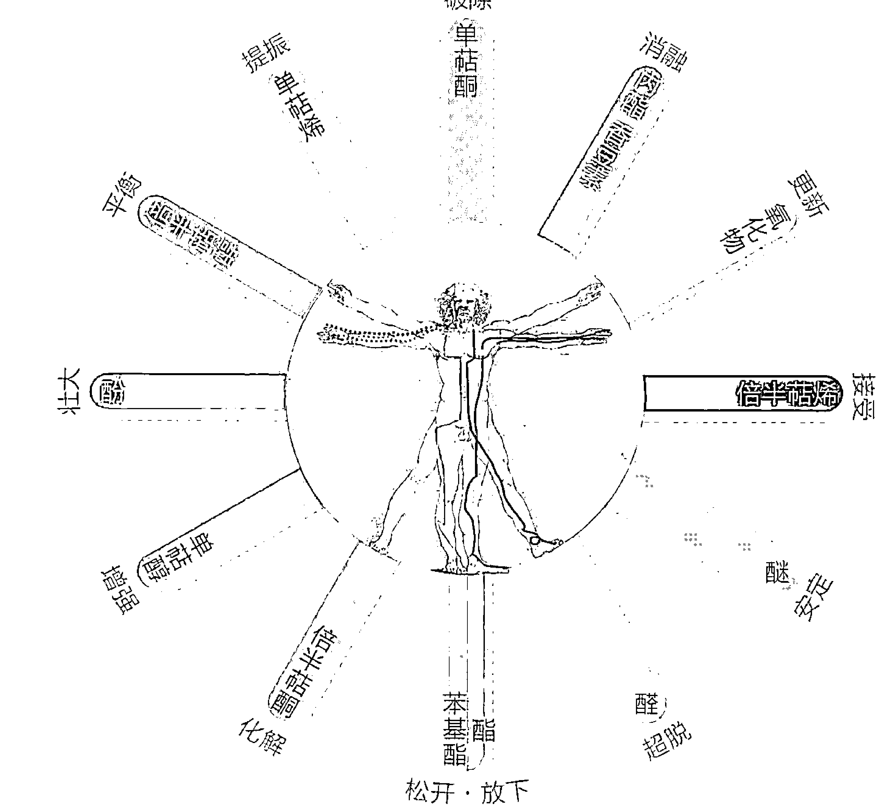

- □ 酯/苯基酯 - 心经
- □ 倍半萜酮 - 小肠经
- □ 单萜醇 - 膀胱经
- □ 酚 - 肾经
- □ 倍半萜醇 - 心包经
- □ 单萜烯 - 三焦经
- □ 单萜酮 - 胆经
- □ 内酯/香豆素 - 肝经
- □ 氧化物 - 肺经
- □ 倍半萜烯 - 大肠经
- □ 醚 - 胃经
- □ 醛 - 脾经

### 模型方向

过去的分子模型帮助我们迅速掌握精油的基本个性，例如阳性精油、阴性精油，或是理性面精油、情绪面精油等等。我为本书设计的分子模型，则希望把视角进一步聚焦到“疗愈的整体性”——留意哪些分子如何组合，而不只是抓到主旋律，同时标示出最能共振的能量通道(经脉)。

## 精油成分属性表

| 精油成分 | 代表精油 | 心理效用 | 生理效用 | 整体效用 | 适用经脉 |
| --- | --- | --- | --- | --- | --- |
| 单萜酮 | 樟脑迷迭香<br>绿薄荷 | 开启悟性<br>保持神智的清明 | 溶解脂肪与黏液<br>促进神经与皮肤再生 | 破除 | 胆经 |
| 香豆素 / 内酯 | 芹菜<br>圆叶当归 | 扭转乾坤<br>穿越重重的障碍 | 养肝排毒<br>抗血液黏稠 | 消融 | 肝经 |
| 氧化物 (桉油醇) | 澳洲尤加利<br>桉油醇樟 | 青春洋溢<br>带来新意与活力 | 强化细胞供氧<br>抗卡他 | 更新 | 肺经 |
| 倍半萜烯 | 德国洋甘菊<br>古巴香脂 | 顺其自然<br>找到自己的定位 | 强力消炎<br>缓解过敏 | 接受 | 大肠经 |
| 醚 | 热带罗勒<br>肉豆蔻 | 建立信仰<br>寻获内在的靠山 | 助消化、抗痉挛<br>强化神经 | 安定 | 胃经 |
| 醛 | 香蜂草<br>柠檬尤加利 | 得到自由<br>感受天地的宽阔 | 强力抗菌抗病毒<br>抗氧化、抗肿瘤 | 超脱 | 脾经 |

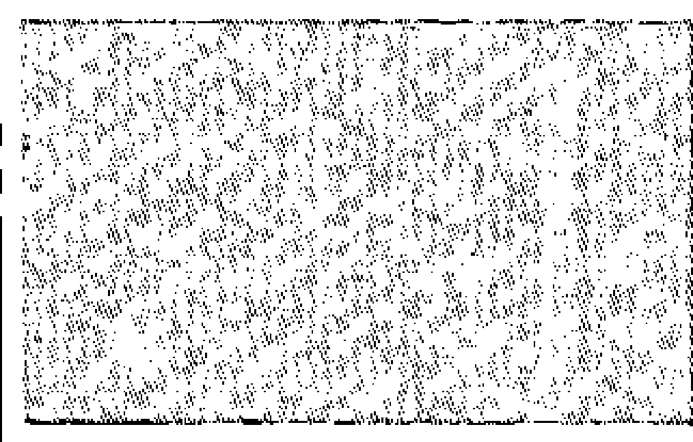


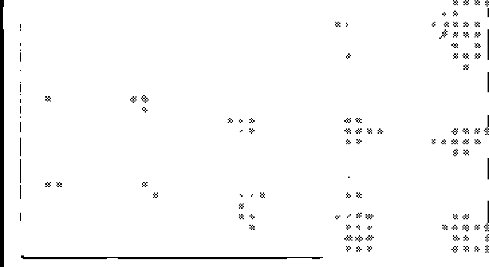


| 精油成分 | 代表精油 | 心理效用 | 生理效用 | 整体效用 | 适用经脉 |
| --- | --- | --- | --- | --- | --- |
| 酯 | 罗马洋甘菊<br>苦橙叶 | 备受呵护<br>体会善意与温柔 | 止痛消炎<br>镇静安抚 | 放下 | ○<br>心经 |
| 苯基酯 | 黄玉兰<br>芳香白珠 | 流露感性<br>品味生活的甜蜜 | 放松肌肉<br>保护神经 | 松开 | ●<br>心经 |
| 芳香酸 | 安息香<br>香草 | 抗压收惊<br>驱走威胁的阴影 | 促进伤口愈合<br>抗痉挛 | 松开 | ○<br>心经 |
| 倍半萜酮<br>双酮/三酮 | 银艾<br>莎草 | 修补创伤<br>扩大灵性的共振 | 去瘀疗伤<br>通经络、抗肿瘤 | 化解 | ○<br>小肠经 |
| 单萜醇 | 芳樟<br>茶树 | 生机勃勃<br>焕发抖擞的精神 | 增强免疫功能<br>补身抗衰老 | 增强 | ○<br>膀胱经 |
| 酚/芳香醛 | 野马郁兰<br>台湾土肉桂 | 无所畏惧<br>散放热情与自信 | 强力抗感染<br>助消化、抗肿瘤 | 壮大 | ○<br>肾经 |
| 倍半萜醇 | 广藿香<br>岩兰草 | 怡然自得<br>敢以余味定输赢 | 解除淋巴与静脉壅塞<br>强心、护肤 | 平衡 | ●<br>心包经 |
| 单萜烯 | 丝柏<br>海茴香 | 不屈不挠<br>打磨耐力与毅力 | 激励神经传导<br>促进体液的流动与代谢 | 提振 | ○<br>三焦经 |

## 十二经脉与其对应范围

| 经脉 | 疗愈能量 | 情绪根源 | 生理漏洞 | 适用精油 |
|------|----------|----------|----------|----------|
| 胆经 | 正确地看见自己<br>清明地做出判断 | 有所顾忌而无法承认的恨意 | 风湿性关节炎、<br>僵直性脊椎炎、<br>上火、结石、<br>抽筋…… | 单萜酮类 |
| 肝经 | 珍惜所有<br>适当运用<br>积极行动 | 生存资源被剥夺而产生的怒气 | 乳腺增生、乳腺癌、<br>肝病、<br>病毒感染、<br>慢性中毒…… | 香豆素/内酯类 |
| 肺经 | 转换气氛<br>重拾活力 | 失去恋慕对象的哀愁与抑郁 | 久咳不止、有气无力、<br>高热不退、咽喉肿痛、<br>支气管炎…… | 氧化物类(桉油醇) |
| 大肠经 | 保持弹性<br>与时俱进 | 无法面对梦想幻灭的悲观和顽固 | 皮肤过敏奇痒、<br>视力模糊、<br>腹泻、便秘、<br>牙疼…… | 倍半萜烯类 |
| 胃经 | 恢复本性做自己<br>诚实是最好的政策 | 为顾全大局而百般隐忍 | 腹腔疼痛、<br>不同部位的莫名疼痛、<br>消化困难、浮肿、<br>脱线的表现…… | 醚类 |
| 脾经 | 信任身体的直觉<br>感受大地的支持 | 想太多以及过度的理性控制 | 妇科问题、<br>男性生殖器官疾病、<br>糖尿病、食欲不振、<br>湿疹、荨麻疹…… | 醛类 |

| 序号 | 经脉   | 疗愈能量                     | 情绪根源                     | 生理漏洞                     | 适用精油         |
|------|--------|------------------------------|------------------------------|------------------------------|------------------|
| 7    | 心经   | 宽恕上天之不仁<br>原谅自己的无力 | 无法承受的创伤<br>（背叛、遗弃、匮乏、灾祸） | 失眠、起夜、<br>多梦、神经衰弱、<br>一切心脏疾病、<br>猝倒、晕眩 …… | ○<br>酯类<br>苯基酯类<br>芳香酸类 |
| 8    | 小肠经 | 过滤生命的渣滓<br>化腐朽为神奇 | 无法摆脱的创伤<br>（罪恶、羞耻、晴天霹雳） | 被害妄想、精神分裂、<br>落枕、身体僵硬、<br>无法出汗、脸发青、<br>贫血、烦闷 …… | ○<br>倍半萜酮类 |
| 9    | 膀胱经 | 扬弃人定胜天的妄想，做合理的努力 | 对于出身背景或<br>表现不够好的恐惧 | 风邪感冒、<br>与血液有关的疾病、<br>与骨头有关的疾病、<br>腰背痛、各类不适 …… | ○<br>单萜醇类 |
| 10   | 肾经   | 接通幸福的源泉与<br>生生不息的力量 | 对于性与死亡的<br>深层恐惧 | 气喘、过敏性鼻炎、<br>衰老、记忆力差、<br>早生白发、<br>性冷感、阳痿、<br>手脚冰冷、耳鸣 …… | ○<br>酚类<br>（芳香醛） |
| 11   | 心包经 | 筑起坚固的护城河，产生安全感 | 神经系统不稳定<br>情绪大起大落 | 紧张、心悸、<br>狂躁、易怒、口臭口疮、<br>甲状腺肿、睡眠困扰 …… | ○<br>倍半萜醇类 |
| 12   | 三焦经 | 穿越世界的乌烟瘴气而抵达自己的净土 | 被他人的情绪勒索<br>而动弹不得 | 筋膜粘连引起的各种问题，如五十肩、肋间神经痛、乳汁不出、闭经 …… | ○<br>单萜烯类 |

## 气卦七轮与其对应范围

气卦又称“脉轮”，是印度传统医学阿育吠陀用以指涉人体能量场域的概念。在不同气卦部位使用合适精油，将有助于调理该气卦对应的身心状态。

| | 第一气卦 | 第二气卦 | 第三气卦 |
|---|---|---|---|
| 名称 | 基底轮 | 性轮 | 本我轮 |
| 梵语 | Muladhara | Svadhisthana | Manipura |
| 含意 | 根基的支持 | 自我的居所 | 宝石之城 |
| 代表色 | 红色 | 橙色 | 黄色 |
| 部位 | 会阴、脊椎底部 | 生殖器官、下腹部 | 肋骨与肚脐之间（太阳神经丛） |
| 生理范围 | 骨骼关节、腿部、骨盆、排泄功能 | 生殖泌尿功能、生育力、性腺 | 消化功能、肠胃、肝胆、胰腺 |
| 心理与能量范围 | 生存的基本需求、安全感、恐惧感、金钱或物质关系 | 亲密关系、创造力、性愉悦、罪恶感 | 自我意志的中心、自我评价、控制欲 |

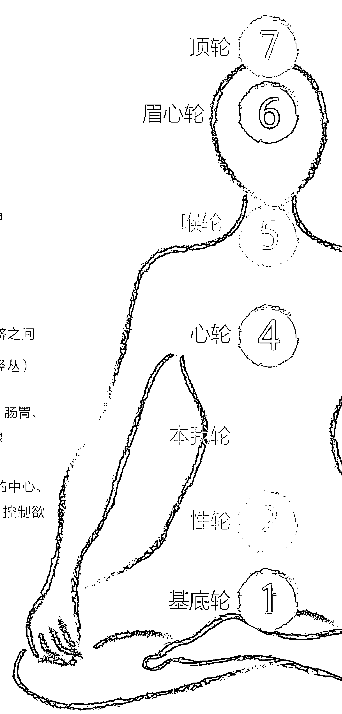

其中，第一与第二气卦，第六与第七气卦，因为位置相近，所掌管的身心状态有些重叠，例如松果体与脑下腺，皆对第六与第七气卦有影响，也常与智慧的课题相关。不过，第七气卦更强调整体合一，即每气卦要平衡与统合，因此也有人认为第七气卦代表色是白色（乃所有色光的合一）。

| | 第四气卦 | 第五气卦 | 第六气卦 | 第七气卦 |
|---|---|---|---|---|
| 名称 | 心轮 | 喉轮 | 眉心轮 | 顶轮 |
| 梵语 | Anahata | Vishuddha | Ajna | Sahasrara |
| 含义 | 免灾免厄 | 纯净 | 无限的力量 | 千瓣莲花 |
| 代表色 | 绿色 | 蓝色 | 靛色、蓝紫色 | 紫色、白色 |
| 部位 | 胸部 | 喉、颈部 | 两眉之间（第三只眼） | 头顶之上 |
| 生理范围 | 心肺功能、循环、胸腺 | 呼吸功能、甲状腺、新陈代谢 | 脑下腺、眼、脸、头部 | 松果体、大脑、神经传导物质 |
| 心理与能量范围 | 爱、与世界的交流、付出与接受 | 沟通表达、共鸣、人际互动 | 洞见、直觉、梦想、觉知 | 灵性、合一 |


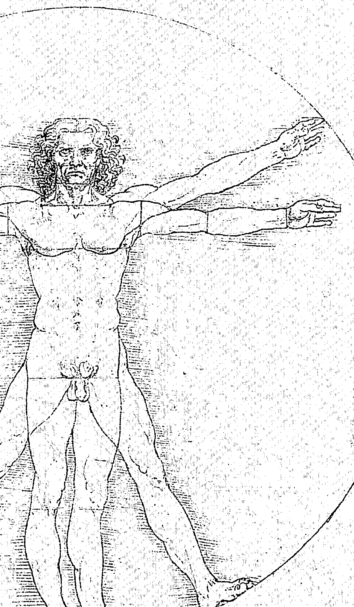
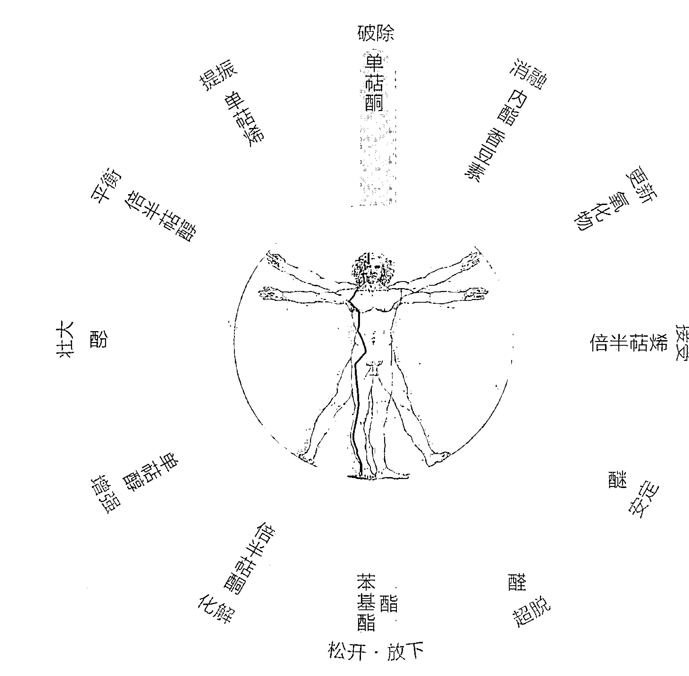

## 单萜酮

含酮的芳香植物，多半气味强烈，气味分子小，容易渗透，但对皮肤有刺激性，使用需谨慎。酮类通常对黏膜刺激大，对神经系统有影响，过量使用有毒性。但适当的酮类精油能促进皮肤再生、化痰、止痛、抗凝血。例如，永久花含有橙花酮，气味甜美，适合处理疤痕和瘀青；鼠尾草含有侧柏酮，能帮助消化和缓解经痛，但孕妇避免使用。

### 利古蓍草

喜欢生长在明亮开敞的林间空地，可在海拔 800 米以下的石灰岩坡地发现。与西洋蓍草明显不同的地方是叶较宽也较多分叉，更像窄版的艾叶。

- 学名 | *Achillea ligustica*
- 其他名称 | 南方蓍草 / Southern Yarrow
- 香气印象 | 湿着眼睛看结局美好的励志歌舞片
- 植物科属 | 菊科蓍属
- 主要产地 | 意大利、科西嘉岛、希腊
- 萃取部位 | 开花的全株药草 (蒸馏)
- 适用部位 | 大肠经、本我轮

**核心成分**

萃油率 0.2%~0.4%，82 个可辨识化合物 (占 94%)

- 心灵效益 | 破除舒适圈的包围，大胆展开梦想已久的生活实验

**注意事项**

1. 最主要的分布区是意大利本岛与离岛之间的第勒尼安海岸。但各地成分差异大，本条描述较接近科西嘉岛所产。
2. 孕妇、哺乳母亲、婴幼儿不宜使用。

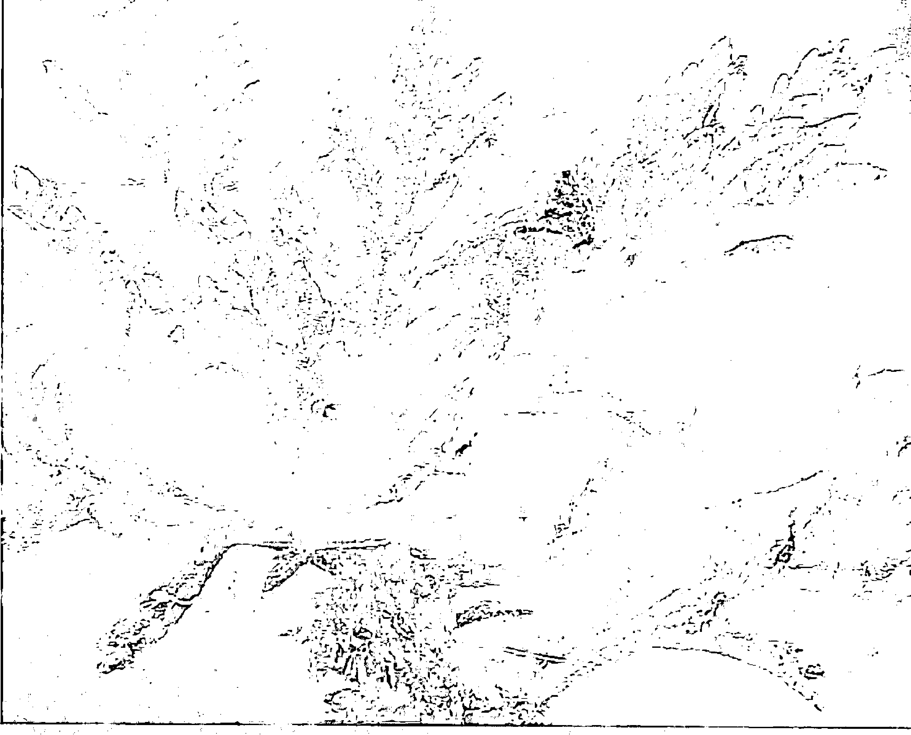

**药学属性**

**适用症候**

1. 消炎，止血，疗伤
   - 神经炎，神经痛，风湿，扭伤，挫伤
2. 调节女性激素，通经
   - 月经周期混乱，痛经，输卵管炎，子宫肌瘤，更年期综合征
3. 利肝胆
   - 多油炸、少蔬果、常喝含糖碳酸饮料、常备零食的饮食习惯
4. 抗卡他，修复皮肤伤痕
   - 多痰，蚊虫咬伤

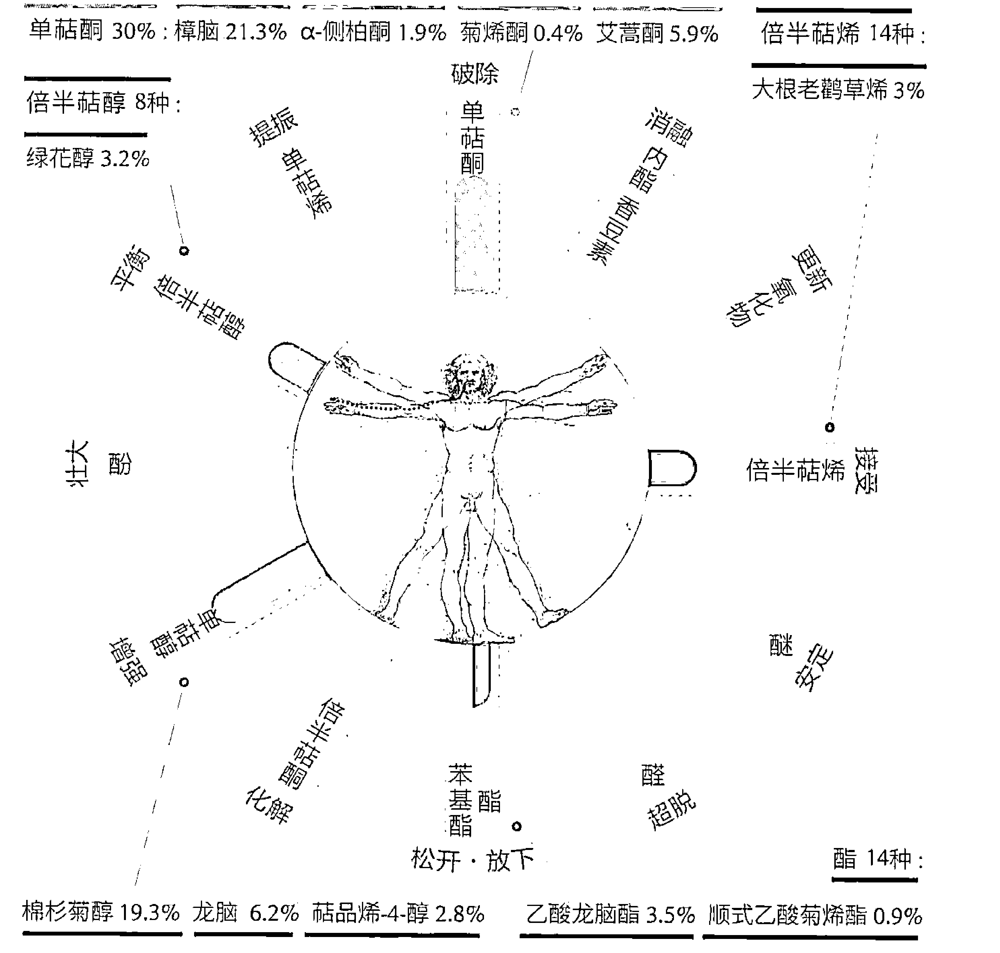

### 圆叶布枯

分布于南非开普敦西部的砂质低矮山脉、需要林火自然更新的硬叶灌木群落中。喜欢靠近溪流生长，但周边往往是半沙漠区，通常为1米高，常绿。

**药学属性**

1. 消解黏液，抗卡他
2. 轻度抗菌抗感染，利尿
3. 抗痉挛
4. 消炎

**适用症候**

- 感冒，多痰，气喘性支气管炎
- 尿道炎，膀胱炎，前列腺炎，排尿困难，肾结石
- 消化不良
- 伤口红肿，瘀血，扭伤

| 项目 | 信息 |
| :--- | :--- |
| 学 名 | *Agathosma betulina* |
| 其他名称 | 布枯叶/Boegoe |
| 香气印象 | 穿过荒山堆石，在干渴至极时看见海市蜃楼 |
| 植物科属 | 芸香科香芸木属 |
| 主要产地 | 南非 |
| 萃取部位 | 叶片（蒸馏） |
| 适用部位 | 肾经、性轮 |
| 核心成分 | 萃油率 1.3%，40 个可辨识化合物 |
| 心灵效益 | 破除石壁般的困境，让生命重新流动 |

酮-醇类：布枯脑41%（以烯醇型式存在的环α-芳香双酮） 单萜酮：异薄荷酮31%

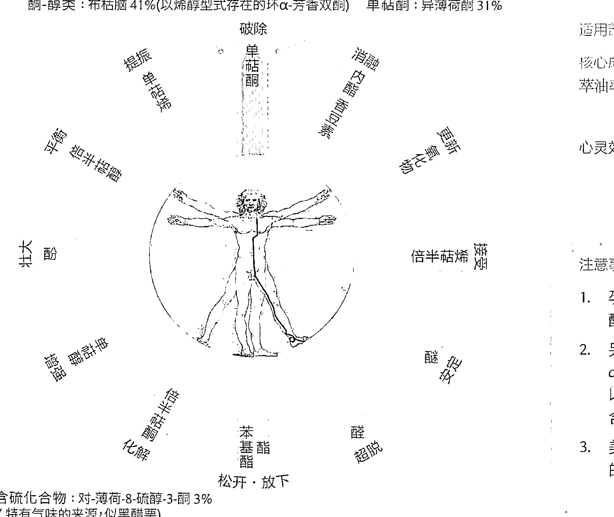

含硫化合物：对-薄荷-8-硫醇-3-酮3%（特有气味的来源，似黑醋栗）

**注意事项**

1. 孕妇、哺乳母亲、婴幼儿以及对酮敏感者应避免使用。
2. 另一品种椭圆叶布枯(Agathosma crenulata)，作用近似，但酮含量以胡薄荷酮为主（54%），也不含布枯脑，使用上要更谨慎。
3. 美国允许布枯精油添加于食品中的剂量为 0.002%。

### 侧柏酮白叶蒿

遍布于地中海不毛之地的矮小灌木中。叶披腺毛，气味极重，在阳光下呈灰白色。

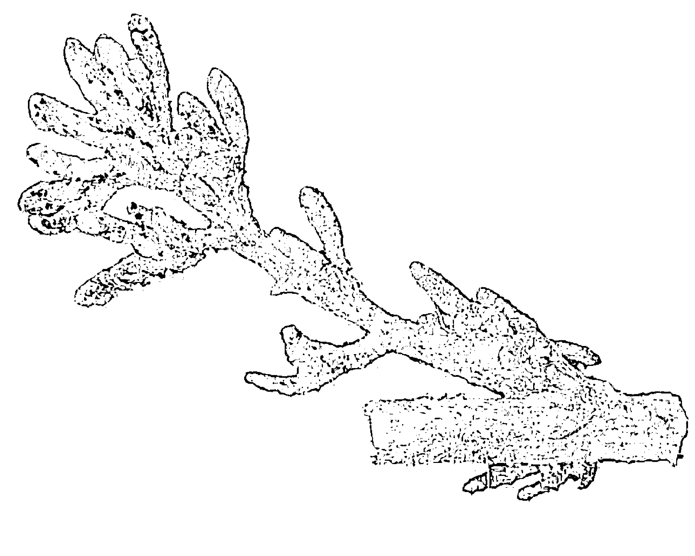

**学名** | *Artemisia herba-alba*
**其他名称** | 沙漠苦艾 / Desert Wormwood
**香气印象** | 漂浮在巨大无垠的银河中
**植物科属** | 菊科·艾属
**主要产地** | 摩洛哥、西班牙南部
**萃取部位** | 全株药草 (蒸馏)
**适用部位** | 胆经、顶轮
**核心成分** | 萃油率 1.3%，29 个可辨识化合物
**心灵效益** | 破除物质的诱引，长出灵性的翅膀

**药学属性**

1. 消解黏液
2. 抗病毒，抗氧化
3. 通经，抗痉挛
4. 抗感染，抗寄生虫，促进胆汁分泌，降血糖

**适用症候**

- 白带，呼吸道卡他性感染
- 扁平疣，减缓皮肤老化
- 月经不至，痛经
- 肠道寄生虫，蛲虫病，肥胖，糖尿病

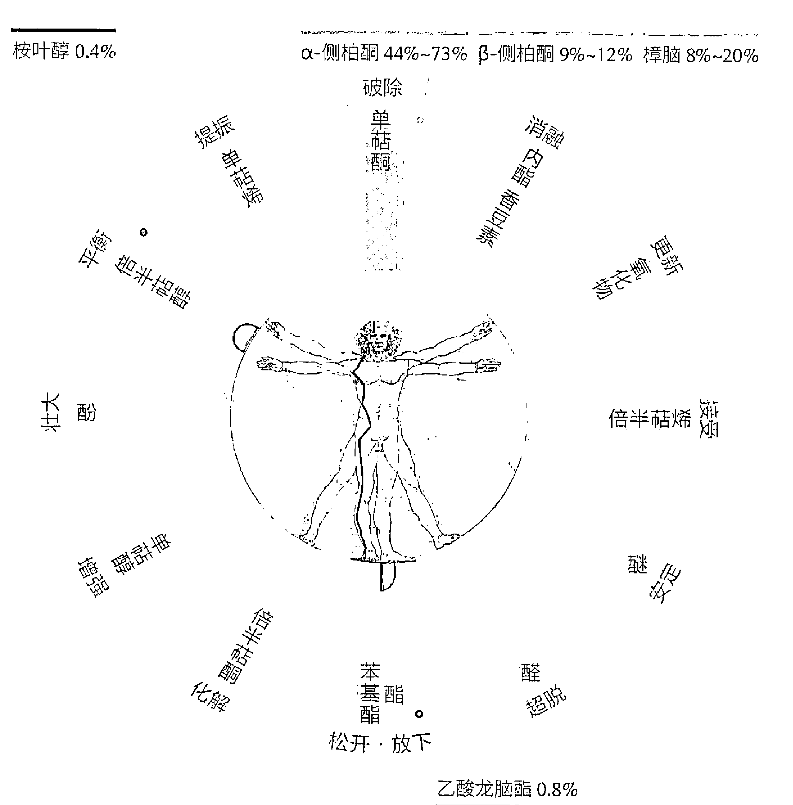

**注意事项**

1. 孕妇、哺乳母亲、婴幼儿以及对酮敏感者避免使用。
2. 摩洛哥有七种化学品系的白叶蒿，分别以樟脑、侧柏酮、菊烯酮、乙酸菊烯酯、印蒿酮形成不同组合。

### 艾叶

喜旱植物，常见于缺水山坡、草原河岸以及橡树林边与荒地。在贫瘠干燥的土壤上会长得更加枝繁叶茂、香气浓郁。

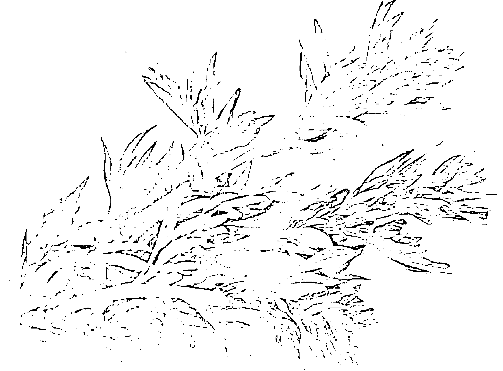

**药学属性**

1. 抗真菌 (絮状表皮癣菌、白色念珠菌、新型隐球菌)，抗病毒，消毒，驱虫
2. 增加红细胞数量，提高雌二醇和黄体酮水平
3. 降低谷丙转氨酶，促进肝功能恢复，提高肝脏合成蛋白质的能力，抗乙肝病毒
4. 增强巨噬细胞吞噬功能，强化免疫，促进代谢，抗氧化

**适用症候**

- 脚癣，灰指甲，外科感染，带状疱疹，小儿轮状病毒肠炎
- 小腹冷痛，经寒不调，宫冷不孕
- 肝硬化，脂肪肝，乙型肝炎
- 过敏，气喘，咳嗽，湿疹瘙痒

| 项目 | 信息 |
| :--- | :--- |
| 学 名 | *Artemisia argyi* |
| 其他名称 | 艾蒿/Gaiyou |
| 香气印象 | 地上折射出彩虹的水洼 |
| 植物科属 | 菊科艾属 |
| 主要产地 | 中国、韩国、日本、蒙古 |
| 萃取部位 | 枝叶 (蒸馏) |
| 适用部位 | 肝经、性轮 |
| 核心成分 | 萃油率0.65%~1.23%，28~51个可辨识化合物 (占72%~94%) |
| 心灵效益 | 破除肿胀的自我，耐心融入多元的社群 |

单萜酮 20% : α-侧柏酮 15% 桉油醇 25% 丁香油烃氧化物 2.7%

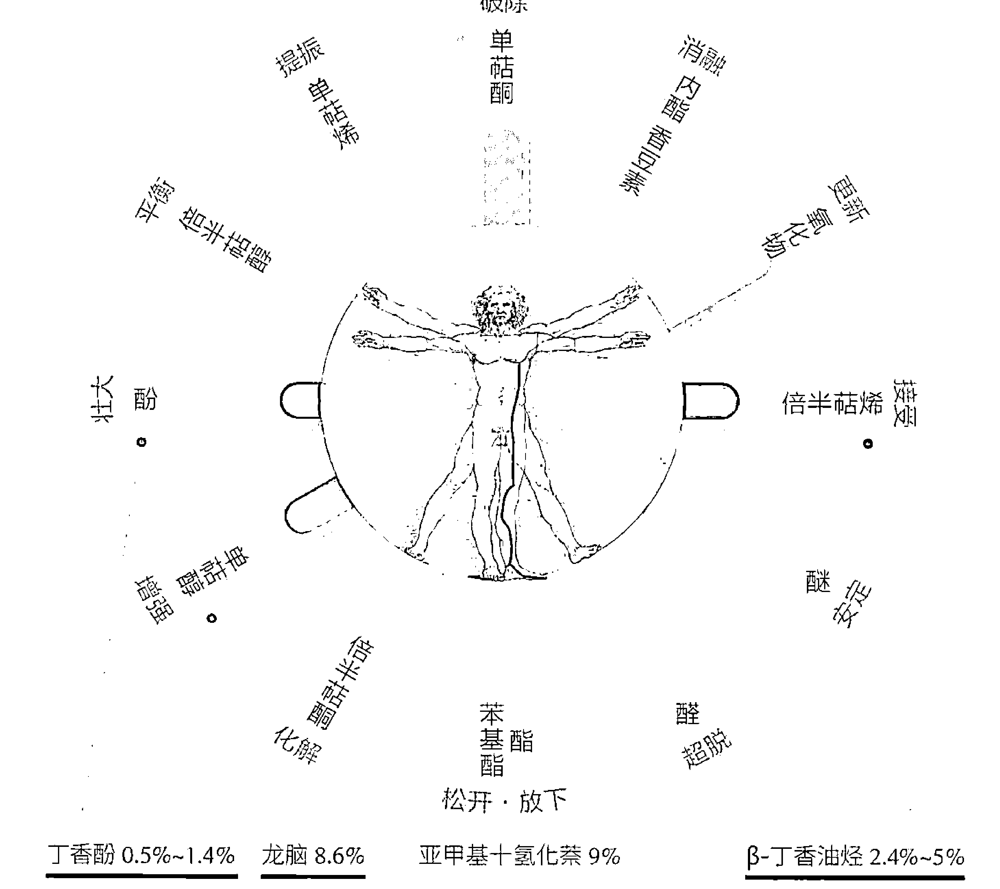

**注意事项**

1. 艾灸功效主要来自艾叶的精油成分，但中国各地艾叶 (艾草) 成分差距颇大，本条比较符合蕲艾。孕妇、哺乳母亲、婴幼儿不宜使用艾叶精油。
2. 青蒿 (黄花蒿，*Artemisia annua*) 的精油以倍半萜烯和单萜酮为主 (艾蒿酮和樟脑)，抗疟疾的青蒿素则不存在于精油当中。
3. 茵陈蒿 (*Artemisia capillaris*) 精油中的主要成分为茵陈烯炔和茵陈烯酮，利胆。

# 艾蒿
Common Mugwort

广布欧亚大陆与北美，在温带繁茂生长，几乎能适应各种环境。最喜爱干燥石灰岩与充足日照，阴湿的条件会使其气味大减。

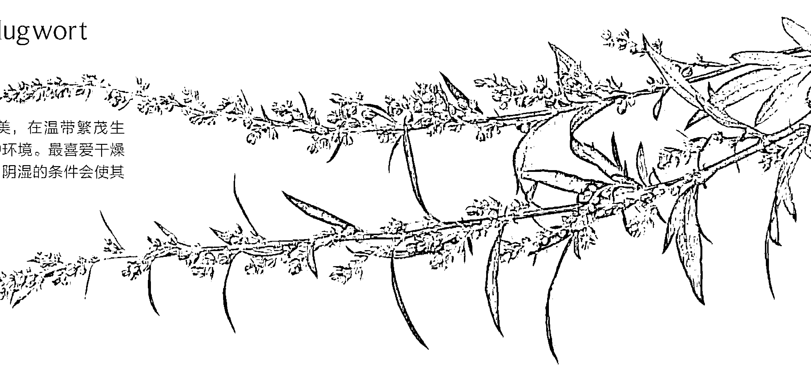

| 项目 | 内容 |
| :--- | :--- |
| 学名 | Artemisia vulgaris |
| 其他名称 | 北艾 / Mugweed |
| 香气印象 | 风吹草低见牛羊 |
| 植物科属 | 菊科-艾属 |
| 主要产地 | 摩洛哥、土耳其、埃及 |
| 萃取部位 | 开花的全株药草(蒸馏) |
| 适用部位 | 肾经、性轮 |

### 药学属性

| 药学属性 | 适用症候 |
| :--- | :--- |
| 1. 消解黏液 | 长年吸烟导致的痰多，阴道瘙痒与分泌物多 |
| 2. 抗病毒，抗氧化，降解重金属对神经的伤害 | 扁平疣，皮肤干皱，老年痴呆，自闭症 |
| 3. 通经，抗痉挛，消胀气 | 助产，月经不至，痛经，头痛，腹痛 |
| 4. 抗寄生虫，驱蚊，消炎 | 肠道寄生虫，登革热，蚊虫叮咬导致的皮肤溃烂 |

### 核心成分

萃油率 0.4%~1.4%，48~88 个可辨识化合物

心灵效益 | 破除有限资源的不便，善用减法过生活

### 注意事项

1. 孕妇、哺乳母亲、婴幼儿以及对酮敏感者避免使用。
2. 苦艾 (Artemisia absinthium) 精油含侧柏酮 45% 和乙酸桧酯 9%，两者都会导致流产(反着床)，但也有驱虫、通经、开胃的功能。
3. 非洲艾 (Artemisia afra) 精油的组成接近艾蒿，差别在于含艾蒿酮而较少樟脑，以及桉油醇达 30%，所以对呼吸道的效果更好。

单萜烯 10%：樟烯 桧烯

单萜酮 40%：樟脑 17% 异侧柏酮 10% α- & β-侧柏酮 11.3%

1,8-桉油醇 8.47%

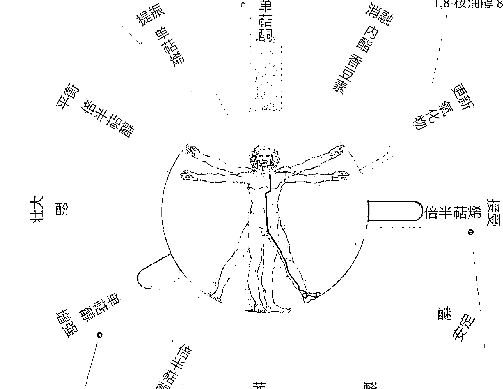

倍半萜烯 20%：
大根老鹳草烯 10% 萃澄茄烯 8% 丁香油烃 10%

单萜醇 10%：
艾醇 0.89% 艾蒿醇 0.76% 龙脑 3.15%

# 假荆芥
新风轮菜
Calamint

常见于地中海岸，偏爱石灰岩与全日照。冬季休眠，春季开花，夏季最为活跃，可生长3~4年。

### 药学属性

| 药学属性 | 适用症候 |
| :--- | :--- |
| 1. 助消化，健胃，养肝，利胆 | 奶制品造成的胀气，肠炎，过量酒精或人工添加剂带来的肝伤害 |
| 2. 补强呼吸系统与神经系统（低剂量） | 湿度过高导致的呼吸不顺畅，情绪低落与疲倦感 |
| 3. 抗感染，抗霉菌（念珠菌属，黄曲霉菌） | 足部真菌病，皮肤的霉菌感染 |
| 4. 类激素作用，抑制亢进的甲状腺 | 甲状腺功能亢进 |

柠檬烯 4.8% 胡薄荷酮 64% 胡椒烯酮 6.4% 1,8-桉油醇 0.3% 胡椒烯酮氧化物 2.5% 丁香油烃氧化物 0.2% 沉香醇 0.7%

| 项目 | 内容 |
| :--- | :--- |
| 学名 | Calamintha nepeta / Clinopodium nepeta |
| 其他名称 | 卡拉薄荷 / Lesser Calamint |
| 香气印象 | 疾风知劲草 |
| 植物科属 | 唇形科新风轮菜属 |
| 主要产地 | 意大利、葡萄牙、科西嘉岛 |
| 萃取部位 | 开花的全株药草（蒸馏） |
| 适用部位 | 胆经、喉轮 |

### 核心成分

萃油率3%，28个可辨识化合物（占91.6%）

心灵效益 | 破除一把抓的习惯，愿意放权

### 注意事项

1. 孕妇、哺乳母亲、婴幼儿、对酮敏感者避免使用。
2. 有三种化学品系：胡薄荷酮型（较干燥的环境），薄荷酮型（水气较多的环境），胡椒烯酮氧化物型。
3. 另一品种山地卡拉薄荷（Calamintha sylvatica）作用相似，组成为胡薄荷酮25%、胡椒酮12%、薄荷酮7%、异薄荷酮10%，气味较不呛辣。

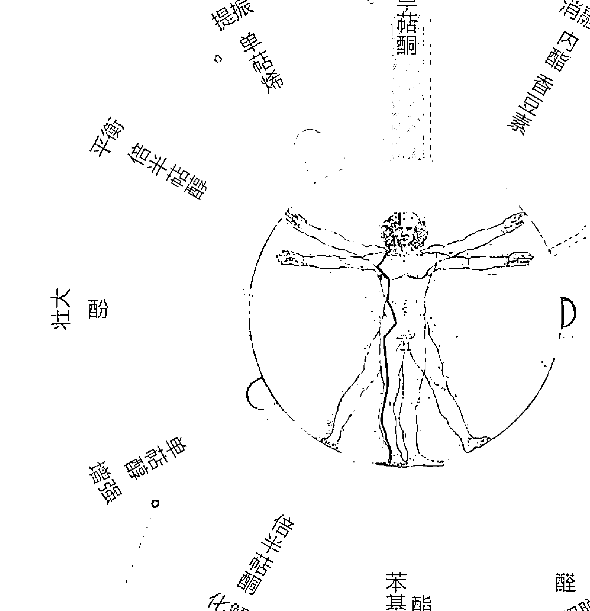

# 藏茴香
Caraway

原生于西亚，如今遍布欧洲（除了地中海地区）。喜欢在日照充足的向阳地生长，土壤最好富含有机质。

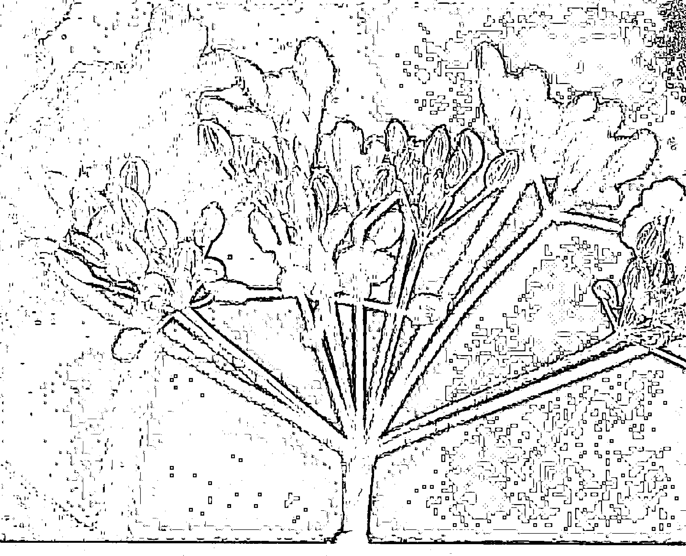

| 项目 | 内容 |
| :--- | :--- |
| 学名 | Carum carvi |
| 其他名称 | 葛缕子/Carvi |
| 香气印象 | 寒冬里就着蔬菜汤啃大饼 |
| 植物科属 | 伞形科葛缕子属 |
| 主要产地 | 芬兰、荷兰、埃及、伊朗 |
| 萃取部位 | 种子（蒸馏） |
| 适用部位 | 胆经、本我轮 |
| 核心成分 | 萃油率2.9%，18个可辨识化合物（占97%） |
| 心灵效益 | 破除奢华的调性，学会欣赏素朴的滋味 |

### 药学属性

| 药学属性 | 适用症候 |
| :--- | :--- |
| 1. 溶解黏液，利尿，促进乳汁分泌，调经 | 急性支气管黏膜炎，咳嗽，哺乳，痛经 |
| 2. 养肝利胆，保护肾脏，降血糖，降血脂 | 代谢迟缓，败血症的预防，化学毒素导致的肝脏受损，糖尿病 |
| 3. 保护黏膜，消炎，抗菌，消胀气，抗痉挛 | 胃炎，十二指肠溃疡，IBD（克罗恩病，溃疡性结肠炎），腹泻，胀气 |
| 4. 抗氧化，调节免疫，抗肿瘤 | 风湿痛，腰痛，卵巢癌，神经母细胞瘤 |

柠檬烯 26%~45%  藏茴香酮 48%~58%  双氢藏茴香酮 1%  柠檬烯氧化物 0.7%

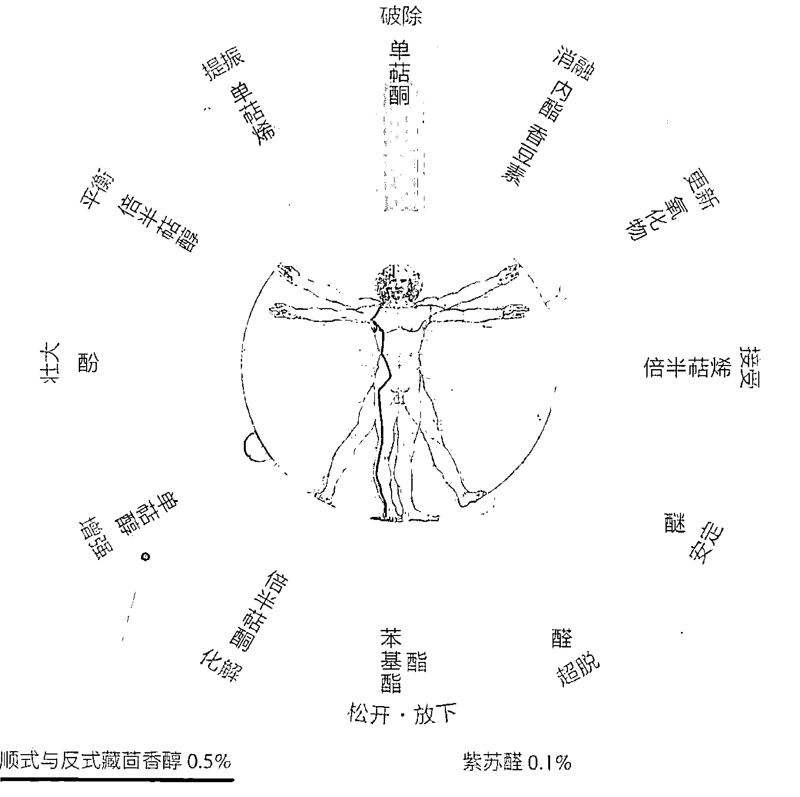

### 注意事项

1. 神经毒性在酮类精油当中最低，但孕妇、神经系统比较脆弱的哺乳母亲、婴幼儿仍最好避免使用。

顺式与反式藏茴香醇 0.5%

紫苏醛 0.1%

# 蓝冰柏
Arizona Cypress

原生于北美洲西南部，一身灰绿，10~25米高。球果会紧闭数年，等到母树被大火焚烧才打开，藉此建立自己的领地。

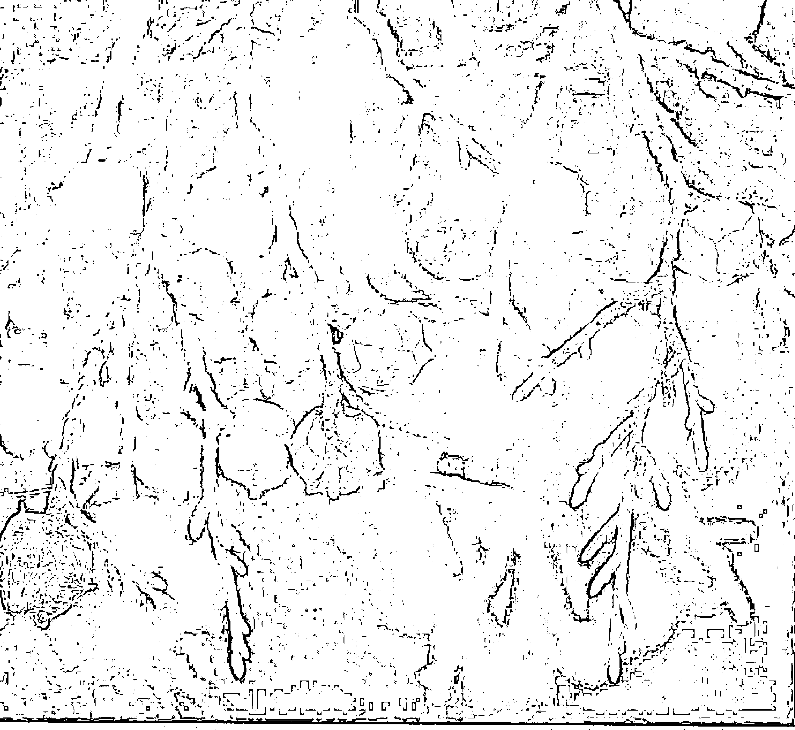

### 药学属性
1. 抗菌，驱蚊，杀孑孓
2. 消除脂肪
3. 促进循环

### 适用症候
- 环境脏乱，登革热
- 零食与碳酸饮料导致的肥胖
- 四肢僵硬，浮肉

| 项目 | 内容 |
| :--- | :--- |
| 学名 | Cupressus arizonica |
| 其他名称 | 绿干柏 / Piute Cypress |
| 香气印象 | 一棒打醒梦中人 |
| 植物科属 | 柏科柏木属 |
| 主要产地 | 美国、伊朗、突尼斯、印度 |
| 萃取部位 | 枝叶（蒸馏） |

柠檬烯 14.44% α-松油萜 11% 桉烯 4%~7%
加州月桂酮 13.25%~30% 樟脑 1.68%

萜品烯-4-醇 7.29%
顺式-14-正依兰醇-5-烯-4-酮 3.04%
依兰-4(14),5-二烯 7.36%
表-柔拿烯 2.9%

适用部位 胆经、本我轮
### 核心成分
萃油率 0.8%，46 个可辨识化合物（占 97.33%）

心灵效益 | 破除拖拉的习性，严肃面对生活

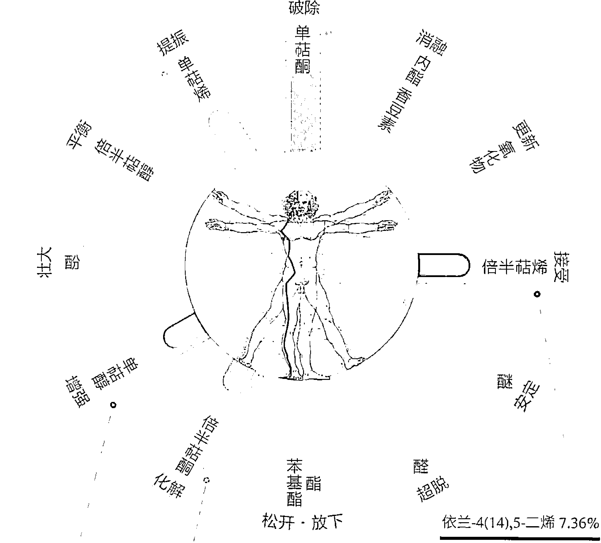

### 注意事项
1. 加州月桂酮神经毒性比较强，孕妇、哺乳母亲、婴幼儿不宜使用。
2. 过量使用易使人头痛或呼吸困难。

# 樟树
## Camphor Tree

喜温暖湿润及肥沃深厚的酸性土壤，树龄愈高，含油量和樟脑含量愈高。能够耐烟尘和吸收有毒气体。生命力极强，经历核爆和沉船后都能发芽。

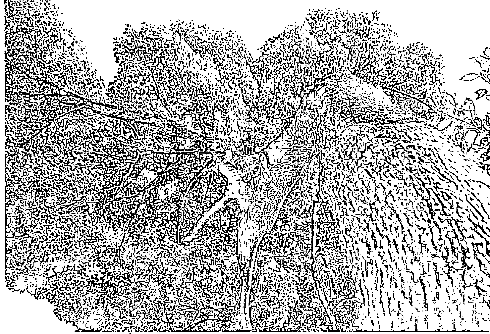

| 项目 | 内容 |
| :--- | :--- |
| 学名 | *Cinnamomum camphora* |
| 其他名称 | 本樟 / Camphorwood |
| 香气印象 | 走进图坦卡门的永生神话 |
| 植物科属 | 樟科樟属 |
| 主要产地 | 中国南方地区、日本 |
| 萃取部位 | 树干和根部 (蒸馏) |
| 适用部位 | 胆经、顶轮 |

### 核心成分
萃油率 3.34%，27 个可辨识化合物 (占 82.7%)

### 药学属性
1. 局部麻醉，止痛，抗风湿，利关节，行气血
2. 少量有益心肺功能，量稍高具激励效果，过量有神经毒性并可能引起癫痫
3. 抗黏膜发炎，解消黏脂质，促进伤口愈合
4. 利滞气，除秽浊，杀虫止痒

### 适用症候
- 神经痛，牙痛，心腹痛，跌打损伤，腰背酸痛，风湿，痛风，关节疼痛
- 虚弱无力，不省人事，轻度昏厥
- 慢性支气管炎，脓肿，伤疤，冻疮
- 脚气病，户外活动与阴湿环境，疥癣疮痒

### 主要成分比例
- 异橙花叔醇 1.53%
- β-松油萜 0.3%
- 艾蒿三萜 1%
- 樟脑 51.3%~75%
- 1,8-桉油醇 3.8%~4.3%

### 心灵效益
破除软弱怕事的心理障碍，竖起腰杆承担责任

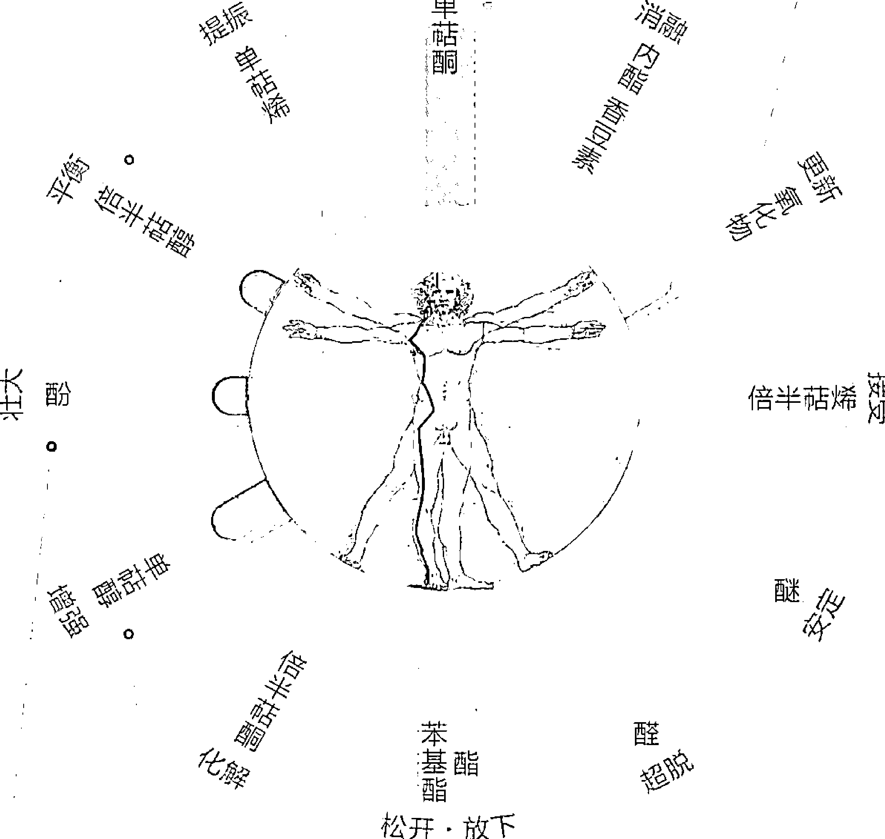

### 注意事项
1. 可分五种化学品系：芳樟（以沉香醇为主）、本樟（以樟脑为主）、油樟（以桉油醇为主）、异樟（以异橙花叔醇为主）和龙脑樟（以龙脑为主）。
2. 孕妇、哺乳母亲、婴幼儿、癫痫患者避免使用。

### 其他成分比例
- 丁香酚 2.1%
- 龙脑 1.1%
- 沉香醇 1.4%
- α-萜品醇 3.8%

# 薄荷尤加利
Peppermint Eucalyptus

原生于澳大利亚东南部的小树，习惯温暖的天气与均匀的降雨量。常见于相对干燥的硬叶林地，叶片幼时短圆，成熟后则显宽长。

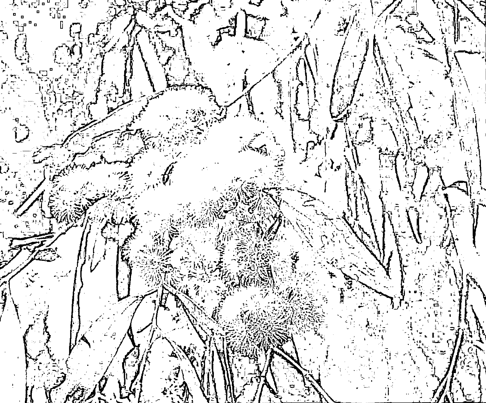

### 药学属性
1. 抗卡他，化解黏液
2. 抗菌，抗感染
3. 利尿，消解尿素，促进肾脏细胞再生

### 适用症候
- 鼻窦炎，支气管炎，耳炎
- 各类肠道菌种感染，肠黏膜发炎，狭缩性咽峡炎，白带异常与阴道炎
- 尿毒症，肾炎，肾病：以水肿、尿蛋白为主征

| 项目 | 内容 |
|------|------|
| 学名 | Eucalyptus dives |
| 其他名称 | 宽叶胡椒薄荷 / Broad-leaved Peppermint |
| 香气印象 | 伐木工默默在林间砍树 |
| 植物科属 | 桃金娘科桉属 |
| 主要产地 | 澳大利亚、南非 |
| 萃取部位 | 叶片 (蒸馏) |
| 适用部位 | 肾经、基底轮 |
| 核心成分 | 萃油率3%~6%, 73个可辨识化合物 |
| 心灵效益 | 破除无法分离的粘痛, 感受干爽的自由 |

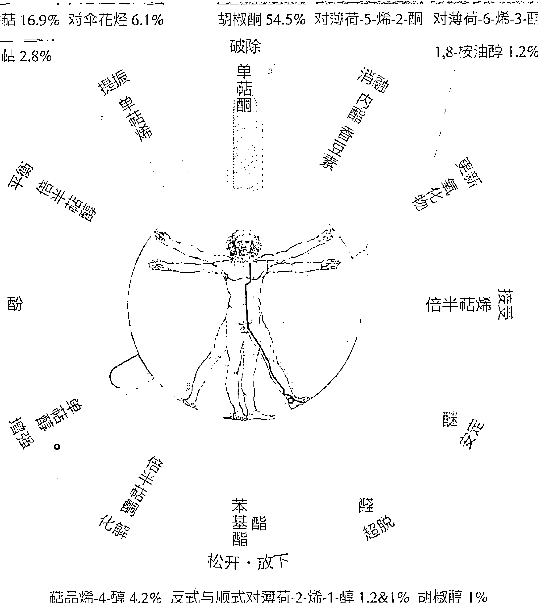

### 注意事项
1. 此品种另有两个化学品系：桉油醇型 (60%~75%)，水茴香萜型 (60%~80%)。
2. 孕妇、哺乳母亲、婴幼儿不宜使用。

# 多苞叶尤加利
Blue Mallee

原生于澳大利亚新南威尔士州西部较干旱的地区，树性坚强，缓慢生长。这类桉树没有主干，而是从地下的木质块茎冒出多根枝干。叶片分散而狭长。

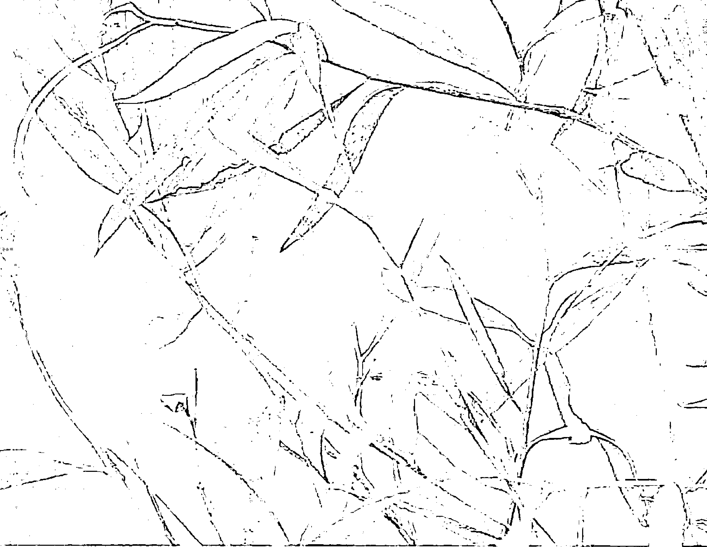

| 项目 | 内容 |
| :--- | :--- |
| 学名 | *Eucalyptus polybractea* |
| 其他名称 | 蓝叶桉 / Blue-leaved Mallee |
| 香气印象 | 荒野大镖客踽踽独行风沙中 |
| 植物科属 | 桃金娘科桉属 |
| 主要产地 | 澳大利亚、法国 |
| 萃取部位 | 叶片（蒸馏） |
| 适用部位 | 肾经、基底轮 |
| 核心成分 | 萃油率 0.7%~5%，41 个可辨识化合物 |
| 心灵效益 | 破除一厢情愿的缠绕，保持安全的距离 |

### 药学属性

1. 抗感染，抗菌，抗病毒（裸核病毒）
2. 解除前列腺的充血症状
3. 祛痰，化解黏液，消炎
4. 抗阿米巴，抗疟原虫

### 适用症候

- 淋菌性尿道炎，披衣菌尿道炎，子宫颈糜烂，尖锐湿疣
- 充血性与病毒性前列腺炎，细菌性与病毒性副睾炎，精索静脉曲张
- 鼻咽炎，支气管炎，气喘，神经痛，病毒性神经炎，风湿性关节炎
- 阿米巴性结肠炎，疟疾

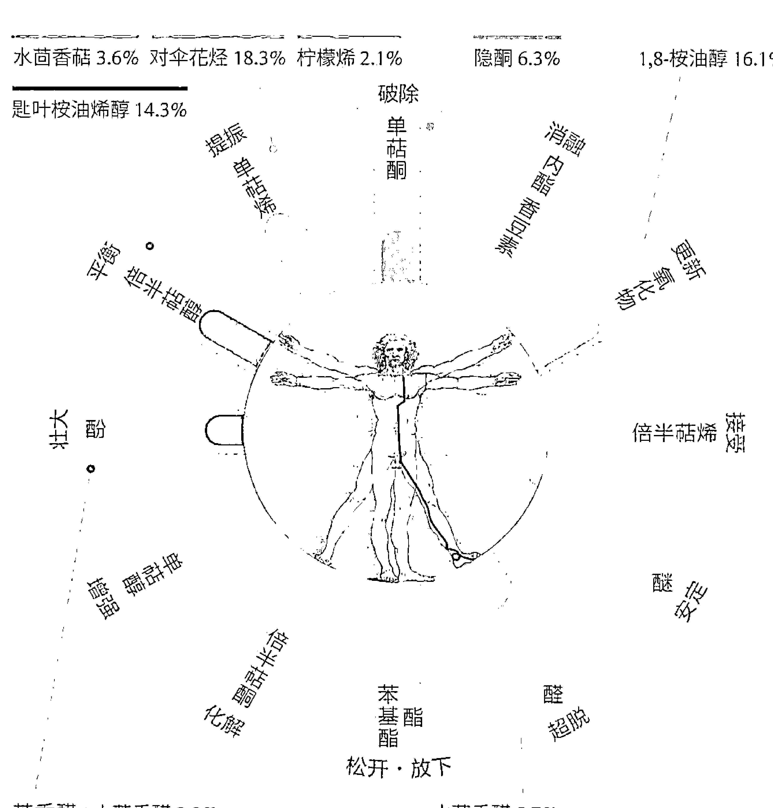

水茴香萜 3.6% 对伞花烃 18.3% 柠檬烯 2.1% 隐酮 6.3% 1,8-桉油醇 16.1% 匙叶桉油烯醇 14.3% 芳香醛：小茴香醛 3.3% 水茴香醛 5.7%

### 注意事项

1. 此品种另有一化学品系：桉油醇型（87%）。
2. 孕妇、哺乳母亲、婴幼儿最好低剂量使用。

# 牛膝草
Hyssop

不惧干旱，在白垩土与砂土都能生长。喜爱全日照与温暖的气候。花色多为蓝紫，也有粉红，偶见白色。一年可两获，春末和秋初。

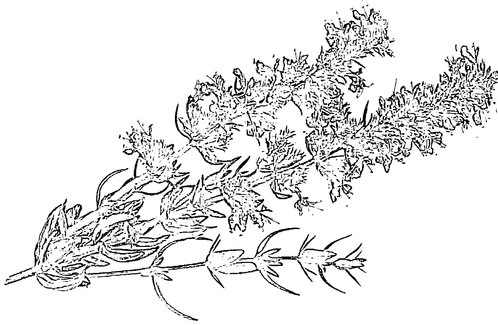

### 药学属性

1. 抗黏膜发炎，祛痰，抗气喘，胸腔内器官的消炎，消除淤塞现象（如充血）
2. 调节脂质代谢（小肠与肝），降低碳水化合物的吸收，促进发汗，消胀气
3. 促进伤口愈合，调节神经系统，补身（微量）
4. 抗感染，抗菌（葡萄球菌、肺炎球菌），抗寄生虫，抗病毒

### 适用症候

- 流感，鼻窦炎，喉咙痛，支气管炎，气喘，咳嗽，肺炎，肺气肿
- 肥胖，糖尿病（保健），胃痛，肠道胀气
- 瘀斑，伤痕，癫疯，神经失衡，牙痛，虚弱无力，青春期的卵巢问题
- 感染型膀胱炎，多发性硬化症（保健），HIV 阳性反应（艾滋病保健）

| 项目 | 内容 |
| :--- | :--- |
| 学名 | Hyssopus officinalis |
| 其他名称 | 神香草 / Herbe de Joseph |
| 香气印象 | 和摩西一起穿越红海 |
| 植物科属 | 唇形科牛膝草属 |
| 主要产地 | 法国、保加利亚 |
| 萃取部位 | 开花的全株药草（蒸馏） |
| 适用部位 | 肺经、心轮 |

### 核心成分
萃油率 0.6%~1.7%，48 个可辨识化合物（占 99.8%）

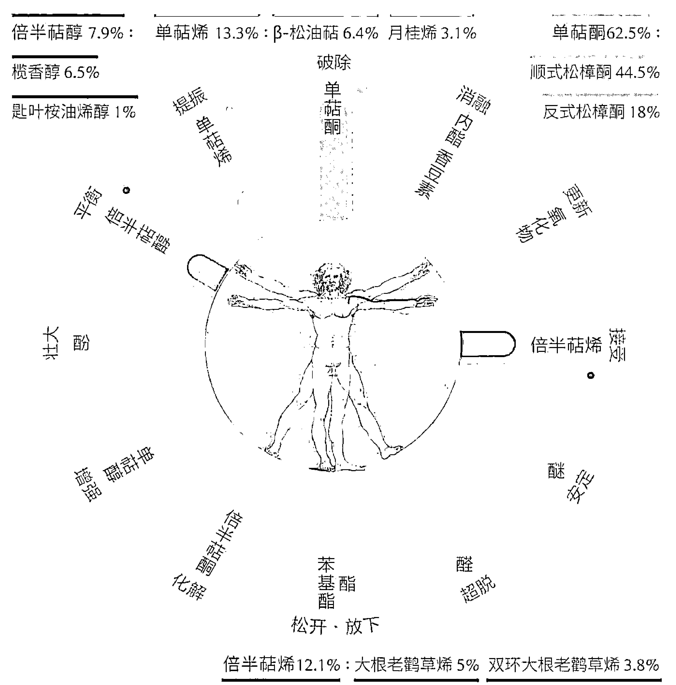

心灵效益 | 破除我执，建立超然物外的存在感

### 注意事项

1. 孕妇、哺乳母亲、婴幼儿、老弱之辈、癫痫患者避免使用。
2. 经皮肤吸收的绝对安全剂量为 0.3%。

# 头状薰衣草
Lavender Stoechas

需要干热的碱性土壤，比真正薰衣草畏寒，所以分布区域更低和更南。高30~100厘米，醒目的紫色苞片常被误认为它的花朵。

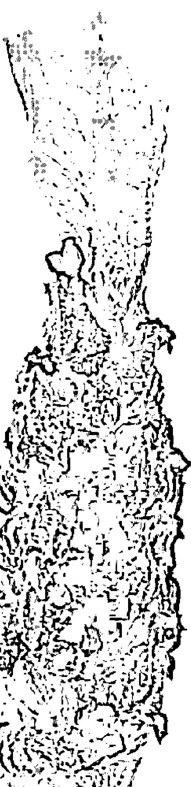

| 项目 | 内容 |
| :--- | :--- |
| 学名 | Lavandula stoechas |
| 其他名称 | 法国薰衣草 / French Lavender |
| 香气印象 | 保存良好的古董药柜 |
| 植物科属 | 唇形科薰衣草属 |
| 主要产地 | 西班牙、葡萄牙、科西嘉岛、土耳其、希腊 |
| 萃取部位 | 开花的植株（蒸馏） |
| 适用部位 | 胆经、本我轮 |
| 核心成分 | 萃油率1.1%，66个可辨识化合物 |

### 药学属性

| 药学属性 | 适用症候 |
| :--- | :--- |
| 1. 抗绿脓假单胞菌、念珠菌、MRSA、立枯丝核菌 | 口腔炎，严重耳炎，绿脓杆菌引起的细菌性耳炎 |
| 2. 抗黏膜发炎，分解黏液 | 慢性支气管炎，慢性鼻窦炎 |
| 3. 促进伤口愈合，消炎 | 伤口，湿疹 |
| 4. 抗氧化，限制肝细胞中的葡萄糖生成，提高骨骼肌细胞的胰岛素传导能力 | II型糖尿病，代谢异常导致的肥胖 |

心灵效益 | 破除粉红眼镜的幻影，直视没洒糖粉的现实

化学成分分析：
喇叭茶醇 0.5% | 单萜烯 11.5% | 单萜酮 70.9% : 茴香酮 49.1% 樟脑 21.8% | 1,8-桉油醇 3.6%
乙酸桃金娘酯 3% | 乙酸龙脑酯 3%

成分作用图示（中心为达芬奇人体图）：
破除单萜酮 | 消融内酯/酮/酯/醛 | 氧化更新 | 倍半萜烯 凝聚 | 醚 灵性 | 醛 超脱 | 苯基酯/酯 松开·放下 | 酮 倍半萜酮 化解 | 酚 壮大 | 醇 平衡（单萜醇/倍半萜醇） | 提振单萜烯

### 注意事项
1. 孕妇、哺乳母亲、婴幼儿不宜使用。

# 白马鞭草
White Verbena

常见于中南美洲和热带非洲的山坡与河岸，高可达2米。需要全日照和略带养分的土壤，生长速度缓慢。

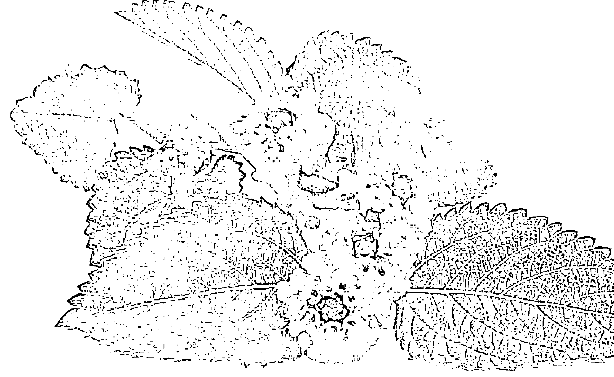

### 药学属性
1. 消炎，止痛，退热，消胀气
2. 抗病毒，抗菌抗霉菌，化解黏液
3. 抑制癌细胞生长，抗基因毒性（保护DNA）
4. 抗痉挛，抗惊厥，降血压

### 适用症候
- 消化障碍，胃痛，肝病，梅毒，痢疾，预防胃溃疡
- 流感，咳嗽，支气管炎，气喘
- 化疗前后
- 缓解焦虑，放松肌肉，提高自发活动能力

| 项目 | 内容 |
| :--- | :--- |
| 学名 | *Lippia alba* |
| 其他名称 | 山坡奥勒冈 / Hill Oregano |
| 香气印象 | 安心自在地踏过荒烟漫草 |
| 植物科属 | 马鞭草科过江藤属 |
| 主要产地 | 巴拉圭、巴西、阿根廷 |
| 萃取部位 | 叶片（蒸馏） |
| 适用部位 | 胆经、本我轮 |
| 核心成分 | 萃油率 0.21%，28个可辨识化合物 |
| 心灵效益 | 破除敌意的阻挠，迈向真心向往的地方 |

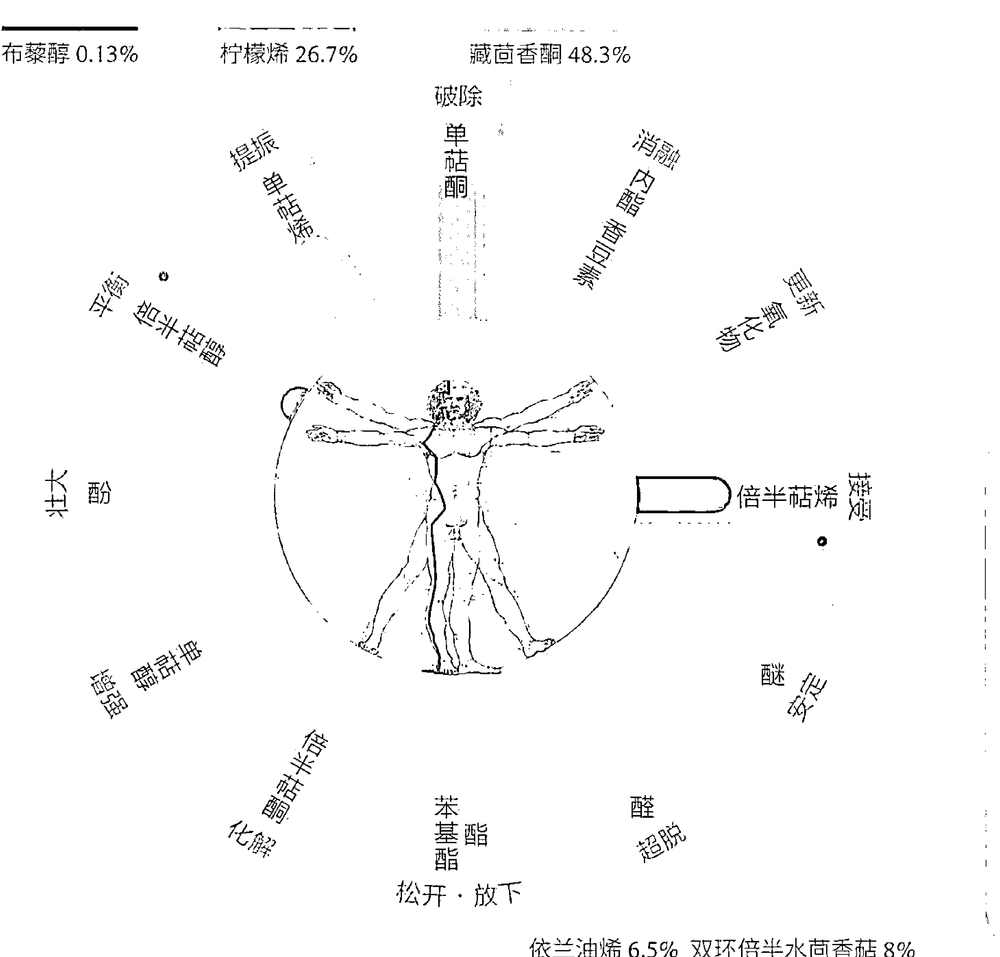

布藜醇 0.13%
柠檬烯 26.7%
藏茴香酮 48.3%

依兰油烯 6.5%
双环倍半水茴香萜 8%

### 注意事项
1. 孕妇、哺乳母亲与婴幼儿以及对酮敏感者最好避免使用。
2. 已知化学品系共七种，以柠檬醛为主的杀螨虫效果更佳。
3. 南非马鞭草 (Lippia javanica) 同样以单萜酮为主，最常见的化学品系是月桂烯酮型 (36%~62%)，能够强力抗肺炎克雷伯菌，传统上多用来处理呼吸系统问题。

# 马薄荷
Horse Mint

爱水，可以用匍匐的地下茎攻城掠地，建立“殖民地”。野生时多见于海拔800~1950米的地区，生长异常快速。

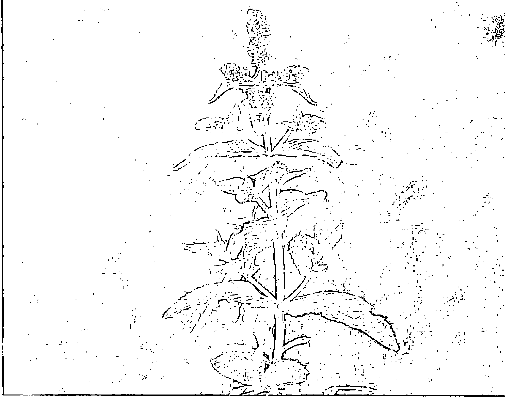

| 项目 | 内容 |
|---|---|
| 学名 | Mentha longifolia |
| 其他名称 | 长叶薄荷 / Wild Mint |
| 香气印象 | 夏夜池边鼓着笑脸的树蛙 |
| 植物科属 | 唇形科薄荷属 |
| 主要产地 | 欧洲、中亚、北非 |
| 萃取部位 | 开花的植株（蒸馏） |
| 适用部位 | 胆经、本我轮 |

### 核心成分
82个可辨识化合物

心灵效益 | 破除陈年的习性，轻松拥抱新观念

### 药学属性

| 药学属性 | 适用症候 |
|---|---|
| 1. 抗感染，抗菌，抗霉菌（念珠菌） | 细菌性肠炎，寄生虫性肠炎（如蛲虫、绦虫） |
| 2. 抗卡他，祛痰 | 交感神经失衡、膀胱炎 |
| 3. 滋补，强心，健脾 | 胸腔充血，心脏无力，白细胞不足，疟疾 |
| 4. 抗氧化，抗肿瘤，有激素作用 | 干癣，念珠菌性皮肤病，浮肉，胰腺癌（辅药），大肠癌 |

薄荷酮5% 异薄荷酮5.5% 胡椒酮0.1% 胡椒酮氧化物9%~25% 胡椒烯酮氧化物45%~70%

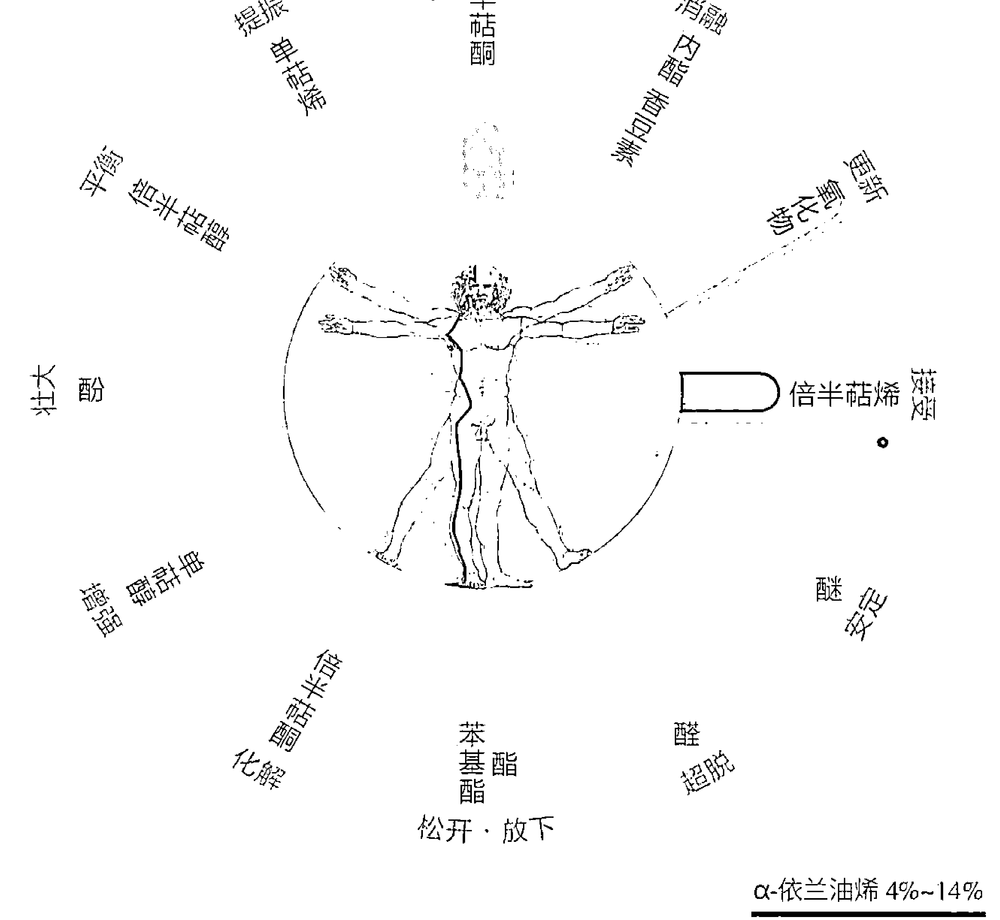

### 注意事项
1. 孕妇、哺乳母亲、婴幼儿不宜使用。
2. 使用过量可能会令人迷茫。

α-依兰油烯4%~14%# 胡薄荷
Pennyroyal

土壤不宜过干，喜欢靠近溪流生长。有些匍匐生长，高矮差可达20厘米。全日照会使香气浓郁，遮荫则有助于枝繁叶茂。

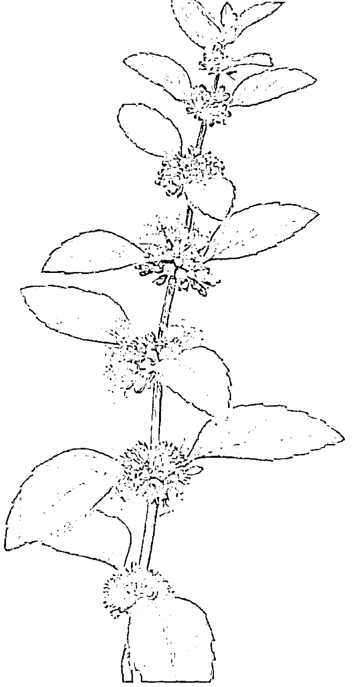

| 学名 | Mentha pulegium |
| :--- | :--- |
| 其他名称 | 普列薄荷 / Squaw Mint |
| 香气印象 | 刚刚装修好的公寓 |
| 植物科属 | 唇形科薄荷属 |
| 主要产地 | 摩洛哥、阿尔巴尼亚 |
| 萃取部位 | 全株药草（蒸馏） |
| 适用部位 | 胆经、性轮 |
| 核心成分 | 萃油率 1%~2%，43~53个可辨识化合物 |
| 心灵效益 | 破除拘谨的习性，大胆尝试新口味 |

| 药学属性 | 适用症候 |
| :--- | :--- |
| 1. 消解黏液，抗卡他，抗病毒，减少血细胞凝集效应 | 气管炎，慢性支气管炎（浓痰），气喘性支气管炎，百日咳，流感 |
| 2. 驱虫，杀虫 | 维持环境卫生，减少户外活动的蚊虫干扰 |
| 3. 消胀气，抗痉挛，健胃，养肝，利胆，健脾 | 胆囊炎，胆管炎，黄疸，胀气，肠绞痛 |
| 4. 通经，解除骨盆腔充血症状 | 白带，痛经 |

- 单萜烯 2%：柠檬烯 罗勒烯
- 胡薄荷酮 40%~70%
- 薄荷酮 20%~40%
- 胡椒酮 1.13%~40%
- 桉叶油醇 7%
- 单萜醇 9%
- 倍半萜烯 6%：愈创木烯 榄香烯

- 提振 单萜烯
- 平衡 倍半萜酯
- 壮大 酚
- 增强 醚
- 松开·放下 苯基酯 酯
- 超脱 醛
- 定 醚
- 更新 氧化物
- 消融 内酯 酮 醇 酯
- 破除 单萜酮
- 化解 倍半萜酮

1. 孕妇、哺乳母亲、婴幼儿以及对酮敏感者避免使用。
2. 主要有三种化学品系：胡薄荷酮型（75%，摩洛哥产），胡薄荷酮/薄荷酮型（40% / 20% 或 20% / 40%），胡椒酮/胡椒烯酮型（40% / 30%）。
3. 胡薄荷精油（含胡薄荷酮75%者）的杀虫作用不及胡薄荷酮的九分之一，也不会导致细胞变异，可见凭单一成分推测毒性会有偏差。

# 绿薄荷
Spearmint

温带气候皆可生长。喜欢部分遮荫，但也能享受全日照。适合种在富含有机质的壤土，开花过后叶片的香气就会变淡。

| 项目 | 内容 |
| :--- | :--- |
| 学名 | Mentha spicata |
| 其他名称 | 留兰香 / Green Mint |
| 香气印象 | 嚼着口香糖挥出全垒打 |
| 植物科属 | 唇形科薄荷属 |
| 主要产地 | 美国、印度、埃及 |
| 萃取部位 | 开花的全株药草（蒸馏） |
| 适用经络 | 胆经、顶轮 |
| 化学类型 | 萃油率 0.5%~0.8%，63 个可辨识化合物（占 99.9%） |
| 心灵效益 | 破除制式的条框，展现天赋和本能 |

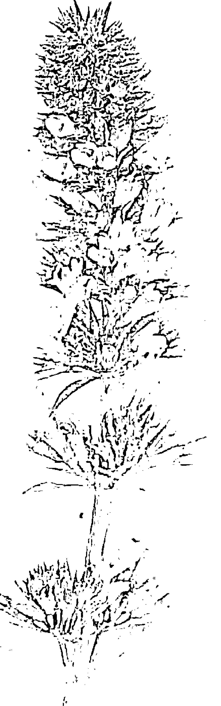

左旋柠檬烯 21.2%

| 药学属性 | 适用症候 |
| :--- | :--- |
| 1. 消炎，镇痛（作用于延髓和小脑），抗肿瘤 | 神经痛，带状疱疹疼痛，前列腺癌，肺癌，乳腺癌，神经母细胞瘤 |
| 2. 抗黏膜发炎，消解黏液 | 慢性与急性支气管炎，呼吸道黏膜发炎 |
| 3. 利胆，促进胆汁分泌，助消化 | 消化困难，胆汁不足 |
| 4. 促进伤口愈合，抗霉菌，抗生物膜，抗 MRSA，驱虫（锥虫、蓖麻硬蜱） | 伤口，疤痕，膀胱炎，阴湿易发霉处，改善医院诊所的环境卫生，户外防虫子叮咬 |

左旋藏茴香酮 71.6% 顺式双氢藏茴香酮 4.9% 薄荷酮 1.7%
破除
单萜酮

1,8-桉油醇 1.5%

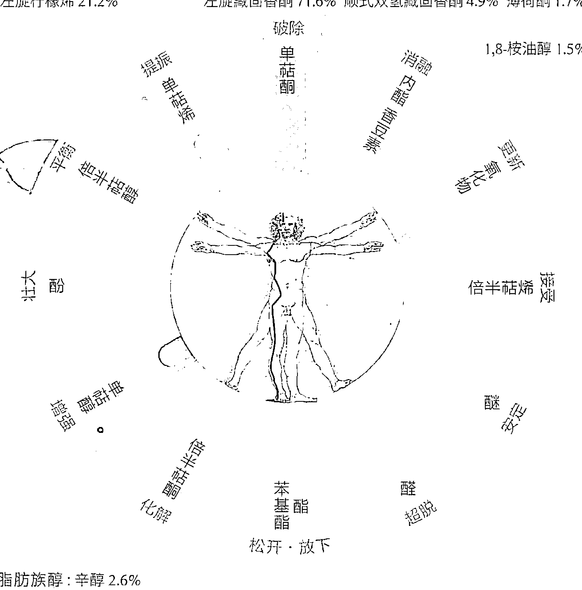

注意事项
1. 孕妇、哺乳母亲、婴幼儿不宜使用。一般皮肤吸收的安全剂量为 1.7%。
2. 绿薄荷在不同产地的藏茴香酮含量如下：土耳其 82.2%，中国 74.6%，加拿大 74%，孟加拉国 73.2%，埃及 68.55%，哥伦比亚 61.5%，阿尔及利亚 59.4%，摩洛哥 29%，伊朗 22.4%。

脂肪族醇：辛醇 2.6%

# 樟脑迷迭香
Rosemary, CT Camphor

喜欢地中海的干燥温暖气候，野生状态下可以在任何土壤生长。分布高度从海平面直至海拔2800米，耐旱，忌积水。善于抵御病虫害。

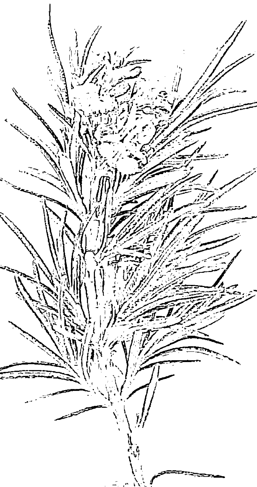

学名：Rosmarinus officinalis
其他名称：海洋之露 / Sea Dew
香气印象：在无人的珊瑚礁岛过鲁宾逊的生活
植物科属：唇形科迷迭香属
主要产地：西班牙、法国、葡萄牙
萃取部位：开花的全株药草（蒸馏）

| 药学属性 | 适用症候 |
| :--- | :--- |
| 1. 较低剂量：放松舒解肌肉，抑制大动脉平滑肌收缩 | 酸痛紧绷，抽筋，风湿肌痛，高血压（钾离子过多、去甲肾上腺素过多所致） |
| 2. 较高剂量：促进肌肉收缩，强心，补身利脑，抗老化，促进毛发生长 | 肌肉与皮肤松弛，心脏无力，低血压，记忆力低下，脱发 |
| 3. 解除静脉的充血症状，利尿，非激素性的通经作用，抗肿瘤 | 血液循环不良，无月经，经血量少，前列腺癌，乳腺癌，肝癌 |
| 4. 溶解黏液，利胆（促进胆汁分泌），养肝，抗氧化 | 慢性胆囊炎，胆固醇过高，肝肿大，肝硬化，胆汁淤积型肝炎，胃穿孔 |

适用部位：胆经、顶轮
核心成分：
萃油率1.6%~1.8%，53个可辨识化合物（占96.7%~99.2%）

心灵效益：破除对便利环境的依赖，提高创造力和实践力

- α-松油萜 10.2%~21.6%
- 樟烯 5.2%~8.6%
- 樟脑 17.2%~34.7%
- 马鞭草酮 2.2%~5.8%
- 1,8-桉油醇 12.1%~14.4%
- 龙脑 3.2%~7.7%
- α-萜品醇 1.2%~2.5%
- β-丁香油烃 1.8%~5.1%

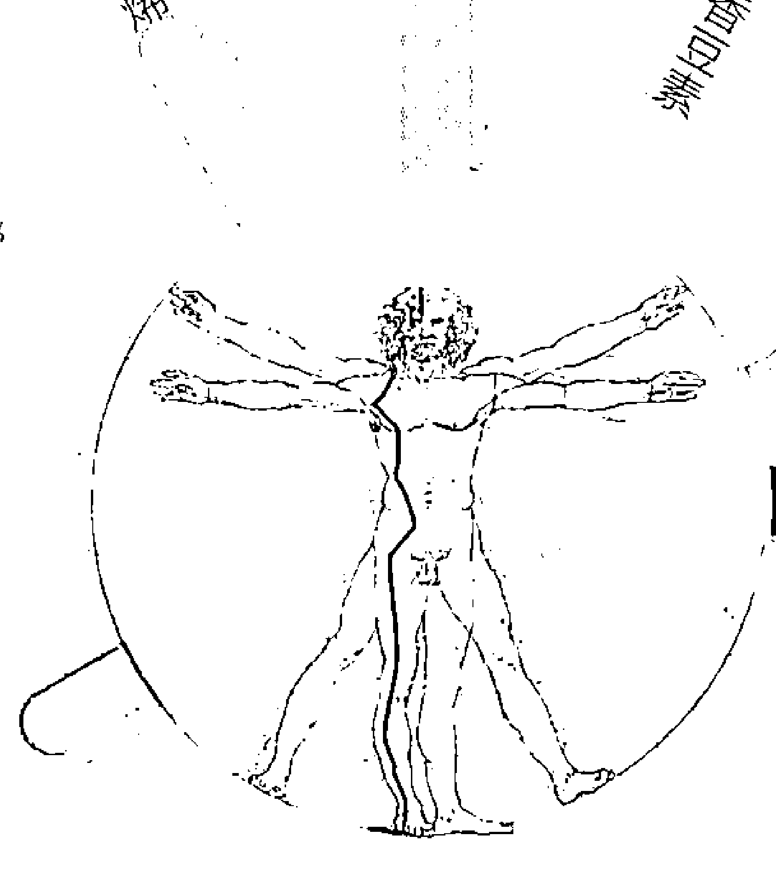

注意事项
1. 孕妇、哺乳母亲、婴幼儿、癫痫患者避免使用。
2. 北非（摩洛哥、突尼斯）产的多为桉油醇型，西班牙（最大产地）为樟脑型，法国主要是龙脑型，葡萄牙多月桂烯，埃及与科西嘉岛较多马鞭草酮。

# 马鞭草酮迷迭香
Rosemary, CT Verbenone

只生长在地中海气候区热而干的海岸。比樟脑迷迭香挺拔直立，叶片也较为翠绿。

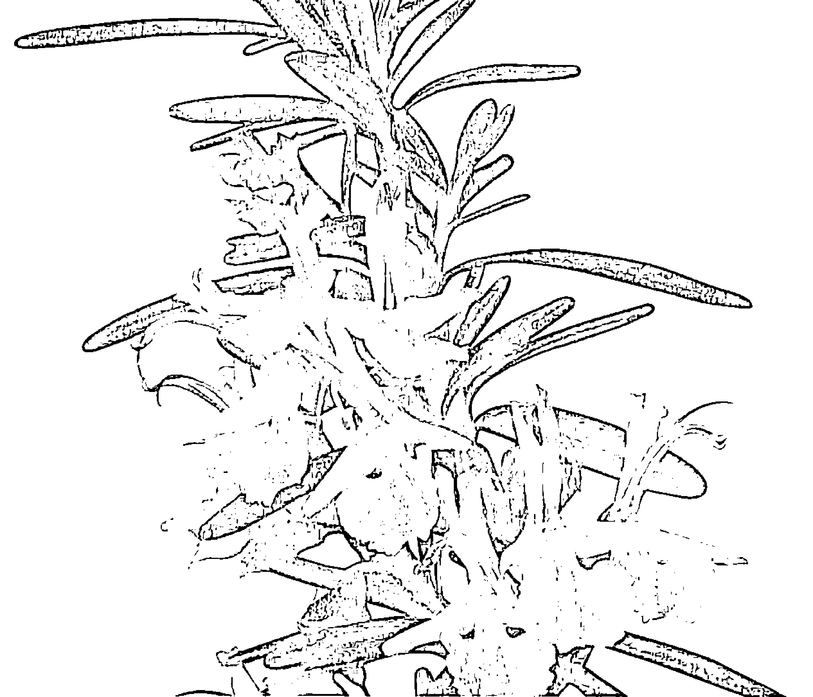

| 项目 | 内容 |
| :--- | :--- |
| 学名 | Rosmarinus officinalis |
| 其他名称 | 海洋之露 / Sea Dew |
| 香气印象 | 突破大雾的包围，看到太阳从海面升起 |
| 植物科属 | 唇形科迷迭香属 |
| 主要产地 | 科西嘉岛、萨丁岛、南非 |
| 萃取部位 | 开花的全株药草 (蒸馏) |
| 适用部位 | 胆经、顶轮 |
| 核心成分 | 萃油率 1%，46 个可辨识化合物 |
| 心灵效益 | 破除受害情结，坚持以善意回应世界 |

| 药学属性 | 适用症候 |
| :--- | :--- |
| 1. 化解黏液和脂肪，祛痰 | 鼻窦炎，支气管炎 |
| 2. 抗感染，抗菌，抗病毒，促进伤口愈合 | 肝胆功能低下，病毒性肝炎，病毒性肠炎，大肠杆菌病，糖尿病（辅药） |
| 3. 平衡内分泌，调节垂体-卵巢和垂体-睾丸的激素 | 白带型阴道炎，前庭大腺炎，男性或女性激素失衡 |
| 4. 抗痉挛，平衡神经（作用与剂量成反比） | 心律不齐，太阳神经丛、骨盆与骶骨“打结”导致的消化或性困扰，疲劳，沮丧 |

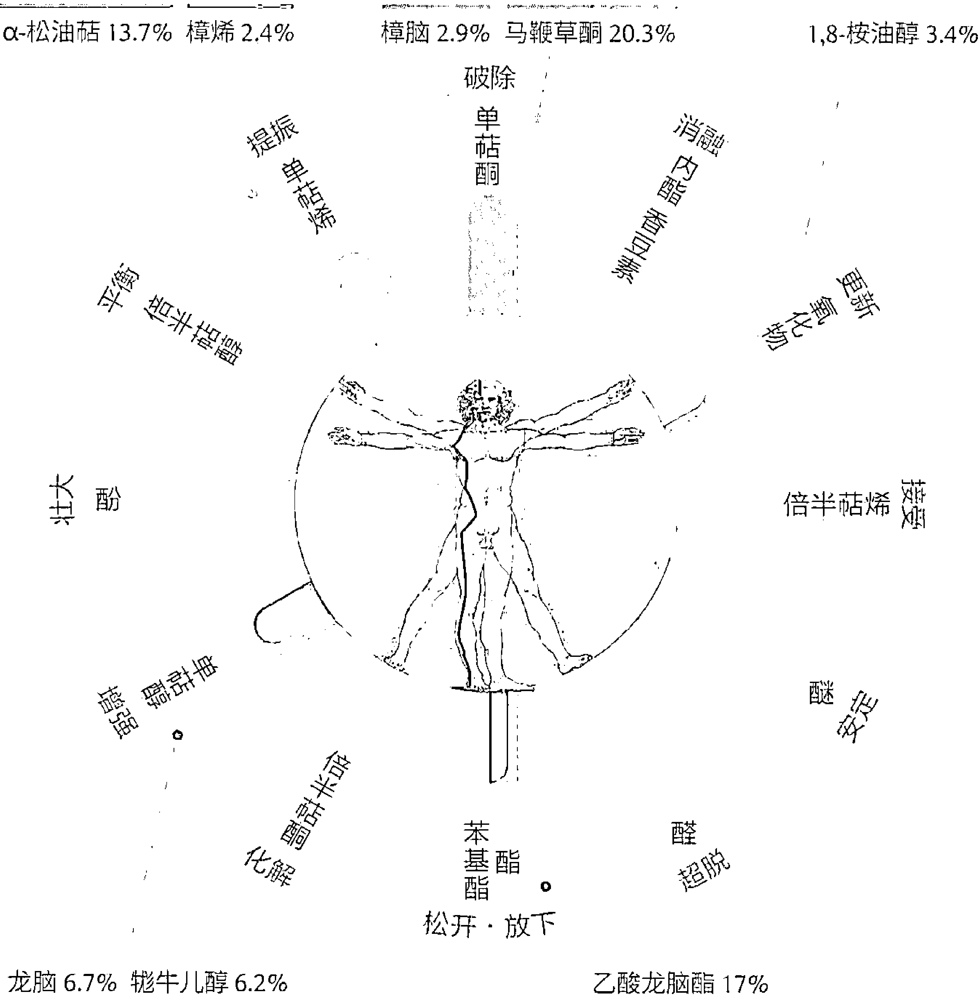

注意事项
1. 孕妇、哺乳母亲、婴幼儿、肝脏反应过度敏感者避免使用。

# 薰衣叶鼠尾草
Lavender Sage

原产于西班牙伊比利亚半岛，习惯半干的地中海气候和遍布岩块的石灰岩山区。与通用鼠尾草相比，叶片较为窄长，花朵的蓝紫色较浅，有些甚至偏白。

| 药学属性 | 适用症候 |
| :--- | :--- |
| 1. 抗卡他，祛痰 | 鼻炎，鼻窦炎，支气管炎，流感，着凉 |
| 2. 抗感染，抗菌，抗霉菌（鼠尾草属中第一），降血糖，抗氧化，消炎 | 长期卧病在床，褥疮，糖尿病 |
| 3. 抗痉挛，止痛，镇静，局部麻醉，抑制中枢神经 | 神经痛，躁郁烦乱 |
| 4. 略具雌激素作用，补身，强化记忆力，抑制乙烯胆碱脂酶（鼠尾草属中第一） | 虚弱无力，健忘，阿尔兹海默病 |

| 项目 | 内容 |
| :--- | :--- |
| 学名 | *Salvia lavandulifolia* |
| 其他名称 | 西班牙鼠尾草 / Spanish Sage |
| 香气印象 | 一生信守誓言的传教士 |
| 植物科属 | 唇形科鼠尾草属 |
| 主要产地 | 西班牙（东部）、法国（东南）、北非的摩洛哥和阿尔及利亚 |
| 萃取部位 | 开花的全株药草（蒸馏） |
| 适用部位 | 胆经、顶轮 |
| 核心成分 | 萃油率 0.69%~3.41%，61 个可辨识化合物（占 90%） |
| 心灵效益 | 破除掩饰软弱的借口，生出面对真相的力量 |

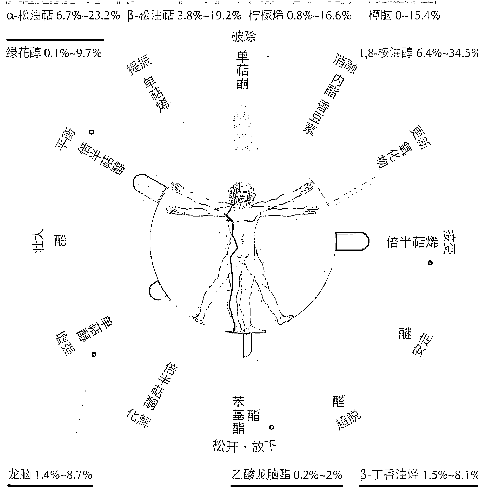

注意事项
1. 有五个亚种，另外也有不同的化学品系，差别最大的是樟脑的含量。
2. 孕妇、哺乳母亲、婴幼儿能否使用取决于樟脑含量，若在 1% 上下则完全没问题。

# 鼠尾草
Sage

原生于南欧与土耳其，如今遍布世界，精油的组成因气候而变化。带毛的灰绿叶片为其特征，愈干燥气味愈浓郁。

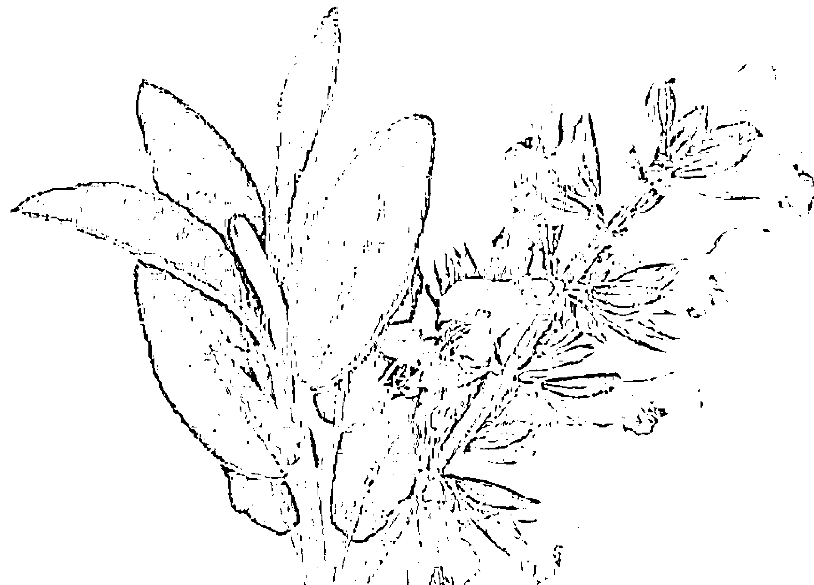

学名: Salvia officinalis
其他名称: 通用鼠尾草/ Common Sage
香气印象: 一休在船上听到乌鸦叫声而悟道
植物科属: 唇形科鼠尾草属
主要产地: 西班牙、法国、克罗地亚、阿尔巴尼亚
萃取部位: 开花的全株药草（蒸馏）
适用部位: 胆经、顶轮
核心成分: 萃油率1.1%~2.8%，35个可辨识化合物（占94.2%）
心灵效益: 破除贪嗔痴的悬念，以理性与悟性防身

| 药学属性 | 适用症候 |
| :--- | :--- |
| 1. 抗菌，抗霉菌（白色念珠菌），抗病毒 | 唇疱疹，口疮、口臭、口坏疽，牙龈发炎、念珠菌感染，病毒性肠炎，病毒性脑膜炎与神经炎 |
| 2. 类雌激素作用，催经，抗感染 | 闭经，少经，更年期综合征，阴道疱疹，扁平湿疣，扁平疣，白带，乳腺癌，前列腺癌，黑色素瘤，肾癌，口腔癌，直肠癌 |
| 3. 调节循环，退热，促进伤口愈合，抗肿瘤 | 风湿性关节炎，循环不良，腕隧道综合征，伤口，脱发，皱纹，狐臭 |
| 4. 抗黏膜发炎，化痰，消解黏液，分解脂肪，促进胆汁分泌 | 流感，支气管炎，鼻窦炎，扁桃体炎，橘皮组织，肥胖，胆功能不佳 |

绿花醇2.1%~5.6% 樟脑4.2% 柠檬烯2.7% α-侧柏酮30.7% β-侧柏酮5.4% 樟脑26.6%
1,8-桉油醇14.7%


乙酸龙脑酯3.15% α-葎草烯2.6% β-丁香油烃2%

注意事项
1. 主要的化学品系有三种：α-侧柏酮型，樟脑型，泪杉醇型。
2. 孕妇、哺乳母亲、婴幼儿不宜使用。

## 棉杉菊
Santolina

喜爱炎热多日照与排水良好，最怕冬日的潮湿。常被用作地被植物或围篱植物，像纽扣一样的花使它深受园艺界欢迎。

### 药学属性
| 属性 | 适用症候 |
| :--- | :--- |
| 1. 抗感染，抗寄生虫（蛔虫），抗霉菌（白色念珠菌） | 肠道寄生虫病，皮肤寄生虫病，皮肤发痒，阴道瘙痒 |
| 2. 通经 | 经期不适，经前综合征引起的烦躁感 |
| 3. 抗痉挛，助消化，止痛消炎 | 肠胃不适，十二指肠溃疡 |
| 4. 抗氧化 | 素食或以淀粉为主的代谢问题 |

| 项目 | 内容 |
| :--- | :--- |
| 学名 | Santolina chamaecyparissus |
| 其他名称 | 薰衣草棉 / Cotton Lavender |
| 香气印象 | 带着手风琴随兴走唱 |
| 植物科属 | 菊科棉杉菊属 |
| 主要产地 | 西班牙、法国 |
| 萃取部位 | 开花的全株药草（蒸馏） |
| 适用部位 | 肝经、眉心轮 |
| 核心成分 | 萃油率1.6%，71个可辨识化合物（占91.2%） |
| 心灵效益 | 破除特定的角度，用全面的视野看世界 |

α-没药醇6.6% β-水茴香萜9.2% 月桂烯4.3% 艾蒿酮38% 樟脑11.7%

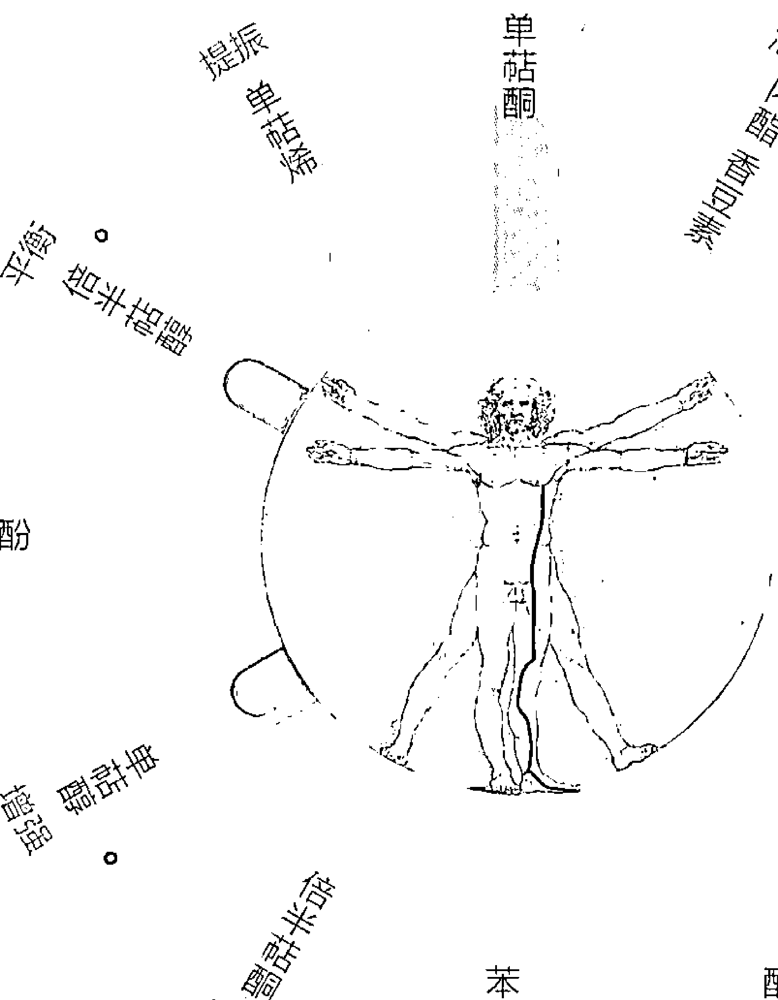

艾蒿醇1.5% 萜品烯-4-醇1.1%

### 注意事项
1. 野生与栽培种的组分不同：栽培种以艾蒿酮和杜松醇为主，野生的岛屿种以樟脑和荜澄茄油烯醇为主，野生的半岛种则以倍半萜醇为主。
2. 孕妇、哺乳母亲、婴幼儿不宜使用。

## 芳香万寿菊
Mexican Bush Marigold

原生于墨西哥，生性强健，耐热，耐旱，耐湿，耐修剪，也耐轻霜。虽然是草本植物，但呈现灌木状。

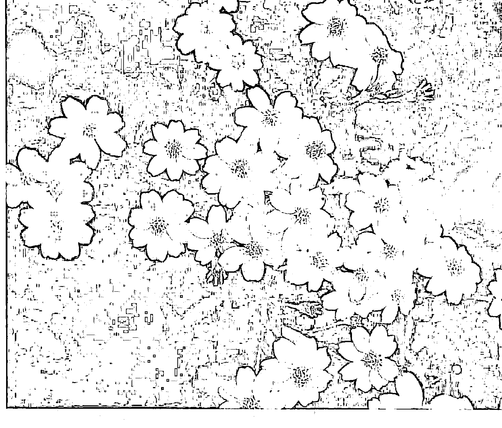

- 学名: *Tagetes lemmonii*
- 其他名称: 李蒙氏万寿菊 / Lemmon's Marigold
- 香气印象: 孙悟空在瑶池吃蟠桃
- 植物科属: 菊科万寿菊属
- 主要产地: 墨西哥、危地马拉、南美洲
- 萃取部位: 叶片 (蒸馏)

### 药学属性
1. 抗霉菌 (白色念珠菌)，消胀气，助消化
2. 驱虫驱蚊
3. 促进循环与代谢
4. 抗菌

### 适用症候
- 芝士与奶制品消化不良，时常放屁
- 户外生活，植物病虫害
- 久待空调房，长坐，饮食过度
- 口腔卫生，口臭

适用部位: 胆经、本我轮
心灵效益: 破除对于安全感的渴求，相信自己的本事

α-水茴香萜 别罗勒烯 双氢万寿菊酮 42.5% 万寿菊酮 16.1% 反式万寿菊烯酮 14.2%

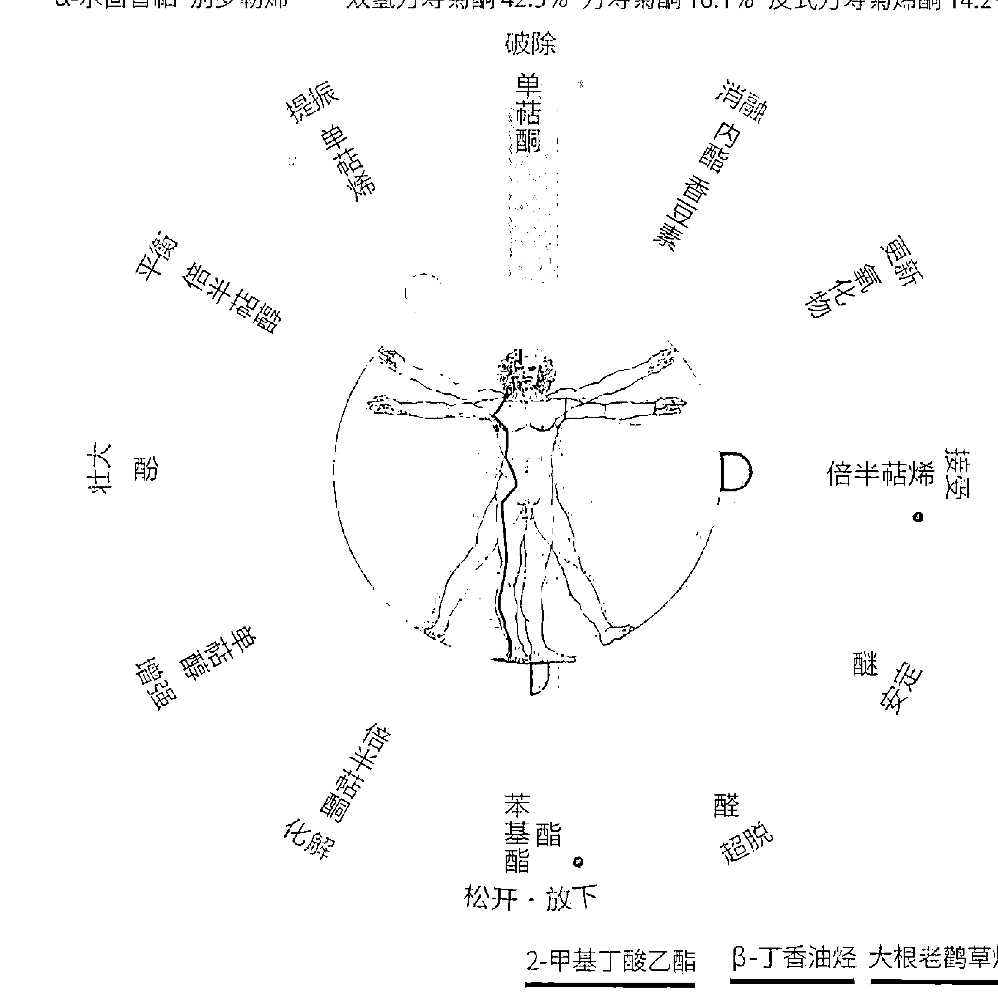

### 注意事项
1. 孕妇、哺乳母亲、婴幼儿不宜使用。
2. 双氢万寿菊酮、万寿菊酮、万寿菊烯酮都会产生聚合效应，所以精油在接触空气以后会变得愈来愈黏稠。

## 万寿菊
Southern Marigold

生于南美洲南部，现遍布热带与亚热带，特别能适应干扰生境。开不起眼的小白花，高0.6~2米，外型迥异于大众熟悉的庭园万寿菊。

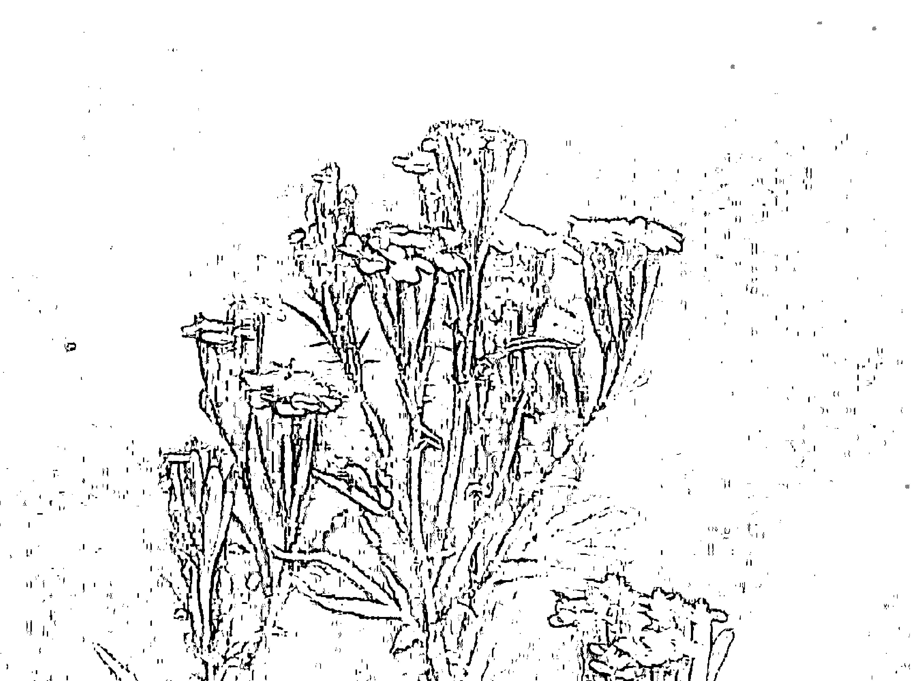

| 药学属性 | 适用症候 |
| :--- | :--- |
| 1. 抗菌 (MRSA), 抗霉菌 (白色念珠菌), 治疗皮肤与指甲疾病, 收敛止血 | 脚趾甲各种感染变形, 疣, 久不愈合的伤口 |
| 2. 强力驱虫 (蜱虫及鳞翅目昆虫), 驱蚊, 强力抗氧化, 抗肿瘤 | 户外活动, 鼻咽癌, 肝癌 |
| 3. 消炎, 抗痉挛, 健胃, 通便, 利尿, 发汗, 通经 | 风湿, 胃溃疡, 便秘, 久坐不动, 眼疾, 经期腹部闷胀 |
| 4. 祛痰, 抗卡他 | 鼻塞头晕 |

| 项目 | 内容 |
| :--- | :--- |
| 学名 | Tagetes minuta / Tagetes glandulifera |
| 其他名称 | 细花万寿菊 / Chinchilla |
| 香气印象 | 在夏天走进结实累累的果园 |
| 植物科属 | 菊科万寿菊属 |
| 主要产地 | 埃及、印度、阿根廷、墨西哥 |
| 萃取部位 | 花（蒸馏） |
| 适用部位 | 脾经、眉心轮 |
| 核心成分 | 萃油率 0.49%，35 个可辨识化合物（占 95.3%） |
| 心灵效益 | 破除冰凉的理性界线，打开所有的感官知觉 |

注意事项
1. 另外两个品种为阿兹特克万寿菊 (Tagetes erecta), 多用于印度教祭拜的橘色花环, 庭园常见; 法国万寿菊 (Tagetes patula, 台湾叫孔雀草), 同样常见于庭园。三者的精油组成相近而比例不同。
2. 孕妇、哺乳母亲、婴幼儿不宜使用。原精有光敏性, 连叶蒸馏的话也有光敏性, 浓度过高会刺激皮肤。用于食品的安全剂量是 0.003%, 用于香水是 0.02%, 用于保养品是 0.01%。

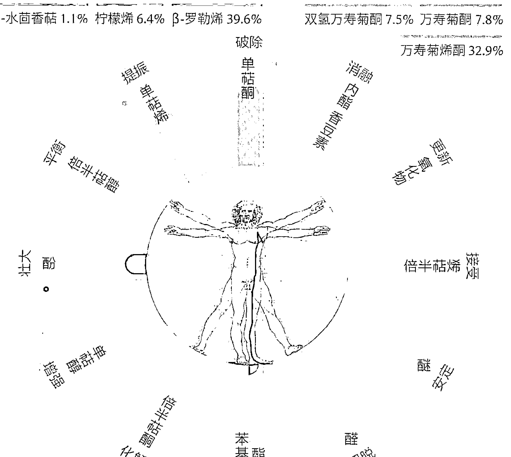

β-水茴香萜 1.1% 柠檬烯 6.4% β-罗勒烯 39.6% 双氢万寿菊酮 7.5% 万寿菊酮 7.8% 万寿菊烯酮 32.9%
丁香酚 1.09% 乙酸松香芹酯 0.43% 硫醚：α-三连噻吩 2.3%(叶油)

# 夏白菊
Feverfew

喜欢日照充足的干燥砂土，忌讳湿重的黏土。生长初期很容易被野草覆盖，一旦茁壮成长则反成入侵物种。

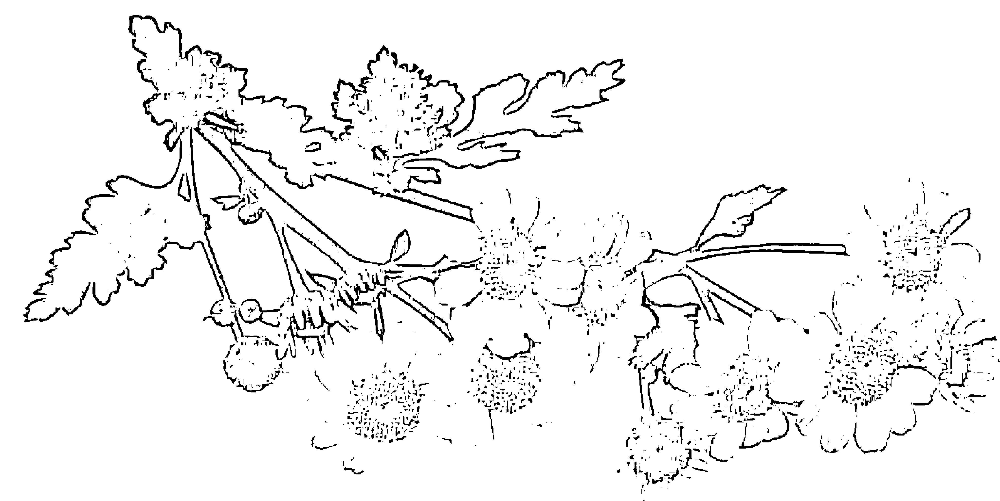

| 项目 | 内容 |
| :--- | :--- |
| 学名 | *Tanacetum parthenium* / *Chrysanthemum parthenium* |
| 其他名称 | 小白菊 / Midsummer Daisy |
| 香气印象 | 乍暖还寒时节攀登阿尔卑斯山 |
| 植物科属 | 菊科菊蒿属 |
| 主要产地 | 保加利亚、伊朗、土耳其 |
| 萃取部位 | 开花的全株药草（蒸馏） |
| 适用部位 | 肝经、顶轮 |
| 核心成分 | 萃油率0.23%~0.36%，30个可辨识化合物（占97.5%） |
| 心灵效益 | 破除过大的寄望，安于小确幸 |

| 药学属性 | 适用症候 |
| :--- | :--- |
| 1. 退热，抗痉挛，止痛 | 偏头痛，梅尼埃症，耳鸣，风湿，坐骨神经痛，关节炎 |
| 2. 消炎，抗敏，减少静脉与淋巴充血 | 牛皮癣，皮肤发红过敏，荨麻疹，晒伤，瘀青 |
| 3. 养肝，排毒，通便，消胀气，抗肿瘤 | 肝炎，反胃呕吐，肺癌，直肠癌 |
| 4. 分解黏液，通经，促进子宫收缩 | 鼻塞，气喘，子宫内膜异位，痛经，临盆 |

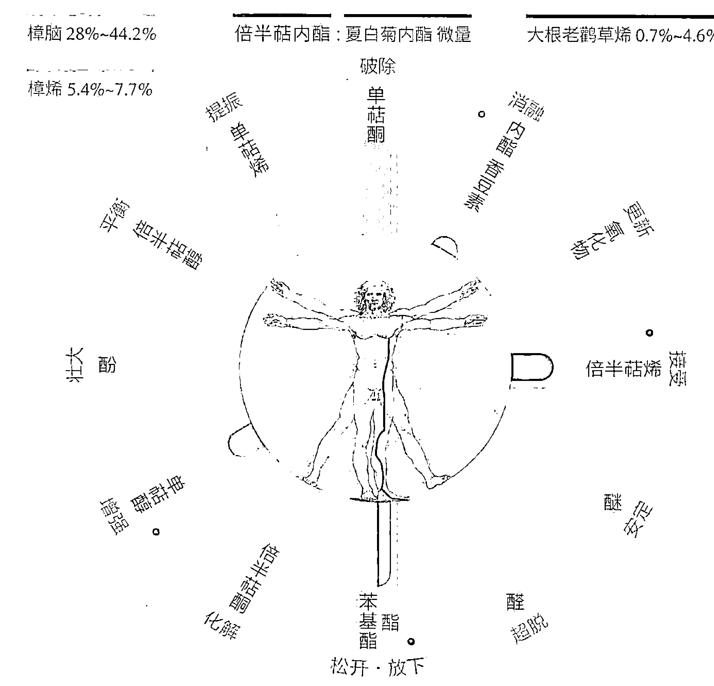

注意事项
1. 孕妇、哺乳母亲、婴幼儿不宜使用。
2. 栽培种的组分以酮和酯为主，野生种以酮和倍半萜烯为主。

# 艾菊
Tansy

原生于温带的欧亚大陆，生长容易，尤其是在日照充足的半干燥地区。根部分支多且善于延伸，种子的数量庞大，常成为优势物种。

- 1. 抗痉挛，止痛，助消化
- 2. 消炎，消解黏液，抗菌，收敛皮脂分泌
- 3. 驱虫
- 4. 通经，兴奋神经（微量）

- 1. 神经痛，风湿痛，关节痛，胀气腹痛
- 2. 感冒，牙龈发炎，喉咙痛，扁桃体炎，面部疱疹
- 3. 植物病虫害，肠道寄生虫病
- 4. 月经不至，经血稀少，提不起劲（微量）

- 学名 | Tanacetum vulgare
- 其他名称 | 纽扣菊 / Golden Buttons
- 香气印象 | 昔日春风中郊游野餐
- 植物科属 | 菊科菊属
- 主要产地 | 法国
- 萃取部位 | 开花的全株药草（蒸馏）
- 适用部位 | 胆经、顶轮

反式β-侧柏酮47.2%，反式菊烯酮1%，1,8-桉油醇1.6%。

核心成分
萃油率0.5%，83个可辨识化合物（占98.4%）

心灵效益 | 破除低迷的气氛，回到初心重新出发

乙酸菊烯酯30.7%，大根老鹳草烯0.6%。

- 1. 孕妇、哺乳母亲、婴幼儿不宜使用。
- 2. 已被研究过的化学品系多达30种，比较常见的是以酮和酯为主，分别为不同的酮与不同的酯。

# 侧柏
Thuya

分布在大型与快速生长的树种无法与之竞争的潮湿林间，或生存不易的悬崖。这种中小型柏树在野火烧不着的悬崖可以长到超过一千岁。

- 学名 | *Thuja occidentalis*
- 其他名称 | 北美香柏 / Northern White-cedar
- 香气印象 | 神圣仪式中的祈福与祝祷
- 植物科属 | 柏科崖柏属
- 主要产地 | 加拿大、美洲东北部
- 萃取部位 | 针叶（蒸馏）

**药学属性**
- 1. 抗感染，抗病毒，愈合伤口
- 2. 提高雌二醇和黄体酮，降低睾丸酮和促黄体生成激素
- 3. 消解黏液，降低低密度胆固醇和血浆内的葡萄糖
- 4. 抗肿瘤，促进细胞激素与抗体的生成，激活巨噬细胞

**适用症候**
- 生殖器疣，扁平疣，唇疱疹，难愈合的伤口
- 多囊性卵巢综合征，骨质疏松
- 卡他性支气管炎，高血脂与高血糖问题
- 子宫癌，急性与慢性上呼吸道感染，甲型流感

适用部位 肝经、性轮

**核心成分**
萃油率 0.6%，31个可辨识化合物（占96.92%）

金钟柏醇 3%，桧烯 5%，α-松油萜 2%，α-侧柏酮 65%，异侧柏酮 8%，茴香酮 8%。

**心灵效益** | 破除盲从的习性，找到独树一帜的活法

**注意事项**
- 1. 孕妇、哺乳母亲、婴幼儿不宜使用。

侧柏叶醇 5%。

双萜烯：芮木烯 0.07%，拜哲烯 8.54%。

## 香豆素与内酯类
Coumarin & Lactone

里面有一半以上都是伞形科的植物，光敏性是使用这类精油要稍加留意的地方。气味常让人联想到潮湿的土壤或陈旧的木箱，少量就能带来持久而压倒性的嗅觉印象，油色和触感也比其他类型的精油沉重。对排除环境污染与食品药物中的毒素极有帮助，同时能净化过于黏稠的血液，使血流畅通。活血排毒的专长与肝经特别相合。

# 中国当归
Danggui

喜阴凉湿润气候，多生于高山寒湿的落叶林区。要求土质疏松，最好是坐南向北半阴半阳的缓坡地。

- 学名 | Angelica sinensis
- 其他名称 | 白蕲 / Female Ginseng
- 香气印象 | 在温暖干燥的洞穴里盘腿静坐
- 植物科属 | 伞形科白芷（当归）属
- 主要产地 | 中国（甘肃、陕西、四川、云南）
- 萃取部位 | 根部（蒸馏）

适用部位 肝经、心轮

核心成分
萃油率 1.81%（超临界）/ 0.3%（蒸馏），59 个可辨识化合物（占 94%）

心灵效益 | 消融纠结与怨怒，接受大地之母的拥抱

**药学属性**
- 1. 抑制子宫平滑肌收缩（大剂量），促进血红蛋白及红细胞的生成
- 2. 松弛支气管平滑肌，消炎止痛
- 3. 促进脾细胞、胸腺细胞、肝细胞生长，增强脾细胞产生 IL-2 能力，T 细胞活性增加 80%
- 4. 减慢心率、抗心律失常，修复脑缺血损伤，抗血小板凝聚

**适用症候**
- 原发性痛经，手脚冰凉，贫血，面色萎黄
- 气喘，久咳，痈疽疮疡
- 体弱多病，长期卧病，化疗手术后，时常接触化学溶剂等环境毒素
- 心悸，脑中风，高血脂

**注意事项**
- 1. 中国和日本当归的弱植物性雌激素作用远比其他植物性雌激素低，也不高于雌激素 1/400 的效果。而且当归精油不具备生药中其他成分，不必过虑雌激素样作用。
- 2. 留意光敏性的可能。

# 印度当归
Angelica Root, India

分布于喜马拉雅西部海拔 2400~3800 米山区，植株高 1.3 米。喜欢肥沃、湿润、有遮蔽的缓坡，需要很多的森林腐植质（靠近森林）。

学　名 | Angelica glauca
其他名称 | 喜玛拉雅当归 / Himalayan Angelica (Gandrayan)
香气印象 | 在林中长途跋涉、挨寒受冻后，找到一个可以生火的洞穴
植物科属 | 伞形科白芷（当归）属
主要产地 | 印度、巴基斯坦
萃取部位 | 根部（蒸馏）

| 药学属性 | 适用症候 |
|---|---|
| 1. 抗菌，消炎，抗癌 | 流感，气喘，抗药性人类恶性脑胶质瘤 |
| 2. 抗血小板凝聚，舒张血管，抑制血管平滑肌增生，强心 | 贫血，虚弱 |
| 3. 利消化，保护神经，镇痛 | 呕吐，便秘，受寒导致的腹泻，无胃口，小儿受惊 |
| 4. 抗子宫痉挛，促进乳汁分泌 | 产后补身，产后哺乳，更年期综合征 |

适用部位 肝经、性轮

核心成分
萃油率 0.5%，68 个可辨识化合物

心灵效益 | 消融因不义而冻结的心，让理想之血流动

**注意事项**
- 1. 含少量呋喃香豆素，使用后尽量避免日晒。
- 2. 印度北阿坎德邦 (Uttarakhand) 山区野生的印度当归质量最高（顺式藁本内酯 40%~53%、顺式亚丁基苯酞 20.7%~32.8%），但已有濒危趋势。
- 3. 地表以上开花的植株也可以萃油，但成分不含内酯，可辨识 34 个成分，以单萜烯（水茴香萜）和倍半萜烯（丁香油烃）为主。

### 芹菜籽
Celery Seed

一种湿地植物，习惯冷凉气候，最少要有 16 周的冷凉条件。对温度很敏感，只能半日照。需要肥沃的土壤，还要一直保有水汽。

- 学名 | *Apium graveolens*
- 其他名称 | 旱芹 / Wild Celery
- 香气印象 | 中世纪所建、朴实无华的修道院
- 植物科属 | 伞形科芹属
- 主要产地 | 印度、法国
- 萃取部位 | 种子 (蒸馏)

适用部位 | 肝经、本我轮

核心成分
萃油率 0.48%，26 个可辨识化合物

心灵效益 | 消融杂念与烦忧，用明亮的眼睛看世界

**药学属性**
- 1. 美白，淡化斑点
- 2. 镇静，补强神经系统
- 3. 激励肝细胞（排毒），改善静脉滞流，抗肿瘤
- 4. 强身，紧实肌肉，助消化，降血压

**适用症候**
- 晒斑，肝斑，老人斑
- 焦虑，眩晕
- 轻度肝肾功能不良引发的感染，痔疮，消化道癌症
- 衰弱，老化，痛风，高血压

| 成分 | 百分比 |
|---|---|
| 柠檬烯 | 40% |
| β-松油萜 | 3.3% |
| 内酯 (5种) | 25.5% |
| 瑟丹酸内酯 | 9% |
| 新蛇床内酯 | 11% |
| 丁基苯酞 | 4.8% |
| β-蛇床烯 | 15% |
| α-蛇床烯 | 2.5% |
| 芹菜脑 | 1.5% |
| 蒎萝脑 | 0.7% |
| 肉豆蔻醚 | 1.3% |

**注意事项**
- 1. 芹菜籽油不具光敏性，根部萃取的芹菜油才有光敏性。
- 2. 整株萃取的芹菜油含有高比例的苯酞（种子油的一倍以上），排毒效果更佳，但因根部含有的呋喃香豆素，不适合用在没有覆盖的皮肤上。

# 辣根
Horseradish

| 项目 | 内容 |
| --- | --- |
| 学名 | Armoracia lapathifolia / A. rusticana |
| 其他名称 | 西洋山葵 / Western Wasabi |
| 香气印象 | 火焰山上不可一世的牛魔王 |
| 植物科属 | 十字花科辣根属 |
| 主要产地 | 中国、英国、匈牙利、日本 |
| 萃取部位 | 根部（蒸馏） |
| 适用部位 | 胆经、本我轮 |
| 核心成分 | 萃油率 0.2%~1%，18 个可辨识化合物（占 91.15%） |
| 心灵效益 | 消融萎靡与颓废，摩拳擦掌准备重出江湖 |

- 1. 杀菌，杀虫（土传病原真菌、土传线虫），熏蒸剂
- 2. 利胆，利尿
- 3. 兴奋神经，使皮肤发红，诱发水泡
- 4. 抗肿瘤，抗氧化，抗卡他

- 仓储中的害虫，农场与盆栽植物的病虫害
- 胆囊炎
- 风湿，关节炎
- 胃癌，慢性卡他性呼吸道感染

含硫化合物：
异硫氰酸烯丙酯 31.83%~50%
异硫氰酸苯乙酯 15%~26.24%
二烯丙基硫醚
异硫氰酸酯
5-乙烯基唑烷硫酮

- 1. 此精油的整体作用比较接近香豆素与内酯类，因此归在这一组。
- 2. 合成的山葵制品现在多由辣根精油制成。
- 3. 对皮肤与黏膜的刺激极大，不宜口服。属于危险性较高的精油，外用的安全剂量需请教专业芳疗师。

# 苍术
Cang Zhu

生长在稀疏柞桦林、灌木林带山坡草地及林间草丛中。喜欢凉爽、温和的气候，耐寒力强。需要表层疏松、渗透性良好的砂壤土。

- 学名：Atractylodes lancea
- 其他名称：茅术 / Rhizoma Atractylodes
- 香气印象：豆蔻年华少女丰润的脸颊
- 植物科属：菊科苍术属
- 主要产地：中国（江苏最佳）、朝鲜、俄罗斯
- 萃取部位：根茎（蒸馏）
- 适用部位：脾经、本我轮
- 核心成分：萃油率 2.91%，32 个可辨识化合物
- 心灵效益：消融尖刻与挑剔，打从心底用笑脸迎人

| 药学属性 | 适用症候 |
| :--- | :--- |
| 1. 抗缺氧 | 高山病，依赖室内空调的生活方式 |
| 2. 促进胆汁分泌，促进肝蛋白合成，对中毒的肝细胞有保护作用 | 保肝，生活于重度污染地区或食品安全危机地区 |
| 3. 调节肠胃运动，降血糖，抗溃疡 | 脾虚，胃口不佳，糖尿病，胃溃疡 |
| 4. 燥湿，杀虫（抗菌、抗真菌） | 手足癣，消毒病房 |

### 注意事项
1. 生药来源包含茅苍术 (A. lancea) 和北苍术 (A. chinensis)。两者的精油主成分相同但比例差异大。指标成分苍术素以茅苍术含量较高，北苍术则含较多桉叶醇。
2. 白术 (A. macrocephala) 所含成分以苍术酮为主 (30%~60%)，另含苯甲酸异丙酯 16.46%，气味比较柔和。传统中医的说法是白术补脾，苍术健脾。

# 蛇床子
Shechuangzi

生于原野、田间、路旁、溪边等潮湿地带，生长快速，适应性强。海拔1300~3200米都能看见，耐寒耐旱，对土壤要求不严。

| 药学属性 | 适用症候 |
| --- | --- |
| 1. 止痒（抗组胺和抑制肥大细胞脱颗粒作用） | 阴道瘙痒，各种类型的阴道炎（包括滴虫引起者），外阴湿疹，手足癣 |
| 2. 雌激素样作用 | 骨质疏松，抗心律不齐，减缓子宫的萎缩，不孕 |
| 3. 壮阳 | 阳痿（涂抹即可） |
| 4. 抗菌，抗病毒，抗肿瘤，逆转肿瘤耐药性（可配合化疗） | 胃癌，子宫颈癌，肺腺癌 |

| 学名 | Cnidium monnieri |
| --- | --- |
| 其他名称 | 野胡萝卜子 / Monnier's Snowparsley |
| 香气印象 | 一次打开梳妆台上所有的瓶瓶罐罐 |
| 植物科属 | 伞形科蛇床属 |
| 主要产地 | 中国（河北、山东、安徽、江苏、浙江） |
| 萃取部位 | 种子（蒸馏） |
| 适用部位 | 肾经、性轮 |
| 核心成分 | 萃油率 1.1%，27 个可辨识化合物 |
| 心灵效益 | 消融酸楚和苦涩，开怀品尝人生的甜点 |

**注意事项**
- 1. 阴虚火旺或下焦有湿热者不宜内服，外用则应注意剂量。
- 2. 乳腺癌、卵巢癌、子宫癌等患者不宜自行使用。

# 新几内亚厚壳桂
## Massoia

新几内亚特产，生长在海拔 400~1000 米的热带雨林内。树皮、心材、果实都有香气，每棵树可产 65 千克干燥树皮。

- **学名** | Cryptocarya massoia / Massoia aromatica
- **其他名称** | 香厚壳桂 / Massoy Bark
- **香气印象** | 躺在棕榈树下啜饮椰子汁
- **植物科属** | 樟科厚壳桂属
- **主要产地** | 印尼（新几内亚西部）
- **萃取部位** | 树皮（蒸馏）

| 药学属性 | 适用症候 |
| --- | --- |
| 1. 抗生物膜（白色念珠菌），增强免疫力（提高巨噬细胞活力） | 长期使用抗生素的病患 |
| 2. 抗感染，抗菌，抗卡他，消除黏液 | 急性与慢性的消化道感染，肠胃炎，上下呼吸道的感染 |
| 3. 促进血液循环 | 面色苍白 |
| 4. 催情 | 心因性阳痿与性冷淡 |

- **适用部位** 大肠经、眉心轮
- **核心成分** 萃油率 0.4%，7 个可辨识化合物
- **心灵效益** | 消融样板与教条，像孩子一样天马行空

- 1. 婴幼儿与孕妇宜避免使用。
- 2. 易刺激皮肤，敏感皮肤宜斟酌剂量或避免使用。

内酯：C-10 厚壳桂内酯 65%~68%，C-12 厚壳桂内酯 17%~28%，丁位癸内酯 2.5%。
沉香醇 0.9%，龙脑 0.7%，苯甲酸苄酯 13.4%，β-没药烯 1.4%。

# 零陵香豆
## Tonka Beans

原生于中美洲和南美洲北部的热带雨林，30 米高，属于挺水植物，极需日照。种子的年产量是每树 1~3.5 千克，这种大树每四年会经历一次种子盛产期。

- 1. 抑制肿瘤生长
- 2. 抑制脂氧化酶(消炎)，抑制肝脏的脂质过氧化(抗自由基)
- 3. 抗利尿，降血糖
- 4. 抗痉挛，放松肌肉，使血流通畅

- 肝癌、乳腺癌的预防与避免复发
- 延缓老化
- 糖尿病(辅药)
- 腹痛，肩颈僵硬，胸闷

**学名** | *Dipteryx odorata*
**其他名称** | 香翅豆 / Cumaru
**香气印象** | 小朋友兴奋舔食手中的冰淇淋
**植物科属** | 豆科二翅豆属
**主要产地** | 委内瑞拉、尼日利亚、巴西、哥伦比亚
**萃取部位** | 种子(溶剂萃取)

香豆素：七叶树素 50%。

**适用部位** 三焦经、心轮

**核心成分**
萃油率 27.4% (己烷) / 3.3% (酒精与水)，14 个可辨识化合物

**心灵效益** | 消融心上的大石头，兴高采烈如乘坐热气球

- 1. 原精通常会以 75% 于酒精中或 30% 于植物油中制成商品销售。
- 2. 有光敏性，使用后避免日晒。
- 3. 服用抗凝血药物者要降低用量。

羧酸：D-葡萄糖醛酸 21.4%
肌醇：鲨肌醇 6.87%
双萜类：二翅豆酸
异黄酮：异甘草素，槲皮苷 2.61%
糖醇：核糖醇 8.47%

# 阿魏
## Asafoetida

主要分布在中亚的沙漠与荒山。可以长到2米高。切开根部就会流出灰白乳汁，中空的茎干亦然。树脂干硬后呈琥珀色，极坚硬。

| 项目 | 详情 |
| --- | --- |
| 学名 | *Ferula asa-foetida* |
| 其他名称 | 臭胶 / Devil's Dung |
| 香气印象 | 误闯怪兽电力公司 |
| 植物科属 | 伞形科阿魏属 |
| 主要产地 | 伊朗、阿富汗 |
| 萃取部位 | 胶脂 (蒸馏) |
| 适用部位 | 胃经、本我轮 |
| 核心成分 | 萃油率 2.3%，39个可辨识化合物 (占91.52%) |
| 心灵效益 | 消融瘴疠与噩梦，不畏真相的丑恶 |

### 药学属性
- 1. 放松平滑肌
- 2. 驱虫杀菌
- 3. 消炎，抑制外周血淋巴细胞转化
- 4. 抗惊厥

### 适用症候
- 百日咳，气喘，溃疡，便秘，胀气
- 肠内各种寄生虫，疟疾，血吸虫，食物中毒(腐败肉类或毒蘑菇)，霍乱
- 迟发性过敏反应
- 歇斯底里，精神失常，癫痫

愈疮木醇 5.5%，胡萝卜醇 5.14%，倍半萜烯 18种 9.54%：α-古芸烯，大根老鹳草烯。

> ### 注意事项
1. 此精油的整体作用比较接近香豆素与内酯类，因此归在这一组。
2. 胶脂本身含酸(阿魏酸、缬草酸)与香豆素(伞形酮)，但蒸馏出来的精油不含这些成分。
3. 中药阿魏取材新疆阿魏(*Ferula sinkiangensis*)，品种与成分不尽相同。
4. 婴幼儿、孕妇只要不拿来口服，使用上只须斟酌剂量。

二硫化合物：仲丁基丙烯基二硫化合物(反式) 40.15%，(顺式) 23.93%。

## 土木香
Elecampane

主要见于地中海地区，喜爱含氮量高、无遮蔽的荒地或路边。植株高30~60厘米，茎叶披毛，秋天开细小黄花。

### 药学属性

### 适用症候

## 学名
Inula graveolens

## 其他名称
龙脑土木香 / Camphor Inula

- 1. 消炎，抗痉挛，止咳，抗卡他，强力化痰
- 2. 镇静，强心
- 3. 调节免疫功能 (启动树突状细胞)
- 4. 抗菌 (金黄葡萄球菌)，抗霉菌 (作物收成后易出现)，抗感染 (霍乱)

- 喉炎，气管炎，痉挛性咳嗽，慢性支气管炎，鼻咽扁桃体炎
- 高血压，心律不齐 (阵发性室上性心搏过速)，冠状动脉炎 (梗死)，心脏无力
- 白血病，癌症
- 胆囊失调，病毒性肠炎

## 香气印象
风笛高亢又饱满的乐音在山谷间缭绕

## 植物科属
菊科旋覆花属

## 主要产地
科西嘉岛、意大利、希腊、黎巴嫩、突尼斯、阿尔及利亚

## 萃取部位
开花的植株 (蒸馏)

τ-杜松醇 7.8%   单萜烯 8.6%   倍半萜内酯:微量，但分子作用强

适用部位：肺经、心轮

核心成分：萃油率 0.06%~0.29%，89个可辨识化合物

心灵效益：消融覆盖的阴影，从悲哀中透一口气

## 龙脑 7.6%
## 乙酸龙脑酯 56.8%

- 1. 治疗慢性呼吸道感染时，可能引起有益的排毒反应 (例如剧烈咳嗽)。
- 2. 油色有黄有绿，取决于采收时期与生长地点。一般而言，花期尾声的植株蒸馏出来比较绿。

## 大花土木香 Elecampane Root

原生于中亚的林地，高大而花形醒目，可以长到180厘米。需要全日照和土层厚的壤土，最好土层pH值为4.5~7.4并保有水分。

- 学名: Inula helenium
- 其他名称: 土木香根 / Elfdock
- 香气印象: 独自伫立在无言的山丘
- 植物科属: 菊科旋覆花属
- 主要产地: 印度、中国（新疆）
- 萃取部位: 根部（蒸馏）

适用部位 肺经、喉轮

心灵效益 | 消融喧嚣的背景音，听见内心的独白

### 核心成分

萃油率 0.92%，19个可辨识化合物（占98.8%）

- 倍半萜醇 0.24%: 匙叶桉油烯醇 β-桉叶醇
- 倍半萜内酯: 土木香内酯 52.4% 异土木香内酯33%
- 萘 0.24%
- 倍半萜烯 1%: β-榄香烯 β-丁香油烃 β-檀香烯 α-蛇床烯

### 药学属性 | 适用症候
1. 消解黏液与脓痰，止咳 | 咳嗽，肺炎，支气管炎
2. 抗菌，抗霉菌，助消化 | 羊身疥癣与马的皮肤病，饮食无度
3. 抗肿瘤，促使癌细胞自动凋亡而不攻击自身免疫细胞 | 子宫颈癌，肝癌，肺鳞状细胞癌，大肠癌，黑色素瘤，卵巢癌，前列腺癌
4. 驱虫，驱蚊 | 潮湿与卫生条件不佳的环境

### 注意事项
1. 市场上的土木香根精油萃取自喜马拉雅山的印度品种 Inula racemosa，成分以倍半萜类为主 (60%)，单紫杉烯含量最多 22%，也含有指标成分土木香内酯和异土木香内酯。
2. 使用过量会有神经毒性，土木香内酯可能引起接触性皮炎。

## 川芎
Chuan Xiong

生长于海拔 900 米的向阳山坡，耐寒怕暴热，偏好温暖潮湿。一般多栽培于水稻田或砂壤土中，需要土层深厚、排水良好、肥力较高的中性土壤。

### 属性

| 类别 | 内容 |
| :--- | :--- |
| 药学属性 | 1. 增加毛细血管开放数目，加快血流速度，使聚集的血小板解聚（活血化瘀）<br>2. 抑制气管平滑肌痉挛收缩，使微血管解痉，减少心室颤动和心动过速，止痛<br>3. 放松肌肉<br>4. 解热，抑制单胺氧化酶，提高血清素和多巴胺含量（作用于下视丘） |
| 适用症候 | 缺血性中风，产后与手术后瘀滞腹痛<br>气喘咳嗽，心绞痛，心悸，痛经，头痛与偏头痛<br>跌打损伤，运动伤害，空调引起的腹痛与腰酸背痛<br>经前综合征，更年期综合征，抑郁症 |
| 学名 | Ligusticum striatum / Ligusticum chuanxiong |
| 其他名称 | 芎穷 / Szechuan Lovage |
| 香气印象 | 母亲忙着给孩子吹凉的汤药 |
| 植物科属 | 伞形科藁本属 |
| 主要产地 | 中国（四川为主，江西、湖北、陕西少量） |
| 萃取部位 | 根茎（蒸馏） |

- 萜品烯-4-醇 4.77%
- 沉香醇
- 月桂烯醇
- 甲基醚丁香酚 3.72%
- 黄樟素 0.96%

### 注意事项

1. 川芎精油的主要作用来自内酯，内酯对光线和温度很敏感。精油会随贮存时间而加深颜色，这表示内酯的含量逐渐下降，使得疗效变弱。内酯在室温下也会生成多种异构体，所以收藏时尽量保持冷凉。
2. 阴虚火旺、上盛下虚及气弱之人忌服其生药，但精油外用只需注意剂量与使用频率。

## 圆叶当归
**Lovage**

虽然原生于西南亚与南欧，但冷凉的气候能够让它长得更好。需要全日照、肥沃湿润的土壤，但同时得排水良好。高可达180厘米。

- 学名 | Levisticum officinale
- 其他名称 | 美极草 / Maggiplant
- 香气印象 | 低卡路里的有机蔬食大餐
- 植物科属 | 伞形科拉维纪草属
- 主要产地 | 匈牙利、爱沙尼亚、法国
- 萃取部位 | 根茎（蒸馏）
- 适用部位 | 肝经、本我轮
- 核心成分 | 萃油率0.11%~1.8%，48个可辨识化合物（占87%）
- 心灵效益 | 消融羁绊与牵挂，以道骨仙风云游四海

| 药学属性 | 适用症候 |
| --- | --- |
| 1. 补强神经（作用于小脑与交感神经），强化平滑肌 | 疲累爆肝，有气无力 |
| 2. 解毒（激励肝细胞与胆管），排毒，抗肿瘤 | 化学毒素或药物带来的后遗症，肝炎后遗症，牛皮癣，肺癌，头颈部鳞状细胞癌 |
| 3. 轻度抗凝血，利尿 | 血液黏稠，风湿，关节炎 |
| 4. 抗感染，抗寄生虫（牛绦虫），抗黏膜发炎，止咳化痰 | 发酵性肠炎，寄生虫病，慢性支气管炎 |

内酯 >50%：顺式藁本内酯24% 顺式亚丁基苯酞32%
香豆素与呋喃香豆素4.5%：伞形酮 香柑油内酯 补骨脂素
单萜烯12%~25%：α-松油萜 β-水茴香萜
单萜醇8%：己醇
烷系烃5%~15%：苯戊烷
倍半萜烯10%：β-榄香烯 α-古巴烯

### 注意事项
1. 宜留意其光敏性，也不适合长期使用。
2. 圆叶当归的叶油以乙酸萜品烯酯为主（55.8%），藁本内酯只占17%。

## 欧防风
Parsnip

耐寒力很强，喜冷凉，但在28℃仍能旺盛生长。野生于白垩土或石灰岩。栽培时适合用磷肥较多的砂壤土。在欧美多为粗生。

| 药学属性 | 适用症候 |
|---|---|
| 1. 抗菌，助消化，开胃 | 饮食不定时导致的肠胃炎，过度忙碌导致的缺乏食欲 |
| 2. 利尿 | 憋尿导致的膀胱炎 |
| 3. 抗痉挛 | 关节炎，电脑族的肩颈僵硬与腰背疼痛，长时间站立引起的小腿酸痛 |
| 4. 抗血液黏稠 | 外食族 (长期以餐盒与速食果腹) |

| 项目 | 内容 |
|---|---|
| 学 名 | *Pastinaca sativa* |
| 其他名称 | 欧洲萝卜 / Pastinak |
| 香气印象 | 汗滴禾下土，粒粒皆辛苦 |
| 植物科属 | 伞形科欧防风属 |
| 主要产地 | 克罗地亚、塞尔维亚 |
| 萃取部位 | 全株药草 (蒸馏) |

| 项目 | 内容 |
|---|---|
| 适用部位 | 三焦经、本我轮 |
| 核心成分 | 萃油率 0.1%，55 个可辨识化合物 |
| 心灵效益 | 消融速成的幻想，定下心来慢慢耕耘 |

### 注意事项
1. 有光敏性。
2. 本条所列为全株药草所萃精油的成分。种子所萃精油含己酸辛酯 5.3% 与丁酸辛酯 79.5%，根部所萃精油含芹菜脑和肉豆蔻醚 17%~40%，以及呋喃香豆素。

丁酸辛酯 40.9% | 乙酸辛酯 32.4% | 丁酸己酯 4.6% | β-金合欢烯 3.4%

## 木香
Costus

分布在海拔 2500~3000 米的南亚山区。喜欢冷凉湿润，耐寒、耐旱，怕高温和强光。需要深厚疏松、富含腐植质、排水良好的砂质壤土。

| 项目 | 内容 |
| :--- | :--- |
| 学名 | Saussurea costus / Aucklandia lappa |
| 其他名称 | 云木香 / Aucklandia Root |
| 香气印象 | 收藏泛黄照片的黑木匣 |
| 植物科属 | 菊科风毛菊属 |
| 主要产地 | 印度、缅甸、中国（云南） |
| 萃取部位 | 根部（蒸馏） |
| 适用部位 | 三焦经、喉轮 |
| 核心成分 | 萃油率 0.82%，38~52 个可辨识化合物 |
| 心灵效益 | 消融不能说的秘密，目送往事如烟散去 |

| 药学属性 | 适用症候 |
| :--- | :--- |
| 1. 抗菌 | 水土不服，因不适应环境而忽冷忽热、头晕脑胀、声音沙哑 |
| 2. 抗痉挛，扩张血管 | 气喘，高血压 |
| 3. 消炎止痛 | 疝气，胃溃疡 |
| 4. 促进肠胃蠕动，止泻，止吐 | 饮食积滞，脘腹胀满，泻而不爽，急性胃肠炎引发的呕吐，打嗝不止 |

内酯 4种：去氢木香内酯 10%~17.6% 环广木香内酯 0.7% 风毛菊内酯 丁香油烃氧化物 3.21%

### 注意事项
1. 木香产于云南、广西者，称为云木香，产于印度、缅甸者，称为广木香。
2. 中医传统认为脏腑燥热、阴虚津亏者不应使用。
3. 经皮肤吸收可能使某些敏感皮肤引发丘疹与瘙痒。

倍半萜醛：7,10,3-十六碳三烯醛 6%~40% 蛇床烯 4% 姜黄烯 4.22% 没药烯 33.4%
紫罗兰酮

## 氧化物类
Oxide

此大类基本上以 1,8-桉油醇为主，其他氧化物成分比较接近其功能相近的分子群组，如丁香油烃氧化物的作用近似倍半萜烯类，沉香醇氧化物的作用近似单萜醇类。桉油醇类精油除了有益呼吸道，更重要的作用是与肺经共振，把活氧带到身体各个细胞，所以应用范围很广。身体任一系统出状况，都需要它推动自我疗愈的进程，调油时也会提高其他类型精油的效益。

## 芳构叶 Fragonia™

西澳特有品种。原生于当地南部海岸，是高约2.4米的灌木或小树。喜欢酸性的泥炭土，以及山谷边际有季节性水涝的地方。

**学名** | Agonis fragrans / Taxandria fragrans
**其他名称** | 粗粒簇生花 / Coarse Agonis
**香气印象** | 在下着小雨的山谷手扶岩壁溯溪
**植物科属** | 桃金娘科簇生花属
**主要产地** | 澳大利亚西部
**萃取部位** | 叶片 (蒸馏)
**适用部位** | 肺经、心轮
**核心成分** | 32 个可辨识化合物
**心灵效益** | 更新意识的锁匙，打开紧闭的心房

| 药学属性 | 适用症候 |
| :--- | :--- |
| 1. 消炎，抑制γ型干扰素 | 关节炎，风湿肌痛，皮炎，水肿 |
| 2. 抗超级细菌 (MRSA)，与酚类和醛类、单萜醇类同级的抗菌作用 | 呼吸道感染，鼻窦炎，感冒，气喘 |
| 3. 调节免疫功能 | 自身免疫性疾病，维持水族生物的健康 |
| 4. 调节压力激素 | 平衡情绪 |

单萜烯 12种：α-松油萜 14%~28% 1,8-桉油醇 28%~34%

单萜醇 9种：沉香醇 3%~15% α-萜品醇 5%~8% 倍半萜烯 4种 2.2%

### 注意事项

1. 目前为止唯一名称被注册商标的精油。1996 年首次出现在澳大利亚政府 RIRDC 的报告中，2001 年正式引介于世，2003 年开始商业生产。
2. 潘威尔医生宣称其主要成分呈现 1:1:1 的均衡比例，也就是单萜烯、氧化物、单萜醇形成了“金三角”。不过从各个已发表的科研 GCMS 数据中，并不能找到完全符合的样本。

## 小高良姜
Lesser Galangal

喜温暖湿润，耐干旱，怕涝浸，不适应强光照，要求一定的荫蔽。以土层深厚、富含腐殖质的红壤为佳，夏末秋初适合采挖生长4~6年的根茎。

| 药学属性 | 适用症候 |
| :--- | :--- |
| 1. 抗卡他，抗菌 | 卡他性与气喘性支气管炎 |
| 2. 消炎，止痛，抗凝血、抗血栓 | 风湿，梗死 |
| 3. 止泻，利胆，抗痉挛，抗溃疡，降血糖 | 腹泻，脘腹冷痛，胃寒呕吐，胃食道逆流，消化性溃疡，糖尿病 |
| 4. 抗肿瘤，抗氧化 | 口腔癌，白血病 |

胡萝卜醇0~8.9% β-松油萜 8.28% 樟烯 5.28% 樟脑 1.76% 1,8-桉油醇 28.11%~67.47%

α-萜品醇 6.81% 萜品烯-4-醇 1.87% 乙酸茴香酯 0~15% α-金合欢烯 1.45%~5.73%

- 学名 | *Alpinia officinarum* / *Languas officinarum*
- 其他名称 | 良姜 / Smaller Galanga
- 香气印象 | 大雨过后的亚热带丛林
- 植物科属 | 姜科山姜属
- 主要产地 | 中国（两广、海南）、越南、泰国、印度
- 萃取部位 | 根茎（蒸馏）

适用部位 脾经、本我轮

核心成分
萃油率0.24%~0.85%，26~48个可辨识化合物（占89.4%~99.3%）

心灵效益 | 更新高高在上的架式、学会亲民

### 注意事项
1. 本品为中药“高良姜”的法定原植物来源种。
2. 另有化学品系是以倍半萜烯为主（可达30%）。

## 月桃 Shell Ginger

阳性植物，性喜高温潮湿环境，耐阴不耐寒。适合保水性良好的肥沃土壤，多长于山间道旁与沟边草丛中。

| 项目 | 内容 |
|------|------|
| 学名 | Alpinia zerumbet |
| 其他名称 | 艳山姜 / Pink Porcelain Lily |
| 香气印象 | 原住民在林荫下采集食材 |
| 植物科属 | 姜科山姜属 |
| 主要产地 | 日本冲绳、台湾岛、巴西 |
| 萃取部位 | 叶片（蒸馏） |
| 适用部位 | 心经、心轮 |
| 核心成分 | 萃油率 0.77%，14~17 个可辨识化合物（占 98.23%） |
| 心灵效益 | 更新心理的防火墙，坚定面对各种攻击 |

- 1. 放松平滑肌，止痛
- 2. 利尿，降血压，提高高密度脂蛋白胆固醇
- 3. 抗焦虑，镇静
- 4. 消炎，抗菌，抗霉菌，抗氧化，抗肿瘤

- 坐骨神经痛，腹痛
- 高血压，动脉粥状硬化
- 沮丧，压力，焦虑，经前综合征、更年期引发的睡眠障碍
- 肠道疾病，白血病

- 1. 巴西与冲绳产的月桃叶成分接近（本条），台湾岛产的月桃叶精油则以樟脑占比最高。
- 2. 根茎入药，中药名为艳山姜；种子为芳香健胃剂，名为土砂仁，可制仁丹。

## 桉油醇樟
Ravintsara

由台湾岛引进至马达加斯加，已在当地驯化野生。喜光，喜温，叶子角质层发达，因此具有光泽，耐热又耐寒。

**学名** | Cinnamomum camphora, CT Cineole
**其他名称** | 油樟 / Ho Leaf (CT Cineole)
**香气印象** | 咸鱼翻身的长青艺人
**植物科属** | 樟科樟属
**主要产地** | 马达加斯加
**萃取部位** | 叶片 (蒸馏)

- 1. 抗病毒，抗菌
- 2. 止咳化痰
- 3. 抗感染
- 4. 补强神经

- 1. 疱疹，带状疱疹，眼部疱疹，水痘，斑疹伤寒，霍乱
- 2. 鼻咽炎，流行性感冒，鼻窦炎，支气管炎，百日咳
- 3. 病毒性肝炎，病毒性肠炎，感染性单核(白)细胞增多症，瘟疫
- 4. 神经肌肉失调，失眠，肌肉疲劳

**适用部位** 肺经、喉轮
**核心成分**
萃油率 2.2%，18个可辨识化合物（占99.8%）

**心灵效益** | 更新霉运，爬出谷底，闪亮重生

- 1. 本品过去被误称为罗文莎叶 (Ravensara)，那是马达加斯加特产的另一种樟科树木，香气以醚类为主，当地名为‘Havozo’。请见本书135页。
- 2. 本品源自台湾的一种樟树 (C. camphora ssp. formosana Hirota)，精油成分也相似，两者的差异在于台湾种含较多樟脑。

# 莎罗白樟
## Saro

只长在马达加斯加东北部靠近海岸的热带树林中。所在多为白垩土或含硅的土壤，最高可达5米，终年常绿。

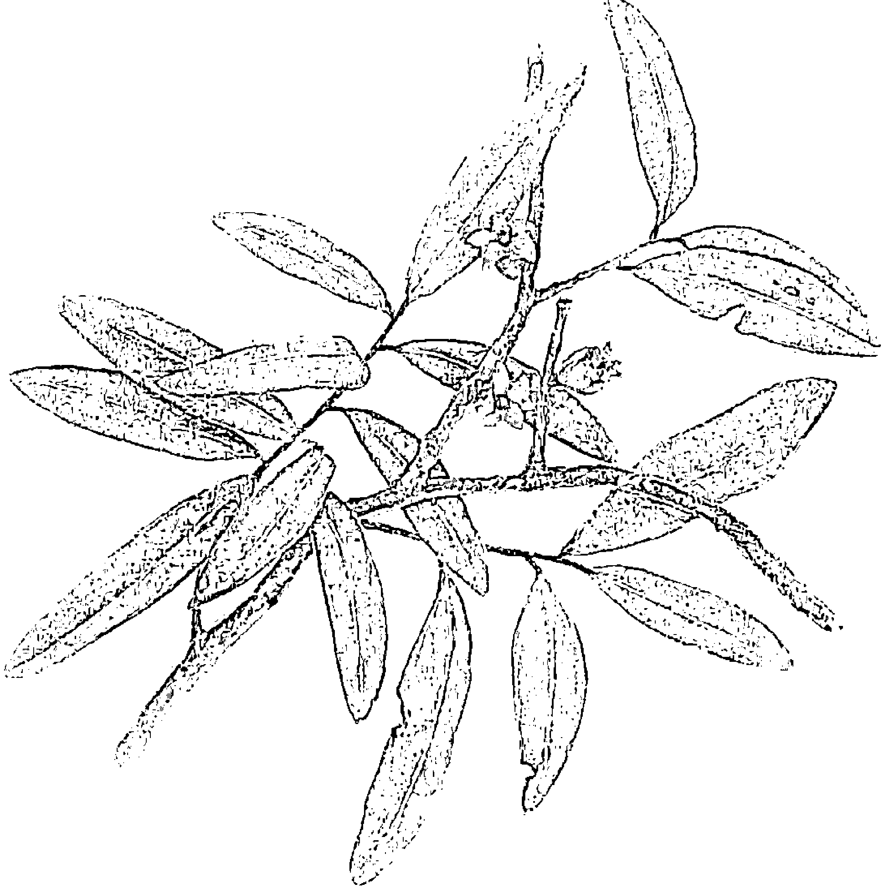

| 项目 | 内容 |
| :--- | :--- |
| 学名 | *Cinnamosma fragrans* |
| 其他名称 | 摩多毕提尼阿娜/ Motrobeatiniana/ Mandravasarotra |
| 香气印象 | 独自驾舟出海的波利尼西亚少女 |
| 植物科属 | 白樟科合瓣樟属 |
| 主要产地 | 马达加斯加 |
| 萃取部位 | 叶片（蒸馏） |
| 适用部位 | 肺经、喉轮 |
| 核心成分 | 57个可辨识化合物（占88.3%~99.4%） |
| 心灵效益 | 更新航线，向未知前进 |

核心成分
57个可辨识化合物（占88.3%~99.4%）

+ 有两种化学品系：桉油醇型（本条）和沉香醇型（72.5%）。
+ 药学属性
1. 抗病毒（HPV、HSV），抗毒物
2. 抗菌，抗霉菌，抗寄生虫
3. 调节免疫功能，止痛，抗痉挛，补身
4. 抗黏膜发炎，祛痰

+ 适用症候
- 子宫颈上皮病变，生殖器疱疹，梅毒
- 肠道的感染（腹泻），阴道感染，念珠菌感染，家畜疾病，疟疾
- 肌肉与关节疼痛，皮肤松弛，神经衰弱
- 呼吸道感染，鼻塞，咳嗽，中耳炎

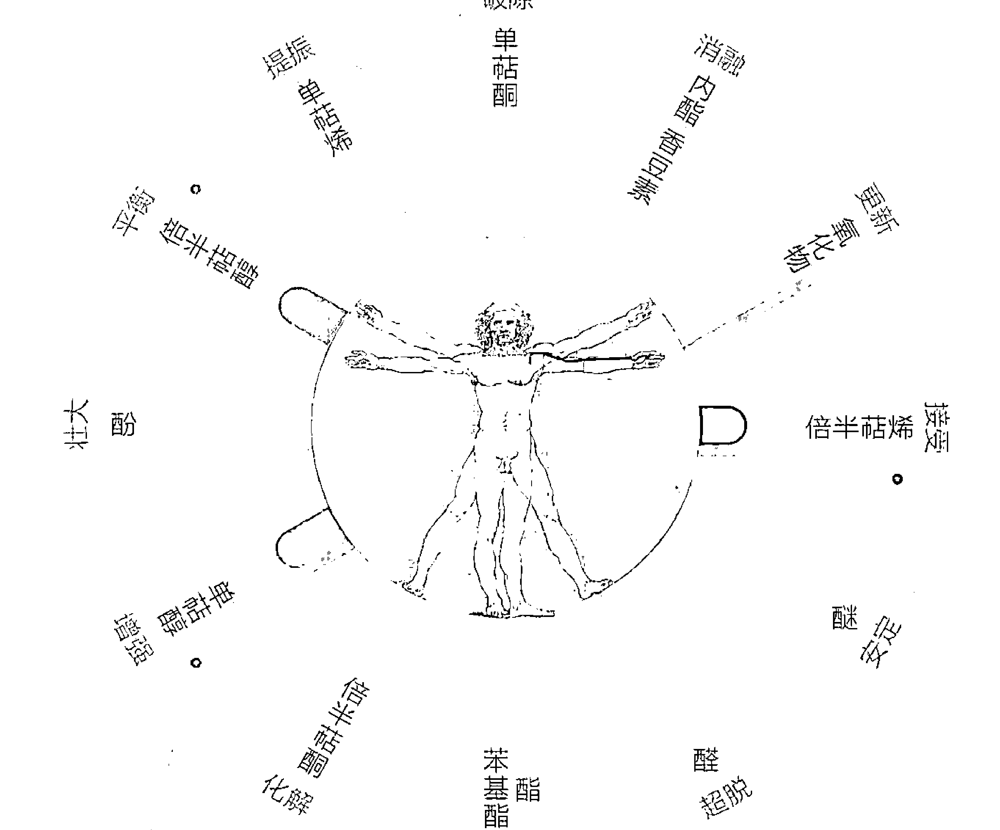

萜品醇 4.2% 萜品烯-4-醇 2.2%

倍半萜烯 10种：古巴烯 1.4% β-丁香油烃 1.1%

# 豆蔻
## Cardamom

原产于印度南部潮湿的森林，喜欢生长在山坡边阴凉之处。开花后4个月采果所得精油最多，果实太熟则含油量下降。

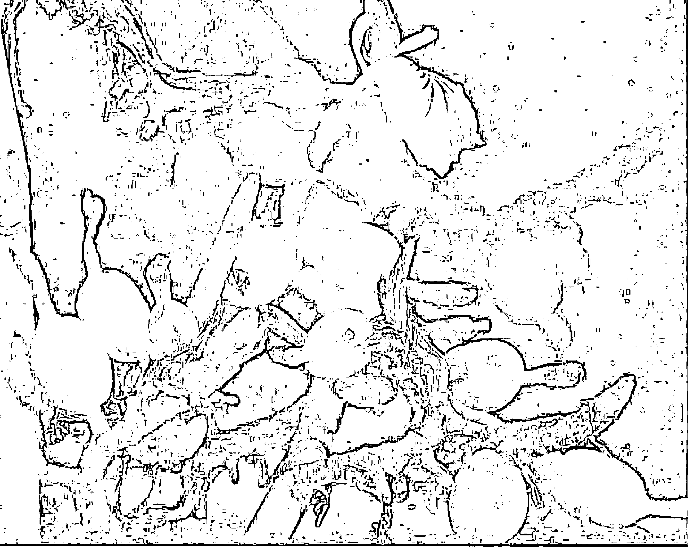

| 药学属性 | 适用症候 |
| :--- | :--- |
| 1. 健胃，消胀气，补身，有激励作用 | 厌食症，消化不良，吞气症，胃灼热（自主神经失衡所致），虚弱无力 |
| 2. 抗痉挛（神经肌肉系统），抗惊厥 | 结肠痉挛，反胃呕吐，胸部闷痛，心悸，肾结石，癫痫 |
| 3. 抗黏膜发炎，祛痰 | 着凉感冒，支气管黏膜发炎 |
| 4. 抗感染，抗氧化，抗菌，驱虫 | 口臭，寄生虫病 |

+ 学名: *Elettaria cardamomum*
- 其他名称: 小豆蔻 / Green Cardamom
- 香气印象: 轻俏华美的宝莱坞歌舞片
- 植物科属: 姜科小豆蔻属
- 主要产地: 斯里兰卡、印度南部、危地马拉
- 萃取部位: 种子（蒸馏）
- 适用部位: 胃经、本我轮
- 核心成分: 萃油率5%，67个可辨识化合物（占96.9%）
- 心灵效益: 更新排他的习性，广结善缘

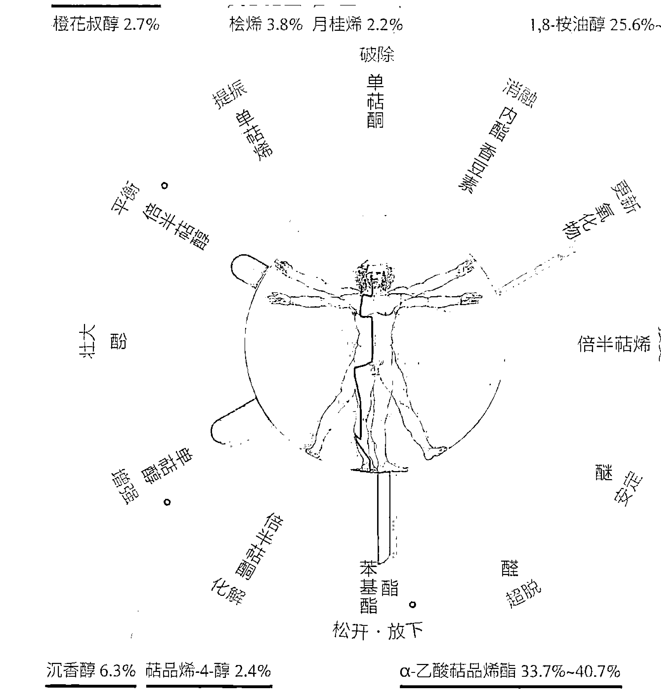

+ ### 注意事项
1. 南印度与斯里兰卡所产者酯类（45%）多于氧化物（25%），气味较甜。其他地区所产者氧化物占多数，气味较凉。

# 蓝胶尤加利
## Blue Gum

原产于澳大利亚东南部，纪录中最高大的可达100米。生长速度极快，需要充足水分，但对矿物质并无特别多的消耗。

| 药学属性 | 适用症候 |
| :--- | :--- |
| 1. 止咳，祛痰 | 耳炎，鼻窦炎，鼻咽炎，扁桃体炎，流行性感冒，支气管炎，肺炎 |
| 2. 镇痛 | 肌肉与关节疼痛 |
| 3. 抗菌（葡萄球菌、大肠杆菌），抗霉菌（念珠菌），抑制皮脂分泌 | 细菌感染及念珠菌感染导致的皮炎，脂溢性皮炎，面疱 |
| 4. 抗病毒 | 淋巴结炎 |

| 项目 | 内容 |
| :--- | :--- |
| 学名 | Eucalyptus globulus |
| 其他名称 | 塔斯马尼亚蓝桉 / Tasmanian Gum |
| 香气印象 | 在旧金山大桥做高空弹跳 |
| 植物科属 | 桃金娘科桉属 |
| 主要产地 | 中国、西班牙、澳大利亚 |
| 萃取部位 | 叶片（蒸馏） |
| 适用部位 | 肺经、喉轮 |
| 核心成分 | 萃油率 1%~2.4%，50个可辨识化合物（占98%） |
| 心灵效益 | 更新迂回的表达方式，明快吐露心声 |

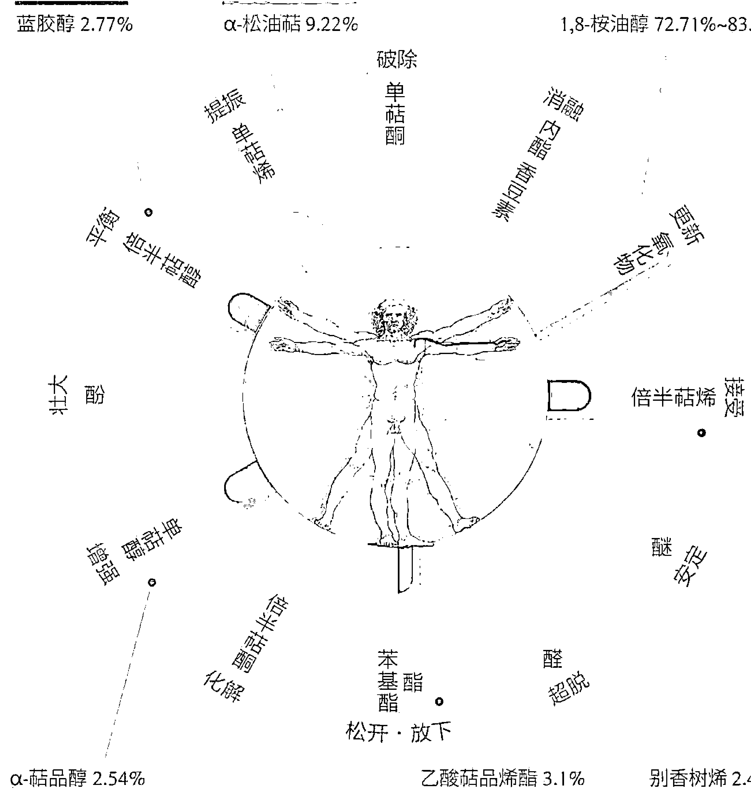

### 注意事项

+ 1. 婴幼儿避免使用（可能刺激中枢神经并使呼吸困难）。
2. 精油成分和作用相近的品种包括：直干桉 (E. maidenii, 桉油醇 83.59%)、河岸赤桉 (E. camaldulensis, 桉油醇 83.7%)。
3. 使用于健康皮肤的安全剂量为20%。

# 澳洲尤加利
## Narrow-Leaved Peppermint

原产于澳大利亚东南部，约30米高，喜爱潮湿深厚的土壤。需要充足的雨水与一定的遮荫，如此窄长的叶片才会生产出最高的油量。

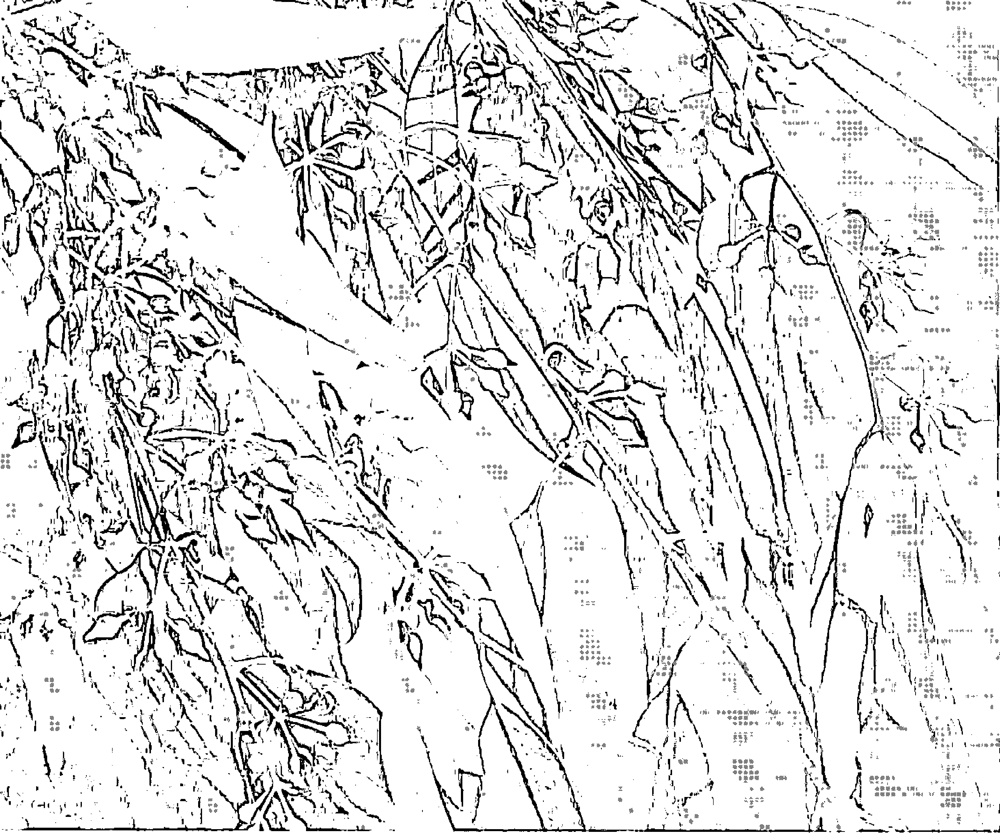

+ 药学属性
1. 抗感染，抗病毒，祛痰
2. 抗菌，调节皮脂
3. 消炎，退热
4. 强壮身心

+ 适用症候
鼻炎，鼻咽炎，鼻窦炎，流行感冒，支气管炎，咳嗽，耳炎
结膜炎，虹膜睫状体炎，粉刺面疱
子宫内膜异位，阴道发炎，牙龈肿痛，发热
体弱，畏寒

| 项目 | 内容 |
| --- | --- |
| 学 名 | Eucalyptus radiata |
| 其他名称 | 辐射桉 / Forth River Peppermint |
| 香气印象 | 漂浮在无垠的太空中 |
| 植物科属 | 桃金娘科桉属 |
| 主要产地 | 澳大利亚（蓝山与塔斯马尼亚） |
| 萃取部位 | 叶片（蒸馏） |
| 适用部位 | 肺经、喉轮 |
| 核心成分 | 萃油率 2.5%~3.5%，24 个可辨识化合物（占 96.3%） |
| 心灵效益 | 更新防御阵势，以沟通取代猜忌 |

+ 注意事项
1. 本种是桉油醇类尤加利中最温和的一种，小朋友也可以酌量使用。
2. 另一相对温和的品种史密斯尤加利 (E. smithii，桉油醇 72%，桉叶醇 6.3%，松香芹酮 1.6%)，除了呼吸道问题，也可激励消化系统，抗风湿，止痛，退热，抗皮肤真菌病。

α-萜品醇 0~15.2%  胡椒醇 0.9%~14.9%  牻牛儿醇 0.2%~2.8%  β-丁香油烃 0.1%~1.6%

# 露头永久花
## Naked Head Immortelle

1~4 米高。花型似意大利永久花，但扁长的叶与意大利永久花大相径庭。虽然叶和枝上都披覆着白色细毛，但茎干比较木质化。

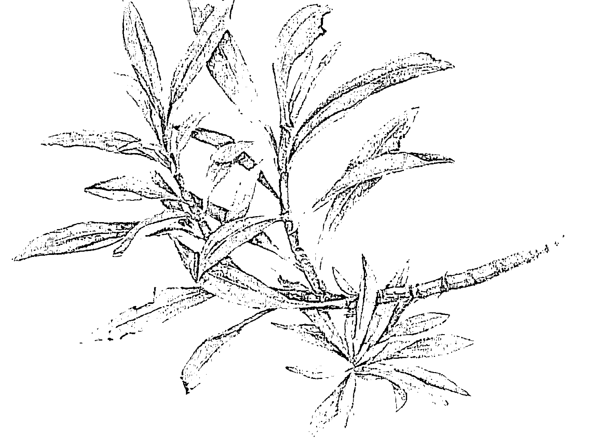

+ - 学 名 | *Helichrysum gymnocephalum*
- 其他名称 | 桉油醇永久花 / Immortelle Cineole
- 香气印象 | 老店翻修后重新开张
- 植物科属 | 菊科蜡菊属
- 主要产地 | 马达加斯加
- 萃取部位 | 花与叶（蒸馏）

| 药学属性 | 适用症候 |
| :--- | :--- |
| 1. 抗肿瘤，疗伤 | 乳腺癌，皮肤炎，静脉溃疡，疱疹 |
| 2. 消炎，止痛 | 牙龈炎，胃灼热，伤寒，口咽炎，头痛，痛风 |
| 3. 抗恶性疟原虫，驱虫，除臭，抗菌 | 疟疾，净化环境 |
| 4. 调节激素 | 月经不调，月经不至，溢乳症，甲状腺肿 |

+ - 适用部位 胃经、本我轮
- 核心成分 萃油率 0.4%，23 个可辨识化合物（占 99.3%）
- 心灵效益 | 更新刻板印象，不按牌理出牌

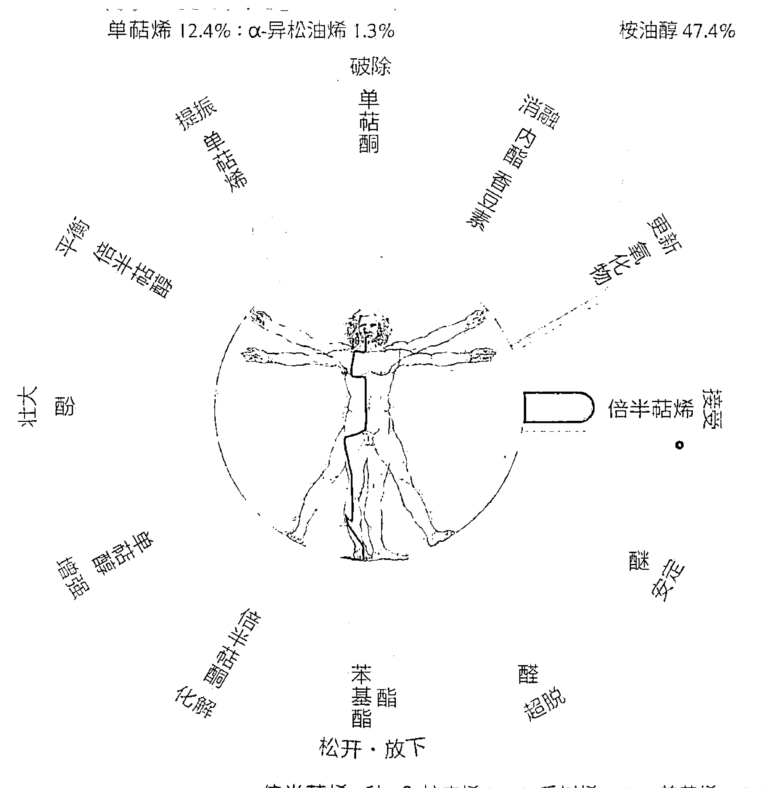

+ 注意事项
1. 虽是一种以桉油醇为主的永久花，但它的关键效能多来自倍半萜烯。

### 高地牛膝草
## Mountain Hyssop

普罗旺斯巴农地区特产，和一般的牛膝草同样热爱全日照的干燥石灰岩。但分布于较高的丘陵 (海拔 760 米)，植株也比较柔软。

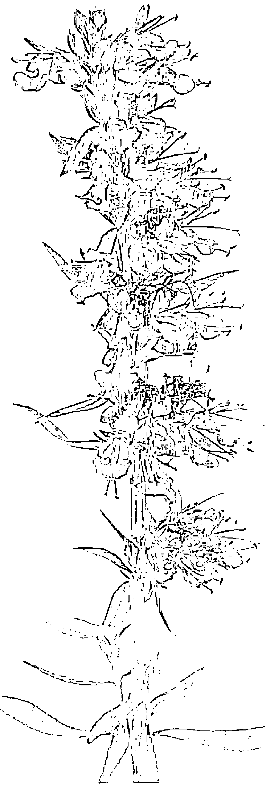

### 药学属性

### 适用症候

+ 药学属性
1. 抗黏膜发炎，祛痰，抗气喘 (但不具抗过敏功能)
2. 消炎
3. 抗感染，杀病毒，杀菌 (小范围的特定细菌，如链球菌，尤其是引起鼻腔与喉咙感染者)，杀霉菌，杀寄生虫
4. 补身，激励，补强交感神经系统与太阳神经丛

+ 适用症候
咽喉炎，鼻窦炎，支气管炎，婴儿的细支气管炎，气喘性支气管炎，发炎性气喘 (突发，急性，但不含过敏性)，分泌性气喘 (因肝功能不佳或营养问题所引发，多为遗传性)
膀胱炎，肝炎，肠炎
疱疹，鹅口疮，肠道寄生虫病 (鞭毛虫感染)
沮丧，焦虑，心情沉重，气闷

| 项目 | 内容 |
| :--- | :--- |
| 学名 | Hyssopus officinalis L. var. decumbens / Hyssopus off. var. montana intermedia |
| 其他名称 | 斜卧牛膝草 / Sloping Hyssop |
| 香气印象 | 闻鸡起舞的有为青年 |
| 植物科属 | 唇形科牛膝草属 |
| 主要产地 | 西班牙、法国 |
| 萃取部位 | 开花的全株药草 (蒸馏) |
| 适用部位 | 肺经、喉轮 |
| 核心成分 | 萃油率 1.3%，21~34 个可辨识化合物 (占 91%~95.6%) |

匙叶桉油烯醇 β-松油萜 16.82%
松樟酮 0.5% 异松樟酮 1%
桉油醇 52.89%
沉香醇氧化物
丁香油烃氧化物
沉香醇 1.83%
乙酸沉香酯 1.2%
β-波旁烯 1%

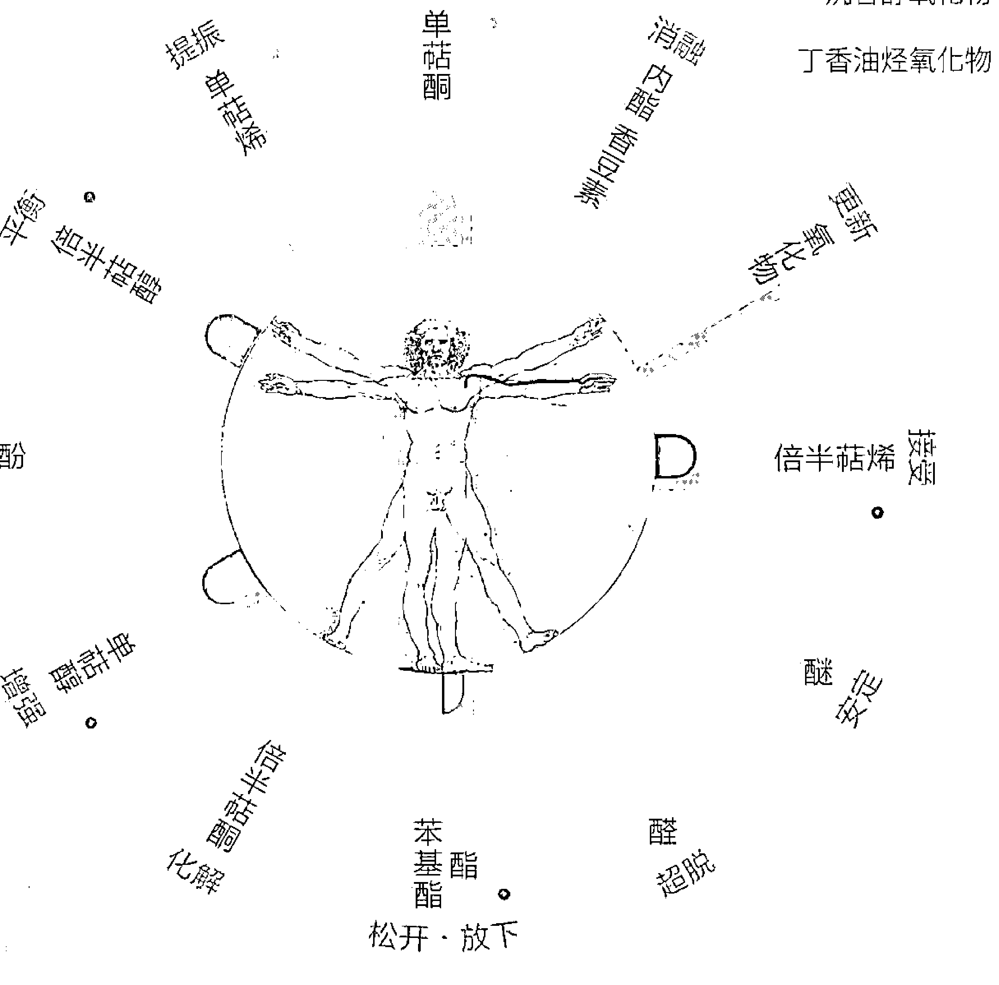

心灵效益 | 更新应对模式，不再重蹈覆辙

### 注意事项

+ 1. 单萜酮含量极低，儿童亦可使用。
2. 有三种化学品系：沉香醇型 (51.7%)，沉香醇氧化物型 (56.83%)，桉油醇型 (52.89%)。

# 月桂
## Bay

原产于地中海，喜光，稍耐阴，也耐得住短期低温(-8℃)。需要排水良好的沙地，生长初期比较缓慢。

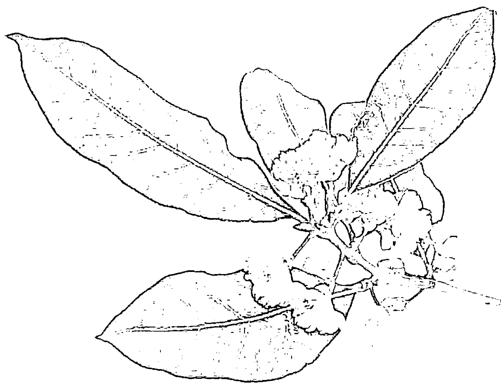

| 项目 | 内容 |
| :--- | :--- |
| 学名 | *Laurus nobilis* |
| 其他名称 | 甜月桂 / Bay Laurel |
| 香气印象 | 半人半神毛伊发威勾住太阳 |
| 植物科属 | 樟科月桂属 |
| 主要产地 | 波斯尼亚、克罗地亚、土耳其 |
| 萃取部位 | 叶片（蒸馏） |
| 适用部位 | 大肠经、本我轮 |

| 药学属性 | 适用症候 |
| :--- | :--- |
| 1. 抗黏膜发炎，化痰，抗感染，抗肿瘤 | 流行性感冒，耳鼻喉感染，淋巴结炎，霍奇金淋巴瘤，前列腺癌，皮肤癌，乳腺癌 |
| 2. 杀菌，杀病毒，杀霉菌（白色念珠菌、热带霉菌） | 胃炎，口疮，牙痛，病毒性肝炎，病毒性肠炎，疟疾，血液感染 |
| 3. 强力抗痉挛，强力止痛，抗凝血，扩张冠状动脉 | 关节炎，骨骼肌肉的风湿与变形，肌肉萎缩，胸闷 |
| 4. 平衡神经（交感与副交感），平衡皮脂分泌 | 病毒性神经炎，自主神经失调，麦粒肿，面疱，头皮屑，疖，溃疡性伤口 |

核心成分
萃油率1.1%，33个可辨识化合物（占95.75%）

α-松油萜 4%~6% β-松油萜 3%~5% 倍半萜内酯：木香烃内酯 1.8% 桉油醇 35%~45%
桧烯 4.5%

心灵效益 | 更新低落的自我评价，看到并肯定自己的优点

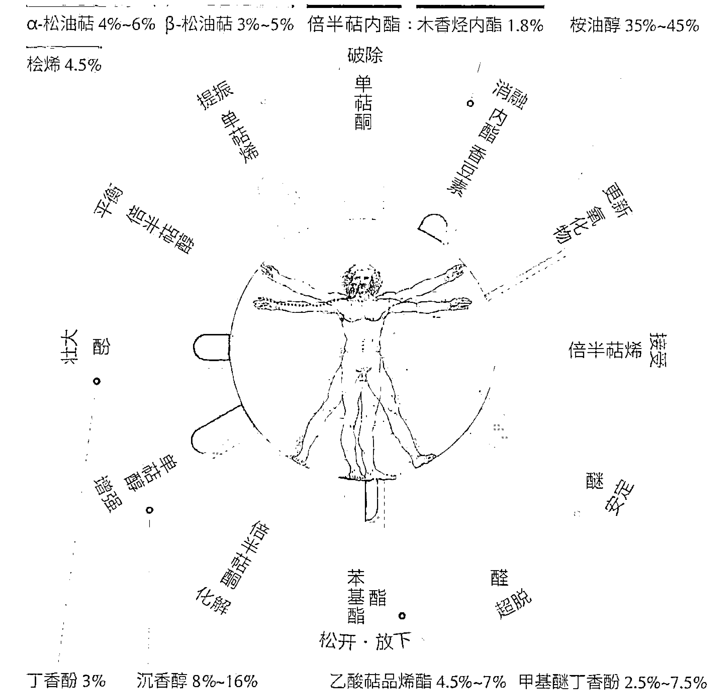

+ **注意事项**
1. 浆果也可以萃取精油，组分以单萜烯为主（罗勒烯23.7%，α-松油萜10.3%，桉油醇8%）。

# 穗花薰衣草
## Spike Lavander

生长于低海拔的一种薰衣草，耐旱不耐阴，三叉枝型和灰紫花色为特征。需要大量阳光，土壤不能过酸，施肥过度会使叶片大增而含油量降低。

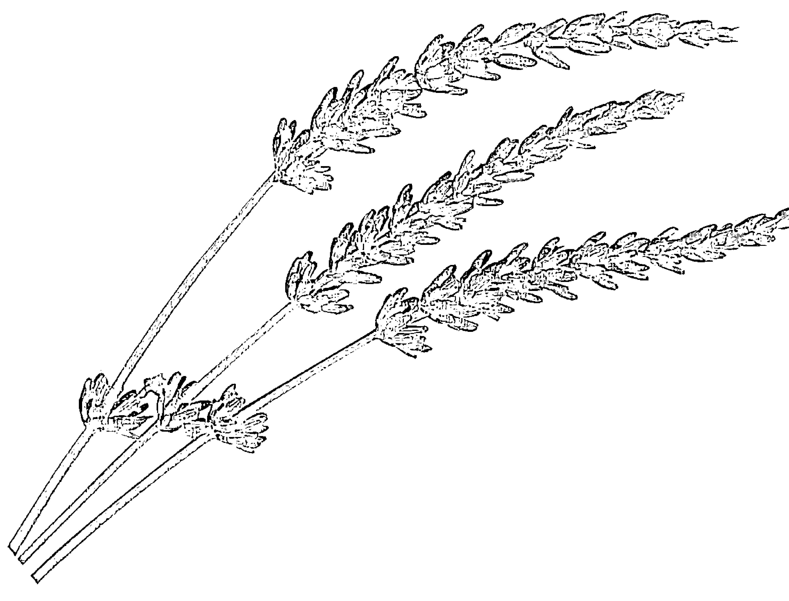

+ 药学属性
1. 具细胞防御功能，抗感染，消炎，杀菌，杀病毒，杀霉菌
2. 抗黏膜发炎，止咳化痰
3. 止痛
4. 补身，强心，抗氧化

+ 适用症候
严重烧伤（一级），渗出型面疱，足癣，病毒性肠炎，单纯疱疹
鼻炎，病毒性气管炎和支气管炎，阵咳
风湿病，风湿性关节炎
神经炎，神经痛，虚弱无力

| 项目 | 内容 |
| :--- | :--- |
| 学名 | Lavandula latifolia |
| 其他名称 | 宽叶薰衣草 / Broad-leaved Lavender |
| 香气印象 | 弗拉明戈舞者用力踩地的踢踏声 |
| 植物科属 | 唇形科薰衣草属 |
| 主要产地 | 西班牙（东南）、法国（南部） |
| 萃取部位 | 开花的全株药草（蒸馏） |

β-松油萜 0.8%~2.6% α-松油萜 0.6%~1.9% 樟脑 10.8%~23.2% 桉油醇 28%~34.9%

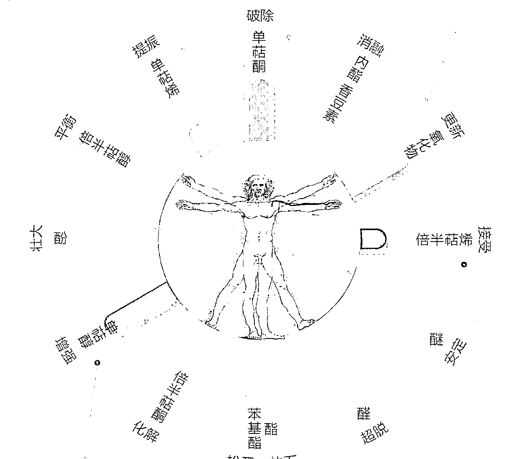

适用部位 | 肺经、喉轮

核心成分
萃油率 1.5%~2.2%，56 个可辨识化合物（占 96%~97.5%）

心灵效益 | 更新隐忍受苦的姿态，爽利甩开不对等的关系

注意事项
1. 健康皮肤的安全剂量为 19%。

+ 沉香醇 27.2%~43.1% 龙脑 0.9%~3.2% β-丁香油烃 0.5%~1.9% 大根老鹳草烯 0.3%~1%

# 辛夷
## Mulan Magnolia

分布于海拔 300~1600 米的山坡林缘，喜温暖与充足阳光，不易移植和养护。耐寒而不耐旱与盐碱，要求润而不湿、肥沃的酸性砂壤土。

| 项目 | 内容 |
|---|---|
| 学 名 | Magnolia liliiflora |
| 其他名称 | 紫玉兰 / Purple Magnolia |
| 香气印象 | 优雅到不可方物的银发族 |
| 植物科属 | 木兰科木兰属 |
| 主要产地 | 中国（河南、陕西、四川、安徽、湖北） |
| 萃取部位 | 干燥花蕾（蒸馏） |
| 适用部位 | 肺经、眉心轮 |
| 心灵效益 | 更新追随流行的脚步，停留在有恒久价值的事物上 |

核心成分
萃油率 1.64%，57 个可辨识化合物（占 83.91%）

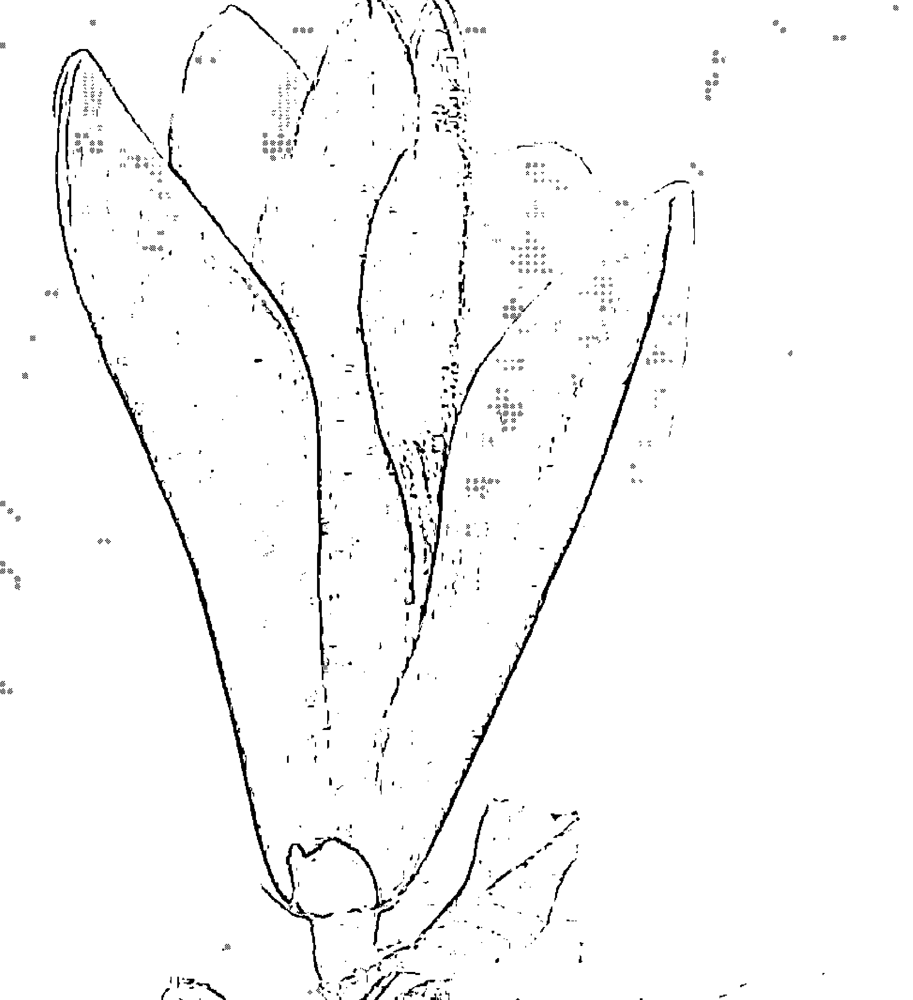

| 药学属性 | 适用症候 |
|---|---|
| 1. 收缩鼻黏膜血管，抗组胺、抗过敏 | 各种鼻炎、鼻窦炎，鼻多浊涕 |
| 2. 镇静，止痛 | 鼻塞头痛，目眩齿痛 |
| 3. 抗菌防腐，抗氧化 | 脱发，脸色苍白 |
| 4. 抑制炎症介质 IL-1、IL-4、肿瘤坏死因子和磷脂酶 A2，消炎 | 褥疮，湿热引起的皮肤炎 |

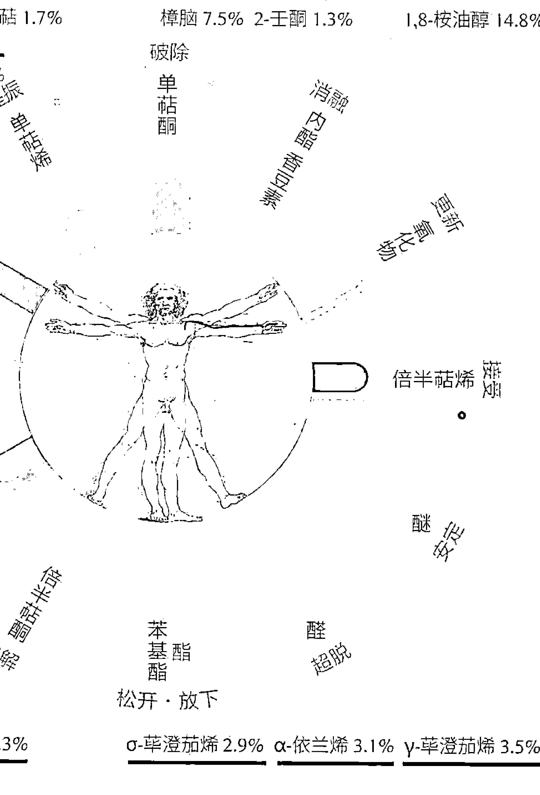

主要化学成分含量
β-松油萜 2.1% | β-水茴香萜 1.7% | 樟脑 7.5% | 2-壬酮 1.3% | 1,8-桉油醇 14.8%
大根老鹳草烯 D-4-醇 6.3% | 异金合欢醇 16.1%
沉香醇 3.8% | α-萜品醇 6.3% | σ-荜澄茄烯 2.9% | α-依兰烯 3.1% | γ-荜澄茄烯 3.5%

+ 注意事项
1. 乙醇浸取的精油为深绿色，水浸取法的精油为红棕色，两者香气淡而出油率极低；CO₂ 萃取和水蒸气蒸馏的精油为淡黄色，香气比较浓郁。
2. 中药辛夷的来源有数个不同的品种：望春花 (Magnolia biondii), 玉兰 (Magnolia denudata), 武当玉兰 (Magnolia sprengeri)，其精油成分各不相同，但都以桉油醇为核心成分。

# 白千层
## Cajeput

会脱落的多层树皮是其一大特征，几乎终年开花，喜欢生长在溪流旁。树龄愈大萃油率愈少，油中的桉油醇也会变少，而丁香油烃则会变多。

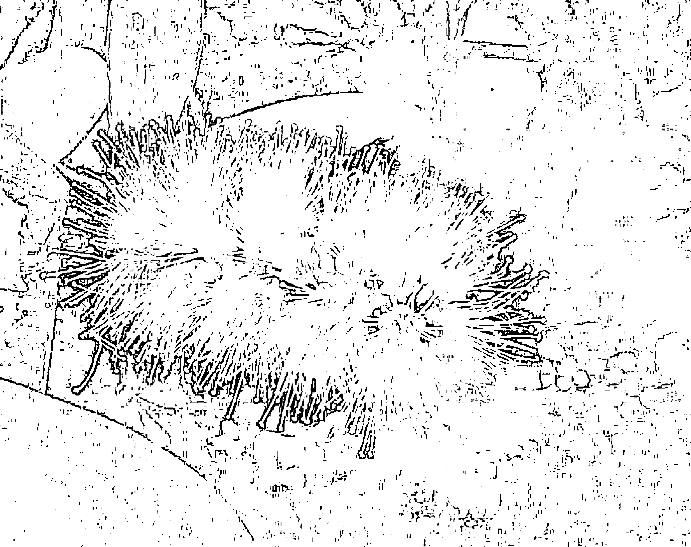

+ 药学属性
1. 保护表皮（免受放射线伤害），抗透明质酸酶，抗氧化，消除静脉充血
2. 抗感染，抗菌，抗霉菌，类激素样作用
3. 抗痉挛
4. 抗黏膜发炎，化痰，驱虫，抗白蚁

+ 适用症候
准备接受放射线治疗，晒伤，刺激性皮肤炎，静脉曲张，痔疮
生殖器疱疹，子宫颈糜烂
神经痛，风湿
呼吸道黏膜感染，阴湿环境

| 项目 | 内容 |
| :--- | :--- |
| 学名 | Melaleuca leucadendra |
| 其他名称 | 剥皮树 / White Paperbark |
| 香气印象 | 新鲜人入行的第一天 |
| 植物科属 | 桃金娘科白千层属 |
| 主要产地 | 印尼、马来西亚、越南 |
| 萃取部位 | 叶片（蒸馏） |
| 适用部位 | 肺经、眉心轮 |

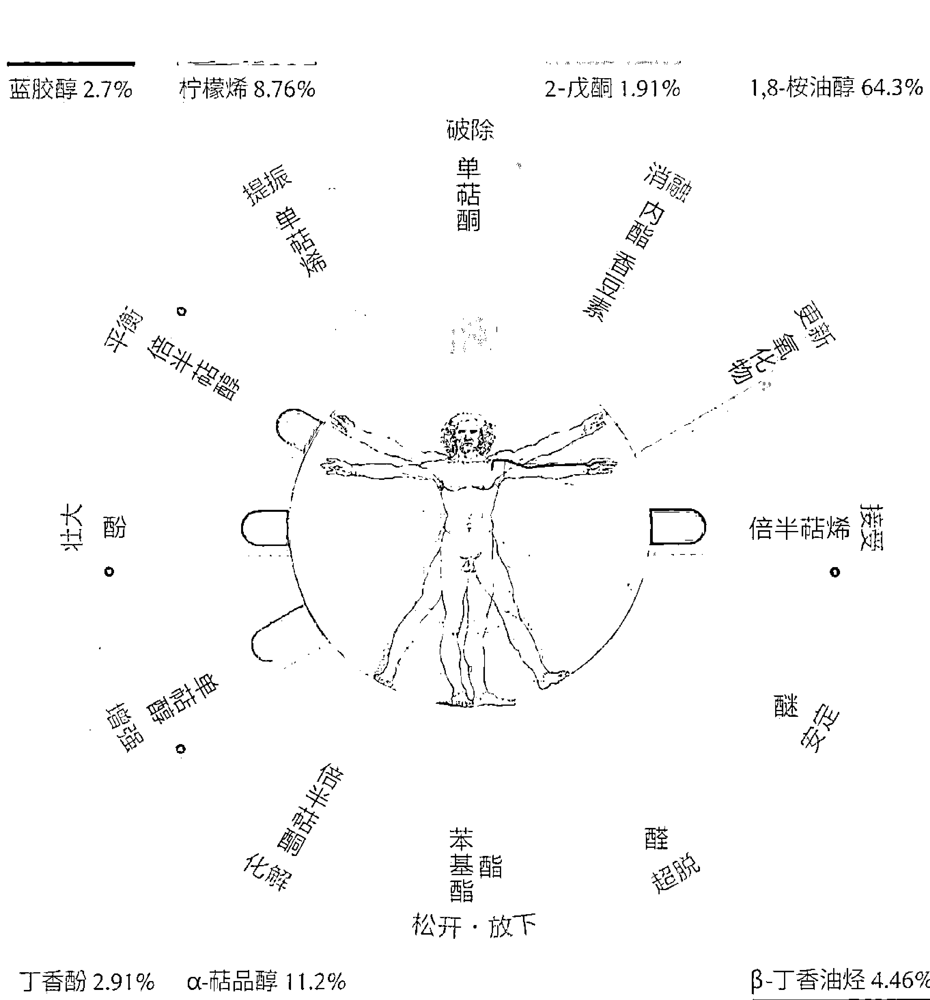

核心成分
萃油率 0.61%~1.59%，26 个可辨识化合物（占 99.64%）

心灵效益 | 更新不能输的心态，随时都可以归零

### 注意事项

+ 1. 常见的学名写法 M. leucadendron 其实是拼音上的讹误。而 cajuput 或 cajeput 这个俗名来自印尼语，常用来统称 M. cajuputii、M. quinquenervia、M. linariifolia、M. viridiflora 这几个外观与气味都非常相像的白千层。
2. 本品有另一化学品系是甲基醚丁香酚型。
3. 孕妇宜留意用量。

# 绿花白千层
## Niaouli

喜欢沼泽地，富含有机质而发黑的沙地也能生长，需要酸性土壤。树龄可达100岁，生命力强，在原生地是优势物种，引种后也常快速占领新地。

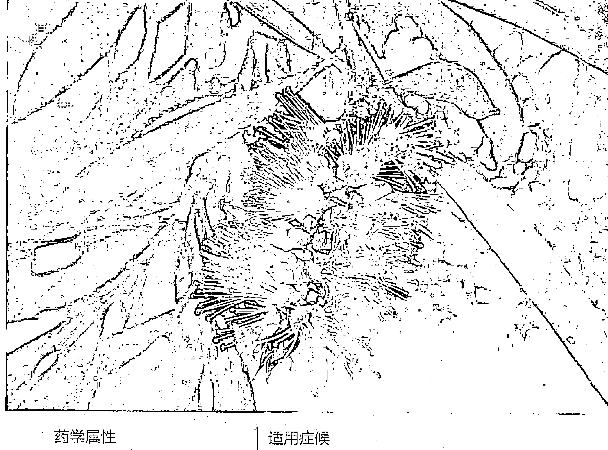

### 基本信息
| 项目 | 内容 |
| :--- | :--- |
| 学名 | *Melaleuca quinqueneria* |
| 其他名称 | 宽叶白千层 / Broad-leaved Paperbark |
| 香气印象 | 年轻俊美的芭蕾舞男孩 |
| 植物科属 | 桃金娘科白千层属 |
| 主要产地 | 澳大利亚新南威尔士、新喀里多尼亚岛、马达加斯加 |
| 萃取部位 | 叶片（蒸馏） |
| 适用部位 | 肾经、基底轮 |
| 核心成分 | 萃油率 1%，39个可辨识化合物 |
| 心灵效益 | 更新惯常的装束，得到勇气做年轻的打扮 |

### 药学属性与适用症候
| 药学属性 | 适用症候 |
| :--- | :--- |
| 1. 抗感染，抗病毒，抗菌，抗霉菌，抗寄生虫，类激素样作用 | 生殖器疱疹，尖锐湿疣，扁平湿疣，外阴炎，子宫颈糜烂，子宫纤维瘤 |
| 2. 退热，化痰，防护皮肤，止痒 | 鼻咽炎，肺结核，眼睑炎，干癣，疖，皮肤霉菌病，皱纹，放射疗法前 |
| 3. 降血压，疏通静脉，止痛 | 冠状动脉炎，心内膜炎，动脉硬化，痔疮，风湿性关节炎，神经性抑郁 |
| 4. 消炎，激励肝细胞，消结石 | 扁桃体炎，胃溃疡，病毒性肝炎和肠炎，霍乱，胆结石，尿道炎，前列腺炎 |

绿花醇 18.1% 喇叭茶醇 2.55% 柠檬烯 5.51% α-松油萜+α-侧柏烯 5.43% 1,8-桉油醇 41.8%

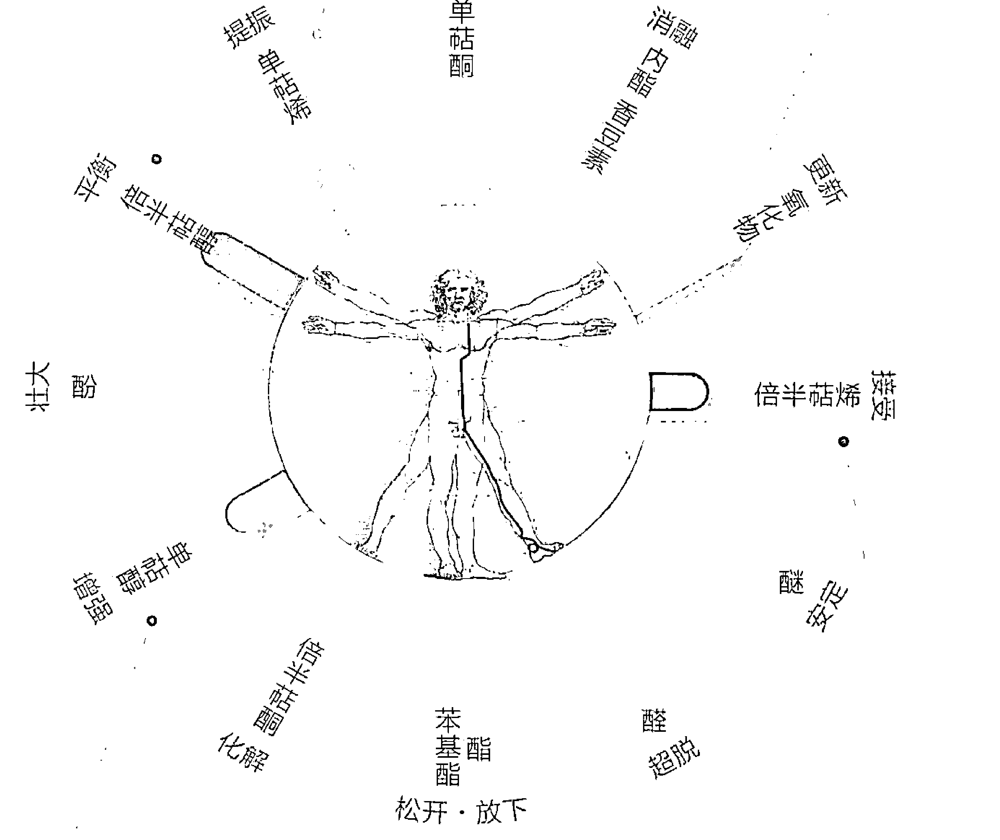

+ 注意事项
1. 这种白千层最常见的是桉油醇型，其他还有绿花醇型（48%），沉香醇型（50%），橙花叔醇型（70%）。
2. 中文名‘绿花白千层’是指M. viridiflora，本种正确名称应为‘五脉白千层’，但因两者外型与精油成分接近而继续沿用。

## 扫帚茶树
Broombush

2米高，分支丛生，常长在根瘤型尤加利树林中，习惯如地中海气候的干热环境，叶片如细长圆管，而叶端如针尖。

| 药学属性 | 适用症候 |
| :--- | :--- |
| 1. 增加脑部血流供给，抑制乙酰胆碱酯酶，激励，止痛 | 头晕目眩，记忆衰退，提不起劲，全身酸痛 |
| 2. 抗黏膜发炎，化痰，止咳 | 感冒，烟枪型咳嗽，百日咳 |
| 3. 消炎，抗敏，抗病毒 | 手术过后的伤口愈合与避免感染，湿气重的封闭空间 |

| 学名 | Melaleuca uncinata |
| :--- | :--- |
| 其他名称 | 尖刺白千层 / Yilbarra |
| 香气印象 | 有教养的年轻人 |
| 植物科属 | 桃金娘科白千层属 |
| 主要产地 | 澳大利亚 (西南) |
| 萃取部位 | 叶片 (蒸馏) |

适用部位 肺经、喉轮

心灵效益 更新老机构的暮气，带来冲劲与活力

### 注意事项
- 1. 有四种化学品系：桉油醇型 (44%~56%)，萜品烯-4-醇型 (31%)，桉叶醇型 (30%~60%)，松油萜型 (85%)。

## 香桃木
Myrtle

原生于地中海盆地，耐热、耐盐、耐干旱，但不耐风霜，需要全日照。整体来说生长缓慢，耐修剪，枝叶花果都有香气。

学名 | Myrtus communis

其他名称 | 甜香桃木 / Sweet Myrtle

香气印象 | 古希腊的奥林匹克竞技者

植物科属 | 桃金娘科香桃木属

主要产地 | 摩洛哥、克罗地亚

萃取部位 | 叶片（蒸馏）

适用部位 肺经、喉轮

核心成分
萃油率2%，28个可辨识化合物（占94.6%）

心灵效益 更新自闭的倾向，让自己热烈绽放

| 药学属性 | 适用症候 |
| :--- | :--- |
| 1. 抗黏膜发炎，祛痰，抗感染，抗病毒 | 支气管炎，鼻窦炎，先天性黏液稠厚症，咽峡炎 |
| 2. 抗溃疡，激励肝脏，降血糖，解除前列腺充血症状 | 口腔溃疡，胃溃疡，肝脏缺血，II型糖尿病，非感染性尿道发炎，前列腺炎 |
| 3. 强化毛发与皮肤，类激素样作用（甲状腺，卵巢） | 眉毛与睫毛稀疏，皱纹皮肤，甲状腺功能减退，闭经 |
| 4. 轻度抗痉挛，助眠，抗氧化，抗细胞突变，抗肿瘤 | 睡眠困扰，前列腺癌，乳腺癌，艾氏腹水癌 |

注意事项
另有两种化学品系：

- 1. 红香桃木（乙酸桃金娘酯22%~28%），请见本书169页。
- 2. 绿香桃木（α-松油萜64%、1,8-桉油醇10%、沉香醇与桃金娘醇7%），主要作用是抗风湿，产地有秘鲁、阿尔及利亚、科西嘉岛、突尼斯。

## 桉油醇迷迭香
Rosemary, CT Cineole

喜爱全日照与石灰岩，怕积水。与其他类型的迷迭香相比，长得最为直挺。采收下来后会放原地晒三日，再把干叶打下来送去蒸馏。

| 药学属性 | 适用症候 |
| :--- | :--- |
| 1. 化痰 | 着凉感冒，耳炎，鼻窦炎，支气管炎 |
| 2. 杀菌，杀霉菌（白色念珠菌），驱虫（四纹豆象） | 膀胱炎，小肠结肠炎，耶尔森菌肺炎，病虫害防治 |
| 3. 抗氧化 | 多发性硬化（辅药），形容憔悴，脱发，思绪混乱、头脑不清，疲惫无力 |
| 4. 抗肿瘤 | 乳腺癌，前列腺癌 |

### 植物基础信息与身心效益
- **学 名**: Rosmarinus officinalis
- **其他名称**: 海洋之露 / Sea Dew
- **香气印象**: 夏日清晨到湖滨公园慢跑
- **植物科属**: 唇形科迷迭香属
- **主要产地**: 摩洛哥（亚特拉斯山区）、突尼斯
- **萃取部位**: 开花的全株药草（蒸馏）
- **适用部位**: 肺经、心轮
- **核心成分**: 萃油率0.8%~1.24%，29个可辨识化合物（占97.57%）
- **心灵效益**: 更新重复工作的倦怠感，找到日新又新的动力

### 注意事项
- 1. 本品是使用起来最无顾虑的一种迷迭香。

### 化学成分占比
- **单萜烯 32%**:
  - α-松油萜 16.31%
  - 桧烯 8.64%
- **单萜酮**: 樟脑 10.81%
- **单萜醇**: 1,8-桉油醇 42.24%
- **氧化物**: 丁香油烃氧化物 4.22%
- **倍半萜烯**: β-丁香油烃 1.45%
- **醇类**: 桃金娘醇 5.01%、龙脑 2.84%

## 三叶鼠尾草
Sage Apple

常见于地中海东半部，需要全日照，排水与通风良好，极耐旱。看似果实、实为虫瘿的部位在鲜嫩时可以削皮食用，也可拿来解渴。

**学名**: Salvia triloba / S. fruticosa

**其他名称**: 希腊鼠尾草 / Greek Sage

**香气印象**: 一个挂满凹凸镜的房间，触目所及都是颠倒或变化的影像

**植物科属**: 唇形科鼠尾草属

**主要产地**: 希腊、土耳其、以色列

**萃取部位**: 开花的全株药草（蒸馏）

**适用部位**: 三焦经、顶轮

**核心成分**: 萃油率 0.25%~4%，40 个可辨识化合物

**心灵效益**: 更新被动接收的习惯，找出自己真正想做的事情

**注意事项**
- 1. 孕妇、婴幼儿宜避免使用。

| 药学属性 | 适用症候 |
| --- | --- |
| 1. 消解黏液，祛痰，抗卡他 | 慢性呼吸道卡他性感染，鼻咽炎，支气管炎 |
| 2. 轻度抗菌抗感染，抗病毒，抗肿瘤 | 慢性阴道卡他性感染，白带，乳腺癌 |
| 3. 抗氧化，抗乙酰胆碱酯酶 | 老年痴呆，松果体钙化综合征 |
| 4. 保护与巩固星状神经胶质细胞 | 神经退行性疾病（如帕金森病、多发性硬化症、重症肌无力等） |

单萜烯 8种 16.1%:
樟脑 16% 侧柏酮 4% 松樟酮 0.22% 1,8-桉油醇 42%

倍半萜烯 9种 10%: α-葎草烯

## 熏陆香百里香
Mastic Thyme

原生于伊比利亚半岛中部，可达 50 厘米高，属于比较高大的品种。需要全日照，排水良好的沙土或含硅基质，成簇的白花远望像团团小球。

### 药学属性
- 1. 解除肺部与支气管的充血与壅塞，祛痰，抗卡他
- 2. 抗阴道菌种
- 3. 抗沙门菌
- 4. 抗感染，抑制乙酰胆碱酯酶，抗氧化

### 适用症候
- 1. 鼻窦炎，卡他性支气管炎，病毒性支气管炎
- 2. 阴道念珠菌感染，白带
- 3. 预防养殖场动物染病（鸡与猪），商用厨房的卫生维护
- 4. 幼儿园的环境消毒与预防孩童交叉感染，老年痴呆

| 项目 | 内容 |
| :--- | :--- |
| 学名 | *Thymus mastichina* |
| 其他名称 | 西班牙马郁兰 / Spanish Marjoram |
| 香气印象 | 兴高采烈去牧场远足的学童们 |
| 植物科属 | 唇形科百里香属 |
| 主要产地 | 西班牙、葡萄牙 |
| 萃取部位 | 开花的全株药草（蒸馏） |

倍半萜醇 6种 2%：榄香醇
单萜烯 10种 16%：樟烯
樟脑 4%
1,8-桉油醇 55%

适用部位 肺经、心轮

核心成分
萃油率 0.9%~2%，32 个可辨识化合物

心灵效益 更新塞满的行程，想象放空的可能

注意事项
- 1. 葡萄牙西南部有另一个化学品系，成分以沉香醇为主（58.7%~69%）。

单萜醇 8种 17%：沉香醇 δ-萜品醇+龙脑 萜品烯-4-醇

### IV 倍半萜烯类

具有突出的消炎效果（如母菊天蓝烃和 β-丁香油烃），以及抗肿瘤的特性（如大根老鹳草烯与榄香烯）。实际上癌症是一种慢性发炎现象，倍半萜烯使细胞受体接收正确信息而修正发炎状态，可说是从根本上防癌。倍半萜烯对负责传导变化的大肠经尤其重要，能让固着僵化和拒绝顺应的身心恢复弹性，所以在关节与皮肤方面的应用机会很多。

## 西洋蓍草
Yarrow

喜欢改变过原始结构的土壤，多分布于开阔林地或草原。高20厘米~1米，从海平面到海拔3500米山区都看得见，适应力强。

| 属性 | 值 |
|------|-----|
| 学名 | Achillea millefolium |
| 其他名称 | 千叶蓍 / Milfoil |
| 香气印象 | 墨迹尚在、多年未用的砚台 |
| 植物科属 | 菊科蓍属 |
| 主要产地 | 匈牙利、爱沙尼亚、拉脱维亚 |
| 萃取部位 | 开花的全株药草（蒸馏） |
| 适用部位 | 三焦经、喉轮 |
| 核心成分 | 萃油率 0.1%，66 个可辨识化合物 |
| 心灵效益 | 接受命运的蓝图，顺其自然 |

| 药学属性 | 适用症候 |
|----------|----------|
| 1. 抑制巨噬细胞释放出过多的炎症介质（如环氧化酶-2、一氧化氮） | 神经炎，神经痛，韧带扭伤，关节退化，肩颈僵硬 |
| 2. 活化雌激素的 α-与 β-受体 | 痛经，少经，前列腺炎，肾结石带 |
| 3. 抗游离辐射引发的基因毒素，养肝利胆 | 化疗，工作场所或住家近基地台、高压电塔，手机重度使用者 |
| 4. 止血，促进伤口愈合，促进皮肤细胞再生 | 流鼻血，褥疮，糖尿病患者的伤口，皮肤老化 |

注意事项
- 1. 孕妇与婴幼儿避免使用。
- 2. 各地蓍草的母菊天蓝烃含量差异极大，中欧与欧洲东北部较多，南欧较少。
- 3. 有七个变种与亚种，白色花比粉色与红色花含更多精油及天蓝烃。

## 树兰
### Aglaia

生于湿润肥沃的酸性砂质壤土，25°C ~ 28°C最适合，能耐半荫，不耐寒。喜欢充足的阳光，高5~6米，6~11月开花，夏季采收后阴干。

### 药学属性
1. 消炎，减少组胺造成的水肿
2. 抗感冒
3. 抗抑郁
4. 抑制肿瘤坏死因子-α（TNF-α）和白介素-1β（IL-1β）

### 适用症候
+ 醒酒，头昏脑胀，发肤无光泽
+ 感冒咳嗽，肺炎，空气污染环境中清肺
+ 胸闷气郁，食滞腹胀，催生
+ 心情灰恶导致的癌症

| 项目 | 内容 |
| --- | --- |
| 学名 | Aglaia odorata |
| 其他名称 | 米仔兰 / Chinese Rice Flower |
| 香气印象 | 山穷水尽疑无路，柳暗花明又一村 |
| 植物科属 | 楝科米仔兰属 |
| 主要产地 | 中国（福建、广东、广西、四川及云南） |
| 萃取部位 | 花（溶剂萃取） |
| 适用部位 | 大肠经、心轮 |
| 核心成分 | 萃油率0.4%~0.6%，48个可辨识化合物 |
| 心灵效益 | 接受自我调侃，挥别谨小慎微的日子 |

倍半萜烯 18种：
α-葎草烯 31%
α-古巴烯 23%
γ-榄香烯 17.6%
β-丁香油烃 14.9%

酯 12种：棕榈酸乙酯 茉莉酸甲酯

### 注意事项
1. 孕妇避免使用。

## 树艾
Tree Wormwood

喜欢在岸边峭壁或石砾间生长，极度排斥湿冷气候。银灰色的细叶柔若羽毛，枝干却坚如小树，丛高120~180厘米。

- 学名 | Artemisia arborescens
- 其他名称 | 大艾草 / Great Mugwort
- 香气印象 | 地中海最湛蓝的深处
- 植物科属 | 菊科艾属
- 主要产地 | 南欧（意大利）与北非（摩洛哥）
- 萃取部位 | 开花的全株药草（蒸馏）
- 适用部位 胆经、喉轮
- 核心成分
- 萃油率0.87%，49个可辨识化合物
- 心灵效益 | 接受月亮能量的洗涤，得到清明的判断力

### 药学属性
1. 抗过敏，抗组胺
2. 抗黏膜发炎，消解黏液
3. 强力抗单纯疱疹病毒(HSV-I、HSV-II)
4. 强力清除自由基，促进胆汁分泌

### 适用症候
- 皮肤系统的过敏问题，异位性皮肤炎，老人斑，晒伤烫伤
- 气喘，卡他症状(黏膜炎、痰湿体质)，胸口堵
- 唇部疱疹，生殖部位疱疹
- 长期外食，油性发肤，早生白发

倍半萜醇 3种 14%
- β-侧柏酮 30%~50% 樟脑 10%
- 倍半萜烯 5种：母菊天蓝烃 30%~50%

### 注意事项
1. 孕妇与婴幼儿避免使用。
2. 母菊天蓝烃含量最高的一种精油，但是不同产地的含量差异极大。意大利产的母菊天蓝烃较多，摩洛哥产的β-侧柏酮较多。
3. 中文名南木蒿(Southernwood)的植物实为艾属另一品种Artemisia Abrotanum，其精油成分以樟脑和单萜烯为主，并不含母菊天蓝烃。

## 澳洲蓝丝柏
Blue Cypress

分布在海拔 900 米以下的开放树林，树高 15~45 米，树龄可达 200 岁以上。习惯干湿分明的季风型热带气候，生长缓慢，不耐火。

### 药学属性
1. 提高粒细胞与单核白细胞的活力
2. 止痛，消炎
3. 改善迟滞的静脉循环
4. 抗病毒，消解黏液，驱蚊虫（包括沙蚊）

### 适用症候
- 过敏反应（如皮肤红肿），湿疹，割伤，尿布疹，牛皮癣，烧烫伤
- 腹痛，酸痛，风湿性关节炎
- 静脉曲张，痔疮
- 疣，带状疱疹，唇疱疹，流感，蜂螫蚊叮虫咬

学名 | *Callitris intratropica*
其他名称 | 北方柏松 / Northern Cypress Pine
香气印象 | 洒脱却又深情的男子汉
植物科属 | 柏科澳大利亚柏属
主要产地 | 澳大利亚北部
萃取部位 | 树皮与心材（蒸馏）

适用部位 | 大肠经、喉轮
核心成分
萃油率 1%~3%，38 个可辨识化合物（占 89.08%）

心灵效益 | 接受感情的风云变色，拿得起放得下

### 注意事项
1. 有些学者认为本种乃 *Callitris columellaris* 的一个变种。但 *Callitris columellaris* 的精油为绿色，主成分是双氢中柱内酯。
2. 孕妇与哺乳母亲最好避免使用（因为 β-桉叶醇）。

## 大麻
Hemp

强韧耐寒的一年生草本植物，但是对土壤的要求高。非常喜欢光照，强光可以得到出油量高的种子，弱光则可养出好的纤维。

学 名 | Cannabis sativa
其他名称 | 火麻 / Marijuana
香气印象 | 斜射进暗室的一道温暖光束，漂浮着无数微尘
植物科属 | 大麻科大麻属
主要产地 | 法国、匈牙利、中国（纤维型）；玻利维亚、瑞士（药用型）
萃取部位 | 雌株的开花茎叶（蒸馏）
适用部位 大肠经、顶轮

核心成分
萃油率0.0013%（户外生长）~0.29%（室内生长），68（室内）~120（户外）个可辨识化合物

心灵效益 | 接受天使的庇护，不再陷入悲情的轮回

注意事项
- 1. 令人产生幻觉的四氢大麻酚在精油当中只占微量（低于0.08%）。
- 2. 缉毒犬被训练嗅闻的“大麻气味”主要是丁香油烃氧化物。
- 3. 大麻精油与大麻烟的成分差异颇大，并无上瘾或毒害神经的可能。

药学属性
1. 活化大麻素受体CB2，具有类大麻素的功能（因含高比例的丁香油烃）
2. 消炎，止痛
3. 强化免疫系统与脾脏、骨骼、皮肤
4. 作用于神经胶质细胞，减少某些神经传导物质过度累积产生的毒性

适用症候
1. 预防慢性发炎导致的癌症（特别是脑部、皮肤、乳腺）
2. 退化部位的疼痛
3. 郁郁寡欢，老年痴呆
4. 酒瘾、烟瘾、药瘾

## 依兰
Ylang Ylang

喜爱潮湿近海的热带低地次生林，全年开花但集中在雨季（11~3月）。枝叶垂坠，新花蜷曲舞爪，熟花柔顺向下。

| 药学属性 | 适用症候 |
|----------|----------|
| 1. 消炎（抑制脂氧化酶），安抚过于活跃的自主神经，强化α1脑波 | 心跳过速，高血压，气喘，甲状腺功能亢进 |
| 2. 增强性功能，抗沮丧 | 性无能，性冷淡，抑郁症 |
| 3. 抑制醛糖还原酶，抗霉菌，抗生物膜，抑制黑色素生成，驱蚊蝇 | 糖尿病并发症，皮肤霉菌病，肤色黯沉与斑点，防登革热 |
| 4. 促进体内生成脑内啡与血清素 | 心力交瘁，槁木死灰 |

| 项目 | 详情 |
|------|------|
| 学名 | Cananga odorata forma genuina |
| 其他名称 | 香水树 / Perfume Tree |
| 香气印象 | 悬挂着充气娃娃与大型玩偶的泡泡屋 |
| 植物科属 | 番荔枝科依兰属 |
| 主要产地 | 马达加斯加、科摩罗岛 |
| 萃取部位 | 花（蒸馏） |

适用部位 肾经、性轮
核心成分 萃油率 1%，161 个可辨识化合物 (含量小于 0.02% 的成分占 50%)
心灵效益 | 接受快乐的从天而降，不再逃避自我

- 倍半萜醇 5.3%: 杜松醇、依兰油醇
- 倍半萜烯 31.9%: β-丁香油烃 10.7%、大根老鹳草烯 10.3%、大叶依兰烯
- 单萜醇 21.3%: 沉香醇 19%、牻牛儿醇
- 苯基酯 19%: 苯甲酸苄酯 7.6%、乙酸苄酯 4.6%
- 醚 8.4%: 对甲大茴香醚
- 酯 7.6%: 乙酸牻牛儿酯

注意事项
- 1. 商业生产分四段取油（分馏）：特级（25分）、一级（1小时）、二级（3小时）、三级（8小时），全部混合在一起的称作完全依兰。
- 2. 多项功能均来自倍半萜烯类的大叶依兰烯(canangaterpene I)，该成分不存在于香水业采用的特级依兰。为求疗效最好选择完全依兰。

## 大叶依兰
Cananga

与常见依兰的外观差别在于枝干挺直不垂坠，叶片较为宽圆。和依兰一样喜欢潮湿有遮荫的树林，木质坚硬。

| 学名 | Cananga odorata forma macrophylla |
| :--- | :--- |
| 其他名称 | 卡那加 / Big-leafed llang-ilang |
| 香气印象 | 刚开始结果的释迦园 |
| 植物科属 | 番荔枝科依兰属 |
| 主要产地 | 印尼、马来西亚、菲律宾 |
| 萃取部位 | 花 (蒸馏) |
| 适用部位 | 大肠经、性轮 |
| 核心成分 | 萃油率 2.6%，67 个可辨识化合物 (占 95%) |
| 心灵效益 | 接受非理性可掌握的事件，顺流而下 |

| 药学属性 | 适用症候 |
| :--- | :--- |
| 1. 抗痉挛，平衡过于激动的情绪 | 心悸，血压骤升，亢奋，暴怒 |
| 2. 提高性能量 | 工作过劳以致丧失性趣，因创伤记忆而排斥性事 |
| 3. 消炎，护肤 | 体癣，汗斑 |
| 4. 解热 | 疟疾，发烧 |

倍半萜醇 16种 14%：金合欢醇 4%
β-没药醇 2%
α-桉叶醇 1.5%

倍半萜烯氧化物：β-丁香油烃氧化物 18%
香树烯氧化物 3.3%

注意事项
1. 这个品种原本只生长在东爪哇岛的布里达 (Blitar)，产量很小。

苯基酯与醇与醛：
苯甲酸苄酯 7.6%
苯甲醇 7.8% 苯甲醛 2%

倍半萜烯 21种 28%：
β-丁香油烃 11%
α-葎草烯 4% β-愈疮木烯 4%

## 卡塔菲
Katrafay

高 2~9 米的小树，分布于海拔 900 米以下半干半湿的林地。生长缓慢，一年生长 50 厘米，七年也只能长到 3 米。

| 学名 | Cedrelopsis grevei |
| :--- | :--- |
| 其他名称 | 卡塔发 / Katafa |
| 香气印象 | 罗汉的袈裟飘动在塔林间 |
| 植物科属 | 芸香科香皮椿属 |
| 主要产地 | 马达加斯加 |
| 萃取部位 | 树皮（蒸馏） |
| 适用部位 | 大肠经、喉轮 |

- 1. 消炎，护肤，抗氧化
- 2. 抗肿瘤
- 3. 改善静脉循环
- 4. 抗恶性疟原虫，解热

- 皮肤炎，牛皮癣，酒糟鼻，肤色暗沉
- 乳腺癌
- 静脉曲张
- 疟疾，发热

核心成分
萃油率 0.9%~1.7%，64 个可辨识化合物

心灵效益 | 接受良知的召唤，清明淡定不动摇

1. 本属植物为马达加斯加特产，曾被归为楝科和芸香科，1970 年代以后又被纳入嚷树科。近年的谱系研究则认为，还是应该归为扩大的芸香科。
2. 卡塔菲的叶片也可以萃油，成分同样是以倍半萜为主。

榄香醇 β-桉叶醇 9.9%~37.8%
倍半萜醇氧化物：α-没药醇氧化物

倍半萜烯 60%以上：β-金合欢烯 27.6% δ-杜松烯 14.5% α-古巴烯 7.7% 杜松-1,4-二烯

## 台湾红桧
Taiwan Red Cypress

65 米高的大树，多生长在山坡下段近溪谷处，或是侧坡洼地。生长缓慢，和扁柏相比树性偏阳，枝叶向上（扁柏的枝叶向下）。

| 学名 | Chamaecyparis formosensis |
| :--- | :--- |
| 其他名称 | 薄皮仔 / Meniki |
| 香气印象 | 香火鼎盛的土地公庙 |
| 植物科属 | 柏科扁柏属 |
| 主要产地 | 台湾岛 |
| 萃取部位 | 心材的木片（蒸馏） |

适用部位：大肠经、本我轮

核心成分
萃油率 1.6%，34 个可辨识化合物（占 98.94%）

心灵效益 | 接受祖灵的护持，凝聚不容忽视的气场

### 注意事项

1. 本品为台湾特有品种，最盛处在海拔 1800~2500 米间。阿里山神木、司马库斯神木皆为本种，因为过度砍伐，现列为受保护物种。
2. 常被标示为台湾桧木精油，但气味与色泽和台湾扁柏有明显差异。红桧气味较温润，油色偏琥珀，因为长速相对较快，价格比台湾扁柏略低。
3. 从枝干萃取的精油以倍半萜醇为主，针叶萃取以单萜烯为主。

| 药学属性 | 适用症候 |
| :--- | :--- |
| 1. 抗霉菌，杀白蚁，抗病媒幼虫 | 潮湿引起的呼吸道过敏，木制家具抗蛀 |
| 2. 放松（交感神经活性下降、副交感神经活性上升，自主神经总活性提升） | 都市生活的压力，长期熬夜，恐慌症 |
| 3. 消炎止痒（抑制巨噬细胞生成一氧化氮） | 湿疹，神经性皮炎，足癣 |
| 4. 钙离子拮抗作用 | 心跳过速，高血压 |

倍半萜醇 5种 32%：α-桉叶醇 18%　α-依兰油醇 6.5%
杜松醇 表荜澄茄醇
棉杉菊三烯 4.6%　诺品酮 17%
破除
单萜酮

桃金娘醇 4%~49%　扁柏酮 1.79%　倍半萜烯 26种 30%~47%：杜松烯 8%　β-愈疮木烯 8%

## 日本扁柏
Hinoki

全球桧木共有七种，都生长于海拔约1800~2800米的高山上。凉爽、潮湿、多雨是它生长的三大条件，它也保有较多古代植物的特性

### 药学属性

- 1. 促进毛发生长
- 2. 对环境友善的驱虫作用（黑腹果蝇、家蝇），抗白蚁，杀尘螨
- 3. 镇定自主神经，提高专注力
- 4. 消炎，抗金黄色葡萄球菌与肺炎杆菌，抗MRSA，抗肿瘤，抗自由基

### 适用症候

- 1. 大量脱发，头发细软
- 2. 市场、餐厅等处的环境清洁，潮湿老旧的木造房舍与旅馆
- 3. 睡不安稳，头昏脑胀，精神涣散
- 4. 雾霾带给身体的致癌物质，肺癌

| 学名 | Chamaecyparis obtusa |
| :--- | :--- |
| 其他名称 | 黄桧 / Japanese Cypress |
| 香气印象 | 云雾缭绕中若隐若现的水鹿 |
| 植物科属 | 柏科扁柏属 |
| 主要产地 | 日本、韩国、台湾岛 |
| 萃取部位 | 木屑（蒸馏） |

佛烯醇 12.4%

双萜类 2.3% : 贝壳杉-13-醇

吲哚衍生物 2.17%

适用部位：肺经、顶轮

核心成分
萃油率 0.64%，46 个可辨识化合物
(占 98.94%)

心灵效益 | 接受天地灵气的洗礼，抖落浮华的尘埃

### 注意事项

1. 台湾扁柏 (Chamaecyparis obtusa var. formosana) 是日本扁柏的近亲（过去视为其变种），与红桧同被称作台湾桧木。
2. 台湾扁柏和日本扁柏的精油差异在于：日本扁柏以倍半萜烯为主，台湾扁柏则含较多单萜醇，其中包括独有成分桧木醇。

## 没药
Myrrh

树皮斑驳脱落的小树，生长在飞沙走石、土壤贫瘠的开阔大地。干旱会明显影响树脂的产量，采集时间取决于雨期的长短以及雨量多寡。

| 学名 | Commiphora myrrha |
| :--- | :--- |
| 其他名称 | 末药 / Morr |
| 香气印象 | 方济会修士自己手缝的皮凉鞋 |
| 植物科属 | 橄榄科没药属 |
| 主要产地 | 索马里、苏丹、埃塞俄比亚、也门 |
| 萃取部位 | 树脂（蒸馏） |

### 适用部位

胆经、喉轮

### 核心成分

萃油率 0.4%，76 个可辨识化合物

### 效益

接受情绪的存在，不再用工作、购物、大餐或疾病来转移注意力

### 药学属性

- 1. 抗感染，抗病毒，杀寄生虫，灭菌
- 2. 激素样作用，调节甲状腺，抑制性欲，控制食欲
- 3. 抗肿瘤（促使癌细胞凋亡），止痛（调节鸦片受体）
- 4. 消炎，治创伤

### 适用症候

- 腹泻，痢疾，牙疼，病毒性肝炎后遗症
- 甲状腺功能亢进，性冲动，暴饮暴食
- 乳腺癌，前列腺癌，皮肤癌，肝癌，子宫颈癌，肺腺癌，安宁疗护
- 支气管炎，表皮与口腔溃疡，皮肤炎，擦撞伤

### 注意事项

1. 许多没药属的树种都能产出树脂，商业上的没药精油往往由多个品种共同蒸馏而得，因为采集者未必知晓树种的分别。
2. 含有众多呋喃成分，可能会影响胚胎，怀孕与哺乳期可能要避免使用。

## 红没药
Opoponax

极端耐受干旱的非洲小树。是研究旧大陆热带植物在季节性干旱中如何演化的代表科属。

### 药学属性

- 1. 抗副流感3型病毒，抗感染，抗霉菌
- 2. 除臭
- 3. 消炎，抗氧化
- 4. 驱扁虱，抗寄生虫

### 适用症候

- 流感，眼部感染，感染型结肠炎
- 狐臭，体味过重
- 表皮溃疡，蛇咬伤
- 户外生活防各种扁虱，疟疾

| 学名 | *Commiphora erythraea* var. *glabrescens* |
| :--- | :--- |
| 其他名称 | 甜没药 / Sweet Myrrh |
| 香气印象 | 现采现熬的蔬菜汤 |
| 植物科属 | 橄榄科没药属 |
| 主要产地 | 索马里 |
| 萃取部位 | 树脂（蒸馏） |
| 适用部位 | 大肠经、心轮 |
| 核心成分 | 42 个可辨识化合物 |
| 心灵效益 | 接受有限的条件，从匮乏中创造出新发明 |

单萜烯 9种 6.1% : α-松油萜 α-侧柏烯

### 注意事项

1. IFRA 建议，本品在日用品中的剂量最好不要超过 0.6%。但其所谓的致敏性并未得到研究统一的证实。
2. 英文俗名 Opoponax 有多项指涉对象，一般常和伞形科的 *Opopanax chironium (Pastinaca opopanax)* 混淆。而许多商品其实用的是没药属的另一个品种 *Commiphora guidottii*，成分有明显的差异。

呋喃倍半萜 50.3%:
呋喃二烯酮 21.5%
1,10(15)-呋喃大根老鹳草二烯-6-酮 14.3%
倍半萜烯 20种 37.5% : 香树烯
古芸烯 大根老鹳草烯

## 古巴香脂
Copaiba

枝繁叶茂的大树，高 15~30 米。开白色圆锥花序，割开树干即流出无色油性树脂，一棵树年产 40 升。

| 学名 | Copaifera officinalis |
| :--- | :--- |
| 其他名称 | 苦配巴香胶 / Copal |
| 香气印象 | 从小到大一直陪伴在侧的小被子 |
| 植物科属 | 豆科香脂树属 |
| 主要产地 | 南美洲 |
| 萃取部位 | 树脂（蒸馏） |
| 适用部位 | 心包经、喉轮 |

核心成分
萃油率 7.3%，40 个可辨识化合物

心灵效益 | 接受自己的本性，坚持自己想做的事

| 药学属性 | 适用症候 |
| :--- | :--- |
| 1. 抑制转糖链球菌（只需 10% 的低剂量）和牙菌斑细菌 | 蛀牙，牙周病 |
| 2. 抗指甲常感染的霉菌，强力消炎（β-丁香油烃含量居冠），止痛 | 灰指甲，喉咙痛，扁桃体炎 |
| 3. 抗溃疡，抗利什曼原虫，抗锥虫，驱黑草席钟螺 | 慢性膀胱炎，尿道炎，黏膜型利什曼病 |
| 4. 抗肿瘤（因其特有的双醇、酸、苯基酯） | 肺癌，白血病，大肠癌，淋巴癌，皮肤癌 |

注意事项
1. 商业生产会使用本属其他品种，但各品种的丁香油烃含量差异颇大，所以巴西的研究显示，市场上的古巴香脂油，八个样品中只有三个具有消炎作用。
2. 少数对树脂过敏的人，在使用古巴香脂后会有起疹的反应。
3. 亚马逊河流域最常使用的药材之一。

倍半萜醇 1.6% : β-没药醇 愈疮木醇

酸(二萜化合物) : 异贝壳杉烯酸 考拉维酸 暗罗酸

倍半萜烯 24种 85% : β-丁香油烃 53.3% α-古巴烯 2.5% 葎草烯 8.3%

## 马鞭草破布子
Cordia

生长在海岸沙丘，遍布整个南美洲，尤其是巴西东南部。72厘米高的小灌木，长叶深绿、白花成串、红浆果颇为醒目。

### 药学属性

- 1. 抗菌（超级细菌），抗霉菌（白色念珠菌），可强化阿米卡霉素的类抗生素药物的效用
- 2. 抗卡他，抗敏
- 3. 消炎，止痛，疗伤
- 4. 抗溃疡

### 适用症候

- 1. 鹅口疮，阴道炎，糖尿病病患的皮肤病，经常使用抗生素的病患
- 2. 咳粘痰，一变天就咳嗽
- 3. 风湿，关节炎，外伤急救
- 4. 消化性溃疡，糜烂性胃炎

| 学名 | Cordia verbenacea |
| :--- | :--- |
| 其他名称 | 黑鼠尾草 / Black Sage |
| 香气印象 | 即将启航的风帆冉冉升起 |
| 植物科属 | 紫草科破布子属 |
| 主要产地 | 巴西 |
| 萃取部位 | 叶片（蒸馏） |

### 注意事项

1. 亚马逊盆地印地安部落的常用品，有病即饮其叶所泡的茶。
2. 南美洲各地流行的消炎药材，以此开发了各类药品。

倍半萜烯 71.4% : β-丁香油烃 25.4% 双环大根老鹳草烯 11% δ-杜松烯 9%

## 香苦木
Cascarilla

喜欢稀疏的阔叶林地或坡地，最好是石灰岩地质。芬芳的白花几乎全年绽放，树高 2~8 米，常作咖啡园的防风林。

| 学名 | *Croton reflexifolius* |
| :--- | :--- |
| 其他名称 | 卡藜 / Copalchí |
| 香气印象 | 热带度假酒店的迎宾酒 |
| 植物科属 | 大戟科巴豆属 |
| 主要产地 | 中美洲的萨尔瓦多、哥斯达黎加，北至墨西哥（原生于西印度群岛） |
| 萃取部位 | 树皮（蒸馏） |
| 适用部位 | 胃经、本我轮 |
| 核心成分 | 萃油率 1.5%，143 个可辨识化合物 |
| 心灵效益 | 接受碧海蓝天的召唤，给自己放一个长假 |

| 药学属性 | 适用症候 |
| :--- | :--- |
| 1. 健胃，抗溃疡，抗胃酸过多（卡藜素的作用） | 胃炎，胃溃疡，反胃，胃灼热 |
| 2. 安抚神经，退热，止吐 | 头痛，间歇性的低热 |
| 3. 抗利什曼原虫，驱黑草席钟螺（两者皆为暗罗酸的作用） | 疟疾，黏膜型利什曼病（沙蝇叮咬导致） |

注意事项
1. 是墨西哥常见的药材。
2. 另一常用来萃油的品种为 *Croton eluteria*。
3. 树皮也被拿来给利口酒 Campari 调味。

## 古芸香脂
Gurjum Balm

喜欢湿热浓密的森林，树高30~45米，灰白纵裂的树干会分泌褐色树脂。3月开的芳香白花可在6~7月结出15厘米长的洋红翅果。

| 学名 | Dipterocarpus turbinatus |
| :--- | :--- |
| 其他名称 | 东印度古巴香脂 / East Indian Copaiba Balsam |
| 香气印象 | 职人经年持用的凿具木柄 |
| 植物科属 | 龙脑香科龙脑香属 |
| 主要产地 | 印尼和中国南方（原产于印度东部的安达曼群岛与中南半岛） |
| 萃取部位 | 树脂（蒸馏） |
| 适用部位 | 肾经、基底轮 |
| 核心成分 | 萃油率 0.06%~1.0%，34个可辨识化合物 |
| 心灵效益 | 接受规律的节奏，在重复的事物中得到安心的感受 |

| 药学属性 | 适用症候 |
| :--- | :--- |
| 1. 抗菌（金黄色葡萄球菌、黄曲霉菌、大肠杆菌） | 泌尿道感染，痛风，风湿性关节炎，痰湿咳嗽 |
| 2. 消炎利尿，清除毒素堆积（阿育吠陀评为 Kapha 病的绝佳药材） | 疗疮痈疖脓肿，外伤局部出血，牛皮癣 |
| 3. 缓减痉挛 | 听力受损，耳鸣 |

愈疮木-5-烯-11-醇 α-杜松醇

倍半萜烯 15种：α-古芸烯 90% 别香树烯 5%

酸：古芸酸

### 注意事项

1. 有些资料将此树脂称作“羯布罗香”，羯布罗是梵文 Karpura 的音译。然而真正的 Karpura 指的是另一种树“龙脑香”(Dryobalanops aromatica)，龙脑香树脂富含龙脑，是中药冰片的来源，成分与古芸香脂完全不一样。

## 德国洋甘菊
German Chamomile

喜欢温带的碱性土壤，不耐重肥沃土。温暖略湿可提高精油含量，2℃下的寒冷会减少倍半萜氧化物含量。

| 学名 | Matricaria recutita |
| :--- | :--- |
| 其他名称 | 洋甘菊 / Chamomile |
| 香气印象 | 钢笔誊写的泛黄信封 |
| 植物科属 | 菊科母菊属 |
| 主要产地 | 波兰、匈牙利、德国、阿根廷、捷克 |
| 萃取部位 | 开花的全株药草（蒸馏） |

适用部位：胃经、本我轮

核心成分
萃油率 0.6%，48个可辨识化合物

心灵效益 | 接受失败，心平气和地面对输赢

### 药学属性

- 1. 抗痛觉过敏，抗水肿（皆为没药醇氧化物的作用），抗刺激（没药醇的作用）
- 2. 抑制发炎介质白三烯素 B4（母菊天蓝烃的作用），局部抑制肥大细胞脱粒而释出组胺（顺式-烯炔双环醚的作用）
- 3. 抗溃疡，健胃，抗蜡样芽孢杆菌

### 适用症候

- 头痛，胃痛，肠绞痛，痛经
- 皮脂腺出油及发炎性的痘痘，感染性伤口，荨麻疹，季节变化引起的湿疹
- 十二指肠溃疡，消化不良，食物中毒

α-没药醇 0.1%~44.2%
匙叶桉油烯醇 1.7%~4.8%
倍半萜氧化物：没药醇氧化物A 3.1%~56% 没药醇氧化物B 3.9%~27.2%
没药酮氧化物A 0.5%~24.8%

### 注意事项

1. 母菊天蓝烃是德国洋甘菊油色深蓝的由来。而母菊天蓝烃是因为萃取过程中，母菊素发生脱水、水解、脱羧这一系列化学反应而形成。造成这些化学反应的主要是压力，而非温度或水，所以二氧化碳萃取法和一般蒸馏法都能得出深蓝色的精油，而减压蒸馏法就只能得出淡蓝或无色的精油。

蛇麻草 Hops

蔓生的草本，长可达 10 米，雌性穗状花序有覆瓦苞片，状如松果。性喜冷凉高燥，耐旱忌涝，最好种在向阳而富含有机质的酸性土壤。

-   镇静 (调控 GABA 受体与 NMDA 受体)，平衡神经
-   消炎，助消化
-   抗肿瘤
-   抗菌，抗氧化

-   失眠，心律不齐，室上性心动过速
-   神经性胃炎，胃溃疡，耳炎
-   肺癌，子宫颈癌，直肠癌
-   肺结核，退化性神经系统疾病 (如帕金森病)

学名 | Humulus lupulus
其他名称 | 啤酒花 / Common Hop
香气印象 | 爱丽丝梦游仙境
植物科属 | 大麻科葎草属
主要产地 | 匈牙利、德国、美国、中国、捷克
萃取部位 | 雌花 (蒸馏)

适用部位 | 大肠经、顶轮

核心成分
萃油率 0.3%，44~72 个可辨识化合物 (占 96.8%)

心灵效益 | 接受出错，把焦点从错误本身移转到进步空间

注意事项
1.  婴幼儿、孕妇不宜自行使用。
2.  蛇麻草有名的雌激素作用源自其多酚类和苦味物质 (如葎草酮)，精油成分并未显示这类效果。
3.  因为酿制啤酒对于风味的要求，蛇麻草发展出香气各有不同的栽培种，精油成分也有相当的差异。本条所列与“Vanguard”比较接近。

圣约翰草
St. John’s Wort

海拔不高于1500米，年雨量不少于500毫米，夏季温度需24℃以上。在没有霜降的湿润含沙土壤生长，极爱日照。

-   学名 | *Hypericum perforatum*
-   其他名称 | 贯叶连翘 / Millepertuis
-   香气印象 | 暖冬里太阳曝晒至六七分干的芥菜(福菜)
-   植物科属 | 金丝桃科 (藤黄科) 金丝桃属 (连翘属)
-   主要产地 | 塞尔维亚、克罗地亚、波兰、保加利亚、法国、加拿大、美国
-   萃取部位 | 开花的全株药草 (蒸馏)

| 药学属性 | 适用症候 |
| :--- | :--- |
| 1. 抑制发炎 (尤其是黏膜) | 胃炎，十二指肠溃疡，痉挛性肠炎 |
| 2. 局部抗感染 (泌尿系统) | 膀胱炎，肾盂肾炎，前列腺炎 |
| 3. 抗菌，抗霉菌 (生殖系统) | 阴道炎，子宫内膜炎，子宫充血与发炎 |
| 4. 抗创伤，强化松果体 | 精神创伤 (事件的后遗症)，减缓松果体的钙化 |

适用部位 | 大肠经、顶轮

核心成分
萃油率 0.04%~0.26%，41 个可辨识化合物

倍半萜醇 7种： α-松油萜 0.3%~8.6% β-松油萜 0.3%~3.8% β-丁香油烃氧化物 4%~18%
匙叶桉油烯醇 2.8%~21%
依兰油醇 2.9%
杜松醇 4.4%

心灵效益 | 接受阳光灌顶，使阴影无所遁形

注意事项
1.  制作生药的主要产地为德国、意大利、罗马尼亚。
2.  有光敏性的成分为金丝桃素 (精油与浸泡油中皆不含)。
3.  抗抑郁最关键的成分为贯叶连翘素 (浸泡油中含有，精油用蒸馏者不含，二氧化碳萃取者则含)。

脂肪族碳氢化合物：
2-甲基十二烷 4%~20%
2,6-二甲基庚烷
n-癸烷
倍半萜烯 17种： β-丁香油烃 14%~28% 大根老鹳草烯 17%~37% β-蛇床烯

刺桧木
Cade Wood

遍布地中海地区多石山丘，赭色浆果和叶片背面的两道白线是辨识特征。果实比杜松大两倍，树形一般也比杜松粗壮。

药学属性
1.  抑制 α-淀粉酶，降血糖
2.  抗菌，消炎
3.  抗氧化
4.  抗肿瘤 (已产生抗药性的癌细胞)

适用症候
-   糖尿病，肥胖
-   支气管炎，肺炎，肺结核
-   湿疹，皮肤炎，头皮屑，电烫过度的头发
-   白血病

学名 | Juniperus oxycedrus
其他名称 | 刺柏 / Prickly juniper
香气印象 | 在夜幕低垂的营地生火
植物科属 | 柏科刺柏属
主要产地 | 阿尔巴尼亚、希腊、法国普罗旺斯
萃取部位 | 枝干 (蒸馏)
适用部位 | 脾经、本我轮

核心成分
萃油率 0.5% (蒸馏) ~ 11% (CO₂ 萃取)，23 个可辨识化合物

心灵效益 | 接受困难的选择，把期望值降到最低

注意事项
1.  地中海地区有干馏刺桧枝干的传统，所得的是一种有烟熏味的黑色焦油。这种焦油最主要的作用在于治疗人畜的皮肤病，如湿疹干癣，然而它也可能对某些皮肤产生刺激性。刺桧木精油和焦油不尽相同，精油中并不含致敏成分。

维吉尼亚雪松
Virginia Cedar

原生于北美洲东部，土壤贫瘠时只能长成灌木，水土合宜才能发为大树。会从土壤中移除氮与碳，因为善于利用CO₂，在和野草争地时总是占上风。

**学名** | *Juniperus virginiana*

**其他名称** | 铅笔柏 / Pencil Cedar

**香气印象** | 雪地里啃着橡实的松鼠

**植物科属** | 柏科刺柏属

**主要产地** | 美国、加拿大

**萃取部位** | 木屑（蒸馏）

药学属性
1.  消炎，利尿，发汗
2.  抑制细胞色素P-450的活性，抗肿瘤
3.  驱虫，驱白蚁，抗霉菌，抗菌
4.  补强静脉，解除静脉充血，促进伤口愈合

适用症候
-   空气污染引起的慢性支气管炎
-   非小细胞肺癌，肝癌，口腔癌
-   阴暗潮湿的环境
-   静脉曲张，痔疮，持续性的开放伤口

适用部位 | 肺经、眉心轮

**核心成分**
萃油率 3.5%，43个可辨识化合物（占98%）

倍半萜醇 30% : 雪松醇 24.28% 羽毛柏醇 5%

**心灵效益** | 接受真相，勇敢争取自己的生存空间

注意事项
1.  名为雪松，实为刺柏。
2.  美国西南部有另一近亲品种德州雪松 (Juniperus ashei / mexicana)，精油成分也很相似，差别在于比例：德州雪松的雪松烯较少，罗汉柏烯较多。这种精油的产量比维吉尼亚雪松大，但都拿来抽取其中个别成分做工业用途。

倍半萜烯 61% : α-雪松烯 30% β-雪松烯 7.75% 罗汉柏烯 17.7%

穗甘松
Spikenard

生长于喜马拉雅西部海拔3000~5000米的山区北坡，分布范围不大。产地的地势陡峭，土壤由石块与沙砾构成，微酸性，含水量约40%。

| 药学属性 | 适用症候 |
| :--- | :--- |
| 1. 镇定安抚(心脏、腹部与骶骨的神经丛)，抗惊厥，抗抑郁，抑制乙酰胆碱酯酶 | 失眠，气喘，癫痫，阿尔兹海默病，帕金森病，过动儿 |
| 2. 驱虫，抗菌，抗霉菌，生发，消炎，抗氧化，养肝 | 葡萄球菌感染，干癣，脱发 |
| 3. 抗雌激素作用 | 子宫内膜癌，多囊性卵巢综合征，歇斯底里，经前综合征 |
| 4. 强化静脉，降血压，降血脂 | 静脉曲张，痔疮，心跳过速，血管硬化 |

-   学名 | Nardostachys jatamansi
-   其他名称 | 匙叶甘松 / Jatamansi
-   香气印象 | 尘归尘，土归土
-   植物科属 | 败酱科（忍冬科）甘松属
-   主要产地 | 尼泊尔、不丹
-   萃取部位 | 根茎（蒸馏）
-   适用部位 | 大肠经、顶轮
-   核心成分 | 萃油率 0.6%，21 个可辨识化合物（占 63.41%）
-   心灵效益 | 接受“有人打你的右脸，连左脸也转过来由他打”

注意事项
1.  由于过度采挖，尼泊尔近年禁止出口。
2.  中国也有这个品种（产地如四川甘孜藏族自治区），约 29 个组分（占 98.1%），结构为白菖油萜 26%、α-古芸烯 7.5%、广藿香醇 10.6%、马兜铃酮 7%，关键成分缬草烷酮为 3.7%，为尼泊尔产的一半。

中国甘松
Spikenard, China

与穗甘松同样生于高山草原地带的沼泽边或灌丛坡，叶片比穗甘松窄小。最佳栽种海拔为3600米，不能低于1800米，通常采收2-3年生的根茎。

| 项目 | 描述 |
| :--- | :--- |
| 学名 | *Nardostachys chinensis* |
| 其他名称 | 甘松香 / Gan Song |
| 香气印象 | 在空旷的农地上烃窑野炊 |
| 植物科属 | 败酱科（忍冬科）甘松属 |
| 主要产地 | 中国（甘肃、青海、四川、云南、西藏） |
| 萃取部位 | 根茎（蒸馏） |

适用部位 | 脾经、眉心轮

核心成分
萃油率 0.9%，36个可辨识化合物（占88%）

| 药学属性 | 适用症候 |
| :--- | :--- |
| 1. 镇静，抗抑郁 | 没有食欲，闷闷不乐 |
| 2. 抗菌，抗霉菌 | 足癣，脚臭，体味重 |
| 3. 消炎，抗氧化 | 双腿浮肿难以弯曲，牙痛 |
| 4. 抗心律失常，保护心肌细胞 | 心悸，胸闷，肠胃痉挛，想吐 |

倍半萜醇 6.6%：匙叶桉油烯醇 1.51%，广藿香醇 2.09%

心灵效益 | 接受无常，不再强求逻辑苦寻因果

注意事项
1.  因为“十氢-1,1,7-三甲基-4-亚甲基-1H-环丙天蓝烃”此一成分而使得油色为深绿色。（穗甘松含此成分时也带蓝绿色。）

缬草烷酮(=甘松酮) 0~5.8%

马兜铃酮 0~13.35%

倍半萜烯 78%：
水菖蒲烯 25%~54%
β-马榄烯 9.4%
马兜铃烯 5.2%
十氢-1,1,7-三甲基-4-亚甲基-1H-环丙天蓝烃 0.17%

番石榴叶
Guava Leaf

原生于中南美洲，现在遍布热带与亚热带国家。可耐寒而易变异。无灌溉则果实小而坚硬。对土质的适应性强，但仍以微酸性壤土为佳。

药学属性
1.  提高雄性能量（睾丸酮、精子浓度、精子活力）
2.  抗肿瘤
3.  消炎，抗氧化
4.  杀子孓，杀线虫，杀虫，抗霉菌

适用症候
-   男性不孕
-   口腔癌，白血病，多发性骨髓瘤，乳腺癌，前列腺癌
-   腹泻，感冒，粉刺面疮
-   疟疾，灰指甲

学名 | *Psidium guajava*
其他名称 | 芭乐叶 / Guayabo
香气印象 | 永远二十岁
植物科属 | 桃金娘科番石榴属
主要产地 | 泰国、埃及、尼泊尔、古巴
萃取部位 | 叶片（蒸馏）

倍半萜醇 35%：橙花叔醇 19.2%
α-松油萜 柠檬烯 1,8-桉油醇 2% 丁香油烃氧化物 8%
蛇床-7(11)-烯-4α-醇 8.3%
没药醇 3.2%

适用部位 | 肾经、性轮

核心成分
萃油率 0.2%，56 个可辨识化合物（占 90%）

心灵效益
接受每一种新口味，相信所有不可能发生的事。

注意事项
1.  番石榴叶精油全世界约有九个化学品系，主要环绕着倍半萜烯、倍半萜醇、单萜烯、桉油醇这几组成分排列组合，各地差异极大。
2.  番石榴叶的疗效很多，但并非都来自精油成分，阅读保健资讯时宜留意。

倍半萜烯 45%：β-丁香油烃 21.6% 绿花烯 8.8% 香树烯 2.8%

五味子
Five-Flavor-Fruit

野生于海拔 1200~1700 米的沟谷和溪旁，喜欢微酸性腐殖土与重肥。落叶木质藤本，缠绕在其他林木上生长，需要遮荫湿地，耐旱性差。

-   学名 | Schisandra chinensis
-   其他名称 | 玄及 / Magnolia Berry
-   香气印象 | 小红帽到森林采莓果
-   植物科属 | 五味子科五味子属
-   主要产地 | 中国（辽宁、吉林、黑龙江）
-   萃取部位 | 果实（蒸馏或超临界）

药学属性
1.  镇静、抗惊厥，保护脑神经细胞，促进脑内蛋白质合成，改善智力与体力
2.  止咳，使呼吸加深，对抗吗啡的呼吸抑制作用，抗纤溶酶原激活物抑制剂
3.  降低肝炎患者血清中的谷丙转氨酶，诱导肝细胞色素 P-450，抗肿瘤
4.  促淋巴细胞 DNA 合成，促淋巴母细胞生成，促进脾免疫功能，修复胰岛 β 细胞

适用症候
-   心悸失眠，多梦，梦遗，尿床，长期压力，早衰羸弱
-   久咳痰喘，胸闷吸不到气，心血管疾病
-   肝炎，脂肪肝，酒精肝，服药过多，环境污染与食品添加物带来的毒害，肝癌
-   元气不足，虚脱，盗汗，糖尿病

适用部位 | 肾经、基底轮

核心成分
萃油率 2.34%，52 个可辨识化合物（占 89.74%）

心灵效益 | 接受自由的寂寞，培养被讨厌的勇气

| 成分分类 | 具体成分及占比 |
| :--- | :--- |
| 倍半萜醇 13种： | α-胡椒烯-11-醇 4.3%；莘澄茄油烯醇 1.03% |
| 单萜烯 15种： | 樟烯 1.35%；α-松油萜 1.3%；γ-萜品烯 3.3% |
| 倍半萜烯 15种： | 依兰烯 10.16%；β-雪松烯 9.46%；γ-姜黄烯 16.03%；乙酸龙脑酯 2.37%；甲基醚百里酚 1.36% |

注意事项
1.  五味子分南北，性状成分各有不同。本品又称北五味子，而南五味子（Schisandra sphenanthera）产于河南、山西，一般认为作用弱于北五味子。在精油成分方面，南五味子也以倍半萜烯为主，但组分与北五味子相异。

一枝黄花
Golden Rod

原生于北美，在欧亚地区被视为入侵物种，可以适应各种气候与土质。虽然是先驱植物，一旦其他树木建立了领地，它就会功成身退。

| 药学属性 | 适用症候 |
| :--- | :--- |
| 1. 消炎，激励肝细胞 | 环境污染、化学制剂、食品添加等造成的肝脏负担，慢性中毒 |
| 2. 抗肿瘤，增强免疫力 | 肝癌，乳腺癌，子宫颈癌，放疗与化疗期间强化体力 |
| 3. 镇定太阳神经丛与心脏神经丛，降血压 | 恐慌症，自主神经失调，心包炎，心内膜炎，动脉炎，高血压 |
| 4. 利尿，抗菌抗霉菌 | 肾炎，膀胱炎，尿道感染，风湿，预防农作物感染霉菌（如贮藏草莓） |

学名 | Solidago canadensis
其他名称 | 幸福花 / Solidago
香气印象 | 穿过草比人高的处女地
植物科属 | 菊科一枝黄花属
主要产地 | 加拿大
萃取部位 | 开花的全株药草（蒸馏）

适用部位 | 肝经、本我轮

核心成分
萃油率 0.3%，46 个可辨识化合物（占 94.6%）

心灵效益 | 接受异地和异文化，毫无违和感

注意事项
1.  中国另有一同属不同种的“一枝黄花”（Solidago decurrens），是一种中草药。其精油成分以倍半萜醇为主，作用和加拿大一枝黄花颇为相似。

摩洛哥蓝艾菊
Blue Tansy

喜欢大西洋与地中海带来的温和湿润，也可以从石灰岩的石缝中长出。比艾菊小，也开黄花，9~10月为花季。

学名 | *Tanacetum annuum*
其他名称 | 摩洛哥洋甘菊 / Blue Moroccan Chamomile
香气印象 | 手心里紧握许久的一颗凉糖
植物科属 | 菊科菊蒿属
主要产地 | 摩洛哥西北部、西班牙南部
萃取部位 | 开花的全株药草（蒸馏）

药学属性
1.  消炎，抗组胺，止痒
2.  镇静神经，止痛，降血压
3.  激励胸腺，抗肿瘤，类激素
4.  抑制真菌的菌丝体生长，驱蚊虫、扁虱

适用症候
1.  呼吸系统的过敏，气喘，肺气肿，接触性皮炎，酒糟鼻，红斑，结核性麻风
2.  偏头痛，坐骨神经痛，多发性风湿肌痛，高血压
3.  白血病，横纹肌肉瘤（占儿童癌症5%）
4.  潮湿地区与户外生活的护身符

适用部位 | 三焦经、喉轮

核心成分
萃油率0.5%，130个可辨识化合物

心灵效益 | 接受见招拆招的挑战，享受即兴演出的乐趣

倍半萜醇7% 单萜烯9种 26%~80%：桧烯 月桂烯 柠檬烯 樟脑5%~17%

倍半萜烯4种 30%：母菊天蓝烃17%~38% 3,6-双氢母菊天蓝烃1%~15%

注意事项
1.  患有内分泌疾病的妇女，使用前宜先咨询专业芳疗师。
2.  在蓝色精油当中气味最甜（含单萜烯最多而单萜酮最少）。
3.  需求大而产量少，所以常混掺了摩洛哥其他的特产精油，如野洋甘菊。

头状香科
Felty Head Germander

分布在地中海和中东的多石山区，身披软毛，整株灰白，是狭叶香科的一个亚种，短叶片长得更紧密，有明显的花头。

| 药学属性 | 适用症候 |
| :--- | :--- |
| 1. 消炎，止痛 | 比赛或业务会议后的肌肉酸痛 |
| 2. 降血压，抗糖尿 | 糖尿病及其并发症 |
| 3. 消胀气，抗痉挛，止泻 | 旅行中的水土不服，过度劳累导致的消化困难 |
| 4. 抗菌，抗氧化 | 情绪紧绷造成的法令纹以及皱眉纹 |

学名 | *Teucrium polium* ssp. *capitatum*
其他名称 | 头状绒毛石蚕 / Mountain Head Germander
香气印象 | 在一个陌生的城市听到自己的家乡话
植物科属 | 唇形科香科科属
主要产地 | 希腊、法国、葡萄牙、伊朗
萃取部位 | 开花的全株药草（蒸馏）
适用部位 | 脾经、本我轮

核心成分
萃油率 0.42%，45 个可辨识化合物（占 97.3%）

心灵效益 | 接受不受控制的局势，耐下性子静观其变

注意事项
1.  狭叶香科是波斯传统中有名的草药，作为内服的药草，它有肝肾毒性的表现，但头状香科的精油成分没有这个问题。
2.  分布区域广泛，各地的香气差距极大，约可分为单萜烯类（以 α-松油萜为主）和倍半萜类（以大根老鹳草烯为核心）。
3.  黄香科 (*Teucrium flavum*) 也以倍半萜类为主（β-桉叶醇），长于疏通静脉的壅塞。

单萜醇 27%：
沉香醇 14%
倍半萜烯 60%：大根老鹳草烯 32%  丁香油烃 8.8%  双环大根老鹳草烯 6.2%# 姜 Ginger

喜欢湿润遮荫，怕强光过热，25℃~32℃最宜生长，偏爱山坡粘质壤土。忌连作，同一块地必须改种其他作物5~6年。

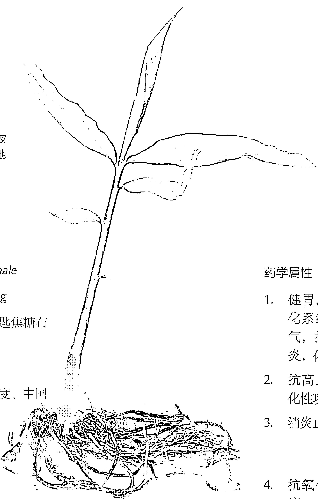

- 学名: Zingiber officinale
- 其他名称: 干姜 / Gan Jiang
- 香气印象: 天菜大厨舀一匙焦糖布丁送进你嘴里
- 植物科属: 姜科姜属
- 主要产地: 斯里兰卡、印度、中国
- 萃取部位: 根 (蒸馏)
- 适用部位: 胃经、本我轮
- 核心成分: 萃油率 1%~3%，76个可辨识化合物(占95%)
- 心灵效益: 接受上苍给的身体，从每个细胞感受生之喜悦

| 药学属性 | 适用症候 |
| :--- | :--- |
| 1. 健胃，补强消化系统，消胀气，抗黏膜发炎，化痰 | 腹胀，食欲不振，消化不良，腹泻，便秘，着凉，感冒，晕车，害喜 |
| 2. 抗高血脂，强化性功能 | 血栓，预防中风，阳萎 |
| 3. 消炎止痛 | 牙痛，腹痛，僵直性脊椎炎，关节炎，肌肉酸痛，风湿病 |
| 4. 抗氧化，抗肿瘤 | 脑瘤，前列腺癌，白血病，肺癌，乳腺癌 |

倍半萜醇 7种：橙花叔醇 0.8% 姜烯醇

单萜烯 20%：樟烯 8% 柠檬烯 3% α-松油萜 2.5%

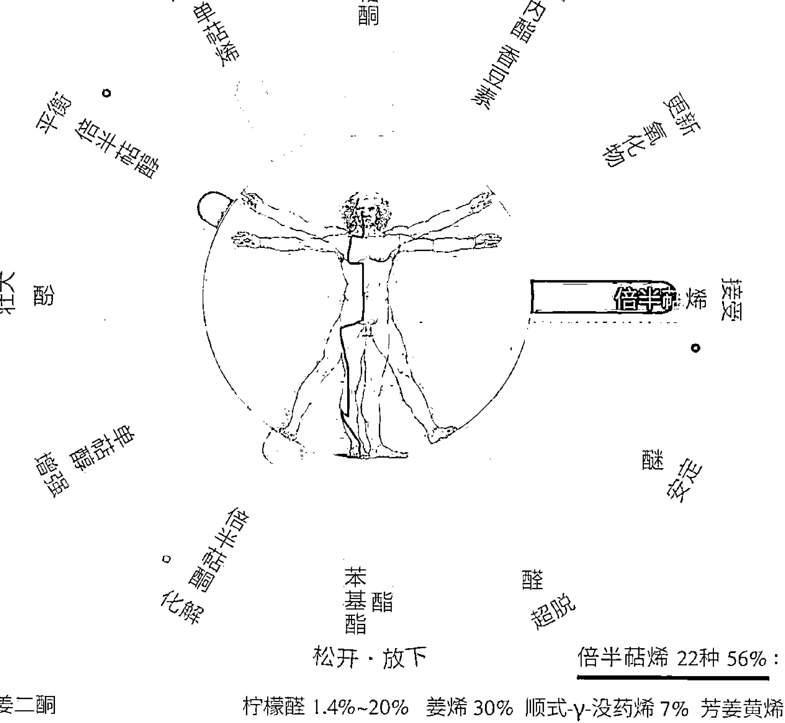

注意事项
1. 姜的精油并不包含姜这种生药的全部活性成分，所以不会刺激皮肤，也没有上火的问题。
2. 超临界萃取的姜油则含有7.53%的6-姜酚(姜辣醇)，能使皮肤发红发热。姜辣醇是中药炮姜的指标成分，可消炎、抗氧化，抑制血小板凝聚和黑色素形成，还能抗胃溃疡与抗肿瘤。

## 醚类 (Ethers)

醚类化合物由一个氧原子连接两个碳基组成，常见于柑橘类果皮冷压精油中，如甜橙、佛手柑。它们通常具有甜美的果香，气味令人愉悦，能帮助放松心情，缓解紧张和焦虑，常用于营造轻松、快乐的氛围。同时，一些醚类也具有一定的止痛和抗痉挛特性。


# 菖蒲 (Calamus)

温带的剑叶水生草本植物，地下的长根茎全年可采，但以8~9月品质最佳。可见于海拔2600米以下的沼泽湿地或湖泊浮岛，适应力强，易于栽种。

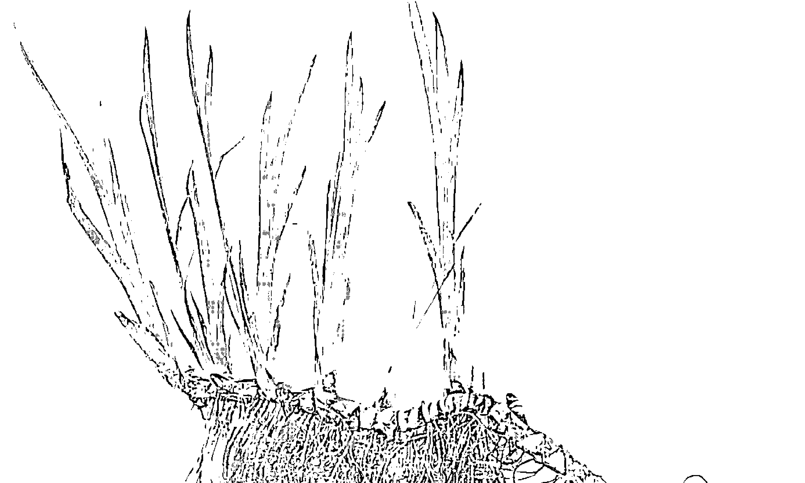

- 学名: Acorus calamus
- 其他名称: 白菖 / Sweet Flag
- 香气印象: 惊蛰过后下的第一场雨
- 植物科属: 菖蒲科菖蒲属
- 主要产地: 尼泊尔、印度、中国
- 萃取部位: 根部 (蒸馏)
- 适用部位: 胃经、本我轮
- 核心成分: 萃油率 1.0%~2.4%，25个可辨识化合物 (占84%~95%)

药学属性
1. 保护神经 (抗丙烯酰胺与中脑缺血导致的神经毒性)，抗氧化
2. 防虫 (扁虱、谷粉茶蛀虫、蚜虫、红蜘蛛等)，抗痉挛，消炎 (针对肠胃与肾脏)，健胃
3. 抗脂肪生成，减少脂肪堆积，减慢心房颤动，健脾利湿，抗肿瘤 (促使癌细胞凋亡)
4. 抗沮丧，减轻压力

适用症候
- 中风导致瘫痪，神经衰弱，癫痫
- 湿热环境，咳嗽，牙痛，腹泻腹胀，毒物引发的肾病，胃炎
- 肥胖，心律不齐，痈肿毒疮，胃癌，直肠癌，肝癌
- 失眠，抑郁症，惊吓，歇斯底里，健忘，神志不清

心灵效益: 安定被潮流刺激的胃口，只取需要的一瓢饮

注意事项
1. 根据长期大量喂食小鼠的实验结果，美国FDA从1968年起禁止菖蒲萃取物 (如精油) 用作食品添加物，β-细辛脑也被禁止用于制药，菖蒲被贴上“致癌”的标签。然而90年后，新的科学研究指出，β-细辛脑并无肝毒性，也不会直接致癌。千禧年后，则有更多研究指出 β-细辛脑具有显著的抗癌作用。
2. 孕妇及婴幼儿最好避免使用。

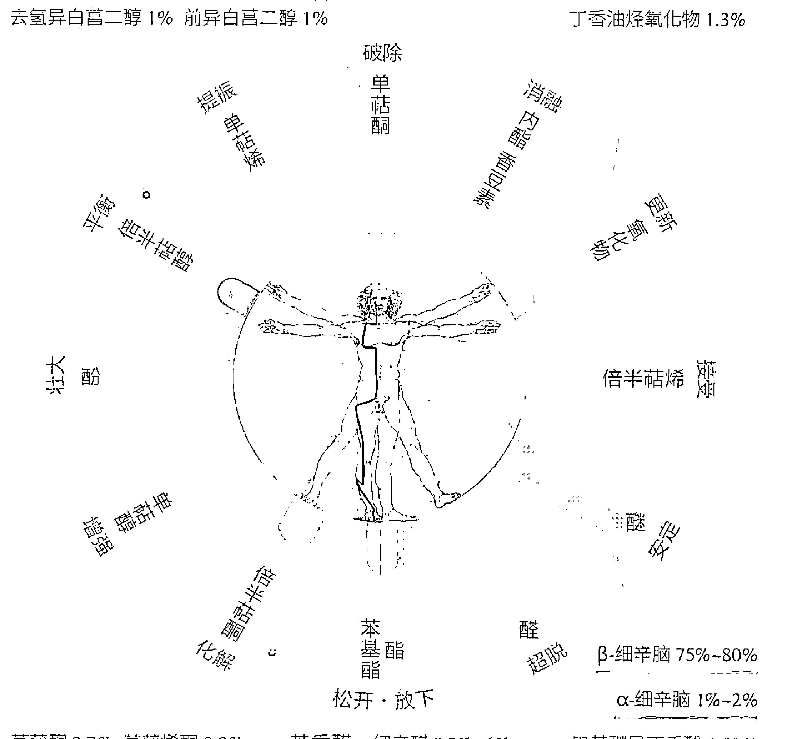

# 龙艾 (Tarragon)

相应于各种空间条件，生长样态变化很大，最重要的是土壤必须排水良好。夏季不宜湿热，冬季最好休眠。俄罗斯龙艾比法国龙艾粗壮，但气味淡薄。

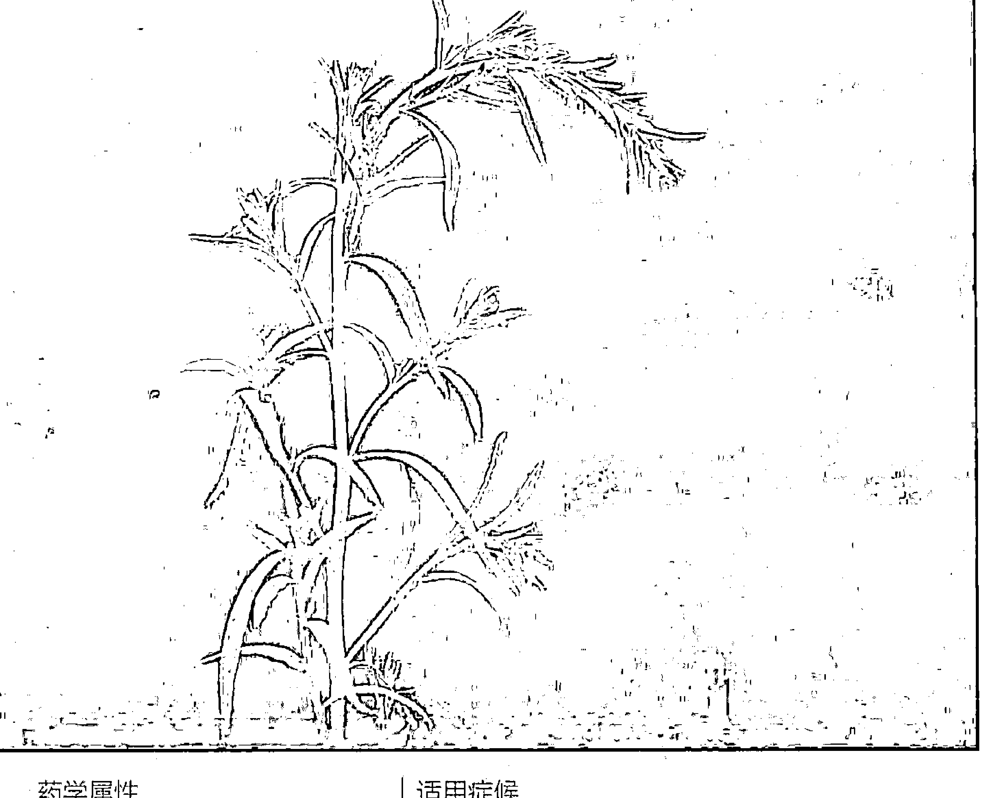

药学属性
1. 抗肌肉痉挛，止痛，强肝利胆
2. 消炎，消水肿（药物或免疫反应引起者），抗过敏
3. 镇静
4. 抗感染，抗病毒，抗菌，抗白色念珠菌，抗发酵

适用症候
- 打嗝不止，脚抽筋，痛经、经前小腹沉重，百日咳，反复发作的右上腹疼痛
- 神经炎，坐骨神经痛，气喘
- 神经质，幽闭恐惧
- 热带毒素感染的结肠发炎绞痛，细菌性肠炎，放屁不止

| 项目 | 内容 |
| :--- | :--- |
| 学 名 | Artemisia dracunculus |
| 其他名称 | 龙蒿 / Estragon |
| 香气印象 | 爽朗潇洒的干杯 |
| 植物科属 | 菊科艾属 |
| 主要产地 | 法国、印度、俄罗斯 |
| 萃取部位 | 开花的全株药草（蒸馏） |

柠檬烯 2.8% 顺式β-罗勒烯 1.6% α-松油萜 1.4%
香豆素 : 7-甲氧基香豆素 0.13%

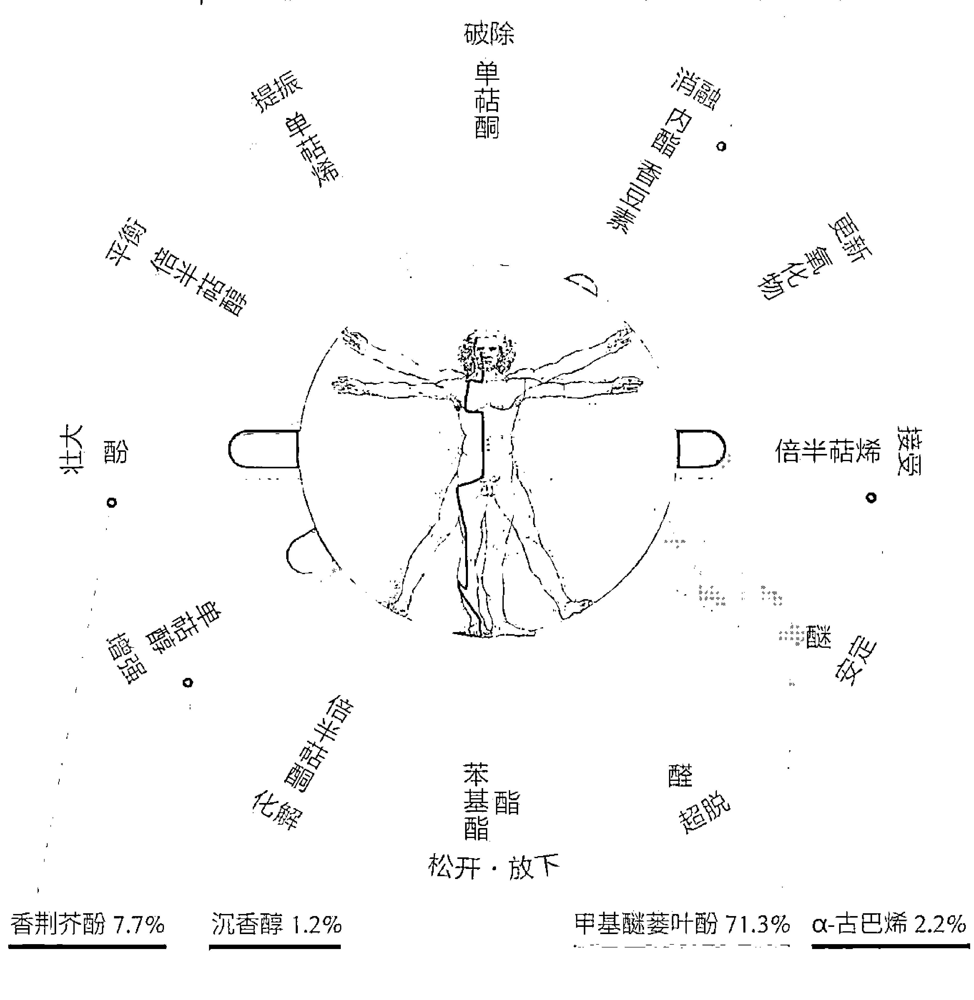

萃油率 0.05%~0.95%，20 个可辨识化合物（占 92.7%）

心灵效益: 安定戒慎恐惧的心，坦然面对错误

注意事项
1. 有六种化学品系：(1) 甲基醚蒌叶酚，(2) 甲基醚丁香酚，(3) α-萜品烯，(4) 茴陈烯炔，(5) 5-苯基-1,3-戊二炔，(6) 罗勒烯，成分比例差异也很大。
2. 甲基醚蒌叶酚和甲基醚丁香酚一方面有多重疗效，另一方面在长期过量的情况下也可能提高肝脏致癌的风险。但两者本身并不会直接致癌，而是不稳定的分子状态加上自由基作用后的代谢结果。

# 茴香 (Fennel)

原生于地中海，现在除了沙漠，只要是空旷无遮阴与日照强之处都能茁壮生长。野生时最爱海岸边的干燥土地，适应各地的栽培种则比较爱水多娇。

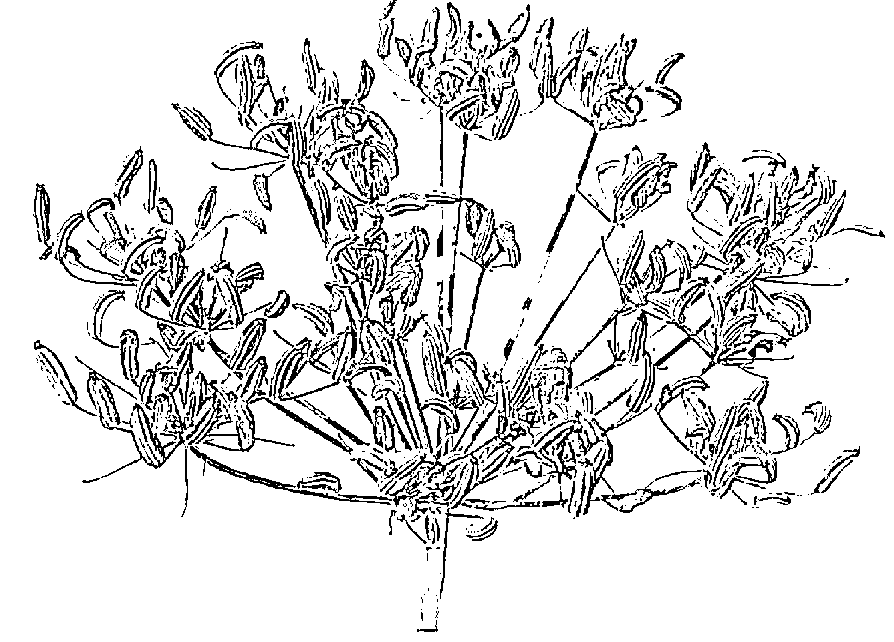

| 项目 | 内容 |
| :--- | :--- |
| 学　名 | Foeniculum vulgare |
| 其他名称 | 甜茴香 / Sweet Fennel |
| 香气印象 | 织锦华美、色彩绚丽的低胸晚礼服 |
| 植物科属 | 伞形科茴香属 |
| 主要产地 | 法国、埃及、匈牙利、摩尔多瓦 |
| 萃取部位 | 果实（蒸馏） |
| 适用部位 | 胃经、本我轮 |
| 核心成分 | 萃油率 1.1%~2.9%，14 个可辨识化合物（占 99.7%） |
| 心灵效益 | 安定脆弱敏感的心，拉长战线不放弃 |

| 药学属性 | 适用症候 |
| :--- | :--- |
| 1. 温和的类雌激素作用，通经，助产，催乳 | 月经不至与流量过少，经期紊乱，痛经，更年期问题 |
| 2. 抗肌肉痉挛，略带麻醉性，精神活性，止痛，抗肿瘤 | 瘫痪，腰痛，痉挛体质，乳腺癌，子宫颈癌 |
| 3. 消胀气，健胃，促进消化液分泌，利胆，增进胆汁分泌 | 消化不良，胃痛，肠绞痛，吞气，胀气，消化道寄生虫病 |
| 4. 微量可激励补身，强化心血管与呼吸道，抗菌，驱虫 | 心悸，心脏疼痛，神经性呼吸困难，气喘，气喘性支气管炎，肺部充血 |

| 成分 | 比例 |
| :--- | :--- |
| 柠檬烯 | 1.8%~18% |
| α-松油萜 | 1.8%~4.8% |
| 茴香酮 | 2%~13% |
| 香豆素与呋喃香豆素 | 微量 |
| 1,8-桉油醇 | 4.29% |

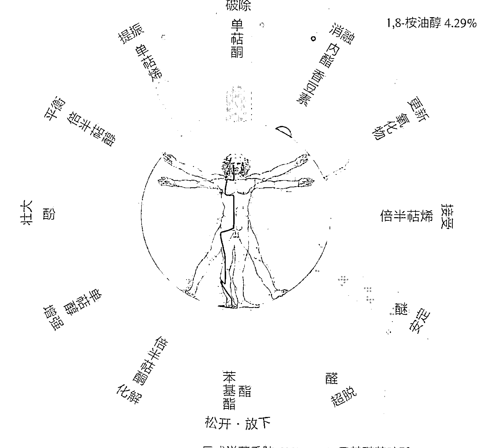

注意事项
1. 孕妇与婴幼儿应避免使用，过量可能使人昏沉、刺激皮肤。
2. 有四种化学品系：洋茴香脑型，洋茴香脑/茴香酮型，洋茴香脑/甲基醚蒌叶酚型，甲基醚蒌叶酚型。本篇所述是洋茴香脑型。
3. 洋茴香脑会在储存期快速流失，所以应购买当季生产者并尽快用完。
4. 多项研究澄清反式洋茴香脑的致癌性极低，毒性高的是顺式洋茴香脑。此外，对小鼠产生的肝毒性不会伤害正常使用的人类。

| 成分 | 比例 |
| :--- | :--- |
| 反式洋茴香脑 | 60%~77% |
| 甲基醚蒌叶酚 | 2.5%~8.28% |

# 金叶茶树 (Black Tea-Tree)

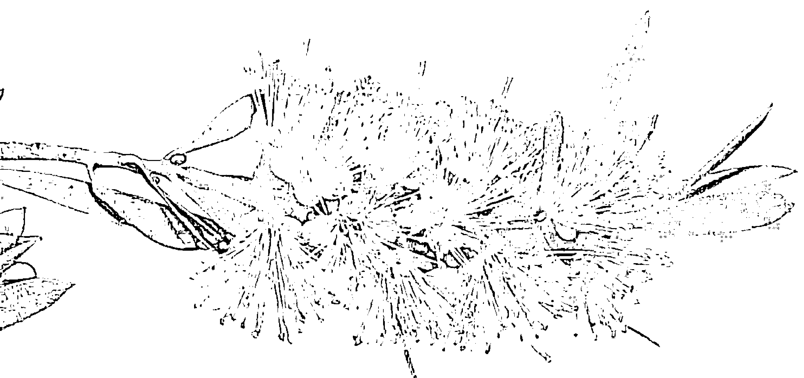

原生于澳大利亚北部海岸，现为白千层属分布最广的品种之一，内陆近海都有。高5~8米的小树，开花时节，椭圆的花穗满树喷发，因此被称为白云。

药学属性
1. 抗肌肉痉挛，止痛
2. 抗氧化(活化过氧化物双效酶和过氧化氢酶)，消炎，抗肿瘤
3. 镇静
4. 促进胰岛素分泌

适用症候
- 网球肘，运动伤害
- 缺血性脑损伤(中风过后)，乳腺癌
- 报告或上台焦虑，人群恐慌症
- Ⅱ型糖尿病的症状(视力模糊、皮肤瘙痒、周围神经病变等)

| 名称 | 内容 |
| :--- | :--- |
| 学名 | Melaleuca bracteata |
| 其他名称 | 白云茶树 / White Cloud Tree |
| 香气印象 | 千锤百炼的醇厚嗓音 |
| 植物科属 | 桃金娘科白千层属 |
| 主要产地 | 澳大利亚 |
| 萃取部位 | 叶片(蒸馏) |
| 适用部位 | 胃经、本我轮 |
| 核心功效 | 萃油率 0.42%，22个可辨识化合物(占 92.09%) |
| 心灵效益 | 安定社交被排挤的挫败，勇敢开发自己的同温层 |

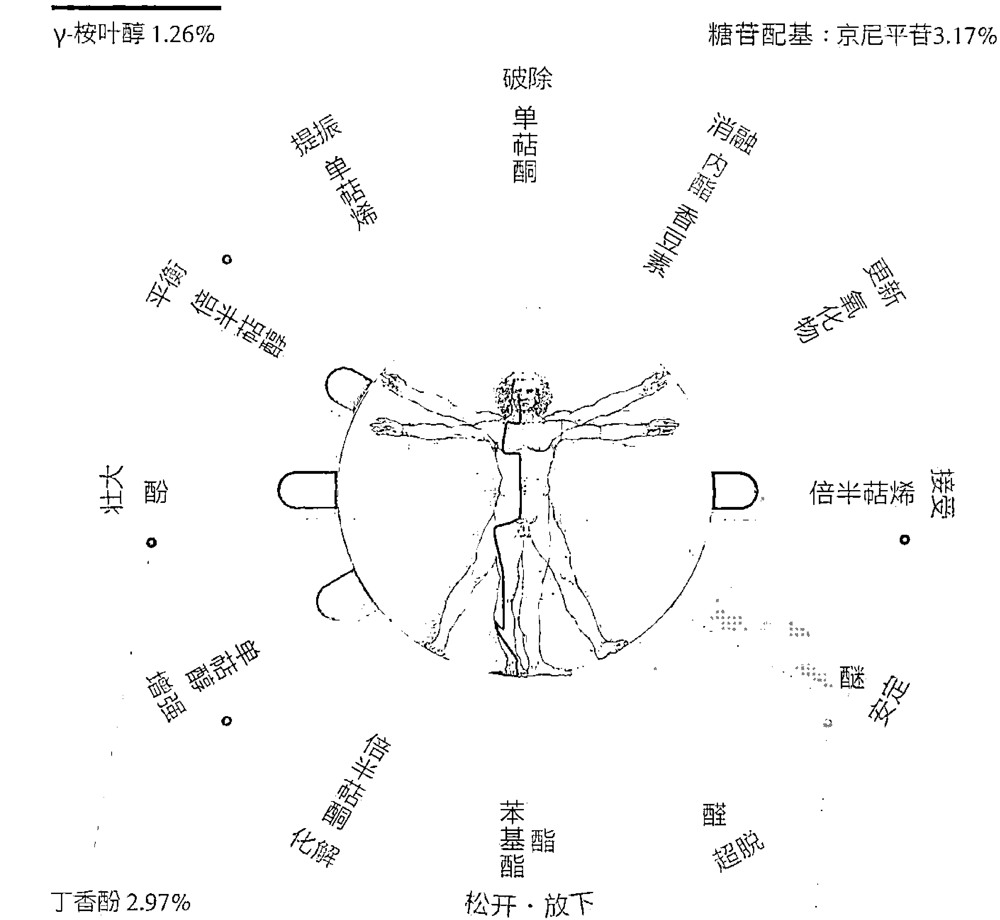

注意事项
1. 有四种化学品系：(1) 甲基醚丁香酚，(2) 反式甲基醚异丁香酚，(3) 榄香素，(4) 反式异榄香素。
2. 2002年的一项研究指出，超出人类正常摄取量百倍至千倍的甲基醚丁香酚，也不会令小鼠致癌。
3. 孕妇与婴幼儿最好避免使用。

γ-桉叶醇 1.26%
糖苷配基：京尼平苷3.17%

破除 - 单萜酮
提振 - 单萜烯
消融 - 内酯 萜烯酯
平衡 - 倍半萜烯
更新 - 氧化物
振奋 - 倍半萜烯
大 - 酚
温暖 - 酚类酯类
醚 - 安定
化解 - 酮半萜烯
苯基酯 - 酯 松开·放下
醛 - 超脱

丁香酚 2.97%
香荆芥酚 1.2%
萜品烯-4-醇 1.8%
十一醛 1.07%
甲基醚丁香酚 81.04%
丁香油烃 1.39%

# 鳞皮茶树 (Scalebark Tea-Tree)

原生于澳大利亚昆士兰东南的黑土平原，也适应树林与灌木丛的粘质壤土。和其他白千层属不同之处是，其粗硬树皮块状剥落，叶片尖刺而叶脉少。

| 项目 | 内容 |
| :--- | :--- |
| 学 名 | Melaleuca squamophloia |
| 其他名称 | 刺叶茶树 / Prickly-leafed Tea Tree |
| 香气印象 | 跟着 Funk 音乐动起来 |
| 植物科属 | 桃金娘科白千层属 |
| 主要产地 | 澳大利亚 |
| 萃取部位 | 叶片（蒸馏） |
| 经络归经 | 胃经、本我轮 |
| 化学成分 | 萃油率 0.4% |
| 心灵效益 | 安定局促空间的压迫感，放心自由伸展 |

注意事项
1. 有两种化学品系：(1) 榄香素 96%，(2) 异榄香素 78%。
2. 一般误解榄香素会因抗胆碱而致谵妄，其实是内服肉豆蔻果实所造成，榄香素本身并无抗胆碱作用。动物研究显示榄香素能活化血清素 5-HT2A 受体，但尚无人体实证。榄香素的化学结构接近麦西卡林（一种致幻剂），在人体代谢后则可能致幻。
3. 孕妇与婴幼儿及服用精神药物者避免使用。

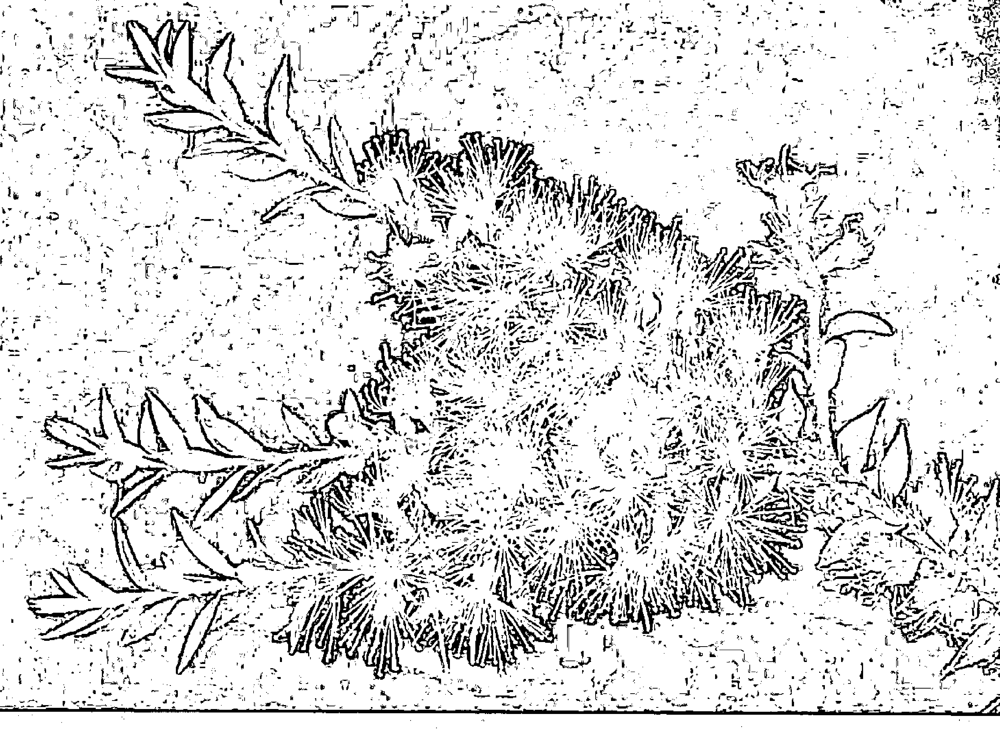

药学属性
1. 抗肌肉痉挛，止痛
2. 抗菌（曲状杆菌），抗霉菌（植物病原真菌），消炎
3. 促精神活性，麻醉
4. 抗过敏（抑制 5-脂氧合酶），抗肿瘤

适用症候
- 坐姿不正确引起的腰背疼痛，久坐或正座引起的膝腿发麻
- 旅行时腹泻，肠胃不适
- 安宁疗护（终末期癌症患者的疼痛管理）
- 环境刺激引发的鼻过敏，乳腺癌

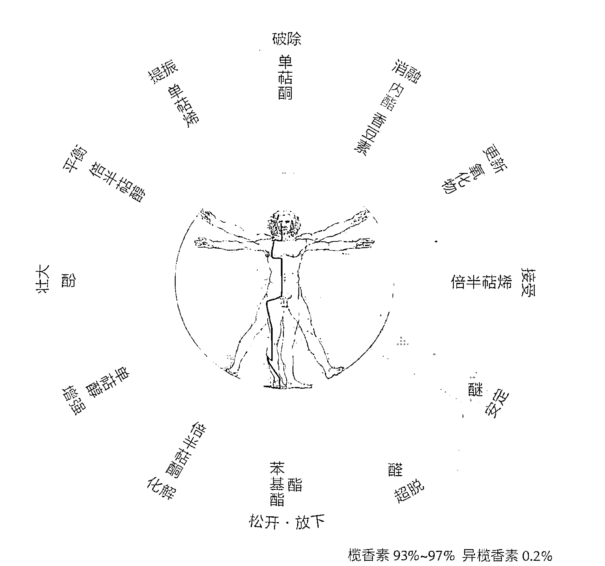

榄香素 93%~97% 异榄香素 0.2%

# 肉豆蔻 (Nutmeg)

原生于终年湿热、火山造成的香料群岛，成长时嫩叶需要遮荫。虽然习惯淋雨，但浅根不能忍耐积水的土壤，因此常长在山坡红土上。

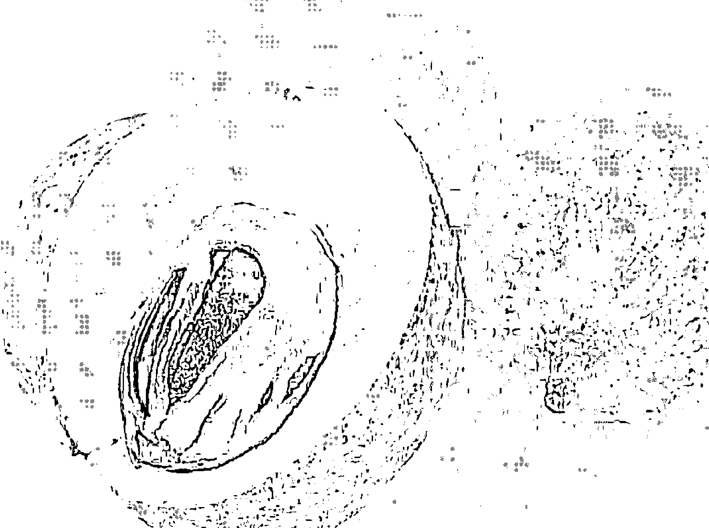

| 项目 | 详情 |
| :--- | :--- |
| 学名 | Myristica fragrans |
| 其他名称 | 肉果 / Myristica |
| 香气印象 | 穿着夹脚拖吃冰的夏夜 |
| 植物科属 | 肉豆蔻科肉豆蔻属 |
| 主要产地 | 印尼、西班牙、格拉纳达、印度、马来西亚 |
| 萃取部位 | 果核（蒸馏） |
| 应用部位 | 肝经、眉心轮 |
| 核心成分 | 萃油率 5.04%~8.91%，40 个可辨识化合物（占 98.63%） |
| 心灵效益 | 安定不甘寂寞的心，十年磨一剑 |

药学属性
1. 抗氧化，提高谷胱甘肽-S-转移酶的作用，抗肿瘤
2. 补身，强化子宫功能（通经、助产），降血压，利神经，抗沮丧
3. 止泻，抗菌，抗寄生虫
4. 消炎，止痛

适用症候
- 肝脏毒素堆积，胃癌，肺癌，乳腺癌，子宫颈癌
- 虚弱无力，分娩困难，血压飙高，睡不安稳，万念俱灰
- 腹泻，胀气，牙周病，消化道寄生虫病
- 风湿性关节炎，扭伤，酸痛疲劳

α-松油萜 19.77% 桧烯 12.23% β-松油萜 14.78% 柠檬烯 5.84%

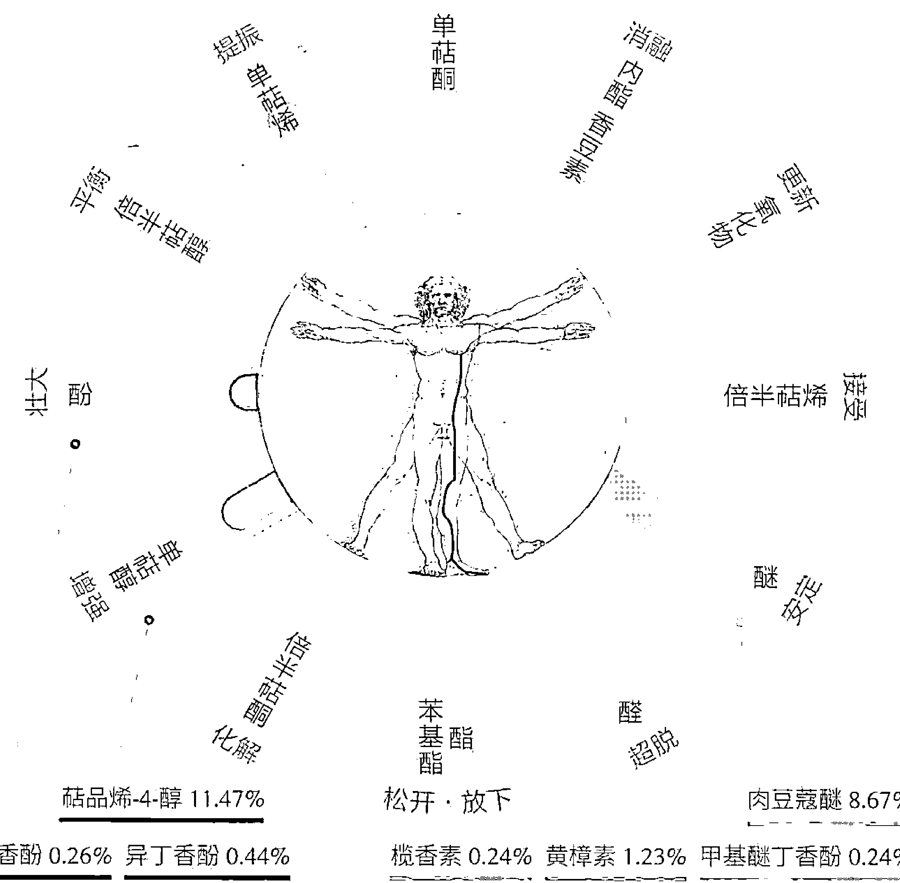

倍半萜烯 - 支撑
共 - 酚

注意事项
1. 服用精神药物者避免使用。
2. 肉豆蔻著名的抗胆碱致谵妄作用，主要来自肉豆蔻脂，这个成分并不存在于肉豆蔻精油中。而肉豆蔻醚、榄香素则要经过人体代谢才会致幻，但精油中含量不高，而且代谢过程有个体差异，人体实验中 60% 对肉豆蔻醚并无致幻反应。
3. 包裹种子的红色种皮也可萃取精油，称作 Nutmeg Mace Oil (肉豆蔻皮精油)。两者的组分接近，但种皮所含的醚类较多，所以气味更活泼，价格也略高一些。

# 粉红莲花 (Lotus, Pink)

在水中生活，根茎长在池塘或河流底部的淤泥上，而荷叶挺出水面。喜好高热高湿的环境，种子保留千年仍可繁殖。

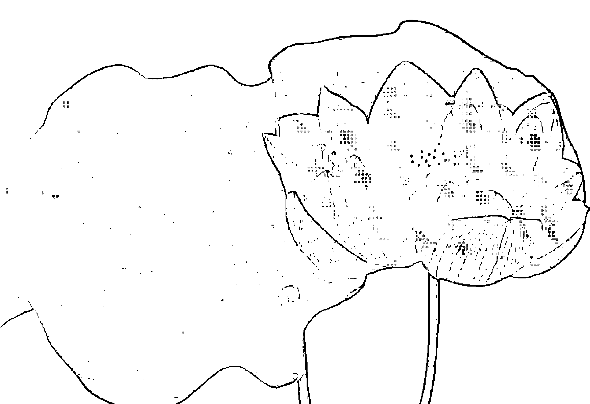

- 学名: Nelumbo nucifera
- 其他名称: 荷花 / Sacred Lotus
- 香气印象: 一艘满载而归的渡轮
- 植物科属: 莲科莲属
- 主要产地: 印度、泰国
- 萃取部位: 花（溶剂萃取）
- 适用部位: 肝经、基底轮
- 核心成分: 萃油率0.016%(精油)，70个可辨识化合物(占75%)
- 心灵效益: 安定前途茫茫之虑，确信未来不虞匮乏

| 药学属性 | 适用症候 |
| :--- | :--- |
| 1. 催眠，镇静 | 焦虑，失眠，过动，易怒 |
| 2. 活化大脑的鸦片受体，止痛 | 早泄，腹部痉挛，阴道分泌物带血，性交疼痛 |
| 3. 活血止血，清心解热毒 | 腹泻，霍乱，发烧，中暑，多尿，肝病 |
| 4. 修护发肤，消炎，抗老化 | 疱疹，湿毒，脂溢性皮炎导致的脱发，皮肤松垮，麦粒肿，微血管扩张 |

> * 印度教用来供养女神 Lakshmi 以祈求源源不绝的爱与富足

注意事项
1. 蒸馏所得的粉红莲花精油以脂肪酸酯为主，如棕榈酸甲酯22.66%、亚油酸甲酯11.16%，特殊作用是启动酪氨酸酶，调节黑色素数量，减少白发，增深发色。
2. 金莲花 (Lotus, Gold) 的学名是墨西哥黄金莲 (Nymphaea mexicana)，属于睡莲。香气主轴是6,9-十七碳二烯、十五烷、苯甲醇。色泽较淡，气味较轻快。
3. 蓝莲花 (Lotus, Blue) 也是一种睡莲，学名叫埃及蓝睡莲 (Nymphaea caerulea)。组分包括三羟基戊酸、p-香豆酸、β-谷固醇，是古埃及的神圣植物，有安抚神经与抗氧化的作用。气味在三者中最优美。

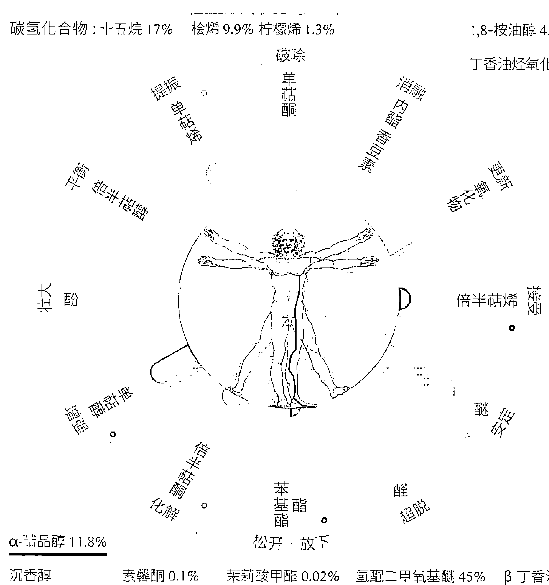

- α-萜品醇 11.8%
- 沉香醇
- 素馨酮 0.1%
- 茉莉酸甲酯 0.02%
- 氢醌二甲氧基醚 45%
- β-丁香油烃

# 热带罗勒 (Tropical Basil)

原生于印度东北部，需要大量的水分和充足的阳光，还要定期施肥。成株以后要时常摘心，以促进新叶生长。

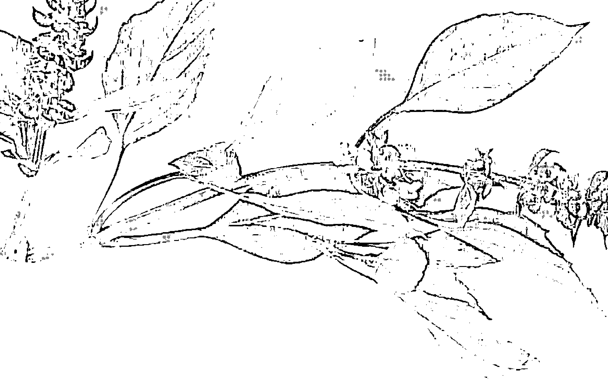

| 项目 | 内容 |
| :--- | :--- |
| 学 名 | Ocimum basilicum, CT methyl chavicol |
| 其他名称 | 九层塔 / Exotic Basil |
| 香气印象 | 宽领花衬衫配上白短裤 |
| 植物科属 | 唇形科罗勒属 |
| 主要产地 | 科摩罗岛、泰国、马达加斯加 |
| 萃取部位 | 开花的全株药草 (蒸馏) |
| 适用部位 | 肝经、本我轮 |
| 核心成分 | 萃油率 0.15%，36 个可辨识化合物 (占 74%~87%) |
| 心灵效益 | 安定动辄得咎的惶恐，平和接收不同意见 |

药学属性
1. 强力抗痉挛，调节神经（作用于延髓及交感神经）
2. 强力抗病毒，抗菌（葡萄球菌、肺炎双球菌），抗感染，强肝
3. 消炎：因感染引起者，止痛
4. 解除静脉阻塞症状，解除前列腺充血症状

适用症候
- 痉挛体质，神经系统功能紊乱，激动，焦虑，沮丧，疲累虚弱（脑神经衰弱或大病一场之后）
- 甲型与乙型肝炎，肠胃蠕动不畅，黄热病，吞气症，胃炎，胰脏功能低下，尿道感染，肝癌
- 病毒感染导致的脑炎与神经炎，多发性硬化症，脊髓灰质炎，风湿性关节炎
- 静脉循环不良，静脉曲张，前列腺炎

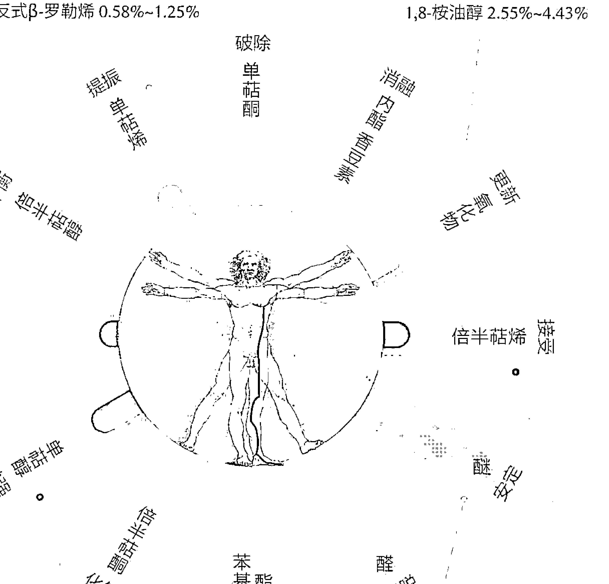

注意事项
1. 台湾九层塔分红茎和绿茎，萃油率约 1%，甲基醚蒌叶酚占 63%，1,8-桉油醇 6.7%，沉香醇 6.6%，另含有 16 种倍半萜烯 7%。因为醚类比例较低，气味比其他地区多了些绿叶感。
2. 甲基醚蒌叶酚的安全性请参考“龙艾”。

## 露兜花
Kewra

海岸植物，成丛聚生于海岸林最前线，耐盐耐湿，防风定沙。原产于太平洋热带地区海岸及岛屿。雄花淡黄白色，有苞片保护，香气浓烈。

- 学名: Pandanus odoratissimus / P odorifer
- 其他名称: 林投 / Screw-pine
- 香气印象: 棕榈树下的草裙舞
- 植物科属: 露兜树科露兜树属
- 主要产地: 印度
- 萃取部位: 花（蒸馏）
- 运用部位: 肝经、本我轮
- 核心成分: 萃油率 0.024%，85 个可辨识化合物（占 98.7%）
- 心灵效益: 安定如坐针毡之感，露出轻松的笑容

| 药学属性 | 适用症候 |
|----------|----------|
| 1. 抗痉挛，安胎（微量） | 耳痛，头痛，风湿痛，关节炎，高危险妊娠 |
| 2. 强心 | 血液黏浊，心悸 |
| 3. 调节新陈代谢与消化问题，排毒净化 | 摄食过多烤炸或腌渍食物，病毒感染导致的发热与肌肉疼痛 |
| 4. 激励神经系统，调节血清素的分泌 | 虚弱，眩晕，冷淡无感 |

- 有些露兜油含一倍多的苯乙醇和减半的甲基苯乙基醚，芳香醛和苯甲酸苄酯的比例也较多，是重建或合成的结果。
- 露兜花在蒸馏时极易溶于水（0.2%），所以纯露中含精油比例较高。

## 皱叶欧芹
Garden Parsley

需要肥沃湿润不积水的土壤，只需要半日照的阳光，太干燥叶片会变黄，与玫瑰一起栽种时，能使玫瑰生长旺盛、香气浓郁。

药学属性
1. 抗癫痫
2. 抗痉挛
3. 利尿，抗肝毒性
4. 通经，抗氧化，抗肿瘤

适用症候
癫痫，神经系统困扰，耳鸣
肠痉挛，肠炎
肾功能不佳，肾结石，膀胱结石，食物中毒，酒精中毒
月经不至，经血量少，乳腺癌

| 项目 | 内容 |
| :--- | :--- |
| 学 名 | Petroselinum crispum |
| 其他名称 | 英国香芹 / English Parsley |
| 香气印象 | 穿苏格兰裙吹风笛的男人 |
| 植物料属 | 伞形科欧芹属 |
| 主要产地 | 爱沙尼亚、奥地利 |
| 萃取部位 | 全株（蒸馏） |
| 身心对应 | 肝经、本我轮 |
| 化学属性 | 萃油率 0.29%，34个可辨识化合物（占96.61%） |
| 心灵效益 | 安定成名的渴望，守住真诚的信仰 |

注意事项
1. 孕妇与婴幼儿，以及服用精神药物者避免使用。
2. 各地栽培种的成分差异很大，市场常见以单萜烯为主者（1,3,8-对-薄荷三烯48%，β-水茴香萜29%）；肉豆蔻醚仅占6.5%。这种皱叶欧芹的气味明显较平叶欧芹清淡，也不会因为氧化而变得黏稠。

## 平叶欧芹
Parsley

根群分布浅，地表易产生白色细根。茎为短缩根茎，矮性植物。要求冷凉的气候和湿润的环境。生长适温为15°C~20°C，耐寒力相当强。

- 学名：Petroselinum sativum
- 其他名称：意大利扁叶香芹 / Plain Leaf Parsley
- 香气印象：分子料理奇异的摆盘
- 植物科属：伞形科欧芹属
- 主要产地：保加利亚、埃及、匈牙利
- 萃取部位：全株 (蒸馏)
- 适用部位：肝经、本我轮
- 核心成分：萃油率0.1%~0.7%，17个可辨识化合物 (占96.94%)
- 心灵效益：安定三心两意，不惧冷门、不畏流言

| 药学属性 | 适用症候 |
| :--- | :--- |
| 1. 强化神经 (激励作用) | 意志力薄弱，难以抗拒诱惑 |
| 2. 强化肌肉，保护子宫，通经 | 泌尿生殖道感染，尿道炎，白带，月经不至，少经 |
| 3. 抗病毒 (HSV-1)，养肝 (抑制巨噬细胞分泌 TNF-α)，抗肿瘤 | 疱疹，长期服用药物者，过量接触化学制剂者，子宫颈癌，人类神经母细胞瘤 |
| 4. 促进消化道血液循环，祛痰，杀螨剂，抗疟原虫 | 消化障碍，气喘，屋尘螨引起的过敏，疟疾 |

α-松油萜 16.1%
β-松油萜 11.1%
丁香油烃氧化物 0.14%
沉香醇氧化物 0.24%
β-丁香油烃 2.68%

注意事项：
1. 孕妇与婴幼儿不可使用，芹菜脑可能引发流产。服用精神药物者也应避免使用。
2. 保存时间长 (氧化) 会变黏稠，过量可能刺激皮肤。
3. 种子和根部精油所含的芹菜脑，都是叶片的三倍。种子萃取的精油也有抗肿瘤 (乳腺癌) 作用。

## 洋茴香
Anise

原生于地中海东部与亚洲西部，喜欢肥沃的土壤与全日照，但气温不能过高。种子保存多年仍能发芽，中东以外地区气味最浓郁的洋茴香来自希腊和匈牙利。

- **学 名**: Pimpinella anisum
- **其他名称**: 大茴香 / Aniseed
- **香气印象**: 妈妈对摇篮里的宝宝哼儿歌
- **植物科属**: 伞形科茴芹属
- **主要产地**: 埃及、伊朗、印度
- **萃取部位**: 果实（蒸馏）
- **适用部位**: 胃经、本我轮
- **化学概要**: 萃油率 1%~5%，21 个可辨识化合物（占 96.3~99.6%）
- **心灵效益**: 安定瞻前顾后的心，专注于直觉选定的方向

### 药学属性

1. 催乳，温和的类雌激素作用，通经，助产
2. 抗痉挛，局部止痛，麻醉，抗抑郁
3. 消胀气，健胃，轻泻，利尿，降血糖，降血脂，洁牙
4. 促进呼吸道分泌，祛痰，发汗，抗病毒，抗肿瘤生成

### 适用症候

1. 奶水不足，少经，绝经，体毛过多，痛经，更年期脸潮红
2. 重症病患的吗啡依赖，癫痫，梦魇，偏头痛
3. 打嗝，胃溃疡，消化不良，便秘，糖尿病，烟草与茶造成的齿色暗黄
4. 上呼吸道多痰，受寒，单纯疱疹 I 与 II 型，麻疹，乳腺癌，子宫颈癌

### 注意事项

1. 孕妇与婴幼儿应避免使用，过量可能使人昏沉、刺激皮肤。
2. 五味子科八角属的八角茴香 (Illicium verum) 和洋茴香成分接近，作用也相似，主产地是中国和越南。萃油率更高 (5%~9%)，反式洋茴香脑约占 88%，特有成分是环戊烯基呋喃。
3. 三种茴香的真正差异在于微量成分，微量成分也能够平衡高量茴香脑的潜在副作用。以女性特质比喻香气的话，茴香娇甜 (25岁)，洋茴香婉约 (35岁)，八角茴香妩媚 (45岁)。

## 西部黄松
### Western Yellow Pine

北美洲分布最广的一种松树，宽阔伟岸，高达 82 米。常见于中海拔山区，愈往西部（加州）气味愈浓，已成功引种至南美安第斯山区。

| 学名 | Pinus ponderosa |
| :--- | :--- |
| 其他名称 | 庞德罗莎松 / Ponderosa Pine |
| 香气印象 | 英国贵族在林间骑马猎狐 |
| 植物科属 | 松科松属 |
| 主要产地 | 阿根廷、美国 |
| 萃取部位 | 针叶（蒸馏） |

| 药学属性 | 适用症候 |
| :--- | :--- |
| 1. 抗 MRSA，抗白色念珠菌，抗感染 | 长期住院的病患，长期使用抗生素的病患，足癣 |
| 2. 抗痉挛，局部止痛 | 多发性硬化症，风湿性关节炎，膝盖酸软 |
| 3. 抗黏膜发炎 | 鼻窦炎，呼吸道敏感易咳 |
| 4. 促进肾上腺分泌，抗压力，抗抑郁 | 过劳，心力交瘁，久病厌世 |

适用部位 肾经、基底轮

核心成分
萃油率 0.3%~0.6%，52 个可辨识化合物

心灵效益 安定害怕失去的心，优雅地确认自己的存在

### 注意事项
1. 空气污染会使西部黄松的醚含量大幅下降，但单萜烯则不受影响。

## 罗文莎叶
Ravensara

马达加斯加原生种，分布于东部热带雨林内的低海拔山地或海岸。生长受湿度影响最大，相对干区比湿区的树小叶少而油点多，气味也较浓。

| 项目 | 内容 |
| :--- | :--- |
| 学名 | Ravensara aromatica |
| 其他名称 | 哈佛梭 / Havozo |
| 香气印象 | 一个人啜饮麦根沙士听黑胶唱片 |
| 植物科属 | 樟科罗文莎叶属 |
| 主要产地 | 马达加斯加、科摩罗岛 |
| 萃取部位 | 树皮 (蒸馏) |
| 适用部位 | 胃经、心轮 |
| 核心成分 | 萃油率 1%~2.3%，24 个可辨识化合物 |
| 心灵效益 | 安定震裂破碎的心，慢慢回复人的温度 |

药学属性
1. 消胀气，健胃，消炎，驱虫，强肝
2. 激励补身，强化心血管与呼吸道
3. 抗病毒，抗菌，抗感染
4. 温和的类雌激素作用，抗肌肉痉挛，止痛

适用症候
1. 胃痛，肠绞痛，吞气症，肝炎，胃炎，黄热病，寄生虫病，肝癌
2. 慢性疲劳综合征，心悸，心脏疼痛，气喘，肺部充血
3. 病毒感染导致的脑炎与神经炎，多发性硬化症，风湿性关节炎
4. 月经不至，痛经，抽筋，腰酸背痛

注意事项
1. 过去称作罗文莎叶的精油现已被正名为桉油醇樟，是樟树的一个化学品系，成分以桉油醇为主。
2. 真正的罗文莎叶 (叶片) 有四个化学品系，分别是甲基醚蒌叶酚型、甲基醚丁香酚型、萜品烯型、桧烯型。商品标示为 Ravensara aromatica 的叶油，通常是第三型 (单萜烯 75%，醚类 2.5%~7%)。
3. 本品的商品名常被标示为 Ravensara anisata，其实与 Ravensara aromatica 同义，并非不同品种。虽然罗文莎叶从叶片可分为四个品系，但树皮一致以甲基醚蒌叶酚为主。

桧烯 1.9% 柠檬烯 5.6% 萜品烯 0.7%
沉香醇氧化物 1.3%~6.7% 香树烯 2.4%
萜品烯-4-醇 1.4%
甲基醚蒌叶酚 61%~82% 反式洋茴香脑 7.3%~20%

## 防风
Fang Feng

生态分布区域较广，从深山峡谷、干旱草原到低湿草甸均有生长。但在土质疏松、排水良好的沙岗缓丘成长者质量最好。植株可防风固沙。

- 学名 | Saposhnikovia divaricata
- 其他名称 | 茴草 / Siler
- 香气印象 | 小王子在自己的星球上照顾玫瑰
- 植物科属 | 伞形科防风属
- 主要产地 | 中国（河北、内蒙古、黑龙江、云南）
- 萃取部位 | 根部（蒸馏）
- 适用部位 | 膀胱经、本我轮
- 核心成分 | 萃油率0.21%，24~56个可辨识化合物
- 心灵效益 | 安定不断膨胀的野心，体会自给自足的乐趣

### 药学属性

1. 消炎，抗敏
2. 排砷，抑制肝脏脂质过氧化
3. 镇静，止痛，保护神经细胞，发汗
4. 抗肿瘤，抗氧化

### 适用症候

- 延迟性过敏反应，移植物排斥
- 食物中毒，农药中毒
- 风湿，风邪引起的头痛、全身骨节酸痛、四肢痉挛
- 胰腺癌

匙叶桉油烯醇0.46%~5.93% | 聚乙炔: 人参醇21%~60% | 没药烯3%
脂肪族化合物: 辛醛4% 庚醛2% 王醛2% | 肉豆蔻醚0.15%~29% 芹菜脑0~25%

注意事项
1. 因地域与萃取方法不同（如浸泡法或蒸馏法），精油成分与比例会有很大的差异。
2. 无法确定醚类含量高低时，孕妇及婴幼儿最好避免使用。
3. 中医认为防风属辛温发散之品，血虚发痉及阴虚火旺忌用。

## 甜万寿菊
Sweetscented Marigold

原生于中美洲，多见于干燥的岩质边坡或林地。需要全日照，无法生长在蔽阴处，也不能忍受积水的土壤。

| 药学属性 | 适用症候 |
| :--- | :--- |
| 1. 消胀气，健胃整肠，驱虫（蛔虫、蠕虫、梨形鞭毛虫、阿米巴原虫、疟原虫） | 1. 吞气症，腹泻，肠绞痛，黄热病，各种寄生虫病 |
| 2. 激励补身，强化心血管与呼吸道 | 2. 倦怠感，心悸，心脏疼痛，气喘，着凉感冒 |
| 3. 抗菌，抗霉菌，抗氧化 | 3. 长期卧床与慢性病患的反复感染 |
| 4. 抗焦虑，轻微的迷幻作用，抗肌肉痉挛，止痛 | 4. 手术前，经常紧绷的肩颈，风湿痛 |

| 项目 | 内容 |
| :--- | :--- |
| 学 名 | Tagetes lucida |
| 其他名称 | 墨西哥龙艾/Mexican Tarragon |
| 香气印象 | 荡秋千的小女孩不停哼着歌 |
| 植物科属 | 菊科万寿菊属 |
| 主要产地 | 哥斯达黎加、危地马拉、墨西哥 |
| 萃取部位 | 叶片（蒸馏） |
| 适用部位 | 胆经、本我轮 |
| 核心成分 | 萃油率0.97%，40个可辨识化合物（占100%） |
| 心灵效益 | 安定令人窒息的紧张感，从夹缝中看见光亮 |

- 丁香酚
- 月桂烯 2.3% 罗勒烯
- 大根老鹳草烯
- β-丁香油烃
- 金合欢烯
- 沉香醇 0.1%
- 甲基醚蒌叶酚 96.8%
- 洋茴香脑
- 甲基醚丁香酚

注意事项
1. 安全性请参考“龙艾”，过量可能使人呆滞。
2. 不同产地的甲基醚蒌叶酚比例如下：哥斯达黎加与古巴97%，匈牙利45%（加上甲基醚丁香酚20%），危地马拉33.9%（加上洋茴香脑23.8%和丁香酚24.3%），墨西哥12%（加上甲基醚丁香酚80%）。

## VII 醛类 Aldehyde

卓越的抗菌抗病毒作用，在芳香分子中足可和酚类分庭抗礼，也跟酚类一样需要控制剂量以免刺激皮肤，但气味则明显宜人许多。防护神经和心血管的优异功效，使它能举重若轻地对抗巨大压力，如过劳、人际纠葛、水土不服、孕期困难等等。醛类极适合用来平衡脾经，调理思虑过度产生的代谢障碍。代表性的柠檬味常现假冒（如以柠檬香茅暗代柠檬马鞭草），有些则直接混掺入合成的柠檬醛。

## 柠檬香桃木
Lemon Myrtle

澳大利亚东南部的特有植物，分布于海岸雨林。本属仅有七个品种，皆有香气。生长缓慢，不耐积水，除了雨季以外，全年皆可采收。

- 学 名: Backhousia citriodora
- 其他名称: 柠檬铁木 / Lemon Ironwood
- 香气印象: 雨过天晴
- 植物科属: 桃金娘科白豪氏属
- 主要产地: 澳大利亚
- 萃取部位: 叶片(蒸馏)
- 适用部位: 脾经、心轮
- 核心成分: 萃油率 1.1%，13 个可辨识化合物（占 97.84%）
- 心灵效益: 超脱平凡的无力感，不再畏缩从众

| 药学属性 | 适用症候 |
| :--- | :--- |
| 1. 抗病毒、抗霉菌、抗菌（澳大利亚本土植物第一名），抗 MRSA，驱蚁，防腐 | 疱疹，艾滋病，足癣，灰指甲，癣，医院、幼儿园与公众场所的卫生防护 |
| 2. 扩张血管，消炎，调节 PPAR-alpha（促进脂肪代谢与维持血糖水平） | 心血管疾病，过重，糖尿病 |
| 3. 保护神经，抗惊厥，降低前列腺素引起的痛觉过敏 | 抑郁症，癫痫，老年痴呆，莫名疼痛 |
| 4. 诱发癌细胞凋亡，抗肿瘤 | 乳腺癌，血液恶性肿瘤 |

氧化物+单萜烯:去氢-1,8-桉油醇 + 月桂烯 0.86% 5-甲基-6-烯-2-酮 0.5%
牻牛儿醇 2.14%
橙花醇+香茅醇 1.15% 柠檬醛 87.19%~96.6% = 橙花醛 + 牻牛儿醛 顺式异柠檬醛 1.53%

注意事项
1. 1895 年德国公司首次蒸馏，1991 年开始商业栽培，属于新兴精油。
2. 健康皮肤的安全剂量为 0.7%，与茶树精油调和可降低刺激性。
3. 柠檬醛的杀菌力 RW 系数为 19.5（比石碳酸高 19.5 倍），只低于百里酚；柠檬香桃木精油杀菌力 RW 系数为 16，高于茶树精油和尤加利精油。

### 泰国青柠叶
Petitgrain Combava

分布于亚洲热带地区，是高1.8~10.7米的多刺灌木。出名的葫芦型双叶和凹凸不平的果皮，都能入菜。

药学属性
1. 消炎，抗风湿
2. 镇静
3. 抗肿瘤，抗氧化
4. 抗呼吸系统细菌感染，止咳，抗牙周病细菌，止血

适用症候
关节炎，风湿病
焦虑，压力，易怒，失眠
子宫颈癌，神经母细胞瘤（儿童），口腔癌，白血病
压抑情绪引发的持续咳嗽（含百日咳），牙周病，牙龈流血

| 项目 | 内容 |
| :--- | :--- |
| 学名 | Citrus hystrix |
| 其他名称 | 箭叶橙 / Swangi |
| 香气印象 | 云山雾罩，偶尔窜出几棵古松的奇幻之境 |
| 植物科属 | 芸香科柑橘属 |
| 主要产地 | 马达加斯加、泰国、印尼 |
| 萃取部位 | 叶片（蒸馏） |
| 适用部位 | 脾经、本我轮 |
| 核心成分 | 萃油率0.58%~0.85%，41个可辨识化合物（占95%） |
| 心灵效益 | 超脱形象的桎梏，不再隐藏真实想法 |

注意事项
1. 新喀里多尼亚产的以萜品烯-4-醇为主成分，几乎不见香茅醚。

### 柠檬叶
Petitgrain Lemon

柑橘属中最不耐寒的作物之一，需要富含有机质的土壤。最好的生长条件是冬无严寒、夏无酷暑、热量充足、雨量充沛、年温差小。

| 项目 | 内容 |
| :--- | :--- |
| 学名 | *Citrus* × *limon* / *Citrus limonum* |
| 其他名称 | 黎檬子叶 / Lemon Leaf |
| 香气印象 | 洗干净的衣服晾在微风中 |
| 植物科属 | 芸香科柑橘属 |
| 主要产地 | 埃及、意大利 |
| 萃取部位 | 叶片（蒸馏） |
| 适用部位 | 脾经、本我轮 |
| 核心成分 | 萃油率 0.6 %，44 个可辨识化合物（占 98.24%） |
| 心灵效益 | 超脱尘世的喧嚣，静定于规律的日常 |

| 药学属性 | 适用症候 |
| :--- | :--- |
| 1. 消炎 | 肠胃炎，血液发炎指数过高 |
| 2. 镇静中枢神经 | 思绪停不下来，烦躁不安，易怒 |
| 3. 抗肿瘤 | 大肠癌，乳腺癌 |
| 4. 止咳，平喘，抑菌，溶解结石 | 密闭空调引起的咳嗽，胆结石 |

柠檬烯 22.8% β-松油萜 5.04%

### 注意事项

- 1. 健康皮肤的安全剂量为 1.2%。

## 柠檬香茅
Lemongrass

原产于南亚与东南亚，现在遍布热带地区甚至温带国家，不耐霜。喜温暖、多湿的全日照环境与排水良好的沙土，可施氮肥，能固土。

| 类别 | 内容 |
| --- | --- |
| 学名 | Cymbopogon citratus |
| 其他名称 | 西印度柠檬香茅 / West Indian Lemon Grass |
| 香气印象 | 环法自行车赛选手飞速下坡 |
| 植物科属 | 禾本科香茅属 |
| 主要产地 | 危地马拉、俄罗斯、马达加斯加 |
| 萃取部位 | 叶片（蒸馏） |
| 适用部位 | 脾经、本我轮 |
| 核心成分 | 萃油率0.66%~0.9%，18个可辨识化合物（占88.41%~99.29%） |
| 心灵效益 | 超脱宿命的束缚，走出自己的一条路 |

- 1. 抗菌，抗霉菌（须发霉菌、絮状表皮癣菌），驱蚊虫家蝇（冈比亚疟蚊、埃及斑蚊）
- 2. 扩张血管，调理消化，抗糖尿，镇静（提高γ-氨基丁酸）
- 3. 强力消炎（抑制iNOS表现和一氧化氮生成），止痛
- 4. 增加谷胱甘肽转移酶，抗肿瘤

- 1. 艾滋病患者的鹅口疮，股癣和足癣，防疟疾和登革热，非洲人类锥虫病（昏睡病）
- 2. 慢性肠胃炎，II型糖尿病，发热，烦躁，受惊
- 3. 动脉炎，肌腱炎，韧带拉伤，腿部酸软无力，肌张力不全，浮肉
- 4. 肝指数过高，二乙基亚硝胺导致的肝损伤（如肝癌），卵巢癌，乳腺癌，肿瘤相关成纤维细胞

- 1. 健康皮肤的安全剂量为0.7%，对成年男性的抗焦虑剂量是0.6ml。
- 2. 若保存不当（透明瓶、温度高、未盖紧）而氧化，便会丧失抗菌功能。
- 3. 东印度柠檬香茅（C. flexuosus）的作用相近、成分相仿（醛含量60%~85%），可抑制大肠癌、白血病、神经母细胞瘤，主要产地为尼泊尔。

### 爪哇香茅
Citronella Java Type

锡兰香茅与爪哇香茅都源自斯里兰卡的玛纳草 (C. confertiflorus)，爪哇香茅是从锡兰香茅中选种而得。锡兰香茅耐干旱，植株强韧，爪哇香茅则偏爱高温多湿。

- **学名**: Cymbopogon winterianus
- **其他名称**: 红香茅 / Serai Wangi
- **香气印象**: 台风来之前下田抢收稻作
- **植物科属**: 禾本科香茅属
- **主要产地**: 印尼、中国大陆、台湾岛、巴西、尼泊尔
- **萃取部位**: 叶片（蒸馏）
- **适用部位**: 脾经、本我轮
- **核心成分**: 萃油率 0.94%，64个可辨识化合物（占97.54%）
- **心灵效益**: 超脱虚拟世界的眩惑，回到土地安生立命

### 注意事项
1. 健康皮肤的安全剂量为18.2%。
2. 锡兰香茅 (C. nardus) 含较多单萜烯 (23.8%)，而香茅醛 (13.3%) 和香茅醇 (6.2%)、牻牛儿醇 (20.9%) 较少，另含龙脑 5.2% 和甲基醚丁香酚 8.42%(爪哇香茅无)，所以气味比爪哇香茅刚强粗硬。香水业与食品业偏爱气味较甜的爪哇香茅精油。

| 药学属性 | 适用症候 |
| :--- | :--- |
| 1. 抗感染，抗菌，抗霉菌(白色念珠菌) | 痉挛性肠炎，感染性肠炎，皮肤念珠菌病 |
| 2. 抗痉挛，抗惊厥 | 骨盆腔疼痛，癫痫，焦虑 |
| 3. 消炎，抗肿瘤 | 风湿，动脉炎，乳腺癌 |
| 4. 空间消毒，杀孑孓，驱蚊驱蟑螂，杀福寿螺，驱积谷害虫(如麦蛾) | 登革热，环境污染，仓储卫生，植物病虫害 |

- 柠檬烯 2.6%~4%
- β-水茴香萜 3.4%
- 酸：香茅酸 0.13%~0.17% 杜松烯 4.8%
- 榄香醇 1.4%~6.65%
- 香茅醇 13.4%~15.7%
- 老牛儿醇 22.1%~25.4%
- 乙酸老牛儿酯 2.87%~4.7%
- 柠檬醛 2.4% 香茅醛 34.8%~36.6%

### 柠檬尤加利
Lemon Eucalyptus

生于低海拔、近海岸的开放树林，一般长在贫瘠或微酸性的土壤上，耐干旱。树皮非常光滑，树身高大挺拔，生长速度极快。

| 药学属性 |
| :--- |
| 1. 抗感染，强力驱蚊，驱虫，杀菌力 RW 系数为 8（比石碳酸高 8 倍） |
| 2. 消炎，抗风湿 |
| 3. 降血压，镇痛，轻微抗痉挛，安抚镇静 |
| 4. 抗肿瘤 |

| 适用症候 |
| :--- |
| 膀胱炎，阴道炎，带状疱疹，登革热，家禽家畜的肠道寄生虫，室内空间消毒 |
| 风湿性关节炎，关节炎（颈背部，指/趾骨炎，网球肘） |
| 高血压，冠状动脉炎，心包炎，烦躁不安 |
| 大肠癌，乳腺癌，肝癌 |

| 项目 | 内容 |
| :--- | :--- |
| 学名 | *Eucalyptus citriodora* |
| 其他名称 | 柠檬桉 / Lemon-scented Gum |
| 香气印象 | 辛亥革命武昌起义的第一枪 |
| 植物科属 | 桃金娘科桉属 |
| 主要产地 | 马达加斯加、澳大利亚、中国、印度 |
| 萃取部位 | 叶片（蒸馏） |

适用部位: 脾经、本我轮
核心成分: 萃油率 1%~2.1%，30 个可辨识化合物（占 97.1%）

心灵效益: 超脱陈腐的观念，自由表现个性

注意事项:
1. 有一种加工过的柠檬尤加利精油被注册为 “Citriodiol”，所含的香茅醛因精制过程而达到 98%，并以孟二醇 (PMD) 的形态存在，防蚊力更强。其他名称如 “富含 PMD 的天然植物萃取” 等，都是同类制品。原本柠檬尤加利在叶片老化时，香茅醛就会自动转化为孟二醇。但无论是否转化成孟二醇，柠檬尤加利精油都是防蚊力最强的精油。

### 史泰格尤加利
Eucalyptus Staigeriana

树皮粗糙的小树，习惯热带雨林气候。生长快速，18个月大的幼树即可采枝萃油。

| 项目 | 内容 |
| :--- | :--- |
| 学名 | Eucalyptus staigeriana |
| 其他名称 | 柠檬铁皮树 / Lemon Ironbark |
| 香气印象 | 夏日午后在树下啜饮酸甜饮料 |
| 植物科属 | 桃金娘科桉属 |
| 主要产地 | 巴西、危地马拉、澳大利亚 |
| 萃取部位 | 叶片（蒸馏） |

- 杀线虫，杀螨虫
- 镇静
- 抗肿瘤
- 抗菌（超过抗生素4倍），抗微生物，抗病毒

- 鞭虫、钩虫、蛲虫、蛔虫及丝虫的感染（如腹泻、膀胱炎等）
- 诸事缠身而焦虑不已，受外界刺激而情绪大起大落
- 乳腺癌，大肠癌
- 潜藏“超级细菌”的雾霾

单萜烯37%：柠檬烯24.78% 水茴香萜3.4%

α-萜品醇10.78% 乙酸牻牛儿酯7.61% 柠檬醛26%~40%

适用部位: 心包经、本我轮
核心成分: 萃油率2.9%~3.4%，29个可辨识化合物
心灵效益: 超脱人情包围，移民自己喜爱的星球

1. 巴西产的史泰格尤加利，柠檬醛含量较高，所以气味比澳大利亚产的甜美。

### 柠檬细籽
Lemon-Scented Teatree

原生于澳大利亚东海岸的硬叶林或雨林，习惯长在沙土或石砾地。高约5米，生长快速耐修剪，雨季时叶片的柠檬醛含量比较高。

药学属性:
1. 镇静
2. 消炎，助消化，驱虫、驱法老按蚊
3. 调节皮脂分泌
4. 杀菌 RW 系数为 15（茶树为 11），抗霉菌（白色念珠菌、烟曲霉菌）

适用症候:
- 焦虑，压力，不安，沮丧，注意力不集中
- 消化不良，肠绞痛，环境脏乱
- 油性面疱皮肤，脂溢性皮炎，背部粉刺，足癣
- 反复感冒，免疫抑制病患防感染（如艾滋病患或接受骨髓移植手术者）

| 项目 | 内容 |
| :--- | :--- |
| 学名 | Leptospermum petersonii / L. citratum |
| 其他名称 | 柠檬茶树 / Lemon Teatree |
| 香气印象 | 鹅黄色的敞篷车驶过加州的沙漠 |
| 植物科属 | 桃金娘科薄子木属 |
| 主要产地 | 澳大利亚、南非、巴西、肯尼亚 |
| 萃取部位 | 叶片（蒸馏） |

适用部位: 心包经、本我轮

核心成分: 萃油率 1.1%，22 个可辨识化合物（占 98.5%）

心灵效益: 超脱保险的路线，敢于想象不合常规的美好

注意事项:
1. 健康皮肤的安全剂量为 0.8%。
2. 等比例调以柑橘类精油（富含柠檬烯）或松科精油（富含松油萜），可平抑醛味并减少皮肤刺激性。

### 柠檬马鞭草
Lemon Verbena

原生于南美洲西部，17世纪末引进欧洲，喜干热，惧寒冷，摄氏零度就会落叶。下午摘采的柠檬醛含量最高，开花时叶片最强韧也最芳香。

学名: Lippia citriodora / Aloysia citriodora

其他名称: 露意莎 / Louisa

香气印象: 蓝天下的帕提农神庙

植物科属: 马鞭草科过江藤属

主要产地: 摩洛哥、埃及、智利、秘鲁、哥伦比亚

萃取部位: 叶片 (蒸馏)

适用部位: 脾经、本我轮

核心成分: 萃油率 0.58%，43个可辨识化合物 (占 95.1%)

心灵效益: 超脱软弱的借口，不再依赖特定事物填补空虚

注意事项:
1. 多数地区的样品并未测出呋喃香豆素，测出者含量也极低，而且柠檬马鞭草的原精确定没有光敏性。但本品因昂贵而普遍出现混掺现象。
2. 欧盟和 IFRA 判定本品可能致敏而禁用于香水用品中，但植物化学专家如罗伯特·杨 (Robert Young) 等皆认为不足以成立。

药学属性:
1. 强效消炎，退热，抗神经痛，抗肿瘤
2. 强效镇静，强化神经
3. 抗氧化，强化性腺 (睾丸、卵巢)，激素样作用 (甲状腺、胰腺)
4. 抗各类感染 (BK 病毒)，助消化，强化胆囊和胰脏脾脏，消解结石，促进代谢

适用症候:
- 干癣 (牛皮癣)，气喘 (预防发作)，眼力衰退，多发性硬化症，风湿，皮肤癌
- 抑郁症，失眠，焦虑，压力，神经疲劳
- 冠状动脉炎，心跳过速，心脏无力，高血压，霍奇金淋巴瘤，疟疾
- 克罗恩病，痢疾，胆囊炎，糖尿病，大肠杆菌型膀胱炎，结石，啤酒肚

匙叶桉油烯醇 3.1% 柠檬烯 17.7% 呋喃香豆素 0~微量 α-姜黄烯 2.5%

反式菊烯醇 1%

柠檬醛 48.6% = 牻牛儿醛 26.8% + 橙花醛 21.8%

### 山鸡椒
Litsea

喜欢温暖湿润的向阳坡地，最好与其他杂木共生，稍有庇荫，结实率才会提高。对土壤要求不严，根系浅，树体早熟，两年生就开花结果，7~8岁是结果旺盛期。

- 1. 安抚，镇静，抗病毒
- 2. 增加冠状动脉流量，抗心肌缺血损伤，抗氧化，抗肿瘤
- 3. 抗感染，止咳平喘，抗菌，抗霉菌，杀蚊驱蚊
- 4. 消炎，补强消化系统，开胃

- 焦虑，躁郁，失眠，沮丧，神经紧张，病毒性神经炎
- 低压缺氧，心肌梗死，脑血栓，肺癌，胃癌，白血病
- 急性侵袭型肺曲霉病，呼吸道过敏，皮肤真菌病，谷物防虫防霉，预防登革热
- 十二指肠溃疡，肠炎，消化不良，食欲不振

| 项目 | 内容 |
| :--- | :--- |
| 学名 | *Litsea cubeba* |
| 其他名称 | 山苍子 / May Chang |
| 香气印象 | 大冠鹫在空中盘旋鸣叫 |
| 植物科属 | 樟科木姜子属 |
| 主要产地 | 越南、中国大陆、台湾岛 |
| 萃取部位 | 果实（蒸馏） |
| 适用部位 | 心经、心轮 |
| 核心成分 | 萃油率 5.64%，20个可辨识化合物（占98.7%） |
| 心灵效益 | 超脱论斤论两的算式，学会盘点幸福而不是盈亏 |

1. 中国产的山鸡椒油，实际上是包括木姜子属中不同品种所蒸馏精油的统称，常见的包括木姜子 (L. pungens) 和毛叶木姜子 (L. mollis)。
2. 健康皮肤的安全剂量为 0.8%。

## 蜂蜜香桃木
Honey Myrtle

澳大利亚特产，5米高灌木，尖长的筒状叶形似鹰爪豆。常见于沼泽旁的沙地，或容易蓄水的低地，与澳大利亚茶树在东部生长的环境类似。

- 学名: Melaleuca teretifolia
- 其他名称: 柠檬白千层 / Banbar
- 香气印象: 与原住民干一杯小米酒
- 植物科属: 桃金娘科白千层属
- 主要产地: 澳大利亚 (西南)
- 萃取部位: 叶片 (蒸馏)

- 1. 保护神经，抗病毒
- 2. 强心，抗氧化，抗肿瘤
- 3. 抗霉菌，抗菌
- 4. 止痛，消炎

- 注意力涣散，记忆力减退，万念俱灰，慢性疲劳，单纯疱疹
- 心肌无力，乳腺癌
- 阴道霉菌感染，白带
- 胃炎，风湿性关节炎

适用部位: 心经、心轮
核心成分: 萃油率1.5%，20个可辨识化合物

心灵效益: 超脱被害妄想，停止指控他人

1. 白千层中含醛量最高的一个品种。
2. 另有一化学品系富含桉油醇(84%)，但萃油率仅达0.2%。

## 香蜂草
Melissa

能容忍干燥贫瘠的土壤，以地下茎强势蔓延，冬季即使凋零，春天又会萌发新芽。小白花充满花蜜，是重要蜜源植物，属名在希腊文中即是蜜蜂的意思。

| 药学属性 | 适用症候 |
| :--- | :--- |
| 安抚，镇静，助眠 | 精神危机，歇斯底里，激动昏厥，慢性汞中毒导致的亢奋现象，辗转难眠 |
| 增进胆汁分泌，溶解结石，养肝 | 肠绞痛，反胃，害喜，胆结石，肝指数 GOT 与 GPT 过高 |
| 强心，降血压，保护与强化神经（利脑） | 心悸，高血压，心绞痛，老年痴呆 |
| 消炎，抗病毒，抗肿瘤 | 唇疱疹，生殖器疱疹，乳腺癌，肺腺癌，大肠癌，白血病 |

学名: Melissa officinalis
其他名称: 柠檬香脂草 / Lemon Balm
香气印象: 炼金术士的不传之秘
植物科属: 唇形科香蜂草属
主要产地: 保加利亚、南非、法国、克罗地亚
萃取部位: 开花的全株药草（蒸馏）

适用部位: 胆经、顶轮

核心成分: 萃油率 0.05%（鲜叶）~ 0.14%（干叶），18 个可辨识化合物（占 97.07%）

心灵效益: 超脱自我中心，扩大同理心，和世界共振

- 沉香醇 4.79%
- 牻牛儿醇 4.2%
- 乙酸牻牛儿酯 4.62%
- 乙酸沉香酯 3.32%
- 柠檬醛 43% = 牻牛儿醛 24.53% + 橙花醛 18.8%
- β-丁香油烃氧化物 4.74%
- β-丁香油烃 7.7%
- 大根老鹳草烯 1%
- 苯基酯
- 醚
- 醛

1. 健康皮肤的安全剂量为 0.9%。
2. 曾被国际日用香料香精协会 IFRA 禁用（理由为刺激皮肤），2009 年因证据不充分而修改放宽禁令。

## 柠檬罗勒
Lemon Basil

是O. basilicum和O. americanum的杂交种，适合热带和亚热带气候。耐热不耐干，缺水会导致发育不良并改变精油的成分。

- 学名: Ocimum × citriodorum
- 其他名称: 蜂蜜罗勒 / Honey Basil
- 香气印象: 观音菩萨 + 圣母玛利亚
- 植物科属: 唇形科罗勒属
- 主要产地: 埃及、伊朗
- 萃取部位: 开花的全株药草(蒸馏)

| 药学属性 | 适用症候 |
| :--- | :--- |
| 1. 抑制酪氨酸酶 | 淡化肤色，毛囊炎，婴儿尿布疹，脓痂疹，水痘 |
| 2. 抗氧化，抗肿瘤 | 乳腺癌 |
| 3. 抗菌，抗霉菌 | 咳嗽，潮湿地区防气喘，阴道分泌物过多 |
| 4. 保护神经 | 头痛，烦闷无聊，被害妄想 |

倍半萜烯 11种28.12%: β-丁香油烃7.8% β-没药烯8.31%

- 适用部位: 胆经、顶轮
- 核心成分: 萃油率0.2%，45个可辨识化合物 (占99.9%)
- 心灵效益: 超脱受压迫的记忆，心无芥蒂地与人互动

1. 健康皮肤的安全剂量为1.4%。

橙花醇23%
沉香醇9.42%
肉桂酸甲酯0.49%
柠檬醛21% = 牻牛儿醛15.77% + 橙花醛4.93%
甲基醚蒌叶酚9.45%## 紫苏
Perilla

原产于中国，野生种分布在长江流域及其以南年降水量 1000 毫米以上的地区。习惯温暖湿润，耐热耐寒而不耐闷热，对土壤无要求，唯独喜欢氮肥。

| 项目 | 信息 |
| :--- | :--- |
| 学 名 | *Perilla frutescens* |
| 其他名称 | 红苏 / Shiso |
| 香气印象 | 缠绵悱恻的大提琴演奏 |
| 植物科属 | 唇形科紫苏属 |
| 主要产地 | 中国、日本、韩国 |
| 萃取部位 | 叶片（蒸馏） |
| 适用部位 | 肺经、心轮 |
| 核心成分 | 萃油率 0.5%，87 个可辨识化合物（占 99.38%） |
| 心灵效益 | 超脱虐心的苦恋，潇洒举杯邀明月 |

### 药学属性
1.  消炎抗敏，松弛气管，止咳，预防癌变和抑制肿瘤细胞转移
2.  镇静作用，增强学习记忆，抗衰老，抗氧化，抗沮丧
3.  阻断钙离子通道，降血脂，抑制血小板凝集，抗血栓，减重
4.  抗菌（金黄色葡萄球菌和大肠杆菌），抗皮肤真菌作用

### 适用症候
- 气喘，呼吸道过敏，着凉感冒，剧烈咳嗽，肺癌，乳腺癌，肝癌，舌癌
- 浅眠，睡不安稳，记忆力衰退，压力综合征
- 高血压，心血管疾病，代谢缓慢导致的肥胖
- 妊娠呕吐，鱼蟹中毒，足癣

### 注意事项
1.  紫苏属植物只有一个品种与三个变种。日本学者根据精油化学成分将紫苏属植物分为六个品系：紫苏醛型，紫苏酮型，香薷酮型，紫苏烯型，类苯丙醇型，柠檬醛型。
2.  中国产的以紫苏醛型（栽培）和紫苏酮型（野生）最多。紫苏醛型多为紫叶，紫苏酮型多为绿叶（又称白苏）。药用以紫苏醛为主。

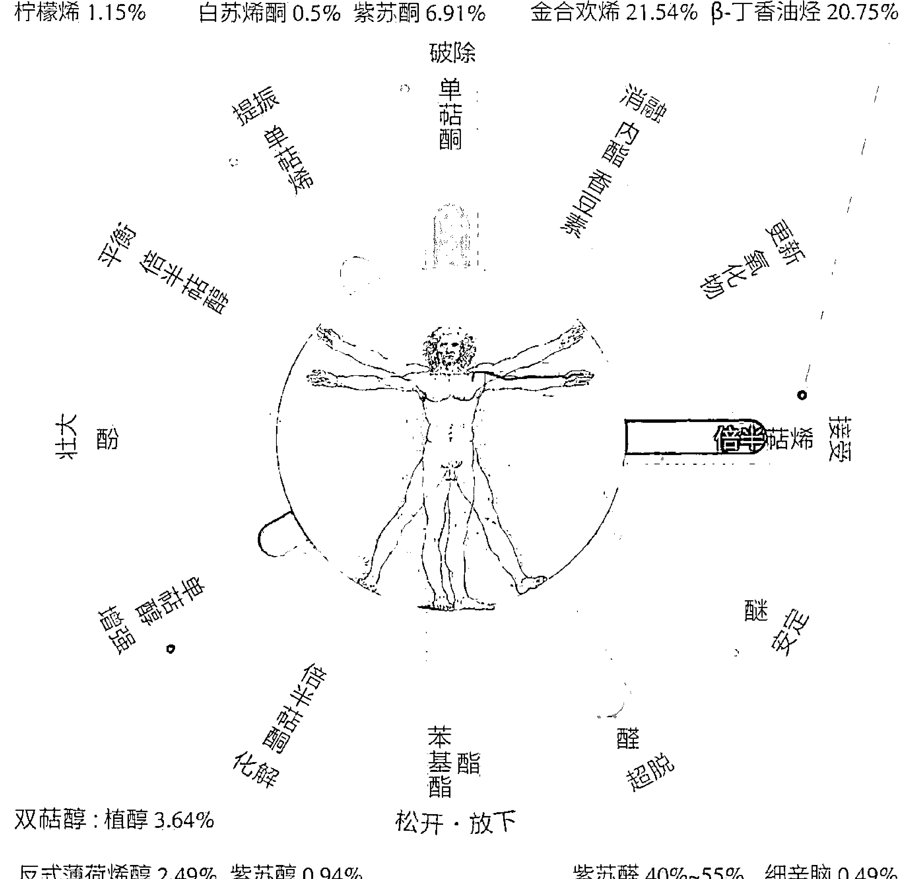

## 香科科
Mint Plant

地中海西部特产，呛辣的气味对某些猫咪与昆虫极具吸引力。在温暖干燥的开放空间能生长得很好，不能适应严寒。

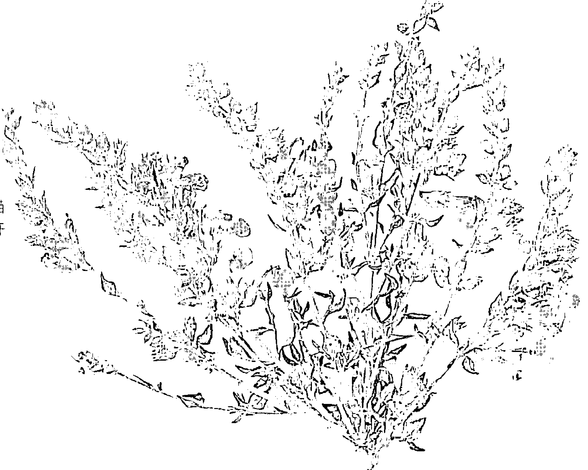

| 项目 | 信息 |
| :--- | :--- |
| 学 名 | *Teucrium marum* |
| 其他名称 | 猫百里香/Cat Thyme |
| 香气印象 | 永不放弃的地下反抗军 |
| 植物科属 | 唇形科香科科属 |
| 主要产地 | 科西嘉岛、萨丁岛、西班牙 |
| 萃取部位 | 开花的全株药草（蒸馏） |
| 适用部位 | 脾经、本我轮 |
| 核心成分 | 萃油率 0.016%~0.027%，93个可辨识化合物（占 95.5%） |
| 心灵效益 | 超脱重复发生的困境，努力打开新局面 |

| 药学属性 | 适用症候 |
| :--- | :--- |
| 1. 微量可激励补身，消解脾脏充血症状，退热，通经 | 精神不济，脾肿大，发烧，月经不至 |
| 2. 健胃，消胀气，强化肝脏与胰脏，抗寄生虫 | 食欲不振，消化迟钝，消化困难，肝脏充血，肠道寄生虫 |
| 3. 消炎，止痛 | 湿疹，痛风 |
| 4. 抗菌，抗卡他，消解黏液 | 鼻塞，多痰 |

双萜烯：α-史普林烯 3.2%
丁香油烃氧化物 0.4%~20.5%
倍半萜烯 14种 30.7%：
β-丁香油烃 0.9%~18.9%
α-佛手柑烯 1%~21.5%

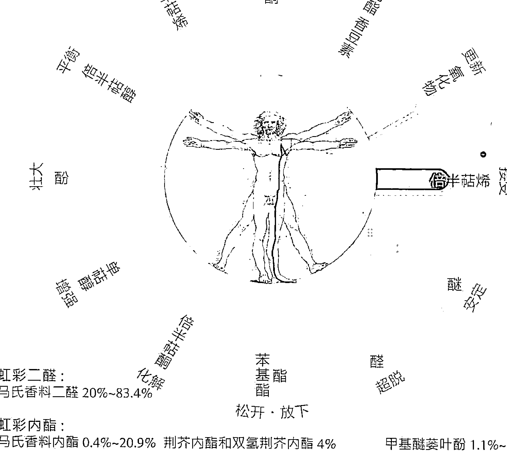

### 注意事项
1.  可能刺激孕妇与婴幼儿。
2.  过量可能刺激皮肤。

虹彩二醛：
马氏香料二醛 20%~83.4%

虹彩内酯：
马氏香料内酯 0.4%~20.9%
荆芥内酯和双氢荆芥内酯 4%

甲基醚蒌叶酚 1.1%~10.5%

## VII 酯类
Ester

放松是它的标志性功能，可分为萜烯酯与苯基酯，多半气味甜美，为休闲派芳疗所爱重，也是一般人最熟悉的精油种类（如薰衣草）。用来熏香、泡澡，特别能够舒压。芳香酸与酯类共享抗痉挛的名声，长于缓解各种痛感。在丧失信仰与无所适从之际，它们给心经注入力量，重新找到定锚之处，其价值远远超过“鸟语花花”的表面印象。

## 阿密茴
### Khella

期待全日照，土壤必须肥沃湿润但排水良好，虫害少，无需特别照顾。一年生或两年生，如雨伞般满开的白花是切花的良好素材。

| 项目 | 信息 |
| :--- | :--- |
| 学 名 | *Ammi visnaga* |
| 其他名称 | 牙签草 / Toothpick Weed |
| 香气印象 | 夜深人静看金凯利的歌舞片 |
| 植物科属 | 伞形科阿密茴属 |
| 主要产地 | 摩洛哥、突尼斯、土耳其 |
| 萃取部位 | 开花的全株药草（蒸馏）/种子连同伞形花序（溶剂萃取） |
| 适用部位 | 心包经、心轮 |
| 核心成分 | 萃油率 0.2%，41个可辨识化合物（占97.9%） |
| 心灵效益 | 放下急切，在塞车的街道安步当车 |

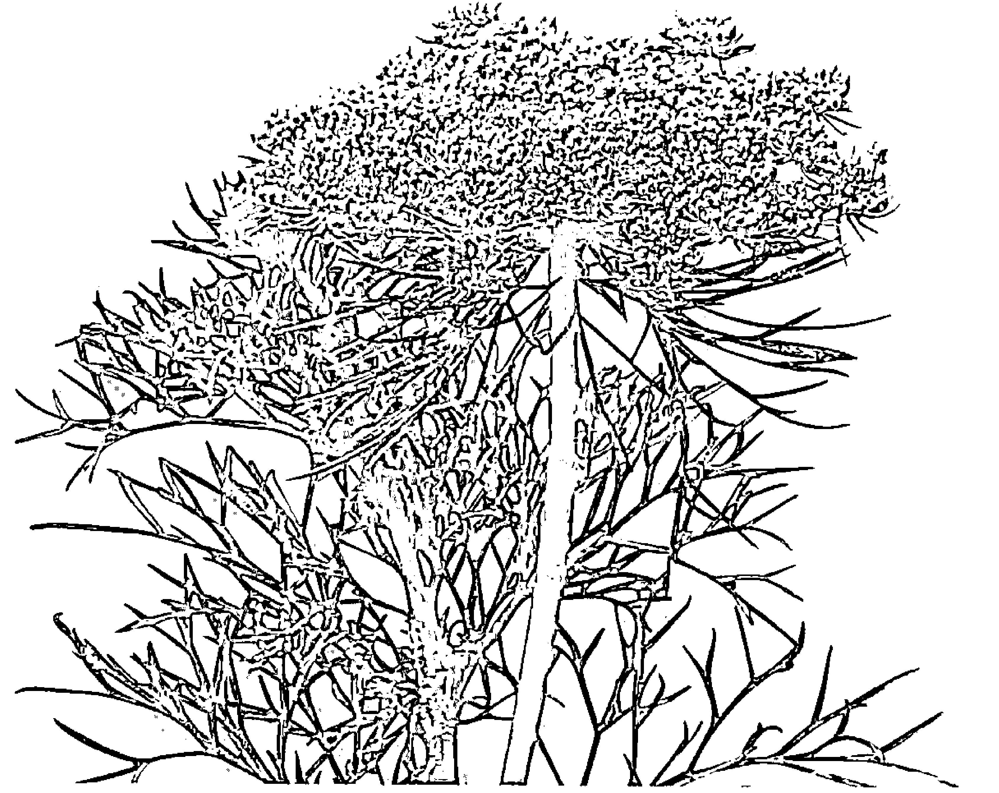

| 药学属性 | 适用症候 |
| :--- | :--- |
| 1. 抗痉挛（松弛平滑肌），舒张支气管，舒张子宫，消胀气，发汗 | 气喘发作，百日咳，痛经，痉挛性肠炎，肝绞痛，肾绞痛，胆结石疼痛 |
| 2. 抗凝血，舒张冠状动脉 | 冠心病，动脉硬化 |
| 3. 强化皮肤黑色素功能（种子萃取） | 干癣，白癜风（种子萃取） |
| 4. 抗菌，补身（调解压力引发的免疫力下降） | 反复感冒 |

**色原酮(种子萃取)：** 呋喃并色酮 1% 阿米素 0.1%
**香豆素(种子萃取)：** 呋喃香豆素(印度榅桲素)、吡喃香豆素(顺式凯林酮)
**倍半萜醇** 1.2%
**倍半萜烯** 1.7%

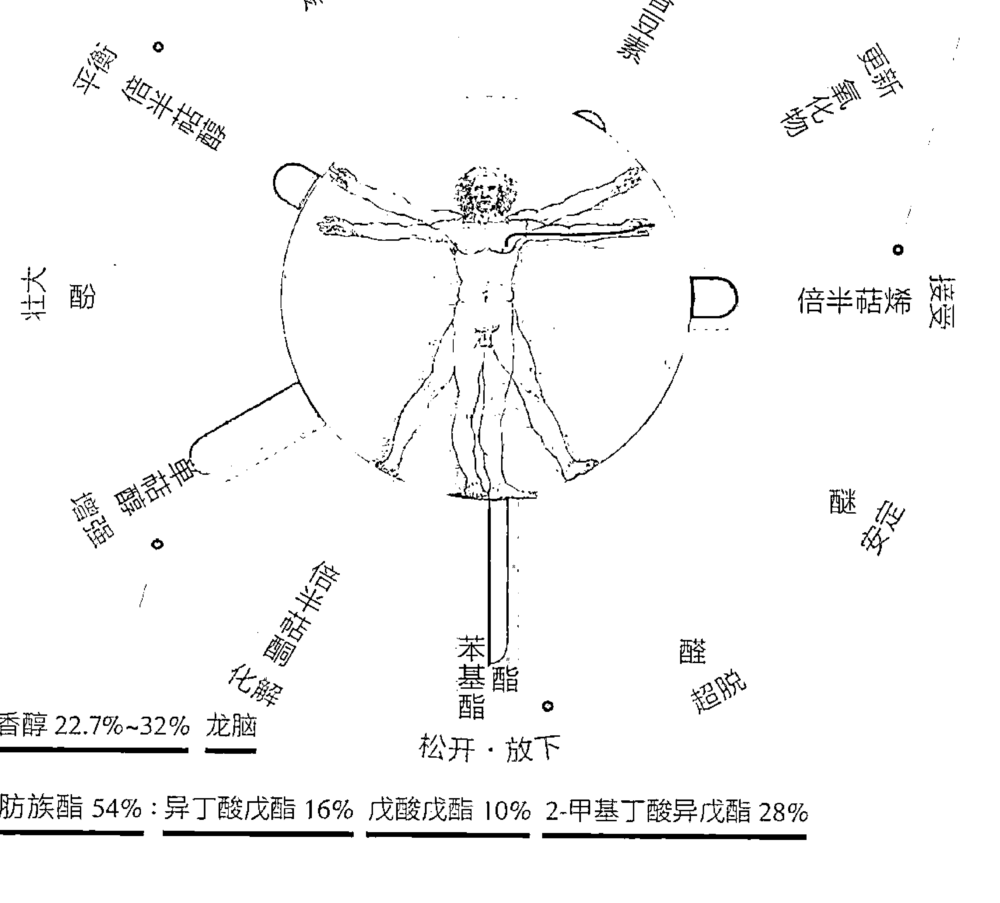

### 注意事项
1.  若是由种子萃取，则须留心光敏性与过敏者的次级反应。

## 罗马洋甘菊
Roman Chamomile

需要全日照和 pH 值在 6.5~8.0 间的砂质土壤，不宜过湿。适合生长的温度是 7℃~26℃。比德国洋甘菊矮小，可当草皮栽种。多施磷肥能使花多而含油量高。

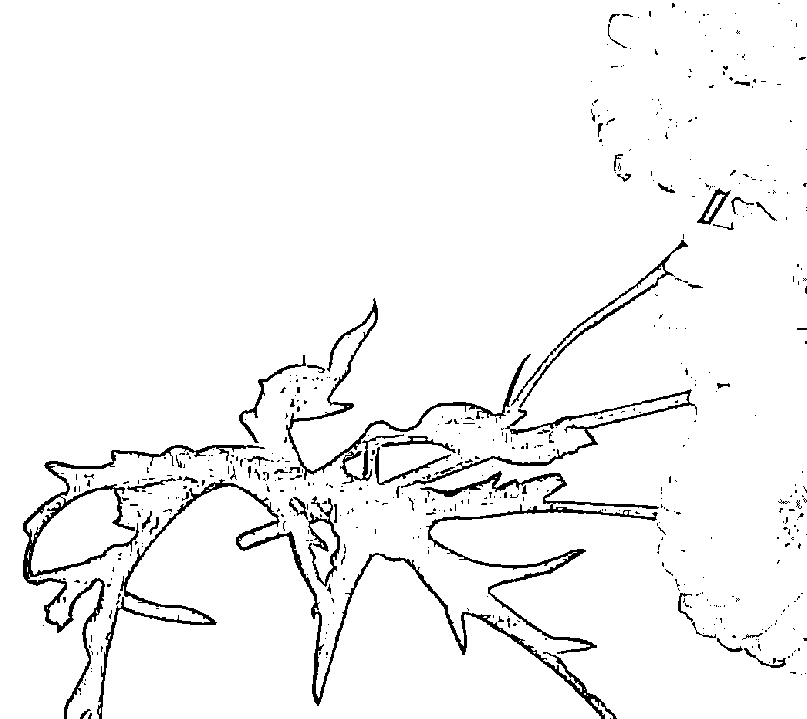

### 药学属性
1.  抗痉挛，安抚中枢神经
2.  麻醉，减少或免除使用 BZDs 之类的镇静剂
3.  消炎，安抚消化系统
4.  抗寄生虫 (钩虫、蓝氏鞭毛虫)

### 适用症候
- 神经炎，神经痛，创伤后压力综合征
- 外科手术前、戒除毒瘾期间、癌症治疗期间的疼痛管理
- 神经性气喘，牙龈炎，反胃，呕吐，胀气，胃灼热
- 肠内寄生虫

| 项目 | 信息 |
| :--- | :--- |
| 学名 | Chamaemelum nobile / Anthemis nobilis |
| 其他名称 | 果香菊 / English Chamomile |
| 香气印象 | 巴黎时装周的春季走秀 |
| 植物科属 | 菊科春黄菊属 |
| 主要产地 | 法国、德国、摩洛哥 |
| 萃取部位 | 花 (蒸馏) |

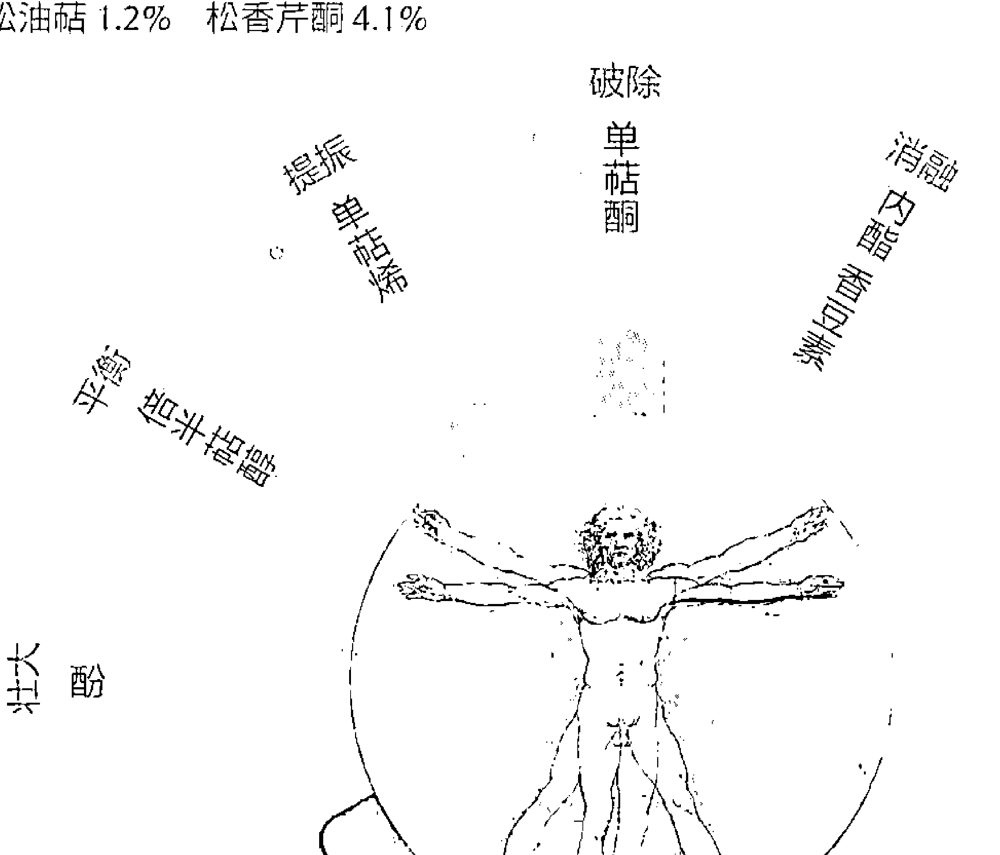

适用部位 心经、心轮
核心成分 萃油率 0.3%，31 个可辨识化合物
心灵效益 | 放下害怕，迎接梦中所有的画面

### 注意事项
1.  用 CO₂ 萃取的萃油率是 3%，可辨识化合物多达 462 个。

## 墨西哥沉香
Linaloe

极怕湿，在种不出作物的贫瘠土壤反而可以恣意生长。树身瘦长，雌雄异株。种下 4 年后开始结果，每公顷年产油 20 千克。

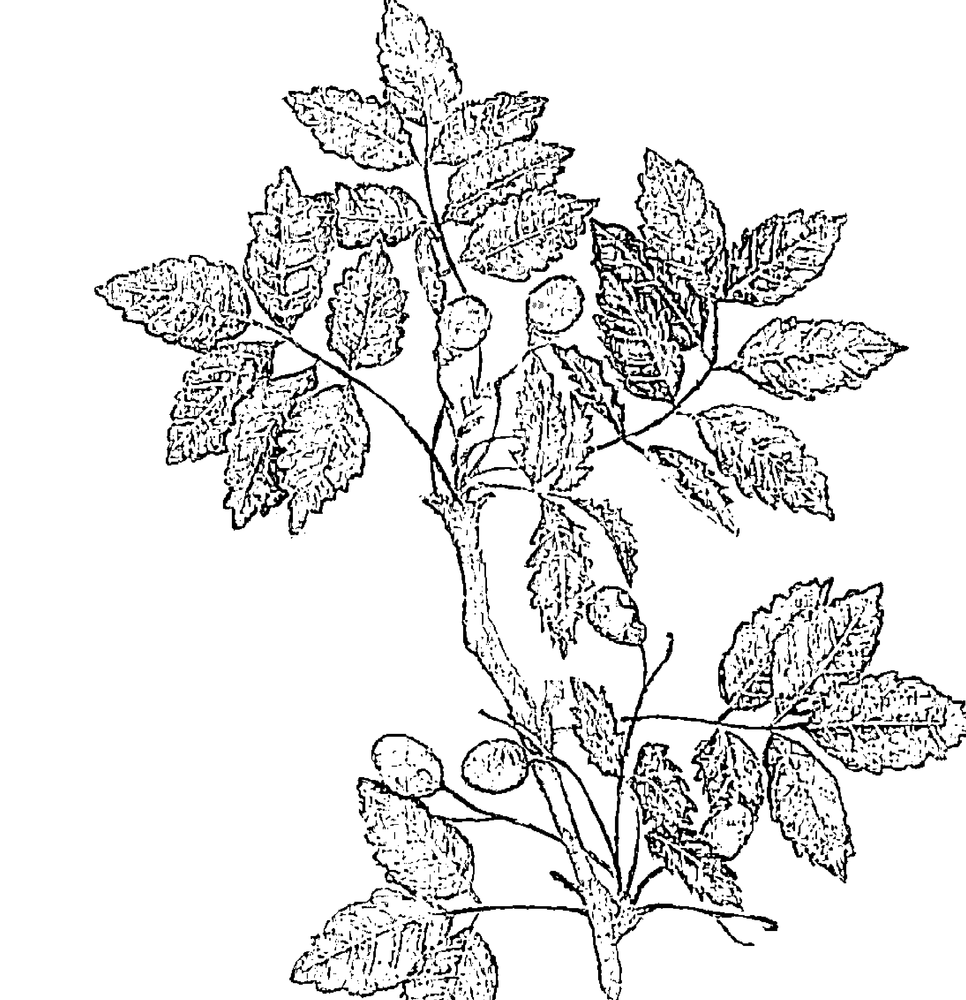

| 项目 | 信息 |
| :--- | :--- |
| 学 名 | *Bursera delpechiana* |
| 其他名称 | 印度薰衣草树 / Indian Lavender Tree |
| 香气印象 | 热带丛林中静静盯着猎豹的印地安人 |
| 植物科属 | 橄榄科裂榄属 |
| 主要产地 | 印度、墨西哥 |
| 萃取部位 | 果实阴干的外壳 (蒸馏) |
| 适用部位 | 心经、心轮 |
| 核心成分 | 萃油率 3%~10%，21 个可辨识化合物 |
| 心灵效益 | 放下操控，任由生命的河流进出自己的领土 |

| 药学属性 | 适用症候 |
| :--- | :--- |
| 1. 平衡 (安抚太阳神经丛) | 负能量缠身导致的心跳过速与睡眠困扰 |
| 2. 抗痉挛 | 丧礼或重大意外后用以除秽 |
| 3. 消炎 | 遭逢打击后恢复免疫功能 |
| 4. 抗感染 | 过劳引起的肠胃失调 |

α-古巴烯 0.54% 大根老鹳草烯 1.96%

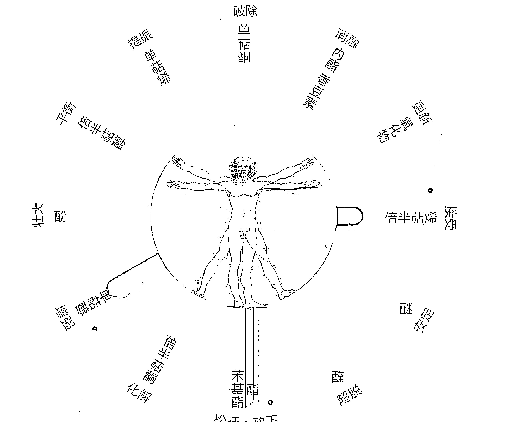

### 注意事项
1.  墨西哥油以沉香醇为主 (70%)，印度油以乙酸沉香酯为主。墨西哥油的萃取来源包含木材与果实，印度只蒸馏果实。
2.  印度的品种于 1912 年由墨西哥引进，一般认为印度油的品质胜过墨西哥。
3.  在墨西哥，裂榄属的诸多品种树木与树脂都被称作墨西哥沉香 (Bursera spp.)，但香气成分颇有差异。

沉香醇 2.2%~30% α-萜品醇 8.5% 乙酸沉香酯 40%~90% 乙酸牻牛儿酯

## 苦橙叶
Petitgrain

5米左右高的小树，酸果不能入口，但叶片气味有生物防治效用。需要全日照与中度酸性土壤，水分不能过多。

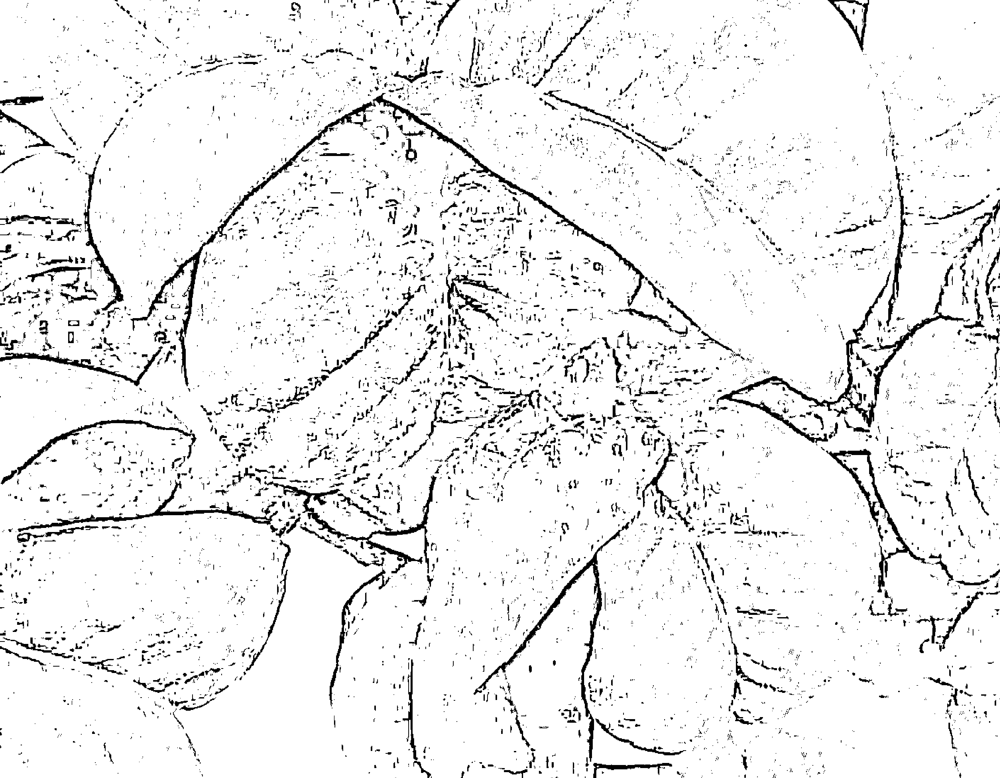

### 药学属性
1.  平衡神经
2.  抗痉挛
3.  消炎，抗肿瘤
4.  抗感染，杀葡萄球菌和肺炎杆菌，抗氧化

### 适用症候
- 自主神经失调，睡眠困扰
- 神经性风湿
- 白血病，肝癌
- 呼吸道感染，感染性面疱，疖，慢性肝炎

| 项目 | 信息 |
| :--- | :--- |
| 学名 | *Citrus aurantium bigarade* |
| 其他名称 | 回青橙叶 / Bitter Orange Leaf |
| 香气印象 | 中学时期的青涩岁月 |
| 植物科属 | 芸香科柑橘属 |
| 主要产地 | 巴拉圭、埃及 |
| 萃取部位 | 叶片（蒸馏） |

柠檬烯 1.91% 月桂烯 1.23%
倍半萜烯 <1% : β-丁香油烃 α-葎草烯 金合欢烯

适用部位 督脉、顶轮
核心成分
萃油率 0.71%，19个可辨识化合物

心灵效益 | 放下行事历，躺在草地上看蓝天白云

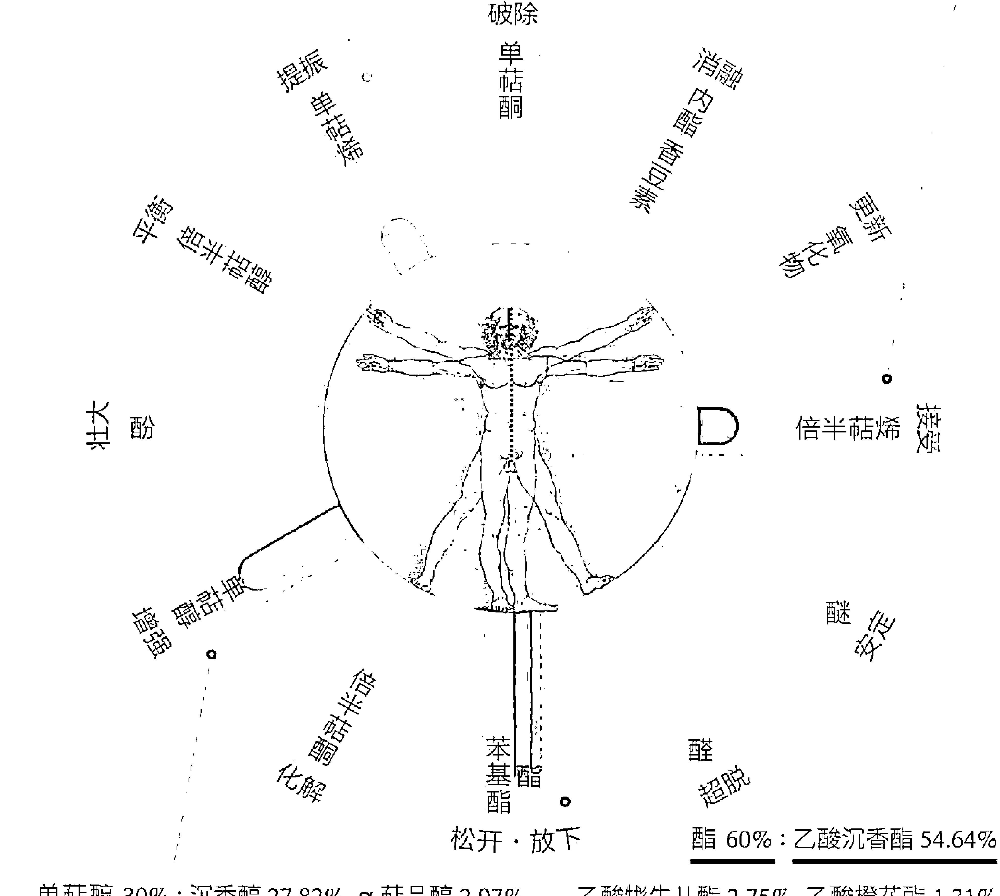

### 注意事项
1.  佛手柑叶油和苦橙叶油作用类似，但是沉香醇(34.62%)多于乙酸沉香酯(29.8%)，另含有比较多的乙酸橙花酯(4.85%)、乙酸牻牛儿酯(9.44%)，所以香气甜度比苦橙叶高，安抚神经的效果更好。

单萜醇 30% : 沉香醇 27.82% α-萜品醇 2.97%
酯 60% : 乙酸沉香酯 54.64%
乙酸牻牛儿酯 2.75% 乙酸橙花酯 1.31%

## 佛手柑
Bergamot

柠檬和苦橙的杂交品种，可能原生于意大利的卡拉布里亚。叶片如柠檬，结黄色圆果，冷天之外的日子都要时常给水。

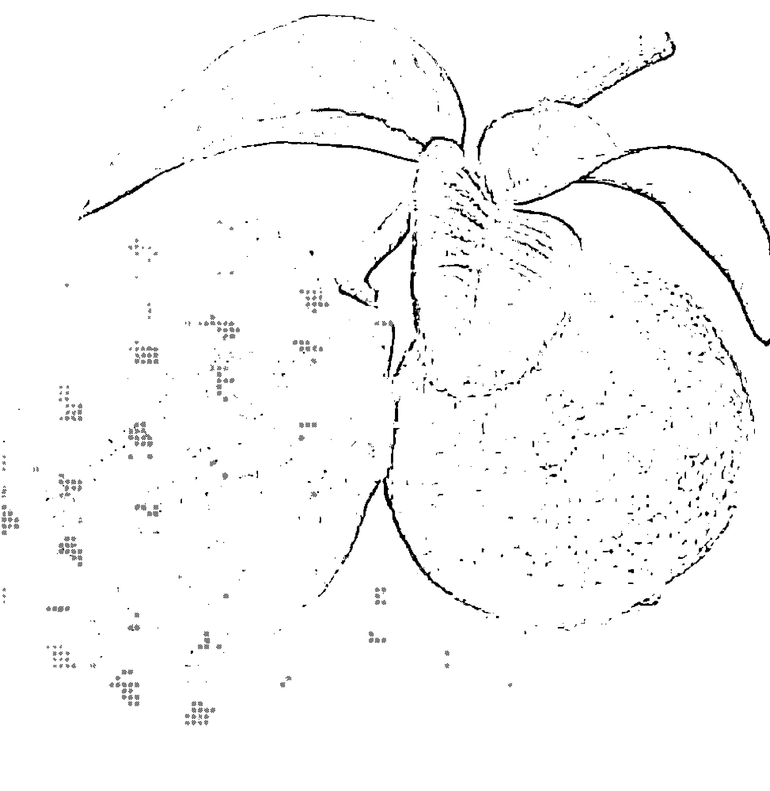

| 项目 | 信息 |
| :--- | :--- |
| 学 名 | *Citrus bergamia* |
| 其他名称 | 香柑 / Bergamot Orange |
| 香气印象 | 在西西里岛跟老奶奶学做意大利面 |
| 植物科属 | 芸香科柑橘属 |
| 主要产地 | 意大利（占90%）、巴西、希腊、科特迪瓦 |
| 萃取部位 | 果皮（冷压） |
| 适用部位 | 督脉、顶轮 |
| 核心成分 | 萃油率 1.8%，28 个可辨识化合物 |
| 心灵效益 | 放下计较，转身去做让自己开心的事 |

### 药学属性
1.  抗感染，抗菌，消炎
2.  镇静，抗痉挛，保护神经
3.  健胃，抑制癌细胞增生
4.  驱蚊，驱虫

### 适用症候
- 上呼吸道与泌尿生殖道感染，痔疮，瘙痒，伤口，脂溢性皮炎
- 情绪激动，失眠，多汗，长期压力，心律不齐
- 结肠积气，食欲不振，腹胀，肠痉挛，神经母细胞瘤
- 疟疾，寄生虫疾病

柠檬烯 25.62%~53.19%
β-松油萜 5.15%~12.08%
γ-萜品烯 10%
香豆素与呋喃香豆素 4%：
补骨脂素 香柑油内酯

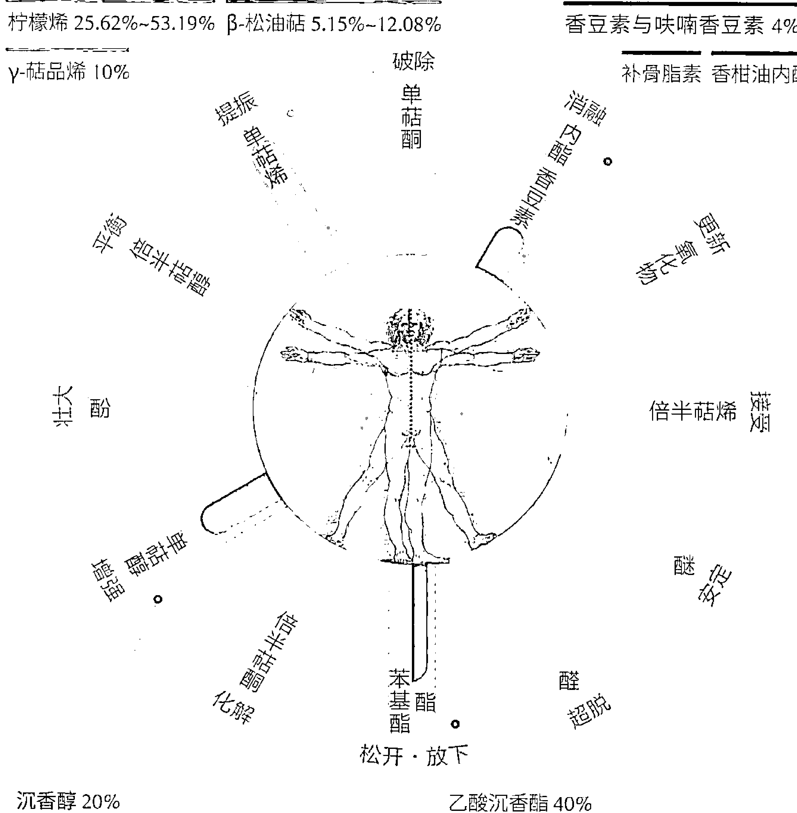

### 注意事项
1.  冷压油有光敏性，先压榨再分馏油则不具光敏性（标示为 FCF）。
2.  产季前段榨出的油色是绿的，产季后段榨出的油则转为黄棕色。
3.  真正的佛手柑是柑橘属枸橼的变种，精油中的佛手柑其实应叫香柑。

## 小飞蓬
Erigeron

原生于北美洲，现在遍布全世界。最喜欢粗干的土壤，能适应各种气候。对作物有侵扰性（占去生长空间），但也是环保指标（可吸附重金属，如镉和铬）。

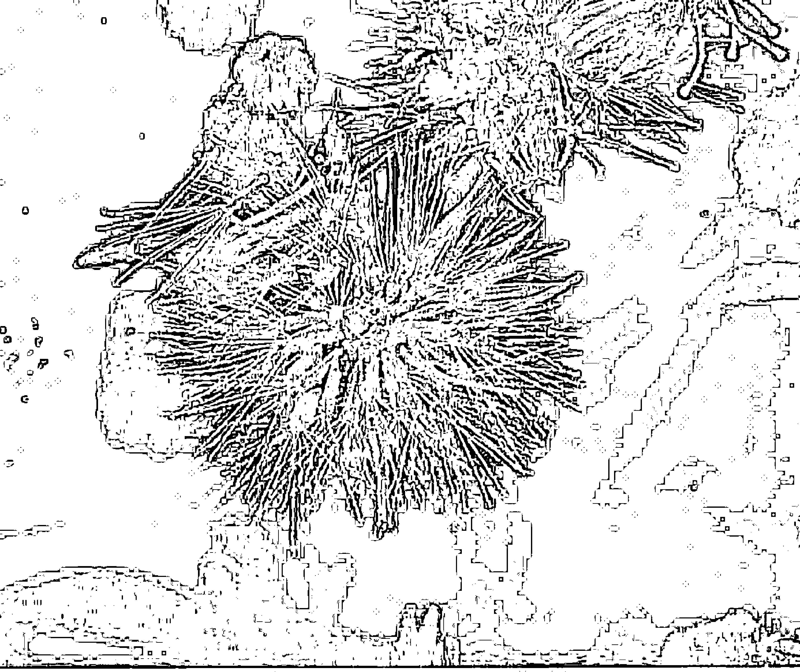

| 项目 | 信息 |
| :--- | :--- |
| 学名 | *Conyza canadensis* |
| 其他名称 | 加拿大飞蓬 / Canadian Fleabane |
| 香气印象 | 嘴里叼着稻草的野孩子 爬树 |
| 植物科属 | 菊科假蓬属 |
| 主要产地 | 加拿大 |
| 萃取部位 | 开花的全株药草（蒸馏） |
| 适用部位 | 肝经、本我轮 |
| 核心成分 | 萃油率0.72%，34个可辨识化合物（占98%） |
| 心灵效益 | 放下旧模式，跟上新世代 |

### 药学属性
1.  激素作用
2.  舒张动脉，抗痉挛
3.  提高肝脏与胰脏功能，改善肾的微循环
4.  黑色素细胞的色素脱失作用，消炎

### 适用症候
- 性晚熟
- 冠状动脉炎，跌打损伤，风湿骨痛
- 痢疾，肠炎，肝炎，胆囊炎
- 晒黑肤色，斑点，疮疖，外伤出血，牛皮癣

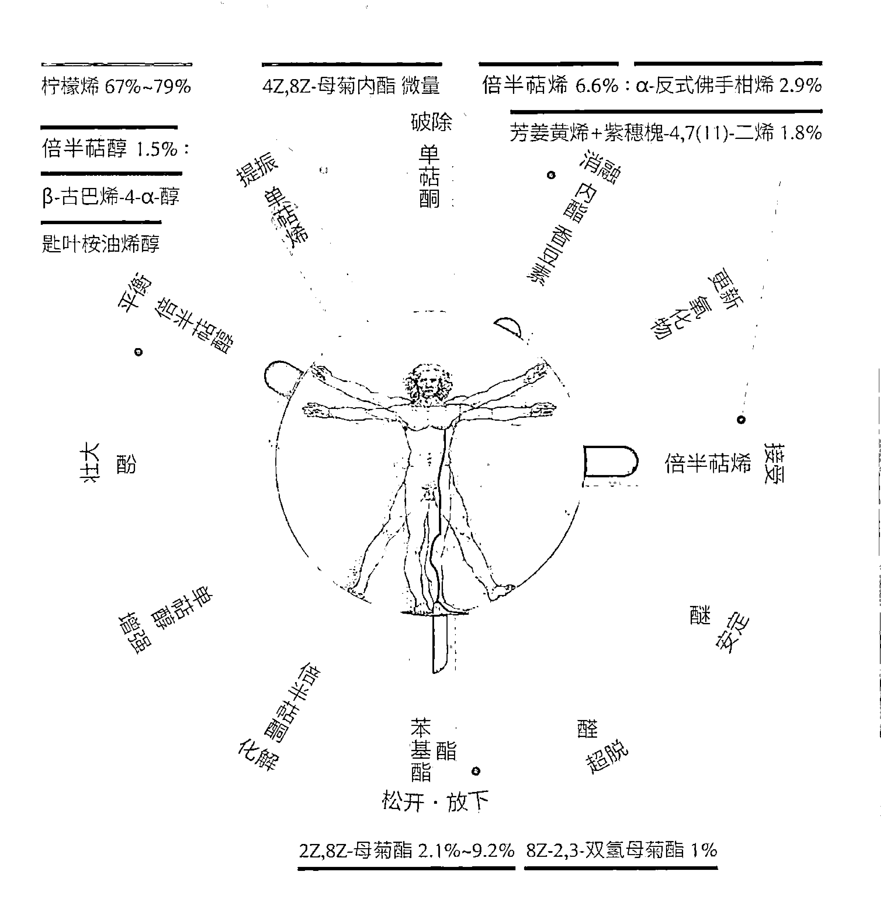

### 注意事项
1.  根部所含的母菊酯可达88%。若加入根部整株萃取，母菊酯的比例会大幅提高。母菊酯有淡斑的作用。
2.  本属植物和飞蓬属(Erigeron)极为相似，所以俗名时常混用。
3.  同属的另一品种美洲飞蓬(Conyza bonariensis)，精油含有更多的酯与内酯(但不含母菊酯)，抗霉菌与抗肿瘤作用更显著。而小飞蓬抗肝癌主要是利用总黄酮。

### 岬角甘菊
### Cape Chamomile

原生于南非自由省龙山东北坡。商业生产于好望角东部，人工栽培困难。习惯干热与沙砾的环境，硬叶充满油点，密生的白花结子前会变得毛茸茸。

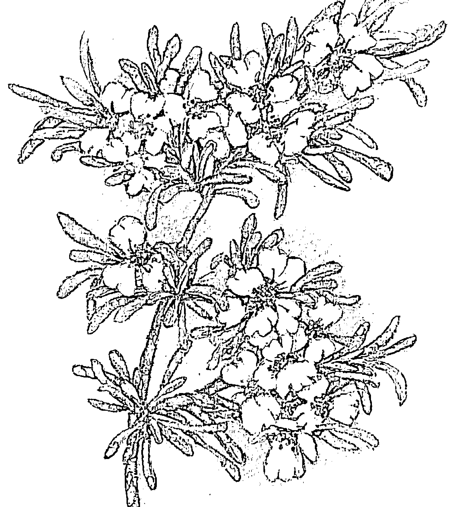

| 项目 | 信息 |
| :--- | :--- |
| 学 名 | *Eriocephalus punctulatus* |
| 其他名称 | 非洲洋甘菊 / Kapok Bos |
| 香气印象 | 光脚在石子路上快乐奔跑的孩子 |
| 植物科属 | 菊科雪灌木属 |
| 主要产地 | 南非 |
| 萃取部位 | 开花的全株药草(蒸馏) |
| 适用部位 | 督脉、顶轮 |
| 核心成分 | 萃油率0.2%，123个可辨识化合物(占94.4%) |
| 心灵效益 | 放下磨难，在新天地开垦幸福的未来 |

### 药学属性
1.  强力抗痉挛
2.  消炎，抗菌
3.  止痛，发汗，利尿
4.  镇静

### 适用症候
- 焦虑，压力，惊吓，沮丧
- 剧烈咳嗽，腹泻不止
- 糖尿病 (辅药)
- 疾病与灾厄过后净化空间

倍半萜醇与酮 16种 11.3%；氧化物 5.9%：道格艾氧化物A~D；倍半萜烯 16种 4.5%：
1,4-双甲基天蓝烃 0.3%，母菊天蓝烃 0.2%，古巴烯 1.4%

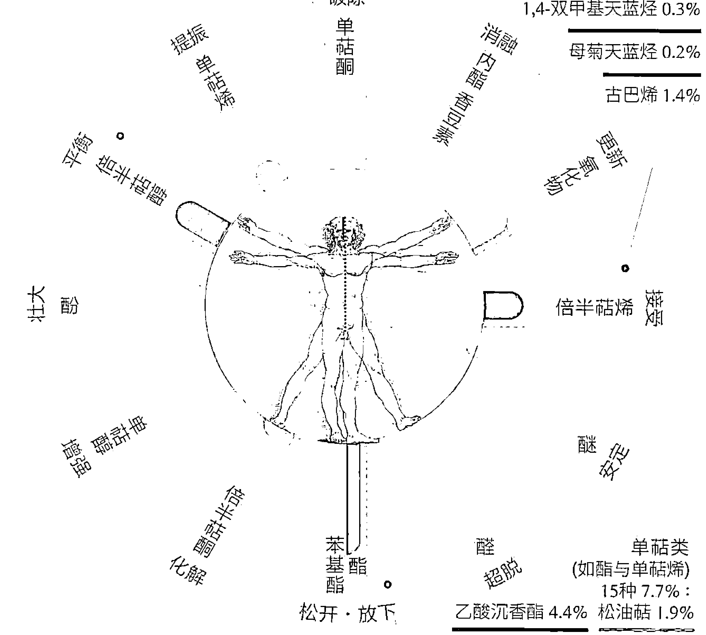

脂肪族酯 50种以上 50%：异丁酸2-甲基丁酯 21.2%，2-甲基丁酸2-甲基丁酯 5.6%

### 注意事项
1.  2011年的一项化学分类研究指出，市面上的岬角甘菊精油其实是来自成分作用相似的另一品种 *E. tenuifolius*。
2.  另一时常混淆的品种岬角雪灌木 (*Eriocephalus africanus*)，又名野迷迭香，精油成分以单萜酮的艾蒿酮为主 (50%)。

## 玫瑰尤加利
### Paddys River Box

喜欢潮湿的黏土，接近溪流与冲积平原。高 40 米的坚实大树，若生在高地草原则常常独自伫立。

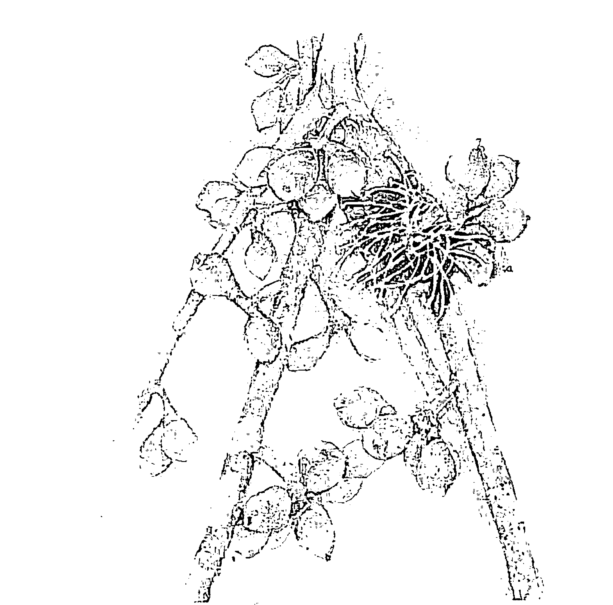

### 药学属性
1.  消炎止痛
2.  抗肿瘤 (桉叶醇抑制肿瘤的血管新生与细胞增生，牻牛儿醇也抑制增生)
3.  抗氧化
4.  抗白色念珠菌

### 适用症候
- 子宫肌瘤，子宫脱垂
- 肝癌、子宫癌的防治
- 毛囊炎，痤疮
- 念珠菌引起的阴道瘙痒

| 项目 | 信息 |
| :--- | :--- |
| 学 名 | *Eucalyptus macarthurii* |
| 其他名称 | 毛皮桉 / Camden Woollybutt |
| 香气印象 | 夏日夕阳下微温的沙滩 |
| 植物科属 | 桃金娘科桉属 |
| 主要产地 | 澳大利亚、南非 |
| 萃取部位 | 叶片或树皮 (蒸馏) |
| 适用部位 | 任脉、性轮 |
| 核心成分 | 萃油率 0.69%，18 个可辨识化合物 |
| 心灵效益 | 放下对伴侣的依赖，学习温柔自主 |

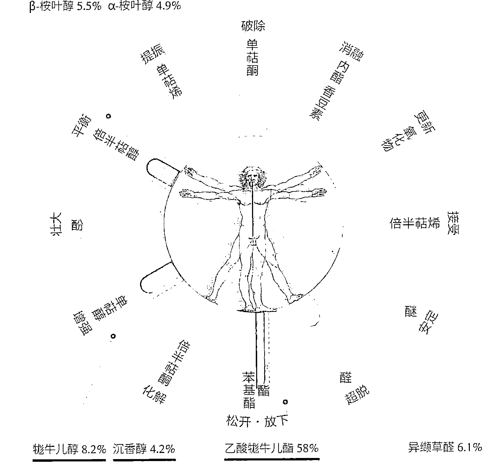

### 注意事项
1.  在原产地澳大利亚分布不广，被列入需要保护的树种。
2.  过去曾用来萃取乙酸牻牛儿酯供香水业使用。

β-桉叶醇 5.5%
α-桉叶醇 4.9%
牻牛儿醇 8.2%
沉香醇 4.2%
乙酸牻牛儿酯 58%
异赪草醛 6.1%

## 黄葵
Ambrette Seed

主要分布于亚洲热带地区、非洲和澳大利亚北部，高可达2米。需要湿润的土壤与充足的养分，无法在树荫下生长。

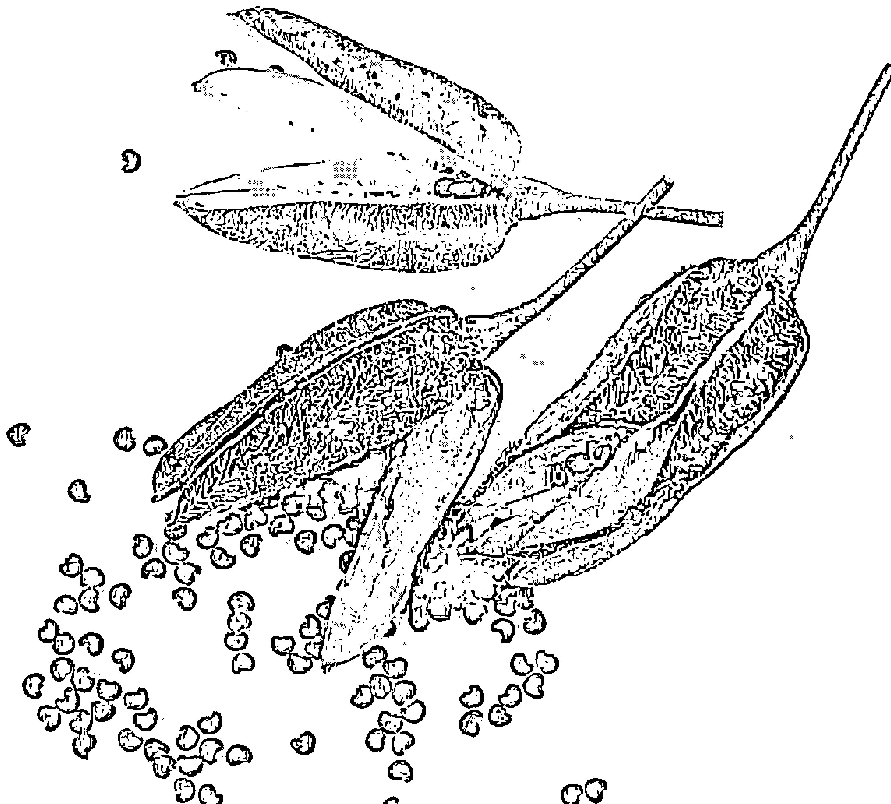

| 项目 | 信息 |
| :--- | :--- |
| 学名 | *Hibiscus abelmoschus* / *Abelmoschus moschatus* |
| 其他名称 | 麝香锦葵 / Musk Mallow |
| 香气印象 | 画着烟熏妆的妩媚女子 |
| 植物科属 | 锦葵科秋葵属 |
| 主要产地 | 印度 |
| 萃取部位 | 种子 (蒸馏) |
| 适用部位 | 心经、心轮 |
| 核心成分 | 萃油率 0.33%，35 个可辨识化合物 |
| 心灵效益 | 放下仇恨，找到爱这个世界的理由 |

### 药学属性
1.  抗痉挛，利神经
2.  补身，催情
3.  强心，健胃，利尿
4.  促进头皮毛乳头细胞生长，除臭

### 适用症候
- 减缓抗药性癌细胞引发的不适，安宁疗护
- 缺乏性吸引力
- 情伤导致的憔悴无力
- 生发，除口臭，声音沙哑

金合欢醇 12%  巨环内酯：黄葵内酯 9.3%  四癸烯酸内酯 1.3%  八癸烯酸内酯 1.2%

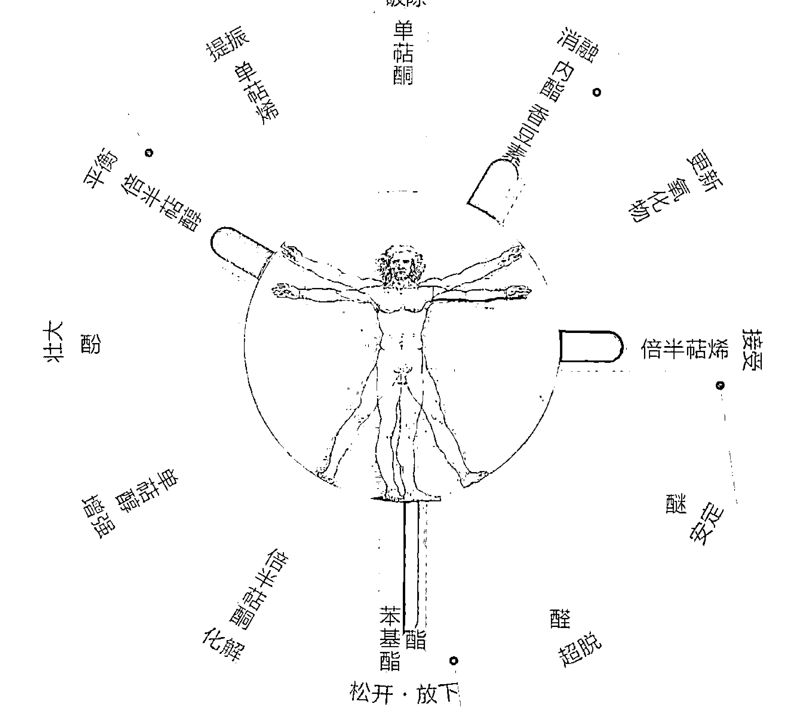

### 注意事项
1.  过去被归在木槿属 (Hibiscus) 之下，现在独立为秋葵属 (Abelmoschus)。
2.  溶剂萃取的原精，则是以金合欢醇 (33.49%) 和黄葵内酯 (8.84%) 为主要成分。黄葵内酯是黄葵精油特色麝香气味的来源。

脂肪酸：未经分离者仍含有棕榈酸  乙酸金合欢酯 50%  乙酸癸酯 6%  β-金合欢烯 9.8%## 真正薰衣草
True Lavender

原生于地中海区，能耐低温，喜欢碱土（石灰岩），需水量少。海拔高度愈高愈甜（例如 800 米），栽种 12 年后需从地面强剪以利再生。

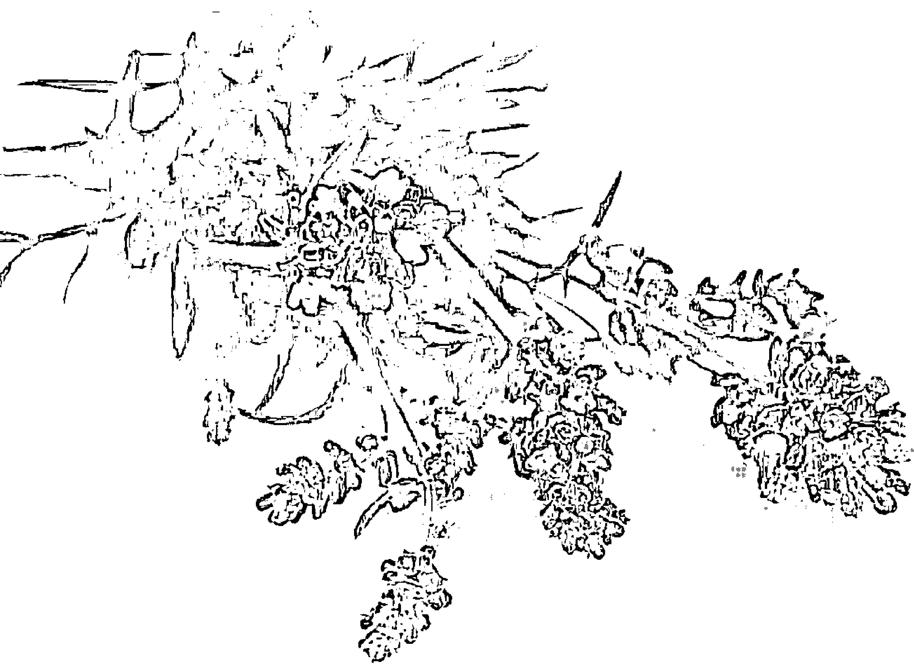

### 药学属性

- 强力抗痉挛，镇静，安抚，放松肌肉，降血压
- 消炎，止痛，促进伤口愈合
- 抗金黄色葡萄球菌，抗霉菌，驱蠹虫（螟蛾科）
- 补身，强心，抗凝血，促血液流动

### 适用症候

- 抽筋，神经紧张（太阳神经丛痉挛），失眠，睡眠困扰，躁郁症
- 感染性皮肤炎，过敏，伤疤，静脉溃疡，烫伤，发痒
- 白色念珠菌感染，陈年衣柜书柜里的蠹虫
- 胃灼热，心跳过速，静脉炎，血栓

学名 | Lavandula angustifolia / L. vera / L. officinalis
其他名称 | 英国薰衣草 / English Lavender
香气印象 | 翻开毕业纪念册，追忆逝水年华
植物科属 | 唇形科薰衣草属
主要产地 | 法国、保加利亚、克什米尔、塔斯马尼亚岛
萃取部位 | 开花的全株药草（蒸馏）

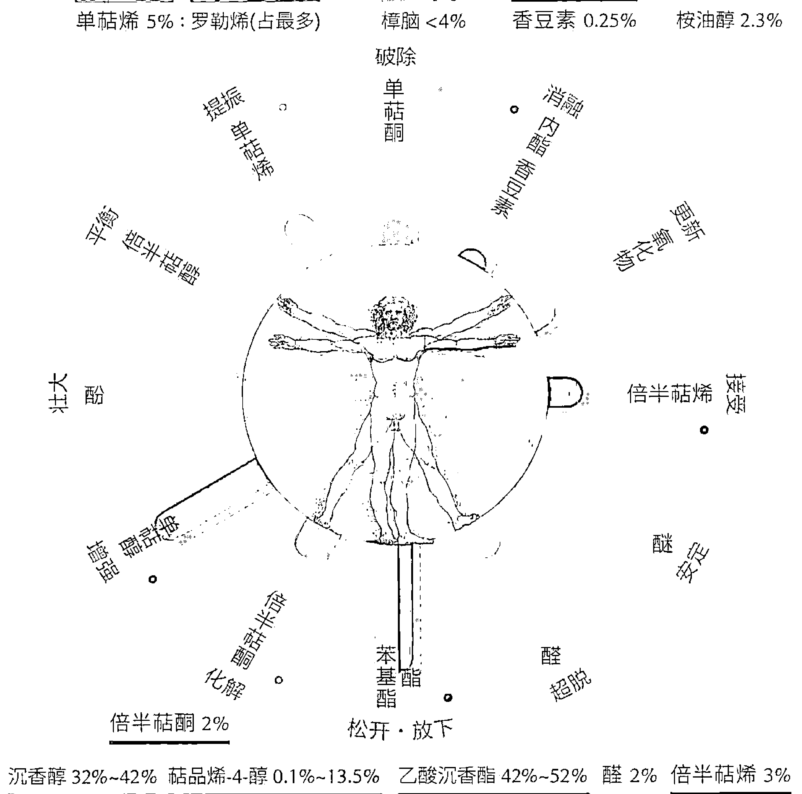

### 适用部位

心经、心轮

### 核心成分

萃油率 0.5%（鲜花）~ 4.75%（干花），300 个化合物（29 个可辨识）

### 心灵效益

放下高标，以无条件的爱浸润滋养

### 注意事项

- 同一品种在不同产地生长，成分会出现很大差异。主要判断依据是乙酸沉香酯与沉香醇的比例多寡。
- 栽培种众多，比如 Maillette 与 Matheronne 是过去出名的品种，Hemus 则是新兴的优势品种（产量大，气味甜）。

## 醒目薰衣草
Lavandin

宽叶薰衣草与窄叶薰衣草的杂交品种，开花时间在三者之间最晚。高大的三叉枝型和艳紫花色为特征，只要有向阳面和好的排水就能生长。

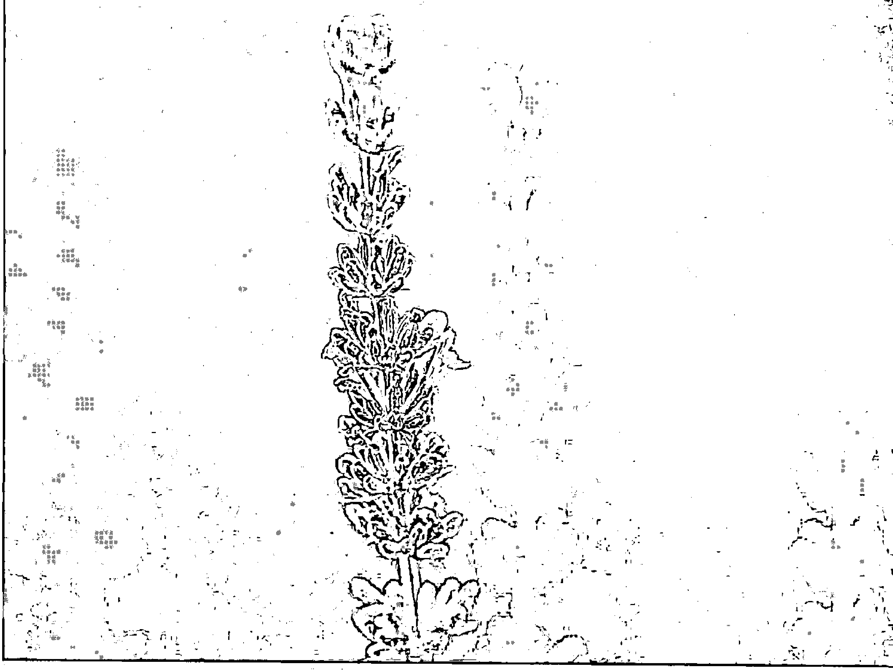

学名 | Lavandula × intermedia
其他名称 | 杂交薰衣草 / Hybrid Lavender
香气印象 | 在自家阳台啜饮花草茶
植物科属 | 唇形科薰衣草属
主要产地 | 法国、克罗地亚、英国、俄罗斯
萃取部位 | 开花的全株药草（蒸馏）

药学属性 | 适用症候
--- | ---
1. 抗痉挛，放松肌肉，降血压 | 坐骨神经痛，慢性运动伤害，心情烦乱
2. 消炎，分解黏液，促进伤口愈合 | 鼻咽炎，支气管炎，擦伤刀伤
3. 抗金黄色葡萄球菌，抗霉菌，驱虫 | 消化道感染，室内净化
4. 补身，强心，促血液流动 | 缺乏运动而心脏无力，疲劳过度而精神涣散

### 适用部位

三焦经、喉轮

### 核心成分

萃油率 1.49%（鲜花）~7.75%（干花），53 个可辨识化合物（占 98.26%）

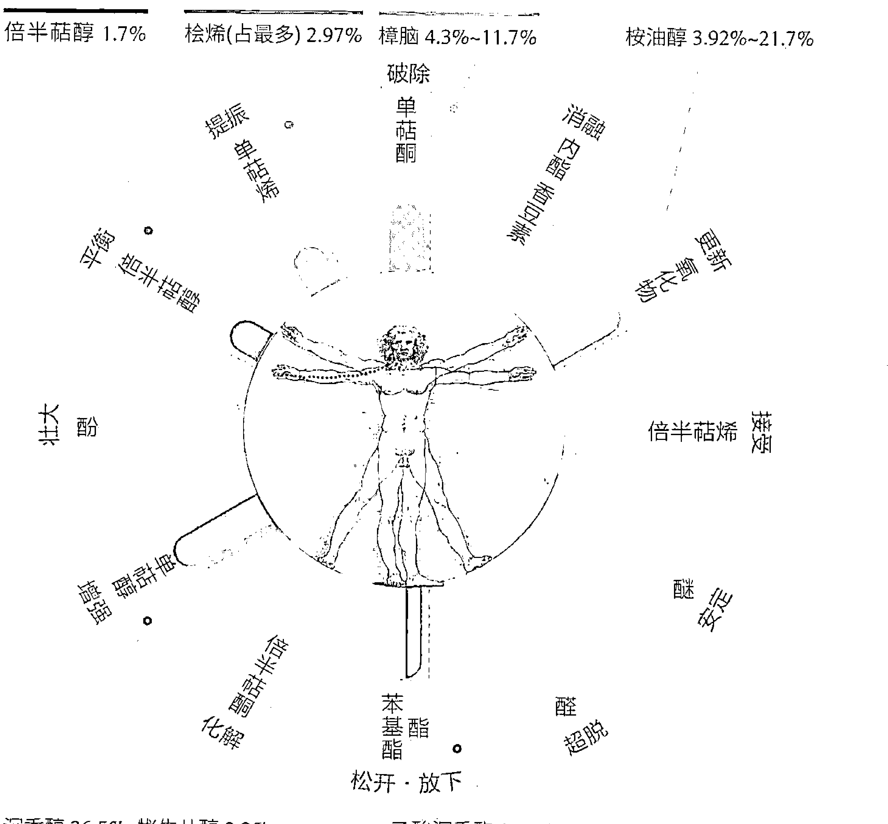

### 心灵效益

放下遗憾，珍惜现有的幸福

### 注意事项

- 同一产区的醒目薰衣草比真正薰衣草含有更多桉油醇和樟脑，有些甜度（酯类）直逼真正薰衣草，可能会让一般人感觉气味更鲜明。
- 栽培种极多，Grosso 属于沐浴肥皂等级，Abrial 富于小清新，超级甜醒目则是替身等级（气味最接近真正薰衣草）。

沉香醇 36.5% 牻牛儿醇 2.2% 乙酸沉香酯 32.8%

## 柠檬薄荷
Bergamot Mint

喜欢林地中近水处，易于生长，只要土壤不要过干。若要香气强，则需全日照。种在高丽菜与番茄之间可以避免虫害。

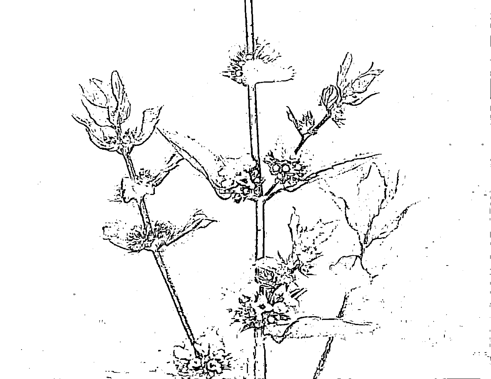

### 药学属性

- 补身，补强卵巢，增强男性性功能（作用于骶神经丛）
- 平衡神经（作用于延髓和自主神经系统），抗痉挛
- 抗感染，抗寄生虫（蛔虫、阿米巴虫），激励腺体（肝与胰）
- 消炎，抗氧化，抗肿瘤

### 适用症候

- 卵巢功能不良，男性性功能减退
- 神经疲劳，心跳过速
- 肠内寄生虫，吞气症，痉挛性肠炎，肝胰功能不佳
- 膀胱炎，肝癌，子宫颈癌

学名 | *Mentha citrata*
其他名称 | 柑橘薄荷 / Orange Mint
香气印象 | 发型设计师拿镜子让自己看剪好的样子
植物科属 | 唇形科薄荷属
主要产地 | 印度、阿根廷、法国
萃取部位 | 开花的全株药草（蒸馏）
适用部位 | 肾经、性轮
核心成分 | 萃油率 1.1%，28 个可辨识化合物（占 92.8%）
心灵效益 | 放下柴米油盐，给自己一个利落的造型

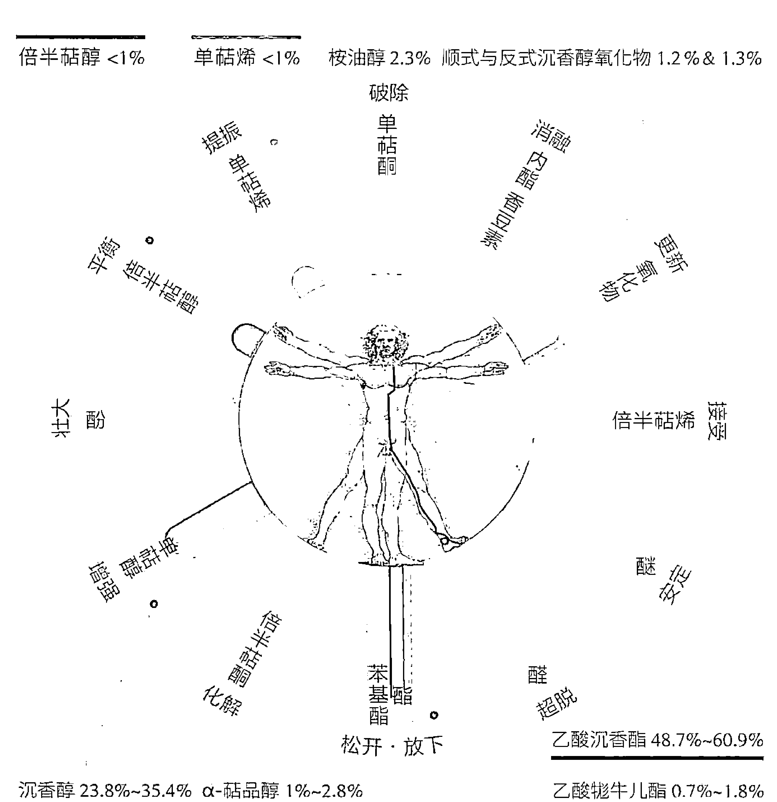

### 注意事项

- 其实是水薄荷（*Mentha aquatica*）的一个栽培种。
- 短期疲劳时可以用来提神，遇到长期疲劳则可发挥补眠的效果。

## 含笑
### Dwarf Chempaka

原生于中国南方，喜欢温暖潮湿、微酸的壤土，不耐干燥瘠薄，但也怕积水。见于杂木林，溪谷沿岸尤其茂盛，性喜半阴，忌强烈阳光直射。

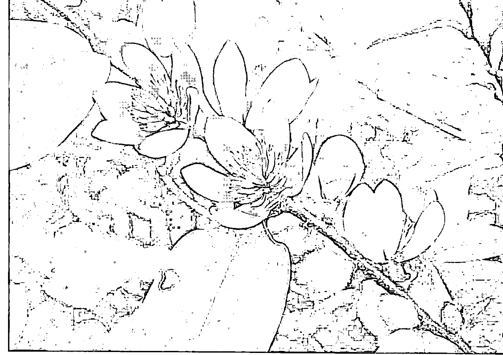

**学名** | *Michelia figo* / *Magnolia figo*

**其他名称** | 香蕉花 / Banana Shrub

**香气印象** | 19 世纪初追求独立的贵族女孩

**植物科属** | 木兰科含笑属

**主要产地** | 中国

**萃取部位** | 花（蒸馏）

| 药学属性 | 适用症候 |
| --- | --- |
| 1. 去瘀生新 | 面疱坑洞，陈年伤疤，整形手术后的修复 |
| 2. 活血止痛 | 月经不调，痛经，胸肋间隐隐作痛 |
| 3. 安定神经 | 工作狂，埋首备考，家务繁重，心力交瘁 |
| 4. 降低肿瘤细胞有丝分裂能力，诱发肿瘤细胞凋亡，抑制肿瘤细胞的生长 | 喉癌，大肠癌 |

**适用部位** | 肺经、心轮

### 核心成分

萃油率 0.08%~0.17%，31 个可辨识化合物（占 93%~96%）

橙花叔醇 0.09%    榄香脂醇 0.03%~2%    倍半萜烯 18 种 35%~90% : β-榄香烯 19%~56%
破除单萜酮
β-丁香油烃 7.65%~21%
大根老鹳草烯 7.04%

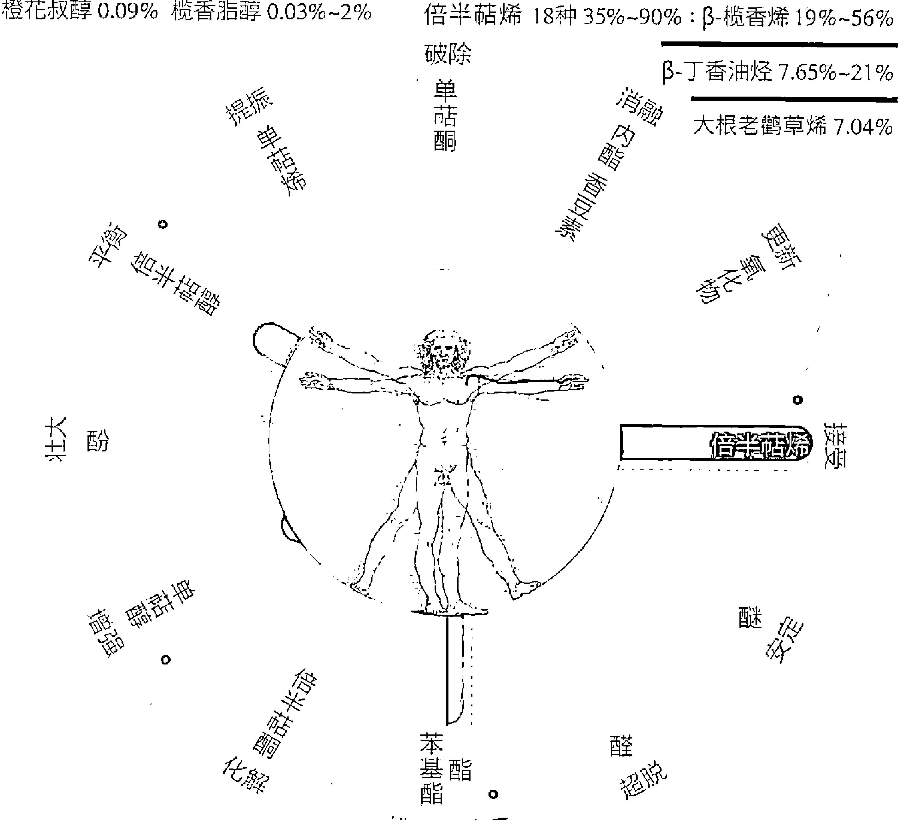

**心灵效益** | 放下挡箭牌，给自己的情感解锁

### 注意事项

- 溶剂萃取的原精和蒸馏的精油组成差距不大，只是比例不同。但鲜花的顶空分析显示酯类最多，而蔬果香的乙酸异丁酯占比最高（81.9%）。

沉香醇 0.08%    脂肪酸酯 9 种 <23% : 乙酸异丁酯 3.12%    己酸异丁酯 0~18.19%

## 红香桃木
Red Myrtle

需要无死角的全日照，但过于干热的空气会使叶片凋萎。冬季若有 7℃ 的冷却期将生长得更好，不能忍受潮湿的土壤。

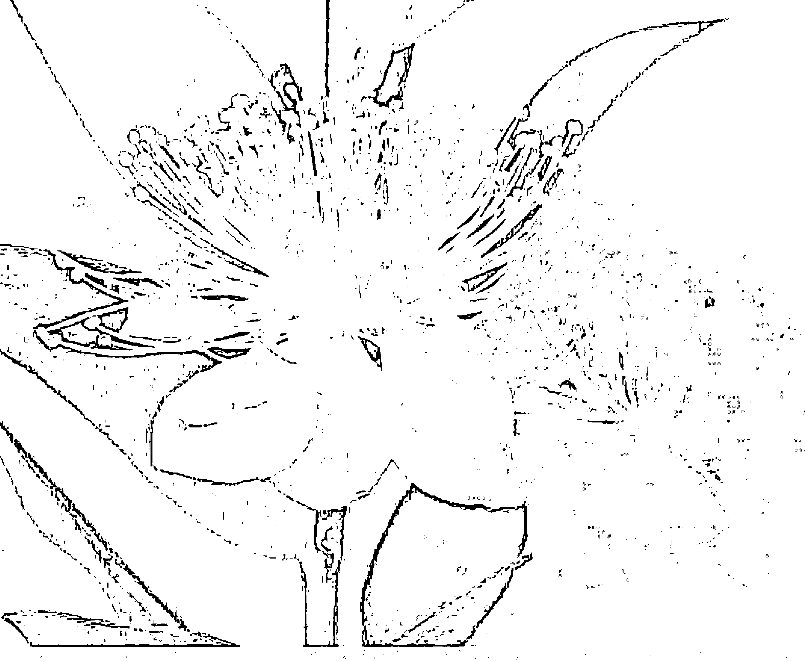

### 药学属性

- 抗菌，抗念珠菌，抗病毒（α-丁香油烃的作用），杀蚊虫
- 抗痉挛
- 降血糖，疏通静脉与淋巴
- 消炎，抗氧化

### 适用症候

- 牙齿的根管治疗，呼吸道与泌尿道的感染，停留于环境污染严重地区
- 紧张时的肠胃不适，过度疲劳引起的经期不适
- 四体不勤的生活形态导致的贪嗜甜食、水肿、静脉曲张
- 皮肤松弛

| 学名 | Myrtus communis, CT Myrtenyl acetate |
| :--- | :--- |
| 其他名称 | 摩洛哥香桃木 / Moroccan Myrtle |
| 香气印象 | 在秋风中飘飞的粉红丝巾 |
| 植物科属 | 桃金娘科香桃木属 |
| 主要产地 | 摩洛哥、葡萄牙、阿尔巴尼亚、希腊 |
| 萃取部位 | 连枝带叶（蒸馏） |
| 适用部位 | 三焦经、喉轮 |
| 核心成分 | 萃油率 0.74%，35 个可辨识化合物 |
| 心灵效益 | 放下评分表，笑看成败 |

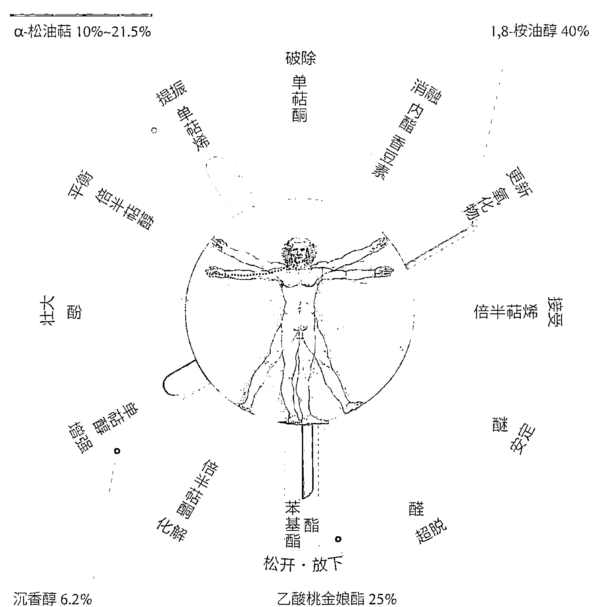

### 注意事项

- 地中海地区的香桃木分两类化学品类系，以乙酸桃金娘酯的有无来区别。
- 即使是相同化学品类系的香桃木，也会因为地形、气候、萃取部位和季节差异而使精油的气味（成分比例）产生很大的差距。

## 水果鼠尾草
Fruity Sage

原生于洪都拉斯，1950 年之后才成为园艺新宠，开大型洋红色花，耐寒（1℃ ~ -2℃ 仍可存活），冬天开花。喜欢潮湿、砂质土以及全日照。

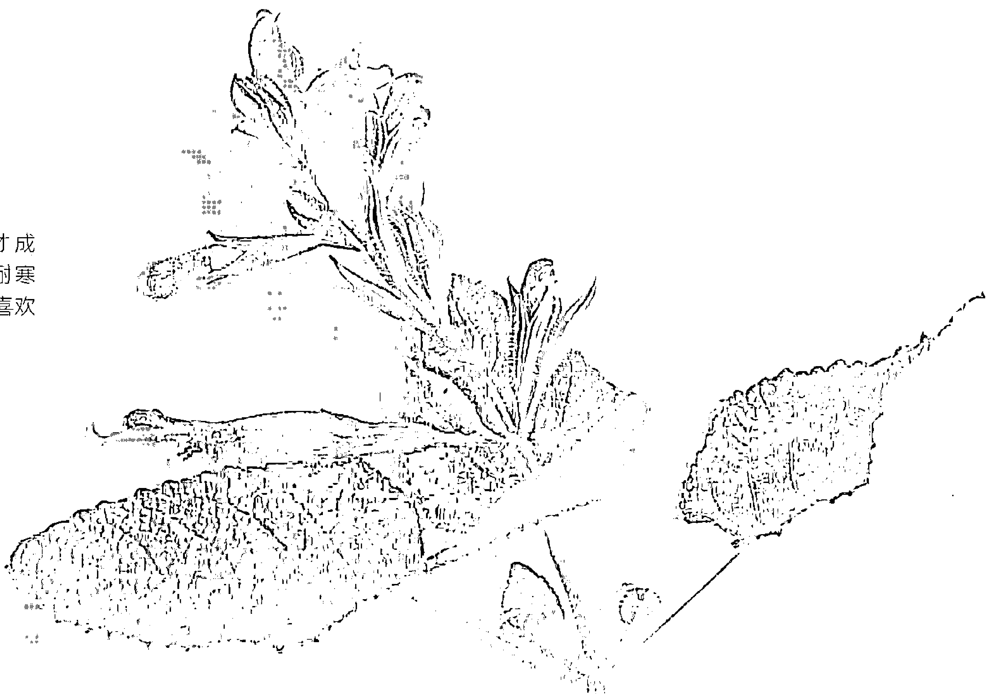

学名 | *Salvia dorisiana*
其他名称 | 水蜜桃鼠尾草 / Peach Sage
香气印象 | 加了许多热带水果的鸡尾酒
植物科属 | 唇形科鼠尾草属
主要产地 | 中南美洲
萃取部位 | 开花的全株药草（蒸馏）
适用部位 | 心包经、心轮
心灵效益 | 放下一成不变的生活，享受跳线与作怪

药学属性 | 适用症候
--- | ---
1. 消炎，舒张支气管，减轻支气管黏膜肿胀 | 气喘，支气管炎
2. 驱蚊，杀孑孓 | 户外活动，阴暗潮湿的环境
3. 皮肤瘙痒 | 蚊虫叮咬，食物引起的皮肤发痒
4. 镇静安抚 | 人多拥挤引起的胸闷与烦躁

橙花叔醇
α-杜松醇
单萜烯 8 种：柠檬烯
双萜烯：2,6-二甲基-10-对甲苯基-十一烷-2,6-二烯

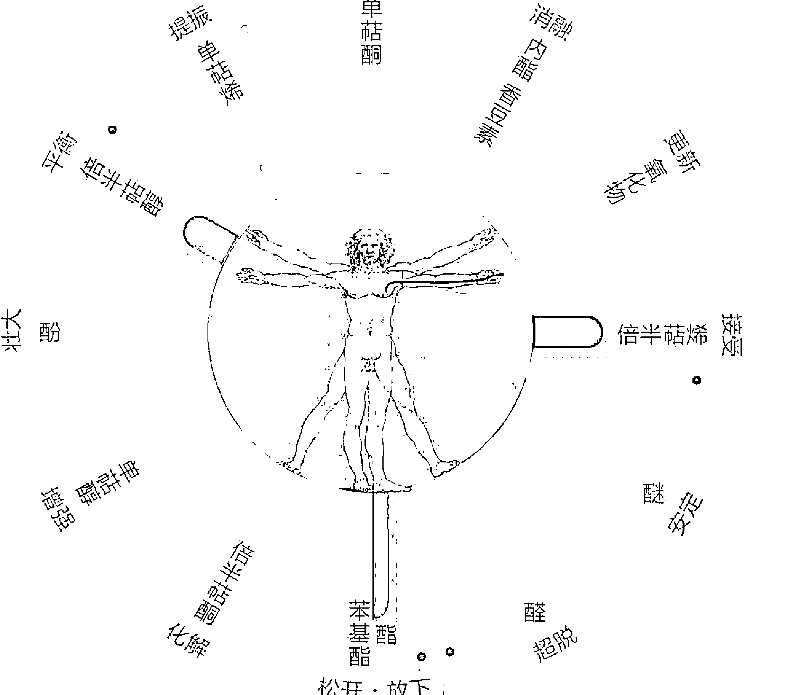

杜酚
倍半萜烯 焕然
醚 安抚
醛 超脱
苯基酯
松开 · 放下
倍半萜酮 化解
倍半萜醇 承担
萜品烯
沉香醇
柠檬烯
石竹烯
抗氧化
破除
单萜酮
消融
内酯
倍半萜烯
芳香醛
萜品烯

### 注意事项

- 存在另外两种化学品系：倍半萜醇型（以喇叭茶醇 45.8% 为主）；及倍半萜烯型（以香树烯 25.7% 和古芸烯 17% 为主）。

羧基酯：紫苏酸甲酯 17%
酯：乙酸紫苏酯 27%
β-丁香油烃 10%

## 快乐鼠尾草
Clary Sage

原生于地中海北部盆地与中亚，喜欢日照，耐旱，无法忍受高温潮湿。土壤愈肥沃，植株愈高大。但在贫瘠之地也能短小精悍地活着。

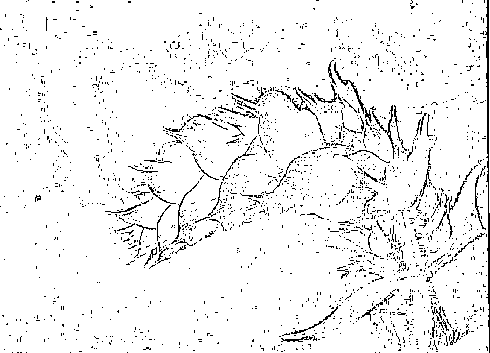

### 药学属性

- 类雌激素，催情
- 补强静脉，抗菌、抗真菌
- 抗高胆固醇，诱发细胞凋亡
- 抗痉挛、抗癫痫、补神经（延髓与小脑），启动鸦片类受体，调节多巴胺

### 适用症候

- 月经不至，少经，前更年期综合征，阴道感染（激素不足引起）
- 静脉曲张，痔疮，静脉瘤，皮肤真菌感染，皮肤粗干
- 胆固醇过高，直肠癌，白血病
- 慢性疲劳综合征，抑郁症（实验效果超过薰衣草与罗马洋甘菊）

| 项目 | 内容 |
| --- | --- |
| 学名 | *Salvia sclarea* |
| 其他名称 | 麝香鼠尾草 / Muscatel Sage |
| 香气印象 | 赤裸上身、手捧龙涎香的法老王俊奴 |
| 植物科属 | 唇形科鼠尾草属 |
| 主要产地 | 俄罗斯、美国、法国、保加利亚 |
| 萃取部位 | 开花的全株药草（蒸馏） |

**含硫化合物**: 薄荷硫化物
**双萜醇**: 香紫苏醇 1.2%，泪杉醇 0.2%
**香豆素**: 微量
**单萜醇 11 种:**
**沉香醇 16%**
**酯 11 种:** 乙酸沉香酯 62%~75%
**β-丁香油烃 3%** **大根老鹳草烯 4%**

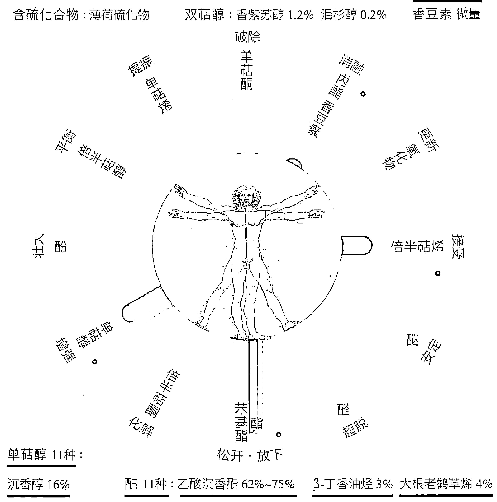

### 适用部位

任脉、性轮

### 核心成分

萃油率 0.3%，59 个可辨识化合物（占 94.2%，总共约 250 个组成成分）

### 心灵效益

放下矜持，跟着自己的心跳摆动

### 注意事项

- 乳房纤维囊肿与雌激素相关癌症患者避免使用。

## 鹰爪豆
Spanish Broom

通常都长在干燥石灰岩上，生长快速。和许多豆科植物一样有固氮作用。耐空气污染，耐盐分，耐贫瘠，但不耐阴。日照愈强，香气愈足。

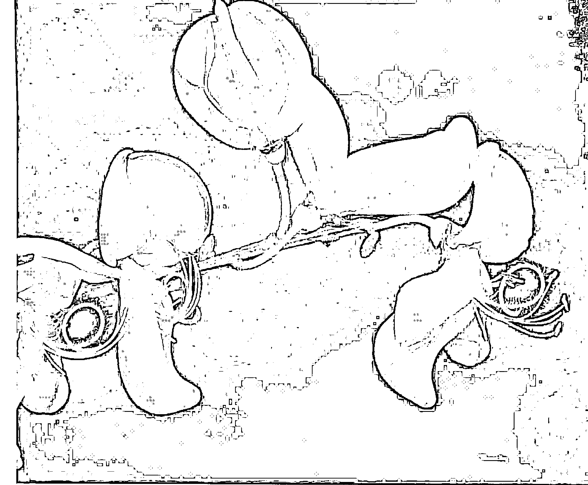

学名 | Spartium junceum
其他名称 | 金雀枝 / Genet
香气印象 | 杜丽娘与柳梦梅的游园惊梦
植物科属 | 豆科鹰爪豆属
主要产地 | 意大利、法国
萃取部位 | 花（溶剂萃取）
适用部位 | 心经、心轮
核心成分 | 萃油率 0.027%，48 个可辨识化合物
心灵效益 | 放下反复和迟疑，给出爱的承诺

### 药学属性

- 消炎，止痛
- 通便，通经，利尿
- 抗氧化，强心，收缩血管
- 镇静

### 适用症候

- 胃溃疡，腹脘长期闷痛，胸口紧缩
- 便秘，少经，经期推迟，水肿
- 心脏水肿，心肌衰弱
- 心绪不宁，心烦意乱

丁香酚 0.06%

游离酸 10 种以上 >50%：辛酸 次亚麻油酸 棕榈酸
饱和植物石蜡：二十五烷 0~16%

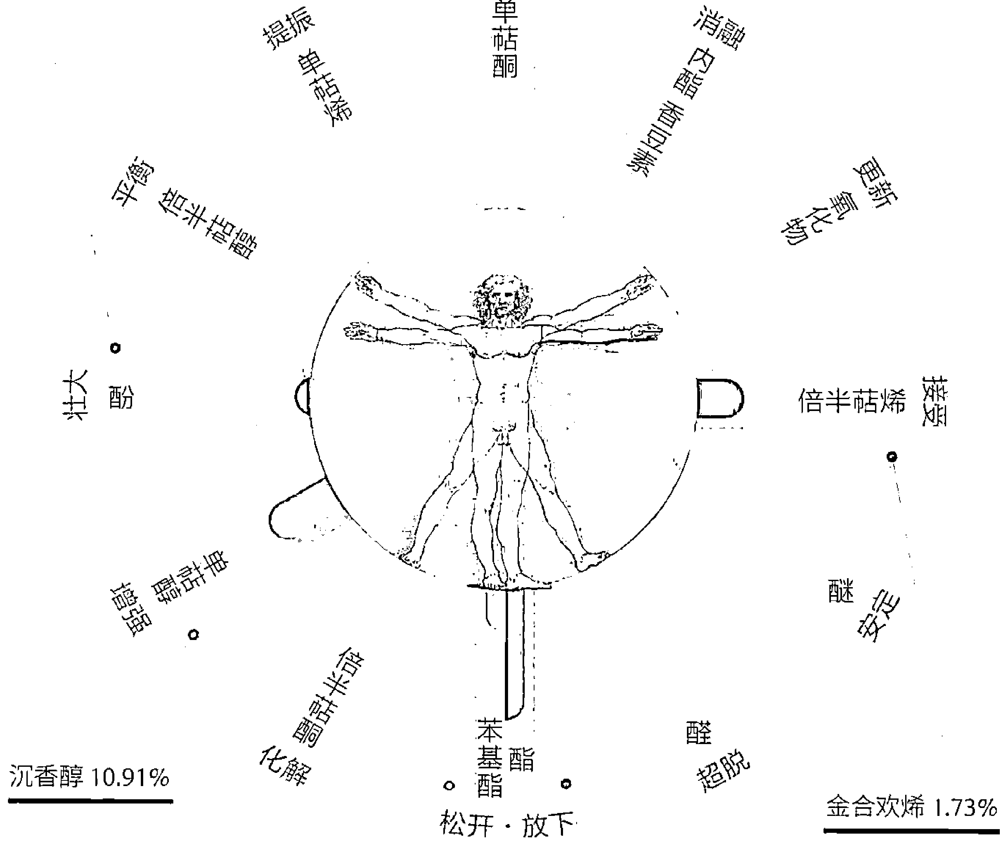

### 注意事项

- 过量会导致反胃与血压降低。
- 可缓慢释放与长效止痛，用后 3~6 个小时可持续发挥作用。

沉香醇 10.91%

金合欢烯 1.73%

苯基醇：苯乙醇 1.3% 酯 >30%：棕榈酸乙酯 14.56% 亚麻酸甲酯 7.13% 油酸乙酯 4.86%

# 新精油图鉴

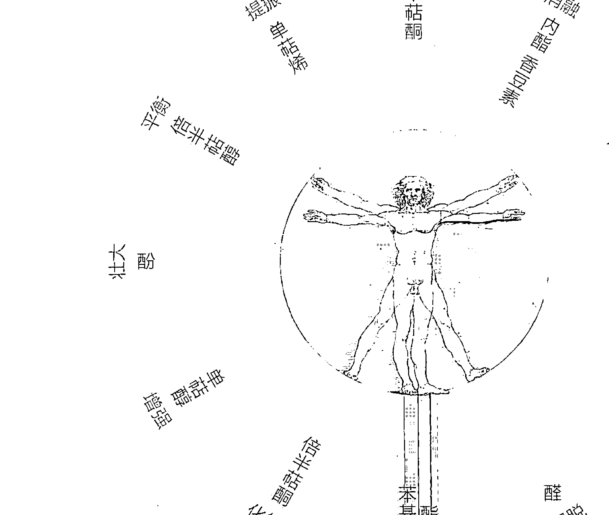

VII 苯基酯类 Benzene-based Ester
含有苯环（又称芳香环）的酯类。此外，苯基（芳香族）的酯类也类似，因此归为同一组。

## 银合欢
Mimosa

原生于澳大利亚东南部，广布地中海气候区，是灌木林火灾后的先驱植物。可以快速长到 30 米高，但树龄到 30 年左右便会让位给其他树种。

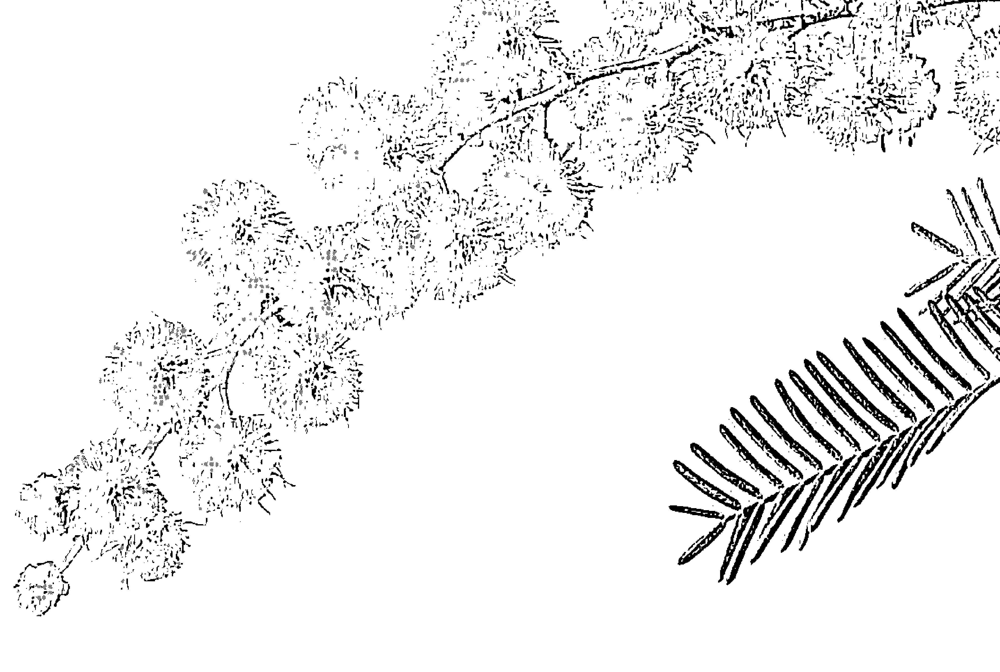

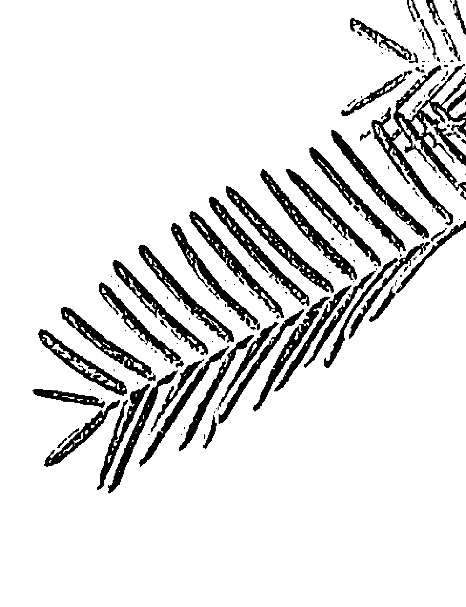

| 项目 | 内容 |
| :--- | :--- |
| 学名 | Acacia dealbata |
| 其他名称 | 银栲 / Silver Wattle |
| 香气印象 | 沉鱼落雁，闭月羞花 |
| 植物科属 | 豆科含羞草亚科金合欢属 |
| 主要产地 | 摩洛哥 |
| 萃取部位 | 花（溶剂萃取） |
| 适用部位 | 肺经、心轮 |
| 核心成分 | 萃油率 0.018%，37 个可辨识化合物 |
| 心灵效益 | 松开紧锁的眉头，抿嘴而笑 |

### 药学属性

- 抗炎症，抗氧化，抑制酪氨酸酶
- 抑制雄性激素受体的信息，抑制 NF-kB，抗细胞突变
- 抑制 TH2 淋巴细胞，减少分泌白介素 IL-4，保护肾脏，抗疟原虫
- 降坏胆固醇 LDL，抑制生物酵素 PTP-1B

### 适用症候

- 关节炎，整形手术后的伤口修复，淡化肤色
- 降低前列腺癌的死亡率及再发率，化解化疗的副作用，皮肤黑色素瘤，胰脏癌，乳腺癌
- 气喘，肾结石，疟疾
- 心血管疾病，糖尿病

碳氢化合物：8-十七烷烯 6%
三萜化合物：羽扇烯酮 20% 羽扇豆醇 7.8%

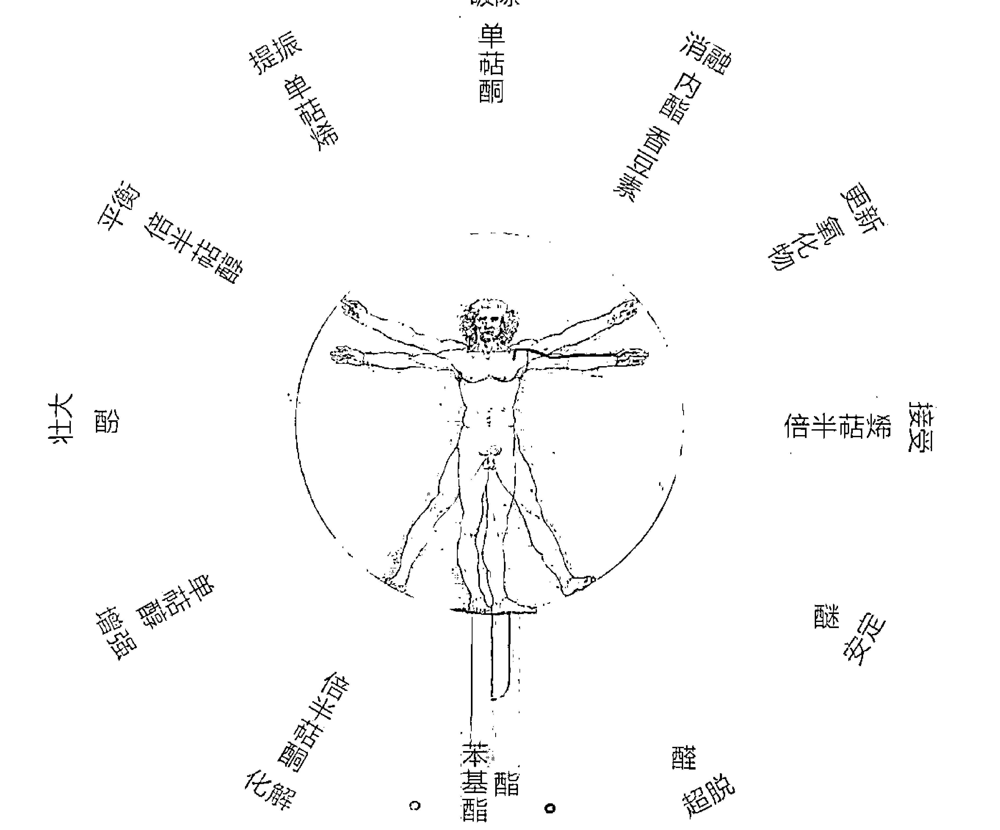

### 注意事项

- 因为原精黏稠，通常会加入 40% 的酒精以利使用。

苯基酯与醇：苯乙醇 洋茴香酸甲酯
棕榈酸乙酯
酸：棕榈酸

## 大高良姜
Galanga

常生于海拔 100~1300 米的阴湿草丛、灌木丛及林下，土质需肥沃。3 个月即可收做香料，7 个月以后可萃油，制药最好等 36~42 个月。

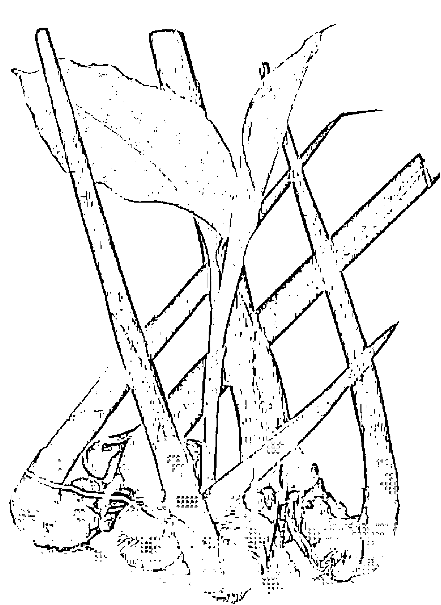

| 类别 | 信息 |
| ---- | ---- |
| 学名 | *Alpinia galanga* |
| 其他名称 | 山姜 / Greater Galangal |
| 香气印象 | 蒲公英的种子飞飞飞 |
| 植物科属 | 姜科山姜属 |
| 主要产地 | 印度、中国、印尼、马来西亚 |
| 萃取部位 | 根茎（蒸馏） |

| 药学属性 | 适用症候 |
| ---- | ---- |
| 1. 抗菌，抗霉菌（白色念珠菌），抗卡他 | 卡他性与气喘性支气管炎，肺结核 |
| 2. 消炎，止痛 | 风湿，骨关节炎，腰痛，胸口痛 |
| 3. 抗痉挛，降血糖，抗溃疡 | 胀气，腹泻，胃炎，晕船呕吐，食物中毒导致的肠绞痛，糖尿病，消化性溃疡 |
| 4. 抗肿瘤，抗 HIV（这两个作用取决于 1'-乙酰氧基胡椒酚乙酸酯） | 腹水瘤，骨髓瘤，艾滋病 |

### 适用部位

脾经、本我轮

### 核心成分

萃油率 0.27%~0.56%，47 个可辨识化合物（占 87.7%）

倍半萜醇 12 种：姜稀醇 1.6% 1,8-桉油醇 20%~50% 倍半萜烯 12 种：β-倍半水茴香萜 5%

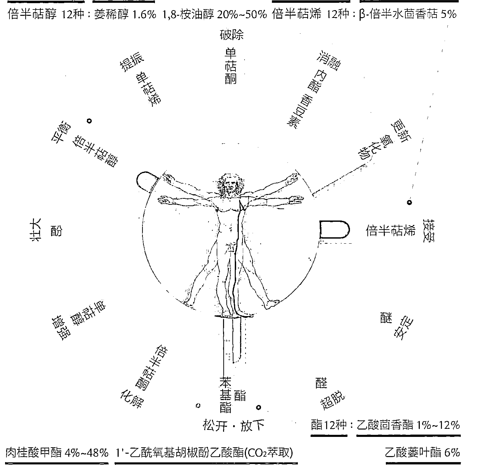

### 心灵效益

松开上紧的螺丝，做个开心的自由落体

### 注意事项

- 大高良姜的成熟果实也是一味中药，名为“红豆蔻”。
- 大高良姜有五种化学品系，桉油醇通常都是占比最高的成分。不过不同产地的精油组成与比例差距很大。
- 另外有一品种小高良姜（*A. officinarum*），中药称“高良姜”，效用相近。请见本书 71 页。

肉桂酸甲酯 4%~48% 1'-乙酰氧基胡椒酚乙酸酯（CO₂ 萃取） 酯 12 种：乙酸茴香酯 1%~12% 乙酸蒌叶酯 6%

## 黄桦
Yellow Birch

树皮黄铜色，性喜冷凉北坡，见于沼泽与溪涧，不耐干热，遍布北美东部。因为生长条件类似，常与东部铁杉并立，会像糖枫一样流出大量的树汁。

学名 | *Betula alleghaniensis*
其他名称 | 黄金桦 / Golden Birch
香气印象 | 印度安战士渗着汗滴的二头肌
植物科属 | 桦木科桦木属
主要产地 | 美国
萃取部位 | 枝条（蒸馏）

### 适用部位

膀胱经、本我轮

### 核心成分

萃油率 0.2%~0.41%

### 心灵效益

松开上班族的白衬衫，挑战户外体能活动

| 药学属性 | 适用症候 |
| :--- | :--- |
| 1. 抗痉挛 | 风湿肌痛，肌腱炎，抽筋，关节炎，肱骨上髁炎 |
| 2. 消炎 | 高血压，头痛 |
| 3. 激励肝脏，净化血液 | 肝功能轻度失调 |

### 注意事项

- 甜桦（*Betula lenta*）和黄桦的气味都和白珠树相同。
- 真正的桦树精油极难得见，目前市场上的桦树精油多是合成的水杨酸甲酯，存在有害人体的同分异构物。

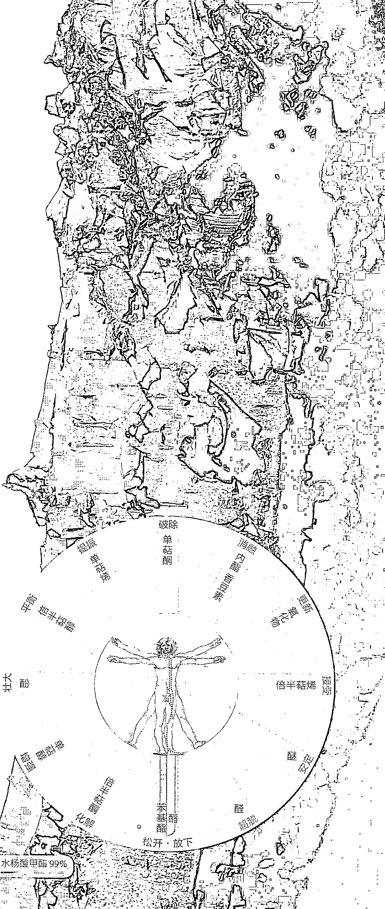# 波罗尼花

Boronia

原生于澳大利亚西南潮湿低地，与赤桉、白干层共生。种子善于休眠，一旦冒出地表便会飞快生长。

-   药学属性
1. 抗痉挛
2. 抑制肿瘤细胞生长，抗转移
3. 费洛蒙作用

-   适用症候
- 胸闷，空调引起的咳嗽，经前综合征导致的腹部沉重
- 乳腺癌，肝癌，白血病
- 缺乏性吸引力，缺乏性趣

| 项目 | 内容 |
|------|------|
| 学名 | Boronia megastigma |
| 其他名称 | 棕色波罗尼 / Brown Boronia |
| 香气印象 | 穿着YSL品尝马卡龙 |
| 植物科属 | 芸香科波罗尼属 |
| 主要产地 | 澳大利亚 |
| 萃取部位 | 花（溶剂萃取） |

适用部位 肾经、性轮

核心成分
凝香体萃油率0.4%~0.8%，从中可得60%原精，160个可辨识化合物

心灵效益 | 松开四维八德的教条，拿到爱的悠游卡

-   化学成分列表
- α- & β-松油萜
- 柠檬烯
- 碳氢化合物: 8-十七烷烯
- β-紫罗兰酮
- 4-牻牛儿氧基肉桂酸甲酯
- 4,5-羟基牻牛儿氧基肉桂酸甲酯
- 乙酸十二烷酯
- 8-羟基沉香酯

注意事项
1. 这种原精被食品加工业用来增添水果风味。它也是萃取β-紫罗兰酮的重要天然资源。

# 苏刚达
Sugandha Kokila

高24米，生长于潮湿地区，最高分布海拔为1300米。叶片油绿，树皮暗灰，木材坚实耐用，全株芳香。

-   学名: Cinnamomum glaucescens / C. cecicodephne
- 其他名称: 灰樟浆果 / Cinnamon Berry
- 香气印象: 猎人在阔叶林里临时搭的小屋
- 植物科属: 樟科樟属
- 主要产地: 尼泊尔
- 萃取部位: 果实 (蒸馏)
- 适用部位: 胃经、本我轮
- 心灵效益: 松开令人窒息的熊抱. 独自一人出去走走

-   1. 抑制黄曲霉毒素生长，杀虫（如绿豆象）
2. 消胀气、助消化、健胃
3. 放松肌肉，止痛
4. 补强神经

-   - 谷物和豆类坚果的防蛀
- 暴饮暴食后遗症，情绪引起的茶饭不思
- 关节炎，感冒与经期的关节酸痛，抽筋
- 受到过度关注的疲惫感，无所适从的空虚感

-   1. 这种干燥浆果是尼泊尔使用最广的香料，木材也常被砍伐使用；在野外已成为濒危树种。尼泊尔政府规定不能以植物原料出口，必须先萃取成油，并开始执行人工栽种计划。

# 橘叶
Petitgrain Mandarin

喜欢温暖湿润但排水良好的山坡地，是今日各种柑橘水果的四大元祖之一。主要分四类：地中海橘、国王橘、萨摩橘和各种橘。

-   学名：Citrus reticulata Blanco var. Balady
- 其他名称：桔子叶 / Mandarin Orange Leaf
- 香气印象：松风吹解带，山月照弹琴
- 植物科属：芸香科柑橘属
- 主要产地：埃及、意大利
- 萃取部位：叶片（蒸馏）
- 适用部位：心包经、心轮

| 药学属性 | 适用症候 |
|---|---|
| 1. 止痛，抗痉挛 | 呼吸道敏感引起的咳嗽，消化道敏感引起的腹泻与绞痛 |
| 2. 保护神经 | 神经官能症，自主神经失调，精神分裂症 |
| 3. 助眠 | 失眠 |
| 4. 镇静安神 | 创伤后压力综合征，暴力倾向 |

γ-萜品烯 12.6% 对伞花烃 3.1%

萜品烯-4-醇 1.63% 邻氨基苯甲酸甲酯 65.71% 棕榈酸乙酯 1.83% 亚麻酸乙酯 2.64%

-   核心成分：萃油率 0.1%~0.4%，42 个可辨识化合物（占 88.2%）
- 心灵效益：松开牢牢抓住的爱，让彼此自由

-   1. 橘的栽培种很多，橘叶精油因此可分出三种化学品系：
   a. 氨基苯甲酸甲酯——来自 var. Balady，是经典型，其他变种均不含此成分。
   b. 沉香醇/百里酚——来自 var. Yussuf Effendy, var. Dancy, var. Maya。
   c. 桧烯/萜品烯-4-醇——来自 var. Clementine, var. Michal, var. Nectarine, var. Satsuma。科西嘉岛产的克莱蒙橘叶精油就属于这一类，激励效果较强。
2. 中国也有很多橘，而中国橘叶的精油成分以萜品烯与沉香醇为主，比较接近 b 型。

# 沙枣花
## Persian Olive

落叶有小刺的乔木，生命力极强，抗旱抗风沙，耐盐碱贫瘠，根能固氮。野生时只分布于荒漠，16℃以上开花，20℃以上结果（盛夏高温期）。

-   学名 | Elaeagnus angustifolia
- 其他名称 | 银柳 / Silver Berry
- 香气印象 | 容妃和卓氏入官，带来祥瑞（荔枝在北方结果）
- 植物科属 | 胡颓子科胡颓子属
- 主要产地 | 中国（甘肃、新疆）、土耳其、伊朗、俄罗斯（中亚与西亚地区）
- 萃取部位 | 花朵（溶剂萃取）

适用部位 肺经、心轮
核心成分 萃油率 0.62%，17 个可辨识化合物（占 89.27%）

心灵效益 | 松开盖头，大方展现美丽

| 药学属性 | 适用症候 |
|----------|----------|
| 1. 保护神经 | 神经衰弱，嘈杂喧闹的环境 |
| 2. 抗痉挛，止咳平喘 | 胸闷气短，肺热咳嗽，支气管炎 |
| 3. 健胃 | 胃痛，腹泻，胃腹胀痛，食欲不佳，消化不良 |
| 4. 补身 | 大病初愈，身体虚弱 |

双萜醇：3,7,11,15-四甲基-2-十六碳烯-1-醇 0.25% 烷酮：6,10,14-三甲基-2-十五烷酮 0.1%

### 注意事项

1. 花的使用见于苗药、维吾尔药、蒙药。是波斯传统中过年必备七样摆桌供品之一。
2. 蒸馏所得的精油含 54 个化合物（占 96.89%），主要成分为反式肉桂酸乙酯 (77.36%)、(E)-2-甲氧基-4-丙烯基苯酚 (3.03%)、乙缩醛 (2.70%)、顺式肉桂酸乙酯 (1.09%)、苯乙酸乙酯 (1.06%)、苯甲酸乙酯 (1.03%)、反式橙花叔醇 (1.03%)。
3. 超临界萃取的花油含 60 个化合物：正二十烷 (29.48%)、9-辛基十七烷 (29.48%)、二十一烷 (13.52%)、苯甲酸烷基酯 (13.63%)。

苯基酯 11种 82%：肉桂酸乙酯 77% 肉桂酸甲酯 2% 油酸乙酯 1% 十八烷酸乙酯 0.13%

# 芳香白珠
Fragrant Wintergreen

高 1.75 米的小树，长在喜马拉雅海拔 1500-2700 米山区。习惯很大的雨量和空气湿度，适应酸性土壤，需要遮荫。

| 学 名 | Gaultheria fragrantissima |
| :--- | :--- |
| 其他名称 | 尼泊尔冬青 / Wintergreen Nepalese |
| 香气印象 | 在深夜食堂里无限畅饮 |
| 植物科属 | 杜鹃花科白珠树属 |
| 主要产地 | 尼泊尔、印度 |
| 萃取部位 | 叶片（蒸馏） |
| 适用部位 | 膀胱经、本我轮 |
| 核心成分 | 萃油率 1.22%~1.79%，20 个可辨识化合物 |
| 心灵效益 | 松开职场伦理的瓶塞，释出积压已久的怨气 |

| 药学属性 | 适用症候 |
| :--- | :--- |
| 1. 抗痉挛 | 肌腱炎，抽筋，背痛，网球肘，风湿，关节炎 |
| 2. 扩张血管 | 高血压，冠状动脉炎（发作时有治愈作用） |
| 3. 消炎，抗菌，抗霉菌，杀虫 | 着凉症状，肠绞痛，牙齿退化 |
| 4. 激励肝脏 | 头痛（肝毒循环所致），发热 |

### 注意事项
1. 30ml 白珠树精油 = 171 颗阿司匹林药片，过量使用会产生气喘等过敏反应，外用亦然。
2. 传统的冬青油，来自匍匐白珠 (Gaultheria procumbens，美国冬青)，高约 10 厘米，生长缓慢，萃油率 0.66%~1.30%，现已罕见生产。
3. 中国西南也有芳香白珠，另外广泛用来制药与萃油的是滇白珠 (Gaultheria yunnanensis)，市场上叫天然冬青油。

# 大花茉莉
Jasmine

原生于南亚，喜爱温暖湿润的气候、充足的阳光和具黏质的壤土。枝条柔长而垂坠，常绿攀缘，须用屏架扶起。

-   学名 | Jasminum officinale var. grandiflorum
- 其他名称 | 法国素馨 / Spanish Jasmine
- 香气印象 | 地平线上方缤纷璀璨的烟火
- 植物科属 | 木犀科素馨属
- 主要产地 | 摩洛哥、埃及、印度
- 萃取部位 | 花 (溶剂萃取)
- 运用部位 | 任脉、性轮
- 核心成分 | 萃油率 0.2%，60 个可辨识化合物

心灵效益 | 松开冷硬的隔阂，引爆热情与自信

| 药学属性 | 适用症候 |
| :--- | :--- |
| 1. 启动过氧化物酶体增殖物活化受体 α (PPAR-α)，调节肝脏脂肪代谢，抗结核 | 肝炎，口腔炎，皮肤瘙痒，淋巴结结核 |
| 2. 提高性欲，促进催产素 | 阳痿，性冷淡，分娩 |
| 3. 抑制过高的雌激素，减缓环境激素的刺激 | 月经不调，痛经，白带，睾丸炎，乳腺炎 |
| 4. 提高脑中 γ-氨基丁酸的效用，抗抽搐 | 辗转反侧，焦躁不安，癫痫，头痛 |

-   沉香醇 4.6%
- 丁香酚 3%
- 含氮化合物：吲哚 5.5%
- 金合欢烯 3.77%

-   1. 蒸馏而得的精油，可辨识组分有 30 个（占 99.28%），占比高的为植醇 25.77%，苯基酯 <10%，不含吲哚和素馨酮。
2. 可能降低黄体酮含量，怀孕初期不建议使用。
3. 另一品种天星茉莉 (Jasminum auriculatum) 的花形较接近大花茉莉，枝条具半蔓性，花期长而花苞量大，又能抗瘿螨，所以原精价格较低。印度传统用它的花抗尿路结石与肺结核，关键成分为硬脂酸甲酯-D35 和 4-甲基-2-丙基-1-戊醇。

-   素馨酮 3%
- 苯基酯与醇：乙酸苄酯 25.5%
- 苯甲酸苄酯 + 植醇 24.25%
- 苯甲醇 0.38%
- 邻氨基苯甲酸甲酯 0.5%
- 苯甲酸己烯酯 1.18%
- 乙酸沉香酯 7.5%

# 小花茉莉
Sambac

半落叶的蔓性小灌木，来自潮湿的热带气候，耐雨力强，下雨不易落蕾。畏寒、畏旱，不耐碱土，砂质壤土较适合。通风良好、半阴环境生长最好。

-   1. 促进β脑波，调节自主神经，解郁，抗肿瘤
2. 抗痉挛，止痛，血管舒张
3. 抑制过高的血浆泌乳素，强力催情
4. 疗愈伤口，抗菌消炎

-   1. 重度抑郁，达尔顿腹水淋巴瘤，子宫颈癌，肿瘤相关成纤维细胞
2. 支气管敏感引起的咳嗽，胸口紧闷，耳痛，头痛，下痢腹痛，心动过速
3. 宫冷不孕，产后抑郁症，闭经，睾丸功能不全，性功能障碍
4. 敏感肌，疮毒痘瘤，黑眼圈

| 学 名 | Jasminum sambac |
|---|---|
| 其他名称 | 阿拉伯茉莉 / Arabian Jasmine |
| 香气印象 | 佛罗伦萨的窗外有蓝天 |
| 植物科属 | 木犀科素馨属 |
| 主要产地 | 印度、中国 |
| 萃取部位 | 花 (溶剂萃取) |

适用部位 肝经、性轮

核心成分
萃油率0.1%，81个可辨识化合物 (占46%，剩余成分的含量皆小于0.03%)

香橙醇 4.86%

含氮化合物：吲哚 0.08%~5.5%

α-丁香油烃 6.9%

沉香醇 11%~23%

素馨酮 1.4%~5.2%

苯基酯与醇：乙酸苄酯 26.09%

丙酸苄酯 9.65%  苯甲醇 5.79%  邻氨基苯甲酸甲酯 4.1%  苯甲酸己烯酯 17.19%

心灵效益 | 松开攫取神志的鬼魅，让阳光照进心坎

### 注意事项

1. 蒸馏所得的精油中，吲哚与素馨酮的含量明显低于原精，而单萜醇的占比则高于苯基酯。
2. 怀孕初期最好暂停使用。

# 苏合香
Styrax

原生于小亚细亚南部的冲积平原，年雨量1000毫米，年均温度18℃。特别喜欢肥沃潮湿的土壤，例如河岸。树高30米，6月开始取树脂。

| 项目 | 值 |
| --- | --- |
| 学名 | Liquidambar orientalis |
| 其他名称 | 帝膏 / Oriental Sweetgum |
| 香气印象 | 温文儒雅的书生临窗挥毫 |
| 植物科属 | 枫香科枫香属 |
| 主要产地 | 中国、土耳其、叙利亚 |
| 萃取部位 | 树脂（蒸馏） |

| 药学属性 | 适用症候 |
| --- | --- |
| 1. 杀白蚁，强力抗霉菌 | 阴暗潮湿的空间 |
| 2. 降低过度的钙离子内流，提高血脑屏障通透性，促进γ-氨基丁酸以抗惊厥 | 脑部缺血缺氧的损伤，猝然昏倒，阿尔兹海默病，癫痫，延长持续睡眠的时间 |
| 3. 祛痰，降低血清NO、丙二醛及肿瘤坏死因子α含量 | 痰湿体质，胃溃疡，坏疽与伤口不愈 |
| 4. 抗氧化、抗血小板聚集及抗血栓作用 | 心肌缺血缺氧导致的损伤，高山病 |

适用部位 心包经、心轮

核心成分
52个可辨识化合物（占73%）

心灵效益 | 松开成功立业的紧箍咒，做个和光同尘的原子

-   注意事项
1. 本品在中药被归类为芳香开窍药，只宜暂用，不可久服。

# 白玉兰
Magnolia Blossom

20 米高的常绿乔木，喜欢日照充足温度高、保湿力强且微酸的土壤。根部肥厚多肉，不易移植，但植株发育快且树冠大，需要很大的生长空间。

| 项目 | 内容 |
| :--- | :--- |
| 学名 | Michelia alba / Magnolia × alba |
| 其他名称 | 白兰 / Champaca, White |
| 香气印象 | 神父把圣水洒在婴儿头上 |
| 植物科属 | 木兰科含笑属 |
| 主要产地 | 中国、印度 |
| 萃取部位 | 花（溶剂萃取） |
| 适用部位 | 肺经、心轮 |
| 核心成分 | 萃油率 0.96%，100 个可辨识化合物（含量小于 0.05% 的成分占 70% 以上） |
| 心灵效益 | 松开追逐斗争的发条，虚心谦让 |

### 药学属性与适用症候

| 药学属性 | 适用症候 |
| :--- | :--- |
| 1. 止咳化痰 | 咳嗽，百日咳，鼻炎流涕，鼻塞不通 |
| 2. 开胸散郁，抗痉挛 | 中暑胸闷，气滞腹胀，晕车晕船 |
| 3. 除湿化浊，抗菌，抗念珠菌，消炎 | 脾湿型白带，狐臭，皮肤敏感 |
| 4. 安神 | 心悸，紧张，脑子转不停 |

沉香醇 29%~43.76%

酸：2-甲基丁酸 33%

### 注意事项

1. 玉兰叶 (Magnolia Leaf) 也可蒸馏萃油，含沉香醇 80%，长于治疗慢性支气管炎。
2. 蒸馏所得的玉兰精油萃油率较高，含有压倒性的沉香醇 (66%~72.8%)，微量吲哚，但不含苯乙醇与脂肪族酯类。脂吸法则可得到高比例的吲哚 (35.49%)。原精中未见吲哚的原因或许要归因于己烷的极性与混溶作用。
3. 木兰属植物 Magnolia denudata 也被称作白玉兰，两者花形气味均不同。

# 黄玉兰
Champaca

原生于喜马拉雅山东麓海拔1000米以下，高可达50米。与山含笑杂交而得白玉兰，树形与花都和白玉兰相仿，但花色金黄。

-   **学名**: Michelia champaca / Magnolia champaca
- **其他名称**: 金厚朴 / Red Champaca
- **香气印象**: 小女孩梦想中的粉红蓬蓬裙
- **植物科属**: 木兰科含笑属
- **主要产地**: 印度、中国、印尼
- **萃取部位**: 花（溶剂萃取）
- **适用部位**: 心包经、心轮
- **核心成分**: 萃油率 0.03%，250 个可辨识化合物
- **心灵效益**: 松开缠绕心田的藤蔓，喜悦重生

| 药学属性 | 适用症候 |
|----------|----------|
| 1. 止咳化痰，退热 | 咳嗽，支气管炎，发热 |
| 2. 降血糖，抗胃酸过多 | 糖尿病，胃溃疡，胃灼热 |
| 3. 愈合伤口 | 麻疯，外伤流血，皮肤病 |
| 4. 抗痉挛，止痛 | 呕吐，肠绞痛，风湿，痛风，排尿困难，痛经 |

-   1. 蒸馏所得的精油含有比较多的倍半萜烯以及单萜烯，鲜花经过顶空分析则是以倍半萜烯与苯基酯为主。

沉香醇 0.2%~11% 酸：2-甲基丁酸 33% 含氮化合物：吲哚 2.5%~12% β-紫罗兰酮 0.2%~3.4% 双氢-β-紫罗兰酮 0.3%~10% α-紫罗兰酮 0.1%~6.8% 苯甲酸甲酯 1%~5% 乙酸苄酯 0.1%~4% 邻氨基苯甲酸甲酯 1.4%~9% 脂肪酸酯：亚油酸甲酯 1%~18% 苯基酯与醇：苯乙醇 2%~34%# 秘鲁香脂
Peru Balsam

原生于中美洲，高约 18 米，近亲吐鲁香脂则可长到 40 米高。分布在海拔 200~690 米之间的热带森林，常见于河流旁，木质耐蛀防腐。

- 学名 | Myroxylon balsamum var. pereitae
- 其他名称 | 奎纳 / Quina
- 香气印象 | 南欧宗教庆典吃的甜点糕饼
- 植物科属 | 豆科南美槐属
- 主要产地 | 萨尔瓦多
- 萃取部位 | 树脂 (溶剂萃取)
- 适用部位 | 肺经、心轮

### 核心成分
萃油率 50%，10 个可辨识化合物
- 心灵效益 | 松开领结、抛下身份、和大家狂欢同乐

### 药学属性
1. 抗黏膜发炎，止咳化痰
2. 抗感染，抗菌
3. 促进伤口愈合 (促进表皮细胞的生长)，消炎，抗寄生虫，消毒，止痒
4. 强心，提升血压，温暖人心

### 适用症候
- 各类支气管炎 (急性、慢性、气喘性)，咳嗽，流行性感冒，肺结核
- 大肠杆菌引起的膀胱炎，尿道炎，肾盂炎，拔牙后的干槽症
- 烧烫伤，冻疮，寄生虫引起的皮肤病 (疥癣、虱子病、头癣)
- 低血压，无精打采，冷淡

### 注意事项
1. 敏感皮肤应在使用前做贴肤测试，一般肤质也要注意剂量与频率，以免导致接触性皮肤炎。
2. 吐鲁香脂 (Myroxylon balsamum var. balsamum) 含 25%~50% 的游离酸如肉桂酸，其他组成与秘鲁香脂类似，但气味较为轻快。

芳香醛：香草素 微量
芳香酸：肉桂酸 11.5% 苯甲酸 6.9%
苯基酯与醇：苯甲酸苄酯 49.5%
肉桂酸苄酯 10.5% 苯甲醇 1% 肉桂酸甲酯 0.6%

# 水仙
Narcissus

原生于南欧，喜欢全日照，花朵总是朝向太阳，球茎两三年就要换一次。不怕湿土，通常长在山涧旁，小动物不敢啃食，也几乎没有虫害。

- 学名: Narcissus poeticus
- 其他名称: 口红水仙 / Poet's Daffodil
- 香气印象: 红磨坊里的绝代舞伶
- 植物科属: 石蒜科水仙属
- 主要产地: 法国、意大利
- 萃取部位: 花（溶剂萃取）
- 适用部位 | 肺经、心轮

### 核心成分
萃油率 0.1%，16 个可辨识化合物（占 91.3%）
- 心灵效益 | 松开发带，飘洒浪漫情怀

### 药学属性
1. 调经
2. 抗肿瘤，抗氧化，抑制乙酰胆碱酯酶
3. 消炎，止痛，抗敏，清热解毒
4. 调节血清素，抗抑郁

### 适用症候
- 子宫疾病，月经不调，更年期脸潮红
- 乳腺癌，老年痴呆
- 腮腺炎，痈疖疔毒初期的红肿热痛，痢疾，疮肿
- 神疲头昏，小儿惊风，颓废枯槁

### 注意事项
1. 中国水仙 (Narcissus tazetta var. chinensis, 单瓣品种) 以顶空分析时可得 35 个组分，香气主轴是乙酸苄酯 25% 和 β-罗勒烯 62%，吲哚 0.33%，也具备以上效用。
2. 剂量过高可能引起头晕反胃。

# 牡丹花
Peony

需要充足的阳光、凉爽干燥的环境，不耐酸性或黏重土壤及高温高湿。可存活30~60年，中国是其发源地，药用栽培品种的花多为白色。

### 药学属性
1. 镇静
2. 消炎
3. 调节内分泌
4. 抗氧化

### 适用症候
- 狂躁，钻牛角尖，强迫症
- 长期疲劳，发低热
- 月经周期紊乱，性冷淡，产后血瘀腹痛
- 皮肤暗沉，色斑，老人斑，痤疮，皱纹

- 学 名 | Paeonia suffruticosa
- 其他名称 | 木芍药 / Tree Peony
- 香气印象 | 孔雀开屏
- 植物科属 | 芍药科芍药属
- 主要产地 | 中国
- 萃取部位 | 花 (蒸馏)
- 适用部位 | 肝经、本我轮

### 核心成分
萃油率 0.005%，27 个可辨识化合物 (占 96.04%)
- 心灵效益 | 松开保护主义的闩闩，慷慨大度，兼善天下

### 注意事项
1. 顶空固相萃取可得 38 个组分，以醚类占比最高 (1,3,5-三甲氧基苯 29%)，另含酯类七种 (丙酸橙花酯 6%、丙酸牻牛儿酯 5%)，醇类八种 (香茅醇 5%、牻牛儿醇 2%)。
2. 中药入药的是根部，药名“牡丹皮”。
3. 牡丹是木本，芍药是草本，花形和叶片都相似，但芍药开花较晚，也比牡丹耐寒。

愈疮木醇 2.35%

# 红花缅栀
Frangipani

阳性落叶小乔木，原生于中美洲，生命力强，不怕干旱。体内多汁，无需常浇水，太潮湿则叶大花少，受伤时会流出白色乳汁。

- 学名 | Plumeria rubra
- 其他名称 | 鸡蛋花 / Temple Tree
- 香气印象 | 英国女教师与暹罗国王翩翩起舞
- 植物科属 | 夹竹桃科缅栀属
- 主要产地 | 印度
- 萃取部位 | 花（溶剂萃取）
- 适用部位 | 脾经、本我轮
- 核心成分 | 萃油率 0.037%，31 个可辨识化合物（占 89%）
- 心灵效益 | 松开阴沉的死结，拥抱明媚的春光

| 药学属性 | 适用症候 |
|----------|----------|
| 1. 抗焦虑，抗抑郁 | 失败的阴影，心碎的记忆，受打压的委屈 |
| 2. 降血脂，抗氧化 | 高血压，糖尿病，发痒与脚底皲裂，皮肤粗黑 |
| 3. 消炎，促进代谢 | 支气管炎，百日咳，发热，不汗不尿不饥不渴 |
| 4. 抗菌 | 细菌性痢疾，消化异常 |

橙花叔醇 5.5% 双醇：香叶基芳樟醇 0.2% 饱和植物石腊：十九烷 3.8% 正二十三烷 1.1%

- 1. 蒸馏所得的精油成分与原精相仿，但水杨酸苯酯较少(26.7%)，苯甲酸苯酯较多(22.3%)。
- 2. 叶片也可以萃取精油，以倍半萜烯（金合欢烯、广藿香烯、古巴烯）和植醇为主，具有抗菌和抗肿瘤的作用。

沉香醇 8%
牦牛儿醇 17.2%
苯基酯 41.4% : 苯甲酸苄酯 7.9% 水杨酸苯酯 33.5%
乙酸新异侧柏酯 0.2%
乙酸橙花叔酯 0.6%

### 晚香玉
Tuberose

原生于墨西哥，喜欢充足的阳光，春末花芽分化时要求最低气温在 20℃。对土壤要求不严，微碱性的重壤土最好，对湿度比较敏感，耐旱力差。

### 药学属性
1. 止痛，抗痉挛，消炎
2. 放松神经肌肉组织，减轻生理疾病加诸随意肌与不随意肌的压力，抗焦虑
3. 排毒，利尿，抗霉菌
4. 有益于呼吸与循环，抗氧化

### 适用症候
- 膝盖、小腿发炎扭伤，经常性落枕，腰伤
- 高血压，中枢神经不平衡，失眠，慌神，考试紧张
- 婴儿脸部湿疹，胎毒
- 气喘，胸闷，血液黏稠，心悸

| 项目 | 内容 |
| --- | --- |
| 学名 | Polianthus tuberosa |
| 其他名称 | 月下香 / Nardo |
| 香气印象 | 在巴厘岛泡露天 SPA 眺望梯田 |
| 植物科属 | 龙舌兰科晚香玉属 |
| 主要产地 | 印度、摩洛哥、阿根廷 |
| 萃取部位 | 花（溶剂萃取） |
| 适用部位 | 大肠经、木我轮 |
| 核心成分 | 萃油率 0.028%，14 个可辨识化合物 |
| 心灵效益 | 松开塑身马甲，优雅接受原来的我 |

含氮化合物：吲哚 0.36%~2.15%

饱和植物石腊：二十五烷 19.23%

内酯 6种：茉莉内酯 14.96%

苯甲酸苄酯 24.25% 苯甲酸甲酯 30% 邻氨基苯甲酸甲酯 4.15% 水杨酸甲酯 12.11% 甲基醚异丁香酚 9.5%

### 注意事项
1. 过量令人呆滞。
2. 单瓣的晚香玉吲哚含量一般高于重瓣。晚上九点至凌晨三点香气最浓，下午三点香气最弱。夜间释放的香气含有较多的邻氨基苯甲酸甲酯、茉莉内酯。

# 五月玫瑰
Rose de Mai

17 世纪才由荷兰培育出来的杂交品种，大马士革玫瑰是其亲株之一。习惯中性土壤全日照，喜肥，积水易致病，枝条不宜过密，需要通风良好。

- 学名 | Rosa centifolia
- 其他名称 | 卷心玫瑰 / Cabbage Rose
- 香气印象 | 卡拉瓦乔名画《年轻的酒神》
- 植物科属 | 蔷薇科蔷薇属
- 主要产地 | 法国、摩洛哥、巴基斯坦
- 萃取部位 | 花 (溶剂萃取)

| 适用部位 | 心经、心轮 |
| --- | --- |
| 核心成分 | 萃油率 0.128%，13 个可辨识化合物 (色谱峰在 100 个以上) |

- 心灵效益 | 松开长年压抑的向往，从平庸单调中透出意想不到的光芒

- 1. 蒸馏的精油中苯乙醇只有 0.38% (其他成分为乙醇 0.12%，香茅醇 + 橙花醇 15.3%，牻牛儿醇 6.75%，饱和植物石腊：十七烷 4.5%、十九烷 17%、正二十一烷 8.4%)，因此原精对情绪帮助更大。
- 2. 这个品种是格拉斯名产，花形在油玫瑰中最大 [另两种为大马士革玫瑰和药师玫瑰 (R. gallica.)]。

### 药学属性
1. 局部麻醉，抑制血管收缩，放松消化道平滑肌，扩张支气管
2. 促进脑内啡与血清素分泌
3. 抑制不正常增生的淋巴细胞，强心 (保护心脏不受化疗药物毒害)，抗氧化，抗肿瘤
4. 消炎，保湿，除体臭，退热

### 适用症候
- 偏头痛，情绪刺激血压升高，心脏疼痛，肠胃痉挛，喉咙紧缩，咳嗽
- 消极，自暴自弃，萎靡不振，情绪化
- 急性淋巴细胞性白血病，化疗病患，心脏方面疾病，乳腺癌，肺癌，子宫颈癌
- 皮肤莫名的突起与发痒，极度干燥，狐臭，不明原因发热

丁香酚 0~0.92%
金合欢醇 0~2.92%

牻牛儿醇 10.5%
沉香醇 6.9%
香茅醇 21%
苯基醇与醛：苯乙醇 43%  苯甲醇 3.3%  苯甲醛 1.5%
乙酸香茅酯 0.3%
乙酸牻牛儿酯 15.6%

# 新精油图鉴

提振 单萜烯

破除 单萜酮

消融 内酯 醛酮和氧化物

更新 氢化物

倍半萜烯 稳定

醚 安定

醛 超脱

苯基酯 松开·放下

羧酸酯 疗愈

酚 壮大

萜烯 平衡

# 芳香酸
芳香酸是一类含有芳香环的有机酸，具有多种生物活性，常用于精油中作为抗菌和抗炎成分。

# 芳香醛
芳香醛是含有醛基的芳香化合物，具有强烈的香气和抗菌特性，广泛应用于香料和医药领域。

### 苏门答腊安息香
Sumatra Benzoin

原生于印尼苏门答腊北部的高地森林，现在多栽种于较平坦的烧垦火耕地，8岁以上树木开始割取树脂，一年两次，可持续20年。

- 学名：Styrax benzoin
- 其他名称：拙具罗香 / Gum Benjamin
- 香气印象：敦煌石窟看飞天
- 植物科属：安息香科安息香属
- 主要产地：印尼（苏门答腊）
- 萃取部位：树脂（溶剂萃取）
- 适用部位 | 心包经、心轮

每树可收成1~3千克树脂，直接溶于酒精类溶剂备用，6个可辨识化合物
- 心灵效益 | 松开威胁恫吓的捆绑，得到安全的保障

### 注意事项
1. 敏感皮肤宜避免使用。
2. 现今的苏门答腊安息香，多采自印尼另一品种 Styrax paralleloneurum，该品种的采集时间可长达60年。
3. 安息香属于香脂类 (Balsam)。树脂成分中含有安息香酸 (苯甲酸) 或肉桂酸才能称作香脂，所以班杰明树胶 (Gum Benjamin) 这个名称是不正确的，因为安息香树脂并不是多糖类。
4. 安息香其名源于古代波斯 (安息帝国)，当地产的安息香树脂来自 Styrax officinalis 这个品种。

| 药学属性 | 适用症候 |
|----------|----------|
| 1. 抗黏膜发炎，化痰，抗胸腔病菌，抗生物膜 | 肺炎，支气管炎 |
| 2. 杀虫，防腐，抗病毒，抗肿瘤 | 防蠹虫，疟疾，利什曼病，HIV感染，唇疱疹，子宫颈癌，肺癌 |
| 3. 促进伤口愈合，强力抗氧化 | 粉刺，伤口，痈，溃疡，冻疮，皮肤老化 |
| 4. 安定神经系统 | 阴沉，暗黑，胆战心惊，噩梦连连 |

# 暹罗安息香
Siam Benzoin

典型的东南亚条件：年雨量 1500~2200 毫米，年均温度为 15℃ ~26℃，长日照。7 岁以上树木开始割取树脂，一年一次，可持续 10 年。

| 药学属性 | 适用症候 |
|---|---|
| 1. 抗黄曲霉菌，抗菌，抗黏膜发炎，化痰 | 上呼吸道发炎，喉炎，口腔卫生 |
| 2. 消炎止痛，抗肿瘤 | 肌肉酸痛，关节炎，白血病 |
| 3. 促进伤口愈合 | 皮肤炎，粉刺，湿疹，干癣，糠疹，伤口，冻疮 |
| 4. 安定神经系统 | 害羞，挫败，软弱，运衰 |

- 学名 | *Styrax tonkinensis*
- 其他名称 | 白花树 / Saigon Benzoë
- 香气印象 | 在雪地围着篝火烤手
- 植物科属 | 安息香科安息香属
- 主要产地 | 缅甸、泰国、越南
- 萃取部位 | 树脂（溶剂萃取）
- 心灵效益 | 松开冷酷无情的限制，得到温暖的肯定

≤ 1%的微量无法辨识成分：8%~20%
≥ 1%的非挥发性无法辨识成分：1%~10%
芳香醛：
- 香草素 <1%
芳香酸：安息香酸 31%~36%
苯基酯：苯甲酸苄酯 1% 苯甲酸松醇酯 29%~56% 苯甲酸松醇酯衍生物 5%
三萜类：暹罗树脂醇酸 6%

### 注意事项
1. 敏感皮肤避免使用。
2. 有时被称作 Storax，因此容易与苏合香混淆。
3. 暹罗安息香属落叶树，苏门答腊安息香则是长青树。两者香气最大的分别在于苏门答腊比暹罗多了肉桂酸及其酯类。
4. 苏门答腊安息香的树脂感较重，多用于制药，暹罗安息香的甜品感较浓，是香料香精产业的首选。

# 香草
Vanilla

原产于墨西哥，攀缘藤本，喜爱温暖湿润、雨量充沛。土壤最好是富含腐植质的微酸性，夜间开花，须人工授粉。

- 学名: Vanilla planifolia
- 其他名称: 香荚兰 / Flat-leaved Vanilla
- 香气印象: 桑德罗·波提切利的《维纳斯的诞生》
- 植物科属: 兰科香荚兰属
- 主要产地: 马达加斯加、留尼汪岛
- 萃取部位: 豆荚（溶剂萃取）
- 适用部位 | 任脉、性轮
- 核心成分 | 萃油率 2.35%，64~130 个可辨识化合物
- 心灵效益: 松开思想的栅栏，享受百花齐放

### 药学属性
1. 抑制细菌的群聚效应(QS)，消炎，止痛
2. 抗氧化(于肝脏)，解肝毒，抗肿瘤，强化细胞膜，降三酸甘油脂
3. 提高性能量，改善性功能
4. 收惊，镇定安抚

### 适用症候
- 食物不洁引起的腹泻，肠胃绞痛，痛经，牙痛
- 酒精性肝病变，肝癌，反复感染(感冒)，心血管疾病，胰腺炎
- 不举，早泄，性冷淡，无性趣
- 重大检测与手术前的压力，生活平淡无味的苦闷

脂肪族酸 20种:次亚麻油酸 1% 醋酸 0.55%

### 注意事项
1. 早在1874年已由松柏苷合成香草素，许多商品中的“香草萃取”就是这类合成物质，而纯的原精则会溶于酒精中备用。
2. 不同产地的香草素含量差异很大：马达加斯加(85%)和留尼汪岛(50%)是第一级，墨西哥(30%)，加勒比海、印尼、大溪地属于次一级。印度和斯里兰卡最少。其中大溪地的气味，因为多了胡椒醛而与众不同。

## VIII 倍半萜酮类 Sesquiketone

无与伦比的解毒圣手，不伦是针对外在还是心灵，尤其是积弊已深，看似不可动摇的顽疾，不存在单萜酮的神经毒性，但同样善于修补受创细胞，还拥有降胆固醇的抗肿瘤军团（大西洋酮、异姜黄酮、蛇床酮、天根老鹳草酮……），配合后劲的长效，就能把生命里的精髓化作精髓，是精神分析与心理治疗的最佳塔特，也是研究疾病人格与处理心病的必修课。

# 印蒿酮白叶蒿
White Mugwort,
CT Davanone

喜欢沙漠地带。丛高 40 厘米，茎与叶都毛茸茸的。

- 学名：Artemisia herba-alba
- 其他名称：白苦艾 / White Wormwood
- 香气印象：孤高的脸庞上浮现一抹微笑
- 植物科属：菊科艾属
- 主要产地：摩洛哥、西班牙南部
- 萃取部位：全株药草（蒸馏）
- 适用部位：肺经、心轮
- 核心成分：萃油率 0.68%~1.93%，20 个可辨识化合物（占 99.36%）
- 心灵效益：化解揪心的沉重，学会放手和看淡

### 药学属性
1. 抗痉挛
2. 抗霉菌，消解黏液
3. 抗心肌梗死（菊烯酮的作用）

### 适用症候
- 气喘
- 慢性气管炎，呼吸短促，胸闷
- 冠心病

### 注意事项
1. 孕妇与婴幼儿避免使用。
2. 尚有多种化学品系，成分与作用各异。

# 银艾
Silver Wormwood

喜欢全日照和干燥砂土。披针形叶片呈银绿色，叶端锯齿状。长势迅猛，地下茎绵延，可长成120厘米高、60厘米宽的草丛。

| 药学属性 | 适用症候 |
| :--- | :--- |
| 1. 止痛（启动脑内啡机转） | 头痛，风湿痛 |
| 2. 抗痉挛 | 腹绞痛，胃痉挛 |
| 3. 抗菌，化痰，排除堆积的黏液 | 感冒，扁桃体炎，痰湿咳嗽 |
| 4. 修复神经与皮肤组织，止汗 | 昆虫咬伤，湿疹，多汗，体味，鼻血 |

| 项目 | 内容 |
| :--- | :--- |
| 学名 | Artemisia ludoviciana |
| 其他名称 | 白鼠尾草 / White Sage |
| 香气印象 | 甜度最高的艾属植物，宛如春夏之交、被太阳晒暖的草地 |
| 植物科属 | 菊科艾属 |
| 主要产地 | 美国、加拿大西部、墨西哥 |
| 萃取部位 | 全株药草（蒸馏） |
| 适用部位 | 脊脉、顶轮 |
| 核心成分 | 萃油率 0.4%，45 个可辨识化合物（占 75%） |
| 心灵效益 | 化解集体意识带来的焦虑和恐惧，净化与自己不相合的磁场 |

> 北美印地安人在蒸气仪式（Sweat Lodge）中用来洗涤灵性

注意事项
1. 孕妇与婴幼儿需在专业芳疗师指导下使用。
2. 吸闻时剂量过高可能使精神过于亢奋。
3. 有多个亚种，成分颇有差异。

龙脑 20% 倍半萜酮 25% : 印蒿酮 11.5% 呋喃 : 苏式印蒿呋喃 0.3% 印蒿醚 2.9%

# 印蒿
Davana

喜欢肥沃壤土，无法承受太多雨量，最好阳光充足而冬季爽冽。高 60 厘米，耐旱，跟其他类似的艾属植物一样外观灰白。

- 学名 | *Artemisia pallens*
- 其他名称 | 神明草 / Dhavanam
- 香气印象 | 长年受人供奉的神龛
- 植物科属 | 菊科艾属
- 主要产地 | 南印度的红土地带
- 萃取部位 | 开花时的全株药草 (蒸馏)

药学属性
1. 抗焦虑 (低剂量)，抗痉挛，退热
2. 消解黏液，降血糖，降血压
3. 抗霉菌，抗蜡样芽孢杆菌，抗病毒
4. 愈合伤口，收紧皮肤

适用症候
- 神经衰弱，精神异常，收惊
- 脓痰引发的咳嗽，糖尿病，高血压
- 变质食物引发的呕吐，麻疹
- 妊娠纹

适用部位 肾经、基底轮

核心成分
萃油率 3.2%，26 个可辨识化合物

心灵效益 | 化解无法停止的忧虑，仿佛得到神明庇佑

注意事项
1. 孕妇与婴幼儿需在专业芳疗师指导下使用。
2. 精油几乎都集中于花，枝叶的含量甚少。

# 大西洋雪松
Cedarwood

喜欢在海拔1370~2200米的高度形成雪松纯林。树高30~35米，比大多数的针叶树更能容忍干热。

### 药学属性

1. 促进伤口愈合，促进毛发生长
2. 促进淋巴液流动，消解脂肪，促进动脉再生力
3. 抗肿瘤，抑制产生抗药性的癌细胞
4. 抗菌，抗霉菌，抗痉挛（喜马雪松醇的作用）

### 适用症候

1. 脂溢性皮炎，圆秃，产后大量脱发
2. 橘皮组织，水分滞留，动脉硬化
3. 白血病
4. 淋病，手术后止痛

| 项目 | 内容 |
| :--- | :--- |
| 学名 | Cedrus atlantica |
| 其他名称 | 北非雪松 / Atlas Cedar |
| 香气印象 | 软厚密实、图案繁复的手工织毯 |
| 植物科属 | 松科雪松属 |
| 主要产地 | 摩洛哥的亚特拉斯山（原生地）、阿尔及利亚、法国南部 |
| 萃取部位 | 木材锯屑（蒸馏） |
| 适用部位 | 肾经、基底轮 |
| 核心成分 | 萃油率2.5%，23个可辨识化合物（占73%~96%） |
| 心灵效益 | 化解深埋的耻辱，长出重如泰山的自尊 |

### 注意事项

1. 黎巴嫩雪松 (Cedrus libani) 与大西洋雪松的外观与香气都很接近，差别在黎巴嫩雪松年老时树冠状如平顶；精油中的喜马雪松醇和大西洋酮较多。黎巴嫩雪松分布在黎巴嫩、叙利亚、土耳其。
2. 大西洋雪松的针叶精油含有比例较高的单萜烯，气味更接近其他松树。

# 喜马拉雅雪松
Himalayan Cedar

喜欢和煦的冬天与凉夏，长在海拔1500~3200米的氤氲圣地，树高50米。有别于大西洋雪松针叶的坚挺上扬，喜马拉雅雪松的叶端温柔下垂。

- **学名** | Cedrus deodara
- **其他名称** | 神木雪松 / Deodar Cedar
- **香气印象** | 若隐若现的透光亚麻布窗帘
- **植物科属** | 松科雪松属
- **主要产地** | 原生于喜马拉雅山西麓（印度、尼泊尔、中国西藏）
- **萃取部位** | 根部与枝干的木片（蒸馏）
- **适用部位** | 胆经、顶轮
- **核心成分** | 萃油率0.98%，34个可辨识化合物（占98.3%）
- **心灵效益** | 化解难与人亲近的距离感，安详融入环境或团体

| 药学属性 | 适用症候 |
|---|---|
| 1. 化解黏液堆积，抗肿瘤（α-大西洋酮的作用），调节免疫 | 气喘，花粉热，发热，癌症，皮肤溃疡 |
| 2. 消解脂肪 | 肥胖，高血脂 |
| 3. 强化大脑前扣带回 | 躁郁症，自闭症 |
| 4. 驱虫，抗霉菌 | 帮助家畜与储粮防虫害 |

### 注意事项

1. 市面上很多喜马拉雅雪松精油都经过精馏与提纯，油色与气味较不浊重，但α-大西洋酮比例甚少。
2. 喜马拉雅雪松的针叶精油以单萜醇为主，气味大不同。

倍半萜醇 <10%：喜马雪松醇

倍半萜烯 40%：α- & γ- & β-喜马雪松烯

倍半萜酮 50%：α-大西洋酮 γ-大西洋酮

# 杭白菊
Chrysanthemum

耐寒，不耐高温。适应性强，不择土壤，但长期过湿会造成烂根。喜欢充足的阳光，光照不足易开花不良。水旱轮作可减轻病虫害。

| 属性 | 信息 |
|---|---|
| 学名 | Chrysanthemum morifolium |
| 其他名称 | 甘菊 / Florist's Daisy |
| 香气印象 | 清风徐来，水波不兴 |
| 植物科属 | 菊科菊属 |
| 主要产地 | 中国（浙江桐乡市） |
| 萃取部位 | 花（蒸馏） |
| 适用部位 | 肝经、本我轮 |
| 核心成分 | 萃油率 0.19%，55 个可辨识化合物（占 63.64%） |
| 心灵效益 | 化解伴随热望的煎熬，学会欣赏虚静之美 |

药学属性
1. 消炎，解热，抗菌，抗敏（减少前列腺素 E2），祛痰
2. 抗氧化，抗衰老
3. 舒血管、降血脂、明目，提高心肌细胞对缺氧的耐受能力
4. 抗肿瘤，驱铅，养肝

适用症候
1. 胃溃疡，皮肤发红浮肿，肺炎
2. 脑血管病变，脑功能退化，形容枯槁
3. 高血压，胆固醇过高，身躯臃肿，眼睛疲劳发红，头痛眩晕
4. 肝癌，喉癌，大肠癌，饮水污染造成的肝功能受损及神经受损

注意事项
1. 本品就是菊花茶所用的菊花，分白菊花和黄菊花两种，精油主要萃取自白菊花。

# 姜黄
## Turmeric

喜欢雨量丰沛、温度20℃~30℃的环境。可以连作，无需换地栽种。根茎在冬季茎叶枯萎时采收，比姜浑圆而分枝少，切开为橘黄色。

- 学名 | *Curcuma longa*
- 其他名称 | 宝鼎香 / Curcuma
- 香气印象 | 土地饱吸阳光后散放的幸福烟尘
- 植物科属 | 姜科姜黄属
- 主要产地 | 南亚(印度为原产地)、东南亚、中国
- 萃取部位 | 根茎 (蒸馏)
- 适用部位 | 肝经、木我轮
- 核心成分 | 萃油率 0.6%~3%，18 个可辨识化合物 (占 99%)
- 心灵效益 | 化解鬼打墙似的执念，展开新的关系与生活

> 印度教用来连结象头神 Ganesha 排除万难的智慧

| 药学属性 | 适用症候 |
| --- | --- |
| 1. 养肝，降血糖(活化 PPAR-γ 受体)，抗凝血(胜过阿司匹林)，降胆固醇 | 脂肪肝，糖尿病，高血压 |
| 2. 抗肿瘤，使神经干细胞增生 80%(皆来自芳姜黄酮的作用) | 子宫颈癌，乳腺癌，白血病，阿尔兹海默病 |
| 3. 收敛伤口 | 晒伤烫伤，皮肤老化，毒素充塞的皮肤(如严重面疱) |
| 4. 抗菌，抗霉菌，抗氧化，消炎 | 眼睛感染，颈椎病和肩周炎，蛇毒 |

| 注意事项 |
| --- |
| 1. 孕妇与婴幼儿需在专业芳疗师指导下使用。 |
| 2. 中医药典的“郁金”来自另一品种 *Curcuma aromatica*。 |
| 3. 姜黄精油不含姜黄素，春姜黄与紫姜黄的精油含量高于秋姜黄。 |

倍半萜酮 75% : 芳姜黄酮 33%~60% α- & β-姜黄酮      倍半萜烯 15% : 芳姜黄烯 姜烯

# 莪述
Zedoary

喜欢热带雨林。叶片中勒为紫色，可和姜与姜黄区别。地下茎貌似姜黄，剖开内里则像姜（淡黄色）。

### 药学属性

1. 通经，健胃，止痛
2. 抗肿瘤（激发巨噬细胞活性，启动癌细胞凋亡，主要为异莪醇和莪二酮的作用）
3. 消炎，抗组胺
4. 吸收血块（化瘀）

### 适用症候

- 痛经，脘腹胀痛
- 皮肤癌，非小细胞肺癌，子宫颈癌，卵巢癌，膀胱癌，鼻咽癌
- 减轻癌症晚期的肿胀不适，子宫颈糜烂
- 跌打损伤

| 项目 | 内容 |
| :--- | :--- |
| 学名 | Curcuma zedoaria |
| 其他名称 | 蓬莪术 / White Turmeric |
| 香气印象 | 久未打开的木桌抽屉 |
| 植物科属 | 姜科姜黄属 |
| 主要产地 | 印度、印尼 |
| 萃取部位 | 根茎（蒸馏） |
| 适用部位 | 脾经、本我轮 |
| 核心成分 | 萃油率 1.5%，36 个可辨识化合物（占 77.33%） |
| 心灵效益 | 化解忍气吞声的卑微感，冲淡见不得光的悲哀 |

注意事项
1. 孕妇避免使用。

# 莎草
Cypriol

喜欢湿热的贫瘠之地，如沼泽、水塘。繁衍快速。地表下3厘米可挖出集结的根茎，状如小芋头，大小不一。

- 学名 | Cyperus scariosus
- 其他名称 | 香附 / Nagarmotha
- 香气印象 | 静谧森林中的一潭深水
- 植物科属 | 莎草科莎草属
- 主要产地 | 印度、中国、南非、太平洋岛屿
- 萃取部位 | 根茎(蒸馏)
- 适用部位 | 肝经、性轮
- 核心成分 | 萃油率 0.5%~1%，51个可辨识化合物
- 心灵效益 | 化解期待落空的失重感，不再为维护梦想而拒绝真相

> 印度传统 Vashikarana 以此增强爱的运势

| 药学属性 | 适用症候 |
| --- | --- |
| 1. 通经，抗沮丧(抑制去甲肾上腺素的回收)，止痛，抗痉挛 | 月经困难，经期沮丧，癌症 |
| 2. 养肝，抗糖尿，抗菌，抗霉菌，消炎 | 乙型肝炎，糖尿病，腹泻，发热，中暑 |
| 3. 抗肿瘤(其特有的倍半萜类对卵巢癌细胞有抗癌作用) | 压力引发的各种退化现象，含脱发、贫血、湿疹 |
| 4. 收敛伤口，防晒 | UVB引起的斑点、皱纹和皮炎 |

倍半萜醇 14种 25%：
莎草醇 匙叶桉油烯醇

含氮化合物 21种：表愈疮吡啶
破除
单萜酮

莎草内酯

倍半萜氧化物

提振
单萜烯

消融
内酯类

苯
酚

平衡
醛

倍半萜烯

醚
氧化物

萜
酯
酮

松开 · 放下

醛
超脱

倍半萜酮 6种以上 35%：
香附酮 莎草酮 广藿香烯酮

倍半萜烯 10种以上 30%：莎草烯 香附烯

注意事项
1. 中药“香附”采用的是另一品种 Cyperus rotundus，其精油的主要成分为莎草烯(15.73%), β-蛇床烯(17.99%), α-香附酮(26.15%), 是妇科良药。

# 大根老鹳草
Bigroot Geranium

喜欢温带多岩石的林地，高 50 厘米，常被当作地被植物。摘采后仍可长时间保持挺立不垂软。

- 学名 | Geranium macrorrhizum
- 其他名称 | 保健草 / Zdravets
- 香气印象 | 愈嚼愈有味，先苦后回甘的腌橄榄
- 植物科属 | 牻牛儿科老鹳草属
- 主要产地 | 巴尔干半岛（保加利亚）、阿尔卑斯山东南
- 萃取部位 | 开花时的全株药草（蒸馏）
- 适用部位 | 大肠经、性轮
- 核心成分 | 萃油率 0.08%，16 个可辨识化合物
- 心灵效益 | 化解长年的悔恨与遗憾，完整承受生命中的资产与负债

药学属性
1. 抗肿瘤（大根老鹳草酮的作用），逆转癌细胞的多重抗药性
2. 抗病毒
3. 抗枯草杆菌
4. 调节雄性激素，类费洛蒙

适用症候
- 肝癌，乳腺癌，神经胶质瘤（脑癌），前列腺癌
- 流行性感冒，猫卡加西病毒感染（猫的呼吸道疾病）
- 因伤口或肠道感染导致的脑膜炎、肺炎、败血症
- 雄性秃，前列腺肥大，痤疮

倍半萜酮 50%：
- 大根老鹳草酮 49.7%
- 榄香烯酮
倍半萜烯 5种 16%：
- 愈疮天蓝烃
- 芳姜黄烯

注意事项
1. 质地黏稠，甚至结晶凝固。
2. 能提高药性成分的渗透效果（通过皮肤和黏膜），复方调油必备。
3. 根部萃取的精油，含 δ-愈疮木烯 50%，成分与全株大不相同。

# 意大利永久花
## Immortelle

喜欢陡峭的岩岸或不毛的沙地。植株高25~50厘米。花簇由鹅黄、金黄到棕黄，能够一直保持色调，不会凋谢。

- 学名 | Helichrysum italicum
- 其他名称 | 蜡菊 / Helichrysum
- 香气印象 | 散落着贝壳与海草，有寄居蟹出没的海滩
- 植物科属 | 菊科蜡菊属
- 主要产地 | 科西嘉岛、萨丁岛、托斯卡纳、克罗地亚、克里特岛
- 萃取部位 | 开花时的全株药草（蒸馏）
- 适用部位 | 心经、心轮

核心成分
萃油率0.2%，54个可辨识化合物

心灵效益 | 化解失去所爱的创痛，打破自我禁锢的囚笼

| 药学属性 | 适用症候 |
| --- | --- |
| 1. 去瘀（所有精油中效果最强者），抗血肿，通经络 | 体内或体表瘀血，静脉炎，皮肤红变、酒糟鼻 |
| 2. 降低胆固醇，激励肝细胞，分解黏液，抗痉挛 | 前庭大腺炎，子宫内膜异位 |
| 3. 减缓组织纤维化 | 腱膜挛缩症，多发性关节炎，硬皮病，红斑狼疮 |
| 4. 促进伤口愈合，促进胶原生成 | 整形手术预后处理，老化皮肤 |

### 注意事项
1. 有三个亚种与五个化学品系：南法型，意大利暨克罗地亚型，希腊型，葡萄牙型，群岛型。以群岛型里的科西嘉岛拥有最多的意大利双酮。
2. 科西嘉岛的永久花愈北含双酮愈多，愈南含酯类愈多。
3. 蒸馏时间短（2小时左右），所得以酯为主，味较甜；蒸馏时间长（4~5小时），所得双酮较多，味较重。

# 鸢尾草
## Iris

喜欢地中海的岩石地带，植株高50~80厘米。根茎需要养2~3年才采收，采下的根茎还要再干燥2~3年才能萃油。

- **学名**: Iris pallida
- **其他名称**: 香根鸢尾 / Orris
- **香气印象**: 一整篮黑森林现采的鲜甜蘑菇与浆果
- **植物科属**: 鸢尾科鸢尾属
- **主要产地**: 原生地是克罗地亚的达尔马提亚海岸，原精产于北非、法国、中国
- **萃取部位**: 根茎（溶剂）
- **适用部位**: 三焦经、顶轮
- **核心成分**: 
- **萃油率**: 0.04%，45个可辨识化合物
- **心灵效益**: 化解背叛的伤害，散发出崇高大度的气息

| 药学属性 | 适用症候 |
|----------|----------|
| 缓减松果体的钙化，抗胆碱酯酶 | 睡眠质量低，时差，多发性硬化症，慢性疲劳综合征，老年痴呆 |
| 抗肿瘤 (鸢尾醛的作用，鸢尾酮是由鸢尾醛缓慢氧化而成) | 多重性神经胶母细胞瘤 (最严重的恶性脑瘤)，及多种肿瘤 |
| 调节激素 | 与激素相关疾病 |

脂肪族酸 6种 >40%：肉豆蔻酸 棕榈酸 月桂酸

倍半萜酮 >13%：α-鸢尾酮 γ-鸢尾酮 β-鸢尾酮 酯 25%：肉豆蔻酸乙酯 鸢尾醛 糠醛

注意事项
1. 萃油的品种有二个，法国和意大利是 I. pallida，摩洛哥是 I. germanica。这两个品种的香型很接近。中国用的是 I. pallida 的杂交品种。
2. 新鲜根部不具鸢尾酮，鸢尾酮含量和萃油率会随时间增长。
3. 市售品常把原精溶在酒精中以利使用，所含原精比例约占70%。

# 马缨丹
## Lantana

喜欢各种环境，可以快速扩充地盘。茎上长有倒刺，使动物不敢践踏。条件适合时，甚至终年开花、大量结果，周围往往不见其他植物。

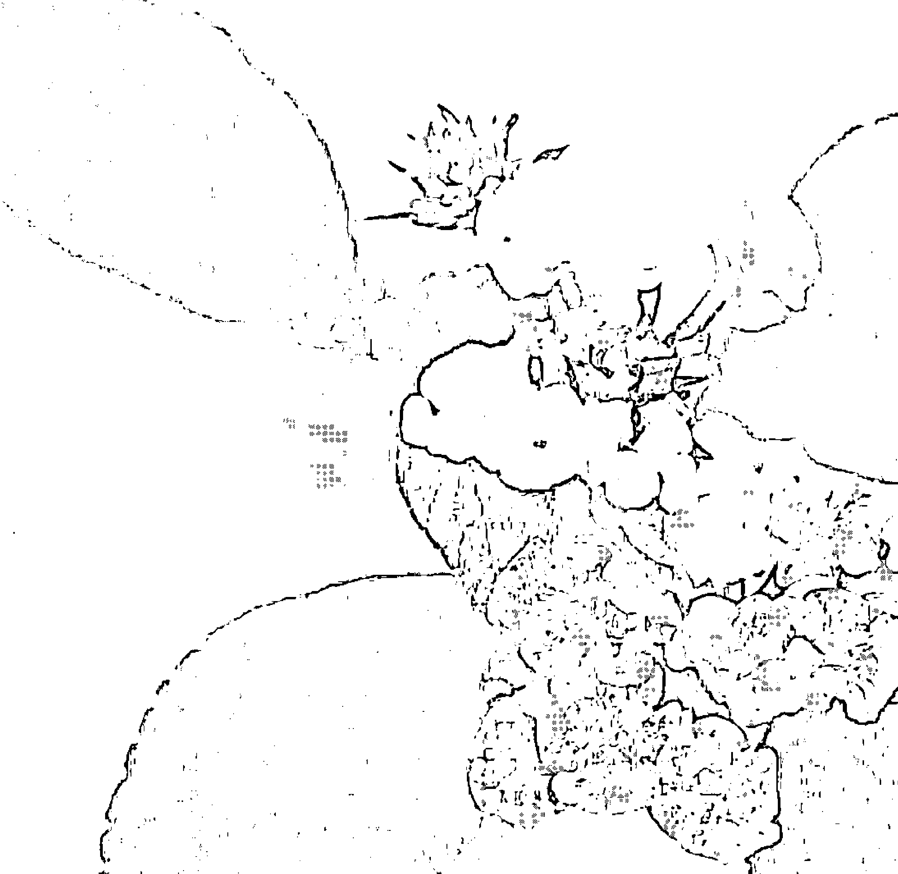

| 属性 | 值 |
|------|-----|
| 学名 | Lantana camara |
| 其他名称 | 五色梅/Tickberry |
| 香气印象 | 野草恣意生长的热带园林 |
| 植物科属 | 马鞭草科马缨丹属 |
| 主要产地 | 原生于南美洲与西印度群岛，现在遍布热带与亚热带。精油多来自马达加斯加 |
| 萃取部位 | 枝叶（蒸馏） |
| 适用部位 | 肾经、基底轮 |

### 核心成分

萃油率0.1%~0.17%，43个可辨识化合物（占97%）

心灵效益 | 化解霜凌的阴影，走进理直气壮的阳光里

1. 修复神经组织
2. 修复黏膜与皮肤组织，抗霉菌
3. 通经，消炎
4. 促进伤口愈合

- 抑郁症，强迫症，思觉失调
- 过敏性鼻炎，皮肤痒，胯下痒，汗疱疹
- 妇科手术后的粘连
- 下肢静脉溃疡，糖尿病病患的伤口处理

倍半萜醇8种6%~11% 单萜烯12种24% 倍半萜烯15种30%：β-丁香油烃 α-葎草烯

沉香醇6% 倍半萜酮30%：印蒿酮

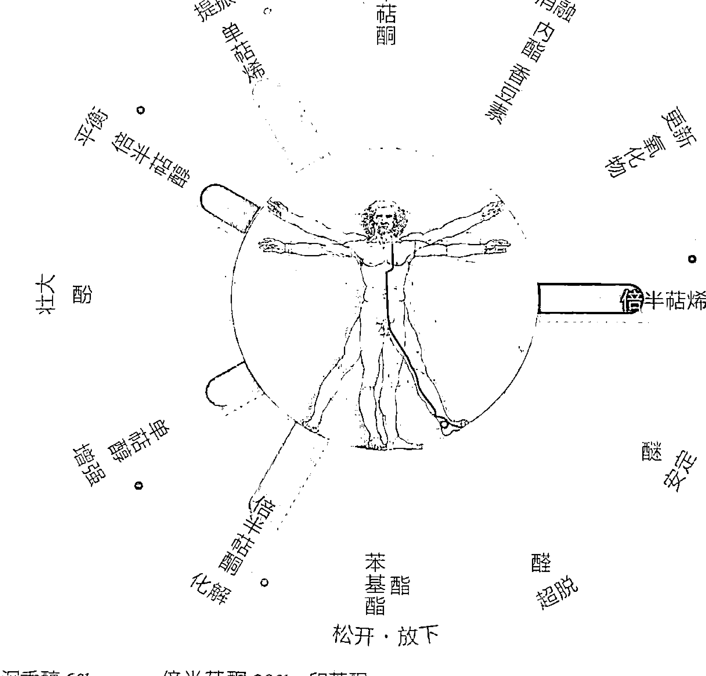

1. 马缨丹的护肝、抗肿瘤、抗病毒作用主要来自枝叶的齐墩果酸，精油虽不含此成分，但研究显示仍具抗肿瘤可能性。
2. 各地马缨丹的精油成分差异很大，只有东非外海的马达加斯加与留尼汪岛所产马缨丹富于印蒿酮，而且必须为花色粉紫的品种。花色橘黄的以倍半萜烯为主要成分。

# 松红梅
## Manuka

喜欢干燥的低营养土壤，大火烧林后常以先驱灌木的姿态出现。一般高 2~5 米，有机会长到 15 米。与卡奴卡的分别在于叶片会扎手。

| 项目 | 内容 |
| --- | --- |
| 学名 | Leptospermum scoparium |
| 其他名称 | 麦芦卡 ( 毛利语 ) / New Zealand Teatree |
| 香气印象 | 最幽微敏感的私密角落 |
| 植物科属 | 桃金娘科薄子木属 |
| 主要产地 | 澳大利亚东南部 ( 原生地 )、新西兰 |
| 萃取部位 | 叶 ( 蒸馏 ) |
| 适用部位 | 肾经、基底轮 |

### 核心成分

萃油率 0.3%，51 个可辨识化合物

心灵效益 | 化解怕被批评的紧绷，勇于尝试新事物

### 药学属性

1. 保护神经系统，调节神经传导物质如组胺，抗痉挛
2. 促进皮肤与黏膜组织再生
3. 抗皮肤感染，抗单纯疱疹病毒 I 和 II 型
4. 类费洛蒙，增强性吸引力，抗皮肤霉菌

### 适用症候

- 创伤后压力综合征
- 皮肤过敏，所有因情绪引起的皮肤问题
- 口唇疱疹，生殖器疱疹
- 阴道瘙痒、分泌物多

单萜烯 >2% : α- & β-松油萜

倍半萜烯 35种 60% : 白菖烯 δ-杜松烯


倍半萜酮 ( β-三酮 6种 ) >30% : 薄子木酮 四甲基异丁酰基环己三酮

### 注意事项

1. 有四种成分差异颇大的化学品系，三酮型产自新西兰北岛的东北部。
2. 澳大利亚产的松红梅三酮含量远低于新西兰产。

# 桂花
## Osmanthus

喜欢温暖湿润、微酸性砂质壤土。能耐氯气、二氧化硫、氟化氢等有害气体，所以在城市也能自在生长。

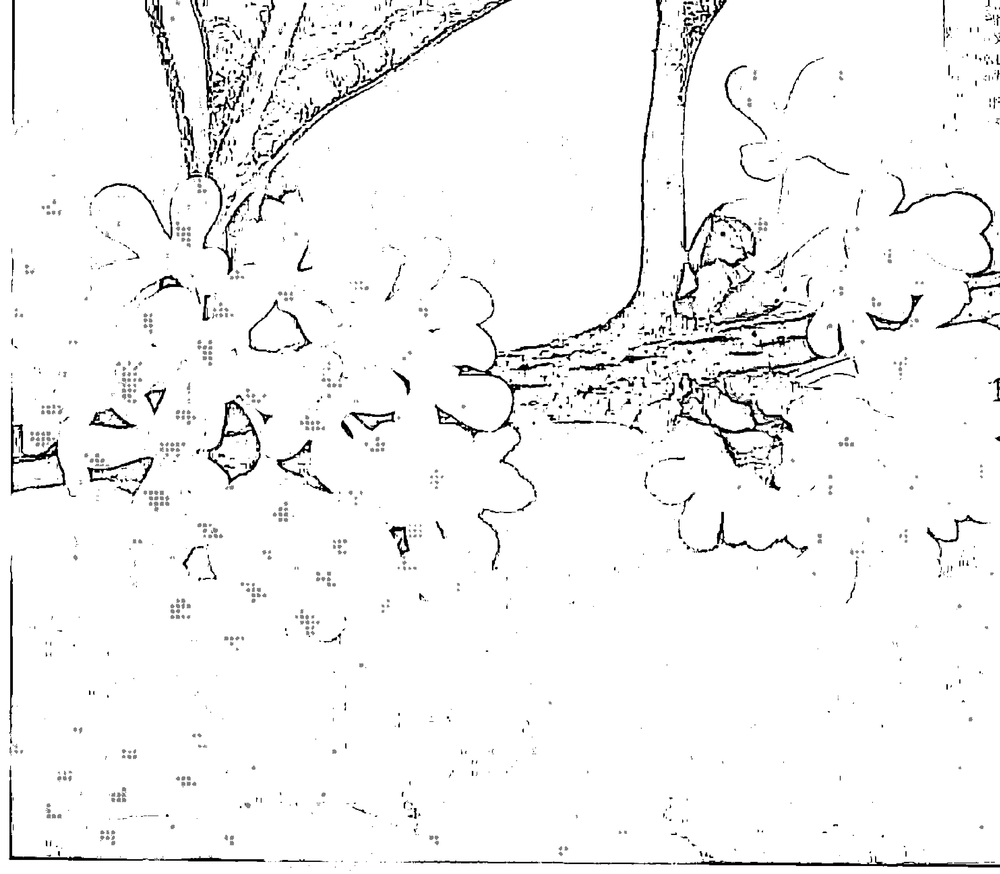

| 项目 | 内容 |
| --- | --- |
| 学名 | Osmanthus fragrans |
| 其他名称 | 岩桂 / Sweet Osmanthus |
| 香气印象 | 树影摇曳、月光皎洁的秋夜 |
| 植物科属 | 木犀科木犀属 |
| 主要产地 | 原产于中国西南，现在广泛栽种于淮河流域以南 |
| 萃取部位 | 花(溶剂) |
| 适用部位 | 肝经、性轮 |

### 核心成分

萃油率0.025%，19个可辨识化合物

心灵效益 | 化解不被认可的愤怒，脱掉工作狂的紧身衣

### 药学属性

1. 排毒肝肾（苯酚的作用）
2. 抗肿瘤（紫罗兰酮的作用）
3. 保护神经，防衰老
4. 排除堆积的黏液

### 适用症候

- 发炎性痤疮，丹毒，蜂窝织炎
- 肝癌，乳腺癌
- 偏头痛，神经疲劳
- 咳喘痰多

内酯(苯酚) 10% : 二氢猕猴桃内酯 6% S-癸酸内酯

氧化物 6% : 沉香醇氧化物

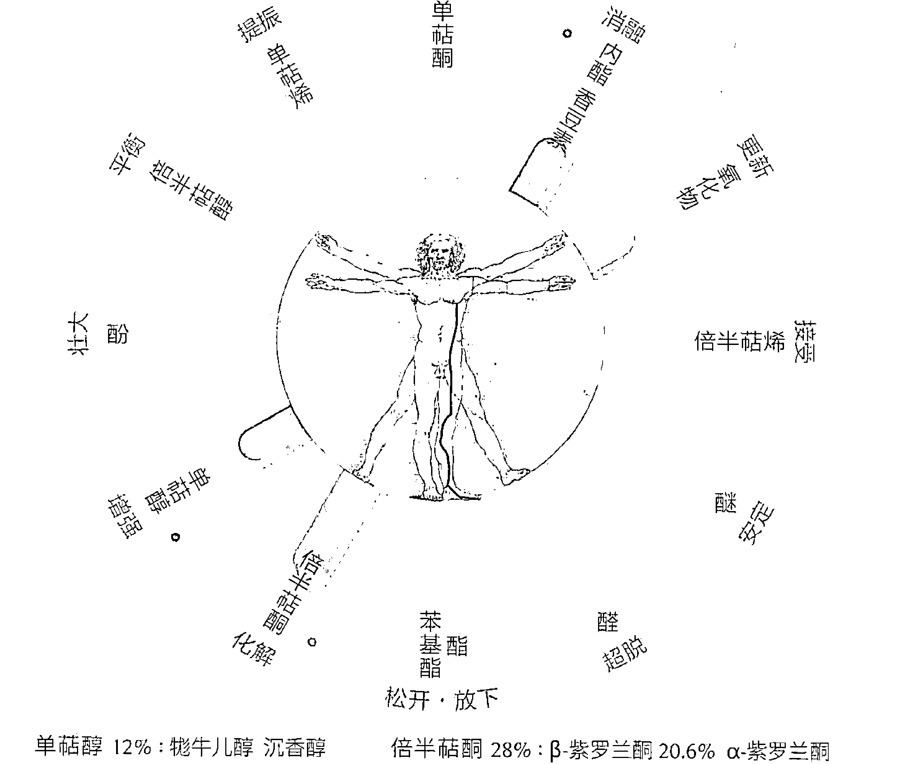

单萜醇 12% : 桄牛儿醇 沉香醇

倍半萜酮 28% : β-紫罗兰酮 20.6% α-紫罗兰酮

### 注意事项

1. 共有四个种群(金桂、银桂、丹桂、四季桂)，13~17个品种。主要用来萃取原精的是花色偏黄的金桂 (O. fragrans var. thunbergii)。

# 紫罗兰
## Violet

分布于地中海地区以及小亚细亚，喜欢冷凉的林边空地，植株高15厘米。只在空气最干净的地方生长。

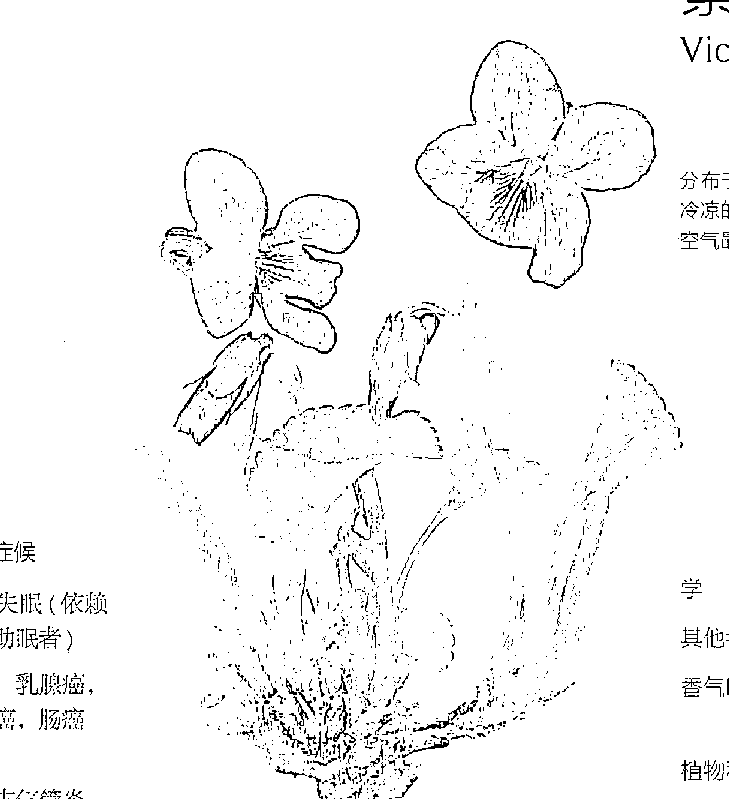

| 药学属性 | 适用症候 |
| --- | --- |
| 1. 放松神经，强力助眠 | 长期失眠（依赖药物助眠者） |
| 2. 抗肿瘤（紫罗兰最著名的功能） | 肺癌，乳腺癌，咽喉癌，肠癌 |
| 3. 清除黏附在肺泡的PM2.5 | 慢性支气管炎，干咳 |
| 4. 消解结石 | 肾结石，胆结石 |

酸 6种
内酯：二氢猕猴桃内酯 12.03%

| 项目 | 内容 |
| --- | --- |
| 学名 | Viola odorata |
| 其他名称 | 香堇菜 / Sweet Violet |
| 香气印象 | 众里寻他千百度，那人却在灯火阑珊处 |
| 植物科属 | 堇菜科堇菜属 |
| 主要产地 | (原精) 埃及 |
| 萃取部位 | 叶 (溶剂) |
| 适用部位 | 三焦经、顶轮 |
| 核心成分 | 萃油率0.05% 凝香体中再萃出4%原精，26个可辨识化合物(占92.77%) |
| 心灵效益 | 化解草木皆兵的戒心，用深长的呼吸挺过莫测风云 |

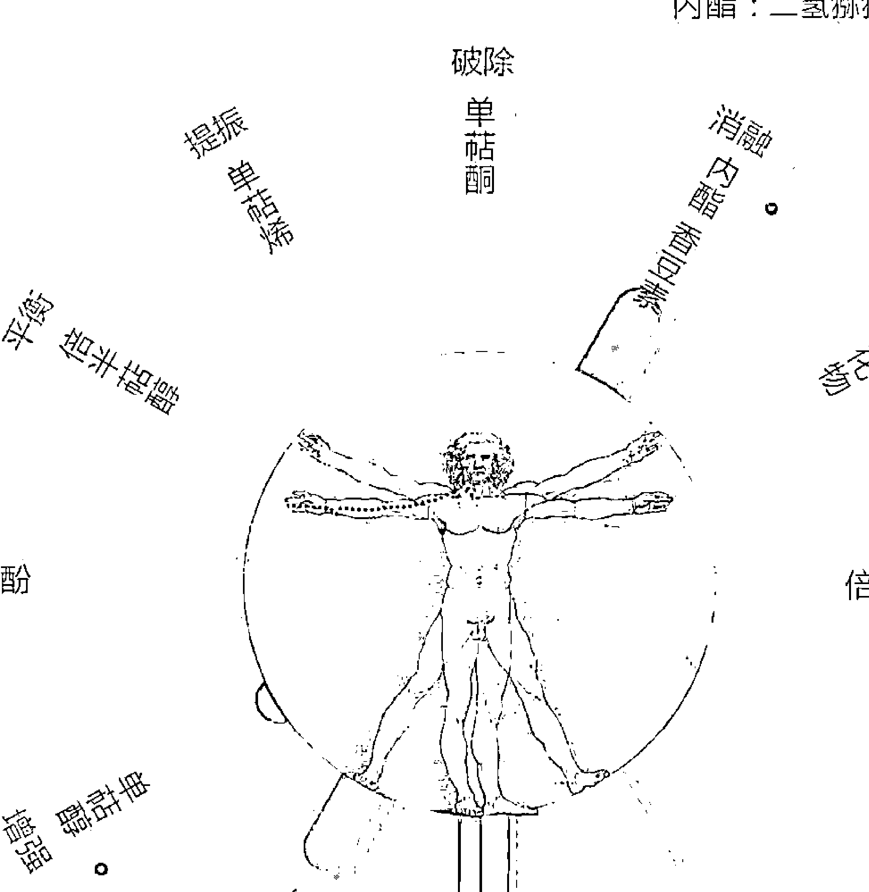

- 脂肪族醇 4种: 月桂醇
- 倍半萜酮 <10%: β-紫罗兰酮 α-紫罗兰酮
- 邻苯二甲酸丁基酯-2-乙基己基酯 30.1%

### 注意事项

1. 紫罗兰花的气味和叶很不一样，但现在已经没有商业生产。市面上的紫罗兰花都是人工合成的香精。

## 单萜醇类
### *Monoterprenol*

免疫系统的盟友，抵抗力的保障，一旦出现虚弱或衰败的迹象，便可请它上场。能迅速筑起第一道防线阻挡风寒及各种感染，用在膀胱经最为相得益彰。有些理论将它们一律视为“阳性”精油，但由于各分子间的协同作用，使单萜醇类精油充满阳光而未必阳刚，表现在气味上也不乏赏心悦鼻者，如芳樟（沉香醇）、玫瑰（牻牛儿醇）、薄荷（薄荷脑）。

# 花梨木
## Rosewood

高 30 米直径 2 米的大树，是南美热带雨林特产，习惯炎热潮湿的气候。因为生长在亚马逊偏远地区，通常在放倒后顺流而下送去蒸馏。

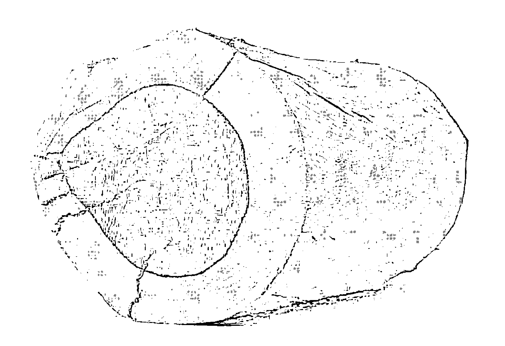

| 项目 | 内容 |
| --- | --- |
| 学名 | Aniba rosaeodora |
| 其他名称 | 巴西玫瑰木 / Bois De Rose |
| 香气印象 | 英挺暖男骑自行车滑行于伯朗大道 |
| 植物科属 | 樟科安尼樟属 |
| 主要产地 | 巴西 |
| 萃取部位 | 心材（蒸馏） |
| 适用部位 | 膀胱经、基底轮 |

### 核心成分

萃油率1%，31个可辨识化合物（占98.5%）

心灵效益 | 增强永续的底气，韬光养晦准备走更长的路

### 药学属性

1. 抗感染，抗菌，抗病毒，抗寄生虫，祛痰，放松支气管
2. 抗霉菌
3. 激励补身
4. 强化免疫，消炎，抗肿瘤（促使癌细胞凋亡）

### 适用症候

- 成人与婴幼儿的耳鼻喉部感染，以及胸腔支气管的感染
- 阴道的念珠菌感染
- 沮丧，虚弱无力，工作过度、过劳
- 化疗期间，白血病，子宫颈癌

### 注意事项

1. 本树已被《华盛顿公约》列为濒危植物，不受节制的生产将会使之绝种。2012年巴西发布研究成果，显示树龄4岁的幼木枝叶可萃出成分非常相近的精油（萃得率0.75%），无须砍伐树木。除了人工种植以外，未来叶油应可取代木油，使花梨木得以永续发展。

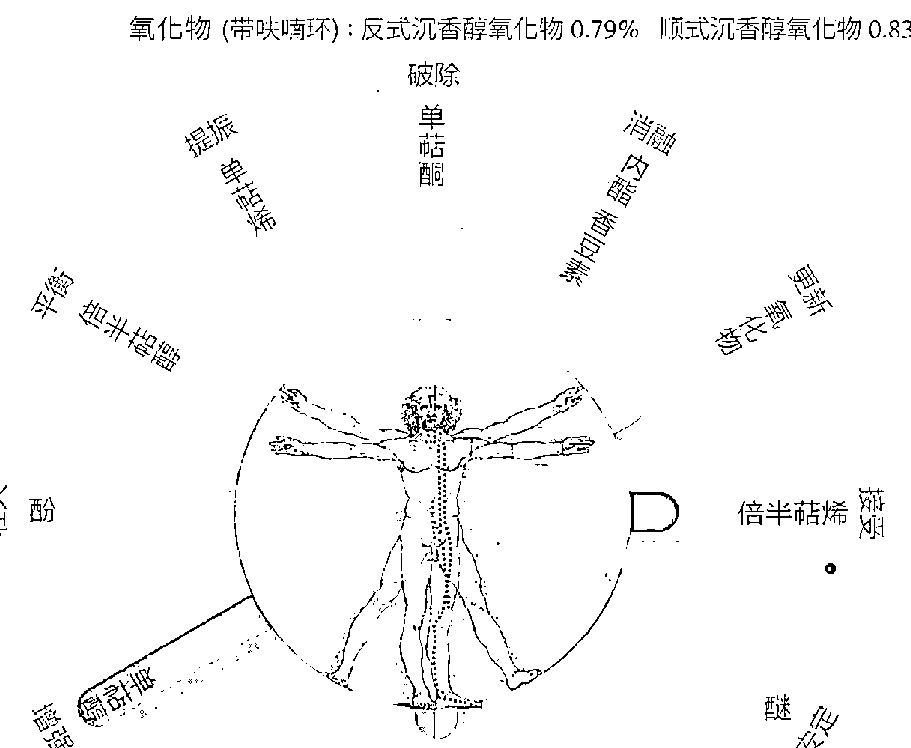

氧化物（带呋喃环）：反式沉香醇氧化物 0.79% 顺式沉香醇氧化物 0.83%

沉香醇 78%~93% α-萜品醇 3.6% 苯甲酸苄酯 0.75% α-蛇床烯 1.05% δ-愈创木烯 0.79%

# 芳樟
## Ho Wood

喜欢温暖湿润、日照充足风力弱之处，不耐干旱，土壤越肥沃越好。根系庞大，生长环境需土层深厚疏松，多分布于丘陵地，能抗空气污染。

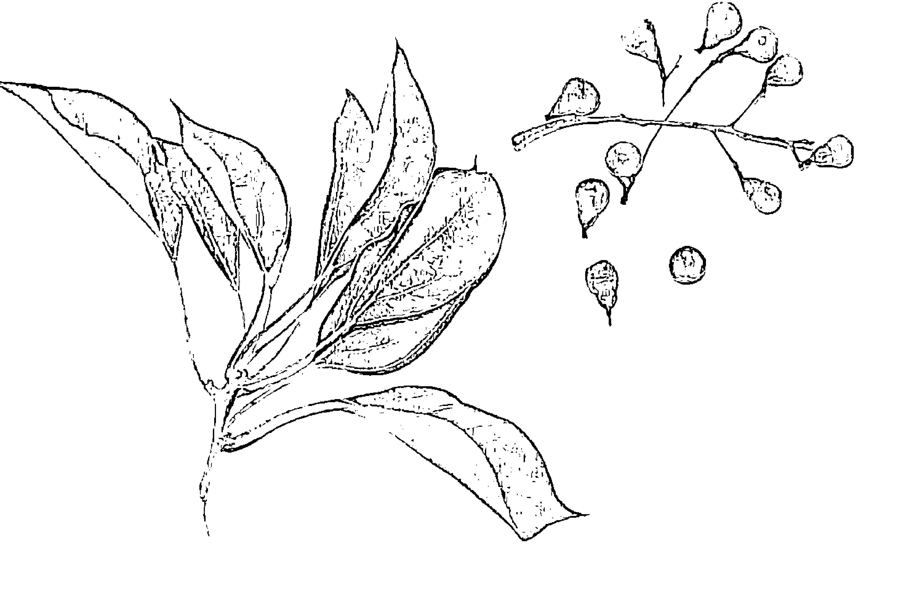

### 药学属性

1. 镇痛（急性与慢性疼痛反应），强化吗啡的作用
2. 抗焦虑，提高纹状体多巴胺，镇静，降血压
3. 强力抗感染，抗病毒，抗霉菌，抗菌（金黄色葡萄球菌、牙周致病菌、致龋细菌）
4. 消炎，抗肿瘤（与他汀类药物联用可抑制肿瘤细胞增长），抗氧化

### 适用症候

1. 肠绞痛，坐骨神经痛，终末期癌症患者安宁疗护
2. 社交紧张，幽闭恐惧，帕金森病，多噩梦，轻度高血压
3. 呼吸道、消化道与泌尿生殖道的感染问题，牙周病，蛀牙
4. 肺炎，白血病，肝癌

| 项目 | 内容 |
| --- | --- |
| 学名 | Cinnamomum camphora Sieb. var. linaloolifera |
| 其他名称 | 香樟 / Ho-Sho |
| 香气印象 | 英气勃发的伊顿公学男学生 |
| 植物科属 | 樟科樟属 |
| 主要产地 | 中国大陆、台湾岛 |
| 萃取部位 | 叶（蒸馏） |
| 适用部位 | 膀胱经、心轮 |
| 核心成分 | 萃油率3.94%，68个可辨识化合物（占100%） |
| 心灵效益 | 增强承担责任的肩膀，好整以暇迎接挑战 |

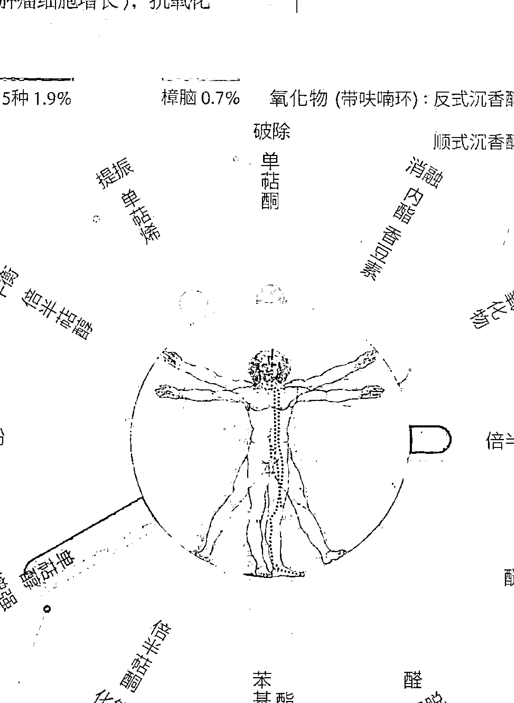

### 注意事项

1. 在台湾的樟树造林中占18.2%~26.0%。
2. 花与果也能萃油，花的萃油率为2.77%，组分有77个化合物（沉香醇占72.4%，倍半萜烯比叶多），果实萃油率0.55%~0.57%，含黄樟素较多。

单萜烯 15种 1.9%
樟脑 0.7%
氧化物（带呋喃环）：反式沉香醇氧化物 0.3%
顺式沉香醇氧化物 0.5%
沉香醇 87.3%
α-萜品醇 0.4%
水合樟 1.5%
β-丁香油烃 2%
β-蛇床烯 0.8%

# 橙花
## Neroli

无霜且排水良好的环境，壤土与黏土都能生长，酸碱皆宜。虽然只需要少量灌溉，但土壤必须保持湿润，而且最好不要遮荫。

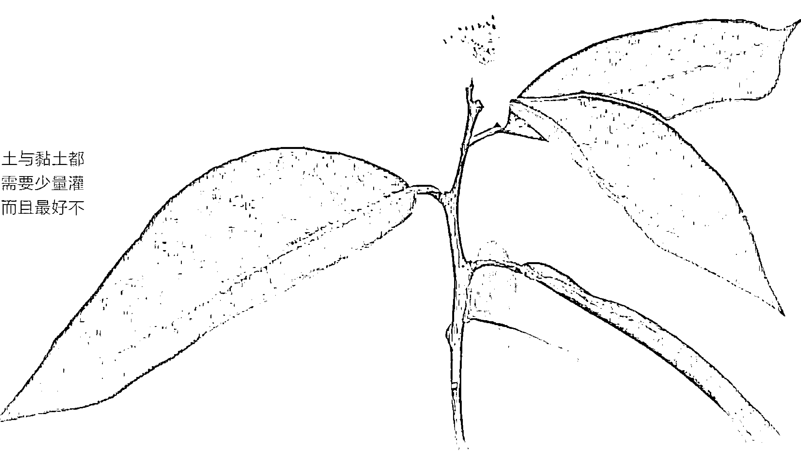

| 项目 | 内容 |
| --- | --- |
| 学名 | *Citrus aurantium* |
| 其他名称 | 尼罗利 / Orange Blossom |
| 香气印象 | 成群蝴蝶翩翩落至湿地吸水 |
| 植物科属 | 芸香科柑橘属 |
| 主要产地 | 摩洛哥、突尼斯、埃及 |
| 萃取部位 | 花 (蒸馏) |
| 适用部位 | 大肠经、本我轮 |

### 核心成分

萃油率 0.12%，26 个可辨识化合物（占 99.44%）

心灵效益 | 增强筑梦的志向，不受世俗牵绊

### 药学属性

1. 抗感染，抗菌（大肠杆菌、分枝杆菌），抗寄生虫（钩虫、鞭毛虫）
2. 强化静脉
3. 利消化
4. 补强神经（充电、平衡），抗沮丧，降血压

### 适用症候

- 支气管炎，肺结核，胸膜炎，细菌性与寄生虫性结肠炎
- 静脉曲张，痔疮
- 肝胰功能低下
- 疲劳，抑郁，高血压，生产（强化肌肉的弹性）

### 注意事项

1. 柑橘属另有一栽培品种 “玳玳花”（*Citrus × aurantium* Amara），也能生产精油，香气与橙花接近。

| 成分 | 百分比 | 主要物质 |
| --- | --- | --- |
| 倍半萜醇 | 6% | 橙花叔醇、金合欢醇 |
| 单萜烯 | 35% | α- & β-松油萜、柠檬烯 |
| 含氮化合物 | 0.5%-1.2% | 邻氨基苯甲酸甲酯、吲哚 |
| 单萜醇 | 40% | 沉香醇 30%、牻牛儿醇 2.5%、橙花醇 1.5% |
| 酯 | 6.7% | 乙酸沉香酯、乙酸橙花酯 |
| 醛 | - | 超脱 |
| 醚 | - | 安定 |
| 酮 | - | 素馨酮 |
| 酚 | - | - |

# 芫荽籽
## Coriander

原生地中海东部，性喜阳光但不耐高温，宁在冷凉环境生长。有两个变种：大粒香菜香气弱，生长快产量高；小粒香菜香味浓，但生长慢产量低。

### 药学属性

1. 激励，补身，使人愉悦，调节神经 (抑制脑神经瘤和腺苷酸环化酶Ⅰ型)
2. 抗感染，杀菌，杀霉菌，杀病毒，杀寄生虫
3. 止痛，抗氧化
4. 调节消化功能

### 适用症候

1. 虚弱，疲劳，失眠，抑郁症，神经母细胞瘤，自闭症
2. 气喘，流行性感冒，大肠杆菌性膀胱炎，狐臭
3. 关节炎，月经不至，卵巢囊肿，粉刺面疱
4. 食欲不振，消化不良，吞气症，发酵性肠炎，口臭，压力引起的消化性溃疡

| 项目 | 内容 |
| --- | --- |
| 学名 | Coriandrum sativum |
| 其他名称 | 香菜 / Cilantro |
| 香气印象 | 唯美的芭蕾双人舞 |
| 植物科属 | 伞形科芫荽属 |
| 主要产地 | 匈牙利、埃及、土耳其、印度 |
| 萃取部位 | 果实 (蒸馏) |
| 适用部位 | 膀胱经、顶轮 |
| 核心成分 | 萃油率 0.31%，38 个可辨识化合物 (占 99.3%) |
| 心灵效益 | 增强与人相交的热忱，得到水乳交融的感动 |

单萜烯 25% : γ-萜品烯 1%~8% 对伞花烃 3.5%
樟脑 0.9%~4.9%

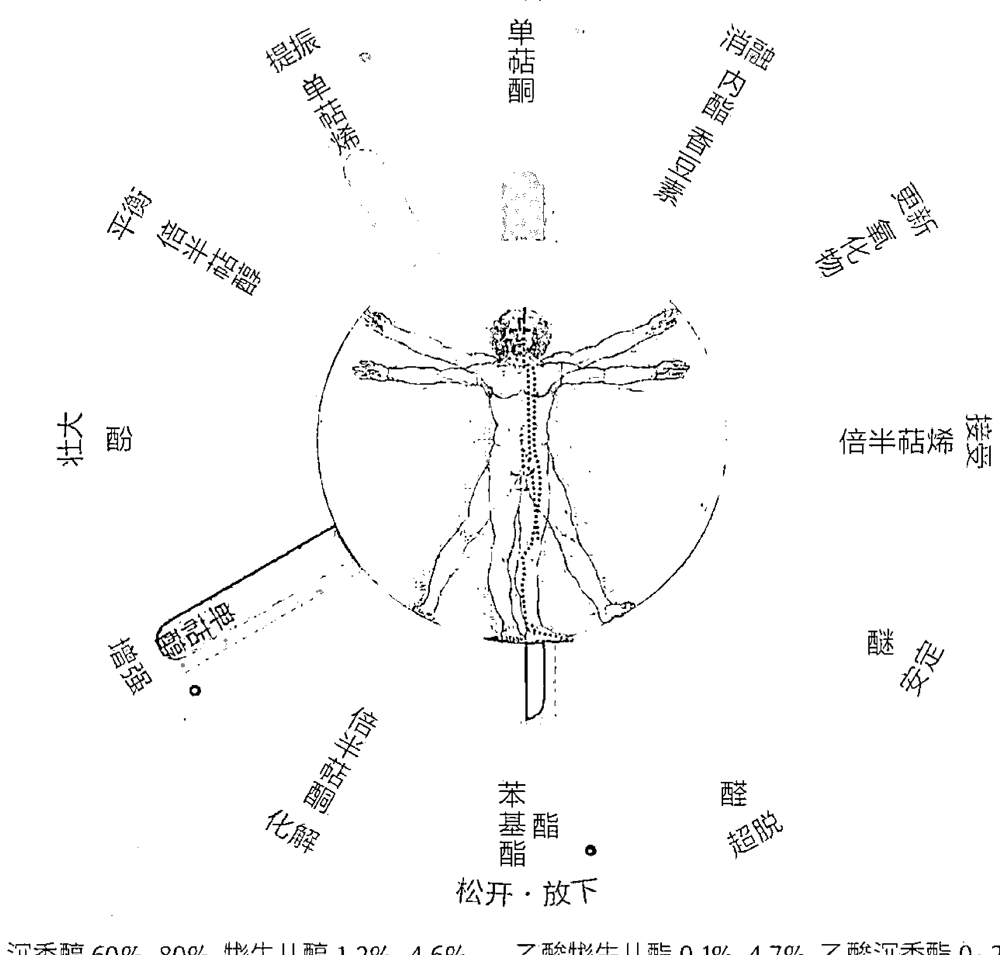

> **注意事项**
> 1. 芫荽叶精油以脂肪族醛如反式-2-癸烯醛为主，气味较难被接受。萃油率约 0.23%，组分比芫荽籽精油复杂，可多达 60 个化合物。芫荽叶的作用在于消炎镇静，改善压力型的肠胃炎，尤其擅长重金属排毒。

# 巨香茅
## Ahibero

原生于非洲热带莽原，高 2.5 米，大火过后能快速占领空地。习惯干燥、高温的环境，土壤要有足够养分。

| 项目 | 内容 |
|------|------|
| 学名 | Cymbopogon giganteus |
| 其他名称 | 燦离草/Tsauri Grass |
| 香气印象 | 母狮领着小狮昂首阔步 |
| 植物科属 | 禾本科香茅属 |
| 主要产地 | 马达加斯加、尼日利亚、布基纳法索、贝南、科特迪瓦 |
| 萃取部位 | 叶（蒸馏） |
| 适用部位 | 大肠经、本我轮 |

### 核心成分

萃油率 0.4%，55 个可辨识化合物

心灵效益 | 增强接地的能量，展现四两拨千斤的功力

| 药学属性 | 适用症候 |
|----------|----------|
| 1. 抗疟疾（抑制具抗药性的约氏疟原虫），抗扁虱，抗布氏锥虫 | 疟疾，扁虱叮咬，黄热病，非洲人类锥虫病（昏睡病） |
| 2. 抗自由基，抗氧化 | 高血压，长时间使用电脑后的肩颈僵硬，消除疲劳 |
| 3. 消炎（抑制5-脂氧合酶），止痛 | 风湿，发热，黄疸，咳嗽，喉咙痛，流产后的调养，偏头痛 |
| 4. 抗菌，抗白色念珠菌 | 阴道瘙痒，足癣，孩童口腔炎与牙龈发炎 |

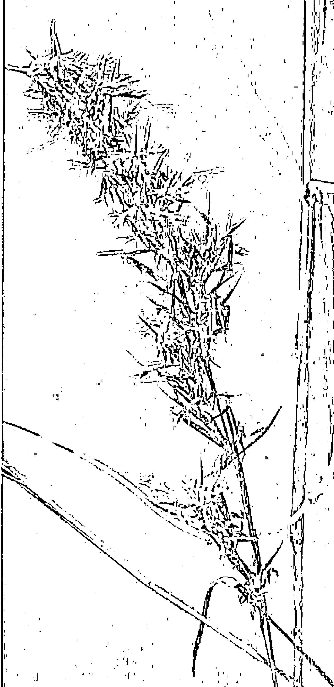

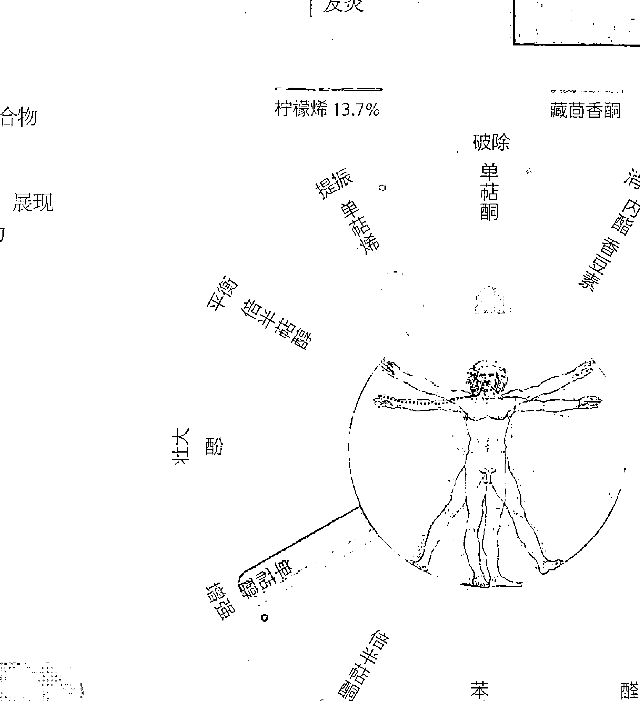

### 注意事项

1. 西非重要的民间药，常与莱姆并用。

# 玫瑰草
## *Palmarosa*

广泛栽种在炎热潮湿之处，选择pH值在7~8的低氮砂土，需要大量水分。生长速度不快，三个月才会开花，一开花即可采收，一年可收3~4次。

| 药学属性 | 适用症候 |
|----------|----------|
| 1. 抗多种病菌，抗霉菌，抗病毒，驱线虫，补子宫 | 鼻咽炎，耳炎，肠炎，膀胱炎，阴道炎，子宫颈炎，输卵管炎，分娩 |
| 2. 补身，补神经，抑制单胺氧化酶，抗痉挛 | 神经痛，癫痫，厌食症，抑郁症 |
| 3. 强化皮肤抵抗力，消炎，调节免疫，抗蜱虫 | 白色葡萄球菌感染导致的粉刺面疱，干性与渗水性湿疹，预防莱姆病 |
| 4. 抗氧化，补心脏，扩张支气管与血管，降胆固醇，养肝，控制血糖 | 心脏无力，病毒血症，脂肪肝，药物性肝损害，糖尿病 |

| 项目 | 内容 |
| --- | --- |
| 学名 | Cymbopogon martinii var. motia |
| 其他名称 | 摩提亚 / Motia |
| 香气印象 | 在草原上嬉闹打斗的幼狮 |
| 植物科属 | 禾本科香茅属 |
| 主要产地 | 尼泊尔、印度、巴基斯坦 |
| 萃取部位 | 叶（蒸馏） |
| 适用部位 | 膀胱经、心轮 |
| 核心成分 | 萃油率 3.61%、33 个可辨识化合物（占 99.8%） |
| 心灵效益 | 增强乐观的心态，摆脱自卑感和罪恶感 |

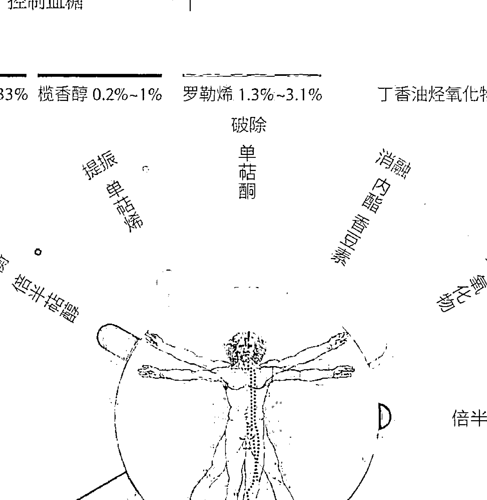

### 注意事项

1. 另外有一变种 (Cymbopogon martinii var. sofia)，俗称“姜草” Gingergrass。比例最高的关键成分是对孟二烯醇 (P-menthadienols)，另含胡椒醇、香芹醇、柠檬烯、藏茴香酮。气味、作用与玫瑰草均大不相同，并不只是“味道比较粗糙的玫瑰草”。可调节消化问题。

金合欢醇 2.33%
榄香醇 0.2%~1%
罗勒烯 1.3%~3.1%
丁香油烃氧化物 0.1%~1.8%
拢牛儿醇 83.6%~91.3%
沉香醇 1.72%
乙酸拢牛儿酯 2.3%
β-丁香油烃 0.48%

## 忍冬
Japanese Honeysuckle

喜阳光充足，耐寒耐旱也耐涝，但干旱和低温可促使绿原酸含量增多。酸性岩石风化而成的棕壤能提供干旱的立地条件，也有利于绿原酸的形成。

| 项目 | 内容 |
| --- | --- |
| 学名 | *Lonicera japonica* |
| 其他名称 | 金银花 / Golden-and-Silver Honeysuckle |
| 香气印象 | 杨过绝情谷重逢小龙女 |
| 植物科属 | 忍冬科忍冬属 |
| 主要产地 | 中国（山东、河南）、日本、韩国 |
| 萃取部位 | 花（蒸馏） |
| 适用部位 | 肺经、心轮 |
| 核心成分 | 萃油率 0.025%，34 个可辨识化合物（占 85%） |
| 心灵效益 | 增强爱的憧憬，维持干净的信念 |

### 药学属性
- 抗菌，抗霉菌，抗病毒
- 增强免疫，解热消炎（散风热，解血毒）
- 保肝利胆，降血脂降糖，抗氧化
- 止泻，通经络

### 适用症候
- 流感，急慢性扁桃体炎，牙周病
- 各种热性病，如中暑、发疹、痱子、发斑、疮痈肿毒、咽喉肿痛
- 不当外食引起的身体疲倦，高血压，动脉粥样硬化
- 痢疾，关节红肿热痛不利屈伸

### 注意事项
1. 萃取方式会使成分呈现巨大差异。如果用溶剂萃取，将得到压倒性比例的沉香醇，CO₂ 萃取者主含饱和烷烃（二十九烷 26.15%，二十六烷 9.29%），而 CO₂ 萃取加夹带剂以有机酸和有机酸酯（二甲基-1-十六烷酸酯 14.92%，二十四烷酸甲酯 14.91%）为主。另外，欧洲产比亚洲产的含较多倍半萜醇。

# 茶树
Tea Tree

在原产地的分布范围并不大，多沿着溪流或沼泽湿地生长。生性强健的优势物种，18个月采收一次，可持续采收至树龄27岁。

- 强力抗菌，抗霉菌，抗病毒，抗寄生虫，激励抗体与补体
- 消炎，保护表皮免受放射线伤害
- 强心，缓解静脉充血症状，补强静脉
- 补身，补强神经

- 牙龈炎，口腔溃疡，口咽炎，唇疱疹，化脓性支气管炎，肺气肿，阑尾炎
- 慢性念珠菌性外阴炎，滴虫性阴道炎，卵巢充血，放射疗法前预防皮肤损伤
- 大脑毛细血管循环迟缓，心脏无力，静脉曲张，动脉瘤
- 筋疲力竭，虚弱，沮丧，经前或经期的神经紧张，畏寒，开刀后的受惊状态

| 项目 | 内容 |
| --- | --- |
| 学名 | *Melaleuca alternifolia* |
| 其他名称 | 互生叶白千层 / Narrow-leaved Paperbark |
| 香气印象 | 身上刺满图腾的南岛语族 |
| 植物科属 | 桃金娘科白千层属 |
| 主要产地 | 澳大利亚 |
| 萃取部位 | 枝叶 (蒸馏) |
| 适用部位 | 膀胱经、本我轮 |
| 核心成分 | 萃油率 1%~2%，100 个可辨识化合物 |
| 心灵效益 | 增强利他心与博爱情怀，离开斗鸡眼式的自我关注 |

1. 本身有六个化学品系，产业看重的是萜品烯-4-醇型。
2. 小河茶树 (M. dissitiflora) 的精油有如粗犷版的茶树，萜品烯-4-醇与对伞花烃的比例较高；夏雪茶树 (M. linariifolia) 则像文雅版的茶树，成分非常接近，可作为澳大利亚茶树的替身。
3. 台湾岛产的茶树普遍含较高的桉油醇 (27.7%) 与较少的萜品烯-4-醇 (33%)。

## 沼泽茶树
Rosalina

喜爱接近海岸的沼泽地带，耐盐耐湿耐阴。高9米，比白千层瘦长。开花时的香气能够吸引鸟类，是沼泽生态的指标树。

| 项目 | 信息 |
| :--- | :--- |
| 学名 | *Melaleuca ericifolia* |
| 其他名称 | 石南叶白千层 / Swamp Paperbark |
| 香气印象 | 民国时期，带着金框眼镜的留洋书生 |
| 植物科属 | 桃金娘科白千层属 |
| 主要产地 | 澳大利亚东南部 |
| 萃取部位 | 枝叶（蒸馏） |
| 适用部位 | 胃经、本我轮 |
| 核心成分 | 萃油率 0.6%~3.2% |
| 心灵效益 | 增强信赖感。不再用犬儒的姿态拒人于千里之外 |

| 药学属性 | 适用症候 |
| :--- | :--- |
| 1. 镇静，抗痉挛 | 经前乳房胀痛 |
| 2. 抗病毒，抗肿瘤 | 着凉腹泻，紧张腹泻 |
| 3. 调节油脂分泌，抗菌，抗霉菌 | 痤疮 |
| 4. 促进血液循环 | 手脚、膝盖、小腹冰凉 |

### 注意事项
1. 澳大利亚新南威尔士州产的沉香醇最多，愈往南沉香醇愈少，桉油醇愈多。到了维多利亚州和塔斯马尼亚省，沉香醇只剩下3%，而桉油醇可高达34%，几乎已经是完全不同的精油了。

## 野地薄荷
Field Mint

全日照或部分遮荫，土壤pH值在6.5~8.5，基本上喜欢温暖潮湿。生长容易，无需特别照顾，一年可以采收两次。

- 学名 | *Mentha arvensis*
- 其他名称 | 玉米薄荷 / Corn Mint
- 香气印象 | 挥汗爬上峰顶后吹来的第一阵风
- 植物科属 | 唇形科薄荷属
- 主要产地 | 尼泊尔、印度
- 萃取部位 | 开花的全株药草（蒸馏）
- 适用部位 | 胆经、顶轮
- 核心成分 | 萃油率0.6%~1%，43个可辨识化合物（占99%）
- 心灵效益 | 增强续航力，不轻言放弃

| 药学属性 | 适用症候 |
| :--- | :--- |
| 1. 止痛，调节运动和感觉神经 | 头痛，偏头痛，神经痛，牙痛，坐骨神经痛，肾绞痛 |
| 2. 抗感染，抗菌，抗肿瘤 | 鼻炎，鼻咽炎，喉炎，鼻窦炎，口腔癌，子宫颈癌 |
| 3. 较高剂量：抑制感觉敏锐度 | 荨麻疹，湿疹，皮肤发痒 |
| 4. 较低剂量：激励消化腺体分泌（胃、胆），促进血管收缩 | 低血压，消化性溃疡，肠炎，肝区疼痛，呕吐，便秘，寄生虫病 |

### 注意事项
1. 也被称作日本薄荷，因为日本曾经是其最大的产国，现在则已被印度取代。
2. 心室颤动与蚕豆病患者避免使用，婴幼儿的头脸部也应避开。
3. 市售的野薄荷油多半经过冷冻以去除50%的薄荷脑，使薄荷酮的比例相对提高。

## 胡椒薄荷
Peppermint

绿薄荷 (M. spicata) 和水薄荷 (M. aquatica) 的杂交种，喜欢有遮荫的湿地。靠匍匐茎繁衍，生长快速，很容易就成为野生的驯化植物。

| 项目 | 内容 |
| :--- | :--- |
| 学名 | *Mentha × piperita* |
| 其他名称 | 欧薄荷 / Menthe Poivree |
| 香气印象 | 恢复速度惊人的金钢狼 |
| 植物科属 | 唇形科薄荷属 |
| 主要产地 | 印度、美国 |
| 萃取部位 | 开花的全株药草 (蒸馏) |
| 适用部位 | 肝经、顶轮 |
| 核心成分 | 萃油率 0.7%，61 个可辨识化合物 (占 99.7%) |
| 心灵效益 | 增强创造力，化腐朽为神奇 |

### 药学属性
1. 强肝利胆，促肝细胞再生，强化胰脏，杀细菌霉菌，杀寄生虫，消胀气，止吐
2. 止痛，麻醉，补强神经，抗感染，杀病毒，抗氧化，抗肿瘤
3. 祛痰，抗黏膜发炎，肠道与泌尿道消炎，解除前列腺充血症状
4. 强心，升血压，补强子宫，类激素，调经 (调节卵巢功能)，激励补身

### 适用症候
- 肝胰功能低下，病毒性肝炎，肝硬化，黄热病，胆绞痛，胃痛，痉挛性结肠炎，吞气症，结肠胀气，晕车晕船，呕吐
- 头痛，偏头痛，坐骨神经痛，带状疱疹，病毒性神经炎 (影响视神经)，肺癌，胃癌，白血病
- 鼻窦炎，耳炎，喉炎，膀胱炎，前列腺炎，肾绞痛，瘙痒 (荨麻疹、湿疹)
- 循环不良引发的视力障碍，低血压，分娩，晕厥，自主神经性肌张力不全

### 注意事项
1. 心室颤动与蚕豆病患者避免使用，婴幼儿的头脸部也应避开。
2. 健康皮肤的安全剂量是 5.4%。
3. 高品质薄荷油的要求是薄荷脑含量在 45%~60%，而具有毒性的薄荷呋喃含量为 0~0.3%。

成分：
异薄荷酮 2%~8%
薄荷酮 13%~28%
胡薄荷酮 0.5%~3%
桉油醇 3%~8%
薄荷脑 32%~49%
新薄荷脑 2%~6%
乙酸薄荷酯 2%~8%
β-丁香油烃 1%~3.5%

# 蜂香薄荷
Monarda

原产于加拿大草原地带，耐干冷，花色为烟粉红且偏紫。喜欢全日照与排水良好的潮湿土壤，植株抗病性高，有许多变种和杂交种。

### 药学属性
1. 抗感染，抗病毒，抗霉菌（念珠菌），抗菌（作用范围广泛）
2. 补身，强化神经，强化子宫，抗溃疡，促胰岛素分泌
3. 遏止纤维化，消炎，抗老化
4. 抗氧化，抗肿瘤，强化抗癌药物对癌细胞的作用

### 适用症候
1. 呼吸道与泌尿生殖道的各种感染症状，单纯疱疹，天花
2. 无力，发热，少经，消化性溃疡，糖尿病
3. 动脉粥样硬化，念珠菌性皮肤炎，脂溢性皮炎，粉刺，肌肤下垂
4. 大肠癌，乳腺癌，肺癌，前列腺癌，胰脏癌，肝癌

| 项目 | 内容 |
| :--- | :--- |
| 学名 | *Monarda fistulosa* |
| 其他名称 | 佛手柑草 / Bergamot Herb |
| 香气印象 | 如波浪起伏的草裙舞 |
| 植物科属 | 唇形科美国薄荷属 |
| 主要产地 | 法国、美国 |
| 萃取部位 | 开花的全株药草（蒸馏） |
| 适用部位 | 脾经、本我轮 |
| 核心成分 | 萃油率 1.2%，25个可辨识化合物 |
| 心灵效益 | 增强宽大的胸襟，如海纳百川 |

> 注意事项
> 1. 另一品种“管蜂香草”(Monarda didyma)是一个红花品种，成分以沉香醇为主(64.5%~74.2%)，常与蜂香薄荷杂交，产生五种化学品系：百里酚型、香荆芥酚型、牻牛儿醇型、龙脑型、对伞花烃型。

# 可因氏月橘
Sweet Neem Leaves

喜欢全日照、略带酸性而排水良好的土壤，尤其耐湿热。这种小树一旦长成，即使土壤贫瘠或气候极端，也能毫发无伤地活下去。

- 学名 | *Murraya koenigii*
- 其他名称 | 咖喱叶/Curry Leaf
- 香气印象 | 远渡重洋，乘风破浪
- 植物科属 | 芸香科月橘属
- 主要产地 | 印度、斯里兰卡
- 萃取部位 | 叶（蒸馏）
- 适用部位 | 大肠经、本我轮
- 核心成分 | 萃油率1%，33个可辨识化合物（占97.56%）
- 心灵效益 | 增强心灵的防火巷，避免思虑过多而作茧自缚

| 药学属性 | 适用症候 |
|---|---|
| 1. 消炎（抑制脂氧化酶），抗氧化作用大于BHT与丁香酚 | 口干舌燥，发热，头皮与皮肤干痒 |
| 2. 降血糖，降血脂，降血压，健胃整肠，消胀气 | 糖尿病，高血压，思虑过度导致的消化不良，反胃 |
| 3. 抗肿瘤，调节免疫[白介素“(IL)-2,4,10”和肿瘤坏死因子-α“TNF-α”] | 乳腺癌，子宫颈癌，白血病 |
| 4. 比抗生素优越的抗菌效用，抗霉菌，杀虫卵 | 牙龈炎，口腔炎，除跳蚤与蟑螂 |

### 注意事项
1. 叶片不能制作咖喱粉，气味也不具一般熟悉的“咖喱味”，但确实是南印度和斯里兰卡地区料理的必备香料。

# 柠檬荆芥
Nepeta

喜爱全日照，耐旱。高度可达 100 厘米，枝叶舒展而柔软，花色比猫薄荷更紫。

### 药学属性
1. 消炎，安抚，镇静
2. 消结石
3. 抗病毒，抗特定类型的感染
4. 调节多巴胺

### 适用症候
- 精神疾病，抑郁症
- 胆结石
- 疱疹
- 男性不举，减轻性行为前的紧张

| 项目 | 内容 |
| :--- | :--- |
| 学名 | *Nepeta cataria var. citriodora* |
| 其他名称 | 柠檬猫薄荷 / Lemon Catnip |
| 香气印象 | 刚梳过毛的猫，懒洋洋躺在西晒的窗台上 |
| 植物科属 | 唇形科荆芥属 |
| 主要产地 | 南欧、东欧 |
| 萃取部位 | 花（蒸馏） |
| 适用部位 | 任脉、性轮 |
| 核心成分 | 萃油率 1.5%，17 个可辨识化合物 |
| 心灵效益 | 增强自在感，像备受尊宠的猫科动物一样我行我素 |

成分：
三萜醇 : α-脂檀素 0.81%（熊果酸的前驱物）

> 注意事项
> 1. 这个品种是寻常猫薄荷的一个化学品系，但香气大不同。猫薄荷让猫咪着迷的成分是荆芥内酯，柠檬荆芥中其含量微乎其微。

## 甜罗勒
Sweet Basil

喜欢温暖，8℃便停止生长，最好保持全日照，怕旱也怕积水。氮肥愈少，沉香醇的比例愈高（钾肥则可助长沉香醇）。

| 项目 | 内容 |
| :--- | :--- |
| 学名 | *Ocimum basilicum* |
| 其他名称 | 热那亚罗勒 / Genovese Basil |
| 香气印象 | 舒适柔软的大抱枕 |
| 植物科属 | 唇形科罗勒属 |
| 主要产地 | 埃及、尼泊尔、印度 |
| 萃取部位 | 开花的全株药草（蒸馏） |
| 适用部位 | 肾经、基底轮 |
| 核心成分 | 萃油率 0.48%，65 个可辨识化合物（占 99%） |
| 心灵效益 | 增强抗压性，以不变应万变 |

### 药学属性
1. 补身，激励，补强神经
2. 补强消化功能（帮助消化、消胀气、养肝）
3. 解除充血阻塞症状（前列腺、子宫），具中度抗感染力
4. 抗动脉粥样硬化

### 适用症候
1. 虚弱，肾上腺皮质激素不足，沮丧，干性湿疹
2. 肝胆功能低下，胃积气，胃炎，胃溃疡
3. 前列腺阻塞充血，子宫充血，大肠杆菌引起的膀胱炎
4. 冠状动脉功能不良，冠状动脉炎，心律不齐，心动过速，动脉硬化，低血压

### 注意事项
1. 健康皮肤的安全剂量为 1.5%。
2. 传统上把罗勒分为四个化学品系：沉香醇型（欧洲型），甲基醚蒌叶酚型（非洲型），甲基醚丁香酚型（亚洲型），肉桂酸甲酯型（太平洋型）。近年则发现还有更多。
3. 市售的甜罗勒精油有些混掺 α-沉香醇以提高甜度（自然状态下只有 β-沉香醇）。

### 甜马郁兰
Sweet Marjoram

对冷度很敏感的地中海植物，但也无法忍受过于湿热，生长缓慢。需要全日照和 pH 值为 6.7~7.0 的土壤，减少盐分与提高水分都能增加精油含量。

### 药学属性
1. 强化神经，尤其有益副交感神经（降血压、扩张血管、镇静、节欲）
2. 镇痛
3. 抗感染，抗菌（肺炎球菌、金黄色葡萄球菌、大肠杆菌），健胃，利尿
4. 抗氧化，抗乙酰胆碱酯酶

### 适用症候
- 自主神经失调，甲状腺功能亢进引发的问题：心脏血管方面（心悸、过度亢奋、心律不齐、高血压、昏厥），肺部方面（呼吸困难），消化方面（胆固醇过高、十二指肠溃疡、肠炎、结肠炎），性功能方面（性器亢奋、性执迷、乙醚上瘾），神经心理方面（焦虑、压力引起的躁郁、神经衰弱、心情沉重、精神病、失眠、麻痹、癫痫、眩晕）
- 各种疼痛：神经痛，风湿痛
- 呼吸道感染（鼻炎、鼻咽炎、鼻窦炎、支气管炎、耳炎、百日咳）与消化道感染（口腔溃疡、腹泻、肠胃炎）
- 老年痴呆

| 项目 | 内容 |
| :--- | :--- |
| 学名 | *Origanum majorana* |
| 其他名称 | 墨角兰 / Knotted Marjoram |
| 香气印象 | 动漫世界中拯救人类的新世纪福音战士 |
| 植物科属 | 唇形科牛至属 |
| 主要产地 | 埃及、突尼斯、土耳其 |
| 萃取部位 | 开花的全株药草 (蒸馏) |
| 适用部位 | 膀胱经、眉心轮 |
| 核心成分 | 萃油率 0.82%，35 个可辨识化合物 (占 96.3%~98.6%) |
| 心灵效益 | 增强正义感，挣脱浑沌暧昧而恢复秩序 |

成分：
匙叶桉油烯醇 0.8%
γ-萜品烯 7.3%~9.8%
丁香油烃氧化物 0.9%
1,8-桉油醇 0.4%
水合桧烯 7.1%~13.8%
萜品烯-4-醇 16.4%~31.6%
α-萜品醇 3.8%~8.3%
乙酸沉香酯 7.4%~10.5%
乙酸萜品烯-4-酯 2.3%~5.7%

> 注意事项
> 1. 这个品种在某些产地也会出现富含酚类的化学品系，所以不能只靠学名来选购，必须确认气味与成分。

## 野洋甘菊
Wild Chamomile

原生于地中海地区，10~40厘米高，从平地到海拔500米都有分布，习惯碱性砂质土和半干旱的气候，但在潮湿肥沃的土壤上能长得更好。

| 项目 | 内容 |
| :--- | :--- |
| 学名 | *Cladanthus mixtus* / *Ormenis mixta* |
| 其他名称 | 摩洛哥洋甘菊 / Moroccan Chamomile |
| 香气印象 | 在石砾堆中敏捷穿梭的变色龙 |
| 植物科属 | 菊科枝花属 |
| 主要产地 | 摩洛哥 |
| 萃取部位 | 花(蒸馏) |
| 适用部位 | 大肠经、本我轮 |
| 核心成分 | 萃油率0.3%，55个可辨识化合物(占73.9%) |
| 心灵效益 | 增强适应力，快速融入新环境 |

| 药学属性 | 适用症候 |
| --- | --- |
| 1. 养肝 | 肝功能不全，胃功能不全，干性湿疹，皮肤瘙痒 |
| 2. 抗菌(大肠杆菌)，杀寄生虫(蛲虫、阿米巴虫) | 大肠杆菌性结肠炎，肠道寄生虫，阿米巴囊肿 |
| 3. 抗感染 | 性病，淋球菌病，大肠杆菌性膀胱炎，前列腺炎 |
| 4. 补身，补强神经，催情 | 性功能低下，抑郁症 |

成分：
倍半萜醇11.4%：橙花叔醇 喇叭茶醇
单萜烯10.4%：α-松油萜 棉杉菊三烯
破除单萜酮
桉油醇11.6%
β-丁香油烃氧化物
棉杉菊醇17.4%~33% 艾蒿醇 萜品烯-4-醇
倍半萜烯11.4%：榄香烯 金合欢烯

### 注意事项
1. 这种植物过去有多个通用名称，如 *Ormenis mixta*, *Anthemis mixta*, *Ormenis multicaulis*, *Chamaemelum mixtum*。但是学界近年根据基因研究，又把 *Ormenis* (升月属)重新命名为 *Cladanthus* (枝花属)。
2. 摩洛哥各地的气候与地形变化多，精油成分差异颇大，而油色因此有蓝有黄。油色黄者以棉杉菊醇为主，浅蓝者以樟脑为主(兼微量天蓝烃)。

### 天竺葵
Geranium

发源于南非，喜爱温暖气候，年降雨需1000毫米，但怕黏重土壤与积水。低于15℃和高于35℃就不会开花，日照愈多，含油量愈高。

学名 | *Pelargonium graveolens* / *Pelargonium × asperum*
其他名称 | 香叶天竺葵 / Sweet Scented Geranium
香气印象 | 脱我战时袍、着我旧时裳的花木兰
植物科属 | 牻牛儿科天竺葵属
主要产地 | 中国、埃及、摩洛哥、留尼汪岛
萃取部位 | 叶（蒸馏）
适用部位 | 任脉、性轮

核心成分
萃油率0.2%，45个可辨识化合物（占95%）

心灵效益 | 增强自我肯定的信念，命好不怕运来磨

| 药学属性 | 适用症候 |
| :--- | :--- |
| 1. 抗感染，抗菌，抗霉菌，抗肿瘤 | 尖锐湿疣，疱疹感染后的神经痛，下痢，大肠癌，鼻咽癌，子宫颈癌 |
| 2. 消炎，止痛，抗痉挛，放松平滑肌，抗氧化，补强淋巴与静脉，止血 | 风湿性骨关节炎，神经性结肠炎，男性不孕，尿路结石，痔疮，月经过多 |
| 3. 清洁毛孔，净化油性肤质，提高皮肤吸收力（48倍），收敛紧实 | 痔疮性瘙痒，割伤，溃疡，霉菌皮肤病，面疱，脓疱，预防妊娠纹 |
| 4. 降血糖，激励肝脏与胰脏，排肝毒，补身 | 糖尿病，胆囊炎，胃溃疡，黄疸，肝脏与胰脏功能低下，烦躁不安、焦虑 |

10-表-γ-桉叶醇 tr~5.2%
异薄荷酮 3.4%~9.8%
丁香油烃氧化物 3.7%
香茅醇 20.3%~47.7%
牻牛儿醇 7.3%~30.3%
甲酸香茅酯 4.8%~12.4%
甲酸牻牛儿酯 1.6%~7.6%
愈疮木-6,9-二烯 0.1%~6.8%

注意事项
1.  本品栽培种有三类：
    A.  “留尼汪岛型”─香茅醇、牻牛儿醇（1:1）、甲酸香茅酯、愈疮木-6,9-二烯、异薄荷酮。
    B.  “非洲型（埃及、摩洛哥）”也有1:1的香茅醇、牻牛儿醇，但占比略低；另外10-表-γ-桉叶醇是其特色成分，占比高于愈疮木-6,9-二烯。
    C.  “中国型”则是香茅醇、甲酸香茅酯具压倒性比例，而牻牛儿醇在三者中最少。数量不多的波旁型很接近留尼汪岛型。由此可知，留尼汪岛型/波旁型的气味比较甜美。
2.  所谓的玫瑰天竺葵乃栽培种，由*P. capitatum*与*P. radens*杂交而成。亲株*P. radens*又称波旁天竺葵。

# 大马士革玫瑰 Damask Rose

喜爱排水佳、含粉砂、pH值在6.0~6.5的土壤，并不需要温暖的气候，唯独怕干燥的风。湿度在70%可免油分蒸发，每8~10年将植株修到与地面等高便可再生。

- 学名 | *Rosa × damascena*
- 其他名称 | 突厥玫瑰 / Rose of Castile
- 香气印象 | 拜访春天的香格里拉
- 植物科属 | 蔷薇科蔷薇属
- 主要产地 | 保加利亚、土耳其、摩洛哥
- 萃取部位 | 花（蒸馏）
- 适用部位 | 任脉、性轮
- 核心成分 | 萃油率0.032%~0.049%，60个主要成分（占83%），共400个可辨识化合物
- 心灵效益 | 增强美的感受力，在任何逆境中都能找到生存的意义

注意事项
1.  为 R. gallica 和 R. phoenicia 的杂交种。世界各地，包括中国，虽已引种并大范围栽种，但品质（组分）仍与保加利亚和土耳其所产的有较大的差距。
2.  微量的β-大马士革酮、β-紫罗兰酮和玫瑰醚是大马士革玫瑰独有香气的关键成分。另外香茅醇/牻牛儿醇的比例在1.25~1.3之间最佳。烷类多则香气较持久。
3.  溶剂萃取的原精可得78.38%的苯乙醇，抗抑郁与催情效果突出，也能抗 MRSA。
4.  白玫瑰 (R. alba) 能在较恶劣的条件生长，精油含较多玫瑰蜡与倍半萜烯，香气较淡，但是组分复杂性超过大马士革玫瑰，消炎作用更好。

| 药学属性 | 适用症候 |
| :--- | :--- |
| 1. 激励脑内啡与多巴胺生成，血清素受体的拮抗效应，抗惊厥，抗痉挛 | 抑郁症，长期压力，癫痫，肾绞痛，术后疼痛 |
| 2. 抗氧化，增大生精小管，提高精子数量与活动力，调节雌激素受体 | 衰老，记忆减退，不孕，性冷淡，不举，经前综合征，更年期综合征，痛经 |
| 3. 抑制血管收缩素转化酶、胰脂肪酶、α-葡萄糖酶，抑制组胺受体 | 高血压，心血管疾病，糖尿病，肥胖，喘咳 |
| 4. 轻泻/排毒，抗甲醛，抗肿瘤，抗菌，抗病毒（HSV-1、副流感病毒III型），抗HIV | 过敏，头痛，大肠癌，肝癌，黑色素瘤，疱疹，流感，艾滋病 |

- 丁香酚 1.6%
- 烷类:十七烷1.4% 十九烷7.78%~10.2% 二十烷0.51% 二十一烷1.77%~3.9%
- 提振 单萜烯
- 破除 单萜酮
- 消融 内酯与香豆素
- 更新 倍半萜烯
- 定定 醚
- 超脱 醛
- 化解 酮与半缩酮
- 松开·放下 苯基酯
- 平衡 饱和脂肪酸
- 感官 酚
- 长链 酚
- 香茅醇 35.1%~48.24%
- 牻牛儿醇 13.06%~22%
- 橙花醇 4.19%~8.4%
- 沉香醇 0.95%~1%
- 苯基醇：苯乙醇 0.87%~2.5%
- 酯：乙酸牻牛儿酯 0.88%~1.1% 乙酸香茅酯 0.12%
- 醛：反式玫瑰醚 0.16% 顺式玫瑰醚 0.36%
- 甲基醚丁香酚 1.29%~2.3%

# 苦水玫瑰
Chinese Kushui Rose

钝叶蔷薇与中国玫瑰的杂交品种，耐寒耐旱抗病虫害耐瘠薄的土壤。开花前大量在土中灌水叫作花前水，可以使玫瑰增产 15%~20%。

- 学名 | *Rosa sertata* × *Rosa rugosa*
- 其他名称 | 刺玫花 / Rose, Chinese Kushui Type
- 香气印象 | 红色娘子军
- 植物科属 | 蔷薇科蔷薇属
- 主要产地 | 中国（甘肃、陕西）
- 萃取部位 | 花（蒸馏）
- 适用部位 | 任脉、性轮
- 核心成分 | 萃油率 0.04%，105 个可辨识化合物
- 心灵效益 | 增强玻璃心的防弹程度，把人世的污泥变成修练的沃土

烷类：二十烷 0.1% 10-甲基二十烷 1.4% 2-甲基十八烷 0.2%

**药学属性**
1.  抗血栓
2.  抗氧化，抗衰老
3.  抑制中枢神经，镇静催眠
4.  抑制前列腺素合成（消炎止痛）

**适用症候**
- 动脉粥样硬化
- 食品添加剂产生的肝毒，空气污染导致的头痛，皮肤松弛，劣级食用油引起的痤疮
- 睡眠困扰，躁郁
- 慢性胃炎，经期不适

**注意事项**
1.  水玫瑰油的烷烃类（玫瑰蜡）含量极低，不会在低温时凝结。苦水玫瑰提取液中黄酮类和总酚含量高于大马士革玫瑰。
2.  平阴玫瑰（*Rosa rugosa*）的甲基醚丁香酚较高（4.67%），丁香酚（0.25%）和苯乙醇（0.17%）极少。此外平阴玫瑰和苦水玫瑰的香茅醇偏高，所以香气浓重但不以甜润见长。

# 凤梨鼠尾草
## Pineapple Sage

原生于中美洲海拔1800~2700米的高地温带森林，是一种短日植物。耐高温高湿也耐霜，冬季枯败而春季重生。

- 学名 | *Salvia elegans*
- 其他名称 | 柑橘鼠尾草 / Tangerine Sage
- 香气印象 | 在舞蹈中晃动大耳环，摇曳民族风的鲜艳长裙
- 植物科属 | 唇形科鼠尾草属
- 主要产地 | 墨西哥、危地马拉
- 萃取部位 | 叶片（蒸馏）

### 药学属性
1.  补强神经 (CNS)，抗沮丧，抗焦虑
2.  杀子孓，驱蚊
3.  调节免疫功能，抑制白细胞不正常增生
4.  保护缺血的脑组织，抑制血管紧张素转换酶

### 适用症候
- 综合性压力，躁郁症
- 阴暗潮湿的环境，防治登革热
- 化疗后的调养
- 脑中风后的调养，高血压

适用部位 | 督脉、顶轮

核心成分
萃油率0.23%，28个可辨识化合物（占94.71%）

心灵效益 | 增强生聚教训的能量，蓄势待发

### 注意事项
1.  凤梨鼠尾草目前所知共有三种化学品系：意大利产的单萜酮型（顺式侧柏酮38.7%），印度产的倍半萜醇型（匙叶桉油烯醇38.73%），与墨西哥产的单萜醇型（沉香醇>30%）。

# 龙脑百里香
Thyme, CT Borneol

摩洛哥特有品种，分布于高地亚特拉斯山（海拔 1300~2162 米），年雨量 310 毫米，气候温暖（12°C ~27°C），一般而言海拔愈高含油量愈多。

学 名 | Thymus satureioides
其他名称 | 摩洛哥百里香 / Moroccan Thyme
香气印象 | 家道殷实、内敛寡言的士绅
植物科属 | 唇形科百里香属
主要产地 | 摩洛哥
萃取部位 | 开花的全株药草（蒸馏）
适用部位 | 任脉、性轮
核心成分 | 萃油率 0.2%~2.3%，26 个可辨识化合物（占 95%）

心灵效益 | 增强能撑船的肚量，笑纳人生的各种“礼物”

| 药学属性 | 适用症候 |
| :--- | :--- |
| 1. 激励免疫系统，抗过高的γ-球蛋白，抗肿瘤 | 慢性发炎，自身免疫系统疾病，关节炎，小鼠肥大细胞瘤 |
| 2. 强肝利胆，助消化，驱虫 | 肝功能不良，胆囊运动失调，胆结石，吞气症，咽峡炎，肠道寄生虫病 |
| 3. 抗感染 | 粉刺，肺结核，病毒性与细菌性鼻窦炎，膀胱炎（感染与发炎） |
| 4. 补强身体各个功能，补子宫，抗衰弱，催情 | 一般疲劳，虚弱无力，性功能衰弱，子宫脱垂 |

- 香荆芥酚 9.83%~21.21%
- δ3-蒈烯 1.5%~10.5%
- 对伞花烃 2.3%~8%
- 樟烯 13%~21%
- 百里酚 1.37%~5.31%
- 龙脑 22.7%~37.5%
- α-萜品醇 3.1%~10.6%
- 甲酸异龙脑酯 0.81%~4.62%
- 乙酸龙脑酯 3.15%~7.09%

1.  摩洛哥不同产区的龙脑含量相差颇大，最高可达52%。也有一些化学品系是以酚类占压倒性比例。

# 沉香醇百里香
Thyme, CT Linalool

喜爱高温耐干旱，年雨量500~1000毫米即可存活，水多易烂根。本种只生长在海拔800米左右的山区，栽培种的茎油率高于野生品种。

- 学名 | Thymus vulgaris
- 其他名称 | 甜百里香 / Thyme, Sweet
- 香气印象 | 勤奋采花蜜的小蜜蜂
- 植物科属 | 唇形科百里香属
- 主要产地 | 法国、西班牙
- 萃取部位 | 开花的全株药草（蒸馏）
- 适用部位 | 膀胱经、基底轮
- 核心成分 | 萃油率 1.6%，57 个可辨识化合物

### 药学属性
1.  杀霉菌（白色念珠菌），抗菌，杀病毒，驱虫（绦虫、蛔虫、蛲虫）
2.  补身，补强神经（中枢神经系统、延髓、小脑），轻度抗痉挛
3.  抗微生物，抗感染，补强子宫，催情
4.  强化皮肤与呼吸道

### 适用症候
1.  口腔炎（念珠菌性），肠炎（葡萄球菌性与寄生虫性），胃炎，糖尿病（作为辅药）
2.  神经疲劳，风湿肌痛
3.  输卵管炎和子宫发炎（葡萄球菌性），阴道炎和膀胱炎（念珠菌性），肾盂肾炎，肾上腺结核（爱迪生氏病），前列腺炎（病毒性）
4.  干癣，疣，婴儿尿布疹，皮肤念珠菌感染，支气管炎，肺炎，胸膜炎，肺结核

心灵效益 | 增强自立自强的决心，不受他人情绪勒索

| 榄香醇 0.96% | 樟烯 1.17% | 樟脑 1.79% | β-丁香油烃 2.27% | 大根老鹳草烯 0.26% |

### 注意事项
1.  百里香有20种不同的化学品系。
2.  甜百里香当中，抗霉菌的效果是侧柏醇型 < 沉香醇型 < 葎牛儿醇型。

# 侧柏醇百里香
Thyme, CT Thujanol

生长于普罗旺斯德隆省海拔 300~950 米的山丘，相对较为冷凉。春季采收的植株所含的侧柏醇比例高于秋季。

### 药学属性
1.  抗感染，杀菌（披衣菌），强力杀病毒
2.  激励免疫系统 (IgA)，使身体温暖（促进循环）
3.  类激素作用，抗糖尿病，激励肝细胞
4.  平衡与补强神经（中枢神经系统、延髓、小脑）

### 适用症候
- 膀胱炎，外阴炎，子宫颈炎，子宫内膜异位，输卵管炎，龟头炎，尿道炎，前列腺炎，尖锐湿疣
- 耳炎，鼻窦炎，鼻炎，鼻咽炎，流行性感冒，支气管炎，肺泡炎
- 口腔炎，扁桃体炎，小肠结肠炎，糖尿病，吞气症，肝功能不良，皮肤炎
- 关节炎，肌腱炎，神经问题，虚弱无力

| 属性 | 描述 |
| :--- | :--- |
| 学名 | Thymus vulgaris |
| 其他名称 | 温和百里香 / Thyme, Mild |
| 香气印象 | 拯救父亲的绳索 |
| 植物科属 | 唇形科百里香属 |
| 主要产地 | 法国 |
| 萃取部位 | 开花的全株药草（蒸馏） |
| 适用部位 | 膀胱经、本我轮 |
| 核心成分 | 萃油率 0.2%~0.8%，24 个可辨识化合物 |
| 心灵效益 | 增强东山再起之力，愈挫愈勇 |

### 主要化学成分占比
- 百里酚 <1.6%
- α-松油萜 1.6%~3%
- 桧烯 1.6%~2.3%
- β-丁香油烃 1.2%~4.2%
- 乙酸月桂-8-烯酯 3%~8.1%

### 单萜醇 >60%：
- 反式侧柏醇 39.4%~54.8%
- 顺式侧柏醇 4.5%~8.2%
- 沉香醇 0.2%~6.2%

### 注意事项
1.  侧柏醇 (Thujanol) 有时又称作 “水合桧烯” (Sabinene hydrate)。

# 牻牛儿醇百里香
Thyme, CT Geraniol

习惯全日照与排水良好的山区。最合适的海拔高度是 800 米，比沉香醇百里香的分布区域略低。

| 项目 | 内容 |
| :--- | :--- |
| 学名 | Thymus vulgaris |
| 其他名称 | 甜百里香 / Sweet Thyme |
| 香气印象 | 晒过太阳的蚕丝被 |
| 植物科属 | 唇形科百里香属 |
| 主要产地 | 法国南部德龙省 |
| 萃取部位 | 开花的全株药草（蒸馏） |
| 适用部位 | 膀胱经、基底轮 |
| 核心成分 | 56 个可辨识化合物 |
| 心灵效益 | 增强母性，提高付出的意愿与能力 |

| 药学属性 | 适用症候 |
| :--- | :--- |
| 1. 激励雌激素（高剂量） | 月经失调，更年期综合征，骨质疏松 |
| 2. 补强子宫功能，助产 | 子宫脱垂，分娩 |
| 3. 抗肿瘤 | 大肠癌，乳腺癌，皮肤癌，肝癌，肺癌 |
| 4. 抗氧化，消炎 | 老化皮肤（低剂量） |

### 注意事项
1.  通用百里香共有九个重要的化学品系：醇类有四种，单萜烯两种，酚类两种，氧化物一种。

# 竹叶花椒
## Timur

浑身是刺，三叶相连，常见于印北海拔1300~2500米山区的山谷混交林。喜欢温暖的环境以及黑色冲积土，可以长到5米高。

学 名 | Zanthoxylum alatum / Z. armatum
其他名称 | 印度花椒 / Indian Prickly Ash
香气印象 | 长臂猿在树林间荡来荡去
植物科属 | 芸香科花椒属
主要产地 | 印度、尼泊尔
萃取部位 | 果实外皮（蒸馏）

药学属性
1.  胜过 DMP 的驱蚊效果，杀虫卵，驱虫
2.  钙离子拮抗剂，抗痉挛
3.  消炎，抑制皮肤过敏
4.  抗菌，抗霉菌

适用症候
- 登革热，小黑蚊，家蝇，感染蛔虫
- 高血压，腹泻，痢疾，霍乱，肚子痛，高山病，晕眩，手脚发麻
- 疥疮，特定食物引起的唇部肿胀，日光浴晒伤，剃须脱毛后的红痒，蚊虫咬伤
- 维护口腔卫生

适用部位 | 大肠经、本我轮

核心成分
萃油率 1.5%，56 个可辨识化合物（占 99.5%）

心灵效益 | 增强胆识，化险为夷

注意事项
1.  另外一种印度花椒，学名为 Zanthoxylum rhetsa（爪哇双面刺），气味在花椒属中最为甜美，以单萜烯为主，适合安抚神经紧张，也能处理热带地区寄生虫病。
2.  竹叶花椒在日本叫做冬山椒，在韩国则称为犬山椒。但真正的山椒其实是另一品种 Zanthoxylum piperitum，精油以柠檬烯、香茅醛与双萜烯为主。

# 食茱萸
Ailanthus-Leaved Pepper

老干长满瘤状尖刺，叶片密布透明油腺，是重要的蜜源植物，生于低海拔山坡疏林、旷地及溪流附近的湿润地带，喜欢肥厚的土壤。

- 学 名 | Zanthoxylum ailanthoides
- 其他名称 | 椿叶花椒 / Ailanthus-like Prickly Ash
- 香气印象 | 啜饮着柠檬红茶逛部落
- 植物科属 | 芸香科花椒属
- 主要产地 | 中国大陆、台湾岛、日本、菲律宾
- 萃取部位 | 叶片（蒸馏）
- 适用部位 | 大肠经、本我轮
- 核心成分 | 萃油率2.5%, 33个可辨识化合物(占99.99%)
- 心灵效益 | 增强好奇心，提高探索世界的热情和力气

1.  中国长江以南资源丰富，叶片精油以酮为主，如2-十一酮或2-壬酮(42.87%)，另含沉香醇(19.12%)、β-水茴香萜(14.4%)。果实精油以单萜烯为主，含柠檬烯(22.3%)、2-甲基-2-苯基丙烷(15.85%)、桉油醇(15.69%)，有杀蚊活性。
2.  台湾的食茱萸在春季以外，叶片精油以β-松油萜为主。

| 药学属性 | 适用症候 |
| :--- | :--- |
| 1. 抗氧化，促使癌细胞凋亡 | 白血病 |
| 2. 温中，燥湿 | 感冒，中暑 |
| 3. 祛风湿，通经络，活血散瘀，止痛 | 跌打损伤，腰脊酸痛，风湿痛，关节炎，头痛 |
| 4. 防止皮肤瘙痒，杀虫 | 蛇咬肿痛，蚊虫叮咬，外伤出血 |

## 花椒
Sichuan Pepper

落叶小乔木，7~10月结果。性喜温暖，不耐严寒，浅根阳性树种，需光性强而耐干旱。只要不是黏重土壤都能生长，背风的丘陵山坡比较适合。

- 学名 | *Zanthoxylum bungeanum*
- 其他名称 | 大红袍 / Chinese Prickly Ash
- 香气印象 | 在漫天黄土中跳安塞腰鼓
- 植物科属 | 芸香科花椒属
- 主要产地 | 中国（陕西与四川为主）
- 萃取部位 | 果实外皮（蒸馏）
- 适用部位 | 脾经、本我轮
- 核心成分 | 萃油率 1.2%~4%，56 个可辨识化合物（占88.38%）
- 心灵效益 | 增强苦中作乐的本领，同时保有猛劲与巧劲

1. **药学属性**: 强力除湿祛寒，止痒，抗痉挛，麻醉，止痛，止泻
   **适用症候**: 下肢水肿，风湿，气喘，牙痛，腹泻
2. **药学属性**: 消炎，抗氧化，保肝利胆，抗肿瘤
   **适用症候**: 子宫颈癌，肺癌，白血病，肝癌
3. **药学属性**: 抗菌，抗霉菌，杀虫(烟草甲、赤拟谷盗、猪蛔虫、蠕形螨)
   **适用症候**: 足癣，仓储危害，螨虫引起的过敏
4. **药学属性**: 降血压，抗动脉粥样硬化
   **适用症候**: 心血管疾病

1. 避开口舌以免发麻，涂抹皮肤亦须降低剂量。
2. 中国药典里的花椒包含两种：红花椒与青花椒，本条所载为红花椒。红花椒香甜醇厚，带果香与木香；青花椒清凉透发，有芳草香。但花椒栽培区域广大，各地香气成分的差异也非常大。
3. 青花椒的学名为翼柄花椒 (Zanthoxylum schinifolium)，精油含 55 个组分，以 β-水茴香萜、香茅醛、乙酸牻牛儿酯为主，可抑制环氧化酶 2、细胞黏附因子、细胞因子与诱导型一氧化氮合酶，药理活性与红花椒相近。

## 酚与芳香醛类
Phenol & Aromatic Aldehyde

火神的化身，具备重量级的战斗力与刺激性，短时间用高剂量可以立竿见影控制病症，持续低剂量则能护养元阳，支持肾经，对于两性的性功能都有正面的影响。普遍抗氧化与抗肿瘤，全面巩固消化系统，应用范围从牙痛、腹泻到糖尿病，无所不包。芳香醛是酚类的兄弟，属性一致，两者既是排寒的王牌，也是热带瘴疠之气的克星。

## 中国肉桂
Cassia

原产于广西南部，但从越南引进变种（大叶清化桂）而广泛栽培，喜温暖潮湿。多植于海拔 200~1300 米的斜坡，属半阴性植物，需肥沃砂壤土或酸性红土。

学名 | *Cinnamomum cassia*
其他名称 | 茵桂 / Chinese Cinnamon
香气印象 | 你依我依，忒煞情多，情多处，热如火
植物科属 | 樟科樟属
主要产地 | 中国（两广）
萃取部位 | 树皮（蒸馏或超临界）

1. 抑制群聚效应，活化T细胞B细胞与巨噬细胞，抗病毒（HIV-1和HIV-2）
2. 抗血小板聚集，抑制单胺氧化酶，提高大脑衍生神经滋养因子表现
3. 消炎，改善老化带来的性功能衰退
4. 降血糖，抑制黄嘌呤氧化酶，降胆固醇，抗氧化，抗肿瘤（抑制NF-kB）

1. 念珠菌病，食物中毒，腹泻，甲型流感，艾滋病
2. 脑缺血后再灌注组织的损伤，血栓，抑郁症
3. 阳痿，寒凝血瘀型痛经，腰膝冷痛
4. 糖尿病，痛风，直肠癌，乳腺癌，肺癌

适用部位 | 肾经、性轮

核心成分
萃油率 1.5%（超临界），37个可辨识化合物（占93.48%）

芳香醛 : 反式肉桂醛 73.2%~89.4% | 顺式肉桂醛 0.8%~12.3% | 香豆素 0.12%
苯甲醛 0.4%~2.3%

心灵效益 | 壮大爱的翅膀，负载承诺与期望飞向太阳

1. 极度刺激，健康皮肤的安全剂量为 0.05%，5 岁以下幼童不宜。
2. 按照不同生长年限可分为官桂（5~6年）、企边桂（十多年）和板桂（老树），精油成分会因而不同。肉桂醛含量随树龄增加而逐渐减少，倍半萜烯则递增。

芳香酸 : 肉桂酸 0.23%
苯基酯 : 肉桂酸乙酯 0~2.3%
乙酸肉桂酯 0.1%~5.4%

苯基酯
松开·放下

α-依兰烯 3.35% 古巴烯 1.56% α-苧澄茄烯 8.59%

洋茴香脑 1.96%

## 台湾土肉桂
Indigenous Cinnamon

分布于台湾海拔 400~1500 米的阔叶林中，以缓坡地栽种为好，一年只长 30 厘米。冬季应维持不低于 5℃ 的棚室温度，盛夏则需要增湿降温。

- 学名: *Cinnamomum osmophloeum*
- 其他名称: 假肉桂 / Pseudocinnamomum
- 香气印象: 世界甜点博览会
- 植物科属: 樟科樟属
- 主要产地: 台湾岛
- 萃取部位: 叶片（蒸馏）
- 适用部位: 肾经、性轮
- 核心成分
  萃油率 1.02%~2.19%，20 个可辨识化合物（占 99.3%~100%）

**药学属性**
1. 抗菌，抗霉菌，抗病毒，杀孑孓，抗冈比亚疟蚊，抗螨，抗红火蚁
2. 抑制巨噬细胞分泌细胞激素 IL-1β 和 IL-6，消炎，提高性功能
3. 抑制黄嘌呤氧化酶，抗高尿酸血，抗结石，降血糖
4. 抗肿瘤，调节免疫，抗氧化，抑制酪胺酸酶

**适用症候**
- 退伍军人症，小黑蚊，登革热，疟疾，植物病虫害
- 肠胃炎，心血管慢性发炎，关节炎，性冷淡，早泄
- 痛风，胆结石，肾结石，糖尿病
- 肝癌，直肠癌，乳腺癌，淋巴癌，白血病，肤色黯黑，斑点

心灵效益 | 壮大审美情怀，无惧现实搦磨

**注意事项**
1. 另有沉香醇型 (90.61%)、樟脑型 (43.99%)、杜松醇型 (29%) 三个化学品系。
2. 土肉桂枝干萃油率 0.08%，25 个化合物（占 97.63%）。含肉桂醛 4.07%，乙酸龙脑酯 15.89%，丁香油烃氧化物 12.98%，杜松醇 10%。具良好的消炎作用，实验中显示可抑制肝肿瘤细胞株。
3. 相当刺激皮肤，宜微量使用。

## 印度肉桂
Indian Cassia

分布在海拔 900~2000 米高的喜马拉雅山区坡地和谷地。高 20 米，橄榄绿的叶片比月桂叶长约三倍。

学 名 | *Cinnamomum tamala*
其他名称 | 柴桂 / Tejpat
香气印象 | 身披纱丽，漫步在午后的阔叶林间
植物科属 | 樟科樟属
主要产地 | 印度、巴基斯坦、尼泊尔、中国（云南）
萃取部位 | 叶（蒸馏）
适用部位 | 胃经、本我轮
核心成分
萃油率 1.5%，54 个可辨识化合物
心灵效益 | 壮大自主性，不再被他人的言语牵动神经

药学属性

1. 降血糖，抗高血脂
2. 抗霉菌，抗菌，杀螨剂
3. 抗氧化，消炎，健胃，养肝
4. 抗肿瘤（丁香酚和 β-丁香油烃可干扰癌细胞的拓扑异构酶），调节免疫功能

适用症候

糖尿病
肠绞痛，腹泻，蛇咬
肝中毒
卵巢癌，肾癌，脾肿大，蠕虫引起的过敏

丁香酚 41.8%~78% | 水茴香萜 2.5%

注意事项
1. 在印度有四个化学品系：丁香酚，肉桂醛，沉香醇，甲基醚丁香酚。其中以丁香酚为主的最常见。
2. 自古即是阿育吠陀常用的药材，以及印度烹调常用的香料，是“肉桂”类精油在使用上最安全的一种。皮肤建议剂量为 0.6%。

## 锡兰肉桂
Cinnamon Bark

原生于斯里兰卡与印度最南端，欢迎全日照，但仍需少量遮荫。不能缺水，需要护根，土壤应含有机质，生长缓慢。

### 药学属性

1. 抗感染，强效抗菌（对98%的病菌均有效），抗病毒，抗霉菌（念珠菌、曲霉菌），抗寄生虫
2. 壮阳（提高精虫质量），催经（强化子宫收缩），麻醉效果
3. 利呼吸及神经（强化交感神经系统），强化认知能力，激励补身，抗氧化
4. 改善胰岛素抵抗情况，使局部皮肤充血，轻度抗凝血，降血脂，降胆固醇

### 适用症候

- 齿槽漏脓，腹泻，感染性与痉挛性结肠炎，伤寒，肠道寄生虫病，阿米巴痢疾，成人型肠毒血症，结肠积气，热带地区的感染性与发热性疾病
- 白带，阴道炎，细菌性膀胱炎，尿道感染，少经，男性性功能减退
- 支气管炎，胸膜炎，老年痴呆，帕金森病，嗜睡，虚弱，沮丧
- 糖尿病，手脚冰冷，动脉粥样硬化

学名 | *Cinnamomum verum* / *Cinnamomum zeylanicum*

其他名称 | 真肉桂 / Ceylon Cinnamon

香气印象 | 抖擞壮游海上丝路

植物科属 | 樟科樟属

主要产地 | 斯里兰卡、印度、马达加斯加

萃取部位 | 树皮（蒸馏）

适用部位 | 肾经、性轮

核心成分
萃油率 0.5%~1%，37个可辨识化合物（占93.48%）

心灵效益 | 壮大抱负，超越巅峰

芳香醛：
- 反式肉桂醛 63.1%~75.7%
- 苯甲醛 微量~2.2%
- 对伞花烃 1.7%~2.5%
- 樟脑 微量~1.4%
- 桉叶油醇 0.4%~2.3%

- 丁香酚 2%~13.3%
- 沉香醇 0.2%~7%
- α-萜品醇 0.4%~1.4%
- 乙酸肉桂酯 0.3%~10.6%
- 苯甲酸苄酯 微量~1%
- 黄樟素 0~0.04%
- 葎草烯 0~1%
- β-丁香油烃 1.3%~5.8%

注意事项
1. 极度刺激皮肤，健康皮肤的安全剂量为0.07%，5岁以下幼童不宜。
2. 肉桂叶精油成分以丁香酚为主（68.6%~87%），萃油率为0.75%，共有32个化合物。皮肤建议剂量为0.6%。肉桂花与果实的精油成分则以乙酸肉桂酯为主。
3. 香豆素比例极微，安全性高于中国肉桂。

## 头状百里香
Conehead Thyme

喜爱干燥低地，不能忍受树荫。紫花盛开时会吸引大批蜜蜂，是极重要的蜜源植物。

| 属性 | 描述 |
|---|---|
| 学名 | *Corydothymus capitatus* |
| 其他名称 | 西班牙野马郁兰/ Spanish Oregano |
| 香气印象 | 牛樟五斗柜里藏着一颗小小的榴莲 |
| 植物科属 | 唇形科百里香属 |
| 主要产地 | 西班牙、希腊、土耳其 |
| 萃取部位 | 开花的植株（蒸馏） |
| 适用部位 | 肾经、基底轮 |
| 核心成分 | 萃油率 1.1%，40 个可辨识化合物（占 99.8%） |
| 心灵效益 | 壮大持久性，不畏劳苦勤奋打拼 |

### 药学属性

1. 强力抗感染，抗病毒，全方位抗菌，抗霉菌，抗寄生虫
2. 滋补强身
3. 抗痉挛
4. 使皮肤发红

### 适用症候

- 各个部位与系统的感染
- 瘫痪、半身不遂的康复（泡浴或蒸气浴）
- 大考过后或是完成任务之后的空虚感（病恹恹）
- 苍白无力，过于害羞，怯于求爱

### 注意事项

1. 酚类比例高，需调和倍半萜类或是低剂量使用，以免刺激皮肤。尽量避免接触黏膜组织。健康皮肤的安全剂量为 1:1%。
2. 生长在低海拔者较多香荆芥酚，海拔越高者则百里酚越多。

## 小茴香
Cumin

原生于地中海东岸，现在遍布中东与中亚，耐旱不耐荫。一边开花，一边结果，生长期最怕狂风。

| 药学属性 | 适用症候 |
| --- | --- |
| 1. 促进消化、开胃、消化胀气，止吐，抗霉菌，抗溶血 | 消化不良，吞气症，上腹疼痛，结肠积气，痉挛性肠炎，肝炎 |
| 2. 助眠，抗痉挛，止痛，保护神经，抗淀粉样蛋白，抑制 α-突触核蛋白原纤维化 | 失眠，气喘，癫痫，吗啡耐药性，压力综合征，老年痴呆，帕金森病 |
| 3. 消炎，降血糖，抑制醛糖还原酶，抗血管栓塞，抑制精子生成，抗骨质疏松 | 甲状腺功能减退，关节炎，风湿，睾丸炎，糖尿病，高血压，避孕，骨质疏松 |
| 4. 抗氧化，抗肿瘤，提高细胞色素 P450 水平，调节免疫，抑制酪胺酸酶 | 子宫颈癌，胃癌，代谢药物、致癌物、食品添加物、环境污染物，肤色黯黑 |

| 属性 | 值 |
| --- | --- |
| 学名 | *Cuminum cyminum* |
| 其他名称 | 孜然 / Zeera |
| 香气印象 | 夜市里的欢乐时光 |
| 植物科属 | 伞形科孜然芹属 |
| 主要产地 | 印度、埃及、土耳其、中国 |
| 萃取部位 | 种子(蒸馏) |

适用部位 | 脾经、本我轮

### 核心成分

萃油率 2.5%~4.5%，37 个可辨识化合物 (占 98%)

心灵效益 | 壮大兼容并包的肚量，顺畅消化各种歧异

1. 可能刺激皮肤，略具光敏性，健康皮肤的安全剂量为0.4%，超过此用量，12小时内不宜直接受日晒。

## 丁香花苞
Clove Bud

原生于印尼东部的摩鹿加群岛海拔 10~1400 米处。生长缓慢但相当长寿，可超过 100 岁，需要潮湿温暖且富饶的土质。

- 学名 | *Eugenia caryophyllus* / *Syzygium aromaticum*
- 其他名称 | 丁子香 / Cengkeh
- 香气印象 | 弗里达·卡罗的两道浓眉
- 植物科属 | 桃金娘科蒲桃属
- 主要产地 | 马达加斯加、印尼、坦桑尼亚、斯里兰卡
- 萃取部位 | 花苞（蒸馏）
- 适用部位 | 任脉、性轮
- 核心成分 | 萃油率 7.05%，35 个可辨识化合物
- 心灵效益 | 壮大逆转力，从苦难里面长出花朵

| 药学属性 | 适用症候 |
|----------|----------|
| 1. 抗感染，强力抗病毒，抗霉菌，抗寄生虫，消毒 | 牙痛，扁桃体炎，唇疱疹与生殖器疱疹，病毒性肝炎，病毒性和细菌性肠炎，霍乱（上吐下泻与发热），胃溃疡，阿米巴性消化道疾病，痉挛性结肠炎，疟疾 |
| 2. 整体性的激励功能，补强子宫，升高血压，略具催情作用，烧灼表皮 | 体力与心智的无力感，极度疲劳，低血压，生产困难，甲状腺功能不规律，表皮寄生虫病，疥疮，面疱感染，感染性皮疹 |
| 3. 补强神经，非类固醇性消炎止痛 | 病毒性神经炎，神经痛，风湿性关节炎，带状疱疹，多发性硬化症，脊髓灰质炎，膀胱炎，输卵管炎，子宫炎，鼻窦炎，支气管炎，流行性感冒，结核病 |
| 4. 强力抗氧化，抗肿瘤 | 子宫颈癌，直肠癌，霍奇金淋巴瘤，白血病，皮肤癌，前列腺癌，肝癌，乳腺癌 |

### 注意事项

1. 可能刺激皮肤，健康皮肤安全剂量为 0.5%，幼童宜格外小心。
2. 印尼产的花苞、叶片、枝干精油中，丁香酚含量分别为 84.44%、86.04%、98.83%；β-丁香油烃为 4.6%、16.16%、1.73%；乙酸丁香酯为 15.02%、3.05%、0.73%。
3. 印尼叶油的萃油率为 3.21%，枝干精油的萃油率为 3.58%。印尼花苞油的丁香酚高而酯类少于马达加斯加花苞油。

## 丁香罗勒
Clove Basil

日照需六小时以上，夜间温度不能低于12℃，在非洲喜欢海滨与湖畔。植株比九层塔高大，叶片比九层塔宽圆并披覆柔毛。

| 学 名 | *Ocimum gratissimum* |
| :--- | --- |
| 其他名称 | 七层塔 / African Basil |
| 香气印象 | 脖子上挂满鲜花的非洲巫师 |
| 植物科属 | 唇形科罗勒属 |
| 主要产地 | 马达加斯加、印度、越南 |
| 萃取部位 | 开花的植株（蒸馏） |

| 适用部位 | 脾经、本我轮 |
| :--- | --- |
| 核心成分 | 萃油率 0.8%~1.2%，31 个可辨识化合物（占 99.87%） |

药学属性

1. 抗糖尿病，抗高血脂，抑制肝脏星状细胞活化
2. 止痛，减轻躁动不安
3. 消炎，抗感染，抗霉菌
4. 驱赶小黑蚊（台湾铗蠓），抗利什曼原虫、兰氏贾弟鞭毛虫、钩虫

适用症候

1. 糖尿病，肝炎，预防肝硬化
2. 牙痛，头痛，腰痛；神经病变，多发性硬化症；过动，仪式性的安魂除秽
3. 中暑，发热，耳鼻喉炎症，颈椎关节炎，肠胃不适，皮肤瘙痒
4. 蚊虫叮咬，肠道寄生虫病

心灵效益 | 壮大防备力，兵来将挡、水来土掩

丁香酚 62.5%~85%　　单萜烯 12%：α- & β-松油萜　β-罗勒烯

单萜醇 4%：沉香醇 α-萜品醇　　　倍半萜烯 15%：β-丁香油烃 β-檀香烯

### 注意事项

1. 已知的化学品系有六种：丁香酚，百里酚，柠檬醛，肉桂酸乙酯，牻牛儿醇，沉香醇。商业上最重要的是丁香酚型。
2. 使用剂量太高反而会降低肝脏代谢功能。

## 神圣罗勒
Holy Basil

原生于印度次大陆的中北部，需要全日照、湿润富饶的土壤。对生的叶片为绿色或紫色，略带锯齿，茎干有毛，紫花轮生。

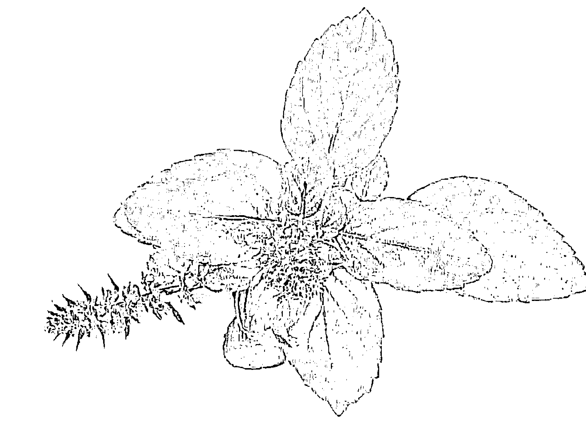

| 项目 | 内容 |
| :--- | :--- |
| 学名 | *Ocimum sanctum* / *Ocimum tenuiflorum* |
| 其他名称 | 克里希那罗勒 / Tulsi |
| 香气印象 | 机敏勇敢的神猴哈努曼 |
| 植物科属 | 唇形科罗勒属 |
| 主要产地 | 印度、尼泊尔 |
| 萃取部位 | 开花的全株药草（蒸馏） |
| 适用部位 | 督脉、顶轮 |
| 核心成分 | 萃油率0.16%~0.55%，24个可辨识化合物（占95.09%） |
| 心灵效益 | 壮大情绪的稳定性，坚强面对恐惧或哀伤 |

| 药学属性 | 适用症候 |
| :--- | :--- |
| 1. 补强消化道，降血糖，降胆固醇，保护心脏，适应原作用，抗辐射与基因毒性 | 压力性胃溃疡，慢性肝病，糖尿病，心肌梗死，铬与汞引起的染色体畸变 |
| 2. 补强神经（修复海马回），强力抗压，抗惊厥，抑制环氧合酶（非类固醇性消炎止痛） | 压力性心身疾病，头痛，学习障碍，多发性硬化症，非炎性关节病（颈椎、腰椎） |
| 3. 抗感染，杀菌，杀病毒，驱蚊，杀寄生虫，疗愈伤疤 | 肺结核，气喘，淋病，阴道毛滴虫病，虫咬，登革热，肥厚性疤痕和蟹足肿 |
| 4. 抑制精虫数量，抗氧化，抗肿瘤，降甲状腺素T4 | 避孕，前列腺阻塞充血，化学性致癌物，甲状腺功能亢进 |

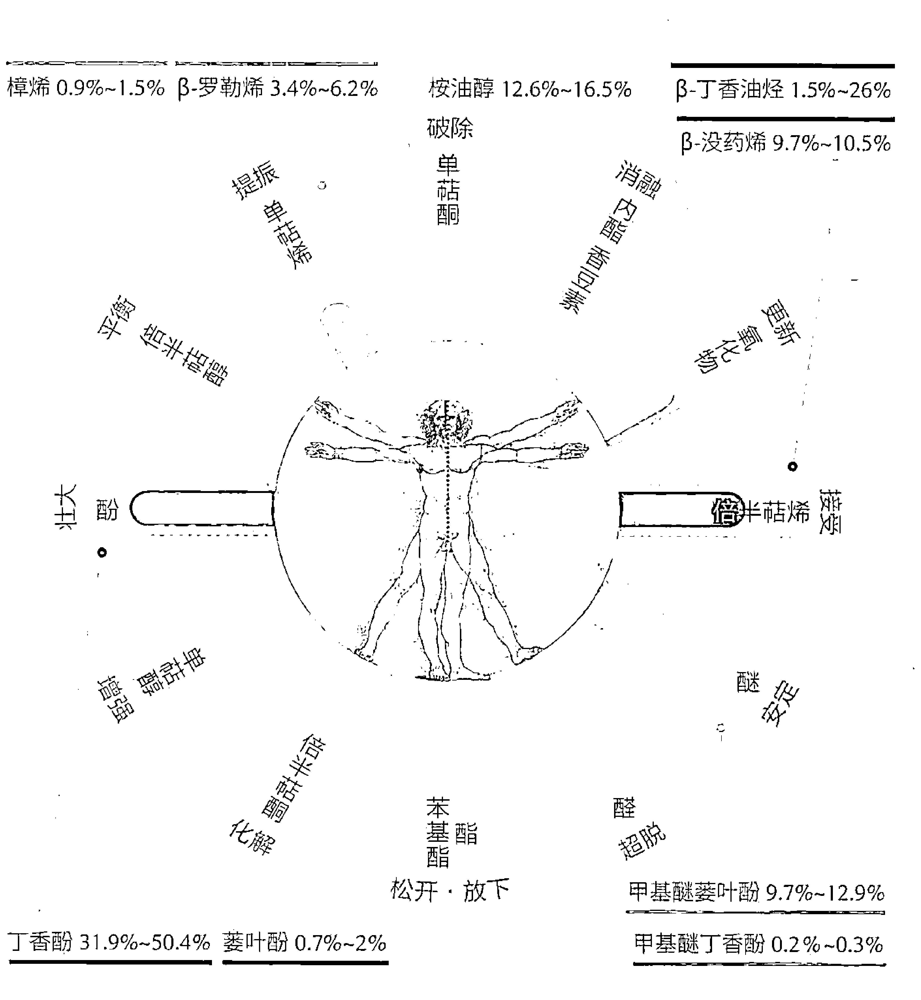

1. 健康皮肤的安全剂量为1%。
2. 南印度西高止山所产品种富于甲基醚丁香酚（可达89%）。
3. 绿叶型称黑天罗勒 (Krishna Tulasi)，紫叶型称吉祥天女罗勒 (Lakshmi Tulasi)。传说克里希那总在脖子上挂着一串神圣罗勒编成的花环，用来破除我执，坚定信仰，持续奉献。是印度教的神圣植物，阿育吠陀用作万灵丹。

## 野马郁兰
Oregano

原生于摩洛哥西部山麓，喜欢偏碱的土壤，不能忍受阴影和过潮。在摩洛哥是最受看重的家庭万灵丹，开粉紫色花。

### 药学属性

1. 强力抗感染，应用范围广泛（呼吸道，消化道，泌尿生殖道，神经，血液循环方面，淋巴结），杀病毒，杀菌，杀霉菌，杀寄生虫
2. 止痛，消炎，抗痉挛
3. 抗氧化，抗肿瘤，抗基因毒性，抗肝毒，保护肝脏，抗蛋白质酶
4. 激励补身，保护神经，乙酰胆碱酯酶抑制，提升免疫功能

### 适用症候

- 呼吸系统感染，淋巴结炎，咽喉炎，结肠炎，消化不良，病毒性败血症，疟疾
- 肾炎，膀胱炎
- 乳腺癌，肺腺癌，肝癌，直肠癌，环境污染，病毒复制（如 HIV）
- 神经炎，虚弱无力，神经疲劳，老年痴呆，低血压

| 项目 | 内容 |
| :--- | :--- |
| 学名 | *Origanum compactum* |
| 其他名称 | 结实牛至 / Zaatar |
| 香气印象 | 在大地与苍穹之间飘荡摇曳的五色经幡 |
| 植物科属 | 唇形科牛至属 |
| 主要产地 | 摩洛哥 |
| 萃取部位 | 开花的全株药草（蒸馏） |
| 适用部位 | 肺经、喉轮 |
| 核心成分 | 萃油率 0.31%~2.44%，26 个可辨识化合物（占 99.37%） |
| 心灵效益 | 壮大抗污力，即便误入泥沼也不被染 |

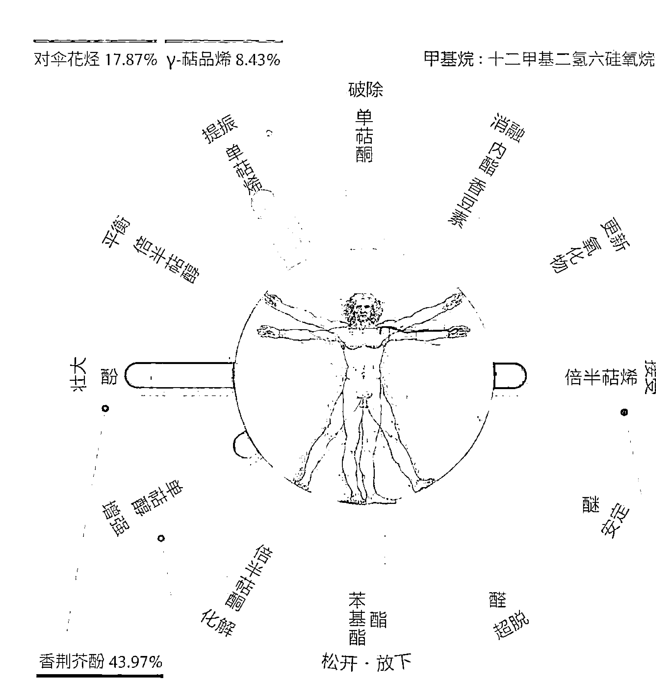

| 化学成分 | 百分比 |
| :--- | :--- |
| 对伞花烃 | 17.87% |
| γ-萜品烯 | 8.43% |
| 香荆芥酚 | 43.97% |
| 百里酚 | 11.56% |
| 诺卜醇 | 0.23% |
| 侧柏醇 | 0.29% |
| β-丁香油烃 | 1.85% |
| α-愈疮木烯 | 0.15% |
| 甲基烷：十二甲基二氢六硅氧烷 | 8.6% |

### 注意事项

1. 健康皮肤的安全剂量为 1.1%，孕妇不宜。
2. 通用牛至（Origanum vulgare）开粉紫花，含香荆芥酚 16.6%~83.4%。虽然各地成分差异颇大，但都能高效抗菌和抗氧化。药草是动物饲料的首选添加物。用来萃取精油的主要是 ssp. vulgare 和 ssp. hirtum 两个亚种。
3. 土耳其牛至（Origanum onites）开白花，是土耳其与希腊的常见品种与常用香料，含香荆芥酚 66.5%~80.4%。

## 岩爱草
Dittany

希腊克里特岛特产，需全日照，野生於偶感湿凉的陡峭岩壁。茎叶密布柔软细毛，灰绿的叶片丰厚，与一般牛至属植物的外观不同。

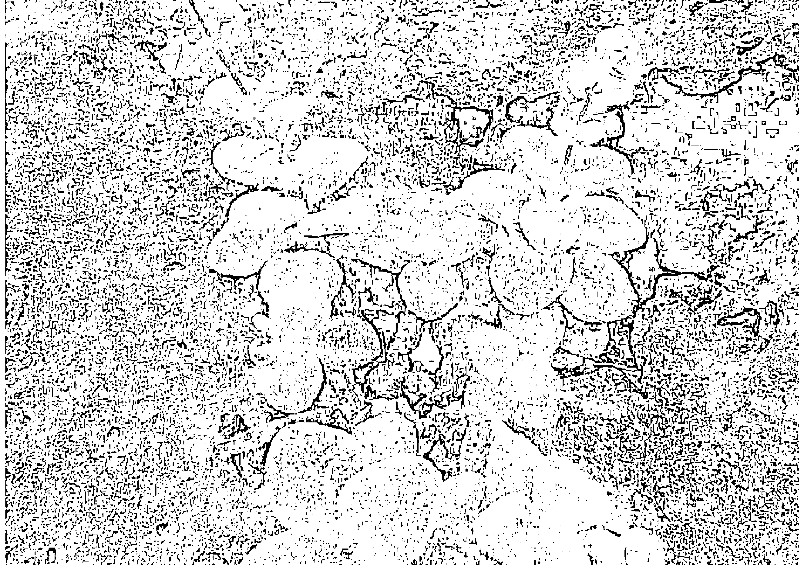

| 项目 | 内容 |
| :--- | :--- |
| 学名 | *Origanum dictamnus* |
| 其他名称 | 白藓牛至 / Erontas |
| 香气印象 | 历经千辛万难重回沙漠洞穴拯救爱人 |
| 植物科属 | 唇形科牛至属 |
| 主要产地 | 克里特岛 |
| 萃取部位 | 开花的全株药草(蒸馏) |
| 适用部位 | 肾经、性轮 |
| 核心成分 | 萃油率 1.05%~3.14%，44个可辨识化合物(占99.8%) |
| 心灵效益 | 壮大追求幸福的决心，相信真爱 |

| 药学属性 | 适用症候 |
| :--- | :--- |
| 1. 消炎，止痛，通经，助产 | 牙龈发炎，风湿，肠胃绞痛，痛经，生产困难 |
| 2. 抗氧化，抗肿瘤，安抚神经 | 饮酒引起的肝毒，肝癌，乳腺癌，失恋或大受打击后的魂不附体 |
| 3. 抗菌，抗霉菌，驱虫，开胃补身 | 食物中毒(生菜与肉品)，受寒后的腹痛腹泻，过度劳累后的感冒与咳嗽 |
| 4. 促进皮肤代谢，愈合伤口 | 排出刺入皮肤的尖细物体，感染性伤口，松弛干皱的皮肤 |

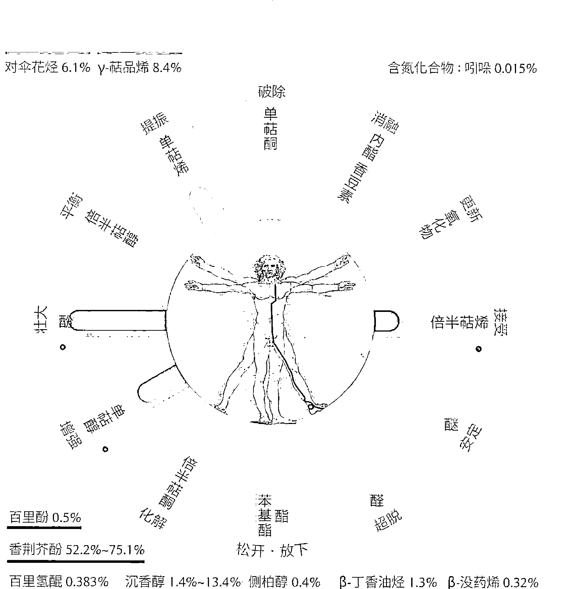

### 注意事项

1. 可能刺激皮肤；宜低剂量使用，孕妇不宜。
2. 在克里特岛，野生植株含香荆芥酚比例高于栽培种。希腊北部无此虑，然而栽培种的化合物总数明显减少。

## 希腊野马郁兰
Greek Oregano

根系超级强壮，喜爱沃土但不喜过湿，栽种前三年土壤不能种其他作物。花色白而微黄，植株愈收割愈能生长。

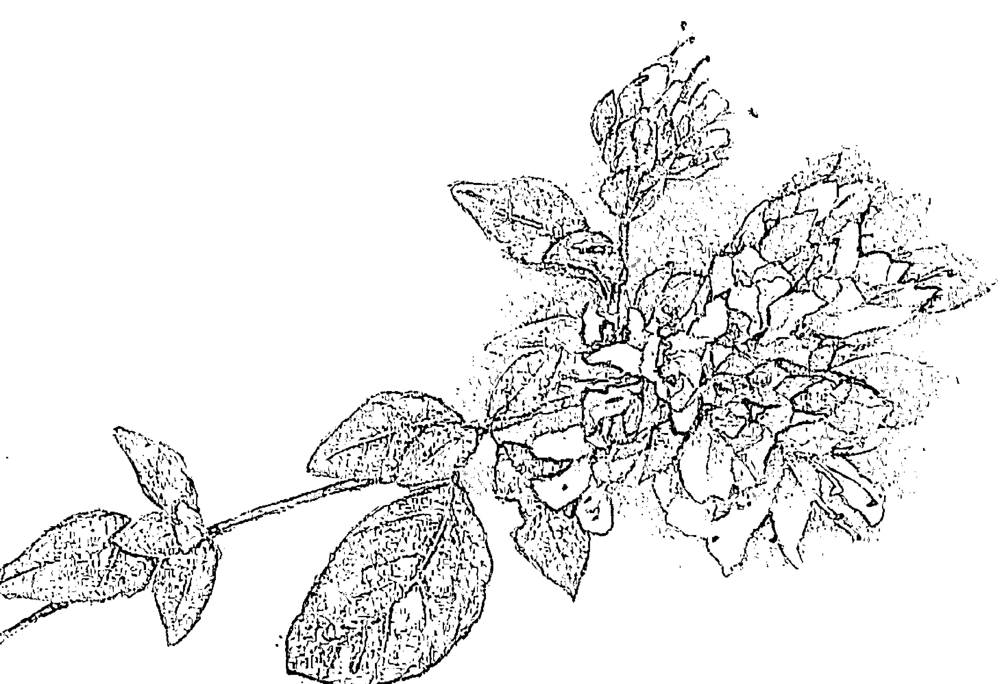

1. 强力抗感染，抗菌，抗霉菌，抗病毒，抗寄生虫
2. 滋补强身
3. 调节免疫
4. 抑制瞬时受体电位通道以保护神经

适用症候：
- 呼吸道、消化道、泌尿生殖道的感染
- 重大疾病后的复健（手术或疗程完毕后）
- 罕见疾病与自体免疫疾病患者的辅助
- 神经衰弱，大脑创伤后之修复

| 项目 | 内容 |
| :--- | :--- |
| 学名 | *Origanum heracleoticum* |
| 其他名称 | 白马郁兰 / White Marjoram |
| 香气印象 | 幽黑隧道尽头的刺目白光 |
| 植物科属 | 唇形科牛至属 |
| 主要产地 | 南欧、东欧 |
| 萃取部位 | 开花的植株（蒸馏） |
| 适用部位 | 肾经、基底轮 |
| 核心成分 | 萃油率 1.5%，26 个可辨识化合物 |
| 心灵效益 | 壮大耐受力，愈挫愈勇 |

主要成分：
- 对伞花烃 10.5%
- γ-萜品烯 2.86%
- 香荆芥酚 69%
- 百里酚 7.94%
- 乙酸沉香酯 3.5%
- β-丁香油烃 1.53%
- β-没药烯 1.01%

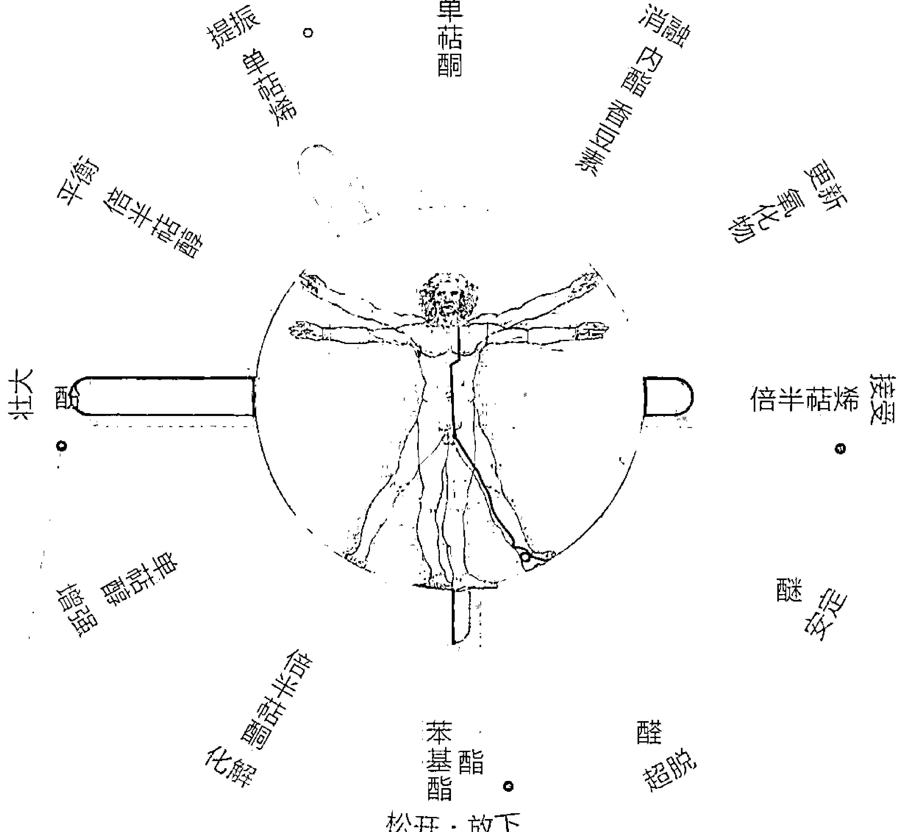

1. 本品种是各种野马郁兰中最辣的一种，气味比一般的野马郁兰“明亮”。
2. 分布区域重叠且成分接近的土耳其野马郁兰 / 土耳其牛至（Origanum onites），有抗纤维瘤的作用。
3. 含酚量高，用于皮肤和黏膜部位时宜特别谨慎。

## 多香果
Allspice

多香果属是加勒比海地区特有植物，也分布在中美洲的热带森林。果实在青绿阶段便采下，靠太阳曝晒成棕黑色。

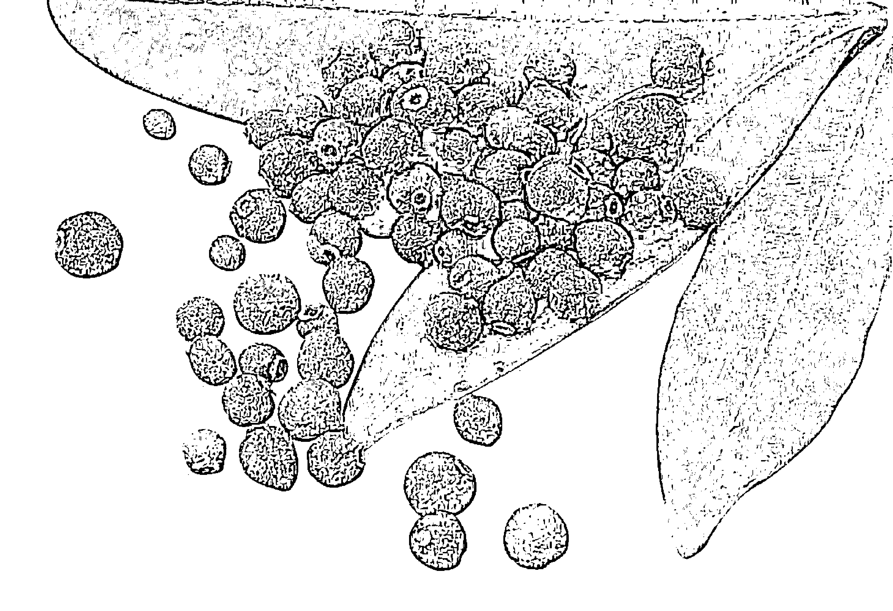

| 项目 | 内容 |
| :--- | :--- |
| 学名 | *Pimenta dioica* |
| 其他名称 | 牙买加胡椒 / Jamaica Pepper |
| 香气印象 | 加勒比海盗之神鬼奇航 |
| 植物科属 | 桃金娘科多香果属 |
| 主要产地 | 牙买加、墨西哥、洪都拉斯、古巴 |
| 萃取部位 | 果实（蒸馏） |
| 适用部位 | 肾经、性轮 |
| 核心成分 | 萃油率 2.68%，45 个可辨识化合物（占 95.86%） |
| 心灵效益 | 壮大果敢心，从冒险犯难中锻炼生存能力 |

1. 消炎，抗白色念珠菌，大范围抗菌，抗病毒，抗寄生虫
2. 抗氧化，抗肿瘤（可与抗生素及抗癌药物产生协同作用）
3. 保护神经，抗沮丧，激励，抑制蛋白质糖化
4. 提高雌二醇与抑制黄体酮，补强子宫，麻醉止痛，放松肌肉，使皮肤发热

适用症候：
1. 牙髓炎，扁桃体炎，病毒性肝炎与肠炎，膀胱炎，输卵管炎，尿道炎
2. 子宫颈癌，白血病，黑色素瘤，皮肤癌，直肠癌，乳腺癌，前列腺癌，肝癌
3. 抑郁症，压力，身心俱疲，带状疱疹，多发性硬化症，甲状腺失调，糖尿病
4. 更年期问题，痛经，生产困难，牙痛，风湿痛，神经痛，四肢僵硬冷痛

主要成分：
- 柠檬烯 微量~4.2%
- α-水茴香萜 0~1.8%
- 1,8-桉油醇 0.2%~3%
- β-丁香油烃 4%~6.6%

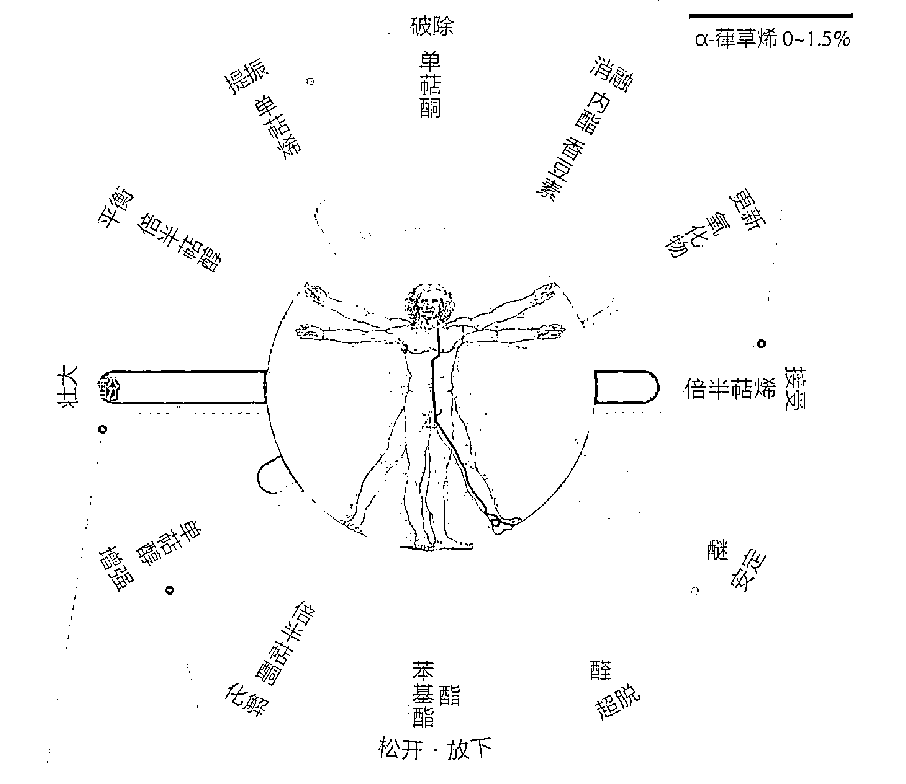

1. 可能刺激皮肤，健康皮肤的安全剂量为0.15%，孕妇不宜。
2. 果实是加勒比海地区最重要的香料，叶油的成分与果油接近，含丁香酚58%~85.33%、β-丁香油烃4.36%、桉油醇4.19%、沉香醇0.83%。

## 西印度月桂
Bay St. Thomas

原生于加勒比海地区，已在非洲与亚洲驯化，长在海拔750米以下的热带低地。需要勤劳灌溉与充足的阳光，一般而言生长缓慢，2~3年换一次叶。

### 药学属性

1. 消炎，抗溃疡，养肝
2. 抗氧化，抗肿瘤
3. 抗霉菌，抗菌，杀螨，杀壁虱，杀子了，抗病毒（登革热病毒）
4. 止痛

### 适用症候

- 胃溃疡，肝功能低下，胀气，发热
- 低密度胆固醇过高，乳腺癌，前列腺癌，口腔癌，直肠癌，胃癌，黑色素瘤
- 环境脏乱，登革热
- 痛经，肌肉酸痛，筋骨扭伤，胃痛

| 项目 | 内容 |
| :--- | :--- |
| 学名 | *Pimenta racemosa* |
| 其他名称 | 香叶多香果 / Bay Rum Tree |
| 香气印象 | 跳着大量换气的舞蹈进入属灵的状态 |
| 植物科属 | 桃金娘科多香果属 |
| 主要产地 | 牙买加、埃及 |
| 萃取部位 | 叶（蒸馏） |
| 适用部位 | 肾经、本我轮 |
| 核心成分 | 萃油率 0.9%~2.4%，26 个可辨识化合物（占 99.5%） |
| 心灵效益 | 壮大翻转的能量，从贫民一跃成为百万富翁 |

主要成分：
- 月桂烯 21.9%~30.9%
- 柠檬烯 3%~4%
- 1,8-桉油醇 2.1%~3.2%
- α-金合欢烯 0.1%~0.2%
- 双萜烯 0.6%~0.7%

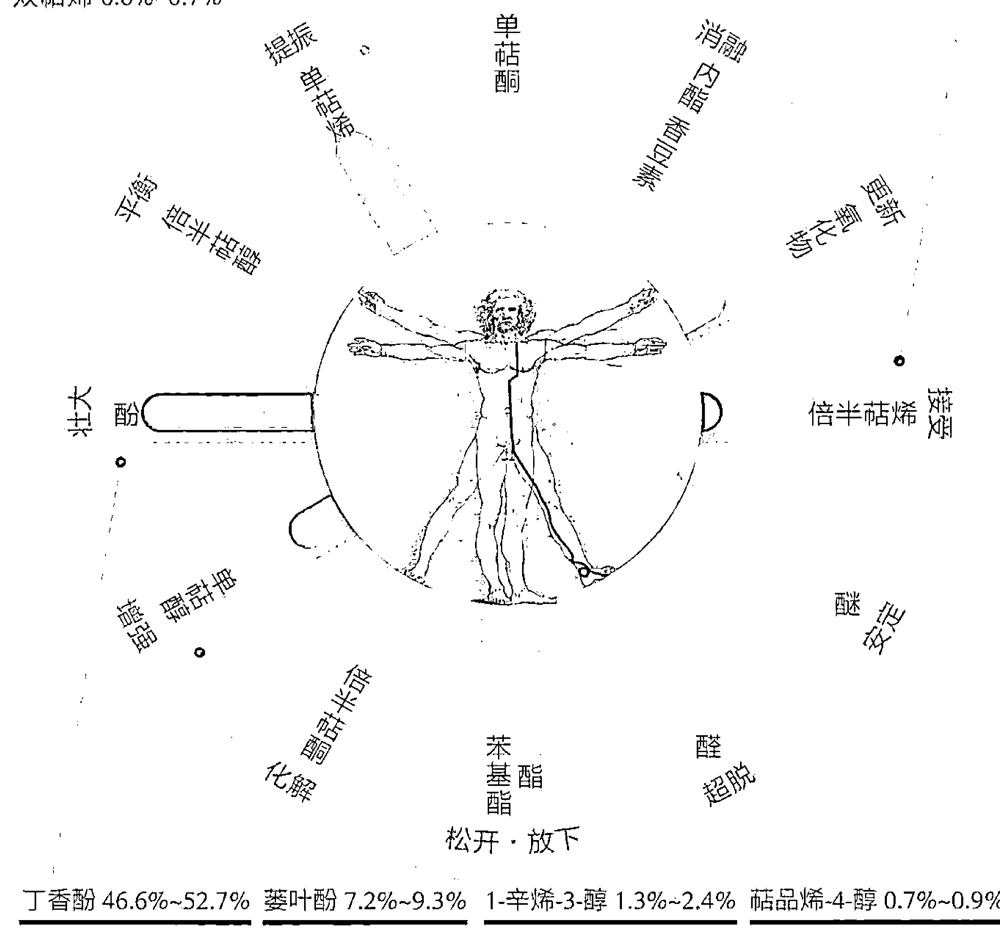

### 注意事项

1. 可能刺激皮肤，健康皮肤的安全剂量为 0.9%。
2. 叶油有三种化学品系：丁香型（丁香酚为主），洋茴香型（甲基醚蒌叶酚为主），柠檬型（柠檬醛为主）。
3. 花油以1,8-桉油醇（75.4%）和沉香醇（9%）为主，有抗氧化与抗肿瘤的生物活性。

## 到手香
Indian Borage

原产于非洲东南部，现在遍及热带及亚热带。插枝即能活，生长快速。怕霜，需肥量不高，只要半遮荫和稍稍供水就能枝繁叶茂，9月采收最佳。

| 项目 | 内容 |
| :--- | :--- |
| 学名 | *Plectranthus amboinicus* |
| 其他名称 | 左手香 / Broad-leaf Thyme |
| 香气印象 | 黝黑壮硕的南岛语族 |
| 植物科属 | 唇形科香茶属 |
| 主要产地 | 印度、印尼、埃及 |
| 萃取部位 | 叶（蒸馏） |

### 药学属性

1. 抗菌 (MRSA), 抗霉菌, 抗病毒 (VSV, HSV1 & HIV), 抗感染
2. 消炎, 止痛, 强心, 抗氧化, 抗肿瘤
3. 养肝, 促消化, 产后通乳
4. 抗惊厥, 杀子了, 愈合伤口

### 适用症候

- 感冒, 咳嗽, 慢性气喘, 喉咙痛, 鼻塞, 口腔炎, 唇疱疹
- 风湿, 头痛, 筋骨酸痛, 暑热头晕, 郁血性心衰竭, 肺癌
- 肝肾功能低下, 胀气, 腹泻, 泌尿生殖道发炎, 膀胱结石, 乳腺阻塞
- 癫痫, 抽搐, 脑膜炎, 蝎子和蚊虫咬伤, 皮肤感染, 晒伤与烧烫伤

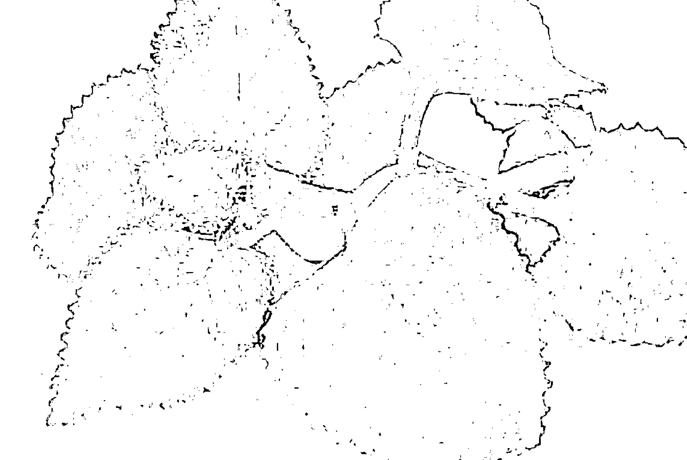

| 项目 | 内容 |
| :--- | :--- |
| 核心成分 | 萃油率0.2%，36个可辨识化合物 (占95.4%~99.9%) |
| 心灵效益 | 壮大雄心，勇于开发与拓展未知的领域 |

### 注意事项

1. 可能刺激皮肤。
2. 成分受季节与产地影响很大，夏末秋初以及印度南部所产者的酚类含量高，冬季以及湿度高地区如马来西亚、台湾岛所产者，酚类含量较低。

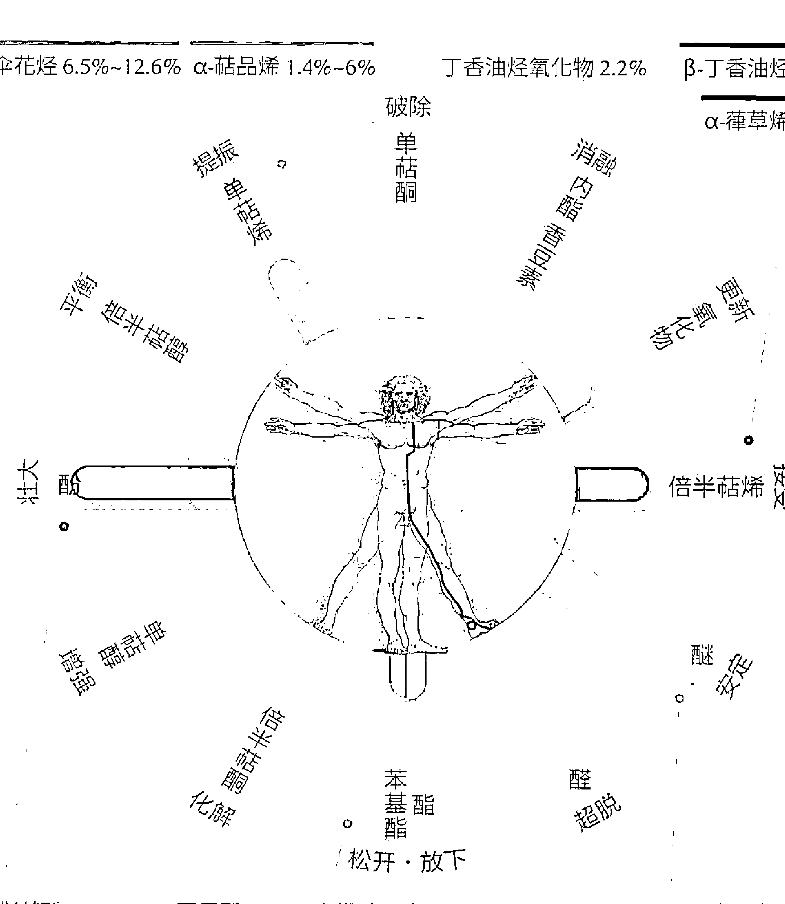

### 重味过江藤
Scented Lippia

分布在海拔 350 米左右的干燥石砾坡，或是略湿的灌木丛，不耐霜。鲜艳的白花终年不断，尤爱在雨后绽放，需要全日照和质地较轻的土壤。

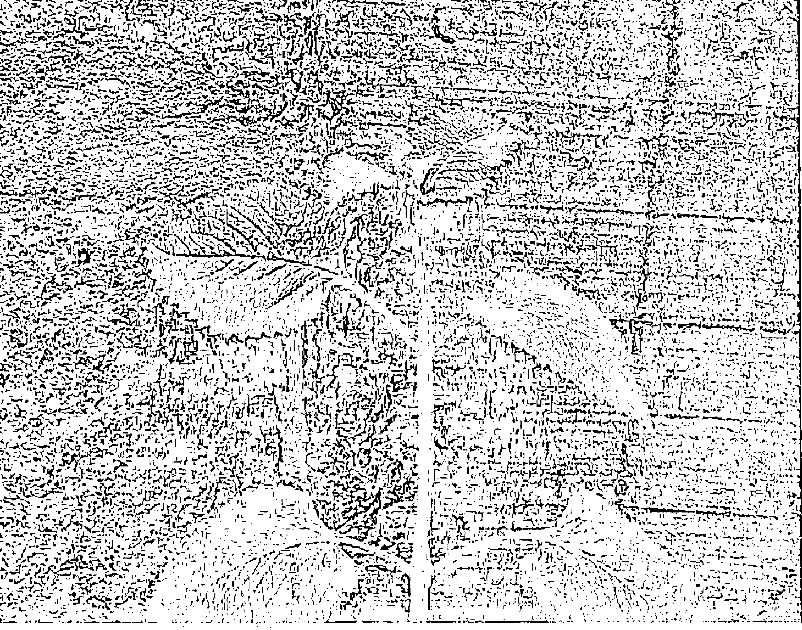

### 药学属性

1. 抗霉菌 (黄曲霉菌)，抗菌，杀虫防螨
2. 抗氧化，抗肿瘤
3. 抗病毒 (单纯疱疹病毒Ⅰ型，呼吸道融合病毒)
4. 抗痉挛，抗焦虑

### 适用症候

- 玉米的病虫害，食物感染，禽类感染 (动物饲料中取代抗生素)，狗的壁虱 (蜱)
- 肺癌，乳腺癌，肝癌，子宫颈癌
- 唇疱疹，幼儿及老年人下呼吸道感染
- 心慌意乱，脆弱而濒临崩溃

| 项目 | 内容 |
| :--- | :--- |
| 学名 | *Lippia graveolens* |
| 其他名称 | 墨西哥牛至 / Mexican Oregano |
| 香气印象 | 打进甲子园的嘉农棒球队 |
| 植物科属 | 马鞭草科过江藤属 |
| 主要产地 | 萨尔瓦多、墨西哥 |
| 萃取部位 | 叶 (蒸馏) |
| 适用部位 | 肾经、心轮 |
| 核心成分 | 萃油率 3%~4%，46 个可辨识化合物 (占 99.4%) |
| 心灵效益 | 壮大志气，在世界的中心呼喊自己 |

主要成分：
- 绿花醇 3.71%
- 匙叶桉油烯醇 1.79%
- 对伞花烃 7.7%~28%
- 丁香油烃氧化物 2.29%
- β-丁香油烃 1.45%
- α-葎草烯 1.48%

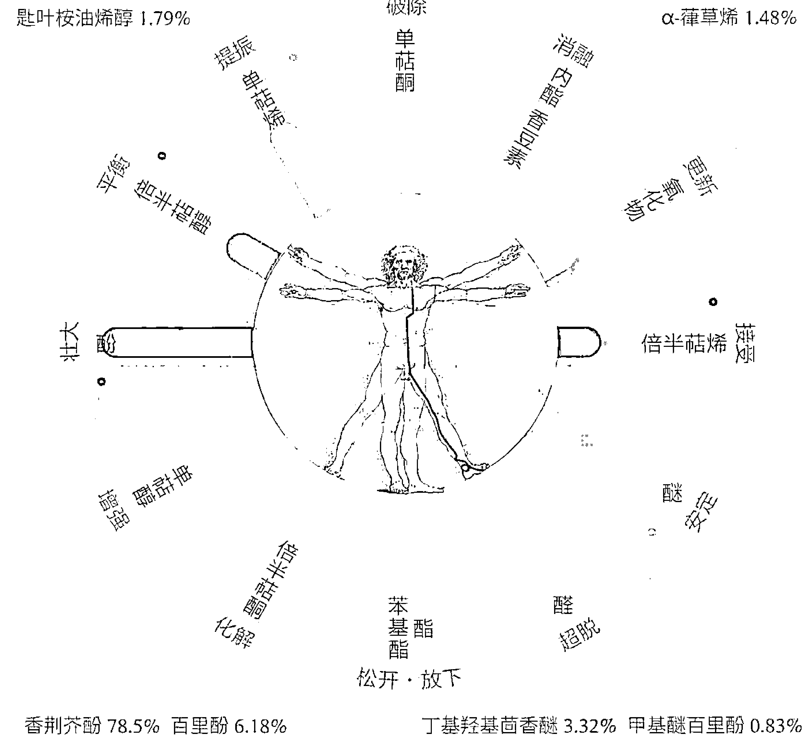

### 注意事项

1. 可能刺激皮肤，孕妇与幼童不宜，健康皮肤的安全剂量为 1.2%。
2. 中美洲最常见的家庭香料，还有其他三种化学品系：百里酚型 (88.47%)，百里酚/香荆芥酚型 (22.8%/22.7%)，倍半萜醇型 (65.7%)。

### 黑种草
Black Cumin

原生于西南亚，所需水量不多，喜爱全日照和富含有机质的土壤。花形美丽，萃油品种的花瓣呈淡蓝色，观赏用品种花色较深。

| 项目 | 内容 |
| :--- | :--- |
| 学名 | *Nigella sativa* |
| 其他名称 | 黑小茴香籽 / Black Seed |
| 香气印象 | 阿拉丁神灯 |
| 植物科属 | 毛茛科黑种草属 |
| 主要产地 | 伊朗、印度、阿尔及利亚 |
| 萃取部位 | 种子（蒸馏） |
| 适用部位 | 肺经、喉轮 |
| 核心成分 | 萃油率0.73%，46个可辨识化合物（占98.02%） |
| 心灵效益 | 壮大避震性，让自己立于不败之地 |

1. 保护神经（调节γ-氨基丁酸，提高血清素），抗神经损伤与毒性，抗惊厥，止痛
2. 调节免疫，抗敏，抗组胺，抗菌，抗霉菌，雌激素样作用
3. 抗氧化，抗肿瘤
4. 降血糖，降高半胱胺酸，消炎，抗牙菌斑

| 药学属性 | 适用症候 |
| :--- | :--- |
| 1. 保护神经（调节γ-氨基丁酸，提高血清素），抗神经损伤与毒性，抗惊厥，止痛 | 沮丧，焦虑，阿尔兹海默病，帕金森病，缺血性脑中风，癫痫，坐骨神经痛 |
| 2. 调节免疫，抗敏，抗组胺，抗菌，抗霉菌，雌激素样作用 | 气喘，头痛，感冒，过敏性鼻炎，皮肤霉菌感染，避孕 |
| 3. 抗氧化，抗肿瘤 | 白血病，子宫颈癌，黑色素瘤，肝癌，肺癌，直肠癌，口腔癌 |
| 4. 降血糖，降高半胱胺酸，消炎，抗牙菌斑 | 糖尿病，血栓，风湿，齿槽骨炎，口腔黏膜炎，牙垢，龋齿，牙周病 |

| 成分 | 含量 |
| :--- | :--- |
| 对伞花烃 | 18.17% |
| α-侧柏烯 | 3.97% |
| 双氢栓酮 | 2.46% |
| β-丁香油烃 | 0.24% |
| 长叶烯 | 1.19% |
| 百里醌 | 44.35% |
| 香荆芥酚 | 1.32% |
| 萜品烯-4-醇 | 0.39% |
| 对伞花烃-9-醇 | 0.64% |

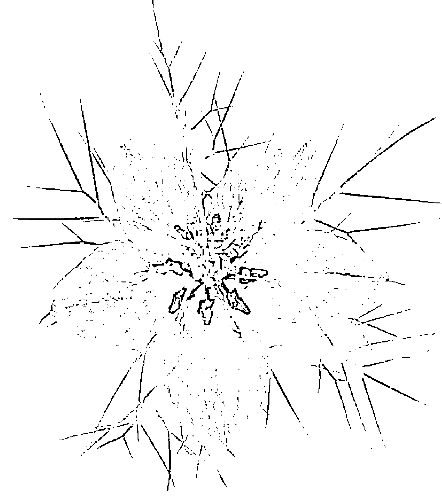

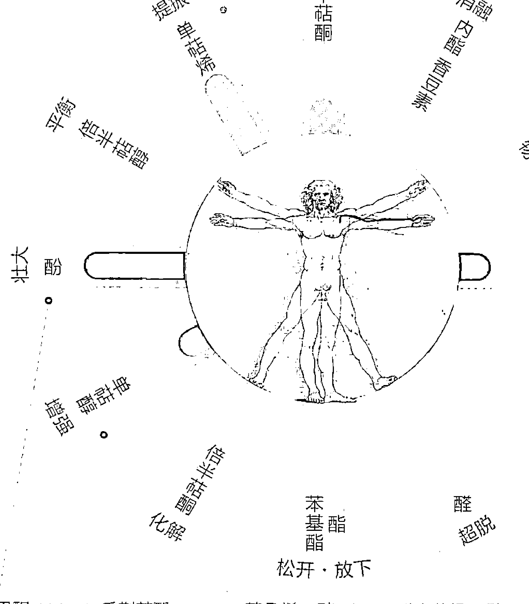

1. 可能刺激皮肤，两岁以下幼童应注意，孕妇及哺乳母亲不宜。
2. 醌是酚的氧化产物，结构接近酮，而作用接近酚。不同产地的黑种草所含百里醌（Thymoquinone）比例差异极大（微量~54.8%），印度产的以酚类前体对伞花烃为主成分（50%以上），伊朗产的以洋茴香脑为主（38.3%），北非产的百里醌比例最高。

## 冬季香薄荷
Winter Savory

地中海特产，易生长，能冬眠，冬季无须修剪，枯枝逢春自会冒绿叶。常见于贫瘠多石的山区向阳面，与玫瑰共植可防蚜虫与霉菌。

### 药学属性

1. 强力抗感染，抗病毒，抗菌，抗霉菌，抗寄生虫
2. 提升免疫功能，抗氧化，抗肿瘤
3. 普遍的激励补身效果，修复睾丸损伤，提高睾丸酮水平
4. 镇痛（经皮吸收），补强神经，促进循环

### 适用症候

- 细菌性支气管炎，肺结核，肾结核，念珠菌或淋球菌性引起的膀胱炎，阿米巴原虫病，疟疾
- 结肠炎，淋巴结炎，子宫颈癌，乳腺癌，直肠癌，肺腺癌
- 低血压，虚弱无力，神经疲劳，性功能减退，早泄
- 风湿性关节炎，关节炎，牛皮癣

| 项目 | 内容 |
| :--- | :--- |
| 学名 | *Satureja montana* |
| 其他名称 | 高地香薄荷 / Mountain Savory |
| 香气印象 | 脚踩风火轮、手执火尖枪的哪吒 |
| 植物科属 | 唇形科风轮菜属 |
| 主要产地 | 法国、克罗地亚、阿尔巴尼亚 |
| 萃取部位 | 开花的全株药草（蒸馏） |
| 适用部位 | 肾经、性轮 |
| 核心成分 | 萃油率 1.56%~1.7%，32 个可辨识化合物（占 99.85%） |
| 心灵效益 | 壮大驾驭感，世界宛如在自己脚下 |

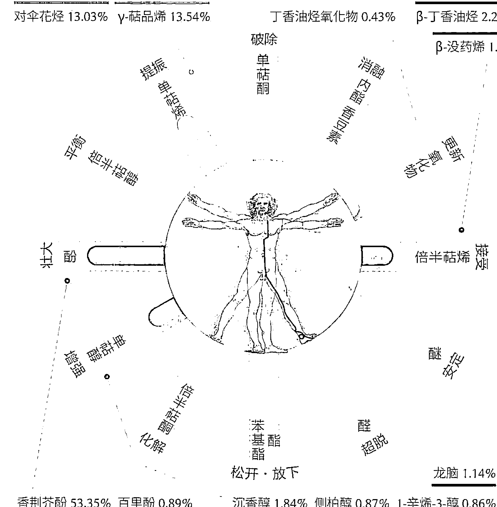

### 注意事项

1. 刺激黏膜与皮肤，用于幼儿时尤其宜小心。健康皮肤的安全剂量为 1.2%。
2. 夏季香薄荷 (Satureja hortensis) 长相比冬季香薄荷纤细，气味也较单薄，因为分子总数少于冬香，此外 γ-萜品烯较多（19.5%~42.8%），香荆芥酚略少。夏香与冬香用法相当，但冬香效果更为突出。

## 希腊香薄荷

### Greek Savory

喜欢温暖干燥的环境，最怕水多，土壤也不宜过肥。开花时酚类含量到达顶点，开花后可采鲜叶，开花前则宜采放成干叶。

- 学 名 | Satureja thymbra
- 其他名称 | 粉红香薄荷 / Pink Savory
- 香气印象 | 希腊神话中半人半羊的精灵萨堤尔
- 植物科属 | 唇形科风轮菜属
- 主要产地 | 希腊、土耳其
- 萃取部位 | 开花的全株药草(蒸馏)
- 适用部位 肾经、性轮

| 药学属性 | 适用症候 |
| :--- | :--- |
| 1. 抗病毒，强效抗菌，抗寄生虫 | 食物中毒，上吐下泻，蠕虫感染，狗身上的壁虱(蜱虫) |
| 2. 消炎止痛 | 鼻窦炎，关节痛 |
| 3. 抗氧化，抗肿瘤 | 口腔癌，食道癌，膀胱癌，乳腺癌，肾癌，前列腺癌，黑色素瘤 |
| 4. 强化免疫与心血管功能 | 疲劳引起的长期感冒，久坐引起的腰酸背痛及双腿无力 |

萃油率2.5%，22个可辨识化合物（占99.5%）

壮大挑战的能耐，上山下海如履平地

1. 刺激黏膜与皮肤，用于幼儿时尤其宜小心。健康皮肤的安全剂量为1.2%。
2. 生长于低地者含香荆芥酚较多，生于高地者含百里酚较多。
3. 黎巴嫩产的组分与其他地区不同：γ-萜品烯(34.06%)、香荆芥酚(23.07%)、百里酚(18.82%)。

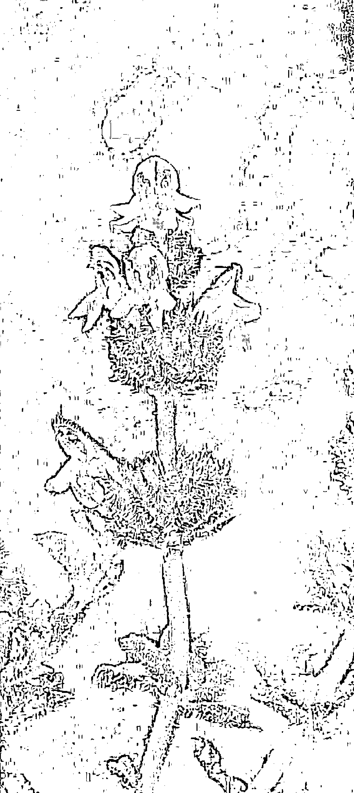

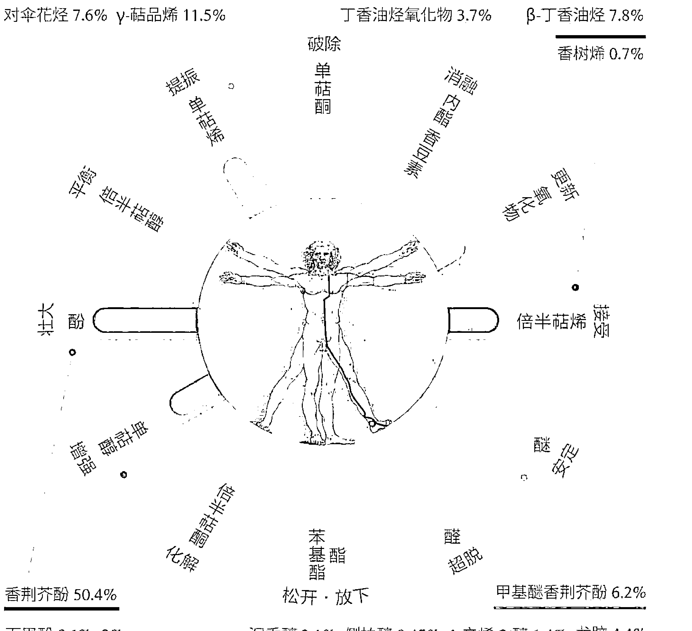

## 百里酚百里香

Thyme, CT Thymol

伊比利半亚岛的原生种，比通用百里香(Thymus vulgaris)小而叶片较窄。灌溉水量超过30%蒸散量，精油含量便会下降（水多则油少）。

- 学名: Thymus zygis
- 其他名称: 庭园百里香 / Tomillo Salsero
- 香气印象: 地表最强格斗士
- 植物科属: 唇形科百里香属
- 主要产地: 西班牙、葡萄牙
- 萃取部位: 开花的全株药草（蒸馏）
- 适用部位: 肾经、本我轮
- 核心成分: 萃油率 2.3%~3.6%，41 个可辨识化合物（占 93.4%）

| 药学属性 | 适用症候 |
| :--- | :--- |
| 全面抗感染，杀虫，抗霉菌，抗病毒 | 各部位的感染，脏乱的环境 |
| 补强身体各功能，促进胃液分泌 | 疲惫（一般性），摄食过多肉类、乳酪或油炸及烧烤食物 |
| 消炎止痛 | 咽喉肿痛，关节痛，鼻窦炎 |
| 抗氧化，抗肿瘤 | 乳腺癌，肺腺癌，肝癌 |

壮大求生意志，绝不向命运低头

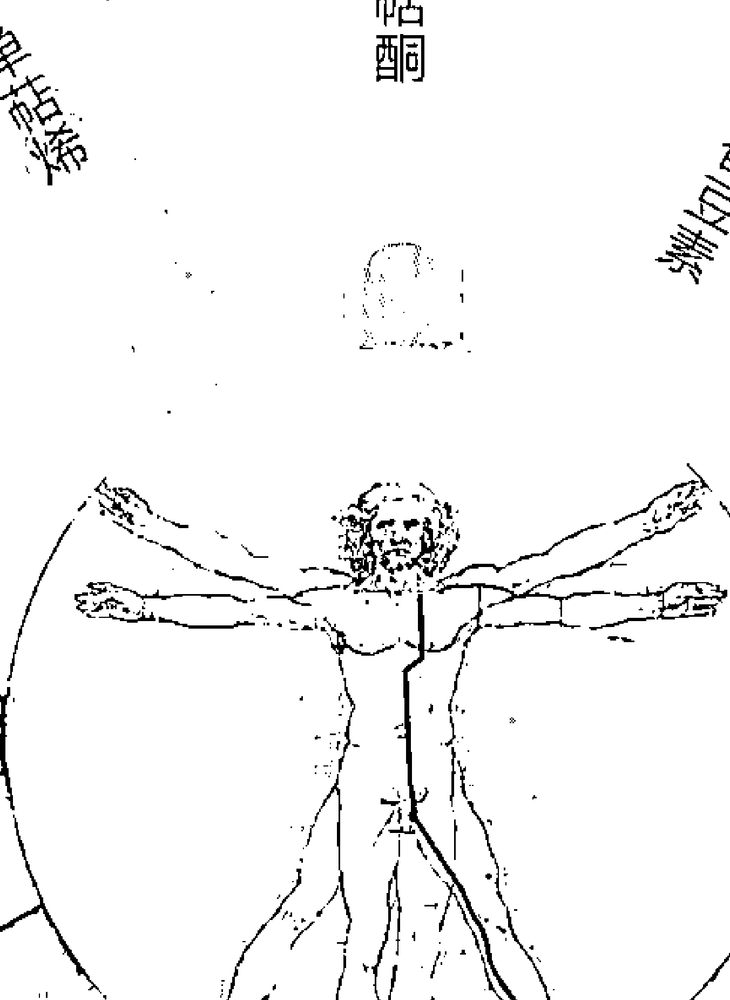

- 对伞花烃 10.3%~37.7%
- γ-萜品烯 0.9%~10.1%
- 樟脑 0~1.7%
- 百里酚 30.9%~74%
- 沉香醇 0.2%~9.4%
- 香荆芥酚 tr~5.9%
- 龙脑+α-萜品醇 0.3%~1.5%
- 侧柏醇 0~3.1%
- 甲基醚百里酚 0~1.5%
- 甲基醚香荆芥酚 0~1.4%

1. 刺激黏膜与皮肤，用于幼儿时尤其宜小心。健康皮肤的安全剂量为1.3%。
2. 商业上标注为“百里香精油”的多半来自这个品种，西班牙南部是最大的供应地，占世界八成的产量。
3. 所谓红百里香油是因为与蒸馏桶的铁起反应而油色偏红，再次蒸馏后得到油色透明者称为白百里香油。但品质良好者应呈现正常的油黄色。另外混掺的百里香油因为添加了合成香荆芥酚，反而不会因氧化而黏稠结晶。

## 野地百里香

Wild Thyme

原生于欧亚大陆的旧热带区，多见于土层较薄的灌木丛或溪流道旁。铺地生长，耐踩踏，也能容忍少量的供水。

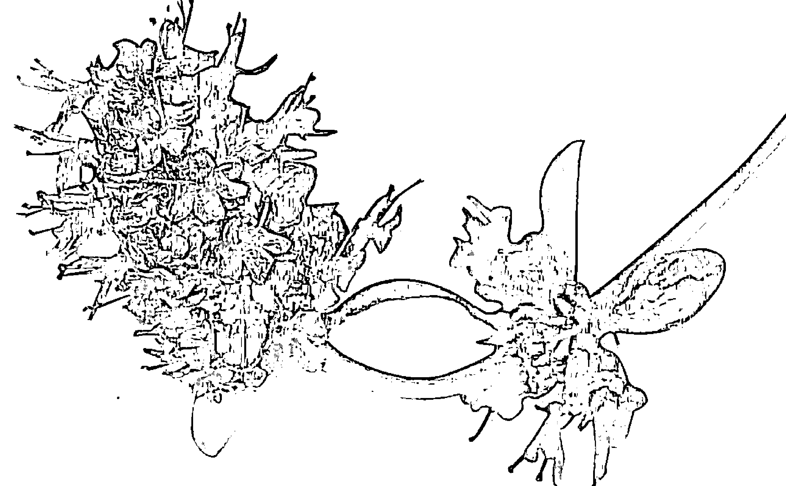

- 学名: *Thymus serpyllum*
- 其他名称: 匍匐百里香 / Creeping Thyme
- 香气印象: 拯救生态的返乡农青
- 植物科属: 唇形科百里香属
- 主要产地: 土耳其、克罗地亚
- 萃取部位: 开花的全株药草 (蒸馏)
- 适用部位: 肾经、心轮
- 核心成分: 萃油率 1.5%，477 个可辨识化合物 (占 99.67%)
- 心灵效益: 壮大行动力量，默默地一偿宿愿

| 药学属性 | 适用症候 |
| :--- | :--- |
| 1. 补身，补强神经，止痛 | 虚弱疲惫，精神障碍，自主神经失衡，坐骨神经痛，腰痛，酒精中毒，关节痛 |
| 2. 抗感染，抗菌，抗病毒，抗霉菌，抗寄生虫，消毒 | 流感，支气管炎，咳嗽，百日咳，感染引发气喘与肺气肿，肺结核，皮肤感染，脓疱疹，脓肿，炭疽病，甲沟炎 |
| 3. 抗氧化，抗肿瘤 | 伤口不愈，脱发，乳腺癌，前列腺癌，肿瘤相关成纤维细胞 |
| 4. 健胃整肠 | 胃炎，消化不良，胀气，肠胃感染，膀胱炎，肾盂肾炎 |

对伞花烃 5.7%~9.6%  γ-萜品烯 4.4%~12.3%  β-丁香油烃 6%~11.25%  β-没药烯 2.8%~7.6%

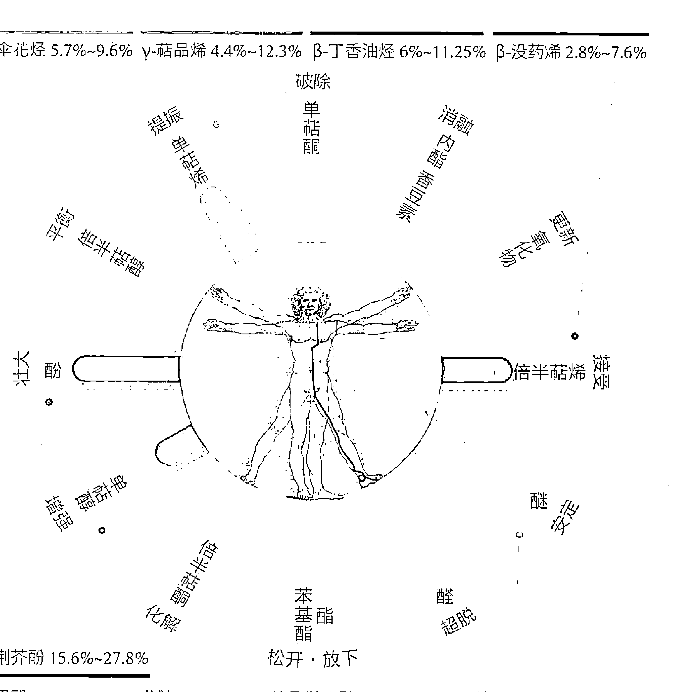

香荆芥酚 15.6%~27.8%
百里酚 16.7%~25.9% 龙脑 0.4%~3.3% 萜品烯-4-醇 0.3%~2.7% 甲基醚百里酚 7.2%~7.5%

### 注意事项
1. 刺激黏膜与皮肤，用于幼儿时尤其宜小心。健康皮肤的安全剂量为 1.3%。
2. 分布地区广大，各地的萃油率与组分差异也很大。

## 印度藏茴香

### Ajowan

原生于埃及，常见于贫瘠而盐分高的土壤，但能适应各种土质。不宜过湿，干湿分明可以长得更好。海平面到海拔2200米的向阳面皆可生长。

### 药学属性

1. 强力抗感染，抗病毒，抗菌，抗霉菌，消毒，止吐，杀积谷害虫（绿豆象），抗寄生虫
2. 激励补身，抗氧化，抗肿瘤，止痛，抑制黄曲霉毒素，养肝
3. 扩张支气管，止咳，降血压，降胆固醇，抗血小板凝结，利尿，抗草酸钙结石
4. 通经，催情，催乳，杀精，反着床

### 适用症候

- 肠道感染，霍乱，丙型肝炎，上吐下泻，胀气，消化不良，皮肤感染
- 食欲不振，腹腔肿瘤，肝毒反应（自由基压力）
- 鼻炎，支气管炎，气喘，心血管疾病，尿路结石
- 月经不至，乳汁不足，避孕

| 项目 | 内容 |
| :--- | :--- |
| 学名 | *Trachyspermum ammi* |
| 其他名称 | 印度西芹子 / Carom |
| 香气印象 | 能跟牛鬼蛇神打交道的通灵少女 |
| 植物科属 | 伞形科糙果芹属 |
| 主要产地 | 印度、巴基斯坦、伊朗 |
| 萃取部位 | 种子（蒸馏） |
| 适用部位 | 肾经、本我轮 |
| 核心成分 | 萃油率2%~4.4%，266个可辨识化合物（占96.3%） |
| 心灵效益 | 壮大阳气，无惧各种类型的摄魂怪 |

对伞花烃 20%~24% γ-萜品烯 19%~23.2% β-蛇床烯 0.1%

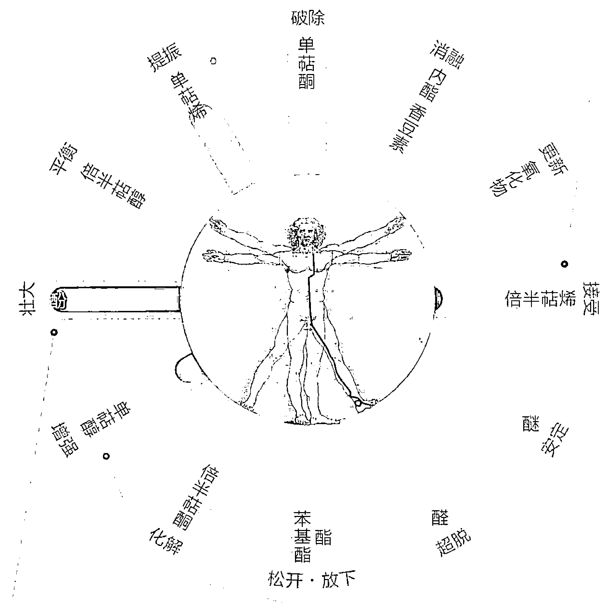

百里酚 36.9%~53.8% 香荆芥酚 14%~35% 萜品烯-4-醇 0.8%

### 注意事项

1. 孕妇不宜。
2. 会刺激黏膜与皮肤，用于幼儿时尤其宜小心。健康皮肤的安全剂量为1.4%。


### 倍半萜醇类

Sesquiterpenol

修行、冥想的良伴，瑜伽、气功的推手，这类精油是都市生活与现代节奏的平衡剂。一方面促进身体微循环，活络静脉与淋巴；另一方面调节高血压、抚平躁郁的情绪，同时改善敏感、老化皮肤乃至湿疹。多见于植物的根部与木质，所以香气比较沉稳，贵重的沉香、檀香都属于此类。用在心包经能产生加倍的效果，用于脚底有助于接地气。

## 阿米香树

Amyris

高3~6米的小树，生长在少雨而含钙量高的土地，或是冲刷边坡。含油量高又木质坚硬，做木桩可以百年不倒，暗夜可燃烧做蜡烛用。

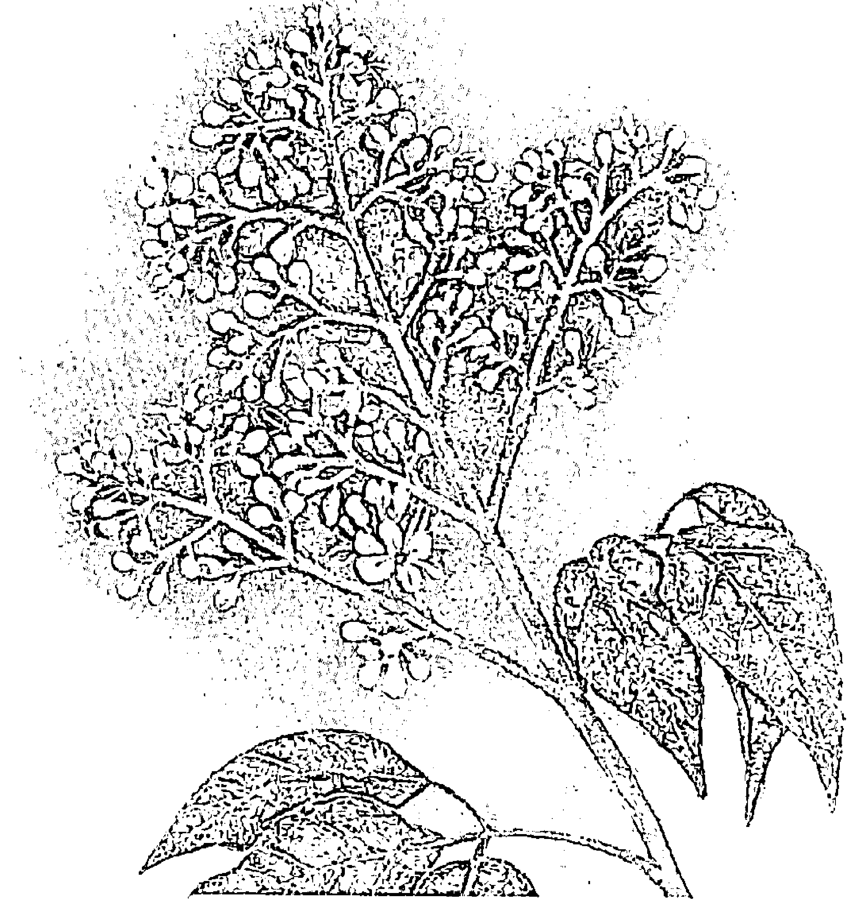

学名 | Amyris balsamifera
其他名称 | 西印度檀香 / West Indian Sandalwood
香气印象 | 劈柴砍草，安营扎寨
植物科属 | 芸香科阿米香树属
主要产地 | 海地、牙买加、多米尼加、委内瑞拉
萃取部位 | 心材（蒸馏）
适用部位 心包经、基底轮
核心成分
萃油率2%~4%，14个可辨识化合物
心灵效益 | 平衡过度的脑力活动，找回尘封的身体感

### 药学属性

1. 抗超级细菌（尤其是克雷伯肺炎菌）
2. 驱虫（扁虱、蚊子），杀孑孓
3. 畅通静脉与淋巴循环
4. 强心

### 适用症候

- 医院工作或长期住院
- 野外生活，卫生环境差的空间
- 长期伏案工作，生活习惯缺乏运动，静脉曲张，痔疮
- 心肌缺氧，疲倦无力

倍半萜醇 80%：缬草萘烯醇 21.5% 榄香醇 9% 杜松醇 30% 三种桉叶醇共20%

呋喃：沉香呋喃 0.5%

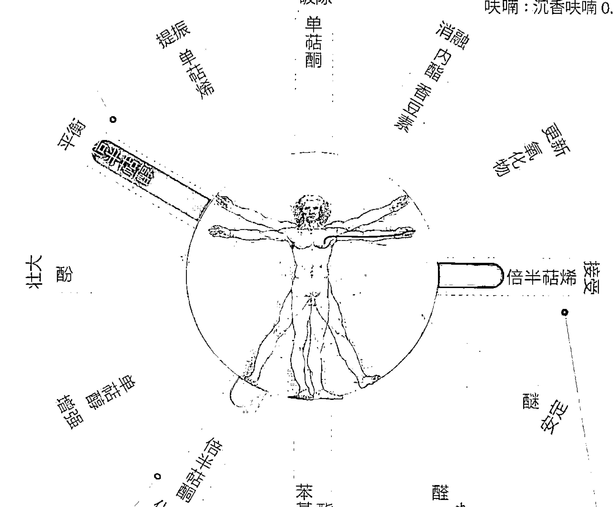

### 注意事项

1. 存放半年以上的木材（老木）能得到品质更佳的精油，但新木的萃油量较高。

没药酮 0.9%

倍半萜烯 20%：杜松烯 10.7% β-倍半水茴香萜 4.7% 姜黄烯 1.5%

## 沉香树

Agarwood

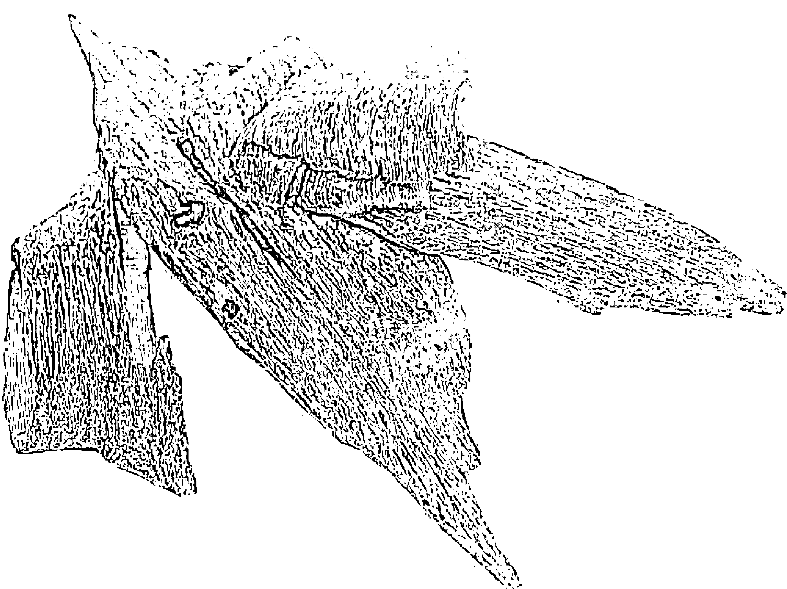

高30米的大树，生于潮湿而阳光充足的热带阔叶林中，因真菌感染而结香。在坡度较陡、含沙石较多的黄红色铁铝土上，能结出质量俱佳的香树脂。

学名 | *Aquilaria agallocha* / *A. malaccensis*
其他名称 | 水沉香 / Eaglewood
香气印象 | 长长的楠木桌上摆着一盆池坊流插花
植物科属 | 瑞香科沉香属
主要产地 | 越南、马来西亚、印尼、中国
萃取部位 | 心材（蒸馏）
适用部位 | 肾经、基底轮
核心成分
萃油率 0.35% (人工结香) ~ 0.8% (天然结香)，36~42个可辨识化合物
心灵效益 | 平衡一切不调和，即使水深火热也能心平气和

| 药学属性 | 适用症候 |
| :--- | :--- |
| 1. 解除平滑肌痉挛 | 气喘，呕吐，肠胃绞痛 |
| 2. 提高性功能 | 性冷淡，阳痿，草食男女 |
| 3. 麻醉，止痛，抗肿瘤 | 腰膝虚冷，乳腺癌 |
| 4. 镇静，安神 | 失眠，头晕耳鸣，潮热盗汗，健忘多梦 |

沉香螺旋醇 5.49%~18.86% 愈创木醇 10%

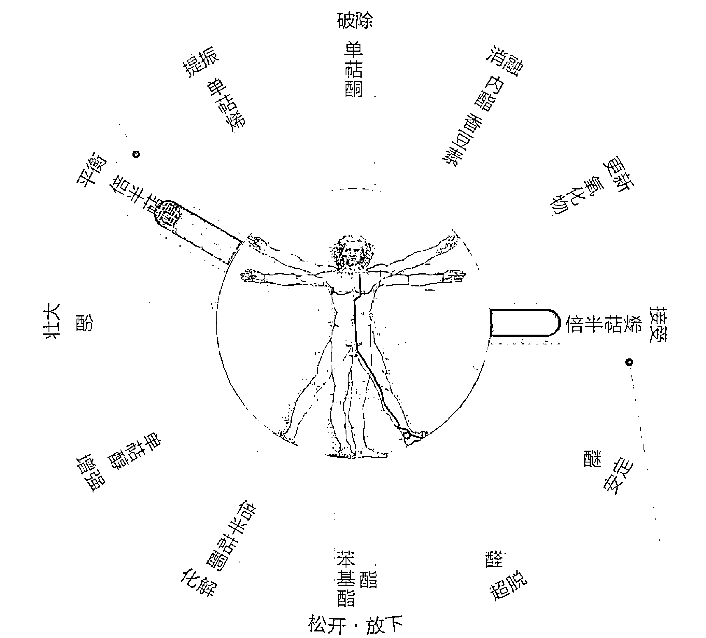

呋喃 : α-沉香呋喃 1.5%~4.8%

α-愈创木烯 14%

### 注意事项

1. 品质最好的是越南奇楠沉香，目前野生资源已经枯竭，透过人工栽种与植菌技术达成的聚脂率已有50%，但香气无法与野生相比。
2. 近年评价较高的是马来西亚与印尼产沉香，前者带清雅药香，后者带活泼花香。
3. 中国地区的沉香有三个品种，现今主要栽种与推广的是白木香 (*Aquilaria sinensis*)。香气成分以白木香醛最多，沉香的指标成分在比例上较奇楠沉香少。

## 玉檀木

Guaiac Wood

高10米的热带树木，是巴拉圭查科地区最有代表性的树种（占比 3/4）。生长在干燥但富于磷值的冲积土上，心材含草酸钙结晶，呈现美丽的墨绿色。

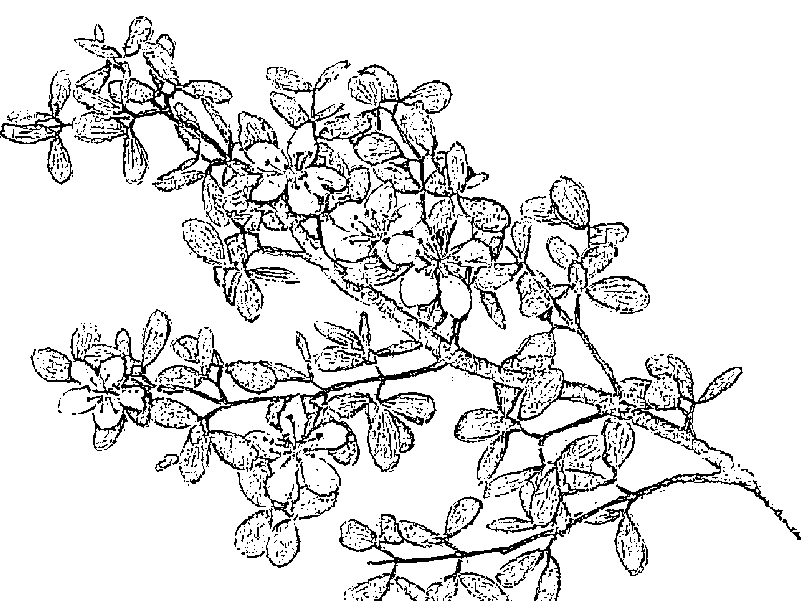

- 学名 | Bulnesia sarmientoi
- 其他名称 | 巴拉圭愈疮木 / Paraguay Lignum Vitae
- 香气印象 | 印地安酋长的厚重斗篷
- 植物科属 | 蒺藜科维腊木属
- 主要产地 | 巴拉圭、巴西、玻利维亚、阿根廷
- 萃取部位 | 心材与木屑（蒸馏）

### 药学属性
1. 修复皮肤，消炎
2. 抗结核杆菌，驱蚊，驱虫
3. 疏通淤塞的静脉与淋巴
4. 激励中枢神经，安抚太阳神经丛

### 适用症候
+ 利什曼病，皮肤感染，伤口溃烂（如糖尿病与口腔癌伤口）
+ 肺结核，重度空气污染地区，园艺活动
+ 长坐久站，下肢水肿，骨盆腔充血，静脉曲张，痔疮
+ 三心两意，举棋不定，行动的侏儒，神经性胃炎

适用部位 胃经、本我轮
核心成分
萃油率 3%~4%，36 个可辨识化合物（占 88.85%）
倍半萜醇 7种 82%：布藜醇 45%
愈疮木醇 27.3%~48.3%
山姜环氧萜醇 3%
甲基壬基酮 20%
1,8-桉油醇 9%

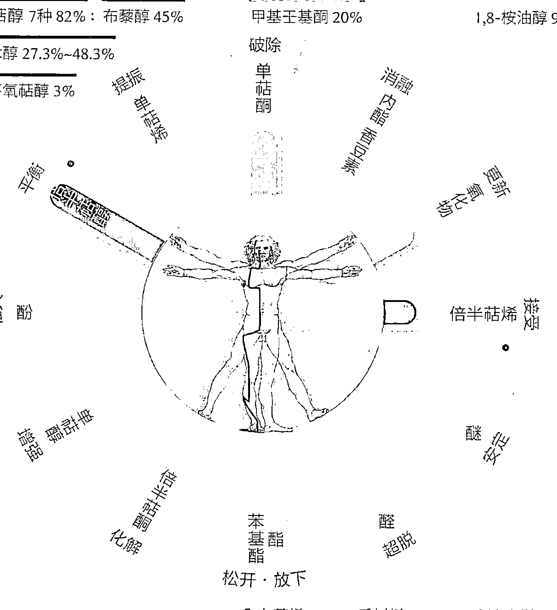

### 注意事项
1. 愈疮木其实是蒺藜科愈疮木属 (Guaiacum officinale)，玉檀木和它是近亲，气味作用都很相似，所以玉檀木油常被标示为 Guayacol 或 Guaiac Wood。
2. 直接萃出的油十分浓稠，呈半固体状，常会加入 25% 的酒精以利使用。
3. 具温暖柔软的气息，早期也是混掺玫瑰油的选项之一。

### 降香

Jiang Xiang

原产地是海南岛海拔600米以下的地区，不畏瘦瘠但成材缓慢。喜光，适温为20°C~30°C，密林中无法生长，开阔疏林中则可长成直干大材。

| 属性 | 值 |
| :--- | :--- |
| 学名 | Dalbergia odorifera |
| 其他名称 | 黄花梨 / Fragrant Rosewood |
| 香气印象 | 听竹林七贤抚琴吟诗 |
| 植物科属 | 豆科黄檀属 |
| 主要产地 | 中国（福建、广东、海南、广西） |
| 萃取部位 | 树干和根部（蒸馏） |
| 适用部位 | 脾经、本我轮 |
| 核心成分 | 萃油率2.15%，13个可辨识化合物（占97.14%，共35组分） |

心灵效益 | 平衡世俗的重压，体会山不在高、水不在深

1. 为明式家具的主要用材，因过度砍伐，在海南已成濒危种。现在都从越南进口以制作古典红木家具。
2. 市售降香的入药来源有多种，包括降香黄檀、海南黄檀(Dalbergia hainanensis)、印度黄檀(Dalbergia sissoo)、印度紫檀(Pterocarpus indicus)、芸香科山油柑(Acronychia pedunculata)，精油含量和组成都不太一样。本条所列为降香黄檀。

### 药学属性:
1. 疗伤，消肿生肌（传统金疮药），抗霉菌，促进酪胺酸酶活性
2. 抗氧化，抗凝血，抑制血栓，止咳
3. 抗肿瘤，抗过敏
4. 保护神经，镇静

### 适用症候:
+ 跌打损伤，外伤，灰指甲，足癣，白癜风
+ 瘀伤，重大手术后的调理，胸闷刺痛、心悸气短及冠心病
+ 乳腺癌，子宫颈癌，白血病
+ 帕金森病，焦虑

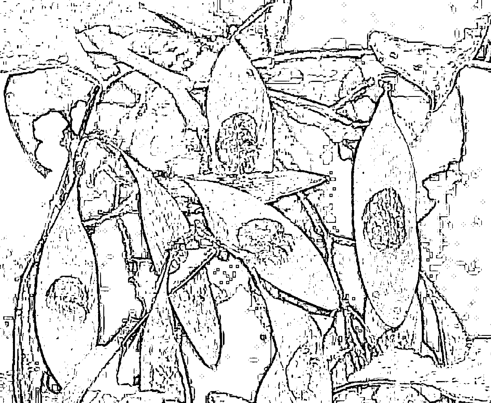

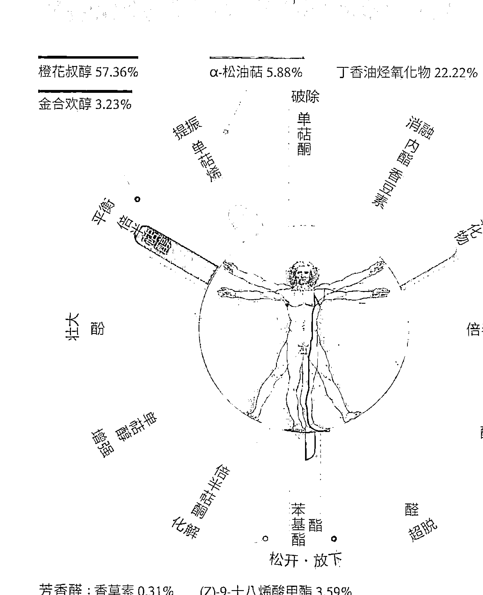

### 化学成分:
- 橙花叔醇 57.36%
- 金合欢醇 3.23%
- α-松油萜 5.88%
- 丁香油烃氧化物 22.22%
- 桉油醇 1.76%
- 芳香醛：香草素 0.31%
- (Z)-9-十八烯酸甲酯 3.59%

## 胡萝卜籽

### Carrot Seed

除了特别热的地区，几乎都能生长，但还是比较喜欢15℃~18℃的冷凉。原产于亚洲西南部，阿富汗是其最早演化中心，约在13世纪从伊朗引入中国。

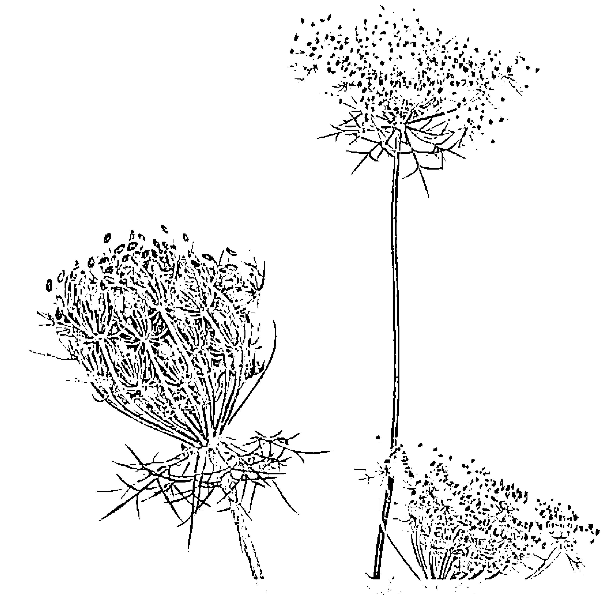

- 学名 | *Daucus carota*
- 其他名称 | 野胡萝卜 / Bishop's Lace
- 香气印象 | 保存十年的高丽人参拿来泡酒
- 植物科属 | 伞形科胡萝卜属
- 主要产地 | 法国
- 萃取部位 | 种子（蒸馏）

### 药学属性

1. 促进肝脏细胞再生，解肝肾毒，抗肿瘤
2. 调整皮肤细胞的代谢作用
3. 降低血胆固醇含量，略具抗凝血作用
4. 补强神经，提升血压

### 适用症候

长年外食，饮酒过量，葡萄球菌引发的肝脏脓肿，乳腺癌
湿疹，落屑皮疹，疖子，酒糟鼻，老人斑
三高症状
甲状腺功能失调，神经衰弱，低血压，贫血

- 适用部位 | 肝经、本我轮
- 核心成分
- 萃油率 0.83%，34 个可辨识化合物（占 98.94%）
- 心灵效益 | 平衡对他人过多的付出，把爱灌溉在自己身上

| 双官能成分（氧化物+醇）：胡萝卜脑 4% | α- & β-松油萜 10% | 桧烯 2% |
| :--- | :--- | :--- |
| 倍半萜醇： | 破除单萜酮 | 消融内酯与酯类 |
| 胡萝卜醇 50%~67% | 提振单萜烯 | 滋养氧化物 |
| 长叶烯酚 | 增强苯基酯 | 情绪 |

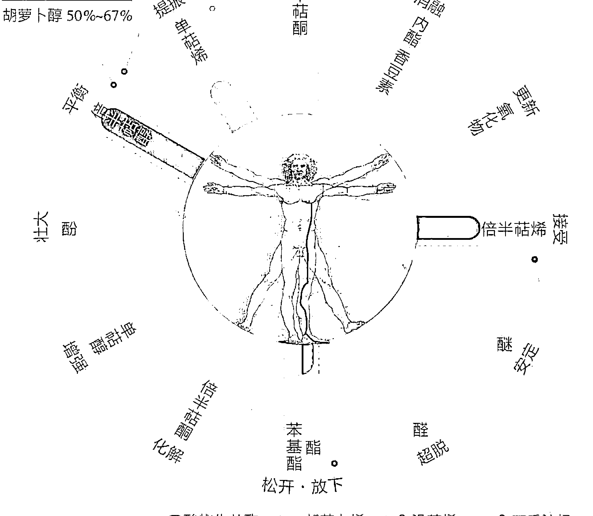

### 注意事项

1. 会因产地不同而产生极大的成分差距。
2. 胡萝卜种子也可以榨取食用油，其主要脂肪酸为洋芫荽子酸，而此食用油中也含有高量的胡萝卜醇（30.55%）和胡萝卜脑（12.6%），所以对护肤很有帮助。

乙酸牻牛儿酯 3% 胡萝卜烯 2% β-没药烯 10% β-丁香油烃 4%

## 暹罗木

Siam Wood

高 30 米，需要温和的气候与充分的雨水，长于山地的酸性潮湿土壤。浅根性阳性树种，喜欢花岗岩、砂页岩、流纹岩。

| 药学属性 | 适用症候 |
| :--- | :--- |
| 1. 强化脑下腺与睾丸、肾上腺的连结 | 男性激素不足，肾上腺疲劳 |
| 2. 抗氧化，抗肿瘤，抗病毒 | 乳腺癌，子宫颈癌，肝癌，大肠癌 |
| 3. 止痛，消炎，抗溃疡，杀虫（驱蚊与家蝇） | 腹部绞痛，神经性胃炎，消化性溃疡，恶劣的环境卫生 |
| 4. 保护神经 | 神经系统的退化性疾病，如帕金森病，老年看护 |

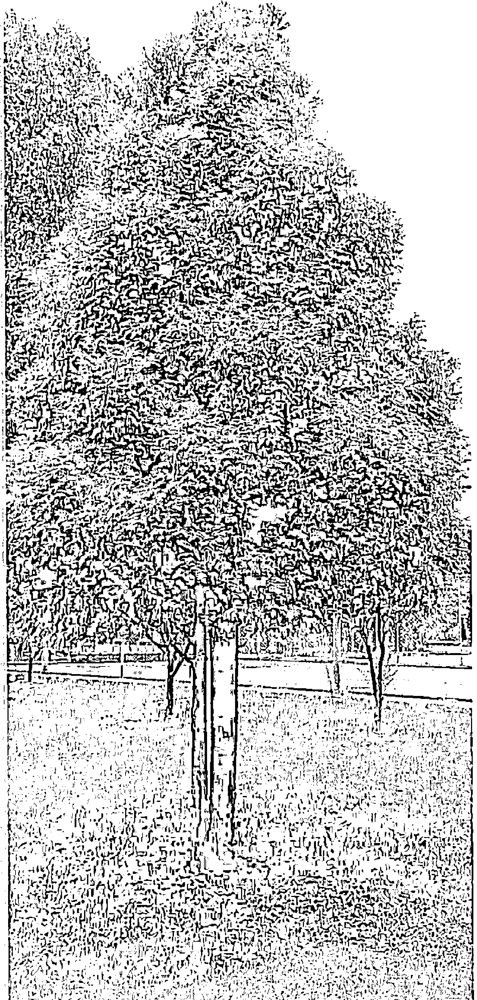

学 名 | Fokienia hodginsii
其他名称 | 福建柏 / Pemou Oil
香气印象 | 冷井情深
植物科属 | 柏科福建柏属
主要产地 | 中国（福建、云南、浙江）、越南、缅甸
萃取部位 | 木质根部（蒸馏）

倍半萜醇 17种 87.2% : 柠檬烯
反式橙花叔醇 24%~35%
α- & β- & γ-桉叶醇
福建醇 24%~26%
烷 : 十八烷

适用部位 肾经、基底轮
核心成分
萃油率 0.8%~1%, 59 个可辨识化合物

心灵效益 | 平衡生命里的各种贪恋，无欲则刚

倍半萜烯 32种 12.8% : δ-杜松烯 3.7%~6.5% γ-杜松烯 2.3%~4.5% α-依兰烯 1.8%~2.5%

### 注意事项
1. 被视为活化石，是纹理匀直的优良用材，天然林面积日益缩小，属渐危种，福建已开始培育人工林。
2. 女性要注意用量和使用频率。

## 白草果
### Gingerlily

生于海拔1200~2900米的山地空旷处，外观很像野姜花。需要潮湿的土壤，但不能生长在树荫下。

| 项目 | 内容 |
| :--- | :--- |
| 学名 | Hedychium spicatum |
| 其他名称 | 土良姜/Sanna |
| 香气印象 | 行脚节目的主持人 |
| 植物科属 | 姜科姜花属 |
| 主要产地 | 印度、中国（云南、西藏） |
| 萃取部位 | 根部（蒸馏） |
| 适用部位 | 脾经、本我轮 |
| 核心成分 | 萃油率0.24%~0.53%，29个可识别化合物（占84.96%~91.33%） |
| 心灵效益 | 平衡过度低调与避世，坦然迎风而立 |
| 注意事项 | 1. 并非花香扑鼻的野姜花（Hedychium coronarium），英文俗名常令人混淆。 |

| 药学属性 | 适用症候 |
| :--- | :--- |
| 1. 消炎，平喘，解除前列腺充血症状 | 心包膜炎，肠胃炎，咳嗽，体格壮硕的气喘病患，发热，前列腺炎 |
| 2. 养肝，抗寄生虫，解蛇毒 | 曾因热带生活感染疾病而肝功能不良，呕吐，打嗝，蛇咬 |
| 3. 抗肿瘤 | 肺癌，乳腺癌，子宫颈癌，直肠癌，头颈部癌症 |
| 4. 镇静，抗癫痫 | 躁动不安，癫痫（减缓发作的强度） |

倍半萜醇 12种 43%：β-桉叶醇 12.6% 榄香醇 8.5% α-杜松醇 5.3% 1,8-桉油醇 29.7%

## 黏答答土木香
### Sticky Fleabane

典型的地中海植物，常见于干涸的河床、路边和荒地。只要求光照。作为先驱植物，是土地含氮量与生态丰富性的指标，也能净化污染的土地。

### 药学属性
- 1. 消炎，退热
- 2. 抗病毒，抗幽门螺杆菌，抗肿瘤
- 3. 止痛，疗愈伤口，驱虫
- 4. 抗菌、抗霉菌，抗氧化

### 适用症候
- 支气管炎，鼻窦炎，着凉发热
- 胃溃疡，胃癌
- 风湿，关节炎，腰背酸痛，蚊虫叮咬，寄生虫感染
- 体癣，股癣，足癣

| 成分类型 | 成分与比例 |
| :--- | :--- |
| 倍半萜醇 18种 | 反式橙花叔醇 19.75%<br>α- & β-桉叶-6-烯-4α-醇 5.64%<br>福建醇 20.87% |
| 丁香油烃氧化物 | 2.57% |
| 倍半萜烯 11种 10% | β-丁香油烃 1.52%<br>α-金合欢烯 0.89% |
| 岩兰草酮 | α-岩兰草酮 3.6%<br>大根老鹳草酮 0.96% |
| 乙酸酯 | 乙酸丁香酯 1.35%<br>乙酸雪松烯酯 2% |

| 项目 | 内容 |
| :--- | :--- |
| 学名 | Inula viscosa / Dittrichia viscosa |
| 其他名称 | 黄飞蓬 / Yellow Fleabane |
| 香气印象 | 周星驰电影里的小人物 |
| 植物科属 | 菊科旋覆花属 |
| 主要产地 | 约旦、以色列、土耳其、意大利 |
| 萃取部位 | 开花的全株药草（蒸馏） |
| 适用部位 | 膀胱经、心轮 |
| 核心成分 | 萃油率 0.05%~1.49%，47 个可辨识化合物（占 92.7%） |
| 心灵效益 | 平衡歧视或有色的眼光，人不知而不愠 |

### 注意事项
- 1. 溶剂萃取或 CO₂ 萃取会得到 inuviscolide，这种倍半萜内酯有治疗糖尿病、脂肪肝，抗恶性黑色素瘤的功能，但也可能引起皮肤过敏。

## 昆士亚
### Kunzea

大型灌木，满开白花，高可达3米，原生于澳大利亚的冷凉海岸地带。和红千层属是近亲，不太需要照顾。在砂石与花岗岩上坚挺站立。

- **学名** | *Kunzea ambigua*
- **其他名称** | 蝉灌木 / Tick Bush
- **香气印象** | 从海底一百层楼处潜出水面
- **植物科属** | 桃金娘科昆士亚属
- **主要产地** | 澳大利亚（塔斯马尼亚东北部、巴斯海峡岛屿）
- **萃取部位** | 枝叶（蒸馏）
- **适用部位** | 肾经、基底轮
- **核心成分** | 萃油率 0.3%~3.8%，64 个可辨识化合物
- **心灵效益** | 平衡一意孤行的偏执，独乐乐不如众乐乐

### 药学属性 | 适用症候
- 1. 抗病毒，抗超级细菌 | 流感症状
- 2. 伤口愈合，止痒，静脉注射后使静脉消肿 | 撞伤，烧烫伤，湿疹，皮肤排毒，化疗或其他点滴注射后
- 3. 止痛，消炎 | 痛风，风湿，关节炎，肌肉酸痛，头痛
- 4. 镇定神经 | 钻牛角尖，工作繁重，面临截止日期

### 成分分析
| 成分 | 百分比 |
| :--- | :--- |
| 蓝胶醇 | 7.6%~22.6% |
| 绿花醇 | 6.8%~38% |
| α-松油萜 | 0.6%~48% |
| 1,8-桉油醇 | 12% |
| 匙叶桉油烯醇 | 0.5%~12.2% |
| α-萜品醇 | 2% |
| 双环大根老鹳草烯 | 4.4% |

### 注意事项
- 1. 新西兰的卡奴卡 (*Kunzea ericoides*) 也是昆士亚属。
- 2. 不同地区生长的昆士亚成分差距很大。

## 厚朴
### Houpu Magnolia

喜光，分布于海拔300~1500米的山地。喜凉爽、湿润、多云雾的环境。在腐植质丰富、排水良好的微酸性土壤生长良好。常混生于落叶阔叶林内。

| 项目 | 内容 |
| :--- | :--- |
| 学名 | Magnolia officinalis |
| 其他名称 | 紫朴 / Magnolia-bark |
| 香气印象 | 斗笠遮脸、乘船渡海的学问僧 |
| 植物科属 | 木兰科木兰属 |
| 主要产地 | 中国 (四川、湖北、贵州、河南) |
| 萃取部位 | 树皮 (蒸馏) |
| 适用部位 | 大肠经、本我轮 |
| 核心成分 | 萃油率 0.35%~1.15%，59~88 个可辨识化合物 |
| 心灵效益 | 平衡被外在事物牵动的情绪，八风吹不动 |

| 药学属性 | 适用症候 |
| :--- | :--- |
| 1. 镇静，抑制中枢神经 | 躁郁症，胸闷，无事喘咳 |
| 2. 消炎，抗沙门氏菌，抗溃疡 | 时常外食引起的消化不良、肠胃发炎 |
| 3. 养肝 | 时常外食引起的肝毒表现 |
| 4. 抗肿瘤 | 胆管癌 |

### 注意事项
- 1. 药材来源有二：厚朴与凹叶厚朴 (M. officinalis subsp. biloba)。
- 2. 传统认为川朴 (产于四川、贵州) 的质量优于温朴 (产于浙江、福建)。
- 3. 传统认为孕妇与脾胃虚寒者不宜食用厚朴，但精油外用则没有这个问题。

## 橙花叔醇 绿花白千层
### Niaouli, CT Nerolidol

立足酸性潮湿的沼泽地或泛滥平原，森林大火后会迅速从徒长枝落地生根。密生的白花能为多种蝙蝠、鸟类和昆虫提供丰富的营养（花蜜）。

| 项目 | 内容 |
| :--- | :--- |
| 学名 | Melaleuca quinquenervia |
| 其他名称 | 宽叶白千层 / Broad-leaved Paperbark |
| 香气印象 | 薄雾笼罩的草原迎接清晨第一道曙光 |
| 植物科属 | 桃金娘科白千层属 |
| 主要产地 | 澳大利亚东海岸、巴布亚新几内亚、新喀里多尼亚 |
| 萃取部位 | 枝叶（蒸馏） |
| 适用部位 | 任脉、性轮 |
| 核心成分 | 萃油率 1%~3%，40 个可辨识化合物 |
| 心灵效益 | 平衡过高的自我期许，增强一步一脚印的自信 |

- 1. 澳大利亚的绿花白千层主要有两大化学品系：A. 绿花白千层醇 + 桉油醇（最常见）；B. 橙花叔醇 + 沉香醇。其中B型又可分高沉香醇型（含量在40%以上）和低沉香醇型（含量在14%以下）。低沉香醇型也就是橙花叔醇型。
- 2. 女性宜少量使用橙花叔醇绿花白千层，沉香醇绿花白千层则没有这个问题。但沉香醇型对激素和病毒的作用不及橙花叔醇型。

| 药学属性 | 适用症候 |
| :--- | :--- |
| 1. 补强神经（平衡交感神经） | 过度紧绷后的瘫软无力与崩溃，高血压 |
| 2. 消炎（特别是呼吸道与泌尿生殖道的黏膜部位） | 鼻窦炎 |
| 3. 激素作用（由下视丘调节与强化睾丸和肾上腺） | 提高男性生殖力 |
| 4. 抗寄生虫，抗病毒，抗肿瘤 | 疟疾，带状疱疹，类风湿性关节炎，次级感染皮肤炎，乳腺癌与子宫颈癌 |

## 香脂果豆木
### Cabreuva

见于热带雨林以及干树林到草原之间的过渡地带，喜欢肥沃的黏土。生长快速，但不像其他豆科植物那样与土中细菌有共生关系，不具固氮作用。

| 药学属性 | 适用症候 |
| :--- | :--- |
| 1. 提高药物的皮肤吸收率，抗疟原虫 | 皮肤粗干（不易吸收保养品或药品），疟疾 |
| 2. 抗肿瘤，抗病毒，消炎止痛，抗龋齿 | 乳腺癌与子宫颈癌，流感，风湿性关节炎，蛀牙 |
| 3. 神经发炎和退化，抗焦虑 | 帕金森病，功成名就的压力，人际关系的压力 |
| 4. 强化下视丘与睾丸和肾上腺的信息传导 | 用脑过度，筋疲力竭 |

反式橙花叔醇 77% 反式金合欢醇 2.1% 没药醇 16%

| 项目 | 内容 |
| :--- | :--- |
| 学名 | Myrocarpus fastigiatus |
| 其他名称 | 巴西檀木 / Kaburé-Iwa ("Owl Tree") |
| 香气印象 | 曾国藩带湘军平定太平天国 |
| 植物科属 | 豆科脂果豆属 |
| 主要产地 | 巴西（东部） |
| 萃取部位 | 木材（蒸馏） |
| 适用部位 | 任脉、性轮 |
| 心灵效益 | 平衡面面俱到的企图，尽人事听天命 |

### 注意事项
- 1. 女性要留意使用的剂量和频率。

## 新喀里多尼亚柏松
### Araucaria

常绿针叶树，最高10米，生于潮湿的热带，多分布在河边。喜欢排水良好、富于矿物质的蛇纹岩土，能承受极碱的条件。

- **学名** | Neocallitropsis pancheri / Callitris pancheri
- **其他名称** | 嘉稀木 / Carrière
- **香气印象** | 铺上花梨木地板的新家
- **植物科属** | 柏科新喀里多尼亚柏松属
- **主要产地** | 新喀里多尼亚
- **萃取部位** | 心材（蒸馏）
- **适用部位** | 心包经、心轮
- **核心成分** | 萃油率6.9%，40个可辨识化合物
- **心灵效益** | 平衡快速刺激的步调，开始慢活

| 药学属性 | 适用症候 |
| :--- | :--- |
| 1. 抗肿瘤，抗血管增生 | 化疗病患，患癌后保健（防复发） |
| 2. 抗菌，杀螨剂 | 感染牛壁虱，居家防螨虫 |
| 3. 养肝 | 幼年曾罹患单核细胞增多症者，乙肝病毒携带者 |
| 4. 镇静（对CNS有抑制作用），降血压 | 躁郁症，高血压 |

| 成分 | 百分比 |
| :--- | :--- |
| 倍半萜醇 | 76% |
| β-桉叶醇 | 25.9% |
| γ-桉叶醇 | 19% |
| α-桉叶醇 | 13.3% |
| β-菖蒲二烯醇 | 2% |
| 嘉稀酮 | 2.4% |
| β-没药烯 | 1.4% |
| β-蛇床烯 | 1.4% |
| 倍半萜醛：β-没药烯醛 | 1% |

### 注意事项
- 1. 孕妇与哺乳母亲不建议使用（因为抗血管增生的作用）。
- 2. 接受大手术、胃溃疡、服用抗凝血药与血压过低者不建议使用（因为β-桉叶醇可能抑制血小板聚集）。

## 羌活
### Qiang Huo

生长于海拔 2000-4000 米的林缘及灌木丛，喜凉爽湿润，耐旱耐阴。忌连作，对土壤要求不严，但以土层深厚、土质疏松的壤土或砂土为宜。

### 药学属性
- 1. 消炎，抗过敏
- 2. 镇痛（主散风邪寒湿）
- 3. 扩张冠状动脉，增加心肌营养性血流量
- 4. 解热

### 适用症候
- 感冒风寒，四肢浮肿，迟发性过敏反应
- 风湿，头痛，关节痛，一身尽痛
- 冠状动脉粥样硬化，脑下垂体后叶素引起的心肌缺血
- 感染发热

| 项目 | 内容 |
| :--- | :--- |
| 学名 | Notopterygium incisum |
| 其他名称 | 川羌 / Notopterygium Root |
| 香气印象 | 在狂风吹袭的峭壁间缓步攻顶 |
| 植物科属 | 伞形科羌活属 |
| 主要产地 | 中国（西藏、青海、四川、甘肃、陕西） |
| 萃取部位 | 根部（蒸馏） |
| 适用部位 | 膀胱经、心轮 |
| 核心成分 | 萃油率 2.7%，83 个可辨识化合物（占 75.77%） |
| 心灵效益 | 平衡强迫症的心心念念，顺势而为 |

### 注意事项
- 1. 药材来源有二，狭叶羌活 (N. incisum) 以倍半萜类为主，宽叶羌活 (N. forbesii) 则以单萜类为主。
- 2. 因为四川与青海过度采挖，野生资源面临枯竭的危机。甘肃已成功实现人工种植，稍微减轻供需的压力。

## 荜澄茄
### Cubeb

攀缘植物，高可达6米，在原生地印尼常与咖啡种在一起。喜欢高温多湿。与黑胡椒很像，但果实较长，而且果实有柄，所以常被称为“尾胡椒”。

| 项目 | 内容 |
| :--- | :--- |
| 学名 | Piper cubea |
| 其他名称 | 爪哇胡椒/Java Pepper |
| 香气印象 | 敲击甘美朗的明亮回音 |
| 植物科属 | 胡椒科胡椒属 |
| 主要产地 | 印尼、印度、斯里兰卡 |
| 萃取部位 | 果实（蒸馏） |
| 适用部位 | 肾经、基底轮 |
| 核心成分 | 萃油率 11.8%，105 个可辨识化合物 (占 63.1%) |
| 心灵效益 | 平衡忡忡忧心，驱散被害的迷雾 |

### 药学属性
- 1. 抗感染，抗菌
- 2. 健胃，补身，解热，抗疟原虫
- 3. 消炎，养肾 (抗肾毒)
- 4. 保护神经

### 适用症候
- 泌尿生殖道感染，膀胱炎，尿道炎，阴道炎 (白带型)，性病
- 肠胃炎，热带地区腹泻引起的消瘦，疟疾
- 风湿病，各类肾脏疾病，预防前列腺癌
- 同样的噩梦反复出现，疑神疑鬼，胆小怕事

| 成分类型 | 成分与含量 |
| :--- | :--- |
| 倍半萜醇 22种 16%~35% | 表-荜澄茄醇 4.6%<br>荜澄茄醇 5.6%~31%<br>愈疮木醇 2.8% |
| 单萜烯 17.2% | 桧烯 9%<br>α-侧柏烯 2.5%<br>柠檬烯 2.3% |
| 其他 | 侧柏醇 2.5%<br>沉香醇 0.2%<br>倍半萜烯 32种 26%: β-榄香烯 9.4%<br>β-丁香油烃 2.5% |

### 注意事项
- 1. 《中国药典》收录的荜澄茄是樟科植物山鸡椒 (Litsea cubeba)，与生药学和芳香疗法里的荜澄茄不是同一种植物。
- 2. 叶油成分和果油相仿，主要是比例的差异。但果油含有非常多的微量成分 (小于 0.05%)，叶油则无。

## 广藿香
### Patchouli

生长在潮湿温暖的地带，极耗地力，但种植8个月便可采收。是农夫亲善型药草，很容易照顾。干叶摆放半年再蒸馏的话，品质更佳。

### 药学属性
- 1. 促进组织再生，祛湿
- 2. 补身，激励，助消化(健胃)，有钙拮抗活性
- 3. 消炎，抗部分感染，抗菌抗霉菌，退热，驱虫
- 4. 消除淤塞现象(如充血)，补强静脉

### 适用症候
- 湿疹，脂溢性皮炎，粉刺，手脚皴裂，头皮屑，足癣，褥疮，白癜风
- 防止感冒恶化，宿醉，中暑，呕吐，鼻塞引起的头晕
- 感染性结肠炎，寄生虫病，宅邸净化
- 内外痔，静脉曲张

| 项目 | 内容 |
| :--- | :--- |
| 学名 | *Pogostemon cablin* |
| 其他名称 | 藿香 / Kabling |
| 香气印象 | 20世纪60年代的嬉皮文化 |
| 植物科属 | 唇形科刺蕊草属 |
| 主要产地 | 印尼、印度、中国（广东与海南） |
| 萃取部位 | 整株（蒸馏） |
| 适用部位 | 脾经、本我轮 |
| 核心成分 | 萃油率 0.3%~1.5%，34个可辨识化合物(占97.38%) |
| 心灵效益 | 平衡太多的自我关注，开始意识到别人的存在 |

### 注意事项
- 1. 分广藿香酮和广藿香醇两种化学品系，中药的藿香正气散传统上是以广藿香酮(30%)为主，但现今市售的药材较多是以广藿香醇为主。
- 2. 印尼与印度都是广藿香醇型，接近中国的南香(海南产)、湛香(湛江产)。

# 狭长叶鼠尾草
Blue Mountain Sage

生长在高海拔水道或潮湿地区的含钙或含盐土壤，需要全日照。窄长的叶片触感粗糙，多为野生，少见栽种。

-   学 名 | *Salvia stenophylla*
-   其他名称 | 蓝山鼠尾草 / African Tea Tree
-   香气印象 | 日正当中，正直的警长一人迎击匪徒
-   植物科属 | 唇形科鼠尾草属
-   主要产地 | 南非（中部与东部）
-   萃取部位 | 叶片（蒸馏）

适用部位 肺经、心轮

核心成分
萃油率 0.41%，33 个可辨认化合物（占 95.63%）

心灵效益 | 平衡独孤求败的羞怯，渐渐走近人群

### 注意事项

-   1976 年首现于市场，1980 年开始有成分研究发表，取得不易。
-   另一新兴南非特有种鼠尾草为 *Salvia chamelaeagnea*，分布于开普敦西南部，主要成分为柠檬烯 (38.67%)、桉油醇 (16.2%)、绿花醇 (7%)。

| 药学属性 | 适用症候 |
| :--- | :--- |
| 1. 强力消炎、抗菌，除秽 | 呼吸道发炎，感冒咳嗽，肺结核，净化病宅 |
| 2. 伤口愈合 | 各种伤口护理，皮肤敏感 |
| 3. 收敛体液 | 多汗，多痰，多唾液 |
| 4. 驱虫，抗疟原虫 | 热带寄生虫病，疟疾 |

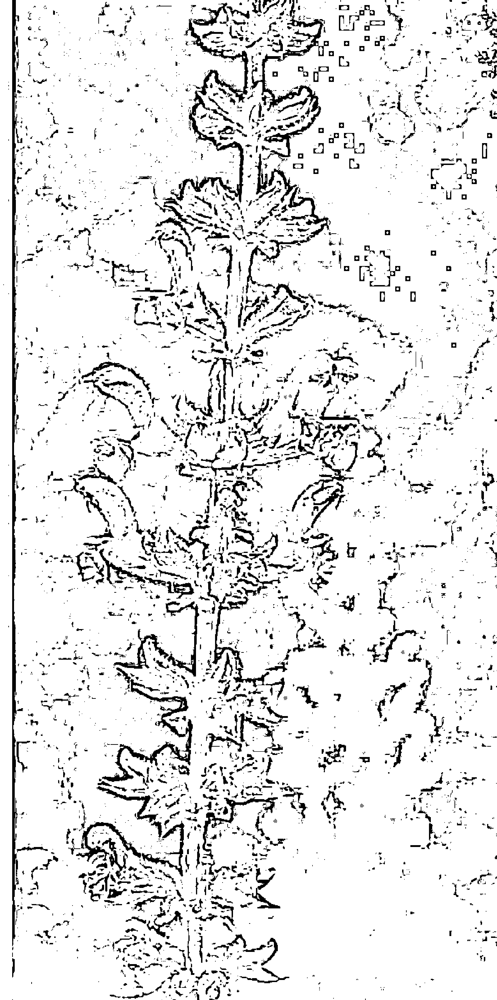

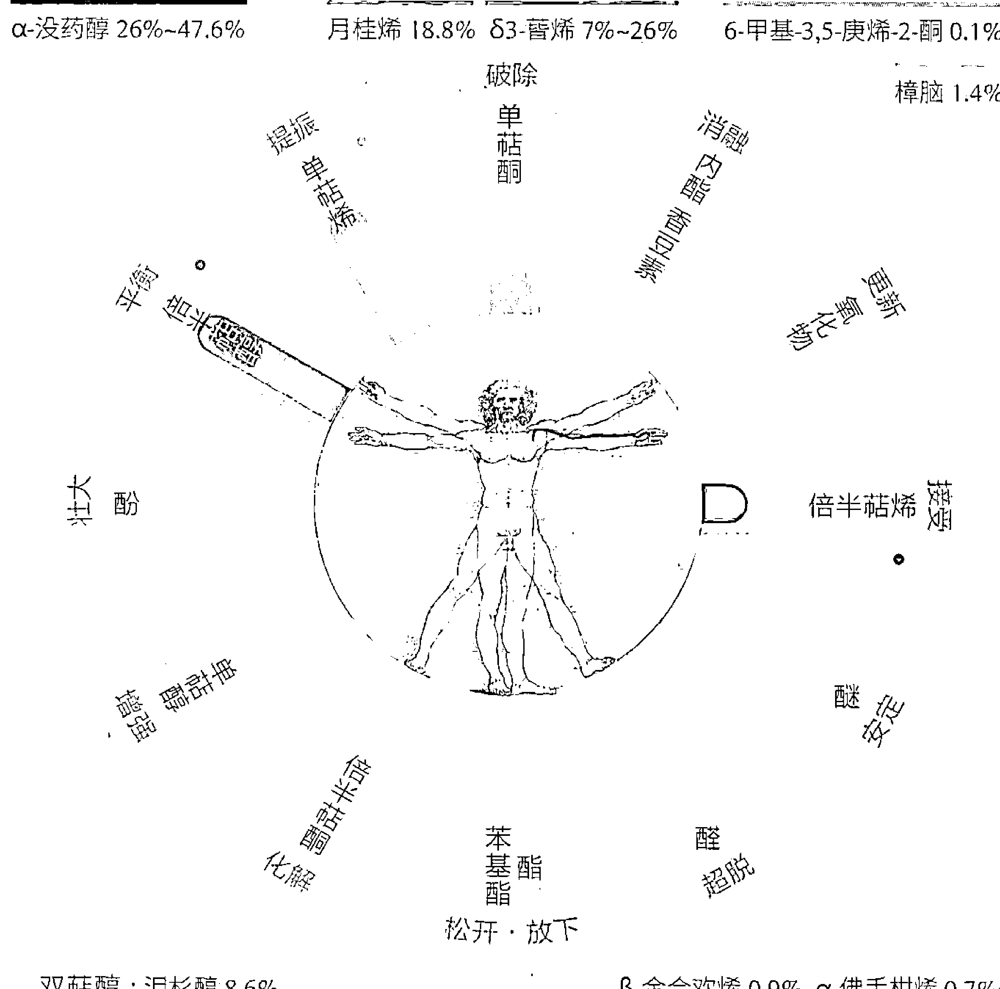

# 檀香
Sandalwood

高 4~20 米、生长缓慢的热带小树，以根部吸盘从多种寄生植物获得养分。种植时必须同时挑选适合与其共同生存的植物，寄主植物并不会因而凋零。

| 项目 | 详情 |
| :--- | :--- |
| 学 名 | *Santalum album* |
| 其他名称 | 印度白檀 / Indian Sandalwood |
| 香气印象 | 泰姬玛哈陵的倒影 |
| 植物科属 | 檀香科檀香属 |
| 主要产地 | 印度、印尼、澳大利亚 |
| 萃取部位 | 心材 (蒸馏) |
| 适用部位 | 肾经、基底轮 |
| 核心成分 | 萃油率 4%，53 个可辨识化合物 (占 99.9%) |
| 心灵效益 | 平衡大江东去的落寞，享受夕阳的美感 |

-   药学属性
    1.  解除淋巴与静脉壅塞，抑制酪胺酸酶
    2.  强心，安抚神经，抑制乙酰胆碱酯酶，竞争血清素与多巴胺受体，强化听力
    3.  抗肿瘤，抗病毒，抗感染，退热
    4.  抗幽门螺杆菌，降血糖，护肝，养肾

-   适用症候
    -   静脉曲张，盆腔充血，脸部皮肤的红血丝，美白
    -   心脏无力，坐骨神经痛，腰痛，记忆力退化，抑郁症，耳鸣，听力受损
    -   皮肤癌，疱疹，H3N2 流感，扁平疣，尿道炎，淋病
    -   胃溃疡，糖尿病，化学制剂中毒，肾炎

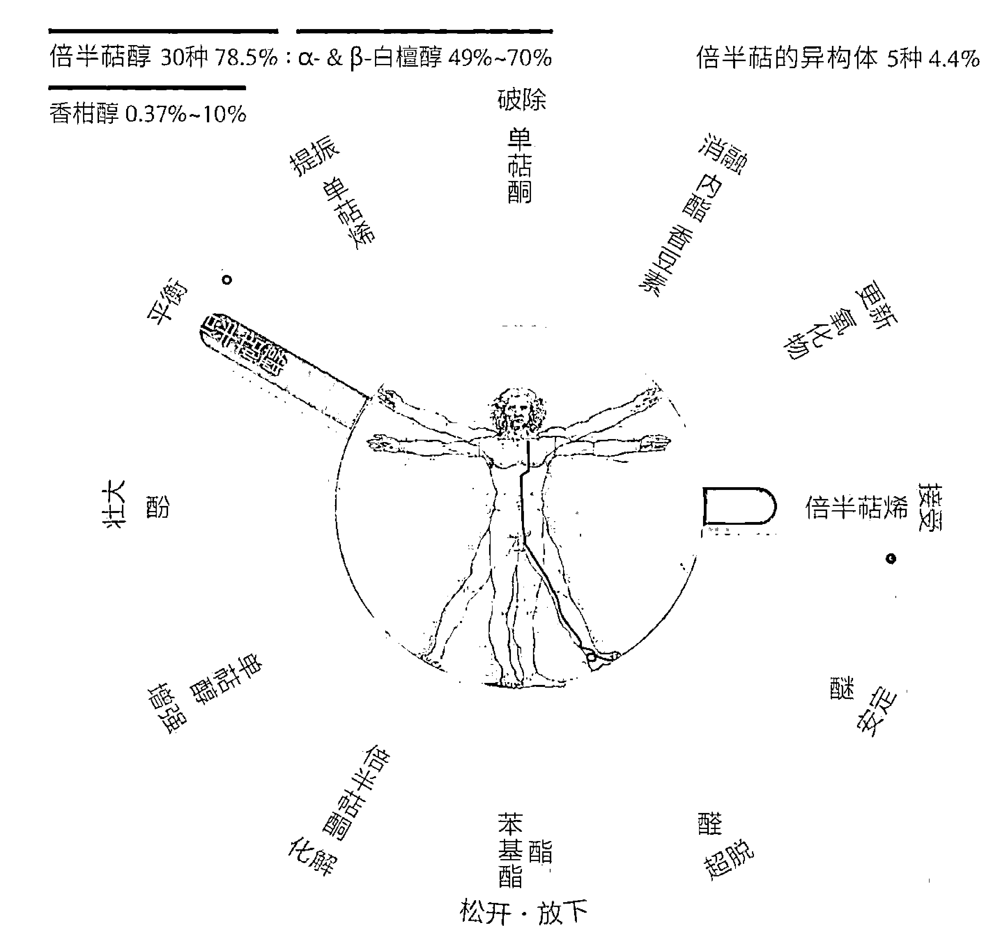

倍半萜醇 30 种 78.5%：α- & β-白檀醇 49%~70%
倍半萜的异构体 5 种 4.4%
香柑醇 0.37%~10%

酸：白檀酸 0.4%

倍半萜烯 9 种 7.8%：大根老鹳草烯 5% 菖蒲二烯 1.39%

### 注意事项

-   熟年树种的经济效益较高，适宜萃油的时间是 30 岁以后。因为需求量过大，为免于灭绝，印度政府已经禁止檀香木出口。
-   许多地区积极投入印度白檀的栽种。斯里兰卡所产者含白檀醇 56%，萃油率 6.36%；澳大利亚所产者白檀醇可达 70%，萃油率 6.2%。印尼也有印度白檀，白檀醇为 49%，萃油率 1.3%。澳大利亚自己另有一原生品种，澳洲檀香 (S. spicatum)，香气和印度白檀大不同，白檀醇偏低。

# 太平洋檀香
Sandalwood Pacific

香气组成受环境影响大于基因，如寄生于苦楝根的檀香也会得其杀虫成分，α- & β-白檀醇则会受霉菌与四种细菌的影响而产生比例的变化。

| 项目 | 内容 |
| :--- | :--- |
| 学名 | *Santalum austrocaledonicum* |
| 其他名称 | 新喀里多尼亚白檀 / New Caledonian Sandalwood |
| 香气印象 | 南岛风情的木刻版画 |
| 植物科属 | 檀香科檀香属 |
| 主要产地 | 新喀里多尼亚、瓦努阿图 |
| 萃取部位 | 心材 (蒸馏) |
| 适用部位 | 肾经、基底轮 |
| 核心成分 | 萃油率 2.2%，84 个可辨识化合物 |
| 心灵效益 | 平衡文明的扭曲，还原心灵的原生态 |

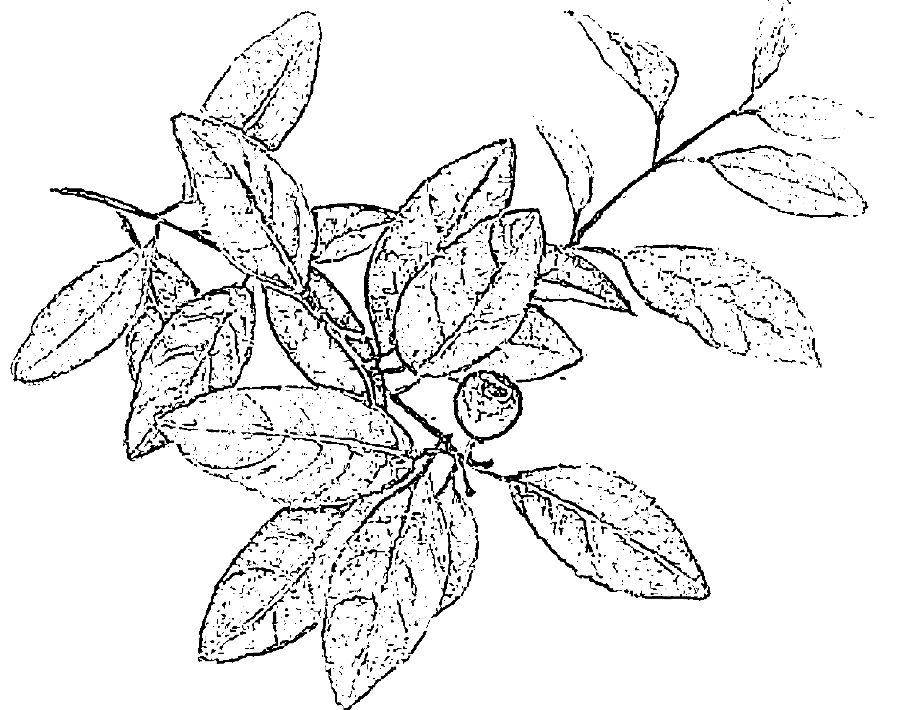

| 药学属性 | 适用症候 |
| :--- | :--- |
| 1. 解除淋巴与静脉壅塞，抑制酪胺酸酶 | 静脉曲张，脸部皮肤的红血丝，淡斑 |
| 2. 安抚神经，竞争血清素与多巴胺受体，强化听力 | 神经痛，抑郁症，耳鸣 |
| 3. 抗肿瘤，抗病毒，抗感染，退热 | 皮肤癌，疱疹，扁平疣，尿道炎 |
| 4. 健胃，降血糖，护肝养肾 | 胃溃疡，糖尿病，化学制剂中毒，肾炎 |

白檀醇 70% (α- 47% & β- 24%) β-姜黄烯-12-醇 顺式莲花醇

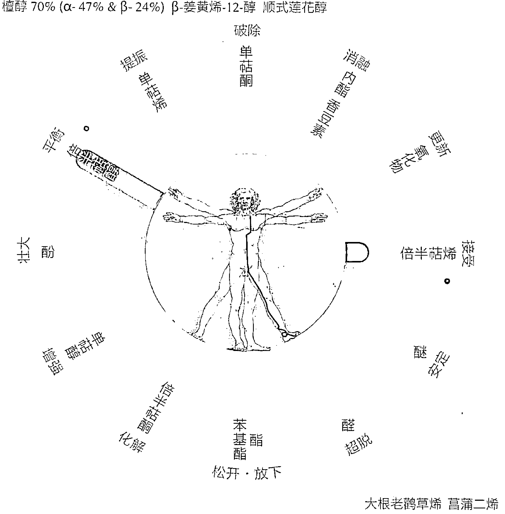

### 注意事项

-   优质檀香油的国际标准是 α-白檀醇 > 41%，β-白檀醇 > 16%。瓦努阿图共和国的北方岛屿约有两成的树可达标。而太平洋檀香的香气组成是最接近印度檀香的一种。
-   澳洲檀香 (S. spicatum) 含 α-白檀醇 9.1%，β-白檀醇 8%，属于轻版檀香。
-   夏威夷檀香 (S. paniculatum) 含 α-白檀醇 34.5%~40.4%，β-白檀醇 11%~16.2%，也是比较接近印度檀香的品种。

# 塔斯马尼亚胡椒
Tasmanian Pepper

高大的灌木，高 2~5 米，红棕枝干十分醒目，豌豆大的紫黑莓果成串。喜欢凉气候与非石灰岩的土壤，需要半遮荫，常见于高山的山沟中。

-   药学属性 | 适用症候
    1.  抗菌防腐，抗霉菌，抗氧化 | 胃痛，肠绞痛，食物中毒
    2.  抗感染，防虫 | 性病，户外活动，阴暗潮湿的室内环境
    3.  消炎，抗敏，止痛，抗肿瘤 | 皮肤发痒，红疹，肺癌，白血病，腹水肿瘤，安宁疗护
    4.  舒张血管，抗焦虑 | 情绪紧张引起的高血压

学 名 | *Tasmannia lanceolata* / *Drimys lanceolata*
其他名称 | 假八角 / Mountain Pepper
香气印象 | 独角仙在光蜡树上安静地交配
植物科属 | 林仙科澳洲林仙属
主要产地 | 澳大利亚（塔斯马尼亚）
萃取部位 | 果实（溶剂萃取）
适用部位 大肠经、心轮

核心成分
萃油率 1%~6%

心灵效益 | 平衡高涨的竞争意识，散放不刺眼的光亮

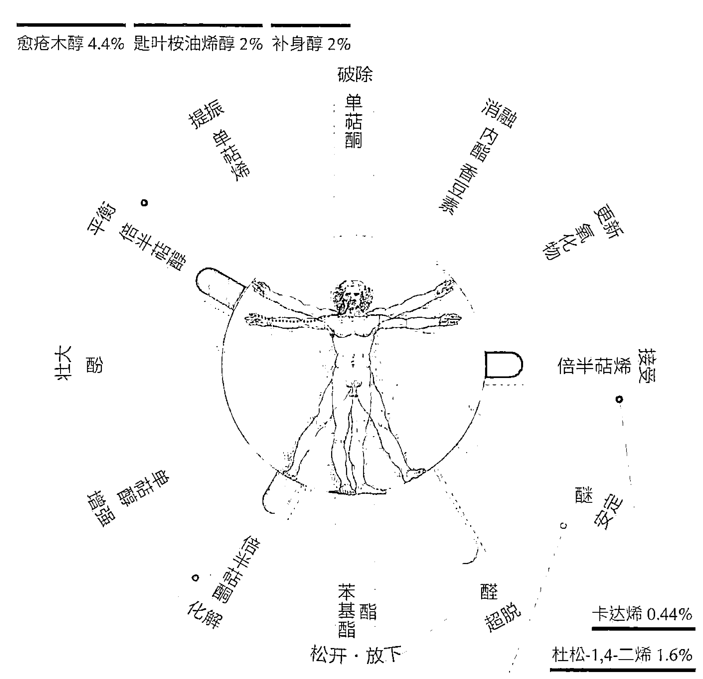

### 注意事项

-   油色墨绿，相当黏稠。
-   全株都有香气，叶片也能萃取精油，比果油含有更多倍半萜类。叶和果的抗氧化力是蓝莓的三倍。

# 缬草
Valerian

高海拔、肥沃、弱碱性砂质土壤能使产油率提高。耐寒，性喜湿润。挖出的根不可以用水洗，也不能曝晒，只能阴干，以免降低含油量。

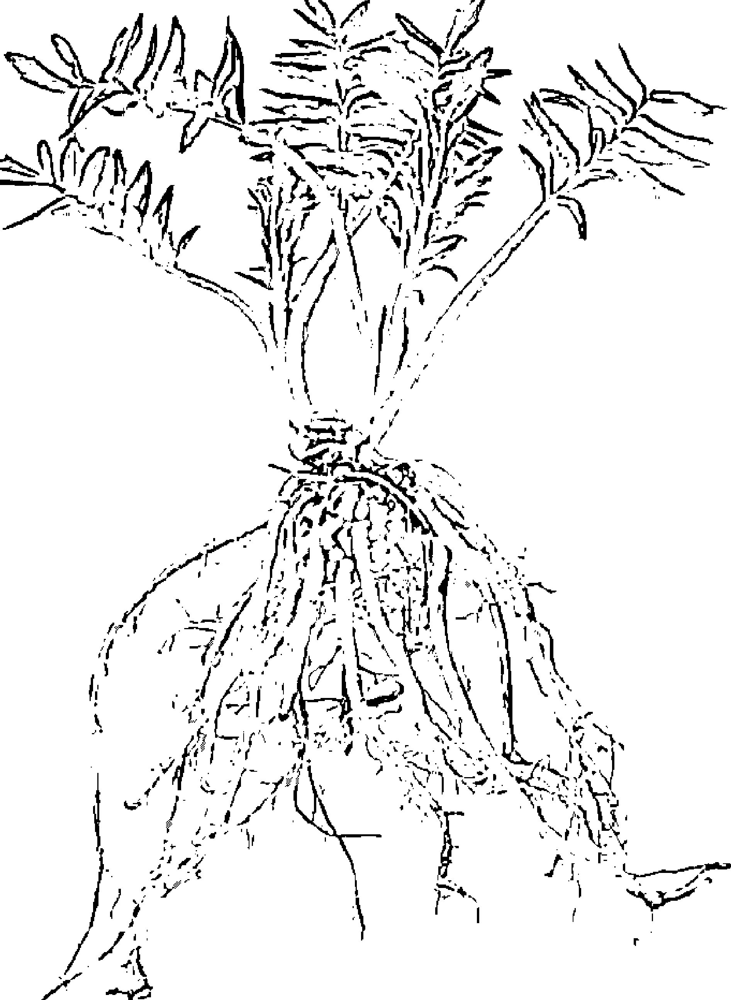

学名 | *Valeriana officinalis*
其他名称 | 鹿子草 / Baldrian
香气印象 | 冥王之后波赛芬从地底回到人间
植物科属 | 败酱科缬草属
主要产地 | 东欧、中国
萃取部位 | 根部（蒸馏）

适用部位 心经、基底轮

核心成分
萃油率0.3%，84个可辨识化合物（占90%）

心灵效益 | 平衡对于物质和精神的追求，信守中庸

| 药学属性 | 适用症候 |
| :--- | :--- |
| 1. 镇静（降低中枢神经的反应，放松肌肉，尤其是呼吸系统与运动肌肉），抗痉挛，平衡神经，抗抑郁 | 失眠，神经衰弱，躁郁，神经痛，头痛，癫痫，多动，肠躁症，压力失忆症 |
| 2. 退热，肾脏保护作用 | 发热，Ⅱ型糖尿病的肾受损 |
| 3. 利胆，减少头皮屑 | 胆结石，胆囊炎，油腻的肤质和发质 |
| 4. 扩张冠状动脉血管，降血压，调节血脂，抗脂质过氧化 | 心肌缺血，冠心病，心绞痛，心律不齐 |

### 注意事项

-   栽培种与野生的精油成分差异不大，一年生含量要高于二年生，但储存后缬草含油量降低。
-   中国产缬草精油与欧洲产的主要区别在于不含缬草烯酸。
-   对神经系统影响最大的是缬草醛和缬草烯酸。

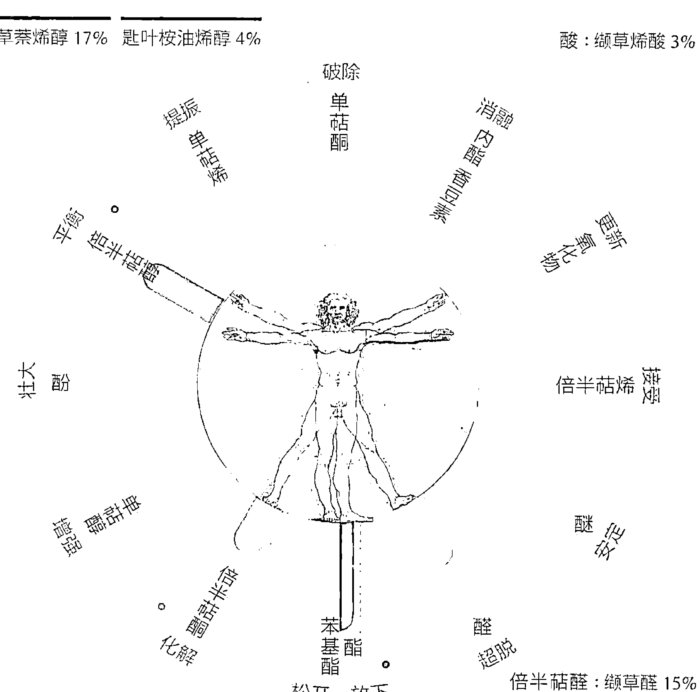

-   缬草萘烯醇 17% | 匙叶桉油烯醇 4% | 酸：缬草烯酸 3%
-   缬草烷酮 10% | 乙酸龙脑酯 8%~37% | 乙酸桃金娘酯 2%~7% | 异戊酸桃金娘酯 1.1%~2.5%

# 印度缬草
Indian Valerian

原生于喜马拉雅西北，海拔 1300-3300 米山区。小型药草(高14-45厘米)，能够激励蚯蚓的活动，并增加土壤的含磷量。

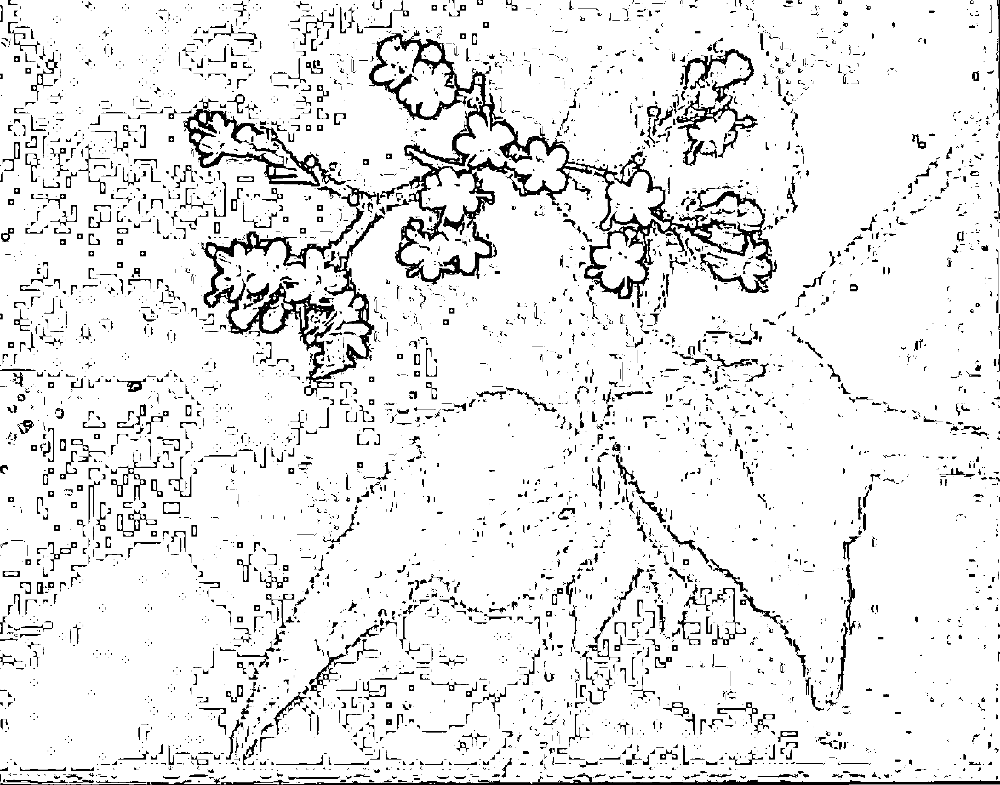

| 药学属性 | 适用症候 |
| :--- | :--- |
| 1. 补强神经，抗痉挛，阿育吠陀的补药 | 发狂，癫痫，歇斯底里，疲倦无力 |
| 2. 消炎 | 皮肤病，毒蛇、蝎子、蜘蛛等有毒物种的叮咬 |
| 3. 抗糖尿，助消化，消胀气 | 肥胖，糖尿病后遗症（如认知退化） |
| 4. 解除静脉壅塞，强化静脉循环 | 内痔外痔，静脉曲张 |

| 项目 | 详情 |
| :--- | :--- |
| 学名 | *Valeriana wallichii* / *Valeriana jatamansi* |
| 其他名称 | 蜘蛛香 / Tagar |
| 香气印象 | 充满腐植质的森林黑土 |
| 植物科属 | 败酱科缬草属 |
| 主要产地 | 尼泊尔、印度、中国 |
| 萃取部位 | 根部（蒸馏） |
| 适用部位 | 脾经、本我轮 |
| 核心成分 | 萃油率0.64%~1.67%，21个可识别化合物（占98.9%） |
| 心灵效益 | 平衡思考多于行动的倾向，带来大地的护佑与祝福 |

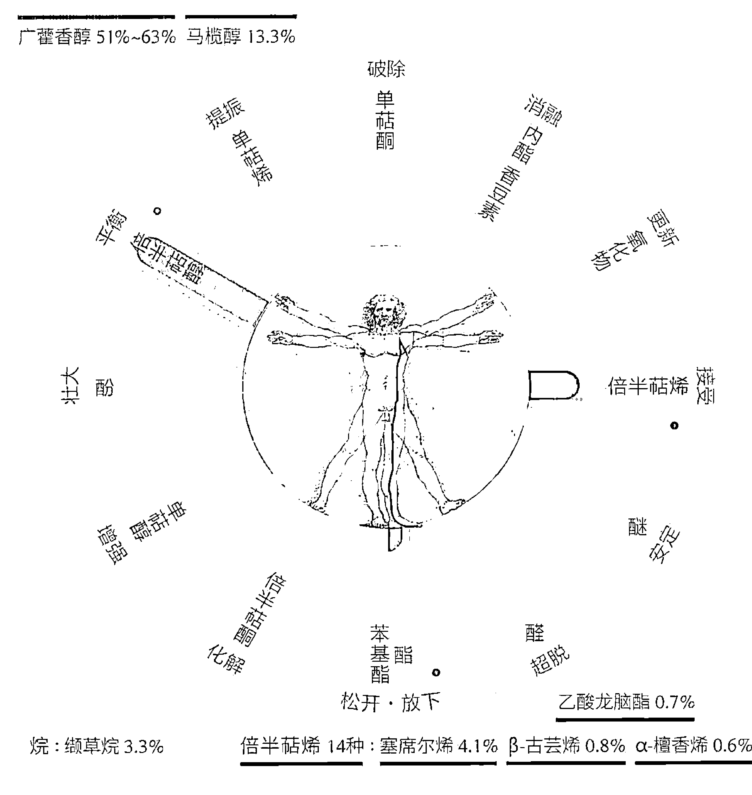

-   本品种可分为两大化学品系，但都属于倍半萜醇类：广藿香醇型和马榄醇型。香水业需求较大的是广藿香醇型，本书所列也是广藿香醇型。
-   喜马拉雅山区共有16个作用相近的缬草品种，本品种最常被拿来取代欧洲缬草。

# 岩兰草
Vetiver

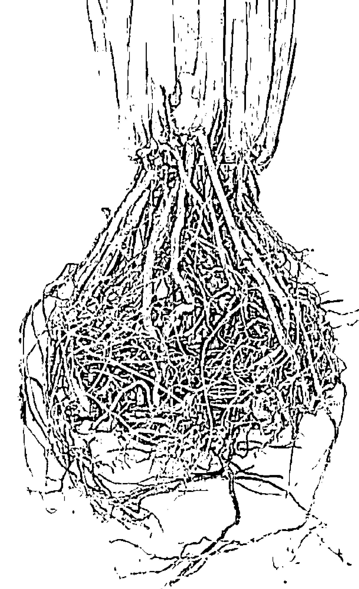

原生于印度，适应各种土质，但现今遍布热带的植株都来自美国的栽培种。窄叶品种比宽叶品种茂盛而芳香，深密的根部可以强化水土保持。

| 项目 | 内容 |
| :--- | :--- |
| 学名 | *Vetiveria zizanioides* / *Chrysopogon zizanioides* |
| 其他名称 | 香根草 / Khus-Khus |
| 香气印象 | 演歌歌手忘词后潇洒道歉 |
| 植物科属 | 禾本科岩兰草属（金须茅属） |
| 主要产地 | 海地、印度、中国、巴西、印尼 |
| 萃取部位 | 根部（蒸馏） |
| 适用部位 | 脾经、本我轮 |
| 核心成分 | 萃油率0.64%~1.67%，80个可辨识化合物（占94.5%） |
| 心灵效益 | 平衡过于洁癖的态度，无入而不自得 |

-   药学属性
    -   修复皮肤，保湿，抗皱，抑制酪氨酸酶
    -   促进循环，增加红细胞数量，通经
    -   激励免疫系统，激励淋巴，补强腺体
    -   镇静，强化神经

-   适用症候
    -   缺水的皮肤，妊娠纹，鱼尾纹，荨麻疹，黑斑
    -   冠状动脉炎，肩颈腰背酸痛，闭经，少经
    -   口疮，发热，头痛，胃炎，肝脏充血
    -   分离焦虑，幽闭恐惧，怯场，失恋

倍半萜醇 23种 46%：库斯醇 13.7%
异瓦轮西亚桔烯醇 6.9%
岩兰蛇床醇 3.9%
诺卡醇 16.1%

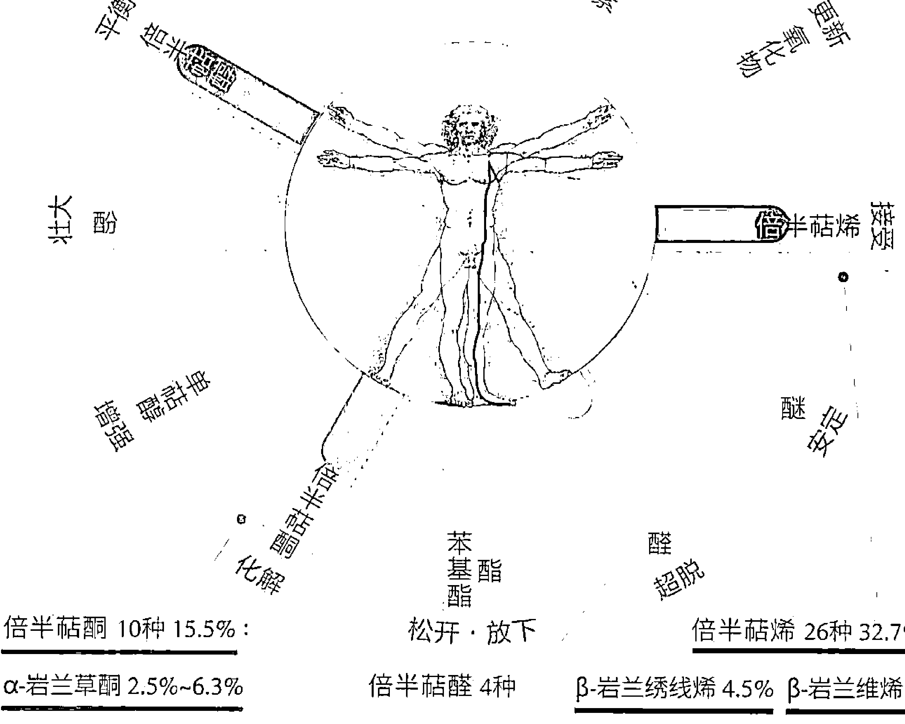

### 注意事项

香型主要分两类：
1.  海地与留尼汪岛所产属于较甜的花香调，所以香水业较偏爱。
2.  印度野生的属于香脂木质调，北印度所产富有土地感，南印度所产则较有香料感。

倍半萜酮 10种 15.5%：
α-岩兰草酮 2.5%~6.3%

倍半萜醛 4种

倍半萜烯 26种 32.7%：
β-岩兰绣线烯 4.5%  β-岩兰维烯 9%

## XII 单萜烯类
Monoterpene

数量最多的香气类型，以针叶树、果皮与松脂类精油为核心，专门影响体内各种传导物质（神经传导、内分泌），借牵一发而动全身的方式，展现全身效应，比较常见的表现为消水肿、退热、止痛。单萜烯类精油疏通三焦经，是恢复健康的关键。从日常保健，到危机处理，乃至手术后调养，都需要单萜烯类精油打基础。看似无甚出奇，实则影响深远。

# # 欧洲冷杉
## Silver Fir

主要分布在海拔 500~1700 米的朝北山坡，年降雨超过 1000 毫米。树身既白又轻盈，最高可达 68 米，极耐阴，喜欢土壤潮湿微酸，无法忍受空气污染和强风。

-   学名 | *Abies alba*
-   其他名称 | 银枞 / White Fir
-   香气印象 | 嶙峋磊落的汉子
-   植物科属 | 松科冷杉属
-   主要产地 | 法国、奥地利、保加利亚、罗马尼亚
-   萃取部位 | 针叶 / 树枝（蒸馏）
-   适用部位 三焦经、本我轮

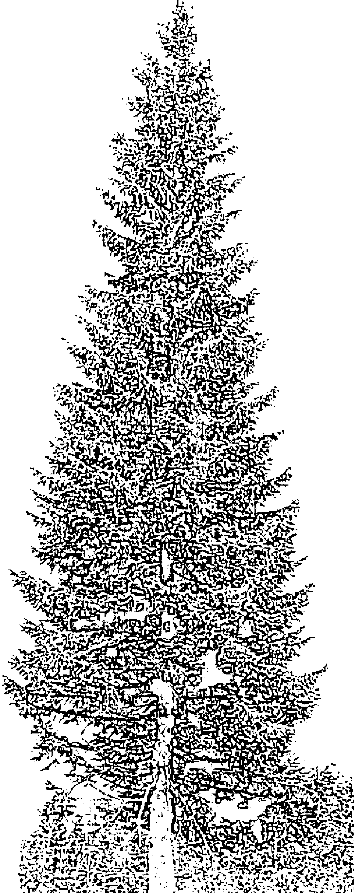

| 药学属性 | 适用症候 |
| :--- | :--- |
| 1. 中度抗菌，抗氧化，防腐保鲜 | 食物污染导致的肝脏负担 |
| 2. 祛痰，抗卡他 | 急性与慢性支气管炎，着凉感冒，人群中不由自主的咳嗽 |
| 3. 消炎，轻度抗肿瘤 | 关节病，莫名腰痛，肩颈僵硬 |
| 4. 激励 | 软弱无助，畏首畏尾，遗弃感，位高权重者或师长施加的压力 |

核心成分
萃油率 0.25%~0.35%，20~39 个可辨识化合物（占 95.6%~99.9%）

单萜烯 >90% ：柠檬烯 34%~41% α-松油萜 13.8%~24% 樟烯 12.8%~21%

心灵效益 | 提升自我的价值，不屈服于权威

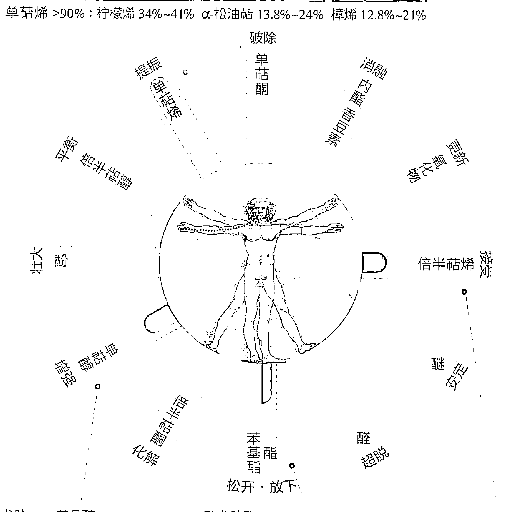

### 注意事项

1.  毬果所萃的精油叫做Templin，松油萜 (50%) 高于柠檬烯 (34%)，化合物的总数也更多，气味更为坚毅。
2.  喜马拉雅冷杉 (*Abies spectabilis*) 同样富含柠檬烯 (29.36%)，还有 20% 倍半萜烯 (β-丁香油烃，白菖油萜，β-波旁烯，β-马榄烯，α-葎草烯，δ-杜松烯)，是倍半萜烯最多的一种冷杉，研究显示具明显抗癌活性 (大肠癌、乳腺癌)。

# # 胶冷杉
## Balsam Fir

原生于北美洲寒冷潮湿的山区，高约25米，是加拿大最具优势的树种。硬木林中与云杉相伴时生长快速，在山顶或沼泽中则生长缓慢而细瘦。

**学 名** | *Abies balsamea*
**其他名称** | 加拿大枞 / Canadian Fir
**香气印象** | 像毕达哥拉斯一样地玩数学
**植物科属** | 松科冷杉属
**主要产地** | 加拿大
**萃取部位** | 针叶 (蒸馏)
**适用部位** | 三焦经、心轮

核心成分
萃油率 0.591%，25 个可辨识化合物

心灵效益 | 提升理性，冷静幽默地化解难题

-   可分为两种化学品系，一种有略高的 δ3-蒈烯和百里酚，另一种则无。研究显示，胶冷杉的重要药效来自微量成分（倍半萜烯），而非占比高的单萜烯。
-   冷杉属植物彼此之间有很多杂交与基因渗入的现象，所以精油成分的重叠性很高。

| 药学属性 | 适用症候 |
| :--- | :--- |
| 1. **抗菌** | 鼻炎，支气管炎，鼻窦炎，着凉感冒，空气污染严重地区的呼吸困难 |
| 2. **抗痉挛，抗寄生虫** | 吞气症，蛔虫病 |
| 3. **抗氧化，抗肿瘤** | 关节病，乳腺癌，前列腺癌，肺腺癌，大肠癌，黑色素瘤 |
| 4. **激励** | 郁闷，透不过气，灰心丧志，悲哀伤 |

百里酚 0.45% 单萜烯 >96% : β-松油萜 38% δ3-蒈烯 12% 水茴香萜 7.8% 樟脑 0.2%

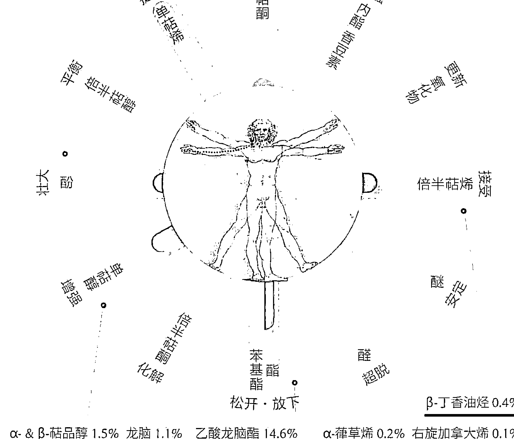

α- & β-萜品醇 1.5% 龙脑 1.1% 乙酸龙脑酯 14.6% α-苧草烯 0.2% 右旋加拿大烯 0.1% β-丁香油烃 0.4%

# 西伯利亚冷杉
Siberian Fir

西伯利亚优势树种，习惯副极地气候的湿冷，分布于海拔 1900~2400 米的山地或河谷。极度耐阴耐霜，可在零下 50℃存活，但树龄很少超过 200 岁。

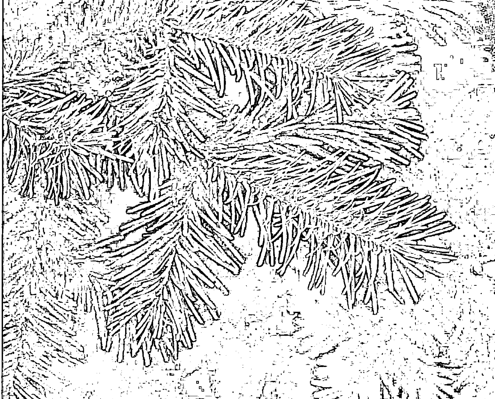

-   学 名 | *Abies sibirica*
-   其他名称 | 俄罗斯枞 / Russian Fir
-   香气印象 | 和奇妙仙子一同飞翔的彼得潘
-   植物科属 | 松科冷杉属
-   主要产地 | 俄罗斯
-   萃取部位 | 针叶 (蒸馏)

-   药学属性
    1.  消炎
    2.  抗痉挛
    3.  抗霉菌
    4.  镇静（提高 α 脑波活动，降低 β 脑波活动）

-   适用症候
    -   气喘性支气管炎
    -   痉挛性肠炎，长时间固定姿势引发的抽筋
    -   齿槽漏脓，口腔卫生
    -   时间或金钱短缺引发的压迫感，气急败坏

左旋表毕澄茄醇 0.5% | 单萜烯 64.1%：α-松油萜 13.7% 樟烯 24.2% δ3-蒈烯 12.2%

适用部位 三焦经、喉轮

核心成分
萃油率 0.8%~1.2%，31 个可辨识化合物

心灵效益 | 提升心灵的自由度，不受世俗制约

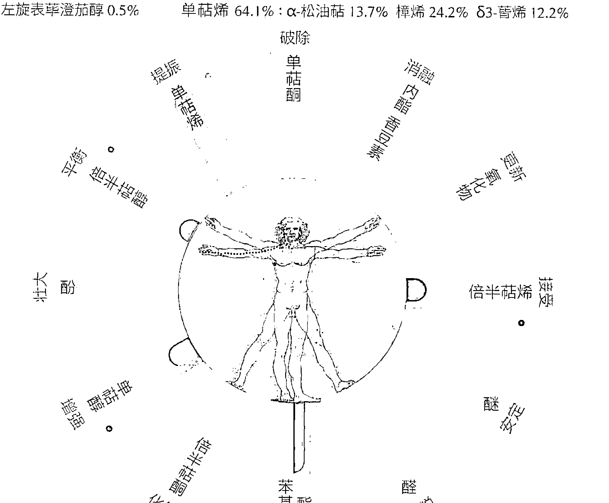

注意事项
1. 另一个富于酯类的冷杉是巨冷杉 Giant Fir (*Abies grandis*)，有 59 个化合物，单萜烯占 70%(β-松油萜、樟烯、β-水茴香萜)，乙酸龙脑酯 26.2%，另含特殊的双萜烯 (冷杉二烯 0.1%) 和倍半萜醇 (左旋表毕澄茄油烯醇 0.5%)。和西伯利亚冷杉一样适用于被亲情绑架或被主流价值排挤的困境。

龙脑 1.6%

双萜烯：冷杉二烯 0.1%

乙酸龙脑酯 31%

δ-杜松烯 0.7%

# 莳萝（全株）
## Dill Herb

原生于地中海与西亚，喜欢全日照和富饶松软的土壤。夏季的艳阳可以助长精油含量，遮荫则使油量减少，干燥将导致提早结实。

-   学名 | Anethum graveolens
-   其他名称 | 土茴香 / Soya Leaf
-   香气印象 | 伊斯坦布尔的香料市场
-   植物科属 | 伞形科莳萝属
-   主要产地 | 法国、匈牙利、埃及
-   萃取部位 | 全株（蒸馏）
-   适用部位 | 三焦经、本我轮

### 药学属性 | 适用症候
1.  抗菌，消解黏液 | 急性支气管黏膜发炎
2.  利胆，促进胆汁分泌，帮助消化 | 儿童消化问题（肠胃太娇嫩，食物太“营养”），成人肝胆功能不足，消化不良
3.  抗氧化，消炎，抗肿瘤，提高适应原作用 | 肾功能低下，肾炎，压力导致的尿频，压力导致的健忘
4.  抗凝血，抗痉挛，提高胰岛素，降低甲状腺素 | 心肌梗死，类固醇诱发的Ⅱ型糖尿病

### 核心成分
萃油率0.08%~1.1%，19个可辨识化合物（占99.9%）

α-水茴香萜 19.12%~46.33% 柠檬烯 13.72%~26.34% 桧烯 11.34% 藏茴香酮 2.11%
橙花叔醇 0.71%~1.48% 胡椒酮 0.23%~4.6%
丁香酚 0.79%~1.55% 莳萝脑 0.59%~4.16%
蒌叶酚 0.24%~1.62% 香芹醇 0.66%~3.24% 莳萝醚 0.45%~19.63% 肉豆蔻醚 1.07%

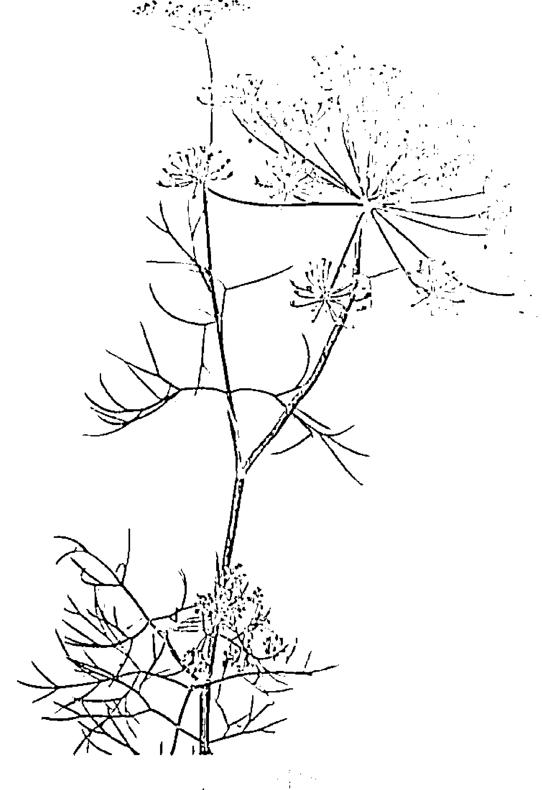

### 心灵效益 | 提升转换能力，总能从烂墙缝隙看见光

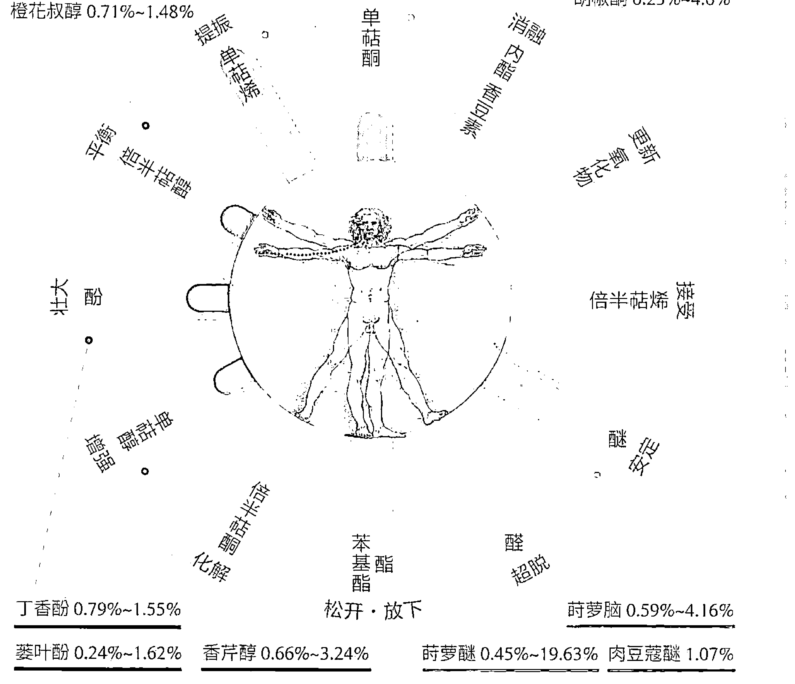

### 注意事项
1.  莳萝种子萃油率达3.2%，成分以藏茴香酮为主（62.48%），另含莳萝醚（19.51%）和柠檬烯（14.61%），属于单萜酮类精油，孕妇与婴幼儿不宜使用。
2.  种子油的药学属性为抗菌、抗霉菌、杀虫、消炎、消胀气、抗痉挛、通乳、提高黄体酮与催产素、利尿、抗氧化、抗肿瘤（子宫颈癌与乳腺癌细胞株）、降血脂、降胆固醇、降血糖。
3.  种子油的适用症候包括痔疮、便秘、气喘、胃溃疡、肾绞痛、排尿困难、痛经、生产困难、神经痛、糖尿病等等。

### 欧白芷根
## Angelica Root

身长 1-3 米，喜欢潮湿富饶的土壤，不惧零度以下的低温，属于先驱植物。这种北国药草需要一点遮荫，多见于针叶树间及溪流旁，浅根粗大，剖开呈黄白色。

-   学名 | Angelica archangelica
-   其他学名 | 西洋当归 / Garden Angelica
-   香气印象 | 深夜加油站遇见苏格拉底
-   植物科属 | 伞形科当归属（白芷属）
-   主要产地 | 波兰、荷兰、法国、比利时
-   萃取部位 | 根部（蒸馏）
-   适用部位 | 三焦经、本我轮

### 核心成分
萃油率 0.1%~0.5%，60 个可辨识化合物（占 99.3%）

### 心灵效益 | 提升正能量，击退情绪的黑武士

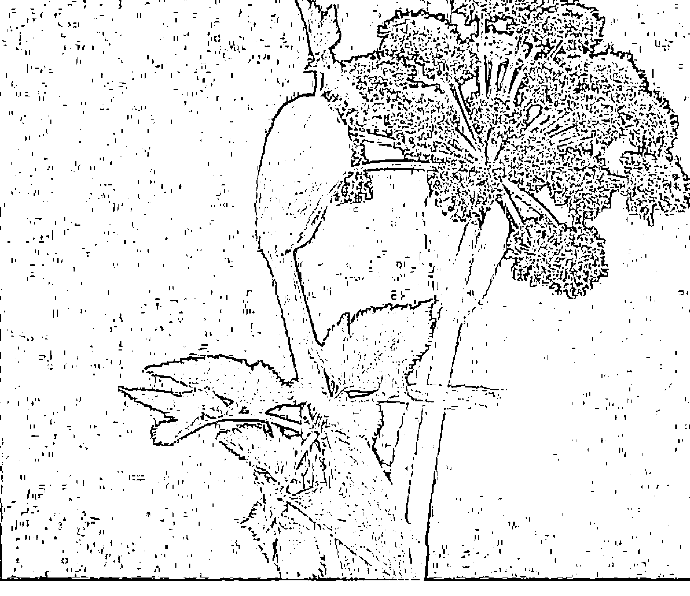

### 药学属性 | 适用症候
1.  镇静（局部作用于中枢神经），抗惊厥 — 焦虑，神经衰弱，失眠，腹部痉挛，癫痫，惊吓过度
2.  助消化，消胀气，抗黄曲霉菌，养肝，抗幽门螺杆菌 — 食欲不振，胀气，吞气症，便秘，痉挛性肠炎，酒精中毒，酒瘾，胃溃疡
3.  抗凝血，提高去甲肾上腺素，调节皮肤角质，消炎 — 血栓，坏血病，感冒，咳嗽，瘟疫，发烧，干癣，白癜风，痔疮
4.  抗氧化，抗肿瘤，强身，通经 — 痛风，乳腺癌，胃癌，T细胞淋巴瘤，提高性能量，经期不顺

### 注意事项
1.  有光敏性，用后 12 小时避免日晒。健康皮肤的安全剂量为 0.8%。能通经，孕妇与哺乳母亲避免使用。
2.  欧白芷种子萃油率达 0.6%~1.5%，成分以 β-水茴香萜为主（62.48%），也含微量呋喃香豆素（前胡内酯、花椒毒内酯），所以也有抗肿瘤作用。
3.  δ3-蒈烯的比例与纬度成正比，来自愈高纬度地区的欧白芷根，所含 δ3-蒈烯愈多。另外生长温度愈低，萃油率愈高，因为较无病虫害破坏植物。

### 成分表
单萜烯 70%：α-松油萜 21.3% δ3-蒈烯 16.5%
柠檬烯 16.4% β-水茴香萜 8.7%
倍半萜醇 10.5%：
α-古巴烯-11-醇 榄香醇
匙叶桉油烯醇
呋喃香豆素 >2%：
前胡内酯 蛇床子素 0.37%
白芷素 0.023%
补骨脂素 0.0112%
倍半萜烯 13.5%：α-葎草烯 大根老鹳草烯 α-古巴烯

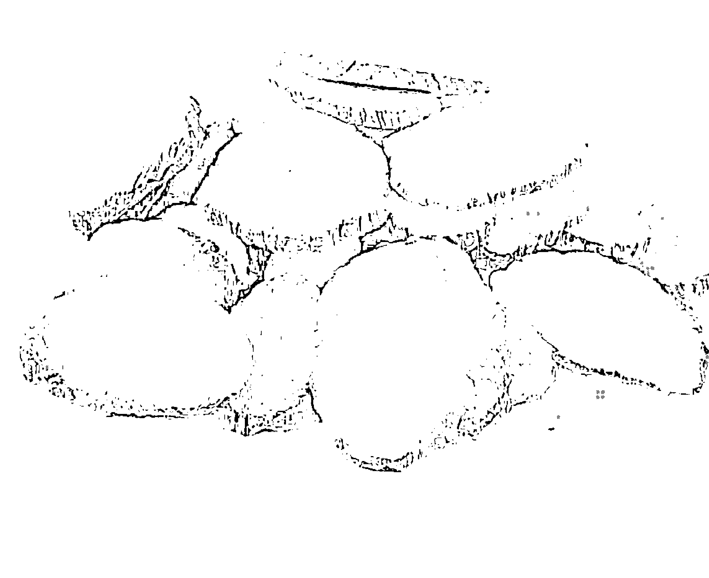

# 白芷
## Dahurian Angelica

接近河岸溪流生长，植株可达1米高。夏秋季节叶黄时采收。对土质适应力佳，酸碱度pH 5.5~7.5均可，只要植在排水佳的砂质土；虫害亦少。

-   学名 | Angelica dahurica
-   其他学名 | 白茝 / Chinese Angelica
-   香气印象 | 所谓伊人，在水一方
-   植物科属 | 伞形科当归属
-   主要产地 | 西伯利亚、俄罗斯远东地区、日本、韩国、中国东北、四川、台湾岛
-   萃取部位 | 根部（蒸馏）
-   适用部位 | 三焦经、眉心轮

### 核心成分
萃油率 0.1%~0.5%，43个可辨识化合物（占92.1%）

### 心灵效益 | 提升优雅气度，看淡尘世纷扰

### 注意事项
1.  有光敏性，用后12小时避免日晒。健康皮肤的安全剂量为0.8%。
2.  现代所用的白芷均为栽培种，依产地可分为川白芷、祁白芷、禹白芷、亳白芷、杭白芷等，成分差异颇大，但都以单萜烯与香豆素为主。本条所载为川白芷。
3.  蒸馏法易得低沸点的挥发性成分，精油长时间接触空气及光会逐渐氧化变质，形成树脂样物质，且萃油率较低。CO2萃取法萃油率高又能大量保存有效成分，但是有些极性大的或以结合状态存在的成分无法被此技术提取出来。

### 药学属性
1.  平喘，抗菌，解痉，解热，抗过敏，通窍
2.  美白（抑制酪氨酸酶），燥湿，消肿，排脓，抗发炎
3.  抗氧化，抗肿瘤，保肝，阻断醛糖还原酶
4.  祛风，止痛，扩张血管，改善血液循环

### 适用症候
-   感冒，鼻塞，发烧，毒蛇咬伤
-   肤色黯沉，痈疽，痤疮，皮肤燥痒，疥癣，肠漏，白带
-   皮肤癌，白血病，肝癌，糖尿病
-   寒湿腹痛，眉棱骨痛，头痛，牙齿痛，风湿痹痛，高血压

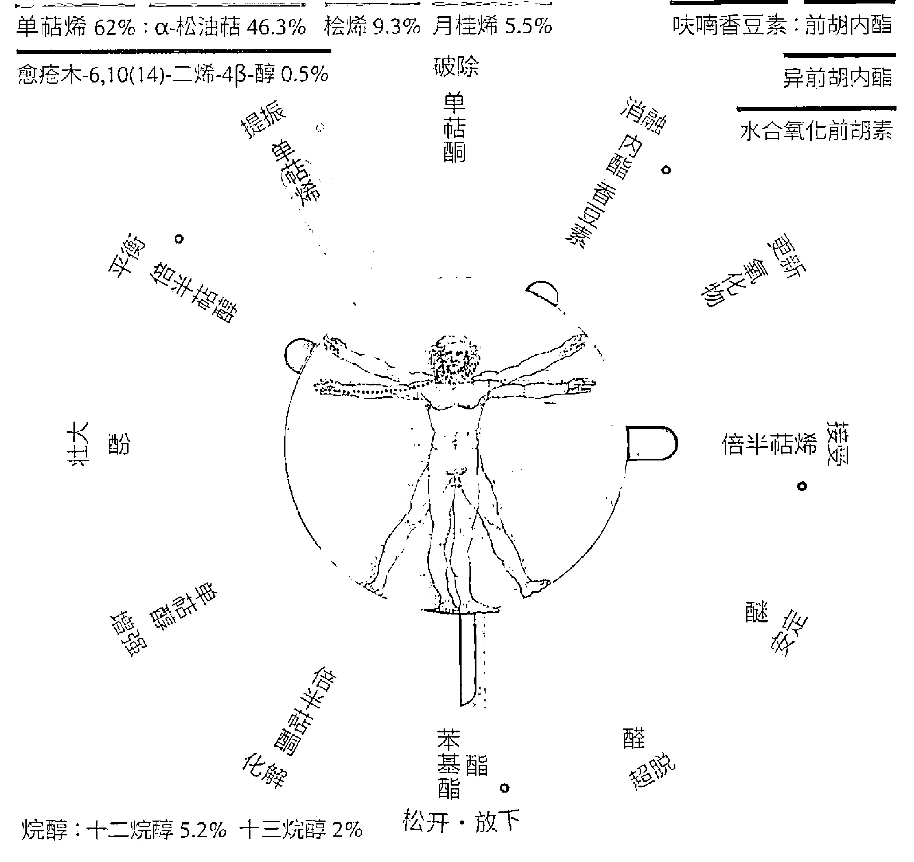

### 成分表
单萜烯 62%：α-松油萜 46.3% 桧烯 9.3% 月桂烯 5.5%
愈疮木-6,10(14)-二烯-4β-醇 0.5%
呋喃香豆素：前胡内酯
异前胡内酯
水合氧化前胡素
烷醇：十二烷醇 5.2% 十三烷醇 2%
脂肪酸酯：月桂酸乙酯 5.43% 亚油酸乙酯 8.67% β-榄香烯 1.6% 蛇床-4,11-二烯 0.5%

# 独活
## Du Huo

分布于海拔 1500~2000 米的草丛或稀疏灌木林下。喜凉爽湿润。在肥沃、疏松的碱性土、黄砂土或黑油土生长良好，黏重土或贫瘠土不宜种植。

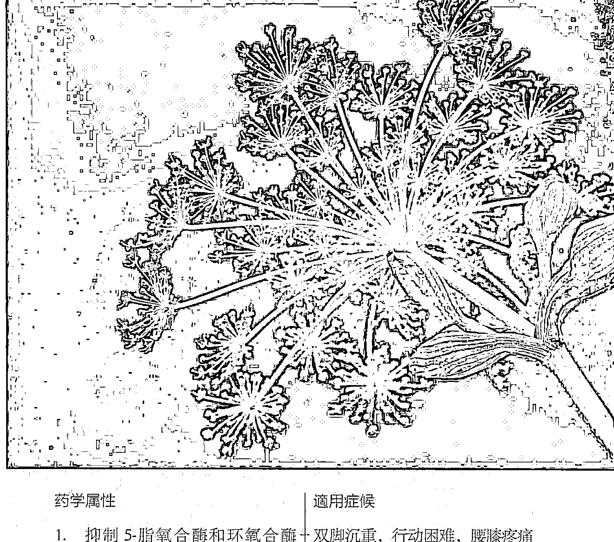

| 项目 | 详情 |
| :--- | :--- |
| 学名 | Angelica pubescens |
| 其他名称 | 重齿毛当归 / Pubescent Angelica Root |
| 香气印象 | 园艺工作中沾满泥土的双手 |
| 植物科属 | 伞形科当归属 |
| 主要产地 | 中国（湖北、四川、浙江） |
| 萃取部位 | 根部（蒸馏） |
| 适用部位 | 膀胱经、心轮 |
| 核心成分 | 萃油率 0.22%，88 个可辨识化合物（占 78.23%） |
| 心灵效益 | 提升独处能力，降低依赖性与不安感 |

| 药学属性 | 适用症候 |
| :--- | :--- |
| 1. 抑制 5-脂氧合酶和环氧合酶（消炎） | 双脚沉重，行动困难，腰膝疼痛 |
| 2. 抑制乙酰胆碱导致的肠痉挛 | 缺乏运动者的消化困难及胀气腹痛 |
| 3. 抑制血栓形成，扩张血管，降血压 | 心血管疾病 |
| 4. 镇静 | 提高睡眠品质 |

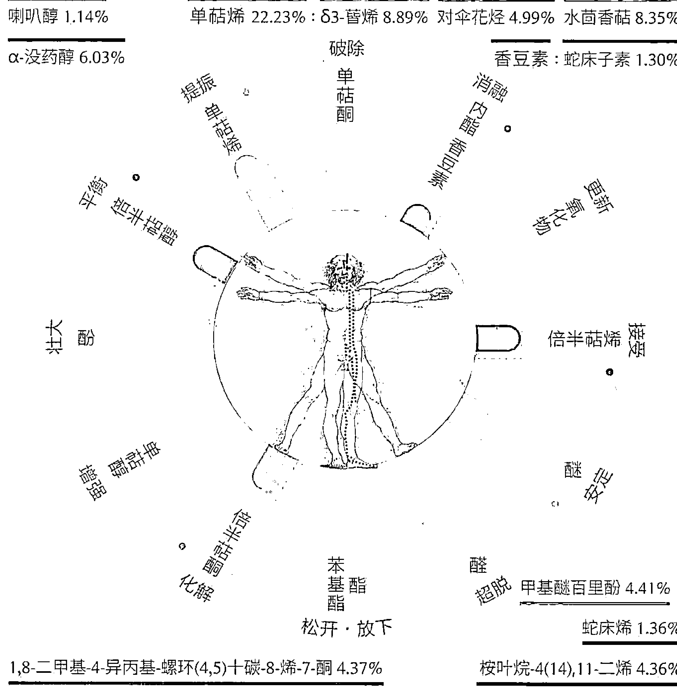

### 注意事项
1.  药材中含香柑油内酯，必须确定取得的精油是否也含香柑油内酯，若含有则应在外用时小心光敏性。

# 乳香
## Frankincense

分布于西非至阿拉伯半岛南端，乳香属75%集中在非洲东北隅，适应干热贫瘠的环境，但由于滥采，树木群落已逐年递减，种子萌芽率也大幅下降。

| 项目 | 内容 |
| :--- | :--- |
| 学名 | Boswellia carterii / B. sacra |
| 其他名称 | 多伽罗香 / Olibanum |
| 香气印象 | 天堂的大门 |
| 植物科属 | 橄榄科乳香属 |
| 主要产地 | 埃塞俄比亚、阿曼 |
| 萃取部位 | 树脂（蒸馏） |
| 适用部位 | 肝经、顶轮 |
| 核心成分 | 萃油率3%，58个可辨识化合物(占97.9%) |
| 心灵效益 | 提升眼界，超越是非，与天地同在 |

### 药学属性 | 适用症候
1.  药学属性：促进伤口愈合，生肌除疤消痕，活血行气止痛，化瘀伸筋蠲痹；适用症候：伤口，溃疡，肌肤松弛（如眼袋），妊娠纹，整形后，开刀后，中风后
2.  药学属性：抗黏膜发炎，化痰；适用症候：支气管黏膜炎，气喘性支气管炎，气喘
3.  药学属性：抗肿瘤，激励免疫系统，抗念珠菌；适用症候：膀胱癌，胰腺癌，乳腺癌，肝癌，子宫癌，皮肤癌，免疫功能不全，鹅口疮
4.  药学属性：抗抑郁，降低血液中的可的松水平；适用症候：郁闷，沮丧，绝望，巨大的压力

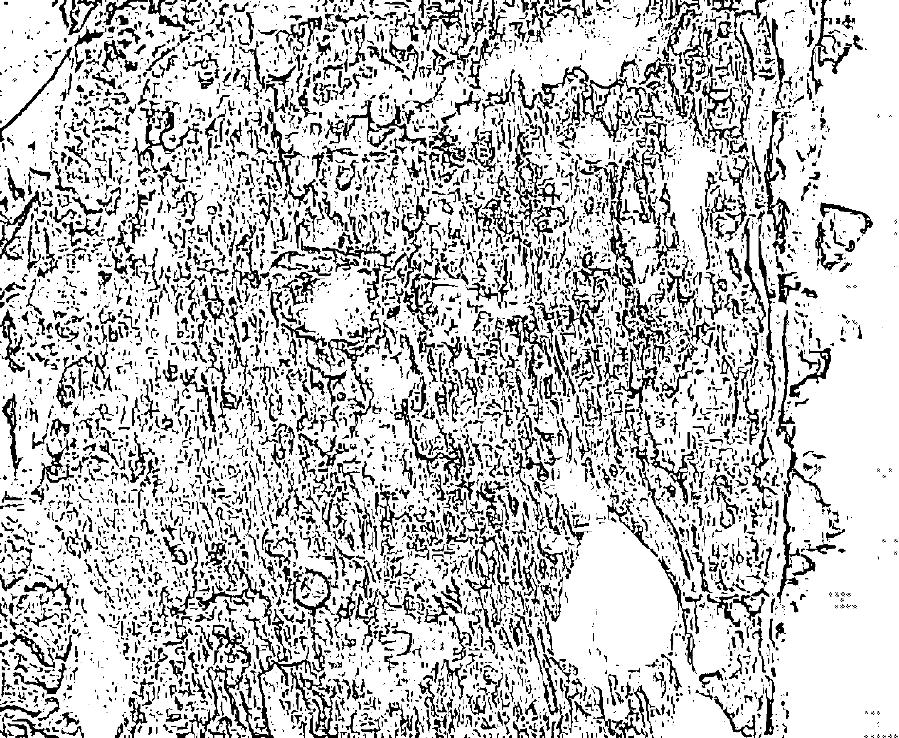

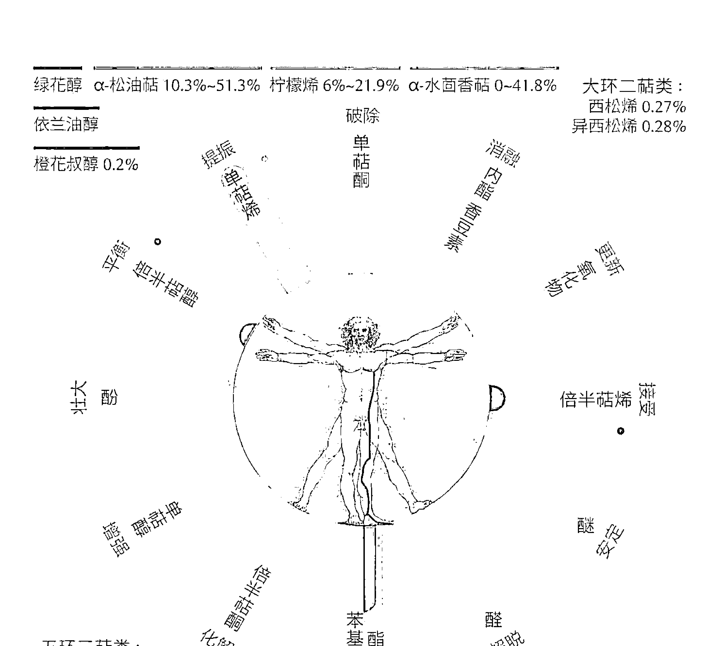

### 注意事项
1.  乳香属共有20个品种，商业生产常会混合好几个品种一起蒸馏。最具代表性的是阿曼/叶门乳香 (B. sacra) 和索马里乳香 (B. carterii)，两者曾被视为同义词，但2012年的研究显示，其GCMS虽接近，旋光性与对掌性却有很大分别，是独立的两个品种。
2.  个别品种中，B. rivae 和 B. sacra 抗菌力最佳，B. socotrana 抗氧化和抑制乙酰胆碱酯酶最出色，B. sacra和B. carterii抗肿瘤，B. papyrifera 抗生物膜最强。
3.  以产地区隔，阿拉伯南端产的以 α-松油萜 (43%) 为主，非洲东北部产的以乙酸辛酯 (52%) 为主。

# 印度乳香
## Indian Frankincense

原生于印度东边的中部和北部，3~4月割划树皮，夏秋两季拾取树脂。乳香树脂只能连续生产三年，之后质量便会下降，传统要让树休息几年再采。

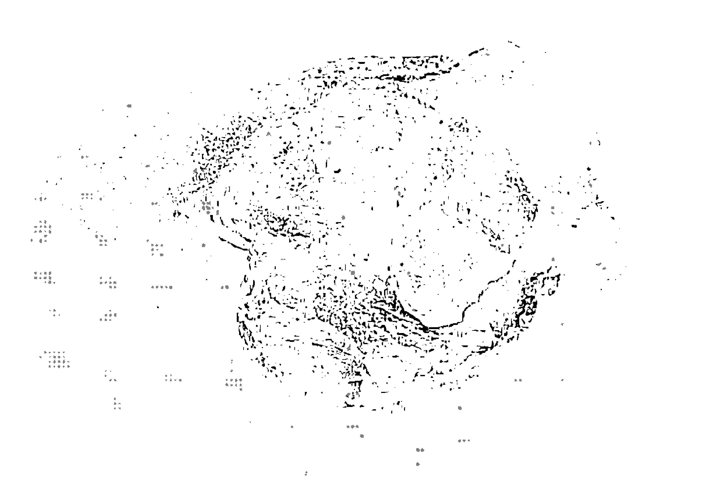

| 项目 | 内容 |
| :--- | :--- |
| 学名 | Boswellia serrata |
| 其他名称 | 莎赖 / Salai |
| 香气印象 | 绵密厚实的云海 |
| 植物科属 | 橄榄科乳香属 |
| 主要产地 | 印度 |
| 萃取部位 | 树脂（蒸馏） |
| 适用部位 | 肝经、顶轮 |
| 核心成分 | 萃油率6.1%，28个可辨识化合物 (占92.3%) |
| 心灵效益 | 提升包容力，整合歧见，完成使命 |

### 药学属性
1.  抗菌，抗霉菌
2.  强力消炎，止痛，养肝，降血脂，抗血管硬化
3.  抗氧化，抗肿瘤
4.  调经

### 适用症候
-   腹泻，发烧，咳嗽，喉炎，气喘
-   风湿性关节炎，骨关节炎，颈椎病，皮肤病，口疮，黄疸，心血管疾病
-   脱发，肝癌，大肠癌
-   月经不调，白带，痔疮，梅毒

### 注意事项
1.  乳香属在品种上的争议很多，很多研究是依据树脂商品而非原物种所做的分析，更增加混淆性。印度乳香则是在分类学及精油成分方面较无疑点的一种。
2.  乳香树脂在疗效方面最有名的成分:11-羰基-β-乙酰乳香酸 AKBA(分子式 C32H48O5)，并不存在于精油之中。但研究显示精油整体的协同作用仍能印证传统已知的功能。

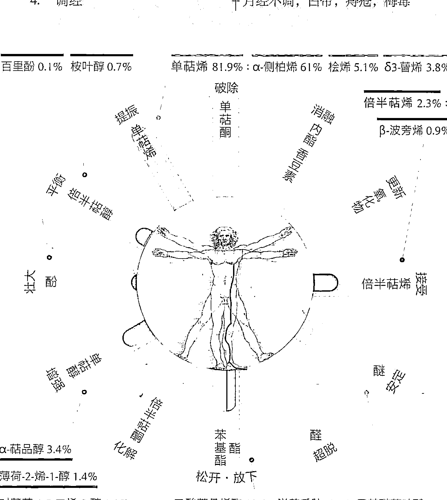

# 秘鲁圣木
## Palo Santo

生长于美洲热带地区，由墨西哥到秘鲁都有分布，会流出树脂。习惯半干枯的低地，树龄愈老，含油量愈高。

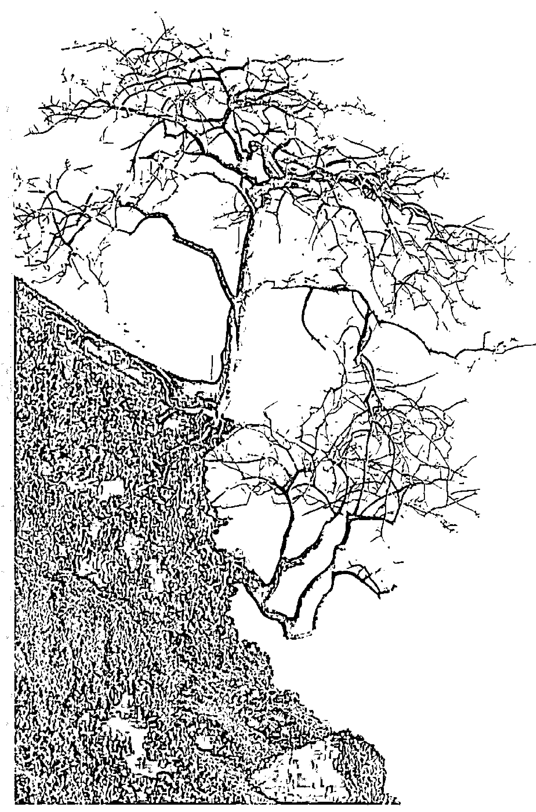

| 药学属性 | 适用症候 |
| :--- | :--- |
| 1. 止痛 | 风湿痛，胃痛 |
| 2. 镇静，放松 | 惊慌失措，草木皆兵，噩梦连连，负能量缠身 |
| 3. 驱虫（无鞭毛体的利什曼原虫） | 利什曼症 |
| 4. 发汗，抗肿瘤 | 久处空调房引起的循环不良，乳腺癌 |

| 项目 | 内容 |
| :--- | :--- |
| 学名 | Bursera graveolens |
| 其他名称 | 印加老圣木 / Holy Wood |
| 香气印象 | 印地安巫师在仪式中熬煮死藤水 |
| 植物科属 | 橄榄科裂榄属 |
| 主要产地 | 厄瓜多尔 |
| 萃取部位 | 心材（蒸馏） |
| 适用部位 | 三焦经、顶轮 |
| 核心成分 | 萃油率 5.2%，81 个可辨识化合物（占 90.5%） |
| 心灵效益 | 提升自我觉察的通透性，百毒不侵 |

### 注意事项
1.  避免使用摆放过久而氧化的秘鲁圣木油以防刺激皮肤。
2.  健康皮肤的安全剂量为 3.4%。
3.  另有倍半萜醇型秘鲁圣木油（绿花醇 70%），萃取自枝干。

### 成分表
单萜烯 78.2%：柠檬烯 58.6% 对伞花烃 0.5%
单萜酮 8种：藏茴香酮 2% 胡薄荷酮 1.1%
呋喃：薄荷呋喃 6.6%
倍半萜醇 9种：橙花叔醇 0.1% 桉叶醇
单萜醇 13种：α-萜品醇 10.9% 香芹醇 1.1%
倍半萜烯 24种 9.6%：γ-依兰烯 1.2% 大根老鹳草烯 1.7%

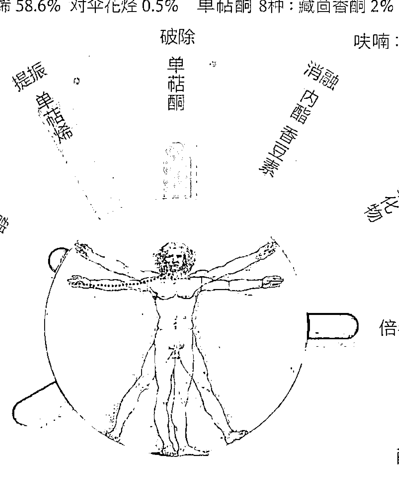

# 榄香脂
## Elemi

生于热带雨林，雨季开始时割取树脂，每隔一天割一回，一个月采收一次。几乎全年可采，但干季流量少，成熟的树一年可生产 45 千克的树脂

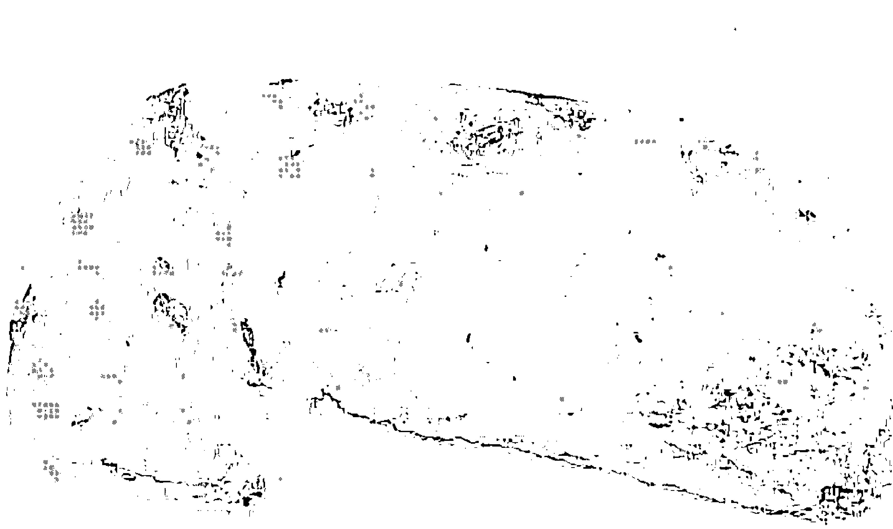

| 项目 | 内容 |
| :--- | :--- |
| 学名 | Canarium luzonicum |
| 其他名称 | 马尼拉树脂/Malapili |
| 香气印象 | 盲歌手高唱《海阔天空》 |
| 植物科属 | 橄榄科·橄榄属 |
| 主要产地 | 菲律宾 |
| 萃取部位 | 树脂（蒸馏） |

| 药学属性 | 适用症候 |
| :--- | :--- |
| 1. 激励腺体，健胃 | 消化不良 |
| 2. 抗卡他 | 支气管炎 |
| 3. 抗菌，抗霉菌（白色念珠菌），抗阿米巴原虫 | 鹅口疮，阿米巴痢疾，腹泻，结肠痉挛 |
| 4. 促进细胞再生，伤口愈合，强化皮肤 | 静脉溃疡，伤口不愈，脓肿，皱纹 |

### 其他信息
-   适用部位 | 三焦经、顶轮
-   核心成分 | 萃油率 12%，14~39 个可辨识化合物（占 96.3%）
-   心灵效益 | 提升奋斗意志，不轻易认输

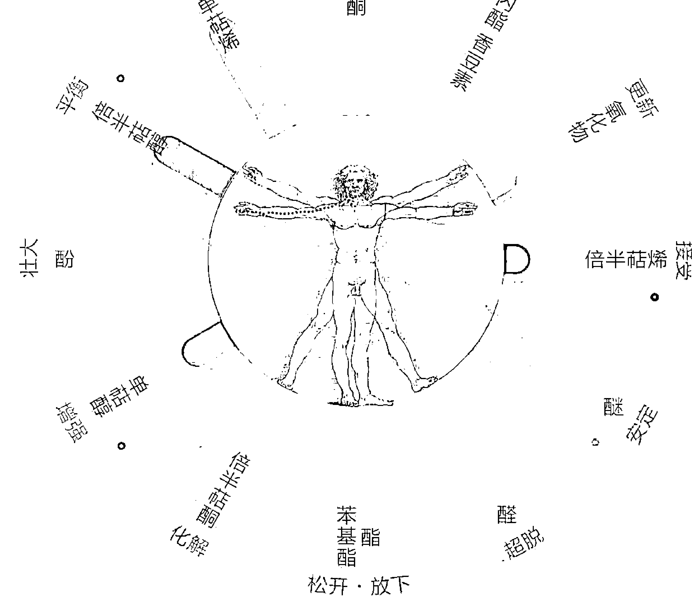

### 注意事项
1.  有些商品会加入额外的柠檬烯和 α-水茴香萜来强化气味。

# 岩玫瑰
## Cistus

外观特征为白色花瓣，花瓣底部有紫红色斑点，叶片细长而黏手。适应大陆化的地中海气候，能同时承受夏日久旱与寒冬，侵占性极强。

| 药学属性 | 适用症候 |
| :--- | :--- |
| 1. 抗感染，抗病毒，抗菌 | 婴儿疾病，病毒性疾病，疱疹，水痘，麻疹，猩红热，百日咳 |
| 2. 促进伤口愈合，收敛与紧实皮肤 | 出血性伤口，皱纹，皮肤松弛下垂，毛孔粗大，痤疮 |
| 3. 抗动脉炎，强效止血 | 动脉炎，内外出血，出血性直肠炎，子宫内膜异位与子宫肌瘤导致的经血过量 |
| 4. 补强神经，调节中枢神经（作用于副交感） | 肌张力障碍，风湿性关节炎，多发性硬化症，自身免疫性疾病（如红斑狼疮） |

### 基本信息
-   学名 | Cistus ladaniferus / Cistus ladanifer
-   其他名称 | 岩蔷薇 / Gum Rockrose
-   香气印象 | 摩西带领以色列人出埃及，使红海分开
-   植物科属 | 半日花科岩蔷薇属
-   主要产地 | 葡萄牙、西班牙、科西嘉岛、摩洛哥
-   萃取部位 | 叶片（蒸馏）
-   适用部位 | 三焦经、顶轮
-   核心成分 | 萃油率0.16%~0.41%，45个可识别化合物（占83%）
-   心灵效益 | 提升断开能力，不再因循旧习和重蹈覆辙

### 注意事项
1.  香水业用以替代龙涎香，或拿来合成琥珀的气味，是重要的定香剂。
2.  岩玫瑰树脂油(labdanum oil)其实是不同的产物，专取叶片表面流出的树胶蒸馏而得，特征气味来源为半日花烷型二萜。岩玫瑰叶油的独有气味则来自2,2,6-三甲基环己酮。
3.  克里特岩玫瑰(Cistus creticus)，开紫花，叶片只在持续30℃高温下才会渗出树脂。此树脂是古埃及人制作木乃伊的关键成分，法老王执于右手的权杖，就是采集克里特岩玫瑰的工具。现在仅克里特岛有少量生产，买主为德国药厂与中东富豪。

### 苦橙
## Bitter Orange

原生于亚洲东南，是柚和橘的杂交种，喜欢微酸性的肥沃壤土与充足阳光。水量必须适中，安土重迁，定根后最好不要移植。

-   学名 | Citrus aurantium
-   其他名称 | 塞维尔橙 / Seville Orange
-   香气印象 | 两个黄鹂鸣翠柳，一行白鹭上青天
-   植物科属 | 芸香科柑橘属
-   主要产地 | 意大利、埃及
-   萃取部位 | 果皮 (压榨)
-   适用部位 | 三焦经、本我轮
-   核心成分 | 萃油率 0.46%~1.21%，19 个可辨识化合物
-   心灵效益 | 提升对生活的满意指数，转角就能遇见幸福

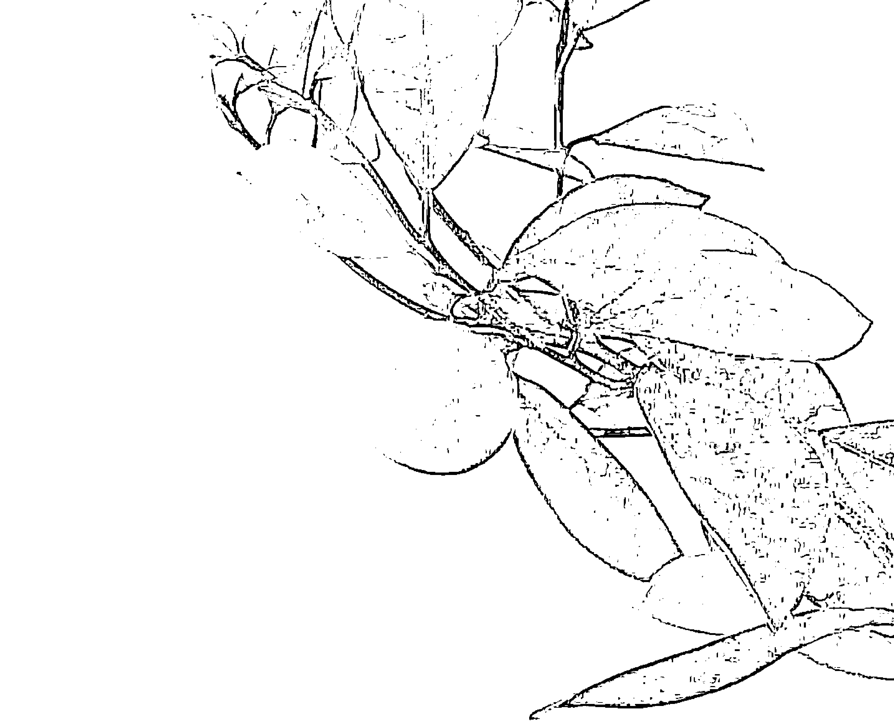

### 药学属性
1.  安抚，镇静（调节血清素受体），抗惊厥
2.  促进消化，抗霉菌
3.  促进循环，抗凝血，杀孑孓
4.  消炎，抗肿瘤

### 适用症候
-   焦虑，神经紧张，难以入眠，癫痫（降低发作频率）
-   消化不良，肠道痉挛，胃口不佳，厌食
-   长坐久站，血栓，动脉粥样硬化，蚊虫滋生的环境
-   大肠癌

### 核心成分
柠檬烯 93.42% 月桂烯 2.05%
对伞花烃 1.66%
香豆素与呋喃香豆素 >0.09% ：环氧香柑油内酯 0.082%
补骨脂素 0.007%

### 注意事项
1.  微具光敏性，健康皮肤的安全剂量为 1.25%，用油后 12 小时不宜日晒。含高量柠檬烯，氧化后可能刺激皮肤，应谨慎保存。
2.  甜橙 (Citrus sinensis)，主要产地为意大利和巴西。所谓红橙与血橙也属于这个品种。含柠檬烯 96.1%，柠檬醛 0.08%，辛醛 0.06%，沉香醇 0.18%。作用基本与苦橙同，包括抗肿瘤，扩香可抗霉菌，另能防止骨质流失。气味明显比苦橙松软甜香。

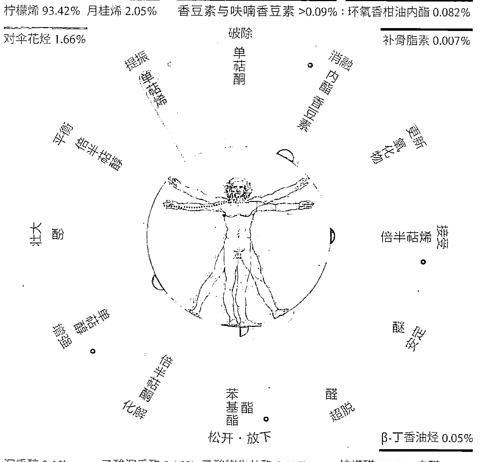## 泰国青柠
### Kaffir Lime

分布于亚洲热带地区、高 1.8~10.7 米的多刺灌木。出名的葫芦型双叶和凹凸不平的果皮，都能入菜。

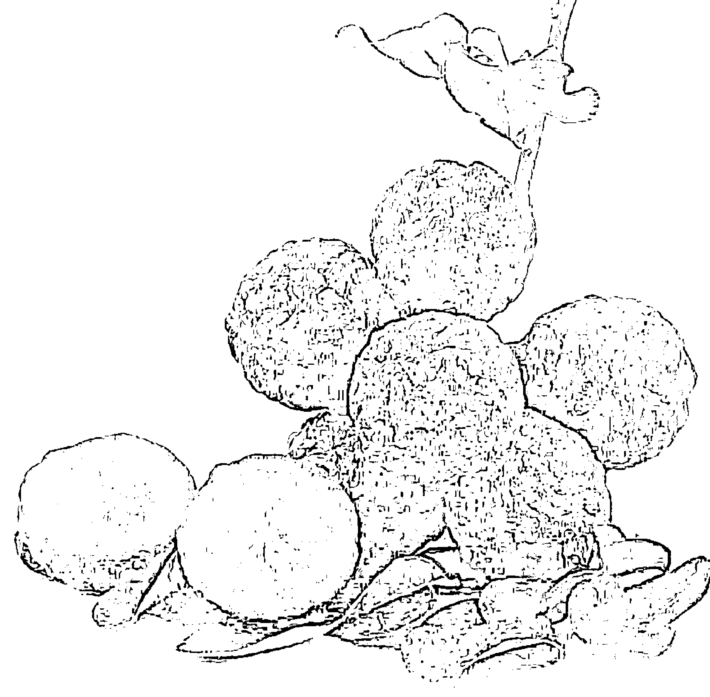

-   ### 药学属性
    1. 抗感染，抗菌
    2. 排出肝脏的毒素，促进胆汁流动
    3. 补强神经
    4. 激素作用，促进子宫反着床作用

-   ### 适用症候
    1. 呼吸系统的传染病
    2. 食品添加剂与农药、杀虫剂导致的肝毒，油脂不足导致的胆囊不收缩
    3. 无精打采，郁郁寡欢
    4. 卵巢与睾丸功能低下，避孕

| 项目 | 内容 |
|---|---|
| 学名 | Citrus hystrix |
| 其他名称 | 箭叶橙 / Combava |
| 香气印象 | 河床旁的大小石块被烈日晒得发烫 |
| 植物科属 | 芸香科柑橘属 |
| 主要产地 | 泰国、马来西亚、印尼 |
| 萃取部位 | 果皮（蒸馏） |
| 适用部位 | 胃经、本我轮 |
| 核心成分 | 萃油率 1%，102 个可辨识化合物 |
| 心灵效益 | 提升社交和运动的兴致，保持活力 |

β-松油萜 16%~35.9% 桉烯 22.8%~40% 柠檬烯 17.7%
呋喃香豆素

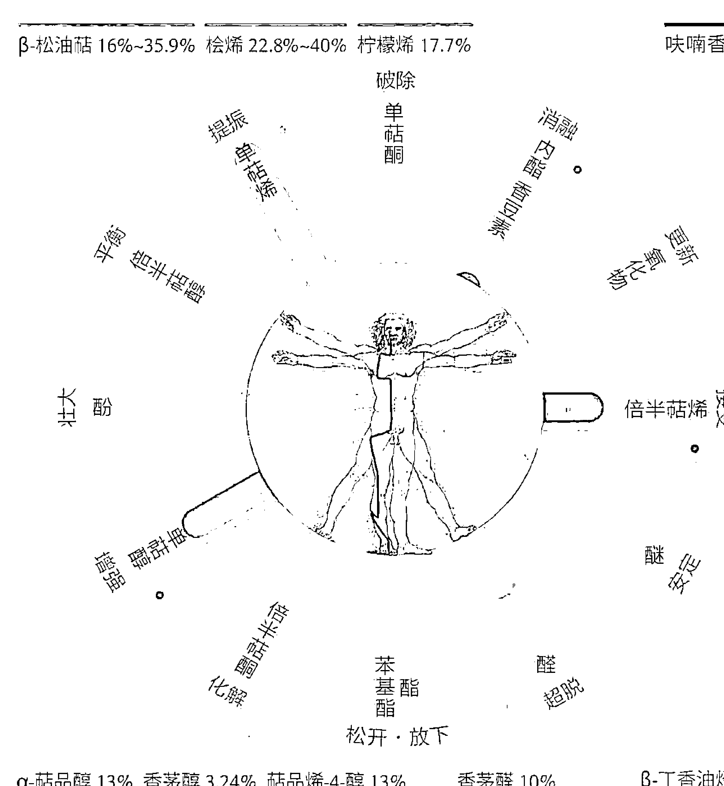

-   ### 注意事项
    1. 怀孕初期避免使用。
    2. 外用宜小心光敏性。

α-萜品醇 13% 香茅醇 3.24% 萜品烯-4-醇 13% 香茅醛 10% β-丁香油烃 10%

### 日本柚子
### Yuzu

宜昌橙和橘子的杂交品种，喜光，尤爱日间温暖夜间阴凉。无须费力照顾，可耐零度气温，土壤需要良好的排水。

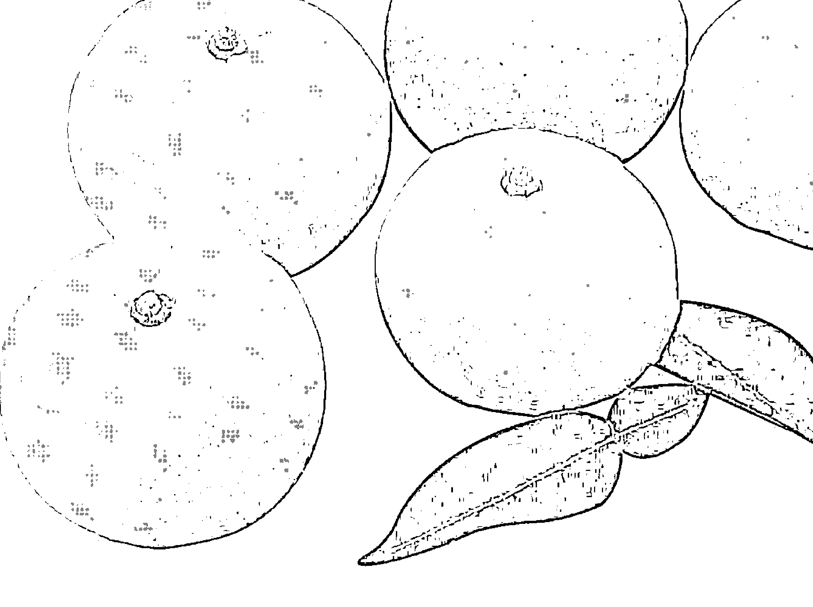

| 项目 | 内容 |
|---|---|
| 学名 | Citrus junos |
| 其他名称 | 香橙 / Japanese Lemon |
| 香气印象 | 怀石料理的摆盘 |
| 植物科属 | 芸香科柑橘属 |
| 主要产地 | 日本、韩国 |
| 萃取部位 | 果皮 (压榨) |
| 适用部位 | 三焦经、心轮 |
| 核心成分 | 萃油率 0.18%~1.34%，69~77 个可辨识化合物 (占 98.5%~99.6%) |
| 心灵效益 | 提升主静的功夫，从容品味细节 |
| 注意事项 | 1. 含高量柠檬烯，氧化后可能刺激皮肤，应谨慎保存。<br>2. 中文的柚子指的是 Pomelo (Citrus maxima / Citrus grandis)，精油含柠檬烯 32.63%、脂肪酸 10.8%、含氮化合物 (油酸酰胺 20.38%)。有改善心血管疾病、提高睡眠品质、抗菌、抗氧化、降血糖的作用。 |

-   ### 药学属性
    1. 抗氧化，抗血小板凝结
    2. 抑制 N-亚硝基二甲胺，抗肿瘤
    3. 抗焦虑
    4. 消炎，抑制细胞激素

-   ### 适用症候
    - 血管硬化
    - 肝癌，膀胱癌，乳腺癌，胰脏癌，肺癌，皮肤癌
    - 完美主义，面试或上台焦虑，控制狂，幽闭恐惧症
    - 气喘

单萜烯 96% : 柠檬烯 63.1%~68.1% γ-萜品烯 11.4%~12.5% β-水茴香萜 4.6%~5.4%
大根老鹳草烯D-4-醇 0.3%~0.4%
含硫化合物 : 甲基三硫醚

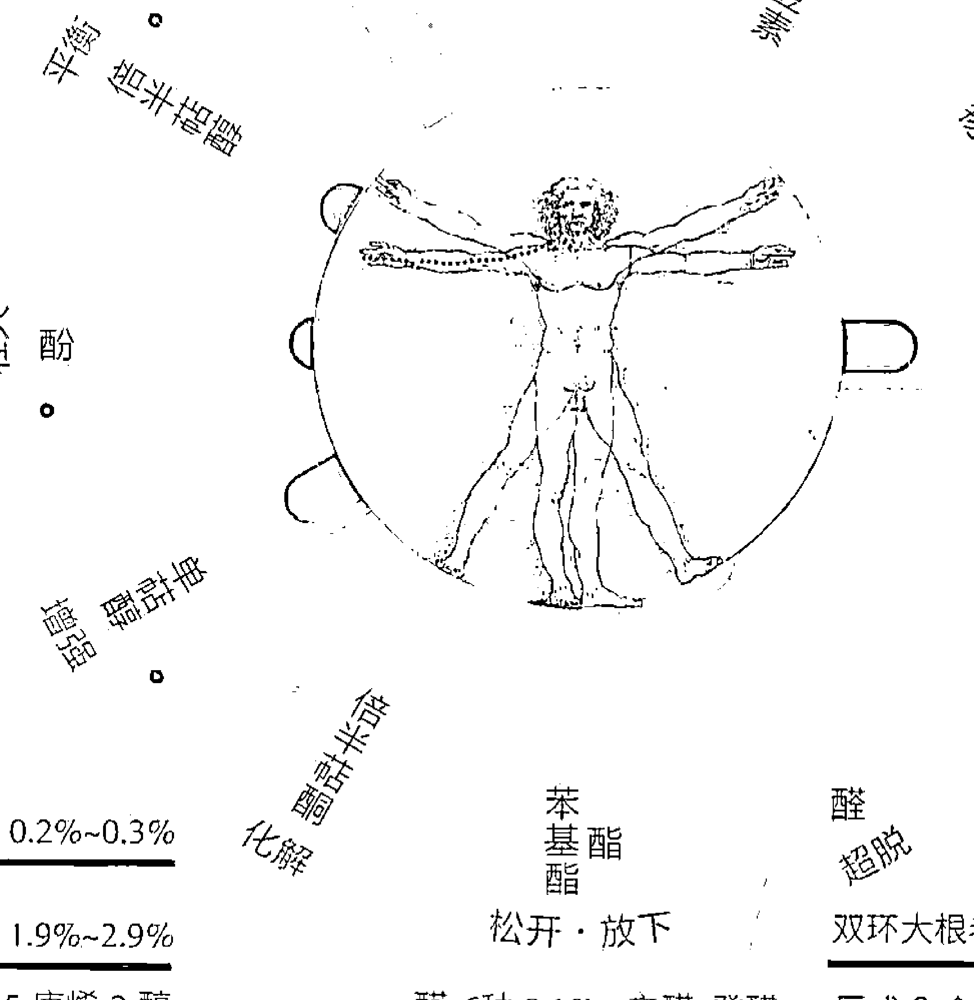

## 莱姆
### Key Lime

原生于东南亚，常被亚热带与热带地区民众误认为柠檬（或被称作无籽柠檬）。喜欢全日照与排水通风良好，需忌避冷风。根系浅，宜种在沟壑或多岩块的土壤。

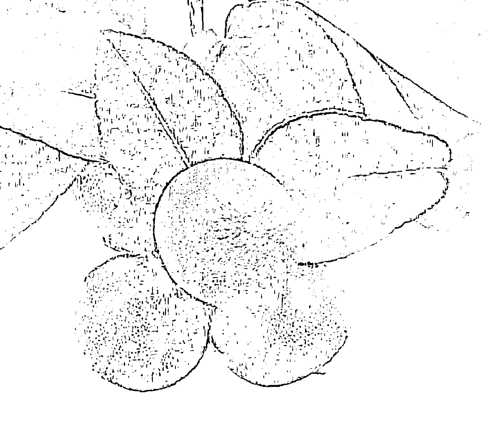

| 项目 | 内容 |
|---|---|
| 学名 | Citrus × aurantifolia |
| 其他名称 | 墨西哥莱姆 / Mexican Lime |
| 香气印象 | 黑人女数学家演算太空船返航轨道 |
| 植物科属 | 芸香科柑橘属 |
| 主要产地 | 墨西哥、印度 |
| 萃取部位 | 果皮（蒸馏） |
| 适用部位 | 三焦经、本我轮 |
| 核心成分 | 萃油率 0.1% ，55 个可辨识化合物（占 99.6%） |
| 心灵效益 | 提升判断力，专注于事理的逻辑而不被表象混淆 |

1. 蒸馏所得的莱姆精油不含呋喃香豆素，并无光敏性，但应防柠檬烯氧化。
2. 墨西哥莱姆是 Citrus micrantha 和 Citrus medica(香橼)的杂交种，亲株的香橼精油能健胃消炎止痛，用以排除消化障碍、抗糖尿与减重。
3. 甜莱姆 (Citrus limetta) 原生于南亚，其果汁是印度与巴基斯坦街头常见的饮料，果皮精油有抗菌、抗痉挛和抑制肿瘤生长的作用。
4. 波斯莱姆 (Citrus latifolia Tanaka) 的精油能抑制导致发炎的物质，进而发挥抗移转的作用，还可抗菌、镇静、健胃。

| 药学属性 | 适用症候 |
|----------|----------|
| 1. 抗感染，抗菌，抗霉菌，杀虫 | 尿道感染，热带感染性疾病 |
| 2. 降血糖，降血压，降血脂 | 糖尿病，高血压，动脉粥样化，肥胖 |
| 3. 消炎，抗氧化，抗肿瘤，抑制乙酰胆碱酯酶 | 直肠癌，老年痴呆 |
| 4. 保护肝脏，保护骨骼（冷榨油），抗痉挛 | 黄曲霉毒素造成的肝损害，更年期骨质流失（冷榨油），肠绞痛 |

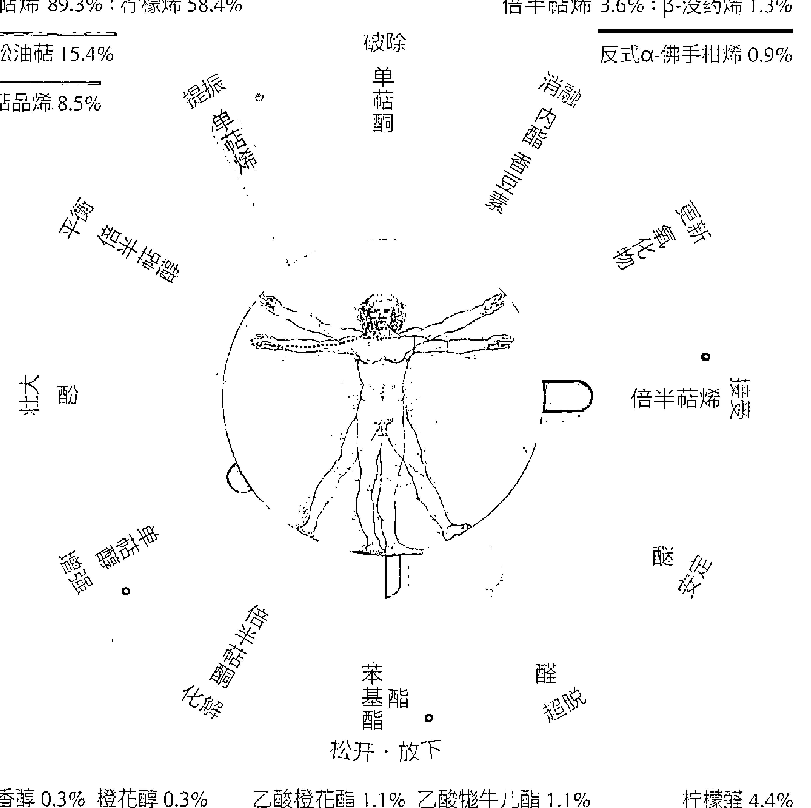

## 柠檬
### Lemon

原生于南亚，不耐寒，温度底线为7℃，喜欢略带酸性、排水良好的土壤。需要充足的阳光和水分，也需要勤于修剪，以免徒长枝叶不长果。

| 项目 | 内容 |
|---|---|
| 学名 | Citrus × limon / Citrus limonum |
| 其他名称 | 柠果 / Citron |
| 香气印象 | 本来无一物，何处惹尘埃 |
| 植物科属 | 芸香科柑橘属 |
| 主要产地 | 意大利、印度、巴西 |
| 萃取部位 | 果皮(压榨) |
| 适用部位 | 三焦经、顶轮 |
| 核心成分 | 萃油率1.3%，40个可辨识化合物（占93.55%） |
| 心灵效益 | 提升悟性，保持清明的洞见 |

1. 抗链球菌，抵抗借芽胞繁殖的细菌，抑制已产生抗药性的不动杆菌
2. 抗氧化，清血，排除四氯化碳产生的肝毒，抑制肿瘤生成
3. 化解结石，消胀气，保护胃黏膜，消炎
4. 镇静神经，镇痛，保护海马回

医院与幼儿园净化空气，传染病流行期间
环境污染损害的肝功能，饮食作息引发的痤疮，贫血，血栓，白血病，大肠癌
肾绞痛，消化功能不良，胃溃疡
噩梦，神经退行性疾病，创伤后压力综合征

柠檬烯56.6%~76% 呋喃香豆素>0.5%：氧化前胡素0.09%~0.82% 佛手柑素0.16%~0.54%
β-松油萜6%~17% 破除单萜酮
γ-萜品烯3%~13.3% 提振单萜烯 消融内酯 脂肪酸酮 更新氧化物

平衡 启动增生
提振 单萜烯
破除 单萜酮
消融 内酯 脂肪酸酮
更新 氧化物
倍半萜烯 甜蜜
酚 增生
醛 超脱
苯基酯 松开·放下
α-萜品醇0.1%~8%
萜品烯-4-醇 微量~1.9% 乙酸橙花酯0.1%~1.5% 柠檬醛0.9%~6.3% 大根老鹳草烯1.35%

1. 具光敏性，健康皮肤的安全剂量为2%，用油后12小时不宜日晒。含高量柠檬烯，氧化后可能刺激皮肤，应谨慎保存。

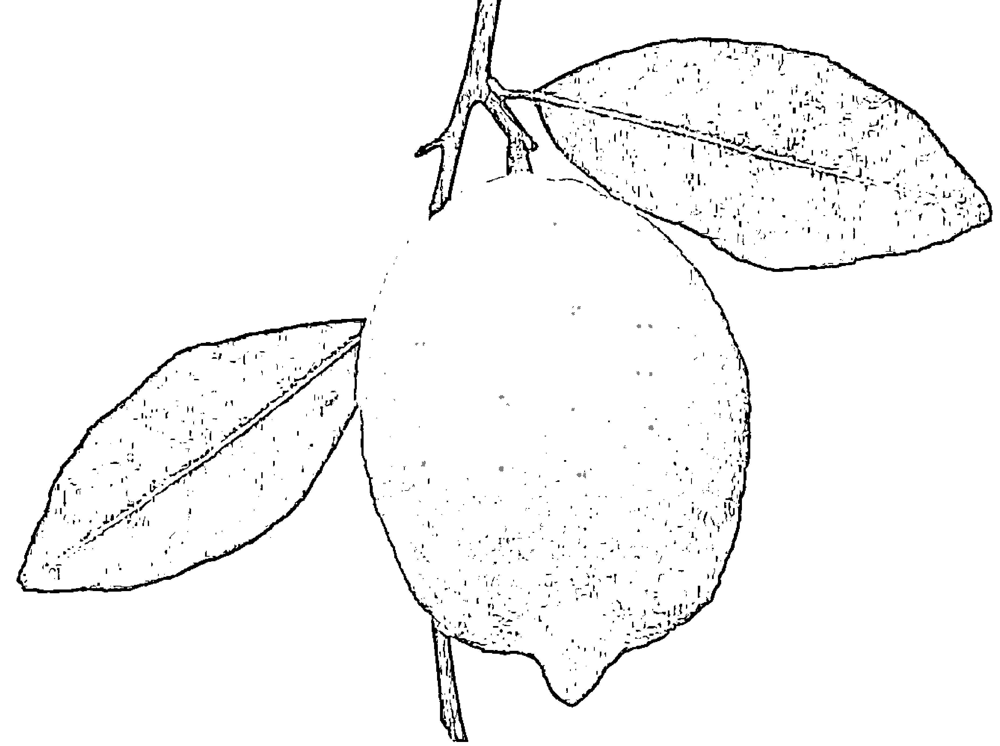

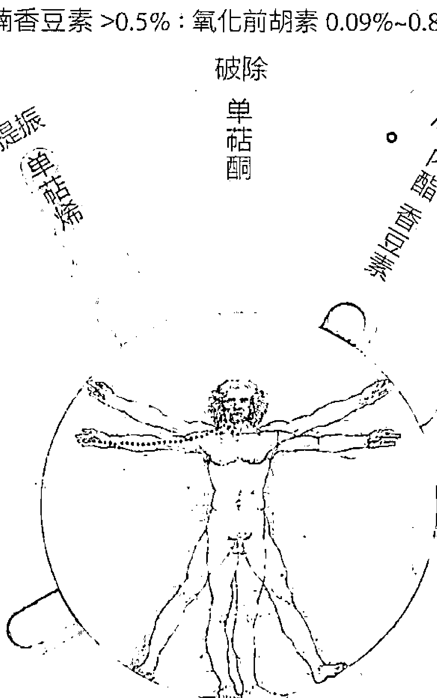

## 葡萄柚
### Grapefruit

18世纪在巴巴多斯由甜橙和柚子杂交而成，温度要求年均温18℃以上，但比柠檬耐寒，需肥量较多，供水量要充足。

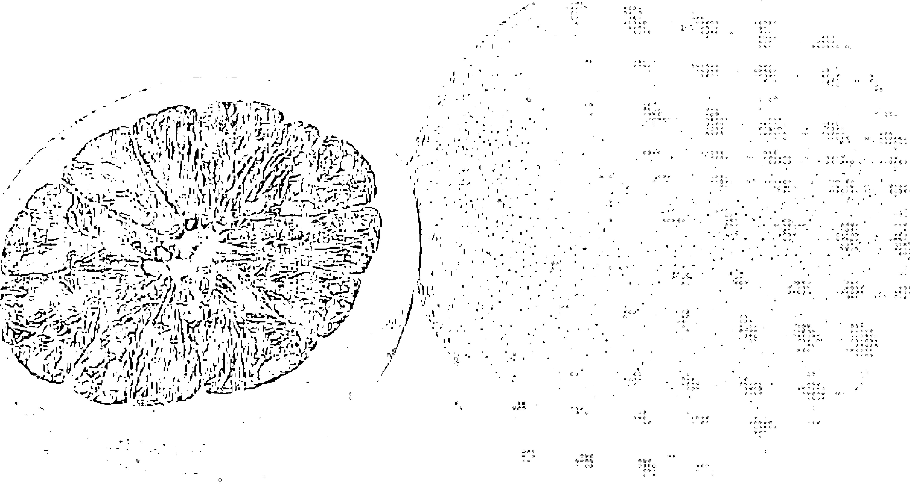

1. 提高交感神经活动，通过视交叉上核调节神经传导，抑制乙酰胆碱酯酶
2. 解毒，抗氧化，抗肿瘤
3. 收敛，抗菌，抗霉菌
4. 促进肝脏分泌胆汁，降低食欲，促进脂肪分解，利尿

1. 时差，萎靡不振，夜猫子（昼夜颠倒的作息），老年痴呆
2. 带状疱疹，乳腺癌，皮肤癌
3. 念珠菌感染，粉刺
4. 食欲过旺，肥胖，水肿，橘皮组织

| 项目 | 描述 |
|---|---|
| 学名 | Citrus × paradisi |
| 其他名称 | 西柚 / Pamplemousse |
| 香气印象 | 集美貌与才华于一身的搞笑女子 |
| 植物科属 | 芸香科柑橘属 |
| 主要产地 | 美国、巴拉圭、古巴 |
| 萃取部位 | 果皮（压榨） |
| 适用部位 | 三焦经、顶轮 |
| 核心成分 | 萃油率 16.41%，25 个可辨识化合物（占 95.26%） |
| 心灵效益 | 提升自尊，从幽默感中焕发自信 |

单萜烯 98.52% : β-月桂烯 3.06%
侧柏烯 0.8%
柠檬烯 92.83%

呋喃香豆素：香柑油内酯 0.012%~0.19%
佛手柑素<0.11%

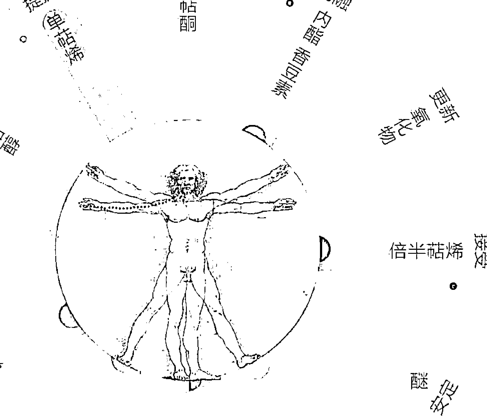

异胡薄荷醇 0.38%
诺卡酮 0.19%
棕榈酸甲酯 0.31%
癸醛 1.11%
β-丁香油烃 0.43%

1. 有轻微的光敏性，健康皮肤的安全剂量为4%。
2. 精油不含葡萄柚汁抑制药物代谢的成分（DHB，一种呋喃香豆素），所以不会与药物交互作用。

## 橘（红/绿）
### Mandarin (red / green)

需要充足日照，否则徒长枝叶而不开花，也要通风良好。温度不能低于-9℃，但比柚子甜橙耐寒。疏松肥沃的砂壤土较佳，忌积水。

| 项目 | 内容 |
|---|---|
| 学名 | Citrus reticulata |
| 其他名称 | 桔 / Mandarin Orange |
| 香气印象 | 除夕早晨洒扫完毕的前廊（绿橘）年初一茶几上的红包和软糖（红橘） |
| 植物科属 | 芸香科柑橘属 |
| 主要产地 | 西西里岛、巴西 |
| 萃取部位 | 果皮（压榨或蒸馏） |
| 适用部位 | 胃经、本我轮 |
| 核心成分 | 萃油率2.7%，29个可辨识化合物（色谱峰共五十多个） |
| 心灵效益 | 提升对生活的期许，不再自暴自弃 |

| 药学属性 | 适用症候 |
|---|---|
| 1. 安抚交感神经，镇静放松，轻微催眠 | 失眠，激动，恐慌 |
| 2. 轻微抗痉挛，健胃整肠，利胆，降血糖 | 过敏性血管炎，糖尿病 |
| 3. 抗菌，抗霉菌 | 积食不消，打嗝，吞气症，呼吸急促 |
| 4. 抑制脂肪堆积，防癌 | 情绪恶劣引起的暴饮暴食 |

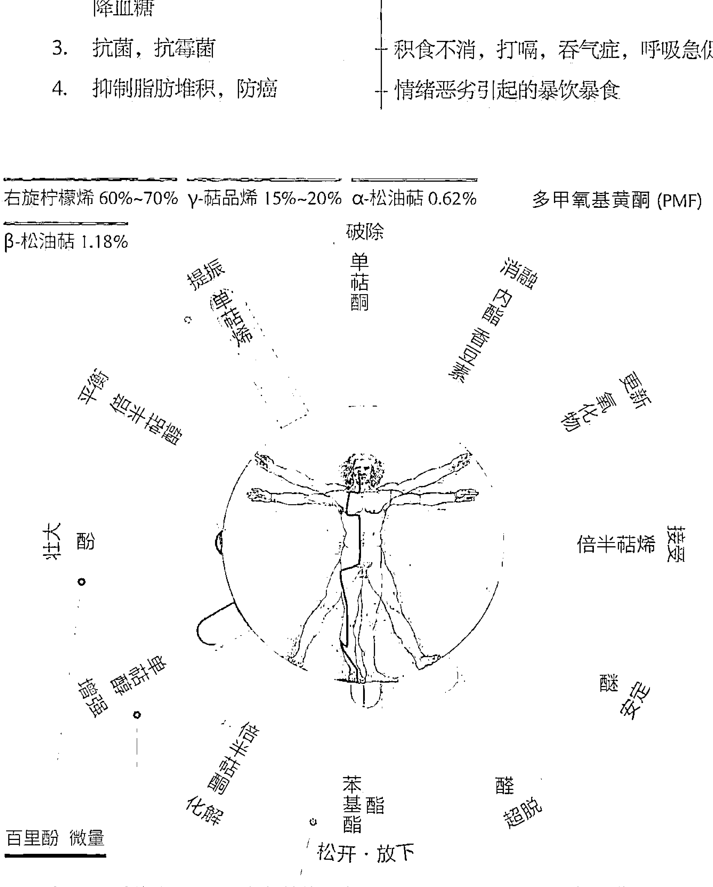

-   ### 注意事项
    1. 绿橘含油量高于红橘，红橘的柠檬烯和γ-萜品烯多于绿橘。整体上红橘的抗菌力高于绿橘（但绿橘抗大肠杆菌较强），而绿橘更有益于心轮。
    2. 另外有一相似的果皮精油Tangerine，学名为瓯柑(Citrus tangerina)。
    3. 压榨所得的精油中呋喃香豆素含量极微小，不致产生光敏性。

## 岬角白梅
### Cape May

无惧强风的海岸植物，生长于海拔 750 米以下的山壁。常从砂岩和花岗岩间蹦出，但不爱石灰岩，长得紧密结实。

| 项目 | 内容 |
|---|---|
| 学名 | Coleonema album |
| 其他名称 | 白碎纸灌木 / White Confetti Bush |
| 香气印象 | 刷洗过的钓鱼器具 |
| 植物科属 | 芸香科鞘丝属 |
| 主要产地 | 南非开普敦 |
| 萃取部位 | 叶 (蒸馏) |
| 适用部位 | 肝经、本我轮 |
| 核心成分 | 萃油率 0.27%，43 个可辨识化合物 |

-   ### 药学属性
    1. 驱虫 (蚂蚁和蚊子)，除腥臭
    2. 祛痰，解除平滑肌的痉挛现象，强力止痛
    3. 抑制环氧化酶-2(COX-2)
    4. 抗氧化，抗霉菌

-   ### 适用症候
    - 户外活动必备
    - 局促不安导致的咳嗽，切除手术后的疼痛
    - 橘皮组织，静脉发炎
    - 焦躁时的皮肤发痒

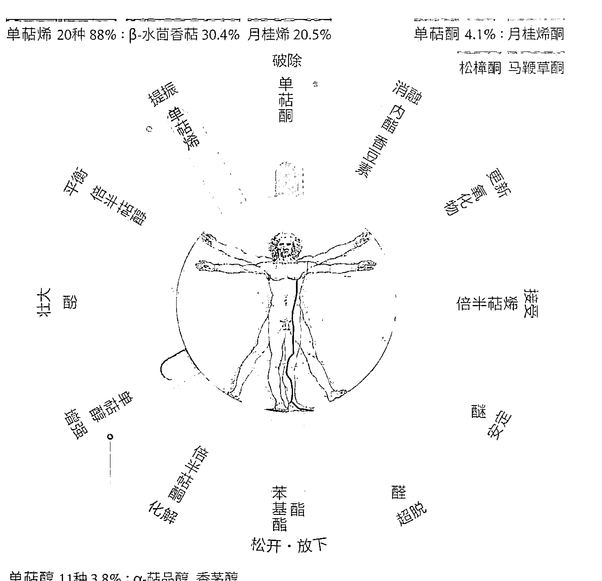

心灵效益 | 提升信念的坚定度，不为诱惑所动

-   ### 注意事项
    1. 有时被称作野布枯，但是跟布枯是完全不相关的药草。

## 海茴香
### Sea Fennel

海边岩块之间的兼性盐生植物，不一定需要盐分，盐分太高反而抑制生长。在岩岸和沙地都能看到，茎叶多肉含汁，种子也富于脂肪酸。

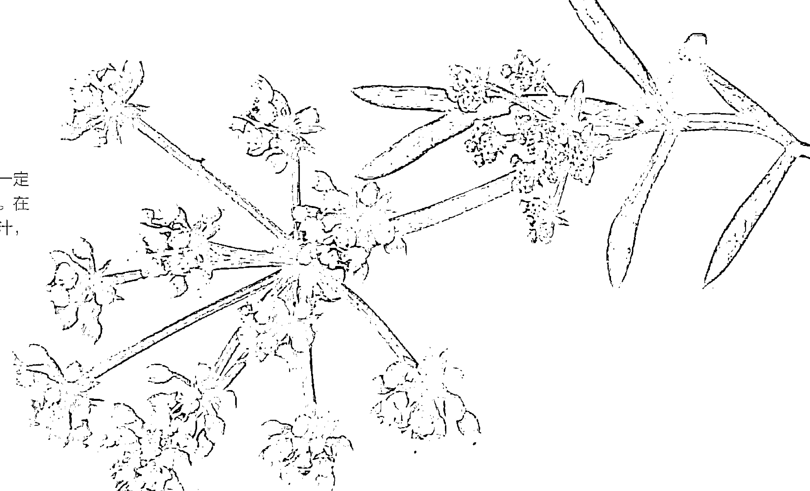

| 项目 | 内容 |
|---|---|
| 学名 | *Crithmum maritimum* |
| 其他名称 | 石海蓬子 / Rock Samphire |
| 香气印象 | 沙蟹泥滩上轻快地挖洞筑穴 |
| 植物科属 | 伞形科海茴香属 |
| 主要产地 | 法国、希腊、意大利、土耳其 |
| 萃取部位 | 整株（蒸馏） |
| 适用部位 | 大肠经、本我轮 |
| 核心成分 | 萃油率 0.2%，23 个可辨识化合物（占 99%） |
| 心灵效益 | 提升意志力，穿越铜墙铁壁般的难关 |

-   ### 药学属性
    1. 利尿，抗红细胞增多症
    2. 驱虫
    3. 抗氧化，抑制乙酰胆碱脂酶
    4. 轻泻，抗痉挛

-   ### 适用症候
    - 肾结石，水肿，橘皮组织
    - 寄生虫引起的肠炎
    - 肌肤老化，老年痴呆
    - 排便不顺畅，四肢僵硬

单萜烯 89%：γ-萜品烯 34.22%、β-水茴香萜 25.28%、对伞花烃 11.8%

1. 原植物萃取物已证实能激励胶原蛋白和弹力蛋白生成，被广泛用于产品以促进皮肤回春。精油只占此萃取物的一部分，另外还有多酚类、黄酮类、矿物质与维生素 C。

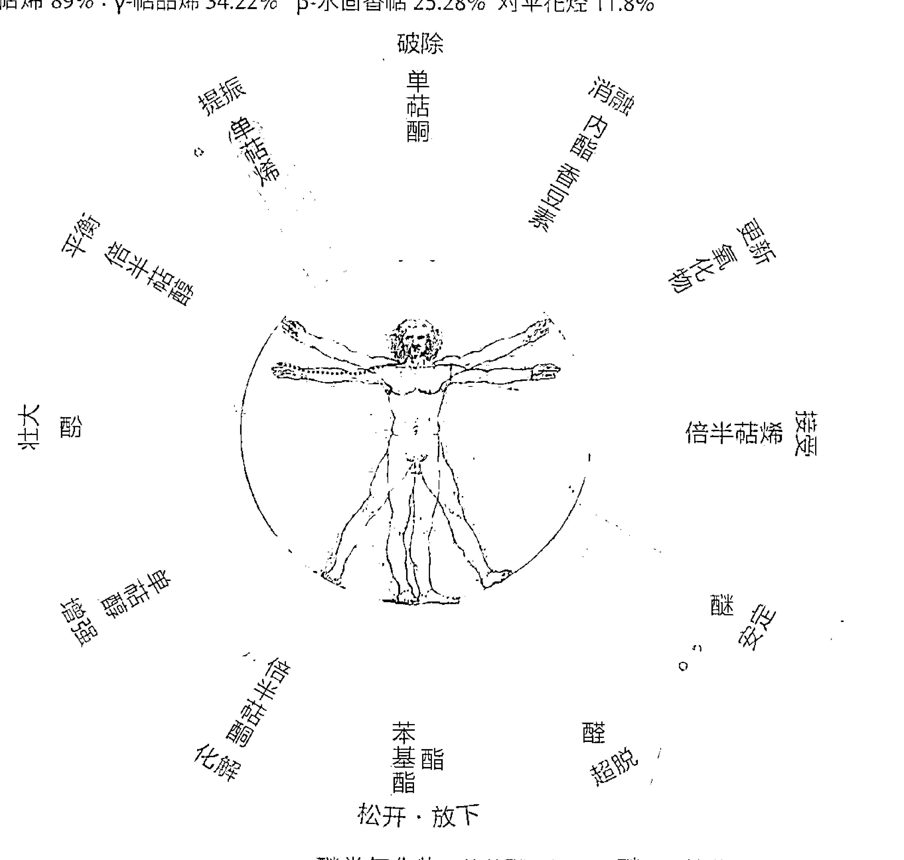

## 丝柏
### Cypress

原生于地中海盆地，耐旱耐风耐空气污染，根系发达，土壤酸碱皆宜。生在空气污染或多粉尘地区会提高精油中的单萜烯，而倍半萜烯则大幅减少。

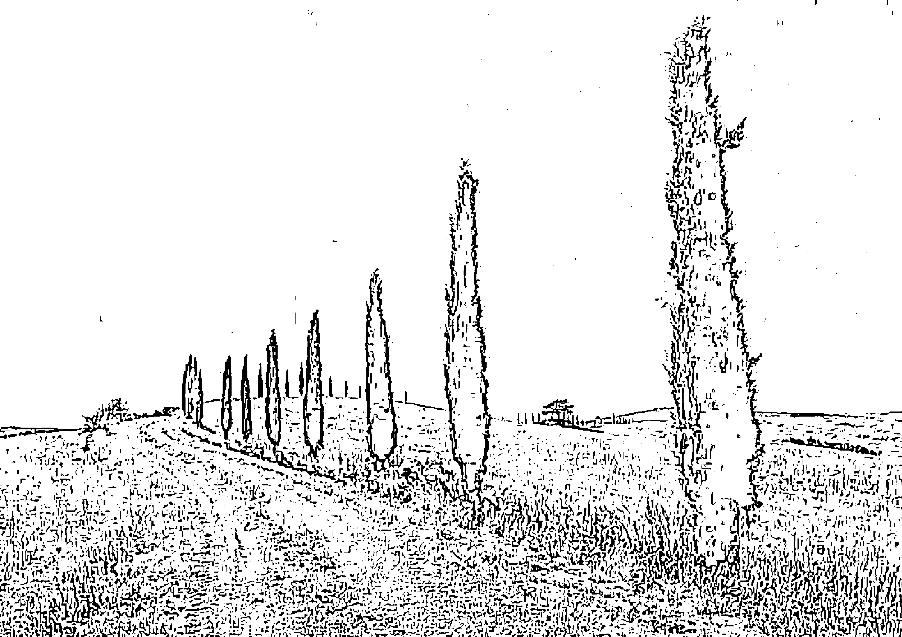

| 药学属性 | 适用症候 |
|---|---|
| 1. 排除静脉与淋巴郁积的毒素与废物 | 静脉曲张，内外痔，皮下组织水肿 |
| 2. 缓解前列腺的肿胀充血症状，抗氧化，抗肿瘤 | 遗尿，前列腺肥大，肾细胞癌，黑色素细胞瘤 |
| 3. 补身，滋补神经与肠，强化骨质（雌激素作用） | 胰脏功能低下（外分泌腺），肠功能迟缓，虚弱无力，更年期骨质疏松 |
| 4. 抗感染，抗菌（肺炎克雷伯菌），抗霉菌，抗生物膜 | 各种支气管炎，百日咳，支气管痉挛，结核，肺结核，胸膜炎 |

| 项目 | 内容 |
|---|---|
| 学名 | Cupressus sempervirens |
| 其他名称 | 意大利柏木/Italian Cypress |
| 香气印象 | 飞行速度接近光速的太空船上“看着”时间变慢 |
| 植物科属 | 柏科柏属 |
| 主要产地 | 法国、西班牙、摩洛哥 |
| 萃取部位 | 枝干/毬果（蒸馏） |
| 适用部位 | 三焦经、顶轮 |
| 核心成分 | 萃油率 0.87%~0.51%，20~67个可辨识化合物（占98.1%~97.69%） |
| 心灵效益 | 提升专注力，知止而后有定，定而后能静 |

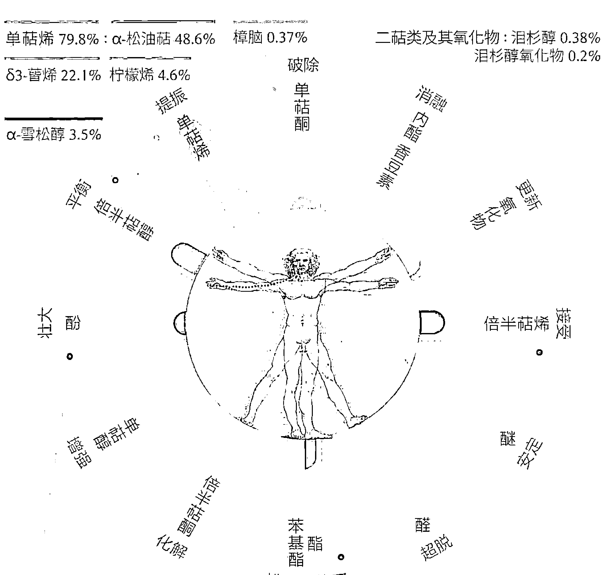

单萜烯 79.8%
α-松油萜 48.6%
δ3-蒈烯 22.1%
柠檬烯 4.6%
α-雪松醇 3.5%
樟脑 0.37%
二萜类及其氧化物: 泪杉醇 0.38%, 泪杉醇氧化物 0.2%
香荆芥酚 0.35%
乙酸龙脑酯 2.75%
大根老鹳草烯 1.6%
功效: 提振单萜醇、平复单萜酮、破除单萜酮、消散内酯类酮酸酯、化解酮倍半萜醇、醚 安定、醛 超脱、苯基酯 松开·放下、酚 共感、萜品醇 醚 倍半萜烯 沉淀、更新

1. 乳房有硬性结节者避免使用含二萜的丝柏精油。
2. 丝柏的雌激素作用来自毬果所含的二萜类。枝干与针叶精油中则不含二萜类。两者合起来蒸馏的精油也会有少量二萜。

## 非洲蓝香茅
### African Bluegrass

分布于南非山区草原和降雨较多的湿地，喜爱夹杂石块的壤土坡。强韧的茎叶长可达 2.4 米，花与根部的含油量也很高。

| 项目 | 内容 |
|---|---|
| 学名 | Cymbopogon validus |
| 其他名称 | 松节油草 / Turpentine Grass |
| 香气印象 | 选美比赛中的民族服饰大观 |
| 植物科属 | 禾本科香茅属 |
| 主要产地 | 南非 |
| 萃取部位 | 叶 (蒸馏) |
| 适用部位 | 三焦经、本我轮 |
| 核心成分 | 萃油率 2.0%，28 个可辨识化合物 |
| 心灵效益 | 提升抗争力，找到为自己发声的方式 |

-   ### 药学属性
    1. 抗菌，抗霉菌，抗感染
    2. 抗氧化，消炎，止痛，止吐
    3. 驱蚊，驱虫与鼠类
    4. 收敛皮肤，男性皮肤抗老化

-   ### 适用症候
    - 食物中毒引起的肠胃炎
    - 舟车劳顿引起的疲惫，长途跋涉与久站引起的腿部酸痛，呕吐，害喜
    - 脏乱环境引起的皮肤瘙痒
    - 褥疮，皮肤过度出油，头皮屑，男性皮肤老化

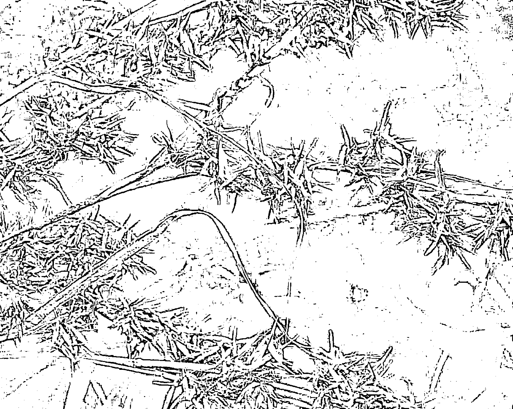

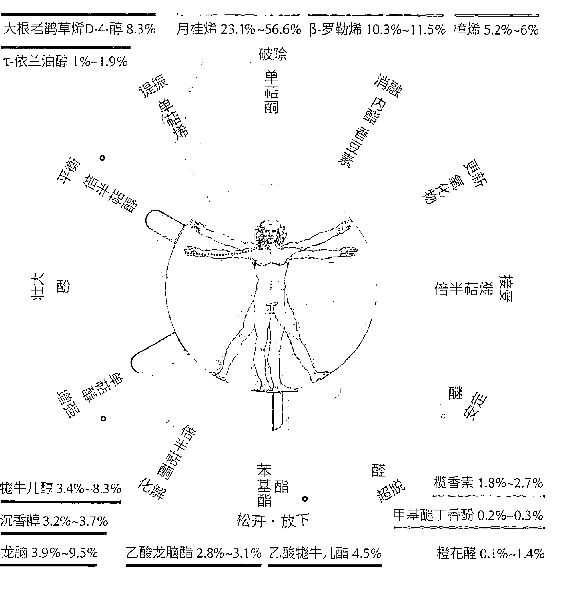

-   ### 注意事项
    1. 另有单萜酮型的化学品系（艾蒿酮 7.5%，马鞭草酮 13.5%），消炎作用更为突出。

## 白松香
### Galbanum Gum

生长在伊朗西部与北部山区海拔1800~3000米。习惯干旱，开黄花，茎干坚实而中空，根部富含油腺，会流出树胶。

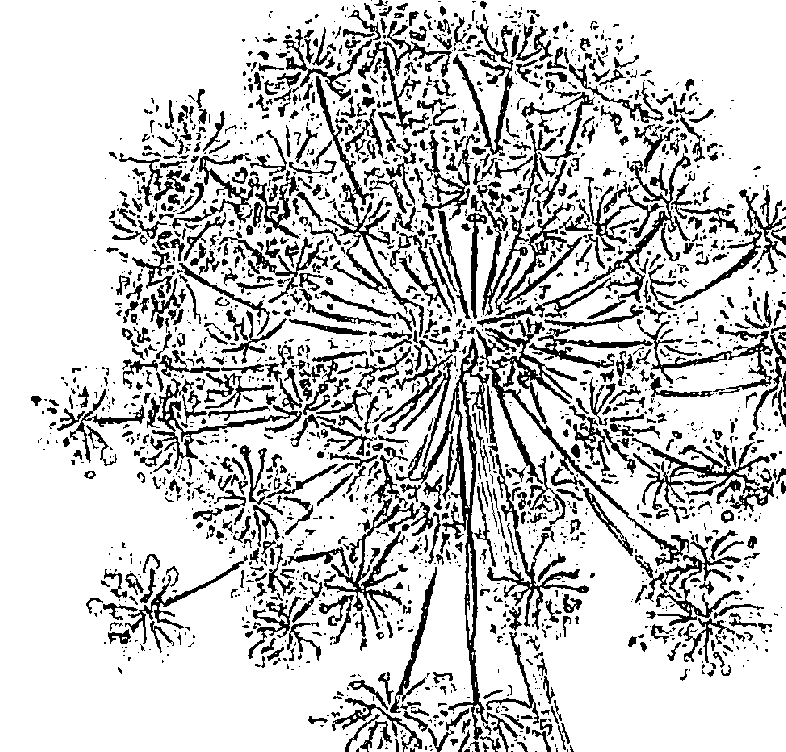

### 药学属性

1. 抗感染，抗菌，消肿
2. 补身，抗氧化，强化记忆
3. 强化生殖泌尿道，通经（雌激素样活性）
4. 消炎，镇痛，轻微抗痉挛，抑制局部膜电位作用

### 适用症候

咳嗽，感冒，溃疡，脓肿，淋巴结病变
头重脚轻（外用），感觉随时要翻船，头脑昏乱
白带，痛经
关节痛，肠绞痛，癫痫

| 成分 | 百分比 |
|---|---|
| 单萜烯 | 96.6% |
| β-松油萜 | 59% |
| α-松油萜 | 36.6% |
| (3Z,5E)-十一碳-1,3,5-三烯 | 0.3% |
| (6Z,8E)-十一碳-6,8,10-三烯-3-酮 | - |
| 含氮化合物：吡嗪 | - |

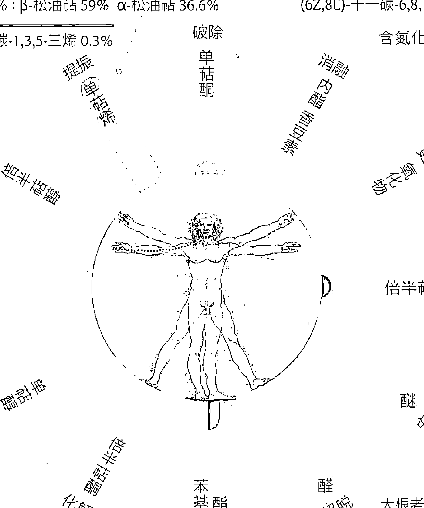

| 项目 | 内容 |
|---|---|
| 学名 | Ferula galbaniflua / F. gummosa |
| 其他名称 | 阿魏脂 / Barzad |
| 香气印象 | 吉尔伽美什与恩奇都大战一场后结为好友 |
| 植物科属 | 伞形科阿魏属 |
| 主要产地 | 伊朗 |
| 萃取部位 | 树脂（蒸馏） |
| 适用部位 | 三焦经、心轮 |
| 核心成分 | 萃油率 15%，16 个可辨识化合物（占 99.9%） |
| 心灵效益 | 提升稳重感，疏散极端或激烈的情绪 |

### 注意事项

1. 白松香树脂有两种：硬白松香（Persian galbanum）、软白松香（Levant galbanum），通常都用软白松香树脂萃取精油，因其油含量较多。
2. 白松香油一般不会快速老化，一旦老化（摆放过长时间），就会产生聚合反应而变得极度黏稠。
3. 与中药阿魏（新疆阿魏）是同属不同种的植物，中药阿魏（Ferula sinkiangensis）可抗氧化与抗肿瘤，对脾胃疾病有帮助。

# 连翘

## Weeping Forsythia

喜爱疏松肥沃、排水良好、背风向阳的山坡夹沙土地。耐寒耐贫瘠，就是怕涝。花开香气淡雅，满枝金黄，十分可爱，是早春优良观赏花灌木。

- 学名 | Forsythia suspensa
- 其他名称 | 一串金 / Golden-bell
- 香气印象 | 武林高手一人在断崖上练绝世武功
- 植物科属 | 木犀科连翘属
- 主要产地 | 中国（东北、华北、长江流域）
- 萃取部位 | 果实（蒸馏）

适用部位：三焦经、喉轮

核心成分
萃油率 3.07%，19~21 个可辨识化合物（占 93.37%）

心灵效益 | 提升绝缘感，隔离环境的骚动与他人的情绪渲染

| 药学属性 | 适用症候 |
|----------|----------|
| 1. 抗菌（金黄色葡萄球菌、肺炎链球菌），抗霉菌（黑曲霉、白色念珠菌），抑病毒 | 流感，胸膜炎，急性肺损伤，痈肿毒疮，小儿口腔溃疡，带状疱疹 |
| 2. 消炎（抑制亢进的毛细血管通透性和炎症介质的释放） | 皮肤过敏起疹发痒，皮肤银屑病，棉球肉芽肿 |
| 3. 解热，止吐 | 中暑，夏季热病，舌绛神昏 |
| 4. 抗氧化，预防性抑制 NF-kB 核转位活化 | 肝癌，胃癌 |

1. 连翘药材分为青翘与黄翘，秋季连翘果实初熟尚呈绿色时采集为青翘；果实完全成熟后采集为黄翘。

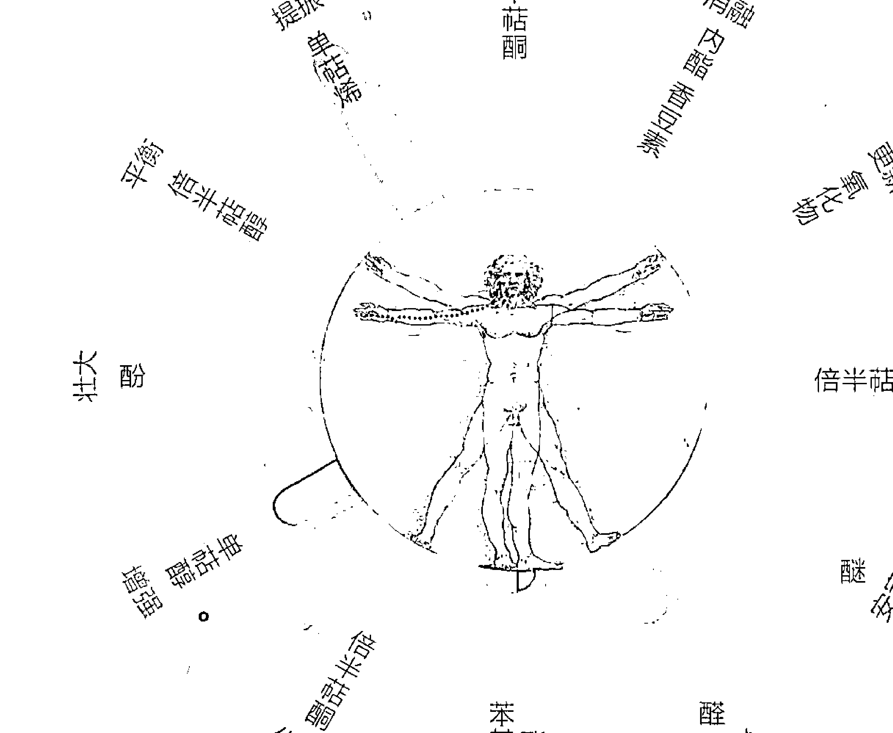

# 高地杜松
Mountain Juniper

分布于副极区和温带高海拔山区 (1700~2500米)，叶片背面为一道白线，贴地生长，远望宛如草皮，一般高度约50厘米，浆果也比较小。

- 学名 | Juniperus communis var. montana / J. c. var. saxatilis / J. c. subsp. nana
- 其他名称 | 娜娜杜松 / Alpine Juniper Nana
- 香气印象 | 初生之犊不畏虎
- 植物科属 | 柏科刺柏属
- 主要产地 | 法国普罗旺斯、科西嘉岛
- 萃取部位 | 针叶与浆果 (蒸馏)

适用部位 | 三焦经、基底轮

核心成分
萃油率0.7%，82个可辨识化合物 (占96.05%)

心灵效益 | 提升明亮感，滤掉过往的偏振光，让天更蓝而草更绿

### 注意事项

1. 有些科西嘉岛产的高地杜松精油呈现某种荧光绿，那是当地娜娜杜松针叶与毬果特有的色泽。此外，科西嘉高地杜松的柠檬烯含量最多，因此气味的甜度也比其他地区高。
2. 高地杜松所含的化合物数量是针叶 > 浆果 > 枝干 > 根部。
3. 西伯利亚杜松也是高地杜松的一种，以 α-松油萜 (32%~55%) 和桧烯 (14%) 为主。

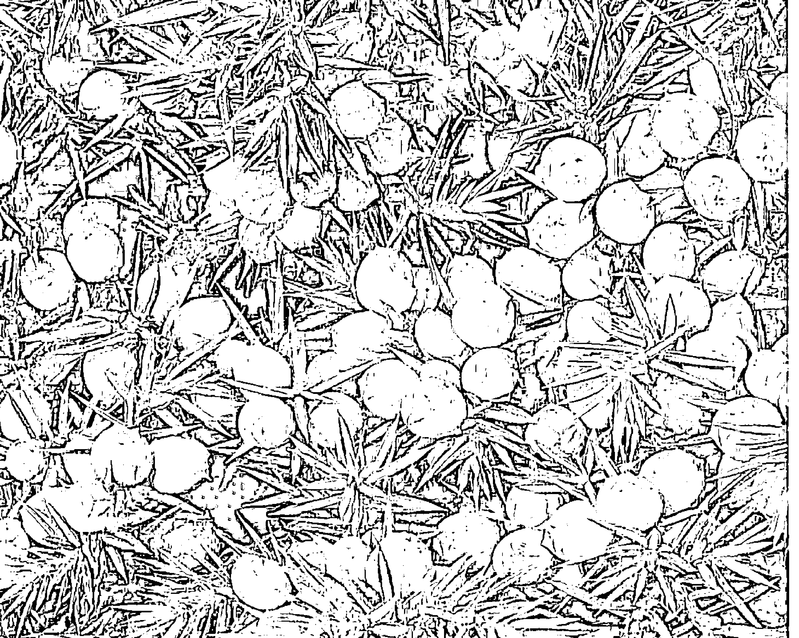

| 药学属性 | 适用症候 |
| :--- | :--- |
| 1. 消炎、抗痉挛，止痛 | 神经炎，坐骨神经痛，风湿，关节炎 |
| 2. 调节自主神经系统，保护神经 | 自主神经性肌张力障碍，帕金森病 |
| 3. 保护肝脏，调节皮肤油脂分泌 | 化学污染造成的肝损伤，油性面疱肤质，饮食不当造成的皮肤排毒 |
| 4. 抗菌，防腐 | 痉挛性与炎症性肠绞痛，发酵性肠炎 |

τ-杜松醇 0.2% β-榄香醇 0.62% | 柠檬烯 40.1% α-松油萜 23.25% β-水茴香萜 12.6%

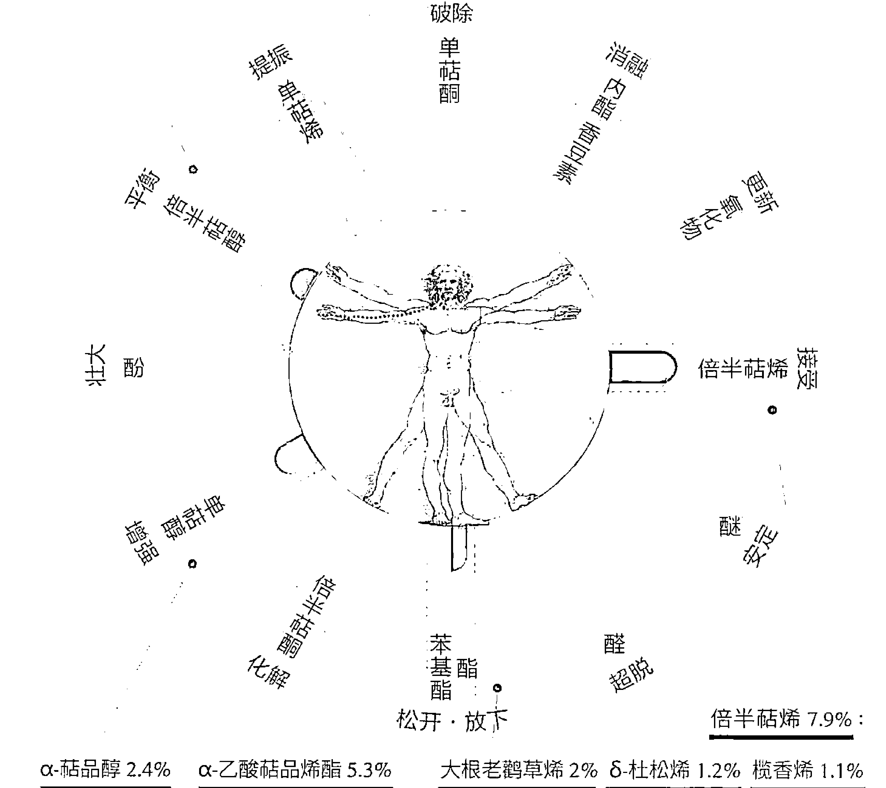

# 杜松浆果
Juniper Berry

刺柏属中唯一同时生长在东西半球的成员，也是分布区域最广大的木本植物。叶片背面的一道白线是其辨识特征，浆果在第一年呈绿色，第二年则转青黑色。

- 学名 | *Juniperus communis*
- 其他名称 | 欧洲刺柏 / Common Juniper
- 香气印象 | 一元复始，万象更新
- 植物科属 | 柏科刺柏属
- 主要产地 | 西班牙、克罗地亚、法国
- 萃取部位 | 浆果状的毬果（蒸馏）

适用部位：三焦经、基底轮

核心成分
萃油率 0.4%~3.8%，42 个可辨识化合物（占 98.57%）

心灵效益 | 提升清爽度，扫除人生的淤泥和渣滓

### 注意事项

1. 杜松精油对孕妇没有风险。误解源自 1928 年一篇研究报告，该文以杜松的俗名 Juniper 指涉会导致流产的叉子圆柏（*Juniperus sabina*）。此外，大剂量的杜松浆果有反着床的作用，浆果制成的琴酒一直被视为可能导致流产，但琴酒中所含的杜松精油比例仅 0.006%。
2. 杜松枝干的萃油率为 0.19%，含 67 个化合物（占 94.41%），α-松油萜 56.1%，柠檬烯 7.4%，α-杜松醇 3.08%，δ-杜松烯 3%。药学属性包括保护肝脏、抗疟疾。也有同时萃取浆果与针叶的杜松精油，药学作用更为广泛。

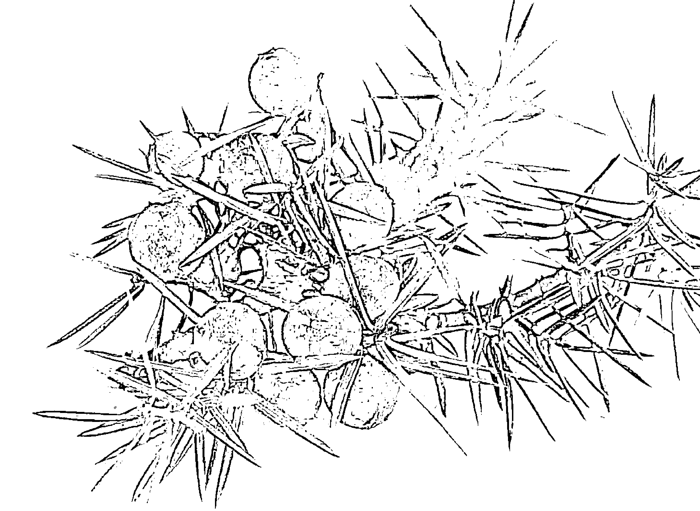

| 药学属性 | 适用症候 |
| :--- | :--- |
| 1. 利尿、消结石 | 排尿困难，胆结石，肾结石 |
| 2. 激励与补强消化系统，利胰脏，降血糖与血脂，强力抗氧化 | 胀气，轻微的肝胰功能失调，糖尿病，胆固醇过高 |
| 3. 抗风湿，消炎，止痛，强化子宫的肌肉张力，保护神经（针叶） | 膝关节炎，全身僵硬（针叶），子宫脱垂，帕金森病（针叶） |
| 4. 抗菌，抗感染，抗黏膜发炎，化痰 | 感染性肠炎，支气管炎，气喘 |

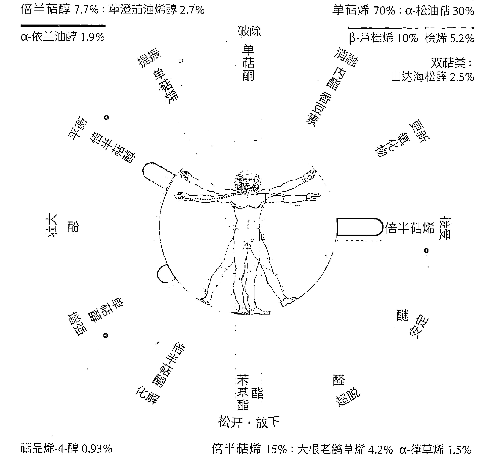

# 刺桧浆果
Cade Berry

遍布地中海地区多石山丘，赭色浆果和叶片背面的两道白线是辨识特征。海平面至海拔1600米均可见，树形多样，有2~3米高的矮丛，也有15米高的小树。

- 学名 | Juniperus oxycedrus
- 其他名称 | 刺柏 / Prickly Juniper
- 香气印象 | 无人山径回荡着绿绣眼的欢唱
- 植物科属 | 柏科刺柏属
- 主要产地 | 阿尔巴尼亚、希腊、法国（普罗旺斯）
- 萃取部位 | 浆果（蒸馏）
- 适用脉轮 | 三焦经、基底轮
- 核心成分 | 萃油率 0.49%~1.8%，27个可辨识化合物

心灵效益 | 提升良好的自我感觉，无视他人的无视

| 药学属性 | 适用症候 |
| :--- | :--- |
| 1. 开胃，助消化，抗氧化，降血糖 | 被零食、外食搞坏的胃口（无法习惯少调味的全食物），糖尿病 |
| 2. 周围神经的止痛剂（机转异于阿司匹林和吗啡） | 减轻安宁疗护病房病患的身心疼痛，戒酒戒毒 |
| 3. 提高IgG免疫反应（第一型辅助T细胞Th1的免疫反应） | 肺结核，呼吸道慢性感染 |
| 4. 放松肌肉 | 运动前的暖身（慢跑、游泳、瑜珈） |

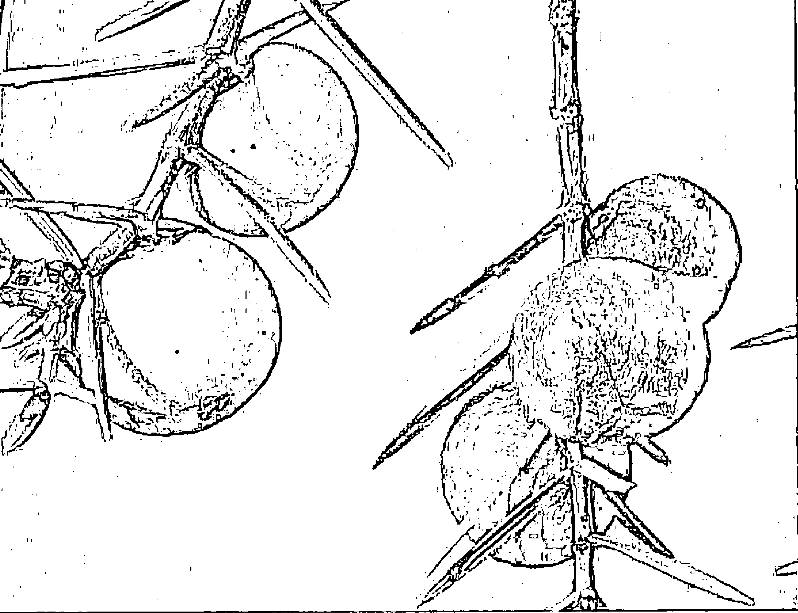

倍半萜醇 4.9%~11.4%：橙花叔醇 5.94%
单萜醇 2.7%：沉香醇 1.62%
单萜烯 70%~88%：β-月桂烯 45.5%~56.9%，α-松油萜 10.2%~36.6%，柠檬烯 3.6%~13.8%
二萜烯 1.7%：西松烯 0.85%
倍半萜烯 3.5%~11%：大根老鹳草烯 8.56%

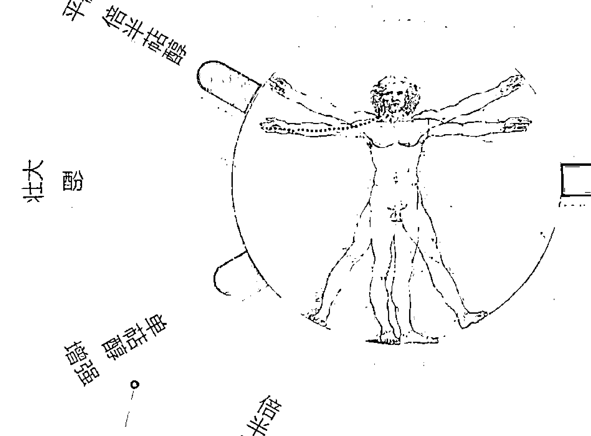

### 注意事项

1. 萃油率：腓尼基柏浆果 (Juniperus phoenicea ssp. Turbinate) 2.54% > 刺桧浆果 > 杜松浆果。腓尼基柏精油有抗肿瘤作用。
2. 因为含有高比例月桂烯，刺桧浆果气味比杜松浆果香甜。

# 卡奴卡
Kanuka

一般为 5~7 米高，叶片柔软开白花，耐风霜干旱，怕湿。从海平面到海拔 1800 米都可存活，不挑土壤，生长快速。

- 学名 | Kunzea ericoides
- 其他名称 | 白茶树 / Burgan
- 香气印象 | 橄榄球队“全黑”赛前的毛利战舞
- 植物科属 | 桃金娘科昆士亚属
- 主要产地 | 新西兰
- 萃取部位 | 叶片（蒸馏）

### 药学属性

1. 抗菌（革兰阳性菌），对霉菌无作用
2. 保护神经系统，促进去甲肾上腺素的生成，止痛
3. 抗单纯疱疹病毒Ⅰ型与小儿麻痹病毒Ⅰ型
4. 平衡激素，强化免疫力

### 适用症候

- 脓痂疹
- 纤维肌痛症，风湿，关节痛，急性扭伤
- 唇疱疹，预防小儿麻痹
- 结缔组织松软，淋巴体质，北方国家的冬季疾病

适用脉轮 | 三焦经、顶轮

核心成分
萃油率 0.4%，41 个可辨识化合物（占 98.5%）

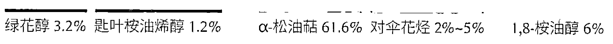

心灵效益 | 提升士气，在逆境中保持战斗力

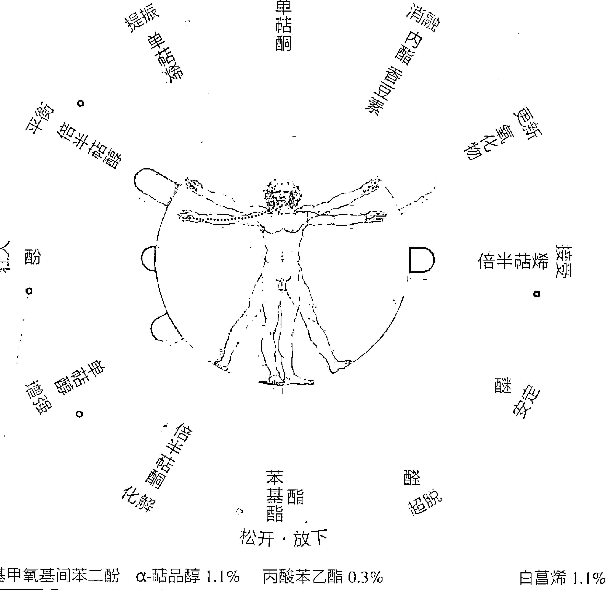

### 注意事项

1. 过量会导致痉挛现象（如头痛）。
2. 新西兰北岛的卡奴卡较多倍半萜醇，南岛的卡奴卡较多倍半萜烯。南北岛气候条件差异很大（北岛为亚热带雨林，南岛为温带高山甚至有冰川），植物成分因此也有差距。

# 落叶松
Larch

原生于加拿大，多见于沼泽与低地，喜欢潮湿的泥炭土，是火后先驱树种。虽是针叶树，却会变色与落叶。极耐寒，可忍受-65℃的低温，但不耐阴。

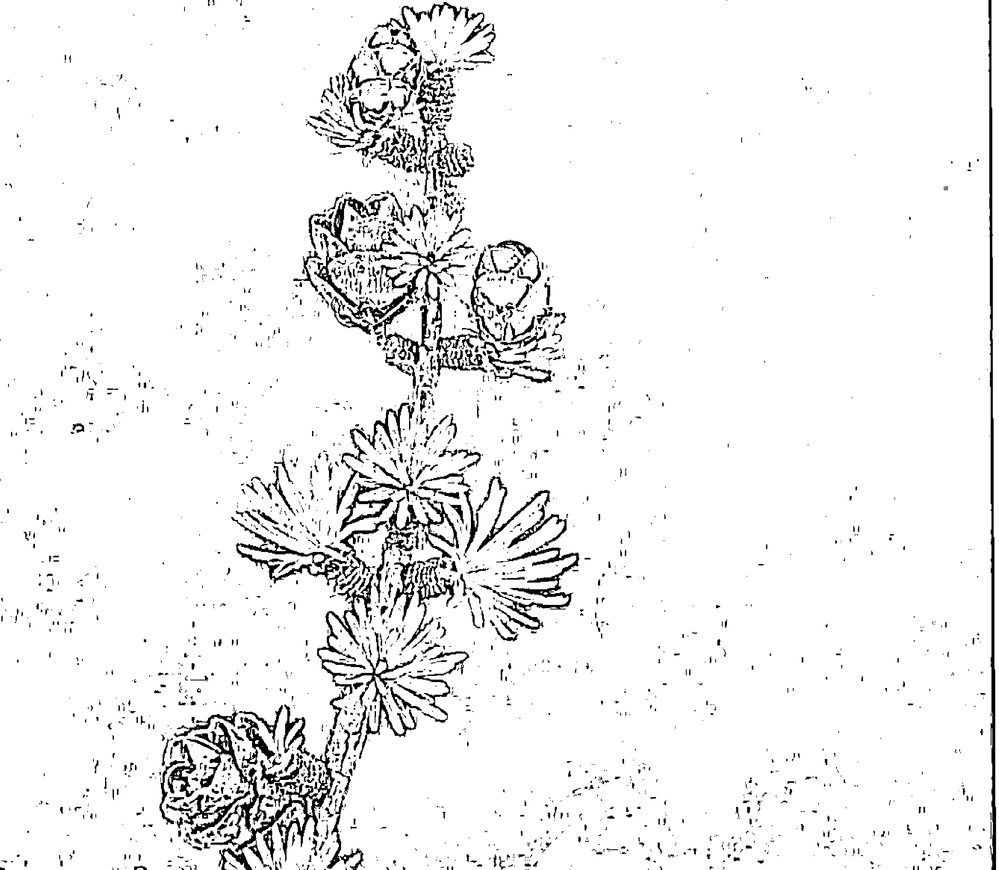

| 药学属性 | 适用症候 |
|---|---|
| 抗感染（肺炎链球菌），杀菌消毒 | 肺炎，支气管炎 |
| 强化神经（补充能量，导入放松状态），作用于小脑 | 神经衰弱 |
| 激励肾上腺 | 骨营养不良（受伤后骨骼生长发育不佳） |

单萜烯 76.8%：α-松油萜 38.5% δ3-蒈烯 14% β-松油萜 10.2%

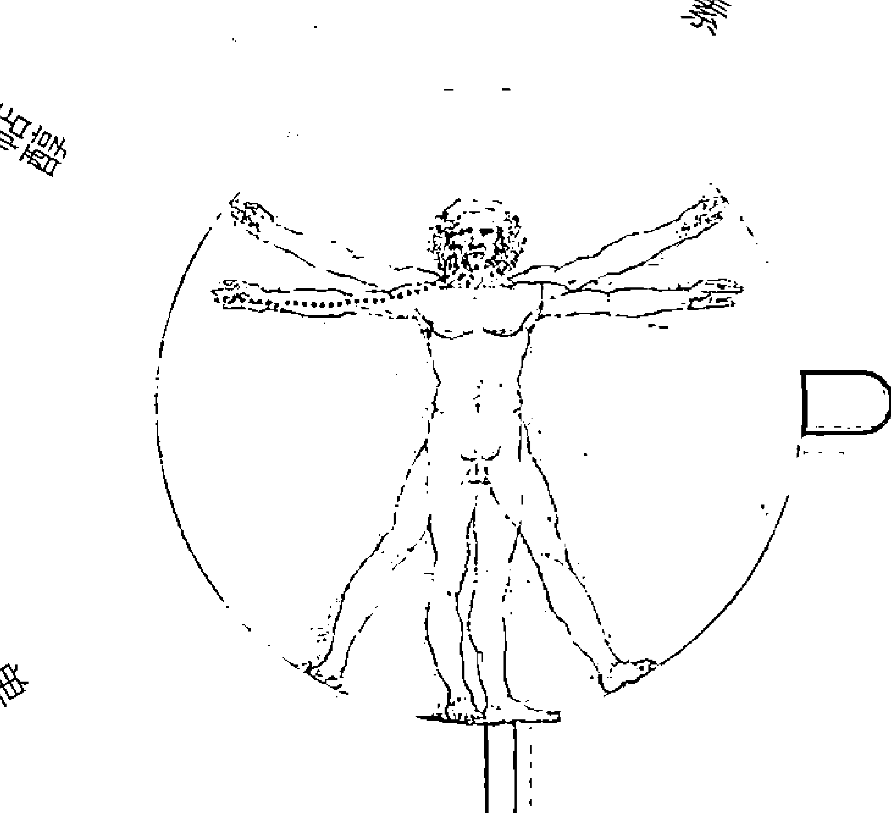

| 项目 | 内容 |
|---|---|
| 学名 | Larix laricina |
| 其他名称 | 美洲落叶松 / Tamarack |
| 香气印象 | 绚丽壮阔的极光 |
| 植物科属 | 松科落叶松属 |
| 主要产地 | 意大利 |
| 萃取部位 | 针叶（蒸馏） |

适用部位：三焦经、顶轮
核心成分：45个可辨识化合物
心灵效益：提升竞争力，由败部复活撑完全场

### 注意事项

1. 落叶松树脂油的来源是欧洲落叶松（Larix europea / L. decidua），分布在中欧（如奥地利）。气味比美洲落叶松针叶油沉着一些，基本作用相仿。

乙酸龙脑酯 7.9%  δ-杜松烯 2.1% β-丁香油烃 1.4%

# 格陵兰喇叭茶
Labrador Tea

分布区域从格陵兰到阿拉斯加，常出现在沼泽或湖岸，长速缓慢。皮革般的叶片背面棕红而带毛，球状丛生的白花芳香而沾手。

- 学名 | Rhododendron groenlandicum (旧名 Ledum groenlandicum)
- 其他名称 | 加茶杜香 / Greenland Moss
- 香气印象 | 印第安纳·琼斯背的男用皮包
- 植物科属 | 杜鹃花科杜鹃花属（旧：杜香属）
- 主要产地 | 加拿大
- 萃取部位 | 叶（蒸馏）
- 适用范围 | 三焦经、顶轮

化学组成
萃油率 0.16%，66 个可辨识化合物（占 89.8%）

心灵效益 | 提升应变力，老神在在地拆解层出不穷的机关

### 注意事项

1. 使用过量会使人昏沉。
2. 不同产区的精油成分差异颇大。本来 “喇叭茶” 泛指三种同属不同种的药草：杜香 (R. tomentosum)、加茶杜香、腺叶杜香 (R. neoglandulosum)。其中加茶杜香毒性最低。
3. 杜香 (旧名 Ledum palustre) 也是传统中药材，分布于大小兴安岭和长白山，精油可保湿祛斑、抑菌、消炎、镇咳、祛痰、杀螨、驱虫、抗辐射、保肝、戒毒、抗肿瘤等，还可用于塑料降解。

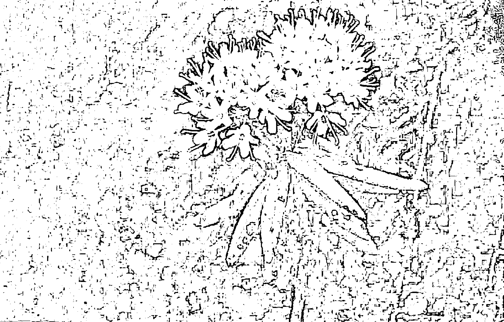

| 药学属性 | 适用症候 |
| :--- | :--- |
| 1. 帮肝脏排毒，促进肝脏细胞再生，驱寄生虫，降血糖 | 各种肝毒反应，肝功能不良，病毒性肝炎后遗症，肠炎，胀气，糖尿病 |
| 2. 消炎，解除郁积壅塞现象，抗氧化，抗肿瘤 | 毒血性与细菌性肾炎，肾结石，感染性前列腺炎，前列腺阻塞充血，淋巴管炎，感染性与毒血性淋巴结炎，大肠癌，肺癌，口腔癌 |
| 3. 抗菌，净化空气 | 感冒，气喘，过敏 |
| 4. 镇静，抗痉挛 | 失眠，神经质，太阳神经丛痉挛，甲状腺功能失调 |

单萜烯 37.2% : 桧烯 8.3% β-松油萜 3.8% 对伞花烃 1.7% 柠檬烯 11.8% 藏茴香酮 0.7%
芳香醛: 小茴香醛 0.4%

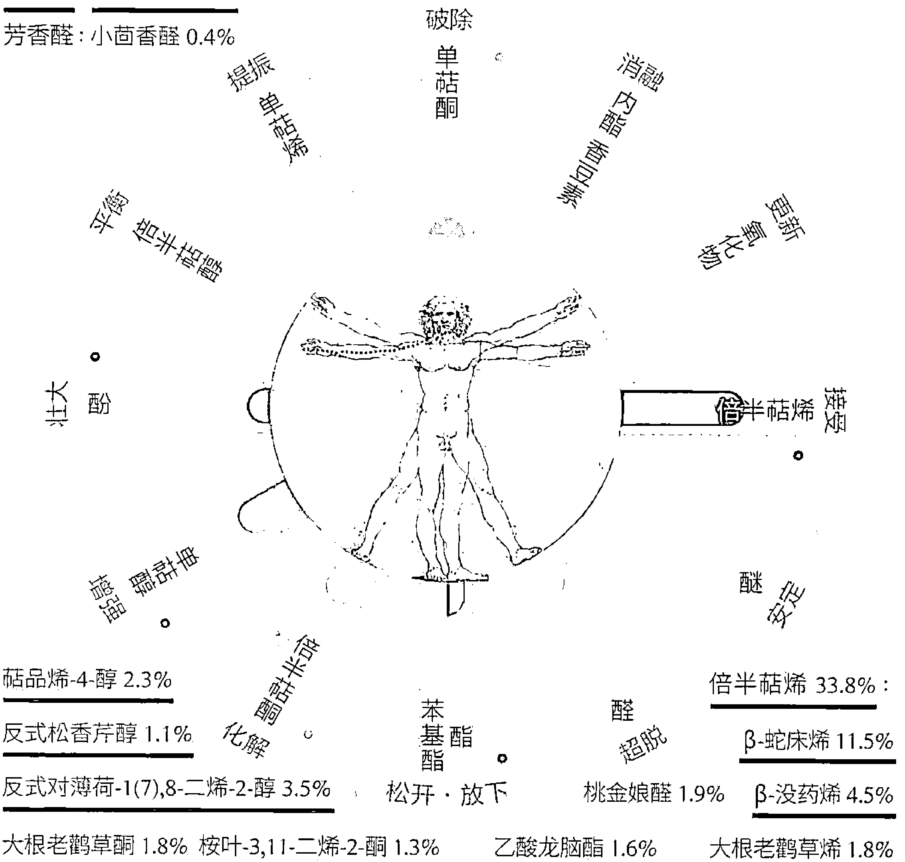

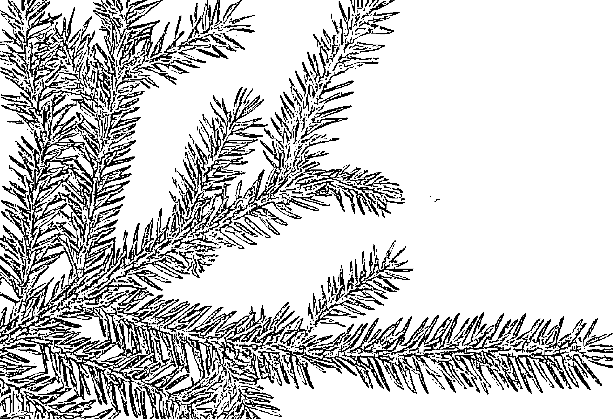

# 黑云杉
Black Spruce

原生于美国落基山，生长缓慢，浅根小树，易受风害。喜爱湿地，能忍受贫瘠的土壤，树龄年轻的针叶有较高的含油量。

### 药学属性

1. 补身，补神经，重新赋予太阳神经丛能量，抗痉挛
2. 抗感染，抗真菌，抗寄生虫，抗空气中的病菌
3. 消炎，提高胰岛素敏感性，抗氧化
4. 类激素，激励胸腺，似可的松（脑下垂体-肾上腺，脑下垂体-卵巢）

### 适用症候

- 太阳神经丛痉挛，虚弱无力，筋疲力竭
- 支气管炎，肺结核，念珠菌，兰式鞭毛虫与钩虫引起的肠炎
- 粉刺与干性湿疹，前列腺炎，风湿肌痛，糖尿病
- 甲状腺功能亢进

| 项目 | 内容 |
| :--- | :--- |
| 学名 | *Picea mariana* |
| 其他名称 | 沼泽云杉 / Swamp Spruce |
| 香气印象 | 西雅图酋长的宣言 |
| 植物科属 | 松科云杉属 |
| 主要产地 | 加拿大、美国东部 |
| 萃取部位 | 针叶（蒸馏） |

心轮部位：肾经、本我轮

核心成分
萃油率 1.4%，34 个可辨识化合物（占 92.7%）

- α-松油萜 16.62%
- 樟烯 22.03%
- β-月桂烯 2.89%
- 樟脑 1.41%
- 稠环芳香烃：萘 3.65%


- 龙脑 7.79%
- 乙酸龙脑酯 21.64%~36.8%
- 大根老鹳草烯 1.13%
- 杜松烯 2.43%
- 紫穗槐烯 2.09%

心灵效益 | 提升柔软度，放弃逞强，虚怀若谷地接纳自己的不足

### 注意事项

1. 气味和作用相近的品种包括蓝云杉 (*Picea pungens*，含乙酸龙脑酯 29.4%)，红云杉 (*Picea rubens*，含乙酸龙脑酯 5.68%)，白云杉 (*Picea glauca*，含乙酸龙脑酯 12%~31%)。白云杉可同时对抗高糖毒性与缺糖损伤。

# 挪威云杉
Norway Spruce

原生于北欧与东欧，生长迅速而长寿，植株高大，可防土壤侵蚀。在针叶树中较为耐湿耐热，精油的品质受土壤与空气影响很大。

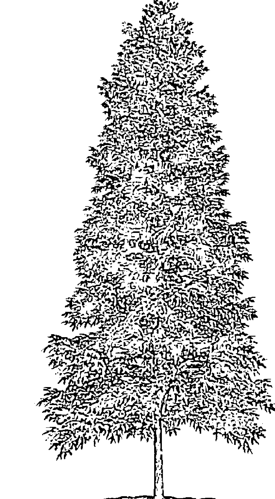

| 项目 | 内容 |
|---|---|
| 学 名 | Picea abies / Picea excelsa |
| 其他名称 | 依克萨尔莎云杉 / Excelsa Spruce |
| 香气印象 | 圣诞老公公 |
| 植物科属 | 松科云杉属 |
| 主要产地 | 意大利 |
| 萃取部位 | 针叶（蒸馏） |
| 适用部位 | 三焦经、心轮 |
| 核心成分 | 萃油率 1.01%，544 个可辨识化合物（占 96.3%~98.42%） |
| 心灵效益 | 提升慈善心，不再受困于一己之利害得失 |

### 药学属性

1. 抗菌，抗卡他，扩张肺泡
2. 缓解淋巴和静脉循环淤塞
3. 愈合伤口，溃疡
4. 调节女性生理功能

### 适用症候

1. 多痰，呼吸困难，儿童的呼吸道疾病
2. 淋巴滞留，肾结石，膀胱结石
3. 对阳光过敏的皮肤，发汗少而易瘙痒的皮肤，长期卧床者的皮肤问题
4. 更年期综合症

| 类别 | 成分及含量 |
|---|---|
| 倍半萜醇 7种 19.57%: | 依兰油醇 6.42%<br>杜松醇 11.19%<br>橙花叔醇 0.48% |
| 单萜烯 16种 49.66%: | α-松油萜 10%<br>β-月桂烯 10%<br>樟烯 14.07%<br>柠檬烯 7.32% |
| 倍半萜烯 14种 12.02%: | δ-杜松烯 6.06%<br>α-依兰烯 1.14% |
| 其他成分: | 龙脑 0.43%<br>双醇：泪杉醇 3.4%<br>乙酸龙脑酯 12.05% |

### 注意事项

1. 有非常多的异名，超过 150 种。是云杉中栽种率最高的品种，也是欧洲极重要的经济树种。
2. 挪威云杉的树皮萃取物已被证实能抑制脂肪酶，可用于减轻体重，还有抗肿瘤的作用。

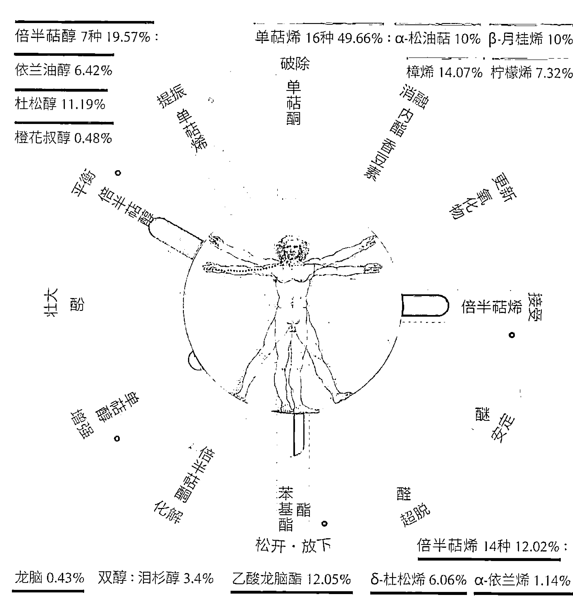

# 科西嘉黑松
Laricio Pine

分布在海拔 500~1500 米之间的山区，笔直挺拔（40 米以上）。偏爱排水良好的砂质酸性土壤，但林下也常见蕨类生长。

- 学名：Pinus nigra subsp. laricio
- 其他名称：科西嘉岛松 / Corsican Pine
- 香气印象：吹着口哨、踮脚走路的小男孩
- 植物科属：松科松属
- 主要产地：科西嘉岛、西西里岛、意大利本土
- 萃取部位：针叶（蒸馏）

适用经络：肾经、基底轮
核心成分：萃油率 0.2%~0.3%，354 个可辨识化合物

心灵效益：提升精神的敏锐度，活泼昂扬地探索世界

### 注意事项

1. 虽然气味轻快柔和，其实是很强劲的神经补品，有些专家认为青春期前的儿童没有使用它的必要。若要给 4 岁以上的孩子尝试针叶树的精油，冷杉是更合适的选择。
2. 欧洲黑松共有两大亚种，亚种底下又各有三四个变种。科西嘉黑松就属于其中的一个变种。

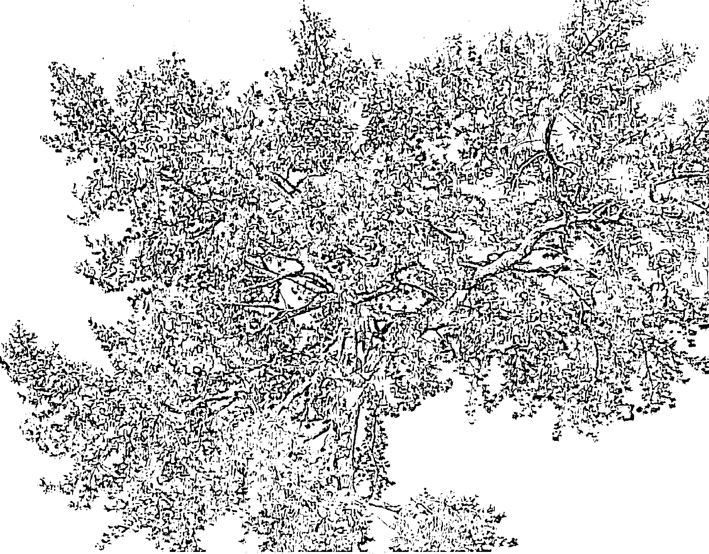

### 药学属性

### 适用症候

1. 抗菌
2. 激励，滋养
3. 纾解呼吸道、淋巴、前列腺的充血症状
4. 补充肾水

- 鼻窦炎，卡他性支气管炎
- 大病初愈的保养
- 前列腺充血，前列腺炎，风湿病
- 精神萎靡，不喝咖啡无法清醒的早晨

```
单萜烯 50% : α-松油萜
β-水茴香萜 β-松油萜

倍半萜烯 15% : β-丁香油烃
大根老鹳草烯 δ-杜松烯

双萜醇 0.5%

酯 15种 : 乙酸沉香酯 15%

甲基醚香荆芥酚 2%

[图示中心为人体维特鲁威人形，周围放射状标注各种成分及其功效：
提振 单萜烯
平衡 倍半萜烯
破除 单萜酮
消融 内酯 酚同香料
净化 醇
氧化 更新
安抚 醚
超脱 醛
松开·放下 苯基酯
酚
倍半萜酮 化解
倍半萜烯
苯酯]
```## 海松
Sea Pine

地中海西部的品种，生长范围包括半干燥与海洋潮湿气候，是土耳其松的近亲。木质坚硬而生长快速，喜爱酸性土壤，容易侵夺矮灌木药草的生存空间。

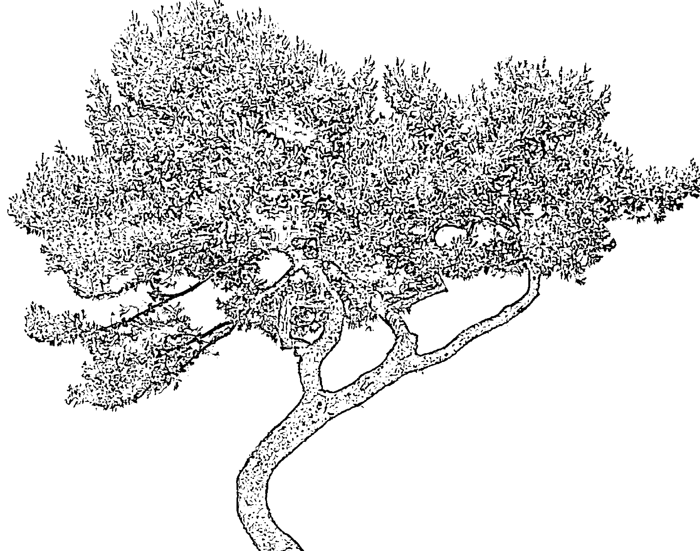

- 学名 | *Pinus pinaster*
- 其他名称 | 滨海松 / Maritime Pine
- 香气印象 | 鲁宾逊漂流记
- 植物科属 | 松科松属
- 主要产地 | 葡萄牙
- 萃取部位 | 针叶 (蒸馏)

- 适用部位 | 三焦经、基底轮
- 核心成分
  萃油率 0.82%，19 个可辨识化合物 (占 94.34%)

- 心灵效益 | 提升开创性，放弃偏安格局，探索新天地

| 药学属性 | 适用症候 |
| :--- | :--- |
| 1. 杀菌 | 鼻窦炎，支气管炎 |
| 2. 促进循环，使皮肤发红 | 局部皮肤消毒，身体阴湿部位的瘙痒，小伤口 |
| 3. 利尿 | 久处空调房内引起的循环代谢低下，风湿 |
| 4. 驱虫 | 户外活动防虫 |

- 注意事项
1. 北非产的海松精油以倍半萜烯为主 (β-丁香油烃 30.9%，β-蛇床烯 13.45%)。
2. 海松树皮的精油成分以倍半萜烯与倍半萜醇为主，主治慢性支气管炎、慢性膀胱炎、风湿。海松树脂的精油成分含 90% 松油萜，主治呼吸道黏膜感染、晕眩无力，搭配特殊扩香仪可强化细胞带氧性。
3. 树皮萃取物被申请专利，名为碧萝芷 Pycnogenol®，可抗氧化与抗老化。不过许多松科树皮都有类似功能，而 2012 年中立的考科蓝实证医学资料库则认定碧萝芷对许多慢性病的疗效还不够充分。

单萜烯 78.79%：α-松油萜 40.5% β-松油萜 25.42% 对伞花烃 4.02%

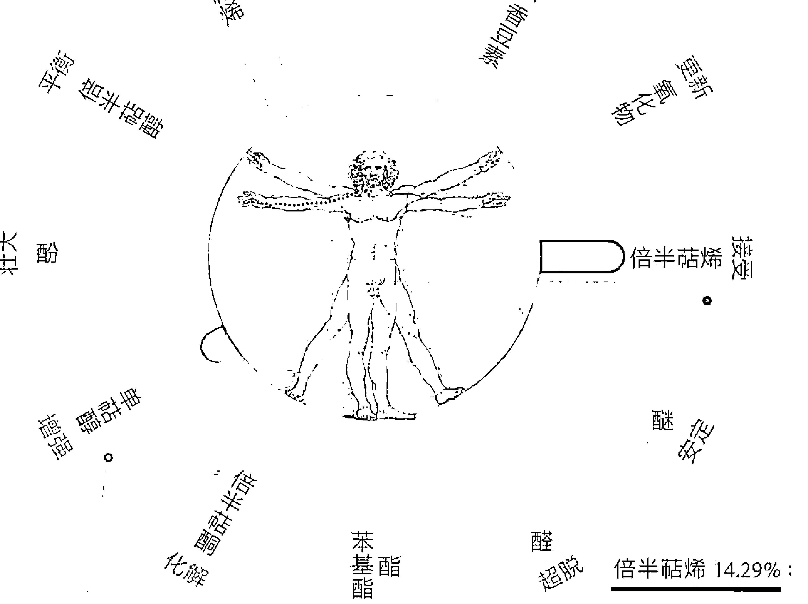

松油萜-4-醇 0.21% α-萜品醇 1.05%  大根老鹳草烯 3.21% δ-杜松烯 1.09%  倍半萜烯 14.29%：β-丁香油烃 6.3%

## 欧洲赤松
Scots Pine

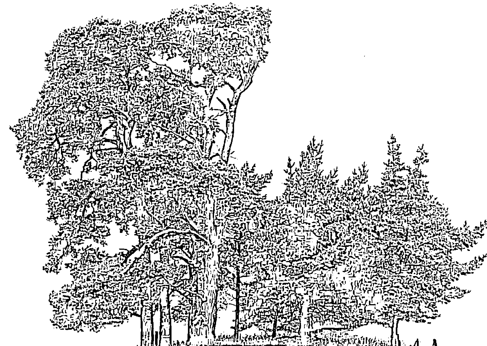

分布范围广阔。在北部的生长高度为海平面至海拔1000米，在南方则成高山植物。是北欧唯一的原生松树，习惯贫瘠的沙石之地，树龄平均为150~300岁。

### 药学属性
1. 类激素，激励性功能，解除淋巴阻塞与子宫卵巢充血的症状
2. 激励性的补身，补神经，提升血压，抗糖尿病
3. 抗感染，抗霉菌，抗菌
4. 消炎(启动肾上腺)，似可的松

### 适用症候
1. 睾丸功能减退，子宫充血淤塞
2. 虚弱无力，多发性硬化症，糖尿病
3. 严重感染(辅药)，支气管炎，鼻窦炎，气喘
4. 任何发炎与过敏过程，关节炎，多重风湿性关节炎

| 属性 | 值 |
|------|-----|
| 学名 | Pinus sylvestris |
| 其他名称 | 挪威松 / Norway Pine |
| 香气印象 | 进击的鼓手 |
| 植物科属 | 松科松属 |
| 主要产地 | 法国、保加利亚 |
| 萃取部位 | 针叶(蒸馏) |
| 适用部位 | 肾经、基底轮 |
| 核心成分 | 萃油率 0.27%，40 个可辨识化合物(占 89.56%) |
| 心灵效益 | 提升自主意识，抵挡父权的威逼 |

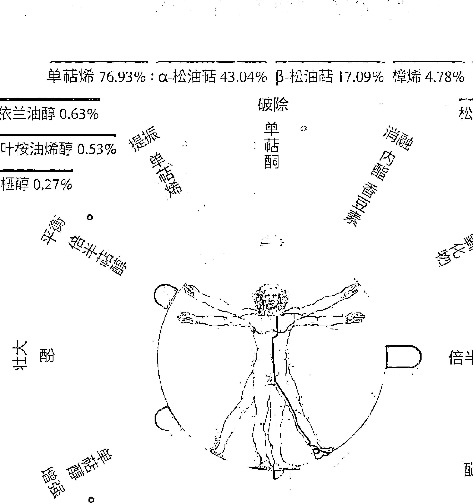

单萜烯 76.93%：α-松油萜 43.04% β-松油萜 17.09% 樟烯 4.78% 香榧醇 4.22%

- τ-依兰油醇 0.63%
- 匙叶桉油烯醇 0.53%
- 香榧醇 0.27%
- 破除单萜酮
- 消融内酯
- 松香芹酮 0.37%
- 水 酚
- 倍半萜烯
- 醚 安定
- 醛 超脱
- 苯基酯 松开·放下
- 倍半萜烯 4.13%：β-丁香油烃 2.28% 大根老鹳草烯 1.34% δ-杜松烯 1.32%
- 反式松香芹醇 1.01%
- 乙酸龙脑酯 0.11%
- 桃金娘醛 0.49%

### 注意事项
1. 欧洲赤松同时含有左旋与右旋α-松油萜，因此抗菌力高于其他松树。欧洲松树多半以左旋α-松油萜为主，北美的松树则较多右旋α-松油萜，右旋α-松油萜的抗菌抗霉菌力较强，不过左旋α-松油萜则能抗传染性支气管炎病毒。

## 黑胡椒
Black Pepper

原产于南印度的木本藤蔓植物，通过不同的加工方法，可得到黑白绿红四种胡椒。习惯热带雨林，要求高温、湿润、少风、土壤肥沃和排水良好的环境。

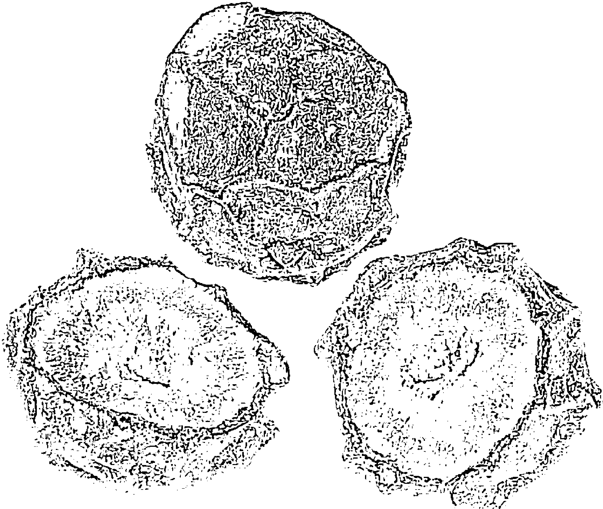

| 标签 | 内容 |
| :--- | :--- |
| 学名 | *Piper nigrum* |
| 其他名称 | 黑川 / Common Pepper |
| 香气印象 | 葡萄牙船长用望远镜寻找马拉巴海岸 |
| 植物科属 | 胡椒科胡椒属 |
| 主要产地 | 马达加斯加、斯里兰卡、印度 |
| 萃取部位 | 果实 (蒸馏) |
| 适用部位 | 肾经、性轮 |
| 核心成分 | 萃油率 1.24%，45 个可辨识的化合物 (占 98.4%) |
| 心灵效益 | 提升想象力，走入前所未见的世界 |

- **药学属性**
1. 抗黏膜发炎，祛痰，使黏液流动
2. 退热，镇痛，止牙痛，降血压
3. 消炎，激励消化腺，抑制 II 型糖尿病酵素，抗氧化，抗肿瘤
4. 强化性功能

- **适用症候**
- 喉炎，慢性支气管炎，感冒
- 发热，风湿性疾病，风湿痛，牙痛，高血压
- 咽峡炎，消化功能与肝胰功能不良，糖尿病，口腔癌，白血病
- 性功能减退

**单萜烯 34.94%~60.79% :** 柠檬烯 15.13% α-松油萜 3.88% β-松油萜 13.26% 隐酮 0.07%

**α-杜松醇 4.89%**
**匙叶桉油烯醇 2.31%**
**橙花叔醇 0.16%**
**沉香醇 0.39%**

**破除 单萜酮**
**提振 单萜烯**
**消融 内酯与酮类**
**平衡 醛类**
**增强 酯类**
**化解 倍半萜酮**
**松开 · 放下**
**苯基酯**

**消融 内酯与酮类**
**转化 更新 氧化物**
**醚 释放**
**超脱 醛**

**丁香油烃氧化物 4.91%**

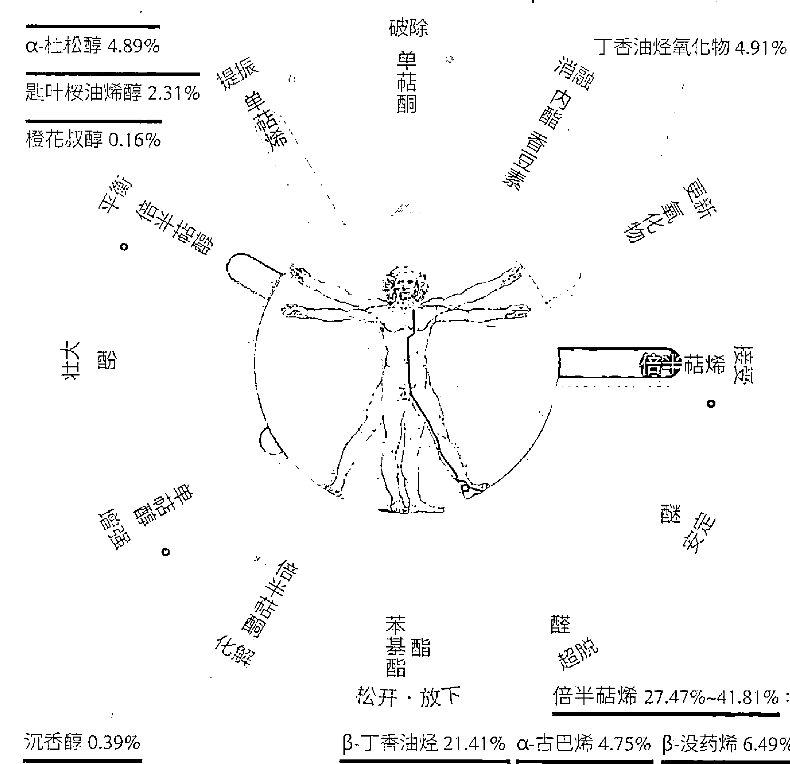

**倍半萜烯 27.47%~41.81% :**

**β-丁香油烃 21.41% α-古巴烯 4.75% β-没药烯 6.49%**

- **注意事项**
1. 绿胡椒 (Green Pepper) 由未成熟的浆果制成，冻干果实比风干果实含更多单萜烯 (84.2%)。因为倍半萜烯与含氧化物的比例高于黑胡椒，所以消炎和退热的作用更优。黑胡椒的精油含量会因储存时间拉长而降低，但绿胡椒储存一年后，含油量却翻倍增长。

## 熏陆香
Mastic

强韧的先驱植物，遍布地中海周边，习惯多石的干燥地带。是芳香灌木丛 (maquis) 的代表，不挑土壤，甚至能适应盐土，海边也很常见。

- 1. 抗氧化，降血压
2. 缓解静脉与淋巴管的阻塞症状，缓解前列腺的充血症状，利尿
3. 激励消化功能
4. 抗菌，抗霉菌

- 心血管疾病 (如高血压)，风湿性心内膜炎 (辅药)
- 静脉曲张，内痔外痔，血栓性静脉炎，前列腺炎
- 吞气症，结肠积气，胃溃疡，结肠痉挛，糖尿病 (辅药)
- 鼻窦炎 (消除阻塞感)

- 学名 | *Pistacia lentiscus*
- 其他名称 | 乳香黄连木 / Pistache
- 香气印象 | 十八铜人行气散
- 植物科属 | 漆树科黄连木属
- 主要产地 | 摩洛哥、克罗地亚
- 萃取部位 | 枝叶 (蒸馏)

- 适用部位 | 胃经、本我轮
- 核心成分
  萃油率 0.14%，40 个可辨识化合物 (占 88.6%)

- 心灵效益 | 提升思想的流动程度，不在原地打转

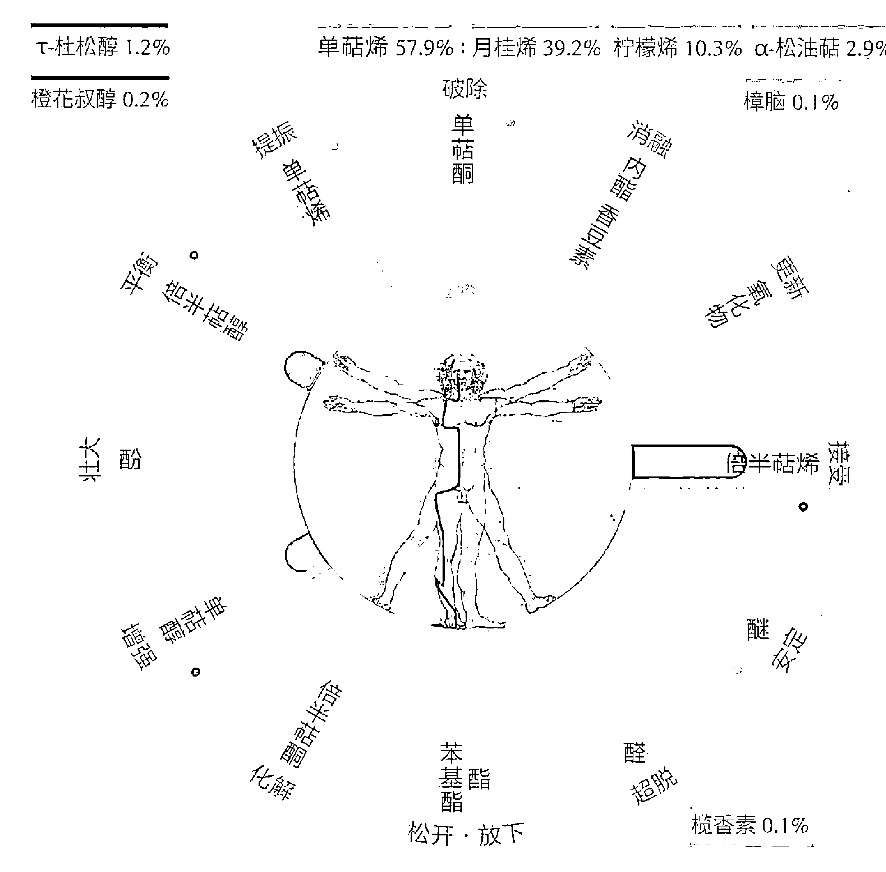

单萜烯 57.9%：月桂烯 39.2% 柠檬烯 10.3% α-松油萜 2.9%
τ-杜松醇 1.2%
橙花叔醇 0.2%
樟脑 0.1%
倍半萜烯 26%：大根老鹳草烯 4.3% α-葎草烯 2.6% α-古芸烯 7.8%
萜品烯-4-醇 1.6%
榄香素 0.1%

- 注意事项
1. 由于分布区域广阔，熏陆香枝叶精油也有其他化学品系，如单萜醇型 (萜品烯-4-醇为主) 和倍半萜烯型 (长叶烯为主)。

## 奇欧岛熏陆香
Mastic Gum

生在冬季不低于11℃的温暖石灰岩环境，成长缓慢，40~50岁才达熟龄。年产150~180克的树脂，产期从15~70岁。雄株的树脂产量较大。

- 学名 | *Pistacia lentiscus* var. *chia*
- 其他名称 | 黏胶乳香 / Mastiha
- 香气印象 | 童年记忆中最欢乐的画面
- 植物科属 | 漆树科黄连木属
- 主要产地 | 奇欧岛
- 萃取部位 | 树脂（蒸馏）
- 适用部位 | 胃经、本我轮

### 核心成分
- 萃油率2%，69个可辨识化合物（占90.16%~99.13%）

- 心灵效益 | 提升谅解的跨度，接受这个世界和自己的不圆满

### 注意事项
1. 生在奇欧岛南方的熏陆香是全世界唯一能流出树脂的熏陆香品种，树脂本身的倍半萜烯含量高于精油。
2. 熏陆香树脂油比熏陆香枝叶油的气味甜度要高出许多。
3. 刚流出的液态树脂含13.5%的精油，干燥成块的树脂则只剩2.8%。液态树脂里的月桂烯达75%、松油萜达16.8%，块状树脂中则分别含30.9%和51%。储存时间愈长，这种变化愈明显。

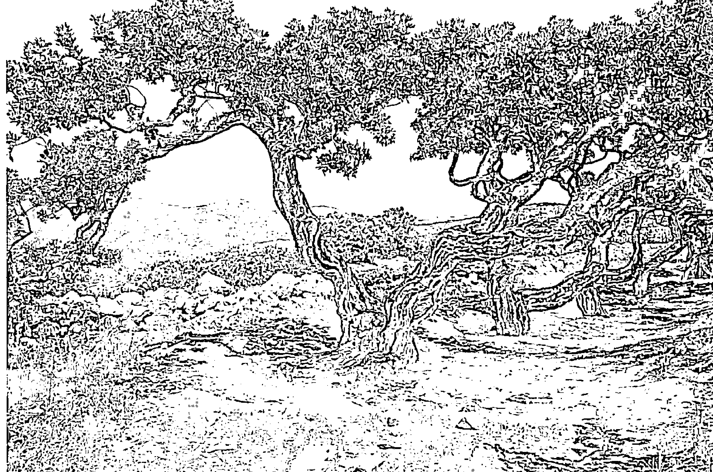

| 药学属性 | 适用症候 |
| :--- | :--- |
| 1. 杀幽门螺杆菌（剂量0.06 mg/ml），消炎 | 胃溃疡与十二指肠溃疡（两周疗程），胃痛，克罗恩病 |
| 2. 抗菌，抗霉菌，减少41.5%牙菌斑，强化牙龈，抑制牙龈卟啉单胞菌 | 口臭，蛀牙，牙周病，齿列矫正（辅助） |
| 3. 抗氧化，降三酸甘油脂与低密度胆固醇，排肝毒，强化免疫，抗肿瘤 | 动脉硬化，糖尿病，白血病 |
| 4. 疗伤，促进皮肤新生 | 术后伤口愈合，老化皮肤，烫伤，冻疮 |

- 金合欢醇 0.1%
- α-松油萜 63.3%
- 月桂烯 25%
- 柠檬烯 1.5%
- 马鞭草酮 0.1%
- 呋喃：紫苏烯 0.5%

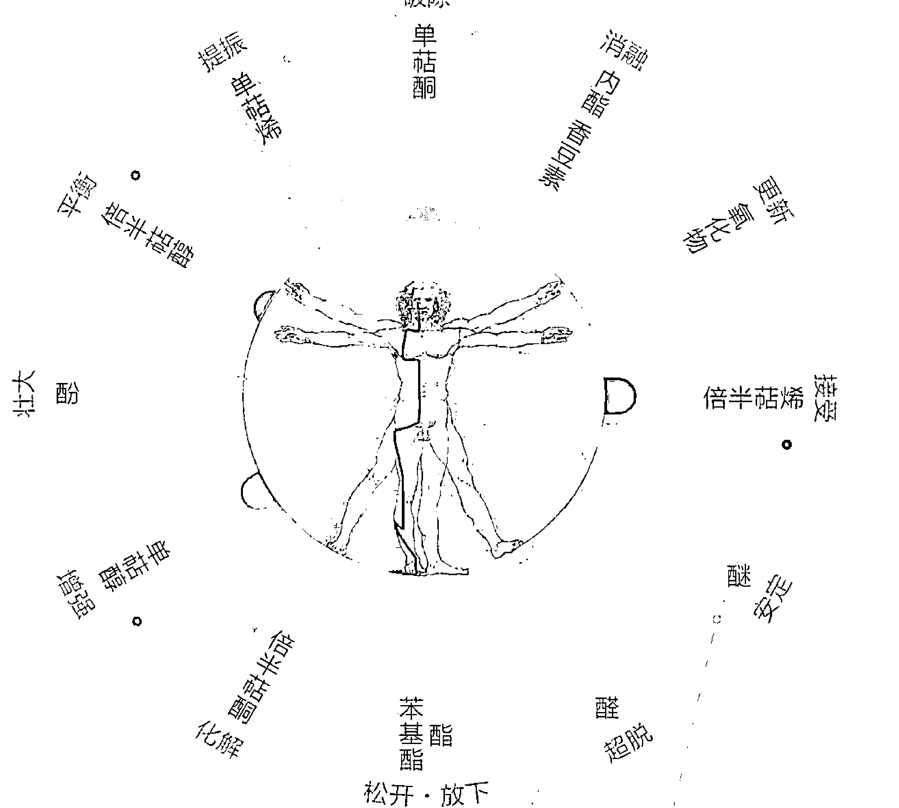

- 沉香醇 0.5%
- 反式马鞭草烯醇 0.3%
- 橙花醛 0.1%
- 洋茴香脑 0.1%
- β-丁香油烃 0.9%

## 巴西乳香
Brazilian Frankincense

高 10~20 米，树冠浓密，见于阔叶林和热带草原，湿土与沙地均能生长。最喜欢向阳的高地河岸，树脂割取后须置放 4~5 个月再使用。

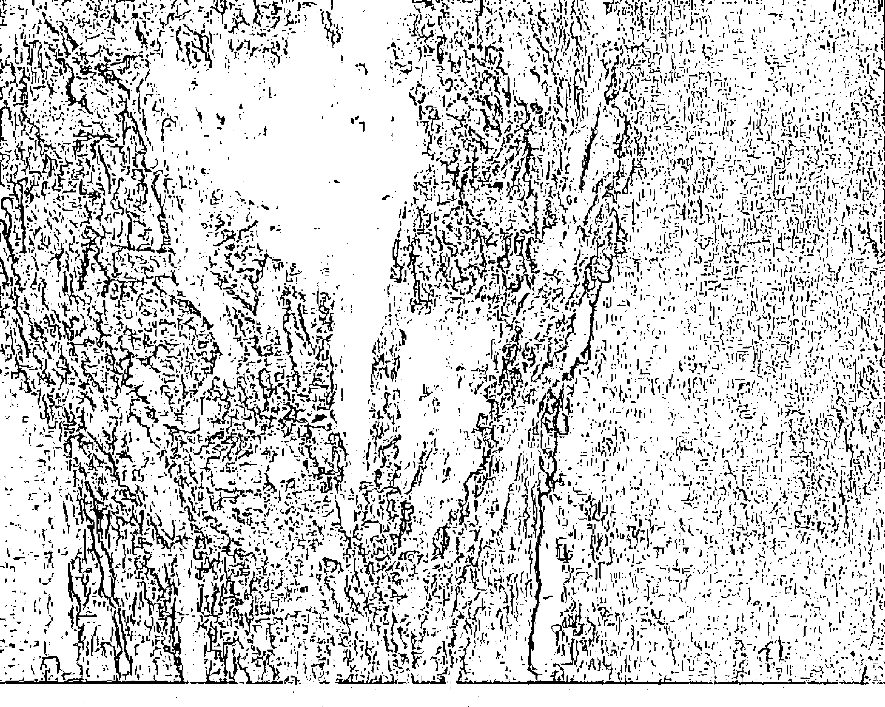

- 1. 抗菌，抗霉菌，止咳化痰，净化鼻腔
2. 消炎，促进伤口愈合，抗氧化
3. 促进脑部血液循环，强化学习力
4. 抗肿瘤，抗痉挛，抗痛觉过敏，扩张血管，减缓心跳

- 鼻窦炎，支气管炎，胸膜炎，肺结核，雾霾期的呼吸不畅
- 风湿，各式皮肤病
- 健忘，学习迟缓
- 乳腺癌，安宁疗护，高血压，心动过速

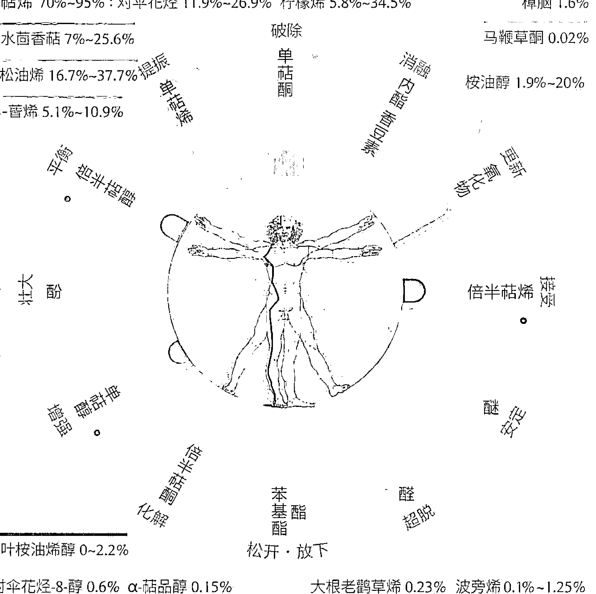

- 学名 | Protium heptaphyllum
- 其他名称 | 七叶白蹄果 / Breu Branco
- 香气印象 | 穿过虫洞到达另一个银河
- 植物科属 | 橄榄科马蹄果属
- 主要产地 | 南美洲（巴西、玻利维亚、圭亚那）
- 萃取部位 | 树脂（蒸馏）
- 适用部位 | 胆经、顶轮
- 核心成分 | 萃油率 0.9%~1.38%，40 个可辨识化合物（占 98.59%）
- 心灵效益 | 提升意识的维度，超越眼前的生存限制

- 1. 市售的巴西乳香有黑树脂与白树脂之分，白树脂的精油品质较优。
2. 此树分布巴西全境，但各地成分差异颇大。北部一般含压倒性的单萜烯，南部的则会有稍多的倍半萜烯与酯类。另外新树脂萃得的精油单萜烯多，老树脂油则多苯基化合物。

- 匙叶桉油烯醇 0~2.2%
- 对伞花烃-8-醇 0.6%
- α-萜品醇 0.15%
- 大根老鹳草烯 0.23%
- 波旁烯 0.1%~1.25%

## 道格拉斯杉
Douglas-Fir

原产于美国西北部，因为生长快且材积大，是引进欧洲比例最高的树种。偏爱湿润的酸性土壤，不耐阴，耐强风，但不耐海风。高可达 100 米。

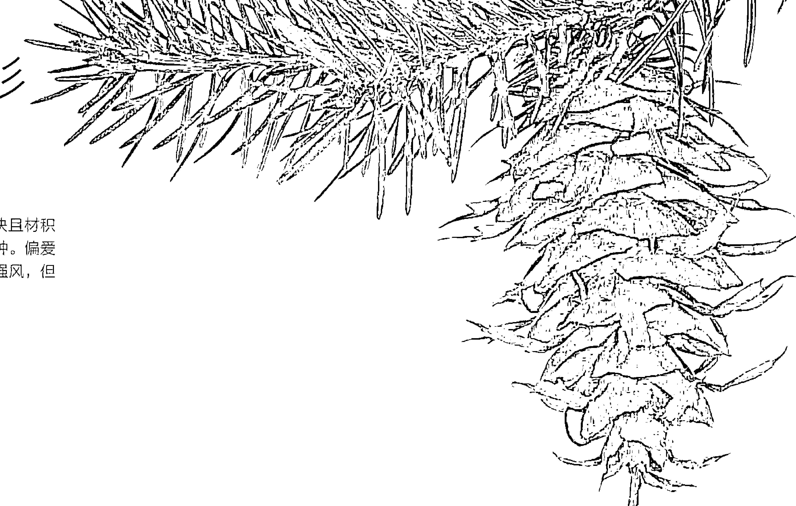

| 学名 | Pseudotsuga menziesii |
| :--- | :--- |
| 其他名称 | 花旗松 / Oregon Pine |
| 香气印象 | 在雷雨天气中放风筝 |
| 植物科属 | 松科黄杉属 |
| 主要产地 | 法国、美国 |
| 萃取部位 | 针叶 (蒸馏) |

### 药学属性
1. 抗霉菌，抗菌，驱虫
2. 抗卡他，祛痰
3. 促进发汗和血液循环

### 适用症候
1. 皮肤割伤，烫伤，性病，口腔卫生，食物感染引起的肠胃不适
2. 咳嗽，喉咙痛，呼吸道感染
3. 风湿，关节痛，瘫痪

- 适用部位 | 三焦经、喉轮
- 核心成分
  萃油率 0.67%，28个可辨识化合物（占91.08%）

- 心灵效益 | 提升对公众事务的关注，挣脱小情小爱的束缚

### 化学成分与功效关联图
**主要化学族群及其功效**
- **单萜烯 57.1%**：提振、平衡、破除
  - α-松油萜 11.65%，檀烯 5.45%，樟烯 29.82%
  - 柠檬烯 4.51%，桉油醇 0.18%
- **单萜酮**：消融内脏黏液与脂肪
- **酚**：暖身
- **倍半萜烯**：安抚、镇定
- **醚**：传导
- **醛**：超脱
- **苯基酯**：松开·放下
- **酯 34.65%**（以乙酸龙脑酯为主）：化解情绪黏稠与滞碍

**图示核心化合物**：
- 蛇床烯酮 0.24%
- 萜品烯-4-醇 14.82%
- 茴香醇 0.41%
- 乙酸龙脑酯 34.65%
- 香茅醛 0.24%

### 注意事项
1. 另有不含酯类的化学品系（以α-萜品烯 32.87% / 异松油烯 15.4% 为主）。

## 雅丽菊
Iary

高可达5米的灌木，喜欢热带湿热的雨季，在农民砍烧过的休耕地是优势物种，也常见于山坡地。

| 药学属性 | 适用症候 |
| :--- | :--- |
| 1. 消毒杀菌，杀虫，镇定 | 创伤后压力综合征，全身莫名的疼痛 |
| 2. 止血，止泻，消胀气 | 消化系统的过敏反应，肠道溃疡出血 |
| 3. 激励呼吸系统 | 呼吸系统的过敏反应，感冒 |
| 4. 消炎，消水肿 | 皮肤过敏反应，牛皮癣，双腿沉重 |

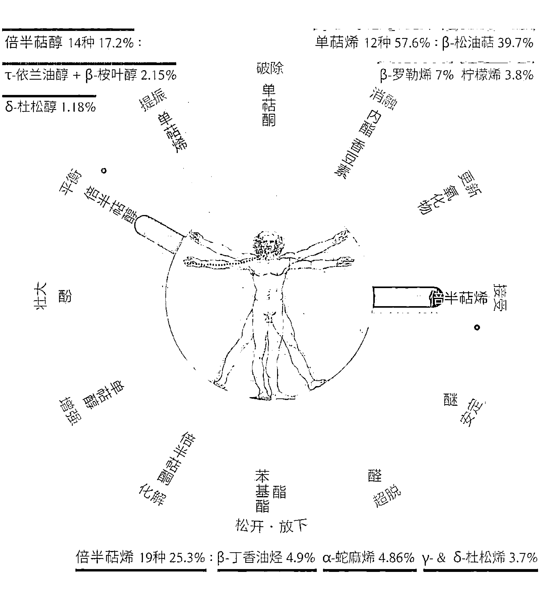

- **学名**：Psiadia altissima
- **其他名称**：丁加丁加（意指一步一步迈出）/ Arina
- **香气印象**：童年的泰山拨开树上垂下的爬藤，跨过地上的倒木
- **植物科属**：菊科滴叶属
- **主要产地**：马达加斯加
- **萃取部位**：整株药草（蒸馏）
- **适用部位**：三焦经、基底轮
- **核心成分**：萃油率 0.5%，52 个可辨识化合物（占97.2%）
- **心灵效益**：提升独立精神，走出昨日的记忆，建立全新的生活

- **注意事项**
1. 4~6 年的休耕地上长出的雅丽菊精油含量最高。许多休耕地上只长雅丽菊。

## 髯花杜鹃
Rhododendron

来自海拔 3000~4500 米的喜马拉雅山麓的潮湿开阔坡地，高约 60 厘米。喜欢酸性高、排水好的轻质土壤，可接受半遮荫，与铺地长的植物不相容。

- 学名 | Rhododendron anthopogon
- 其他名称 | 圣帕地 / Sunpati
- 香气印象 | 女娲补天
- 植物科属 | 杜鹃花科杜鹃花属
- 主要产地 | 尼泊尔、中国、印度北部
- 萃取部位 | 茎叶（蒸馏）
- 适用部位 | 三焦经、心轮
- 核心成分
  萃油率 0.3%，17 个可辨识化合物（占 97.8%）
- 心灵效益 | 提升轻盈感，使人不再卷进情绪漩涡

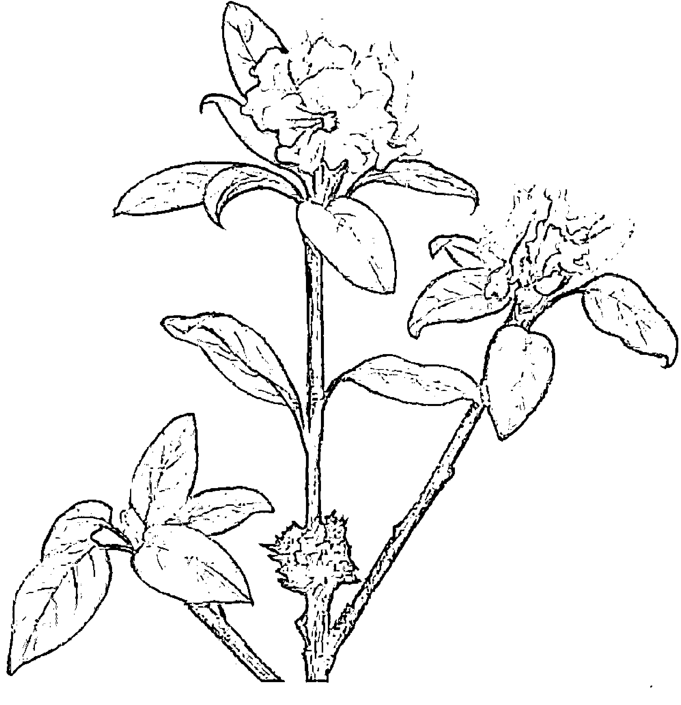

| 药学属性 | 适用 |
| :--- | :--- |
| 1. 消炎，似可的松，止痛 | 肌肉酸疼，风湿，痛风，喉咙痛 |
| 2. 激励去甲肾上腺素与多巴胺的合成，调节前列腺素的合成，补强神经 | 虚弱无力，思虑无序，自怜，厌世，水土不服 |
| 3. 强力抗菌，抗白色念珠菌，抗病毒，强化免疫系统 | 感染性疾病（着凉、支气管炎、流行性感冒、肺结核） |
| 4. 净化，抗肿瘤 | 肝脏疾病，卵巢癌，子宫颈癌，直肠癌 |

单萜烯 76.1% : α-松油萜 37.4%  β-松油萜 16.1%  柠檬烯 13.3%

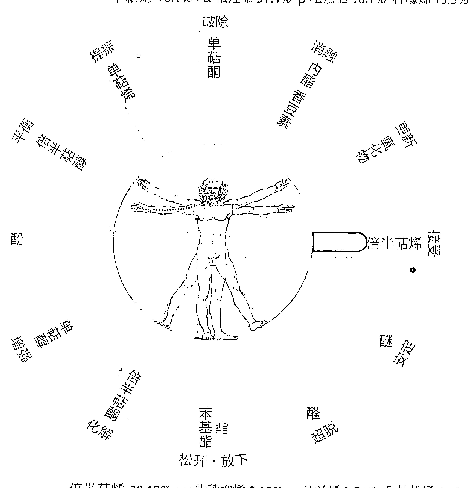

- 注意事项
1. 鬣花杜鹃与同属其他植物的成分有明显差异，杜鹃花属的叶片精油多半以倍半萜烯为主。
2. 枝叶和花都是藏药塔勒嘎保的原植物之一，有止吐、发汗、开胃的作用，常用于治疗咳嗽与皮肤病。西藏南部所产的花精油成分达 47 种（97.44%），主要成分为含氮化合物 N-乙酰-1,2,3,4-四氢异喹啉 (29.23%，强力抗真菌)、2-乙氧丙烷 (12.47%)、3-甲基-6-叔丁基苯酚 (10.83%，强力抗氧化)、δ-橙花叔醇 (1.92%)。

倍半萜烯 20.19% : α-紫穗槐烯 3.15%  α-依兰烯 2.74%  δ-杜松烯 9.1%

## 马达加斯加盐肤木

分布在马达加斯加沿海的潮湿常绿林内，树高9米。叶片有羽状脉，叶缘状如波浪，树干会流出清澈乳胶，结不开裂果。

| 药学属性 | 适用症候 |
| :--- | :--- |
| 1. 促进静脉与淋巴的循环 | 静脉曲张，长时间伏案，经济舱综合征，四肢沉重，水肿 |
| 2. 助消化 | 肠胃不适，吞气症 |
| 3. 安抚过度运作的肾上腺 | 男性性功能障碍，前列腺肥大 |
| 4. 安抚中枢神经系统 | 慢性疲劳综合征，长期压力过大 |

| 属性 | 内容 |
| :--- | :--- |
| 学名 | Rhus taratana |
| 其他名称 | 以撒 / Issa |
| 香气印象 | 刚刚涂上护木漆的坚实栏栅 |
| 植物科属 | 漆树科盐肤木属 |
| 主要产地 | 马达加斯加 |
| 萃取部位 | 叶片 (蒸馏) |
| 适用部位 | 三焦经、本我轮 |
| 核心成分 | 13 个可辨识化合物 |
| 心灵效益 | 提升屏障力，挡下诸事不顺的魔咒 |

单萜烯 11种以上 >79% :
- 1,8-桉油醇+β-水茴香萜 16%~22%
- β-月桂烯+α-水茴香萜 12%~15%
- 右旋柠檬烯 25%~30%
- α-松油萜 16%~23%

提振
单萜烯

平衡
倍半萜酮

破除
单萜酮

消融
内酯
愈创木萘

更新
氧化物

壮大
酚

倍半萜烯
渐进

解离
酯类

醚
舒压

化解
倍半萜酮

苯基酯

醛
超脱

松开·放下

注意事项
1. 保存不当(氧化)可能刺激皮肤，口服可能引发呕吐。

## 秘鲁胡椒

原生于秘鲁安第斯山区，后被引种至地中海地区，当行道树和遮荫树。生长快速，树高15米，是肖乳香属中最高大与最长寿的树，强韧耐旱。

| 项目 | 内容 |
| :--- | :--- |
| 学名 | *Schinus molle* |
| 其他名称 | 加州胡椒 / Californian Pepper |
| 香气印象 | 坐齐柏林飞船鸟瞰大地 |
| 植物科属 | 漆树科肖乳香属 |
| 主要产地 | 秘鲁、哥斯达黎加 |
| 萃取部位 | 果实（蒸馏） |

药学属性
1. 抗菌，抗霉菌，驱虫（米象、猫蚤、骚扰锥椿）
2. 利尿，消胀气
3. 消炎，止痛
4. 抗氧化，抗肿瘤

适用症候
- 阴湿的储物环境，宠物身上的跳蚤，学童的校园感染
- 长时间憋尿后的排尿困难，过度摄取发酵类食物（如奶酪）引起的腹胀
- 热引起的皮肤起疹、头晕和懒洋洋，牙痛，风湿痛，痛经
- 乳腺癌

适用部位 三焦经、本我轮

核心成分
萃油率 2.11%，38 个可辨识化合物（占98.5%）

心灵效益 提升客观性，用清明的眼睛打量四周

注意事项
1. 叶片精油也可抗氧化与抗肿瘤（脑瘤，乳腺癌），含42个组分（97.2%），占比最高的是 α-与 β-松油萜。叶片萃取者也有抗抑郁的功能。
2. 精油成分会因土壤、收成月份与萃取方式而产生巨大差异。

## 巴西胡椒

原产于巴西东南海岸，高7-10米的浅根小树，长相多变以适应多种生态。从沙丘到沼泽都能繁衍，可能威胁引入国的原生植物。有红果与粉红果两个变种。

| 药学属性 | 适用症候 |
| :--- | :--- |
| 1. 抗超级细菌，退热 | 医院内的交叉感染，呼吸道感染，泌尿生殖道感染 |
| 2. 利尿，助消化 | 行动不便或长期卧病者的解尿困难与消化不良 |
| 3. 愈合伤口，净化，消炎，止痛 | 脚气，皮肤真菌病，皮肤溃疡，念珠菌感染 |
| 4. 抗氧化，抗肿瘤 | 乳腺癌 |

- 榄香醇 11.33%
- δ3-蒈烯 10.23%
- β-水茴香萜 7.07%
- α-水茴香萜 4.58%
- α-松油萜 3.12%
- α-杜松醇 9.38%
- 香荆芥酚 0.3%
- 萜品烯-4-醇 1.57%
- δ-杜松烯 6.92%
- 大根老鹳草烯 7.39%

| 属性 | 值 |
| :--- | :--- |
| 学名 | Schinus terebinthifolius |
| 其他名称 | 红胡椒 / Rose Pepper |
| 香气印象 | 黏热午后的一场雷雨 |
| 植物科属 | 漆树科肖乳香属 |
| 主要产地 | 马达加斯加、巴西 |
| 萃取部位 | 果实（蒸馏） |
| 适用部位 | 三焦经、基底轮 |
| 核心成分 | 萃油率 6.54%，62 个可辨识化合物 (占 91.15%) |
| 心灵效益 | 提升良知，以犀利不滥情的角度聚焦问题 |

### 注意事项
1. 抗氧化与抗肿瘤作用皆优于秘鲁胡椒精油。
2. 叶片精油也有抗肿瘤作用(脑瘤、白血病、子宫颈癌、乳腺癌)，含 49 个组分 (占 97.9%)，占比最高的都是倍半萜烯，如大根老鹳草烯 (23.7 %)、双环大根老鹳草烯 (15%)、长松烯 (8.1%)。α-与 β-松油萜虽占比略低，但也展现出显著的抗肿瘤表现。

## 香榧

中国特有的经济树种，仅产于北纬27°~32°亚热带海拔300~600米的丘陵，喜温暖湿润、朝夕多雾及土质肥沃深厚的酸性凝灰岩以及散射光。

| 属性 | 内容 |
| :--- | :--- |
| 学名 | Torreya grandis |
| 其他名称 | 细榧 / Chinese Nutmeg Yew |
| 香气印象 | 桂圆蛋糕配阿萨姆红茶 |
| 植物科属 | 红豆杉科榧属 |
| 主要产地 | 中国 (浙江会稽) |
| 萃取部位 | 假种皮 (蒸馏) |
| 适用部位 | 三焦经、顶轮 |
| 核心成分 | 萃油率 1%，36个可辨识化合物(占97.2%) |

| 药学属性 | 适用症候 |
| :--- | :--- |
| 1. 抑制植物病原真菌和酿酒酵母，抗皮肤癣菌 | 头癣，体癣，甲癣 |
| 2. 驱蚊，驱虫 | 湿热环境，宠物与家畜防血吸虫 |
| 3. 抗氧化 | 精神不济，皮肤老化，积食不消 |

心灵效益 提升愉悦的感受，让生活变成一杯精致的下午茶

1. 香榧寿命长、生长慢、结实期晚、盛果期长，故有“三十年开花，四十年结果，一人种榧，十代受益”之说。树龄可上千年。
2. 香榧种子为珍稀干果，种子外面有一层很厚的肉质化假种皮（一般误认为果壳），约占种子重量的50%~60%。
3. 超临界CO₂萃取的香榧油含40个组分，二萜类化合物占绝大多数，有抗癌潜力，占比最高的是香榧酯(14.90%)和7,15-海松二烯-3-酮(14.45%)，此二者都是二萜类。溶剂萃取的成分接近蒸馏，但各种官能基较全面。

## 加拿大铁杉

长在北美东部海拔 600~1800 米的冷凉山区，喜欢微酸的土壤，叶纤柔。常与霜雾为伴，比其他针叶树耐阴耐修剪，长寿。

| 属性 | 内容 |
| :--- | :--- |
| 学名 | Tsuga canadensis |
| 其他名称 | 东部铁杉 / Eastern Hemlock |
| 香气印象 | 年轻母亲含笑鼓励跌倒的学步小儿 |
| 植物科属 | 松科铁杉属 |
| 主要产地 | 加拿大、美国 |
| 萃取部位 | 针叶（蒸馏） |
| 适用部位 | 肾经、基底轮 |
| 核心成分 | 萃油率 0.249%，31 个可辨识化合物 |
| 心灵效益 | 提升上进心，戒断恶习和损友 |

α-松油萜 23.74% 樟烯 11.93% 柠檬烯 6.02% α- & β-水茴香萜 4.07% & 4.37%

| 药学属性 | 适用症候 |
| :--- | :--- |
| 1. 抗霉菌，抗菌（如火烧病病原菌） | 黑头与白头粉刺，除体臭 |
| 2. 抗 MRSA（仅次于第一等级的香茅醛和香荆芥酚类） | 住院感染超级细菌，老人与孩童进诊所必备，冷湿气候带来的不适 |
| 3. 驱家蝇 | 维持公共空间的卫生，净化气场 |
| 4. 抗肿瘤 | 膀胱癌，泌尿道上皮癌 |

乙酸龙脑酯 26.84% 乙酸异丙酯

δ-杜松烯 3.23%

1. 加州铁杉 (Tsuga heterophylla)，又名西部铁杉，比加拿大铁杉高大（平均高度 50 米），精油成分和加拿大铁杉接近，属于甜度高的针叶树（富于乙酸龙脑酯）。

## 贞节树

热带植物牡荆属中少数生于温带的品种，需要全日照与良好排水。常见于咸淡水相交地带，过于湿冷则不利生长，白花结的果比紫花抗菌力强。

1. 学名：Vitex agnus castus
2. 其他名称：穗花牡荆 / Chaste Berry
3. 香气印象：卧薪尝胆
4. 植物科属：马鞭草科牡荆属
5. 主要产地：土耳其、以色列、阿尔巴尼亚、摩洛哥
6. 萃取部位：果实 (蒸馏)
7. 适用部位：肾经、性轮
8. 核心成分：萃油率 0.72%，51个可辨识化合物 (占99.2%)
9. 心灵效益：提升自制力，避免一头热地付出或追求

药学属性
1. 黄体酮样作用，调节雌激素
2. 消炎，抗菌，杀螨剂，抗霉菌 (白色念珠菌)
3. 抗氧化，促进红细胞膜通透性，促进肝脏的脂肪代谢，抗肿瘤
4. 停用避孕药后促进正常排卵，激活海马回的雌激素受体，抑制骨质回收，降低促肾上腺皮质激素 (ACTH)

适用症候
- 痛经，经血过量，月经频繁，阴道出血，乳腺增生，乳房胀痛
- 子宫肌瘤，子宫炎，子宫内膜异位，多囊性卵巢综合征
- 经前综合征 (面疱、疱疹、水分滞留)，更年期综合征 (脸潮红、盗汗、心悸)，停经后的心血管疾病与肥胖，乳腺癌，肺腺癌
- 不孕，产后与停经后的记忆力减退，骨质疏松症，工作狂

注意事项
1. 孕期、哺乳期、前青春期儿童及接受黄体酮治疗者避免使用。
2. 果油气味比叶油浓重，两者的差异在于，果油含有较多的大分子化合物，特别是双萜类，所以对妇科的作用优于叶油。
3. 男性也可以安全使用贞节树精油，处理老化、骨质疏松、压力过大等问题。

## 泰国参姜

在岩岸、湿地、河滨、天然林和果园都能够生长。最喜欢的是部分遮荫的湿润沃土，比其他姜科植物更能适应温带气候。

### 药学属性
1.  消炎 (DMPTD 的作用)，退热
2.  放松子宫，扩张支气管
3.  消胀气，抗菌，抗霉菌，驱蚊
4.  抑制乙酰胆碱酯酶

### 适用症候
- 跌打损伤，成纤维样滑膜类风湿关节炎
- 痛经，气喘
- 消化不良，结肠发炎，皮肤霉菌病；户外活动防蚊虫
- 老年痴呆

| 属性 | 内容 |
| :--- | :--- |
| 学名 | *Zingiber cassumunar* |
| 其他名称 | 卡萨蒙纳姜 / Cassumunar Ginger |
| 香气印象 | 赤脚踩过湍急溪流中扎脚的碎石 |
| 植物科属 | 姜科姜属 |
| 主要产地 | 东南亚 (尤其是泰国) |
| 萃取部位 | 根茎 (蒸馏) |

| 成分名称 | 含量 |
| :--- | :--- |
| 樟烯 | 41.39% |
| γ-萜品烯 | 6.02% |
| 苯基化合物: (E)-1-(3,4-二甲氧基苯基)丁二烯 (DMPTD) | 0.95%~16.16% |
| 萜品烯-4-醇 | 29.96% |
| β-乙酸萜品烯酯 | 0.29% |
| β-倍半水茴香萜 | 0.83% |

| 属性 | 内容 |
| :--- | :--- |
| 适用部位 | 脾经、本我轮 |
| 核心成分 | 萃油率 1.13%~1.37%，19 个可辨识化合物 |
| 心灵效益 | 提升并巩固自我的坚持，无惧外界奚落 |

### 注意事项
1.  泰式药草拓包 “路拔寇” (Luk Pra Kob) 中的关键药材。

# 適用症候索引

## 神经系统

- 脑损伤
- 125 金叶茶树
- 184 苏合香
- 257 希腊野马郁兰
- 246 中国肉桂

- 中风
- 122 菖蒲
- 65 川芎
- 236 鳳梨鼠尾草
- 262 黑种草
- 120 姜
- 301 乳香
- 149 山鸡椒（脑血栓）
- 54 中国当归

- 脑血管病变
- 203 杭白菊
- 大脑毛细血管循环迟缓
- 223 茶树

- 神经问题
- 239 侧柏醇百里香
- 253 丁香罗勒（病变）
- 203 杭白菊（受损）
- 125 金叶茶树（周围神经病变）

- 神经系统困扰
- 129 热带罗勒
- 131 皱叶欧芹

- 神经失衡
- 73 桉油醇樟（神经肌肉失调）
- 37 牛膝草
- 191 晚香玉（中枢神经不平衡）

- 自主神经失调
- 179 橘叶
- 159 苦橙叶
- 40 马薄荷（交感神经失衡）
- 231 甜马郁兰
- 266 野地百里香
- 117 一枝黄花
- 80 月桂

- 脊髓灰质炎
- 252 丁香花苞
- 129 热带罗勒

- 脑膜炎
- 207 大根老鹳草
- 260 到手香
- 46 鼠尾草（病毒性）

- 脑炎
- 129 热带罗勒
- 135 洋茴香罗文莎叶

- 记忆力退化/低下/健忘
- 333 巴西乳香
- 317 白松香
- 122 菖蒲
- 271 沉香树
- 234 大马士革玫瑰
- 150 蜂蜜香桃木
- 85 扫帚茶树
- 297 莳萝
- 287 檀香
- 45 薰衣叶鼠尾草
- 43 樟脑迷迭香
- 342 贞节树
- 153 紫苏

- 学习障碍
- 333 巴西乳香
- 254 神圣罗勒

- 耳鸣
- 请见 呼吸系统

- 眩晕
- 203 杭白菊
- 130 露兜花
- 56 芹菜籽
- 231 甜马郁兰
- 82 辛夷（口腔齿痛）
- 241 竹叶花椒

- 头晕/头昏脑胀
- 317 白松香
- 271 沉香树
- 260 到手香
- 285 广藿香
- 318 连翘
- 338 秘鲁胡椒
- 101 日本扁柏
- 85 扫帚茶树
- 93 树兰
- 188 水仙
- 49 万寿菊

- 晕车晕船
- 185 白玉兰
- 175 大高良姜
- 226 胡椒薄荷
- 120 姜

- 头痛
- 30 艾蒿
- 299 白芷
- 65 川芎
- 182 大花茉莉
- 234 大马士革玫瑰
- 260 到手香
- 108 德国洋甘菊
- 253 丁香罗勒
- 181 芳香白珠
- 136 防风
- 203 杭白菊
- 262 黑种草
- 226 胡椒薄荷
- 176 黄桦
- 235 苦水玫瑰
- 278 昆士亚
- 130 露兜花
- 283 露头永久花
- 152 柠檬罗勒
- 283 羌活
- 254 神圣罗勒
- 242 食茱萸
- 106 香苦木
- 183 小花茉莉
- 290 缬草
- 292 岩兰草
- 225 野地薄荷
- 199 银艾

- 偏头痛
- 65 川芎
- 212 桂花
- 226 胡椒薄荷
- 220 巨香茅
- 118 摩洛哥蓝艾菊
- 192 五月玫瑰
- 50 夏白菊
- 133 洋茴香
- 225 野地薄荷

- 昏倒/晕厥/神智不清
- 122 菖蒲
- 226 胡椒薄荷
- 184 苏合香
- 231 甜马郁兰
- 151 香蜂草
- 34 樟树

- 眼睛问题
- 148 柠檬马鞭草（眼力衰退）
- 77 澳洲尤加利（结膜炎、虹膜睫状体炎）
- 128 粉红莲花（麦粒肿）
- 203 杭白菊（疲劣发红）
- 103 红没药（感染）
- 226 胡椒薄荷（视力模糊）
- 204 姜黄（感染）
- 125 金叶茶树（视力模糊）
- 84 绿花白干层（眼睑炎）
- 49 万寿菊（眼屎）
- 80 月桂（麦粒肿）

- 脑功能退化
- 203 杭白菊

- 松果体钙化
- 88 三叶鼠尾草
- 110 圣约翰草
- 209 鸢尾草

- 退化性神经系统疾病
- 310 柠檬
- 88 三叶鼠尾草
- 109 蛇麻草
- 275 遥罗木

- 阿尔兹海默病
- 262 黑种草
- 204 姜黄
- 184 苏合香
- 113 穗甘松
- 45 薰衣叶鼠尾草

- 帕金森病
- 320 杜松针叶
- 217 芳樟
- 319 高地杜松
- 262 黑种草
- 273 降香
- 88 三叶鼠尾草
- 109 蛇麻草
- 113 穗甘松
- 249 锡兰肉桂
- 275 遥罗木
- 281 香脂果豆木
- 251 小茴香

- 老年痴呆
- 30 艾蒿
- 96 大麻
- 314 海茴香
- 309 莱姆
- 140 柠檬香桃木
- 311 葡萄柚
- 88 三叶鼠尾草
- 188 水仙
- 343 泰国参姜
- 231 甜马郁兰
- 249 锡兰肉桂
- 151 香蜂草
- 251 小茴香
- 89 熏陆香百里香
- 255 野马郁兰
- 209 鸢尾草

- 癫痫
- 62 阿魏
- 276 白草果
- 317 白松香
- 122 菖蒲
- 182 大花茉莉
- 234 大马士革玫瑰
- 260 到手香
- 75 豆蔻
- 262 黑种草
- 306 苦橙
- 221 玫瑰草
- 140 柠檬香桃木
- 298 欧白芷根
- 184 苏合香
- 113 穗甘松
- 231 甜马郁兰
- 251 小茴香
- 290 缬草
- 133 洋茴香
- 291 印度缬草
- 144 爪哇香茅
- 131 皱叶欧芹

- 抽搐
- 260 到手香

- 麻痹
- 126 鳞皮茶树（脚腿发麻）
- 231 甜马郁兰
- 241 竹叶花椒（手脚发麻）

- 自闭症
- 30 艾蒿
- 202 喜马拉雅雪松
- 219 芫荽籽

- 多动症
- 253 丁香罗勒
- 128 粉红莲花
- 113 穗甘松
- 290 缬草

- 神经炎
- 319 高地杜松
- 26 利古菁草
- 123 龙艾
- 157 罗马洋甘菊
- 81 穗花薰衣草
- 92 西洋菁草
- 255 野马郁兰
- 病毒性
- 252 丁香花苞
- 36 多苞叶尤加利
- 226 胡椒薄荷
- 129 热带罗勒
- 140 山鸡椒
- 46 鼠尾草
- 135 洋茴香罗文莎叶
- 80 月桂

- 神经痛
- 51 艾菊
- 83 白千层
- 252 丁香花苞
- 36 多苞叶尤加利
- 258 多香果
- 26 利古菁草
- 157 罗马洋甘菊
- 42 绿薄荷
- 221 玫瑰草
- 81 穗花薰衣草
- 288 太平洋檀香
- 233 天竺葵
- 231 甜马郁兰
- 92 西洋菁草
- 290 缬草
- 45 薰衣叶鼠尾草
- 225 野地薄荷
- 34 樟树

- 坐骨神经痛
- 217 芳樟
- 319 高地杜松
- 262 黑种草
- 226 胡椒薄荷
- 123 龙艾
- 118 摩洛哥蓝艾菊
- 287 檀香
- 50 夏白菊
- 166 醒目薰衣草
- 266 野地百里香
- 225 野地薄荷
- 72 月桃

- 疼痛
- 96 大麻
- 126 鳞皮茶树
- 157 罗马洋甘菊
- 140 柠檬香桃木
- 283 羌活
- 231 甜马郁兰
- 235 雅丽菊

- 癖
- 157 罗马洋甘菊
- 酒瘾
- 96 大麻
- 321 刺桧浆果
- 298 欧白芷根
- 毒瘾 / 药瘾
- 321 刺桧浆果
- 96 大麻
- 231 甜马郁兰（乙酸）
- 133 洋茴香（醚类）
- 烟瘾
- 96 大麻

- 吗啡耐药性
- 251 小茴香

- 思觉失调 / 精神分裂症
- 179 橘叶
- 210 马樱丹

- 神经肌肉失调
- 73 桉油醇樟
- 319 高地杜松
- （自主神经性肌力障碍）

- 瘫痪
- 122 菖蒲
- 334 道格拉斯杉
- 124 茴香
- 250 头状百里香

- 纤维肌痛症
- 322 卡奴卡

- 睡眠困扰
- 271 沉香树（多梦）
- 159 苦橙叶
- 235 苦水玫瑰
- 158 墨西哥沉香（负讯息缠身）
- 101 日本扁柏（睡不安稳）
- 127 肉豆蔻（睡不宁稳）
- 116 五味子（多梦）
- 249 锡兰肉桂（嗜睡）
- 86 香桃木
- 165 真正薰衣草
- 153 紫苏（试睡，睡不安稳）

- 失眠
- 73 桉油醇樟
- 122 菖蒲
- 271 沉香树
- 182 大花茉莉
- 128 粉红莲花
- 160 佛手柑
- 324 格陵兰喇叭茶
- 312 橘（红/绿）
- 179 橘叶
- 306 苦橙
- 148 柠檬马鞭草
- 298 欧白芷根
- 149 山鸡椒
- 109 蛇麻草
- 113 穗甘松
- 141 泰国青柠叶
- 231 甜马郁兰
- 191 晚香玉
- 116 五味子
- 151 香蜂草
- 251 小茴香
- 290 缬草
- 219 芫荽籽
- 165 真正薰衣草
- 213 紫罗兰

- 提高睡眠品质
- 300 独活
- 184 苏合香
- 209 鸢尾草

- 噩梦连连 / 梦魇
- 284 荜澄茄
- 217 芳樟
- 303 秘鲁圣木
- 310 柠檬
- 194 苏门答腊安息香
- 133 洋茴香

- 时差
- 311 葡萄柚
- 209 鸢尾草

- 熬夜（昼夜作息颠倒）
- 311 葡萄柚
- 100 台湾红桧（长期）

- 精神障碍
- 266 野地百里香

- 神经疲劳
- 238 沉香醇百里香
- 263 冬季香薄荷
- 212 桂花
- 323 落叶松
- 167 柠檬薄荷
- 148 柠檬马鞭草
- 255 野马郁兰

- 神经衰弱
- 290 缬草
- 122 菖蒲
- 274 胡萝卜籽
- 298 欧白芷根
- 180 沙枣花
- 74 莎罗白樟
- 231 甜马郁兰
- 257 希腊野马郁兰
- 200 印蒿

- 精神不济 / 精神涣散 / 无精打采
- 150 蜂蜜香桃木
- 327 科西嘉黑松
- 154 马香科
- 187 秘鲁香脂
- 147 柠檬细籽
- 101 日本扁柏
- 307 泰国青柠
- 191 晚香玉
- 116 五味子
- 340 香榧

- 疲劳 / 疲倦 / 倦怠
- 270 阿米香树
- 265 百里酚百里香
- 218 橙花
- 252 丁香花苞
- 316 非洲蓝香茅
- 150 蜂蜜香桃木
- 216 花梨木
- 31 假荆芥新风轮菜
- 220 巨香茅
- 237 龙脑百里香
- 44 马鞭草酮迷迭香
- 338 秘鲁胡椒
- 189 牡丹花
- 222 忍冬
- 178 苏刚达
- 137 甜万寿菊
- 134 西部黄松
- 166 醒目薰衣草
- 266 野地百里香
- 291 印度缬草
- 219 芫荽籽
- 66 圆叶当归

- 无力 / 筋疲力竭
- 270 阿米香树
- 87 桉油醇迷迭香
- 239 侧柏醇百里香
- 223 茶树
- 252 丁香花苞
- 263 冬季香薄荷
- 75 豆蔻
- 227 蜂香薄荷
- 325 黑云杉
- 329 欧洲赤松
- 336 鬇花杜鹃
- 315 丝柏
- 250 头状百里香
- 281 香脂果豆木
- 255 野马郁兰
- 291 印度缬草
- 66 圆叶当归

- 衰弱 / 虚弱 / 体弱
- 77 澳洲尤加利
- 239 侧柏醇百里香
- 223 茶树
- 263 冬季香薄荷
- 75 豆蔻
- 325 黑云杉
- 216 花梨木
- 237 龙脑百里香
- 130 露兜花
- 37 牛膝草
- 329 欧洲赤松
- 56 芹菜籽
- 336 鬇花杜鹃
- 129 热带罗勒
- 127 肉豆蔻
- 180 沙枣花
- 315 丝柏
- 81 穗花薰衣草
- 230 甜罗勒
- 116 五味子
- 249 锡兰肉桂
- 45 薰衣叶鼠尾草
- 266 野地百里香
- 255 野马郁兰## 压力、情绪、神经官能症

+   55 印度当归
219 芫荽籽
34 樟树
54 中国当归

## 慢性疲劳综合征

+   150 蜂蜜香桃木
171 快乐鼠尾草
337 马达加斯加盐肤木
135 洋茴香罗文莎叶
209 鸢尾草

### 嘈杂喧闹的环境

+   180 沙枣花
脑子转不停
185 白玉兰
142 柠檬叶
281 香脂果豆木

### 头脑不清

+   87 桉油醇迷迭香
336 髯花杜鹃

### 大病初愈

+   327 科西嘉黑松
180 沙枣花
257 希腊野马郁兰

### 激素相关疾病

+   209 鸢尾草

### 压力

+   234 大马士革玫瑰
258 多香果
230 凤梨鼠尾草
160 佛手柑
162 岬角甘菊
278 昆士亚
337 马达加斯加盐肤木
148 柠檬马鞭草
147 柠檬细籽
294 欧洲冷杉
301 乳香
206 莎草
254 神圣罗勒
297 莳萝
100 台湾红桧
141 泰国青柠叶
231 甜马郁兰
116 五味子
296 西伯利亚冷杉
196 香草
281 香脂果豆木
251 小茴香
290 缬草
72 月桃
153 紫苏

### 完美主义

+   308 日本柚子

### 控制狂

+   308 日本柚子

### 情绪平衡

+   70 芳构叶

### 情绪化

+   146 史泰格尤加利
192 五月玫瑰

### 情绪激动/亢奋/歇斯底里

+   62 阿魏
270 白草果
122 菖蒲
98 大叶依兰
160 佛手柑
312 橘(红/绿)
129 热带罗勒
113 穗甘松
231 甜马郁兰
151 香蜂草
291 印度缬草

### 易怒/愤怒/生气

+   98 大叶依兰
128 粉红莲花
142 柠檬叶
141 泰国青柠叶
296 西伯利亚冷杉

### 压力

+   201 印度缬草
钻牛角尖
278 昆士亚
189 牡丹花
意志力薄弱/难以抗拒诱惑
132 平叶欧芹

### 惊吓

+   223 茶树
122 菖蒲
162 岬角甘菊
303 秘鲁圣木(惊慌失措)
143 柠檬香茅
298 欧白芷根
200 印蒿(收敛)

### 害怕/恐惧

+   284 革澄茄
204 欧洲冷杉
194 苏门答腊安息香
292 岩兰草

### 沮丧/消极

+   223 茶树
70 高地牛膝草
262 黑种草
216 花梨木
162 岬角甘菊
295 胶冷杉
44 马鞭草酮迷迭香
147 柠檬细籽
129 热带罗勒
301 乳香
140 山鸡椒
230 甜罗勒
192 五月玫瑰
249 锡兰肉桂
72 月桃

### 心情沉重

+   70 高地牛膝草
231 甜马郁兰

### 萎靡不振/提不起劲

+   51 艾菊
295 胶冷杉
311 葡萄柚
85 扫帚茶树
188 水仙
192 五月玫瑰
07 依兰

### 自怜

+   336 髯花杜鹃

### 阴沉/暗黑

+   194 苏门答腊安息香

### 受打压的委屈

+   190 红花缅栀

### 憔悴/槁枯

+   87 桉油醇迷迭香

### 焦虑/不安/紧张

+   39 白马鞭草
185 白玉兰
182 大花茉莉

### 芳樟(社交紧张)

+   217

### 粉红莲花

+   128

### 高地牛膝草

+   70

### 黑种草

+   262

### 岬角甘菊

+   162

### 降香

+   273

### 金叶茶树

+   125

### 苦橙

+   300

### 柠檬马鞭草

+   148

### 柠檬细籽

+   147

### 柠檬叶

+   142

### 柠檬尤加利

+   140

### 欧白芷根

+   298

### 芹菜籽

+   56

### 热带罗勒

+   129

### 日本柚子

+   308

### 山鸡椒

+   140

### 史泰格尤加利

+   146

### 苏门答腊安息香

+   194

### 泰国青柠叶

+   141

### 天竺葵

+   233

### 甜马郁兰

+   231

### 晚香玉

+   191

### 岩兰草(分离焦虑)

+   292

### 月桃

+   72

### 爪哇香茅

+   144

### 重味过江藤

+   261

### 性冷淡/无感

+   187 秘鲁香脂
130 露兜花

### 精神疾病

+   229 柠檬荆芥
231 甜马郁兰

### 精神异常

+   62 阿魏
151 香蜂草(精神危机)
200 印蒿

### 神经质/神经紧张

+   284 革澄茄
324 格陵兰喇叭茶
300 苦橙
123 龙艾
303 秘鲁圣木
140 山鸡椒
194 苏门答腊安息香
172 鹰爪豆
165 真正薰衣草

### 幽闭恐惧症

+   217 芳樟
123 龙艾
308 日本柚子
292 岩兰草

### 恐慌

+   125 金叶茶树(人群恐慌症)
312 橘(红/绿)
100 台湾红桧
117 一枝黄花

## 暴饮暴食/食欲过旺

+   64 大花土木香
312 橘(红/绿)

## 免疫系统

## 食欲不振/胃口不佳
- 58 苍术
- 312 佛手柑
- 120 姜
- 306 苦橙
- 154 马香科
- 298 欧白芷根
- 07 欧防风
- 180 沙枣花
- 149 山鸡椒
- 178 苏刚达
- 267 印度藏茴香
- 55 印度当归
- 219 芫荽籽
- 114 中国甘松

### 思觉失调/精神分裂症
- 179 橘叶
- 210 马缨丹

### 神经官能症
- 179 橘叶

### 强迫症
- 210 马缨丹
- 189 牡丹花

### 厌食症
- 75 豆蔻
- 306 苦橙(厌食)
- 221 玫瑰草

### 抑郁症
- 122 菖蒲
- 312 川芎
- 274 大马士革玫瑰
- 258 多香果
- 171 快乐鼠尾草
- 210 马缨丹
- 221 玫瑰草
- 229 柠檬荆芥
- 148 柠檬马鞭草
- 140 柠檬香桃木
- 288 太平洋檀香
- 287 檀香
- 187 小花茉莉
- 232 野洋甘菊
- 97 依兰
- 219 芫荽籽
- 246 中国肉桂

### 忧郁/郁闷
- 218 橙花
- 96 大麻
- 31 假荆芥新风轮菜
- 295 胶冷杉
- 84 绿花白千层
- 301 乳香
- 307 泰国青柠
- 196 香草
- 183 小花茉莉
- 114 中国甘松

### 躁郁症
- 236 凤梨鼠尾草
- 270 厚朴
- 202 喜马拉雅雪松
- 282 新喀里多尼亚柏松
- 165 真正薰衣草

### 躁郁/烦乱
- 182 大花茉莉
- 235 苦水玫瑰
- 189 牡丹花
- 143 柠檬香茅
- 145 柠檬尤加利
- 140 山鸡椒
- 170 水果鼠尾草
- 233 天竺葵
- 231 甜马郁兰
- 290 缬草
- 166 醒目薰衣草
- 45 薰衣叶鼠尾草
- 172 鹰爪豆

### 创伤后压力综合症
- 179 橘叶
- 157 罗马洋甘菊
- 310 柠檬
- 110 圣约翰草
- 211 松红梅
- 335 雅丽菊

### 失败的阴影
- 190 红花缅栀

### 暴力倾向
- 179 橘叶

### 学业/工作/家务繁重
- 168 含笑
- 278 昆士亚

### 工作狂
- 342 贞节树

### 烦闷无聊
- 152 柠檬罗勒

### 被害妄想
- 152 柠檬罗勒

### 魂不附体
- 256 岩爱草

### (失恋或大受打击)
- 崩溃
- 280 橙花叔醇绿花白千层

### 崩溃
- 261 重味过江藤(濒临崩溃)

### (过度紧张后)
- 心碎的记忆
- 190 红花缅栀

### 心碎的记忆
- 情伤
- 164 黄葵(憔悴无力)
- 292 岩兰草(失恋)

### 情伤
- 295 胶冷杉

### 悲恸哀伤
- 空虚感
- 178 苏刚达
- 250 头状百里香

### 空虚感
- 心力交瘁
- 258 多香果(身心俱疲)
- 168 含笑
- 134 西部黄松
- 97 依兰

### 免疫功能不全
- 301 乳香

### 遭逢打击后恢复免疫功能
- 158 墨西哥沉香

### 过敏
- 62 阿魏
- 29 艾叶
- 234 大马士革玫瑰
- 136 防风
- 324 格陵兰喇叭茶
- 243 花椒
- 329 欧洲赤松(发烧与过敏)
- 132 平叶欧芹
- 283 羌活
- 248 印度肉桂
- 165 真正薰衣草

### 慢性炎症
- 237 龙脑百里香

### 感染
- 339 巴西胡椒
- 265 百里酚百里香
- 338 秘鲁胡椒
- 147 柠檬细籽
- 329 欧洲赤松
- 283 羌活
- 56 芹菜籽
- 336 髯花杜鹃
- 137 甜万寿菊
- 250 头状百里香
- 249 锡兰肉桂(热带地区)

### 念珠菌
- 339 巴西胡椒
- 311 葡萄柚
- 74 莎罗白樟
- 242 食茱萸
- 46 鼠尾草(白色念珠菌)
- 165 真正薰衣草(白色念珠菌)
- 246 中国肉桂

### 葡萄球菌
- 113 穗甘松

### 寄生虫(鞭虫、钩虫、蛲虫、蛔虫及丝虫)
- 146 史泰格尤加利

### 感冒
- 156 阿密茴
- 51 艾菊
- 317 白松香
- 299 白芷
- 260 到手香
- 115 番石榴叶
- 70 芳枸叶
- 324 格陵兰喇叭茶
- 285 广藿香
- 330 黑胡椒

## 免疫系统

+   262 黑种草
120 姜
295 胶冷杉
147 柠檬细籽
298 欧白芷根
294 欧洲冷杉
283 羌活（风寒）
85 扫帚茶树
242 食茱萸
93 树兰
264 希腊香薄荷
286 狭长叶鼠尾草
196 香草
335 雅丽菊
256 岩爱草
199 银艾
27 圆叶布枯
153 紫苏

## 流行性感冒/流感

+   75 桉油醇樟
95 澳洲蓝丝柏
77 澳洲尤加利
39 白马鞭草
52 侧柏（A型）
239 侧柏醇百里香
207 大根老鹳草
234 大马士革玫瑰
252 丁香花苞
103 红没药
41 胡薄荷
278 昆士亚
76 蓝胶尤加利
318 连翘
187 秘鲁香脂
37 牛膝草
336 髯花杜鹃
222 忍冬
46 鼠尾草
287 檀香（H2O2）
281 香脂果豆木
45 薰衣叶鼠尾草
266 野地百里香
55 印度当归
219 芫荽籽
80 月桂
246 中国肉桂（A型）

## 着凉

+   87 桉油醇迷迭香
75 豆蔻
181 芳香白珠
120 姜
52 胶冷杉
277 黏答答土木香
294 欧洲冷杉
336 髯花杜鹃
137 甜万寿菊
45 薰衣叶鼠尾草
133 洋茴香
224 沼泽茶树
153 紫苏

## 病毒复制

+   255 野马郁兰
175 大高良姜
234 大马士革玫瑰
140 柠檬香桃木
37 牛膝草
194 苏门答腊安息香
240 中国肉桂

## 艾滋病

175 大高良姜
194 苏门答腊安息香
（HIV感染）

## 自体免疫系统疾病

+   70 芳构叶
120 姜（僵直性脊椎炎）
237 龙脑百里香
88 三叶鼠尾草
257 希腊野马郁兰
305 岩玫瑰
208 意大利永久花

## 慢性疲劳综合征

请见 神经系统

## 衰弱/虚弱/体弱

请见 神经系统

## 长期卧病/住院

+   134 西部黄松
45 薰衣叶鼠尾草
54 中国当归

## 经常/长期使用抗生素

+   105 马鞭草破布子
134 西部黄松
60 新几内亚厚壳桂

## 多发性硬化症

+   87 桉油醇迷迭香
252 丁香花苞
253 丁香罗勒
258 多香果
148 柠檬马鞭草
37 牛膝草
329 欧洲赤松
129 热带罗勒
254 神圣罗勒
134 西部黄松
305 岩玫瑰
135 洋茴香罗文莎叶
219 芫荽籽

### 风湿

+   333 巴西乳香
83 白千层
284 革澄茄
175 大高良姜
260 到手香
334 道格拉斯杉
258 多香果
181 芳香白珠
136 防风
119 高地杜松
328 海松
330 黑胡椒
262 黑种草

+   243 花椒
186 黄玉兰
120 姜
220 巨香茅
322 卡奴卡
127 科西嘉黑松
278 昆士亚
57 辣根
26 利古菁草
105 马鞭草破布子
303 秘鲁圣木
277 黏答答土木香
246 柠檬马鞭草
283 羌活
336 髯花杜鹃
242 食茱萸
81 穗花薰衣草
141 泰国青柠叶
49 万寿菊
50 夏白菊
71 小高良姜
251 小茴香
256 岩爱草
117 一枝黄花
66 圆叶当归
80 月桂
32 藏茴香
34 樟树
144 爪哇香茅

### 类风湿性关节炎

+   280 橙花叔醇绿花白千层
343 泰国参姜
（成年性/慢性风湿性关节炎）

## 衰老/老化

+   234 大马士革玫瑰
61 零陵香豆（延缓）
116 五味子（早老痴呆）

## 移植物排斥

+   136 防风

## 罕见疾病

+   257 希腊野马郁兰

### 预防小儿麻痹

+   322 卡奴卡

## 冬季病

+   322 卡奴卡

## 疱疹/水痘

请见 皮肤系统

+   81 穗花薰衣草
233 天竺葵
134 西部黄松
281 香脂果豆木
305 岩玫瑰
135 洋茴香罗文莎叶
302 印度乳香

## 风湿痛

+   51 艾菊
299 白芷
330 黑胡椒
159 苦橙叶
130 露兜花
338 秘鲁胡椒
231 甜马郁兰
137 甜万寿菊
101 小飞蓬
149 银艾

## 风湿肌痛

+   238 沉香醇百里香
70 芳构叶
325 黑云杉
176 黄桦
118 摩洛哥蓝艾菊
43 樟脑迷迭香

### 风湿性关节炎

+   95 澳洲蓝丝柏
252 丁香花苞
263 冬季香薄荷
36 多苞叶尤加利
150 蜂蜜香桃木
107 古芸香脂
84 绿花白千层
145 柠檬尤加利
329 欧洲赤松
129 热带罗勒
127 肉豆蔻
46 鼠尾草

## 脱发/生发

+   87 桉油醇迷迭香
207 大根老鹳草
201 大西洋雪松
128 粉红莲花
164 黄葵
101 日本扁柏
206 莎草
46 鼠尾草
113 穗甘松
82 辛夷
260 野地百里香
302 印度乳香
43 樟脑迷迭香

## 毛发问题

+   141 刺桧木（促进生长）
101 日本扁柏（细软）
94 树艾（旱生白发）
93 树兰（无光泽）
86 香桃木
（眉毛与睫毛稀疏）
133 洋茴香（让毛发增多）

## 头皮屑

+   141 刺桧木
316 非洲蓝香茅
285 广藿香
30 月桂

## 毛囊炎

+   163 玫瑰尤加利
152 柠檬罗勒

## 皱纹

+   30 艾蒿
304 榄香脂
84 绿花白千层
189 牡丹花
206 莎草
46 鼠尾草
119 头状香科
（法令纹、皱纹）
86 香桃木
256 岩爱草
292 岩兰草（鱼尾纹）
305 岩玫瑰

## 皮肤老化

+   28 侧柏酮白叶蒿（减缓）
316 非洲蓝香茅（男性）
314 海茴香
203 杭白菊
204 姜黄
240 牻牛儿醇百里香
332 奇欧岛薰陆香
56 芹菜籽
194 苏门答腊安息香
92 西洋蓍草
340 香榧
208 意大利永久花

## 皮肤松弛

+   128 粉红莲花
227 蜂香薄荷
169 红香桃木
235 苦水玫瑰
301 乳香
74 莎罗白樟
256 岩爱草
305 岩玫瑰
43 樟脑迷迭香

## 干性肌肤

+   30 艾蒿
190 红花细栀
228 可因氏月橘
171 快乐鼠尾草
192 五月玫瑰
281 香脂果豆木
292 岩兰草

## 敏感性肌肤

+   183 小花茉莉

## 油性肌肤

+   316 非洲蓝香茅
319 高地杜松
147 柠檬细籽
94 树艾（皮肤）
290 缬草（大根）

## 毛孔粗大

+   305 岩玫瑰

## 黑眼圈

+   183 小花茉莉

## 痤疮/痘痘/面疱

+   51 艾菊
77 澳洲尤加利
200 白芷
207 大根老鹳草
108 德国洋甘菊
252 丁香花苞
115 番石榴叶
319 高地杜松
212 桂花
166 含笑
204 姜黄
159 苦橙叶
235 苦水玫瑰
70 蓝胶尤加利
221 玫瑰草
163 玫瑰尤加利
189 牡丹花
310 柠檬
147 柠檬细籽
61 穗花薰衣草
233 天竺葵
305 岩玫瑰
219 芫荽籽
80 月桂
224 沼泽茶树
227 蜂香薄荷

+   285 广藿香
327 黑云杉
311 加拿大铁杉
237 龙脑百里香
221 玫瑰草
147 柠檬细籽
311 葡萄柚
194 苏门答腊安息香
195 暹罗安息香
219 芫荽籽

## 脸部皮肤红血丝

+   288 太平洋檀香
287 檀香

## 坏疽

+   184 苏合香

## 橘皮组织

+   201 大西洋雪松
314 海茴香
313 岬角白梅
311 葡萄柚
46 鼠尾草

## 疖疮/痈/疥/癣

+   252 丁香花苞（疖疱）
183 小花茉莉（疖毒脓疡）
161 小飞蓬（面疱）
54 中国当归（痈疽后落）
80 月桂（疖）
188 水仙（痈疽脓疡、后肿）
107 古芸香脂
（后疽痈的脓肿）
200 白芷（痄腮、痄疮）
241 竹叶花椒（痄腮）
222 忍冬（痄腮脓疡）
274 胡萝卜籽（疖）
159 苦橙叶
318 连翘（痄腮毒疮）
122 菖蒲（痄腮毒疮）
84 绿花白千层（疖）
84 樟树（疖痈脓疡）
194 苏门答腊安息香

### 面色不佳

+   250 头状百里香
82 辛夷
60 新几内亚厚壳桂
54 中国当归

## 皮肤暗沉/黝黑

+   200 白芷
99 卡塔菲
189 牡丹花
93 树兰
251 小茴香
97 依兰

## 淡化肤色/美白

+   190 红花细栀
152 柠檬罗勒
247 台湾土肉桂
287 檀香
161 小飞蓬
174 银合欢

## 斑点

+   98 大叶依兰（汗斑）
274 胡萝卜籽（老人斑）
118 摩洛哥蓝艾菊（红斑）
189 牡丹花（色斑、老人斑）
56 芹菜籽
（晒斑、肝斑、老人斑）
222 忍冬
206 莎草
94 树艾（老人斑）
247 台湾土肉桂
288 太平洋檀香
161 小飞蓬
292 岩兰草（雀斑）
97 依兰

## 酒糟鼻

+   274 胡萝卜籽
99 卡塔菲
118 摩洛哥蓝艾菊
208 意大利永久花

## 疱疹

+   73 桉油醇樟
234 大马士革玫瑰
128 粉红莲花
79 高地牛膝草
76 露头永久花
229 柠檬荆芥
130 柠檬香桃木
132 平叶欧芹
288 太平洋檀香
287 檀香
305 岩玫瑰

## 口唇疱疹

+   95 澳洲蓝丝柏
52 侧柏
223 茶树
260 到手香
252 丁香花苞
322 卡奴卡
46 鼠尾草
94 树艾
211 松红梅
194 苏门答腊安息香
151 香蜂草
261 重味过江藤

## 眼部疱疹

+   73 桉油醇樟

## 单纯疱疹

+   150 蜂蜜香桃木
227 蜂香薄荷
81 穗花薰衣草
133 洋茴香

## 汗疱疹

+   210 马缨丹

## 带状疱疹

+   29 艾叶
73 桉油醇樟
95 澳洲蓝丝柏
280 橙花叔醇绿花白千层
252 丁香花苞

## 粉刺

+   77 澳洲尤加利
115 番石榴叶## 皮肤问题

### 水痘
- 73 桉油醇樟
- 152 柠檬罗勒
- 305 岩玫瑰

### 脓疱疹
- 322 卡奴卡
- 152 柠檬罗勒
- 266 野地百里香

### 疣
- 95 澳洲蓝丝柏
- 238 沉香醇百里香
- 40 万寿菊

### 扁平疣
- 30 艾蒿
- 52 侧柏
- 28 侧柏酮白叶蒿
- 46 鼠尾草
- 288 太平洋檀香
- 287 檀香

### 体味问题
- 103 红没药
- 341 加拿大铁杉
- 199 银艾
- 114 中国甘松

#### 狐臭
- 185 白玉兰
- 103 红没药
- 46 鼠尾草
- 192 五月玫瑰
- 219 芫荽籽

#### 脚臭
- 114 中国甘松

### 癣/体癣
- 98 大叶依兰
- 277 黏答答土木香
- 140 柠檬香桃木
- 340 香榧

### 头癣
- 187 秘鲁香脂
- 340 香榧

### 手足癣
- 58 苍术
- 59 蛇床子
- 340 香榧（甲癣）

### 足癣
- 30 艾叶
- 339 巴西胡椒
- 285 广藿香
- 243 花椒
- 273 降香
- 220 巨香茅
- 277 黏答答土木香
- 147 柠檬细籽
- 143 柠檬香茅
- 140 柠檬香桃木
- 81 穗花薰衣草
- 100 台湾红桧
- 134 西部黄松
- 114 中国甘松
- 153 紫苏

### 股癣
- 277 黏答答土木香
- 143 柠檬香茅

### 干癣
- 156 阿密茴
- 238 沉香醇百里香
- 84 绿花白千层
- 40 马薄荷
- 148 柠檬马鞭草
- 298 欧白芷根
- 113 穗甘松
- 195 暹罗安息香

### 牛皮癣
- 95 澳洲蓝丝柏
- 263 冬季香薄荷
- 107 古芸香脂
- 99 卡塔菲
- 148 柠檬马鞭草
- 50 夏白菊
- 161 小飞蓬
- 335 雅丽菊
- 66 圆叶当归

### 湿疹
- 30 艾叶
- 95 澳洲蓝丝柏
- 111 刺桧木
- 108 德国洋甘菊
- 285 广藿香
- 226 胡椒薄荷
- 274 胡萝卜籽
- 278 昆士亚
- 154 马香科
- 221 玫瑰草
- 266 莎草
- 100 台湾红桧
- 38 头状薰衣草
- 195 暹罗安息香
- 225 野地薄荷
- 199 银艾

#### 干性
- 325 黑云杉
- 221 玫瑰草
- 240 甜罗勒
- 232 野洋甘菊

### 糠疹
- 195 暹罗安息香

### 皮疹
- 252 丁香花苞
- 274 胡萝卜籽

### 荨麻疹
- 108 德国洋甘菊
- 226 胡椒薄荷
- 50 夏白菊
- 262 岩兰草
- 225 野地薄荷

### 麻疹
- 305 岩玫瑰
- 133 洋茴香
- 200 印蒿

### 白癜风/白斑症
- 156 阿密茴
- 285 广藿香
- 273 降香
- 298 欧白芷根

### 冻疮
- 187 秘鲁香脂
- 332 奇欧岛薰陆香
- 104 苏门答腊安息香
- 195 暹罗安息香
- 34 樟树

### 蚊虫叮咬
- 30 艾蒿
- 95 澳洲蓝丝柏
- 260 到手香
- 258 丁香罗勒
- 26 利古葶草
- 277 黏答答土木香
- 254 神圣罗勒
- 242 食茱萸
- 170 水果鼠尾草
- 199 银艾
- 291 印度缬草
- 241 竹叶花椒

### 有毒物种叮咬
#### 蛇
- 276 白草果
- 290 白芷
- 103 红没药
- 264 姜黄
- 242 食茱萸
- 248 印度肉桂
- 291 印度缬草

#### 蝎子
- 260 到手香
- 291 印度缬草

#### 蜜蜂
- 95 澳洲蓝丝柏

#### 蜘蛛
- 291 印度缬草

### 皮肤发痒/瘙痒
- 299 白芷
- 192 大花茉莉
- 253 丁香罗勒
- 316 非洲蓝香茅
- 160 佛手柑
- 128 海松
- 190 红花缅栀
- 226 胡椒薄荷
- 317 岬角白梅
- 125 金叶茶树
- 228 可因氏月橘
- 210 马缨丹
- 37 棉杉菊
- 325 挪威云杉
- 170 水果鼠尾草
- 289 塔斯马尼亚胡椒
- 192 五月玫瑰
- 225 野地薄荷
- 232 野洋甘菊
- 165 真正薰衣草
- 241 竹叶花椒

### 烫伤/烧烫伤
- 95 澳洲蓝丝柏
- 260 到手香
- 331 道格拉斯杉
- 264 姜黄
- 278 昆士亚
- 187 秘鲁香脂
- 332 奇欧岛薰陆香
- 94 树艾
- 81 穗花薰衣草
- 165 真正薰衣草

### 晒伤
- 83 白千层
- 260 到手香
- 264 姜黄
- 94 树艾
- 50 夏白菊
- 241 竹叶花椒

### 皮肤溃疡
- 339 巴西胡椒
- 317 白松香
- 103 红没药
- 102 没药
- 301 乳香
- 104 苏门答腊安息香
- 263 天竺葵
- 292 喜马拉雅雪松
- 272 玉檀木

### 外伤/伤口
- 52 侧柏
- 108 德国洋甘菊
- 160 佛手柑
- 107 古芸香脂
- 328 海松
- 186 黄玉兰
- 273 降香
- 301 榄香脂
- 42 绿薄荷
- 105 马鞭草破布子
- 210 马缨丹
- 301 乳香
- 242 食茱萸
- 46 鼠尾草
- 184 苏合香
- 194 苏门答腊安息香
- 38 头状薰衣草
- 49 万寿菊
- 112 维吉尼亚雪松
- 92 西洋蓍草
- 286 狭长叶鼠尾草
- 195 暹罗安息香
- 161 小飞蓬
- 260 岩爱草

### 擦伤/刀伤/割伤
- 305 岩玫瑰
- 266 野地百里香
- 27 圆叶布枯
- 80 月桂
- 95 澳洲蓝丝柏
- 334 道格拉斯杉
- 102 没药
- 233 天竺葵
- 166 醒目薰衣草

### 疤痕/伤疤
- 168 含笑
- 42 绿薄荷
- 37 牛膝草
- 254 神圣罗勒
- 34 樟树
- 165 真正薰衣草

### 瘀伤/瘀血/瘀青
- 273 降香
- 37 牛膝草
- 50 夏白菊
- 208 意大利永久花
- 27 圆叶布枯

### 皮肤炎
- 83 白千层（刺激性）
- 239 侧柏醇百里香
- 280 橙花叔醇绿花白千层
- 111 刺桧木
- 70 芳枸叶
- 227 蜂香薄荷（念珠菌性）
- 203 杭白菊
- 99 卡塔菲
- 76 蓝胶尤加利
- （细菌，念珠菌感染）
- 78 露头永久花
- 102 没药
- 118 摩洛哥蓝艾菊（接触性）
- 206 莎草
- 94 树艾（异位性）
- 100 台湾红桧（神经性）
- 195 暹罗安息香
- 82 辛夷
- 165 真正薰衣草（感染性）

### 脂溢性皮炎
- 201 大西洋雪松
- 227 蜂香薄荷
- 160 佛手柑
- 285 广藿香
- 76 蓝胶尤加利
- 147 柠檬细籽

### 皮肤真菌感染
- 339 巴西胡椒
- 31 假荆芥新风轮菜
- 171 快乐鼠尾草
- 149 山鸡椒

#### 霉菌
- 238 沉香醇百里香（念珠菌）
- 262 黑种草
- 31 假荆芥新风轮菜
- 84 绿花白千层
- 40 马薄荷（念珠菌）
- 311 葡萄柚（念珠菌）
- 343 泰国参姜
- 233 天竺葵
- 97 依兰
- 144 爪哇香茅（念珠菌）

### 皮肤感染
- 260 到手香
- 264 希腊香薄荷（感染）
- 266 野地百里香
- 267 印度藏茴香
- 272 玉檀木

### 皮肤过敏/敏感
- 95 澳洲蓝丝柏
- 185 白玉兰
- 316 非洲蓝香茅
- 203 杭白菊
- 318 连翘
- 326 挪威云杉
- 94 树艾
- 211 松红梅
- 286 狭长叶鼠尾草
- 50 夏白菊
- 335 雅丽菊

### 皮肤排毒
- 319 高地杜松
- 204 姜黄
- 278 昆士亚

### 皮肤红变
- 208 意大利永久花

### 皮肤病
- 331 巴西乳香
- 186 黄玉兰
- 302 印度乳香
- 201 印度缬草

### 寄生虫病
- 187 秘鲁香脂
- 252 丁香花苞
- 47 棉杉菊

### 棉球肉芽肿
- 318 连翘

### 情绪引起的皮肤问题
- 211 松红梅

### 手脚龟裂
- 285 广藿香
- 190 红花缅栀（脚底）

### 灰指甲
- 29 艾叶
- 115 番石榴叶
- 104 古巴香脂
- 273 降香
- 140 柠檬香桃木

### 甲沟炎
- 266 野地百里香

### 银屑病
- 318 连翘

### 脚趾甲各种感染变形
- 49 万寿菊

### 皮肤莫名突起
- 102 五月玫瑰

### 起疹
- 338 秘鲁胡椒
- 222 忍冬
- 289 塔斯马尼亚胡椒

### 脓肿/脓疱
- 317 白松香
- 304 橄榄香脂
- 233 天竺葵
- 266 野地百里香
- 34 樟树

### 麦粒肿
- 128 粉红莲花
- 80 月桂

### 湿毒
- 128 粉红莲花

### 丹毒
- 212 桂花

### 蜂窝织炎
- 212 桂花

### 局部皮肤消毒
- 328 海松

### 褥疮
- 316 非洲蓝香茅
- 285 广藿香
- 92 西洋蓍草
- 82 辛夷
- 45 薰衣叶鼠尾草

### 长期卧床的皮肤问题
- 326 挪威云杉

### 排除刺入皮肤的尖细物体
- 256 岩爱草

## 呼吸系统（含耳鼻喉）

### 呼吸道过敏/敏感
- 179 橘叶
- 118 摩洛哥蓝艾菊
- 149 山鸡椒
- 100 台湾红桧
- 134 西部黄松
- 335 雅丽菊
- 153 紫苏

### 呼吸系统传染病
- 307 泰国青柠

### 呼吸道感染
- 339 巴西胡椒
- 83 白千层（刺激性）
- 28 侧柏酮白叶蒿（卡他性）
- 111 刺桧浆果（慢性）
- 334 道格拉斯杉
- 70 芳枸叶
- 217 芳樟
- 227 蜂香薄荷
- 169 红香桃木
- 159 苦橙叶
- 57 辣根（慢性卡他性）
- 88 三叶鼠尾草
- （慢性卡他性）
- 74 莎罗白樟
- 231 甜马郁兰
- 257 希腊野马郁兰
- 60 新几内亚厚壳桂
- 255 野马郁兰
- 231 甜马郁兰

### 先天性黏液稠厚症
- 86 香桃木

### 卡他症状/多痰
- 30 艾蒿
- 212 桂花
- 26 利古香草
- 105 马鞭草破布子
- 154 马香科
- 326 挪威云杉
- 94 树艾
- 116 五味子
- 286 狭长叶鼠尾草
- 133 洋茴香
- 200 印蒿
- 27 圆叶布枯

### 多唾液
- 286 狭长叶鼠尾草

### 耳痛
- 130 露兜花
- 183 小花茉莉

### 耳炎
- 87 桉油醇迷迭香
- 77 澳洲尤加利
- 35 薄荷尤加利
- 239 侧柏醇百里香
- 253 丁香罗勒
- 226 胡椒薄荷
- 76 蓝胶尤加利
- 221 玫瑰草
- 74 莎罗白樟
- 109 蛇麻草
- 231 甜马郁兰
- 38 头状薰衣草

### 耳鸣
- 271 沉香树
- 107 古芸香脂
- 288 太平洋檀香
- 287 檀香
- 50 夏白菊
- 131 皱叶欧芹

### 听力受损
- 107 古芸香脂
- 287 檀香

### 梅尼尔氏症
- 50 夏白菊

### 鼻咽炎
- 73 桉油醇樟
- 77 澳洲尤加利
- 239 侧柏醇百里香
- 30 多苞叶尤加利
- 76 蓝胶尤加利
- 84 绿花白千层
- 221 玫瑰草
- 88 三叶鼠尾草
- 231 甜马郁兰
- 63 土木香
- 106 醒目薰衣草
- 225 野地薄荷

### 鼻塞
- 185 白玉兰
- 299 白芷
- 260 到手香
- 154 马香科
- 74 莎罗白樟
- 49 万寿菊
- 50 夏白菊
- 82 辛夷（鼻多油涕）

### 鼻过敏/过敏性鼻炎
- 262 黑种草
- 126 鳞皮茶树
- 210 马缨丹
- 202 喜马拉雅雪松（花粉热）

### 鼻窦炎
- 87 桉油醇迷迭香
- 73 桉油醇樟
- 77 澳洲尤加利
- 333 巴西乳香
- 265 百里酚百里香
- 35 薄荷尤加利
- 239 侧柏醇百里香
- 280 橙花叔醇绿花白千层
- 252 丁香花苞
- 70 芳枸叶
- 79 高地牛膝草
- 328 海松
- 226 胡椒薄荷
- 295 胶冷杉
- 327 科西嘉黑松
- 76 蓝胶尤加利
- 237 龙脑百里香
- 44 马鞭草酮迷迭香
- 277 黏答答土木香
- 37 牛膝草
- 329 欧洲赤松
- 46 鼠尾草
- 231 甜马郁兰
- 38 头状薰衣草
- 134 西部黄松
- 264 希腊香薄荷
- 86 香桃木
- 82 辛夷
- 331 熏陆香
- 89 熏陆香百里香
- 45 薰衣叶鼠尾草
- 225 野地薄荷

### 鼻炎
- 77 澳洲尤加利
- 185 白玉兰
- 239 侧柏醇百里香
- 253 丁香罗勒
- 295 胶冷杉
- 81 穗花薰衣草
- 231 甜马郁兰
- 82 辛夷
- 45 薰衣叶鼠尾草
- 225 野地薄荷
- 267 印度藏茴香

### 流鼻血
- 92 西洋蓍草
- 199 银艾

### 声音沙哑
- 164 黄葵

### 扁桃体炎
- 51 艾菊
- 239 侧柏醇百里香
- 252 丁香花苞
- 258 多香果
- 104 古巴香脂
- 76 蓝胶尤加利
- 84 绿花白千层
- 222 忍冬
- 46 鼠尾草
- 63 土木香
- 199 银艾

### 腮腺炎
- 188 水仙

### 咽峡炎
- 35 薄荷尤加利（狭缩性）
- 330 黑胡椒
- 237 龙脑百里香
- 86 香桃木

### 咽喉炎
- 79 高地牛膝草
- 255 野马郁兰

### 咽喉肿痛
- 265 百里酚百里香
- 222 忍冬

### 喉炎
- 253 丁香罗勒
- 330 黑胡椒
- 226 胡椒薄荷
- 63 土木香
- 195 暹罗安息香
- 225 野地薄荷
- 302 印度乳香

### 喉咙痛
- 51 艾菊
- 260 到手香
- 334 道格拉斯杉
- 104 古巴香脂
- 220 巨香茅
- 37 牛膝草
- 336 鬇花杜鹃
- 192 五月玫瑰

### 咳嗽
- 29 艾叶
- 77 澳洲尤加利
- 276 白草果
- 30 白马鞭草
- 317 白松香
- 185 白玉兰
- 177 波罗尼花
- 122 菖蒲
- 65 川芎
- 64 大花土木香
- 234 大马士革玫瑰
- 260 到手香
- 334 道格拉斯杉
- 107 古芸香脂
- 212 桂花
- 279 厚朴
- 186 黄玉兰
- 313 卬角白梅
- 162 卬角甘菊
- 170 橘叶
- 220 巨香茅
- 105 马鞭草破布子
- 187 秘鲁香脂
- 152 柠檬罗勒
- 142 柠檬叶
- 37 牛膝草
- 298 欧白芷根
- 294 欧洲冷杉
- 85 扫帚茶树
- 180 沙枣花
- 74 莎罗白樟
- 93 树兰
- 81 穗花薰衣草
- 141 泰国青柠叶
- 63 土木香
- 116 五味子
- 192 五月玫瑰
- 134 西部黄松
- 286 狭长叶鼠尾草
- 183 小花茉莉
- 256 岩爱草
- 266 野地百里香
- 199 银艾
- 302 印度乳香
- 200 印蒿
- 32 藏茴香
- 54 中国当归
- 213 紫罗兰
- 153 紫苏

### 百日咳
- 156 阿密茴
- 62 阿魏
- 73 桉油醇樟
- 185 白玉兰
- 190 红花缅栀
- 41 胡薄荷
- 123 龙艾
- 85 扫帚茶树
- 315 丝柏
- 141 泰国青柠叶
- 231 甜马郁兰
- 305 岩玫瑰
- 266 野地百里香

### 气喘
- 156 阿密茴
- 62 阿魏
- 29 艾叶
- 276 白草果
- 39 白马鞭草
- 271 沉香树
- 65 川芎
- 260 到手香
- 320 杜松浆果
- 30 多苞叶尤加利
- 70 芳枸叶
- 79 高地牛膝草
- 324 格陵兰喇叭茶
- 262 黑种草
- 243 花椒
- 124 茴香
- 123 龙艾
- 157 罗马洋甘菊
- 118 摩洛哥蓝艾菊
- 68 木香
- 152 柠檬罗勒
- 148 柠檬马鞭草
- 37 牛膝草
- 329 欧洲赤松
- 132 平叶欧芹
- 308 日本柚子
- 301 乳香
- 254 神圣罗勒
- 44 树艾
- 170 水果鼠尾草
- 113 穗甘松
- 343 泰国参姜
- 137 甜万寿菊
- 191 晚香玉
- 202 喜马拉雅雪松
- 50 夏白菊
- 251 小茴香
- 135 洋茴香罗文莎叶
- 266 野地百里香
- 97 依兰
- 174 银合欢
- 267 印度藏茴香
- 55 印度当归
- 302 印度乳香
- 198 印蒿酮白叶蒿
- 219 芫荽籽
- 54 中国当归
- 153 紫苏

### 气管炎
- 41 胡薄荷
- 81 穗花薰衣草
- 63 土木香
- 198 印蒿酮白叶蒿

### 支气管炎
- 87 桉油醇迷迭香
- 73 桉油醇樟
- 77 澳洲尤加利
- 333 巴西乳香
- 39 白马鞭草
- 35 薄荷尤加利
- 239 侧柏醇百里香
- 238 沉香醇百里香
- 218 橙花
- 111 刺桧木
- 64 大花土木香
- 252 丁香花苞
- 320 杜松浆果
- 36 多苞叶尤加利
- 79 高地牛膝草
- 328 海松
- 325 黑云杉
- 190 红花缅栀
- 186 黄玉兰
- 295 胶冷杉
- 76 蓝胶尤加利
- 304 榄香脂
- 323 落叶松
- 44 马鞭草酮迷迭香
- 102 没药
- 277 黏答答土木香
- 37 牛膝草
- 329 欧洲赤松
- 336 鬃花杜鹃
- 88 三叶鼠尾草
- 180 沙枣花
- 46 鼠尾草
- 170 水果鼠尾草
- 315 丝柏
- 194 苏门答腊安息香
- 231 甜马郁兰
- 249 锡兰肉桂
- 86 香桃木
- 166 醒目薰衣草
- 45 薰衣叶鼠尾草
- 266 野地百里香
- 267 印度藏茴香

#### 急性
- 187 秘鲁香脂
- 42 绿薄荷
- 294 欧洲冷杉

#### 慢性
- 330 黑胡椒
- 41 胡薄荷
- 42 绿薄荷
- 187 秘鲁香脂
- 294 欧洲冷杉
- 38 头状薰衣草
- 63 土木香
- 112 维吉尼亚雪松
- 66 圆叶当归
- 34 樟树
- 213 紫罗兰

#### 气喘性
- 175 大高良姜
- 79 高地牛膝草
- 41 胡薄荷
- 124 茴香
- 187 秘鲁香脂
- 301 乳香
- 296 西伯利亚冷杉
- 71 小高良姜
- 27 圆叶布枯

#### 卡他性
- 52 侧柏
- 175 大高良姜
- 327 科西嘉黑松
- 71 小高良姜
- 89 熏陆香百里香

#### 病毒性
- 81 穗花薰衣草
- 89 熏陆香百里香

#### 细菌性
- 263 冬季香薄荷

#### 化脓性
- 223 茶树

### 支气管黏膜炎
- 75 豆蔻
- 42 绿薄荷
- 301 乳香
- 297 莳萝
- 32 藏茴香

### 支气管痉挛
- 315 丝柏

### 胸腔充血
- 40 马薄荷

### 胸膜炎
- 333 巴西乳香
- 238 沉香醇百里香
- 218 橙花
- 318 连翘
- 315 丝柏
- 249 锡兰肉桂

### 急性肺损伤
- 318 连翘

### 肺部充血
- 124 茴香
- 135 洋茴香罗文莎叶

### 胸闷/胸痛/气郁
- 188 白玉兰
- 177 波罗尼花
- 175 大高良姜
- 75 豆蔻
- 79 高地牛膝草
- 168 含笑
- 279 厚朴
- 273 降香
- 61 零陵香豆
- 180 沙枣花
- 94 树艾
- 93 树兰
- 170 水果鼠尾草
- 191 晚香玉
- 116 五味子
- 183 小花茉莉
- 198 印蒿酮白叶蒿
- 172 鹰爪豆
- 80 月桂
- 114 中国甘松

### 肺炎
- 87 桉油醇迷迭香
- (耶尔森菌肺炎)
- 238 沉香醇百里香
- 111 刺桧木
- 207 大根老鹳草
- 64 大花土木香
- 217 芳樟
- 203 杭白菊
- 76 蓝胶尤加利
- 323 落叶松
- 37 牛膝草
- 93 树兰
- 194 苏门答腊安息香

### 肺泡炎
- 239 侧柏醇百里香

### 肺结核
- 333 巴西乳香
- 238 沉香醇百里香
- 218 橙花
- 321 刺桧浆果
- 111 刺桧木
- 175 大高良姜
- 263 冬季香薄荷
- 325 黑云杉
- 237 龙脑百里香
- 84 绿花白千层
- 187 秘鲁香脂
- 336 鬃花杜鹃
- 109 蛇麻草
- 254 神圣罗勒
- 315 丝柏
- 286 狭长叶鼠尾草
- 266 野地百里香
- 272 玉檀木

### 肺气肿
- 223 茶树
- 118 摩洛哥蓝艾菊
- 37 牛膝草
- 266 野地百里香

### 急性侵袭型肺曲霉病
- 149 山鸡椒

### 低压缺氧
- 149 山鸡椒

### 高山症
- 58 苍术
- 184 苏合香
- 241 竹叶花椒

### 依赖空调的生活方式
- 58 苍术

### 空气污染环境/雾霾
- 333 巴西乳香
- 295 胶冷杉
- 235 苦水玫瑰
- 101 日本扁柏
- 146 史泰格尤加利
- 93 树兰
- 272 玉檀木

### 感冒/流感
请见 免疫系统# 循环系统（心血管与淋巴）

# 心血管疾病

- 234 大马士革玫瑰
- 300 独活
- 243 花椒
- 140 柠檬香桃木
- 247 台湾土肉桂
- 116 五味子
- 196 香草
- 332 薰陆香
- 174 银合欢
- 267 印度藏茴香
- 302 印度乳香
- 342 贞节树
- 153 紫苏

## 心脏疾病

- 192 五月玫瑰
- 172 鹰爪豆（心脏水肿）

### 胸闷

请见 呼吸系统

### 心悸

- 185 白玉兰
- 65 川芎
- 98 大叶依兰
- 75 豆蔻
- 124 茴香
- 273 降香
- 130 露兜花
- 231 甜马郁兰
- 137 甜万寿菊
- 194 晚香玉
- 116 五味子
- 151 香蜂草
- 135 洋茴香罗文莎叶
- 54 中国当归
- 114 中国甘松

### 心律不齐

- 122 菖蒲
- 160 佛手柑
- 44 马鞭草酮迷迭香
- 59 蛇床子
- 109 蛇麻草
- 230 甜罗勒
- 231 甜马郁兰
- 63 土木香
- 290 缬草

### 心动过速

- 333 巴西乳香
- 158 墨西哥沉香
- 167 柠檬薄荷
- 148 柠檬马鞭草
- 109 蛇麻草
- 113 穗甘松
- 100 台湾红桧
- 230 甜罗勒
- 183 小花茉莉
- 97 依兰
- 165 真正薰衣草

### 心脏疼痛

- 124 茴香
- 137 甜万寿菊
- 192 五月玫瑰
- 135 洋茴香罗文莎叶
- 34 樟树（心脏补强）

### 心绞痛

- 65 川芎
- 151 香蜂草
- 290 缬草

### 心脏无力

- 223 茶树
- 150 蜂蜜香桃木
- 40 马薄荷
- 221 玫瑰草
- 148 柠檬马鞭草
- 287 檀香
- 63 土木香
- 166 醒目薰衣草
- 172 鹰爪豆（心脏强健）
- 43 樟脑迷迭香

### 心衰竭

- 260 到手香（强心性）

### 心肌缺血缺氧损伤

- 184 苏合香
- - 缺氧
- 270 阿米香树
- - 缺血
- 285 羌活
- 290 缬草

### 心包膜炎

- 276 白草果

### 心内膜炎

- 84 绿花白千层
- 332 薰陆香（抗发炎）
- 117 一枝黄花

### 心包炎

- 145 柠檬尤加利
- 117 一枝黄花

### 心肌梗塞

- 149 山鸡椒
- 254 神圣罗勒
- 297 芫荽
- 71 小高良姜

### 血栓

- 262 黑种草
- 120 姜
- 306 苦橙
- 310 柠檬
- 298 欧白芷根
- 149 山鸡椒（预防）
- 165 真正薰衣草
- 246 中国肉桂

### 低血压

- 252 丁香花苞
- 263 冬季香薄荷
- 226 胡椒薄荷
- 274 胡萝卜籽
- 187 秘鲁香脂
- 230 甜罗勒
- 225 野地薄荷
- 255 野马郁兰
- 43 樟脑迷迭香

### 高血压

- 333 巴西乳香
- 200 白芷
- 218 橙花
- 280 橙花叔醇绿花白千层
- 234 大马士革玫瑰
- 98 大叶依兰（降压专用）
- 181 芳香白珠
- 217 芳樟
- 236 凤梨鼠尾草
- 203 杭白菊
- 330 黑胡椒
- 196 红花缅栀
- 274 胡萝卜籽
- 176 黄桦
- 204 姜黄
- 220 巨香茅
- 228 可因氏月橘
- 309 莱姆
- 118 摩洛哥蓝艾菊
- 68 木香
- 148 柠檬马鞭草
- 145 柠檬尤加利
- 56 芹菜籽
- 122 忍冬
- 137 肉豆蔻（降压专用）
- 289 塔斯马尼亚胡椒
- 100 台湾红桧
- 231 甜马郁兰
- 63 土木香
- 194 晚香玉
- 192 五月玫瑰
- 151 香蜂草
- 251 小茴香
- 282 新喀里多尼亚柏松
- 332 薰陆香
- 117 一枝黄花
- 97 依兰
- 200 印蒿
- 72 月桃
- 43 樟脑迷迭香
- 241 竹叶花椒
- 153 紫苏

### 心腹痛

- 34 樟树

### 血管炎

- 112 橘（红/绿）

### 动脉炎

- 143 柠檬香茅
- 306 岩玫瑰
- 117 一枝黄花
- 144 爪哇香茅

### 冠状动脉炎

- 181 芳香白珠
- 84 绿花白千层
- 148 柠檬马鞭草
- 145 柠檬尤加利
- 230 甜罗勒
- 63 土木香
- 161 小飞蓬
- 202 岩兰草

### 冠状动脉功能不良

- 230 甜罗勒

### 冠心病

- 156 阿密茴
- 273 降香
- 290 缬草
- 198 印蒿酮白叶蒿

### 血液黏稠

- 130 露兜花
- 191 晚香玉
- 65 圆叶当归

### 血管硬化

- 308 日本柚子
- 113 穗甘松

### 动脉粥样硬化

- 227 蜂香薄荷
- 306 苦橙
- 235 苦水玫瑰
- 309 莱姆
- 285 羌活（预防血栓）
- 222 忍冬
- 249 锡兰肉桂
- 72 月桃

### 动脉硬化

- 156 阿密茴
- 201 大西洋雪松
- 84 绿花白千层
- 332 奇欧岛薰陆香
- 230 甜罗勒

### 动脉瘤

- 223 茶树

### 静脉循环不良

- 129 热带罗勒

### 静脉炎

- 313 岬角白梅
- 331 薰陆香（血栓性）
- 208 意大利永久花
- 165 真正薰衣草

### 静脉瘤

- 171 快乐鼠尾草

### 静脉曲张

- 270 阿米香树
- 95 澳洲蓝丝柏
- 83 白千层
- 223 茶树
- 218 橙花
- 285 广藿香
- 169 红香桃木
- 99 卡塔菲
- 171 快乐鼠尾草
- 337 马达加斯加盐肤木
- 129 热带罗勒
- 315 扁柏
- 34 樟树
- 223 茶树
- 113 穗甘松

### 贫血

- 228 可因氏月橘
- 288 太平洋檀香
- 274 胡萝卜籽
- 78 露头永久花
- 287 檀香
- 310 柠檬
- 157 罗马洋甘菊
- 112 维吉尼亚雪松
- 206 莎草
- 40 鼠尾草
- 331 薰陆香
- 55 印度当归
- 250 岩爱草
- 291 印度缬草
- 54 中国当归

### 唇部肿胀

- 272 玉檀木

### 血液发炎指数过高

- 241 竹叶花椒

### 静脉溃疡

- 142 柠檬叶

### 口腔卫生

- 317 白松香

### 血液感染

- 354 道格拉斯杉
- 304 榄香脂
- 80 月桂
- 48 芳香万寿菊
- 78 露头永久花

### 败血症

- 296 西伯利亚冷杉
- 210 马缨丹
- 207 大根老鹳草
- 195 暹罗安息香
- 301 乳香
- 32 藏茴香（冈茨）
- 241 竹叶花椒
- 165 真正薰衣草
> > - 病毒引起

### 口臭

### 微血管扩张

- 221 玫瑰草
- 75 豆蔻
- 128 粉红莲花
- 255 野马郁兰
- 48 芳香万寿菊

### 痔疮

### 坏血病

- 104 黄葵
- 270 阿米香树
- 248 欧白芷根
- 332 奇欧岛薰陆香
- 95 澳洲蓝丝柏

### 白细胞不足

- 46 鼠尾草
- 83 白千层
> > 请见 肿瘤与癌症
- 219 芫荽籽
- 218 橙花

### 内外出血

### 口腔炎

- 100 佛手柑
- 305 岩玫瑰
- 230 侧柏醇百里香
- 285 广藿香

### 面色不佳

- 238 沉香醇百里香
- 171 快乐鼠尾草
> > 请见 皮肤系统
- 182 大花茉莉
- 84 绿花白千层

### 淋巴结炎

- 260 到手香
- 248 欧白芷根
- 263 冬季香薄荷
- 262 黑种草（黑种草）
- 50 芹菜籽
- 324 格陵兰喇叭茶
- 228 可因氏月橘
- 315 扁柏
- 255 野马郁兰
- 38 头状薰衣草
- 113 穗甘松
- 80 月桂

### 口腔溃疡

- 233 天竺葵

### 淋巴腺炎

- 317 白松香
- 112 维吉尼亚雪松
- 76 蓝胶尤加利
- 223 茶树
- 331 薰陆香

### 淋巴腺病变

- 102 没药
- 302 印度乳香
- 317 白松香
- 231 甜马郁兰
- 291 印度缬草

### 淋巴滞留

- 86 香桃木
- 272 玉檀木
- 326 挪威云杉

### 口疮

### 经济舱综合征

### 淋巴型的体态

- 46 鼠尾草
- 337 马达加斯加盐肤木
- 322 卡奴卡
- 292 岩兰草

### 四肢沉重

### 淋巴结核

- 302 印度乳香
- 300 独活
- 182 大花茉莉
- 80 月桂
- 137 马达加斯加盐肤木

### 淋巴管炎

### 鹅口疮

- 335 雅丽菊（秋菊）
- 324 格陵兰喇叭茶
- 79 高地牛膝草

### 循环不良

### 脾

- 304 榄香脂
- 270 阿米香树
- 58 苍术
- 105 马鞭草破布子
- 48 芳香万寿菊
- 154 马香科
- 143 柠檬香茅
- 328 海松
- 248 印度肉桂
- 301 乳香
- 306 苦橙

### 水肿 / 浮肿

### 口坏疽

- 337 马达加斯加盐肤木
> > 请见 新陈代谢系统
- 46 鼠尾草
- 303 秘鲁圣木

### 口咽炎

- 223 茶树
- 46 鼠尾草
- 78 露头永久花
- 30 万寿菊

### 口舌干燥

- 240 锡兰肉桂
- 228 可因氏月橘
- 272 玉檀木

### 多唾液

- 43 樟脑迷迭香
- 280 狭长叶鼠尾草
- 204 沼泽茶树

### 牙垢

- 54 中国当归
- 262 黑种草

### 畏寒

- 133 洋茴香（西洋茴香）
- 77 澳洲尤加利

### 牙龈炎

- 223 茶树
- 51 艾菊

### 脚气病

- 77 澳洲尤加利（牙龈肿痛）

### 牙痛

- 299 白芷
- 122 菖蒲
- 252 丁香花苞
- 253 丁香罗勒
- 258 多香果
- 330 黑胡椒
- 243 花椒
- 102 没药
- 338 秘鲁胡椒
- 37 牛膝草
- 196 香草
- 82 辛夷（白玉兰花）
- 225 野地薄荷
- 80 月桂
- 34 樟树
- 120 姜
- 114 中国甘松

### 牙龈流血

- 141 泰国青柠叶

### 牙齿的根管治疗

- 169 红香桃木

### 蛀牙

- 217 芳樟
- 104 古巴香脂
- 262 黑种草（黑种草）
- 332 奇欧岛薰陆香
- 281 香脂果豆木

### 牙齿退化

- 181 芳香白珠

### 拔牙后的干槽症

- 187 秘鲁香脂

### 牙周病

- 217 芳樟
- 104 古巴香脂
- 262 黑种草
- 332 奇欧岛薰陆香
- 222 忍冬
- 127 肉豆蔻
- 141 泰国青柠叶

### 牙髓炎

- 258 多香果

### 齿槽漏脓

- 296 西伯利亚冷杉

### 齿槽骨炎

- 262 黑种草

### 齿列矫正

- 332 奇欧岛薰陆香

### 呕吐

- 176 白草果
- 271 沉香树
- 175 大高良姜
- 316 非洲蓝香茅

# 消化系统

## 反胃

- 75 豆蔻
- 228 可因氏月橘
- 157 罗马洋甘菊
- 50 夏白菊
- 151 香蜂草
- 106 香苦木
- 113 中国甘松

## 打嗝

- 276 白草果
- 312 橘（红/绿）
- 123 龙艾
- 68 木香
- 133 洋茴香

## 吞气症

- 239 侧柏醇百里香
- 75 豆蔻
- 226 胡椒薄荷
- 133 茴香
- 295 胶冷杉
- 312 橘（红/绿）
- 237 龙脑百里香
- 337 马达加斯加盐肤木
- 167 柠檬薄荷
- 298 欧白芷根
- 129 热带罗勒
- 137 甜万寿菊
- 251 小茴香
- 334 薰陆香
- 135 洋茴香罗文莎叶
- 219 芫荽籽

## 暴饮暴食/食欲过旺

- 64 大花土木香
- 312 橘（红/绿）
- 102 没药
- 311 葡萄柚
- 178 苏刚达

## 食欲不振/胃口不佳

- 58 苍术
- 160 佛手柑
- 120 姜
- 306 苦橙
- 154 马香科
- 298 欧白芷根
- 67 欧防风
- 180 沙枣花
- 149 山鸡椒
- 178 苏刚达
- 267 印度藏茴香

## 消化系统的过敏反应

- 335 雅丽菊

## 消化道疼痛

- 179 橘叶

## 消化道感染

- 252 丁香花苞
- 217 芳樟
- 231 甜马郁兰
- 257 希腊野马郁兰
- 60 新几内亚厚壳桂
- 166 醒目薰衣草
- 266 野地百里香（肠胃）

## 消化性溃疡

- 317 白松香
- 175 大高良姜
- 227 蜂香薄荷
- 105 马鞭草破布子
- 301 乳香
- 275 暹罗木
- 71 小高良姜
- 225 野地薄荷
- 219 芫荽籽

## 饮食积滞/积食不消

- 312 橘（红/绿）
- 68 木香
- 93 树兰
- 340 香榧

## 消化不良/困难/障碍/异常

- 339 巴西胡椒
- 39 白马鞭草
- 108 德国洋甘菊
- 75 豆蔻
- 300 独活
- 48 芳香万寿菊
- 330 黑胡椒
- 190 红花缅栀
- 279 厚朴
- 124 茴香
- 120 姜
- 228 可因氏月橘
- 306 苦橙
- 304 榄香脂
- 42 绿薄荷
- 44 马鞭草酮迷迭香
- 154 马香科
- 158 墨西哥沉香
- 310 柠檬
- 147 柠檬细籽
- 132 平叶欧芹
- 180 沙枣花
- 149 山鸡椒
- 297 莳萝
- 178 苏刚达
- 343 泰国参姜
- 119 头状香科
- 251 小茴香
- 133 洋茴香

## 胀气/积气

- 62 阿魏
- 51 艾菊
- 185 白玉兰
- 32 藏茴香
- 122 菖蒲
- 175 大高良姜
- 260 到手香
- 300 独活
- 320 杜松浆果
- 160 佛手柑
- 324 格陵兰喇叭茶
- 41 胡薄荷
- 124 茴香
- 31 假荆芥新风轮菜
- 120 姜
- 157 罗马洋甘菊
- 338 秘鲁胡椒
- 68 木香
- 37 牛膝草
- 298 欧白芷根
- 127 肉豆蔻
- 180 沙枣花
- 93 树兰
- 178 苏刚达
- 230 甜罗勒
- 259 西印度月桂
- 266 野地百里香
- 267 印度藏茴香

## 饮食习惯引起的不适

- 265 百里酚百里香（撮食过多肉类、乳酪或油炸烧烤食物）
- 321 刺桧浆果（被零食、外食搞坏的胃口）
- 48 芳香万寿菊（饮食过度）
- 169 红香桃木（贪嘴乱食）
- 26 利古菁草（多油炸、少蔬果，常喝含糖碳酸饮料、常备零食）
- 130 露兜花（撮食过多炸烤或腌制食物）
- 47 棉杉菊（素食或以淀粉为主的代谢问题）
- 222 忍冬（不当外食引起的身体疲倦）

## 腹痛

- 30 艾蒿
- 51 艾菊
- 95 澳洲蓝丝柏
- 299 白芷
- 65 川芎
- 300 独活
- 120 姜
- 61 零陵香豆
- 123 龙艾
- 183 小花茉莉
- 251 小茴香
- 256 岩爱草
- 72 月桃
- 34 樟树
- 241 竹叶花椒
- - 胀痛
- 205 我莲
- 180 沙枣花
- - 闷痛
- 172 鹰爪豆
- - 绞痛
- 275 暹罗木
- 199 银艾
- - 冷痛
- 71 小高良姜

## 腹部痉挛

- 128 粉红莲花
- 298 欧白芷根

## 腹泻

- 284 荜澄茄
- 32 藏茴香
- 122 菖蒲
- 175 大高良姜
- 260 到手香
- 115 番石榴叶
- 128 粉红莲花
- 243 花椒
- 162 岬角甘菊
- 120 姜
- 179 橘叶
- 304 榄香脂
- 126 鳞皮茶树
- 102 没药
- 68 木香
- 127 肉豆蔻
- 180 沙枣花
- 206 莎草
- 74 莎罗白樟
- 146 史泰格尤加利
- 231 甜马郁兰
- 137 甜万寿菊
- 249 锡兰肉桂
- 196 香草
- 71 小高良姜
- 256 岩爱草
- 57 印度当归
- 248 印度肉桂
- 302 印度乳香
- 224 沼泽茶树
- 150 蜂蜜香桃木
- 240 中国肉桂
- 235 苦水玫瑰（慢性）
- 241 竹叶花椒
- 105 马鞭草破布子（腐烂性）
- - 上吐下泻
- 129 热带罗勒
- 264 希腊香薄荷
- 110 圣约翰草
- 267 印度藏茴香
- 230 甜罗勒
- - 下痢
- 106 香苦木
- 233 天竺葵
- 292 岩兰草
- 183 小花茉莉
- 135 洋茴香罗文莎叶
- 266 野地百里香
- 232 野洋甘菊
- 80 月桂
- 胃功能不全
- 胃食道逆流
- 71 小高良姜
- 胃痉挛
- 192 五月玫瑰
- 133 洋茴香
- 109 蛇麻草
- 114 中国甘松
- 胃穿孔
- 43 樟脑迷迭香
- 胃溃疡
- 39 白马鞭草（预防）
- 317 白松香
- 58 苍术
- 252 丁香花苞
- 203 杭白菊
- 186 黄玉兰
- 84 绿花白千层
- 68 木香
- 277 黏溻溻土木香
- 310 柠檬
- 298 欧白芷根
- 332 奇欧岛薰陆香
- 301 乳香
- 109 蛇麻草
- 254 神圣罗勒
- 184 苏合香
- 288 太平洋檀香
- 287 檀香
- 233 天竺葵
- 230 甜罗勒
- 49 万寿菊
- 259 西印度月桂
- 106 香苦木
- 86 香桃木
- 331 薰陆香
- 133 洋茴香
- 172 鹰爪豆
- 43 樟脑迷迭香
- 胃灼热
- 75 豆蔻
- 186 黄玉兰
- 78 露头永久花
- 157 罗马洋甘菊
- 106 香苦木
- 105 真正薰衣草
- 胃炎
- 122 菖蒲
- 238 沉香醇百里香
- 175 大高良姜
- 109 蛇麻草
- 275 暹罗木
- 272 玉檀木
- 32 藏茴香
- 胃痛
- 39 白马鞭草
- 271 沉香树
- 108 德国洋甘菊
- 226 胡椒薄荷
- 124 茴香
- 303 秘鲁圣木
- 37 牛膝草
- 332 奇欧岛薰陆香
- 180 沙枣花
- 289 塔斯马尼亚胡椒
- 259 西印度月桂
- 106 香草
- 256 岩爱草
- 135 洋茴香罗文莎叶
- 肝功能减退/不彰/不全
- 276 白草果
- 239 侧柏醇百里香
- 248 橙花
- 260 到手香
- 320 杜松浆果
- 324 格陵兰喇叭茶
- 330 黑胡椒
- 226 胡椒薄荷
- 176 黄桦
- 237 龙脑百里香
- 44 马鞭草酮迷迭香
- 167 柠檬薄荷
- 297 莳萝
- 233 天竺葵
- 230 甜罗勒
- 259 西印度月桂
- 232 野洋甘菊
- 肝指数过高
- 66 圆叶当归（护肝）
- 143 柠檬香茅
- 151 香蜂草
- 肝病
- 39 白马鞭草
- 128 粉红莲花
- 336 露花杜鹃
- 254 神圣罗勒
- 106 香草（酒精性肝病变）
- 养肝
- 肝肿大
- 58 苍术
- 43 樟脑迷迭香
- 肝脏充血
- 154 马香科
- 292 岩兰草
- 肝脏毒素堆积
- 255 野马郁兰
- 324 格陵兰喇叭茶
- 279 厚朴
- 127 肉豆蔻
- 267 印度藏茴香
- 248 印度肉桂
- 肝脏缺血
- 86 香桃木
- 脂肪肝
- 29 艾叶
- 204 姜黄
- 221 玫瑰草
- 116 五味子
- 黄疸
- 41 胡薄荷
- 220 巨香茅
- 233 天竺葵
- 302 印度乳香
- 胆功能不佳/胆囊失调
- 237 龙脑百里香
- 42 绿薄荷
- 44 马鞭草酮迷迭香
- 297 莳萝
- 46 鼠尾草
- 307 泰国青柠
- 230 甜罗勒
- 63 土木香
- 胆囊炎
- 161 胡薄荷
- 233 辣根
- 41 柠檬马鞭草
- 57 天竺葵
- 43 小飞蓬
- 148 缬草
- 290 樟脑迷迭香（慢性）
- 胆绞痛
- 226 胡椒薄荷
- 胆管炎
- 41 胡薄荷
- 胆结石
- 150 阿密茴
- 320 杜松浆果
- 237 龙脑百里香
- 84 绿花白千层
- 229 柠檬荆芥
- 148 柠檬马鞭草
- 142 柠檬叶
- 247 台湾土肉桂
- 151 香蜂草
- 290 缬草
- 213 紫罗兰
- 胰脏功能低下
- 248 橙花
- 320 杜松浆果
- 330 黑胡椒
- 226 胡椒薄荷
- 167 柠檬薄荷
- 129 热带罗勒
- 315 扁柏
- 233 天竺葵

| | | | |
|---|---|---|---|
| 养肝 | 肝肿大 | 肝脏充血 | 肝脏毒素堆积 |
| 58 苍术 | 43 樟脑迷迭香 | 154 马香科 | 255 野马郁兰 |
| | | 292 岩兰草 | 324 格陵兰喇叭茶 |
| | | | 279 厚朴 |
| | | | 127 肉豆蔻 |
| | | | 267 印度藏茴香 |
| | | | 248 印度肉桂 |
| 肝脏缺血 | 脂肪肝 | 黄疸 | 胆功能不佳/胆囊失调 |
| 86 香桃木 | 29 艾叶 | 41 胡薄荷 | 237 龙脑百里香 |
| | 204 姜黄 | 220 巨香茅 | 42 绿薄荷 |
| | 221 玫瑰草 | 233 天竺葵 | 44 马鞭草酮迷迭香 |
| | 116 五味子 | 302 印度乳香 | 297 莳萝 |
| | | | 46 鼠尾草 |
| | | | 307 泰国青柠 |
| | | | 230 甜罗勒 |
| | | | 63 土木香 |
| 胆囊炎 | 胆绞痛 | 胆管炎 | 胆结石 |
| 161 胡薄荷 | 226 胡椒薄荷 | 41 胡薄荷 | 150 阿密茴 |
| 233 辣根 | | | 320 杜松浆果 |
| 41 柠檬马鞭草 | | | 237 龙脑百里香 |
| 57 天竺葵 | | | 84 绿花白千层 |
| 43 小飞蓬 | | | 229 柠檬荆芥 |
| 148 缬草 | | | 148 柠檬马鞭草 |
| 290 樟脑迷迭香（慢性） | | | 142 柠檬叶 |
| | | | 247 台湾土肉桂 |
| | | | 151 香蜂草 |
| | | | 290 缬草 |
| | | | 213 紫罗兰 |
| 胰脏功能低下 | | | |
| 248 橙花 | | | |
| 320 杜松浆果 | | | |
| 330 黑胡椒 | | | |
| 226 胡椒薄荷 | | | |
| 167 柠檬薄荷 | | | |
| 129 热带罗勒 | | | |
| 315 扁柏 | | | |
| 233 天竺葵 | | | |

(注：表格内容已根据原文语义进行归类整理，部分项目原文排版可能存在错位，此处已调整至对应症状列下。)

### 胰脏炎
- 196 香草

### 肠道疾病
- 249 锡兰肉桂
- (或大肠杆菌病)
- 72 月桃

### 肠道感染
- 35 薄荷尤加利
- 44 马鞭草酮迷迭香
- (大肠杆菌病)
- 74 莎罗白樟
- 267 印度藏茴香

### 肠道溃疡
- 317 白松香
- 301 乳香
- 335 雅丽菊

### 肠道寄生虫病
- 62 阿魏
- 30 艾蒿
- 51 艾菊
- 28 侧柏酮白叶蒿 (绦虫)
- 252 丁香花苞 (阿米巴原虫)
- 253 丁香罗勒
- 79 高地牛膝草 (鞭毛虫)
- 124 茴香
- 295 胶冷杉 (蛔虫)
- 237 龙脑百里香
- 157 罗马洋甘菊
- 154 马香科
- 47 棉杉菊
- 167 柠檬薄荷
- 127 肉豆蔻
- 249 锡兰肉桂
- 225 野地薄荷
- 232 野洋甘菊
- 241 竹叶花椒 (蛔虫)

### 肠燥症
- 200 缬草

### 肠痉挛
- 160 佛手柑
- 306 苦橙
- 192 五月玫瑰
- 114 中国甘松
- 131 皱叶欧芹

### 肠绞痛
- 317 白松香
- 271 沉香树
- 175 大高良姜
- 108 德国洋甘菊
- 181 芳香白珠
- 217 芳樟
- 319 高地杜松
- 41 胡薄荷
- 186 黄玉兰
- 124 茴香
- 209 莱姆
- 147 柠檬细籽
- 289 塔斯马尼亚胡椒
- 137 甜万寿菊
- 196 香草
- 151 香蜂草

### 肠道疾病
- 256 岩爱草
- 135 洋茴香罗文莎叶
- 248 印度肉桂

### 肠功能迟缓
- 315 丝柏
- 334 道格拉斯杉
- 253 丁香罗勒
- 169 红香桃木
- 126 鳞皮茶树
- 337 马达加斯加盐肤木
- 47 棉杉菊
- 158 墨西哥沉香
- 129 热带罗勒

### 肠胃炎
- 276 白草果
- 284 荜澄茄
- 316 非洲蓝香茅
- 279 厚朴
- 143 柠檬香茅
- 142 柠檬叶
- 67 欧防风
- 247 台湾土肉桂
- 231 甜马郁兰
- 60 新几内亚厚壳桂

### 肠炎
- 238 沉香醇百里香
- (葡萄球菌性)
- 79 高地牛膝草
- 324 格陵兰喇叭茶
- 325 黑云杉 (念珠菌)
- 31 假荆芥新风轮菜
- 221 玫瑰草
- 149 山鸡椒
- 231 甜马郁兰
- 161 小飞蓬
- 225 野地薄荷
- 131 皱叶欧芹
- - 细菌性
- 252 丁香花苞
- 123 龙艾
- 40 马薄荷
- - 病毒性
- 73 桉油醇樟
- 252 丁香花苞
- 258 多香果
- 84 绿花白千层
- 44 马鞭草酮迷迭香
- 46 鼠尾草
- 81 穗花薰衣草
- 63 土木香
- 80 月桂
- - 寄生虫性
- 238 沉香醇百里香
- 314 海茴香
- 325 黑云杉 (兰氏鞭毛虫与钩虫)
- 40 马薄荷
- - 感染性
- 320 杜松浆果
- 144 爪哇香茅
- - 痉挛性
- 156 阿密茴
- 167 柠檬薄荷
- 298 欧白芷根
- 110 圣约翰草
- 296 西伯利亚冷杉
- 251 小茴香
- 144 爪哇香茅
- - 发酵性
- 319 高地杜松
- 219 芫荽籽
- 66 圆叶当归

### 肠黏膜发炎
- 35 薄荷尤加利
- 十二指肠溃疡
- 317 白松香
- 108 德国洋甘菊
- 47 棉杉菊
- 332 奇欧岛熏陆香
- 149 山鸡椒
- 110 圣约翰草
- 231 甜马郁兰
- 32 藏茴香

### 疝气
- 68 木香
- 结肠积气
- 160 佛手柑
- 226 胡椒薄荷
- 249 锡兰肉桂
- 251 小茴香
- 331 熏陆香

### 结肠炎
- 263 冬季香薄荷
- 343 泰国参姜
- 231 甜马郁兰
- 255 野马郁兰
- - 寄生虫性
- 218 橙花
- 30 多苞叶尤加利
- (阿米巴原虫)
- - 感染性
- 285 广藿香
- 103 红没药
- 123 龙艾
- 249 锡兰肉桂
- - 痉挛性
- 252 丁香花苞
- 226 胡椒薄荷
- 249 锡兰肉桂
- - 细菌性
- 218 橙花
- 232 野洋甘菊 (大肠杆菌)
- - 神经性
- 233 天竺葵
- - 溃疡性
- 32 藏茴香
- 小肠结肠炎
- 87 桉油醇迷迭香
- 239 侧柏醇百里香

### 结肠痉挛
- 75 豆蔻
- 304 榄香脂
- 331 熏陆香

### 出血性直肠炎
- 305 岩玫瑰

### 肠漏
- 299 白芷

### 阑尾炎
- 223 茶树

### 克罗恩病
- 148 柠檬马鞭草
- 332 奇欧岛熏陆香
- 32 藏茴香

### 阿米巴脓肿
- 232 野洋甘菊

### 便秘
- 62 阿魏
- 314 海茴香
- 120 姜
- 298 欧白芷根
- 40 万寿菊
- 133 洋茴香
- 225 野地薄荷
- 55 印度当归
- 173 鹰爪豆

### 放屁不止
- 123 龙艾
- 48 芳香万寿菊

## 农药中毒
- 136 防风

## 食物中毒
- 62 阿魏 (腐败肉类、病菌)
- 108 德国洋甘菊
- 136 防风
- 289 塔斯马尼亚胡椒
- 264 希腊香薄荷
- 256 岩爱草 (生菜与肉品)
- 246 中国肉桂
- 131 皱叶欧芹
- 153 紫苏 (鱼蟹中毒)

## 饮酒过量 / 酒精中毒
- 285 广藿香
- 274 胡萝卜籽
- 31 假荆芥新风轮菜
- 298 欧白芷根
- 116 五味子
- 196 香草
- 250 岩爱草
- 266 野地百里香
- 131 皱叶欧芹

## 长期服药 / 服药过多
- 221 玫瑰草 (药物性)
- 132 平叶欧芹
- 116 五味子
- 251 小茴香

## 长期接触环境污染
- 58 苍术
- 203 杭白菊 (饮水污染)
- 169 红香桃木

## 肾脏与泌尿道
### 肾功能不佳 / 低下
- 260 到手香
- 297 莳萝
- 131 皱叶欧芹

### 肾病
- 284 荜澄茄
- 35 薄荷尤加利
- 122 菖蒲

### 肾绞痛
- 156 阿密茴
- 234 大马士革玫瑰
- 226 胡椒薄荷
- 310 柠檬
- 225 野地薄荷

### 肾结石
- 75 豆蔻
- 320 杜松浆果
- 324 格陵兰喇叭茶
- 314 海茴香
- 148 柠檬马鞭草
- 326 挪威云杉
- 247 台湾土肉桂
- 92 西洋蓍草
- 174 银合欢
- 27 圆叶布枯
- 131 皱叶欧芹
- 213 紫罗兰

### 肾结核
- 263 冬季香薄荷

### 肾盂炎
- 187 秘鲁香脂 (大肠杆菌)

### 肾盂肾炎
- 238 沉香醇百里香
- 110 圣约翰草
- 260 野地百里香

### 肾炎
- 35 薄荷尤加利
- 324 格陵兰喇叭茶 (病毒性、细菌性)
- 297 莳萝
- 288 太平洋檀香
- 287 檀香
- 255 野马郁兰
- 117 一枝黄花

### 肾上腺疲劳
- 275 暹罗木

### 肾上腺皮质激素不足
- 230 甜罗勒

### 肾上腺结核 (爱迪生氏病)
- 238 沉香醇百里香

### 膀胱炎
- 87 桉油醇迷迭香
- 284 荜澄茄
- 230 侧柏醇百里香
- 238 沉香醇百里香

### 尿路结石
- 148 柠檬马鞭草
- 233 天竺葵
- 267 印度藏茴香

### 尿毒症
- 35 薄荷尤加利

### 排尿困难
- 330 巴西胡椒
- 338 秘鲁胡椒
- 320 杜松浆果
- 186 黄玉兰
- 27 圆叶布枯

### 多尿
- 158 粉红莲花

### 频尿
- 297 莳萝 (压力导致)

### 遗尿
- 345 丝柏

### 尿床
- 116 五味子

### 膀胱结石
- 260 到手香
- 148 柠檬马鞭草
- 326 挪威云杉
- 131 皱叶欧芹

### 泌尿道感染
- 330 巴西胡椒
- 284 荜澄茄
- 247 芳樟
- 227 蜂香薄荷
- 160 佛手柑
- 107 古芸香脂
- 169 红香桃木
- 309 莱姆
- 132 平叶欧芹
- 120 热带罗勒
- 257 希腊野马郁兰
- 249 锡兰肉桂
- 117 一枝黄花

### 尿道炎
- 284 荜澄茄
- 230 侧柏醇百里香
- 260 到手香
- 36 多苞叶尤加利
- 258 多香果
- 104 古巴香脂
- 84 绿花白千层
- 187 秘鲁香脂
- 132 平叶欧芹
- 288 太平洋檀香
- 287 檀香
- 80 香桃木
- 27 圆叶布枯

## 生殖系统
### 乳腺炎
- 182 大花茉莉

### 乳腺增生
- 342 贞节树

### 乳房胀痛
- 342 贞节树

### 溢乳症
- 78 露头永久花

### 卵巢问题
- 223 茶树（充血）
- 167 柠檬薄荷（功能不良）
- 37 牛膝草（青春妍）
- 307 泰国青柠（功能低下）
- 219 芫荽籽（窦肿）

### 多囊性卵巢综合征
- 52 侧柏
- 113 穗甘松
- 342 贞节树

### 输卵管炎
- 239 侧柏醇百里香
- 238 沉香醇百里香
- 252 丁香花苞
- 258 多香果
- 26 利古蓍草
- 221 玫瑰草

### 子宫疾病
- 188 水仙

### 子宫萎缩
- 59 蛇床子

### 子宫肌瘤
- 26 利古蓍草
- 84 绿花白千层
- 163 玫瑰尤加利
- 342 贞节树

### 子宫脱垂
- 320 杜松浆果
- 240 牻牛儿醇百里香
- 163 玫瑰尤加利

### 子宫松弛
- 237 龙脑百里香

### 子宫充血
- 320 欧洲赤松
- 110 圣约翰草
- 230 甜罗勒

### 子宫发炎
- 238 沉香醇百里香
- 252 丁香花苞
- 110 圣约翰草
- 342 贞节树

### 子宫内膜炎
- 110 圣约翰草

### 子宫内膜异位症
- 77 澳洲尤加利
- 239 侧柏醇百里香
- 50 夏白菊

### 小腹冷痛
- 29 艾叶

### 子宫颈糜烂
- 83 白千层
- 36 多苞叶尤加利
- 205 莪术
- 84 绿花白千层

### 子宫颈上皮病变
- 74 莎罗白樟

### 子宫颈炎
- 239 侧柏醇百里香
- 221 玫瑰草

### 骨盆腔充血
- 287 檀香
- 272 玉檀木

### 骨盆腔疼痛
- 144 爪哇香茅

### 阴道感染
- 150 蜂蜜香桃木
- 216 花梨木
- 171 快乐鼠尾草
- 88 三叶鼠尾草
- 74 莎罗白樟
- 254 神圣罗勒
- 89 熏陆香百里香

### 阴道炎
- 77 澳洲尤加利
- 35 薄荷尤加利
- 284 荜澄茄
- 223 茶树
- 238 沉香醇百里香
- 105 马鞭草破布子
- 44 马鞭草酮迷迭香
- 221 玫瑰草
- 145 柠檬尤加利
- 59 蛇床子
- 110 圣约翰草
- 249 锡兰肉桂

### 阴道瘙痒
- 30 艾蒿
- 220 巨香茅
- 163 玫瑰尤加利
- 47 棉杉菊
- 59 蛇床子
- 211 松红梅

### 阴道出血
- 342 贞节树

### 阴道分泌物
- 30 艾蒿
- 128 粉红莲花（带血）
- 152 柠檬罗勒
- 211 松红梅

### 外阴湿疹
- 59 蛇床子

### 外阴炎
- 239 侧柏醇百里香
- 223 茶树
- 84 绿花白千层

### 前庭大腺炎
- 44 马鞭草酮迷迭香
- 208 意大利永久花

### 白带
- 317 白松香
- 185 白玉兰
- 200 白芷
- 35 薄荷尤加利
- 284 荜澄茄
- 28 侧柏酮白叶蒿
- 182 大花茉莉
- 150 蜂蜜香桃木
- 41 胡薄荷
- 132 平叶欧芹
- 88 三叶鼠尾草
- 46 鼠尾草
- 249 锡兰肉桂
- 89 熏陆香百里香
- 302 印度乳香

### 女性激素失调
- 44 马鞭草酮迷迭香

### 经前综合征
- 342 贞节树
- （面疱、痘痘、水份滞留）
- 177 波罗尼花（腹部沉滞）
- 65 川芎
- 234 大马士革玫瑰
- 123 龙艾（小腹沉重）
- 113 穗甘松
- 72 月桃
- 224 沼泽茶树（乳房胀痛）

### 经期情绪问题
- 223 茶树
- 47 棉杉菊
- 206 莎草

### 月经不至
- 30 艾蒿
- 51 艾菊
- 28 侧柏酮白叶蒿
- 124 茴香
- 171 快乐鼠尾草
- 78 露头永久花
- 154 马香科
- 132 平叶欧芹
- 135 洋茴香罗文莎叶
- 267 印度藏茴香
- 172 鹰爪豆
- 219 芫荽籽
- 131 皱叶欧芹

### 月经不调/经期不顺
- 29 艾叶
- 182 大花茉莉
- 108 含笑
- 78 露头永久花
- 240 牻牛儿醇百里香
- 208 欧白芷根
- 188 水仙
- 256 岩爱草
- 133 洋茴香
- 135 洋茴香罗文莎叶

### 月经困难/经期不适
- 109 红香桃木
- 235 苦水玫瑰

### 月经周期紊乱
- 124 茴香
- 26 利古蓍草
- 189 牡丹花
- 302 印度乳香
- 342 贞节树

### 少经/月经稀少
- 51 艾菊
- 227 蜂香薄荷
- 124 茴香
- 171 快乐鼠尾草
- 132 平叶欧芹
- 46 鼠尾草
- 92 西洋蓍草
- 249 锡兰肉桂
- 202 岩兰草
- 133 洋茴香
- 172 鹰爪豆
- 43 樟脑迷迭香
- 131 皱叶欧芹

### 无月经/绝经/闭经
- 46 鼠尾草
- 86 香桃木
- 183 小花茉莉
- 202 岩兰草
- 133 洋茴香
- 43 樟脑迷迭香

### 月经量大
- 233 天竺葵
- 305 岩玫瑰
- 342 贞节树

### 痛经/经痛
- 156 阿密茴
- 30 艾蒿
- 317 白松香
- 28 侧柏酮白叶蒿
- 65 川芎
- 182 大花茉莉
- 234 大马士革玫瑰
- 108 德国洋甘菊
- 258 多香果
- 205 莪术
- 168 含笑
- 41 胡薄荷
- 180 黄玉兰
- 124 茴香
- 32 藏茴香
- 342 贞节树
- 54 中国当归
- 246 中国肉桂

### 前更年期综合征
- 171 快乐鼠尾草
- 46 鼠尾草

### 更年期综合征
- 271 沉香树
- 65 川芎
- 234 大马士革玫瑰
- 258 多香果
- 124 茴香
- 26 利古蔷草
- 240 牻牛儿醇百里香
- 326 挪威云杉
- 188 水仙
- 133 洋茴香
- 55 印度当归
- 72 月桃
- 342 贞节树

### 停经后的相关问题
- 309 莱姆
- 315 丝柏
- 342 贞节树

### 龟头炎
- 239 侧柏醇百里香

### 前列腺炎
- 276 白草果
- 239 侧柏醇百里香
- 238 沉香醇百里香
- 36 多苞叶尤加利
- 324 格陵兰喇叭茶
- 325 黑云杉
- 226 胡椒薄荷
- 327 科西嘉黑松
- 84 绿花白干层
- 129 热带罗勒
- 110 圣约翰草
- 92 西洋耆草
- 86 香桃木
- 331 薰陆香
- 232 野洋甘菊
- 27 圆叶布枯

### 前列腺肥大
- 207 大根老鹳草
- 337 马达加斯加盐肤木
- 315 丝柏

### 前列腺阻塞充血
- 324 格陵兰喇叭茶
- 327 科西嘉黑松
- 254 神圣罗勒
- 230 甜罗勒

### 睾丸炎
- 182 大花茉莉
- 251 小茴香

### 副睾炎
- 36 多苞叶尤加利

### 睾丸功能不全
- 329 欧洲赤松
- 307 泰国青柠
- 183 小花茉莉

### 精索静脉曲张
- 30 多苞叶尤加利

### 提高男性生殖力
- 280 橙花叔醇绿花白干层

### 男性激素失衡
- 44 马鞭草酮迷迭香
- 275 暹罗木

### 梦遗
- 116 五味子

### 性冷淡/无性趣
- 177 波罗尼花
- 271 沉香树
- 182 大花茉莉
- 234 大马士革玫瑰
- 98 大叶依兰
- (工作过度所致)
- 189 牡丹花
- 247 台湾土肉桂
- 196 香草
- 60 新几内亚厚壳桂
- (心因性)
- 97 依兰

### 性功能障碍/性无能
- 98 大叶依兰 (创伤记忆)
- 44 马鞭草酮迷迭香
- (太阳神经丛、骨盆、骶骨神经引起)
- 337 马达加斯加盐肤木
- (心因性)
- 183 小花茉莉
- 97 依兰

### 勃起功能障碍(不举/阳痿)
- 271 沉香树
- 182 大花茉莉
- 234 大马士革玫瑰
- 120 姜
- 229 柠檬荆芥
- 59 蛇床子
- 196 香草
- 60 新几内亚厚壳桂
- 246 中国肉桂

### 早泄
- 263 冬季香薄荷
- 128 粉红莲花
- 247 台湾土肉桂
- 196 香草

### 性功能低下/衰弱
- 330 黑胡椒
- 237 龙脑百里香
- 232 野洋甘菊
- - 男性
- 263 冬季香薄荷
- 167 柠檬薄荷
- 249 锡兰肉桂

### 提高性能量
- 271 沉香树 (男性/女性)
- 298 欧白芷根

### 不孕
- 29 艾叶 (宫冷)
- 234 大马士革玫瑰
- 115 番石榴叶 (男性)
- 59 蛇床子
- 233 天竺葵 (男性)
- 183 小花茉莉 (宫冷)
- 342 贞节树

### 避孕
- 262 黑种草
- 254 神圣罗勒
- 307 泰国青柠
- 251 小茴香
- 267 印度藏茴香

### 性冲动/性器官兴奋
- 102 没药
- 231 甜马郁兰

### 性执迷
- 231 甜马郁兰

### 缺乏性吸引力
- 177 波罗尼花
- 164 黄葵

### 性成熟
- 161 小飞蓬

### 减轻性行为前的紧绷
- 229 柠檬荆芥

### 性交疼痛
- 128 粉红莲花

### 性病
- 284 荜澄茄
- 334 道格拉斯杉
- 36 多苞叶尤加利
- 289 塔斯马尼亚胡椒
- - 梅毒
- 39 白马鞭草
- 74 莎罗白樟
- 254 神圣罗勒
- 302 印度乳香
- - 生殖器疣
- 52 侧柏
- 239 侧柏醇百里香
- (尖锐湿疣)
- 84 绿花白干层
- (尖锐湿疣、扁平湿疣)
- 46 鼠尾草 (扁平湿疣)
- 233 天竺葵 (尖锐湿疣)
- - 淋病
- 201 大西洋雪松
- 287 檀香
- 232 野洋甘菊

### 生殖系统感染
- 339 巴西胡椒
- 284 荜澄茄
- 217 芳樟
- 227 蜂香薄荷
- 160 佛手柑
- 132 平叶欧芹
- 257 希腊野马郁兰

### 生殖系统发炎
- 260 到手香

### 生殖器疱疹
- 252 丁香花苞
- 83 白千层
- 211 松红梅
- 151 香蜂草
- 74 莎罗白樟
- 46 鼠尾草
- 84 绿花白干层
- 94 树艾

## 肌肉骨骼系统
### 眉棱骨痛
- 283 羌活
- 39 白马鞭草
- 92 西洋蓍草（韧带）
- 250 西印度月桂（屈臣）
- 27 圆叶布枯
- - 挫伤
- 26 利古蓍草
- - 撞伤
- 278 昆士亚
- 102 没药
- - 拉伤
- 143 柠檬香茅（韧带）

### 运动前暖身
- 321 刺桧浆果

### 运动伤害
- 65 川芎
- 125 金叶茶树
- 166 醒目薰衣草（慢性）

### 抽筋/痉挛
- 181 芳香白珠
- 136 防风
- 176 黄桦
- 124 茴香（缓解体液）
- 123 龙艾
- 129 热带罗勒（促进循环）
- 178 苏刚达
- 200 西伯利亚冷杉
- 135 洋茴香罗文莎叶
- 43 樟脑迷迭香
- 165 真正薰衣草

### 肌肉疲劳
- 73 桉油醇樟
- 127 肉豆蔻

### 肌肉萎缩
- 80 月桂

### 肌张力不全/障碍
- 319 高地杜松
- 226 胡椒薄荷
- 143 柠檬香茅
- 305 岩玫瑰

### 肌腱炎
- 239 侧柏醇百里香
- 181 芳香白珠
- 176 黄桦
- 143 柠檬香茅

### 腱膜挛缩症
- 208 意大利永久花

### 肌肉松弛
- 322 卡奴卡（结缔组织放松）
- 43 樟脑迷迭香

### 提高自发活动能力
- 39 白马鞭草

### 风湿
请见 免疫系统

### 风湿肌痛/多发性风湿肌痛
请见 免疫系统

### 风湿性关节炎
请见 免疫系统

### 类风湿性关节炎
请见 免疫系统

### 颈椎病
- 204 姜黄
- 302 印度乳香

### 肩周炎
- 204 姜黄

### 腕骨隧道综合征
- 46 鼠尾草

### 肱骨上髁炎
- 176 黄桦

### 网球肘
- 181 芳香白珠
- 176 黄桦
- 125 金叶茶树
- 145 柠檬尤加利

### 高尔夫球肘
- 176 黄桦

### 痛风
- 107 古芸香脂
- 136 黄玉兰
- 278 昆士亚
- 75 露头永久花
- 154 马香科
- 298 欧白芷根
- 56 芹菜籽
- 336 鬃花杜鹃
- 247 台湾土肉桂
- 34 樟树
- 246 中国肉桂

### 关节病
- 295 胶冷杉
- 294 欧洲冷杉
- 254 神圣罗勒

### 关节炎
- 265 百里酚百里香
- 239 侧柏醇百里香
- 175 大高良姜
- 253 丁香罗勒（慢性）
- 263 冬季香薄荷
- 320 杜松浆果（肿）
- 70 芳枸叶
- 181 芳香白珠
- 319 高地杜松
- 176 黄桦
- 120 姜
- 278 昆士亚
- 57 辣根
- 232 龙脑百里香
- 130 露兜花
- 105 马鞭草破布子
- 277 黏答答土木香
- 145 柠檬尤加利
- 67 欧防风
- 320 欧洲赤松

## 新陈代谢系统

糖尿病
- 白芷 (289)
- 苍术 (58)
- 侧柏醇百里香 (239)
- 侧柏酮白叶蒿 (28)
- 刺桧浆果 (321)
- 刺桧木 (111)
- 大高良姜 (175)
- 大马士革玫瑰 (234)
- 丁香罗勒 (253)
- 杜松浆果 (320)
- 多香果 (268)
- 蜂香薄荷 (227)
- 格陵兰喇叭茶 (324)
- 黑胡椒 (330)
- 黑云杉 (325)
- 黑种草 (202)
- 红花缅栀 (190)
- 黄玉兰 (186)
- 姜黄 (204)
- 橘（红/绿） (312)
- 可因氏月橘 (226)
- 莱姆 (309)
- 马鞭草破布子 (105)
- 马缨丹 (210)
- 玫瑰草 (221)
- 柠檬马鞭草 (148)
- 柠檬香桃木 (140)
- 牛膝草（保加利亚） (37)
- 欧洲赤松 (329)
- 奇欧岛薰陆香 (332)
- 莎草 (206)
- 神圣罗勒 (254)
- 台湾土肉桂 (247)
- 太平洋檀香 (266)
- 檀香 (287)
- 天竺葵 (233)
- 头状香科 (119)
- 五味子 (116)
- 锡兰肉桂 (249)
- 小高良姜 (71)
- 小茴香 (251)
- 薰衣叶鼠尾草 (45)
- 洋茴香 (113)
- 银合欢 (174)
- 印度肉桂 (248)
- 印高 (206)
- 藏茴香 (32)
- 中国肉桂 (246)

辅药
- 沉香醇百里香 (248)
- 卟角甘菊 (162)
- 零陵香豆 (61)
- 马鞭草酮迷迭香 (44)
- 薰陆香 (331)

II型糖尿病
- 金叶茶树 (125)
- 柠檬香茅 (142)
- 莳萝 (297)
- 头状薰衣草 (38)
- 香桃木 (86)
- 缬草 (200)

后遗症
- 印度缬草 (291)

并发症
- 依兰 (97)

高血糖
- 侧柏 (52)
- 胡萝卜籽 (274)

高血脂
- 侧柏 (52)
- 胡萝卜籽 (274)
- 喜马拉雅雪松 (202)
- 中国当归 (54)

胆固醇过高
- 杜松浆果 (320)
- 杭白菊 (203)
- 快乐鼠尾草 (171)
- 甜马郁兰 (231)
- 西印度月桂 (259)
- 樟脑迷迭香 (45)

水肿/水分滞留
- 大西洋雪松 (201)
- 芳枸叶 (70)
- 海茴香 (314)
- 红香桃木 (169)
- 花椒 (243)
- 马达加斯加盐肤木 (337)
- 葡萄柚 (311)
- 羌活 (383)
- 丝柏 (315)
- 雅丽菊 (355)
- 鹰爪豆 (172)
- 玉檀木 (272)
- 中国甘松 (114)

中暑
- 白玉兰 (185)
- 丁香罗勒 (253)
- 粉红莲花 (128)
- 广藿香 (285)
- 连翘 (318)
- 忍冬 (222)
- 莎草 (206)
- 食茱萸 (242)

夏季热性病
- 秘鲁胡椒（冷/热） (338)
- 连翘 (318)
- 忍冬 (222)
- 锡兰肉桂 (249)

发热
- 澳洲尤加利 (77)
- 白草果 (270)
- 白芷 (290)
- 大叶依兰 (98)
- 丁香罗勒 (253)

甲状腺功能亢进
- 没药 (112)
- 依兰 (97)
- 神圣罗勒 (254)
- 假荆芥新风轮菜 (31)
- 甜马郁兰 (231)
- 黑云杉 (325)

甲状腺功能减退
- 小茴香 (251)
- 香桃木 (86)

甲状腺肿
- 露头永久花 (78)

痛风
请见 肌肉骨骼系统

多汗
- 佛手柑 (160)
- 五味子（盗汗） (116)
- 狭长叶鼠尾草 (286)
- 银艾 (190)
- 红花缅栀 (190)

不汗不尿不饥不渴
- 侧柏酮白叶蒿 (28)
- 菖蒲 (122)
- 刺桧木 (111)
- 大马士革玫瑰 (234)
- 杭白菊 (203)
- 莱姆 (309)
- 蓝冰柏 (33)
- 柠檬马鞭草 (148)
- 柠檬香桃木 (140)
- 牛膝草 (37)
- 葡萄柚 (311)
- 鼠尾草 (46)
- 头状薰衣草 (38)
- 喜马拉雅雪松 (202)
- 印度缬草 (291)
- 贞节树（怀孕后） (342)
- 紫苏 (153)
- 藏茴香 (32)

浮肉
- 蓝冰柏 (33)
- 马薄荷 (40)
- 柠檬香茅 (143)

甲状腺功能失调
- 丁香花苞 (252)
- 多香果 (268)

## 孕产妇

害喜
- 非洲蓝香茅 (316)
- 姜 (120)
- 香蜂草 (151)
- 紫苏（妊娠呕吐） (153)

妊娠纹
- 乳香 (301)
- 天竺葵（预防） (233)
- 岩兰草 (292)
- 印蒿 (200)

高危险妊娠
- 露兜花 (130)

分娩
- 艾蒿 (30)
- 橙花 (218)
- 大花茉莉 (182)
- 丁香花苞 (252)
- 多香果 (258)
- 胡椒薄荷 (226)
- 牻牛儿醇百里香 (240)
- 玫瑰草 (221)
- 肉豆蔻 (127)
- 树兰 (93)
- 夏白菊 (50)
- 岩爱草 (256)

产后保养
- 川芎（瘀滞腹痛） (65)
- 大西洋雪松（脱发） (201)
- 牡丹花（血瘀腹痛） (189)
- 小花茉莉（产后抑郁） (183)
- 印度当归（补身） (55)
- 贞节树（记忆力减退） (342)

哺乳
- 到手香（乳腺阻塞） (260)
- 洋茴香（奶水不足） (133)
- 印度藏茴香（乳汁不足） (267)
- 印度当归 (55)
- 藏茴香 (32)

流产后的调养
- 巨香茅 (220)

## 孩童

婴儿疾病
- 岩玫瑰 (305)

婴儿皮肤问题
- 晚香玉（湿疹、胎毒） (191)

尿布疹
- 澳洲蓝丝柏 (95)
- 沉香醇百里香 (238)
- 柠檬罗勒 (152)

婴幼儿呼吸道疾病
- 高地牛膝草（细支气管炎） (79)
- 花梨木 (216)
- （耳鼻肺部、鼻腔支气管感染）重味过江藤 (261)
- （幼儿下呼吸道感染）猩红热
- 岩玫瑰 (305)

小儿受惊
- 印度当归 (55)

小儿惊风
- 水仙 (188)

小儿口腔溃疡
- 连翘 (318)

小儿轮状病毒肠炎
- 艾叶 (29)

幼儿园环境消毒
- 柠檬香桃木 (140)
- 薰陆香百里香 (89)

儿童的口腔炎与牙龈发炎
- 巨香茅 (220)

儿童呼吸道疾病
- 挪威云杉 (326)

儿童消化问题
- 莳萝 (297)

儿童癌症
- 泰国青柠叶 (141)
- （儿童神经母细胞瘤）学童校园感染
- 秘鲁胡椒 (338)

## 手术

手术前
- 罗马洋甘菊 (157)
- 甜万寿菊 (137)
- 香草 (196)

手术后
- 茶树（惊吓状态） (223)
- 川芎（瘀滞腹痛） (65)
- 大马士革玫瑰（术后疼痛） (234)
- 大西洋雪松（止痛） (201)
- 岬角白梅（切除手术后的疼痛） (313)
- 降香（重大手术后的调理） (273)
- 马缨丹（妇科手术后的粘连） (210)
- 奇欧岛薰陆香（伤口愈合） (332)
- 乳香（活血行气止痛） (301)
- 扫帚茶树（伤口愈合与避免感染） (85)

整形手术的修复/
整形手术预后处理
- 含笑 (168)
- 乳香 (301)
- 意大利永久花 (208)
- 银合欢 (174)

外科感染
- 艾叶 (29)

## 肿瘤与癌症

癌症
- 大麻（预防） (96)
- 莎草 (206)
- 树兰 (93)
- 土木香 (63)
- 喜马拉雅雪松 (202)

肿瘤
- 神圣罗勒 (254)
- 印度藏茴香（腹腔） (267)
- 鸢尾草 (209)

鳞状细胞癌
- 大花土木香（肺） (64)
- 圆叶当归（头颈部） (66)

脑癌
脑瘤
- 姜 (120)

胶质瘤
- 大根老鹳草（神经胶质瘤） (207)
- 印度当归（抗药性人类恶性脑胶质瘤） (55)

神经母细胞瘤
- 佛手柑 (160)
- 绿薄荷 (42)
- 平叶欧芹 (132)
- 泰国青柠叶（儿童） (141)
- 鸢尾草（多重性） (209)
- 芫荽籽 (219)
- 藏茴香 (32)

皮肤癌
- 白芷 (299)
- 丁香花苞 (252)
- 多香果 (258)
- 蒺藜 (205)
- 古巴香脂 (104)
- 牻牛儿醇百里香 (240)
- 没药 (102)
- 柠檬马鞭草 (148)
- 葡萄柚 (311)
- 日本柚子 (308)
- 乳香 (301)
- 太平洋檀香 (288)
- 檀香 (287)
- 月桂 (80)

黑色素瘤
- 大花土木香 (64)
- 大马士革玫瑰 (234)
- 多香果 (258)
- 黑种草 (262)
- 胶冷杉 (295)
- 鼠尾草 (46)
- 丝柏 (315)
- 西印度月桂 (259)
- 希腊香薄荷 (264)
- 银合欢 (174)

口腔癌
- 番石榴叶 (115)
- 格陵兰喇叭茶 (324)
- 黑胡椒 (330)
- 黑种草 (262)
- 鼠尾草 (46)
- 泰国青柠叶 (141)
- 维吉尼亚雪松 (112)
- 西印度月桂 (259)
- 希腊香薄荷 (264)
- 小高良姜 (71)
- 野地薄荷 (225)
- 紫苏 (153) (舌癌)

鼻咽癌
- 莪术 (205)
- 天竺葵 (233)
- 万寿菊 (49)

喉癌
- 含笑 (168)
- 杭白菊 (204)

咽喉癌
- 紫罗兰 (213)

食道癌
- 希腊香薄荷 (264)

头颈部癌
- 白草果 (276)
- 圆叶当归 (66)

淋巴癌
- 古巴香脂 (104)
- 台湾土肉桂 (247)

淋巴瘤
霍奇金氏淋巴瘤
- 丁香花苞 (252)
- 柠檬马鞭草 (148)
- 月桂 (80)

T细胞淋巴瘤
- 欧白芷根 (298)

肺癌
- 白草果 (276)
- 到手香 (260)
- 芳樟 (217)
- 蜂香薄荷 (227)
- 格陵兰喇叭茶 (324)
- 古巴香脂 (104)
- 黑种草 (262)
- 胡椒薄荷 (226)
- 花椒 (243)
- 姜 (120)
- 绿薄荷 (42)
- 牻牛儿醇百里香 (240)
- 日本扁柏 (101)
- 日本柚子 (308)
- 肉豆蔻 (127)
- 山鸡椒 (149)
- 蛇麻草 (109)
- 苏门答腊安息香 (194)
- 塔斯马尼亚胡椒 (289)
- 五月玫瑰 (192)
- 夏白菊 (50)
- 圆叶当归 (66)
- 中国肉桂 (246)
- 重味过江藤 (261)
- 紫罗兰 (213)
- 紫苏 (153)

非小细胞肺癌
- 莪术 (205)
- 维吉尼亚雪松 (112)

肺腺癌
- 百里酚百里香 (265)
- 冬季香薄荷 (263)
- 胶冷杉 (295)
- 没药 (102)
- 蛇床子 (59)
- 香蜂草 (151)
- 野马郁兰 (255)
- 贞节树 (342)

乳腺癌
- 桉油醇迷迭香 (87)
- 巴西胡椒 (339)
- 巴西乳香 (333)
- 白草果 (276)
- 百里酚百里香 (265)
- 波罗尼花 (177)
- 沉香树 (271)
- 橙花叔醇绿花白千层 (280)
- 大根老鹳草 (207)
- 丁香花苞 (252)
- 冬季香薄荷 (263)
- 多香果 (258)
- 番石榴叶 (115)
- 蜂蜜香桃木 (150)
- 蜂香薄荷 (227)
- 桂花 (212)
- 胡萝卜籽 (274)
- 茴香 (124)
- 姜 (120)
- 姜黄 (204)
- 降香 (273)
- 胶冷杉 (295)
- 金叶茶树 (125)
- 卡塔菲 (99)
- 可因氏月橘 (228)
- 鳞皮茶树 (126)
- 零陵香豆 (61)
- 露头永久花 (76)
- 绿薄荷 (42)
- 牻牛儿醇百里香 (240)
- 没药 (102)
- 秘鲁胡椒 (338)
- 秘鲁圣木 (303)
- 柠檬罗勒 (152)
- 柠檬香茅 (143)
- 柠檬香桃木 (140)
- 柠檬叶 (142)
- 柠檬尤加利 (145)
- 欧白芷根 (298)
- 葡萄柚 (311)
- 日本柚子 (308)
- 肉豆蔻 (127)
- 乳香 (301)

消化道癌症
- 芹菜籽 (56)

胃癌
- 菖蒲 (122)
- 胡椒薄荷 (226)
- 辣根 (57)
- 连翘 (318)
- 黏答答土木香 (277)
- 欧白芷根 (298)
- 肉豆蔻 (127)
- 山鸡椒 (149)
- 蛇床子 (59)
- 西印度月桂 (259)
- 小茴香 (251)

腹水肿瘤
- 大高良姜 (175)
- 塔斯马尼亚胡椒 (289)
- 香桃木 (86) (艾氏腹水癌)
- 小花茉莉 (183) (达尔顿腹水淋巴瘤)

肝癌
- 白芷 (209)
- 百里酚百里香 (265)
- 波罗尼花 (177)
- 菖蒲 (122)
- 大根老鹳草 (207)
- 大花土木香 (64)
- 大马士革玫瑰 (234)
- 丁香花苞 (252)
- 多香果 (258)
- 芳樟 (217)
- 蜂香薄荷 (227)
- 桂花 (212)
- 三叶鼠尾草 (88)
- 史泰格尤加利 (146)
- 鼠尾草 (46)
- 水仙 (188)
- 台湾土肉桂 (247)
- 五月玫瑰 (192)
- 西印度月桂 (259)
- 希腊香薄荷 (264)
- 暹罗木 (275)
- 香蜂草 (151)
- 香桃木 (86)
- 香脂果豆木 (281)
- 岩爱草 (256)
- 洋茴香 (133)
- 野地百里香 (266)
- 野马郁兰 (255)
- 一枝黄花 (117)
- 银合欢 (174)
- 月桂 (80)
- 樟脑迷迭香 (45)
- 爪哇香茅 (144)
- 贞节树 (342)
- 中国肉桂 (246)
- 重味过江藤 (261)
- 皱叶欧芹 (131)
- 紫罗兰 (213)
- 紫苏 (153)

胆管癌
- 厚朴 (279)

胰脏癌
- 防风 (136)
- 蜂香薄荷 (227)
- 马薄荷（辅药） (40)
- 日本柚子 (308)
- 乳香 (301)
- 银合欢 (174)

肾癌
- 鼠尾草 (46)
- 丝柏（肾细胞癌） (315)
- 希腊香薄荷 (264)
- 印度肉桂 (248)

卵巢癌
- 大花土木香 (64)
- 莪术 (205)
- 柠檬香茅 (143)
- 癭花杜鹃 (336)
- 印度肉桂 (248)
- 藏茴香 (32)

子宫癌
- 侧柏 (52)
- 玫瑰尤加利 (163)
- 乳香 (301)

子宫内膜癌
- 穗甘松 (113)

子宫颈癌
- 白草果 (276)
- 橙花叔醇绿花白千层 (280)
- 杭白菊 (203)
- 黑种草 (262)
- 花椒 (243)
- 苦橙叶 (159)
- 连翘 (318)
- 零陵香豆 (61)
- 牻牛儿醇百里香 (240)
- 没药 (102)
- 玫瑰尤加利 (163)
- 柠檬薄荷 (167)
- 柠檬香茅 (143)
- 柠檬尤加利 (145)
- 热带罗勒 (129)
- 日本柚子 (308)
- 乳香 (301)
- 台湾土肉桂 (247)
- 万寿菊 (49)
- 维吉尼亚雪松 (112)
- 五味子 (116)
- 暹罗木 (275)
- 香草 (196)
- 岩爱草 (256)
- 洋茴香罗文莎叶 (135)
- 野马郁兰 (255)
- 一枝黄花 (117)
- 印度乳香 (302)
- 圆叶当归 (66)
- 樟脑迷迭香 (45)
- 重味过江藤 (261)
- 紫苏 (153)

## 老人

老年看护
- 暹罗木 (275)

老人呼吸道感染
- 重味过江藤 (261)

老人孩童进诊所必备
- 加拿大铁杉 (341)

## 传染病

大肠癌
- 大花土木香 (64)
- 大马士革玫瑰 (234)
- 蜂香薄荷 (227)
- 格陵兰喇叭茶 (324)
- 古巴香脂 (104)
- 含笑 (168)
- 杭白菊 (203)
- 胶冷杉 (295)
- 苦橙 (306)
- 马薄荷 (40)
- 牻牛儿醇百里香 (240)
- 柠檬 (310)
- 柠檬叶 (142)
- 柠檬尤加利 (145)
- 史泰格尤加利 (146)
- 天竺葵 (233)
- 暹罗木 (275)
- 香蜂草 (151)
- 印度乳香 (302)

直肠癌
- 白草果 (276)
- 菖蒲 (122)
- 丁香花苞 (252)
- 冬季香薄荷 (263)
- 多香果 (258)
- 黑种草 (262)
- 快乐鼠尾草 (171)
- 莱姆 (309)
- 癭花杜鹃 (336)
- 蛇麻草 (109)
- 鼠尾草 (46)
- 台湾土肉桂 (247)
- 西印度月桂 (259)
- 夏白菊 (50)
- 野马郁兰 (255)
- 中国肉桂 (246)

膀胱癌
- 莪术 (205)
- 加拿大铁杉 (341)
- 日本柚子 (308)
- 乳香 (101)
- 希腊香薄荷 (264)

泌尿道上皮癌
- 加拿大铁杉 (341)

前列腺癌
- 桉油醇迷迭香 (87)
- 荜澄茄 (284)
- 大根老鹳草 (207)
- 大花土木香 (64)
- 丁香花苞 (252)
- 多香果 (258)
- 番石榴叶 (115)
- 蜂香薄荷 (227)
- 姜 (120)
- 胶冷杉 (295)
- 绿薄荷 (42)
- 没药 (102)
- 鼠尾草 (46)
- 西印度月桂 (259)
- 希腊香薄荷 (264)
- 香桃木 (66)
- 野地百里香 (266)
- 银合欢 (174)
- 月桂 (80)
- 樟脑迷迭香 (43)

白血病/血液恶性肿瘤
- 白芷 (299)
- 波罗尼花 (177)
- 刺桧木 (111)
- 大西洋雪松 (201)
- 丁香花苞 (252)
- 多香果 (258)
- 番石榴叶 (115)
- 芳樟 (217)
- 古巴香脂 (104)
- 黑胡椒 (330)
- 黑种草 (262)
- 胡椒薄荷 (226)
- 花椒 (243)
- 花梨木 (216)
- 姜 (120)
- 姜黄 (204)
- 降香 (273)
- 可因氏月橘 (228)
- 苦橙叶 (159)
- 快乐鼠尾草 (171)
- 摩洛哥蓝艾菊 (118)
- 柠檬 (310)
- 柠檬香桃木 (140)
- 奇欧岛熏陆香 (332)
- 山鸡椒 (149)
- 食茱萸 (242)
- 塔斯马尼亚胡椒 (289)
- 台湾土肉桂 (247)
- 泰国青柠叶 (141)
- 土木香 (63)
- 五月玫瑰 (192)
- 暹罗安息香 (195)
- 香蜂草 (151)
- 小高良姜 (71)
- 月桃 (72)

骨髓瘤
- 大高良姜 (175)
- 番石榴叶（多发性） (115)

横纹肌肉瘤
- 摩洛哥蓝艾菊 (118)

肿瘤相关成纤维细胞
- 柠檬香茅 (143)
- 小花茉莉 (183)
- 野地百里香 (266)

小鼠肥大细胞瘤
- 龙脑百里香 (237)

减缓抗药性癌细胞引起的不适
- 黄葵 (164)

化学治疗
- 白马鞭草 (39)
- 凤梨鼠尾草 (236)
- 花梨木 (216)
- 昆士亚 (278)
- 五月玫瑰 (192)
- 西洋蓍草 (92)
- 新喀里多尼亚柏松 (282)
- 一枝黄花 (117)
- 银合欢 (174)
- 中国当归 (54)

放射性治疗
- 白千层 (83)
- 茶树 (223)
- 绿花白千层 (84)
- 一枝黄花 (117)

治疗期间疼痛管理
- 罗马洋甘菊 (157)

白细胞不足
- 马薄荷 (40)

癌后保健
- 新喀里多尼亚柏松（防复发） (282)

安宁疗护
- 巴西乳香 (333)
- 刺桧浆果 (321)
- 莪术 (205)
- 芳樟 (217)
- 黄葵 (164)
- 鳞皮茶树 (126)
- 没药 (102)
- 塔斯马尼亚胡椒 (289)

疟疾
- 阿魏 (62)
- 荜澄茄 (284)
- 橙花叔醇绿花白千层 (280)
- 大叶依兰 (98)
- 丁香花苞 (252)
- 冬季香薄荷 (263)
- 多苞叶尤加利 (30)
- 番石榴叶 (115)
- 佛手柑 (160)
- 红没药 (103)
- 巨香茅 (220)
- 卡塔菲 (90)
- 露头永久花 (78)
- 马薄荷 (40)
- 柠檬马鞭草 (148)
- 柠檬香茅 (143)
- 平叶欧芹 (132)
- 莎罗白樟 (74)
- 苏门答腊安息香 (194)
- 台湾土肉桂 (247)
- 狭长叶鼠尾草 (286)
- 香苦木 (106)
- 香脂果豆木 (281)
- 野马郁兰 (255)
- 银合欢 (174)
- 月桂 (80)

痢疾
- 白马鞭草 (39)
- 红花缅栀（阳性） (190)
- 没药 (102)
- 柠檬马鞭草 (148)
- 忍冬 (222)
- 水仙 (188)
- 小飞蓬 (161)
- 竹叶花椒 (241)

阿米巴痢疾
- 榄香脂 (304)
- 锡兰肉桂 (249)

麻风
- 黄玉兰 (186)
- 摩洛哥蓝艾菊（预防性） (118)
- 牛膝草 (37)

霍乱
- 阿魏 (62)
- 桉油醇樟 (73)
- 丁香花苞 (252)
- 粉红莲花 (128)
- 绿花白千层 (84)
- 印度藏茴香 (267)
- 竹叶花椒 (241)

伤寒
- 桉油醇樟（预防伤寒） (73)
- 露头永久花 (78)
- 锡兰肉桂 (249)

### 黄热病
- 胡椒薄荷
- 巨香茅
- 热带罗勒
- 甜万寿菊
- 洋茴香罗文莎叶

### 瘟疫
- 桉油醇樟
- 欧白芷根

### 炭疽病
- 野地百里香

### 天花
- 蜂香薄荷

### 预防小儿麻痹
- 卡奴卡

### 退伍军人症
- 台湾土肉桂

### 单核细胞增多症
- 桉油醇樟
- 新喀里多尼亚柏松

### 结核病
- 丁香花苞

### 传染病流行期间
- 柠檬

### 非洲人类锥虫病
- 巨香茅
- 柠檬香茅

### 病毒性疾病
- 岩玫瑰

### 利什曼病
- 秘鲁圣木
- 苏门答腊安息香
- 玉檀木

### 登革热
- 艾蒿
- 凤梨鼠尾草
- 蓝冰柏
- 柠檬香茅
- 柠檬尤加利
- 山鸡椒
- 神圣罗勒
- 台湾土肉桂
- 西印度月桂
- 依兰
- 爪哇香茅
- 竹叶花椒

### 超级细菌
- 巴西胡椒
- 阿米香树
- 加拿大铁杉
- 史泰格尤加利
- 西部黄松

## 防虫

### 寄生虫病
- 冬季香薄荷
- 阿魏
- 豆蔻
- 佛手柑
- 广藿香
- 胶冷杉
- 黏答答土木香
- 甜万寿菊
- 狭长叶鼠尾草
- 香榧
- 洋茴香罗文莎叶
- 野地薄荷
- 圆叶当归

### 防蛀虫
- 苏刚达
- 苏门答腊安息香
- 真正薰衣草

### 木制家具抗蛀
- 台湾红桧

### 螨虫
- 花椒
- 希腊香薄荷
- 新喀里多尼亚柏松

### 除跳蚤与蟑螂
- 秘鲁胡椒
- 可因氏月橘
- 台湾土肉桂
- 竹叶花椒

### 小黑蚊
- 竹叶花椒

### 家蝇
- 竹叶花椒

### 扁虱
- 红没药
- 巨香茅

### 蚊虫孽生的环境
- 苦橙

### 户外活动、野外生活、园艺活动驱虫
- 阿米香树
- 澳洲蓝丝柏
- 芳香万寿菊
- 海松
- 红没药（扁虱）
- 胡薄荷
- 岬角白梅
- 绿薄荷
- 摩洛哥蓝艾菊
- 水果鼠尾草
- 塔斯马尼亚胡椒
- 泰国参姜
- 万寿菊
- 玉檀木
- 樟树

### 其他

### 病虫害
- 艾菊（植物）
- 桉油醇迷迭香（防治）
- 芳香万寿菊（植物）
- 花椒（仓储）
- 辣根
- 台湾土肉桂（植物）
- 喜马拉雅雪松
- 爪哇香茅（植物）
- 重味过江藤（玉米）

### 预防农作物感染霉菌
- 山鸡椒
- 一枝黄花

### 动物问题
- 大花土木香
- 大根老鹳草
- 芳枸叶
- 秘鲁胡椒
- 柠檬尤加利
- 莎罗白樟
- 希腊香薄荷
- 新喀里多尼亚柏松
- 熏陆香百里香
- 重味过江藤

### 冷湿气候带来的不适
- 加拿大铁杉

### 潮湿的环境
- 白千层
- 菖蒲
- 大花土木香
- 凤梨鼠尾草
- 绿薄荷
- 秘鲁胡椒
- 摩洛哥蓝艾菊
- 日本扁柏
- 扫帚茶树
- 水果鼠尾草
- 苏合香
- 塔斯马尼亚胡椒
- 维吉尼亚雪松
- 香榧
- 樟树

### 抗游离辐射
- 西洋蓍草

### 净化
- 丁香罗勒（安魂除秽）
- 广藿香（宅邸）
- 加拿大铁杉（气场）
- 岬角甘菊
- 露头永久花（环境）
- 秘鲁圣木（负能量）
- 墨西哥沉香
- 柠檬
- 柠檬尤加利
- 狭长叶鼠尾草（净化病宅）
- 醒目薰衣草（室内）

### 维持环境清洁与卫生
- 阿米香树
- 百里酚百里香
- 苍术（病房）
- 大花土木香
- 非洲蓝香茅
- 胡薄荷
- 加拿大铁杉（公共空间）
- 苦橙
- 蓝冰柏
- 绿薄荷（医院诊所）
- 柠檬细籽
- 柠檬香桃木
- 日本扁柏（市场、餐厅）
- 西印度月桂
- 暹罗木
- 熏陆香百里香（商用厨房、幼儿园）
- 野马郁兰（环境污染）
- 爪哇香茅（环境污染、库存卫生）
- 神圣罗勒（镉、汞）

# 拉丁学名索引

## A

| 拉丁学名 | 中文名 | 页码 |
|----------|--------|------|
| Abies alba | 欧洲冷杉 | 294 |
| Abies balsamea | 胶冷杉 | 295 |
| Abies grandis | 巨冷杉 | 296 |
| Abies sibirica | 西伯利亚冷杉 | 296 |
| Abies spectabilis | 喜马拉雅冷杉 | 294 |
| Abelmoschus moschatus | 黄葵 | 164 |
| Acacia dealbata | 银合欢 | 174 |
| Achillea ligustica | 利古蓍草 | 26 |
| Achillea millefolium | 西洋蓍草 | 92 |
| Acorus calamus | 菖蒲 | 122 |
| Acronychia pedunculata | 山油柑 | 273 |
| Aglaia odorata | 树兰 | 93 |
| Agathosma betulina | 圆叶布枯 | 27 |
| Agathosma crenulata | 椭圆叶布枯 | 27 |
| Agonis fragrans | 芳枸叶 | 70 |
| Aloysia citriodora | 柠檬马鞭草 | 148 |
| Alpinia galanga | 大高良姜 | 175 |
| Alpinia officinarum | 小高良姜 | 71 |
| Alpinia zerumbet | 月桃 | 72 |
| Ammi visnaga | 阿密茴 | 156 |
| Amyris balsamifera | 阿米香树 | 270 |
| Anethum graveolens | 莳萝（全株） | 297 |
| Angelica archangelica | 欧白芷根 | 298 |
| Angelica dahurica | 白芷 | 299 |
| Angelica glauca | 印度当归 | 55 |
| Angelica pubescens | 独活 | 300 |
| Angelica sinensis | 中国当归 | 54 |
| Aniba rosaeodora | 花梨木 | 216 |
| Anthemis nobilis | 罗马洋甘菊 | 157 |
| Apium graveolens | 芹菜籽 | 56 |
| Aquilaria agallocha | 沉香树 | 271 |
| Aquilaria malaccensis | 沉香树 | 271 |
| Aquilaria sinensis | 白木香 | 271 |
| Armoracia lapathifolia | 辣根 | 57 |
| Armoracia rusticana | 辣根 | 57 |
| Artemisia absinthium | 苦艾 | 30 |
| Artemisia afra | 非洲艾 | 30 |
| Artemisia annua | 青蒿（黄花蒿） | 29 |
| Artemisia abrotanum | 南木蒿 | 94 |
| Artemisia arborescens | 树艾 | 94 |
| Artemisia argyi | 艾叶 | 29 |
| Artemisia capillaris | 茵陈蒿 | 29 |
| Artemisia dracunculus | 龙艾 | 123 |
| Artemisia herba-alba (CT davanone) | 印蒿酮白叶蒿 | 198 |
| Artemisia herba-alba (CT thujone) | 侧柏酮白叶蒿 | 28 |
| Artemisia ludoviciana | 银艾 | 199 |
| Artemisia pallens | 印蒿 | 200 |
| Artemisia vulgaris | 艾蒿 | 30 |
| Atractylodes chinensis | 北苍术 | 58 |
| Atractylodes lancea | 苍术（茅苍术） | 58 |
| Atractylodes macrocephala | 白术 | 58 |
| Aucklandia lappa | 木香 | 68 |

## B

| 拉丁学名 | 中文名 | 页码 |
|----------|--------|------|
| Backhousia citriodora | 柠檬香桃木 | 140 |
| Betula alleghaniensis | 黄桦 | 176 |
| Betula lenta | 甜桦 | 176 |
| Boronia megastigma | 波罗尼花 | 177 |
| Boswellia carterii | 乳香 | 301 |
| Boswellia sacra | 乳香 | 301 |
| Boswellia serrata | 印度乳香 | 302 |
| Bulnesia sarmientoi | 玉檀木 | 272 |
| Bursera delpechiana | 墨西哥沉香 | 158 |
| Bursera graveolens | 秘鲁圣木 | 303 |

## C

| 拉丁学名 | 中文名 | 页码 |
|----------|--------|------|
| Calamintha nepeta | 假荆芥新风轮菜 | 31 |
| Calamintha sylvatica | 山地卡拉薄荷 | 31 |
| Callitris intratropica | 澳洲蓝丝柏 | 95 |
| Callitris pancheri | 新喀里多尼亚柏松 | 282 |
| Cananga odorata forma genuina | 依兰 | 97 |
| Cananga odorata forma macrophylla | 大叶依兰 | 98 |
| Canarium luzonicum | 榄香脂 | 304 |
| Cannabis sativa | 大麻 | 96 |
| Carum carvi | 藏茴香 | 32 |
| Cedrelopsis grevei | 卡塔菲 | 99 |
| Cedrus atlantica | 大西洋雪松 | 201 |
| Cedrus deodara | 喜马拉雅雪松 | 202 |
| Cedrus libani | 黎巴嫩雪松 | 201 |
| Chamaecyparis formosensis | 台湾红桧 | 100 |
| Chamaecyparis obtusa | 日本扁柏 | 101 |
| Chamaecyparis obtusa var. formosana | 台湾扁柏 | 101 |
| Chamaemelum nobile | 罗马洋甘菊 | 157 |
| Chrysanthemum morifolium | 杭白菊 | 203 |
| Chrysanthemum parthenium | 夏白菊 | 50 |
| Chrysopogon zizanioides | 岩兰草 | 292 |
| Cinnamomum camphora Sieb. var. linaloolifera | 芳樟 | 217 |
| Cinnamomum camphora | 樟树 | 34 |
| Cinnamomum camphora ssp. formosana Hirota | 樟树（台湾原生种） | 73 |
| Cinnamomum camphora (CT cineole) | 桉油醇樟 | 73 |
| Cinnamomum cassia | 中国肉桂 | 246 |
| Cinnamomum cecidodaphne | 苏刚达 | 178 |
| Cinnamomum fragrans | 莎罗白樟 | 74 |
| Cinnamomum glaucescens | 苏刚达 | 178 |
| Cinnamomum osmophloeum | 台湾土肉桂 | 247 |
| Cinnamomum tamala | 印度肉桂 | 248 |
| Cinnamomum verum | 锡兰肉桂 | 249 |
| Cinnamomum zeylanicum | 锡兰肉桂 | 249 |
| Cistus creticus | 克里特岩玫瑰 | 305 |
| Cistus ladanifer | 岩玫瑰 | 305 |
| Cistus ladaniferus | 岩玫瑰 | 305 |
| Citrus × aurantiifolia | 莱姆 | 309 |
| Citrus aurantium | 苦橙 | 306 |
| Citrus aurantium | 橙花 | 218 |
| Citrus × aurantium Amara | 玳玳花 | 218 |
| Citrus aurantium bigarade | 苦橙叶 | 159 |
| Citrus bergamia | 佛手柑 | 160 |
| Citrus grandis | 柚子 | 308 |
| Citrus hystrix | 泰国青柠 | 307 |
| Citrus hystrix | 泰国青柠叶 | 141 |
| Citrus junos | 日本柚子 | 308 |
| Citrus latifolia Tanaka | 波斯莱姆 | 309 |
| Citrus limetta | 甜莱姆 | 309 |
| Citrus × limon / Citrus limonum | 柠檬 | 310 |
| Citrus × limon / Citrus limonum | 柠檬叶 | 142 |
| Citrus maxima | 柚子 | 308 |
| Citrus × paradisi | 葡萄柚 | 311 |
| Citrus reticulata | 橘（红/绿） | 312 |
| Citrus reticulata Blanco var. Balady | 橘叶 | 179 |
| Citrus sinensis | 甜橙 | 306 |
| Citrus tangerina | 瓯柑 | 312 |
| Cladanthus mixtus | 野洋甘菊 | 232 |
| Clinopodium nepeta | 假荆芥新风轮菜 | 31 |
| Cnidium monnieri | 蛇床子 | 59 |
| Coleonema album | 岬角白梅 | 313 |
| Commiphora erythraea var. glabrescens | 红没药 | 103 |
| Commiphora myrrha | 没药 | 102 |
| Conyza bonariensis | 美洲飞蓬 | 161 |
| Conyza canadensis | 小飞蓬 | 161 |
| Copaifera officinalis | 古巴香脂 | 104 |
| Cordia verbenacea | 马鞭草破布子 | 105 |
| Coriandrum sativum | 芫荽籽 | 219 |
| Corydothymus capitatus | 头状百里香 | 250 |
| Crithmum maritimum | 海茴香 | 314 |
| Croton reflexifolius | 香苦木 | 106 |
| Cryptocarya massoia | 新几内亚厚壳桂 | 60 |
| Cuminum cyminum | 小茴香 | 251 |
| Cupressus arizonica | 蓝冰柏 | 33 |
| Cupressus sempervirens | 丝柏 | 315 |
| Curcuma aromatica | 郁金 | 204 |
| Curcuma longa | 姜黄 | 204 |
| Curcuma zedoaria | 莪术 | 205 |
| Cymbopogon citratus | 柠檬香茅 | 143 |
| Cymbopogon flexuosus | 东印度柠檬香茅 | 143 |
| Cymbopogon giganteus | 巨香茅 | 220 |
| Cymbopogon martinii var. motia | 玫瑰草 | 221 |
| Cymbopogon martinii var. sofia | 姜草 | 221 |
| Cymbopogon nardus | 锡兰香茅 | 144 |
| Cymbopogon validus | 非洲蓝香茅 | 316 |
| Cymbopogon winterianus | 爪哇香茅 | 144 |
| Cyperus rotundus | 香附 | 206 |
| Cyperus scariosus | 莎草 | 206 |

## D

| 拉丁学名 | 中文名 | 页码 |
|----------|--------|------|
| Dalbergia hainanensis | 海南黄檀 | 273 |
| Dalbergia odorifera | 降香 | 273 |
| Dalbergia sissoo | 印度黄檀 | 273 |
| Daucus carota | 胡萝卜籽 | 274 |
| Dipteryx odorata | 零陵香豆 | 61 |
| Dipterocarpus turbinatus | 古芸香脂 | 107 |
| Dittrichia viscosa | 黏答答土木香 | 277 |
| Drimys lanceolata | 塔斯马尼亚胡椒 | 289 |
| Dryobalanops aromatica | 龙脑香 | 107 |

## E

| 拉丁学名 | 中文名 | 页码 |
|---|---|---|
| Elaeagnus angustifolia | 沙枣花 | 180 |
| Elettaria cardamomum | 豆蔻 | 75 |
| Eucalyptus citriodora | 柠檬尤加利 | 145 |
| Eucalyptus dives | 薄荷尤加利 | 35 |
| Eucalyptus camaldulensis | 河岸赤桉 | 76 |
| Eucalyptus globulus | 蓝胶尤加利 | 76 |
| Eucalyptus macarthurii | 玫瑰尤加利 | 163 |
| Eucalyptus maidenii | 直干桉 | 76 |
| Eucalyptus polybractea | 多苞叶尤加利 | 36 |
| Eucalyptus radiata | 澳洲尤加利 | 77 |
| Eucalyptus smithii | 史密斯尤加利 | 77 |
| Eucalyptus staigeriana | 史泰格尤加利 | 146 |
| Eugenia caryophyllus | 丁香花苞 | 252 |
| Eriocephalus africanus | 岬角雪灌木 | 162 |
| Eriocephalus punctulatus | 岬角甘菊 | 162 |

## F

| 拉丁学名 | 中文名 | 页码 |
|---|---|---|
| Ferula asa-foetida | 阿魏 | 62 |
| Ferula galbaniflua | 白松香 | 317 |
| Ferula gummosa | 白松香 | 317 |
| Ferula sinkiangensis | 新疆阿魏 | 62 |
| Foeniculum vulgare | 茴香 | 124 |
| Fokienia hodginsii | 暹罗木 | 275 |
| Forsythia suspensa | 连翘 | 318 |

## G

| 拉丁学名 | 中文名 | 页码 |
|---|---|---|
| Gaultheria fragrantissima | 芳香白珠 | 181 |
| Gaultheria procumbens | 匍匐白珠 | 181 |
| Gaultheria yunnanensis | 滇白珠 | 181 |
| Geranium macrorrhizum | 大根老鹳草 | 207 |
| Guaiacum officinale | 愈疮木 | 272 |# M

- Hedychium coronarium 野姜花 276
- Hedychium spicatum 白草果 276
- Helichrysum gymnocephalum 露头永久花 78
- Helichrysum italicum 意大利永久花 208
- Hibiscus abelmoschus 黄葵 164
- Humulus lupulus 蛇麻草 109
- Hypericum perforatum 圣约翰草 110
- Hyssopus officinalis 牛膝草 37
- Hyssopus officinalis var. montana intermedia 高地牛膝草 79
- Hyssopus officinalis L. var. decumbens 高地牛膝草 79
- Lantana camara 马缨丹 210
- Languas officinarum 小高良姜 71
- Larix europaea 欧洲落叶松 323
- Larix laricina 落叶松 323
- Laurus nobilis 月桂 80
- Lavandula angustifolia 真正薰衣草 165
- Lavandula × intermedia 醒目薰衣草 166
- Lavandula latifolia 穗花薰衣草 81
- Lavandula stoechas 头状薰衣草 38
- Lavandula vera 真正薰衣草 165
- Lavandula officinalis 真正薰衣草 165
- Ledum groenlandicum 格陵兰喇叭茶（旧名） 324
- Ledum palustre 杜香 324
- Leptospermum citratum 柠檬细籽 147
- Leptospermum petersonii 柠檬细籽 147
- Leptospermum scoparium 松红梅 211
- Levisticum officinale 圆叶当归 66
- Ligusticum striatum 川芎 65
- Lippia alba 白马鞭草 39
- Lippia citriodora 柠檬马鞭草 148
- Lippia graveolens 重味过江藤 261
- Lippia javanica 南非马鞭草 39
- Liquidambar orientalis 苏合香 184
- Litsea cubeba 山鸡椒 149
- Litsea mollis 毛叶木姜子 149
- Litsea pungens 木姜子 149
- Lonicera japonica 忍冬 222
- Illicium verum 八角茴香 133
- Inula graveolens 土木香 63
- Inula helenium 大花土木香 64
- Inula racemosa 土木香根 64
- Inula viscosa 黏答答土木香 277
- Iris pallida 鸢尾草 209
- Jasminum auriculatum 天星茉莉 182
- Jasminum officinale var. grandiflorum 大花茉莉 182
- Jasminum sambac 小花茉莉 183
- Juniperus ashei 德州雪松 112
- Juniperus communis 杜松浆果 320
- Juniperus communis var. montana 高地杜松 319
- Juniperus communis var. saxatilis 高地杜松 319
- Juniperus communis subsp. nana 高地杜松 319
- Juniperus mexicana 德州雪松 112
- Juniperus oxycedrus 刺桧木 111
- Juniperus oxycedrus 刺桧浆果 321
- Juniperus phoenicea ssp. Turbinata 腓尼基柏浆果 321
- Juniperus sabina 叉子圆柏 320
- Juniperus virginiana 维吉尼亚雪松 112
- Magnolia × alba 白玉兰 185
- Magnolia biondii 望春花 82
- Magnolia champaca 黄玉兰 186
- Magnolia denudata 玉兰 82/185
- Magnolia figo 含笑 168
- Magnolia liliiflora 辛夷 82
- Magnolia officinalis 厚朴 279
- Magnolia officinalis subsp. biloba 凹叶厚朴 279
- Magnolia sprengeri 武当玉兰 82
- Massoia aromatica 新几内亚厚壳桂 60
- Matricaria recutita 德国洋甘菊 108
- Melaleuca alternifolia 茶树 223
- Melaleuca bracteata 金叶茶树 125
- Melaleuca cajuputii 白千层 83
- Melaleuca dissitiflora 小河茶树 223
- Melaleuca leucadendra 白千层 83
- Melaleuca linariifolia 夏雪茶树 223
- Melaleuca ericifolia 沼泽茶树 224
- Melaleuca teretifolia 蜂蜜香桃木 150
- Melaleuca quinquenervia 绿花白千层 84
- Kunzea ambigua 昆士亚 278
- Kunzea ericoides 卡奴卡 322
- Melaleuca quinquenervia 橙花叔醇绿花白千层 280
- Melaleuca quinquenervia (CT linalool) 沉香醇绿花白千层 280
- Melaleuca squamophloia 鳞皮茶树 126
- Melaleuca teretifolia 蜂蜜香桃木 150
- Melaleuca uncinata 扫帚茶树 85
- Melaleuca viridiflora 五脉白千层 84
- Melissa officinalis 香蜂草 151
- Mentha aquatica 水薄荷 167
- Mentha arvensis 野地薄荷 225
- Mentha citrata 柠檬薄荷 167
- Mentha longifolia 马薄荷 40
- Mentha x piperita 胡椒薄荷 226
- Mentha pulegium 胡薄荷 41
- Mentha spicata 绿薄荷 42
- Michelia alba 白玉兰 185
- Michelia champaca 黄玉兰 186
- Michelia figo 含笑 168
- Monarda didyma 管蜂香草 227
- Monarda fistulosa 蜂香薄荷 227
- Murraya koenigii 可因氏月橘 228
- Myristica fragrans 肉豆蔻 127
- Myroxylon balsamum var. balsamum 吐鲁香脂 187
- Myroxylon balsamum var. pereirae 秘鲁香脂 187
- Myrocarpus fastigiatus 香脂果豆木 281
- Myrtus communis 香桃木 86
- Myrtus communis (CT myrtenyl acetate) 红香桃木 169

## N

- Narcissus poeticus 水仙 188
- Narcissus tazetta var. chinensis 中国水仙 188
- Nardostachys chinensis 中国甘松 114
- Nardostachys jatamansi 穗甘松 113
- Nelumbo nucifera 粉红莲花 128
- Neocallitropsis pancheri 新喀里多尼亚柏松 282
- Nepeta cataria var. citriodora 柠檬荆芥 229
- Nigella sativa 黑种草 262
- Notopterygium forbesii 宽叶羌活 283
- Notopterygium incisum 羌活 283
- Nymphaea caerulea 蓝莲花（埃及蓝睡莲） 128
- Nymphaea mexicana 金莲花（墨西哥黄金莲） 128

## O

- Ocimum x citriodorum 柠檬罗勒 152
- Ocimum basilicum (CT linalool) 甜罗勒 230
- Ocimum basilicum (CT methyl chavicol) 热带罗勒 129
- Ocimum gratissimum 丁香罗勒 253
- Ocimum sanctum 神圣罗勒 254
- Ocimum tenuiflorum 神圣罗勒 254
- Origanum compactum 野马郁兰 255
- Origanum dictamnus 岩爱草 256
- Origanum heracleoticum 希腊野马郁兰 257
- Origanum majorana 甜马郁兰 231
- Origanum onites 土耳其牛至/土耳其野马郁兰 255/257
- Origanum vulgare 通用牛至 255
- Ormenis mixta 野洋甘菊 232
- Osmanthus fragrans 桂花 212
- Osmanthus fragrans 金桂 212 var. thunbergii
- Paeonia suffruticosa 牡丹花 189
- Pandanus odoratissimus 露兜花 130
- Pandanus odorifer 露兜花 130
- Pastinaca sativa 欧防风 67
- Pelargonium x asperum 天竺葵 233
- Pelargonium capitatum x 玫瑰天竺葵 233
- Pelargonium radens
- Pelargonium graveolens 天竺葵 233
- Perilla frutescens 紫苏 153
- Petroselinum crispum 皱叶欧芹 131
- Petroselinum sativum 平叶欧芹 132
- Picea abies 挪威云杉 326
- Picea excelsa 挪威云杉 326
- Picea glauca 白云杉 325
- Picea mariana 黑云杉 325
- Picea pungens 蓝云杉 325
- Picea rubens 红云杉 325
- Pimenta dioica 多香果 258
- Pimenta racemosa 西印度月桂 259
- Pimpinella anisum 洋茴香 133
- Pinus brutia 土耳其松 328
- Pinus nigra subsp. laricio 科西嘉黑松 327
- Pinus pinaster 海松 328
- Pinus ponderosa 西部黄松 134
- Pinus sylvestris 欧洲赤松 329
- Piper cubeba 荜澄茄 284
- Piper nigrum 黑胡椒 330
- Pistacia lentiscus 熏陆香 331
- Pistacia lentiscus var. chia 奇欧岛熏陆香 332
- Plectranthus amboinicus 到手香 260
- Plumeria rubra 红花缅栀 190
- Pogostemon cablin 广藿香 285
- Polianthes tuberosa 晚香玉 191
- Protium heptaphyllum 巴西乳香 333
- Pseudotsuga menziesii 道格拉斯杉 334
- Psiadia altissima 雅丽菊 335
- Psidium guajava 番石榴叶 115
- Pterocarpus indicus 印度紫檀 273

## R

| 拉丁学名 | 中文名 | 页码 |
|----------|--------|------|
| Ravensara anisata | 罗文莎叶 | 135 |
| Ravensara aromatica | 洋茴香罗文莎叶 | 135 |
| Rhododendron anthopogon | 鬓花杜鹃 | 336 |
| Rhododendron groenlandicum | 格陵兰喇叭茶 | 324 |
| Rhododendron neoglandulosum | 腺叶杜香 | 324 |
| Rhododendron palustre | 杜香（旧名） | 324 |
| Rhododendron tomentosum | 杜香 | 324 |
| Rhus taratana | 马达加斯加盐肤木 | 337 |
| Rosa alba | 白玫瑰 | 234 |
| Rosa centifolia | 五月玫瑰 | 192 |
| Rosa × damascena | 大马士革玫瑰 | 234 |
| Rosa gallica | 药师玫瑰 | 234 |
| Rosa sertata × Rosa rugosa | 苦水玫瑰 | 235 |
| Rosa rugosa | 平阴玫瑰 | 235 |
| Rosmarinus officinalis (CT camphor) | 樟脑迷迭香 | 43 |
| Rosmarinus officinalis (CT cineole) | 桉油醇迷迭香 | 87 |
| Rosmarinus officinalis (CT verbenone) | 马鞭草酮迷迭香 | 44 |

## S

| 拉丁学名 | 中文名 | 页码 |
|----------|--------|------|
| Salvia doriana | 水果鼠尾草 | 170 |
| Salvia elegans | 凤梨鼠尾草 | 236 |
| Salvia fruticosa | 三叶鼠尾草 | 88 |
| Salvia lavandulifolia | 薰衣叶鼠尾草 | 45 |
| Salvia officinalis | 鼠尾草 | 46 |
| Salvia sclarea | 快乐鼠尾草 | 171 |
| Salvia stenophylla | 狭长叶鼠尾草 | 286 |
| Salvia triloba | 三叶鼠尾草 | 88 |
| Santalum album | 檀香 | 287 |
| Santalum austrocaledonicum | 太平洋檀香 | 288 |
| Santalum paniculatum | 夏威夷檀香 | 288 |
| Santalum spicatum | 澳洲檀香 | 287/288 |
| Santolina chamaecyparissus | 棉杉菊 | 47 |
| Saposhnikovia divaricata | 防风 | 136 |
| Satureja hortensis | 夏季香薄荷 | 263 |
| Satureja montana | 冬季香薄荷 | 263 |
| Satureja thymbra | 希腊香薄荷 | 264 |
| Saussurea costus | 木香 | 68 |
| Schinus molle | 秘鲁胡椒 | 338 |
| Schinus terebinthifolius | 巴西胡椒 | 339 |
| Schisandra chinensis | 五味子 | 116 |
| Schisandra sphenanthera | 南五味子 | 116 |
| Solidago canadensis | 一枝黄花 | 117 |
| Solidago decurrens | 一枝黄花（中药） | 117 |
| Spartium junceum | 鹰爪豆 | 172 |
| Styrax benzoin | 苏门答腊安息香 | 194 |
| Styrax tonkinensis | 暹罗安息香 | 195 |
| Syzygium aromaticum | 丁香花苞 | 252 |

## T

| 拉丁学名 | 中文名 | 页码 |
|----------|--------|------|
| Tagetes erecta | 阿兹特克万寿菊 | 49 |
| Tagetes glandulifera | 万寿菊 | 49 |
| Tagetes lemmonii | 芳香万寿菊 | 48 |
| Tagetes lucida | 甜万寿菊 | 137 |
| Tagetes minuta | 万寿菊 | 49 |
| Tagetes patula | 法国万寿菊 | 49 |
| Tanacetum annuum | 摩洛哥蓝艾菊 | 118 |
| Tanacetum parthenium | 夏白菊 | 50 |
| Tanacetum vulgare | 艾菊 | 51 |
| Tasmannia lanceolata | 塔斯马尼亚胡椒 | 289 |
| Teucrium flavum | 黄香科 | 154 |
| Teucrium polium ssp. capitatum | 头状香科 | 119 |
| Teucrium marum | 马香科 | 154 |
| Thuja occidentalis | 侧柏 | 52 |
| Thymus mastichina | 薰陆香百里香 | 89 |
| Thymus satureioides | 龙脑百里香 | 237 |
| Thymus serpyllum | 野地百里香 | 266 |
| Thymus vulgaris (CT geraniol) | 牻牛儿醇百里香 | 240 |
| Thymus vulgaris (CT linalool) | 沉香醇百里香 | 238 |
| Thymus vulgaris (CT thuyanol) | 侧柏醇百里香 | 239 |
| Thymus zygis | 百里酚百里香 | 265 |
| Torreya grandis | 香榧 | 340 |
| Trachyspermum ammi | 印度藏茴香 | 267 |
| Tsuga canadensis | 加拿大铁杉 | 341 |
| Tsuga heterophylla | 加州铁杉 | 341 |

## V

| 拉丁学名 | 中文名 | 页码 |
|----------|--------|------|
| Valeriana jatamansi | 印度缬草 | 291 |
| Valeriana officinalis | 缬草 | 290 |
| Valeriana wallichii | 印度缬草 | 291 |
| Vanilla planifolia | 香草 | 196 |
| Vetiveria zizanioides | 岩兰草 | 292 |
| Viola odorata | 紫罗兰 | 213 |
| Vitex agnus castus | 贞节树 | 342 |

## Z

| 拉丁学名 | 中文名 | 页码 |
|----------|--------|------|
| Zanthoxylum ailanthoides | 食茱萸 | 242 |
| Zanthoxylum alatum | 竹叶花椒 | 241 |
| Zanthoxylum armatum | 竹叶花椒 | 241 |
| Zanthoxylum bungeanum | 花椒 | 243 |
| Zanthoxylum piperitum | 山椒 | 241 |
| Zanthoxylum rhetsa | 爪哇双面刺 | 241 |
| Zanthoxylum schinifolium | 翼柄花椒 | 243 |
| Zingiber cassumunar | 泰国参姜 | 343 |
| Zingiber officinale | 姜 | 120 |黄文俗名蔡元一

## C

- Ahibero 巨香茅 220
- African Bluegrass 非洲蓝香茅 316
- Agarwood 沉香树 271
- Aglaia 树兰 93
- Ailanthus-Leaved Pepper 食茱萸 242
- Ajowan 印度藏茴香 267
- Allspice 多香果 258
- Ambrette Seed 黄葵 164
- Amyris 阿米香树 270
- Angelica Root 欧白芷根 298
- Angelica Root, India 印度当归 55
- Anise 洋茴香 133
- Anise Ravensara 洋茴香罗文莎叶 135
- Araucaria 新喀里多尼亚柏松 282
- Arizona Cypress 蓝冰柏 33
- Asafoetida 阿魏 62

## B

- Balsam Fir 胶冷杉 295
- Bay 月桂 80
- Bay St. Thomas 西印度月桂 259
- Bergamot 佛手柑 160
- Bergamot Mint 柠檬薄荷 167
- Bigroot Geranium 大根老鹳草 207
- Bitter Orange 苦橙 306
- Black Cumin 黑种草 262
- Black Pepper 黑胡椒 330
- Black Spruce 黑云杉 325
- Black Tea-Tree 金叶茶树 125
- Blue Cypress 澳洲蓝丝柏 95
- Blue Gum 蓝胶尤加利 76
- Blue Mallee 多苞叶尤加利 36
- Blue Mountain Sage 狭长叶鼠尾草 286
- Blue Tansy 摩洛哥蓝艾菊 118
- Boronia 波罗尼花 177
- Brazilian Frankincense 巴西乳香 333
- Brazilian Pepper 巴西胡椒 339
- Broombush 扫帚茶树 85

## C

- Cabreuva 香脂果豆木 281
- Cade Berry 刺桧浆果 321
- Cade Wood 刺桧木 111
- Cajeput 白千层 83
- Calamint 假荆芥新风轮菜 31
- Calamus 菖蒲 122
- Camphor Tree 樟树 34
- Canadian Hemlock 加拿大铁杉 341
- Cananga 大叶依兰 98
- Cang Zhu 苍术 58
- Cape Chamomile 角甘菊 162
- Cape May 角白梅 313
- Caraway 藏茴香 32
- Cardamom 豆蔻 75
- Carrot Seed 胡萝卜籽 274
- Cascarilla 香苦木 106
- Cassia 中国肉桂 246
- Cedarwood 大西洋雪松 201
- Celery Seed 芹菜籽 56
- Champaca 黄玉兰 186
- Chinese Kushui Rose 苦水玫瑰 235
- Chinese Mugwort 艾叶 29
- Chinese Torreya 香榧 340
- Chrysanthemum 杭白菊 203
- Chuan Xiong 川芎 65
- Cinnamon Bark 锡兰肉桂 249
- Cistus 岩玫瑰 305
- Citronella Java Type 爪哇香茅 144
- Clary Sage 快乐鼠尾草 171
- Clove Basil 丁香罗勒 253
- Clove Bud 丁香花苞 252
- Common Mugwort 艾蒿 30
- Conehead Thyme 头状百里香 250
- Copaiba 古巴香脂 104
- Cordia 马鞭草破布子 105
- Coriander 芫荽籽 219
- Costus 木香 68
- Cubeb 荜澄茄 284
- Cumin 小茴香 251
- Cypress 丝柏 315
- Cypriol 莎草 206

## D

- Dahurian Angelica 白芷 299
- Damask Rose 大马士革玫瑰 234
- Danggui 中国当归 54
- Davana 印蒿 200
- Dill Herb 莳萝 297
- Dittany 岩爱草 256
- Douglas-Fir 道格拉斯杉 334
- Du Huo 独活 300
- Dwarf Chempaka 含笑 168

## E

| English | Chinese | Page |
|---------|---------|------|
| Elecampane | 土木香 | 63 |
| Elecampane Root | 大花土木香 | 64 |
| Elemi | 榄香脂 | 304 |
| Erigeron | 小飞蓬 | 161 |
| Eucalyptus Staigeriana | 史泰格尤加利 | 146 |

## F

| English | Chinese | Page |
|---------|---------|------|
| Fang Feng | 防风 | 136 |
| Felty Head Germander | 头状香科 | 119 |
| Fennel | 茴香 | 124 |
| Feverfew | 夏白菊 | 50 |
| Field Mint | 野地薄荷 | 225 |
| Five-Flavor-Fruit | 五味子 | 116 |
| Fragonia™ | 芳枸叶 | 70 |
| Fragrant Wintergreen | 芳香白珠 | 181 |
| Frangipani | 红花缅栀 | 190 |
| Frankincense | 乳香 | 301 |
| Fruity Sage | 水果鼠尾草 | 170 |

## G

| English | Chinese | Page |
|---------|---------|------|
| Galanga | 大高良姜 | 175 |
| Galbanum Gum | 白松香 | 317 |
| Garden Parsley | 皱叶欧芹 | 131 |
| Geranium | 天竺葵 | 233 |
| German Chamomile | 德国洋甘菊 | 108 |
| Ginger | 姜 | 120 |
| Gingerlily | 白草果 | 276 |
| Golden Rod | 一枝黄花 | 117 |
| Grapefruit | 葡萄柚 | 311 |
| Greek Oregano | 希腊野马郁兰 | 257 |
| Greek Savory | 希腊香薄荷 | 264 |
| Guaiac Wood | 玉檀木 | 272 |
| Guava Leaf | 番石榴叶 | 115 |
| Gurjum Balm | 古芸香脂 | 107 |

## H

| English | Chinese | Page |
|---------|---------|------|
| Hemp | 大麻 | 96 |
| Himalayan Cedar | 喜马拉雅雪松 | 202 |
| Hinoki | 日本扁柏 | 101 |
| Ho Wood | 芳樟 | 217 |
| Holy Basil | 神圣罗勒 | 254 |
| Honey Myrtle | 蜂蜜香桃木 | 150 |
| Hops | 蛇麻草 | 109 |
| Horse Mint | 马薄荷 | 40 |
| Horseradish | 辣根 | 57 |
| Houpu Magnolia | 厚朴 | 279 |
| Hyssop | 牛膝草 | 37 |

## I

| English | Chinese | Page |
|---------|---------|------|
| Iary | 雅丽菊 | 335 |
| Immortelle | 意大利永久花 | 208 |
| Indian Borage | 到手香 | 260 |
| Indian Cassia | 印度肉桂 | 248 |
| Indian Frankincense | 印度乳香 | 302 |
| Indian Valerian | 印度缬草 | 291 |
| Indigenous Cinnamon | 台湾土肉桂 | 247 |
| Iris | 鸢尾草 | 209 |

## J

| English | Chinese | Page |
|---------|---------|------|
| Japanese Honeysuckle | 忍冬 | 222 |
| Jasmine | 大花茉莉 | 182 |
| Jiang Xiang | 降香 | 273 |
| Juniper Berry | 杜松浆果 | 320 |

## K

| English | Chinese | Page |
|---------|---------|------|
| Kaffir Lime | 泰国青柠 | 307 |
| Kanuka | 卡奴卡 | 322 |
| Katrafay | 卡塔菲 | 99 |
| Kewra | 露兜花 | 130 |
| Key Lime | 莱姆 | 309 |
| Khella | 阿密茴 | 156 |
| Kunzea | 昆士亚 | 278 |

## L

| 英文名 | 中文名 | 页码 |
| --- | --- | --- |
| Labrador Tea | 格陵兰喇叭茶 | 324 |
| Lantana | 马缨丹 | 210 |
| Larch | 落叶松 | 323 |
| Laricio Pine | 科西嘉松 | 327 |
| Lavandin | 醒目薰衣草 | 166 |
| Lavender Sage | 薰衣叶鼠尾草 | 45 |
| Lavender Stoechas | 头状薰衣草 | 38 |
| Lemon | 柠檬 | 310 |
| Lemon Basil | 柠檬罗勒 | 152 |
| Lemon Eucalyptus | 柠檬尤加利 | 145 |
| Lemon Myrtle | 柠檬香桃木 | 140 |
| Lemon Verbena | 柠檬马鞭草 | 148 |
| Lemongrass | 柠檬香茅 | 143 |
| Lemon-Scented Teatree | 柠檬细籽 | 147 |
| Lesser Galangal | 小高良姜 | 71 |
| Ligurian Yarrow | 利古蓍草 | 26 |
| Linaloe | 墨西哥沉香 | 158 |
| Litsea | 山鸡椒 | 149 |
| Lotus, Pink | 粉红莲花 | 128 |
| Lovage | 圆叶当归 | 66 |

## M

| 英文名 | 中文名 | 页码 |
| --- | --- | --- |
| Magnolia Blossom | 白玉兰 | 185 |
| Mandarin (red / green) | 橘 (红 / 绿) | 312 |
| Manuka | 松红梅 | 211 |
| Massoia | 新几内亚厚壳桂 | 60 |
| Mastic | 熏陆香 | 331 |
| Mastic Gum | 奇欧岛熏陆香 | 332 |
| Mastic Thyme | 熏陆香百里香 | 89 |
| Melissa | 香蜂草 | 151 |
| Mexican Bush Marigold | 芳香万寿菊 | 48 |
| Mimosa | 银合欢 | 174 |
| Mint Plant | 马香科 | 154 |
| Monarda | 蜂香薄荷 | 227 |
| Mountain Hyssop | 高地牛膝草 | 79 |
| Mountain Juniper | 高地杜松 | 319 |
| Mulan Magnolia | 辛夷 | 82 |
| Myrrh | 没药 | 102 |
| Myrtle | 香桃木 | 86 |

## N

| 英文名 | 中文名 | 页码 |
| --- | --- | --- |
| Naked Head Immortelle | 露头永久花 | 78 |
| Narcissus | 水仙 | 188 |
| Narrow-Leaved Peppermint | 澳洲尤加利 | 77 |
| Nepeta | 柠檬荆芥 | 229 |
| Neroli | 橙花 | 218 |
| Niaouli | 绿花白千层 | 84 |
| Niaouli, CT Nerolidol | 橙花叔醇绿花白千层 | 280 |
| Norway Spruce | 挪威云杉 | 326 |
| Nutmeg | 肉豆蔻 | 127 |

## O

| 英文名 | 中文名 | 页码 |
| --- | --- | --- |
| Opoponax | 红没药 | 103 |
| Oregano | 野马郁兰 | 255 |
| Osmanthus | 桂花 | 212 |

## P

| 英文名 | 中文名 | 页码 |
| --- | --- | --- |
| Paddys River Box | 玫瑰尤加利 | 163 |
| Palmarosa | 玫瑰草 | 221 |
| Palo Santo | 秘鲁圣木 | 303 |
| Parsley | 平叶欧芹 | 132 |
| Parsnip | 欧防风 | 67 |
| Patchouli | 广藿香 | 285 |
| Pennyroyal | 胡薄荷 | 41 |
| Peony | 牡丹花 | 189 |
| Peppermint | 胡椒薄荷 | 226 |
| Peppermint Eucalyptus | 薄荷尤加利 | 35 |
| Perilla | 紫苏 | 153 |
| Persian Olive | 沙枣花 | 180 |
| Peru Balsam | 秘鲁香脂 | 187 |
| Peruvian Pepper | 秘鲁胡椒 | 338 |
| Petitgrain | 苦橙叶 | 159 |
| Petitgrain Combava | 泰国青柠叶 | 141 |
| Petitgrain Lemon | 柠檬叶 | 142 |
| Petitgrain Mandarin | 橘叶 | 179 |
| Pineapple Sage | 凤梨鼠尾草 | 236 |
| Plai | 泰国参姜 | 343 |

## Q

- Qiang Huo | 羌活 | 283

## R

- Ravintsara | 桉油醇樟 | 73
- Red Myrtle | 红香桃木 | 169
- Rhododendron | 霁花杜鹃 | 336
- Roman Chamomile | 罗马洋甘菊 | 157
- Rosalina | 沼泽茶树 | 224
- Rose de Mai | 五月玫瑰 | 192
- Rosemary, CT Camphor | 樟脑迷迭香 | 43
- Rosemary, CT Cineole | 桉油醇迷迭香 | 87
- Rosemary, CT Verbenone | 马鞭草酮迷迭香 | 44
- Rosewood | 花梨木 | 216
- Round Leaf Buchu | 圆叶布枯 | 27

## S

- Sage | 鼠尾草 | 46
- Sage Apple | 三叶鼠尾草 | 88
- Sambac | 小花茉莉 | 183
- Sandalwood | 檀香 | 287
- Sandalwood Pacific | 太平洋檀香 | 288
- Santolina | 棉杉菊 | 47
- Saro | 莎罗白樟 | 74
- Scalebark Tea-Tree | 鳞皮茶树 | 126
- Scented Lippia | 重味过江藤 | 261
- Scots Pine | 欧洲赤松 | 329
- Sea Fennel | 海茴香 | 314
- Sea Pine | 海松 | 328
- Shechuangzi | 蛇床子 | 59
- Shell Ginger | 月桃 | 72
- Siam Benzoin | 暹罗安息香 | 195
- Siam Wood | 暹罗木 | 275
- Siberian Fir | 西伯利亚冷杉 | 296
- Sichuan Pepper | 花椒 | 243
- Silver Fir | 欧洲冷杉 | 294
- Silver Wormwood | 银艾 | 199
- Southern Marigold | 万寿菊 | 49
- Spanish Broom | 鹰爪豆 | 172
- Spearmint | 绿薄荷 | 42
- Spike Lavander | 穗花薰衣草 | 81
- Spikenard | 穗甘松 | 113
- Spikenard, China | 中国甘松 | 114

## T

- Taiwan Red Cypress | 台湾红桧 | 100
- Tana | 马达加斯加盐肤木 | 337
- Tansy | 艾菊 | 51
- Tarragon | 龙艾 | 123
- Tasmanian Pepper | 塔斯马尼亚胡椒 | 289
- Tea Tree | 茶树 | 223
- Thuya | 侧柏 | 52
- Thyme, CT Borneol | 龙脑百里香 | 237
- Thyme, CT Geraniol | 香茅醇百里香 | 240
- Thyme, CT Linalool | 沉香醇百里香 | 238
- Thyme, CT Thujanol | 侧柏醇百里香 | 239
- Thyme, CT Thymol | 百里酚百里香 | 265
- Timur | 竹叶花椒 | 241
- Tonka Beans | 零陵香豆 | 61
- Tree Wormwood | 树艾 | 94
- Tropical Basil | 热带罗勒 | 129
- True Lavender | 真正薰衣草 | 165
- Tuberose | 晚香玉 | 191
- Turmeric | 姜黄 | 204

## V

- Valerian | 缬草 | 290
- Vanilla | 香草 | 196
- Vetiver | 岩兰草 | 292
- Violet | 紫罗兰 | 213
- Virginia Cedar | 维吉尼亚雪松 | 112
- Vitex | 贞节树 | 342

## 英文俗名索引

- Weeping Forsythia 连翘 318
- Western Yellow Pine 西部黄松 134
- White Mugwort, CT Davanone 印蒿酮白叶蒿 198
- White Mugwort, CT Thujone 侧柏酮白叶蒿 28
- White Verbena 白马鞭草 30
- Wild Chamomile 野洋甘菊 232
- Wild Thyme 野地百里香 266
- Winter Savory 冬季香薄荷 263

- Yuzu 柚子 308
- Yarrow 西洋蓍草 92
- Yellow Birch 黄桦 176
- Ylang Ylang 依兰 97

- Zedoary 莪术 205

## 简体中文俗名索引

- 阿米香树 270
- 阿密茴 156
- 阿魏 62
- 阿兹特克万寿菊 49
- 艾蒿 30
- 艾菊 51
- 艾叶 29
- 桉油醇迷迭香 87
- 桉油醇樟 73
- 凹叶厚朴 279
- 澳洲蓝丝柏 95
- 澳洲檀香 287/288
- 澳洲尤加利 77
- 叉子圆柏 320
- 茶树 223
- 菖蒲 122
- 沉香醇百里香 238
- 沉香醇绿花白千层 280
- 沉香树 271
- 橙花 218
- 橙花叔醇绿花白千层 280
- 川芎 65
- 刺桧浆果 321
- 刺桧木 111
- 法国万寿菊 49
- 番石榴叶 115
- 芳枸叶 70
- 芳香白珠 181
- 芳香万寿菊 48
- 芳樟 217
- 防风 136
- 非洲艾 30
- 非洲蓝香茅 316
- 腓尼基柏浆果 321
- 粉红莲花 128
- 蜂蜜香桃木 150
- 蜂香薄荷 227
- 凤梨鼠尾草 236
- 佛手柑 160
- 胡萝卜籽 274
- 花椒 243
- 花梨木 216
- 黄桦 176
- 黄葵 164
- 黄香科 119
- 黄玉兰 186
- 茴香 124
- 八角茴香 133
- 巴西胡椒 339
- 巴西乳香 333
- 白草果 276
- 白马鞭草 39
- 白玫瑰 234
- 白木香 271
- 白千层 83
- 白术 58
- 白松香 317
- 白玉兰 185
- 白云杉 325
- 白芷 299
- 百里酚百里香 265
- 薄荷尤加利 35
- 北苍术 58
- 荜澄茄 284
- 秘鲁胡椒 338
- 秘鲁圣木 303
- 秘鲁香脂 187
- 波罗尼花 177
- 波斯莱姆 309
- 大高良姜 175
- 大根老鹳草 207
- 大花茉莉 182
- 大花土木香 64
- 大麻 96
- 大马士革玫瑰 234
- 大西洋雪松 201
- 大叶依兰 98
- 玳玳花 218
- 到手香 260
- 道格拉斯杉 334
- 德国洋甘菊 108
- 德州雪松 112
- 滇白珠 181
- 丁香花苞 252
- 丁香罗勒 253
- 东印度柠檬香茅 143
- 冬季香薄荷 263
- 豆蔻 75
- 独活 300
- 杜松浆果 320
- 杜香 324
- 多苞叶尤加利 36
- 多香果 258
- 高地杜松 319
- 高地牛膝草 79
- 格陵兰喇叭茶 324
- 古巴香脂 104
- 古芸香脂 107
- 管蜂香草 227
- 广藿香 285
- 桂花 212
- 加拿大铁杉 341
- 加州铁杉 341
- 岬角白梅 313
- 岬角甘菊 162
- 岬角雪灌木 162
- 假荆芥新风轮菜 31
- 姜 120
- 姜草 221
- 姜黄 204
- 降香 273
- 胶冷杉 295
- 金桂 212
- 金莲花（墨西哥黄金莲） 128
- 金叶茶树 125
- 橘（红/绿） 312
- 橘叶 179
- 巨冷杉 296
- 巨香茅 220
- 苍术 58
- 侧柏 52
- 侧柏醇百里香 239
- 侧柏酮白叶蒿 28
- 莪术 205
- 海茴香 314
- 海南黄檀 273
- 海松 328
- 含笑 168
- 杭白菊 203
- 河岸赤桉 76
- 黑胡椒 330
- 黑云杉 325
- 黑种草 262
- 红花缅栀 190
- 红没药 103
- 红香桃木 169
- 红云杉 325
- 厚朴 279
- 胡薄荷 41
- 胡椒薄荷 226
- 卡奴卡 322
- 卡塔菲 99
- 科西嘉黑松 327
- 可因氏月橘 228
- 克里特岩玫瑰 305
- 苦艾 30
- 苦橙 306
- 苦橙叶 159
- 苦水玫瑰 235
- 快乐鼠尾草 171
- 宽叶羌活 283
- 昆士亚 278
- 辣根 57
- 莱姆 309
- 蓝冰柏 33
- 蓝胶尤加利 76
- 蓝莲花（埃及蓝睡莲） 128
- 蓝云杉 325
- 榄香脂 304
- 黎巴嫩雪松 201
- 利古簪草 26
- 连翘 318
- 鳞皮茶树 126
- 零陵香豆 61
- 龙艾 123
- 龙脑百里香 237
- 龙脑香 107
- 露兜花 130
- 露头永久花 78
- 罗马洋甘菊 157
- 落叶松 323
- 绿薄荷 42
- 绿花白千层 84
- 马薄荷 40
- 马鞭草破布子 105
- 马鞭草酮迷迭香 44
- 马达加斯加盐肤木 337
- 马香科 154
- 马缨丹 210
- 牻牛儿醇百里香 240
- 毛叶木姜子 149
- 玫瑰草 221
- 玫瑰天竺葵 233
- 玫瑰尤加利 163
- 美洲飞蓬 161
- 棉杉菊 47
- 摩洛哥蓝艾菊 118
- 没药 102
- 墨西哥沉香 158
- 牡丹花 189
- 木姜子 149
- 木香 68
- 南木蒿 94
- 南五味子 116
- 黏答答土木香 277
- 柠檬 310
- 柠檬薄荷 167
- 柠檬荆芥 229
- 柠檬罗勒 152
- 柠檬马鞭草 148
- 柠檬细籽 147
- 柠檬香茅 143
- 柠檬香桃木 140
- 柠檬叶 142
- 柠檬尤加利 145
- 牛膝草 37
- 挪威云杉 326
- 欧白芷根 298
- 欧防风 65
- 欧柑 312
- 欧洲赤松 329
- 欧洲冷杉 294
- 欧洲落叶松 323
- 平叶欧芹 132
- 平阴玫瑰 235
- 匍匐白珠 181
- 葡萄柚 311
- 奇欧岛熏陆香 332
- 羌活 283
- 芹菜籽 56
- 青蒿 29
- 日本扁柏 101
- 日本柚子 308
- 肉豆蔻 127
- 忍冬 222
- 乳香 301
- 髯花杜鹃 336
- 热带罗勒 129
- 三叶鼠尾草 88
- 扫帚茶树 85
- 沙枣花 180
- 莎草 206
- 莎罗白檀 74
- 山鸡椒 149
- 山油柑 273
- 蛇床子 59
- 蛇麻草 109
- 神圣罗勒 254
- 圣约翰草 110
- 食茱萸 242
- 莳萝（全株） 297
- 史密斯尤加利 77
- 史泰格尤加利 146
- 鼠尾草 46
- 树艾 94
- 树兰 93
- 水薄荷 167
- 水果鼠尾草 170
- 水仙 188
- 丝柏 315
- 松红梅 211
- 苏刚达 178
- 苏合香 184
- 苏门答腊安息香 194
- 穗甘松 113
- 穗花薰衣草 81
- 塔斯马尼亚胡椒 289
- 台湾扁柏 101
- 台湾红桧 100
- 台湾土肉桂 247
- 太平洋檀香 288
- 泰国青柠 307
- 泰国青柠叶 141
- 泰国参姜 343
- 檀香 287
- 天星茉莉 182
- 天竺葵 233
- 甜橙 306
- 甜桦 176
- 甜莱姆 309
- 甜罗勒 230
- 甜马郁兰 231
- 甜万寿菊 137
- 通用牛至 255
- 头状百里香 250
- 头状香科 119
- 头状薰衣草 38
- 土耳其牛至 / 土耳其野马郁兰 255/257
- 土木香 63
- 土木香根 64
- 吐鲁香脂 187
- 椭圆叶布枯 27
- 晚香玉 191
- 万寿菊 49
- 望春花 82
- 维吉尼亚雪松 112
- 武当玉兰 82
- 五脉白千层 84
- 五味子 116
- 五月玫瑰 192
- 西伯利亚冷杉 296
- 西部黄松 134
- 西洋蓍草 92
- 西印度月桂 259
- 希腊香薄荷 264
- 希腊野马郁兰 257
- 锡兰肉桂 249
- 锡兰香茅 144
- 喜马拉雅冷杉 294
- 喜马拉雅雪松 202
- 狭长叶鼠尾草 286
- 夏白菊 50
- 夏季香薄荷 263
- 夏威夷檀香 288
- 夏雪茶树 223
- 遥罗安息香 195
- 遥罗木 275
- 脉叶杜香 324
- 香草 196
- 香榧 340
- 香蜂草 151
- 香附 206
- 香苦木 106
- 香桃木 86
- 香脂果豆木 281
- 小飞蓬 161
- 小高良姜 71
- 小河茶树 223
- 小花茉莉 183
- 小茴香 251
- 缬草 290
- 辛夷 82
- 新几内亚厚壳桂 60
- 新疆阿魏 62
- 新喀里多尼亚柏松 282
- 醒目薰衣草 166
- 熏陆香 331
- 熏陆香百里香 89
- 薰衣叶鼠尾草 45
- 印度藏茴香 267
- 印度紫檀 273
- 印蒿 200
- 印蒿酮白叶蒿 198
- 鹰爪豆 172
- 柚子 308
- 玉兰 82/185
- 玉檀木 272
- 郁金 204
- 愈疮木 272
- 鸢尾草 209
- 芫荽籽 219
- 圆叶布枯 27
- 圆叶当归 66
- 月桂 72
- 月桃 80
- 印度缬草 291
- 藏茴香 32
- 樟树 43
- 樟树（台湾原生种） 34
- 爪哇双面刺 241
- 爪哇香茅 144
- 沼泽茶树 224
- 贞节树 342
- 真正薰衣草 165
- 直干桉 76
- 中国当归 54
- 中国甘松 114
- 中国肉桂 246
- 中国水仙 188
- 重味过江藤 261
- 皱叶欧芹 131
- 竹叶花椒 241
- 紫罗兰 213
- 紫苏 153
- 雅莉菊 335
- 岩爱草 256
- 岩兰草 292
- 岩玫瑰 305
- 洋茴香 133
- 洋茴香罗文莎叶 135
- 药师玫瑰 234
- 野地百里香 266
- 野地薄荷 225
- 野姜花 276
- 野马郁兰 255
- 野洋甘菊 232
- 一枝黄花 117
- 一枝黄花（中药） 117
- 依兰 97
- 意大利永久花 208
- 翼柄花椒 243
- 茵陈蒿 29
- 银艾 199
- 银合欢 174
- 印度当归 55
- 印度黄檀 273
- 印度肉桂 248
- 印度乳香 302
- 印度缬草 291

## 植物科属索引

## 菖蒲科
Acoraceae

- 菖蒲 122

## 龙舌兰科
Agavaceae

- 晚香玉 191

## 枫香科
Altingiaceae

- 苏合香 184

## 石蒜科
Amaryllidaceae

- 水仙 188

## 漆树科
Anacardiaceae

- 巴西胡椒 339
- 马达加斯加盐肤木 337
- 秘鲁胡椒 338
- 奇欧岛薰陆香 332
- 薰陆香 331

## 番荔枝科
Annonaceae

- 大叶依兰 98
- 依兰 97

## 伞形科
Apiaceae

- 阿密茴 156
- 阿魏 62
- 白松香 317
- 白芷 299
- 川芎 65
- 独活 300
- 防风 136
- 海茴香 314
- 胡萝卜籽 274
- 茴香 124
- 欧白芷根 298
- 欧防风 67
- 平叶欧芹 132
- 羌活 283
- 芹菜籽 56
- 蛇床子 59
- 莳萝 297
- 小茴香 251
- 洋茴香 133
- 印度藏茴香 267
- 印度当归 55
- 芫荽籽 219
- 圆叶当归 66
- 藏茴香 32
- 中国当归 54
- 皱叶欧芹 131

## 夹竹桃科
Apocynaceae

- 红花缅栀 190

## 菊科
Asteraceae

- 艾蒿 30
- 艾菊 51
- 艾叶 29
- 苍术 58
- 侧柏酮白叶蒿 28
- 大花土木香 64
- 德国洋甘菊 108
- 芳香万寿菊 48
- 杭白菊 203
- 岬角甘菊 162
- 利古里亚 26
- 龙艾 123
- 露头永久花 78
- 罗马洋甘菊 157
- 棉杉菊 47
- 摩洛哥蓝艾菊 118
- 木香 68
- 黏答答土木香 277
- 树艾 94
- 甜万寿菊 137
- 土木香 63
- 万寿菊 49
- 西洋蓍草 92
- 夏白菊 50
- 小飞蓬 161
- 雅丽菊 335
- 野洋甘菊 232
- 一枝黄花 117
- 意大利永久花 208
- 银艾 199
- 印蒿 200
- 印蒿酮白叶蒿 198

## 桦木科
Betulaceae

- 黄桦 176

## 紫草科
Boraginaceae

- 马鞭草破布子 105

## 十字花科
Brassicaceae

- 辣根 57

## 橄榄科
Burseraceae

- 巴西乳香 333
- 红没药 103
- 愈创木 304
- 没药 102
- 秘鲁圣木 303
- 墨西哥沉香 158
- 乳香 301
- 印度乳香 302

## 白樟科
Canellaceae

- 莎罗白樟 74

## 大麻科
Cannabiaceae

- 大麻 96
- 蛇麻草 109

## 忍冬科
Caprifoliaceae

- 忍冬 222

## 柏科
Cupressaceae

- 澳洲蓝丝柏 95
- 侧柏 52
- 刺桧浆果 320
- 刺桧木 111
- 杜松浆果 321
- 高地杜松 319
- 蓝冰柏 33
- 日本扁柏 101
- 丝柏 315
- 台湾红桧 100
- 维吉尼亚雪松 112
- 暹罗木 275
- 新喀里多尼亚柏松 282

## 莎草科
Cyperaceae

- 莎草 206

## 龙脑香科
Dipterocarpaceae

- 古芸香脂 107

## 胡颓子科
Elaeagnaceae

- 沙枣花 180

## 杜鹃花科
Ericaceae

- 芳香白珠 181
- 格陵兰喇叭茶 324
- 髯花杜鹃 336

## 大戟科
Euphorbiaceae

- 香苦木 106

## 豆科
Fabaceae

- 古巴香脂 104
- 降香 273
- 零陵香豆 61
- 秘鲁香脂 187
- 香脂果豆木 281
- 银合欢 174
- 鹰爪豆 172

## 牻牛儿科
Geraniaceae

- 大根老鹳草 207
- 天竺葵 233

## 金丝桃科
Hypericaceae

- 圣约翰草 110

## 鸢尾草科
Iridaceae

- 鸢尾草 209

## 唇形科
Lamiaceae

- 桉油醇迷迭香 87
- 百里酚百里香 265
- 侧柏醇百里香 239
- 沉香醇百里香 238
- 到手香 260
- 丁香罗勒 253
- 冬季香薄荷 263
- 蜂香薄荷 227
- 凤梨鼠尾草 236
- 高地牛膝草 79
- 广藿香 285
- 胡薄荷 41
- 胡椒薄荷 226
- 假荆芥新风轮菜 31
- 快乐鼠尾草 171
- 龙脑百里香 237
- 绿薄荷 42
- 马薄荷 40
- 马鞭草酮迷迭香 44
- 马香科 154
- 旄牛儿醇百里香 240
- 柠檬薄荷 167
- 柠檬荆芥 229
- 柠檬罗勒 152
- 牛膝草 37
- 热带罗勒 129
- 三叶鼠尾草 88
- 神圣罗勒 254
- 鼠尾草 46
- 水果鼠尾草 170
- 穗花薰衣草 81
- 甜罗勒 230
- 甜马郁兰 231
- 头状百里香 250
- 头状香科 119
- 头状薰衣草 38
- 希腊香薄荷 264
- 希腊野马郁兰 257
- 狭长叶鼠尾草 286
- 香蜂草 151
- 醒目薰衣草 166
- 薰陆香百里香 89
- 薰衣叶鼠尾草 45
- 岩爱草 256
- 野地百里香 266
- 野地薄荷 225
- 野马郁兰 255
- 樟脑迷迭香 43

## 樟科
Lauraceae

- 桉油醇樟 73
- 芳樟 217
- 花梨木 216
- 山鸡椒 149
- 苏刚达 178
- 台湾土肉桂 247
- 锡兰肉桂 249
- 新几内亚厚壳桂 60
- 洋茴香罗文莎叶 135
- 印度肉桂 248
- 月桂 80
- 樟树 34
- 中国肉桂 246

## 木兰科
Magnoliaceae

- 白玉兰 185
- 含笑 168
- 厚朴 279
- 黄玉兰 186
- 辛夷 82

## 锦葵科
Malvaceae

- 黄葵 164

## 楝科
Meliaceae

- 树兰 93

## 肉豆蔻科
Myristicaceae

- 肉豆蔻 127

## 桃金娘科
Myrtaceae

- 澳洲尤加利 77
- 白千层 83
- 薄荷尤加利 35
- 茶树 223
- 橙花叔醇绿花白千层 280
- 丁香花苞 252
- 多苞叶尤加利 36
- 多香果 258
- 番石榴叶 115
- 芳枸叶 70
- 蜂蜜香桃木 150
- 红香桃木 169
- 金叶茶树 125
- 卡奴卡 322
- 昆士亚 278
- 蓝胶尤加利 76
- 鳞皮茶树 126
- 绿花白千层 84
- 玫瑰尤加利 163
- 柠檬细籽 147
- 柠檬香桃木 140
- 柠檬尤加利 145
- 扫帚茶树 85
- 史泰格尤加利 146
- 松红梅 211
- 西印度月桂 259
- 香桃木 86
- 沼泽茶树 224

## 莲科
Nelumbonaceae

- 粉红莲花 128

## 木犀科
Oleaceae

- 大花茉莉 182
- 桂花 212
- 连翘 318
- 小花茉莉 183

## 兰科
Orchidaceae

- 香草 196

## 唇形科（补充）
Lamiaceae

- 真正薰衣草 165
- 紫苏 153

## 芍药科
Paeoniaceae

- 牡丹花 189

## 半日花科
Polygonaceae

- 岩玫瑰 305

## 檀香科
Santalaceae

- 太平洋檀香 288
- 檀香 287

## 马鞭草科
Verbenaceae

- 白马鞭草 39
- 马缨丹 210
- 柠檬马鞭草 148
- 贞节树 342
- 重味过江藤 261

## 露兜树科
Pandanaceae

- 露兜花 130

## 毛茛科
Ranunculaceae

- 黑种草 262

## 五味子科
Schisandraceae

- 五味子 116

## 堇菜科
Violaceae

- 紫罗兰 213

## 松科
Pinaceae

- 大西洋雪松 201
- 道格拉斯杉 334
- 海松 328
- 黑云杉 325
- 加拿大铁杉 341
- 胶冷杉 295
- 科西嘉黑松 327
- 落叶松 323
- 挪威云杉 326
- 欧洲赤松 329
- 欧洲冷杉 294
- 西伯利亚冷杉 296
- 西部黄松 134
- 喜马拉雅雪松 202

## 蔷薇科
Rosaceae

- 大马士革玫瑰 234
- 苦水玫瑰 235
- 五月玫瑰 192

## 安息香科
Styracaceae

- 苏门答腊安息香 194
- 暹罗安息香 195

## 林仙科
Winteraceae

- 塔斯马尼亚胡椒 289

## 芸香科
Rutaceae

- 阿米香树 270
- 波罗尼花 177
- 橙花 218
- 佛手柑 160
- 花椒 243
- 岬角白梅 313
- 橘（红/绿） 312
- 橘叶 179
- 卡塔菲 99
- 可因氏月橘 228
- 苦橙 306
- 苦橙叶 159
- 莱姆 309
- 柠檬 310
- 柠檬叶 142
- 葡萄柚 311
- 日本柚子 308
- 食茱萸 242
- 泰国青柠 307
- 泰国青柠叶 141
- 圆叶布枯 27
- 竹叶花椒 241

## 红豆杉科
Taxaceae

- 香榧 340

## 瑞香科
Thymelaeaceae

- 沉香树 271

## 败酱科
Valerianaceae

- 穗甘松 113
- 缬草 290
- 印度缬草 291
- 中国甘松 114

## 胡椒科
Piperaceae

- 荜澄茄 284
- 黑胡椒 330

## 禾本科
Poaceae

- 非洲蓝香茅 316
- 巨香茅 220
- 玫瑰草 221
- 柠檬香茅 143
- 岩兰草 292
- 爪哇香茅 144

## 姜科
Zingiberaceae

- 白草果 276
- 大高良姜 175
- 豆蔻 75
- 莪术 205
- 姜 120
- 姜黄 204
- 泰国参姜 343
- 小高良姜 71
- 月桃 72

## 蒺藜科
Zygophyllaceae

- 玉檀木 272## 化学成分中英对照

## 单萜酮

## 内酯与香豆素

| 英文名 | 中文名 |
| :--- | :--- |
| artemisia ketone | 艾蒿酮 |
| buchu camphor | 布枯脑（C10H16O2，又名diosphenol，酮-醇结构） |
| camphor | 樟脑 |
| capillone | 茵陈烯酮（C12H12O） |
| carvone | 藏茴香酮/香芹酮 |
| chrysanthenone | 菊烯酮 |
| cinerolone | 瓜菊醇酮 |
| cryptone | 隐酮 |
| dihydrocarvone | 双氢藏茴香酮 |
| dihydro-sabina ketone | 双氢桧酮 |
| dihydro tagetone | 双氢万寿菊酮 |
| egomaketone | 白苏烯酮 |
| elsholtzione | 香薷酮 |
| fenchone | 茴香酮 |
| isomenthone | 异薄荷酮 |
| isopinocamphone | 异松樟酮 |
| p-mentha-5-ene-2-one | 对薄荷-5-烯-2-酮 |
| p-mentha-6-ene-3-one | 对薄荷-6-烯-3-酮 |
| menthone | 薄荷酮 |
| p-menthone | 对薄荷酮 |
| 5-methyl-6-en-2-one | 5-甲基-6-烯-2-酮 |
| 6-methyl-3,5-heptadien-2-one | 6-甲基-3,5-庚烯-2-酮 |
| methyl heptenone | 甲基庚烯酮 |
| methyl isobutyl ketone | 甲基异丁基酮（C6H12O） |
| methyl nonyl ketone | 甲基壬基酮（即是“2-十一酮”） |
| myrcenone | 月桂烯酮 |
| 2-nonanone | 2-壬酮（C9H18O） |
| nopinone | 诺品酮（C9H14O） |
| ocimenone | 罗勒酮 |
| 2-pentanone | 2-戊酮（C5H10O） |
| perillaketone | 紫苏酮 |
| pinocamphone | 松樟酮 |
| pinocarvone | 松香芹酮 |
| piperitenone | 胡椒烯酮 |
| piperitone | 胡椒酮 |
| pulegone | 胡薄荷酮 |
| seudenone | 3-甲基-2-环己烯-1-酮 |
| tagetenone | 万寿菊烯酮 |
| tagetone | 万寿菊酮 |
| thujone | 侧柏酮 |
| 2,2,6-trimethylcyclohexanone | 2,2,6-三甲基环己酮（C9H16O） |
| umbellulone | 加州月桂酮 |
| 2-undecanone | 2-十一酮（C11H22O） |
| (6Z,8E)-undeca-6,8,10-trien-3-one | (6Z,8E)-十一碳-6,8,10-三烯-3-酮（C11H16O） |
| verbenone | 马鞭草酮 |

| 英文名 | 中文名 |
| :--- | :--- |
| achillin | 蓍草素 |
| aesculetin | 七叶树素 |
| alantolactone | 土木香内酯 |
| angelicin | 白芷素/天使素 |
| atractylon | 苍术酮（呋喃） |
| bergamottin | 佛手柑素 |
| bergaptene | 香柑油内酯 |
| butylidenephthalide | 亚丁基苯酞 |
| butylphthalide | 丁基苯酞 |
| collitrin | 澳洲柏内酯 |
| columellarin | 中柱内酯 |
| costunolide | 木香烃内酯 |
| cyclo-costuslactone | 环广木香内酯 |
| cyperolactone | 莎草内酯 |
| 5-decanolide | 丁位癸内酯 |
| decursin | 紫花前胡素 |
| decursinol angelate | 紫花前胡醇当归酯（酯，作用如内酯） |
| decalactone | 癸酸内酯 |
| dehydro-costus lactone | 去氢木香内酯 |
| dihydrocolumellarin | 双氢中柱内酯 |
| dihydronepetalactone | 双氢荆芥内酯 |
| dolicholactone | 马氏香料内酯 |
| epoxy-bergapten | 环氧香柑油内酯 |
| furanocoumarins | 呋喃香豆素 |
| herniarine | 7-甲氧基香豆素 |
| hexadecanolide | 十六内酯/黄葵内酯 |
| imperatorin | 前胡内酯/欧前胡素 |
| iridolactone | 虹彩内酯 |
| isoalantolactone | 异土木香内酯 |
| isoimperatorin | 异前胡内酯/异欧前胡素 |
| jasmin lactone | 茉莉内酯 |
| khellactone | 凯林酮 |
| ligustilide | 藁本内酯 |
| marmesin | 印度桎梏素 |
| massoia lactone C10 | C-10厚壳桂内酯 |
| massoia lactone C12 | C-12厚壳桂内酯 |
| matricaria lactone | 母菊内酯 |
| neocnidilide | 新蛇床内酯 |
| nepetalactone | 荆芥内酯 |
| octadecanolide | 八癸烯酸内酯 |
| osthole | 蛇床子素 |
| oxypeucedanin | 氧化前胡素 |
| oxypeucedanin hydrate | 水合氧化前胡素 |
| parthenolide | 蔓白菊内酯 |
| psoralen | 补骨脂素 |
| saussurea lactone | 风毛菊内酯 |
| scopoletin | 东莨菪内酯 |
| sedanolide | 瑟丹酸内酯 |
| senkyunolide | 洋川芎内酯 |
| stearolactone | 硬脂酸内酯（C18H34O2） |
| tetradecanolide | 四癸烯酸内酯 |
| (2,6,6-trimethyl-2-hydroxycyclohexylidene)acetic acid lactone | 二氢猕猴桃内酯 |
| umbelliferone | 伞形酮 |
| xanthotoxin | 花椒毒内酯 |

1,8-cineole | 1,8-桉油醇
aromadendrene oxide | 香树烯氧化物（作用如倍半萜烯）
artedouglasia oxide | 道格艾氧化物（C15H22O3，作用如倍半萜酮）
bisabolol oxide | 没药醇氧化物（作用如倍半萜醇）
bisabolon oxide A | 没药酮氧化物（作用如倍半萜酮）
caryophyllene oxide | 丁香油烃氧化物（作用如倍半萜烯）
diepicedrene-1-oxide | 二表雪松烯-1-氧化物（作用如倍半萜烯）
humulene epoxide | 葎草烯环氧化物（作用如倍半萜烯）
limonene oxide | 柠檬烯氧化物（作用如单萜烯）
linalool oxide | 沉香醇氧化物（作用如单萜醇）
manool oxide | 泪杉醇氧化物（作用如双萜醇）
piperitenone oxide | 胡椒烯酮氧化物（作用如单萜酮）
piperitone oxide | 胡椒酮氧化物（作用如单萜酮）

## 倍半萜烯

- acoradiene | 菖蒲二烯
- allo-aromadendrene | 别香树烯
- amorphene | 紫穗槐烯
- aplotaxene | 单紫杉烯
- ar-curcumene | 芳姜黄烯
- ar-curcumene + amorph-4,7(11)-diene | 芳姜黄烯 + 紫穗槐-4,7(11)-二烯
- aristolene | 马兜铃烯
- aromadendrene | 香树烯
- bergamotene | 佛手柑烯
- bicyclogermacrene | 双环大根老鹳草烯
- bicyclo-sesquiphellandrene | 双环倍半水茴香萜
- bisabolene | 没药烯
- bourbonene | 波旁烯
- bulnesene | 布藜烯
- cadalene | 卡达烯
- cadina-1,4-diene | 杜松-1,4-二烯
- cadinene | 杜松烯
- calamenene | 菖蒲烯
- calarene | 白菖油萜/水菖蒲烯
- canadene | 加拿大烯
- canangaterpene | 大叶依兰烯
- caryophyllene | 丁香油烃
- cascarilladiene | 卡藜二烯
- chamazulene | 母菊天蓝烃
- cedrene | 雪松烯
- copaene | 古巴烯
- cubebene | 毕澄茄烯
- curcumene | 姜黄烯
- curzerene | 莪述烯
- cyperene | 莎草烯
- daucene | 胡萝卜烯
- [1aR-(1aα,4aβ,7α,7aα,7bα)]-decahydro-1,1,7-trimethyl-4-methylene-1H-cycloprop(e)azulene | 十氢-1,1,7-三甲基-4-亚甲基-1H-环丙天蓝烃
- 3,6-dihydrochamazulene | 3,6-双氢母菊天蓝烃
- 1,4-dimethylazulene | 1,4-双甲基天蓝烃
- elemene | 榄香烯
- epi-bicyclo-sesquiphellandrene | 表-双环倍半水芹烯
- epi-zonarene | 表-柔拿烯
- eudesma-4(14),11-diene | 桉叶烷-4(14),11-二烯
- farnesene | 金合欢烯
- furano-eudesma-1,3-diene | 呋喃桉叶-1,3-二烯（C15H18O）
- germacrene-D | 大根老鹳草烯
- guaia-3,7-diene | 愈疮木-3,7-二烯
- guaia-6,9-diene | 愈疮木-6,9-二烯
- guaiazulene | 愈疮天蓝烃
- guaiene | 愈疮木烯
- gurjunene | 古芸烯
- 6,9-heptadecadiene | 6,9-十七碳二烯（C17H32）
- himachalene | 喜马雪松烯
- humulene | 葎草烯
- lindestrene | 乌药根烯
- longifolene | 长叶烯
- longipinene | 长松烯
- ledene | 喇叭茶烯
- maaliene | 马榄烯
- 2-methoxyfurano-diene | 2-甲氧基呋喃-二烯
- muurola-4(14),5-diene | 依兰-4(14),5-二烯
- muurolene | 依兰烯
- 1,2,3,4,5,6,7,8a-octahydro-3,6,8,8-tetramethyl-1H-3a,7-methanoazulene | 八氢-3,6,8,8-四甲基-1H-3a,7-甲醇天蓝烃
- patchoulene | 广藿香烯
- rotundene | 香附烯
- santalene | 檀香烯
- sativene | 苜蓿烯
- selina-4,11-diene | 蛇床-4,11-二烯
- selinene | 蛇床烯
- sesquiphellandrene | 倍半水茴香萜/倍半水芹烯
- seychellene | 塞舌尔烯
- thujopsene | 罗汉柏烯
- vetispirene | 岩兰绣线烯
- vetivene | 岩兰维烯
- viridiflorae | 绿花烯
- zingiberene | 姜烯

## 醚类

- allyl tetramethoxybenzene | 烯丙基四甲氧基苯
- anethole | 洋茴香脑
- apiol | 芹菜脑
- asarone | 细辛脑/细辛醚
- davana ether | 印蒿醚
- dillapiole | 莳萝脑
- dillether | 莳萝醚（呋喃，氧化物）
- 1,4-dimethoxybenzene | 氢醌二甲氧基醚
- elemicin | 榄香素
- en-yne dicycloether | 顺式-烯炔双环醚
- isoelemicin | 异榄香素
- manoyl oxide | 泪杉醚（C20H34O）
- methyl carvacrol | 甲基醚香荆芥酚
- methyl chavicol (estragole) | 甲基醚蒌叶酚
- methyl eugenol | 甲基醚丁香酚
- methyl isoeugenol | 甲基醚异丁香酚
- methyl thymol | 甲基醚百里酚
- p-methylanisole | 对甲大茴香醚
- myristicin | 肉豆蔻醚
- 2 phenyl ethyl methyl ether | 甲基苯乙基醚
- rose oxide | 玫瑰醚（又称玫瑰氧化物）
- safrole | 黄樟素
- 3-(tert-butyl)-4-hydroxyanisole | 丁基羟基茴香醚
- 1,3,5-trimethoxybenzene | 1,3,5-三甲氧基苯

## 醛类

- iridal | 鸢尾醛（三萜类）
- iridodial | 虹彩二醛
- isocitral | 异柠檬醛
- myrtanal | 桃金娘醛/香桃木醛
- myrtenal | 桃金娘烯醛
- neral | 橙花醛
- nonanal | 壬醛
- octanal | 辛醛
- perillyl aldehyde | 紫苏醛
- phellandral | 水茴香醛
- polygodial | 水蓼二醛（倍半萜醛）
- p-mentha-1,3-dien-7-al | 1,3-对孟二烯-7-醛
- p-mentha-3-en-7-al | 3-对孟烯-7-醛
- undecanal | 十一醛
- valerenal | 缬草醛（倍半萜醛）
- villetleafaldehyde | 紫罗兰叶醛（脂肪族醛）

## 酯类

- acetal | 乙缩醛
- baimuxianal | 白木香醛（倍半萜醛）
- bisabolental | 没药烯醛（倍半萜醛）
- butanal | 异缬草醛
- campholenic aldehyde | 樟烯醛
- citral | 柠檬醛
- citronellal | 香茅醛
- costal | 广木香醛（倍半萜醛）
- decanal | 癸醛
- 2-decenal | 2-癸烯醛
- 2,6-dimethyl-5-heptenal | 2,6-二甲基-5-庚烯醛
- 3,7-dimethyl-6-octenal | 3,7-二甲基-6-辛醛
- dolichodial | 马氏香料二醛
- furfural | 糠醛
- geranial | 牻牛儿醛
- heptanal | 庚醛
- 7,10,3-hexadecatrienal | 7,10,3-十六碳三烯醛（倍半萜醛）
- hexaldehyde | 己醛

## 脂肪酸酯类

- acetic acid ethyl ester | 乙酸乙酯（又名 ethyl acetate）
- amyl valerate | 戊酸戊酯
- bornyl acetate | 乙酸龙脑酯
- cedryl acetate | 乙酸雪松烯酯（C17H28O2）
- chavicol acetate | 乙酸蒌叶酯
- chrysanthenyl acetate | 乙酸菊烯酯
- citronellyl acetate | 乙酸香茅酯
- citronellyl formate | 甲酸香茅酯
- fenchyl acetate | 乙酸茴香酯
- davana esters | 印蒿酯
- dihydromatricaria ester | 双氢母菊酯
- dimethyl-1-hexadecyl-ester | 2-甲基-1-十六烷酯
- duva-3,9,13-trien-1,5α-diol-1-acetate | 乙酸度瓦三烯二醇酯
- decyl acetate | 乙酸癸酯
- dodecyl acetate | 乙酸十二烷酯
- ethyl laurate | 月桂酸乙酯（C14H28O2）
- ethyl linoleate | 亚油酸乙酯（C20H36O2）
- ethyl linolenate | 亚麻酸乙酯
- ethyl 2-methyl butyrate | 2-甲基丁酸乙酯
- ethyl myristate | 肉豆蔻酸乙酯
- ethyl oleate | 油酸乙酯
- ethyl palmitate | 棕榈酸乙酯
- ethyl stearate | 十八烷酸乙酯
- eugenyl acetate | 乙酸丁香酯
- farnesyl acetate | 乙酸金合欢酯
- geranyl acetate | 乙酸牻牛儿酯
- geranyl formate | 甲酸牻牛儿酯
- geranyl propionate | 丙酸牻牛儿酯
- geranyl tiglate | 惕各酸牻牛儿酯
- E,E-10,12-hexadecadien-1-ol acetate | 乙酸家蚕酯
- hexyl butanoate | 丁酸己酯

## 苯基酯与醇类

| 英文化合物 | 中文名称 |
| :--- | :--- |
| 1'-acetoxychavicol acetate | 1'-乙酰氧基胡椒酚乙酸酯 |
| alkyl benzoate | 苯甲酸烷基酯 |
| anisyl alcohol | 洋茴香醇（苯基醇） |
| benzyl acetate | 乙酸苄酯 |
| benzyl alcohol | 苯甲醇（苯基醇） |
| benzyl benzoate | 苯甲酸苄酯 |

## 倍半萜酮类

| 英文化合物 | 中文名称 |
| :--- | :--- |
| acorenone | 菖蒲烯酮 |
| acorone | 菖蒲酮（C₁₅H₂₄O₂） |
| aristolene | 柯桠酮 |
| ar-turmerone | 芳姜黄酮 |
| atlantone | 大西洋酮 |
| bisabolone | 没药酮 |
| calamenone | 白菖脑 |
| δ-9-cuparen-3-β-ol-8-one | δ-9-开普烯-3-β-醇-8-酮 |
| carissone | 嘉稀酮 |
| chamaecynone | 扁柏酮 |
| cis-14-nor-muurol-5-en-4-one | 顺式-14-正依兰醇-5-烯-4-酮 |

| 英文名 | 中文名 |
|---|---|
| curdione | 莪术二酮 |
| cyperone | 莎草酮 |
| davanone | 印蒿酮 |
| dihydro-davanone | 双氢印蒿酮 |
| dihydro-β-ionone | 双氢-β-紫罗兰酮 |
| 1,8-dimethyl-4(1-methylethyl)-spiro(4,5)dec-8-en-7-one | 1,8-二甲基-4-异丙基-螺环(4,5)十碳-8-烯-7-酮 |
| elemenone | 榄香烯酮 |
| epicurzerenone | 表莪术烯酮 |
| eudesma-3,11-dien-2-one | 桉叶-3,11-二烯-2-酮 |
| flavessone | 四甲基异丁酰基环己三酮 |
| furanodienone | 呋喃二烯酮（含呋喃） |
| 1,10(15)-furanogermacradien-6-one | 1,10(15)-呋喃大根老鹳草二烯-6-酮（含呋喃） |
| germacrone | 大根老鹳草酮 |
| gingerdione | 姜二酮（C₁₇H₂₄O₄） |
| hexahydro-farnesylacetone phytone | 6,10,14-三甲基-2-十五烷酮（C₁₈H₃₆O） |
| jatamansone | 甘松酮 = 缬草烷酮 |
| ionone | 紫罗兰酮（C₁₃H₂₀O） |
| irone | 鸢尾酮 |
| italidione | 意大利双酮 |
| jasmone | 素馨酮（C₁₁H₁₆O） |
| juniper camphor | 桧脑（C₁₅H₂₆O） |
| leptospermone | 薄子木酮 |
| longipinocarvone | 长松香芹酮 |
| nootkatone | 诺卡酮 |
| patchoulenone | 广藿香烯酮 |
| 7,15-pimaradien-3-one | 7,15-海松二烯-3-酮（双萜酮） |
| pogostone | 广藿香酮 |
| rotundone | 香附酮 |
| triketones | 三酮 |
| turmerone | 姜黄酮 |
| valeranone | 缬草烷酮 = 甘松酮 |
| vetivone | 岩兰草酮 |

| 英文名 | 中文名 |
|---|---|
| 2,7-dimethyl-2,6-octadi-4-ol | 2,7-二甲基-2,6-辛二烯-4-醇 |
| dodecanol | 月桂醇（脂肪族醇） |
| fenchol | 茴香醇 |
| geraniol | 牻牛儿醇 |
| hexanol | 己醇（脂肪族醇） |
| hinokitiol | 桧木醇（醇 - 酮基） |
| linalool | 沉香醇 / 芳樟醇 |
| p-menthadienol | 对孟二烯醇 |
| p-menthane-3,8-diol | 孟二醇 |
| p-mentha-1,5-diene-8-ol | 对薄荷-1,5-二烯-8-醇 |
| p-mentha-1(7),8-dien-2-ol | 对薄荷-1(7),8-二烯-2-醇 |
| p-mentha-2,8-dien-1-ol | 对薄荷-2,8-二烯-1-醇 |
| menth-2-en-1-ol | 薄荷-2-烯-1-醇 |
| menthol | 薄荷脑 |
| neo-menthol | 新薄荷脑 |
| 6-methyl-5-hepten-2-ol | 6-甲基-5-庚烯-2-醇 |
| myrcenol | 月桂烯醇 |
| myrtenol | 桃金娘醇 / 香桃木醇 |
| nerol | 橙花醇 |
| nopol | 诺卜醇 |
| 1-octanol | 辛醇（脂肪族醇） |
| 1-octen-3-ol | 1-辛烯-3-醇 |
| p-cymene-8-ol | 对伞花烃-8-醇 |
| perillyl alcohol | 紫苏醇 |
| pinocarveol | 松香芹醇 |
| piperitol | 胡椒醇 |
| isopinocampheol | 异松樟醇 |
| isopulegol | 异胡薄荷醇 |
| sabinene hydrate | 水合桧烯（又名 4-thujanol） |
| santolina alcohol | 棉杉菊醇 |
| shisool | 薄荷烯醇 |
| terpinen-4-ol | 萜品烯-4-醇（又名 4-terpineol） |
| α-terpineol | α-萜品醇 |
| 4-terpineol | 4-萜品醇 |
| thujanol | 侧柏醇 |
| thujylalcohol | 侧柏叶醇（C₁₀H₁₈O） |
| verbenol | 马鞭草烯醇 |
| yomogi alcohol | 艾醇 |

## 单萜醇类

## 酚与芳香醛类

| 英文名 | 中文名 |
|---|---|
| artemisia alcohol | 艾蒿醇 |
| borneol | 龙脑 |
| camphene hydrate | 水合樟烯（又名 3-Methylcamphenilol） |
| carveol | 香芹醇 / 藏茴香醇 |
| chrysanthenol | 菊烯醇 |
| citronellol | 香茅醇 |
| cuminol | 小茴香醇 |
| p-cymen-8-ol | 对伞花烃-8-醇 |
| p-cymen-9-ol | 对伞花烃-9-醇 |
| diacetone alcohol | 二丙酮醇（C₆H₁₂O₂） |
| dihydro carveol | 双氢香芹醇 |

| 英文名 | 中文名 |
|---|---|
| acetosyringone | 乙酰丁香酮（是一种结构上与苯乙酮（acetophenone）和 2,6-二甲氧基苯酚（2,6-dimethoxyphenol）相似的酚类化合物） |
| anisaldehyde | 茴香醛（芳香醛） |
| asarylaldehyde | 细辛醛（芳香醛） |
| benzaldehyde | 苯甲醛（芳香醛） |
| benzenepropanal | 苯丙醛（芳香醛） |
| carvacrol | 香荆芥酚 |
| chavicol | 葵叶酚 |
| cinnamaldehyde | 肉桂醛（芳香醛） |
| cuminaldehyde | 小茴香醛（芳香醛） |
| eugenol | 丁香酚 |
| (E)-2-methoxy-4-(1-propenyl) phenol | (E)-2-甲氧基-4-丙烯基苯酚 |
| gingerol | 姜酚/姜辣醇 |
| isobutyryl methoxyresorcinol | 异丁基甲氧基间苯二酚 |
| isoeugenol | 异丁香酚 |
| 3-methyl-2,6-di-isopropylphenol | 3-甲基-2,6-双-异丙基酚 |
| 3-methyl-6-tert-butylphenol | 3-甲基-6-叔丁基苯酚 |
| phenyl acetaldehyde | 苯乙醛（芳香醛） |
| p-hydroxybenzaldehyde | 对羟基苯甲醛（芳香醛） |
| piperonyl aldehyde | 胡椒醛（芳香醛） |
| thymol | 百里酚 |
| thymohydroquinone | 百里氢醌 |
| thymoquinone | 百里醌 |
| 2,4,6-trimethyl-benzaldehyde | 2,4,6-三甲基苯甲醛（芳香醛） |
| vanillin | 香草素/香草醛（芳香醛） |

### 倍半萜醇类

| English | Chinese |
|---|---|
| acoradienol | 菖蒲二烯醇 |
| agarospirol | 沉香螺旋醇 |
| bergaptol | 香柑醇 |
| bisabolol | 没药醇 |
| bulnesol | 布藜醇 |
| cadinol | 杜松醇 |
| carotol | 胡萝卜醇 |
| cedren-10-ol | 雪松烯-10-醇 |
| cedrol | 雪松醇 |
| β-copaen-4-α-ol | β-古巴烯-4-α-醇 |
| copaene-11-ol | 古巴烯-11-醇 |
| cubebol | 荜澄茄醇 |
| cubenol | 荜澄茄油烯醇 |
| curcumen-12-ol | 姜黄烯-12-醇 |
| cyperol | 莎草醇 |
| daucol | 胡萝卜脑（双官能成分：氧化物+醇） |
| dehydroisocalamendiol | 去氢异菖蒲二醇 |
| 1,4-dimethyl-7-(1-methylethyl)-azulene-2-ol | 天蓝烃-2-醇 |
| drimenol | 补身醇 |
| elemol | 榄香醇 |
| epi-α-cadinol | 表-α-杜松醇 |
| epi-cubebol | 表荜澄茄醇 |
| epi-cubenol | 表荜澄茄油烯醇 |
| 10-epi-γ-eudesmol | 10-表-γ-桉叶醇 |
| eudem-6-en-4α-ol | 桉叶-6-烯-4α-醇 |
| eudesmol | 桉叶醇 |
| farnesol | 金合欢醇 |
| fokienol | 福建醇 |
| fonenol | 佛烯醇 |
| germacrene D-4-ol | 大根老鹳草烯D-4-醇 |
| globulol | 蓝桉醇 |
| guaia-5-en-11-ol | 愈疮木-5-烯-11-醇 |
| guaia-6,10(14)-dien-4β-ol | 愈疮木-6,10(14)-二烯-4β-醇 |
| guaiol | 愈疮木醇 |
| hanamyol | 山姜环氧萜醇 |
| himachalol | 喜马雪松醇 |
| hinesol | 茅术醇（C15H26O） |
| humulene-7-ol | 葎草烯-7-醇 |
| isocurcumenol | 异莪述醇 |
| isofarnesol | 异金合欢醇 |
| isovalencenol | 异瓦伦西亚桔烯醇 |
| khusimol | 库斯醇 |
| ledol | 喇叭茶醇 |
| longipinocarveol | 长松香芹醇 |
| maaliol | 马榄醇 |
| muurolol | 依兰油醇 |
| nerolidol | 橙花叔醇 |
| nootkatol | 诺卡醇 |
| nuciferol | 莲花醇 |
| occidentalol | 金钟柏醇 |
| patchoulol | 广藿香醇 |
| piperiten-11-ol | 胡椒烯-11-醇 |
| pogostol | 刺蕊草醇 |
| preisocalamendiol | 前异菖蒲二醇 |
| pumiliol | 矮松醇 |
| santalol | 白檀醇/檀香醇 |
| selinenol | 蛇床烯醇 |
| selin-7(11)-en-4a-ol | 蛇床-7(11)-烯-4α-醇 |
| spathulenol | 匙叶桉油烯醇 |
| torreyol | 香榧醇 |
| valerianol | 缬草柰烯醇 |
| vetiseleninol | 岩兰蛇床醇 |
| viridiflorol | 绿花醇 |
| widdrol | 羽毛柏醇 |
| zingiberenol | 姜烯醇（C15H26O） |
| zingiberol | 姜醇（C16H28O） |

### 双萜醇类

| English | Chinese |
|---|---|
| geranyl linalool | 香叶基芳樟醇（C20H34O） |
| kauran-13-ol | 贝壳杉-13-醇（C20H34O） |
| manool | 泪杉醇（C20H34O） |
| palustrol | 杜香醇（C20H32O） |
| phytol | 植醇 |
| sclareol | 香紫苏醇 |
| 3,7,11,15-tetramethyl-2-hexadecene-1-ol | 3,7,11,15-四甲基-2-十六碳烯-1-醇（C20H40O） |

### 单萜烯类

- artemesia triene 艾蒿三烯
- camphene 樟烯
- capillene 茵陈烯炔 (C12H10)
- δ-3-carene δ3-蒈烯
- p-cymene 对伞花烃
- limonene 柠檬烯
- 1,3,8-p-menthatriene 1,3,8-对-薄荷三烯 (C10H14)
- myrcene 月桂烯
- ocimene 罗勒烯
- allo-ocimene 别罗勒烯
- β-phellandrene 水茴香萜/水芹烯
- 5-phenyl-1,3-pentadiyne 5-苯基-1,3-戊二炔 (C11H8)
- pinene 松油萜
- sabinene 桧烯
- santene 檀烯
- santolina triene 棉杉菊三烯
- terpinene 萜品烯
- terpinolene 异松油烯
- thujene 侧柏烯
- (3Z,5E)-undeca-1,3,5-triene (3Z,5E)-十一碳-1,3,5-三烯

- decane 癸烷
- 2,6-dimethylheptane 2,6-二甲基庚烷
- 1,1,3,3,5,5,7,7,9,9,11,11-dodeca methylhexasiloxane 十二甲基二氧六硅氧烷
- eicosane 二十烷
- 2-ethoxypropane 2-乙氧丙烷 (C5H12O)
- 9-finland heptadecanoyl 9-辛基十七烷
- heneicosane 二十一烷
- heptadecane 十七烷
- (Z)-heptadec-8-ene 8-十七烷烯
- hexacosane 二十六烷
- hexadecane 十六烷
- 2-methyldodecane 2-甲基十二烷
- 10-methyleicosane 10-甲基二十烷
- 2-methyloctadecane 2-甲基十八烷
- 2-methyl-2-phenylpropane 2-甲基-2-苯基丙烷
- nonacosane 二十九烷
- nonadecane 十九烷
- octadecane 十八烷
- pentacosane 二十五烷
- pentadecane 十五烷
- phenylpentane 苯戊烷
- triacontane 三十烷
- tricosane 正二十三烷
- valerane 缬草烷

### 烷醇类

- alcohol 乙醇 (C2H6O)
- 1-dodecanol 十二烷醇 (C12H26O)
- 1-tridecanol 十三烷醇 (C13H28O)

### 呋喃类化合物

- agaro furan 沉香呋喃
- 2-(1-cyclopentenyl)-furan 环戊烯基呋喃
- dihydro-agarofuran 双氢沉香呋喃
- dihydro-rosefurane 双氢玫瑰呋喃
- hedychenone 草果药烯酮
- 7-hydroxyhedycherione 7-羟基草果药烯酮
- menthofuran 薄荷呋喃
- perillene 紫苏烯 (C10H14O)
- threo-davanafuran 苏式印蒿呋喃

### 含硫化合物

- allyl isothiocyanate 异硫氰酸烯丙酯
- 2-butyl propenyl disulfide 仲丁基丙烯基二硫化合物
- diallyl thioether 二烯丙基硫醚
- (E)-sec-butyl propenyl disulfide 反式丁基丙基二硫 (C7H14S2, 分子量 162)
- isothiocyanate 异硫氰酸酯
- 8-mercapto-p-menthane-3-one 对-薄荷-8-硫醇-3-酮 (C10H18OS)
- methylthiobenzoate 磺酰基-苯甲酸甲酯
- methyltrisulfide 甲基三硫醚
- mintsulfide 薄荷硫化物（倍半萜类）
- oxazolidinethione 5-乙烷硫酮
- phenethyl isothiocyanate 异硫氰酸苯乙酯
- α-terthienyl α-三连噻吩 (C12H8S3)

## 含氮化合物

| 英文名 | 中文名 |
|---|---|
| epi-guaipyridine | 表愈疮吡啶 |
| indole | 吲哚 |
| N-acetyl-1,2,3,4-tetrahydroisoquinoline | N-乙酰-1,2,3,4-四氢异喹啉 (C₁₂H₁₅NO) |
| oleamide | 油酸酰胺 (C₁₈H₃₅NO) |
| pyrazines | 吡嗪 (C₄H₄N₂) |

## 二萜烯类

| 英文名 | 中文名 |
|---|---|
| abietadiene | 冷杉二烯 |
| abietatriene | 松香三烯 (C₂₀H₃₀) |
| byegerene | 拜哲烯 |
| cembrene | 西松烯 |
| 2,6-dimethyl-10-(p-tolyl)undeca-2,6-diene | 2,6-二甲基-10-对甲苯基-十一烷-2,6-二烯 |
| diterpene | 双萜烯 |
| isocembrene | 异西松烯 |
| rimuene | 芮木烯 |
| sclarene | 硬烯 (C₂₀H₃₂) |
| (3Z,6E,10E)-α-springene | α-史普林烯 |

## 酸类

| 英文名 | 中文名 |
|---|---|
| AKBA (acetyl-11-keto-beta-boswellic acid) | 11-羰基-β-乙酰乳香酸（非精油成分） |
| acetic acid | 醋酸 |
| benzoic acid | 安息香酸/苯甲酸（芳香酸） |
| caprylic acid | 辛酸（游离脂肪酸） |
| cascarillic acid | 卡藜酸 (C₁₁H₂₀O₂) |
| cinnamic acid | 肉桂酸（芳香酸） |
| citronellic acid | 香茅酸 |
| coumaric acid | 香豆酸 |
| ferulic acid | 阿魏酸 |
| glucuronic acid | 葡萄糖醛酸（羧酸） |
| gurjunic acid | 古芸酸 |
| hexadecanoic acid | 十六烷酸 |
| kaurenoic acid | 异贝壳杉烯酸（双萜化合物） |
| kolavenic acid | 考拉维酸（双萜化合物） |
| lauric acid | 月桂酸 |
| linolenic acid | 次亚麻油酸（游离脂肪酸） |
| 2-methyl butyric acid | 2-甲基丁酸 |
| myristic acid | 肉豆蔻酸 |
| palmtic acid | 棕榈酸（游离脂肪酸） |
| petroselinic acid | 洋芫荽子酸（游离脂肪酸） |
| polyalthialdoic acid | 暗罗酸（双萜化合物） |
| santalic acid | 白檀酸/檀香酸 |
| trihydroxypentanoic acid | 三羟基戊酸 |
| valerenic acid | 缬草烯酸 |
| valeric acid | 缬草酸 |
| vanillic acid | 香草酸（芳香酸） |

## 二萜化合物

| 英文名 | 中文名 |
|---|---|
| cascarilline | 卡藜素（双萜化合物 C₂₂H₃₂O₇） |
| cembranoid type diterpenes | 西松烷型二萜（大环二萜类） |
| dipteryxic acid | 二翅豆酸 |
| labdaene | 半日花烷型二萜 |
| sandaracopimarinal | 山达海松醛 (C₂₀H₃₀O) |

## 三萜化合物

| 英文名 | 中文名 |
|---|---|
| amyrin | 脂檀素 |
| lupenone | 羽扇烯酮 |
| lupeol | 羽扇豆醇 |
| siaresinol acid | 遥罗树脂醇酸 |
| verticilla-4(20),7,11-triene | 轮状三烯 |## 聚炔类
- atractylodin 苍术素（又名：苍术呋喃烃）
- panaxynol 人参醇

## 色原酮
（由邻羟基苯乙酮与甲酸乙酯在碱存在下缩合，产物再经酸催化成环制取）
- khellin 呋喃并色酮
- visnagine 阿米素

## 异黄酮
- glucofuranoside 槲皮苷
- isoliquiritigenin 异甘草素
- polymethoxylated flavones 多甲氧基黄酮（黄酮类）

## 吡喃酮 pyranones

## 糖醇
- ribitol 核糖醇

## 类苯丙醇 phenylpropanoid (PP)

## 肌醇
- scyllo-inositol 鲨肌醇

## 稠环芳香烃
- dimethyldecahydronaphthalene 亚甲基十氢化萘（C12H22）
- 2-methoxy-4-vinylbenzene 2-甲氧基-4-乙烯基苯
- naphthalene 萘

## 固醇
- sitosterol 谷固醇

## 环氧化合物
- humulene epoxide I 蛇麻烯环氧物 I
- humulene epoxide II 蛇麻烯环氧物 II

## 环烯醚萜葡萄糖苷
- geniposide 京尼平苷（C17H24O10）

## 参考書籍及期刊

### 参考书籍

| 书名 | 作者 | 出版信息 |
| --- | --- | --- |
| Advances in Natural Product Chemistry (Proceedings of the Fifth International Symposium Pakistan-US Binational Workshop on Natural Product Chemistry, Karachi, Pakistan, January 1992) | Atta-ur-Rahman | Harwood Academic Publishers |
| Agarwood: Science Behind the Fragrance | Rozi Mohamed | Springer |
| Antitumor Potential and other Emerging Medicinal Properties of Natural Compounds | Fang, Evandro Fei, Ng, Tzi Bun (Eds.) | Springer |
| Aromatherapeutic Blending: Essential Oils in Synergy | Jennifer Peace Rhind | Singing Dragon; 1st edition |
| Atlas des bois de Madagascar | Georges Rakotovao, Andrianasolo Raymond | Quae (2012) |
| Bioactive Essential Oils and Cancer | Damião Pergentino de Sousa | Springer |
| Chemical Dictionary of Economic Plants | Jeffrey B. Harborne, Herbert Baxter | Wiley |
| Chemistry of Spices | V. A. Parthasarathy, Chempakam, Zachariah | CABI; 1st edition (July 15, 2008) |
| Chinese Materia Medica: Chemistry, Pharmacology and Applications | You-Ping Zhu | CRC Press |
| Cinnamon and Cassia: The Genus Cinnamomum | P. N. Ravindran, K Nirmal-Babu, M Shylaja | CRC Press |
| Citrus Oils Composition, Advanced Analytical Techniques, Contaminants, and Biological Activity | Giovanni Dugo and Luigi Mondello | CRC Press |
| Comparative Endocrinology, Volume 2 | U.S. Von Euler | Academic Press (January 1, 1963) |
| Cultivation Of Medicinal And Aromatic Crops | B.S. Sreeramu | Universities Press (2010) |
| Edible Medicinal And Non-Medicinal Plants: Volume 4, Fruits | T. K. Lim | Springer |
| Edible Medicinal And Non-Medicinal Plants: Volume 8, Flowers | T. K. Lim | Springer |
| Essential Oils and Aromatic Plants (Proceedings of the 15th International Symposium on Essential Oils) | A.Baerheim Svendsen | Springer |
| Essential Oils Handbook: All the Oils You Will Ever Need for Health, Vitality and Well-being | Jennie Harding | Watkins Publishing |
| Essential Oils: A Handbook for Aromatherapy Practice | Jennifer Peace Rhind | Singing Dragon; 2 edition (June 15, 2012) |
| Essential Oils Vol 9: 2008-2011 | Brian M. Lawrence, PhD | Allured Pub Corp; Volume 9 edition (March 15, 2012) |
| Essential Oil Safety: A Guide for Health Care Professionals | Robert Tisserand, Rodney Young | Churchill Livingstone; 2 edition (November 6, 2013) |
| Ethnomedicine and Drug Discovery | M.M. Iwu, J. Wootton | Elsevier Science (2002) |
| Fenaroli's Handbook of Flavor Ingredients | George A. Burdock | CRC Press; 6th (2009) |
| Flowering Plants: Structure and Industrial Products | Aisha S. Khan | Wiley; 1 edition (April 10, 2017) CIFOR, Bogor, Indonesia |
| Forest Products, Livelihoods and Conservation: Case Studies of Non-timber Forest Product Systems. Volume 1 - Asia | Kusters, K. Belcher, B. | Bogor, Indonesia |
| Frontiers in CNS Drug Discovery, Volume 2 | Atta-ur-Rahman, M. Iqbal Choudhary | ISSN: 1879-6656 (Print) /ebook |
| Handbook of Essential Oils: Science, Technology, and Applications | K. Husnu Can Baser, Gerhard Buchbauer | CRC Press; 2ed edition |
| Handbook of Herbs and Spices | K. V. Peter | Woodhead Publishing (2012) |
| Heartwood and Tree Exudates | William E. Hillis | Springer |
| Herbs and Natural Supplements, Volume 2: An Evidence-Based Guide | Lesley Braun, Marc Cohen | Churchill Livingstone |
| Chopra's Indigenous Drugs of India | Chopra R N | Academic Publishers, 1933 - 816页 |
| Iranian Entomology - An Introduction: Volume 1: Faunal Studies. Volume 2 | Cyrus Abivardi | Springer |
| Les Huiles Essentielles Corses | Christian Escriva | AMYRIS |
| l'aromatherapie exactement | P.Franchomme, D.Penoel | Roger Jollois |
| Lead Compounds from Medicinal Plants for the Treatment of Neurodegenerative Diseases | Christophe Wiart | Academic Press; 1 edition (February 5, 2014) |
| Leung's Encyclopedia of Common Natural Ingredients: Used in Food, Drugs, and Cosmetics | Ikhlas A. Khan, Ehab A. Abourashed | Wiley; 3rd edition (2010) |
| Lipids, Lipophilic Components and Essential Oils from Plant Sources | Shakhnoza S. Azimova, Anna I. | Springer |
| Marine Cosmeceuticals: Trends and Prospects | Se-Kwon Kim | CRC Press |
| Meaningful Scents Around the World: Olfactory, Chemical, Biological, and Cultural Considerations | Roman Kaiser | Wiley-VCH; 1 edition (September 14, 2006) |
| Medicinal and Aromatic Plants of the Middle-East | Yaniv, Zohara, Dudai, Nativ | Springer |
| Medicinal Plants | Alice Kurian, M. Asha Sankar | New India Publishing (2007) |
| Medicinal Plants: Biodiversity and Drugs | M. K. Rai, Geoffrey A. Cordell, etc | CRC Press Book |
| Medicinal Plants: Chemistry and Properties | M Daniel | CRC Press Book |
| Medicinal Plants in Australia Volume 2: Gums, Resins, Tannin and Essential Oils* | Cheryll Williams | Rosenberg Publishing (February 1, 2011) |
| Monographs on Fragrance Raw Materials: A Collection of Monographs Originally Appearing in Food and Cosmetics Toxicology | D. L. J. Opdyke | Pergamon (January 2, 2014) |
| Mosby's Complementary & Alternative Medicine | Lyn W. Freeman PhD | Mosby; 3 edition (June 23, 2008) |
| Narcissus and Daffodil: The Genus Narcissus | Gordon R Hanks | CRC Press Book |
| Natural Terpenoids as Messengers: A Multidisciplinary Study of Their Production, Biological Functions and Practical Applications | Paul Harrewijn, A.M. van Oosten, P. G. Piron | Springer (2000) |
| Neuroprotective Effects of Phytochemicals in Neurological Disorders | Tahira Farooqui, Akhlaq A. Farooqui | Wiley-Blackwell; 1 edition (March 20, 2017) |
| Neuroprotective Natural Products: Clinical Aspects and Mode of Action | Goutam Brahmachari | Wiley-VCH; 1 edition (March 1, 2017) |
| Phillippine Resins, Gums, Seed Oils, and Essential Oils | Augustus Price West | Bureau of printing (1920) |
| Phytochemistry Research Progress | Takumi Matsumoto | Nova Science Publishers Inc; 1 edition (1 Jun. 2008) |
| Plant Secondary Metabolism | David S. Seigler | Springer |
| Plants with Anti-Diabetes Mellitus Properties | Appian Subramoniam | CRC Press (April 5, 2016) |
| Poucher's Perfumes, Cosmetics and Soaps — Volume 1 The Raw Materials of Perfumery | Poucher, W.A. | Springer |
| Tea Tree: The Genus Melaleuca | Ian Southwell, Robert Lowe | CRC Press Book |
| The Complete Technology Book of Essential Oils (Aromatic Chemicals) | NIIR Board | NATIONAL INSTITUTE OF INDUSTRIAL RESEARCH (2011) |
| The Complete Technology Book on Herbal Perfumes & Cosmetics | H. PANDA | NIIR PROJECT CONSULTANCY SERVICES |
| The Essential Oils, Volume 1~5 | Ernest Guenther PhD | D.Van Nostrand Company.Inc |
| The Illustrated Herb Encyclopedia | Kathi Keville | Mallard Press |
| Trees of the Sikkim Himalaya | Topdhan Rai | South Asia Books (December 1994) |
| 沉香 | 陈兴夏、叶美玲、柯天福、廖振程 | 布克文化 |
| 芳香植物栽培学 | 何金明、肖艳辉 | 中国轻工业出版社 |
| 香花植物 | 蔡福贵 | 台湾渡假出版社 |
| 药用花卉 2 木本类 | 王云章 | 台湾渡假出版社 |
| 植物化学 | 颜焜荧 | 中国医药研究所 |
| 中国芳香植物精油成分手册 | 王羽梅 | 华中科技大学出版社 |
| 中华中医药学会第九届中药鉴定学术会议论文集 |  |  |

> 注：标 * 书刊是刊载精油论文较多，也是本书参考较多的书刊。 —作者注

- Acta Botanica Mexicana
- Acta Histochemica
- Acta Horticulturae 677
- Acta Poloniae Pharmaceutica
- Acta Veterinaria
- African Journal of Pharmacy and Pharmacology
- Advanced Pharmaceutical Bulletin
- Advances in Environmental Biology
- Advances in Pharmacological Sciences
- Advances in Therapy
- Agriculturae Conspectus Scientificus
- American-Eurasian Journal of Agricultural & Environmental Sciences
- American Journal of Analytical Chemistry
- American Journal of Cancer Research
- American Journal of Environmental Sciences
- American Journal of Essential Oils and Natural Products*
- American Journal of Plant Sciences
- Analytical Letters
- Andrologia
- Annals of Agricultural Sciences
- Annals of Botany
- Annals of Clinical Microbiology and Antimicrobials
- Antimicrobial Agents and Chemotherapy
- Antioxidants
- Antiviral Research
- Agroforestry Systems
- APCBEE Procedia : 3rd International Conference on Biotechnology and Food Science
- Applied Microbiology and Biotechnology
- Arabian Journal of Chemistry
- Archives of Biochemistry and Biophysics
- Archives of Pharmacal Research
- Aroma Research
- Aromatic Science SM
- Asian Journal of Chemistry
- Asian Journal of Pharmaceutical and Clinical Research
- Asian Journal of Plant Science and Research
- Asian Pacific Journal of Cancer Prevention
- Asian Pacific Journal of Tropical Disease
- Asian Pacific Journal of Tropical BioMedicine
- Avicenna Journal of Phytomedicine
- Baltic Forestry
- Bangladesh Journal of Pharmacology
- Bangladesh Journal of Scientific and Industrial Research
- Basic and Clinical Neuroscience
- Biochemical Pharmacology
- Biochemical Systematics and Ecology
- Biological Control
- Biological Research
- Biological & Pharmaceutical Bulletin
- Biomass and Bioenergy
- BioMed Research International
- Bioorganic & Medicinal Chemistry Letters
- Bioprocess and Biosystems Engineering
- Biotechnology and Health Sciences
- BMC Complementary and Alternative Medicine*
- Botanical Studies
- Brain Research
- Brazilian Archives of Biology and Technology
- Brazilian Journal of Microbiology
- British Journal of Pharmaceutical Research
- Bulgarian Journal of Agricultural Science
- Bulletin of Environment, Pharmacology and Life Sciences
- Bulletin of Insectology
- Canadian Journal of Biochemistry
- Cancer Letters
- Caryologia
- Cellular Physiology and Biochemistry
- Central European Journal of Biology
- Chemistry and Biodiversity
- Chemistry and Materials Research
- Chemistry of Natural Compounds
- Chilean Journal of Agricultural Research
- Chinese Journal of Organic Chemistry
- Clinical and Experimental Pharmacology & Physiology
- Clinical Microbiology Reviews
- Clinical Phytoscience
- Comprehensive Reviews in Food Science and Food Safety
- Critical Reviews in Food Science and Nutrition
- Current Pharmaceutical Design
- Current Research in Chemistry
- Current Issues in Pharmacy & Medical Science
- Current Microbiology
- Der Pharmacia Sinica
- East African Medical Journal
- Electronic Physician
- Elixir International Journal
- Evidence-Based Complementary and Alternative Medicine*
- European Journal of Gastroenterology & Hepatology
- European Journal of Lipid Science and Technology
- European Journal of Pharmacology
- European Journal of Pharmaceutical and Medical Research
- European Journal of Pharmacology
- European Journal of Pharmacy and Pharmaceutical Science
- EXCLI Journal : Experimental and Clinical Sciences
- Experimental and Applied Acarology
- Experimental and Clinical Sciences
- Experimental and Molecular Medicine
- Experimental and Therapeutic Medicine
- Fitoterapia
- Flavour and Fragrance Journal*
- Food and Chemical Toxicology
- Food Chemistry
- Food Control
- Food & Function
- Food and Nutrition Sciences
- Food Science & Nutrition## 参考期刊

- Frontiers in Pharmacology
- Genetics and Molecular Biology
- Genetic Resources and Crop Evolution
- HortScience
- Human and Experimental Toxicology
- Immunopharmacology and Immunotoxicology
- Indian Journal of Clinical Biochemistry
- Indian Journal of Natural Products and Resources
- Indian Journal of Pharmaceutical Sciences
- Industrial Crops and Products
- International Flavours and Food Additives
- International Food Research Journal
- International Journal of Advanced Biological and Biomedical Research
- International Journal of Advanced Research
- International Journal of Advanced Scientific Research and Management
- International Journal of Agriculture & Biology
- International Journal of Agriculture Innovations and Research
- International Journal of Aromatherapy
- International Journal of Biosciences
- International Journal of Cancer
- International Journal of Current Trends in Research
- International Journal of Enhanced Research in Science, Technology & Engineering
- International Journal of Essential Oil Therapeutics
- International Journal of Experimental Botany
- International Journal of Food Properties
- International Journal of Food Science & Technology
- International Journal of Gastronomy and Food Science
- International Journal of Innovative Science, Engineering & Technology
- International Journal of Life Sciences
- International Journal of Molecular Medicine
- International Journal of Molecular Sciences
- International Journal of Nanomedicine
- International Journal of Pharma and Bio Sciences
- International Journal of Pharmaceutical Science and Research
- International Journal of Pharmaceutical Sciences Review and Research
- International Journal of Pharmacy and Pharmaceutical Science
- International Journal of Plant Science and Ecology
- International Journal of Recent Research in Life Sciences
- International Journal of Scientific & Engineering Research
- International Journal of Technical Research and Applications
- International Scholarly Research Notices
- IOSR Journal Of Pharmacy
- Iranian Journal of Microbiology
- Iranian Journal of Nursing and Midwifery Research
- ISRN Pharmacology
- Japan Agricultural Research Quarterly
- Jordan Journal of Chemistry
- Journal de Mycologie Médicale
- Journal of Acupuncture and Meridian Studies
- Journal of Agricultural and Food Chemistry
- Journal of Agricultural Science and Technology
- Journal of American Science
- Journal of Animal Research
- Journal of Applied Environmental and Biological Sciences
- Journal of Applied Microbiology
- Journal of Applied Pharmaceutical Science
- Journal of Applied Research on Medicinal and Aromatic Plants
- Journal of Applied Sciences Research
- Journal of Arthropod-Borne Disease
- Journal of Basic and Clinical Pharmacy
- Journal of Biological Science
- Journal of Biology, Agriculture and Healthcare
- Journal of Brewing and Distilling
- Journal of Carcinogenesis
- Journal of Chemical and Pharmaceutical Research
- Journal of Chemistry
- Journal of Chromatography A
- Journal of Coastal Life Medicine
- Journal of Cosmetic Science
- Journal of Dietary Supplements
- Journal of Entomology and Zoology Studies
- Journal of Environmental Biology
- Journal of Essential Oil Bearing Plants
- Journal of Essential Oil Research
- Journal of Ethnopharmacology
- Journal of Food Biochemistry
- Journal of Food and Drug Analysis
- Journal of Food Engineering
- Journal of Food Science and Technology
- Journal of Forest Products & Industries
- Journal of Forestry Research
- Journal of Herbs, Spices & Medicinal Plants
- Journal of Intercultural Ethnopharmacology
- Journal of Materials and Environmental Science
- Journal of Medical Biochemistry
- Journal of Medical Entomology
- Journal of Medical Nutrition & Nutraceuticals
- Journal of Medicinal Food
- Journal of Medicinally Active Plants
- Journal of Medicinal Plants Research
- Journal of Medicinal Plants Studies
- Journal of Microbiology
- Journal of Natural Medicines
- Journal of Natural Products
- Journal of Neuroendocrinology
- Journal of Neurotrauma
- Journal of Novel Applied Sciences
- Journal of Oleo Science
- Journal of Pharmacognosy and Phytochemistry
- Journal of Pharmacognosy and Phytotherapy
- Journal of Pharmacy and Bioallied Sciences
- Journal of Pharmacy and Pharmacology
- Journal of Pharmacy Research
- Journal of Physiology and Pharmacology
- Journal of Separation Science
- Journal of the Science of Food and Agriculture
- Journal of the Serbian Chemical Society
- Journal of Thai Traditional & Alternative Medicine
- Journal of Traditional and Complementary Medicine
- Journal of Wood Chemistry and Technology
- Journal of Wood Science
- Journal of Young Pharmacists
- Jundishapur Journal of Microbiology
- Jundishapur Journal of Natural Pharmaceutical Products
- LAZAROA
- Letters in Applied Microbiology
- Lipids in Health and Disease
- LWT - Food Science and Technology
- Macedonian Pharmaceutical Bulletin
- Medicinal & Aromatic Plants
- Medicinal Plants -International Journal of Phytomedicines and Related Industries
- Medicines
- Mediterranean Journal of Chemistry
- Microbial Ecology in Health and Disease
- Middle-East Journal of Scientific Research
- Molecular and Cellular Biochemistry
- Molecules
- Moroccan Journal of Biology
- National Academy Science Letters
- Natural Product communications
- Natural Product Research
- Natural Products Chemistry & Research
- Natural Science
- Natural Volatiles & Essential Oils
- Notulae Botanicae Horti Agrobotanici Cluj-Napoca
- Nutrition and Cancer
- Oncology Letters
- Organic Process Research & Development
- Oriental Journal of Chemistry
- Oxidative Medicine and Cellular Longevity
- Pakistan Journal of Biological Science
- Pakistan Journal of Botany
- Parasites and Vectors
- Parasitology Research
- Perfumer and Flavourist
- Pesticide Biochemistry and physiology
- Pharmaceutical Biology
- Pharmacognosy Communications
- Pharmacognosy Journal
- Pharmacognosy Magazine
- Pharmacognosy Research
- Pharmacognosy Review
- Pharmacology Biochemistry and Behavior
- Pharmacophore
- Physiology and Molecular Biology of Plants
- Phytochemical Analysis
- Phytochemistry
- Phytochemistry Reviews
- Phytologia
- Phytomedicine : International Journal of Phytotherapy and Phytopharmacology
- Phytotherapy Research
- Planta Medica
- Plant Biosystems
- Plant Science Today
- PLoS ONE
- Potravinarstvo Slovak Journal of Food Sciences
- Procedia Chemistry
- Records of Natural Products
- Research in Pharmaceutical Sciences
- Research Journal of Pharmacognosy
- Restorative Dentistry & Endodontics
- Revista Brasileira de Farmacognosia
- Revista Cubana de Medicina Tropical
- Revista Latinoamericana de Química
- RSC Advances
- Saudi Journal of Biological Sciences
- Saudi Medical Journal
- Science Asia
- Science Journal of Chemistry
- Scientia Iranica
- South African Journal of Botany
- Springer Plus
- The Indian Journal of Medical Research
- The International Journal of Plant Biochemistry
- The Journal of Argentine Chemical Society
- The Journal of Horticultural Science and Biotechnology
- The Scientific World Journal
- Tree physiology
- Trends in Pharmaceutical Sciences
- Tropical Journal of Pharmaceutical Research
- Turkish Journal of Field Crops
- Universal Journal of Agricultural Research
- Vascular Pharmacology
- World Applied Sciences Journal
- Wood Science and Technology
- World Journal of Pharmaceutical Research
- 安徽农业科学
- 安徽中医药大学学报
- 北京工业大学学报
- 分析测试学报
- 复旦学报
- 甘肃医药
- 贵州农业科学
- 河南工程学院学报
- 黑龙江水专学报
- 弘光学报（台湾）
- 湖南农业大学学报
- 湖南中医药大学学报
- 湖南中医杂志
- 华南理工大学学报
- 华西药学杂志
- 华中农业大学学报
- 吉林农业
- 江苏农业科学
- 江西农业大学学报
- 江西中医学院学报
- 今日药学
- 理化检验（化学分册）
- 辽宁中医学院学报
- 辽宁中医药大学学报
- 林产化学与工业
- 林业研究季刊（台湾）
- 林业研究专讯（台湾）
- 南方医科大学学报
- 农药学学报
- 屏东科技大学博硕士论文系统（台湾）
- 色谱
- 山东化工
- 山东教育学院学报
- 山东中医杂志
- 陕西中医
- 生物灾害科学
- 生物质化学工程
- 时珍国医国药
- 食品科学
- 四川生理科学杂志
- 台湾博硕士论文知识加值系统
- 天然产物研究与开发杂志
- 武汉植物学研究
- 西北植物学报
- 香料香精化妆品
- 新疆医科大学学报
- 亚热带植物科学
- 药物分析杂志
- 药学实践杂志
- 药学学报
- 医药前沿
- 应用化工
- 浙江大学学报（医学版）
- 郑州大学学报
- 植物资源与环境学报
- 质谱学报
- 中草药
- 中成药杂志
- 中国民族医药杂志
- 中国实验方剂学杂志
- 中国药房
- 中国药学
- 中国野生植物资源杂志
- 中国医学创新
- 中国医药生物技术
- 中国植物志
- 中国中药杂志
- 中国中医药科技
- 中华中医药学会第九届中药鉴定学术会议论文集
- 中南林业科技大学硕士论文
- 中兽医医药杂志
- 中西医结合学报
- 中药材 Zhong Yao Cai
- 中药新药与临床药理## 300种精油范例文献

每种精油参考文献众多，仅各列一篇作为代表。

- 1. **利古蓍草** (Achillea ligustica)
JEAN-JACQUES FILPI. Composition, Enantiomeric Distribution, and Antibacterial Activity of the Essential Oil of Achillea ligustica All. From sica. J. Agric. Food Chem, 2006, 54, 6308-6313.

- 2. **圆叶布枯 / 椭圆叶布枯** (Agathosma betulina / A. crenulata)
A. Moolla. Buchu – Agathosma betulina and Agathosma crenulata (Rutaceae): A review. Journal of Ethnopharmacology, 119, 2008, 413-419.

- 3. **侧柏酮白叶蒿** (Artemisia herba-alba)
Rachid B. Essential oil from Artemisia herba-alba Asso grown wild in Algeria: Variability assessment and comparison with an updated literature survey. Arabian Journal of Chemistry 7, 2014, 243-251.

- 4. **艾叶** (Artemisia argyi)
刘美凤. 艾叶挥发油与燃烧烟雾的化学成分比较. 华南理工大学学报 (自然科学版), 第40卷第1期, 2012年1月.

- 5. **艾蒿** (Artemisia vulgaris)
María José Abad. The Artemisia L. Genus: A Review of Bioactive Essential Oils. Molecules, 2012, 17, 2542-2566.

- 6. **假荆芥新风轮菜** (Calamintha nepeta)
B. Marongiu. Chemical composition and biological assays of essential oils of Calamintha nepeta (L.) Savi subsp. nepeta (Lamiaceae). Natural Product Research, Vol. 24, No. 18, 10 November 2010, 1734-1742.

- 7. **藏茴香** (Carum carvi)
Elanur Aydin. Potential anticancer activity of carvone in N2a neuroblastoma cell line. Toxicology and Industrial Health, Vol 31, Issue 8, 2015.

- 8. **蓝冰柏** (Cupressus arizonica)
Mohammad M.S. Chemical composition and larvicidal activity of essential oil of Cupressus arizonica E.L. Greene against malaria vector Anopheles stephensi Liston (Diptera: Culicidae). Pharmacognosy Research, April 2011, Volume 3, Issue 2, 2011.

- 9. **樟树** (Cinnamomum camphora)
Tamara N. Effect of adding Cinnamomum camphora on the testosterone hormone and reproductive traits of the Awassi rams. Journal For Veterinary Medical Sciences, Vol. (5) No. (2), 2014.

- 10. **薄荷尤加利** (Eucalyptus dives)
Luiz Claudio. Chemical Variability and Biological Activities of Eucalyptus spp. Essential Oils. Molecules, 2016, 21, 1671.

- 11. **多苞叶尤加利** (Eucalyptus polybractea)
ZAFAR IQBAL. Variation in Composition and Yield of Foliage Oil of Eucalyptus Polybractea. J. Chem. Soc. Pak, Vol. 33, No. 2, 2011.

- 12. **牛膝草** (Hyssopus officinalis)
Fatemeh Fathiazad. Phytochemical analysis and antioxidant activity of Hyssopus officinalis L. from Iran. Adv Pharm Bull, 2011 Dec, 1(2), 63-67.

- 13. **头状薰衣草** (Lavandula stoechas)
Hichem Sebai. Lavender (Lavandula stoechas L.) essential oils attenuate hyperglycemia and protect against oxidative stress in alloxan-induced diabetic rats. Lipids Health Dis, 2013, 12, 189.

- 14. **白马鞭草** (Lippia alba)
Hatano, V.Y. Anxiolytic effects of repeated treatment, with an essential oil from Lippia alba and R-(+)-carvone in the elevated T-maze. Brazilian Journal of Medical and Biological Research 45, 2012, 238-243.

- 15. **马薄荷** (Mentha longifolia)
Mkaddem M. Chemical composition and antimicrobial and antioxidant activities of Mentha (longifolia L. and viridis) essential oils. J Food Sci, 2009 Sep, 74(7), M358-M363.

- 16. **胡薄荷** (Mentha pulegium)
Brahmi. Chemical composition and in vitro antimicrobial, insecticidal and antioxidant activities of the essential oils of Mentha pulegium L. and Mentha rotundifolia (L.) Huds growing in Algeria. Industrial Crops and Products, Volume 88, 15 October 2016, 96-105.

- 17. **绿薄荷** (Mentha spicata)
Mejdi Snoussi. Mentha spicata Essential Oil: Chemical Composition, Antioxidant and Antibacterial Activities against Planktonic and Biofilm Cultures of Vibrio spp. Strains. Molecules, 2015, 20, 14402-14424.

- 18. **樟脑迷迭香** (Rosmarinus officinalis)
Fernandez, L.F. Effectiveness of Rosmarinus officinalis essential oil as antihypotensive agent in primary hypotensive patients and its influence on health-related quality of life. Journal of Ethnopharmacology 151, 1, 2014, 509-516.

- 19. **马鞭草酮迷迭香** (Rosmarinus officinalis)
Giorgio Pintore. Chemical composition and antimicrobial activity of Rosmarinus officinalis L. oils from Sardinia and Corsica. Flavour Fragr. J. 2002, 17, 15-19.

- 20. **薰衣叶鼠尾草** (Salvia lavandulifolia)
Kennedy, D. O. Monoterpenoid extract of sage (Salvia lavandulaefolia) with cholinesterase inhibiting properties improves cognitive performance and mood in healthy adults. Journal of Psychopharmacology 25, 1088, 2010.

- 21. **鼠尾草** (Salvia officinalis)
Rafie Hamidpour. Chemistry, Pharmacology and Medicinal Property of Sage (Salvia) to Prevent and Cure Illnesses such as Obesity, Diabetes, Depression, Dementia, Lupus, Autism, Heart Disease and Cancer. Global Journal of Medical research Pharma, Drug Discovery, Toxicology and Medicine, Volume 13 Issue 7 Version 1.0, 2013.

- 22. **棉杉菊** (Santolina chamaecyparissus)
Karima Bel Hadj Salah-Fatnassi. Chemical composition, antibacterial and antifungal activities of flowerhead and root essential oils of Santolina chamaecyparissus L., growing wild in Tunisia. Saudi Journal of Biological Sciences, Volume 24, Issue 4, May 2017, 875-882.

- 23. **芳香万寿菊** (Tagetes lemmonii)
吴美惠. 比较无溶剂微波和水蒸馏萃取芳香万寿菊精油成分及抗氧化能力. 弘光科技大学 化妆品科技研究所硕士论文, 2016.

- 24. **万寿菊** (Tagetes minuta)
Karimian, P. Anti-oxidative and anti-inflammatory effects of Tagetes minuta essential oil in activated macrophages. Asian Pacific Journal of Tropical Biomedicine 4, 3, 2014, 219-227.

- 25. **夏白菊** (Tanacetum parthenium)
Mohsenzadeh E. Chemical composition, antibacterial activity and cytotoxicity of essential oils of Tanacetum parthenium in different developmental stages. Pharm Biol, 2011 Sep, 49(9), 920-926.

- 26. **艾菊** (Tanacetum vulgare)
Maria Lucia M. Antimicrobial Effects Of The Ethanolic Extracts And Essential Oils Of Tanacetum Vulgare L From Romania. The Journal of "Lucian Blaga", University of Sibiu, Volume 19, Issue 2, 2015.

- 27. **侧柏** (Thuja occidentalis)
Belal Naser. Thuja occidentalis (Arbor vitae): A Review of its Pharmaceutical, Pharmacological and Clinical Properties. eCAM 2005, 2(1), 69-78.

## II 香豆素与内酯类

- 1. **中国当归** (Angelica sinensis)
倪竹南. 当归挥发油化学成分和药理作用分析进展，中国中医药信息杂志，第14卷第7期，2007.7.

- 2. **印度当归** (Angelica glauca)
J. S. Butola. An overview on conservation and utilization of Angelica glauca Edgew. in three Himalayan states of India, Medicinal Plants, 5(3) September 2013.

- 3. **芹菜籽** (Apium graveolens)
Sameh Baananou. Antiulcerogenic activity of Apium graveolens seeds oils isolated by supercritical CO2, African Journal of Pharmacy and Pharmacology Vol. 6(10), 2012, 756-762.

- 4. **辣根（含硫化物）** (Armoracia lapathifolia)
吴华. 辣根植物杀虫杀菌活性精油的提取及应用研究. 华中农业大学硕士论文, 2017.

- 5. **苍术/白术** (Atractylodes lancea / A. macrocephala)
王锡宁. 茅苍术挥发油化学成分的分析研究. 中国卫生检验杂志, 2003, 6(13), 295.

- 6. **蛇床子** (Cnidium monnieri)
周则卫. 蛇床子化学成分及抗肿瘤活性的研究进展. 中国中药杂志, 第30卷第17期, 2005.

- 7. **新几内亚厚壳桂** (Cryptocarya massoia)
Triana Hertiani. Potency of Massoia Bark in Combating Immunosuppressed-related Infection. Pharmacogn Mag, 2016 May, 12 (Suppl 3), S363-S370.

- 8. **零陵香豆** (Dipteryx odorata)
Jang DS. Potential cancer chemopreventive constituents of the seeds of Dipteryx odorata (tonka bean). J Nat Prod, 2003 May, 66(5), 583-587.

- 9. **阿魏** (Ferula asa-foetida)
Abbas Ali Dehpour. Antioxidant activity of the methanol extract of Ferula assafoetida and its essential oil composition. GRASAS Y ACEITES, 60 (4), JULIO-SEPTIEMBRE, 2009, 405-412.

- 10. **土木香** (Inula graveolens)
Marie-Cécile Blanc. Chemical composition and variability of the essential oil of Inula graveolens from Corsica. Flavour Fragr. J. 2004, 19, 314-319.

- 11. **大花土木香** (Inula helenium)
Zorica S.R. Antistaphylococcal activity of Inula helenium L. root essential oil: Eudesmane sesquiterpene lactones induce cell membrane damage. Eur J Clin Microbiol Infect Dis (2012) 31, 1015-1025.

- 12. **川芎** (Ligusticum chuanxiong)
谢秀琼. 川芎挥发油的研究进展, 时珍国医国药, 2007年第6期.

- 13. **圆叶当归** (Levisticum officinale)
SERKAN SERTEL. Chemical Composition and Antiproliferative Activity of Essential Oil from the Leaves of a Medicinal Herb, Levisticum officinale, against UMSCC1 Head and Neck Squamous Carcinoma Cells. ANTICANCER RESEARCH 31, 2011, 185-192.

- 14. **欧防风（整株）** (Pastinaca sativa)
Matejić S. Antimicrobial potential of essential oil from Pastinaca sativa L. Biologica Nyssana, 5 (1), September 2014, 31-35.

- 15. **木香** (Saussurea costus)
魏华. 木香有效成分及药理作用研究进展. 中草药 (Chinese Traditional and Herbal Drugs), 第43卷第3期, 2012.3.

## III 芳香化合物

- 1. **芳枸叶** (Agonis fragrans / Taxandria fragrans)
Katherine A. H. Antimicrobial and anti-inflammatory activity of five Taxandria fragrans oils in vitro. Microbiol Immunol, 2008(52), 522-530.

- 2. **小高良姜** (Alpinia officinarum)
张倩芝. 高良姜与大高良姜精油中活性物质的比较. 中草药杂志, 第37卷第8期, 2006.

- 3. **月桃** (Alpinia zerumbet)
Cavalcanti BC. Genetic toxicology evaluation of essential oil of Alpinia zerumbet and its chemoprotective effects against H(2)O(2)-induced DNA damage in cultured human leukocytes. Food Chem Toxicol, Nov 2012, 50(11), 4051-4061.

- 4. **桉油醇樟** (Cinnamomum camphora, CT cineole)
Behra, O. Ravintsara vs. ravensara: a taxonomic clarification. International Journal of Aromatherapy 2001(11), 1, 4-7.

- 5. **莎罗白樟** (Cinnamosma fragrans)
Olivier B. Saro (Cinnamosma fragrans Baillon) essential oil: Application in Health and Medicine. ACS symposium series 1021, 2010.

- 6. **豆蔻** (Elettaria cardamomum)
Masoumi-Ardakani Y. Chemical Composition, Anticonvulsant Activity, and Toxicity of Essential Oil and Methanolic Extract of Elettaria cardamomum. Planta Med, Nov 2016, 82(17), 1482-1486.

- 7. **蓝胶尤加利** (Eucalyptus globulus (subsp. maidenii × E. camaldulensis))
Ishikawa, J. Eucalyptus increases ceramide levels in keratinocytes and improves stratum corneum function. International Journal of Cosmetic Science 34, 2012, 17-22.

- 8. **澳洲尤加利** (Eucalyptus radiata)
Cermelli, C. Effect of eucalyptus essential oil on respiratory bacteria and virus. Current Microbiology 56, 1, 2008, 89-92.

- 9. **露头永久花** (Helichrysum gymnocephalum)
Afoulous S. Helichrysum gymnocephalum essential oil: chemical composition and cytotoxic, antimalarial and antioxidant activities, attribution of the activity origin by correlations. Molecules, 2011 Sep 29, 16(10), 8273-8291.

- 10. **高地牛膝草** (Hyssopus officinalis var. decumbens)
Gabriela M. Antimicrobial properties of the linalol-rich essential oil of Hyssopus officinalis L. var decumbens (Lamiaceae). Flavour and Fragrance Journal, Volume 13, Issue 5, 1998, 289-294.

## 300种精油范例文献

### III 单萜类

- 11 月桂 Laurus nobilis
- 12 穗花薰衣草 Lavandula latifolia
- 13 辛夷 Magnolia liliflora
- 14 白千层 Melaleuca cajuputi
- 15 绿花白千层 Melaleuca quinquenervia
- 16 扫帚茶树 Melaleuca uncinata
- 17 香桃木/CT 绿香桃木 Myrtus communis
- 18 桉油醇迷迭香 Rosmarinus officinalis
- 19 三叶鼠尾草 Salvia triloba
- 20 熏陆香百里香 Thymus mastichina

Saab, A.M. Antioxidant and antiproliferative activity of Laurus nobilis L. (Lauraceae) leaves and seeds essential oils against K562 human chronic myelogenous cells. Natural Products Research, 2012, 26,18: 1741-1745.

Masato Minami. The Inhibitory Effect of Essential Oils on Herpes Simplex Virus Type-1 Replication In Vitro, Microbiol. 2003, Immunol., 47(9): 681-684.

Liang Zhenhong. Chemical analysis of Magnolia liliflora essential oil and its pharmacological function in nursing pregnant women suffering from decubitus ulcer, Journal of Medicinal Plants Research, 2011: 2283-2288.

Pujianti R. Antioxidant, anti-hyaluronidase and antifungal activities of Melaleuca leucadendron Linn. leaf oils, J Wood Sci, 2012, Volume 58, Issue 5 : 429-436.

Isabelle B. Spectrometric identifications of sesquiterpene alcohols from niaouli (Melaleuca quinquenervia) essential oil.', Analytica Chimica Acta, 2001, 447 :113-123.

Joseph J. An Investigation of the Leaf Oils of the Western Australian Broombush Complex (Melaleuca uncinata sens. lat.) (Myrtaceae), Journal of Essential Oil Research, 2006, Volume 18, Issue 6.

Mahboubi, M. In vitro synergistic efficacy of combination of amphotericin B with Myrtus communis essential oil against clinical isolates of Candida albicans. Phytomedicine, 2010, 17, 10 : 771-774.

Moss, M. Plasma 1,8-cineole correlates with cognition performance following exposure to rosemary essential oil aroma. Therapeutic Advances in Psychopharmacology, 2012, 2,3 : 103-113.

Jelmar Z. Volatile oil composition and antiproliferative activity of Laurus nobilis, Origanum syriacum, Origanum vulgare, and Salvia triloba against human breast adenocarcinoma cells, Nutrition Research 30 (2010) : 271-278.

G. Miguel. Composition and antioxidant activities of the essential oils of Thymus caespititius, Thymus camphoratus and Thymus mastichina, Food Chemistry, 2004, Volume 86, Issue 2 : June 2004 : 183-188.

### IV 倍半萜烯类

- 1 西洋蓍草 Achillea millefolium
- 2 树兰 Aglaia odorata
- 3 树艾 Artemisia arborescens
- 4 澳洲蓝丝柏 Callitris intratropica
- 5 大麻 Cannabis sativa
- 6 依兰 Cananga odorata var. genuina
- 7 大叶依兰 Cananga odorata var. macrophylla
- 8 卡塔菲 Cedrelopsis grevei
- 9 台湾红桧 Chamaecyparis formosensis
- 10 日本扁柏 Chamaecyparis obtusa
- 11 没药 Commiphora myrrha
- 12 红没药 Commiphora glabrescens
- 13 古巴香脂 Copaifera officinalis
- 14 马鞭草破布子 Cordia verbenacea
- 15 香苦木 Croton eluteria

Pain, S. Surface rejuvenating effect of Achillea millefolium extract. International Journal of Cosmetic Science, 2011, 33,535-542.

Peter W. Constituents of the flower essential oil of Aglaia odorata Lour. from Vietnam, Flavour and Fragrance Journal, 1999, Volume 14, Issue 4 : 219-224.

Azedine A. Chemical Composition of the Essential Oil from Artemisia arborescens L. Growing Wild in Algeria, Rec. Nat. Prod, 2010, 4:1, 87-90.

Jürgen W. Chemical composition and antibacterial activity of Blue Cypress Essential Oil, Callitris intratropica R. T. Baker, ISEO conference paper, 2010.

Ram S. Verma. The essential oil of 'bhang' (Cannabis sativa L.) for non-narcotic applications, CURRENT SCIENCE 2014, VOL. 107, NO. 4, 25.

M., Malathi. ANTITYROSINASE ACTIVITY AND ANTIOXIDANT PROPERTIES OF ESSENTIAL OILS-IN VITRO STUDY, International Journal of Pharmacology & Biological Sciences; 2014, Vol. 8 Issue 1 : 71.

M. Kristiawana. Effect of pressure-drop rate on the isolation of cananga oil using instantaneous controlled pressure-drop process, Chemical Engineering and Processing, 2008, 47 : 66-75.

Afoulous S. Chemical composition and anticancer, antiinflammatory, antioxidant and antimalarial activities of leaves essential oil of Cedrelopsis grevei, Food Chem Toxicol. 2013 Jun;56:352-362.

Jessica Renata Yoewono. Antioxidant Activities and Oral Toxicity Studies of Chamaecyparis formosensis and Cymbopogon nardus Essential Oils, International Journal of Advanced Scientific Research and Management, 2016, Vol. 1 Issue 9.

Kim ES. Chamaecyparis obtusa Essential Oil Inhibits Methicillin-Resistant Staphylococcus aureus Biofilm Formation and Expression of Virulence Factors, J Med Food. 2015 Jul, 18(7):810-817.

Su, S. Anti-inflammatory and analgesic activity of different extracts of Commiphora myrrha. Journal of ethnopharmacology, 2011, 134, 2 : 251-258.

Marcotullio, M.C. Chemical Composition of the Essential Oil of Commiphora erythraea, Natural product communications, 2009, Vol.4, No.12 : 1751-1754.

FA. Pieri. Clinical and microbiological effects of copaiba oil (Copaifera officinalis) on dental plaque forming bacteria in dogs, Arq. Bras. Med. Vet. Zootec. 2010, vol.62 no.3.

Passos GF. Anti-inflammatory and anti-allergic properties of the essential oil and active compounds from Cordia verbenacea, J Ethnopharmacol. 2007 Mar 21, 110(2):323-333.

Myrna L. HagedornThe constituents of Cascarilla oil (Croton eluteria Bennett) ,Flavour and Fragrance Journal, 1991, Volume 6, Issue 3 : 193-204.

| 植物信息 | 参考文献 |
| --- | --- |
| **16 古芸香脂**<br>Dipterocarpus turbinatus | MS Aslam. A PHYTOCHEMICAL, ETHNOMEDICINAL AND PHARMACOLOGICAL REVIEW OF GENUS DIPTEROCARPUS, International Journal of Pharmacy and Pharmaceutical Sciences, 2015, Vol 7, Issue 4. |
| **17 德国洋甘菊**<br>Matricaria recutita | Baumann, L.S. German chamomile and cutaneous benefits' Journal of Drugs in Dermatology, 2007, 6, 11: 1084-1085. |
| **18 蛇麻草**<br>Humulus lupulus | Marcel Karabín. Biologically Active Compounds from Hops and Prospects for Their Use, Comprehensive Reviews in Food Science and Food Safety, 2016, Volume 15, Issue 3: 542–567. |
| **19 圣约翰草**<br>Hypericum perforatum | Sara L. Crockett. Essential Oil and Volatile Components of the Genus Hypericum (Hypericaceae), Nat Prod Commun. 2010 Sep, 5(9):1493-506. |
| **20 刺桧木**<br>Juniperus oxycedrus | Monica R. Loizzo. Comparative chemical composition, antioxidant and hypoglycaemic activities of Juniperus oxycedrus ssp. oxycedrus L. berry and wood oils from Lebanon, Food Chemistry, 2007, Volume 105, Issue 2: 572-578. |
| **21 维吉尼亚雪松**<br>Juniperus virginiana / J. mexicana | Tumen. Topical wound -healing effects and phytochemical composition of heartwood essential oils of Juniperus virginianaL,Juniperus occidentalis Hook, and Juniperus ashei JBuchholz. Journal of Medicinal Food, 2013, 16,1: 48-55. |
| **22 穗甘松**<br>Nardostachys jatamansi | Arora, R.B. Antihrrhythmic and anticonvulsant activity of jatamansone, Indian Journal of Medical Research, 1958, 46: 782-791. |
| **23 中国甘松**<br>Nardostachys chinensis | 曹明. 中药甘松挥发油对大鼠心室肌细胞膜 L 型钙通道的影响. 时珍国医国药, 第9期. |
| **24 番石榴叶**<br>Psidium guajava | Athikomkulchai, S. The development of anti-acne products from Eucalyptus globulus and Psidium guajava oil, Journal of Health Research, 2008, 22, 3: 109-113. |
| **25 五味子**<br>Schisandra chinensis | 牛莉萍. 北五味子挥发油生物活性的研究及其诱导肝癌 HepG2 细胞凋亡机制的初步探讨. 华中师范大学硕士论文, 2011. |
| **26 一枝黄花**<br>Solidago canadensis | De Qiang Li. Anticancer Activity and Chemical Composition of Leaf Essential Oil from Solidago canadensis L. in China, Advanced Materials Research, 2011, Volumes 347-353:1584-1589. |
| **27 摩洛哥蓝艾菊**<br>Tanacetum annuum | Saoussan El Haddar. Chemical composition and anti-prolifertaive properties of the essential oil of Tanacetum annuum L, Moroccan Journal of Biology, 07-2008/N 4-5. |
| **28 头状香科**<br>Teucrium polium ssp. capitatum | Lamia Kerbouche. Biological Activities of Essential Oils and Ethanol Extracts of Teucrium polium subsp. capitatum (L.) Briq. and Origanum floribundum Munby, Journal of Essential Oil Bearing Plants, 2015, Volume 18. Issue 5. |
| **29 姜**<br>Zingiber officinale | Riyazi, A. The effect of the volatile oil from ginger rhizomes (Zingiber officinale), its fractions and isolated compounds on the 5-HT3 receptor complex and the serotonergic system of the rat ileum. Planta Medica, 2007, 73, 4: 355-362. |

| 植物信息 | 参考文献 |
| --- | --- |
| **1 菖蒲**<br>Acorus calamus | Samaneh Rahamooz Haghighi. Anti-carcinogenic and anti-angiogenic properties of the extracts of Acorus calamus on gastric cancer cells, Avicenna J Phytomed, 2017, Mar-Apr, 7(2): 145–156. |
| **2 龙艾**<br>Artemisia dracunculus | Rajabian. Phytochemical Evaluation and Antioxidant Activity of Essential Oil, and Aqueous and Organic Extracts of Artemisia dracunculus, Jundishapur Journal of Natural Pharmaceutical Products, Inpress(Inpress):e32325, 2016. |
| **3 茴香**<br>Foeniculum vulgare | Mohamad, R.H. Antioxidant and anticarcinogenic effects of methanolic extract and volatile oil of fennel seeds (Foeniculum vulgare). Journal of Medicinal Food, 2011, 14: 986-1001. |
| **4 金叶茶树**<br>Melaleuca bracteata | A. Almarie. Chemical composition and herbicidal effects of Melaleuca bracteata F.Muell. essential oil against some weedy species', International Journal of Scientific & Engineering Research, 2016, Volume 7, Issue 1. |
| **5 鳞皮茶树**<br>Melaleuca squamophloia | Brophy, J.J. A Comparison of the Leaf Oils of Melaleuca squamophloia with Those of Its Close Relatives, M. styphelioides and M. bracteata, Journal of Essential Oil Research, 1999, Volume 11, Issue 3. |
| **6 肉豆蔻**<br>Myristica fragrans | Che Has. The inhibitory activity of nutmeg essential oil on GABAA α1 β2 γ2s receptors, Biomedical Research, 2014, 25 (4): 543-550. |
| **7 粉红莲花**<br>Nelumbo nucifera | Pulok K. The sacred lotus (Nelumbo nucifera) – phytochemical and therapeutic profile, Journal of Pharmacy and Pharmacology, 2009, 61: 407–422. |
| **8 热带罗勒**<br>Ocimum basilicum | 黄晓元. 九层塔与七层塔精油对大白鼠初代肝细胞中谷胱甘肽相关之抗氧化与解毒代谢系统之影响. 中兴大学食品科学系硕士论文, 1998. |
| **9 露兜花**<br>Pandanus odoratissimus | Prafulla, (2014) 'Pandanus odoratissimus (Kewda): A Review on Ethnopharmacology, Phytochemistry, and Nutritional Aspects, Advances in Pharmacological Sciences, Volume 2014, Article ID 120895, 19. |
| **10 驳叶欧芹**<br>Petroselinum crispum | Ayman F.K halil. Protective effect of peppermint and parsley leaves oils against hepatotoxicity on experimental rats, Annals of Agricultural Sciences, December 2015, Volume 60, Issue 2: 353-359. |
| **11 平叶欧芹**<br>Petroselinum sativum | Ramy M. Romeilah. Chemical Compositions, Antiviral and Antioxidant Activities of Seven Essential Oils, Journal of Applied Sciences Research, 2010, 6(1): 50-62. |

## 300种精油范例文献

- 12 洋茴香 *Pimpinella anisum* M.H. Pourgholami. The fruit essential oil of *Pimpinella anisum* exerts anticonvulsant effects in mice, *Journal of Ethnopharmacology* 66 (1999) 211-215.

- 13 西部黄松 *Pinus ponderosa* Robert P Adams. A re-examination of the volatile leaf oils of *Pinus ponderosa* Dougl. ex. P.Lawson using ion trap mass spectroscopy, *Flavour and Fragrance Journal*, 1989, Volume 4, Issue 1 : 19-23.

- 14 洋茴香罗文莎叶 *Ravensara anisata* Andrianoelisoa. Chemical Composition of Essential Oils From Bark and Leaves of Individual Trees of *Ravensara aromatica* Sonnerat, *Journal of Essential Oil Research*, 2010, Vol. 22.

- 15 防风 *Saposhnikovia divaricata* 葛卫红, 荆芥. 防风挥发油抗炎作用的实验研究. 成都中医药大学学报, 2003年3月, 第25卷第1期.

- 16 甜万寿菊 *Tagetes lucida* Regalado. Chemical Composition and Biological Properties of the Leaf Essential Oil of *Tagetes lucida* Cav. from Cuba, *Journal of Essential Oil Research*, 2011, Volume 23, Issue 5.

- 1 柠檬香桃木 *Backhousia citriodora* A.J. Hayes. Toxicity of Australian essential oil *Backhousia citriodora* (Lemon myrtle). Part 1. Antimicrobial activity and in vitro cytotoxicity, *Food and Chemical Toxicology*, 2002, 40 : 535-543.

- 2 泰国青柠叶 *Citrus hystrix* Fah Chueahongthong. Cytotoxic effects of crude kaffir lime (*Citrus hystrix*, DC.) leaf fractional extracts on leukemic cell lines, *Journal of Medicinal Plants Research*, 2011, Vol. 5(14) : 3097-3105.

- 3 柠檬叶 *Citrus limonum* Dongma. ANTIRADICAL, ANTIOXIDANT ACTIVITIES AND ANTIINFLAMMATORY POTENTIAL OF THE ESSENTIAL OILS OF THE VARIETIES OF *CITRUS LIMON* AND *CITRUS AURANTIFOLIA* GROWING IN CAMEROON, *Journal of Asian Scientific Research*, 2013, 3(10):1046-1057.

- 4 柠檬香茅 *Cymbopogon flexuosus* Sharma, P.R. Anticancer activity of an essential oil from *Cymbopogon flexuosus*. *Chemical-Biological Interactions*, 2009, 179 : 2-3,160-168.

- 5 爪哇香茅 *Cymbopogon winterianus* Quintans-Junior, L.J. Phytochemical screening and anticonvulsant activity of *Cymbopogon winterianus* Jowitt (Poaceae) leaf essential oil in rodents. *Phytomedicine*, 2008, 15,8 : 619-624.

- 6 柠檬尤加利 *Eucalyptus citriodora* 徐学儒, 柠檬桉叶挥发油的抑瘤作用及毒性试验. 浙江医科大学学报, 1985, 第14卷第2期.

- 7 史泰格尤加利 *Eucalyptus staigeriana* Iara T. F Macedoa. Anthelmintic effect of *Eucalyptus staigeriana* essential oil against goat gastrointestinal nematodes, *Veterinary Parasitology* 173 (2010) : 93-98.

- 8 柠檬细籽 *Leptospermum petersonii/L. citratum* Demuner. Seasonal Variation in the Chemical Composition and Antimicrobial Activity of Volatile Oils of Three Species of *Leptospermum* (Myrtaceae) Grown in Brazil. *Molecules*, 2011, 16 : 1181-1191.

- 9 柠檬马鞭草 *Lippia citriodora / Aloysia citriodora* Moulay Ali Oukerrou. Chemical Composition and Cytotoxic and Antibacterial Activities of the Essential Oil of *Aloysia citriodora* Palau Grown in Morocco, *Advances in Pharmacological Sciences*, Volume 2017, Article ID 7801924, 10 pages.

- 10 山鸡椒 *Litsea cubeba* 周玉慧. 山苍子油及柠檬醛提取分离与生物活性研究进展. 生物灾害科学, 2013, 36(2) : 148-153.

- 11 蜂蜜香桃木 *Melaleuca teretifolia* I. Southwell. *Melaleuca teretifolia*, a Novel Aromatic and Medicinal Plant from Australia, *Acta horticulturae*, 2005.

- 12 香蜂草 *Melissa officinalis* Allahverdiyev, A. Antiviral activity of volatile oils of *Melissa officinalis* L. against Herpes simplex type-2, *Phytomedicine*, 2004, 11 : 7-8,657-661.

- 13 柠檬罗勒 *Ocimum x citriodorum* Arpi Avetisyan. Chemical composition and some biological activities of the essential oils from basil *Ocimum* different cultivars, *BMC Complementary and Alternative Medicine*, 2017, 17: 60.

- 14 紫苏 *Perilla frutescens* Yi, L. T. Essential oil of *Perilla frutescens*-induced changes in hippocampal expression of brain-derived neurotrophic factor in chronic unpredictable stress in mice, *Journal of Ethnopharmacology*, 2013, 147,1 : 245-253.

- 15 马香科 *Teucrium marum* Djabou Nassim. Analysis of the volatile fraction of *Teucrium marum* L, *Flavour Fragr. J.* 2013, 28 :14-24.

### VII-1 酯类

- 1 阿密茴 *Ammi visnaga* Amina Keddad. Chemical Composition and Antioxidant Activity of Essential Oils from Umbels of Algerian *Ammi visnaga* (L.), *Journal of Essential Oil Bearing Plants*, 2016, TEOP 19 (5) :1243 - 1250.

- 2 罗马洋甘菊 *Anthemis nobilis* Moss, M. Expectancy and the aroma of Roman Chamomile influence mood and cognition in healthy volunteers. *International Journal of Aromatherapy*, 2006, 16,2 : 63-73.

- 3. 墨西哥沉香 *Bursera delpechiana* Gigliarelli. Chemical Composition and Biological Activities of Fragrant Mexican Copal (*Bursera* spp.), *Molecules*, 2015, 20 : 22383–22394.

- 4. 苦橙叶 *Citrus aurantium bigarde* Asmaa E. Sherif. Chemical composition and cytotoxic activity of petitgrain essential oil of *Citrus aurantium* L. Russian colon, *Journal of American Science* 2015, 11(8).

- 5. 佛手柑 *Citrus bergamia* Bagetta, G. Neuropharmacology of the essential oil of bergamot, *Fitoterapia*, 2010, 81,6 : 453-461.

- 6. 小飞蓬 *Conyza canadensis* Katalin Veres. Antifungal Activity and Composition of Essential Oils of *Conyza canadensis* Herbs and Roots, *The Scientific World Journal*, Volume 2012, Article ID 489646, 5 pages.

- 7. 岬角甘菊 *Ericephalus punctulatus* Balogun. Antidiabetic Medicinal Plants Used by the Basotho Tribe of Eastern Free State: A Review, *Journal of Diabetes Research*, Volume 2016, Article ID 4602820, 13 pages.

- 8. 玫瑰尤加利 *Eucalyptus macarthuri* Chalchat. Aromatic Plants of Rwanda. II. Chemical Composition of Essential Oils of Ten *Eucalyptus* Species Growing in Ruhande Arboretum, Butare, Rwanda, *Journal of Essential Oil Research*, Volume 9, 1997 - Issue 2.

- 9. 黄葵 *Hibiscus abelmoschus* Nautiyal. Extraction of Ambrette seed oil and isolation of Ambrettolide with its Characterization by IH NMR, *Journal of Natural Products*, 2011, Vol. 4 : 75-80.

- 10. 真正薰衣草 *Lavandula angustifolia* Altai, D. T. Topical lavender oil for the treatment of recurrent aphthous ulceration, *American Journal of Dentistry*, 2012, 25,1 : 39-43.

- 11. 醒目薰衣草 *Lavandula intermedia* Barocelli, S. Anti-nociceptive and gastroprotective effects of inhaled and orally administered *Lavandula hybrida* Reverchon "Grosso" essential oil, *Life Science*, 2004, 76 : 213-223.

- 12. 柠檬薄荷 *Mentha citrata* Sahar Y Al-Okbi. Phytochemical Constituents, Antioxidant and Anticancer Activity of *Mentha citrata* and *Mentha longifolia*, *RJPBCS*, 2015, 6(1) : 739.

- 13. 含笑 *Michelia figo* 李先文. 含笑花挥发油化学成分的 GC-MS 分析. 2008 年中国药学会学术年会暨第八届中国药师周论文集, 2008.

- 14. 红香桃木 *Myrtus communis*, CT Myrtenyl acetate Laura Espina. Chemical composition and antioxidant properties of *Laurus nobilis* L. and *Myrtus communis* L. essential oils from Morocco and evaluation of their antimicrobial activity acting alone or in combined processes for food preservation, *J Sci Food Agric*, 2014, 94 : 1197–1204.

- 15. 水果鼠尾草 *Salvia dorisiana* Conti B. Repellent effect of *Salvia dorisiana*, *S. longifolia*, and *S. sclarea* (Lamiaceae) essential oils against the mosquito *Aedes albopictus* Skuse (Diptera: Culicidae), *Parasitol Res*, 2012 Jul, 111(1):291-2919.

- 16. 快乐鼠尾草 *Salvia sclarea* Seol, G.H. Antidepressant-like activity of *Salvia sclarea* is explained by modulation of dopamine activities in rats, *Journal of Ethnopharmacology*, 2010, 130,1 : 187-190.

- 17. 鹰爪豆 *Spartium junceum* Ghasemi. Essential oil composition and bioinformatic analysis of Spanish broom (*Spartium junceum* L.), *Trends in Phramaceutical Sciences*, 2015, 1(2) : 97-104.

## VII-2 苯基酯类

- 1. 银合欢 *Acacia dealbata* Perriot R. Chemical composition of French mimosa absolute oil, *J Agric Food Chem*. 2010 Feb, 10, 58(3):1844-1849.

- 2. 大高良姜 *Alpinia galanga* 龙凤来. 大高良姜的研究进展. 医药前沿, 2013 年第 12 期.

- 3. 黄桦 *Betula alleghaniensis* Baßer. Studies on *Betula* essential oils, *ARKIVOC*, 2007 (vii) : 335-348.

- 4. 波罗尼花 *Boronia megastigma* PLUMMER. Intraspecific Variation in Oil Components of *Boronia megastigma* Nees. (Rutaceae) Flowers, *Annals of Botany*, 1999, 83: 253-262.

- 5. 苏刚达 *Cinnamomum glaucescens* Adhikary. Investigation of Nepalese Essential Oils. I. The Oil of *Cinnamomum glaucescens* (Sugandha Kokila), *Journal of Essential Oil Research*, 1992, Volume 4, Issue 2.

- 6. 橘叶 *Citrus reticulata* Fayed SA. Antioxidant and anticancer activities of *Citrus reticulata* (petitgrain mandarin) and *Pelargonium graveolens* (geranium) essential oils. *Research Journal of Agriculture and Biological Sciences*, 2009, 5(5):740-747.

- 7. 沙枣花 *Elaeagnus angustifolia* 黄馨瑶. 沙枣花香气的人气调查及化学成分分析. 天然产物研究与开发, *NatProdResDev* 2009, 21 : 464-488.

- 8. 芳香白珠 *Gaultheria fragrantissima* S. Joshi. Phytochemical and Biological Studies on Essential Oil and Leaf Extracts of *Gaultheria fragrantissima* Wall, *Nepal Journal of Science and Technology*, 2013, Vol. 14, No. 2 : 59-64.

- 9. 大花茉莉 *Jasminum officinale var. grandiflorum* Hongratanaworakit, T. stimulating effect of aromatherapy massage with jasmine oil, *Natural Products Communications*, 2010, 5,1,157.

- 10. 小花茉莉 *Jasminum sambac* Kunhachan. Chemical Composition, Toxicity and Vasodilatation Effect of the Flowers Extract of *Jasminum sambac* (L.) Ait, G. Duke of Tuscany, *Evidence-Based Complementary and Alternative Medicine*, Volume, 2012, Article ID 471312, 7 pages.

## VII-2 苯基酯类

-   11 苏合香
Liquidambar orientalis

闫敏. 苏合香化学成分及抗脑损伤作用实验研究进展. 中国中药杂志, 2013, 38(22):3825-3828.

-   12 白玉兰
Michelia alba

Pensuk. Comparison of the Chemical Constituents in Michelia alba Flower Oil Extracted by Steam Distillation, Hexane Extraction and Enfleurage Method, Journal of Thai Traditional & Alternative Medicine, 2007, Vol. 5, No.1.

-   13 黄玉兰
Michelia champaca

Jarald. Antidiabetic activity of flower buds of Michelia champaca Linn, Indian J Pharmacol, 2008 (12), Vol 40, Issue 6 : 256-260.

-   14 秘鲁香脂
Myroxylon balsamum var. pereirae

Bloomer CR. Alveolar osteitis prevention by immediate placement of medicated packing. Oral Surg Oral Med Oral Pathol Oral Radiol Endod 2000; 90(3):282-284.

-   15 水仙
Narcissus poeticus

Okello,E.J. In vitro inhibition of human acetyl-and butyryl-cholenesterase by Narcissus poeticus L.(Amaryllidaceae)flower absolute. International Journal of Essential Oil Therapeutics, 2008, 2,3 : 105-110.

-   16 牡丹花
Paeonia suffruticosa

李双. 牡丹花精油的提取、分析及抗氧化性研究. 齐鲁工业大学硕士论文, 2015.

-   17 红花缅栀
Plumeria rubra

Manisha. Review on traditional medicinal plant: Plumeria rubra', Journal of Medicinal Plants' Studies, 2016, 4(6): 204-207.

-   18 晚香玉
Polianthes tuberosa

U.R.Moon. The in vitro antioxidant capacities of Polianthes tuberosa L. flower extracts,.Acta Physiol Plant, 2014.

-   19 五月玫瑰
Rosa centifolia

Nikolić , Miloš. Chemical composition, antimicrobial, antioxidant and cytotoxic activity of Rosa centifolia L. essential oil. INTERNATIONAL CONFERENCE ON NATURAL PRODUCTS UTILIZATION, 2013.

## VII-1 安息香酯类

-   1 苏门答腊安息香
Styrax benzoin

Burger. New insights in the chemical composition of benzoin balsams. Food Chemistry, 2016 (210) : 613–622.

-   2 暹罗安息香
Styrax tonkinensis

彭颖. 苏合香与安息香中挥发油成分的对比分析. 中国药房, 2013年, 第24卷第3期.

-   3 香草
Vanilla planifolia

J.H. Choo. Inhibition of bacterial quorum sensing by vanilla extract. Letters in Applied Microbiology, 2006 (42) : 637–641.

## VIII 倍半萜酮类

-   1 印蒿酮白叶蒿
Artemisia herba-alba

Mohsen. Essential Oil Composition of Artemisia herba-alba from Southern Tunisia, Molecules, 2009 (14) : 1585-1594.

-   2 银艾
Artemisia ludoviciana

Lopes-Lutz. Screening of chemical composition, antimicrobial and antioxidant activities of Artemisia essential oils , Phytochemistry, 2008 (69) : 1732–1738.

-   3 印蒿
Artemisia pallens

Bail, S. GC-MS analysis, antimicrobial activities and olfactory evaluation of Davana (Artemisia pallens Wall ex DC) oil from India. Nat. Prod. Commun, 2008, 3, 1057-1062.

-   4 大西洋雪松
Cedrus atlantica

Antoine Saab. In vitro evaluation of the anti-proliferative activities of the wood essential oils of three Cedrus species against K562 human chronic myelogenous leukemia cells, Nat Prod Res. 2012, 26(23) : 2227-2231.

-   5 喜马拉雅雪松
Cedrus deodara

Kar K. Spasmolytic constituents of Cedrus deodara (Roxb.) Loud: pharmacological evaluation of himachalol. J Pharm Sci, 1975 Feb, 64(2):258-262.

-   6 杭白菊
Chrysanthemum morifolium

吕郁. 杭白菊挥发油提取及其抗氧化、抑菌功能的研究. 四川农业大学硕士论文, 2015.

-   7 姜黄
Curcuma longa

Singh. Chemical Composition of Turmeric Oil (Curcuma longa L. cv. Roma) and its Antimicrobial Activity against Eye Infecting Pathogens, Journal of Essential Oil Research, 2011, Vol. 23.

-   8 莪术(莪遂)
Curcuma zedoaria

曾建红. 莪术油的含量测定和抗肿瘤作用的新进展. 肿瘤药学, 2012 (2), 第2卷第1期.

-   9 莎草
Cyperus scariosus

Bhandari,K. Cyperus scariosus - a potential medicinal herb. International Research Journal of Pharmacy, 2013(4), 6 : 17-20.

-   10 大根老鹳草
Geranium macrorrhizum

Niko Radulović. Geranium Macrorrhizum L. (Geraniaceae) Essential Oil: A Potent Agent Against Bacillus subtilis. 41st ISEO, 2010.

-   11 意大利永久花
Helichrysum italicum

Voinchet,V. Utilisation de l'huile Essentielle d'hélichryse Italienne et de l'huile Végétale de Rose Musquée Après Intervention de Chirurgie Plastique Réparatrice et Esthétique. Phytothérapie, April 2007, Volume 5, Issue 2 : 67-72 .

-   12 鸢尾草
Iris pallida

邓国宾. 香根鸢尾挥发油的化学成分分析及抗菌活性研究. 林产化学与工业, 2008(6), 28卷3期 : 39 - 44.

-   13 马缨丹
Lantana camara

Medeiros. Chemical Constituents and Evaluation of Cytotoxic and Antifungal Activity of Lantana Camara Essential Oils, Rev. bras. Farmacogn, 2012, vol.22 no.6.

-   14 松红梅
Leptospermum scoparium

Douglas MH. Essential Oils from New Zealand Manuka: Triketone and Other Chemotypes of Leptospermum Scoparium, Phytochemistry. 2004 May, 65(9):1255-1264.

-   15 桂花
Osmanthus fragrans

陈虹霞. 不同品种桂花挥发油成分的 GC-MS 分析, 生物质化学工程, 2012, 第 46卷第 4 期 .

-   16 紫罗兰
Viola odorata

Akhbari M. Composition of Essential Oil and Biological Activity of Extracts of Viola Odorata L. from Central Iran. Nat Prod Res, 2012, 26(9):802-809.

| 植物名称 | 参考文献 |
|---|---|
| **1 花梨木**<br>Aniba rosaeodora | José Guilherme. Plant Sources of Amazon Rosewood Oil. Quim. Nova, 2007, Vol. 30, No. 8 : 1906-1910. |
| **2 芳樟**<br>Cinnamomum camphora | 何振隆. 芳樟 (Cinnamomum Camphora Sieb. var. Linaloolifera Fujuta) 各部位精油组成成分及生物活性之探讨. 林业研究季刊, 2009, 31(2) : 77-96. |
| **3 橙花**<br>Citrus aurantium bigarade | Akhlaghi,M. Cistrus Aurantium Blossom and Preoperative Anxiety. Brazilian Journal of Anesthesiology, 2011, 61,6 : 702-712. |
| **4 芫荽**<br>Coriandrum sativum | Emamghoreishi M. Coriandrum Sativum: Evaluation of Its Anxiolytic Effect in the Elevated Plus-maze. J Ethnopharmacol, 2005, Jan 15, 96(3):365-370. |
| **5 巨香茅**<br>Cymbopogon giganteus | ALITONOU. Chemical Composition and Biological Activities of Essential Oils from the Leaves of Cymbopogon Giganteus Chiov. and Cymbopogon Schoenanthus (L.) Spreng (Poaceae) from Benin, Int. J. Biol. Chem. Sci. 2012, 6(4): 1819-1827. |
| **6 玫瑰草**<br>Cymbopogon martinii | Andrade. Effect of Inhaling Cymbopogon Martinii Essential Oil and Geraniol on Serum Biochemistry Parameters and Oxidative Stress in Rats. Biochemistry Research International, Volume 2014, Article ID 493183, 7 pages. |
| **7 忍冬**<br>Lonicera japonica | 陈玲. 忍冬的化学成分研究进展. 现代药物与临床 (Drugs & Clinic), 2015, 第 30卷 第 1 期 . |
| **8 茶树**<br>Melaleuca alternifolia | Calcabrini, A. Terpinen-4-ol,the Main Component of Melaleuca Alternifolia(tea tree) Oil, Inhibits the in Vitro Growth of Human Melanoma Cells. Journal of Investigative Dermatology, 2004(122) : 349-360. |
| **9 沼泽茶树**<br>Melaleuca ericifolia | Brophy, J. Geographic Variation in Oil Characteristics in Melaleuca Ericifolia. Journal of Essential Oil Research, 2004, Vol. 16 Issue 1: 4. |
| **10 野地薄荷**<br>Mentha arvensis | Weecharangsan. Cytotoxic Activity of Essential Oils of Mentha spp. on Human Carcinoma Cells. J Health Res , 2014, Vol. 28 No.1. |
| **11 胡椒薄荷**<br>Mentha piperita | Ferreira. Mentha Piperita Essential Oil Induces Apoptosis in Yeast Associated with Both Cytosolic and Mitochondrial ROS-mediated Damage, FEMS Yeast, 2014 Res 14 :1006–1014. |
| **12 蜂香薄荷**<br>Monarda fistulosa | Mazza, G. Monarda: A Source of Geraniol, Linalool, Thymol and Carvacrol-rich Essential Oils. J. Janick and J.E. Simon (eds.). New crops. Wiley, New York, 1993 : 628- 631. |
| **13 可因氏月橘**<br>Murraya koenigii | Nagappan. Biological Activity of Carbazole Alkaloids and Essential Oil of Murraya Koenigii Against Antibiotic Resistant Microbes and Cancer Cell Lines. Molecules, 2011(16) : 9651-9664. |
| **14 柠檬荆芥**<br>Nepeta cataria var. citriodora | Bernardi MM. Nepeta Cataria L. var. Citriodora (Becker) Increases Penile Erection in Rats. J Ethnopharmacol, 2011 Oct 11, 137(3):1318-1322. |
| **15 甜罗勒**<br>Ocimum basilicum | Beier RC. Evaluation of Linalool, a Natural Antimicrobial and Insecticidal Essential Oil from Basil: Effects on Poultry. Poult Sci, 2014 Feb, 93(2): 267-272. |
| **16 甜马郁兰**<br>Origanum majorana | Mossa AT. Free Radical Scavenging and Antiacetylcholinesterase Activities of Origanum Majorana L. Essential Oil. Hum Exp Toxicol, 2011 Oct, 30(10) : 1501-1513. |
| **17 野洋甘菊**<br>Cladanthus mixtus / Ormenis mixta | Anass Elouaddari. Yield and Chemical Composition of the Essential Oil of Moroccan Chamomile [Cladanthus Mixtus (L.) Chevall.] Growing Wild at Different Sites in Morocco. Flavour and Fragrance Journal, 2013, Volume 28, Issue 6 : 360-366. |
| **18 天竺葵**<br>Pelargonium asperum | Maruyama,N. Protective Activity of Geranium Oil Ans Its Component, Geraniol, in Combination with Vaginal Washing Against Vaginal Candidiasis in Mice. Biological and Pharmaceutical Bulletin, 2008 (31): 1501-1506. |

## 300种精油范例文献

-   19 大马士革玫瑰
Rosa damascena
Maleki, N.A. Suppressive Effects of Rosa damascena Essential Oil on Naloxone-precipitated Morphine Withdrawal Signs in Male Mice. International Journal of Pharmaceutical Research, 2013, 12,3 : 357-361.
周围. 中国苦水玫瑰油香气成分的研究. 色谱, 2002, 第20卷第6期.

-   20 苦水玫瑰
R. Setate x R. Rugosa
S. Moraa. The Hydroalcoholic Extract of Salvia Elegans Induces Anxiolytic- and Antidepressant-like Effects in Rats. J Ethnopharmacol, 2006 Jun 15, 106(1):76-81.

-   21 梨鼠尾草
Salvia elegans
Jaafari. Chemical Composition and Antitumor Activity of Different Wild Varieties of Moroccan Thyme. Brazilian Journal of Pharmacognosy, 2007, 17(4): 477-491.

-   22 龙脑百里香
Thymus satureioides
Giordani, R. Anti-fungal Effect of Various Essential Oils Against Candida Albicans. Potentiation of Antifungal Action of Amphotericin B by Essential Oil from Thymus Vulgaris. Phytotherapy Research, 2004, 18,12 : 990-995.

-   23 沉香醇百里香
Thymus vulgaris
B. Delpit. Clonal Selection of Sabinene Hydrate-Rich Thyme (Thymus vulgaris). Yield and Chemical Composition of Essential Oils. I. Essent. Oil Res, 2001(12) : 387-391.

-   24 侧柏醇百里香
Thymus vulgaris
Erich Schmidt. Chemical Composition, Olfactory Analysis and Antibacterial Activity of Thymus Vulgaris L. Chemotype 'geraniol', Conference: 41st International Symposium on Essential Oils (ISEO 2010).

-   25 牻牛儿醇百里香
Thymus vulgaris, geraniol
Latika Brijwal, An Overview on Phytomedicinal Approaches of Zanthoxylum Armatum DC.: An Important Magical Medicinal Plant. Journal of Medicinal Plants Research, 2013, Vol. 7(8) : 366-370.

-   26 竹叶花椒
Zanthoxylum alatum
周江菊. 褚叶花椒叶精油化学成分分析及其抗氧化活性测定. 食品科学, 2014, Vol.35, No.06.

-   27 食茱萸
Zanthoxylum ailanthoides
韩胜男. 花椒挥发油的提取工艺优化及抗肿瘤活性分析. 食品科学, 2014, 第18期.

-   28 花椒
Zanthoxylum bungeanum

# X 酚与芳香醛类

-   1 中国肉桂
Cinnamomum cassia
胥新元. 肉桂挥发油降血糖的实验研究. 中国中医药信息杂志, 2001, 第8卷第2期.

-   2 台湾土肉桂
Cinnamomum osmophloeum
Wang SY. Essential oil from leaves of Cinnamomum osmophloeum Acts as a Xanthine Oxidase Inhibitor and Reduces the Serum Uric Acid Levels in Oxonate-induced Mice. Phytomedicine, 2008 Nov, 15(11) : 940-945.

-   3 印度肉桂
Cinnamomum tamala
Shahwar. Anticancer Activity of Cinnamon tamala Leaf Constituents Towards Human Ovarian Cancer Cells. Pak. J. Pharm. Sci, 2015, Vol.28, No.3 : 969-972.

-   4 锡兰肉桂
Cinnamomum verum
Yüce A. Effects of Cinnamon (Cinnamomum zeylanicum) Bark Oil on Testicular Antioxidant Values, Apoptotic Germ Cell and Sperm Quality. Andrologia, 2013, Volume 45, Issue 4 : 248-255.

-   5 头状百里香
Corydothymus capitatus
A. C. Goren. Analysis of Essential Oil of Coridothymus capitatus (L.) and Its Antibacterial and Antifungal Activity. Z Naturforsch C, 2003, 58 (9-10) : 687-690.

-   6 小茴香
Cuminum cyminum
Janahmadi, M. Effects of the Fruit Essential Oil of Cuminum cyminum Linn. (Apiaceae) on Pentylenetetrazol-induced Epileptiform Activity in F1 Neurons of Helix Aspersa. Journal of Ethnopharmacology, 2006, 104,1-2 : 278-282.

-   7 丁香花苞
Eugenia caryophyllus
Y. Tragoolpua. Anti-herpes Simplex Virus Activities of Eugenia caryophyllus (Spreng.) Bullock & S. G. Harrison and Essential Oil, Eugenol. Phytotherapy Research, 2007, Volume 21, Issue 12 : 1153-1158.

-   8 丁香罗勒
Ocimum gratissimum
Freire, C.M.M. Effects of Seasonal Variation on the Central Nervous System Activity of Ocimum gratissimum L. essential Oil. Journal of Ethnopharmacology, 2006, 105,1-2,161-166.

-   9 神圣罗勒
Ocimum sanctum
Amber, K. Anticandida Effect of Ocimum sanctum Essential Oil and Its synergy with Fluconazole and Ketoconazole. Phytomedicine, 2010, 17, 12 : 921-925.

-   10 野马郁兰
Origanum compactum
Sbayou. Chemical Composition and Antibacterial Activity of Essential Oil of Origanum compactum Against Foodborne Bacteria (I)ERT, 2014, Vol. 3 Issue 1.

-   11 岩爱草
Origanum dictamnus
Mitropoulou. Composition, Antimicrobial, Antioxidant, and Antiproliferative Activity of Origanum dictamnus (dittany) Essential Oil. Microb Ecol Health Dis, 2015, 26: 10.3402.

-   12 希腊野马郁兰
Origanum heracleoticum
Mith H. The Impact of Oregano (Origanum heracleoticum) Essential Oil and Carvacrol on Virulence Gene Transcription by Escherichia coli O157:H7. FEMS Microbiol Lett, 2015 Jan, 362(1):1-7.

-   13 多香果
Pimenta dioica
Padmakumari K.P Composition and Antioxidant Activity of Essential Oil of Pimento (Pimenta dioica (L) Merr.) from Jamaica. Nat Prod Res, 2011 Jan, 25(2):152-160.

-   14 西印度月桂
Pimenta racemosa
Meneses R. Essential Oils from Seven Aromatic Plants Grown in Colombia: Chemical Composition, Cytotoxicity and in Vitro Virucidal Effect on the Dengue Virus. Int J Essent. Oil Ther, 2009(3):1-7.

-   15 到手香
Plectranthus amboinicus
OLIVEIRA. Interference of Plectranthus amboinicus (Lour.) Spreng Essential Oil on the Anti-Candida Activity of Some Clinically Used Antifungals. Rev. Bras. Farmacogn, 2007, vol.17, n.2 : 186-190.

-   16 重味过江藤
Lippia graveolens
González-Trujano. Pharmacological evaluation of the Anxiolytic-like Effects of Lippia graveolens and Bioactive Compounds. Pharmaceutical Biology, 2017, 55(1):1569-1576.

-   17 黑种草
Nigella sativa
Edris, A.E. Anti-cancer Properties of Nigella spp. Essential Oils and Their Major Constituents, Thymoquinone and Elemene. Current Clinical Pharmacology, 2009 (4) : 43-46.

-   18 冬季香薄荷
Satureja montana
M. Zavatti. Experimental Study on Satureja montana as a Treatment for Premature Ejaculation. Journal of Ethnopharmacology 133, 2011 : 629-633.

-   19 希腊香薄荷
Satureja thymbra
Tsimogiannis. Exploitation of the Biological Potential of Satureja thymbra Essential Oil and distillation by-products. Journal of Applied Research on Medicinal and Aromatic Plants, 2017, Volume 4 : 12-20.

-   20 百里酚百里香
Thymus vulgaris / T. zygis
Begrow, F. Impact of Thymol in Thyme Extracts on Their Antispasmodic Action and Ciliary Clearance. Planta Medica, 2010, 76,4 : 311-318.

-   21 野生百里香
Thymus serpyllum
Nikolić. Chemical Composition, Antimicrobial, Antioxidant and Antitumor Activity of Thymus serpyllum L. Thymus Algeriensis Boiss. & Reut and Thymus Vulgaris L. Essential Oils. Industrial Crops and Products, January 2014, Volume 52 : 183-190.

-   22 印度藏茴香
Trachyspermum ammi
Abdel-Hameed. Chemical Composition of Volatile Components, Antimicrobial and Anticancer activity of n-hexane Extract and Essential Oil from Trachyspermum ammi L. Seeds. Oriental Journal of Chemistry, 2014, Vol. 30, No. (4) : 1653-1662.

### XI 倍半萜醇类

-   1 阿米香树
Amyris balsamifera
Gretchen E. Amyris and Siam-wood Essential Oils: Insect Activity of Sesquiterpenes Pesticides in Household, Structural and Residential Pest Management, 2009, Volumn 1015,2 : 5-18.

-   2 沉香树
Aquilaria agallocha
Takemoto, H. Sedative Effects of Vapor Inhalation of Agarwood Oil and Spikenard Extract and Identification of Their Active Components. Journal of Natural Medicines, 2008 (62)1 : 41-46.

-   3 玉檀木
Bulnesia sarmientoi
UNEP-WCMC. Review of Bulnesia Sarmientoi from Paraguay. UNEP-WCMC. Cambridge, 2011.

-   4 降香
Dalbergia odorifera
杨志宏. 降香化学成分、药理作用及药代特征的研究进展. 中国中药杂志, 2013年第11期.

-   5 胡萝卜籽
Daucus carota
Noha Khalil. Chemical Composition and Biological Activity of the Essential Oils Obtained From Yellow and Red Carrot Fruits Cultivated In Egypt, IOSR. Journal of Pharmacy and Biological Sciences, 2015, Volume 10, Issue 2 Ver. 1:13-19.

-   6 暹罗木
Fokienia hodginsii
张艳平. 福建柏挥发油的化学成分及其生物活性研究. 安徽农业科学, 2008, 36卷17期.

-   7 白草果
Hedychium spicatum
Mishraa. Composition and in Vitro Cytotoxic Activities of Essential Oil of Hedychium spicatum from Different Geographical Regions of Western Himalaya by Principal Components Analysis. Natural Product Research, 2016, Volume 30, Issue 10.

-   8 黏答答土木香
Inula viscosa
Parolin P. Biology of Dittrichia viscosa, a Mediterranean Ruderal Plant: a Review. FYTON. ISSN 0031 9457, 2014, 83:251-262.

-   9 昆士亚
Kunzea ambigua
J. Thomas. An Examination of the Essential Oils of Tasmanian Kunzea ambigua, Other Kunzea spp. and Commercial Kunzea Oil. Journal of Essential Oil Research, 2010, Volume 22, Issue 5.

-   10 厚朴
Magnolia officinalis
曹迪. 厚朴挥发油化学成分及其抗炎作用的实验研究. 中国中医药科技, 2015, Vol.22, No 6.

-   11 橙花叔醇绿花白千层
Melaleuca quinquenervia
Vasundhara M. Chemovariant of Melaleuca Quinquenervia (CAV.) S.T.Blake and Its Anti-pathogen Activity. ejpmr. 2016, 3(6): 482-487.

-   12 香脂果豆木
Myrocarpus fastigiatus
Wanner J. Chemical Composition and Antibacterial Activity of Selected Essential Oils and Some of Their Main Compounds. Nat Prod Commun, 2010, 5(9):1359-1364.

-   13 新喀里多尼亚柏松
Neocallitropsis pancheri
Philia, R. Volatile Constituents of Neocallitropsis pancheri (Carrière) de Laubenfels Heartwood Extracts (Cupressaceae). Journal of Essential Oil Research, 1993, Volume 5, Issue 6.

-   14 羌活
Notopterygium incisum
杨秀伟. 独叶羌活根茎和根的挥发油成分的 GC-MS 分析. 中国药学, 15(3): 172-177.

-   15 荜澄茄
Piper cubeba
RAMZI A, MOTHANA. Chemical Composition, Anti-inflammatory and Antioxidant Activities of the Essential Oil of Piper cubeba L. Romanian Biotechnological Letters, 2017, Vol. 22, No. 2.

-   16 广藿香
Pogostemon cablin
Jeong, J.B. Patchouli alcohol, an Essentialoil of Pogostemon cablin, Exhibits Anti-tumorigenic Activity in Human Colorectal Cancer Cells. International Immunopharmacology, 2013, 16,2 :184-190.

## 300种精油范例文献

### XI 倍半萜醇类

- 17 狭长叶鼠尾草
  *Salvia stenophylla*
  Alvaro M. Viljoen. The Essential Oil Composition and Chemotaxonomy of Salvia stenophylla and its Allies S. repens and S. runcinata. Journal of Essential Oil Research, 2006, Vol.18.

- 18 檀香
  *Santalum album*
  Heuberger,E. East Indian Sandalwood and a-santalol Odor Increase Physiological and Self-rated Aousal in Human. Planta Medica, 2006; 72,9 : 792-800.

- 19 太平洋檀香
  *Santalum austrocaledonicum*
  Page T. Geographic and Phenotypic Variation in Heartwood and Essential-oil Characters in Natural Populations of Santalum austrocaledonicum in Vanuatu. Chem Biodivers, 2010 Aug, 7(8) : 1990-2006.

- 20 塔斯马尼亚胡椒
  *Tasmannia lanceolata*
  CHRIS R. Analysis of the Contents of Oil Cells in Tasmannia lanceolata (Poir.) A. C. Smith (Winteraceae). Annals of Botany, 2000, 86: 1193-1197.

- 21 缬草
  *Valeriana officinalis*
  陈磊. 缬草的化学成分、植物资源和药理活性. 药学实践杂志, 2000, 第18卷第5期.

- 22 印度缬草
  *Valeriana wallichii*
  PARVEEN Study of Chemical and Biological Aspects of Valeriana wallichii DC. Root Essential Oil. Asian Journal of Chemistry, 2012, Vol.24 Issue 7 : 3243.

- 23 岩兰草
  *Vetiveria zizanioides*
  Khushminder. Chemical Composition and Biological Properties of Chrysopogon zizanioides(L) Roberty syn. Vetiveria zizanioides(L) -A Riview. Indian Journal of Natural Products and Resources, 2015, Vol.6(4) : 251-260.

### XII 倍半萜类

- 1 欧洲冷杉
  *Abies alba*
  Yang,S. Radical Scavenging Activity of the Essential Oil of Silver Fir (Abies alba). Journal of Clinical Biochemistry and Nutrition, 2009, 44,3 : 253-259.

- 2 胶冷杉
  *Abies balsamea*
  Legault J. Antitumor Activity of Balsam Fir Oil: Production of Reactive Oxygen Species Induced by Alpha-humulene as Possible Mechanism of Action. Planta Med, 2003 May, 69(5) : 402-407.

- 3 西伯利亚冷杉
  *Abies sibirica*
  Aurelija Noreikaitė. General Toxicity and Antifungal Activity of a New Dental Gel with Essential Oil from Abies sibirica L. Med Sci Monit, 2017(23): 521-527.

- 4 莳萝 (全株)
  *Anethum graveolens*
  KK Chahal. Chemistry and Biological Activities of Anethum graveolens L. (dill) Essential Oil: A review. Journal of Pharmacognosy and Phytochemistry, 2017, 6(2): 295-306.

- 5 欧白芷根
  *Angelica archangelica*
  Prakash. Efficacy of Angelica archangelica Essential Oil, Phenyl Ethyl Alcohol and α- Rerpineol against Isolated Molds from Walnut and Their Antiaflatoxigenic and Antioxidant Activity. J Food Sci Technol, April 2015, 52(4):2220–2228.

- 6 白芷
  *Angelica dahurica*
  马逾英.白芷挥发油的研究进展.中华中医药学会第九届中药鉴定学术会议论文集,2008.

- 7 独活
  *Angelica pubescens*
  孙文赐.独活挥发油对N-脂肪酰基乙醇胺水解酶的抑制作用及抗炎作用研究.中国中药杂志,第36卷第22期,2011.

- 8 乳香
  *Boswellia carterii*
  Frank,M.B. Frankincense Oil Derived from Boswellia carterii Induces Tumor Cell Specific Cytotoxicity. BMC Complementary and Alternative Medicine 9 (article 6), 2009.

- 9 印度乳香
  *Boswellia serrata*
  Madhuri Gupta. Chemical Composition and Bioactivity of Boswellia serrata Roxb. Essential Oil in Relation to Geographical Variation. Plant Biosystems, 2017, Volume 151, Issue 4.

- 10 秘鲁圣木
  *Bursera graveolens*
  Lianet Monzote. Chemical Composition and Anti-proliferative Properties of Bursera graveolens Essential Oil. Natural Product Communications, 2012, Vol. 7 (11) : 1531-1534.

- 11 榄香脂
  *Canarium luzonicum*
  Miloš Nikolić. Sensitivity of Clinical Isolates of Candida to Essentail Oils from Burseraceae Family. EXCLI Journal, 2016(15) : 280-289.

- 12 岩玫瑰
  *Cistus ladaniferus*
  H. Zidane. Chemical Composition and Antioxidant Activity of Essential Oil, Various Organic Extracts of Cistus ladanifer and Cistus libanotis Growing in Eastern Morocco. African Journal of Biotechnology, 2013, Vol. 12(34) : 5314-5320.

- 13 苦橙
  *Citrus aurantium*
  Bodake,H. Chemopreventive Effect of Orange Oil on the Development of Hepatic Preneoplastic Lesions Induced by N-nitrosodiethylamine in Rats: an Ultrastructural Study. Indian J Exp Biol, 2002 Mar, 40(3) : 245-251.

- 14 泰国青柠
  *Citrus hystrix*
  Aris, S.R.S. Effect of Citrus hystrix Aroma on Human Cognition via Emotive Responses. UiTM report, 2011.

- 15 日本柚子
  *Citrus junos*
  Hirota,R. Anti-inflammatory Effects of limonene from Yuzu (Citrus junos Tanaka) Essential Oil on Eosinophils. Journal of Food Science, 2010(75) : 87-92.

- 16 莱姆
  *Citrus × aurantiifolia*
  JR Patil. Apoptosis-mediated Proliferation Inhibition of Human Colon Cancer Cells by Volatile Principles of Citrus aurantiifolia. Food Chemistry, 2009(114) : 1351–1358.

- 17 柠檬
  *Citrus limonum*
  Oboh,G. Essential Oil from Lemon Peels Inhibit Key Enzymes Linked to Neurodegenerative Conditions and Pro-oxidant Induced Lipid Peroxidation. Journal of Oleo Science, 2014, 63,4 : 373-381.

- 18 葡萄柚
  *Citrus paradisi*
  M Tanida. Olfactory Stimulation with Scent of Essential Oil of Grapefruit Affects Autonomic Neurotransmission and Blood Pressure. Brain Res. 5, 2005,1058 (1-2):44-55.

- 19 橘（红/绿）
  *Citrus reticulata*
  Sultana. Influence of Volatile Constituents of Fruit Peels of Citrus reticulata Blanco on Clinically Isolated Pathogenic Microorganisms under In-vitro. Asian Pacific Journal of Tropical Biomedicine, 2012 : S1299-S1302.

- 20 岬角白梅
  *Coleonema album*
  K. H. C.Baser. Composition of the Essential Oils of Five Coleonema Species from South Africa. J. Essent. Oil Res, 2006, 18 : 26-29.

- 21 海茴香
  *Crithmum maritimum*
  Asma Ngui. Chemical Composition, Antioxidant and Anti-acetylcholinesterase Activities of Tunisian Crithmum Maritimum L. Essential oils. Mediterranean Journal of Chemistry, 2011, 1(4) : 173-179.

- 22 丝柏
  *Cupressus sempervirens*
  Asgary, S. Chemical Analysis and Biological Activities of Cupressus sempervirens var.horizontalis Essential Oils. Pharmaceutical Biology, 2013, 51, 2 : 137-144.

- 23 非洲蓝香茅
  *Cymbopogon validus*
  P Rungqu. Anti-inflammatory Activity of the Essential Oils of Cymbopogon Validus (Stapf) Stapf ex Burtt Davy from Eastern Cape, South Africa. Asian Pacific Journal of Tropical Medicine, 2016, 9(5) : 426-431.

- 24 白松香
  *Ferula galbaniflua*
  Sahebkar. Biological Activities of Essential Oils from the Genus Ferula (Apiaceae). Asian Biomedicine, 2010, Vol. 4 No. 6 : 835-847.

- 25 连翘
  *Forsythia suspensa*
  郭际．连翘挥发油抗炎作用的实验研究．四川生理科学杂志，2005,27 (3) : 136.

- 26 高地杜松
  *Juniperus communis var. montana*
  C. Cabral. Essential Oil of Juniperus communis subsp. Alpina (Suter) Čelak Needles: Chemical Composition, Antifungal Activity and cytotoxicity. Phytother. Res, 2012, 26: 1352-1357.

- 27 杜松浆果
  *Juniperus communis*
  N. Gumral. Juniperus communis Linn oil Decreases Oxidative Stress and Increases Antioxidant Enzymes in the Heart of Rats Administered a Diet Rich in Cholesterol. Toxicol Ind Health, 2015 Jan, 31(1) : 85-91.

- 28 刺桧浆果
  *Juniperus oxycedrus*
  Loizzo. Comparative Chemical Composition, Antioxidant and Hypoglycaemic Activities of Juniperus Oxycedrus ssp. Oxycedrus L. berry and Wood Oils from Lebanon. Food Chemistry, 2007, Volume 105, Issue 2 : 572-578.

- 29 卡奴卡
  *Kunzea ericoides*
  Bloor SJ. Antiviral Phloroglucinols from New Zealand Kunzea Species. J Nat Prod, 1992, 55(1) : 43-47.

- 30 落叶松
  *Larix laricina*
  Ernst von Rudloff. The Volatile Twig and Leaf Oil Terpene Compositions of Three Western North American Larches, Larix laricina, Larix occidentalis, and Larix lyallii. J. Nat. Prod, 1987, 50 (2) : 317-321.

- 31 格陵兰喇叭茶
  *Ledum groenlandicum*
  Guy Collin. Aromas from Quebec. IV. Chemical Composition of the Essential Oil of Ledum Groenlandicum: A Review. American Journal of Essential Oils and Natural Products, 2015, 2 (3) : 6-11.

- 32 黑云杉
  *Picea mariana*
  Koçak. Identification of Essential Oil Composition of Four Picea Mill. (Pinaceae) Species from Canada. Journal of Agricultural Science and Technology, 2014, B 4 : 209-214.

- 33 挪威云杉
  *Picea abies*
  Radulescu. Chemical Composition and Antimicrobial Activity of Essential Oil from Shoots Spruce (Picea abies L). REV. CHIM. (Bucharest), 2011, 62, No. 1.

- 34 科西嘉黑松
  *Pinus nigra subsp. laricio*
  Serge Rezzi. Composition and Chemical Variability of the Needle Essential Oil of Pinus Nigra Subsp. Laricio from Corsica. Flavour and Fragrance Journal, 2001, Volume 16, Issue 5 : 379-383.

- 35 海松
  *Pinus pinaster*
  Mimoune. Chemical Composition and Antimicrobial Activity of the Essential Oils of Pinus pinaster. Journal of Coastal Life Medicine 2013, 1(1) : 55-59.

- 36 欧洲赤松
  *Pinus sylvestris*
  E. Basim. Chemical Composition, Antibacterial and Antifungal Activities of Turpentine Oil of Pinus sylvestris L. Against Plant Bacterial and Fungal Pathogens. Journal of Food, Agriculture & Environment, 2013, Vol.11 (3&4) : 2261-2264.

- 37 黑胡椒
  *Piper nigrum*
  Oboh,G. Antioxidative Properties and Inhibition of Key Enzymes Relevant to Type-2 Diabetes and Hypertension by Essential oil from black Pepper. Advances in Pharmacological Science, Article ID 926047, 2013.

- 38 熏陆香
  *Pistacia lentiscus*
  Maxia A. Anti-inflammatory Activity of Pistacia lentiscus Essential Oil: Involvement of IL-6 and TNF-alpha. Nat Prod Commun, 2011, Oct, 6(10):1543-1544.

- 39 奇欧岛熏陆香
  *Pistacia lentiscus var. chia*
  Dimitris Vlastos. Genotoxic and Antigenotoxic Assessment of Chios Mastic Oil by the In Vitro Micronucleus Test on Human Lymphocytes and the In Vivo Wing Somatic Test on Drosophila. PLoS One, 2015, 10(6): e0130498.

- 40 巴西乳香
  *Protium heptaphyllum*
  de Lima EM. Essential Oil from the Resin of Protium heptaphyllum: Chemical Composition, Cytotoxicity, Antimicrobial Activity, and Antimutagenicity. Pharmacogn Mag, 2016 Jan, 12 (Suppl 1) : S42-S46.

- 41 道格拉斯杉
  *Pseudotsuga menziesii*
  VELE TEŠEVIĆ, Chemical Composition and Antifungal Activity of the Essential Oil of Douglas fir (Pseudotsuga menziesii Mirb. Franco) from Serbia. J. Serb. Chem. Soc, 2009 , 74 (10) : 1035-1040.

- 42 雅丽菊
  *Psiadia altissima*
  Ramanoelina. Chemical Composition of the Leaf Oil of Psiadia altissima (Compositae). Journal of Essential Oil Research, 1994 ,Volume 6.

- 43 鬓花杜鹃
  *Rhododendron anthopogon*
  Innocenti, G. Chemical Composition and Biological Properties of Rhododendron Anthopogon Essential Oil. Molecules, 2010(15) : 2326-2338.

- 44 马达加斯加盐肤木
  *Rhus taratana*
  Junheon Kim. Fumigant and Contact Toxicity of 22 Wooden Essential Oils and Their Major Components Against Drosophila suzukii (Diptera: Drosophilidae). Pesticide Biochemistry and Physiology, 2016.

- 45 秘鲁胡椒
  *Schinus molle*
  Diaz,C. Chemical Composition of Schinus Molle Essential Oil and Its Cytotoxic Activity on Tumor Cell Lines. Natural Products Research, 2008, 22,17 :1521-1534.

## 300种精油范例文献

## XII 单萜烯

46 巴西胡椒
Schinus terebinthifolius
Bendaoud H. Chemical Composition and Anticancer and Antioxidant Activities of Schinus molle L. and Schinus terebinthifolius Raddi Berries Essential Oils. J Food Sci, 2010 Aug 1, 75(6): C466-C472.

47 香榧
Torreya grandis
Niu L. Chemical Composition and Mosquito (Aedes aegypti) Repellent Activity of Essential Oil Extracted from the Aril of Torreya grandis. Journal of Essential Oil Bearing Plants, 2010, 13(5): 594-602.

48 加拿大铁杉
Tsuga canadensis
Ömer Kiliç. Volatile Constituents of Juniperus communis L. Taxus canadensis Marshall. and Tsuga canadensis (L.) Carr.from Canada. Journal of Agricultural Science and Technology, 2014, B 4: 135-140.

49 贞节树
Vitex agnus castus
Lucks BC. Vitex Agnus-castus Essential Oil and Menopausal Balance: a Research Update. Complement Ther Nurs Midwifery, 2003, 9: 157–160.

50 泰国参姜
Zingiber cassumunar
Okonogi, S. Enhancement of Anti-cholinesterase Activity of Zingiber cassumunar Essential Oil Using a Microemulsion Technique. Drug Discoveries and Therapeutics, 2012, 6(5): 249-255.

## 亚洲重量级芳疗先驱——温佑君 June Wen

对于温佑君来说，芳香疗法不只是美感教育，更是人格教育极为重要的一环。身为亚洲重量级芳疗专家，她身上能发现的宝藏，却不止于芳香疗法。

自英国肯特大学哲学研究所以及英国伦敦芳香疗法学校毕业后，温佑君1998年创立肯园，深耕大中华地区芳疗文化，至今已超过20年。她不只将传统中医、阿育吠陀等多种自然疗法体系结合最现代的芳香疗法，更将深刻的中西哲学思考与价值思辨导入芳疗教育中，带领学生从嗅觉出发，透过香气自我觉察。独树一帜的观点与脉络，使她每一次的课程都在两岸三地获得极大的回响。

勇于想象更积极开创的她，在台湾拓展出一条独树一帜的香气之路，无论是中式书法、绘画、建筑、音乐、肢体，都是和香气共振的重要元素。她期许香气能成为一种文化与美善的生活风格，将人文芳疗推广至全世界。她著有多本芳香疗法专著，皆荣登同类型书籍畅销排行榜，长年不坠。

### 图片绘制:

邱慧真（圆叶布枯、莎罗白樟、露头永久花、香苦木、中国甘松、摩洛哥蓝艾菊、洋茴香罗文莎叶、爪哇香茅、墨西哥沉香、岬角甘菊、玫瑰尤加利、苏刚达、秘鲁香脂、苏门答腊安息香、印蒿、希腊野马郁兰、阿米香树、玉檀木、香脂果豆木、太平洋檀香、马达加斯加盐肤木）、谢璧卉（芳香白珠、髯花杜鹃）

### 图片来源:

- 达志影像
- 肯园
- Pere Barnola, floracatalana.net（侧柏酮白叶蒿、印蒿酮白叶蒿）
- N. Lamb © Australian National Botanic Gardens（薄荷尤加利）
- 徐晔春（芳香万寿菊、蛇床子、台湾红桧、日本扁柏、穗甘松、晚香玉、暹罗安息香、丁香花苞、降香）
- Gurcharan Singh（印度当归）
- 香港浸会大学中医药学院 / 药用植物图像数据库（苍术、羌活）
- Richard Clark（芳枸叶）
- Henriette Kress, http://www.henriettes-herb.com（小高良姜）
- Geoff Derrin（绿花白千层）
- © M. Fagg, Australian National Botanic Gardens（扫帚茶树）
- https://botano.gr（三叶鼠尾草）
- Russell Cumming（澳洲蓝丝柏）
- Serge TOSTAIN（卡塔菲）
- Andre Benedite（马鞭草破布子）
- © M. Fagg, Australian National Botanic Gardens（鳞皮茶树）
- © M. Fagg, Australian National Botanic Gardens（柠檬香桃木）
- John Moss（史泰格尤加利）
- © M. Fagg, Australian National Botanic Gardens（柠檬细籽）
- Patrick J. Alexander, hosted by the USDA-NRCS PLANTS Database（小飞蓬）
- © M. Fagg, Australian National Botanic Gardens（波罗尼花）
- Marco Schmidt（巨香茅）
- 桑吉卓玛（苦水玫瑰）
- Gerald McCormack, Cook Islands Natural Heritage Trust（西印度月桂）
- NHMC © Hilger, H. H.（希腊香薄荷）
- Daderot（暹罗木）
- Michael Wolf（荜澄茄）
- 刘军（印度缬草）
- Hiroshi Moriyama, http://wildplantsshimane.jp/（独活）
- Anno Torr（非洲蓝香茅）
- Wilmien Brascamp（卡奴卡）
- Scott Zona（雅丽菊）

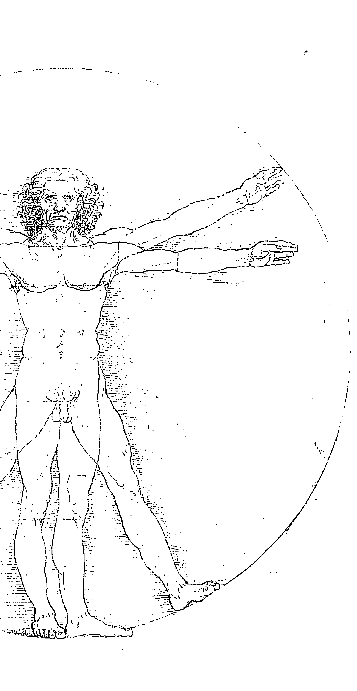