# 天香
精油生活DIY全书

刘璞◎著

# 图书在版编目(CIP)数据

天香：精油生活DIY全书/刘璞著.
南京：江苏人民出版社，2009.7
ISBN 978-7-214-05790-7

Ⅰ.天… Ⅱ.刘… Ⅲ.香精油－保健－基本知识 Ⅳ.
R161 TQ654

中国版本图书馆CIP数据核字（2009）第075926号

《精油生活DIY全书》
中文简体字版©2009江苏人民出版社
本书经成邦文化事业股份有限公司商周出版事业部授权，同意经由江苏人民出版社出版中文简体字版本。
非经书面同意，不得以任何形式任意重制、转载。
ALL RIGHTS RESERVED
江苏省版权局著作权合同登记：图字10-2009-234

书 名 天香：精油生活DIY全书
著 者 刘 璞
责任编辑 刘 焱
文字编辑 王泽阳
版式设计 孙 倩
出版发行 江苏人民出版社（南京湖南路1号南门 邮编：210009）
网 址 http://www.book-wind.com
集团地址 凤凰出版传媒集团（南京湖南路1号南门 邮编：210009）
集团网址 凤凰出版传媒网http://www.ppm.cn
经 销 江苏省新华发行集团有限公司
印 刷 北京尚唐印刷包装有限公司
开 本 880毫米×1230毫米 1/32
印 张 7.25
字 数 161千字
版 次 2009年7月第1版 2009年7月第1次印刷
标准书号 ISBN 978-7-214-05790-7
定 价 30.00元
（江苏人民出版社图书凡印装错误可向本社调换）

# 天香
精油生活 DIY 全书

刘璞◎著

# 前言 闻香识女人

# Part1 方法篇

DIY心法全公开

- 1-1 芳香仪式-Using / 008
- 1-2 认识基础油-Base Oil / 018
- 1-3 调制复方精油须知-Blending / 037
- 1-4 A-Z精油数据库-Essential Oil / 052

# Part2 美容篇

我的美丽，你闻见了吗？

- 2-1 美丽容颜-Face Care / 074
- 2-2 呵护肌肤-Skin Care / 117
- 2-3 减脂塑身-Body Care / 131
- 2-4 飘逸秀发-Hair Care / 141
- 2-5 纤纤玉手-Hand Care / 157
- 2-6 轻盈双足-Feet Care / 167

# Part3 精神篇

给心灵的最好情人

- 3-1 纾解压力-Relaxing / 178
- 3-2 活力充沛-Energizing / 187
- 3-3 改善记忆-Memory Enhance / 194
- 3-4 增强自信-Confidence / 200
- 3-5 告别忧郁-Depression / 206
- 3-6 一夜好眠-Sleep / 213
- 3-7 欲望花园-Sensual / 222

# 前言

理想照耀中国

下方小字内容

有一种芳香，是上天赐予女人的最神秘的礼物，不仅让男人通过独特的香气记住优雅的女人，而且也让女人提升了心灵感受力，捕捉到了飘忽不定的“幸福感”。这种神奇的礼物，就是精油。

利用这种源自天然的植物芬芳来愉悦性情、滋养身心，让芳香营造的神秘气场来激发潜藏心底的巨大能量，就是芳香疗法的意义所在。

芳香是创造潜能，提升感悟能力的天命，这准也是因人而异的。有一千个女人，就有一千种创造奇迹的路径。因此，每个懂得自己的女人都是自己最好的芳疗师。

精油给女人带来的惊喜，远不止于制造一个白雪公主的永久神话，让瞬间定格在美好的时刻；而是于平凡忙碌的分分秒秒，随时随地摆脱俗念的羁绊，唤醒尘封已久的记忆，唤起深埋心底的创造奇迹的巨大能量。为自己播建芳香氛围，感受芳香，感悟幸福的潜在反应面。一旦拥有，点不困难。

芳香疗法最神奇之处，在于对身体、心灵都具有效益。把“身”与“心”视为一个整体，必须两者兼顾，才能达到完美的境界。除此以外，它还具有增添生活情趣、愉悦身心的价值。这其实就是芳香疗法区别于其他疗法的特征。

那么，如何根据自身需要，亲手定制属于自己的芳疗方案呢？本书就是您的“葵花宝典”，为您倾情奉上：

快捷检索的精油数据库，帮您对症下药，选取最适合您的精油配方；

- 美容：为6种特殊肤质量身定做的43种美容配方，轻松搞定洁面、去角质、润肤、面膜、蒸面、按摩；
- 美体：5大沐浴配方，2种清香喷剂，4种护肤油，10个塑身配方，10种美足配方，打造飘逸秀发的15个奇招，呵护纤纤玉手的7副神药；
- 美心：20个减压方，5个活力精油方，3个对抗感冒方，4个增强记忆方，16个提升自信方，8个告别忧郁方，14个助眠方；
- 添情：17种催生浓情蜜意的精油配方，让两心更近，两情更久。

上帝已经将开启幸福之门的钥匙放在你的手心，你还在等待什么？聆听天香的低语，跟随天香的指引，去发掘、感受那份飘渺奇特的幸福吧。

在家自行使用精油，进行自助式的芳香疗法可以有许多种方法，具体视个人需要，以及环境许可。有时候，在办公室、搭乘交通工具途中，甚至在半路上，也可以使用精油。本章将介绍几个常用的方法，以及使用时的注意事项。

## 吸入法

这是精油最常见、方便，也十分有效的一种使用方法，因为精油含有的芳香成分极为细小，能够透过我们的呼吸器官进入体内，继而为身体所吸收。

精油吸入法大致又可分为5种：

### 1. 简便吸入

最简单的吸入精油方法是，在手帕、纸巾上滴4-8滴精油，然后让此沾染精油香味的手巾靠近鼻子，以利吸闻。这种简易的吸入法最适合在办公室、车上、路上等场合使用。而在家中，有时也可以将此手巾放在枕头上方，或直接滴在床单上。这种方法特别适合有助精神放松、促进睡眠的精油。

### 2. 蒸气吸入

另一种简易的精油吸入法，就是准备一碗热水，大约是100毫升的热水，滴入2-4滴精油，然后用力吸收从热水中蒸发出来的香味，大约只要5分钟，就可以达到吸收芳香分子的效果。为加强效果，可以在头上披一条大毛巾，将头埋在热水上方。

### 3. 熏香灯

熏香灯是精油使用法中流行最久，且历久弥新的方式。熏香灯有很多种款式，有的是借用小蜡烛，也有用小灯泡来达到熏蒸精油的目的。使用熏香灯时，必须先把灯座上方的小浅碟子装上大约6-7分满的清水，再滴入精油。无论使用蜡烛还是电力，都必须注意熏香灯的防水安全，避免灯上方的清水烧干，并且不要点燃熏香灯过夜。

### 4. 负离子扩香器与超音波芳香机

市面上还有几种新产品可以代替熏香灯，目前很受欢迎的就是负离子扩香器与超音波芳香机，两者都属于冷喷式熏香仪器，不必加热就可以飘散香味，且每次使用的精油量很少，大约3-5滴，其扩散香精的效果十分快速，不失为一种熏蒸精油的经济办法。

超音波芳香机又称为“水氧机”，因为使用时，除精油外，还要再加入一杯冷水。它是最节省精油的扩香器，每秒钟可震荡产生约170万颗有氧的芳香分子，不过就散发出的香味与疗效而言，不如负离子扩香器，但它可一机多用，即作为扩香机、呼吸治疗器、美容喷雾机等。选购这类仪器时，要仔细检查扩香器的马达制作得是否够精细、安全，以免使用时，马达发出令人不悦的噪音。

### 5. 喷雾瓶

利用喷雾瓶也是吸入精油的便利方式，可以净化空气、消除细菌病毒，并带来满室芳香。

制作方式是：在大约250毫升的喷雾瓶中先盛满8-9分满的清水，再滴入大约10滴精油，用力摇晃喷雾瓶，使精油与水充分混合，然后就可喷洒在空气中，以及地毯、橱柜、窗帘或家具上。

喷雾瓶也可以作为身体芳香喷雾的工具，也就是将稀释的精油装入喷瓶中，用以喷洒身体皮肤，例如化妆水、美肤水，或用以提神的滋补水等。这种情况下，精油与水的稀释比例都比较高，大约30–100滴精油兑入100–125毫升水。用以稀释精油的水，常用蒸馏水、矿泉水，甚至是纯露（hydrosol，或称“花水”），以达到更佳的美肤或治疗效果。

## 沐浴法

芳香浴是最能享受芳香疗法的乐趣，又具有相当良好疗效的方法了。其对身心的疗效是双重的，就是精油的芳香能够为呼吸器官与皮肤同时吸收，然后进入体内。

精油沐浴法大致又可分为3种：

- 1. 浸浴

精油浸浴法，就是将精油加入沐浴池中。一般而言，半池沐浴水，大约只要添加4滴精油；一池沐浴水，则添加8滴精油即可。如果是刺激性较强的精油，例如薄荷、黑胡椒等，那么要用的精油滴数可以更少。浸泡身体的时间，至少要10–15分钟，才能让身体充分吸收精油。

如果身体肤质比较干燥，可以再多添加1小匙的基础油，不同种类的基础油都分别具有不同疗效，对皮肤也有滋润效果。有些人不喜欢将基础油加入沐浴池中，因为会觉得它使皮肤过于油腻，而且洗完澡后，基础油会附着在浴缸四周，不易清洗。这样的话，或许可以考虑使用新鲜牛奶或奶粉代替基础油，只要约1小匙即可达到同等效果。

进行精油浸泡浴，不必再使用任何肥皂或沐浴乳，以免破坏精油的营养成分。如有必要，可以在浸泡前，先以肥皂或沐浴乳清洗全身，用清水洗净之后，再进行浸泡。

- 2. 淋浴

淋浴是最方便的清洗身体的方式，尤其在炎热的夏天，女性在生理期内，也必须采用淋浴法来洁净身体。淋浴时，依然可以使用精油，方法是：以肥皂或沐浴乳清洗身体完毕，再将2-3滴精油滴在浸湿的毛巾或海绵上，用以擦拭全身，最好能轻轻按摩身体，然后，再以温水冲洗身体即可。

- 3. 足浴、手浴、坐浴

添加几滴精油在一盆温热水中，用来泡手脚或下半身，是取代精油沐浴法的简易之道，因为全身芳香沐浴比较费时、费事，而且有时候也有一些限制，如身体病痛、过度疲劳，或身上有伤口，以及年老及身患重病者，都不宜进行全身浸泡。

足浴有很好的松弛身心、改善疲劳的效果，尤其是辛苦工作或长途旅行之后。对于香港脚，以及脚部浮肿、胀大、充血或扭伤等病症，更具疗效；手浴则特别有益于消除关节炎引起的疼痛；坐浴法也十分经济实惠，对于患膀胱炎、痔疮、阴道炎，以及产后阴道缝合复原者，均有特别疗效。

这三种方法，都是在所要使用的容器中，盛满大约 7-8 分满的温热水，再添加入 4-6 滴精油，进行身体局部浸泡，大约 10 分钟以上。

## 湿敷法

湿敷法或称敷贴法（Compress），对肌肉疼痛、瘀血、风湿痛、关节炎、头痛及扭伤的治疗特别有益。

湿敷法又分为冷敷与热敷，有时候冷敷与热敷可以交替使用，效果更佳，例如治疗扭伤及瘀伤，就适合冷、热敷交替法。发生创伤时，先用冷敷做急救处理，接下来几天就交替使用冷、热敷，后续的治疗是先热敷，再冷敷。冷敷，通常用以治疗发烧、剧痛、肿胀的症状，而热敷则是治疗慢性病症所引发的疼痛。

湿敷法的制作方式，是把 6-8 滴精油滴入一碗冷水或热水中，再把一块布（或棉绒、毛巾、纱布皆可），浸渍于碗中，使其充分吸收含有精油的水，然后拿出来，用双手拧出一些多余的水分，这样就是一块具有疗效的敷贴布了。将它立刻敷贴在患处，之后再缠上绷带，让敷贴布裹在患部至少2小时，若是晚上临睡前使用，可以留置一整夜。如果有发烧症状，那么这块敷贴布就有必要定时更换了。

## 漱口法

以精油加水来漱口，非常实用。这种自制的漱口水比化学合成的漱口水对身体的益处更多，除了消除口臭之外，还可杀菌，预防感冒、喉炎、牙周病，或缓解恶心症状等。有些精油尤其适合漱口法，例如尤加利、薄荷、茶树、丁香等等，方法是将1-2滴精油滴入装满清水的漱口杯中（大约180毫升的清水），就可以用来漱口了。

## 按摩法

按摩法是芳香疗法中非常重要的一环，如果能够搭配使用适当的精油，再配合纯熟的按摩手法，就能使精油的效果发挥得淋漓尽致。

人类历史上，利用按摩法达到生理及心理治疗的效果，已有悠久的历史。希波克拉底不但鼓励人们以芳香按摩作为日常保健之道，也曾在其著作中提到按摩可以治疗生理疼痛，例如他提过治疗肩膀痛的方法：“必须轻柔地、平稳地以手掌按摩肩膀。治疗师必须了解许多事情，包括确认按摩方法。”
从古代至今，人类已经发展出不计其数的按摩手法，而近代芳香疗法中的按摩法，在过去 10-20 年间，也有辉煌的成果，甚至每个芳疗师都有一套专业的按摩法，也都有个人偏爱的技巧，基本上难分高下。一般人在在家自行进行芳香按摩，不必太在意按摩技巧是否高超，大体而言，按摩时不要太过激烈，而以轻柔、平稳为佳。
按摩法最大的效果在于同时包括了身体和心灵两方面的疗效。按摩者与被按摩的人，彼此间因为肌肤的接触，产生互相信任的感觉，后者尤其放松，使僵硬的肌肉柔软，血液循环改善，而达到身心都十分舒畅的境地。

- 基本上，在家自行调配按摩精油，进行芳香按摩，是非常安全、有效的一种芳香疗法，不过以下几点仍必须加以注意：
- 不宜在吃饱饭后或饥饿时进行。
- 不宜在静坐期间或服用药物之际进行。
- 患有严重疾病，如高血压、心脏病、静脉瘤、癫痫等，不宜进行。
- 身体有感染而引发疼痛之际，或是有骨折、伤口、伤疤之处，以及皮肤晒伤之后，都不宜进行按摩。
- 身体有严重的瘀伤、青肿之处，不宜进行按摩。若是轻微的瘀伤，则可以轻柔按摩，或使用湿敷法代替。

芳香按摩是使精油有效接触和进入人体的方式，皮肤很容易吸收精油，因此精油用量不必太多，大约 1%—3%的浓度即可。记住，除了极少数精油，以及特殊情况之下，精油都不能直接接触皮肤，而必须事先以基础油或乳液加以稀释。用以稀释精油的乳液以无添加香味、纯植物性者为佳。

## 乳液、乳霜及软膏

有时候，我们也可以自制一些芳香乳液 (lotion) 或乳霜 (cream) 以代替按摩精油，其滋润皮肤的效果极佳，而且更具保湿作用，有如在皮肤表面形成一层保护膜，防止水分蒸发，以及隔绝外界污染物质进入皮肤。软膏 (ointment) 与乳霜很像，呈粘稠的半固体状，不同之处在于软膏主要是由“油”与“脂”组成的，不含水分。软膏适合涂抹在身体的几个特定的部位，例如手、脚，以及需要特别呵护或治疗的部位。

乳液或乳霜主要是“油”与“水”的混合物，两者的主要差异在于乳液的水分较多，因此呈液体状，乳霜的油分较多，呈半固体状。由于油与水不能溶合，因此需要乳化剂 (emulsifier) 来调和，不过也可以利用具有乳化作用的天然物质来帮忙，例如卵磷脂 (lecithin)、蜜蜡 (beeswax) 等。

## 精油流行时

精油逐渐受到现代人欢迎以来，精油的使用方式也愈来愈多样化。为了配合人们的需求，市面上还出现了一些新奇、有趣、便于随时使用的精油新产品，例如精油项链，或可以随身携带的精油瓶等。我们可以将自己喜爱的精油滴1、2滴于其中，便于随时随地吸闻。这些道具都制作得小巧玲珑，令人爱不释手，然而要价也不低。

若为了方便随时吸收精油，也有一些变通的方法。例如，把精油滴在没有添加香味的干燥花中，或干净的棉花球中。这个充满香味的棉花球可以挂在任何地方，甚至摆在汽车内部，以取代那种汽车内部专用的精油熏香器。还有，甚至可以把自己喜爱的精油滴一滴在信纸上，寄给朋友，让朋友一接到信，就能够立刻闻到迷人的香味。

精油也适合添加在手工制作的肥皂、蜡烛之中，甚至任何手工制作的工艺品中。不过，用得最多的就是添加在自己制作的美容、护发、香水产品中了。

自行调制按摩精油的过程中，常与精油一起搭配使用的是“基础油”。基础油是不可或缺的重要工具，英文称为 base oil（也译作“基底油”），其首要功能就是用以稀释精油。除了极少数的精油，如德国洋甘菊、薰衣草、茶树精油等，其他多数的纯精油若直接接触皮肤，往往会因浓度太高，或刺激性太强，而容易造成皮肤过敏，因此必须使用基础油加以调和。

精油虽然名为“油”（essential oil），但其实并不是真正的“油”，严格来说，应该属于“水”性，因为它既不油腻，也不具备一般油所具有的油滑特质——除了一些树脂类精油（resins）及原精（absolutes）比较黏稠外——因此用精油按摩身体时，不易在皮肤中推摩，需要质感细致、润滑度高的辅助工具，才能增强按摩效果，降低肌肤的摩擦与不适，使精油分子充分渗透进入人体，达到芳香疗法的功效。在芳香疗法中，用以搭配精油作为按摩身体之用的基础油，因具备有“媒介”性质，因此又特称之为“媒介油”（carrier oil）。

## 如何选择适当的基础油

基础油主要是提炼自植物、果实的油类，即所谓的蔬菜油（vegetable oil）、坚果油（kernel oil）等。这类植物油的成分稳定、分子小，不具挥发性，又未经化学提炼，在与精油调和时，不但可以稀释其浓度，协助精油迅速经由皮肤吸收，还能平衡与稳定精油，延长精油有效保存期限。

这类蔬菜或坚果类的植物油，本身就含有丰富的营养成分，如维生素（A、D、E、F等）、矿物质（包括碘、钙、镁），还有蛋白质、脂肪酸等，就算单独使用，例如用于卸妆、按摩身体，对肌肤也有良好的滋补、润滑与保湿等效果。与适当的精油搭配使用，既能保持其既有的滋养效果，又可以协助精油发挥各种疗效，两者结合，相得益彰。

特别值得一提的是，芳香疗法中常用的优质基础油，往往也是许多美容、美肤制品的原料，如乳霜、护唇膏、护手或护脚霜、香皂、洗发及护发品等。喜爱美容保养品 DIY 的人，可依据个人特殊肤质与需要的不同，选择适当的精油与基础油组合，制作个人专用的保养用品。

若单纯就稀释精油的功能而言，除了蔬菜油、坚果油之外，其他如纯植物性的乳液、沐浴油、沐浴乳、洗发精等，都可以作为稀释精油的基础产品。芳香疗法中常用到的精油熏香灯、喷雾器等，也具有稀释精油的作用，甚至清水也可以。不过，有少数精油仍然能溶于水中，考虑到最终的效果，最好以一些植物纯露取代清水。纯露是植物精油蒸馏过程中的副产品，又称花水或花露（flower water）。如果不喜欢油类，或对油类产品过敏的人（尤其是对坚果油过敏者），不妨选择植物性乳液、纯露等，以取代基础油。

选择适当的基础油，除了营养价值之外，渗透力、气味、黏稠度、保质期，以及价位等因素，也应列入考虑范围。矿物油（mineral oil）对于芳香疗法而言是毫无用处的，因为矿物油是石化工业的副产品，其中并不含有任何有机物质。虽然精油也能溶解于矿物油中，然而矿物油的渗透力很低，只能留在皮肤表面，也不能协助精油进入人体，所以无法成为良好的媒介油。婴儿油（baby oil）不能作为芳香疗法中的媒介油，也是由于其渗透力低的缘故。虽然对于婴儿而言，婴儿油具有防止皮肤水分蒸发、预防尿布疹等功效，但是对于芳香疗法而言，反而会造成皮肤毛孔阻塞，因此不宜作为基础油使用。

至于花生油，由于质地过于黏稠，渗透速度较慢，加上本身气味过重，会干扰精油的香味，因此一般不建议作基础油使用。

选择优质的基础油，最好取未经化学提炼，而以低温压榨法，即“冷压法”（cold pressed）所萃取者为佳。所谓“冷压法”，是指在摄氏60度以下压榨处理植物的种子、果实的方法。这种方法可使植物本身的矿物质、维生素及脂肪酸等营养成分不致在萃取过程中被破坏，而且能够保存其中较多的油脂。

此外，选择作为芳香疗法的基础油，最佳选择是“首次萃取”（extra virgin）的基础油，因其油质最清新、纯净，疗效也较显著，当然价位也比较高。

芳香疗法中并非只能选择冷压法所萃取的植物油，还有一些例外的情况，例如葡萄籽油。葡萄籽油无法以冷压法萃取，因为无法完全榨取出所需的可用油量，而必须以高温压榨法，即“热压榨法”（hot pressed）提炼。如此一来，其油质保存期就比一般基础油短，大约只有半年左右，但由于其营养成分还是很高，具有抑制自由基的特殊疗效，质地又十分清爽等特质，因此还是受到人们的喜爱，一直都是芳香疗法中的明星基础油。

另外，还有一些植物油以特殊的方法炼制，例如浸泡法（macerated/infused）或溶剂萃取法（solvent extraction）等。所以被选择作为芳香疗法中的基础油，主要是因为其具有独特而显著的疗效，因此也有人特别冠以“治疗油”（healing oil）之称。这一类的基础油在芳香疗法中比较罕见，而其价位也较高。

近年来由于精油及芳香疗法的日益盛行，原本一些罕见或特制的基础油，如今也开始渐为人知。有些人基于“物以稀为贵”的心理，对这些基础油趋之若鹜，其在市场上的价格更是节节上涨。在此，特别提醒一下：就像市场上许多产品一样，高价位往往并不等于高质量，更不等于效果特别优异、奇特，尤其是基础油这种产品。精油也有类似的情况，例如容易大量萃取、价格平实的薰衣草、甜橙或茶树等，其优异而多重的疗效，并不输昂贵而罕见的其他精油，如玫瑰、茉莉等。当然，每种不同的精油均有迷人的香味，这是各种精油无法互相取代的原因之一。至于基础油，就不必考虑香味问题，这也使基础油比精油有更大的自由选择空间。

其实，选择作为个人精油 DIY 的基础油，一般常见的基础油也就绰绰有余了。即使是以疗效为主要考虑点，许多容易大量生产且十分普及、价格非常大众化的蔬果油，也各有别具一格的价值，不下于罕见或特制的基础油。

总之，无论是哪一类的蔬果油，能成为芳香疗法中广受重视的基础油，均有其特性与疗效，调制时视个人的需要选择即可。有些蔬果油，例如小麦胚芽油、酪梨油等，特别滋润，适合干性皮肤；有些则比较清爽，例如葡萄籽油，适合油性皮肤；有些则穿透力特别强，例如酪梨油与榛果油等；有些又以特殊疗效著称，例如葵花油有益于关节发炎、肌肉瘀伤的治疗；玫瑰果油以再生功能显著著称，特别有益于伤口、疤痕、湿疹，以及老化皮肤的治疗；月见草油有益于湿疹、牛皮癣的治疗；荷荷芭油有益于风湿症、粉刺、晒伤的皮肤治疗，也可治愈湿疹、牛皮癣等。

为扩大精油的应用范围，也为了增强芳香疗法的效果，选择适合个人体质或特殊需要的基础油是必要的。以下将逐一介绍各种基础油，包括芳香疗法中常见的基础油，以及罕见或是特殊疗效而又有“治疗油”之称的基础油。

## 芳香疗法中常见的基础油

## 甜杏仁油（Almond Oil， Sweet）

基础油中最为普遍的就是杏仁油了，它一般提炼自甜杏仁树（而不是苦杏仁树）的果核，所以又称为“甜杏仁油”。

颜色呈非常清淡黄色的甜杏仁油，略有轻微的坚果味，价位虽然不高，却有难得的疗效。因富含矿物质、蛋白质及各种维生素，包括维生素 A、B1、B6、B12、D 和 E 等，所以是保养皮肤及滋润效果极佳的植物油，适用于各种肤质。由于非常温和，连婴儿都可以使用。

甜杏仁油能使肌肤恢复光滑细腻，还能舒缓皮肤发痒，消除红肿、干燥和发炎症状。怀孕中的妇女如果长期使用，还能有效地消除妊娠纹。此外，对于容易干燥、脆裂的指甲，也有滋润作用。

甜杏仁油可刺激内分泌系统的脑下垂腺、胸腺和肾上腺，促进细胞更新。对于运动过度引起的肌肉疼痛，若以甜杏仁油按摩可加强细胞带氧功能，消除疲劳与碳酸累积，具有镇痛及减轻刺激的作用。

甜杏仁油与葡萄籽油都是使用最广泛的基础油，而甜杏仁油比葡萄籽油更富含维生素E，因此保质期更长。由于它不像葡萄籽油那样快速渗入皮肤表面，因此适宜在大面积的按摩润滑中使用。甜杏仁油可以单独使用，或按10%–25%的百分比与其他昂贵的基础油（特别是酪梨油、荷荷芭油）一起使用。

## 杏核油（Apricot Kernel Oil）

从杏树果核提炼的杏核油呈淡金黄色，几乎没有味道，虽属比较昂贵的基础油，不过因为具有多种益肤价值，因此仍十分普遍。杏核油含有丰富的维生素A和B，以及矿物质，质轻，渗透力强，具有良好的亲肤性，也有高度的润肤特质，不但能够提供皮肤营养，还有滋润、软化肤质的功能，连最娇嫩的婴儿也适合使用。当然也适合任何肤质，尤其对敏感、缺水、容易发炎、肤色蜡黄，以及老化肌肤、内部有脱皮现象者特别有帮助。杏核油由于质地细致，最适合作脸部按摩，能使皮肤增加光泽，恢复皮肤弹性，用以按摩全身，则可舒缓紧绷的身体。杏核油可以单独使用，也常与甜杏仁油或其他基础油调和使用，调和百分比约为10%–50%。

## 酪梨油（Avocado Oil）

酪梨油是从新鲜的酪梨果肉中提炼的，含有丰富的维生素 A、B、D、E，以及卵磷脂、蛋白质、脂肪酸等，是一种非常滋润、营养价值高的基础油，又由于其渗透力强、容易被皮肤吸收，具有深层清洁的效果，是绝佳的肌肤柔软品，对于新陈代谢、淡化黑斑、消除皱纹具有较好的功效，特别有益于干燥、缺水的肌肤，却不适合油性皮肤。

酪梨油的维生素 E 含量高，保存寿命较长，也适合与其他基础油调和。作为一种保存剂，一般以 10%的百分比与其他基础油调和。

酪梨油呈深绿色，油质比较重，甚至有点混浊，但这不表示其质量不佳。在寒冷的时候，酪梨油还会变硬，但这都无损于其品质。酪梨油可以存放在比较温暖的房间，在使用之前，用双手握住瓶身一段时间，如此一来，其硬化的油质就能恢复液体状。

## 蓖麻油（Castor Oil）

蓖麻油是冷压法萃取的，其显著功效是柔化肌肤，用于治疗伤口感染和皮肤病，也能治疗眼睛发炎，一般以 10%的百分比与其他基础油一起使用。

## 椰子油（Coconut Oil）

油质较坚硬、呈蜡状的椰子油，是十分有营养的基础油，特别有益于头发，使干燥、黯淡的头发恢复光泽、亮丽；对于干燥的肌肤也有良好的滋润效果。

## 月见草油（Evening Primrose Oil）

颜色呈淡黄色的月见草油近年来广受重视，其原本就昂贵的身价更节节上涨。

月见草油提炼自月见草的种子，含有丰富维生素、矿物质，以及亚麻油酸（linoleic acid）和 γ-亚麻油酸（gamma-linoleic acid， GLA），这是一种人体无法自行生成、对人体又非常有益的脂肪酸。其对人体最明显的功用，莫过于维持细胞膜的健康，并使细胞保留较多的水分，以及有助伤口复原及减退疤痕。对于改善皮肤异常状况，如舒缓湿疹、皮肤干燥发痒、牛皮癣等都有帮助，此外还能预防掉发及促进指甲健康。月见草油适用于任何肤质，尤其有益于干燥以及提前老化的皮肤。

饱受经前症候群和更年期障碍困扰的女性，在营养需求上会有特别的需要。月见草油能提供营养与健康上的支持，满足女性各种不同年龄的需求。GLA 扮演着前列腺素（prostaglandins/PG）先驱物的角色，产生类似荷尔蒙的物质，协助调节荷尔蒙平衡，以纾解经前症候群与更年期障碍，因此被视为最佳女性良伴。

此外，月见草油还有益于缓解气喘、过敏、风湿性关节炎、心脏病等。

月见草油十分昂贵，常与玫瑰果油调和使用，或与其他基础油以 5%-10% 的百分比调和使用。

## 葡萄籽油（Grapeseed Oil）

葡萄籽是抗氧化、抗老化、提供酸碱平衡与多种矿物质维生素滋补的最佳来源，用于饮食中，可消除胆固醇，降低身体脂肪，大大降低心血管疾病的发生率。

以热压榨法提炼的葡萄籽油呈淡黄绿色，几乎没有味道，价位不高，却是非常健康的基础油，含有维生素、矿物质、蛋白质，而不含任何胆固醇，而且还含有亚麻油酸（linoleic acid）、油酸（oleic acid），亚麻油酸有助于保湿及滋润皮肤，而油酸可增强皮肤的吸收能力。

葡萄籽油的油质清淡而不油腻，亲肤性强，最易于皮肤吸收，且润滑度佳、质地温和，可适用于任何肤质，由于其油质很轻，而且有收敛功效，所以特别适合油性皮肤或暗疮皮肤。

葡萄籽油也是绝好的中介油，因其可以携带植物精油的微分子，快速渗透表皮，进入皮肤内层，产生氢氧化物。经常使用葡萄籽油，对于调节干性皮肤水分很有效果。

葡萄籽油不像其他基础油那样富含维生素E，另外，葡萄籽油是以热压榨法提炼（因为冷压法不能完全榨取出所需的可用油量），因此保存期较短，大约是半年至一年。葡萄籽油可单独使用，或按10%-25%的百分比与其他基础油一起使用。

## 榛果油（Hazelnut Oil）

由榛树果核所提炼的榛果油呈黄色，几乎没有味道，富含矿物质、维生素、蛋白质等，也是营养成分高的基础油，略带有收敛性质，能帮助皮肤保持稳定及弹性，减缓皮肤出油现象。可适用于任何肤质，也常用于油性肌肤、混合性肌肤，以及调理粉刺。

## 荷荷芭油（Jojoba Oil）

荷荷芭是一种沙漠植物，由其豆子所压榨出的液体蜡油，就是荷荷芭油。它本身无特殊的气味，呈现美丽的金黄色，含有丰富的蛋白质、矿物质，以及类似胶原蛋白物，是渗透性最强的一种基础油，适合于各种肌肤。

荷荷芭油对肌肤有十分显著的美容功效，具有平衡肌肤的作用，能调节油性或混合性肌肤的油脂分泌，或溶解脸上油脂，去除黑头粉刺，还可畅通毛孔，是皮肤最佳的滋润剂——其滋润以及保湿效果非常好，可增加皮肤水分，预防皱纹、老化，对于干性、有皱纹的皮肤很有好处，可使其恢复活力及光泽。

荷荷芭油的分子排列和人的皮脂非常类似，可用来改善敏感肌肤、风湿、关节炎与痛风，也能改善问题性皮肤，包括过敏、发炎、湿疹、干癣、面疱等。做芳香按摩时，荷荷芭油会连接皮下脂肪，并且畅通毛孔，不会留下任何废弃物质。

荷荷芭油的美发价值也非常高，用以按摩头皮，可促进健康发质新生，使其柔软、亮丽，还能修护干性发质，并能解决头皮屑问题。

荷荷芭油属于价位较高的基础油，由于其一流的美肤、美发效果，所以许多高级保养品都会使用其为主要成分。又因为荷荷芭油黏性较高，稳定性也高，能够耐强光、高温，而保持结构不变，因此保质期最长，可达3-5年。一般可按10%的百分比与其他基础油搭配使用。

## 橄榄油（Oliver Oil）

橄榄油的营养成分极高，富含维生素、矿物质、蛋白质等，对于皮肤及头皮都有效果，又因含有大量不饱和脂肪酸，对心脏病有良好的功效，对阳光晒伤有缓和的功能，也可用于减肥、老化及晒伤的处理。在价位上，橄榄油比其他基础油低，因此是一种既经济又实惠的基础油。

不过，由于橄榄油的颜色清晰，又有明显的气味，因此有些芳疗师不推荐使用，其实它很适合与其他基础油调和后使用。

选择橄榄油作芳香按摩，以冷压法制造、首次萃取者为佳，如果是有机橄榄油，则效果更好。

## 桃核油（Peach Kernel Oil）

从桃子果核中提炼的桃核油，不论颜色、质地，与杏核油都十分接近，同样也含有丰富的维生素与矿物质，而且，一样也特别适合用作脸部滋润、按摩油。桃核油也是比较昂贵的基础油。

## 玫瑰果油（Rosehip Oil）

由压榨玫瑰籽的果实所获取的玫瑰果油，含有丰富的维生素、矿物质等，而且和月见草油一样，具有珍贵的亚麻油酸和γ-亚麻油酸（GLA），因此也可用于治疗湿疹及皮肤癣等病症，同时也可治疗多种与月经和停经有关的症状。

玫瑰果油具有不可思议的美肤价值，特别有益受伤的肌肤，包括消除疤痕、淡化斑点等，对于防止皮肤干燥、老化也有效果。此外，玫瑰果油含丰富的维生素 C，具有良好的美白效果，以及预防日晒后的色素沉淀。

玫瑰果油呈黄色至深棕色，在价位上属于昂贵的高级基础油，一般以 10% 的百分比与其他基础油调和使用。

## 大豆油（Soya Bean Oil）

大豆油含丰富矿物质、蛋白质、维生素等，价格不高，也是基础油的良好选择。

## 葵花油（Sunflower Oil）

葵花油含丰富矿物质、蛋白质，以及维生素 A、B、D、E 等，质地细致，是一种价格十分大众化的植物油，也是基础油的良好选择。不过，作为芳香疗法用的葵花油，不能选择家中炒菜用的油，而是以冷压法提炼者为上。

葵花油还有一项特殊功效，就是有益于治疗关节发炎、肌肉瘀伤。

葵花油呈淡黄色，几乎无味，营养价值高，适合各种肤质，也宜用于身体按摩，可单独使用，或与其他基础油调和使用。

## 小麦胚芽油（Wheatgerm Oil）

小麦胚芽油含有丰富的矿物质、蛋白质，以及维生素，是一种浓稠、有营养、呈金黄色的基础油，其维生素E的含量特别高，甚至高过酪梨油，因此保存期很长，而且也适合作为其他基础油的保存剂。它也是天然的抗氧化剂，因此只要将一点点的小麦胚芽油加入其中，便可延长精油1-2个月的保存期限。有些芳疗师甚至建议，不论调理何种精油按摩油，都可依比例添加5%的小麦胚芽油。

小麦胚芽油的美肤效果极高，适用于各种肤质，尤其是干燥、老化的肌肤。它能抗老化、防止皱纹产生，也可以减少受伤或长青春痘所留下的疤痕，淡化黑斑、修复过度日晒的皮肤。此外，还可防湿疹、牛皮癣，以及静脉瘤。

小麦胚芽油很少单独使用，而适合与其他基础油调和使用。

## 罕见及特制基础油

## 山金车油（Arnica Oil）

这是一种罕见的浸泡油，不同于以蒸馏法萃取的精油，后者是有毒性的精油，不能单独使用。山金车浸泡油主要用来调理内伤，可以有效消除瘀血，也用于拉伤或因过度使用而酸痛的肌肉，例如关节炎、筋骨酸痛、背痛、腰酸、扭伤、肌腱炎等。可以加入按摩油中，运动或长期使用肌肉后，按摩过度使用或拉伤的肌肉，可使肌肉放松，减轻肌肉酸痛；也常制成药膏，化瘀消肿。

## 琉璃苣油（Borage Oil）

琉璃苣油是溶剂萃取法或冷压法萃取的特制基础油，既罕见又昂贵，不但富含维生素、矿物质，更含有大量的 γ-亚麻油酸（GLA），其 GLA 含量大约是月见草油的 3 倍，可能是基础油中浓度最高者，因此其保湿功能极佳，还能促进细胞再生，对抗皮肤、治疗湿疹，并可改善关节僵硬及发炎情况。一般按 10%-25% 的百分比与其他基础油一起使用。

## 金盏菊油（Calendula Oil）

金盏菊的学名是 Calendula officinalis，英文俗称 Marigold，中译名为金盏菊、金盏花或万寿菊，被视为是最好的一种植物浸泡油，以治疗各种皮肤不适而著称，最显著的是其抗炎及舒缓血液循环的功效，可用于治疗伤口、消肿、去瘀，以及舒缓静脉曲张。

金盏菊油对皮肤甚有帮助，对于治疗皮肤炎症，如湿疹、红疹、婴儿尿疹都十分有效，对于过于干燥或干裂的皮肤也有帮助。金盏菊油的气味比较强烈，一般适合按 15%-25%的百分比与其他基础油调和使用，如果不介意其气味的话，也可以单独使用。

## 胡萝卜油（Carrot Oil）

胡萝卜油是著名的浸泡基础油，如今在芳香疗法中日益普及。

含有丰富的维生素，尤其是维生素 A 与胡萝卜素，是胡萝卜油最大的特色。此外，它还含有矿物质，是一种十分滋养的基础油，特别有益于干燥、老化、容易发痒的皮肤，对于湿疹、牛皮癣等问题皮肤也有疗效，还有促使皮肤再生，以及抑制皮肤发炎、淡化肌肤斑纹的功能。

胡萝卜油呈橘色，价位也不低，一般不适合单独使用，适合以2%-10%的百分比与其他基础油调和。

### 夏威夷核果油（Kukui Nut Oil）

以冷压法萃取的夏威夷核果油，顾名思义，就知道是夏威夷特产，在基础油中算是比较罕见的。

夏威夷核果油含有丰富的亚麻油酸，油质清爽而不油腻，渗透性佳，容易为皮肤所吸收，擦在皮肤上有一种惊人的不油腻感，并且十分润滑，是一种优良的保湿剂及柔肤剂，对于受到阳光伤害、湿疹、牛皮癣有特别疗效。一般以2%-10%的百分比与其他基础油调和。

### 圣约翰草油 / 金丝桃油（Hypericum Oil）

金丝桃油别名圣约翰草油（St John’s Wort Oil），自古以来就是著名的浸泡油，深咖啡红色，以抑制皮肤发炎闻名，对于治疗瘀伤、轻度烫伤也相当有效。它还有镇静功效，对于经期症候群，以及因为过度紧张、抑郁所带来的痛楚有舒缓作用。另外，对关节痛、肌肉扭伤、痛风症状施以按摩，有助于减轻痛楚，所以人们在治疗关节炎和痛风时常添加圣约翰草油，平时添加在按摩油中，也可以促进筋骨健康，加强血液循环。

圣约翰草油气味不重，可以单独使用，或也可

与其他基础油调和使用。值得注意的是，它的感光分子会使皮肤对阳光特别敏感，所以使用后需隔6小时，才能让皮肤接触阳光。

## 其他

还有一些罕见的特制基础油，如今也渐渐被引进市场。例如莱姆花油（Lime blossom Oil），以促使皮肤再生、放松功能而闻名；紫草油（Comfrey Oil，中文也有人直译为康富利）则有益于伤口愈合；香蜂草油（Melissa Oil）特别有益于干燥、老化的皮肤，香蜂草是一种用途很广的香草，其叶子也能经由蒸馏法萃取为精油，以浸泡法制成香蜂草油则较为少见。

## 延长基础油保存期的方法

基础油由于性质稳定，比精油摆放时间更长，不过储存时，最好还是要用深色的瓶子，放置于阴凉处；而个人在购买基础油时，最好是选择小瓶包装者，例如 50 毫升或 100 毫升，如若出于经济因素考虑而购买大瓶包装者，最好在购买回家之后，自行加以分装，原则上，应以每次所欲使用的基础油用量，分装于小瓶子中，一般而言，以 50-100 毫升最为适宜。

气候十分湿热的地区，不利于保存大量的基础油，因此最好将不欲马上使用的基础油放置于冰箱内，密封储存。切记，一定要绝对密封，一来放慢其氧化作用，二来确保其不与其他食物混杂一处，因受其他食物的气味影响而变质。基本上，基础油除了可能有轻微坚果味之外，几乎没有什么味道，如果闻出来一股明显的走油味，就表示已经变质、过期了，那么就不宜再作为芳香按摩之用。

基础油的稳定性与寿命与其中所含的脂肪酸多寡有关，饱和脂肪酸的含量愈高，油质就愈安定，而维生素E的含量愈高，则保存期限也就愈长，小麦胚芽油的维生素E含量就特别高，因而油质稳定而长。

通常，未经开封的密封的基础油，都可以保存1-2年，而某些性质特别稳定的基础油，例如荷荷芭油，甚至可以保存3-5年。瓶装的基础油一旦被打开瓶盖，空气会进入而产生氧化作用，那么就会缩短保存期限，而且也比较容易变质。

为了延长基础油的寿命，延缓变质，可以在基础油中加入维生素E含量特别高的小麦胚芽油，或维生素E胶囊（大约是25毫升基础油加一小粒纯E胶囊）。

维生素E含量高，适合作为其他基础油的保存剂，促进其保质期的，还有酪梨油，尤其是最适宜与葡萄籽油调和，可延长葡萄籽油的寿命，增强其滋养效果，而酪梨油又因其渗透力特强，因此与其他基础油调和时，更可以促使所调和基础油具有更佳的渗透力，一般而言，调和两种以上的基础油时，只要依比例添加 5%－10%的酪梨油，就能达到延长保质期与渗透性佳的效果。

榛果油与酪梨油同样具有高渗透力、高滋养性的特性，因此也适宜作为调和其他基础油之用。

为了方便读者记忆起见，笔者特别把这种调和了小麦胚芽油、酪梨油或榛果油的基础油称为“复方基础油”。在一般可能的情况下，个人皆可以在自行分装的少量基础油中加入这些基础油，成为“复方基础油”。以欲分装的50毫升“复方基础油”为例，以下是一个适宜的小配方：

- 1. 1小匙小麦胚芽油 + 1小匙酪梨油或榛果油 + 其他一般基础油
- 2. 注入一只深色空瓶中

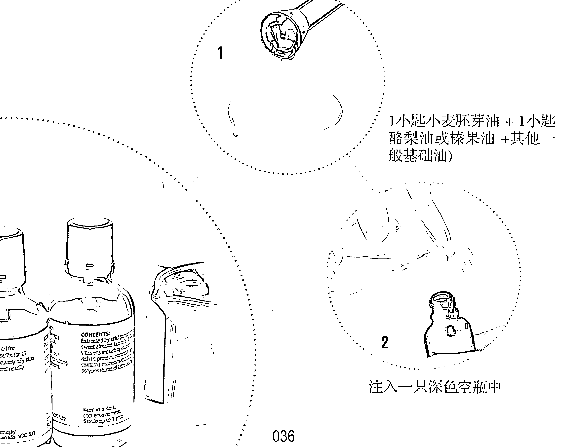

喜欢精油的人，在使用一段时间之后，都不免想要自己调制复方精油，这是一件有趣、迷人又有挑战性的事，也是精油玩家的必经之路。

我们都知道，每一种单方精油的香味、疗效，都各具特色，不同精油加在一起，则能产生出更特别的味道，而其疗效，也会产生多种变化。这就是调制复方精油最引人入胜之处，好像是在进行一种前所未有的实验，甚至可以说是一种游戏，每一次因为采用配方不同，就会有新鲜的变化出现，让人充满期待。

## 相同家族的精油彼此兼容

英文中，把两种以上的精油混合在一起的动作称为“blending”，但是混合精油并不是随兴之所至，把任意两种以上的精油混合起来，而是必须考虑用以混合的精油，彼此之间是否兼容，而且，更重要的是，是否能收到相辅相成的效果。也就是说，混合两种以上的精油，不是单纯的一加一等于二的行为，而是透过不同精油之间和谐的作用，达到相乘的效果。简而言之，相乘效果，是调制复方精油的最高宗旨；和谐，则是最高的指导原则。像这样，才是有效的“协同作用混合”(synergistic blend)，唯有如此，才是有效的“复方精油”，英文有时特别把“blend oils”称为“synergy”，就是这个道理。

“复方精油”既然不是随兴“混合”精油，那么就必备一些基本的知识，才能加以“调制”。调制复方精油，首先要了解的就是各种精油之间是否兼容。而这并不难，只要记住一个最基本的原则：只要是同种类（species）的精油，或是说，来自同一个家族的精油，都是可以兼容的。举例来说，同属于唇形科的精油，例如罗勒、鼠尾草、牛膝草、马郁兰等，都可以互相调和，柑橘类（Citrus）或芸香科的植物精油，例如佛手柑、橘子、椪柑、葡萄柚等，都可以互相混合，而有良好的效果，以此类推。

这或许得要稍微具备一些植物学的常识，不过，也有一些简易的变通办法，那就是仔细阅读精油标签上的拉丁文学名，也可以找到分辨的蛛丝马迹。为了方便读者查询起见，以下就是一个精油植物家族分类简表。

| 植物家族 | 植物示例 |
| :--- | :--- |
| 伞形科（Apiaceae） | 欧白芷、芹菜、莳萝（Dill）、茴香、欧芹（Parsley）等。 |
| 菊科（Asteraceae） | 德国洋甘菊、罗马洋甘菊、永久花（Immortelle）、万寿菊（Tagetes）、西洋蓍草（Yarrow）等。 |
| 橄榄科（Burseraceae） | 乳香、没药等。 |
| 柏科（Cupressaceae） | 丝柏、杜松子等。 |
| 唇形科（Labiatae） | 罗勒、快乐鼠尾草、牛膝草、薰衣草、马郁兰、香蜂草、广藿香、薄荷、迷迭香、鼠尾草、百里香等。 |
| 樟科（Lauraceae） | 月桂、樟树、肉桂、山鸡椒（Litsea Cubeba，英文俗名May Chang）、罗文莎叶（Ravensara）花梨木等。 |
| 桃金娘科（Myrtaceae） | 白千层、丁香、尤加利、香桃木、绿花白千层、茶树等。 |
| 松科（Pinaceae） | 雪松、松等。 |
| 禾本科（Poacae） | 香茅（Citronella）、柠檬香茅、玫瑰草（Palmarosa）、岩兰草（Vetiver）等。 |
| 芸香科（Rutaceae） | 佛手柑、葡萄柚、柠檬、莱姆、橘、橙花、甜橙等。 |
| 花香类（Floral-scented oils） | 茉莉、玫瑰、依兰等。 |

还有一些精油并未罗列在上述简表中，这是因为某科属种类太少，例如安息香（安息香科）、檀香（檀香科）、姜（姜科）、黑胡椒（胡椒科）、天竺葵（拢牛儿科）等，属于花香类的精油，并不属于同一科属，例如茉莉属于木樨科、玫瑰属于蔷薇科、依兰属于番荔枝科，虽然都是不同家族植物，但是彼此都可以兼容，这个特点也适用于一些罕见的花香类精油，如玉兰、水仙、紫罗兰、桂花等。花香类精油还有一个重要特色，就是它们几乎可以与其他各类精油调和，这也是其相当珍贵之处。

除此之外，还有一些精油不一定来自同一种类的植物家族，但仍然兼容，而且效果大于简单叠加，这完全有赖专业芳疗师的经验贡献，这些信息就有赖读者自己多方搜集，本篇第四章 “A – Z 精油数据库” 特别列出精油兼容的细目，十分方便读者查询利用。

## 详细记录调制精油细节

提高或增加疗效，是调制复方精油的目的之一，而这也是调制复方精油的过程中，在掌握了各种精油能否兼容的原则之后，接下来必须学习的功课。在我看来，关于这个部分，才是在家做精油 DIY 相当重要的一环，这需要花一些时间去搜集信息，以及不断累积自己的实证经验。

为了谨慎起见，在调制复方精油之前，必须先了解是否对某一种精油过敏，因此最好要先做皮肤测试。简易的皮肤测试方法如下：

1小匙（约5毫升）基底油中，加入1滴精油，即1%稀释。

将此稀释的精油抹在耳后、手肘弯曲处或手腕内侧，并在皮肤上停留24小时，不要洗掉。如果是使用贴布测试，也就是把稀释后的精油滴在一小块棉布或纸巾上，再贴于皮肤上，那么只要在皮肤上停留3-4小时。

如果没有红肿、皮痒或刺激反应，就表示可以接受此种精油。

一次最多可以同时测试6种精油，但是必须记录精油的名称、所涂抹的皮肤部位，这样才能确定哪一种精油是安全的。

一位手艺良好的厨师，要烧出一道道美味的菜肴。除了要有特制的秘方之外，也要有丰富的经验。同样，要成为一位出色的复方精油调制专家，也要有秘方与经验。在家进行自动复方精油调制的过程中，为了使所调制出来的复方精油达到最佳的疗效，需要搜集一些秘方。所谓“秘方”，就是本业有专攻的专家，或是经验丰富的人，所提供出来的各种配方。换言之，也就是他人经验的精华。不过，无论如何，自己的经验还是很重要。因此自己必须不断实验。除了模仿、复制他人的经验之外，自己也要不断地尝试与创新。

不论是复制他人经验，或是创造自己的经验，在调制复方精油时，一定要养成做记录的习惯，记录的内容必须包括：调制时间、调制的精油名称及数量，最好还能记下调制出来之后的香味、自己的感觉，以及使用之后的效果。

详细记下每次调制复方的记录，具有非常重要的优点：其一，可以记得自己调制精油的内容、精油数量、调制时间；其二，可以作为下次创新或改进的比较参考；第三，便于记住每种精油的制作时间，以利进一步了解其保质期限。

通过这种记录、实验的反复过程，慢慢就会创造出最适合自己、最有效也最独特的复方精油配方了，而调制复方精油的技艺也会愈益精进了。

### 搭配三种香调 创造新奇芬芳

创造新的香味，是调制复方精油中不可遗漏的一环，虽然这也许不是最重要的，但在我看来，却是最有趣、最好玩的一部分。精油之所以迷人，最主要的是在于其千变万化、多彩多姿的香味，对于精油玩家来说，在熟悉了许多不同精油的香味之后，难免就希望有更多的花样出来。就像烧菜一样，每一种菜式虽各有滋味，但是一直吃同一道菜也会感到乏味，因此就要尝试换换菜式、变点花样。

调制复方精油可以改变单一精油的香味，创造出新奇的芳香，而这也需要搜集他人的配方，加上自己的经验。由于人们对于香味的感觉是比较主观的，个人的调制经验非常重要，甚至超过前人、专家的意见。同样地，为了积累经验，促使调制手艺精进，必须做调制精油的记录，而且有关香味的感觉部分，愈详细愈好。

为了让香味的变化更丰富，在调制复方精油时，最好能兼顾各种精油香味的特色，尤其是香味维持时间的长短、浓淡等。就像一般人认为完美的香水，必须具备三种香调（note），即头香调（top note）、中香调（middle note）、基香调（base note），才能使香味有层次上的变化，延长香味的寿命。调制复方精油，虽然不必如此严苛遵守这种规则，但是取法乎上，因此不妨加以参考。

植物精油的三种香调，也代表香味的挥发度，亦即分为高（top）、中（middle）、低（base）三种等级。挥发性高的香味，即所谓的“头香调”，气味比较明显、新鲜、上扬，很快就能让人闻得到，并多能令人产生振奋及活跃的感觉，由于其挥发性高，相较之下，其香味的持久性就较低，因此保存寿命最短，柑橘类的精油就是高挥发性精油的典型代表，很多著名香水的初味，几乎都少不了柑橘类精油，就是因其能迅速吸引住人们的注意力，个人自制复方精油，也很适合添加此类精油；附带值得一提的是，柑橘类精油能够使气味较重、较涩的精油变得香甜、悦人，这也是此类精油在调制复方精油时，经常位居要角的原因。

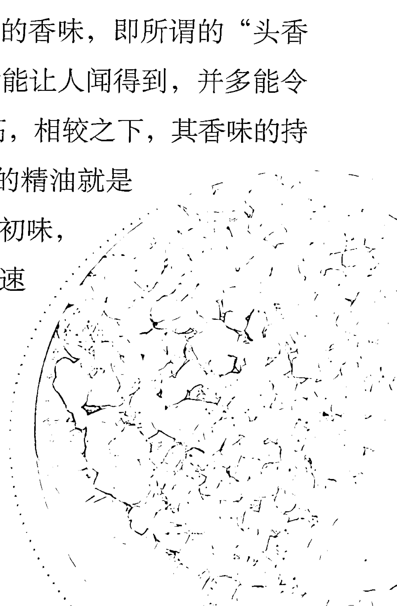

中香调精油的挥发性介于头调与基调之间，一般具有稳定、平衡和宁神作用，对于身体、心理的各种系统影响层面最大。中香调的精油相当多，在调制复方精油上，也是应用范围最广泛的。至于基香调精油，就是属于“愈陈愈香”的精油，最初香味并不明显，无法一开始就令人印象深刻，但是香味持续最久，有些香味，不仅能“余香绕梁，三日不绝”，甚至可以维持达一星期之久，许多木质类的精油就是典型的例子。基香调精油一般都具有良好的镇静和松弛效果，在香味搭配上，往往扮演关键性角色。

当然，并不是调制精油一定要坚持都要“三调俱全”，也非要在香味上一直追求变化多端、层次复杂，更何况，调制精油不能像香水一样，把十数种香味调在一起。事实上，调制复方精油不要太多，最好不要超过4-5种，否则反而会降低疗效。

在家自助调制复方精油时，还有一点值得特别注意：就是每次使用的精油数量不要太多。一来，是因为精油的成本高昂，如果调制得不尽人意，只要每次调制的数量不多，至少不会造成太大浪费；其次，在调制精油的过程中，精油会接触空气，造成氧化现象，因而缩短保存寿命，也因此复方精油的保存期多数会较短，为了确保每次使用的复方精油的质量，每次调制时，尽量以“小量”进行。

简而言之，调制复方精油，在“精”而不在“多”，不论每次选用的精油种类多寡，单个品种数量，都不要过多，才是上上之策。

### 调配芳香按摩油要领

调配芳香按摩油是精油 DIY 中的一个重头戏，因为按摩法与吸入法是精油应用的两个最主要的方法。

在制作芳香按摩油之前，需要准备一些工具，包括：

- 1. 数个干净的深色玻璃空瓶，30、50 毫升，或 100、125 毫升的深色玻璃空瓶子皆可。
- 2. 几支有刻度的小滴管。
- 3. 小型漏斗一个。
- 4. 几只不同大小的汤匙，可以购买制作面点专用的套装汤匙，其中包括小匙（又称茶匙，tea spoon, tsp）、大匙（table spoon, tbsp）等。

与调制复方精油一样，刚开始制作芳香按摩油必须以小量进行，并最好能使用滴管，这是为了能清楚掌握分量，避免造成浪费。

如果要调配的是好几种精油组成的芳香按摩油，可以有两种做法：其一，是把已调配好的复方精油添加至基础油中；其二，则是每一种精油在与基础油调和时，每次只用一种精油，先了解其香味，并记下所添加的滴数，然后再添加第二种精油，同样地，记录所加的数量，然后是第三种精油，以此类推。

### 精油与基础油的适当比例

精油与基础油的容量与比例，以下有一个简易的换算法：

- - 20 滴精油＝1 毫升，即 1 滴精油 ＝ 0.05 毫升
- - 1 小匙（tsp）＝5 毫升
- - 1 大匙（tbsp）＝15 毫升，即 3 小匙

调制精油与按摩油的百分比，可以在1%－3%之间，如果是调制脸部或比较敏感皮肤的芳香按摩油，则以 0.5%－1% 为宜。0.5%的百分比，大约是 1 滴精油加入 2小匙（即等于 10 毫升）基础油，1%的百分比，大约是 1 滴精油加入 1 小匙基础油中。

如果是用于按摩身体，精油与基础油的百分比以 2%左右最为理想，大约就是每 1 小匙的基础油中加入 2 滴精油。如果是为了医疗用途，那么精油浓度可以酌量增加至 3%，也就是每 1 小匙的基础油中，添加 3 滴的精油。

- 稀释精油至基础油中的百分比，亦即芳香按摩油的浓度，也有一个简易的换算法：
- - 1%芳香按摩油：1 滴精油＋1 小匙基础油（5 毫升）
- - 3 滴精油＋1 大匙基础油（15 毫升）
- - 2%芳香按摩油：2 滴精油＋1 小匙基础油（5 毫升）
- - 6 滴精油＋1 大匙基础油（15 毫升）
- - 3%芳香按摩油：3 滴精油＋1 小匙基础油（5 毫升）
- - 9 滴精油＋1 大匙基础油（15 毫升）

每次添加基础油于空瓶中时，必须留一点空隙，以避免基础油或精油溢出瓶子。比方说，一个容量为 30 毫升的精油空瓶子，那么只添加 25 毫升的基础油至空瓶中，然后再添加精油，大约是 12－15 滴精油。

当所有的精油都加入基础油中后，将瓶盖拧紧，经过充分摇晃之后，打开瓶盖，滴出一小滴于自己的手上，试闻其香味，然后，再滴在手背上，擦拭之后，再闻一次其香味。就像香水一样，其香味弥漫在空气中与擦拭在自己皮肤上会有所不同，所以，当精油与基础油调配好之后，必须试闻，如果不满意其气味或浓淡，可以做一些修正，比如说，加入其他精油，或增加基础油的分量等，直到满意为止。至此，调制芳香按摩油的工作，可谓告一段落了。

## 芳香按摩滚珠瓶妙用无穷

一般人在家里做芳香按摩，有一种最方便实用的工具，就是滚珠瓶。英文称呼这种特制的芳香按摩产品为 roll-on，中文的译名很多:滚珠瓶、滚珠笔、走珠笔、随身瓶、随身笔等等。不论是何种译名，顾名思义，都可以了解到这是一种方便携带的玻璃瓶，外形为瘦长型，有如一枝笔，瓶口上有一个滚动的珠子。瓶子一般都不大，国内常见容量的是7毫升或10毫升，在国外也有30毫升的，其设计就很适合用来按摩身体，也利于随身携带。

这个小玩意儿，实在妙用无穷，其特别之处就在于瓶口上的一个活动小珠子，当珠子在身体上滑动时，瓶内的按摩精油会随着转动的珠子流出，因此用其按摩身体时，皮肤得到充分的润滑，用力转动珠子，等于是对身体的一种按摩。由于珠子大小适中，因此可以在身体各个部位滑动，尤其适合在脉搏、太阳穴、手肘内侧，或沿着发际之处，轻轻滚动，既有按摩的功效，又能使精油均匀分布在皮肤上，然后透过皮肤，进入血管，再进入体内。

身携带。在我出门的随身皮包内，经常带着自己调制的滚珠瓶，以利随时取用。

自行调制芳香按摩滚珠瓶十分简易，只要掌握精油与基础油的百分比在1% –3%间即可，以市面上常见的7毫升或10毫升滚珠瓶为例，在倒入8、9分满的基础油后，再滴进2–5滴精油即可。

## 成为出色精油DIY专家的其他秘诀

市面上所售的复方精油或芳香按摩精油的售价，都比单方精油、基础油要贵很多，其理由往往就是因为成分比较丰富，但是如果懂得精油 DIY 的知识，并仔细研读其成分说明，就会发现市售的复方产品，其实内容不一定很复杂，甚至也未必含有特别高级的成分，但是其索价就是比较昂贵，一般而言，大约都比单方贵了两三倍，有些实在是贵得离谱，尤其是所谓的芳香按摩棒或滚珠瓶，在台湾地区，一瓶只有7毫升的芳香滚珠按摩瓶，标价居然高达上千新台币！相信在学会自制复方精油与芳香按摩油之后，大可不必当冤大头，去购买一些打着所谓“特殊配方”标志、索价不合理的复方精油产品了。

调制复方精油或芳香精油，看起来似乎很复杂，其实只是需要丰富的经验，而经验就是要透过不断的学习及实际练习所累积，绝对无法一蹴而就。举例来说，当调制出某一种复方精油或芳香按摩油之后，觉得其

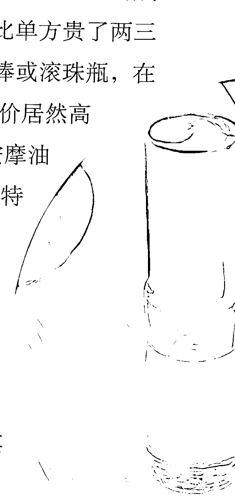香味道不如原先预期般迷人，比方说，可能是略微多了一点依兰、天竺葵，使其香味太甜了，那么可以再加1–2滴檀香，以减弱其甜味；如果调制品有一股药味，例如没药、鼠尾草加多了一点，那么可以略添加一点甜橙，以改善其药味，而变得更香甜、好闻。

这就又好像烹调一样，如果只是懂得理论，或是搜集了很多食谱，却从来很少下厨，那么就是纸上谈兵，逢到真正出手，就会露出破绽，可能不是太甜，就是太咸、太辣，总之，就是无法恰到好处。至于要如何补救，当然也有些招数，例如再加点水、糖或醋等，以改进其味道。调制精油也是如此，精油的特色就在于每种精油的香味都各有千秋，不同的精油加在一起之后，更会产生千变万化的香味，而且精油又具有浓缩度极高、含有多样天然化学成分的特性，只要一小滴的量，就会影响到整体的气味与效果，所以需要更多的实习，而且必须每次都是使用“微调”的方式，更重要的是，一定要勤做笔记，累积心得，久而久之，就可以成为一位出色的精油DIY专家了。

对精油DIY渐渐有心得之后，在调配手法上就可以更自由挥洒，甚至“随心所欲”，而皆能“不逾矩”。举例来说，您可能在每次进行芳香按摩时，选择量取基础油的工具，不必局限于漏斗或滴管，而只是烧菜用的普通汤匙，由于每次按摩身体的芳香按摩油用量大约是20毫升（大约等于4小匙），所以若是要调20毫升的芳香按摩油，就将8–10滴的精油，加入20毫升的基础油中。

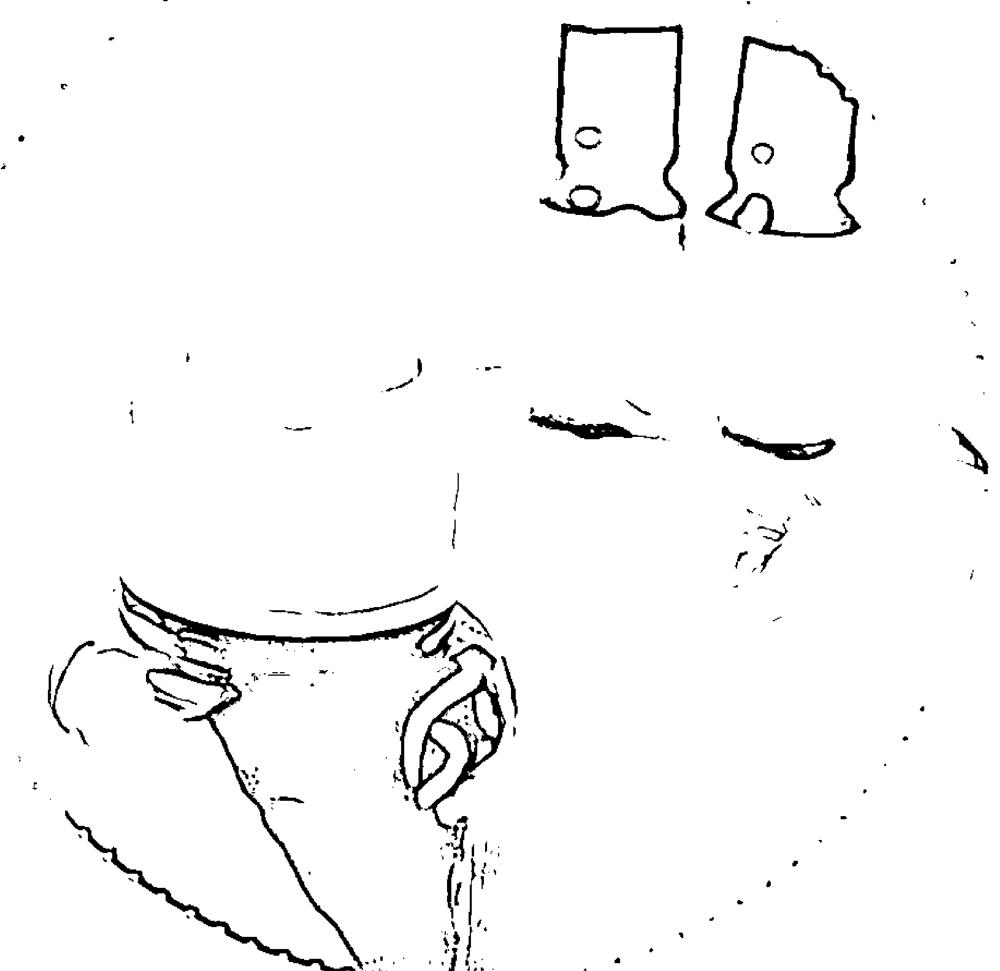

如果一次所要调制的芳香按摩油的数量较大，比如说，大约100毫升，大约就是40-60滴精油加入100毫升基础油中，可以调配出2%-3%的芳香按摩油。市面上有一种容量125毫升的空瓶子，刚好适合这种调制量使用。个人自制的芳香按摩油，最好以100毫升为上限，以确保能在安全的保存期限内用完。一般而言，自行调制的芳香按摩油只有3-6个月的储存期。

自行调制的芳香按摩油的保存期限都比较短，这是因为精油与基础油只要一经打开瓶盖，接触到空气之后，容易因为氧化而变质。如果一次调制的数量较多，以上述的100毫升为例，为了要延长其保质期，最好再添加1小匙小麦胚芽油，因为小麦胚芽油含有丰富的维生素E，可以延长按摩油保质期限；如果所使用的就是比较稳定的基础油，例如荷荷芭油或酪梨油等，也就不必再添加小麦胚芽油了。

最后，当然不要忘了要确定用以盛装芳香按摩油的瓶口紧密盖好，瓶子外面注明制造日期、成分的卷标，然后储藏于阴凉、小孩拿不到之处。

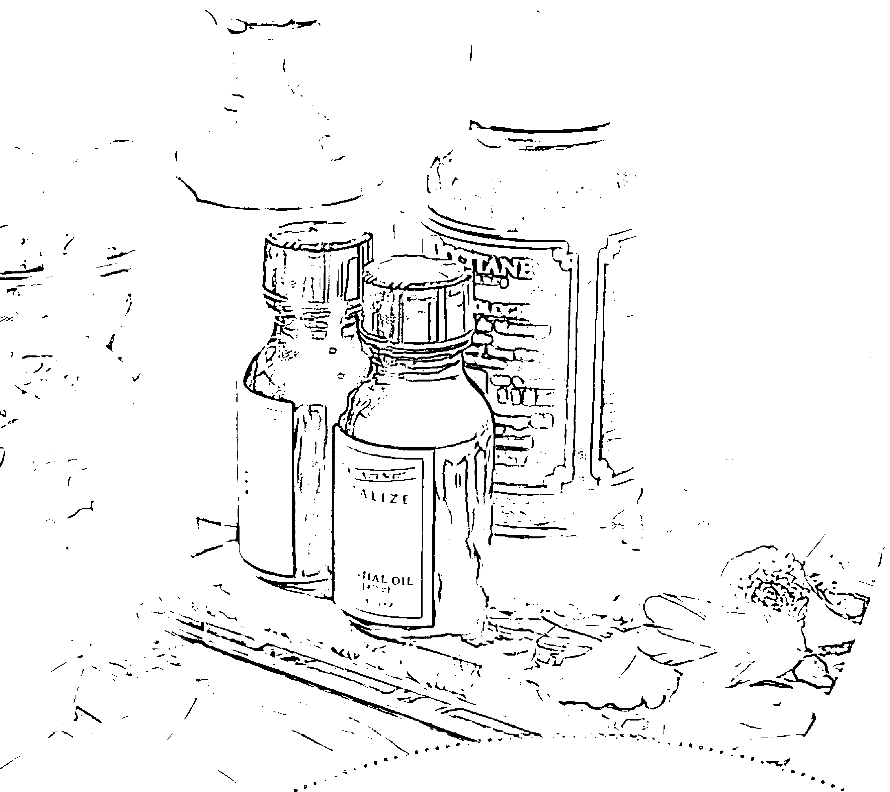

熟悉各种精油，包括名称、特性、对人体的效果等，绝对是不能省略的基本功夫，对于有心要更上一层楼、自行调制复方精油等产品的人来说，除了熟悉精油的特性之外，还必须了解各种精油之间的兼容性、挥发性（note）等。以下的“A-Z 精油数据库”，按照精油英文名称的字母排列顺序，有利读者查询。

| 项目 | 欧白芷 (Angelica) | 洋茴香 (Aniseed) | 罗勒 (Basil) |
| :--- | :--- | :--- | :--- |
| 学名 | Angelica archangelica | Pimpinella anisum | Ocimum basilicum |
| 萃取 | • 以蒸馏法萃取自欧白芷的种子或根 • 精油初呈无色透明，慢慢变至黄棕色 • 甜甜的药草香，略带麝香味 | • 以蒸馏法萃取自洋茴香的种子 • 精油呈淡黄色 • 味道温暖、香甜、刺激、似甘草，也很接近茴香，但较青涩 | • 以蒸馏法萃取自罗勒的花朵、茎、叶子 • 精油几近无色，或带点黄色 • 味道清新、淡雅，略刺鼻，并有植物香脂味 |
| 功效 | • 身体属性：增强免疫系统，治疗感冒、咳嗽；解毒、利尿；有助消化、刺激食欲 • 皮肤属性：柔软、润滑肌肤；改善干燥、受损发质，恢复光泽及柔软度 • 情绪属性：纾解压力，平抚情绪 | • 身体属性：强化心脏、肺脏功能；减少月经疼痛，刺激乳汁分泌；改善消化不良，消除胀气 • 皮肤属性：具抗菌性，对于传染性皮肤病有疗效 • 情绪属性：激励心灵，平抚沮丧 | • 身体属性：有益呼吸系统，能治疗咳嗽、感冒；治疗消化不良；舒缓头痛、偏头痛、抽筋、肌肉痉挛、风湿痛、关节炎痛；有益通经、催奶 • 皮肤属性：消除肤色黯淡；对于干性皮肤、湿疹、疱疹、带状疱疹、痤疮、粉刺有疗效；对昆虫蜇咬的皮肤有止痒效果 • 情绪属性：消除焦虑、歇斯底里、紧张、沮丧的情绪，缓解无力感、疲劳感，增强自信 |
| 挥发性 | 中 | 高 | 高 |
| 调和精油 | • 柑橘类精油、芹菜、快乐鼠尾草、广藿香、岩兰草 | 月桂、雪松、芫荽 (Coriander)、苦橙叶、松、甜橙、玫瑰、花梨木 | 佛手柑、香茅、洋甘菊、快乐鼠尾草、天竺葵、薰衣草、柠檬香茅、莱姆、马郁兰、薄荷、玫瑰 |
| 使用禁忌 | • 怀孕期间不宜使用 • 具光敏性，日晒之前不宜使用 | • 怀孕期间不宜使用 • 极强烈的精油，不宜按摩，可能会引起皮肤过敏 • 用量不宜太多、不宜重复使用或使用期间过长，可能会产生昏沉及上瘾现象 | • 怀孕期间不宜使用 • 可能会刺激敏感性肌肤，必须稀释使用 |

| 项目 | 月桂（Bay） | 安息香（Benzoin） | 佛手柑（Bergamot） |
| :--- | :--- | :--- | :--- |
| 学名 | Laurus nobilis | Styrax benzoin | Citrus bergamia |
| 提取方法 | 以蒸馏法萃取自月桂的叶子及细枝 精油呈深黄绿色 味道强烈、辛辣，带点苦味及温和的花香味 | 以溶剂萃取法萃取自安息香的树脂 精油十分黏稠，呈深橘色或琥珀色 味道香甜，似香草味（vanilla-like） | 以压榨法萃取自佛手柑的果皮 精油呈绿黄色 味道清新、香甜，有点类似橙和柠檬，而又略带点花香 |
| 疗效 | 身体属性：预防疾病感染，治疗气喘、过敏；治疗抽筋、充血、耳痛；消除肌肉或关节炎酸痛；减轻高血压症状 皮肤属性：治疗疣、疥癣、昆虫蛰伤；具柔和的收敛作用，紧实松弛肌肤 情绪属性：提振精神，克服心神不宁 | 身体属性：具抗菌性，可治疗感冒、咳嗽、喉咙痛；可清除体内脓液、废气，利尿；舒缓胃绞痛 皮肤属性：治疗各种皮肤创伤，如干燥、龟裂、冻伤、小疹子等；使皮肤恢复弹性 情绪属性：舒缓紧张、压力，消除悲伤、忧虑、寂寞和沮丧 | 身体属性：消毒杀菌，治愈伤口，治疗感冒；治疗腹绞痛、消化不良，增进食欲；治疗膀胱炎、尿道炎 皮肤属性：有益油性皮肤，对湿疹、疱疹、暗疮、干癣、粉刺有疗效，也可治疗头皮屑 情绪属性：舒缓焦虑、压力，振奋松弛神经，安抚愤怒及挫败感 |
| 挥发性 | 高 | 低 | 高 |
| 搭配精油 | 柑橘类精油、快乐鼠尾草、丝柏、牛膝草、薰衣草、香桃木、迷迭香 | 黑胡椒、芫荽、豆蔻（Cardamom）、小茴香（Cumin）、丝柏、乳香、茉莉、杜松、没药、薄荷、苦橙叶 | 罗勒、小豆蔻、洋甘菊、芫荽、丝柏、天竺葵、茉莉、杜松、薰衣草、香蜂草、含羞草（Mimosa）、香桃木、橙花、苦橙叶、檀香、依兰 |
| 使用禁忌 | 怀孕期间不宜使用；可能会刺激敏感性肌肤，皮肤极敏感者，避免用以按摩身体 | 可能对皮肤极敏感者造成刺激，必须稀释使用 | 具光敏性，日晒之前不宜使用；可能会刺激敏感性肌肤，必须稀释使用 |

| 项目 | 桦木 (Birch) | 黑胡椒 (Black Pepper) | 白千层 (Cajeput) |
| :--- | :--- | :--- | :--- |
| 学名 | Betula alleghaniensis (Yellow Birch) | Piper nigrum | Melaleuca leucadendron |
| 萃取 | • 以蒸馏法萃取自桦木树皮 • 精油呈透明无色 • 味道清新、刺鼻 | • 以蒸馏法萃取自压碎、干燥的黑胡椒粒 • 精油一般呈透明无色，有时带点淡绿色或淡琥珀色，还会随时间变黄 • 味道温暖，略有新鲜的辛辣味 | • 以蒸馏法萃取自白千层的叶子和细枝 • 精油呈黄绿色 • 味道清新，略刺鼻，有浓厚的樟脑药味 |
| 功效 | • 身体属性：具有净化功能，能利尿、清血、帮助淋巴排毒；能止痛、抗发炎，消除肌肉、关节酸痛；退烧、治头痛 • 皮肤属性：治疗湿疹、皮肤炎、牛皮癣等慢性皮肤病 • 情绪属性：提振精神 | • 身体属性：非常温暖的精油，刺激血液循环、强化神经系统、驱除风寒，特别有益于大量失血后的贫血；消除肌肉、关节及骨骼的酸痛、肌肉疲劳与僵硬；治疗感冒 • 皮肤属性：促进血液循环，有益肤色红润，可以治疗冻疮、消除瘀血 • 情绪属性：激励精神，加强集中力，克服冷淡、无感情、沮丧 | • 身体属性：消毒杀菌、预防感染，治疗感冒及其他呼吸道感染，以及因感冒引起的喉咙痛、头痛；治疗牙痛；治疗肌肉酸痛、瘀伤 • 皮肤属性：有益油性皮肤，对粉刺有疗效，也可治疗昆虫咬伤 • 情绪属性：强力的兴奋剂，能振奋精神 |
| 挥发性 | 高 | 中 | 高 |
| 调和精油 | 柑橘类精油、洋甘菊、白千层、乳香、薰衣草、百里香 | 柑橘类精油、罗勒、佛手柑、乳香、丝柏、天竺葵、玫瑰草、迷迭香、依兰 | 雪松、尤加利、小茴香、乳香、橙花、甜橙、玫瑰、檀香、依兰 |
| 使用禁忌 | 怀孕期间不宜使用 | 使用的分量必须极轻微，尤其用以按摩身体时，可能会刺激皮肤 | 会刺激皮肤，必须稀释使用 |

| 项目 | 樟树 (Camphor) | 胡萝卜籽 (Carrot seed) | 雪松 (Cedarwood) |
| :--- | :--- | :--- | :--- |
| 学名 | Cinnamomum camphora | Daucus carota | Cedrus atlantica |
| 萃取方法 | • 以蒸馏法萃取自樟树的木材、树干，或叶子 • 精油呈无色透明至淡黄色 • 味道清新、强劲、刺激，具穿透力及特有的樟脑味 | • 以蒸馏法萃取自干燥的胡萝卜种子 • 精油浓度适中，呈淡黄或金黄色 • 味道温暖、干燥，而略有木质香，与新鲜胡萝卜的香味并不相似 | • 以蒸馏法萃取自雪松的木材 • 精油十分黏稠，呈金黄或琥珀色 • 味道为木质香，有点类似檀香，但气味较为干燥，略具水果香 |
| 功效 | • 身体属性：治疗支气管炎、感冒、咳嗽；治疗风湿痛、关节炎、肌肉酸痛、神经痛；天然的除虫剂 • 皮肤属性：有益油性皮肤，治疗粉刺；纾解皮肤发炎症状；消除疤痕、斑点 • 情绪属性：有镇静效果，平抚歇斯底里的情绪 | • 身体属性：对肝脏有解毒功效，能排除毒素堆积，亦有益于其他肝脏毛病，改善肝炎症状的效果尤其优异；能强化红血球功能，有助于改善贫血及疲弱感 • 皮肤属性：能强化红血球功能，改善肤色，使皮肤紧实有弹性、抚平皱纹，还能淡化老人斑；可促进表皮细胞再生，预防皱纹生成，也能促进伤口结疤，以及消除妊娠纹、黑眼圈；对治疗伤口发炎、白斑、溃疡、瘙痒及湿疹均有效果；也有益于治疗脚底粗硬干燥的皮肤、鸡眼 • 情绪属性：安抚心灵，能纾解压力，以及舒缓精疲力竭的精神状态 | • 身体属性：对缓和咳嗽、支气管炎、化痰有帮助；治疗膀胱炎、阴道炎和阴道痒 • 皮肤属性：绝佳的护发剂，可预防掉发、秃头、头皮屑；消除脓疮，治疗湿疹干癣；具收敛性，有利油性皮肤，也可改善面疱、粉刺 • 情绪属性：松弛神经，舒缓焦虑，有助于沉思、冥想 |
| 挥发性 | 高 / 中 | 中 | 低 |
| 调和精油 | 橘、甜橙、依兰 | 柑橘类精油、佛手柑、雪松、杜松、薰衣草、天竺葵 | 安息香、佛手柑、黑胡椒、白千层、丝柏、乳香、姜、茉莉、杜松、薰衣草、没药、橙花、广藿香、松、玫瑰、迷迭香、檀香、岩兰草、依兰 |
| 使用禁忌 | • 因含有致癌物质黄樟油精 (Safrole)，只可外用，不可内服 • 高剂量具有兴奋作用，避免大量使用 • 高血压患者、孕妇及婴幼儿，均不宜使用 | 怀孕期间不宜使用 (注：胡萝卜籽油与胡萝卜油不同，前者是以蒸馏法萃取自胡萝卜种子的精油，后者则是胡萝卜根的植物浸泡油，含有多种维生素，一般作为芳香疗法的基础油，特别适合干燥、老化皮肤) | 怀孕期间不宜使用 |

| 项目 | 芹菜 (Celery) | 洋甘菊 (Chamomile) |
| :--- | :--- | :--- |
| 学名 | Apium graveolens | • 德国洋甘菊 (Matricaria chamomilla / Chamomilla recutita) • 罗马洋甘菊 (Chamaemelum nobile / Anthemis nobilis) • 摩洛哥洋甘菊 (Anthemis mixta) |
| 萃取 | • 以蒸馏法萃取自芹菜茎、叶 • 精油呈淡黄至深黄色 • 味道清新、刺鼻、略辛辣 | • 以蒸馏法萃取自洋甘菊的花朵 • 德国洋甘菊精油呈深蓝色，罗马洋甘菊精油呈淡蓝色，放置久后会转为黄色，摩洛哥洋甘菊精油呈淡黄色 • 味道是花香、水果香，略似苹果香，并有点土味及刺激性 |
| 功效 | • 身体属性：强效利尿剂，治疗肾结石 尿道感染、肠管阻塞；消除风湿痛、关节炎；有利消化系统；促进乳汁分泌；调治月经失调、经血不足 • 皮肤属性：消除水肿，紧实肌肤 • 情绪属性：松弛神经，舒缓焦虑，消除疲劳 | • 身体属性：治疗感冒、气喘、鼻黏膜炎、咳嗽；治疗循环不良、消化不良；改善抽筋；调解经期不顺、经痛、头痛等 • 皮肤属性：改善敏感型皮肤、过敏体质、湿疹、晒伤、面疮，以及多种皮肤不适症状；消除浮肿、强化组织；优良的护发剂，能使头发柔顺、增加光泽 • 情绪属性：纾解气愤、不安、倦怠、烦躁、歇斯底里的情绪；改善失眠症状 |
| 挥发性 | 高 | 中 |
| 调和精油 | 柑橘类精油、欧白芷、快乐鼠尾草、茴香、欧芹、广藿香、岩兰草 | 罗勒、佛手柑、快乐鼠尾草、茉莉、薰衣草、马郁兰、玫瑰、八角茴香 (Star Anise) |
| 使用禁忌 | 怀孕期间不宜使用 | 怀孕初期不宜使用 |

| 项目 | 肉桂 (Cinnamon) | 香茅 (Citronella) | 快乐鼠尾草 (Clary Sage) |
| :--- | :--- | :--- | :--- |
| 学名 | Cinnamomum zeylanicum | Cymbopogon nardus | Salvia sclarea |
| 萃取 | • 以蒸馏法萃取自肉桂的叶子、细枝及干燥的树皮内层 • 精油呈黄褐色 • 味道浓郁、辛辣、刺鼻，并带点木质味，及特有的香甜香料味 | • 以蒸馏法萃取自香茅草的叶子 • 精油呈淡黄色 • 味道清新，类似柠檬，略为刺鼻 | • 以蒸馏法萃取自快乐鼠尾草的花朵及叶子 • 精油呈无色透明，或极淡的黄色 • 味道香甜，略有花香及坚果味 |
| 功效 | • 身体属性：预防感染，治疗感冒、喉咙痛；对反胃、消化不良、胃肠痉挛有疗效；舒缓风湿痛、肌肉酸痛；通经 • 皮肤属性：具有抗菌性，可以预防感染 • 情绪属性：振奋精神，消除沮丧，还能催情、壮阳 | • 身体属性：预防感染，治疗感冒、发烧，以及轻微伤口感染 • 皮肤属性：具有抗菌性，可以预防感染，可以用在猫、狗等宠物身上，预防跳蚤，一般可作为驱虫剂 • 情绪属性：提振精神，使思绪清晰 | • 身体属性：治疗感冒、喉咙痛、支气管炎、气喘、头痛；有助消化，消除胃肠胀气；降低血压；还可通经、纾解经痛、助产、利子宫 • 皮肤属性：能促进细胞再生，治疗发炎和肿胀的皮肤；有利毛发生长，增加头发光泽，特别有利油性发质，又可防治头皮屑 • 情绪属性：镇静、放松效果绝佳，并能对抗沮丧、纾解压力，带来幸福、温暖的感受；还能催情、壮阳 |
| 挥发性 | 中 | 高 | 高 / 中 |
| 调和精油 | 安息香、尤加利、乳香、柠檬、橘、甜橙 | 佛手柑、白千层、鼠尾草、尤加利、天竺葵、橙花、橘、薰衣草、柠檬、甜橙、薄荷、苦橙叶、松、依兰 | 欧白芷、罗勒、月桂、豆蔻、雪松、芫荽、乳香、天竺葵、茉莉、薰衣草、柠檬、香桃木、苦橙叶、玫瑰、檀香、依兰 |
| 使用禁忌 | • 高剂量具有兴奋作用，尤其是由树皮萃取的精油更为刺激，避免大量使用 • 怀孕期间不宜使用 | • 可能对敏感皮肤产生刺激，必须稀释使用 | • 怀孕期间不宜使用 • 饮酒前后，不可使用此精油，因为酒精与快乐鼠尾草混合会造成严重的酒醉 • 开车之前，或开车时，不可使用此精油，因其镇静、放松效果绝佳 |

| 项目 | 丁香 (Clove) | 丝柏 (Cypress) | 尤加利 (Eucalyptus) |
| :--- | :--- | :--- | :--- |
| 学名 | Eugenia aromatica / Eugenia caryophyllata | Cupressus sempervirens | Eucalyptus globulus |
| 萃取 | • 以蒸馏法萃取自丁香花苞 • 精油呈淡黄色 • 味道强劲，香气馥郁，带有辛辣味及淡淡的水果味，并略有一点木质香 | • 以蒸馏法萃取自丝柏的针叶及嫩枝 • 精油呈淡黄色至橄榄绿色 • 味道新鲜、清凉、轻快而略甜，并有特有的木质香，略有呛人的烟熏味 | • 以蒸馏法萃取自尤加利的叶子及细枝 • 精油颜色透明清澈，放久后呈淡黄色 • 味道清新，略冲鼻，并具有木质香 |
| 功效 | • 身体属性：著名的口腔消毒、除臭剂，有效防治牙痛、口臭；治疗感冒、喉咙痛、支气管炎、气喘、头痛；有利子宫、助产 • 皮肤属性：防治伤口感染，治疗慢性皮肤病、溃疡、暗疮、疥癣 • 情绪属性：激励心灵，振奋沮丧、萎靡、昏沉的情绪；强化记忆 | • 身体属性：减轻关节炎、风湿病，及其他肌肉疼痛；防止细菌感染；治疗感冒、气喘、百日咳；解除静脉曲张，收敛血管，治疗痔疮；调理经期，舒缓经痛 • 皮肤属性：具收敛作用，有利油性皮肤，治疗手足出汗症，清除汗臭、脚臭 • 情绪属性：舒缓愤怒，净化心灵，化解郁闷或情绪低落 | • 身体属性：治疗感冒、花粉症；有利血液循环，治疗风湿、关节炎、肌肉酸痛；抗菌，治疗发炎溃疡；降低体温，使身体清凉；良好的驱虫剂，可消毒空气中的病菌 • 皮肤属性：对止痛、消炎有帮助，可治疗疱疹；促进伤口愈合、组织新生 • 情绪属性：澄清思绪，集中注意力 |
| 挥发性 | 中 / 低 | 中 / 低 | 高 |
| 调和精油 | 佛手柑、快乐鼠尾草、薰衣草、玫瑰、依兰 | 月桂、安息香、豆蔻、雪松、快乐鼠尾草、乳香、杜松、薰衣草、柠檬、橘、马郁兰、甜橙、檀香 | 白千层、雪松、丝柏、薰衣草、柠檬、柠檬香茅、马郁兰、薄荷、松、迷迭香、八角茴香、茶树、百里香 |
| 使用禁忌 | • 怀孕期间不宜使用 • 可能会刺激皮肤，必须稀释使用，并避免用于按摩身体 | 怀孕期间不宜使用 | • 高血压及癫痫患者不宜使用 • 可能会刺激皮肤，必须稀释才能使用 |

## 精油属性表

### 茴香、乳香、天竺葵

| 属性 | 茴香（Fennel） | 乳香（Frankincense） | 天竺葵（Geranium） |
| ---- | -------------- | -------------------- | ------------------ |
| 学名 | Foeniculum vulgare | Boswellia carteri | Pelargonium graveolens |
| 萃取 | - 以蒸馏法萃取自茴香的种子 - 精油呈透明至淡黄或金色 - 具有蜂蜜般香甜味，并略带花香、甘草味及辛辣味 | - 以蒸馏法萃取自乳香的树脂 - 精油呈无色透明，至淡黄或金绿色 - 味道为温暖、浓稠、香甜，带有类似松树的木质香而干涩，并略有刺激性 | - 以蒸馏法萃取自天竺葵的花、茎及叶子 - 精油呈金褐色或鲜绿色 - 芳香花味，甜而略重，有点像玫瑰，带薄荷味 |
| 功效 | - 身体属性：舒缓痛风、风湿痛、结肠痛；帮助消化、排除胀气；降低食欲；利尿、预防肾结石；治疗经期症候群、更年期症候群 - 皮肤属性：能清洁、紧肤、缩小毛孔、防皱，以及治疗橘皮症（蜂窝组织炎） - 情绪属性：给予温暖，唤醒内脏活力，减缓压力，并于困顿时给予力量和勇气 | - 身体属性：有益神经系统，促进呼吸顺畅；有益肺脏，可治疗气喘、支气管炎；有益女性生殖系统，利子宫 - 皮肤属性：良好的护肤圣品，可以防皱、收敛，促进细胞再生，恢复肌肤弹性；有良好的净化效果，对伤口创伤、溃疡、发炎，也有疗效 - 情绪属性：减轻压力与焦虑，使人心情平顺、祥和 | - 身体属性：治疗神经痛、风湿痛、喉咙痛、牙痛；调节经期，平抚经痛、平衡荷尔蒙，缓解更年期症候群 - 皮肤属性：有收敛和杀菌效果，可平衡皮肤皮脂分泌，适合各种肌肤，还能洁肤、紧肤；治疗湿疹、散瘀；促进伤口结痂 - 情绪属性：对抗忧郁、沮丧，提振精神、纾解压力，恢复心理平衡 |
| 挥发性 | 高/中 | 低 | 高/中 |
| 调和精油 | 罗勒、天竺葵、柠檬、薰衣草、马郁兰、玫瑰、迷迭香、檀香 | 柑橘类精油、罗勒、黑胡椒、雪松、肉桂、天竺葵、姜、没药、橙花、松、檀香、岩兰草 | 罗勒、佛手柑、牛膝草、茉莉、杜松、柠檬、莱姆、橘、马郁兰、橙花、甜橙、广藿香、苦橙叶、玫瑰、檀香、茶树 |
| 注意事项 | - 六岁以下幼儿、高血压及癫痫患者，不宜使用 - 可能会刺激皮肤，必须稀释才能使用 | 无 | 怀孕期间不宜使用 |

### 姜、葡萄柚、牛膝草

| 属性 | 姜 (Ginger) | 葡萄柚 (Grapefruit) | 牛膝草 (Hyssop) |
| ---- | ----------- | ------------------- | --------------- |
| 学名 | Zingiber officinalis | Citrus paradisi | Hyssopus officinalis |
| 萃取方式与特征 | - 以蒸馏法萃取自姜根 - 精油呈金黄色 - 味道温暖、新鲜、辛辣，带点木质香 | - 以压榨法萃取自葡萄柚果皮 - 精油呈淡黄色 - 味道清新、甜美，具水果香 | - 以蒸馏法萃取自牛膝草的花朵 - 精油颜色淡黄色 - 香气清新、刺鼻，类似罗勒或百里香 |
| 功效 | - 身体属性：预防感冒，治喉咙痛、化痰；消除风湿痛、关节炎及其他肌肉酸痛；使身体温暖、补身、促进发汗、退烧；治疗腹泻、去肠胃胀气，有助开胃；缓和晕车、反胃、孕妇的晨吐症 - 皮肤属性：有助于消散瘀血、治创伤 - 情绪属性：温暖心情，激励人心，使感觉敏锐；消除疲倦；增强记忆；也能催情壮阳 | - 身体属性：治疗体液迟滞，刺激淋巴系统，可利尿、减肥、排毒；治疗肌肉疲倦、僵硬 - 皮肤属性：有益油性皮肤，可治疗粉刺、痤疮、香港脚；可紧肤，治疗橘皮症；调理肌肤或头皮的皮脂分泌，防止脱发 - 情绪属性：提高警觉，纾解压力，消除沮丧，促人开怀欢畅 | - 身体属性：可调顺呼吸系统和激励心脏功能，也可治疗感冒，促进咳出浓痰；可用于气血虚弱及康复期的病患，有活血化瘀与强筋骨的作用 - 皮肤属性：有益治疗皮肤炎、湿疹、瘀血，及皮肤的轻微伤口、疤痕 - 情绪属性：激励精神，提升情绪 |
| 挥发性 | 中 | 高 | 高 |
| 调和精油 | 雪松、乳香、葡萄柚、杜松、柠檬、橘、香桃木、甜橙、玫瑰草、广藿香、玫瑰、花梨木、岩兰草 | 柑橘类精油、豆蔻、丝柏、天竺葵、姜、薰衣草、橙花、玫瑰草、迷迭香 | 欧白芷、肉豆蔻、快乐鼠尾草、天竺葵、甜橙、橘、香蜂草 |
| 注意事项 | 未有特别禁忌，但可能会刺激敏感型肌肤，必须稀释使用 | 光敏性不如其他柑橘类精油强，但仍注意不要在日晒前使用 | 孕妇、高血压及癫痫患者，不可使用 |

### 茉莉、杜松、薰衣草

| 属性 | 茉莉 (Jasmine) | 杜松 (Juniper) | 薰衣草 (Lavender) |
| ---- | -------------- | -------------- | ----------------- |
| 学名 | Jasminum officinale | Juniperus communis | Lavandula angustifolia / Lavandula officinalis / Lavandula vera |
| 萃取 | - 以脂吸法或溶剂萃取法萃取自茉莉的花朵 - 精油颜色从很深的金黄色、褐色到深褐色 - 香气浓郁，并有一股类似麝香或麝猫香的油腻气味，还有一股像干草、蜂蜜的气息，又隐隐散发似茶味的幽香 | - 以蒸馏法萃取自杜松的浆果，也称之为“杜松子”(Juniperberry)精油 - 精油颜色清澈透明，或淡黄、淡绿色 - 味道清新、香甜，略带木头香及松脂味 | - 以蒸馏法萃取自薰衣草的花朵 - 精油呈透明或淡黄色 - 具有淡而清沏的花香，及隐含植物香脂、木质的暗香 |
| 功效 | - 身体属性：有助于医治妇女疑难杂症，包括经期不顺、痛楚等经期症候群，还可减轻生产时的阵痛，而产后则又有助于乳汁分泌，以及减轻产后忧郁症；对于循环系统与神经系统，也有帮助 - 皮肤属性：增加皮肤弹性，消除皮肤疤痕；有益各种肌肤，尤其是干性、敏感、老化肌肤 - 情绪属性：减轻沮丧、忧郁，消解紧张、害怕，增加自信；催情、壮阳，可治疗性冷淡或阳痿 | - 身体属性：排毒效果特别有名，也能利尿、治疗膀胱炎、阴道炎或发痒、白带；治疗经痛、经血不足或经期不顺；对风湿痛、关节炎、痛风也有疗效 - 皮肤属性：有消毒、清洁、收敛作用，可治疗面疱、皮肤炎、湿疹，对抗橘皮症，有益瘦身 - 情绪属性：镇静、减压、激励，消除心中积郁 | - 身体属性：可杀菌、消毒、消炎；解除充血与肿胀，消除关节痛，对抗痉挛、抽搐；除臭、解毒、利尿、通经；治疗感冒、喉咙痛、鼻黏膜炎 - 皮肤属性：治疗暗疮、烧伤、灼伤、蚊虫叮咬、牛皮癣、湿疹；平衡皮肤，有利各种肤质；恢复皮肤活力，促进结痂，消除皮肤疤痕 - 情绪属性：镇静、安抚情绪；消除紧张、压力、不安、怒气；有助睡眠 |
| 挥发性 | 低 | 中 | 高 / 中 |
| 调和精油 | 柑橘类精油、洋甘菊、快乐鼠尾草、芫荽、天竺葵、薰衣草、含羞草、香桃木、广藿香、薄荷、苦橙叶、玫瑰、檀香、岩兰草、依兰 | 柑橘类精油、雪松、丝柏、天竺葵、姜、薰衣草、松、迷迭香、檀香、岩兰草 | 罗勒、佛手柑、豆蔻、快乐鼠尾草、小茴香、雪松、丝柏、尤加利、天竺葵、葡萄柚、牛膝草、柠檬、柠檬香茅、莱姆、马郁兰、香桃木、橙花、甜橙、薄荷、苦橙叶、迷迭香、茶树 |
| 使用禁忌 | 茉莉原精的浓厚很高，每次使用量只要一点点 | - 怀孕期间不宜使用 - 若有肾脏疾病，不宜使用 | - 怀孕初期及低血压，不宜使用 - 怀孕期间使用，剂量必须较小，以免对子宫产生刺激 |

### 柠檬、柠檬香茅、莱姆

| 属性 | 柠檬 (Lemon) | 柠檬香茅 (Lemongrass) | 莱姆 (Lime) |
| ---- | ------------ | --------------------- | ----------- |
| 学名 | Citrus limonum | Cymbopogon citratus | Citrus aurantiifolia |
| 萃取方式与特征 | - 以压榨法萃取自柠檬的果皮 - 精油呈淡淡的绿黄色 - 具有柑橘类的水果香气，新鲜且强劲 | - 以蒸馏法萃取自柠檬香茅的叶子 - 精油呈黄色至红棕色 - 味道强劲、微甜，带有柠檬香味 | - 以压榨法萃取自莱姆的果皮 - 精油呈黄绿色 - 味道强劲、香甜，带有柠檬香，与柠檬不同的是，带有明显的苦味 |
| 主要功效 | - 身体属性：治疗伤风、感冒、喉咙痛、发烧；消除消化不良、静脉曲张；抗坏血、抗菌；良好的驱虫剂 - 皮肤属性：美白皮肤，淡化雀斑；具有收敛、清洁效果，有益油性皮肤，减少皮脂分泌，治疗粉刺、疣；消除橘皮症，有益减重；促进头发生长，使易脆的指甲健康 - 情绪属性：振奋精神，使人神清气爽 | - 身体属性：强力杀菌剂、消毒剂和驱虫剂；可治疗传染病、退烧；纾解头痛、帮助消化、利尿、除臭 - 皮肤属性：调节皮肤，治疗毛孔粗大，能消除粉刺、平衡油性肤质；对香港脚及其他霉菌感染也有疗效 - 情绪属性：激励心灵，恢复精力，提振精神，消除疲劳 | 疗效与柠檬大致相同 |
| 挥发速度 | 高 | 高 | 高 |
| 适合调和的精油 | 柑橘类精油、欧白芷、月桂、安息香、黑胡椒、芫荽、尤加利、茴香、天竺葵、姜、茉莉、杜松、薰衣草、橙花、薄荷、依兰 | 罗勒、芫荽、尤加利、薰衣草、薄荷、迷迭香、百里香、岩兰草 | 柑橘类精油、罗勒、芫荽、快乐鼠尾草、薰衣草、橙花、肉豆蔻、迷迭香 |
| 注意事项 | 具有光敏性，日晒之前不宜使用 | 可能会刺激敏感性肌肤，必须稀释使用 | 具有光敏性，日晒前不宜使用 |

### 橘、马郁兰、香蜂草

| 属性 | 橘 (Mandarin) | 马郁兰 (Marjoram) | 香蜂草 (Melissa) |
| ---- | ------------- | ----------------- | ---------------- |
| 学名 | Citrus nobilis / C. madurensis / C. reticulata | Origanum marjorana | Melissa officinalis |
| 萃取 | - 以压榨法萃取自橘果皮 - 精油呈橘色或金黄色 - 味道细致优雅，具有柑橘香味，以及淡淡的花香 | - 以蒸馏法萃取自马郁兰的花朵 - 精油初呈黄色，放久后渐变成琥珀色 - 味道温暖，具穿透力，略带一点樟脑味，还有点木质香与芳草香 | - 以蒸馏法萃取自香蜂草的花朵、叶子 - 精油呈金黄色 - 味道清新，类似柠檬香味 |
| 功效 | - 身体属性：治疗消化不良、打嗝；利胆；抗痉挛 - 皮肤属性：促进细胞再生，柔软皮肤；预防妊娠纹，消除疤痕；有益油性、充血皮肤，可治疗粉刺、青春痘 - 情绪属性：提振情绪，消除紧张、压力，平抚沮丧、忧郁 | - 身体属性：治疗感冒、气喘、支气管炎、鼻黏膜炎；消除风湿痛、关节炎及其他肌肉酸痛；治疗肠胃不适、便秘、胃肠胀气、消化不良；调理经期不顺、经痛；对心脏有保健作用，可降低高血压、心悸 - 皮肤属性：治疗瘀伤、挫伤；促进血液循环，有益排除肌肉中的废物 - 情绪属性：镇静情绪，平抚沮丧、悲伤，消除紧张、压力；治疗失眠症 | - 身体属性：舒缓气喘、咳嗽；治疗头痛、偏头痛、腹痛、反胃；降低血压，治疗休克或惊悸；调理经期不顺、经痛；天然的驱虫剂 - 皮肤属性：治疗湿疹及其他皮肤不适；活化肌肤，有益早熟、老化皮肤；消除蜜蜂、昆虫叮咬的发痒 - 情绪属性：镇定和抚顺情绪，使人愉悦，消除愤怒；治疗失眠症 |
| 挥发性 | 高 | 中 | 中 |
| 调和精油 | 柑橘类精油、罗勒、洋甘菊、芫荽、肉桂、丁香、小茴香、快乐鼠尾草、天竺葵、杜松、薰衣草、肉豆蔻 | 罗勒、佛手柑、雪松、洋甘菊、丝柏、尤加利、天竺葵、薰衣草、香蜂草、甜橙、薄荷、迷迭香、茶树、百里香 | 柑橘类精油、洋甘菊、天竺葵、茉莉、薰衣草、马郁兰、橙花、玫瑰、迷迭香、百里香、依兰 |
| 注意事项 | - 具有光敏性，日晒前不宜使用 | 怀孕期间不宜使用 | - 怀孕期间不宜使用。 - 具有光敏性，日晒前不宜使用 - 可能会刺激皮肤，敏感型肌肤不宜使用 - 低血压患者不宜使用 |

### 香桃木、没药、橙花

| 属性 | 香桃木 (Myrtle) | 没药 (Myrrh) | 橙花 (Neroli) |
| ---- | --------------- | ------------ | ------------- |
| 学名 | Myrtis communis | Commiphora myrrha / C. molmol | Citrus aurantium var. amara |
| 提炼 | - 以蒸馏法萃取自香桃木的叶子及嫩枝 - 精油呈淡黄色至橘色 - 味道清爽、宜人，具穿透力，类似尤加利，但更精致、温和 | - 以蒸馏法萃取自没药的树脂 - 精油呈淡黄或金黄色，至琥珀色 - 味道浓郁持久，具有树脂特有的香脂味，略有辛辣的药味 | - 大多数是以脂吸法萃取自橙花的花朵，也有少数以蒸馏法萃取自橙花花朵 - 精油呈金黄色 - 味道浓郁、浓稠、持久，香甜而略有苦味，并有迷人的花香 |
| 属性 | - 身体属性：治疗感冒、咳嗽、胸腔感染；杀菌、化痰，强化免疫系统 - 皮肤属性：良好的收敛剂，可治疗痔疮、痤疮；有益油性皮肤，清除毛孔阻塞，治疗粉刺 - 情绪属性：澄清思虑，振奋精神，驱除焦虑 | - 身体属性：治疗阴道炎，抑制发痒、发炎；消除口腔溃疡、牙龈疼痛，也可化痰；预防胸腔感染，治疗鼻黏膜炎、支气管炎、感冒、喉咙痛；有益消化系统，治疗腹泻 - 皮肤属性：治疗皮肤创伤、湿疹、香港脚、冻伤、干裂等；使老化皮肤回春，消除皱纹 - 情绪属性：镇定情绪，使人温暖、放松、乐观；有益静坐、沉思 | - 身体属性：有益呼吸系统，使呼吸顺畅；有益女性生理系统，治疗经前症候群、更年期症候群及忧郁症；抗痉挛，治疗慢性腹泻、消化不良 - 皮肤属性：洁净、柔软皮肤，恢复皮肤活力、弹性，有益敏感、老化、皱纹肌肤；消除皮肤疤痕，预防妊娠纹 - 情绪属性：松弛紧张、压力；平抚沮丧、忧郁；消除不安、恐惧，治疗失眠症；也能催情、壮阳 |
| 挥发性 | 中/低 | 低 | 中/低 |
| 搭配精油 | 柑橘类精油、快乐鼠尾草、茉莉、薰衣草、迷迭香、花梨木、百里香、茶树 | 安息香、雪松、丝柏、乳香、天竺葵、杜松、薰衣草、柠檬、广藿香、薄荷、松、檀香 | 柑橘类精油、洋甘菊、快乐鼠尾草、天竺葵、茉莉、薰衣草、没药、迷迭香、花梨木 |
| 限制注意 | 无 | 怀孕期间不宜使用 | 无 |

### 绿花白千层、肉豆蔻、甜橙

| 属性 | 绿花白千层 (Niaouli) | 肉豆蔻 (Nutmeg) | 甜橙 (Orange, sweet) |
| ---- | -------------------- | --------------- | --------------------- |
| 学名 | Melaleuca viridillora | Myristica fragrans | Citrus sinensis |
| 萃取方法和特征 | - 以蒸馏法萃取自绿花白千层的叶子和细枝 - 精油呈无色透明，或很淡的黄绿色 - 味道清新、温暖、香甜，并很像樟脑味 | - 以蒸馏法萃取自肉豆蔻的果核 - 精油呈透明无色 - 具有强烈的香辛料味，有点像麝香，令人感觉温暖 | - 以压榨法萃取自甜橙的果皮 - 精油呈橘色或深金黄色 - 味道清新、香甜，典型的橙皮香味，比一般的柑橘类精油更温暖、滋润 |
| 功效 | - 身体属性：消毒杀菌、预防感染，可做漱口水和阴道灌洗液，治疗感冒及其他呼吸道感染，以及因感冒引起的喉咙痛、鼻窦炎；治疗牙痛、肌肉酸痛、瘀伤；有益泌尿系统，治疗膀胱炎、尿道炎 - 皮肤属性：具收敛性，有益油性皮肤，对粉刺有疗效；治疗昆虫咬伤、烧烫伤、轻微的刀伤；刺激组织生长，促进皮肤痊愈 - 情绪属性：振奋心灵，澄清思虑，协助集中注意力 | - 身体属性：有益血液循环，有利心脏；健胃、促进消化，促进肠管正常蠕动，预防便秘；具有温暖效果，可以止痛、抗痉挛，以及治疗风湿痛、关节炎、肌肉疼痛 - 皮肤属性：用以按摩身体，可以促进发汗，驱逐寒冷感受 - 情绪属性：激励心灵，也能让昏厥的感觉消散，回复清醒 | - 身体属性：健胃、抗痉挛、促进肠管正常蠕动；退烧、补身，驱逐寒冷感受 - 皮肤属性：良好的护肤圣品，可改善皮肤干燥、皱纹、湿疹；促进发汗，使阻塞皮肤排出毒素 - 情绪属性：克服忧郁、沮丧；消除紧张，使人愉悦开朗；治疗失眠症 |
| 挥发性 | 高 | 高 | 高 |
| 相容精油 | 尤加利、薰衣草、迷迭香、茶树 | 黑胡椒、肉桂、丁香、快乐鼠尾草、芫荽、丝柏、乳香、柠檬、香蜂草、甜橙、广藿香、迷迭香、茶树 | 柑橘类精油、黑胡椒、肉桂、快乐鼠尾草、芫荽、豆蔻、姜、牛膝草、茉莉、薰衣草、没药、肉豆蔻、苦橙叶 |
| 使用禁忌 | 怀孕初期不宜使用 | - 强力精油，使用剂量不宜太大，长期使用可能会过度刺激运动神经，或造成心悸 - 怀孕期间不宜使用 | 具有光敏性，日晒前不宜使用 |

### 欧麒麟草、欧芹、广藿香

| 属性 | 欧麒麟草 (Palmarosa) | 欧芹 (Parsley) | 广藿香 (Patchouli) |
| ---- | -------------------- | -------------- | ------------------ |
| 学名 | Cymbopogon martini | Petroselinum sativum | Pogostemon cabin |
| 萃取 | - 以蒸馏法萃取自玫瑰草的叶子 - 精油呈无色透明，或很淡的黄色 - 味道清新、香甜，类似花香，介于玫瑰与天竺葵之间 | - 以蒸馏法萃取自欧芹的叶子、根、种子 - 精油呈黄色或深琥珀色 - 味道强劲，有一股明显的香料味和坚果香 | - 以蒸馏法萃取自广藿香的叶子 - 精油浓稠，呈淡绿或黄色，至琥珀或深橘色 - 味道浓郁、强烈，略有辛辣、刺鼻、呛人及陈腐、土气的味道，并类似麝香味 |
| 属性 | - 身体属性：开胃、减缓消化不良；消除肌肉僵硬、酸痛；治疗发烧、感染 - 皮肤属性：协助皮脂分泌平衡、刺激细胞新生，有益老化、干燥皮肤，平抚皮肤细纹，协助皮肤保湿；温和杀菌效果，可以治疗痤疮、皮肤炎与皮肤感染 - 情绪属性：减轻压力，使人感到温暖、欢乐 | - 身体属性：促进消化，改善消化不良；强化肌肉，强化子宫，促进通经；治疗膀胱炎及肾脏疾病；利尿，消除水肿；调理血管，治疗痔疮 - 皮肤属性：收敛皮肤血管，治疗瘀伤、收缩脸上微血管，减轻静脉过度明显 - 情绪属性：振作神经，使人兴奋、积极 | - 身体属性：治疗便秘、腹泻，有益结肠、胃、内脏 - 皮肤属性：促进细胞再生，恢复皮肤弹性，消除疤痕，有益老化皮肤，滋润粗糙干裂皮肤；镇静皮肤发红、发热；治疗轻微烫伤；治疗香港脚、湿疹、痤疮；减肥效果好，也适合使减肥后松弛的皮肤紧缩、光滑 - 情绪属性：舒缓紧张、压力，使人放松、愉悦；也可催情 |
| 挥发性 | 高 | 高 | 低 |
| 相容精油 | 雪松、天竺葵、橙花、柠檬、柠檬香茅、甜橙、玫瑰、花梨木、檀香 | 柑橘类精油、欧白芷、洋茴香、芫荽 | 欧白芷、佛手柑、雪松、丁香、快乐鼠尾草、天竺葵、没药、橙花、肉豆蔻、甜橙、玫瑰、花梨木、岩兰草、檀香、依兰 |
| 使用禁忌 | 无 | 怀孕期间不宜使用 | 无 || | 薄荷 (Peppermint) | 苦橙叶 (Petitgrain) | 松，苏格兰松 (Pine, Scots) |
| :--- | :--- | :--- | :--- |
| **学名** | Mentha piperita | Citrus aurantium | Pinus sylvestris |
| **描述** | - 以蒸馏法萃取自薄荷的叶子及花朵 - 呈清澈的淡黄或淡绿色 - 气味有强劲的穿透力，清凉、醒脑，略有花香及蔬菜味 | - 过去是以压榨法萃取自苦橙树尚未成熟的小果实，现在则大多以蒸馏法萃取自苦橙树、甜橙、柠檬、佛手柑等柑橘类的叶子、细枝 - 呈淡黄至琥珀色不等 - 具有淡淡的花香味及木质香味，略似橙花 | - 以蒸馏法萃取自松树的针叶、嫩枝或松果 - 精油呈透明至淡黄色 - 味道清新、强劲，具特有的松脂味 |
| **疗效** | - **身体属性**：治疗感冒、发烧、支气管炎、鼻窦炎、鼻塞、哮喘、口臭；减轻神经痛、头痛、经痛；缓和消化不良、胃痛、反胃、晕车等；天然驱虫剂 - **皮肤属性**：有益油性皮肤，可治疗黑头粉刺、瘀伤、蚊子叮咬 - **情绪属性**：增强记忆，集中注意力，舒缓焦虑、恐惧及歇斯底里的状态 | - **身体属性**：有益身体放松，使呼吸顺畅，也可治疗肌肉酸痛、抽筋，以及缓和消化不良、胃痛 - **皮肤属性**：有益油性皮肤，可以治疗粉刺，也有益油性发质，治疗头皮屑 - **情绪属性**：安抚心灵、松弛神经、消除压力，克服沮丧、忧郁，治疗失眠 | - **身体属性**：有益呼吸系统，可治疗感冒、支气管炎、咳嗽、鼻黏膜炎、喉咙痛、鼻窦炎；有益泌尿系统，预防感染；治疗肌肉酸痛、风湿痛、关节炎；天然的杀菌剂、除虫剂 - **皮肤属性**：对皮肤阻塞有疗效，也可改善湿疹、干癣，促使刀伤的伤口愈合 - **情绪属性**：减轻压力，振奋精神 |
| **挥发度** | 高 / 中 | 高 / 中 | 中 / 低 |
| **相容精油** | 罗勒、安息香、尤加利、茉莉、薰衣草、柠檬、柠檬香茅、马郁兰、松、迷迭香 | 柑橘类精油、薰衣草、玫瑰草、天竺葵、檀香、依兰 | 白千层、雪松、尤加利、茉莉、薰衣草、柠檬、马郁兰、绿花白千层、薄荷、迷迭香、茶树 |
| **使用禁忌** | - 怀孕及哺乳期间不宜使用 - 不适合用于按摩，可能会刺激皮肤和黏膜组织，但可局部使用 - 是强力精油，使用剂量不宜太大 | 无 | 易敏感皮肤不宜外用，如果进行熏蒸法，剂量必须较小 |

# 罗文莎叶 (Ravensara)

Ravensara aromatica

# 玫瑰 (Rose)

Rosa centifolia：即“甘蓝玫瑰”(Cabbage Rose)，又称“法国玫瑰”或“摩洛哥玫瑰”，主要在法国和北非大量栽植

Rosa damascena：即“大马士革玫瑰”(Damask Rose)，又称“奥图玫瑰”(Rose Otto)，主要在法国和保加利亚大量栽植

# 学名

# 萃取

**罗文莎叶**
- 以蒸馏法萃取自罗文莎叶的叶子
- 精油颜色几近透明，或淡黄色
- 气味清新，类似迷迭香，但较清淡、雅致

**玫瑰**
- 以脂吸法或溶剂萃取法萃取自玫瑰的花朵，极少数以蒸馏法萃取
- 精油颜色几近透明，或淡金黄色
- 气味精致、高雅、纤细，透着花香及木质香

# 效能

**罗文莎叶**
- **身体属性**：有益刺激免疫系统，可治疗感冒、头痛、呼吸道感染及类似感冒的病毒感染；也可治疗病毒性肝炎和病毒性肠炎；舒缓肌肉酸痛、关节炎
- **皮肤属性**：增强细胞防御性，调理面疱，消除疤痕，调节皮脂漏、湿疹，促进头皮与头发生长
- **情绪属性**：刺激精神，刺激情绪，适合过度疲倦、忧郁者

**玫瑰**
- **身体属性**：有益女性生理系统，消除经前症候群、更年期症候群；有助循环系统，帮助排毒；治疗头痛；有益消化系统，利胃；治疗膀胱炎、利尿、利胆、利肝
- **皮肤属性**：绝佳的护肤圣品，特别有益敏感、老化肌肤，能抗皱、消炎、保湿、平衡；能收缩血管，治疗小静脉破裂
- **情绪属性**：平抚情绪，特别是沮丧、哀伤；舒缓神经紧张，减轻压力，提振精神；能安眠；消除性冷淡，具有催情效果

# 挥发调

**罗文莎叶**：高

**玫瑰**：中 / 低

# 调和精油

**罗文莎叶**
- 罗勒、雪松、快乐鼠尾草、丝柏、香茅、尤加利、乳香、薰衣草、薄荷、苦橙叶、马郁兰、迷迭香、百里香、茶树、檀香

**玫瑰**
- 罗勒、安息香、佛手柑、洋甘菊、快乐鼠尾草、天竺葵、茉莉、薰衣草、广藿香、檀香、八角茴香、依兰

# 使用禁忌

**罗文莎叶**：怀孕期间避免使用

**玫瑰**：怀孕期间不宜使用

| 迷迭香 (Rosemary) | 花梨木 (Rosewood) | 鼠尾草 (Sage) |
| :--- | :--- | :--- |
| **学名** | Rosmarinus officinalis | Aniba rosaeodora | Salvia officinalis |
| **萃取** | 以蒸馏法萃取自迷迭香的花朵或叶子 | 以蒸馏法萃取自花梨木的木屑 | 以蒸馏法萃取自鼠尾草的叶子 |
| **精油颜色** | 几近透明，或呈淡黄色 | 几近透明，或淡黄色 | 清澈透明 |
| **气味** | 强劲的穿透力，略具清澈的药草香 | 精致、纤细，透着花香及木质香，略辛辣 | 强劲的穿透力，及清澈的药草香 |
| **属性** | **身体属性**：治疗感冒、气喘、支气管炎、鼻窦炎；良好的止痛剂，可治疗头痛、风湿关节、肌肉痛、痛风；促进循环，改善贫血；治疗消化不良；降低血胆固醇，有利心脏 **皮肤属性**：收敛皮肤，能紧肤，减轻充血、浮肿现象；促进头发生长、增加光泽、减少头皮屑 **情绪属性**：增强记忆，提神醒脑，消除紧张，纾解压力 | **身体属性**：在免疫力低时，可提供身体极佳的抵抗力，抗菌及病毒；可以消除头痛，使头脑清醒 **皮肤属性**：护肤价值高，使组织再生，改善干燥敏感、发炎现象，适合敏感皮肤；并能抗皱、减少妊娠纹，也适合老化皮肤 **情绪属性**：可稳定中枢神经，提振情绪，治疗沮丧、哀伤，减轻压力，也能安眠、催情 | **身体属性**：舒缓风湿痛、关节炎痛、肌肉痛、痛风；治疗感冒、气喘、支气管炎；促进循环，改善贫血；通经；改善消化不良；预防疾病感染，净化空气，除臭 **皮肤属性**：促进细胞再生，促使伤口结痂，改善毛孔粗大；有益于各种皮肤不适，如湿疹、溃疡、暗疮；促进毛发生长，使头发亮丽 **情绪属性**：镇静、放松；消除沮丧和哀伤状态；增强记忆力 |
| **挥发度** | 中 | 中 / 低 | 高 |
| **相容精油** | 罗勒、黑胡椒、牛膝草、薰衣草、柠檬香茅、甜橙、薄荷、苦橙叶、松、茶树 | 柑橘类、洋甘菊、快乐鼠尾草、天竺葵、茉莉、薰衣草、广藿香、檀香、依兰 | 月桂、佛手柑、天竺葵、姜、薰衣草、香蜂草、绿花白千层、甜橙、迷迭香 |
| **使用禁忌** | 具有高度刺激性，孕妇、高血压及癫痫患者，不宜使用 | 无 | 怀孕及哺乳期间不宜使用；是一种强烈的精油，癫痫患者，不可使用 |

| 檀香 (Sandalwood) | 茶树 (Tea Tree) | 百里香 (Thyme) |
| :--- | :--- | :--- |
| **学名** | Santalum album | Melaleuca alternifolia | Thymus vulgaris |
| **萃取与特性** | - 以蒸馏法萃取自檀香根或木心 - 精油呈清澈透明至淡黄色 - 气味是细致的木质香，有如蜂蜜，并带着木质香而较为干涩 | - 以蒸馏法萃取自茶树的叶子 - 精油呈黄绿色或淡褐色 - 气味清新，略刺鼻，带点皮质味，也类似樟脑味 | - 以蒸馏法萃取自百里香的花朵和叶子 - 精油颜色几近透明，或淡黄 - 气味甜而温馨，透着粉味 |
| **功效属性** | - **身体属性**：强力的尿道杀菌剂，能治疗膀胱炎、淋病；对支气管炎、干咳、喉咙痛有疗效 - **皮肤属性**：有益干性、老化、敏感、缺水的肤质，治疗皮肤发炎、湿疹；改善油性皮肤，治疗粉刺；促进伤口愈合 - **情绪属性**：能放松、镇定，改善执迷状态；消除焦虑、恐惧，带来祥和感受；能催情，也能安眠 | - **身体属性**：消毒杀菌、预防感染，对伤风感冒、咳嗽、喉咙痛、哮喘、膀胱炎有疗效；治疗头虱、念珠菌、霉菌、香港脚、疣、疱疹；改善伤口感染或化脓现象，促进结痂 - **皮肤属性**：净化皮肤效果佳，可清面疱、暗疮、粉刺；治疗晒伤、烫伤、刀伤；防治头皮屑或头发过干 - **情绪属性**：增进活力及抵抗力，尤其是适用于受惊的情绪，能使头脑清新 | - **身体属性**：治疗伤风感冒、咳嗽、喉咙痛；刺激白血球增生，增强抵抗力；降低血压，刺激全身循环；推动淋巴，促进身体排毒；刺激消化系统，整治肠胃不适 - **皮肤属性**：有益干性、脱水、老化、皱纹皮肤；有助皮肤清洁、消炎；消除头皮屑，抑制脱发 - **情绪属性**：增加勇气，克服挫败感，提振低落的情绪，驱逐倦怠感；提高记忆力及注意力；治疗轻微失眠 |
| **挥发度** | 低 | 高 | 高 / 中 |
| **相容精油** | 佛手柑、雪松、天竺葵、茉莉、薰衣草、香蜂草、玫瑰草、广藿香、花梨木、岩兰草、依兰 | 黑胡椒、快乐鼠尾草、芫荽、小茴香、尤加利、天竺葵、薰衣草、柠檬、马郁兰、肉豆蔻、松、迷迭香、百里香 | 佛手柑、尤加利、天竺葵、薰衣草、柠檬、马郁兰、香蜂草、松、迷迭香、茶树 |
| **使用禁忌** | 无 | 无 （注：茶树是少数精油中，可以直接未经稀释，擦拭在皮肤上，而不产生刺激或发炎者） | 高血压患者及孕妇，不宜使用 |

# 岩兰草 (Vetiver)

Vetiveria zizanoides

# 西洋蓍草 (Yarrow)

Achillea millefolium

# 依兰 (Ylang Ylang)

Cananga odorata

| | 岩兰草 | 西洋蓍草 | 依兰 |
| :--- | :--- | :--- | :--- |
| **学名** | Vetiveria zizanoides | Achillea millefolium | Cananga odorata |
| **萃取与特性** | - 以蒸馏法萃取自岩兰草的根 - 精油十分黏稠，颜色呈琥珀至橄榄或深棕色 - 具有土香味，略有麝香，气味十分深沉而又细致 | - 以蒸馏法萃取自西洋蓍草的花朵 - 精油呈深蓝色或深橄榄色 - 香甜的药草味，略刺鼻，并有类似樟脑香味 | - 以蒸馏法萃取自依兰的花朵 - 精油呈黄色或金黄 - 香味浓郁，略油腻，并有典型热带花卉的植物香味，富异国风情 |
| **功效属性** | - **身体属性**：安抚神经，刺激免疫系统；促进血液循环，可作为温和的红皮剂，治疗肌肉酸痛、风湿痛、关节炎等 - **皮肤属性**：具有抗菌、消炎、收敛效果，适合油性及长粉刺的皮肤 - **情绪属性**：著名的宁静油，可以安抚饱受压力、挫折、挫败、沮丧打击的情绪，并使人产生踏实感，也可以治疗失眠 | - **身体属性**：可促进血液循环，治疗关节炎、肌肉疼痛；帮助消化；治疗高血压；刺激免疫系统，增加身体抵抗力；平衡荷尔蒙分泌，有益女性生理 - **皮肤属性**：可平衡皮脂分泌，有益干性及油性皮肤，特别是粉刺皮肤；可促进头发生长；可调理皮肤，抗发炎 - **情绪属性**：纾解与压力有关的心理不适或失调，也有助安眠 | - **身体属性**：可缓和心跳急促、高血压；可扩胸，保持胸部坚挺；治疗肌肉痉挛；治疗高血压 - **皮肤属性**：可平衡皮脂分泌，有益干性及油性皮肤；调理头皮，促使新生头发更具光泽 - **情绪属性**：纾解压力紧张；对抗沮丧忧郁；能催情；有助安眠 |
| **挥发度** | 中 / 低 | 高 | 低 |
| **建议搭配** | 安息香、葡萄柚、茉莉、薰衣草、依兰 | 雪松、洋甘菊、松、岩兰草 | 佛手柑、雪松、快乐鼠尾草、茉莉、柠檬、薰衣草、香蜂草、广藿香、玫瑰、花梨木、檀香、岩兰草 |
| **使用注意事项** | 无 | - 极少数个案，可能会刺激皮肤，引起红肿、发炎 - 怀孕期间避免大量使用，具有利尿作用 | - 红肿、发炎与湿疹皮肤应避免使用 - 高剂量具兴奋作用，避免大量使用 |

## 第三章 原始社会

1
2

（图片：img/006b44f336e428c3c72423b73a972e94_74_0.png）

（图片：img/006b44f336e428c3c72423b73a972e94_74_1.png）

原始社会

（图片：img/006b44f336e428c3c72423b73a972e94_74_2.png）

（图片：img/006b44f336e428c3c72423b73a972e94_74_3.png）

（图片：img/006b44f336e428c3c72423b73a972e94_75_0.png）

## Part 2-1 美丽容颜

有谁能不疼惜自己的容颜？每天我们都要揽镜自照，观看自己脸部的表情、色泽之外，还要研究脸部的每一处肌肉、每一条细纹；每发现一处皱纹、一个青春痘，都恨不得除之而后快。我们都盼望，脸部的肌肤永远水润，保持在最佳状态。

是谁说“美丽不能偷懒”？要拥有一张美丽的容颜，的确得勤快些，不过方法必须得当：其一，日常有规律而正确的保养习惯；其二，选择适当、适量的脸部保养品；还有饮食均衡营养，生活作息正常，避开污染、压力，杜绝烟、酒及刺激性食物，心情保持乐观开朗……总之，维护面子问题，精油可兼顾“表里”功效，在脸上涂涂抹抹，又擦又捏，算得了事。但这么容易，还必须从“里子”下功夫，就是身心必须兼顾“面”的健康。

所有这些“表里”兼“美容”的从里到外的脸部保养，精油都可以担当大任。从脸部表层的保养谈起，举凡脸部的清洁、收敛、滋养、紧实、美白等等，精油都有一定的功效。一直到深层的肌肤养护，包括滋润及保养皮肤，调节油脂分泌，促进新陈代谢，加强细胞再生，增进血液循环，镇定消炎反应等等，精油都能发挥作用。此外，精油还能使人情绪放松、心情愉悦、消除疲劳、恢复活力等等，这些功效对于脸部的皮肤保养更具有不可忽视的加乘效应，因为我们都清楚：美丽的容颜来自美丽的心灵。

在实际应用方面，使用精油来美化容颜相当普遍，弹性相当灵活多变。举例子说，将精油与其他成分调配成为清洁液、面膜、面霜、按摩油等，是一种方式。但即使是使用熏香剂、蒸脸、蒸汽浴等简易的方式，以吸收精油中对脸部肌肤有益的芳香分子，也有美容作用。因为那些珍贵的化学成分会透过呼吸道进入到细胞、血液，在不同的内脏，进而产生效果。

从“面子”到“里子”，都能够产生效果，是精油在美容方面的最大特征。这也是精油比一般的美容保养品更胜一筹的原因。不过，本章将着重阐明“面子”之道，也就是保养容颜的实际应用方法，保养容颜的原则基本上依赖于清洁、保湿及滋养，应用精油养颜美容最简单的方法，就是把不同精油添加到各种美容保养用品中。若要更上一层楼，可以自行制作精油养颜美容用品，而其制作方法都不难，反而是如何选择最适当的精油，才真正比较具有挑战性。而这个挑战，牵涉到的不只是对于精油疗效的熟悉，还有就是对于自己皮肤的深入了解。

（图片：img/006b44f336e428c3c72423b73a972e94_77_0.png）

## 认识自己的肤质

脸部皮肤主要可分为三种基本类型，即正常皮肤、干性皮肤和油性皮肤，不过，有些人并不属于上述任何一种，而是混合型皮肤，有些人则有敏感、老化或是长痘子等问题，这均可归入“问题型皮肤”。不论是选购坊间的美容保养用品，还是自己动手制作，首要的工作，就是必须先了解自己的肤质类型。

### 一、正常或中性皮肤

严格来说，没有所谓的“正常皮肤”（normal skin），恐怕只有儿童才能保有这种肤质，因为只有儿童的皮肤最健康，既不油腻，也不干涩，水分与油脂都恰到好处，因此有人觉得称为“中性皮肤”（evenly balanced skin）比较精确。成人的肤质最多只能是“接近”中性皮肤，因为皮肤总是随着环境、岁月、气候、饮食、荷尔蒙，以及身心状态而改变，想要经常保持中性皮肤，并不能掉以轻心。享有正常肤质者，几乎可以使用各种精油来保养皮肤，不过最好还是选择比较温和的精油，甚至是适合敏感型肤质的精油，如此才能确保皮肤随时维持在最佳状态；至于用以搭配精油的基础油，只要选择最常用于芳香疗法的就可以了。

### 二、干性皮肤

干性皮肤是指皮肤缺乏水分和油脂。判断是否为干性皮肤的方法很简单，就是在洗完脸之后，常常会觉得脸上皮肤有紧绷的感觉。还有，干性皮肤容易产生皱纹，甚至会有脱皮、发痒现象，而且也比较脆弱而敏感，容易因为冷热、风吹、日晒等变化，使得皮肤更加干燥难耐。

干性皮肤大多出现在老年人身上，但是现代化、都市化的生活形态也造成了干性皮肤愈来愈普遍，例如长期处于开放着冷、暖气机及中央空调系统环境下的人，就会出现干性皮肤的现象。有些干性皮肤是因为荷尔蒙改变、内分泌失调、更年期所造成的。

改善干性肤质，必须经常补充皮肤的水分与油脂，另外也要从体质的改变入手，例如多喝水，以及多吃蔬菜、水果等，避免在有冷、暖空调系统的密闭房间待太久，让皮肤能多吸收干净、湿润的新鲜空气，例如有空时设法去林间、海边散步，吸收大自然的芬多精与水分子，就对于干性皮肤十分有益。

芳香疗法对于干性皮肤能够产生内外兼顾的作用：一来是为皮肤提供滋养物质，尤其是精油与基础油搭配使用，更可以为皮肤提供丰富的油脂，温和的纯露也特别有益干性皮肤，如洋甘菊、茉莉、橙花及玫瑰纯露，都是最佳的选择；其二是有些精油能够平衡皮脂腺分泌，例如薰衣草、天竺葵、檀香等精油，就具有惊人的效果。

温和的按摩能够刺激血液循环，让更多血液流到皮肤生长层，促进皮肤健康，干性皮肤尤其需要规律性的按摩，自制一些脸部按摩油来使用，是不可省略的保养工作。

滋润乳霜与营养成分高的面霜，能够使皮肤容易保持水分与油脂，也是干性皮肤所最需要的，特别是在寒冷、干燥、多风的季节，以及必须长时间待在空调房间时。

### 三、油性皮肤

造成油性皮肤的原因，在于皮肤的皮脂腺分泌过度旺盛。皮脂腺分泌又与荷尔蒙的变化有关，这是为何青春期容易有油性皮肤的原因。油性皮肤一般都较有光泽，油性皮肤也比较不易老化，可是过多的油脂如果清理得不够干净，堆积在脸上，阻塞了毛孔，就会造成很多问题，包括粉刺、面疱等等，这些都是油性皮肤经常会遇到的问题。

油性皮肤的人常会为了消除脸上的油腻，特别用力地搓洗脸庞，很遗憾的是，这反而更刺激油脂的分泌，更糟糕的是，为了彻底清理油脂，他们还会购买一些强力的脸部清洁品、调理化妆水，通常其中都含有酒精的成分，以为借此可以去油，结果却是适得其反，一样又是过度刺激油脂分泌。

（图片：img/006b44f336e428c3c72423b73a972e94_80_0.png）

不少精油具有直接减少油脂分泌的功能，还能抑制细菌在油性皮肤上的滋长，这对于油性皮肤无疑是一大救星。有些精油具有平衡油脂分泌及内分泌系统的功能，例如天竺葵就是典型的一例，因此也适合用于治疗油性皮肤。

纯天然植物成分的纯露适于作为油性皮肤的调理化妆水，尤其是具有收敛性质的纯露，例如洋甘菊、薰衣草、金缕梅、橙花纯露，这比含有酒精的商业化妆水要温和，但是效果并不差。

油性皮肤仍然需要营养性的按摩油，尤其是那些具有收敛性质或能平衡油脂的精油，搭配清爽的基础油，效果更佳。内部按摩不但供给皮肤养分，而且能刺激血液循环，促使细胞新生，一样对油性皮肤有所帮助。

### 四、混合型与问题型皮肤

有些人会发现，自己的皮肤很难归类为三大类型中的任何一种，那么就不妨划分其为“混合型皮肤”。即使是“混合型皮肤”也有很多不同的种类，例如“中性偏干”、“中性偏油”，以及中性或干性皮肤，但是鼻子、额头容易出油，亦即所谓的“T字”部位属于油性皮肤；对混合型皮肤的保养必须比较费心，大体而言，可以选择正常或中性皮肤适用的精油，同时注意分区保养。

## 老化、熟龄皮肤

性皮肤所使用的皮肤保养品，但是在某些部位必须有所加强，例如中性皮肤有T字部位出油者，就使用中性皮肤保养品，而在T字部位使用油性皮肤专用保养品。

还有一种常见的状况，就是每个人的肤质会随年纪、季节等因素而改变，例如年轻时是油性皮肤，进入中年期却变成干性皮肤，或是夏天时可能经常油光满面，但是到了秋冬时，却转变得又干又涩；而在特殊环境下，例如紧张、压力、旅行、熬夜、生病，以及荷尔蒙变化等因素，皮肤变得非常敏感，或是长面疱、粉刺、晒伤，以及出现皱纹、提早老化等现象，凡此种种，都可以归入“问题性皮肤”，这类皮肤在进行保养之前，最重要的是要找出“问题”的根源，否则一味盲目地涂抹美容保养品，未必有效，而且还可能出现副作用。吹、雨淋、日晒，几乎就是“吹弹得破”，甚至粗糙的衣物、人造的饰品等，也会造成刺激、红肿、发炎等过敏反应。这种肤质的人，可以参考正常皮肤的护肤用品，也是必须选择温和的精油，不过，每当尝试一种新的精油时，最好能做测试反应，也就是搽一小滴在手肘内侧，甚至必须稀释才能进行测试。使用芳香按摩油的浓度也要很低，在脸部的按摩油只要1%即可，身体按摩油则为2%。值得注意的是，敏感性皮肤者在洗脸时，不要太过用力，力道必须特别温和，而且最好不要使用肥皂，尤其是化工肥皂，必须完全避免;进行芳香沐浴时，最好都能在泡澡水中添加一小匙基础油。此外，最好也不要使用敷面面膜，如果一定要使用，则一定要使用纯天然的产品。

老化应该是一种自然的过程，不过，个人的身心状态与生活作息却能影响老化的过程，皮肤是最能忠实反映老化的器官，每一道细小的皱纹似乎都无情地暴露岁月刻划的痕迹。聪明的现代人懂得保养美容之道，因此年纪大的人并非没有细致、紧实的皮肤，同样地，有些人年纪轻轻的，皮肤的状态却“未老先衰”，这种类型的“老化”皮肤与老年人的皮肤不同，可以称为“熟龄”皮肤。与其等到年老时才想尽办法延缓老化，不如提前预防，在这方面，芳香疗法与精油能够产生惊人的功效。皱纹是皮肤老化的主要征象，防止皱纹，就是驻颜的最大考验。用精油来防止皱纹产生，可分为好几种方式，例如进行芳香按摩就是十分有效的回春术，因为按摩可以促进局部血液循环，让皮肤内层的微精油充满氧气，使缺氧内层的细胞得到适量的氧气，就能活泼健康地运作。皮肤自然就会光滑、亮丽。许多刚刚做完按摩的人，看起来马上就会显得比较年轻，就是这个道理。许多精油更特别具有促进血液循环的特性。配合这种精油进行脸部芳香按摩，回春的效果绝佳。进行脸部按摩必须特别注意力道要轻柔，手法也要正确。主要是以中指，先给指划小圆圈的方式，从下巴开始，顺着两颊，一直到额头，也就是由下而上。不当或是过度用力进行脸部按摩，则可能会使皱纹更明显，一定要小心避免。皮肤细胞的更新是使皮肤年轻的关键。而精油在这方面也有很好的功效，因为精油能够提供营养、维生素等给皮肤中的纤维性蛋白——胶原，使其更有活力。如此，表层的皮肤就会有弹性，而且也能促进细胞再生。有些精油特别含有丰富的植物激素，例如茴香，以及一些能够影响女性生殖系统的精油。这是一种类似人体荷尔蒙的物质，能够影响植物生长。这些化学性成分也能够影响人体生理功能，除了平衡经期、刺激子宫收缩等，也能够活化皮肤功能，刺激皮肤更为紧实，令皮肤更年轻。焦虑、沮丧、疲劳等等，都会使人容易变老，而且也会使人显老，即便是年纪轻轻的人，也不例外。切记，延缓老化的另一个重要关键在于心情必须经常保持轻松愉快。而精油对于提升心灵健康则是大家都已熟悉的了。很多所谓能够回春、驻颜的精油，除了对身体生理功能的帮助之外，其实很重要的一点是其也带给人平静而积极的情绪，这是精油在延缓老化比胆过任何美容产品的一大利器。

痤疮（Acne）是这类皮肤的正式名称。不过，一般人所熟知的是其通俗名称：粉刺、面疱、青春痘等，这种类型的皮肤是美容保养产品界的兵家必争之地。就是因为人数众多之故。几乎没有人能够避免长痘痘的困扰。许多人从青春期自然是饱受折磨，即便过了青春期，却还是经常为了痘痘而烦恼。而最恼人的是，痘痘总在不该长的时候冒出来。例如面试、抽签或重大约会前等等。显然除了荷尔蒙分泌因素之外，情绪、心理、生活作息等因素也占了重要地位。追根究底而言，长痘痘主要是源于皮脂腺分泌太过旺盛。当皮脂腺将大量的皮脂排出皮肤表层，而皮肤来不及清洁干净时，表皮角质细胞堆积太厚，加上外界环境污染，如灰尘、废气及外界脏污等，这些都是细菌滋生的温床。于是一旦有细菌感染，皮肤出现红肿，或是不良物质阻塞毛孔，就会产生黑头粉刺、痘痘。使用精油来治疗痤疮，可以开内外兼治的方式。亦即一方面可以利用具有杀菌、消炎作用的精油，来处理已经出现的痘痘，以防止细菌滋生及皮肤表面的发炎现象。再配合有镇定作用的精油来安抚有伤痕的皮肤。最后再使用加速伤口愈合、促进皮肤细胞新生、清除或淡化疤痕功效的精油，以达到美容的目的。而在另一方面，可使用具有收敛性的精油，以阻止油脂分泌过剩；或是可促进血液循环与淋巴系统功能的精油，以促进体内排...

## 天然基础油及其适用肤质

基础油是从植物的种子、果实或坚果中通过压榨等方式提取出来的油脂，通常具有良好的延展性和亲肤性。它们本身就可以作为护肤品使用，或者作为载体油稀释和调配精油。根据油脂的特性和营养成分，不同的基础油适用于不同的肤质和需求。选择合适的基础油，能够更好地滋养皮肤，改善皮肤状态，带来健康与光泽。以下是几种常见基础油及其适用肤质的简要介绍。

| 基础油 | 正常肤质 | 干性肤质 | 油性肤质 | 敏感肤质 | 老化肤质 | 痤疮 |
| :--- | :---: | :---: | :---: | :---: | :---: | :---: |
| 甜杏仁油 | √ | √ | √ | √ | √ | √ |
| 杏核油 | √ | √ | √ | √ | √ |  |
| 酪梨油 | √ |  |  |  |  |  |
| 琉璃苣油 | √ | √ | √ | √ | √ | √ |
| 胡萝卜油 | √ | √ | √ | √ | √ |  |
| 月见草油 | √ | √ | √ | √ | √ | √ |
| 葡萄子油 |  |  | √ | √ |  | √ |
| 榛果油 |  | √ |  | √ |  |  |
| 荷荷芭油 | √ | √ |  |  |  |  |
| 橄榄油 | √ |  |  | √ |  |  |
| 玫瑰果油 | √ |  | √ | √ | √ |  |
| 小麦胚芽油 |  | √ |  |  | √ |  |

## 护肤基础油及其作用

| 植物油 | 正常肤质 | 干性肤质 | 油性肤质 | 敏感肌肤 | 老化肌肤 | 问题肌肤 | 说明 |
|---|---|---|---|---|---|---|---|
| 安息香 | ✓ | ✓ |  |  |  |  | 治疗各种皮肤创伤、发炎、皲裂 |
| 佛手柑 |  |  | ✓ |  |  | ✓ | 光敏性极强，用于保养皮肤或泡澡，即使稀释仍可能使皮肤晒黑 |
| 雪松 |  |  | ✓ |  |  | ✓ | 收敛、抗菌镇静功效佳 |
| 洋甘菊 | ✓ | ✓ | ✓ | ✓ | ✓ | ✓ | 适合各种肤质，且可治疗皮肤炎、湿疹等 |
| 快乐鼠尾草 | ✓ |  | ✓ |  | ✓ | ✓ | 具抗菌、收敛性，可减轻发炎现象 |
| 丝柏 |  |  | ✓ |  | ✓ |  | 收敛性佳，治静脉曲张 |
| 尤加利 |  |  |  |  |  | ✓ | 有杀菌、疗伤作用 |
| 茴香 | ✓ |  | ✓ |  | ✓ |  | 利尿、治水肿，也可治眼睛浮肿 |
| 乳香 | ✓ | ✓ | ✓ |  | ✓ |  | 益各种肤质，尤益老化肌肤，可抚平细纹，促细胞再生 |
| 天竺葵 | ✓ | ✓ | ✓ | ✓ | ✓ | ✓ | 平衡皮脂分泌，适合各种肤质 |
| 茉莉 | ✓ | ✓ |  | ✓ |  |  | 特别适合燥热、干性、敏感皮肤 |
| 杜松 |  |  | ✓ |  |  | ✓ | 具抗菌、收敛性，有益排毒 |
| 薰衣草 | ✓ | ✓ | ✓ | ✓ | ✓ | ✓ | 一流护肤圣品 |
| 柠檬 | ✓ |  | ✓ |  | ✓ | ✓ | 抗菌、收敛、回春、美白 |
| 没药 |  | ✓ |  |  | ✓ | ✓ | 抗菌、抗发炎，可治干裂皮肤 |
| 橙花 | ✓ | ✓ |  | ✓ | ✓ | ✓ | 安全、温和、不具刺激性，尤益敏感、老化肌肤 |
| 甜橙 |  |  | ✓ |  | ✓ |  | 可消除日晒后细纹 |
| 玫瑰草 | ✓ | ✓ |  |  | ✓ | ✓ | 平衡皮脂分泌，可促进细胞再生、抚平皱纹 |
| 广藿香 | ✓ | ✓ |  |  | ✓ | ✓ | 可治多种皮肤病 |
| 玫瑰 | ✓ | ✓ |  | ✓ | ✓ | ✓ | 调顺皮肤功能佳，尤益干燥、老化、敏感皮肤 |
| 迷迭香 |  |  | ✓ |  | ✓ |  | 可作滋补性收敛剂 |
| 花梨木 | ✓ | ✓ |  | ✓ | ✓ |  | 温和、不刺激皮肤，尤益敏感、老化皮肤 |
| 檀香 | ✓ | ✓ | ✓ |  | ✓ | ✓ | 多用于干性肌肤，但亦有温和收敛作用，亦具抗菌性 |
| 茶树 |  |  |  |  |  | ✓ | 治疗粉刺、面疱功效佳 |
| 百里香 |  |  |  |  | ✓ | ✓ | 抗菌效果佳 |
| 依兰 |  | ✓ | ✓ |  |  |  | 平衡皮脂分泌，适合干性及油性皮肤 |

## 脸部保养的程序

脸部保养的程序包含三部分：清洁、保湿、滋养，而其主要目的在于健全脸部皮肤的皮脂膜，保持角质层的含水量，以及提供充足的水分及营养。

### 一、脸部清洁

脸部清洁虽是寻常的例行性工作，其实也是养颜美容的一个重要步骤，想要拥有一张漂亮的脸蛋，就从脸部清洁开始。脸部清洁工作包括表层清洁与深层清洁两部分：表层清洁工作在于把脸部表面的污垢、灰尘、油脂等清洗干净，这也包括脸上的化妆品，因此在洗脸之前，必须先行卸妆，而且一定要彻底卸除干净才行。深层清洁的主要目的在于促进皮肤新陈代谢，排除脸部皮肤的废弃物质，甚至是毒素等，这是因为我们皮肤的生长是有周期性的，皮肤底层细胞不断成长而向外推挤，慢慢形成老化的角质出来，最后自然脱落，这就是皮肤的新陈代谢，年轻而有活力的皮肤的新陈代谢功能是健康的，皮肤表层的老化细胞透过每日适当的清洁工作就能轻易排除，但是有许多因素会阻碍这种过程，而导致角质细胞堆积在皮肤表层，例如皮肤老化、油脂过多，以及问题性皮肤，如粉刺、青春痘等，因此必须透过人为的方式，以清理表皮的老化细胞及皮屑，去除毛细孔内的汗水、油脂及污垢，以及加速代谢功能，去除有害的废弃物质及毒素。深层脸部清洁最常见的方式，就是使用去角质霜及面膜。至于一向很受人们喜爱的蒸脸，可以算是深层清洁与保湿兼具的美容保养手法。

#### 洗脸不要马虎

理想的洗面剂最好具有适中的清洁作用，太过强烈、刺激，或是洗净力不够都不好，检测的方法，就是在洗脸之后，除了洗净脸上灰尘、污垢之外，并不会造成皮肤干涩、紧绷、粗糙之感（甚至敏感反应，例如红肿、发痒、刺痛等）。由于我们的皮肤的皮脂膜是弱酸性，酸碱值 (pH) 大约在 5.0-6.5，所以清洁用品以选择酸碱值接近弱酸或中性者为佳，因为这是最接近我们皮肤皮脂膜的理想值；还有，洗脸应用接近我们体温的温水，太热的水会洗去皮肤太多油脂，会使皮肤变得干燥、粗糙；太冷的水会使毛细孔收缩，就不容易洗净脸部污垢；脸部不同部位的出油情况略有不同，例如从前发际、额头到鼻翼两侧的 T 字部位，可能油污较多，还有脸部下方靠近脖子处，以及靠近耳朵及耳朵后面，比较容易藏污纳垢，因此洗脸时要多加搓洗、按摩，不过，仍要注意动作必须轻柔，而不可太过用力摩擦皮肤。用力擦洗可能是油性肤质者常见的误区，仿佛想借此去除油腻的污垢，结果却是令人出乎意料，因为过度的清洁动作反而会刺激皮肤的皮脂腺分泌更多的油脂，因而造成恶性循环。坊间所贩卖的洗脸用品，一般分为洗面皂、洗面奶等，其中洗面肥皂大多为碱性 (pH 值大于 7)，这还包括婴儿肥皂及香皂，只有极少数是弱碱性或弱酸性，除非是油性肤质者，否则最好不要选择洗面皂，尤其是强碱性的洗面皂来洗脸；洗面奶大多数使用合成清洁剂，可以调成弱碱性、中性或弱酸性，也容易添加保湿成分，使用时触感很好，泡沫柔细，洗净力也不错，洗脸后还会觉得皮肤有光滑感，因此是最普及的洗脸用品，不过就是由于很好用，因此容易造成使用过量，而导致过度清洁的问题，值得注意的是，有些洗面奶中还含有甲醛(formaldehyde)作防腐剂，可能会对部分人造成皮肤过敏反应。将精油添加在洗脸用品上，不只是可以滋润皮肤，甚至可以帮助皮肤清洁，例如快乐鼠尾草、洋甘菊、柠檬、薰衣草、迷迭香、天竺葵、百里香等，都是不错的选择。

#### 简易洗面奶配方

自制洗面奶也十分容易，左图是一个简单的配方，适合各种肤质使用。自制洗面奶需要使用起泡剂，这是一种界面活性剂，可以增加洗净效果。起泡剂有很多种，最好选择弱酸性起泡剂，例如椰子油起泡剂、氨基酸起泡剂都不错，起泡剂不要添加太多，否则会使皮肤过于干燥，起泡剂与橄榄油的比例大约是3：7，油性肤质者可以略增一点起泡剂，但不要超过4：6的比例。

#### 建议：

- 干性肤质用：玫瑰精油
- 油性肤质用：茶树精油
- 中性肤质用：罗马洋甘菊精油

制作方法：
1.  先混合橄榄油与起泡剂，用搅拌棒调匀。
2.  再倒入荷荷芭油。
3.  最后添加精油。

这是经济实惠又健康好用的洗面奶，洗净效果既佳，洗脸时的触感也很好，还有芳香怡人的香花味，洋甘菊与薰衣草精油更都具有抗菌、安抚、滋润皮肤的功能，对于敏感性皮肤也非常有益。如果是干性肤质者，可以将罗马洋甘菊精油改为更为滋润的玫瑰精油，而油性肤质及容易长痘子的皮肤，则可改为茶树精油。

#### 卸妆必须彻底

有化妆习惯的人一定要在洗脸之前先卸妆。市面贩卖的卸妆产品种类繁多，包括冷霜、卸妆霜、卸妆油、卸妆胶、卸妆乳液等等，价格也都不便宜，有些卸妆产品的油脂含量高，而且有些是矿物质成分，容易残留在毛孔上造成阻塞。为了洗净脸上残留的油分，就必须使用洗净力较强的洗脸用品，这会对肌肤造成更大的刺激。其实用于芳香疗法中的各种植物油或坚果油本身就是很好的天然卸妆油，其浓淡程度各有不同，干性肤质者可以选择浓稠的基础油，例如酪梨油、荷荷芭油，而油性肤质者就可以选用清淡的基础油，例如葡萄籽油、甜杏仁油等，再分别调和具有清洁、滋养作用的各种精油，就可以制造出针对不同肤质的天然卸妆油，其卸妆效果绝不输坊间的各种卸妆产品。

##### 敏感肌肤卸妆油配方
- 葡萄籽油20毫升
- 酪梨油10毫升
- 荷荷芭油10毫升
- 德国洋甘菊精油2滴

##### 干性肌肤卸妆油配方
- 橄榄油30毫升
- 乳香精油1滴
- 没药精油1滴
- 荷荷芭油10毫升
- 甜橙精油2滴

##### 油性肌肤卸妆油配方
- 红花籽油15毫升
- 丝柏精油1滴
- 葡萄籽油15毫升
- 柠檬精油1滴

#### 去角质须有要领

去角质的目的在于深入清洁毛细孔，是脸部深层清洁的一个步骤，去角质保养之后，由于皮肤表层的污垢及老死细胞彻底脱落干净，因此皮肤会觉得清新、娇嫩，这对于促进皮肤的新生有很大的帮助。不过，去角质不可以做得太频繁，否则皮肤的角质层变得太薄，将会变得容易敏感，尤其是干性及敏感性皮肤。至于问题型皮肤，例如脸上有青春痘、痤疮，或有破损、发炎时，也不宜做去角质；即使是正常或油性皮肤，大约一星期只要做一、两次去角质即可。此外，在做去角质时，摩擦脸部的动作要轻柔，而且要避开眼睛四周及嘴唇周围等比较细致的部位。市面上贩卖的去角质产品或是在美容中心的去角质清洁护肤，索价都不低，其实自行动手做去角质产品以及为自己去角质并不难，质量安全有保障，而且物廉价美，因为家中有许多现成的天然食物、五谷杂粮可以利用，例如燕麦、大豆粉、杏仁粉等，而且每次只要1小匙的分量就够了，然后再加入1滴适合个人肤质使用的精油，以及基础油，就大功告成了。左侧配方中的材料都可以根据个人肤质及喜好而改变，例如燕麦片可以改用磨碎的大豆、绿豆、杏仁粉来取代，甜杏仁油也可以改用其他基础油，精油的使用原则以个人肤质为依据。将上述成分搅拌均匀，将其仔细涂擦在脸上，然后以湿润的中指及无名指，轻轻地在脸上画小圆圈，直到脸部皮肤充分被按摩，然后再用温水洗净。

#### 燕麦去角质配方
- 燕麦片1小匙
- 蜂蜜1小匙
- 基础油适量
- 柠檬精油1滴

#### 面膜功效多重

使用面膜来敷脸，具有多重功效，首先就是完善的深度清洁皮肤，能去除皮肤上多余的油脂、污垢、老化细胞，除此之外，由于面膜能使皮肤暂时处在密封状态，因此其对皮肤的保湿、滋润、调理特别有效，能够刺激皮肤血液循环，改善肤色或美白，以及使肌肤紧密、收缩毛孔、防止细纹产生，因此被视为是美容保养上最重要、效果最快速的手段。虽然面膜好处多多，但仍然不可以使用太频繁，正常的中性或干性皮肤只要一周使用一次即可，油性皮肤每周最多只要使用两次。敷面膜时，动作要轻柔，并且仔细敷匀，T 字部位可以敷厚一点，而眼睛四周、嘴角周围则要避开 ；此外，在敷面膜时尽量不要讲话或脸上有过大的表情，以免产生细纹，而是安静地放松，最好能听着自己喜爱的抒情音乐，以利彻底享受。等到面膜变干之后，轻轻地用温水清洗干净，立刻用化妆水调理，然后再擦上保养品，此时皮肤的吸收效果会最好。由于面膜对于美容护肤的功效广大，因此市面上强调不同功能的面膜琳琅满目，表面上看起来。其所使用的原料很复杂，配方也很深奥，其实拆穿了，就会发现其中的学问并不大，特别是了解制作的方法之后，就会觉得小菜一碟。其实，对于不善于烹调的人而言，这比做蛋糕、派饼还要容易。当然，其中还有一点是需要费点心思的，就是认识制作面膜的材料。原始素材，并且熟悉其中不同的美容效果。

基本上，制作面膜的原料可以在家就近取材，例如蛋黄、蜂蜜、芦荟、燕麦片、大豆粉、杏仁粉、绿豆粉等，以及不计其数的蔬菜、水果，常见的如小黄瓜、柠檬、鳄梨、香蕉等等，就能够派上用场、绰绰有余了，而且效果并不差；当然，也可以使用美容护肤专业的面膜原料，例如黏土、火山泥、高岭土等天然矿石粉，其对皮肤的深层清洁效果十分卓著，此外，还有效果比较温和的凝胶 (gel)，适合敏感型的皮肤。为了加强美容效果，可以在基本面膜中添加适合个人肤质的精油，那么就是具有多重疗效的芳香面膜了。以下分别对这几种比较常见的面膜素材及其美容效果作一个简介，读者在自制面膜时，可依个人需要而变化使用。

**黏土 (clay)**：这种天然的矿物土是制作面膜最常见的原料，主要有绿色、白色、红色、蓝色之分，分别具有不同的美容功效，例如绿黏土具有抗菌、愈合、平衡油脂的效果，既可用于干性肤质，也有益于油性肤质所使用的面膜，又常用于问题型或混合型皮肤；白黏土呈微酸性，具有收敛、排毒作用，可以清洁及吸取过多的油脂，除常用于中性及油性肤质之外，也常用于美白面膜；红黏土含有铁质，具有清洁与调理效果，适合所有肤质；蓝黏土具有消炎、愈合与促进细胞再生效果。

高岭土(kaolin)：这是一种天然的矿石粉，质地细致，含有多种营养矿物质成分，如钙、钾、镁等，用于面膜中的优点是可以吸收油脂、收敛毛孔、排除毒素、并且能刺激淋巴与血液循环，适合中性偏油性及油性肤质使用，由于高岭土含有多种营养，并且遮蔽性高，也常见于许多化妆品中，如粉饼、蜜粉、眼影等。

树薯粉(tapioca)：这是萃取自树薯(cassava)的淀粉，也是做珍珠奶茶的粉圆素材，与水调和之后成为果冻一般的透明胶状，其特色就是又Q又嫩，作为面膜凝胶时，可使皮肤光滑、紧实、细致。

果胶(pectin)：这是一种提炼自苹果或柑橘类植物的酸性粉末，略具有弱酸性，并有收敛作用，与水调和之后成为胶状，用于制作面膜的凝胶，适合油性肤质或有面疱的皮肤。

将上述材料盛装在一个干净的小碗中，用搅拌棒（或小汤匙）加以混合均匀，调和成糊状之后，敷满全脸、脖子，静待大约10-15分钟，然后再用温水洗净即可。蜂蜜含有多种维生素与营养物质，自古以来就是敷脸面膜的上上之选，其性质温和，适合所有肤质，而这个芳香的清洁面膜更是适合所有肤质的温和配方，具有良好的清洁皮肤作用，而且还有调理肤质功效。配方中的基础油是选择性添加，干性及中性皮肤最好添加基础油，以加强对皮肤的滋养，油性皮肤者可以不必添加基础油。基础油可以选择使用荷荷芭油、鳄梨油等。如果一次敷脸所使用的量不大，有剩余，可以将其装在密封盒子中，再放在冰箱里冷藏，但有效时间以3-4日为限。

1. 将蜂蜜面膜材料盛装在一个干净的小碗中。
2. 用搅拌棒（或小汤匙）加以混合均匀，调和成糊状。

基础清洁蜂蜜面膜配方
- 蜂蜜1大匙
- 甘油1/2茶匙
- 蒸馏水1/2茶匙
- 柠檬汁1滴
- 基础油1小滴（选择性添加）

1. 将黏土面膜材料装在一个干净的小碗中。
2. 用搅拌棒（或小汤匙）加以混合均匀，调和成糊状。

#### 深层清洁黏土面膜配方
- 高岭土2汤匙
- 甜杏仁油1汤匙
- 基础油1汤匙（选填）

加，干性及中性皮肤最好添加基础油，以加强对皮肤的滋养，油性皮肤者可以不必添加基础油。基础油可以选择使用荷荷芭油、鳄梨油等。如果一次敷脸所使用的量不大，有剩余，可以将其装在密封盒子中，再放在冰箱里冷藏，但有效时间以3-4日为限。

将上述材料装在一个干净的小碗中，用搅拌棒（或小汤匙）加以混合均匀，调和成糊状之后，敷满全脸、脖子，静待大约10-15分钟，然后再用温水洗净即可。黏土对于皮肤的洁净效果最佳，油性肤质者适合使用绿黏土或高岭土，而干性及敏感型肤质可以选用白黏土或粉红色黏土。此配方中的基础油也是选择性添加，依个人肤质而定。如果一次敷脸所用不大而有剩余，可以将其装在密封盒子中，再放在冰箱冷藏，但有效时间以3-4日为限。

### 蒸脸好处多多

不喜欢蒸脸的人很少，因为蒸脸既是一种最简易的美容保养方式，也是一种可以轻易放松的享受。专业的美容沙龙中心少不了蒸脸的机器，通常一次蒸脸，索价不菲，其实不必仰赖专业的蒸脸机器，在家只要靠一盆热水，数滴具有疗效而又芳香的精油，再加上一条干净的大浴巾，一切就搞定了。

蒸脸的最大美容效果在于可以深层清洁皮肤，因为热腾腾的水蒸气可以使促进血液循环，增加排汗量，而皮肤的毛孔也打开了，于是皮肤上的污垢、毒素、老旧细胞也轻易地排出来了。蒸脸对于各种肤质都有效，尤其是油性与容易长痘子的肤质，对于老化、熟龄皮肤也有帮助，因为蒸脸能够促进细胞新生，对于一般性皮肤而言，蒸脸可以使气色红润，改善肤质。而且，还有一个很大的好处，就是蒸脸带来的放松的感觉是无与伦比的，因为热腾腾的水蒸气最容易使人神清气爽，添加了富含天然植物芬芳菁华的精油，更可以使人彻底放松，所有的压力、疲劳也会随着缕缕上升的水蒸气飘到九霄云外。

在家进行蒸脸的道具，首先就是一盆煮沸的热水，以及一条可以覆盖头部、颈部，直到脸盆四周的大毛巾，然后滴入有益自己肤质的精油。在蒸脸时，俯身向下，整张脸正对着脸盆上方大约 25-30 公分，用大毛巾覆盖头部，让大毛巾垂下来，覆盖在脸盆周围，每次蒸脸的时间大约10-15分钟。以下有几种针对不同肤质、富有美容功效的复方精油蒸脸配方。

在蒸脸时，俯身向下，整张脸正对脸盆上方大约25-30公分，用大毛巾盖头部，让大毛巾垂下来，覆盖在脸盆周围，每次蒸脸的时间大约是10-15分钟

将此配方滴入一脸盆的热水中，即可进行蒸脸。这个配方适合正常肤质以及混合型皮肤。

- 正常皮肤蒸油配方
  - 檀香精油3滴
  - 艾草精油2滴

## 二、脸部保湿

所谓良好的皮肤，就是要光滑、柔软，而且还要水灵，而这与皮肤的含水量有密切关系。水才能柔软及滋润角质，而用以保养的油脂则是减缓水分蒸发，因此洗完脸之后，接下来的脸部保养步骤就是调理保湿，而这又应该从内、外两方面供应皮肤水分下手。在内部供应方面，就是要多喝水，因为皮肤水分最主要来自真皮层内的微血管；而外部供应方面，就是要维持皮脂膜的健全，适当的脸部清洁，可以使皮肤维持相当的饱水量，然而过度的清洁，却会使皮肤感到干涩，或是外在环境的大气湿度低，就必须使用具有调理作用的化妆水来滋润皮肤，再使用乳液留住水分，最后再补充油性面霜以减少水分蒸发。

分之外，还可以去除洗面奶的残留物质，坊间常见的化妆水主要可分为柔软化妆水及收敛性化妆水两种，前者有洁净及柔软皮肤的功效，后者则在洁净之外，还有收缩毛孔的作用。早期的化妆水大都含有酒精，其主要目的在于去除未洗净的油垢及洗面剂的残留物质，让皮肤有清爽的感觉，油性皮肤则更有紧绷的感觉，然而酒精对于皮肤的刺激性大，而且反而会导致皮肤水分流失，造成皮肤缺水、干燥，因此现在已有不含酒精的化妆水，但是又添加许多成分，以强化保湿及洗净功效，当然也有添加人工合成香味甚至人工色素等的，至于一些天然植物萃取成分的化妆水则索价不低，其实自制化妆水十分简易，添加了精油的化妆水，还有许多功效。

最适合作为化妆水的就是纯露 (hydrosols)，又称为花水 (floral water)，这是蒸馏精油的副产品，亦即以蒸馏法蒸馏植物花、叶过程时，蒸馏萃取的芳香成分就是精油，另有凝结的水分遗留下来，就是纯露。纯露本身也有少许植物的芳香成分，而且，最重要的是，它也具有珍贵的有益人体健康的疗效。

目前最受欢迎的纯露是普遍被称为“玫瑰水”(rosewater) 的玫瑰纯露，玫瑰水含有淡雅的天然玫瑰花香，轻轻擦拭在皮肤上，会使皮肤呈现柔嫩、清爽、细致感，本身就可以充作完美的化妆水，再添加其他精油，则调理皮肤的效果更佳。不同的纯露具有不同芳香与特质，对于肌肤的好处也有所不同，因此有愈来愈多种纯露被运用于美容保养上，简介如下：

干性至正常皮肤的化妆水配方
- 玫瑰纯露 100毫升
- 洋甘菊精油 1滴
- 橙花精油 1滴

油性至正常皮肤的化妆水配方
- 玫瑰纯露 100毫升
- 丝柏精油 1滴
- 天竺葵精油 1滴

正常至敏感性皮肤的化妆水配方
- 德国洋甘菊纯露 100毫升
- 德国洋甘菊精油 1滴

### 纯露的美容保养功效

| 纯露名称 | 美容保养功效 |
| --- | --- |
| 洋甘菊 Chamomile | 镇静、安抚、松弛皮肤，德国洋甘菊更有抗、消炎作用 |
| 天竺葵 Geranium | 平衡与醒肤 |
| 薰衣草 Lavender | 安抚、疗愈肌肤 |
| 橙花 Neroli | 激励、滋润，适合各种肤质 |
| 迷迭香 Rosemary | 刺激、激励 |
| 玫瑰 Rose | 安抚，适合各种肤质 |
| 檀香 Sandalwood | 谐和、安抚，适合各种肤质 |
| 金缕梅 Witch hazel | 清爽、收敛，对于某些肤质可能过于干燥 |

纯露对于皮肤，具有非常珍贵的保养美容功效，单纯作为化妆水，既可以滋润、柔软、清新肌肤，有些纯露还具有收敛作用，例如金缕梅纯露，如果再添加精油，则可以制造更多不同功效的化妆水、美肤水。由于纯露与精油并不容易融合在一起，市面上贩卖的化妆水通常会添加分解剂以协助其调和，不过，在家自制化妆水时最好不要添加，只要注意当纯露与精油加在一起时，要用力、充分摇晃，以帮助精油融合于纯露之中。

不论是适合哪一种肤质的柔软性化妆水或收敛化妆水，做法都一样，就是将纯露（以 100 毫升为标准）装入一个干净的瓶子中，再添加入所欲调配的精油，盖紧瓶盖之后，将瓶子用力摇晃，然后放置至少 36 小时，再将其用力摇晃一次，利用一张咖啡滤纸作为过滤精油之用，再度倒入另一个瓶子中，如此就完成了。在每次使用这种自制化妆水之前，记得最好用力摇晃瓶子，以利精油与纯露充分调和。右边有适合不同肤质的化妆水配方，制作方法都是一样的。

油性皮肤者需要收敛效果较佳的化妆水，上述两个收敛性化妆水配方对于缩小毛孔、抑制油脂出油的效果佳，收敛性化妆水配方 2 尤其适合脸部出油状况十分严重的人。

- 收敛性化妆水配方1:
  - 玫瑰纯露75毫升
  - 金缕梅纯露25毫升
  - 丝柏精油4滴
  - 檀香精油2滴

- 收敛性化妆水配方2:
  - 薰衣草纯露75毫升
  - 金缕梅纯露25毫升
  - 新鲜柠檬汁5毫升
  - 鼠尾草精油3滴

## 三、脸部滋养

脸部保养美容的重头戏莫过于脸部滋养了，而精油与基础油可以制造针对各种肤质的完美脸部滋养油，无论是作为日常使用的美容滋养油、定期加强滋养的脸部按摩油，还是强化保湿的乳液、面霜等，或是治疗老化皮肤、面疱皮肤等，都可以透过各种疗效的精油与基础油的不同组合，调和出完美的配方。

自制每日使用的美容滋养油，最好的理由就在于可以针对个人肤质、喜好而调配，我们的脸部皮肤时常因为身体健康状况、季节变化，甚至是居住地点变更而改变，所以自制滋养油也要随时更替，因此，每次调配的滋养油不要太多，再说，自制的滋养油不含防腐剂，也不宜保存太久，以下有几种针对不同肤质需要的美颜特殊配方，一次的调制量，都是以 30 毫升的基础油为标准，精油与基础油的比例为 1% - 3% 之间。

只要熟悉各种精油及基础油对于皮肤美容的功效（请参考《护肤基础油及其作用》），就可以随心所欲地调配出最适合自己的每日美容滋养油。

先将 30 毫升基础油装入一个深色空瓶中，再滴入适用的精油，加以调和即成。这个脸部滋养按摩油适合每天使用，至少也要一周使用一次，可以当做脸部按摩油使用，当按摩油用时，最好能轻轻按摩脸部肌肉，使营养分子充分渗透到肌肤里层，按摩结束之后，用一张面纸吸去多余的油分即可。

如果对于自己的调配技巧没有十足把握，那么以下有一些针对不同肤质的每日美容滋养油特殊配方，可供参考。

#### 正常皮肤美容滋养油配方1
* 天竺葵精油4滴
* 玫瑰精油3滴
* 丝柏精油2滴
* 基础油30毫升

#### 正常皮肤美容滋养油配方2
* 乳香精油3滴
* 薰衣草精油3滴
* 玫瑰草精油4滴
* 基础油30毫升

正常皮肤其实可以使用的精油与基础油范围最广，不过，还是以具有平衡油脂、促进皮肤血液循环、有益细胞新生的精油为佳。

#### 干性皮肤美容滋养油配方1
| 成分 | 比例/用量 |
|---|---|
| 胶胚精制油 | 2滴 |
| 丝柏精制油 | 4滴 |
| 檀香精制油 | 1滴 |
| 基础油 | 30毫升 |

对于干燥的脸部皮肤，必须加以特别呵护，并给予更多的滋润。上述配方就是十分丰富的滋养油，可以作为晚间脸部按摩保养油，使用时将此油擦拭全脸，甚至脖子，轻轻加以按摩，让油停留在脸上稍待片刻，最后再用面纸轻按脸部，拭去多余的油。

#### 油性皮肤美容滋养油配方1
| 成分 | 比例/用量 |
|---|---|
| 雪松精制油 | 3滴 |
| 丝柏精制油 | 4滴 |
| 杜松精制油 | 3滴 |
| 基础油 | 30毫升 |

上述配方不但能抑制皮脂腺分泌，也有平衡油脂及内分泌的功效，可以作为每天使用的脸部滋养油，也可以作为每周使用一次的按摩油，使用时将此油擦拭全脸，轻轻加以按摩，将油停留在脸上稍待片刻，最后再用面纸轻按脸部，拭去多余的油。

#### 敏感性皮肤美容滋养油配方1:

- 天竺葵精油4滴
- 玫瑰草精油3滴
- 花梨木精油3滴
- 基础油30毫升

#### 敏感性皮肤美容滋养油配方2:

- 罗马洋甘菊精油4滴
- 橙花精油3滴
- 玫瑰精油3滴
- 基础油30毫升

敏感性皮肤保养必须选用最温和，而且可以对抗发炎、促进血液循环的精油，上述配方均具有这些特质，可以每日使用，或当成脸部按摩油，每周使用一次。

#### 老化、熟龄皮肤美容滋养油配方1:

- 天竺葵精油4滴
- 玫瑰草精油3滴
- 玫瑰精油3滴
- 基础油30毫升

#### 老化、熟龄皮肤美容滋养油配方2:

- 胡萝卜籽浸泡油3滴
- 乳香精油3滴
- 橙花精油4滴
- 基础油30毫升

这一类肌肤必须选用能促进细胞新生、防止皱纹的精油。

#### 粉刺、青春痘皮肤美容滋养油配方1:

- 杜松精油3滴
- 没药精油3滴
- 茶树精油4滴
- 基础油30毫升

#### 粉刺、青春痘皮肤美容滋养油配方2:

- 佛手柑精油3滴
- 薰衣草精油3滴
- 茶树精油4滴
- 基础油30毫升

具有抗菌及抑制发炎作用的精油，最适于对抗痘子。

### 脸部芳香按摩

按摩是芳香疗法最重要的手法之一，呵护我们的颜面皮肤，当然更需要脸部按摩，这是美丽容颜的秘密武器，因为按摩时可以促进血液循环，而这有助于精油与基础油的营养成分深入皮肤底层。无论是何种肤质，都可以自制芳香滋养的美颜按摩油，进行每周一次的脸部按摩，记住，就像进行全身的芳香按摩一样，进行美容按摩时，必须彻底放松，按摩的动作则要轻柔，好好享受与自己容颜的亲密接触，按摩结束之后，用一张面纸吸去多余的油分即可。

请选择适合自己肤质的精油与基础油，虽然精油与基础油的选择性相当广泛，尤其是中性肤质者，几乎可以使用任何一种精油及基础油，不过，以下配方组合最为完美，调配的方法是，选择以下适合自己肤质的精油各1滴（加起来总共3滴），加入6毫升的基础油中，这样调制出来的美颜按摩油恰好是2.5%的黄金浓度。

#### 正常皮肤：

- 精油：薰衣草、花梨木、檀香
- 基础油：甜杏仁油、荷荷芭油、杏核油、玫瑰果油

正常皮肤美颜小秘方：这是最令人羡慕的肤质，但是也要细心呵护，否则丽质天生的肌肤也会改变。

#### 油性皮肤：

- 精油：柠檬、丝柏、依兰
- 基础油：葡萄籽油、甜杏仁油、杏核油、榛果油

油性皮肤美容小秘方：注意要有均衡饮食，以清淡为上，避免摄取油腻食物。

#### 干性皮肤：

- 精油：玫瑰草、天竺葵、檀香
- 基础油：鳄梨油、荷荷芭油、杏核油、玫瑰果油

干性皮肤美颜小秘方：除了加强保养之外，还要注意营养的摄取，才能彻底改善肤质。多吃富有必需脂肪酸的食物，例如鳄梨、鱼类，以及各种坚果等。

#### 敏感性皮肤：

- 精油：洋甘菊、薰衣草、茉莉
- 基础油：杏核油、月见草油、玫瑰果油

敏感性皮肤美颜小秘方：一定要特别注意所使用的美容保养品，最好是纯天然的，无论洗脸、敷脸或按摩，手法一定要特别轻柔。## 老化

（精油：乳香、檀香、玫瑰果油）
（基础油：荷荷芭油、甜杏仁油、杏桃仁油、玫瑰果油、葡萄籽油）

老化、松弛、皱纹等老化肌肤，除了使用基础油按摩外，可以搭配使用精油，因为精油是植物的精华，分子细小，渗透力强，可以改善肌肤的松弛、皱纹。当然，老化肌肤的按摩油配方，最好搭配能促进血液循环、细胞再生的精油。

### 粉刺、青春痘肌肤

（精油：茶树、丝柏、雪松、薰衣草）
（基础油：葡萄籽油、荷荷芭油、玫瑰果油、月见草油）

粉刺、青春痘肌肤除了使用基础油按摩外，可以搭配使用精油，因为精油是植物的精华，分子细小，渗透力强，可以改善肌肤的松弛、皱纹。当然，老化肌肤的按摩油配方，最好搭配能促进血液循环、细胞再生的精油。另外，对于有粉刺、青春痘的肌肤，可以使用一些具有消炎、抗菌作用的精油，如茶树、薰衣草等，搭配基础油进行按摩，有助于改善肌肤状况。

### 美容乳液与乳霜

一般人家家居美容保养，从脸部清洁、保湿到滋养，已经算是大功告成了。不过，在脸部滋养方面，很多人都喜爱使用乳液(lotion)或乳霜(cream)，而不习惯使用滋养油，这是因为乳液或乳霜比较容易保留住皮肤的水分，而且在皮肤表层停留的时间也比较久，尤其是浓稠半固体状的乳霜，可以作为皮肤与外界隔绝的屏障，也容易添加许多特殊成分，制成日霜、隔离霜、晚霜等都很好用，而且比乳液更具稳定性，对于处理问题性皮肤，例如对抗青春痘的面霜，效果更佳。

基本上，并非每个人都要如化妆美容公司所宣称那样，非要使用乳液、面霜不可，而且早、晚的使用方式也可以有所不同。例如中性肤质者，在洗脸、用完化妆水之后，直接使用脸部滋养油就好了，已能收到维持皮脂膜功能和适度保湿效果；干性肤质者则可以使用乳液，因为乳液的水分含量较多，保湿效果最好，在肌肤的延展性与滋润性方面都不错，然后再涂上一层薄薄的面霜；油性及过敏性皮肤，则只要涂上乳液即可，每周再使用一次脸部按摩油，以加强滋养。不过，无论是何种肤质，如果白天要出门的话，最好再涂抹具有隔绝外界空气污染、紫外线作用的日霜或隔离霜，以达到保护皮肤的最佳效果。

自行制作乳液、乳霜比较具有挑战性，尤其是乳液DIY的难度较高。乳液的性质介于化妆水与面霜之间，属于乳化制品，这是利用互不兼容的液体分散系统呈现乳剂或乳浊液的状态，而这需要乳化剂（emulsifier）以调和油和水。乳液按照乳化程序，油水比例与添加的乳化剂不同，而形成各种形态的乳液。现在市面上贩卖各种乳化剂，供喜爱 DIY 的人使用，不过，自制美容产品还是天然物质最理想，卵磷脂 (lecithin)、蜜蜡 (beeswax) 等都是不错的天然乳化剂。由大豆或蛋黄提炼的卵磷脂是最佳的天然乳化剂，本身还有保湿、抗氧化等作用，对于皮肤的功效甚多；除此之外，在肥皂 DIY 中常用到的材料，如硼砂 (borax)、硬脂酸 (stearic acid) 等，也可以作为乳液或乳霜 DIY 的乳化剂。

乳液或乳霜的主要成分相同，简单而言，就是油、水与乳化剂，而在家自行制作的话，最好是使用纯露（或蒸馏水），而油则选用天然的植物或坚果基础油，再加上各种精油。添加精油的好处，除了可以增添芬芳气味、加强护肤功能之外，还在于精油也是天然的防腐剂，因此就不必额外添加化学成分的防腐剂了。必要的话，可以添加维生素 E，不但也具有保湿、防止老化的美肤功效，而且具有抗氧化作用，可以延长产品的保存期限。

乳液与乳霜的主要差异在于乳液的含水量较高，因此呈现液体状，而乳霜则比较浓稠，呈现半硬的油脂状，有时候除了一般油状的基础油之外，还可以添加脂状的基础油，例如可可亚脂 (cocoa butter)、乳油木果脂 (shea butter)、芒果脂 (mango butter)。

当然，直接购买未添加香料的纯天然乳液或乳霜，再添加自己所需要的精油，也是使用芳香疗法的一种方式，不过，如果有兴趣自己尝试制作也无妨，毕竟自制的美容保养品经济实惠，而且安全可靠。只是自制乳液、乳霜的难度较高，基础油、蜜蜡的比例必须控制良好，如果蜜蜡太多，则制成的面霜会太坚硬，如果基础油太多，则成品会太稀薄。无论如何，如果初次做得不够成功，不妨多练习几次，必定会渐入佳境。自制乳霜大约可以存放半年的时间，这是因为，精油、蜜蜡、维生素E都是天然的防腐剂。

制作乳液或乳霜，一律以隔水蒸煮方式进行，可以购买一种专业用的双重蒸煮锅(double boiler)，不然就将所要蒸煮的材料先放置于一个小锅子，或是玻璃制的耐热烧杯中，放入一个装着清水的大锅子中，再将大锅子放在炉火上煮，大锅子的热水煮热，让热水的温度传导至小锅子或烧杯中，这种隔水加热的方式，比较容易控制高温，避免炉火的温度过高，破坏了基础油、蜡质等天然原料的营养成分。

只要将配方中所有原料放入一个搅拌器中，加以轻轻搅拌，直到呈乳液状，就可以倒入一个深色的干净瓶子中，乳液的浓稠程度可依个人喜爱而定，如果要稀一点，就多加水或纯露。这个配方适合各种肤质，因为天竺葵精油具有平衡皮肤油脂分泌的功能，能够使成熟、老化的皮肤回春，对于干燥皮肤也有滋养效果；没药精油对于加强皮肤保湿，功能极佳，还有抗发炎、杀菌的作用。维生素E是天然的防腐剂，也有保湿、滋润的美肤价值。

将蜜蜡与基础油一起倒入小锅子中，蜜蜡最好先切成小块状，以利均匀、快速地熔化，以双重蒸煮方式，慢慢加温，直到蜜蜡熔化，成为奶油黄的蜜蜡混合油，将此小锅子移开火源；在另一个小锅子中倒入玫瑰纯露，也是稍微加温即可，蜜蜡与纯露的加温温度必须相同，然后将已加温的纯露倒入一个搅拌器中，转动开关，以最低的速度搅拌，在搅拌器中慢慢地加入已加温的蜜蜡混合油，当加入的蜜蜡混合油达3/4时，可能会出现乳状，此时停止倒入蜜蜡混合油，而搅拌器仍然开着，用一根搅拌棒或小抹刀将边缘的乳状物抹回搅拌器内部，然后，加入维生素E油和精油，并将剩余的蜜蜡混合油倒入，最后，将搅拌器关掉，在乳液（乳霜）还有余温时，倒入一个保存用的瓶子。

在此配方中，玫瑰纯露与玫瑰精油都可以加以变化，例如使用薰衣草纯露、精油，或是天竺葵精油，其护肤、滋养效果也都很好。这个乳霜的做法与乳液完全一样，只是蜜蜡与基础油的比例有所不同而已。您可能会发现，乳霜比乳液容易制作，这是因为本配方纯粹是以蜜蜡为乳化剂，蜜蜡也能增加皮肤的柔软性及弹性，是一种浓度增加剂，对于护肤品也是抗菌、抗霉剂。要让油脂形成小粒子悬浮在水溶液中并不是很容易，记得每次使用前，尽量多摇晃瓶子，油水溶合的效果会比较好。

#### 简易滋养乳液配方

+   1. 将简易滋养乳液配方所有原料放入一个搅拌器中，加以轻轻搅拌。
2. 呈乳液状后，倒入一个深色的干净瓶子中。

+   橄榄甜杏仁油（或鳄梨油）12.5毫升
玫瑰纯露（或蒸馏水）12.5毫升
浓甘油5毫升
4000 IU 维生素E油 2粒
天竺葵精油6 - 8滴
玫瑰草精油2 - 4滴

#### 玫瑰滋养乳液配方

| 成分 | 用量 |
| ---- | ---- |
| 精油（天竺葵） | 18滴 |
| 蜂蜡 | 4克（或4茶匙） |
| 基础油 | 60毫升（或4汤匙） |
| 玫瑰纯露（或蒸馏水） | 250毫升 |
| 维生素E油 | 2粒（或2000IU） |
| 保存瓶 | 1个（250毫升） |

+   1. 将玫瑰滋养乳液配方的蜜蜡与基础油一起倒入小锅子中。以双重蒸煮方式，慢慢加温，直到蜜蜡熔化，成为奶油黄的蜜蜡混合油，将此小锅子移开火源。
2. 在玻璃烧杯中倒入玫瑰纯露，稍微加温即可。以最慢的速度搅拌。
3. 慢慢地加入已加温的蜜蜡混合油至搅拌器中。当加入至3/4的蜜蜡混合油时，大概会出现乳状，就停止倒入蜜蜡混合油，并继续搅拌。
4. 加入维生素E油，并将剩余的蜜蜡混合油倒入。
5. 在乳液（乳霜）还有余温的时候，倒入一个保存用的瓶子。

#### 特级滋养保湿面霜配方

+   - 蜜蜡25克
- 基础油50毫升（或杏核油）
- 玫瑰纯露（或蒸馏水）250毫升
- 2,000IU维生素E油5滴
- 玫瑰精油10滴

#### 滋养晚霜配方

+   - 荷荷芭油（或玫瑰果油）15毫升
- 蜜蜡 10克
- 乳油木果脂 15克
- 玫瑰纯露 15毫升
- 芦荟凝胶 15毫升
- 2,000IU的维生素E油 2颗胶囊
- 液体卵磷脂 5毫升
- 薰衣草（或德国洋甘菊）精油10滴

#### 成品

+   1. 以双重蒸煮法将荷荷芭油、蜜蜡、可可亚脂和维生素E油放入一个锅子中蒸煮。蜜蜡熔化后拿离火源。
2. 在玻璃烧杯中，放入芦荟凝胶与甘油，隔水蒸煮，直到芦荟凝胶呈现液体状，拿离火源。
3. 将装有荷荷芭油等混合油徐徐倒入芦荟凝胶混合物的锅子中，同时并一面用搅拌棒加以搅拌，等其慢慢冷却。
4. 在尚未形成半固体的乳霜形状时，再加入复方精油，直到完全冷却成为乳霜状为止。
5. 分装在干净的瓶子或罐子中。

> 蒸煮的温度大约是70度

将荷荷芭油、蜜蜡、可可亚脂和维生素E油放入一个锅子中蒸煮，直到蜜蜡熔化为止，然后就拿离火源；在玻璃烧杯中，则放入芦荟凝胶与甘油，也是以隔水蒸煮方式，蒸煮的温度大约是70℃，直到芦荟凝胶呈现液体状，就拿离火源；将装有荷荷芭油等混合油徐徐倒入芦荟凝胶混合物的锅子中，同时轻轻用搅拌棒加以搅拌，等其慢慢冷却，在尚未形成半固体的乳霜形状时，再加入复方精油，直到完全冷却成为乳霜状为止。此时，就可分装至干净的瓶子或罐子中。在这个配方中，加入了芦荟凝胶，这是具有保湿、柔软及修复皮肤功能的天然植物萃取物，可可亚脂也有柔化肌肤的作用，还可以作为产品的稠化剂，甘油则有润肤与润滑的作用，还能保持皮肤的水分。

以双重蒸煮法将荷荷芭油、蜜蜡和乳油木果脂放入一个锅子中蒸煮，直到蜜蜡、油脂熔化为止；然后就拿离火源，加入维生素E油与卵磷脂，并且加以搅拌；然后再加入玫瑰纯露与芦荟凝胶，继续不停搅拌，直到将近冷却之际，加入精油，同时仍然一直搅拌；直到出现乳霜形状时，就可以分装至干净的瓶子或罐子中。晚霜是非常有效的皮肤滋养品，良好的晚霜应该能够使皮肤的胶原蛋白、弹力蛋白、脂质复活，亦即有修补肌肤的功能；此外还要有良好的保湿能力，好的晚霜有如皮肤的综合维生素，让备受外界各种压力、污染及刺激的肌肤获得充足的营养，这个晚霜配方通用于各种肤质，尤其是薰衣草精油，洋甘菊精油则特别适合敏感性皮肤，您也可以根据个人需要，添加不同精油，制作出最适合自已使用的晚霜。

#### 成品

+   1. 以双重蒸煮法将荷荷芭油、蜜蜡和乳油木果脂放入一个锅子中蒸煮，直到蜜蜡、油脂熔化为止。
2. 拿离火源，加入维生素E油与卵磷脂，并且加以搅拌；再加入玫瑰纯露与芦荟凝胶，继续不停搅拌；直到将近冷却之际，加入精油，同时仍然一直搅拌，直到出现乳霜形状。分装至干净的瓶子或罐子中。

#### 特级滋养保湿面霜配方

+   - 荷荷芭油25毫升
- 蜜蜡10克
- 可可亚脂10克
- 维生素E油15毫克
- 芦荟凝胶（Aloe Vera Gel）5毫升
- 甘油（Glycerin）10毫升
- 复方精油20-30滴

### 眼部保养

眼睛周围的皮肤是最敏感、细致的，也最容易受到伤害，尤其是年岁渐长之后，脸部的皮肤或许可以透过高明的保养美容技术，以抓住青春的尾巴，可惜往往眼睛周围的细小的皱纹，或是鱼尾纹，会泄露年龄的秘密。不但如此，眼睛附近的皮肤往往也会忠实呈现一个人的身心状况、生活作息形态的好坏，例如抽烟、喝酒、熬夜过度、睡眠不足等，甚至是吃太咸的食物，黑眼圈、眼睛浮肿就会悄悄出现，想躲都躲不掉。还有，眼部化妆品往往也是一个潜在的杀手，造成的伤害，从产生细纹、敏感，到发炎、干燥等等。

市售的眼部保养品可能是所有美容保养品中最昂贵的，这也足以证明眼部皮肤多么珍贵。幸好，喜爱精油保养美容DIY的朋友，可以充分利用精油对于皮肤美容的功效，轻轻松松完成美化眼部皮肤的工作，而且经济实惠，可以节省下一大笔购买昂贵眼部保养品的费用。

基本上，有益于保养皮肤的精油与基础油都可以用于呵护眼睛周围细致的皮肤，不过调制的浓度必须很低，大约是1% –2%，下面有一个基本配方：

+   眼部保养基本配方
- 德国洋甘菊精油 1滴
- 玫瑰草精油 1滴
- 马荷兰精油 1滴
- 蜡菊精油 1滴
- 月见草油 10毫升

上述材料全部调制在一起，装在一个15毫升的精油空瓶子，每次使用只要一点点即可，而且轻轻地擦在眼睛四周，如果使用的分量太多，可以用面纸或棉花球将多余的保养油拭去。月见草油与琉璃苣油都含有丰富的亚麻油酸与次亚麻油酸，是著名的美肤、抗老圣品，更能防止皱纹产生。玫瑰草与薰衣草精油一样，都有刺激细胞新生的功能，而且可以抚平皮肤上的细小皱纹，用以保养眼睛周围皮肤十分适当，洋甘菊精油具有收缩微细血管的作用，还有消炎、镇静的功能。

### 眼睛浮肿及黑眼圈

眼睛浮肿及黑眼圈是皮肤美容上的大忌，有时连浓妆都遮盖不住，幸好芳香疗法以及有几种精油可以最快速、有效的方式来解决这种难题。洋甘菊精油是解除眼睛浮肿与黑眼圈的救星，尤其是德国洋甘菊，这种功效自古以来已有盛名，连干燥的洋甘菊花朵也有效，甚至是洋甘菊茶包也可派上用场，方法是把1、2滴洋甘菊精油（或1小撮干燥的洋甘菊花朵）加入一小盆（或大碗）温水中，闭上眼睛，并靠近水盆3-10分钟，让洋甘菊的清香气味随着徐徐上升的水蒸气到达眼睛周围，不久，就可以发现双眼不再浮肿了。

另外一个有效治疗眼睛浮肿的方子是茴香精油，尤其是眼睛经常性的浮肿，可以利用冷的湿敷法，冷敷的目的在于使微血管收缩，将6-8滴茴香精油滴入一盆冷水中，再将一块纱布或棉布浸入盆中，使其饱含茴香精油的香味，将此纱布敷在眼睛上，当然了，这时您必须平躺下来，闭上眼睛，让眼睛好好休息一下，大约10-15分钟后起来，应该就会发现有如泡泡的金鱼眼不见了。

### 唇部保养

性感的嘴唇必须是滋润、有光泽的，如果干燥、破裂、有皱纹，不但不迷人，而且也会令人十分难受，更糟糕的是，嘴唇如果有破裂、溃烂，还很容易感染细菌哩。

市面上贩卖各式各样的护唇膏，秋冬季节更是护唇膏的销售旺季，但是价格也不便宜。不但如此，商业性的护唇膏大多是使用石油或动物脂肪为原料，只是让嘴唇表面有光泽，有一点点保湿的作用，并不能真正滋养嘴唇细致的皮肤，因此不如纯天然植物成分的护唇膏。其实，在所有DIY美容保养品中，没有比护唇膏更容易自己制作的了，而且，物廉价美的程度更会令人大吃一惊！您所需要准备的材料只是简单几样而已：精油、基础油、蜜蜡，以及用来包装护唇膏的小盒子，有长条管形的，也有普通的小圆盒子；如果想要护唇膏更加滋润一点的话，可以再加上可可亚脂、乳油木果脂。

适合添加在护唇膏中的精油有很多选择，常用于制作护唇膏的精油如：薰衣草、天竺葵，具有香甜芬芳，而且滋润效果佳；薄荷具有抗菌作用，而且十分清凉；洋甘菊防止发炎效果最佳，茶树杀菌力最强，甜橙或柠檬的水果香味也广受喜爱。当然也可以几种精油加在一起，成为复方精油。由于精油皆有抗菌效果，因此不必另外再加防腐剂，一般可以保存6个月的时间。

最棒的是，自制护唇膏的成功率极高，要比面霜、乳液容易太多了。如果您发觉一次制作的护唇膏数量太多时，不妨分赠亲朋好友，保证大受欢迎，因为护唇膏可是男女老幼都可以使用的美容保养品了！

使用双重蒸煮法，将蜜蜡、基础油一起放置于小锅子中，缓缓地加温，直到蜜蜡熔化为止；将小锅子拿离火源，用搅拌棒搅拌；趁着这混合液还未冷却变硬，加入精油，并赶快分装入小圆盒子或长条管子。很快地，等冷却变硬后，就可以使用了。如果希望护唇膏硬一点，蜜蜡可以增加一点，反之，则可以增加基础油。

使用双重蒸煮法，将蜜蜡、甜杏仁油一起放置于小锅子中，缓缓地加温，直到蜜蜡熔化为止；将小锅子拿离火源，用搅拌棒搅拌，加入蜂蜜；趁着这混合液还未冷却变硬，加入精油，并赶快分装入小圆盒子或长条管子。很快地，等冷却变硬后，就可以使用了。蜂蜜含有多种维生素等营养成分，很适合用于滋润嘴唇，这款蜂蜜护唇膏既甜蜜、滋养，而且还有光泽，不亚于唇蜜。

#### 滋润护唇膏基本配方：

+   - 蜜蜡 10克
- 甜杏仁油（或荷荷巴油）30毫升
- 基础油（如荷荷巴油）10毫升
- 精油（或洋甘菊、天竺葵、薰衣草、玫瑰、茶树）精油5滴

+   1. 使用双重蒸煮法，将蜜蜡、基础油一起放入小锅子中，缓缓地加温，直到蜜蜡熔化为止，将小锅子拿离火源，用搅拌棒搅拌。
2. 趁着混合液还未冷却变硬，加入精油，并赶快分装入容器中。等冷却变硬后，就可以使用了。

> 如果希望护唇膏硬一点，蜜蜡可以增加多一点。反之，则可以增加基础油。

#### 蜂蜜护唇膏配方：

+   - 蜜蜡 10克
- 蜂蜜 10毫升
- 甜杏仁油（或荷荷巴油）20毫升
- 精油（或洋甘菊、天竺葵、薰衣草、玫瑰、茶树）精油5滴

+   1. 使用双重蒸煮法，将蜜蜡、甜杏仁油一起放入小锅子中，缓缓地加温，直到蜜蜡熔化为止。
2. 将小锅子拿离火源，用搅拌棒搅拌，趁着混合液还未冷却变硬，加入精油，并赶快分装入容器中。等冷却变硬后，就可以使用了。

> 如果希望护唇膏硬一点，蜜蜡可以增加多一点。反之，则可以增加基础油。

滋润润唇膏配方

- 蜜蜡10克
- 可可亚脂15克
- 乳油木果脂15克
- 维生素E油 5滴
- 精油（欧薄荷、薰衣草、柑橘、依兰、茶树）10滴

使用双重蒸煮法，将蜜蜡、可可亚脂、乳油木果脂一起放入小锅子中，缓缓地加温，直到所有材料熔化为止。将小锅子拿离火源，用搅拌棒搅拌，趁着混合液还未冷却变硬，加入精油，并赶快分装入小圆盒子或长条管子。等冷却变硬后，就可以使用了。

使用双重蒸煮法，将蜜蜡、可可亚脂、乳油木果脂一起放置于小锅子中，缓缓地加温，直到所有材料熔化为止；将小锅子拿离火源，用搅拌棒搅拌，加入维生素E油，趁着这混合液还未冷却变硬，加入精油，并赶快分装入小圆盒子或长条管子。很快地，等冷却变硬后，就可以使用了。可可亚脂与乳油木果脂都是营养成分极高、对于美肤功效极高的植物性油脂（在室温下为油脂状），两者加在一起，成为十分滋养的护唇膏。添加维生素E的目的，除了增加营养之外，还有抗氧化作用，可以延长保存期限。

## Part2-2 呵护肌肤

使用精油来呵护肌肤，这是饶富趣味而又有多重功效的事。许多精油本身都有美化肌肤的功效，例如几乎可以在各种美容保养产品中见到的薰衣草精油，可以安抚皮肤、平衡油脂分泌、淡化疤痕、激励皮肤细胞新生，而且还有抗发炎、杀菌的功用，它甚至是少数几种可以直接擦在皮肤上而不会引起刺激或过敏反应的精油（另外两种是德国洋甘菊与茶树精油），因此当皮肤有小外伤，如刀伤、烫伤、青春痘、粉刺及各种蚊虫咬伤时，都可以直接在伤口上擦上1、2滴薰衣草精油，难怪薰衣草精油是历久不衰的美肤精油，更不必提其带有香甜花香的芬芳气味有多么迷人了。

具有呵护肌肤价值的精油当然不止薰衣草精油，而且众多的精油再与提炼自天然植物或坚果的基础油调和，就可以创造出各式各样的美肤产品，您可以用以泡个芬芳的精油沐浴，或用以作为美化全身皮肤的身体按摩油，还可以调制身体去角质剂，彻底洗刷肌肤中的污染、杂质、死皮，甚至还可以用以对抗令人讨厌的蜂窝组织炎，甩掉身上多余的赘肉！

### 精油沐浴

精油芳香沐浴是芳香疗法中很重要的一环，对于我们的身心健康，具有许多惊人的效果，早在两千多年前，西方医圣希波克拉底就说过，每天进行芳香沐浴是保持健康之道，实在是颠扑不破的至理名言，其实，芳香沐浴也是呵护肌肤的终南捷径。

沐浴是一件最能放松的事，而放松就是一种安抚心理、缓和压力的治疗方法。在洗澡水中添加具有各种疗效的精油，芳香的植物精华分子会随着水蒸气缓缓上升，迅速挥发于空气中，透过鼻子吸收进入体内；同时，精油分子又散布于洗澡热水中，形成薄膜，皮肤也能直接吸收精油的细小分子；此外，由于身体受到水温的刺激，毛细血管的血液循环加速，皮肤的毛孔张开，也有益于精油快速渗透。因此精油沐浴不论是对于我们的身体还是皮肤，都具有无与伦比的效果。

使用精油沐浴最直接的方式就是把精油加入洗澡水中，或是添加基础油、牛奶、盐等，这可依据个人的喜好、肤质而定。为了达到最佳的效果，请注意以下步骤及建议事项：

### 精油牛奶浴与精油沐浴油

对于皮肤比较干燥的人来说，泡澡可能会使干燥的肤质每况愈下，而敏感型的肤质，可能也会对精油沐浴感到特别刺激，因此不妨添加1大匙的基础油或新鲜的全脂牛奶（干燥奶粉也可以），这还可以使精油在水中散布得更为均匀，因为牛奶有溶解精油的作用。牛奶含有丰富的蛋白质，并有一些脂肪，这对于柔软肌肤十分有益，如果您属于特别敏感的肌肤，以下有一个非常合适的精油牛奶浴配方，当然，这也适用于任何肤质。在芳香疗法中，基础油可以与精油达到最完美的搭配，进行呵护肌肤 home spa，也可以将两者调和，达到尽善尽美的境界。所要添加的基础油有很多选择，例如甜杏仁油、杏核油、葡萄籽油、酪梨油等，都可以与精油调配出完美的沐浴油。不过，油与水不能融合在一起，因此当您添加了基础油，会发现基础油浮在水面上，有些人可能并不喜欢这种油腻的感觉，那么可以选择蓖麻油 (castor oil)。这是唯一可以溶解在水中的基础油，它还有一个显著的功效，就是可以柔化肌肤，您可以在浴池中加 1 小匙蓖麻油，也可以另外再加 1 大匙基础油。醋也有柔软皮肤的作用，而醋可以完全溶解于水中，精油沐浴中再加入 1 小匙醋，对于皮肤的滋润效果更佳，对于干燥、易发痒的皮肤更有益处。您也可以将精油、基础油与醋事先调和好，装在玻璃瓶子里，这会创造出一种非常富有层次变化的沐浴精油，因为基础油会浮在最上层，而醋则在瓶子下层，您更可以加点干燥的花瓣或香草在里面，那么就会更加多彩多姿，装在一个细长的瓶子，瓶颈处再系个缎带，打个蝴蝶结，就是赠送朋友的最佳礼物了。

#### 精油牛奶浴配方

- 全脂牛奶2杯（500毫升）
- 薰衣草精油3滴
- 檀香精油3滴

将精油混合加入牛奶中，倒入浴缸温水中，即可享受芳香牛奶浴。对于敏感肌肤，可以减少精油滴数。

#### 双层精油花香浴配方

- 基础油 60毫升
- 醋 60毫升
- 苹果醋 或 蒸馏醋 1小匙
- 精油 15滴
- 佛手柑精油 10滴

将所有材料混合在一个玻璃瓶子里，摇匀后倒入浴缸中。这种配方适合干燥皮肤，醋可以软化皮肤，而精油提供香气。

### 芳香沐浴盐浴

有迷人的植物芳香气味的沐浴盐是家庭水疗（home spa）的最佳材料，不必说香味所缔造的浪漫气氛，还有盐——这是大自然赠送给人类最简单而珍贵的美肤品——能够帮助身体排除代谢杂质、毒素和多余的水分，还能使皮肤柔软，让皮肤如丝缎般的光滑。用来泡澡的盐，从餐桌上的食用盐、海盐（sea salt），到以含有丰富矿物质成分而著称的死海盐（Dead Sea salt）都不拘，如果您有肌肉酸痛的毛病，不妨选用泻盐（Epsom salt），这是一种硫酸镁物质，不但以纾解肌肉酸痛、痉挛著名，对于神经系统也具有镇静作用，而且更具有美肤功用，可以软化肌肤、消除瘀血、青肿，还可以排除体内的毒素。添加精油的沐浴盐，不但味道芬芳，而且还具有许多护肤价值。以下就有一个适用于各种肤质的护肤芳香沐浴盐的配方。

#### 芳香沐浴盐基本配方

- 海盐 1/2杯（共约125克）
- 苏打粉（baking soda）1大匙（选择性）
- 硼砂（borax）1大匙（选择性）
- 薰衣草精油10滴
- 天竺葵精油10滴

将所有干燥的材料混合在一起，装在一个有密封盖子的广口瓶或塑料盒子中，然后加入精油，再将容器的盖子盖紧，用力摇晃容器，使所有材料均匀分散。每次泡澡时，大约使用 1/4 杯（大约 60 克）。这是一个适合各种肤质的芳香沐浴盐配方，薰衣草与天竺葵精油都有呵护肌肤的功效，您也可以根据个人的喜好添加其他精油。苏打粉与硼砂并不一定要加入，硼砂常用于肥皂的添加物，具有消毒、清洁作用，也能作为水的软化剂。苏打粉是烘培西点、蛋糕常见的材料，也具有清洁、消毒作用，还能使皮肤柔软，这种居家常用的白色碱性粉末，很容易溶于水中，在与水结合时立刻起作用，释放出二氧化碳，因此加在沐浴盐中，会产生白色的小泡沫，还伴有嘶嘶声，欧美人士最喜爱的泡泡浴 (Fizzy Bath)，就少不了苏打粉，市面上贩卖的许多五颜六色的漂亮沐浴球，主要就是苏打粉、食用染色料与香料混合的杰作。

### 身体去角质

身体去角质的目的，就是去掉身体表皮上的死细胞，这是一种深层的皮肤清洁工作，有益皮肤更为清新，并能促进身体的血液循环，有利细胞的代谢与新生，这是一种身体皮肤的大扫除，其实也具有心理层面的洁净作用。在家自制身体的去角质剂，可以利用许多天然物质，例如盐、燕麦等，都十分理想。

盐可以用来泡澡、软化及清洁皮肤，也是身体去角质的最佳天然材料，在上述的芳香沐浴配方中，如果再加上 1 大匙的基础油，例如甜杏仁油、荷荷芭油等，就会更为滋润，既可以用以作为身体去角质剂，同样也可以用来泡澡。您可以制作大量的精油沐浴盐，用处很广，用以泡澡、按摩、去角质等，以下有一个非常滋养的配方，堪称一流的美肤精油沐浴盐。 将所有材料加在一起，装入密封罐子，最后再加进苏打粉，就大功告成了。使用前，必须用力摇晃罐子，使精油与盐均匀混合。如果是要用做身体的去角质剂，则先站在浴室，以水淋湿身体，将手指蘸水再抹上精油沐浴盐，运用划小圆圈的方式，从双脚开始按摩，由下往上按摩，脚底、脚踝、小腿、大腿、臀部、两腰、背部、胸部、手指、手臂、肩膀，直到颈子部位。当全身都涂抹上沐浴盐后，不要急着冲洗掉，至少让它停留在肌肤上10-15分钟，好让皮肤吸收到其中的营养成分。进行全身去角质时，还可以利用丝瓜络、长刷子、海绵等洗澡专用的器具，以帮助身体去除死细胞。

#### 美肤精油沐浴盐配方

- 海盐 1杯
- 苏打粉 1/2杯
- 甜杏仁油 30毫升
- 薰衣草精油 6滴
- 橙花精油 3滴
- 天竺葵精油 3滴
- 依兰精油 3滴

### 美肤喷洒液、乳液与美肤油

利用喷雾器来喷洒稀释的精油，也是使用精油的一种方式，简便而又具有许多好处，最常被运用来调节房间的气味、除臭、驱除蚊虫等，也可以用来作为护肤的工具，同样也有许多好处，最大的益处就是快速补充皮肤的湿润度，使皮肤柔软、芳香，并且还有防菌的作用，此外，还能使人感到清新、愉快。

制作精油喷洒液十分容易，就是精油与水而已，一般以100毫升的矿泉水或蒸馏水为基础，加入3-6滴精油，装入一个有喷嘴的空瓶中，再用力摇晃瓶子，使精油与水均匀混合即可。您也可以加入伏特加酒或纯酒精，比例是75毫升的水与25毫升的酒。

身体乳液也具有滋润、柔软皮肤的功用，尤其在洗澡之后，趁身体的皮肤最清新，而且还未完全干燥之前，最适合全身擦上乳液，好像为皮肤穿上一层保护膜，使皮肤的水分可以保持长久一些。乳液中再添加具有各种功效的精油，尤其是具有美肤功效的精油，那么就更相得益彰，所用的精油可以根据个人喜好与肤质而定，请参考本篇第一章的简表《护肤精油及其作用》、《护肤基础油及其作用》，同样地，将精油加在基础油中，可以制作出功效不同的美肤油。无论是选择乳液还是基础油，精油与其稀释的百分比大约在 1% -3%之间。

### 身体芳香剂

精油非常适合作为身体芳香剂的材料，因为精油具有芬芳、迷人的香味，不但能去除身体异味、汗臭味，有些精油还可以平衡油脂分泌或有收敛性作用，它让身体自然流汗，但是能消除令人不悦的体味，十分神奇。

身体芳香剂可以制作成喷剂或是乳霜状，或是最简单的，将精油与基础油调和成为芳香油，用以擦拭身体，就可以达到芳香身体、去除体味的目的。

#### 简易身体芳香喷剂配方

- 金缕梅纯露 100毫升
- 薰衣草花水 100毫升
- 矿泉水 100毫升
- 植物甘油 1茶匙
- 精油 10-20滴

将所有材料加在一起，放入一个有喷嘴的喷雾器中，用力加以摇晃，使所有材料均匀混合即成，每次用于喷洒身体之前，必须充分摇晃。金缕梅纯露是一种最好的天然体味除臭剂，具有很强的收敛效果，能够舒缓皮肤的发炎、红肿等症状，也有益老化、油性及敏感性皮肤，它甚至单独就可以作为身体芳香喷剂使用，尤其适合用于喷洒在腋下。添加精油以作为身体芳香剂的效果更佳，适合添加的精油如薰衣草、鼠尾草、丝柏等。

#### 腋下芳香乳霜配方

- 蜜蜡15克
- 甜杏仁油45毫升
- 薰衣草精油3滴
- 柠檬香茅精油3滴
- 迷迭香精油3滴

以双重蒸煮法将蜜蜡与甜杏仁油装入一个小锅子中蒸煮，直到蜜蜡熔化为止，将小锅子拿离火源，用搅拌棒一面搅拌，一面添加精油，趁其尚未完全冷却变硬，倒入已经准备好的小罐子中。使用这个芳香乳霜时，用手指挖一点点，然后涂抹在两腋下。

### 皮肤美白、防晒及晒伤治疗

东方的女性普遍相信“一白遮三丑”，总是设法保持皮肤白皙，对于阳光是避之唯恐不及，因此被阳光晒伤的几率比较小，尤其是与西方人比起来。欧美人士热爱日光浴是十分出名的，每逢艳阳普照的日子，就有机会看到衣着清凉、暴露的一大群人旁若无人地把四肢摊平了，躺在海边沙滩、公园的大草坪上，这种画面是我们东方人难以想象的，西方人是唯恐晒不黑，而我们是深怕晒黑了，被人们嘲笑为“巨丑”（far from beautiful），因此总是想尽办法美白。

不过，到了炎炎夏日，难免会出外游玩，上山下海、打球、烤肉等等，更是游玩的重要项目，无论再怎么做防晒措施，撑阳伞、戴遮阳帽、戴太阳眼镜……恐怕还是难免阳光的亲吻。不必理皮肤黑白的美丑问题，从维护身体健康的角度来看，预防日晒其实是正确的，因为现代医学已经证实，过度暴露在紫外线之下，罹患皮肤癌的几率会大幅提高，而且现在地球的臭氧层已经受到破坏，人们罹患皮肤癌的几率更会大增，因此避免日晒是有必要的，当然，也不能完全躲避阳光，因为适度的阳光也有益身心健康。阳光能够促使体内合成维生素D，而且，阳光也能治疗忧郁症。但是，过量曝晒，尤其到了晒伤皮肤的程度，也就是在日晒之后，皮肤出现紧绷、红肿、刺痛，甚至有水疱、脱皮等现象，就应该设法避免；一旦已经晒伤了，就要立刻治疗，既可减轻不舒服的症状，还可以使皮肤快速恢复健康。

精油并不能预防晒伤，而且有些光敏性的精油，如果在日晒之前使用，还会使皮肤更容易晒黑、出现晒斑，例如柑橘类的精油，包括佛手柑、柠檬、葡萄柚等，尤其佛手柑精油的光敏性最为强烈，这也是有些芳疗师不建议佛手柑精油用于任何护肤产品中的原因。以下是光敏性精油的名单，不过，要记住，使用这些精油必须加以稀释，而且在使用之后（不论是用以泡澡还是按摩身体等），12小时之内不要接受阳光照射，换句话说，这些精油最好是晚上使用，白天则要避免为宜，至于要做日光浴，则绝对要避免。除此之外，也要注意您的护肤产品中，例如乳液、香水、除体臭剂等等，也不要有添加这类精油，否则不但容易造成皮肤晒伤，还会产生晒斑。

#### 光敏性精油：

- 欧白芷
- 佛手柑
- 葡萄柚
- 柠檬
- 柠檬马鞭草 (Lemon Verbena)
- 莱姆 (Lime)
- 橘 (Mandarin)
- 甜橙
- 甜桦木 (Sweet Birch)

芳香疗法可以舒缓晒伤的皮肤，尤其是晒伤症状一出现时即予以治疗，疗效更佳。洋甘菊、尤加利、天竺葵、薰衣草、薄荷都是可以舒缓晒伤症状、平抚日晒皮肤的精油。

上述名单中最有效治疗晒伤皮肤的精油就是洋甘菊、薰衣草了。洋甘菊精油一向就以镇静各种受伤、发炎皮肤的功效而著称，对于因为日晒而出现发红、刺痛的发炎现象，也有良好的平抚作用；薰衣草精油以治疗烫伤、灼伤著名，也能治疗晒伤的皮肤。日晒之后，当皮肤出现晒伤的症状时，就立刻以洋甘菊精油、薰衣草或尤加利进行精油沐浴，大约只要3、4滴精油即可，而用以沐浴的水温切记不要太高，以温水为佳，就能达到安抚日晒皮肤的作用。如果是晒伤的情况比较严重，则最好以冷水泡澡，并在沐浴之后，在晒伤比较严重的部位，包括大腿、手臂、颈子等，擦上舒缓晒伤的凝胶，请参考下面的配方。

#### 舒缓晒伤皮肤精制水配方

- 洋甘菊精油8滴
- 薰衣草精油4滴
- 薄荷精油1小匙

以纯水混合加入蒸馏水，混和均匀后置入喷罐中，使用前摇匀，喷洒在晒伤的皮肤上，可帮助镇定皮肤，消除晒伤的灼热感，同时防止感染。

#### 舒缓晒伤皮肤芦荟凝胶配方

- 洋甘菊精油5滴
- 薰衣草精油5滴
- 薄荷（或尤加利）精油5滴
- 芦荟凝胶100毫升
- 金缕梅纯露20毫升

将上述材料混合均匀，涂抹于晒伤的皮肤上。芦荟凝胶具有清凉、镇定、消炎的作用，能迅速缓解晒伤引起的红肿、灼热和疼痛。使用前请先在手腕内侧测试，确认无过敏反应后再大面积涂抹。

### 防晒乳液与日晒后护肤美白

地处亚热带的台湾地区，一年四季都不乏阳光，尤其是夏天，艳阳普照的时间很长，如果必须经常在有大太阳的日子出门，应该做一些防晒措施，否则皮肤就算没有晒伤，也容易老化、生长皱纹，以及出现斑点。

一般的防晒措施，除了打洋伞、戴遮阳帽之外，最好还能擦点防晒乳液，尤其是手臂、手背、颈子、腿部等容易晒到阳光的部位，购买坊间一般的防晒乳液，最重要的就是认明其中的防晒系数，防晒系数愈高的防晒效果愈好。您也可自制防晒乳液，方法十分简易，就是在无添加香料的乳液中，加入二氧化钛(Titanium Dioxide)， 这是一种可以反射紫外线的物质， 也是防晒产品的主要添加成分，以下是自制防晒乳液时， 添加二氧化钛的分量比例。

| 防晒系数 | 二氧化钛加入100g 乳液中 |
| :--- | :--- |
| SPF 15 (15倍防晒) | 15克 |
| SPF 30 (30倍防晒) | 30克 |

经常日晒的皮肤除了容易老化、生长皱纹之外，也最容易产生斑点、肤色变黑及失去光泽，因此需要进行美白保养，而且在日晒之后愈早保养愈好。适合做美白保养皮肤的精油包括：柠檬、薰衣草、玫瑰草、天竺葵等。柠檬精油具有温和的美白作用，每天使用，可以淡化雀斑，增加皮肤的光泽，而且还有回春作用，可以消除皮肤上的细纹，不过，要特别注意的是，柠檬精油是光敏性的，因此一定要晚上才能使用，否则不但不能美白皮肤，反而会产生斑点。

薰衣草精油的美肤价值极高，对于日晒后皮肤保养的益处在于其调理与抗发炎的作用，还有，它也能激励细胞新生，因此淡化疤痕、斑点的效果极佳，此外，对于中暑症状也有帮助，日晒后按摩以薰衣草调配的按摩油，可以平抚晒伤，激励受伤皮肤再生，并使皮肤产生光泽。

玫瑰草精油对于皮肤的保湿效果很好，也能平衡皮脂分泌，促进细胞再生，抚平皮肤上的细纹，因此对于日晒后产生的皮肤发炎症状，具有良好的舒缓效果。

天竺葵精油是“全能型”精油，具有非常强的复原作用，更几乎有益于各种皮肤症状，也能治疗灼伤、晒伤，它很适合添加在护肤复方精油之中，不但添加疗效，而且使得气味更为芳香。

您可以在日晒之后的皮肤保养产品中，加入上述精油，最简单的做法是分别添加在基础油中，用以按摩身体，就可以达到美白、护肤的效果。

### 驱除蚊虫的复方精油与喷剂

没有人喜欢被蚊虫叮咬，可惜地处亚热带的台湾地区，却无法遁逃，在自己家里、公园、郊外，都会遇到讨厌的蚊虫，尤其是华灯初上的黄昏，更是蚊虫出没大肆作怪的时刻，即使走在大马路上都有可能被蚊虫叮咬。

许多精油就是最好的天然驱蚊剂，包括：罗勒、白千层、樟树、洋甘菊、尤加利、天竺葵、薰衣草、柠檬香茅、香蜂草、绿花白千层、薄荷、茶树、百里香等，都有驱除蚊虫的功效，可以利用熏香器、喷雾器等，以熏香或喷洒这类精油，就可以赶走蚊虫，而当我们要外出时，也可以将这类精油添加在如乳液、保养油等皮肤保养品内，或是制成喷剂，以涂抹在皮肤上。

#### 驱除蚊虫护肤油配方

- 薄荷（或天竺葵、薰衣草、迷迭香）精油 3滴
- 基础油（如杏桃仁油、荷荷巴油）10毫升

将精油加入基础油中，充分摇晃使其混合均匀，可直接使用或稀释使用。使用时，可将混合好的油涂抹在皮肤上，以达到驱虫的效果。

#### 驱除蚊虫护肤喷雾剂配方

- 薄荷精油 3滴
- 薰衣草精油 3滴
- 柠檬香茅精油 3滴
- 天竺葵精油 3滴
- 金缕梅纯露 10毫升
- 酒精（或伏特加）10毫升
- 蒸馏水 10毫升

将所有材料加入喷雾瓶中，充分摇晃使其混合均匀。使用时，可将喷雾剂喷洒在皮肤上，或喷洒在衣物上，以达到驱虫的效果。注意：使用前请先在小面积皮肤上测试，确保不会引起过敏反应。

皮肤上，等于是为皮肤穿上保护膜，就可以避免蚊虫上身的困扰。值得注意的是，如果是用于擦在皮肤上以驱除蚊虫的精油，最好选择不会刺激皮肤、同时也有护肤功能的精油，例如洋甘菊、天竺葵、薰衣草、百里香等，而像白千层、樟树等精油，虽是可以驱除蚊虫，但是十分刺激皮肤，就不太合适。

## Part2-3 减脂塑身

现代人希望苗条健美的心愿，或许就像古代帝王寻求长生不老仙丹一样的急切，只可惜世上没有什么真正的灵药可以令人奇迹般的身轻如燕，相信有快速减肥妙方的人，恐怕最容易上了江湖术士的当。减肥的确没有特效药，如果有的话，那就是恒心与魄力，方法则是节制饮食与持续运动，也就是“少吃多动”，两者还必须相辅相成，缺一不可。

芳香疗法有助于对抗肥胖，但是时下一般泛称的“减肥”，往往会给人们过高、不当的预期，比较明确的说法，或许可以借用现在健美房的流行用语：减脂塑身。精油本身不可能让人体重自动下降，但是有些精油却有利于排出滞留体内的多余水分、油脂和新陈代谢物质等，尤其是有一些精油具有利尿作用，以及对抗蜂窝组织炎（cellulite），另外，还有一些精油，可以抑制食欲，或防治便秘，而达到控制体重的目的。当然，必须有效运用各种方式来使用这类精油，才能达到最佳的效果，例如，有利于降低食欲的精油，就适合用吸入法，而可以对抗俗称橘皮症的蜂窝组织炎，或促进利尿、排毒的精油，以及能够防治便秘的精油，就可以用于按摩、沐浴、去角质等方式，有时候则必须轮流搭配、变化使用不同的精油，再配合不同的芳疗手法，以达到最完美的境界。

造成肥胖的原因很多，例如无法控制食欲，吃个不停，或吃得过多，就是一个很大的症结所在，但这也可能由心理问题引起，导因于自我评价低落、生活不满足或空虚，以及情绪沮丧等等。使用芳香疗法来治疗，可以从心理与生理两方面入手，达到相辅相成的效果，这就是最可贵之处。比方说，现代医学已经证实，忧郁症会导致嗜吃，进而造成肥胖，而肥胖的人，往往自我评价低落、缺乏自信，因此更容易产生忧郁，变成一种恶性循环。可以减脂塑身的精油，其功效能够充分发挥，除了可以利尿、排毒、消除蜂窝组织炎之外，往往也借重于其中有利于提振精神、消除负面情绪的特性，像葡萄柚精油就是最佳的例子，它既可以利尿、刺激淋巴系统，消除体液迟滞、对抗橘皮症，而且，还能对抗忧郁，这对于减肥者的心理激励十分重要，尤其是在减肥期间，有些人会因刻意节制饮食而脾气暴躁、易怒，葡萄柚精油能够带给人们幸福快乐的感受，可以纾解因为节食而引发的负面情绪；再以广藿香为例，它也有利尿、排毒作用，然而其减肥的作用能够有效发挥，还在于它能够降低食欲，而又具驱除郁郁寡欢的激励作用。

便秘也可能是造成肥胖的一个原因，而且更糟的是，它会使身体的毒素不能顺利排出，此外，也是橘皮症的潜在肇因。茴香精油是大名鼎鼎的瘦身精油，古希腊、罗马时代就被人们用于瘦身、控制食欲。他们的士兵在行军时，为了防止饥饿感，并增加体力，往往嚼食茴香，而女人则用以降低食欲；整个中世纪时代，茴香是被允许在禁食期间服食的香草，以抑制饥饿的感觉。事实上，茴香的瘦身功效，除了可以降低食欲之外，还在于其可以利尿、排毒、对抗橘皮症，而且还能防治便秘，对于治疗肥胖问题，等于是“多管齐下”；而对于身、心均有功效的迷迭香精油，由于功效太多了，可能造成人们忽略了它也有消除便秘的奇效。利用迷迭香精油在腹部按摩，不但能够刺激排毒，还能促进排便，间接也有利于瘦身美容；再以杜松精油为例，这是非常著名的收敛、利尿、解毒精油，它不但能排除人们体内的毒素，更重要的是，也能排除人们心理的毒素，这是减脂塑身有莫大的推波助澜之效。

蜂窝组织炎是许多人，尤其是妇女朋友的心腹大患，主要成因与荷尔蒙分泌不良有关，经常出现在大腿、臀部、髋部等处，有时也会出现在腹部、手臂、颈背等，患部会出现缩皱、有小疙瘩突起的现象，有如橘子皮，因此俗称橘皮症，这是因为皮下脂肪堆积的结果，而体液、毒素也囤积其中，不能顺利排出。对抗橘皮症的精油，必须具备平衡荷尔蒙分泌、刺激淋巴系统功能、利尿，甚至有助消化作用的精油，因为吸收能力与排泄较差的妇女，都比较容易罹患橘皮症。

切记，以芳香疗法来减脂塑身，追求健美身材，仍然必须配合“少吃多动”的最高原则，否则再珍贵的精油也发挥不了多大的作用。有了这种正确的认知之后，接下来，您所要了解的就是不同精油所发挥的减脂塑身的不同功用，才能加以灵活运用。有些精油在这方面可能只有一、两种特性，例如马郁兰精油可以治疗便秘，而有些则同时兼具几种作用，例如葡萄柚精油可以利尿、减轻体液迟滞、促进排毒、平衡荷尔蒙分泌、刺激淋巴系统、对抗蜂窝组织炎等。请参考下表。

### · 减脂塑身精油及其作用

| 精油 | 利尿 | 排毒 | 平衡荷尔蒙 | 降低食欲 | 防治便秘 | 对抗橘皮症 | 说明 |
| :--- | :--- | :--- | :--- | :--- | :--- | :--- | :--- |
| 罗勒 | | | | | | √ | 紧实肌肤 |
| 桦木 | √ | √ | | | | √ | 治疗水肿、尿酸、橘皮症 |
| 黑胡椒 | | | | | √ | √ | 促进血液循环，消除多余脂肪 |
| 芹菜 | √ | √ | | | | √ | 强效的利尿剂，排毒效果佳 |
| 快乐鼠尾草 | | | | √ | | | 有益平衡荷尔蒙分泌 |
| 丝柏 | √ | √ | | | | √ | 收敛效果极佳，促进循环系统 |
| 茴香 | √ | √ | | √ | √ | √ | 绝佳的减脂塑身精油，有利各种减肥需求 |
| 天竺葵 | √ | √ | | √ | √ | √ | 刺激淋巴系统，排除过多体液 |
| 葡萄柚 | √ | √ | | | | √ | 良好的利尿剂、解毒剂、消除水肿、刺激淋巴系统 |
| 杜松 | √ | √ | | | √ | √ | 收敛、排毒、利尿效果绝佳，减脂塑身的价值高 |
| 薰衣草 | | | √ | | | | 平衡荷尔蒙，也有益皮肤细致 |
| 柠檬 | √ | | | | √ | √ | 收敛、紧实肌肤 |
| 马郁兰 | | | | | √ | | 刺激肠道蠕动，有利通便 |
| 广藿香 | √ | | | √ | √ | √ | 利尿、降低食欲效果佳 |
| 玫瑰 | | | √ | | √ | | 有益平衡荷尔蒙，提高自信 |
| 迷迭香 | | √ | | | √ | √ | 消除水肿、刺激循环系统 |
| 鼠尾草 | | √ | | | √ | √ | 治疗妇女经期水肿效果佳 |
| 百里香 | | √ | | | √ | √ | 排毒效果佳 |

### 减脂塑身精油沐浴法

#### 减脂塑身精油沐浴配方1
- 丝柏精油3滴
- 杜松精油3滴
- 葡萄柚精油3滴
- 基础油1小匙（选择性）

#### 减脂塑身精油沐浴配方2
- 丝柏精油3滴
- 茴香精油3滴
- 迷迭香精油3滴
- 基础油1小匙（选择性）

#### 减脂塑身精油沐浴配方3
- 黑胡椒精油3滴
- 丝柏精油3滴
- 柠檬精油3滴
- 基础油1小匙（选择性）

芳香疗法的沐浴是去除体内毒素、汗水最好的方法，也是减脂塑身的重要手法之一，在沐浴之前，可以先进行干刷法来清洁、按摩身体，就是用浴巾、刷子等物来擦刷全身，这可以刷掉身上一部分的污垢、老死细胞，使皮肤的毛细孔畅通，并促进淋巴系统运作更快速，也能促进血液循环。在减肥期间，最好每天都能做一次干刷身体，而且最好就是在沐浴之前，擦刷的方向是由神经末梢开始，由下往上，直到靠近心脏之处。然后再进行精油沐浴，选择用以减脂塑身的精油，以能促进排毒、排除体内迟滞体液者为佳。这里就有3种配方，您可以依据个人喜爱，或者适时变换使用。上述配方的3种精油都具有收敛、排毒、利尿、促进循环的功效，加入浴池中，用以泡澡，就是最好的减脂塑身沐浴配方，添加基础油与否，视个人肤质与喜好而定，如果皮肤比较干燥、敏感者，最好添加基础油。

### 精油按摩促进瘦身

芳香按摩也是减脂塑身重要法门，其对身体健康的功效已不必赘言，对于减脂塑身而言，在此还有一点重大的益处值得一提，就是按摩可以激励减肥者的心情，使他们能以比较正面的态度去看待事物，以及看待自己，尤其是可以正视自己的身体，还有，减脂塑身按摩油也能促进皮肤健康亮丽，也是一种呵护肌肤的方法。在按摩时，在需要减脂塑身的部位当然应加强使力。

消除橘皮症需要相当多的功夫，无法一蹴而就。每个人对于各种精油的反应与吸收都有差异，这也是最好多尝试几种不同的精油的原因，尤其是在对抗橘皮症上面，最好经常变换精油。这里提供的两种不同配方，其中，配方2特别适于对抗大腿肿大，甚至脚踝浮肿。使用芳香按摩方式只是一种辅助手法，必须配合其他方式，例如常做精油泡澡、多运动、注意饮食，饮食方面尤其要多吃蔬菜、水果，少吃淀粉、脂肪等，此外，也要杜绝酒精、咖啡、茶等刺激性饮料，而以新鲜果汁、矿泉水为佳，如果喜欢喝茶，那么不妨选择药草茶（herbal tea），茴香茶可以利尿、排毒，当然是最佳首选；还要避免压力，因为压力会影响荷尔蒙分泌平衡，造成体液不能顺畅排出。

#### 减脂塑身美肤按摩油配方
- 迷迭香精油10滴
- 杜松精油8滴
- 丝柏精油6滴
- 甜杏仁油15毫升

#### 减脂塑身美肤按摩油配方2
- 迷迭香精油10滴
- 杜松精油9滴
- 茴香精油6滴
- 甜杏仁油15毫升

#### 减脂塑身美肤按摩油配方3
- 佛手柑精油6滴
- 丝柏精油6滴
- 茴香精油3滴
- 杜松精油3滴
- 葡萄柚精油3滴
- 甜杏仁油15毫升

塑身的精油，再加上特殊的按摩，可以将这些精油的功效发挥得淋漓尽致。身体出现橘皮症的人，部分由淋巴系统功能不佳引起，这个配方的精油能够调节淋巴系统功能，有效排除体内滞留的体液与有毒物质，就可以帮助消除橘皮症。简单的按摩方法是在出现橘皮症的部位，例如大腿外侧、臀部等，用此精油按摩，以手指划小圆圈、由下往上方式按摩，将会减轻肿大的现象。大面积的按摩则要从远离心脏处开始，遵循血液流回心脏的方向，由下往上按摩：由脚底、脚趾、脚跟、足踝、小腿、大腿，一直往上至臀部，而双手部分，则由手指、手臂，往上至肩、颈、上背；腹部则以顺时针方向按摩，再由腰侧至臀部，及至整个下背部；胸部只要轻轻按摩即可。

### 紧实肌肤的精油乳液

在平常保养皮肤时，如果能选用具有减脂塑身精油配方的身体乳液，将有强化瘦身的效果，尤其是已经减肥，或正在进行节食期间，皮肤容易出现松弛、软弱的现象，因此更需要使用可以紧实肌肤的精油，以下就是一个不错的配方，可以作为每日全身皮肤保养之用。

将上述所有材料装入一个干净的空瓶子中，充分摇晃均匀即可。可以作为每日护肤乳液，也可以用以按摩身体，按摩的方法，同样地，要从距离心脏最远的地方开始，由下往上，往心脏方向按摩。

#### 减脂塑身乳液配方
- 丝柏精油20滴
- 杜松精油20滴
- 茴香精油6滴
- 天竺葵精油6滴
- 金缕梅纯露10毫升
- 玫瑰精油3滴
- 未添加香料的纯天然乳液125毫升

### 消除便秘有益减肥

便秘并非肥胖的主要原因，身体瘦弱的人也会便秘，不过，如果肥胖，再加上便秘，那无疑是雪上加霜，因为便秘不但会造成体内毒素无法顺利排出，皮肤也会变得粗糙，肤色则黯淡无光，而且更会造成橘皮症恶化。便秘是百病之源，消除便秘对于身体健康相当关键，而且更有利于减脂塑身及美化肌肤。利用芳香疗法来治疗便秘的最重要的好处在于轻松愉快，而且没有后遗症，比服用化学制品的通便剂要安全许多。其缺点可能是效果缓慢，至少不能像服用通便剂那么快速见效，尽管如此，还是值得一试，因为这是最安全可靠的方法。便秘也有一部分原因在于心理或生活作息形态，亦即容易紧张、生活压力大、繁忙的人，比较容易罹患便秘，芳香疗法治疗便秘的好处，就在于它是从心理与生理两方面着手，使用的精油，不但味道芬芳，使人感觉舒畅、松弛，而且，实际在进行腹部按摩时，也必须彻底放松下来，无法急就章。

许多精油都有治疗便秘的功效，包括：黑胡椒、肉桂、茴香、姜、杜松、柠檬、马郁兰、广藿香、玫瑰、迷迭香、鼠尾草与百里香等，只是其功效强弱略有不同，例如马郁兰精油，自古以来就是著名的通便剂，这主要是由于它可以刺激和强化肠道蠕动，还能帮助消化与消除胀气；黑胡椒精油治疗便秘的作用与马郁兰精油很接近，主要都是在于有利于消化系统，促进肠胃功能；还有上文已经提到的茴香精油与迷迭香精油，都有不错的通便功能。这些精油单独使用，或分别与基础油调和之后，在腹部，特别是在下腹部，以顺时针方向按摩，就有通便之功效，如果几种精油加在一起，效果则更加显著。这里就有3个防治便秘的复方按摩油配方。

#### 防治便秘的按摩油配方1
- 迷迭香精油10滴
- 马郁兰精油8滴
- 茴香精油6滴
- 基础油30毫升

#### 防治便秘的按摩油配方2
- 迷迭香精油8滴
- 马郁兰精油8滴
- 茴香精油8滴
- 基础油30毫升

#### 防治便秘的按摩油配方3
- 黑胡椒精油6滴
- 马郁兰精油8滴
- 茴香精油6滴
- 基础油30毫升

上述配方调和之后，每天以顺时针方向来按摩腹部与下背部，以中指、无名指与小指来按摩，按摩的力道要轻重适中，大约5-10分钟，直到腹部感到温热、舒畅为止，但是不可以有疼痛的感觉，这可能是过度用力按摩的结果，必须避免。最好养成每天持续按摩的习惯，尤其是有慢性便秘的人，必要时每天按摩两次。再配合正常的生活作息，多运动、多吃含纤维质食物，多喝水、果汁，以及大量的绿色菜蔬等，一定可以消除便秘。

## Part2-4 飘逸秀发

俗话说：“三千烦恼丝”，头发带给人们的烦恼实在够多，光是头发的梳、洗、吹、剪、烫、染就需要花许多心思，还有头发的色泽、质地、数量、造型等，如果每样都要追求尽善尽美，那么恼人的事还真不止“三千”了。事实上，我们的头发数量远远超过三千，大约是十万之多，正常人平均每天掉发的数量是八十根左右，而每根头发的生命周期是2-7年之久，如果我们只有三千多根头发，那么不到两个月的时间，就足以变成光头了。

拥有一头亮丽、柔顺、飘逸、浓密的秀发，是许多人的梦想，西洋人形容头发是“女人的最高荣耀”（a woman's crowning glory），为了要获得这个至高无上的荣耀，少不了要有一番绝佳的“顶上功夫”。从基本的头发清洁、梳理，一直到进阶的保养与修护，都不能太含糊；除此之外，还要从日常生活的身心健康与平衡入手，充分的睡眠、营养的食物，以及愉快宁静的心情都是必需的。头发就像我们的皮肤一样，也是身心健康与否的指标，当身体过度疲乏、遭受到疾病侵袭、荷尔蒙不平衡，或心理因处于极大的压力、刺激之下而产生低落、紧张、焦虑、愤怒等现象时，我们的头发就会出现异常状态，除了失去光泽、分叉、断裂、粗糙之外，还可能会大量落发、油脂分泌不均、头皮屑增生等。就算我们的身心都维持在健康平衡状态，但对外界的侵害还是可能无处遁逃，污染的空气、强烈的紫外线、放射性、化学物质……甚至是传染疾病，例如头虱等。总之，现代生活中潜伏着无所不在的危机，都会危害到头发的外观、数量与头皮油脂分泌。

其实，撇开健康与生活形态不谈，光是我们每天所使用的清洗头发产品，甚至宣称含有某些特殊功效的护发产品，就会影响到我们的发质。例如市面上所贩卖护发霜多是化学合成，并且含有大量蜡质在内，其营养分子往往太大，无法由毛鳞片所吸收，只是在表面上使头发看起来很油亮，但容易造成外油内干的现象，久而久之，头发反而更干燥，甚至还有些化学成分对人体健康有害无益；至于有些标榜“纯天然成分”的护发产品，也十分可疑，最寻常可见的例子就是那些含有浓郁植物或水果香味的产品了，那些“香味”通常只是仿造品而已。

如果实在喜爱所谓的“纯天然”的香味，那么最好是以具有自然芬芳的精油来调香，既实在又可靠，而且方法也很简单，只要在每100毫升的洗发精或润丝精中（以选择未添加香料者为佳），加入20滴的单方或复方精油即可；比较考究的，也可以自制洗发、润发、护发用品，例如精油与基础油混合，制作成为护发按摩油；与矿泉水或纯露混合，制作成护发液，保湿效果更好，营养分子也容易深入发根，为毛囊所吸收。

选用适当的精油来呵护秀发，不只是可以增添芳香气味而已，还具有多重附加功效：首先，精油的香味是真正来自大自然，人们闻到这种芳香，也会有回到大自然怀抱的感受，心情会更加愉快；其次，纯天然的精油既不是含有化学成分的赝品，就不会像一般化学成分的护发产品那样，如果过量残余在头发上，会有不良影响；最后，也是最重要的一点，就是很多精油含有对头发有疗效的成分，不论发质是干性、油性、还是中性的，或是有头皮屑过多、容易掉发、分叉及断裂或是黯淡无光等问题，都有各种具有不同疗效的精油可以使用。请参考《护发精油及其作用》。

### · 护发精油及其作用

| 精油 | 正常发质 | 干性发质 | 油性发质 | 治头皮屑 | 防治掉发 | 防治头虱 | 说明 |
| :--- | :--- | :--- | :--- | :--- | :--- | :--- | :--- |
| 佛手柑 | | | √ | √ | | √ | 治疗皮肤与头皮皮脂漏 |
| 胡萝卜籽 | √ | √ | | | | | 滋润、保湿 |
| 雪松 | | | √ | √ | √ | | 护发功效佳 |
| 洋甘菊 | √ | | | | | | 可使浅色头发更加亮丽 |
| 快乐鼠尾草 | | | √ | √ | √ | | 抑制皮脂过度分泌 |
| 丝柏 | | | √ | √ | | | 有益油性发质、头皮屑多者 |
| 尤加利 | | | | √ | | √ | 杀菌效果佳 |
| 天竺葵 | √ | √ | | √ | | √ | 适合中性偏干发质 |
| 杜松 | | | √ | | | | 收敛性佳 |
| 薰衣草 | √ | √ | √ | √ | √ | √ | 护发功效多 |
| 柠檬 | √ | | √ | | | √ | 收敛、抗菌 |
| 玫瑰草 | | √ | | | | | 有益保湿 |
| 欧芹 | | √ | | | | | 有益干枯头发 |
| 广藿香 | | | √ | √ | | | 有益油性发质、头皮屑多者 |
| 玫瑰 | | √ | | | | | 滋润、芬芳 |
| 迷迭香 | √ | √ | √ | √ | √ | √ | 一流护发精油，尤益深色头发 |
| 花梨木 | √ | | | | | | 滋润、芬芳 |
| 鼠尾草 | | | √ | | | | 具收敛性 |
| 檀香 | | √ | √ | √ | | | 平衡皮脂分泌 |
| 茶树 | | | | √ | | √ | 抗菌效果佳 |
| 百里香 | √ | | √ | √ | √ | | 具收敛性 |
| 西洋耆草 | | | √ | | √ | | 促进毛发生长 |
| 依兰 | | √ | | √ | | | 有益干性发质、头皮屑多者 |不过，必须要了解的一点是，严格来说，没有任何东西可以“改善”头发的质地，因为头发是由毛囊所制造的角质素 (keratin) 构成，而角质素只是一种硬蛋白，并不是活的有机体，因此所谓利用芳香疗法来改善发质，主要是促进头皮及毛囊组织的健康，制造更优良的角质素，并透过芳香按摩的方式，使头皮的血液循环良好，进而促使头皮的皮脂腺分泌正常，就能生长出健康亮丽的头发。

### 头发清洁与滋润

头发的清洁是日常不可省略的工作，也可以算是修护秀发的一个步骤。市面上许多洗发精都含有会伤害到头皮和毛囊的化学成分或人造合成物质，它们会破坏头皮的酸性膜，洗掉头发的天然保护油脂，因此，用洗发精洗完头发之后，最好再用具有酸性成分的物质来滋润，例如柠檬汁或有机的苹果醋，借此可以将肥皂或其他残余物清洗干净，使头皮回复到弱酸性状态。

尽量避免使用强力的洗发精，而选择质地温和，最好就是天然的洗发精，对于头皮的伤害才能减至最低。购买现成的洗发精固然到处唾手可得，不过，自行制作洗发精也很容易，而且安全可靠，以下就是一个洗发精 DIY 配方：

1.  将肥皂薄片与矿泉水一起在一个小锅子中煮沸（也可以使用隔水煮方式），轻轻搅拌，直到肥皂薄片完全溶解为止。
2.  冷却之后，倒入盛装用的干净空瓶子或罐子，然后再添加有益于不同发质的精油及基础油等。

无香味的肥皂薄片在一般健康食品商品或是美容用品专卖店都可以买得到。如果考究一点的话，可以选择橄榄皂。它是由橄榄油与苏打制成的纯植物性肥皂，有别于动物性油脂或化学合成制作的肥皂，橄榄皂不含化学物质、酒精或清洁剂，质地非常温和，而且有保湿作用，适合敏感性皮肤或极为娇嫩的皮肤，如婴儿皮肤。最高质量的橄榄皂是卡斯提亚橄榄皂 (Castile soap)，原产自西班牙的卡斯提亚省 (Castile)，该地盛产橄榄油，由橄榄油所制造的肥皂已有数百年的历史，闻名古今中外，其中以白色的最为纯正，也最为滋润。由于卡斯提亚皂太有名了，甚至成为“橄榄皂”或是一般“植物性肥皂”的代名词，所以在购买时，必须向厂商确认清楚才行，因为真正的卡斯提亚橄榄皂并不便宜。

### 正常或中性发质

毋庸置疑地，这是最好的发质，也可以称为“中性发质”。它既不干燥，也不油腻，没有头皮屑过多、容易掉发的烦恼，而且色泽亮丽，头发强韧、有弹性，因此容易梳理，而且不费吹灰之力就可以做出各种发式、造型。总之，这就是健康亮丽的秀发，是我们身心都处于健康状态、平日摄取的食物既营养又均衡时，就可以拥有的发质。一般而言，这是很容易照顾的发质。若再加上有益头发的温和的精油与基础油，就可以达到完美的境界。

- 胡萝卜籽、罗马洋甘菊、天竺葵、薰衣草、柠檬、迷迭香、花梨木、百里香

正常发质对于护发精油的选择性比较大，而且也有较大的弹性。基本上，只要是有益头发的精油，也都是正常发质者可以使用的。不过，以下有几种精油特别值得一提，这是因为这些精油几乎适用于各种发质，由于正常发质者，会因饮食、生活形态与身心状况而有所改变，因此家中不妨准备以下这些精油，不论发质如何改变，都可以随时调整使用。

在琳琅满目的护发精油名单中，迷迭香绝对名列前茅，迷迭香的护发价值，自古以来即享有盛名，在各种护发产品中加入迷迭香，可以加深头发的颜色，特别是有益黑色头发，能够使头发乌黑亮丽；迷迭香适用于任何发质，不论是干性、油性、中性发质都合宜，这是因为迷迭香能够调理头发，平衡油脂分泌；用迷迭香来按摩头皮，还可以减少掉发，刺激头发生长，并且增进头发的光泽，尤其适合生病之后的康复期间使用。

洋甘菊的美发功效也是由来已久。洋甘菊的美发产品历久不衰，特别在欧洲，人们普遍相信洋甘菊的护发功效，尤其是罗马洋甘菊，能够增进头发的光泽，尤其是使金色头发更闪亮、耀眼，据说昔日维京人就是使用洋甘菊的浸泡液来洗头，使得他们的金发更为加金碧辉煌，时至今日，洋甘菊仍然被大量应用于护发用品中。洋甘菊比较适合油性发质，因其会使头发较为干燥、蓬松，干性发质者若要使用洋甘菊精油，最好与基础油调配使用，以滋润头发，荷荷芭油就是相当优秀的头发营养油。

具有无数医疗功效的薰衣草精油，既是十分出色的护发精油，也适用于各种发质，因其具有平衡皮脂分泌的功能，当然也特别适合中性发质使用；薰衣草精油还可以防治头皮屑、刺激头发生长、促进细胞再生，由于薰衣草精油香味迷人，如今也成为洗发、护发精产品工业中的要角。

天竺葵精油对于皮肤的最大功效是平衡油脂分泌，对于头皮细胞也是同样的作用，还能使头发有弹性，而且还能防治头虱，这是几乎可以适用于各种发质的绝佳护发精油。

任选上述两者精油配方，加入100毫升的洗发精中，充分摇晃均匀，就是具有芬芳香味，又可以滋养秀发的精油洗发精了。罗马洋甘菊与柠檬精油能使浅色的头发更为闪亮，而迷迭香与花梨木精油则特别有益于促进深色头发的色泽。

洗发之后，再用这个滋润精配方来清洗一遍，可以使头发更为柔软与滋润。苹果醋的微酸性对于头皮健康很有帮助，每次使用量不必太大，只要5毫升，亦即1小匙就好，最好选择有机的苹果醋，如果不喜欢醋的味道，也可以改用新鲜柠檬汁。浅色头发者适合使用柠檬精油，而深色头发者则适合使用迷迭香精油。

将上述精油与基础油充分调和之后，用以按摩头皮，然后戴上浴帽，或以大毛巾包住头发，让此护发精油在头发上至少停留2小时，甚至可以过夜，使头皮充分吸收其中的养分，然后再用洗发精清洗干净。用以调配的基础油，大约是2大匙（30毫升），可以选择甜杏仁油、荷荷芭油或杏核油不拘。即使是正常发质，也仍然需要深层的保养，因为我们的头发随时暴露在外，强烈的阳光、污染的空气、突然性的大风等，都有可能伤害到头发，此外，若经常到海边嬉水或游泳池游泳，海水的盐分、游泳池的氯，都会损伤发质，因此更要加强头发的修护。这个强化护发配方至少要用一次，或视情况需要而增加次数。

#### 正常发质洗发精配方1（适合浅色头发）

- 罗马洋甘菊精油6滴
- 柠檬精油4滴
- 天竺葵精油3滴
- 胡萝卜籽精油3滴

#### 正常发质洗发精配方2（适合深色头发）

- 迷迭香精油6滴
- 花梨木精油6滴
- 胡萝卜籽精油4滴
- 柠檬精油4滴

#### 正常发质润丝精配方

- 橙花（或玫瑰）精油3滴
- 清水1杯
- 苹果醋2茶匙

#### 正常发质强化护发配方1（适合浅色头发）

- 罗马洋甘菊精油6滴
- 胡萝卜籽精油2滴
- 基础油30毫升

#### 正常发质强化护发配方2（适合深色头发）

- 天竺葵精油2滴
- 迷迭香精油2滴
- 花梨木精油2滴
- 柠檬精油2滴
- 基础油30毫升

### 干性发质

这是最普遍的头发问题，几乎人人都有这个困扰，尤其是女性。干性的头发必然是“先天不良，后天失调”所造成。先天的因素就是皮脂腺分泌不足，因此无法在头发上形成足够的保护膜，头发因而容易毛糙、分叉、断裂、打结，而且颜色枯黄、黯淡；再加上疏于保养，例如使用不当的洗发精、润丝精，过度地使用吹风机吹干头发，以及经常染发、烫发等，或是在阳光下暴晒，任海水或游泳池的氯侵蚀，就会使干性头发雪上加霜。

干性发质最需要加强修护，以芳香疗法来改善干性发质的作用，主要是以有营养成分的精油与基础油来刺激皮脂腺分泌及滋润毛囊细胞，充足、适当地按摩头皮也十分必要。

有益于性发质的精油：胡萝卜籽、天竺葵、薰衣草、玫瑰草、欧芹、玫瑰、迷迭香、檀香、依兰。有益干性发质的精油很多，例如味道十分特殊的玫瑰草精油，对于肌肤的功效在于具有良好的保湿作用，而且可以刺激皮脂平衡分泌，对于干性发质也有效；欧芹是厨房中常见的配料，一般人比较熟悉的是其具有帮助消化的作用，而忽略它也有调理血管、循环系统的功效，对于干性头发也有意想不到的好处；檀香精油是著名的美肤精油，传统上多用于呵护干燥和脱水的皮肤，对于干性发质也有很高的滋养价值，也有益油性发质，檀香精油一向被认为是最能与头发的味道相配，对于皮肤与头皮也十分滋养，由于香味十分持久，因此也是美发用品中的常胜军；香味浓郁的依兰具有调理头皮的作用，19世纪时是著名的马卡萨发油(Macassar)的主要成分，由于它能平衡油脂分泌，所以适合各种肤质与发质，对于滋润干燥的头发效果最显著。

干性发质需要更多的滋润，因此洗发精中最好加入1小匙的基础油，基础油可以选择荷荷芭油、甜杏仁油或杏核油。将左侧两种洗发精配方中的一种精油配方与基础油充分调和之后，再加入100毫升的洗发精中，轻轻摇晃均匀，就可以用于洗头了。

#### 干性发质洗发精配方1：

- 玫瑰草精油6滴
- 依兰精油6滴
- 胡萝卜籽精油4滴
- 薰衣草精油4滴
- 基础油5毫升

#### 干性发质洗发精配方2：

- 依兰精油6滴
- 天竺葵精油5滴
- 檀香精油5滴
- 欧芹精油4滴
- 基础油5毫升

#### 干性发质润丝精配方：

- 檀香（或依兰）精油3滴
- 清水1杯
- 苹果醋5毫升

#### 干性发质强化护发配方1：

- 天竺葵精油3滴
- 依兰精油3滴
- 胡萝卜籽精油2滴
- 欧芹精油2滴
- 荷荷芭油30毫升

#### 干性发质强化护发配方2：

- 檀香精油9滴
- 天竺葵精油6滴
- 荷荷芭油30毫升

洗发之后，再用这个润丝精配方来清洗一遍，可以使头发更为柔软与滋润。将上述精油与基础油充分调和之后，用以按摩头皮，然后戴上浴帽，或以大毛巾包住头发，让此护发精油在头发上至少停留2小时，甚至可以过夜，使头皮充分吸收其中的养分，然后再用洗发精清洗干净。干性发质最需要细心地保养，这个深层保养配方至少每周做一次，或视情况需要而增加次数。荷荷芭油是著名的美发滋养油，因其分子的排列和人的皮脂十分相似，容易为皮肤所吸收，而且含有丰富的蛋白质、矿物质，以及类似胶原蛋白物质，渗透性很高，用以按摩头皮，可以促进头皮的皮脂腺分泌正常，对于干性发质最有益处。

### 油性发质

油性发质好像总是洗不干净，即使用强力洗发精，好像只能让头发清爽怡人的样子维持一阵子，没有多久，又出现油腻腻的感觉，在夏天时，这种感觉更是频繁。其实，油性发质的问题，不是出在头发本身，而是头皮，亦即头皮的皮脂腺分泌太过旺盛。这也是用强力洗发精反而会造成反效果的原因所在。因为一来会破坏头发与头皮的皮脂（是一种天然的保护层），二来又会过度刺激头皮，产生更多的油脂以弥补失去的油分，反而导致恶性循环，结果必须愈洗愈勤，使用量愈来愈多。同样的道理，油性发质者不应该用太热的水洗头，洗头时不宜太过用力按摩头皮，因为这都会过度刺激皮脂腺，造成其分泌活动更为旺盛。

香蜂草、丝柏、薰衣草、薄荷、迷迭香、鼠尾草、百里香、罗马洋甘菊等精油都有平衡油脂分泌、清洁头皮的功效。对于油性发质，可以选择具有收敛效果的精油，如丝柏、薄荷、鼠尾草等，它们能够调节皮脂分泌，保持头发清爽。

干性发质则需要滋润和保湿，适合使用如檀香、乳香、天竺葵等较为温和的精油。这些精油有助于滋养头皮和头发，改善干燥和毛躁。

精油护发的方法多种多样，可以直接在洗发水中滴入几滴精油，或者将精油与基础油（如荷荷巴油、甜杏仁油）混合后按摩头皮。也可以使用精油进行头皮护理或制作发膜。需要注意的是，精油浓度较高，使用前务必进行稀释，并做皮肤过敏测试。

定期使用精油护理头发，不仅可以改善发质，还能舒缓头皮，促进头皮健康，让头发更加柔顺亮泽。

精再洗一次，而且所用的润丝精的酸性要更强一些。可使用2小匙的苹果醋或柠檬汁，使用时，要确定全部的头发都被浸湿了，并且轻轻按摩头皮，才能确保头发的柔软与滋润。

油性发质特别需要护发液，目的在于使头皮的油脂分泌达到平衡状态，尤其是头发油腻的情况十分严重者，应该定期使用这种护发液，至少每周做一次，甚至每周可以做两、三次。每次使用时，必须轻轻按摩头皮，确保护发液浸润到每一根头发，然后，戴上浴帽，或用大毛巾包住头发，让护发液留在头发上过夜，第二天再用洗发精清洗干净。

油性发质同样需要定期加强滋养，最好每周做一次保养，否则也会出现油脂分泌不正常的现象。将上述精油与基础油充分调和之后，用以按摩头皮，然后戴上浴帽，或是用湿热的毛巾包住头发，让此护发精油在头发上停留15分钟即可，精油的养分就能够进入头皮，深入发根深处，最后再用洗发精清洗干净。

#### 油性发质润丝精配方1

- 丝柏精油2滴
- 快乐鼠尾草精油4滴
- 盐醣橘精油4滴
- 雪松精油3滴
- 西洋耆草精油2滴

将上述精油混合均匀之后，再加入10ml的苹果醋与500ml的清水中，轻轻摇晃均匀，就可以用来润丝了。

#### 油性发质润丝精配方2

- 柠檬精油2滴
- 茴香精油4滴
- 雪松1滴
- 苹果醋（或新鲜柠檬汁）10毫升

#### 油性发质护发液配方

- 丝柏精油3滴
- 佛手柑精油2滴
- 快乐鼠尾草精油2滴
- 薰衣草精油2滴
- 茴香精油1滴
- 矿泉水（或煮沸过的清水）2杯
- 苹果醋（或新鲜柠檬汁）10毫升

#### 油性发质强化护发配方1

- 佛手柑精油2滴
- 丝柏精油2滴
- 柠檬精油2滴
- 西洋耆草精油2滴
- 甜杏仁油30毫升

#### 油性发质强化护发配方2

- 雪松精油6滴
- 佛手柑精油6滴
- 甜杏仁油30毫升

### 头皮屑过多

不论是哪一种发质，可能都会有头皮屑多的问题，针对不同发质头皮屑过多问题的精油也有所不同：中性发质与干性发质者的头皮屑通常不会太显著，只要使用一些性质温和、具有平衡油脂分泌作用的精油即可；而油性发质者的头皮屑则通常比较多，严重者必须加强使用，而且持续一段时间，才能渐渐改善。

- 防治中性或干性发质头皮屑的精油：天竺葵、薰衣草、茶树、依兰
- 防治油性发质头皮屑的精油：雪松、快乐鼠尾草、丝柏、尤加利、薰衣草、广藿香、迷迭香、檀香、百里香

根据个人发质的不同，将上述精油加入洗发精、润丝精，以及护发油中，只要有耐心地使用，持续一段时间，就可以改善症状。

在护发精油的名单中，雪松是绝对不能忽略的。雪松精油对于头发的最大功效在于能够防止头皮屑，以及掉发过多，而这对男女的掉发防治都有效，而且不论是大病初愈、怀孕期间，或是压力过大所造成的暂时性掉发都有疗效；广藿香也能够防治头皮屑，并有止头皮痒的作用；茶树精油因可以防治头皮屑的困扰而备受瞩目，茶树有良好的抗菌效果，加入洗发精当中，能够有效防治头虱。

### 掉发

正常人每天大约会掉 80 多根头发，超过这个数量就要小心了，其实，不在乎掉头发的人很少，因为浓密的头发才是健康美丽的象征，这也是何以市面上防治掉发、刺激头发生长的护发用品多如过江之鲫之原因所在。

大量掉发所牵涉的因素十分错综复杂，饮食不良、压力过大、疾病侵袭、服用药物，或荷尔蒙分泌不平衡等，都可能造成影响。

应用芳香疗法来防治掉发问题具有双重作用，其一是芳香疗法能够纾解压力、消除沮丧情绪，而压力、沮丧往往是掉发的病源，或是促使掉发更加恶化的祸首；其次，许多精油本身就具有调理头皮、刺激毛囊细胞健康，以及保护新生毛发的功能，因此使用这些精油，再配合适当的局部按摩，效果加倍。芳香疗法本来就十分重视按摩，而以此按摩头皮，可以增加局部血液循环，为头皮及毛囊带来大量的充满氧气的血液，有助于头发生长，也能预防掉发。

- **预防掉发精油:**
  - 雪松
  - 快乐鼠尾草
  - 薰衣草
  - 迷迭香
  - 百里香
  - 西洋蓍草

上述精油都是名闻遐迩的益发精油，有掉发过多的现象时，可以将上述精油加入洗发精、润丝精，以及护发油中，对头皮健康非常有益。记得，务必要勤加按摩头皮，这是刺激头发生长的不二法门。

### 头虱

头发长虱子是一个既恼人又让人难为情的毛病，尤其虱子在作怪时，让人奇痒无比，在众目睽睽之下又不好意思抓痒。很多人在学生时代可能都有过这种困扰的经历，尤其是女孩子，常常会在学校时被同学传染，当他们把头虱带回家时，家人也可能会跟着遭殃。

防治头虱精油：佛手柑、尤加利、天竺葵、薰衣草、柠檬、迷迭香、茶树

上述精油不但都以护发闻名，而且都具有防腐、杀菌性质，能够对付虱子，可以单独加在个人的洗发、护发用品中，若要加强效果，还可以在每次洗头时，额外加1滴迷迭香及1滴茶树精油，效果更佳。

这个强力配方治疗头虱的效果比单独使用一、两种精油要好，而且还有滋养头发的作用。使用时，务必充分将其涂抹在头发、头皮上，并同时配合温和的按摩，然后戴上浴帽，或以大毛巾包住头发，并留着过夜。第二天早上起床后，要以一种极细密的梳子，或是有一种专门可以梳头虱的梳子（在药店可以买得到），仔细地梳头发，以便把头虱与虫卵梳掉，最后再用洗发精彻底清洗一遍。

#### 防治头虱强效配方

- 薰衣草精油1滴
- 迷迭香精油1滴
- 茶树精油1滴
- 基础油30毫升

## Part2-5 纤纤玉手

手指是人体最容易泄露年龄秘密的部位，尤其是女人的手指。女人的脸可以靠浓妆艳抹的化妆美容术遮掩皱纹，而全身上下，从头到脚，甚至连容易生长皱纹的脖子，也可以包得密不透风，以免老态毕露，唯独十只手指，却得时时刻刻见人，甚至要与人碰触，而肤质好不好，或许有时会让人看走眼，不过，一经碰触，西洋镜很容易就被拆穿了。

十只手指总是无情地刻画岁月的痕迹，同时也是人们辛勤工作的真实指示器，皱纹、粗糙、松弛、皴裂，以及手背上的晒斑、老人斑，甚至是指甲缝中的污垢，切实反映了人们的生活细节：操劳终日的家庭主妇、烈日下挥汗工作的蓝领族、日理万机的上班族，一直到娇生惯养的大小姐，或是整日“闲闲无代志”的“英英美黛子”……只要一伸出双手，很容易就可以被人们八九不离十地猜到他们的工作状况，甚至身份地位。

所幸，拜现代先进的美容保养术之赐，人们可以把必须曝光在外的身体部位，以最美好的一面呈现出来，这除了“曝光率”最高的颜面之外，也包括了手指。只要略通美容之术，并勤加细心保养，即使是必须经常在厨房受苦受难的灰姑娘，也可以拥有像高贵公主般的纤纤玉手，而且，无论岁月再怎么不饶人，也可以用精致美丽、紧实有力的双手，抓住青春的尾巴。

以精油来保养双手最大的好处，就在于精油容易为皮肤所吸收，不会在皮肤上留下油腻的感觉，由于我们的双手总是暴露在外，而且必须不停地劳动，以及接触到有害的物质，如污垢、灰尘，甚至是水，不论是清水、冷水、热水、肥皂水，或污水，都可能侵害到双手的皮肤，因此必须时时保养，例如一洗完手，立刻擦上护手油霜或乳液，才能确保双手得到最佳的呵护。

市面上有琳琅满目的护手产品，不过，自行制作的芳香精油或乳霜，作为个人专用护手用品，效果可能更好，因为这是针对自己肤质而设计的，切记，个人的肤质随时随地都会改变，因此保养用品也必须经常更换；此外，自制护手产品，也会更为经济实惠，尤其是使用频率很高，使用量又很大的人。

按摩是芳香疗法中很重要的一招，为了要拥有纤纤玉手，更是不要忽略按摩双手的绝招，按摩双手可以随时随地进行，十分简便，例如看电视时，就是最好的时间了。我们的双手上隐藏着许多人体器官的反射点和穴道，所以按摩双手，对身心健康其实有莫大的价值。而芳香按摩，不只是促进血液循环、放松身心，不但有益于滋养双手皮肤，而且更有益于放松身体、心情，并能让精油及基础油的营养深入皮肤底层。必要时，可以利用浮石、盐等，配合特别调制的复方精油，以去除双手的硬皮、厚茧等。

除此之外，常见的手部皮肤问题，例如湿疹、富贵手、冻疮、老人斑、晒斑等，也可以利用特殊调配的芳香精油来护理。必要时，配合手浴，以及在夜间时，双手患处涂上护理精油，并戴上棉质手套过夜，如此“多管齐下”，保证可以“妙手回春”。

### 一般性的双手修护

保养双手的工作最好是随时随地都要进行。任何时候，只要接触过水、清洁剂（最常见的情形就是用肥皂洗手），将双手擦干之后，就应该马上擦点芳香护手油或乳霜。自行调配这种护手产品十分简便，绝对可以媲美市面上贩卖的普通护手产品。

基本上，有护肤作用的精油与基础油，也都有益于修护双手。不过由于双手上的油脂含量较少，为了达到最佳的修护双手的效果，因此最好选择比较保湿、滋养者。以下精油适合一般性修护双手之用。

有益修护双手的精油：
- 乳香
- 天竺葵
- 薰衣草
- 橙花
- 玫瑰草
- 广藿香
- 花梨木
- 檀香

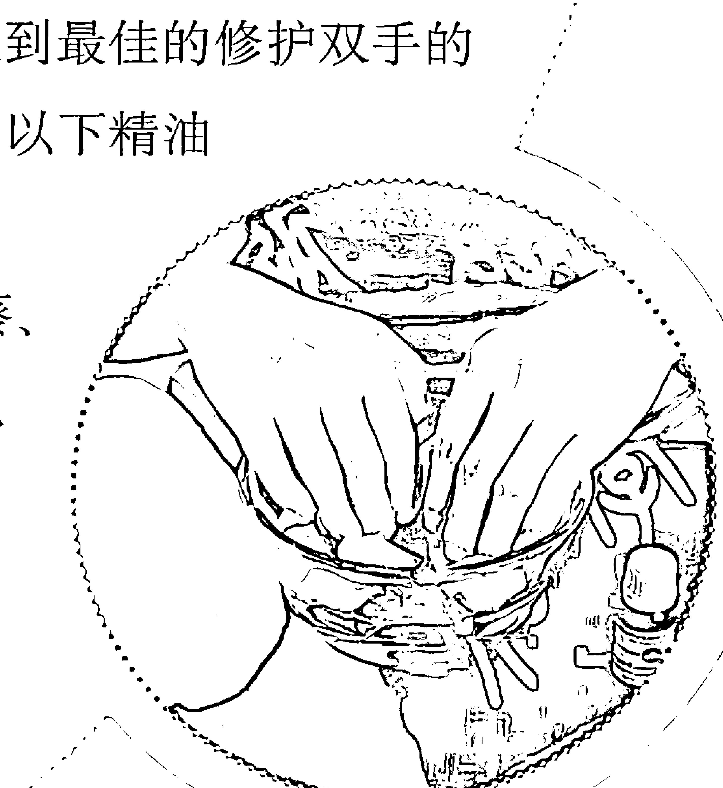

| 配方 | 说明 |
|------|------|
| 芳香护手油基础配方 | （配方）任选护手精油5滴、基础油10毫升 |

| 配方 | 说明 |
|------|------|
| 芳香护手霜基础配方 | （配方）任选护手精油10滴、基础油20毫升、蜜蜡10克、卵磷脂10毫升、甘油10毫升、蒸馏水70毫升 |

### 有益修护双手的基础油：甜杏仁油、荷荷芭油、酪梨油、杏核油

这是一个简便又有效的芳香护手精油，可以依个人的喜好而随意组合。例如选择单纯一种精油5滴，或是任选几种搭配，总共5滴，再与10毫升基础油调和。基础油的搭配也可以随意变化，即任选一种或几种混合在一起。由于护手精油的使用量较大，所以每一次的调制量不妨多一些，例如50滴精油与100毫升基础油调和。

由于双手随时暴露在外，又可能必须经常接触水或其他有害物质，因此可以使用护手霜来代替护手油。护手霜因为添加了蜜蜡、甘油，较为浓稠，对于皮肤的保湿效果更佳。有时更可以添加可可亚脂、乳油木果脂等，变得更为滋养，有如为双手加上一层保护膜。以下有一个简易的芳香护手霜DIY配方。

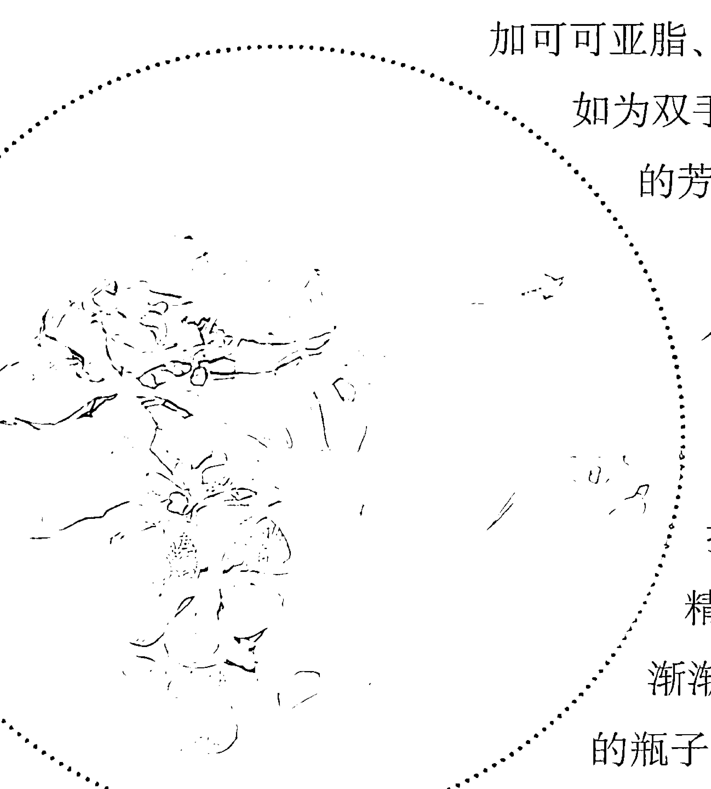

以双重蒸煮法将基础油、蜜蜡放入一个小锅子中蒸煮，直到蜜蜡熔化为止。将小锅子拿离火源，加入卵磷脂、甘油，以搅拌棒不停地搅拌。当溶液慢慢冷却时，一面滴入精油与蒸馏水，一面持续搅拌，直到渐渐出现乳霜状时，就可以分装至干净的瓶子或罐子等容器中了。

### 滋润特别干燥的双手

干燥是双手皮肤最常见的问题。这是由于双手的油脂含量原本就比较少，而且必须经常暴露在空气、灰尘、水、清洁剂，甚至其他的化学物质中，使得双手的皮肤不能维持充分的滋养，而又经常遭受外界有害物质的破坏。干燥是双手缺乏滋润的第一个表征，接下来可能出现的症状就是皴裂、粗糙、细纹横生，更严重的可能会红肿、疼痛，甚至产生裂伤、容易过敏等。凡此种种症状，在做家务特别频繁，以及季节交替之际，尤其是秋冬之交、冷热温差大时，都会更为恶化，因此必须加强保养。

以下有一种针对防治极度干燥双手的豪华配方，其中所使用的精油、基础油都比较昂贵。不过，为了纤纤玉手，还是十分值得的。华丽又昂贵的玫瑰精油是适合任何肤质的，尤其对于干燥、敏感、老化的皮肤特别有益，而且还能治疗红肿、发炎的症状，对于过度干燥而极度敏感的双手是很好的滋养品；檀香精油对于皮肤的滋润效果非常强大，对于干燥与脱水的皮肤最为有益，自古以来就是干性皮肤的克星，它还可以舒缓皮肤发炎及发痒的症状，这也是极度干燥的双手经常伴随出现的症状；天竺葵精油在皮肤保养上占有一席之地，在于它具有净化、清新、平衡皮肤的功能，是比较温和的皮肤滋补剂。

月见草油、酪梨油与荷荷芭油都是属于特别滋养的基础油，特别有益于干燥皮肤。月见草油含有独特的亚麻油酸与次亚麻油酸，可以维持细胞膜的健康，让细胞保持水分，促使皮肤滋润、有光泽；荷荷芭油含有丰富的蛋白质、矿物质，以及类似胶原蛋白的物质，又因为其分子排列方式与人体的皮脂相似，因此容易为皮肤所吸收，美肤价值特别高；酪梨油也富有蛋白质、维生素、脂肪酸等，而且渗透性极高，特别有益于缺水、干燥的皮肤。

华丽芳香护手油配方
- 杜松精油3滴
- 伊兰精油2滴
- 甜杏仁油10ml
- 荷荷芭油10ml
- 广藿香10滴
- 可可脂20g

当双手特别干燥时，随时都可用以保养双手。尤其在每晚临睡前使用这种华丽的芳香护手油，用以轻轻按摩双手之后，再戴上纯棉手套过夜，可以使芳香精油深入皮肤底层，疗效更佳。

### 双手美白

双手由于经常暴露在外，即使是在艳阳高照的日子，全身上下都可以采取完善的遮阳措施，唯独双手，尤其是手背，很难躲避阳光，因此产生晒斑的几率比身上的其他部位要高许多。而且，一般人做美白修护保养时，往往也不会特别注意到双手。虽然无法让双手逃避紫外线，但可以利用一些具有消炎、淡化斑点功效的精油，以修护手背的晒斑，达到双手美白的效果。

复方美白精油配方
- 薰衣草精油2滴
- 柠檬精油2滴
- 苦橙叶精油2滴
- 荷荷芭油10ml
- 玫瑰果油5ml

薰衣草精油具有调理肌肤的作用，也能淡化疤痕，美肤价值极高；柠檬是最佳的美白精油之一，也具有温和的消炎作用；苦橙叶精油也具有温和的杀菌、消炎作用，也适合用以修护皮肤。这款复方精油适合在晚上使用，因为柠檬具有感光作用，如果白天使用，反而会导致晒斑产生。

### 防治富贵手

“富贵手”这种名称实在是一个反讽。有“富贵手”的人，通常都是家事做不完的灰姑娘，真正娇生惯养的富贵人家，因为有钱有闲，才没有“富贵手”呢。有人称“富贵手”为“主妇手”，似乎比较恰当。不过，也有不少男性有这种毛病（大约占3%）。总之，这是一种手部湿疹 (Hand eczema)，正式的医学名称为“进行性指掌角化症” (Keratodermia Tylodes Palmaris Progressiva)，往往在手指及手掌产生角化、干燥、皴裂、脱皮、疼痛的情形。通常都是因为患者本身的肤质较为敏感，其双手又必须经常接受太多刺激，例如水、肥皂、清洁剂，以及各种摩擦等，导致角质形成障碍与汗腺分泌减少，尤其在冬天干燥的季节更是雪上加霜。严重恶化时，会有指纹消失、皮肤硬化、手指不能伸直症状。若成为慢性症状，还会使指甲肥厚、变形。

富贵手不是什么重大疾病，可是却相当难缠。患者受害的时间，可以从数个月直到数十年。而且，这种毛病反复出现，很难断根。也就是说，也许某一个时期，经过悉心呵护，双手皮肤可能恢复细嫩，但是只要一不注意，它又立刻出现，因此大多数的人都认为富贵手无法根治。

想要防范富贵手，实在没有终南捷径，就是尽量要提防双手接触刺激及有害物质，包括水、清洁剂（举凡洗衣粉、漂白水、肥皂、酒精、地板蜡、汽车蜡等），甚至是辛辣食物，例如葱、姜、蒜、辣椒等，都要设法加以杜绝。最好的办法就是做任何家务都要戴上手套。其次，就是治疗与保养了。治疗富贵手的药膏很多，不幸的是，好像没有一样药膏可以“药到病除”。因为笔者，以及笔者身边的众多亲朋好友都是过来人，有太多“切肤之痛”的经验了。从中学时起，我就因为富贵手的困扰看了许多皮肤科医生，但是从未成功痊愈过。药膏擦完了，富贵手又会神出鬼没地发作。直到自己研究精油之后，发现最好的药方，竟然是 DIY 牌子，这一切要拜芳香疗法之赐。

以下这个防治富贵手配方，所采用的精油与基础油都对皮肤有特别美肤功用：安息香精油是著名的“修道士的香脂”的首要配方，其对于人体的身心健康具有许多功效，对于皮肤也有许多重要疗效，可以医治各种皮肤炎，包括皮肤发红、过敏、发痒的症状，还能医治多种皮肤创伤，例如皮肤粗裂、冻疮，以及外伤等。用以呵护严重干燥、皴裂的富贵手，自然是上上之选；没药精油自古以来就是治疗创伤的良方，古代罗马士兵出门征战，必定携带没药，以备不时之需。没药不但可以医治创口，对久治不愈的旧伤也有疗效，对于粗糙不堪，又因必须持续操劳，致使皴裂症状持续恶化的富贵手，堪称一大救星。值得一提的是，没药加上安息香的复方精油对于在潮湿的情况下的皮肤裂伤具有良好的愈合效果；乳香是著名的护肤圣品，一直被推崇为保养颜面皮肤的高级精油，尤其是针对老化皮肤。用于呵护双手皮肤，可以平抚细纹，恢复弹性，还有很丰富的滋润作用。金盏菊油是治疗皮肤创伤的最珍贵的基础油，对于各种问题皮肤，如干裂、冻疮，一直到婴儿的尿布疹、湿疹，各种皮肤炎、擦伤、刀伤等，均有疗效，甚至还可以抚平旧疤，对于严重的富贵手症状很有帮助。

将上述材料全部加在一起，装入一个深色的玻璃瓶子中，就是一个十分有效的防治富贵手复方。每次洗手之后，将双手擦干，就立刻擦一点，以保持双手的滋润。在每晚临睡前，按此复方按摩双手，再戴上棉质手套过夜，持续一周以上，必定可以向富贵手说再见。

### 指甲

修长而美丽的双手，必须要有色泽娇嫩自然、表面平滑工整的指甲，才能收红花绿叶之效。更何况指甲也是人体健康的指标之一，表面凹凸不平、有裂缝，或是色泽黯淡的指甲，显示身体有某些疾病，例如患风湿症的人，指甲会变厚，甚至变形，此外就是皮肤上的毛病，例如有霉菌感染或皮肤炎等。虽然指甲可以利用指甲油、指甲套，以及时髦的指甲彩绘来增添光采，或是遮掩黯淡色泽、裂缝或瑕疵，不过，这不是长治久安之计。而且，经常过度使用指甲油、指甲去光水等，也会影响指甲的健康。

指甲脆弱、易碎、易断裂等，是最常见的指甲毛病，可利用富含滋养成分的芳香精油与基础油达到呵护指甲、促进指甲健康，并使其色泽更有光采的美容兼保健目的。

迷迭香、柠檬、乳香与胡萝卜籽都是有益皮肤的精油，也有益指甲健康，并能促进指甲生长；此外，迷迭香与柠檬都有消毒的作用，柠檬还有温和美白的功效，能使颜色灰暗的指甲恢复自然光泽。这种呵护指甲的复方精油，最适合在剪完指甲，以及用指甲去光水将指甲油擦净后使用。

#### 预防皲裂精油配方

- 迷迭香 3滴
- 柠檬 2滴
- 乳香 1滴
- 胡萝卜籽 1滴
- 基础油 10毫升

#### 强健指甲配方

- 迷迭香 2滴
- 柠檬 1滴
- 薄荷 1滴
- 荷荷巴油 10毫升

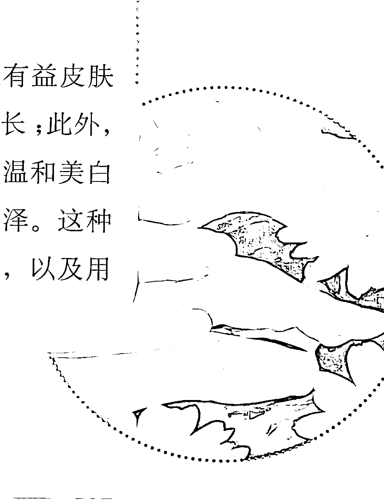

使用时，务必将此复方精油很均匀地擦在每一个指甲，以及指甲四周细嫩的表皮皮肤上。这同时也是很好的手部按摩，可以让血液循环顺畅，并能促进指甲生长。另外，也可以在每晚临睡前使用，为了促进功效，可以在按摩之后，戴上纯棉手套过夜；除此之外，在涂上指甲油前，先用此复方精油做一次保养，可以令指甲油在指甲上的光泽更加艳丽，而且可以维持更久的时间。不过，记住，在涂指甲油之前，必须用指甲去光水将指甲上残余的复方精油擦净。

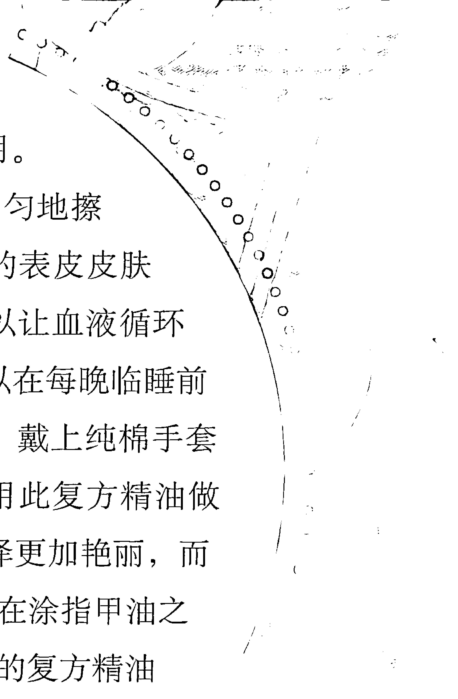
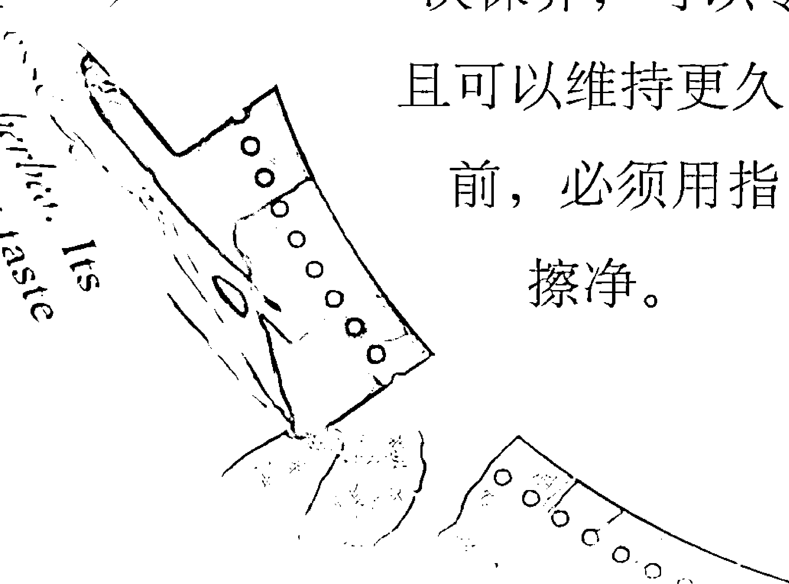
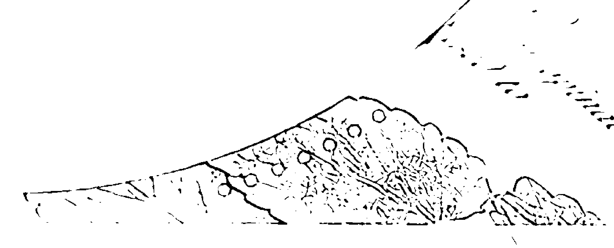

## Part 2-6 轻盈双足

中国人用“品头论足”的方式来评论一个人，不过，往往人们在观看一个人时是“看头不看脚”。试想，如果有机会看到一位打扮入时的妙龄女子，却有着龟裂的双脚，不知您会作何感想？可能会对她的美好印象打个大大的问号吧？很可惜，真是“美中不足”！当然，也许很少人像我这么“挑眼”。

每逢炎炎盛夏，我经常有机会看到清凉装扮的仕女，这无疑是一种赏心悦目的画面，任何人都禁不住要多看一眼。可是，往往就是多看了那么一眼，一不小心就会瞥见她们的“破绽”——那双暴露在凉鞋外的脚丫子或脚跟的皮肤竟然颇为粗糙，与她们一身上下精致的装扮、全身的娇嫩的肌肤大异其趣。

在我们周遭，有太多人不够注重他们的足下风光。不光是男性，连许多女性也是如此。甚至有些妙龄女郎，也有双脚皮肤皲裂、变形、浮肿的现象。这是由于大多数人对于美容都有“头重脚轻”、“虎头蛇尾”的毛病，也就是着重“上半身”，而忽略“下半身”。

其实，美丽与健康必须“从头到脚”都要贯彻始终。而健美的双足必须是轻盈曼妙、摇曳生姿，没有硬皮、厚茧或皲裂，脚趾没有变形，也不会浮肿的。这不仅仅是为了美丽，而且也是为了健康着想。在人们的脚底，隐藏着数不尽的神经和穴道，这是无数个人体内部器官的反射区。在中国古老的针灸疗法中，许多重要的针灸点都在膝盖以下，其中的道理就在于此，而这也是脚底按摩对于身心健康有很大的帮助之原因所在。撇开高深的医疗理论不谈，任何时候，光是松弛双足，或是把双脚高高举起，就可以让人立刻觉得疲劳顿失、神清气爽了。

以芳香疗法来呵护“任重道远”的双脚，可以分为三个层面：
- 美容护肤：使双脚的皮肤得到充分的滋润与营养，使其不至于粗糙、干裂、有皱纹、长硬皮、结茧等。
- 消除浮肿：使双脚恢复清新与活力，以迎接每日沉重的工作负荷。
- 护理治疗：最常出现在双脚的毛病就是出汗、有臭味、长鸡眼、长厚茧、生冻疮，以及恶名昭彰的香港脚等；另外，还有经常困扰妇女的腿或脚部的静脉曲张症状，这些都可以用特别配制的芳香精油加以调理治疗。

至于应用的方法，最重要的就是足浴法与按摩法。足浴一直是芳香疗法中不可或缺的一环，其对健康的帮助并不止于足部，而是全面性的，包括身体、心灵与精神。有些芳疗师甚至主张足部浸泡比全身浸泡的疗效更佳。足浴之后，再以特别调制的复方护足油来按摩双足，不但具有滋养双足皮肤的功效，而且更有恢复双足活力、消除足部肿胀，进而达到消除全身疲劳的目的。

### 足浴与按摩消除足部疲劳

适合足浴与按摩的精油，以具有收敛作用、气味清新，并略具抗菌性者为佳，包括丝柏、杜松、薄荷、薰衣草、柠檬、迷迭香、茶树等，都是不错的选择。一般简单的足浴，是要准备一盆大约1升的温水，再加入4-6滴上述精油，浸泡大约15分钟即可。您也可以参考以下两个消除足部疲劳的配方。

下面两个配方加入一盆温水中，用以浸泡“劳苦功高”的双足，就是简易、有效的足浴芳香疗法了。任选两个配方之一，分别调和大约10毫升的基础油，装入一个干净的空瓶子中，用力摇晃，使精油与基础油均匀混合，就是最佳护足按摩油了。如果您经常使用的话，不妨一次制作大量按摩油。以配方1为例，将薄荷精油10滴、薰衣草精油20滴、迷迭香精油20滴加入100毫升的基础油中调和，基础油可以用甜杏仁油与荷荷芭油各50毫升混合。

消除足部疲劳配方1
- 薄荷精油10滴
- 薰衣草精油20滴
- 迷迭香精油20滴

消除足部疲劳配方2
- 薰衣草精油12滴
- 丝柏精油8滴

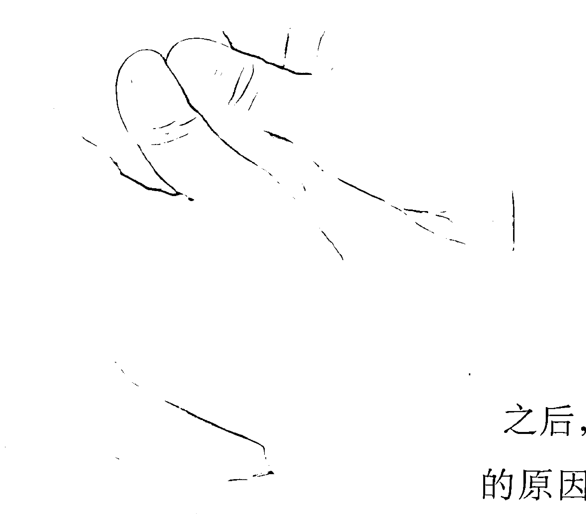

### 消除足部肿胀

双脚肿胀是工作忙碌一天之后，最容易出现的症状。造成的原因，不外是站立过久、走路太多、运动量不足，以及体重过重、生活压力太大等等。还有一个原因是鞋子不合脚、太紧、密不透气等。总之，就是双脚的负荷太大、被“禁锢”太久，以及被不当地“局促”了。消除肿胀，最重要的就是松弛双脚。有机会可以脱鞋，就尽量不要穿，找时间让双脚可以高高抬起。还有，按摩与足浴，也是解救肿胀双脚的不二法门。

#### 消除足部肿胀配方

- 薰衣草精油6滴
- 迷迭香精油6滴
- 杜松精油6滴
- 基础油50毫升

上图是一个特别的消除足部肿胀配方，不但气味芬芳，而且具有多重效果：薰衣草精油不但香味迷人，也具有舒缓肌肉疼痛的功能，对于走路过多、站立过久造成的双脚浮肿、僵硬，具有缓和的功效；迷迭香精油以具有刺激淋巴系统、促进血液循环功能而闻名，加上其利尿的特性，因此对于消除双脚浮肿特别有效，对于承受一天工作负荷的双足也有恢复疲劳的帮助；杜松精油具有排毒与利尿的作用，也是刺激排泄体液的最佳选择。这三种精油等量与基础油调配成为芳香按摩油，可以在每日洗净双脚之后，进行脚部按摩，不但可以消除肿胀，而且能够使足部皮肤获得营养与滋润，不失为足部美容兼护理的良伴。

### 去除脚底硬皮的磨砂霜

脚底长硬皮、结茧是常见的毛病。随着年岁渐长，脚底的硬皮、厚茧也会渐增，这是岁月不饶人的一种表征，尤其是现代人的生活，缺乏“释放”双足的机会。爱美的女性更是可怜，为了穿高跟鞋、包头鞋，或是一些根本不合人体工学设计的时髦鞋子，不惜让自己的玉足吃尽苦头。日积月累下来，不但脚底生长了一层层又老又厚的硬皮，而且也可能使脚趾头变形。如果一直放任着不去处理，不只是有碍美观，还会造成脚部容易疲劳，或衍生其他脚部健康问题。因此最好是一有硬皮出现，就立刻清理干净，以防后患无穷。

盐是最适合作为去除脚底硬皮的天然材料，因为盐呈细小颗粒形状，适合用以按摩皮肤。而且盐还具有软化皮肤、排除毒素的作用。将精油、基础油与盐混合，可与许多坊间贩售的护足磨砂霜媲美。

将以下配方调和于一个小碗中，用以摩擦双脚的老硬皮层，就是最棒的天然护足磨砂霜。不过，在进行按摩之前，最好先做足浴，以利双脚皮肤软化，然后将双脚擦干之后，将此配方均匀涂擦在双脚，利用手指，特别是大拇指与食指，用力按摩足部皮肤。有硬皮、厚茧的地方，要加强用力按摩。有时也可以利用浮石、丝瓜络等工具，以协助去除硬皮、厚茧。具有清新气味的薄荷精油，不但有温和的杀菌作用，还能清洁皮肤的阻塞，能够为疲惫的双脚带来活力，也有醒肤的功效。可以单独使用，或是与其他精油，例如迷迭香、薰衣草精油等，调成护足复方使用。

简易护足磨砂霜配方：
- 薄荷精油3滴
- 盐1小匙
- 基础油1小匙

### 去除脚出汗、有臭味

容易出汗或有臭味，是常见的双脚毛病。可能起源于整日穿着密不透气的鞋袜，或是平日对于双脚的清洁不够彻底所致。与个人体质也有密切关系。防止双脚出汗，或是产生异味，可以经常做芳香足浴、自制爽足粉来加以改善。

以下足浴配方加入一盆大约1升的温水中，大约浸泡10-15分钟。丝柏精油具有很好的收敛作用，对于治疗水肿、出汗过多效果显著，尤其是治疗脚底出汗症(sweaty feet)最为有名。此外，丝柏精油的气味清新，更有消除臭味的效果；茶树精油以抗菌、杀菌作用闻名，对于防治脚底出汗、臭味，也有不错的功效。由于茶树精油对皮肤没有刺激性，因此可以在早上穿袜子之前，直接以1、2滴纯茶树精油滴在脚底，按摩之后，再穿上袜子、鞋子，或是将1、2滴茶树精油滴在袜子、鞋子里层，同样都可以达到防止脚底出汗、防臭的功能。

将爽足粉材料全部加在一起，放在一个罐子中，平日放在阴凉之处保存。如果必须整日穿着鞋子，而脚出汗、有异味的问题就难以克服，尤其是在炎热的夏天，那么不妨试用这个芳香爽足粉。您可以在穿上鞋、袜子之前，先将爽足粉按摩双脚，再用干净的毛巾擦掉多余的爽足粉，再穿上鞋、袜；您也可以放一点爽足粉在鞋子里面，这还可以去除鞋子里层的异味。

芳香足浴配方：
- 丝柏精油6滴
- 茶树精油3滴

芳香爽足粉配方：
- 苏打粉30克
- 玉米粉60克
- 丝柏精油6滴
- 茶树精油3滴

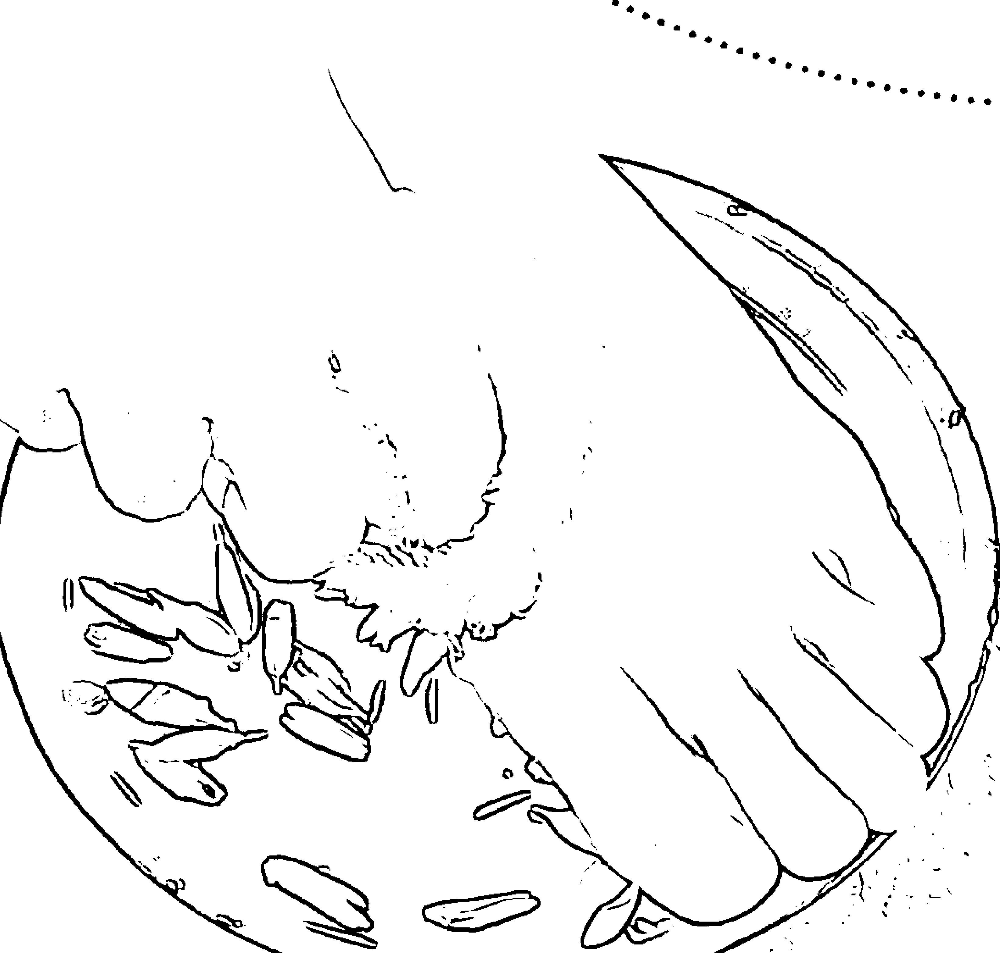# 缓和脚抽筋

抽筋是一种突发性的肌肉收缩所造成的疼痛，身体最常出现抽筋的部位就是在双脚，脚抽筋一般是出现在激烈的活动或肌肉紧绷同时或之后，或是由于寒冷造成肌肉中的血液循环不良或是氧气含量不足而形成。荷尔蒙的改变，例如月经期间，也可能造成脚抽筋现象。适当的营养、良好的运动、注意荷尔蒙的平衡，都可以改善抽筋，而洗温水澡、按摩等，可以缓和抽筋造成的疼痛。

缓和脚抽筋配方：
- 迷迭香精油6滴
- 黑胡椒精油6滴
- 基础油25毫升

黑胡椒精油具有抗痉挛的功能，对于治疗肌肉酸痛、僵硬十分有效；迷迭香也有止痛作用，适合工作过度引起的肌肉僵硬、疲倦，是许多运动员、舞蹈演员或赛马师消除肌肉酸痛的香疗配方中的秘密武器。上述两者调和，有相乘作用，与基础油调和之后，用以按摩容易僵硬、疲倦的双脚，可以缓和双脚抽筋、肌肉僵硬的症状。

### 香港脚

香港脚是由一种被称为 Tinea pedis 的足癣引起的，会造成足部皮肤红肿、脱皮、潮湿、发痒，尤其是在脚趾之间的发痒、脱皮，后脚跟与脚底会常常长出一层白色、鳞片状的皮屑，有时候连指甲也会受到感染。

香港脚之所以恶名昭彰，就是因为容易传染，而且难以根治，英文俗称这种足癣为 Athlete's Foot（运动员脚），就是因为运动员感染这种足癣的几率很高，通常他们是在更衣室被感染，学生在学校被传染的可能性也很大。

温暖、潮湿是足癣的温床，因此对抗足癣的最好办法就是多让双脚保持干燥，并多接触空气，由于现代日常生活必须终日穿着鞋袜，对于香港脚患者的治疗十分不利，因此最好穿纯棉的袜子，鞋子也要选择会透气的。治疗香港脚需要耐心，因为这种足癣容易反复感染，对于某些抗生素也会产生抗药性，利用精油来治疗香港脚不失为一种明智的选择，尤其是以抗菌性高而闻名的精油，例如薰衣草、没药、茶树等。这些都是具有抗菌、抗发炎作用，能够有效杀死细菌、霉菌等微生物的精油，薰衣草精油还能滋润、安抚皮肤，对于因为香港脚造成的皮肤粗糙、龟裂也有美容之效；茶树能够消除肉疣、肉赘，对于治疗鸡眼也有帮助，方法是每天在患处中央滴1滴纯茶树精油，再用纱布或绷带包住，持续一段时间，直到肉疣收缩或脱落为止，如果是鸡眼，则必须等其软化之后，再用小钳子取出。每日维持双脚的清洁也十分重要，可以考虑用纯天然的茶树香皂洗脚，不但不会刺激皮肤，而且杀菌效果更佳。

### 如何选择合适的精油

- 薰衣草、茶树、没药等

### 精油的使用方法

- 每天在患处中央滴1滴纯茶树精油，再用纱布或绷带包住，持续一段时间，直到肉疣收缩或脱落为止，如果是鸡眼，则必须等其软化之后，再用小钳子取出。

### 治疗香港脚的精油配方

- 薰衣草精油3滴、茶树精油2滴、基础油10ml

没药精油具有抗霉菌功能，而且可以治疗皮肤的裂口、伤痕，甚至创伤等，在乳霜中加入没药，可以预防双手及脚跟的龟裂，对于治疗香港脚也有良好效果。

薰衣草及茶树精油都不会刺激皮肤，治疗香港脚这种“顽癣”，可以以未稀释的纯精油直接擦在受感染的部位，效果奇佳，但是肤质比较敏感的人可能会觉得刺激，因此必须以基础油加以稀释。

任选上述一种精油15滴，或以等量各5滴调和成复方精油，再与基础油混合之后，调和成为每日护理香港脚的芳香按摩油，可以直接擦在受到感染的部位，每日早、晚都要擦，如果感染的情况严重，则每天可以多擦几次，而且在擦时，也可以直接加1、2滴纯茶树精油在感染部位，以加强疗效。

双脚会痒、发炎、有异味，这是有香港脚的人经常面临的苦处，这个芳香护足喷剂可以减轻这种症状。制作的方式就是将上述配方放入一个有喷嘴的喷雾器中，用力加以摇晃，使精油、酒精、纯露与柠檬汁充分溶合，每次使用前再剧烈摇晃几下，使其均匀分散，将喷雾器对着双脚喷，尤其是发生症状的部位，多喷几下，止痒的效果很好，而且也可以消除异味。

### 防治静脉曲张

静脉曲张通常发生在腿部，即在脚部会出现突出的、明显的蓝色血管网络，一般而言，这种症状多出现在妇女身上，女性的罹患率是男性的3倍。静脉曲张多半由循环不良、静脉血管壁及静脉瓣弹性不佳造成，站立过久、肥胖、疲劳、缺乏运动、便秘，以及怀孕等，也会造成这种症状的恶化。

静脉曲张需要长时间的治疗才能改善，以芳香疗法治疗这种症状，主要以加强静脉的强度、促进血液循环为重点，

### 预防静脉曲张配方：

- 丝柏精油6滴
- 薰衣草精油8滴
- 柠檬精油6滴
- 迷迭香精油6滴
- 杜松精油4滴
- 基础油50毫升

以下配方所使用的几种精油都具有这些特色，其中又以丝柏精油最能加强静脉强度；柠檬精油也具有调理循环系统的功效，很适合用以治疗静脉曲张；杜松精油则具有排毒与利尿的作用，薰衣草精油与迷迭香则都可以减轻充血、浮肿，这些精油相加所产生的效果特佳，有时候，也可以薰衣草、迷迭香取代丝柏精油，交互使用。

对于治疗皮肤创伤十分有效的金盏菊油，也能治疗静脉曲张，因此可以作为基础油的优先考虑。

将上述5种精油与基础油调和后，均匀地涂抹在有静脉曲张出现的部位，可另外再轻轻按摩患部的上方，即靠近心脏的部位，切记不要太过用力按摩，以免增加静脉的压力。每天可以进行芳香按摩数次，直到症状逐渐改善为止。

# Part3 精神篇

## 给心灵的最好情人

## Part3-1 纾解压力

现代人几乎没有人能够逃脱压力。压力永远如影随形，无所不在，简直就是现代生活的必要之恶。压力并非一无是处，适当的压力可以激发斗志与勇气，不过，过度的压力却对身心造成许多负面的影响：在情绪方面，包括会使人紧张、沮丧、焦虑、易怒、无法专心、失去判断力、退缩、失去自信等；而且也会产生身体不适或疾病，包括头痛或偏头痛、肌肉酸痛或身体僵硬、肠胃不适、高血压、月经失调、免疫系统功能下降，以及过敏（许多皮肤炎或湿疹症状均与压力过大有关）、失眠，甚至失去性欲等等。芳香疗法对于纾解压力绝对有正面的作用，大多数人对于精油的认识，往往就是奠基于此。许多精油都能安抚情绪、松弛神经，以及产生平静、安详、快乐的感觉。这类精油所具有的芬芳迷人的香味就可以使人身心舒畅。尤其是天然的植物香味，让人彷佛回到大自然的怀抱。而有些精油所含有特殊的天然成分具有医疗作用，包括可以安抚神经系统、促进免疫功能及血液循环等；对于纾解因压力而引起的各种身心症状都有帮助。

应用这类精油的方法有许多种，吸闻方法是最为普通的，可以利用薰香器、喷雾器来熏香房间，或是直接滴在手帕、纸巾上吸闻。按摩及泡澡的效果也很好。事实上，这应该是纾解压力最好的方法。因为这两者本身都有放松的作用，而再添加气味芬芳又具有镇定、安抚神经系统作用的精油，效果必定加倍。如果所面临的压力严重到无法掌控，觉得心力交瘁，甚至已经出现了一些身心失调症状，那么最好能够有计划地进行芳香按摩，起码每个月一次。必要时应该寻求芳疗师进行专业按摩。芳香疗法是一个简便、安全的减压手法，任何人只要略懂精油的特质，以及其应用方法，随时随地就可以使用，既可以有效消除日常压力，也是奖赏自己的方法。

纾解压力的精油：佛手柑、雪松、洋甘菊、快乐鼠尾草、乳香、天竺葵、葡萄柚、茉莉、杜松、薰衣草、柠檬、马郁兰、香蜂草、橙花、甜橙、玫瑰草、广藿香、玫瑰、檀香、依兰

有些精油因疗效显著而特别受到推崇，例如薰衣草精油，这几乎是被公认功效最广、作用最好的解压精油，几乎可以适用于各种因为压力引发的身心症状，包括头痛、失眠、惊慌、易怒、情绪不稳，以及皮肤发炎或血压过高等。此外，也适合各种年龄层，甚至对小婴儿的哭闹，都有安抚作用。

佛手柑精油具有清新、提神的作用，对于因为压力过大所造成的沮丧、焦虑的安抚效果最好，此外，佛手柑精油具有“调整”食欲的作用，如果因为压力过大而失去胃口，不妨闻闻佛手柑精油。佛手柑精油适合与柑橘类精油调和，同时与其他具有安抚效用的精油也大多能兼容，特别是薰衣草、洋甘菊、橙花、天竺葵、玫瑰与檀香精油，可以创造出最美妙迷人的气味以及更佳的效用。

洋甘菊精油是用途广泛的精油之一，其纾解压力的效果也十分出色，对于因压力引起的神经紧张、易怒、失眠，甚至一些生理不适，如皮肤炎等，也有不错的疗效。

快乐鼠尾草精油具有一种令人深度放松的作用，可以引发人们幸福、安详的感受，压力所造成的沮丧、偏头痛、紧张、心力交瘁、经前症候群的疗效最佳。使用快乐鼠尾草精油切忌饮酒，否则会使酒精的威力更强，导致烂醉如泥或昏睡不醒。

乳香精油过去经常被应用在宗教或冥想时的放松情绪上，这是一种属性温暖的精油，其纾解压力的作用也比较温和，适合治疗一般性、较不严重的压力症状，也常与其他精油调和，例如柑橘类精油，以及薰衣草、天竺葵精油等。

天竺葵精油以平衡荷尔蒙效用奇佳而闻名，对于压力造成的经前症候群的疗效最佳，此外，也有益于治疗一般因为压力所引发的紧张、情绪不稳。

橙花精油也是珍贵的消除压力良药，特别是有益于各种不良的情绪症状，如紧张、恐慌、沮丧等，纯橙花精油的价格昂贵，但作用持久，而且，一般只要很小的剂量，尤其是在治疗安抚情绪方面。

同样是价格昂贵的玫瑰精油也是心灵滋补剂，而且其作用也十分快速，对于焦虑与沮丧的疗效最佳，尤其是提升自信方面，更有神奇作用。

檀香也是在宗教与冥想时经常被使用的香料，其镇定纷扰不安、失去方向的心绪效果最佳，给人一种平静、圣洁、清新的感觉，对于低落的心情也有提升作用。

依兰精油最具异国风味，其安抚情绪的作用十分出色，尤其以快速松弛神经而闻名，还有，对于平抚心悸更有良好效果。不过，依兰精油并不适合沉思或打坐时使用。

除此之外，还有许多精油都有益于神经系统，可以纾解压力。

上述精油，有的单独使用，已是非常有效；相互调和，更可发挥特殊功效，可任选2-3种，每次共5-6滴，调和成自己喜爱的减压精油配方，您也可以参考以下复方配方。如果您习惯使用精油，应经常改变单方或是复方。

右侧配方适合利用熏香灯、负离子扩香器，或任何其他电动喷香仪器，也可以利用任何吸闻法，例如滴在手帕、纸巾、床单、枕头上，但是必须先调和成复方。

- **纾解压力配方1：**
  - 快乐鼠尾草精油3滴
  - 柠檬精油3滴
  - 薰衣草精油1滴

- **纾解压力配方2：**
  - 罗马洋甘菊精油2滴
  - 薰衣草精油2滴
  - 岩兰草精油1滴

- **纾解压力配方3：**
  - 佛手柑精油3滴
  - 乳香精油1滴
  - 天竺葵精油1滴

- **纾解压力配方4：**
  - 葡萄柚精油3滴
  - 茉莉精油1滴
  - 依兰精油1滴

精油，每次只滴1-2滴，以便随时可以吸闻。如果用以泡澡，可以添加1小匙（5毫升）基础油。您也可以将上述配方分别与25毫升的基础油调和，成为芳香的身体按摩油。

### 消除压力引起的焦虑

焦虑的来源十分复杂，不幸的事件、重要的期待、重大的约会或考试等，甚至芝麻小事也会引起焦虑，完全视个人重视的程度而定。然而，压力往往是重要的因素之一，而且，焦虑与压力好像是孪生子，压力会衍生焦虑，而焦虑则造成更大的压力。如果是因为压力引发的焦虑，不妨试用以下配方，这些配方不但具有放松的作用，而且可以消除沮丧与不安的情绪。

左侧配方适合利用熏香灯、负离子扩香器，或任何其他电动喷香仪器，也可以利用任何吸闻法，例如滴在手帕、纸巾、床单、枕头上，但是必须先调和成复方精油，每次只滴1-2滴，以便随时可以吸闻。如果用以泡澡，可以添加1小匙（5毫升）基础油。您也可以将上述配方分别与25毫升的基础油调和，成为芳香的身体按摩油。

- **舒缓焦虑配方1：**
  - 佛手柑精油2滴
  - 快乐鼠尾草精油2滴
  - 乳香精油1滴

- **舒缓焦虑配方2：**
  - 快乐鼠尾草精油2滴
  - 薰衣草精油3滴

- **舒缓焦虑配方3：**
  - 佛手柑精油2滴
  - 柑橘精油3滴

- **舒缓焦虑配方4：**
  - 快乐鼠尾草精油2滴
  - 罗马洋甘菊精油2滴
  - 岩兰草精油1滴

### 消除压力引起的怒气

压力最容易导致脾气暴躁，这是因为人处在压力之下，肾上腺素的分泌特别旺盛。怒气对于身心的负面影响很大，应该设法加以控制，打坐、静坐，以及适当的运动，都可以有效控制怒气，芳香疗法也是一剂良方。如果您经常怒气冲天，而且还会迁怒他人，在脾气即将发作之前，赶快深呼吸，并且趁机吸闻一下可以让人平心静气的精油，必定能够快速消除怒火。特别有益于消除怒气的精油，包括甜橙、薰衣草、玫瑰、洋甘菊、橙花、檀香、依兰等。如果您容易生气，尤其处在压力之下，经常失去冷静与平衡，那么不妨试试右边的配方。

这些配方适合利用熏香灯、负离子扩香器，或任何其他电动喷香仪器，也可以利用任何吸闻法，例如滴在手帕、纸巾、床单、枕头上，但是必须先调和成复方精油，每次只滴 1–2 滴，以便随时可以吸闻。如果用以泡澡，可以添加 1 小匙（5 毫升）基础油。您也可以将上述配方分别与 25 毫升的基础油调和，成为芳香的身体按摩油。

- **消除怒气配方1：**
  - 甜橙精油3滴
  - 薰衣草精油2滴

- **消除怒气配方2：**
  - 罗马洋甘菊精油2滴
  - 橙花精油1滴
  - 薰衣草精油2滴

- **消除怒气配方3：**
  - 橙花精油1滴
  - 檀香精油4滴

- **消除怒气配方4：**
  - 甜橙精油2滴
  - 檀香精油3滴

### 纾解通勤的压力

对于一个都会地区的上班族而言，压力从四面八方漫天而来，而一天的压力是从搭车开始的，污染的空气、嘈杂的车声或人群，以及交通堵塞都给我们的身心造成了负担。

如果您无法逃脱通勤的折磨，那么最好找出一个因应对策，以减轻这种折磨，随身带着一些具有安抚神经，兼具清新、提振精神作用的精油，在通勤时使用，可以调整心情，以便迎接每一天新的挑战。因为是要拉开一天的序幕，所以要避免使用会使人精神太松懈的精油，包括洋甘菊、茉莉或依兰。以下喷雾精油复方是个不错的选择。

通勤减压喷雾配方：
- 快乐鼠尾草精油3滴
- 乳香精油2滴
- 天竺葵精油2滴
- 薰衣草3滴
- 蒸馏水30毫升

将上述配方装入一个可以密封的小型喷雾器中，适合随身携带。在通勤途中，觉得心情烦躁时，就用以轻轻喷洒脸部、颈部，立刻就可以感到神清气爽。记住，每次使用之前必须用力摇晃，使精油与水均匀混合。

### 克服压力引起的头痛

许多头痛的症状是因为压力及紧张所引起的，芳香疗法透过缓和神经系统达到疗效，不会造成上瘾及其他副作用，是克服这种头痛的最佳疗法。

最简易方便的治疗头痛芳香疗法，就是使用薰衣草精油。当头痛发作时，您可以使用纯的薰衣草精油，滴2滴在太阳穴，以及头颅与发际边缘处，用双手轻轻按摩，就能很快纾解头痛；或者，也可以在压力过大、头痛即将发作时，直接吸闻薰衣草精油，这是最天然、安全的治头痛良方。

除了薰衣草精油之外，有益治疗头痛的还有薄荷、迷迭香、尤加利、洋甘菊等精油，不过必须特别注意调和时的剂量，尤其是比较刺激性的精油，如薄荷精油，微量的薄荷精油与薰衣草可以有效治疗头痛，但是剂量太多，就会太过刺激，效果反而不佳。右侧配方，您可以根据个人的喜爱及需要选择使用。

纾解头痛闻香配方：
- 罗勒精油1滴
- 玫瑰精油1滴
- 迷迭香精油1滴
- 甜橙精油1滴

这个配方适合使用熏香器，或使用负离子熏蒸器，透过呼吸系统，进入体内。可以很快消除压力及其所造成的头痛。

精油沐浴是缓和压力所引起头痛的妙方，您可以依比例制作比较大量的复方，事先调和成为复方精油。每次洗澡时，只要添加6滴在浴池中即可，每次浸泡大约20分钟。注意，洗澡水温不要太高，温水即可。

纾解头痛泡澡配方：
- 洋甘菊精油3滴
- 马郁兰精油2滴
- 薄荷精油1滴
- 薰衣草精油3滴
- 百里香精油1滴

### 舒缓压力造成的肌肉僵硬、疼痛

人处在巨大压力之下，容易肌肉紧绷，血液循环不顺畅，久而久之，就会产生僵硬、疼痛症状。许多精油对于纾解肌肉酸痛很有帮助，例如迷迭香、薄荷、黑胡椒等，不过，使用具有松弛神经系统的精油按摩泡澡，是消除肌肉酸痛最好的方法，以下配方为您量身定制。

舒缓肌肉酸痛配方1：
- 乳香精油1-2滴
- 苦橙叶精油1滴
- 薰衣草3滴

舒缓肌肉酸痛配方2：
- 杜松精油2滴
- 柠檬精油2滴
- 百里香精油1滴

任选右侧两个配方之一，添加在澡池中，用以浸泡全身，每次大约浸泡10-20分钟。在压力特别大，而肌肉僵硬、酸痛的症状严重时，最好每隔一天就进行这个精油泡澡，这可以帮助您度过压力沉重的时期。您也可以分别将此配方与1大匙（即15毫升）基础油调和，用以按摩身体，尤其是在泡澡之后，立刻进行精油按摩，其纾解压力、消除肌肉酸痛的效果最佳。

舒缓肌肉酸痛的强力按摩油配方，对于缓和与压力过大、身心俱疲相伴的肌肉僵硬及酸痛效果卓著。

当您感到心力交瘁、简直无法思考时，可以试试克服压力的强力按摩油配方。

### 消除压力引起的经前症候群

经前症候群是妇女常见的毛病，其生理症状包括头痛、腹部或胸部肿胀等，心理症状则包括沮丧、倦怠、贪食、注意力无法集中等。造成经前症候群的原因很多，压力过大往往也是重要的祸首。

天竺葵、玫瑰、依兰等精油对于消除妇女经前症候群甚有帮助，而这些精油又大都可以纾解压力，对于调理妇女生理很有帮助，您可以在生理期来临之前7-10天，用舒缓经前症候群配方来按摩身体下腹部，或者在有需要时加以按摩，消除由压力引起的经前症候群。

舒缓肌肉酸痛强力按摩油配方：
- 黑胡椒精油4滴
- 丝柏精油3滴
- 薰衣草精油4滴
- 薄荷精油2滴
- 迷迭香精油2滴
- 基础油25毫升

克服压力的强力按摩油配方：
- 佛手柑精油2滴
- 雪松精油1滴
- 乳香精油1滴
- 天竺葵精油4滴
- 依兰精油2滴
- 基础油25毫升

舒缓经前症候群的按摩油配方：
- 佛手柑精油7滴
- 天竺葵精油5滴
- 玫瑰精油10滴
- 依兰精油8滴
- 基础油50毫升

## Part 3-2 活力充沛

精神不振、昏昏欲睡，或是倦怠困顿等，几乎是现代人的通病。兼顾身、心两者，并保持平衡，这是最根本也最简单的方法。然而，并非人人都做得到，所谓“知易行难”吧！

那么有什么比较简易又速成的方法，在人们感到昏昏欲睡之际，能够立刻补充身体所需要的活力呢？最自然、对身体与心理都有帮助，并且能改善情绪的芳香疗法，就是最好的选择。人们很少注意到精油的提神、振奋效果，其实要维持活力，还真少不了这类精油。这类精油相当多，可以概括地称其为“活力精油”。活力精油与一般兴奋剂最大的不同，在于可以帮助身体消除疲劳，# **激励活力的精油**：罗勒、佛手柑、雪松、丝柏、尤加利、姜、葡萄柚、柠檬、甜橙、薄荷、松、迷迭香、花梨木、百里香

**柑橘类精油**，如佛手柑、甜橙、柠檬、葡萄柚等，都是可以让人心情愉快的精油，十分适合那些被过重的工作负担压迫得不堪重负，而感到身心俱疲的人们；另外，像香味比较清新、具有穿透力的精油，如肉桂、尤加利、樟树，以及松木类精油，包括丝柏、雪松、松等，也都具有刺激嗅觉、振作精神、提升大脑、中枢神经的作用，爱好精油的人，可以自行搭配使用，会有许多意想不到的妙处出现。

**罗勒精油**，其激励活力作用特别明显，因为同时可以消除心理倦怠与身体疲劳，而受到许多芳疗师推崇。在心理调节方面，罗勒精油可以使人精神集中、澄清思虑、使人感觉敏锐，还能排除心中的忧郁，而在身体方面，罗勒精油能治疗肌肉疲劳、紧张或劳动过度；此外，它对呼吸道也有帮助，可以治疗感冒、支气管炎等。

**薄荷精油**含有大量的薄荷脑（menthol），气味清新、辛辣，并有强劲的穿透力，也因此最能提神醒脑，让人精神振作。薄荷油，新鲜或干燥的薄荷叶，都可以用于烹调，也可以直接作为薄荷茶饮用，有助消化，并可治愈感冒，此外，也有振奋的效果，用薄荷茶来维持长时间的工作效率比使用浓茶或咖啡更安全。除此之外，它可以使人增强记忆、精神集中，是最好的活力精油；还能安抚愤怒、焦虑，甚至歇斯底里与恐惧的情绪；同时又以治疗呼吸道的毛病而著称，对于因为感冒、鼻塞而终日感到头昏眼花的人而言，不啻是一剂最温和、安全的提神良药。

薄荷精油因为比较刺激，因此孕妇及癫痫症患者不宜使用，而且薄荷精油也不宜用以按摩身体，但可与基础油稀释，或与其他精油调和后，作为身体局部按摩使用。一般而言，使用薄荷精油作为提神工具，最简便的方法就是嗅闻法，建议可以洒2-3滴在面纸、手帕或毛巾上，以利随时嗅闻。

迷迭香精油香味浓郁，具有清新穿透力，也是活力精油的上选。迷迭香向来被视为增强记忆力、提振精神的最佳精油，最适合用脑过度、劳心耗神的白领上班族。迷迭香精油也非常适合必须通宵熬夜加班或是看书的莘莘学子使用，因为它可以使人头脑清醒，不会昏昏欲睡，而且因为迷迭香的益脑功能，还可以增进工作、读书的效率。

自古以来，百里香是有名的厨房药草，以具有抗菌、防腐功能闻名，而其对于振奋和增强身体与心智的功能也很有名，而且和迷迭香一样，它也可以刺激大脑，活化脑细胞，使人增强记忆力，以及集中注意力。百里香还有非常特别的一点，即可以减轻失眠，这似乎与其特有的振奋功能矛盾，其实，这是因为百里香具有“平衡”刺激和镇静的功能，当人们需要振作精神时，百里香可以令人神志清醒，当人们需要休息时，百里香能使人容易入睡。百里香还是活力精油的上上之选，因为百里香除了振奋之外，还能振奋低落的情绪、纾解挫败感。古代希腊人视百里香为勇气的象征，罗马人则视之为抗忧郁良方，从这些观点来看，百里香是最适合工作过度烦重而感到心力交瘁的现代人了。

能作为温和止痛剂的花梨木精油，可以使头脑清醒，也可以镇定神经，也是治头痛良药，提到活力精油，花梨木也是不能遗漏的，它对于人们在面临危机时提振情绪功效特别强，对那种面对考试或长途开车的心理倦怠者也有很大的益处。

### 巧妙应用活力精油

具有兴奋剂作用的活力精油大抵都是味道清新、强劲，具有穿透力，甚至略辛辣、刺鼻，有些则具有扩张性，因此一闻就立刻让人感到十分清醒，精神大振。这一类的精油也比较刺激，一般而言，最适合以“吸入法”(inhalations)吸收，亦即透过呼吸器官，使精油进入人体内，而较不适合透过皮肤，亦即按摩方式，进入人体，除非是经过适当的稀释，否则可能引起皮肤过敏或发炎。最简单的“吸入法”方式就是用一个大碗或脸盆，装入热水，再将适当的精油滴入容器内，然后将头靠近容器，尽量去嗅闻随着水蒸气蒸发出来的精油香气。必要时可以在头顶上包一条大毛巾，垂到容器的四周，以防精油香气快速外溢。以简便的方式嗅闻活力精油，大约只要5分钟，马上就可以达到提神的效果。不过，由于容器的限制，它只适合在家中进行，但是有时候也有变通的办法，例如我就偶尔会在办公室利用自己的马克杯来做熏蒸精油的容器：在马克杯内盛满滚烫的开水，滴1、2滴活力精油——通常是薄荷、迷迭香、柠檬或甜橙，将鼻子靠近马克杯，大口大口嗅闻香气，很快就能恢复精神，不再感到疲惫。

如果有长时间感到身心疲倦的状况，应该经常做活力按摩，才能更有效地使身心回复健康状态。

一般性的芳香按摩，滚珠瓶是最好用的工具，出门时，可以放在随身皮包内，以利随时取用，难怪有人又把滚珠瓶称为随身瓶。由于它的外形像一枝笔，因此也有人称为滚珠笔或走珠笔，在欧美则称为 roll-on。这个小玩意儿，实在妙用无穷，其特别之处就在于瓶口上的一个活动小珠子，当珠子在身体上滑动时，瓶内的按摩精油会随着转动的珠子流出，因此用其按摩身体时，皮肤得到充分的润滑，用力转动珠子，等于是对身体的一种按摩。活力精油滚珠瓶最适合在脉搏、太阳穴或沿着发际之处使用。

使用活力精油来泡澡，同样也必须加以稀释，尤其是香料类的活力精油，如肉桂、豆蔻、罗勒等，每次使用的数量不能超过 3 滴，这类精油最好能与其他精油调和成复方精油，再用以泡澡，才能减少过度刺激皮肤的问题。

您可以任选上述活力精油 2-3 种，每次共 5-6 滴，调和成自己喜爱的活力配方，您也可以参考左边的复方配方。

| 配方名称 | 配方内容 |
| :--- | :--- |
| 活力充满配方1 | 罗勒精油2滴 丝柏精油1滴 葡萄柚精油2滴 |
| 活力充满配方2 | 葡萄柚精油3滴 姜精油2滴 |
| 活力充满配方3 | 丝柏精油1滴 尤加利精油1滴 薄荷精油2滴 松树精油1滴 |
| 活力充满配方4 | 罗勒精油1滴 柠檬精油1滴 迷迭香精油2滴 花梨木精油1滴 |

这些配方适合利用熏香灯、负离子扩香器，或任何其他电动喷香仪器，也可以利用任何蒸气法，例如滴在手帕、纸巾、床单、枕头上，但是必须先调和成复方精油，每次只滴1–2滴，以便随时可以吸闻。如果用以泡澡，可以添加1小匙（5毫升）基础油。您也可以将这些配方分别与25毫升的基础油调和，成为芳香的身体按摩油。

### 神清气爽的活力喷雾

最简捷的吸收活力精油的方法，莫过于洒几滴精油在面纸或手帕上，然后再以鼻就近嗅闻。除此之外，各种熏香器、熏香灯也都十分有用，也可以利用喷雾器，也就是把活力精油按一定比例与清水调和后，装在喷雾器中，用力摇匀之后，喷洒于办公室、书房、工作房，甚至汽车内部。以下有一个强力配方是最适于喷雾器使用的。

| 配方名称 | 配方内容 |
| :--- | :--- |
| 活力喷雾强力配方 | 尤加利精油3滴 薰衣草精油6滴 柠檬精油6滴 苦橙叶精油4滴 迷迭香精油5滴 矿泉水或蒸馏水125毫升 |

### 对抗感冒的活力秘方

感冒容易使人终日昏昏沉沉、倦怠无力，许多具有激励作用的精油，不但可以提神醒脑，而且还有抗菌、消毒的作用，如果您不幸被传染感冒，不妨试试以下几种配方，既可以对抗感冒，舒缓咳嗽，又能让您呼吸顺畅，神清气爽。

咳嗽蒸气配方适合用吸闻方式，您可以利用熏香器，或是利用小脸盆等，让精油的分子借助腾腾的热气散发出来，您可以用力呼吸，使精油分子深入胸内，这对于舒缓咳嗽的效果特佳，如果您的咳嗽持续不断，最好每天三次利用蒸气法吸闻这个复方。记住，您必须准备一条大毛巾，罩住头部，低头凑近装有热水的脸盆，大约在脸盆上方20公分，用力吸取其中的香气，大约3分钟。如果您还有喉咙痛的症状，那么可以以此配方与4小匙（即20毫升）的基础油调和，用以按摩喉咙、胸腔，可以有效舒缓不适的症状。

| 配方名称 | 配方内容 |
| :--- | :--- |
| 对抗感冒咳嗽蒸气配方 | 尤加利精油2滴 薰衣草精油2滴 |
| 对抗感冒鼻塞蒸气配方1：（适合白天使用） | 尤加利精油2滴 薄荷精油2滴 茶树精油2滴 薰衣草精油2滴（选择性） |
| 对抗感冒鼻塞蒸气配方2：（适合晚上使用） | 薰衣草精油2滴 茶树精油2滴 |

## Part3-3 改善记忆

记忆力是大脑活动中非常重要的一环，良好的记忆力对于工作效率、学习成果的帮助很大，自古以来，人们就一直在寻找促进记忆力的良方，古代希腊人、罗马人在学习时，会在头上戴着迷迭香花环，因为他们相信这可以改善记忆力，有利精神集中，促进学习效果。这一点得到了英国摩斯博士(Dr. Mark Moss)主持的研究计划的验证。鼠尾草、柠檬香茅对于记忆的促进作用也分别得到研究成果印证。

有很多方法可以促进记忆力，包括练习打坐、禅定、运动等，以及多吃有益大脑的食物，例如深海鱼油、银杏，以及含有必需脂肪酸的食物，如坚果等，而芳香疗法也有很高的价值。精油的微小分子具有挥发性，可以透过呼吸方式进入人体，大约30秒内，就可以对中枢神经系统产生影响，而大脑是中枢神经系统最重要的部分。促进记忆力不能靠一味的刺激，适度放松神经同样重要。因为过度的刺激反而造成反效果，正所谓“一张一弛，文武之道”。许多精油不但能够振奋神经，而且还同时具有放松的效果，这对于促进记忆力都有帮助，百里香精油就是明显的一个例子。

大抵上而言，凡是有益头脑、可以帮助精神集中的精油，都有促进记忆力的功能。

- 集中精神的精油：罗勒、佛手柑、丝柏、牛膝草、柠檬、柠檬香茅、薄荷、迷迭香、鼠尾草、百里香

能够增进记忆力的精油大都具有振奋的属性，香味也都十分清新，甚至强烈、刺激。例如罗勒精油，气味具有刺激性的穿透力，向来是厨房中广受欢迎的香料，其精油的香味中含有许多活性成分，对于大脑功能极有价值，可以使头脑清醒、振奋精神、消除疲劳，包括用脑过度的疲劳，也有益促进记忆力。罗勒滋补神经的效果卓越，是最好的神经系统补药，可以治疗各种类型的神经失调状态，尤其是虚弱、犹豫不决或歇斯底里等。

佛手柑精油可以同时裨益于生理与心理，对于情绪与智力都极有价值，更是优越的抗忧郁剂。气味如玫瑰或檀香令人愉快，但是佛手柑更为清新，所以提振精神的作用更为显著。同属于柑橘类的柠檬精油，气味清香，具有振奋、健胃、抗菌等功能，虽然在促进记忆力方面不是特别卓越，不过很适合与其他精油混合，创造出气味与疗效更佳的复方精油。柠檬香茅精油具有柠檬的清香气味，也是精神振奋剂，有益精神集中，以及增强衰弱的记忆力，被运用在印度医学上已有悠久历史，具有调顺全身系统的功效，也能够纾解头痛。

丝柏精油以收敛作用闻名，其实它也是一种温和的情绪镇定剂，对于治疗忧伤的心灵也有帮助，它也能激励疲倦的心智，很适合与其他精油调配为有益精神集中、促进记忆力的美妙复方。

牛膝草精油具有辛辣、苦涩气味，属于“有利头部的精油”，对于心灵也具有强大的影响力，使其更为灵敏和清晰，它在神经系统方面的作用，有点类似温和的镇静剂及滋补剂，可以增强并温暖神经。不过，使用牛膝草精油必须特别小心，剂量绝对不可太大，癫痫症患者、孕妇，以及高血压患者绝对不能使用牛膝草精油。

薄荷精油是有益头脑精油中相当重要的一员，可以刺激头脑思考、消除脑中杂念，让人思路清晰和神志清明，增强记忆力，并有利于进行任何脑力活动。薄荷与罗勒、迷迭香精油在气味与功用方面有些雷同，而薄荷精油的气味更为清新，不过，薄荷的刺激性很强，晚上最好不要使用，以免造成失眠，还有，薄荷的激励作用具有累积性，所以最好不要长期使用，以免严重干扰正常睡眠。

古人常以迷迭香代表爱、忠实与恒久，这是由于其所具有的维持回忆的重要特质，此植物的花语就是回忆。迷迭香也是良好的大脑刺激剂，可以使头脑清醒、精神集中，消除脑中的混乱和怀疑，甚至可以治疗神经衰弱，而且对于昏晕、头痛和偏头痛都有疗效。它也是很好的神经刺激剂，并且对所有神经作用迟缓或丧失的症状都有帮助，此外，迷迭香对于消除精神与体力的疲劳都有帮助。

鼠尾草精油与快乐鼠尾草精油性质很接近，但比较刺激，是属于激励性的精油，这个特性与迷迭香十分相似。

同样都是以有益脑部功能出名的百里香精油，可以振奋和增强身体与心智功能，而且，与迷迭香一样，也可以刺激大脑，增强记忆力。它也是良好的精神振奋剂，适合疲倦、昏昏欲睡、忧郁的人使用，可以提振精神。古罗马人认为百里香可以赶走忧伤，激发勇气，士兵上战场之前必先泡个百里香澡。

您可以任选右侧有益增进记忆力的精油 2-3 种，每次共 5、6 滴，调和成自己喜爱的促进记忆力复方，或是参考右侧配方。

| 配方名称 | 配方内容 |
| :--- | :--- |
| 增进记忆配方1 | 柠檬精油2滴 迷迭香精油3滴 |
| 增进记忆配方2 | 柠檬精油3滴 牛膝草精油2滴 |
| 增进记忆配方3 | 罗勒精油1滴 丝柏精油2滴 迷迭香精油2滴 |
| 增进记忆配方4 | 罗勒精油2滴 柠檬香茅精油2滴 薄荷精油2滴 |

上述配方适合利用熏香灯、负离子扩香器，或任何其他电动喷香仪器，也可以利用任何蒸气法，例如滴在手帕、纸巾、床单、枕头上，但是必须先调和成复方精油，每次只滴 1-2 滴，以便随时可以吸闻。如果用以泡澡，可以添加 1 小匙（5 毫升）基础油。您也可以将上述配方分别与 25 毫升的基础油调和，成为芳香的身体按摩油。

### 增进创造力

精油可以开发人的创作力，因为它有益于活跃大脑细胞，提升心智能力。有益增进记忆力的精油都有这种功用，其中又以快乐鼠尾草与佛手柑为上，两者调和的复方精油特别使人愉悦、产生快乐感觉，并且能够激发想象力。快乐鼠尾草精油可以松弛神经与肌肉紧张，可能会产生使人迷醉的感觉，甚至使人精神无法集中，或是陷入精神恍惚的状态，因此可以激发灵感，对于创造力开发也有帮助，据说它还能促进做梦的能力，使梦境鲜明美丽，这对于文化工作者很有帮助，它与具有激励作用的佛手柑精油可以作完美的调和。

当您工作进入关键时刻，需要大量的灵感时，您不妨将此配方滴在双手的食指与中指，轻轻用以按摩大脑的两边太阳穴，闭上眼睛，让精油的芳香随着嗅觉及皮肤细胞一起被吸收到体内，不但心情可以立刻感到快乐起来，您的创造力也会被激发出来。

### 促进学习能力

古希腊、罗马时代，人们头上会戴着迷迭香做成的花环，以促进他们的学习能力与记忆力。生活在现代社会中的人们，不必再戴着迷迭香花环，只要利用熏香器蒸发可以促进脑部功能的精油，就可以通过它对中枢神经的作用，促进学习能力，增强记忆力。

按摩芳香精油也有助于增加记忆力，在学习、读书之前，先进行身体芳香按摩，从太阳穴、颈部、肩膀，一直到背部，不但可以放松心情，还能刺激脑部细胞。在英国的一所私立中学中，就聘请一位专业芳疗师提供促进学习按摩法，帮助有特别需要的学生，成效相当可观。作为家长，如果自己的孩子需要加强学习能力，不妨帮助孩子试用以下配方，您可以为孩子进行芳香按摩，当孩子去上学时，为他们准备促进学习配方的闻香瓶或滚珠瓶以让他们带到教室去，必定可以帮助他们在课业表现上更为出色。

这个配方适合吸入法，经常吸闻这个配方，可以促进大脑活动力，帮助学习成果，而且也能增强记忆力，很适合考试之前使用，而在考试时，滴1、2这种复方精油在棉花球、手巾或面纸上，以利在考试时吸闻，不但可以使头脑清晰，注意力更集中，而且不会忘记所有学习的内容。如果要用以按摩身体，就将上述配方稀释在50毫升的基础油中，调和成芳香按摩油即可。

## Part3-4 增强自信

有自信心，可以使我们活得更自在，更可以使我们容易面对人生的各种挑战，甚至度过人生的黑暗时期。

增强自信的方法有很多种，外界的成就、他人的赞赏，自然是最普遍的方法，不过，自我评价或自我形象的建立也不可或缺，甚至更为重要。一个对自己有积极正面评价的人，也才能产生强烈的自爱、自重与自尊。

许多精油可以帮助人们增强自信，这是因为它给予心灵的能量是温暖的，而且能够消除负面的情绪及思想，使人走出孤独，不再落落寡欢；有些精油能够驱除人们消极的想法，甚至产生一种幸福、快乐的感觉；有些精油则能够让人心情平静，不再恐惧、害怕……凡是这类精油，对于人们建立正确的自我价值观都具有无穷的益处。

增强自信的精油：佛手柑、雪松、丝柏、茴香、姜、葡萄柚、茉莉、杜松、没药、甜橙、松、玫瑰、迷迭香

许多精油具有提升精神、心灵、让人乐观上进的作用。这类精油对于建立自我信心都有很大的帮助。例如佛手柑精油，这是一种能够振奋精神，并且让精神放松的良方，因此是著名的抗忧郁剂；同是柑橘类的甜橙精油，味道甜美而较为圆润，任何人闻了就会产生快乐温馨的感受。也有益于排遣落落寡欢的孤寂之感；葡萄柚精油也具有抗忧郁特性，可以使人恢复精神，不再昏昏沉沉、郁郁寡欢。

雪松精油具有温暖的木质香，可以调和及振奋精神，减少紧张与压力。尤其适合男性；同属于木质类的丝柏、杜松与松精油，都有类似的提振情绪、带来温暖感受的特性，但其香味却都比较中性，特别适合男性或是个性太过柔弱的女性使用，可以激发斗志，建立沉稳的形象。

杜松精油特别具有排毒的作用，不但可以排除身体的毒素，还能排除心理的毒素，适合心理有积郁的人。

乳香精油可以使人产生平静、安详的感觉。过去被人们认为可以驱赶邪恶的灵魂。也有人用乳香来斩断过去，不再沉溺在过去的回忆中。这种祥和而温暖的精油，对于克服恐惧以建立自信很有价值。没药与乳香一样，在古文明中常用做香水、净身、熏香和药材。对于克服恐惧、不安的情绪也很有帮助。

茉莉精油是良好的抗忧郁剂。它的属性是阳性、温暖的，对于治疗心理和身体都有益处。

增强自信配方1：
- 佛手柑精油1滴
- 葡萄柚精油2滴
- 甜橙精油2滴

增强自信配方2：
- 雪松精油1滴
- 姜精油1滴
- 茉莉精油1滴
- 甜橙精油2滴

增强自信配方3：
- 雪松精油2滴
- 丝柏精油2滴
- 松精油1滴

增强自信配方4：
- 橘精油2滴
- 甜橙精油1滴
- 玫瑰精油2滴
- 依兰精油1滴

心血管失调上的问题都有很高的价值，因为它对于神经具有镇静的作用，同时还有提振的效果，有助于将冷漠、倦怠、消沉，转化为乐观、兴奋和开朗。缺乏自信的人，很适合用茉莉精油进行按摩或泡澡，茉莉精油可以增加他们对自己的认同，增强解决问题的信心。

自古以来，玫瑰就是情侣之间互赠的最佳礼物，更是女性用来吸引情人的秘方，这是因为玫瑰有催情的作用，任何人闻了玫瑰的香味，就能产生一种亲怜蜜爱的感情，不论对他人，还是对自己。玫瑰对于女人身心所产生的效果又比男性更佳。玫瑰精油的确是女人之宝，对于女人的心灵与生理裨益良多，特别是对于缺乏安全感的妇女帮助最大，这类妇女对于自己的需求缺乏自信，拒绝承认自己是性成熟的女人，也不容易和别人建立亲密的关系。

左侧配方适合利用熏香灯、负离子扩香器，或任何其他电动喷香仪器，也可以利用任何蒸气法，例如滴在手帕、纸巾、床单、枕头上，但是必须先调和成复方精油，每次只滴1–2滴，以便随时可以吸闻。如果用以泡澡，可以添加1小匙（5毫升）基础油。您也可以将上述配方分别与25毫升的基础油调和，成为芳香的身体按摩油。

### 排除寂寞建立形象

人难免有寂寞的时候，在现代都会生活中，可能更经常会遭遇到，因为现代生活强调独立自主，即使是已婚男女，也都各有一片独立生活空间，更遑论单身贵族，自处的时刻最多。独处的时刻，最容易产生寂寞之感，这种感觉如果太过强烈，就会感到形单影只，甚至自怨自怜，因此希望寻求别人的陪伴、安慰，也就是产生依赖别人的习惯，而这对于自我形象、自我信心的建立都相当不利。其实，现代有许多人虽然标榜追求独立自主，可是往往又害怕寂寞，这是因为缺乏独处的能力。如果您有这种情形，不妨试试以下几种复方，可以帮助您在独处时，提起精神，不再感到落落寡欢，而可以自得其乐、逍遥自在地面对自己，从而提升自我信心。

以下配方适合利用熏香灯、负离子扩香器，或任何其他电动喷香仪器，也可以利用任何蒸气法，例如滴在手帕、纸巾、床单、枕头上，但是必须先调和成复方精油，每次只滴 1-2 滴，以便随时可以吸闻。如果用以泡澡，可以添加 1 小匙（5毫升）基础油。
您也可以将上述配方分别与 25 毫升的基础油调和，成为芳香的身体按摩油。

排除寂寞配方1：
- 佛手柑精油 2 滴
- 乳香精油 2 滴
- 玫瑰精油 1 滴

排除寂寞配方2：
- 佛手柑精油 1 滴
- 快乐鼠尾草精油 3 滴

排除寂寞配方3：
- 佛手柑精油 3 滴
- 罗马洋甘菊精油 2 滴

排除寂寞配方4：
- 快乐鼠尾草精油 3 滴
- 乳香精油 2 滴

### 克服恐惧增加自信

缺乏安全感是没有自信的另一种表现。没有安全感的人在人群中会显现出胆小、退缩、内向的倾向，也可能经常恐惧某些事物，做事时缺乏积极勇气，而显得畏首畏尾，如果想要增加自信，必须克服恐惧、建立安全感，您可以试试左边的配方。

克服恐惧配方1：
- 佛手柑精油3滴
- 茉莉精油1滴
- 岩兰草精油1滴

克服恐惧配方2：
- 佛手柑精油1滴
- 雪松精油2滴
- 乳香精油1滴

克服恐惧配方3：
- 茉莉精油1滴
- 檀香精油4滴

克服恐惧配方4：
- 罗马洋甘菊精油1滴
- 没药精油2滴
- 薰衣草精油2滴

上述配方适合利用熏香灯、负离子扩香器，或任何其他电动喷香仪器，也可以利用任何蒸气法，例如滴在手帕、纸巾、床单、枕头上，但是必须先调和成复方精油，每次只滴1-2滴，以便随时可以吸闻。如果用以泡澡，可以添加1小匙（5毫升）基础油。您也可以将上述配方分别与25毫升的基础油调和，成为芳香的身体按摩油。

### 追求心灵平静与喜悦

一个心灵平静，而且充满喜乐的人，不会轻易受到外界的影响，永远稳如泰山，就是充满自我信心的最高境界，许多方法可以帮助人们达到这个境界，打坐、瑜珈、冥想，以及借助宗教的力量等，而芳香疗法也有很好的功用。光是嗅闻许多可以安抚心灵、沉淀思绪的精油，就有益于心灵平静，达到喜悦的状态，而精油沐浴、按摩等手法，更有无穷的效用。您可以试试以下复方，并利用不同的芳香疗法，加以变化使用。

这些配方适合利用熏香灯、负离子扩香器，或任何其他电动喷香仪器，也可以利用任何蒸气法，例如滴在手帕、纸巾、床单、枕头上，但是必须先调和成复方精油，每次只滴1-2滴，以便随时可以吸闻。如果用以泡澡，可以添加1小匙（5毫升）基础油。您也可以将上述配方分别与25毫升的基础油调和，成为芳香的身体按摩油。

平静喜悦配方1：
- 佛手柑精油3滴
- 葡萄柚精油1滴
- 依兰精油1滴

平静喜悦配方2：
- 乳香精油2滴
- 天竺葵精油1滴
- 甜橙精油2滴

平静喜悦配方3：
- 佛手柑精油2滴
- 玫瑰精油1滴
- 檀香精油2滴

平静喜悦配方4：
- 佛手柑（或柠檬、甜橙）精油2滴
- 葡萄柚精油2滴
- 依兰（或玫瑰、橙花）精油1滴

## Part3-5 告别忧郁

在人的一生当中，难免会经历情绪低落、消沉、沮丧的时候，低落到谷底时，会感到前途茫茫、人生无望，甚至恐惧、害怕、悲伤、缺乏自信，忍不住地经常流泪、哭泣，进而失去食欲、日益憔悴、消瘦，甚至有厌世、自杀的念头等等。上述各种症状单独出现或交错相伴，反复出现，并且持续长达两周以上，就有可能罹患忧郁症。忧郁症不同于一般短暂可消失的情绪低落，而是一种影响身体、心理及思想的疾病。忧郁症患者在日益紧张、繁忙的现代社会愈来愈多，这已经是一种难以避免的文明病，与癌症、艾滋病并列为21世纪的三大疾病，足见忧郁症危害世人的严重性。

忧郁症就与其他任何疾病一样，及早诊断，及早治疗，治愈率就愈高。相反地，坐视如同阴霾般的低潮情绪笼罩心理，而不能趁早与其挥手告别，那么就可能落入忧郁症的魔掌之中。芳香疗法对于提升低落的情绪有显著的功效，虽然对于治疗忧郁症不可能有戏剧性的效果，但绝对有辅助作用。

芳香疗法提供自然、安全的抗忧郁方法，这是其他治疗方法所不及之处。即使是正在接受正统医学治疗的忧郁症患者，也可以以芳香疗法为辅助工具。许多精油能够帮助人们产生正面、积极的思想，以及提升衰颓不振的情绪，还能消除心理与生理的疲劳，这对于排除忧郁都有帮助，并非只是一种“安慰剂”而已。

以芳香疗法来克服忧郁，可以从不同方向着手，如熏香、按摩、沐浴等，都各有其效能，这可以根据个人的喜好与习惯加以选择使用。至于可以选择的精油也很多样，许多花香类与果香类的精油对于对抗沮丧都有明显的效益，而一些具有温暖的激励作用的精油也有对抗忧郁的作用。大抵而言，凡是能镇定情绪、安抚神经、对抗焦虑的精油，都有抗忧郁的作用。

### 告别忧郁的精油

罗勒、安息香、佛手柑、雪松、洋甘菊、快乐鼠尾草、乳香、天竺葵、葡萄柚、茉莉、杜松、薰衣草、柠檬、马郁兰、香蜂草、橙花、甜橙、玫瑰草、广藿香、玫瑰、檀香、依兰

由于每种精油对人体身心所发挥的作用既微妙，层次也十分多元，又因为造成忧郁的因素往往并不单纯，而是许多原因交织而成，在选择精油时，需要相当的耐心与细心。对于与愤怒有关的忧郁症特别有帮助的精油，包括洋甘菊、玫瑰、迷迭香，以及依兰精油；在治疗由生离死别造成的忧郁症状方面，乳香、牛膝草、薰衣草、橙花与玫瑰精油特别有帮助。

同样的一种精油用在不同人身上，产生的效果可能很不相同，这是由于每个人对于精油的反应并不一样，即使是受过良好训练的芳疗师也需要花一段时间去了解其所治疗的对象，经过多次尝试或反复使用，才能找到最适合每个人使用的精油。不过，有一个微妙而有趣的关键是，每一个人对于精油的喜好往往透露了重要讯息，特别是反映当时的心理或情绪变化，以及其生活状况，所以，您不妨“跟着感觉走”，就从自己喜欢的精油着手。有意思的是，个人对于精油的喜好也会随着心情、生活形态的改变而转变，所以，您不必担心自己沉溺于某一精油，最重要的就是倾听内心的声音，并且注意掌握身体及心理最细微的反应，可以不断地尝试使用各种精油，以及不同的芳香疗法，如此才能使治疗的效果达到极致。

告别忧郁配方1：
- 安息香精油2滴
- 洋甘菊精油3滴
- 茉莉精油1滴

告别忧郁配方2：
- 佛手柑精油2滴
- 快乐鼠尾草精油3滴
- 薰衣草精油1滴

告别忧郁配方3：
- 柠檬精油1滴
- 玫瑰精油2滴
- 檀香精油3滴

告别忧郁配方4：
- 佛手柑精油2滴
- 苦橙叶精油2滴
- 橙花精油1滴
- 玫瑰精油1滴

### 营造温暖甜蜜的气氛

低落的心情可能发生在任何时刻，当一个人孤单无靠的时候，不论是寂静无聊的白日，或是黑暗笼罩的漫漫长夜，都很容易产生失落的感觉，所以每当自己独处时，最好为自己营造一种温暖、甜蜜的气氛，让满室的馨香陪伴您度过寂寞时刻。

告别忧郁配方适合利用熏香灯、负离子扩香器，或任何其他电动喷香仪器，也可以利用任何蒸气法，例如滴在手帕、纸巾、床单、枕头上，但是必须先调和成复方精油，每次只滴1-2滴，以便随时可以吸闻。如果用以泡澡，可以添加1小匙（5毫升）基础油。您也可以将上述配方分别与25毫升的基础油调和，成为芳香的身体按摩油。芳香按摩对于提升情绪有很大效益，许多忧郁症患者往往缺乏与他人接触，尤其是充满温情的身体接触，按摩可以克服这种障碍。

### 克服季节性情绪失调症

居住的环境、日照的时间长短会影响一个人的情绪，这是不必经过医学证实，就已经为一般人所普遍相信的事实，“季节性情绪失调症”（Seasonal Affective Disorder, SAD）是这种影响的极端例子。由于日照时间与强度不足，居住在北半球的高纬度居民很容易罹患这种心理疾病，又称为“冬季忧郁症”（Winter Blues）。它通常好发于秋冬，而在春夏之际复原，患者通常会感到忧郁、昏昏欲睡、疲倦、迟钝、渴求食物和体重增加。

芳香疗法有益于治疗季节性情绪失调症，尤其是一些可以提振精神，减轻疲倦、嗜睡感觉的精油，特别是柑橘类精油，例如甜橙、柠檬、葡萄柚等，而这些精油都萃取自阳光照射充足的温暖地区所生长的植物，是大自然补偿那些日照不足的居民的一份珍贵礼物。

告别冬季忧郁配方1：
- 甜橙精油3滴
- 葡萄柚（或柠檬）精油2滴

告别冬季忧郁配方2：
- 甜橙精油4滴
- 依兰精油1滴

告别冬季忧郁配方3：
- 葡萄柚精油3滴
- 丝柏精油2滴

告别冬季忧郁配方4：
- 佛手柑精油3滴
- 快乐鼠尾草精油2滴

#### 克服季节性情绪失调症的精油

罗勒、佛手柑、葡萄柚、柠檬、苦橙叶、橙花、玫瑰、迷迭香、百里香

您可以将上述精油单独或任选3种，总共5-6滴，利用熏香器熏香房间，或是用以泡澡，以及与25毫升的基础油混合，调制成为芳香按摩油用以按摩身体，非常有益于漫长的冬季中饱受低落情绪摧残的人。您也可以试试左边的几种以柑橘类精油为主的复方，其香味几乎任何人都会喜欢，可以驱除沉闷的冬日忧郁。

以上复方很适合以熏香器或喷雾器，熏香室内的空气，可以带来满室的温馨，不但消除沮丧，而且也有驱除疲劳，增进活力，消除困顿之效。您也可以用以泡澡，或与25毫升的基础油调和，作为身体按摩油使用。不过，由于这些复方精油都含有柑橘类精油，光敏性高，若用以按摩身体或泡澡，必须注意在12小时之内，不要接触阳光，以免身体皮肤产生晒斑。

### 对抗荷尔蒙失调忧郁

荷尔蒙对于情绪的高低起伏有相当大的影响力，尤其女性对于体内的这种奇妙变化感受最大。女人从青春期直到停经期，好像在经历荷尔蒙的云霄飞车，而其情绪变化也随之上下起伏，几乎没有人可以避免，只是程度深浅不一，难怪有人会形容女人是情绪性的动物。如果了解荷尔蒙对于女人心情的重大影响，就可以了解女人的心情容易阴晴不定，实在非战之罪。最好的解决之道，就是不要随着荷尔蒙的云霄飞车起舞。

许多精油对于荷尔蒙失调引起的忧郁症状有很好的疗效，尤其是那些具有类似人体荷尔蒙成分的精油，而且，值得庆幸的是，它们比许多化学药物都要安全，也是大自然赐与人们的宝贵礼物。

#### 克服荷尔蒙失调忧郁的精油

洋甘菊、快乐鼠尾草、丝柏、天竺葵、茉莉、薰衣草、玫瑰草、玫瑰、花梨木、依兰

这些精油不但有益于安抚情绪，能够消除焦虑与紧张，而且也有调经作用，对于女人的身心健康有莫大效益，例如快乐鼠尾草精油还可以改善经血不足和周期不定的问题；以收敛作用闻名的丝柏精油，可以调整月经周期混乱，减轻疼痛，而且可以减少不正常的出血，以及子宫出血，特别是更年期初期的异常出血症状；洋甘菊精油，特别是罗马洋甘菊改善经期症候群的效益卓著，因为可以利尿、减少体液滞留，对于经痛、停经后出现的问题，也有舒缓的作用；天竺葵精油所具的平衡作用最为著名，包括皮脂腺分泌与荷尔蒙分泌，有利于治疗经期或停经期间出现荷尔蒙浓度变化所引发的问题，对于经前容易紧张，以及经期体液滞留的问题，也有很好的疗效；茉莉精油对于裨益女性生殖系统也有很高的价值，可以舒缓子宫痉挛以及月经疼痛，它也能让身体放松，并且感到温暖，对于产后忧郁症也有很好的效益；薰衣草精油是治疗由各种情绪问题造成的失眠症的最佳药方，也能减轻经痛或经血不足的问题，只要1、2滴薰衣草精油，轻轻按摩或热敷下腹即可解决；玫瑰精油具有强烈的阴柔特质，也是治疗女性生殖系统毛病的最佳精油，尤其对子宫的亲和力特别好，可以调理子宫肌，对于女性生殖系统或月经周期不规则所引起的情绪困扰，都有很大的安抚作用，它更可以帮助妇女缓解产后忧郁；花梨木精油具有温和的抗忧郁特质，其在心灵与情绪方面的作用，甚至比在生理或荷尔蒙方面的影响更大；具有强烈香甜花香味的依兰精油，也是良好的心灵滋补剂，对于安抚受到打击、惊吓或感到焦虑的忧郁症状最有帮助，对女性的荷尔蒙失调所产生的各种心理问题，也有相当显著的疗效。

您可以将上述精油单独或任选3种，总共5-6滴，利用熏香器熏香房间，或是用以泡澡，或是与25毫升的基础油混合，调制成为芳香按摩油，用以按摩身体。这些精油本身就具有优良的抗忧郁特性，单独使用就有相当不错的效果，如果调和成为复方精油，则更有令人惊喜的好处。例如快乐鼠尾草、天竺葵与玫瑰精油，三者加在一起，可以治疗各种年龄层妇女的种种荷尔蒙失调的情绪问题；而快乐鼠尾草、天竺葵与丝柏精油加在一起，则对于治疗停经时期引发的沮丧与失落情绪，功效卓著。除此之外，这些精油也适合与其他可以安抚情绪的精油混合，尤其是与柑橘类精油可以进行美妙的结合，例如佛手柑、甜橙、葡萄柚、橘等，不但气味更加芬芳迷人，而且治疗忧郁症的效果更加卓越。

## Part3-6 一夜好眠

在紧张、忙碌的现代生活中，再也没有任何事情比一夜好眠更重要的了！良好的睡眠质量，是一切因为生活压力所导致的文明病，如烦躁、焦虑、不安、火气大、心神不宁，甚至长青春痘、毛孔粗大、皮肤老化等的克星。可是，问题就在于，现代人很难有良好的睡眠质量，尤其在喧闹的都会中，欲求安稳睡眠，简直比登天还难。

芳香疗法神奇的功效当中，就有能够协助人们安稳的睡眠，甚至还能驱走梦魇的疗效，这并不是天方夜谭。事实上，许多精油对神经系统、循环系统都有疗效，也都间接具有催眠效用，只要善加运用各类安眠精油，那么一夜好眠将不再只是一场梦。

### 帮助睡眠的安眠精油

- 安息香
- 佛手柑
- 雪松
- 快乐鼠尾草
- 洋甘菊
- 茉莉
- 杜松
- 薰衣草
- 马郁兰
- 橙花
- 甜橙
- 苦橙叶
- 依兰
- 檀香

造成失眠的原因可能错综复杂，有生理状况引起的，也有心理状况造成的。解决失眠的困扰，首要是找出造成失眠的原因，芳香疗法能够协助改善失眠的症状，尤其是因为心理因素引起的失眠，因为许多精油有益神经系统，可以放松情绪、纾解压力、消除沮丧、减轻忧虑、释放怒气等，如果能够配合良好的芳香疗法，包括熏香、按摩、足浴、沐浴等，更可以达到帮助睡眠、改善睡眠质量的目的。

基本上，有利于神经系统的精油，就都能够协助安眠，有些精油还可以同时裨益于生理与心理，因而协助睡眠的功效更佳。例如薰衣草精油，这是用途最广的精油，几乎对人体各种系统都有帮助，对于人体的神经系统也有著名的疗效，可以纾解压力、紧张、忧郁，还可以使人心平气和，尤其是消除怒气，以及所有负面的、不健康的情绪。而在治疗失眠症方面，薰衣草精油的功效更是令人瞩目，其治疗失眠最有价值之处，在于适用于各种类型的失眠症，包括因为生理不适引起，或是因为焦虑、用脑过度导致的失眠。

此外，薰衣草精油的安全性早已获得普遍证明。连小婴儿的洗澡水都可以添加1滴薰衣草精油，婴儿可因而睡得更香甜；儿童则可以直接把薰衣草精油滴1、2滴在他的睡衣上，促使他们睡得安稳；成人使用薰衣草精油助眠的方法更多，不论是直接滴几滴在枕头上，洒在床单上，还是用来泡澡，都有不错的效果。甚至，薰衣草干燥花也有安眠效果，就有一些专门出售薰衣草干燥花的枕头，或是做成花束、袋子，挂在卧房，尤其是在床头前，都有安眠作用。有些国际机场的免税店里还出售薰衣草干燥花制成的头枕，这是特别针对长途飞行的乘客而制作的，可以协助他们在飞行途中享受甜蜜睡眠。

洋甘菊精油，不论是深蓝色的德国洋甘菊，还是淡蓝色的罗马洋甘菊，都有上乘的医疗效果，自古以来，即广为人知，而其神奇之处，也包括了可以纾解气愤、不安、倦怠、烦躁、歇斯底里的情绪，更重要的是，还可以治疗失眠症。在西方历史上，具有镇静宁神功效的洋甘菊茶广为流传，晚上喝上一杯，有益睡眠；把泡好的洋甘菊茶（约 200-400 毫升）加入婴儿的洗澡水中，可以帮助婴儿睡得更香甜。

具有麻醉及镇定属性的马郁兰精油，对于安抚情绪有特殊效益，可以对抗沮丧、悲伤、紧张与焦虑，16 世纪的药草学家杰勒德宣称马郁兰是“最佳的治疗所有与头脑有关疾病的良药”，而且有益“那些总是唉声叹气的人”，以此而言，马郁兰堪称最自然的珍贵“百忧解”。马郁兰的重要功效之一，就是治疗失眠，特别是在享受马郁兰的温水浴或是按摩之后，就能够获得一夜香甜的好眠。马郁兰很适合与甜橙或薰衣草精油调和，其香味更迷人，而促进睡眠的功效加倍。马郁兰具有温暖的坚果香味，这是所有安眠精油中最 具阳刚气者，因此最适合男性失眠患者。味道香甜、清爽的甜橙，最能够让人感到身心舒畅，它也是治疗失眠的最安全、最经济的良方，连婴儿都可以享受甜橙的香味而轻松入眠。而与甜橙性质十分接近的橙花，除了能治疗紧张、忧郁之外，也以治疗失眠症而闻名，尤其是专治因为焦虑而引起的失眠症。针对治疗失眠症而言，甜橙和橙花两者很适合交替使用，此外，这两种精油都适合与薰衣草混合，或是个别交替使用，长期使用精油者，最好每间隔一段时间就更换精油种类。

同属于柑橘类的佛手柑也有治疗失眠的功效，特别是适合忧郁型的失眠患者。

安息香是激励、安抚悲伤情绪的最佳精油，对于外在忧郁型的失眠患者也有疗效。

檀香精油使人感到思虑澄清，也能安抚神经紧张与焦虑，对于那种容易想不开、为一点小事就烦恼而导致失眠的人，特别有帮助。

依兰精油也是安眠效果良好的精油，这是因为依兰的花香味甜美，对于神经系统具有疗效，也是一种天然的情绪镇静剂，对于对抗忧郁、受惊吓的情绪也有帮助，因此也能减少梦魇。

大体上，上述精油的使用方法都非常安全有效，不论经常性失眠，或是短暂性失眠患者，都有一定的作用。值得注意的是，如果长期使用精油助眠，最好不要连续两个星期以上使用同一种单方或复方精油，必须经常更换精油种类，这是因为身体会逐渐习惯某类精油，而使效果大打折扣；此外，如果睡眠无法在短时间之内恢复正常，则必须持

### 营造平静的安眠环境

临睡前的气氛对于入睡以及睡眠质量是十分关键的，如果有失眠的困扰，就必须从睡前的气氛营造开始，包括睡前不要太过兴奋，不要吃太饱，以及太刺激的食物，养成固定时间上床睡觉的习惯，临睡前听点轻松的音乐，或阅读点有益身心健康的书报杂志等，其目的就是在于放松身心。卧房，也必须是一个让人能彻底放松的地方，不要有太强烈的灯光、嘈杂的声音干扰，而且最好还有令人愉悦的芬芳香味。

熏香卧房最简便、快速的方法，就是利用喷雾器来喷洒稀释的精油，将有益睡眠的精油，例如薰衣草、马郁兰、甜橙精油，大约100滴，装入已有120毫升矿泉水的喷雾器中，用力摇晃，使精油与水充分混合，用以喷洒房间，很快就能够使卧房满室芳香。或者，也可以利用熏香灯，大约在临睡前1小时，就要事先熏香了，那么这个香味可以陪伴您一觉到天明；确认床铺是舒适、温暖，而且软硬适中的。可以洒点有利睡眠的精油在被单及枕头上，例如薰衣草精油，为了充分吸收薰衣草的迷人芬芳，甚至可以在枕头套里面，塞入一块喷洒数滴薰衣草精油的软布或面纸，这不但足以使人快快进入梦乡，而且令人一夜好眠到天明。您也可以试试熏香配方，经常变换复方精油，不但可以享受更多的乐趣，而且，最重要的是，对于改善失眠症的效果最好。

### 精油沐浴与热敷法

光是使用熏香精油方式若还嫌不够助眠，那么进一步的芳香安眠疗法是有必要的。洗一个芳香精油浴吧！水温适中的泡澡，可以使人身心舒畅，消除疲劳，促进血液循环，这都是有益睡眠的方法，再添加一些舒眠精油，那么助眠效果更佳，雪松、洋甘菊、薰衣草、茉莉、马郁兰、橙花、甜橙、桔等，皆是舒眠 SPA 的上上之选。您可以选择其中的任何 3 种，总共只要 6 滴精油，调入洗澡水中，浸泡全身，大约 20 分钟，就可以让人全身放松，筋骨舒畅不已！

如果觉得精油 SPA 太过费时、费事，那么不妨试试安眠精油热敷法。在一盆温水中滴入 4 滴薰衣草（或是洋甘菊、茉莉、橙花）精油，轻轻搅动温水，再拿一条干净的毛巾，浸入这个香气四溢的精油盆中，在毛巾充分吸收精油的香味之后，略拧干水分，用以敷在脸上，大约 3–5 分钟，深深地吸入精油香味，重复 3 次，您将体验到不可思议的催眠功效！

- 安眠卧房的熏香配方1：
  - 马郁兰精油3滴
  - 苦橙叶精油2滴
  - 薰衣草精油1滴

- 安眠卧房的熏香配方2：
  - 佛手柑精油2滴
  - 杜松精油2滴
  - 马郁兰精油2滴

- 安眠卧房的熏香配方3：
  - 洋甘菊精油2滴
  - 橙花精油2滴
  - 薰衣草精油2滴

- 安眠芳香按摩油配方1：
  - 罗马洋甘菊精油2滴
  - 甜橙精油2滴
  - 薰衣草精油6滴
  - 基础油25毫升

- 安眠芳香按摩油配方2：
  - 快乐鼠尾草精油2滴
  - 天竺葵精油4滴
  - 薰衣草精油4滴
  - 基础油25毫升

- 安眠芳香按摩油配方3：
  - 安息香精油4滴
  - 马郁兰精油3滴
  - 苦橙叶精油3滴
  - 基础油25毫升

### 芳香按摩效果更好

对于具有严重睡眠障碍的人，安眠 SPA、热敷法可能效果还不够卓著，那么临睡的芳香按摩是最佳的选择。您可以选择自己喜爱的3种舒眠精油，总共6滴，加入25毫升的基础油中，调制成为个人专属助眠按摩油，请伴侣为您好好全身按摩一番，相信这对辅助您进入梦乡有一臂之力。您也可以尝试以下的几种复方按摩油。

您可以任选上述按摩配方调和成芳香按摩油，洗澡之后，在临睡前按摩身体，包括上胸部、背部、颈部、双肩等，每次按摩的时间，以20–30分钟最为理想，让精油彻底为身体皮肤所吸收。

### 终止打鼾声

睡觉会打鼾是十分普遍的毛病，它是因为口咽部，尤其是舌根部松弛阻塞了吸气所致，在发出声响之前可能会出现呼吸窒息现象，大约10秒左右。打鼾是一件很恼人的事，这对于枕边人更是一个困扰，有些人失眠，就是因为被伴侣的鼾声吵的，为了维持睡眠质量，有时只好分床而眠，但是这实在不是长治久安之计。有些严重的打鼾毛病可以透过动手术、采用物理辅助器治疗，也有一些另类疗法可以防止打鼾，芳香疗法就是一例。

一些有益睡眠，并且兼具安抚、镇静神经，以及可以促使呼吸顺畅、有益循环系统功能的精油，已经被医学界证实有利于防止打鼾，例如马郁兰精油，它可以促进鼻腔以及上呼吸道顺畅，而且还具有轻微的镇静作用，因此能够使睡眠更为沉稳，它与以安眠闻名的薰衣草精油混合，对于终止打鼾效果卓著。

味道十分清新的香桃木精油，具有轻微的镇定作用，与尤加利精油十分相似，都能治疗感冒和胸腔感染，有益呼吸器官，但是它比尤加利精油温和，适合晚上使用；能够治疗各种呼吸道疾病的罗勒精油，对于阻止打鼾也有不错的疗效；又例如洋茴香精油，主要是帮助消化，但是也有益于改善焦虑、神经紧张，还可以舒缓呼吸；具有柠檬香味的山鸡椒精油 (Litsea Cubeba)，不但杀菌力、消炎效果不错，而且可以对抗焦虑、躁郁、沮丧，是一种良好的抗忧郁剂，也可以帮助睡眠。

用芳香疗法来终止打鼾声可以采用几种方式，包括吸闻有效的精油，将那些精油喷洒在房间、床单、枕头上，或是整夜燃点熏香灯（电动的熏香灯比较安全），以及按摩法，这适合在睡觉之前30分钟进行。如果您的伴侣会打鼾，那么您可以试试以下的不同配方。

- 终止打鼾熏香配方1：
  - 马郁兰精油3滴
  - 薰衣草精油3滴
  - 欧白芷精油1滴

- 终止打鼾熏香配方2：
  - 洋茴香精油1滴
  - 白千层精油1滴
  - 杜松精油1滴
  - 薰衣草精油1滴
  - 百里香精油1滴

- 终止打鼾熏香配方3：
  - 马郁兰精油3滴
  - 香桃木精油1滴
  - 山鸡椒精油1滴

- 终止打鼾芳香按摩油配方1：
  - 罗马洋甘菊精油3滴
  - 马郁兰精油2滴
  - 百里香精油1滴
  - 乳香精油3滴
  - 基础油25毫升

- 终止打鼾芳香按摩油配方2：
  - 雪松精油3滴
  - 乳香精油2滴
  - 薰衣草精油3滴
  - 花梨木精油2滴
  - 基础油25毫升

- 终止打鼾芳香按摩油配方3：
  - 葡萄柚精油3滴
  - 薰衣草精油2滴
  - 柠檬香茅精油2滴
  - 乳香精油3滴
  - 基础油25毫升

分别调制上述不同配方成为复方精油，您可以在卧房使用熏香灯，也可以将调制好的复方精油在睡前30分钟按摩胸部、后背以及脚底。用芳香疗法终止打鼾声，不仅有效，而且对身体也大有益处。

的复方精油滴几滴在床单、枕头上，或是滴在手帕、纸巾上，让会打鼾的人在睡觉时都能闻到这些芳香味道。

按摩是帮助睡眠最好的手段之一，为了让自己享受一夜好眠，您可以为伴侣进行能够防止鼾声的按摩，不但可以让他或她快快进入梦乡，而且呼吸顺畅，一夜安静到天明。

如果您的枕边人鼾声惊人，您或许可以尝试喷洒精油的芳香疗法，将配方中的精油与矿泉水装入喷雾器中，用力摇晃，使精油与水充分混合，在临睡前喷洒于打鼾者的头部，并让他或她深深地吸入其中的芳香气味。如果还不起效，您不妨多喷几次。

- 终止打鼾芳香喷雾配方1:
  - 罗勒精油8滴
  - 尤加利精油8滴
  - 马郁兰精油25滴
  - 天竺葵精油25滴
  - 薰衣草精油25滴
  - 矿泉水或蒸馏水125毫升

- 终止打鼾芳香喷雾配方2:
  - 山鸡椒精油15滴
  - 马郁兰精油40滴
  - 花梨木精油15滴
  - 檀香精油30滴
  - 矿泉水或蒸馏水125毫升

### 欲望花园

渴望爱与被爱，几乎是每个人潜藏在内心深处永无休止的愿望，而迷恋精油的人们对此的感受，想必比一般人更细微，更强烈。

浪漫、深切的情爱是维持伴侣关系中重要而美妙的一件事，人世间许许多多的竞争、忙碌、压力、焦虑等烦扰，皆可在至情至性的欢愉之爱中得到纾解。爱情，其实是所有舒压的配方中最不可或缺的一剂良药。

不要让爱情被生活的压力逼到生命的幽暗死角吧，而精油就是激起热烈爱情的最佳媒介！催情，就是芳香疗法中最奥妙、最有趣的一环。

最神秘、最有趣的一种功效。只要开点小小的心思，善用精油的催情功效，就可以进入一座个人的私密欲望花园。

#### 放松情绪的催情精油

精油的催情作用，最主要的是从情绪放松开始。佛手柑、香蜂草、甜橙、橘、柠檬、岩兰草等精油，都可以进入催情排行榜内。甚至，从更广义的角度来看，只要是味道芬芳、令人心情愉悦、带来温情感受的精油，都具有催情功效。在芳香疗法中，有些精油不只是香气迷人而已，还具有类似荷尔蒙的作用，尤其是可以驱策欲望发动的男性性激素（testosterone）。不论男性、女性，对于这种荷尔蒙都能产生一定的生理反应。如果情侣之间能够予以充分运用，并配合特别的芳香疗法技巧，例如互相按摩、精油鸳鸯淋浴，那么必能达到令人飘飘欲仙的境界。

- 放松情绪的催情精油：快乐鼠尾草、茉莉、橙花、广藿香、玫瑰、依兰、檀香

具有香甜的坚果味的快乐鼠尾草精油是著名的情绪放松精油，也是有名的催情剂，效果非常卓著。连性关系濒临冰点的伴侣，都能重新燃起爱情的火花。它不但可以增进性欲，而且可以治疗性冷淡，并且滋补子宫，因为它具有类似女性荷尔蒙的成分。

在营造一座洋溢着柔情蜜意的欲望花园时，绝对少不了茉莉。茉莉真不负“精油之王”的美誉，其催情的功效绝对具有君临天下的王者风范。茉莉香气淋漓的独特花香，首先就能唤醒人们的欢愉之情，而似有若无的干草及蜂蜜的气息，令人迷醉，加上隐隐散发的一股清新的茶味，更令人身心舒畅。然而，最特别的，在于其所特有的麝猫油腻香味，那是令人飘飘欲仙、意欲进入销魂之爱的秘密武器。

茉莉堪称“女人恩物”，既有美容、美肤之益，又有调理女性荷尔蒙之效，所有女性疑难杂症，如经期不顺及痛楚、更年期障碍等，都有疗效，甚至还可以治疗性冷淡。最神奇之处，还在于茉莉也是“男性之宝”，因为它可以治疗阳痿，还能够刺激精子的活动力！茉莉精油是少数被认为是真正具备荷尔蒙作用而达到催情功效的（另外一种精油是檀香）。当然茉莉精油也有镇静和放松的作用，由于荷尔蒙与镇静、放松的相乘作用，使其催情功效特别出类拔萃。

谈到催情，玫瑰同样也不负其“精油之后”的盛名。史上最昂贵的香水—— Joy，就奢侈地大量使用茉莉与玫瑰精油。事实上，全球首屈一指的高级香水配方中，绝对少不了玫瑰精油。为什么？玫瑰精致、高雅、甜腻的纤细花香是精油之最，而其唤起人们深情热爱的神秘力量，也是精油中最出类拔萃者。

埃及艳后娄巴特拉在她雄伟的宫殿地面上铺满了一英尺高的埃及玫瑰，以迎接安东尼的到来，在她华丽的凤床上，也洒满了玫瑰花瓣，作为她与安东尼翻云覆雨的软垫，而她身上的每一寸肌肤，则涂满了浓厚的玫瑰香精。

“花中之花”依兰也名列前茅。这种又名为“香水树”的热带花朵，富有最典型的异国风味花香——浓烈得化不开、甜腻得散不掉，因此即使是“第三次萃取”的依兰精油，一样在市场上与“首次萃取”精油并驾齐驱。强烈的异国风味总是引人遐思，何况依兰本身特有的挑逗性香味，更富含着一种感官性的刺激，因此而成为催情春药的先驱；它又可以改善性冷淡与性无能，在法国，依兰是首屈一指的男性之宝，其壮阳功效在于缓解因为压力或焦虑而导致的性生活困难，因为它可以阻断“焦虑－不举”的恶性循环。

#### 激起欲望的催情精油

狭义的催情，应该是指能够直接刺激性欲，对于男性而言，可以克服性无能，对于女性而言，能够驱除性冷淡。

- 激起欲望的催情精油：黑胡椒、豆蔻、肉桂、姜、肉豆蔻

黑胡椒、豆蔻、肉桂、姜、肉豆蔻精油，和其他暖性香料类的精油，会直接刺激性欲，并改善由疲倦而引起的性无能，本身就具有滋补、兴奋的作用，能让人产生激情、欢愉的感受，自古以来就一直被应用于东方的催情药中，而在西方世界也流传甚早。

使用这类刺激性的催情精油必须格外小心，若过量使用，会导致泌尿系统和其他器官方面的问题，一定要稀释成很低的浓度才能使用，也才能产生欢愉以及兴奋的效果；另外，千万记住，这类精油（以及所有的催情精油），都不可以直接涂抹在生殖器及其周围。

### 熏香迷人的爱之巢

爱情不能被动等待、虚幻想象，而必须主动出击、细心经营。忙碌地工作一天之后，记得留一点时间给自己和伴侣，一起营造一个有情有爱的乐园。

美妙的精油在您的欲望花园中，可以发挥无限的作用。不单单是催情精油，凡是能够让人们放松、舒压、愉悦的精油，都可以谱出一首又一首充满柔情蜜意的前奏曲，您与伴侣可以一起做芳香按摩，一起做足浴，一起享受使人欢愉的芬芳香精。

闺房，自然是欲望花园的中心。在进入闺房之前的一个小时，不妨先用熏香器或熏灯熏蒸您最喜爱的催情精油，茉莉、玫瑰、檀香、依兰、甜橙等，只消一个小时，那能激起感官之爱的香气迷漫在空气之中，一个平淡无奇的卧房就变成了足以销魂摄魄的爱巢。如果还要更豪华一些，那么挥洒一些催情精油在枕头、棉被、床单上，让那用来休息身心的床铺，成为启动幸福的爱之船。

- 爱情闺房熏香配方1:
  - 茉莉精油2滴
  - 广藿香精油2滴
  - 依兰精油2滴

- 爱情闺房熏香配方2:
  - 快乐鼠尾草精油2滴
  - 乳香精油2滴
  - 依兰精油2滴

- 爱情闺房熏香配方3:
  - 黑胡椒精油2滴
  - 依兰精油2滴
  - 甜橙精油2滴

### 浪漫的精油鸳鸯浴

在进入爱巢、启动爱之船之前，先来一段最催情芳香疗法——催情 SPA。有什么方法比香气馥郁的双人浴更能让人飘飘欲仙、完全放松？如果没有时间共沐鸳鸯浴，那么足浴也不错，虽然省时、省事，但是催情效果一点也不省。建议您选用佛手柑、檀香来做催情足浴。在一盆热水中，只要加入 4-5 滴精油，浸泡大约 15 分钟，马上使您足下爽快，心情也飞扬起来。

当然，还是沐浴效果最好，不只是使人彻底放松情绪，而且还能滋补身体、安抚心灵。这也是大多数的催情精油所具有的附加效果，而且还有一个令人意想不到的好处：适当的精油沐浴及按摩，能有益于治疗阴道干涩，特别是那些具有类似荷尔蒙雌激素的精油，可以促进阴道分泌。您可以尝试以下配方，最好连续一个星期，每天耐心地做精油沐浴及按摩。

您可以轮流使用左边的配方，或是单独使用上述精油（每次使用 6 滴），将其加入浴池中，每天用以浸泡全身，连续一星期，就可以发现其滋润阴道的惊人效果。

- 促进阴道分泌的精油浴配方1
  - 快乐鼠尾草精油2滴
  - 天竺葵精油1滴
  - 玫瑰精油3滴

- 促进阴道分泌的精油浴配方2
  - 香蜂草精油1滴
  - 橙花精油2滴
  - 依兰精油3滴

- 促进阴道分泌的精油浴配方3
  - 茴香草精油2滴
  - 天竺葵精油2滴
  - 薰衣草精油2滴

- 促进阴道分泌的芳香按摩油配方
  - 快乐鼠尾草精油2滴
  - 茴香精油2滴
  - 玫瑰精油2滴
  - 桉树精油2滴
  - 基础油30毫升

用此配方调和成为身体芳香按摩油，特别加强在大腿上方、下腹部及下背部等处，每次细心按摩 15-20 分钟左右，让身体充分吸收精油的营养分子。

### 柔情万千的芳香按摩

按摩，永远是无懈可击的催情工具，无论是否添加催情精油。当然，如果添加催情精油，那么效果立刻加倍！玫瑰、茉莉、依兰、佛手柑、广藿香、檀香、快乐鼠尾草……任君选择，稍微施加一点点按摩技巧，在下腹部周围多使把劲，尤其是肚脐到耻骨、下背部和臀部附近，这是启发情欲的重点部位，弹指之间，爱情之钥就唾手可得。

- 适合按摩的催情精油：佛手柑、黑胡椒、肉桂、快乐鼠尾草、乳香、姜、茉莉、橙花、玫瑰草、广藿香、玫瑰、檀香、岩兰草、依兰

您可以任选上述精油，单独或调和成复方精油，每次9-12滴，加入25毫升的基础油中，用以按摩身体，从背部、颈子、臂膀，再回到背部、前胸、腹部等，每次按摩的时间，以20-30分钟最为理想，让精油彻底为身体所吸收。

### 克服性冷淡

缺乏性反应是许多因素交织而造成的，荷尔蒙分泌不平衡往往是首要原因，焦虑、恐惧、紧张、过度疲劳都有可能造成对性失去胃口。
还有一个不能不正视的重要原因，就是无聊。有些女性可能从未经历过高潮，或是得到某种满足，长期下来，不但渐渐失去“性趣”，甚至对性产生嫌恶，最终导致性冷淡。

- 催情按摩油配方1：（适合女性）
  - 乳香精油5滴
  - 橙花精油4滴
  - 岩兰草精油3滴
  - 基础油25毫升

- 催情按摩油配方2：（适合女性）
  - 茉莉精油3滴
  - 玫瑰精油3滴
  - 檀香精油4滴
  - 依兰精油3滴
  - 基础油25毫升

- 催情按摩油配方3：（适合男性）
  - 广藿香精油4滴
  - 橙花精油4滴
  - 檀香精油3滴
  - 基础油25毫升

- 催情按摩油配方4：（适合男性）
  - 快乐鼠尾草精油3滴
  - 姜（或黑胡椒）精油3滴
  - 檀香精油4滴
  - 依兰精油3滴
  - 基础油25毫升## 克服性冷淡

需要很长的时间，并且要有耐心，还有伴侣的配合，而且最重要的是要找出造成性冷淡的原因，并加以一一克服。您也可以试试具有催情作用的精油，尤其是治疗性冷淡效用十分卓著的精油。

### 克服性冷淡的精油

您可以依个人喜好，自由选用上述精油，加入浴池中，或是用在身体按摩油中，以驱除冷淡，激起热情。您也可以尝试左边的按摩配方。

选择上述任何配方，调和成为身体芳香按摩油，连续7-10天，用以按摩全身，特别加强在大腿上方、下腹部及下背部等处的按摩，每次细心地按摩15-20分钟左右，让身体充分吸收精油的营养分子。

#### 克服性冷淡的按摩油配方1：
- 快乐鼠尾草精油2滴
- 茉莉精油2滴
- 依兰精油2滴
- 基础油25毫升

#### 克服性冷淡的按摩油配方2：
- 姜精油1滴
- 玫瑰精油2滴
- 依兰精油2滴
- 基础油25毫升

### 重振雄风

造成男性性障碍的因素，也有生理与心理方面的因素。许多暂时性的性困扰，如阳痿、早泄等，多半是心理因素造成的，包括压力、焦虑、疲劳、紧张、缺乏自信等等。此外，如烟、酒，以及某些药物，也有可能影响男性的性表现，或抑制性冲动。与克服性冷淡一样，必须找到造成男性性困扰的原因，加以各个击破，才是长治久安之道。您也可以尝试有效的催情精油，下述精油在治疗男性性无能方面十分出色。

### 重振雄风的精油：黑胡椒、豆蔻、快乐鼠尾草、芜荽、肉桂、姜、茉莉、广藿香、玫瑰、迷迭香、鼠尾草、檀香、依兰

您可以依个人喜好，自由选用上述精油，加入浴池中，或是用在身体按摩油中，以激起热情、重振雄风。您也可以尝试右边的沐浴及按摩配方。

任选一种配方，调和成为身体芳香按摩油，连续7-10天，用以按摩全身，特别加强在大腿上方、下腹部及下背部等处的按摩，但是必须避开生殖器及其周围皮肤。每次细心地按摩15-20分钟左右，让身体充分吸收精油的营养分子。

### 重振雄风的沐浴配方：
- 黑胡椒精油2滴
- 姜精油4滴

将上述配方加入浴池中。用以浸泡全身。最好连续用以泡澡达7-10天。

### 重振雄风的按摩油配方1：
- 肉桂精油1滴
- 芜荽精油2滴
- 姜精油2滴
- 迷迭香精油1滴
- 基础油15毫升

### 重振雄风的按摩油配方2：
- 快乐鼠尾草精油3滴
- 姜精油2滴
- 茉莉精油1滴
- 檀香精油2滴
- 基础油15毫升

### 重振雄风的按摩油配方3：
- 黑胡椒精油2滴
- 姜精油2滴
- 迷迭香精油2滴
- 基础油15毫升

一个优雅的女人，同时也应该是一个气息迷人的女人，没有味道的女人没有未来。

○太平洋芳香疗法学会创始人舒兹·诺贝尔彻博士曾形容说，现代人时常觉得被切断了与大自然的联系，精油可以令人们重新接上这种断层，任何人只要轻嗅精油的香味，就仿佛回到了大自然的怀抱。就此而言，以植物精油为主体的芳香疗法，足以在现代人的生活中扮演重要的角色。

○芳香疗法最神奇之处，在于对身体、心灵都大有裨益。它把“身”与“心”视为一个整体，必须两者兼顾，才能达到完美的境界。芳香疗法的实际应用方法，也在于兼顾身体与心灵。在照顾外在的身体方面，芳香疗法有许多可以美化容颜、肌肤的方法；而在照顾内在心灵、精神方面，芳香疗法有许多方法可以使精神放松，心灵升华。芳香疗法最神奇、最迷人之处也在于此。

## 本书奉上188种来自大自然的芳香献礼

## 告诉您如何倾听内心的声音

## 轻轻松松do it yourself

## 让精油美化您的生活

上架建议 美容·健康

ISBN978-7-214-05790-7

定价：30.00元