## 初學必備！認識精油種類

- 基礎知識
- 調製精油
- 芳療應用

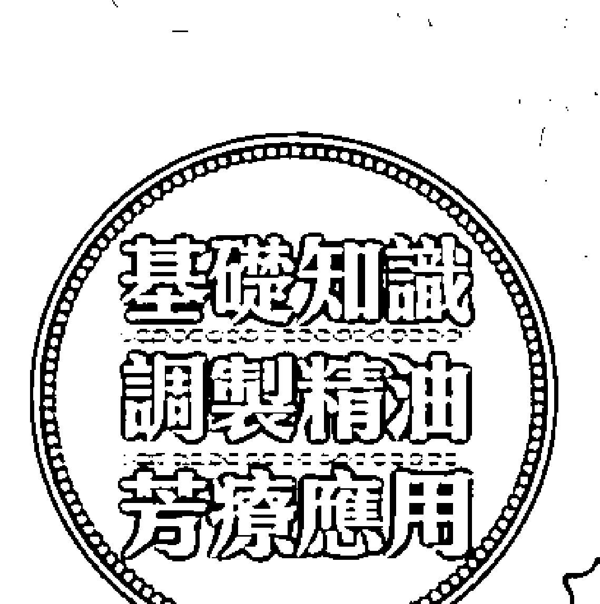

輕鬆學會調製與應用，
由內而外療癒身心靈

## 精油芳療全圖解

知名化妝品品牌 首席美容講師
王慎明／著

英國IFA國際認證芳療師、資深教學芳療師
劉意文／審訂

引領你走進精油殿堂，
感受純天然香氛，
享受香氣四溢的健康生活

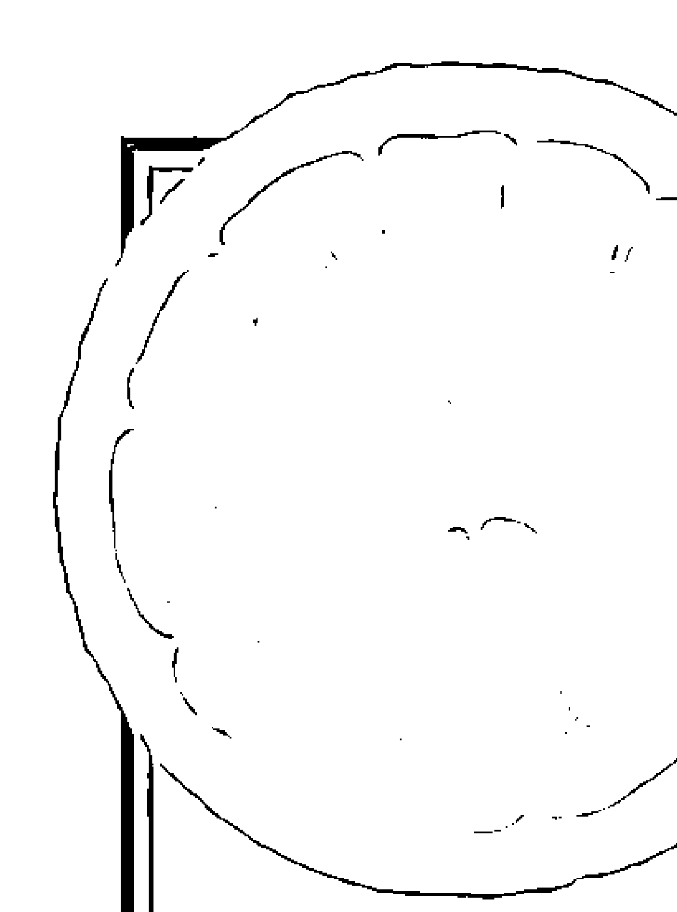

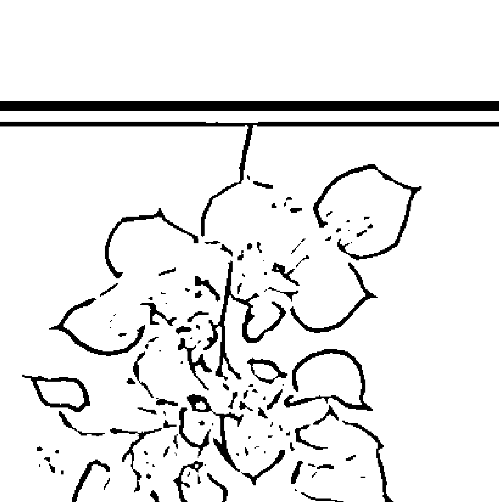

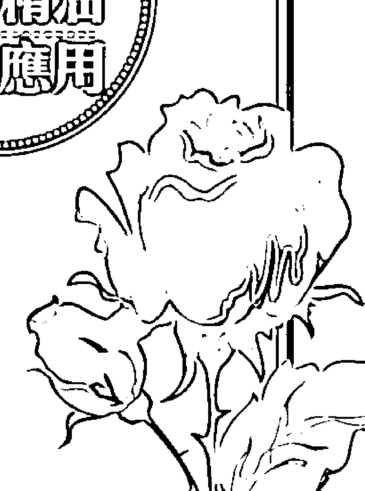


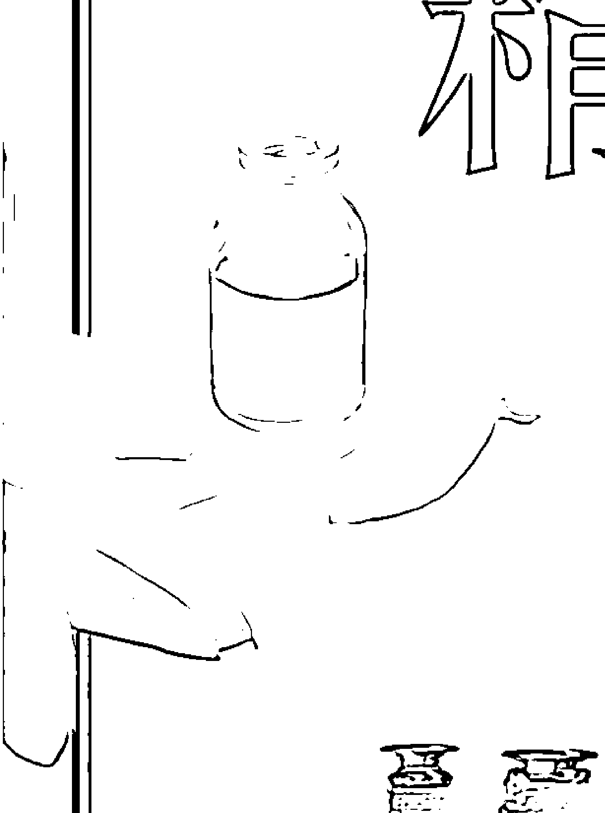

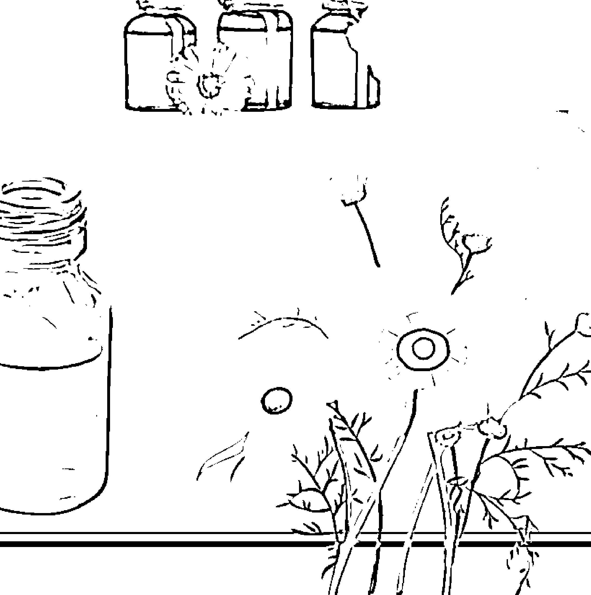

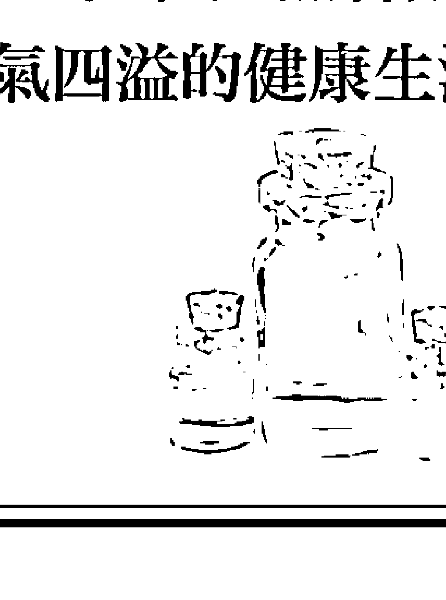

## 福利公告：

凡在【天使神秘学院】购买任何电子资料赠送实体书，详情请咨询店铺客服！

备注：如客服不知道这活动你可能进了盗版店铺！赠书活动仅在以下正版店铺购买有效哦！

### 【天使神秘学院】淘宝店 手机淘宝扫以下二维码

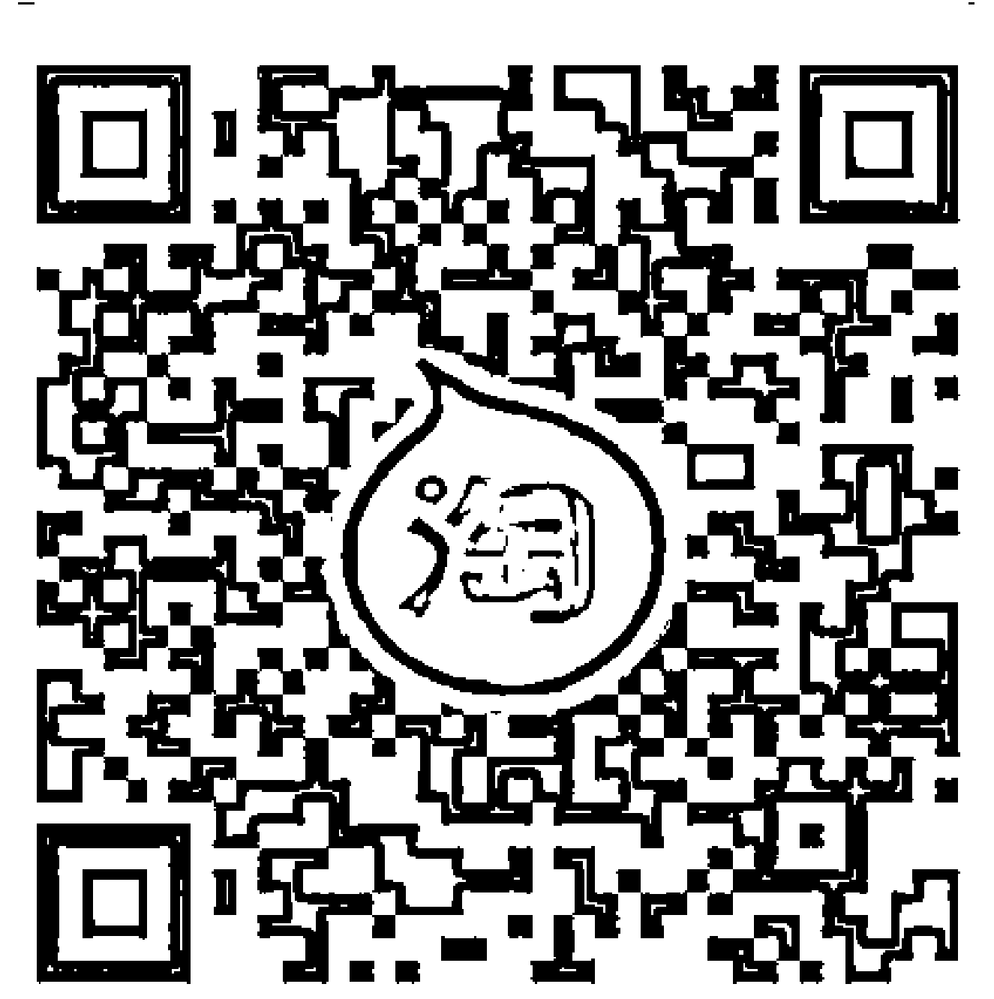

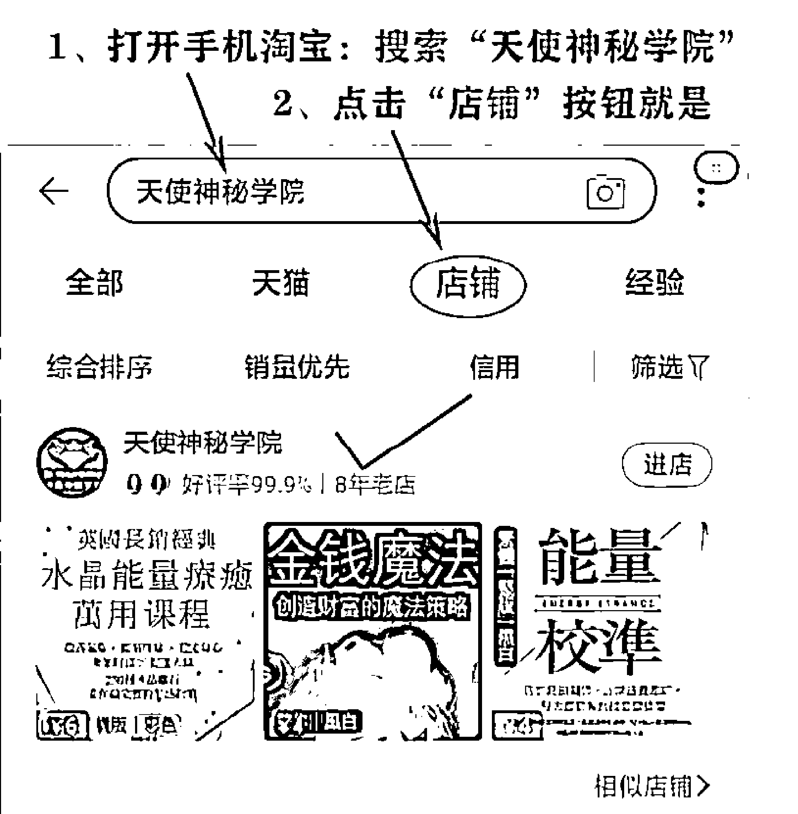

### 【天使神秘学院】微店 手机微信扫以下二维码

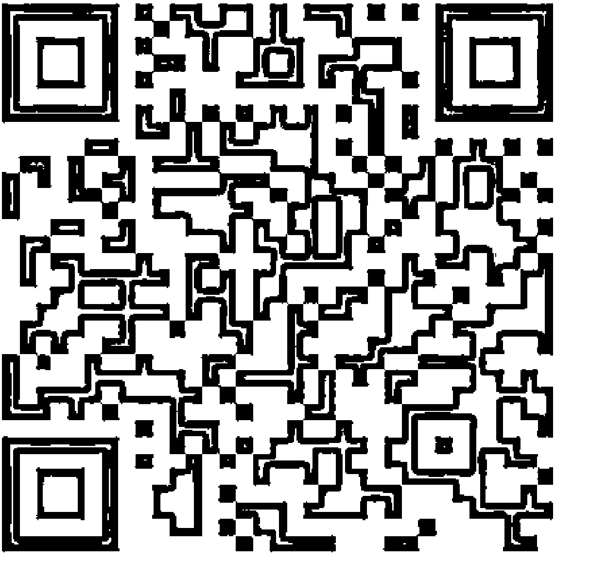

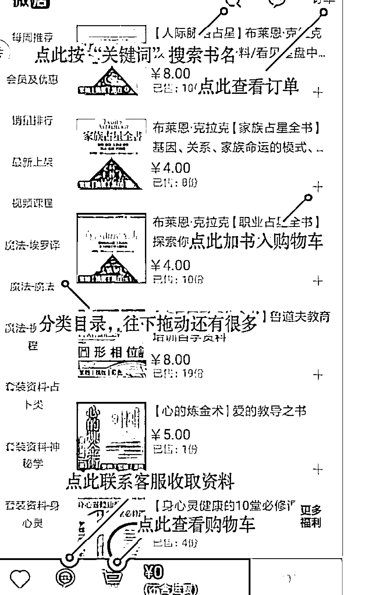

用手机微信扫码进店

## 制作说明：

本书由《天使神秘学院》出重金从台湾购入的原版书籍扫描制作完成。为达到最好阅读效果，特地把书全部切开后，再经由专业扫描设备高精度扫描完成，并经过一张张的PS后期处理最终成书，其间花费大量的人力、物力以及时间，只为能给大家提供经济并优质的神秘学学习资料而努力。

本学院强力谴责某些机构和个人，把本学院花心血制作完成的电子书籍，包装后直接放在自家网上低价倾销的行为，以谋取不劳而获的经济利益。如果长此以往最终将无人愿意再为大家花心思制作电子书，那以后可能大家再无新书可读。

为让大家以后能够读到更多的好书，也为了本学院的良性发展。本学院恳请大家尽量做到如下几点：

- 一、尽量在天使神秘学院的官方网站购买电子书籍。
官网访问地址：http://www.ac2011.cn
短网址：ac2011.cn
网址含义：(Archangel College 成立时间：2011年)

手机微信购买
请扫以下二维码


手机淘宝等购买
请扫以下二维码

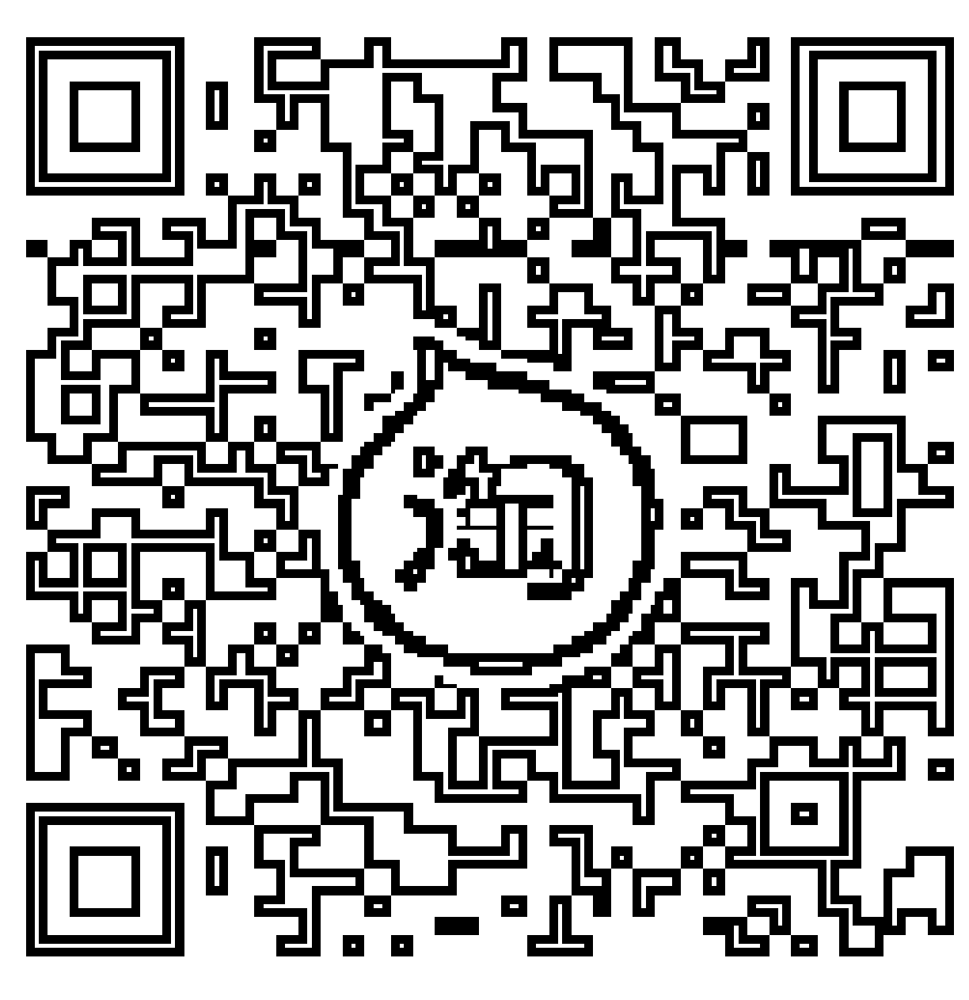

加店长微信号
请扫以下二维码


- 二、在收到电子书后小范围传阅即可，千万不要公开传播，更别挂到网上低价销售。

## 同时为答谢广大支持者，学院电子书将做如下调整：

- 一、学院会把一些早已收回制作成本的电子书折价销售。
- 二、最新制作的电子书籍会开放打印功能，大家购买后有条件的可自行打印成书。

天使神秘学院
2021年3月

## 作者序


我從事美學工作有將近30年的經驗，之前是義大利RVB化妝品公司的專任講師。該公司代理英國AQUA公司的芳香精油，是世界三大專業品牌之一。而成爲一個教師級的芳療師和星座諮詢師，往往需要數十年的時間。

芳香療法著重於案例和實際操作，尤其是芳療師手稿的分享。芳香療法的英文是「Aroma Therapy」，即借由人體的第一感覺——嗅覺去感受芳香，進而達到治療的目的。所以，若是以每個人對植物香料味道的不同喜好來進行芳香療法，那麼首先得瞭解客戶的心理感受，然後透過飲品的放鬆和音樂的薰陶，使客戶心情平靜，開始感受芳療師對其的呵護，最後才是按摩身體地圖的開始。通過六感的細膩品味，達到心靈的慰藉。

芳香療法是西方的藥草學應用，我在歐洲深造後，更發現植物與人的生理、心理的關係都十分密切。我在此分享個人案例手稿和對植物的原始生命力的解讀，介紹它們神奇的治癒力，以及當它們轉化為人體的能量時所呈現的效用。事實上所有的病源都來自心理，我們應放鬆身心，盡情享受大自然最原始的寧靜。

目前芳香療法已經運用於孕婦、新生兒、老年人等多種人群的各種病症的輔助治療中。十多年來，我們全家人都沒進過醫院，一切大小病痛都是用芳香療法，輔助食物和心理療法治癒。芳香療法也非常注重另一個層面——心理健康。一個芳療師要有一顆向善的心，用引導的方式，而非治療的方式，幫助他人，傳播正能量。

《精油芳療全圖鑑》是一本工具書，是為那些想要理解芳香療法植物精油的生命力的初學者而寫成的一本書，希望能為他們開啟一個由精油帶來力量的芳香世界。

王慎明

## 精油帶給你的，不止芳香

隨著人們對生活品質需求的提升，精油的使用也步入了人們的生活的方方面面。但是很多人對精油的認知，還是只有美容會所和按摩店，認為精油僅僅用來做美容按摩，也不會把精油當作家庭常備品。其實精油的使用歷史悠久，不只具有迷人的香氣，還真正具有改善疾病、減輕不適、舒緩壓力等功效，使身體得到全面的呵護。本書就向你全面介紹精油，帶你進一步領略精油的美好。

本書分為四個章節，從各方面為你傳遞精油之美。首先我們要從源頭上去認識精油，了解精油的「前世今生」。在第一章，我們會追溯精油的歷史，詳細介紹什麼是精油、精油的產生、什麼是精油芳香療法，使用精油的安全注意事項等。知道了這些最基礎的內容，大致了解精油之後，才能將精油使用得得心應手。同時，精油對人體的益處、功能、作用原理是什麼？複方精油如何調配？這些令人困惑的問題也能一一在這章節找到答案。

透過第一章，在對精油基礎知識有了整體的把握之後，第二章單方精油群芳譜，將逐一介紹最常使用的各種芳香精油，多方面展示不同精油的獨特魅力。你會發現，當各有乾坤的芬芳精油透過不同的使用方法散發迷人香氣的同時，神奇的精油魔法已經生效，能讓你舒緩身心，趕走疲憊，並能殺菌消毒，趕走病痛。

第三章收錄的是芳香療法中重要的媒介 — 基礎油，基礎油扮演的角色非常重要，不僅是芳香療法中的必需品，同時也是十分實用的單方精油。每種基礎油也有不同的功效，熟悉並了解這些基礎油，挑選出適合自己的，有助於精油配方的調配，將精油的作用充分發揮。

第四章收錄了撫慰身體和心靈的諸多精油配方，可以根據配方，調配出符合自身需要的複方精油。情緒問題、消化道問題、肌肉骨骼問題都可以得到緩解，男女的私密小問題也能在這裡找到對策，適合女性的美容美顏、美體瘦身、美髮護髮的板塊也應有盡有。這些配方包含按摩、噴霧、泡澡等多種方式，將第三章介紹的精油物盡其用，達到治癒身心的目的。

不論是不太了解精油入門者，還是對精油有一定基礎的讀者，本書都是十分便利和實用的，希望讀者們透過本書，能夠愛上芳香療法，讓它為你的生活帶去芬芳的同時，獲得心靈的寧靜、身體的健康、心情的美麗。

編者語

## 目錄 Contents

## CHAPTER 01 你一定要知道的芳香精油基礎知識

### Lesson 1 不可不知的精油基礎知識

- 012 什麼是精油？
- 013 精油的應用歷史
- 014 精油對人體有什麼益處？
- 015 精油的使用方法
- 017 精油的萃取方式
- 018 精油的保存方法
- 019 使用精油時的注意事項
- 020 精油的香氣特徵
- 021 如何選購精油
- 022 如何調配複方精油
- 023 如何調製按摩油
- 024 什麼是精油？

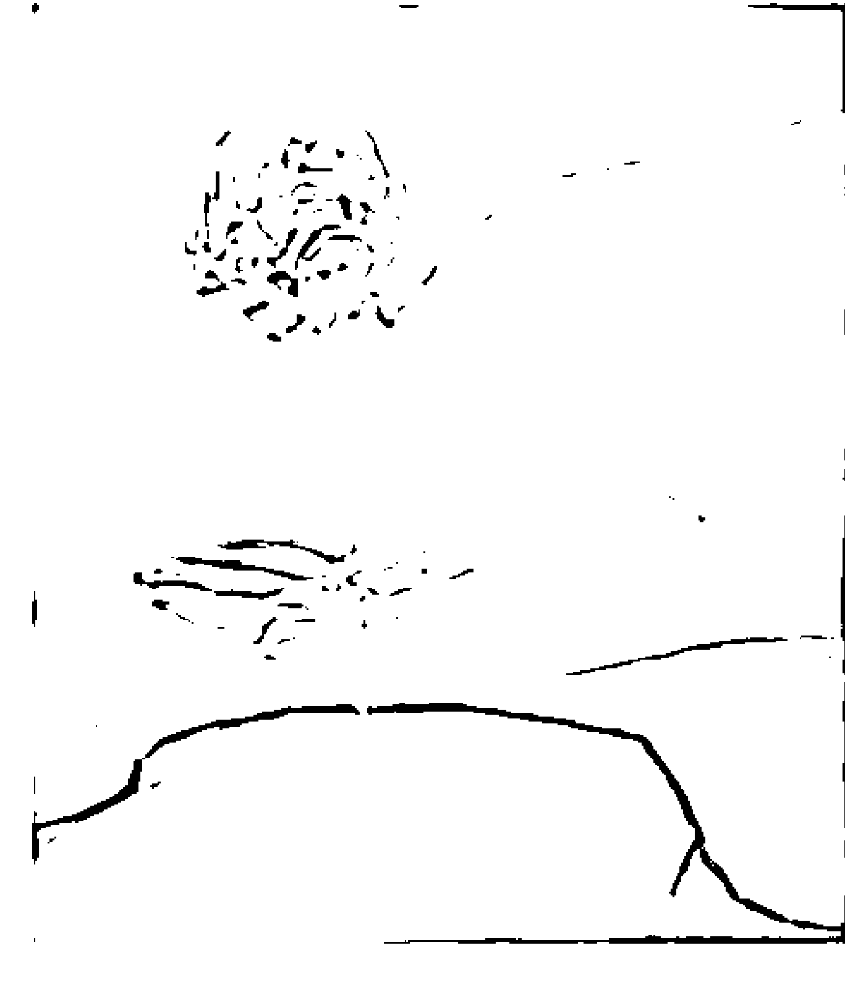

### Lesson 2 簡單便利的精油日常使用方法

- 024 薰香法
- 026 沐浴法
- 028 按摩法
- 034 按敷法
- 034 塗抹法
- 035 做成保養品
- 035 噴灑法

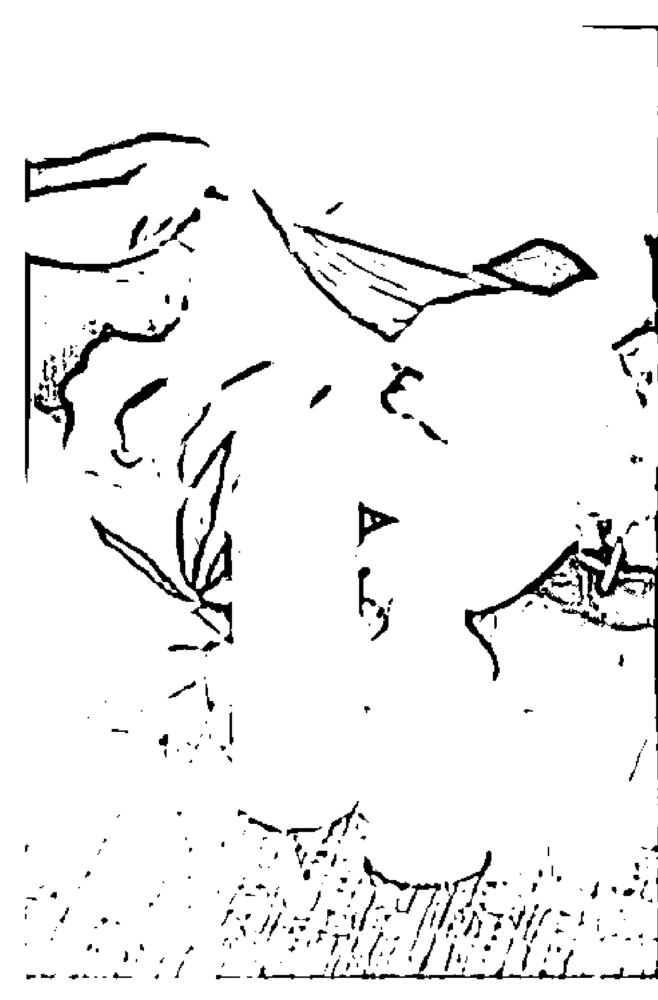

## CHAPTER 02 美麗的媒介 — 萬用的基礎油

### 038 認識基礎油

- 039 認識浸泡油
- 040 甜杏仁油
- 041 酪梨油
- 042 葡萄籽油
- 043 荷荷芭油
- 044 玫瑰果油
- 045 小麥胚芽油
- 046 橄欖油
- 047 夏威夷堅果油
- 048 榛果油
- 049 大麻籽油
- 050 向日葵油
- 051 杏桃仁油
- 052 芝麻油
- 053 亞麻籽油
- 054 茶花籽油
- 055 金盞花浸泡油
- 056 聖約翰草浸泡油
- 057 胡蘿蔔浸泡油
- 058 山金車浸泡油
- 059 南瓜籽油

## CHAPTER 03 萃取自植物精華 — 單方精油群芳譜

### 桃金孃科

- 062 丁香
- 066 尤加利
- 070 茶樹
- 074 綠花白千層

### 唇形科

- 077 快樂鼠尾草
- 080 沉香醇百里香
- 083 甜羅勒
- 086 迷迭香
- 089 甜馬鬱蘭
- 093 真正薰衣草
- 096 廣藿香
- 099 胡椒薄荷

### 樟科

- 102 花梨木
- 105 月桂
- 108 肉桂

### 柏科

- 111 絲柏
- 114 杜松漿果

### 牻牛兒科

- 117 天竺葵

### 安息香科

- 121 安息香

### 繖形科

- 124 芫荽
- 127 茴香
- 130 歐芹
- 133 胡蘿蔔籽

### 橄欖科

- 136 沒藥
- 140 乳香

### 薑科

- 143 薑
- 147 豆蔻

### 木犀科

- 150 茉莉

### 禾本科

- 153 岩蘭草

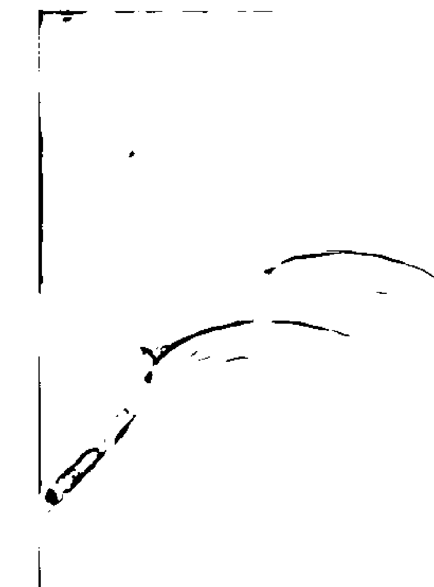

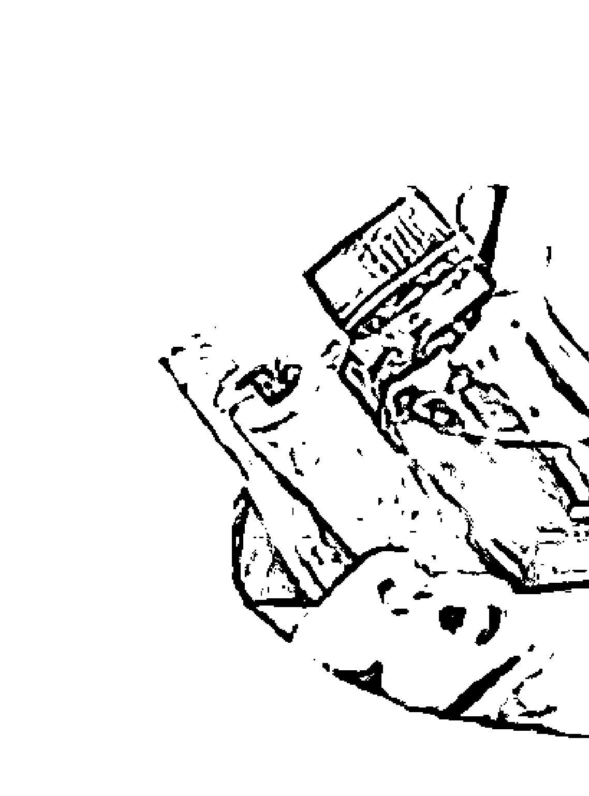

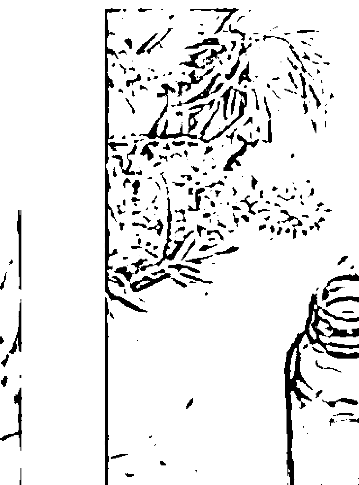

### 薔薇科

- 156 玫瑰

### 番荔枝科

- 160 依蘭

### 松科

- 163 歐洲赤松

### 芸香科

- 166 佛手柑
- 169 葡萄柚
- 172 檸檬
- 176 桔
- 180 苦橙葉

### 菊科

- 183 羅馬洋甘菊

### 馬鞭草科

- 186 檸檬馬鞭草

### 胡椒科

- 190 黑胡椒

### 檀香科

- 193 檀香

## 芳香滋养，解決身體不適的精油配方

### 198 調適情緒相關問題

- 減輕憂鬱
- 舒緩焦躁
- 消除緊張
- 集中注意力

### 200 改善呼吸道相關問題

- 感冒
- 咳嗽
- 過敏性鼻炎
- 喉嚨痛

### 202 調理消化道相關問題

- 便秘
- 消化不良
- 胃痛
- 口臭

### 204 解決皮膚相關疾病

- 霉菌感染
- 疤痕
- 蚊蟲咬傷
- 蕁麻疹

### 206 男性私密問題

- 陽痿
- 前列腺炎
- 膀胱炎

### 208 女性私密問題

- 經痛
- 經前症候群
- 陰道炎
- 更年期症候群

### 210 養顏美容

- 美白淡斑
- 控油祛痘
- 防老抗衰
- 晒後修復

### 212 美體塑身

- 燃脂瘦身
- 健胸美胸
- 消除水腫
- 提臀瘦腿

### 214 養髮護髮

- 油性髮質
- 乾性髮質
- 頭皮屑
- 促進頭髮生長

### 216 樂活居家

- 除蟲噴霧
- 清新噴霧
- 消炎抗菌
- 消除臭味

## 附錄

- 218 精油功效索引
- 222 各類肌膚使用精油索引

## 《本書使用方法》 Useful book

### 桃金娘科 丁香 Clove

精油名称、科别、英文名：
丁香精油是从丁香植物中提炼而来的，属于桃金娘科。虽然丁香精油效力很强，但在芳香疗法中必须慎重使用。它能激发智力，振作精神，帮助消化，缓解关节和风湿病的疼痛，以及缓解呼吸系统疾病和腿部溃疡。

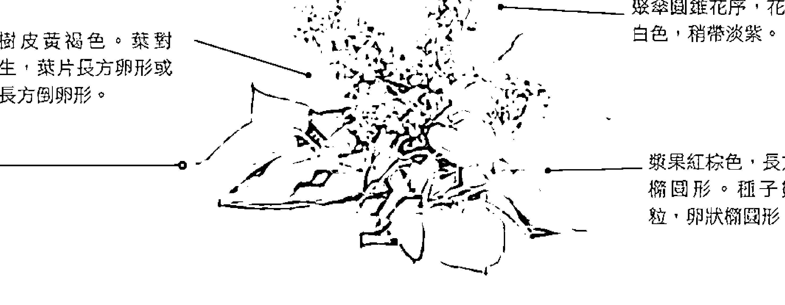

#### 源植物形态特征

丁香，常绿乔木，高达10公尺。树皮黄褐色。单叶，叶对生；叶柄明显；叶片长方卵形或长方倒卵形，长5~10公分，宽2.5~5公分，先端渐尖或急尖，基部狭窄常下展成柄，全缘，革质，密布油腺。花芳香，成顶生聚伞圆锥花序，花径约6公厘；花萼肥厚，筒状，绿色后转紫色，长管状，先端4裂，裂片三角形；花冠白色，稍带淡紫，短管状，4裂，花芳香。雄蕊多数，花药纵裂；子房下位，与萼管合生，花柱粗厚，柱头不明显。浆果红棕色，长方椭圆形，稍有光泽，先端宿存萼片。种子长方形。种子数粒，卵状椭圆形。花期3~6月；果期6~9月。

#### 精油档案

| 项目 | 内容 |
|---|---|
| 别名 | 公丁香、百结、丁子香、鸡舌香 |
| 学名 | Syzygium aromaticum |
| 英文名 | Clove |
| 科别 | 桃金娘科 |
| 萃取部位 | 叶片、茎、花瓣、花苞 |
| 萃取方法 | 蒸馏法 |
| 主要产地 | 主产于印度尼西亚、桑吉巴和马达加斯加岛，印度、巴基斯坦和斯里兰卡等地也出产少量丁香精油。 |
| 性状特征 | 为淡黄或无色澄明油状物。 |
| 化学成分 | 丁香酚、乙酸丁香酯、丁香油烃。 |
| 香味特征 | 有刺激性的「辛辣味」和强烈的「木质」香气。 |
| 挥发特性 | 低度挥发。 |

### 使用方法

- 薰香法
- 按摩法
- 喷洒法
- 护发
- 吸嗅法
- 做成保养品
- 漱口法
- 涂抹法
- 蒸气吸入
- 足浴
- 热敷法
- 沐浴
- 冰敷法
- 面膜

## 如何保存精油及使用時注意事項。

將丁香精油存放於深色玻璃瓶中，置於18~25℃的常溫下，建議可放入木盒中，以降低溫度的波動。未開封的純丁香精油通常可保存3～5年，已開封使用的精油最好在1年內用完，若已經調和為按摩油，則在2個月內用完為佳。

- ① 丁香精油屬於非常強勁的精油，對皮膚刺激性大，使用劑量不得高於1%。
- ② 生理期、孕產期、哺乳期女性不宜使用。
- ③ 敏感肌膚者需謹慎使用。

## 適合與丁香精油混用的精油

薄荷、安息香、肉桂、葡萄柚、茉莉、杜松、檸檬、橙花、薰衣草、苔、香橙、快樂鼠尾草

適合共同調配的精油，使功效更全面。

#### 丁香精油的主要功效

皮膚
消腫抗炎，治療皮膚潰瘍及傷口發炎；治療疥癬，促進癒合；改善粗糙肌膚。
心理
舒緩因情緒鬱結而產生的不快或胸悶感；而它催情的效果亦有助於改善性無能與性冷感。
居家
在棉球上滴幾滴丁香精油，然後把棉球放在亞麻布製作的食櫃裡，這樣不但可以薰香食櫃，還可以防蛀。
醫學
- ① 消炎抗菌。能抑制細菌及微生物滋長，稀釋後對於人體黏膜組織無刺激性，可用於牙科口腔治療中。
- ② 健胃消脹、促進排氣。可用於減輕因胃部發酵產生的惡心、反胃與口氣不佳，緩和因拉肚子所引起的腹部疼痛。
- ③ 良好的催情效果，有助於改善性無能與性冷感。
- ④ 減輕上呼吸道感染症狀。丁香有淨化空氣的效果，利用擴香器及呼吸可增加身體的抗菌能力。在薰香蒸氣中加入3～5滴丁香，殺菌效果特佳；冬天使用，將使身體在面對細菌時更具抵抗力，並使人有溫暖的感覺。

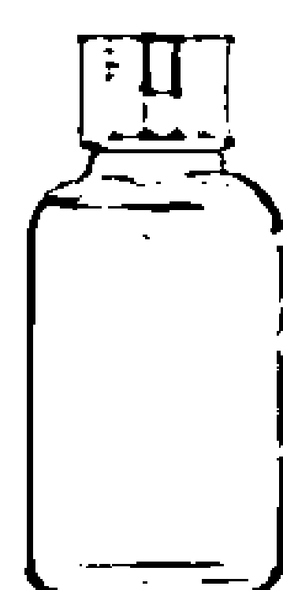

精油的主要功效，主要是對皮膚、心理、居家及醫學等方面。

精油的常見使用方法。

### 調適情緒相關問題

#### 減輕憂鬱

憂鬱症在現代社會上已成隱形殺手，現代人生活步調快速，工作壓力大，很容易產生情緒低落、憂鬱等心理疾病，嚴重時甚至會影響生理健康。而丁香有提振精神、給予溫暖的作用，對於改善憂鬱症狀有正面幫助。

常見病症的精油配方及使用方法。

泡澡
將所有精油混合均勻後加入牛奶中再倒入浴缸，泡入水溫約37~38℃的浴缸中，浸泡約15~20分鐘即可。
吸入
將所有精油混合均勻後滴在面紙上，靠近鼻子輕輕吸入，以達到安撫的作用。

#### 舒緩焦躁

現代的人生活壓力大，因此容易出現焦慮不安、緊張等負面情緒，而精油的芳香氣味有助於安撫人們不安的情緒，達到放鬆身心、舒緩焦躁的作用。在日常生活中多加利用，有助於身心健康。

按摩
將所有精油混合均勻後塗抹在胸口及肩膀處，輕輕按摩全身即可。
熏香
在香薰盤上加入八分滿的水，將精油滴入水中，讓薰香盤在房間中發揮作用。


用於臉部保養，可搭配臉部按摩，改善肌膚問題，使用劑量不超過1%。
甜杏仁油10ml
荷荷巴油3ml
丁香精油2滴
薰衣草精油1滴
玫瑰精油1滴

用於改善心血管循環，搭配按摩手法，可緩解肩頸僵硬，使用劑量不超過1%。
甜杏仁油10ml
荷荷巴油3ml
丁香精油2滴
薰衣草精油1滴
玫瑰精油1滴

在日常生活中的壓力大，容易出現焦慮不安、緊張等負面情緒，而精油的芳香氣味有助於安撫人們不安的情緒，達到放鬆身心、舒緩焦躁的作用。

在日常生活中，丁香精油可以用於治療肌肉酸痛及風濕關節疼痛，搭配按摩手法，可達到舒緩疼痛的效果，使用劑量不超過1%。


將所有精油混合均勻後，塗抹在疼痛處，搭配按摩手法，可達到舒緩疼痛的效果。

丁香精油可以用於日常的清潔消毒，搭配擴香器使用，可達到淨化空氣、殺菌的效果。


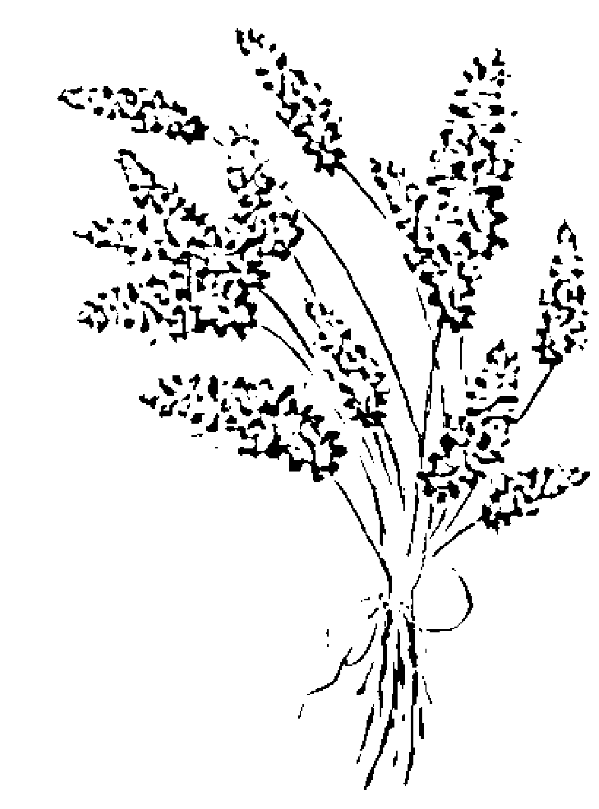

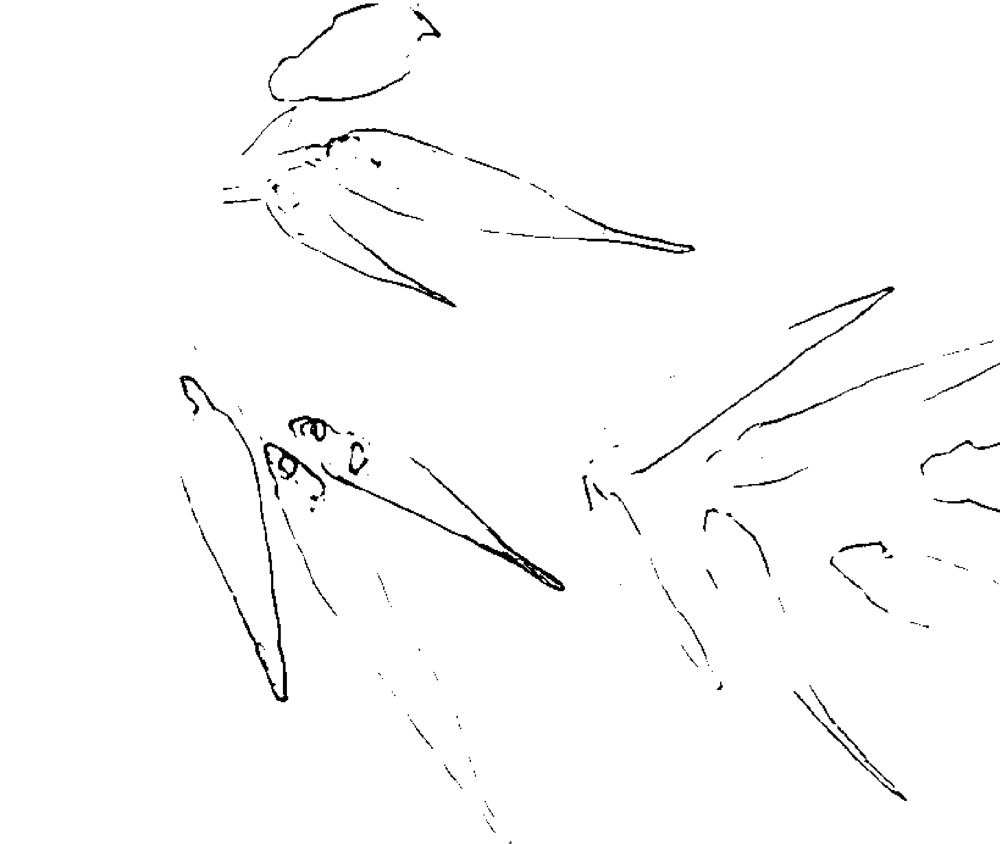

## CHAPTER 你一定要知道的芳香精油基礎知識

精油是近年大熱的產品，被廣泛應用於我們生活各個領域。

你是否也曾想過或者已經嘗試過那些很熱門的精油產品呢？

想不想進入那個芬芳的精油世界呢？

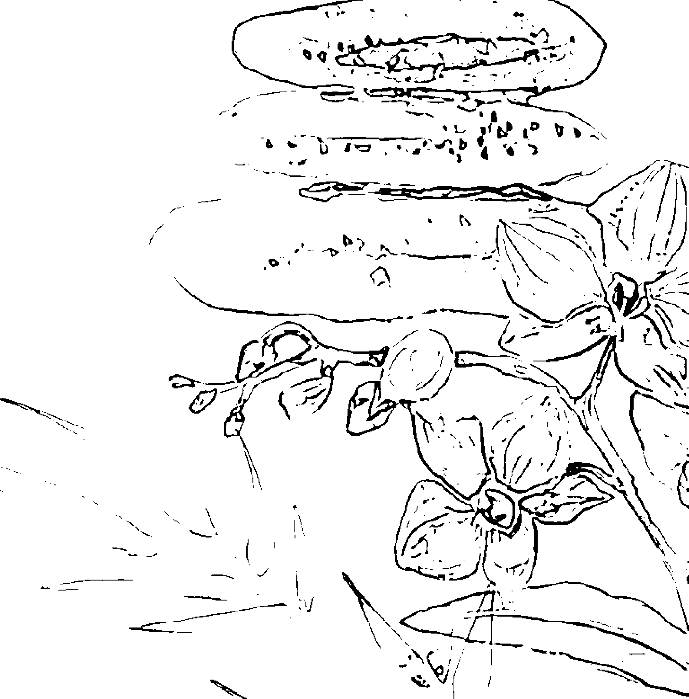

### Lesson 01 不可不知的精油基礎知識

### 什麼是精油？

你真的了解精油嗎？僅僅是會發出迷人香味的「香水」嗎？精油對我們又有怎樣的作用呢？

先有對精油最基本知識的了解，不再一知半解、道聽塗說，才可以盡情享受精油帶來的幸福感！

精油是從植物的花、葉、莖或果實中萃取出來的芳香分子，大多數是液態的具有揮發性的有機混合物。在植物內的特殊分泌腺合成，並儲存在其周圍細胞中，因此說精油是濃縮了植物生命力的珍貴精華。而這些植物一般是特定種類的植物，必須是具有療效的藥用植物，經過蒸餾法、冷壓法、浸泡法、溶劑萃取法或超臨界二氧化碳萃取法…等方式萃取，所以，並不是每種植物都能萃取出精油。並且，由於精油分子小，容易被人體吸收的同時，也極易揮發，應避免與空氣過多接觸，必須選用密封且深色的瓶子儲存。

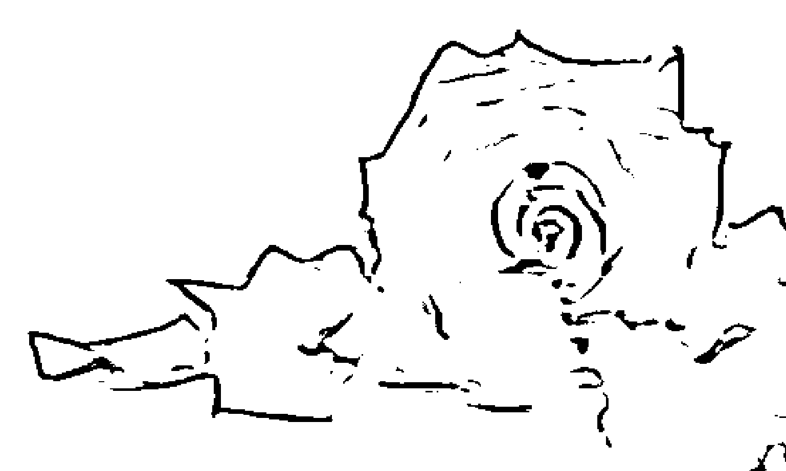

- **精油的性質**：精油具有比什麼都強烈的香氣（芳香性），放置在空氣中會不斷蒸發（揮發性）。此外，還有許多種精油比水還要輕，可以溶於油脂與酒精裡，但不會溶於水。但是精油並不是油脂。

- **精油的安全性**：精油是從植物中萃取的天然成分，但這並不代表對人體就是100%安全，有些精油還帶有毒性。精油的成分跟在植物裡的含量相比含有更高的濃縮量，因此在使用時通常會先以基底油、油脂或酒精進行稀釋，使用精油時必須具備足夠的知識。

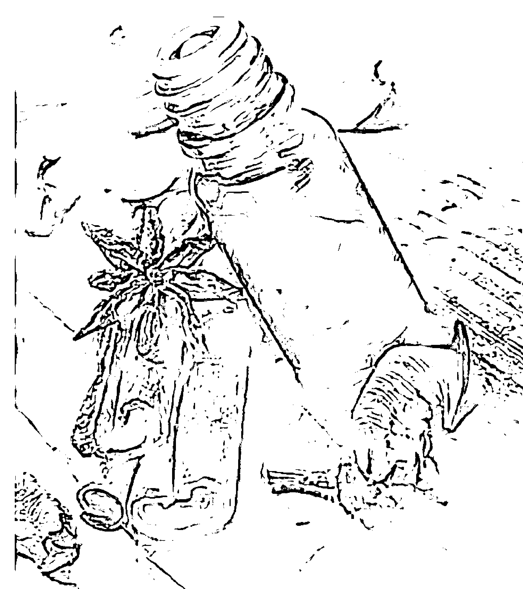

- **什麼是芳香療法？**：植物具有療癒身心的能力，利用植物的治癒能力及香氣的作用，喚醒人類與生俱來的「自然治癒能力」，自古代開始就被視為「療法」繼承了下來。而所謂的芳香療法就是以具體療效的精油，幫助人們找回健康，但是其範圍並不局限於使用精油，了解疾病本身、與病人溝通、了解精油的原理等都是芳香療法的範疇。

#### 精油的應用歷史 History

關於精油的記載，最早的記錄出現在古代的印度、波斯和埃及等國家，主要是被用於與東方大國的芳香油和油膏交易。大名鼎鼎的埃及艷后——風情萬種、傾倒眾生的克麗奧佩托拉，也極喜愛這些神秘而珍貴的香膏，也就是我們今天的天然植物精華精油。這就說明，人類使用精油的歷史非常悠久，只是由於技術問題，在蒸餾技術發明之前，古人大多用的是油膏、薰香等方法，主要是利用植物的芳香來調理身體，達到舒緩、淨化人體雜質的目的，與今天我們常說的芳香療法很相似。直到蒸餾技術發明、改良後，真正意義上的精油才出現。


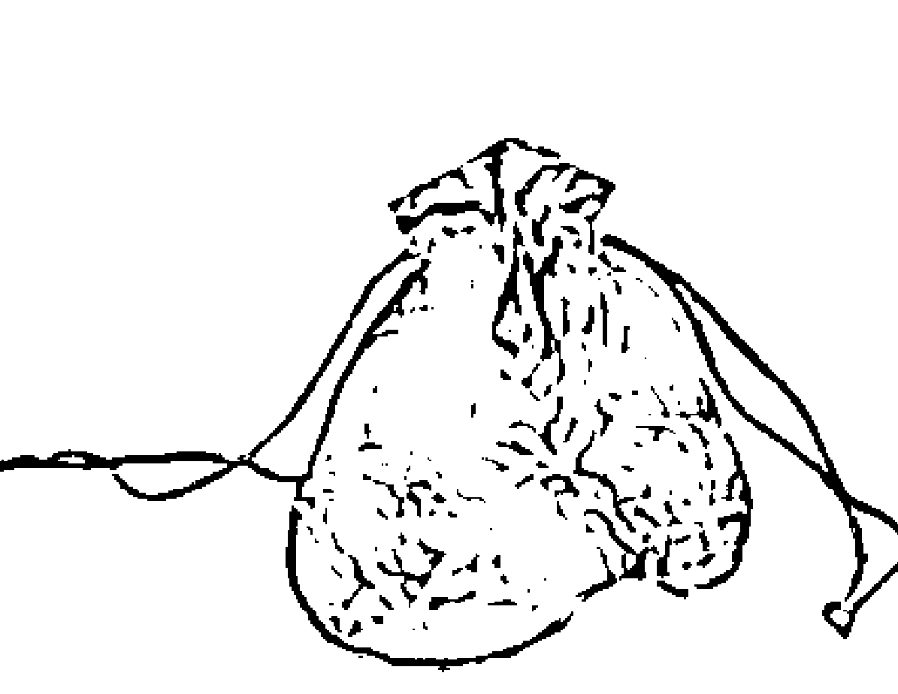

中國是最早把芳香植物用於保護健康並形成文化的國家之一，最突出的就是香包。香包又被稱作是香袋、容臭、香囊、荷包等，是古代女子智慧與美麗的產物，一般採用繁複的刺繡工藝，外觀精緻典雅，內裝雄黃、薰草、艾葉、秋蘭等香料，如屈原《離騷》就有「扈江離與辟芷兮，紉秋蘭以為佩」的說法；民間逢端午還會製作和佩戴香囊，以此辟邪……中國的香包文化是對這些香草植物利用的優秀典範。

說到近代精油的發展歷史，由後世尊稱為芳療之父的法國化學家蓋特佛塞為重，在一次實驗意外中，他將嚴重灼傷的手部浸泡在實驗桌上的薰衣草精油中，結果發現傷口的疼痛大大減輕，數天後恢復效果顯著，引發他對精油療效特性的研究，發表了一篇論文，首創「芳香療法」（Aromatherapy）一詞。

歷史上還有很多重要的人物，例如：法國軍醫珍·瓦涅醫師，使用精油治療軍士的傷口與嚴重燒傷，並出版《芳香療法的應用》一書；生化學家瑪格麗特·摩利夫人備受尊崇的芳香療法之母，將一生都投入在精油的療效及美容作用。

古人常用植物來治病、薰香或者是驅蟲等，例如：早在古埃及時代，當地人就非常擅於利用芳香植物，在慶典時燃燒薰香或者是製成各種藥品，有時也做化妝品。而一些特殊的香膏，例如：雪松、沒藥甚至被用來保存屍體，用途非常廣泛。再如兩河流域的巴比倫人也很喜歡種植各種各樣的藥草，不過大多被用來治療各種疾病。聰明的希臘人也很會利用這些香膏，在日常生活中使用非常廣泛。羅馬人則對香膏的香氣情有獨鍾……中國一直以來都是對香膏利用很充分的國家，例如：中草藥的治病作用、隨身攜帶香包的風潮等等。

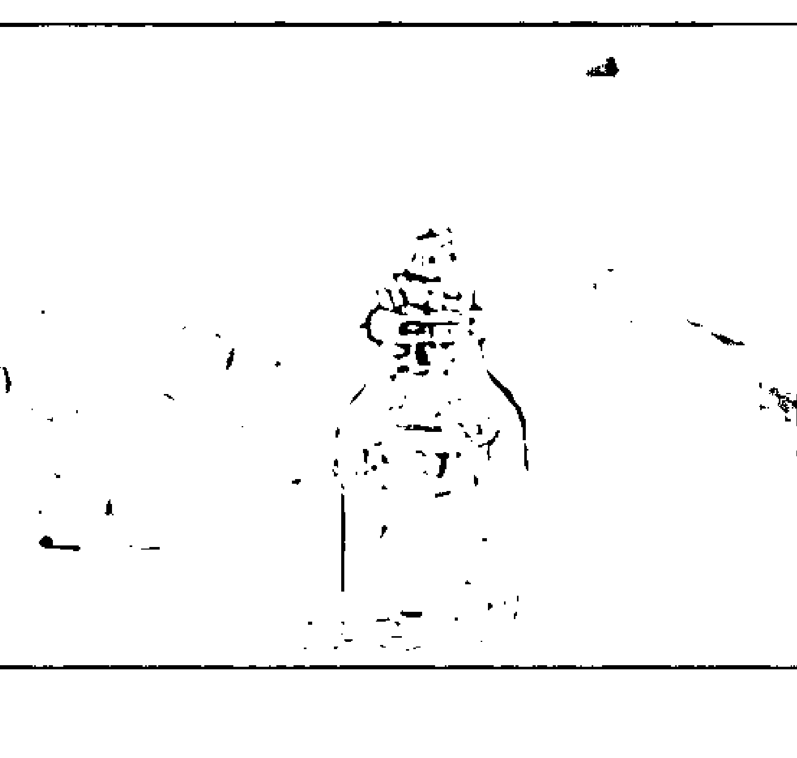

#### 精油對人體有什麼益處？ Benefit

精油中含有的芬芳香氣，有甜蜜花香，也有草木清香，常常會讓人們覺得平靜或者愉悅，勾起許多甜蜜而幸福的回憶。而精油也正是透過這些特殊的香氣對身體達到調節的效果。在講求科學證據的現代社會，眾多調查研究也表明精油對人體是很有益的。

芳香療法是精油最主要的用途。這是因為精油源自於植物，對植物有著延續生命、驅趕害蟲、抗菌等作用，能夠幫助植物順利繁衍，而人類也屬於自然，所以利用植物的這種芳香特性來維護人體健康是很合理的，其發生作用的原理是將具有藥效的植物中萃取出來的精油，透過呼吸、皮膚等吸收管道，讓這些細小分子在體內發揮作用，保持身心平衡，這是精油最大的作用，療效也是最全面的。不過，這種效果是一個緩慢的過程，需要耐心等待。

### 精油的主要功能

- **平衡身心**：精油的出現對人類最大的好處就是能夠讓身心得到平衡。精油透過獨特的香氣能夠調節緊張、興奮、低落、鬱悶等不平衡的情緒，影響訊息的傳遞，使大腦的指令正確傳達到各處，從而保持身心的平衡、健康狀態。這是正統醫學無法實現的，是精油備受歡迎的重要原因。

- **美容**：精油分子非常細小，可以快速穿過皮膚，對美容非常有效。因此，在許多護膚產品中都添加有精油，但這並不能完全代替精油，因為精油的美容功效更加直接，並且深入。

- **增強免疫力**：精油在保持身心平衡的同時，也會影響到身體的免疫系統，能夠更快發現病菌的入侵，及時消除威脅，減少生病。大多數精油都具有這種功能，操作也很簡單，只需要養成日常使用精油的習慣，保持身心的平衡，就能讓你的免疫系統宛如銅牆鐵壁。

- **淨化空氣**：我們常常會選擇用精油來清新空氣，這是因為精油不僅能夠掩蓋空氣中的臭味，還能消滅空氣中的有害物質，淨化空氣，使環境變得清新、芬芳，這是一般的化學香氣所無法比擬的。

- **抗菌抗病毒**：精油有著非常卓越的抗菌效果，這是精油十分重要的作用，這是由於植物本身就有抗菌效果。而每一種精油的抗菌能力都不一樣，但均不容小覷。

### 精油產生作用的原理

精油被鼻子吸入之後，化學物質散發出來的訊息會傳達到大腦，並影響邊緣系統，舒緩情緒、振奮精神。而由皮膚吸收的精油分子則是進入到血液中，隨著血液循環作用到全身，達到想要的效果。

## 精油的使用方法 Usage

迫不及待地買了精油回去，卻不知道該如何使用？別擔心，跟著我們一一了解以下11種方式，總有一款適合自己的。

##### 塗抹

塗抹是使肌膚直接吸收精油最常使用的方式，由於精油成分太過濃縮，並不適合直接接觸肌膚，需要將精油調配在冷壓萃取的植物油裡使用於皮膚，並經由一定的比例進行調配。

#### 蒸臉

女性很喜歡用精油來蒸臉。蒸汽能夠打開毛孔，以便精油更好地發揮清潔的作用，同時也能保持肌膚水分，讓肌膚水嫩光滑。具體的方法就是先準備一盆熱水，滴入精油後，臉部靠近蒸汽蒸到臉上即可。

##### 漱口

口腔保健非常的重要，可將精油低劑量調配於芝麻油中塗抹於牙齦護理並進行油漱，再吐於衛生紙上丟掉，可預防蛀牙與發炎，抑制口臭並強化牙肉，清潔口腔並預防齲齒。

### 敷

精油冷敷，能使受傷的肌肉、筋骨部位的得到舒緩鎮靜，常用於比較緊急的情況，夏季常發的中暑、晒傷等狀況也可以藉此緩解；精油熱敷，則是藉由熱氣，加速精油成分吸收到皮膚、血液中，使疼痛、僵硬的肌肉關節得到緩解。

##### 做成保養品

精油也常常被用來做成各種保養品，主要是讓皮膚更快速地吸收有效成分，發揮精油卓越的美容功效。使用無香精的面霜或乳液，每5ml加入1滴精油的安全劑量調配即可；精油與植物油調和後也可以當做保養品，塗抹在全身或是臉部肌膚，效果非常好。

##### 噴霧

精油可以被製作成噴霧，淨化空氣的效果會非常好。噴霧的使用方法也很簡單，先準備噴瓶，加入伏特加或是酒精，再滴入精油使充分融合，最後再加入適量水即可，哪裡需要就噴哪裡。

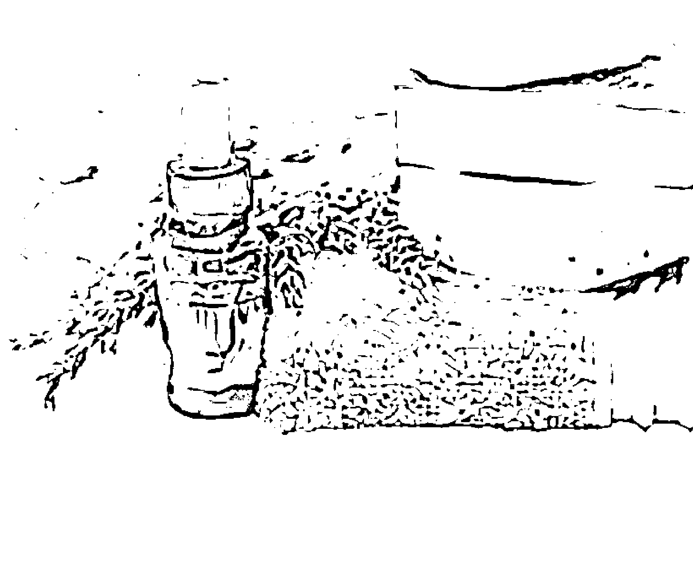

##### 薰香

將精油的香氣以薰香器具擴散出去，透過鼻子將芳香分子吸入體內，進而產生應有的作用，這就是精油的薰香方式。一般的薰蒸台上方可放水，滴入精油，以蠟燭或燈泡當做熱源，透過加熱水幫助精油分子擴散。還有插電式的薰蒸器適合家裡不方便點蠟燭的使用者，另有不插電、不需要點蠟燭的擴香石，藉由擴散原理讓香氣揮發出去。薰香可以讓室內空氣清新，營造溫馨、舒適的環境，還能維持人體健康呢！

##### 蒸汽吸入

患有呼吸道疾病的人通常會採用蒸汽吸入的方法，是一種簡單又直接的精油使用方法。所謂蒸汽吸入，就是借助呼吸道吸收精油。例如：咳嗽、多痰時，準備一杯或一盆熱水，滴入精油，靠近聞具有精油氣味的蒸汽，可以有效緩解呼吸道疾病引起的不舒服。

##### 按摩

將精油以植物油稀釋後，塗抹到身體上，進行推、壓、揉等按摩動作，使皮膚能充分吸收精油分子，讓肌肉得到放鬆，身體也會變得更加警覺，達到雙倍療效！

##### 泡澡

精油用來泡澡的方法有兩種。一是將精油與植物油調和後塗抹全身，再進行泡澡，這種方式主要是透過皮膚吸收精油，同時借助熱水加快血液循環，幫助精油分子在體內的循環、作用；另一種是將精油與牛奶調勻後倒入浴缸，或是可以將精油與植物油混合後倒入浴缸，享受精油的香氣與功效。

### 手、足浴

與泡澡大致相同，但時間上沒有泡澡長。準備好臉盆、水桶或者是木桶，用來裝水，再將手足部位塗上按摩油，最後進行浸泡；或是在水桶中加入牛奶與精油混合液，只浸泡局部疼痛、疲勞或者僵硬的部位。

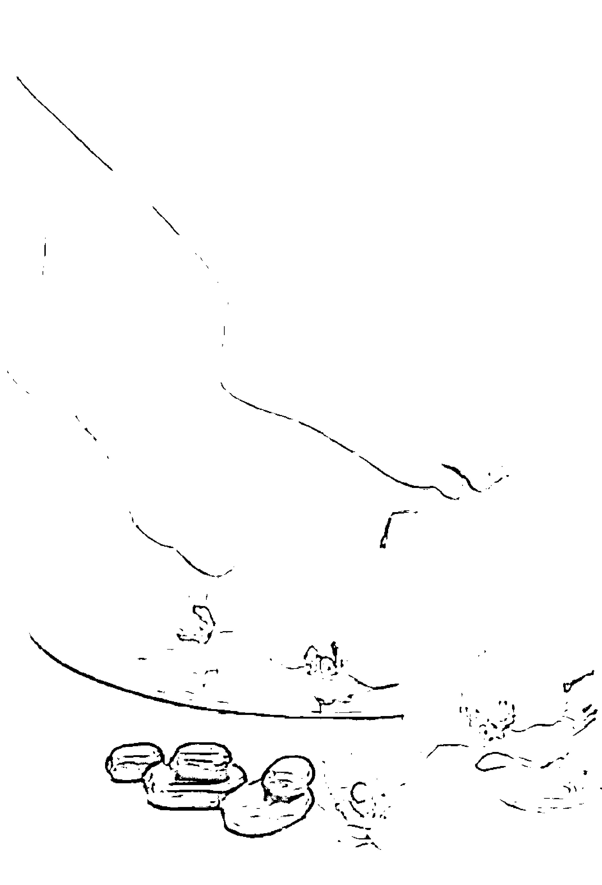

## 精油的萃取方式 Extraction

精油是從植物的不同部位萃取出來的，有的只需要輕輕觸碰就會留下植物香氣；有些則比較難萃取，例如：花朵類精油；果皮類精油也很容易煉製，只需要稍微擠壓就能有氣味。

### 蒸餾法

這是最常用，也是十分古老的方法。一般是將植物能萃取精油的部位，放入蒸餾器中，以水煮或者蒸汽的方式，將植物的精華提煉出來。多用於葉片、枝葉、種子、木材類的精油，例如：茶樹、迷迭香、花梨木等。

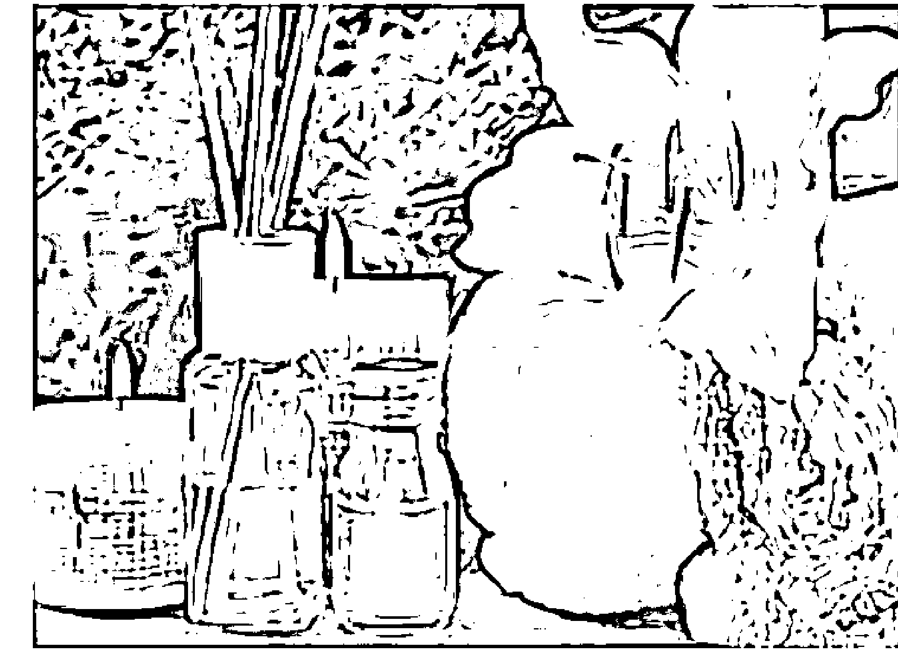

### 浸泡法

將藥用植物浸泡在植物油中，利用植物油將精油成分溶於其中，就成了好用又具療效的植物浸泡油。通常浸泡法所得的精油會被歸到植物油中，並不屬於精油，被稱為是含有精油成分的植物油。

### 壓榨法

壓榨法是以人工或機器將果皮擠壓、提煉出精油。通常適用於果皮類，例如：檸檬、葡萄柚、佛手柑等。因果皮萃取，水分含量容易較高，所以保存期限較短，開瓶後半年至一年之內要用完。

### 溶劑萃取法

細緻花朵類精油遇到高溫高壓容易破壞，因此會採用溶劑萃取法，以石化溶劑與要萃取的植物相混合，利用溶劑將精油萃取出來。此類精油花香味濃郁，保留完整且珍貴的成分，療效非常豐富。但溶劑萃取確有個瑕疵，殘留的溶劑會危害身體健康也影響精油的純度，增加了原精對肌膚的致敏性。

### 脂吸法

脂吸法是傳自古代的萃取方式，方法是在木板上放一片玻璃，抹上動物油脂，再上花瓣，如此反覆，利用油脂將精油萃取出來。一般花瓣類植物用的較多，因為需要經常更換花瓣，費時又費工，現在已經很少再用這種方法了。

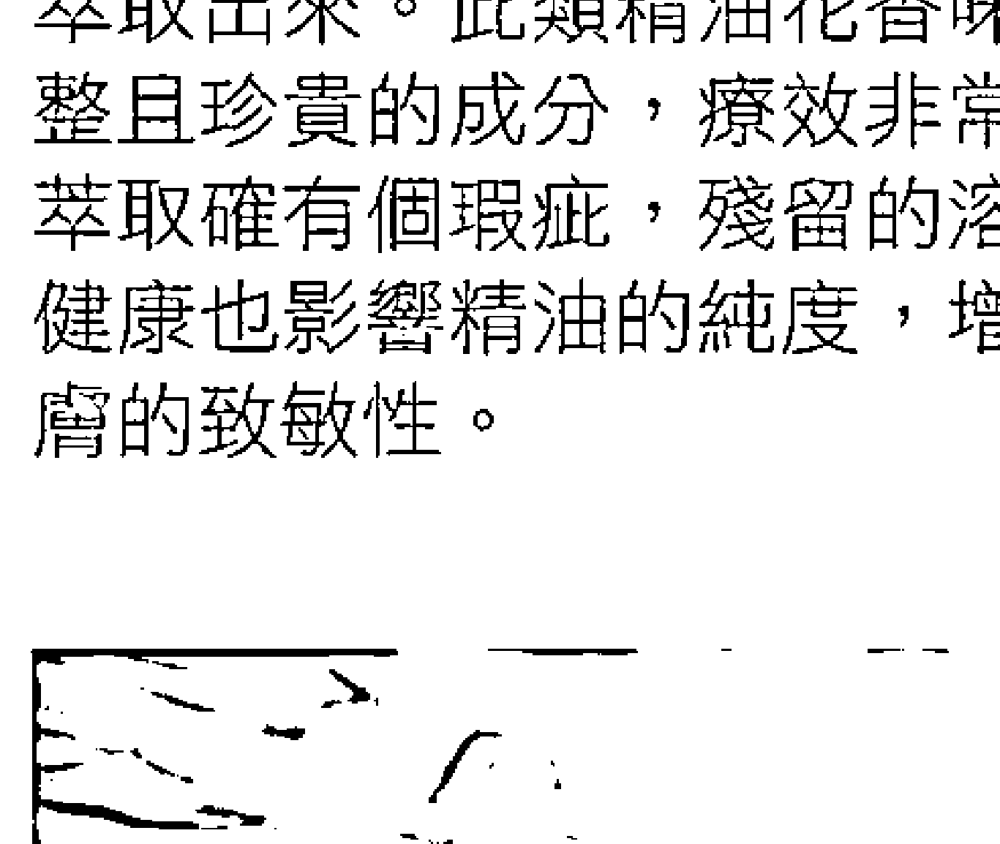

### 超臨界二氧化碳萃取法

二氧化碳萃取法由於操作儀器和設備的複雜，是一種非常昂貴的萃取方法，因而透過二氧化碳法得到的精油價格也比其他方法得到的精油昂貴。將二氧化碳加壓到超臨界狀態，呈現半液態半氣態，此時從植物中萃取精油，之後改變壓力，使氣體揮發，剩下的就是精油。這種方式得到的精油品質很好，沒有有害物質的殘留，也不會破壞精油的珍貴成分。

## 精油的保存方法 Preservation

純精油價格昂貴，又極易揮發，怎樣保存才能發揮出它最大的功效呢？別擔心，快來試試精油保存的六大祕訣吧！

### 選擇深色玻璃瓶

精油容易揮發，深色玻璃瓶能避免陽光直接的照射。而用塑膠瓶存放精油，其化學成分會破壞精油的品質，因此購買時也儘量不要選擇這種包裝的精油。

### 放在木盒中保存

很多包裝嚴密的精油都會選擇木盒，可減低溫度的波動。許多精油專用的木盒都有一格一格的專放位，收納十分方便，例如：檀香木或者松木盒子都可。

### 選擇陰涼通風處

陽光最容易使精油變質，一定要避免陽光直射，也不要把精油暴露在燈光的照射下，溫差太大容易使精油變質。陰涼通風處既可以避免陽光的損害，也能避免過於潮溼或者燥熱。

### 使用完畢要及時擰緊瓶蓋

已經開封的精油，每次使用完後，一定要擰緊瓶蓋，不然會因為接觸空氣太久而揮發。還要儘量減少開瓶次數，防止空氣中的氧氣氧化精油，導致品質下降。

### 避免存放在冰箱

很多人都有這樣錯誤的觀念，認為放在冰箱可以保證精油的新鮮。其實這樣，反而會讓溫度的差異波動過大，這並非保存精油的最好方式。精油的最佳存放溫度為25度。

### 調和過的精油只能使用2個月

純精油開封後使用期限是半年，但是調和後的精油的使用期限只有2個月。所以，儘量避免每次調和量過大，還要確保2個月內用完，用不完的最好扔掉。

### 避免小孩接觸精油

最好存放在孩子拿不到的地方，這是因為純精油有一定的危險性，小孩無知可能會錯誤使用而造成傷害。

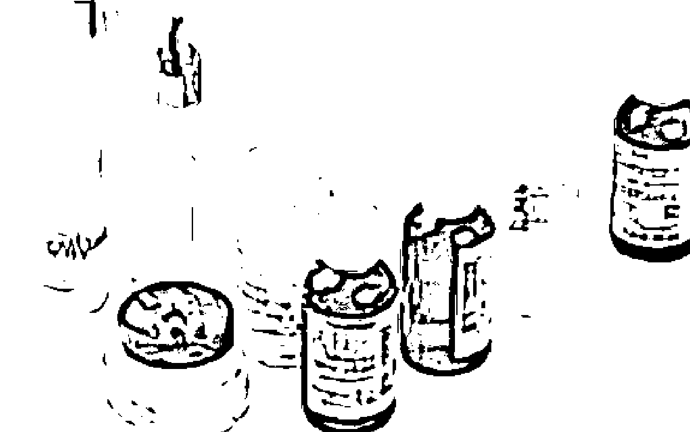

## 使用精油時的注意事項 Attention

精油氣味芬芳，療效顯著，前提是正確使用，因為精油既有藥效，也會有某些毒性。必須了解精油的使用禁忌，遵循使用原則，才能正確、安全使用精油！

### 使用前必須稀釋

精油的濃度很高，因此使用時都必須加以稀釋與植物油混合使用，不建議純精油塗抹皮膚，容易引起刺激與灼傷皮膚的狀況，並且高濃度的純精油經皮吸收也易使肝腎負擔變重。

### 使用前最好先做皮膚測試

有些精油會引起過敏或刺激皮膚，也有些人的體質對精油過敏，因此，使用前皮膚測試的工作很重要。先調濃度3%的精油，抹在腋下或胸口，24小時之後沒有過敏現象，就可以使用這種精油。

### 精油不能接觸眼睛

如果有使用在眼周的精油，劑量應控制在1%左右，並且不要靠眼睛太近。可用純露代替精油，以免不慎接觸到眼睛。

### 內服精油需要專家或芳療師的指導

絕不可口服純精油，國外的內服精油都有經過特殊程序與專業醫師諮詢，需要嚴格依照實際需要尋求醫療的建議。

### 皮膚上有傷口時

精油有一定的危險性，要避免用於傷口。不過，若是很小的刀傷、小傷口，精油能使肌膚快點癒合。

### 光敏性精油不要在陽光下使用

有些精油含有會引起光敏感的成分，使用後，經過太陽照射，皮膚會變黑，甚至引發皮膚癌。

### 不可經常太高劑量使用

使用精油，低劑量、堅持是調整身體機能的最好辦法。高劑量通常都是使用在緊急情況下，例如：發燒、腹瀉等，平時應該少用，以3%~5%為宜。

### 禁忌人群

嬰幼兒要避免使用精油，懷孕婦女使用精油要經過專人指導，氣喘患者不宜使用蒸汽吸入法，癲癇病患者、肝腎功能不佳者慎用。

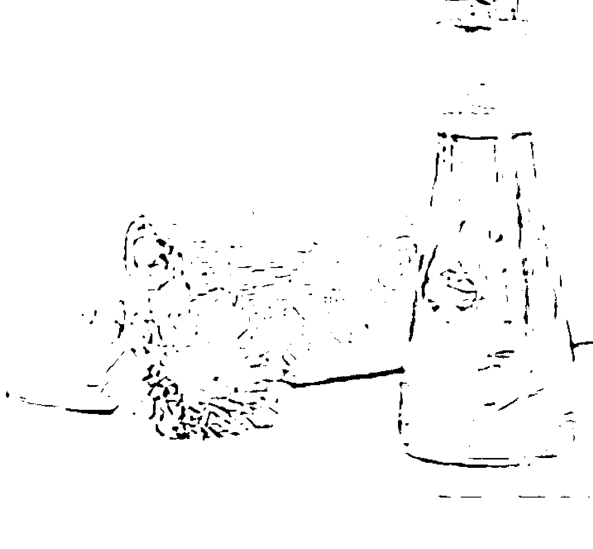

## 精油的香氣特徵 Fragrance

依照萃取植物的種類和氣味，可將精油的香氣分為七種類別。屬於同類別的香氣適合彼此搭配，調配精油時可先從同類別的開始混合。

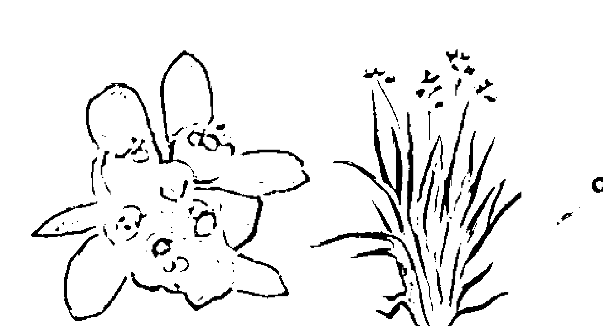

### 辛香調

是從耳熟能詳的植物中萃取出來的精油類別，此類別的精油恰如其名，辛辣的香氣為其特徵。適合與樹脂調或是木質調的精油互相搭配。

### 木質調

是指從葉子、樹皮、嫩枝部位萃取出來的精油，例如：絲柏、苦橙葉、花梨木等。給人感覺像是置身於森林中的清爽樹木香氣為其特徵。適合與辛香調或香草調的精油互相搭配。

### 樹脂調

是從樹脂中取得的精油類別。黏度高、濃郁甘甜的香氣為其特徵，即使少量的精油也能長時間持續散發香氣，常被作為香水的後調香味。適合與東方調或是辛香調的精油互相搭配。

### 香草調

是從香草的花瓣或葉子萃取出來的精油種類，部分香草調的精油具有殺菌性，此類別有許多原料植物自古以來就是民間療法中所使用的「藥草」。適合與木質調或是柑橘調的精油互相搭配。

### 東方（異國）調

充滿異國風情，帶有神祕異國風味的精油種類，例如：依蘭、檀香、松紅梅等。揮發性較低，建議使用時只要感覺「這種分量好像有點少」的程度就可以了，每次少量使用。適合與花香調或樹脂調的精油互相搭配。

### 花香調

主要是從花朵萃取出來的精油種類，也有部分精油是從葉子或莖萃取出來的，甜蜜芬芳的香氣為其特徵。用途多樣，大多數為適合初學者使用的精油。適合與柑橘調或東方調的精油互相搭配。

### 柑橘調

從水果的果皮中萃取的精油或是散發出類似柑橘香氣的精油種類，例如：葡萄柚、佛手柑、檸檬等，適合所有人，可以給心情帶來撫慰和愉悅的感覺。適合與香草調或花香調的精油互相搭配。

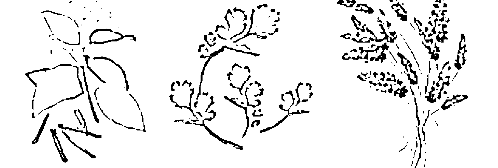

## 如何選購精油 Choose

市面上的精油產品琳瑯滿目，讓人難以選擇，價格、品牌、服務、質量等因素都是需要考慮的。那麼如何才能成為精油選購高手呢？

### 看產地

精油來自於植物，而每一種植物都會有其優良產地，因此，我們亦可以從產地來辨別精油品質。例如：薰衣草盛產於法國普羅旺斯，要買此類精油，就要首選此產地的；再如世界上最好的檀香產地在東印度，若你選購的精油不是此地，那麼品質就可能就沒這麼好。

### 看顏色

精油並非都是我們印象中的淡黃色，例如：沒藥是赭紅色，而洋甘菊是藍色或綠色，佛手柑是淺綠色，岩蘭草為黑棕色，每種精油的顏色都不盡相同。

### 看包裝

品質較好的純精油都會選用深色玻璃瓶盛裝，通常會標示「100% pure essential oil」。若非此標示，有可能是稀釋或合成精油。

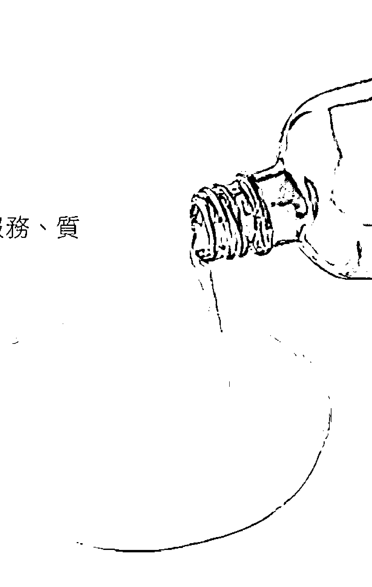

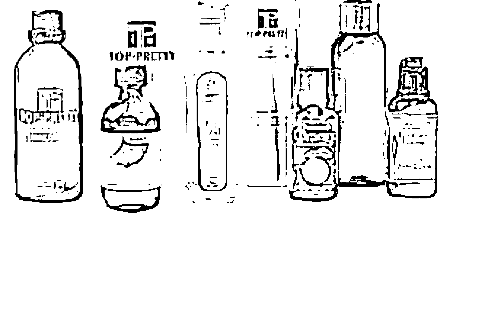

### 看價格

不同的精油隨著產量多寡、萃取難易等都會有不用的價格，例如：玫瑰精油是精油中最貴的精油，被稱作是「精油皇后」。如果你購買地點所販賣的精油為均一價，品質就有待商榷了。

### 聞味道

純精油的味道是清新不刺鼻的，並且如果你聞過純精油，就應該很容易辨別含有化學成分的精油了。如果味道刺鼻，聞起來讓人感到不適，而不是令人心曠神怡，就要懷疑了。

### 選廠商

選擇信譽良好的生產商，最好是那種知名度高、專業、口碑好、歷史悠久的廠商，這樣能夠保證專業的諮詢和周到的售後服務。

### 看瓶身標示

專業廠商瓶身標註內容需完整，購買前先確認使否有精油品名及學名、容量、萃取部位和萃取方式。

## 如何調配複方精油 Complex Oil

所謂複方精油，就是將兩種以上的精油調和在一起，以增加精油的香氣和效果。調製複方精油並沒有一定的規則，可依照個人喜好自由變化。

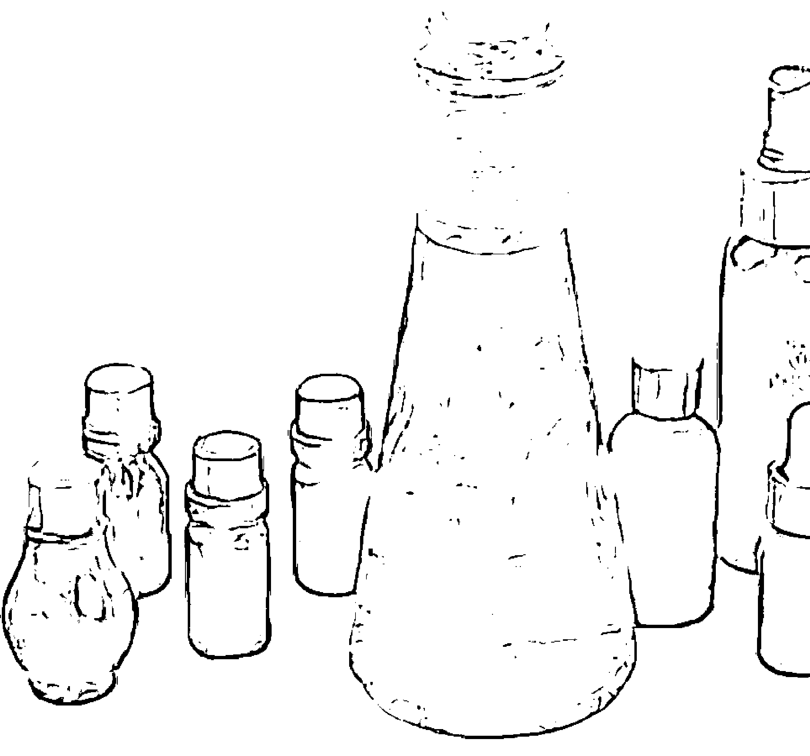

### 複方精油的功效

複方精油可以增加香氣的層次感，讓精油氣味更有變化，且因為揮發速度不同，讓調和的香氣持續更久、更迷人。

複方精油的成分一定比單方精油多，療效也更完整而全面。並且，經過調和後的不同成分協同作用，會將單一精油的危險性降低。必須注意的是，一般人自行調複方精油，最好以3種為限，因為精油成分複雜，若了解較少，可能會使效果降低，在氣味上也會更難掌握。

### 調和複方精油需要的工具

+   精油2～3種：選擇自己喜歡的精油即可。
+   深色的玻璃瓶：以便裝入複方精油。
+   標籤紙：表明瓶中有那些精油，各幾滴及製作日期等。

### 調製方法

複方精油的調製其實很簡單，將喜歡的精油分別滴入深色玻璃瓶中，並貼上標籤紙，寫明精油配方、數量、日期等詳細信息即可。

### 複方精油的保存期限

調製完的純複方精油可依照開瓶後的精油保存期限進行保存，約1～3年。保存方法與純精油相同，也是放於陰涼避光處，但最好盡快使用完。

### 複方精油注意事項

調製好的複方精油如果要使用在皮膚上，依然需要按照調按摩油的方式，使用基礎油進行稀釋，接著按照正常的精油使用方法使用即可。

## 如何調製按摩油 Massage oil

按摩是芳香療法中非常重要的方法，也是精油很常見的運用方式。因此，學會調製按摩油就成了精油使用者的重要功課。

### 按摩油的功效

純精油濃度很高，且價格昂貴，直接使用會刺激皮膚，因此稀釋之後使用是必須的步驟。而調製按摩油除了用來按摩之外，也可以直接塗抹在身體的局部。隨身攜帶一瓶調製好的按摩油，是很方便的一種方式。

### 調製按摩油需要的器具

+   A. 精油與基礎油。
+   B. 量杯，用來測量植物油的分量，玻璃的最好。
+   C. 攪拌棒，可以將調好的精油攪勻。
+   D. 深色玻璃瓶，以便存放調好的按摩油。
+   E. 標籤紙，註明按摩油中的成分及調製的日期。

### 按摩油的濃度多少為宜？

調製按摩油，最重要的步驟就是計算劑量。一般性健康者以1%～2.5%為宜，持續使用以3個月為限；若有緊急情況或短期需要較高劑量使用，範圍3%～7%，但不要持續使用2周。孕婦、老人、病後照顧等族群使用劑量為1%，嬰幼兒使用要0.5%以下為宜。

### 簡單實用的調製方法

就一般精油滴孔而言，1cc有20滴，以此基準來計算。如要調20cc、濃度5%的按摩油，算出的精油量是1cc，也就是滴入20滴精油；調製10cc、濃度1%的油，則需要0.1cc的精油，也就是2滴，以此類推。由於調和過的精油保存期較短，因此一次最好不要調太多。

### 調製按摩油的步驟

+   A. 計算所需的植物油和精油量，再以量杯量出植物油量。
+   B. 滴入計算好的精油數滴。
+   C. 以攪拌棒仔細攪拌均勻。
+   D. 小心倒入分裝用深色玻璃瓶中。
+   E. 貼上標籤紙，表明瓶中是哪些精油和植物油、劑量多少及調製日期。

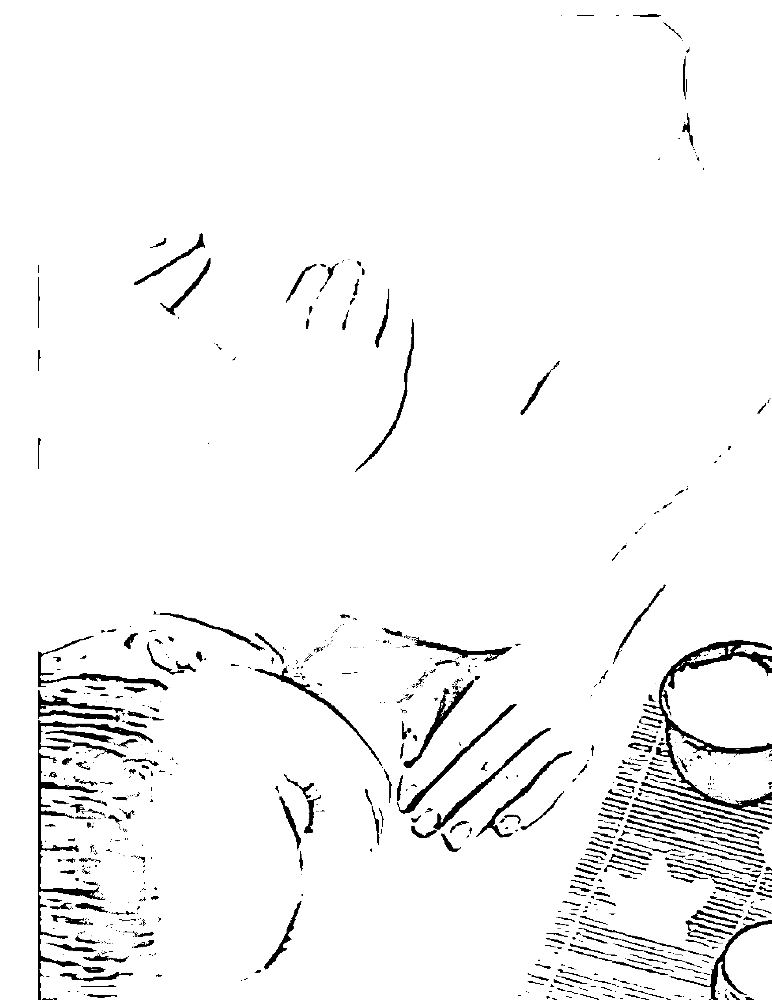

## 簡單便利的精油日常使用方法

### 什麼是精油？

詳細了解了精油的特性之後，就可以將精油帶入日常生活中，度過被香氣包圍的每一天。

從熱門的薰香到沐浴、泥面膜、化妝水、室內芳香噴霧等，家裡有的各種用品都能夠透過自己親手製作出來。

不過，考慮到工作的緊張、生活的忙碌，我們在這裡提供了簡單又常見的方法，例如：薰香、沐浴、按摩、按敷等方法，讓你可以持續製作手工精油用品，享受精油帶來的幸福感。

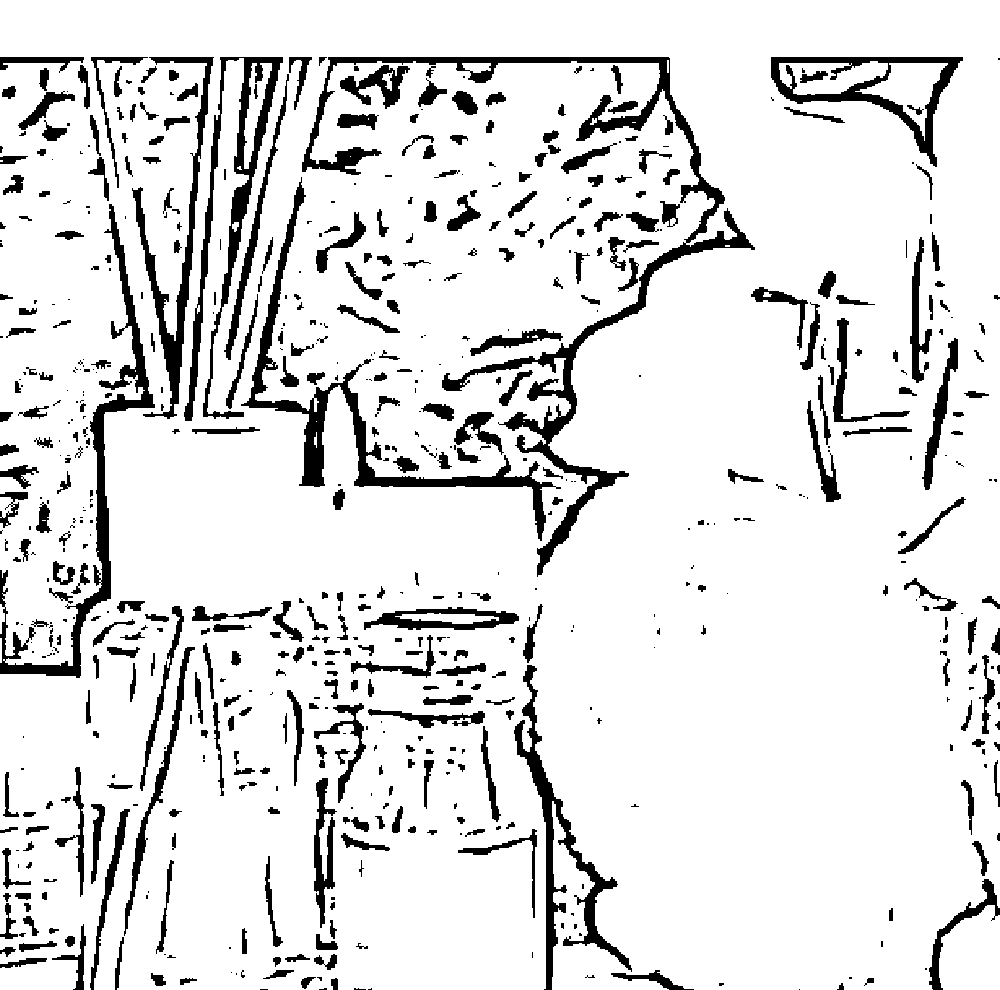

### 1 薰香法

薰香是備受大眾喜愛的精油使用方法。在微弱、溫暖的光芒中散發出來的香氣具有撫慰人心的作用，能舒緩身心。而使用手帕或面紙吸入精油的香氣，不論何時何地都能隨時獲得芳療的功效。這種方法還是維護嗅覺順暢、呼吸自然空氣的最好方式，也可用來改善環境衛生、淨化空氣。

##### 薰香燈

利用蠟燭的熱度加熱精油，隨著蒸汽一起散發香氣。

+   材料：精油1～4滴、薰香燭台、蠟燭、適量的冷水或熱水。
+   功效：淨化空氣、殺滅病菌、消除異味、安撫情緒、安眠或者提神。
+   使用方法：在上方容器內加約七分滿的冷水或熱水後，滴入精油。依空間的大小加入1～4滴精油即可享受薰香。
+   注意事項：盡量選用無煙無味的蠟燭。由於會使用到火。使用時一定要注意安全。

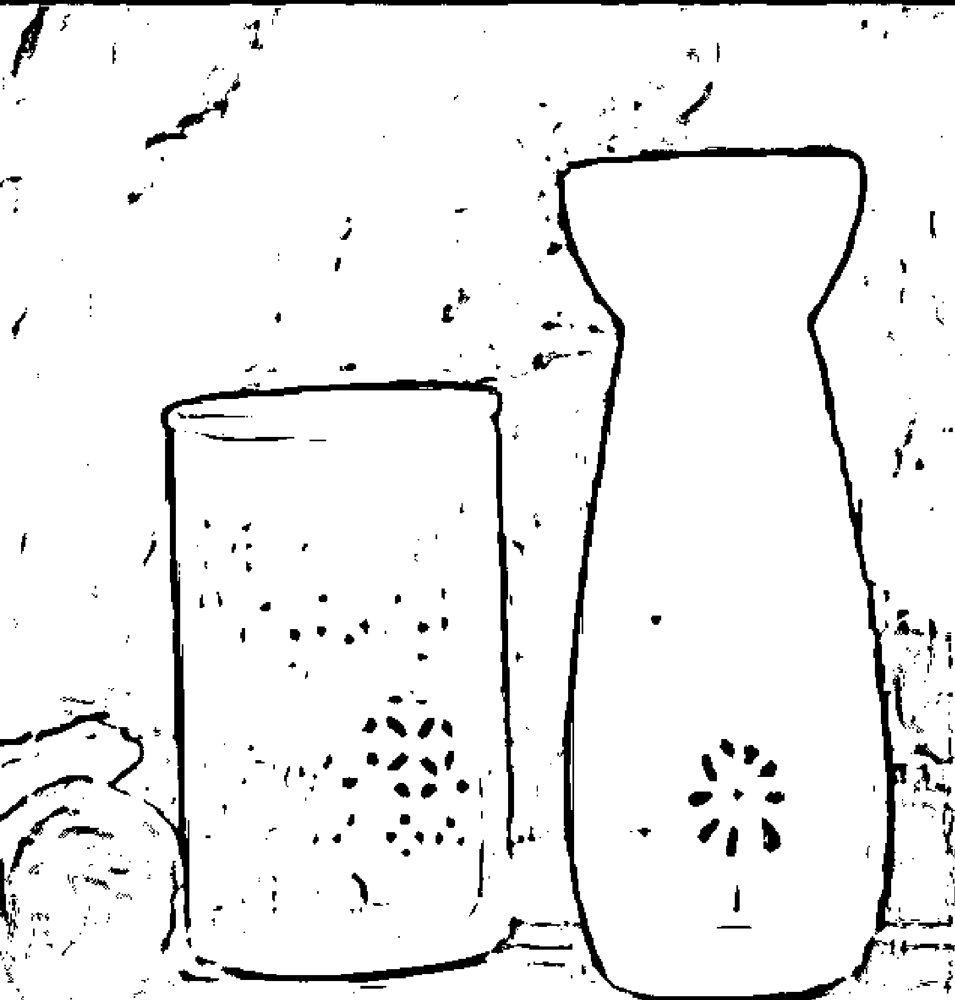

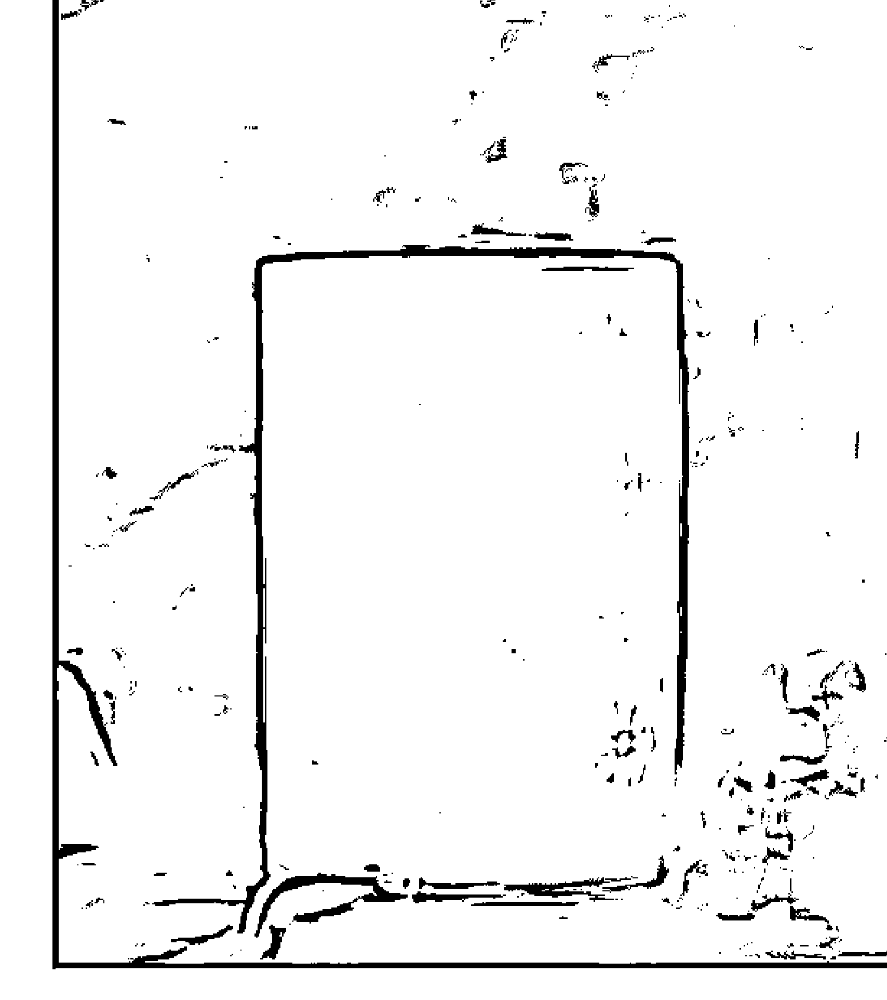

#### 插電式薰香燈

利用燈泡的熱度擴散精油香氣。安全係數比用火高，可以安心使用。

+   材料：精油1～4滴、插電式薰香燈、適量的冷水或熱水。
+   功效：清新空氣、消除異味、安撫心靈、鎮定情緒。
+   使用方法：在上方容器內加入約七分滿的冷水或熱水後滴入精油。依空間的大小加入1～4滴精油即可享受薰香。
+   注意事項：精油易燃，某些還具有腐蝕性，不能將精油直接滴在燈泡或暖氣系統上。

##### 嗅吸

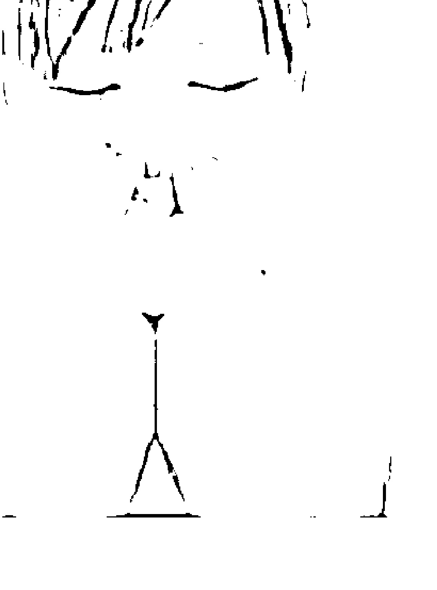

嗅吸是藉由呼吸道吸收精油，有呼吸道疾病時較常使用這個方法。外出時隨身攜帶，隨時都能享受香氣。

+   材料：精油1～2滴、面紙或手帕。
+   功效：提神醒腦、抗疲勞、安撫情緒、驅除蚊蟲叮咬。
+   使用方法：在面紙或手帕上滴上精油後吸入香氣。
+   注意事項：有些精油顏色為深色，可能會在手帕上形成汙漬。滴上精油的部分應該避免直接接觸到皮膚，請往內折之後再使用。有些精油成分會直接對黏膜等造成刺激，請避免長時間的吸入。

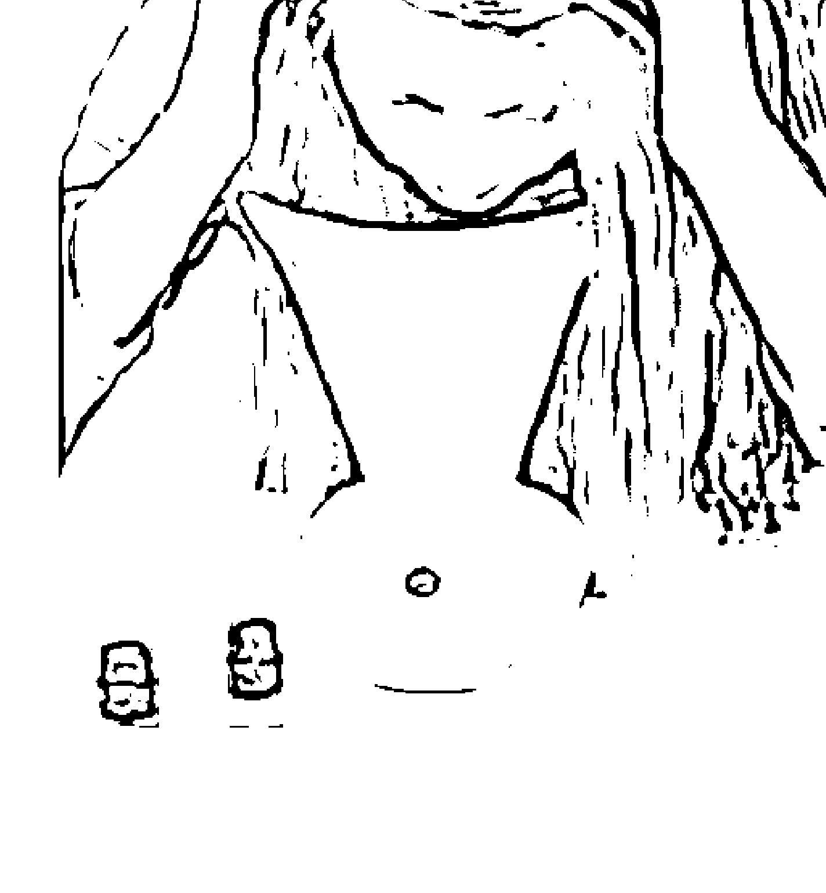

#### 蒸臉

讓臉部接觸蒸汽可以保持肌膚溼潤，並且從鼻子和口腔將精油成分吸取至身體內部。

+   材料：精油1～4滴、臉盆、毛巾、適量的熱水
+   功效：美容養顏、預防和治療感冒、緩解咽喉疼痛等。
+   使用方法：在臉盆中加入80℃的熱水約七分滿，再滴入1～4滴精油。在頭部蓋上較大的毛巾以防止蒸汽散掉，閉眼吸取散發的蒸汽，持續約10分鐘。
+   注意事項：如果蒸汽消失的話，不需再滴入精油而是加熱水。若出現咳嗽或氣喘的情況應立刻停止。

### 2 沐浴法

精油可用來泡澡或泡腳，具有讓身心放鬆的效果。但未經稀釋的精油，可能會損害某些材料的浴盆，因此最好選用陶瓷類、不鏽鋼類和木質盆。
需要注意的是，浸泡前要先將精油與介質調配好再倒入，而且水溫不宜過高，時間一般以20分鐘為限。

#### 沐浴油

依據當下的肌膚狀況和心情選擇基底油後，再跟精油搭配。

+   材料：精油4滴、基底油10cc
+   功效：緩和經痛、柔軟膚質、保濕、抗皺，活化皮膚的新陳代謝。另外，某些精油還具有調節和改善腸胃系統的作用。還能緩和工作疲勞和精神壓力，放鬆心情，調節緊繃的情緒。
+   使用方法：在燒杯裡加入10cc基底油及4滴精油，混合均勻；在放好熱水的浴缸裡加入沐浴油，攪拌均勻後即可開始泡澡。
+   注意事項：製作的分量較多時，一定要在1周內使用完畢。

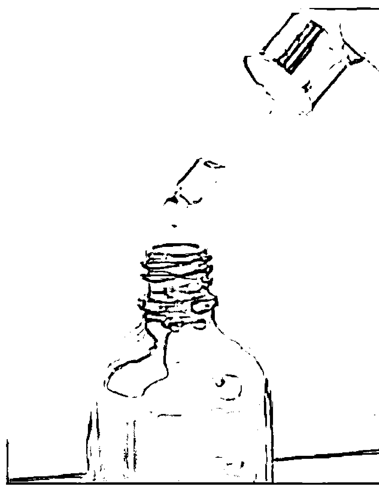

#### 沐浴鹽

在富含礦物質的天然鹽裡加入精油後充分混合均勻，鹽具有發汗效果，所以可以減肥哦！

+   材料：基底油5ml、精油2滴、天然鹽5克
+   功效：減肥瘦身，調理體質。
+   使用方法：先將5ml基底油滴入2滴精油後充分攪拌，再加入5克天然鹽，置於保存容器裡晃動或攪拌，放置半天以上，讓香氣融入鹽塊裡。泡澡時請將天然鹽和洗澡水充分融合。
+   注意事項：避免使用金屬材質的保存容器，採用可密封的塑膠瓶。

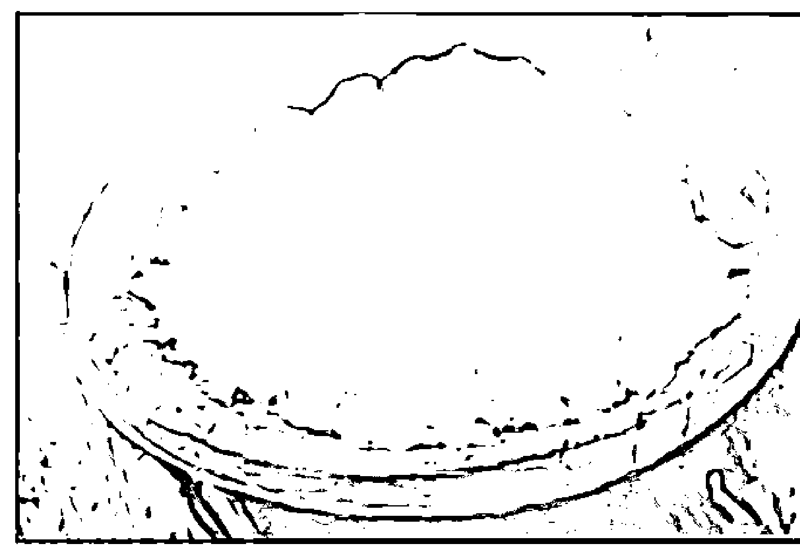

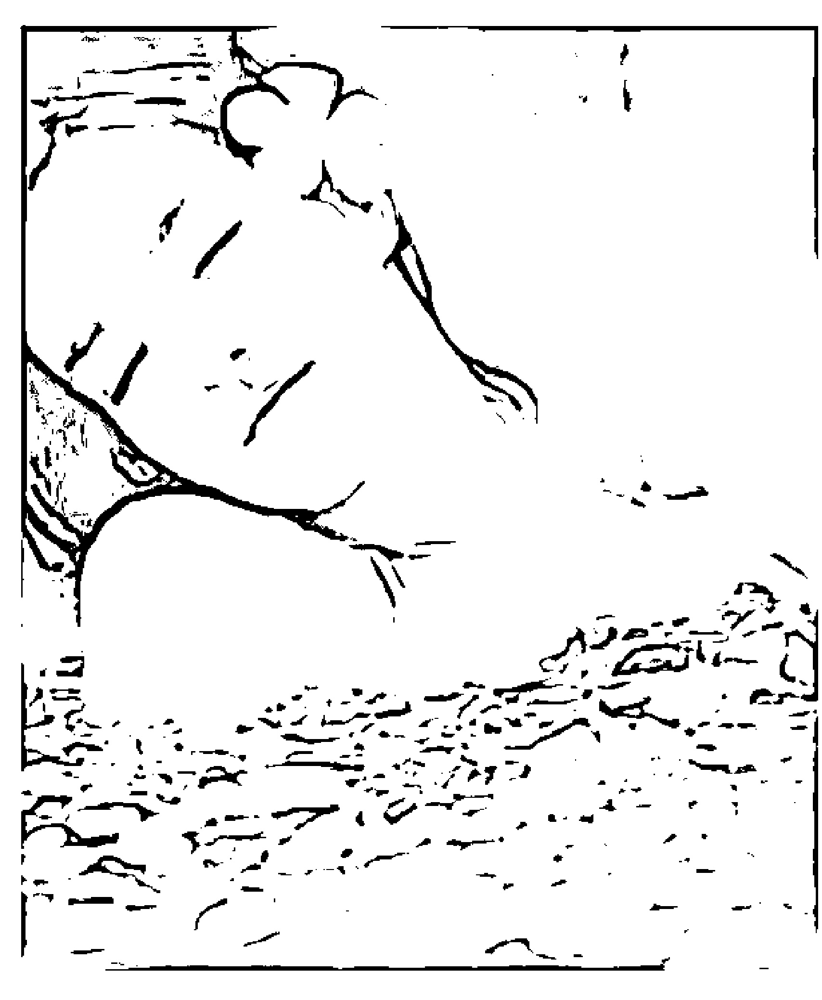

#### 全身浴

將精油與牛奶或伏特加調勻後倒入浴缸直接盡情享受全身浴、手浴和足浴。

+   材料：精油4～6滴、牛奶或伏特加
+   功效：促進血液循環，改善荷爾蒙失調、生理不順等。
+   使用方法：若是全身浴最多滴入6滴精油；半身浴時最多滴入4滴，滴入水中後攪拌均勻。
+   注意事項：精油需與介質調配才可倒入水中，介質選擇可以是牛奶、伏特加，若無介質而直接滴入精油會直接接觸到皮膚，造成刺激紅腫。

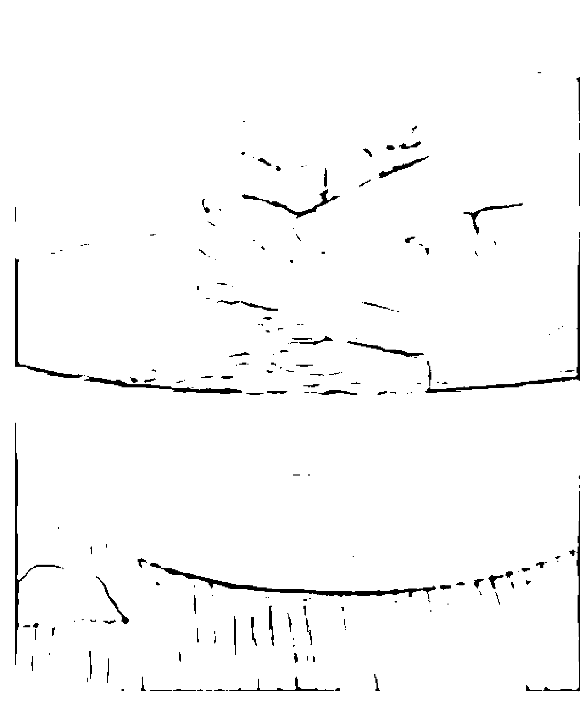

#### 手浴

對電腦族及其操作員和手工業者尤其有效。能緩和因工作引起的手指關節、手腕、手肘、頸部酸痛和緊張，同時對於手腕的疼痛和腱鞘炎也有改善的作用。

+   材料：1～2滴精油、牛奶或伏特加
+   功效：柔軟膚質，美化雙手，改善手腳冰涼症狀。
+   使用方法：在臉盆中加入40℃左右的熱水，滴入1～2滴精油與介質的調配液，然後將手腕以下包括手腕放入水中，浸泡10～15分鐘。結束後無需清洗，直接用毛巾擦乾水分即可。
+   注意事項：手浴不宜過久，15分鐘左右即可。

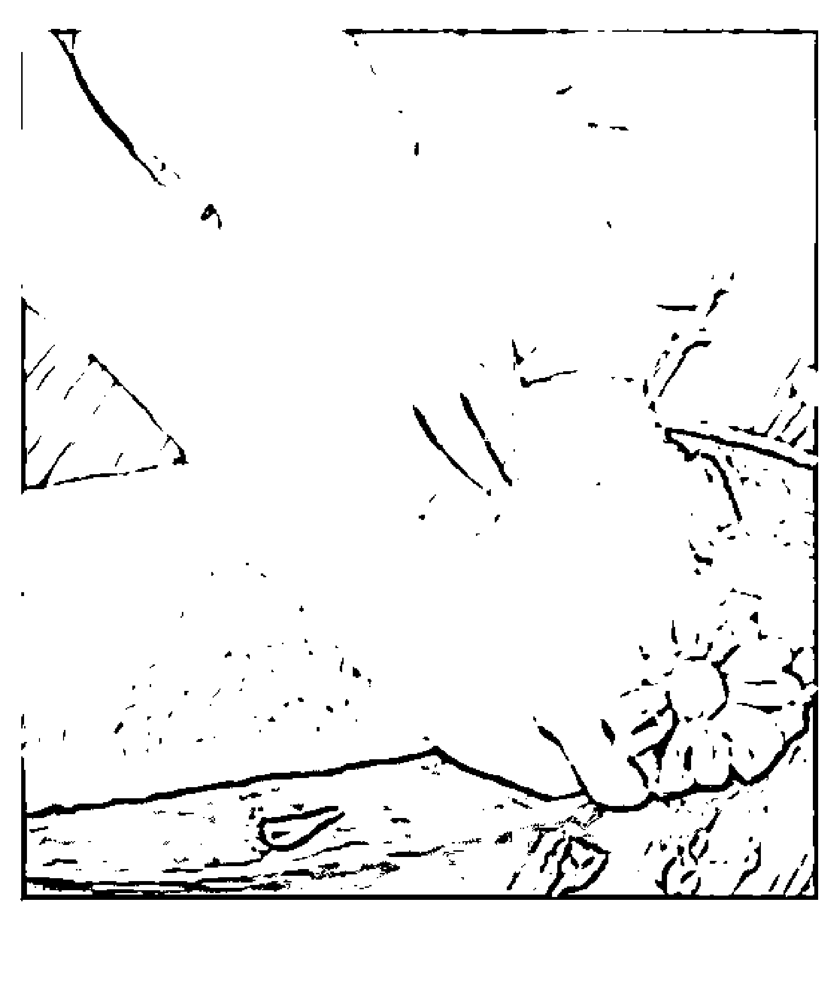

##### 足浴

足浴在緩解疲勞方面有很大的幫助，也是一種勞累後放鬆的好方法，能讓你照顧一下平時經常忽視的雙足。

+   材料：3～4滴精油、牛奶或伏特加
+   功效：緩解腳部的疲勞和壓力，改善循環不良等。
+   使用方法：選擇一個較大的臉盆或水桶加入40℃左右的熱水後倒入3～4滴精油與介質的調配液。
+   注意事項：最好不要使用金屬盆和塑膠盆，以免精油與之產生化學反應。

### 3 按摩法

精油可用來泡澡或泡腳，具有讓身心放鬆的效果。但未經稀釋的精油，可能會損害某些材料的浴盆，因此最好選用陶瓷、不鏽鋼和木製材質的浴盆。必須需要注意的是，浸泡前要先將精油與介質調配好再倒入，而且水溫不宜過高，時間一般以20分鐘為限。

你是否已經躍躍欲試了呢？接下來，就請盡情享受這場香氛的盛宴吧！

+   材料
    - 身體調理用油：精油4滴，基底油10ml
    - 臉部護膚用油：精油2滴，基底油5ml

#### 臉部按摩

V形瓜子臉成為現在美女的追求，不妨試試用精油按摩臉部，每天簡單幾步就可以瘦臉，還能讓臉部肌膚嫩滑白皙，一定要持之以恆喔！

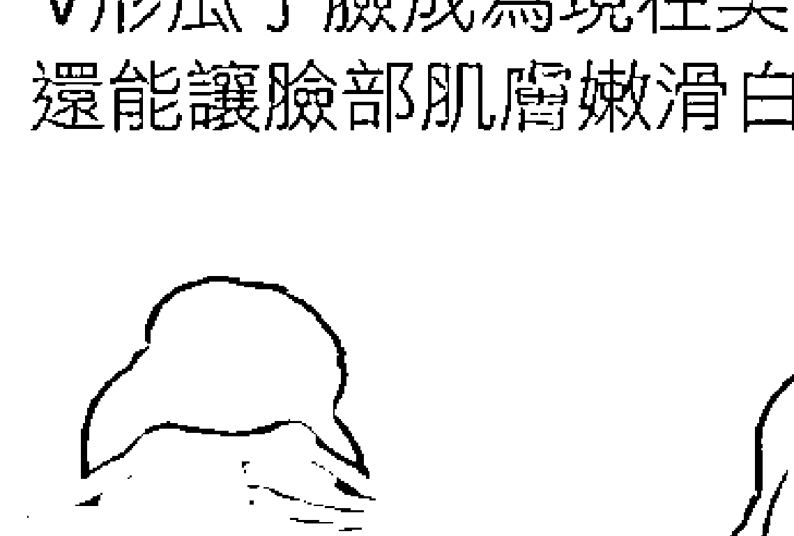
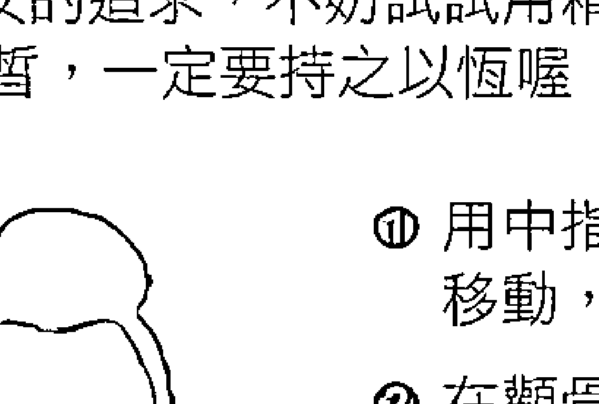
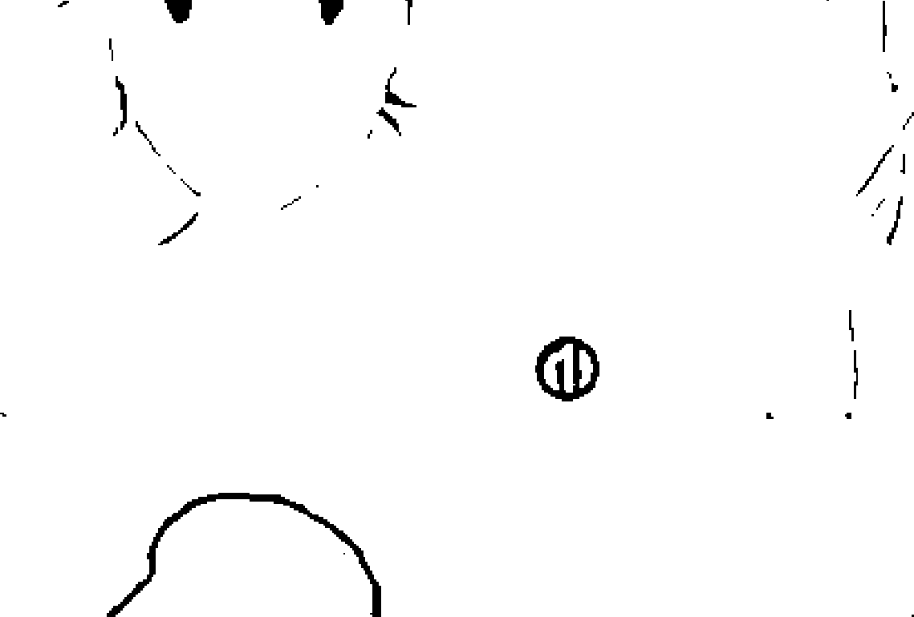
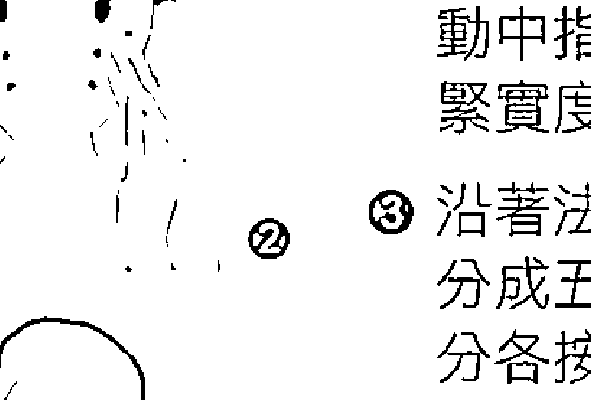
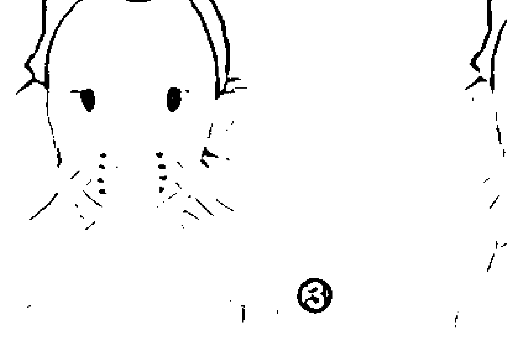
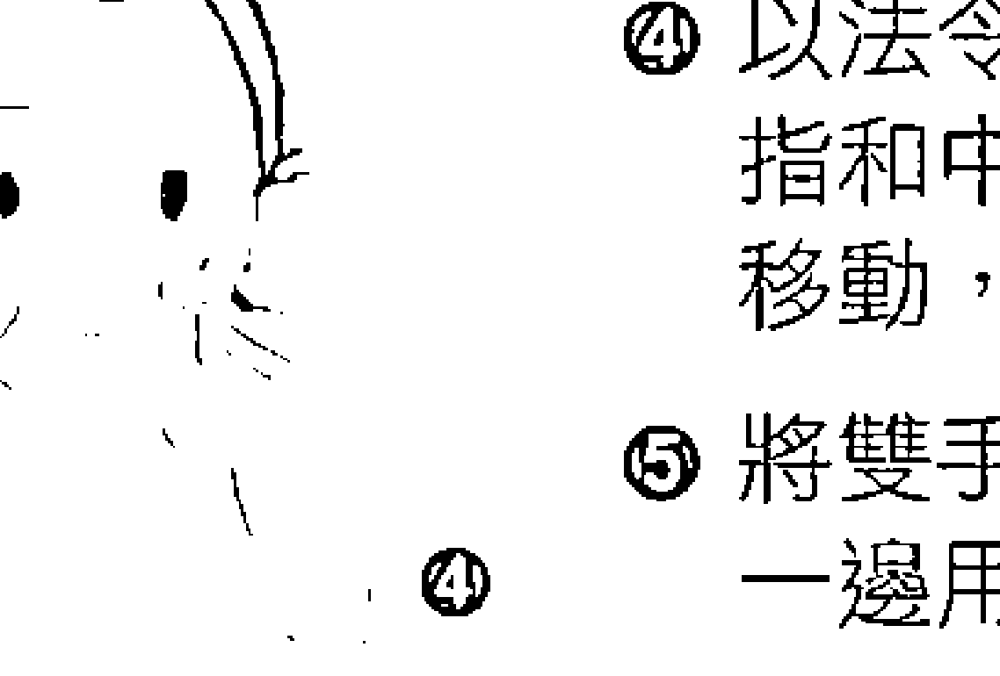

+   1. 用中指和無名指腹，以螺旋方式從眉頭向上移動，將護膚油推開，重複按摩10次。
    2. 在顴骨、臉頰中央、嘴唇兩側以畫圓方式移動中指和無名指，各按摩10次，提升皮膚的緊實度。
    3. 沿著法令紋（鼻翼下方到嘴唇兩端的線），分成五、六個部分用中指輕輕按壓，每個部分各按壓2～3秒。
    4. 以法令紋為起點往耳朵進行芳香按摩，用食指和中指、無名指這三指手指邊畫圓邊往上移動，重複按摩10次。
    5. 將雙手緊貼臉部中心，像要夾住鼻子一樣，一邊用手指畫圓一邊朝耳朵方向按摩。
    6. 整個手掌貼著脖子側面，用食指貼在耳後到下巴的線，往鎖骨方向輕滑，重複10次。

+   功效：促進臉部血液循環，使細胞再生，恢復肌膚彈性，控油祛痘，防衰抗皺，實現V形小臉。
+   注意事項：按摩前要先潔面，臉部肌膚嬌嫩，按摩時要盡量輕柔。

#### 胸部按摩

用精油按摩胸部，不僅能緊實胸部，還能促進血液循環和淋巴流動，美容與保健一舉兩得！

+   1. 首先將調好的按摩油均勻地塗抹在胸部。雙手和地板平行，置於鎖骨下方。
    2. 雙手往腋下輕輕撫過，讓淋巴液流入淋巴結，重複按摩10次。
    3. 手臂上抬，用另一隻手放在抬於這一側的背部，將後背的贅肉向上推往胸部。左右重複各5次。
    4. 將手臂抬起，另一隻手置於胸部下方，將胸部往上提拉。左右重複各5次。
    5. 手臂垂直放下，另一隻手往上輕撫和提拉胸部外側直到鎖骨。左右重複各5次。

+   功效：豐胸、預防乳腺阻塞、改善失眠狀況等。
+   注意事項：使用豐胸精油期間，建議不要內服減肥藥，以免影響豐胸效果。用精油按摩胸部具有重要的活血通經作用，要避免經期間進行。

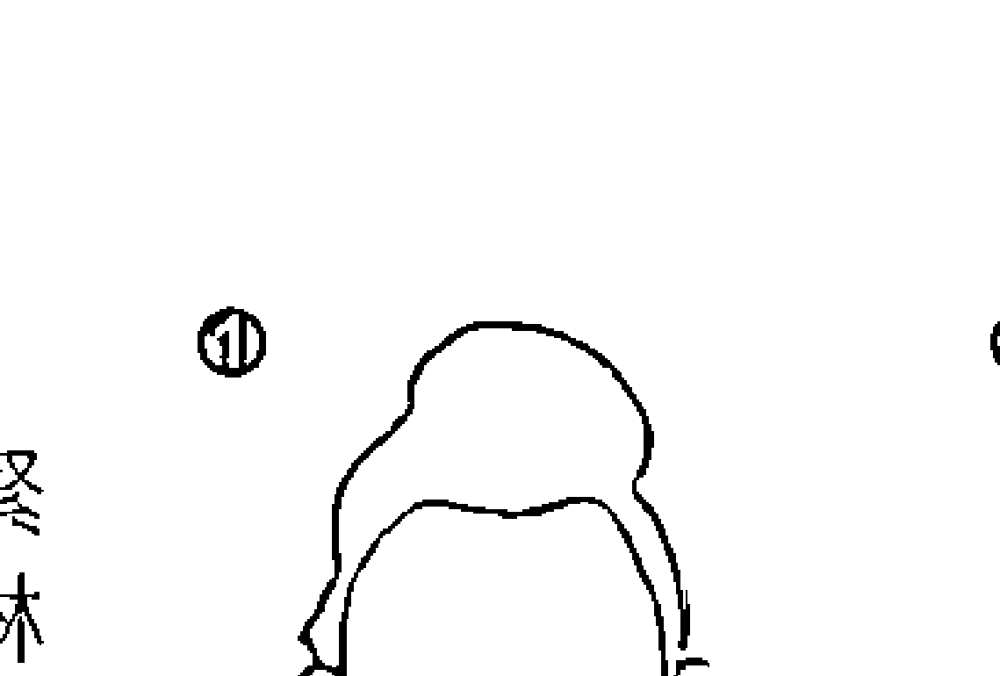


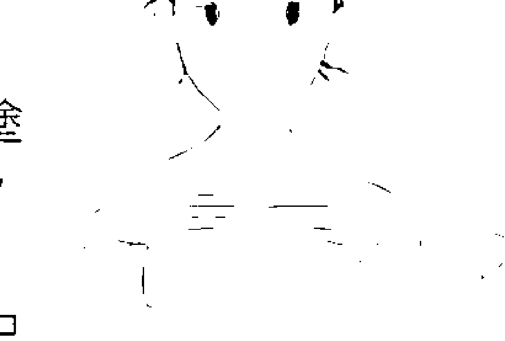


#### 腹部按摩

巧妙借助精油的魔力可以清除肚子裡的廢物，輕鬆告別「水桶腰」！

+   1. 用四根手指抵在肋骨下方，邊吐氣邊施力往內壓，停留3秒。左右一樣，重複按摩3次。
    2. 雙手放在腰部，輕輕往下推，重複按摩10次。
    3. 在上腹部中央凹陷處，用指尖從上往下順時針畫圓，肚臍周圍則是從下往上逆時針畫圓。最後用整個手掌以相同方式輕撫腹部。
    4. 從右肋骨下方往肚臍方向以螺旋方式按摩。同樣方式按摩另一邊，各重複5次。
    5. 從左側髋骨附近開始，朝著肚臍上方以螺旋方式按摩。同樣方式按摩另一邊，各重複5次。
    6. 兩手重疊置於右側肋骨下方，往左右方向輕撫。同樣方式按摩另一邊，各重複5次。

+   功效：幫助排毒，促進淋巴循環，塑造完美腰線。
+   注意事項：掌握正確的按摩手法才能事半功倍。

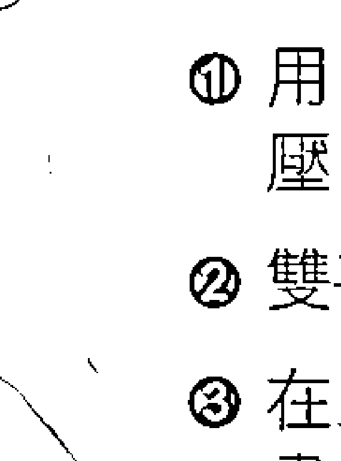
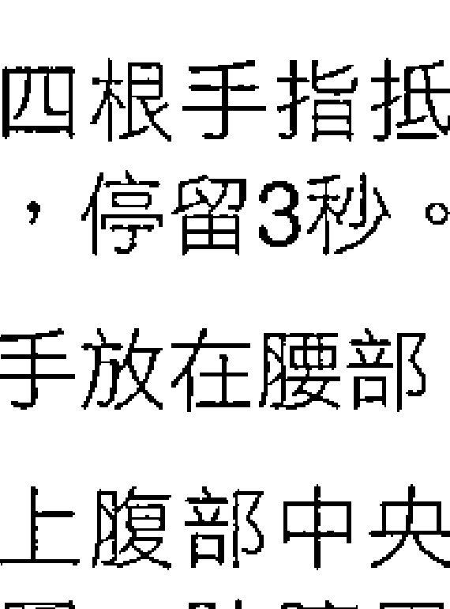
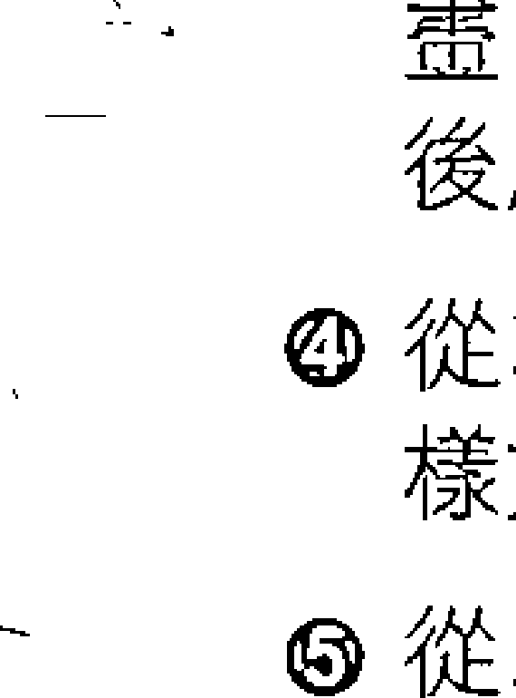
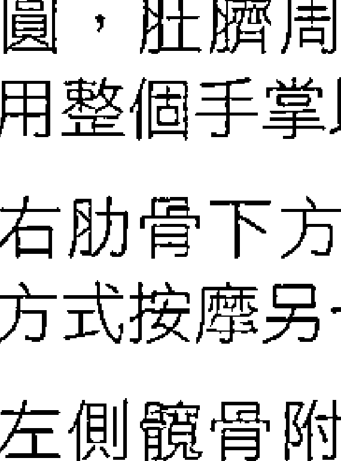
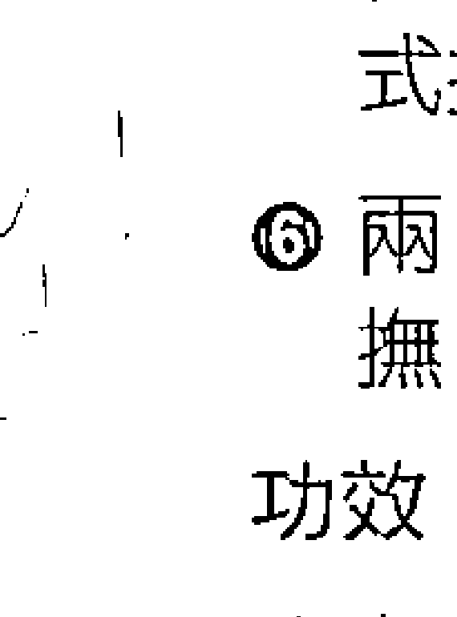
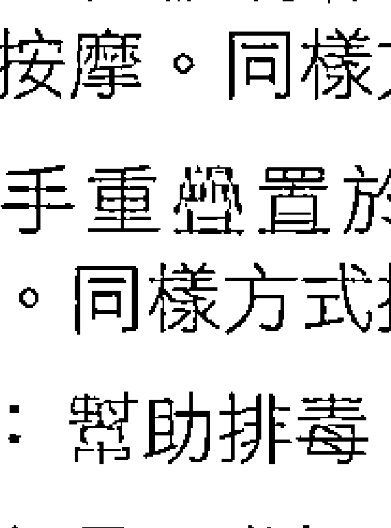

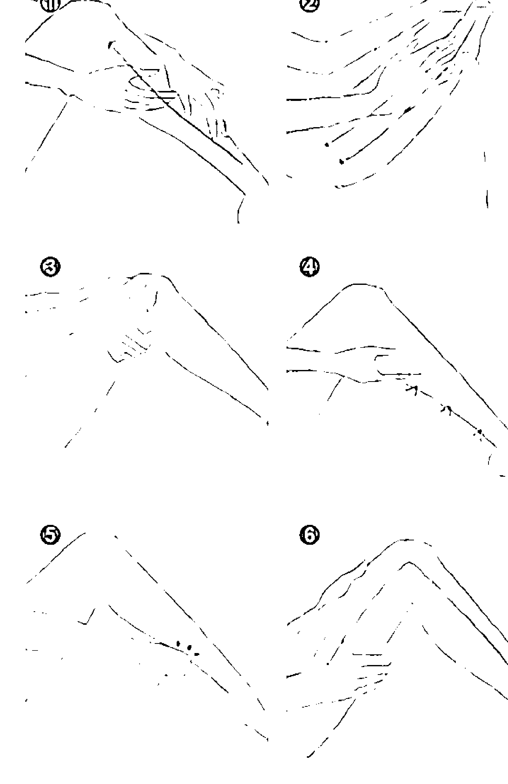

#### 腿部按摩

愛美的女性都希望自己能保持或擁有修長、性感的美腿。精油按摩不僅可以塑造纖細美腿，還能改善血液循環，讓肌膚柔嫩光滑！

+   - ① 先將精油滴到手上，並搓熱掌心，將精油塗抹到腿部，從腳踝往膝蓋輕撫，重複5次。
    - ② 接下來手指溫柔地從膝蓋往大腿根部輕撫，重複5次。
    - ③ 將雙手拇指放在膝蓋兩側，往兩旁推開，重複5次。
    - ④ 從腳踝往膝蓋內側，用整個手掌往上揉捏小腿。
    - ⑤ 從腳踝往膝蓋內側，用手背輕輕往上敲打小腿肚。
    - ⑥ 沿著腳踝、膝蓋、大腿方向滑動手指輕輕按摩內側，將多餘水分流入大腿根部的淋巴結。
    - ⑦ 重複1～6步驟按摩另一隻腿部。

+   功效：促進血液循環，燃燒體內多餘熱量，讓腿部展現迷人曲線。
+   注意事項：使用前用溫水清洗腿部後再塗抹精油，按摩後包裹上保鮮膜30～45分鐘，做小量的運動，瘦腿效果更佳。

#### 手部按摩

想擁有纖細而美麗的雙手該怎麼保養呢？雙手是我們最好的夥伴，也是非常受人關注的，努力維持健康、白皙的雙手，是我們的重要工作哦！

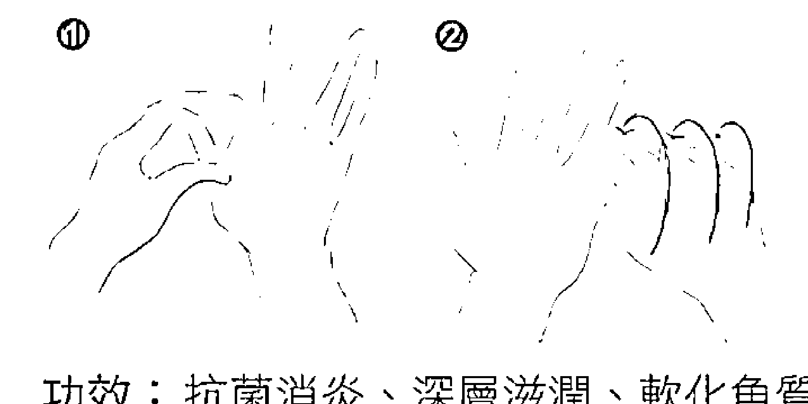

+   - ① 用拇指和食指用力按壓另一隻手的拇指根部，10下。
    - ② 從小指到拇指，依次用手握住整根手指並以旋轉方式按摩，5圈。
    - ③ 將右手伸直，用另一手握住下手臂，以向下旋轉方式按摩到手肘，來回5次。
    - ④ 重複1～3步驟按摩另一隻手部。

+   功效：抗菌消炎、深層滋潤、軟化角質、緩解手部疲勞。
+   注意事項：手部按摩時間不要太久，10分鐘左右即可。

#### 足部按摩

足部是極易被人忽視的重要部位。其實它是最容易疲勞與腫脹的，並且腳底有很多穴位和反射區，當你結束一天的辛苦工作後，一定要按摩足部。

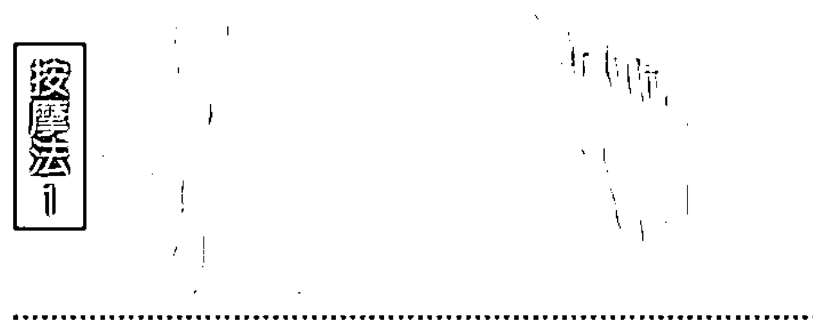

+   - ① 雙手拇指在腳背處，由腳踝往腳趾方向，仔細的推滑按摩。
    - ② 運用拇指與食指在每根腳趾頭上按壓，刺激末梢循環，再往腳後跟方向輕輕摩擦整個腳底。
    - ③ 重複1～2步驟按摩另一隻腳。

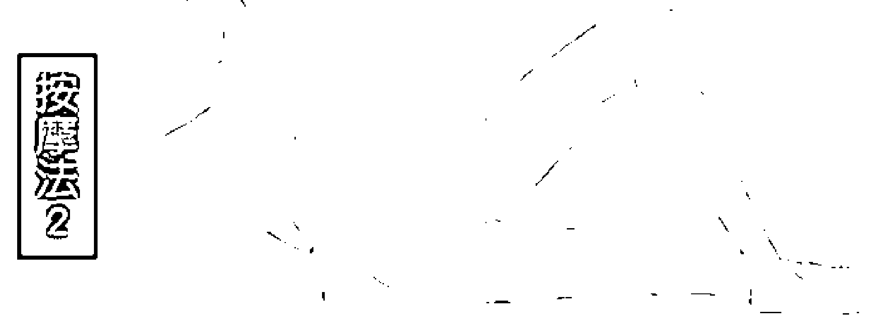

+   - ① 從腳踝到小腿肚往上輕撫整個腳，之後從膝蓋開始往上輕撫至大腿根部。
    - ② 用大拇指按壓膝蓋周圍，使淋巴液流進膝蓋內側，用同樣方式按摩另一邊。

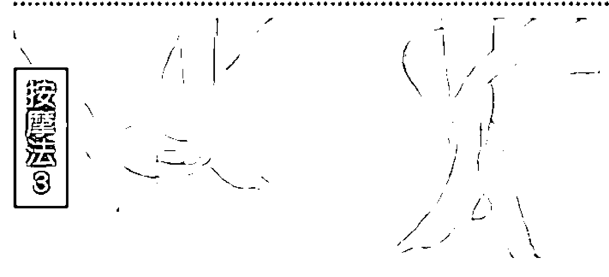

+   - ① 用感覺有些疼卻很舒服的力道按壓腳跟。
    - ② 握住腳跟往腳踝方向向上拉滑，以促進淋巴液的回流。
    - ③ 重複1～2步驟按摩另一隻腳。

#### 手臂按摩

肉肉的蝴蝶袖是否讓你感到相當困擾呢？一到夏天，無袖的衣服都躺在衣櫃無法見人嗎？其實，用精油對手臂做一次簡單按摩，就能解決你的煩惱喔！


① 從手腕處，沿著內側到腋下、外側到肩膀的方向輕撫手臂。用同樣方式按摩另一邊，左右各5次。

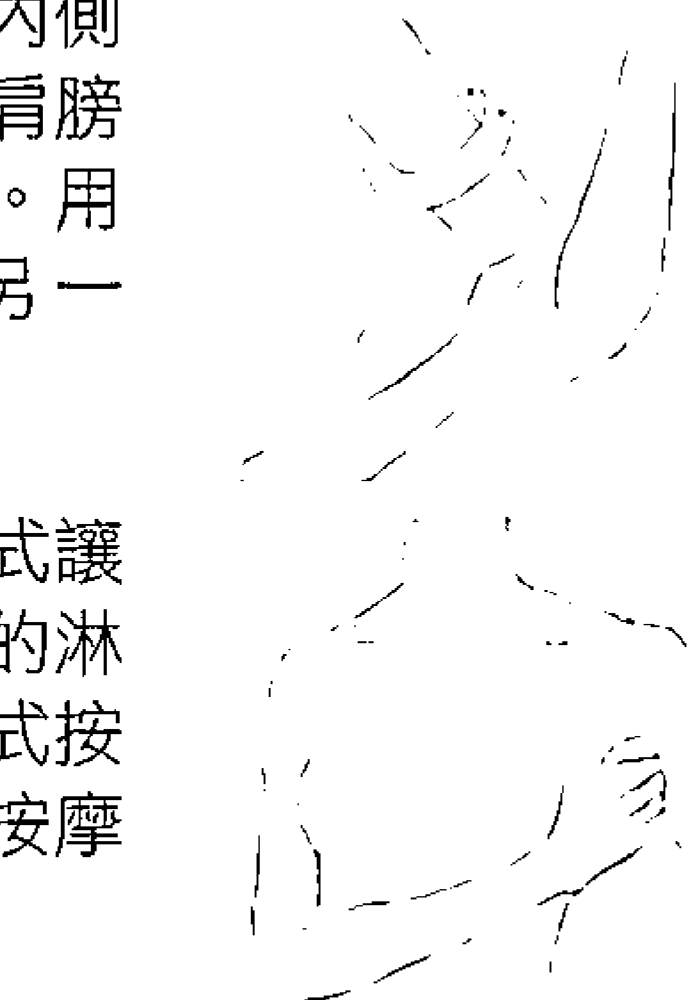

② 手臂向上彎曲，用另一隻手旋轉往上移動按摩。用同樣方式按摩另一邊，分別按摩3次。

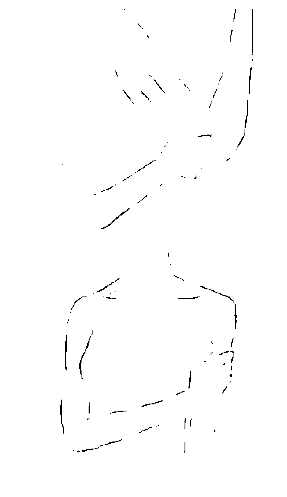

③ 以向上輕撫的方式讓淋巴液流入腋下的淋巴結。用同樣方式按摩另一邊，分別按摩3次。

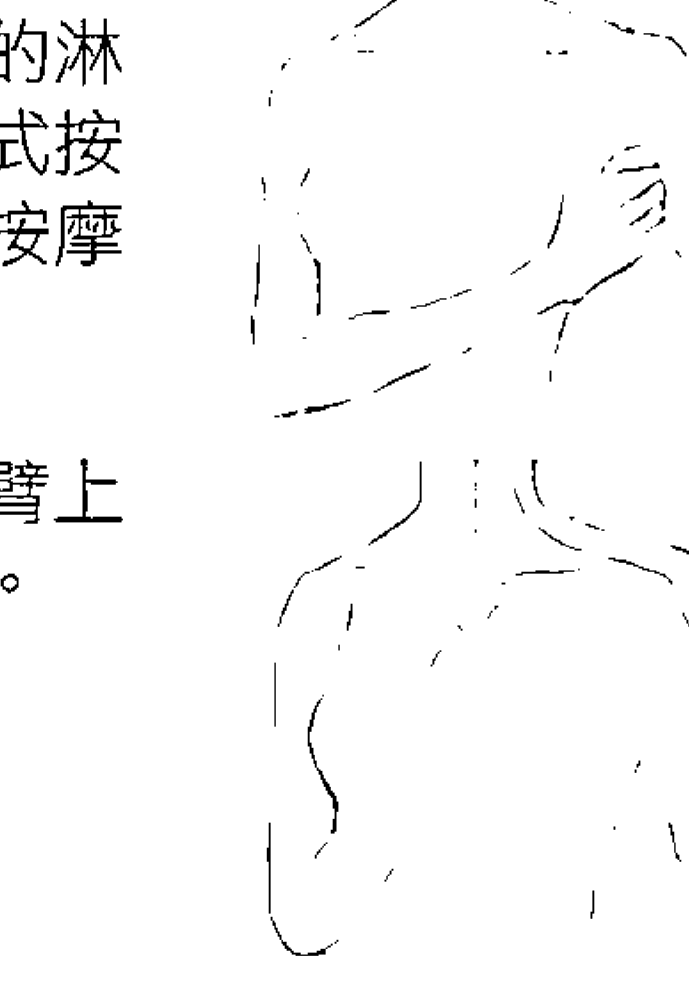

④ 手掌用力抓住腋下，停留3秒後放開。用同樣方式按摩另一邊，各重複5次。

⑤ 整個手掌按壓上臂上部，左右各一遍。

⑥ 從手背開始，往上輕撫手肘、肩膀、頸部直到與頭交界處，再往鎖骨方向輕擦。左右各一遍。

#### 手部按摩

長期坐在電腦前，又缺乏運動，很容易導致屁股下垂。如何雕塑出緊緻翹臀呢？關鍵就在於屁股和大腿的交界處！

-   ① 將手放在臀部和大腿交界處，抓住臀部肉往上提拉。
-   ② 手順著臀部的曲線直接朝髖骨方向往上輕撫。
-   ③ 從髖骨上方往前面的大腿鼠蹊部按摩，使淋巴液往淋巴結匯流。

-   ① 身體微微前傾，雙手置於臀部與大腿的交界處，往上推臀部肉，重複按摩5次。
-   ② 手掌緊貼腰部直接往下推，至臀部與大腿交界處時再從兩側往上輕撫回到腰部。重複按摩5次。

-   ① 沿膝蓋往臀部方向，用手掌輕輕揉捏按摩大腿內側。
-   ② 用一樣的方法按摩大腿內側，方向相反，雙手呈手刀狀從臀部往膝蓋方向敲打。

#### 頭部按摩

超負荷的工作，讓頭暈、頭痛等問題常常困擾現代人，不僅影響工作，久之還會對健康形成威脅。頭部的保健不容忽視，精油按摩法是不錯的選擇。

-   ① 雙手五指張開，伸進頭髮裡，輕輕按摩。
-   ② 將指尖放在髮際線中央，左右移動指尖按壓頭部，並且往頭頂方向移動，反覆10次。
-   ③ 雙手從頭部和頸部的交界的凹陷處分別往頭頂方向移動，並且輕捏、按彈或是畫圈，反覆10次。
-   ④ 按住頭部後方上下輕揉，反覆10次。
-   ⑤ 用食指、中指和無名指輕輕按摩頸部和頭部交界處的凹陷處。
-   ⑥ 保持手指不動，頭上下移動。頭部往上抬時像是在做指壓按摩一樣，重複按摩10次。

功效：精油按摩頭部最大的功效就是舒緩壓力，並能夠活化腦細胞，平衡中樞神經，幫助睡眠。
注意事項：按摩的時候一定要注意力道。

#### 伴侶按摩

信任的對象碰觸自己是令人開心的事。按摩時如果帶著想要療癒對方的心情，就更加令人開心了。夫妻或戀人們可以嘗試一下，將精油用在浪漫的用途上。

-   ① 將雙手的整個手掌沿著對方脊椎方向輕撫，在腰部時手掌往腹部的左右兩側移動。
-   ② 從側面到腋下，用手掌和手指慢慢地往上輕撫身體。
-   ③ 從腋下往手肘方向輕擦手臂，再往肩胛骨的方向輕擦回來。
-   ④ 將雙手放在腰部，輕輕用力下壓往兩側輕擦。慢慢重複上述步驟10次。

-   ① 還可以讓對方仰躺，伸出兩手到下巴下方處交叉。
-   ② 以手指為中心輕輕用力，透過臉頰和太陽穴往上輕撫。重複按摩10次。

雙手交疊，按照腳底、小腿肚、大腿、臀部及大腿交界處的順序，用力按壓，左右腿相同，重複3遍。

功效：增強浪漫情趣，舒緩壓力，增進伴侶間的情感交流。
注意事項：1. 伴侶若患有傳染病不宜按摩。2. 酒後神志不清者不宜按摩。3. 大病初癒者不宜按摩。4. 孕期按摩不宜趴下且手法特殊，需要小心謹慎。

### 4 按敷法

身體如果出現刀傷、擦傷或者是燙傷時，可試試用精油按敷的方法。先將傷口處清理乾淨，再將精油調配後塗抹在傷口處，比較微小的疤痕可直接用棉花棒。這也就是為什麼按敷法被稱為是最適宜處理皮膚表皮問題的方式。需要注意的是，沒有稀釋的精油不宜直接塗於皮膚傷口處。

#### 冷敷

-   材料：3~6滴精油、乳化介質(牛奶或伏特加)、適量冰塊、一條毛巾
-   功效：緩解、鎮痛、舒緩情緒。
-   使用方法：如果流鼻血、發燒或頭痛，可將精油滴入水盆中，毛巾浸泡擰乾後置於額頭上，再放上冰塊或是冰袋也可，冰敷時間為一刻鐘左右。如果是晒傷、皮膚發燙以及中暑等症狀，在冰水中滴入精油，用毛巾浸泡，略微擰乾後覆蓋在臉上，深呼吸即可。
-   適用範圍：感冒、發燒、頭痛、流鼻血或運動受傷、晒傷等。

##### 熱敷

-   材料：3~6滴精油、乳化介質(牛奶或伏特加)、適量熱水、一條毛巾
-   功效：促進血液循環、深層清潔、軟化角質，對治療痛經、風濕性關節炎、宿醉等很有療效。
-   使用方法：將3~6滴精油加入熱水中，浸入毛巾；擰乾毛巾，敷在需要的部位，並輕輕按壓，使帶有精華分子全部滲入皮膚。在這個過程中，如果毛巾涼了，可以再加熱。重複5~10次即可。
-   適用範圍：一般人均可使用。

### 5 塗抹法

各種外傷、蚊蟲咬傷、癢、頭痛、關節炎、風濕痛、香港腳、濕疹、輪癬、膿腫等，直接使用調好的稀釋精油於患部上塗抹或將極少量未稀釋的精油擦於患處。

塗抹法主要是經由皮膚吸收，使肌膚直接吸收精油。塗抹還有分純油塗抹與稀釋過的按摩油塗抹。如遇緊急情況，如小部位燙傷，可使用純薰衣草精油，約0.5滴的極少量，輕輕按壓在患部。此外，較常用的方式就是將精油與植物油或者是無香精乳液稀釋後，塗抹在需要處，例如：臉部、胃部、腳底等。

### 6 做成保養品

用無添加產品調配精油做的保養品，例如：乳液、面霜、面膜、護手霜、足霜等，非常受女性的歡迎，不僅能享受精油特殊的香氣，還能使肌膚恢復光澤、白皙，變得更加美麗迷人！

材料：蘆薈膠10cc，茶樹精油1滴，天竺葵精油1滴
功效：深層清潔毛孔、促進臉部肌膚血液循環、排出臉部毒素、祛皺淡斑，讓臉部重現光澤白皙迷人。
使用方法：將精油依次滴入分裝瓶中拌勻，再添加準備好的蘆薈膠，與精油一起拌勻，將調好的蘆薈膠均勻塗抹臉部，並輕輕按摩至吸收即可。
注意事項：精油容易變質，最好是隨用隨調。最好保存在深色玻璃瓶中，下次使用前請先攪拌均勻。

### 7 噴灑法

噴灑法主要用在改善環境中，可以淨化空氣、消除臭味，也能透過呼吸吸入精油。

材料：薰衣草精油10滴，檸檬精油10滴，酒精5cc，蒸餾水45cc
功效：驅除蚊蟲、滅菌消毒，尤其適用於傳染病肆虐期間。
使用方法：在燒杯裡加入酒精和精油後攪拌均勻，再加入蒸餾水，並將完成品倒進保存容器裡，使用前搖晃均勻。
注意事項：請於一個月內使用完畢。

# CHAPTER 美麗的媒介 — 萬用的基礎油

假如想要將精油使用在肌膚上，那就一定要好好認識基礎油，因為大部分的精油必須經過調配稀釋，才能使用在皮膚上，而基礎油則是調和精油的絕佳幫手。

### 認識基礎油

基礎油（base oil或是carrier oil），也有人稱之為媒介油或是基底油。因為純精油的高濃度對肌膚的刺激十分強烈，直接塗抹在皮膚上會造成傷害，因此單方純精油無法直接抹在皮膚上（除了薰衣草和茶樹可以用棉花棒極小面積點塗），它們必須與基礎油調配稀釋後，才可以廣泛地使用在人體的肌膚上。基礎油的目的就是緩解、稀釋、協助精油的使用。

### □ 基礎油的來源

基礎油是從植物的種子、花朵、根莖或果實中萃取的非揮發性油脂，可潤滑肌膚，能直接用於肌膚按摩，很多基礎油本身就具有醫療的效果。與平時食用的植物油不同，例如：我們所食用的大豆油是以200度以上的高溫萃取而來。這類植物油經過高溫提煉，已經失去天然養分，不適合當做芳香療法用的基礎油。因此，這裡所說的基礎油，是冷壓萃取的植物油。該方法可以將植物中的礦物質、維生素、脂肪酸保存良好不流失，具有優越的滋潤滋養特質。在植物的選擇上也有講究，可拿來當做基礎油的植物油，必須是不會揮發且未經過化學提煉的植物油。例如：甜杏仁油、杏桃仁油、酪梨油、荷荷芭油、小麥胚芽油等，這類油脂含有維生素D、E與碘、鈣、鎂、脂肪酸等，可藉其稀釋精油，並協助精油迅速被皮膚吸收。

### □ 基礎油的使用

基礎油用在皮膚上時，不但滋潤，且可潤滑皮膚，減少皮膚摩擦的不適感，更可以加強精油的吸收作用。基礎油也是許多美膚、美容製品的原料，如護唇膏、香皂等，喜歡自製精油製品的人也可以選擇合適的基礎油進行調和。

### □ 基礎油的保存

1.  直接光照和高溫都會影響植物精油和基礎油的質量。
2.  建議儲存在密封的容器中，避開陽光與溼氣，置於室內陰涼處。
3.  通常未開封的基礎油可以保存兩年以上，但開封之後，就會因為空氣進入而產生氧化作用，使油慢慢變質。
4.  基本上基礎油幾乎沒有什麼味道，有些會帶有淡淡堅果香氣。如果壞掉的基礎油會有一股明顯的油耗味，就不建議繼續使用在肌膚上了。

### 認識浸泡油

浸泡油是不同於冷壓萃取方式的植物油，簡單來說，就是把新鮮或晒乾的香草植物，放在相應的基礎油裡浸泡，經過幾個星期甚至更久的浸泡，不但釋放出精油成分，也釋放出其他脂溶性物質，如以微量吸收的脂溶性維生素、蠟質，以及其他高活性的功效成分。很多植物本身有著不容易透過蒸餾法而萃取到的精油成分，而透過浸泡的方法，就能產生出較為便宜、可立即使用，而且效果顯著的功效油。

#### 浸泡油的來源

精油是利用蒸餾法直接從植物體萃取出來的物質，在萃取的過程中，完全沒有添加任何物質。浸泡油的製作方式完全不同，將植物組織（通常是葉子或花瓣，有時候也用枝條）放入裝有基礎油的容器中，再將瓶子安置在照射陽光的地方，2～3星期後瓶中的基礎油吸收了植物組織中的香氣後，就成了初步的浸泡油。接著將變成棕色的花瓣或葉子取出，再加入新鮮的植物組織。重複這個過程，直到基礎油已經吸收了足夠的植物成分。這個過程不但能釋放出精油成分，也釋放出其他脂溶性物質，比方說以微量吸收的脂溶性維生素、蠟質，以及其他高活性的化學成分。一般用乾燥的植物浸泡，油中若含有水質，會使油的穩定期縮短導致容易變質。

#### 浸泡油的使用

某些植物本身很難透過蒸餾法萃取精油，而透過浸泡的方法，卻能產生出較為便宜、可立即使用，而且效果顯著的浸泡油。浸泡油的成分很複雜，不能將它視為精油的同等物，但如果按照精油的使用守則來使用浸泡油，絕對是非常安全的。

同種植物分別製成精油和浸泡油，它們的效用不完全相同；相反的，它們具有類似而互補的功效。雖然不能說浸泡油的功效必定和精油不同，但浸泡油中可能含有某種精油中缺乏的物質（基礎油可能會從植物組織中吸收某些精油蒸餾過程所破壞的物質）。

#### 浸泡油的保存

與基礎油保存一樣，浸泡油也要儲存在密封的容器中，避開陽光與濕氣，置於室內陰涼處。

### 甜杏仁油 Sweet Almond Oil

【概述】杏仁樹原產於中亞洲，是一種已有數千年栽培史的古老樹種。甜杏仁油是芳香療法中最常使用的一種基底油。

-   【製作原料】杏樹果實
-   【成分】礦物質、脂肪酸、維生素A、維生素E、蛋白質等
-   【特質】色澤淡黃、氣味清香

#### 適用

1.  其良好的親膚性讓最嬌嫩的嬰兒也可使用，尤其是乾燥、敏感、發炎、無光澤、皺紋、粉刺以及敏感性的肌膚。
2.  滋潤、軟化膚質的功能良好，適合用於全身按摩。
3.  作為治療癢、紅腫、乾燥和發炎的配方，能夠極好地適用於過敏性皮膚。

#### 功效

##### 天然保濕

它的油質屬中性偏厚，但不油膩，具有極好的親膚性，是一種保養皮膚及滋潤效果極佳的植物油。能提供較長時間的潤滑度，不會被皮膚迅速吸收，有良好的天然保濕功能。

##### 消除疲勞

可加強細胞帶氧功能，消除疲勞與碳酸累積，對於運動過度引起的肌肉疼痛具有鎮痛及減輕刺激的作用。

##### 舒緩過敏

具有滋養、保濕、舒緩與抗過敏的作用，對於乾性皮膚或因氣候變化而引起的皮膚乾燥、發癢現象有良好的改善作用。它還具有隔離紫外線的作用，保養皮膚及滋潤效果極佳。

注意事項：要與苦杏仁油區別清楚，苦杏仁油稍有毒性，不可食用。

### 酪梨油 Avocado Oil

【概述】原產地在美洲的赤道地區附近，是印加民族以及印地安人的主要水果。在營養價值上酪梨可以說是鶴立雞群，相較於橘子，維生素B₂是其七倍，蛋白質是其2倍，而熱量也是其5倍。酪梨油的滲透力僅次於荷荷芭油。

【製作原料】酪梨核

【成分】礦物質、蛋白質、維生素B₂、卵磷脂等

【特質】味道較重，帶有些許油脂感以及果實的味道，呈深綠色；營養度極高，質地較重，屬滲透較深層的基礎油；不易氧化，可放很久

#### 適用

1.  可用於各種膚質，尤其適合皮膚乾燥、老化或有濕疹、牛皮癬的人群使用。
2.  由於滋潤、軟化和抗皺的功效，經常用於護膚用品之中，可用於預防皮膚提早老化。

#### 功效

-   ○ 促進新陳代謝：含有多種營養素，可柔潤肌膚，清爽潤滑，潤而不膩，滲透力極佳，很快被皮膚吸收且不阻塞毛孔。還能促進皮膚新陳代謝，對淡化黑斑、消除皺紋均有很好的效果。
-   ○ 臉部清潔：用於調配精油，可使精油的功效發揮到極致，是臉部按摩專用的頂級基礎油；可以作為臉部清潔油，深層清潔效果良好。
-   ○ 保濕防曬：富含各種礦物質及保濕成分，能增加肌膚屏障，對皮膚因日曬所引起的紅腫、瘙癢有抑制作用。能防止皮膚曬黑，同時可以滋潤保濕、抗乾燥、抗老化，常用於臉部皮膚滋養。

注意事項：挑選時，建議使用未精煉的冷壓酪梨油，並適合與其他較清爽的基礎油對半調合，讓質地更順滑。

### 葡萄籽油 Grape Seed Oil

【概述】葡萄籽最為人稱道的是含有兩種重要的元素，即亞麻油酸以及原花色素。亞麻油酸是人體必需而又為人體所不能合成的脂肪酸。葡萄籽中還含許多強力的抗氧化物質，例如：牻牛兒酸、肉桂酸與香草酸等各種天然有機酸，這些都是抗氧化的元素。

【製作原料】葡萄種子

【成分】亞麻油酸和原花色素、礦物質、維生素B₂

【特質】淡黃色或淡綠色，無味、細緻、清爽不油膩

#### 適用

1.  極易被皮膚吸收，任何膚質均適用。
2.  滲透力強，可作臉部按摩時用，尤其是細嫩及敏感皮膚，油性、暗瘡、粉刺皮膚。
3.  葡萄籽油的保濕效果極佳，適用於乾性皮膚。

#### 功效

-   抗氧化：有超強抗氧化能力，有「皮膚維生素」之稱。可以抵抗自由基、抗老化、幫助皮膚吸收維生素C和E、強化循環系統的彈性、保護肌膚中的膠原蛋白，使皮膚變得白皙、嫩滑。
-   深層保濕：可使新生細胞及受保護的表皮細胞水分充盈，達到肌膚保濕的效果。含有的酚花青素有美白作用。
-   保護皮膚：能夠從深層保護皮膚，降低紫外線的傷害，使皮膚免受來自環境的汙染；促進死皮脫落，修復細胞膜的功能，避免皮膚下垂及皺紋產生。

注意事項：開封後盡快使用完畢，安全無毒。

### 荷荷芭油 Jojoba Oil

【概述】荷荷芭是一種沙漠植物，在南加洲、亞利桑那州及以色列、澳洲等地區均有生產，荷荷芭油自古就拿來作為各種保養與治療之用。

-   【製作原料】荷荷芭豆
-   【成分】礦物質、維生素、蛋白質、膠原蛋白、植物臘等
-   【特質】呈黃色，具有高度穩定性，能耐強光、高溫而保持結構不變，是可以久藏的油；化學分子排列和人類的皮脂非常類似，極易被皮膚類化和吸收

#### 適用

1.  適合所有膚質，特別是乾燥、粗糙、晦暗、油性、臉部疱疹、發炎、青春痘、成熟及老化膚質。
2.  常用於臉部、身體按摩及頭髮的保養。

#### 功效

-   ○ 調節皮膚：其滲透性極佳，對肌膚有十分顯著的美容功效。可用來暢通毛孔，調節油性或混合性肌膚的油脂分泌，改善肌膚發炎和敏感、濕疹、乾癬、面皰等。對過敏性皮膚也有舒緩作用。
-   ○ 滋潤保濕：滋潤和保濕效果很好，可柔軟頭髮以及按摩頭皮，幫助頭髮生長及護髮，可以使乾性髮質恢復光澤。
-   ○ 滋養保護：其親水性極強，並含對皮膚十分重要的天然維生素及高滋養度的膠原蛋白質等，對皮膚有調節水分的功用，可滋養深層呵護肌膚，使皮膚光澤、具有彈性。

注意事項：含有液態臘成分，不建議口服，在攝氏7°C以下會凝固，只要恢復常溫就回到液態，不影響品質，可混合其他基礎油或100%使用。

### 玫瑰果油 Rose Hip Seed Oil

【概述】玫瑰果油也被稱為玫瑰籽油，是一種生長在南美智利的野生玫瑰果實，也因為這種玫瑰一般只長在野生的籬笆上，所以採出來的油也被稱為野玫瑰油。

【製作原料】玫瑰果實
【成分】不飽和脂肪酸、維生素C、檸檬酸、亞麻油酸
【特質】含有胡蘿蔔素，金色且帶有紅棕色。以修護美白功效聞名

#### 適用

| 干性皮膚 | 老化皮膚 |
| :--- | :--- |
| 1. 多種肌膚適用，特別適合衰老、暗黃、受損、色斑肌膚。 | |
| 2. 能恢復脂肪酸和水分之間的平衡，乾性皮膚也很適用。 | |
| 3. 玫瑰果油祛疤功能顯著，常用於祛疤。 | |

#### 功效

-   深層滋潤：深層滋潤肌膚、提供養分，使肌膚柔軟、嫩滑、滋潤。改善乾燥，淡化早年幼紋，防止紫外線對皮膚造成傷害。增加皮膚組織活力，增加彈性，收縮毛孔，使乾裂皮膚恢復其自然光彩；有助於改善色素沉著，明亮膚色，使受損、老化肌膚恢復彈性。
-   淡化斑點：消退黑斑、雀斑、老人斑、黃褐斑。用於眼部護理可消除黑眼圈、眼脂肪粒、肉芽、扁平疣。
-   祛疤：改善和消除創傷後新舊疤痕，對細胞再生、修護及癒合有極佳的作用，如青春痘、暗瘡留下的凹凸洞、曬傷等。消除換膚後的發黑和紅腫現象。防止色素沉著。
-   養髮：有天然防護及潤發亮發之功效，能恢復頭髮的光澤和自然柔性，有效改善染色劑、吹風、過度的日曬等對頭髮的損害。

注意事項：建議用10%~30%的比例與其他基礎油調合使用，但因容易氧化，建議開封後盡快使用完畢。

### 小麦胚芽油 Wheat germ Oil

【概述】小麦是一年生的谷类植物，原产于西亚，现在已遍及全世界。小麦胚芽油含有极高量的维生素E，这是一种天然的抗氧化剂，把它加入在其他基础油中可作为防腐剂之用以稳定油质。

【制作原料】小麦芽
【成分】维生素E、维生素B1、维生素B2、矿物质、亚油酸、亚麻酸等
【特质】黄棕色，有特殊气味；集中了小麦的营养精华，是著名的天然抗氧化剂

### 适用

- 适用于各种肤质，尤其干癣、干性湿疹、皱纹、疤痕、妊娠纹、黑斑皮肤，最适合于衰老和熟龄的皮肤。
- 广泛用于女性保养皮肤，养颜美容，祛除皱纹。

#### 功效

- **抗衰老**
  有效促进皮肤的新陈代谢，可抗自由基，加强皮肤抗衰老能力。抗皱保湿，令女性肌肤变得柔润而富有弹性；滋润性强，可淡化细纹、妊娠纹、疤痕，增加肌肤润力，对干燥、缺水、老化、皱纹肌肤极有帮助。还可减少脸上长青春痘所留下的痕迹。

- **改善肤质**
  改善皮肤慢性发炎与敏感的状态。

- **舒缓肌肉疲劳**
  舒缓运动后的肌肉疲劳，增进循环功效。

- **植物油的稳定剂**
  以5%~10%的比例添加在植物油中，作为防腐剂使用，可延缓油变质，延长保鲜期。

注意事项：对麸质过敏的人，使用小麦胚芽油可能会产生皮肤敏感现象，使用前应先做皮肤测试。

### 橄榄油 Olive Oil

【概述】以沿地中海海岸栽植的品种品质最佳。天然冷压的橄榄油含大量不饱和脂肪酸，对心血管循环效果极佳。因为气味浓厚，油质黏重，在芳疗使用上需要调合使用，可帮助消化、促进循环、老化、晒伤及各种风湿、关节扭伤、肌肉疼痛或发炎等。

【制作原料】油橄榄果实的果肉

【成分】维生素A、D、E、K及叶绿素

【特质】呈淡黄色，温和不刺激，但有一些苦味

| 适用肤质 | 说明 |
|:--------|:-----|
| 乾性皮肤 | 1. 十分滋润肌肤和促进肌肤细胞再生，非常适合干性、血液循环不良、龟裂和有脱屑现象的皮肤使用，但神经性皮肤炎患者不适用。<br>2. 橄榄油非常实用，可制成护发油、防晒油、卸妆油等。 |
| 油性皮肤 | |

#### 功效

- **防止龟裂**
  橄榄油有益于保持水分，消除及延缓唇纹出现，防止口唇脱皮裂开。除了嘴唇，很多人的手脚在秋冬也容易干燥，橄榄油可防止皮肤皱裂及皮脂分泌过少引起的瘙痒。

- **秀发保养**
  对头发有良好的滋润效果，将橄榄油涂抹于头发，对干燥、分叉等问题发丝具有极佳的养护效果。

- **美肤**
  具有优良的渗透性与清洁作用，无论单独使用，还是与单方精油搭配按摩，均有极佳的美肤效果，可以除皱、滋养肌肤。还能够当作防晒按摩油。

注意事项：一般在超市买到的橄榄油为食用油，而用来按摩的橄榄油是用冷压萃取的。

### 夏威夷坚果油 Macadamia Nut Oil

【概述】又名昆士兰坚果油，具有良好的防腐效果，因而它易于保存，其质地也很温和，不刺激皮肤，能迅速进入皮肤底层，同时又能在皮肤表面形成一层保护膜。它的成分与人体的皮脂十分接近，是一种极为优质的按摩油。

【制作原料】澳洲胡桃果仁

【成分】富含矿物质、蛋白质、多种不饱和脂肪酸

【特质】深黄色，主产于澳洲，味重如坚果味，质地颇厚，滋润性佳

### 适用

- 所有皮肤。特别适合熟龄、油性、面疱肌肤皆适用，具抗氧化、保湿、修护与滋润肌肤。
- 无毒安全，广泛应用于脸部护肤、唇膏和婴儿制品以及防晒制品中。

#### 功效

- **呵护皮肤健康**
  能帮助肌肤血液循环，帮助肌肤排出毒素，使肌肤柔软而有活力。含有皮肤形成油保护层所必备的营养素，让皮肤有良好的抵抗力，并更加强健。

- **基础调释**
  油性温和非常滋润却很好吸收，不刺激皮肤，延展性、透性良好，不会覆盖精油的香气，因此使用上很方便。

- **滋润皮肤**
  做保湿霜可以使肌肤柔软而有活力，保护细胞膜及滋润、保湿。在身体护肤乳液中加入几滴油，可增加润滑度以及滋养疗效，也可以预防晒伤。

注意事项：油性稳定不易变质，对坚果过敏者勿使用。

### 榛果油 Hazelnut Oil

【概述】自古以来榛果油就十分珍贵，各种矿物质含量多，滋润度极佳。在主产地欧洲常用于食品、医疗和美容。因为榛果油中的油酸成分比例较高，所以格外适合作为按摩油使用在芳香疗法中，也是相当受欢迎的基底油。

#### 信息

- 【制作原料】榛果核仁
- 【成分】蛋白质、矿物质、维生素
- 【特性】淡黄色，质地细致，具有较重的坚果味

### 适用

- 榛果油适合各种肤质，具有轻微的收敛性、调合性，能够快速被吸收，可用作油性皮肤、混合性皮肤及调理粉刺的基础油。
- 常添加在多种不同的肌质保养品中，比如身体乳液、护手霜、按摩油和沐浴乳等。

#### 功效

- **轻微收敛功效**
  滋润肌肤，可渗透皮肤底层，减缓皮肤出油速度。

- **保持皮肤弹性**
  榛果油是理想的护肤油，与甜杏仁油相似。因为油酸成分比例较高，所以格外适合作为按摩油使用，能快速被吸收，调和紧绷皮肤，帮助皮肤保持稳定和弹性。

- **保养秀发**
  可用于保养干燥的头发，防止水分流失，修护发质，使头发柔软顺滑。还有过滤紫外线的功效，因此可作为防晒油使用。

注意事项：对坚果过敏者请避使用。

### 大麻籽油 Hemp Seed Oil

【概述】大麻植物中对精神有迷幻作用的物质并不存在大麻籽油中。大麻籽油被认为是目前已知的植物油中保健效果最佳的一种，大量使用在药品、保健品和护肤用品中，甚至在明代已经被用于入药。

【制作原料】大麻种子
【成分】亚麻油酸、维生素E、各种矿物质
【特质】墨绿带黄色，质地轻柔，有淡淡的坚果香味

### 适用

- 对所有类型的皮肤都有益，特别是油性、干性及成熟老化的肌肤。
- 添加于皂、护肤品、护唇膏、护手足霜中，以防止干燥、老化。
- 适合应用在洗发产品上。

#### 功效

- **护发**
  大麻籽油是多元不饱和脂肪酸含量最高的油脂，具高保湿性，高蛋白质含量。含有极高的营养物质。对于皮肤、头发有良好的滋润效果，尤其是头发，不但能改善头皮屑，还有生发作用。

- **舒缓皮肤病**
  防止皮肤发炎，可治疗皮肤损害、干燥、发炎与帮助愈合，促进肌肤细胞再生，加强皮肤角质层的防御结构。独一无二的脂肪酸组合能够帮助新细胞结构的组成，促进肌肤再生。

- **美容保湿**
  能穿透人体细胞并滋润细胞之间的表面。除了滋润干燥皮肤之外，帮助皮肤排毒及润色，作为皮肤的保湿成分而不需要担心阻塞毛孔。

注意事项：使用上没有特殊禁忌，较易氧化，建议开封后尽快使用完毕。

### 向日葵油 Sunflower Oil

【概述】向日葵又称为「葵花」，是一年生植物，起源于南美洲，16世纪中才被引进到欧洲大陆。它是大自然中用途最多的植物之一，也是许多植物药草油或浸泡油的主要基底材料。高品质的有机葵花籽油，它的质地细致轻薄而不油腻，比橄榄油还要精细。它类似人体的皮脂，并有能仿效天然皮肤脂质呈中性油脂的特性，非常适合用于稀释较昂贵的精油。

【制作原料】向日葵籽
【成分】多种维生素、脂肪酸等
【特质】清澈明亮的淡黄色油脂，有淡淡的籽仁的香气

| 肤质类型 | 适用说明 |
| :---: | :--- |
| 乾性皮肤 | 1. 质地清淡细致不油腻，适用于各种类型的肌肤，尤其是油性皮肤。<br>2. 可应用于护肤乳液或作为其他活性成分的底油。<br>3. 用于口腔护理和头发护理。 |
| 敏感性皮肤 | |
| 油性皮肤 | |

#### 功效

- **促进代谢与循环**
  能帮助胆固醇代谢，让血液在血管中流通顺畅，对抗多种硬化症，对动脉硬化很有帮助，有益于呼吸道，对气喘、风湿、痔疮、溃伤、瘀伤等有效果。

- **呵护口腔与头发**
  可用于治疗口腔发炎、口臭、预防牙周病及牙菌斑等；还能改善因干燥或受热风损坏的发质，有润滑及光泽发丝的效用。

- **调理肌肤**
  能保护细胞免受化学物质的伤害、改善皮肤干燥、软化肤质，处理因皮肤失调造成的感染、粉刺和青春痘等问题。对肌肤有良好的滋润和调理作用，对皮肤疾病有特别的助益。

注意事项：使用上没特别的禁忌，但必须使用冷压法萃取的向日葵油，一般的食用油不可用来按摩。

### 杏桃仁油 Apricot Kernel Oil

【概述】多产于中亚、土耳其一带。成分与甜杏仁油相似，极富营养，滋润，只是价格略高于甜杏仁油。16世纪的中亚药草学文献上所记载的爱情灵药或符咒，其中的成分一定有用到杏桃仁，还有许多爱情故事也与杏桃有关。

#### 信息

- **【制作原料】** 杏桃核仁
- **【成分】** 维生素A、B1、B2、B6、C及矿物质等
- **【特质】** 淡黄色，较甜杏仁浓稠、黏腻一些

### 适用

- 适合所有肌肤，很适合熟龄肌肤与敏感性肤质，非常适合肤色蜡黄或是脸部有脱皮现象的人。
- 杏桃仁油常被使用于化妆品里，也常被使用在肥皂中。

#### 功效

- **改善肤质**
  有舒缓、滋润、放松功效，可以软化滋润皮肤，对皮肤特别有亲和性。用于脸部保养可以保湿和改善肤质，防止皱纹产生，改善肌肤粗糙的状况。

- **舒缓身心**
  按摩时用杏桃仁油可帮助舒缓紧绷的身体，而且对重病以及身体虚弱者也很有助益。

- **缓和皮肤问题**
  滋润富营养，适合用来调配身体油或乳液。有益早衰、敏感、发炎红肿等问题或者干燥的皮肤。具有营养、缓和、治疗的特性，可滋润眼睛周围脆弱的皮肤。

注意事项：使用上没有特殊禁忌。

### 芝麻油 Sesame Oil

【概述】芝麻源自热带地区的东印度群岛，为一年生直立植物，早在4000年以前已有文献记载，目前全世界都有栽种。纯正的芝麻可以萃取到高达种籽重量50%的油，并含有大量的必需脂肪酸与多元不饱和脂肪酸，而当中芝麻素所形成的芝麻酚和芝麻林酚，所组成的自然抗氧化系统，使得芝麻油有良好的稳定性。

【制作原料】芝麻
【成分】富含维生素、亚麻油酸、饱和脂肪酸
【特质】带有轻淡的芝麻味，油品呈淡黄色

### 适用

- 适合干性皮肤和熟龄肌肤，特别适合干癣、湿疹等肤质。
- 用于护发产品，能够使发质乌黑亮丽。

#### 功效

- **润泽肌肤**
  有轻微的亲水性和极佳的亲肤性特质，具有修复及润泽肌肤的特性，在皮肤保养方面有极佳的效果。具有保湿和清除自由基的功效，能够润滑肌肤及延缓老化。

- **防晒护发**
  能有效地对抗紫外线，因此可以舒缓晒后肌肤。用于护发能够促进头皮内的血液循环，加快头皮吸收营养成分的速度。

- **改善血液循环**
  含有特别丰富的维生素E和亚麻油酸，可调节毛细血管的渗透作用，加强人体组织对氧的吸收能力，改善血液循环，促进性腺发育，所以芝麻油有延缓衰老、保持春青的功效。

注意事项：此为冷压萃取的芝麻油，注意不要与食用芝麻油弄混。

### 亚麻籽油 Linseed Oil

【概述】亚麻起源于中东、地中海沿岸，为一年生草本植物，是世界上最古老的纤维作物之一。早在石器时代，人类就有种植亚麻的文化了。直到第一次世界大战结束后，中欧才开始大规模地种植亚麻，如今已遍布世界各地。

#### 信息

- **制作原料**：亚麻籽
- **成分**：α-亚麻酸、亚油酸、胺基酸等
- **特质**：油品呈黄色，质地轻薄，微带黏性，强烈的草本气味十分独特

### 适用（乾性皮肤、油性皮肤）

- 适用于各种肌肤，由于质地轻薄，非常适用于油性皮肤。
- 对头发有帮助。加在洗发精里，可以形成一层保护膜，对抗干燥的发丝。

#### 功效

- **保湿滋润**
  可以在皮肤表面形成透气保水膜，减弱皮肤深层的水分损失，改善皮肤脂肪含量，令皮肤呼吸及排汗正常，使皮肤保持湿润，使肌肤更嫩滑、滋润、柔软有弹性。

- **消炎**
  亚麻籽油可以发挥消炎和抗增生的作用，对一些皮肤缺陷、湿疹、痤疮、过敏、龟裂等具有明显的功效。

- **改善皮肤状况**
  具有活化细胞的特质，对不同的皮肤症状都能得到良好的改善，特别是易受刺激、发炎、干燥、湿疹或经X光、紫外线照射受损的皮肤，能促使肌肤再度恢复弹性。

注意事项：使用上没有特殊禁忌。

### 茶花籽油 Camellia Oil

【概述】山茶属的品种约有150种，其运用始见于《山海经》，主要作药用和滋补品，有超过2300年的历史。现主要分布在中国长江以南一带的地区，东亚与东南亚地区也有分布。

【制作原料】山茶果种子

【成分】不饱和脂肪酸、山茶甘、茶皂醇、维生素

【特质】油色呈淡黄色，质地轻薄润滑，有极为清淡的油香味

### 适用（乾性皮肤、老化皮肤）

- 适合任何类型的肤质，特别是老化、受损及干燥的肌肤。
- 适用于全身，常被用于抚平细纹或妊娠纹。
- 用于护发，能使头发乌黑亮泽。

#### 功效

##### 保湿

保湿、润滑，但不油腻，能迅速地被皮肤吸收，提供多种营养，有重建肌肤的功能。在表皮上形成一层很薄的保护膜，保住皮肤内的水分，防护紫外线与空气污染对肌肤的损伤。

##### 抑制色斑

同时它又能皂化清除皮肤污垢，淡化、溶化色斑、黑斑，抑制斑色的形成。对成熟、受损、干燥和衰老的肌肤有特别的益处。

##### 滋润头发

有超强的滋润、修护和保养作用，还能够强化指甲和滋养头发。有刺激毛发母细胞和黑色素细胞、防止黑发成灰白发、促进白发变得浓黑的功能。

注意事项：使用上没有特殊禁忌。

### 金盏花浸泡油 Calendula Oil

【概述】金盏花，原产南欧和北非，现今已被广泛引种在世界各地，花瓣与叶子可食用，早在1000多年前，罗马人就开始用金盏花泡茶、美容及消除天花后产生的疤痕和处理妇科问题。

【制作原料】 金盏花

【成分】 亚油酸和胡萝卜素

【特质】 金黄色，带木质味以及麝香味

### 适用

- 适用于各种肌肤，尤其能够调理敏感性肤质，增强肌肤抵抗能力，减轻敏感肌肤的不适现象。
- 具有抗发炎和愈合作用，用于治疗伤口和皮肤修护。
- 可强化新陈代谢，改善静脉曲张，滋养龟裂和脆弱肌肤。

#### 功效

- **滋润防晒**
  对皮肤有很好的滋润、抗炎、细胞再生作用，因此经常用于伤口护理或处理晒伤、青春痘、湿疹等。能够抵御紫外线对皮肤的伤害，缓解因过度暴晒而引起的发红、脱皮现象。

- **调节过敏**
  能够调理敏感性肤质，增强肌肤抵抗能力，减轻敏感肌肤的不适现象。超强的愈合能力，可杀菌、收敛伤口，治理发炎、暗疮、毛孔粗大，防止疤痕的产生。

- **缓解疼痛**
  用于按摩具有镇定和放松效果，舒缓疼痛、经痛，可减轻情绪紧张和焦虑。

注意事项：使用上没有特殊禁忌。

### 圣约翰草浸泡油 St. John's Wort Oil

【概述】圣约翰草又称金丝桃，是一种多年生植物，原产于英国和法国。早在几千年以前，十字军圣战期间，圣约翰军的骑士们就以这种植物来治疗他们的伤病。新鲜药草制成的圣约翰草药草油呈橙红色，浸泡油中含有金丝桃素的成分，具有抗菌、抗病毒作用。

#### 信息

- 【制作原料】圣约翰草的花苞
- 【成分】各种维生素、金丝桃素、类黄酮、单宁酸
- 【特质】红色，有淡淡的草味

### 适用

- 各种肌肤，尤其干性及敏感肌肤。
- 加速循环有效舒缓肌肉疼痛、痛风，化瘀消肿。
- 用于舒缓身心，抗沮丧与忧郁等情绪问题。
- 治疗伤口抗菌消炎。

#### 功效

##### 镇痛

具有绝佳的安抚止痛的疗愈能力，可以把它涂抹瘀血、肿大的部位，能够直接强化患处的血液循环，对肌肉疼痛、关节炎、痛风、风湿都有效。

##### 消除紧张

可消除紧张情绪、避免忧郁，并促进血液及淋巴液循环，放松紧绷肌肉使易入眠。

##### 解决皮肤问题

在皮肤的使用上面，任何的伤口、溃疡、发炎、烫伤、蚊虫叮咬、疹子、疮痂都可以使用。可安抚神经系统，有助于解决刺激性和过敏性的肤质问题。

注意事项：浸泡油适合与其他冷压基础油调合使用，但有轻微的光敏性，使用后要避免接触阳光。

### 胡萝卜浸泡油 Carrot Oil

【概述】胡萝卜浸泡油是一种非常重要的药草浸泡油，它富含的胡萝卜素，由于有很好的帮助肌肤组织生长的能力，因此常用于抗老化的配方，减轻肌肤干燥的问题，也可以帮助肌肤防晒以及晒后舒缓、淡化晒斑。

【制作原料】胡萝卜根部

【成分】多种维生素及 β-胡萝卜素、脂肪酸和卵磷脂等

【特质】呈橙红色

### 适用

- 适用于干性及老化肌肤，增加皮肤再生能力。
- 由于含丰富维生素C，助于抗发炎功效，适用舒缓湿疹、牛皮癣等问题皮肤。
- 可用作预防妊娠纹。

#### 功效

- **抗发炎**
  具有抗发炎的特性，对于皮肤疹、皮肤瘙痒、烧伤、牛皮癣和湿疹的治疗十分有效。同时也具有抗氧化及抗自由基的功效，能够使肌肤再生、愈合结疤，恢复健康的光泽和幼嫩。

- **抗氧化**
  含有丰富的 β-胡萝卜素，可以抗氧化和美白肌肤，还可以清除肌肤多余的角质，对油腻的青春痘肌肤也有镇静舒缓的功效，可以强健皮肤，对过早老化及干燥的皮肤效果出色。

- **防晒**
  能有效修护晒后的皮肤组织，同时更可补充晒后丢失的大量水分，减少细纹的出现，并可防治皮肤粗糙及雀斑。

注意事项：注意浸泡油的颜色会著色于皮肤和衣物。

### 山金车浸泡油 Arnica Soak Oil

【概述】山金车属于菊科，是一种广泛分布于北美的药草，山金车花的新鲜或干燥花头部分已被用于顺顺势疗法，药用历史悠久。在数百年以前就开始用于治疗瘀伤、扭伤、舒缓僵硬肌肉。

【制作原料】山金车
【成分】脂肪酸、胡萝卜素等
【特质】黄色，带有轻微的芳香气味

### 适用

- 适用于各种肌肉扭伤等症状，可缓解过敏症状。
- 因为它具有促进血液循环的特性，所以很适合作为按摩、刮痧用油。
- 用来添加在足部、腿部护理用品当中。

#### 功效

- **保养皮肤**
  在肌肤保养方面，具有保湿的功效，是预防黑眼圈的保养圣品，可以帮助减淡黑眼圈。也常常用于缓解神经性皮肤炎，对于橘皮组织和疤痕也有效果。

- **除瘀消肿**
  可有效消除瘀血和肿胀，对拉伤或过度使用而酸痛的肌肉具有良好功效，去除瘀青，治疗扭伤、肌肉疼痛等症状，舒缓足部因为长期运动所造成的不适。

- **畅通血液**
  能够增强白血球的活动功能，使凝固和堵塞的血液畅通，所以经常用于足部和腿部的护理。

注意事项：气味较浓，适合与其他基础油共同调配使用。不宜用于孕妇，不可用于有伤口的皮肤上。

### 南瓜籽油 Pumpkin Seed Oil

【概述】南瓜籽油的营养价值与橄榄油不相上下，但胆固醇含量比橄榄油低得多，因此深受欧美人的青睐。同时，南瓜籽油有预防前列腺癌、增强男性性功能的作用，因此欧美市场南瓜籽油的价格比橄榄油高。

【制作原料】南瓜籽仁

【成分】多元不饱和脂肪酸、多种维生素、氨基酸

【特质】深褐绿色，油质地粘稠浓厚

**适用**

1.  任何肌肤适用，尤其干性、受损与成熟性肌肤。
2.  尤其适用于男性，用于增强男性功能。
3.  多用于口服、皮肤保养油以及油浴等。

#### 功效

**增强男性功能**
含有植物甾醇、氨基酸、维生素等各种生物活性营养成分，最引人注目的是含有一种可称为男性荷尔蒙的活性生物触媒剂，能有效地预防前列腺癌，增强男性功能。

**滋润皮肤**
富含大量的维生素E和许多不同的脂肪伴随物质，能润泽粗糙的肌肤，对发痒、红肿、发炎等现象有改善的效果，还可舒缓创伤和烧伤。

**使身心愉悦**
除了适合男性，也能够让孩子和小孩心情愉快，因为它含有的脂肪伴随物质能间接提振情绪，带给人快乐感受，促进身体能量平衡，带给身心健康和活力。

注意事项：无特殊禁忌，怀孕及哺乳期妇女忌服。

# 第三章 萃取自植物精华 —— 单方精油群芳谱

植物中纯天然的精油香气，总能让人心情愉悦、精神放松。本书中收录了几十种常见的精油，详细讲述每种精油的知识档案、植物形态、注意事项、使用方法等，以最天然健康的方式让你的生活充满迷人香气。

### 桃金娘科 丁香 Clove

丁香精油是从丁香植物中提炼而来的，属于桃金娘科。虽然丁香精油效力很强，但在芳香疗法中必须慎重使用。它能激发智力，振奋精神，帮助消化，缓解关节和风湿病的疼痛，以及缓解呼吸系统疾病和腿部溃疡。

#### 源植物形态特征

丁香，常绿乔木，高达10公尺。树皮黄褐色。单叶，叶对生；叶柄明显；叶片长方卵形或长方倒卵形，长5~10公分，宽2.5~5公分，先端渐尖或急尖，基部狭窄常下展成柄，全缘，革质，密布油腺。花芳香，成顶生聚伞圆锥花序，花径约6公厘；花萼肥厚，筒状，绿色后转紫色，长管状，先端4裂，裂片三角形；花冠白色，稍带淡紫，短管伏，4裂，花芳香。雄蕊多数，花药纵裂；子房下位，与萼管合生，花柱粗厚，柱头不明显。浆果红棕色，长方椭圆形，稍有光泽，先端宿存萼片。种子长方形。种子数粒，卵状椭圆形。花期3~6月；果期6~9月。

-   别名：公丁香、百结、丁子香、鸡舌香
-   学名：Syzygium aromaticum
-   英文名：Clove
-   科别：桃金娘科
-   萃取部位：叶片、茎、花蕾、花苞
-   萃取方法：蒸馏法

#### 精油档案

-   【主要产地】主产于印度尼西亚、尚吉巴和马达加斯加岛，印度、巴基斯坦和斯里兰卡等地也出产少量丁香精油。
-   【性状特征】为淡黄或无色得澄明油状物。
-   【化学成分】丁香酚、乙酸丁香酯、丁香油烃。
-   【香味特征】有刺激性的“辛辣味”和强烈的“木质”香气。
-   【挥发特性】低度挥发。

#### 适合与丁香精油混用的精油

-   罗勒
-   安息香
-   肉桂
-   葡萄柚
-   茉莉
-   杜松
-   柠檬
-   橙花
-   薰衣草
-   姜
-   香橙
-   薄荷
-   快乐鼠尾草

#### 保存

将丁香精油存放于深色玻璃瓶中，置于18～25℃的常温下，建议可放入木盒中，以降低温度的波动。未开封的纯丁香精油通常可保存3～5年，已开封使用的精油最好在1年内用完，若已经调和为按摩油，则在2个月内用完为佳。

#### 注意事项

1.  丁香精油属于非常强劲的精油，对皮肤刺激性大，使用剂量不得高于1%。
2.  生理期、孕产期、哺乳期女性不宜使用。
3.  敏感肌肤者需谨慎使用。

#### 丁香精油的主要功效

##### 皮肤
消肿抗炎，治疗皮肤溃疡及伤口发炎；治疗疥癣，促进愈合；改善粗糙肌肤。

##### 心理
舒缓因情绪郁结而产生的不快或胸闷感；而它催情的效果亦有助于改善性无能与性冷感。

##### 居家
在棉球上滴几滴丁香精油，然后把棉球放在亚麻布制作的食橱里，这样不仅可以薰香食橱，还可以防蛀。

##### 医学

1.  消炎抗菌。能抑制细菌及微生物滋长，稀释后对于人体黏膜组织无刺激性，可用于牙科口腔治疗中。
2.  健胃消胀、促进排气。可用于减轻因胃部发酵产生的恶逆、反胃与口气不佳，缓和因拉肚子所引起的腹部疼痛。
3.  良好的催情效果，有助于改善性无能与性冷感。
4.  减轻上呼吸道感染症状。丁香有净化空气的效果，利用扩香器及呼吸可增加身体的抗菌能力。在薰香薰炉中加入3～5滴丁香，杀菌效果特佳；冬天使用，将使身体在面对细菌时更具抵抗力，并使人有温暖的感觉。

#### 如何使用丁香精油

##### 香薰炉和薰香灯

在薰香法中，丁香精油可以用于治疗支气管炎和头昏眼花的毛病，帮助振奋精神、强化记忆力和抵抗虚弱、无生气的状态。

-   丁香精油......2滴
-   尤加利精油...2滴
-   雪松精油......2滴

**Tips** 使用香薰炉完畢後，要記得將蠟燭吹熄。

1.  在香薰炉或香薰灯上方水盘中加入7分满的水。
2.  将所有精油调和好，滴入香薰炉或薰香灯中。
3.  点上蜡烛或开启薰香灯即可。

##### 调制按摩油

丁香精油可以当作按摩油的成分，治疗腹泻、支气管炎、打冷颤、感冒、肌肉麻木、肠胃痉挛、风湿病和关节炎。对于牙疼，可以用这种精油按摩下颚，使用的稀释浓度应不高于1%。

-   基础油.........3ml
-   甜杏仁油.......20ml
-   丁香精油.......2滴
-   薰衣草精油...5滴
-   甜橙精油.......3滴

1.  将所有精油与基础油调和均匀。
2.  取适量轻轻按摩不适部位即可。

##### 调制面霜或润肤乳

用于面霜或润肤乳时，可促进伤口愈合，治疗慢性皮肤病，稀释浓度应不高于1%。

-   芦荟胶.........10克
-   基础油.........3ml
-   丁香精油.......2滴
-   茶树精油.......1滴
-   雪松精油.......1滴

**Tips** 调制好的霜或润肤乳保存期限一般为一个月，应尽快使用完。

1.  将精油与基础油调和均匀。
2.  再加入芦荟胶充分拌匀。
3.  将调制好的乳液装入分装瓶，使用时涂抹在脸上即可。

##### 调制漱口水

丁香精油能以低浓度的比例，添加在漱口中，具有消除口腔异味、预防蛀牙及牙龈炎的作用，经常用来治疗牙疼。

-   丁香精油......10滴
-   伏特加酒......4ml

> **Tips**
建议选购有机认证的精油。

1.  将丁香精油加入伏特加酒调匀成丁香漱口剂。
2.  在20ml的温水中滴入5滴丁香漱口剂并摇晃均匀。
3.  按照一般程序漱口即可。

##### 蒸汽吸入

在感冒流行的期间，可用蒸汽法吸入丁香精油，预防感冒等呼吸道疾病。

-   百里香精油....1滴  丁香精油......1滴
-   薰衣草精油....1滴  茶树精油......1滴

> **Tips**
除了用蒸气的方式吸入，也可滴在手帕或面纸上嗅吸。

1.  将所有精油调和均匀后，滴入盛有热水的脸盆中。
2.  将脸部靠近，嗅吸蒸汽即可。

##### 热敷

丁香精油是运动员的“好伙伴”，对于运动扭伤、关节受伤，可用丁香精油舒缓疼痛。

-   丁香精油......2滴  伏特加或酒精 5ml
-   雪松精油......3滴  毛巾 ............1条

> **Tips**
准备一盆热水，滴入拌匀后，浸入毛巾后将精油吸起，稍微拧干后就可以敷在疼痛的关节上。

1.  将精油与伏特加或酒精调和均匀，再倒入热水中。
2.  将毛巾浸湿微拧干后敷在受伤的关节处即可。

### 桃金娘科 尤加利 Eucalyptus

尤加利精油是从尤加利植物中萃取而来的，属于桃金娘科，盛产于澳洲。它价格便宜，效果显著，属于物美价廉的一种精油。但由于是强效精油，所以使用时要注意剂量多少。尤加利精油能抗病毒，促进新组织的构建，还能缓解呼吸道感染、发烧等病症。

#### 源植物形态特征

尤加利，常绿乔木，平均高度都在30公尺以上，是澳洲无尾熊最喜欢的食物。尤加利喜光、耐旱，一年内有周期性的老叶脱落现象。据统计，世界上大概有600多种尤加利树，主要产于澳洲，大多数种是高大乔木，少数属于小乔木，呈灌木状的很少。树冠有尖塔形、多枝形和垂枝形等。单叶，全缘，质坚硬，或被一层薄蜡质，可分为幼态叶、中间叶和成熟叶三种，其中幼态叶片较小，呈心脏形或针形。

-   别名：蓝桉、澳洲蓝胶树、大叶桉、桉树、胶树
-   学名：Eucalyptus globulus
-   英文名：Eucalyptus
-   科别：桃金娘科
-   萃取部位：叶子、细枝
-   萃取方法：蒸馏法

| 项目 | 内容 |
| :--- | :--- |
| 主要产地 | 澳洲、地中海沿岸、北美和中国。 |
| 性状特征 | 清澈透明的液体，沉淀后呈淡黄色。 |
| 化学成分 | 桉油醇、蒎烯、柠檬烯、蓝桉醇。 |
| 香味特征 | 气味清新、略呛鼻，有穿透力，具有樟脑特有的木质香味。 |
| 挥发特性 | 高度挥发。 |

#### 适合与尤加利精油混用的精油

-   尤加利精油
-   安息香
-   薰衣草
-   柠檬
-   柠檬香茅
-   松树
-   香蜂草
-   百里香
-   松针
-   甜马郁兰
-   杜松

#### 保存

应存放在深色玻璃瓶中，避免阳光直射和温度的波动。用完还要立即拧紧，以防氧化。未开封的可存放3～5年，已开封的最好在1年之内用完，若调和为按摩油，则应于2个月内使用完最佳。

#### 注意事项

1.  尤加利精油属于强效精油，建议小剂量使用，且必须与基础油稀释后使用，以免引起皮肤过敏。
2.  尤加利精油只宜外用，不能内服；高血压、癫痫病患者及婴幼儿忌用。

#### 尤加利精油的主要功效

##### 皮肤
预防细菌滋生和蓄脓，改善肌肤化脓、疱疹、青春痘等症状，还可以预防溃疡和发炎，对治疗烫伤、割伤等也很有疗效。

##### 心理
尤加利精油气味清冽，能够兴奋神经、提神醒脑、集中注意力。

##### 居家
将尤加利精油稀释后，摇匀喷洒在空气中或者衣柜等家具上，不仅可以净化空气，调节免疫系统和呼吸系统，还可以杀菌、消毒、驱除蚊虫。

##### 医学

1.  抗病毒、消炎，对治疗呼吸道疾病最有效，能缓解发炎、镇痛等。
2.  可帮助降低体温，缓解发烧症状；还能消除体臭，改善偏头痛。
3.  尤加利精油对泌尿生殖系统疾病也很有帮助，提高免疫力，利尿，可用来改善膀胱炎和腹泻。

#### 如何使用尤加利精油

##### 香薰炉和薰香灯

在薰香法中，尤加利精油可以用于治疗经常性打喷嚏、乾草热、流感、呼吸系统问题，也能缓解头痛和集中注意力，还能用作驱虫剂。

> 使用薰香灯时要注意，不要将水流到灯罩内。

-   尤加利精油...2滴
-   薰衣草精油...1滴
-   迷迭香精油...1滴

1.  在薰香蒸炉或香薰灯上方水盘中加入7分满的水。
2.  将所有精油调和好，滴入香薰炉或薰香灯上方的水盘中。
3.  点上蜡烛或开启薰香灯即可。

##### 调制按摩油

尤加利精油可以用作按摩油的成分，有助于治疗关节炎、气喘、支气管炎、感冒、头疼、风湿、黏膜炎、疲劳和肌肉痛。也可以稀释在盆浴中使用，能够减轻尿道炎。

-   基础油...3ml
-   甜杏仁油...16ml
-   小麦胚芽油...2ml
-   酪梨油...2ml
-   尤加利精油...5滴
-   薰衣草精油...3滴
-   洋甘菊精油...2滴

1.  将所有精油与基础油调和均匀。
2.  取适量轻轻按摩不适部位即可。

##### 调制面霜或润肤乳

尤加利精油可以用作按摩油的成分，有助于治疗关节炎、气喘、支气管炎、感冒、头疼、风湿病、黏膜炎、疲劳和肌肉痛。也可以稀释在盆浴中使用，能够减轻尿道炎。

-   芦荟胶精油...10ml
-   基础油...3ml
-   尤加利精油...2滴
-   薰衣草精油...2滴
-   茶树精油...1滴

> 调制好的面霜或润肤乳要尽快用完以避免变质。

1.  将精油与基础油调和均匀。
2.  加入芦荟胶充分拌匀。
3.  将调制好的乳液装入分装瓶，使用时涂抹在脸上即可。

##### 蒸汽吸入

尤加利精油是最具抗菌力的精油，薰蒸吸入对于流行感冒和传染性疾病有很好的预防作用。

-   尤加利精油....1滴
-   迷迭香精油....1滴
-   罗文莎叶精油....2滴

> Tips
若感到呼吸不适，应该先暂停，透气后再继续。

1.  将精油混和均匀后，滴入装有热水的水盆内。
2.  将脸部靠近，嗅吸蒸汽即可。

##### 空间喷雾法

净化空气品质，抑制空气中细菌及霉菌的浓度，提高免疫力。

-   75%酒精......100ml
-   茶树精油......15滴
-   尤加利精油....15滴
-   佛手柑精油....10滴
-   柠檬精油......10滴

> Tips
精油与酒精充分调合，直接喷洒在空间可除臭净化。

1.  将精油与酒精调和均匀。
2.  倒入玻璃喷瓶中摇晃均匀后即可喷洒在空间中。

### 桃金娘科 茶树 Tea Tree

茶树精油是一种原生于澳洲的小型灌木，属于桃金娘科，原产于澳洲。茶树精油有抗菌、防腐及抑制霉菌的功效，对于伤风感冒、咳嗽、鼻炎、气喘、生殖器感染等病症有很大的帮助。茶树精油对于油性及粉刺肌肤也很有好处，可以治疗伤口化脓、晒伤、头皮屑等皮肤病，同时，它还能唤醒大脑、提振精神。

#### 源植物形态特征

茶树最初在澳洲发现，虽然叫茶树，但和茶一点关系也没有，是常绿小乔木，树高约6～12公尺，树皮为灰白色，多层薄状剥落，枝条细长，叶片对生，披针形，长3～4公分，宽度约0.3公分以下，嫩叶呈黄绿色，成熟时变翠绿色。花序初开为白色，顶生于枝梢，每簇花约有1～3朵，长约1.2公分，3～4月开花。蒴果扁球形，无柄，直径1～2公分。

-   **别名**：纸皮树、互叶百千层
-   **学名**：Melaleuca alternifolia
-   **英文名**：Tea Tree
-   **科别**：桃金娘科
-   **萃取部位**：叶片或细枝叶
-   **萃取方法**：蒸馏法

| 精油档案 | |
| :--- | :--- |
| 【主要产地】 | 澳大利亚。 |
| 【性状特征】 | 为无色至淡黄色的清澈液体。一般粘度较低。 |
| 【化学成分】 | 单萜醇、单萜烯、氧化物、单萜酮。 |
| 【香味特征】 | 清新，有木质香气，略刺鼻。 |
| 【挥发特性】 | 高度挥发。 |

## 適合與茶樹精油混用的精油

#### 保存

茶樹精油要置於深色玻璃瓶中保存，置於約18～25攝氏度的常溫下，可放於木盒中，降低溫度的波動。未開封的精油可以保存3～5年，而已經開封的精油一般只能保存1年，若調和為按摩油，最好在2個月內用完。

#### 注意事項

- ① 茶樹精油屬溫和較不刺激皮膚，但必須注意安全劑量，過度使用都會造成過於乾燥或出現過敏現象。
- ② 茶樹精油揮發性較高，應避免碰觸眼部周圍，以免引起眼睛不適。

#### 尤加利精油的主要功效

**皮膚**
茶樹精油能夠收斂、清潔毛孔，可有效減輕痘痘肌膚的感染、化膿現象。

**心理**
茶樹精油能使人頭腦清新、充滿活力，還可以平復受到驚嚇或者刺激的心情。

**居家**
- ① 將茶樹精油稀釋後，噴灑全身或者塗抹皮膚上，能預防蚊蟲叮咬。
- ② 用過擰乾的茶包與茶樹精油混合後，置於冰箱內，可有效除臭。

**醫學**
- ① 具有卓越的抗菌力，能對付各種黴菌感染。
- ② 能夠提升人體免疫力，激勵免疫系統，預防疾病。

## 如何使用茶樹精油

##### 香薰爐和薰香燈

在薰香法中，茶樹精油能夠幫助安神，舒緩情緒。

- 茶樹精油......3滴
- 乳香精油......2滴
- 檸檬精油......2滴

- 1. 在薰香薰爐或香薰燈上方水盤中加入7分滿的水。
- 2. 將所有精油調和好，滴入香薰爐或薰香燈上方的水盤中。
- 3. 點上蠟燭或開啟薰香燈即可。

##### 調製按摩油

茶樹精油可以用作按摩油的成分，可以提高身體免疫力，抵抗病毒入侵，很適合日常保健使用，還可以達到淨化空氣、放鬆精神的效果。

- 甜杏仁油.........20ml
- 茶樹精油.........4滴
- 百里香精油.......2滴
- 甜馬鬱蘭精油...2滴

> Tips
> 將所有精油調和均勻後，每日塗抹全身或者按摩局部即可。

- 1. 將所有精油混合調勻。
- 2. 每日取適量按摩局部或全身。

##### 塗抹法

茶樹精油能夠抗菌消炎，對於化膿、長痘的肌膚有很好的殺菌效果。

- 茶樹精油......數滴

> Tips
> 在痘痘紅腫時，直接點塗在痘痘上，有淨化及舒緩的效果。

- 1. 將精油與基礎油調和均勻。
- 2. 用點壓的方式在長有痘痘的部位塗抹即可。

##### 調製漱口水

茶樹精油能以低濃度的比例，添加在漱口中，可以去除口腔異味、防治蛀牙、保持口氣清新。

- 茶樹精油......7滴
- 薄荷精油......3滴
- 伏特加酒......4ml

- 1. 將精油調和均勻後滴入伏特加酒，做成漱口劑。
- 2. 將5滴茶樹漱口劑滴入20ml的溫水中並搖晃均勻。
- 3. 按照一般程序漱口即可。

##### 蒸汽吸入

在流行感冒的期間，茶樹精油可以治療咳嗽等呼吸系統疾病，還能預防感冒。

- 茶樹精油......3滴
- 歐洲冷杉精油...2滴
- 檸檬精油......1滴
- 熱水...........適量

> **Tips**
> 用蒸的方式吸入，或是將精油混合後滴在手帕或面紙上，然後靠近鼻子深吸氣。

- 1. 將所有精油調和均勻後，滴入盛滿熱水的臉盆中。
- 2. 將臉部靠近，嗅吸蒸汽即可。

##### 沐浴法

茶樹精油可以用作沐浴的成分，能夠將芳香分子充分滲透體內，可以舒緩、平衡、滋潤肌膚；還能對抗感染，有效緩解泌尿道感染性疾病。

- 茶樹精油......4滴
- 綠花白千層精油...2滴
- 全脂牛奶......10ml
- 熱水...........適量

> **Tips**
> 泡澡之外，也可使用坐浴：將精油和牛奶調勻，倒入坐浴盆，坐浴約10分鐘即可。

- 1. 將所有精油滴入牛奶中並調和均勻。
- 2. 將調和好的精油加入注滿熱水的浴缸中。
- 3. 按照一般程序泡澡即可，時間為15～30分鐘。

### 桃金娘科 綠花白千層 Niaouli

綠花白千層精油是從綠花白千層植物提煉而來的，屬於桃金孃科。它具有顯著的防腐和激勵功效，被廣泛地用於治療感染等症，例如增強身體抵抗感染的能力、調理消化系統、護理皮膚上的感染等等。它是一種很受重視、使用頻繁的精油。

葉片可製茶，種子可榨油，木質細密，可用於雕刻。

常綠灌木，有時呈喬木狀，株高達數公尺。嫩枝無毛，葉革質，長圓形或橢圓形。

#### 源植物形態特徵

綠花白千層，灌木或喬木，高2～13公尺；枝條灰黃色至灰褐色，無毛。葉薄革質，倒卵狀橢圓形至倒卵狀披針形，稀長圓狀橢圓形，長5～16公分，寬3～8公分，頂端短尖或短漸尖，稀圓鈍，基部楔形或闊楔形，全緣，兩面均無毛；側脈每邊5～8條；葉柄長3～12公釐，無毛。聚傘花序與葉對生，花梗和萼片具微柔毛或近無毛，花在開花時直徑3～5公釐；萼片近圓形，邊緣具淺齒；雄花的雄蕊多數；腺體小，生於花絲基部；雌花：花盤環狀，子房近球形，無毛，花柱3枚，平展，2深裂，裂片再2淺裂。蒴果近球形。花期3～9月。

- 別名：五脈白千層、日本相思
- 學名：Melaleuca quinquenervia
- 英文名：Niaouli
- 科別：桃金娘科
- 萃取部位：葉、嫩枝
- 萃取方法：蒸餾法

#### 精油檔案

- 【主要產地】澳洲、馬達加斯加、新喀里多尼亞島。
- 【性狀特徵】淺黃或深黃澄明油狀物。
- 【化學成分】桉油醇、蒎烯、樟烯、萜品醇、沉香醇、胡椒酮、檸檬烯。
- 【香味特徵】有點類似樟腦的強烈清新氣味。
- 【揮發特性】高度揮發。

#### 適合與綠花白千層精油混用的精油

#### 綠花白千層精油
佛手柑、歐洲冷杉、尤加利、花梨木、杜松漿果、雪松、茴香、薰衣草、迷迭香、甜橙

#### 保存

置於深色玻璃瓶中保存，置於約18～25℃的常溫下，建議可以放在木盒中，減低溫度的波動。未開封的純精油通常可以保存3～5年，已開封的最好於1年內用完，若已調和為按摩油，於2個月內用完為佳。

#### 注意事項

雖然綠花白千層和白千層是近親，但由於白千層容易引起皮膚過敏，而綠花白千層只要經過適當的稀釋，使用上比白千層廣泛很多，不適合同時接受順勢療法，可能產生抵銷作用。

#### 綠花白千層精油的主要功效

##### 美容
對於各種皮膚損傷，如長瘡、疔腫，或是皺紋都可以改善，此外還能夠美白、祛斑點。

##### 心理
能使人頭腦清晰，感覺十分有朝氣，也能夠幫助集中注意力。

##### 居家
做成室內噴霧，可以達到抗菌和驅趕蚊蟲的效果。

##### 醫學
- ①用於皮膚的潰瘍、創傷，能促進傷口癒合；平衡油脂分泌，改善油性肌膚及油性頭皮的油脂分泌量，能改善青春痘及減緩頭皮屑的狀況。
- ②對慢性的呼吸道疾病，例如支氣管炎、咳嗽、扁桃腺發炎等，也能有效紓解；甚至病毒性的肝炎、腸炎、腹瀉等症狀，使用綠花白千層也能改善病症；還能治療燒燙傷、刀傷等等。
- ③對生殖泌尿道的各種感染都能有效緩解，例如：陰道炎、膀胱炎及白帶、瘙癢等，使用綠花白千層有很好的效果。

#### 如何使用綠花白千層精油

##### 塗抹法
對於各種泌尿道感染都有效，感覺不舒服時，用綠花白千層精油的配方緩解不適吧！

- 綠花白千層精油 .. 2滴
- 月桂精油 ............ 2滴
- 松紅梅精油 .......... 1滴
- 甜杏仁油 ............ 5ml

使用方法：

- 1. 將所有精油與甜杏仁油調和混合。
- 2. 取適量塗抹於臀部與下腹部。

##### 香薰爐或薰香燈
能幫助人提振精神，使人頭腦清醒，更集中注意力，上班、讀書更有效率。

- 綠花白千層精油 .. 3滴
- 迷迭香精油 ........ 2滴
- 尤加利精油 ........ 2滴

使用方法：

- 1. 在薰香薰爐或香薰燈上方水盤中加入7分滿的水。
- 2. 將所有精油調和好，滴入香薰爐或薰香燈上方的水盤中。
- 3. 點上蠟燭或開啟薰香燈即可。

##### 沐浴法
能夠促進發汗，使新陳代謝更好，讓整個人神清氣爽，精力十足，一整天都充滿朝氣。

- 綠花白千層精油 .. 3滴
- 杜松漿果精油 .... 2滴
- 甜杏仁油 .......... 10ml

使用方法：

- 1. 將所有精油與甜杏仁油調和均勻。
- 2. 取適量塗抹全身後，按照一般方式泡澡即可。

##### 蒸汽吸入
能幫助人提振精神，使人頭腦清醒，更集中注意力，上班、讀書更有效率。

- 綠花白千層精油 .. 2滴
- 百里香精油 ........ 1滴

> Tips
> 如果水涼了，可以繼續添加熱水，一般蒸汽時間為15~20分鐘。

使用方法：

- 1. 將所有精油調和均勻。
- 2. 將調和好的精油倒入盛有熱水的大碗中。
- 3. 嗅吸蒸發出來的蒸汽即可緩解不適。

### 唇形科 快樂鼠尾草 Clary

快樂鼠尾草精油是從快樂鼠尾草植物中提煉而來的，屬於唇形科，名字來源於拉丁語「清潔的」、「光明的」之意。雖然快樂鼠尾草精油價格昂貴，但它強大的功效也是其他精油所不能比擬的，不僅可以緩解精神壓抑和緊張情緒，還能治療婦科疾病、強化內臟、健胃、助消化、舒緩痙攣等病症。

穗狀花序，黃紫色的花苞。

有清甜的堅果味，還有類似薰衣草的味道，常被用來做香水或者是釀酒。

#### 源植物形態特徵

此款名稱與鼠尾草相近，容易混淆，但快樂鼠尾草得天獨厚，擁有較高酯類，所以使用快樂鼠尾草精油有令人放鬆的幸福感。花瓣末端有個硬塊，為穗狀花序，黃紫色的花苞非常美麗，陽光下非常閃亮耀眼。它美妙的堅果味，經常被人拿來當香水的材料，甚至被拿來釀酒。但使用快樂鼠尾草精油時，切忌飲酒，否則嚴重宿醉、久醉不醒都有可能。

- **別名**: 清澈鼠尾草、香紫蘇、南歐丹參
- **學名**: Salvia sclarea
- **英文名**: Clary Sage
- **科別**: 唇形科
- **萃取部位**: 花朵和葉子
- **萃取方法**: 蒸餾法

| 項目 | 內容 |
|------|------|
| 主要產地 | 主要產於法國、義大利、俄羅斯、摩洛哥、烏克蘭 |
| 性狀特徵 | 為清澈到淡黃的油質水性物 |
| 化學成分 | 沉香醇、乙酸沉香酯、派烯、萜品醇、牻牛兒醇、大根老鸛草烯 |
| 香味特徵 | 混合著清甜的堅果與青草芳香 |
| 揮發特性 | 高度揮發 |

#### 適合與快樂鼠尾草精油混用的精油

- 佛手柑
- 雪松
- 絲柏
- 花梨木
- 乳香
- 天竺葵
- 葡萄柚
- 茉莉
- 薰衣草
- 甜橙
- 檀香

#### 保存

純精油必須保存在深藍色或深棕色玻璃瓶中，能避免紫外線的照射；最好放在陰涼處，用木箱裝起即可。用完後立即擰緊瓶蓋，若儲存得宜，可用3～5年；已經開封的精油還是應該在1年之內用完，調和為按摩油就必須在2個月內用完。

#### 注意事項

- ①快樂鼠尾草精油鎮靜效果強烈，生理期、懷孕期不宜使用。
- ②哺乳期和飲酒後避免使用。
- ③低血壓、癌症患者避免使用。
- ④建議低劑量使用，濃度應控制在1%以下。

#### 快樂鼠尾草精油的主要功效

**皮膚**
促進細胞再生，有利於頭髮生長，還能清潔頭皮，抑制分泌過剩的皮脂。

**心理**
抗憂鬱，能鎮定緊張的情緒，改善頭疼和偏頭痛；同時還是非常好用的壯陽催情劑。

**居家**
快樂鼠尾草薰香或噴灑於臥室，可以創造深度放鬆，幫助入眠的氛圍。

**醫學**
- ①快樂鼠尾草精油是平衡子宮與荷爾蒙的良好補藥，對女性的生殖系統很有幫助，可以用來治療女性的不孕症；還能調節女性荷爾蒙失調，緩解更年期症狀。
- ②幫助女性分娩，可安撫情緒，防治產後憂鬱症。
- ③降低皮脂腺（尤其是頭部）的分泌，改善夜間盜汗症狀，保護頭皮健康，告別頭屑尷尬。
- ④具有溫暖的特性，能調理內臟和消化系統、強胃健脾、促進消化、抑制痙攣等。

#### 如何使用快樂鼠尾草精油

##### 香薰爐和薰香燈

在薰香法中，快樂鼠尾草精油可用於治療神經緊張、壓力、焦躁、失眠等症狀，有助於提高幸福指數，讓人心情愉悅。

- 快樂鼠尾草精油..2滴
- 佛手柑精油......... 3滴
- 花梨木精油......... 2滴

使用方法：
- 1. 在薰香薰爐或香薰燈上方水盤中加入7分滿的水。
- 2. 將所有精油調和好，滴入香薰爐或薰香燈上方的水盤中。
- 3. 點上蠟燭或開啟薰香燈即可。

##### 調製按摩油

快樂鼠尾草精油調製按摩油，可治療肌肉疼痛、性冷感、焦慮、緊張、經期症狀、失眠、抽筋、痙攣、上癮症等，讓人恢復平靜。

- 快樂鼠尾草精油..2滴
- 廣藿香精油......... 2滴
- 依蘭精油............. 1滴
- 荷荷芭油 ............ 10ml

使用方法：
- 1. 將所有精油調和均勻。
- 2. 取適量按摩不適部位。

##### 調製面霜或潤膚乳

用於面霜或護膚油時，可以促進傷口癒合，治療慢性皮膚病。

- 葡萄籽油 ........... 10ml
- 快樂鼠尾草精油.. 2滴
- 玫瑰草精油......... 1滴
- 薰衣草精油......... 2滴

使用方法：
- 1. 將精油與基礎油調和均勻。
- 2. 將調製好的裝入分裝瓶，使用時取適量塗抹在臉上即可。

> > Tips
> > 保存期限一般為3個月，應盡快使用完。

##### 蒸汽吸入

用蒸汽法吸入快樂鼠尾草精油時，具有抗痙攣的作用，能夠治療支氣管炎、氣喘、咽喉腫痛等疾病。

- 快樂鼠尾草精油..2滴
- 檀香精油 ............1滴
- 乳香精油 ............1滴

使用方法：
- 1. 將所有精油調和均勻。
- 2. 將調和好的精油倒入盛有熱水的臉盆中，將臉靠近嗅吸。

> > Tips
> > 也可將調和好的精油滴在手帕或面紙上，然後靠近鼻子嗅吸。

### 唇形科 沉香醇百里香 Thyme CT Linalool

百里香精油是從百里香中萃取出來的，屬於唇形科，被稱作是最具防腐功效的精油之一，例如：古埃及人用來防腐屍體、羅馬人用來抗菌。此外，它還可用來治療感冒、咳嗽和喉嚨痛等，提振免疫系統，促進血液循環，改善消化系統、泌尿系統及婦科疾病等。百里香精油品種眾多，最為一般大眾所用的是沉香醇百里香，溫和不刺激，適合兒童與老人使用，另一常見品種為百里酚百里香，較為辛辣刺激，應節量使用並注意劑量。

約30公分高，葉為橢圓型，深灰綠色。

花冠紫紅、淡紫或粉紅色，有濃郁的香味，花期為7~8月。

### ⚗ 源植物形態特徵

百里香原產於地中海北岸，屬於常綠灌木草本植物，約30公分高。葉為橢圓型，呈深灰綠色旋狀，花冠紫紅、淡紫或粉紅色，能散發出濃郁的香味，花期7~8月。莖多數，匍匐或上升，被短柔毛，在花序下密被向下曲或稍平展的疏柔毛，下部毛短而疏。百里香小堅果近圓形或卵圓形，壓扁狀，光滑。

- 別名：甜百里香
- 學名：Thymus vulgaris
- 英文名：Thyme,linalol
- 科別：唇形科
- 萃取部位：全株開花藥草
- 萃取方法：蒸餾法

> > **精油檔案**
> >
> > - **[主要產地]** 法國、西班牙、摩洛哥、北非和中國。
> > - **[性狀特徵]** 為淡黃色清亮液體。
> > - **[化學成分]** 沉香醇、乙酸沉香酯、對傘花烴、松油烴、丁香烴。
> > - **[香味特徵]** 有香甜而強烈的藥草香氣。
> > - **[揮發特性]** 中度揮發。

#### 適合與百里香精油混用的精油

- 百里香精油
- 佛手柑
- 洋甘菊
- 茶樹
- 乳香
- 雪松
- 茴香
- 薰衣草
- 檸檬
- 綠花白千層
- 甜橙
- 尤加利
- 迷迭香

#### 百里香精油的主要功效

##### 皮膚
百里香精油是頭皮的外用藥，對抑制頭皮屑和落發很有效。它還能抗菌、消炎，對於痤瘡、濕疹或其他皮膚病也有很好的治療效果。

##### 心理
百里香精油特殊的香氣能刺激神經系統，提高注意力和記憶力，還能振奮精神，緩解疲勞和沮喪之感，有釋放心靈的作用。

##### 居家
百里香精油具有強效的防腐功能，可以延緩肉類的腐爛速度。

##### 醫學
- ① 促進血液循環，改善消化系統，提高免疫力，緩解神經性頭痛。
- ② 對婦科疾病，生殖泌尿道感染與搔癢有卓越的效果。
- ③ 活化腦細胞，治療感冒、咳嗽、喉嚨痛，是非常好的肺部抗感染劑。

#### 保存
必須儲存在深色玻璃瓶中，避免日光直射；用後應該立即擰緊瓶蓋。未開封的純精油可以保存2～3年，已經開封的盡量在1年之內用完，若已調和為按摩油，在2個月內用完效果最佳。

#### 注意事項
- ① 百里酚百里香精油屬於非常強勁的精油，最強的抗菌劑之一，長期大量使用有可能引起中毒。還有可能會刺激皮膚和黏膜組織，請勿長期和高濃度使用。
- ② 敏感肌膚者需謹慎使用。
- ③ 孕婦忌用。

#### 如何使用百里香精油


##### 香薰爐或薰香燈

在蒸汽療法中，百里香精油有助於治療支氣管炎、鼻竇炎、咳嗽、黏膜充血等。

- 沉香醇百里香精油...3滴
- 尤加利精油...........1滴
- 乳香精油.............1滴

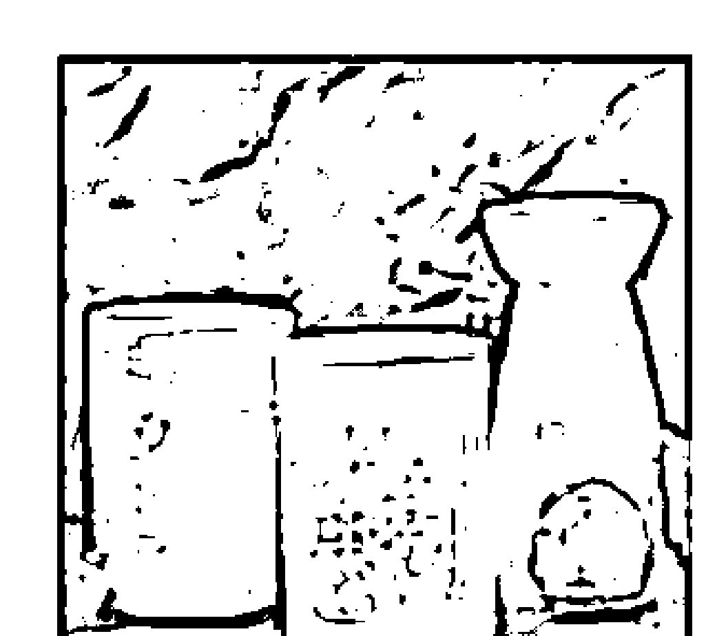

使用方法：
1. 在薰香蒸爐或香薰燈上方水盤中加入7分滿的水。
2. 將所有精油調和好，滴入香薰爐或薰香燈上方的水盤中。
3. 點上蠟燭或開啟薰香燈即可。


##### 調製按摩油

可以治療關節炎、支氣管炎、感冒、咳嗽、肌肉疼和風濕病。

- 沉香醇百里香精油...3滴
- 羅馬洋甘菊精油.....2滴
- 聖約翰草浸泡油.....10ml


使用方法：
1. 將所有精油調和均勻。
2. 取適量按摩不適部位至完全吸收即可。


按摩時選擇順時針方向按摩，效果更佳。


##### 調製面霜或潤膚乳

用於面霜或潤膚乳時，可以改善皮膚，治療痤瘡、濕疹等皮膚病。

- 無香乳液...........30g
- 沉香醇百里香精油...4滴
- 茶樹精油...........3滴
- 迷迭香精油.........3滴


使用方法：
1. 將所有精油滴入無香乳液中調和均勻。
2. 取適量塗抹在臉上即可。


##### 沐浴法

百里香精油調配稀釋後放入浴缸，能夠緩解精神疲勞、肌肉痠痛和腫脹，提振免疫，強健身體。

- 薰衣草精油...............3滴
- 迷迭香精油、百里香精油...各2滴
- 薄荷精油、天竺葵精油.....各1滴
- 全脂牛奶................10ml

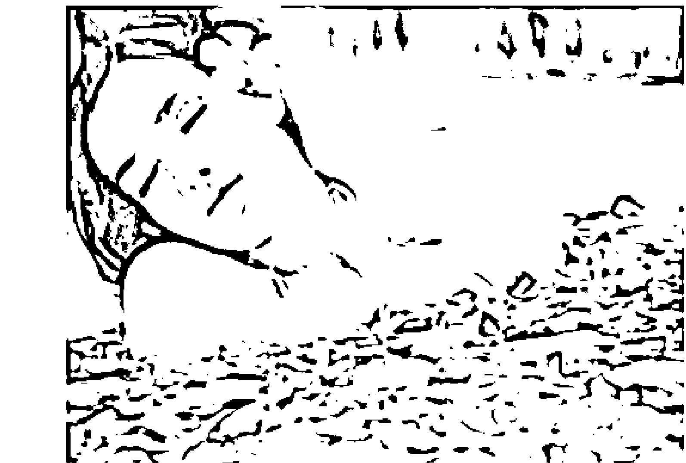

使用方法：
1. 將所有精油滴入牛奶中調和均勻。
2. 將調和好的製劑滴入浴缸中，浸泡15~20分鐘即可。

### 唇形科 甜羅勒 Sweet Basil

羅勒精油是從羅勒的葉子中萃取出來的，屬於唇形科。羅勒精油功效很強大，但對敏感肌膚者有刺激性。它可以改善頭痛，幫助消化呼吸系統恢復正常，滋補神經，調節內分泌失調，穩定情緒。

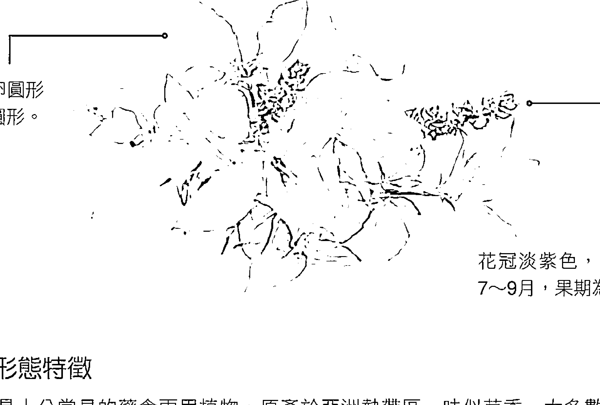

#### 源植物形態特徵

羅勒，是十分常見的藥食兩用植物，原產於亞洲熱帶區，味似茴香，大多數為一年生草本植物，也有一些是多年生植物，高度約為20～80公分。莖直立，葉卵圓形至卵圓狀長圓形，先端微鈍或急尖，基部漸狹，邊緣具不規則牙齒或近於全緣，兩面近無毛；葉柄伸長，近於扁平，被微柔毛。總狀花序頂生於莖、枝上，各部均被微柔毛；花冠淡紫色，或上唇白色下唇紫紅色，外面在唇片上被微柔毛，內面無毛，花盤平頂。小堅果卵珠形。花期通常7～9月，果期9～12月。

- 别名: 香草之王、地中海羅勒、沉香醇羅勒、九層塔
- 学名: Ocimum basilicum
- 英文名: Basil
- 科别: 唇形科
- 萃取部位: 葉片、花頭
- 萃取方法: 蒸餾法

| 項目 | 內容 |
|------|------|
| 主要產地 | 主要產於美國、埃及、法國。 |
| 性狀特徵 | 為無色或淡黃色澄明的液體。 |
| 化學成分 | 沉香醇、樟腦、桉油醇、丁香酚、檸檬烯、香茅醇、甲基醚癒創酚。 |
| 香味特徵 | 味道類似丁香、松針的混合香味，略帶薄荷味。 |
| 揮發特性 | 高度揮發。 |

#### 適合與羅勒精油混用的精油

- 豆蔻
- 肉桂
- 黑胡椒
- 月桂
- 佛手柑
- 尤加利
- 天竺葵
- 薰衣草
- 甜馬鬱蘭
- 快樂鼠尾草
- 香蜂草
- 橙花
- 檀香
- 迷迭香

#### 保存

最好存放在深色玻璃瓶中，溫度應該控制在18～25℃左右，避免陽光的照射。未開封的精油可存放3～5年，已經開封的要在1年之內用完，而用於做按摩油成分，應在2個月內用完。

#### 注意事項

① 不宜高劑量使用，尤其是孕婦應在醫生指導下使用。
② 不可內服，不宜直接塗抹於皮膚上。

#### 羅勒精油的主要功效

##### 皮膚

羅勒精油具有收斂功效，能改善鬆垮、老化肌膚，清除皮脂，滋養皮膚，有效預防粉刺、痤瘡。

##### 心理

羅勒精油對於虛弱、憂鬱、沮喪的情緒有很好的激勵作用，能強化神經，緩解壓力，改善憂鬱心態。

##### 居家

將羅勒精油稀釋後擦拭家具或者直接噴灑身上或家中，不但能驅蟲防蚊，還能消滅病菌。

##### 醫學

① 羅勒精油被稱作是香草之王，對治療和改善女性頭痛、月經不調等有非常好的效果。
② 緩解胃部不適，恢復胃動力，促進消化，增進食慾。
③ 可用於治療咳嗽、支氣管炎等呼吸系統疾病；有很強的抗病毒能力，用作日常保健，能增加抵抗力。

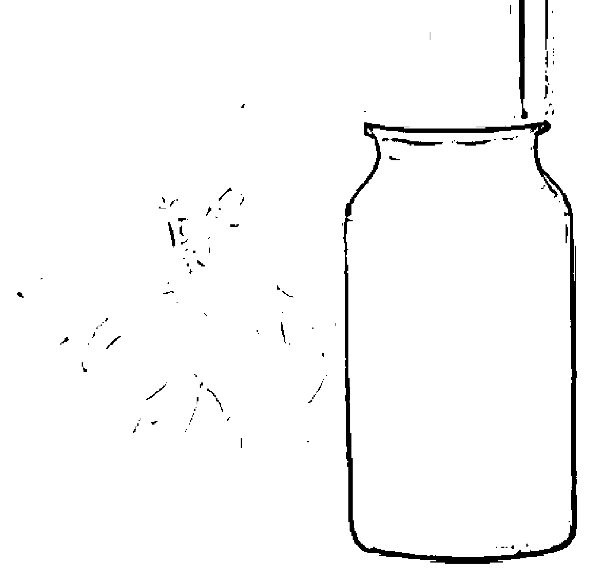

#### 如何使用羅勒精油


##### 香薰爐和薰香燈

在薰香法中，羅勒精油能夠治療失眠、多夢、精神緊繃與耗弱狀態。

- 羅勒精油 ........... 3滴
- 橙花精油 ........... 2滴
- 薰衣草精油 ......... 3滴

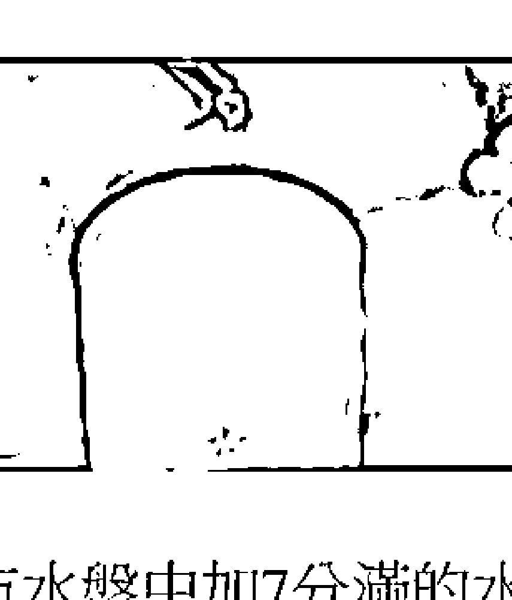

使用方法：
1. 在薰香蒸爐或香薰燈上方水盤中加7分滿的水。
2. 將所有精油調和好，滴入香薰爐或薰香燈上方的水盤中。
3. 點上蠟燭或開啟薰香燈即可。


##### 調製按摩油

羅勒精油可以用作按摩油的成分，緩解女性經痛，促進血液循環，減輕肌肉疼痛。還能調理腸胃，治療嘔吐、胃痙攣、噁心及消化不良。

- 羅勒精油 .......3滴
- 黑胡椒精油.....2滴
- 甜茴香精油....1滴
- 橄欖油.........15ml

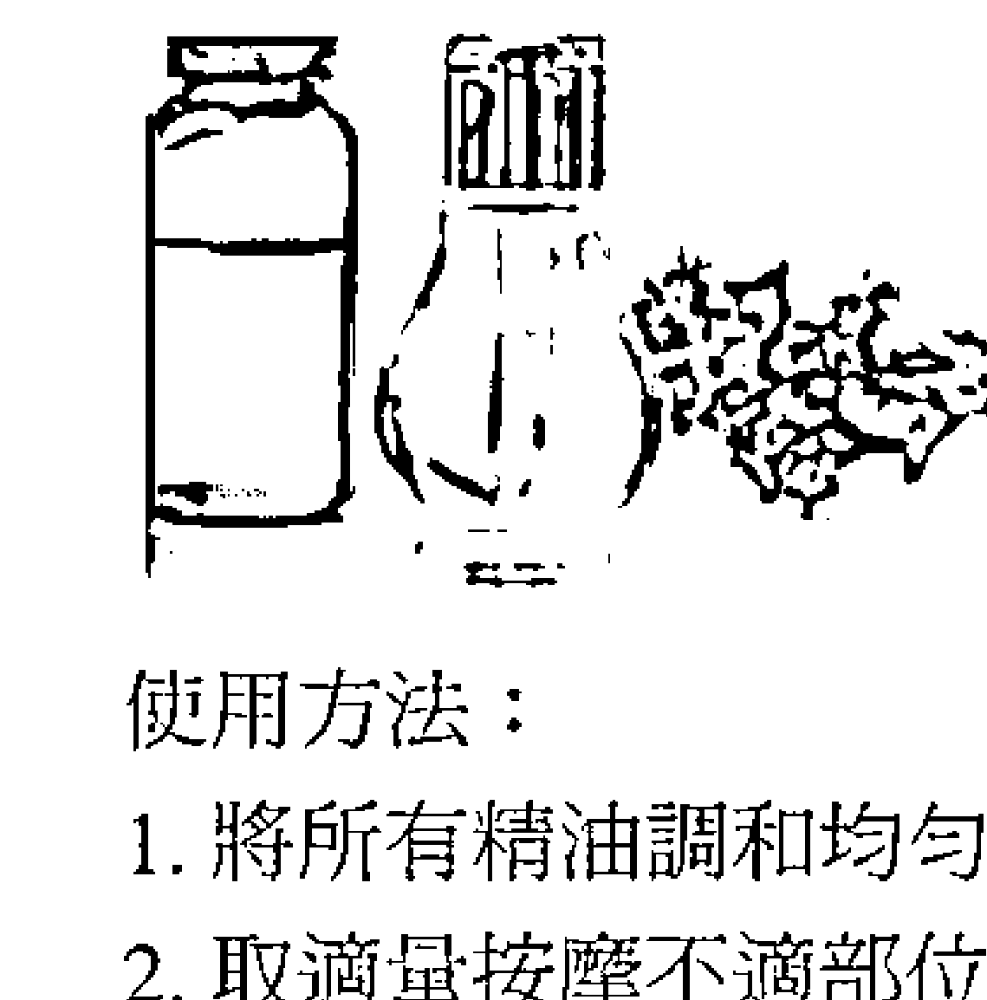

使用方法：
1. 將所有精油調和均勻。
2. 取適量按摩不適部位。


##### 調製面霜或潤膚乳

用於面霜或潤膚乳時，可以清除老化皮膚和油脂，預防粉刺，讓皮膚緊實有光澤。

- 無香乳液 .........30g
- 羅勒精油 .........3滴
- 迷迭香精油.......3滴
- 玫瑰精油 .........4滴

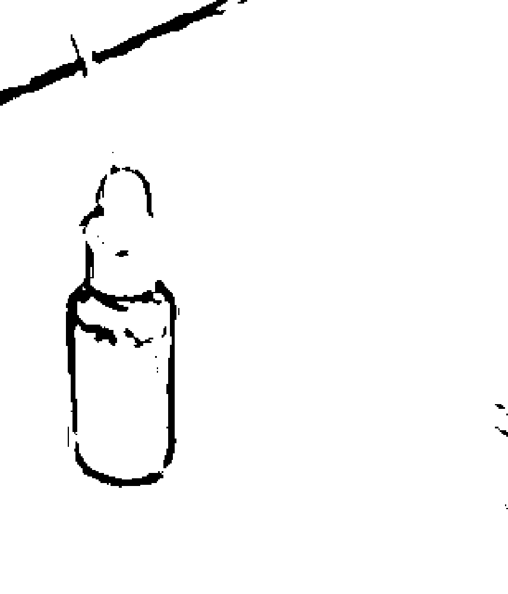

使用方法：
1. 將所有精油混合與乳液調和均勻。
2. 取適量塗抹在臉上即可。

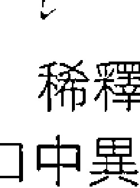

##### 調製漱口水

稀釋後含在口中片刻或是加入牙膏能去除口中異味。

- 羅勒精油 ......10滴
- 伏特加酒 ......4ml

> Tips: 每次使用20ml的溫水加入5滴的羅勒漱口劑。


使用方法：
1. 將羅勒精油滴入伏特加酒中，做成羅勒漱口劑
2. 將羅勒漱口劑滴入水中並搖晃均勻。
3. 依照一般漱口方法漱口即可。


##### 蒸汽吸入

可用蒸汽法吸入羅勒精油，對於治療呼吸系統疾病非常有益，例如：感冒、咳嗽、鼻塞、頭痛、偏頭痛等。

- 羅勒精油 .........2滴
- 雪松精油 .........2滴
- 安息香精油.......1滴

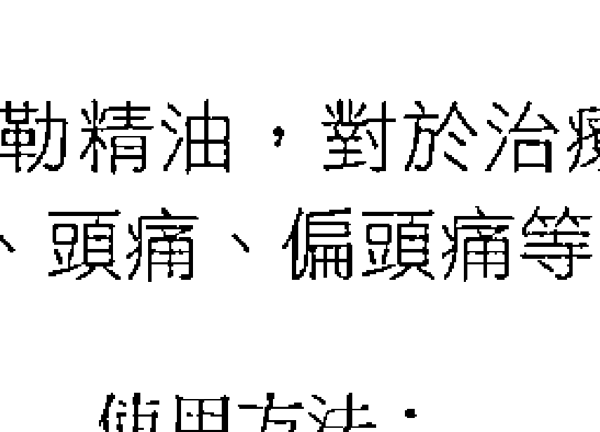

使用方法：
用蒸的方式吸入，或是將精油調勻後滴在手帕或面紙上，然後靠近鼻子深吸氣。

### 唇形科 迷迭香 Rosemary

迷迭香精油是從迷迭香植物中萃取出來的，屬於唇形科。這種精油味道清新，不僅可以增強大腦的記憶力，還能幫助理清紛繁的思緒。迷迭香精油還具有治療各種呼吸道問題、肌肉僵硬、感冒等功效，也能用於改善肝臟和膽囊功能。此外，它對頭髮的護理和頭皮的保健也有積極的效果。

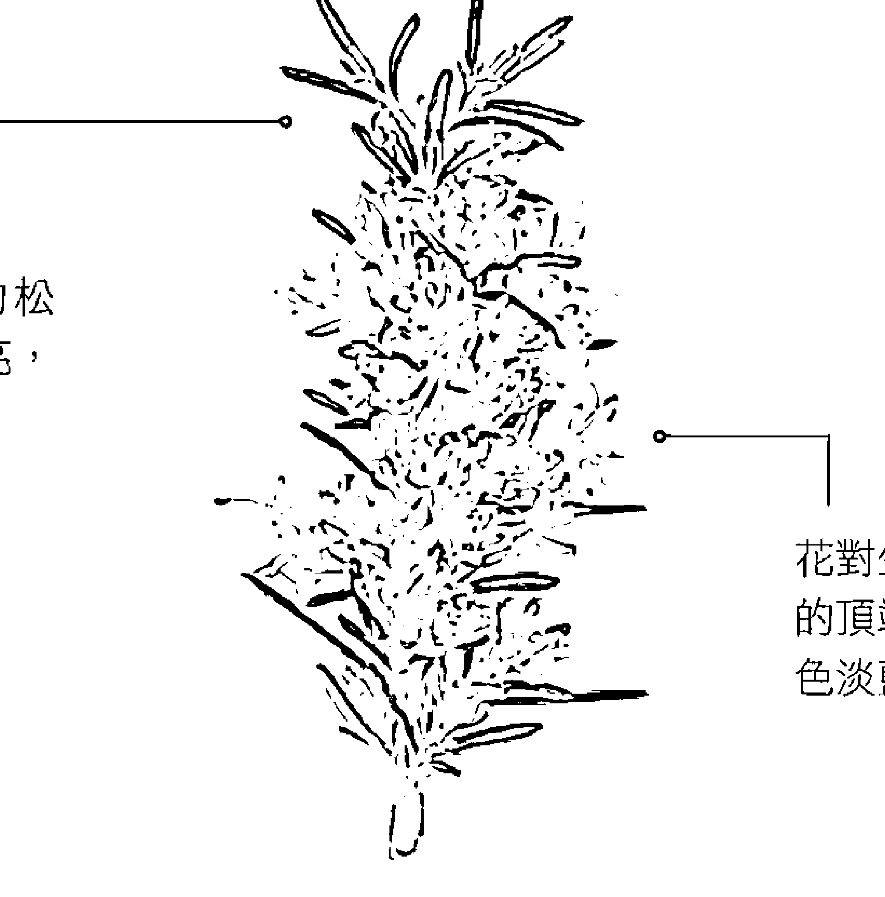

#### 源植物形态特徵

迷迭香，多年生常綠灌木，主莖高約2公尺，葉線形，長約2公分，形似彎曲的松針，深綠色，上面光亮，下面白色，葉緣向葉背卷曲。主莖及老枝呈圓柱形，並有不規則的縱裂，塊狀剝落；幼枝四稜形，密被白色星狀細絨毛。葉叢生，柄極短或無柄，葉片綠灰色、針狀，向背面卷曲，革質，上面稍具光澤，下面密被白色的星狀絨毛。花對生，少數聚集在短枝的頂端組成總狀花序。花色淡藍或淡紫色，花期11月。

- 别名：海洋之露、艾菊、聖瑪利亞的玫瑰
- 学名：Rosmarinus officinalis
- 英文名：Rosemary
- 科别：唇形科
- 萃取部位：葉片和花朵的頂端
- 萃取方法：蒸餾法

- 【主要產地】法國、西班牙、摩洛哥、突尼西亞。
- 【性狀特徵】無色至淡黃色的液狀物。
- 【化學成分】蒎烯、樟烯、檸檬烯、龍腦(帶樟腦成分)、桉油醇、沉香醇、萜品醇、辛酮、乙酸龍腦酯。
- 【香味特徵】有非常強勁的清新之氣和新鮮的香草味道。
- 【揮發特性】中度揮發。

#### 適合與迷迭香精油混用的精油

- 迷迭香精油
- 茴香
- 薄荷
- 羅勒
- 香柏
- 乳香
- 天竺葵
- 薑
- 葡萄柚
- 萊姆
- 桔
- 香蜂草
- 桃金嬌
- 甜橙
- 雪松
- 茉莉

#### 保存

存放在深色玻璃瓶中、18～25℃的常溫下。未開封的通常可保存3～5年，已開封的最好於1年内用完，若已調和為按摩油，2個月内用完最佳。

#### 注意事項

① 迷迭香精油含酮類成分，孕婦、嬰幼兒、癲癇病患者避免使用。
② 純精油濃度高，最好是控制在1%的低劑量使用。
③ 敏感膚質者應小心使用。

#### 迷迭香精油的主要功效

##### 皮膚

迷迭香精油對皮膚有強力的收斂效果，能有效改善鬆弛的肌膚，用於頭皮還能預防頭皮屑、防治掉髮。

##### 心理

迷迭香精油可以刺激大腦，使人充滿活力，振奮精神，非常適合精神不濟時使用。

##### 居家

將精油溶於75%酒精，用於擦拭家具，不僅可以淨化空氣，使人神清氣爽，還能驅蟲。

##### 醫學

① 幫助改善呼吸系統疾病，對感冒、支氣管炎、氣喘、黏膜炎、鼻竇炎有很大的益處。
② 緩解腸胃不適，治療消化不良、肝臟不和、黃疸、痢疾等腸道感染症狀，減輕關節炎、風濕病等的疼痛感。
③ 刺激大腦中樞神經，增強記憶力，有助於治療頭疼、偏頭痛、神經痛、精神疲勞和神經衰弱等疾病，很適合用腦過度的學生和上班族使用。

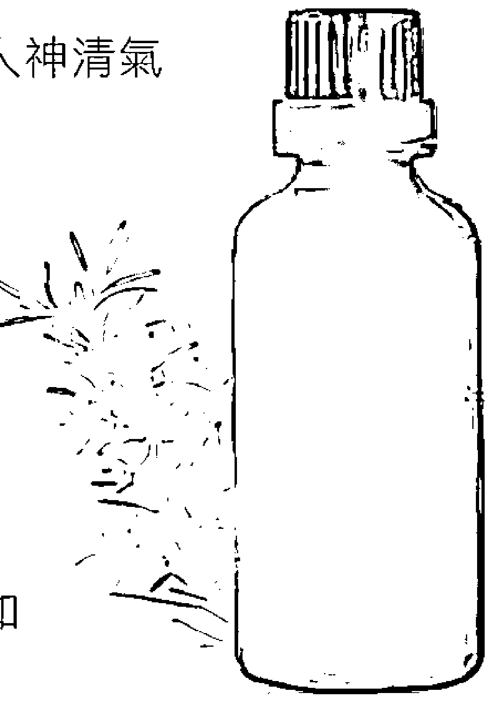

#### 如何使用迷迭香精油

##### 香薰炉或薰香灯

在薰香法中，迷迭香精油有助于缓解宿醉、精神疲劳、鼻窦炎和大脑反应迟钝等，帮助改善记忆力和思考问题。

- 迷迭香精油...... 3滴
- 罗勒精油........ 2滴
- 檀香精油........ 1滴

使用方法：
1. 在薰香炉或香薰灯上方水盘中加入7分满的水。
2. 将所有精油调和好，滴入香薰炉或薰香灯上方的水盘中。
3. 点上蜡烛或开启薰香灯即可。

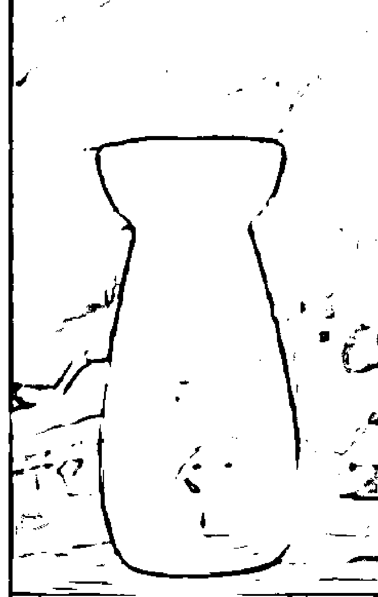

##### 调制按摩油

迷迭香精油用作按摩油的成分时，具有调节肝脏功能，缓解黏膜充血、肌肉酸痛、脖颈僵硬、抽筋、关节炎、感冒、便秘、腹泻、支气管炎、背痛等作用。

- 迷迭香精油........ 5滴
- 薰衣草精油........ 2滴
- 尤加利精油........ 3滴
- 甜杏仁油.......... 15ml
- 山金车浸泡油...... 5ml

使用方法：
将所有精油与基础油充分混匀之后按摩全身或局部。

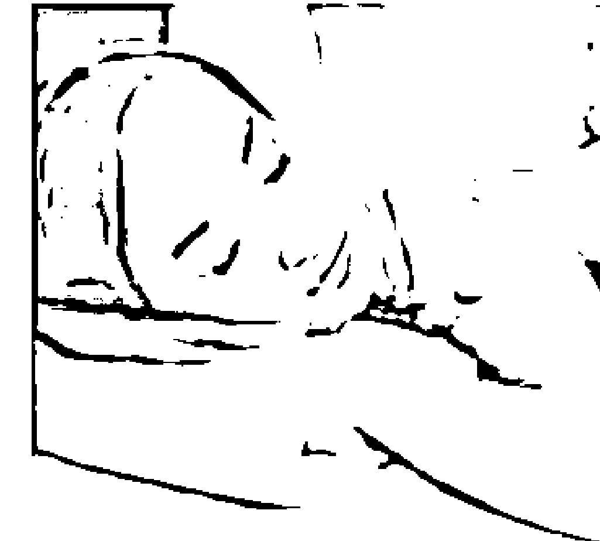

##### 调制面霜或润肤乳

迷迭香精油用作面霜或润肤乳成分时，帮助畅通毛孔，代谢老废角质，调节粉刺与痘痘肌肤。

- 芦荟胶............ 10克
- 榛果油............ 3ml
- 迷迭香精油........ 2滴
- 茶树精油.......... 1滴
- 雪松精油.......... 1滴

使用方法：
1. 将精油与基础油调和均匀。
2. 再加入芦荟胶充分拌匀。
3. 将调制好的乳液装入分装瓶，使用时涂抹在脸上即可。

> Tips
将所有精油、基础油及芦荟胶调和均匀后，涂抹在脸上即可，要尽快使用完。


##### 调制洗发精

保养头皮，具有深层清洁功效，治疗出油、落发，头皮屑，具生发的功效。

- 天然无香洗发精.... 50ml
- 迷迭香精油........ 4滴
- 苦橙叶精油........ 3滴
- 雪松精油.......... 3滴

使用方法：
1. 先将所有精油与洗发精充分调和均匀。
2. 每次使用5ml进行一般洗发程序，加强头皮按摩。

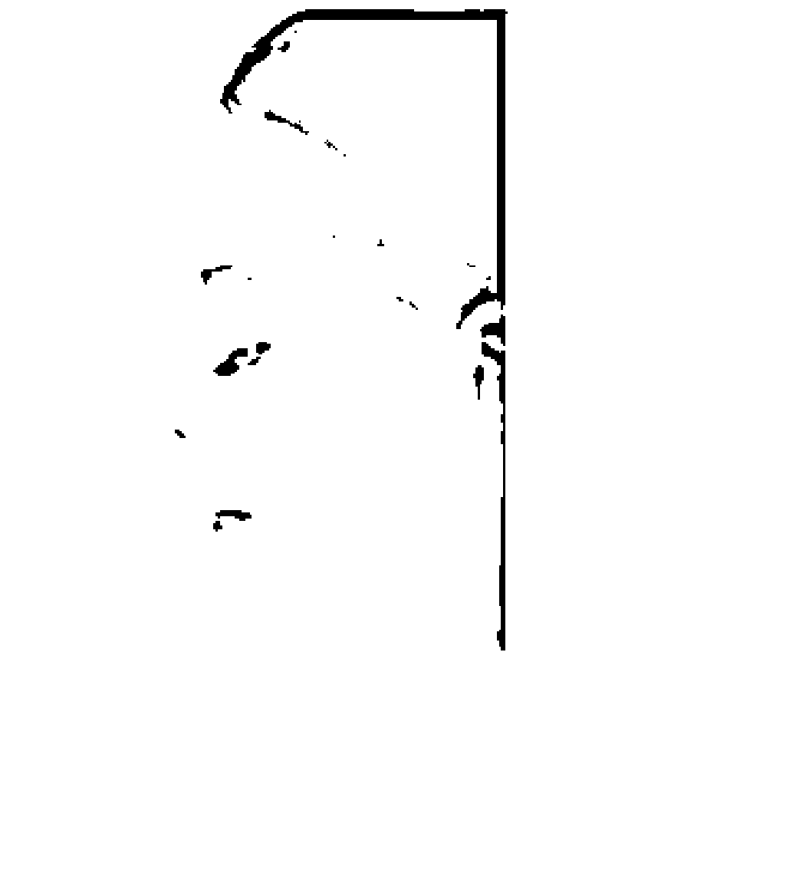

### 唇形科 甜馬鬱蘭 Sweet Marjoram

甜馬鬱蘭精油是從甜馬鬱蘭植物中提煉出來的，屬於唇形科。它在治療氣喘和其他呼吸道疾病方面有很不錯的效果，還能調整月經不順、減輕經痛、抑制性慾。甜馬鬱蘭可以緩解焦慮神經，舒緩緊繃的壓力，降低血壓，舒緩因血壓過高而緊繃的肌肉。

多年生草本，莖直而硬，植株高約30~50公分。枝從莖的下方開始分開直立或擴大。

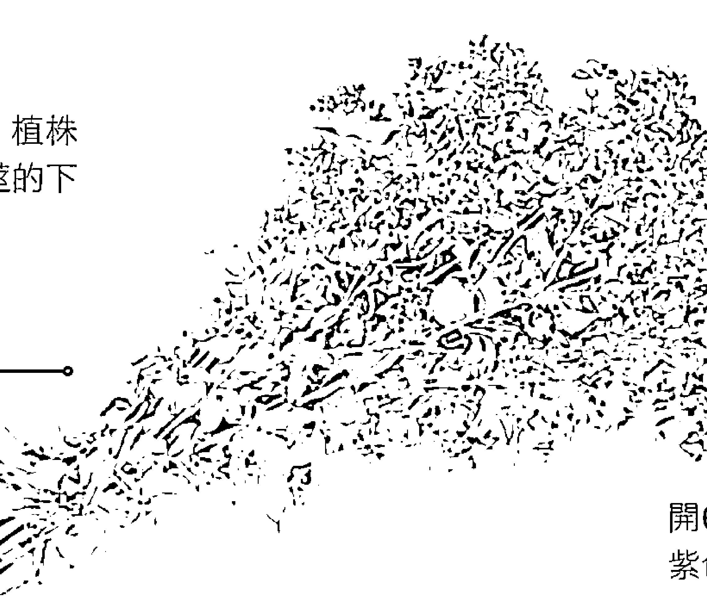

開6~15朵花，花冠通常為紫色，也有粉紅色或白色。

#### 源植物形態特徵

甜馬鬱蘭，多年生草本，莖直而硬，植株高約30~50公分枝從莖的下方開始分開直立或擴大，葉無柄，線形或披針形全緣，兩端細鈍頭，略肉質，兩面多數油腺，輪散花序分別片側腋生，枝和葉多毛，有苦味。開6~15朵花，花冠通常為紫色，也有粉紅色或白色，唇形、基部桶狀，葉長1.3公分，萼片三角形帶綿毛。

- 別名：墨角蘭、甜牛至、馬嬌蘭、馬荷蘭、馬約蘭
- 學名：Origanum majorana
- 英文名：Marjoram
- 科別：唇形科
- 萃取部位：全株含花藥草
- 萃取方法：蒸餾法

#### 精油檔案

- **【主要產地】** 埃及、摩洛哥、德國、法國、匈牙利。
- **【性狀特徵】** 為無色或淡黃色或琥珀色的物質。
- **【化學成分】** 萜品烯、萜品醇、檜烯、沉香醇、乙酸沉香酯、檸檬醛。
- **【香味特徵】** 香氣溫暖帶有青草氣味。
- **【揮發特性】** 中度揮發。

#### 適合與甜馬鬱蘭精油搭配的精油

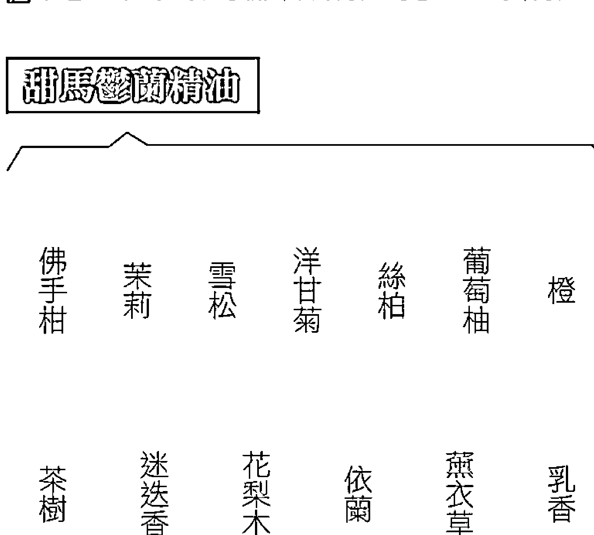

#### 甜馬鬱蘭精油的主要功效

##### 皮膚
甜馬鬱蘭精油可以幫助血管擴張，改善凍瘡、瘀傷。

##### 心理
甜馬鬱蘭精油有著芬芳安撫的氣味，有助於緩解焦急和疲勞，在康復階段裡，可以當滋補品使用。當感到孤獨時，還能獲取溫暖，使緊張或者亢奮的心情得到冷靜。

##### 居家
將甜馬鬱蘭精油擴香在空間裡，能放鬆情緒，緩解神經緊張。

##### 醫學
1. 甜馬鬱蘭精油可以治療氣喘、支氣管炎、咳嗽等呼吸系統疾病，對呼吸道感染也是極有效的。
2. 降低血壓，增進心臟功能，舒緩腹瀉、脹氣，有助於治療胃絞痛、腸胃脹氣、消化不良。
3. 具有強大的抗菌能力，可以解決呼吸、消化、泌尿系統的感染，對甲狀腺機能亢進也有調整的效果。
4. 能有效減輕女性經痛、子宮痙攣、頭痛、失眠等。

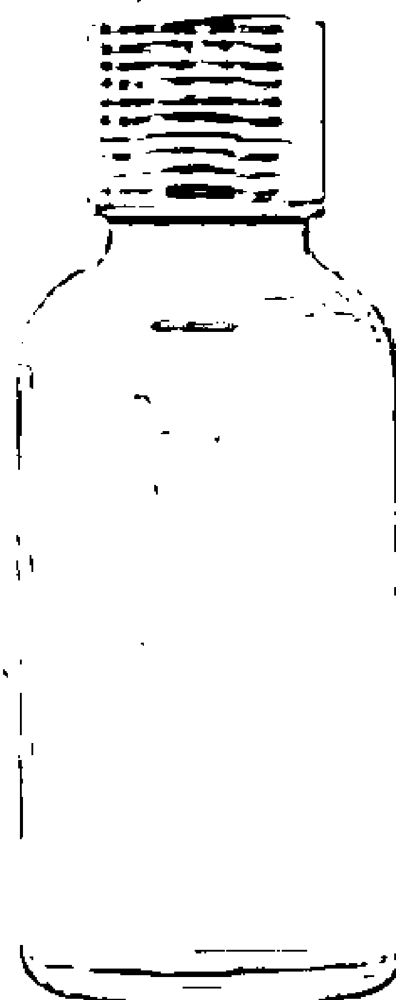

#### 保存

甜馬鬱蘭精油應儲存於深色玻璃瓶中，置於18～25℃的常溫下，避免陽光直射。未開封的純精油通常可保存3～5年，已開封的最好於1年內用完，若已調和為按摩油，於2月內用完效果最佳。

#### 注意事項

①不宜長時間一直使用，可能導致神精遲緩。
②低血壓患者避免使用。
③孕婦禁用。

#### 如何使用甜馬鬱蘭精油

##### 香薰爐和薰香燈

在薰香法中，甜馬鬱蘭精油能幫助緊張、亢奮的心情鎮定下來，寂寞的心情也能獲得溫暖，還能治療感冒引起的咳嗽、支氣管炎等。

- 甜馬鬱蘭精油......3滴
- 薰衣草精油......3滴
- 橙花精油......1滴

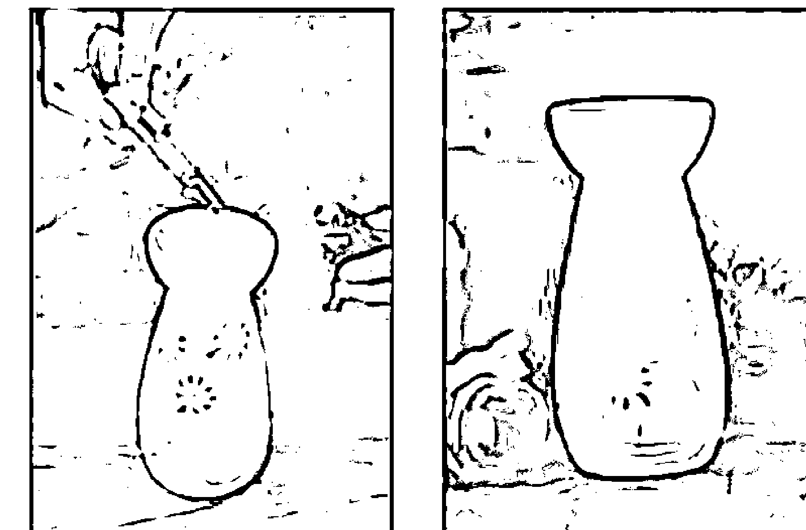

1. 將精油滴入香薰爐或薰香燈上裝有7分滿水的水盤中。
2. 點上蠟燭或開啟薰香燈即可。

##### 調製按摩油 — 舒緩經痛

甜馬鬱蘭精油可以用作按摩油的成分，對容易產生生理痛的體質，可以在生理期前幾天開始使用甜馬鬱蘭精油按摩。

- 月見草油......5ml
- 甜杏仁油......15ml
- 甜馬鬱蘭精油......4滴
- 薑精油......2滴
- 快樂鼠尾草精油......4滴

> Tips: 調和為按摩油後，需存放於深色玻璃瓶中保存，並盡快使用完畢。

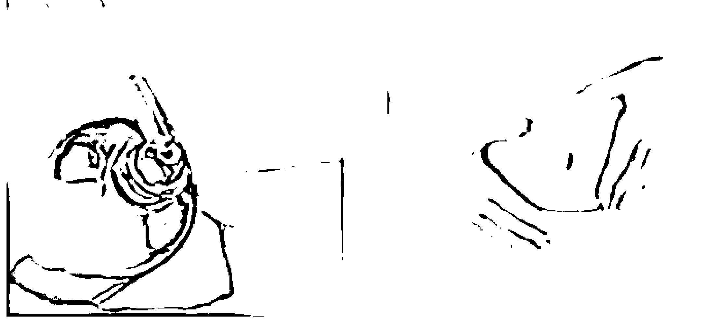

1. 將所有精油調和均勻，調製成按摩油。
2. 沐浴後取適量輕輕按摩腹部即可。

##### 調製按摩油 — 放鬆肌肉

甜馬鬱蘭精油還能用作肌肉的按摩油，對於改善肌肉疼痛、關節痛等症狀有很好的效果。

- 甜馬鬱蘭精油......4滴
- 迷迭香精油......4滴
- 檸檬草精油......2滴
- 聖約翰草浸泡油......5ml
- 甜杏仁油......15ml

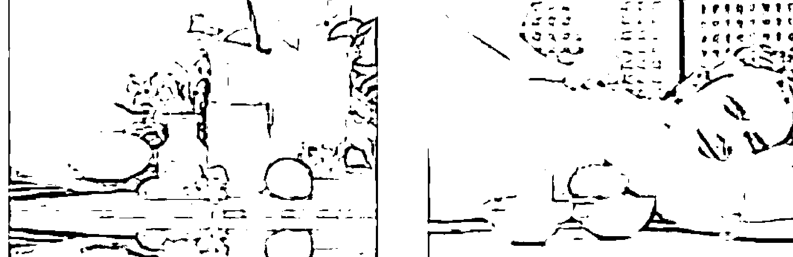

1. 先將所有精油調和為按摩油。
2. 取適量以順時針方向按摩肌肉即可。

##### 冰敷法

在冰敷法中，甜马郁兰精油可以急性止痛、缓解扭伤、拉伤的红肿现象。

- 甜马郁兰精油……3滴
- 薰衣草精油……2滴
- 伏特加或酒精……5ml
- 毛巾……1条

> 薰衣草精油能止血、抗菌、消毒，还能够促进伤口愈合。


- 1. 将精油与伏特加或酒精调和均匀，再倒入冷水盆中。
- 2. 将毛巾浸湿，微拧干后敷在受伤的肌肉、关节处即可。

##### 涂抹法

甜马郁兰精油还可以用于治疗泌尿道感染的情况，对于瘙痒、灼热、不舒服等症状，可以很有效地缓解不适感。

- 甜马郁兰精油……5滴
- 月桂精油……3滴
- 甜杏仁油……10ml

> 按摩油不宜接触阳光直射，应置于深色玻璃瓶中。

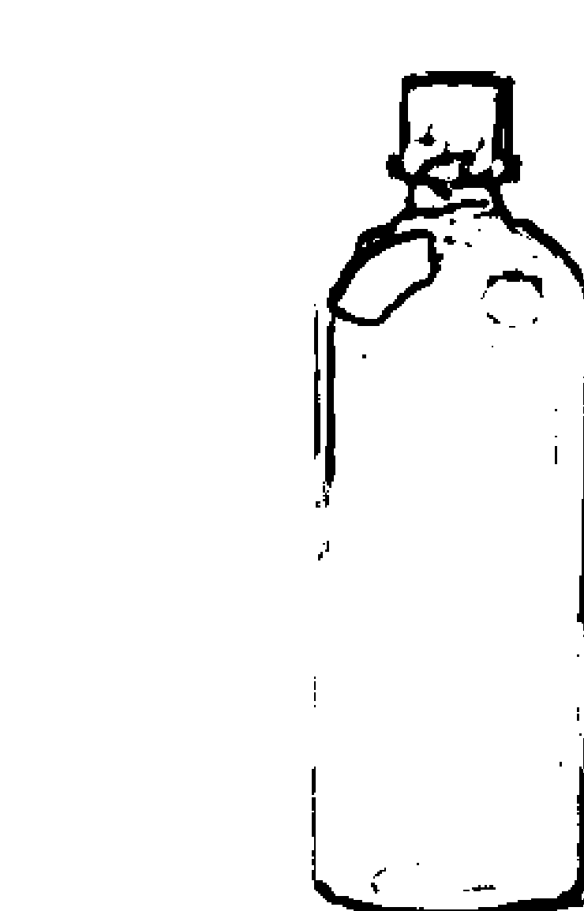

- 1. 将所有精油与甜杏仁油调和均匀后装入深色瓶中。
- 2. 当感觉身体不适时，取适量涂抹在下腹部、臀部即可。

##### 擦拭法

感冒时会觉得身体不适、精神疲惫等，可以尝试用甜马郁兰精油擦拭全身，对治愈感冒很有帮助。

- 甜马郁兰精油……2滴
- 尤加利精油……2滴
- 绿花白千层精油……2滴
- 温水……适量

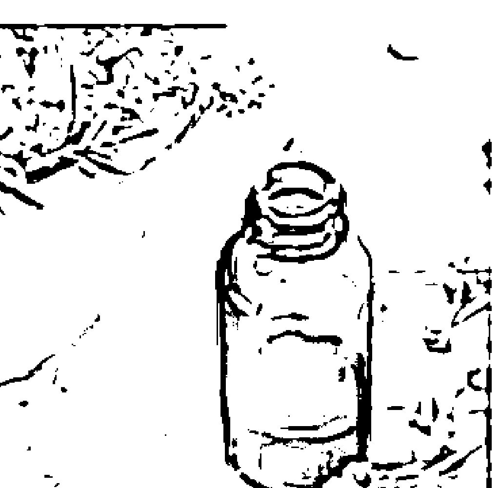

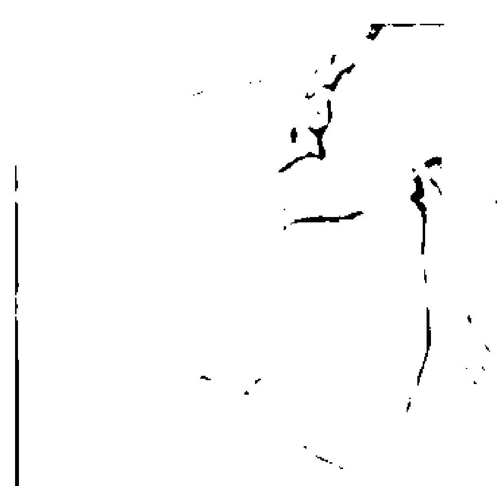

> 纯精油不宜直接接触皮肤，使用时一定要保持低浓度并加入乳化介质（牛奶、酒精）。

- 1. 将所有精油调和均匀，放入温水中拌匀。
- 2. 将毛巾充分沾湿后拧干，擦拭全身即可。

### 唇形科 真正薰衣草 Lavender

薰衣草精油是由真正薰衣草提炼而成，可以清热解毒、清洁皮肤、愈合再生、淡斑美白、滋润嫩肤，还可促进受损组织再生恢复等护肤功能。它能净化、安抚心灵，减轻愤怒和精疲力竭的感觉，使人可以心平气和地面对生活。

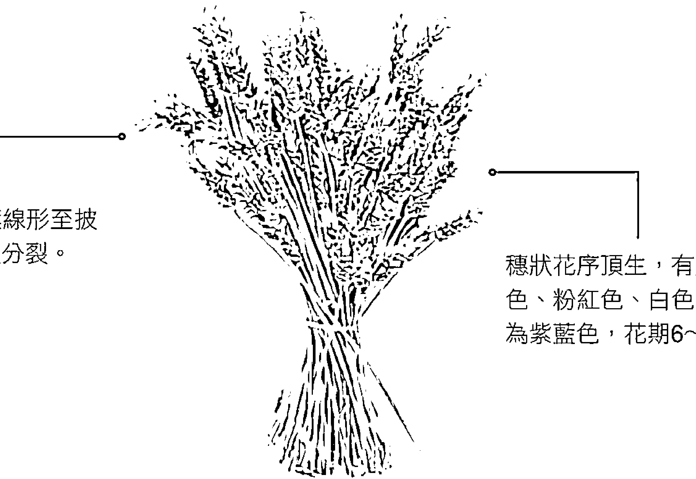

#### 源植物形态特征

薰衣草，多年生草本或小矮灌木，虽称为草，实际是一种紫蓝色小花。薰衣草丛生，多分枝，常见的为直立生长，株高依品种有30～40公分、45～90公分，在海拔相当高的山区，单株能长到1公尺。叶互生，椭圆形披尖叶，或叶面较大的针形，叶缘反卷。穗状花序顶生，有蓝色、深紫色、粉红色、白色等，常见的为紫蓝色，花期6～8月。全株略带木头甜味的清淡香气，因花、叶和茎上的绒毛均藏有油腺，轻轻碰触油腺即破裂而释出香味。

- 别名：狭叶薰衣草、细致薰衣草
- 学名：Lavandula angustifolia / Lavandula officinalis
- 英文名：Lavender
- 科别：唇形科
- 萃取部位：花
- 萃取方法：蒸馏法

#### 精油档案
| 项目 | 内容 |
| :--- | :--- |
| 【主要产地】 | 法国普罗旺斯、英国诺福克、塔斯马尼亚岛。 |
| 【性状特征】 | 黄色、浅黄色或黄绿色油状物。 |
| 【化学成分】 | 乙酸沉香酯、苧烯、柠檬烯、沉香醇、薰衣草醇。 |
| 【香味特征】 | 清澈的花香味，优雅温和，可以安定情绪。 |
| 【挥发特性】 | 中度挥发。 |

#### 适合与薰衣草精油混用的精油

| 薰衣草精油 |
| --- |
| 天竺葵 | 迷迭香 | 甜马郁兰 | 佛手柑 | 甜橙 | 罗马洋甘菊 | 柠檬 |
| 尤加利 | 花梨木 | 茶树 | 岩兰草 | 依兰 | 广藿香 | 雪松 |

#### 保存

在深色玻璃瓶中保存，置于常温下。未开封的纯精油通常可以保存3～5年，已开封的最好于1年内用完，若已调和为按摩油，于2个月内用完为佳。

#### 注意事项

薰衣草精油能够通经，避免在怀孕初期使用；低血压患者用了薰衣草精油之后，可能会出现呆滞现象，也最好不要使用。而薰衣草是少数能够直接使用在皮肤上的精油，为了避免仍有可能产生的过敏现象，最好还是调和基础油使用。

#### 薰衣草精油的主要功效

##### 皮肤

能消炎、抗菌，对青春痘肌肤很好，可以抑制细菌生长、平衡分泌过多的油脂及淡化疤痕等，十分适合做保养品用。

##### 心理

能帮助情绪不稳定的人，如忧郁、歇斯底里、焦虑等，对精神压力造成的失眠也具有很好的疗效。

##### 居家

具有驱虫的功效，能避免蚊虫叮咬，或是缓和被叮咬后的疼痛，并阻止伤口感染，还能治疗头虱、香港脚、癣疥等，另外还有除臭、芳香的功效。

##### 医学

- ①具有止痛、消毒杀菌等功效，非常适合用来治疗感冒、咳嗽、鼻窦炎等症状。
- ②利用热敷能够减轻经痛或经血不足的问题，而在即将生产之前涂抹于下背部，则能加速分娩、减轻疼痛。也能治疗烫伤、外伤，促进伤口愈合，避免留下疤痕。
- ③能降低血压，改善心悸、反胃、呕吐、胃胀气等。

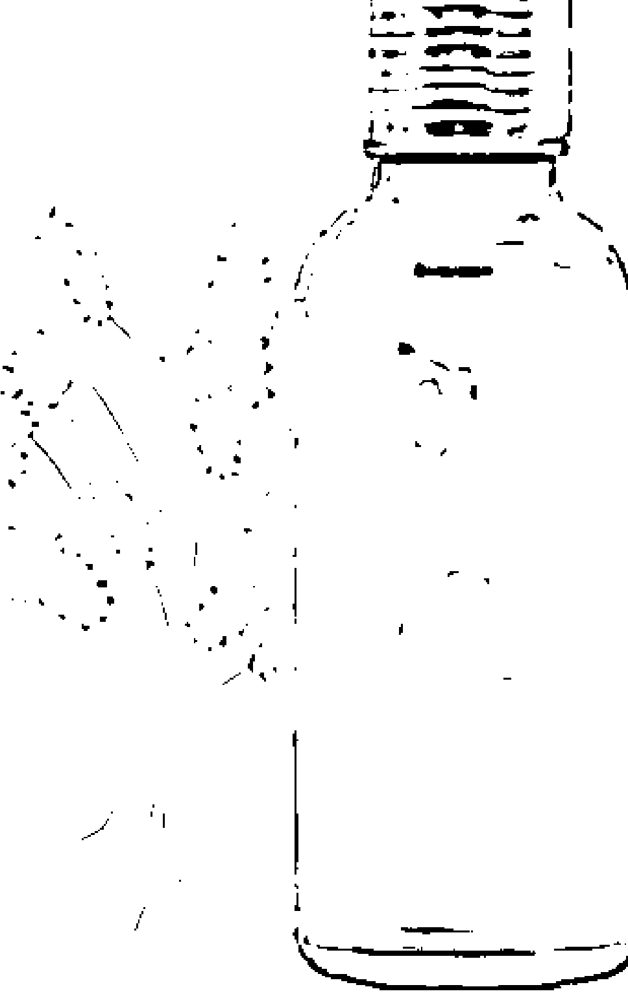

#### 如何使用薰衣草精油

##### 薰香灯

能够帮助睡眠，安抚激动情绪、歇斯底里的症状，或舒缓偏头痛、恐慌的心情。

- 薰衣草精油……4滴
- 快乐鼠尾草精油……2滴
- 乳香精油……1滴

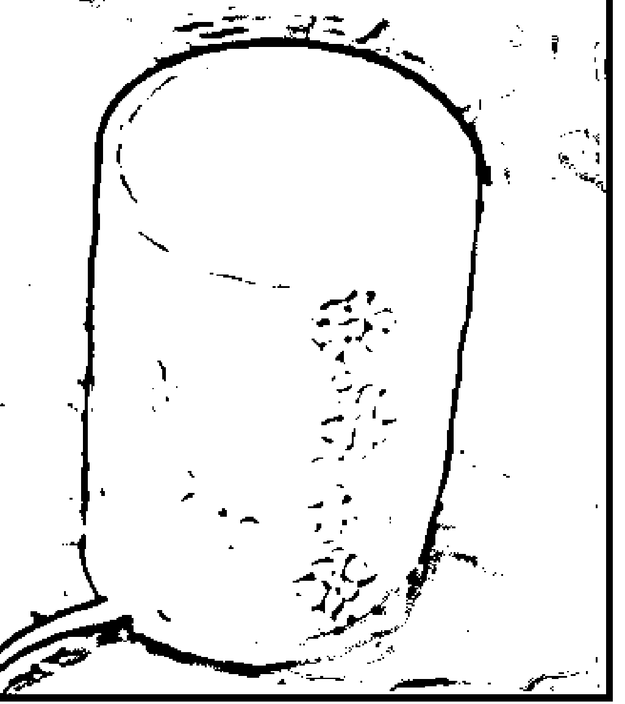

> Tips
> 不可使用蜡烛式的香薰炉。

使用方法：

- 1. 在薰香灯上的水盘中装7分满的水。
- 2. 将精油滴入薰香灯上的水盘中，睡前打开薰香灯即可。

##### 调制面膜

能深层洁净肌肤，镇静安抚敏感肌肤，其香味还可抗压、安眠。

- 薰衣草精油……2滴
- 洋甘菊精油……1滴
- 高岭土……10g
- 甘油……2ml
- 矿泉水或薰衣草纯露……5ml

使用方法：

- 1. 将高岭土、甘油和矿泉水或薰衣草纯露调和均匀，加入精油搅拌成泥状即成面膜。
- 2. 将面膜涂抹于脸上，避开眼睛及嘴唇，约10~15分钟后用温水洗净即可。


##### 调制按摩油

可改善胃胀气的状况，对反胃、恶心也有效，还能帮助肠胃蠕动。


- 薰衣草精油……3滴
- 薄荷精油……1滴
- 柠檬精油……1滴
- 甜杏仁油……10ml

使用方法：

- 1. 将所有精油与甜杏仁油调和均匀成按摩油。
- 2. 取适量按摩不适的胃部即可。

##### 涂抹法

能快速渗透毛囊消毒抗菌，促进细胞再生，促进青春痘和小伤口迅速愈合，预防疤痕痘疤遗留。

- 薰衣草精油……微量


使用方法：

用棉花棒微量的沾取瓶口剂量，点压的方式直接涂抹在青春痘上

> Tips
> 薰衣草精油除了能修复伤口外，对淡化疤痕也有一定的效果。

### 唇形科 广藿香 Patchouli

广藿香精油是从广藿香嫩叶中蒸馏而得，可治头皮毛发问题，刺激细胞再生。蒸馏前，要让叶片先干燥并发酵。它有着浓重的土质味，是一种酒一样的精油，时间愈长气味愈好。广藿香精油是很好的定香剂，是香水中不可或缺的原料，在香薰疗法中，复方精油中滴一滴广藿香精油，可以让香味更持久。

直立，分枝，被毛，老茎外表木栓化。

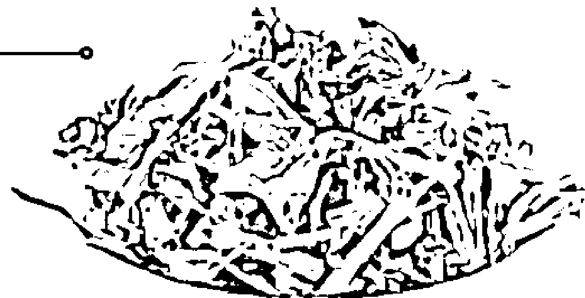

叶对生，叶片卵圆形或长椭圆形。

穗状花序，花期4月。

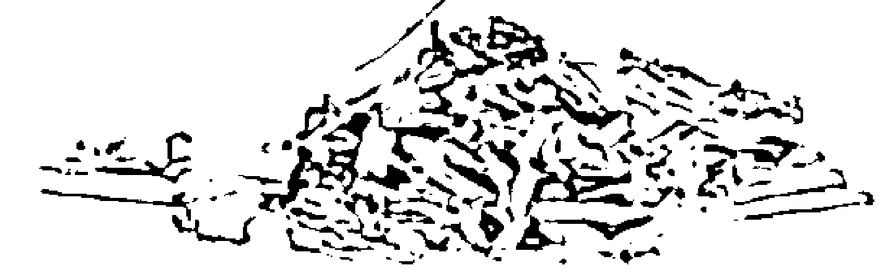

#### 源植物形态特征

广藿香，一年生草本，高30~60公分。直立，分枝，被毛，老茎外表木栓化。叶对生；叶柄长2~4公分，揉之有清淡的特异香气；叶片卵圆形或长椭圆形，长5~10公分，宽4~7.5公分，先端短尖或钝圆，基部阔而钝或楔形而稍不对称，叶缘具不整齐的粗钝齿，两面皆被毛茸，下面较密，有的呈紫红色；没有叶脉通走的叶肉部分则于上面稍隆起，故叶面不平坦。轮伞花序密集，基部有时间断，组成顶生和腋生的穗状花序式；苞片长约13公厘；花萼筒状；花冠筒伸出萼外，冠檐近二唇形，上唇3裂，下唇全缘；雄蕊4，外伸，花丝被染色。花期4月。

#### 精油档案

- 别名：藿香、藿香叶、藿梗
- 学名：Pogostemon cablin
- 英文名：Patchouli
- 科别：唇形科
- 萃取部位：嫩芽和嫩枝
- 萃取方法：蒸汽蒸馏法
- 【主要产地】印度、中国、印尼、菲律宾。
- 【性状特征】深琥珀色黏稠液体。
- 【化学成分】酯类、广藿香醇、广藿香烯、刺蕊草醇、愈创木醇、布黎烯。
- 【香味特征】泥土香气，混合辛辣调性。
- 【挥发特性】低度挥发。

#### 适合与广藿香精油混用的精油

- 快乐鼠尾草
- 花梨木
- 乳香
- 檀香
- 姜
- 雪松
- 玫瑰
- 橙花
- 黑胡椒
- 茉莉
- 天竺葵

#### 保存

将广藿香精油置于深色玻璃瓶中保存，置于约18~25℃的常温下，建议可以放在木盒中，减低温度的波动。而未开封的纯精油通常可以保存3~5年，已开封的最好于1年内用完，若已调和为按摩油，于2个月内用完为佳。

#### 注意事项

低剂量使用广藿香精油能够镇静心灵，但过高剂量反而会提振。

#### 广藿香精油的主要功效

##### 美容

能使松垮的肌肤变得紧致，对油性肌肤、粉刺问题也十分有效，还能帮助新生细胞，改善粗糙皮肤。

##### 心理

能帮助找到平衡，使心情得到振奋，消除嗜睡的状况。

##### 居家

具有驱虫的功效。

##### 医学

- ①非常适合治疗痤疮、湿疹、香港脚之类的微菌感染症，某些皮肤过敏症和头皮屑等也很有效，也能改善皮肤龟裂，促进伤口结疤。
- ②广藿香具有像没药一样的收敛和消炎的性质；此外还有很好的干燥特性，因此是很好的止血剂。它可以用于治疗皮肤红肿、伤口化脓以及皮肤龟裂。
- ③可以作为治疗腹泻的滋补剂，而且对于由于直肠肿大所造成的便秘很有帮助。此外，它也可以用在处理水肿、肥胖症、补强静脉、缓解便秘等症状上。

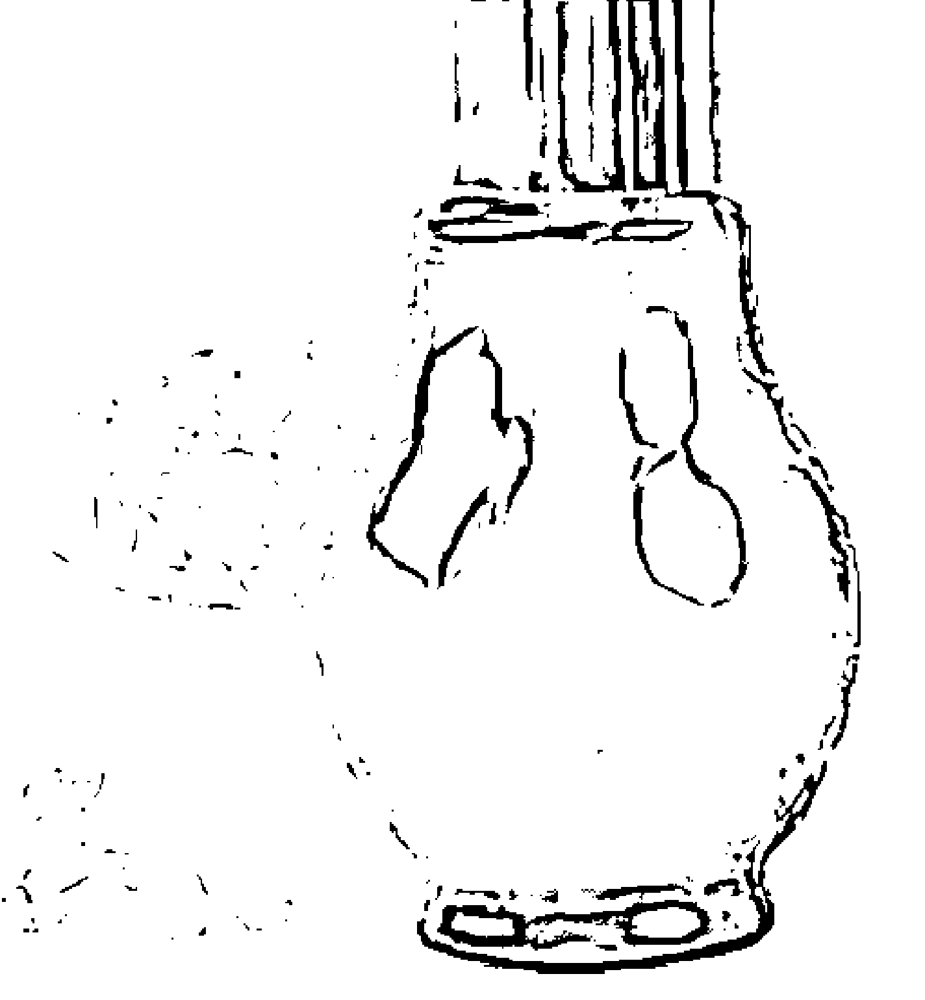

#### 如何使用广藿香精油

##### 薰香灯

对神经衰弱有帮助，强化中枢神经，高剂量有提振作用，低剂量具有镇定作用，是平衡中枢系统的最佳精油。

- 广藿香精油……3滴
- 檀香精油……2滴
- 岩兰草精油……1滴

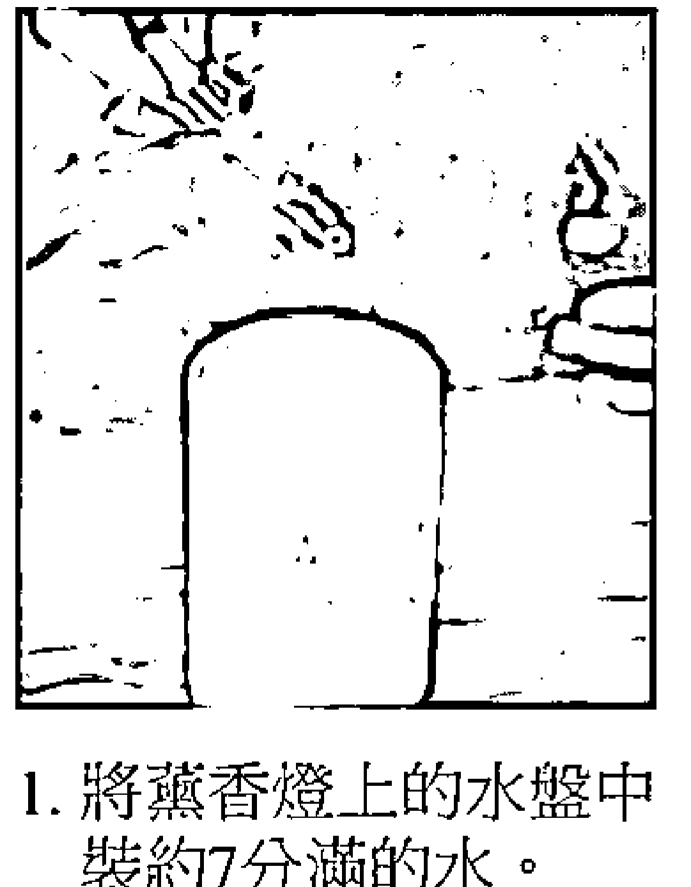

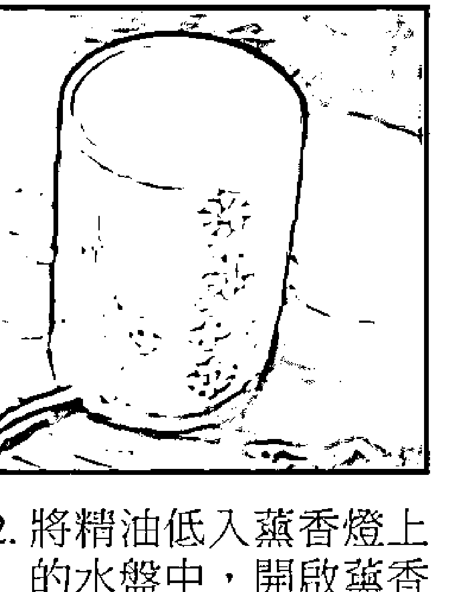

使用方法：
1. 将薰香灯上的水盘中装约7分满的水。
2. 将精油滴入薰香灯上的水盘中，开启薰香灯即可。

##### 调制按摩油

广藿香精油的再生作用很强，帮助新生细胞，对粗糙皮肤、粉刺、皮肤发炎、香港脚、脂漏性皮肤炎以及湿疹都有效。

- 小麦胚芽油……5ml
- 甜杏仁油……15ml
- 广藿香精油……2滴
- 薰衣草精油……5滴
- 乳香精油……3滴


使用方法：
1. 将所有精油和甜杏仁油调和均匀。
2. 取适量涂抹在粗糙的皮肤上，轻轻按摩即可。

##### 喷洒法

将广藿香精油稀释后喷洒于家中各角落，各种蚊虫会因为不喜欢其气味，而全部消失无踪。

- 75%药用酒精……30ml
- 广藿香精油……4滴
- 柠檬精油……5滴
- 柠檬香茅精油……6滴


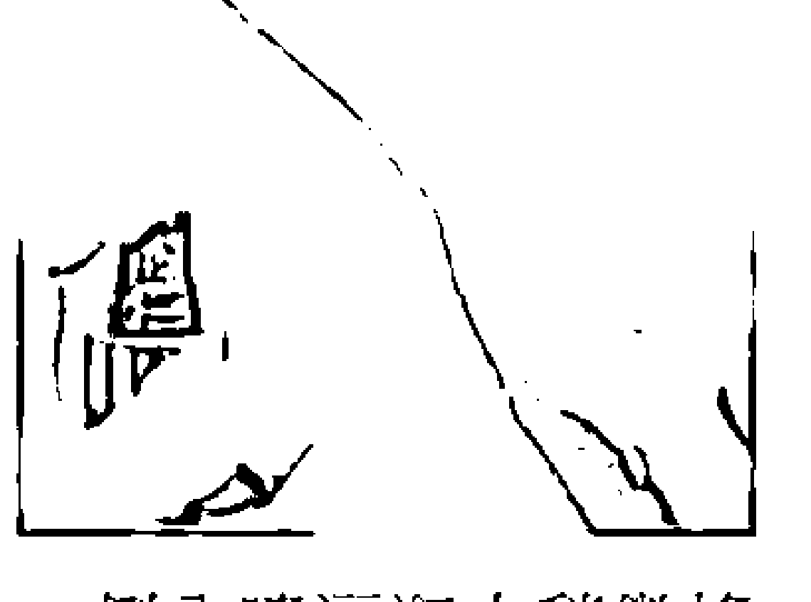

使用方法：
1. 将所有精油调和均匀，加入酒精拌匀。
2. 倒入喷洒瓶中稍微摇晃后，即可喷洒在需要的地方。

##### 足浴法

有香港脚的困扰，且还有脚臭问题？赶紧使用精油泡脚，还能解除足部压力。

- 广藿香精油……1滴
- 茶树精油……2滴
- 全脂牛奶……10ml
- 热水……适量

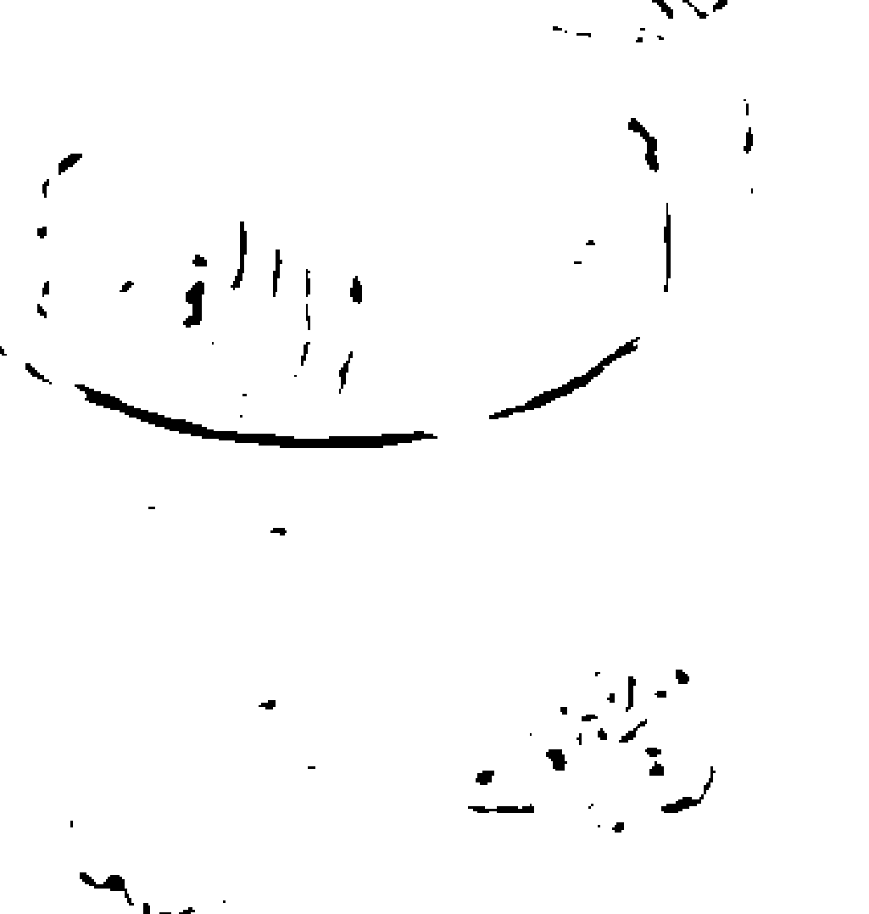

使用方法：
1. 将所有精油滴入牛奶中并调和均匀。
2. 于水温约37～38℃的热水中，加入与牛奶混合后的精油。
3. 将双足放入浸泡即可。

### 唇形科 胡椒薄荷 Peppermint

胡椒薄荷精油是从胡椒薄荷中蒸馏而得，是广受全球欢迎的芳香植物。胡椒薄荷味清爽凉快，振奋心神，能够清咽润喉，对消除口臭具有很好的功效，并有舒缓身心的独特疗效。它是精油入门和初学者必备的10种精油之一。

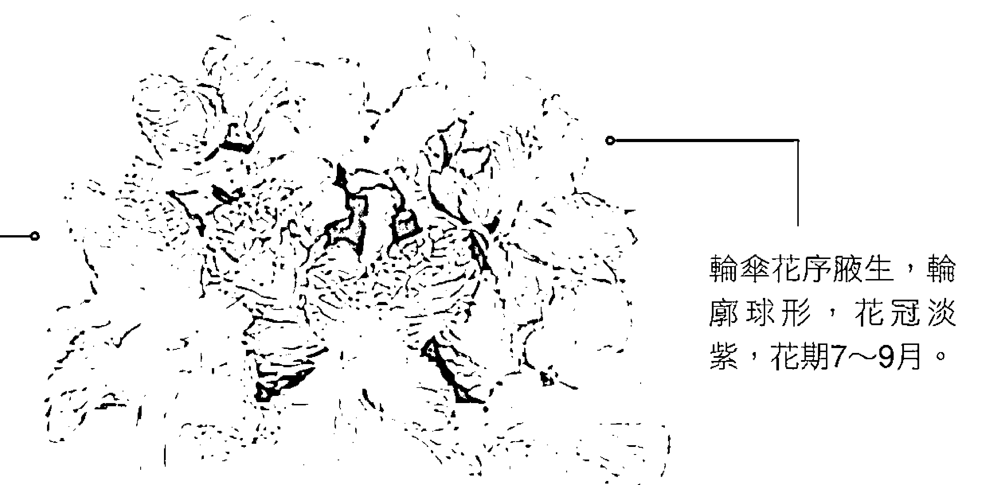

### 🌿 源植物形态特征

胡椒薄荷，多年生草本。茎直立，高30~60公分，下部数节具纤细的须根及水平匍匐根状茎，锐四棱形，具四槽，上部被倒向微柔毛，下部仅沿棱上被微柔毛，多分枝。叶片长圆状披针形，披针形，椭圆形或卵状披针形，稀长圆形，长3~5（7）公分，宽0.8~3公分，前端锐尖，基部楔形至近圆形，边缘在基部以上疏生粗大的牙齿状锯齿，侧脉约5~6对，与中肋在上面微凹陷下面显著，上面绿色；沿脉上密生余部疏生微柔毛，或除脉外余部近于无毛，上面淡绿色，通常沿脉上密生微柔毛；叶柄长2~10公釐，腹凹背凸，被微柔毛。轮伞花序腋生，轮廓球形，花时径约18公釐，具梗或无梗，花冠淡紫，小坚果卵珠形，黄褐色，具小腺窝。花期7~9月，果期10月。

- **别名** 欧薄荷、辣薄荷
- **学名** Mentha piperita
- **英文名** Peppermint
- **科别** 唇形科
- **萃取部位** 整株药草
- **萃取方法** 水蒸馏法

#### 精油档案
| 项目 | 内容 |
| :--- | :--- |
| 【主要产地】 | 法国、美国、中欧、英国。 |
| 【性状特征】 | 黄色液体。 |
| 【化学成分】 | 薄荷脑、薄荷酮、柠檬烯、乙酸薄荷酯、桉油醇。 |
| 【香味特征】 | 清凉有劲的药草味道。 |
| 【挥发特性】 | 高度挥发。 |

#### 适合与胡椒薄荷精油混用的精油

#### 胡椒薄荷精油

| 茶树 | 安息香 | 薰衣草 | 迷迭香 | 甜马郁兰 |
| 尤加利 | 柠檬 | 罗勒 | 丝柏 | 绿花白千层 |

#### 胡椒薄荷精油的主要功效

##### 皮肤

可以调理不洁、阻塞的肌肤，其清凉的感觉能收缩微血管，舒缓发痒、发炎和灼伤，也可柔软肌肤，对于清除黑头粉刺及油性肤质也极具效果。

##### 心理

清凉的属性可安抚愤怒、歇斯底里与恐惧的状态，能使精神提振，给予心灵自由的舒展空间。

##### 居家

平日可以将精油滴在海绵上，化解难闻的气味或鱼腥味，如车上、房间、冰箱等，不仅芳香，还能驱除蚊虫。

##### 医学

- 1. 治疗感冒的功效绝佳，对于干咳、气喘、支气管炎、肺炎、肺结核具有一定的疗效。对消化道的疾病也十分有助益，有消除胀气、纾解胃痛及胃灼热的作用；此外，可减轻疼痛，对偏头痛也有效，还能帮助退烧。
- 2. 收缩微血管，排除体内毒素，改善湿疹、癣，舒缓发痒、发炎和灼伤，柔软皮肤，消除黑头粉刺，有益于油性发质和肤质。

#### 保存

必须储存在深色玻璃瓶中，避免日光直接照射，每次使用后必须立即旋紧瓶盖。未开封可保存3～5年，若已开封，尽量于1年内用完，若已调成按摩油，则于2个月内用完最好。

#### 注意事项

以低剂量使用胡椒薄荷精油是无毒无刺激的。但是因为它含有薄荷醇，要注意它的感光性。它对皮肤和黏膜会产生刺激作用，所以使用的时候要远离眼睛。孕期要避免使用，不要给7岁以下的孩子使用。

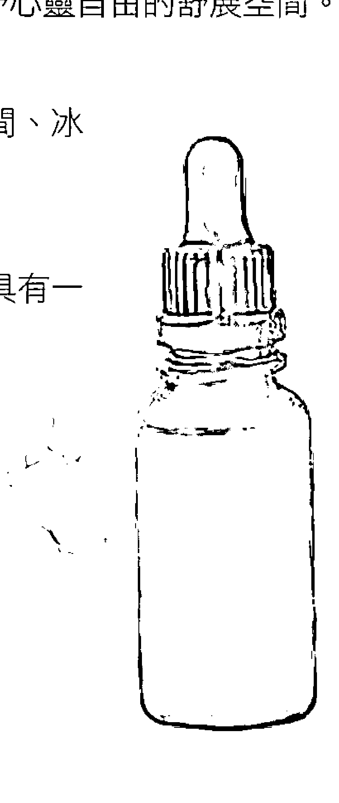

#### 如何使用胡椒薄荷精油

##### 调制按摩油

具有清凉及镇定的效果，能收缩血管，达到缓解瘙痒、减缓过敏发炎的目的。

- 薄荷精油……1滴
- 薰衣草精油……2滴
- 罗马洋甘菊……2滴
- 甜杏仁油……10ml

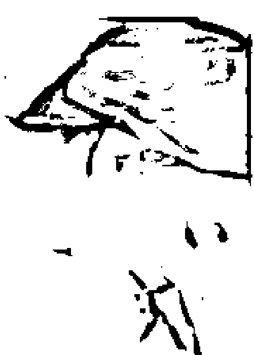

使用方法：
1. 将所有精油和荷荷芭油调和均匀成按摩油。
2. 取适量轻轻按摩不适之处。

##### 薰香灯

醉醺醺、神志不清的感觉，难以清醒吗？让薰香精油的魔力点醒你吧！

- 薄荷精油……3滴
- 柠檬精油……2滴


> Tips：薰香时应选择有机纯精油，时间不宜过长。

使用方法：
1. 在薰香灯上的水盘中加水7分满。
2. 将所有的精油滴入薰香灯上的水盘中，需要的时候薰香。

##### 蒸汽吸入

鼻子堵塞、流鼻水让你无法顺畅呼吸，利用薄荷精油配方的蒸汽吸入，能够缓解不适感。

- 薄荷精油……1滴
- 尤加利精油……2滴
- 葡萄柚精油……2滴


> Tips：使用时建议闭上眼睛。

使用方法：
1. 将精油滴进装满热水的脸盆中。
2. 将脸靠近，吸入蒸气即可。

##### 调制按摩油

运动完后，全身都活了起来，但腿部肌肉却有些酸痛？简单的精油按摩可舒缓腿部疲劳，雕塑美腿。

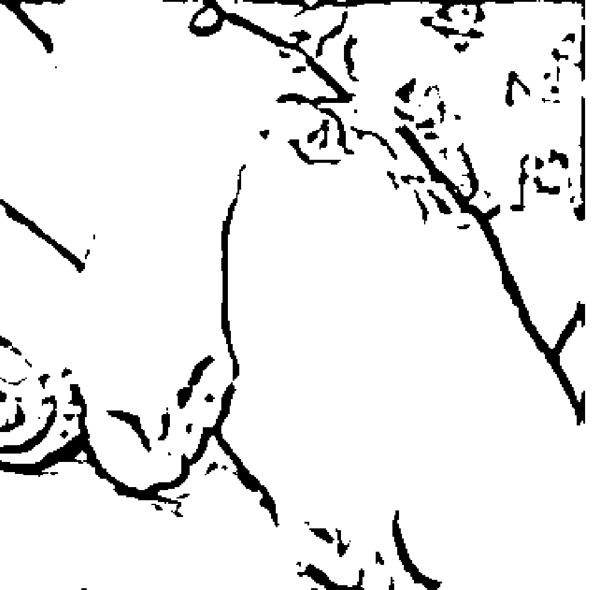

- 薄荷精油……2滴
- 姜精油……1滴
- 迷迭香精油……3滴
- 柠檬香茅……2滴
- 荷荷芭油……20ml

使用方法：
1. 将所有精油与荷荷芭油调和均匀。
2. 取适量油脚踝往小腿按摩。

##### 涂抹法

病毒或细菌的感染、暴饮暴食、精神压力、过敏反应等都可能导致腹泻，长期慢性腹泻会造成营养不良。不用担心，用神奇的精油配方来呵护不适的肚子。

- 苦橙叶精油……2滴
- 薄荷精油……2滴
- 香桃木精油……1滴
- 芝麻油……5ml

使用方法：
1. 将精油与芝麻油混合均匀。
2. 取适量涂抹在臀部、下腹部即可消胀止泻。

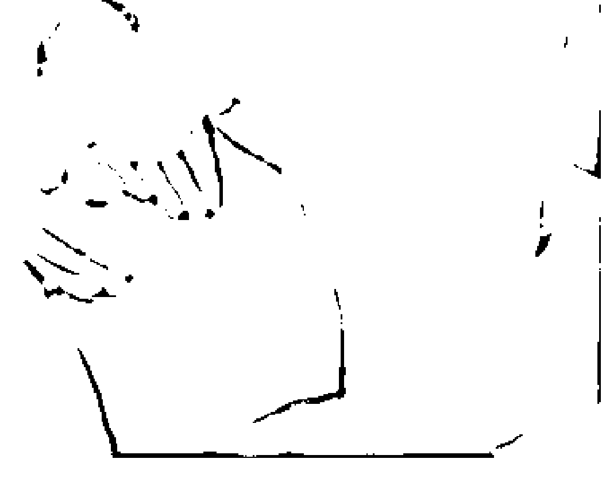

### 樟科 花梨木 Rosewood

花梨木精油是從花梨木植物中提煉而來的，屬於樟科。因為樹種珍貴，有助於振奮精神，可提振免疫力幫助大病初癒的滋補氣，氣味甜美溫潤，療癒身心的木質香氣，使緩和因壓力大、疲勞煩躁的情緒能安定下來，還能舒緩生殖器感染，壯陽催情之功效，對皮膚有抗衰防老的作用，還能促進細胞和組織的再生能力，適合預防皮膚老化。

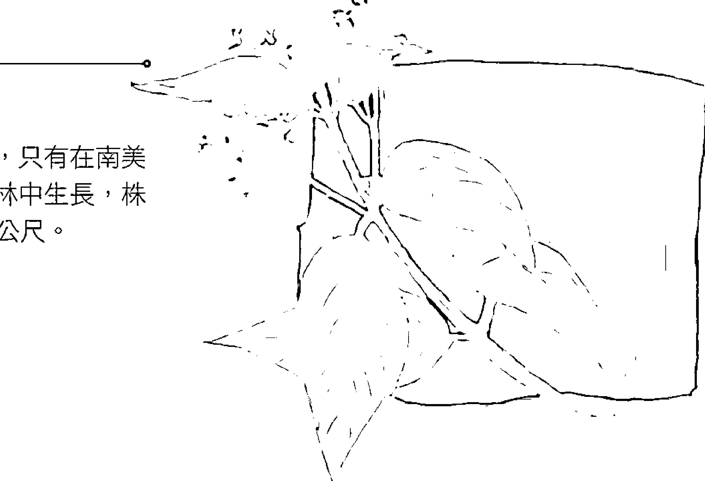

#### 源植物形態特徵

花梨木屬於珍貴樹種，只有在南美的熱帶雨林中生長。常綠樹，可以長到40公尺高，樹皮略帶紅色，花為黃色。在南美洲雨林區遭到嚴重的砍伐，現在已有立法，要求蒸餾廠每砍伐一棵樹，就要新栽植一棵；世界環境愛好者也曾經呼籲不要使用花梨木精油，以免破壞生態平衡。這種木料還被用在建築方面，在法國用於樹櫃、雕刻品；在日本用於生產筷子。當然也用於生產精油。

- 别名: 紫檀、玫瑰木
- 学名: Aniba rosaeodora
- 英文名: Rosewood
- 科别: 樟科
- 萃取部位: 木材
- 萃取方法: 蒸馏法

#### 精油檔案

- **【主要产地】** 巴西、亚马逊河流域。
- **【性状特征】** 为无色至淡黄色或者是黄色带有红棕色的透明液体。
- **【化学成分】** 沉香醇、桉油醇、萜品醇、牻牛儿醇、香茅醛、柠檬烯、蒎烯。
- **【香味特征】** 有辛辣的木质味和花香味。
- **【挥发特性】** 中度挥发。

#### 適合與花梨木精油混用的精油

- 花梨木精油
- 香蜂草
- 岩蘭草
- 佛手柑
- 雪松
- 芫荽
- 薰衣草
- 橙花
- 依蘭
- 乳香
- 天竺葵
- 玫瑰草
- 廣藿香
- 苦橙葉
- 玫瑰
- 迷迭香
- 檀香

#### 保存

選擇深色玻璃瓶，存於木箱中，避免溫度的波動和陽光的照射。未開封的精油可以存放3～5年，已經開封的僅有1年的保存期限，若已調和為按摩油則在2個月內用完效果最好。

#### 注意事項

① 樟科類的精油需注意癲癇、蠶豆症體質不宜使用。
② 高血壓患者不宜大量使用花梨木精油。
③ 高濃度純精油，不宜直接塗抹肌膚。

#### 花梨木精油的主要功效

**皮膚**
活化細胞，使組織再生，改善敏感的肌膚，抗皺防衰效果顯著。它平衡、溫暖的特性備受大眾喜愛。

**心理**
穩定情緒，平衡中樞神經，能幫助情緒低落、極度疲勞和憂慮重重的心理狀態恢復正常，振奮精神。

**居家**
在棉球上滴幾滴花梨木精油，然後把棉球放在衣櫥裡，這樣不僅可以薰香衣服，還可以殺菌、消毒。

**醫學**
① 強化內臟，抗菌止痛，有效緩解頭疼、感冒、咳嗽、發燒和感染，還能提高免疫力。
② 促進細胞再生，消除體臭，適用於黯淡和油性皮膚。
③ 具有催情壯陽的功效，可用來治療陽痿、性冷感；對於受過家暴的人來說有溫暖的撫慰效果。

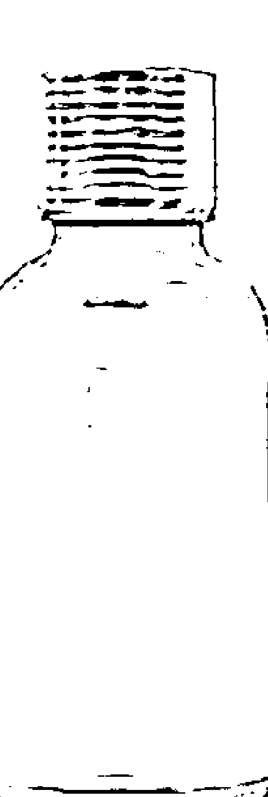

#### 如何使用花梨木精油

##### 香薰炉

利用薰香的方法，可以使花梨木的精油分子散發在空氣中，達到淨化空氣、舒緩及放鬆情緒的效果。

- 花梨木精油……3滴
- 佛手柑精油……3滴

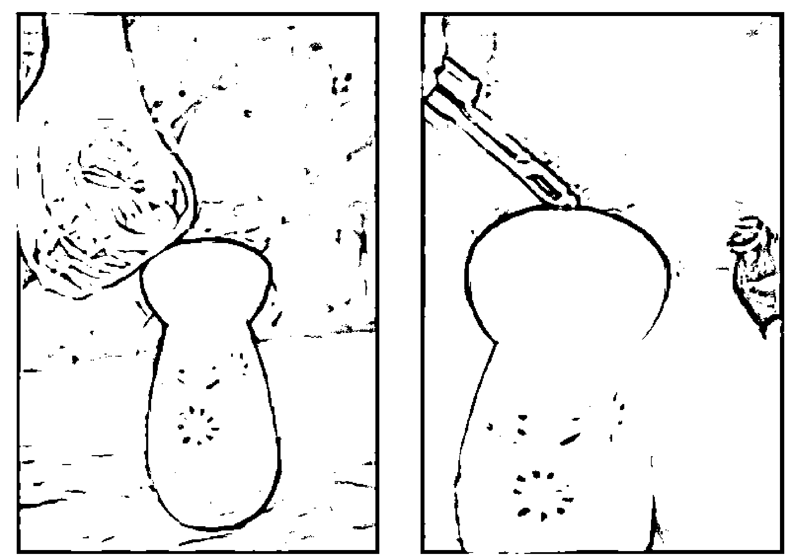

1. 將香薰爐上的水盤裝7分滿的水。
2. 所有精油調和均勻後，點燃蠟燭即可。

##### 調製按摩油

馬花梨木精油用作按摩油成分時，能促進細胞再生，舒緩抗衰老，消炎抗菌，治療各種皮膚疾病。

- 甜杏仁油 ………10ml
- 花梨木精油……2滴
- 廣藿香精油……1滴
- 乳香精油 ………2滴

> 按摩油容易變質，最好是在1個月內將其使用完畢。

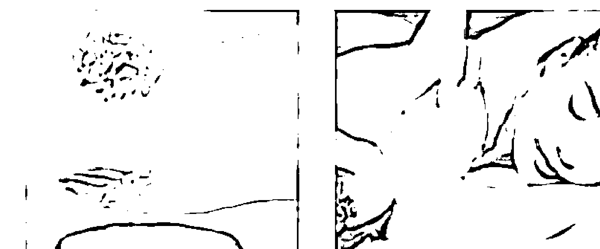

1. 將所有精油調和均勻。
2. 取適量擦在不適的部位，用雙手輕輕按摩直至吸收即可。

##### 調製面霜或潤膚乳

花梨木精油還可以用作皮膚的保養品或者是調和成抗老面霜，還能做成面膜，具有舒緩痘痘肌、抗皺淡化紋路的功效。

- 無香精面霜…… 5g
- 花梨木精油…… 1滴
- 檀香精油 ……… 1滴


> 在使用本品的時候，可用手指輕輕按摩臉部，有利於吸收。

1. 將所有精油與面霜調和均勻後裝入分裝瓶中。
2. 按照一般護膚步驟護膚即可。

### 樟科 月桂 Bay Laurel

月桂精油是從月桂樹中萃取的，屬於樟科月桂屬植物。月桂精油可以用來治療風溼病、神經痛、肌肉痛、感冒、流感、牙齦發炎、皮膚感染、腹瀉等，對於生髮和頭皮保健也很有幫助。

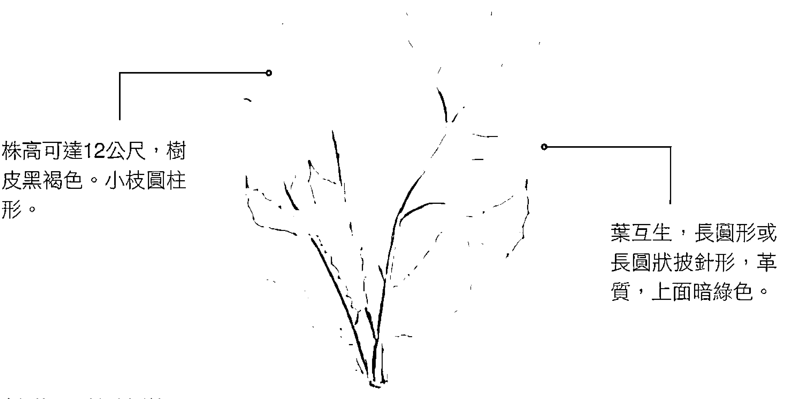

#### 源植物形態特徵

月桂，喜溫暖溼潤氣候，常綠小喬木或灌木狀，高可達12公尺，樹皮黑褐色。小枝圓柱形，具縱向細條紋，幼嫩部分略被微柔毛或近無毛。葉互生，長圓形或長圓狀披針形，先端銳尖或漸尖，基部楔形，邊緣細波狀，革質，上面暗綠色，下面稍淡，兩面無毛，羽狀脈，中脈及側脈兩面凸起，側脈每邊10～12條，末端近葉緣處弧形連結，細脈網結，兩面多少明顯，呈蜂巢狀；葉柄鮮時紫紅色，略被微柔毛或近無毛。花為雌雄異株。繖形花序腋生，1～3個成簇狀或短總狀排列；總苞片近圓形，外面無毛，內面被毛，總梗長達7公釐，略被微柔毛或近無毛。

- 别名：桂冠樹、月桂冠
- 学名：Laurus nobilis
- 英文名：Bay Laurel
- 科别：樟科
- 萃取部位：叶片
- 萃取方法：蒸馏法

- **【主要产地】** 原产地中海一带，主产于墨西哥、西班牙和克罗埃西亚。
- **【性状特征】** 油色深黄，具有中等水黏性。
- **【化学成分】** 桉油醇、松油萜、乙酸萜品酯、倍半萜烯、醚类。
- **【香味特征】** 味道清甜，略带辛味。
- **【挥发特性】** 高度挥发。

#### 适合与月桂精油混用的精油

| 月桂精油 |
| :---: |
| 雪松 柠檬 欧白芷根 天竺葵 薰衣草 绿花百千层 桔 |
| 百里香 橙花 依兰 香蜂草 甜马郁兰 甜橙 薰衣草 |

#### 保存

月桂精油需储存在深色玻璃瓶中，避免日光直射，放置在木箱之中，使用完必须拧紧瓶盖。未开封的精油可保存3~5年，已经开封的精油保存期限只有1年，但若调和为按摩油，在2个月内使用完效果最佳。

#### 注意事项

① 月桂精油高浓度的使用，会引起皮肤和黏膜过敏，要小心使用。
② 孕妇、癫痫者不宜使用。
③ 敏感肌肤者需注意剂量使用。

#### 月桂精油的主要功效

**皮肤**
对粉刺、青春痘肌有很好的舒缓效果，能帮助消炎，愈合伤口；还可用于护发，能够刺激毛发生长、去除头屑。

**心理**
安抚情绪、缓解疲劳，能提高自信力，提升勇气和洞察力。

**医学**
① 月桂精油能调理生殖系统，提振身体机能的退化达到回春功效。
② 改善淋巴阻塞，激励神经系统，使免疫力提升。
③ 具有消炎止痛功效，减轻风湿、关节炎的疼痛，扭伤、拉伤等疼痛症状。

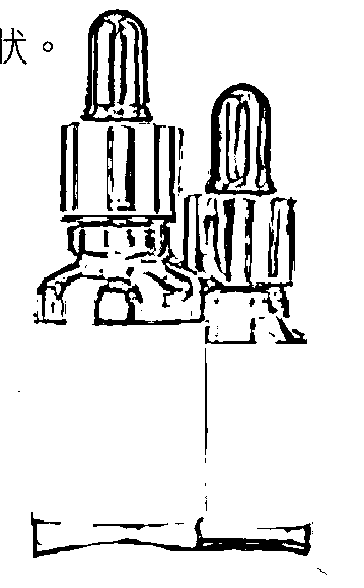

#### 如何使用月桂精油

##### 香薰爐和薰香燈

在薰蒸療法中，月桂精油可以用於治療感染、發燒和一般的疼痛。還能刺激靈感，安撫激動的情緒。

- 月桂精油 ....... 2滴
- 薰衣草精油 .... 3滴
- 橙花精油 ....... 1滴

使用方法：
1. 將香薰爐或薰香燈的水盤中裝7分滿的水。
2. 將精油滴入香薰爐或薰香燈的水盤中，點上蠟燭或開啟薰香燈即可。

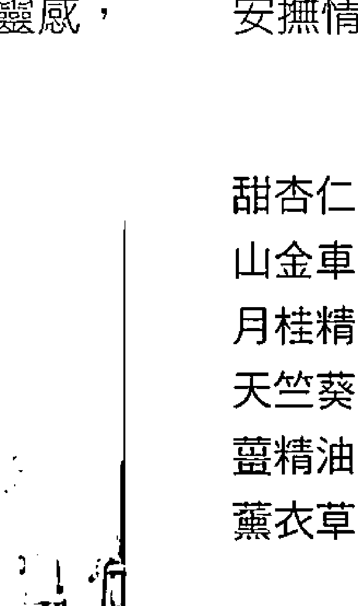

##### 調製按摩油

月桂精油可以用作按摩油的成分，可以安撫情緒、緩解疼痛，促進血液循環。

- 甜杏仁油 ....... 15ml
- 山金車油 ....... 5ml
- 月桂精油 ....... 2滴
- 天竺葵精油 ..... 3滴
- 薑精油 ......... 1滴
- 薰衣草精油 ..... 4滴

使用方法：
1. 將所有精油調和均勻。
2. 取適量按摩不適的部位即可。

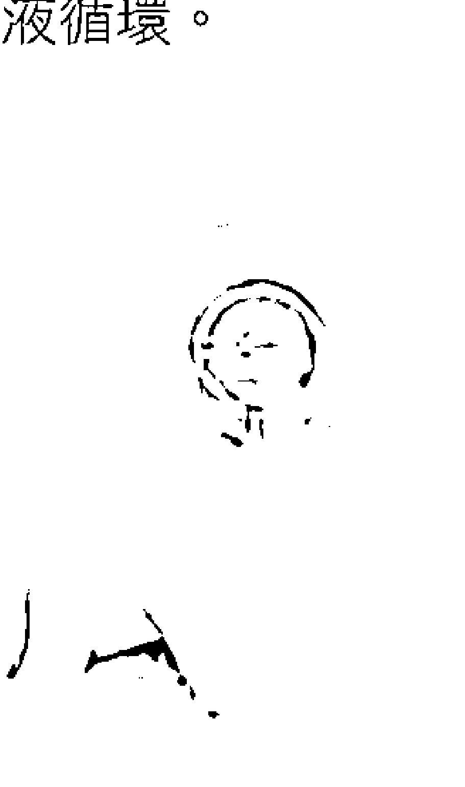

##### 調製護理頭髮的保養品

月桂精油與洗髮、護髮產品一同使用時，能改善頭皮健康狀態，幫助修復髮質。

- 天然無香洗髮精 .. 50ml
- 月桂精油 ......... 3滴
- 迷迭香精油 ....... 3滴
- 薄荷精油 ......... 2滴
- 雪松精油 ......... 2滴

使用方法：
1. 先將所有精油與洗髮精充分調和均勻。
2. 每次使用5ml進行一般洗髮程序。

> Tips：稍加按摩，再以清水沖洗，效果更佳。

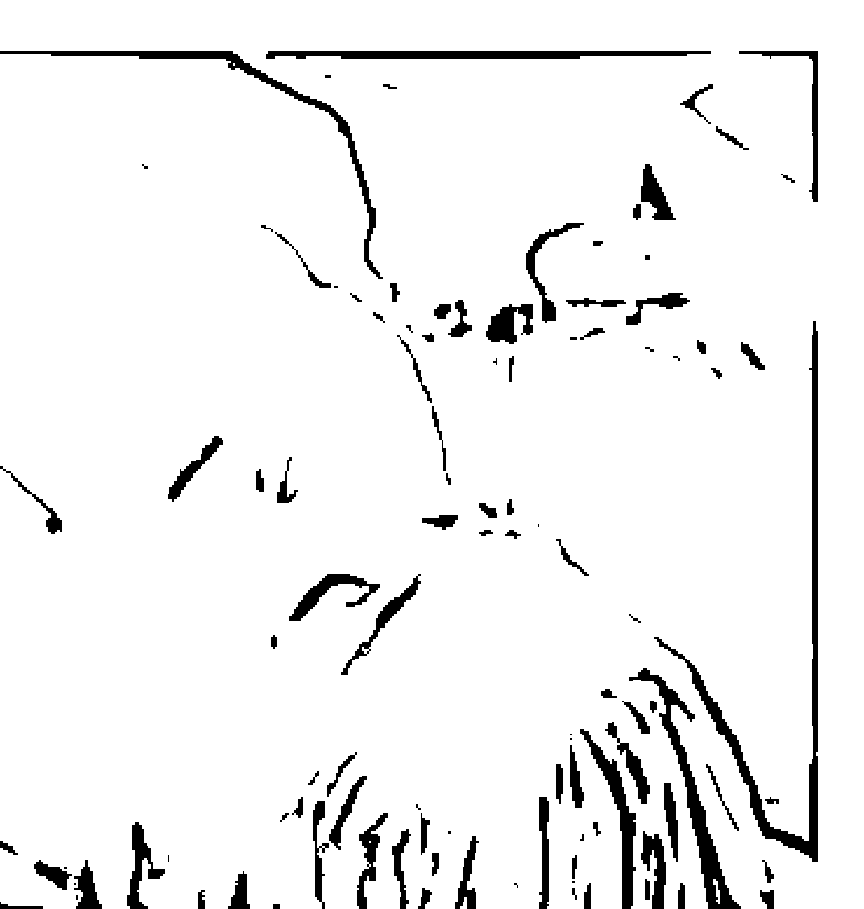

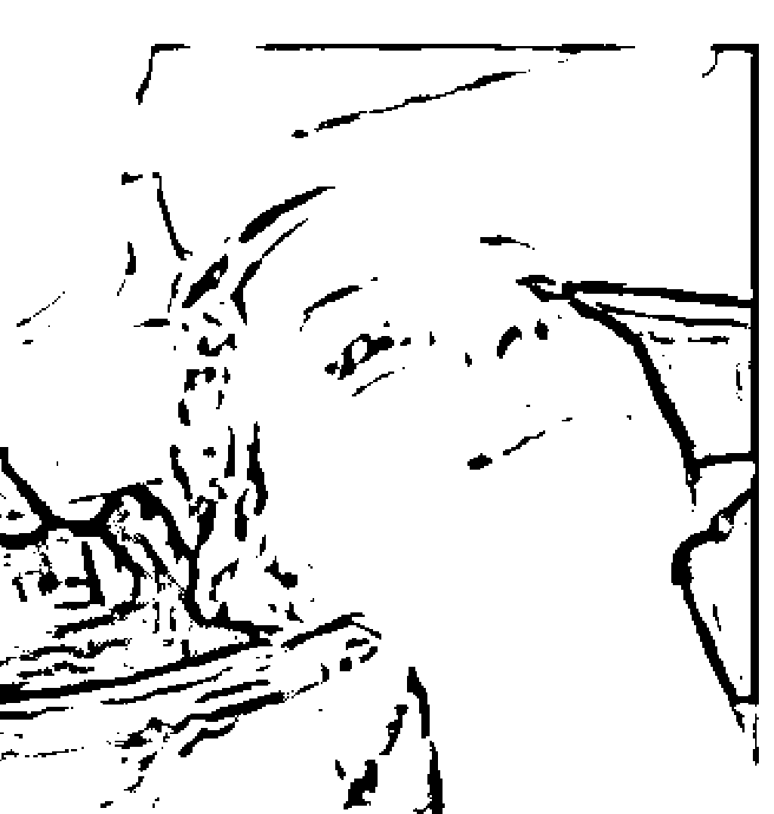

##### 嗅吸法

利用嗅吸法，月桂精油可以提振精神、激勵工作情緒、增強意志。

- 月桂精油 ....... 1滴
- 迷迭香精油 ..... 3滴
- 雪松精油 ....... 2滴

使用方法：
1. 將所有精油調和均勻。
2. 將精油滴入手帕或者衛生紙上，靠近鼻子，輕嗅即可。

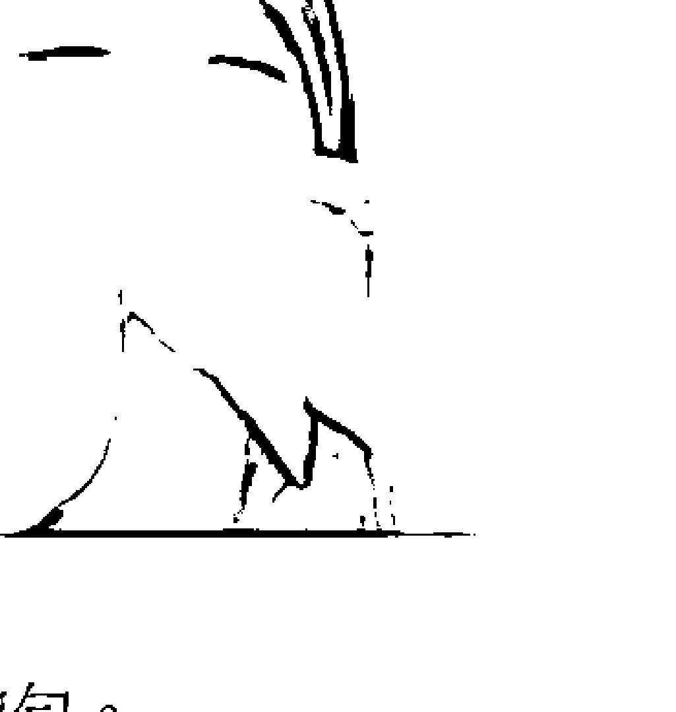

### 樟科 肉桂 Cinnamon

肉桂精油是從肉桂中提煉而來的。肉桂屬於樟科，是一種天然的催情劑，具收斂皮膚，減肥瘦身，改善血液循環，緩解疼痛、疲勞和消化不良、腸胃脹氣等功效。肉桂精油對於經痛、月經不調、肌肉痙攣、風濕病、關節疼痛、改善手腳冰冷等都有療效。

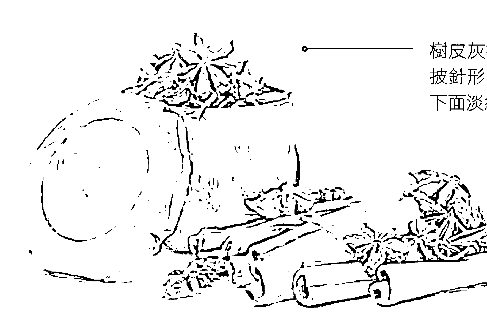

樹皮灰褐色，葉互生或近對生，長橢圓形至披針形，革質，上面綠色，有光澤，無毛，下面淡綠色，晦暗，疏被黃色短絨毛。

花白色，被黃褐色短絨毛，果橢圓形，成熟時黑紫色，無毛，果期為10～12月。

#### 源植物形態特徵

中等大喬木；樹皮灰褐色，老樹皮厚達13公釐。一年生枝條圓柱形，黑褐色，有縱向細條紋，略被短柔毛。當年生枝條黃褐色，具縱向細條紋，密被灰黃色短絨毛。葉互生或近對生，長橢圓形至披針形，先端稍急尖，基部急尖，革質，邊緣軟骨質，內卷，上面綠色，有光澤，無毛，下面淡綠色，晦暗，疏被黃色短絨毛；葉柄粗壯，長1.2～2公分，腹面平坦或下部略具槽，被黃色短絨毛。花白色，被黃褐色短絨毛，花期6～8月。果橢圓形，成熟時黑紫色，無毛，果期為10～12月。

| 项目 | 内容 |
|------|------|
| 别名 | 錫蘭肉桂、真肉桂 |
| 学名 | Cinnamomum zeylanicum |
| 英文名 | Cinnamon |
| 科别 | 樟科 |
| 萃取部位 | 樹皮 |
| 萃取方法 | 蒸餾法 |

| 项目 | 内容 |
|------|------|
| 主要产地 | 盛產於斯里蘭卡、印尼、馬達加斯加、中國。 |
| 性状特征 | 為黃色至紅褐色澄清油狀物。 |
| 化学成分 | 肉桂醛、丁香酚、乙酸肉桂酯。 |
| 香味特征 | 辛香，微甜。 |
| 挥发特性 | 低度揮發。 |

#### 適合與肉桂精油混用的精油

- 安息香
- 豆蔻
- 丁香
- 芫荽
- 迷迭香
- 百里香
- 薑
- 穗甘松
- 依蘭
- 乳香
- 廣藿香
- 葡萄柚
- 薰衣草
- 甜馬鬱蘭

#### 肉桂精油的主要功效

改善膚質，溫和收斂，可以使脂肪變軟，緊實減肥後鬆垮的皮膚。

能夠紓解精疲力竭和虛弱、沮喪的心情，對於安撫情緒有很大的作用。

肉桂精油具有驅蟲殺菌的功效，避免大腸桿菌感染。此外，還能預防頭蝨、蚊蟲叮咬。

1. 抗菌消炎，對感冒及呼吸道感染疾病有治療效果。
2. 促進血液循環，抗衰老，對於治療女性月經不調、經痛、下腹悶脹等很有幫助。
3. 抗痙攣，緩解肌肉疼痛，改善關節疼痛，對胃痙攣、消化不良、腹瀉也有不錯的療效。
4. 肉桂精油是天然催情劑，有良好的催情效果，有助於提振男性機能。

#### 保存

將肉桂精油存放於深色玻璃瓶中，置於18～25℃的常溫下。未開封的純肉桂精油通常可保存3～5年，已開封使用的精油最好在1年內用完，若已經調和為按摩油，則在2個月內用完為佳。

#### 注意事項

1. 肉桂精油含有強烈的紅皮劑，會刺激皮膚，應控制濃度為1%的低劑量使用。
2. 高劑量使用有肝毒性。
3. 5歲以下孩童、嬰幼兒、孕婦不可使用。
4. 肉桂萃取部位為樹皮，醛類為主要成分，若萃取為樹葉則較為刺激。

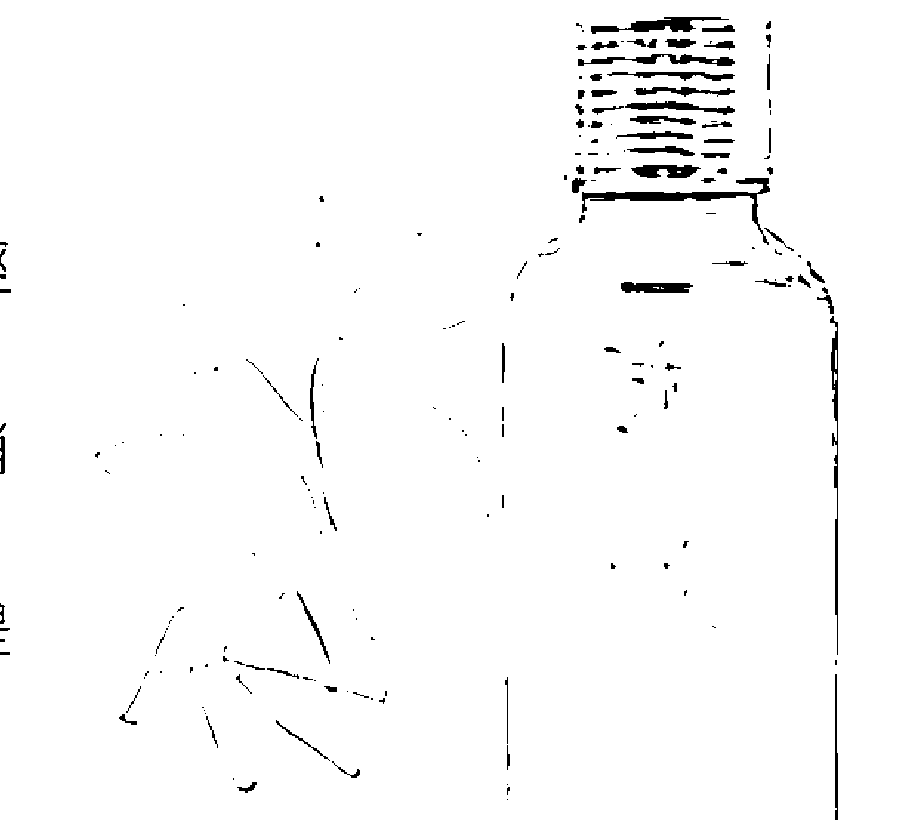

#### 如何使用肉桂精油

##### 香薰炉和熏香灯

在薰香法中，肉桂精油能給人溫暖、興奮的感覺；具有催情的效果，對改善冷感有很好的效果。

- 肉桂精油 …………3滴
- 依蘭精油 …………3滴

> Tips
>
> 選擇質量和品質較佳的精油，薰香功效會更好。

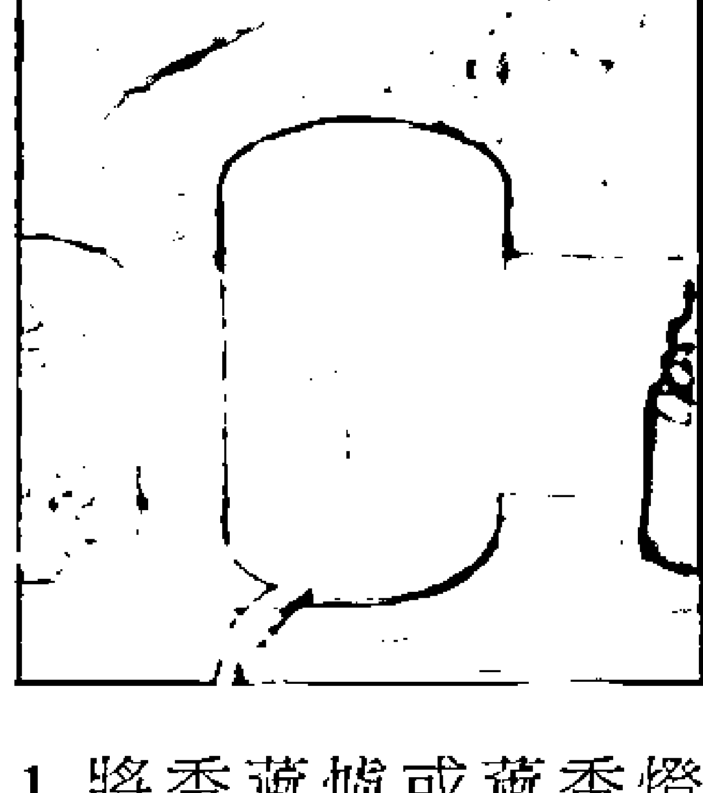

1. 將香薰爐或熏香燈上的水盤裝7分滿的水。

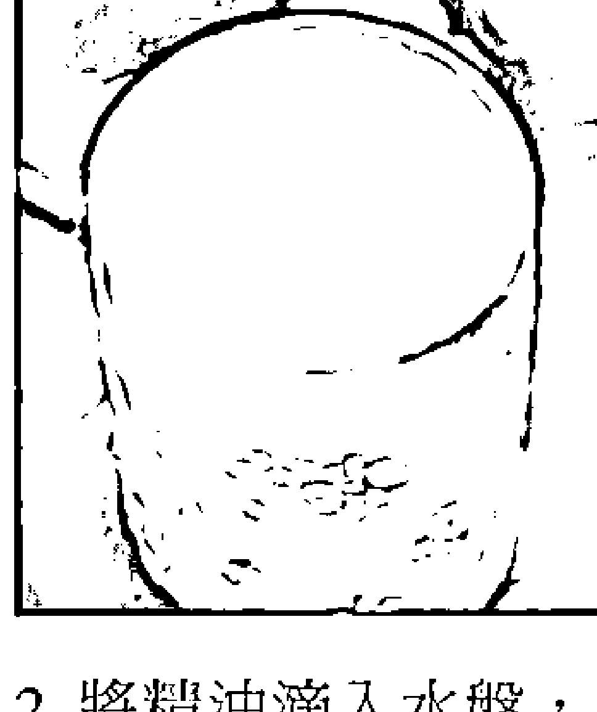

2. 將精油滴入水盤，點燃蠟燭或是開啟熏香燈即可。

##### 调制按摩油

肉桂精油用作按摩油成分時，能夠提升免疫力，消除疲勞，舒緩肌肉痙攣，增加乳酸代謝。

- 橄欖油 ………… 10ml
- 肉桂精油 …………1滴
- 迷迭香精油………3滴
- 薰衣草精油………2滴

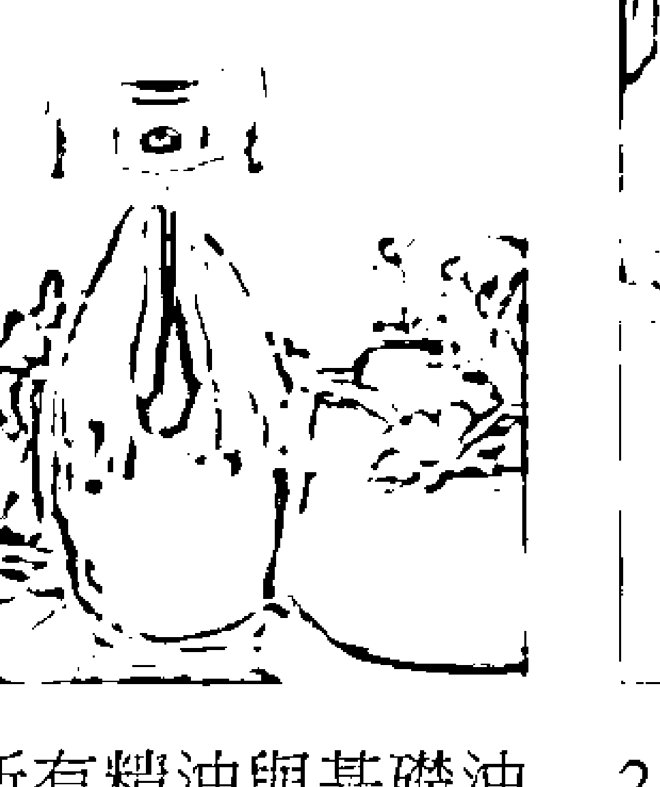

1. 將所有精油與基礎油調和均勻。

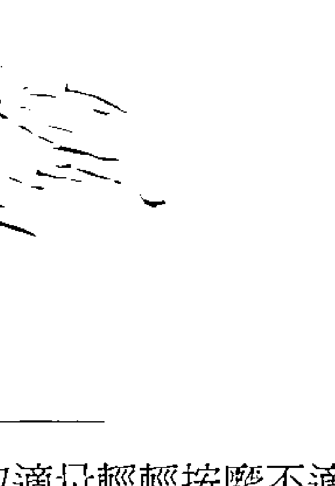

2. 取適量輕輕按摩不適部位至精油被吸收。

##### 调制减肥燃脂霜

肉桂精油可調配於乳液中塗抹於腹部、大腿，還可改善便秘、腹瀉、消化不良等症狀。

用於面霜或潤膚乳時，可以改善皮膚，治療痤瘡、濕疹等皮膚病。

- 無香乳液 ………… 30g
- 肉桂精油 ………… 3滴
- 黑胡椒精油………2滴
- 葡萄柚精油………5滴

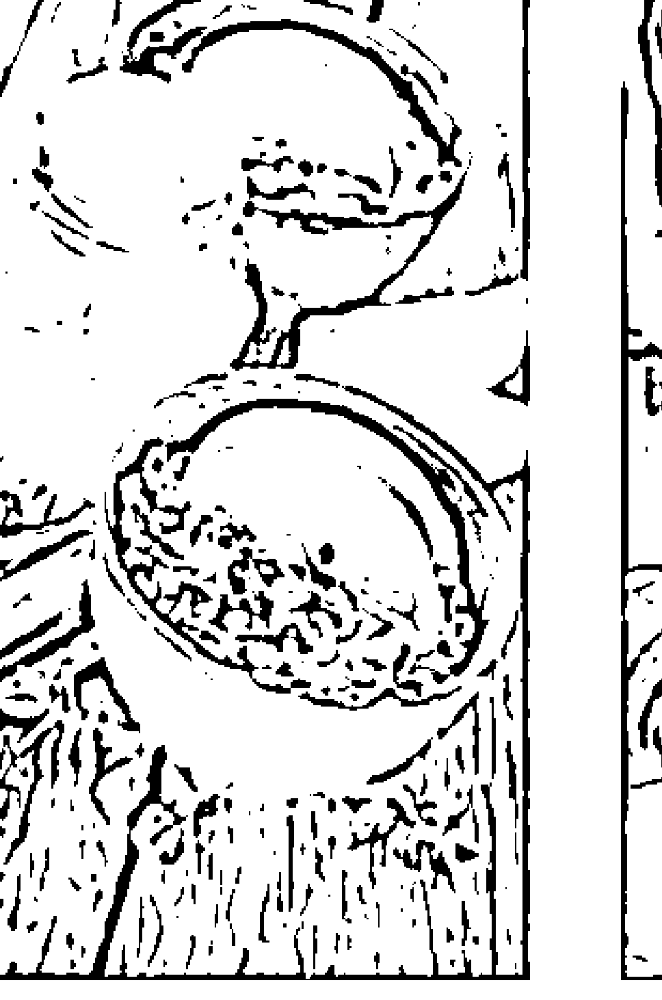

1. 將所有精油調和均勻後，倒入無香乳液拌勻。

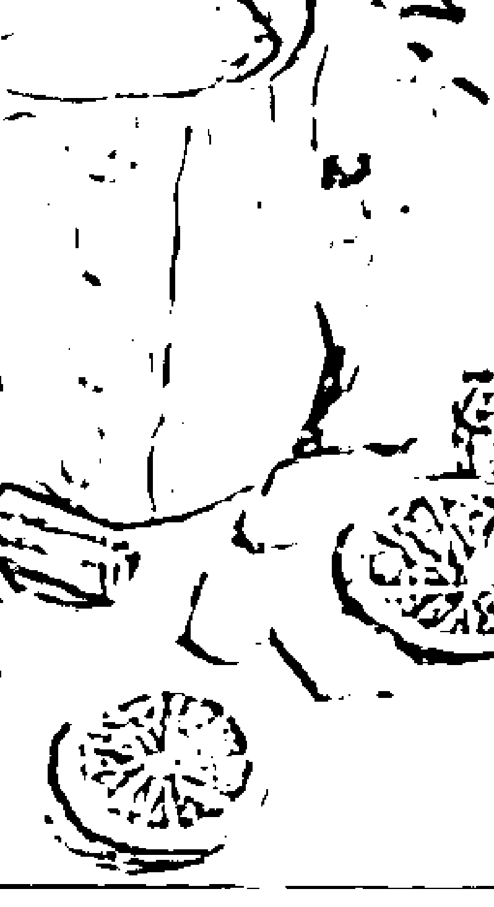

2. 取適量塗抹在身體脂肪堆積處即可。

### 柏科 絲柏 Cypress

絲柏精油是從絲柏樹中提煉而來的，屬於柏科。絲柏精油擁有陽剛般的氣味，常被用作男性古龍水或刮鬍水。它能收縮血管和改善失禁，調節人體荷爾蒙的分泌，特別是對生殖系統很有幫助，能減輕女性內分泌失調、調節卵巢功能。還能抗痙攣，改善流行性感冒引起的咳嗽、支氣管炎、氣喘。排除多餘水分，調理水腫和靜脈曲張，舒緩神經緊繃效果良好。

絲柏有非常高的經濟價值，它高大堅實，是圓錐形的樹木，可以當建材、棺木以及雕刻之用。

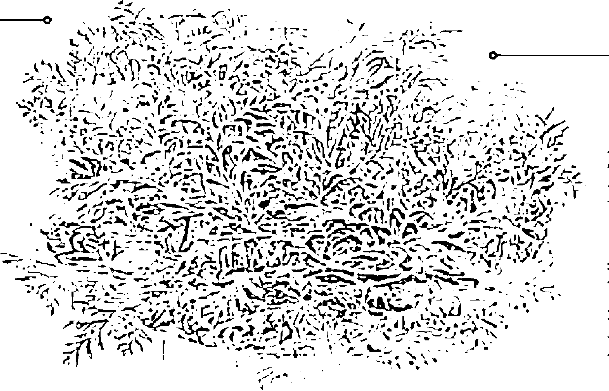

鱗片般的小葉壓在樹幹與小枝上，雌雄花同株，雌花結出內含翅果的棕灰色圓形球果，呈棕灰色，是萃取精油的主要來源。

#### 源植物形態特徵

絲柏，植物圓柱狀的常綠針葉樹，種類約有二十多種，樹形高大，可達25～45公尺。如鱗片般的小葉壓在樹幹與小枝上，雌雄花同株，雌花結出內含翅果的棕灰色圓形球果。原產地是歐洲地中海沿岸，然而，在今日的歐洲溫帶與北美的許多地區也有種植。絲柏樹與樹之間種植得很靠近，因此在法國南部，整片的絲柏樹林常用來作為阻擋西北風的防風林；除此之外，也常見於許多希臘與義大利的花園植物中。

- 别名：西洋檜、柏樹
- 学名：Cupressus sempervirens
- 英文名：Cypress
- 科别：柏科
- 萃取部位：葉子和果實
- 萃取方法：蒸餾法

#### 精油檔案

| 項目 | 內容 |
|---|---|
| 【主要產地】 | 主要產於法國、摩洛哥、德國。 |
| 【性狀特徵】 | 無色或呈極淡的黃色液狀物。 |
| 【化學成分】 | 派烯、松油烯、樟烯、香檜醇、傘花烴。 |
| 【香味特徵】 | 有木質香味和香脂般迷人的琥珀味。 |
| 【揮發特性】 | 中度揮發。 |

#### 適合與絲柏精油混用的精油

- **絲柏精油** 可與以下精油混用：
  - 安息香
  - 佛手柑
  - 快樂鼠尾草
  - 杜松漿果
  - 薰衣草
  - 檸檬
  - 菩提花
  - 甜橙
  - 松針
  - 迷迭香
  - 檀香

#### 保存

放入不透明的玻璃容器，然後放在陰涼通風的地方保存。每次使用完必須將精油的瓶蓋蓋緊。未開封的純精油可以保存3~5年，已經開封的精油最好於1年之內用完，若調和為按摩油，2個月內用完效果最佳。

#### 注意事項

① 如果精油濃度過高，極易對腎造成損傷。
② 孕婦不可使用。
③ 婦科腫瘤與乳房纖維囊腫者要避免使用。

#### 絲柏精油的主要功效

**皮膚**
絲柏精油可以保持體液平衡，舒緩皮膚，調節油脂分泌，收斂、保溼，非常適合油性肌、老化缺水和毛孔粗大的皮膚。此外，它還能促進傷口結疤，有利於傷口癒合。

**心理**
絲柏精油的草木清香之氣可以讓人感到放鬆，紓解緊繃的心情和思緒，淨化心靈，讓人清醒而振奮。

**居家**
絲柏精油非常適合在客廳中薰香或噴灑，能夠營造一種生機盎然、自由放鬆的氛圍，可以增添家人之間的親近和和樂。

**醫學**
① 改善循環、調節荷爾蒙分泌，對生殖系統也很有幫助，特別是對於女性內分泌失調和卵巢功能失常，能很好地緩解經痛、調節荷爾蒙分泌的不平衡。
② 絲柏精油是很好的收斂產品，可以消除水腫，減輕出血、多汗症狀及蜂窩性組織炎等。由於絲柏精油的收縮血管作用，還能用來改善痔瘡和靜脈曲張。
③ 有效舒緩痙攣、肌肉痠痛和風濕性病痛等。

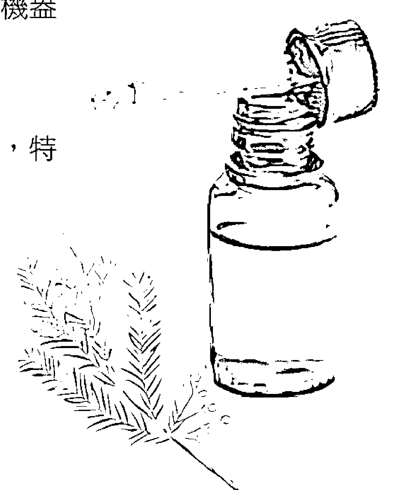

#### 如何使用絲柏精油

##### 香薰爐和薰香燈

在薰香法中，絲柏精油可以舒緩鬱悶情緒，減輕憤怒，清新空氣；還可以強化呼吸系統，增強體力，使精力充沛。

- 絲柏精油 ....... 3滴
- 佛手柑精油..... 3滴
- 檀香精油 ....... 1滴

1. 將香薰爐或薰香燈的水盤中裝7分滿的水。
2. 將精油滴入香薰爐或薰香燈的水盤中，點上蠟燭或開啟薰香燈即可。

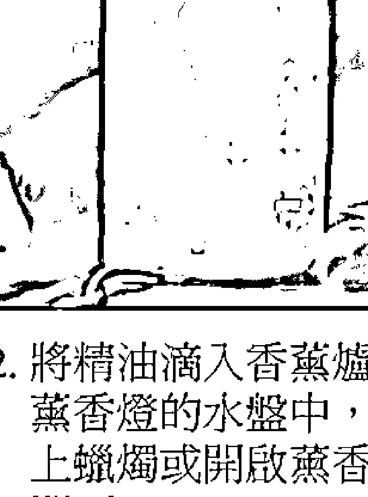

##### 調製按摩油

絲柏精油具有收斂毛孔、改善紅血絲、緊緻肌膚、改善橘皮組織的作用。用絲柏精油按摩身體能夠保養卵巢、調節經期、減肥瘦身。

- 甜杏仁油 ....... 10ml
- 絲柏精油 ....... 2滴
- 葡萄柚精油..... 3滴
- 杜松精油 ....... 1滴

1. 將所有精油調和均勻。
2. 取適量做局部按摩或全身按摩即可。

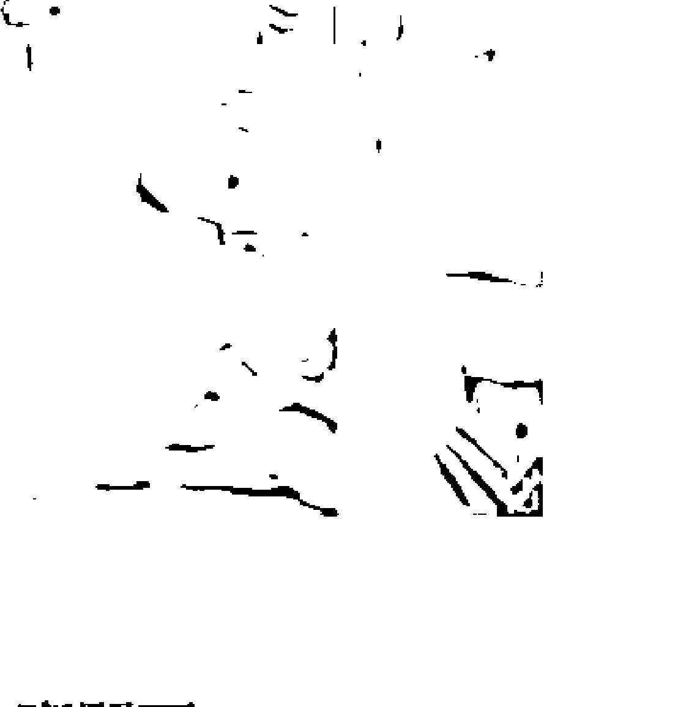

##### 調製面霜或潤膚乳

用於面霜或潤膚乳時，可以提升臉部輪廓，消除頸部和下顎部的贅肉；還能淡化黑眼圈，收斂毛孔，保持肌膚彈性。

- 荷荷芭油 ....... 5ml
- 絲柏精油 ....... 1滴
- 快樂鼠尾草精油.. 1滴

1. 將所有精油調和均勻。
2. 取適量塗抹在臉上即可。


##### 蒸汽吸入

在感到氣喘、呼吸不順暢時，可以適當吸入絲柏精油，有助於舒緩不適症狀。

- 絲柏精油 ..... 3滴
- 尤加利精油... 2滴
- 雪松精油 ..... 1滴
- 熱水 ......... 1大碗

1. 將所有精油調和均勻，滴入熱水中，即可進行嗅吸。
2. 也可將精油混合後滴在手帕或面紙上，然後靠近鼻子深吸氣。

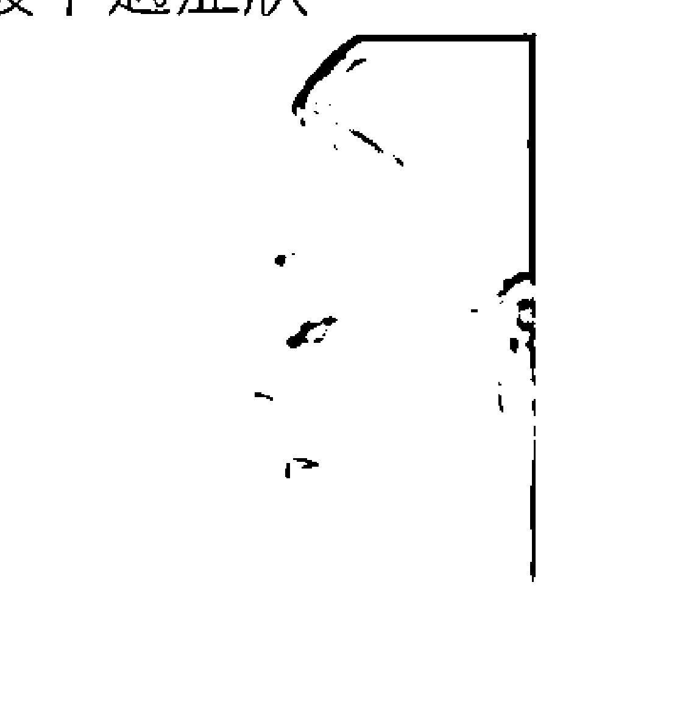

> Tips: 注意一次不可嗅吸過多，否則會加重氣喘現象。

### 柏科 杜松浆果 Juniper Berry

杜松浆果精油是从杜松果实中萃取而来的，属于柏科。杜松浆果精油具有利尿、通经、助产、抗菌、催汗、净化等功效，非常适合减肥的人使用，能够帮助排出体内堆积的脂肪，还可辅助治疗粉刺及皮肤炎症，但是肾脏功能不好的人和孕妇慎用。

株高为2～10公尺，树干呈红色。叶子针状，每三片叶子以螺旋形紧密排列。

开小黄花，结的球果在成熟后会由绿转为黑色或深蓝色，这是萃取精油的主要部位。

#### 源植物形态特征

杜松浆果，常绿灌木，高度为2～10公尺。树干呈红色，叶子针状，每三片叶子以螺旋形紧密排列，会开小黄花，结的球果在成熟后会由绿转为黑色或深蓝色，这是萃取精油的主要部位。虽然树干或枝叶也可以萃取出精油，但是成分不佳、价值较低，在芳香疗法中最好使用杜松浆果精油，而非杜松精油。

#### 精油档案

- 别名：刺柏、杜松子
- 学名：Juniperus commmunis
- 英文名：Juniper
- 科别：柏科
- 萃取部位：果实
- 萃取方法：蒸馏法
- 主要产地：克罗埃西亚、义大利、匈牙利、法国、南斯拉夫、加拿大。
- 性状特征：为无色或淡黄或淡绿的澄明油状物。
- 化学成分：蒎烯、柠檬烯、松油萜、樟烯。
- 香味特征：气味清新，略带辛辣的木头香味。
- 挥发特性：中度挥发。

#### 适合与杜松浆果精油混用的精油

- 葡萄柚
- 佛手柑
- 安息香
- 雪松
- 丝柏
- 乳香
- 天竺葵
- 柠檬
- 柠檬香茅
- 甜橙
- 迷迭香
- 花梨木
- 檀香
- 莱姆
- 香蜂草

#### 保存

杜松浆果精油容易变质，必须储存在深色或茶色玻璃瓶中，并保持在恒温下，避免紫外线的照射。每次使用完后，应立即拧紧瓶盖。未开封的纯精油可以保存3～5年，已经开封的最好于1年内用完，若已经调和为按摩油，2个月内用完效果最佳。

#### 注意事项

1. 皮肤敏感者必须注意浓度剂量稀释使用。
2. 高剂量会导致肾脏过度负荷，洗肾病患不可使用。
3. 孕妇及婴幼儿不可使用。

#### 杜松浆果精油的主要功效

##### 皮肤

深层清洁肌肤，改善油脂分泌，可对付毛孔阻塞，治疗青春痘、橘皮组织；还能收敛皮肤，抗菌消炎，适用于治疗痤疮、湿疹、皮肤炎和干癣。

##### 心理

刺激疲劳的神经，舒缓压力，净化心灵。

##### 居家

杜松浆果精油是很好的家用抗感染剂，与酒精、水调和均匀后，可用于擦拭家具或者地板，还可用作喷雾和扩香器；在传染病肆虐时，还可以用来杀菌防腐。

##### 医学

1. 强化内脏，帮助肝脏排毒，保持肝功能正常运转。
2. 治疗关节炎效果声誉卓著，能缓解痛风和风湿痛。
3. 是一种很好的利尿剂，还能促进血液循环，有镇定痉挛、帮助减肥、消除蜂窝性组织炎的作用。

#### 如何使用杜松浆果精油

##### 香薰炉和薰香灯

在薰香法中，杜松浆果精油能改善鼻子过敏和咳嗽，净化空气，使呼吸更加顺畅，能够帮助减压，驱除负面能量。

- 杜松浆果精油 3滴
- 尤加利精油 2滴
- 乳香精油 2滴

1. 将香薰炉或薰香灯上方水盘中装7分满的水。
2. 将精油滴入香薰炉或薰香灯上方水盘中，点上蜡烛或开启薰香灯即可。

##### 调制面霜或润肤乳

用于面霜或润肤乳时，杜松浆果精油能平衡油脂，可对付毛孔阻塞、青春痘、粉刺、痤疮等问题，有深层净化皮肤的作用。

- 无香乳液 30g
- 杜松浆果精油 4滴
- 迷迭香精油 3滴
- 罗马洋甘菊精油 2滴

**Tips**
自制精油护肤品时，一定要注意使用期限，以免变质。

1. 将所有精油混合与乳液调和均匀。
2. 取适量均匀地涂抹在脸上即可。

##### 调制按摩油

杜松精油可以用作按摩油的成分，沐浴后按摩不适部位，可以改善皮肤水肿，减轻关节炎、风湿病的疼痛和运动受伤的疼痛。

- 甜杏仁油 20ml
- 杜松浆果精油 2滴
- 雪松精油 2滴
- 丝柏精油 3滴
- 柠檬精油 3滴

1. 将所有精油和甜杏仁油调和均匀。
2. 取适量在患处按摩即可。

##### 沐浴法

杜松浆果精油还可以在沐浴时使用，能够缓解疲劳，安抚情绪。同时还是一种利尿剂，可帮助排尿、削减蜂窝性组织。

**Tips**
泡澡时间为15～30分钟，不可过久。

- 杜松浆果精油 2滴
- 天竺葵精油 3滴
- 全脂牛奶 10ml

1. 将所有精油滴入牛奶中调和均匀，滴入装有热水的浴缸中。
2. 按一般程序泡澡即可。

### 牻牛儿科 天竺葵 Geranium

天竺葵精油是以天竺葵花朵为原材料萃取出来的一种精油，属于牻牛儿科。因味道略似玫瑰，天竺葵精油也常常被称为穷人的玫瑰，女性必备精油之一。天竺葵精油容易与其他精油协同调配，能止痛、抗菌、通经、利尿、消水肿，促进皮肤细胞新生、平衡皮肤油脂，修复疤，还能驱虫。常见品种为波旁天竺葵，另有气味较甜美的玫瑰天竺葵。

#### 源植物形态特征

天竺葵幼株为肉质草本，老株半木质化。多年生草本木，高约30～60公分，茎直立，基部木质化，上部肉质，多分枝或不分枝，有明显的节，密被短柔毛，具浓烈鱼腥味。叶互生，圆形或肾形，被柔毛和腺毛；叶柄长3～10公分，被细柔毛和腺毛。伞状花序腋生，花瓣红色、橙红、粉红或者是白色；总花梗长于叶，被短柔毛。花梗3～4公分，芽期下垂，花期直立。蒴果长约3公分，被柔毛。花期5～7月，果期6～9月。主要产地为西南印度洋靠近马达加斯加岛的留尼旺岛，法国、摩洛哥生产的品质不错，西班牙也有生产，精油为黄绿色。

- 别名：洋绣球、红石腊、洋葵、驱蚊草
- 学名：Pelargonium graveolens
- 英文名：Geranium, bourbon
- 科别：牻牛儿科
- 萃取部位：叶片
- 萃取方法：蒸馏法

#### 精油档案

| 项目 | 内容 |
|---|---|
| 主要产地 | 法国、西班牙、埃及、北非、中国。 |
| 性状特征 | 无色或淡绿色的澄明油状物。 |
| 化学成分 | 柠檬烯、薄荷酮、乙酸牻牛儿酯、香茅醇、沉香醇。 |
| 香味特征 | 气质迷人，如同玫瑰一般的甜美香气。 |
| 挥发特性 | 中度挥发。 |

#### 适合与天竺葵精油混用的精油

- 罗勒
- 佛手柑
- 雪松
- 快乐鼠尾草
- 薰衣草
- 橙花
- 葡萄柚
- 茉莉
- 苦橙叶
- 玫瑰
- 迷迭香
- 依兰
- 檀香
- 杜松

#### 保存

应置于深色玻璃瓶中，可以放在木盒中，既可以避免阳光直射，又可以保持常温。未开封的纯精油通常可保存3～5年，已开封的精油最好于1年内用完，若已调和为按摩油，最好在2个月内用完比较好。

#### 注意事项

1. 天竺葵精油具有调节荷尔蒙的效果，孕妇初期应该忌用，以免造成流产。
2. 纯精油效果强烈，使用时剂量要控制在1%～2%左右。
3. 天竺葵精油对于某些敏感肤质会有刺激性，应谨慎使用。

#### 天竺葵精油的主要功效

##### 皮肤

适合各种肤质，能平衡油脂分泌，对松垮、毛孔阻塞等也很有效果。能帮助清洁皮肤，让皮肤变得饱满、红润。天竺葵油还能治疗湿疹、烫伤、带状疱疹及冻疮。

##### 心理

天竺葵精油可以安抚焦虑、忧郁、沮丧等情绪，并透过调节内分泌，让心理上的压力得以纾解，恢复平衡。

##### 居家

天竺葵薰香可以创造温馨、充满爱意的氛围，非常适合各种纪念日，也可以调配成喷雾居家喷洒驱除虫害。

##### 医学

1. 抗菌消炎，增强防御功能，具有止痛、补血等作用。
2. 改善经前症候群、更年期问题，如沮丧、忧郁、阴道干涩、经血过多等。
3. 促进血液循环，能帮助肝、肾排毒，具有利尿性。

#### 如何使用天竺葵精油

##### 香薰炉和薰香灯

在薰香法中，天竺葵能够提振精神，纾解压力，让焦虑、慌乱的情绪安定下来，有安抚神经痛的功效。

- 天竺葵精油 3滴
- 葡萄柚精油 3滴
- 依兰精油 2滴

**Tips**
可在睡前使用，帮助睡眠。

1. 在薰香炉或薰香灯上方水盘中加入7分满的水。
2. 将精油滴入水盘中，点上蜡烛或开启薰香灯即可。

##### 调制面霜或润肤乳

用于面霜或润肤乳时，可以平衡油脂分泌，改善毛孔阻塞及松弛状况，深层清洁肌肤，让皮肤紧致亮丽。

- 无香乳液 30g
- 天竺葵精油 4滴
- 玫瑰精油 2滴
- 花梨木精油 3滴

**Tips**
请于1个月内使用完毕。

1. 将所有精油调和均匀后，然后再加入乳液调匀。
2. 调制好的精油护肤品要装入分装瓶中妥善保存。

##### 调制按摩油

天竺葵精油可以用作按摩油的成分，能够调节荷尔蒙分泌，改善乳房胀痛、经前症候群和更年期问题。还能刺激淋巴系统，加快身体排毒，强化循环系统，安抚受伤的神经，治疗喉部及唇部感染。

- 杏桃仁油 20ml
- 天竺葵精油 5滴
- 橙花精油 2滴
- 薰衣草精油 3滴

##### 沐浴法

腿部疲劳肿胀时，可以用天竺葵精油来做足浴，能够舒缓下半身浮肿状态。

- 天竺葵精油 3滴
- 柠檬精油 2滴
- 雪松精油 1滴
- 全脂牛奶 10ml

**Tips:**
沐浴时间不宜过长，以20～30分钟为宜。

##### 洗发、护发

天竺葵精油也非常适合用来护发，不仅可以使秀发散发淡淡的香气，还能保养脆弱的发丝，增加女性魅力。

- 天然无香洗发精 15ml
- 天竺葵精油 4滴
- 苦橙叶精油 2滴
- 雪松精油 1滴

**Tips:**
常温下保存，最好是1周之内用完，以免变质。

### 安息香科 安息香 Benzoin

安息香精油是从安息香树脂中萃取出来的，属安息香科。安息香精油呈深棕红色，气味芬芳浓烈，能缓解压力、消除紧张，对于冻疮、皮肤溃疡、龟裂、干燥的皮肤有很好的滋润恢复作用。安息香能润肺，保持呼吸畅通，还能治疗泌尿道感染，心灵层面疗愈深广。

#### 源植物形态特征

安息香，落叶乔木，树干挺直，高约10～20公尺，树皮绿棕色，植株各部被星状毛。单叶互生，长卵形，边缘无规则齿状，稍有光泽，下面密被白色短星状毛。花中等大，两性，辐射对称，排列成聚伞状、总状或圆锥花序式；花萼4～5齿，多少与子房贴生；花冠4～5裂，下部合生；种子1至多数，无翅或有翅。果实扁球形，长约2公分，灰棕色。种子坚果状，红棕色，具浅色纵纹。主要产于印度尼西亚、越南等地。树脂干燥后呈红棕色半透明状，可制成香料，称安息香。

- 别名：树脂安息香、安息香胶、爪哇乳香
- 学名：Styrax benzoin
- 英文名：Benzoin
- 科别：安息香科
- 萃取部位：树脂
- 萃取方法：溶剂萃取法

#### 精油档案

| 项目 | 内容 |
|---|---|
| 主要产地 | 越南、爪哇、苏门答腊、泰国。 |
| 性状特征 | 天然状态下为固体树脂状，为红棕色球形颗粒，大小不等。 |
| 化学成分 | 香草醛、肉桂酸、安息香酸、苯甲酸酯。 |
| 香味特征 | 具有安息树脂所特有的香甜气味，类似香草的味道。 |
| 挥发特性 | 低度挥发。 |

#### 适合与安息香精油混用的精油

- 安息香精油
- 檀香
- 佛手柑
- 雪松
- 乳香
- 薰衣草
- 柠檬
- 豆蔻
- 杜松浆果
- 玫瑰
- 茉莉

#### 保存

装入深色玻璃瓶中，避免阳光直射。未开封的纯精油可以保存3～5年，已经开封最好1～2年内使用完，若调制成按摩油就要在2个月内用完是最佳的。

#### 注意事项

纯精油的浓度较高，极敏感肌肤需注意使用剂量。

#### 安息香精油的主要功效

##### 皮肤

安息香精油对皮肤龟裂、干燥、冻疮、溃疡、伤口等都很有用，还能缓解皮肤发红、发痒与刺激等症状，恢复弹性。

##### 心理

安息香精油能够安抚情绪，消除紧张和压力，纾解忧虑、沮丧及悲伤等情感。

##### 居家

平日如果有轻微刀伤、割伤，可以使用安息香舒缓、改善。

##### 医学

1. 润肺止咳，畅通呼吸道，对于咽喉肿痛、气喘、气管炎、咳嗽等都有很大的帮助。
2. 情绪修护，使身心温暖，消除恐惧与孤独感。
3. 安息香对于皮肤干裂发炎的问题也很有帮助，常见的用法就是调油按摩滋润患部。

#### 如何使用安息香精油

##### 香薰炉和薰香灯

在薰香法中，安息香精油可以镇定心神，稳定情绪，给予人以温暖的感觉，帮助睡眠；可以治疗咳嗽、支气管炎，改善呼吸道系统。

- 安息香精油 1滴
- 乳香精油 2滴
- 雪松精油 1滴

使用方法：

1. 在薰香炉或薰香灯上方水盘中加入7分满的水。
2. 将精油滴入水盘中，点上蜡烛或开启薰香灯即可。

##### 调制按摩油

安息香精油可以用作按摩油的成分，改善皮肤龟裂、干燥、冻疮、溃疡、湿疹、皮肤炎。

- 甜杏仁油 15ml
- 薰衣草精油 2滴
- 小麦胚芽油 5ml
- 甜马郁兰精油 3滴
- 安息香精油 2滴
- 罗马洋甘菊精油 3滴

使用方法：

1. 将所有精油调和均匀。
2. 取适量按摩不适的部位即可。

##### 调制面霜或润肤乳

用于面霜或润肤乳时，可以治疗各种皮肤疾病，如龟裂、干燥、冻疮、皮肤溃疡等，使肌肤恢复弹性。

- 无香乳液 30g
- 乳香精油 4滴
- 安息香精油 3滴
- 玫瑰精油 2滴

使用方法：

1. 将所有精油调和均匀。
2. 取适量，均匀涂抹在脸上即可。

**Tips**
皮肤敏感者或伤口感染，涂抹时应尽量避免刺激，最好先做过敏测试。

##### 蒸汽吸入

安息香精油最突出的功效就是畅通呼吸道，对治疗咳嗽、喉咙痛、气喘、气管炎等很有帮助。

- 安息香精油 1滴
- 尤加利精油 2滴
- 欧洲赤松精油 3滴

使用方法：

1. 将所有精油调和均匀后。
2. 将精油滴入装有热水的脸盆中，嗅吸蒸汽即可。

### 伞形科 芫荽 Coriander

芫荽精油是从芫荽植物中萃取出来的，属于伞形科。芫荽精油号称“温暖力量的源泉”，适用于流行感冒、神经性厌食、口臭、风湿、关节炎、肌肉痛等的治疗。此外，芫荽精油的香气还能振奋精神，消除疲劳、嗜睡、紧张等情绪，对月经不调、不孕等都有疗效。

#### 源植物形态特征

芫荽，一年生或二年生草本，高30～100公分。全株无毛，有强烈香气。根细长，有多数纤细的支根。茎直立，多分枝，有条纹。基生叶一至二回羽状全裂，叶柄长2～8公分，边缘有钝锯齿、缺刻或深裂；上部茎生叶三回至多回羽状分裂，末回裂片狭线形。伞形花序顶生或与叶对生，花序梗长2～8公分；无总苞；花白色或带淡紫色，萼齿通常大小不等，卵状三角形或长卵形；花瓣倒卵形；药柱于果成熟时向外反曲。果实近球形。花果期4～11月。其品质以色泽青绿，香气浓郁，质地脆嫩，无黄叶、烂叶者为佳。

#### 精油档案

| 项目 | 内容 |
|---|---|
| 别名 | 香菜、香荽、圆荽、胡荽、满天星、延荽菜 |
| 学名 | Coriandrum sativum |
| 英文名 | Coriander |
| 科别 | 伞形科 |
| 萃取部位 | 干燥磨碎的种子 |
| 萃取方法 | 蒸馏法 |
| 主要产地 | 摩洛哥、东欧、美国、俄罗斯、南欧。 |
| 性状特征 | 无色或淡黄色液状物。 |
| 化学成分 | 沉香醇、牻牛儿醇、龙脑、香芹酮、茴香脑。 |
| 香味特征 | 略刺鼻，甜而带香料味。 |
| 挥发特性 | 高度挥发。 |

#### 适合与芫荽精油混用的精油

- 罗勒
- 柠檬
- 佛手柑
- 香蜂草
- 姜
- 玫瑰草
- 苦橙叶
- 天竺葵
- 丝柏
- 香茅
- 肉桂
- 黑胡椒

#### 保存

存放于深色玻璃瓶中，置于18～25℃常温下，最好是木盒。未开封的纯精油可保存3～5年，已开封的精油最好在1年内用完，若已经调和为按摩油，则在2个月内用完为佳。

#### 注意事项

1. 芫荽精油性质相对比较温和，但大剂量的使用可能会让皮肤变得敏感，同时也会对人的神经系统带来损伤，使人反应迟钝。
2. 孕妇产后不宜使用。

#### 芫荽精油的主要功效

##### 皮肤

芫荽精油具有收敛、杀菌和消毒的功效，对治疗皮肤痤疮、皮肤炎和湿疹、皮肤癣等很有效果。

##### 心理

低剂量使用能振奋精神，改善嗜睡、疲累、紧张和神经衰弱状况，能提高记忆力，强化脑细胞，减少晕眩感。

##### 居家

芫荽精油能够消除口臭，对于减轻狐臭也很有效。

##### 医学

1. 健胃消胀，能治疗神经性厌食症，增强食欲，调节消化系统。
2. 芫荽精油还是人体温暖力量的来源，清毒益肺，对风湿病、关节炎、肌肉痛、发寒等病症很有帮助。
3. 芫荽精油能调节内分泌，对月经不规则，生殖系统疾病很有疗效。
4. 芫荽精油还可以清除身体的毒素，提振循环机能，消除水肿等问题。

# CHAPTER 03

#### 如何使用芫荽精油

##### 香薰炉和薰香灯

在薰香法中，芫荽精油可以治疗记忆力衰退、精神疲劳，具有神经滋养功效。

- 芫荽精油 …………2滴
- 迷迭香精油 ………3滴
- 罗勒精油 …………1滴

微量的芫荽精油可以提神，但不可过量使用。

1. 在薰香蒸炉或香薰灯上方水盘中加入7分满的水。
2. 将精油滴入香薰炉或薰香灯上方的水盘中，点上蜡烛或开启薰香灯即可。

##### 调制按摩油

芫精油可以用作按摩油的成分，可以促进食欲，缓解胃溃疡等问题。

- 橄榄油 …………10ml
- 芫荽精油 ………2滴
- 苦橙叶精油 ……2滴
- 豆蔻精油 ………1滴

按摩力道适中即可。

1. 将所有精油调和均匀。
2. 取适量按摩腹部、下背部。

##### 调制漱口水

芫荽精油能以低浓度的比例，做成漱口剂，用于消除口臭，保持口气清新。

芫荽精油10滴加入伏特加酒4ml，做成芫荽漱口剂。每次使用20ml的水加入5滴的芫荽漱口剂。

要选购有机精油。每次使用的时候用5ml漱口半分钟后吐出。

1. 将芫荽漱口剂滴入水中并摇晃均匀。
2. 将芫荽漱口剂滴入水中并摇晃均匀。

### 繖形科 茴香 Fennel

茴香精油是從茴香植物中提煉出來的，屬於繖形科。茴香精油獨特的藥草味和清新、香甜的香氣能使人緩解壓力、放鬆心情。它還是女性哺乳、豐胸的好幫手，能夠改善鬆垮肌膚、清除細紋、減肥健美。茴香精油對於脹氣、厭食、尿道感染、更年期不適等症狀也有很好的輔助治療功效。

莖直立，高40~200公分，無毛，灰綠色或蒼白色。

複傘狀花序頂生，花小，黃色，花期6~7月。

#### 源植物形態特徵

茴香，原產地中海、埃及和亞洲一帶，多年生草本植物，高40~200公分，全株表面有粉霜，無毛。莖直立，光滑，灰綠色或蒼白色，有分枝。葉柄長約14公分，基部成鞘狀抱莖。複繖形花序頂生；總花梗長4~25公分，總苞和小苞片均缺；傘輻8~20個，不等長；花小，黃色；無萼齒；花瓣寬卵形，上部向內卷曲，微凹；雄蕊5枚，長於花瓣；子房下位，2室，花柱2個。果長圓形，有5條隆起的棱，花期6~7月，果期9~10月。

#### 精油檔案

- 別名：甜茴香、甜蒔蘿
- 學名：Foeniculum vulgare
- 英文名：Fennel, sweet
- 科別：繖形科
- 萃取部位：種子
- 萃取方法：蒸餾法

| 项目 | 详情 |
| :--- | :--- |
| 主要產地 | 法國、西班牙、義大利。 |
| 性狀特徵 | 為淺黃色液體。 |
| 化學成分 | 洋茴香腦、檸檬烯、月桂烯、蒎烯、水茴香萜、茴香酸、茴香醛、桉油醇。 |
| 香味特徵 | 味道香甜而清新，藥草植物香氣。 |
| 揮發特性 | 中度~高度揮發。 |

#### 適合與茴香精油混用的精油

- 花梨木
- 山雞椒
- 天竺葵
- 薰衣草
- 絲柏
- 桔
- 檸檬
- 檀香
- 迷迭香
- 羅勒

#### 保存

應存放於深色或茶色玻璃瓶及陰涼乾燥的地方，避免陽光照射。使用完畢，要立即擰緊瓶蓋，以免與空氣發生氧化。

#### 注意事項

1. 茴香精油屬於醚類含量高精油，有麻醉作用，建議使用0.5%的最低濃度比例進行稀釋或調和。
2. 孕期及癲癇病患者應忌用；6歲以下兒童應避免使用。
3. 有婦科疾病、腫瘤狀況的患者不宜使用。

#### 茴香精油的主要功效

##### 皮膚

茴香精油對消化系統效果良好，養肝利膽，促進膽汁分泌，使開胃消脹氣。

##### 心理

在疲憊時使用茴香精油能夠獲得力量和勇氣，減輕消極的、負面的情緒，開闊心胸，提振精神。

##### 居家

把茴香精油稀釋後用做漱口水，能夠治療牙齦發炎等疾病。

##### 醫學

1. 它是治療消化系統疾病的良藥，改善胃脹氣、便秘、疝氣、噁心、嘔吐、厭食、消化不良、打嗝、腹絞痛等現象。
2. 調和肝臟和脾胃，緩解過量飲酒和暴飲暴食對身體帶來的壓力。
3. 茴香精油也是女性的保護精油，可調整生理週期、經痛，舒緩經前、更年期的不適症狀；特別是對於哺乳期的女性來說，能促進乳汁分泌，促進乳房發育，改善生殖器官功能。
4. 茴香精油還能幫助減肥，具有利尿、消水腫的作用，還可用來改善尿道感染。

#### 如何使用茴香精油

##### 香薰爐和薰香燈

在薰香法中，茴香精油是治療厭食症的開胃刺激品；還可以賦予正面積極的能量，增添自信和勇氣。

Tips：茴香精油有麻醉作用，長期或高劑量使用，易有肝毒性。

- 茴香精油………3滴
- 迷迭香精油……2滴

##### 調製按摩油

茴香精油可以用作按摩油的成分，有助於消除胃部脹氣、便秘和其他消化系統疾病。

- 甜杏仁油………15ml
- 橄欖油………5ml
- 茴香精油………2滴
- 迷迭香精油……3滴
- 檸檬香茅精油..3滴
- 甜橙精油………2滴

Tips：這款按摩油有健脾益胃的功效。

##### 調製面霜或潤膚乳

在乳液中添加茴香精油，可作為利尿劑，能夠消除水腫，舒緩靜脈區張，調理橘皮組織。

- 無香精乳液………30g
- 茴香精油………2滴
- 天竺葵精油………3滴
- 葡萄柚精油………4滴

Tips：保存期限一般為3個月，應儘快使用完。

### 繖形科 歐芹 Parsley

歐芹精油是從歐芹植物中提煉出來的，是西式料理中常用的香料，其特殊的香氣對於不堪負荷的心靈和飽受衝擊的神經具有淨化作用。歐芹精油有通經效果，適合調節經期與更年期女性使用，改善經前症候群，可治療泌尿系統疾病，還能調理消化功能，促進血液循環，增強免疫力。

繖形花序，白色；果實卵形，灰棕色，花期6月，果期7月。

根呈紡錘形，莖圓形，高30~100公分。

#### 源植物形態特徵

歐芹，原產於地中海沿岸，是繖形科歐芹屬植物。二年生草本，光滑。根呈紡錘形，有時粗厚。莖圓形，略有棱槽，高30~100公分。葉片深綠色，表面光亮，基生葉和莖下部葉有長柄，2~3回羽狀分裂，末回裂片倒卵形，基部楔形，3裂或深齒裂；齒圓鈍有白色小尖頭；上部葉3裂，裂片披針狀線形，全緣或3裂。繖形花序有傘輻10~20（30），近等長，約2.5公分，光滑；總苞片1~2，線形，尖銳，革質；小傘花序有花20，小總苞片6~8，線形或線狀鑽形，長約為花柄的一半並與之緊貼；花瓣長0.5~0.7公釐。

- 别名：巴西里、荷蘭芹、香芹、法國香菜、洋芫荽
- 学名：Petroselinum sativum
- 英文名：Parsley
- 科别：繖形科
- 萃取部位：葉片、種子
- 萃取方法：蒸餾法

#### 精油檔案

| 项目 | 详情 |
| :--- | :--- |
| 主要产地 | 德國、法國 |
| 性状特征 | 為黃色澄明狀物質，略帶一點苦味 |
| 化学成分 | 檸檬烯、松油萜、肉豆蔻醚、芹菜腦 |
| 香味特征 | 有藥草及香料的氣味 |
| 挥发特性 | 中度揮發 |

#### 適合與歐芹精油混用的精油

- 薰衣草
- 迷迭香
- 花梨木
- 甜橙
- 甜茴香
- 甜馬鬱蘭
- 乳香
- 檀香
- 薑
- 黑胡椒

#### 保存

最好存放在深色玻璃瓶中，避免陽光的照射。未開封的精油可存放3～5年，已經開封的要在1年之內用完，而已調和為按摩油，則在2個月內用完最佳。

#### 注意事項

1. 歐芹精油具有通經作用，故孕婦忌用。
2. 純精油濃度較高，一般使用時應選擇低劑量，以免使用過度造成的頭暈目眩。
3. 歐芹精油屬於強效精油，腎病或胃潰瘍患者應避免使用。

#### 歐芹精油的主要功效

##### 皮膚

歐芹精油能收縮血管，清潔肌膚效果佳，還能用來消除橘皮組織。

##### 心理

歐芹精油能很好地緩解工作壓力和疲憊，也能提振神經傳導適合行動總是慢半拍者。

##### 居家

歐芹能消除口中異味使清新舒暢。

##### 醫學

1. 改善消化系統，緩解胃部不適，使消化更順暢；促進血液循環，消退瘀血。
2. 歐芹精油還能調節女性經期不順，幫助子宮收縮及生殖泌尿系統疾病，如白帶異常、泌尿感染等。

#### 如何使用歐芹精油

##### 香薰爐和薰香燈

在薰香法中，歐芹精油可以用於舒緩女性經前不適，促進血液循環，使人心情舒暢。

- 歐芹精油 ………… 2滴
- 天竺葵精油 ……… 3滴
- 佛手柑精油 ……… 1滴

> Tips：使用薰香薰爐時，盡量選用純植物性的蠟燭。

##### 調製按摩油

歐芹精油可以用作按摩油的成分，可改善消化系統疾病，促進血液循環，緩解經痛。

- 甜杏仁油 ………… 10ml
- 歐芹精油 ………… 2滴
- 檸檬精油 ………… 2滴
- 甜茴香精油 ……… 1滴

> Tips：調配按摩油建議3個月內盡快使用完畢。

##### 坐浴法

歐芹精油可以用作沐浴的成分，能消炎殺菌，有效緩解泌尿道感染疾病。

- 歐芹精油 ………… 1滴
- 香桃木精油 ……… 1滴

- 全脂牛奶 ………… 10ml
- 熱水 ……………… 適量

### 繖形科 胡蘿蔔籽 Carrot Seed

胡蘿蔔籽精油是從胡蘿蔔的種子中萃取出來的，屬於繖形科。它具有抗氧化、改善膚色、保肝、通經、清血、排毒等功效，能夠促進細胞再生，預防衰老、緩解疲勞，調整荷爾蒙的分泌，增強器官機能和活力。

花通常白色，有時帶淡紅色；果實圓卵形。

肉質根形狀有圓、扁圓、圓錐、圓筒形等。根色有紫紅、橘紅、粉紅、黃、白、青綠。

#### 源植物形態特徵

胡蘿蔔，二年生草本植物，高15~120公分，屬於繖形科胡蘿蔔屬。直根系，主要根系分布在20~90公分土層內，深180~250公分。直根上部包括少部分胚軸肥大，形成肉質根，深入土面以下，其上著生四列纖細側根。莖單生，全體有白色硬粗毛。葉柄細長，約3~12公分，色濃綠，面積小，葉面密生茸毛。複繖形花序，梗長10~55公分，有糙硬毛；總苞有多數苞片，呈葉狀，羽狀分裂，少有不分裂的。花通常白色，有時帶淡紅色；花柄不等長，長3~10公分。果實圓卵形，長3~4公分，寬2公釐，棱上有白色刺毛，花期為5月上旬至7月中旬。

- 別名: 紅蘿蔔、野胡蘿蔔、小人參種子
- 學名: Daucus carota
- 英文名: Carrot seed
- 科別: 繖形科
- 萃取部位: 種子
- 萃取方法: 蒸餾法

| 项目 | 详情 |
| :--- | :--- |
| 主要產地 | 法國、印度、歐洲、埃及。 |
| 性狀特徵 | 為淺黃色液體。 |
| 化學成分 | 胡蘿蔔醇、細辛腦、檸檬烯、松油萜、松萜或蒎烯。 |
| 香味特徵 | 具有胡蘿蔔的清新香氣，略甜而乾燥的味道。 |
| 揮發特性 | 中度揮發。 |

#### 適合與胡蘿蔔籽精油混用的精油

- 胡蘿蔔籽精油 (中心)
- 佛手柑
- 杜松漿果
- 薰衣草
- 檸檬
- 香蜂草
- 迷迭香
- 馬鞭草
- 尤加利
- 蘿勒
- 檀香
- 花梨木

#### 保存

胡蘿蔔籽精油要存放於深色玻璃瓶中保存，可放在木盒中，避免陽光直射，減低溫度波動。未開封的精油可存放3～5年，已經開封的在1年之內使用完效果最佳，若已經製成按摩油，最好在2個月之內用完。

#### 注意事項

胡蘿蔔籽精油由種子萃取的品種對孕婦使用安全，但由胡蘿蔔葉片萃取的品種因成分具賀爾蒙影響則孕婦避免使用。

#### 胡蘿蔔籽精油的主要功效

##### 皮膚

胡蘿蔔籽精油能夠改善膚色、治療燙傷、預防皺紋、淡化斑點，對乾燥、疤痕、雞眼、酒糟鼻等都有治癒效果，解決各種肌膚問題。

##### 心理

胡蘿蔔籽精油能夠使淨化心靈、紓解壓力和精疲力竭的感覺，使心靈獲得平衡與寧靜。

##### 居家

胡蘿蔔籽精油非常適合春天使用，能夠讓空間充滿能量，帶來清新感受。

##### 醫學

1. 胡蘿蔔籽精油能夠促進細胞再生，幾乎所有的肌膚問題都能解決，例如濕疹、潰瘍、燙傷等。
2. 它具有養肝的功能，能幫助肝臟順利排出毒素，保護肝臟機能正常運轉，對肝臟和膽囊都有滋補功效。
3. 胡蘿蔔籽精油對於甲狀腺機能失調也有很好的調節作用；對於內分泌失調、低血壓、貧血等病症也有一定的緩解作用。

#### 如何使用胡蘿蔔籽精油

##### 香薰爐和薰香燈

在薰香法中，胡蘿蔔籽精油能夠緩解壓力，調節血壓，止咳與呼吸系統功能，平衡甲狀腺機能失調等。

- 胡蘿蔔籽精油......3滴
- 香桃木精油........2滴

> Tips：不會產生刺激氣味，能夠使人沉靜下來。

##### 調製按摩油

胡蘿蔔籽精油可以用作按摩油的成分，有助於緩解肌肉疼痛、清除毒素，保護肝臟，促進血紅血球的再生。

- 甜杏仁油...........10ml
- 胡蘿蔔籽精油.......2滴
- 圓葉當歸精油.......1滴

> Tips：調製好的按摩油應儘快使用完，在3個月內用完效果最佳。

##### 調製面霜或潤膚乳

做面霜或潤膚乳成分時，胡蘿蔔籽精油能夠使肌膚光滑柔嫩，還能促進細胞再生，恢復皮膚自然活力，可治療濕疹、皮膚疾病，淡化疤痕、撫平皺紋，保護皮膚健康。

- 無香乳液...........30g
- 胡蘿蔔籽精油.......3滴
- 乳香精油...........4滴
- 橙花精油...........3滴

> Tips：精油用於臉部等敏感部位，要將濃度控制在1%以下。

### 橄欖科 沒藥 Myrrh

沒藥精油是從沒藥樹脂中提煉而來的，屬於橄欖科。沒藥精油具有殺菌、消毒功效，有提振免疫力功效，能舒筋活血、化痰清肺、改善念珠菌引起的陰道炎，治癒口腔潰瘍或牙齦問題，對慢性支氣管炎、感冒、喉嚨痛也有治療效果。

#### 源植物形態特徵

沒藥，低矮灌木或喬木，高3公尺。樹幹粗，具多數不規則尖刺狀的粗枝。樹皮薄，光滑。葉散生或叢生，小葉倒長卵形或倒披針形，中央一片長7～18公釐，寬4～8公釐，遠較兩側一對為大，鈍頭，全緣或於末端稍具鋸齒。花小，叢生短枝上；萼杯狀，宿存，上具4鈍齒；花冠白色，4瓣，長圓形或線狀長圓形，直立；雄蕊自短杯狀花盤邊緣伸出，直立，不等長，花粉囊卵形；子房3室，每室各具胚珠2枚，花柱短粗，柱頭頭狀。核果卵形，尖頭，光滑，棕色，外果皮革質或肉質，種子1～3枚，但僅1枚成熟，其餘均萎縮。花期夏季。

- 別名：末藥、明沒藥
- 學名：Commiphora molmol
- 英文名：Myrrh
- 科別：橄欖科
- 萃取部位：樹脂
- 萃取方法：蒸餾法／溶劑萃取法

| 项目 | 详情 |
| :--- | :--- |
| 主要產地 | 非洲東北部、索馬利亞、葉門、衣索比亞。 |
| 性狀特徵 | 為淡黃色至琥珀色或深紅色的樹脂類精油。 |
| 化學成分 | 檸檬烯、丁香酚、蒎烯、小茴香醛、倍半萜烯。 |
| 香味特徵 | 略帶微苦，有煙味及木頭的清香。 |
| 揮發特性 | 低度揮發。 |

#### 適合與沒藥精油混用的精油

#### 保存

存放於深色玻璃瓶中，置於18～25℃的常溫下。未開封的通常可保存3～5年，已開封的在1年內使用完。

#### 注意事項

1. 孕婦、嬰兒不建議使用。
2. 精油不可內服，避免用在眼周。
3. 純精油的濃度都很高，不可純精油塗抹在皮膚上，以免刺激皮膚。

#### 沒藥精油的主要功效

##### 皮膚

沒藥精油的殺菌消毒能力非常優秀，對皮膚炎症和濕疹等有很好的療效，改善面皰肌膚，不僅消炎，還能幫助傷口癒合，對肌膚老化狀況也有改善。

##### 心理

沒藥精油能增強細胞活力，幫助舒緩情緒，使頭腦清醒。

##### 居家

將沒藥精油稀釋後滴在棉布上擦拭家具或者是噴灑在空氣中，具有殺菌功效。

##### 醫學

1. 沒藥精油能夠舒筋活血、止痛、助癒合，具有很強的消炎效果，對於咽喉腫痛、傷口發炎、陰道炎、牙齦發炎等有一定的改善效果。
2. 沒藥精油還能抗感染、抗病毒，帶狀疱疹，舒緩呼吸道各種疾病，增強身體免疫力，對濕疹、牛皮癬等有很大的幫助。還能預防各種傳染病。
3. 治療胸腔感染、鼻黏膜發炎、慢性支氣管炎、感冒及喉嚨痛，是一種很好的肺部殺菌劑，還可以治療腹瀉。

#### 如何使用没藥精油

##### 香薰爐和薰香燈

在芳香療法中，沒藥精油可以用於治療支氣管炎、黏膜炎、感冒和咳嗽。

-   沒藥精油 ……… 1滴
-   尤加利精油 …… 2滴
-   月桂精油 ……… 2滴

>   若使用蠟燭點火，使用時務必要小心謹慎。

1.  在蒸香薰爐或香薰燈上方水盤中加入7分滿的水。
2.  將精油滴入香薰爐或薰香燈上方的水盤中，點上蠟燭或開啟薰香燈即可。

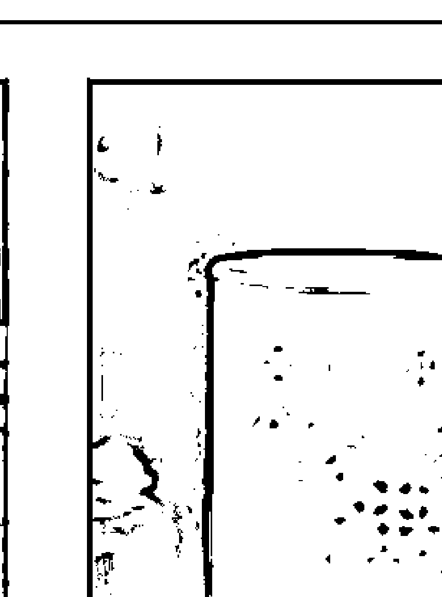


##### 調製面霜或潤膚乳

沒藥精油用作面霜或潤膚乳的成分時，可用於抑制皮膚炎症，滋潤皮膚，改善痘痘肌、老化乾燥狀況，使肌膚光滑，還可以抗皺防衰。

-   無香乳液 ……… 30g
-   沒藥精油 ……… 3滴
-   乳香精油 ……… 4滴
-   薰衣草精油 …… 3滴

>   可以當做日常護膚品使用，精油調製的潤膚乳最好盡快用完。

1.  將所有精油調和均勻。
2.  將調好的精油加入無香乳液中拌勻，裝入分裝瓶中，取適量使用即可。

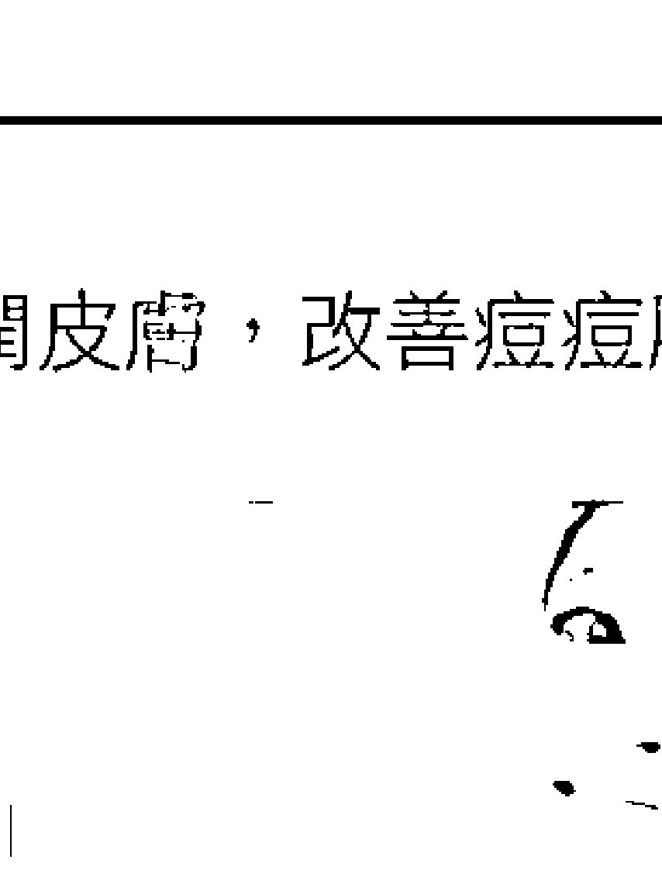

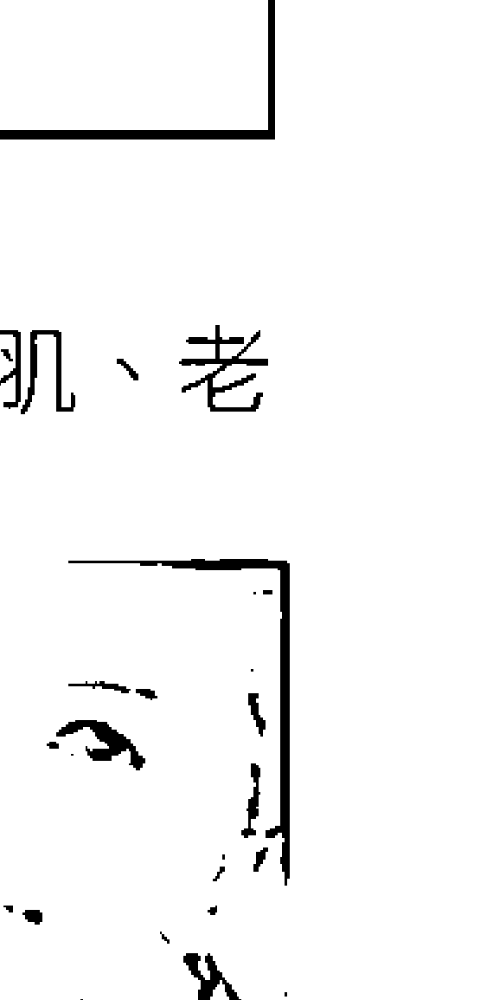

##### 調製漱口水

沒藥精油可以治療所有的牙齒感染，對喉嚨痛、口腔發炎、牙齦腫痛都有舒緩效果。

-   沒藥精油 ……… 5滴
-   伏特加酒 ……… 4ml

>   症狀嚴重的話，可以將調配好的漱口水隨身帶，便於飯後漱口。

1.  將沒藥精油滴入伏特加酒製成漱口劑。
2.  將沒藥漱口劑滴入20ml的水中攪拌混合。
3.  每次使用的時候用5ml漱口半分鐘後吐出。


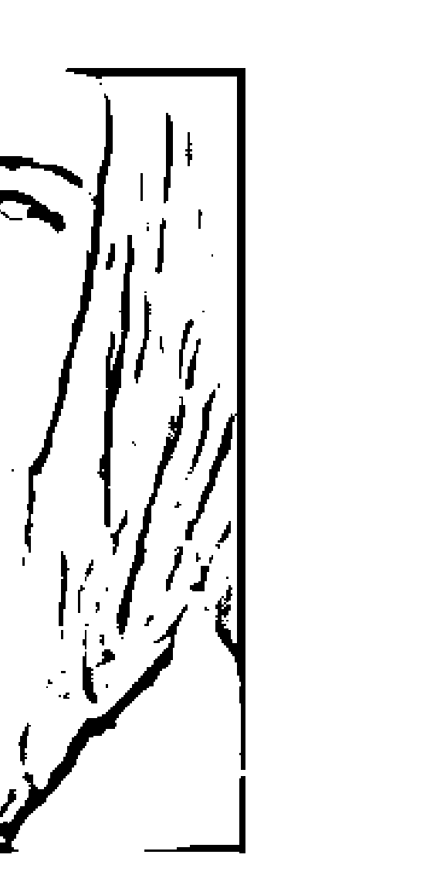

##### 蒸汽吸入

在蒸汽吸入療法中，沒藥精油可以舒緩咳嗽、氣喘、肺部發炎等呼吸道疾病。

-   沒藥精油........2滴
-   尤加利精油......2滴
-   雪松精油........2滴
-   熱水............1杯

>   嗅吸蒸汽時口鼻交替深呼吸5～10分鐘。

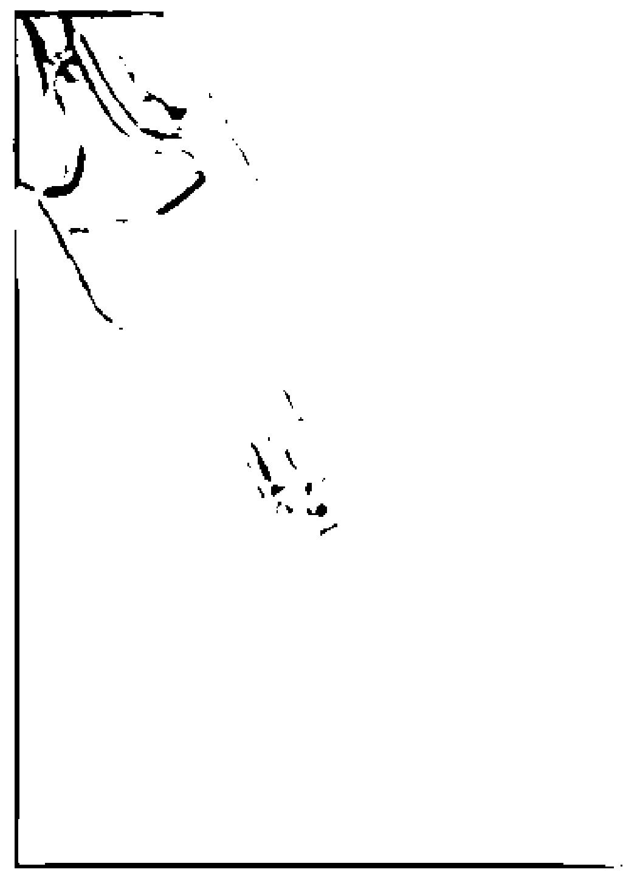

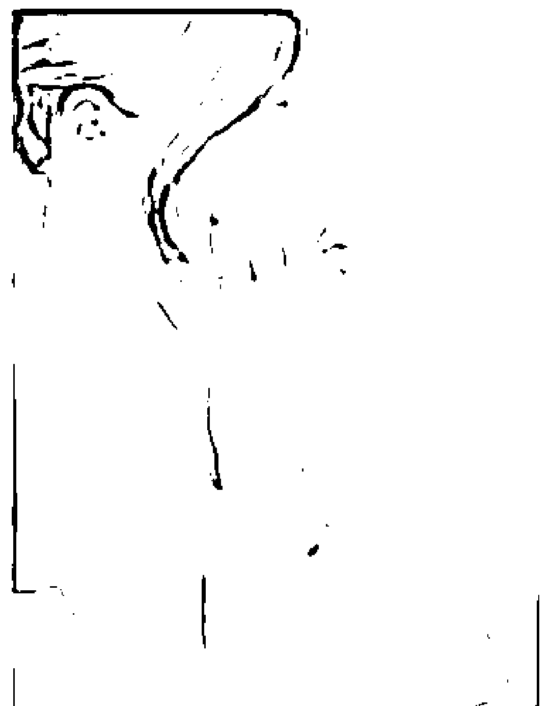

##### 足浴法

腳氣、腳臭很讓人困擾，又非常尷尬，常用沒藥精油泡腳可以有效改善這些症狀。

-   沒藥精油........3滴
-   橄欖油...........5ml
-   熱水............適量

>   注意泡腳水溫度不宜過高。

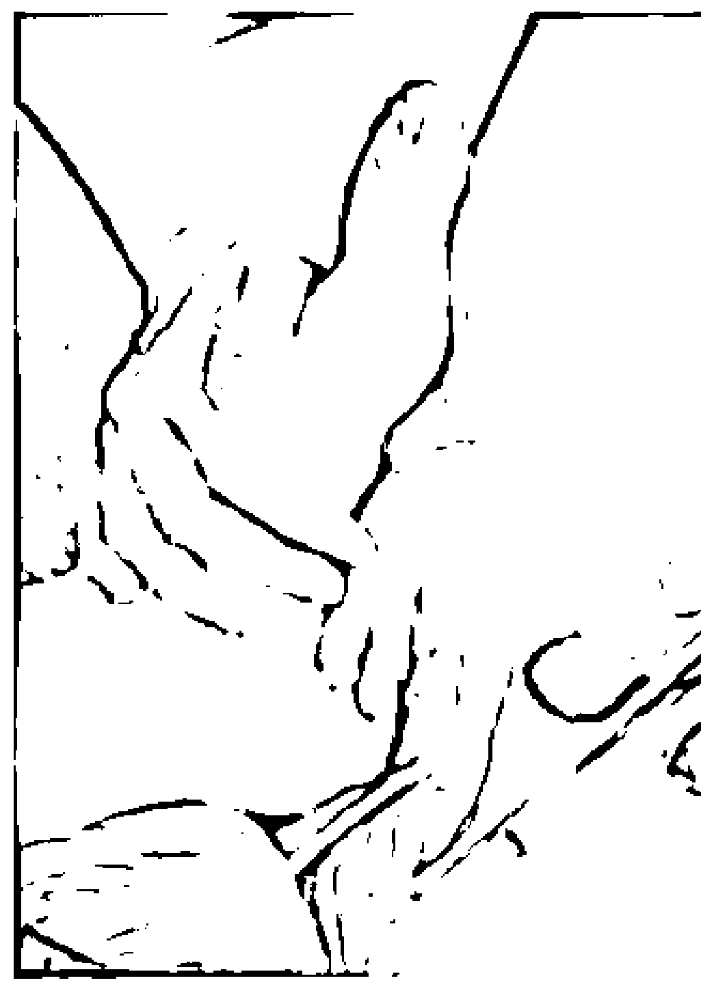

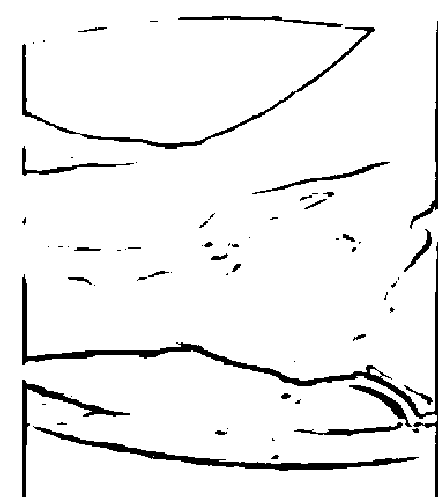

##### 坐浴法

對於女性來說，陰道或者尿道瘙癢、發炎、感染的情況總是很令人難為情，並且這些症狀一般又很難根治，而使用沒藥精油對上述症狀很有幫助。

-   沒藥精油........1滴
-   天竺葵精油......2滴
-   松紅梅精油......1滴
-   全脂牛奶........10ml
-   溫水............適量

>   坐浴時間不宜過長，10分鐘即可。

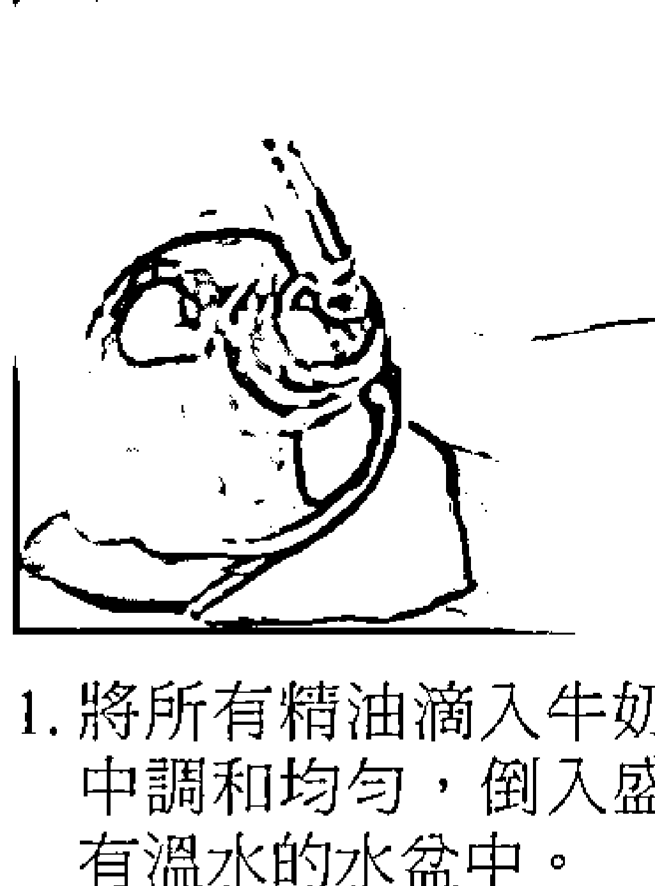

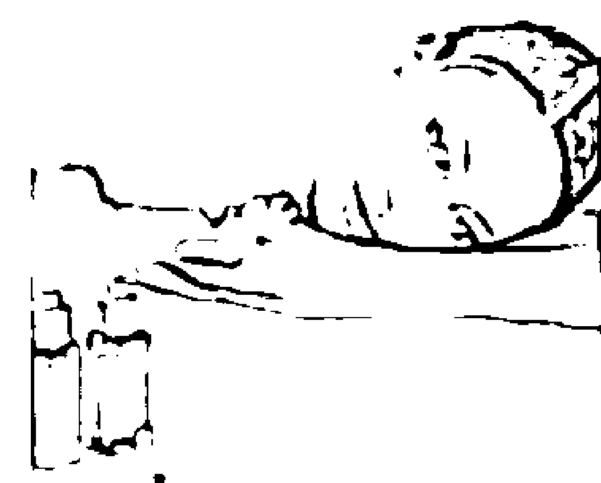

### 橄榄科 乳香 Frankincense

乳香精油是從乳香樹脂中提煉出來的，屬於橄欖科。它散發著溫馨的木質香氣和淡淡果香，給人以聖潔、靈動之美。乳香精油既可作美容聖品，能淡化疤痕，滋養乾燥、老化、黯沉肌膚，幫助恢復彈性，具有增強免疫的功效。

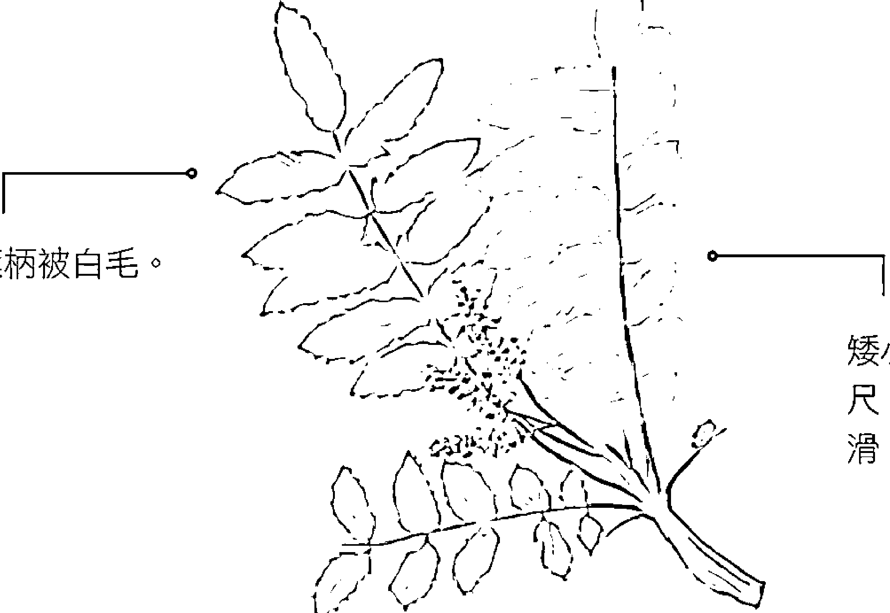

#### 源植物形態特徵

乳香，主要分布於紅海沿岸至利比亞、蘇丹、土耳其、伊朗等地，屬於橄欖科。矮小灌木，高4~5公尺，樹幹粗壯，皮光滑，淡棕黃色，紙狀，粗枝的樹皮片狀。葉互生，密集或於上部疏生；小葉7~10對，對生，無柄，基部者最小，向上漸大，小葉片長卵形，長達3.5公分，頂端者長達7.5公分，寬度1.5公分，先端鈍，基部圓形、近心形或截形，邊緣有不規則圓齒裂，或近全緣，兩面均被白毛，或上面無毛。花小，排列成稀疏的總狀花序；苞片卵形；花萼杯狀，先端5裂，裂片三角狀卵形；花小，排列成稀疏的總狀花序。

-   **別名**：阿拉伯乳香
-   **學名**：Boswellia carterii
-   **英文名**：Frankincense
-   **科別**：橄欖科
-   **萃取部位**：樹脂
-   **萃取方法**：蒸餾法

#### 精油檔案

| 項目         | 內容                                                         |
| :----------- | :----------------------------------------------------------- |
| 【主要產地】 | 阿曼、伊索比亞、阿拉伯半島、中國。                           |
| 【性狀特徵】 | 為無色至淡黃色近黃棕色黏稠狀液體。                           |
| 【化學成分】 | 單萜烯、側柏酮、乙酸辛酯、乳香醇。                           |
| 【香味特征】 | 散發著溫馨清純的木質香氣，還有淡淡果香及檸檬的味道。         |
| 【揮發特性】 | 中度揮發。                                                   |

#### 適合與乳香精油混用的精油

-   薰衣草
-   甜橙
-   香蜂草
-   廣藿香
-   檀香
-   天竺葵
-   葡萄柚
-   玫瑰
-   歐洲赤松
-   沒藥

#### 保存

存於深色玻璃瓶中，且要存放於陰涼乾燥處，避免陽光直射。未開封的精油使用年限為3～5年，已經開封的最好在1年內用完，若是調和為按摩油，在2個月內用完效果最佳。

#### 注意事項

乳香精油在使用上並沒有特別的禁忌，但前三個月懷孕期間不可使用。

#### 乳香精油的主要功效

##### 皮膚

乳香精油在美容護膚方面有著卓越的功效，不僅能淡化疤痕、皺紋，還能滋養乾燥、老化、黯沉的肌膚，激勵細胞再生幫助恢復彈性，修復肥胖紋、妊娠紋。

##### 心理

乳香精油氣味芬芳，給人以聖潔安靜之美，能很好的安撫心情避免急躁、沮喪、哀傷等消極情緒。

##### 居家

乳香精油性質溫和，能協調身心，對於長者是最合適的長期協助精油，因此，在家中噴灑適量精油可以改善氣氛，陶冶身心。

##### 醫學

1.  治療咳嗽、喉嚨痛、支氣管炎，對呼吸系統各種疾病都有緩解之效。
2.  改善生殖泌尿系統，對膀胱炎、尿道炎、月經不調等有一定的療效。
3.  提升免疫力，強化精神力量，預防流行性感冒及其他傳染病。

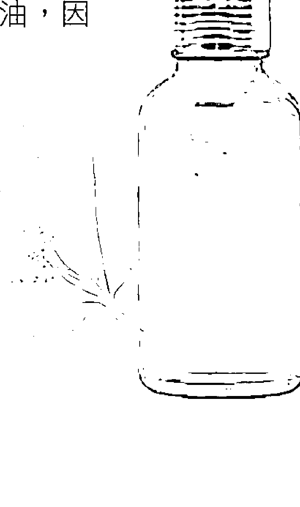

#### 如何使用乳香精油

##### 香薰爐和薰香燈

在薰香法中，乳香精油可治療鼻竇炎、急慢性支氣管炎、呼吸不暢、呼吸急促等呼吸道疾病。還能薰香氣氛，管理情緒，讓人獲得平靜與安寧。

-   乳香精油 ....... 4滴
-   雪松精油 ....... 4滴

1.  在薰香薰爐或香薰燈上方水盤中加入7分滿的水。
2.  將精油滴入香薰爐或薰香燈上方的水盤中，點上蠟燭或開啟薰香燈即可。

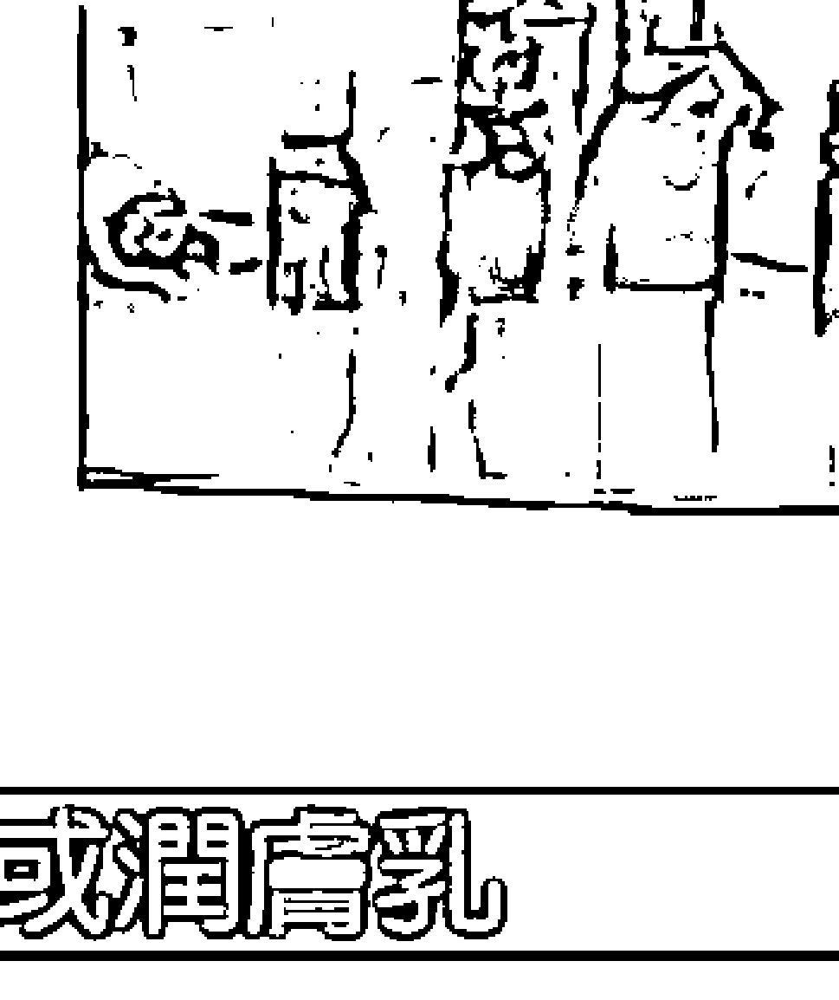

##### 調製按摩油

乳香精油可以用作按摩油的成分，可溫暖子宮，調和月經，對產後憂鬱等現象很有療效，還有助於生殖泌尿管道，能紓解膀胱炎、腎臟炎和一般性的陰道感染。

-   月見草油 ....... 2ml
-   南瓜仔油 ....... 3ml
-   乳香精油 ....... 2滴

1.  將精油與基礎油調和均勻。
2.  取適量輕柔地按摩下腹部即可。

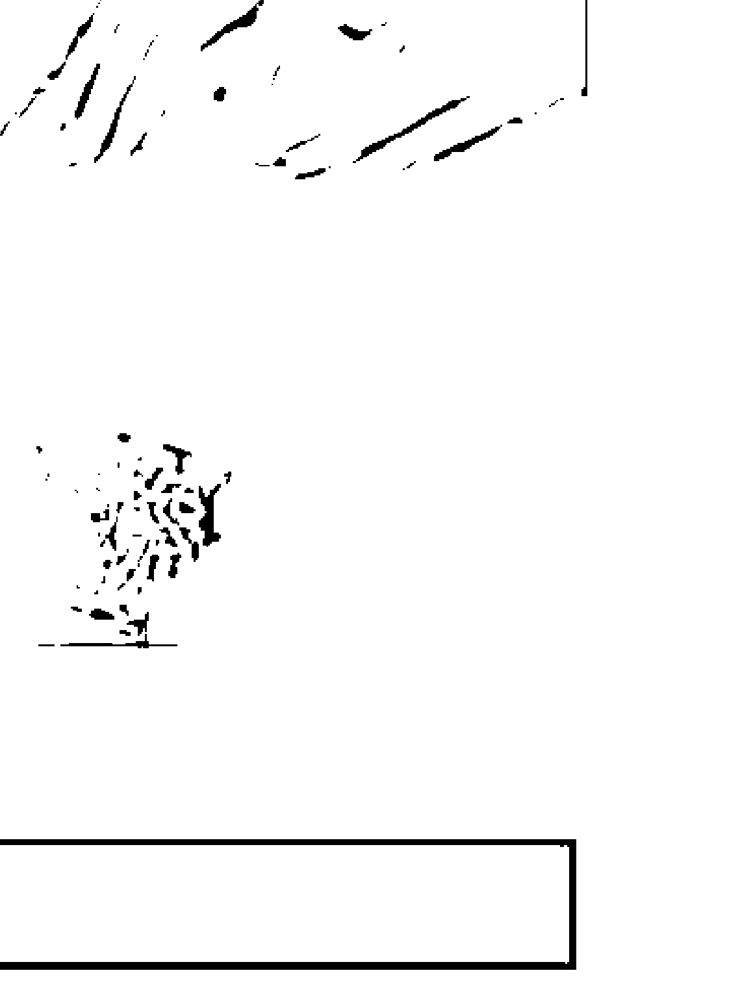

##### 調製面霜或潤膚乳

用於面霜或潤膚乳時，乳香精油可解決青春痘、乾燥、皺紋、暗瘡等肌膚難題，恢復肌膚彈性，收斂毛孔，平衡油脂，對傷口、創傷、潰瘍及發炎具有療效。

-   無香面霜 ....... 10g
-   乳香精油 ....... 2滴
-   花梨木精油 ....... 1滴

1.  將所有精油與面霜調和均勻。
2.  取適量，均勻地塗抹在臉上即可。

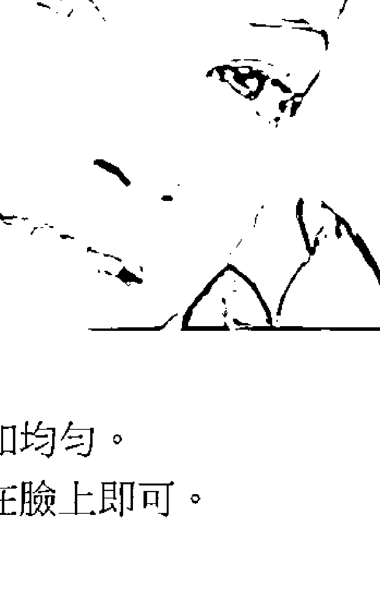

##### 蒸汽吸入

在流行感冒的期間，可用蒸汽法吸入乳香精油，預防感冒等呼吸道疾病。

-   乳香精油 ....... 1滴
-   沉香醇百里香精油 ....... 1滴
-   熱水 ....... 適量

1.  將精油調和均勻後滴入熱水中嗅吸即可。
2.  也可滴在手帕或面紙上，然後靠近鼻子深吸氣。

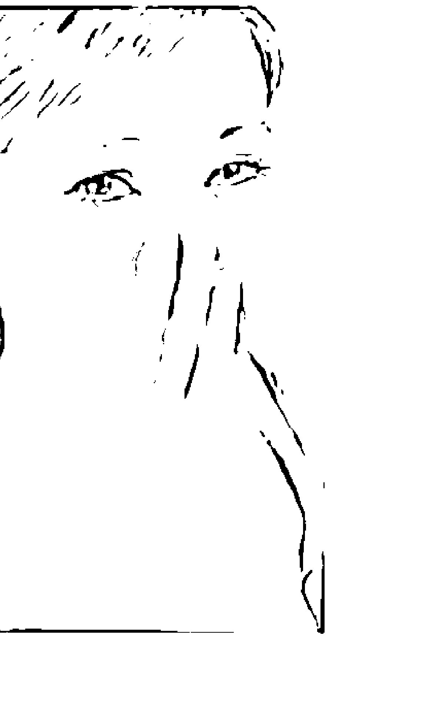

## 薑 Ginger

薑精油是堅硬的地下莖萃取而得，屬於薑科。薑精油可用於治療腹瀉、便祕、食慾不振、脹氣、噁心、胃潰瘍、食物中毒等消化系統疾病，還可以治療感冒、發燒、肌肉疲勞痠痛等症狀。薑精油特殊的香氣還具有壯陽功效，對偏頭痛的治療也很有幫助。

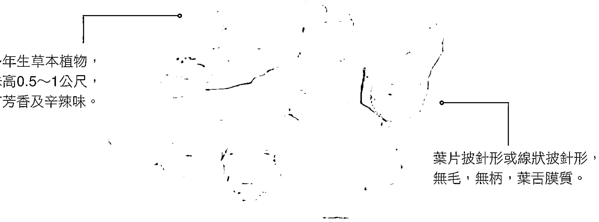

多年生草本植物，株高0.5~1公尺，有芳香及辛辣味。

葉片披針形或線狀披針形，無毛，無柄，葉舌膜質。

#### 源植物形態特徵

薑，多年生草本植物。開有黃綠色花並有刺激性香味的根莖。株高0.5~1公尺；根莖肥厚，多分枝，有芳香及辛辣味。葉片披針形或線狀披針形，無毛，無柄；葉舌膜質。總花梗長達25公分；穗狀花序球果狀；苞片卵形，淡綠色或邊緣淡黃色，頂端有小尖頭。花萼管長約1公分；花冠黃綠色，裂片披針形；唇瓣中央裂片長圓狀倒卵形。花期為秋季。

-   **別名**：生薑、白薑
-   **學名**：Zingiber officinalis
-   **英文名**：Ginger
-   **科別**：薑科
-   **萃取部位**：根、莖
-   **萃取方法**：蒸餾法

| 項目         | 內容                                                         |
| :----------- | :----------------------------------------------------------- |
| 【主要產地】 | 中國、馬達加斯加。                                           |
| 【性狀特徵】 | 棕紅色油狀液體。                                             |
| 【化學成分】 | 薑素、薑烯、蒎烯、薑酮、沉香醇、龍腦、桉油醇、牻牛兒醇。     |
| 【香味特征】 | 香辛氣味，有些類似檸檬及胡椒的混合香味。                     |
| 【揮發特性】 | 高度揮發。                                                   |

#### 適合與薑精油混用的精油

-   黑胡椒
-   佛手柑
-   豆蔻
-   乳香
-   丁香
-   檸檬
-   葡萄柚
-   馬鞭草
-   尤加利
-   月桂
-   迷迭香
-   肉桂
-   薄荷
-   甜橙
-   天竺葵

#### 保存

薑精油一般置於深色玻璃瓶中保存，要在陽光照不到的地方，可放在木盒中，減低溫度的波動。未開封的精油保存年限為3~5年，已開封的最好在1年之內用完，若已調和按摩油，則應在2個月內用完。

#### 注意事項

1.  薑的莖塊直接使用會刺激皮膚，萃取為精油後對皮膚的刺激性會降低。
2.  敏感肌膚盡量少用，恐有過敏疑慮。

#### 薑精油的主要功效

##### 皮膚

一般不建議將薑精油用在臉部皮膚護理上，但可以調配在洗髮精中用來保養頭皮。

##### 心理

薑精油溫暖香甜的氣味能夠緩解壓力和疲勞，使人感覺敏銳、增強記憶力，保持心情愉快。

##### 居家

薑精油是暈車、暈船患者出門的最佳選擇，治療孕吐也效果不錯。同時薑精油還能用於驅除蚊蟲、淨化空氣。

##### 醫學

1.  薑精油可健胃消脹，對於腹瀉、便秘、食慾不振、脹氣、反胃等症狀有很好的治療效果。
2.  促進骨骼再生，治療關節炎、骨折、肌肉疼痛等。
3.  薑精油同時還是非常好用的催情劑，在治療性無能方面很有價值。
4.  可用於治療流行感冒、發燒、流鼻涕，減輕咽喉痛、扁桃體炎症狀，有效發汗改善體內溼氣。

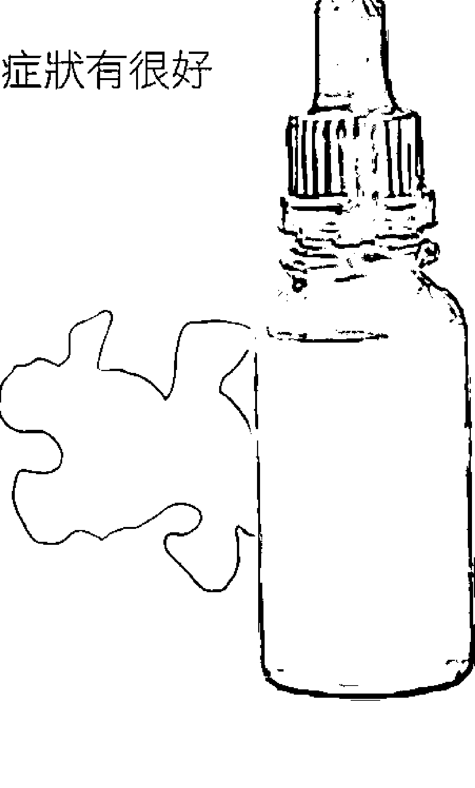

#### 如何使用薑精油

##### 香薰爐和薰香燈

在薰香法中，薑精油可以緩解黏膜炎，增添活力，治療反胃、感冒、流感等呼吸道感染疾病。

-   薑精油.........1滴
-   雪松精油.......3滴
-   尤加利精油.....2滴

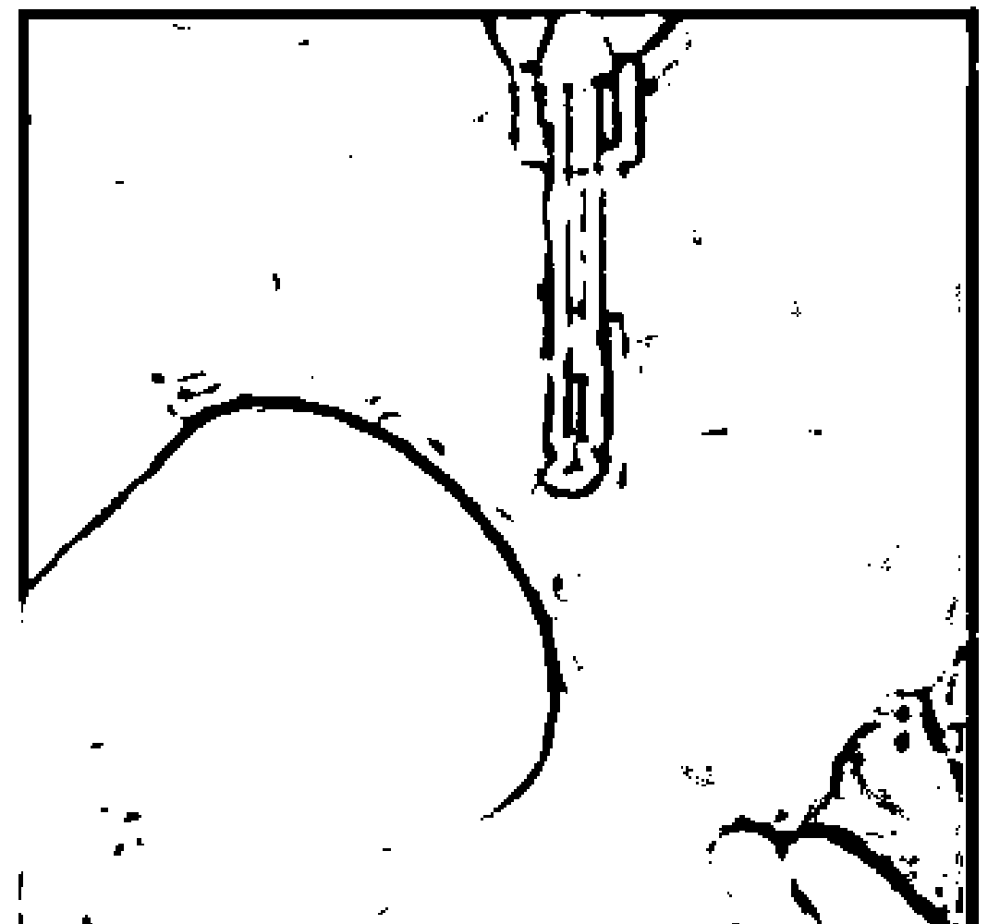

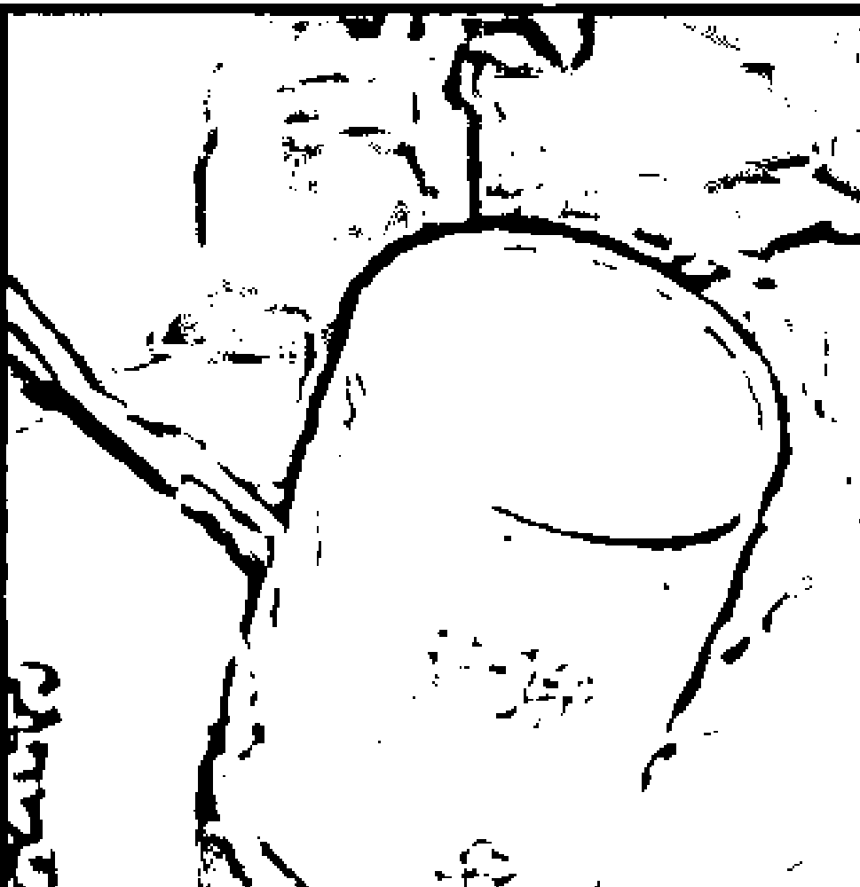

##### 調製按摩油

用作按摩油的成分時能調節女性月經，促進胃液分泌，對食慾不振、消化不良及性冷感都有改善作用，還能舒緩關節炎、關節痛、風濕痛、抽筋和肌肉酸痛。

-   聖約翰草油.....5ml
-   甜杏仁油.......10ml
-   薑精油.........3滴
-   肉桂精油.......1滴
-   蘿勒精油.......2滴

> Tips
> 按摩油一定要避光保存並儘快使用完畢。

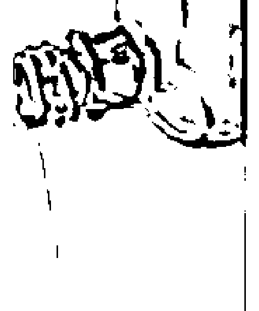


##### 熱敷法

用於熱敷時，薑精油可以舒緩肌肉疼痛、關節疼痛、血液循環不暢、瘀傷等。

-   山金車浸泡油.....5ml
-   橄欖油...........5ml
-   薑精油...........2滴
-   迷迭香精油.......2滴
-   檸檬香茅精油.....1滴

> Tips
> 想緩解疲勞和酸痛就用熱敷，若是晒傷就要冷敷了。

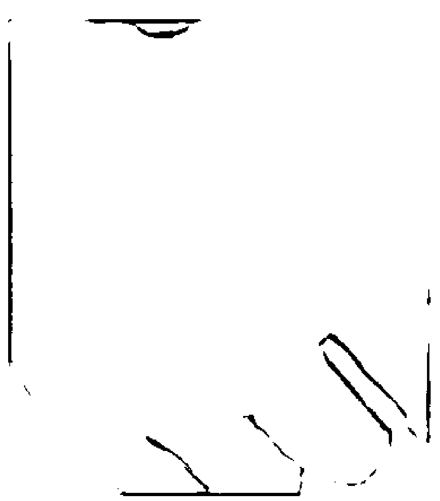

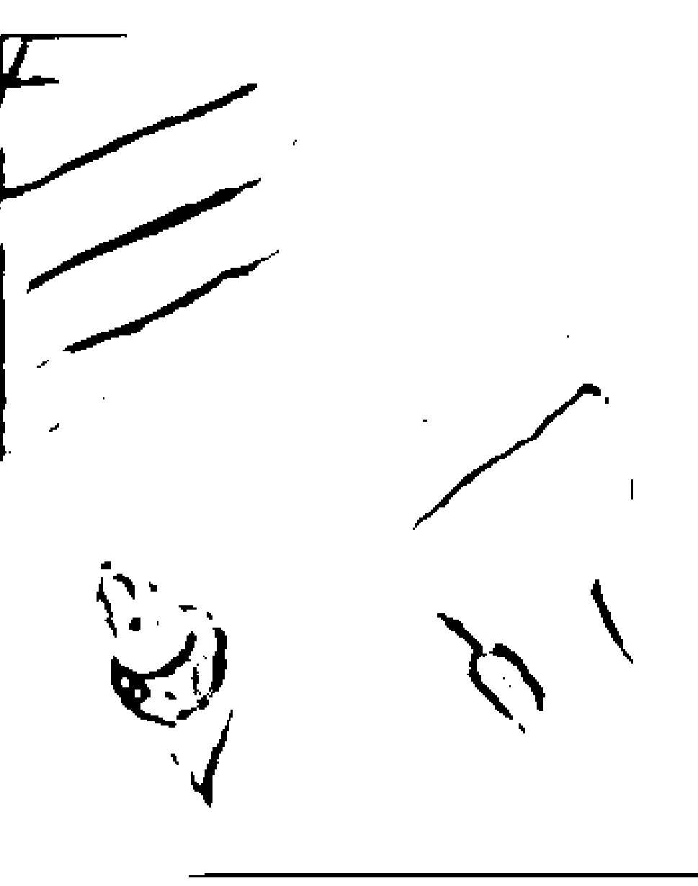

##### 嗅吸法

暈船、清晨噁心、消化不良、感冒和流感、嘔吐時，吸入薑精油可以緩解身體不適之症。

-   薑精油………………3滴
-   薄荷精油………………5滴

>   可將調配好的純精油裝入隨身攜帶的1ml小瓶中，需要時即可使用。

1.  將精油調和均勻。


2.  將1滴精油滴在面紙上，靠近鼻腔嗅吸即可。

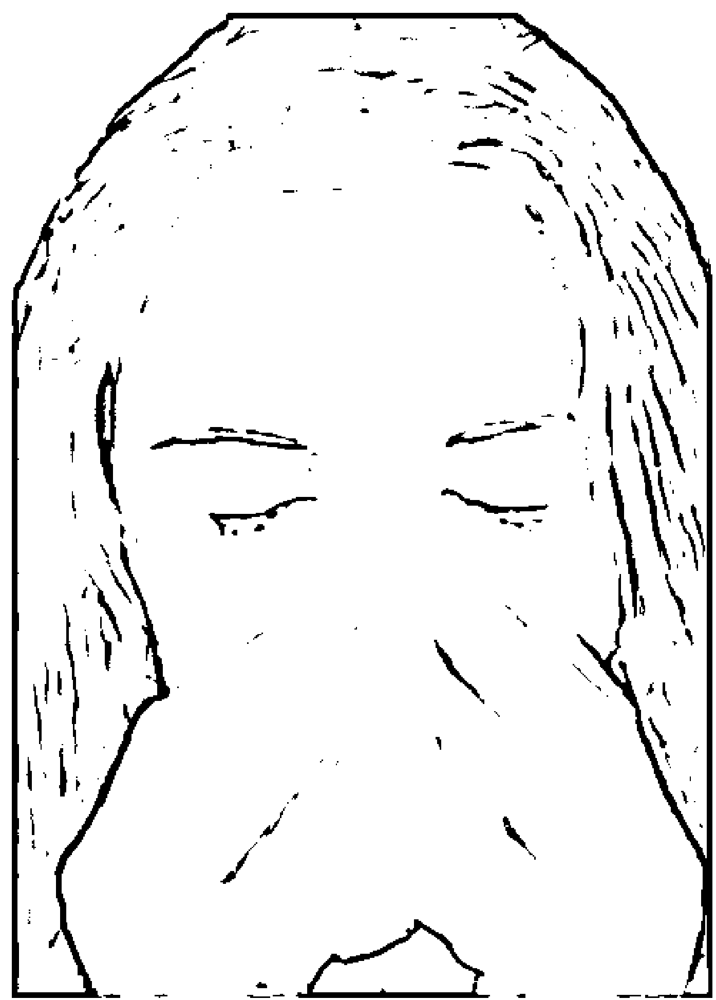

##### 調製洗髮精

在洗髮精中加入適量生薑精油，可以驅除頭風，治療偏頭痛、周期性頭痛等，讓頭部神經放鬆，使思維變得更加清晰，有助於增強記憶力。

-   天然無香洗髮精 …… 50ml
-   薑精油………………4滴
-   迷迭香精油…………6滴
-   雪松精油……………5滴

>   調製好的洗髮精應放置在陰涼通風處，並儘快使用完畢。

1.  將所有精油調和均勻，加入無香洗髮精充分拌勻後裝入分裝瓶保存。

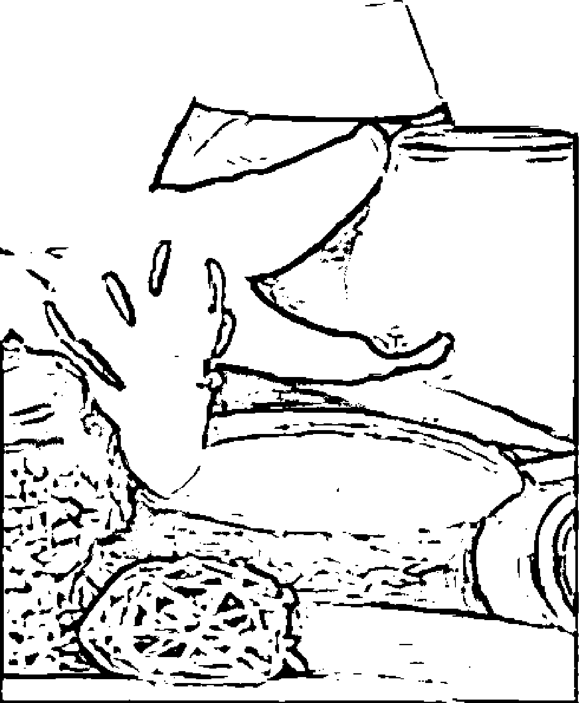


2.  每次使用5ml進行一般洗髮程序，加強頭皮按摩。

### 薑科 豆蔻 Cardamom

豆蔻精油提取自豆蔻，一般不用於皮膚，其溫暖的特性非常適合滋養胃部，治療脹氣、反胃、口臭、腹瀉、排尿困難、疝氣等，預防便秘；能有效防止傳染病毒，殺菌滅菌，抑制流感、痙攣，促進細胞新陳代謝及再生功能；還能改善性冷感，有催情的功效。

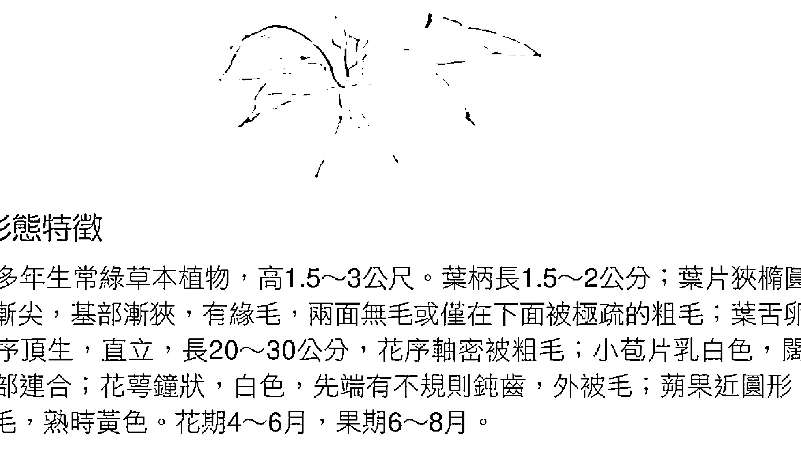

#### 源植物形態特徵

豆蔻，多年生常綠草本植物，高1.5～3公尺。葉柄長1.5～2公分；葉片狹橢圓形或線狀披針形，先端漸尖，基部漸狹，有緣毛，兩面無毛或僅在下面被極疏的粗毛；葉舌卵形，外被粗毛。總狀花序頂生，直立，長20～30公分，花序軸密被粗毛；小苞片乳白色，闊橢圓形，先端鈍圓，基部連合；花萼鐘狀，白色，先端有不規則鈍齒，外被毛；蒴果近圓形，直徑約3公分，外被粗毛，熟時黃色。花期4～6月，果期6～8月。

-   **別名**：香料之后、小豆蔻
-   **學名**：Elettaria cardamomum
-   **英文名**：Cardamom
-   **科別**：薑科
-   **萃取部位**：乾燥果實
-   **萃取方法**：蒸餾法

#### 精油檔案

| 項目         | 內容                                                 |
| :----------- | :--------------------------------------------------- |
| 【主要產地】 | 印度、斯里蘭卡、中國。                               |
| 【性狀特徵】 | 為無色或淡黃色或棕色液體。                           |
| 【化學成分】 | 乙酸萜品酯、松油醇、桉油醇、薑烯、檸檬烯。           |
| 【香味特徵】 | 氣味清甜刺激，給人溫暖的味道。                       |
| 【揮發特性】 | 高度揮發。                                           |

#### 適合與豆蔻精油混用的精油

-   薄荷
-   肉桂
-   天竺葵
-   芫荽
-   依蘭
-   尤加利
-   薑
-   檸檬香茅
-   百里香
-   甜橙
-   迷迭香
-   檸檬
-   佛手柑
-   丁香

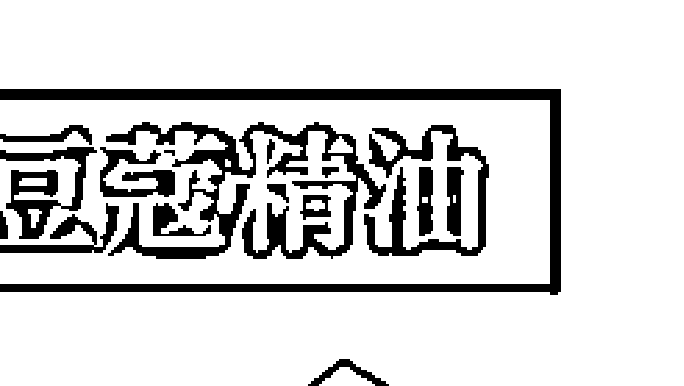

#### 保存

存放在深色玻璃瓶中，避免紫外線照射，保持陰涼、乾燥、通風。未開封的純精油可存放3~5年，已經開封的精油最好於1年內用完，如已經調和為按摩油，在2個月內用完效果最佳。

#### 注意事項

敏感肌膚使用需注意劑量。

#### 豆蔻精油的主要功效

##### 皮膚

豆蔻精油較少用於皮膚保養。

##### 心理

豆蔻精油是一種讓人感覺溫暖的精油，可以提振精神，清理迷惑、紊亂的思緒，使人感覺清新有活力。

##### 居家

在棉球上滴幾滴豆蔻精油，擦拭書櫃或衣櫃，氣味清新而溫暖，淨化空氣，改善環境，同時還有殺菌、驅蚊蟲等效果。

##### 醫學

1.  活化細胞，增強抵抗力，能抑制細菌及微生物滋長。
2.  非常適合滋養脾胃，能有效預防便秘、反胃、口臭、腹瀉等，可緩解消化不良、脹氣、胃灼熱、反胃感。
3.  還是一種很好的利尿劑，增進體液循環，適用於排尿困難。
4.  良好的催情效果，有助於改善性冷感。

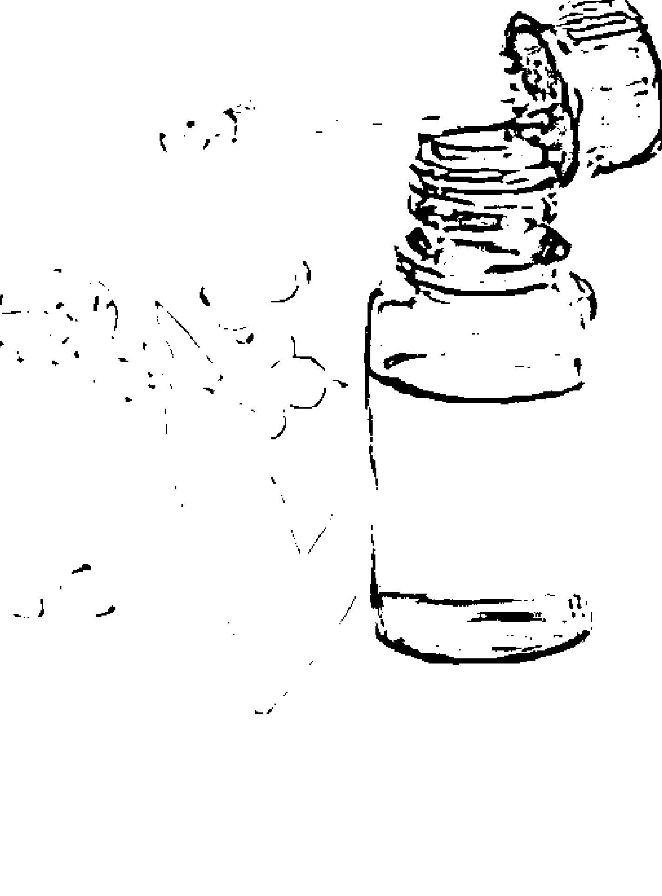

#### 如何使用豆蔻精油

##### 香薰爐和薰香燈

在薰香法中，豆蔻精油可以營造歡愉、熱鬧的氣氛，還能除異味、抗菌等。

```
豆蔻精油.........3滴
依蘭精油.........3滴
天竺葵精油.......2滴
```

+   使用方法：
1.  在薰香薰爐或香薰燈上方水盤中加入7分滿的水。
2.  將精油滴入香薰爐或薰香燈上方的水盤中，點上蠟燭或開啟薰香燈即可。

##### 油漱法

豆蔻精油調配在冷壓基礎油裡進行漱口，可消除口臭，使口氣芬芳。

```
橄欖油............5ml
豆蔻精油..........1滴
```

+   使用方法：
1.  將橄欖油和豆蔻精油調和均勻。
2.  將調配好的油含於口中漱口10分鐘，吐在衛生紙上丟棄。

> Tips
> 不可將油吐於水槽裡沖洗掉，以免阻塞水管。

##### 調製按摩油

豆蔻精油可以用作按摩油的成分，治療胃脹、反胃，改善胃部不適，或者是在緊急腹瀉時可以減輕症狀，非常適合滋養胃部，預防便秘。

```
橄欖油............10ml
豆蔻精油..........3滴
薑精油............1滴
```

> Tips
> 有助於改善腸胃狀況。

+   使用方法：
1.  將所有精油調和均勻。
2.  每日取適量按摩胃部、腹部。

### 木犀科 茉莉 Jasmine

茉莉精油是從茉莉植物的花中以溶劑萃取法提煉出來的，屬於木犀科，通常稱之為茉莉原精。茉莉精油素有「精油之王」的美譽，是產量極少且十分珍貴的精油。它可舒緩鬱悶情緒、振奮精神，還能改善皮膚乾燥、缺水、過油及敏感狀況，可以淡化妊娠紋與疤痕，增加肌膚彈性。

花朵有白色或者黃色，通常是管狀白花，結成圓錐花絮，花小、星狀、白色，在夜間採摘花朵時香味最濃。

為常綠灌木或者爬藤植物，葉片深綠。

#### 源植物形態特徵

茉莉有300多個品種，主要為常綠灌木和爬藤植物兩類，花朵有白色或者黃色，通常是管狀白花，結成圓錐花絮。葉片深綠，花小、星狀、白色，在夜間採摘花朵時香味最濃。茉莉花材必須在黃昏、花朵初綻時採摘，為了避免夕陽折射，採摘人必須穿黑衣。大約800萬朵茉莉花才能萃取出1升精油，一滴就是五百朵！而且萃取工藝也非常繁複，要先在橄欖油中浸泡數日後，再榨出橄欖油，留下的才是價格令人咋舌的茉莉精油。

+   - 別名: 小花茉莉、中國茉莉
- 學名: Jasminum sambac
- 英文名: Arabian Jasmine
- 科别: 木犀科
- 萃取部位: 花瓣
- 萃取方法: 溶劑萃取法

#### 精油檔案

+   - 【主要產地】埃及、義大利、法國、西班牙、中國。
- 【性狀特徵】為無色或淡黃綠色的澄明油狀物。
- 【化學成分】素馨酮、牻牛兒醇、沉香醇、乙酸苄酯、吲哚。
- 【香味特徵】氣味清甜而溫暖。
- 【揮發特性】低度~中度揮發。

#### 適合與茉莉精油混用的精油

+   * 佛手柑
* 花梨木
* 快樂鼠尾草
* 檀香
* 甜橙
* 乳香
* 薰衣草
* 天竺葵
* 檀香
* 玫瑰草
* 橙花
* 玫瑰

#### 保存

純精油的化學成分非常容易受到空氣、光線、溫度、潮濕等影響導致變質，通常保存在深色的玻璃瓶內，最好是18℃以下，因而最好將精油存放在木盒子裡。

#### 注意事項

+   ① 懷孕婦女初期不可使用。
② 調配劑量要低濃度使用，過高會有噁心感。

#### 茉莉精油的主要功效

##### 皮膚

改善敏感肌和油性肌，淡化妊娠紋、魚尾紋和疤痕，促進細胞再生，增加皮膚彈性，抗衰老，讓肌膚煥發年輕活力。

##### 心理

稀釋後塗抹於耳後、頸部、手腕、胸前作香水使用，有助於安撫神經，增強自信心，同時也能抗憂鬱、穩定情緒。

##### 居家

在棉球上滴幾滴茉莉精油，放置書櫃或衣櫃，浪漫而溫馨，在薰香的同時，舒心解壓。

##### 醫學

+   ① 調節女性經痛，舒緩子宮痙攣，改善經前症候群；溫暖卵巢，改善子宮血液循環不良導致的性冷感。
② 幫助生產，強化子宮收縮，加速生產，鎮痛，預防產後憂鬱症。
③ 改善生殖系統，治療前列腺肥大症，增強性功能；用於女性按摩時有美化胸型的作用。
④ 是一種很好用的催情精油，可改善陽痿、早泄症狀。

#### 如何使用茉莉精油

##### 香薰爐和薰香燈

在薰香法中，可舒緩情緒抗憂鬱、止咳化痰。

+   - 茉莉精油……… 2滴
- 甜橙精油……… 3滴
- 檀香精油……… 1滴

+   使用方法：
1.  在薰香薰爐或香薰燈上方水盤中加入7分滿的水。
2.  將精油滴入香薰爐或薰香燈上方的水盤中，點上蠟燭或開啟薰香燈即可。

##### 調製按摩油

茉莉精油可以用作按摩油的成分，振奮精神，緩解感冒和咳嗽，改善緊張情緒，還有滋潤肌膚、催情的效果。

+   - 荷荷芭油……… 10ml
- 茉莉精油……… 3滴
- 檀香精油……… 2滴

+   使用方法：
1.  將所有精油和基礎油調和均勻。
2.  取適量按摩不適的部位即可。

##### 調製潤膚乳

用於身體潤膚乳時，茉莉精油適合護理乾燥、油性、搔癢和敏感性的皮膚，增加皮膚的彈性，還經常被用於治療妊娠紋和傷疤。

+   - 無香乳液……… 30g
- 茉莉精油……… 2滴
- 橙花精油……… 3滴
- 薰衣草精油……… 5滴

+   使用方法：
1.  將所有精油調和均勻。
2.  取適量均勻塗抹在肌膚，輕柔地按摩幫助吸收。

##### 沐浴法

茉莉精油用來沐浴時，不僅可以緩解疲勞，提振精神，還能幫助肌膚恢復彈性，緩解女性經前症候和更年期症狀，促進血液循環等。

+   - 茉莉精油…… 2滴
- 依蘭精油…… 1滴
- 甜橙精油…… 3滴
- 全脂牛奶…… 10ml

+   使用方法：
1.  將所有精油滴入牛奶中調和均勻後倒入裝滿水的浴缸。
2.  按照一般程序泡澡即可，時間為15~30分鐘。

> Tips
> 將精油調入牛奶後，再加入熱水中。

### 禾本科 岩蘭草 Vetiver

岩蘭草精油是從岩蘭草中提煉出來的，屬於禾本科。它能淨化皮膚，抗菌消炎，可以用來調理油膩不潔的皮膚，還能治療粉刺、暗瘡、多種皮膚炎症。岩蘭草精油能夠收斂肌膚，喚醒細胞，促進組織再生，抗菌止癢。

#### 源植物形態特徵

岩蘭草，多年生粗壯草本，鬚根含揮發性濃郁的香氣。叢生，高1~2.5公尺，直徑約5公釐，中空。葉鞘無毛，具背脊；葉舌短，長約0.5公釐，邊緣具纖毛；葉片線形，直伸，扁平，下部對折，與葉鞘相連而無明顯的界線，無毛，邊緣粗糙，頂生葉片較小。圓錐花序大型頂生；主軸粗壯，各節具多數輪生的分枝，分枝細長上舉，下部長裸露；總狀花序軸節間與小穗柄無毛；無柄小穗線狀披針形，長4~5公釐，基盤無毛。花果期8~10月。

+   - 别名：香根草
- 学名：Vetiveria zizanoides
- 英文名：Vetiver
- 科别：禾本科
- 萃取部位：乾燥的根部
- 萃取方法：蒸餾法

#### 精油檔案

| 项目 | 内容 |
|---|---|
| 主要產地 | 印度、爪哇、海地、印尼、斯里蘭卡、拉丁美洲。 |
| 性狀特徵 | 爲深棕色或琥珀色的膏脂狀液體，具有一定的黏稠性。 |
| 化學成分 | 安息香酸、岩蘭草醇、糖醛、岩蘭草酮、岩蘭草烯。 |
| 香味特徵 | 氣味深沉，略帶泥土氣和甜味，有溫暖的胡椒味。 |
| 揮發特性 | 低度揮發。 |

#### 適合與岩蘭草精油混用的精油

+   - 天竺葵
- 柠檬
- 葡萄柚
- 茉莉
- 薰衣草
- 安息香
- 檀香
- 佛手柑
- 依兰
- 乳香
- 雪松
- 广藿香
- 玫瑰
- 花梨木

#### 保存

纯精油的化学成分非常容易受到空气、光线、温度、潮湿等影响导致变质，所以纯精油通常保存在深色的玻璃瓶内，最好是18℃以下，高温会导致精油的化学成分发生变化，因而最好将精油存放在木盒子里。

#### 注意事项

岩兰草精油是一种非常安全的精油，无毒、无刺激，也没有光敏性，并没有特殊的禁忌。

#### 岩蘭草精油的主要功效

**皮肤**
对改善油性肌及痤疮皮肤很有疗效，具有杀菌消炎的功效，能促进伤口愈合，可用于治疗粉刺，促进细胞再生，用于消除妊娠纹和痔疮；消炎杀菌，治疗脚气、皮肤炎症，改善受损肌。

**心理**
岩兰草精油是有名的镇静油，舒缓情绪、镇静效果佳，改善压力大、焦躁、失眠及忧虑等症。

**居家**
岩兰草精油是很好的定香剂，适合加入各种配方中；还能消除病菌，净化空气。

**医学**
①激励免疫系统，增强免疫力，强健体魄。
②加强血液循环，强化红血球生成，通经活血，可用于治疗关节炎、风湿病和肌肉痛。
③深度放松情绪功效，具有很好的催情效果，舒缓焦虑与忧郁。

#### 如何使用岩蘭草精油

##### 香薰爐和薰香燈

在薰香法中，岩蘭草精油能幫助慌亂、不知所措、缺乏安全感的心得到釋放，主要用於治療歇斯底里、生氣、易怒、失眠等神經系統方面的問題。

+   岩蘭草精油.....2滴
沒藥精油 .......1滴
甜橙精油 .......3滴

> Tips
> 使用薰香時要注意劑量，不可過量。

+   使用方法：
1.  在薰香蒸爐或香薰燈上方水盤中加入7分滿的水。
2.  將精油滴入香薰爐或薰香燈上方的水盤中，點上蠟燭或開啟薰香燈即可。

##### 調製按摩油

岩蘭草精油可以用作按摩油的成分，能有助於緩解精神和身體上的疲勞，治療神經系統方面的疾病，緩解關節炎和風濕病的疼痛，收斂肌膚、癒合傷口。

甜杏仁油 .......20ml　　天竺葵精油.....5滴
岩蘭草精油.....3滴　　 絲柏精油 .......2滴

+   使用方法：
1.  將所有精油與基礎油調和均勻。
2.  取適量按摩不適的部位即可。

##### 調製面霜或潤膚乳

用於臉部按摩時，岩蘭草精油對皮膚有保溼和滋養的作用，很適合乾燥、敏感及熟齡皮膚，還能淡化皺紋和斑痕，消炎抗菌。

玫瑰果油 .........2ml　　岩蘭草精油.......1滴
甜杏仁油 .........3ml　　玫瑰精油 .........1滴

+   使用方法：
1.  將所有精油與基礎油調和均勻。
2.  取適量均勻塗抹在臉上與頸部按摩5分鐘，再用面紙壓除臉部多餘油脂。

### 薔薇科 玫瑰 Rose

玫瑰精油是從玫瑰花中萃取出來的，屬於薔薇科。保加利亞的玫瑰精油是世界上最好、最昂貴的精油，被稱為「花中之后」。它能調整女性內分泌，滋養子宮、緩解經痛，改善性冷感和更年期症狀。它還擁有卓越的美容護膚功效，能促進細胞再生、淡化斑點、改善皮膚乾燥，恢復彈性，讓肌膚白皙有光澤。

#### 源植物形態特徵

玫瑰，直立落葉灌木，株高可達2公尺，莖粗壯，多針刺，奇數羽狀複葉，小葉5～9片，連葉柄長5～13公分，橢圓形或橢圓狀倒卵形，先端急尖或圓鈍，基部圓形或寬楔形，邊緣有尖銳鋸齒，上面無毛，葉脈下陷，有褶皺，下面灰綠色，中脈突起，網脈明顯，密被絨毛和腺毛，有時腺毛不明顯；葉柄和葉軸密被絨毛和腺毛。

#### 精油檔案

+   别名 奧圖玫瑰
學名 Rosa damascena
英文名 Rose Damask
科別 薔薇科
萃取部位 花朵
萃取方法 溶劑萃取法／蒸氣蒸餾法

+   【主要產地】 保加利亞（玫瑰谷）是玫瑰精油最佳的產地，其他的還有摩洛哥、土耳其、法國、中國等國家。
【性狀特徵】 為無色至淡黃綠色液狀物，在低溫下（15～18℃），精油表面會形成閃亮的玫瑰結晶。
【化學成分】 苯乙醇、香茅醇、牻牛兒醇、橙花醇、玫瑰蠟。
【香味特徵】 氣味芬芳，香氣濃郁純正。
【揮發特性】 低度～中度揮發。

#### 適合與玫瑰精油混用的精油

玫瑰精油

+   快樂鼠尾草、天竺葵、茉莉、檀香、佛手柑、薰衣草、橙花、甜橙、洋甘菊、玫瑰草、廣藿香、依蘭

#### 保存

應置於深色玻璃瓶中，並保持恆溫，建議放在木盒中，減低溫度的波動。未開封的純精油可以保存3～5年，已開封的最好於1年內用完，若已調和為按摩油，於2個月內用完效果最佳。

#### 注意事項

玫瑰具有通經功效，避免在懷孕期間使用。
少數敏感肌膚會有過敏現象。

#### 玫瑰精油的主要功效

##### 皮膚

玫瑰精油適宜所有的膚質，能促進細胞再生，活化細胞，能收斂微血管，能淡化細紋，改善乾燥、淡化黑眼圈、延緩衰老，特別有益於成熟、乾燥或敏感的皮膚。

##### 心理

玫瑰精油獨特的芳香可以撫平情緒調理、產後憂鬱、情緒低潮、提振心情、舒緩壓力的好幫手，是極女性化的精油。

##### 居家

在棉球上滴玫瑰精油，放置枕頭旁邊，在薰香的同時，還能放鬆情緒，幫助睡眠。

##### 醫學

+   ①玫瑰精油是子宮的補品，能調理、強化子宮，緩解經前症候群和內分泌失調，改善性冷感和更年期不適。
②養肝利膽，調理內分泌失衡，滋補心臟，降低血壓。
③抗菌消炎，活化停滯的血液循環，降低心臟充血現象，強化微血管。

#### 如何使用玫瑰精油

##### 香薰炉和薰香灯

在薰香法中，玫瑰芬芳的香味可以舒解压力，降低高血压，减少头痛及相关神经紧张引起的疼痛；同时，还能促进血液循环，强化血管壁弹性，减低心脏病的发生率，改善荷尔蒙失调，调节免疫力。

+   玫瑰精油 ........ 3滴

1.  在薰香炉或薰香灯上方水盘中加入7分满的水。
2.  将精油滴入香薰炉或薰香灯上方的水盘中，点上蜡烛或开启薰香灯即可。

##### 调制按摩油

用作按摩油，可以滋润肌肤，还能催情，增加情趣、延缓衰老，美胸保健；玫瑰精油可缓解女性经痛，调顺子宫功能，加速毒素、废物的代谢。

+   甜杏仁油 ........ 20ml
玫瑰精油 ........ 2滴
佛手柑精油........3滴
依兰精油 .........1滴

> 滋润肌肤，美颜亮肤，延缓衰老。按摩胸部，远离乳房疾病的困扰。

1.  将所有精油调和均匀。
2.  取适量涂抹在想要使用的部位，轻轻按摩即可。

##### 调制面霜或润肤乳

用于面霜或润肤乳时，玫瑰精油可以滋养肌肤，延缓衰老，保持皮肤健康亮丽。

+   无香精面霜........ 30g
玫瑰精油 ......... 3滴
天竺葵精油........ 3滴
薰衣草精油........ 4滴

> 有机的纯精油一般浓度较高，调制护肤品时要严格按照比例调配，并尽快使用完，以免变质。

1.  将所有精油和无香精面霜调和均匀，装入分装瓶保存。
2.  每日持续使用，并轻轻按摩脸部至吸收即可。

##### 沐浴法

使用玫瑰精油泡澡用，不僅可以緩解疲憊、解除壓力，還可以呵護嬌嫩肌膚，滋養神經，提升氣質。

+   * 玫瑰精油 ……………… 3滴
* 快樂鼠尾草精油 …… 3滴
* 全脂牛奶 ……………… 10ml

> Tips
> 也可以將精油和牛奶混合後，倒入盛好水的臉盆中，在將手放入臉盆中進行手浴。

##### 嗅吸法

如果壓力大，精神比較疲憊，可以利用玫瑰精油，能夠緩解疲勞，讓心情得到放鬆。

+   * 玫瑰精油 ……………… 1滴
* 橙花精油 ……………… 1滴

> Tips
> 滴在手帕上可以重複使用。滴精油的地方盡量避免接觸到皮膚，往內折後再使用，以免引起過敏現象。

### 番荔枝科 依蘭 Ylang Ylang

依蘭精油是從植物依蘭花中萃取出來的，屬於番荔枝科。依蘭精油對情緒管理有很好的輔助作用，可用於治療性冷感和陽痿；對皮膚也有很好的平衡效果，能夠調節油脂分泌，具有舒緩心悸、降低血壓、抗憂鬱、抗發炎、鎮靜、催情等功效。

#### 源植物形態特徵

依蘭，一種高大的熱帶喬木，可長至20公尺高，主要分布在印度尼西亞、菲律賓、馬來西亞、緬甸、中國大陸及台灣等地，又被稱為「花中之花」。依不同品種而有粉紅、藍紫以及鮮黃的花朵，但黃花所萃取的精油較佳。這些花朵第一次蒸餾所得的精油品質最好，其後所得之精油療效相似，但香味比較遜色。這種半野生的樹種木質堅脆，常見於以下島嶼，如塞舌爾、毛裡求斯、塔西提及菲律賓。馬達加斯加所產的依蘭精油是最好的。

+   别名: 香水樹、花中之花
学名: Cananga odorata
英文名: Ylang Ylang
科别: 番荔枝科
萃取部位: 以黃色花朵萃取為佳
萃取方法: 蒸餾法

| 项目 | 内容 |
|---|---|
| 【主要產地】 | 馬達加斯加、菲律賓。 |
| 【性狀特徵】 | 為無色或黃色的清澈流質狀液體。 |
| 【化學成分】 | 沉香醇、乙酸牻牛兒酯、丁香油烴、乙酸苄酯、苯甲酸苄酯。 |
| 【香味特徵】 | 濃郁馥麗香氣，味道很厚重。 |
| 【揮發特性】 | 低度～中度揮發。 |

#### 適合與依蘭精油混用的精油
- 佛手柑、天竺葵、茉莉、薰衣草、檸檬、葡萄柚、香蜂草、橙花、甜橙、玫瑰、花梨木、檀香、廣藿香

#### 保存
為避免變質，依蘭精油必須儲存在深色玻璃瓶中，並保持在恆溫下，避免日光直接照射。精油一般約可保存3～5年，但若已開封，應在1年之內使用完，按摩油請於2月之內用完。

#### 注意事項
1. 長期過度使用或者是高劑量使用，強烈的花香會導致頭痛和嘔吐。
2. 孕婦不建議使用。

#### 依蘭精油的主要功效

##### 皮膚
能平衡油脂，非常適合油性及敏感肌，具有保濕、淡化細紋、柔嫩肌膚的功效；對頭皮也有滋養作用，美髮護髮。

##### 心理
依蘭精油可以平衡自律神經，放鬆心情，使人感到歡愉，紓解驚嚇、焦慮、恐慌等情緒。

##### 居家
與薄荷精油、茉莉精油、尤加利精油混合後，可噴灑於車內，既能提神醒腦，又能淨化空氣。

##### 醫學
1. 降低呼吸急促、心跳過快等問題，有助於平衡荷爾蒙分泌，對經前症候群有相當的療效，適合心悸、可降低血壓。
2. 依蘭精油是非常優秀的催情劑，能夠幫助改善性冷感和性功能障礙。
3. 抗痙攣，緩解肌肉疼痛。

#### 如何使用依蘭精油

##### 香薰爐和薰香燈
在薰香法中，依蘭精油可以緩解壓力，治療失眠；改善沮喪與憂鬱，還具有催情的功效。
- 依蘭精油.........1滴
- 薰衣草精油.....3滴
- 岩蘭草精油.....2滴

使用方法：
1. 在薰香薰爐或香薰燈上方水盤中加入7分滿的水。
2. 將精油滴入香薰爐或薰香燈上方的水盤中，點上蠟燭或開啟薰香燈即可。

##### 調製按摩油
依蘭精油能平衡油脂分泌，對抗油性及乾性皮膚，淡化細紋，柔嫩肌膚；調節荷爾蒙分泌，改善生殖系統，對女性子宮非常有幫助。
- 甜杏仁油.......20ml
- 依蘭精油.........3滴
- 花梨木精油.....3滴
- 薰衣草精油.....4滴

使用方法：
1. 將所有精油和甜杏仁油調和均勻。
2. 按摩不適的部位即可。

##### 調製面霜或潤膚乳
用於面霜或潤膚乳時，依蘭精油適合護理乾燥、油性肌膚，增加皮膚的彈性，還能淡化細紋；或者是做成頭髮保健品，可以改善乾枯、毛躁的髮質，讓頭髮光亮潤澤。
- 無香乳液.........30g
- 依蘭精油.........3滴
- 佛手柑精油.....4滴
- 雪松精油.........3滴

> > **Tips**
>
> 避開發炎或傷口部位，以免刺激。

使用方法：
1. 將所有精油調和均勻。
2. 取適量均勻塗抹在所需部位，並按摩肌膚即可。

##### 沐浴法
用於沐浴時，有很好的催情功效，非常適合性冷感人群使用。
- 依蘭精油......5滴
- 葡萄柚精油....3滴
- 全脂牛奶......10ml

> > **Tips**
>
> 依蘭精油具有催情功效，孕婦和經期女性應小心使用或者忌用。

使用方法：
1. 將所有精油滴入牛奶中調和均勻。
2. 倒入盛滿的浴缸，即可進行沐浴，也可與伴侶一起浸泡，增進感情。

### 松科 歐洲赤松 Pine
歐洲赤松精油是從松植物中提煉出來的，屬於松科。松樹精油的種類很多，所含成分不同，功效也有所差異，一般常見萃取精油的品種為歐洲赤松，常被用於治療感冒、鼻竇炎、支氣管炎、喉嚨炎症等，還能增強免疫機能，避免病毒入侵。此外，松精油還能治療關節炎、風濕痛，緩解肌肉痠痛、泌尿道發炎等。

會開黃色的穗花，結成球果需要兩年，球果長3~7公分，呈尖卵形。

高大型球果樹種，成熟樹種高度可達35公尺，少數甚至40公尺。

#### 源植物形態特徵
松樹，喬木，成熟樹種高度可達35公尺，少數甚至40公尺。樹幹部樹皮粗糙，呈暗灰棕色，成狀；樹枝的皮薄且成層狀，呈橘色。成樹樹幹長、直、無枝，而枝葉長於樹頂，樹冠呈圓形或扁平狀。成樹的葉松針長3~5公分，藍綠色，成對出現。幼樹針長是成樹的2倍，且在粗壯的芽尖上以三至四支一組出現。球果長3~7公分，呈尖卵形。
- 別名: 蘇格蘭松、挪威松、針葉、森林松
- 學名: Pinus sylvestris
- 英文名: Scotch Pine
- 科別: 松科
- 萃取部位: 針葉
- 萃取方法: 蒸餾法

【主要產地】北歐、法國、蘇格蘭、法國、埃及。
【性狀特徵】為無色透明至紅或黃色至白色黏稠至固態狀物質。
【化學成分】蒎烯、檸檬烯、龍腦、樟烯、月桂烯、檸檬醛、桉油醇。
【香味特徵】有刺鼻的木質香氣，接近樟腦的氣味，比較乾燥。
【揮發特性】中度揮發。

#### 適合與歐洲赤松精油混用的精油
- 雪松、乳香、茶樹、尤加利、綠花白千層、絲柏、百里香、檸檬、香桃木、肉桂、薰衣草、迷迭香

#### 保存
歐洲赤松精油要保存在深色玻璃瓶中，溫度維持在18～25℃左右。未開封的純精油保存期限為3～5年，已開封的最好在1年之內用完，若已調和為按摩油，2個月內使用效果最好。

#### 注意事項
1. 歐洲赤松精油開封後極易氧化，會產生刺激皮膚的物質，用完之後一定要擰緊瓶蓋。
2. 劑量過高會引起敏感膚質的過敏反應，要小心劑量。
3. 選購時注意拉丁學名。

#### 歐洲赤松精油的主要功效

##### 皮膚
較少用於護膚上，與絲柏、乳香調和後，有明顯的軟化皮膚的功效。

##### 心理
歐洲赤松精油有著獨特的木質香氣，能帶給人一種強壯、高大、不懼困難之感，可用於振奮精神。

##### 居家
歐洲赤松精油稀釋至成噴霧後，擦拭家具與空間使用，可提神醒腦，又能除臭。

##### 醫學
1. 抗菌消炎，能治療感冒、流鼻涕、鼻竇炎、支氣管炎、喉嚨發炎，恢復和改善呼吸系統疾病。
2. 增強免疫力，刺激腎上腺素的分泌，對關節炎、風濕病等也有治癒效果。
3. 對生殖泌尿系統也很有幫助，可用來治療肌肉酸痛及尿道炎等疾病。

#### 如何使用歐洲赤松精油

##### 香薰爐和薰香燈
在薰香法中，可以讓人心情放鬆，如置身森林當中，還能淨化空氣，抗菌抗病毒。
- 歐洲赤松精油..3滴
- 尤加利精油......2滴
- 檸檬精油.........2滴

Tips：由於用到蠟燭，請放置到小孩不易接觸的地方。

##### 調製按摩油
歐洲赤松精油可以用作按摩油的成分，治療四肢無力、軟弱、疲憊等，能使人馬上恢復能量。
- 甜杏仁油 ........20ml
- 歐洲赤松精油..5滴
- 月桂精油.........3滴
- 杜松漿果精油..2滴

Tips：足部、頭部、背部等，皆可視需求執行按摩。

##### 蒸汽吸入
感覺呼吸不順或者鼻塞、流鼻涕、咽喉腫痛時等都能藉由吸入歐洲赤松精油得到改善。
- 歐洲赤松精油...........3滴
- 尤加利精油...............2滴
- 茶樹精油...................2滴

Tips：純精油濃度高，有些精油會直接對黏膜等造成刺激，請避免長時間的吸入。

### 芸香科 佛手柑 Bergamot
佛手柑精油是從佛手柑樹的果實中提煉而來的，屬於芸香科。擁有舒緩憂慮與焦慮的功效，柑橘類精油中最細緻的清新香氣，它能治療泡疹、牛皮癬、粉刺，還能改善膀胱炎、尿道炎，減輕消化不良、食慾不振、脹氣、絞痛等症狀。

常綠灌木或小喬木，高達丈餘，莖葉基有長約6公分的硬銳刺，新枝三稜形。

單葉互生，長橢圓形，有透明油點。

圓錐花序或為腋生的花束，內面白色，外面淡紫色，花期夏季。

#### 源植物形態特徵
佛手柑，常綠灌木或小喬木，高達丈餘，莖葉基有長約6公分的硬銳刺，新枝三稜形。單葉互生，長橢圓形，有透明油點。花多在葉腋間生出，常數朵成束，其中雄花較多，部分為兩性花，花冠五瓣，白色微帶紫暈，春分至清明第一次開花，常多雄花，結的果較小，另一次在立夏前後，9～10月成熟，果大供藥用，皮鮮黃色，皺而有光澤，頂端分歧，常張開如手指狀，故名佛手，肉白，無種子。
- 别名: 五指橘、蜜羅柑、佛手花
- 學名: Citrus bergamia
- 英文名: Bergamot
- 科別: 芸香科
- 萃取部位: 果皮
- 萃取方法: 壓榨法

#### 精油檔案
- 【主要產地】以義大利產出最好，原生於亞州熱帶區。
- 【性狀特徵】為翠綠色、水黏性液體。
- 【化學成分】乙酸沉香酯、沉香醇、倍半萜烯、檸檬烯、蒎烯、月桂烯、呋喃香豆素。
- 【香味特徵】味道清新，類似甜橙和檸檬，有醉人的花香之氣。
- 【揮發特性】高度揮發。

#### 適合與佛手柑精油混用的精油
- 洋甘菊
- 絲柏
- 尤加利
- 天竺葵
- 杜松
- 茉莉
- 薰衣草
- 檸檬
- 甜馬蘭蘭
- 橙花
- 廣藿香
- 依蘭
- 茶樹
- 玫瑰草
- 苦橙葉
- 迷迭香

#### 保存
佛手柑精油必須儲存在深色或茶色玻璃瓶中，並保持在恆溫之下，避免日光直射。未開封的精油可保存2～3年，已開封的最好於1年內使用完畢，若調和為按摩油，在2個月內用完效果最佳。

#### 注意事項
1. 佛手柑精油含呋喃香豆素成分，有強烈的光敏反應，所以使用精油後請勿接觸陽光，以免產生類灼傷狀的水泡及色素沉澱。
2. 請將精油控制濃度劑量在2%以下。
3. 市面上所販售的FCF佛手柑精油，是一款去除呋喃香豆素成分的精油，不具光敏性的成品，但對於安撫心靈成分之功效也隨之削減。

#### 佛手柑精油的主要功效

##### 皮膚
清潔皮膚，平衡油脂分泌；抗菌作用突出，能緩解濕疹、粉刺、牛皮癬、水痘、靜脈曲張、庖疹及脂漏性皮膚炎症。

##### 心理
安撫焦慮、緊張、沮喪、不安等情緒。它獨特的清心特性，能降低交感神經的作用，舒緩緊張與焦慮。

##### 居家
在棉球上滴幾滴佛手柑精油，放在亞麻布製作的食櫥裡，這樣不僅可以薰香食櫥，還可以防蛀。

##### 醫學
1. 調節生殖系統功能，是一種很好的尿道抗菌劑，對治療尿道炎和膀胱炎很有效果。
2. 緩解消化不良、脹氣、絞痛、食慾不振等消化系統疾病。還能去除腸內寄生蟲，改善膽結石現象。
3. 有助於提振免疫力功效。

#### 如何使用佛手柑精油

##### 香薰爐和薰香燈
在薰香法中，佛手柑精油可以用於治療精神壓抑和情感低落及厭食症問題，幫助提振活力也放鬆情緒。
- 佛手柑精油...... 3滴
- 檀香精油 ......... 2滴
- 天竺葵精油...... 1滴

> Tips
在使用薰香法時應將薰香薰爐或薰香燈放置穩當。

使用方法：
1. 在薰香薰爐或香薰燈上方水盤中加入7分滿的水。
2. 將精油滴入香薰爐或薰香燈上方的水盤中，點上蠟燭或開啟薰香燈即可。

##### 調製按摩油
佛手柑精油可以用作按摩油的成分，治療產後憂鬱、神經焦慮緊張、憂鬱厭食、感冒喉嚨痛。
- 荷荷芭油 ............. 20ml
- 佛手柑精油 ........... 3滴
- 橙花精油 ............... 1滴
- 羅馬洋甘菊精油 ... 2滴
- 薰衣草精油 ........... 4滴

使用方法：
1. 將所有精油調和均勻。
2. 取適量按摩臉部、背部、胸部等不適部位即可。

##### 調製身體潤膚乳
用作身體潤膚乳成分時，佛手柑精油可以治療青春痘、皮膚瘙癢、助消化、消脹氣等。
- 無香乳液 ........... 30g
- 佛手柑精油 ....... 4滴
- 薰衣草精油 ....... 5滴
- 茶樹精油 ........... 2滴
- 苦橙葉精油 ....... 3滴

使用方法：
1. 將所有精油調和均勻，加入無香乳液拌勻。
2. 取適量塗抹在身體肌膚、腹部、背部即可。

##### 坐浴法
如果有泌尿感染或者是生殖系統疾病時，可以緩解尿道炎、盆腔炎、陰道瘙癢等不適症狀。
- 佛手柑精油 .... 2滴
- 茶樹精油 ....... 2滴
- 全脂牛奶 ....... 10ml

> Tips
佛手柑精油還可以用於全身浴、手浴、足浴等。

使用方法：
1. 將所有精油滴入牛奶中拌勻，滴入裝有7分滿熱水的盆中。
2. 坐入盆中，浸泡約5~10分鐘即可。

### 芸香科 葡萄柚 Grapefruit
葡萄柚精油是從葡萄柚中提煉出來的，屬於芸香科。它含有強烈提神的香氣，能夠激勵情緒，緩和壓力和沮喪。葡萄柚精油能夠分解脂肪團，刺激淋巴系統循環，有助於減肥和幫助身體排毒。此外，葡萄柚精油還能消除肌肉疲勞，緩解緊繃僵硬，消除橘皮組織，調理季節性失調。

果扁圓至圓球形，皮較薄，果肉淡黃白或粉紅色，柔嫩，多汁，爽口，略有香氣，味偏酸。果期10～11月。

枝略披垂，無毛。葉形與質地與柚葉類似，嫩葉的翼葉中脈被短細毛。

#### 源植物形態特徵
葡萄柚，芸香科柑橘屬小喬木，原產於南美巴巴多斯島和美國佛羅里達州。枝略披垂，無毛。葉形與質地與柚葉類似，但一般較小，翼葉也較狹且短，嫩葉的翼葉中脈被短細毛。總狀花序，稀少或單花腋生；花萼無毛；花瓣比柚花的稍小。果扁圓至圓球形，比柚小，果皮也較薄，果頂有或無環圈，瓤囊12～15瓣，果心充實，綿質，果肉淡黃白或粉紅色，柔嫩，多汁，爽口，略有香氣，味偏酸，個別品種兼有苦及麻舌味；種子少或無，多胚。果期10～11月。
- 别名: 西柚
- 学名: Citrus x paradise
- 英文名: Grapefruit
- 科别: 芸香科
- 萃取部位: 果皮
- 萃取方法: 冷壓法

| 项目 | 内容 |
|------|------|
| 【主要產地】 | 巴西，佛羅里達、加州，以色列。 |
| 【性狀特徵】 | 淡黃或淺紅寶石色水質黏性物質。 |
| 【化學成分】 | 檸檬烯、檜烯、杜松烯、苧烯、香茅醛、月桂烯、橙花醇、牻牛兒醇、呋喃香豆素。 |
| 【香味特徵】 | 具有強烈提神的清新味道。 |
| 【揮發特性】 | 高度揮發。 |

#### 適合與葡萄柚精油混用的精油
- 佛手柑
- 檸檬
- 薰衣草
- 天竺葵
- 杜松漿果
- 乳香
- 橙花
- 花梨木
- 迷迭香
- 羅勒
- 依蘭
- 玫瑰草
- 洋甘菊
- 檀香

#### 保存
應儲存在深色玻璃瓶中，避免日光直射；未開封的精油可保存2～3年，已開封的最好於6個月內使用完畢，調和為按摩油之後的使用壽命僅有2個月；每次使用應該立即擰緊瓶蓋，以免揮發。

#### 注意事項
1. 葡萄柚精油屬於光敏性精油，塗抹後避免過度的陽光照射，最好在晚上使用。
2. 純精油不要直接塗抹在皮膚上，以免刺激皮膚，引起過敏。
3. 低劑量使用在肌膚上，以免刺激皮膚。

#### 葡萄柚精油的主要功效

##### 皮膚
幫助平衡油脂分泌，清潔毛孔，調理肌膚，治療痤瘡、青春痘等皮膚疾病；還能用在頭髮護理中，養護頭皮。

##### 心理
舒緩壓力，減輕疲憊感，抗憂鬱、提神，能使人迅速恢復精神，對治療季節交替時引起的情緒失調症有改善效果。

##### 居家
滴在餐桌上的裝飾物中，不僅能夠淨化空氣，還能夠促進食慾，驅除蚊蟲；將稀釋後的精油噴灑於房間各處，達到消毒除臭、改善生活環境的作用。

##### 醫學
1. 葡萄柚精油能刺激淋巴系統、解毒、消除水腫增加代謝力，有利於提高人體免疫。
2. 緩解頭痛、偏頭痛、經前症候群及懷孕期間的不適感，幫助安撫情緒。
3. 葡萄柚精油對於減肥、消脂及厭食、病後調理、調節中樞神經。

#### 如何使用葡萄柚精油

##### 香薰爐和薰香燈
在薰香法中，葡萄柚精油可以用於治療頭痛、縱欲過度、宿醉、精力耗盡等，緩解精神壓力，讓你整天都有好心情。
- 葡萄柚精油...... 3滴
- 山雞椒精油...... 2滴
- 茉莉精油........ 1滴

> Tips
使用香薰爐時，要注意安全，不能讓水燒乾。

使用方法：
1. 在薰香薰爐或香薰燈上方水盤中加入7分滿的水。
2. 將精油滴入香薰爐或薰香燈上方的水盤中，點上蠟燭或開啟薰香燈即可。

##### 調製按摩油
葡萄柚精油用作按摩油成分時，能夠促進脂肪分解，改善腸胃，治療感冒、流感、調整時差的疲勞。
- 芝麻油............20ml
- 葡萄柚精油........ 5滴
- 天竺葵精油........ 3滴
- 絲柏精油.......... 2滴

使用方法：
1. 將所有精油與芝麻油調和均勻。
2. 取適量，輕輕按摩胸口、肚子、大腿附近，由內向外緩緩移動。

##### 調製洗髮精
保養頭皮，具有深層清潔功效，調理油脂分泌，沐浴中的香氣使身心舒暢，提振多巴胺分泌。
- 天然無香洗髮精.. 50ml
- 葡萄柚精油........ 6滴
- 佛手柑精油........ 5滴
- 雪松精油.......... 4滴

使用方法：
1. 將所有精油與洗髮精調和均勻後放入分裝瓶。
2. 每次取用5ml進行一般洗髮程序，加強頭皮按摩。

##### 沐浴法
能幫助清除身體中的毒素，促進血液與淋巴的末梢循環，使肌膚變得健康有光澤。
- 甜杏仁油..........10ml
- 葡萄柚精油........ 2滴
- 檸檬精油.......... 2滴
- 杜松漿果精油.... 1滴

使用方法：
1. 將所有精油與甜杏仁油調和均勻。
2. 將調好的精油加入放好熱水的浴缸中即可沐浴。

### 芸香科 檸檬 Lemon

檸檬精油是從檸檬果皮中提煉出來的，屬於芸香科。它氣味清新，可以給人帶來神清氣爽的感受、緩解煩躁憂鬱，提振情緒。檸檬精油能改善人體循環系統，促進血液循環，緩解頭疼和偏頭疼；還能強化免疫力，幫助肝臟排毒，舒緩靜脈曲張，改善高血壓，排除尿酸堆積舒緩痛風，美白肌膚。

#### 源植物形態特徵

檸檬，芸香科柑橘屬小喬木，枝少刺或近於無刺，嫩葉及花芽暗紫紅色；葉片厚紙質，卵形或橢圓形，頂部通常短尖，邊緣有明顯鈍裂齒。單花腋生或少花簇生，花萼杯狀，子房近筒狀或桶狀，頂部略狹，柱頭頭狀。果皮厚，通常粗糙，果橢圓形或卵形，兩端狹，果汁酸至甚酸，種子小，卵形，端尖。花期4～5月，果期9～11月。

- 別名：藥蘋果
- 學名：Citrus limonum
- 英文名：Lemon
- 科別：芸香科
- 萃取部位：果皮
- 萃取方法：冷壓法

- 【主要產地】美國、巴西、義大利、印度、西班牙、葡萄牙、法國。
- 【性狀特徵】為淡黃綠色的水質黏性。
- 【化學成分】檸檬烯、蒎烯、檜烯、月桂烯、檸檬醛、沉香醇、紅沒藥烯、牻牛兒醇、橙花醛、香茅醛。
- 【香味特徵】氣味清新而清冽，有濃濃的果香氣。
- 【揮發特性】高度揮發。

#### 適合與檸檬精油混用的精油

- 檸檬精油
- 薰衣草、檀香、迷迭香、尤加利、天竺葵、檸檬香茅
- 玫瑰草、依蘭、花梨木、洋甘菊、乳香、佛手柑

#### 保存

檸檬精油保存時要避免陽光直射，應存放於深色玻璃瓶中，最好置於木箱之中，保持18～25℃的常溫下。未開封的精油可保存2～3年，已開封的最好於6個月內使用完畢，若已調和為按摩油，最好在2個月內用完。

#### 注意事項

- ① 檸檬精油具有光敏性，使用時應避免陽光的照射，以免造成黑色素沉澱，避免白天使用。
- ② 過敏性肌膚，敏感膚質者要低劑量使用，易有刺激與敏感反應。

#### 檸檬精油的主要功效

##### 皮膚

檸檬精油能幫助消除橘皮組織，去除老廢角質，淡化黑色素，明亮膚色；還能幫助平衡油脂分泌，有清潔、收斂的作用。此外，它對於保養肌膚，防止皺紋產生，增加肌膚彈性，除雞眼、疣瘤等都有效果。

##### 心理

檸檬精油氣味清新，給人清爽的感覺，可以幫助理清思路、提振精神，讓人充滿活力。

##### 居家

整理書房或者客廳時，噴灑適量檸檬精油可以淨化空氣，還能驅蟲防蚊。尤其是剛裝修的新房，檸檬精油具有很好的淨化功能。

##### 醫學

- ① 檸檬精油能夠促進血液循環，減輕靜脈曲張部位之壓力，幫助恢復紅血球、白血球的活力，增加身體抵抗力。
- ② 調節消化功能，促進消化，平衡胃酸過多，舒緩便秘，對胃病、胃潰瘍等有一定的療效；預防感冒、發燒、牙齦發炎、口腔潰瘍、蚊蟲叮咬等疾病。
- ③ 強效抗菌能力，對喉嚨痛、咳嗽等有很好的療效。

#### 如何使用檸檬精油

##### 香薰爐和薰香燈

在薰香法中，檸檬精油可用於治療感冒、流感、疲勞、憂鬱，還能改善注意力，振奮精神，清理思緒，幫助處理和解決問題。

- 檸檬精油 ....... 2滴
- 尤加利精油 ..... 2滴
- 乳香精油 ....... 1滴

> 使用薰香薰爐時最好選用無煙無味的蠟燭。

##### 調製按摩油

檸檬精油用作按摩油成分時，可以治療消化系統疾病，對於缺乏精力、感染、流感、肥胖、風溼病、憂鬱、精力缺乏等都有很好的輔助治療作用。

- 甜杏仁油 ....... 10ml
- 檸檬精油 ....... 2滴
- 迷迭香精油 ..... 1滴
- 花梨木精油 ..... 2滴

> 請於1個月內將調製好的按摩油使用完畢。

##### 調製面霜或潤膚乳

做面霜或潤膚乳成分時，檸檬精油可以清潔皮膚，對皮膚也有很強的收斂作用，能夠提亮膚色。它的防腐殺菌作用還能治療割傷、燙傷和輕微的創傷，促進傷口癒合。

- 蘆薈膠 ......... 10克
- 基礎油 ......... 3ml
- 檸檬精油 ....... 2滴
- 橙花精油 ....... 1滴
- 薰衣草精油 ..... 1滴

##### 調製漱口水

檸檬精油用作漱口水的成分時，能夠讓口氣清新芬芳，輕鬆解決口臭問題。

- 柠檬精油.......5滴
- 薄荷精油.......3滴
- 丁香精油.......2滴
- 伏特加酒.......4ml

Tips：要選購有機精油。每次使用的時候用5ml漱口半秒鐘後吐出。

使用方法：
1. 將所有精油調和均勻後，加入伏特加酒拌勻，放入分裝瓶。
2. 每次使用20ml的水加入5滴的混合漱口劑，按照一般程序漱口即可。

##### 噴灑法

檸檬精油能抗菌，並能幫助改善室內難聞的氣味，達到驅除蚊蟲的效果，讓居家環境更加乾淨清爽。

- 檸檬精油.......30滴
- 茶樹精油.......20滴
- 酒精.............50ml
- 水.................50ml

使用方法：
1. 將所有精油與酒精倒入噴瓶中調和均勻。
2. 再將水倒入噴瓶中，搖勻後噴灑於室內。

##### 蒸汽吸入法

感冒初期，可以用檸檬精油蒸熏，不但能迅速痊癒，還能減輕喉嚨痛等症狀。

- 檸檬精油.........5滴
- 羅文莎葉精油...3滴

Tips：注意時間不可過長。

使用方法：
1. 將精油調和均勻後，滴入熱水盆中。
2. 臉靠近臉盆上方，嗅吸蒸汽即可。

### 芸香科 桔子 Mandarin Orange

桔精油是從柑橘中提煉而來的，芸香科。柑橘類精油含有豐富的維生素C，具有抗發炎、鎮靜的效果，對口角炎、腸胃不適及心情憂鬱、沮喪等都有很好的治療效果；與橙花及薰衣草等精油調和使用還能淡化妊娠紋及疤痕。

#### 源植物形態特徵

柑橘，常綠小喬木，高約3公尺。小枝較細弱，常有短刺。葉橢圓狀卵形、披針形，先端鈍常凹缺，基部楔形，鈍鋸齒不明顯，葉柄的翅很窄近無翅。花白色，芳香，單生或簇生葉腋。果扁球形，徑5～7公分，橙紅色和橙黃色，果皮與果瓣易剝離，果心中空，花期5月，果期1～12月。喜通風良好、溫暖的氣候，不耐寒，不能低於-9℃，但比柚子、甜橙耐寒，江蘇南部太湖一帶可露地過冬，但需氣候好、有防風林。適生於疏鬆肥沃、腐殖質豐富、排水良好的沙壤土，切忌積水，根系有菌根共生。耐修剪，年可抽生枝。

- 別名: 橘子、紅桔
- 學名: Citrus reticulata
- 英文名: mandarin orange
- 科別: 芸香科
- 萃取部位: 果皮
- 萃取方法: 冷壓法

| 項目 | 內容 |
|------|------|
| 主要產地 | 中國、法國、義大利、巴西 |
| 性狀特徵 | 深黃色接近紅色的澄明液體 |
| 化學成分 | 檸檬烯、蒎烯、月桂烯、檸檬醛、牻牛兒醇、香茅醛、牻牛兒醇。 |
| 香味特徵 | 氣味清新，擁有細緻優雅的甜味，還帶少許清爽的花香。 |
| 揮發特性 | 中度揮發。 |

#### 適合與桔精油混用的精油

| 第一列 | 第二列 |
|--------|--------|
| 羅勒 | 檸檬 |
| 佛手柑 | 萊姆 |
| 甜馬鬱蘭 | 橙花 |
| 芫荽 | 玫瑰草 |
| 葡萄柚 | 苦橙葉 |
| 洋甘菊 | 玫瑰 |
| 薰衣草 | 黑胡椒 |

#### 保存

將桔精油存放於深色玻璃瓶中，避免陽光直射，最好能貯存在木箱中，較少溫度的波動。已經開封的精油存放期很短，半年內就得用完，若已調和為按摩油，2個月內用完效果最佳。

#### 注意事項

- 1. 皮膚敏感者需低劑量使用。
- 2. 柑橘類精油一般具有光敏性，使用後12小時內，不宜直接暴露在陽光下。
- 3. 純精油不可直接塗抹於皮膚上，孕婦使用劑量濃度應控制在1%以下，對於嬰幼兒濃度要更低，應控制在0.5%以下。

#### 桔精油的主要功效

**皮膚**
與橙花及薰衣草等精油調和使用，可淡化妊娠紋和疤痕。

**心理**
桔精油清新的香氣有減壓助眠的作用，常用於撫平沮喪與焦慮。

**居家**
在棉球上滴幾滴桔精油，然後把棉球放在亞麻布製作的食櫥裡，這樣不僅可以薰香食櫥，還可以防蛀。

##### 醫學

- 1. 調和腸胃，刺激腸胃蠕動，幫助排氣，治療腸胃問題，還能鎮定消化道、促進食慾。
- 2. 抗菌消炎，對口角炎、皮膚炎症等很有療效。
- 3. 桔精油性質溫和，嬰幼兒、孕婦及老年人都可使用，特別是對於消化功能尚未完全，容易打嗝或消化不良的嬰幼兒很有療效。

#### 如何使用桔精油

##### 香薰爐和薰香燈

在薰香法中，桔精油能強化神經系統，對抗神經疲勞、神經性失眠等問題，在心力交瘁時還可以舒緩壓力、恢復好心情。

- 桔精油...........4滴
- 羅勒精油.........2滴
- 岩蘭草精油.......1滴

> **Tips**
> 選擇無煙無味的蠟燭。

##### 調製按摩油

桔精油可以用作按摩油的成分，是一種優良的腸胃抗菌劑，對一般性的消化問題，如打嗝、消化不良、厭食、噁心、促進膽汁分泌等都有改善功效。

- 芝麻油...............20ml
- 薑精油...............2滴
- 桔精油...............3滴
- 苦橙葉精油.........3滴
- 迷迭香精油.......2滴

> **Tips**
> 請於1個月內將按摩油用完畢，以免變質。

##### 調製紋路淡化霜

用於妊娠紋、肥胖紋時，桔精油可淡化紋路，促進細胞再生，舒緩情緒。

- 無香乳液.........30g
- 桔精油.............5滴
- 薰衣草精油.....4滴
- 橙花精油.........3滴
- 花梨木精油.....3滴

> **Tips**
> 做成保養品之後請在6個月內使用完，以免變質。

##### 嬰幼兒按摩

桔精油非常溫和，對於治療嬰幼兒腹痛、腹瀉、腹絞痛、打嗝等消化系統問題有很好的幫助。

- 杏桃仁油………30ml
- 橙花精油………1滴
- 桔精油………2滴

小兒身體嬌嫩，注意控制按摩力度和精油濃度，維持0.5%的低劑量。

使用方法：
1. 將精油與杏桃仁油調和均勻，放入分裝瓶。
2. 每次取5ml按摩油塗抹在不適部位即可。

##### 幫助寶寶入眠

寶寶晚上哭鬧不休，久久無法入睡，可以將桔精油調和後噴灑在空氣中，可以撫慰寶寶的情緒，讓他舒服入睡。

- 桔精油………7滴
- 羅馬洋甘菊精油………3滴
- 伏特加………5ml
- 蒸餾水………95ml

使用方法：
1. 將所有精油與伏特加調和均勻，裝入噴瓶中。
2. 在噴瓶中加入蒸餾水，搖晃均勻後，噴灑在嬰兒床周圍即可。

### 芸香科 苦橙葉 Petitgrain

苦橙葉精油是從苦橙植物中提煉出來的，屬於芸香科。苦橙葉精油氣味清新、乾淨，能夠激發大腦有意識地接受知識，還能平息憤怒和恐慌，是一種神經系統的鎮靜劑。它還能抑制油脂分泌，抗菌消炎，對粉刺、青春痘等皮膚病也有很好的療效。

小喬木，樹幹和葉均為綠色，葉色濃綠，質地頗厚，翼葉倒卵形。

總狀花序，白色，濃香，一朵或幾朵簇生枝端葉腋，一年多次開花，以春季最旺，花期為5~6月，時長1個月左右。

#### 源植物形態特徵

苦橙，芸香科柑橘屬，小喬木，樹幹和葉均為綠色。枝葉密茂，刺多，徒長枝的刺長達8公分。葉色濃綠，質地頗厚，翼葉倒卵形，基部狹尖，長1~3公分，寬0.6~1.5公分，或個別品種幾無翼葉。總狀花序，白色，濃香，一朵或幾朵簇生枝端葉腋，一年多次開花，以春季最旺，花期為5~6月，時長1個月左右。花後結出球形或扁圓形果實，皮厚，難剝離，橙黃至朱紅色，果心實或半充實，果肉味酸，有時兼有苦味或兼有特異氣味。種子多且大，常有肋狀稜，子葉乳白色，果期9~12月。

| 項目 | 內容 |
|---|---|
| 別名 | 苦橙、回青橙 |
| 學名 | Citrus aurantium |
| 英文名 | Petitgrain |
| 科別 | 芸香科 |
| 萃取部位 | 葉片、嫩枝 |
| 萃取方法 | 蒸餾法 |

#### 精油檔案

| 項目 | 內容 |
|---|---|
| 【主要產地】 | 主要產於法國、義大利、巴西、地中海沿岸、摩洛哥。 |
| 【性狀特徵】 | 為清澈的黃色液體，流動性很高。 |
| 【化學成分】 | 乙酸沉香酯、乙酸牻牛兒酯、牻牛兒醇、橙花醇、含氮化合物。 |
| 【香味特徵】 | 香氣濃郁而持久，沒有橙花的苦味，木質香和花香交替散發。 |
| 【揮發特性】 | 中度~高度揮發。 |

#### 適合與苦橙葉精油混用的精油

- 薰衣草
- 百里香
- 迷迭香
- 雪松
- 依蘭
- 佛手柑
- 茉莉
- 天竺葵
- 香蜂草
- 橙花
- 甜橙
- 花梨木
- 檀香
- 玫瑰草

#### 苦橙葉精油的主要功效

苦橙葉精油具有溫和殺菌、減少油脂分泌等功效，很適合青春痘肌；還可在洗髮精中摻一些精油，對油膩頭皮或者頭皮屑有很好的改善效果。

苦橙葉精油獨特的木質香氣和花香能夠幫助憂鬱症患者重新振奮精神，使其擁有愉悅的心情，是非常好的抗憂鬱精油。

苦橙葉精油稀釋後，用於擦拭家具或者薰香，具有除臭、淨化空氣的功效。

① 提升免疫力，使虛弱的身體得到對抗疾病的力量。
② 能有效緩解胃部不適，對消化系統的問題有很好的治療效果。
③ 改善失眠、心悸、肌肉痙攣等症狀，尤其是對因心情低落引起的失眠特別有效。

#### 保存

將苦橙葉精油藏於深色玻璃瓶中，並置於陰涼乾燥的通風處，盡量避免陽光直射。未開封的精油一般可以保存3～5年，已經開封的應該在1年內用完，若已調和的按摩油在2個月之內用完最佳。

#### 注意事項

苦橙葉精油在使用方法上並無特殊禁忌，按照一般精油使用方法即可。

#### 如何使用苦橙葉精油

##### 香薰爐和薰香燈

在薰香法中，苦橙葉精油可以在病後康復期間，用於調理和改善壓抑、焦慮、恐慌、憂鬱的情緒，使身心放鬆，激發大腦有創新想法。

- 苦橙葉精油...... 4滴
- 花梨木精油...... 2滴
- 雪松精油 ........ 1滴

> **Tips**
> 每日固定薰香，效果會更好。

使用方法：
1. 在薰香薰爐或香薰燈上方水盤中加入7分滿的水。
2. 將精油滴入香薰爐或薰香燈上方的水盤中，點上蠟燭或開啟薰香燈即可。

##### 調製面霜或潤膚乳

用於面霜或潤膚乳時，苦橙葉精油對於清潔肌膚很有幫助，還可以緩解皮膚充血的狀況，能夠幫助平衡油脂分泌、粉刺、痘痘肌。

- 蘆薈膠...........10克
- 榛果油...........3ml
- 苦橙葉精油......4滴
- 天竺葵精油......4滴
- 橙花精油 ........1滴

使用方法：
1. 將精油與榛果油調和均勻。
2. 再加入蘆薈膠充分拌勻後放入分裝瓶，使用時取適量塗抹在臉上即可。

##### 調製按摩油

苦橙葉精油可以用作按摩油的成分，不僅能夠改善失眠，還能緩和心跳過快，解除焦慮、緊張、興奮等過度失衡的情緒。

- 甜杏仁油 ......... 20ml
- 苦橙葉精油 ....... 5滴
- 甜馬鬱蘭精油 ... 3滴
- 伊蘭精油 ......... 2滴

使用方法：
1. 將所有精油與甜杏仁油調和均勻。
2. 睡前取適量精油按摩全身或者是背部等所需部位即可。

##### 調製洗髮精

保養頭皮，具有深層清潔功效，調理油脂旺盛、壓力大落髮，頭皮痘痘功效。

- 天然無香洗髮精..50ml
- 苦橙葉精 ......... 10滴
- 雪松精油 ........... 4滴
- 檸檬精油 ........... 6滴

使用方法：
1. 將所有精油與洗髮精調和均勻後放入分裝瓶。
2. 每次取用5ml進行一般洗髮程序，加強頭皮按摩。

### 菊科 羅馬洋甘菊 Roman Chamomile

洋甘菊精油是從洋甘菊植物中提煉出來的，屬於菊科，洋甘菊主要分為兩個品種：羅馬洋甘菊和德國洋甘菊，兩種精油的分別為不同屬名與品種的洋甘菊，功效差異性大，選購前需留意拉丁學名。

屬性溫和，適合老人、小孩、嬰幼兒、一般大眾可長期調理使用的為羅馬洋甘菊，非常適合治療發炎症狀，有助於鎮定神經、抗憂鬱、調整情緒，緩解失眠，舒緩肌肉痠痛，提振免疫機制，尤其擅長處理肌膚過敏、湿疹，緩解胃黏膜炎、消化不良與嘔吐。

德國洋甘菊精油具有較為強效的抗菌消炎作用，透過蒸餾法後會產生湛藍色的母菊天藍烴成分，較為濃烈的藥草氣息，適合急症處理使用。

#### 源植物形態特徵

洋甘菊，為一年生或多年生草本植物，株高30～50公分，全株無毛，有香氣。莖直立，上部多分枝。葉二至三回羽狀全裂，裂片細條形，頂端具尖頭。花期4～5月，頭狀花序頂生或腋生，直徑1.5～2公分。外層花冠舌狀，白色，內層花冠筒狀，黃色。瘦果極小，長圓形或倒卵形。種子細小，1克種子約有10000多粒。

- 別名：黃金菊、母親草
- 學名：Anthemis nobilis / Chamaemelum nobile (羅馬洋甘菊)、Matricaria recutita (德國洋甘菊)
- 英文名：Roman Chamomile
- 科別：菊科
- 萃取部位：乾燥花朵
- 萃取方法：蒸餾法

#### 精油檔案

| 屬性 | 描述 |
| :--- | :--- |
| 【主要產地】 | 法國、英國、歐洲、南美洲。 |
| 【性狀特徵】 | 羅馬洋甘菊顏色淡黃而清澈，具有水質般的黏性。 |
| 【化學成分】 | 歐白芷酸異丁酯、苧烯、桉油醇、金合歡醇。 |
| 【香味特徵】 | 氣味香甜，類似蘋果的濃郁氣味。 |
| 【揮發特性】 | 中度揮發。 |

#### 適合與羅馬洋甘菊精油混用的精油

#### 保存

為避免變質，洋甘菊精油應存放於深色玻璃瓶中，最好是通風乾燥陰涼處，避免陽光直射。未開封的純精油可以保存3～5年，已開封的最好於1年內用完，若已調和為按摩油，在2個月內用完效果最佳。

#### 注意事項

1.  羅馬洋甘菊精油有經痛效果，懷孕前5個月避免使用。
2.  使用劑量建議低濃度調配，少數情況下可能導致發炎。

#### 洋甘菊精油的主要功效

##### 皮膚

羅馬洋甘菊精油能幫助改善濕疹、皮疹、乾癬、超敏感肌膚、過敏發炎紅腫、青春痘、蚊蟲叮咬等問題，可促進細胞再生，對乾燥易癢皮膚的效果尤佳。

##### 心理

羅馬洋甘菊精油有安撫中樞精神的效果，能紓解焦慮、緊張、憤怒、恐懼等情緒，使人獲得平靜，還能改善失眠狀況。

##### 居家

將羅馬洋甘菊精油滴在床頭邊，可幫助睡眠，舒緩緊繃情緒。

##### 醫學

1.  可以緩解肌肉疼痛，對下背部疼痛也很有幫助，還能鎮定精神，舒緩頭痛、神經痛、牙痛及耳痛。
2.  調節荷爾蒙分泌，減輕經前症候群和更年期症狀；能有效舒緩盆腔炎、卵巢等發炎症狀。
3.  幫助減輕胃炎、腹瀉、結腸炎、胃潰瘍、腸炎及各種腸胃疾病，也能改善膀胱炎狀況。
4.  抗感染，抵抗細菌入侵，提高免疫力。

#### 如何使用羅馬洋甘菊精油

##### 香薰爐和薰香燈

在薰香法中，羅馬洋甘菊精油可治療神經系統疾病，如頭痛和偏頭痛；獨特的精油香氣能消除不安、恐懼的情緒，讓人心情平和。

- 羅馬洋甘菊精油...3滴
- 快樂鼠尾草精油...2滴
- 橙花精油...2滴

每日使用效果會更好。

1.  在薰香薰爐或香薰燈上方水盤中加入7分滿的水。
2.  將精油滴入香薰爐或薰香燈上方的水盤中，點上蠟燭或開啟薰香燈即可。

##### 調製按摩油

羅馬洋甘菊精油可以用作按摩油的成分，有助於敏感症、厭食症、上癮症、肌肉疼痛、關節炎、產後憂鬱、腸胃失調等症狀的改善。

- 甜杏仁油…20ml
- 羅馬洋甘菊精油...3滴
- 佛手柑精油...4滴
- 月桂精油...3滴

加入精油的按摩油容易氧化，每次調配完建議直接使用完畢。

1.  將所有精油與甜杏仁油調和均勻。
2.  將按摩油塗抹在不適之處，輕輕按摩即可。

##### 調製面霜或潤膚乳

做面霜或潤膚乳成分時，羅馬洋甘菊精油可以治療尿布濕疹、乾燥敏感的發炎肌，尤其是心因性敏感皮膚。

- 無香面霜…30g
- 羅馬洋甘菊精油...3滴
- 薰衣草精油...5滴
- 乳香精油...2滴

1.  將所有精油與無香面霜混合調勻。
2.  取適量均勻地塗抹在臉上即可。

##### 冰敷法

羅馬洋甘菊精油可以使用在冰敷急性止痛、緩解關節疼痛的紅腫現象，或是腫脹發炎的肌肉疼痛情況。

- 羅馬洋甘菊精油...3滴
- 甜馬鬱蘭精油...2滴
- 伏特加或酒精…5ml

1.  將精油與伏特加或酒精調和均勻，再倒入冷水中。
2.  將毛巾浸濕，微擰乾後敷在受傷的肌肉、關節處即可。

### 馬鞭草科 檸檬馬鞭草 Lemon Verbena

檸檬馬鞭草精油是從檸檬馬鞭草植物中提取出來的，屬於馬鞭草科。檸檬馬鞭草精油氣味清新，具有減壓抗抑鬱的作用，對於胃腸道疾病，如胃潰瘍、消化不良、十二指腸潰瘍等都有舒緩作用。此外，還能用於肝臟解毒，減輕發炎、感染現象，減壓助眠。

#### 源植物形態特徵

檸檬馬鞭草，落葉小灌木，株高約1.5~3公尺，木質堅硬，粗糙而具條紋。莖上部方形，老後下部近圓形。葉對生，卵形至短圓形，長2~8公分，寬1~4公分，兩面有粗毛，邊緣粗鋸齒狀或缺刻。莖生葉無柄；穗狀花序，頂生或生於上部葉枝，開花時通常似馬鞭，每花有1苞片，外面有毛；果實為長圓形，花期6~8月，果期7~11月。

- 別名：馬鞭草
- 學名：Lippia citriodora
- 英文名：Lemon Verbena
- 科別：馬鞭草科
- 萃取部位：葉、莖
- 萃取方法：蒸餾法

#### 精油檔案

- 【主要產地】阿根廷、巴拉圭、智利。
- 【性狀特徵】淡黃色清澈流動的液體。
- 【化學成分】檸檬醛、檸檬烯、沉香醇、橙花兒醇、橙花醇。
- 【香味特徵】清新又略帶柑橘類細緻的花草香，還有淡淡的丁香花和香蜂花的香氣。
- 【揮發特性】高度揮發。

#### 適合與檸檬馬鞭草精油混用的精油

- 檸檬馬鞭草精油
- 迷迭香
- 尤加利
- 佛手柑
- 天竺葵
- 葡萄柚
- 薰衣草
- 百里香
- 甜橙
- 檸檬
- 薄荷
- 玫瑰
- 花梨木
- 茶樹
- 依蘭
- 羅勒
- 絲柏

#### 保存

為避免變質，檸檬馬鞭草精油應置於陰涼乾燥處，存於深色玻璃瓶中，盡量減少陽光照射。未開封的純精油可保存3～5年，已經開封的精油最好於1年內用完，若已調和為按摩油，於2個月內用完效果最佳。

#### 注意事項

1.  檸檬馬鞭草精油具有喃香豆素成分，要留意志光敏性，盡量避免使用後照光曬到太陽。
2.  以低劑量 (1%) 稀釋後再使用。

#### 檸檬馬鞭草精油的主要功效

##### 皮膚

能夠柔滑皮膚角質，減輕身體浮腫現象，還能護髮養髮。

##### 心理

檸檬馬鞭草精油可以消除沮喪、憂鬱情緒，使人心情放鬆，有抗壓的功效。

##### 居家

將檸檬馬鞭草精油稀釋後噴灑於空氣中，能去除異味，清新環境，還能抗菌驅蚊蟲。

##### 醫學

1.  檸檬馬鞭草精油有助於消化系統，對抗胃痙攣、胃絞痛、反胃、消化不良、脹氣，刺激胃液分泌，舒緩胃部不適症狀。
2.  檸檬馬鞭草精油還可以幫助呼吸系統調節，治療支氣管炎、鼻炎、鼻竇充血等病症。
3.  幫助肝臟解毒，減輕發炎和感染的現象，抗菌、抗病毒。

#### 如何使用檸檬馬鞭草精油

##### 香薰爐和薰香燈

在薰香法中，檸檬馬鞭草精油可以減輕壓力，舒緩睡眠，讓人神經放鬆。

- 檸檬馬鞭草精油...3滴
- 薰衣草精油........4滴

Tips: 薰香法一定要選用無煙蠟燭。

1.  在薰香薰爐或香薰燈上方水盤中加入7分滿的水。
2.  將精油滴入香薰爐或薰香燈上方的水盤中，點上蠟燭或開啟薰香燈即可。

##### 調製按摩油

檸檬馬鞭草精油可以用作按摩油的成分，有助於治療腸胃疾病，緩解胃潰瘍、消化不良的腸胃不適症；還可以減輕肩部、背部的疼痛感。

- 杏桃仁油..........10ml
- 檸檬馬鞭草精油..1滴
- 佛手柑精油........2滴
- 迷迭香精油........2滴

Tips: 按摩肩膀，可緩解肩周炎等症狀；按摩腹部，可調節消化系統。

1.  將所有精油與杏桃仁油調和均勻。
2.  取適量按摩不適之處即可。

##### 調製面霜或潤膚乳

做面霜或潤膚乳成分時，檸檬馬鞭草精油可以治療白頭粉刺、青春痘、牛皮癬、浮腫，改善皮膚發炎症狀。

- 蘆薈膠.............50g
- 甜杏仁油..........15ml
- 檸檬馬鞭草精油..3滴
- 花梨木精油......4滴
- 薰衣草精油......3滴

Tips: 保存期限一般為1個月，應盡快使用完。

1.  將精油與甜杏仁油調和調勻後，加入蘆薈膠充分拌勻。
2.  將調製好的乳液放入分裝瓶，使用時取適量塗抹在臉上或擦於患處。

### 1. 足浴、沐浴法

檸檬馬鞭草精油還可以用來作足浴或者是沐浴，能調節神經系統，舒緩疲勞和壓力，對情緒性胃痛、消化不良也有幫助緩解的效果。

- 檸檬馬鞭草精油 ....3滴
- 葡萄柚精油 ...........2滴
- 全脂牛奶 .............10ml

> **Tips**
可緩解身體與精神疲勞和釋放壓力。水溫應該保持在37～38℃。

1.  將所有精油滴入牛奶中調和均勻。
2.  滴入裝有水的浴缸後，依需求進行足浴或是泡澡即可。

### 2. 蒸汽吸入法

日常工作感到壓力時，如果感覺喘不過氣，可以適量嗅吸檸檬馬鞭草精油，能夠放鬆許多。

- 檸檬馬鞭草精油 .........3滴
- 佛手柑精油 .................5滴
- 檸檬精油 .....................2滴

> **Tips**
檸檬馬鞭草精油具有光敏性，使用前應置於深色玻璃瓶中，並且要避免陽光直射。

1.  將所有精油調和均勻。
2.  放入隨身瓶中，有需要時取出嗅吸即可。

### 胡椒科 黑胡椒 Black Pepper

黑胡椒精油是從黑胡椒植物中萃取出來的，屬於胡椒科。黑胡椒精油香氣醇厚而清新，有溫暖的特質，適合虛寒體質者使用。能夠刺激腸胃蠕動，幫助排氣，對於腸胃痙攣引起的疼痛有舒緩效果。還能促進血液循環，消水腫、利尿，幫助身體抵抗傳染性疾病。

#### 源植物形態特徵

黑胡椒，多年生木本藤蔓植物，常攀援於樹木或木架上，株高可達4公尺。具有蔓生性，落地能迅速生根。單葉互生，呈橢圓形，葉面深綠色，長約8～15公分，寬至9公分，葉柄較短；穗狀花序，花朵較小，位於枝條節處的穗條上，有30～120朵不等。胡椒的藤蔓近圓形，略彎曲，幼株時為紫紅色或古銅色，果實成熟後轉為表面粗糙的褐色。

#### 精油檔案

- 別名：黑川
- 學名：Piper nigrum
- 英文名：Black Pepper
- 科別：胡椒科
- 萃取部位：果實
- 萃取方法：蒸餾法

- 【主要產地】 馬達加斯加、馬來西亞、印度、印尼、中國。
- 【性狀特徵】 為無色至淡琥珀色液狀物。
- 【化學成分】 樟烯、檜烯、檸檬烯、苧烯、月桂烯、松油萜、側柏桐、沉香醇。
- 【香味特徵】 強烈、刺激而又溫暖的辛香味，自然清新。
- 【揮發特性】 中度揮發。

#### 適合與黑胡椒精油混用的精油

#### 黑胡椒精油

- 肉桂、豆蔻、茴香、薄荷、羅勒、佛手柑、絲柏、尤加利、天竺葵、薰衣草、葡萄柚、檸檬、迷迭香、檀香、甜馬鬱蘭、玫瑰草、薑、甜橙

#### 黑胡椒精油的主要功效

##### 皮膚

有紅皮劑使肌膚發熱，加速循環，還可以軟化脂肪。

##### 心理

黑胡椒精油溫暖的特性能夠強化神經和心靈，使人從悲傷情緒中提振心神，具有激勵效果。

##### 居家

黑胡椒精油可以在廚房薰香，能夠增加食欲。

##### 醫學

1.  強健骨骼，擴張骨骼局部血管，改善肌肉酸痛和僵硬等問題。
2.  促進血液循環，改善貧血症狀，幫助紅血球生成，促發汗。
3.  治療感冒，強化胃腸功能，促進食慾，消除脹氣，排毒、利尿、輕腹瀉、便秘等功效卓越。

#### 保存

黑胡椒精油最好保存在深色玻璃瓶中，並置於18~25℃的恆溫之下，盡量減少陽光的直射。未開封的純精油可以保存3~5年，已經開封的精油最好在1年內用完，若已調和為按摩油在2個月內用完最佳。

#### 注意事項

1.  黑胡椒精油為強效精油，若過量或頻繁使用，會造成腎臟受損，須注意劑量。
2.  有紅皮劑成分，易有發熱性，敏感肌膚者慎用。

#### 如何使用黑胡椒精油

##### 香薰爐和薰香燈

在薰香法中，黑胡椒精油可以治療感冒，激勵熱情，活化太陽神經叢的能量，提振精神。

- 黑胡椒精油.........3滴
- 肉桂精油...........3滴

使用方法：
1.  在薰香薰爐或香薰燈上方水盤中加入7分滿的水。
2.  將精油滴入香薰爐或薰香燈上方的水盤中，點上蠟燭或開啟薰香燈即可。

##### 調製按摩油

黑胡椒精油可以用作按摩油的成分，能輔助消化，刺激胃腸蠕動，平緩胃痙攣，改善肌肉酸痛和肌肉僵硬等問題。

- 甜杏仁油...........10ml
- 黑胡椒精油.........2滴
- 迷迭香精油.........2滴

使用方法：
1.  將所有精油調和均勻。
2.  取適量按摩腹部即可。

##### 沐浴法

沐浴時，如果滴入適量的黑胡椒精油，不僅能夠促進血液循環，改善貧血症狀，還能幫助排毒，消除水腫，改善肌肉疼痛、僵硬。

- 甜杏仁油.........20ml
- 黑胡椒精油.......3滴
- 杜松漿果精油....3滴
- 檸檬精油.........2滴

使用方法：
1.  將所有精油與甜杏仁油調和均勻。
2.  取適量塗抹於不適部位，再按照一般程序泡澡即可。

##### 調製消脂霜

黑胡椒精油可幫助新陳代謝順暢，消解腹部脂肪效果好。

- 無香乳液.........30g
- 黑胡椒精油.......3滴
- 葡萄柚精油.......5滴
- 迷迭香精油.......2滴

使用方法：
1.  將所有精油與乳液調和均勻。
2.  取適量塗抹在腹部、臀部、大腿即可

黑胡椒精油若使用過量，會對皮膚產生刺激。

### 檀香科 檀香 Sandalwood

檀香精油是從檀香木植物中萃取出來的，屬於檀香科。檀香精油氣味濃厚，鎮定安神功效卓越，焦慮、憂鬱、失眠、壓力大等神經緊繃狀態，都有很好調節作用，對腎臟養護效果加，治療膀胱炎、泌尿系統疾病非常有幫助，還能調理慢性支氣管炎、喉嚨痛等呼吸道疾病，此外，檀香精油還具有催情壯陽功效，能改善性冷感和性無能。

#### 源植物形態特徵

檀香木，常綠半寄生小灌木，生長非常緩慢，經常逾數十年才能成材。樹皮褐色，表面粗糙或有縱裂。葉片為橢圓形或卵狀披針形，對生，基部楔形，全緣，無毛；葉柄短。聚傘狀圓錐花序，花朵小，始為淡黃色，或變為深紫色；花被管鐘形，先端4裂，裂片卵圓形，有4個蜜腺生於花被管中部；雄蕊4，與蜜腺互生。核果球形，成熟時黑色。種子圓形，光滑，有光澤。

| 項目 | 內容 |
| :--- | :--- |
| 別名 | 白檀、東印度檀香 |
| 學名 | Santalum album |
| 英文名 | Sandalwood |
| 科別 | 檀香科 |
| 萃取部位 | 木心 |
| 萃取方法 | 蒸餾法 |

| 項目 | 描述 |
| :--- | :--- |
| **主要產地** | 最著名的產地就是印度、印度洋群島。 |
| **性狀特徵** | 為透明或淡黃色至棕綠色的物質。 |
| **化學成分** | 檀香醇、乙酸檀香酯、檀香酮、倍半萜烯。 |
| **香味特徵** | 香甜而溫柔的木質香味。 |
| **揮發特性** | 低度揮發。 |

適合與檀香精油混用的精油

- 桔、羅勒、葡萄柚、玫瑰草、黑胡椒、花梨木、安息香、絲柏、乳香
- 雪松、佛手柑、天竺葵、薰衣草、茉莉、橙花、沒藥、玫瑰、岩蘭草

#### 保存

檀香精油最好置於18～25℃的常溫中，只要保存得宜，檀香精油甚至會用久彌香。但若已調和為按摩油，最好在2個月內用完。

#### 注意事項

- 檀香精油香氣持久，建議劑量低進行調配，不需要大量使用。
- 適合與花香、果香類調配，使香氣更有層次，療效性更廣泛。

#### 檀香精油的主要功效

##### 皮膚

檀香精油對各種皮膚疾病都有效果，可促進皮膚細胞生長，迅速幫助癒合傷口或疤痕，還能滋潤肌膚，平衡油脂，非常適合老化、乾燥、缺水的皮膚，也有抗菌消炎的效果，能改善青春痘，恢復肌膚光滑與彈性。

##### 心理

能使人的心情放鬆，並給人以祥和寧靜的氛圍，非常適合冥想、靜坐或者是自省時提升心靈能量。

##### 居家

加入適量檀香精油的男士鬚後收斂水，能緩解痠痛，抑制細菌生長。

##### 醫學

- 檀香精油可用於治療生殖泌尿系統疾病，改善膀胱炎、腎炎等，有清血抗炎的作用。
- 刺激免疫系統，預防細菌感染，是一種優良的肺部殺菌劑，可治療持續性或刺激性的乾咳等症。
- 具有顯著的催情效果，調節荷爾蒙分泌，增加男性自信和魅力，改善性方面的困擾，如性冷感和性無能。
- 幫助腸胃系統功能恢復正常，治療胃炎、痙攣等病。

#### 如何使用檀香精油

##### 薰香燈

在芳香療法中，檀香精油可以使人保持平靜祥和，還能紓解壓力和疲勞，治療喉嚨痛及支氣管炎等症。

- 檀香精油 ........... 2滴
- 薰衣草精油 ......... 3滴
- 佛手柑精油 ......... 3滴

使用方法：
1. 在香薰燈上方水盤中加入7分滿的水。
2. 將精油滴入蒸香燈上方的水盤中，睡前開啟薰香燈即可。

##### 調製護膚乳液

檀香精油做護膚品添加成分時，能夠滋潤臉部，收斂殺菌、老化、油痘肌膚，讓肌膚重回健康活力的狀態。

- 無香面霜 ........ 30g
- 檀香精油 ........ 2滴
- 橙花精油 ........ 3滴
- 玫瑰草精油 ...... 3滴

使用方法：
1. 將所有精油滴入無香面霜調和均勻。
2. 取適量塗抹在臉上即可。

##### 調製按摩油

檀香精油可以用作按摩油的成分，能促進細胞再生，撫平細紋，補水保濕、修護老化肌膚；可治療胃腸脹痛、嘔吐、食慾不振等症，調節男性荷爾蒙分泌，提高情慾。

- 甜杏仁油 ........ 20ml
- 檀香精油 ........ 2滴
- 茉莉精油 ........ 3滴
- 天竺葵精油 ...... 5滴

使用方法：
1. 將所有精油和甜杏仁油調和均勻。
2. 取適量按摩不適部位即可。

# CHAPTER 芳香滋養，解決身體不適的精油配方

據說香氣能夠直接刺激腦部，強力地驅動感情和本能。除此之外，植物有治癒身心的功能，因此芳香療法在現代社會是維持和增進身心健康的療法代表之一。

### 調適情緒相關問題

#### 減輕憂鬱

如果連續兩周以上的情緒低落、興趣減低、悲觀、思維遲緩、不積極、自我譴責，飲食、睡眠差，擔心自己患有各種疾病，覺得自己是個失敗者，對人生失去希望，就要小心了！用芳香療法來放鬆一下身心，趕走憂鬱。

##### 泡澡

- 依兰精油2滴
- 薄荷精油3滴
- 广藿香精油1滴

使用方法：
将所有精油滴入牛奶中调和均匀，倒入水温约37～38℃的浴缸中，拌匀后入内浸泡约15～20分钟即可。

##### 嗅吸

- 乳香精油1滴
- 天竺葵精油2滴

使用方法：
将精油调和均匀后滴在面纸上，靠近鼻子深呼吸3口，再将面纸随身携带，以便随时间到其芬芳。

#### 舒緩焦躁

焦躁的典型症状是莫名焦虑、易发火，对小事心存芥蒂、耿耿于怀。焦躁时会使人际关系不佳，导致自我封闭，而且容易受他人的言行刺激。久之还会陷入自我厌恶，在日常生活中非常容易紧张，承受精神疲劳之苦。

##### 按摩

- 甜杏仁油 20ml
- 罗马洋甘菊精油4滴
- 玫瑰精油3滴
- 依兰精油2滴

使用方法：
将所有精油和甜杏仁油调和均匀，取适量按摩全身即可。

##### 薰香

- 天竺葵精油2滴
- 薰衣草精油1滴
- 佛手柑精油3滴

使用方法：
薰香灯上加7分满的水，将精油滴入水中，点燃蜡烛或开启灯泡使其香味传出。

#### 消除緊張

緊張往往源於對未知的恐懼。生活中有很多使人緊張的場景，因為緊張而狀態不好導致發揮失常的情況也很多。長期緊張對身體百害無利，易產生憂鬱或煩悶情緒，使免疫力下降，思考與記憶力減退。以下精油配方可以緩和緊張，讓你淡然處之。

##### 薰香

- 葡萄柚精油3滴
- 乳香精油2滴
- 安息香精油1滴

使用方法：
薰香燈上加入7分滿的水，將精油滴入水中，需要的時候進行香薰，一天最多三次。

##### 泡澡

- 薰衣草精油3滴
- 佛手柑精油2滴
- 快樂鼠尾草精油1滴

使用方法：
將所有精油滴入牛奶中拌勻再倒入浴缸，入內浸泡15~20分鐘。

#### 集中注意力

很多人都有這樣的經歷：越是有重要的事情要完成的時候，精神越容易渙散。長時間高強度的工作或學習，精神的疲態會使人容易放空，注意力下降，在關鍵時刻出差錯。只有集中注意力，才能產生更高的效率。

##### 按摩

- 廣藿香精油2滴
- 荷荷芭油 20ml
- 羅勒精油3滴
- 迷迭香精油4滴
- 檸檬香茅精油2滴

使用方法：
將所有精油與荷荷芭油調和均勻，塗抹全身並稍稍按摩即可。

##### 薰香

- 迷迭香精油1滴
- 薰衣草精油1滴
- 薄荷精油1滴
- 尤加利精油2滴

使用方法：
薰香燈上加入7分滿的水，將精油滴入水中，點燃蠟燭或開啟燈泡，讓香味傳出即可。

### 改善呼吸道相關問題

#### 感冒

感冒雖是常見的小病，但流鼻涕、打噴嚏、咳嗽、發燒也很影響正常的生活。引起感冒的原因幾乎都是病毒性感染，平時要注意增強對病毒的抵抗力，預防感染。不妨用芳香療法，既能減輕症狀，又能提高人體免疫力。

##### 泡澡

- 茶樹精油3滴
- 薰衣草精油3滴

使用方法：
將所有精油滴入牛奶中調和均勻再倒入浴缸，入內浸泡15~20分鐘。

##### 嗅吸

- 荷荷芭油 5ml
- 羅文沙葉精油1滴
- 薰衣草精油1滴
- 檸檬精油1滴

使用方法：
將所有精油和荷荷巴精油調和均勻，取適量輕輕按摩鼻翼兩側即可。

#### 咳嗽

咳嗽是身體的生理反應，目的是排出喉管、氣管、支氣管中的異物。感染的細菌和病毒等排出後咳嗽就會停止，因此在一定程度上是有利的，但咳嗽久了會傷害呼吸道，使病情加重。另外，持久劇烈的咳嗽會影響休息，還易消耗體力。

##### 蒸汽吸入

- 尤加利精油2滴
- 雪松精油1滴
- 熱水 1小盆

使用方法：
準備1小盆約40℃的熱水，將精油調和均勻後滴入水中，嗅吸蒸汽即可。

##### 嗅吸

- 絲柏精油1滴
- 薰衣草精油1滴
- 甜馬鬱蘭精油1滴

使用方法：
將精油調和均勻，滴在手帕或面紙上，直接嗅吸精油的氣味即可。

#### 過敏性鼻炎

過敏性鼻炎是吸入外界過敏性抗原而引起的，遺傳也是過敏性鼻炎的原因之一。它一旦發作就伴隨著陣發性噴嚏、清水樣鼻涕、鼻塞和鼻癢，部分伴有嗅覺減退，讓人苦不堪言。趕快試試芳香療法來緩解鼻炎症狀吧！

##### 蒸汽吸入

配方：蓝胶尤加利精油3滴，欧洲赤松精油1滴，薄荷精油1滴

使用方法：将所有精油调和，滴入1杯热水中，用力吸气，使杯中的蒸汽吸入体内。

##### 按摩

配方：夏威夷坚果油20ml，白千层精油3滴，迷迭香精油3滴，甜马郁兰精油4滴

使用方法：将精油与夏威夷坚果油调和均匀，按摩于全身，按摩时要着重于胸口、鼻腔处。

#### 喉嚨痛

喉嚨痛多發於一年中的寒冷季節，最大的成因也是受到病毒和細菌的感染，感冒、扁桃體炎、鼻竇炎、百日咳、咽喉炎等均可引起喉痛。輕者一兩日自行消失，嚴重者就要引起警惕了。利用蒸汽和漱口的方法可以緩解此症狀。

##### 蒸汽吸入

配方：佛手柑精油2滴，百里香精油2滴，热水1小盆

使用方法：准备1小盆或1杯约40℃的热水，将所有精油调和均匀后滴入水中，嗅吸蒸发出来的热气即可。

##### 漱口

配方：沉香醇百里香精油1滴，茶树精油1滴，伏特加酒2ml，饮用水1杯

使用方法：将精油与伏特加酒调和均匀后滴入水中拌匀，以此漱口即可。记得要漱洗喉咙，才会产生效果。

### 調理消化道相關問題

#### 便秘

便秘主要指排便次數減少、糞便量減少、糞便乾結、排便費力等，是每個人都有過的經歷。便秘的壞處很多，不僅毒素排不出，還影響腸胃功能。主要原因是膳食纖維或水分攝取不足等，強忍便意也是一個原因。習慣性便秘還會出現頭痛、肌膚粗糙、青春痘等症狀。

##### 塗抹

- 芝麻油 5ml
- 岩兰草精油2滴
- 豆蔻精油1滴

使用方法：
將所有精油與芝麻油調和均勻後，塗抹於下腹部、臀部即可。

##### 按摩

- 芝麻油 5ml
- 甜杏仁油 15ml
- 迷迭香精油4滴
- 黑胡椒精油2滴
- 苦橙葉精油3滴

使用方法：
將所有精油與甜杏仁油調和均勻，再按摩於全身，或者著重於腹部即可。

#### 消化不良

消化不良是一種由胃動力障礙所引起的疾病，伴隨有上腹脹痛、脹氣、食慾不振、噁心、嘔吐等不適症狀。消化不良的人總是因為胃部不舒服而不願多進食和睡眠不好，影響身體健康和日常生活。

##### 按摩

- 甜杏仁油 20ml
- 甜橙精油3滴
- 羅馬洋甘菊精油2滴
- 甜茴香精油3滴
- 迷迭香精油2滴

使用方法：
將所有精油與甜杏仁油調和均勻，按摩於全身，著重於腹部、胃部。

##### 熱敷

- 肉桂精油2滴
- 佛手柑精油3滴
- 伏特加或酒精 5ml

使用方法：
將精油與伏特加或酒精調和均勻後放入一盆熱水，將毛巾浸濕微擰乾後敷在肚子即可。

#### 胃痛

胃痛表現為上腹胃部近心窩處疼痛。胃痛的原因除了天生胃不好或飲食不當之外，幾乎都是精神上的原因。胃是非常敏感的，生活中的壓力也會造成胃痛，藉由嗅吸舒緩情緒，並養成良好的飲食習慣。在家中放一些精油以備不時之需。

##### 按摩

- 聖約翰草浸泡油10ml
- 甜杏仁油10ml
- 佛手柑精油4滴
- 羅馬洋甘菊精油3滴
- 檸檬香茅精油3滴

使用方法：將所有精油和甜杏仁油、聖約翰草浸泡油調和均勻，取適量按摩不適的腹部即可。

##### 薰香

- 快樂鼠尾草精油2滴
- 薰衣草精油2滴
- 依蘭精油1滴

使用方法：薰香燈上加入7分滿水的，將精油滴入水中，點燃蠟燭或開啟燈泡，讓香味傳出即可。

#### 口臭

口臭嚴重影響人們的社會交往和心理健康，短暫性的口臭一般是由飢餓，食用了某些藥物或洋蔥、大蒜等刺激性食物，抽菸、睡眠時唾液分泌量減少所致的細菌大量分解食物殘渣等引起的。而健康人的口臭可能由於不良的口腔習慣和口腔衛生造成。

##### 漱口

- 茶樹精油1滴
- 丁香精油1滴
- 伏特加酒2ml
- 飲用水1杯

使用方法：將精油與伏特加酒調和均勻後滴入水中，搖晃均勻後用來漱口，以消除口中異味。

##### 油漱

- 芝麻油10ml
- 檸檬精油2滴
- 豆蔻精油1滴
- 月桂精油1滴

使用方法：將所有精油與芝麻油調和均勻，每次漱口10分鐘後吐到衛生紙丟棄，即可消除口臭。

### 解決皮膚相關疾病

#### 黴菌感染

腳部感染黴菌俗稱「香港腳」，這是由真菌感染引起的，會有長水泡、發癢、糜爛等症狀。有一定的傳染性，如不及時治療，有時可傳染至其他部位，還可能引起嚴重的併發症。患了香港腳的患者平時要勤換鞋襪，可以用芳香療法來緩解不適。

##### 足浴

使用方法：將所有精油與伏特加或酒精調和均勻後，滴入37°C左右的熱水中，拌勻後放入雙足浸泡。

##### 塗抹

使用方法：將精油與甜杏仁油調和均勻，用棉花棒沾取適量，於發癢處適量塗抹，有抗菌止癢功能。

#### 疤痕

疤痕是人體創傷後，在傷口或創面自然癒合過程中的一種正常的、必然的生理反應，也是創傷癒合過程的必然結果。除了疤痕性皮膚和較嚴重的創傷，一般人的小疤痕時間久了就會淡去，也可以透過精油來達到淡化疤痕的效果。

##### 塗抹

使用方法：將所有精油與葡萄籽油調和均勻，取適量塗抹於疤痕處即可。

##### 按摩

使用方法：將精油與甜杏仁油調和均勻，取適量按摩於疤痕處。

#### 蚊蟲咬傷

夏季蚊蟲肆虐，給生活帶來了很大的困擾，很多人被叮咬之後喜歡用手撓，飽受瘙癢之苦，尤其是幼嫩的孩子，更是容易受到蚊蟲的「青睞」。使用蚊香等化學製品進行驅蚊雖然效果不錯，但難免讓人擔心不夠安全。自己調配的止癢精油天然無毒，十分有效。

##### 塗抹

- 甜杏仁油 1ml
- 茶樹精油 1滴

使用方法：將精油與甜杏仁油調和均勻，塗抹在蚊蟲叮咬處即可。(孩童劑量要減半稀釋後才可塗抹)。

##### 噴霧

- 檸檬香茅精油 5滴
- 天竺葵精油 6滴
- 尤加利精油 4滴
- 75%酒精 30ml

使用方法：將精油與酒精混勻後裝入噴瓶中，噴灑於肌膚防止蚊蟲叮咬。

#### 蕁麻疹

俗稱風疹塊，是由於皮膚、黏膜小血管擴張及滲透性增加而出現的一種水腫反應，臨床表現為大小不等的風疹塊，驟然發生，瘙癢劇烈，癒後不留痕跡。瘙癢難耐的時候，記住不要用手抓撓，以免損傷皮膚。可以試試用精油止癢。

##### 噴霧

- 羅馬洋甘菊精油 3滴
- 胡椒薄荷 2滴
- 伏特加或酒精 5ml
- 蒸餾水 25ml

使用方法：將所有精油與伏特加或酒精調和均勻後裝入噴瓶中，加入蒸餾水搖勻，需要時噴灑於發癢的部位。

##### 塗抹

- 大麻籽油 10ml
- 薰衣草精油 1滴
- 甜馬鬱蘭精油 2滴
- 安息香精油 2滴

使用方法：將精油與大麻籽油調和均勻，取適量塗抹患部即可。

### 男性私密問題

#### 陽痿

陽痿又稱「陽事不舉」等，是最常見的男子性功能障礙性疾病，男子陽痿會影響夫妻間的「性福」生活。陽痿者平時飲食宜清淡，多做體育鍛鍊，增強體質。不妨試試芳香療法，既可以愉悅身心，又能打造甜蜜氛圍。

##### 薰香

使用方法：將精油以香薰爐或薰香燈薰香，每天最多薰3次，持續使用既可壯陽，還有殺菌效果。

##### 按摩

使用方法：將所有精油與南瓜籽油調和均勻，取適量按摩背部、尾骨等可感覺舒服的地方即可。

#### 前列腺炎

前列腺炎是指前列腺感染所致的急慢性炎症，從而引起的全身或局部症状。患者會出現尿急、尿痛、排尿不暢等症狀。前列腺炎患者要做到多飲水，不憋尿，節制性生活，同時保持清潔也是非常重要的環節。

##### 塗抹

使用方法：將精油與南瓜籽油調和均勻，取適量塗抹於下腹部、臀部、尾椎即可。

##### 坐浴

使用方法：將所有精油滴入牛奶中調和均勻後倒入浴缸，進行坐浴浸泡10~15分鐘。

#### 膀胱炎

膀胱炎是一種常見的尿道感染性疾病，約占尿道感染總數的50%~70%。因細菌感染而引起，其致病菌多數為大腸桿菌，性生活過頻以及不潔性生活、共用浴巾、抽菸酗酒、經常食用辛辣食品、憋尿、久坐等不良生活習慣等會導致泌尿系統感染，從而引發膀胱炎。

##### 塗抹

- 芝麻油 10ml
- 佛手柑精油 2滴
- 沉香醇百里香精油 2滴
- 檀香精油 1滴

使用方法：將所有精油與芝麻油調和均勻，取適量塗抹於下腹部、臀部、尾椎即可。

##### 坐浴

- 羅馬洋甘菊精油 2滴
- 茶樹精油 2滴
- 全脂牛奶 10ml
- 熱水 1盆

使用方法：將所有精油滴入牛奶中調和均勻後倒入水溫37℃左右的熱水，進行坐浴浸泡10~15分鐘。

### 女性私密問題

#### 經痛

經痛為最常見的婦科症狀之一，指行經前後或月經期出現下腹部疼痛、墜脹，伴有腰酸或其他不適，嚴重者有可能會引起嘔吐，甚至昏厥。經常經痛的女性切不可對行經有恐懼心理，精神過於緊張也會引起經痛。快用精油好好呵護自己脆弱的子宮吧。

##### 熱敷

- 羅馬洋甘菊精油 2滴
- 羅勒精油 2滴
- 伏特加或酒精 5ml

使用方法：將精油與伏特加或酒精調和均勻後加入熱水，將毛巾沾濕，敷於下腹部，反覆數次即可。

##### 按摩

- 甜杏仁油 10ml
- 快樂鼠尾草精油 3滴
- 薰衣草精油 2滴

使用方法：精油與甜杏仁油調和均勻，取適量按摩於下腹部、尾椎處即可。

#### 經前症候群

女性月經來潮前出現的種種不適症狀，即為經前症候群，體現為易怒、情緒低落、頭痛、胸脹、焦慮、注意力不集中、易疲勞、便秘等症狀。患者自己要了解症狀的週期性，生活上稍作調適，就不難改善。同時使用精油保健，可以減輕這些不舒服的現象。

##### 按摩

- 天竺葵精油 4滴
- 甜杏仁油 15ml
- 聖約翰草浸泡油 5ml
- 絲柏精油 3滴
- 羅馬洋甘菊精油 3滴

使用方法：將精油與甜杏仁油、聖約翰草浸泡油調和均勻，取適量按摩全身，並著重於腹部、胸口等處。

##### 沐浴

- 薰衣草精油 4滴
- 依蘭精油 2滴
- 全脂牛奶 10ml

使用方法：將所有精油滴入牛奶中調和均勻後倒入水溫為37℃左右的熱水，進入浴缸浸泡即可。

#### 陰道炎

陰道炎是陰道黏膜及黏膜下結締組織的炎症，是婦科門診常見的疾病。預防陰道炎要注意衛生，避免透過性交直接傳染和其他途徑的間接傳染，不亂用抗生素，穿透氣性能好的棉織內衣、內褲，勤換內褲，並用熱水浸泡，陽光下曝曬，就能有效地殺滅病菌。

##### 塗抹

使用方法：將綠花白千層精油與荷荷芭油調和均勻，取適量塗抹於下腹部、鼠蹊部即可。

##### 坐浴

使用方法：將所有精油與橄欖油調和均勻，取適量塗抹鼠蹊部、臀部，再浸泡水溫37°C左右的熱水，進行坐浴。

#### 更年期症候群

更年期是女人一生必經的一個階段，它是卵巢功能衰退導致外表與內在出現一系列變化的一個時期，通常開始於40歲，時不時會有疲倦、頭暈、呼吸不順暢、胸口胸悶、焦慮不安、脾氣暴躁或失眠等情形發生。

##### 按摩

使用方法：將所有精油與金盞花浸泡油、甜杏仁油調和均勻，取適量按摩全身，可著重於胸部、腹部。

##### 泡澡

使用方法：將所有精油滴入牛奶中調和均勻後倒入浴缸，可撒些玫瑰花瓣浸泡15～20分鐘。

### 養顏美容

#### 美白淡斑

進入了一定的年齡階段，因女性內分泌失調、精神壓力大、各種疾病、體內缺少維生素或外用化學藥物刺激，引起臉上的色素沉澱而形成討厭的色斑。有色斑的女性要做好防曬、多運動、加強排毒，再配合天然的精油改善色斑吧！

##### 面霜配方

- 無香乳霜 10g
- 薰衣草精油 2滴
- 茉莉精油 1滴
- 乳香精油 2滴

使用方法：將所有精油與面霜調和均勻，取適量塗抹於臉部即可。

##### 按摩油配方

- 玫瑰果油 5ml
- 葡萄籽油 5ml
- 薰衣草精油 3滴
- 橙花精油 1滴

使用方法：將所有精油與玫瑰果油、葡萄籽油調和均勻，取適量塗抹於臉部按摩。

#### 控油祛痘

滿面油光、痘痘冒不停其實不僅僅是青春期少女才會有的煩惱，上火、內分泌失調也可能會引起出油冒痘。油性皮膚尤其要注意飲食，以清淡為主，適量運動，多做臉部清潔，並配合芳香療法，讓你遠離以上煩惱。

##### 面膜配方

- 羅馬洋甘菊精油 1滴
- 苦橙葉精油 1滴
- 甘油 1/2小匙
- 高嶺土 1大匙

使用方法：將高嶺土、甘油混合少許蒸餾水，加入精油拌勻成泥狀即成面膜，敷臉即可。

##### 塗抹

- 蘆薈膠 10g
- 榛果油 3ml
- 天竺葵精油 2滴
- 依蘭精油 1滴
- 迷迭香精油 2滴

使用方法：將所有精油與榛果油調和均勻，加入蘆薈膠拌勻後塗抹在臉上即可。

#### 防老抗衰

歲月不饒人，隨著青春的流逝，保持肌膚彈性的真皮層和支撐肌膚的肌肉都會隨著年齡的增加而導致機能下降，色斑、暗沉、皺紋不斷侵襲我們的肌膚。而每個愛美的女性都想盡最大的努力來留住青春，芳香療法定是不錯的選擇。

##### 做成面膜

- 薰衣草精油 1滴
- 乳香精油 1滴
- 甘油 1/2小匙
- 高嶺土 1大匙

使用方法：高嶺土、甘油混合少許蒸餾水，加入精油拌勻成泥狀即成面膜，敷臉即可。

##### 按摩

- 茶花籽油 5ml
- 玫瑰精油 2滴
- 廣藿香精油 1滴

使用方法：將精油與茶花籽油調和均勻，取適量以由下往上的方向，按摩臉部肌膚即可。

#### 曬後修復

當肌膚照射到紫外線之後會傷害到肌膚細胞，因此曬傷後會紅腫、刺癢，甚至是和燒燙傷類似的症狀。不小心曬傷的話，先用濕毛巾或是冷水緩和熱痛感是最重要的，待熱痛消退後，再進行緩和發炎症狀的處理。

##### 做成保養品

- 蘆薈膠 10克
- 甜杏仁油 3ml
- 薰衣草精油 3滴
- 甜馬鬱蘭精油 2滴

使用方法：將所有精油、甜杏仁油及蘆薈膠調和均勻後，厚敷在臉上10分鐘即可。

### 美體塑身

#### 燃脂瘦身

在這個以瘦為美的年代，每位女性都想要有曼妙的身姿，每天把減肥掛在嘴邊，無奈身上的脂肪怎麼也減不掉。多運動、少吃零食的同時來試試芳香的精油按摩和泡澡吧，舒舒服服達到燃脂目的。但需要注意的是，身體健康最重要噢！

##### 按摩

- 芝麻油 20ml
- 葡萄柚精油 4滴
- 黑胡椒精油 2滴
- 迷迭香精油 4滴

使用方法：將所有精油與芝麻油調和均勻，取適量塗抹於身上需要瘦身的部位即可。

##### 泡澡

- 絲柏精油 1滴
- 天竺葵精油 3滴
- 檸檬精油 2滴
- 全脂牛奶 10ml

使用方法：將所有精油滴入牛奶中調和均勻後倒入浴缸內，照一般方式泡澡即可。

#### 健胸美胸

當女人上了年紀，胸部不僅可能鬆弛下垂，還可能會有乳腺增生之類的胸部疾病。女性都想擁有健康、豐滿、圓潤、堅挺的胸部，我們可以透過芳香療法來使自己的胸部挺拔緊緻，不僅美胸，更能保健胸部。

##### 按摩

- 葡萄籽油 10ml
- 玫瑰精油 2滴
- 依蘭精油 1滴
- 甜茴香精油 1滴

使用方法：將所有精油調和均勻，取適量，以由下往上、由外往內的方向按摩胸部。

#### 消除水腫

如果淋巴管無法有效發揮功能，多餘的廢物、毒素、水分等就會造成水腫，久坐辦公室、維持站姿的工作、過緊的鞋子或高跟鞋、睡眠不足、精神壓力等都有可能造成水腫。當一個動作維持得太久的時候，就需要多走動，也可以用以下精油舒緩水腫現象。

##### 泡澡

- 迷迭香精油 2滴
- 杜松漿果精油 1滴
- 天竺葵精油 3滴
- 全脂牛奶 10ml

使用方法：將所有精油滴入牛奶中調和均勻後倒入浴缸內拌勻，進入浴缸泡澡，浸泡10～15分鐘。

##### 按摩

- 荷荷芭油 20ml
- 絲柏精油 3滴
- 天竺葵精油 3滴
- 廣藿香精油 2滴

使用方法：將所有精油與荷荷芭油調和均勻，取適量，於腿部、手部及需要改善處按摩即可。

#### 提臀瘦腿

緊實的臀部、健美的小腿是每個人的追求，而隨著年齡的增長，上班久坐、缺乏鍛鍊，臀部肌肉慢慢退化，使得我們臀部下垂、脂肪堆積。透過精油按摩能夠促進我們的血液循環，而達到提臀瘦腿的目的，還要多運動噢！

##### 按摩

- 甜杏仁油 10ml
- 葡萄柚精油 2滴
- 迷迭香精油 2滴
- 檸檬香茅精油 1滴

使用方法：將所有精油與甜杏仁油調和均勻，取適量按摩鬆弛的地方，以達到翹挺的效果。

### 養髮護髮

#### 油性髮質

每次出門都希望能夠清清爽爽，可是如果是油性髮質，即使剛洗過頭髮不久，還是會很快變得油膩，影響形象的同時還讓人尷尬，還常常伴隨著頭皮屑等問題。油性髮質要勤洗頭，並少吃油膩食品。讓芳香精油來解決這個惱人的問題。


##### 按摩

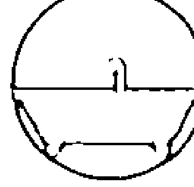

##### 沐浴

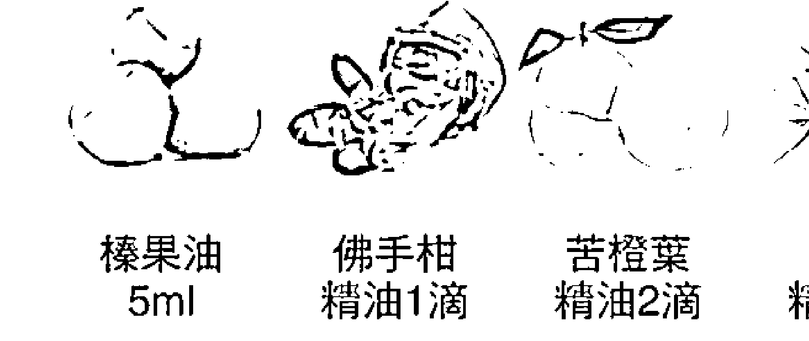

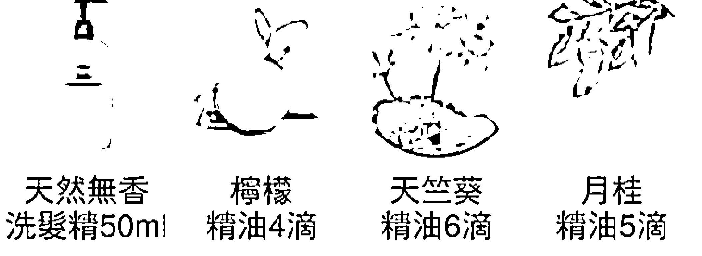

使用方法：
將所有精油與榛果油調和均勻，取適量按摩頭皮髮根至髮尾，停留10分鐘左右後清洗。

使用方法：
將所有精油與洗髮精調和均勻，放入分裝瓶，每次取用5ml進行一般洗髮程序，加強頭皮按摩。

#### 乾性髮質

如果洗完頭12到24小時後的頭髮比剛洗完頭時的頭髮還要乾燥，就是乾性髮質。乾性髮質一般會有頭髮乾燥、敏感和痕癢、頭髮失去光澤、缺乏彈性的困擾。想要一頭健康有光澤的頭髮，就用芳香精油來按摩和洗髮吧！


##### 按摩

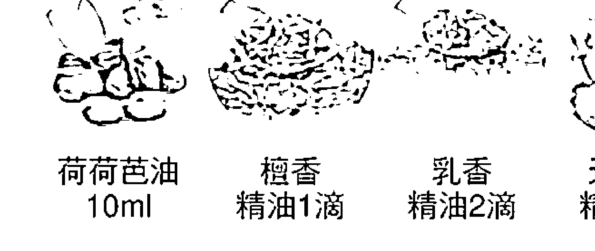

使用方法：
將所有精油與荷荷芭油調和均勻，在頭髮洗淨後取適量按摩頭髮，熱敷約10分鐘，沖淨即可。

#### 頭皮屑

頭皮屑不僅使美麗大打折扣，還反映了不健康的頭皮狀況，過多的頭皮屑出現時，常常伴有頭皮膚炎症和頭皮瘙癢等症狀，嚴重時可導致頭皮毛囊損傷。頭皮是頭部的天然屏障，其脆弱性和敏感性僅次於眼皮，因此頭皮問題不可小視。


##### 洗髮

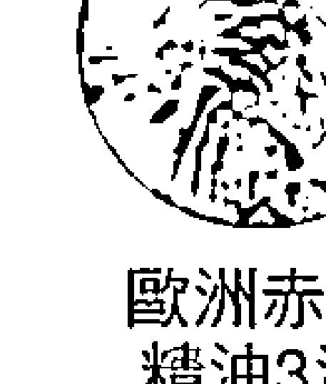

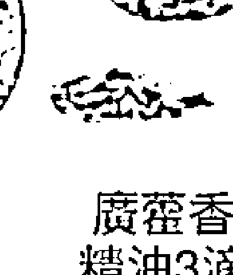

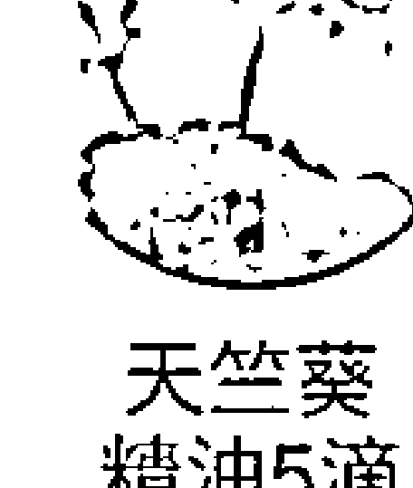

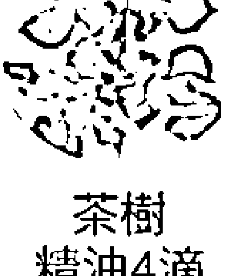

- 歐洲赤松精油3滴
- 廣藿香精油3滴
- 天竺葵精油5滴
- 茶樹精油4滴

使用方法：將所有精油與無香洗髮精調和均勻，取適量搓洗，並輕微按摩，達到清潔調理的效果。

#### 促進頭髮生長

一頭濃密的頭髮不僅能夠為氣質和形象加分，而且還能修飾臉型噢！但隨著年齡的增長，頭髮會漸漸變得稀薄，女性脫髮的程度更是要比男性嚴重不少，有些人則天生頭髮稀疏。快來試試芳香療法拯救我們的秀髮。

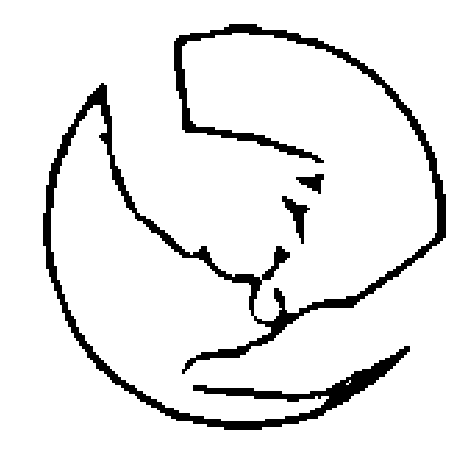

##### 按摩

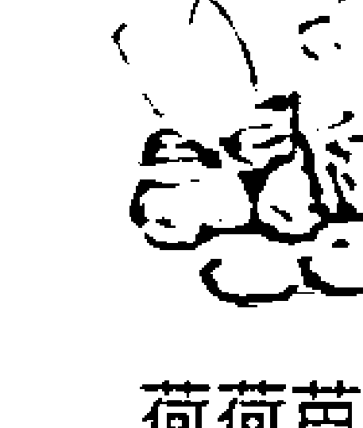

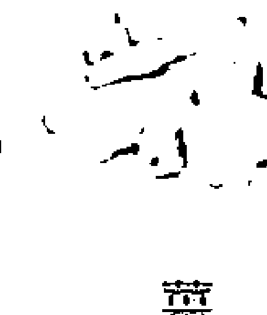

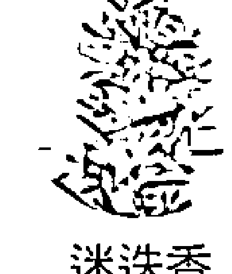

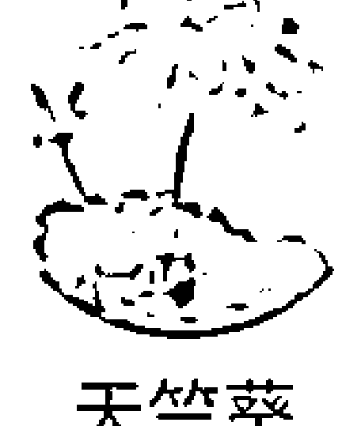

- 荷荷芭油 10ml
- 薑精油2滴
- 迷迭香精油2滴
- 天竺葵精油1滴

使用方法：將所有精油與荷荷芭油調和均勻，在頭髮洗淨後半乾時，取適量在頭髮稀疏的頭皮處按摩。


##### 洗髮


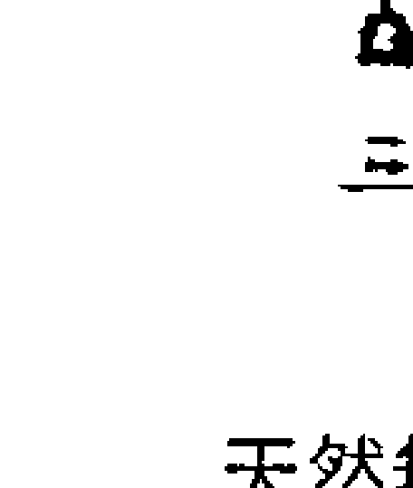

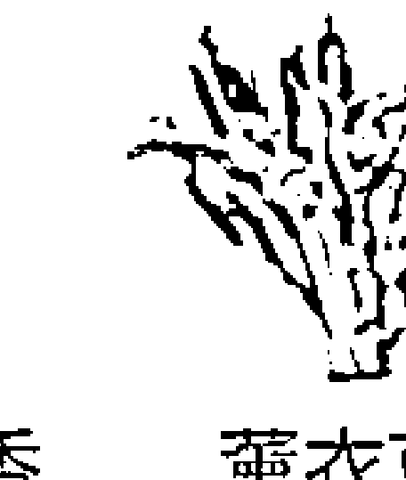

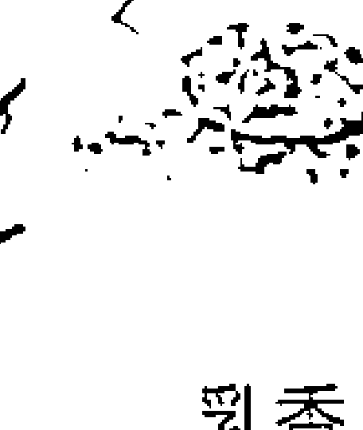

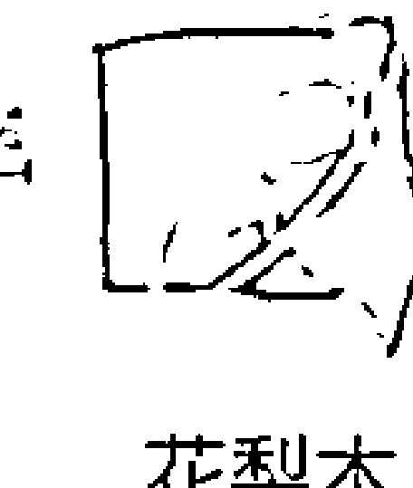

- 雪松精油2滴
- 天然無香洗髮精50ml
- 薰衣草精油6滴
- 乳香精油3滴
- 花梨木精油5滴

使用方法：將所有精油與洗髮乳調和均勻後放入分裝瓶，洗髮時取5ml按摩清洗即可。

### 樂活居家

厭倦了市售殺蟲噴霧和它們含有的有害化學物質？飽受家裡的害蟲困擾或叮咬？別擔心，為了家人尤其是小孩的安全，你可以用精油自製全天然的驅蟲劑，讓蒼蠅和蟑螂遠離家門。野餐或其他戶外活動時也非常實用噢！

#### 除蟲噴霧

##### 噴霧一
**材料：**
- 蒸餾水 25ml
- 丁香精油 4滴
- 檸檬香茅精油 5滴
- 天竺葵精油 6滴
- 75%酒精 25ml

**使用方法：**
將所有精油與酒精先調和均勻後裝入噴瓶，加入蒸餾水搖勻，需要時噴灑在容易被蚊蟲叮咬處。

##### 噴霧二
**材料：**
- 檸檬精油 4滴
- 薄荷精油 6滴
- 丁香精油 5滴
- 75%酒精 50ml

**使用方法：**
將所有精油和酒精調和均勻後裝入噴瓶，噴於室內各處即可。

廁所、廚房的異味總是無法避免的，客廳的煙味有時也很讓人煩惱，這個時候就需要用上清新的精油噴霧了，比空氣清新劑用得健康安心，讓家人在家感受大自然的清新植物芬芳，也能夠盡顯女主人的品位噢！

#### 清新噴霧

##### 噴霧
**材料：**
- 檸檬精油 6滴
- 茶樹精油 4滴
- 75%酒精 10ml
- 蒸餾水 40ml

**使用方法：**
將所有精油和酒精調和均勻後放入噴瓶，加入蒸餾水搖勻，噴灑於所需的室內空間。

各種各樣的細菌和病毒在我們的生活中無處不在，除了自身免疫系統的防範之外，我們也要盡量減少與它們接觸的機會。精油薰香可以消滅空氣中的細菌，用精油作洗手液也不失為一個好選擇，最適合免疫力較低的人群和嬌嫩的寶寶。

#### 消炎抗菌

##### 薰香

- 歐洲赤松精油2滴
- 尤加利精油2滴
- 沉香醇百里香精油1滴

使用方法：
先在香薰爐或薰香燈上方水盤裝7分滿的水，將精油滴入水中，點燃蠟燭或開啟燈泡即可薰香。

##### 洗手乳

- 茶樹精油3滴
- 無香精洗手乳50ml
- 花梨木精油2滴
- 佛手柑精油5滴
- 綠花白千層精油5滴

使用方法：
將精油與無香精洗手乳調和均勻，需要清洗手部時，取適量使用。

家中的香味與女人的香水一樣，總是體現主人的品位，不僅自己聞著舒適，也能給客人留下很好的印象。香噴噴的精油噴霧也能消除汗味兒，使衣服清香；純天然的精油還能緩解壓力，更能避免化學物質的風險，趕緊常備家中。

#### 消除臭味

##### 薰香

- 迷迭香精油2滴
- 尤加利精油2滴
- 檸檬精油3滴
- 薰衣草精油3滴

使用方法：
先在香薰爐或薰香燈上方水盤裝7分滿的水，將精油滴入水中，點燃蠟燭或開啟燈泡即可薰香。

##### 薰香

- 絲柏精油1滴
- 薄荷精油2滴
- 佛手柑精油4滴

使用方法：
先在香薰爐或薰香燈上方水盤裝7分滿的水，將精油滴入水中，點燃蠟燭或開啟燈泡即可薰香。

## 精油功效索引

| 科别 | 精油名称 | 止咳 | 镇痛 | 抗菌 | 消炎 | 止癢 | 調節荷爾蒙分泌 | 增強免疫 | 健胃 | 提神醒腦 | 抗憂鬱 | 催眠 |
|------|----------|------|------|------|------|------|----------------|----------|------|----------|--------|------|
| 桃金娘科 | 丁香 | | ○ | | | | | | | | | |
| 桃金娘科 | 尤加利 | | ○ | | ○ | | | ○ | | | | |
| 桃金娘科 | 茶树 | | | | | | | ○ | | | | |
| 桃金娘科 | 绿花白千层 | | ○ | | | | | ○ | | | | |
| 唇形科 | 快乐鼠尾草 | | | | ○ | | ○ | | ○ | | | |
| 唇形科 | 沉香醇百里香 | ○ | ○ | ○ | | | | | | | | |
| 唇形科 | 甜罗勒 | | ○ | | | | | | ○ | ○ | ○ | |
| 唇形科 | 迷迭香 | ○ | ○ | | | | | | ○ | ○ | ○ | |
| 唇形科 | 甜马郁兰 | | | | | | | | | | | |
| 唇形科 | 真正薰衣草 | | ○ | | ○ | | | | | | ○ | ○ |
| 唇形科 | 广藿香 | | | ○ | ○ | | | | | | ○ | |
| 唇形科 | 胡椒薄荷 | | ○ | | ○ | ○ | | | ○ | ○ | | |
| 樟科 | 花梨木 | | ○ | | | | | | | ○ | ○ | |
| 樟科 | 月桂 | | | | | | | | | | | |
| 樟科 | 肉桂 | | ○ | | | | | | ○ | | | |
| 柏科 | 丝柏 | ○ | | | | | | | | | | |
| 柏科 | 杜松浆果 | | | | | | | | ○ | | | |
| 牻牛儿苗科 | 天竺葵 | | ○ | | | | ○ | | | | ○ | |
| 安息香科 | 安息香 | | | | | | | | | ○ | | |
| 繖形科 | 芫荽 | | | | | | | | | | | |
| 繖形科 | 茴香 | | | | ○ | | ○ | | ○ | | | |
| 繖形科 | 歐芹 | | | | | | | | | | | |
| 繖形科 | 胡蘿蔔籽 | | | | | | | | | | | |
| 橄欖科 | 沒藥 | | ○ | ○ | ○ | | | | ○ | | | |
| 橄欖科 | 乳香 | | | | | | | | | | ○ | |
| 薑科 | 薑 | | ○ | | | | | | ○ | | | |
| 薑科 | 豆蔻 | | | | | | | | | | | |
| 木犀科 | 茉莉 | | | | | | | | | | ○ | |
| 木犀科 | 岩蘭草 | | ○ | ○ | | | | | | | | |
| 薔薇科 | 玫瑰 | | | | | | | | ○ | | ○ | |
| 番荔枝科 | 依蘭 | | | | | | ○ | | | | ○ | |
| 松科 | 歐洲赤松 | ○ | ○ | ○ | ○ | | | ○ | | | | |
| 芸香科 | 佛手柑 | | ○ | | | | | | ○ | | ○ | |
| 芸香科 | 檸檬 | | | | | | | ○ | ○ | ○ | | |
| 芸香科 | 桔子 | | | | | | | | | | | |
| 芸香科 | 苦橙葉 | | | | ○ | | | | | | ○ | |
| 芸香科 | 葡萄柚 | | | | | | | | | | ○ | |
| 菊科 | 羅馬洋甘菊 | | | | ○ | ○ | | | ○ | | ○ | ○ |
| 馬鞭草科 | 檸檬馬鞭草 | | | | | | | | | | | |
| 胡椒科 | 黑胡椒 | | | | | | | | ○ | | | |
| 檀香科 | 檀香 | ○ | | ○ | ○ | | | | | | ○ | |
| 科别 | 精油名稱 | 興奮 | 鎮靜 | 催情 | 促進細胞生長 | 收斂 | 消除體臭 | 軟化皮膚 | 殺菌 | 殺蟲 | 除臭 |
|------|----------|------|------|------|--------------|------|----------|----------|------|------|------|
| 桃金孃科 | 丁香 | ○ | | ○ | | | | | ○ | | |
| | 尤加利 | | | | | | | | ○ | ○ | |
| | 茶樹 | | | | | | | | ○ | ○ | |
| | 綠花白千層 | ○ | | | | | | | ○ | | |
| 唇形科 | 快樂鼠尾草 | | ○ | | | | ○ | | | | ○ |
| | 沉香醇百里香 | ○ | | ○ | | | | | ○ | | ○ |
| | 甜羅勒 | ○ | | ○ | | | | | ○ | ○ | |
| | 迷迭香 | ○ | | | | ○ | | | | | |
| | 甜馬鬱蘭 | | | | | | | | | | |
| | 薰衣草 | | ○ | | ○ | | ○ | | ○ | | ○ |
| | 廣藿香 | | ○ | ○ | ○ | ○ | ○ | | ○ | | |
| | 胡椒薄荷 | ○ | | | | ○ | | | | | |
| 樟科 | 花梨木 | ○ | ○ | ○ | ○ | | ○ | | ○ | | |
| | 月桂 | | | | | | | | | | |
| | 肉桂 | ○ | | ○ | | ○ | | | | | |
| 柏科 | 絲柏 | | ○ | | | ○ | ○ | | | ○ | ○ |
| | 杜松漿果 | ○ | ○ | ○ | | ○ | | | ○ | ○ | ○ |
| 牻牛兒苗科 | 天竺葵 | | | | ○ | ○ | ○ | ○ | | ○ | |
| 安息香科 | 安息香 | | | | | ○ | | | | | |
| 繖形科 | 芫荽 | | | | | | | | | | |
| 繖形科 | 茴香 | ○ | | | | | | | | | |
| 繖形科 | 歐芹 | | | | | | | | | | |
| 繖形科 | 胡蘿蔔籽 | | | | | | | | | | |
| 橄欖科 | 沒藥 | ○ | | | ○ | ○ | | | ○ | | |
| 橄欖科 | 乳香 | | | ○ | ○ | ○ | | ○ | | | |
| 薑科 | 薑 | ○ | ○ | ○ | | | | | | | |
| 薑科 | 豆蔻 | | | | | | | | | | |
| 木犀科 | 茉莉 | | ○ | ○ | | | | ○ | | | |
| 木犀科 | 岩蘭草 | | | ○ | | | | | | | |
| 薔薇科 | 玫瑰 | | ○ | ○ | | ○ | | | | | |
| 番荔枝科 | 依蘭 | | ○ | ○ | | | | | | | |
| 松科 | 歐洲赤松 | ○ | | | | | ○ | | | | |
| 芸香科 | 佛手柑 | | ○ | | | | | | ○ | | ○ |
| 芸香科 | 檸檬 | | ○ | | | ○ | | ○ | ○ | ○ | |
| 芸香科 | 桔子 | | | | ○ | | | ○ | | | |
| 芸香科 | 苦橙葉 | | | | ○ | | | | ○ | | |
| 芸香科 | 葡萄柚 | ○ | | | | | | | ○ | | |
| 菊科 | 羅馬洋甘菊 | | ○ | | | | | ○ | | | |
| 馬鞭草科 | 檸檬馬鞭草 | | | | | | | | | | |
| 胡椒科 | 黑胡椒 | ○ | ○ | ○ | | | | | | | |
| 檀香科 | 檀香 | | ○ | ○ | ○ | ○ | | ○ | | | |

## 各類肌膚使用精油索引

| 皮膚類型 | 精油名稱 | 頁數 |
|----------|----------|------|
| 油性 | 佛手柑 | 166 |
| | 快樂鼠尾草 | 077 |
| | 杜松漿果 | 114 |
| | 歐洲赤松 | 163 |
| | 檸檬 | 172 |
| 乾性 | 安息香 | 121 |
| | 玫瑰 | 156 |
| | 茉莉 | 150 |
| | 胡蘿蔔籽 | 133 |
| | 羅馬洋甘菊 | 183 |
| 混合性 | 天竺葵 | 117 |
| | 玫瑰 | 156 |
| | 依蘭 | 160 |
| | 乳香 | 140 |
| | 花梨木 | 102 |
| 敏感性 | 玫瑰 | 156 |
| | 茉莉 | 150 |
| | 羅馬洋甘菊 | 183 |
| 成熟性 | 玫瑰 | 156 |
| | 乳香 | 140 |
| | 胡蘿蔔籽 | 133 |
| | 絲柏 | 111 |
| | 檀香 | 193 |

| 皮膚類型 | 精油名稱 | 頁數 |
|----------|----------|------|
| 充血、阻塞 | 尤加利 | 066 |
| | 杜松漿果 | 114 |
| | 迷迭香 | 086 |
| | 茴香 | 127 |
| | 茶樹 | 070 |
| | 綠花白千層 | 074 |
| | 胡椒薄荷 | 099 |
| | 甜羅勒 | 083 |
| 疤痕 | 尤加利 | 066 |
| | 花梨木 | 102 |
| | 茉莉 | 150 |
| | 胡蘿蔔籽 | 133 |
| | 茶樹 | 070 |
| | 綠花白千層 | 074 |
| | 廣藿香 | 096 |
| | 桔 | 176 |
| | 真正薰衣草 | 093 |
| 浮腫 | 沒藥 | 136 |
| | 迷迭香 | 086 |
| | 絲柏 | 111 |
| | 歐芹 | 130 |## 精油芳療全圖解

初學必備！
認識精油種類，
輕鬆學會調製與應用，
由內而外療癒身心靈

- 作 者 王慎明
- 審 訂 劉意文

- 責任編輯 蕭亦珊
- 封面設計 林志鴻
- 內文排版 徐雅雯

法律顧問 建業法律事務所
張少騰律師
地址：台北市110信義區信義路五段7號62樓（台北101大樓）
電話：886-2-8101-1973

法律顧問 徐立信律師

監 製 漢湘文化事業股份有限公司
出 版 者 和平國際文化有限公司
地址：新北市235中和區建一路176號12樓之1
電話：886-2-2226-3070 傳真：886-2-2226-0198

總 經 銷 祖景國際文化有限公司
地址：新北市236土城區民族街11號3樓
電話：886-2-2269-6367 傳真：886-2-2269-0299
E-mail：service@168books.com.tw

- 初 版 一 刷 2021年 1月
- 定 價 依封底定價為準

香港總經銷 和平圖書有限公司
地址：香港柴灣嘉業街12號百樂門大廈17樓
電話：852-2804-6687 傳真：852-2804-6409

國家圖書館出版品預行編目 (CIP) 資料

精油芳療全圖解：初學必備！認識精油種類，輕鬆學會調製與應用，由內而外療癒身心靈 / 王慎明 著. -- 初版. -- 新北市 : 和平國際文化有限公司, 2021.01
面； 公分

ISBN 978-986-371-270-1(平裝)

1.芳香療法 2.香精油

418.995 109019038

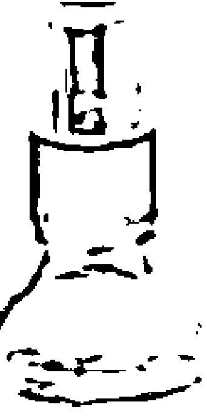

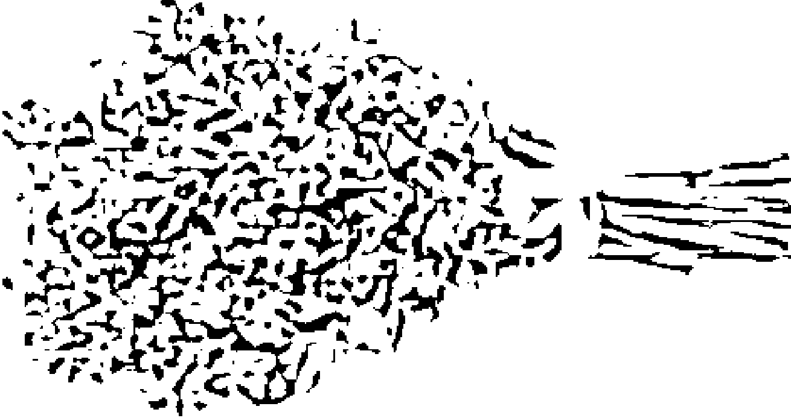