# 花精物语
# 生命的38种痛与美
# Bach Flower Remedies

王晓莉 著

图片提供
英国资深花精专家
朱利安·伯纳德

花精喻示：风行西方的生命科学，首度引进中国，开启你的心灵之门。

河北出版传媒集团
河北科学技术出版社

# 花精物语
# 生命的38种痛与美

Bach Flower Remedies

王晓莉 著

图片提供
英国资深花精专家
朱利安·伯纳德

条形码图案
NLIC2970829564

河北出版传媒集团
河北科学技术出版社

# 图书在版编目（CIP）数据

| 项目 | 内容 |
| :--- | :--- |
| 书名 | 花精物语：生命的38种痛与美 / 王晓莉著 |
| 出版地 | 石家庄 |
| 出版社 | 河北科学技术出版社，2012.8 |
| ISBN | 978-7-5375-5337-7 |
| 分类 | I．①花… II．①王… III．①花卉—香油精—应用—心理保健 IV．①R161.1 ②TQ654 |
| CIP核字号 | 中国版本图书馆CIP数据核字 (2012) 第192236号 |

## 花精物语：生命的38种痛与美

王晓莉 著

出版发行：河北出版传媒集团 河北科学技术出版社
地 址：石家庄市友谊北大街330号（邮编：050061）
总 经 销：北京时代华语图书股份有限公司（010-83670231）
印 刷：河北省三河市文阁印刷厂
开 本：690×980 1/16
印 张：20
字 数：121千字
版 次：2012年8月第1版
印 次：2012年8月第1次印刷
定 价：36.00元

如发现印、装质量问题，影响阅读，请与印刷厂联系调换。
厂址：河北省三河市杨庄镇霍各庄 电话：0316-3662008 邮编：065299

# 推荐序一
## 花精和中国的缘分

生活在20世纪下半叶的欧洲，我们渐渐意识到整个世界已成为成长、变化和个人进步的一部分。20世纪50年代在学校里我们学习拉丁语和希腊语，今天在一些比较先进的学校孩子们已经可以选修中文。对于我们来说，理解欧洲和西方世界以外的文化和文明一直是一个很慢的进程。20世纪60年代教育内容还比较狭窄，但是1966年当我学习艺术和设计的时候，我发现了《易经》和《道德经》，一个崭新的思想世界。这两本书的历史都超过了两千年。我们开始质疑我们的父辈接受和认为理所当然的一切。有时候和政治有关，但大多数是关于哲学和个人生命意义的探索。这就是我为什么会知道贝曲医生，以及他关于健康和幸福的观念。

我最开始发现的是贝曲医生的小书《12种治疗物和其他花精》。这本书似乎很有趣，但到底说的是什么？他描述了各种花精，针对人们经历的担忧、恼怒、缺乏自信或者各种情绪创伤。这些情绪状态，他说，是导致疾病和不适的真正原因。一开始我甚至不知道我属于哪一类型的人。我害怕吗？我生气吗？我是谁？

现在这些似乎都是自我探索过程中最明显的过程。每一步都是一个必需的经历，不但学习我是谁，而且学习我为什么和怎么生病了，如何才可能改善。1931年贝曲医生写了一篇短的论文，题目是《治疗你自己》。这对他来说是关于“疾病的真正原因和治疗”。当时西医正在寻找抗生素和其他药物改变身体的物质层面，贝曲医生却在研究整个人体的生命力和受制于生理、情绪甚至灵性的能量状态。他认为指责细菌或病毒导致了我们的问题是错误的。很多人没有屈服于疾病，是我们对感染的态度决定了我们的健康、幸福和免疫系统的反应能力。这可能更接近传统的观念，我们需要平衡和协调身体的各种能量。而且可能更接近传统的中医，而不是我们现代的、对抗疗法的西医。

贝曲医生发现了38种花精，它们绝大多数来自花朵，能解决这些不平衡情绪。它们帮助我们识别行为模式和改变我们解决问题的方式。一旦你明白作用原理，过程其实很简单。如果你正被烦躁和恼怒干扰，那么你会给自己和别人带来痛苦。你感觉到的紧张正是导致你内脏器官和整个身体感到压力的原因。如果我们经常因别人的恼怒而愁苦，那我们有头痛就不奇怪了。同样，如果我们总是处于担忧之中，那么整个新陈代谢缓慢，能量的循环和运动就会导致冰冷潮湿。但是贝曲医生发现的花精并不会挥动一根魔杖改变这些，它是一个信息，传递出我们怎样可能以不同的方式认识这些问题。

当我开始研究贝曲花精的时候，我最感兴趣的是这些花精到底能做什么，它们可能有什么帮助。但是随着时间的推移，我注意的焦点改变了。35年以后我不再关心它们有作用吗，而是更关心它们是如何作用的。要理解这一点，我们需要一个生命的模型，而不只是物质的身体。我们需要寻找一种治疗物，可以比单纯地用化学合成物的作用对抗病症更有效。灭杀的方式很难带来生机，但是这是另外一个问题。我们可能想知道贝曲花精是如何作用的，但是问题又来了：为什么贝曲医生选择这些花朵？

1930年，贝曲医生在英国的一个私家花园发现了一种非常漂亮的蓝色小花。他认为它可能会成为他正在研究的某种花精。这种花不是英国本地的，而是来自中国西部一个很小的地区。当然它有一个中国名字，叫紫金莲。在英国我们叫它 cerato。贝曲医生说这种花精针对那些不相信自己的判断的人，他们有时候会显得很傻，很容易被误导。他为什么会选择这种花呢？这是我问过自己很多次的问题。

很多年来我研究植物，并且观察它们生长的地方，以及它们如何从种子到发芽、开花的整个过程。我研究生长的形式和几何分布。但是对于紫金莲我始终有两个问题：这种植物的原生地在哪里？它们是如何在那里生长的？为了发现这些，我于2004年去了成都，然后沿着岷江一直到松潘。这次旅程陪同我的是两位值得信赖的英国朋友，还有我们的导游安妮王，她就是这本书的作者。可以说安妮给我们介绍了中国西部，而我们给她介绍了贝曲医生和他的花精。我们的交流一直是值得珍惜和有趣的。

我们不远万里来看的这种植物紫金莲，千万年来一直深藏在汶川和茂县境内一些陡峭和狭窄的河谷中。在这些地区，它们只生长在石灰岩的崖壁上，追溯地质年代的话，它们可能属于三叠纪时期，大约2亿年前。因为这个地区独特的地貌，紫金莲的种子不会随风飘走，而且也不会在河流中存活，今天大约生长在200平方千米的小范围内。1908年，一位名叫威尔逊的英国植物探险家将它的种子带到了欧洲。这是一个很长却相联系的故事，因此贝曲医生才于1930年在英国的一个花园发现了这种来自中国的植物。

这些事实只是延续到我们，如果没有别的我们只是分享这些。但是让我激动的是想到这个只在岷江河谷生长和繁衍的植物，内在却包含着某种有关我的生命的特别信息。当然这听起来好像是幻想，但是当我开始研究贝曲医生的著作时，我才明白了一些关于自己的重要的事情。所以当我研究这种植物的时候，这些想法就迅速得到验证，并且以一种特殊的方式显现。

继续阅读下去，你会了解更多紫金莲花精。但是在结束之前我想再谈谈贝曲医生关于健康和疾病的观念。他认为疾病的真正原因是我们内在的冲突。我们通常对自己并不满意，而且在我们的生活方式中感觉不到幸福。出现这种情况的原因是我们没有聆听西方称为灵魂的内心的指导。我们和我们最本质的存在相处并不和谐。这导致了不平衡，使我们陷入与自己的冲突之中。

可能这只是针对西方人才有的冲突和困难。我们有比我们知道的更多的问题。但是这种美丽的中国花朵告诉我的是人类的状况非常类似，无论我们住在哪个大陆上，我们拥有的是同样的生命。当我们分析哪些植物来自哪里的时候，我们很快就会发现国家的界线是人划分的，而不是植物。实际上我们可以说，植物——花朵和树木说着一种国际性的可以理解的语言。它们传递的信息和含义在全世界旅行，没有护照或国界。

从这个角度讲，紫金莲成为一种自我发现和国际间相互理解的象征。当然我相信它仍然梦想着故乡。它可能已经适应了生活在西方，但是它的心仍然是中国的。它会梦到陡峭的河谷、石灰岩的石块和湍急的河流。

那条河流叫岷江。2008年5月，正是在这个地区，百年不遇的地震用巨大的能量摧毁了紫金莲的栖息地，地壳板块像一条烦躁不安的巨龙摇动着山脉。很抱歉为了叙述这件事情我不得不提到那场灾难。

这让我想到联系我们所有的人的人性的宇宙纽带。这是我感觉这本书会让我们看到的。它可能是一座连接东方和西方的桥，横架在作为读者的你和我们这些在英国研究花精的人之间。这样我们就可能相互不会成为外国人而是朋友。

英国花精专家 朱利安·伯纳德
沃尔特斯通

# 推荐序二
## 每一个人都可以疗愈自己

认识花精是因为无意间发现到，贝曲医生在论述12种性格花精时谈及了占星学，顿时让我这个满脑子占星研究的痴人找到了新的交集，对占星学而言，12种性格花精是一条非常成熟的参考线，那种感觉就像捡到了一张入场券似的让人喜不自禁，加上一直跟植物世界有很深的缘分，就是这些个原因为我开启了花精的探访之路。

早些年只是在知识上去了解花精，始终我俩都像隔着一层纱帐互看着，少了点真实与激情，又过了好多年终于弄清楚问题所在，原来花精跟占星的习修之路是一模一样的，唯有透过亲身体验，你才可能真正了解什么是野玫瑰状态，什么是红栗情绪，什么是硬花草的犹豫不决及反复无常。原来透过花精带给我的是，更多的更细致的自我觉察。贝曲医生在发现38种花精时，不也经过了亲身体验情绪爆发的过程吗？

## 恍然大悟！

植物将来自天空爸爸及大地妈妈的能量与微量元素转化成地球人及动物们能够接受的物质哺育着我们。草药疗法与人类的历史一样久远，不论东方或西方都发展了草药疗法，似乎这是生物本能的一部分，现在仍反映在动物们自我疗愈的行为当中，养过猫、狗的朋友对于这个部分一定不陌生。

如果说身体的表达是灵魂的一面镜子，那么“疾病”真是一位最尽忠职守的信差了，它大声疾呼传递的信息是“救命呀”，但是多半已经处于“身心灵”失衡状态的当事者，往往继续不正视自己的问题，多半会以厌恶且绝情的方式先打昏这个讨厌的信差再说。

“情绪”为一切疾病的根源，花精自然疗法，则是一条自我复苏与身心灵的重建之路，也是贝曲医生留给人们最珍贵的礼物。当我们打开花精瓶，那非物质层面的部分就如瓶中精灵般瞬间飞逸而出，即使不服用它，都可能在心灵层面产生细微而深刻的波动，也许我们无法具体观察到运作过程，但会感觉到内心的阴霾突然一扫而空。

我最喜欢拜读安妮的花精博文，或许她自己并不知道，她就是点灯引路的仙子，身后延绵拖逸着神奇的疗愈魔法，透过花精为媒穿越隔阂，重新唤醒人们与大自然之间的和谐对话。

据说在夜空里总有一颗星星特别守护着我们，大地上也有一些植物像是我们的翻版！问题与答案是一体的两面，疾病与解药也是阴阳的一体，让我们跟随贝曲医生的足迹探访大自然的药房吧，透过贝曲医生的38个花精灵，在日常生活中，我们也可以成为自我疗愈者！

资深星座专家：吴壁人

# 前言
## 含蓄温和的生活小助手

2007年，我为台湾李颖哲中医师的第一本花精书《巴赫医师的人生教科书》写序时，曾详细介绍过花精是如何走进我的生活的。

喜爱贝曲花精的人都可以讲出自己与花精结识的缘分。有些是“一见钟情”；有些是慢慢了解，平时忘记，急需的时候才马上想起；大多数是怀疑、尝试、分手，又开始，再认真对待。当贝曲花精成为和你喜欢喝的普洱茶或铁观音一样自然的饮料的时候，只需要在每天的饮水中加一些花精稀释液，不知不觉中，你感到了放松、快乐和释然。如果生活像在有平坦有泥泞的道路上行走，花精就像一位温和含蓄的助手默默地理解你，轻柔细腻地将你从各种消极情绪或不适感觉的泥坑中拉出来，或者在你困顿的时候为你取下干扰你的情绪包袱，使你可以继续轻松地行走。如果身边一直有这位清淡如水的朋友陪伴，你会感到自己的身心在一点点渐变，更自然，更平和，更健壮。恭喜你，你找到了一位最简单、最贴心的生活助手。

2004年，朱利安·伯纳德在岷江河谷观察紫金莲

我对贝曲花精的喜爱与大多数人类类似，也是从怀疑开始。2004年8月，我陪同英国花精专家朱利安·伯纳德一行在我的故乡——四川岷江河谷，寻找贝曲花精植物之一紫金莲的祖籍。伯纳德告诉我紫金莲可以帮助你相信自己的直觉，这对初次听说花精的我而言，似乎意味着花精竟可以改变一个人的思想，我很怀疑，并且还有点害怕。伯纳德回国不久，寄来了一套花精和几本介绍花精的书。此后很长一段时间里我都不敢吃它。几个月后，在各种压力下身体越来越虚弱的我，注意力只能集中十几分钟，想做的事做不了，身心非常痛苦。我是一个对药物很敏感抗拒的人，无奈之下，决定小心地尝试花精。开始只是铁线莲一种，因为伯纳德曾说我是这种性格情绪。吃得很不认真，还有过高的期望，也不知道花精到底有什么作用，所以一直怀疑、放弃、又开始。终于有一天下午，我发觉自己已经不能集中注意力做任何事情，完全无力自救了，我才决定认认真真地吃花精。几个星期以后，我突然发觉自己的注意力居然可以集中半个小时了，我又可以做自己喜欢的事情了。花精非常温和，清淡似水，却能让我一天天自然地恢复健康，这正是我最向往喜爱的治疗物。两年后的今天，我已经对花精不再有任何怀疑、害怕或者期待，我完全信任它温和实在的作用。我的整体生命状况的改善主要取决于我的身体现状、生活方式、思维方式，但是花精可以从情绪入手有效地帮助和推动我净化、改善和融合身、心、灵的成长，它已经是我的一位最平淡却最知心的生活助手。

身体改善了一些，我才开始阅读伯纳德送的几本书。花精的发明者贝曲医生以一位英国绅士的温和、睿智、不带任何偏见的真诚，深入浅出地讲述了疾病的自我疗愈与身、心、灵和谐统一的关系。透过很多叙述，我可以感到很熟悉的中国道家关于自然与生命的认识，贝曲医生也说自己自己的思想是东西方许多伟大导师们教导的总结，包括佛陀、基督。近十几年来，世界各地的人们越来越接受不同文化的融合和相互学习。这个时代很少有全新的思想产生，而越来越受欢迎的身、心、灵运动的一个特点就是古今东、西方文化的融会贯通。思想、感受、行动三方面健全和谐的人才是这个时代最令人敬佩的先锋。贝曲医生在20世纪初就开始了这样的工作，而且他还找到了一位最简单温和的朋友——花精来协助每一个人健全自己的生命。

写完上面的序文，五年过去了。这期间我坚持一边疗愈自己，一边研究花精。这一路走得很慢，但是我用全套贝曲花精逐步完成了基础的身心疗愈。我将研究的内容和使用体验都放在了新浪博客上，越来越多喜爱花朵和身、心、灵疗愈的朋友一直给我鼓励和支持，才有了出版这本书的因缘。希望这本书能为你打开一扇新的大门，了解自己的基础情绪创伤和干扰。你会发现这些伤痛和弱点其实都是认识和改善生命的路标，它们甚至可能会带你回到一个更高的意识层面：你最真实永恒的存在。同时这本书也为你介绍了对应这些创伤和干扰的健康和平衡的生命能量，这些美的能量也正是花精包含的能量。花精疗法证明人与植物的中脉能量是一致的，这是天人合一的基础体现。

花精，来自花朵的生命能量，它的风格是含蓄、温和、自然的，这正是我内心熟悉的道的能量，至柔中包含至刚。一点一滴的花精稀释液，那么细微地抚平我的身心创伤，强健我的生命活力。情绪能量是身、心、灵连接的纽带，花精就是用来修补和增强这些纽带，渐渐地协助身心灵融合在一起，使生命回归整体，和谐地成长。

深深感谢我这一世生活的国家——中国，谢谢你给我古老的智慧，在不断变化的新时代，永远真诚地面对生命的痛与美。

贝曲花精第一种植物凤仙花

# CONTENTS

- 推荐序一 花精和中国的缘分 / 1
- 推荐序二 每一个人都可以疗愈自己 / 7
- 前言 含蓄温和的生活小助手 / 11

# 第一章 花精起源 / 001

# 第二章 12种美丽的天性和生理弱点

- 1. 凤仙花 Impatiens § 快！快！快！ / 019
- 2. 马鞭草 Vervain § 不熄的火炬 / 025
- 3. 铁线莲 Clematis § 天空之子 / 031
- 4. 菊苣 Chicory § 爱的迷失 / 038
- 5. 龙胆草 Gentian § 易碎的心 / 046
- 6. 硬花草 Scleranthus § 犹豫的哈姆雷特王子 / 054
- 7. 沟酸浆 Mimulus § 担忧的心 / 061
- 8. 美洲赫顿草 Water Violet § 矜持的心 / 068
- 9. 矢车菊 Centaury § 不愿说不的灰姑娘 / 076
- 10. 龙芽草 Agrimony § 微笑的面具 / 082
- 11. 紫金莲 Cerato § 直觉的困惑 / 089
- 12. 岩蔷薇 Rock Rose § 惊慌的心 / 098

## 第三章 7种基本能力和长期情绪

- 1. 葡萄 Vine § 固执与柔顺 / 109
- 2. 岩水 Rock Water § 僵硬与柔软 / 116
- 3. 石楠 Heather § 喧嚣与宁静 / 123
- 4. 橡树 Oak § 枯萎和新生 / 130
- 5. 橄榄 Olive § 疲惫与休息 / 138
- 6. 荆豆 Gorse § 希望与绝望 / 145
- 7. 野燕麦 Wild Oat § 散漫与专注 / 151

# 第四章 19种生命特长和思想弱点

- 1. 樱花 Cherry Plum § 爆发与冷静 / 161
- 2. 榆树 Elm § 压力与放下 / 166
- 3. 栗苞 Chestnut Bud § 重复与突破 / 173
- 4. 火烧杨 Aspen § 战栗与欢歌 / 180
- 5. 落叶松 Larch § 自卑与自信 / 187
- 6. 鹅耳枥 Hornbeam § 乏力与清新 / 195
- 7. 杨柳 Willow § 抱怨与自强不息 / 201
- 8. 山毛榉 Beech § 挑剔与接纳 / 208
- 9. 海棠 Crab Apple § 不洁与排毒 / 215
- 10. 核桃 Walnut § 动摇与稳定 / 221
- 11. 冬青 Holly § 仇恨、不满、嫉妒与和平、慈悲 / 229
- 12. 圣星百合 Star of Bethlehem § 麻木与苏醒 / 236
- 13. 白栗 White Chestnut § 思考与静默 / 244
- 14. 红栗 Red Chestnut § 担忧他人与安宁 / 253
- 15. 松树 Pine § 自责与自在 / 259
- 16. 忍冬 Honeysuckle § 怀旧与当下 / 267
- 17. 野蔷薇 Wild Rose § 懒惰与回应 / 275
- 18. 芥子 Mustard § 忧郁与快乐 / 283
- 19. 西洋栗 Sweet Chestnut § 痛苦与甜蜜 / 291## 第一章 花精起源
## ——一位医生、细菌学家、疫苗专家的渐悟

花精的发明者英国爱德华·贝曲（Edward Bach）医生（1886—1936）出生于英国伯明翰郡附近的一个乡村，有一个弟弟和一个妹妹。婴幼儿时期的贝曲体质非常虚弱，常受疾病困扰，长大以后才逐渐强壮起来。少年贝曲精力旺盛，喜欢探索新事物，而且直觉细腻，有着超强的专注力，常常沉浸于自己感兴趣的事物中。他天生就有两个最强烈的内心力量，一是对所有痛苦者强烈的同情心，不管是人类，还是鸟类、兽类；二是对大自然、对花草树木的热爱。这两个力量的结合引导他一步步走向自己探索的疗愈之道。他心中热爱的一半帮助了另外一半：在大自然的仓库中贝曲医生发现了原野中的花朵，用于帮助所有陷入痛苦与疾病中的生灵。

但是花朵的温和疗愈力量并不是贝曲医生某一天早上的顿悟。为了完成 38 种花精研究，贝曲医生用了整整 23 年，几乎是他半生的时间。

这是一个缓慢的渐悟过程，也是一个艰辛的坚持内心的直觉、尊重真理的过程，因为当时绝大多数西方人还无法理解温和的自然疗法也可以协助身体恢复健康。

## 从铸铜厂到医学院

1903—1906年，中学毕业的贝曲在父亲的铸铜厂工作，他亲自体验过所有的工种，也和工友们成了朋友。在此期间，他获得了观察和理解人性的能力。他发现很多工友都受疾病困扰，但是去医院治病不仅意味着会失去工作，而且还需要大笔医疗费。他们本应卧床休息的时候，却不得不强迫自己坚持繁重的工作。多数人只能用一些药物缓解和抑制病情。年轻的贝曲非常同情病痛中的工友，他决心学医，帮助他们解除病痛之苦。可他又直觉地认为，应该有一种不仅使工友们的头脑放松而且也能使身体恢复健康的简单方法，这种方法甚至能治愈慢性病和绝症。但这种神迹似乎只发生在教堂，只有上帝才能治疗人的身体、思想和灵魂。他矛盾了起来，不知道自己是做牧师还是医生。最后他认识到自己必须去寻找一种新的治疗方法，包括早已被人类遗忘的疾病与治疗的真相。

他想去上医学院，目的是了解现有的医疗方法。于是他鼓起勇气告诉了父亲，没想到父亲竟然同意资助他上大学。20岁的贝曲开始在伯明翰大学学医，先后获得了外科医生和内科医生的资格证书。

毕业后，贝曲留在伦敦工作，他非常不喜欢拥挤的城市，只是为了研究病人和进行实验工作才暂时留在了城市。大自然的宁静和纯净常常在内心深处呼唤着他，有时候他担心自己坚持不下去而故意避开去公园。

贝曲医生始终没有忘记自己的梦想：寻找疾病的真正原因和新的治疗方法。他不断地思考如何彻底治愈病痛者的身心问题，而不仅是暂时地缓解症状。他敏锐地观察到，同样的药物并不适合所有看似相同病症的病人。

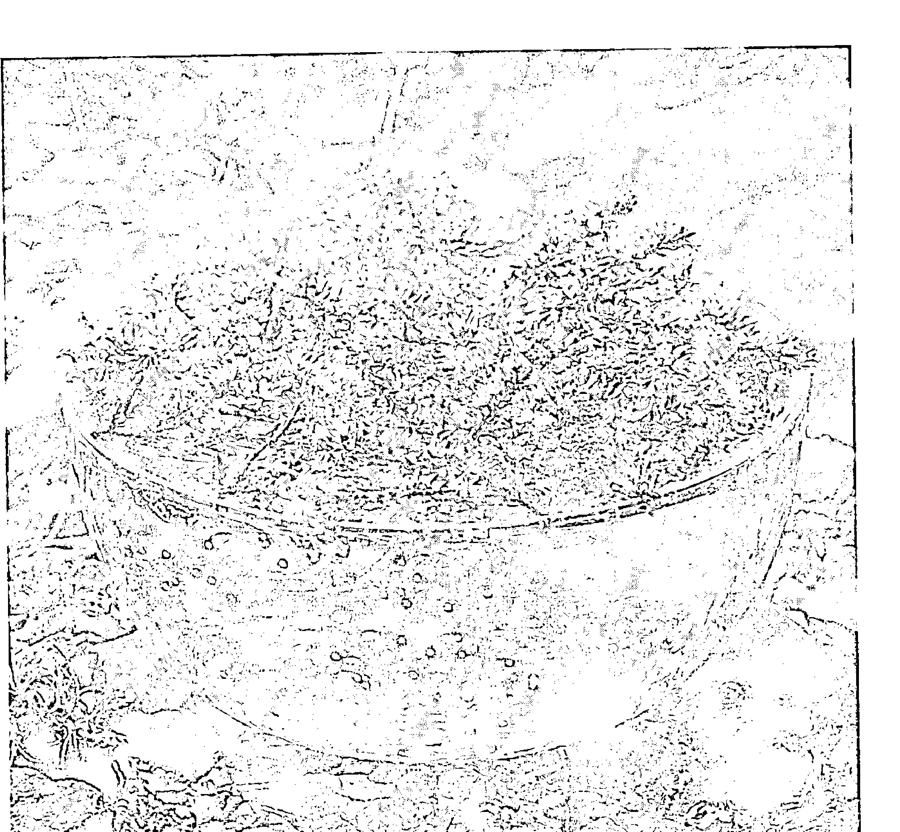

## 日晒法制作花精

他直觉地认为，治疗病人情绪比治疗身体的病症更重要。这种直觉越来越强，在以后的研究过程中，他始终追随内心的指引。

## 细菌研究和疫苗专家

1913年，27岁的贝曲医生因健康状态恶化，辞去了主治医生的工作。刚刚康复，他就在伦敦哈雷街开了诊所。病人越来越多，他却越来越不满意传统的西医。因为很多病人虽然表面上康复了，健康却不能保持多久，很多人都有一些长期或慢性的病症几乎无法治疗，处于现代医学称为的亚健康状态。

贝曲医生发现，医生太忙了，只能专注于人的生理状态，根本无暇研究病人的性格情绪状态，而他敏锐地发现，这可能才是病人最重要的疾病。

于是他决心研究免疫学以寻找更好的治疗方法。1915—1919年，贝曲医生在伦敦学院大学医院担任助理细菌研究员。在这个领域，他首次发现某些微不足道的肠道细菌和慢性病有关，这些细菌在健康人和病人的身上都有，但是在病人体内数量更多。他研制出一种疫苗，把该疫苗注射入病人的血管，可以清理引发慢性病的毒素系统。效果之好大大超出他的意料，不仅改善了病人的整体健康状态，而且彻底治愈了一些慢性病如关节炎、风湿病、头痛等。

虽然工作有了进展，但是贝曲医生一直不喜欢皮下注射的方式，因为扎针会让病人痛苦。于是他继续新疫苗的研究工作。

忘我的工作使从小体弱多病的贝曲医生在31岁时被诊断为癌症晚期，医生断言他最多还能活三个月。在战胜了难以想象的身心痛苦后，贝曲医生决心用最后的时间全部投入心爱的研究工作，他不愿意轻易放弃，哪怕面对死亡。

几个月夜以继日的工作，他的病竟然在不知不觉中好了起来！这在当时简直是一个奇迹，这也使贝曲医生停下来思考自己康复的原因。他认为康复的原因是因为一种专注的兴趣、一种伟大的爱和一个明确的生活目标，这些不仅是幸福的决定因素，而且激发了他战胜困难的勇气，帮助他重新恢复了健康。

> 诺拉·维克丝在贝曲医生的传记中写道：在他此后的工作中就体现了这个伟大的真理，因为他找到的花精就具有这种力量，使人重新获得继续生活和做自己的工作的愿望，正是依靠这种愿望健康完全恢复了。

1914年，第一次世界大战爆发，由于过度忧伤和劳累，贝曲医生的身体状况一直不好，多次被拒绝加入海外服务。但是他的工作却异常繁忙，除了细菌研究工作外，他还负责400多个病人的治疗工作。

1918年，流感爆发，贝曲医生研究的慢性病疫苗被非正式用于士兵的治疗，拯救了上千名士兵的生命。

1920年，他的疫苗研究成果被英国皇家医学会记录并承认。

虽然他的疫苗研究是传统西医的一大进步，但是贝曲医生自己并不满足。因为还有很多病症无法治愈，他认为研究工作才刚刚起步，自己还需要加倍努力。

## 顺势疗法和贝曲疗剂

1919—1922年，贝曲医生在伦敦顺势疗法医院设立了自己的细菌研究室。这时，他得到了一本顺势疗法创始人汉勒姆的《推理法》。带着怀疑的态度贝曲医生打开了这本书，才看了几页就彻底改变了自己的态度。他意识到了汉勒姆天才般的智慧，于是仔细地读了起来。

他越看越有兴趣，因为他发现汉勒姆的研究结果和自己的有很多相似之处。原来，早在一百年前，汉勒姆就知道了贝曲医生发现的事实——慢性病和肠道毒素存在着紧密的联系，而且汉勒姆也用实验证明了，在药物效果消失后再用药，比定期使用药物效果更好。

贝曲医生深受震撼，汉勒姆进行研究的时候，还没有任何科学仪器，只有几个助手，而且汉勒姆还非常勇敢地公布了自己的发现，尽管当时没有一个人支持他。

汉勒姆用大自然的药物而非细菌来治疗病人，也使贝曲医生感到惊喜。尽管汉勒姆也使用有毒物或金属药物，但非常非常少，其危害完全可以忽略不计。

另一个相似之处是，每一个病人都应该得到个性化的治疗，而不是群体化的治疗。汉勒姆说：“明智的医生应该根据每个病人的个性来诊断病情，也应该根据个性来治疗，用针对个性的合适治疗物才能真正治好病人。”

他们都认为真正的治疗原则应该是治疗病人而不是疾病。汉勒姆医生认为应该治疗病人的情绪和精神状态，不必考虑病人的生理病症，也不必浪费时间进行冗长而痛苦的检查化验，只需要观察疾病的症状即可。这对我们中国人来说其实并不陌生，因为观察情绪一直都是中医的基础诊断方法之一。汉勒姆医生在《推理法》的第一章写道：“医生唯一的崇高使命是使病人恢复健康，是治愈……”而这也正是贝曲医生从医的原因，正是这种愿望使他决定克服一切困难，完成自己的使命。在后来研究花精疗法的过程中，贝曲医生曾不止一次地被警告将取消他的注册医生资格，但是这些丝毫也不能影响他的研究，他坚信一定有更好的治疗方法。

汉勒姆的《推理法》使贝曲医生认识到，自己可以将顺势疗法和疫苗研究在某些方面结合起来，这样可以扩展和推进两个领域的研究。

贝曲医生开始用顺势疗法的方法制作疫苗，并改为口服，效果令他十分满意。从此以后，他几乎完全放弃了注射方式。他将发现的肠道细菌分为七组开始临床试验，同时也开始研究七组病人的情绪状态。他发现每一组病人竟然都表现出同一种明确的个性，七组病人表现出了七种不同的个性。这让他非常激动，自己的直觉得到了验证。

经过大量的临床观察和总结，贝曲医生开始根据病人的情绪状态诊断病人，效果也好得超出了预料。他非常喜爱这种诊断方法，因为这种方法使病人省去了很多身体检查时的不舒服和难堪，并且这些检查常常使病人更加疲倦和虚弱。

七种疫苗被命名为贝曲疗剂，临床效果非常好，同时被英国、美国、德国和其他国家的西医和顺势疗法的医生使用。对应七类情绪的七种疗剂从此走向了世界。1920 年，贝曲医生发表了《疫苗研究和顺势疗法的关系》一文，他指出了两者之间的相似之处，一是小剂量；二是使用方法以及治疗物的种类相似。这使当时很多细菌专家对顺势疗法产生了浓厚的兴趣。

在此后的几年中，贝曲医生不断完善每一个细节，使贝曲疗剂的使用可以完全依靠观察症状，不需要任何仪器的帮助。

## 七种贝曲疗剂：研究的新进展

疫苗的成功带来了许多新的工作内容，使贝曲医生陷入了异常的忙碌之中，但他在伦敦郊区始终保留着一个免费治疗和指导贫困病人的小房间。

他的天才在顺势疗法领域得到了承认，被称为“第二个汉勒姆”。1926 年，贝曲医生和助手 C·E·惠勒一起出版了《慢性病：一个尚未解决的假设》一书。这本书影响广泛，而且同时得到对抗疗法和顺势疗法的赞誉。之后，他的实验室开始为 700 多名医生提供疫苗样品。他仍在门诊工作，在此期间，他的收入非常高，但是大部分收入都用在了研究上。

贝曲医生不知疲倦地进行着治疗法的简化研究，也希望找到更纯净的治疗物。他夜以继日地研究，甚至测试过电疗与 X 光疗等，但是效果都不令他满意。

贝曲医生也研究饮食和疾病的关系，他倡导尽量吃未烹煮过的新鲜食物如水果，坚果、谷物与蔬菜，因为这样可以减少肠道毒素。

1924 年，他发表了《肠道细菌与癌症的关系》一文，正式向英国顺势疗法协会汇报他的研究：结合健康饮食法和疫苗治疗，不仅可以治愈疾病，还可以改善身体的整体状态。他终于用科学方法证明了自己的直觉：病人的情绪是最应治疗的疾病。疫苗疗法能恢复病人整体健康，所以局部的病症也随之被治愈了，这和后来的花精疗法是一样的。他说，花精疗法是使病人从“不像自己”到“完全是自己”的疗愈法。

助手惠勒在 1927 年国际顺势疗法大会上发言说：“请首先注意，贝曲医生是一位细菌学家，他通过细菌学的研究途径解决了免疫学的难题。请再注意，当他得到这些研究成果时，他完全不知道顺势疗法。”

在这次大会上，贝曲医生还承认了自己发现的肠道细菌就是汉勒姆发现的 PSORA。贝曲医生谦逊地认为自己只是验证和扩展了汉勒姆的研究。

虽然口服疫苗取得了成功，但是贝曲医生并不满足。他认为自己发现的七种疫苗只是疾病的某一分支，仅是汉勒姆医生以 PSORA 命名的一组病菌，不能治疗所有的慢性病。且疫苗来自于细菌，这也让贝曲医生不满意，他希望找到一种更纯净的治疗物。于是，贝曲医生开始研究植物和草药，效果都没有疫苗理想。

1928 年，贝曲医生写信给英国顺势疗法协会，在提到汉勒姆时写道：“我希望可以用七种药草代替七组细菌来治疗疾病，人们心中始终抵触用与疾病有关的细菌来治疗疾病……汉勒姆看到，由于社会环境会不断改变，新疾病还会不断出现，因此必须找出新的治疗物。天才的他也认为，大自然存在着无数的治疗物，可以治愈所有疾病。”

同年，贝曲医生第一次找到了三种花精植物，并开始用它们取代贝曲疗剂。贝曲医生做了大量的植物研究，并预言可能产生一种新的制作方法。他还在同一封信中向英国顺势疗法协会阐述了自己对疾病的新的定义：“科学逐步表明，生命是和谐的，是一种合拍的状态，疾病是失调的状态，是一部分和整体失去和谐的状态。”这样的理解已经超越了传统西医只从解剖学理解人体的认识，更符合顺势疗法的整体治疗原则，也接近中医和瑜伽对生命的整体认识。

## 一场聚会的启发：开始新的工作

到目前为止，贝曲医生的所有发现和研究成果依靠的都是实验方法。但是当科学不能给他满意的答案时，他更愿意相信自己的直觉，这种来自内心的启示总是指引着他走上正确的道路。

1928—1930年，贝曲医生利用一切实验室外的时间到乡村、海边、皇家园林和公园等寻找植物，同时他也在思考对疾病本身的更深入的理解，以及它在头脑和身体上产生的原因和后果。

一天晚上，贝曲医生应邀参加一个大型晚宴聚会，由于他素来不喜欢喧闹，开始并不开心。为了打发时间，贝曲医生静静地观察着身边的客人。突然他意识到，人性可以明确地分类，大厅中的每一个人都可以属于其中一类。于是他开始观察人们如何吃东西、如何微笑、如何行动，也观察他们的态度、表情和语调等，一些人是如此相似，尽管他们毫无血缘关系。他很快就发现了七类情绪之外的情绪，他相信还会发现更多的情绪种类。这将是他大规模疗剂研究的扩展，只是他还不知道情绪的分类原则以及治疗方法。但一个灵感出现了：每一种类型的人可能患各种不同的疾病，但是在他们生病的时候，他们会表现出同样或相似的情绪或态度。

在此后的工作中，贝曲医生不断观察病人，验证自己对情绪的认识。直到1930年，他感到时机已经成熟，决定彻底离开伦敦回到大自然，开始寻找新的治疗物。

回到威尔斯乡下，贝曲医生准备工作时，发现自己拿错了行李，装着实验器皿的箱子变成了装着鞋子的箱子！但是很快，贝曲医生就发现他没有拿错，因为他研究的新治疗物根本不需要任何实验设备，反而需要在田野中徒步的鞋子！回到大自然，贝曲医生的生活开始完全跟从自己的内心，治疗对他来说从来不是一种职业，而是一种神圣的艺术。从此，他完全免费为病人诊断解惑，还免费为病人提供花精。当他因研究需要经费的时候，总会得到感激他的病人或理解他的朋友的资助。这使他坚信自己的方向是正确的，他只需要追随万物之源一直走下去。

贝曲医生随后陆续出版了所有的花精研究成果。

1931 年，出版讲述花精疗法哲学思想的作品《治疗你自己》，他认为疾病的产生源于深层次的生命失调，即更高意识与个性不和谐。生命的目的是不断地学习和进化，生命的源头是爱。而疾病正是个性失误的提醒。

同年出版了《你的痛苦来自于你自己》。在这本小书中贝曲医生详细介绍了花精疗法是如何由顺势疗法的原理逐步发展出来的。顺势疗法的原理是同类治疗同类，比如病症是发热，就会再激发发热，帮助身体把热量释放出来。花精疗法是用健康的能量取代消极的能量。贝曲医生还从哲学的深度思考。花精疗法用美丽、健康、和平的能量，面对伤害和干扰我们的各种负面能量，这也是克里斯提那、佛陀、耶稣所倡导的教诲，我们要始终用善良面对邪恶。花精的本质是如此温和、自然，在欧洲它一直被归为食品类。

1932 年，出版《释放你自己》，倡导一种简单、遵循直觉、尊重个性自由、个性与心灵和谐的创造性的生活态度。保持这种生活方式会让我们获得健康、快乐和幸福。

1933年，出版《12种治疗物》，确定了12种性格情绪与对应花精。

1934年，出版《12种治疗物和7种辅助者》，确定了7种长期情绪和对应花精。

1936年，出版《12种花精和其他治疗物》，完成了19种日常情绪和对应花精的确定工作。至此确定了38种花精，并按照相似性将它们分为七组，这就是后来被瑜伽师按照脉轮能量顺序排列的七组脉轮花精。

完成了花精研究以后，贝曲医生计划和自己的助手通过讲座传播花精知识。1936年9月24日是贝曲医生50岁的生日，这一天，他在家乡附近的小镇开始了第一场花精讲座。

同年11月27日，贝曲医生在睡眠中安静地去世了。贝曲医生似乎是为了发明花精而诞生的，他的身体一直不好，大部分情绪自己也曾强烈地感受过。尽管传统的西医一直质疑他的研究，但是他完成了从小就埋藏在内心的愿望：寻找一种新的治疗途径帮助解除一切生灵的病痛。贝曲医生用自己的言行表明他的研究是对人类的无私奉献。2008年9月欧盟最终裁定贝曲花精属于普通名词，它代表一种新的自然疗法，是属于全人类的知识产权。

人们无法知道贝曲医生是如何具体研究每一种情绪，如何选择每一种植物的，因为贝曲医生一直有一个习惯：销毁所有研究的记录，直接公布研究结果。他认为这样不会引发争议。他的目的就是让治疗成为一种简单的方式，消除人们对病痛的忧虑。贝曲医生希望使用花精成为一种非常简单的事情：正如饥饿时采些生菜吃一样，当我们忧虑时，可以吃一些沟酸浆花精。

作为一位温和的朋友，花精可以帮助我们消除已经产生的不良情绪。但贝曲医生说：从本质上看，疾病是心灵和头脑产生冲突的结果，如果没有精神和心理上的努力，情绪还会继续产生，永远无法根除。

从 20 世纪 50 年代开始，花精疗法率先在澳大利亚发展了起来，随后逐渐出现了澳洲花精、北美花精、台湾花精等。现在世界各地的花精爱好者、牙科医生、社区医生、心理治疗工作者、灵性研究者、瑜伽修行者等都根据各自的需要而使用花精，有些爱好者甚至制作自己的私人花精，越来越多的新花精正在诞生。

这种温和的天然治疗物正在引导越来越多的人回归感性，反思痛苦与疾病的根源，找到健康的生活方式，找到快乐幸福的自己。

# 第二章 12种美丽的天性和生理弱点

贝曲医生发现每个人在生病、疲惫或压力下会产生一种主要的生理情绪，他称之为性格情绪。这个发现源于他早期的临床研究成果：相同情绪的慢性病人增多的肠道细菌的种类是一样的。这种生理弱点终身不变，一直会干扰我们的言行态度，因此它就好像我们的性格底色。贝曲医生一共发现了12种常见的性格情绪，你可以用排除法对号入座。

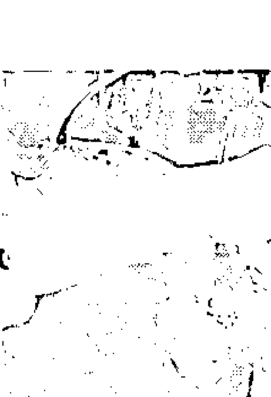

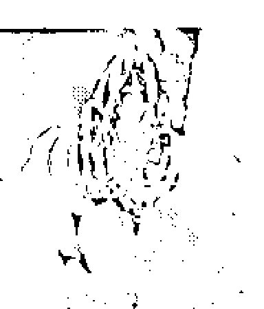

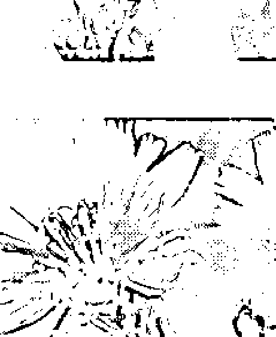

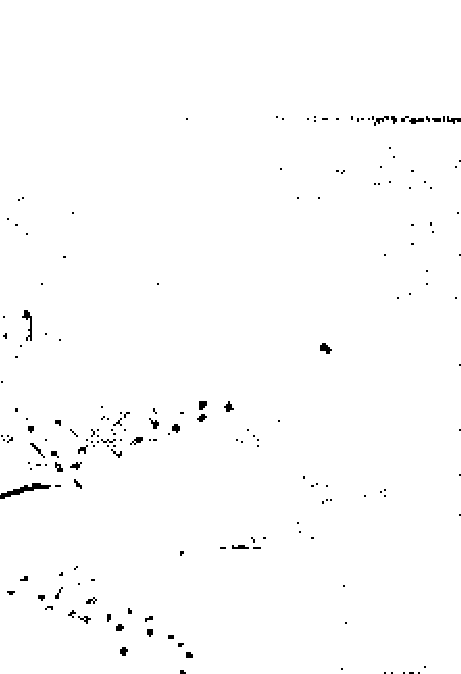

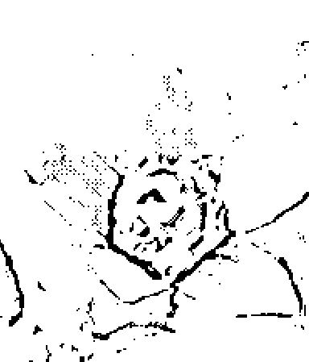

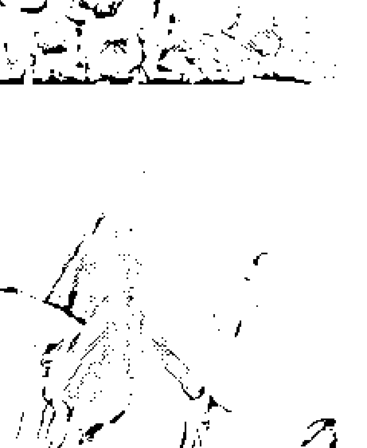

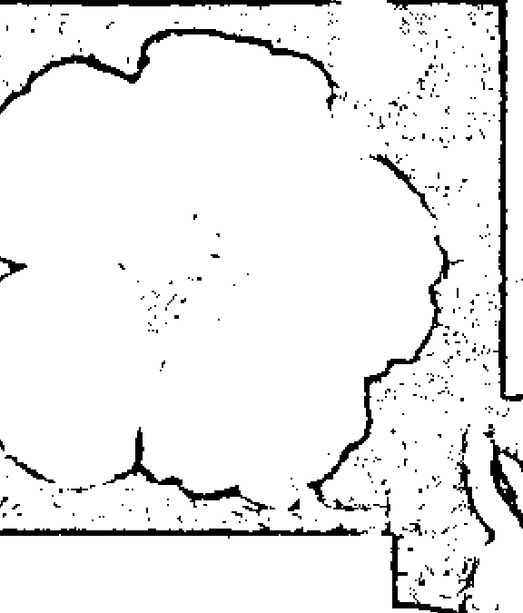

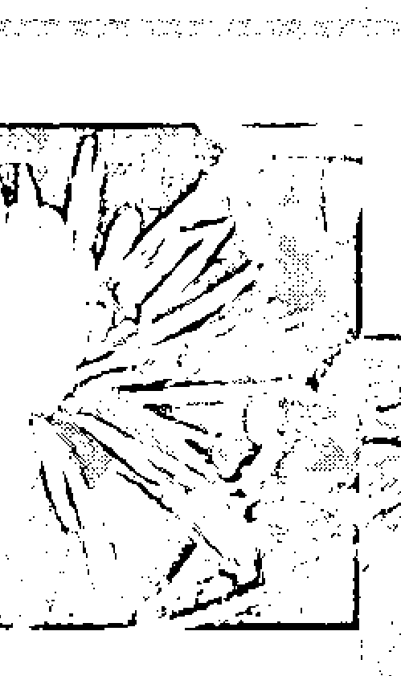

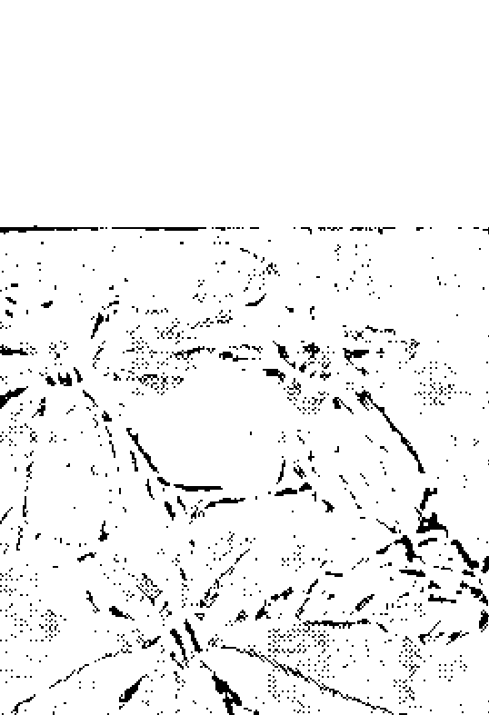

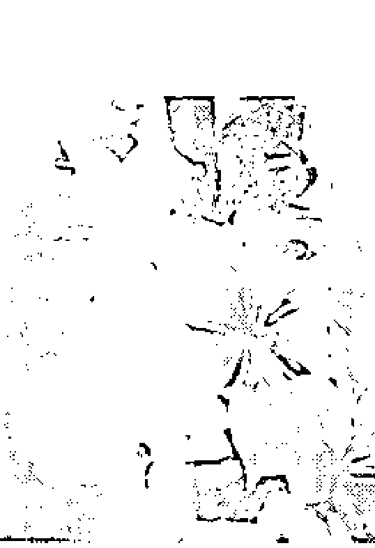

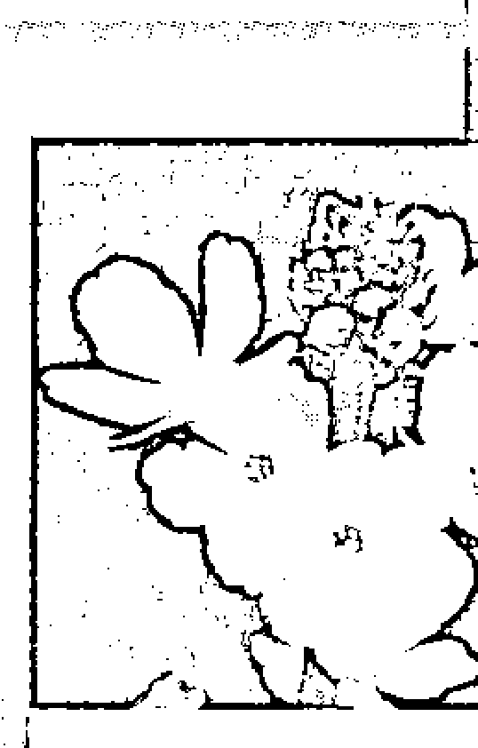

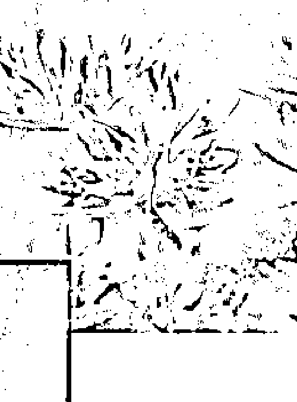

## 第1章 概述

### 1. 凤仙花 Impatiens 快！快！快！

> 【花语】
沉着冷静会让我更加快速。

急躁是非常普遍的情绪，我们每个人都有急躁的时候，但有些人非常容易急躁。周围人都知道他们是急性子。他们说话、做事的速度很快，而且很难容忍别人的速度。如果你比他慢，他会不停地催促你，或者干脆自己先往前冲了；如果你比他快呢，那他更急了，非超过你不可。快！快！快！如果这种感觉从小一直伴随着你，那么你的性格情绪就是急躁的凤仙花。

小凤仙花们做事速度很快，甚至很潦草。喜欢独立地做事，不喜欢别人帮助或指导自己。有强烈的欲望成为第一个达到目标的人，不喜欢干涉别人。如果别的小朋友超过自己，会很难受甚至哭泣！

成年的凤仙花们很容易被识别出来，因为他们的忙碌和勤快常常让## 第二章 12种美丽的天性和生理弱点

周围人“汗颜”。行动力强是凤仙花的优点，比如他们经常比约定的时间提早很多到达，或者提前完成任务。但是凤仙花们也很容易被自己的快速感控制，无法体谅他人的节奏，因此凤仙花们经常缺乏合作意识，喜欢一个人做事，常因受不了别人的速度而干脆自己做完所有的事！有位凤仙花妈妈告诉我，她晚上睡下以后，如果想到还有什么家务没有做，会立即起床，做完以后才能入睡，绝对没有耐心等到第二天！孙悟空就是一位典型的急性子，每次唐僧的话刚落下，猴哥就马上行动了！降妖伏魔的取经路上，孙悟空从来没有等待和拖延的时候。当然好动是猴子的天性，这种天性的主要特征就是急躁感。

急性子的人到底有多着急呢？看看中国古人讲述的一个幽默故事：
从前有一个人性子很急躁，有一天他去面馆吃面，刚坐下就急切地说：老板，我的面呢？怎么这么慢？还没煮好？老板很快把面端上来了，他刚要吃，老板就把面倒在桌上，焦急地说：你怎么吃得这么慢！！我要去洗碗了！！转身就去洗碗了。这个人非常气愤地回家了，进门就对他的妻子说：今天我要气死了！他刚说完，妻子就立即开始打包，匆忙地离开家并对他说：你马上要死了!!!我只好改嫁了!!! 这位急躁的妻子很快改嫁了，结婚第二天，她的新婚丈夫非常生气：你怎么这么慢!!!!还没给我生出儿子!!!! 我必须把你给休了!!!!

实际上急性子的人通常都知道自己的急躁，不过急起来，自己也无法控制，这就是情绪与思想的区别。快言快语也是很多凤仙花的特点。快速感还使人总是生活在追赶下一刻的行为状态中，当下总是不够快。而思想被快速感控制以后，我们就会不尊重其他人的速度和事物发展的合理速度，这往往带来挫折或失败，反而拖延了进展。心急吃不了热豆腐，是凤仙花们需要经常提醒自己的。

快速感也对应人的各项身心功能处于超速运转，过度耗散精力。很多疼痛感都和急躁感混合在一起。急性子的人也容易有某种剧烈的疼痛感，比如头痛、胃痛等。

贝曲医生给凤仙花们建议的人生功课是学会宽容。宽容别人，也宽容自己，因为很多凤仙花其实也经常跟自己着急，嫌自己太慢。认识到急躁只是自己遭遇的一种生理干扰，思想就可以尽量不受其干扰。懂得宽容的凤仙花可能是最受欢迎的朋友，因为他们行动果断快速，总是能推动事情不断进展。在一个团队中，有一位凤仙花是很必要的，他快速的语调和敏捷的行动，可以使整个集体时刻保持对速度的敏感。

贝曲医生选用的凤仙花是从喜马拉雅山地区“移民”到英国的，在四川我们俗称指甲花。这种植物的生命力特点就是生长速度快，开花、结果和繁殖的速度比一般植物都快。种子成熟后，用手挤压，会啪的一声裂开，快速弹射出里面的种子。由于生长和繁殖速度超快，英国的很多河道两岸都被凤仙花迅速占据，其他植物的生存空间越来越小。有些地方人们不得不砍掉一些凤仙花，阻止它们过度繁殖。凤仙花的茎秆挺直紧绷，饱含水分，被折断或砍断以后，会很快死去，性格极其刚烈。

中国道家的养生观念深刻地理解和尊重生命的自然速度。柔软中蕴涵至强的生命力，宁静中恢复至快的速度，这是生命存在方式的奥秘。道家养生用太极拳恢复身体的舒缓节奏，达到健康长寿的目的。但是在现代社会，科技加快了很多事物发展的速度，快速和高速成为现代化的标志之一。焦虑和身心停不下来也成为一种普遍的亚健康状态。速度比拼常常使人忽略甚至忘记我们最终的目的是健康、幸福和高品质，而不仅仅是赢得最快。对于天性弱点就是急躁的凤仙花们，更要经常注意放慢速度。去掉急躁感后的快速才是现代社会最需要的敏捷，这也是凤仙花终生修炼的完美境界。

#### 情绪自测

#### 凤仙花：急躁感 烦躁感

有 5 项符合就表明此情绪比较明显

- ◎ 我心里总是很着急，无法平静下来。
- ◎ 我总是嫌别人动作太慢，有时候我也知道其实只是自己心里烦躁。
- ◎ 我心里总是很焦虑，担心很多事情现在无法解决。
- ◎ 我很容易烦躁起来，经常对周围人不满。
- ◎ 我走路、说话速度都非常快，我慢不下来，别人常常不能适应我的速度。
- ◎ 我总是把自己搞得很忙碌、很紧张，所有的时间都安排得满满的，似乎停不下来了。
- ◎ 我总是在行动，快速是我的第一要求。
- ◎ 我总是在忙工作，生活的时间很少，这好像是一种内心需要。
- ◎ 我的生活节奏很紧张，我不能容忍自己和别人浪费时间。
- ◎ 我很少待在家里，总是在外边忙碌，内心压力很大，无法放松。
- ◎ 我的性子很慢，但我经常因为烦躁焦虑而发火。
- ◎ 我总是在计划未来，永远在追赶自己的计划。
- ⊙ 我经常打断别人的讲话，替他们讲出来，因为他们讲话太慢，急死我了。
- ⊙ 如果晚上我躺在床上，突然想到一件家务或工作未做完，我会立即起来去做，否则我睡不着。
- ⊙ 我总是觉得周围人的速度太慢，我总是在催促其他人。
- ⊙ 我不喜欢做重复的事情，我喜欢不断变化，不断完成新的事情。
- ⊙ 我做事喜欢一气呵成，我不喜欢把事情分成几部分慢慢完成。
- ⊙ 我经常因为追求速度而忽略细节的准确。
- ⊙ 如果我想要什么，我总是希望立即得到，否则我就觉得无法忍受。
- ⊙ 我总是没有耐心，等待时经常抱怨或做其他事情。
- ⊙ 我去旅行，总是想赶快把所有的景点走完，很少停下来慢慢欣赏。
- ⊙ 一旦有任务或计划，我总是立即行动，希望赶快完成，绝不拖延。
- ⊙ 生病、怀孕、月经周期会烦躁不安。

### 2. 马鞭草 Vervain 不熄的火炬

【花语】
伟大的事情也可以平静地完成。

马鞭草情绪是指一种内心不断向外扩张的激情。主要表现为特别固执、好强，渴望做大事，喜欢说服别人接受自己的观念，或者有强烈的愿望改变外界。马鞭草类型的人天生就拥有这种旺盛不熄的激情，像一支不熄的火炬，而其他天性的人的激情可能需要被马鞭草们点燃。因此，马鞭草常常是很成功而且极具个性感染力的思想家、领导、企业家、演讲家、营销人才，以及各种改革、奇迹和成功的煽动者或实行者。模范CEO杰克·韦尔奇就是一位商业领域的马鞭草。他坚定地执行每年5%的人员淘汰率，这种“残酷”也体现了马鞭草争强好胜、为了赢而不惜一切的性格特点。

生活中的马鞭草总是热心帮助他人，挽救他人，指导他人。无论大事小事，他们都充满激情地去做，当其他人还在质疑他们是否头脑发热的时候，他们常常已经成为了超人Mr.Impossible。不过，当激情过于强烈而失控的时候，他们的人生也会走向另一个极端：追求无法实现的梦想！承担无法想象的责任！一定要赢！一定要指挥、改变、影响外界！德国一位著名的花精专家这样描述马鞭草：马鞭草的情绪状态就是意志过于针对外界，没有节制地使用自己的生命能量，因此造成浪费。

夸父可能是中国有史记录的最早的马鞭草，他为什么要去追日呢？毫无疑问，夸父有超乎常人的强壮体质和意志。尽管没有人给他拯救世界的责任或期望，夸父仍然全然不顾其他人的规劝甚至嘲笑，满腔激情地追求自己的目标：一定能改变和控制太阳的运行！最终他被太阳烤干，缺水而死。这种不达目的誓不罢休的狂热就是夸父内心马鞭草的能量。

《红楼梦》中的王熙凤也是典型的马鞭草，她精明能干，喜欢担当重任。性格外向而热情，总是能感染和调动周围人的情绪。不过她的性格阴暗面也非常明显：逞强、利用权力、心狠手辣、嫉妒成性。当然，为恶贪利是思想的问题，但由此也可以看出性格对她行为的影响。野心勃勃，贪心而自大，不仅掌握着家里的大权，还在外放高利贷逐利逞强。她的性格的确很大程度地影响了她的命运：“机关算尽太聪明，反误了卿卿性命。”她是一位自私逞强的马鞭草。

有这样一位男士，他非常热心，从姊妹们找工作到下一代读书等，家里兄弟姐妹的事他都热情帮助。但他也要求大家凡事都绝对听从他，因此和家人的关系很紧张。比如母亲向他抱怨，说其他姊妹某方面对她不好，他就会严厉地指责和教训姊妹们，结果母亲和所有的家人都不理解他。20年前，发生了一个偶然的事件，他认为是妻子不听自己的话造成的，当场勃然大怒，一只耳朵立即开始耳鸣。他至今都无法原谅妻子，耳鸣也一直没好。他是一位固执而无法原谅别人的马鞭草。

马鞭草们固执外向的个性常使周围的人对他们又爱又恨，有时候甚至感到他们是魔鬼和天使的混合。他们强烈的热情带给周围人温暖，但也容易过度干扰他人。面对马鞭草，其他个性需要练就的是不受干扰的定力，而且最好不要试图去说服马鞭草，因为这一一般都是徒劳。马鞭草们的人生经验通常都来自不撞南墙不回头的自我醒悟，但只要有一点机会，他们不熄的激情就会重新点燃生命的熊熊火焰。生病的时候，马鞭草们也是绝对不会放弃的强者，他们在困境中的坚强是最令人敬佩的。

贝曲医生认为马鞭草天性的弱点是狂热，他们的人生功课是需要学会忍耐：忍耐天性中狂热的激情对他们的考验。学习善良地对待同伴们，容忍其他人的观念，特别是认识到“生活中伟大的事情也可以在没有压力和紧张的情况下温和、平静地完成”。

马鞭草的叶子很大，铺展很宽，接近地面。但是开花的茎秆非常细，数量很多，一根根向上挺立，似乎在相互拼命地比赛生长高度。直挺挺的花茎上干干净净的，没有叶子，能量非常专注坚定，很像一根根指挥棒或教鞭。花枝顶端部分开始有一些分枝，花朵都长在分枝上面。

有趣的是，马鞭草的花朵非常微小，只有米粒大小，在田野中几乎很难被注意到。但是，这种小小的紫色花朵却蕴涵了平息最旺盛的一种人类天性的力量。对马鞭草们来说，这是不是一种提醒：无论我们的内心有多么强大，我们每个个体在宇宙中都只是一粒渺小的微尘？

#### 情绪自测

#### 马鞭草：扩张感 膨胀感 强迫感

有5项符合就表明此情绪比较明显

- ⊙ 好胜心强，喜欢挑战，爱逞能。
- ⊙ 容易对一件事或一种信念产生狂热的激情，超级自信。
- ⊙ 总是想影响和压倒别人，容易嫉妒比自己能力强的人。
- ⊙ 生病以后，特别坚强和自强，不到万不得已，绝不接受别人的帮助。
- ⊙ 非常喜欢向别人推荐东西，只要自己觉得好，马上就会热情地推荐给别人。
- ⊙ 非常有推销天赋，内心有一股强大的能量，认为自己一定会说服别人。
- ⊙ 经常向朋友推荐自己的经验，哪怕只是听说的经验，热心于指导和帮助别人。
- ⊙ 有非常强大的内心力量去影响、控制或改变他人的生活。
- ⊙ 我有很强的欲望帮助别人，但如果他们不听我的，我会非常生气。
- ⊙ 精力旺盛，行动果断，有强烈的领导欲望，喜欢当老大的感觉。
- ⊙ 感觉很累的时候，反而很亢奋，十分紧张，满怀一定要胜过别人的欲望。
- ⊙ 即使遇到严重的打击或陷入困境，也仍然斗志昂扬，野心勃勃，绝不低头。
- ⊙ 非常固执，绝不轻易接受别人的意见，绝不愿意被别人说服。
- ⊙ 热情，好帮助别人，但同时好胜心非常强，有经常欺负软弱同学的可能。
- ⊙ 性格专制，凡事都要别人顺从自己，甚至可能用暴力显示自己的威力。
- ⊙ 常常感到内心很紧张，和别人的关系也很紧张，因为他们总是不听自己的。
- ⊙ 有抑制不住的暴力倾向和伤害他人的情绪。
- ⊙ 过分自我，总是要求别人顺从自己的习惯，不愿意照顾别人的需要。
- ⊙ 在家或工作环境内，随时都需要保持自己的威信和地位，喜欢高高在上的感觉。
- ⊙ 发烧或身体持续发热。
- ⊙ 为了赢而不择手段或不计后果！
- ⊙ 为孩子的现在和未来安排好了一切，要求必须服从。
- ⊙ 野心勃勃，头脑发热，固执地追求不切实际的想法。
- ⊙ 总是强迫性地向别人推荐自己的宗教信仰、生活方式或某个观念等，对不接受的人非常不满。
- ⊙ 做事很有激情，容易成功，但也常常不能稳定成功，总是因为过于狂热的自信和不断膨胀的野心导致头脑无限放大自己的实际能力而再次陷入困境。

### 3. 铁线莲Clematis天空之子

【花语】
将梦想照进现实。

铁线莲是指使注意力脱离身体感受和现实，导致头脑空白、昏沉或幻想的情绪。这种情绪使人在精神和情感深处从小就漂浮在现实之上，和真实的世界总是保持着一段距离。喜欢独自发呆，或者非常容易改变注意力，无法专心持久地做任何事情。或者经常幻想自己生活在不现实的情景中；或者渴望离开此时此地，去寻找远方的幸福。

铁线莲的孩子特别喜欢天马行空的想象，对现实不太感兴趣。逼迫小铁线莲们长时间专注一件事情对他们是极大的痛苦。身体不好的小铁线莲非常茫然昏沉，对现实不知所措，显得昏头昏脑的，容易被其他孩子欺负。他们更愿意远离伤害，而不是直接面对。

成年铁线莲一般的特征是容易走神，联想丰富而遥远，和别人聊天累了就会突然陷入完全无关的联想而不知道自己或别人在讲什么。铁线莲们还容易忘事或者丢失东西。他们的思维容易发散或跳跃，不擅长严谨的辩论。通常不爱行动，做事不容易坚持到底。对人生的态度充满理想主义的色彩，容易产生某种精神迷恋，或是成为悟性非常强的精灵一族。铁线莲喜欢精神上的自由自在，最享受随意飘荡的天空之子的生活。因此，他们非常适合从事时尚行业、电影行业、作家和媒体工作者等需要想象力、不重复的工作。最无法从事的工作是军人、专职司机或任何要求高度专注与严格纪律的工作。

请注意，铁线莲们并不是都缺乏对现实的感知力，只是他们最容易产生的情绪干扰就是使注意力脱离身体感受和现实。因此铁线莲们，经常发现自己对身心的生理或情感创伤反应非常迟钝，甚至不会去帮助自己，结果他们身心累积的创伤可能比其他人更多。

徐静蕾属于比较知性的铁线莲。静蕾自叙小时候非常不开心，几乎不会笑，因为望女成凤的徐爸爸总是逼她学这学那。她说自己是书法课的小混混。在静蕾的大学老师的印象中，她也没有什么出众的地方，做事总是懒懒散散的。静蕾也说自己不勤奋，特别是练晨功，开始还去，后来是老师来叫才去，再后来是老师叫了也不去。铁线莲们一旦陷入情绪的低落期，是很难有行动愿望的。一个人待着傻傻地梦想或昏睡，是最舒服的事情。在徐静蕾首部自编自导自演的电影《我和爸爸》中有一个情节：女儿喜欢文科，可是却对父亲说想报考理科，因为理科毕业好找工作，而爸爸却说：“做你喜欢的事情吧，找不到工作就混吧！”这可能就是静蕾心中渴望的理解自己的爸爸吧。对现实的距离感也造就了铁线莲超越现实的勇气，一旦他们认真做起事来，总是会出人意料，现实的困难对他们来说不算什么，因为他们太喜欢自己的梦想了。徐静蕾第一次尝试全面制作、导演、主演、市场运作一部电影的浩大工程时，她淡淡地说：“我就是想知道在这些过程中到底会遇到什么困难。”铁线莲们这种无畏的精神，多半是因为他们和现实不会保持深入持久的连接。他们随时都可能回到天空之城，淡忘人间的辛苦，所以其个性切勿模仿。

压力下的铁线莲会感到注意力非常难以集中到现实中来，即使内心渴望专注地做事，也很难行动起来。这种乏力和痛苦就好像身心飘浮在空中，无法降落在大地上。病中的铁线莲极易被昏睡或幻想控制，对现实完全放弃，也不关心自己的病情，精力全部耗费在精神和情感的飞翔中，所以身体更加虚弱无力。贝曲医生说铁线莲病人的表现好像是一种"慢性自杀"。铁线莲有个通俗的英语名字，叫“旅行者的快乐”，因为它羽毛状的种子总是渴望被吹向远方，开始新的生活。梦想总是比现实更加美丽，这是天空之子们喜欢的生活方式，他们的确是最快乐的精神旅行家。很多铁线莲每天早晨都需要寻找一个起床的理由。寻找现实的乐趣是铁线莲时刻面临的挑战。静蕾在博客中时常有给自己的计划或行动加油鼓励的话，而且关乎的事情有大有小，这种方法有点孩子气，不过你也可以试一试！

铁线莲的情绪干扰容易使人疏远和遗忘现实，这常常让人感到铁线莲们不够热情。冷漠正是他们的弱点。贝曲医生建议铁线莲们学习的人生功课是温柔。甜蜜的微笑、关切的话语、体贴的行动，这是铁线莲走进现实的基本功课。

铁线莲是一种藤蔓植物，喜欢长在斜坡上。有很多枝条，不断分枝、蔓延，形成厚厚的覆盖层，一般看不到根部。花朵没有花瓣，有很多花蕊和绿色的花萼。种子带一个羽毛，喜欢随风飘荡。老的枝干非常干枯，冬天可以直接点燃，保水性差，内在能量与大地的连接力很弱。但是整个姿态是匍匐在地面的，渴望拥抱大地。英国花精专家伯纳德说陷入低谷的铁线莲像睡美人，但如果勇敢的王子不来怎么办呢？难道昏睡一生？所以还是自己行动起来吧！徐静蕾拍摄的《梦想照进现实》的片名几乎就是铁线莲们的人生密码。其实，人生本来也如梦，何不带着天性的洒脱，将梦想的创造力与现实结合起来，在这更真切的梦中开心地旅行一次呢？

#### 情绪自测

#### 铁线莲：恍惚感 昏沉感 注意力无法集中于现实

有5项符合就表明此情绪比较明显

- 我常常陷入思考中，但其实都不是事实，或是与现实无关的空想。
- 我注意力不集中，和别人说话时间长了，就无法再专心了。
- 我经常不看路，磕磕碰碰难免。
- 我对现实的感触不深，很多人觉得我有点不切实际。
- 和别人一起逛街的时候，经常只顾自己，无法注意同伴的情况。
- 我做事之前总会想很多，或常被一些不重要的事情耽误，最后才急急忙忙地做。
- 我累了就觉得头脑昏沉，只想睡觉，现实中的什么都不关心了。
- 我经常同时做几件事情，但最重要的事往往最后才想起。
- 我经常忘记约会，所以重要的约会，我需要很醒目的提醒方式。
- 我有压力就会心不在焉，想逃避现实。
- 身体不好的时候喜欢想象，行动力很差，其实我很着急，但我无法专注于现实。
- 我经常幻想未来，对现实不感兴趣，有时早上起床也需要一个特别的理由激励。
- 我经常不知道周围发生了什么事情，应变能力很差。
- 如果病得很严重，我只想躺在床上，是死是活我都不管了。
- 我的思维经常是跳跃式的，和别人说话我经常想到哪里说到哪里。
- 我经常迷路，因为我老是不知道我在哪里了。
- 我看电视，经常漏掉情节，因为我经常想到别的事情。
- 相比物质世界，我更容易迷恋精神世界。
- 我常常幻想远方会比此处更好。

### 4. 菊苣 Chicory | 爱的迷失

【花语】
真爱是不求回报的，无条件的付出。

菊苣是指一种过度渴望爱和关注的情绪。菊苣型的人内心对爱和关注天生怀有敏感而强烈的需求，他们似乎是为了爱而来到人世的。对其他天性的人，爱是可以空白，可以掩盖，可以停顿，可以超越，可以麻木，可以理性地表达或沟通的一种情感。而对菊苣们来说，爱与被爱的感觉就是他们生命力的源泉，时刻连通着……## 菊苣：空虚感 过度渴望爱和关注

他们的呼吸和心跳。贝曲医生说：

> 他们满脑子都是别人的需要，喜欢过度关注孩子、亲戚和朋友，总是发现什么事情可以被纠正。他们不停地纠正他们认为错误的事，而且乐此不疲。他们还总是希望他们关心的人能在自己身边……他们总是渴望伸开双臂，祝福周围每一个人，总是希望帮助、安慰、同情别人。

小菊苣们很有爱心，心很软，但也比其他孩子更需要父母和其他人的注意和关爱。身体比较好的小菊苣会有较强的表现欲望，甚至很调皮，不停地说话或找事，多半会制造小麻烦，以吸引父母或其他人的注意；而身体虚弱的小菊苣会用可怜的目光，病恹恹地企盼着父母的怜爱。小菊苣们最幸福的时刻就是父母围绕在他们身边，满足他们的各种需要，或者谈论他们的事。有一个小菊苣因为嫉妒新生的妹妹，总是趁父母不注意的时候，试图折断妹妹的脚趾。当保姆告诉她父母以后，她痛苦地哭诉说：

> 你们每天都说妹妹、妹妹，根本不爱我了！我希望她死去！

成年的菊苣往往是最有爱心的人，总是主动关心家人和朋友。他们是家庭团聚的核心人物，他们的爱蔓延在生活的每一个细节，牵连着周围的每一个人，常常使一个大家庭的成员不至于过于疏远。当菊苣们遇到压力、挑战或生病的时候，他们就可能无法控制天性中对爱的强烈和无底洞似的渴望，并且使这种渴望变得自我和狭隘。他们会强烈地要求独占别人的关爱。如果不能，他们就会产生痛苦、怨恨、嫉妒、报复的心理，或者自我毁灭。爱有多深，恨也有多深，菊苣们最懂得这种体验。

琼瑶小说描写的就是典型的菊苣式爱情。男女主人公至少有一位时刻都沉浸在强烈的爱的感觉中，否则故事无法发生，通常都是女主角。她们总是在艰难的生活经历中无比执著和痛苦地追求纯粹的爱情，通常还要面对条件优越的强大对手的挑战。菊苣女主角总是眼泪汪汪地渴求对方全部时刻的爱与关注：你知不知道我有多爱你？你到底爱不爱我？你真的只爱我吗？你有多爱我？我每分每秒都在想念你。很多菊苣十分迷恋这种强烈的爱恨情仇，甚至认为其他方式的爱情太平淡无趣，没有这种刻骨铭心的爱情，生活简直就是麻木。其他性格的人会被这种浓烈的爱情打动一段时间，但每天这样就会受不了。琼瑶阿姨一定也是菊苣，因为只有菊苣才会深刻理解：爱的感觉胜过生命中的一切。菊苣绝对不能忍受分享爱情，而且最担心恋人或伴侣会出轨，他们甚至不愿看到所爱的人注意或欣赏周围的任何异性，包括亲属、朋友和工作同事。

渴望完全独占家人的注意和爱的欲望是菊苣家庭生活的最大陷阱。如果这种需求没有得到满足，菊苣们除了强烈地抱怨外界以外，也可能将这种渴望全部转移到孩子身上，对伴侣非常冷淡或粗暴，对孩子却千般宠爱，这一方面是为了报复发泄；另一方面是用孩子对他们的依赖填补内心的空虚。孩子长大离开的时刻，常常就是父母意志崩溃的时候。这种现象在东西方竟然完全一样，这说明无论何种肤色，我们的人性都是相同的。

被菊苣情绪控制的人可能还有另一种表现：强烈地希望拥有更多的物质和金钱，以此填补内心缺少爱的空虚。胡因梦的母亲就是这样一位菊苣妈妈，因为爱情不美满，她经常不留情面地指责胡因梦的父亲，最终逼迫父亲以沉默自卫，而这种无声的冷漠更使母亲产生不被爱的“恐惧”。因梦说：“不幸的是，母亲把自己对爱的需求否定掉了，她不承认自己需要父亲的爱，而只是一味地要求父亲为她提供更多的金钱保障，所以一生都错置了追求的方向……母亲患有物质恐慌症，但她真正渴求的不是金钱，而是爱。”

老鹰乐队最缠绵的情歌《爱将使我们活下去》中唱道：当我们饥饿的时候，爱将使我们活下去。对其他天性的人来说，这只能是一时的浪漫，但对菊苣们来说，他们可能每天都会经历这种饥饿的考验，因为他们承受的情感干扰就是对爱的渴望！菊苣情绪可能会干扰头脑产生这样的想法：我为你们付出了一切，为什么你们那么自私，不愿意为我付出一切？当爱的渴望变成了爱的索求，周围的人就会感到窒息。这就是菊苣天性的弱点：限制。

> “你是否发现：你不但没有为很多人付出反而被少数人束缚了，因此你想全心付出的机会被限制了？你是否已经认识到：虽然所有的人都是你的朋友，但是却没有一个是特别亲近的？”

菊苣用爱限制所爱的人，希望他们同样地爱自己，永远围绕在自己身边。这种限制是对其他生命的一种无形枷锁，甚至是情感勒索。

> “你们必须围绕在我身边，否则我就无法活下去”——菊苣总是这样暗示着自己所爱的人。

贝曲医生认为爱正是菊苣一生需要学习的功课：爱一个人就要首先给予他自由，允许他自主地体验自己的生命历程。菊苣喜欢给周围人送礼物，但是他们的情感也非常需要你能回报他们一个礼物。亲爱的菊苣，你一定是周围人中付出爱最多的一个，但请不要期待其他人用同样的方式回报你。真正的爱来自内心永不枯竭的源泉。

成熟的菊苣是人间爱的天使，他们的幸福充满着浓浓的爱意。曾经因为爱而迷失自己的宋丹丹，是一位非常聪明、能干，对爱极其敏感的女人。她的自传《幸福深处》字里行间处处都是作为女儿、妹妹、孙女、妻子、母亲、继母、演员对周围人爱的真心付出和强烈渴望，幸福和痛苦都是那么全心地投入。丹丹的自述真实而坦然，我边看边想：天哪，这简直是一本典范的菊苣心灵成长录！“人到中年，我终于学会了如何去爱。”“宽容了别人，解放的便是自己。”“我每一次爱都是真正的和‘惊心动魄’的。”“我无法要求一个 16 岁的男孩子每天思念我，每周都想听我说话，我必须接受的是他在随后的几十年中会经常思念着我，这才是真正母爱的境界。”

我无法要求一个 16 岁的男孩子每天思念我，每周都想听我说话，我必须接受的是他在随后的几十年中会经常思念着我，这才是真正母爱的境界。另外一个女人。我养了两只小狗，照顾它们给我带来乐趣。至于儿子，我一定会让他过自己想过的人生。”

菊苣是一种花瓣像一束条形小丝巾的紫蓝色野花。花瓣顶端是一排细小的锯齿形状。菊苣的叶子边缘也是一种锯齿状。这是向外挖掘的能量，非常主动。喜欢长在路边，不惧怕被路人打扰。菊苣有粗大的根，善于储蓄营养和能量，根须会牢牢地抓住土壤，生命力包含强烈的控制力。菊苣的掌控性还表现在叶子和花朵都没有输送养分的梗，而是直接与茎秆连接，花朵都是从叶子的怀抱中长出！菊苣妈妈也一直抓紧种子不放，寒冬过后才松手让其掉落在母枝的脚下。菊苣的花瓣颜色会根据土壤的酸碱性不同而变化，喜欢中性和偏碱性，土壤偏酸性时花瓣会略带粉红色，显示生命力有极其敏感的一面。

我们真的应该常常感谢身边的菊苣们，他们充满爱的情感和行动是鼓励所有的人性走向完美的最重要的力量。当然，我们也希望菊苣们能理解，其他个性的人也有自己不同的表达爱的方式。濮存昕对宋丹丹的提醒，也是菊苣们可以常常反思的忠言：“这个世界不是只为你一个人存在的，各种有缺点、有缺陷的人都有权利生活在这里，有权利让自己生活得更好。你无法要求每个人都那么无私，那么完美。”

#### 情绪自测

#### 菊苣：空虚感 过度渴望爱和关注

有 5 项符合就表明此情绪比较明显

- 我很热心，非常关心家人和朋友，家里的事情都是我张罗。
- 我非常爱孩子，经常满足他们的要求，不过如果他们不听我的安排，我会很生气。
- 我很活跃，我喜欢别人注意我，因为我关注每一个人。
- 我喜欢和别人待在一起，我很关心周围人的八卦。
- 我经常觉得别人不够爱我或关心我，尽管我对他们付出很多。
- 我总是很热情地帮助朋友或家人，但他们中很多人都没有同样热情地回报我，我很受打击。
- 我对孩子有些溺爱，但也容易抱怨和生气，因为他（她）不够关心我。
- 我希望长大成人的孩子能经常给我打电话，每周都来看我，他（她）经常做不到，让我很不满。
- 小孩子很黏人，总希望大人陪着他，注意他，表扬他。
- 我累了的时候就会觉得很缺爱，渴望别人关心我。
- 我希望男友或老公要绝对只爱我一个人，只关心我一个人，即使只是和其他异性多说几句话，那也会让我醋意大发。
- 我很容易吃醋，但我希望其他异性都能注意我。
- 我总是抱怨老公不关心我，只好把这种情感需求转移到孩子身上。
- 我对爱很敏感，我愿意爱所有的人，但也希望大家都爱我。
- 在婚姻关系中，我特别在乎对方爱不爱我，经常为此而受伤。
- 我经常送礼物给别人，也渴望别人同样回报我，否则我会觉得他或她很无情。
- 我对金钱很在乎，但有时也会很大方地用在我爱的人身上。钱和物质似乎可以使我不那么空虚。
- 喜欢或渴望沉醉于恋爱的感觉，或有恋爱情上瘾症。

### 5. 龙胆草 Gentian 易碎的心

> > 【范例】
> 我有一颗坚强的心，挫折只会让我更加勇敢。

龙胆草是指对挫折和困难非常敏感，容易感到痛苦或沮丧的情绪。这种脆弱感是人性最普遍的生理情绪之一。每个人每天都会遇到大大小小的不顺利、不幸福、不完美、不如意，因此每个人的内心都感到过或多或少、或轻或重的伤害和打击。但有一类人的天性特别敏感和容易受伤，生活中每一个细微的不完美或不幸，都会被他们敏感的神经感应到。他们对自己身体的触觉也很敏锐，任何细小的皮肤问题都会引起他们的强烈不安。在压力和生病的时候，他们比其他天性的人有更强烈的痛感，并且很容易怀疑事情是否还能继续下去。因此他们时刻都需要一边痛苦地保护自己易碎的心，一边勇敢地生活。他们就是龙胆草。小龙胆草对忧伤和不幸非常敏感，具有强烈的同情心。身体不好的小龙胆草很容易不开心和感到受伤。如果家庭的不幸或者自己某方面不如别人，他们便会感到深深的自卑和绝望。对快乐和幸福总是很谨慎，需要其他人不断地鼓励和带动，才会快乐起来。小龙胆草通常是父母最喜欢和疼爱的孩子，因为他们看上去总是那么脆弱敏感，而且非常能体会和分担父母的辛苦。恋母情结最容易发生在超级付出的菊苣妈妈和善解人意的龙胆草儿子之间。

我们身边意志薄弱的成年龙胆草还是很容易看出来。他们总是认为自己是世界上最不幸的人，自己的一切都是可怜的，自己遭遇的每一件事情看起来都是不完美的，自己永远不会像其他人一样幸运和成功。龙胆草情绪使人只是看到自己受伤的部位，人生经历中正常的缺口和不足，被他们敏感的神经过分放大了。因此龙胆草们的思维常受此干扰而陷入对细节的抱怨和不必要的悲观之中。

> > 英国花精专家伯纳德写道：《维尼熊》中的笨驴伊约就是典型的龙胆草，还记得它的话吗？“早上好！但我不知道这是不是一个好的早晨。”

伊约是一个很单纯，但有点笨笨的龙胆草，总是不敢相信任何好事会发生，总感觉自己是个倒霉蛋，比如它总是担心自己的房子会倒塌，结果真的发生了一次。在现实中也是如此，如果你总是想着不幸和失败会发生，就无法专注地去改善其他方面以促进整体的改善，结果可能就是你预感的。经常预言不幸会发生的“乌鸦嘴”们多半也是龙胆草。

“忧郁王子”们大多也是龙胆草，演员陈坤就是典型的一位。陈坤的忧郁气质来自内心深处，好像天生的一样。陈坤的童年是在单亲家庭中度过的，生活的贫困和各种不幸的变故一直伴随他的成长，他的内心有一部分好像被深深击碎。另一方面，陈坤又是坚忍和踏实的。他已经逐步成长为一位思想和情感都很丰富的演员。关心陈坤的人曾建议他不要太受困于小事和细节的不完美，对压力下的龙胆草来说，这的确很难。现在的陈坤对内心感觉的自信，正是成熟的龙胆草能战胜脆弱干扰的表现。

英国 20 世纪初期的 D · H · 劳伦斯和鲁迅是两位几乎同时代的伟大的龙胆草。劳伦斯的《儿子与情人》和《恋爱中的女人》等小说显示了他极其敏感的情感觉察力。他非常善于描写人物细腻的内心世界，特别是容易伤感的女性情感。半自传体的小说《儿子与情人》细致入微地再现了一个缺少爱情的母亲和一个内心敏感的儿子共同承受生活的艰辛与痛苦的故事，这种相依为命的恋母情结在世界上的任何角落都在发生。劳伦斯的敏感并未局限于家庭与爱情，他深刻地感应到当时工业化的西方文明对人性的压抑和冷酷，并且正在使人们否定自然的、肉体的本能，而这种本能就是我们的人性，它应该是灵与肉的交融。劳伦斯用他天才的悟性在绘画、杂文和诗歌中强烈地表达他对恢复人性的呐喊：

> > “肉体 生命是充满感觉和情绪的生命。肉体感到的是真正的饥，真正的渴，在雪中和阳光中真正的快乐，闻到玫瑰香或看到紫罗兰时的那种真切的快乐。它的悲、它的爱、它的温柔、它的温暖、它的激情、仇恨和哀伤都是真的。所有的感觉是属于肉体的，头脑只能认知这些感觉。” 劳伦斯说：“现代男女之心理顽症就是直觉官能萎缩症。本来有一个完整的生命世界是可以靠直觉去认知、去享受的，而且只能靠直觉，因为我们否定了性与美——这直觉生命与自然生命的源泉，它在自由的动物与植物身上显得十分可爱。”

劳伦斯对麻木社会的最直接的反抗也表现在他的个人生活中。这个矿工的儿子和比他大5岁，出生于德国贵族家庭的已婚女士弗里达，在相识不到六个星期就私奔了。深爱劳伦斯的弗里达说：“我不知道是劳伦斯的天才，抑或是他自身作为人的素质，反正，我确确实实地感到再没有其他人能够像他那么细致而敏感地意识到我的存在。”

母亲的去世曾使劳伦斯的健康状态一度非常恶化，无法工作。成名后劳伦斯的生活和创作仍然坚定地追随自己敏感的直觉。他的呐喊和执著使他赢得了一些忠实的崇拜者，也遭到了当时很多人的质疑，甚至谩骂、攻击和排斥，而后者对于敏感的龙胆草来说就像锋利的刺伤，他的身心一直在和巨大的痛苦顽强地战斗着。劳伦斯的生命只有短短的45年，他却是一位非常多产的作家和画家。弗里达写道：“谁敢说劳伦斯在他短暂的一生里没有最充分地利用生活！他享受了生活的乐趣。这是因为他有很深的现实生活感。”在最后忍受肺病的痛苦中劳伦斯说：“我的病正是由烦恼引起的——烦恼进入了心灵深处，又从那儿出来，结果导致了内出血。”异常敏感的天性，似乎注定需要同时承受超常的天才和痛苦的交织。令人惊奇的是，弗里达曾这样写劳伦斯对龙胆草的感应：“当劳伦斯第一次看到龙胆草，那孤零零蓝色的一大棵龙胆草时，他仿佛同它有一种让人难以置信的认同，那情景我至今历历在目。他那种感觉，就仿佛龙胆草会向他释放出它的蓝色、它的本质似的。他所接触的一切似乎在接触的一瞬间刚刚诞生，带着一种创造的新鲜似的。”这种内心重生的新鲜感，正是龙胆草的生命力特点。

另一位龙胆草鲁迅是大家熟知的。这个在百草园中喜欢和花草、树木、昆虫玩耍的男孩，对世界的观察并不只是用眼睛，更多的是用他异常敏锐的心。祥林嫂、阿Q、孔乙己、吃革命党人的人血馒头的痨病患者、带项圈的乡下来的小男孩和他眼神哀伤的父亲，等等。普通人的一切不幸，载着漫长历史的惯性，早已是司空见惯，但这些悲哀却细微深刻地印在鲁迅年少的心灵。他的小说简练、直觉而直指人心的最深处，简短几句话就写出一个心灵正在承受的最大痛苦和悲哀。而他的成长也充满艰辛：“有谁从小康人家而坠入困顿的么，我以为在这路途中，大概可以看见世人的真面目。”在这些个人的悲哀中，成年的鲁迅逐渐感到的是整个民族的悲哀。这正是他呐喊的根源。鲁迅用语言无情地揭开那个时代中国人性人性的伤疤、愚昧和痛楚，因为绝大多数民众已经在痛苦中麻木！拯救必须要唤醒，而唤醒只有用带血的呐喊：中国历来都排着吃人的筵宴，有吃的，有被吃的。被吃的也曾吃人，正吃的也会被吃！他的杂文犀利、细致而深刻，好像一根根针在刺痛你麻木的神经穴位。有些评论家说鲁迅的“眼光仅限于黑暗”，的确，对于龙胆草们来说，他们的内心更容易接近黑暗，也更了解黑暗，因为他们有更清晰剧烈的痛感。

劳伦斯和鲁迅都是在特殊时代用自己的敏锐，试图唤醒各自的民族从痛苦的麻木中清醒起来的龙胆草。他们用伟大的胸怀超越了个人的痛苦，他们的勇敢和他们的思想艺术成就一样令人尊敬。他们对痛苦的深刻感受力和他们敏感的天性密不可分。不要忘了劳伦斯的提醒，直觉的痛苦才是真正的痛苦。

贝曲医生选择的欧洲龙胆草，是两年生植物。第一年种子只是长根和几片叶子，叶子在冬天凋零，第二年长出一根主茎，叶子和花朵紧密地包围在主茎周围，非常结实紧密，充满斗志。龙胆草个子矮小，但不喜欢和别的植物竞争，喜欢选择一些边沿、凹地、不平的地方。这种紫红色的龙胆草花对温度非常敏感，英国的天气变化无常，太阳从云朵出来，温度升高，龙胆草花马上开放，如果太阳被云朵遮住，气温下降，龙胆草花又马上闭合。有时候间隔只有几十秒。这正如龙胆草的人欣喜与沮丧会随外界的微妙变化迅速转变。

贝曲医生认为龙胆草需要克服的弱点是怀疑，最需要学习的是理解。理解凡事都有积极、乐观的一面。他对龙胆草说：你是否属于有远大的理想，总是期待一切顺利的一类？当你的抱负没有很快实现时就感到很沮丧？当成功在望时你感到欣喜，而当困难出现时又很容易泄气？如果是这样，我们丘陵草地上的小小龙胆草将帮助你坚定你的目标，即使乌云遮住了天空，也要更加高兴和充满希望。当你全力以赴的时候，它将随时带给你鼓励和理解。无论结果如何，都没有失败。

#### 情绪自测

#### 龙胆草：脆弱 容易悲观和沮丧

有 5 项符合就表明此情绪比较明显

- 我对任何事物都持保守态度，总有担忧和不幸的预感。
- 我是一个悲观主义者，对失败、不幸、打击或不完美更敏感。
- 我非常现实，总和挫折、不幸、潜在的威胁不断抗争。
- 我很爱怀疑别人，对新事物总是持否定和怀疑态度。
- 我很害怕别人利用我的信任，所以我和别人来往时会非常小心。
- 我总是带着怀疑的态度接受新事物，一旦接受，我又比其他人更忠诚。
- 生活中总有让我受挫或不开心的事情，所以我很消极地面对外界。
- 我很怕痛，怕被伤害。小小的打击也会让我很痛苦。
- 在困难的时候，我总是往坏处想，我不相信事情会好起来。
- 我的性格很温和，很谨慎，对预防不安全事故的发生很认真。
- 我每次出门都要认真检查煤气、电器是否关好，我很担心发生事故。
- 我经常有不祥的心理暗示，朋友们叫我“乌鸦嘴”。
- 我经常提醒家人或朋友注意安全，但他们总认为我大惊小怪。
- 我不会预测成功，不会感到充满希望，除非我看到了。
- 我对别人的悲伤很敏感。
- 我总是小心翼翼地接纳幸福和成功，很怕又会失去。
- 我对不幸的事件特别敏感，容易被刺激，即使和我无关，也喜欢反复谈论。
- 我害怕失败，所以很多事情不敢尝试。
- 我总是看到黑暗的一面，很多时候的确只是杞人忧天。

### 6. 硬花草 Scleranthus 犹豫的哈姆雷特王子

> 【花语】
坚定、果断，在两极之间寻找平衡之道。

硬花草情绪是指一种波动变化的状态。生命力反复变化，时而无比强大，时而又非常脆弱无力。青春期是理想和现实碰撞的成长时期，大多数人都会有一个短暂的情绪波动期。女性在更年期内分泌发生变化的时候，也容易产生情绪极端化和变化无常的情况。但这些情绪波动一般都是阶段性的。而有一些人从小时候起，在生病或压力的时候，情绪就会在两个或多个极端之间跳动，喜怒哀乐变化很快。时而雄心勃勃，时而灰心丧气；这几天死心塌地地爱一个人，过几天又恨得不行；冲动做事，事后又马上后悔，彻底否定自己。

身体健康的小硬花草一般只表现为在选择的时候犹豫不决，如果没有其他人的影响，他们最终也会根据自己的直觉或理智选择。不过如果遇到爱替他们做主的父母，他们常常会感到后悔而抱怨。身体不好的硬花草一般有点脾气古怪，情绪不稳定，在亢奋和沮丧之间变化。生病的时候，他们的病情也常常不稳定，忽好忽坏。

成年硬花草是最容易受误解的一类人。因为人们并不了解他们内心的情绪像坐过山车一样起起伏伏，他们的生命力一会儿极度扩张，一会儿又极度萎缩，所以言行才会表现出不同程度的反复无常。人们对他们的评价可能是：喜怒无常，内心复杂，猜疑心重，心计太多，不讲信誉，脾气古怪。硬花草心情好的时候像天使一样温柔，心情不好的时候又可能像魔鬼一样暴躁，无比坚强和无比脆弱的内心感觉轮流出现。其实，硬花草们常常由于理智无法战胜情绪的波动，而有很深的自责情绪，厌恶自己的多变带给周围人的伤害。但是，两种不同的情绪都是那么真实、强大而难以抗拒。“你到底喜欢哪一种？”这是人们常常责问硬花草的问题，其实也是他们自己想弄明白的问题。

> 贝曲医生这样描述硬花草天性的人：“常常很安静，独自面对困难，因为他们不太喜欢和别人商量自己的问题。”

莎士比亚笔下最著名的悲剧人物哈姆雷特王子就是一位典型的硬花草。王子善良高尚，但性格特点十分明显：总是在软弱与坚强之间反复变化。在国仇（篡位）、家仇（母亲不忠）和父仇（父亲被谋杀）的突然打击下，哈姆雷特王子一开始就是怀疑不定的，当他确认了事实以后，面对复仇表现出了非常极端的两种情绪状态：时而陷入软弱，痛苦万分，毫无斗志和行动，怀疑生命的意义；时而又陷入无比坚强、冷酷和疯狂的复仇心理。摇摆不定的内心导致了他的言行不断伤害爱他和帮助他的人，悲剧也就这样一步一步产生了。王子痛苦地质问自己：“是生还是死？这是一个值得考虑的问题。沉默地忍受命运暴虐的毒剑，还是挺身反抗人世无涯的苦难，在奋斗中结束这一切？这两种行为，哪一种更勇敢？”王子对忠实的仆人霍拉旭的坦白道出了大多数硬花草内心的痛苦：“在我的心里有一种战争，使我不能入眠；我觉得我的处境比锁着脚镣的叛变的水手还要难堪。”“你就是我灵魂里选中的一个人，因为你虽然经历一切的颠沛，却不曾受到一点伤害，命运的虐待和恩宠，对于你都是一样；能够把感情和理智调整得那么适当，命运不能把你玩弄于股掌，那样的人是有福的。给我一个不为感情所奴役的人，我愿意把他珍藏在我的心坎、我的灵魂深处，正像我珍藏你一样。”王子非常清楚自己的性格弱点，渴望自己做到稳定和理智。但是在巨大的悲伤和压力下，身体的弱点会变得非常强大，意志和理智在一瞬间可能会完全没有招架之力，大多数的人类悲剧也是这样产生的。

> “是生还是死？这是一个值得考虑的问题。沉默地忍受命运暴虐的毒剑，还是挺身反抗人世无涯的苦难，在奋斗中结束这一切？这两种行为，哪一种更勇敢？”

> “在我的心里有一种战争，使我不能入眠；我觉得我的处境比锁着脚镣的叛变的水手还要难堪。”

> “你就是我灵魂里选中的一个人，因为你虽然经历一切的颠沛，却不曾受到一点伤害，命运的虐待和恩宠，对于你都是一样；能够把感情和理智调整得那么适当，命运不能把你玩弄于股掌，那样的人是有福的。给我一个不为感情所奴役的人，我愿意把他珍藏在我的心坎、我的灵魂深处，正像我珍藏你一样。”

德国花精专家 Mechthild 比喻硬花草的情绪状态就像蚱蜢一样。只要身边有哪怕一点点轻微的风吹草动，它们就会马上毫无目的和方向地跳来跳去。任何外界的干扰都容易导致硬花草的犹豫，然后冲动地改变。他们经常改变工作、住址，或者有两种完全不同的爱好，经常尝试各种新的方法，但又很快厌倦等。健康的硬花草会非常适应和享受一些充满变化和新奇的工作。但亚健康状态的硬花草就可能表现为陷入无法稳定的生活状态中，不知道选哪一个工作，和谁结婚，甚至居住在哪个城市。

有一位并不知道硬花草情绪的网友沙沙这样告诉我她的性格：总的来说，我觉得自己聪明、敏感、爱幻想、比较淡泊、喜欢冒险。但是也软弱、自卑、懒散、脆弱。而且非常清高，理想主义严重。我觉得自己的思想和行动长期脱节。脑子转得很快，总是思绪万千，一会儿一个主意，有的时候非常有激情，但都无法付之于行动，最后激情又被自己扼杀了。我无法稳定自己，摆得比钟摆还快，然后就自责，觉得自己谁也对不起。沙沙目前最大的痛苦是在两个喜欢的人之间徘徊，理智上她认为自己的年龄和现在男友的状况都非常适合结婚了，她很想过稳定的生活。于是在一时的情绪冲动下她主动向现在的男友提出了结婚，几天以后又感到彻底后悔，甚至想提出分手，因为她的情感又偏向了另外一位男友。沙沙非常痛苦，她并不是不专一，而是自己也不知道内心更喜欢哪一位男友。

> 贝曲医生认为，硬花草的天性弱点是犹豫，他们最需要的就是坚定：“在艰难的环境中学会果断地行动；作出正确的决定并坚定地坚持下去。田野中绿色的小花硬花草可以帮助你到达目的地。”

硬花草是一种贴地爬行的矮小植物。叶子是细短的线头状。从根部开始不断地分杈，向四周平铺，相互密密地纠结在一起。硬花草的根系更是一团乱麻，细密地交织缠绕。难怪它的德文名叫一团线球。能量特点是不断水平分杈、相互纠结，无中心分布。一般是一年生植物，但有时候又是两年生，生命力包含极不稳定因素。花朵非常微小，没有花瓣，只有绿色的花萼和花蕊。花朵一旦开放，形状就一直不变，直到种子成熟，整个花朵干枯。这包含极其稳定的能量。

用理智的坚定战胜情感的波动是硬花草终生的功课。情绪是我们的真实感觉，但消极的情绪却不是我们内心真正的渴望，而是干扰和考验。祝愿所有的硬花草用你们丰富而灵活的内心，实现你最内在的心愿。

#### 情绪自测

#### 硬花草：徘徊 犹豫 两个极端之间摇摆

有5项符合就表明此情绪比较明显

- 我经常在两个选择中犹豫，有时候我选好了一个，第二天又改变主意选择另外一个。周围人经常指责我不守信誉。
- 我的情绪起伏很大，有时候很激动，雄心勃勃，过一会儿又很灰心，很自卑。
- 我有点喜怒无常，非常情绪化。
- 每次激动的情绪过了就会非常低落，精力耗散很严重。
- 我的情绪很容易失控，坏到极点以后，就会极度虚弱。
- 我的生理状态和心理一样，时好时坏，一会儿这儿痛，一会儿那儿痛。病情经常反复，不稳定。
- 我选择工作 A，然后又觉得 B 很好，换成 B，又后悔还是觉得 A 很好。
- 我经常在家，来回晃荡，不知道先做哪一件事好。我总是很难决定和选择，一旦我决定，过一会儿我又想到别的事情可能更重要。
- 我恋爱的时候，会在两个完全不同的人之间反复徘徊，无法取舍。
- 极度亢奋和极度疲惫轮流主宰着我。
- 血压变化也是过高和过低交替出现。
- 我在外面脾气很温和，但回到家就常常不能控制自己，变得极为暴躁。
- 我的性格有明显的两个极端，很软弱和很暴躁轮流出现。
- 晕车、晕船或怀孕的时候经常呕吐。
- 有疑心病，经常怀疑配偶有外遇，经常查问配偶的行踪，甚至不允许配偶和其他异性正常交往。
- 我很恨自己变来变去，觉得自己不干净，内心有自卑情结。
- 容易喜新厌旧，对工作、住所、环境、家人、朋友的看法经常反复改变。
- 身体左右平衡的能力很差，甚至有明显的倾斜。

### 7. 沟酸浆 Mimulus ♩ 担忧的心

> 【花语】
勇敢，使我在湍急的河边快乐地生长。

你总是感到不安全吗？你担心你的身体会生病吗？你担心今天会下雨吗？你担心你的钱不够多吗？你担心在饭店吃饭会得传染病吗？你担心地球有一天会被人类污染而毁灭吗？……不同程度地担心、害怕、焦虑现实中的事情，这种情绪就是沟酸浆。的确，谁不担心呢？这是太普遍的一种情绪了，只是每个人担忧的事情不同，或大或小，或轻或重而已。对大多数人来说，担忧更多源于心理。但对有一类人来说，担忧同时也是他们的一种本能的生理反应。

他们天生就对这个现实的世界小心翼翼，时刻敏锐地感到自己或周围的环境会伤害或威胁自己的安全。生病的时候，他们的表现是害怕痛、害怕药很苦、害怕自己会死去，等等。

小沟酸浆们性情温和，常常露出怯怯的可爱样子。但是，小家伙们很怕尝试一切新的东西，他们要观察很久，或者慢慢地去接触，绝对不愿意很爽快地去尝试。管教调皮的小沟酸浆的办法，就是告诉他这样做会有多危险，这不仅能马上见效，而且他可能以后再也不会这样做了。不过，家长只能在确实有危险的时候使用这个方法，否则会加剧他们的胆怯。小沟酸浆们在学校一般都是老师最爱的学生，很听话温顺，不会制造麻烦，因为他们很害怕老师的批评。他们唯一的不足是不敢主动表现自己，也不愿意当领导，经常无奈地被周围人称为胆小鬼。如果缺少爱或没有别的小朋友拥有的东西，小沟酸浆会很自卑，世界在他们的眼中会变得非常小，他们完全生活在一个充满忧虑的小小世界中。

在你周围的人群中，如果性情温和腼腆，做事很小心，笑容总是很害羞或收敛，经常有些孩子气的过分紧张甚至夸张的担心，那他们多半是沟酸浆。在不幸还未发生的时候，龙胆草的人已经感受到打击，他们易碎的心已经开始破碎；而沟酸浆们则是小心翼翼地避免不幸。贝曲医生认为，沟酸浆类型的人天性的弱点就是担忧：

> 他们担心人或环境，虽然勇敢面对现实，却因为担心而失去生活的快乐；他们担心那些永远不会发生的事情，担心那些实际上没有能力控制他们的人，担心明天和可能发生的事，担心生病或失去朋友，担心世俗的限制。他们担心上百件事。

如果我告诉你猪八戒的性格情绪最接近沟酸浆，你可能会哈哈大笑。可爱正是很多单纯的沟酸浆给人的第一印象。八戒有一些腼腆，总是跟在孙悟空后面寻求安全感。他的生活追求很实在，只是担心有没有吃的东西，可不可以休息一下。和妖怪战斗时，八戒也是量力而行，不像凤仙花性格的孙悟空那样天不怕地不怕，先做了再说。与猴哥的急躁和执著相比，八戒的性格就很温和现实，容易妥协，所以和唐僧师傅的关系也很融洽。但是，遇到挫折，他就会马上担心生计，想回高老庄了。

沟酸浆的胆怯天性中包含一种对外界现实的绝对依赖性，所以他们很担心现实本身不安全、不存在了或不足够。这种依赖不仅包括物质的东西，也包括爱、周围人的认同或保护等。沟酸浆会表现出对物质或金钱的过度珍惜，有时候会过于小气吝啬。这在猪八戒的行为中也可以看到，他经常有机会就顺手牵羊放点东西在自己兜里，或者在耳朵里面藏一些银子以防万一。人际关系中，沟酸浆非常被动，尽管别人很愿意帮助他们，但他们接受别人的帮助或保护好像也理所当然，担忧感使他们觉得自己是世界上最需要被保护的人。沟酸浆喜欢生活在熟悉的环境中，会很依赖家人或少数几个朋友的友谊，因为这种持久稳定的关系能带给他们很需要的安全感。他们还很容易对某件事情表现出一朝被蛇咬，十年怕井绳的耿耿于怀，甚至作出夸张的防备。

欧洲的花精疗法师们发现，很多艺术家，比如音乐家、画家、演员都是沟酸浆。他们对艺术异常敏锐，表现力强，这也和他们对现实的敏锐感应密切相关。但在生活中，这些艺术天才却像孩子一样腼腆，容易担忧甚至惊慌，需要别人照顾。

国画大师齐白石老人就是一位沟酸浆。白石老人人家境贫寒，文化和艺术涵养完全是成年后自己跟着老师不断学习而成。非常幸运的是他一生受到很多艺术前辈的主动指导，这和他温和腼腆的个性分不开。他的自传描述了一生辗转各地、担惊受怕的避难生活。日军占领北平时期，老人更是用铁栅栏将四合院的门窗围住，并长期闭门谢客。新中国时期的20世纪50年代，已经90多岁高龄的白石老人身体很不好，沟酸浆的情绪非常强烈，战乱时期留下的对物质的担忧一直困扰着他。白石老人将家里所有的东西都上锁，而且也非常节俭，担忧买不到东西。曾经访问过老人的戏曲艺术家新凤霞女士很吃惊老人的担忧，她说白石老人非常高兴她的来访，拿出一大串钥匙从一个上锁的抽屉里拿出了两个存放很久、已经发霉的饼送给她。的确，从理性上人们无法理解老人的这种过度担忧，实际上它来自生理原因产生的情绪干扰。

沟酸浆喜欢生长在河边，和急速、喧闹的流水为伴，显示出它们非常勇敢的天性。种子会落入水中，漂流到任何石缝或岸边生长。秋天沟酸浆的根茎还会分离，被洪水冲开以后，可以在水中如潜水员一样呼吸好长时间，洪水退后这些根茎会重新生长。繁殖方式是少见的双保险。花朵是明亮的金黄色，上面有红色斑点。花瓣看似非常柔弱，但采摘后，放在水中，可以慢慢开放好几周。

贝曲医生特别提醒道：沟酸浆最需要学习的人生功课是同情他人。只有当他们勇敢地战胜担忧感的干扰，敞开自己的心扉，关心其他人的处境，生活的天地才会真正地展开，个性也才会真正地成熟。

#### 情绪检测

#### 沟酸浆：胆小 担忧 害怕具体的事情

有5项符合就表明此情绪比较明显

- 性格温和，胆小，腼腆。
- 做事总是小心翼翼的，胆子小。
- 总是担忧很多具体的事情。
- 晚上害怕黑，害怕鬼。
- 担心生病，担心没钱，担心自己工作不顺利。
- 担忧很多未发生的事情，很有安全意识。
- 绝对不会冒险做任何事情，总是担心会出事。
- 过度保护孩子，照顾得太细心，不让孩子做很多新的尝试。
- 很吝啬钱财，因为很怕穷，怕失去任何东西。
- 孩子经常担忧和自己无关的事情。
- 总是担心危险会发生在自己身上，对他人很不信任。
- 不会结交新朋友，总是觉得只有老朋友才可靠。
- 做任何事情，都会先考虑风险，很少有创新的想法。
- 总是有担心的琐事，考虑问题太谨慎。
- 生活方式很保守，总是循规蹈矩。
- 喜欢稳定的生活，很多习惯一旦形成，很难改变。
- 害怕小动物，总是担心自己会被伤害。
- 缺乏安全感，在新的环境中很小心。
- 喜欢小的、精细的东西，很专注于自娱自乐。
- 由于胆小，经常不是很自信。
- 害怕痛，害怕痒，害怕身体接触，一般不会去按摩。
- 性格温和，没有任何攻击性，但也不会主动帮助别人，没有胆量去影响别人。
- 喜欢参加聚会，但从来不敢出面组织，只是个很好的参与者。
- 害怕死，身体不好的时候，经常会想到死亡。

### 8. 美洲赫顿草 Water Violet & 矜持的心

#### 【花语】

我能专注于自我完美，也享受与人相处的快乐。

美洲赫顿草生长在清澈的水塘中，和其他植物始终保持着一定距离，一年中的大部分时间，整个植物都在水中安静地生长，只有5月和6月才会从水中长出一根笔直无叶的花茎，顶端一层一层的花序次第、优雅、专一地盛开着浅浅的粉紫色花朵，花心是温暖的浅黄色。美洲赫顿草给人的印象是亭亭玉立、优雅清高。这种植物的灵性正好和我们人类中有一类人的性格情绪完全相同。贝曲医生对他们的描述是：“无论健康或生病，美洲赫顿草类型的人都愿意一个人独处。他们很安静，很少讲话，而且很温和，走动时也没有声音。他们非常独立、能干、自强不息，几乎不会受别人的意见影响。他们清高，不干扰别人，而且坚持自己的方式。通常很聪明而且才华出众。他们的平和和冷静，是对周围人们的一种祝福。”

在压力或生病的时候，美洲赫顿草类型的人会很明显地表现出离群索居、过分孤独的情绪。这种与世隔绝的倾向，就像美洲赫顿草将自己完全沉入水底。

小美洲赫顿草们内心的矜持非常明显。自信的小美洲赫顿草们就是一些骄傲的公主或王子；自卑或身体不太好的孩子则显得特别孤独，但自尊心仍然非常强，对其他人有一种很冷静的疏远感。小美洲赫顿草们通常都显得很聪明，对自己的事情很认真专注。但同时，他们也很傲慢，或者自我意识过强，只愿意亲近自己佩服的人。即使面对成年人，这些小精灵也有很高的评判标准。

长大以后的美洲赫顿草还是很容易被看出来的。他们通常都仪表整洁，头和颈部挺得很直，头发一丝不乱，很自信，很有主见，气质中始终有一份矜持。奥黛丽·赫本、张曼玉、杨澜、章子怡，《红楼梦》中的黛玉、妙玉、柳湘莲等都是美洲赫顿草。伏明霞也非常像美洲赫顿草，她是少有的非常聪明、自信、清高的世界冠军。因为总是能专注于自己的事情，所以他们很能干，有真才实学。美洲赫顿草们非常清楚自己与他人的界限，不会轻易和他人打成一片，目光中常常透露出审视他人的内心的习惯。他们通常不喜欢主动和人联系或聚会。对其他人易受干扰的表现，美洲赫顿草总是会有一种优越感：“为什么你们不能专心地完成自己的事情呢？这是很容易很自然的啊。”这可能是美洲赫顿草不太理解其他个性的原因，也是他们容易傲慢的原因。唉，他们不知道，并不是每一个人天生都有他们这么幸运。美洲赫顿草做领导时有很独特的个人风格：明显追求自我完美，不喜欢指挥或命令别人，而是希望别人和他们一样自觉努力。

专注自己的生命目标，不受干扰也不干扰别人，这几乎是我们每个人向往的生活状态。美洲赫顿草们天生拥有这样的优势。因此，贝曲医生认为美洲赫顿草几乎是一种完美的性格类型。不过，当他们生病或有压力的时候，这种情绪就会过分强烈，表现出自我封闭、无法正常地享受与人相处。贝曲医生认为：“他们的性格弱点是容易悲伤，需要经常学习的人生功课是快乐。”如果你仔细观察身边的美洲赫顿草就会发现，他们接近完美的表现后面，的确有很多独自承受的悲伤，只不过他们一般不会向任何人倾诉。美洲赫顿草们总是想独自努力超越自己，没有尽头的孤独完美之路也很可能让他们走入自恋的旋涡。

时尚的代表人物可可·香奈儿也是美洲赫顿草。可可童年非常凄苦，6岁丧母，后被父亲遗弃，随后被辗转送到多个孤儿院和修女学校，投奔过势利的亲戚，从小受尽歧视和磨难，但可可内心始终倔强而清高。小时候的可可经常去墓地一个人玩耍，喜欢那里的孤独和安静。成年后，可可在巴黎过着交际花的生活，但个性独立。她率先着男装、剪短发，行为放荡不羁却时时影响潮流。27岁时，可可在英国情人卡贝尔的资助下开设了第一家自己设计的帽子店，十几年后她如数将卡贝尔的资助还清。

虽然命运对可可特别苛刻，但可可并不抱怨，始终专注于自己对生命的领悟。在《香奈儿的态度》中可可说：“当我看到童年的幸福给人们带来了多少羁绊时，我便不再为经历的不幸感到痛苦。为了抵抗正统的教育，就必须成为一个真正出色的人。我无论如何都不想拥有另外一种命运。”“我喜欢孤独，喜欢美，喜欢本能，讨厌浮华。我总是说实话。”“我与新的世纪同龄：因此这个世纪必将向我表达它在服饰方面的愿望。”

我们所需要的，是简单、舒适、整洁。不知不觉中我为这个世纪提供了它所需要的一切。真正的成功是命中注定的。”

可可非常专注自己的生活方式，她拒绝结婚，但却告诫所有的女性：要随时保持精致的外表，因为你不知道下一段爱情会在哪里遇到。可可经济独立以后一直住在酒店。她一生有五段非常浪漫的恋情，生来就没有享受过一刻家庭温暖的可可，坚持用自己的方式享受人生。她说：

> 我拒绝可爱，我就是傲慢的，我绝不低头，我要一个人坚强地活下去，我只有精彩地活着才能回击我遭遇过的不平等。

只有美洲赫顿草才可以在灵魂深处坚持和享受这份清绝。工作也是可可的最爱，她一直工作到生命的最后一天，享年88岁。时尚多变，风格永存，这是可可的名言，也提醒我们经常问自己——不管是时尚还是人生，我找到自己的风格了吗？我是否一直都在坚持？

另一位完美的美洲赫顿草是弘一法师(1880—1942)，俗名李叔同。“二十文章惊海内”的李叔同，集诗、词、书、画、篆刻、音乐、戏剧、文学等多种才华于一身，每一方面都是精益求精，而且在多个领域开创了中国第一和独特的风格。他是第一个向中国传播西方音乐的老师，

> 长亭外，古道边，芳草碧连天。晚风拂柳笛声残，夕阳山外山

李叔同作词的这首古雅忧伤的《送别歌》打动过无数人。39岁李叔同选择了遁入佛门，在战乱的年代继续探寻生命的终极意义，法号弘一法师。弘一法师对律宗经卷的保护、整理和研究可以说是呕心沥血，被奉为律宗第十一代世祖。法师晚年深受疾病困扰，几乎完全避世绝俗，这是美洲赫顿草情绪的强烈干扰。大师的绝笔是：

> 悲欣交集

弘一法师的一生充满了传奇色彩，从绚丽至极到平淡如水，始终有一颗高洁内敛的内心，做任何事情都能全情投入，做到极致。任何研究弘一法师的人都会为他人格和才华的极致完美而深深折服。

美洲赫顿草的专注能力是许多人向往的典范。他们总是让人看到精致，无论是精神层面，还是物质形式都是人生值得付出所有努力追求的结果。祝愿所有的美洲赫顿草能适当走出完美的个人世界，少一些独自承受的悲伤，多一些与人分享的快乐。

#### 情绪自测

#### 美洲赫顿草：孤独 过分专注自我

有5项符合就表明此情绪比较明显

- 其他人都认为我很傲慢。
- 我一直都很优秀，在中学、大学或工作中，我总是能高度专心地完成自己的事情。
- 我喜欢独来独往，喜欢和别人保持距离。
- 我比其他人更能专注自己的事情。
- 我感觉我比其他人更有潜力和能力。
- 我喜欢凡事亲力亲为，因为其他人没有我做得好。
- 我不喜欢别人帮助我，但我愿意在别人需要的时候帮助他们。
- 我不喜欢麻烦别人，我不想欠别人的情。
- 我喜欢保留自己的隐私，不喜欢别人干涉我的事情。
- 我的专注能力很强，我很清楚我需要什么样的人生和应该做什么。
- 我的确有些难以谦卑，因为我专注于自己的能力。
- 我总是把自己的事情做得很好，我专注于自己的事情，对别人的事情不感兴趣。
- 我对困难、疾病和压力，会独自忍受，我不会向别人倾诉。
- 在不顺利的时候，我喜欢把自己封闭起来，独自悲伤。
- 我不喜欢和别人保持太亲密的关系，我喜欢有自己的空间。
- 我追求完美，而且常常感到比别人更能做到完美。
- 我很注重自己的外表和形象，总是能表现出最好的一面。
- 我总是能把自己的生活安排得井井有条，我不关心别人的事情。
- 我很优秀，也是领导，但我不喜欢去管别人，我希望部下和我一样自觉努力。
- 压力越大，我越孤僻，甚至不愿意和人交往。
- 我最近陷入了孤独中，不喜欢和别人来往，朋友的邀约我都不想参加，甚至不愿意见人了。
- 我喜欢精致的感觉，我总是能把自己打扮得很注重细节。
- 我有自闭的倾向，陷入孤独的自我世界中，不愿意和外界交往，甚至不愿意出门。
- ⊙ 我性格孤僻，有社交厌恶症，不喜欢与人交往，感觉不到交往的乐趣。可能是暂时受到打击后的现象。
- ⊙ 我从来不关心和自己无关的事情。

### 9. 矢车菊 Centaury 不愿说不的灰姑娘

#### 【花语】

> 我可以温柔地表达自己的意愿和拒绝他人。

灰姑娘的故事可能是全世界每个小女孩，甚至大女孩永远愿意听的童话：在非常不幸的家庭中长大，却遇到了英俊的王子并一见钟情，最后有情人终成眷属。这是每一个普通女孩的梦想。不过这个童话中也有一个合理的情节：灰姑娘是个善良的女孩。她对狠心的继母和两个刁蛮姐姐的态度不是强烈的对抗、仇恨，而是默默忍受她们的虐待，内心却始终善良地看待世界，相信自己会遇到梦中的白马王子，并且积极地去行动。灰姑娘这种忍让、不愿对抗的性格情绪就是矢车菊。但她是一位积极乐观、成功的矢车菊。灰姑娘没有因为公认的非常不幸、可怜的遭遇和软弱的性格而陷入常见的抱怨和痛苦中。在现实中，有多少人可以做到这样呢？

矢车菊花精针对的软弱感表现为妥协、不愿说不、不敢表达自己的愿望。可能你发现自己有时候也会这样，但它也是贝曲医生发现的一种性格情绪。

小矢车菊们性情温和，非常容易顺从他人的影响，常常会显得过于温顺而没有主见。他们一般不会果断地拒绝别人，常常为了满足家长、老师、同学的愿望而隐忍自己的意见和愿望。软弱和善良使他们容易被人欺负，或者因为不愿说不而成为其他孩子的替罪羊。生病的时候，小矢车菊会完全听从父母的安排，不敢表达自己的意见。有些自卑的矢车菊孩子遇到强势恶意的孩子时不敢反抗，只会委屈地哭泣，幼小的心灵中留下深深的创伤。

长大以后，矢车菊也很容易压抑自己的愿望，不愿争论或表达自己。常常表现出顺从一切或对其他人的要求忍气吞声。由于他们不会说不，所以有些矢车菊就会被周围人认为是任劳任怨，反而不会特别地感激他们。也有一些矢车菊会将内心的愤怒和不满暂时压抑在内心，不断累积。这是情绪和思想的冲突。这种累积可能会在某一天忍无可忍地爆发出来。其他性格的人往往不太理解他们：“你不喜欢，为什么接受？”“你做不了，为什么要答应？”“你为什么总是不告诉我你的意见？”“别人欺负你，你为什么不拒绝或反抗？”

以前为了家人牺牲自己的事业和爱情的长姐长兄很常见。比如电视剧《渴望》、《亲情树》中的女主角，她们为了周围的每个亲人而甘愿奉献、牺牲自己的一切。这些催人泪下的主角都是有着高尚品德的矢车菊。但现实生活中的矢车菊可能并不都是这样，被软弱感压抑的不满、痛苦和愤怒会不断累积在身体内。英国著名小说《德伯家的苔丝》中不幸的苔丝就是矢车菊，她对家庭的责任和牺牲精神，甚至胜过她的母亲。为了父母和六个弟妹的生计，她每次面对伤害都选择了屈服和牺牲自己。

苔丝的苦难在于她知道自己的软弱，但她愿意为家人和爱人付出一切，甚至生命。在苦等爱人无望以后，为了母亲和弟妹的生计，苔丝和伤害她却也爱她的亚力克生活在一起。但当她深爱的人醒悟过来，再次憔悴地出现时，苔丝压抑在内心多年的对亚力克的仇恨和抱怨终于爆发，她失去理智地将他杀死。因为她要为所爱的人付出一切，不愿意他受到任何伤害。苔丝对家人和爱人自我牺牲式的爱的确好沉重。通过哈代细腻的内心描写，我们可以真切地感受到软弱的天性对苔丝内心情感和生活遭遇的巨大影响。

贝曲医生观察到，矢车菊们是“善良、软弱和温和的人，他们过分急切地为别人服务，并且以超额付出自己的力量来努力做到这一点。他们的愿望如此强烈，以致使自己更像别人的奴隶，而不是心甘情愿的帮助者。他们善良的本性使他们做了太多他们分外的工作，结果可能会忽略自己人生的特殊使命”。贝曲医生还观察到，受矢车菊情绪干扰严重的人，外表很虚弱，脸色苍白，没力气，总是感到无力和疲倦。《亲情树》中的大姐正是这样。

矢车菊的性格弱点很明显：软弱。贝曲医生认为他们需要学习的是勇气。有勇气表达自己的愿望，为自己的愿望生活，有勇气爱自己，这是我们每个人最基本的生命责任。

如果你的性格情绪是矢车菊，你可能会常常因为自己没有说不或不会拒绝而懊恼。你感到自己又成为受别人指使的“小羊羔”，但事实却是你不小心再次成为自己弱点的俘虏。大胆说出你的意见，不要被你的软弱感迷惑。如果你遇到像灰姑娘一样的处境，软弱会帮助你顺从地接纳，但不要因此产生负面情绪，干扰你追求幸福的愿望和行动。

矢车菊属于龙胆草家族的一个分支，喜欢生长在小路边、草径中，或者篱笆上、人类使用过但又废弃的空地上。有趣的是它们很少生长在肥沃的草地上。和龙胆草一样是两年生植物，第一年长出很小的像玫瑰花朵一样的叶子，主要发展根部。第二年叶子开始水平铺展开来，并且长出高挑的花茎。花朵个个都直立向上地站立在自己的花茎上。草径中的矢车菊可能经常被人或动物踩踏，甚至被车轮碾过，但并不影响它们的生长。矢车菊是不愿意与其他强者竞争呢，还是更有勇气挑战困难？这正是它生命包含的两极性。

矢车菊的花瓣是粉红色的，而粉红色的灵性含义是温柔地拒绝。是的，我们都可以温柔地拒绝别人，这依然是一种非常和平的方式。

#### 情绪自测

#### 矢车菊：软弱 不敢说不

有5项符合就表明此情绪比较明显

- 我脾气很好，总是顺从其他人。
- 我不想伤害任何人。
- 我的意志很软弱，经常因为别人的劝说或影响，放弃自己的想法。
- 我很容易被别人说服，但事后又很生气。
- 我经常找不到机会对别人说：“够了！别再这样。”
- 我经常为别人活着，否定自己的需要。
- 我从来没有勇气反驳别人。
- 我的成长比较慢。
- 我担心不能满足其他人的期望，即使别人没有告诉我他的期望。
- 当我需要什么的时候，很难开口说出。
- 我很懦弱，其他人会欺负我。
- 我常常问自己：“你为什么不回击？”
- 我心里并不同意，却没有勇气说不。
- 我对自己的意愿不坚定，需要别人的支持。
- 我害怕被拒绝，所以干脆不说自己的意见。
- 我害怕表明自己的立场，只好沉默地接受别人的指挥。
- 我总是为家人或朋友牺牲自己的需要。
- 我总是为别人着想，或者总是忙着帮助别人。
- 总是有人让我替他做这做那，因为我从来不好意思说不。

### 10. 龙芽草 Agrimony & 微笑的面具

#### 【花语】

直接面对内心的不安，才能彻底解决外在的问题。

龙芽草情绪表现为对担忧、压力、冲突和痛苦等一切不安状态非常敏感，本能地表现出回避和掩饰的态度。这就像一个人会本能地戴上微笑或镇定的面具。内心越不安、越痛苦、越有压力，越需要面具掩饰。这种情绪使人要强、爱面子，认为冲突和不和谐是不好的，不应该表现出来等。掩饰与回避是这种情绪的最主要的表现。

龙芽草情绪在中国也是非常普遍的，可能因为我们从小总是被教育要坚强地面对一切问题，不许哭，不许发泄，不许当面直言。在花精治疗中，对那些口头上总是说自己很好，没有问题的人，或者承认自己情绪不好，但总是面带微笑的人，首先选择龙芽草，效果会非常好。有些人甚至会痛哭一场，把多年压抑掩盖的悲伤发泄出来，还可能会勇敢地把不满发泄出来。这好像堵塞的洪水被疏通了，短暂的发泄以后，其他情绪创伤才会显露出来。

龙芽草的孩子非常敏感，很爱面子。生病的时候也总是面带微笑，或把注意力放在其他事情上，总之会本能地回避病痛。外向的小龙芽草总是欢天喜地，开朗活泼，有不同程度的自吹自擂的习惯。在逆境中他们总是表现出过于乐观，并且很爱表现出自己或自己家非常好。成年人很容易被他们的面具迷惑，甚至认为他们本来就是大大咧咧、不太在乎的。其实，小龙芽草们非常在乎家庭和周围人际关系的和谐，父母不和或经常吵架会给小龙芽草带来很大的情感创伤。但是外向的他们习惯用欢笑掩饰内心的痛苦。大一点的孩子可能成天在外和其他孩子玩，不爱回家面对争吵的父母或负面情绪太多的单亲家长等。人们很容易误以为他们是不懂事或不敏感，但恰恰相反他们只是用逃避掩饰内心的不安。

成年的龙芽草们的共性还是回避不安、爱面子。他们会本能地向外转移注意力，常见的表现是喜欢结交朋友，到处跑，无法安静地独处。在欧美，酒吧是龙芽草们最爱去的地方，很多压力大或有烦心事的龙芽草都有嗜酒的习惯，个别严重的会吸食毒品或染上不良嗜好，总之很容易上瘾，这是他们转移注意力的需要。国内龙芽草们嗜酒的不多，但约朋友喝茶聊天的，健身的，打麻将的，上网的，很容易见到。

十年前，我认识一位美国女孩M。她非常机灵，很爱玩，一周至少有四天在酒吧喝酒，而且每次都会一醉方休。白天，M完全是个充满惊喜的乐天派，她不停地讲笑话，多半都是夸张地调侃自己遇到的窘事。M可以嬉笑自己的任何事情，因此总是能让大家沉浸在完全放松中，感觉生活中的一切事情都可以当做笑料。但时间一长，大家就发觉M完全没有清醒的时候，不是嬉笑就是醉态。M几乎没有独处的时间，她随时都在组织和参加聚会。她的生活状态就像她的房间：客厅非常整洁，除了家具和装满啤酒的冰箱外什么也没有，是大家快乐聚会的地方；而卧室则凌乱得像遭了抢劫，这正是她内心极端不安的反应。M很聪敏爱美，但她的父母很早离异，她和弟妹都是在爷爷奶奶家长大的。爷爷奶奶的家非常凌乱，有一次她的男朋友来了，大门却被杂物堵住，打不开了！这么混乱的家庭环境，对敏感爱面子的M影响非常大。她的龙芽草性格也使她从小就习惯了用快乐掩饰家庭带给她的创伤。几年后M完全沉迷在酒精中不能自拔，大家都很惋惜。

龙芽草的人非常希望大家一团和气。德国花精专家Mechthild观察后说道：“龙芽草们对周围人真的非常好，他们也希望别人这样对他们。在朋友、同事、酒吧或健身俱乐部中，他们很受欢迎，因为他们总是带给周围人欢笑。甚至他们生病的时候，也招人喜爱，因为他们总是不理会自己的问题，而且常说笑话把照顾他们的人逗乐。”很多龙芽草都喜欢帮助别人，但有时候会力不从心，为了面子硬撑着。“死要面子活受罪”就是龙芽草们经常陷入的境地。

“用欢笑承受煎熬”，这是贝曲医生对龙芽草性格特点的描述。这让我们想到喜剧大师卓别林和他令人笑中含泪的默片小人物：流浪汉、新移民、淘金者、临时工、流水线上的工人等等。卓别林用深刻的眼光和滑稽的手法，表现了西方工业化初期那个特定时代的冷酷、不公，以及追求财富带来的机械化、非人性的极端丑陋。卓别林大师的作品表达的就是他对贫苦、善良、弱小的人性的同情，和对冷酷残暴的人性的敏锐嘲讽。他表演的小人物的悲惨命运和夸张滑稽的遭遇，呈现给观众的正像一张张快乐的面具下掩盖着的极端痛苦煎熬的内心。卓别林的作品风格有一种明显的龙芽草情绪底色：用欢笑面对苦难，或者说尽管内心感受到极度的痛苦，却仍然希望带给周围人快乐。卓别林自己早期的生活也是这样，他在伦敦东区贫民窟长大，母亲进过疯人院，但是卓别林从小就喜欢小丑和喜剧表演。用自嘲和黑色幽默的方式表现生活的艰辛和弱者的反抗，这是不是大师对人生的本能反应呢？

新时代的龙芽草们还有一种掩饰的方式是扮酷，用时髦、异类的东西装扮自己，表现自己完全可以把握任何新生事物和压力带来的不安。电影《大腕》中帮优优办丧事的演出公司的路易王，就是这样一类龙芽草，黄色染发、夹带洋话的腔调、大腕架势的做派，等等，既是喜剧的亮点，也是现实生活中浮躁不安的真实表现。四川有一句逗趣的方言“假老练”，形容的就是那些爱假装老练的人，因为他们的“严肃”常常显得过于夸张，并不适合他们和善的本性。

贝曲医生建议龙芽草们要学习的人生功课是保持内心的平和，这样才会直面人生的各种问题。

龙芽草和马鞭草一样叶子在根部，而花枝又长又细，显得很高挑。但是它的内心力量没有马鞭草强大，不是挺直向上，而是很柔弱地重心偏移，花枝不停地随风摇动，对外界的动静非常敏感。花朵密集在顶端，花束像哥特式教堂的尖塔。龙芽草喜欢和别的杂草混居，但不喜欢和同类群居，所以它们总是单独地分散在草地中。种子外壳上布满小钩状的须，很容易粘在行人或动物身上。这是内心渴望与外界连接的表现。

谢谢善良的龙芽草们，请把你们的悲伤和压力告诉身边的朋友。痛苦和冲突是人生无法避免的必修课，学习理解产生它们的深层原因，那么任何干扰都不会动摇我们最内在的平安。

#### 精选自测

#### 龙芽草：掩饰或回避内心的痛苦与不安

有5项符合就表明此情绪比较明显

1. 我总是试图表现出轻松的样子，但我内心很恐惧。
2. 我的确有压力，但我不愿意去面对，我总是用参与外界活动来回避压力。
3. 我很在乎自己的外貌和外在表现，有点爱面子吧。
4. 晚上，我无法一个人在家待着，那会让我感到心烦意乱，我喜欢和朋友在一起，或去任何人多的地方。
5. 我总是雄心勃勃的，但很少行动。
6. 我总是本能地表现出一切很好的样子，我不喜欢别人说出我的心事。
7. 我感到不安的时候，会用高消费掩饰自己，告诉别人我很好。
8. 我总是笑呵呵的，爱说“没事，没事”，其实我内心很不安。
9. 我一直不愿意面对爱情或婚姻中的问题，在别人面前装作没事，直到到了无可挽回的地步才后悔。
10. 我喜欢嘲笑自己的不幸或弱点，喜欢每天都有聚会的生活。
11. 我表面总是很豪爽或大大咧咧的，但其实我对人与人之间的矛盾或不友善非常敏感，甚至不愿意看到。
12. 我能体会别人的不幸，喜欢帮助别人，但却不想去解决自己的创伤和问题。
13. 我喜欢大家和和气气的，最怕伤了面子。
14. 我欣赏很酷的感觉，内心的不安和创伤可以很好地被掩饰起来。
15. 我经常很痛苦，却不会向任何人倾诉，我希望别人认为我的生活很完美。
16. 我很喜欢吹嘘我的某个亲戚或朋友如何了不起，这样好像我自己也很不错。

### 11. 紫金莲 Cerato 直觉的困惑

#### 【花语】

内心的直觉是最智慧的指引。

直觉是人的一种天生的感应能力。很多时候，我们会立即知道我们喜欢或不喜欢一个人，愿不愿意在某个地方停留，或者知道自己想做什么、不想做什么。这些都是直觉告诉我们的，没有任何理由，因为它们不是大脑逻辑思考或判断的结果。

人的直觉还可以感知更高意识的波动和智慧。直觉的感知客观存在于我们的生命中，但大多数时候我们还是依照头脑的思考生活。有些人的直觉非常强烈，当内心的呼唤和渴望与头脑选择的现实严重冲突时，他们因此会感觉十分痛苦。

有一种和直觉有关的情绪干扰，是一种天生的生理反应，就是对直觉的怀疑感，对应的花精是紫金莲。这种怀疑情绪本身并不包含任何思想，只是一种感觉，和急躁感或疲惫感一样。

紫金莲情绪的本质就是怀疑自己的感觉和直觉，对思想和行为造成的干扰是：很简单的事情也不能确定，总是想向别人求证、询问；无目的地旅行，盲目崇拜或模仿别人；像个小学生一样询问各种幼稚甚至愚蠢的问题；不断研究高深、复杂的理论或宗教教义，渴望从理性上解答自己的怀疑。

> “对自己没有足够的自信而无法自己作决定。总是不停地征询别人的意见，因此常常被误导。”

贝曲医生这样描述紫金莲情绪的人：

小紫金莲们不喜欢自己作决定，对自己喜欢的东西也不敢选择。有些小紫金莲会在家里翻箱倒柜地寻找东西，无法停下来。因为他们的思维能力还很简单，所以干扰只是在行为上。身体不太好或家庭环境不和谐的小紫金莲容易模仿或跟从周围人的言行。他们总是会羡慕其他孩子的东西，不管自己的是不是更好。由于缺乏自信，他们在某些方面的学习能力和成长会比别的孩子慢一些。小紫金莲很喜欢征求父母的意见，似乎害怕作决定。有些没有耐心的家长会粗暴地指责孩子太笨，这往往会加重孩子的紫金莲情绪。有一位紫金莲小男孩很聪明，但他母亲对他非常严格，甚至骂他“猪头”。问他任何问题，他总要说：“我不知道，妈妈你说呢？”孩子的长相很大气，但头部发育得上小下大，像一个栗苞。我给他推荐了紫金莲和栗苞。当天晚上他吃了花精后就能安定下来看书了，而以前他总是像只小猫一样在家里乱窜。两个多月以后，小男孩的头型长得完全正常了。

成年后的紫金莲在压力或亚健康的状态下，会表现出非常好问、好学，比较依赖权威或标准。作决定的时候，经常会过多考虑别人的建议，而放弃自己感觉对的，所以往往会后悔。有些紫金莲会盲目模仿别人或跟随潮流。爱思考的紫金莲会喜欢理论或某种文化、宗教，不断在头脑中探求，理论求证多于实践。少数紫金莲智商越高反而越容易犯常识性的错误，容易上当或被精神控制。直觉和思考哪一种更正确呢？这是紫金莲们的困惑。

有一位 L 先生非常好学，长期参加各种学习讲座，深入地学习过儒释道的经典。他得出的结论是儒释道都是正确的，但他还是需要不断求证自己的想法。有一次，别人给他介绍了一位高人。这位高人在贵州的一个小地方传授一种神秘的宗教，还有天书。这个宗教认为小说《封神演义》讲的都是真事，而这位高人的目的就是为了继姜子牙以后，在宇宙第二次封神。但这个宗教并没有具体的修行方式，只是思考和信仰。 L 先生拿着一页天书的复印件来询问我的看法，还说他已经问过好几个人了。当 L 先生告诉我他已经拜师这位高人的时候，我知道他的紫金莲情绪已经非常严重了，这和他事业上的巨大压力有关。我用常识给他分析这件事情是多么不可信。 L 先生一直认真听，但眼神中是不断的怀疑。临走时他说：“我师傅认为儒释道是一家，我就是凭这一点相信他的。” L 先生迷失常识而相信神话其实是陷入了他的性格情绪的干扰：总想求证自己的观念。

东方文化非常重视直觉的智慧。儒释道的特点就是要超越头脑，用更高的意识、直觉、内心力量去认识和体验万物内在的变化之道。我们都学过邯郸学步的成语，两千多年前那位不自信的燕国少年，也一定是一位紫金莲。他盲目崇拜邯郸人走路的姿势，而彻底否定自己的本能，最后只好爬回燕国。这个故事最早出现在《庄子》的《秋水》篇中，也是为了劝导另外一位很可能也是紫金莲的公孙龙。公孙龙是一位非常好学善辩的年轻人，他本以为自己已经学懂了圣人之道，但是当他遇到庄子以后，自信心受到很大打击。他不知道自己是辩论术不如庄子，还是知识不如庄子多。于是他去请教魏牟。魏牟非常直言地告诉公孙龙，他和庄子相比就如井底之蛙与东海之鳖。因为庄子的言论是超越头脑的领悟，是没有理论束缚的更深的万物之道。魏牟告诫公孙龙不要想用头脑的推理和辩论的成功去模仿庄子，否则就如邯郸学步的少年，连自己本来知道的一点东西也会失去。庄子通过这个故事告诉人们他的智慧并非来自头脑，而是直觉的领悟。

1596年出生在法国的笛卡尔由于在哲学和科学领域的开创性成就，被誉为“近代科学的始祖”。我们在学校学的直角坐标系和解析几何就是笛卡尔发明的。笛卡尔出生于贵族家庭，母亲早逝。笛卡尔幼年体弱多病，但表现出对周围事物强烈的好奇心，这也是紫金莲情绪的表现。8岁上学以后，由于体质太弱，学校特许他上午可以在家坐在床上看书。尽管如此，小笛卡尔一点也没有荒废学习，相反他的求知欲望非常强烈，小小年纪就喜欢安静，善于思考，经常提出问题。父亲见他颇有哲学家的气质，亲昵地称他为“小哲学家”。20岁时，笛卡尔以最好的成绩获得法学博士学位，但他还不满足。为了丰富自己的知识，青年笛卡尔几乎走遍了整个欧洲，用他自己的话说：“去读世界这本大书。”最后定居荷兰并隐居二十年，潜心研究和写作。

笛卡尔曾经给自己制定过一个道德标准，第二条是：

> “在行动上我要尽量坚定不移。倘一旦采取意见之后，虽是最可怀疑的，却要像最可靠的意见一样坚持到底。在这一点上，我要仿效旅行者的榜样。当旅行的人迷途于森林中的时候，他们就不应当徘徊不定，更不应当停留一处不动。他们应当一致地朝着一个方向一直前进，不以任何轻微的理由而改变，即使这个方向的选择，在起初纯然出自偶然。因为这样做，即使他们未能到达所希望的目的地，他们在最后至少会到达一个总比待在森林中心更好的地方。”

可见笛卡尔也十分了解自己的性格弱点：经常怀疑自己的直觉。但是笛卡尔并未完全抛弃自己的直觉，他对科学的卓越贡献就是他超常的直觉能力和理性思维能力的结合。我们也不难理解他的思想为什么是唯心主义和唯物主义的混合。

有趣的是，笛卡尔的哲学思想基础就是普遍怀疑。他怀疑一切思想和经验，然后用自己的理性去重新求证和探索。他的怀疑论和紫金莲情绪密不可分。笛卡尔有一句备受质疑的名言：

> “我思，故我在。”

这句话可以说是很多紫金莲对人生的体验。由于很容易怀疑直觉，紫金莲们常常倾向于在思考和求证中寻找自我的存在。

直觉会告诉我们是否喜欢一件衣服，也会告诉我们此生希望如何度过。但是，我们常常用头脑的思考来否定这些内心的声音。贝曲医生认为：我们每个人都应该坚持自己的直觉，聆听内心的声音，依从内心真正的愿望生活，不要受他人和外界的干扰，这样才会得到真正的幸福和快乐。因此，他认为紫金莲的人的弱点是无知，他们要学会的是拥有真正的智慧，也就是相信自己的直觉。我们可以这样理解，在关乎幸福和快乐的事情上，我们应该更多地相信自己的直觉，因为幸福的感觉是不可能用理性的思考代替的。其实很多工作也是以直觉的能力为主，尤其一些艺术性和开创性的工作。比如贝曲医生选择花精植物时，就主要是依靠直觉选择了这些植物，然后试验，得出结果。贝曲医生在去世前烧毁了所有试验记录和理性分析，因为他认为这些记录只是对结果的一些研究，可能会误导人们对花精本身的认识。他希望人们用感性和直觉去体验花精的作用，而不是用头脑去探索。

德国花精专家 Mechthild 认为：“在学生时代，我们后天的紫金莲情绪就被播下了种子，因为学校的教育总是强调要遵守和符合外界的要求，每个孩子内心直觉的智慧和愿望是被压抑和忽略的。”这在中国也一样。其实直觉和理性并不是矛盾的，直觉是更个性、完整、直接的，而我们在书本上学到的理性通常是共性的、逻辑的、某方面的。这两方面是可以互补的。直觉与理性的困惑，不光是紫金莲的天性弱点，也是教育方式带给每个人的情绪干扰。

紫金莲是唯一一种英国野外没有的花精植物。贝曲医生是在英格兰一个私家花园内发现它的。100年前英国植物探险家威尔逊在中国四川汶川境内的岷江峡谷采集了紫金莲的种子。以前它一直只被欧美少数植物爱好者和植物园种植，现在英国很多城市和小镇也用它做景观植物，因为它拥有独特的紫蓝色花瓣、会变色的叶子和较长的花期。贝曲医生最开始介绍紫金莲时写道：“紫金莲是外来植物，只能在一两个私人花园内找到。稍后应该能找到英国的替代植物。”但是不知道为什么，他后来一直没有替换。很有趣，东方文化的特点是直觉感悟式思维，而帮助连接直觉与思维的紫金莲正好来自东方的中国。

紫蓝色的紫金莲今天仍然守候在故乡四川的峡谷。它们喜欢当地的一种坚硬的岩石。它们内心的力量正是坚定感。叶子是单个错开生长的，有很多细毛，在秋天会渐变成红色。茎秆会在每个叶子处改变一点点方向。这些是犹豫的表现。五个花瓣是马蹄形。一个花头上有很多花蕾集中在一起，开放时间不同，但每朵花只开放一天。根须很细，在沙石土壤中弯弯曲曲地探索。种子非常小，而且被层层包裹。在英国是用插枝法培育。紫金莲非常耐干旱，生命力十分顽强，喜欢长在陡峭的岩石缝隙中。紫蓝色的灵性意义就是加强直觉。

尽管我们在学校没有学过任何关于直觉的知识，但直觉却一直在影响每个人的生活。紫金莲可以帮助我们更清晰地体验内心的声音，并且坚定地相信这个声音来自我们最真实的自我。

#### 情绪自测

#### 紫金莲：怀疑自己的直觉 犹豫不定

有5项符合就表明此情绪比较明显

- 我经常需要考虑很长时间，再征求别人的意见后才能作出决定。
- 我特别喜欢向别人提问题，因为我不知道自己的想法对不对。
- 如果别人反对我，我会很没安全感。
- 我经常受别人的意见影响而怀疑自己的感觉。
- 我收藏某些东西，只是想确认我内心的一些感觉。
- 我经常在最后一刻再次改变决定，朋友们认为我很善变。
- 我有压力或不舒服的时候，会很自卑，怀疑别人看不起自己。
- 我喜欢收集各种资料和书籍，但是很少认真看完。
- 我知道很多知识，但还是感觉不够，总是需要在书本中寻找和求证自己的想法。
- 我参加很多学习班和培训课，我很依赖外界的指导来坚定内心的领悟。
- 我总是在各种理论或学说中寻找真理，很少相信自己的感觉和领悟。
- 我的逻辑思维很强，常常感觉自己的直觉和思想很矛盾，不知道哪个更好。
- 我经常本能似的问一些很简单、很傻的问题，其实我知道答案，就是想向别人确认一下。
- 我常常固执于头脑的分析而不是自己的感觉。
- 我经常因听从别人的建议而改变主意，失败后又很后悔没有坚持自己的想法。

### 12. 岩蔷薇 Rock Rose 惊慌的心

【咒语】
我的心跳如大地般安稳，我的生命是安全的。

惊慌感是指来自心脏深处的恐惧感，好像自己的身体快死了，对应的花精是岩蔷薇。这种情绪被贝曲医生确定为最后一种性格情绪。相比沟酸浆的担忧感，岩蔷薇这种恐惧感更深层，对心肺系统的影响更大，严重的时候会使人脸色苍白或者明显感到心脏怦怦地跳动。
岩蔷薇的孩子缺乏对生命本身的安全感，性格比较温和细腻。和沟酸浆孩子不同的是，他们不是害怕各种具体的事物，而是容易感到生命受到威胁。有些婴儿经常晚上从睡梦中突然大声啼哭，这主要是因为岩蔷薇的情绪，但不一定是他们的性格情绪。岩蔷薇孩子平时也容易受外界的惊吓，比如很重的关门声，电视中的恐怖画面等。对生活中经历的打击或突发事件不仅当时会感到非常恐慌，而且多年以后回想起来仍然会心有余悸。岩蔷薇孩子的父母可以多拥抱孩子，让他们的身体感受到安全感。

在德国已经有一些助产护士会给每一位新生儿喂一点岩蔷薇花精水，消除他们刚刚经历的从产道中挤压出来的窒息感。有一位英国的花精疗法师曾对我说：

> “你可以问一个问题，设想一下你刚刚从母亲子宫中生出来，是什么感觉？”

通常岩蔷薇性格的人对这个问题会感到很惊慌。

成年的岩蔷薇性格一般安静内向，脸色偏白。由于这种深层的恐惧感严重时会导致呼吸困难，身体不好的岩蔷薇们可能常常体验这种生死之间的脆弱联系。年纪大的岩蔷薇容易有心脏的问题，主要是容易心慌，或心脏出现紧绷感和疼痛。贝曲医生这样描述严重的岩蔷薇状态：

> “你是否属于完全的绝望和恐惧的一类，感到自己不能承受任何更多的事情，好像要发生的一切——死亡、自杀、疯狂，害怕可怕的疾病，或者害怕面对物质世界中的绝望？”

岩蔷薇们的性格弱点是惊慌，他们最需要的是勇气，战胜这种死亡的威胁感。

英国花精专家伯纳德发现安徒生童话《海的女儿》中的小人鱼就是一位典型的岩蔷薇。童话中描写小人鱼是一位非常安静的孩子，在每一次关键的时候，她的感觉都是非常惊慌。当小人鱼听祖母说美人鱼的生命虽然可到300年，但死后就化成泡沫，而人类死后却有永恒的灵魂，对死亡的恐惧使小人鱼渴望变成人类，即使换来的双脚将承受走在刀尖上般的痛苦。第一次来到海边看到水手们放烟火，

> 小人鱼非常惊恐，赶快沉到水底

。寻找巫婆的时候，

> 小人鱼在森林面前停下步子，非常惊慌。她的心害怕得跳起来，她几乎想转身回去了。但是当她一想起那位王子和人的灵魂的时候，她又有了勇气

。当巫婆告诉她如果得不到王子的爱情，她将失去生命变成泡沫的时候，

> “我有这种精神准备。”小人鱼说，但“她像死人一样惨白”

。感受到小人鱼内心强烈的恐惧感，我们更加敬佩她一步步战胜恐惧的勇气。最后小人鱼为了心爱的人的幸福而主动选择化为泡沫，爱情的力量最终帮助她战胜了对死亡的本能恐惧。这个浪漫唯美的爱情故事打动了无数人的心。

在台湾长大的李安导演也是一位岩蔷薇。李安导演非常温文尔雅，刚拍电影那几年身体不好，脸色总是很苍白，疲倦中带着一点怯怯的表情。我只看完他为传记《十年一觉电影梦》的简体中文版写的序文，就感觉他太像岩蔷薇了。他写道：

> 对我来说，创作好像不是求生，而是求死，是自我结构的一个演化过程。当你冒险追求绝对值时，经常处于临界点上，如履薄冰，兴奋感与危机感共存，求生与求死并存。

从这段精彩的心理描写，可以看出李安导演是一位对理智和情感观察非常细腻的人，这些心理夹杂了深层的恐惧感和理性的觉知。这种恐惧感来自潜意识和最原始的“处子”的话，它就是我们的天性带来的感觉。

李安导演从小身体不好，小时候额头上还有条青筋浮现，这也是紧张导致血液循环不畅的表现。李安导演对自己的童年和学生时代写得很少，但他记得的好多事还是和恐惧感有关，比如：妈妈怀他7个月的时候，从楼梯一直摔下来；幼稚园的时候从船上落水，还好被妈妈及时抱住，险些没命；小学一年级脸被狗咬了，至今还留下一个酒窝；高考两次落榜，第二次更是因为过分紧张，导致腹痛头涨，数学只考了0.67分。他的同学回忆说小李安很温和，对任何人都没有威胁感，话不多，常常傻笑，很受怜爱，是个乖乖的孩子。这些都是岩蔷薇孩子的性格特点。

> “恐惧鞭策我不断地求改进，因为没有比恐惧更强烈的感受了。能够持续不断地尝试，动力就在于不安全感。”

在创作的过程中，恐惧也伴随着李安。李安导演的悲剧电影有一种特别细腻柔和的情调。他自己的总结是：

> “在《冰风暴》里，我也有机会接触并印证对悲剧的想法——怜悯与恐惧。它具有对人类精神提升的作用。”

对悲剧的恐惧感并非是所有人的最深感觉，这是岩蔷薇性格情绪的特点。李安导演在书的最后，提到了他为电影《理智与情感》选择的歌词《梦》：

> “爱含蓄地隐藏在梦中……让我祈求满心的狂野欲望……再次入梦，充满了愧疚与恐惧。”

这种心境恰似电影中感性的妹妹玛丽安初尝人间愁滋味时“面对内心欲望的‘惊蛰’，‘她不知道是要清醒地接受羞辱，还是要躲到睡梦中去接受惊吓’”。这也是李安导演自己对人物情感的解读。白天的压力导致的情绪可以掩藏，但在梦中，被压抑的最强烈情绪就会释放。岩蔷薇们的梦境，的确有更多的恐慌。李安导演对理智和情感的理解的确比一般人细腻深刻，这和他能够客观深切地觉察自己的感受密不可分。

岩蔷薇是一种茎秆很纤弱的小草，倾斜着贴近地面。花朵对太阳光很敏感，日光充足才会开放，花心会调整角度对准太阳，而且只开一天。花心相对花瓣显得很小，花瓣总是有一些皱纹，像从未摊平过的丝质手帕。这是缺乏沉着与镇定的表现吗？岩蔷薇是多年生植物，而且叶子是常青的，一直在茎秆上。柔弱的外表，却有着强壮的内心。这也是岩蔷薇性格的人的写照。

#### 情结自测

#### 岩蔷薇：深层的恐惧感 惊慌感

有 5 项符合就表明此情绪比较明显

- 我很害怕，内心有一种很深的生理性恐惧。
- 我身体不好或有压力紧张的时候，会特别恐惧。
- 小时候经历的一些惊险的事情，我总是记忆犹新，至今想起来，还觉得心有余悸。
- 我累了就觉得心很慌乱恐惧，心脏感觉很累。
- 遇到突发事件会非常惊慌，即使知道不是什么大事反应也很强烈，心跳久久不能平息。
- 遇到打击后，脸色苍白，总是怀有深深的恐慌感。
- 从小就缺乏安全感，不是害怕具体的事情，而是一种对死亡的深层恐惧。
- 经常做噩梦，感到呼吸困难，生命受到威胁。
- 婴儿突然在睡梦中大哭，没有具体原因。
- 生理性的恐惧，经常感觉心跳得咚咚的。
- 曾经经历过惊险的事情，至今想起来就心慌。
- 心脏病或中风突发的时候，出现强烈的恐惧，仿佛死亡即将来临。
- 考试、比赛或参加公众活动时特别紧张，头脑一片空白。
- 不敢发言，紧张得说不出话。
- 性情温和，胆小，脸色有些发白的孩子。
- 胸口总是很容易紧缩，偶尔会感到突然心绞痛，有时候发生在半夜。
- 看了恐怖片以后，恐惧会好长时间才慢慢消散。
- 有明显的心理恐惧症，恐惧已经扩散到生活中的很多角落。

#### 找到自己的性格情绪很重要吗？

读到这里，你可能会说：哎呀，每个人都不容易啊。

如果你认为头脑中那个思考的“我”就是全部的你，那么你还只是意识到了你的存在的一小部分。你的情绪，感觉，身体内由“气”的运动表现出的很多能量的起伏、内在的直觉，潜意识，还有可以观照思想与情感的更深的意识，等等，这些也在一起影响着我们的生命展现。因此我们在观察自己和别人的性格情绪的时候，要多感觉语言表达的思想掩盖下的内心真正的悸动。一个人一般只有一种性格情绪，并且终生不变。成年人可能用理智压抑它，或被其他情绪掩盖。所以很多人的性格情绪好像并不明显。

12种性格情绪是贝曲医生为人类的情绪研究作出的最重要贡献之一。观察自己和他人的性格情绪，可以帮助我们更好地理解和尊重不同的人性。找到自己的性格情绪不仅可以帮助我们发现身体的不舒服或疲急，及时休息和调整，而且可以帮助减少这种情绪对心理的干扰。性格情绪是我们天性中一直会存在的生理弱点，也是最容易产生的基础情绪之一，所以努力改善和克服这种弱点是我们一直需要做的人生功课。但是不同的弱点，也对应着不同的优点：凤仙花的敏捷，铁线莲丰富的想象力，马鞭草的热情，紫金莲的智慧，菊苣的爱心，美洲赫顿草的出类拔萃，龙胆草的细腻体贴，岩蔷薇的勇敢，矢车菊的善良，龙芽草的敏锐，沟酸浆的谨慎温和，硬花草的灵活。

星座学家研究的星座情绪花精是否和贝曲医生发现的性格情绪一致呢？从实际情况看，有些人是一样的，大部分人却不一样。这是因为贝曲医生和星相学家研究情绪的方法和标准不一样。性格情绪是生理反应情绪，产生的原因和生理状态有关，疲惫或生病时才出现；星座情绪是根据出生时间推算的情绪，产生的原因和时间有关，可以预测出现的时间。

## 第三章

## 7 种基本能力和长期情绪

贝曲医生在发现 12 种性格情绪以后，又在慢性病人和亚健康人群中找出 7 种最常见的长期情绪。这 7 种情绪对应的健康状态是每个生命最基本的美好感觉和能力，也是道家静坐或修习瑜伽首先改善的基本能量状态。

### 1. 葡萄 Vine 固执与柔顺

【花语】
我有接纳别人意见的能力，我能顺应外界的变化。

葡萄针对的固执情绪非常强势，是一种强烈的唯我独尊、排斥外界的能量。对应的健康能量就是身心接纳和顺应内外变化的能力。

外向的马鞭草、菊苣、凤仙花等性格情绪的人们受这种情绪干扰时，会表现出非常霸道，喜欢指挥和强迫别人。性格温和的人，比如美洲赫顿草、铁线莲、矢车菊等有固执情绪的时候，一般不会强迫外界，只是排斥外界。叛逆心理就包含很强烈的葡萄情绪能量。民间认为从小特别固执的人命很硬，也就是固执的能量来自先天的因素。佛教则称为业力。这种固执在青少年时期尤其强烈，它使人非常执著自己的选择和判断。很多命硬的人在年少时都会经历更多坎坷和磨难，或许只有经受更坚硬的挫折和打击后，我们才会放弃和反省内心强大的固执倾向。

有些艺术家、设计师、自由职业者、演艺明星在成功以后会过分自我和叛逆。创造需要个性，但过分坚持自我，就会导致过多的排斥外界的葡萄情绪。

固执的人有一个特点，你越想改变他，他就会越固执。民间说，吃软不吃硬的人就是这样。所以要用巧的方法避免激发更多的固执，因为一般人的理智很难战胜自己的固执感。

我曾经遇到一位葡萄情绪很严重但很敬业的IT工作者。他性格很温和，但对别人的要求非常敏感，会本能地排斥。我是他的客户，刚开始时，我很直接地告诉他希望怎么做，但结果他总是好像没听见，完全按照自己的理解做。于是我只好告诉他这样不行，再次详细说明自己的想法和需要达到的效果。这时他好像才感觉到自己的问题，然后迅速地改正。但这种工作方式很浪费双方的时间。后来我意识到了他的葡萄情绪，就改变了自己的沟通方法，我把自己的想法全部写成“你认为这样怎么样”。尽管这样做我觉得费力一点，但他可以接受我的想法了。有趣的是，我让他选几种花精试一试，他竟然只选择了葡萄。他说：“我没看葡萄针对什么情绪，但我从小就特别喜欢吃葡萄。”人与植物的关系真微妙啊。

有时候你接到一个电话，对方和你谈论事情，但完全听不进去你说的和问的话，只是自顾自地继续阐述自己的观点，而且说完就啪地挂了。这也是强烈的葡萄情绪干扰。霎哈嘉瑜伽（Sahaja Yoga）将这种状态描述为自我过大，自我感的能量在头部右侧形成一个能量球，这些能量会导致额轮的右部堵塞。额轮的能量是影响视觉和听觉的，这可以很好地解释为什么我们有葡萄情绪的时候，我们的眼睛和耳朵对自己不喜欢、不同意的人，甚至所有的外界事物，都有不同程度的“视而不见，听而不闻”。仔细觉察你自己的这种状态，好像有一种强大的阻力，阻挡你用眼睛和耳朵去开放地观察和聆听，这只是情绪对生理功能的干扰。在意识和思想层次，你会非常敏感别人的建议或要求，会本能地排斥和否定。

做作业特别粗心或总是犯同样错误的孩子通常有两种情况：一种是注意力无法集中到现实，对现实的感受力不强，容易忘记教训，这是铁线莲和栗苞的情绪干扰。这些能量集中在额轮的左边。另外一种孩子是不仔细看题目，完全按照自以为是的题目去做，而且还不能接受批评，这主要是葡萄情绪的干扰，这些孩子通常性格也很倔犟。要做到善于学习和沟通，首先眼睛要能仔细地观看，耳朵要能仔细地聆听，内心要能接纳别人的意见。中文“聪明”这两个汉字的意义就是耳聪目明。

贝曲医生在部分慢性病人中发现了强烈的葡萄情绪。我们也很容易发现一些身体不好的人，尤其老人，固执的情绪非常强烈。这个事实对理解和宽恕我们彼此的“固执”有很大帮助。过分固执的人一定有某方面的压力，或者身体处于亚健康或疾病状态。

葡萄花精是用野生葡萄的花朵制作的。野生的葡萄在英国很少，因此贝曲医生当年也是委托他在瑞士和意大利的朋友帮他制作葡萄花精的。葡萄是一种和人类关系非常密切的植物，人类很早就开始“驯化”野生的葡萄，甚至在旧约《圣经》中，诺亚逃过上帝惩罚人类的大洪水之后就种植了葡萄。野生的葡萄果实其实很小，而且果肉很少，满是种子。我们现在吃到的葡萄是经过千百年种植培育的结果，这说明葡萄的可塑性还是很强的，能够适应不断被改变。葡萄的嫩枝柔韧地攀爬在周围的树木上面，还有很多自由生长的卷须，这是它随性可变的表现。但是，种植葡萄一直都不是一件容易的事，至今葡萄种植还需要非常专业的技术。葡萄对气候、土壤也很敏感，因此每年葡萄的果实味道都相差很大。这些都说明要葡萄按照人类的愿望生长可以，但并非易事。即使经过了千百年的精心驯化，葡萄的内心仍然有一种强大的自我倾向，它的枝叶始终喜欢自由地生长。人类只好对葡萄采取非常强硬的种植方式，比如修剪一切妨碍果实生长的多余枝叶和卷须。这对一种生命似乎有些残忍，尤其是对还带着强烈野性基因的葡萄。葡萄就是这样一种混合着野性和可驯服特质的植物。

固执的人因为他们无法灵活地改变自己而常常受阻，很容易愤怒。愤怒是一种最常见的能量的爆炸性释放形式。有趣的是葡萄酒喝多以后，也容易使人激动暴躁。

总之，如果你感到自己开始经常强烈地排斥和反感异己的事物，那么葡萄的情绪已经使你故步自封了。坚持自我的时候，最重要的是不要变得无法接纳外界。个体生命需要不断与外界沟通和交流才能适应内外的变化，这就是葡萄情绪给我们的生活启示吧。

#### 葡萄：固执感 排斥外界

有 5 项符合就表明此情绪比较明显

| 项目 |
| --- |
| 我经常指挥或要求别人，但都是为他们好。 |
| 我绝不会妥协，即使别人拒绝我的看法。 |
| 我坚信自己的想法，经常指责或看不起别人。 |
| 别人说我像个独裁者一样固执。 |
| 我总是很严格、自信，喜欢支配或决定。 |
| 我不会考虑别人的想法，总是按自己的意愿行事。 |
| 我的责任感很强，处理事情缺乏灵活性，因为我要坚守一些责任。 |
| 可能别人认为我有点冷酷，我只是要坚持自己。 |
| 我从来不接受别人的建议，他们不懂我的情况。 |
| 我对别人的指挥或建议很敏感，本能地不愿意听到和看到。 |
| 只从自己的角度考虑问题，所以总是认为自己是对的，别人的意见都不对。 |
| 别人给我提意见，我会本能地反感。 |
| 我知道自己不好的地方，但不想改变，因为这是我的习惯。 |
| 我总是很自信地努力去做事，但往往别人不满意，为什么呢？ |
| 我内心很独立，经常说我，我，我；写东西，每一句话都是以“我”开头。 |
| 我的确很固执已见，因为我独立惯了，我不习惯迁就别人。 |
| 我认定的事情，就绝不会改变，家里人经常说我固执。 |
| 我有自己严格的生活习惯，不会轻易因为外界的事情改变。 |
| 我的想法别人不同意的时候，我就非常急。 |
| 我做事不喜欢聆听别人的需要或要求，我总是按自己的想法全力以赴去做好，但结果往往并不是别人需要的。 |
| 我常常以沉默来坚守自己的意见。 |
| 在家里，大事小事大家都要听我的，因为我总是对的。 |
| 我总是要家人或朋友选择我的意见，因为我的考虑很周全。 |
| 我总是指责孩子不对，因为我的经验比孩子的多。 |
| 我无法和父母沟通，所以我经常采取逃避或不理的方式坚持自己的选择。 |
| 小孩子做作业时总是不看清题目，草草按照自己的理解做完了事。 |
| 不喜欢变化，不愿意了解或尝试新事物，墨守成规，接受新事物很慢，因为觉得旧的已经很好了。 |
| 由于固守一些观念或形式，生活的视野始终局限在某一个或几个方面，看不到万事万物中的共性。 |
| 对很多事情都有先入为主的看法，缺乏客观的评价和对新事物的敏锐观察。 |
| 自我保护意识过强，排斥一切自己不喜欢的事物和人。 |

### 2. 岩水 Rock Water ∫ 僵硬与柔软

> 【物语】保持内心的柔软，你能始终像婴儿一样吗？

岩水花精针对紧绷感、僵硬感。这是一种我们都非常熟悉的感觉。现代生活的快节奏、高压力，以及电视、电脑的普及，几乎已经使颈椎僵硬、肩背僵硬、腰椎僵硬成为司空见惯的现代病了，从刚刚入学的小学生到退休后的老人都如此。

但是，在贝曲医生生活的 20 世纪初，从刚刚进入大规模工业发展初级阶段的西方社会，到仍然延续千年农业传统的东方社会，整个人类的生活节奏和现在相比，还是相当缓慢，身体的僵硬感在当时还不是很普遍的问题。贝曲医生在一些慢性病人的身上发现了非常严重的僵硬感，当时这些病人的性格情绪大多是急躁的凤仙花、充满激情的马鞭草和追求个人完美的美洲赫顿草。那个时代最典型的岩水形象就是一些表情严肃、高度自律的宗教神职人员。在那个时代的电影和小说中，我们也可以看到，不管是传教士还是修女，他们总是给人过于紧绷的“精神模范”的感觉。所以，贝曲医生当时分析，紧绷感产生的原因主要是过于理性、教条、理想主义的精神状态。

这种长期思想紧绷产生的僵硬感，现在也有。比如人们越来越追求个性化的生活方式，英国早在20世纪70年代就进入了image时代。我们追求自己的品位、风格、时尚、个性、独特思维方式、灵修方式、偶像、环保主义、素食主义等，这些新的标准也可能使我们的身心变得僵硬。如果你发现自己逐步陷入某些形式或教条，而并没有灵活运用这些标准的真正内涵，那么你的生命已经开始逐步僵硬了。

学生和上班族每天长时间保持固定的工作、学习姿势，严重缺乏放松和运动等，这些是当代岩水情绪产生的最常见的生理原因。

岩水花精是贝曲花精中唯一的“环境花精”，它的能量不是来自花朵，而是来自岩水和周围的环境。贝曲医生对岩水的选择标准是：“一直都被人们知道有一定的治疗作用，并且一直处于原始的自然状态，没有受到任何人类活动的干扰的井水和泉水。”清澈的地下水具有治疗或保健作用，这在中国也很常见。在西方宗教史上，流传着很多纯净的泉水帮基督徒洗去罪孽的传统故事。所以很多泉水和古井现在都是历史遗迹，和圣人圣迹有关，供人们参观。但这些泉水已经被赋予了太多人类的思想，所以不能用来制作岩水花精。

在英国花精专家伯纳德居住的英格兰西部的 Hereford 郡，有记载的具有保健作用的泉水大约有五十处。伯纳德这样描述岩水花精的制作过程：“用一个薄薄的透明玻璃碗，盛满刚涌出的泉水，把它放在岩洞的旁边，让它可以吸收万里无云的、宁静的阳光。这就是全部，这就够了。水是冰冷的，玻璃外壁很快形成了小水珠。过了一会儿，水珠没有了，因为碗里的水变温暖了。再过一会儿，熟悉的水泡开始冒出来，透亮微弱的颜色慢慢变深起来，直到制作完成。”这个纯净的水、阳光和自然环境的完美融合，大约需要半个小时。英格兰的原野都是浅丘地带，这里的岩水都是来自几百米深的地下水层。岩水的循环路线是这样的：海洋中的水通过蒸发变成云，再化成雨水落到地面，再经过几百年慢慢渗透汇集到地下水层，最后通过岩洞流出来。地下水通过漫长的净化、黑暗、寂静，已经完全忘记它曾经经历的“地表生涯”，像婴儿一样，从大地的“子宫”中出来，见到纯净的阳光和充满活力的大自然。在其他花精的制作中，岩水记忆的是花朵的能量，而这一次，岩水记忆的是大自然的生命活力，尤其是一切生命力之源——太阳的能量。道家文化称婴儿的生命力是纯阳之体，它的特点就是：充满活力的柔软。没有人比老子更懂得柔软的灵性意义，《道德经》第八章就提到“上善若水”，水的柔软包含了最高的生命智慧。在第七十六章中，老子更加详细地描述了这种柔软之道在自然界的表现：“人在出生的时候，身体很柔软，死了以后身体就变得僵硬。所有草木活着的时候也是柔软的，但死了就干硬僵直。坚硬是和死亡同类的，柔软是和生命同类的。”太极和瑜伽都是首先要恢复身心的柔软度，让生命的气息流动和健旺起来。老子反复强调柔软可以战胜刚强，因为柔软是生命力旺盛的表现。

贝曲医生也领悟到了同样的意义，他说岩水花精“可以带来平安和理解……使我们意识到存在和无为，成为我们自己，是伟大事物的映照”。从能量表现的角度，任何小我的欲望都会造成僵硬感，僵硬感使我们远离真我。在连接意识与情绪的修炼中，我们会深深感谢贝曲医生这句精妙的指引。

岩水针对的僵硬感很接近圣星百合针对的麻木感，但从两者产生的原因可以看出它们的区别：岩水是恢复流动，和身体、思想的僵硬有关；而圣星百合是苏醒，和身体、思想的创伤有关。自我治疗时，让身体苏醒是首要的，然后再恢复生命的流动。

柔软的完美状态是什么呢？老子在第十章中问道：“你能专心守住元气保持柔软，像婴儿一样吗？”

#### 情绪的类型

#### 岩水：紧绷僵硬感　自我强迫感

有 5 项符合就表明此情绪比较明显

| 项目 |
| --- |
| 我的身体很僵硬，肩膀和腰椎都很痛。 |
| 我对自己要求很高，因此常常宁缺毋滥而放弃机会。 |
| 我在道德或信仰上有很完美的追求并且很坚持。 |
| 我希望别人敬佩我所坚持的原则。 |
| 肩背僵硬，脖子僵硬，脊椎僵硬。 |
| 我希望按照自己的理想、风格、原则生活。 |
| 我努力把每一件事情都做完美，希望成为别人的榜样。 |
| 严格的素食主义者，甚至不愿意看到别人吃肉，内心很抵触吃肉的人。 |
| 完全不吃某类食物，比如糖类、酒类、含咖啡因类等，内心非常抵触这些食物。 |
| 非常讨厌别人吸烟，甚至会立即离开有人吸烟的地方，主要是心理上不能原谅这种行为。 |
| 对自己的宗教信仰非常极端，总是用各种形式或规定约束自己。对不信仰的人，有不满的情绪。 |
| 非常迷恋瑜伽、静坐等各种灵修活动，对尘世的生活不感兴趣，不参加普通的社交，比如看电影、打保龄球、逛街等。 |
| 过于迷恋自然疗法，花很多时间根据理论寻找适合自己的花精或新的疗法。总想找到一个可以解决一切问题的疗法。 |
| 很多事情都有自己的原则，不会轻易妥协，绝不和不同于自己的人交往。 |
| 头脑僵化，理想主义，教条主义，生搬硬套，缺乏灵活性和对变化的适应能力。 |
| 完全依赖头脑，相信头脑可以解决一切问题，很少能用感觉去观察事物。 |
| 总是用头脑中的想法或规则要求自己，坚守形式，看不到事物的实质。 |
| 我是学生、孩子或下级的管理者，所以我经常要保持自己的形象或严格遵守各项规定。 |

### 3. 石楠 Heather & 喧嚣与宁静

#### 【花语】

> 内在的宁静为我带来外在的宁静。

石楠的发现也是一个有趣的故事。贝曲医生有一位“非常自我中心和世俗”的女病人，总是喋喋不休地向贝曲医生倾诉她的病情和心情。贝曲医生很清楚这种情绪状态，但一直没有找到对症的花精。有一次，贝曲医生问她：“你认为世界上最美丽的景色是什么？你是否看见过什么事物，使你感到上帝还是可能存在的？”那位女士回答：“是的，开满石楠的山坡。”于是，贝曲医生制作了石楠花精。那位女士服用后，强烈的倾诉欲望平静下来。于是，石楠被确定为针对这种过于关注自我为特点的强烈的表达欲望。

强烈的石楠情绪常常出现在一些家庭主妇中，她们大多数时间一个人在家料理家务，和外界交流的机会很少，关注的也只有家常琐事，孤独环境正是造成石楠情绪的主要外部因素，所以人们形容爱唠叨的人“总是婆婆妈妈的”。

单纯有严重石楠情绪的人通常只是非常渴望和人讲话，任何愿意在他们身边停留的人，都会立即被他们当成听众。他们会一直不知不觉地讲下去，并且讲的都是自己的芝麻琐事，家庭成员的点点滴滴等，直到听者实在忍受不了，主动告辞为止。当一个人陷入这种石楠情绪的时候，的确显得很婆妈和自我，但其实他们几乎没有深思熟虑，只是被一种内在的倾诉冲动驱使，不断地发泄，用声音显示自己的存在。这种嘈杂的外在表现出的正是内心的喧嚣。石楠情绪源于孤独，对应的能量形式是混乱和喧闹，也体现了“静极欲动”的自然规律。

石楠情绪通常会和其他严重的情绪一起出现。鲁迅笔下非常不幸的祥林嫂在受到失去孩子的沉重打击后就一度陷入了严重的石楠情绪，她不停地向每一个人反复述说自己失去孩子的经过，她的石楠情绪混合着强烈的悲伤和内疚。但是周围人很快便无法忍受她的反复倾诉，冷漠和疏远使她的悲哀彻底凝固。石楠与冬青情绪都很强烈的人会特别喜欢与人争吵，石楠与杨柳情绪都很强烈的人会不停地抱怨，石楠与红栗情绪都很强烈时会不停地倾诉对其他人的担忧……

在贝曲医生的年代，人们日常的交流方式主要是面对面谈话，喋喋不休的声音常常会使听者筋疲力尽，丧失耐性。因此，在欧洲的花精疗法师看来，石楠是一种很不成熟的耗费别人精力的情绪表现。石楠情绪的人是“不知足的孩子”，而菊苣情绪的人则是“不知足的母亲”。现在人们交流的方式很多，所以石楠情绪的表现也多种多样：长时间“煲电话”，不停地发手机短信，迷恋网上聊天等。很多患上“网游上瘾症”的青少年也是因为在游戏中可以满足身边无人交流的孤独感。有时候看博客，也会发觉有些博主会非常详细地述说自己的日常生活。当然，写博客是一种很安静的宣泄石楠情绪的方式。总之，石楠情绪会使人害怕独处，渴望发出自己的声音。

有位吃花精的朋友告诉我她的母亲非常爱唠叨，自己很想关心母亲，但又忍受不了这种唠叨，因此每次回家待不了多久就匆匆离开。但是倾诉仍然是平衡石楠情绪的一种方法，如果压抑倾诉欲，会对身心更加不利。空巢的老年人和家庭主妇多参加社交活动是预防石楠情绪的最好办法。

石楠也是产后可能出现的情绪，还是和孤独有关。我记得自己在产后至少一年内，和小区的其他新妈妈们每天见面时都会倾诉各自的心情，从怀孕吃的食物，生产的住院经历，到喂养婴儿的点点滴滴，不知道说了多少次。每次只要有一个妈妈开始讲，其他人就只好等下次了。很多新妈妈恢复工作以后，石楠情绪很快就消失了。另外，离婚、失恋、亲人去世、遭遇疾病等，都可能导致短暂的石楠情绪，这时候也是身心最脆弱的时候，耐心的倾听可以帮助受干扰的人逐步走出孤独和悲伤。

有一种心理疾病叫“双相情感障碍”，患者会表现出躁狂和抑郁，而且两种状态交替出现。躁狂的时候，患者的话会特别多，这是包含了极其严重的石楠情绪。

石楠情绪的出现更多地和生理状态有关，而不是思想。有时，很稳重的人也会很吃惊地发现自己突然话多起来，如果放松一下，和朋友交流一下，这种情绪就会减弱。而内向的人，则会发觉自己内心特别烦躁，对外界的声音特别反感，但是自己说话却非常大声，甚至头脑中还会自言自语。

宁静是我们内心的一种健康享受，但这种宁静的深度需要和身体的其他特性一起完善。德国花精专家Mechthild就发现，很多刚刚学会静坐或开始灵修的人，特别容易产生石楠情绪。她认为静坐和灵修使人们隐藏于个性中的东西浮现出来了，只有先把它们表达出来，才能开始调理。这是对石楠情绪的积极看法。练习瑜伽的朋友对此感触就会很深，刚开始练的时候，很希望告诉别人自己的进步，而真正进入瑜伽带来的全面放松以后，就会融入内心自然的宁静中。

那么，石楠花精会让你沉默吗？石楠的确可以让你停止内心那些无谓的喧嚣，消除这种干扰以后，与他人交流的能力才会真正有效地表现出来。

宁静而不孤独，这是石楠花精可以帮助我们恢复和加强的美好生命感觉。

#### 石楠：孤独 内心喧嚣 总想倾诉自己

有 5 项符合就表明此情绪比较明显

| 项目 |
| --- |
| 我很烦躁，很想倾诉，总觉得有些话非说不可。 |
| 与人交谈时，我总是自顾自地一直说，我有很多话想说。 |
| 我只要有机会遇到一个人，就会和他聊天，我很需要和别人沟通。 |
| 一个人的时候，我常常觉得好孤独，总是打电话和别人长聊。 |
| 最近我有一些想法迫切地想让别人知道，我是不是应该上网留言？ |
| 我总是和别人争吵或表达不满，内心无法平静下来。 |
| 我心里突然很怕孤独，我必须去逛街或去任何公共场所缓解一下这种感觉。 |
| 我平时总是一个人在家,所以周末一遇到朋友话就很多。 |
| 我特别喜欢向别人甚至刚认识的陌生人讲述自己的人生经历，有些人说我已经讲过很多次了。 |
| 我是个藏不住秘密的人，心里有什么，都会向朋友详细地讲述。 |
| 我最近特喜欢讲话,但讲些什么其实我并没有深思熟虑，有些很八卦，其实不是我的本意。 |
| 我总是发觉别人没有足够的耐心听我讲话，可能因为我总是打断别人的讲话。 |
| 我平时很安静，但话匣子一打开就关不了，我没耐心听别人讲话。 |
| 没人和我聊天，我的头脑总是和自己不断地讲话，很难停下来，这使我很烦躁。 |
| 我最近特别不能安静下来做事，和网友聊天浪费了很多时间。 |
| 我很烦躁，静不下来，在家也得走来走去。 |
| 我最近总是骂骂咧咧的，心情很不好，见到别人就不停地抱怨。 |

我必须和一些朋友经常见面，主要是想聊天。
- 我总是不停地看手机，担心错过短信或电话。
- 我不关心别人的想法，我总是在表达自己的意见。
- 我总是打开电视或音乐，嘈杂的声音似乎更适合我的心情。
- 我失恋了，很想倾诉，甚至很想给前男友打电话。
- 最近的变故和打击使我很无助，我很想找个人说说自己的痛苦或委屈。
- 小孩子话特别多，而且安静不下来。

### 4. 橡树 | 枯萎和新生

> 【花语】
> 不再忍耐内外干扰，顺其自然，专注新的成长。

贝曲医生在慢性病人中发现的橡树情绪，表现为过度忍耐和坚持。虽然生病或身体一直不舒服，但仍然硬撑着努力工作，或做家务、照顾他人；或者长期忍耐其他人的负面情绪，默默忍受痛苦。

在品德上，忍耐是一种美德，但从能量的角度，它却是有害身心健康的一种能量。忍耐是对生命力的压抑和耗费，过度忍耐会慢慢耗尽生命的精气神，因为忍耐不仅无助于缓解病痛，不断承受的其他负面情绪还会加剧病痛和能量堵塞。长期忍耐的人常常感到身心枯竭，几乎完全靠意志在坚持，也可以说正是这种坚强的意志产生了忍耐的情绪能量。当负面情绪累积到身心无法承受的极限，也就是生命的健康能量快耗尽的时候，疾病和有害的能量就会控制生命，比如现在越来越多的癌症患者都是突然被发现的，而且发现的时候通常病情已经进入晚期。有些心理抑郁的人长期忍耐，所以每隔一段时间就会出现一次极端的想轻生的阶段。一些很成功能干的人，或者是工作骨干，或者是家里辛苦操劳的顶梁柱，突然被发现有严重的疾病，或者情绪突然失控而无法继续工作。在这些情况中，可能都有长期忍耐的习惯。

忍耐其实是人生中一种很常见的情绪。在幼儿园，小孩子必须学会忍耐不喜欢的食物或老师的管教；中学阶段，必须忍耐高考的压力；长大后，我们还要忍耐情侣的不完美，各种人际关系中自己无法改变的干扰等；结婚了，更要忍耐家庭的局限；老了还要忍耐衰老和疾病带来的不便。年龄越大，忍耐的危害就越大，因为生理的自然衰老和病变，会使身心的忍耐能力越来越低。

那么不忍耐是什么状态呢？从能量的角度，就是不压抑能量的流动，将能量释放到内在的生理机能的需要中，这样外在的活动也会获得更多的能量支持。心理层面的不忍耐，就是轻松地面对疾病、痛苦和压力。忍耐实际上会加重被忍耐的情绪，所以它可能比需要忍耐的事物本身更有害。忍耐的对立可能是反抗、爆发，这是能量使用方式的另一个极端，而健康需要回到中道，不压抑也不滥用。

橡树是欧洲最古老的树种之一，英国有很多长寿的橡树，树龄高达几百年，甚至上千年。有些树在历史上很有名，甚至还有自己的名字，比如陛下橡树、福音橡树。但是，从外表看，橡树并不是一位健康的长寿老人。老橡树腰围很大，通常三四个人都不能围抱，但主干基本干枯，有些中空，里面甚至可以站七八个人。粗大的主干歪斜地、吃力地撑起庞大的、由粗到细的扇形树枝丛。在冬季，你几乎会认为老橡树已经死去了，但春天一到，较年轻的枝条又开始蓬勃地发芽分枝。

橡树是各种昆虫喜欢寄生的地方。据统计大概有两百多种，从毛毛虫到大黄蜂都有，它们都是真正的寄生虫，舒适地吸食着橡树的树汁和嫩叶。丰富的昆虫又吸引了很多鸟类筑巢，野兔、野猪、田鼠也喜欢吃橡果。人类也不让橡树清静，除了在树下休息外，孩子们还喜欢攀爬橡树，在树洞中玩耍。有时候人们还会在树洞中生火取暖，全然不顾橡树的感受。橡树忍受着其他很多树都难以忍受的伤害和干扰，虽然身体的很多部分已经干枯腐朽，但它较年轻的伞盖部分仍然每年都会奇迹般地枝繁叶茂，展现出依然延续的旺盛生命力，就像一位意志力坚强的老人。英国人认为，橡树这种吃苦忍耐的品德也是他们民族的优良传统，这和我们中国人认为梅花傲雪的坚强是我们民族的美德一样。在植物的生命中，人类常常能感受到和自己一样的生命力量。

橡树的树皮是垂直开裂的，这些裂纹表现了橡树生长的特点。橡树的生命力最旺盛的部分是树皮下面的这些纤维组织，根部的能量依靠它们源源不断地被输送到最末端的树叶。橡树一方面放弃了年龄大的树干树枝，任凭它们的营养和能量被耗尽腐烂，只让树皮外围保持向外生长，增强支撑能力，同时又不断地把能量输送到较年轻的树枝，让它们成长。外强中干是橡树能量分布的特点，也是长期忍耐的人们的特点。橡树的生长力其实是非常旺盛持续的，在秋季还会长出一批嫩芽，这也是寄生动物们喜欢橡树的原因之一，在秋季还可以吃到鲜嫩的食物。面对内在的衰老和外在的众多干扰，橡树的生存智慧就是放弃衰老和被干扰侵害的部分，专注地生长新的部分，这就是不反抗不滥用的表现。

不断地枯萎和不断地新生是橡树生命力的两极平衡。这种平衡的基础是必须有充沛的生命力。这是橡树的另外一个秘密。橡树拥有一个庞大的根部，地下的根部有一个粗大的、不断扩大的主干和层层的分权，好像是埋在土里的另外一棵树。庞大的根部也在不断地生长，不断地获取新的土壤中的水分和养料，所以橡树才有持续几百年的精力。橡树这样充沛的“阳气”还表现在它的繁殖方式中。橡树成熟很晚，10～12年以后才会开花结果，一旦成熟就异常旺盛。雌雄同株，但雄性花和雌性花都没有花瓣，雄性花是一束一束的花粉囊，一棵橡树大概有几百万粒花粉，雌性花也简单到只有一个胚珠一样的花心，雄性花束远远多于雌性花苞。也许因为是通过风的传播授粉，所以近乎浪费的花粉是为了保证尽可能地授粉成功。从发达的根部到授粉方式，可以看到橡树的生命力充满阳刚之气。

人体中的阳刚之气潜藏在根轮部位，对应盘骨神经丛、生殖系统和排泄系统。这个部位的生理能量是性能量，注意：不是性欲。根轮的能量是整个人体能量系统的基础，在生理层次，性能量不足，其他生理功能也不会健旺。根轮能量的不平衡表现为性能量被压抑或者被滥用。橡树花精的健康能量可以减少对性能量的压抑感，敏感的人还会直接感到根轮部位的放松和活力。当然有些人还会释放出长期压抑累积的愤怒、不满或痛苦。在心理上，我们可以配合这样的意念：不让身心有一丝忍耐感。这个自我解放的微妙过程，甚至会给身心带来如获新生的感觉。

古老的橡树好像一位历经沧桑的睿智老人，它似乎在告诉我们：忍耐的最好方式就是顺其自然，专注生命活力的积累和不断新生，我们就会获得更持久灿烂的生命力。

#### 橡树：极度忍耐 压抑痛苦

有5项符合就表明此情绪比较明显

- 我是个很有责任感的人，所以我总是感觉到自己的社会角色，很少感觉自己的另一面只是一个自然人。
- 我很爱操心，下班以后还是不停地想着工作。
- 我总是在不停地行动和付出，每到周末，我就觉得自己快撑不住了。
- 典型的工作狂，总是在工作和加班，感觉很累，但放松不下来，全凭毅力支撑着。
- 我不习惯把事情分摊给别人做，总是尽自己的最大努力拼命去做。
- 压抑自己的痛苦或情绪，感觉身心的能量快被挤干了。
- 面对外界的干扰、指责或者过分要求，习惯了沉默和忍耐。
- 尽管我的家庭或工作环境使我很痛苦，但我不想改变，只能默默忍耐下去。
- 长期忍耐身体的疼痛或不适。
- 常年默默忍耐身心的疲惫和痛苦，任劳任怨，一脸沧桑和苦痛。
- 生病或累了，也照常工作，习惯了死撑硬顶，不到万不得已，不会停下来。
- 身体看上去很强壮，很有干劲，但很多身心的痛苦都压抑着。
- 忍辱负重的性格，面对再急躁的人或事情，都能忍着不急不躁地应对。
- 明显感觉自己一直都压抑着一些情绪，很痛苦。
- 性格懦弱或善良，总是压抑自己的愤怒和不满，忍气吞声地活着。
- 压抑自己的各种心理欲望，不想正面去疏导和面对。
- 面对独占欲或控制欲很强的领导或家人，长期压抑自己，硬撑着去适应他们的过分要求，肩膀沉重，感觉自己活得非常累，但从来不对别人说。
- 有自责或自虐的心态或倾向，不会疏导或向外宣泄情绪。
- 性压抑，不能轻松自然地与异性交往，或完全没有性别魅力了。

### 5. 橄榄 | 疲惫与休息

> > 【花语】
> > 我以休息的状态完成了生命的工作。

疲惫感是我们从小就很熟悉的一种最日常的感觉。婴幼儿几乎完全不知道疲倦有什么不好，他们累了就会立即想吃或想睡，吃完或醒来后，宝宝们的精力又恢复如初。青少年也只需要休息一会儿，或者睡一觉，全身又充满活力。年轻的时候，我们总感觉精力是用不完的，带着这样的身体经验我们渐渐走入成年。但是身心成熟了，疲惫感却越来越不容易消除。很多人即使放大假几天，什么事情也不做，仍然感觉很累，这说明疲惫已经变成了一种长期持续的感觉。同时，身体也开始表现出机能的虚弱或病变。你可能会发现身体的某些部位很容易疲惫，甚至一直感到疲惫，比如头部、肩部、心肺、腰部或腿部。到了高龄，身体抗疲劳的能力更低。持续的疲惫感实际上表示这些部位的自我恢复能力很弱。

一些人解决疲劳的方法是喝咖啡、喝酒，或者激烈运动，刺激身体释放潜在的能量，但疲惫感似乎并没有被消除，而且暂时兴奋以后，疲惫感反而更加强烈。因此，他们只好不断增加刺激物的量。有些人采取更温和的方式，如上网、看电视、和朋友聚会等，但疲惫感也只是暂时被掩盖。所以，靠刺激兴奋感或转移注意力来驱逐疲惫感常常是无效的。

休息本来是身体的正常功能，但是随着年龄的增大，这种功能越来越弱了，“活得太累”成了很普遍的现代病。日本每年都有一些男性过劳死，这和他们长期加班后喜欢喝酒的不健康休息方式有很大关系。近年来，这种情况在中国也呈现增长趋势。疲劳的问题并不是单纯的过劳，而是我们的身体失去了休息的生理功能，无法进入休养生息的状态。

> “这些人承受着许多生理和心理上的压力，以至于能量耗尽，感到筋疲力尽，觉得自己已经没有精力再作任何努力了。日常生活也变成了艰难的事情，没有任何乐趣。”

贝曲医生这样描述极度疲惫的状态：

#### 从生理状态看，休息时的人体是什么样的呢？

人体的动静是相对而言的，自然的休息状态并不是简单的停止外在的活动，最重要的是生命的内在机能需要处于相对缓慢的状态，这种缓慢的节奏是生命休息状态最重要的特点。这时身体的能量都用于五脏六腑的修复和建设。

#### 休息具有以下特点：

+   1. 身体处于最自然、最放松的状态。
    2. 生命的内在机能活动减缓。
    3. 身体的能量主要用于内部修复与建设。

#### 人体休息时的生理变化

当身体进入真正的休息状态时，呼吸会变得深长而平稳，心率会减慢，血压会下降，肌肉会放松，大脑的活动也会趋于平静。此时，身体的合成代谢占据主导，开始修复受损的组织，补充能量储备，清理代谢废物。

反之，如果长期无法进入这种状态，身体就一直处于分解代谢和应激反应中，得不到修复和补充，最终导致各种健康问题。因此，学会科学地休息，让身体能够自然地进入休养生息的状态，对于维持长期健康和良好情绪至关重要。

腑活力的再生和积累。新生婴儿一天一个样，几乎都是在睡眠中成长的；青少年身体的全面发育和成熟也是在睡眠中进行的；成年人只要睡个好觉，就会重新精神抖擞。所以休息状态是生命生长和持续必需的一种自我再生和恢复的状态。自然的规律是：一天中夜晚是休息的时间，一年中冬天是休息的时间，一生中老年是休息的时间。从生命力的自然属性看，休息的状态才是生命自然的状态，而人类的社会活动则是由后天的欲望所驱动的，所以老子说：

> 归根曰静，静曰复命，复命曰常，知常曰明。

我们来看看可以帮助我们恢复休息能力的野生橄榄的生命状态。贝曲医生采用的野生橄榄生长在亚热带地区的意大利克里特岛，这里也是世界上最优质橄榄油的生产区。野生橄榄属于常绿小乔木，个子不高，生长速度非常慢，但非常长寿。橄榄的根部不深，但向四周茂密地生长，有些老根会死去，但新的根系会不断生长。枝干部分的再生能力也很强，整个躯干部分会衰老干枯，但新的侧枝又会从根部生长出来，所以有些野生橄榄是灌木状。橄榄是地中海地区最古老的植物之一，而且深受欢迎。最著名的有关橄榄树的故事就是《圣经》上记录的在上帝惩罚人类的大洪水期间，一只鸽子衔着一条橄榄枝，诺亚知道上帝已经原谅人类。鸽子带来的直接信息是已经有橄榄树露出水面开始发芽，表示洪水已经退去，人类可以上岸去生活了。这也说明橄榄是一种生命力很容易恢复的植物。橄榄树也是人类的食物。橄榄油富含维生素和矿物质，其中所含的酸性物质的比例和人体的母乳一样，而且橄榄油属于水性的油类，吃在嘴里轻飘飘的，也很容易被皮肤吸收，是非常好的天然美容品。所以，橄榄油被欧洲人称为“液体黄金”。橄榄可以生长出和人体母乳成分接近的果实，说明它的生命力和人类生命力中的再生能量很相似。对因休息不好而疲惫的人来说，橄榄花精的作用比橄榄油的作用要快速得多。因为身体首先需要恢复各项生理功能，才能更有效地补充营养物质。橄榄花精是橄榄树对人类的又一大贡献。

野生橄榄的生长速度很缓慢，5月开花，第二年2月果实才成熟，开花结果需要十个月，和人类怀胎生子的时间一样。橄榄的根部很发达，而且很会吸收土壤中的营养成分，老橄榄的枝干底部通常都有很粗的、扭曲变形的“树瘤”，这是根部输送的养料堆积在这里，没有及时被枝叶运输利用造成的，所以橄榄树并不缺乏营养，而是生长速度太慢，好像很疲惫，不能更快更多地利用这些养料，因此大部分花朵发育不全，野生橄榄只有10%的花朵结果。夏季炎热的时候，橄榄的果实几乎是在夏眠，冬天白天和晚上有了温差，果实才又继续生长。橄榄的开花结果也是两年一次，好像每经历一次孕育生子都需要一年的时间休息。橄榄枝叶保持常绿也和它缓慢的变化速度有关。相比其他快速生长的亚热带植物，橄榄真的是在休息中生长，它不慌不忙的生命韵律让我们想到太极的节奏。野生橄榄的生命力包含了疲惫和休息的两极平衡。

橄榄花精的能量特点就是非常放松舒畅。静坐和冥想的状态，其实就是为了让身心不断接近这种完美的休息状态。通常都是通过深、长、细、匀的呼吸来觉察。呼吸的节奏越缓慢，越接近身体无干扰的自然生长节奏。这就是“绵绵若存，用之不勤”的自然之机。

当代情绪治疗大师洛伊·马提纳在他的畅销书《改变，从心开始》中总结了三种生活状态：第一种状态是辛勤地工作，生理状态以满足欲望为目的，过度消耗生命力，为成功付出不合理的代价；第二种状态是聪明地工作，开始一边享受生活一边工作，但局限是可能压抑直觉和感受，设定的目标低于自己的潜力；第三种状态是不工作，或者行若无事。

> “我们开始和宇宙调成同步，工作不再耗费我们的能量，反而带给我们激励向上的力量。我们遵从最少阻力之道，在努力的过程中不浪费能量。”

节奏缓慢但营养丰富的橄榄似乎体现了第三种状态：以休息般的内在状态也可以完成有价值的生命历程。

#### 橄榄：疲惫感 身体的休息和自我康复能力很弱

有5项符合就表明此情绪比较明显

- 工作太忙或节奏太紧张快速，每天下班都身心疲惫。
- 工作节奏太快，休息或放假的时候也无法放松，反而觉得难受。
- 感觉身体很沉重，没有多大力气。
- 失眠后第二天一整天都委靡不振，自我恢复能力很弱。
- 经常感觉腰背很累，无力。
- 长期感觉身体疲惫，睡眠和休息的质量很差，身体好像无法更好地休息了。
- 运动或耗费体力以后，非常疲惫，恢复速度很慢。
- 经常感觉非常疲惫，需要很长时间才能恢复过来。
- 长期失眠或睡眠很浅，总是感到精力不足。
- 感觉好累，真想好好睡几天，可惜不能。
- 长期的紧张工作使我觉得好累，我已经感受不到生活的乐趣了。
- 我的确是工作狂，其实我好想彻底放松，好好休息，但身体做不到。我经常用更忙碌的方式安排休假。
- 感觉身体内有一种持续的疲惫感，太久了，我都习惯了。
- 我总是在耗费精力和体力，总是停不下来，身体好像紧绷的弦，放松不了。
- 我已经很长时间没有好好休息了，我总是把自己搞得疲惫不堪，我的精力已经不如从前了。
- 内心的焦虑和压力使我的头脑一直很累，无法彻底休息。
- 用脑过度，十分疲惫，又没有足够的时间休息。
- 全力以赴完成一项工作或任务以后，身心疲惫，希望早点恢复精力。
- 我的呼吸很急促，好像轻微地喘气一样，我无法彻底放松。

### 6. 荆豆 | 希望与绝望

#### 【花语】

> 不管外在的阴晴圆缺，我的内心始终沐浴在金色的光芒中。

贝曲医生在慢性病人身上还发现一种常见的情绪状态：由于长期患病，病痛似乎成为身体内无法消除的一部分，痊愈和好转似乎已经不可能，消沉绝望的情绪开始逐步累积。这种长期的绝望感就是荆豆针对的负面情绪。通常的表现是脸色苍白或蜡黄，缺乏朝气和活力，没有积极乐观的态度。这种情绪能量的实质是一种停顿和沉寂的能量状态，生命力本有的愉悦流动停止了，内脏功能和行动能力大大减弱，或者只是被其他耗散能量的情绪控制，没有真正的生机和活力。

性格内向的人，如铁线莲、矢车菊、龙胆草等，在行为上表现更为明显，可能完全懒散、放弃，行动力很差，也可能思想上想改变，但已经没有行动的动力。在旁观者看来，这是他们思想消极，但对病痛者来说，这其实是一种很痛苦的生理感觉：消沉的能量压抑着生命的活力和希望感。有些内向的慢性病人会整天一动不动地待在电视机或电脑旁，机械地被动地活着。意志力坚强、能量外泄的马鞭草、菊苣、龙芽草等可能会非常忙碌，但缺乏希望感，所以开心不起来。

孩子无法得到渴望的生活环境，也会形成长期性的荆豆情绪，比如偏远农村的孩子渴望上学，单亲的孩子渴望缺失的父爱或母爱。有些孩子喜欢攀比或者自尊心很强，对自己的外表或家庭也会产生一定程度的绝望，当然还有自卑的情绪。

荆豆是一种很容易被掩饰或忽视的长期情绪。因为荆豆情绪可能只干扰了某方面的行为能力，或者我们觉得没有明显的绝望思想就不算有荆豆情绪。头脑往往只承认自己不相信希望了：不管了，随它去，将就吧，就这样了，自认倒霉，我的命很苦，没救了，等等。其实这些都是荆豆情绪的表现。荆豆花精带来的希望感，首先会促进行动力，并且使态度积极乐观起来。这种能量就像金色的阳光照耀着我们，让我们心灰意懒的身心开始有活力流动，心情也像阳光般灿烂。

荆豆是一种英国常见的野生灌木植物，通常分布在低矮的丘陵地带，一大丛一大丛的。荆豆非常有个性，因为它的花期是从寒冷的冬季一直到来年的6月。冬至前后，绝大多数英国的植物都完成了开花结果，进入休养生息的寒冬。这个时候大自然的气场是极端消沉和收敛的，但荆豆却有着与众不同的内心，在寒风中积极乐观地开始孕育一束一束含苞待放的金色花朵，这些花蕾包含的希望和活力，完全战胜了寒冬的萧瑟气息，冰雪似乎一点也不影响它们，反而使来年的花香更加浓郁，颜色更加灿烂。在温暖的4月，金色的花束次第灿烂开放，好像在欢呼生命历经寒冬的胜利和喜悦。这完全符合中医对植物的研究，荆豆内在纯阳的生命能量克制了纯阴的外部气场。荆豆还有一个特点，花枝上长有尖锐的刺，密密地伴随着叶子和花蕾。我们可以解释这是植物自我保护的一种方式，但这也表示它积极生长的愿望非常强烈。荆豆的另一个特点是它干枯的底部枝干。在被顶部树叶和花朵掩盖的灌木丛中，我们看到的是干枯的枝干，似乎没有生命的迹

#### 特征描述

| 特征类别 | 具体描述 |
| :--- | :--- |
| **生理与心理表现** | 脸色苍白或蜡黄，缺乏朝气和活力，没有积极乐观的态度。生命力本有的愉悦流动停止了，内脏功能和行动能力大大减弱，或者只是被其他耗散能量的情绪控制，没有真正的生机和活力。 |
| **性格内向者表现** | 可能完全懒散、放弃，行动力很差；也可能思想上想改变，但已经没有行动的动力。整天一动不动地待在电视机或电脑旁，机械地被动地活着。 |
| **性格外向者表现** | 可能非常忙碌，但缺乏希望感，所以开心不起来。 |
| **儿童常见成因** | 无法得到渴望的生活环境，如偏远农村的孩子渴望上学，单亲的孩子渴望缺失的父爱或母爱。因攀比或强自尊心，对自己的外表或家庭产生绝望和自卑。 |
| **自我识别要点** | 头脑往往只承认自己不相信希望了：不管了，随它去，将就吧，就这样了，自认倒霉，我的命很苦，没救了，等等。这些其实都是荆豆情绪的表现。 |
| **花精的作用** | 带来希望感，首先会促进行动力，并且使态度积极乐观起来。这种能量就像金色的阳光照耀着我们，让我们心灰意懒的身心开始有活力流动，心情也像阳光般灿烂。 |

景象，到处是枯枝和落叶的残骸。英国花精植物专家伯纳德说荆豆的枝干部分好像是快要死去了，但它最外表的花枝却显示超强的活力。希望与绝望是荆豆生命力的两极性。

在健康的人身上，积极乐观和行动敏捷是很自然的一种能力，所以荆豆只是恢复生命本来就有的活力和希望感。这种活力是非常轻柔、愉快的。随着疾病的累积和身体的衰老，这种朝气会减弱。身心疲惫的成年人可能已经很久没有体验过小时候经常感到的活力和朝气。这并不说明我们已经完全丧失朝气，只是已经逐渐减少，超出了可感觉的范围。

在精微的灵修中，荆豆就是生命力生机勃勃的特性。这种生机勃勃的气韵的外在表现是身心敏捷，像孩子般蓬勃向上；内在表现是气血通畅。

当然，生命的活力，不仅仅只是一种行动愿望。愉悦地流动是生命的本色之一，当这种舒畅和活泼渐渐在身心层面稳定下来以后，头脑的欲望和探寻开始苍白和融化，生命本身的优雅韵律带来的成就感充盈我们的身心。很有意思的是，贝曲医生把荆豆归为怀疑犹豫类情绪，而这类情绪能量对应的脉轮灵量正是生命的满足感。

#### 能量自测

#### 荆豆：绝望 消沉 没有行动的愿望

有5项符合就表明此情绪比较明显

- 对某个人已经彻底绝望，我常常为此感到失望和不满。
- 我对自己的婚姻或职业状态已经感到麻木，内心很绝望，但却没有更好的办法。
- 我没有什么要求和欲望，也没有什么乐趣，生活平淡无味。
- 我的行动力很差，没有积极行动的愿望。
- 我总是被动地应付工作和生活，没什么激情和动力。
- 面对人生的不如意，我的心已经死了，虽然表面我还能应付生活。
- 我已经进入青春期，却看不到人生的目标和方向，人生有什么乐趣？
- 我喜欢悲伤的音乐或诗歌，习惯了沉浸在淡淡的悲伤和失望中。
- 我对自己没信心，总是浪费时间磨蹭，不想去努力改善。
- 最近的工作或学习效率很低，主要因为我没有什么积极性和干劲儿。
- 我脸色苍白，无精打采，干什么都没有兴趣。
- 我的这一生已经这么定了，每天只是混日子罢了。
- 我的病肯定好不了，我永远是个病人了。
- 我的身体有残疾，我的生命没有什么希望了。
- 失去了他（或她），我的生活不可能再幸福了。
- 我没有车（或没有房），我的生活很失败，我快乐不起来。
- 我永远也不会比他（或她）强，所以我觉得自己很失败。
- 我不是没有潜力，而是感觉不到希望，我不知道为什么要努力。
- 我总是很忙碌，但我感觉不到快乐和满足。
- 我并没有完全绝望，但我不会主动去尝试改变，机会来临，我也会试一试，但不抱任何希望。
- 我喜欢阴天，喜欢沉浸在阴郁的气氛中，不愿意去行动。

### 7. 野燕麦 Wild Oat 与 散漫与专注

> 【咒语】
> 我能身心合一地、专注地感觉、思考和行动。

贝曲医生发现的最后一种长期情绪是散漫、无法专注的情绪状态。对应的花精植物是野燕麦。散漫的特点就是任意随便、不守纪律、不集中和分散。这种能量对正常的精气神的运行干扰就是分散精气神，生理功能受到的干扰是无法正常发挥能力，比如视力无法很专注地聚焦，听力也无法专注很长时间；体力分散，耐力很差等。对思维能力的干扰是注意力涣散，比如没有持久的定力，三心二意，无法深入持久地做某件事情。

但是贝曲医生还有更深入的觉察，他说野燕麦“针对那些注意力总是离开身体，所以不知道该干什么的人们”。散漫的能量不仅使生理功能涣散，而且也使注意力因为涣散而离开身体。还记得小时候无忧无虑地玩耍吗？不管玩什么，我们都很投入，感到很尽兴，身心都很愉悦。野燕麦花精恢复的专注，就是这种我们与生俱来的身心合一的专注能力：身与心融合在一起感觉、思考和行动。

不同性格情绪的人长期累积散漫感后表现会不同。提到散漫，我们可能只会想到懒散的人。性格内向、虚弱的人会什么都不想做，其实是因为精气神不能集中，所以显得懒散、笨拙和粗心大意。他们常常感到心有余而力不足。性格外向、精力旺盛的人则会不停地躁动，坐立不安，注意力无法持久地专注，经常改变兴趣和目标。他们可能会表现出短暂的极度专注，多才多艺，但无法深入，在可能的事情上不断尝试去征服，但很快厌倦，或发现新目标，缺乏持续的定力。

欧洲的花精疗法师们特别注意到，一些成年人总是在徘徊，对自己该从事什么职业或做什么工作没有明确的目标，凡事都浅尝辄止，无法深入任何工作。在恋爱方面，他们也不知道到底该喜欢什么类型的人，很茫然，不恋爱（能量虚弱的人）或经常改变恋爱对象（能量过于旺盛的人）。这种状况主要有野燕麦情绪的干扰。

很多人在成功或达成一个目标以后，会有一个阶段性的野燕麦时期，比如运动员获得冠军以后，学生高考结束以后，事业婚姻进入需要耐力的稳定期以后等。这些状态不只是表现为在思想上渐渐失去目标，还有长期紧张、压力或过度专注以后身体在能量层次上的涣散，或者说疲劳、亚健康。杨澜有一次在博客中采访演员巩俐，巩俐说她对人生没有什么目标和规划，只希望能像她一向喜欢的小猪那样吃了睡、睡了吃，懒懒地活着。巩俐那几年的确有很明显的野燕麦状态，看她的广告片就会发现，她的目光总是散漫迷离的。经常有年轻的朋友问我，有没有一个花精组合可以帮助找到自己的人生目的，没有任何花精可以给我们答案，但是增强专注能力的确可以帮助我们寻找。

野燕麦在欧洲有很多品种，贝曲医生使用的是其中比较高的一种，一般1.5 ~ 2米高，和成年人的高度差不多，但根部很浅，呈胡须状扩散，没有主根，因此能量储备很少。植物学家对它的描述是：喜欢沙质、肥沃或黏性的土壤，适应酸性、中性或碱性的土质，可以生长在半阴或光线充足的地方。由此可见，这种植物对土壤没有什么特定的倾向，所以野燕麦情绪的干扰就是降低人们对现实的专注力。野燕麦不会成片生长，都是零星、随意地长在路边或灌木丛中，完全缺乏群体性。这一点也很像野燕麦情绪严重的人，不管表面从事什么工作，骨子里面都是自由散漫的。野燕麦没有主茎，而是很多茎秆同时一起生长，叶子是对生的，很细长，麦穗也是细长的。单根茎秆非常专注地向上延伸，但整体形状则是向四周散开的，每根茎秆的顶部都散漫无力地向外、向下弯曲着。这种草本植物给我们的整体感觉就是一团乱草。野燕麦的生命能量包含散漫和专注的两极平衡。

我们平时在生活中需要经常提醒自己又走神了，或者强迫自己专注自己的行为和动作，这是因为我们丧失了自然的专注能力，同时也受到了其他情绪如压力、紧张、疲劳等的干扰。自然的专注能力还体现了当下的特点，因为身体的感觉是当下的，身心于内彼此感应，于外一起行动，野燕麦花精可以不断加深身心的这种连接能力和默契。

在精微的灵修中，专注是最重要的能量之一。瑜伽的体位法首先就是要恢复我们身心合一的专注能力，没有这种专注能力，也不能有效地锻炼身心的其他能力，比如意志力、平衡力、柔韧性等。道家对静坐时身心能量的基本要求是神气合一，绵绵密密，不二不息。不二不息就是持久的、自然的专注力，保持“勿忘勿助”的状态：身心的融合不会分散也不需要用意志管制。深层的自然专注状态是一种非常美妙的感觉。

野燕麦是唯一一种贝曲医生强调每个人都需要改善的情绪。贝曲医生认为：“健康的生命应该是更高的自我和个性达成一致。我们的个性应该找到更高的自我，并实现更高自我的愿望，只有这样，我们才可能获得真正的快乐和幸福，而健康就是很自然的结果。更高自我会通过直觉告诉我们最根本的愿望，但个性（包括个人的思想和情绪）常常因为各种干扰无法认识或专注于内心的根本愿望。”这提醒我们，仅仅恢复身心的专注能力还不够，我们还应该用这种自然的专注力去寻找和坚持内心更深层的方向，这就是现在说的身、心、灵的合一。慢慢接近今生真正喜欢的人生，健康和快乐就会成为一件很自然的事情。

#### 情绪自测

#### 野燕麦：散漫 茫然 身心分离

有5项符合就表明此情绪比较明显

- 我总是感觉内心很空虚，我缺乏内心的充实感，因为我无法专注于任何事情。
- 我对什么事情都没有兴趣，我不知道我想要什么。
- 我很不开心，因为我不喜欢自己的职业，但我也不知道什么适合我。
- 我觉得很不幸福，因为我没有生活的目标。
- 我经常找不到东西，即使在眼前，也看不到。我的目光很散漫。
- 我一直在等待从来没有遇到的事情，我也不知道是什么。
- 我的生活太平庸了，没什么目标，也无法深入某件事情。
- 我觉得身体不舒服，但不知道哪里有问题。
- 我自己很茫然，在别人看来经常昏头昏脑的。
- 我经常发呆，头脑一片空白。
- 我经常感觉浮在生活的表面，我没有能力持续地关注一件事情。
- 我经常身心分离，经常不小心会站不稳或看不见路上的东西。
- 我的头脑和身体是分开的，我很少注意自己吃什么、穿什么，我看上去很懒散。
- 我喜欢到处旅行，在旅途中我可以彻底忘记自己的生活。
- 我对婚姻没有什么兴趣，我不知道和什么样的人一起生活最好。
- 我总是很忙碌，但其实没有什么目标。
- 我很少关心自己的身体，偶尔照镜子会发现自己的身体已经发生了变化。
- 我经常买一些重复的东西，因为我从来不清理自己的东西，我也不知道自己有些什么。
- 我很懒散，没有什么事情可以让我激动。
- 我的房间总是乱糟糟的，因为我从来不会注意周围的环境，也不能集中注意力去清理一下。
- 我经常出门才发现穿错了衣服或头发很乱，我之前没注意呀。
- 生完孩子，我发觉自己整天待在家里很失败，我很茫然，我的人生价值在哪里？
- 我已经功成名就，也不想再拼搏了，我的生活失去了目标和乐趣。
- 我最怕当众讲话，因为我集中不了注意力。
- 我的注意力很分散，做什么都无法集中长一点的时间。
- 我感到全身无力，精力涣散，做什么都没劲。
- 我经常换女朋友（或者男朋友），我也不知道哪一种适合我。
- 我有很多重要的事情需要做，但总是不能集中精力去完成，老是东晃西晃地浪费时间。

## 第四章

## 19种生命特长和思想弱点

贝曲医生确定了7种长期情绪以后，很快又公布了新的19种日常情绪和对应的花精植物。贝曲医生认为这些日常情绪是比前面确定的性格情绪和长期情绪有更高灵性的情绪，因为这些日常情绪产生的原因更多地和思想以及更高的意识形态相关。

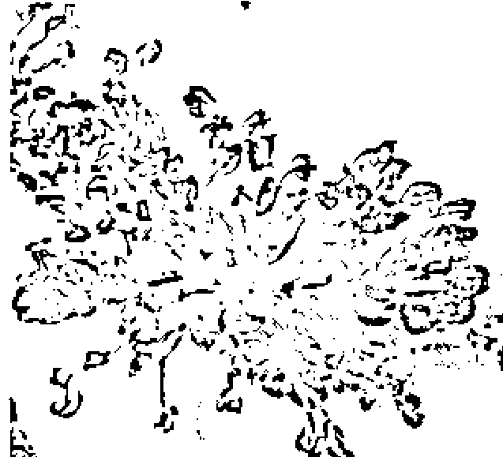

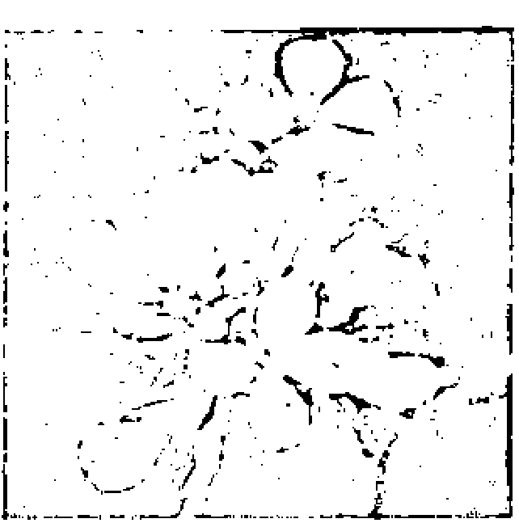

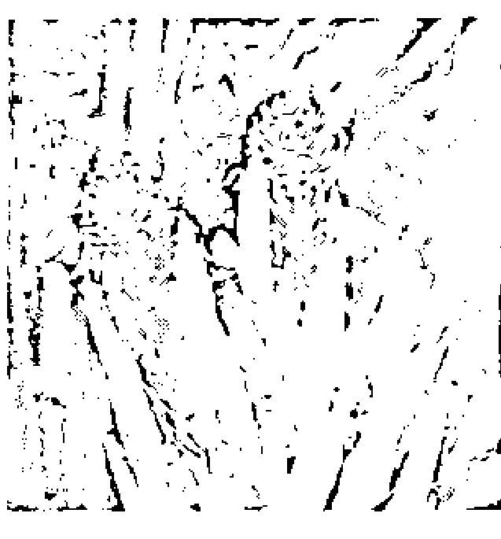

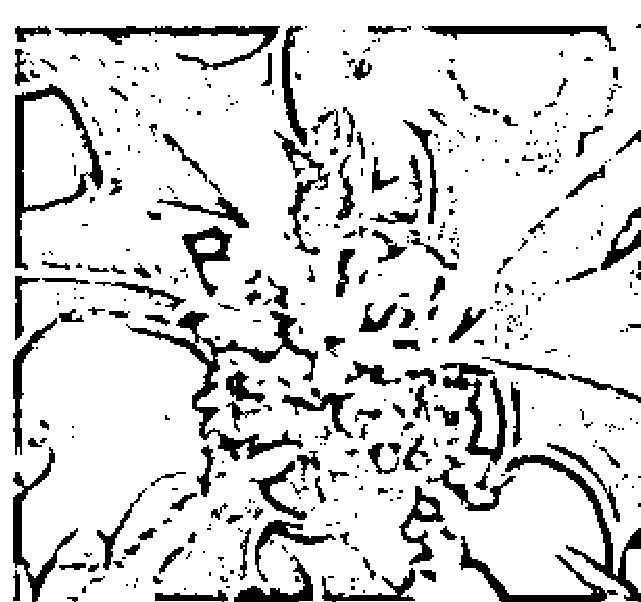

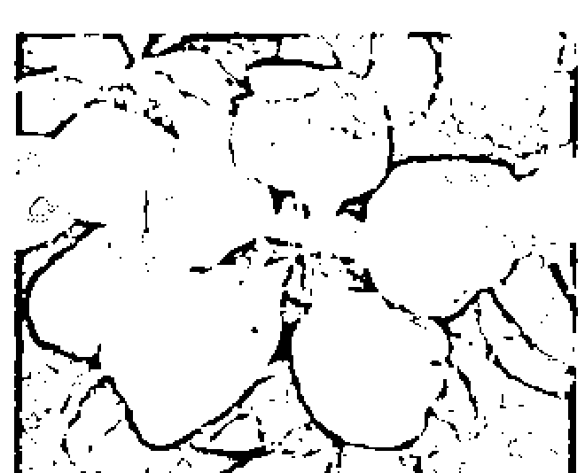

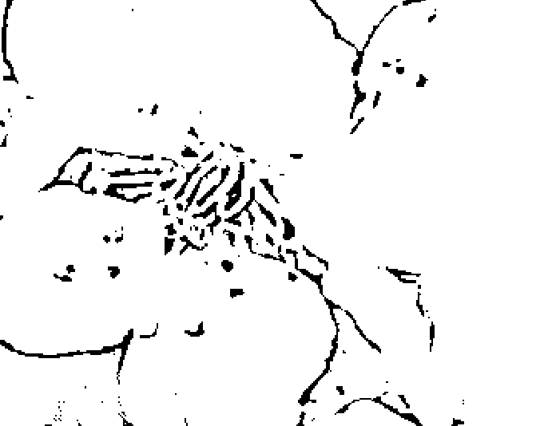

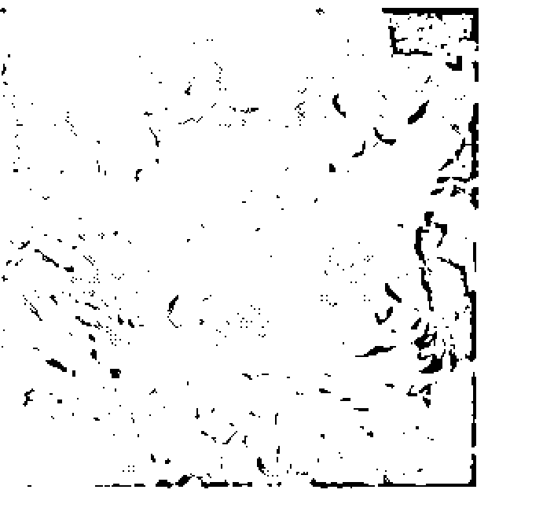

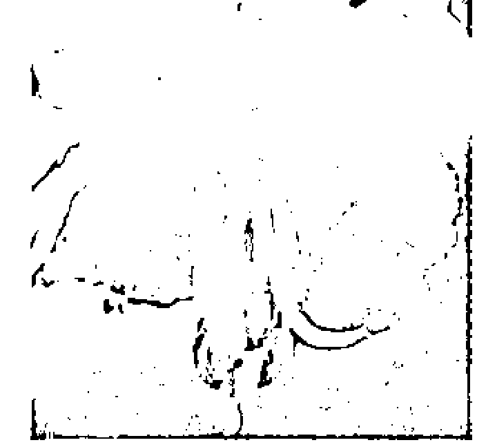

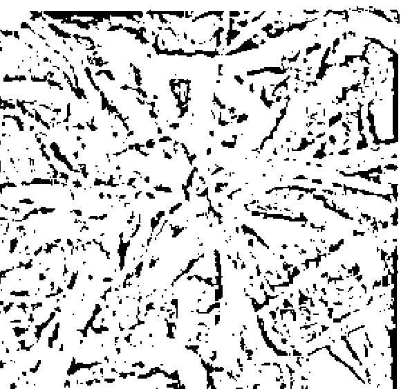

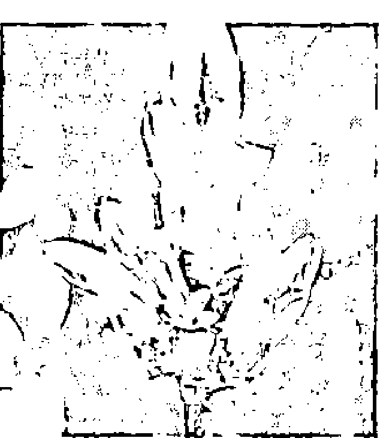

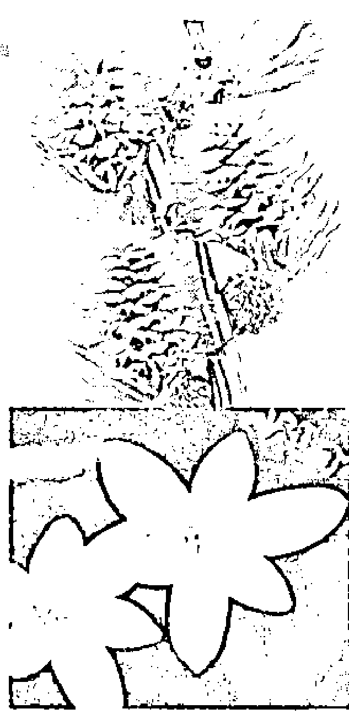

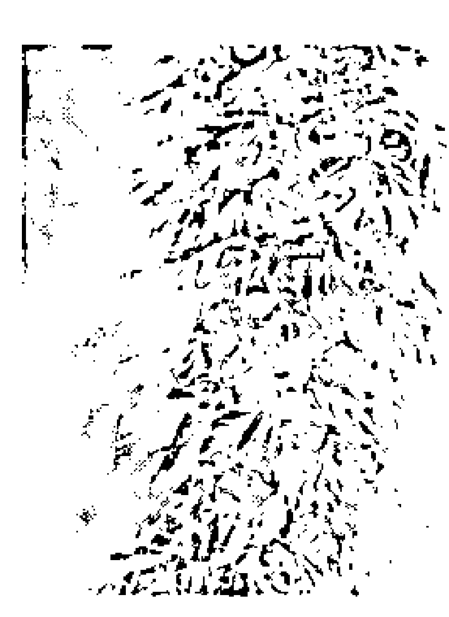

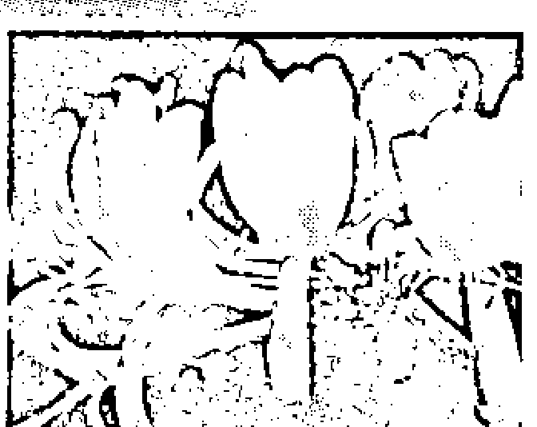

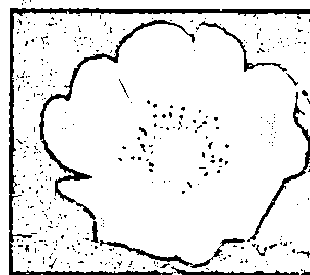

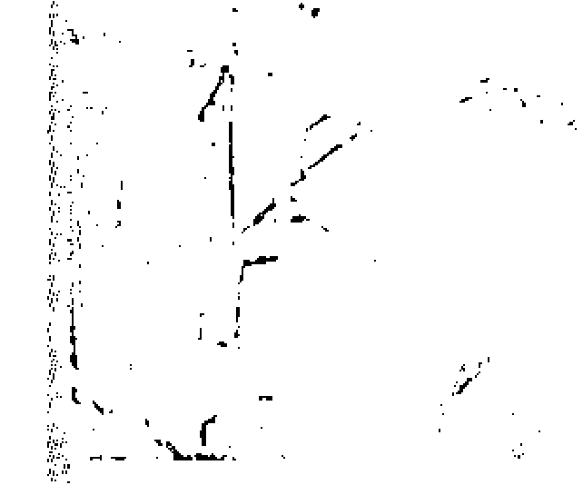

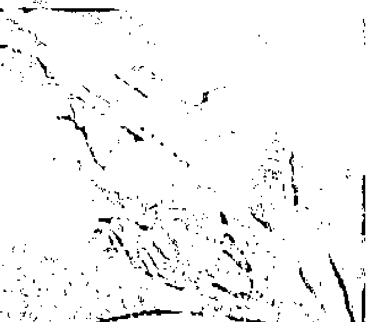

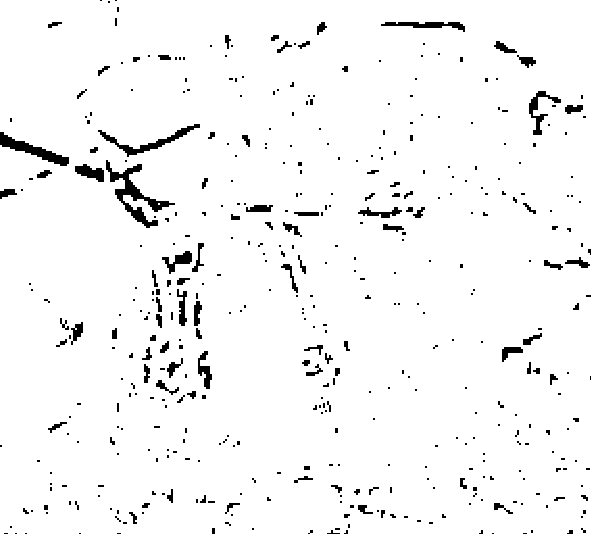

### 1. 樱花 Cherry Plum & 爆发与冷静

> 【花语】
> 我的冷静，如早春的寒意。

樱花对亚洲人来说，是一种很熟悉的早春观赏花卉。它还是日本的国花，而且日本自古也有在樱花季节出现更多自杀者的事实。短暂而美丽的樱花，在早春的寒意中，有一种凄美的意境，很能引起自杀者对生命悲观脆弱的共鸣。

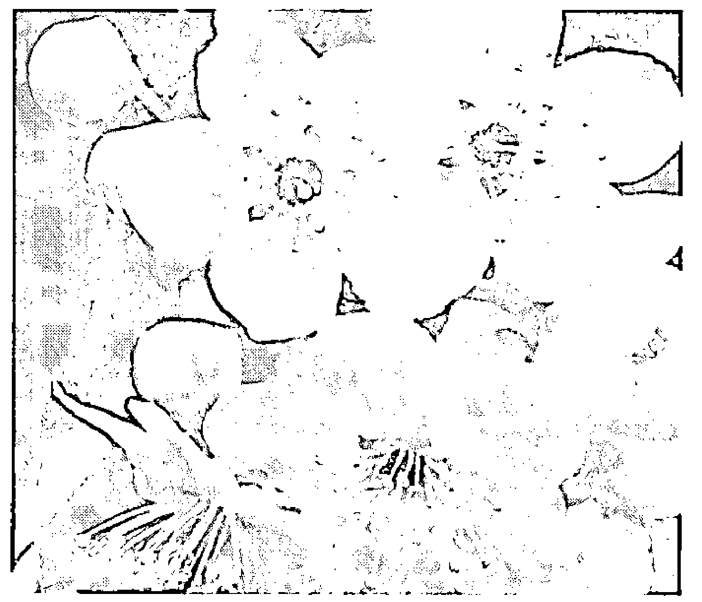

贝曲医生使用的樱花是英格兰乡村一种灌木状的白色五瓣野生樱花。一些家庭种植这种樱花作为房前屋后的隔离墙，所以它也是当地一种常见的植物。樱花是38种贝曲花精植物中最早开花的植物，一般是2月至3月初，也是英格兰乡村最早开花的植物之一。樱花是先开花，然后慢慢地长出小小的、颜色暗淡的椭圆形小叶子，果实很少而且很小。积累一年的生命能量几乎在短短几天的爆发式开放中消耗殆尽，没有多少能量供给叶子和果实。植物开花的季节、时间长短等反映了这种植物内在生命力的性格或特点，比如石楠花就特别旺盛持久，花期长达一个多月。而樱花的特点就是不可阻挡地短暂爆发。樱花的性格很敏感或者说很脆弱，当春的气息刚刚回到大地，春寒依然料峭的时候，大部分植物还在沉睡，樱花却敏锐地接收到了春天回归的信息，几乎是一触即发地展现出所有的生命能量，短短的几天后凋零飘落。如果我们身心健康并热爱生命，那么樱花在寒风中冷峻而饱满的白色，带给我们的感受会是清醒的冷静。爆发与冷静正是樱花生命的两极性。

樱花这种能量在人的生命中，主要是干扰大脑的控制功能。这种干扰非常强烈的时候，我们会感觉体内有一种能量将要无法控制地爆发，大脑艰难地试图控制这种能量，我们感到极度的恐惧，害怕自己失去理性而被这种能量毁灭。有时候，这种干扰还会不同程度地影响我们的言行，眼神可能呆滞，肌肉可能抽搐，行为可能完全不计后果，还可能出现上瘾、强迫、尿床等症状。樱花还会促使其他情绪失控地发泄出来，比如愤怒、悲伤、冲动等。樱花状态还可能严重到致人死亡，它和其他四种有危险潜能的情绪一起组成了贝曲花精的黄金组合：急救配方。换句话描述，在生命遭遇突发的危险状态，比如窒息、疯狂、昏厥、非理性自杀等时，急救配方的五种情绪是主要的危险能量，如果及时使用急救花精，可能使生命及时脱离危险境地。但是，这些强烈的状态也是平时累积的，累积得越多，就越容易被外界触发。因此樱花也是一种常见和基础的情绪。

任何言行、举止、身体失控的状态中，都有累积的强烈樱花情绪。每年早春，江浙地区空气中就会弥漫一种樱花情绪的气息。早春的很多花卉都有类似樱花的能量，爆发力很强，有些体弱或者神经很敏感的人，就会在这段时间经常感到大脑快要失控的恐惧。樱花情绪可能来自更高的不平衡的灵性能量，用佛教的语言，就是业力的一部分能量。樱花情绪引发的病症通常无法用西医的仪器检测和治疗。

岩蔷薇也是一种深层的恐惧感，能量特点是窒息和收缩状态。强烈的感觉是心脏非常吃力，身体快死了，但大脑是清醒自主的。樱花的恐惧主要是大脑功能失控，身体被一种冲击力胁迫，而且这种能量是快速膨胀的。

#### 情绪自测

#### 樱花：害怕崩溃和失控的恐惧感

有 1 项符合就表明此情绪比较明显

- 我很痛苦，经常感觉自己精神快崩溃了。
- 我的内心很恐惧，快疯了。
- 我再也不想忍耐了，好担心有一天会突然情绪失控。
- 我好担心家人。
- 我总是压抑悲伤，我觉得太沉重了，快受不了了。
- 我失恋了，我好想回到过去，我快把自己逼疯了。
- 我陷入了绝望的深渊，一切都毫无意义，我不想活了。
- 我真的很恨他（她），很想杀死他（她）。
- 我的精神好像有些错乱了，有点控制不了自己。
- 我很害怕自己无法控制欲望，快要崩溃了。
- 我对……上瘾了，无法控制自己，我很痛苦，感觉生不如死。
- 我陷入了单相思中，好害怕自己有一天会控制不了自己的言行，做出傻事。
- 因为痛苦而陷入狂躁状态。
- 非常烦躁，难以平静下来，我的言行处于失控的边缘。
- 我的抑郁症很重，经常在自杀的边缘挣扎。

### 2. 榆树 Elm & 压力与放下

> 【花语】
> 我将全部的压力取下，放在身边，轻松使我的生命舒展活力。

榆树针对我们这个时代最普遍的日常情绪——压力感。

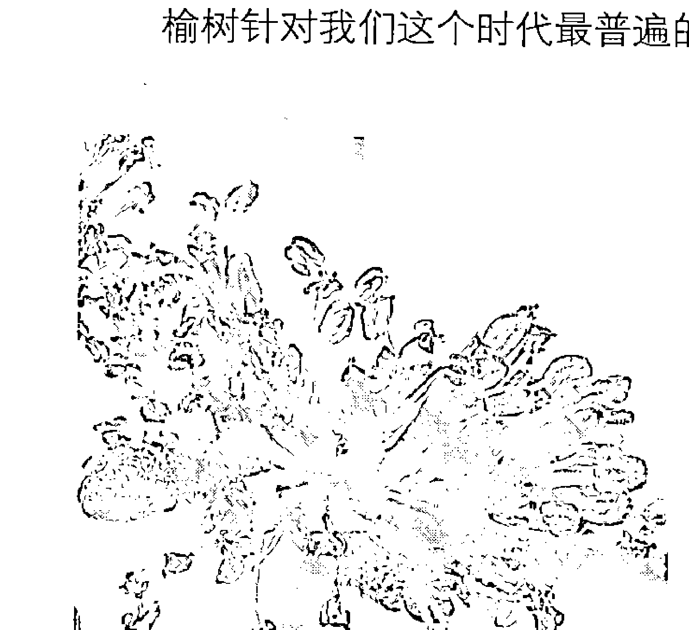

20世纪80年代以前，中国人见面的问候语是：你吃了吗？人们关心的主要是温饱问题，社会环境中也没什么可争取和竞争的。80年代以后，人们渐渐开始忙碌起来，欲望和竞争越来越强烈，压力越来越大。现在大家见面都是疲惫仓促地问候：你忙不忙？我很忙。只要你稍微留意一下就会发现，我们的潜意识似乎在每一件事情上都不容易满足当下，总是攀比或要求更多，给自己压力，也给别人压力。杨澜曾经敏锐地说：“在北京，几乎人人都感觉自己不成功。”绝大多数人都是因为无形的社会压力而产生了焦虑烦躁的情绪，没事也要瞎忙。

什么是压力呢？如果形象地描述，压力就是放在我们肩背上的无形重担。这是一种收缩压迫的能量。这种能量的特点可以从其对身体姿势的影响观察到：背部比较弯曲，头部前倾，肩部和手臂比较厚重，颈部和脸部比较僵硬，腰部或膝盖无力，等等，总之身体被整体压缩，好像肩负一个无形的沙袋或大山，支撑的部位感到沉重、吃力。长期累积的压力能量和已经僵硬的肌肉、淤积的浊气和病变的生理功能混合在一起，因此压力导致疾病已经成为大家公认的事实。接受和承认压力，尤其是身体客观承受的压力，是比较成熟的态度。大多数被压力压垮的人，其实正是不承认自己有压力的人。他们认为思想上能承受，身体就能无限承受。其实越成功、能干的人，越需要经常

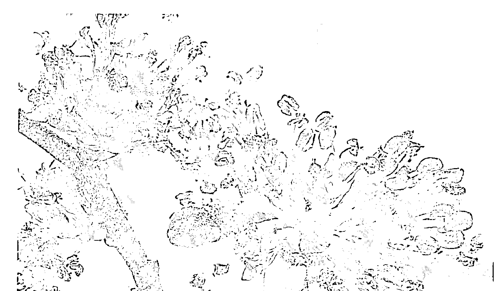

给自己的身体减压。压力爆发最常见的表现，就是突然感到自己无法完成日常的工作，或者本来不觉得很难的工作，也不敢去做了。比如刘翔，他的心理素质是非常专业优秀的，但整个社会给予他的压力也是实实在在的，尽管他思想上的确没有压力，但身体却可能时刻感受到外界和他人给予的压力，而每天高强度训练的运动员，身体没有彻底放松，就有受伤的隐患。在北京奥运会上，刘翔的脚伤突然复发，其实是身体感受到的巨大主场压力引发的。

我们从事普通工作的人，也需要经常觉察压力对我们的言行态度和身体的干扰。我的性格情绪是铁线莲，一有压力，马上就会注意力无法集中，效率很低，很多工作都做不了，有时候还会很急躁，对孩子没耐心等。这时除了心理调节，我还会立即吃一次含榆树花精的考试花精，这样又可以放松专注地工作了。坦然、客观地面对像压力这样最常见的情绪，及时消除，将它们的危害降到最低，这是头脑的智慧，而不是懦弱。

贝曲医生选择的英格兰榆树，是当时英格兰最常见的树种之一。这种榆树非常高大，成年树高度一般可达 20 ~ 30 米，主干粗大结实，枝叶都是蓬勃向上的。榆树的特点是木质特别坚硬，有一种非常强的收缩力或者说压力。紧密的木质中间分布有很多纵向的沟痕，这些沟痕的作用很像人体的经络，可以快速地输送营养和能量。这些特点和中国北方制作家具的榆木很类似。榆树的生命力有紧密收缩和拼命拉伸的特点。

榆树的花朵主要密集地长在树枝尖端，是雄蕊和雌蕊长在一朵花上的两性花。虽然榆树外表高大挺拔，但它的花朵却发育不全，没有花瓣，主要是粉红色的雄蕊。粉红色的治疗作用是有助于舒缓呼吸和免疫系统。这是榆树体内平衡坚硬压力的相反能量的体现。榆树开花的季节是3月，果实不大，在新叶长出来前几个星期就成熟了，但完全不育。榆树依靠吸根和人工种植繁殖。这么坚毅的树，内心却有非常软弱的一面，对于未来完全没有把握的能力。榆树家族似乎存在一些共同的生理弱点，英格兰榆树也很容易遭受病虫害。荷兰榆树病在几次小规模袭击英格兰榆树之后，终于在20世纪70年代彻底击败对手。这种病菌通过树皮进入英格兰榆树的输水管道，分泌有毒的物质并堵塞管道，让高大结实的榆树在几周内死去。3000万棵英格兰榆树已经死亡了2500万棵，人们也不能确定剩下的榆树的命运。这种不幸的遭遇，使人联想起很多外表非常坚强出色的人会突然病倒。英国已经采取了各种办法挽救濒危的英格兰榆树，遥祝这些幸存的榆树能够渡过难关。

人类是幸运的，我们有很多办法帮助自己。从生命的本质来看，压力是将下一刻或未来想做的事情全部放在当下。不管是自己放的，还是别人放的，都是我们此刻无法完成的，所以要勇敢地抛弃这些重担。如果你坚持这是你的责任而不肯抛弃，可以假想把它们取下放在身边，但不要背在身上。年轻的朋友们要学会独立思考，名利不应该成为人生的唯一衡量标准，时尚或潮流不一定是你的风格。生活在文化传统如此深厚的国家，温饱解决了，人们应该大胆追求自己的生命价值。当你把自己从重担下解放出来后，思路就会打开，很多现实问题将会有创造性的解决方法。

轻松专注于此刻的生命体验，一直是东方的生命智慧。但从生理和情绪的层面，这种状态很容易受到压力的干扰。感谢榆树花精协助我们实践这种智慧。

#### 情绪自测

#### 榆树：压力感

有5项符合就表明此情绪比较明显

- 我的双肩和后背僵硬又酸痛。
- 我的双肩和颈部很沉重。
- 我很紧张，感觉压力很大。
- 我很害怕会失败或有任何变故，非常担心。
- 我承担的责任和任务太大，感觉很累。
- 我必须赚钱养家，我很担心失去这份工作。
- 大家对我的期待太高，我担心不能完美地完成。
- 我的家人或好朋友都比我优秀，我总觉得他们有点歧视我。
- 我最近的工作以前没做过，我不相信自己能完成，不想努力了。
- 我的目标特别大，我担心的事情其实超过了我个人的责任和能力。
- 我不想要孩子，因为我不想失去我的工作，我也不相信自己能一边工作一边养孩子。
- 我以前的成功给了我很大的压力，我不能失败，只能赢。
- 父母对我的期望很高，我不能让他们失望，这让我不能轻松去尝试和积累经验。
- ◎ 我的父母都不成功，我一定要出人头地，我一直绷紧神经，不愿意轻松地生活。
- ◎ 我很担心不能适应新的环境或工作，我不知道该怎么表现自己。
- ◎ 我是老员工，新员工的创意总是让我很有压力，我越来越缺乏创新能力了。
- ◎ 我是男人，所以有压力我总是自己扛着。
- ◎ 周围的人都不相信我的能力，我只能用成功来证明自己，这让我无法放松自己。
- ◎ 我总是期望现在不能得到的东西，这些欲望让我活得很累。
- ◎ 我能笑嘻嘻地面对压力，但我的工作效率很低，失误也很多。
- ◎ 我常常责怪家人不好或不努力，其实是我自己不满意自己。
- ◎ 我最近工作不顺利，常常挑剔周围人。
- ◎ 如果我不供房，我就会自由地生活。

### 3. 栗苞 Chestnut Bud & 重复与突破

> 【花语】
> 永无止境的自我突破和成长潜力是生命送给我的最大礼物。

栗苞花精是贝曲医生唯一选用树叶的芽苞制作的花精，岩水是唯一的环境花精，其他 36 种花精都是用花朵制作的。

马栗树 16 世纪才从土耳其移栽到英伦三岛。它们非常高大，有些马栗树高达 38 米。枝叶繁茂舒展，叶子长出来以后，外形是半圆球形。种子很容易栽植成功，并且生长速度很快。木质很疏松，有点海绵样的柔软弹性。这一点和紧密僵硬的榆树正好相反，其能量特点是放松、生发的。马栗树先长叶子后开花，叶子的芽苞在冬天就开始从光秃秃的树枝上冒出来了。这些芽苞由大约 14 片厚厚的鳞片紧紧地包裹着，外面还有一层黏性的树胶，在冬日的阳光下亮闪闪的，很好识别。鳞片和树胶保护着芽苞温暖地过冬。整个冬天，芽苞外表的变化很缓慢，但4月初春天最开始几天的艳阳，就会融化树胶，芽苞随即非常快速地绽放出嫩芽。叶子其实早就在芽苞中成形了，在2～3周内，它们很快就会从“婴儿叶”变成宽大的“成人叶”，长度在13～30厘米。

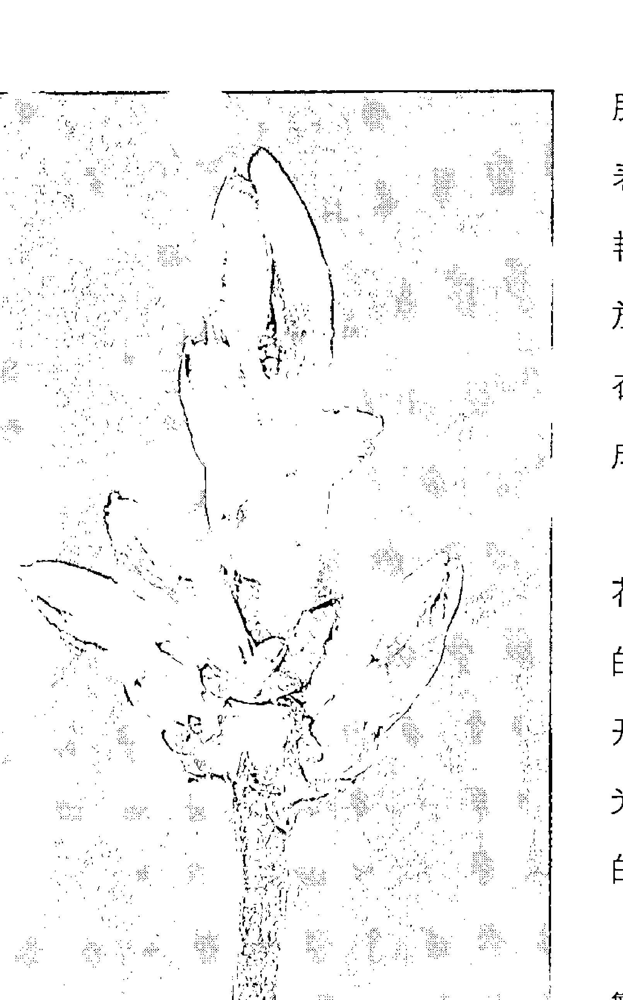

马栗树芽苞的这种快速生长的爆发力和樱花不同，樱花是爆发后就结束了，自我毁灭式的，而栗苞的爆发是突破，是新的成长阶段的开始。因为这些叶子将是树木的肺，它们通过光合作用为树枝、花朵和果实的生长提供重要的物质和能量。

枝头顶的芽苞还有花朵的胚胎，包含着繁衍未来的种子。每片叶子的形状是由5～7个相同的部分构成的掌状，在能量分布上有不断重复的特点。每个叶片是倒圆锥形，也是倒栗苞形，能量分布是先很小地积累，然后突然扩大，有突破的特点。我们通常注意到的叶子很多是圆锥形，能量分布是由强变弱的。

栗苞花精就是用这些即将冲破层层鳞片包裹的芽苞制作而成的。选用长有多个芽苞的树枝顶端部分，萃取的就是栗树芽苞饱含的这种健旺的突破状的能量。人的生命力中也天生具有这种突破的能量，所以我们会从一个受精的卵子逐渐变成一个成形的胎儿。从婴儿逐步长大，完成各种生理功能的成熟，到更精微的心智层次的不断成长。但是内外的因素又可能阻碍这种突破。

栗树花精通过栗苞的生命力，可以强化我们内在的突破能力，让我们可以冲破内在和外在的阻碍，比如胆怯、害怕改变、担心不安全感，顺利地完成生命各个阶段的成长和跨越。

素可能使生命的这种能量受到压抑，相对的负面情绪能量就是重复、循环的能量，导致身心成长缓慢。突破需要一定的积累，但如果总是重复积累，而无法进步，无法开始新的积累，成长和发展就受到了阻碍。

栗苞针对的这种情绪说不出具体是什么感觉，它的干扰主要表现在阻碍生理发育，使言行、态度和思维状态重复出现，等等。

青少年和儿童的栗苞情绪很容易觉察，生理或心智的任何方面成长缓慢，总是长不大，重复错误，阶段性地出现学习愿望和能力降低，在一个身心状态停留时间太长等，这些都是明显的栗苞情绪干扰。栗苞是欧洲的花精疗法师最喜欢给孩子推荐的花精。在身心需要快速成长的阶段经常食用栗苞花精，会很好地协助孩子的成长。我每隔一段时间就会给儿子吃几天栗苞花精，他的表现主要是学习新东西很困难，或者学习兴趣降低，重复幼儿时期的玩耍习惯等。吃过花精之后，孩子很快就又能适应学习的进度。

成年人也经常需要在身心的各个方面突破自己。我们一般对成年人的成长觉察并不细微，笼统地认为成熟和成长是自然的。尽管我们主观上非常愿意改善，但很多人还是只有在恋爱、婚姻、事业这些大的事情重复失败的时候，才会检讨自己为什么没有吸取教训和主动改变。还有一些似乎不愿意长大的大孩子，或者在某方面，比如兴趣、爱好、穿衣、饮食习惯等，始终保持和年龄不相称的幼稚的人也是受到了栗苞情绪的干扰。生活中的很多小细节都会反映出栗苞情绪的干扰：

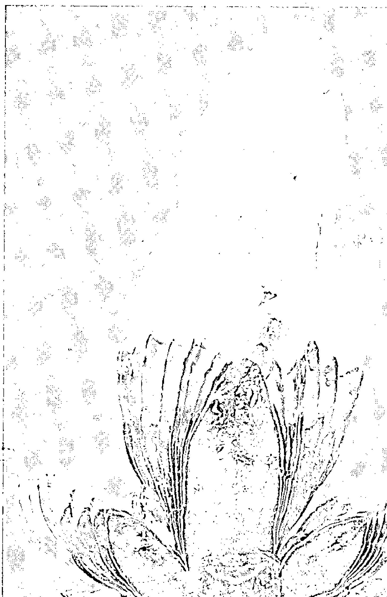

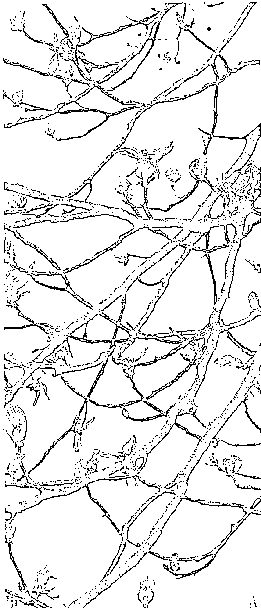

- 对某些生活习惯有很强的依赖性，明知道不好，也无法改变。
- 总是购买一样风格的衣服，尽管自己已经很不喜欢。
- 经常购物，但买了就放一边了，经常后悔。
- 喜欢尝试新事物或新方法，但很快就没兴趣了。
- 陷入一种无法改变自己的状态，知道应该改变，但改不了。
- 生活缺乏灵感和创意，有创新的愿望，但很模糊，清晰不起来。
- 长期在一个单一狭小的领域生活或工作，明显感到自己的思维或理解力在别的方面很迟钝，别人认为简单的事情，自己却想不到，似乎自己的智力有问题了。
- 不知道自己有无限的潜力，总是觉得自己就是这样，不可能再改变了。
- 接受新事物很慢，感觉自己学不会。
- 取得成功以后，希望自己永远保持和重复成功的状态；或者受物质成就的限制，感觉自己不需要改进了或无法改进了。

从这些表现可以看到，不改变和经常改变的问题可能都是栗苞的干扰，只是重复的问题和状态不一样。栗苞针对的这种重复的能量，使生命在某些方面的进展陷入停滞状态。

有位网友觉察力非常好，第一次选的花精就有栗苞，她发短信给我写道：“感觉栗苞的作用很明显，整个人会主动开始反省自己，寻求进步。”推动自己去“寻求进步”，这的确是栗苞带给身心的作用。我自己有段时间使用栗苞后，都会彻底清理房间，送走很多不需要的东西；生活和工作中也有很多新的想法、创意自动地冒出来，有些模糊的想法、认识会突然清晰、坚定起来，让我感觉到很细微的心智的扩展和能力的提升。如果你从事创意工作，或者喜欢不断改进自己，栗苞会很好地协助你突破、成长，它像春日的阳光，轻轻地将包裹你的惯性能量消除，让你的潜力和创造性顺畅、自然地释放出来。栗苞释放的是积累或经历教训以后可以发展的潜力，因此每个人突破的表现是不一样的。你展开的状态取决于你积累的潜力，当然它也推动你开始新的积累。

我们还可以更精微地体验和认识生命的成长。从灵修的角度来说，灵性的成长是我们来到这个世界的因缘和目的，物质的层面是我们修炼的场所和工具。个人心智的发展在此生只是一个阶段，无论外界给你多少荣誉或者你有多么成功，我们所知、所想、所感、所做的，都只是生命潜力的沧海一粟。经常体会到自己需要突破并且能够突破的成年人，生命中保持着孩子般不断成长的能量。这样的成就感是生命真正需要的。

#### 情绪自测

#### 栗苞：习惯性的重复 无法自我突破和成长

有5项符合就表明此情绪比较明显

- 对某些习惯有很强的依赖性，明知道不好，也无法改变。
- 知道看电视浪费时间，还是每天忍不住看到很晚。
- 饭后总是喜欢吃甜点，然后又后悔没有控制体重。
- 戒了很多次烟，但积习难改。
- 买东西经常被推销员说服，购买并不适合自己的东西。
- 总是购买一样风格的衣服，尽管自己已经很不喜欢。
- 经常浪费时间，最后一刻才做最重要的事情。
- 注意力不容易集中，总是有很多分散注意力的东西或事情。
- 经常买东西，但买了就放一边了。
- 经常买书，但每次只是翻翻几页。
- 在网上下载很多音乐，但很少去听。
- 喜欢尝试新事物，常常同时开始很多事情，但很快就没兴趣了。
- 经常做一些自己不喜欢的事情，但好像是惯性控制了我。
- 学习新知识或新技能很慢，感觉自己很难适应新事物。
- 身体发育还正常，但心理成长缓慢，老是不开窍，总是没长大似的。
- 虽然是成年人，但仍然拒绝长大，沉浸在过去的习惯和爱好中。
- 虽然已经30岁以上了，仍然喜欢少女风格的打扮。
- 不会自己主动进步，总是需要别人提醒。
- 很怀旧，就算旧的东西没用，也舍不得放弃。
- 不喜欢结交新朋友，总是寻找以前的朋友。
- 创新能力和变化能力差，对自己的状态习以为常了。

### 4. 火烧杨 Aspen ∫ 战栗与欢歌

#### 【花语】

生命给我力量战胜一切未知的恐惧。

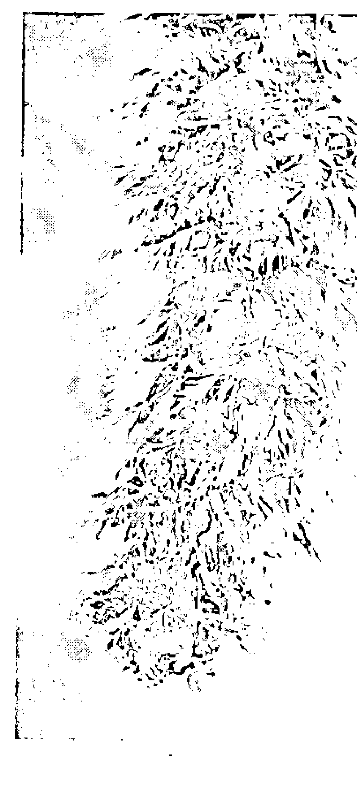

火烧杨针对的情绪能量非常有特点，是一种莫名的恐惧感或者惊慌感。没有具体的心理原因，就是突然感觉到不安。这种突兀的惊慌感超出了我们心智所及的世界，它来自未知的可怕的能量世界，让我们猜想它或许是鬼魂，或许是一种不祥的破坏力？

贝曲医生对这种恐惧感的描述是“模糊、未知的恐惧，不知道原因也无法解释”。一般我们遭遇到的火烧杨情绪强度比较弱，持续时间也不长，可能一会儿、一天或几天，慢慢就消散了。最常见的表现是突然眼皮跳，脸部的肌肉可能抽搐，或者手拿东西会突然颤抖，莫名的心慌感，很强烈。你可能会感觉周围有可怕的东西存在，比如背后好像有人；一个人待在家里时，好像觉得有什么看不见的人也在，不时地冒出疑神疑鬼的感觉。身体弱或神经敏感的人在比较阴森的地方，比如墓地、陈旧的老房子里，也容易感应这种莫名的恐惧感。有些很恐怖的噩梦，比如和死亡有关的，也和这种情绪有关。小孩子有时候会很敏感，突然特别怕鬼，直觉地感到黑暗中有恐怖的东西；有时候孩子晚上一定要看看衣柜里面有没有恐怖的东西才肯睡觉。或者，白天走路时总感觉有人在追自己。这些都是火烧杨情绪的干扰。贝曲医生还提到，不祥的预感也是火烧杨情绪。这种预感不和任何具体的事情相关，让人更加心神不定。总之，火烧杨情绪是一种让我们的身体和神经突然战栗的情绪波动。这种情绪波动经常会造成一些动作上的失误，比如打碎东西、磕磕碰碰、丢失钥匙，等等。一旦发现自己不对劲，我们会本能地说：见鬼了！

一些惊悚电影刻画的就是这种感觉，不过发生在现实中的时候，这种毛骨悚然的感觉并不好玩。也有人长期受到火烧杨情绪的干扰，他们通常身体虚弱，非常敏感，脸色苍白，眼神惊慌。他们不敢向别人说出自己的这种恐惧感，因为其他人很难理解。也有少数人会以为是自己的特异功能，沉迷于这种感觉之中。2007年，我在大慈寺慈善会做义工的时候，有一天来了一位30多岁的女性，瘦瘦的，神情明显和一般人不一样。她脸色苍白，眼神惊恐，对周围环境超级敏感不安。她已经好多年无法正常工作了。但是没想到的是，她还有一些崇拜者，一直跟在她身边的女友羡慕地告诉我说：“她可以看到鬼魂！”听说我可以用花精尝试消除她的这种惊慌感时，火烧杨女士立即拒绝，并迅速离开。我再也没见过她了。

民间有一句话描述这种状况：被阴性物质侵扰。阴性物质指的是暗物质，看不见的存在，其实是和生命的阳气相反的一些毁灭、破坏、恐怖、死亡性质的能量。所谓灵异的能量并不都是对生命有益的。火烧杨情绪可能来自这些威胁生命的阴性物质，但身体的生理状态也是一个重要的内因。如果身体很健康，就不容易感应或受到这种“阴气”的干扰。有些抑郁病人也有很严重的火烧杨情绪。

贝曲医生在慢性病人身上观察到这种常见的情绪，所以制作了火烧杨花精。在当时的欧洲，灵性还是很另类、隐秘的研究。于是贝曲医生只是用“模糊”、“未知”、“不知道原因”来描述这种情绪的来源。近年来，西方兴起的灵修热促进了很多去了解和体验灵性文化，很多花精疗法 师对火烧杨情绪有了更深入的认识。德国花精专家Mechthild写道：

> “有人说火烧杨情绪的人，可能天生缺乏一种保护膜，他们把对现实世界的意识和其他层次的意识，非常敏感细微地连在了一起。这些超现实层次不仅包括个人的情绪经历，也包括一些集体的意识，比如神话、象征意义、典型形象、迷信、天堂与地狱的观念等。”

这段话非常有启发意义，我们不能简单地说火烧杨情绪严重的人是精神失常，是幻觉，因为这些状态可能还有其他更多的情绪干扰。

火烧杨，学名欧洲山杨，属于白杨的一种，俗称白杨或火烧杨。英国文学名叫战栗的白杨，来自它的法语名字，感性的法国人就叫它战栗，因为它最大的特点就是叶子非常容易颤抖，经常发出沙沙的摩擦声。即使在无风的时候，火烧杨的叶子也会颤抖。想象一下吧，在寂静的夜晚，火烧杨在黑暗中独自发出沙沙的颤动声，而且时间很长，这的确会令胆小的人产生恐怖的联想。火烧杨的开花季节是3月～4月，先开花后长叶子，花朵雌雄异株。雄性花是软软长长的灰色菜荑花序，花药颜色暗红，成熟时变成黄色，没有花瓣；雌性花是小而短的圆柱形，表面覆盖着一层密密的褐色绒毛。植物的绒毛可能在茎秆上、叶子上或花朵上，都表示该植物对外界非常敏感，有感应精微能量的作用。有些人特别害怕毛毛虫，因为毛毛虫身上那些密集的细毛，散发着非常精微纤细的刺激能量，尤其这些能量还会不停地走动。火烧杨的雌性花朵形似毛毛虫，也有一种扰动人心的不安气息。

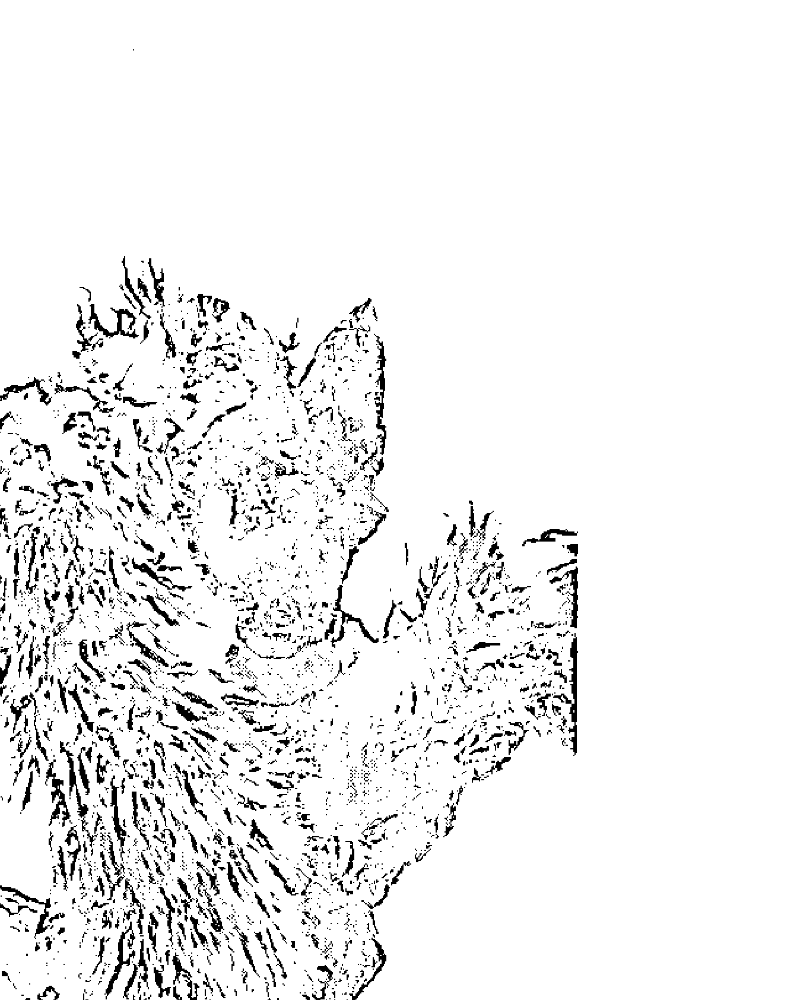

火烧杨的生长速度很快，吸根和种子都可繁殖。但它们寿命不长，一般不会超过 80 年。成年树可达 15 米。树干很有特色，灰绿或灰白色，白中带黑。生长过程中，树干上逐步生出很多黑斑，形状怪异，没有规则。冬天的火烧杨树林里就只剩下这些惨白诡异的树干，恐怕没有人愿意在这样的树林边停留吧。这种气息会让人联想到英国灵异文化中的吸血鬼，苍白、恐怖、神秘、死亡。火烧杨这个中文名字怎么来的，我没有考证到，但是感觉在灵性上很贴切。因为这种情绪的极端严重状态，有些患者会表现出极度的惊恐不安，好像被困在一座着火的房子里，到处是危险的火苗，刺激着他们不停地躁动。如果你梦到自己或其他人在经历这个场景，那么很可能你的身体感应到了强烈的火烧杨情绪。抱歉，我并不想吓你，这个段落请只看一遍。

火烧杨的整体气质是很轻盈细长的。木质很轻，而且很容易劈开，是拓荒者喜欢用来生火的木材。叶子长出来以后，整个树冠就开始了不停地抖动。植物学家认为，抖动的原因可能是叶子的叶柄非常长，而且是扁平的形状，因此很难保持各个方向的平衡和静止。但本质上，自然界的形式是由功能决定的，物质形态由更高级的能量特性决定，所以这种抖动的根源来自植物的内心。

#### 情绪图解
火烧杨：莫名的恐惧感

有 1 项符合就表明此情绪比较明显

- ◎ 莫名的恐惧心慌，心跳很快。
- ◎ 害怕黑暗，感觉有鬼或说不清的可怕力量。
- ◎ 疑神疑鬼的，总觉得周围有人要害我。
- ◎ 眼皮突然跳得很厉害，做事注意力也不集中了，老不小心打碎东西。
- ◎ 很害怕晚上窗外的任何声音，总是感觉会有什么可怕的事情发生。
- ◎ 脸色发白，对阴暗的事物或地方特别害怕。
- ◎ 小孩子突然在晚上特别害怕，本能地感觉周围有恐怖的东西存在，或者说是是有鬼。
- ◎ 经常做噩梦，梦的气氛很恐怖。
- ◎ 突然总是发生小事故或遇倒霉事，感觉有点身不由己。
- ◎ 强烈的恐惧感，没有具体原因，感觉只有菩萨才能保护自己。

### 5. 落叶松 Larch ∫ 自卑与自信

#### 【花语】

我很自信，因为我表现出了每个当下的最好状态。

落叶松针对自卑感，这是我们熟悉又敏感的情绪。

自卑感在思想上表现为对自己的某方面或所有方面评价过低，否定、贬低、打击甚至丑化自我。自卑感出现的时候，我们会感到：我不行，我很差，我做不了，别人都比我好，等等。总之，自卑感使我们不愿接受真实的自己。

成年人感觉到的强烈的自卑感，

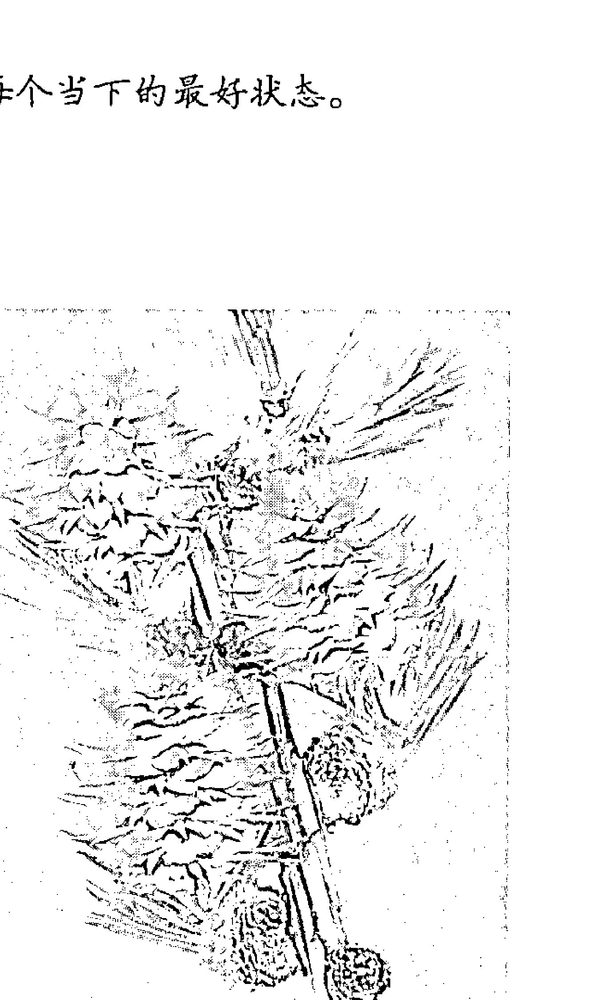

一般和原生家庭及经历有关。这些挥之不去的自卑感联系着各种心理创伤和记忆，比如出生地不是城市，原生家庭很贫困，父母婚姻不幸福，相貌不完美，学习不好受歧视，父母偏心，受到欺骗或人身侵害，事业不顺利，等等。有时候，一件很小的事情或一句话，也会使人产生顽固的自卑感。奥地利精神病学家阿德勒（1870—1937年）创立了以自卑情结为中心的个体心理学，他认为人类的一切活动和文化都源于自卑以及对自卑的克服。不管你是否同意这种心理分析，但人自身的局限，无法抗拒的自然规律，以及差异化的社会，和很多其他原因都可能使人感到自己不完美，不如其他人。其他人的歧视也是自卑感产生的常见原因。

> > 在举止间处处要凌驾于他人之上的人，实际是在借此抵消自卑感。这就好像怕自己太矮的人总要踮起脚走路，以使自己显得更高一点一样。

落叶松针对的自卑感是自卑心理或自卑思想的情绪产物。自卑的思想可以立即改变，但自卑感却很难立即完全消除。因为自卑感也是遵循能量守恒定律的。从小产生的自卑感没有及时消除，就会逐步累积在身体内，日积月累，就和浊气、毒素、生理功能病变混合在一起了。自卑感累积太多以后，即使我们长大了，思想成熟了，生活状况完全改善了，这些没有消除的自卑感还是会时不时地冒出来，影响我们的生理和言行态度。

自卑感这种情绪能量的特点是压制、缩小、扭曲各种生命能量。它使我们的所有生理功能和心智潜力受到压抑和否定，不能完全地表现出当下本来可以达到的最佳状态。在言行上，微弱的自卑感可能使我们不能舒展地微笑，严重的自卑感则可能导致沉默寡言，甚至自暴自弃。很多时候，自卑感对生命的危害和限制，超过了产生自卑的原因本身的限制和危害。马加爵因为自卑而杀死了嘲笑他的四位同学，他的自卑感其实从小就开始累积了。他战胜了贫困，却没有战胜自己的自卑感，这种情绪最终导致了他的心理扭曲。每个生命都有生理的局限、家庭的局限、社会环境的局限，自卑感不仅不能改善这些局限，反而会加重、扩大这些局限的负面影响。

用优越感或傲慢来消除自卑是无效的，并且还会增加新的不平衡情绪。自卑是堵塞左脉的压制能量，自大是堵塞右脉的膨胀能量。消除自卑后的自信，是不卑不亢的中脉状态。这种自信，会使整个人表现出洒脱自如的状态，是此刻的你拥有的独特的最佳状态。健康的自信是生命具有的一种充分舒展此刻生命潜力的本能，和其他人无关，也和其他时刻无关。身心无拘无束地展现出它在此刻的真实状态，没有压制或膨胀。有些人不能接受李宇春成为偶像，因为担心女孩子们都会变成男孩样。其实李宇春的男孩气质从小就这样，她的父母发现以后，也没有打击她或者强迫她改变，而是自然地爱她，接纳她的天性。所以李宇春的内心保持了自然和坚定地成为真实自己的自信。不一样的气质并不影响她成为一个率真、善良、有智慧的人。真正喜欢她的人，不会模仿她的外在，而是欣赏她保持本真的勇气和自信。

德国花精专家 Dietmar Kramer 根据长期的治疗经验认为自卑感是所有人的基础情绪。他说：我把落叶松划分为基础情绪，因为很多其他情绪的产生都是源于缺乏自信。从能量的角度，落叶松恢复了身心展现自我的本能，可以使被压制的所有正面和负面的能量自然地释放出来，同时减少各种逃避和掩饰情绪的产生。可以说 Dietmar 医师的这个经验，

在情绪的层面验证了阿德勒医生的心理分析。

疾病康复期，戒烟戒酒期，各种创伤后的心理重建期，人们在思想上已经准备改变，但情绪和生理层面的自卑能量还很多，需要增强自信，充分展现自己的身心潜力。

落叶松的学名就是落叶松，因为它是欧洲本土唯一的一种冬天会落叶的松树，原产于意大利的高山地区。我第一次在英国见到落叶松的时候，有点吃惊，因为它长得太不对称了，枝丫左右上下乱糟糟的，整个树冠垂头丧气的样子，我都没注意到枝头是向上的。英国18世纪著名诗人威廉·华兹华斯就特别不喜欢落叶松，他写道：

> “作为一种树，落叶松是最让人不喜欢的。它的枝条（它没有大的树干）在年幼的时候一点变化也没有，长大成熟以后也没有一点自尊。叶子的样子让我们很难说它们是存在，根本不能提供树荫为我们遮阳。春天，落叶松比其他本地的树都早发芽，叶子绿得很特别和鲜艳，很难和其他颜色协调。不管长在哪里，它们都很碍眼。夏天，其他的树都很意气风发，而落叶松的颜色却变得暗淡无光起来。秋天则变成了无精打采、沉闷不变的黄色。冬天，它们也仍然比其他树显得更沮丧。其他树只是睡着了，而落叶松简直就是死了。”

我们不能怪华兹华斯太尖刻，因为感性的诗人的确体验到了落叶松表面的自卑感，风华正茂的才子当然不喜欢这么消沉的生命姿态。落叶松的沮丧神情使它在诗人眼里变得一无是处。这就像外表很自卑的人，很容易什么方面都被别人歧视一样。

其实落叶松的内心有相反的一面。落叶松属于4亿年前裸子植物时代的幸存者，生命力极强。下垂的树枝可以防止积雪累积，针状的叶子表面有一层蜡，可以使水分流失的机会降低到最少。种子在松果里可以待几年，有小羽毛，落到地面，随风飘荡，直到找到自己喜欢的地方再发育。为了适应环境而形成的杂乱外表，并没有影响落叶松内心的缜密和自信。落叶松的木质非常紧密，纹理是交错的。由于这种植物可耐受寒冷、高温、干旱的恶劣环境，所以坚硬不变形，不开裂，不缩水，不易点燃，非常适合建设矿山和战船。落叶松的生长速度也很快，其他树木成材需要 80 年，落叶松只需要一半的时间。它积极的生命力还可以促进旁边其他树木加快生长，所以也是很好的保育林。落叶松正是以自己内在的优异征服了英国人。18 世纪开始，Atholl 公爵在苏格兰的高寒地带陆续种植了 1400 多万棵落叶松，从此彻底改变了当地的风景。落叶松的确是外拙内秀，它的生命力清晰地展现了自卑与自信的两极性。

落叶松的花朵雌雄同株，雌性花是玫瑰色的，受精后逐步变成绿色和棕色。

如果我们用头脑评价，生命的外在永远是不完美的，而落叶松似乎给我们启示：不要评价，也不要在意别人的评价，只要内心保持那份生命本来具有的无畏无惧的自信，舒展当下全部的潜力，成为真实的自己，我们的生命就达到了它本身的最佳状态。再见落叶松的时候，我会对它们表示深深的敬意，因为它们拥有的自信，经历了亿万年的考验。

#### 情绪自测
#### 落叶松：自卑感

有 5 项符合就表明此情绪比较明显

- ◎ 我很自卑，因为我没有车或没有房。
- ◎ 工作不好，我觉得很没面子。
- ◎ 我还没有成功，所以我觉得自己不应该很自信。
- ◎ 因为家庭的原因，我从小就很自卑，总觉得自己不如别人。
- ◎ 我总是不满足，很少快乐地享受我拥有的东西。
- ◎ 我看上去不漂亮，穿衣品位也很落伍，我一点也不自信。
- ◎ 我总是很羡慕明星们的身材和打扮，我好羡慕他们。
- ◎ 别人的态度不好，我马上就会认为他们瞧不起我。
- ◎ 我非常努力地生活，因为我不愿意别人瞧不起我。
- ◎ 我的自尊心很强，经常受伤，因为我对别人的态度很敏感。
- ◎ 我没有信心打扮自己，因为我觉得自己的外表和气质不是我内心渴望的。
- ◎ 我有点胖，经常看到别人歧视的目光，我也很无奈。
- ◎ 我觉得什么都不好，我对自己很不满意，没有什么优点和值得骄傲的地方。
- ◎ 我的事业非常顺利，但我还是每天很紧张，因为我很怕别人瞧不起我。
- ◎ 我经历过一次不愉快的婚姻，挫败感很强，感觉周围人会看不起我，我对重新恋爱或建立家庭没有信心。
- ◎ 我很注重外表和社交，虽然我活得很潇洒，其实我活得很累，因为我一心想把周围的人比下去，内心没有足够的自信表现真实自然的自己。
- ◎ 我不是在这个城市长大的，总觉得没有经验融入这个城市的生活。
- ◎ 我总是不自觉地弓着背，看上去很不自信。
- ◎ 我觉得自己很可怜，我对现在的生活状态很失望。
- ◎ 我没有真正爱过自己或赞美过自己，我只能看到自己的弱点，感到很失败。
- ◎ 过去的某段经历一直压在心里，使我觉得自己和正常人不一样，我是不完美的。
- ◎ 我很羡慕别人，总觉得别人都比自己活得好。
- ◎ 我是单亲家庭的孩子，我觉得我永远无法和别人相比。
- ◎ 我总是给自己买很多东西，希望这些东西能改变我，使我变得更好。
- ◎ 我的身体有残疾，这个自卑的原因是无法改变的。

### 6. 鹅耳枥 Hornbeam ♩ 乏力与清新

#### 【花语】
清新的能量，使我不再有心累产生的疲惫感。

贝曲医生观察到的这 38 种基础情绪中，有些情绪不得不让我们敬佩他超人的观察力。鹅耳枥就是这样一种很容易被大家忽略的情绪。贝曲医生的描述是：针对那些感到自己的头脑或身体缺乏力量去肩负生活重担的人，甚至日常生活中的琐事也似乎难以完成，但实际上他们还是有能力完成所有的事情；或者针对那些相信自己的头脑或身体的一部分需要得到更多的力量才能轻松完成工作的人们。

身体真的很累，需要休息或再生力量，这种疲惫感是鹅耳枥针对的疲惫感，是心理原因或其他情绪造成的乏力感。活力被压抑或扭曲了，无法释放出来。最常见的情况是：很多人在办公室工作了一天，其实没用多少体力，但下班以后仍然觉得很累，什么都不想做。这是因为头脑

太累或生活的单调感造成的。从事脑力工作的人更容易产生鹅耳枥的疲惫感。

抱怨、悲伤、压力等负面情绪也会导致身体能量的压抑和扭曲，进而使大脑感到乏力，产生无法和身体活力连接起来的鹅耳枥情绪。如果你不喜欢做某件事情，身体也就不会全力以赴，因为你内心强烈的抗拒感压抑了身体的各种功能。有些上班族或学生在星期一也容易感到疲惫，觉得漫长的一周又开始了。有些人玩游戏可以玩到半夜，但要学习或做些正事了，就立即感觉好累。加菲猫就是这样的卡通形象，很多人都在这只喜欢享受的胖猫身上看到了自己的影子。很多家庭关系都是在日常琐事中开始吵吵闹闹的，而谁也不想做家务的原因，大多不是真的懒，也不是真的做不了，而是感觉太累，因此相互埋怨和指责就很容易出现。想想都很累，这种累就是典型的鹅耳枥情绪。

鹅耳枥是英国东南部的原生树种，喜欢温和的气候。野生鹅耳枥属于中等身高，树干很短，很喜欢不断分权，生长速度很慢，一般十年以后就不再长高。鹅耳枥经常被人类修剪，以便长得快一点。这些特点很类似橄榄，能量有分散缓慢的特点。树干的横切面长得极不规则，外表有很深的凹槽，好像是几个树干拧在一起长出来的。年轮也被扭曲得非常不规则。这些扭曲是鹅耳枥内部强大力量的表现，这些力量一直在不断地挤压木质，所以鹅耳枥的树干是越老越坚硬。鹅耳枥英文名字的含义是牛角梁，表示像牛角一样坚硬。不过也可能正是这些扭曲的力量，使根部的营养只能缓慢地输送。鹅耳枥木质的颜色浅灰或白色，但是作为木材太短，所以只能用于一些精细的用途，比如箭杆箭头、小提琴的琴马等。

鹅耳枥的开花季节是4 ~ 6月初，主要是葇荑花序的雄性花朵，它们包含的能量很少，无力地垂吊在树枝上，花粉释放完以后就立即掉落。雌性花朵在树枝尖，也是头朝地面，没有花瓣，好像未展开的叶苞。

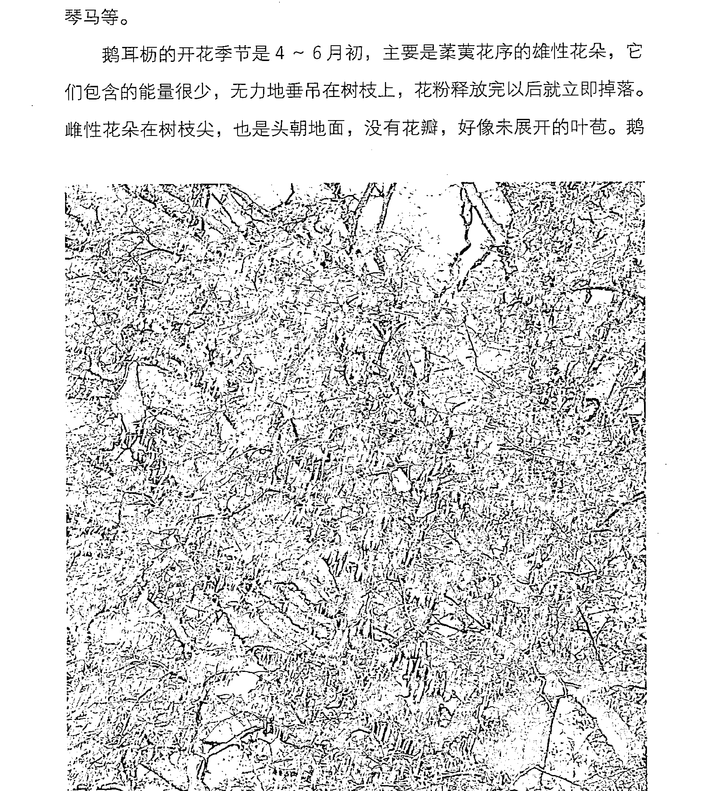

鹅耳枥似乎对繁衍后代没有太稳定持续的热情，有时候开花很多，有时候开花很少，有时候不开花，活力时断时续。雄性花束掉落以后，树叶的芽苞逐步展开，鹅耳枥就进入了它迷人的阶段。叶子是令人神清气爽的橄榄绿，输送能量的叶脉非常清晰，叶子秋天变黄，冬天干枯以后，叶柄仍然在凛冽的寒风中紧紧抓住枝条，直到春天新叶开始蕴蓄才掉落。鹅耳枥的枝条也表现出出色的柔韧性，柔软但不脆弱，而且不管是同一棵树还是不同的树，只要把两根鹅耳枥树枝编织在一起，它们就干脆长成一根。这种特性使鹅耳枥成为园林造型师喜欢的树种。鹅耳枥可以被任意修剪和编织成各种几何形状。人工种植的鹅耳枥的外形也因此非常不同，但是它们青翠的叶子和浅色柔韧的树枝，总是沉静地散发着一种活力充沛的气质。在欧洲，人们非常喜欢脾气温和的鹅耳枥，在人类的大胆造型中，更加展现了它柔韧的生命活力。

鹅耳枥的性格中有乏力和清新的两极表现。药草学家很早就发现鹅耳枥的树皮具有提神的作用，不知道这一点是否也曾启发了贝曲医生发现鹅耳枥花精。

认识鹅耳枥的乏力感以后，如果你觉得累的话，就可以更仔细地觉察一下，是真的很疲惫需要休息，还是头脑的乏力，无法连接身体的力量。道家修炼有一句话，非常好地描述了鹅耳枥花朵的能量特点：收拾精神，整顿心力。

#### 鹅耳枥：心理原因或其他情绪造成的乏力感  心累

有5项符合就表明此情绪比较明显

- ◎ 我的身体很虚弱，总是感觉好累，其实也没做什么费力的事情。
- ◎ 我好想成天躺在床上休息，但真的这么做了，感觉更累。
- ◎ 我常常早上起不了床，总感觉好累。
- ◎ 我的腰部有时候会疼痛，我总是感到太累，腰都挺不直。
- ◎ 尽管我的工作并不费体力，但下班以后我什么都不想做，因为我的心觉得太累了。
- ◎ 我最近工作压力很大，除了工作，其他事情我都没劲去做了。
- ◎ 孩子太小，照顾她（或他）需要持续的精力，我觉得好累，即使有人帮忙，我也觉得累。
- ◎ 我有很多计划，但总是觉得无力去行动。心里的累浪费了我很多时间。
- ◎ 我无法集中注意力，总是懒懒的。我的思维能力也下降了，感觉精力不济。
- ◎ 我的效率很低，总是感觉身心没有准备好做事情。
- ◎ 我焦虑的事情很多，总是有很多想法和欲望，这使我没做什么事情也感到很累。
- ◎ 我经常唉声叹气，打不起精神。
- ◎ 我心里有很多的抱怨和自怜，这使我工作或做家事的时候感到更累。
- ◎ 别人觉得我很懒，其实是我很容易累，这种感觉使我做不了很多事情就只能停下来。
- ◎ 我对参与现实的兴趣不多，喜欢看书和思考，我总感觉自己体力和精力不够。
- ◎ 我的双手和双脚都很虚弱，我没有心力使身体内的能量集中起来。
- ◎ 我给自己太多压力，即使周末和放假我也感觉很累。

### 7. 杨柳 Willow ∫ 抱怨与自强不息

#### 【短语】
天行健，君子以自强不息。

抱怨感是我们熟悉的最常见的情绪之一。由于这种情绪常常干扰思想、观念和态度，因此很容易被认为是一个人理智的思想，所以大多数人都不愿意承认自己有抱怨的情绪。因为我们的理智都理解抱怨别人是不对的。可见抱怨是一种很强大的情绪。

抱怨感表现为抱怨外界和环境应该为自己的一切负责，自己只是受害者和无辜者。抱怨的人一边指责、伤害别人，一边又认为自己应该得到帮助。在能量方面，抱怨感是耗散和浪费精气神的。在行为上，抱怨感使人丧失积极行动的愿望，即使被迫行动，也因为心不甘情不愿而让效率大打折扣。怨天尤人的人在现实生活中很不受欢迎，即使他们的处境的确需要同情和帮助，但这种伤害他人的情绪会使本想帮助他们的人

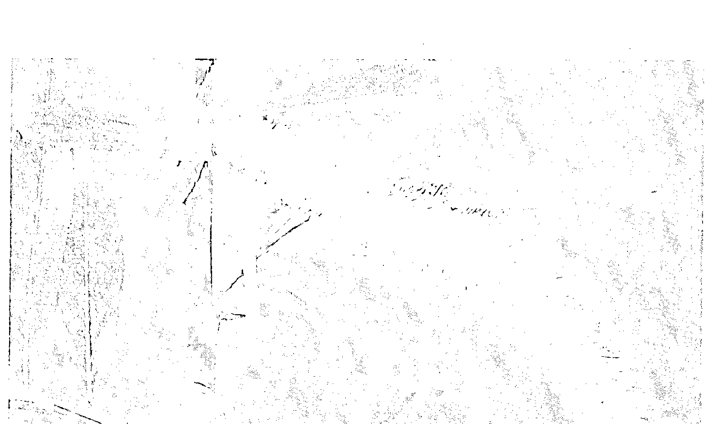

难以忍受，悄悄离开。

抱怨的具体缘由和情况是各种各样的，比较常见的是：在自己遇到困难或生病的时候，抱怨社会不公平，抱怨家庭或某个人不能帮助自己；在婚姻恋爱关系中，女性比较容易抱怨男性不够完美或不够体贴；女性在怀孕或生养小孩的特殊阶段，如果没有得到亲人足够的关爱，很容易累积很多抱怨；更年期的男性和女性很容易抱怨周围人不顺从自己；有些老人长期抱怨自己的孩子不够关心自己，他们可能不会直接说出来，但会通过其他方式表示出怨气。

很多时候，我们都很理直气壮地为自己辩解：我这样抱怨是有道理的，我是对的，所以应该抱怨！当然还有更强硬的态度：我说的是事实，我没有抱怨！从情绪治疗来说，不管这种消极的情绪产生的思想原因是什么，不管它们是合情合理的，还是自私自利的，导致的情绪能量都是一样的，对身心的危害也是一样的。如果长期抱怨，就会不断累积，成为亚健康或疾病的一部分。很多时候，我们的抱怨好像是本能反应了，但冷静下来我们的思想未必是这样。孔子说：智及之，仁不能守之，虽得之，必失之。如果积极的思想不能影响态度和行为，那么拥有这个思想也等于已经失去了。所以谨慎地觉察负面情绪的干扰是很有必要的。

很多花精专家发现风湿性疾病的患者很容易有长期性的抱怨情绪。湿气重的女性朋友也要多注意抱怨情绪的干扰。

苏菲·玛索主演的一部电影《罗丹的情人》，这个真实故事的女主角在失去罗丹的爱情以后，陷入疯狂的抱怨情绪中。尽管她才华出众，但抱怨使她失去了理智，摧毁了她的艺术和生活，最后她在疯狂、孤独和贫困中死去。我也有一位艺术家朋友，她的生活一直不顺利，身体也有很多慢性病。因为从小穿裙子，所以风湿也很严重。她最严重的情绪就是抱怨。遇到任何大小问题，她就会立即开始抱怨帮助她的人，所以尽管她很努力地工作，但所有愿意帮助她的人都悄悄离去或保持沉默。有一次我小心翼翼地对她说，或许你的负面情绪来自童年。她马上开始抱怨小时候父亲如何对自己不好。有时候，当她心情平和的时候，她会问我：“为什么我这么努力地工作多年，还要担心自己的生活？”这个问题，其实只有自己寻找答案。因为在抱怨情绪没有冒出来的时候，很多人是不会承认自己有抱怨情绪的；而被抱怨情绪控制的时候，又很容易坚定地认为自己的抱怨是对的！

消除了抱怨感，我们正常的生命状态应该是什么样的呢？还是来看看平衡这种情绪的杨柳树的生命特点吧。
杨柳树的品种很多，但普遍的特点都是叶子细长，枝干也细长。它他们喜欢潮湿低洼的水边或河岸。杨柳树整个看上去纤细柔弱，随风飘荡，柳枝下垂，完全没有向上的意愿。这种完全下垂的姿态感染的是人类柔软无力的心情，“杨柳岸，晓风残月”，“垂柳万条丝，春来织别离。行人攀折处，是妾断肠时。”在很多诗歌中，杨柳表达的都是悲伤哀怨的情绪。在西方，柳树也一直有悲伤的意味，在圣经《旧约》的《诗歌》中，当犹太人被驱逐到埃及时，“在巴比伦的河边，当我们想到耶路撒冷的时候，我们坐下来哭泣。在那里的柳树上挂起我们的竖琴”。那么，柳树是柔弱、放弃向上的吗？

柳树隔几年就会被修枝，只剩下一根矮矮的光秃秃的树桩。这是因为柳树生长新枝的速度非常快，修枝对很多树木是致命的打击，但对柳树却是一种促进主干生长的方式。柳树的生命力愈挫愈勇，这一点和葡萄树一样。但柳树的成活率更胜一筹。“有心栽花花不开，无心插柳柳成荫”，柳树就是这种只需要插在地上就可以自己成活的植物。柳树平均每年可以长3米。英国花精专家伯纳德写道：“冬季砍下来储存起来的柳枝，到了春天还会发芽，好像它们还是树的一部分。柳树是如此有活力，即使被砍得和地面一样平，树根还是会重新生长。”柳树的生命力是自强不息的，没有抱怨，没有哀伤和等待，只有自己顽强地生长！这是所有的生命都应该保持的健康状态。难怪《易经》在第一卦《乾》中就指出人类应该向万物学习，“天行健，君子以自强不息”。注意中脉的自强不息是健康能量。现在很多魔鬼训练的自强不息是偏向右脉的，多半有马鞭草情绪的亢奋膨胀的“自我强迫”。健康的自强不息是身心的自然潜力的充分发挥，在深度上它是和无为一致的，完全没有主观的强迫。

贝曲医生选择的柳树可以长到25米，但是主干不高，只有3 ~ 4米，非常喜欢生长新的枝条，有旺盛的新生能力。树皮粗糙，而且皱巴巴的，很像那些充满抱怨不开心的人的脸。这种柳树的雌雄花竟然是异株的，开花季节是4月至5月。和一般柳树不同的是，它们的枝条会在秋冬季变成金黄色，所以拉丁文名字的含义是蛋黄，呈现出内心阳光明媚的一面。柔弱哀怨和自强不息，是蛋黄杨柳的两极性表现。

杨澜是很多人学习的榜样，她在博客中曾经写道，如果选择一棵树代表自己的话，她选择杨柳树。那段时间，杨澜正好在回顾自己的成功经历。她特别强调父亲的教诲使她从小就认识到不能依靠任何其他人，而要专注自己的努力。杨澜对树的感应和她内心最强烈的意识是相通的。人与植物的关系就是这么微妙。

在汉传佛教中，大慈大悲的观音菩萨总是有求必应。有趣的是，观音娘娘的净水瓶中通常都是插着一根柳枝，原来菩萨救人的法宝就是让我们像柳树一样自强不息啊！

#### 情绪判断

#### 杨柳：抱怨感 受害者心态

+   有5项符合就表明此情绪比较明显
- 我常常感觉社会或领导对我不公平。
- 我经常想“我怎么这么倒霉”，命运对我太不公平。
- 我觉得自己是不幸家庭的牺牲品。
- 我从不吸烟，也不喝酒，我也很注意饮食，为什么生病的是我？为什么我得到惩罚？
- 有时候我很嫉妒别人的健康快乐。
- 经常忍气吞声，所以我内心很苦闷。
- 我不想和别人争论，总是把愤怒压在心里，都是因为他们我才不快乐。
- 我永远也不会原谅某个人。
- 我永远也不会忘记曾经受过的伤害。
- 我的不快乐或不成功是因为我的家庭不好，运气不好，时机不好。
- 我无法快乐起来，什么事情都不顺我意。
+   - 我的病是医生的责任，他没有及时检查出来。
- 我总能为自己的不幸或不成功找到借口。
- 如果小时候我父母很恩爱的话，我就不会离婚了。
- 我不想努力成功，是因为父母从小的教育不对或我的家境不好。
- 如果我有他那样的条件，我也会那么漂亮或成功。
- 我经常因为小事抱怨周围人，都是他们的错。
- 因为环境限制，我努力也没用。
- 如果……的话，我也会成功。
- 我总是责怪我的老公，都是因为他不行，所以我们的生活不好。
- 一旦发生什么不好的事，我总是马上责怪别人，都是别人的错。
- 我的婚姻不幸福，都是他（或她）的责任，因为是他（或她）先对不起我的。

### 8. 山毛榉 Beech ┐ 挑剔与接纳

> 【花语】
不再挑剔外界的细节，我自己也变得更完美。

山毛榉花精针对的挑剔也是一种很常见的情绪。

挑剔这种情绪表现为总是指责和批评别人或外界，而且通常都是一些局部的、小的、表面的某个细节，但对挑剔的人来说，它们却似乎是很严重、无法容忍的问题。这就是俗话说的鸡蛋里面挑骨头。

山毛榉情绪属于日常情绪，有些人只是偶尔爆发一下，通常是因为压力太大或太累，便会突然对周围的人很挑剔不满：“你怎么把这个放在这里？把那个放那里呢？”“你为什么没有……？”他们会突然变得很容易被激怒，而且原因也让人有点莫名其妙，因为被责怪的人其实以前一直都是这样。

挑剔感累积太多，就会习惯性地爆发。比如有些人一上路开车，就会不停地指责其他车辆、警察、道路设施等。霎哈嘉瑜伽发现，如果喉轮右边堵塞的话，人的言行就容易轻浮粗暴，冷嘲热讽，责骂他人，这主要包含山毛榉的能量。喉轮还有其他一些负面情绪能量也很强烈，通常它们会和山毛榉一起出现，不同的表现是：

菊苣：菊苣情绪多的人，总是用关爱的语气纠正别人或强迫让别人接受自己的方式，以便获得更多注意和爱的回报。比如有些母亲总是纠正孩子，在细节上唠唠叨叨。恋爱或婚姻关系中，一方总是挑剔对方不够细致体贴，在琐碎的细节上总是不满意，其实是渴望更多的关爱。

岩水：对自己要求很高或责任感很强的人，容易对别人也很挑剔。在大城市里，这种情绪状态的人越来越多。很多人追求完美、成功、品位、精神上的信仰，对其他人也变得很挑剔，希望别人也和自己追求一样的标准。会表现出在某些方面非常洁癖、完美或偏执。在电脑前坐得太久，导致颈椎僵硬，也很容易对别人莫名发火，或者喜欢挑剔周围某个细枝末节不完美。

马鞭草：被好强的欲望所控制，容易攻击别人的弱点。挑剔别人，以便达到影响或改变别人的目的，或者在心理上获得战胜别人的感觉。

葡萄：固执己见，按照自己的习惯要求外界。外界不断在改变，而自己的观念却没变，所以老是觉得别人永远不对。

你的思想可能并不认为自己的这些表现是挑剔，因为你的智力的确能超越挑剔，但你表现出的情绪却是挑剔。情绪干扰了你的言行和态度，你关心或帮助的人可能因此感到被你干扰或伤害。挑剔情绪的来源还可能和我们中国的教育方式有关。我们的头脑从小就被训练如何寻找各种问题的唯一正确答案。老师的教育方式就是找出学生答错的地方。这使我们关注的重点不是去鼓励创造和尊重个性，而是不能犯错。

挑剔与追求完美的区别是：前者是钻牛角尖，因为局部或细节而忽略重点和整体；后者是在保证重点和整体的前提下精益求精。山毛榉针对的挑剔是一种情绪冲动，所以挑剔者无法理性地思考，无法发挥自己的正常智力水平。挑剔感使人显得浅薄或狭隘，影响人们的注意力和思想去排斥和否定表面的、暂时的、次要的或局部的一个细节，而无法着眼于重要的、长远的、全局的、多方面交错的事实。

贝曲医生选取的山毛榉树，又称欧洲山毛榉，或英国山毛榉。在气候温和，海拔只有几百米的英格兰南部地区，一直都有很多古老的山毛榉树林。伦敦东北部切尔顿山 (Chiltern) 上的山毛榉树林就以风景秀丽而出名。山毛榉树非常高大，无节的树干一般高达 9 ~ 15 米，光滑浅灰的树皮非常干净。树叶很薄，几乎半透明，枝条和叶子的分布错落有致，层层叠叠，优雅轻盈，分杈的树干也是笔直向上。林中其他植物很少，整个树林很像干练高耸的哥特式教堂，静谧安详。山毛榉树在欧洲有森林皇后的美誉，可见它的亲切和美丽。从外表看，它的确有一种令人欣赏的精致和完美。

不过山毛榉也有一个尽人皆知的特点：它不喜欢别的植物。山毛榉的根部非常浅，根系密密地在地表附近水平编织，不向下寻找丰富的土壤营养。所以，一般的植物在山毛榉树下根本没有立足之地；加上山毛榉的树叶很茂密，在冬天也不完全掉落，只有冬青或一些蕨类植物和非常耐阴的草类才可能在树下生长。由于山毛榉对自己周围的土地的掌控性太强，不能接纳其他植物，所以园林专家建议不要在花园或草坪上种植它们，但可以在道路边、墓地或荒地上种植。他们还很理解地说：“为了能展现出无‘树’能比的美丽，它们应该独占一块自己的领地。”山毛榉的木质也非常好，坚硬而且光滑细腻，在古代最早用做写字的木板，是很好的家具木材。浅薄与完美的混合，很有趣，我们能感到它的生命力中有挑剔和接纳的两极性。

在欧洲，从希腊神话时代开始，一直有一个很浪漫的传统：因为山毛榉的树皮太光滑完美，诱惑着初恋的情人们把彼此名字的缩写字母刻在上面。随着树的年轮的生长，这些名字也渐渐长大，并且最后被完全埋在树心中。相爱的人可能已经不在世了，他们的名字却被山毛榉保留着。

山毛榉花朵雌雄同株，4月和5月，在叶子刚展开以后开放。雌性花朵在枝头，雄性花朵垂吊在树枝上，均无花瓣。开放时雄蕊很多，雄性花朵像一个绒毛球，花茎很长，好像是一个个垂吊的球形耳环。雌性花则“像一团铁丝般尖锐的巢，非常不友善。山毛榉会在这个带刺的壳中形成果实”。不过这些果实的味道应该很不好，因为从来没有人提到吃过它们。

山毛榉情绪是喉轮的主要负面能量之一，喉轮能量的灵性意识是成为宇宙整体的一部分。人的个体生命不仅和外界必须有物质的交流，而且也必须有能量的交流。而挑剔感就是直接排斥外界的一种能量，使生命和外界分离。就像山毛榉树，只好长在最孤独的地方。接纳外界意味着你也被外界接纳，这是个体生命融入宇宙整体的必需能量。

#### 情绪自测

#### 山毛榉：挑剔感

+   有5项符合就表明此情绪比较明显
- 我总是批评外界。
- 我对谁都有点儿挑剔。
- 看见不顺眼的，我总是忍不住指责，即使会使别人很不高兴。
- 我常常觉得别人很浅薄无知。
- 我经常否定别人的意见。
- 我经常嘲笑或讽刺别人与公共人物。
- 我有时候会突然什么都看不顺眼，总是挑剔周围人的小毛病。
+   - 我喜欢给别人提意见，我是为他们好。
- 长时间地坐着工作以后，我发现自己很容易挑剔周围人。（中医认为久坐伤肝。）
- 经常莫名其妙地对家人发火，因为他们总是做错事情。
- 我很追求完美，我看不起很多人不注意自己的形象和外表。
- 我买东西的时候，总是先挑毛病。
- 我总是用批评的口气对家人或孩子说话，比如：“你怎么总是这样？”“你什么时候才能学会……”“你难道不会……”
- 我总是只看到和想到我认识的每个人的缺点。
- 我经常因为一些小问题而改变主意，比如感觉不好就会马上换餐厅。
- 我对细节很挑剔，但往往没有注意全局。
- 我开车的时候总是骂骂咧咧的，经常想改变路线。
- 有时候别人非常受不了我的挑剔，但我只是坚持完美。
- 我吃东西很挑剔，总是会挑剔细节，所以我很难找到令我满意的菜单。
- 我的工作压力很大，所以我不允许自己和别人有一点点差错。

### 9. 海棠 Crab Apple | 不洁与排毒

> > 【范画】
> 我有自我净化的能力，我的内心始终有一种纯净感。

海棠花精针对的负面情绪是不洁感，自我厌恶感。它恢复的是洁净感，感到身体内通畅干净。这种感觉对应的生理功能是排毒能力，以及身体对外界各种污染和不洁的抵抗力、耐受力。

排毒能力，就是将体内产生的毒素或外界侵入的毒素排出体外的能力，这是健康的身体本身具有的最基本的自我保护能力。排毒能力差，身体就会把很多毒素累积在体内，形成疾病，或者就近通过皮肤排出。海棠的作用就是恢复身体的基本排毒能力。

对污染和毒素的抵抗力和耐受力也是排毒能力的表现。比如皮肤容易过敏，对脏东西或气味过度敏感，容易头晕、恶心、呼吸困难或晕车、晕机、晕船。有些人对空调非常敏感，感到空气令肺部难受，还有些人逛商场时容易感到烦躁气短，好像缺氧。

有些人的海棠情绪表现为强烈的自我厌恶感，不能容忍一点点不干净，甚至有洁癖，有一些强迫性的行为，比如不停地打扫房间，不允许有一粒灰尘；过度频繁地洗手或洗澡，非常在意自己身体的表面皮肤是否清洁完美；不愿意和别人有正常的身体接触；对自己身体的表面或某个局部非常挑剔，觉得不完美或不干净，甚至愿意冒险做手术改变。洁癖严重时，很多人都有这样的表现：不管自己身体多么不好，或者还有多少其他重要的事情需要做，都要坚持自己一丝不苟地打扫房间，因为不相信别人会打扫干净。这个追求完美的清洁过程，其实是身体想消除内在不洁感的强迫行为。洁癖是应该引起高度注意的生理问题，而不只是个人爱好，它表示身体的排毒能力非常虚弱或毒素累积太多，可能已经有疾病了。所以贝曲医生描述海棠情绪的表现时说：“针对那些感觉自己好像有什么地方非常不干净的人。常常只是一些无关紧要的事情；相比他们特别在意的某个小毛病，在别人看来真正严重的疾病反而被忽视了。”

其实每一种贝曲花精都是消除一种负面情绪，都是能量层面的排毒。能量排毒会恢复各种生理性排毒功能，产生物质层面的排毒。海棠花精可以协助其他花精将各种毒素排出体外，包括物质和精微物质，比如浊气等。贝曲医生也领悟到净化对消除疾病的重要性，他强调净化的层面不光是生理的，情绪，而且作为情绪主要根源的思想也应该经常被净化。

贝曲医生选择的野生海棠花属于一种野生酸苹果的品种，因此花朵不同于我们常见的园林造型用的中国海棠，而更接近苹果花。花蕾是粉红色，花瓣是白色。花瓣轻灵明亮，和新生的叶子一起，在明媚温润的春光下，散发着初生的朝气和纯净。这种野生海棠可高达10米，花朵很多。海棠花有一点点微酸的果香味，好像清洁着春天阳气旺盛的空气，让人气血通畅。站在它们的面前，你会有一种被沐浴清洗的感觉。

白色是最具净化作用的颜色。白色包括所有的光谱，有增强的作用，可以对人体的全部能量系统进行净化和排污，还可以唤醒其他功能。而粉色可以刺激免疫系统。因此海棠花瓣的色彩组合也暗合海棠的排毒作用。海棠的树皮表现出明显的排毒能力，树皮和树心是很容易剥开的，树皮粗糙，颜色很深，有很多排毒的瘤子，还有很多皱纹和小黑点，不断有毒素一批一批地被排出。树皮上很容易寄生一些苔藓或地衣，看上去很脏，但树心却是干燥的，一尘不染的，纤维状的木质非常通畅而有条理。海棠的叶子颜色会越来越深绿，很容易沾染灰尘，秋冬季节整个树看上去很不干净，和春天的清透气质正好相反。海棠的“内心”似乎不能容忍一点点不洁，细密地将所有的毒素都排到树皮或叶子中。不洁和排毒是它生命的两极表现。
海棠属于根轮花精，因为身体的排泄系统在这里，但是整个身体的每个系统、每根经络、每个细胞都具有各自的排毒能力。海棠花精扩展了我们在深度和广度上对生命排毒的体验和认识：排毒存在于生命的每一个层面，一个意念也会产生负面的能量，累积在身体内。健康的清洁感是贯通身、心、灵的整体纯净感，而不仅仅只是外表的清洁。

#### 【情绪自测】

#### 海棠：自我厌恶感 排毒能力弱

有5项符合就表明此情绪比较明显

+   - 我对脏东西、气味特别敏感，容易恶心。
- 我不喜欢去公共场所，因为我感觉那儿气味难受，我很容易头晕。
- 我很容易晕车，因为受不了汽油味和汽车内的空气味道。
- 我觉得自己不干净，很厌恶自己的身心状态。
- 我很挑剔自己长相的一些细节和小问题，经常到了无法容忍的地步。
+   - 我愿意去做小的整容手术，使我身体的某个小的局部看起来更完美。
- 我有洁癖，很爱干净。
- 无论外界有多干净，我总能找出不干净的地方。
- 我觉得家人的一些生活习惯太不卫生，尽管都是正常的行为，但我真受不了。
- 我总是忍不住去做清洁的事情，我不喜欢懒散邋遢的人。
- 我对外界的负面能量很敏感，身体会感觉难受，会本能地离开或拒绝。
- 我每天必须洗澡，经常洗手。
- 我只用自己家的马桶，其他人的我觉得很脏。
- 我觉得自己身体内部有不干净的感觉，尤其我生气以后，脸色很黑。
- 我觉得性很脏，我不喜欢和别人有身体的亲密接触。
- 吃了不洁的食物会非常想吐，我会试着用手指把它们呕吐出来。
- 我评论事物，总是看细节，我很挑剔，不容易满足。
- 我的体质很敏感，很容易疲倦、烦躁、不舒服。

### 10. 核桃 Walnut ∫ 动摇与稳定

【花语】
我能稳定地发挥自己的创造性和适应任何变化。

核桃是我们中国人非常熟悉和喜爱的坚果，在我们药食同源的文化中，核桃非常有营养，尤其有益大脑的发育。2004 年，我和英国花精专家伯纳德在四川岷江河谷寻找紫金莲的时候，看到河边有一棵核桃树，我顺便说了一句：“核桃是我最喜欢的坚果，对大脑很好。”没想到伯纳德非常吃惊，立即问道：“你怎么知道的？”看到他吃惊的样子，我笑了：“在中国，人人都知道。”当然当时我不知道的是，在英国花精专家眼里，核桃树也是一种重要的花精植物。核桃花精含有一种稳定感的能量。这种稳定感不仅可以恢复和巩固大脑功能的稳定性，也帮助恢复和稳固身心其他所有功能的稳定和成长。

生命的成长是一个不断变化的过程，但是各种能量和生理功能在变化过程中，会经常受到内外不健康能量的干扰。当这些健康的能量处于初始阶段或幼小阶段的时候尤其如此，干扰会导致它们偏离健康的状态，或者处于缓慢、停滞的状态。但是，生命力本身包含了一种基本的保护能量，它的特点就是稳定感。它本身是轻柔温和的，不是僵硬死板的。这种中脉的稳定感可以保护所有其他中脉能量不受内外因素的干扰，使它们能够健康地成长和发挥作用，从而间接地削弱偏左或偏右的负面能量的增长和影响。如果把海棠能量比喻为身体垃圾的清运工，那么核桃能量就是身体内手持盾牌、维护稳定的警察。

凡是生理状况有新的改变，比如长牙、换牙、幼儿学习走路、快速生长成熟的青春期、怀孕期、更年期等，都是特别需要稳定能量的时候，以便帮助生理变化少受内外因素的干扰。

外界因素的改变，也需要我们有更稳定的内在去适应，比如搬家、换工作、升学、结婚、离婚、戒烟戒毒、旅行、参加在异地举行的比赛等。新环境和新问题的出现，会挑战身体内的稳定感，很容易使身心的正常能力产生动摇或偏离正常状态。消化能力、表达能力、思维能力、行动能力等都可能出现阻滞或发挥不正常。

人类有很多创新思维和表达方式，有核桃能量保护的创新能量就不会偏离中脉太远，因为创新能量中也存在是否有益身心健康的问题，这和社会价值、商业价值无关。有一些艺术和创造，似乎走入一种极端疯狂## 第四章 19种生命特长和思想弱点

狂或者精神分裂的状态，创作者的情绪和精神状态很可能在某些方面远离中脉太远。突然自杀的英国时装界怪才 Alexander McQueen 非常有才华，2010年正是他进入事业成熟期的时候，他却出人意料地选择了自杀。Alexander 的性格敏感脆弱，犹豫多变，具有超人的爆发力，并且经常在不同极端倾向之间迅速变化，是典型的硬花草。在他绝美的设计中，表达的情绪经常都是极端的：暴力、惊悚、破坏、怪诞、绝望、疲惫、哀愁、离世等等。时尚教父 Karl Lagerfeld 的眼光深刻，他说：“我认为 Alexander 的设计妙趣横生，永远不显得平庸。不过在其中总能看到一点死的诱惑，少许反人类的情绪。谁知道呢？要是你长期与死亡过从甚密，也许有一天死神就会找到你。” 从花精疗法的角度看，Alexander 的一些情绪一直都在远离中脉的危险边缘，当核桃能量微弱到不能保护他的时候，这些情绪就会越过极限，造成不可挽回的冲动。Alexander 的事例也让我想到，有些欧洲的治疗师特别提到核桃可以很好地帮助犹豫的性格稳定下来，比如硬花草、紫金莲和龙胆草。从创作的角度，创造能量尽情释放的时候，也需要注意防止一些危险的能量不会突破极限。

核桃原产于波斯（现在的伊朗），英国的核桃树大约是在罗马时期引进的，英国南部各地都有，生长在一些古老的农舍旁边。核桃最大的特点就是它的果实像极了人的大脑，外果皮、内果壳、果仁的形状、皱纹都和人脑很类似。因此核桃仁能补脑几乎是人人可以理解的。

核桃树喜欢肥沃的土壤和开阔的空间，树根向下扩张，树枝也尽量多占空间。和橡树无比忍耐其他物种的寄生和干扰相反，核桃非常懂得保护自己不受干扰。成熟的核桃树的树叶发出一种浓烈刺鼻的味道，人还没靠近就会感到头晕难受。叶子不仅难闻，而且很硬。没有动植物愿意靠近它。果实更加有三层保护，青色的外果皮很厚很硬，而且包含苦涩辛辣的棕色汁液，这种汁液在果实成长期和种子期还起到杀虫剂的作用。汁液的浸透能力很强，可以用做染料。贝曲医生就曾用它为自己的很多家具染色，这些家具现在还在贝曲故居。第二层是坚硬的核桃壳。第三层是果仁的薄薄内衣，新鲜核桃的这层内衣也是非常苦涩的。这三层保护使人和动物都无法轻易地吃到鲜美营养的核桃仁。核桃幼苗的根部会一直连接着种子，因为核桃仁的营养还会继续供应幼苗的生长。所以，核桃不宜移栽。核桃的生长习惯和果实价值都表明它是一种很懂得保护自己，能够充分吸收、生产和使用营养的智慧树。

核桃传入南欧的时间更早，在神话传说中，核桃是丘比特之果，专门供奉给希腊女神戴安娜。戴安娜女神“有一种纯洁和无可撼动的自治权，将自然界中无人管辖的空地与人类寻找自我时的孤独连接起来”。古人对核桃生命力的了解可谓深入，核桃与外界的关系正是它内心个性力量的表现。

山毛榉的孤独看似完美，但实则浅薄，因此结不出像样的果实；而核桃的孤独尽管有不近人情之处，实际上却能自我丰满，独处是为了最大限度地吸收阳光、水分和营养，并结出营养特别丰富的果实。因此，核桃是一种智慧的孤独。

核桃在英国的开花季节是4月至5月，雌雄同株。雄性花序是随风动荡的长条状，雌性花非常稳固，紧贴枝干，外形像子房，两片像舌头一样的绿色花柱从“子房”的顶端冒出来。核桃雌雄花和人类的生殖器官在外形上似乎也有同样的蓝图，只是大小和材质不一样。贝曲医生只选用了雌性花朵，萃取其有保护意义的能量。核桃生命的两极性是稳定和动荡，它的稳定感表现我们已经知道了很多，而动荡主要体现在它令人头晕的树叶气味，摇摆的雄性花序，以及带有伤害性的外果皮汁液等。直觉敏锐的人都非常重视核桃能量。贝曲医生曾经将38种花精分成两组，每一组都选出了一个核心的能量。12种性格情绪和7种长期情绪是第一组，核心能量是身心合一感的野燕麦，第二组19种日常情绪花精的核心能量就是核桃。核桃保护中脉的意识和能量，而中脉的状态才是生命的真正原貌。在我们接近中脉的过程中，稳定感确保我们坚定地去成为真我，用真我去生活。真我不仅体现在更高的意识层面上，也体现在生理功能和情绪层面。生命的整体能敏锐地学习和成长，无论外界如何干扰，都不偏离健康的方向，能以不变应万变。核桃的稳定感不愧为一种智慧的能量。

#### 核桃：不稳定 不适应变化

有5项符合就表明此情绪比较明显。

- 对新环境，比如新工作场所、学校、团队很不适应，总想回到原来的地方。
- 对新发型很不习惯，很后悔。
- 总觉得自己的生活状态很难稳定下来，经常想改变。
- 确定目标以后，无法很快投入，总是要去尝试别的选择，经常偏离目标。
- 分手或离婚以后很不适应，尽管理智上仍然觉得选择是对的，但时常后悔不该改变原来的生活状态，因为一时无法适应新的生活状态。
- 怀孕以后，身心很不适应孕妇的状态，经常呕吐或感觉不舒服，甚至觉得怀孕太苦。
- 孩子出生以后，很难适应父母的角色，总是希望还能像以前一样生活。
- 亲人故去，无法适应新的生活，很多需要改变的习惯仍然保留着。
- 花精疗法或任何自然疗法使身体、情绪改善后，一时还不适应自己的新状态。状态不稳定，主要表现为心理不适应。
- 任何身、心、灵方面的学习取得明显进步以后，想更加稳固进展。
- 学习或工作取得阶段性成功以后，状态反而不稳定。
- 面临新的机遇和挑战，理智上觉得时机已经成熟，但感觉自己状态不稳定，甚至觉得还是不变更安全。
- 灵修的道路上，每前进一大步，都需要很长时间适应。
- 对新事物或新人的适应能力太差，不适应感影响了智力和潜力的发挥。
- 孩子的学习能力很差，主要是接受新东西太慢，需要很长时间才能熟悉。
- 做事很容易受外界影响，身心稳定感差。
- 容易晕车、晕船、晕机，主要是容易头昏。
- 某件事情最近进展很快，或者外界情况变化太快，感觉自己有点适应不过来了。
- 计划在短时间内能有更大的改变，希望身心能稳定地适应所有的改变。
- 对新的职务或身份很不适应，有些不知所措或回到从前，但不是智力的问题。
- 孩子换牙，不适应，老觉得口腔不舒服，或者情绪不稳定。
- 青春期生长得太快，心理不适应，老是觉得自己还是小孩子。

### 11. 冬青 Holly 仇恨、不满、嫉妒与和平、慈悲

【花语】
我能感受到爱与和平，并能将心中的爱温柔地表达出来。

在日常情绪中，哪一种情绪最不受欢迎、最伤人心呢？仇恨？愤怒？嫉妒？强烈不满？报复？歧视？傲慢？……这些破坏性极强的情绪，不仅造成各种人际关系的紧张和相互伤害，而且也是自古以来很多战争的源头。比如希特勒对犹太民族的仇恨，是他煽动世界大战的迷药。这些攻击性的情绪对应的花精来自冬青的花朵。冬青是一种叶子上有很多尖刺的常青植物，密集的尖刺让人无法靠近，对外界的态度十分不友好。

贝曲医生对冬青情绪的描述非常温和体谅：

> “针对那些有时候被嫉妒、仇恨、报复和怀疑的念头纠缠的人们。针对各种类型的恼怒和不满。这些人内心可能非常难受，并且常常没有缘由地不开心。”

产生冬青情绪的人将这些攻击性的情绪释放给受害者，被动接受大量冬青情绪的人也会不开心：感到深深被伤害，被攻击；不肯原谅他人；内心不断地挣扎；感到被误解或被排斥，等等。

有些人的冬青情绪非常强烈，他们走到哪里都很容易发火、不满、攻击他人。这是思想问题还是生理问题呢？情绪是来自思想和生理的，但是无法控制或极易被促发愤怒，就已经是累积的生理问题了。中医认为肝能量太旺，就会表现为怒的情绪无法控制。

用冬青能量刻意伤害别人的人，同时也在伤害自己。他们将这些伤害性极强的能量发射给别人或周围的气场。外向的人可能会更猛烈地回击他们，所以吵架和争执通常都是愈演愈烈，两败俱伤。而内向的人则会被动接受，有时候也会忍无可忍地爆发出来。长期受攻击或欺负的人可能会有一天采取极端手段报复，这是内心一直压抑的冬青情绪总爆发。而更多软弱的人是把这些伤害埋在心里，变成心痛和疾病。很多人从来没有想过要伤害别人，但对他人有意或无意的伤害却非常敏感，这说明身体内被动接受的冬青情绪已经很多。

冬青是毒害最深、破坏性最强的负面能量。感知情绪的心系统首先受到攻击。这些波动具有尖锐性的破坏力，好像冬青叶子的针尖，刺进心脏，强烈的时候会使心流血。另外冬青情绪在肝经中分布很多，而肝经是通过胸部或乳房的，所以乳腺和肺的病区可能有大量含冬青情绪的浊气。

冬青属于心轮，对别人的想法或干扰过度敏感这一组，是典型的攻击性右脉情绪。有些人好像整个人已经被魔鬼控制了一样，但自己可能认为只是本能的自卫反应。我认识一位女孩G，母亲怀上她不久，父亲就发现母亲有外遇，于是勃然大怒，坚决拒绝承认这个孩子是他的。G从小就感受到母亲的强烈的愤怒，后来母亲再婚，妹妹又出生了。G天生的性格情绪是马鞭草，而且菊苣也非常强烈，她一直用自己的方式强迫性地给予周围人关爱，同时强烈渴望别人关爱她。结婚以后，争强好胜的她也极不幸福，虽然成天学佛，但内心纠葛的情绪却没有解决。在她最痛苦绝望的时候，她的冬青情绪也很强烈，周围人都想远离她。可是她始终看不到自己情绪中的敌意。有一次，她甚至突然暴瘦，给她看病的老中医的妻子是一位很敏感的人，她对G说：“你的心里有一个魔鬼。”但G的头脑一直不承认这点，认为那是佛教中的护法神。有一天，她给我打电话，号啕大哭，说她终于发现自己的最大问题是一直不肯原谅别人，从小时候认识的某个人到现在的家人，她觉得都是自己不肯原谅他们，才导致内心不断加深的痛苦。她说：“我终于明白，我来到这个世界上的目的就是为了学会原谅他人。”这种怨恨情绪的源头其实来自她的母亲，而母亲的冬青情绪又来自父亲。从怀孕开始，G 的母亲就将对她父亲的仇恨一点点传递给 G。所以，冬青虽然是很强烈、很明显表露的情绪，但被干扰者的头脑同样可能完全不知道。思想没有仇恨，或者有强烈的爱的愿望，并不能推理出就没有仇恨或嫉妒不满的情绪。

> > 征服所有意志的终极力量是通过爱与慈悲，如果我们培养了足够多的这两项品质，那么没有什么可以攻击我们，因为我们将拥有同情，不会还击。

对花精疗法师来说，这两项品质的培养是一项必备的基本功。因为有些咨询者是带着强烈的冬青情绪和疗法师交流的，他们可能攻击花精，攻击你的态度和回答，甚至攻击你的其他方面。当然，他们并不是有意伤害某一个人，而是完全被攻击性情绪所笼罩。疗法师一方面要平静面对，屏蔽这些伤害性能量，另一方面还要耐心和他们沟通，使他们明白自己的情绪状态。因此花精疗法师的自我治疗是极其重要的，只要你还会被别人激怒或感到被侵害，说明你体内还有冬青情绪。成熟的疗法师会很喜欢心直口快的咨询者，她们快速而直接地表达出各种不满的情绪，更容易找到最需要的花精，改善的速度也快，通常几天后就恢复温顺和气了。

冬青是英国的一种常见的喜阴植物。冬青叶子的边缘上分布着大约15个尖刺，而且这些尖刺的方向是上下错开的，叶子是扭曲状的，所以整个冬青树各个方向都密布着“别碰我！”的针尖。叶子是常青的，而且比较厚，颜色是深绿色，表面有保护水分的蜡。冬青好像一位精力旺盛、高度紧绷、手持利剑的战士！在贝曲花精植物中，荆豆和野蔷薇也是带刺的，但是刺都在枝条上，能量特点是促进行动力。而叶子上的刺只有冬青才有，它的能量特点则是具有攻击性。冬青在5月和6月开花，雌雄异株。雌雄花很相似，制作花精的时候可以选任意一种花朵。花柱是清晰、突出的淡黄色，花瓣是充满质感和平衡的四瓣奶白色，散发出温柔沉静、平和单纯的气质。花蕾有红色晕染，具有活力和热情。甜蜜的冬青花香沁人心脾，吸引大量蜜蜂采蜜。夏初的冬青，向我们展示了它内心的两极性：攻击与和平。在爱尔兰的灵性文化中，冬青树代表阳性的能量，是“男人”树（常春藤是“女人”树），可以抵御闪电、毒药和邪恶的幽灵，可以给人，尤其是男人带来好运，种在房屋周围可以保护家园。

冬青的红色果子非常鲜艳，有微弱的毒性，据说成年人如果吃20颗，就可能致命，小孩子绝对不可以尝试。在西方，冬青一直被用于装饰圣诞节，因为冬青的叶子和果实代表了圣诞的两种颜色：绿色和红色。绿色代表永恒的生命，红色代表耶稣洒在十字架上的血。耶稣用鲜血证明的基督精神，就是用宽容和慈悲回应仇恨和伤害。冬青的英文名 Holly 和神圣 Holy 很接近。

贝曲医生也强调：“冬青可以保护我们远离一切非大爱的情绪，打开心灵，让我们和神圣的爱结合。”老子说“报怨以德”，这个德就是和平、宽容和慈悲。恢复和平与慈悲，我们才有感受爱和给予爱的能力。

#### 冬青：愤怒 嫉妒 仇恨 所有强烈的负面情绪

有5项符合就表明此情绪比较明显。

- 我很容易生气。有时候我很紧张，以至于一件很小的事情也会让我情绪失控。
- 我常常生自己的气，尤其当有人劝我做了我本来不想做的事情。
- 我常常控制不住自己的愤怒情绪。
- 我总是不满意，常常没有原因地不开心。
- 朋友们都说我脾气暴躁。
- 有时候我非常不友善，虽然其他人没有惹我。
- 我经常在晚上就醒了，嘴里还在不停地抱怨。
- 我对某件事或某个人总是怀恨在心，不能放下。
- 我很难原谅自己或其他人。
- 我很爱怀疑别人有坏心。
- 我不希望周围的朋友过得比我好，为此我常常感到很不开心。
- 很爱嫉妒，丈夫出差的时候，我要求他每过一小时都必须打电话回家报告行踪。
- 我常常嫉妒比我长得漂亮的其他女人。
- 几乎没有爱的感觉，尽管我思想上是爱很多人的。
- 我觉得周围的世界处处充满陷阱和不友善，我感觉不到和平与爱。
- 我付出的爱别人感受不到。
- 周围人对我都不满意，我当然也不喜欢他们。
- 我感受不到别人的爱。我对别人的伤害非常敏感。
- 我曾经受到过深深的伤害。
- 我难过的时候，胸口经常会痛。
- 我总是沉着脸，内心没有温暖的感觉，但我的思想不是这样。
- 我常常为一些小事大发雷霆，总是感觉别人会伤害我。

### 12. 圣星百合 Star of Bethlehem 麻木与苏醒

> 【花语】
> 我从创伤中苏醒过来，重新完整、鲜活地感知当下和连接过去。

圣星百合对应的情绪是受到打击或震惊以后的创伤感或麻木感。

每个人的内心都可能有一些无法面对或不愿面对的人或事件，伴随这些记忆的创伤感，虽然可以轻易被理性的思想或其他情绪掩盖，但这些创伤就像冰块，将你对某人某事的所有记忆都冰封成麻木感的伤痛。即使我们已经在思想上决心走出过去的某个创伤，可是周围人还是说：我觉得你还是没有完全走出来。为什么呢？因为伤痛感已经在体内累积，其他人是可以感觉到的。必须将它们排出，否则我们将终生带着这些局部的麻木，再也无法完整地体验生活。

圣星百合被贝曲医生称为“痛苦和悲伤的安慰者和抚慰者”。我最大的创伤就是19岁大二的时候父亲突然非正常地去世。我一直用单纯的忘记和坚决的回避去面对这件事情，这种状态其实就是严重的创伤感的表现。上海电视台的主持人曹可凡有一次讲到自己的父亲是抑郁自杀的时候，满脸泪水。很多成熟坚强的人，也很难化解年少时期的创伤。有一次，我读到一位智利裔的美国女作家写到她对亲人去世感到的打击：

> > “外婆辞世一事，直到我人生已入深秋的今天，仍然在我生命中留下无法言喻的空洞，深切的哀痛涓涓不断。”

她描写得真的很准确，这种无法表达的空洞就是一种麻木感。刚开始我用忍冬（怀旧）配合其他花精自我治疗。三个月后，我有一种强烈的愿望想回故乡去看看，这是十多年来第一次主动想回故乡，以前都是因为旅游而匆匆路过。我以为过去的创伤感已经好了，但是很奇怪，我回到故乡的时候，还是有一些情绪阻止我深入地面对过去，虽然忍冬帮助我在情绪上接受了过去，在思想上我也渴望将过去重新连接起来，但我还是匆匆地像旅游者一样走过了父亲工作的地方。

此后两年来，我几乎每天都在用急救花精，渐渐地，我发觉父亲去世留下的创伤感越来越少，我甚至可以平静地告诉一些好友父亲去世的原因。那段时间我正好在大慈寺功德会进行花精治疗，也开始意识到圣星百合对创伤感的消除作用。我发觉很多人现在的情绪都和某个创伤有关，特别是小时候的创伤经历。很多老年人，甚至 80 多岁的老人，向我讲述自己的痛苦时，首先提到的都是小时候父母的不幸留给自己的创伤。我在配方中加了圣星百合以后，明显感到他们温和放松了很多，对幸福和喜悦的感觉能力增强了。从那以后我几乎在每个人的前两次配方中都会加入圣星百合，效果非常好。后来我才知道这种使用方式也是欧洲一些花精疗法师推荐的。因此，我在自己的日常花精配方中也使用了几次圣星百合。

2007 年夏天，我回到故乡的时候，已经可以非常平静、完整并且有点幸福地重温过去。虽然父亲工作过的地方已经荒废，但我依然发现了很多细节，比如熟悉的木楼梯，路边两种不同的粉色喇叭花，有一种喇叭花还散发着久违的有点青豌豆的香味，还有路上的一些小水沟。这些都是童年记忆中非常温暖的部分，没有悲伤感，过去重新鲜活、丰富起来，父亲的去世已经不是全部，而只是一个转折点。我知道自己内心的创伤感已经基本消除了。令我惊讶的是，在父亲原来工作的地方，也是我和小朋友经常玩捉迷藏的地方，竟然盛开着很多四川的铁线莲，和贝曲花精的铁线莲外形一模一样，只是小很多。（这一点已经得到了英国花精专家伯纳德的证实）铁线莲是我的性格花精，它们自由完美地盛开在充满童年记忆的地方，好像在欢迎我的心真正地回到了温暖、完整的过去。

生理原因也可以产生麻木感，比如女性月经周期、婴儿出生时的震惊、各种外伤、皮肤过敏、经常使用安眠药或麻醉药品等。

圣星百合的英文名字是 Star of Bethlehem，意思是伯利恒之星。伯利恒之星这个名字出自一个非常重要的传说，在古老的记载中，三位东方的智者在代表耶稣的星星的指示下找到了刚出生的耶稣。那颗指引他们的星星被称为伯利恒之星。也许我们真的应该使用这个英文名字，因为它包含了更多灵性的意义，不过圣星就是圣洁之星的意思。

伯利恒之星这个圣洁的名字是如何成为这种小野花的名字的呢？这已经没有记载可考。我们只能直接和它交流了。圣星百合的白色不同于樱花的白，樱花的白是轻盈脆弱的，花瓣很薄，是带着早春寒气的白，使人清醒而冷静。圣星百合的花瓣厚实，盛开在初夏的4月至6月，它只在温暖晴朗的天气盛开，对光线的强弱非常敏感。圣星百合花朵具有完美对称的六角形外形：六个花瓣，六个雄性花蕊，像一个王冠，六个子房围绕着中心的一个雌性花蕊。当水冰冻成雪花，雪花也是完美的六边形，原因是六边形是水分子最稳定的一种排列方式。6是一个在时间和空间上都有完美含义的数字。数字在自然界具有重要意义，因为它们形象地表现了能量在时间和空间上的分布和变化特点。

#### 达·芬奇笔下的圣星百合

让我们再感受一下圣星百合花朵的气质：质感厚实的白色、完美对称的三个六、淡黄色的花心和温暖的初夏的气息都能让我们感到和平、温暖和完整，可以联想到其他相似的感觉——鸽子的羽毛，救死扶伤的医者的白大褂，新娘的婚纱，圣洁的哈达，或者圣诞树上的六角雪花装饰等。在野外，这种厚实纯净的花朵如同闪亮永恒的星星，安慰和指引着路人。

创作了《蒙娜丽莎》的达·芬奇也是一位对植物相当有研究的艺术大师，他的人物绘画作品中经常有植物点缀。这是达·芬奇笔下的圣星百合：上面是细节严格对称的花朵，下面S形动感的旋转叶子是画家的想象，表达出对流经叶子的生命能量的深刻洞察，一静一动形成鲜明的对比。圣星百合是先长出很多细长的叶子，花朵开始酝酿时，叶子就开始枯黄和凌乱。叶子是简单的直线型细条状，能量特点是流线型的。圣星百合的花朵能量分布如雪花般完美稳固，而叶子的能量像流水一样顺畅自由。雪花与流水，麻木与清醒，这是圣星百合的两极性。

圣星百合的花朵会多次开放，每次总是在早上饱满如初地盛开，花瓣背面有深绿色的花萼保护关闭的花朵，花期可以持续三个星期。而紫金莲和岩蔷薇只开一天，其实只有几个小时；铁线莲、龙胆草、马鞭草、美洲赫顿草等都是一次性开放，逐步凋谢。由此可以看出，圣星百合的生命力特点是均匀、持久，有非常好的耐性。这正是安慰者和指引者需要的能力。

#### 情绪自测

#### 圣星百合：麻木感 创伤感

- ◎ 我不想谈论过去的某段经历，虽然心理上我觉得已经没什么了，但感觉仍然是灰暗的。
- 小时候家庭不幸福的创伤一直都埋在心里，对那段时光感觉很麻木，没有任何阳光的回忆。
- 亲人去世，当时很悲痛，至今仍然不愿意提起。
- 经历过大的突发事件的惊吓，比如自然灾害、交通事故、重大的坏消息等，身心受到过很大刺激。
- 高考或某件人生中重要的事件没有顺利通过，至今仍然无法轻松面对。
- 恋情、友情等受到过深深的打击。
- 失恋或离婚以后，开始封闭自己的情感。
- 经历磨难或挫折以后，决定永远忘记过去的那段经历，因此感到自己的人生是不完整的。
- 父母婚姻的不合致使自己长期生活在压抑痛苦的状态，对现实的感觉没有其他朋友乐观和深入。
- 过去的悲伤一直没有消除，明显感觉自己的内心有一种麻木冻结的感觉，感受不到其他人的快乐。
- 情感麻木，总是冷冰冰地面对别人的热情。
- 对现实的反应比较麻木、迟钝，虽然理性上愿意积极面对，但情感比较苍白。
- 从小缺少母爱或父爱，冷漠，爱的情感缺失，感觉不到别人的爱。
- 胸口经常感到郁闷麻木。
- 身体受到较严重的创伤或外伤，比如脑震荡、头骨骨折、脊椎受伤、其他骨折等，引起局部神经麻木。
- 长期陷入生活或感情的困境，感觉自己越来越麻木，连悲伤都凝固了。
- 麻醉剂或一些西药导致的神经或身体局部麻木。
- 平时也不觉得悲伤，但看到悲伤的画面就会引发很强烈的悲痛，甚至胸口隐隐作痛。
- 亲人或所爱的人故去以后，内心一直感到情感空白。
- 听到坏消息，比如离婚、事业受挫、亲人故去等，突然昏倒、失聪、失语或身体局部麻木。
- 曾经目睹宰杀动物的场景，从此不再吃这种动物的肉，怕当时的悲伤会被再次触发。
- 越来越冷漠、戒备，无法释放内心的温情和爱了。
- 越来越不愿意向别人表达问候与关爱了，情感越来越麻木。

### 13. 白栗 White Chestnut ∫ 思考与静默

#### 【花语】
静谧中，我看到更多的世界。

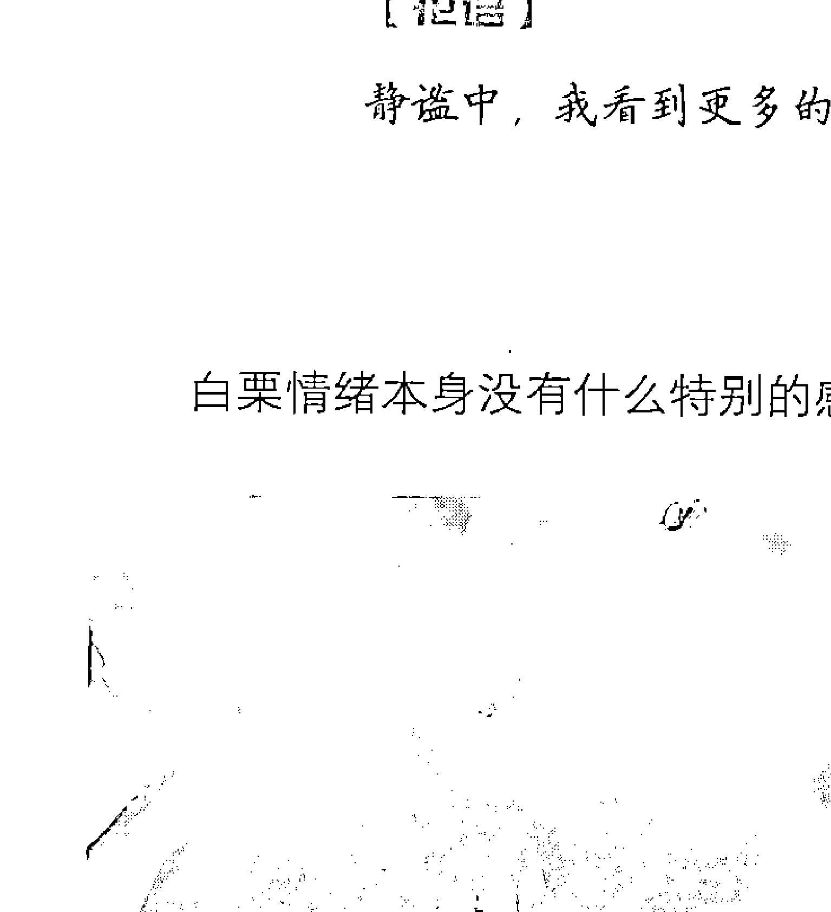

白栗情绪本身没有什么特别的感觉，它的干扰是一种很常见但成年人却很难摆脱的状态：头脑停不下来。长期不停地思考，人们会感到焦虑，实质则是大脑的功能过于活跃，无法自动回到休息和静默的状态。

你是否发现自己从早上醒来头脑就一直在思考，脑海中一直有一个声音在不停地唠叨，到了晚上睡着才能停止，甚至有时候睡梦中也感觉在思考？有些人干脆睡不着，头脑东想西想，像个永动机一样转动。

其实，我们的头脑本来是可以停下来的，大脑的思考能力是我们可以选择和控制的一种生理功能。正如我们有听、说、看等生理功能一样，我们可以使用它们，也可以不使用它们。但是不知道从什么时候开始，我们已经无法让大脑停止思考了。这些自动的思考带来焦虑感，使我们无法安宁。

几年前我身体很差的时候，曾经想通过静坐修养一下，没想到越坐头脑越乱，原来让头脑停下来比登珠峰还难！书呆子状态就是典型的白栗情绪，注意力和精力都被停不下来的思考占据，以至于感觉和行动的能力严重萎缩。我们的考试制度迫使大家在青少年时期就用脑太多。所以，成年人要在短时间内消除白栗情绪，几乎是不可能的。

> 贝曲医生对白栗情绪的描述是：“针对那些不能停止头脑中不断冒出的想法、观念和争执的人们。通常是头脑对当下的兴趣不足造成的。担心的想法会一直保持，或者如果暂时摆脱了，又会返回来。它们似乎在头脑中反复循环，造成精神上的折磨。这些不愉快的想法的出现赶走了平安，使我们不能够专心考虑现在的工作或快乐。”

贝曲医生的话听起来特别平淡，其实已经揭示了这个情绪的深刻内涵：不自主的思考干扰了有效的思维能力，并且带来精神上的焦虑和痛苦。

有一本在东西方都相当畅销的书《当下的力量》。作者埃克哈特·托利利用亲身经历，告诉大家什么是开悟状态。托利开悟的入手点，就是觉察白栗情绪的干扰。这本书的前半部分一直以启发这个觉察为主线。他对白栗情绪的干扰描述真实而易懂，我引用如下：

> “不能停止的思考是一种可怕的烦恼，由于几乎每一个人都遭受着此种痛苦，而我们又无法意识到这一点，所以这就成了一件很正常的事情。这种不停的思维活动使你到达与存在不可分离的内心宁静状态。同时，它创造了一个假的自我，不断发射恐惧和受苦的阴影。
> 
> “思维已经变成了一种疾病。
> 
> “如果思维被正确利用的话，它将是一个超强的工具，但如果利用不当，它的危害则相当大。准确地说，你不是错误地利用你的思维——通常不是你利用它，而是它在利用你。这就是疾病。你认为你就是你的思维、你的大脑，其实这是一种幻觉，你已经被这个工具控制了。
> 
> “人们 80% ~ 90% 的思维不仅是重复的，而且是无用的。而且由于思维的运作障碍和消极的本质，大部分思维都是有害的。如果你观察你的思维，你就会发现这不仅是真的，还导致你的生命能量的严重耗损。
> 
> “实际上这种强迫性的思维，是一种上瘾症。上瘾症的特点是什么？非常简单：你没有可以停止的选择。它甚至比你还强大。它同样给你一种错误的乐趣，而这种乐趣会最终变成痛苦。上瘾的原因是你认同思考，从思考的内容和活动中获得自我的感觉，因为你认为，如果你停止思考，你就将不复存在。”

托利真是太厉害了，他直截了当地说出停不下来的思维就是一种疾病。他还提到了思维的重复性，这也是白栗情绪的重要表现之一。白栗情绪产生了很多无用的或消极的观念和思想，而我们还错以为这就是“我”的想法。

当头脑恢复了平静和自主以后，我们是谁呢？首先，你可以选择最好的思想，就好像选择健康的食物和舒服的衣服一样；其次，你可以更多地去感受，去行动，去体验和实现这些思想。除了思维，我们还有美、爱、创造力、欢乐、宁静、直觉、更高意识的领悟、生命灵性波动的不期而遇……我们回到更全面的存在。实际上，我们的整体存在比头脑丰富伟大得多。

白栗花精帮助我们进入一个真正自主的生活层面：从思维的枷锁中解放出来，进入一个开悟的意识状态，重新看到天地的广阔，并在生活中维持这种状态。

瑜伽大师艾杨格有一段话描述静默的神韵：

> 头脑安静下来，变得清静。头脑停止以我为主的行为，变成客观的、顺服的、接受的。头脑一旦转化成客体，智觉就平均散布全身。这表示我们的左脉和右脉达到平衡，并有第三种能量取而代之，那就是中脉神圣的力量，就是拙火。

我个人的体验是当觉察到不自主的或“自我”的思考时，立即提醒自己：我不是我的思维，我是清明的意识。这样头脑的“我执”就会逐步淡化。

和白栗情绪接近的一种情绪是铁线莲，铁线莲的表现是幻想，无法专注现实，或者跳跃性地想象。在生理上，铁线莲情绪会累积成昏沉感，让你无法清晰思考。而白栗却是思考太多，无法停止。

白栗花精来自马栗树，贝曲医生用马栗树的芽苞制作了栗苞花精，针对重复、无法成长的能量。栗苞和白栗情绪都具有能量的重复性。马栗树的特点是高大舒展，枝叶繁茂，树冠是半球形，说明能量很均匀地分布在各个方向。宽大的叶子有七个分开的叶片，花朵形成巨大的金字塔形的花束，每一束 30 ~ 40 朵。成熟的树干是明显的多线条融合状，树枝呈发射性分布。白栗的能量有多重线状分布的特点。这启示我们白栗情绪的能量特点是线性重复，是单纯的没有质变的重复。我们形容头脑很乱时说：千丝万缕，千头万绪。看来古人早就发现每一个念头也是一缕能量。马栗树的结构繁复重叠，但整棵树的气质是轻松、沉稳的，尤其花朵盛开的时候，整个树冠均衡地低垂着。向上直立的白色花束，远看像一支支插在树上的白色蜡烛，能量一上一下地对称，静谧而安详。马栗树的大气沉稳深受欧洲人喜爱，很多人感觉它就是欧洲的原生树种，其实它才“移民” 300 多年。

白栗的开花季节是北半球植物生长气息最旺盛的 5 月和 6 月，有五个花瓣，形状不规则，边缘有细毛，相互有错位叠加，几乎每朵花的花瓣摆设都不完全一样，看上去丰富多变。看来能量在重复中又存在着随机的变化，就好像我们无法停止的思维东一下西一下，很容易受其他因素的干扰一样。每朵花有七根雄蕊和一根雌蕊。初开时花蕊是黄色的，授粉后变成橙色，最后变成红色。这个色彩变化一般会持续 36 个小时。花朵在枝头保持一周，凋零后落下，整个树的花期大约 2 ~ 3 周。

白栗树蕴涵了静默与重复变化的两极能量。

贝曲医生在《治疗你自己》中曾写道：“完美的思考（生命）的方式是静思和静默，通过把我们自己带到这种平静的状态，我们的心灵就可以通过意识和直觉告诉我们，通过心灵的愿望指导我们。”这种领悟就是我们东方人熟悉的禅与道。这种静默不是没有意识，而是静待真正的意识。它是一种身心的存在方式，无论是动还是静。不断加深这种静默的力量，就是对内在生命不断地去伪存真。

#### 情绪自查

#### 白栗：头脑停不下来 或反复思考同一件事情

- 有 5 项符合就表明此情绪比较明显
- 总是在思考或想事情，其实我很害怕停止思考，没有思考，“我”就不存在了。
- 我总是在反复想某件事情，这几天反复想这件事情，过几天又想另外一件事情。
- 白天发生的事情，晚上会不停地反复想，有时候是担心，有时候是想对策，就是放不下来。
- 最近头脑中突然开始想一件事情，很奇怪，自己并不愿意反复想它，就是停不下来。
- 让我的头脑停下来几乎是不可能的。我早就习惯了。
- 我很不满某某对我的态度，时隔多年，我经常想起来就会反复设想当时我应该如何回应他。
- ⊙ 我的睡眠不好，因为我的头脑总是不停地想事情，即使身心很累，也停不下来。
- ⊙ 如果发生担忧的事情，我就会马上反复想，甚至晚上会睡不着觉。
- ⊙ 我常常反复唠叨同一件事情，家人都很烦我了，但我就是忍不住会去想。
- ⊙ 我的工作或学习太忙，感觉自己用脑太多，很想好好休息但却停不下来。
- ⊙ 有很强的“我执”。总是在想“我”，“我”，“我”，一刻也停不下来。
- ⊙ 学生总是在想学习的事情，晚上睡觉还经常做梦在做作业。
- ⊙ 有点精神上的强迫症，因为会反复强迫性地思考、担忧或害怕某件事情。
- ⊙ 经历失败、挫折或打击以后，总是在不断地回想，无法走出去关注别的事情。
- ⊙ 我总是在想事情，这分散了我对现实的注意力，生活中的好多事情我都没有深入地去观察和体会。
- ⊙ 喜欢看书，或者上网，或者看电视，总之，脑子不能空下来，总是不停地要知道信息或想事情。
- ⊙ 无法停止思考是一种疾病，我不同意，我就是我的思考。
- ⊙ 很理性，书呆子，凡事都要严密地思考，不会用直觉或感受选择和判断。
- ⊙ 静坐的时候，头脑停不下来。
- ⊙ 喜欢根据头脑中的观念评论外界和判别是非，要求事物的发展必须符合头脑的观念。

### 14. 红栗 Red Chestnut ∫ 担忧他人与安宁

#### 【花语】
每个生命都有自己的进化历程，我将内心的平和传递给所爱的人。

贝曲医生非常善于观察周围人的情绪，红栗情绪就是来自他一次意外受伤后朋友们的情绪反应。有一年春天，贝曲医生在花园砍树的时候，不小心伤到了手。他用力太猛，所以一下子流了很多血。当时，他自己也震惊了，因为贝曲医生本来身体很弱，体质敏感，所以手脚开始不停地发抖，几乎因失血太多而晕厥，幸而用了急救花精才稳定下来。但是，他的朋友们却因此非常担心他的健康。贝曲医生敏锐地感应到了周围人们对他的生命的担忧、害怕和不安的情绪。一两天后，他找到了红栗花，化解了这一次的情绪干扰。

贝曲医生对红栗情绪的描述是：“给那些发现自己很难不担心别人的人的人。通常他们已经不再担心自己，但对他们喜欢的人，他们却担心很多，常常预感可能会有什么不幸将降临在他们担心的人身上。

红栗情绪属于一种恐惧感。贝曲医生一共发现了五种恐惧类情绪，我们根据这五种植物开花的时间先后，对比一下，可以更多地了解红栗的特点：

- 樱花：担心自己会精神崩溃和失控。2月至3月初开花，日常情绪，恐惧级别：五星。
- 火烧杨：莫名恐惧，疑神疑鬼。2月底至3月初开花，日常情绪，恐惧级别：四星。
- 红栗：担忧别人会出事，恐惧别人会死去。5月中旬至6月开花，日常情绪，恐惧级别：三星。
- 岩蔷薇：深层恐惧，心脏剧烈跳动，恐惧自己会死去。6月中旬至8月中旬开花，性格情绪，恐惧级别：二星。
- 沟酸浆：担忧，胆小，害怕具体、现实的事情。6月中旬至8月中旬开花，性格情绪，恐惧级别：一星。

我们简单地对比这些恐惧的影响程度，发现越早开花的植物，能量越强。贝曲医生认为日常情绪比性格情绪更有灵性，或者说能量影响大脑神经更多。红栗情绪属于日常情绪，实际上有一些自杀者就是在亲人或至爱去世以后，感到极度恐惧，认为这些亲人无法离开自己，所以自己也无法活下去。红栗情绪反映了一个生命个体的安全感与其他生命的安全联系过度紧密。

在日常生活中，红栗情绪最常见于父母担心孩子。俗话说：儿行千里母担忧。父母对孩子的这种担忧就是红栗情绪。中医认为恐惧类情绪对应肾脏系统的功能。所以一些老年的父母更容易有强烈的红栗情绪，他们不仅担心自己的孩子，还担心孙辈，凡事总是止不住地千叮咛万嘱咐。孩子们外出时必须随时打电话报平安，他们才会放下心。

现在高龄产妇比较多，高龄妈妈们本身身体比较弱，所以也容易产生过度担忧孩子的红栗情绪。怀孕的时候担心胎儿发育不全，会有缺陷；孩子出生后又担心孩子得病；孩子不在自己身边就特别不安。我自己也经历过，孩子一岁多的时候，33岁的我身体很不好。有一次，保姆带孩子去母亲那里，本来打算多住几天避暑，结果孩子离开以后，我就坐立不安，非常担忧，无法做事，只好第二天把孩子接回来了。

红栗被称为“断脐花精”，就像斩断母亲和孩子之间无形的脐带。这个比喻非常形象，母亲对孩子的这种担忧表明母亲虽然已经生下了孩子，但自己还没有完全从情绪上独立，心理上表现为不相信孩子也有独立生存和发展的潜力。有些孩子和母亲都有红栗情绪，这种情况在单亲家庭更容易产生。曾经有一位单亲家庭的抑郁症女孩对我说，她内心非常恐惧母亲会死去，但表面她总是很固执，总要母亲顺着她。她的母亲很坚强冷静，但我能感觉到她对女儿的担忧和不安，她也是非常脆弱的。这种相互过度牵挂的情绪脐带牵绊着母女，让她们在内心都不相信对方可以独立地生活。相依为命就是这种情绪状态。

对他人安全的不祥预感有时候会很强烈地袭来，通常都是在我们很累、烦躁或有压力的时候，外界的一点点问题可能会被过度夸大。很多过于溺爱孩子的父母也有很强烈的红栗情绪。这种溺爱的冲动是感觉孩子需要过度被保护。有时候你和别人聊天，谈到他人的时候，你总是不由自主地说出不好的预测或担忧，这也是红栗情绪的表现。

红栗也会偶尔来自灵性的原因，很多双胞胎之间有一位遇到危险，另外一位即使身在异地，也会突然为对方感到不安。母子或父子之间，或者其他人际关系之间，也可能发生这种感应。有些人会在梦中出现红栗的情绪，感应或预感到某人遇到了危险或处于不好的状态中。

红栗情绪也会针对动物或植物。有些人对宠物也会产生无法克制的担忧情绪。

红栗树是白栗和南美红色七叶树的杂交品种，最早的出现记录是1818年。因此，在英国没有野生红栗，但全国各地都有种植。因为红栗有白栗繁茂的树叶和花朵，所以作为装饰树，也很受人们喜爱。不过红栗树没有白栗茁壮，看上去要柔弱一些，很容易死亡或受病虫害侵袭。种子也小一些，甚至有空心的。红栗的花形来自白栗，而颜色则来自红色七叶树。花瓣的颜色从朱红、橘红、粉红到紫红都有，这个色系是和恐惧类能量对应的脉轮颜色对应的。同色系的丰富渐变感有渗透的感觉，更容易与人“情感沟通”。英国花精专家伯纳德写道：“红栗树枝弯曲，末梢有如长发般颤抖，看起来非常女性化。红色的花朵却非常有力，其姿态富有同情心，并能了解他人的感受；不张扬的敏感和包容，蕴涵给予情感支持的力量和决心。”这段描写是非常直觉的感受，我们需要一个宁静的下午，静静地和红栗在一起，才可能完全体会伯纳德的感受。

红栗树开花的时候，是热情的，有些人则感觉太多红色会刺激人不安。这是红栗树包含的两极性：担忧他人和安宁。这种安宁包含对他人生命力的热情与信任。当我们相信其他生命有独立生存的勇气时，也同时恢复了自己独立生存的勇气。

### ## 情绪自测

### ## 红栗：担忧他人 害怕别人发生不测

有3项符合就表明此情绪比较明显

- 我很担心宝宝，时刻都在担心他会生病、吃不饱、不消化、钙不够、不安全等。
- 我总是担心孩子在幼儿园得不到足够的照顾。
- 我总是担心儿子（或女儿）的事情，经常为他（或她）的生活小事或未来生活操心。
- 家人回家晚一点，我就会很害怕，担心他们会出事，打了电话也不能完全放心。
- 我见到别人，总是会不由自主地关心别人，提醒别人，有时候是大事，有时候就是鸡毛小事。
- 我总是担心家人不会照顾自己，总是会反复提醒他们，很多时候他们挺烦我的，觉得我的担忧没必要。
- 我总是把孩子照顾得非常细致，以至于他（或她）的生活能力很差，而我又不放心让他（或她）自己学习自理能力。
- 孩子已经长大了，成家了，可我还是很担心他的生活，经常觉得他过得不好。
- 家人开车出门，我总是会一直忐忑不安，一定要等到他（或她）打电话确认安全到达才能安心。
- 我经常担心妈妈（或爸爸）会出事，她（或他）的工作有一定的安全风险。
- 我总是经常打听孩子的琐事，很担心他不会处理生活中的小事。
- 我好担心某某，希望我能分担他（或她）的痛苦。
- 朋友或周围认识的人遇到不幸或有什么为难的事情，我总是感到很难过，不容易放下。
- 我看到灾难的画面总是感同身受，非常同情和焦虑，并且每次需要很长时间才能平静下来。
- 和别人聊天，我总是很悲观地预测别人的情况，总是提醒别人小心。
- 我经常会突然很担忧某些人或灾区的人，这种担忧很强烈，需要很长时间才能平息下来。
- 我很担心我的宠物，总是为它考虑很多，出门也常常抱着它，担心它太累了。

### 15. 松树 Pine ♪ 自责与自在

【花语】
> 我原谅所有人，包括我自己。我找到了内在的悠闲与自在。

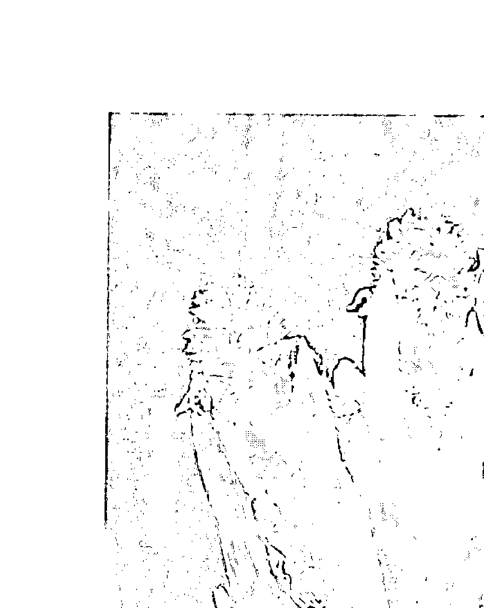

自责感或内疚感也是一种常见的情绪。贝曲医生对此的描述是：“松树针对那些总是自责的人。即使成功的时候，他们也认为自己本来应该做得更好，从来不满意自己的努力或结果。他们辛苦工作，但却为了自认为的错误而痛苦。有时候，即便是别人的错误，他们也会把责任归咎于自己。”

贝曲医生描述的是一个人的内疚情绪已经累积太多，干扰了言行思想的状况。当然，同时这种情绪已经成为生理弱点或病痛的一部分。

日常生活中累积的内疚感，会造成我们无法与他人的关系保持平等、独立，表现为：总是担心得罪了别人，或者亏欠了别人；经常对别人说对不起；不敢接受别人的赠送或帮助；习惯性地自愿做替罪羊；经常感觉别人的不高兴或不成功是自己的原因；经常皱着眉头，似乎感到痛苦才是自己应该保持的状态。我在寺庙做义工的时候，曾遇到两位50多岁的女士。第一位是W女士，非常温和谨慎，性格情绪是岩蔷薇。除了对周围的人过分小心翼翼之外，她的表面情绪很平静。但是有一天，她鼓足勇气，怯怯地对我说，她每天晚上都失眠好久，因为只要躺在床上，她就开始回想当天自己又做错了什么事情，是不是又得罪了哪一个人，或者说了不该说的话。这种内疚感使她非常痛苦，翻来覆去睡不着。她觉得自己不应该接受别人的帮助，所以犹豫了很久才决定尝试花精疗法。

非常强烈的内疚感通常可能和一件无法挽回的具体事情有关。另外一位Y女士的问题来自于丈夫。Y女士的生活一直很单纯幸福，老公很爱她，儿子也很乖。可是最近几年，老公越来越忧郁，她问老公是什么原因，他也不说，而且老公头部和脸上开始出现银屑病的皮肤症状。终于有一天，老公说出了实情。十几年前，他有过一次一夜情，事后那位女士说自己怀孕了，并且生下一个孩子，从此以后要他每个月付抚养费，不然就威胁要把这件事告诉他妻子和公司。他非常害怕失去家庭，就一直忍受着每月寄钱。最近，那位女士说孩子要读高中，需要几万块钱，这下他彻底崩溃了。他没有那么多钱，而且内心痛苦，觉得生不如死。

我先帮助几乎崩溃的妻子恢复基本的平静，然后让她开始帮助丈夫重新恢复生活的信心。她说和丈夫沟通后，发现丈夫这么多年最大的痛苦，就是无法摆脱的内疚感。他深深后悔自己的轻率，觉得自己犯了不可饶恕的错误，应该受到痛苦的惩罚。我每次都给他的配方加了松树。两周后，Y说丈夫的皮肤问题开始好转了，脸上没有再掉皮了，而且也没有以前痛苦了。大约两个月后，他多年的皮肤问题基本好了。

在周围人的谴责、鄙视或不可原谅的情绪下，内疚感会成倍增加。而且内疚的人总是会自动地把别人的不开心归咎于自己，或在潜意识中压抑自己的快乐和自信。累积过多的内疚感很容易导致皮肤问题，皮肤皱纹增多，或者很粗糙，有油腻感但缺少水分，仿佛有一层皮会落下来，甚至头脸出现银屑病症状。欲望比较强烈的人，也会有强烈的内疚感，不过一般都被他们更强势的情绪掩盖了，所以他们会经常怀疑别人的善良和诚意，不相信自己是值得别人关爱的。悔恨交加是松树和冬青的情绪混合，对身心的伤害也非常大。

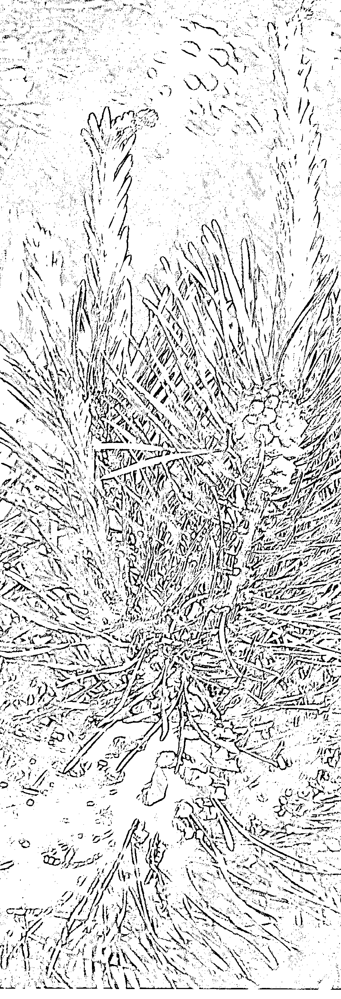

有些宗教信仰者会陷入深深的自我谴责之中，感觉自己罪孽深重，陷入一种自我责备和惩罚的心理中，反而阻碍了自己培养正面的精神力量。

很多人实际上并不愿意消除自己的内疚感，因为自责在思想上表示出一个人具有很强的自尊和责任感。松树情绪似乎提出了一个道德问题：如果一个人真的犯错，是否应该在心理上原谅自己？应不应该吃花精消除思想产生的自责情绪 ？当一个人认识到自己的弱点或错误以后，对当下唯一有效的就是用行动去弥补、纠正、改善和预防。但是过多的内疚情绪，会干扰身心健康地行动，并且产生新的问题。道德谴责或法律制裁只是为了阻止人们犯错的外在手段。佛教对此的态度是：放下屠刀，立地成佛。因为佛教认为肉体生命是一次性的，生命的核心——灵魂是永恒的，不断演变和轮回的，人们没有必要因为过去而放弃向前流动的当下。自责的思想带来成熟，但不要让它泛滥而束缚生命的成长。

松树是我们中国人很熟悉和尊敬的树种，广泛分布于北半球。我们介绍过针对自卑感的冬天会落叶的欧洲的落叶松，但最常见的是常青的松树。松树大概有100多个品种，贝曲医生制作花精的松树是苏格兰松树。松树的外表并不对称，甚至常常不规则，但却有令人尊敬的气质：雄伟、坚定、稳重、苍劲。松树的生命力特点是长寿，并且生命节奏缓慢，尤其是保持常青的松叶，显示出内在生命的自在与悠然。中文名字“松”是树冠蓬松的意思，也符合它绵绵密密、永葆青春的内在气质。内家功夫修炼要“站如松”，就是外表要像松树一样挺立，但内在的能量也要如松树的生命力一样轻松自如，这是保持健康长寿的秘诀。在中国文化中，松树常常和隐士、修道高人和长寿者在一起，因为他们的精神和气质有相通之处。还记得唐朝年轻诗人贾岛的《寻隐者不遇》吗？“松下问童子，言师采药去。只在此山中，云深不知处。”这里的“采药”是道家修炼术语，意思是采集天地的灵气。高山之上，白云和松树是隐者的伴侣。我们和贾岛一样感到这是多么令人神往的生命意境。

内疚的情绪不属于爆发性的能量，而是若隐若现地持续累积。这个特点和松树授粉、结成种子的过程相似。苏格兰松树5月开花，雌雄同株，雄花花粉与雌花的胚珠在松果里完成授粉需要一年的时间，长出的种子还需要一年的时间才成熟，所以春天的松树三代同堂，有新发的雌花，去年开花刚完成授粉的松果胎儿，还有前年开花今天才成熟的松果宝宝。

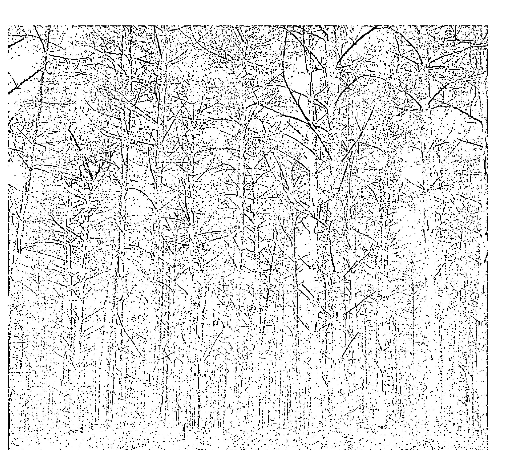

## 花精物语：生命的38种痛与美

当然，繁殖速度慢并不代表松树种子的生命力差，这是长寿的松树自己的生命节奏。苏格兰松树和其他松树一样，幼苗的生长力旺盛，而且相互竞争，不断长高。换掉的松针叶会在树下缓慢地腐烂，而且带酸性，这使其他植物和自己的种子很难生长。松树就是这么悠然地对待种族繁衍的。但是，松树全身都是宝，所以人类不断地种植它们，还常常用松树去征服条件恶劣的荒地，因此松树属于“先锋树种”。2009年春天，有关部门就用飞机在四川“5·12”地震灾区的部分山区播撒了大量的松树种子，以期尽早恢复被毁山地的植被。

成熟的苏格兰松树的树皮很粗糙，而且会干裂、破碎、剥落，不断流出树脂。树皮是粗糙的纸状，有很多疤痕，英国花精专家伯纳德写道：

> “像湿疹或牛皮癣一样。”

这种树皮状态和内疚感造成的皮肤问题非常类似。

松树的气味也是它的特点。松香味是树脂散发的气味，是令鼻子感到清新排毒的气味。从松叶中提取的松节油可以用做咳嗽与支气管炎的吸入剂，具有消毒清浊的作用。霎哈嘉瑜伽发现，喉轮左侧，即颈部和甲状腺左侧，是罪疚感能量的聚集处。

在松树身上，我们找到了内疚与自在的对比，但松树沉稳的生命魅力仍然令人着迷。作为从远古经历无数环境和气候变迁的裸子植物，松树始终怡然自得地保持着常青高寿的基因。但是为什么它的内心会感到内疚呢？我们还是尊重内疚者的秘密吧。

#### 情绪自测
#### 松树：自责感  内疚感

有5项符合就表明此情绪比较明显

- 我常常十分内疚。
- 我经常认为自己有错，尽管有时候明明是别人的过失。
- 与别人不愉快的时候，我总是认为自己不对。
- 我经常回忆发生过的不愉快的事情，然后责备自己。有时候这种自责感很强烈，我恨不得从身体中逃离出来。我的身体绷得很紧。
- 我仍然因过去不好的生活方式而痛苦。
- 我对孩子总是百依百顺，因为我觉得他（或她）的不快乐是我造成的。
- 我至今仍然责备自己以前没有为孩子做到的事情。
- 当我不能完成一件事情的时候，我总是责怪自己。
- 即使我生病了，我也有内疚。如果治疗不见效，我立即就会认为是我自己的问题。
- 有时候我很难开心起来，因为我总是觉得我肯定有些事情没做好或遗漏了。
- 我对性也有很多自责的情绪。
- 我常常觉得别人的错误是我的责任。
- 我经常很本能地说对不起，大多数时候其实不是我的错。
- 我的左侧肩膀和左侧后背非常僵硬厚重，有很多气淤积在那里。
- 如果别人话不多，我觉得自己肯定伤害了他们或令他们不开心了。即使他们否认，我也觉得他们出于礼貌和客气而不愿意承认罢了。
- 我经常失眠是因为不停地责怪自己。我很累，第二天精神不好，我更加内疚了。
- 如果我拒绝别人的建议或提议，我随后就会很自责。
- 我经常感觉家人不幸福是我的原因。
- 我经常感觉自己此生罪孽深重，害怕下地狱。
- 我每天晚上都会回忆白天自己是否得罪了别人，常常感觉自己肯定得罪了某人。
- 有一个人或有一件事情，我永远也不会原谅自己，我一想起就十分内疚和痛苦。

### 16. 忍冬 Honeysuckle ∫ 怀旧与当下

【花语】
> 过去已经变成养分，当下是新鲜的空气。

当我们出生的时候，内心和头脑对今生的一切认识还是一张白纸。我们带着好奇和新鲜感慢慢长大，尝试各种事物，吸收各种信息，感受各种情绪。渐渐地，这张白纸上留下了越来越多的来自今生的思想、记忆和情感。我们开始感到这就是我的思想、我的情感、我的经历。在我们身心健康的时候，过去安静、完整地躺在我们的心中，它们和现在的关系是健康的、流畅的。过去并不干扰现在的我，它们在身心留下的痕迹是现在的养分和来源。但是有时候，过去的某个片段的能量会在身体内滞留过多，或者是一段美好的记忆，或者是一段痛苦的情感纠葛，它们牵扯着当下的各种生命能量，不断陷入那段记忆和情感中。有时候，我们可以很快摆脱这股力量的黏滞，因为辞旧迎新是健康的生命本身具有的一种基本能力。但有时，这种牵扯的力量很大，我们好像陷入一种痴迷或旋涡，为此浪费很多时间和精力。这种无法克制的怀旧的力量，就是贝曲医生发现的忍冬花精针对的情绪。

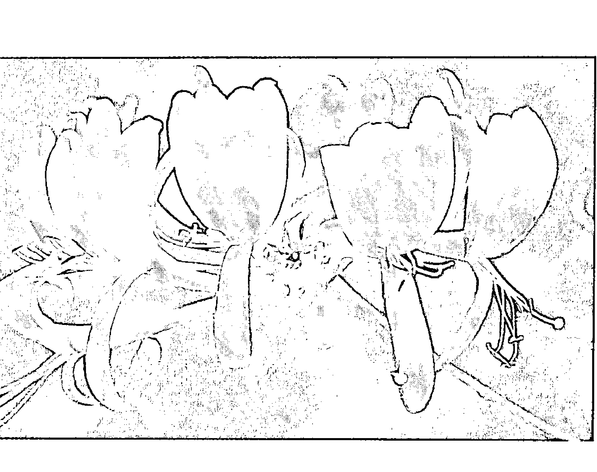

贝曲医生对忍冬情绪的描述是：“针对那些经常活在对过去的回忆中的人们，那可能是一段很幸福的时光，也可能是对一位故去的朋友的记忆，或者是未曾实现的雄心壮志。他们不期待现在会有比过去更多的幸福。”

忍冬情绪常常和其他情感创伤混合在一起，比如内疚、愤怒、悲伤，或者对爱的痴迷。严重的情况表现为对过去的依恋、怀念，甚至偏执，无法接受已经改变的现实。强烈的思念也包含忍冬情绪，比如单相思状态。有些人不能适应社会大环境或家庭小环境的改变，总是回想过去，结果导致长期失眠、神经衰弱或更严重的身心问题。

对过去未曾实现的雄心壮志念念不忘的通常是男性。对感性的女性来说，可能是一些情感上的遗憾或者因此产生的痴迷。有一位菊苣女友J，她经常沉浸在学生时代对琼瑶小说中激烈爱情的痴迷中。我对她说这是陷入了怀旧的情绪干扰，可是她却认为绝大多数人都生活得太麻木了，体验刻骨铭心的爱情才是真正地活着。后来，她也意识到了自己的忍冬情绪。她说：“我发现自己完全痴迷于这种感觉，耽误了好多事情，我什么事都没法做了！”从心理上决定割断让人留念、痴迷的情感，的确很难。

我们发现，在精力、情感和记忆力很强的青春岁月，留在内心的烙印往往最深。有些人需要一年甚至更长的时间，才能完全在内心从中学或大学人际关系的情感中走出来。初恋或第一次婚姻失败的情感创伤总是令人最难忘。有时候的确很难割舍过去，但割舍不是忘记，只是把过去安静地放在它应该在的地方。当你从过去牵绊的痛苦中走出来的时候，你才会客观地反思和成长，并且能够自信地说，过去的经历使我现在更完美。

忍冬情绪的日常表现也很多：不习惯新环境，总是感觉以前更好，重复以前的习惯等。还包括一些短暂的离别造成的思念，比如孩子在寄宿学校特别想家；难以适应家人出差；喜欢反复谈论过去的人或事情；舍不得扔掉旧的没用的东西，因为经常回忆过去。怀旧感一般在老年人身上更强烈，因为老人经历和累积的记忆和情感更多。回忆本身并不是不好的，只是需要消除过去的情感黏滞。让过去为当下服务，成为当下的养分，而不是阻碍。

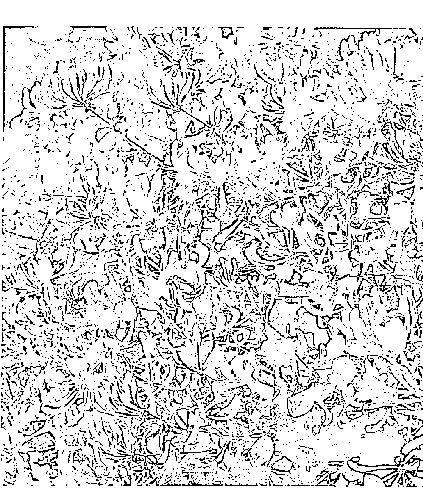

总之，忍冬情绪的强弱反映了我们能否尽快进入新的当下的能力。如果你需要很长的时间从一项已经结束的工作，或者曾经扮演的角色中走出来，说明这段过去留下的能量太多，阻碍了对新的内外状态的适应。如果你感到过去的你已经在明显干扰、阻碍、压抑或耽误现在的你的舒展和改变，那么是时候和过去的自己友好地分开了。

英国的红色忍冬是从荷兰引进的，不是很常见，但在英格兰东南部的乡村，还是会不期而遇。忍冬是蔓生爬藤植物，枝头有强烈的向前向上延伸的力量。所有老的藤条似乎看起来都很粗糙、干瘪和毫无生机。只有顶端部分的藤条是红绿色的，并且很健壮。老的藤条只是养料的通道，老的叶子会渐渐干枯，掉落，并且不再长出新叶子。忍冬的生长特点就是不断放弃一切老的部分，能量和养分只专注于发育新的藤条和花叶。

忍冬花的花蕾也是细长的管状，花瓣也是细长型的，花朵也有强烈的向前延伸的力量。花瓣外面是红色，里面是白色，授粉以后白色变成黄色。花瓣开放的方向是向后弯曲，这和花朵整体向前延伸的能量刚好平衡。想象一下，如果忍冬花没有这种向前和向后的能量，那么它的花朵就是我们常见的花瓣平铺的星状花型。

其实，白色忍冬在英格兰更常见。常见的白色忍冬和中国的金银花很相似，但贝曲医生最终还是选择了红色忍冬，可见花朵的颜色蕴涵的能量也非常重要。红色忍冬应该蕴涵更多爱恋的情感。针对幻想的铁线莲也是蔓生植物，但铁线莲的能量与现实的连接更虚弱，连花瓣也没有。

红色忍冬的开花季节是6月至8月。花朵绽放的时间是晚上7点左右，这是人们忙碌了一天，心开始安定下来的时候。随着夜色越来越浓，忍冬花也释放出越来越醉人的花香。在夏日温热的气候中，甜蜜的花香弥漫在空气中。忍冬花香是那种隐隐地令人有点沉醉的花香，这种迷醉感令头脑忘记当下，悄悄开启对美好往事的怀念之门。

红色忍冬还有一个独特之处：在枝条顶端靠近花朵的叶子没有叶柄，中文称为盘叶。所以这种忍冬的中文名字叫蔓生盘叶忍冬。对称的两片叶子长在一起，围绕着枝条，像个平坦的盘子一样。能量和养分不经过叶柄的输送，而是直接扩散到四周的叶子上，包含强烈的弥漫性能量。当人们陷入回忆时，整个人就被过去感到的情绪笼罩了，所以我们说沉浸在回忆中。

邓丽君曾经有一首家喻户晓的歌《甜蜜蜜》，抒发的就是一种让人难以忘怀的思念感：

> 甜蜜蜜，你笑得甜蜜蜜，
> 好像花儿开在春风里，
> 开在春风里。
> 在哪里，在哪里见过你？
> 你的笑容这样熟悉，
> 我一时想不起。
> 啊，在梦里。
> 梦里梦里见过你，
> 甜蜜笑得多甜蜜。
> 是你，是你，梦见的就是你。
> 在哪里，在哪里见过你？
> 你的笑容这样熟悉，
> 我一时想不起。
> 啊，在梦里！

好了，请回到当下，继续看我的文章。甜蜜的忍冬具有怀念过去和不断向前的两极性。

怀旧的情绪将身心的能量锁在对过去的思念和重复中，对应的健康的能量是积极向前的生长力。忍冬情绪也可能来自与今生的经历无关的灵性能量，通常的解释是来自某一个前世的记忆。内心深处对一种无根情结深深眷念，或不由自主地被牵引着。

人的生命是不断向前的，不管我们的头脑是否注意到。勤奋的孔子也感叹生命的易逝：逝者如斯夫，不舍昼夜。历经世事，身心仍然保持赤子般的勃勃生机，这是道家对生命顺应当下不断生长的描述。不过无论是道家还是瑜伽，东方修炼生命的最终状态都是回归纯净的本色。因为从本质上说，我们不是这些情感、记忆和思想。我们只是用感受能力、记忆能力和思考能力去觉知、展现和提升更高层次的真我。这是当下的另外一个发展方向：深度的前行。当下的深度可以不断超越过去，如果身心的意识和能量状态经常不由自主地重复过去的某个状态，那么这个深度的前行就会被干扰，甚至完全停止。

当然，从日常生活的角度看，过去使我们内心丰富，反思历史可以使我们更好地面对当下和未来。忍冬花的生命特点只是提醒我们：不是所有的回忆都是我们主观选择的，享受新鲜的当下是身心健康时的一种能力。

#### 情绪自测
#### 忍冬：怀旧感 衰老感

有 5 项符合就表明此情绪比较明显

- 经常回想过去，很怀恋。
- 很恋旧，喜欢过去某一个时期的一切，对那个时期的东西有强烈的保留或收集欲望。
- 喜欢年轻时听的歌曲或看过的电影，喜欢回到当时的那些感觉中。
- 总是唠叨过去，经常谈论过去的事情，过去的很多负面情绪现在还会爆发。
- 毕业了，还经常回忆学生时代，对同学的认识始终停留在以前的记忆中，看不到现在的变化。
- 感到自己老得很快，偶尔照镜子，对自己的外表变化很吃惊。
- 买衣服总选风格老气的，对年轻感的服装风格越来越不能欣赏和接受。
- 对生活没有新鲜感，缺乏朝气，看上去比实际年龄大。
- 有一些习惯很不好，但自己习惯了又不想改变。
- 总是沉浸在对失去的物质、荣耀、地位或亲人的回忆中，不想回到现实中。
- 配偶或曾经相爱的人离开以后，再也不愿意重新开始接纳他人。
- 经常因为很多年前的某件事情后悔或责备他人。
- 明显感觉现状不是自己想要的，而是过去的不幸造成的，但无法摆脱过去的阴影。
- 经常带着负面情绪回想发生过的事情或遇到过的人，绝大部分思考都与当下和未来无关。
- 住校的孩子或离家的孩子特别想家，适应不了离开父母的生活。
- 童年的经历或过去的某一段经历，像一块石头一样压在身上，尽管自己早就决定不去想它，但阴影总是挥之不去。
- 内心一直有一种渴望，或经常梦到同一种和今生经历完全无关的场景。

### 17. 野蔷薇 Wild Rose ∫ 懒惰与回应

【花语】
> 我能保持身心敏捷，随应随静。

如果你感觉很饿，你会怎么样？找点吃的。很好！
如果你有一堆事情要做，你怎么办？赶快去做。很好！
我们的生命对生理、情感或外界的需要本来具有立即应对的行动意愿，这是健康时的状态。
但是当身、心、灵受到干扰的时候，可能会出现相反的一种状态：我们陷入了消极放弃之中，对一切都不管不顾了，懒散地什么也不做，或者勉强应对最简单的事情。不去回忆，也不去幻想，只是浑浑噩噩地做一天和尚撞一天钟，能不动就不动，可能会让电视、电脑或书本吸引一下散漫的注意力，但感觉不到生活有什么乐趣和意义，只是被动地活着。即使思想上很着急，这种消沉的感觉还是完全淹没了行动的愿望。这种经常被周围人指责或看不起的懒惰或不思进取的情绪状态，就是野蔷薇针对的情绪。

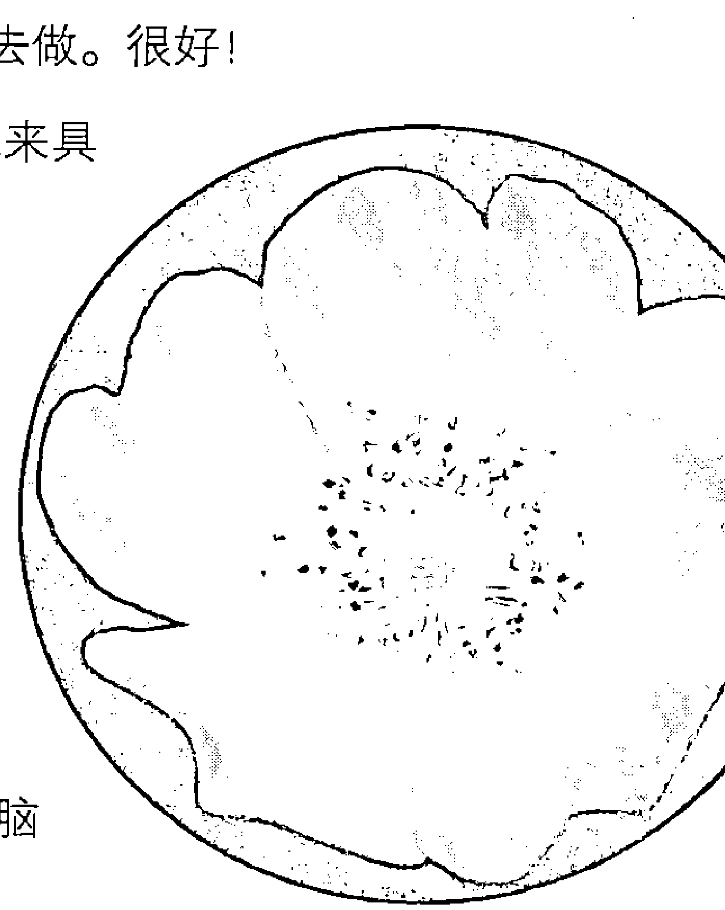

贝曲医生对野蔷薇情绪的描述是：“针对那些没有明显、充足的原因却变得听天由命的人，只是机械地生活，不管发生什么事情，都不再努力改善什么或寻找一点乐趣。他们已经没有怨言地屈服于生活了。”

贝曲医生特别提到，这种放弃和懒散一般并没有具体的思想原因，因为当它的力量超越意志的时候，已经是一种生理问题了。与野蔷薇相反的负面情绪是过度热情、总想改变外界的马鞭草。这样对比我们就更清楚野蔷薇的表现：懒惰、无趣、放弃、无所谓，对参与或改变外界毫无兴趣，甚至对自己的生理需要也不关心。动作迟钝，反应能力低，应急能力基本萎缩，食欲和其他正常的欲望严重不足，情感表达也比较保守。这种情绪还可能表现为：什么事情都比别人慢一些，磨磨蹭蹭，喜欢推迟、拖延，最后一刻才不得不行动，经常需要别人催促、提醒甚至强迫才行动等。

生物学上发现，人有本能的非条件反射，比如饿了会找吃的；还有后天培养的条件反射，比如成年了就应该工作，自食其力。野蔷薇情绪会直接干扰这两种能力。栗苞是成长缓慢，是不知道怎么做，野蔷薇是即使知道，也不去做。所以野蔷薇情绪是身心有能力，但好像被催眠而沉睡了，无法发挥出来。

很多人小时候都读过一个懒婆娘的古代笑话：古时候有一位女性非常懒惰，她不仅什么家务事都不做，而且还一动不动地每天坐着，连吃饭都希望别人喂。这虽然是个笑话，但反映了野蔷薇情绪在生理层面的极端表现：欲望和行动力严重不足。饭也要丈夫喂到嘴里。丈夫有一次要出远门十天，就做了一个圆饼，挂在她脖子上，结果回来发现懒婆娘还是饿死了，原来她只吃了嘴边的面饼。懒婆娘对身体快饿死的状态竟然没有任何本能的自救反应，这说明她的野蔷薇情绪已经严重到了极点。古人认为这完全是思想懒惰造成的，因此宽容地把她的故事当做笑话教育后人。其实思想是无法战胜饥饿感的，唯一可能的是那位不幸的女性生了重病，她的身体已经感觉不到饥饿了，行动力完全被厚重的无力感和放弃感控制。

大多数人的野蔷薇情绪还没有这么严重，或者只是表现在对生活的某些方面的懒惰或无心应对，比如家务、婚姻、生养孩子或工作。好多剩男剩女工作方面很优秀，但在恋爱和婚姻方面却完全不主动。有些不孕的女性，也表现出内心对生育和抚养孩子的愿望非常弱。圣星百合的麻木感在能量上比野蔷薇速度还慢，主要影响感受力。野蔷薇则是可能感应到了，但回应能力低，主要影响行动力。从这两种花精吃后的反应可以看出不同：圣星百合会使人的其他情绪创伤和生理感觉苏醒，而野蔷薇则是促进身心回应内外需要的行动愿望。

荆豆花精也会促进行动，但荆豆的两极性是绝望感和希望感，野蔷薇比绝望还冷漠，简直就是没反应。

被誉为幻想家和超现实主义鼻祖的法国漫画家 J.J.Grandville (1803—1847) 擅长将植物和动物拟人化。他出版过一本绘本《人性化的花儿们》。在这本奇异的书中，野蔷薇被描述为一位喜爱看书的才女，但她的画像则是一位懒散的女士，双手被枝条缠住了，手中的梳子是纺织羊毛的工具，可以看出她显然无法劳动。她在故事中说：“我实在厌倦了，我真的不想管了。”这正是典型的野蔷薇情绪。100多年前，J.J.对植物灵性的洞察真是令人敬佩。

野蔷薇属于英国原生植物，英伦三岛都有，但气候温和的南方更多。野蔷薇喜欢长在路边，在宁静的乡间小路或者喧闹的高速公路边都可能遇见它们。这是野蔷薇的积极能量，干扰越多的地方，它们越喜欢，这是主动回应的态度。

野蔷薇的开花时间主要是6月至7月，有时候也会在8月或9月。野蔷薇喜欢阳光。开花后花瓣大约保持10天左右就会落下，而玫瑰的花瓣却不会掉落。野蔷薇的花朵总是在太阳光最强烈的时候盛开，似乎本身能量非常不足，需要阳光补充。花朵尽量向外向上展开，可以吸收更多的阳光。野蔷薇情绪严重的人也需要在别人或外界的刺激、鼓励或带动下，才能更多更快地行动。五瓣心形花瓣的粉红色有深有浅，能量分布不均匀，有淡淡的花香，亮度很弱。野蔷薇花很耐看，气质平淡、温和。

野蔷薇是标准的灌木，枝条混乱地叠加在一起，枝条的生长方向是弯曲向下的，整个植物有一种很重的下压趋势，表现出能量散漫懒惰的一面。虽然在英文中蔷薇和玫瑰是同一个单词 rose，但玫瑰却是直立生长的。贝曲医生选择的野蔷薇枝干上有尖锐、向下弯曲的刺，形似挂钩或犬牙，所以这种野蔷薇的拉丁学名叫犬牙蔷薇。向下的尖刺看似比较安全，其实比向上向外的尖刺更危险，因为它们更具有隐蔽性。如果你想靠近野蔷薇的枝条，几乎很难逃过“犬牙”的防卫。挂钩般的尖刺还帮助枝条相互攀护。这又是野蔷薇非常积极应对外界的表现。

野蔷薇种子的存活率很低，不会超过30%，而且通常要延迟一年才发芽。胚胎需要很长时间成熟和冒出果壳。但是红色的果实富含维生素 C，这表示其根部发达，善于吸收土壤营养。

犬牙蔷薇在欧洲中世纪很常见，是当时贵族阶层使用的纹章中的花朵。英国历史上脾气最坏的国王亨利八世（1491—1547）时期，犬牙蔷薇曾是皇权的标志。野蔷薇的花语是代表诗人气质，旅行者的伤感，蕴涵漂泊、没有目的和不在自己的生活中的状态。在格林童话《睡美人》中，野蔷薇也是重要的角色。被纺锤刺破手指而应验诅咒的公主和其他所有的人陷入昏睡以后，城堡四周就开始生长出野蔷薇，并且累积得很高很密，完全包围和遮挡了城堡。很多王子曾试图进入城堡，但都被野蔷薇的尖刺钩住而丧生。100年后，一位勇敢、英俊的王子决心拯救公主，幸运的是魔咒的时间刚好结束，野蔷薇围墙在王子面前自动打开，王子进入以后又自动关闭。童话中王子只用了一个吻就拯救了公主，这真是一个女孩子们最喜欢的完美童话！这个故事的英文名字是 Little Briar Rose，就是小野蔷薇的意思，是童话中对公主的称呼。很有意思的是，野蔷薇又和昏睡有关。在欧洲丰富的历史文化中，野蔷薇还有很多耐人寻味的“遗迹”。

回到现实中，野蔷薇情绪则是不受人喜欢的懒惰和不思上进。我把野蔷薇的两极性描述为懒惰与回应，主要是提醒大家更敏锐地觉察这种常见情绪的干扰。压倒意志的懒惰是一种生理不健康的表现。积极和勤奋地应对生活，是任何性格的人在健康状态下都能做到的。

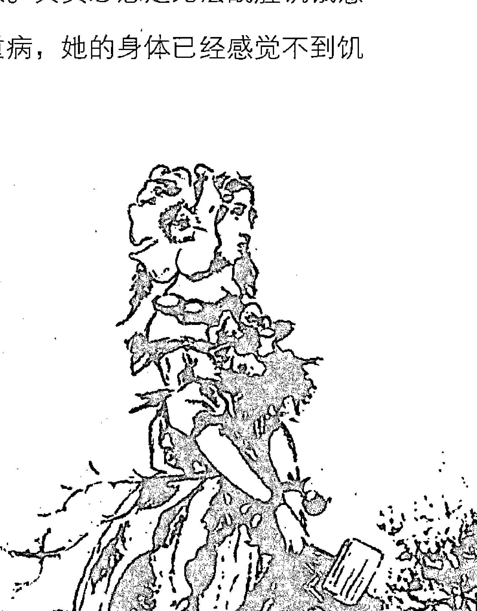

J.J. Grandville 绘制的野蔷薇

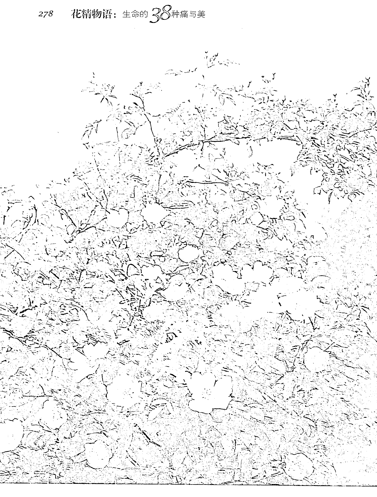

## 花精物语：生命的38种痛与美

#### 情绪自测

#### 野蔷薇：懒散 听天由命

- 有5项符合就表明此情绪比较明显
- 我对自己以下的一种或多种状况已经习以为常了，我认命了：
  - 我的工作不适合我。
  - 我一直生病或体弱。
  - 我的婚姻不快乐。
  - 我再婚了，但他的孩子一直不接纳我。
  - 我一直很缺钱。
  - 我一直在家待着，找不到合适的工作。
- 生活很乏味，没有什么有意思的事情。
- 有时候我很消极，不想吃饭，不想做事，什么事情都没兴趣。
- 我没有什么欲望和目标，没有什么能激励我行动起来。
- 我觉得自己的心已经死了一样，我实在不想做任何事情。
- 我常常想活着有什么意思呢？
- 我经常想：好无聊，不如死了算了。不过只是想想。
- 我只是被动地应付日常生活，内心什么愿望都没有。
- 我经常觉得感情枯萎，生活乏味到了极点。
- 我的脸色苍白，我不爱动，只是应付着生活。
- 我的反应很迟钝，动作和决策总是拖到最后。
- 我总是把该做的事情拖延到最后一刻才做。
- 我很久都没有快乐的感觉了，不过我已经习惯了。
- 我几乎不打扮自己，没有兴趣，我也懒得去管别人的眼光。
- 我感觉自己是被别人或生活推着走。
- 我好像陷入了泥潭中，双手双脚的行动都不再自如了。
- 我对别人积极的生活态度无动于衷，我的身体经常发冷。
- 任何事情我都可以将就，没有欲望去改变。
- 我没有努力的愿望，总是头昏脑涨地混日子。
- 我很懒，能不动就不动。
- 我经常处于混日子的状态，家人都说我没志气，我也认了。

### 18. 芥子 Mustard § 忧郁与快乐

#### 【花语】

我的内心对生命有一种深深的喜悦，感谢生命给我体验、成长的机会。

你忧郁吗？很多人都认为自己不忧郁，因为自己理性中没有不开心的理由。但的确也不容易开心地笑起来，感觉上很难快乐起来，这种状态已经是累积了很多郁闷的情绪，就好像内心的晴朗天空被乌云一点点遮盖了。尽管理智上我们已经超越了过去不快乐的事情，甚至已经实现了以前认为只要拥有就会快乐幸福的外在条件，但内心还是阴沉沉地开心不起来。芥子就是对应这种内心累积的乌云——忧郁感、郁闷感。如果乌云累积得不多，那么一阵强烈的风吹来，我们还是可以立即开心起来的。但如果乌云累积得太厚，我们就完全陷入了无望的连绵阴天，世界在我们的眼中一片灰暗。深度的忧郁被命名为抑郁症。

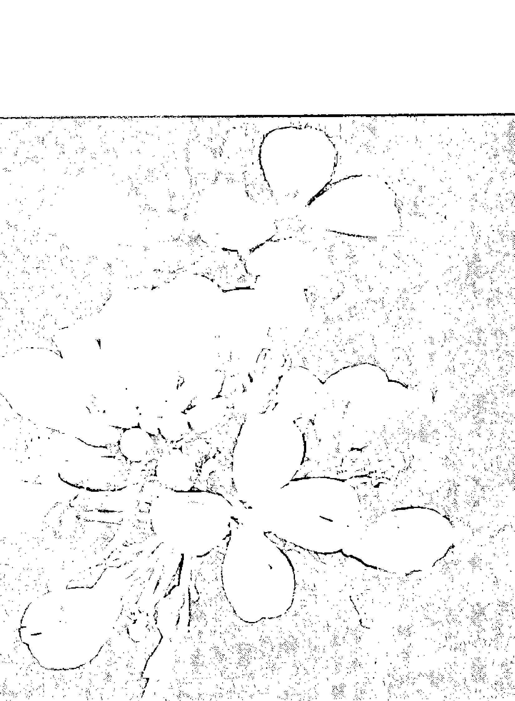

从情绪能量的角度，快乐感对应的是身心可以快乐起来的一种能力，这是我们每个人天生都具有的能力，每一个细心的父母都会对婴儿的第一次微笑感到惊喜。但是，我们开始长大以后，不开心和忧郁就开始累积了，甚至可能从一两岁或更早就开始了。郁闷的情绪会使产生快乐感的能力越来越弱。

> 贝曲医生对芥子情绪的描述是：“针对那些很容易忧郁或者绝望的人们。就好像一片乌云遮住了他们，掩盖了他们生命的光亮和喜悦。但这种情绪袭击可能并没有具体的原因或解释。在这些情况下，被干扰的人几乎不可能表现出幸福和快乐的样子。”

快乐感是很轻快的能量，会立即在脸上表现出来：喜形于色，眉开眼笑，开心的时候嘴角会上翘，眼神也散发出含笑的亮光。心情不错还会让我们感到心肺放松，呼吸舒畅。丹道高人李谨伯老先生在《呼吸之间》一书中，从养生修炼的角度，专门解释了现代人为什么不“开心”。道家修炼发现，主要是心肺部位前后的两个窍是接人气的，也就是感应人与人之间的情感和能量互动。如果长期和其他人没有正面的情感交流，只有负面的情感交流，那么这里就会逐步堵塞。

成年人过于严肃，理性或责任感过强，与人的情感互动越来越少，快乐的能力也越来越弱。以前我的孩子经常会对我说：“妈妈，你笑一笑！”其实我是在思考，根本没有觉得不开心啊。但是，我表现出的的的确确是不开心的情绪。

李老还提到，长期感到郁闷，愁眉苦脸，两眉中间靠两边就会渐渐长出两条越来越明显的垂直的烦恼线。继续累积忧郁，眉心处还会长出皱纹，叫“悬针纹”。道家养生认为，有悬针纹的人，老年必孤独，因为这表明体内累积了太多不开心的能量，无法接到“人气”。人人都愿意和相处愉快的人交往，所以愁苦的人会散发出令人远离他们的气场。

有些习惯于凡事只用头脑面对的人，甚至会认为快乐是一种轻浮的情感。这种思想也造成很多人不苟言笑。这是受过太多理性教育的现代人特别需要注意的。被誉为日本企业经营之圣的稻盛和夫出身贫寒，却始终是一个用行动去验证和实践真理与智慧的人。当他还是一个普通技术员的时候，经常会为工作的进展毫无保留地表达喜悦之情。

> > 你可真是一个轻率的人啊！常常为了一点小事，就高兴得大喊大叫。身为男人，高兴到跳起来的地步的事情一生中有一两次就差不多了，甚至可能一次也没有。像你这样动不动就高兴成那样，会被别人看扁的。

而他的助手却一贯冷冷地面对这种情况。有一次，他又高兴得大喊大叫，助手忍不住兴趣索然地对他说：

> > 无论事情多么微不足道，高兴时就表现出喜悦的心情，感谢时就表现出感恩的心情，坦率地去面对，而不需要在意什么合不合道理之类的问题。

这种坦率表达喜悦的能力，其实也是身心健康的表现。稻盛先生也是一个十足的工作狂，但他懂得顺应人性的自然。他创立的阿米巴经营法就是以凝聚人心为基础，而不是以头脑的规定为基础。如果每个人都能自然地释放内心的喜悦，工作环境也会少一些冷漠，多一些阳光。这不光对工作有益，也对身心健康有益。

抑郁症虽然名字是抑郁，但这只表明抑郁的情绪最容易表现出来。任何抑郁的状态都还有很多其他的情绪，而且同样非常强烈，比如恐惧感、怀疑感、压力感、抱怨感、停不下来的幻想和强迫思维、亢奋感或躁狂、愤怒，等等。所以，从情绪的层面，抑郁症是一个综合复杂的情绪问题，是很多负面情绪纠结在一起了。

从自然疗法的角度看，每个人抑郁问题的根源是完全不一样的，可能来自身、心、灵不同的层面。

中医说的过喜伤心，是这种情绪的另外一个负面极端：过度喜悦。

比如范进中举，乐疯了。有些人会因为过喜而导致脑出血或心脏病突发。这不是芥子针对的情绪。过度喜悦通常都是突发的，不是普通慢性病人的情绪，所以贝曲医生没有选择它。

野生的芥子和油菜花是亲戚，它们的花朵和外表都很相似。在英国，芥子的开花季节是5月至7月。在欧洲曾经是玉米地里最常见也让农夫们烦恼的杂草，因为它们总是野火烧不尽，春风吹又来。每棵芥子都有很多分枝，每个枝头都是密集繁茂的花束。花朵从下往上依次盛开，有些下面的已经结果，上面的还在长花蕾。芥子开花的时间很短，盛开时间一般一两天，整个花期持续1～2周。花开后立即结果，这是一种欢快的节奏。

每朵花都会结出一个细长的荚果，里面有10～12粒黑色种子，非常小，直径只有1～1.5毫米。乌云般的黑色透露出芥子内心还潜藏着不开心的秘密。据统计，每一棵芥子一年可以结出4000多颗种子，而且这些种子可以在土壤内存活10年，所以要斩尽杀绝它们很困难。只要翻新土壤，下面掩埋的种子就会获得生长的机会。这种旺盛的繁殖力，也使芥子通常都是一大片地出现。有些道路旁边的土壤被翻整以后，也可能冒出一片芥子。忧郁感也有这种特点，平时一直潜伏着，在某些时候就会涌现出来，变得非常强烈。有些人甚至会承受不了，想自杀。

芥子其实是一种生命力很旺盛的植物，能耐旱。主根是偏白色的，不深，根须很细，需要的空间很小，因此它们可以密密地生长在一起。种子只要有机会冒出来，就会积极生长，而且生长空间再拥挤也无所谓。越密集，花朵似乎越繁茂，看上去黄色越多。芥子的花朵也长得特别密集，花蕾都紧紧地挤在一起。芥子蕴涵的生命能量有相互感染和促进的特点，就好像一群小孩子，挤在一起玩耍，人越多越开心，别的就不管了。黄色的四瓣花朵是标准的十字花科，也就是两两相对的十字形花朵。花瓣完全展开平铺，能量很舒展。

芥子最引人注目的就是花朵明亮的黄色，非常接近三原色中的黄色，纯度极高。美国自然疗法作家泰德·安德鲁斯在《色彩治疗手册》中写道：

> “黄色强烈影响太阳神经丛能量中心，刺激人的大脑能力，可以治疗沮丧，帮助重新唤起生活的热情，唤醒人的自信和乐观，治疗消化疾病。”

因此饮食店喜欢选择黄色色系装修，因为这会促进人的食欲。很多人都有体验，每年观赏油菜花时总会产生一种特别喜悦和快乐的心情。任何人都会被这种明亮的黄色散发出的喜悦所感染，微笑，甚至欢呼！而面对粉色的桃花时，我们感到的则是美艳和温柔。花朵通过色彩和质地散发的感性气质是其内心的外在表现。

芥子的茎秆下面部分有一些很细微的尖毛，这是它细微敏感的一面，也表明它的中脉能量能激发行动力。当我们快乐的时候，做什么事情都会觉得轻松。芥子的茎、叶是深绿色的，叶子比较厚，看上去健康结实，储藏了很多水分和营养。芥子就是这么轻松快乐的植物。它蕴涵的能量两极性是忧郁与快乐。

快乐可能是身、心、灵最喜爱的情绪，所有研究生命的宗教和灵修，最终都会探讨如何获得永恒的喜悦。所以不用担心，放心地微笑！快乐是生命的蜜糖。忧郁的时候，我们还可以冥想成片的黄色芥子花，像一群嬉闹的孩童，散发着永恒的轻快与喜悦。

真正的快乐是从身心自然地释放出来的一种能量，而不是头脑思考的结果。

#### 芥子：郁闷 开心不起来

- 有5项符合就表明此情绪比较明显
- 我很郁闷，开心不起来。
- 我很少轻松地微笑，遇到开心的事，也笑得很勉强。
- 我不觉得自己不开心，但我的确整天都紧绷着脸。
- 我习惯了没有趣味的生活，这就是大多数的人生活嘛。
- 我很久都没有喜悦感了，因为中彩票之类的好事从来都不会轮到我的。
- 我觉得开心是需要条件的，我的生活太平淡，没什么可乐的。
- 我是一个很认真的人，总是很紧张，轻易不会满足。
- 我感觉不到什么生活乐趣，我有很多压力，还不能放松。
- 我很理性，一直努力工作，想轻松快乐一下也要专门安排活动，结果常常搞得更累。
- 我目前的生活境遇很不好，我开心不起来。
- 我每天忙于生活，没感到什么不开心，不过我的确越来越不容易开心地笑了。
- 我陷入了抑郁中，整个世界都很灰暗。
- 我很少笑，年龄越大，生活态度越严肃。
- 我经常表面很快乐，也喜欢讲笑话，因为我很想轻松起来。
- 我不喜欢我的工作，所以我工作的时候开心不起来。
- 我的脸很僵硬，看到自己的照片才发现自己已经不会自然地笑了。
- 我不会像孩子一样傻笑，太天真了，成年了，就永远没有那种快乐了。
- 我的心似乎有些麻木了，已经不会像以前那么容易感到喜悦和幸福了。
- 我看不到自己的人生有什么希望和突破，内心深处一直很伤感。
- 我喜欢听悲伤的音乐，快乐的音乐让我感到不能适应。
- 我觉得周围的环境好压抑，真想离开去别的城市或海边度假。
- 女性产后或经期的抑郁或失落感。
- 有周期性郁闷、忧郁、失落感。

### 19. 西洋栗 Sweet Chestnut ∫ 痛苦与甜蜜

#### 【箴言】

走出痛苦的深渊，生命的活力原来如此甜蜜。

31岁的时候，贝曲医生因为劳累过度，突然病倒。检查结果表明，他已经是癌症晚期，最多还能活三个月。这是贝曲医生遭遇的一次最严重的打击。经历了面对死亡的极度痛苦以后，贝曲医生决心将剩下的每一分钟用于正在进行的慢性病疫苗研究。令人惊讶的是，忘我的工作和献身精神，竟然使他奇迹般地摆脱了死亡的威胁。这次经历也更加坚定了贝曲医生的直觉：疾病与情绪有着密切的关系。

两千多年前，有一位敏感善良的王子观察到每个人都会经历生、老、病、死的痛苦，为了寻找一种彻底解脱痛苦的方法，他最终悟出了佛性，由此诞生的佛教成为无数人渴望摆脱今生一切痛苦的修行之路。痛苦就是这样一种简单又深刻的情绪，它常常使我们面对生与死的残酷对比，精神在痛苦中沉沦或者升华。

贝曲医生对西洋栗情绪的描述是：“针对某些人可能遭遇的不幸时刻。此时的他们感到极度痛苦，好像已经无法忍受。头脑和身体都感觉好像到了忍耐极限，必须放弃了。他们感到什么也没有，只剩下破坏和灭亡可以面对。”

亲人朋友去世、各种失败、意外打击等不幸带来的撕心裂肺的痛苦，在表面上会慢慢淡化，但是还是有很多会遗留在身体内。

埋藏在内心深处的痛苦好像一个伤疤，痛处可能时时会被触及。极端痛苦的状态下，生命陷入无底的黑暗深渊，没有一丝光亮，不断远离生命的气息。有些人会感到自我在内心的黑洞中一直往下坠落，空洞、绝望和心脏被扭曲的疼痛感交织成一种地狱般的折磨。“结束这一切吧！”这是生命被痛苦毁灭时的呼喊。贝曲医生也曾经历过这样的时刻，他说：“这是一种恐怖、令人窒息的心灵绝望，好像灵魂本身正在被摧毁。”

我们因日常生活经历而感受到的痛苦，没有这么强烈和残酷。但很多人也会在自己能忍受的极限到来以后，重新认识自己。生命中存在已久的一些尖锐、强硬或者无法调控的力量，会被这些强大的痛苦的力量挫钝、击碎或一点点消磨得无影无踪。也可以说，我们可能很长时间被内心一些自以为“我的意愿”的强大力量所控制，这些力量在现实中招致很多痛苦，直到我们无法忍受，从内心深处终于决心摆脱和抛弃这些坚固的惯性。痛苦帮助了我们成长。

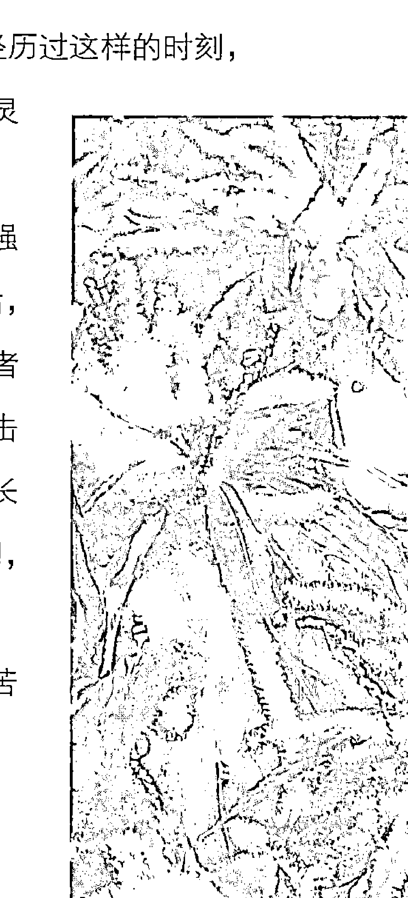

还有一种情况是这种内心的力量更接近真理，并超越其他人的认识，但在当时却无法获得理解、接受或认同。历史上很多有成就的人都是这样，因为坚持真理而承受巨大的痛苦，甚至被迫献出生命。因此痛苦也是人类难以避免的生命成长和社会进化过程中必然会遭遇的情绪。

痛苦可能使我们的思想成熟，但这种长期的折磨与其他力量的冲击抗衡，也使生理层面遭受重创。磨难过后，曾经产生的痛苦感并不会自动消除，很多已经转变成浊气和生理病痛，这正是我们需要消除的。在消除过程中，痛苦会慢慢释放出来，比如我们会很容易被感动，容易为悲伤的电影或现实流泪。我几乎是一直流着泪看完《唐山大地震》的，这部电影中的“文革”和地震场景，帮助我释放了很多童年经历和汶川大地震时产生的悲伤，尤其童年的悲伤情绪已经冻结很多年，那场电影引发了一次集中的释放。随后几天，我的身心开始感到明显的轻松和释然。

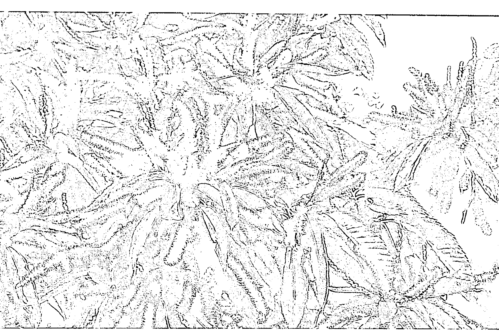

如果你特别喜欢沉浸在悲伤的音乐或曲调中，那么你身体内还有很多悲伤情绪，所以才容易产生共鸣。如果你发现自己越来越不喜欢悲伤的乐曲，这表明悲伤的情绪能量越来越少了。

身体感受的痛感有很多种，比如胀痛、痒痛、刺痛、气上冲痛、火烧般痛。西洋栗针对的痛感接近重压紧缩般的痛，整个胸部有一种压迫感，气息和神经被扭曲撕扯着。极度痛苦时，人的脸会变形，身体会向前弯曲。长期忍耐痛苦的人，额头会生出很多横向的皱纹。

西洋栗的英文名是 sweet chestnut，直译是甜栗。为了避免和白栗、红栗混淆，我们选用了这种植物最常用的中文名西洋栗，因为它是唯一一种原产于欧洲的板栗树。西洋栗树非常高大，树干粗壮，叶子也很大，树皮上布满上下延伸的如刀刻般的皱纹。但是这些皱纹和树干都喜欢扭曲生长，树龄越大的树，越能显示这种能量旋转下沉的特点。西洋栗树巨大而扭曲的内心能量，有一种压抑痛苦感，令人印象深刻，让我们想起额头布满皱纹、历经沧桑的老人，他们整个脸部的外形和表情也是扭曲痛苦的。

人生能承受多少苦痛呢？或许我们在年轻的时候就该想一想，我们应该终生被动承受不断累积的痛苦，还是该痛定思痛，探索痛苦在生命中更深层的意义，在思想和意识层面勇敢地超越苦痛呢？

西洋栗的开花时间是炎热的 7 月。米白色的雄性花束像烟花绽放一样，一束束繁茂、热烈地从一个中心点爆发出来。雌性花朵形似绿色的小钉，掩藏在雄性花束的根部。雄性花朵不仅数量非常多，而且散发出强烈的味道，非常甜腻，甚至让人觉得不舒服。这或许是它在欧洲被称为甜栗树的原因。7月的炎热也点燃了西洋栗内心的火热激情。西洋栗的果实是可食用的板栗。痛苦与甜蜜是西洋栗生命能量中的两极性。

西洋栗的甜蜜感，使精神重新亲近生命的活力，生命之泉一点一滴地恢复，源源不断地流淌。新的磨难，只会激发更多生存的激情和潜力。

贝曲医生在《治疗你自己》中写道：“人的生理病痛的本质，就是通过物质的方式向我们指出产生它们的根本原因：精神上的不和谐。另一个成功战胜疾病的重要因素，是我们必须对生活充满激情，不能把我们的生存仅仅看成不断需要更多耐心去承担的一种责任，而且，我们还应该培养一种真正的快乐去面对在这个世界上的这场探险旅行。”

贝曲医生这样鼓励我们：情绪干扰出现在每一个人的生命中，它们是天赋计划中的一部分，它们是必要的，以便我们学会面对它们。事实上我们可以把干扰看成是真正有用的对手，它们的出现只是帮助我们更加地强大，并且认识到生命的本质和不可战胜。

深深感谢贝曲医生为我们打开的这38扇了解生命的门，这些生命的痛与美伴随着我们经历了生生世世的磨炼与成长，指引我们向生命的更深度前行。

#### 情绪自测

#### 西洋栗：极度痛苦 悲伤

有5项符合就表明此情绪比较明显

- 我遇到了爱情或婚姻的失败，心被伤透了。
- 我陷入了一种生活困境，感到很悲伤，不知道如何走出。
- 我对自己目前的工作很不满意，工作环境令我感到非常难受。
- 在人际关系上我遇到了打击和障碍，内心很苦闷，自己又无法解决，这令我长期很痛苦。
- 内心长期压抑痛苦，感觉快受不了啦。
- 我觉得自己从小就很不幸，从来没有快乐过。
- 无法走出亲人逝去的悲伤，再也感觉不到幸福了。
- 遇到了选择的问题，内心煎熬，难以取舍。
- 喜欢听悲伤的音乐，觉得伤感的音乐特别好听。
- 曾经深深悲伤过，现在已经麻木，胸口有时候会感到胀痛。
- 经常感觉自己缺爱，内心很伤感，感觉周围的人活得很麻木。
- 无法原谅的自责使自己长期忍耐内心的煎熬，无法摆脱痛苦。
- 内心有一个强烈的愿望或梦想没能实现，多年来心中一直有一块阴影。
- 家里长期有情感折磨或冷暴力。
- 小时候或过去的某段经历给自己造成了很深的心理负担，虽然思想上已经能够超越但内心的隐痛无法消除。
- 对生命的价值常常感到迷茫，内心悲凉，有时候会非常抑郁消沉。
- 周期性的抑郁或长期的抑郁。
- 由于自卑而经常觉得自己很受伤，内心几乎没有快乐的感觉。
- 额头有很深的皱纹，表情总是愁眉苦脸的。

# 花精物语

> 无论我们住在哪个大陆板块，我们拥有的是同样的生命。当我们分析哪些植物来自哪里的时候，我们很快就会发现国家的界限是人划分的，而不是植物。实际上我们可以说，植物，花朵和树木说着一种国际性的可以理解的语言。它们传递的信息和含义在全世界旅行，没有护照或国界。
>
> ——英国贝曲花精专家朱利安·伯纳德

> 最爱拜读安妮的花精博文，或许她自己并不知道，她就是点灯引路的仙子，身后延绵拖迤着神奇的疗愈魔法，透过花精穿越隔阂，重新唤起人们与大自然之间的和谐对话。
>
> ——台湾星座、水晶和花精专家吴壁人老师

> 细腻、温婉的描述，像一个姐姐给我讲故事……
>
> ——网友小岩蔷薇