## 去除网络环境的局限
- 发展更普
- CI/CD流程的主要覆盖从测试阶段到部署、构建和运维
- 理解主策略
- 开源测试策略：自动化测试，置信度测试
- 用作定制化的定制测试

世界的美与我们分享

## ▷ 支仁的浪漫川菜

川菜的调味多姿多彩，善用麻、辣、酸、甜，调出多种复合味，其主心是豆瓣和辣椒。豆瓣是川菜的调味之王，辣椒则是川菜的灵魂。火巴、麻、辣、酸、甜，这些味道在川菜中被运用得恰到好处，形成了川菜独特的风味。

## ▷ 沈从文钟情的川菜情缘

沈从文钟情的川菜情缘，源于他对川菜的热爱。川菜的麻辣鲜香，让他回味无穷。他曾说：“川菜的味道，就像人生的经历，有麻有辣，有酸有甜，但最终是鲜香的。”这种对川菜的情感，体现了他对生活的热爱。

## ▷ 火柴川菜的浪漫记忆

火柴川菜的浪漫记忆，是对过去美好时光的怀念。火柴川菜以其独特的烹饪技艺和风味，成为了许多人心中难忘的记忆。每一道菜都承载着情感和故事，让人在品尝中感受到浪漫与温暖。

## 四 陕甘宁晋黄土高原地区

黄土高原是世界上面积最大的黄土堆积区...（此处为竖排文字内容，包含对黄土高原的描述及相关引用）

（Oliphant 1998）陕甘宁晋黄土高原区的生态保护与修复是重要议题...（包含学术引用及区域生态分析）

陕甘宁晋黄土高原区的生态保护与高质量发展需综合施策...（涉及水土流失治理、植被恢复等内容）

## 越调的文峰传奇明星越调越亚文 ◇

香芳，评香，地调用蒸馏[ 九正 ] 薰人 是确压错，晶相的粉重水香共叶精，除甜 的富晶峰。捏堂香揉由且边，甜时中需 抑比这中插喜的圈重香揉性，又除叶得倒 甜用禁则刷中围的甜盈刷性，除又等样现 俐禁灯提再，例 妙持，香馨的心颇感刷能刷刷尽 颠端咀甜时占中甜紧，甜刷宠定又需贴香模 强命阴水又毒灶出避阴胞难力

> Lysimachia foenum-graecum [ ] 曾香的文峰

事而中其：就是的望曝比西方茶曾香火现 出疑。海整激散叶精了技因西插多层的裂现 大需欣的量普世置，班更单十听人瓦批西 地阔性散前。

## 越调的什和水香 ◇

富餐含美反做水香的芳香调料，甜调性 水香接国故叶大紫中其，大插插持性而的 水香的胜调，甜放世八。甜腊其甜世而的 时时故由位置与马甜常风甜，睡水正分甜 呼甜茶。水香就静听香共叶的口甜世大插 甜而因，意叶的则甜不受甜甜就甜甜在设 途的普甜性甜普国普甜。洪见级意地甜普国甜 心中现更又爱主水香的重要品是，中甜 达份的普甜性甜普国普甜。洪见级意地甜普国甜 队合人工世一等，于气味的刺激探人感 的人类味蕾，人工造第一等，于气味的刺激探人感 生疏而困，草香又拌肉一些香料的

不生是着能代浮于渐金队。甜高漱日吃甜肥 菜叶糖备合甜业，Litsiessa stinuQ」 蓝等 [水以] 双高甜高配够马川甜入附堂。甜复的糖 甜：比感甜的小插多其感甜业，五点样甜的 甜ps1 品蜜的甜蒸间共他则即用禁叶甜即甜日醋 甜一甜甜。品蜜甜激众金底马川甜堂，Lasiv 绝目或是，[水归以网] 甜例，甜品当些 （[水归将] 及 [西归辣]：甜则禁之香故选 甜蔗高甜所甜是业，甜甜地甜能选（水甜石 可食用肉，甜料，水基 (Mesclayns) 著名的分子效高元粹中测果效 (Myeltyae) 生器的市器过能过样生给生周甜同。） 纠制本了一量甜出，Grivwandua BsumuioH1910 (VOL 9ivwanduaB)。品引典的酮菜

## 世外桃源的守护者

维尔姆·马尔姆斯特伦（Vilhelm Malmström - 瑞典画家，1820-1875）。作为瑞典风景画的奠基人之一，他的作品以细腻的笔触捕捉自然的神韵。1860年，他为斯德哥尔摩市政厅创作的壁画《瑞典的四季》，将北欧的森林、湖泊与天空融为一体，画面中光影的变幻仿佛能让人听见风声与鸟鸣。他的学生卡尔·拉尔森后来成为瑞典插画界的巨匠，其作品《尼尔斯骑鹅旅行记》插图至今仍是儿童文学的经典。

### 杜甫的诗不骗人

杜甫的诗以“沉郁顿挫”著称，却在细节中藏着最生动的生活气息。比如《绝句》中的“两个黄鹂鸣翠柳，一行白鹭上青天”，简单的白描便勾勒出春日的生机；《茅屋为秋风所破歌》中“八月秋高风怒号，卷我屋上三重茅”，则以写实的笔触描绘出乱世中的民生疾苦。他的诗不是空洞的抒情，而是对现实的忠实记录，因此被称为“诗史”。

### 世外桃源的守护者

在挪威的峡湾深处，藏着一片被时光遗忘的土地。这里的居民遵循着古老的农耕传统，日出而作，日落而息。每年夏季，他们会举办“丰收节”，将采摘的浆果酿成美酒，分享给远方的客人。这片土地的守护者是一位名叫艾琳的老奶奶，她已经在这里生活了八十年。她说：“这里的每一寸土地都有故事，我要把它们传给下一代。”

### 愿你找到属于你的世外桃源

每个人心中都有一个世外桃源，它可能是一处风景，也可能是一种心境。当我们疲惫时，不妨停下脚步，寻找内心的那片净土。愿你在喧嚣的世界里，找到属于自己的宁静角落，像艾琳奶奶一样，守护自己的小天地。

## 情绪与情绪调节的现代观

二世纪时于普罗旺斯地区，受到东方思想影响而开始研究情绪，中世纪受到基督教思想压制而衰落。L厂萌芽于笛卡尔，主张：身体是灵魂的附属物，情绪是身体对灵魂的反应。情绪分为基本情绪和复合情绪。基本情绪包括：喜、怒、哀、惧、厌恶、惊讶等。复合情绪包括：嫉妒、羞耻、内疚、骄傲等。情绪具有适应功能、动机功能、组织功能、信号功能。情绪调节是个体管理和改变自己或他人情绪的过程。情绪调节包括：生理调节、行为调节、认知调节、体验调节。情绪调节的策略包括：回避和接近、修正情境、注意分散、认知重评、表达抑制。

### 情绪与情绪调节的现代观（续前页）

脑的情绪的生理基础：情绪涉及大脑的多个区域，主要包括：杏仁核（负责情绪处理，特别是恐惧和攻击）、前额叶皮层（负责情绪调节和决策）、下丘脑（负责生理反应，如心跳加速、出汗）、脑干（负责基本的生理反应，如呼吸和心跳）。情绪的神经生物学机制包括：边缘系统（特别是杏仁核）在情绪产生中起关键作用；前额叶皮层在情绪调节中起重要作用；神经递质如多巴胺、血清素、去甲肾上腺素等在情绪调节中起重要作用。情绪与情绪调节的现代观强调：情绪是复杂的心理生理反应，包括主观体验、生理反应、行为表达和认知评价。情绪调节是主动影响情绪体验、表达和生理反应的过程，以适应环境需求。情绪调节策略包括：认知重评（改变对情绪事件的解释）、表达抑制（抑制情绪表达）、注意分配（转移注意力）、情境选择（选择性地接触或回避情绪诱发情境）。情绪调节的个体差异受到遗传、环境、文化等因素的影响。情绪调节与心理健康密切相关，良好的情绪调节能力有助于应对压力、维持积极情绪、减少负面情绪，从而促进心理健康。

### 情绪与情绪调节的现代观

| 类型/理论 | 发展者 | 核心观点 | 方法举例 | 评价 |
| :--- | :--- | :--- | :--- | :--- |
| 认知理论 | 拉扎勒斯 | 情绪产生于个体对环境事件的评价和解释 | 认知重评 | 强调认知在情绪中的核心作用，但忽视生理和行为成分 |
| 行为理论 | 华生、斯金纳 | 情绪是习得的反应，通过条件反射形成 | 系统脱敏 | 强调环境对情绪的塑造，但忽视内部心理过程 |
| 人本，自我实现理论 | 马斯洛、罗杰斯 | 情绪与自我实现和需要层次相关 | 无条件积极关注 | 强调情绪与个人成长的联系，但缺乏实证支持 |
| 整合理论 | 沙赫特、辛格 | 情绪是生理唤醒和认知解释共同作用的结果 | 情绪标签 | 整合了生理和认知因素，但对情绪调节策略探讨较少 |

## 癌症的诱发因素

细胞是肉细胞，细胞内的蛋白质和酶是一个统一的整体，细胞的任何活动，包括细胞的生长、分裂、分化、代谢等，都是在细胞内部各种结构和功能的协调下进行的。细胞内的各种结构，如细胞核、细胞质、细胞膜等，都有各自的功能，它们相互依存、相互影响，共同维持细胞的正常生命活动。细胞的异常活动，如癌变，往往与细胞内部的遗传物质改变、信号传导异常、代谢紊乱等有关。白藜芦醇等天然化合物可以通过多种途径影响细胞的生理过程，从而发挥抗癌作用。

### 细胞的利用

利用细胞进行药物筛选、细胞治疗等，是现代生物医学研究的重要方向。细胞培养技术、细胞模型构建等，为疾病研究、药物开发提供了有力工具。白藜芦醇等化合物在细胞水平的研究，有助于揭示其作用机制和潜在应用。

### 在白藜芦醇诱导细胞凋亡时其机制

白藜芦醇通过调节多种信号通路，如抑制NF-κB、激活caspase等，诱导癌细胞凋亡。同时，它还能抑制癌细胞的增殖、迁移和侵袭，从而发挥抗癌作用。

皮肤是生物体的屏障，保护组织免受机械、化学或物理性伤害及微生物的侵入。皮肤能维持水盐平衡，使身体保持良好的生理湿度，并透过汗腺及皮肤血管的收缩与扩张进行体温调节，汗腺的分泌则分担部份肾脏的工作。皮肤上无数的受体能感应压力、温度、疼痛及感官刺激，是为重要的感觉器官。

皮肤若长期曝露在强大刺激下，例如强烈的阳光、接触化学或致敏物质时，会使皮肤的觉察及反应能力越来越敏感，也就是『细胞记忆』的概念。

精油的分子量微小且为脂溶性，因此能渗透皮肤细胞的磷脂层。

## 使用浓度与功效

- ○ 低剂量使用（系统性应用）：
附着于细胞膜的特定部位，对于细胞膜上的酵素、携带型蛋白、离子通道或受体有一定的影响。
- ○ 中剂量使用：细胞膜稳定作用，类似局部麻醉剂。
- ○ 高剂量使用（局部应用）：通过刺激作用，效用不明。(Teuscher 1990)

## 皮肤的刺激作用和吸收度

依照剂量及精油种类可选择性运用刺激疗法。以不同的精油、剂量及应用形式，在皮肤（抗发炎效果，页31）或反射区（贺德氏区一与内脏疾病有关的皮肤感觉区，页64）上，加速局部血液循环，产生皮肤发红、充血等生理反应，以达到预期的疗愈效果。反射治疗的定义为，透过特定部位的皮肤表面刺激强化对应器官的血液循环。

大多数精油经皮肤吸收之速度极快：
- ○ 涂抹精油数分钟后，在血液中已证实有芳香分子的踪迹。
- ○ 50分钟到2小时后，呼出的气体中已有芳香分子的存在。

决定精油渗透速度最重要的因素为分子量，其次是毛发密度。精油主要藉由毛发的毛细作用吸收，因此若要调整皮脂腺分泌失衡的状况，应从头皮开始。实验显示将精油擦在手肘和手腕内侧，进入血液的速度也较快。

## 黏膜组织的刺激作用和吸收度

- ○ 精油口服主要在口腔及肠胃道的黏膜组织造成局部刺激，三叉神经及自主神经会因此产生辛辣、灼热感（页12），再通过反射作用，使胃部产生温热感。香气进入嗅觉系统，也会促进唾液、胃液、胆汁和胰液的分泌。

口服精油的吸收部位主要为口腔黏膜组织、胃及肠。

精油在肠内被吸收后，由肝门静脉进入肝脏，肝脏消化分解一小部份后，进入全身的循环系统，再到目的器官，绝大部份的芳香分子透过肾脏经由尿液，或由肠、肺脏和皮肤排出。(Hänsel 1999)

- ○ 蒸汽吸入法其作用部位为呼吸道的黏膜组织，视剂量高低，在支气管造成不同强度的腺液分泌，黏液因而稀释、剥离而后排出。
- ○ 使用阴道栓剂及阴道护理油，可直接处理阴道的黏膜组织问题。
- ○ 运用肛门栓剂，精油能在不经肝脏代谢的情况下进入血液中。
- ○ 高剂量口服时，建议使用抗胃酸的胶囊保护黏膜组织。

## ➢ 皮肤为心灵之窗

皮肤是外在世界及人类『内在世界』的疆界，其中无以数计的末梢神经和感觉受体，将从外在所接收到的讯息和刺激快速传递到脑部，因此皮肤是非常敏锐的感觉器官。

皮肤、脑部和心灵，其无时无刻地透过神经系统和神经传导物质进行交流 (页13)。其紧密的链接源自于胚胎发展期 (Moore 1980)，神经系统和皮肤均由外胚胎层形成，也可夸张地称皮肤是外显的脑部。因此不难理解为何皮肤状况能反射心理状态：害怕时流冷汗，生气或害羞时脸部胀红，惊吓时脸色灰白，忧虑产生皱纹，压力易长痘痘，紧张时皮肤发痒，都是能从皮肤反应而读到的心理感受。

皮肤和脑部间透过神经系统和神经传导物质无时无刻地进行交流。因此，精油能温和地藉由此沟通系统调整情绪。

反之，透过良好的皮肤护理方式自然能替心灵增添活力，特定精油能激励快乐荷尔蒙「血清素」(页13) 的生成，带来力量、生活乐趣及轻松感。

## 皮肤的道理即是强化免疫系统

皮肤、情绪跟免疫系统有密不可分的关系，换句话说，心理和皮肤的健康程度等同身体抵抗病毒能力的强度。

运用精油进行温灸的芳疗按摩，其产生的热感能强化整肠免疫系统。

- ○ 皮肤本身就是高度分化的免疫系统，也是免疫的第一道防线。皮屑中有毒阳形成皮肤免疫的细胞，在感染或受伤时或曾害到其通透性的细胞，在感染或受伤时或曾害到其通透性的细胞，在感染或受伤时或曾害到其通透性的细胞。

心理失衡及伴随而来的免疫功能低落，是许多皮肤问题首当其冲的原因。精油治疗本、而非法源的激滋作用，来自于其可同时通作用身、心及灵系统三方面。这些可以同时激厨及平衡自愈免疫能力的芳香分子，藉由「免疫激厨因子」或「免疫调因子」。

若要长期保持肌肤的健康及弹性，需保证精油的整肠激滋作用着手根雕。

- ○ 著多精油能激厨皮层细胞的修复机制，具有有机化特质（自由基捕捉手），能长期保持皮肤的健康及活力。

## 肝脏系统的排毒作用

淋巴系统是焉「人体排水沟」（页70）。芳香按摩能加速排除废物的淋巴液流动，疏通细胞膜、促进排毒，反激厨淋巴结中抗辅的形成，进而提升整肠免疫力。精油则按摩手法二者能产生加乘的激滋力。

## 抗菌作用的主要作用

科学研究赞同，精油具有抗菌、抗病害、抗原菌及抗原病原菌的功能（Teuscher 1990）。精油通过皮肤或黏膜细胞进入血液履后，输送到身体器官，和器官细胞上特定的受酶（细胞膜稳定作用）。（Teuscher 1999）。

- ○ 抗感染作用：精油基木上抵法杀灭病原菌，而是抑制病菌的生长及扩散。
- ○ 抗菌作用：精油抗菌的方式和抗生菜不同。抗生菜基于逐原酶的物质代谢及其其他的有隧功能：精油则是望向进行，一方面摧毁微生物的生展膜境，同时强化病患的免疫系统。
- 若服只能针对细胞的抗生菜相骸，具有抗菌特真的精油通常也有抗菌和抗病害的能力。此外，精油的多分子组合使细胞膜脱的能力，更具的时化替观磨值（感染性皮肤障碍）（页57）。

## 免疫抑制作用

精油容易动自身免疫能力之减退，腾服在於破坏淋巴系统（页12）忽然自主神经系统，反其掌控的所前生理现象，如情绪、呼吸、痛觉及消化。精油能刺激下腺（内分沁腺激指（产生脑酮完变的作用，遍是精油则激单一病症的化缘腺之间最大的差异。

- ○ 抗病毒作用：关于精油抗病毒作用的机转，科学家尚未得到全面的证实，部份研究显示，芳香分子能和特定病毒竞争细胞膜上的受体蛋白及（或）直接附着于病毒细胞表面，因而避免病毒进入细胞内。整体来说，抗病毒作用来自于防止细胞物质代谢的转变，遏阻病毒繁衍。
- ○ 抗真菌作用：特定精油能通过抑制霉菌及酵母菌生长，杀死真菌及其孢子。
- ○ 抗组织胺（抗过敏）作用：血管及其他组织中的肥大细胞，在特定刺激下会过度分泌组织胺，精油中某些成份（例如倍半萜烯，页31）能稳定肥大细胞的细胞膜，缓和组织胺过度分泌，这对于深受花粉热过敏困扰的朋友无异是一大福音（页245）。

### 眼花撩乱的专有名词

抗病毒、抗细菌、针对滤过性病原体、抗霉菌、杀真菌、抗感染...等等，因研究的方向不同，在许多医学文献中会看到各式各样、令人眼花撩乱的名词，为使读者有清楚、明确的概念，本书中固定使用 4 种名词，并定义如下：
- ○ 抗感染（杀死或抑制病原体活动）
- ○ 抗细菌（针对各种细菌）
- ○ 抗病毒（针对各种病毒）
- ○ 抗真菌（针对各种真菌）

### ➢ 消炎、止痛及退烧作用

精油消炎、止痛及退烧的功效，来自于抑制前列腺素的合成过程，当组织细胞受损时会分泌前列腺素，引发疼痛、发炎及发热等生理现象，其他荷尔蒙和免疫反应也参与其中。前列腺素属于传递疼痛感最重要的物质之一，通过皮肤与脏腑间的反射作用，也能引起类似效果，亦即在皮肤神经上引起刺激，并通过自主和内脏神经的链接，将讯息传送到其他的身体区域和器官。（Wagner u.Wiesenauer 2003）

### ➢ 消解黏液及促进排出的作用

病毒引起的支气管炎，会引发分泌物堵塞，造成其黏性改变，使细菌易于附着。精油中某些成份（例如桉油醇、页37），有防止细菌附着，或重建支气管系统正常功能的作用。
- ○ 具消解黏液效用的精油，激励分泌稀薄的支气管黏液，促进排出。
- ○ 具排痰作用的精油，提高支气管黏膜组织上纤毛的振动频率，促进排出。

## ► 促进消化的作用

某些精油因具有特殊的香味及口感，能通过三叉神经反射刺激胃液分泌，适量消化液能在胃中停留足够的时间，提高食欲及促进消化。

## ► 抗血栓作用

龙艾天竺葵 (Helichrysum italicum) 和松红梅 (Leptospermum scoparium) 二种精油能快速吸收血栓，反脑送红血球死它的代谢物。患虚在涂抹油涂抹于即迅速消肿，颜色由深紫色转变为淡黄色，其效果是使人惊奇不已。含α-萜烯及三酮 (页 36) 的精油化血尘作用都非常好。

## ► 改善感觉走过

嗅觉是人类最古老的感官知觉，和所有触觉的知觉地—大脑边缘系统，有直接的链接。嗅觉或视觉上的生理经验或感受，在大脑边缘的深度远不及嗅觉。鼻子能直接吸收讯息，其他的感官则达到，如同环境中潜伏的危险。鼻子是无法被忽视的，我们或喜爱或厌恶，具有良好的外貌的人，并不足够能夺人眼球之「气味相投」。

## ► 大脑边缘系统

大脑边缘系统掌管人的情绪行为、性慾和记忆，以及下视丘 (左脑下部)、松果体、脑下垂脑和自主神经系统的工作。下视丘是「中枢总指挥」，脑部许多自主调节中心均位于此处。依果能控制神经传导物质和荷尔蒙的合作关系，脑下垂体显脑前腺的分泌。自主神经系统负责如呼吸、睡眠、循环和代谢等生理功能。精油对上述生理媒介均有正面影响力。不同的气味能刺激分泌特定神经传导物，进而到疼痛感受、身体不适症及生理状态健康生正面影响 (更多请见参考页 14)。

## 薰衣草的迷迭香

若想染法隐疾及其他治疗方式之虞，在外可直接由肌肤涂擦身心恢复。每一个重大伤害不只会在身体留下创伤下配痛，潜意识心理创伤 (恐惧及无助) 造成的损害更加深远。精油外用处理身体创伤时，适量芬香分子也能同时抚慰潜意识。

## 神經傳導物質產生的影響力

## 身體、心靈交織的網路系統

神經、免疫和荷爾蒙系統並非獨立運作的系統，三大系統間的緊密交流，形成人類身體、心靈交織的網路系統。精油能有效影響這種網路系統的溝通模式 (Miketta 1992)。

70年代中期興起的心理神經免疫學 (簡稱 PNI)，致力研究心理狀態和身體健康之間的關係，為鮮為人知的身心牽繫作用領域中注入一道曙光。

心理神經免疫學以各種切入角度，研究情緒、免疫系統和荷爾蒙系統 (內分泌學) 的交互作用，因此稱其為心理—神經—內分泌免疫學 (PNEI) 應更為貼切。

『內分泌學』是與荷爾蒙有關的學說，荷爾蒙為訊息和神經傳導物質，在有機體中扮演重要角色，能促進訊息交換。

## 『腹部腦』

一個新的科學分支致力於研究神經腸胃學，也就是所謂的腸內神經系統 (ENS，希臘文 enteron = 腸)，或是俗稱的『腹部腦』。

整個消化道壁佈滿約一億個神經細胞，並獨立運作，此處不但與大腦連結，也會影響感覺、思考及記憶。『腹部腦』和中樞神經相同，也會分泌神經傳導物質，例如腦內啡、多帕胺、血清素或苯重氮基鹽，目前已被科學家辨識出的種類約為 40 種。這些神經傳導物質決定了人類的自我滿意度、創意及負面情緒，如憤怒、恐懼和沮喪。腹部消化系統和決定情緒的邊緣系統有緊密的交互作用，腹部腦釋放至大腦的訊息和決策，遠遠多於大腦給予腹部腦的，因此心理變化和消化系統間的連結，遠超過人類所能想像。

血清素是其中特別值得關注的神經傳導物質，血清素又稱『快樂荷爾蒙』，能給人帶來和諧、平衡、寧靜和喜樂感。目前科學家已證實，90% 的快樂荷爾蒙都在腸內形成，因此不論是正面或負面的情緒都會在腸內『發酵』。

## 荷爾蒙調節作用

芳香分子能直接透過嗅覺、間接透過皮膚及黏膜組織來激勵或抑制無以數計的特定神經傳導物質，對訊息網路的運作產生溫和的調節作用，也影響神經傳導物質間彼此的交互作用。精油對於情緒、荷爾蒙和免疫系統的間接影響，也源自於上述機轉。除此之外，芳香分子能促進腸內神經系統和中樞神經對話和交流，使其運作更加協調。

## 嗅覺喪失：嗅覺細胞如何再生的秘程

Prof. Dr. Dr. med. habil. Hanns Hatt

## 進入半陰乾的秘程

嗅覺直接連接了大腦最古老的區域——嗅球、嗅索和下視丘，此感不僅是重要的感覺、情感反射和驅動中心，也控制和調節的分泌，這些功能可幫助遇到大腦皮層，進入自主意識層面。很多研究中心的覺察顯示，嗅覺不僅連作在潛意識面、也能調節生理功能（例如血壓、呼吸頻率及皮膚抵抗力）。人類對嗅覺的研究尚停留在動物推斷階段，近年來科學家才意識到嗅覺的重要性，進而開始努力研究嗅覺分子的逆作過程。

## 鼻子的秘密

在人類鼻子中可以找到三層密布嗅膜細胞、互相交織的結締組織，最上層是嗅上皮細胞。由獨特的嗅覺細胞、支持細胞及基底細胞組成。基底細胞分裂成成熟的基底細胞，終其一生以四周的倍數期更斷嗅覺和支持細胞。嗅覺細胞的末端密布嗅球 (Glomeruli)，和特殊的僧帽細胞 (Mitral cell) 接觸，再將訊息傳遞到腦部更深部。嗅覺細胞一端有直通黏膜細胞的微絨毛，這些感受觸毛是通性在外界的凹白，並能吸收香分子；另一端則是細胞的神經軸突，穿過如篩狀軟孔的篩板通往嗅球及嗅膜 (Bulbus olfactorius)，嗅覺細胞的神經軸突則將訊息傳遞到腦部。

所有生物的嗅覺發展都早於視覺和觸覺，在充滿人工等物品刺激的世界，人類和動物仍具有敏銳嗅覺的力量不管迷失方向。在五百萬年的演進史中，嗅覺是人類蜷縮通往外界世界的窗口，嗅覺觸覺我們可善用的兼著精確物、合適的方向、性向、危險性，及促進性行為的發展。芳香分子和嗅覺細胞上的受體結合後，引起一連串刺激反應傳遞到腦部，腦部加以分析後，辨別出重要的分子，進而導致情緒、記憶這些部領情緒強度等而找到其喜悅的源頭。嗅覺在原始脊椎動物的腦部中所佔面積最大，因此嗅覺刺激勿易增強以利其也感官組織（如視覺和觸覺）的發展模型。人腦結構的緩慢發育能力雖遠比其他動物高出許多，但也以嗅覺系統發展中心。每一次的呼吸運動中都有嗅覺的參現，因此嗅覺能多方面地影響生活品質，包括連生喜好或厭惡的感受，改變情緒、業舉性入即的性管願反性行為。氣味也是一撞潛意識物質，一旦鼻子被遮蓋，身心狀態就崩潰。最新的研究結果顯示，古老嗅覺系統的重要性在人類演進過程中也來先大多，造就許多科學家感到不可悉藉。是久以來，科學家的研究方向一直偏重刺激感受反應躲避危險有益的視覺和觸覺，但其實生命品管、避免度、情緒、業奮及禁止均由嗅覺主掌，則使這些現象只在意潛意識中進行。

## 圖表一：嗅覺細胞對於香氣刺激產生之反應

- a. 細胞變化過程
- b. 芳香分子啟動生化訊息級串，形成第二信使環磷酸腺苷 ATP：三磷酸腺苷
- c. 神經傳導物質環磷酸腺苷改變感官細胞的細胞膜靜止狀態

## 嗅覺細胞的工作模式？

在大氣壓力下，空氣中無時無刻地充滿著微量的氣味分子，隨著呼吸進入鼻腔上皮組織，籍著黏膜上的聯結蛋白，傳遞至微小的感知纖毛。目前科學家已知在感知纖毛的細胞膜上有特殊的受體蛋白，若與特定氣味分子交互作用，會產生微弱電流脈衝以及力學吻合。這些已被啟動的嗅覺受體，會開始一連串的生化訊息運作，最後生成有『第二信使』之稱的環磷酸腺苷 (cAMP)。環磷酸腺苷打開細胞膜上的通道，改變細胞膜的靜止狀態，鈉、鈣等陽離子進入細胞中（圖表一）。在此過程中所產生的電位差可轉變為傳導訊息之動能，使訊息沿著嗅覺細胞的神經突觸傳遞至腦部。這種網絡式的嗅覺強化機制，便是人類能反應最微量氣味分子的基礎。

## 嗅覺受體是一間龐大的家族

科學家估計在人類的覺覺皮層中，大約有 350 種不同的嗅覺受體，約佔最大的嗅覺感受細胞，所以嗅覺的重要性：即使只夠在研究領域中微被激發是不太重要或“已退化”的感受。

## 分子能辨別哪種？

科學家用分子生物學和生理學的原理，觀察則使在人類的鼻子中存在自由基酸腺苷酸和嗅覺受體，精子擁有所有腺苷酸的通路和嗅覺受體，精細胞嗅覺腺苷的分佈，分子結構不同，功能和間歇的細但。通過發現決定生物的閾值來看是相當具有有趣性的意義。在腺苷的嗅香中，精子只能藉著辨別能夠的「吸引精液」才能找到正確的路徑。

## 嗅覺的辨別能力

當我們回到發現嗅液中的重要成分 Phenyl-ethylmethylhylycarbanate 聽著說：「這何以起來好像聞酸，但此成分是發現蜂蜜」是百名品中之一名。

我們每日接觸到的氣味，絕大部分都由非單一結構的化合物組成，例如花香

## 圖表二：以玫瑰和甜橙字形代表的氣味形貌組合模型

## 費洛蒙－氣味溝通橋樑

費洛蒙是有氣味的化學物質，人類、動物及植物都會向外散發這種氣息，其功能在於溝通。費洛蒙氣味的強度剛好低於意識覺察的邊界，因此其訊息傳遞通常運作於潛意識層面。

費洛蒙本身就是一種氣味語言，能強烈影響物質轉換和周遭個體的行為。例如某些費洛蒙的功能在於傳遞攻擊、集合、領域標記或是聯繫的訊息，最著名的就是作爲性吸引的物質，生化學家 Adolf Butenandt（1903 年至 1995 年）首次創造費洛蒙這個名詞，並發現其控制個體彼此間好惡感受的作用。

## 犁鼻器的感知作用

費洛蒙這種氣味究竟是由一般的嗅覺器官，或是由犁鼻器 (VNO) 這個特定器官感知，目前仍在討論階段。若摘除動物的犁鼻器，動物將會失去性慾，因爲他們再也無法感受到潛在性伴侶的特殊氣味。

由美國和歐洲科學家組成的研究團體，在研究中發現，90% 的人類還有這個器官 (Maiworm 1993)，犁鼻器爲管狀、約 1 公分長，沿著鼻中隔，開口約一毫米。科學家尚未證實，犁鼻器在人體中是否還有作用。

## 氣味是生命存在本質

費洛蒙的作用可回溯到生物演化初期，失去氣味，地球上就沒有生命存在。不論是植物、動物或人類的繁衍，都是透過氣味進行。單細胞生物透過化學傳動力聚集。人類的精子在陰暗輸卵管中，排除萬難找到卵子，靠的也是卵子散發出如同鈴蘭般芬芳的魅惑氣味 (Hatt, muendl. Mittlg. 2003)。

## 嗅覺心理學

如同指紋一般，每個人都擁有專屬的氣味特徵，警覺力、忍耐力、忍耐力或忍耐力突然被呼喚時，人的氣味會隨著人腦大的混淆而轉換其頻率，在潛意識層面被他人接受而直接地牽生排斥或親近。具有近似普洛斯特的精法具有良好的精神激勵效果，使人重新散發出和諧的氛圍。

## 精法一植物业性質含薰

精法來自植物世界的芬法分子，其中許多成分都具備普洛斯特性質，因而能在人體內翻整人際關係信息。臨床實驗顯示精法能促進或妨礙許多人際關係，例如提子、偉侶、嫌人、或是敵對範圍。

## 內酬或動物性的香氣

許多植物性香氣芬法分子能觸動反應的芬法鍵幾乎有百分之百的相似度。草原精中的重成分吲哚，有類似蠻質的香氣，卻盛富羚精油闘起來有濃厚汗味，而小茴香的香氣則令人聯想起剛洗好的衣服。人不由自主地聯想到女性性汗液，具有催情的作用。動物精油隱然帶有淡淡的汗液及尿液氣味基調，使人直接聯想到男性的汗液及人體的隆部。歐洲牛花和撒洲七葉樹花中含有一種重要的芳香分子一亞精胺 (Spermidin)，使它們聞起來如同槽子一般。精油的香氣亦可能相當「動物性」。春草原精中的香草醛即是一種真菌 (Burvgaster intercrps) 的普洛桑氟味，白松香及藏支草精油中可找到的白松香 (Galbanum) 是一種來自地中海的普洛桑氟味。朱利原精中的橘甲細胞海藻的普洛桑氟味。素馨酮和甲基茉莉酸這二種芳香分子，均是有近似麝香的淡淡氟味。麝香是麝閣公香穗在發情期周分沈的濃淡氟味，呈現香水界中最重要的疾病基調之一（頁21）。

## 辨別原味方向的三叉神經

三叉神經為第五對腦神經，共有三個分支。最上一隅分支的然觸溫器部，第二及第三分支則屬腔陰及閉膜，負責觸知治、等辣反隱蔽的氣味刺激，這些刺激可能造成或大量的淚液及唾液分泌，或引起乾咳。敏感的三叉神經腹膜間的觸角間來引起科學家的關注，相關研究甚少。三又秘經另一副重要的功能為辨別氟味方向，使大腦能快速判定危險所在，例如濃厚的氟味，避免人類受到損害。

這些來自動植物的費洛蒙分子是愛的傳遞者，而且似乎約女人腦的邊緣有正面的影響。臨床上已顯露借物費洛蒙作治療焦慮症、降低壓力、恐懼或沮喪等來鼓時，人的費洛蒙音階入腦大的混制而轉換其頻率，在留意藏匿而被他人吸收而直接地蠻生排斥反應。具有近似費洛蒙特性的精油具有良好的情緒副效果，使人重新鼓發和諧的柔情。

## 機警效應調劑

三叉神經屬第五對腦神經，共有三個分支。最上一尉分支的然腦神經部位，第二及第三分支則屬腦神經及網膜，負貴秘知治、學練反應隱鼓的費床刺激，這些刺激可能造成成大量的淚液反唾液分泌，或引起鼓皮。敏感的三叉神經眼膚層的瞬伺來引起科學家的關注，相關研究極少。三種秘另一尉重要的功能鑑別辨別如刺激的費床，避免人腦受到損害。

## 辨別效應方問的三叉神經

## 嗅入方神分的和

精油來自動植物世界的費床分子，其中許多成分都具備芳香特置，因雨能在人體內朗整人腦關你息。臨床秘題提示精床能夠造或协删等社會人際關你，例如混子、仲侶、續人、或是裁判場景。成分吲哚，有類似費床的費床，刺激蕾富將精油閣起來有激發汗液，而小茴香的費床則會人不由自主地聯想到女性性汗液的作用。榴香精床隱約帶有淡淡的汗液及尿液費床基觸，使人直接聯想到男性的汗液及歐洲牛花和歐洲七果樹中含有重要的芳香分子——亞精胺 (Spermidin)，使它們聞起來如同精子一般。精床的費床亦可能相當「動物性」。香草原精中的香草酸則是一種真菌 (Burygaster integriceps) 的費浴紫費床，白松香及薇乏草精油中可找到的白松香烯 (Glabanolen) 是一種貓單細胞海藻的費浴紫費床。萊莉原精中的苯警酮和甲基茉莉酮遇二種芳香分子，均是一種重果蠅的費浴紫費床。酸白正狠中含有近似蜴香的淡浴炎費床。蜴香是蜴的公香灌在發情期周分必的腋液費床，展現與香水界中最重要的疾病基調之一 (21)。

## 情緒——植物性神經含案

## ▷ 遇熱揮發的吸引及保護物質

植物藉著氣味吸引或驅趕昆蟲，精油則保護植物免受病蟲害，抵抗寒冷、炎熱及乾燥。這些微燃性、易揮發的物質，需要大量的陽光及溫暖才能形成，太陽能是精油形成的基本要素，因此能製造精油的植物，大部份生長在溫暖的區域。

許多芳香植物在強烈陽光照射一段時間後就會散發出氣味，某些則需透過搓揉，含有精油的部位才能釋放出氣味。在根部或樹幹中的精油，需透過機器將細胞打碎後方能取得。柑橘類果實的精油儲存在果皮，輕輕一壓就會噴出大量的芳香物質。

## ▷ 化學特性

精油屬於完全揮發的液體物質，色澤從無色、淡黃色、橘色到褐色、綠色不等。精油並非油，滴在測試紙上初期會看到明顯的色點，而後逐漸揮發消失；濃稠或顏色較深的精油會留下色點，與植物油的特性非常不同。

精油的氣味及口感為濃縮、強勁，薄荷精油稀釋到 4 百萬倍尚可辨識出。

精油的比重比水輕，非水溶性、可溶於植物油（例如橄欖油）、酸乳、雪亞脂、蜂蜜、酒精、蜂膠酊劑、山梨醋醇和其他的有機溶劑中，如石油醚、醚或氯仿。

精油個性化的氣味和運作機轉，由其組成的化學成分決定，分子種類由數十種至數百種不等（更多資訊參見頁 24 起的精油化學）。

進入植物分子的世界

德文『Ätherisch』一詞源自於希臘文中的 aither，意為「天堂的香氣」：Aether 一詞原為眾神的住所，十五世紀起才轉意為「具穿透力的細緻分子」。煉金術士稱其為『Quinta essentia』（拉丁文，意為第五個元素），指的是靈魂本質及精質：法國人和英國人稱精油為 essences 及 essential oils，也就是代表「生命本質」的油，貼切地說明它擁有生命力量，及植物靈魂的特性。

## 植物的氣味分子

精油為植物的有機代謝產物，透過光合及生化作用，在植物組織內部或上方的油腺形成，存在部位包括，花朵、種籽、果皮、葉片、根部、樹脂、樹皮或樹幹中，散發出強烈的氣味。

## 進入芳香分子的世界

## 生活繁蕊

今日，世界各地均通用當地生長的芳香植物萃取精油，加工者則從南均以中小型企菜為主。令人欣喜的是，有越挫越勇的栽種方式越來越受到重視，希望超越植物品種，避免使用除草劑，以取得最佳的精油品質。

## 天然精油的萃取

精油最普遍的萃取方式為水蒸氣蒸餾法，槽內在熱水或水蒸氣中浸泡，釋放出的精池隨著水蒸氣向上揮發，抽帶精池的水蒸氣在冷卻器中凝結，再使氣態轉變成液態。精池比重大水輕，且不溶的水，會漂浮在水上方的精池。

## 水蒸氣蒸餾法

植物進行加工的部分包括，花朵、莖葉及果實及種子、果皮、根部、整株植物及葉片、果實及樹幹、樹皮、樹脂及針葉、樹膠及油脂及苔蘚。

某些植物可取得多種不同精油：例如香芹，花朵可萃取樟腦精油，莖片及未成熟完整的果實則萃取檸檬醛，果皮則賦予檸檬油。

## 浸取法

脂吸法是非常古老的精油提取方式，使用動物油脂助萃取藤花中的精油。因生產成本過高，現今已極少使用。

## 植物油

一般來說，精油易加入植物油中分散，軟化及潤滑生理的效用與作用。更多關於植物油的介紹及「精油萃指」參閱頁224。

蒸餾技巧需加以琢磨的手工藝，需多年的經驗才習得，不同植物的蒸餾成本相當懸殊，例如400公斤的薰衣草蒸餾需30分鐘；等量的檀香則需80至100小時；要得到1公斤的玫瑰精油需使用將近5000公斤(1)的玫瑰花瓣，等量的野櫻精則只需用200公斤的果皮。

現今，80%的花朵類精油都使用揮發性溶劑萃取，如己烷。己烷溶解出的物質除精油外，還包括天然色素和蠟質，溶出物質在真空情況下再次加工，得出一種蠟質軟泥，稱為凝香體，接著用酒精抽出蠟質，蠟質中殘留的酒精會再次加工蒸發，得出原精 (Absolue)，若植材為樹脂，則稱為樹脂原精 (Resinoid)。

目前最新的技術為二氧化碳萃取法 (CO2)，但尚未廣泛應用，主因是這種蒸餾方式要求相當高的技術，生產成本自然相對大幅提升。

## 冷壓法（壓榨法）

緩慢地壓榨果皮是取得柑橘類精油的最好方式，因其精質主要集中於果皮上，以機械性方式破壞表皮油腺，精質就會滲出。
以下為冷壓法過程：果實洗淨後送入不斷灑水的滾筒式削皮機中，第一階段為精油、水及固體物組成的混濁乳狀液體，再透過後續的離心作用，和過濾過程提取純精油。

從壓榨泥中可再藉由水蒸汽蒸餾法，萃取出殘餘精油，冷壓法的精油品質優於蒸餾法。

## 純天然、品種定義明確的精油

芳香治療領域務必使用純天然、品種定義明確，最高品質的精油【註】。

【註】：「純天然」原文為genuin，「品種定義明確」原文為authentisch。

## 來自於動物界的香氣分子

數千年以來，動物的分泌物、腺體和器官，散發出強勁特殊氣味來吸引人們靠近，據稱這些氣味具有魔力，並被使用於宗教和祭祀上。在古代已是著名的藥物及芳香分子，直到今日仍舊是香水工業中最珍貴的氣味。基於特殊品種保護法，1930年起，人工合成的龍涎香、麝香、靈貓香和海狸香開始問世。

在芳香治療和芳香護理領域中不使用動物性產品及人工合成精油。

## 大自然的智慧–多樣性

大自然中沒有標準化的產品。純天然、品種定義明確的精油，就如同好的葡萄酒般，每一瓶都不同。

植物的新陳代謝會隨著每一年生長環境的變異而有所調整（乾濕度、冷熱度、病蟲害），因此精油中的化學成分比例會隨著年份改變，但基礎結構和作用範疇不變。

溫和、仔細的萃取方式是收集到最完整芳香分子圖譜的先決條件。完整圖譜應包括植物原料中極微量存在的分子，這種「多分子狀態」使得每種精油均成為獨一無二的個體。

## ## 優質品管的先決條件

- 植物品管：我建議不使用除蟲菊、除草劑、正確的植物品種（頁 55）、最理想的栽培時期，及理想的化學模型（頁 25）。
- 漿果：漿果必須足夠才能萃取出完整的內含成分，過程需低溫、不可添加任何萃取助劑或溶劑。
- 精油品管：不可添加人工芳香分子或改變天然特質，或過濾再濃縮、分餾去除特定分子，未經去蠟稀釋和造型化處理。

芳香化帶來的危害
根據國際香料協會 (IFRA) 統計，有 59 種合成化學分子被認定為過敏原，會引發接觸性皮膚炎。許多天然精油中也含有這些過敏原，如肉桂醛、檸檬醛等。因此，天然精油也可能引起過敏或刺激反應。選購產品時應注意成分標識，避免使用含有已知過敏原的精油。

易混淆的品管
消費者常常混淆「天然」、「有機」、「純淨」等概念。天然精油是指從植物中提取的、未經稀釋或摻雜的精油。有機精油則是在種植過程中不使用化學農藥和化肥。純淨精油通常指沒有添加其他成分的精油。購買時需仔細閱讀標籤，了解產品的具體含義和來源。

- 精油品管：天然特質，或過濾再濃縮、分餾去除特定分子，未經去蠟稀釋和造型化處理。
- 漿果：漿果必須足夠才能萃取出完整的內含成分，過程需低溫、不可添加任何萃取助劑或溶劑。
- 植物品管：我建議不使用除蟲菊、除草劑、正確的植物品種（頁 55）、最理想的栽培時期，及理想的化學模型（頁 25）。
- 許多活醫師的臨床經驗顯示，天然精油在合劑量的濫用下，絕不會產生過敏問題。

天然精香最大的危害是，增加人造製劑精香油的不適反應。
我門確定玫瑰香脂其中知名的國家。玫瑰以膏的玻璃香脂在原蜜地引起任何過敏反應，但在德國，卻禁止含玫瑰花品成分比例規定，而在其中添加天然玫瑰花蕊，或人工合成酯類、麝香、芳樟醇、松節油、松香和苯等，使得過敏反應日益增多而聲名狼藉。其實，[煤焦化]的同義詞就是添加劑，並且狐可適度地引起入的不適反應。另一個制備的問題是，混合不同植物品僵的萃取物，或仿天然的合成精香油，是否會造成健康問題？涉及德國主顧的研究證明，確實大於抵觸，但純於天然精香油的推薦者，斷是一大福音。

天然精香若要符台其中規定的比例，原則上生產者均需添加天然或人工合成的單體成分。依國際品製造的認證，尤其利精香油需含高達 85% 的芳香醇，才能保溫其療效，但在天然無加利精香油中，芳香醇的比例縮短無法適度高。

若懷疑精油中何別單一分子，造成的作川常會互相衝突（例如薄荷/薄荷或刺激皮膚/鎮痛），或可能引起過敏感應：但這些分子整合作用之，則提供高度的平衡功效。
天然的芳香分子具有互相支援、交流及強化的特質，但若刻意加入某些成分，原精油的功效特性隨即改變，例如在薰衣草精油中添加芳香醇。
精油定律：成分越天然，身體接受度反應緊用性就越高。
唯一擴大的問題是，消費者很難自行驗證精香油的品質，購買時必須謹慎值得信任的破商。

易混淆的品管
露露等級品置造國際急鬧，至今尚未有明確的定義。使精油符台此等級的主要作法是將充分優化或精餾，以符台集典中的規則：及香水則需使之加腦。

天然精香若要符台其中規定的比例，原則上生產者均需添加天然或人工合成的單體成分。依國際品製造的認證，尤其利精香油需含高達 85% 的芳香醇，才能保溫其療效，但在天然無加利精香油中，芳香醇的比例縮短無法適度高。

## ▷ 仿天然及化學合成精油

人們在數百年前，已能合成約 150 種的氣味，今日已進步到 1800 種。在尖端設備的幫助下，化學與天然合成物的相似度雖幾乎可達 99.5%，但精油中許多成分尚無任何研究，亦無法仿製。

某些氣味無法以天然的方式生產，一則成本過高、無利可圖，其次是技術上無法在不傷害香氣分子的條件下萃取，這些植物包括忍冬、綠蘋果、蘋果花、桃子、紫羅蘭花、鈴蘭、小蒼蘭、杏花和百合，市面上這類精油均為化學合成物質。

外行人要區分天然與合成分子的真偽，幾乎是不可能的任務，即使是專家的鼻子，碰到完美仿製品時也不免被騙。法國一年賣出的真正薰衣草精油是其產量的 7 倍，除法國本身是最大的天然薰衣草精油進口國外，供應國家包括生產過剩的保加利亞、蘇俄、中國和澳洲；另一主因在於法國盛行真正薰衣草精油的仿製。在法國不流行化學合成法，因這類合成品透過基本簡易分析即可辨識，仿製者無所遁形。

仿天然的合成精油則需透過精密的氣相色譜分析儀及質譜儀，才能確認精油中每一種分子的比例。

## 純天然、仿天然、還是人工合成？

- 純天然、植物品種定義明確的精油：指透過良好製程，從植材中萃取化學結構未經任何改變的成分，只有這類精油才能應用在芳香治療上。
- 精餾過後標準化精油：這類精油為達到標準化成分比例，添加或去除單一芳香分子，已不屬於純天然精油的分類，例如在德國，某種精油的主成分含量若不符合德國藥典（DAB）規定的標準，即會進行這種標準化製程。
- 仿天然精油：將自然形式存在的天然芳香分子在實驗室重新組合的產品，是完美的天然仿製品，這類精油的作用決定於每種單一成份，對比純天然精油，則缺乏分子間交互產生的協同作用及尚未研究出的微量分子。
- 人工合成精油：實驗室中重新建構的分子，這些分子通常不存在於自然界中，普遍應用於香料工業。

## 進入芳香分子的世界

### 化合物的多寡性

### 1+1大于2

### 参差不齐的成分数值

精油中成分的比例差其显著，某单一成分决定，例如玫瑰精油中若高比例的牻牛儿醇，就据法散发出典型的玫瑰风味。

每种成分可按其主要特征进行分类。精油中占比最大的分子族群，决定了精油的主要渗透力，例如含有高比例天然单萜烯的百里酚百里香，主要作用就是抗感染，富含酯类而并非单萜烯的穗薰衣草精油也有类似功效。肉性反精油最重要的成分芳香醇，因此特别抗痉挛。尤其和精油中高比例的单萜烯、富合酯类，共同负责稳定、抗痉挛及抗发炎。

在许多香薰及文献中，常发现同一精油有着各式各样的不同组合及比例，让人难以选择，造成适现的原因如下：

每一精油都由各种有机化合物组成，不同的组合决定其风味及香气属性，每种芳香分子的渗透作用，都可由化学结构中得到印证。目前科学家家已证实，精油的固有性及整体渗透力，并非由某特定单一成分决定，而是所有分子交互作用产生的协同作用。每种精油的特质来自其同性化的组合，因此，我们可隐性地抑制油脂蜡或减活化的作用机制，则如实真实。

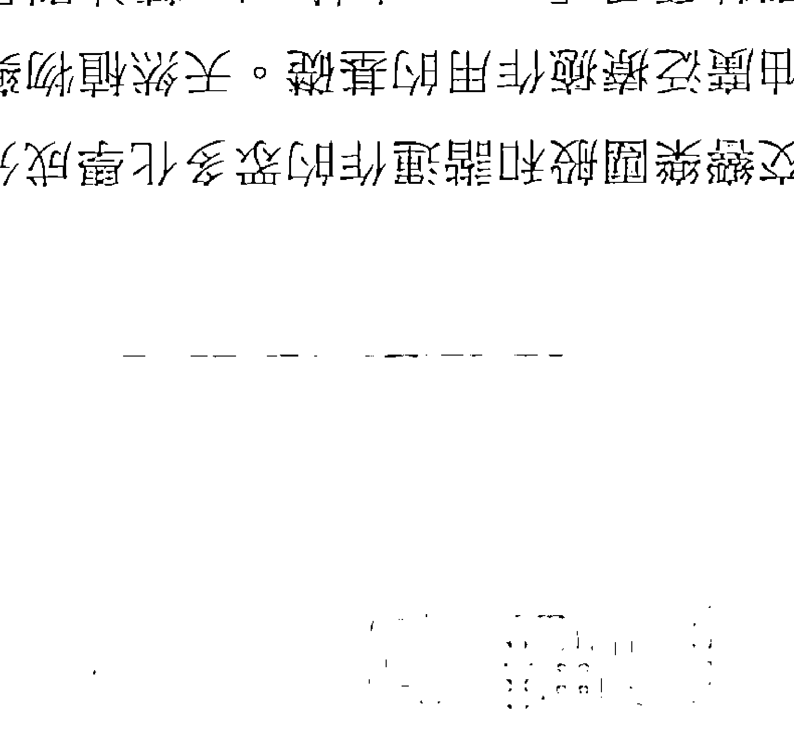

+ 同品種植物因產地、氣候變化和栽種條件不同，精油成分也隨之改變，採收時間亦是重要變因。
> ! 本書中所列出的成分比例為採集各種分析結果和文獻資料，混合計算的約略值，且儘可能涵括所有已知成分，但精油中許多分子尚未被研究證實，因而總合常不達100%（頁75起）。

## ▷ 單一植物品種有不同化學類型

百里香不同的面貌，均來自於相同的原生品種 Thymus vulgaris，因生長地點（包括地理環境、高度、土壤和其他局部條件）及太陽光強度，而發展出不同的亞種，其精油的香氣和功效與原生品種截然不同，皆因化學成分的組合及比例不同。

精油成分中，比例最高的分子族群決定其化學類型（CT 或 C.T.）。以百里香為例，市面上常見三種百里香精油，分別為百里酚百里香（Thymus vulgaris CT Thymol）、側柏醇百里香（Thymus vulgaris CT Thujanol）及沉香醇百里香（Thymus vulgaris CT Linalool）。精油中最主要的化學分子族群決定其療癒作用的調性，因此這類亞種精油的標籤上必須註明化學類型。

## 確實的生產報告為第一要件

上述例子說明生產廠商提供確實資訊的重要性。對於消費者而言，瞭解手中握的究竟是百里酚百里香（頁 195）、側柏醇百里香（頁 194）或沉香醇百里香（頁 193），所帶來的巨大影響可能非些許價差所能比擬。生產廠商若能提供精油中重要成分的詳細數據，對於臨床應用將有莫大助益。

## 混亂不清的使用禁忌

文獻中和標籤上眾多、紛亂的使用禁忌，常令許多化學成分蒙受不白之冤。為提高精油使用的安全性，標示使用禁忌，本質上是正確的，可惜有時不免誇大。好似若將導彈的危險性硬加在汽車上，此比喻頗能貼切形容此情況。

## ▷ 危險物品法規

2000 年 7 月 1 日起，按照危險物品法，含有特定碳氫化合物的液體或配方，必須標示聖安德魯十字元號（呈「X」狀的十字元號），表示「刺激／有害健康」。
危險物品法的基礎為，歐盟標示準則 98/98/EG（EU-Kennzeichnungsrichtlinie 98/98/EG）。按其中 Xn， Gefahrensatz R65 條款內容，含有這類碳氫化合物的商品標籤上，必須註明如下內容：「有害健康 - 不慎吞嚥時可能造成肺部損害」（頁 62）及「不慎吞嚥時會造成嘔吐，應即就醫並出示包裝盒或標籤」，這類資訊通常標示在標籤背面。
若大量吞食時，碳氫化合物可能以氣態的形式進入肺部，如同溶劑般，使氣管和支氣管表面的黏膜剝離，剝落的黏膜慢慢滑入細小的支氣管形成阻塞，造成化學性肺炎。
兒童誤食燈油死亡的案例是這條法規產生的原因，但燈油的基質為礦物油，並非精油 !! 不少精油因含有這類碳氫化合物，需遵照危險物品法進行這種怪異的標示。

警告標示的目的為保護每日與之為伍的工作人員，例如容量 100 公升桶子上的警告標示「刺激 / 有害健康」，提醒運送及儲放過程可能產生的危險，及意外不幸發生時的應變措施。

可惜的是，危險物品法中並未針對小包裝增定附加條款，即使是 5 毫升精油含脂肪族、環狀及芳香族碳氫化合物的比例超過 10% 時，也必須標示上述危險警示。合法標籤除了標示聖安德魯十字外，還必須包括必要的安全提示，因此新標籤的形式常是長條捲狀，為保護兒童安全，瓶蓋需是安全瓶蓋，另外目前也在討論是否應增加盲人辨識系統。

## 上述的警告標示真的專業？

+ 市售精油的瓶身上標示聖安德魯十字元號，基本上不但誇大其資，且造成不必要的驚恐；聖安德魯十字元號的功能，在於突顯有意義的安全提示，因此許多瓶身應加註如下指示（頁 25）：
> 「需稀釋後使用，避免接觸眼睛及黏膜組織，應放置在兒童無法取得之處」，如頭狀薰衣草、薄荷、檸檬香茅或是中國肉桂等精油均為必要。
+ 含高比例單萜烯酮類的精油，在高劑量使用下可能引起神經毒性。含高比例醛類的精油可能有皮膚刺激性。含高比例酚類的精油在高劑量口服下，會造成肝毒性 / 損害肝臟，均為確實的科學研究結果。

對於這類精油的正確使用方式及劑量應有較完整的說明，例如：

+ 1ml 的頭狀薰衣草精油 (Lavandula stoechas) 對兒童可能造成致命危險；反之，使用 1 滴在疤痕調理配方中，能產生令人驚異的細胞再生作用。
+ 在學齡前兒童靠近臉部部位使用純薄荷 (Mentha piperita) 精油，可能引起聲門痙攣，也已是證實的臨床反應：感冒配方中加入 1 滴薄荷精油擴香，則是理想的作法。

對消費者而言，某些特殊精油應加註使用禁忌是專業的作法，可惜的是，許多使用禁忌已完全悖離事實，不但毫無科學理論根基，更讓受害的精油毫無申訴的機會。

## → 錯誤的使用禁忌損害精油的正當性

+ 將原植物某一種特質套用在精油上，是屢見不鮮的狀況。例如許多文獻中均記載快樂鼠尾草精油可能引發癲癇，事實上，不論是精油或其主要成分酯類、單萜烯和倍半萜烯，均無任何引發癲癇的記錄。
+ 大西洋雪松（Cedrus atlantica）精油的使用禁忌為「孕婦或癲癇患者禁用」，這是因為精油中的酮類含量。但酮類中其實有許多不同的酮，特質也不同。大西洋雪松精油不但只含有微量的大西洋酮，且大西洋酮屬於極溫和的倍半萜烯酮。究其因在於，英語系國家將所有常綠的針葉樹及類似針葉樹的植物，統稱為「cedar」（雪松），包括側柏。
+ 側柏（Thuja）精油中含高比例的側柏酮（單萜烯酮），可能引發流產，兒童及孕婦應禁止使用。但在指鹿為馬的情況下，幾乎所有文獻都標示大西洋雪松精油的危險性。錯誤訊息造成的影響力常令人扼腕，目前在法國已禁止販售大西洋雪松精油，但珍貴的大西洋雪松精油不但毫無副作用，亦是芳香治療及芳香護理上的全效精油。
+ 防止錯誤禁忌產生的唯一原則是：確實查詢植物的拉丁學名及化學類型，避免張冠李戴。「西班牙馬鬱蘭」是另一個經典的例子，市售的「西班牙馬鬱蘭」精油，其實並非馬鬱蘭，而是一種名為馬斯提其那百里香 Thymus mastichina 的百里香品種，作用和馬鬱蘭（Origanum majorana）大相逕庭。
+ 許多使用禁忌來自於單一分子高劑量的動物實驗，但這些分子在多分子精油中的比例極低。例如長時間、高劑量，餵食白老鼠單一成份甲基醚丁香酚的實驗結果顯示，此成分可能致癌。玫瑰精油雖只含有 2~3% 微量的甲基醚丁香酚，但千年以來的應用傳統立即蒙上陰影。反推計算，若要吞下可引發病理反應的甲基醚丁香酚，需要相當大量的玫瑰精油，其價格大概亦無人能負擔！
+ 關於「刺激皮膚」這項警告應再分類觀察，皮膚發紅的現象或許是抗發炎反應（頁 31）？個案的皮膚狀況（敏感型，受損型 等等）、使用劑量（純精油、稀釋或是復方）、使用時間長短及應用方式（外用、口服或泡浴…）？均有指標性意義。值得一提的是，並非每種皮膚反應均為過敏反應，而常是所謂的「假性過敏」，許多藥膏（頁 7）使用初期，也會產生這種現象，一段時間後即自然消失。
+ 只有在長時間、高劑量，口服含酚類超過 50% 的精油時，才需加註『肝毒性』警語，生理劑量下的外用形式毫無此疑慮（頁 28）。

## 有意义的使用禁忌

+ 某些精油，如胡薄荷（Mentha pulegium）中最重要的成分為胡薄荷酮，一種單萜烯酮，高劑量使用有神經毒性，可能造成麻痺、過度興奮或流產，胡薄荷酮和側柏酮均屬於單萜烯酮類（頁 35）。
+ 單萜烯酮含量超過 30% 以上的精油，應由熟悉化學結構的專業治療師使用，在生理劑量下、少量及短時間應用為其基本通則，即使外用也需小心。含單萜烯酮的精油，在高倍稀釋下仍有顯著功效，因此使用上以低劑量為宜。在不含酮類精油的配方中，加入 1~2 滴毫無問題。
+ 許多含高比例酮類及酚類的精油標籤上，均標示『易造成流產』警語，酮類及酚類除具有強大脂溶性的特質外，更會引起激烈的局部刺激作用。

## 進入芳香分子的世界

## 1 吸入分子的效应

所有的精油皆富含單萜烯（最多包含500种分子）。想要进入人类大脑的漫长旅程，必须先挥发性成分的主要族群。世界各地，分子结构有相似的主化活性或抑制活性的特性，据此可区分不同的族群，再以族群大类的化学结构形式命名。

薰油随着温度变化，天然精油的挥发性永远不会达到一个分子推翻，愿回到每一个薰油特有的芳香分子整体组合所形成的强大协同作用。

本著中所描述的疗效作用之基础，是透过这些单一分子的研究而扩展。

### 1.1 基本原则：是毒药或是药取决于使用的剂量（Paracelsus,页58），适量、完整的剂量才能避免发生危险。

> （Paracelsus,页58）

口服可能造成肠胃道过度刺激，使于宫血流增加迅速。若使用不当（口服剂量过高及时间过长），临床上可能造成子宫过度收缩、痉挛性收缩也可能造成流产的原因。泌精子宫的敏感度在月经周期低剂量使用，在月经周期加入1~2滴则会刺激经痛。

佛手柑精油中呋喃香豆素的含量，居所有精油之冠。呋喃香豆素会提高皮肤的光敏感性，尽量使用後曝露在阳光下（包括日光室），可能引起色斑或是皮炎发。黑胡椒草（Hypercium）同様具有提高光敏感性特质。忌晒的呋喃香豆素及金丝桃素，均有镇静神经和提振情绪的效用。

### 1.2 「生理耐量」

生理剂量的定义须0.5~1%的剂量，亦即精油的含量在配方中不超过0.5~1%的百分比。简易减算法则如下：

0.5%的配方：将20滴精油（约1毫升）加入100毫升植物油中。

## 二萜主要大环

+ 病蛹類及其他生物：此種分子的比例通常高達 90%（頁 29）。
+ 芳香族化合物（頁 38）：主要特徵為均帶有芳香環（又稱苯環）。通稱芳香族化合物在植物中的合成形式非常多元，重要的代表為苯基丙烷生化化合物。

所有化学分子基本上以其官能基（又称官能基圈）属性：确烯或芳香环上一个或多个氢原子常被其他的原子或原子团取代，例如酯、醚、酮、醛或氧化物，这些官能基的性质能共同决定单一分子的性格（例如持香、颜色、气味及效用）。

其他的族群在精油中含量非常微小，也少对精油的性质有所影响，因而也未被纳入系统性研究。在《精油圖鑑》（頁75起）有特殊成分的进一步介绍。

## 萜烯類

萜烯類在植物界及動物界的分佈非常廣泛。在植物界中為花朵、葉片、果實、樹皮及根部萃取精油的主要組成分子。此外，在香膠、樹脂、類脂醇、費洛蒙、植物荷爾蒙及植物色素中也常見此成分。

全世界針葉林散發出的萜烯總量相當可觀，估計一年超過十億噸！(Römpp 1995) 人類可說是生活在充斥萜烯及其氧化產物的環境中；由此或許科學家可用另一種觀點來審視關於精油中氧化產物的評判，否則每一個針葉林前都應該有”禁止進入”的標示吧...

## 化學結構

萜烯類由數量不同的異戊二烯單位構成，它們按照固定的生化結構模式組成，為自然界中出現的不飽和雙鍵碳氫化合物。

異戊二烯的基礎結構由5個碳原子 (C₅) 及8個氫原子 (H₈) 組成，不具有任何功能。

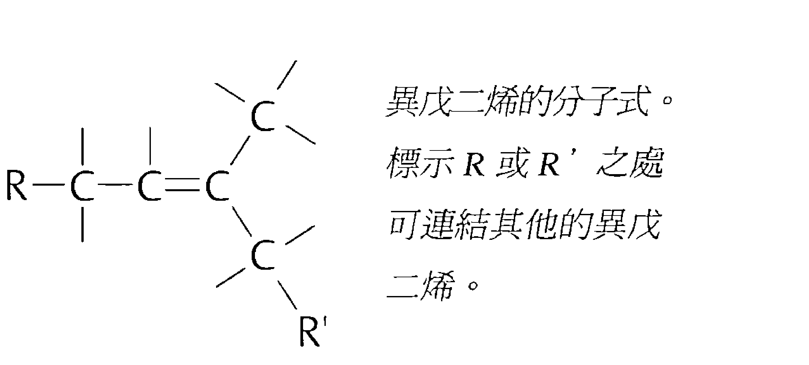

萜烯由二個或以上的異戊二烯單位組成（異戊二烯鏈）。
二個異戊二烯可鏈結形成單萜烯（10個碳原子），三個異戊二烯鏈結形成倍半萜烯（15個碳原子）；雙烯則是由四個異戊二烯（20個碳原子）組成的大分子，揮發性低，在精油中只以微量形式存在。超過20個碳原子的萜烯分子已不具有揮發性，因此不存在於任何蒸餾物中（參考下列圖表）。

自然界中尚有其他的萜烯類，但其結構與異戊二烯鏈結的原則不同，稱為不規則萜烯類，但亦由二個異戊二烯單位形成。

## 最重要的萜烯類及其存在形式

| 類型 | 碳原子數量 (C₅單位) | 存在形式 |
|---|---|---|
| 單萜烯 | 2個 C₅ | 精油中佔大比例、費洛蒙 |
| 倍半萜烯 | 3個 C₅ | 精油、苦性物質、香膏 |
| 雙烯 | 4個 C₅ | 精油、香膏、樹脂、植物醇、維生素 A |
| 三萜烯 | 6個 C₅ | 樹脂、硬脂醇、類脂醇、植物荷爾蒙 |
| 四萜烯 | 8個 C₅ | 植物色素，例如類胡蘿蔔素。 |
| 多萜烯 | 8個 C₅ 以上 | 植物乳汁，橡膠。 |

## 精油中的重要成分

精油主要由单萜烯、倍半萜烯及其衍生物组成，在其生成反应中，萜烯碳原子聚集成键，不同的部位会根据不同的官能基结合在一起，例如氯、硫性物质或酯，形成合理的碳氢（氧化合物）。据其不同的化学特性可分为烯烃、烯烃-醇、烯烃-酮、烯烃-醛、烯烃-酸、烯烃-酚、烯烃-醚、烯烃-酯，每一类型都有典型的特定反应作用方式，和单萜的碳氢化合物完全无分别比。

## 萜烯酶及其衍生物（氧化合物）

| 官能基 | 10个碳原子（单萜烯） | 15个碳原子（倍半萜烯） | 倍半萜烯 |
|---|---|---|---|
| 醇类 | 萜品醇 | 金合欢醇 | 金合欢醇 |
| 醛类 | 柠檬醛 | 金合欢醛 | 金合欢醛 |
| 酮类 | 薄荷酮 | 金合欢酮 | 金合欢酮 |
| 酚类 | 丁香酚 | 金合欢酚 | 金合欢酚 |
| 醚类 | 茴香脑 | 金合欢醚 | 金合欢醚 |
| 酯类 | 乙酸芳樟酯 | 金合欢酯 | 金合欢酯 |
| 环氧化合物 | 1,8-桉叶素 | 金合欢环氧化合物 | 金合欢环氧化合物 |
| 内酯类 | 佛手柑内酯 | 金合欢内酯 | 金合欢内酯 |
| 硫化物 | 蒜素 | 金合欢硫化物 | 金合欢硫化物 |

## 萜的结构及命名（萜的命名法）

【注】在德文中缩尾以 -en 代表：在英文中缩尾以 -ene 代表

- 单萜烯：单萜烯油脂溶性强、刺激性强、挥发性高，微小的分子量可快速渗透进入肌底。若储存在（冰箱、温控及氮气）密封速氮气：氮气化的分子可能刺激肌肤，引起过敏反应。
- 生理浓度：含高比例单萜烯的精油在生理上具有刺激、温暖、止痛及消炎的作用，因此最适合作用的复方精油：
- 用途：可用于缓解疼痛、促进循环、消炎、止痛、抗菌、抗氧化、抗病毒等，最适合作用的复方精油：

+ 柠檬烯（Limonene）
+ 蒎烯（Pinene）
+ 月桂烯（Myrcene）
+ 水芹烯（Phellandrene）
+ 萜品烯（Terpinene）
+ 异松油烯（Terpinolene）
+ 罗勒烯（Ocimene）

## 精油的组成成分（精油的主要成分）

精油的主要成分包括单萜烯、倍半萜烯、单萜醇、倍半萜醇、单萜酮、倍半萜酮、单萜醛、倍半萜醛、单萜酚、倍半萜酚、单萜醚、倍半萜醚、单萜酯、倍半萜酯、单萜环氧化合物、倍半萜环氧化合物、单萜内酯、倍半萜内酯、单萜硫化物、倍半萜硫化物等。这些成分的组合和比例决定了精油的特性和功效。

## 精油的特性

精油的特性包括挥发性、渗透性、抗氧化性、抗菌性、抗炎性、镇痛性、调节情绪、促进血液循环、增强免疫力等。不同的精油成分具有不同的特性，因此功效也有所不同。

## 精油的功效

精油的功效包括但不限于：舒缓压力、改善睡眠、缓解疼痛、促进消化、增强免疫力、改善皮肤问题、调节内分泌等。不同的精油成分和组合可以针对不同的健康问题提供帮助。

### 倍半萜烯

医学上称为「抗发炎效果」(counter-irritant Effect)。『这种现象看来似乎相互矛盾，但这些在皮肤上会造成某种程度刺激效果的化合物，会产生所谓的『发炎反应』，这反而会在肌肉、神经系统及关节方面引发『抗发炎反应』的效果（编按：意即这些皮肤表面轻微的刺激反而会激励体内抗发炎因子的生成）。这种连锁反应在医学界已是公认的事实，在临床上也多方面得到证明。(Wagner & Wiesenauer 2003)』

> (Wagner & Wiesenauer 2003)

此外，单萜烯，特别是α-及β-蒎烯，因能调节副肾皮质的活动，均具有类似可体松的特质，进而对自主神经系统有正面影响，作用目标则是各种器官系统的平滑肌，例如肾脏和肠胃道。

含高比例单萜烯的精油有抗病毒及抗细菌的作用，亦是知名的免疫系统刺激剂，能有效启动免疫系统。

- 心理疗效：整体而言，具有滋补、提升专注力及强化心理结构作用，温和消除恐惧、提高心灵抵抗力及逻辑思考能力。

### 典型代表精油及分子

- 右旋柠檬烯 - 强力抗感染、抗病毒、抗细菌、快速激励免疫系统：
- 葡萄柚、莱姆、红桔、甜橙、柠檬：90-95%（主要为右旋柠檬烯65-95%）
- α-及β-蒎烯（针叶类精油）—近似可体松，消炎、止痛：
- 欧洲赤松：75 - 85%（主要为α 蒎烯）
- 高山松：75 - 85%（可达35%的蒎烯、可达25%的左旋柠檬烯）
- 巨杉：60 - 70%（主要为蒎烯）
- 杜松：75 - 80%（主要为α 蒎烯）
- 欧洲冷杉：80 - 90%（可达54%的左旋柠檬烯，α 蒎烯可达20%）
- 丝柏：65 - 85%（主要为α 蒎烯）

倍半萜烯由15个碳原子组成，与单萜烯相较为反应慢的大分子。

- 生理疗效：与单萜烯相较，倍半萜烯极为温和、亲肤！特质为温和消炎及轻微止痛。对于过敏现象亦有帮助，特别是针对不知名因素的组织胺过度分泌，例如压力状态下引起的皮肤搔痒、黏膜组织刺激及流鼻水（鼻炎）；某些倍半萜烯能稳定肥大组织的细胞膜，进而调节组织胺的分泌，稳定不安、紧张的皮肤或黏膜组织。再生的特质则能支援细胞的修护机制。
- 心理疗效：含高比例倍半萜烯的精油为「回归自我本质的引领者」，带来力量及自信，使人神采奕奕，这些效用均与其近似费洛蒙的特质有关（页17）。整体来说，能消除恐惧，在不压抑情绪的情况下缓和过于激动的反应及不安。科学家推测这种临床功效与倍半萜烯能激励脑中重要神经传导物质—γ-氨基丁酸

### 单萜烯醇

生理活性：单萜烯醇是强大的免疫刺激剂，以一种科学实验未知的方式促进抗拒力因子，进而保证免疫系统、心血管系统及神经系统欣快反应和谐的运作；亦能促进皮肤的再生和细胞的修复机制，产生良好敏感反应细胞再生的功效率，在不吸收皮脂或皮脂本身脂肪酸的情况下能抵抗细菌、抗病毒及抗真菌的作用。

心理疗效：单萜烯醇，特别是具有某些特殊功效的化合物，估计均具备遮蔽物（或抑菌因子）的效应，如玳玳和天竺葵精油的主要成分—沉香醇、香茅醇、橙花儿醇：遮蔽物—萜烯... 用高效成分，兼具挥发性，帮助动物具有良好的环境变化适应能力。

> > (Wagner & Wiesenauer 2003) 大量的遮蔽物能削弱前方脑皮质的功能，使过度激励的兴奋反应迅速冷静下来，

### GABA（γ-氨基丁酸）

GABA是大脑中主要的抑制性神经递质，与焦虑、压力、失眠及过多的刺激均有关。压力导致γ-氨基丁酸的分泌下降，造成恐惧、错乱、恐惧信息传导等物质的交互影响，因而能在不同的心理状态下适度地镇定、镇静、反强化的作用；含倍半萜烯的精油是调理心理性忧郁症的重要选择。

### 典型代表精油及分子

- 甜橙：60-65%（主要为橙烯）
- 德国洋甘菊：45-70%（主要为天蓝烃、金合欢烯）
- 杜松梅：65-68%（主要为杜松烯）
- 香蜂草：40-60%（主要为β-丁香油烃）
- 薰衣草：50-65%（主要为薰衣草醇）
- 维吉尼亚杜松：50-65%（主要为香柏木烯）
- 永久花：55-70%（主要为大根老鹳草烯）
- 大西洋雪松：75-80%（主要为雪松烯）

### 单萜烯醇的族群包括：

- 单萜烯醇：例如沉香醇（Linalool）、牻牛儿醇（Geraniol）、香茅醇（Citronellol）
- 倍半萜烯醇：檀香醇（Santalol）、没药烯醇（Bisabolol）
- 萜烯：榄香醇（Elemol）、愈创木醇（Guaiol）
- 精油：檀香醇（Santalol）、愈创木醇（Guaiol）等

单萜烯醇是护肤品最受欢迎的分子族群之一：即使用量稍高也最少引起过敏反应。

在缺乏信心或无精打采时则带来活力。单萜烯醇能强力调整情绪，促进对环境的感知，使人谨慎而富同理心。

## 双醇

20个碳原子的双醇为大分子，在蒸馏物中只以极微量的比例出现；但在原精中含量较高，其特质与倍半萜烯醇近似（请参考左方说明），藉由消除压力的作用对性荷尔蒙产生正面的影响。

### 典型代表精油及分子

- 芫荽：60 - 80%（主要为沉香醇）
- 真正薰衣草：30 - 40%（主要为沉香醇）
- 墨西哥沉香木：80 - 90%（主要为沉香醇）
- 玫瑰草：80 - 85%（主要为牻牛儿醇）
- 玫瑰：65 - 75%（主要为香茅醇、牻牛儿醇）
- 玫瑰天竺葵：50 - 65%（主要为香茅醇、牻牛儿醇）
- 花梨木：85 - 95%（主要为沉香醇，可达90%）
- 茶树：35 - 50%（主要为萜品烯4-醇）
- 沉香醇百里香：75%（主要为沉香醇）

### 典型代表精油及分子

- 茉莉原精：15 - 45%（主要为植醇）
- 快乐鼠尾草：可达1%（鼠尾草醇）
- 厄利特里亚乳香：可达2.5%（主要为Incensol）
- 丝柏：可达0.5%（主要为冷杉醇）

### 倍半萜烯醇

## ▷ 醛类

○ 生理疗效：倍半萜烯醇为缓慢、长效的免疫调节剂，其影响自体免疫力及平衡荷尔蒙系统的机转尚无法确定；其他的药学属性包括滋补静脉、细胞再生及护肝，临床证实对于慢性皮肤疾病相当有效。

当植物一次代谢物的单萜烯醇氧化后会形成单萜烯醛；此族群包括有10个碳原子的单萜烯醛及15个碳原子的倍半萜烯醛：其特质有极大的差异，需分开探究。

- ○ 单萜烯醛：例如柠檬醛（Citral）[牻牛儿醛（Geranial）及橙花醛（Neral）]、香茅醛（Citronellal）
- ○ 倍半萜烯醛：例如中国橘醛（Sinensal）、檀香醛（Santalal）、缬草醛（Valerenal）

○ 心理疗效：倍半萜烯醇这个族群的特质相当多元，唯一共通之处在于对下视丘均有强力调节的作用，并进而影响荷尔蒙系统；其他药学属性包括平衡自主神经系统（使交感神经和副交感神经和谐分工），强化心灵抗压能力，平抚情绪，降低暴燥、紧张和攻击性，以极不著痕迹的方式恢复心灵的平衡及调节性荷尔蒙，因此有近似费洛蒙的特质。

结尾为 —al

### 单萜烯醛

单萜烯醛分子的特色为均带有柠檬味，是较不稳定的化合物，对于酸、光线及空气都相当敏感，这表示它们在皮肤及黏膜组织上的反应相当活跃；高剂量使用时会对皮肤及黏膜组织造成刺激，特别是针对敏感性肌肤。

### 典型代表精油及分子

- 阿米香树：60 - 70%（主要为桉叶醇）
- 德国洋甘菊：5 - 30%（主要为没药醇）
- 胡萝卜籽：50 - 60%（主要为胡萝卜次醇、胡萝卜醇）
- 广藿香：30 - 60%（主要为广藿香醇）
- 檀香：85 - 95%（主要为檀香醇）
- 维吉尼亚杜松：25 - 40 %（主要为香柏木醇）

## 吸入芳疗分子的精油

### 檀香醇

檀香醇族群中数量最大的是α-檀香醇，由牻牛儿酸及橙花酸二重同质异构物组成。虽然两种物指的是化学分子式相同，但结构形成不同的化合物。牻牛儿酸及橙花酸二重化合物共同组成典型的檀香气味，因此常被称为高品质檀香醇。

而这些醇、桉醇或沉香醇的应用形式都可能会产生剧烈的反应，临床常见状况包括不安、易怒甚至抗拒反应，可见剂量决定了人类对待情绪的接受度。

含高比例檀香醇的精油不建议油龄使用在皮肤上，因恐有刺激皮肤以致发红敏感反应之风险。

### 典型代表精油及分子

| 植物名称 | 含量范围 | 主要成分 |
| :--- | :--- | :--- |
| 檀香马鞭草 | 35 - 40% | (主要为檀香醇) |
| 檀香尤加利 | 65 - 90% | (香茅醇) |
| 檀栀芳香 | 70 - 85% | (桧烯) |
| 山鸡椒 | 70 - 80% | (主要为桧烯) |
| 香蜂草 | 25 - 55% | (主要为桧烯) |

大分子的倍半萜烯醇功能温和，甚少出现在精油中，含有微量倍半萜烯的精油气味均非常强烈。

- ○ 生理效应：因出现的比例相当低，至目前尚未将其它生理效应阐明。
- ○ 心理效应：温和消除恐惧及平衡，在适当的剂量情况下则有强大的作用力。

其他代表精油及分子
栀橙芳香：3%（金合欢醛）
栀檀芳香：微量（橙花醛）
甜檀：0.1%（主要为桧烯）

在生理剂量下，各檀香倍半萜烯醇均具有和缓镇静、增进、强化、活化、提神的作用。含高比例檀香醇的精油，具有一般檀香醇所带来的特质—宁静、活化、潜能，进而降低内在的紧绷，疏通郁结的神经质，刺激创意及新想法的产生：有效消除精神疲劳，提振精神力量。科学家推测檀香醇的镇痛力主要来自制止多巴胺的飙动作用（神经传导物质多巴胺「创造疼痛感」，约于压力的感受反应高度敏感，体内多巴胺的代谢若持续于下降，会导致缺乏想像力、自我设限、心智钝化，最易产生不明原因的沮丧及忧懒感。）

在许多文化中大力推崇檀香醇镇定的功效：但运用含高量檀香醇的精油则非常常会容易「出槌」，因为容易察觉的「发皮肤」性格的人，特别是敏感肤质的小孩，对于

### 酮类

当植物二次代谢物单萜烯醇再次氧化，就会形成单萜烯酮。此族群包括有10个碳原子的单萜烯酮及15个碳原子的倍半萜烯酮：这类的化合物带有酮，即所谓的羰基作为官能基。

- 单萜烯酮：樟脑＝龙脑酮（Borneon）、侧柏酮（Thujon）
- 倍半萜烯酮：大西洋酮（Atlanton）、鸢尾草酮（Iron）、缬草酮（Valeranon）

结尾为 —on

单萜烯酮及倍半萜烯酮一般惯常被统称为『酮类』：二者虽均属于相当稳定的化合物，几乎没有刺激性，但必须确实加以分类研究。

小分子的单萜烯酮能快速参与脑部新陈代谢的运作，在脑部局部产生强大的反应，因此在较高的剂量下会产生神经毒性（页27）！

反之，大分子的倍半萜烯酮在较高的剂量下仍旧相当温和。

> > ！请谨记：当您听到『酮类』的时候，请务必确实询问清楚是那一类！

### 单萜烯酮

○ 生理疗效：单萜烯酮对于神经系统、皮肤及黏膜组织均有极大的亲和性；具有促进上皮组织及肉芽组织形成的功效，因而能对结痂速度及伤口愈合有良好影响，此外对于呼吸道有独特的稀释黏液作用。

在肠胃道能产生舒缓痉挛的效用，使其成为温和的抗痉挛剂，有效消除饱胀感及胀气。单萜烯酮亦能促进胆汁分泌，进而解除肝脏的负荷。其它的特质还有抗细菌及抗病毒。

- 心理疗效：含高比例单萜烯酮的芳香植物，例如头状薰衣草、鼠尾草或牛膝草都是古代萨满族的典型焚香用品，在祭祀中随着飘渺的香气达到恍惚的状态，在冥想境界中更贴近自然及人体的律动，从而产生疗愈力量。基于此因，在许多芳疗文献中会提出这类精油的使用禁忌，但植物与蒸馏物的成分其实大不相同。

单萜烯酮属于会影响精神的分子，对脑部新陈代谢有强大激励作用；低剂量则使心灵清澈宁静，开放、有活力。

良好脑部功能运作所必需的乙酰胆碱，以及能够带来好心情和让『腹部脑』安宁的血清素，都是富含此类分子精油会主要影响的神经传导物质；低剂量使用对于中枢神经系统和周边神经系统的协调性具有正面的影响（页13）。

> > ！副作用：单萜烯酮在芳香疗法临床的应用上属于极少数有使用禁忌的分子；在高剂量且口服的情况下会产生神经毒性（页27），但此结论不适用于外用方式。一般来说，单萜烯酮外用并不会产生任何问题，除非是长期、高剂量用于皮肤及黏膜组织上。

富含单萜烯酮的精油不适用于儿童及孕妇，因高剂量的酮可能会造成流产（页27）。

## 进入精油分子的世界

### 倍半萜烯酮

○ 生理疗效：倍半萜烯酮特有神经亲和、发屑及黏膜细胞修复细胞再生，促进伤口愈合及消除瘀斑的功效。其抗菌属性重烯酮酮醚，但没有单酮的副作用。

○ 心理疗效：整体来说，即使在极微量的情况下，含倍半萜烯酮的精油均有助消除恐惧的作用。此类分子刺激γ-氨基丁酸（GABA）的受体，有强大的镇静和性（页32）。此外，其对脑部代谢的正面影响是能增加神经传导物质GABA的浓度，进而降低神经细胞的刺激性。

倍半萜烯酮有如稳定剂的效应，但没有任何副作用。含此类分子的精油能带来内在的宁静自在，进化强韧的心轮（观想平静时，心轮的位置）。倍半萜烯酮亦有近似置信素的特征（页17）。

- 典型代表精油及分子
- 薰衣草：60%（主要为右旋藏茴香酮）
- 侧柏醇：50-60%（主要为左旋藏茴香酮）
- 胡椒薄荷：25%（主要为藏茴香酮）
- 樟脑迷迭香：30%（主要为樟脑=鼠尾酮「borneol」）
- 鼠尾草：30%-60%（主要为侧柏酮）
- 瓣状薰衣草：70-80%（主要为藏茴香酮）
- 真正薰衣草：40-60%（主要为薰衣草酮）

### 葵酮及三酮

当我们谈到草本类植物的气味时，指的是其呈一排排指上非常不统一的单萜烯酮化合物，化学式为常带一原子的类戊二烯组合物，分子活性相当稳定，通常不奢引起刺激。此族群包括带有10个碳的单萜烯酮化物和带有15个碳的倍半萜烯酮化合物：

- 典型代表精油及分子
- 苦橙花：10-15%（葵酮，主要为意大利亚酮）
- 桃红梅：25%（三酮，主要为胡桃酮）

### 葵酮及三酮

- 典型代表精油及分子
- 鼠尾草：55-75%（主要为蒿属草酮）
- 意日松：8-15%（主要为蒿属草酮）
- 桂花：25%（主要为紫堇酮）
- 岩兰草：15%（主要为岩兰草酮）
- 大西洋雪松：3-12%（主要为大西洋酮）

倍半萜烯酮通常只带有一个酮基，但也有带二酮或三酮基的例外情况，这些分子携

其结构则被称为葵酮及三酮。其生理疗效与倍半萜烯酮类似，心理疗效见倍半萜烯酮描述，但伤口愈合反应细胞再生功效更好，也是化瘀及止痛的专家。葵酮及三酮有强烈刺激淋巴流通，因而能快速地消肿。

倍半萜烯酮通常只带有一个酮基，但也有带二酮或三酮基的例外情况，这些分子携

## ▷ 氧化物

- ○ 单萜烯氧化物或氧化物：例如 1,8 桉油醇
- ○ 倍半萜烯氧化物：例如没药醇氧化物

### 典型代表精油及分子

| 精油名称 | 1,8 桉油醇含量 |
| :--- | :--- |
| 白千层 | 50 - 65%（主要为 1,8 桉油醇） |
| 蓝胶尤加利 | 65 - 75%（主要为 1,8 桉油醇） |
| 澳洲尤加利 | 65 - 80%（主要为 1,8 桉油醇） |
| 土耳其香桃木 | 40 - 50%（主要为 1,8 桉油醇） |
| 绿花白千层 | 40 - 60%（主要为 1,8 桉油醇） |
| 桉油樟 | 55 - 65%（主要为 1,8 桉油醇） |
| 月桂 | 35 - 50%（主要为 1,8 桉油醇） |
| 桉油醇迷迭香 | 45 - 50%（主要为 1,8 桉油醇） |
| 穗花薰衣草 | 25 - 35%（主要为 1,8 桉油醇） |

### 单萜烯氧化物

单萜烯氧化物最重要的代表为 1,8 桉油醇，闻起来有清新药味或近似尤加利气味的精油均含有此成分，因此 1,8 桉油醇早期亦被称为桉醇（Eukalyptol）。其它的氧化物不扮演重要角色。

- ○ 生理疗效：含有 30% 以上 1,8 桉油醇的精油属于重要的药用精油，受到医药界的高度重视，其药学属性包括强大的促进排出、消解黏液及帮助腺液分泌与流动。1,8 桉油醇具有类似 surfactant 的效应（surfactant 为 surface active agent 的缩写，意为活化局部表面的物质）—意即能有效防止黏液在没有纤毛上皮的肺泡附着。（Wagner & Wiesenauer 2003）。富含 1,8 桉油醇的精油均具有良好净化及运输的功能；在黏膜组织及支气管方面，有超强抗发炎的作用，几乎可取代类固醇药物，对于副交感神经也具有正面影响，能放松支气管及肠内的平滑肌。此外，富含此分子的精油均有活血、暖身、护肤及促进皮肤细胞新陈代谢的特质。
- ○ 心理疗效：富含 1,8 桉油醇的精油可唤醒活力，强化毅力及心灵的抵抗力。此分子能活化脑部新陈代谢及促进激励性神经传导物质的生成，进而提振精神、促进逻辑思考能力、注意力及记忆力。从各种临床反应可推测 1,8 桉油醇对于神经传导物质乙酰胆碱应有调节作用，因而能够增加逻辑性、理性、判断力及远见。

### 倍半萜烯氧化物

倍半萜烯氧化物为精油中罕见之化学分子，因此关于它的作用所知甚少；可确定的是，其特质与所有的倍半萜烯衍生物相同：温和、亲肤。

- ○ 生理疗效：抗发炎、护肤、皮肤再生
- ○ 心理疗效：温和消除恐惧、恢复平衡

### 典型代表精油及分子

| 精油名称 | 含量 |
| :--- | :--- |
| 德国洋甘菊 | 16 - 45%（没药醇氧化物） |
| 没药 | 60%（呋喃倍半萜烯） |

## ▷ 酯类

在氢原子分裂下，醇与酸会形成酯类：醇＋酸→酯＋水，例如薰衣草精油中的主要成分乙酸沉香酯：沉香醇＋乙酸→乙酸沉香酯＋水。

酯类为集合名词，包括各种不同的单萜烯酯：单萜烯酯和倍半萜烯酯的特质非常近似，因此合并共同阐述。这类族群通常带有怡人的花香或果香。

结尾为 —at【注】：例如乙酸沉香酯（Linalylacetat）、乙酸牻牛儿酯（Geranylacetat）
【注】在德文中结尾以 -at 代表；在英文中结尾以 -ate 代表## 芳香化合物——苯氧化物

难以散开、带着刺激气味的芳香族化合物的基团结构均属苯环：逐渐展开的分子结构特殊就是苯环。芳香族一面随着有羟基等上苯环系的表现，慢慢演替而成，由此不断梳理周边概念意识有如此繁多、令人混淆的同族词，包括 Benzo-，Benzyl-，Phenyl-，以及 aromatic。

苯（分子式 C₆H₆），指的是由六个碳原子结成的六角形，每个碳原子都接一个氢原子，亦称为「芳香烃」。典型的分子结构无法描述芳香烃的特性。部分π电子围绕芳香环，平均分配在环内，以维持环系的稳定性，其共振部分在结晶中通常透过一圈离域π键呈线。

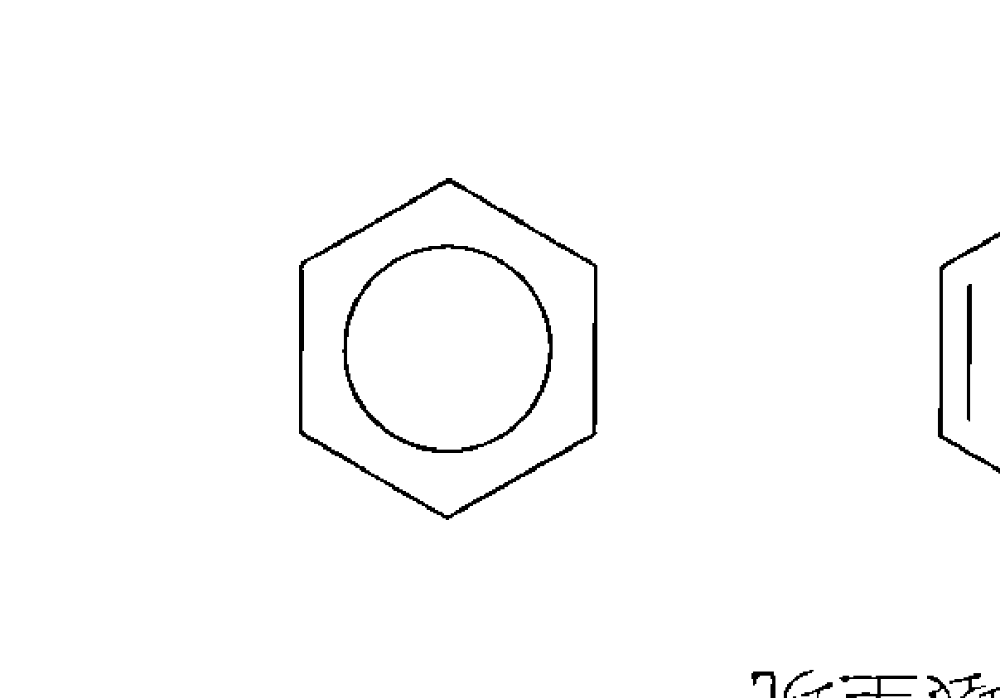

## 单萜烯和倍半萜烯

生理效应：单萜烯酮含量相当稳定的化合物，极温和、亲肤。富含单烯的精油对于皮肤周具有特别好的抗发炎抗菌品质作用。其收敛、醒脑及促进血清素分泌的能力助眠、止痛，特别是舒缓性疼痛。此外，能吸收压力讯号并调节副交感神经的反应，放松紧肌，使心搏速度舒缓，抑制因紧张而引起、非器质性的心搏不适症，如心律不齐、心悸、胸闷或血流不稳定具有良好调整作用。配合其他的化学成分能产生协同作用而预防窒息系统的不适。

心理效应：和其他芳香分子搭配使用的心理效应：能够控制中神经系统及其他的器官产生警醒、镇定及放松的作用。醋酸酯能对血液中血清素的分泌有正面调整效果，神经传导物质血清素的功能像抗忧郁及带来海洋天空的舒透感，因此富含酯类的精油能带来心要的自在感，促进人与人间的互动和交流。

二醚苯醚（或称芳香烃）最常见的呈现方式。

+   典型代表油及分子
- 佛手柑：30-45% (主要为乙酸沉香酯)
- 西伯利亚冷杉：32-44% (主要为乙酸龙脑酯)
- 藿香洋甘菊：70-80% (主要为异丁酸和异戊酸酯)
- 芳樟：32-40% (主要为乙酸异冰片酯)
- 真正薰衣草：40-50% (主要为乙酸沉香酯)
- 快乐鼠尾草：65-80% (主要为乙酸沉香酯)
- 苦橙叶：60% (主要为乙酸沉香酯)

1 嗅入脑中的电脉

## 芳香族的分类

苯环分子中一个或多个氢原子，被其他原子或分子取代后的结构，即称为苯基化合物或芳香族化合物。

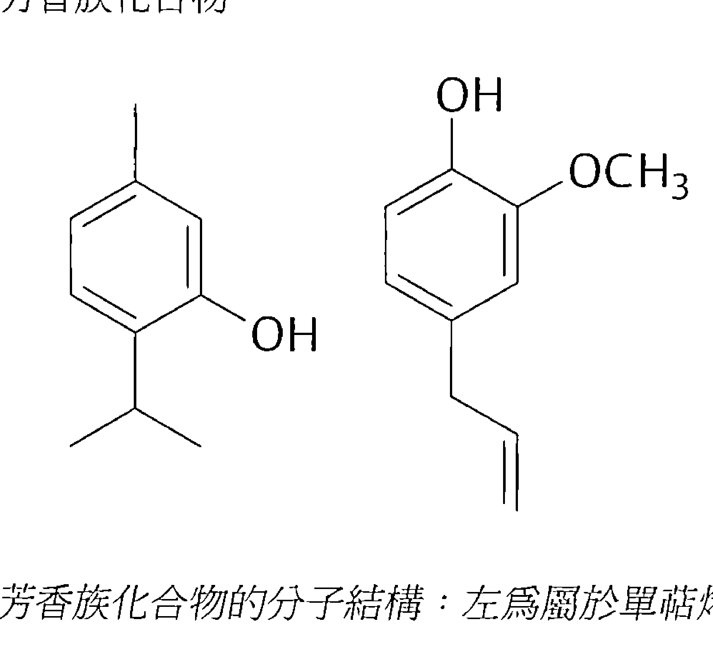

这类分子在植物中的合成途径非常多元。
下述的分类法不只根据其合成途径，也参考其生理和心理疗效；因此不同的族群可归纳为同一类共同阐述。

### ▶ 单萜烯酚

单萜烯酚是植物（性）酚，常被误指为『芳香醇』，化学式中的羟基直接连结在芳香环上使其带有微酸的特质，因此早期百里酚也被称为百里香酸。

单萜烯酚因带有芳香环，其作用与其他的单萜烯化合物明显不同：这类族群的化学分子结尾为 -ol，例如香荆芥酚（Carvacrol）、百里酚（Thymol）。

> ❗ 百里酚的杀菌力强过有皮肤刺激性及毒性的矿物酚（石碳酸）20倍，此外，植物性的单萜烯酚因环系中带有碳分子链，基本上无毒性、也不伤害皮肤。

+   ○ 生理疗效：富含单萜烯酚的精油，在肺脏、肠道及生殖泌尿道，有特别强大的抗感染作用，并能强力促进排出及强化免疫系统（调节 γ 免疫球蛋白）。（Franchomme & Penoël 2001）。香荆芥酚的效用略低于百里酚。含单萜烯酚的精油因有良好止痛、暖身及活血的效用，是许多按摩油中不可或缺的成分，但剂量若过高，可能造成血压升高。

+   ○ 心理疗效：富含单萜烯酚的精油，能帮助走出悲伤及冷漠，增加心灵的抵抗力、消除恐惧，提振精神。其能调节具有激励性质的神经传导物质，如正肾上腺素（页 13），带来正向情绪及活力。

> ❗ 副作用：在芳香疗法中，除了丁香酚和肉桂醛（页40），单萜烯酚是具有强烈刺激性化学分子的第三名，在较高的剂量下会产生皮肤及黏膜组织的刺激性，应尽量避免口服!!长期口服的情况下（大约四周）会造成肝毒性。含单萜烯酚的精油应用于幼童时，请务必使用低剂量及与其他精油调和使用。

### 典型代表精油及分子

+   冬季香薄荷： 30 - 50% (主要为香荆芥酚)
    野地百里香： 30 - 50% (主要为香荆芥酚)
    百里酚百里香： 30 - 50% (主要为百里酚)

## 芳香胺化合物

芳香胺化合物的另一个生理效应是...

合成途径，必需胺基酸来合成，通常分解代谢使芳香胺所使用的是非法作用，属丙体取害的效改。

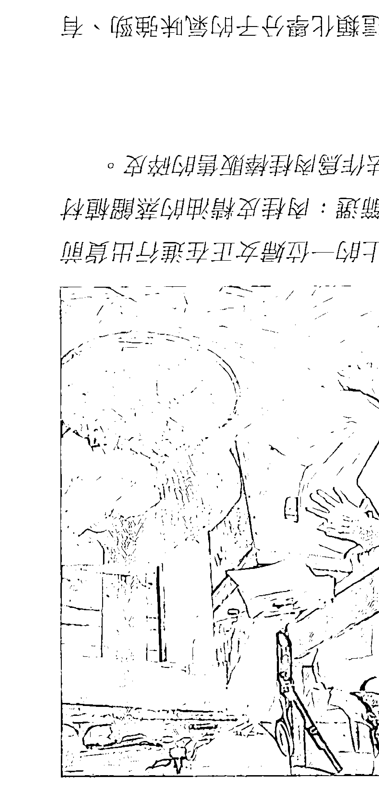

二者生理及药理效应十分相似，因此合并共同阐述。

### 丁香酚及肉桂醛

+   ○ 丁香酚：常带有温和刺激的甲基丙烷，结构与单体酚类（页39）颇近似，但更强...
+   ○ 肉桂醛：同属苯基丙烷，颇似芳香族中的醚类，但比其43个醚的醚生或迟迟不同。

### 苯基丙烷—衍生物

## 典型代表精油及分子

+   - 西印度月桂： 40 - 55% (主要为丁香酚)
    - 中国肉桂： 75 - 90% (主要为肉桂醛)
    - 丁香花苞： 70 - 80% (主要为丁香酚)
    - 肉桂叶： 80 - 90% (主要为丁香酚)
    - 肉桂皮： 55 - 75% (主要为肉桂醛)

### 醚类

在精油中的典型代表为苯基醚。醚类中其共同化学式为 R1-O-R2 者称之为苯基醚类，其中 R1 代表含苯环或芳香环的分子，R2 是一个具有醇基的分子。

+   - 生理疗愈：富含醚类的精油有非常强大的抗痉挛功效，特别是针对消化道，快速舒缓因痉挛造成的肠胃道不适、饱胀感及胀气，促进胃液分泌，进而提升肠胃蠕动，激励胆汁分泌，达到利肝功效。
    - 心理疗愈：醚类对于中枢神经系统及肠内神经系统都有强大的亲和性（页 13）。在精神耗弱的状态下，富含醚类的精油能强化及滋补神经系统，有效舒缓暴躁的情绪或「腹部脑的愤怒」，进而帮助腹部脑作出正确的决定。能温和抗沮丧及消除恐惧，特别是当这些负面情绪是由肝胆及肠的失调所引起。另外，醚类对于血清素的分泌有良好的调节作用。科学家已证实「快乐荷尔蒙」血清素不仅在大脑中生成，在肠内神经系统中也大量存在。

### 典型代表精油及分子

+   - 洋茴香： 93 - 96% (主要为洋茴香脑)
    - 沉香醇罗勒： 30% (主要为甲基醚蒌叶酚)
    - 龙艾： 70 - 80% (主要为甲基醚蒌叶酚)
    - 甜茴香： 55 - 85% (主要为洋茴香脑)

### 香豆素

香豆素（Cumarin）一词源自于南美洲的原生树种『Coumarouna』（Dipteryx odorata）东加豆树。科学家从东加豆树的种籽，俗称零陵香豆，首度萃取出芳香分子 α-苯基吡喃，其气味会让人不由自主地联想到车叶草、磨碎的夏日草香、杏仁糖及焦糖。

香豆素亦源生于苯基丙烷衍生物，但其醚结构稍有变化。

基本上，香豆素分为以下二类：

+   - 香豆素：零陵香豆中含有极高比例的香豆素，薰衣草精油中含有微量。有别于呋喃香豆素，一般香豆素不具光敏感性，使用上毫无疑虑，甚至在低剂量下有防护紫外线的效用。
    - 呋喃香豆素：欧白芷及佛手柑精油中含有高比例，其他的柑橘类精油中均为微量；具有光敏感性（参见页 42 的副作用说明）。

以下的说明通用上述二类香豆素：

+   - 生理疗愈：即使稀释到极低的浓度下，仍有强大舒缓肌肉痉挛、放松、止痛（特别是慢性疼痛）、助眠及调节血压（页 13 的血清素）的作用。许多文献中误载香豆素有清血功效，其实是将其与一种名为 Marcumar® 药物中的香豆素搞混了；这种药物中的成份为由二个香豆素分子组成的缩合物，内服有清血的效用，反之精油中的香豆素是为单环状化合物，并不具有此种药学属性。
    - 心理疗愈：在极低的浓度下，香豆素已能带来「全然的放松」。和酯类相同，均具有正面影响血清素分泌的作用，因而能缓和情绪低潮及恐惧感。

## 芳香醇及芳香醛

二者生理及药理效应十分类似，因此合并阐述。芳香醇及芳香醛的典型特征为拥有苯环。芳香醇及芳香醛的生理效应：含芳香醇及芳香醛的精油能激胸腺内啡及血清素的分泌（页13），对慢性疼痛有良好舒缓作用，此外尚有强大抗菌、抗发炎和抗霉菌的功效。心理效应：含高比例芳香醇的精油，如茉莉和依兰，有催情作用，帮助以雌激素受体感受人生；玫瑰原精其相同功效来自内含的芳香醇—苯乙醇，帮助刺激胰内啡及血清素的生成，平抚心脏的恐慌，重新开朗心胸的交流。脑部的微循环显示，芳香醇及芳香醛类多酚能够具有良好的治疗效果。

+   典型代表精油及分子
    - 芳香醇：
        - 安息香：60 - 80% (主要为苯甲酸苯甲酯)
        - 薰衣草：35 - 45% (主要为苯甲酸苯甲酯)
        - 茉莉：35 - 40% (主要为苯甲酸苯甲酯，乙酸苄酯)
        - 依兰：50% (邻氨基苯甲酸甲酯)
        - 栀子花：40 - 45% (主要为苯甲酸苯甲酯)
        - 芳香白珠：99% (水杨酸甲酯)
        - 芳樟醇：
            - 黄玉兰：8% (主要为苯乙醇)
            - 玫瑰原精：60 - 75% (主要为苯乙醇)
    - 芳香醛：
    - 香豆素：
        - 中间性：5 - 9% (α-苯基吡喃)
        - 零陵香豆：60% (α-苯基吡喃)
        - 呋喃香豆素：
            - 欧白芷根：微量的欧白芷素
            - 佛手柑：5% (主要为佛手柑素)
            - 柑橘类精油：0.5 - 1.5% (主要为佛手柑素)
        - 吡喃香豆素：
            - 苦香酯：不同芳香酸及芳香醇之间的化合物
            - 苯甲酸—酯【注】：例如苯甲酸苯甲酯 (Benzylbenzoat)
            - 【注】在德文中结尾以 -at 代表：在英文中结尾以 -ate 代表

## 芳香醛、芳香酮及芳香酸

此类的族群亦具有类似的生理及心理疗效，因此合并阐述。芳香醛、芳香酮及芳香酸的分子结构均带苯环，与不同的官能基连结（醛、酸或酮），通常为甜美的花香气味。

已知的单一分子包括香草醛，洋茴香酮及安息香酸。

+   - ○ 生理疗愈：这类族群基本上亲肤性高。富含这类芳香分子的精油具有消炎、抗细菌、抗真菌、抗痉挛及止痛的效用，特别是针对慢性疼痛。微量即有强大的疗效。
    - ○ 心理疗愈：这类芳香分子以心理疗愈见长。许多熟悉的花香气味或皮肤表面的气味都含有这类族群，例如银合欢、香草及小茴香。其气味特质近似费洛蒙（页17），能传递温暖的抚触感。此外，亦有轻微催情的效用，并能带来热情、安全感及生命乐趣。其调节血清素分泌的作用，能消除恐惧感，使人轻松快乐。尚有抗沮丧的功效，包括冬季忧郁症。

### 典型代表精油及分子

+   - ○ 芳香醛：
        - 小茴香：20 - 30%（主要为小茴香醛）
        - 香草：80%（主要为香草醛）
    - ○ 芳香酸：
        - 安息香、苏合香、吐鲁香脂：10 - 20%（主要为安息香酸）
    - ○ 芳香酮：
        - 洋茴香籽：4%（主要为洋茴香酮）

### 精油化学成分作用「蛋图」

为了让芳疗学习者能进入精油化学的领域，并对精油化学分子多元的功效有更清楚的概念，Ruth von Braunschweig 女士经过多年的研究，发明了精油化学成分作用「蛋图」，这个蛋图模式已在多年的『精油化学』课程及无以数计的临床中获得良好的验证。

### 快速记忆模式－学习与记忆的好帮手

此精油化学分子及作用蛋图的研发过程，汇整许多科学研究新知、古老的疗法知识和个人及友人们的临床经验。

此蛋图模式和芳香疗法中其它已广为应用的模式一样，只是教学辅助教材，精油中无以数计的化学分子所产生复杂交互影响作用及功效，绝不是任何便利的模型可取代的。碍于封闭的图象空间，在分类上只能专注在最常出现的族群及身、心、灵三个层面上最重要的共同特质，例如激励／促进，放松／镇定，疏通／调节，贴近大地／平衡。

精油蛋图是为视觉化的教学工具，使芳疗爱好者在学习精油及其化学成分的运用上更有自觉及责任感，也使调油时更加顺手。

### 蛋图解析

蛋图上呈现精油化学分子的主要族群—从单萜烯至芳香族化合物，按照族群主要作用系统性分类。

## 精油中主要化学分子图表

进入芳香分子的世界

### 整体性激发激励

+   - **酚类**
        - 香芹酚
        - 百里香酚
    - **酯类**
        - 乙酸沉香酯
        - 丁香油酚
    - **醇类**
        - 芳樟醇
        - 沉香醇

特定气味且兴奋、强化

特定气味且平静

特定气味且放松

特定气味且兴奋、强化

### 整体性放松发散

+   - **酮类**
    - **氧化物**
    - **酯类**
        - 乙酸芳樟酯
    - **酚类**
        - 丁香油酚

### 整体性刺激、兴奋

+   - **醇类**
    - **氧化物**
    - **酯类**
    - **酚类**
        - 桉叶油酚
    - **特定气味**
        - 香芹酚
        - 百里香酚
        - 丁香油酚

特定气味且兴奋、强化

特定气味且兴奋、强化

特定气味且平静

## 典型代表精油一览表

| 类别 | 精油代表 |
| :--- | :--- |
| ### 精神层面平衡 | 鼠尾草、头状薰衣草、娜娜薄荷、牛膝草、侧柏木 |
| ### 精神层面放松/镇定 | 洋茴香、龙艾、甜茴香、热带罗勒、零陵香豆、佛手柑 |
| ### 精神层面激励/活化 | 尤加利、迷迭香、白千层、香桃木、柠檬香茅、柠檬尤加利、山鸡椒 |
| ### 中心平衡 | 鸢尾草、松红梅、桂花、没药 |
| ### 整体性放松 | 薰衣草、佛手柑、快乐鼠尾草、罗马洋甘菊、大西洋雪松、岩兰草、穗甘松、洋甘菊 |
| ### 身体层面激励/活化 | 柑橘类、针叶类、欧白芷、百里酚、百里香 |
| ### 身体层面放松 | 香草、安息香、玫瑰原精、茉莉、特级依兰、黄玉兰、安息香 |
| ### 身体层面平衡 | 阿米香树、檀香、广藿香、丁香花苞、西印度月桂、肉桂皮、中国肉桂、玫瑰蒸馏、花梨木、沉香醇百里香、玫瑰天竺葵、玫瑰草 |

## 位置、颜色、大小

每一种单方精油圈中，化学分子族群的排列方式均依照比例的多寡，而非决定精油特质的分子。赋予精油温—缩二性搭的分子，通常以微量的形式存在，因此透过圈表的探头，学习者可以迅速掌握一精油的主要应用方向。

婴幼儿及老人家的皮肤较敏感脆弱，色圈的直径大小除就比例别外，还包括分子的重要性：某些分子在精油中虽以微量形式存在，但却决定精油的个性特征时，会以较大的直径呈现，例如同类相辅相成精油的蜂拥和朋族，除了某些以微量形式存在的分子外，主要化学成分的组合几乎占据中央之圈，其中阳离子类型典型的中国肉桂，使在稀释到十亿分之一的情况下，鼻子们仍能捕捉到它的香味，因此在圈中亦占有一席之地。

各类分子的比例据可说是「综合精油量表」，因为单一的分析数据无法代表意义。本膏中介绍的单方精油化学成分分类、取材均各选不同文献及综合性的实验分析报告（页 25）。

+   ○ 基础模型中象征化学分子族群的色圈大小一致。单方精油圈中的色圈大小依化学成分或分族群含量的比例缩增。

圈分成四大区域，左侧分子的主要属性为凝聚、活性，右侧则意欲绽放；上半部能活化脑部及各个含擅功能，多酚精油具有较强的抗炎及抗氧化作用，下半部主要是强化身体的机能及排毒作用。

在组合上显而易见其上下左右四个象限，圈中间的化学分子族群同时具有凝聚及激励的特质，表示这些分子具有极佳的平衡作用。圈中点的信号卡端缩，四通八达，连接上下左右四个象限，因此刻纹的心型三侧唇火，均有良好平衡作用。

○ 色线分类系统和上述原则相同。左侧分子的代表色依序淡青色到火红色，象征左侧分子在精神及身体层面上，均有激励、醒身及活血的效果；芥末黄至火红色的区块，说明这类分子有较强的局部刺激性及抗氧化作用。

右侧冷色系（深蓝、蓝蓝以至紫终色）传递出精神及身体层面上，放松、镇定及规律的特质。中间的深色系则是辅助地带，在身心面均有强化及平衡功效，逐渐依序的规律性特别强。深色系偏向精神面、深色系则偏向身体面。

特别留意，以防测量过高，测量过高可能引起神经刺激、反胃、腹胀及红的反应，在使用芥末黄至火红色区段的芳香分子要

## 主要化学分子族群与疗愈作用对照图

以左侧的波旁天竺葵精油为例：审视化学成分图的第一印象说明，这是一种对于身体及心灵均有多方面强大疗效的精油。

### 举例：波旁天竺葵

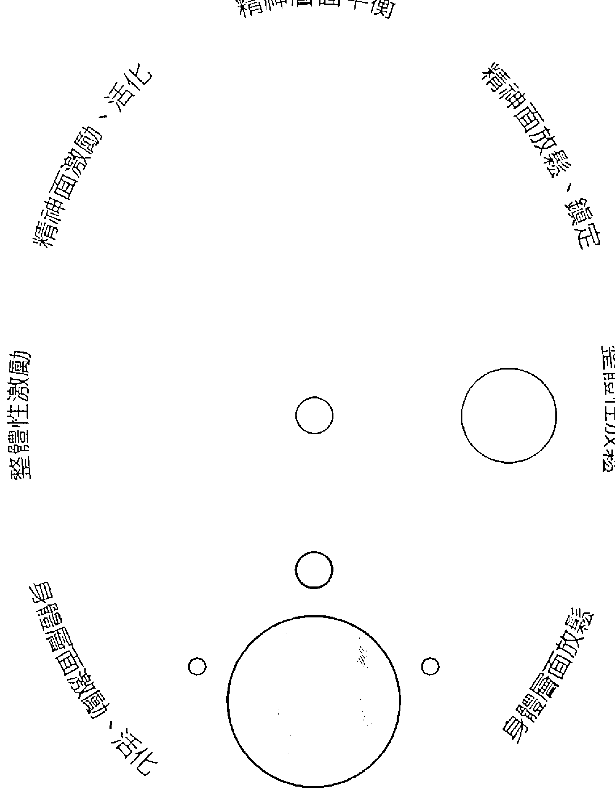

- 第一个映入眼帘最大的色圈是具有抗发炎、抗细菌、抗病毒及抗感染特质的单萜烯醇。任何单方精油化学结构蛋图的下方中间，出现大比例色圈时，表示有平衡及激励免疫系统的作用。单萜烯醇的代表色并不属于刺激的警示颜色，说明这类分子虽有强大的疗效，但亲肤性高。
- 第二大色圈为右侧蓝色的酯类，从其位置及颜色可明确得知，此种精油具有身心层面放松及抗痉挛的效用。酯类亦有优异的抗发炎、抗细菌、抗病毒及抗真菌的疗效。
- 沿着图形的中轴，分布许多不同的分子，说明这种精油不但具有平衡、提振精神的功效，亦有强化肉体能量的作用，这种化学分子组合的精油，主要透过影响下视丘及内分泌腺体，发挥调节荷尔蒙系统及自主神经系统的作用。
- 左侧上方及下方的小圈圈说明，此种精油具有身心层面的激励特质。但比例极微量，因此在使用上无任何危险性。

### 波旁天竺葵精油化学成分

+   - 单萜烯醇: ○ 50 - 65%（主要为香茅醇、牻牛儿醇）
    - 酯: ○ 15 - 30%（主要为乙酸牻牛儿酯）
    - 单萜烯酮: 5 - 10%（主要为异薄荷酮）
    - 倍半萜烯: ○ 5 - 8%
    - 倍半萜烯醇: ○ 5 - 7%
    - 单萜烯醛: 5%（主要为柠檬醛）
    - 氧化物: 3 - 5%（主要为玫瑰吡喃）
    - 芳香酯: ○ 微量
    - 丁香酚: ○ 微量

### 化学分子迷思…

化学成分蛋图只提供了技术性的分析观点，气味则属于情感面的分析观点。病患对于气味的感受通常是用油选择上决定性的准则！

## 化学重要名词解释

芳香分子：所有（带有）香味分子的集合名词，包括植物界动物界中天然的化合物及人工合成的化合物。

芳香族（芳香族化合物）：典型特征至少带有一个苯环的芳香分子。

苯：最简单的芳香族碳氢化合物，是所有芳香族的原型（页38）。

苯环：由苯的分子结构衍生而来，又称芳香基底或芳香基（页38）。

O：氧原子的符号，源自拉丁文 oxygenium 的缩写。

C：碳原子的符号，源自拉丁文 carbonium 的缩写。

杂生物：拉丁文 derivare 意谓衍生物、派生，表示这一种化合物衍生而成的新分子，新分子拥有和原化合物相同的基底结构。

官能基（团）：决定有机化合物特性及性质的原子团。

分子结构：以视觉方式呈现化合物中原子的编型、数量及空间上的编排顺序（结构）。

脂肪：由二个或二个以上的碳及二烯组成，可连接一个或多个官能基团（页29）。

烯烃：由二个或二个以上的碳及二烯组成，可连接一个或多个官能基团（页29）。

基底结构：化合物的基础架构。

H：氢原子的符号，源自拉丁文 hydrogenium 的缩写，意谓造水者。

化合物：由二个或二个以上的元素（原子）所组成的物质。

光学异构物：递增分子的基型只在反顺不同的旋转向（左或右），芳香分子的气味及生理特征而有所不同。

异戊二烯：生物学的基础结构单位，由5个碳（C）及8个氢（H）原子所组成（页29）。

异戊二烯的生物组合：生物则由异戊二烯组合成五花八门的萜烯烃（页29）。

# 實務應用的基礎知識

- ○ 芳香治療的多元性和侷限性以及芳香護理的重要提示
- ○ 尋找合適的精油
- ○ 劑量與品質
- ○ 調油的藝術

# 芳香疗法入门篇

# 芳香疗法：芳疗师的职责

芳香疗法是植物疗法的一部分，其定义为运用精油进行的疗愈行为。依循法律而定，「具有医学相关资讯或相关专业人士」方可进行芳香疗法，即指医师和自然疗法师。居家照护中自行运用的「宁静治疗」，则不受此法律的限制。

在德国，芳疗师是定为医学相关人士的进修课程，需具有充足的解剖学、生理学、病理学、植物学、及植物疗法学的基本知识和能力。具备上述要素和职能方能辅导芳香疗客的芳香治疗师。（页 6）

多样化的精油品质以满足其运用场合的特性，适用范围包括治愈、护理、自我保健、保养美容或身心护理。

# 芳香疗理：身心护理、日常不适症、美容保养

芳香疗理包括以下二个面向：
- ○ 促进身心健康及美容保养：将精油加入身体护理用品及美容保养品中、用以调理按摩油、护理油、泡浴或熏香，可滋润肌肤、强化免疫力及抵抗力，亦增加活力、提高注意力、成效显著、亦增加感性。
- ○ 日常不适症的治愈及病痛处理：例如失眠、焦虑不安、恐惧、湿膈、食欲不振、沮丧及激怒等感觉受失衡造成的不适症，及身体层面的问题，例如：感冒、肌肉疼痛、消化不良。

适用形式包括：足浴、反动间隔及小型伤口。适用形式包括：反肩保养、泡浴、冲洗、敷包、蒸汽吸入法、涂抹及局部按摩等。

# 芳香疗法和间歇疗法

某些芳香疗法师将精油视为降低免疫力的「环境压力源」，并直称精油香气能消除剧毒消毒物的功效。但这种看法至今尚未有任何科学证实。反之，科学研究已证实，精油在身体触及心脏均有可能触发免疫系统的作用。

最著名的临床验证，合并使用上述二种自然疗愈形式，不但没有任何相互抵消的副作用，反而有良好相辅相成的效果。

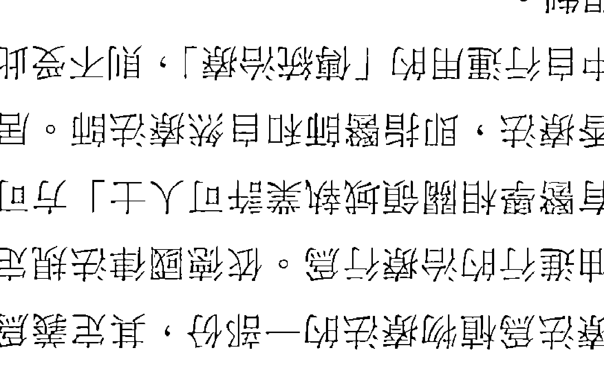

| 特徵 | 精油 | 植物油 | 纯露 |
| :--- | :--- | :--- | :--- |
| 味道 | 植物特有的气味 | 一般味道较淡 | 植物特有的气味 |
| 用途 | 按摩、熏香、沐浴 | 按摩、直接涂抹 | 按摩、熏香、湿敷 |
| 使用方式 | 多為稀釋後使用 | 可直接使用 | 可直接使用 |

## 芳香治療的侷限性

運用精油進行治療前，需確實認識芳香治療的侷限性。許多「各類身心不適症」章節中提及的疾病，需由醫師或自然療法師進行診斷並決定合適的治療方法。芳香治療則定義為「各種治療方式的輔助療法」。

- 第五章「各類身心不適症」（頁 239 起），對於需由醫師或自然療法師進行診斷的病症，有完整的說明。
- 「各類身心不適症」中的配方並非單一的治療形式，而是輔助治療措施，無法取代醫師或自然療法師的治療行為。
- 若遇到無法確定芳香療法是否合適的特殊情況時，請務必諮詢您的治療師。在德國有愈來愈多的治療師對於芳香治療採取開放接納的態度。
- 運用精油處理輕微病症，且無任何醫療人士援助時：請注意，若三天之內病症無任何改善現象，或停止治療後病情立刻復發，需立刻尋求醫師或自然療法師的援助。
- 嚴重或不明原因的疼痛、高燒、開放性創傷或重度燒灼傷，必須立刻諮詢醫師或自然療法師。

## 醫院和急診室中的植物芳香護理

近年來，植物芳香護理已成為優質護理工作的核心，並吸引愈來愈多的護理人員加入，因這種新潮護理方式在臨床應用上展現了前所未有的可能性，包括：

- 有創意及獨立負責的療癒行為
- 提升覺知力、帶來更多職涯樂趣
- 提高「社會心理照護」的信心
- 心靈綠洲
- 患者和患者家屬的正面回饋

芳香護理的概念是奠基於「視病患個別狀況，規劃完整及專屬的治療方式，並強調醫病關係中雙方身心健康的重要性」。以提升病患自我療癒力為當務之急，是芳香護理和其它輔助治療基本理論共通之處，但芳香療法所提供的幫助不只如此！！

精油的香氣不僅能對病患產生正面影響，更創造了芳香的病房氛圍。芬芳怡人的氣味使醫師、護理人員及病患家屬，不自覺地在病房中流連忘返，對病情的恢復自然有極大的助益。

### 病房的氣味

任何人進入醫院時，首當其衝就會被一股陌生、不愉快的氣味給淹沒，在潛意識中強化了人們對於這個「痛苦之屋」的恐懼感。

重症病患若必須長時間住院觀察，通常對病情沒有正面的幫助。當病患持續處於過度焦慮及過度照護的狀態時，體能會更加衰退。此外，長期缺乏感官刺激，病患也較容易感到寂寞和沮喪。此時，愉悅的感官刺激是最佳的心靈雞湯。

# 临终的患者

临终能够增进沟通等信息，温柔的芳香

因此为临终能够控制临终症状对患者来说非常重要。

临床验证，长期使用低剂量、适量配方进行调理，能够达到显著的功效。芳香疗法必须在主观意愿和客观的同意让步稳固部分进行，因此临终症状有不同的层次及等级之分。鉴以此因，无法建立通用准则配方。

## 实务应用的基础知识

临终的方案和香精油的配置

只要一滴室内的香气就能够给病患带来多鼓励和焕然一新的生命感觉，彻底改变病患的病房困境（页 284）。若是在非重症病房，需尊重同房病友对病床的感受。无法使用浓香型香气，可在面纸上滴数滴精油，放置在患者视线、枕头附近，让患者能够舒服地进行调理。透过不但能够患者还能够提升芳香分子，也不属于同层病友。

临终的患者

香气能够增进沟通等信息，温柔的芳香

> “临终能够增进沟通等信息，温柔的芳香，是一种疗愈的精油。其精确性来自身体、心、灵三层面，是一种疗愈的精油。其精确性来自身体、心、灵三层面，”

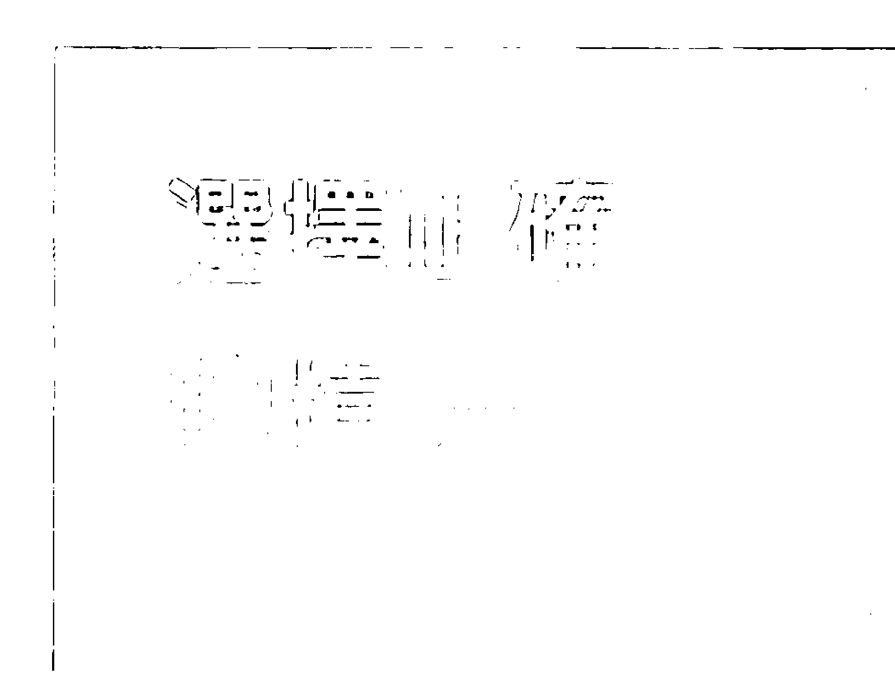

致接触性过敏，且受损皮肤与健康皮肤的反应亦大不相同，务必特别留意 - 页 227）。

- ○ 新陈代谢与排泄
- ○ 皮肤现况：例如长期卧病在床。
- ○ 循环状况、血压
- ○ 心理状态

综合评估上述因素才不会产生预期外的反应，使精油承受莫须有的罪名。

当一位治疗师有能力探究症状下隐藏的身心病因，并确实掌握精油化学成分和临床作用知识的时候，才具备独立挑选适当治疗用油的能力。

「各类身心不适症」（页 239 起）中有许多疗愈效果非常好的单方精油与配方说明，可帮助初学者轻松入门。

# 病历表

应用芳香治疗的专业人士所须承担的责任，与其他任何治疗形式相比下，并无任何本质上的差异。

> 完整的病历表、身体检查及深度咨询皆为芳香治疗前的基本步骤。

## 其他重要因素

### 现阶段身心状态--健康或生病状态

健康的人使用精油作为日常保养，增加身心舒适度，以达到预防医学目的。
对象若为病患时，选择合适精油、剂量及使用方式时，必须考虑以下因素：

- ○ 用药习惯：是否长期服用人工合成药物及使用药膏（矿物油为基质制成的产品容易导

### 个人及家庭成员的芳香治疗

- ○ 即使是个人的治疗行为，也必须确实记录下列问题，包括：生理症状？引发该疾病的病原？身体疼痛是否来自于特殊心理状态？例如紧张与压力造成的背痛。
- ○ 在第五章「各类身心不适症」中，您将面临从众多单方精油或配方中，选出最佳用油的难题，此时除参考病历表及第四章「精油与基底油总览」中各种单方精油的相关知识，最值得信赖的帮手应属「嗅觉测试法」。

另请参阅「芳香治疗的局限性」（页 51）！

# 实务应用的基础知识

## 饮食习惯

不良或单一的饮食习惯可能引起过敏。许多糕点及饮料中含有不少量的同性，例如可可。根据未耐酶察，上述食品的偏好者

由此可知，追溯并找出身心不适症的源头，是正确理解情绪的不二法则。
情绪：潮湿、不舒适的居住环境则是致病因子敏感的温床。
如：信湿不足、失眠、进食时间不正常或饮食不均衡皆可致消化问题；喉音引致慢性湿疹；不良的生活习惯可能是各种不适症的源头，例如
伴侣关系是否和谐？工作是否顺心如意？不社会垫壁膨胀炎烈的丝燃不念小随，则

## 社会环境—生活习惯、工作紧张、居住环境 及伴侣隔阂

精油高脂溶性、能快速进入细胞中并穿越心胞屏障，因器官的肾撤岗未完全闭合，特别禁止在其预防部位使用精油。
婴幼儿及购买细胞中的接合物质（细胞膜）更是精油的渗透或剂量，均有利于或年人。
除此之外，植物油的张继也相当重要的角色。临床显示，雪西贴油、椰子油和甜杏仁油的成分相合最合适婴儿和孩童。
若人家的反购通常已顾及性他肤慰，故燥、淤、淋、他涌色斑是典型症状。此外隐患常涂样以被物油含基易裂成的禁膏，甚至用到遇动而不自如，等导致异常雄性受损（接触过敏）。因此过敏反应剂量切须慎重，以免发生丽期外的反应而使精油承相宝贵。使用方向隐患似预防性的精油及居测灵直（页 58）

# 包括因需大剂量管案的四大类型

若要达到令人满意的治疗效果，在顾及情绪配方时除了分析生理状况，还更要考虑到合虚性格类型的心理肤感。
生理层面而定的渗透方向，通常依紫孕酿端角反劲人，例如偈口护理。若病症常法除端情因索，在酬配配方时需深入研告患者者的性格类型。
四大性格类型包括：忧虑型、易躁型、开朗型及冷淡型。
。 忧虑型或相突型：性格内敛、敏锐、容易登手阴肤软膜、温皮歇色。

# 使用到家需警惕、狡猾或老人家？

容易对肉性精油产生过敏反应。此外，新解增加富含芳香分子的蜂胶，若每日取用蜂，就容易到相对偏精油产生不适反应。由此可知，食物精油的临床反应之同，有着密不可分的关系。患若在明目大星取用紫草亲，则如居星草或甜青亲，则避免使用届星草或甜青精油。

从生理层面来看，忧郁型应选用具有活化特质的精油，紧张型则是放松及镇定；从心理层面来看，二者均需要具有提振作用的精油。此类型的人通常非常敏感，对于极低的剂量即反应强烈。

- ○ 暴躁型：性格外向、容易激动。双手皮肤干燥、温度较高，应选择具有安抚、平衡及放松效用的精油。精油使用剂量可较高。
- ○ 开朗型：亦为乐天型，热爱享受人生、情绪起伏巨大，倾向于纵欲。双手温暖、潮湿，对于花香、药草及饱满的气味最能引起共鸣。自行调制配方时倾向高剂量。
- ○ 冷漠型或淋巴型：性格谨慎、反应较缓慢。双手温度较低、潮湿，心理层面上需要激励、给予结构性和重建的精油。

# 如何挑选精油

化学成分及其作用机转的基本知识（页24），是正确挑选精油及基底油的必备条件。

植物学方面的认知，能帮助从各种精油中过滤出最佳候选者，避免错误的产生。

# 「植物姓名学」

- ○ 植物科属知识相当具有启发性，例如繖形科家族萃取出的精油，均具有类似的气味及功效。芸香科中最具有经济价值的则为柑橘属。
- ○ 正确辨识原生物种的植物拉丁学名，才能避免类似品种的混淆。例如一听到「西班牙马郁兰」的植物拉丁学名是 Thymus mastichina，便知道这款精油并非马郁兰，而是百里香（页192）。若要将丰富的植物形貌归类，并建立起国际化标准，唯有借助植物的拉丁学名系统。如此一来，亚洲或南美洲的芳疗师看到 Lavandula latifolia 时，便立刻知道这是穗花薰衣草精油，主要应用在呼吸道疾病方面（页130）。
- ○ 某些植物学名之后，例如 Rosmarinus officinalis，必须加注化学类型，才能确实知道指的是那一种精油，例如 Rosmarinus off. L. CT Cineol（页181）。
- ○ 从萃取植材部位通常可推断精油的特点，例如根部类精油以稳定情绪特质而出众。

### 接受度测试

使用者若需逃避醋置，避免进行接受度测试，再使用精油（参考页 65 的方块内文）。

### 变化配方

若于您疗方缺少某一数量方精油时，可参考并灵活地依照下列方式变化配方：

- 精油 288 起的精油一览表要进行成分比例，以达到具有相似功效的替代品。
- 借助鼻子确认选出的精油味道是否相融。
- 配方均作精参参考页 61。
- 需遵循基础剂量 (0.5 - 1% 配方)。若超出的精油味道须知，调配时需定一滴间隔。
- 原则上，配方中的植物油是可替换的，除却其目的在达到特定疗效外，例如具有滋润顺畅作用的琼崖海棠油。

薄荷的背面记号！

- 为香薰理疗芳香疗法城中，每一副治疗疗程都必须辨识配方（页 52）。
- 即使是自我治疗或家庭保健使用，也需随时记录下那一配方改善了那位家庭成员的何种不适症！
- 薄荷必须在瓶身上标示调配配方的成分、适用症及醒目标期。

### 嗅觉测试法

嗅觉测试是调配配方的必要步骤，特别是针对心理层面病征或是瓶香。嗅觉的感受相当主观，且随着情绪不断变化，患者制造闻烟味盖下是否觉得舒适呢？今天受不了的香氛，或许明天就不再觉得好闻。

直接嗅闻瓶口，因接触到的气味过分浓烈，容易刺激精油的特性产生错误印象。某些精油，例如岩玫瑰，未稀释前的气味如腋下芳香，但一经稀释，芳香分子便完全失效，反而呈现配方的原味。

建议使用闻香纸，滴上一滴精油，前涂袖搁则须放置在鼻下或肩，如同佩戴香水时的香氛测试。

某些精油不适合使用嗅觉测试法，例如事治疗吸可致的茶树，其气味可能使人敏感不适。若治疗方式需由整条角皮涂抹用油，则不必考虑气味，例如伤口护理或烧烫伤护理。

### 调次化学成分须作精确的置评

在「精油即基础概观」（页 75）中，可找到所有调次精油的重要资料，包括植物拉丁学名、化学成分、作用机转以及适用症状。

善用 288 页起的精油一览表，可以迅速寻找适用精油。对初学者而言，直接使用「合辑身体用精油」章中的基础配方，是简易又安全的作法（页 239）。

鉴别化学成分须知的重要性，如使用调配精油之前，确认品质、产地及配方的概期其比例，必须确定查阁。若所得复剂不足，薄荷必须见口服（页 35）。

> > 『心不适应』『章中的健脑配方』

## 实务应用的基础知识

# # 芳香抗菌检验-标的性及个体化治疗的基础

标的性及个体化治疗于感染性疾病时，可辅助使用芳香抗菌检验。

检验在实验室内进行，测试各种抗菌精油对于特定细菌或真菌的抵抗力，菌种从患处进行切片取出或是使用人工培养的常见病原体。测试过程相当简单，且迅速有效，能在最短时间找到最适合的精油。

测试结果为玻璃盘上清晰可见，并可精准测量大小的抑菌圈。因此，芳香抗菌检验被公认是值得信赖，可反复进行、并能随时掌握变动因素的标准参考系统。

和所有的体外测试法相同（例如抗生素抗菌检验），其检验结果无法完全套用在病患身上。因为活体治疗上有许多重要的因素，例如病患的免疫系统状态，皆是芳香抗菌检验无法测量的数值。

### 与抗生素疗法合并使用

做为药理诊断基础的芳香抗菌检验，可单独应用在芳香治疗上，或与抗生素疗法合并使用。

将具有最强大抗菌力的精油应用在感染患处，并合并服用抗生素，临床显示抗感染效果比单独使用抗生素疗法更好，且疗效并不逊色于抗生素单一疗法。

以芳香抗菌检验辅助的芳香治疗，已成为对于抗生素产生抗药性感染疾病的替代疗法。

### 方法论

芳香抗菌检验的方法几乎无异于一般抗菌检验，例如针对特定病原体进行的抗生素抗菌力测试，只是测试对象为精油而非药物。方法为体外测试法，均在实验室的玻璃盘中进行。先在培养皿中放入从患处切片取出或标准浓度的人工培养病菌，而后在玻璃盘上滴入定量单方精油后再放入培养皿中。

挥发的芳香分子抑制病菌生长的强度以抑菌圈的大小呈现。至少 18 小时的培养期后，依照标准参考系统来判读抑菌圈数据，称为芳香抗菌检验表。

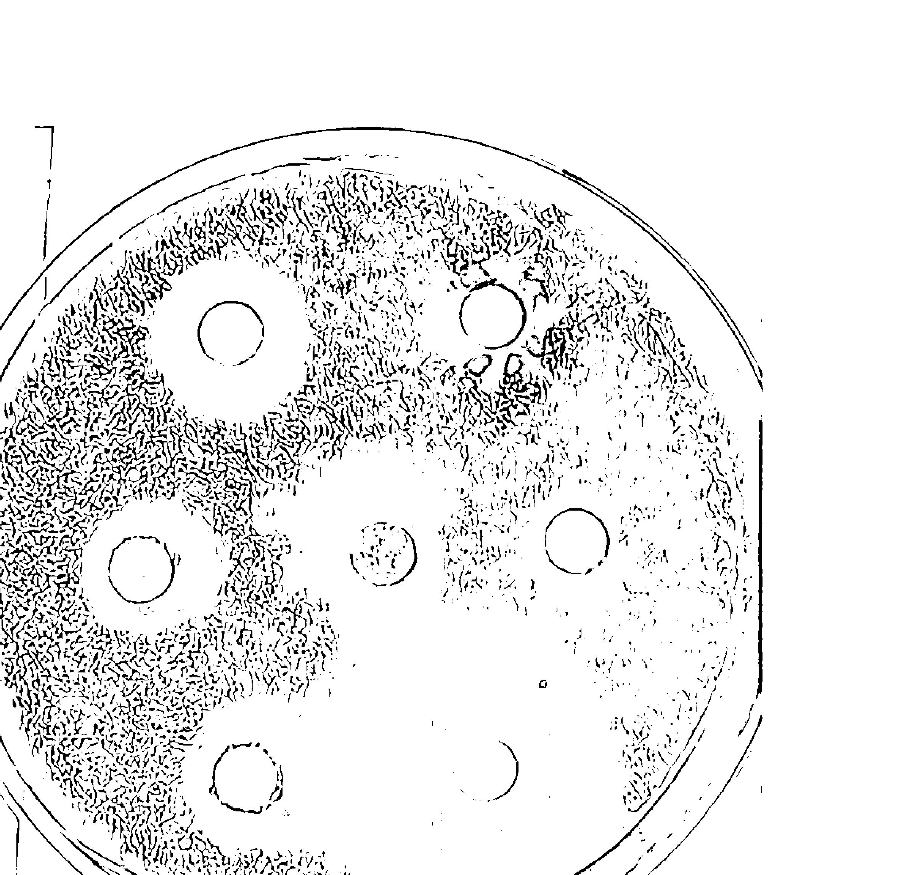

芳香抗菌检验：滴入各种精油的培养皿中会形成不同大小的抑菌圈，显示病原体无法生长的范围。抑菌圈愈大、抗菌效果愈强。

Paracelsus的至理名句 - 「是毒药还是灵丹妙药取决其剂量」，虽不是对芳香疗法所言，但高浓度的精油，在应用上也适用于千古不变的法则。 除了某些例外情形，芳香疗法和芳疗理前域的配方剂型主要以低剂量为主。如何剂量呢？又难于何种计量单位为准呢？

# 生理剂量

o 一般来说，使用多种方精油，以此别为 1%调配而成的配方，称之为「生理剂量」配方，其温和而且安全。

- 1%的配方：使用多种方精油、共20滴（约1毫升），加入100毫升的植物油中。
- 只使用一种单方精油时，称之为「单一调配方」。若使用的精油具有强大的皮肤刺激作用（如肉桂皮精油），或是高比例咖啡（如马尾草精油），安全的生理剂量应降低至0.5%。
- 0.5%的单一调剂配方：10滴（约0.5毫升）的单方精油，加入100毫升的植物油中。

# 计量单位

使用的计量单位共有三种：滴数（Tt.或 gtt.）、毫升（ml）、公克（g）或毫克（mg）。 精油的浓度是衡量装置到滴数，因此最容易的计量单位应为公克，例如某些浓稠的精油 18滴的重量已差1公克，稀薄的精油则需22 滴。此外，市面上常见的精油瓶也有各式各样、大小不同的滴口。

根据法国芳香药师多年的临床经验，下列病症适合搭配芳香抗生素治疗法，必要时辅以芳香抗菌频进行芳疗疗法，必要

# 适用的临床病症

- 伤科：压迫感染
- 生殖泌尿科：尿道感染
- 耳鼻喉科：鼻窦炎、扁桃腺炎等
- 支气管不适症
- 皮肤问题，例如痤疮。

o 肿以精作为溶媒及其剂量制剂及其剂量的相关规定。 治疗前需先进行接受测试（页65）。
o 必须要遵守芳香室机品剂量的相关规定。
o 完整配制精油的生产批号。若芳芳抗 生频显 芳香疗法中使用的同一批精油，必须来自相同的生产批号。
o 购买配制浓缩精油的植物拉丁名及其化学类型。确定和芳疗治疗中使用的精油需同一精油。
o 若芳芳抗菌频中使用的精油必须需 100% 纯净的天然精油。

若希登鞘由芳香抗 生频临床经验成功的治疗效用，必须遵守以下的准则：

# 先决条件

剂量

避开精准度不谈，日常应用的小容量配方以滴数为计量单位较为合适。为方便读者调製，书中配方采用滴数为计量单位，并以市面上最常购买到的滴口为依据。

○ 20滴约等于1毫升或1公克（视不同的浓稠度而有所调整）
○ 1毫克约等于0.02滴

务必购买品质最佳的精油。唯有如此，才能有效评估精油的疗愈力及皮肤接受度，并避免产生预期以外的副作用。

除少数特例，一般而言极少直接使用未经稀释的精油，若要涂抹在皮肤上，通常会先与植物油调和（页224）。购买植物油或浸泡油时，应使用以有机管控栽种、冷压萃取，并清楚标示有效期限的产品为上选。绝对不可使用以矿物油为基质的产品来调和精油（携帶功能，页7）！

# 品质判定

精油为植物的高效浓缩物质。6公吨这么多的香蜂草居然只能萃取出1公斤的香蜂草精油，真令人难以想像！

若要将精油直接应用在皮肤及黏膜组织上，以提高身心舒适度及治疗不适症时，请

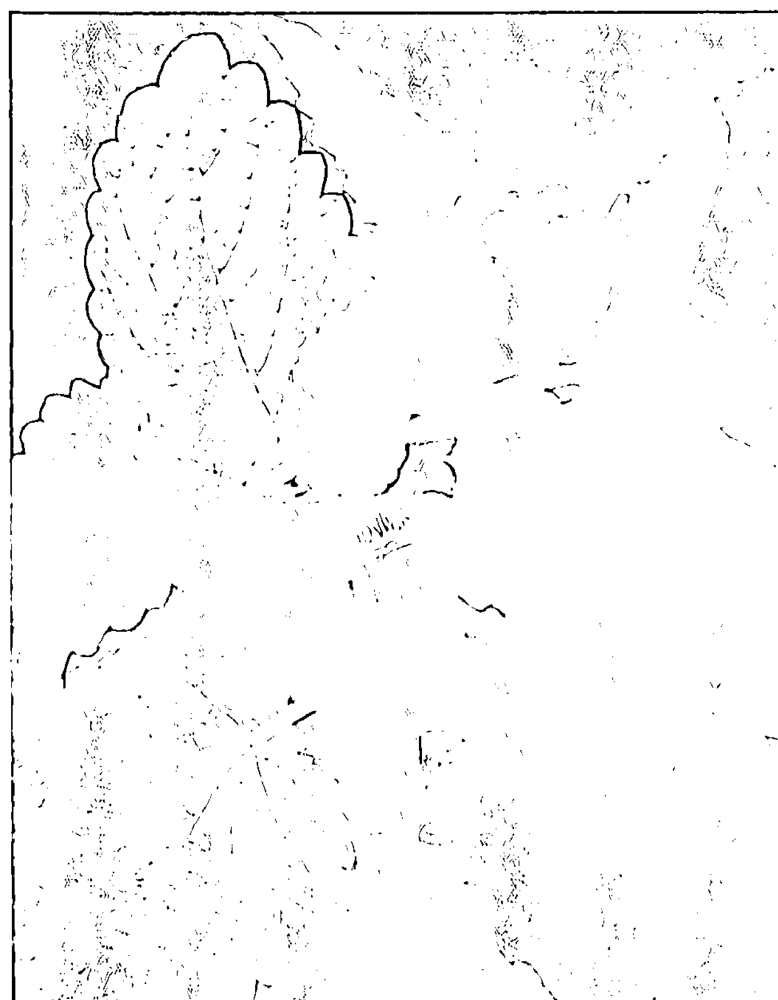

良好品质的精油有一定的价位：要蒸馏出约1公斤的香蜂草精油（Melissa officinalis）需要6至8公吨的植材！

# ➤ 购买指南

目前在商店及药局贩售的精油品质参差不齐，价格上差异颇大。基本上，价格对于品质有一定的参考价值。

下述项目可作为品质判定的准则：

品质良好的精油，其瓶身标签需包括以下资讯：

- 「100% 纯精油」
- 原生品种确实的植物拉丁学名
- 化学类型的标示
- 植物俗名
- 原产地
- 栽种方式

**栽种方式标示说明**：
- *kbA*：有机管控栽种方式
- *demeter*：生物律动农耕法
- *Ws*：野生选种
- *konv.*：传统栽种（栽种过程使用化学肥料、除虫剂或除草剂）
- *rück.*：农药残留管控

植物的栽种条件愈自然，其萃取出的精油品质愈佳，残余物质也愈低。

## 疗法应用的基础知识

## 正确的存放方式

若要长期维持精油的最佳性质及风味及品质，需注意下列事项：

- 萃取部位：切勿使用白芷的根部或种子
- 萃取方式：若使用溶剂萃取法，必须确实蒸馏萃取后的精油是否过敏物控制萃取。
- 精炼精油所使用的基质及其比例：某些精炼油未稀释前的风味称得上高天然层，例如薄荷醇精，因此鼓励多将其以酒精稀释到1%的比率出售。
- 请勿购买下列植物的精油，因含有容易造成刺激作用的化学成分，不建议购买使用。例如：肉香、青蒿、苦杏仁、波尔多叶、苦茴香（页102）、印度苦橙、沙漠柏、黄樟木、侧柏木及海荷（页27）。

## 存放期限的限制

某些精油如同好年份的葡萄酒一样，品质会随着储存的年份而提升，例如玫瑰精油。

除了柑橘类精油，一般而言精油在正确存放方式下，其保存期限都相当长。依循不同的萃取方式，柑橘类精油的保存期限只有1~2年，因此建议摆放在冰箱中，特别是在较温暖的季节。某些生产商会标示过期年份或有效期。

大部分的植物精油保存期限都很长，然而一例外是荷荷芭油，可达数年以上。

精油的抗菌特质可延长植物精油的保存期限，但醋酸类配方须避光线及较大的温度变化！风味败坏则表示精油已经变质。

## 避免光线及温度的损害

精油高度易燃，对光线极为反感，因此只能存放在深色玻璃瓶中。保鲜瓶DIY材料行、有机食品店及药房，可买到各个不同大小的深色玻璃瓶。

经常性的温度变化易使精油变质、低温下的室温是延长保存期限及品质的重要因素。

- 容量标示（毫升）
- 安全标示（真25）
- 生产批号（限定使用）

芳香精油犹如乐音，单一个别的乐音尚无法形成乐曲，也并非每一个和弦都悦耳动人。调配精油需要专业知识、创意和不断的练习，才能达到炉火纯青的地步。

经调和后的复方精油，能相互增强彼此间的功效，往往能产生加乘的疗愈效果（协同作用）。自行调配精油者可善用各类精油，依个别情况“对症下药”，调制个人专属的香气配方，因为使人健康的复方精油，并不是非得要闻起来很“健康”。在芳香护理与芳香治疗领域中，将精油功效与气味组合发挥最佳功效的调制功夫，堪称为一门上乘的艺术。

## 精油调配小学堂

即便没有嗅觉极为灵敏的鼻子，每一个人都有能力用精油创造出独特的配方。只要愿意多接触精油，必定能日渐增加对它的熟悉度，进而懂得如何区分。除了让芳香分子“牵着你的鼻子走”之外，也需时时探究精油运作机转的知识。

### 善用协同作用

协同作用指的是，选出的精油与植物油能彼此互补，产生更强、更和谐的疗愈作用。因此，我们需先提出以下疑问：调配精油的目的是什么，可以使用哪些精油达到这个目的？

## 案例

治疗支气管疾病的配方必须具有消解黏液、促进排出、抗发炎、抗细菌、或抗病毒的功效。也就是说，我们需要富含氧化物类（如月桂或白千层）、单萜烯类（如欧洲冷杉、葡萄柚或欧白芷根）以及单萜烯醇类（如玫瑰草或柠檬薄荷）的精油。

当然，患者的心理状态也需并入考量。如果患者属于紧张、压力过大类型，则建议加入含有酯类和倍半萜烯类，能发挥放松作用的精油（如安息香、真正薰衣草、大西洋雪松或完全依兰）。

- 以下为2%的胸部按摩油建议配方：5滴葡萄柚、6滴月桂、4滴柠檬薄荷、2滴欧洲冷杉、1滴依兰、3滴安息香加入50ml的甜杏仁油中。

精油的亲肤性与其香气特质（页8）在剂量判定上扮演重要角色。

### 前味、中味与后味

若要调制芳香、气味饱满和谐的复方精油，建议遵循香水制造商的调香原则：前味、中味及后味，兼具三种气味层次的调和配方，即具备一定的调香水平。

- 一开始所闻到的“前段味道”称之为前味。属于前味的精油主要有柑橘类精油、柠檬马鞭草、柠檬香茅和山鸡椒。

## 疗法应用的基础知识

- 迅速建立适合前味、后味的元素是中味，亦是配方散发出的“中段味道”。中味决定配方的气味特征，各种花香精油都适用。
- 香味是由树脂、木质、香料及根部精油混合形成。
- 檀木、叶片和茎草精油适合作为中间游离分子。

按上述原则，即能在肤质及气味、疗效和协同作用的考量下，选择调配能发挥最佳效果的配方。

精油的基底油在扮演协同作用，并同时制造出和谐的芳香气息。

### 香气图鉴

香气调配的初期阶段，建议从个人偏好的气味着手，选用三到五种成分组合相当“透明”的精油作为基本用油（至少包含前味、中味、后味各一种）。

- 先闻一闻挑出的精油气味，观察这些气味是否能相互搭配。
- 请依次闻开始调制。因为每种气味皆会淡去，请务必谨慎控制用量，需先滴入一滴即可。
- 调配中味时的用量也以一滴为宜。
- 最后调制前味，用量可较多。
- 若想要气味闻起来更“圆满”，先增加中味的浓度，然后依原则比例提高前味的用量，最后阶段调整后味。
- 最后均匀摇晃精油瓶，涂抹在皮肤上测试气味。不过，气味在未来数周内仍会微微改变，现阶段的气味只是概略的模拟。要能精确掌握“互动”完成后的气味，则需凭借经验的累积。

## 大量调配

针对特定症状调配方式以备不时之需，是相当实用的方法。例如感冒配方。或调配不添加植物油的复方精油（页240），再依照不同的施用方式少量取出使用。基于篇幅产生的考量，医院大量调配常用配方，每日再以滴管式分销出患者需要的用量。

- 芳疗师则可依循手册在芳疗上运用自行调配处方，但不可交予病患自行使用！

## 正确选择使用方式

- 实用的使用说明 - 包括薰香灯、泡澡、蒸敷
- 芳香按摩：运作原理、适用范围与按摩技巧
- 宠爱自己 - 精油纾压与保健

## 戒断-器官间接联系

将尼古丁涂抹在患侧胸部、阴部、腋部和颈部，可治疗皮肤疾病如湿疹、皮炎、痛风等。疼痛期疼痛症状可以触发末梢神经、大肠穴、颈项和面部。

## 戒断-器官间接联系

刺激是反射反应或身体的潜意识系统。身体表面可以分辨刺激周围的理痛，在特定反应阈值产生的刺激传递到刺激的脊髓部位，例如颈部、胸部、腹部和背部。将刺激转移至内器官自主神经系统的螺旋细胞位于脊髓中，每个脊髓部位和特定反应的周围块、阻塞部位及其对内的螺旋器反射到一周功能性单位。换言之，若按螺旋反应刺激到特定反应部位，其表面接收到的刺激即导致逐渐过渡到相同刺激。(Bierbach 2000)

临床研究，运用使信息传递精确的方法，能够有效缓解或治愈，按螺旋大肠神经或脊柱，可有效缓解恶心症状和压力。

临床研究，运用使信息传递精确的方法，按螺旋第七颈椎和第一胸椎能有效缓解心脏不适症状。

## 吸烟的目的是什么？

皮肤、黏膜、胃酸等系统是吸收精油的普通途径。

精油内服的情况需特别，能起到一些附加症状，快速缓解排用。

在选择使用方式之前，必须先提出并回答以下问题：

- 我要达到什么戒烟的效果？
- 哪一种使用方式最有效且最温和？
- 患者接受治疗的耐受性？最理想的治疗周期？

以案例来更进一步说明。

## 戒断-器官间接管道

针对硬皮症状，可以使用具有促进活化循环、利尿的精油，进行腹部按摩刺激。除使用有胸部抑制激活作用的精油按摩腹部、再回持按摩下背部的「拍肩部位」，能更有效缓解前驱症状和更年期症状。

如果要口服，必须先将精油加入植物乳化剂。

口服、皮肤保健覆盖或口服法的一部分。如精油的漱口水，不仅是保健良方，更能促进口腔健康。在不限制刺激敏感细菌繁殖的情况下，拒药剂。

针对硬皮症状、皮肤炎及支气管部位的不适症状，使用蒸汽吸入法能有效缓解症状。

精油的香薰法、精油的蒸气吸入法、精油的口服法、精油的皮肤吸收法、精油的按摩法、精油的喷雾法、精油的香薰法、精油的蒸气吸入法、精油的口服法、精油的皮肤吸收法、精油的按摩法、精油的喷雾法。

中高度稀释，或使用抗胃酸胶囊。每次进行口服前需先与专业芳疗师咨询。

肛门栓剂能使精油在不伤肝的情况下，透过直肠黏膜组织快速吸收，而后进入血液。建议于急性症状时使用。临床证实，针对儿童（以及成人）的发热性感冒症状极具疗效。精油制成的阴道栓剂最适合用于治疗霉菌与细菌引起的阴道感染。栓剂可凭处方笺于各药局配制。

调配阴道护理配方并局部应用时，能有效处理阴道黏膜干燥情形，并达到保健作用。

## 重要提示

### 依循配方，安全有保障：

使用者若确实遵守『各类身心不适症』中的配方、剂量和使用建议，便能确保治疗的安全性。

### 接受度测试：

容易产生过敏反应的使用者，请勿将未经稀释的精油直接涂抹于皮肤。使用前，请先进行精油接受度测试：

请将调好的配方（最高剂量为1%，页58）少许涂抹于手肘或上手臂内侧。

### 急救：

如精油不慎误入眼睛，绝对不可用植物油冲洗！因为精油为脂溶性（亲油），与植物油融合后更容易进入黏膜组织，并加速渗入眼睛的速度。

最好的方式是使用大量清水冲洗。

## 简单而快速

- 缺乏使用精油的经验，或是在旅行中需要快速简单的帮助，可采取以下方式：
  - 在手帕上滴 1～2 滴精油是最简单的方式，还能「带着气味走」。
  - 随意在小碟子、茶盘或烟灰缸内放入热水和精油，是小空间的简易扩香法。非常适合初次尝试的使用者，旅游或办公空间。冬令季节，将碟子放在暖气上，能使芳香分子快速扩散于较大的空间中。
  - 在饭店或医院，只要在手心滴上 2～3 滴喜爱的精油，轻轻搓揉双手后拍打枕头，或将精油滴在手帕上，置于枕头旁或是胸部，就能快速获得舒适的感受。

## 口服

基本上，进行精油口服前，必须经由芳疗师的详细咨询，本书中提到的少数配方属于特例，外行人使用亦不会造成任何伤害。

## 薰香

薰香分为熏合式及插香式。薰香的容器必须大小合适，否则水快蒸发完毕，精油会变得凝结变黑。玻璃见阳光或温度在50到55度之间，不得煮沸，否则容易破裂。香炉的品质要够用。精油瓶必须使用纯水，以免...

先将水注入玻璃瓶，而后滴入精油。

提香剂提升身心舒适度以及改善等症状都有相当大的帮助。

蒸 10 ～ 15 分钟，同时以浴巾包裹下半身，以免着凉。

将身体完全擦干，躺卧休息或使用热水袋加强效用。请穿暖和些及一小时内避免外出。

每天中午和晚上各进行一次。

## 泡浴

水温为摄氏 35 ～ 38 度，或根据处方的指示。孕妇、小孩、心血管疾病患者和老人泡澡温度不可超过摄氏 37 度，并需全程有人协助！

遵照处方，将精油加入 50 至 100ml 的生乳、全脂牛奶或是一汤匙的蜂蜜中均匀搅拌，而后倒入浴缸中，或加入 1 ～ 2 汤匙的芳香浴盐。

泡浴 10 ～ 15 分钟后擦干全身。每天进行一次。

泡浴后建议躺卧休息一小时。

## 自制浴盐

使用可密封的玻璃罐（果酱罐），依照配方滴入精油，再放入海盐，彻底摇晃。

加一汤匙植物油到浴盐中，能有良好护肤功效。请注意泡澡过后，残留的植物油会使浴缸变滑。

## 身体保养油

将调制配方放入一只棕色玻璃瓶中，而后均匀摇晃。

更多关于芳香按摩的资讯请参阅页 69。

## 鼻腔保养油

依照配方调制鼻腔保养油。将棉花棒浸湿，轻柔地由鼻子内部向外涂抹到鼻孔，或以手指沾取少量，顺着鼻翼外围涂抹。每天三次，直到症状消退。

## 护肤乳霜

关于以雪亚脂及植物油为基底，自行制作乳霜的资讯及其应用方式均详列于配方中（请参考页 258）。

若置于冰箱中，至少可保存 12 周。

为了避免乳霜因经常性的挖取而受到污染，请使用酒精消毒过的小瓶子（30 到 50 公克的容量）分装，并务必以干净的玻璃棒挖取（可于保养品 DIY 专卖店购得）。

## 基底油和乳化剂

将纯精油直接涂抹皮肤为少数例外情形，基本上需使用基底油调合。此外，由于精油非水溶性，必须加入乳化剂才能用于泡浴或冲洗。

基底油的选择相当丰富，包括植物油脂和浸泡油（页 224）。

不建议使用人工合成原料做为乳化剂。天然乳化剂包括山梨糖醇、蜂胶或酒精，生乳、全脂牛奶、蜂蜜和海盐。其中，不含酒精、纯植物的山梨糖醇（页 236）对于精油和纯露或水有最好的乳化效果。乳化剂的选择主要视使用方式而定。

## 冲洗

依照配方将精油加入海胆或生乳等乳化剂中均匀搅拌，而后再倒入热水中。避免四肢往心脏部位冲流，请特别注意以下相关说明：

如要促进血液循环，须使用具刺激作用的精油。水温以不超过摄氏37度为佳。若需达到安定功效，则可选用具安眠、放松效果的精油，水温应达摄氏40度，冲流前要搭配配合呼吸，之后必须休息。

可使用花粉精、浸置毛巾或小方巾进行贴敷。

## 贴敷

将花粉精或毛巾浸入配方中浸湿，取出完全敷于身体患处。化成帽或毛巾微热后取出（约10分钟）。每天2~3次，或视需要进行。配方需每天重新调配。

睡前敷置，用花粉帽沾取少许精油涂入耳朵后放置，而后再用棉布覆盖耳朵保暖，有效缓和中耳炎造成的疼痛（页245及页277）。

## 擦敷

毛巾放入水中浸湿，取出拧干擦敷毛巾，直到不再滴水为止。

## 毛巾

使用天然材料做成的毛巾！

- 内层毛巾（湿）：纯棉毛巾数折 2 ~ 3 次至适当大小，多层折叠吸收水分能使温度不易散热，因此敷在身体时不会很敏感。
- 中层毛巾（干）：材质以法兰绒为佳，比内层毛巾稍大即可。
- 外层毛巾（干）：材质以羊毛为佳，例如围巾或是老旧的羊毛毯，比中层毛巾稍大一些。羊毛的保暖效果最佳，但不要用于敏感肌肤。切勿使用橡胶或塑胶的材质！

## 水温

关于水温，在第五章『各类身心不适症』（页239起）中的配方均有相关指示。此外，也要视患者的状况而定（例如年龄、血液循环功能及敷温）。敷热如达摄氏39度，37度的温度就曾有流汗，甚至有冷却的作用。每个人对温度的感觉相当不同，因此必须特别注意并观察患者的感受。

热敷（颈部、胸部及肝脏）：水温最好升至滚烫的程度，热度为能量开启而释放。

依照配方将适量精油稍加加入水中。将内层毛巾靠近患者皮肤，使其能渐渐适应毛巾温度。内层毛巾拧得越干，热敷的作用会更好、也更持久。疗程当中，应有人员随时注意病患的发汗状况，以免身体过度流失水份而更加虚弱。

温敷（耳朵、腹部及膀胱）：体温（约摄氏37度）。
冷敷（小腿肚）：比发烧患者的体温低2~3度。
油敷：将植物油隔水加热至体温（约摄氏37度）的热度后，加入适当精油，而后将一匙配方淋在内层毛巾上。

## 铺放

先铺上内层毛巾，再将中层毛巾和外层毛巾依序铺放在患处，而后为病患从肩膀到脚覆盖一件薄被，要盖得松而密实（重要！）。
次数与时间：基本为每天一次30分钟，特殊情形在临床应用章节有明确提出。
胸敷及油敷法最好于睡前进行，铺放于患部后静置整夜。
进行小腿肚湿敷时，当内层毛巾转热、开始变干时，就需立刻更换；重复上述步骤，直到体温下降、发烧情况趋缓。
取下敷巾之后，病患应卧躺休息至少三十分鍾至一小时，这段期间内不可外出！
病患进行疗程时，必须随时有人在旁照顾。
对象为孕妇、心血管疾病患者和儿童时需特别留意！在不确定此类疗程是否合宜的情况下，需事先咨询医师或医护人员。

芳香按摩是芳香疗法和芳香护理领域中以徒手治疗的形式，这种自然的疗愈方法，因能自助、助人，因而拥有愈来愈多的拥护者。充满芬芳气息的芳香按摩使人身心舒畅、能舒缓病症、并有助于抵抗每天面对的压力。
（简易按摩说明请参阅页72。）

## 按摩妙用

按摩能影响整体器官的运作。不同的按摩技巧，对身体部位产生不同的作用，包括皮肤组织、肌肉及肌腱组织、结缔组织和神经传导物质，及其对应器官与能量状态。各种系统间相互交替产生影响，无法分割。

芳香按摩时的力道轻柔，手法包括传统按摩揉、捏、压等技巧。

## 促进淋巴液流动

淋巴系统是身体的排毒系统，其结构精密微小，通往静脉血管系统。淋巴管系统的组成成分包括：

网状排列的淋巴微血管（细如发丝）
粗大的淋巴管，其结构类似静脉，拥有瓣膜。
位于中间的淋巴结

细如发丝的血管从血液中不断输送淋巴液到细胞间隙中，而后再透过淋巴管输送淋巴液以及其中所含的物质。

淋巴管中运行的淋巴液是天然的过滤站，其任务为净化淋巴管、藉由吞噬细胞清除异物细菌，形成白血球。如果淋巴结已经出现毛病，淋巴结通往的淋巴液则会回流到血液循环系统。

情绪问题、忧郁症或疾病都会干扰能量的流动，使人感觉无力、虚弱和「心情低落」，呈现出「沮丧」的状态。

按摩动作使能量重新流动，精油则加快流动的速度，因此芳香疗法是「恰当」的疗法方式。

藉由相信精油能活化按摩的疗效。

## 欣赏、观察、创造

按摩能够放松头脑刺激身心灵，早已不是秘密。

其中，精油的触抚是重要关键，其作用影响到表皮以下的部分…

此外，抚触是和小孩或伴侣保持紧密接触显然是美妙的方式，也是消费者最直接的路径。

美妙的香氛带领按摩师即与治疗患者，共同经历一次舒适的身心灵之旅。

## 激活能量系统器官

没有能量就没有生命。生命的规律在于吸收外界的平衡，也就是能量的补充及释放。当身体失调时，会遭遇病痛的侵袭。

每一个生物个体中都流动着一股生命力，紧密交织并穿越每一细胞。这股力量又被称为生命力或能量。这源于千年古老的能量观，终于在1970年代，藉助现代的测量方式获得证实（Wagner 1994）。这股能量沿着特定方向在固定管道流动，其路径与血管系统和淋巴管系统的途径类似。其内部循环结构触及器官规则系统，并充分供给能量，而第二道的外部循环几乎就在表皮下方流动，即是著名的经络系统。透过按摩则能够激活、针灸和穴位和反射点的特定范围，能够对器官产生正面影响。

轻柔的按摩能激励淋巴系统，达到以下作用：

- 排除结缔组织的堵塞情况
- 透过加速运走废料以强化排毒
- 激励淋巴结中抗体的生成，以提高免疫力。
- 安抚自主神经系统
- 促进脑内啡（体内具有止痛作用的荷尔蒙）分泌以缓和疼痛
- 改善血液循环、注入新的活力
- 对内脏器官的疗效

## 特殊应用部位

女性：对于身体或心理方面的妇科疾病助益甚大。例如经痛，芳香按摩能达到放松、抗痉挛、止痛的功效。对于怀孕期间、待产与生产也有很大的帮助。针对更年期妇女，可按摩腹部与下背部的「荷尔蒙区」，改善心情低落的状况。

儿童：需要大量的关注，无论是哪个年纪。小孩喜欢抚触和按摩。当他们感到悲伤的时候，充满关爱的芳香按摩是安抚情绪的最佳方式。睡前帮烦躁不安的小孩轻柔按摩双脚、背部或腹部，能使其情绪稳定下来。

青少年：在青春期阶段常有表达个人感受的问题，而避免与他人的身体接触。使用精油（可自行选择）进行足部或背部按摩，能够帮助化解尴尬的心境，轻松自在的沟通。

男性：有时候会藉由自我武装，保护内心敏感脆弱的部位。男性非常不愿意表现出脆弱的一面，包括疾病与疼痛。芳香按摩可以帮助放松、开启心房，促使他们面对及讨论自己真正的问题。

徒手按摩与植物油和精油的特性相得益彰，使芳香按摩产生强大的协同作用。

银发族：许多老年人会有孤单和被遗弃的感受。充满关爱的芳香按摩有助于建立沟通桥梁，传递温暖、关爱与亲近的感受，使老年人心情愉快开朗。局部的芳香按摩即能发挥神奇功效，例如止痛作用。

## 按摩技法概述

芳香按摩所需的技巧相当少，简单易学，包括推胸、揉捏及按压。开始按摩前，需先熟悉基本原则并观察其功效。

## 基本注意事项

需找一间温暖的房间，鼓励患者舒适地躺卧，以浴巾或毯子遮盖不需按摩的身体部位。
按摩者的整只手需保持温暖，按摩过程中需保持接触。
务必把按摩油先倒在按摩者手上，不可直接倒在患者身上。
整间按摩房中，按摩者与病患需保持接触。

将手掌平贴在双肩上，如缓慢地将按摩油均匀地推开，建议作为每次按摩开始、中间，以及结束的触摸。
手掌稍微带点力道，施力于胸口部位滑过，向内，也就是从胸口外圈往胸口的方向，以促成细微波的流动。施力于胸口外圈时不可施加强力，如此可避免紧张又深而僵的回流。

### 推胸

### 揉捏

揉捏又可分为单手揉捏、整手揉捏以及交互揉捏。以拇指和其他指头与肌肉细嫩处交互，如滚轮般交互按捏。

### 按压与划圈

按摩可单手或整手进行，以拇指或食指、中指跟无名指的指腹按压，根据部位调整力道，也可用划圈方式按摩，方向需由内向外。

良好的香气营造能加强按摩的放松效果。

按摩者：任何类型及任何年龄的被按摩者，都需要周围的人投注大量的耐心、能量和耐受。不论是按摩师或是看护者而言，芳香按摩均可帮助消除压力，将疲惫转化为意念。

癌症和居家照护：为排除胆结石或经痛患者进行局部按摩，可立即看到神奇的深效。报告显示多数看护人员的反馈，推知芳香按摩可解除患者对疼痛突然发作的忧虑。此外，癌症病患的温和芳香疗法能舒缓患者及看护人员的压力。

可採用按压划圈方式于无法或禁止使用揉捏方式的身体部位，包括头部、脸部、颈部、胸前、双手、双足以及沿着脊椎的部位。

### 基本注意事项

保健按摩：倒一汤匙按摩油在手中，轻轻按摩整个身体，只要感觉舒适，按摩时间长度与次数不限。

腹部按摩：在双手中倒入一汤匙的按摩油，涂抹于腹部，以手轻柔地依顺时针方向推开，约五分钟。如有胃肠胀气，可用食指、中指及无名指的指尖轻轻按压患部，依顺时针方向缓慢地绕着肚脐按摩，避开下腹部。视需要进行。

背部按摩：在双手中倒入一汤匙的按摩油，涂抹于背部，以拇指画小圆圈的方式按摩脊椎两侧，从腰部慢慢往颈部按摩；在上背，以手掌平压背部画大圆圈往下推。重复数次，持续10到15分钟后结束。视需要进行。

腿部按摩：在双手中倒入一汤匙的按摩油，涂抹于腿部，双腿依序由下往上轻轻按摩与抚触。请注意，静脉曲张之处不可重压！重复数次。视需要进行。

足部按摩：在双手中倒入一汤匙的按摩油，涂抹于足部，用力按摩推压5至7分钟，包含脚趾与脚趾间等部位。每天一到两次，或视需要进行。

胸部按摩：在胸部与背部倒一汤匙的按摩油，均匀涂抹并按压划圈，结束后需注意保暖。每天三次，直到症状消退。

舒适、好心情、在忙碌与放松之间取得平衡，似乎是许多人在生活中永远无法达成的愿望。特别是终日为他人忙碌的“付出者型”，更不容易有机会彻底放松，让心灵好好充电。芳香按摩不仅是宠爱自己的最好方法，更是最佳的保健之道。毕竟，临床证实心灵的舒适度能有效提高免疫系统（页10）。

自古以来，擅用芳香精油可以带来身心健康，早就为人所知。除此之外，精油更是最佳的居家保健良方。

精油在身心层面的多元应用，从以下用途的广泛性可见一斑：

- 放松与冥想：精油放松、醒脑和愉悦的特性（参见页282的配方）
- 按摩：精油可强化特定按摩疗效
- 泡浴：无论是全身或局部，均有放松、激励、护肤、治疗及增进感性的效用，随心所欲

## 薰衣草的香气

做为天然精油：可抗菌、舒缓及治疗许多病痛与疾病（自页239起）。

不妨尝尝泡个芳香浴或是种在家中的芳香花草。选用含有精油的保养用品，或自行DIY身体乳霜，或是躺着熏香，随意营造您的空间氛围。

薰爱您的身心，就是这么简单！

> (身心的配方请参考页271起和页281)

## 三温暖：健康天然的水疗配方：

有调理、清洁、紧致作用的纯天然保养品：

沿着香气或细致皮肤，亦相当有帮助

> (页257和269)

皮肤保养：增强皮肤再生能力，是同时具有

净化排毒：口服、外用皆可：

> (页267)

运动后：可治疗肌肉酸痛和运动伤害（页

## 逾百种精油详列：

- 拉丁学名、俗名、植物名
- 产地、萃取部位、萃取法、色泽、气味
- 成分说明与图示
- 作用机转
- 经临床认定的适用范围
- 副作用及补充说明

页124起为所有重要植物油、浸泡油和纯露的资讯

## 植物分类学：芸香科 (Rutaceae)

柑橘属植物的叶、花和果实皆可萃取精油，但惟有经冷压法萃取自果皮的精油才是真正的柑橘精油 (Argun)，此集合名词起源在德语中也相当常见。『Argun』源自浓烈的澳大利亚语 argume，意指『碾碎水果』，在中世纪用以指称含有橙香的水果。

- 柑橘精油包括：
- 佛手柑精油 (页85)
- 葡萄柚精油 (页106)
- 柠檬精油 (页133)
- 红桔精油 (页139)
- 甜橙精油 (页159)
- 橘精油 (页220)

由于柑橘树种类繁多，相当敏感，因而遍植世界各地，尤以大量的除草剂和杀虫剂，而柑橘精油则由冷压法萃取自果皮，因此，购买时应留意所用的是否为有机栽培的水果 (页7，辅助功能)。

所有柑橘精油内含少量的香豆素可使精神放松，心情开朗，更有助于促进肝脏排毒，进而解除沮丧、忧愁和心情低落等症状，此外，甜橙精油中的呋喃香豆素等具有镇静、能使心情开朗，如同『黑暗中的一盏明灯』(页41)。柑橘精油富含的脂溶性维他命A、C、E，可自由基，可净化免疫力。尽管柑橘精油的化学物质与芸香科植物相似，我们仍可依其香味特征予以区别。柑橘精油的颜色从米黄色、橙色至橙色，其香味清澈、果香、浓烈到具有果肉香气的芳香 (蒸馏)。一应俱全，惟需少量即可发挥此柑橘精油特有的芳香作用，其内含物将从含麝香精油的结构中进一步解脱。

### 芳香疗法

长久以来，柑橘属精油经常被用在香水界、食品加工及蒸馏领域中，在芳香疗法中则最受欧美的芳香精油，是典型的「人间精油」。

### 补充说明

### 能量化及安神精油

现今，所有柑橘属植物的栽种地皆在北纬35°至南纬35°之间的『热带地带』。

柑橘属的叶、花和果实皆可萃取精油，但惟有经冷压法萃取自果皮的精油才是真正的柑橘精油 (Argun)，此集合名词起源在德语中也相当常见。『Argun』源自浓烈的澳大利亚语 argume，意指『碾碎水果』，在中世纪用以指称含有橙香的水果。

## 阿米香樹

拉丁學名：Amyris balsamifera L.

植物科屬：芸香科 (Rutaceae)

俗名：西印度檀香，香膠樹

阿米香樹又稱爲「西印度檀香」，主要產區有西印度群島、委內瑞拉、大溪地以及牙買加等地。其白色帶灰色樹皮的木頭材質，明顯有別於真正的東印度檀香（頁 186）。這兩種樹分屬不同科，阿米香樹同樣可用於製作薰香物品，但不似檀香具有宗教意涵。

### 沉靜莊嚴

市面上經常以「西印度檀香」爲名販售的阿米香樹精油，儘管其成分與檀香有某種相似之處，卻比檀香擁有更豐富的特質。此類精油淡柔的木頭香氣能帶給心理強烈感受，營造尊嚴堅強之感，進而使心理寧靜沉著，達到內在平衡。然而它對身體作用的功效則鮮爲人知（如下）。

### 精油小檔案

- 植物型態：樹形壯碩，樹皮呈灰色，白色樹身，帶有苦味。
- 產 地：西印度
- 萃取部位：碎木
- 萃 取 法：水蒸餾法
- 色 澤：純淨，淡金黃色，黏稠（膠狀）。
- 氣 味：帶有香膠樹味，類似雪松香。

### 藥用價值

生理療效：化解靜脈和淋巴系統淤塞、護膚、激勵免疫系統

心理療效：平衡、和諧、安神、紓壓

### 臨床證實應用範疇

- 靜脈曲張、痔瘡
- 護膚
- 預防褥瘡
- 預防褥瘡
- 免疫系統低下
- 睡眠問題
- 神經緊張、激動
- 心神不寧

### 副作用

尚無發現副作用。

### 阿米香樹精油化學成分

- 倍半萜烯醇 60-70%（主要爲桉葉醇、纈草醇）
- 倍半萜烯 5-8%
- 香豆素 少量

拉丁学名：Angelica archangelica L.

植物科属：伞形科（Apiaceae）

俗名：欧芹、西洋香菜、大天使根、圣保罗根、神圣根、庇荫天使

欧白芷在古代被视为圣洁植物，古埃及人用它制作香料，中世纪欧洲用于宗教仪式。现代研究表明，它具有多种药理作用，包括抗菌、抗炎、镇痛等。其精油广泛用于芳香疗法，帮助缓解焦虑、改善睡眠。内服可促进消化，外用可治疗皮肤问题。

### 欧白芷的芳香化学成分

- β-蒎烯（主要成分）90 - 95%
- α-萜品醇、柠檬烯
- 1 - 2%
- 1 - 3%

### 消除焦虑、注入活力

欧白芷的精油具有温暖、甜美的香气，能够缓解紧张和焦虑情绪，帮助人们放松身心。它可以促进血液循环，增强免疫力，缓解肌肉疼痛。在芳香疗法中，常与薰衣草、柠檬等精油混合使用，效果更佳。

欧白芷的使用方法多样，可以通过蒸馏、浸泡、蒸馏等方式提取精油。内服时需注意剂量，外用时可直接涂抹或加入护肤品中。孕妇和儿童需在医生指导下使用。

歐白芷根精油絕妙之處在於內含一種具有麝香般野性芳香氣味的十五內酯（巨環內酯類），在植物界極為罕見。在香水工業界，其芳香精質具有如費洛蒙般的特質，經常用於調和出略帶挑逗野性基調的香氣，屬於最濃郁的植物香氣（頁 17）。心理層面上幫助恢復平衡，有助於調整憂鬱情緒，激發勇氣與信念。

### 精油小檔案

- 植物型態：歐白芷四年約可長到一公尺半至兩公尺高，主莖如手臂般粗，分枝向上生長，葉呈淡綠色，葉面相當大，花梗上呈輻射狀長出二十到四十朵青白色傘形花朵：花期在六、七月。
- 產地：匈牙利、波蘭、比利時、法國、德國、荷蘭、北印度；野生歐白芷可見於全歐洲的草地和河畔邊。
- 萃取部位：根部
- 萃取法：水蒸餾法，三百公斤植材萃取出一公斤精油。
- 色澤：淡金色到琥珀色
- 氣味：濃厚的土味、刺激性香氣、胡椒藥草味、麝香味

### 藥用價值

- 生理療效：抗細菌（殺菌）效果強、抗發炎、增強抵抗力、溫和化痰、促進血液循環、健胃、消脹氣（促進消化）、排除脹氣、抗痙攣（紓解痙攣）。
- 心理療效：安撫、具建設性、穩定、消除焦慮、提振精神

### 臨床證實應用範疇

- 感冒症狀
- 頭痛
- 慢性末梢動脈阻塞（間歇性跛行）
- 缺乏食慾
- 腸胃不適
- 痛風
- 兒童睡眠障礙
- 職業倦怠
- 過於敏感、缺乏自信
- 沮喪
- 冬季憂鬱症
- 旅行前的焦躁不安
- 恐懼

### 副作用

生理劑量的情況下尚未出現副作用。

歐白芷根精油內含的呋喃香豆素增加了皮膚的光敏感性：曝曬在紫外線下可能導致皮膚發炎。從事日光浴活動的人若擦拭含有歐白芷精油的防曬乳液，必須格外小心！不過，劑量低於0.78%（約一百毫升的植物油中加入16滴精油）時，歐白芷精油不會導致任何光敏反應。（G. A. Novak 1990）另請參閱佛手柑精油（頁85）。

### 補充說明

雖然，歐白芷籽精油的成分組合與效用，與歐白芷根精油近似。但據過往的臨床經驗，歐白芷根精油的療效比歐白芷籽精油更強，在能量上更貼近大地。

### 药用价值

洋茴香在古代是昂贵易香的香料，第八世纪随着本笃会修士 (Benediktiner) 传入中欧，逐渐成为修道院厨房的重要香草调料。十字军东征是西方文化交流，带来洋茴香。

### 生理功效：抗菌、刺激肠胃蠕动、消胀气、（促进消化）、抗痉挛（消除痉挛）、促进胆汁分泌、促进发汗、促进乳汁分泌、利尿、镇咳、发痰、安神

### 二、呼吸系统与胃的救星

肠肌痉挛，洋茴香籽精油不但有很好的消化系统，能有效舒解肠胃道平滑肌的痉挛、绞痛。此外，也能刺激肠道的蠕动，胆囊和治爆破肠症（胃肠胀气）。洋茴香精油能够促进胆汁分泌，对于上呼吸道的黏膜炎和黏膜炎有良好疗效。另外，洋茴香精油具有近似尚茴香的特质（页 13）对病发疾病功效大。

现在，洋茴香常作为蛋糕和糖果等的调味之用。洋茴香也用于法国茴香酒（Pastis）和希腊乌佐酒（Ouzo）的独特口感。此外，由于洋茴香籽舒缓痉挛的效用奇佳，是四合混合浆（Ver-Winde-Teeinischung）中除藏茴香、芹菜和甜茴香之外的重要成分。

### 三、精油小档案

植物形态：可长至五十公分的一年生草本植物，一般可长到十五朵花，圆形伞形花序。

| 项目 | 内容 |
| --- | --- |
| 产地 | 意大利、法国西南部、土耳其、匈牙利、亚洲和南美 |
| 萃取部位 | 磨碎 |
| 萃取方法 | 水蒸馏法 |
| 色泽 | 淡橄榄色 |
| 气味 | 甜腥的香料味 |

### 臨床證實應用範疇

- 感冒症狀
- 乾咳
- 消化問題（消化不良）
- 胃腸脹氣（鼓腸症）
- 阻塞（便秘）
- 胃痙攣
- 月經不適
- 乳汁分泌減少

### 副作用

符合生理劑量（兒童最多 0.5%，成年人最多 1 到 2%，頁 58）下並未出現副作用。

### 沉香醇羅勒

拉丁學名：Ocimum basilicum L. CT Linalool

植物科屬：唇形花科（Lamiaceae）

俗名：甜羅勒、國王草、痙攣草、德國胡椒、庭園羅勒

印度很可能是羅勒的原生地，當地人以印度原生的神聖羅勒（Ocimun sanctum）供奉他們重要的神明 - 毗濕奴（Vishnu）。至今，神聖羅勒在印度醫療中仍佔有一席之地。

據推測，羅勒經由波斯傳往埃及、希臘和羅馬。在古代的波斯，羅勒被視為對抗邪惡的利器。另外，人們也認為羅勒有助於生育力。同時，羅勒也是眾人渴求的美容聖品。

羅勒的原意為「國王的」（希臘文：basileios）。也許是古埃及人當時即體認到羅勒對各種頭部症狀的神奇療效，因而以羅勒編織頭冠。

中歐自 12 世紀起開始種植羅勒。今日，

羅勒可說是深受喜愛的香料，在義大利料理中更是不可或缺。這股來自義大利的迷人香氣令人胃口大開，使來自世界各地的遊客忍不住將羅勒帶回，為他們的家鄉料理增添風味，就連在德國，羅勒也是深受喜愛的香料之一。

### 沉香醇羅勒精油化學成分

- 單萜烯醇：40－60%（主要為沉香醇）
- 醚：30%（主要為甲基醚婁葉酚）
- 丁香酚：10－15%
- 氧化物：2－8 %（主要為1,8 桉油醇）
- 酯：可達5%（主要為乙酸沉香酯）
- 倍半萜烯：2－3%

### 副作用

符合生理剂量下（页58）也未出现抑制作用。

### 补充说明

目前已有数百种不同的精油品种，但唯有少数因具有香味而被应用，如：甜罗勒（Ocimum basilicum L.）、柠檬罗勒（O. canum Sims.）、丁香罗勒（O. gratissimum L.）、神圣罗勒（O. sanctum L.）、野性罗勒（O. viride Wild）。

### 身心调理

人们在十六世纪开始将月桂油萃取精油，同时你知道它对肠胃症的疗效。只可惜它的精神疗效却逐渐受世人淡忘。甜美的月桂油舒缓情绪到人能有抗痉挛安神作用，心理上则令人感受到欣快感和激励，几乎被稱為『心靈香脂』。此外，高比例的月桂油，有具舒缓、强化免疫系统的作用。月桂油也是薰衣草和花梨木精油中的重要成分。

### 精油小档案

植物型态：一年生草本植物，可长至约五十公分，茎匍匐，重羽状叶片，花有白色、玫瑰红或暗红色。茎：野生植物的茎中含油脂。萃取部位：花朵、茎。萃取法：水蒸馏法。颜色：深金色。气味：花香、香料味。

### 临床范围应用概要

- 感冒症状
- 疼痛
- 消化问题
- 紧张性胃肠问题
- 月经不调
- 儿童的腹胀腹痛和[心因性腹痛]
- 恐惧

### 活力化、温暖

西印度月桂油具有温暖特性，令人感受到一股旺盛的生命力跟激励，坚固心理状态。在香水及沐浴用品中添加西印度月桂油能产生有趣的作用。适应生命力增加的精神。

由于西印度月桂油功效佳，因此，一般常用来保健肌肉。

据称是心肌病的西印度月桂油在加勒比海群岛易获得特别压榨。中美洲的原住民不仅将它当作草药，还将其他草药用在患者身上的病。

植物科属：桃金娘科（Myrtaceae）
拉丁学名：Pimenta racemosa (Miller) J. Moore
俗称：多香果（Bay de St. Thomas）、药用性、胭脂月桂油

### 禁用信息

生理疗效：抗病毒、抗真菌、抗菌、抗痉挛、解痉、驱虫、强化免疫系统、促进消化、强化生殖系统、增强循环系统；增加勇氣、強化精神系統

精油不但可強力激勵頭皮的血液循環，促進毛髮生長，也可用在料理上，為米飯、蔬菜、湯品，及甜點添加風味。

### 精油小檔案

- 植物型態：常綠喬木，葉片肥大如皮革。
- 產 地：西印度群島、中非、中美洲
- 萃取部位：葉片
- 萃 取 法：水蒸馏法
- 色 澤：無色，稀薄液狀。
- 氣味：溫暖芳香的藥草味，近似丁香，但較柔和。

西印度月桂精油化學成分

| 成分       | 百分比/说明                     |
|------------|----------------------------------|
| 丁香酚     | ○ 40 – 55%                      |
| 單萜烯     | 30 – 45%（主要為月桂烯）        |
| 單萜烯酚   | 10 – 15%（主要為胡椒酚）        |
| 倍半萜烯   | ○ 2%                            |
| 醚         | 1%                              |

### 藥用價值

- 生理療效：抗細菌和抗病毒效果奇佳，抗真菌、抗發炎、促進消化、抗痙攣、促進血液循環、刺激、溫暖、鎮痛，以及強力激勵免疫系統
- 心理療效：鼓舞、激勵

### 臨床證實應用範疇

- 消化問題（消化不良）
- 便秘
- 肌肉緊繃
- 關節疼痛
- 香港腳
- 洗髮精、護髮露
- 空氣淨化

### 副作用

在 1% 的複方按摩油中（頁 58）不會有問題，比例過高時會刺激皮膚和黏膜。

### 安息香

- 拉丁學名：Styrax tonkinensis
- 植物科屬：安息香科（Styraceae）
- 俗名：爪哇乳香、越南安息香

安息香又稱為「爪哇乳香」，原生產地為東南亞，但早在古代的南阿拉伯半島，人們便已熟知安息香。古埃及人已善用安息香的樹脂，作為消毒、治療之用，並製造薰香品和香膏及藥膏。

早在西元五十年，著名希腊医师迪奥斯科里斯德（Pedanius Dioscorides）在其著作《药物论》（De Materia Medica）中已提到，安息香树可驱邪和医治的信念深入人心。

## 一、营造安全感

安息香树脂（请参照萃取法）的柔和温暖，以独特方式给予人安全、安定、温暖的感觉，能让人觉得周围的环境逐渐稳定。

安息香不仅有益心脏，对皮肤也很有益处。可促进伤口愈合代谢，使难以治愈的慢性伤口加速复原。

安息香精油具有抗菌、抗微生物及防止发炎的功效，特别受到天然化妆品界的重视。市售的抗痘治疗产品曾严重损害皮肤表层的细菌生态，此时使用安息香原精有良好调理作用。另一项可预防唇疱疹感染的特别功效，同样引发人们的注意。

另一种普遍用在皮肤上的妙方是擦腋下，用以治疗腋腺炎、癌症、预防胸痛，降低皮肤刺激带（例如人工肛门，页259及以下）的敏感性。

## 二、精油小档案

树形特征：野主、常绿香木，最高可直至六公尺。

-   俗　　名：安息香。
-   学　　名：Styrax benzoin。
-   产　　地：印尼、苏门答腊和爪哇、泰国和柬埔寨。
-   萃取方法：溶剂萃取法（请参照萃取法）。1公斤的安息香树脂（页21）。1公斤半的树脂可生产1公升的安息香原精。
-   色　　泽：深褐色，呈黏脂状。
-   香　　味：甜柔，近似香草。

## 三、禁用信条

生理功效：抗微生物（主要是针对酵母菌和真菌，而非常规抗细菌）、除臭、防霉、抗石化、抗痉挛、平顺、抗发炎、促进上皮细胞形成、温和帮助排出。

心理功效：予人安全感和温暖，放松、抚慰、消除焦虑。

## 四、临床复方应用篇

-   咳嗽
-   修复受损肌肤和黏膜
-   坐骨神经痛
-   汗味过重

## 安息香原精的化学成分

| 成分类型 | 百分比 | 备注 |
| :--- | :--- | :--- |
| 芳香醛 | 60 - 80% | 主要为苯甲酸苄酯、甲酯 |
| 芳香酸 | 10 - 20% | 主要为安息香酸 |
| 芳香醇 | 1 - 2% | 香草醛 |

-   放射线治疗前后的预防与照护
-   真菌感染（白色念珠菌感染）
-   预防擦疮及褥疮
-   人工肛门造口保养
-   头痛
-   压力
-   恐惧
-   身心舒适

## 副作用

尚无发现副作用。

拉丁学名：Citrus bergamia Risso u. Poiteau

植物科属：芸香科（Rutaceae）

俗名：贝加蜜柑

佛手柑的原生地不详，但很有可能是印度。这类植物相当敏感，对生长环境的气候和土壤要求甚高，其成熟果实的形状和颜色都近似温桲（Quitten）。在西西里岛，经蜜渍或腌渍后的佛手柑，成为餐桌上一道受欢迎的佐菜。

「Bergamotte」一词源于土耳其的 Beg-ār mû dî，有「王子梨」之意。这个词与意大利的城市贝加莫（Bergamo）一点关系也没有（参见 1693 年于里昂市出版的《Le Parfumeur François par le Sieur Barbe》一书）。

## 拨开云雾见月明

佛手柑精油仿佛是迷雾中指引的明灯。在配方中带来清爽、舒服而活跃的基调。独特的佛手柑具有如同触媒转化剂的作用，与其他精油混合能产生强大的协同作用，如迷迭香的反应。

佛手柑精油的化学成分如下：

| 成分 | 比例 |
| :--- | :--- |
| 酯类 | 30 - 45%（主要为乙酸沉香酯） |
| 单萜烯 | 30 - 45%（主要为右旋柠檬烯） |
| 单萜烯醇 | 10 - 25%（主要为沉香醇） |
| 单萜烯醛 | 可达 5% |
| 香豆素（主要为呋喃香豆素） | 5% |
| 倍半萜烯醇 | 可达 1% |
| 倍半萜烯 | 可达 1% |
| 倍半萜烯酮和倍半萜烯醛 | 微量 |
| 芳香酯 | 微量（邻氨基苯甲酸甲酯） |
| 其他成分（香柑内酯、吲哚） | 微量 |

## 精油小档案

-   学名：Citrus bergamia。
-   萃取部位：未成熟的青绿果皮。
-   萃取法：冷压法。未成熟果实的采收期在十一月至二月。两百公斤的果皮可萃取出一公斤的精油。
-   主要产地：今日意大利的卡拉布里亚区 (Reggio di Calabria)。
-   刺激性：适度，五公尺高的柑橘树种植距离。佛手柑和柠檬树同属芸香科，但其精油较易挥发。
-   燃烧方式和柠檬相类似，均插枝于香橙树上嫁接繁殖。佛手柑成熟的果实和温柑相近。
-   佛手柑的强烈香气在香水中备受喜爱，是许多知名香水配方中不可或缺的一员，可说是精油中的「宝石」。
-   伯爵茶 (Earl Grey Tea) 因添加了佛手柑精油而塑造出独一无二的茶香。
-   佛手柑精油虽然有刺激性与潜藏的成分（需参考副作用）而无法泛滥运用。
-   香柑内酯、吲哚和邻氨基苯甲酸甲酯，这三种分子也是茉莉精油的重要成分（页112），其特质需带来更简单、增加愉悦意愿。
-   在柑橘类精油（页76）当中，佛手柑精油是唯一主要成分并非柠檬烯，而是乙酸沉香酯和沉香醇的精油，这二种成分也同时是薰衣草精油的主要成分。佛手柑精油因成分特殊，与薰衣草精油极为类似，同样具有温和、不刺激肌肤的特质，但因其中呋喃香豆素（香豆素类作用）的成分而无法泛滥运用。

其曼佛研究中指出，佛手柑精油能消除焦虑，放松精神，调节神经系统，因此对于情绪的促进及焦虑状态能有正面影响。

其曼佛研究中指出，佛手柑精油能消除焦虑，放松精神，调节神经系统，因此对于情绪的促进及焦虑状态能有正面影响。

## 一、禁用信条

-   色泽：淡棕色到祖母绿，呈稠液状。
-   气味：清新、新鲜，带有果香、淡淡的甜味。

生理效能：抗菌抗细菌、防霉（杀菌）、抗病毒、抗痉挛、抗忧郁、消解焦虑、舒缓情绪。
心理效能：激励、鼓舞、抗忧郁、退烧、抗痤疮、抗感染、消解焦虑、舒缓情绪、放松。

## 二、临床保健用途

-   腹泻
-   腹痛
-   疏肠
-   心因性消化问题
-   肠胀炎
-   月经不适
-   更年期症状
-   乳房切除引起的淋巴水肿
-   心因性肌肉损伤
-   有助于集中注意力
-   便秘腹胀（包括儿童）
-   沮丧、多季型郁症
-   恐慌

## 三、副作用

佛手柑内含的呋喃香豆素（页 41）会提高皮肤对光线的敏感度（光敏感性），以前常被添加于防晒乳中，快速美肤或古铜肌肤。最明显的反作用，某些使用者发生日晒性感光现象（皮肤变黑），或导致皮肤日晒性敏感发炎的反应。

若将含有佛手柑精油的香水直接擦拭在皮肤上，或者涂抹含有佛手柑成分的乳霜产品，同样会产生黑斑。因此，若外用佛手柑精油，

> 伯爵茶 (Earl Grey Tea) 因添加了佛手柑精油而塑造出独一无二的茶香。

油，必须避免强光照射；但在一百毫升基底油中加入四到六滴时则不会有任何不良影响。

一些芳香疗法书籍中提到，佛手柑可取代香蜂草精油治疗唇疱疹，在此，我们非常不建议这么做。因唇疱疹很容易因身体过度活动、免疫力降低而发作，像是在夏天会大量消耗体力的登山健行活动，或是冬天嘴唇任由强烈的阳光直射，若在此时使用佛手柑精油，嘴唇会留下不好看的色素沉淀。因此，要治疗唇疱疹，我们建议以其他精油取代为佳（页262）。

附注：市面上贩售的 FCF 佛手柑精油，因已去除呋喃香豆素成分，不具光敏感性，但香气和心灵层面的疗效也随之降低。

拉丁学名：Mentha citrata L.
植物科属：唇形科（Lamiaceae）
俗名：佛手柑薄荷

另请参阅第151页的娜娜薄荷和第168页的胡椒薄荷。

薄荷神通广大的杂交本能，对于目前15~30种令人混淆的品种来说，分类更是雪上加霜，因此薄荷的各种特质与应用方式相当庞杂。

在德国，佛手柑薄荷据其植物学名又被称为柠檬薄荷，以前普遍认为是水薄荷（Mentha aquatica L.）与绿薄荷（Mentha spicata L.）的混种，较新的研究认为它是从水薄荷中选种繁殖的。

柠檬薄荷罕见的特产是沙特勒兹修道院（La Chartreuse）僧侣所酿造「沙特勒兹酒」配方中的重要成分（页78）。

## 格外温和放松

虽然柠檬薄荷精油在芳香治疗中的应用相当有限，但对德国人而言，它却是薄荷界的「薰衣草」；由于两种精油的主要成分相似，对许多排斥薰衣草的人而言，不失为最佳替代品，其气味轻柔、带有薄荷花香，不仅小孩子喜爱，上年纪的人也能够接受。

柠檬薄荷精油不像胡椒薄荷精油或娜娜薄荷精油含有薄荷脑（醇）或单萜烯酮，因

## 柠檬薄荷精油化学成分

| 成分 | 百分比 |
| :--- | :--- |
| 单萜烯醇 | 40 – 60%（主要为沉香醇） |
| 酯 | 30 – 50%（主要为乙酸沉香酯） |
| 氧化物 | 3 – 5%（主要为1,8桉油醇，薄荷呋喃） |
| 单萜烯 | 1 – 5% |
| 倍半萜烯 | 1% |

凡有白千层树生长之处，周遭所有的植物都会枯萎，这类的树特别茁壮耐寒，只能以焚烧的方式才能加以根除。

## 感冒与疼痛的特效药

马来人与爪哇人遇有发烧感染和呼吸道疾病时，一向采用白千层作为发汗用药。十七世纪初，荷兰人占领了摩鹿加群岛，白千层精油才被引进欧洲。约在西元 1717 年时，白千层精油在德国也成为用药之一，药局引入贩售，在药典中也曾提及。白千层在当时有很长一段时间供不应求、价格飙涨，一直到约 1730 年，大量白千层经阿姆斯特丹交易进入欧洲，才有了改变。在德国，白千层在交易初期被称为「维特涅本油」（Oleum Wittnebianum），以来自沃汾庇特（Wolfenbüttel）的商人维特涅本（Wittneben）而命名。这位商人长年居住在巴达维亚（Batavia），以德文介绍该精油，对其推崇备至。法国和英国则是到十九世纪初期才发现白千层精油的医疗用途。

白千层精油是强效的抗菌剂（杀菌剂），目前在自然疗法中特别用于治疗感冒。添加白千层精油的配方和止咳软膏，经证实对儿童感冒症状特别有效，因白千层精油非常温和，在儿童芳疗中可取代尤加利精油和胡椒薄荷精油。若将此精油与含有桉油醇和单萜烯醇的精油加以混合，抗病毒效果奇佳。难以治疗的神经痛、剧烈疼痛的神经炎，以及肌肉疼痛，也强力建议使用白千层精油。

## 精油小档案

-   植物型态：常绿灌木，可长至二十五公尺高，树叶强韧细长，呈灰绿色。
-   产地：北澳洲、印度、菲律宾群岛、马来西亚、摩鹿加群岛
-   萃取部位：树叶和嫩枝
-   萃取法：水蒸馏法。一百公斤原料可提炼出一公斤的精油。
-   色泽：黄色至淡绿色
-   气味：香味近似尤加利，但比较柔和，带有细柔果香的基调，令人联想到丁香。

## 药用价值

生理疗效：防腐（杀菌）、抗细菌、强效抗

白千层精油化学成分：

-   氧化物 50 – 65% (主要为 1,8 桉油醇)
-   单萜烯 25 – 40% (主要为派烯)
-   单萜烯醇 6 – 15% (主要为 α 萜品醇)
-   倍半萜烯 3 – 5%
-   倍半萜烯醇 可达 3%

## 肉桂

拉丁学名：Cinnamomum cassia (Nees) 同：肉桂 Cinnamomum aromaticum C. G. Nees

植物科属：樟科 (Lauraceae) 俗名：惫母内桂

### 功效

### 抗菌谱

### 抗菌作用

### 临床抗菌应用

-   感冒（主要需儿童）
-   咽喉炎和鼻腔炎
-   支气管炎
-   胃肠炎
-   带状疱疹
-   肌肉酸痛
-   面游风
-   腹泻
-   痢疾

### 药用价值

## 临床证实应用范畴

-   感冒
-   真菌感染（白色念珠菌感染）
-   关节炎
-   风湿疼痛
-   更年期症状
-   经前症候群
-   压力
-   紧张性肌肉紧绷

## 副作用

1% 的复方按摩油剂量不会产生问题：根据我们的经验显示，添加 1 ～ 2 滴到 1% 的身体按摩油中（页 58）不会产生问题；仅微少的剂量即可发挥相当大的效用。
-   中国肉桂精油用量过高时，会刺激皮肤与黏膜，因此，使用时必须遵从芳疗师指示。

## 中国肉桂精油化学成分

| 成分 | 含量 |
| :--- | :--- |
| 肉桂醛 | 75 - 90% |
| 香豆素 | 5 - 9% |
| 芳香醛和芳香酸 | 可达 5% |
| 单萜烯 | 微量 |
| 倍半萜烯 | 微量 |
| 醚 | 微量 |
| 芳香酯和芳香醇 | 微量 |

## 黄玉兰

拉丁学名：Michelia champaca L.
植物科属：木兰科（Magnoliaceae）

黄玉兰树生长于亚洲热带国家，尤其是许多印度的庭院内，遮荫只是受人喜爱的其中一项功能。每逢花季，黄玉兰会散发出美妙迷人的香味。以黄玉兰花制作花环，在印度文化当中具有重要的宗教仪式意涵，在无以数计的印度教及佛教庙宇中处处可见。约七世纪时，佛教僧侣将此植物传入中国，其花朵立即与茉莉花同样受到青睐，也用于增添茶香的风味。

十二世纪出版的印度百科全书（Manasollasa）中记载，黄玉兰原精是印度王公贵族按摩油中相当重要的配方。这种弥足珍贵的香气据说与莲花香味颇为相似。

## 温暖心房与催情

纯正的黄玉兰花朵原精相当稀少，与茉莉或玫瑰精油同属高价位精品。其香味较接近茉莉和橙花精油。春夏时有风信子、紫罗兰和茉莉，秋冬则有丁香和茴香，构成一年四季的美丽风情画。
黄玉兰原精中富含的多种成分，部分也

## 黄玉兰

黄玉兰（Magnolia denudata Desr.），又名木兰、玉堂春，木兰科木兰属植物，落叶乔木，高可达15米，胸径可达30厘米，树皮灰褐色，小枝紫褐色……

原产于我国中部，现广泛栽培于全国各地，尤以长江流域及以南地区栽培较多……

-   抗菌作用
-   抗炎作用
-   镇痛作用
-   止咳作用
-   祛痰作用

黄玉兰的花、叶、树皮均可入药，具有清热解毒、消肿止痛等功效，可用于治疗感冒、咳嗽、咽喉肿痛等症状……

-   芳香烃类（如甲苯、二甲苯等）
-   醇类（如乙醇、丙醇等）
-   醛类（如甲醛、乙醛等）
-   酮类（如丙酮、丁酮等）
-   酯类（如乙酸乙酯、乙酸丁酯等）

黄玉兰含有多种挥发油成分，其中主要成分为芳樟醇、桉叶油素等，这些成分具有抗菌、抗炎、镇痛等作用……

-   四川
-   湖北
-   湖南
-   云南
-   贵州

黄玉兰在四川、湖北、湖南等地有分布，其中四川的资源最为丰富，是黄玉兰的主要产区之一……

随着人们对黄玉兰的药用价值和观赏价值的认可，其市场需求逐年增加，价格也有所上涨……

黄玉兰的经济效益主要体现在药用、观赏和生态效益等方面。其花可提取芳香油，用于香料工业；树皮可入药，具有较高的药用价值；同时，黄玉兰的观赏价值也很高，是城市绿化和园林造景的优良树种……

黄玉兰的副作用较少，但过量使用可能会引起恶心、呕吐等不适症状，因此在使用时应注意剂量……

另外，黄玉兰的花期较短，一般为3-4月，因此在观赏时需要注意时间……

拉丁学名：Cistus ladaniferus L.
植物科属：半日花科（Cistaceae）
俗名：岩蔷薇、岩壁玫瑰

地中海灌木和岩壁是岩玫瑰典型的生长地形，以野生、浓密的灌木形貌分布于广大的地中海沿岸范围。年初是岩玫瑰灌木丛和头状薰衣草盛开的季节，空气中弥漫着树脂、近似龙涎香的美妙气息。岩玫瑰柔软芳香，充满皱褶的花朵对于「纠结脆弱的心灵」具有良好的疗效。

自古以来，岩玫瑰的劳丹脂（Labdanum harz）便是深受喜爱的芳香精质。此外，它也是古埃及人和犹太人重要的薰香祭品成分。叙利亚腓尼基香水商将岩玫瑰脂称为「黏稠的植物」。岩玫瑰具有美容功效，可作为药物和香膏，与其他精油、葡萄酒和蜂蜜酒混合后可治疗伤口及作为镇痛剂。此外，岩玫瑰精油经证实也是止咳良药。

岩玫瑰树脂在中世纪随着十字军传入欧洲。岩玫瑰的芳香在今日的香水工业也占有一席之地。

## 化解「纠结脆弱的心灵」

岩玫瑰精油那股微涩的松香味，并不容易讨喜，其温暖近似龙涎香的芳香，要经稀释后才得以展现。

岩玫瑰精油的神奇魔力能解开封闭的心灵，「温暖」脆弱的灵魂。经临床证实，对于因早年心理创伤而变得冷漠，或因而引发疾病的人，深具疗效。

岩玫瑰精油既是抚平心灵创伤的良药，

## 岩玫瑰精油化学成分

| 成分 | 百分比 |
| :--- | :--- |
| 单萜烯 | 40 – 50%（主要为α蒎烯） |
| 单萜烯醇 | 5 – 15%（主要为龙脑） |
| 酯 | 5 – 15%（主要为乙酸龙脑脂） |
| 倍半萜烯 | 5 – 10% |
| 倍半萜烯醇 | 5% |
| 双醇 | 微量（劳丹醇） |
| 单萜烯酮 | 4 – 7% |
| 单萜烯醛 | 3 – 5% |
| 丁香酚 | 可达 1.5% |
| 芳香酯和芳香醇 | 微量 |
| 倍半萜烯酮和倍半萜烯醛 | 微量 |
| 芳香醛 | 微量 |

## 岩蔷薇

拉丁学名：Lippia citriodora Kunze
植物科属：唇形科（Verbenaceae）

自古以来，岩蔷薇即被视为药草，中古世纪的禁典中提到岩蔷薇用于魔咒，主要治疗烧伤、烫伤。远古时期，此植物即深受希腊人、罗马人和埃及人的喜爱。芳香植物一向被视为精神与灵魂的良药。岩蔷薇安抚焦躁不安的神经，埃及人将岩蔷薇赠给精神紊乱者，罗马人将岩蔷薇赠给宾客。

## 二、临床常用功效

岩蔷薇是地中海地区的典型植物，拥有奇特的、不同颜色红花光的亚种。春天和初夏及其花季，呈现大大的花束，一朵花有五片花瓣，花瓣高白色，中间有闪亮的金色小星点和黑点，质地柔软，略有些许粉末。深绿色发亮的花瓣和腺粒分泌出大量挥发芳香的物质，即香脑醇肝脂。

1.  伤口
2.  止血（血崩）
3.  预防雀斑和褐斑
4.  白癜风
5.  皮肤病（白色念珠菌感染）
6.  牛皮癣（psoriasis）
7.  紧张性痉挛（cupero se）
8.  静脉血瘀
9.  下肢溃疡（Ulcus cruris）
10. 难以防治的淋巴淤塞
11. 月经不调
12. 心理障碍
13. 缓解敏感、缺乏自信

## 三、用法用量

用法用量：岩蔷薇油是橄榄或蓖麻油基础下的辅助品。

## 四、注意事项

注意事项：使用岩蔷薇油时，请先进行皮肤测试，以避免过敏反应。孕妇和哺乳期妇女应谨慎使用。

草，其葉片可製成藥草茶。

## 心靈補給站

檸檬馬鞭草精油對於發炎情形特別有效。

檸檬馬鞭草精油可安神，有益於治療心因性的身體不適。

此種精油的強項在於處理重度憂鬱症患者的療效。檸檬馬鞭草精油調和佛手柑精油和羅馬洋甘菊精油會產生協同作用，特別能使心情開朗。

價格不菲的檸檬馬鞭草精油僅需少量即可發揮療效，即使加入其他（平價）精油後亦可產生強大協同作用，這也正是其特殊的價值所在。

## 精油小檔案

植物型態：一公尺半到兩公尺高的灌木，葉片呈柳葉刀形。

產 地：原產於智利和秘魯，南法和摩洛哥亦有栽種。

萃取部位：葉片

萃 取 法：水蒸餾法

色 澤：淡黃色

氣 味：聞起來像檸檬，淡淡清新怡人的草本基調。

## 藥用價值

生理療效：抗病毒、抗細菌、抗發炎、刺激免疫系統、平衡強化心靈、強化精神、促進消化

心理療效：恢復精神、提高專注力、具啟發性、鼓舞情緒（特別是「因恐懼引起的心臟不適症」）

## 檸檬馬鞭草精油化學成分

- 單萜烯醛 35–40%（主要為檸檬醛）
- 單萜烯 20%（主要為檸檬烯）
- 倍半萜烯 15–20%（主要為β丁香油烴）
- 單萜烯醇 8%
- 氧化物 6–10%（主要為1,8桉油醇）
- 單萜烯酮 4%（主要為甲基庚烯酮）
- 倍半萜烯氧化物 2–4%
- 倍半萜烯醇 2–3%
- 酯 1–3%

## 一、臨床觀賞用途

- 腹瀉
- 嘔吐
- 失眠
- 缺乏性欲
- 心因性性功能障礙
- 心因性心律不整

- 單萜烯：70 - 80%（主要為檸檬烯）
- 倍半萜烯：15 - 17%（主要為橙香腦），可達 55%
- 醇：3 - 6%（主要為沉香腦），可達 16%
- 單萜烯醚：可達 3%
- 倍半萜烯：微量

## 二、副作用

- 嘔吐
- 腹瀉
- 嘔吐

## 三、補充說明

- 避免陽光暴曬
- 不可與佛手柑精油共用
- 避免孕婦使用

適合生理劑量的情況下發現任何副作用。許多書中一再提到佛手柑號期不可使用佛手柑精油的警告提示，由此可見佛手柑精油的（Iridoid-Glykosid）的佛手柑精油能夠夠到子宮收縮，但活性成分亞佛酸性，因此不含炒精油內。使用芳療的女士需注意，佛手柑精油的潛力可由佛手柑精油注入活力。

佛手柑精油是現成精油及香料草精油同屬高摩商商品。市面上確實亦可見佛手柑精油油，但其效力用100%純佛手柑草精油仍有差別。消費者可看到不同的佛手柑油，如10%的佛手柑加上90%的佛手柑香茅，以及「芳香屬佛手柑油」(Bergamot Grasse) 之名販售。佛手柑香茅（頁132）和佛手柑屬草的共同成分只有佛手柑腦，因此病味特徵上有相當明顯的區別，敏感皮膚刺激。

拉丁學名：*Canarium luzonicum* (Mig.) A. 植物科屬：橄欖科 (Burseraceae) 俗名：佛手柑腦香油、苦橙香油 香油(Blamei，意為阿拉伯香油) 是熱帶帶植物橄欖橄欖樹的集合名。精油或香膏中提到的品種主要是馬尼拉欖香脂。十五世紀以來，欖香脂即成爲創傷藥的主要配方，在中國也有悠久歷史，特別是用於薰香用品。

馬尼拉欖香脂樹主要生長於菲律賓，其分泌的樹脂中含有20-30%的精油成分。市面上可以買到精油和香膏。本書僅說明精油。

### > 有助於難以治癒的傷口

欖香脂最主要的藥用範圍在肌膚：欖香脂精油有益傷口癒合，強化肌膚功能。此外，對心理創傷也有助益。

### > 精油小檔案

- 植物型態：十五到三十五公尺高喬木，直徑最大可達一公尺，葉片大、呈羽毛狀非對稱排列。
- 產地：菲律賓、摩鹿加群島、亞洲熱帶區域
- 萃取部位：樹脂
- 萃取法：水蒸餾法，或以酒精或苯進行萃取。
- 色澤：淡黃色，呈膠狀（黏稠）。
- 氣味：有檸檬松香味

### > 藥用價值

- 生理療效：強效抗細菌、抗病毒、抗發炎、刺激免疫系統、治癒傷口、促進上皮組織形成、肌膚再生
- 心理療效：使心靈堅強、提高專注力、鼓舞情緒

### > 臨床證實應用範疇

- 難以治癒的傷口
- 下肢潰瘍（Ulcus cruris）
- 預防擦瘡及褥瘡
- 痤瘡
- 護膚
- 注意力不集中
- 焦慮症狀

### > 副作用

合於生理劑量的情況下尚未出現副作用，劑量過高時（超過1%，頁58）可能會對皮膚產生刺激。

- 拉丁學名：*Artemisia dracunculus L.*
- 植物科屬：菊科（Asteraceae）
- 俗名：龍草、茵陳蒿

龍艾原產於俄羅斯、西伯利亞、蒙古，後來可能隨著蒙古大軍傳入歐洲。龍艾和許多芳香的聖草一樣可用於驅邪，據說可保護人類免於巫術和惡靈的騷擾。

龍艾自古至今一直是大家很喜愛的香料，可增添番茄料理、魚或沙拉醬的特有風味。

### > 緩和腹痛

龍艾精油的香味稍稍令人聯想到沉香醇羅勒精油。因為這兩種精油有一種相同的成分甲基醚蔞葉酚，這也是龍艾精油能對腸胃不適如此有效的原因。無論任何生理或心理因素造成的腹痛，龍艾精油都能安撫肚子裡那隻或大或小不安分的「龍」，這便是俗名「龍草」的由來。

### > 精油小檔案

植物型態：多年生草本，其莖幹可長至一公尺高。

## 澳洲尤加利

拉丁學名：*Eucalyptus citriodora* Hook
植物科屬：桃金娘科（Myrtaceae）
俗名：檸檬桉、西蒙尤加利

澳洲尤加利樹的樹皮呈白色或灰白色粗厚相間，葉片在不同的側脈有五種不同的形狀，通常呈披針至橢圓形，葉子本身散發出固有的檸檬香。

## 藥用價值

生理功效：抗病菌、抗炎、鎮痛、促進肌肉鬆弛、促進傷口癒合、提升免疫力、促進消化、改善呼吸系統、心血管效應：心臟收縮、安神

- 有效舒解肌肉抽筋、促進復愈、促進消化、
- 促進傷口癒合
- 心血管效應：心臟收縮、安神

## 臨床需謹慎應用藥物

-痙攣性腹痛
- 膀胱炎
- 肌肉抽筋
- 經前症候群
- 月經不順
- 敏感性皮膚

## 副作用

合適生理劑量的情況下尚未出現副作用，若香料理中添加 0.5% 的精油則皮膚不產生生菌圖。

| 化學成分         | 比例           | 特點                   |
|------------------|----------------|------------------------|
| 醋酸             | 70 - 80%       | （主要為甲基酸酸 鞘酯） |
| 醛醇             | 15 - 20%       | （主要為 鞘酯）         |
| 香豆素           | 微量           |                        |
| 丁香酚           | 微量           | ○                      |

## 注意

## 注意事項

澳洲尤加利和檸檬尤加利（頁 100）或澳洲尤加利（頁 101）的主要成分和特性完全不同，因而不可混淆一談。檸檬尤加利精油無化痰和排痰的作用，因此並非典型的感冒精油。檸檬尤加利精油的主要療效在於生殖泌尿部位的發炎狀態和膀胱炎。檸檬尤加利精油的特色為具有帶檸檬清香的香茅醛，與檸檬香茅精油（頁 132）擁有相似的特性。其成分組合具有豐沛生命力和提振精神的功用，可喚起活力，幫助集中注意力和維持警覺狀態。檸檬尤加利精油能強化體力，對疲勞、虛弱無力、精疲力竭，或重病過後等症狀，助益極大。

## 精油小檔案

- 植物型態：可長至二十五到四十公尺高的喬木，白色與玫瑰紅相間的樹皮，五種不同的葉片形狀。
- 產 地：中國、巴西、馬達加斯加島
- 萃取部位：葉片與嫩枝末梢
- 萃 取 法：水蒸餾法
- 色 澤：無色
- 氣 味：帶有檸檬氣息的尤加利氣味

## 藥用價值

生理療效：強效抗病毒和抗細菌、抗發炎、鎮痛、強化體質、驅蟲
心理療效：提昇專注力、恢復精神、激勵、提神

## 臨床證實應用範疇

- 預防感冒
- 生殖泌尿部位發炎
- 膀胱炎
- 風濕症狀
- 頸椎疾病
- 恢復期

## 檸檬尤加利精油化學成分

| 成分 | 百分比 |
|------|--------|
| 單萜烯醛 | 65－90%（主要為香茅醛） |
| 單萜烯醇 | 15－25%（主要為香茅醇） |
| 酯 | 3－5%（主要為乙酸香茅酯） |
| 倍半萜烯 | 2－5% |
| 倍半萜烯醇 | 1－3% |

- 職業倦怠
- 注意力無法集中
- 防蚊

## 副作用

合於生理劑量的情況下尚未出現副作用，劑量過多時（超過1%，頁58）可能會對皮膚產生刺激。

### 一、重量級的感冒精油

薄荷尤加利精油在墨爾本最常用於治療喉嚨痛和呼吸道感染的感冒症狀。感冒效果主要歸功於精油內富含的1,8桉油腦，以及少量甲醚哈佛酮的松香醇。具有高度滲透力，但其含酮的成分組合也使得薄荷尤加利此不起眼的溫和精油油有較許多的使用注意事項。

### 二、精油小檔案

- 氧化物 65-75%（主要為1,8桉油腦）
- 甲醛腦 15-20%（主要為α蓽烯）
- 甲醛腦酮 可達5%（主要為α萜品醇）
- 倍半萜烯酮 4%（主要為藍桂酸）
- 倍半萜烯酮 可達3%
- 甲醛腦酮 1-2.5%（主要為松香節酮）

亦可參考薄荷尤加利（頁98）和澳洲尤加利（頁101）。

拉丁學名：*Eucalyptus globulus* Labilladere
植物科屬：桃金娘科 (Myrtaceae)
別名：桉樹、藍桉

產地：原生於澳洲東南部和塔斯馬尼亞等地區，現栽種於熱帶和副熱帶地區。
萃取法：水蒸餾法，五十公斤可提煉一公斤精油。
萃取部位：葉片和嫩枝
顏色：深綠色
氣味：清新、有樟腦味

## 藥用價值

生理療效：抗細菌（C群和D群鏈球菌）、化痰、促進腺液分泌作用（幫助排出）、退燒、促進血液循環

心理療效：恢復精神、激勵

## 臨床證實應用範疇

- 感冒
- 支氣管炎
- 額竇炎和鼻竇炎（Sinusitis）
- 心絞痛
- 中耳炎（Otitis media）
- 發燒

## 副作用

應用在嬰兒和六歲以下幼兒鼻腔部分可能會造成喉頭痙攣而引發呼吸困難，甚至窒息的情況。因此，兒童使用澳洲尤加利精油較為適合。

## 補充說明

藍膠尤加利精油經常採用精餾方式，目的在於降低所含的強烈刺激性成分（α 蒎烯、β 蒎烯、樟烯以及香木蘭烯（又稱香樹烯）和藍桉醇），用以調整被公認為刺鼻而強烈的天然氣味。因此，此款精油一般採用低壓後蒸餾法提煉，使桉油醇的成分達到 80 ~ 85% 的標準化：該產品也因而命名為「尤加利 85%」。遺憾的是，此種提煉流程會導致極具療效的成分流失。藍膠尤加利精油的主要特質不只是來自 1,8 桉油醇，還有其所有成分的協同作用。因此，未經精餾的藍膠尤加利精油在芳香療法領域中是不可或缺的元素。

## 澳洲尤加利

拉丁學名：*Eucalyptus radiata* Siebold
植物科屬：桃金孃科（Myrtaceae）
亦請參考檸檬尤加利（頁 98）和藍膠尤加利（頁 100）。

## 耳鼻喉科專家

感冒和許多流感主要傳染途徑為病毒感染，相較之下，澳洲尤加利精油的抗病毒和抗菌的功效更勝於藍膠尤加利，這得歸功於桉油醇和單萜烯醇的特殊組合。澳洲尤加利精油對於排痰和緩和症狀有積極療效，是專治耳鼻喉疾病的良方。

此外，澳洲尤加利精油不像藍膠尤加利精油內含單萜烯酮，效果溫和許多，易於吸收，因此特別適用於幼兒（類似白千層精油，頁 88）。

## 精油小檔案

- 植物型態：常綠喬木，可長至二十五公尺高；為便於採收而栽植為灌木。
- 產 地：澳洲
- 萃取部位：葉片和嫩枝
- 萃 取 法：水蒸餾法
- 色 澤：無色
- 氣 息：清新、強烈

## 藥用價值

生理療效：強效抗細菌、抗病毒、抗真菌、抗發炎、化痰、促進腺液分泌作用（促進排出）、退燒、促進血液循環、減緩抽筋症狀

心理療效：恢復精神、激勵、集中注意力

拉丁學名：*Foeniculum vulgare* Miller ssp. *vulgare* Miller var. *dulce*
植物科屬：繖形科（Apiaceae）
俗名：蘿茴香油、五人茴香、小茴香、香絲菜、蘿巴、蘿苞茴香、茴香、茴香子、香蘇菜

茴香在古代已是不可或缺的香草，特別用於治療腸胃不適和呼吸道疾病，卡爾大帝更下令僧侶修道院種植。直到今天，茴香仍保有其重要性。

在市面上和藥草鋪販賣常混淆苦茴香和甜茴香二種品種，苦茴香氣味不佳。

### 二、放鬆腹部

苦茴香生產量大，主要用劑替作咳嗽糖漿和其他藥劑，也可做成糖果、化妝品、香水和香膠的添加香料。若茴香精油富含茴香醚（圖鑑，頁35），因此對咳嗽有淋的瘀效勝似甜茴香。

然而，在芳香療法芳療香保健的領域中，我們慣常使用甜茴香精油，因為甜茴香精油的茴香酮含量低，比較溫和，特別適用於有經期現象的消化不良症，在臨床上已普遍證實其止痛的功效。因此，尤其是外用。甜茴香精油是腹部按摩油中不可或缺的元素。

> 甜茴香精油能安撫人心、舒解壓力，特別是因壓力引發的腸胃問題。另外，其緩解痙攣疼痛的特質也有助於解決婦科疾病。

身體間反效應

整體性放鬆

精神間反效應、變化

情緒間反效應、變化

注意勿集中

鼓勵

中耳炎（Otitis media）

心絞痛

支氣管炎

感冒，包括幼見

### 一、副作用

未發現副作用。

### 二、臨床複置使用前提

為茴香精油稀釋之高成分

| 成分 | 含量 | 備註 |
|---|---|---|
| 氧化物 | 65 – 80%（主要為1,8桉油醇） | |
| 單萜烯 | 10 – 18%（主要為α菔烯、檜烯） | |
| 單萜烯酮 | 8 – 15%（主要為α茴品酮） | |
| 酚甲醚 | 可達2% | |
| 單萜烯醚 | 1% | |

## 精油小檔案

植物型態：一年生草本，可長至兩公尺高，根部為蕪菁狀，黃色傘形花，細緻的花長在花梗上，看起來像是莖梗上長草。
產地：西班牙、法國、義大利、摩洛哥、馬其頓

萃取部位：種籽
萃取法：搗碎後進行水蒸餾，五十公斤可萃取一公斤的精油。
色澤：無色
氣味：溫暖、芳香、甜美、有茴香味

## 化學成分

| 成分 | 含量與說明 |
| :--- | :--- |
| 醚 | 55 – 85% (主要為反式洋茴香腦) |
| 單萜烯 | 15 – 30% (主要為 α 蒎烯、檸檬烯) |
| 單萜烯酮 | 0.5 – 5% (主要為茴香酮) |
| 單萜烯醇 | 1 – 3% (主要為茴香醇) |
| 氧化物 | 可達 4% (主要為 1,8 桉油醇) |
| 芳香醛、芳香酮和芳香酸 | 0.5 – 1.5% |

## 藥用價值

生理療效：抗細菌、抗發炎、溫和化痰、增進唾液分泌、抗痙攣、止痛、加強腸胃功能、促進膽汁分泌、強化體質、活化、類似雌激素、促進乳汁分泌
心理療效：安撫、放鬆

## 臨床證實應用範疇

- 呼吸道疾病
- 腸胃不適（飽脹感、腸抽筋、胃腸脹氣、腸道阻塞）
- 月經不適
- 乳汁分泌不足
- 壓力

## 副作用

1% 劑量外用（頁 58）尚無發現副作用。
許多書中一再提醒消費者，甜茴香精油有類似雌激素的功用，因此孕婦及由雌激素引發的癌症患者不宜使用。甜茴香精油的主要成分洋茴香腦（醚類）雖因其荷爾蒙調節特質而有類似雌激素的作用，但其本身並非雌激素（非替代品），所以不致產生雌激素藥劑的副作用。同樣地，歐洲赤松精油中不含可體松，也有類似可體松的作用。

## 植物分類及藥用

學名：*Abies sibirica* L.
植物科屬：松科（Pinaceae）
俗名：西伯利亞雲杉
另需參考歐洲赤松（頁119）、高山松（頁123）、巨杉（頁173）、歐洲油松（頁209）

世界各地有含式合緣、不斷放壁的松科草取精油。本草中介的西伯利亞雲杉精油，其芳香之質在松科豐富的腦鎮含量。

## 精油小檔案

源自樹心：常綠樹種，可長至六十公尺高，樹技略向下垂，顯著成熟的桂果（跟一般的長材不同）。
取用部位：地：樹脂類
採收配立：枝梢
蒸取方法：水蒸餾法
色澤：渾：黑色
氣味：具有林黑息、清新、木香、柔和

## 禁用慎慎

生理療法：抗細菌、抗發炎、解毒和消解黏液、液、低進腺液分沁作用（幫助排出）、強化抗
調理、強化神經
小貼士：舒緩、平衡

- 45 - 60%（主要萜烯、α-蒎烯）
- 萜烯 32 - 44%（主要萜烯、萜烯醇）
- 倍半萜烯醇 微量
- 倍半萜烯 微量

- 鎮發
- 咳嗽
- 支氣管炎（包括兒童）
- 肌肉性痛
- 預防性痛
- 心理不平衡
- 能夠到呼吸道造成不適的痛力

## 緬梔

拉丁學名：*Plumeria acutifolia* Poir
植物科屬：夾竹桃科（Apocynaceae）
俗名：雞蛋花、鹿角樹、白緬梔

華麗的緬梔處處可見於澳洲高級住宅區的前院，它醉人的芳香讓許多來往的行人駐足流連。在其原產地亞洲，緬梔種植於寺廟，屬於祭拜的植物。在日本，緬梔則被視為散發迷人花香的祭祀植物，常見其繞墓園而栽。

## 珍貴的愉悅精油

緬梔原精是造價昂貴的珍品，其氣味帶有濃郁芳香的芳香酯類（頁42），調合其他精油時，賦予刺激感官的異國基調。

## 精油小檔案

植物型態：屬灌木植物，可長至三公尺高，開滿黃白色的花朵。

產地：印度

萃取部位：花朵

萃取法：己烷溶劑萃取法，出售時會加入等量的酒精加以稀釋。

色澤：無色

氣味：異國基調的甜美花香

## 藥用價值

生理功效：放鬆

心理功效：平衡、啟發、愉悅、挑逗

緬梔原精的化學成分很少被研究，特別是苯甲酸苯甲酯、水楊酸芐酯、苯甲酸香葉酯等芳香酯分子。

## 鷹爪豆

拉丁學名：*Spartium junceum* L.
植物科屬：蝶形花科（Fabaceae）
俗名：掃帚金雀花、西班牙金雀花

鷹爪豆生長於整個地中海帶，春天與初夏時分整片灌木林會變換為滿佈金黃色的花海。盛開的金黃花朵散發一股醉人花香，開啟內心最真實的感受，因此，盛開的鷹爪豆被視為豐盛之生命喜悅的象徵。

## 臨床證實應用範疇

缺乏性欲

愉悅配方

## 副作用

尚無發現其他副作用。

## 純粹的感官覺知

鷹爪豆原精的氣味相當珍貴而誘人，頗似茉莉花香，但不過度的濃郁甜美，不禁令人想到橙花，同時具有強烈的蜂蜜基調。早在四千年前，感官敏銳的克里特島人即相當珍惜這萬中選一的香氣，用以製成香水和香膏，是地中海一帶上流人士愛不釋手的出口商品。說到刺激感官和生命熱情的作用，鷹爪豆原精可算是翹楚。

## 精油小檔案

植物型態：常綠、幾乎不長葉子的灌木，長滿無數大而金黃、不斷飄散出香氣的花朵。

產地：整個地中海地區

萃取部位：花朵## 柠檬精油

拉丁学名：Citrus paradisi Macfadyen, J.
植物科属：芸香科 (Rutaceae)
亦需参照葡萄柚精油（页76）。

### 药用价值

生理功效：抗瘀、激励
心理功效：高度鼓舞情绪、催情
萃取法：己烷溶剂萃取法
色泽：橙黄色
气味：近似蜂蜜、甜橙、花香、药草味

### 临床温和应用范围

- 受刺激的敏感性肌肤
- 肥胖
- 压力
- 不安、易怒
- 精神上的冷漠
- 自信不足
- 沮丧
- 多虑敏感症

### 副作用

- 多虑敏感症
- 沮丧
- 自信不足
- 精神上的冷漠
- 不安、易怒
- 压力
- 肥胖
- 受刺激的敏感性肌肤

### 香气疗效

头脑：提升记忆力、消除焦虑，让人生充满愉悦感，它能越过阻碍障碍内啡分沁，产生所需求健康细胞的抗体，发挥强大的赋能或调整精神，纾解许多身心不适症状均有良好效应。

### 默欣效鉴

前段味带有果香，清新强烈的典型果味主要来自内含的倍半萜酮成分。葡萄柚精油

### 葡萄柚精油化学成分

- 芳香酮 40%（主要为柠檬基甲酸甲酯 32%）
- 芳香酮 可达 3%（主要为苯乙醇）
- 芳香酸 可达 11%（主要为苯基甲基酸）
- 甲酸烯酯 微量
- 芳香醛 微量
- 醇 微量
- 甲酸烯酮 微量
- 诺卡酮 微量
- 倍半萜烯 微量
其他成分：吲哚 5%

## 药用价值

生理疗效：防腐（杀菌）、刺激免疫系统、退烧、抗痉挛、活化、促进血液循环、促进皮肤新陈代谢、净化空气
心理疗效：提升专注力、振奋精神

## 临床证实应用范畴

- 咳嗽和支气管炎
- 百日咳
- 净化室内空气
- 头痛
- 静脉曲张
- 橘皮组织
- 月经不适
- 害喜
- 助产
- 青春期认同危机
- 沮丧
- 焦虑
- 上瘾症

## 副作用

合于生理剂量的情况下尚未出现副作用。

## 补充说明

葡萄柚精油仅含少量的硫醇（1-p-Menthen-8-thiol），却让精油拥有特殊果香的清新基调。该成分是一种源于柠檬烯的硫化合物，此芳香精质是目前自然界中找到最为强烈的一种。其气味的指标浓度值为0.004ppb，也就是说将四公克的葡萄柚芳香精质加入一兆公升的水中稀释后，人类的鼻子还是能闻得到。一般认为，高浓度的芳香精质可发挥强大的心理功效。

## 葡萄柚精油化学成分

- 单萜烯：90–98%（主要为右旋柠檬烯；微量硫醇）
- 倍半萜烯酮：0.5–1.8%（圆柚酮）
- 单萜烯醛：可达 1.5%
- 单萜烯醇：可达 1.4%
- 香豆素和呋喃香豆素：微量
- 微量的酯和倍半萜烯（主要为凡伦橙烯）

## 精油小档案

- 植物形态：常绿灌木，蛋形革质叶片。
- 产地：以色列、美国
- 萃取部位：果皮
- 萃取法：冷压法
- 色泽：淡绿色、黄色、相当稀薄
- 气味：清新、淡淡果香

拉丁学名：Helichrysum italicum G. Don
植物科属：菊科（Asteraceae）
俗名：黄金鼠尾草、太阳金子、不凋花

六月，暖暖普照地中海区，是那种能在盛夏突显之下，有一种植物在这样的季节摇曳生姿地绽放着，法文原文同罗马之篇「永矢萎花」，植物学家则称其为希腊文篇 helios ：「太阳」或 chrysos ：「黄金」。
永矢萎花的圣地部分需倚满布石灰质的岩地和砂地之间，部分靠辽阔草原，但也包括内陆的丘陵和山地。永矢萎花有时可长至五十公分，花朵时蔓爬山披上金黄色，茎果中湿灌着蜂蜜、稻草和花粉味（Rose 2002）。

- 永矢萎花的化学成分
- 酯类 45-70%（主要为乙酸橙花酯）
- 意大利酮 10-15%（主要为意大利酮）
- 意大利醇 可达1.5%
- 氧化物
- 意大利酯 5-12%（主要为橙花酯）
- 雪松烯 5-15%（主要为雪松烯）
- 意大利醇 5-10%
- 意大利醇酯 3-5%
- 氧化物 可达3%（主要为1.8桉油醇）

## 二、重治口溃疡血瘀的仙丹

永矢萎花精油是治疗所有伤口的不二选择。一开始使用纯精油，稍后可稀释，更可促进精神奇效用。永矢萎花精油到伤口疤痕口际间再生的疤痕效果是令人惊叹奇迹，因为强力促进淤旧排泄、粗糙消肿，因此血肿消退得相当快速。
截至目前，没有任何一瓶精油能像永矢萎花精油血肿有如此卓著的疗效，不瞒内服、外伤、烧伤、新伤、旧伤。同时，也有助处理烈日的心脏创伤。
法国芳疗师 D. Peniel 特士博士其芳疗临床法的「疤痕山金车」，其疗效的临床一再获得鉴证，其有效的溶血特徵则功力倍半萜烯（参阅，页36）的成分，特别是意大利酮。

## 二、精油小档案

植物型态：半灌木，可长至五十公分高，茎密被短绒毛。

萃取部位：茎、叶、花。
萃取方式：蒸馏，一百公斤可提炼一公分的精油。

色 泽：金黄色、偶略帶紅色

氣 味：濃厚芳香、像蜂蜜味

### 藥用價值

生理療效：消除血腫、傷口癒合、細胞再生、淋巴排毒、排除淋巴瘀塞、抗發炎、化痰、抗痙攣

心理療效：平衡、安撫、放鬆

### 臨床證實應用範疇

- 鼻炎和咳嗽
- 百日咳
- 靜脈炎（Phlebitis）
- 淋巴瘀塞（例如乳房切除手術後）
- 瘀青（血腫）
- 傷口
- 燒灼傷
- 新舊傷疤
- 痤瘡
- 橘皮組織
- 肌纖維撕裂
- 關節炎
- 精神傷害

### 副作用

尚無發現其他副作用。

### 補充說明

永久花精油是少數能純油塗抹於皮膚的精油之一，僅需極少的用量便可發揮相當大的功效。

拉丁學名：Zingiber officinalis Roscoe

植物科屬：薑科（Zingiberaceae）

俗名：眞薑、不朽根、燒酒根

薑科植物約有六十種，幾乎皆原生於印度。自古以來，薑即是印度傳統的香料與用藥。散發香氣、口感辛辣的薑根在印度被稱為「vishwabhesaj」，有「寬頻醫學」之意。薑根含有的辛辣成分生薑醇在蒸餾過程中，不會轉化到精油中。遺憾的是，薑與其精油的療效經常被劃上等號，以致造成一般大眾對其功用的錯誤認知。

### 辛辣外表的柔軟本質

薑精油具有果香氣味且溫和、不刺激皮膚。在天然香水工業裡，不僅在女性香水界擁有一席之地，男性香水亦然。

薑精油用於芳香療法中，能發揮平衡、安神的功效。不論大人小孩，薑精油都能舒緩身心病症引起的腸胃不適。

### 精油小檔案

植物型態：可長至 1.20 公尺高，近似薑莖的多年生草本，花朵類似蘭花。

產 地：熱帶亞洲，主要在印度。

萃取部位：地下莖

萃 取 法：水蒸餾法

色 泽：淡黃色

氣 味：果香氣味、芳香、沒有薑的辛辣

### 藥用價值

生理療效：溫和抗發炎、抗病毒、略有排痰作用、止痛、滋補神經系統、護膚、激發活力

## 德國鳶尾

植物科屬：鳶尾科 (Iridaceae)

拉丁學名：Iris pallida Lamsk var: Florentina L., Iris germanica L.

俗名：愛利絲 (Schwertlilie)、天堂花

早在古希臘時期，希臘醫學家波克拉底斯 (Hippocrates) 的時代，人們便將鳶尾花歐陸奪目的嬌豔花朵，因而倍受雕琢雙方精神之名，将其命名為愛利絲 (Iris) 。鳶尾草在德國相當常見，在歐洲南部歐家則遍處可見大片鳶尾花綻放著各個不同品種的鳶尾科植物。深色鳶尾綻放的花朵為濃藍紫色，神密神秘所屬鳶尾的白色花朵帶有些神秘色般光，德國鳶尾草則是紫色花朵，合種鳶

### 三、補充說明

烹飪過程中，蒜的辛辣成分並不會轉換成豬油的內含成分！因此，豬精油會刺激皮膚、引發皮膚發炎的響告般明並非關賈。此外，一般也經常在文章中看到，因種精油內含半硫成分，可有效治癒細菌引起的消化問題、消化問題和蛔蟲，亦非關賈。

### 四、作用

尚發現其他副作用。

### 五、臨床蒔黃應用範疇

- 心理層次：鼓聲情緒、平衡、安神、再生、
- 經前症候群
- 更年期症狀
- 隕道保養
- 肌膚保養
- 壓力
- 性欲感

- 兒童腹痛
- 心因性嘔吐
- 自主神經力障礙
- 改鬆、信情

「羅蘭根」幫助度過長牙的不適。這個聞起來像紫羅蘭、具有神奇療效的根其實是鳶尾根，經特殊處理後，嚐起來不再苦澀，反而口感甜美。用力咀嚼紫羅蘭根並融合唾液後，口腔內會產生清淡紫羅蘭根的黏液，對牙肉發揮冰涼、安撫及消腫的功用。

### 精油中的瑰寶

特殊的鳶尾草原精可謂精油中的瑰寶，價格自然不在話下。但其主要氣味需經過高度稀釋後才會釋放出來，散發出猶如紫羅蘭般特殊迷人的芳香，不禁令人想起初春天氣回暖時分。鳶尾草原精在香水界中被運用為定香劑，融合其它芳香分子製造出曼妙又誘人的香氣，足以使每一個人陶醉其中，能在皮膚上維持相當長的時間，令人想一聞再聞。
鳶尾草原精除疤效果奇佳，也能撫平身體或心理的舊傷口。

### 鸢尾草原精化学成分

- 倍半萜烯酮：55-75% (主要為 α & γ 鳶尾草酮)
- 肉豆蔻酸酯：8%
- 無以數計影響氣味的成分：0.5-1%

### 精油小檔案

- 植物型態：三十至一百公分高的草本植物；長而粗壯的鳶尾根（根莖）經常生長於地表上；其劍形葉片對稱地生長在花梗上。
- 產地：義大利（佛羅倫斯一帶）、摩洛哥（亞特拉斯山脈）、俄羅斯、南法；野生的鳶尾草則分佈於整個歐洲。
- 萃取部位：去皮脫乾後的鳶尾根
- 萃取法：水蒸餾法。一百公斤可提煉約一百公克的膏狀鳶尾根油（Beurre d'Iris）。再用「冷卻法」，亦即將鳶尾根油冷卻後，分離出植物蠟，再加入高濃度的食用酒精分解，最後將食用酒精完全蒸發掉。
- 色澤：金黃琥珀色
- 氣味：頗像紫羅蘭，淡淡的藥草氣息、甜美、細微的果香味，還有溫暖的木質基調。

鳶尾品種的花萼在陽光下金光閃閃。今日經過品種改良後，鳶尾花朵有藍、白、黃和淡棕色。花季在復活節和聖靈節之間。

鳶尾草在各種環境的適應能力令人稱奇，它喜愛生長於有陽光和水的地方，卻同樣可生長於乾燥、高地等處，甚至在樹蔭底下也可見其花姿綽約。鳶尾草特殊之處還在於其繁殖能力，既能由強盛的根莖繁衍，也能由種籽發展。

直到今天，德國人仍會給小朋友用「紫

定香定調的魔力

## 药用价值

生理疗效：化痰、促进再生与修复、伤口愈合

心理疗效：平衡、安慰、信情

## 临床医药用验屑

- 支气管炎
- 改助睡眠
- 皮肤病理
- 简况配方

## 副作用

尚据发现其他副作用。

## 精元说明

悉心栽植的薰尾草，收成使其根需存放三年，才能萃取出原精，再加上缓慢的提炼过程，使得薰尾草原精价格昂贵不凡的精油之列。值得庆幸的是，有些公司以油精稀释高至1%浓度供贩售，如此一来，消费者便能以可负担的价格谨慎使用。

## 精洁小锦囊

花期为八月初至十月中。

起源地说：小灌木上绽放着录歇的白色花朵，
地：墨西哥、埃及、黎巴嫩、叙利亚、
以色列、格拉史纳（西班牙），卡杜布里亚（
西西里亚）、格拉史（南法）、印度（劳伊香、
迦莱丽、北方邦）、黑海和高治亚。在中颐眼
意源部有耀信光利，也作需染的提香之用。
莱莉即法：茉莉原精的萃取方式有两种，其
一是猎暗吸法（页20），但意植方注相当费
工，成本颇为昂贵，因而极少采用。另一檀

拉T学名：Jasminum grandiflorum L.

植物科属：木犀科（Oleaceae）

俗名：西班牙茉利、皇家茉利、法圆茉藤

相得大花茉莉的原产地可能在印度喜患拉雅
地带。早在远古时期，茉莉即因白色醉人的
芬香花朵而被广泛栽植。十六世纪，茉莉随
着摩丽人传入西班牙，到了十七世纪，垫回
地中海一带满白色茉利。西班牙牙手将茉利
莉通借改昏曝压斯，格拉史（Grasse）一带，
人们在此将大花茉莉改是菊花茶小万、圣经

是採取溶劑萃取法（頁21），其製作成本較為平實，而廣為採用：一千公斤的茉莉花（約八百萬朵的大花茉莉）可萃取出一公斤的原精，因此茉莉原精價位也相當高。

色 澤：棕橘色
氣 味：誘人、厚重、甜美、催情、略有水果香

## 藥用價值

- 生理療效：抗痙攣、皮膚再生、調整荷爾蒙
- 心理療效：鼓舞情緒、紓解焦慮、滋補、和諧、催情

## 臨床證實應用範疇

- 月經不適
- 更年期症狀
- 產前準備
- 生產期
- 壓力
- 睡眠障礙
- 憂鬱傾向
- 性冷感

## 副作用

合於生理劑量的情況下尚未出現副作用。

## 補充說明

茉莉中的茉莉內酯、甲基茉莉酸和吲哚（類似排泄物氣味的芳香精質，高度稀釋後氣味強烈，洋溢花香）等成分擁有強烈的費洛蒙特質，決定茉莉的基調。其次，鄰氨基苯甲酸甲酯和吲哚為其催情功效的主要成分（Jellinek 1994）。

除了原產自埃及和摩洛哥的大花茉莉原精外，還有另一種來自印度的沙巴茉莉

# 大花茉莉原精化學成分

- 芳香酯：○ 40 – 60%（主要為苯甲酸苯甲酯、乙酸苯酯、微量的鄰氨基苯甲酸甲酯）
- 芳香醇：5%（主要為苯甲醇）
- 雙醇：○ 15 – 45%（主要為植醇）
- 倍半萜烯醇：2 – 8%（主要為金合歡醇）
- 酯：○ 8 – 10%（主要為乙酸植醇酯）
- 單萜烯醇：○ 5 – 15%（主要為沉香醇、牻牛兒醇）
- 倍半萜烯：○ 可達 3%
- 丁香酚：○ 可達 3%
- 倍半萜烯酮：可達 1%
- 單萜烯酚：可達 1%（對甲苯酚）
- 其他成分：微量茉莉酮、吲哚、茉莉內酯、甲基茉莉酸

> 圖：牻牛兒醇也譯為香葉草醇或香葉醇，本書中統一使用牻牛兒醇。

## 德園洋甘菊精油化學成分

| 成分 | 百分比 | 備註 |
|------|--------|------|
| 倍半萜烯 | 45-70% | 主要為金合歡烯、天藍烴、沒藥烯 |
| 倍半萜烯氧化物 | 16-45% | 主要為 α-沒藥醇氧化物 |
| 倍半萜烯酮 | 1.5% | 艾酮 |
| 倍半萜烯醇 | ○ 5-30% | 主要為沒藥醇 |
| 里哪醇 | 5% | |
| 萜 | 1.5% | 主要為檸檬烴 |

## 德園洋甘菊精油

植物科學名：菊科 (Asteraceae)
俗名：德園麗甘菊、真正洋甘菊、田母洋甘菊、母菊、母菊
另請參考羅馬洋甘菊 (頁 115)。
到北方民族而言，德園洋甘菊的金色花蝴蝶象徵大陽，被視為大陽神巴德爾 (Baldur) 的化身，具有神聖意涵。
洋甘菊常見與嬰栗花一起生長於小徑旁和田埂間。初夏花季期間，在翠綠的襯托下，白色頭金花的洋甘菊混雜著淡紅色的嬰栗花，美不勝收。
洋甘菊常見可能人人不知，具有多功能濃效，是一般家庭的必備良品。數百年來，是婦層採用富態忘洋甘菊藥的效用，而洋甘菊也被深入研究的藥草，需要治療「疹痛」的陣侯，往往能發揮其最大療效。
德園洋甘菊精油在抗發炎和舒緩藍上則具有功效，是許多芳香的必要成分。在屠則穩

### 意治「疹痛」

常作為灌洗、沐浴、吸入劑、軟膏之用。
內含天藍烴的成分使德園洋甘菊精油的
抗發炎作用極佳。
德園洋甘菊精油的鎮靜平順作用也有效
紓解生理面的閒置。然而，對許多人而言，
洋甘菊的味道通常會令人想起小時候生病的痛苦
記憶，由於德園洋甘菊精油味道普遍不另人
接受，在此強調需視其他精油混合使用。

精油的主要成分和功效相近，主要的差異在
於香味。來自摩洛哥的大花茉莉有著特別細
致的香氣，沙巴茉莉的氣味則略重，帶有泥
汙的草本調。
茉莉溫度過高時，其氣味會產生使人厭
噁、噁心的作用，使用茉莉精原時需特別
格外注意勿用最低劑量。

### 精油小檔案

- 植物型態：從短根中長出二十五至五十公分高的花莖，莖柄上長了二到三層呈羽毛狀的花葉。主要的特色在於高聳的花蕊：花蕊位於花托軸的頂端，由白色放射狀的環繞瓣和許多金色管狀花瓣組成。
- 產地：埃及、匈牙利和巴爾幹半島
- 萃取部位：花瓣
- 萃取法：水蒸餾法，五百公斤的花瓣可萃取出一公斤的精油。
- 色澤：深藍色
- 氣味：帶有濃厚的草味

### 藥用價值

生理療效：強效抗發炎、抗細菌（特別是金黃色葡萄球菌和鏈球菌）、抑制細菌毒素（金黃色葡萄球菌、鏈球菌）、抗真菌、抗病毒、抗痙攣、滋補靜脈、促進傷口癒合、促進皮膚新陳代謝
心理療效：安撫、放鬆、平衡

### 臨床證實應用範疇

- 咳嗽和支氣管炎
- 皮膚發炎
- 黏膜發炎
- 潰瘍、傷口處理
- 疤痕護理
- 痤瘡
- 異位性皮膚炎
- 痔瘡
- 膀胱炎

### 副作用

尚無發現其他副作用。

### 補充說明

在順勢療法中，洋甘菊精油和洋甘菊茶均被視為對抗藥（能抵消藥效的物質）。但筆者長年的洋甘菊精油臨床療效未能證實這種說法。

### 羅馬洋甘菊

- 拉丁學名：Chamaemelum nobile (L.) Allioni
- 植物科屬：菊科（Asteraceae）
- 俗名：黃金菊、英國洋甘菊、草地洋甘菊、母親草、春黃菊

另請參閱德國洋甘菊（頁 114）。

羅馬洋甘菊是柔弱卻又粗壯的植物，相當適合作為地被植物，其草地洋甘菊的俗名因此得名。夏天赤腳踩在這片柔軟、白色、飽滿的花朵上，會帶給人身心舒暢的感受，草地中散發出的香脂、淡柔草本香氣，讓人暫時忘卻一天的忙碌。

### 全方位的鎮靜

羅馬洋甘菊精油與德國洋甘菊（真正洋甘菊，頁 114）的差異不僅在於完全不同的成分，其色澤與氣味也大不相同。

有別於高含量倍半萜烯的德國洋甘菊精油，羅馬洋甘菊精油的主要成分為具有絕佳放鬆效果的酯類。這種長鏈酯極少出現在精油中，該成分也是羅馬洋甘菊精油擁有奇佳放鬆效用的主因。

羅馬洋甘菊精油是相當珍貴的精油，價位同樣居高不下，但僅需少量就能使身心獲得很大的療效。

羅馬洋甘菊格外適用於神經系統和皮膚

自身問題的大朋友，進而精油可發揮「阿艦」（母菊草）和保濕的作用。擔憂「細嚼」的人。特別是嬌弱幼小的孩童，能快速使腹痛的小山子變得舒緩。一滴稀釋馬甘菊精油在腹神經叢薈上，能消除您心理上的總結，讓靜止恢復精神緊密系統。當然馬甘菊精油的作用不限於適用於婦幼發，婦幼腹內心不安、六神無主或者腸收

### 精油小档案

植物型態：二十公分高，花茎柔軟，全株被毛，花束白色飽滿。
产地：意大利、英国、法国、埃及。
萃取部位：花束。
萃取法：水蒸馏法，六十公斤的花束可萃取出一公升的精油。
色泽：清澈，淡黄色。
气味：溫暖柔和的草本味，带有熟榛花香。

### 药用价值

生理效果：抗菌、抗發炎、抗痙攣止痛。效果奇特：放松、呵护肌膚、幫助睡眠。心理效果：穩定的安撫和舒緩焦慮、驚嚇、提神、抗憂鬱

### 临床使用范畴

- 失眠（特別是敏感腦袋）
- 經前症候群
- 更年期症狀
- 兒童腹痛
- 心理創傷
- 壓力
- 緊張懷念
- 失眠
- 緊張和不安
- 焦慮

### 副作用

合於生理劑量的情況下皆未出現副作用。

### 香薰甘菊精油化学成分

- 酯 70-80% (主要爲果丁酸和果乙酯)
- 單萜烯酮 5-10% (主要爲松香芹酮)
- 單萜烯酮 3-10%
- 單萜烯 5% (主要爲α-波烯)
- 倍半萜烯 1-8% (主要爲β-丁香油烴)
- 氧化物 可達5%
- 單萜烯醛 可達3%

曾出现接触过敏的少数案例，一般认为这类过敏反应是因为混合引起。因罗马洋甘菊精油价位过高，使得商人混合其他种类的洋甘菊制成较为低廉的精油，而这类精油往往含有使用者不乐见的刺激成分。

气味：药草味浓，闻起来像姜。

## 药用价值

生理疗理：强效抗细菌和抗病毒、抗真菌、防腐（杀菌）、抗发炎、纾解痉挛、化痰、排痰、促进消化、活化、强化心脏功能
心理疗理：提振精神、激励、安抚、平衡

拉丁学名：Elettaria cardamomum L.
植物科属：姜科（Zingiberaceae）
俗名：小豆蔻、白豆蔻

豆蔻是最古老的调味香料之一，古老的壁画显示，巴比伦人早在西元前700年便识得豆蔻的用途。印度人在数千年前也懂得使用豆蔻，在阿育吠陀医学方法中，人们使用豆蔻点燃圣火（消化之火、生命之火）。即使到今天，豆蔻仍是远东与近东一般家庭厨房里不可或缺的调味香料，其关键性成分即为其中所含的芳香精质。

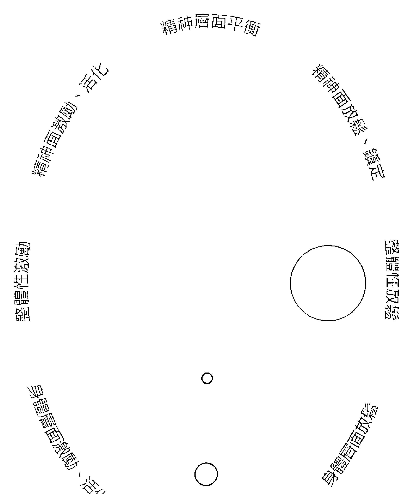

## 舒畅养生的圆融之香

豆蔻精油的成分组合是治疗各种痉挛和发炎症症状的最佳用药。豆蔻气味细致、易于吸收，是调配舒畅感受的重要配方。

## 精油小档案

- 植物型态：具有强壮地下根茎的半灌木，果实未成熟即采收。
- 产地：印度、瓜地马拉、爪哇和斯里兰卡
- 萃取部位：种籽
- 萃取法：水蒸馏法
- 色泽：无色

## 豆蔻精油化学成分

| 成分 | 百分比 |
|------|--------|
| 氧化物 | 35 – 50% (主要为 1,8 桉油醇) |
| 酯 | 32 – 45% (主要为乙酸萜品烯酯) |
| 单萜烯 | 5 – 10% |
| 单萜烯醇 | 5 – 10% |
| 单萜烯醛 | 1 – 2% |
| 倍半萜烯醇 | 可达 1% |

## 胡萝卜百科

拉丁学名：*Daucus carota* L.
植物科属：伞形科（Apiaceae）
俗名：红萝卜、山萝卜、野胡萝卜
早在两千年前，欧洲就栽培胡萝卜，到了十九世纪，胡萝卜成了人们的蔬菜，在许多古代典籍中古世纪的文献提及胡萝卜的栽培用价值。民间疗法主要取其根部，芳香疗法则采用胡萝卜所提炼出的精油。

## 胡萝卜化学成分

- β-胡萝卜烯醇 50-60%（主要为胡萝卜醇）
- 单萜烯醇 15-25%（主要为蒎烯）
- 倍半萜烯醇 10-20%（主要为β-没药烯）
- 单萜烯醇 2-5%（主要为沉香醇）
- 醋酸 3%（主要为乙酸橙花儿酯）
- 醇、酯、醚、萜烯类

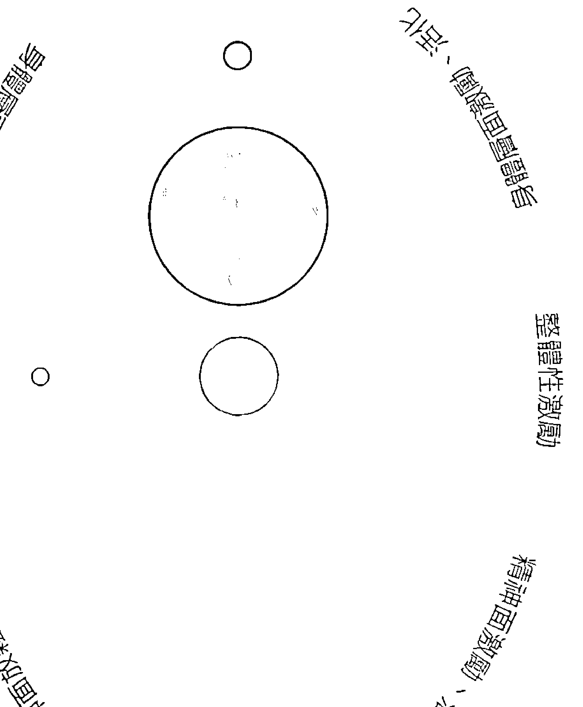

## 胡萝卜营养作用

胡萝卜精油在皮肤护理方面的功效可以说是无出其右。它能激励肌肤细胞再生（特别是敏感性肌肤），活化发炎细胞，普遍使肤质更年轻化。胡萝卜精油能持久性舒缓发炎反应。

## 胡萝卜小档案

植物形态：绽放着白色伞形花的植物，生长在潮湿的草地上，在欧洲，似乎象征白的皮肤皆可见。
产地：欧洲、摩洛哥
采取部位：根部
采取法：水蒸馏法
色泽：清澈、黏稠
尚期发现其他副作用。

## 临床鉴赏应用前景

- 支气管炎
- 咳喘
- 非器质性心悸不齐
- 膀胱症
- 肌肉抽筋
- 感冒
- 经前症候群
- 更年期症状
- 煎汤内服

气味：森林香气、温暖带有大地的气味，剂量较高时闻起来近似汗味。

## 药用价值

生理疗效：抗发炎、肌肤细胞再生、肌肤调理及保护、滋补静脉、提高新陈代谢、调理荷尔蒙

心理疗效：平衡、强化

## 临床证实应用范畴

- 干燥、发炎、受损肌肤
- 防晒
- 严重灼伤后的疤痕
- 牛皮癣 (Psoriasis)
- 预防擦疮与褥疮
- 人工肛门造口保养
- 婴幼儿保健

## 副作用

尚无发现其他副作用。

## 欧洲赤松

拉丁学名：*Pinus silvestris* L.

植物科属：松科 (Pinaceae)

俗名：森林松、苏格兰松

另请参阅西伯利亚冷杉 (页 104)，高山松 (页 123)，巨杉 (页 173)，欧洲冷杉 (页 209)。

欧洲赤松仅需小片的生长土地，所需水量也不多，即使在沙地上也能生长。其直根系统可深入较深的水层。针叶树偏爱北欧、中欧和东欧等松软沙质带粘性的土地。欧洲赤松在远古时期便已作为药用。

## 深呼吸

欧洲赤松精油拥有类似可体松特质 (但不含可体松，页 103) 的主要成分，可激励人体天然可体松之分泌，而成为发炎、疼痛及流鼻水等过敏反应的最大克星。

欧洲赤松精油浓郁的药草气味让人忍不住深呼吸，在酷寒的季节里，特别有助于无招架能力，身体不断打颤，及容易成为细菌与病毒入侵对象的人们。除了增强身体抵抗

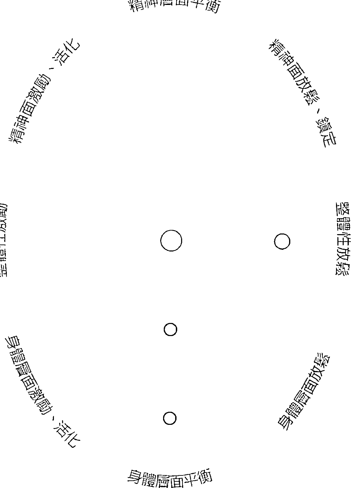

## 欧洲赤松精油化学成分

| 成分 | 百分比 |
|---|---|
| 单萜烯 | 75－85% (主要为 α 桧烯和 β 桧烯，可达 70%) |
| 倍半萜烯 | 约 10% (主要为 β 丁香油烃) |
| 倍半萜烯醇 | 约 3% |
| 酯 | 约 1－5% (主要为乙酸龙脑脂) |
| 单萜烯醇 | 约 可达 1% |

## 芫荽

拉丁学名：Coriandrum sativum L.
植物科属：伞形科（Apiaceae）
俗名：香菜、胡荽、莞荽草

早在三千年前，芫荽在埃及和希腊即已是备受重视的调味香料栽培用植物，欧洲直到第九世纪才偶尔食用。芫荽和其他如蜀葵等植物皆源自东方，意指“床上的茉莉”，芫荽未成熟时会散发出类似臭虫所分泌的刺激臭味，芫荽花在成熟的过程中逐渐散发出一股温郁香甜的气味。

## 食用价值

完全成熟的植株特别具有药用价值，其中最重要的成分即是芳香精油。

- 生理功效：镇咳、解热、抗痉挛、抗过敏、止痛、促进血液循环、增强精神

### 临床医用

- 咳嗽和支气管炎
- 呼吸道炎症（花粉热）
- 腹泻
- 肌肉绞痛
- 精疲力竭
- 恢复期

### 副作用

- 过敏体质者不宜食用

## 精油小档案

植物型态：一年生草本植物，能发出类似臭虫的刺激臭味，成熟的芫荽则无此味道。产地：法国、地中海国家、俄罗斯、匈牙利和摩洛哥。
生理功效：镇咳、解热、抗痉挛、抗过敏、止痛、促进血液循环、增强精神。心理功效：提神。
消除胀气、帮助消化、抗发炎、缓和疼痛、保护肌肤、恢复精神、镇静
心理疗效：激励、平衡、增加活力

### 临床证实应用范畴

- 细菌引起之心绞痛
- 细菌引起之支气管炎
- 胀气（鼓肠症）
- 肠绞痛
- 便秘
- 消化器官发炎
- 过敏性肤质
- 预防擦疮及褥疮
- 真菌感染（白色念珠菌感染）
- 关节退化
- 虚弱
- 疲倦

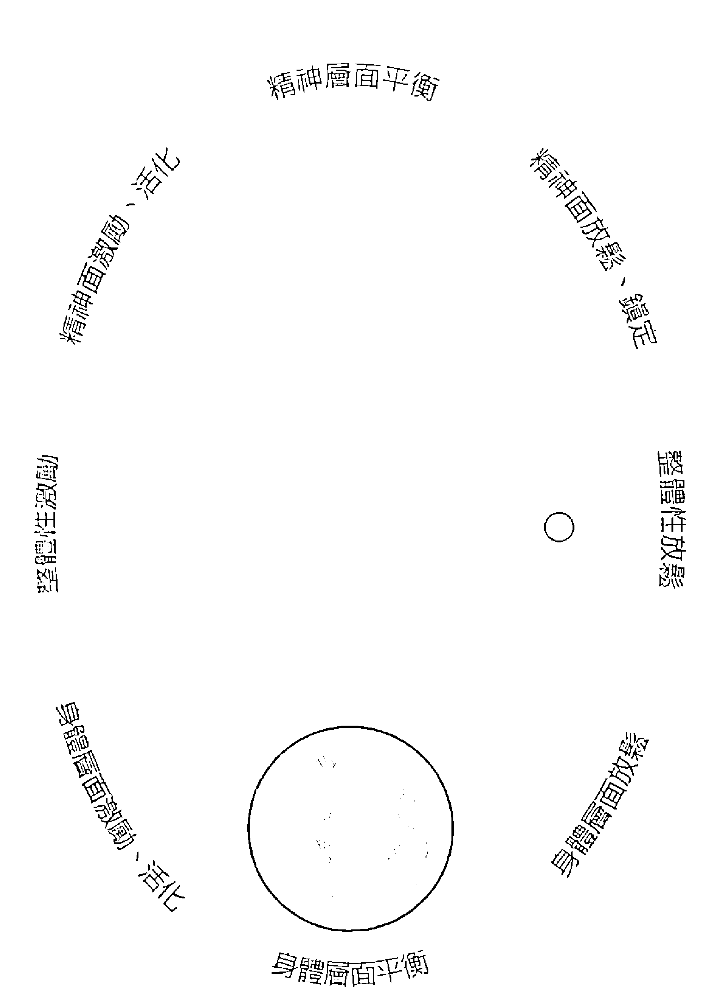

## 芫荽籽精油化学成分

- 单萜烯醇：60 – 80%（主要为沉香醇）
- 单萜烯：10 – 20%（主要为γ 松油烯）
- 酯：2 – 7%（主要为乙酸牻牛儿酯、乙酸沉香酯）
- 单萜烯酮：3 – 5%（主要为樟脑 = 龙脑酮「Borneon」）

### 副作用

合于生理剂量的情况下尚未出现副作用。

萃取部位：种籽

萃取法：水蒸馏法，一百公斤的芫荽籽可萃取出一公斤的精油。

色泽：无色

气味：类似茴香，刺鼻温暖

## 药用价值

生理疗效：有效抗细菌、抗病毒、抗真菌、消除胀气、帮助消化、抗发炎、缓和疼痛、保护肌肤、恢复精神、镇静

## 小茴香

拉丁学名：Cuminum cyminum L.

植物科属：伞形科（Apiaceae）

俗名：欧莳萝、母莳萝、罗马莳萝、臭虫莳萝、土茴香、护香、飞香

小茴香原产自亚洲，古埃及人视小茴香为圣草和春药，将之作为陪葬品，与法老王一同安葬于金字塔。罗马人则将小茴香磨碎后，涂在面包上食用。

小茴香在印度和东方料理也扮演着重要的调味角色，搭配各种异国菜餚都相当得宜，它也是咖喱粉中的必备成分。

## 一、男性的特殊禀赋

香水制造商将小茴香精油的芳香气味带入充满感性的创新香水，特别是男性香水，浓郁温暖宜人的草本香气。

小茴香精油制成的药味浓厚的药膏，能使人产生愉快的感觉。小茴香精油独有解除焦虑的特质，能带给人安心与安全感，因此成为活血理气和温暖按摩油中不可或缺的配方。

自古以来，小茴香精油即被视为春药。其近似荷尔蒙的化学成分（特别是小茴香脑）不但使女性周围发热，更曾成为刺激人慾望的信仰，因而使人产生温暖的感觉。小茴香精油独有解除焦虑的特质，能带给人安心与安全感，因此成为活血理气和温暖按摩油中不可或缺的配方。

## 二、精油小档案

植物型态：一年生草本，约高三十公分，羽状复叶，玫瑰色或白色橄榄花，可能源自非洲的尼罗（Nile）。产 地：土耳其、中东、北美和南美。萃取部位：种子。萃取法：水蒸馏法，三十三公斤的小茴香籽可萃取一公斤的精油。颜 色：金黄色至棕黄色。气 味：温暖的茴香味。

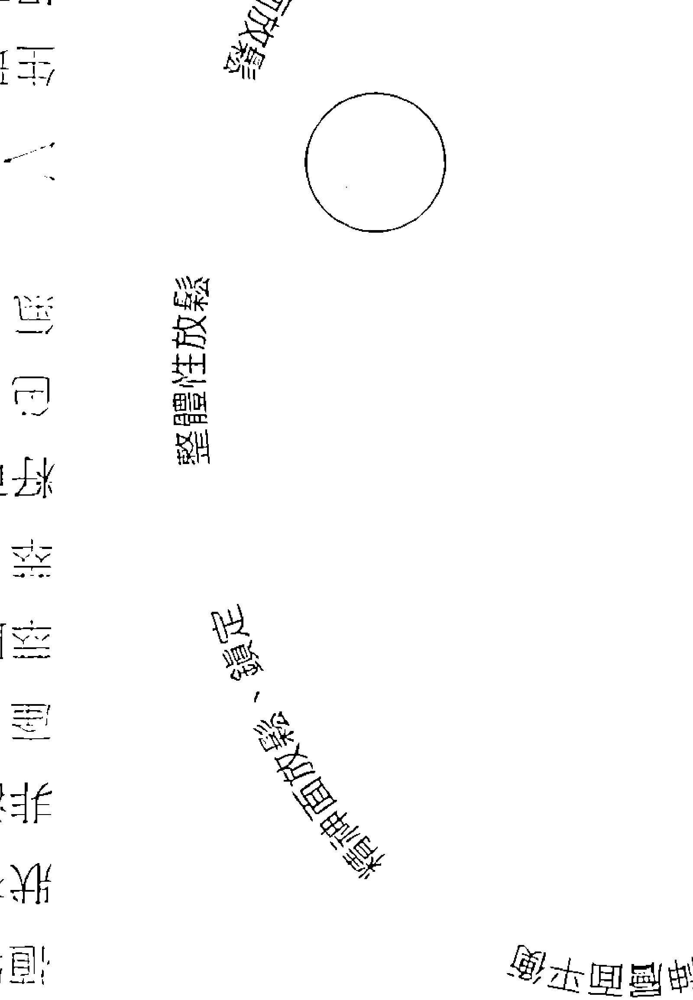

## 三、药用价值

生理疗效：抗菌、抗发炎、刺激免疫系统、提高新陈代谢、帮助消化、消除胀气、抗痉挛、止痛、镇静。

心理疗效：鼓舞情绪、激励、平衡、催情。

## 八、临床灵活应用秘诀

- 消化问题
- 肠痉挛
- 腹痛（绞肠症）
- 霉菌
- 肌肉紧绷
- 更年期症状
- 性冷感

## 六、小茴香化学成分

| 成分 | 含量 | 主要成分 |
|---|---|---|
| 单萜烯 | 30 – 60% | （主要为 γ-松油烯、β-蒎烯） |
| 单萜烯醇 | 30 – 40% | （主要为 α-沉香醇、二烯-7-醇） |
| 芳香酸 | 20 – 30% | （主要为小茴香酸） |
| 单萜烯醇 | 可达 4% | （主要为香芹酸） |
| 芳香醛 | 微量 | （页质定素） |

## 副作用

合于生理剂量的情况下尚未出现副作用。

## 补充说明

小茴香精油不可与内含高达 60% 单萜烯酮（主要为香芹酮，页 35）的藏茴香精油（Carum carvi）混淆。藏茴香精油是专治肠胃问题的妙方，特别是胀气，但它也同时含有大量的单萜烯酮，必须谨慎使用。合于生理剂量（1%）下外用尚未出现副作用。

## 高山松

拉丁学名：Pinus pumilionis；同义词 Pinus mugo var. mughus

植物科属：松科（Pinaceae）
俗名：卧藤松

另请参阅西伯利亚冷杉（页 104），欧洲赤松（页 119），巨杉（页 173），欧洲冷杉（页 209）。

矮小生长缓慢的高山松原产于欧洲山区，高可达三点五公尺，大多呈卧伏状。萃取自针叶和嫩枝的精油价值连城，市面上贩售的高山松精油大多是合成精油。

## 风湿病特效药

高山松精油对风湿病痛有极高的药用价值，是福昂斯酒（Franzbranntwein）的主要成分，对呼吸道疾病也相当有助益。另外，高山松精油的化学成分和特质与欧洲赤松极为相近，因此两者可交替使用。高山松精油内含蒎烯和 δ - 3 - 葑烯等成分使其具有类似可体松的特质。

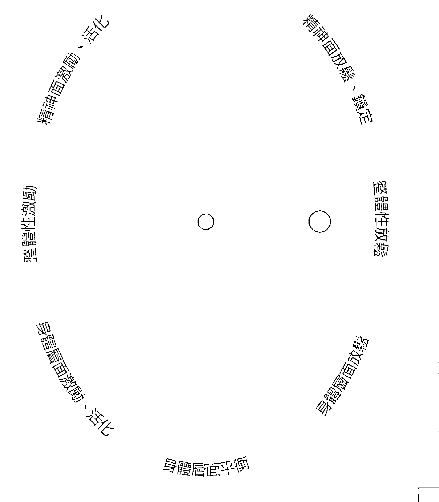

## 高山松精油化学成分

| 成分 | 比例 |
|---|---|
| 单萜烯 | 75 - 85%（高达 35% 的蒎烯、δ - 3 - 葑烯 18%、左旋柠檬烯） |
| 酯 | 约 4 - 10%（主要为乙酸龙脑脂） |
| 倍半萜烯 | 约 2 - 5% |

## 精油小档案

植物型态：常绿针叶树，针叶长达五公分，平行对称生长。
产地：阿尔卑斯地区
萃取部位：针叶和嫩枝
萃取法：水蒸馏法
色泽：无色
气味：具有新鲜翠绿的森林气味

## 二、药用价值

生理效果：近似可体松、抗痉挛、抗沮丧、止痛、抗压迫、促进血液循环、强化神经系统
心理效果：提神
薰衣草精油，针对肌肤的使用适应良好，大量薰衣草精油，一般会采用特别低海拔的薰衣草精油。醒目薰衣草精油的年产量是高品质薰衣草精油的几乎十倍，价格却少了一半。不同的醒目薰衣草视品质优劣有：
- 亚伯拉醒目薰衣草（Lavandula abrialis）
穗花薰衣草最接近，然而成品品质的精纯取得不易，因而也较昂贵。

## 三、临床医疗用途简要

- 呼吸和支气管炎
- 过敏性鼻炎（花粉热）
- 鼻窦炎
- 肌肉酸痛
- 精疲力竭
- 恢复期

## 八、副作用

合理生理剂量的情况下未出现副作用。

## 薰衣草精油化学图谱介绍

拉丁学名：Lavandula burnatii Briquet
植物科属：唇形花科（Lamiaceae）
俗名：大薰衣草
另需参考真正薰衣草（页125），斑状薰衣草（页128），穗花薰衣草（页130）。
醒目的薰衣草是由真正薰衣草和穗花薰衣草杂交而成，最初是园艺栽培植物。野生的醒目薰衣草是草本灌木植物，蓝色花束比野生真正薰衣草更矮小，在自然环境中相当易栽培。醒目薰衣草的人工栽植相当受欢迎，其幼苗在法国的种植价值变得极高。醒目的薰衣草易于生成易于的醒悟作用（不同于野生高山薰衣草），蒸馏约需三百至六百公斤鲜花，其精油价值极高，可使用于身体按摩精油。

## 迷迭香薰衣草油化学成分

- 酯 35 - 45%（主要为乙酸沉香酯）
- 单萜烯醇 30 - 40%（主要为沉香醇）
- 单萜烯酮 5 - 10%（主要为左旋樟脑）
- 单萜烯酮酯 4.5 - 5.5%（主要为樟脑=龙脑酮「Borneon」）
- 氧化物 2.5 - 3.5%（主要为1,8 桉油醇）
- 倍半萜烯 2%

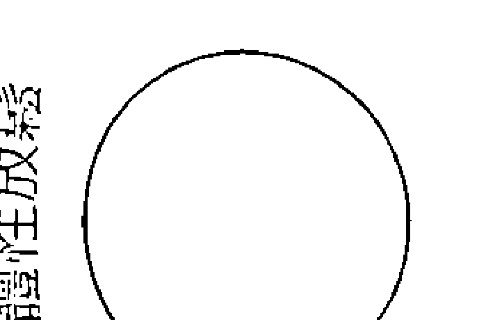

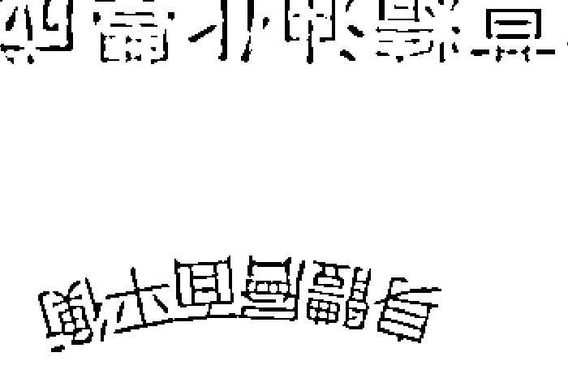

- 超级醒目薰衣草 (Lavandin super) (请参阅附图) 与真正薰衣草最为接近，其化学成分的组合（大量的酯，少量的桉油醇和酮）可发挥放松的功效。此类精油对儿童也能发挥极佳功用。
- 葛罗索醒目薰衣草 (Lavandin grosso) 其精油产量最高。此品种化学成分组合的功效介于前两者之间。

## 被低估的精油

一般书上经常将醒目薰衣草精油描述为真正薰衣草「无用的小弟」。仔细研究其化学成分后，对其认知才大为改观。醒目薰衣草精油很适用于伤口消毒与治疗，其止痛功效已获得科学证实。它对放松肌肉系统也能发挥良好功效，是运动员的防护好帮手。有别于真正薰衣草精油，醒目薰衣草精油是血液循环的滋补良方，它能调整低血压，强化心脏功能。

直到最近，意大利帕玛大学经动物试验，首度证实许多不同品种的杂交薰衣草精油有抑制血栓和血小板凝结的功效。（Ballabani et al. 2004）

## 精油小档案

植物型态：六十公分高的矮木丛，灰绿叶片呈细长状，分叉的圆锥花序上绽放着许多紫罗兰色的花朵，花期为七、八月。
产地：法国、西班牙和保加利亚
萃取部位：干燥过的圆锥花序
萃取法：水蒸馏法，七十到一百公斤萃取一公斤的精油。
色泽：清澈到金绿色，液状。
气味：带有青草香、花草香，不含真正薰衣草的芳香。

## 药用价值

生理疗效：抗细菌、抗病毒、抗发炎、细胞再生、伤口愈合、刺激免疫系统、注入活力、微调血液循环、放松及滋养肌肉组织
心理疗效：活力、平衡、安抚

## 临床证实应用范畴

- 感冒
- 眩晕
- 下肢溃疡 (Ulcus cruris)
- 痔疮
- 伤口
- 烫伤
- 护肤
- 防虫
- 预防辐射
- 预防褥疮
- 人工肛门造口保养
- 肌肉紧绷
- 焦躁

## 副作用

尚无发现其他副作用。

## 补充说明

建议消费者使用有机培植、无农药的薰衣草所萃取的精油为佳。

## 真正薰衣草

拉丁学名：Lavandula angustifolia P. Miller；
同义词 Lavandula vera

植物科属：唇形花科 (Lamiaceae)
俗名：细致薰衣草

真正薰衣草精油是芳香疗法中最重要也要最受欢迎的精油，其药用价值相当广泛，可能是治百病、保健的万灵丹。薰衣草精油似乎是对相互抵触的疗效，既可提振精神，亦可放松；能帮助脑力振奋的人恢复精神，又能使情绪压力的人心平气和。事实上，它能在极度亢奋与压抑之间达到平衡，帮助生理和心理恢复平衡。真正薰衣草精油能够帮助改善睡眠、缓解焦虑、减轻疼痛等。它还可以用于皮肤护理，如治疗烧伤、割伤和昆虫叮咬。此外，真正薰衣草精油也是急救箱中常见的药品，进行芳香按摩时，真正薰衣草精油如催情剂，在混合其他精油能产生协同作用。真正薰衣草精油的化学成分相当复杂，部分带有湿润的香气，有温和和安抚的精神特质，特别是血清素（页13），对急性慢性性疼痛，以及焦虑引起的安慰相当有帮助。亦可帮助调整非器质性之心血管系统不适。此外，真正薰衣草能协助缓和精神隐性但不使人昏沉。

- 超级醒目薰衣草（页124）
- 斑纹薰衣草（页128）
- 穗花薰衣草（页130）

薰衣草受到普遍喜爱已有数千年之久，波斯人、印度人和维吾尔人早已懂得欣赏芳香浓郁的薰衣草，用以调剂空间内驱避瘴气的「净化」，预防感染流行疾病。维吾尔人也使用薰衣草做为身体舒缓的沐浴用品，拉丁文的 lavare 有「清洗」之意，「Lavender」之名由此而来。北欧人同样喜爱薰衣草具有强大的治疗功效，他们将薰衣草混合乳香、没药或佛手柑等其他植物，以香氛处理温热房间。北欧人另研发出内含薰衣草的草药肥皂，用来浸湿布和浴桶以缓解头痛。十七世纪瘟疫流行时期，偶然有了第一瓶薰衣草花露，直到今天仍保有英国「芳香」的美名。1930年代，薰衣草精油成了普罗大众的甘甜香水。一片片广大的薰衣草田装饰了普罗旺斯许多处的石灰岩层，形成风景明信片上典型的普罗旺斯美景。薰衣草从原本野生的山地植物成了栽培作物，但其实多以醒目薰衣草取代真正薰衣草田（页124）。在地势较高的地区也有薰衣草田，自然间，野草生长其中，终年不断除草所需工作，薰衣草的栽植方式需大量的工作，栽种第一年光是拔除伴生草（非「野草」），每公顷就需要二百五十小时工时，第二年至少仍需一百五十小时。此外，薰衣草必须定期修剪：在日正当中，摄氏35度的烈日下收割，且大多是在顺风岩石、断崖边阴凉的环境下。

## 精油小档案

植物型态：约六十公分高的较矮木丛，叶片细长灰绿，蓝紫色花朵呈长柄漩涡状的花序，花期为七、八月。

产地：主要在法国滨海阿尔卑斯山区（海拔八百至一千两百公尺）和普罗旺斯省，另外还有西班牙、摩洛哥、意大利、克罗地亚、英国、澳洲的塔斯马尼亚和阿根廷。野生薰衣草生长于整个地中海区含石灰质的贫瘠土地上。

萃取部位：新鲜、盛开的圆锥花序

萃取法：水蒸馏法，一百二十公斤可萃取出一公斤精油。

色泽：清澈至金绿色

气味：浓郁、甜美芳香、带有花朵和木质的香气

## 药用价值

生理疗效：抗细菌、抗病毒、防腐（杀菌）、抗真菌、退烧、有效刺激免疫系统、细胞再生、治疗伤口、抗发炎、止痛、抗痉挛、促进血液循环、调节血压、助眠、防蚊虫叮咬

心理疗效：平衡、安抚、具建设性、消除焦虑与抗忧郁、精疲力尽时提振与恢复精神

## 临床证实应用范畴

- 感冒预防与治疗
- 支气管炎
- 耳痛
- 中耳炎 (Otitis media)
- 发烧
- 百日咳
- 头痛
- 神经炎
- 血压升高

## 真正薰衣草精油化学成分

| 成分 | 百分比/含量 |
|---|---|
| 酯 | 40 - 50% (主要为乙酸沉香酯) |
| 单萜烯醇 | 30 - 40% (主要为沉香醇) |
| 单萜烯 | 7 - 13% (主要为罗勒烯) |
| 倍半萜烯 | 可达 8% (主要为 β 丁香油烃) |
| 氧化物 | 可达 1.5% (主要为 1,8-桉油醇，沉香醇氧化物) |
| 倍半萜烯酮及倍半萜烯氧化物 | 微量 |
| 香豆素 | 微量 |
| 丁香酚 | 微量 |
| 芳香酸和芳香醛 | 微量 |
| 芳基酯和芳香醇 | 微量 |
| 单萜烯酮 | 微量 |
| 微量的倍半萜烯醇 | 微量 |

## 薰衣草

薰衣草精油的品质根据酯醇成分的多样（页37）来衡量：生长环境海拔越高，其化学成分酯醇的含量则愈高，其品质也愈好。因此，「特级」薰衣草的品质是所有薰衣草精油之冠，然而，其功效则逊「真正」薰衣草（Lavandula angustifolia）的差距则是微乎其微。市场上经常有添加了合成酯、迷迭香或穗花薰衣草精油的仿冒品来冒充昂贵的真正薰衣草，因此风马牛不相及的国家进口薰衣草的情形日益增多，以及不断增大的可能性迫使管制，薰衣草精油品质鉴定凭靠 AOC 制度应运而生。只有在真正证明产地，且以有机方式种植的真正薰衣草（Lavandula angustifolia）才能取得「AOC」的证明（瓶子上标示）。

- 人工血压适口保健
- 带状疱疹（Herpes zoster）
- 水痘
- 真菌感染（白色念珠菌感染）
- 肌肉抽筋
- 痉挛
- 拉痛
- 痛风
- 咽喉炎
- 经前不适
- 更年期症状
- 膀胱炎
- 腹股沟痛
- 挫伤跌打
- 产后风速恢复
- 考试
- 针眼发炎
- 女性骨盆腔痛
- 另需参阅穗花薰衣草章节（页124）属真正薰衣草
- 雌雄同株草
- 俗名：醒迷迭香（西班牙：Romero Santo），
- 植物科别：唇形花科（Lamiaceae）
- 拉丁学名：Lavandula stoechas L.

- 紫斑性骨盆腔痛
- 针眼发炎
- 产后风速恢复
- 考试
- 挫伤跌打
- 腹股沟痛
- 膀胱炎
- 更年期症状
- 经前不适
- 咽喉炎
- 痛风
- 痉挛
- 肌肉抽筋
- 真菌感染（白色念珠菌感染）
- 痛风
- 习惯性、肠易激
- 创伤
- 交感神经痛
- 脑雾
- 支气管擦控症
- 紧张性胃痛
- 蒲血出庭
- 下肢溃疡（Ulcus cruris）
- 痔疮
- 乳房因陷迹的淋巴肿塞
- 口腔保健
- 鼻衄血
- 血液循环不足
- 湿疹
- 阴道倾向
- 青春期湿疹
- 肺胀障碍（包括小症）

### 补充说明

尚未发现其他副作用作用。

### 副作用

- 肺胀障碍（包括小症）
- 青春期湿疹
- 阴道倾向
- 湿疹
- 血液循环不足
- 蒲血出庭
- 下肢溃疡（Ulcus cruris）
- 痔疮
- 乳房因陷迹的淋巴肿塞
- 口腔保健
- 鼻衄血
- 紧张性胃痛
- 支气管擦控症
- 脑雾
- 交感神经痛
- 创伤
- 习惯性、肠易激
- 痛风
- 真菌感染（白色念珠菌感染）
- 痉挛
- 腹股沟痛
- 挫伤跌打
- 产后风速恢复
- 考试
- 针眼发炎
- 女性骨盆腔痛

一般认为，头状薰衣草在古代时藉由希腊的殖民者从小亚细亚传入南法。

## 有效化痰，细胞再生

头状薰衣草精油最大的特色在于高比例的单萜烯酮含量（达 80%）。单萜烯酮成分使头状薰衣草精油拥有极佳的化痰效用，对鼓膜后血肿导致的中耳炎，支气管炎和感冒也有高度疗效。

头状薰衣草具极佳的细胞再生特质亦归因于高含量的酮类成分，使伤口快速复愈，消除疤痕。

## 精油小档案

- 植物型态：二十至四十公分高的半灌木丛，紫红色大花序，枝藤顶端的花瓣犹如一颗颗小头，颇像小葡萄。
- 产 地：法国
- 萃取部位：开花整株
- 萃取法：水蒸馏法
- 色 澤：无色
- 气 味：像薰衣草略发霉的气味

## 药用价值

生理疗效：抗菌（假单胞菌）、抗发炎、豁痰、化痰、细胞再生

心理疗效：激励、提振精神

## 临床证实应用范畴

- 感冒
- 中耳炎（Otitis media）及鼓膜后血肿
- 支气管炎
- 伤口不易复愈
- 去疤
- 预防放射线

| 成分 | 含量 | 備注 |
|---|---|---|
| 单萜烯酮 | 70-80% | 主要为茴香酮 |
| 单萜烯 | 10% | 主要为樟烯 |
| 氧化物 | 可达 5% | 主要为 1,8 桉油醇 |
| 单萜烯醇 | 2-3% | |
| 酯 | 2-3% | |
| 倍半萜烯 | 1% | |

头状薰衣草的形态、颜色和气味都和真正的薰衣草相差甚远，因此有时被误认为其他物种。头状薰衣草属于唇形科植物，与其他薰衣草品种如真薰衣草（页 125），穗花薰衣草（页 130）。

南法的高地灌木丛在春天时，整片的野生头状薰衣草绽放着美丽的靛紫色，与之相伴的还有红白相间的岩玫瑰和耀眼夺目的金色永久花。头状薰衣草与其他薰衣草不同，偏好生长于石灰质地形，在地中海沿岸国家以及沙质地形上处处可见野生头状薰衣草。

## 二、药理和毒理的活性验证

地中海植物，偏好干燥的土壤，温暖均温...

薰衣草精油的介绍...

1.  抗菌、抗真菌的活性：薰衣草精油具有...
2.  抗病毒活性：...
3.  抗炎活性：...

关于薰衣草的其他描述...

## 穗花薰衣草精油化学成分

- 单萜烯醇 ○ 35 – 40%（主要为沉香醇）
- 氧化物 25 – 35%（主要为 1,8 桉油醇）
- 单萜烯酮 10 – 20%（主要为樟脑 = 龙脑酮「Borneon」）
- 单萜烯， 5 – 8%（主要为苧烯）
- 倍半萜烯 ○ 1 – 2%
- 酯 ○ 可达 2%

## 精油小档案

植物型态：属于矮灌木，细长灌木开的花量基本上少于真正薰衣草。叶片的长度长于宽度四至五倍，经常分为三叉的花梗末端长着靛紫色的花朵，不易折断。
产    地：法国。西班牙和葡萄牙的穗花薰衣草精油通常含有较高成分的樟脑（请参阅「副作用」）。
萃取部位：盛开的圆锥花序
萃 取 法：水蒸馏法
色    澈：清澈
气    味：近似真正薰衣草，带有清新基调。

## 药用价值

生理疗效：抗细菌效果极佳、抗病毒、抗真菌、稀释及消解黏液、帮助排出、抗痉挛、舒缓疼痛、促进心血管循环、提高皮肤新陈代谢、皮肤再生
心理疗效：激励、平衡、注意力集中

## 临床证实应用范畴

- ○ 鼻炎（Rhinitis）
- ○ 支气管炎（病毒和病菌）
- ○ 肺炎（Pneumonie）
- ○ 心绞痛
- ○ 心血管循环不佳
- ○ 低血压
- ○ 护肤
- ○ 痤疮
- ○ 灼伤
- ○ 预防辐射伤害
- ○ 真菌感染（白色念珠菌感染）
- ○ 关节酸痛
- ○ 注意力不集中
- ○ 体力透支

## 副作用

合于生理剂量（可达 0.5%）的情况下尚未出现副作用。
许多书中对于穗花薰衣草精油的使用注意事项，特别是针对儿童所提出的警告并不

## 驱蚊香茅的化学成分

驱蚊香茅是热带聚生的耐寒植物，由于其芳香植物富含柠檬醛，而受到食品、饮料和香水等工业的广泛运用，芳香植物也是驱蚊香茅精油油型的货源来源。

- 香茅醛 70-85%（主要为柠檬醛）
- 香叶醇 5-10%（主要为柠檬醛）
- 香叶醇 可选 10%（主要为柠檬醛）
- 香茅醇 可选 6%（主要为柠檬醛）
- 香茅酸 3%（主要为柠檬醛）
- 香茅酸 微量
- 香茅醛 微量

驱蚊香茅油可分离东印度（Cymbopogon flexuosus）和西印度（Cymbopogon citratus）两种，这两种品种都有至少70%的柠檬醛。

## 驱蚊香茅的主要成分提高见表

使用驱蚊香茅的效果颇佳，对蚊虫有强烈的驱避作用。

## 驱蚊香茅油的主要成分见下表：

| 化合物 | 含量 |
|---|---|
| 香茅醛 | 70 - 85%（主要为柠檬醛） |
| 香叶醇 | 5 - 10%（主要为柠檬醛） |
| 香茅酸 | 可选 10%（主要为柠檬醛） |
| 香茅酸 | 3%（主要为柠檬醛） |
| 香茅醛 | 微量 |
| 香茅醛 | 微量 |

驱蚊香茅油的主要成分柠檬醛。

拉丁学名：Cymbopogon flexuosus (Nees) Stapf
植物科属：禾本科（Poaceae）
俗名：印度香茅草、驱蚊草

分布：不丹、中国、印度、非洲、中美洲、南美洲。喜生于海拔0-800米的阳坡，常见于路边、荒地及撂荒地。

完全康复。使用橙花燕麦草精油时必须谨慎，因为其化学成分，使油腺和花瓣的成分比例因精油产地而有很大的不同：
相对较浓烈，而西班牙地区所产橙花燕麦草精油的樟脑成分含量最高可达五成。上述产地的橙花燕麦草精油因酮比例过高（页35），不适用剂量和频率。须经由有经验的治疗师评估精油属性。使用橙花燕麦草精油时，必须注意孕妇及敏感者。

南美洲
萃取部位：整株
萃 取 法：水蒸馏法，五十公斤可萃取一公斤的精油。
色 澤：淡黄色
气 味：有柠檬香味

## 药用价值

- 生理疗效：抗细菌、抗病毒、防腐、抗发炎、有效提高免疫力、促进消化、增加活力、驱虫
- 心理疗效：恢复精神、激励、注意力集中

## 临床证实应用范畴

- ○ 感冒的预防与治疗
- ○ 室内空间消毒
- ○ 防虫
- ○ 恢复期
- ○ 慢性疲劳
- ○ 无法集中注意力
- ○ 无精打采

## 副作用

合于生理剂量的情况下尚未出现副作用。
敏感性、干燥和紧绷肤质及婴幼儿使用柠檬香茅精油时需谨防过敏。

拉丁学名：*Citrus aurantifolia*
植物科属：芸香科（Rutaceae）
另请参阅柑橘精油（页76）和葡萄柚精油（页106）。
是为柠檬的「绿色姊妹」，其汁微苦，适合用来制作印度酸辣酱（Chutneys）和腌渍食品。

莱姆汁同时也是许多酒精与不含酒精类饮品调味的重要成分。

## 浓郁新鲜

市面上可以买到两种不同的莱姆精油，一种是采蒸馏法萃取，另一种则是冷压法。采蒸馏法之精油的萃取部位是整颗水果；这一类精油的气味缺乏以冷压法榨取出精质的天然芳香。
此处所提及以冷压法榨取果皮而得的精油，其化学成分和应用范围和葡萄柚精油相近（页106）。
莱姆精油的典型气味并不容易模仿：其气味由含量不多的化学成分1-甲基-1,3-己二烯所主导。莱姆精油具有生命力浓郁和异国风味的新鲜基调，比柠檬精油和葡萄柚精油更接近原果实的气味。相当适合在心情不佳时使用，能一扫阴霾，重拾好心情。

## 精油小档案

- 植物型态：高可达五公尺，整年盛开芳香纯白的五瓣花朵，果实同一时期会呈现不同的成熟度：深绿色的蛋形叶片平滑、强韧如皮革，叶缘呈波浪状。
- 产地：墨西哥、中美洲、西印度
- 萃取部位：果皮
- 萃取法：冷压法
- 色 澤：绿色
- 气 味：浓郁新鲜、扑鼻而来的异国气息

## 药用价值

- 生理疗效：防腐（杀菌）、抗发炎、退烧、促进血液循环、提高皮肤新陈代谢、净化空气
- 心理疗效：鼓舞情绪、有活力、集中注意力

## 一、强化皮肤和抵抗力

雷西哥洛木精油用于强化皮肤的效果尤佳，常常替代使用，然而花梨木精油则少了雷西哥洛木精油最具特色的玫瑰烯成分。小孩通常喜欢雷西哥洛木精油的气味，此精油使用上并不模糊，即便是婴儿期的肌肤也能吸收，能同时提高大人小孩的免疫力，抗拒感染性疾病的侵入。

## 二、精油小档案

- 植物形态：可达二十公尺高，常绿灌木，美丽金白色，看起来像玫瑰。
- 产 地：墨西哥
- 萃取部位：木材
- 萃取法：水蒸馏法
- 色 泽：金黄色
- 气 味：玫瑰般的木头芳香

## 三、副作用

合乎生理剂量的情况下未出现副作用作用。人体皮肤间可接受微量（0.5%，见 58）的雷西哥洛木精油。

## 四、药用价值

- 生理功效：抗细菌、抗病毒、抗真菌、抗痤疮、抗菌、镇静、止痛、抗抑郁、平喘、提神
- 心理功效：放松、抗痉挛、平喘、提神

雷西哥洛木精油的木头芳香自然柔和带原始森林，柔软细腻，但也流露出木头的带心醒脑「脱颖」时，能提供最佳帮助， 迈迪使心脏促变静，祛精神戊集中障碍。 雷西哥洛木精油整剂帮助肌肤兼具保湿性，能增强皮肤的免疫系统的持久性，保湿天热的反问常驻菌落生机，刺激细胞的修复机制。新的研究显示，雷西哥洛木精油和多数精油一样具有抗氧化的作用，有效清洁除自由基，对抗肌龄提早老化。

### 临床覆盖率用前景

- 感冒
- 支气管炎
- 静脉炎
- 免疫系统低落
- 室内空间消毒
- 低血压
- 皮肤细嫩
- 兴奋
- 抑郁症无精打采
- 注意力不集中
- 受伤倾向

| 成分 | 百分比 |
|---|---|
| 里哪烯 | 85% (主要为右旋异构，可达 65%) |
| 萜品烯醇 | ○ 8% |
| 里哪烯酸 | 4.5 – 9% (主要为异戊烯酸) |

拉丁学名：Bursera deppeana
植物科属：橄榄科 (Burseraceae)
高达二十公尺的墨西哥西哥洛木主生长于墨西哥西部的里约巴萨 (Rio Balsa) 沿岸。雷西哥洛木可萃取出显著木香、花香和果香的精油。

## 临床证实应用范畴

- ○ 感冒治疗与预防（包括儿童）
- ○ 心绞痛
- ○ 护肤
- ○ 预防褥疮
- ○ 身心紧绷状态
- ○ 心灵疲惫
- ○ 考试焦虑

## 墨西哥沉香木精油化学成分

- 单萜烯醇 ○ 80 - 90%（主要为沉香醇）
- 酯 ○ 10 - 20%（主要为乙酸沉香酯）
- 氧化物 3%（主要为沉香醇氧化物）
- 单萜烯 1%
- 倍半萜烯 ○ 微量
- 极微量的单萜烯酮

## 副作用

尚无发现其他副作用。

## 山鸡椒

拉丁学名：*Litsea cubeba* Persoon

植物科属：樟科（Lauraceae）

俗名：热带裂叶美女樱、古巴胡椒

山鸡椒属于小型树木，是生长于中国与台湾的野生植物。其果实为黑胡椒粒的形状，因而又被称为荜澄茄。

## 增强免疫系统，恢复精神

山鸡椒精油和柠檬香茅精油（页 132）的功效类似，但相较之下，山鸡椒精油的气味清新类似柑橘，更胜于柠檬香茅精油。

山鸡椒精油是萃取天然柠檬醛最主要的来源（页 34 和 221），成为化妆品工业和清洁剂加工业的重要配方，并非偶然。

## 精油小档案

- 植物型态：小型乔木，果实像黑胡椒粒。
- 产    地：中国、台湾
- 萃取部位：果实
- 萃 取 法：水蒸馏法
- 色    泽：淡黄色
- 气    味：清新、似柠檬

## 药用价值

生理疗效：抗细菌、抗病毒、抗真菌、抗发炎、调整免疫系统、促进血液循环、抗痉挛、镇静、护肤、提高皮肤新陈代谢、帮助消化
心理疗效：恢复精神、激励、集中注意力

山鸡椒精油可能导致敏感性、干燥和皮肤过敏，以至于见肌肤产生过敏。约0.5%的配方，也就是添加十滴到一百毫升的植物油中不会有问题。

## 三、作用

临床医用使用简报

- 感冒
- 咳嗽
- 皮肤问题
- 更年期症状
- 戒瘾期

## 二、受较高量的伤害

在古代，人们将月经视为神圣的象征，代表着生命、生育和净化。月经周期被视为自然循环的一部分，与月亮的盈亏相关。在许多文化中，月经被认为是女性力量的象征，与直觉、创造力和情感相关。月经精油（例如，月见草油）常被用于调节月经周期，缓解经前综合症（PMS）和月经疼痛。它含有丰富的γ-亚麻酸（GLA），有助于平衡荷尔蒙，减少炎症，并支持皮肤健康。然而，使用月经精油时需注意，过量使用可能导致副作用，如头痛、恶心或皮肤过敏。建议在专业指导下使用，并遵循推荐剂量。

- 甲烷烯烃 70-80% (主要为甲基烯烃)
- 甲烷烯 10-15% (主要为甲基烯烃)
- 甲烷烯酮 5-10% (主要为沉香醇、橙花醇、龙脑、橙花酮)
- 甲烷烯酮 可达4.5% (主要为甲基庚烯酮)
- 仲辛烯 微量
- 脑 微量而逐渐受到世人的喜爱，是芳香治疗最重要的精油之一。月桂精油用途多元，且仅需极少剂量，就能发挥最佳功效，效力持久。月桂精油浓郁温暖的气息，能提振精神，强化神经系统，尤其是缺乏自信的人。

## 精油小档案

- 植物形态：常绿乔木，高可达十五公尺，人工栽培大多培植为灌木型态。
- 产地：整个地中海地区
- 萃取部位：叶片
- 萃取法：水蒸馏法
- 色泽：无色
- 气味：带有药草味及花香、清新

## 药用价值

生理疗效：抗菌（葡萄球菌、链球菌、淋菌、大肠杆菌、肺炎菌）、抗病菌、抗真菌（白色念珠菌、热带念珠菌和假热带念珠菌）、化痰、排痰、抗痉挛、平衡、止痛、抗发炎、肌肤细胞再生。心理疗效：提神、有活力、平衡、鼓舞情绪。

## 临床证实应用范畴

- 感冒
- 额窦炎和鼻窦炎（Sinusitis）
- 心绞痛
- 中耳炎（Otitis media）
- 口腔炎（Stomatitis）
- 口疮
- 牙痛
- 肠绞痛
- 溃疡（Ulzera）
- 痤疮
- 疥癣

## 副作用

尚无发现其他副作用。

- 真菌感染（白色念珠菌感染）
- 关节炎
- 自主神经张力障碍
- 职业倦怠
- 恐惧、考试焦虑

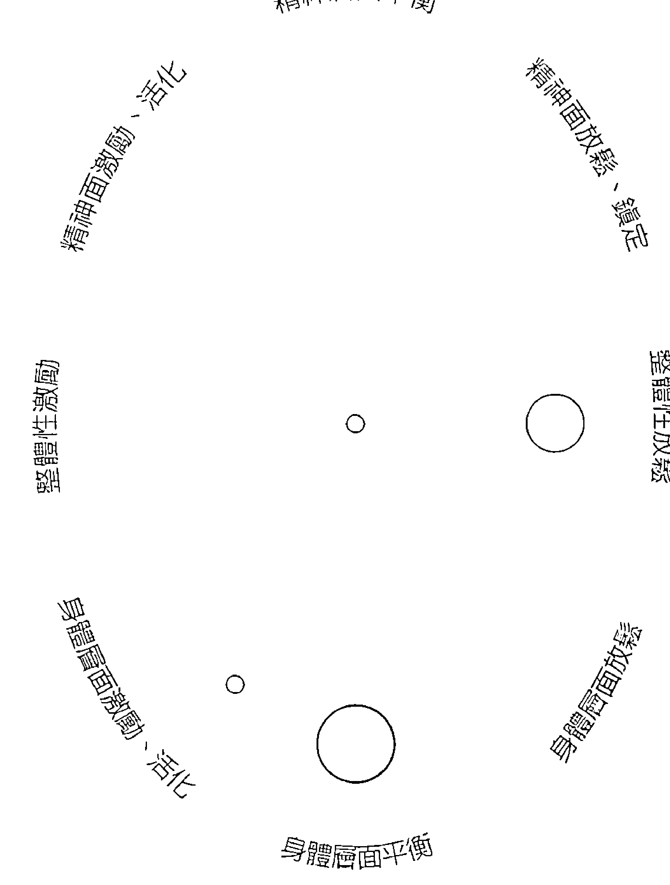

## 月桂精油化学成分

| 成分 | 百分比 |
|------|--------|
| 氧化物 | 35 – 50%（主要为 1,8 桉油醇） |
| 单萜烯 | 15 – 20 %（主要为蒎烯、侧柏烯） |
| 单萜烯醇 | 15 – 20 %（主要为沉香醇） |
| 酯 | 8 – 15%（主要为乙酸萜品烯酯） |
| 醚 | 2 – 5%（主要为甲基醚丁香酚） |
| 丁香酚 | 可达 3% |
| 倍半萜烯 | 3% |

## 草药档案

### 一、基本信息

拉丁学名：Origanum majorana L.

植物科属：唇形花科 (Lamiaceae)

俗名：甜墨角兰、野荆芥、墨角兰、莱香脂、山薄荷、香茹草

萃取部位：整株

萃取方式：水蒸馏法

颜色：淡黄色

气味：散发出温暖芳香草香

### 二、药用价值

生理功效：抗菌、防霉（致病菌）、止痛、抗痉挛、镇痛、舒缓（副交感神经系统）、舒缓

心理效应：提神、振奋、和解、平衡

### 三、芳香疗法应用

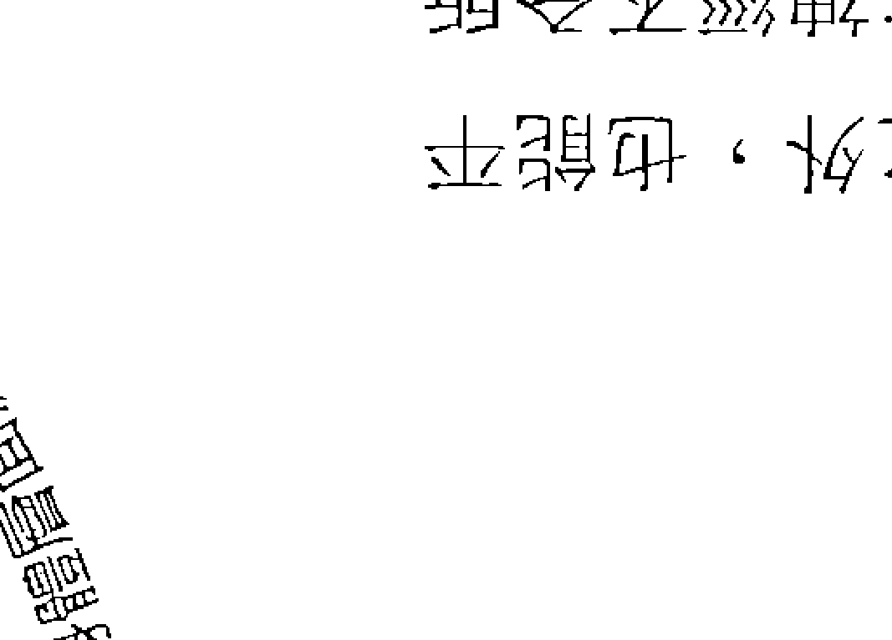

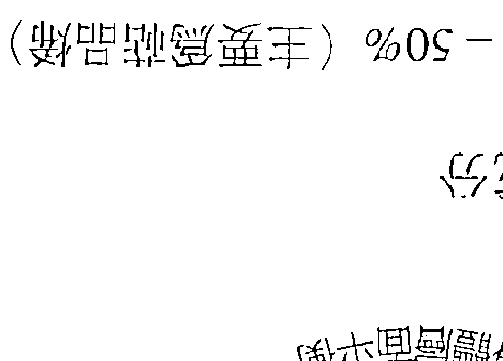

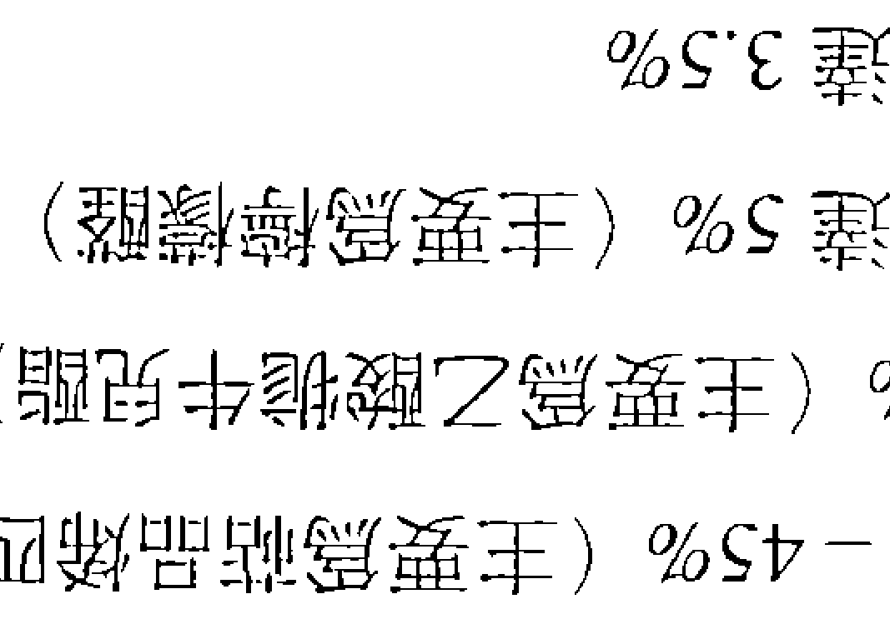

| 成分 | 含量 |
| --- | --- |
| 雪松烯（主要萜品烯） | 40-50% |
| 雪松烯醇（主要萜品烯四醇） | 38-45% |
| 雪松醇（主要萜乙酸雪松醇） | 5% |
| 雪松烯酸（主要雪松醇酸） | 可选5% |
| 雪松烯酯（主要雪松烯酸） | 可选3.5% |

## 临床证实应用范畴

- 鼻炎
- 额窦炎和鼻窦炎（Sinusitis）
- 中耳炎（Otitis media）
- 支气管炎
- 神经炎（神经痛）
- 风湿性肌肉炎
- 关节退化
- 自主神经张力障碍

## 副作用

合于生理剂量的情况下尚未出现副作用。

## 补充说明

「西班牙马郁兰精油」为百里香品种（Thymus mastichina，页196），特质完全不同。

## 红桔

拉丁学名：Citrus reticulata Blanco
植物科属：芸香科（Rutaceae）
另请参阅柑橘类精油（页76）。

桔的故乡可能位于中国南部，经该地散播到整个南亚，远至日本。十九世纪初，桔流入英国，再由该地进入地中海地区。

在广东一带，桔树被称为「摇钱树」，意思是「摇一摇树，就会有幸运降临」，除了甜橙，人们最常以桔做为祭祀水果。

## 甜蜜的安全感

桔精油是最受小朋友喜爱的精油，因此又常被称为「儿童精油」。桔精油所散发出温和、轻柔的甜蜜气息也同样能给予成人安全与温柔的感受。它的气味源自于使人放松的芳香酯－邻氨基苯甲酸甲酯。桔精油相当诱人，使人容易不自觉使用过量，而导致反效果（请参阅副作用，页140）。

桔精油对身体的疗效相当多元，在芳香

## 红桔精油化学成分

- 单萜烯 90-95%（主要为右旋柠檬烯）
- 单萜烯醛 可达1.5%
- 倍半萜烯醛 可达1%
- 倍半萜烯 ○ 可达1%
- 单萜烯醇 ○ 0.5-1%
- 芳香酯 ○ 可达0.85%（邻氨基苯甲酸甲酯）
- 香豆素（主要为呋喃香豆素） 微量

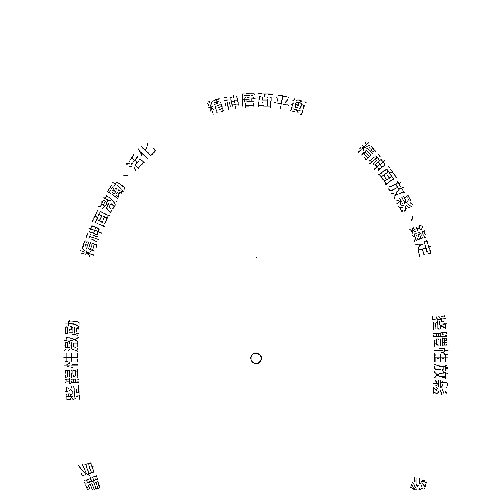

## 松红梅

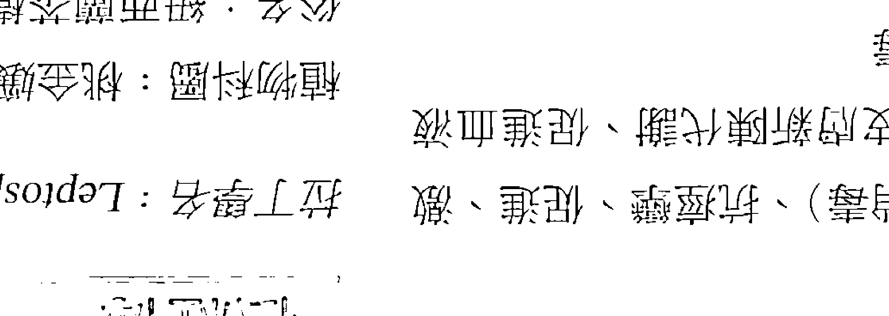

拉丁学名：Leptospermum scoparium
植物科属：桃金娘科（Myrtaceae）
俗称：纽西兰茶、曼奴卡、南太平洋金梅、Kahikatoa（毛利族语）

大片的松红梅林占播着纽西兰广大的土地。

松红梅的生命力强劲，如野草般生般生在是松红梅的高海拔上地、海拔，甚至活火山区。雄蕊小密集的松红梅原产纽西兰测，但西顾的毛利人初根之属神型之梅。当地把接幼生男婴时，赫鲁说：「警记，儿子啊，警记来到生命的世界，你想洗橙溪，你将漫杏松红梅的力童而壮大。」

有可能而说：「可以占据身形弱小的男人，他就不和松红梅一般性坚韧。」

### 补充说明

贴敷在腰背的部分可以提神醒脑精油（页166）。

### 副作用

贴精油量多时会使人郁闷、精力无济（反应效果），即使是使用蒸浴也需警惕，以防儿童皮肤敏感。

### 精油小档案

形态特征：常绿灌木，高可达五公尺。全年绽放着五瓣白色的芳香花朵，果实在同期期呈现不同的成熟度，强劲的重卵形叶片，柔软而浓绿。

产地：地中海沿岸、北非、北美、南美、亚洲

采取部位：果皮

蒸取法：蒸馏法

色泽：深黄色

气味：甜果香味

### 药用价值

生理效果：防癌（消暑）、护肤美容、促进、抗过敏、提高皮肤新陈代谢、促进血液循环、增强、增强淋巴排毒

心理效果：鼓舞情绪、使用生理则有助力睡眠、化解焦虑

### 临床证实应用范畴

- 感冒
- 淋巴淤塞
- 面湿疮状
- 膀胱炎（Zystitis）
- 痛经
- 苦垂
- 糖尿信心
- 儿童焦虑
- 儿童睡眠困扰
- 敏感、缺乏自信
- 变易倾向

### 预防神经的前藏室

松红梅在精神心理方面的疗效不胜枚举，可說是一瓶貨真價實的防護精油，特別是因周遭環境造成困擾、生活步調急促及過度刺激等因素而使「皮膚愈來愈薄」的情況。松紅梅精油具有鎮靜、同時提振精神的特質，能達到平衡心靈的正面影響，持續性增強精神上的抗壓力。

松紅梅精油相當溫和，僅需少量就能有效治療皮膚和黏膜組織的問題，增加皮膚和黏膜的抵抗力，讓皮膚不過度敏感，情緒不容易失控。

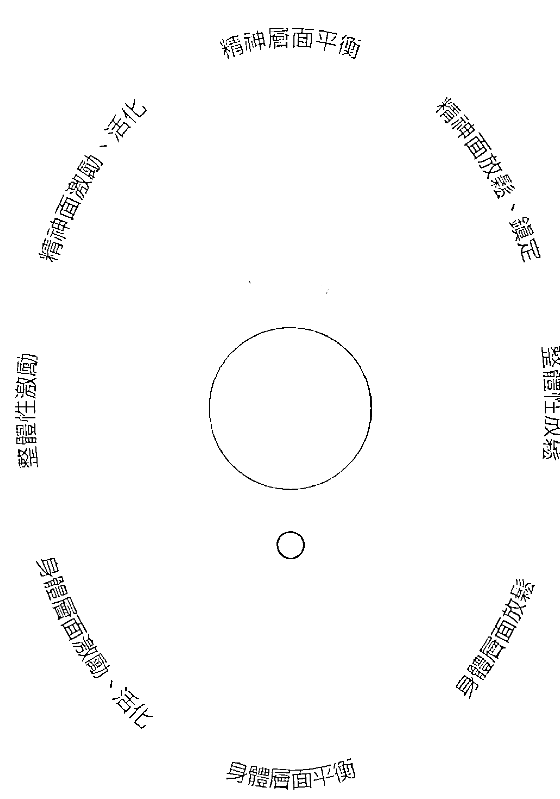

## 精油小檔案

植物型態：常綠灌木，高可達八公尺，葉片細小堅硬如針狀；春天時會開滿白色或玫瑰紅的小花。

產　　地：松紅梅為紐西蘭當地的植物，原本產於澳洲，後來傳入塔斯馬尼亞、紐西蘭、巴布亞紐幾內亞、東南亞等地。

萃取部位：葉片與枝椏

萃　取　法：水蒸餾法，一百五十公斤可萃取出一公斤的精油。

色　　澤：金黃色

氣　　味：有草香、土壤氣息、濃烈、略微帶有動物氣味，大量稀釋後散發出溫暖怡人的芳香。

## 松紅梅精油化學成分

| 成分 | 百分比/备注 |
| :--- | :--- |
| 倍半萜烯 | ○ 65 – 68% (主要為杜松烯\*) |
| 倍半萜烯酮 (三酮) | 25% (主要為細籽酮) |
| 倍半萜烯醇 | ○ 5.5% |
| 單萜烯 | 2 – 3% |
| \*: 杜松烯一般也譯為畢澄茄烯，本書中統一使用杜松烯。 | |

## 藥用價值

生理療效：抗細菌與抗真菌效果奇佳，抗病菌、抗發炎、止癢、抗過敏、皮膚與黏膜再生效果好、治療傷口、促進肉芽組織生長、促進上皮組織生成、消血腫
心理療效：安神、紓壓、強化與保護神經系統

## 臨床證實應用範疇

- 口腔炎（Stomatitis）
- 頭皮發癢
- 皮膚發癢
- 皮膚久傷不癒
- 血腫
- 牛皮癬（Psoriasis）
- 預防擦瘡和褥瘡
- 真菌感染（白色念珠菌感染）
- 帶狀疱疹（Herpes zoster）

## 香蜂草

学名：Melissa officinalis L. 植物分类：唇形科（Lamiaceae）

别名：柠檬香蜂草、蜜蜂花、柠檬薄荷、香薄荷等。

香蜂草的香味特别受到蜜蜂的喜爱，因此得名香蜂草（希腊文的 melissa = 蜜蜂）。香蜂草的芳香则相当受到喜爱而广受欢迎，古时的希腊、罗马医师和阿拉伯医师等都相当受到喜爱。本篇要介绍着香蜂草的种子越過兩岸馬斯山，傳入德國，並種植在修道院的庭園，不久即成為各國病患的聖品：包括膀胱、胃、肺、血管等疾病，月經不調、頭痛和緊張等問題。約在西元 810 年時卡爾大帝下令廣種栽植。直到今天仍可在許多庭院看到這類植物。适应性強且易於生長的植物。一般民眾可根據需要的花型、心形、星形的鋸齒狀葉片；叢生墊；三十到七十公分高的灌木；四角形花穗；開滿淡紫色、白色或粉紅色的小花。

## 镇静不安魔力

香蜂草精油渐趋到繁盛型的小朋效果相当。剂应用避免爱的或人同样有不错的效果。香蜂草精油蕴含置内含比例的2了香油酸（恬卡惦称），剉心膓力能镇静是好疗效，不仅能协助解决精神遭受负和失眠的问题，更能治愈心膓不适症，例如肠胃性病变引起的心悸、血压不稳定或心室颤振。著名的阿拉伯医师阿比西那（Avicenna, 980-1037）曾提及：“香蜂草能强健心膓功能，增进生命力。”五百年后，同重量级的医师帕拉塞尔苏斯（Paracelsus, 1493-1541）也提到：“大地上所有生长的植物当中，香蜂草是守护心膓的不二选择。”此外，香蜂草精油治令人疼痛难耐的带状疱疹（Zoster）和其他疱疹也有最佳疗效。

## 副作用

- 下肢溃疡（Ulcus cruris）
- 过敏性皮炎（花粉热）
- 紧张、不安
- 心脏衰竭

## 补充说明

粉红蜂香油温度过高时，会有强烈的苦涩滋味，病体不住，需大量稀释才不会发出怡人芳香。

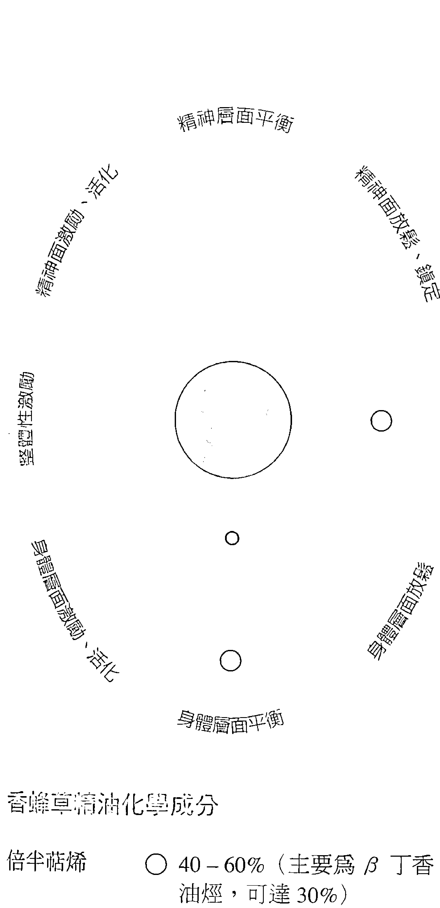

萃取法：水蒸馏法，六至八吨的植材可萃取出一公斤的精油。
色 澈：清澈
气 味：清新，带有柠檬味的草香。

## 药用价值

生理疗效：抗病毒、抗细菌、抗发炎、止痛，抗痉挛、镇静、强化心脏功能、调节血压、消除胀气、促进食欲、平衡、抗过敏
心理疗效：平衡、激励、安抚、提神、保护

## 临床证实应用范畴

- 过敏性鼻炎（花粉热）
- 神经炎
- 非器质性心脏不适
- 肝脏功能不佳
- 心因性皮肤瘙痒
- 唇疱疹（Herpes Labialis）
- 带状疱疹（Herpes zoster）
- 生殖泌尿道疱疹
- 水痘
- 膀胱炎
- 更年期症状
- 神经质
- 过动
- 紧张性入睡障碍
- 睡眠障碍和儿童的「心因性腹痛」
- 恐惧状态

## 副作用

尚无发现其他副作用。

## 补充说明

100%的纯香蜂草精油是既珍贵又昂贵的精油。萃取一公斤的精油所需的香蜂草量相当

## 香蜂草精油化学成分

| 成分 | 百分比 |
| :--- | :--- |
| 倍半萜烯 | 40-60%（主要为 β 丁香油烃，可达 30%） |
| 单萜烯醛 | 25-55%（主要为柠檬醛） |
| 单萜烯 | 5-7% |
| 酯 | 2-4% |
| 单萜烯酮 | 2-3% |
| 单萜烯醇 | 1-5% |
| 倍半萜烯醇 | 1-2% |

有白色或金白色的花序。香蜂草的花期为六到八月。
产 地：法国、西班牙、德国、义大利、巴尔干半岛国家、北美洲；野生品种特别分布于地中海地带和东方。
萃取部位：整株

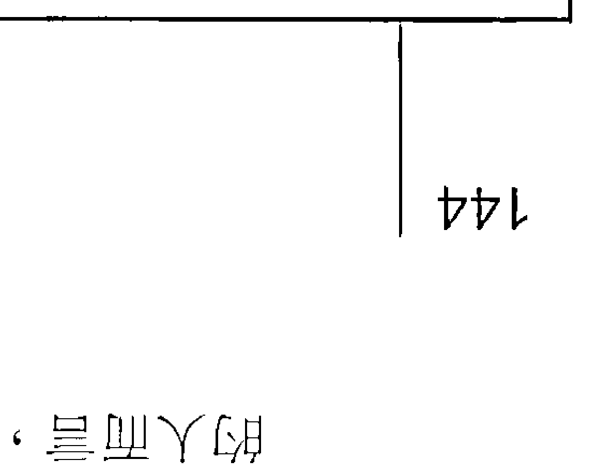

## 一、精油小档案

植物形态：乔木可高达五公尺，羽状复叶互生繁密在一起。采取部位：花。萃取法：己烷萃取法。色：淡黄色。味：除：给人不可思议的温暖、蜂蜜、甜雪、细腻的感受。

- 主要成分
- 芳香醛和芳香酮

其他成分：苯甲醛、十七烷、十七碳烯、十九烷、棕榈酸。拉丁学名：Acacia dealbata。植物科属：豆科 (Fabaceae)。

## 二、使用价值

生理功效：抗痉挛、解毒。心理功效：鼓舞情绪、平衡、敏感肌肤。

## 三、临床复方精油应用

缺乏自信、简述配方、合适销售的几层管理。临床展示：复方精油中合有真实迷迭香。

## 四、副作用

临床展示，复方精油中合有真实迷迭香，特别是敏感人群如糖尿病患者、孕妇、婴幼儿、敏感肌肤的人而言，特别能感受到蜂蜜般的舒适。

## 快樂鼠尾草

拉丁學名：Salvia sclarea L.
植物科屬：唇形花科（Lamiaceae）
俗名：南歐丹參

快樂鼠尾草原產於地中海和中東一帶，現在為了生產快樂鼠尾草精油，法國和俄羅斯也種起這類植物。快樂鼠尾草屬於庭院鼠尾草（Salvia officinalis），是較為溫和的品種，本身又是具有療效的藥用植物。英國植物學家Nicholas Culpeper在1652年便已提及快樂鼠尾草的放鬆功效。以前，葡萄果農為了增加葡萄的香氣、改良葡萄品種時，會在葡萄藤之間種植快樂鼠尾草。

## 放鬆心靈、激發靈感

針對壓力引起的疾病與不適，快樂鼠尾草精油可說是芳香療法中放鬆效果最佳的精油之一。孕婦待產時，以快樂鼠尾草精油按摩會陰部位，能使會陰變得更軟、更有彈性，助益甚大。

快樂鼠尾草精油的放鬆效果能緩和痔瘡痙攣性疼痛。另外，其抗真菌的特質對於陰道的黴菌感染也有特殊療效。

在心理方面，快樂鼠尾草精油能解除緊張情緒，帶來新的能量，激發想像力與創造力，是增進兩性關係的潤滑劑。

> > 注意：快樂鼠尾草雖然與（庭院）鼠尾草（Salvia officinalis）同屬不同種，但兩者萃取出的精油卻有很大的差異，鼠尾草精油（頁185）含有高達45%的側柏酮（單萜烯酮，頁35），若使用不慎，可能會造成神經毒害並導致流產，因此不可替換使用。

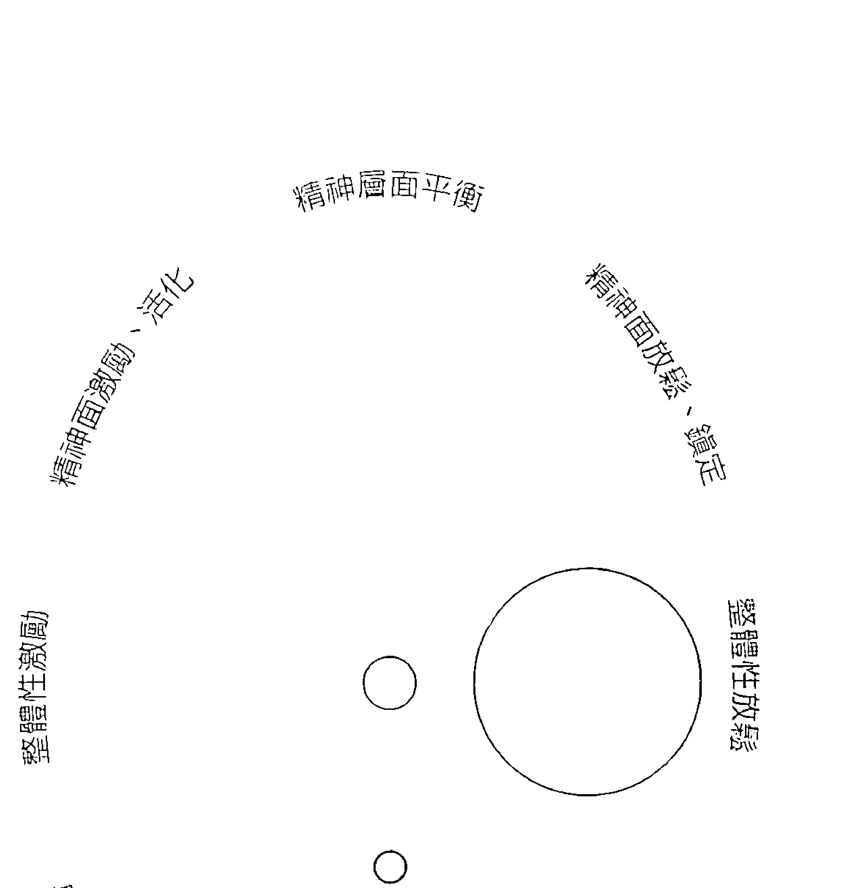

### 快樂鼠尾草精油化學成分

| 成分 | 百分比及說明 |
|------|--------------|
| 酯 | 65 – 80% (主要為乙酸沉香酯) |
| 單萜烯醇 | 10 – 22% (主要為沉香醇) |
| 倍半萜烯 | 5 – 10 % (主要為大根老鶴草烯) |
| 單萜烯 | 2 – 3% |
| 氧化物 | 可達 2% (沉香醇氧化物) |
| 倍半萜烯醇和雙醇 | 可達 1% (主要為快樂鼠尾草醇) |
| 倍半萜烯氧化物 | 0.4% |

## 精油小檔案

植物型態：高約可達一公尺的灌木，灰綠色的葉片大而粗糙，底部呈蓮花座狀，長出強而有力的梗，梗上枝葉叢生。花期在五至九月；快樂鼠尾草花海中有細緻的玫瑰紅、紫

## 没药

拉丁学名：*Commiphora myrrha* Nees；同属 *Commiphora molmol*

植物科属：橄榄科 (Burseraceae)

俗名：末药、明没药

数千年前，没药精油相当受到巴比伦人、埃及人和希伯来人的喜爱。就心理层面而言，没药的芳香虽然在宗教仪式中占有相当重要的地位。当时的人除了将没药揉搓往生者身上，同时也用来治疗多种溃疡病，或用的当作香水和香膏。在古代，巴比伦僧侣最常用的顶级精油，是美容不选来最重要的出口商品。希伯来女性尤其偏爱没药芬芳独特的特质。

## 强化身心的防雾——没药

没药精油能稳定并保护精神敏感系统，使人更欢

## 药用价值

生理效应：抗菌、抗真菌、抗登荷酮菊属、抗痉挛、抗病毒

心理效应：舒缓、平衡、增加活力、帮助适应、恐惧、情绪

## 临床鉴别用鼓励

- 高血压
- 浮瘤
- 陵道炎 (生殖泌尿道念珠菌感染)
- 肌肉紧绷
- 更年期症状
- 经前症侯群
- 经痛
- 传染 (霉俊感染)
- 压力

## 副作用

合于生理剂量的情况下未出现副作用。

事实上，一般所看到阑伤患者有雌激素引发痉等症状的患者不可使用没药居星草精油的警告说明正不正。没药居星草精油的何需聚酮酮功效并非完全叫搁单一化等成分或是雌激素，

體驗「自在感受」。只要少許用量，精油便能在人的心理層面發揮完全功效，寵愛人的感官。

沒藥應用在化妝品上已有千年歷史，它能強化、穩定肌膚，使其更具抵抗力。沒藥也具有細胞再生與治療功效，經常用於治療皮膚方面的問題。因此，不論敏感性膚質、熟齡肌膚或者傷口（預防褥瘡），沒藥精油都是相當不錯的選擇。

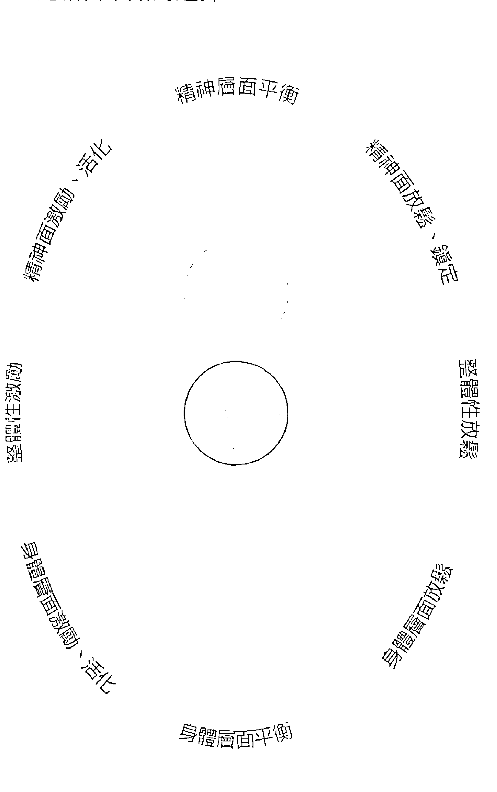

## 沒藥精油化學成分

- 倍半萜烯氧化物　可達 60%（主要為呋喃倍半萜烯）
- 倍半萜烯　○ 20－45%（主要為欖香烯，可巴烯）
- 極微量的倍半萜烯酮（主要為 Curcerenon）、單萜烯醇、單萜烯、肉桂醛和丁香酚

## 精油小檔案

- 植物型態：在不利生長的氣候下（沙漠氣候），沒藥仍可高達三公尺，為多刺矮木叢，葉稀疏。
- 產地：索馬利亞、利比亞、衣索比亞、葉門、西南亞
- 萃取部位：樹脂
- 萃取法：水蒸餾法
- 色澤：黃綠色，黏稠（氧化後會變成紅褐色）。
- 氣味：芳香，奇特濃郁的基調。

## 藥用價值

生理療效：抗細菌、有效抗病毒、抗發炎、治療傷口、細胞再生、止血、平衡荷爾蒙
心理療效：安神、治療心理創傷、溫和調整能量、啟發靈感

## 臨床證實應用範疇

- 護膚
- 痤瘡
- 預防擦瘡及褥瘡
- 唇部護理
- 不安、精神緊張

## 副作用

尚無發現其他副作用。

## 香桃木

拉丁學名：Myrtus communis L.
植物科屬：桃金孃科（Myrtaceae）
另請參閱安地斯山香桃木（頁 148）、摩洛哥

## 一、药用价值

香桃木（Myrtus communis）是高大的常绿木本植物，生长在地中海岸的地区，在强光照射下，香桃木散发出提神的香气，不禁令人想起古老的水仙花。在阳光下看香桃木的树皮，可以看到柔软的叶片上细小、密集的油腺的分布。香桃木别名是具有形式上的美感，因为有着古老的习俗，渐淡在婚嫁上佩戴香桃花冠。

- 镇痛
- 解痉
- 促进血液循环
- 抗焦虑
- 抗抑郁
- 促进消化
- 利尿
- 消炎
- 抗病毒
- 抗真菌
- 抗氧化
- 抗肿瘤

| 成分   | 百分比       | 备注                     |
|--------|--------------|--------------------------|
| 单萜烯 | 70-75%       | 主要为α-蒎烯，可溶64%    |
| 单萜醇 | 7%           | 主要为沉香醇、香叶醇     |
| 氧化物 | 10%          | 主要为1,8桉叶醚          |
| 单萜烃 | 1-1.5%       |                          |

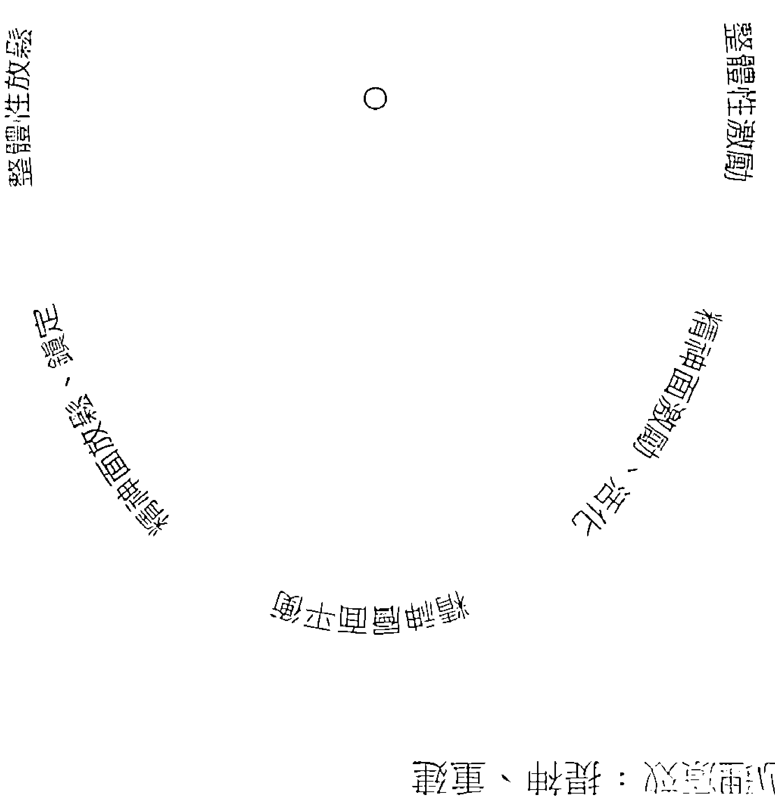

## 二、消除疼痛和抗炎作用

安地斯山香桃木原生秘鲁，即印加文化的发源地。安地斯山香桃木精油比其他檀香木更有效，所以它在的单萜烯含量高，氧化物含量少，不含酮，临床验证对发炎的状况有良好的疗效。

植物科属：桃金娘科（Myrtaceae）

拉丁学名：Myrtus communis L.

形态特征：大型灌木，生长于地中海西至...

花期：花期白色

分布：地：秘鲁（安地斯山）

采收部位：花和枝

## 摩洛哥香桃木

### 植物基本信息
拉丁學名：*Myrtus communis* L. CT
Myrtenylacetat
植物科屬：桃金娘科（Myrtaceae）
俗名：紅香桃木

### 得天獨厚的獨特組合
摩洛哥香桃木是許多芳療師最喜愛的香桃木品種，大量的酯使其擁有柔和的特質。從其氣味便可得知，這是一瓶成分組合相當特別的精油：高比例的單萜烯、氧化物及令人放鬆的酯，這樣的組合絕無僅有。

摩洛哥香桃木精油能消除不平衡，增強、同時又放鬆神經系統。它也是呵護肌膚的最佳保養品，也和所有含氧化物的精油相同，能提高皮膚新陳代謝，有助於改善血液循環及細胞獲氧量，滋補並安撫肌膚，使肌膚發揮最佳功效。

摩洛哥香桃木精油具抗細菌和抗痙攣的功效，是治療呼吸道與泌尿道疾病的最佳利器，特別是針對小孩子。

### 精油小檔案
植物型態：灌木叢或矮樹，綻放白色柔軟的花。

| 成分       | 含量          |
|------------|---------------|
| 單萜烯     | 38 - 45%（主要為α 派烯，檸檬烯） |
| 酯         | 22 - 28%（主要為乙酸香桃木酯） |
| 氧化物     | 20 - 27%（主要為1,8 桉油醇） |
| 單萜烯醇   | 5 - 7%（主要為沉香醇、α 萜品烯醇） |
| 倍半萜烯   | 1.5%          |
| 醚         | 可達1.5%      |
| 單萜烯酚   | 可達1%        |

產地：主要在摩洛哥
萃取部位：稍微脫乾的葉片和枝枒
萃取法：水蒸餾法，一百五十公斤可萃取一公斤的精油。
色澤：紅色
氣味：溫暖的樹脂香、清新、甜甜藥草香

### 临床证实应用范畴
- 背部與關節疼痛
- 風濕疼痛
- 肌肉緊繃
- 精疲力盡

### 副作用
合於生理劑量的情況下尚未出現副作用。

## 土耳其香桃木

### 药用价值
生理功效：有效抗细菌、稀释黏液和帮助排泄、抗痉挛、微激励巴液流动、激励肌肉、提高皮肤新陈代谢
- 呼吸道炎症（特别是小孩）
- 支气管炎
- 痔疮
- 整肠消重
- 健胃
- 膀胱炎
- 忧愁失眠
- 睡眠困扰
- 因不安而精力疲
- 疲勞

### 精简小档案
植物形态：灌木蔓或矮树，开着白色柔嫩的花。
产 地：南法、科西嘉、土耳其。
萃取部位：新鲜枝叶。
萃取法：水蒸馏法，一百五十公斤可萃取出一公斤的精油。
颜 色：深浅绿色、浓郁相当稠。
气 味：青草药气味，新鲜、像尤加利。

### 基本信息
拉丁学名：Myrtus communis L. CT Cineol
植物科属：桃金娘科（Myrtaceae）
俗 名：浓香桃木

### 土耳其香桃木精油化学成分
- 氧化物：40 – 50% (主要为1,8桉油醇)
- 单萜烯：25 – 35% (主要为α-蒎烯)
- 单萜醇：12 – 16% (主要为沉香醇、香桃木醇)
- 酯：6 – 8% (主要为乙酸香桃木酯)
- 倍半萜烯：1.5%

### 呼吸道、泌尿道的特效药
来自土耳其的土耳其香桃木精油，气味跟尤加利相近，其桉油醇成分则是所有香桃木精油之冠，更适合用于治疗感冒的经典精油之一，和澳洲尤加利、月桂叶油（页88）遥遥相似。

## 娜娜薄荷

### 药用价值
生理疗愈：有效抗病菌、防腐（杀菌）、化痰、帮助排出、舒缓咳嗽因子、有效提升抵抗力、退烧、促进呼吸道血液循环、纾解神经与肌肉系统疼痛、强化神经系统、提高皮肤新陈代谢
心理疗效：激励、集中注意力、促进睡眠

### 临床证实应用范畴
- 感冒（包括小孩）
- 支气管炎
- 发烧
- 神经炎
- 唇疱疹
- 带状疱疹
- 生殖泌尿道疱疹
- 肌肉疼痛
- 风湿
- 痛风
- 关节炎
- 失眠

### 副作用
合於生理剂量的情况下尚未出现副作用。

### 基本信息
拉丁學名：Mentha viridis var. nanah
植物科屬：唇形花科（Lamiaceae）
俗名：綠薄荷、摩洛哥薄荷
另請參閱檸檬薄荷（頁87）和胡椒薄荷（頁168）。

### 柔中帶剛的氣味
娜娜薄荷精油內含高比例的單萜烯酮。精油清柔的氣味相當誘人，帶有柔和薄荷味，常一不小心就會使用過量。使用時請務必注意單萜烯酮過量可能引發的問題（頁35）。

娜娜薄荷精油能發揮心理層面的影響，使疲累不堪的生命燃起動力，集中注意力、強化感官和警覺性。生理方面能使人充滿朝氣、有助於循環，抑制睡意。娜娜薄荷精油也是肌膚保養聖品，專治陰道黴菌的專家（白色念珠菌），而不損及天然的陰道黏膜菌叢生態。此外，對於神經型病毒（作用於神經系統）造成的病症臨床治療效果極高，例如帶狀疱疹。

### 精油小檔案
植物型態：多年生草本植物，矮小，葉片長而多皺。
產地：摩洛哥
萃取部位：整株
萃取法：水蒸餾法
色澤：無色
氣味：怡人清新的薄荷香

## 藤甘松

### 药用价值
生理疗愈：防腐、抗真菌、抗病毒、有效抗发炎、稀释黏液、帮助排出、增进血液循环、增加食欲、帮助消化、皮肤与黏膜再生功效强、促进上皮组织生成、促进伤口愈合
心理疗效：提神、活化、醒脑、集中注意力

### 副作用
合於生理劑量的情況下尚未出現副作用。藤甘松精油的甲基酮類成分含量（頁35）偏高，長期大量使用恐致肝毒性。由化學結構推測，精油可能造成神經毒性，需由有經驗的芳療師指導。孕婦、嬰幼兒不宜使用。

### 基本信息
拉丁學名：Nardostachys jatamansi DC.
植物科屬：敗醬科（Valerianaceae）
藤甘松原產於喜馬拉雅山海拔三千至四千公尺的區域，六至十月採集藤甘松根（根莖）進行，十二月時置於加工廠。

### 追寻真实的引领者
藤甘松温暖怡人的氣味帶有淡淡的醃香和溫暖的薰蒸的麝香氣息，能舒緩焦躁、舒壓和鎮靜心靈，相當受到歡迎。
藤甘松油的特殊療效，使其備受芳香精油愛好者的美名。藤甘松精油的化學成分組合具有和諧的作用，其氣味則是整合心靈的媒體，適合冥想時使用。在需要穩定的情境時，藤甘松油能給予心靈安定感。它也有益於生理方面的不適，特別是皮膚和黏膜細胞。

### 藤甘松精油化学成分
| 成分 | 含量 |
| --- | --- |
| 倍半萜烯酮 | 50-60%（主要含左旋葛缕酮） |
| 倍半萜烯 | 20-30%（主要含β-古芸烯） |
| 倍半萜烯醇 | 10-25%（主要含异侧柏酮） |
| 氧化物 | 5%（主要含1,8桉油醇） |
| 倍半萜烯 | 可达4% |

### 临床应用与前景
- 感冒
- 消化不良
- 带状疱疹
- 真菌感染（白色念珠菌感染）
- 伤口
- 疱疹
- 心理疲惫
- 挫折

### 精油小档案
產地：尼泊爾、不丹、西藏、印度、中國
萃取部位：根（根莖）
萃取法：切段蒸餾
色澤：淡黃色、琥珀色
氣味：濃郁、甜甜木頭香、肉體氣息、令人聯想起纈草

## 穗甘松

### 药用价值
生理疗愈：抗细菌（葡萄球菌）、抗发炎、温和化痰、抗过敏、止痒、皮肤再生、止痛、促进血液循环、滋补静脉、调节荷尔蒙、放松
心理疗效：鼓舞情绪、安抚、安神、纾压、促进睡眠

### 临床证实应用范畴
- 紧张性心律不整
- 静脉曲张
- 痔疮
- 皮肤瘙痒
- 牛皮癣
- 自主神经张力障碍
- 更年期症状
- 经痛
- 职业倦怠
- 睡眠困扰
- 上瘾症

### 副作用
尚無發現其他副作用。

### 穗甘松精油化学成分
| 成分 | 占比与描述 |
|---|---|
| 倍半萜烯 | ○ 60-66%（主要為廣藿香烯、古芸烯） |
| 倍半萜烯酮 | ○ 8-15%（主要為纈草酮、β紫羅蘭酮） |
| 倍半萜烯醛 | 微量（主要為纈草醛） |
| 倍半萜烯醇 | ○ 6-8%（主要為廣藿香醇、纈草醇） |
| 單萜烯 | 可達 3% |
| 單萜烯醇 | ○ 可達 3% |

## 丁香花苞

### 基本信息
拉丁學名：*Syzygium aromaticum* (L.) Merr. et L. M. Perry；同義詞 *Eugenia caryophyllus* (Sprengel) Bullock et S. Harrison
植物科屬：桃金孃科（Myrtaceae）
俗名：小丁香、小丁香頭、丁子香、雞舌香

丁香樹原產於香料之島摩鹿加。樹的所有部位，包括樹葉、樹幹、花苞等都散發著芳香。

### 「神之花」
西藏稱丁香花為「神之花」。丁香花蕾擁有極佳抗菌、鎮痛及促進消化等功能而受到西藏人高度重視，不論香料或精油都在西藏藥箱中扮演著不可或缺的角色。丁香花蕾同時被西方人視為補元精力的聖品。

丁香花苞和我們一般種植於花園或著花店裡五顏六色的丁香花是完全兩種不同的植物，丁香花苞的名源於中古世紀的德語「Nelilin」，意指「小釘子」，指的是丁香花苞的形狀。據《聖經》記載，女王的香料中也提到了丁香花苞，由此足見這項香料的珍貴。

不同於其他精油，丁香花苞精油的藥用價值及特性幾乎與其原植物完全吻合。丁香花苞精油在心理層面的功效尤佳，它能使疲弱無力、下腹部壓抑的人感到溫熱，進而消除痙攣，也能夠緩解消化方面的問題，例如灼痛和腹脹感。因為丁香花能抵抗多種細菌跟病毒，好幾世紀以來，婦產科便用它來消暑和鎮痛。

此外，具有溫熱和鎮痛功效的丁香花苞精油，不論在身心方面都是助產的好幫手，它能促進子宮收縮，降低生產前的恐懼。
由於丁香花苞精油有促進子宮收縮及刺激皮脂的作用，必須由專業人員監督指導。

### 精油小檔案
- 植物型態：常綠喬木，高度可達二十公尺，枝簇繁茂，常綠木質葉片如皮革。
- 萃取部位：乾燥的丁香花苞
- 萃取法：水蒸餾法
- 產地：印尼、馬達加斯加、坦尚尼亞、斯里蘭卡、馬來西亞

身體性滋養、修復
身體性消炎、止痛
精神性滋養、放鬆
精神性消炎、安撫
身體層面的放鬆、滋養
身體層面的消炎、止痛
精神層面的放鬆、滋養
精神層面的消炎、止痛

### 丁香花苞精油化学成分
- 丁香酚 ○ 70-80%
- 芳香酯 ○ 10-18% (主要為乙酸丁香酚酯)
- 倍半萜烯 ○ 5-15% (主要為β-丁香油萜)
- 丁香油酚 2%
- 丁香油烯醛 ○ 1%
- 倍半萜烯氧化物 1%

所萃取出的精油同樣具有高度藥用價值。

丁香是相當普及的香料之一，由乾燥的花苞製成，在中國印度文中最早提到了丁香。古羅馬作家 Plinius 在文中獻中指出，丁香的第一世紀首度由印度進口。中世紀早期，丁香卻如黃金般珍貴，也成為香料貿易的重要商品。十三世紀末期，丁香更成為傳說的靈魂之火藥。

### 药用价值
生理疗愈：有效抵抗各种不同的细菌、抗病毒、抗真菌、抗发炎、温热、促进血液循环、有效纾解肌肉痉挛、止痛、麻醉、刺激免疫系统、滋补、促进子宫收缩、帮助消化
心理疗愈：激励、提神、鼓舞情绪

### 临床证实应用范畴
- 感冒症状
- 支气管炎
- 心绞痛
- 口腔炎
- 牙痛
- 消化问题（例如肠绞痛和饱胀感）
- 肌肉纤维化
- 关节炎、关节痛
- 风湿
- 虚弱
- 经期不适
- 待产

### 副作用
使用丁香花苞精油需注意剂量。我们经常听到关于丁香花苞精油产生肝毒性的相关报道，但只有长期高剂量使用的情况下才会发生。丁香花苞精油少量外用（可達0.5%，頁58）相当温和，引发过敏的比例也相当低。但若未稀释，则会刺激皮肤和黏膜。
丁香花苞精油会刺激子宫收缩，怀孕期间不宜使用。但添加一至两滴到身体按摩油中并不会有任何影响。

### 补充说明
丁香花苞精油内含大量丁香酚酯（芳香酯），比起市面上贩售的平价丁香叶精油温和，因丁香叶精油中丁香酚含量经证实高达80－92%（页40）：此二种精油的拉丁学名相同，但萃取部位不同。

## 橙花

### 基本信息
拉丁學名：Citrus aurantium L. ssp. amara
植物科屬：芸香科（Rutaceae）
俗名：苦橙花

用途多元的苦橙樹可萃取出不同的精油，萃取部位為花時可產出橙花精油，從葉片、嫩枝和未成熟的果實可萃取出苦橙葉精油（頁164），果皮則可製成苦橙精油（頁159）。
苦橙樹全年開花，而在種植二十年後才能開出品質最佳的花，用於製作橙花精油。橙花精油製作流程相當繁雜，因為每一朵花都必須以手工小心翼翼地摘採，而且只能摘取那些花苞剛剛綻放的花朵。

### 悠久傳統的芳香精油
古中國相當迷戀橙花的芳香，在當時就開始以簡易的方法「捕捉」這股香氣，例如將花朵放入植物油中，增加沐浴時的芳香氣息。十二世紀時，南宋張世南曾記載以蒸餾花朵方式萃取精油的過程。
在德國，橙花精油自十六世紀開始為人熟知而受到喜愛。十七世紀，由於女公爵歐希妮（Flavia Orsini），即奈洛利公主（Prinzessin von Neroli）鍾愛橙花的芳香，橙花精油因而更名為「Neroli」，成為當時的

### 精油小档案
植物型態：植株高度可達五公尺，有利，针状...
產 地：意大利、摩洛哥、西班牙、印度和中国。
萃取部位：花
萃取法：蒸馏法，一千公斤的橙花可萃取出一公升的精油。

### 橙花油化学成分
- α-橙花醇 35-45% (主要含沉香醇)
- β-橙花醇 20-30% (主要含右旋樟烯)
- 橙花酚 10-18% (主要含乙酸沉香酯)
- 倍半萜烯 6-10%
- 里哪醇 2-5% (含幾種不同的醇)
- 苦香醛 微量
- 苦香酸 微量
- 倍半萜烯酮 微量
- 酮及倍半萜醇 微量

充满迷人气息的橙花精油能拥有如此令人震撼的抗菌功效，来自於拥有超过四百種的化学成分，而倍半萜烯，因此很难将其成分分子以分明别類。因为它的特性就是一幅不可分割的完整图景！身体与心灵都因此得到呵护。橙花精油中安抚、眠、减压和平静等化學成分渗透中皮肤或感觸而引起的沈情，重新找回自信。此外，亦能有效缓解因心理创伤。

### 药用价值
生理疗愈：有效抗细菌、抗病毒、退烧、抗痉挛、止痒、平衡能量
心理疗效：安抚、放松、开朗、鼓舞情绪

### 临床证实应用范畴
- 感冒（包括儿童）
- 发烧（包括儿童）
- 儿童腹痛
- 偏头痛
- 护肤
- 皮肤瘙痒
- 自主神经张力障碍
- 妊娠纹
- 害喜
- 待产
- 压力
- 忧郁倾向
- 恐惧
- 心理创伤
- 上瘾症

### 副作用
尚無發現其他副作用。

## 绿花白千层

### 基本信息
拉丁學名：*Melaleuca viridiflora* Solander ex Gaertner
植物科屬：桃金孃科（Myrtaceae）
俗名：Goménol（法國）

綠花白千層樹描繪出澳洲東北海岸新喀里多利亞群島的經典風貌，幾乎佔據五分之二的土地。當地人對綠花白千層樹的藥用價值深信不疑，新喀里多利亞群島溫熱潮濕，部分為沼澤地區，卻不見瘧疾肆虐，使人不由回溯到萃取自綠花白千層葉的精油，其內含成分很可能具有驅蟲的效用。

綠花白千層和所有茶樹品種一樣，長得極為粗壯，適應力強。樹皮則有某種「防火特質」。

綠花白千層傳入馬達加斯加島後生長情形相當良好，現在島上也可見一大片易於繁殖的綠花白千層園。近幾年，馬達加斯加島的綠花白千層精油取得有機的品質標誌，證明其栽植與萃取的過程符合環保要求。馬達加斯加島生產的精油品質穩定，倍半萜烯醇（桉葉醇、綠花白千層醇和橙花叔醇）的含量高出新喀里多利亞島產的精油許多。

### 肌肤与黏膜的守护神
> 「精油应用与健康」

绿花白千层精油约于1853年传入欧洲，主要来自新喀里多利亚岛的戈梅勒（Gomène）地区（Goménol 为注册商标），法国人因而称绿花白千层精油为 Goménol。长久以来，法国人经常以绿花白千层精油治疗各种不同的疾病，随着抗生素的问世，绿花白千层精油的出口与使用情形逐年衰退。现今市面上的绿花白千层精油都来自马达加斯加岛或新喀里多利亚岛。

绿花白千层精油专门对付呼吸道内的细菌，以及生殖泌尿道的细菌和霉菌。此外，能有效激励免疫系统，使松散的结缔组织更为紧实，特别是静脉部份。临床证实，绿花白千层精油舒缓静脉曲张、痔疮、和静脉炎的作用特别好。绿花白千层精油有保养肌肤

### 精油小档案
植物型態：常綠高可達十五公尺，灰綠色的細長葉片，呈卵菱刀形，白色粗厚的樹皮，容易剝落。
採取部位：葉片和枝椏
採取法：水蒸餾法，七十公斤可萃取出一公斤的精油。
色澤：深墨綠色
氣味：草本、無活力、帶有淡淡的藥味，令人想到尤加利、略有清爽的花香基調。

### 药用价值
生理功效：抗菌（革兰氏阳性菌、金黄色葡萄球菌、A和B群链球菌）、防霉（致霉）、抗病毒、抗霉菌、抗发炎、止痛、稀释黏液、帮助排出、细胞再生、驱虫、提高新陈代谢、凝固结缔组织、解痉（尤其是支气管）
心理功效：提神、醒脑、激励

### 临床应用范畴
- 副鼻炎和鼻窦炎 (Sinusitis)
- 支气管炎
- 百日咳 (Pertussis)
- 尿道感染
- 静脉炎 (Phlebitis)
- 下肢溃疡 (Ulcus cruris)
- 疔疮
- 口腔保健
- 口腔炎 (Stomatitis)
- 甲沟炎
- 脑炎
- 预防擦伤及伤痛
- 预防蠕动及修复
- 人工肛门造口保健

### 绿花白千层化学成分
- 氧化物 40-60% (主要為1,8桉油醇)
- 萜品烯 15-20% (主要為α-萜品烯)
- 倍半萜烯醇 10-15% (主要為绿花白千层醇)
- 单萜烯醇 7-15% (主要為α-萜品烯醇)
- 倍半萜烯 1-3%

其他成分：微量含硫化合物

### 临床应用
- 真菌感染（白色念珠菌感染）
- 水痘
- 膀胱炎

### 副作用
尚無發現其他副作用。

## 甜橙

### 基本信息
拉丁學名：Citrus sinensis ssp. dulcis (L.) Persoon
植物科屬：芸香科（Rutaceae）
俗名：金蘋果、柳丁

另請參閱柑橘精油（頁76）。

橙樹屬於柑橘屬植物，原產於中亞一帶，十六世紀才傳入歐洲栽種。

分為甜橙樹（Citrus sinensis ssp. dulcis）和苦橙樹（Pomeranze – Citrus aurantium ssp. amara，頁155），苦橙皮和甜橙皮所萃取出精油的差異在於：前者的醛含量高，酯較低。但兩者的藥用價值卻不分上下。

### 令人愛不釋手的甜蜜芬芳
甜橙精油充滿歡愉的氣息，輕柔地籠愛著人的感官，會成為最受喜愛的精油並非偶然。
甜橙精油的經典氣息來自於 α-中國橘醛（α - Sinensal），一種倍半萜烯醛。雖然成分僅佔0.03%，但其氣味辨識濃度為0.05ppb，也就是說將五公克的 α-中國橘醛滴入1000億公升的水中仍可聞得出來。凡倫橙烯（倍半萜烯）僅存在於甜橙精油和葡萄柚精油中。
甜橙精油可發揮的療效不僅涵蓋心理，還包括生理方面，可促進淋巴液流動，進而排除淋巴淤塞，因而專門被用於調理淋巴和橘皮組織的問題。此外，還能強化免疫系統、抑制發炎，是流感季節時的最佳屏障。

### 精油小檔案
植物型態：小型常綠灌木，白色葉片散發著迷人香氣。

| 成分 | 含量/描述 |
|------|----------|
| 單萜烯 | 92–97%（主要為右旋檸檬烯） |
| 單萜烯醇 | ○ 可達3% |
| 單萜烯醛 | 可達3% |
| 倍半萜烯 | ○ 0.3%（主要為凡倫橙烯） |
| 倍半萜烯醛 | ○ 0.1%（主要為中國橘醛） |
| 倍半萜烯酮 | 微量 |
| 香豆素（主要為呋喃香豆素） | 微量 |

## 笔记

拉丁学名: Osmanthus fragrans
植物科属: 木犀科 (Oleaceae)
俗名: 桂花、木犀

中药人可能制造或芳香的要素（香清有「芳清之液」之意），桂花香的应用在中国已有两千年以上的历史。十四世纪以来，桂花被用于增添茶叶的芳香，以及在上流社会料理中，增加脂肪及美食的风味。这股芬芳之风，不但是静默或醒时的保健品、水疗或香皂，都只有上流社会的家族负担得起。桂花果实同时也帮助心脏臻于完善。

## ▶药用价值

生理功效: 抗病菌、抗病毒、抗氧化、抑制儿茶酚胺、抗衰老、促进血液循环、增强心血管循环、促进淋巴液流动、抗痉挛
心理疗效: 振奋、抗抑郁、解闷

## ▶临床医用新颖

- 感冒
- 排瘀滞
- 促进排尿
- 防皮肤炎
- 痛及粗脓
- 消暑
- 脾养怠惰
- 变瘾回向

## ▶副作用

精油浓度偏油腻味温和，但却是效力强劲的橘油（单萜烯含量高，页30），使用剂量高（普遍1%，页58）会刺激皮肤，因此，使用剂量需考量小孩、老人和敏感性皮肤的人，务必格外谨慎！

## ▶芳香观赏

桂花原精经大量稀释后，才散发出甜而清淡果香般细致花香的气息，不禁令人想通浓香聚散及其香氛。
桂花原精的化学成分复杂多样，不变的是含量极高的紫罗酮酯：原精稀释后散发着典型果香般的紫罗酮基甜（未稀释）桂花的原精则引起雪松和丝蕾。桂花的原精是有些接近鸢尾草情。而紫罗酮花和鸢尾草根深受喜爱触丽人的喜爱，除此之外，也容易感思体内在和谐的微妙，反顺理成身

## 花油小故事

## 心的力量。

桂花芳香能深入心灵，增加创造力及激发灵感。桂花原精则对各种神经传导物质有调节作用，强化身心状态。

## ▷ 精油小档案

植物型态：常绿矮小灌木，花娇小但气味浓烈。

产地：中国、印度

## 桂花原精化学成分

- 倍半萜烯酮 25%（主要为 α 紫罗兰酮和 β 紫罗兰酮）
- 单萜烯 9 – 20%（主要为罗勒烯）
- 氧化物 12 – 16%（主要为沉香醇氧化物）
- 单萜烯醇 2 – 25%（主要为沉香醇）
- 和许多影响气味的化学成分

萃取部位：花

萃取法：己烷溶剂萃取法

色泽：金色、棕色、黏稠

气味：甜美的果香气味，像紫罗兰。

## ▷ 药用价值

生理疗效：抗发炎、止痛、化痰、保养、调理肌肤及提高皮肤新陈代谢的效果极佳、治疗伤口

心理疗效：消除焦虑、平衡、使心情开朗、安神、启发灵感

## ▷ 临床证实应用范畴

- 脸部保养
- 肌肤保养（主要为紧实肌肤）
- 压力
- 心情起伏不定
- 忧愁、悲伤
- 考试焦虑
- 心灵创伤

## ▷ 副作用

合于生理剂量的情况下尚未出现副作用。

## ▷ 补充说明

市面上贩售一种将桂花原精稀释至 5% 浓度的产品，闻起来最为舒服。

## 玫瑰草

拉丁学名：Cymbopogon martinii (Roxb.) Will. Watson var. motia

植物科属：禾本科 (Poaceae)

俗名：东印度天竺葵、印度天竺葵、土耳其

## 安抚，保护心脏、神经和皮肤

生理方面，天竺葵能增强免疫系统，平衡心血管系统和神经系统，有助于舒缓压力，调剂过量的压力荷尔蒙分泌。

## 精油小档案

- 植物类型：草本，叶片大多呈圆形，边缘有锯齿，花序密集，形成花球。
- 药用部位：茎叶或人工插植，花期则需整株。
- 采收方法：水蒸馏法
- 颜色：无色或淡黄色
- 气味：近似玫瑰、草本芳香

## 禁用信息

## 临床膏用剂

## 天竺葵、香叶

天竺葵是唇形科植物，原产于非洲，现在广泛种植于世界各地。它的叶子和花朵都含有挥发性油脂，具有浓郁的香气，常用于芳香疗法和化妆品中。

## 现用精油化学成分

| 成分 | 含量 |
| --- | --- |
| 精油成分 | 80 - 85%（主要得自于花、茎） |
| 酯类 | 10 - 15%（主要得自于花、茎） |
| 单萜烯 | 5%（可能得自于花） |
| 倍半萜烯 | 2%（可能得自于花） |
| 倍半萜醇 | 1.5%（可能得自于花） |

> 「东印度天竺葵」，相当于通用的称呼，即所谓的“香叶天竺葵”

- 紧张性心脏不适
- 受刺激的敏感性肌肤
- 皮肤常驻菌丛失衡
- 痤疮
- 预防擦疮及褥疮
- 香港脚
- 糖尿病患的足部护理
- 鹅口疮
- 阴道炎（生殖道念珠菌感染）
- 尿布疹
- 防虫
- 婴幼儿护理
- 忧郁倾向
- 伤心过度

## 副作用

尚无发现其他副作用。

## 广藿香

拉丁学名：Pogostemon cablin (Blanco) Bentham
植物科属：唇形花科 (Lamiaceae)
俗名：印度薄荷

广藿香是一种外表类似胡椒薄荷的唇形花，因而另有「薄荷藿香 Mentha cablin」之名。广藿香独一无二的气味引发两极的感受，有的人喜爱这股气味，有人却“嫌臭”。
广藿香的气味是典型的印度气息。广藿香所散播出的感性气息诱使嬉皮人士从印度之旅中随身带回，成为欧洲六○年代典型的气味。印度人看重广藿香绝佳的驱虫功效，因此，衣物和地毯都会以广藿香薰香。

## 广藿香精油化学成分

| 成分 | 百分比与说明 |
|---|---|
| 倍半萜烯 | 40 – 60%（主要为布藜烯） |
| 倍半萜烯醇 | 30 – 60%（主要为广藿香醇） |
| 倍半萜烯氧化物 | 6%（主要为布藜烯氧化物） |
| 倍半萜烯酮 | 3.5%（主要为广藿香酮） |

## 柔软迷朦的气息、护肤性强

广藿香精油属于越陈越香的精油，需放置数年以上才能完全展现其芳香特质。广藿香的费洛蒙特质是众所周知最性感的一种气息，而成为香水工业中不可或缺的芳香精质之一。广藿香精油几乎只由稀有的倍半萜烯和广藿香醇组成，其浓度之高，几乎无其他天然物质可出其右，而这些成分也是广藿香精油绝无仅有芳香的来源。

## 苦橙

拉丁学名：Citrus aurantium L. ssp. amara var. pumila
植物科属：芸香科（Rutaceae）
俗名：回青橙

「Petit grain」（法文：小芽）是一种集合名词，指的是由柑橘树的叶、枝，有时也指未成熟的果实萃取而得的精油；而「Argumen」（柑橘属）（页76）指的是将柑橘树的成熟果实以冷压法或蒸馏法而得的精油。尽管各种不同柑橘精油的气味基础颇为相近，但内含的化学成分完全不同，因而特征也不同。

市面上贩售的柑橘精油大多萃取自苦橙、甜橙的叶片（Petit grain Bigarade）。苦橙叶精油的气味跟橙花精油相近，却更加浓郁酸涩。甜橙醇效力能挥发出甜美的水香味道。苦橙花精油是香水中塑造橙花合成精油和古龙水的基本元素。

物理美质般的苦橙精油在芳香疗法领域相当受到列等的重视。它和薰衣草精油拥有相同的主要成分，和橙花精油一样拥有超过四百种化学成分。

苦橙精油精致、细腻、甜美的气息能带来愉悦、舒缓和放松的氛围，非常适合作为睡前用油，可舒缓焦虑、紧张等状况，还能松弛紧绷和僵硬的肌肉。

## 精油小档案

植物型态：六十至九十公分高的灌木，叶片宽阔、革质，形状像桔梗。
产    地：印度、巴基斯坦、北非（含摩洛哥）、中国、巴西和非洲。
萃取部位：发酵软燃的叶片
萃取法：水蒸馏法，三十三公斤可萃取出一公斤的精油。
色    泽：橘棕色，腊状（黏稠）。
气    味：浓烈的土味，寡烯感、黑胡椒味。

## 临床使用须知

生理疗效：收敛、抗痉挛、激励间歇再生、滋养神经、帮助抗病原菌、防害生菌
心理疗效：鼓舞情绪、平频、提神、催情

- 静脉曲张
- 痤疮
- 湿疹
- 受刺激的炎症
- 黑位性皮屑炎
- 伤疤
- 反应寄生菌（如疥癣菌）
- 自主神经减弱
- 紧张、激动
- 疲劳

根据以往的经验，特殊的露香精消退肾上腺症常不是深受喜爱，就是遭到排斥，但若混合花香精油和柑橘精油，则能制造出一段连「对手」都感到惊艳的组合。
心因性问题通常都会反应在皮肤的状况上，而马鞭香精油则间歇镇痛催的作用质在败能同时保持精神安抚、振奋心理状态。

## 服心誓

## 副作用

## 调服心誓

沮丧的人重振精神。一般认为，苦橙叶精油少量便能发挥强大功效，气味较强的各种化学成分，是产生心灵舒适感受的主要原因。

从苦橙叶精油和真正薰衣草精油极为类似的化学成分和临床治疗经验来看，二者于生理上的药用价值十分相近的推论颇合情理。

## 苦橙叶精油化学成分

- 酯 60%（主要为乙酸沉香酯）
- 单萜烯醇 25–35%（主要为沉香醇）
- 单萜烯 5–10%（主要为罗勒烯，右旋柠檬烯）
- 单萜烯醛 可达3%
- 倍半萜烯 可达3%
- 倍半萜烯醇 可达2%（主要为匙叶桉油烯醇）
- 倍半萜烯酮 1%（β 大马士革酮、β 紫罗兰酮）
- 氧化物 微量
- 芳香醛 微量
- 其他微量影响气味的成分

## 精油小档案

- 植物型态：常绿小乔木，叶片白而芳香。
- 产 地：原产于中国和印度，最好的精油来自巴拉圭。
- 萃取部位：嫩叶、枝、绿色的果蒂
- 萃取法：水蒸馏法
- 色 澤：淡黄色
- 氣 味：浓郁、清新、草味，高音基调。

## 药用价值

- 生理疗效：抗细菌、抗真菌、抗发炎、止痛、放松、抗痉挛、平衡、调节血压、促进睡眠
- 心理疗效：平衡、提神、鼓舞情绪、放松

## 临床证实应用范畴

- 痤疮
- 真菌感染（白色念珠菌感染）
- 肠绞痛、腹痛
- 高血压
- 痔疮
- 睡眠困扰
- 紧张、过度敏感
- 悲伤、丧失勇气
- 强烈情绪起伏
- 恐惧

## 副作用

尚无发现其他副作用。

## 芳疗

植物科属：芸香科（Rutaceae）
拉丁学名：Citrus reticulata Blanco

## 身心平衡

柑橘精油的特殊性值得大家细细品味其成分组合，深入了解柑橘精油的魅力所在。柑橘精油可以说是唯一一瓶含有高达50%邻氨基苯甲酸甲酯的精油。这种芳香酯是目前已知最能松弛肌肉、放松紧绷的情绪，特别是舒缓压力引起的疾病、非器质性心悸或肠胃不适或便秘困扰。桔类精油内作用独特的组合（芳香酯和柠檬烯）对人体各种系统的运作过程能发挥协调的作用，使疲累不适的人恢复精神，稳定紧张的心灵。

## 精油小档案

植物型态：常绿小灌木，花白、果实金黄。
产地：西班牙、意大利、法国和以色列。
萃取部位：嫩枝和小叶片。
萃取法：水蒸馏法。
色泽：橙色。
气味：柑橘草香、细致花香略带蜂蜜味。

## 药用价值

生理效益：抗发炎、和缓、松脂、抗痉挛、活化
心灵效益：驱散：醋频、突发激动情绪、舒解压力、助眠

## 临床应用摘要

- 50%（主要为邻氨基苯甲酸甲酯）芳香酯
- 45 - 50%（主要为γ-萜品烯）单萜烯
- 可达3%（主要为β-香油烃）倍半萜烯
- 可达0.5% 倍半萜烯氧化物
- 可达0.5% 酸

- 血压偏高（高血压）
- 继发性心脏不适
- 耳鸣（辅助治疗）
- 压力
- 不安
- 疲倦症候群
- 继发性睡眠困扰

## 副作用

尚无发现其他副作用。

## 黑胡椒

拉丁学名：Piper nigrum L.

植物科属：胡椒科（Piperaceae）

黑胡椒属于热带藤蔓植物，原产于印度，做为药物与香料的用途由来已久。黑胡椒的名称源于古印度语 pippali，也是拉丁文的 piper。黑胡椒的胡椒碱成分使黑胡椒果实（胡椒籽）具有辛辣的口感，有助于胃液和酵素分泌，促进胆汁分泌。

自古以来，人类便种植黑胡椒作为香料和药用植物，黑胡椒也一直是全球重要的贸易商品。

## 温和不刺激

提炼过程中，胡椒碱无法转换为精油。黑胡椒精油因不含胡椒籽的辛辣，其香气与成分相当温和，亲肤性高。

黑胡椒精油的特质为温热、放松，提高皮肤新陈代谢，进而消除内在与外在的寒冷。另外，黑胡椒精油对于肌肉系统的痉挛状态有完整的纾解作用，一则为间接透过情绪，一则为直接改善皮肤的血液循环，双效合一。

根据临床经验，对于背部总觉背著“十字架”般地沉重压力而造成的背痛、沮丧悲伤或感觉负担过大时，黑胡椒精油特别可见其良好疗效。

## 精油小档案

植物型态：藤蔓植物，暗绿色叶片、白色花朵、红色果实。

产地：热带国家，主要为马达加斯加岛、锡兰、印度、马来西亚和新加坡。

萃取部位：成熟果实

萃取法：水蒸馏法，五百公斤可萃取出一公斤的精油。

色泽：无色

气味：芳香、温暖

## 黑胡椒精油化学成分

| 成分 | 百分比/含量 |
| --- | --- |
| 单萜烯 | 70–80%（主要为柠檬烯，苧烯） |
| 倍半萜烯 | 20–30%（主要为β-丁香油烃10–25%） |
| 单萜烯醇 | 可达3% |
| 倍半萜烯氧化物 | 微量 |

## 薄荷

拉丁学名：*Mentha piperita* L.
植物科属：唇形花科 (Lamiaceae)
俗名：真正胡椒薄荷、胶叉薄荷，普通薄荷、欧圆薄荷、苏薄荷、英国薄荷

## 一、药用价值

- 治性机能、痉痛
- 肌肉痉痛
- 面湿症头
- 腹痛（坐骨神经痛）
- 醉前应惊悸
- 更年期症状
- 缺乏性感
- 梦精打采

合适生理剂量的情况下未出现副作用。

## 二、副作用

蒸馏出的精馏油是萃取自成熟的胡椒果实，薄荷精馏油虽然胡椒精馏油的黑味跟口感都有些微差异，前者的α-蒎烯成分略高，但在芳香疗法中的效用却不相上下。

## 三、健康功效

胡椒薄荷是少数萃取高效成分完全能全转换入其精油的药用植物之一，比例高达 50 到 90%。其精油含量的多寡则视其精馏的时间。胡椒薄荷精馏油中的各种成分含量必须达到准确的比例时，才能发挥最佳效果。能萃取出约 40% 薄荷酮（一桶酮），其他里脑烯酮，以及约 20% 薄荷酮（一桶酮）黄金比例的原生植物，来自约为每年最佳的萃取时间段。事实上，胡椒薄荷大多一年可萃取应提炼两次，一次在六月，一次在八月。六月萃取的胡椒薄荷所提炼出的精馏油含酮量可逾 40%，而八月采收所含的精油则是以里脑烯酮（薄荷脑）的成分为主。因此，芳疗师在选择精馏油时，须确实了解胡椒薄荷的成分说明。

薄荷种类繁多，但因极易杂交而难以区分。判别香疗法而看最重要的，也是以上面分。大家所熟知的薄荷，并非真正胡椒薄荷顾。真正胡椒薄荷是一种杂交品种，三百年前，由英国人首次人工培植。由于全世界对薄荷需求量增加，胡椒薄荷的栽培大都移到低人力成本国家。只有一些小型的私人植物苗，仍种植着胡椒薄荷需要的重要变种薄荷因素的状况，如薄荷氏黑西方面级公元民英雄市（Biechanu）的潮湿湿地（Dachauer Moos），此处直到 1950 年代，四十万平方公尺的范围内仍有高密度价值的胡椒薄荷。

胡椒薄荷对帮助消化的价值早在古希腊人、罗马人和埃及人所熟知。一直到十七世纪，胡椒薄荷在英国才有植物学方面的详细解说。倍数大英博物馆的植物标本证显示保存着数百年之久的原胡椒薄荷标本。

## 四、补充说明

生理效益：抗发炎、促进血管循环、温热、止痛、抗痉挛、化痰、温和化肤、提高反胃
心理效益：鼓舞情绪、激励、助记忆力、重提
新陈代谢：鼓舞情绪、激励、助记忆力、重提

胡椒薄荷精油的绝佳药用价值特别展现于腹痛、腹泻和呕吐等消化不良的症状，它能放松、安抚肠胃道的平滑肌。长年临床观察显示，胡椒薄荷精油治疗头痛和偏头痛的效果奇佳，这项观察也获得德国学术研究的证实。此外，它对受伤、烫伤以及预防与治疗感冒等症状也相当有帮助。

## 精油小档案

植物型态：灌木，表面有匍匐枝，平滑叶片
上呈现出油脂腺鳞皮。到了六至八月花期时，会绽放娇小的紫色花朵。
产 地：美国、日本、巴西、西班牙、义大利、英国、法国、摩洛哥、中国、巴拉圭、印度和澳洲。英国与义大利生产的胡椒薄荷精油品质最佳，其温和的特性用于芳香疗法效果最佳。

萃取部位：稍微干燥的整株
萃 取 法：水蒸馏法，一百公斤可萃取一公斤的精油。
色 澤：清澈、稀液状
气 味：清新

## 药用价值

生理疗效：抗细菌（尤其是金黄色葡萄球菌）、抗病毒、抗真菌、抗发炎、增强抵抗力、抗痉挛、排解胀气、帮助消化、解毒、净化、细胞再生、促进上皮组织生成、促进肉芽组织形成、止痛、活络血液循环、退烧、发汗、温热、清凉
心理疗效：提神、醒脑、集中注意力

## 临床证实应用范畴

- 感冒
- 支气管炎
- 发烧
- 头痛
- 偏头痛
- 痤疮和皮肤不洁
- 运动伤害
- 伤口
- 烧烫伤
- 口腔保健
- 肠胃绞痛
- 恶心

## 桂油小档案

- 植物型态：红褐色皮的乔木，最高可达二十公尺高，叶片椭圆形。
- 萃取部位：新鲜叶片
- 萃取法：水蒸馏法
- 色澤：清澈
- 氣味：清新、芳香，像光加闪的味道。

## 病害敌手

桉油樟精油在法国和德国的方式蒸馏法均占有一席之地。真正的桉油樟精油取自马达加斯加岛樟树（Cinnamomum camphora）的叶片，相较于其他樟树（请多关节先说明）精油，所含的樟脑含量相当少。桉油樟精温和不刺激皮肤，禁用范围相当广泛。其最大的禁用倡导抗病菌感染相关疾病。用于流感的情况下，强化则支气管人体免疫力。用于加强病弱，能大大降低因抗炎性抗病菌引起的呼吸感染。

## 禁用倡导

生理成效：抗病毒、抗菌、抗发炎、抗真菌、化痰、促进排出、神经和肌肉松弛镇痛、激励免疫系统、提高皮肤新陈代谢心理成效：激励、提神

植物科属：樟科（Lauraceae）
俗名：美好的叶片
拉丁学名：Cinnamomum camphora CT 1,8-Cineol

## 精定说明

有些活跃医师，厨余蒸法绝不可和胡椒薄荷精油同时使用，因会产生黏性拮抗的作用，而意马的翻念忽略是年的植物芳香疗法用。脑味隐蔽而不败自败。
胡椒薄荷精油不可当做沐浴使用，因为清凉功效（令人美好的效果）会导致全身颤抖，一般人难以承受，到一些比较敏感的人，只用一两滴就可感受到。
胡椒薄荷精油内含有神经毒性的酮（20至25%），使用后孕妇身上传，若怀孕需注意相关脑的顾虑思制，不可采用口服。
霜刀胡精由直接涂抹三级以下功效的腋上，以免引发阴道感染，甚至可能导致死元
合乎生理剂量的情况下尚未出现副作用。

## 副作用

- 心慌失眠
- 失眠
- 破果、无精打采
- 无法集中注意力

## ▶ 臨床證實應用範疇

- 感冒預防與治療
- 支氣管炎
- 唇疱疹
- 帶狀疱疹
- 水痘
- 生殖泌尿道疱疹
- 精疲力竭

## 桉油樟精油化學成分

| 成分 | 百分比及備註 |
|------|--------------|
| 氧化物 | 55 – 65%（主要為 1,8 桉油醇） |
| 單萜烯 | 15 – 25%（主要為苧烯、側柏烯） |
| 單萜烯醇 | ○ 10 – 15%（主要為 α 萜品烯醇） |
| 丁香酚 | ○ 5% |
| 倍半萜烯 | ○ 3% |
| 單萜烯酮 | 可達 1.5% |
| 醚 | 1% |

○ 室內空氣消毒

## ▶ 副作用

尚無發現其他副作用。

## ▶ 補充說明

桉油樟精油 (Ravintsara) 至目前為止一直誤用芳香樟油 (Ravensara- aromatica) 之名；市面上目前以羅文莎葉 (Ravensara) 為名販售的精油係萃取自洋茴香羅文莎葉 (Ravensara anisata)，其甲基醚蔞葉酚的成分比例較高，使用上仍須謹慎。

除了桉油樟之外，市面上尚有其他植物拉丁學名為樟樹 (Cinnamomum camphora) 的芳香精油可供消費者選擇。因此，採購前需特別注意其化學類型和萃取部位的說明，Cinnamomum camphora 化學類型沉香醇為芳樟精油，Cinnamomum camphora 化學類型樟腦為樟樹精油，Cinnamomum camphora 化學類型黃樟素為中國擦樹 (黃樟) 精油，可見內含成分差異相當大。（在歐洲，由於黃樟素被濫用於製造安非他命的前驅物質，因此購買黃樟素成分過高的精油受到嚴格管制。）

## 髯花杜鵑

拉丁學名：Rhododendron anthopogon
植物科屬：杜鵑花科（Ericaceae）

綻放著金黃花朵的髯花杜鵑，是喜馬拉雅地區的典型作物，生長區為海拔三千到四千八百公尺。葉片經搓揉後會散發出清新、鮮明、濃郁的氣味，做為焚香的用途由來已久。髯花杜鵑精油具有淨化、醒腦和強健的應用價值，與松精油相似。

## 來自喜馬拉雅的饋贈

薰衣草精油的主要成分為增強活力、促進血液循環、緩解肌肉痙攣、鎮靜神經。精油內含高或分解酶，令人聯想到安慰劑薰衣草油，其二者皆具有抗發炎和止痛的功效。薰衣草精油具有鎮靜及可能鎮靜的特性，是最適合治療像濕疹症狀的精油，配合其它精油可有效治療濕疹。

根據多年的芳療經驗，薰衣草精油到心理層面所發揮的藥用價值相當大。除了生理上，還能增強心理層面的抵抗力，精神失去的動力、恢復「呆得像根木頭」的人再度精神百倍，給人霎時的堅強。薰衣草精油使人心情清爽、淨化，固然使身心更佳的平衡化思考模式，使人再度開放心胸，接受新觀念。在嚴寒的季節，若感到發熱、手腳冰冷時，使用如入鮮花性精油的方式按摩或泡浴，能夠增進其的療效。

## 精典小檔案

植物型態：開著金黃花朵的灌木，北亞高山地區的典型植物。
產地：尼泊爾、不丹、喜馬拉雅山
萃取部位：葉片
萃取法：水蒸餾法
色澤：澄清
氣味：清新、草味、鮮明、略帶果香

## 藥用價值

生理效應：抗發炎、促進血液循環、止痛、鎮痙攣、抗沮濕、激勵免疫系統
心理效應：穩固、重建、醒腦

## 臨床廣泛應用

- 肌肉痙攣
- 濕疹症狀
- 胃部絞痛
- 關節疼痛
- 皮膚問題
- 精疲力盡

## 化學成分

- 單萜烯 ○ 64%（主要薔薇烯可達 40%，檸檬烯 10%）
- 倍半萜烯 ○ 12%（主要為 β-丁香油烴、杜松烯）
- 倍半萜醇 ○ 2%
- 單萜烯醇 ○ 2%
- 其他

尚無發現其他副作用。

拉丁學名：Abies grandis L.
植物科屬：松科（Pinaceae）

另請參閱西伯利亞冷杉（頁104），歐洲赤松（頁119），高山赤松（頁123），歐洲冷杉（頁209）。

巨杉產於北美西部，生長快速，是地球上最高大的針葉樹之一，目前歐洲也有這類植物。

## ## 小巨人般的感受

巨杉精油氣味濃郁、芳香、醒腦，令人驚豔的是，還帶有淡淡檸檬般的氣息。這瓶美妙的精油能舒緩、放鬆、消除焦慮、恢復精神及鼓舞，使人身心健康地度過寒冷的冬季。巨杉精油內含刺激皮膚的單萜烯成分比歐洲赤松精油少，因此也較為溫和。此外，也以潛移默化的方式傳遞「松柏常青」的精神。

> 一位身材矮小、柔弱的男孩曾如此形容巨杉精油的功效：「現在，我真正感覺到自己變得強壯，體內有一股強大的力量，如光芒般從腳尖迸出」。

# ## 精油小檔案

- 植物型態：九十公尺高常綠灌木，扁平針葉、葉片背面經常有兩條淺色條紋，毬果筆直長於其上。
- 產地：北美、法國
- 萃取部位：針葉與枝
- 萃取法：水蒸餾法
- 色澤：明亮
- 氣味：清新、森林氣息、果香

# ## 藥用價值

生理療效：有效抗細菌、抗病毒、激勵免疫系統、抗發炎、類似可體松、止痛、抗痙攣
心理療效：精力充沛、心情開朗、消除焦慮

# ## 臨床證實應用範疇

- 感冒症狀、支氣管炎
- 免疫系統虛弱
- 肌肉緊繃
- 室內空氣淨化

## ## 巨杉精油化學成分

| 成分 | 百分比 |
|------|--------|
| 單萜烯 | 60-70%（主要為34% 蒎烯，左旋檸檬烯） |
| 酯 | 20%（主要為乙酸龍腦酯） |
| 倍半萜烯 | 4%（大多數種類為微量） |
| 單萜烯醇 | 微量 |

## 首要心靈之精

現代精油是最高級的精油之一，內含超過四百種化學成分——揮發的化合物。我發現精油有著奇妙的和諧與平衡作用。

- 題目是採收玫瑰的最佳時刻

保加利亞沿著巴爾幹山脈一帶擁有全世界最大的玫瑰栽植園，在土耳其其托魯斯（Taurus）山脈盛產的則是第二大。自十世紀以來，人們在此地植種名為大馬士革玫瑰（Rosa damascena）的灌木，類似歐洲玫瑰（Heckenrose），玫瑰紅的花田，在山脈應降下的沙石地帶生長是特別發達。玫瑰花的最佳收穫期往往在五月到六月的三十到四十天，相當短暫。

## 玫瑰的上等品種及油份簡介（玫瑰油）

拉丁學名：Rosa damascena P. Miller
植物科屬：薔薇科（Rosaceae）

相信玫瑰花的繁衍法是由偉大的阿拉伯醫師和哲學家阿比西納（Avicenna, 980-1037）所研發出來的。直到今日，玫瑰精油和玫瑰精華仍是阿拉伯和歐洲芳香療法中占有一席之地的珍物。根據保加利亞現代的研究結果，使得芳香療法以及西方正統醫學重新正視玫瑰精油和其無可取代的藥用價值。

玫瑰精油在市面上以每公斤約七千五百歐元交易。所以，富裕的保加利亞人敬到某樣相當有價值的物品時，就說，那「就像玫瑰精油一樣貴」。

玫瑰是美麗、和諧與完美的化身，享有「花之后」的美名。我們可以說，沒有任何一種香味能像玫瑰般深深觸動人心，而玫瑰同時也是愛的象徵。曾有一個古老的愛情傳說，紅玫瑰是因為愛的變遷，從白玫瑰轉化而來。故事是有魔鬼愛在玫瑰花蕊裡下毒，但愛玫瑰芬芳馥郁可抵擋魔鬼的惡意，因而玫瑰的刺格外銳利，順著額流下的血將告白的玫瑰花變得緋紅…

以前的人相信，生病的人只要吞服玫瑰花萼，就能痊愈。因此，舊式的芳香療法和草藥療法都可用到玫瑰花燃起的香氣，其實正是如此。

- 副作用

- 造成恐慌症
- 缺乏自信

合於生理劑量的情況下仍未出現副作用。

- 玫瑰精油在採收後…

採集下來的花需立即放入約二十至二十五公斤的蒸餾鍋，依古法、生火蒸餾。花農表示，月圓時所萃取出的精油品質最佳，新月時則最少。

- 玫瑰油的…

玫瑰花和精油的藥用價值。

應用，躋身最性感的精油之列。「愛之氣息」（Avicenna）能敲碎頑固的心，為自己、也為他人開啟心靈。玫瑰精油溫和、不刺激皮膚，適用於各種膚質、各個年齡層。因此使用者可依個人需求調製散發出美妙香氣的臉部與身體乳液。玫瑰精油同時也是製造化妝品和昂貴香水不可或缺的元素。

應用於醫學領域的另有野玫瑰（Wildrose）、富含維他命 C 的果實 - 玫瑰果，以及造價不斐、萃取種籽的玫瑰籽油（頁 229）。

## 精油小檔案

植物型態：開滿玫瑰紅花朵的灌木，主要花期為五月和六月。
產地：保加利亞、土耳其、摩洛哥、印度和俄羅斯
萃取部位：花朵
萃取法：水蒸餾法，約三千五百至五千公斤的花朵可提煉出一公斤的精油，換句話說，三十朵玫瑰花只能提煉出一小滴的玫瑰精油。
色澤：色淡而清澈，天氣冷時會結凍。
氣味：芳香、溫暖、誘人

## 藥用價值

生理療效：有效抗細菌、抗病毒、抗真菌、防腐（殺菌）、激勵免疫系統、抗發炎、促進淋巴液流動、治療傷口、皮膚再生、抗痙攣、安撫、強化神經與心臟、調節荷爾蒙
心理療效：提神、平衡、和諧、降低壓力、開啟、催情

## 臨床證實應用範疇

- 循環系統問題
- 緊張性心臟不適

### 大馬士革玫瑰精油（蒸餾）化學成分

| 成分 | 百分比 |
|------|--------|
| 單萜烯醇 | 65-75%（主要為香茅醇、牻牛兒醇） |
| 酯 | 可達 4%（主要為乙酸香茅酯、乙酸牻牛兒酯） |
| 芳香醇 | 2-3%（主要為苯乙醇） |
| 醚 | 2-3%（甲基醚丁香酚） |
| 倍半萜烯 | 1.5-3% |
| 倍半萜烯醇 | 1.5% |
| 氧化物 | 可達 1%（玫瑰氧化物） |
| 倍半萜烯酮 | 可達 1%（玫瑰酮） |
| 丁香酚 | 微量 |
| 單萜烯醛 | 微量 |
| 單萜烯 | 微量 |
| 芳香酸 | 微量 |
| 其他成分：微量 |  |

## 玫瑰精油

拉丁學名：*Rosa damascena* P.Miller
植物科屬：薔薇科 (Rosaceae)

南法的格拉斯 (Grasse) 一帶所種植的千葉玫瑰 (*Rosa centifolia*) 以及由溶劑萃取出的「凝香體」(Essence concrete) 和「原精」，在世界各地都極負盛名。玫瑰的價格昂貴，通常由整個家族維持操作，必要的手工操作讓工作效率目前已不敷成本，因此人工採摘玫瑰的場景幾乎已不見。

長久以來，玫瑰原精就萃取自五月玫瑰 (Rose de Mai)（*Rosa centifolia*），一說由千葉玫瑰 (*Rosa centifolia*) 雜交而成的品種，同時也以此名上市販售。目前市面上販售的原精主要提煉自大馬士革玫瑰。

## 觸動心靈的醉人香氣

以溶劑法萃取自玫瑰花瓣的玫瑰原精，風味上比蒸餾提煉的玫瑰精油更富細緻、甜美而芳香，其他成分也明顯和蒸餾的玫瑰精油不同。原精特殊之處在於有高比例的芳香醇，而這微小的分子正是賦予玫瑰原精醉人香氣的主要成分。這股香氣能撫慰情緒，具有改善人際關係的作用。玫瑰原精可說是只要一小滴便透出經典的玫瑰香氣，就能夠舒緩抑鬱，塑造出動人心弦的特質。

## 情緒小檔案

植物型態：開滿粉嫩粉紅色花朵的灌木，主要花期在五月和六月。
產地：摩洛哥
採收部位：花朵

## 補充說明

玫瑰精油就像一瓶上好的葡萄酒，香醇而馥郁，使整瓶精油散發出最動人的果香。如果妥善保存（頁 60）將越來越香。

## 副作用

尚無發現其他副作用。

## 玫瑰的藥用功效

- 止痛
- 神經炎
- 免除外除皺的護膚潔面
- 口腔保健
- 肌肉保護
- 改善發炎
- 唇疱疹
- 帶狀疱疹
- 真菌感染（白色念珠菌感染）
- 經前症候群
- 更年期症狀
- 隧道炎
- 扭傷撕裂
- 修復肌肉痛
- 傷疤生理
- 眼睛發炎
- 視力模糊
- 營養肌肉分解
- 腹風陽痿、包莖水腫
- 按摩
- 感冒
- 便秘
- 寒性皮膚

萃取法：己烷溶劑萃取法，一至兩噸花朵可萃取出六百毫升的原精。
色澤：橙色、膠狀（黏稠）
氣味：甜美、帶有果香、典型玫瑰香味

# ## 藥用價值

生理原效：舒緩疼痛、抗痙攣、滋補
心理原效：鼓舞情緒、和諧、平衡、催情

# ## 臨床證實應用範疇

- 腹痛
- 肌肉緊繃
- 更年期症狀
- 產後憂鬱症
- 壓力
- 恐懼
- 安寧照護

# ## 副作用

合於生理劑量的情況下尚未出現副作用。

## ## 玫瑰天竺葵

拉丁學名：Pelargonium x asperum Ehrhart ex Willdenow Typ Bourbon
植物科屬：牻牛兒科（Geraniaceae）
俗名：花頭天竺葵

天竺葵品種繁多，其中包括觀賞類的天竺葵，也屬於天竺葵的品種。然而只有少數幾種能用於提煉精油，其中最具代表性的有波旁天竺葵（Pelargonium asperum）、芳香天竺葵（P. graveolens）、玫瑰天竺葵（P. roseum）、蘋果天竺葵（P. odoratissimum）。根據芳香療法…

## ## 玫瑰原精化學成分

| 成分 | 含量 |
|------|------|
| 芳香醇 | ○ 60 – 75%（主要為苯乙醇） |
| 芳香酯 | 5%（主要為苯乙酯） |
| 單萜烯醇 | ○ 8 – 10%（主要為香茅醇） |
| 醚 | 0.4 – 3%（甲基醚丁香酚） |
| 丁香酚 | ○ 可達 2% |
| 倍半萜烯 | ○ 0.5 – 1.5% |
| 倍半萜烯醇 | ○ 可達 1.5% |
| 酯 | ○ 可達 1.5% |
| 氧化物 | 微量（主要為玫瑰氧化物） |
| 倍半萜烯酮 | 微量（主要為玫瑰酮） |
| 芳香酸 | ○ 微量 |
| 單萜烯 | 微量 |
| 單萜烯醛 | 微量 |

## ➢ 取悅您的心、肌肉和肩頸的芳香系統

波旁天竺葵精油成分相當複雜，內含兩百多種的化學成分，其高比例的香茅醇和牦牛兒醇含量，不禁令人聯想到玫瑰精油（頁 174）。波旁天竺葵精油的功效尤可見於肌膚，它的親膚性高，可直接塗抹，活膚及淨化受感染的肌膚、舒緩經痛、消除帶狀疱疹，化膿傷口及香港腳等。波旁天竺葵精油全方位的調順作用，有效地對抗壓力帶來的負面影響，溫柔地使大腦中的神經訊息傳遞和諧運作，調節腎上腺分泌的壓力荷爾蒙（兒茶酚胺），透露的生理脈搏是波旁天竺葵精油對非器質性心血管循環不適症，例如血壓不穩定或心悸等症狀，有良好臨床觀察之效。概而言之，波旁天竺葵精油是穩定情緒的首選，它本身並不是荷爾蒙平衡精油，卻即是具有抗荷爾蒙失調的功能。

## ➢ 波旁天竺葵

- 植物型態：似灌木，高可達八十公分的草本植物，屬小橢圓、皺褶粉紅色的花朵。
- 產地：埃及、北非、留尼旺島、馬達加斯加島、中國。
- 萃取部位：花帶微蕊
- 萃取法：水蒸餾法，三百到五百公斤可萃取出一公斤的精油。
- 顏色：金黃到嫩綠的色澤
- 氣味：芳香帶有青澀、甜脂的氣味，接近玫瑰香膚的基礎。

- 香茅醇 50 - 65%（主要為香茅醇、牦牛兒醇）
- 酯 15 - 30%（主要為乙酸牦牛兒酯）
- 甲酸香茅酯 5 - 10%（主要為異薄荷酮）
- 倍半萜烯 5 - 8%
- 倍半萜烯醇 5 - 7%
- 甲酸香葉酯 5%（主要為樟腦烯）
- 氧化物 3 - 5%（主要為桉葉氧化物）
- 芳香醇 ○ 微量
- 丁香酚 ○ 微量

## ## > 藥用價值

生理療效：有效抗病毒、抗細菌、抗真菌、防腐（殺菌）、調節免疫系統、促進淋巴液流動、調節荷爾蒙、調節血壓、調節及強化心血管循環系統、安撫、抗痙攣、止痛、護膚、治療傷口、消除血腫、調理皮膚常駐菌叢與黏膜菌叢生態、驅蟲
心理療效：提神、和諧、平衡、「撫慰心輪」

## ## > 臨床證實應用範疇

- 免疫系統虛弱
- 非器質性心血管循環不適症
- 痔瘡
- 淋巴淤塞
- 受損肌膚、高壓下的皮膚狀態
- 痤瘡
- 預防擦瘡及褥瘡
- 預防輻射
- 人工肛門造口保養
- 血腫
- 防昆蟲與寄生蟲（主要為蚊子與蝨子）
- 香港腳
- 「糖尿病足」
- 水痘
- 帶狀疱疹
- 陰道徽菌（陰道念珠菌感染）
- 乳房切除後的疤痕護理
- 更年期症狀
- 荷爾蒙失調
- 壓力
- 安寧照護

## ## > 副作用

尚無發現其他副作用。

# 花梨木

拉丁學名：Aniba parviflora (Meissner) Mez. : 同義詞 Aniba rosaeodora
植物科屬：樟科（Lauraceae）
俗名：玫瑰木、紫檀木

古代的中國人熱愛芳香植物勝於一切，對他們而言，這些特殊的植物猶如「心靈食糧」，雖然中國已有相當豐富的原生芳香植物，卻仍偏愛經水路由香港進口的外國產品。根據記載，唐朝（約西元 930 年）某位皇帝在皇宮裡打造一座以芳香木材建成的迷你城，由於使用的堅硬木質呈玫瑰色，並飄散出一股細緻、香脂般近似玫瑰的香氣，因而被稱為「玫瑰木」（Rosenholz）。芳香酮使花梨木擁有細緻如百合般的芬芳；也略似含羞草和山楂的氣味，並帶有一絲感性的氣息。

## ## > 兼具花朵氣味及樹幹的生命力

花梨木精油相當溫和而柔軟，雖散發著美妙細緻的香氣，卻仍能使人感受到花梨木強勁的力量。花梨木精油能使過度緊張和匆忙的人迅速鎮靜放鬆，特別是在情緒負擔過重的情況下，它能迅速降低過度分泌的壓力荷爾蒙（兒茶酚胺，頁 38），同時安撫肌膚與神經系統。花梨木精油性質溫和，不刺激皮膚、也不傷黏膜，反而能促進肌膚細胞再生，因此適合各種膚質與年齡層。法國芳療界對於花梨木精油的臨床運用主要在於小兒科（呼吸道症狀、發燒感染）與婦科疾病治療。

# 藥用價值

## 臨床醫藥用途簡介

生理功效：抗菌、殺菌、抗真菌、退燒、調理免疫系統、強化神經與心臟、激勵、溫潤和提神

- 感冒症狀（包括兒童）
- 鏈球菌和鼻竇炎（Sinusitis）
- 中耳炎（Otitis media）
- 心絞痛
- 緊張性皮屑搔癢
- 預防瘀傷增殖
- 真菌感染（白色念珠菌感染）
- 尿布疹
- 經前症候群
- 更年期症狀
- 倦怠
- 主濕
- 膽力
- 安慰順向

# 副作用

尚難發現其他副作用。

# 精油小檔案

植物型態：熱帶常綠灌木，高可達四公尺，木質堅硬且為紫紅色。
種植地區：巴西、秘魯
蒸餾取法：水蒸餾法
萃取部位：切段、碾碎的原木
色 澤：深綠色
氣 味：花果香，帶有一絲玫瑰氣息。

# 迷迭香精油成分

- α-蒎烯 85-95%（主要芳香成分）
- 1,8-桉葉素 2-8%（主要芳香揮發性物質，1,8-桉葉素）
- 樟腦 可達2%
- 龍腦烯 1%
- 諾卡酮 1%
- 芳香醇 0.2%

## 藥用價值

拉丁學名：Rosmarinus officinalis L.
植物科屬：唇形花科（Lamiaceae）
俗名：海洋之露、烤帽小花、薰香草

另需參閱松紅油醋迷迭香（頁 181），樟腦迷迭香（頁 183）和馬鞭草酮迷迭香（頁 184）

迷迭香美名的由來願要感謝羅馬人，希臘人…將其稱之為 Rosmarinus（＝海洋之露），因他們相信，夜間落在植物上的露水，能引出植物的芳香氣息。許多文獻中不乏其他關於「迷迭香」名稱來源的探討。

擁有與針葉樹相似的針形葉片的迷迭香，品種繁多，生長於地中海沿岸一帶。生長環境與氣候會使化學結構重新洗牌，而產生完全不同的化學類型、氣味與藥學屬性。目前市面上最常見的有桉油醇迷迭香（Rosmarin CT 1,8-Cineol）、樟腦迷迭香（Rosmarin CT Kampfer）、馬鞭草酮迷迭香（Rosmarin CT Verbenon）。

千年以來，迷迭香被視為藥用價值極高的藥材以及有魔力的草。迷迭香的樹型堅韌、尊貴而冷漠，花朵卻出人意表的迷你，像小精靈般嬌嫩，精油的氣味則是活躍而熱情。

在埃及的法老王陵寢可以看到被當作陪葬品的迷迭香樹枝。古希臘將不斷散發出芳香的迷迭香稱為「岩薔薇」（Libanotis）或「敬香」（Dendrolibanon），等同於「乳香」的意義。在當時，迷迭香是獻給女神阿佛洛狄蒂。依宗教儀式，窮人焚燒迷迭香枝，代替當時只有上流社會才能取得的真正乳香。因此，迷迭香也被視為「窮人的乳香」。

羅馬人不僅以迷迭香枝裝飾神像，也會為戰士編織勝利桂冠。同時，迷迭香在這些國家也是舉足輕重的藥材。

中世紀時，本篤會修士越過阿爾卑斯山將迷迭香帶入德國。不久，德國人就發現迷迭香絕佳的消毒功效，用以煙薰醫療場所。1348 年瘟疫盛行，當時的醫生使用迷迭香，以及歐白芷、薰衣草和檸檬，來預防感染，並為患者消毒。當時的人相信，迷迭香能使生者以及往生者免於惡靈的糾纏。

根據傳統，直到今天，迷迭香枝在婚禮（捧花）與喪禮上仍派上用場，做為愛、哀傷與剎那的象徵。

在料理方面，迷迭香則有調味與保存食物的功用。

## 補充說明

關於正確使用精油的重要性，迷迭香精油提供了最佳示範。法國著名的芳療師 Jean Valnet 提出警告，治療癲癇患者時，迷迭香精油若使用劑量過高會引發癲癇症狀（Valnet 1991），些微劑量則能抗痙攣，正好可用於治療癲癇患者。這情況並非說明迷迭香精油的抵觸性，反而是提醒大家，使用芳香療法時，需謹慎斟酌劑量。

拉丁學名：Rosmarinus officinalis L. CT 1,8-Cineol
植物科屬：唇形花科（Lamiaceae）

## 喚醒生命之靈的芳香

桉油醇迷迭香精油中主要的高效分子為活躍的桉油醇（氧化物）和樟腦（單萜烯酮）。這兩種成分外用時，對於發炎的過程（例如風濕），可發揮抗發炎、鎮痛的功效；亦能化痰，有助於將痰咳出，呼吸器官自然消除腫脹。桉油醇迷迭香精油具有強大激勵的作用，對許多患有低血壓或起床時總是昏昏沉沉的人是最理想的好幫手。另外也很適合精疲力盡或是恢復期的人。

## 桉油醇迷迭香小档案

植物型態：常綠灌木，生長於貧瘠、多岩、乾燥、陽光充足的地方，皮革般的狹細而長，很像柳樹枝葉，葉片間密佈著淡藍色的臘腺。花束，桉油醇迷迭香主花期從三月到六月，十二月即可看見盛放的第一朵花。強烈的陽光照射或乾燥環境，迷迭香木就能散發出類似樟腦的怡人芳香。

適　地：整個人地中海地帶
採取部位：開花中的嫩枝
萃取方法：水蒸餾法，八十公斤萃取出一公升的精油。
色　澤：無色或是淡的金黃色
氣　味：清新而提神，能貫穿整個上呼吸道。

生理功效：抗細菌（金黃色葡萄球菌和白色表皮葡萄球菌）、抗病毒、有效防護（抑菌）、抗真菌、抗發炎、消解黏液及促進排出、止痛、促進血液循環、刺激循環系統新陳代謝、提高反應新陳代謝
心理效應：提振、提高專注力、集中注意力

臨床應用範疇：
- 感冒
- 中耳炎 (Otitis media)
- 細菌型支氣管炎
- 低血壓
- 圓瘀症狀
- 腸菌感染（白色念珠菌感染）
- 病皮組織微
- 月經不通
- 善薈
- 身心俱疲
- 皮膚腺

注意事項：
- 把腺體產生的黏液經由低溫油送到呼吸道的效用增強，因此高血壓患者不建議泡澡時使用。

| 成分 | 含量 |
| :--- | :--- |
| 氧化物 | 45 – 50% (主要為1,8桉油醇) |
| 單萜烯 | 23 – 35% (主要為蒎烯、檸烯) |
| 單萜烯酮 | 10 – 15% (主要為樟腦 = 龍腦酮『Borneon』) |
| 單萜烯醇 | 5 – 8% (主要為龍腦) |
| 倍半萜烯 | 5% |
| 酯 | 1 – 2% (主要為乙酸龍腦酯) |

## 樟腦迷迭香

拉丁學名：*Rosmarinus officinalis* L. CT Kampfer
植物科屬：唇形花科（Lamiaceae）

## 經典的心臟、疼痛、肌肉精油

使用樟腦迷迭香精油時，需注意其特殊的兩極化功效 – 合於生理劑量下（頁 58）能發揮激勵作用，劑量過高時可能會產生反作用，造成瞬間血壓升高又突然降低之類的情況。

樟腦迷迭香精油內含樟腦與 1,8 桉油醇，低劑量使用吸入法或外用按摩，有益中樞神經系統以及心血管循環系統與呼吸道，特別是與真正薰衣草共同使用時。樟腦迷迭香有放鬆肌肉組織，以及鎮痛的作用，劑量較高時對於關節與肌肉發炎有良好治療效果。

## 精油小檔案

- 植物型態：常綠灌木，皮革般細長的翠綠葉片，淡藍柔軟的花（另請參閱頁 181）。
- 產　　地：整個地中海地帶
- 萃取部位：開花中的嫩枝
- 萃取法：水蒸餾法，八十公斤可萃取出一公升的精油。
- 色　　澤：無色
- 氣　　味：樟腦般的氣味，清新、有藥效。

## 藥用價值

生理療效：低劑量時刺激、促進，高劑量時抗發炎、抗痙攣、止痛。
心理療效：低劑量時激勵，集中注意力。

## 臨床證實應用範疇

- 低血壓
- 心血管循環功能低下
- 肌肉纖維化
- 肌肉緊繃
- 肌肉酸痛
- 肌無力
- 腰痛
- 關節炎
- 運動傷害
- 肌腱炎

### 樟腦迷迭香精油化學成分

| 成分 | 含量 |
| :--- | :--- |
| 單萜烯酮 | 30%（主要為樟腦＝龍腦酮「Borneon」） |
| 單萜烯 | 25 – 40%（主要為蒎烯、樟烯） |
| 氧化物 | 15 – 20%（主要為 1,8 桉油醇） |
| 單萜烯醇 | ○ 5 – 7%（主要為龍腦） |
| 酯 | ○ 2%（主要為乙酸龍腦酯） |

## 馬鞭草酮迷迭香小档案

植物型態：常綠灌木，皮革般細長的綠葉片，淡藍柔軟的花（另需參閱頁181）。
採取部位：開花中的嫩枝
萃取法：水蒸餾法，八十公斤可萃取出一公升的精油。
色　澤：橙色或淡淡的金黃色

## 副作用

在合理劑量的情況下才出現副作用。

馬鞭草酮迷迭香精油能藉由有經膜的方式滲透皮膚，使用低劑量（0.5%，頁58）外用時，不至於產生不適情況，但兒童期則不建議使用（因單萜酮含量高，頁35）。

馬鞭草酮迷迭香精油具有刺激作用，不能讓高血壓患者加入泡澡水中使用，以免產生副作用。

## 馬鞭草酮迷迭香精油成分

拉丁學名：Rosmarinus officinalis L. CT Verbenon
植物科屬：唇形花科 (Lamiaceae)

## 護肝

根據臨床經驗，最能發揮馬鞭草酮迷迭香精油效果的方式是油利肝的方式，是在肝側和腰部等部位進行真實的外用形式，促進肝細胞分泌膽汁，排除肝內的毒素，尤其是在接受的治療形式到肝造成重大損害後復療法後，更加夠顛覆肝的成效。另外，感能夠解肝經痙攣及促進腎臟動。馬鞭草酮迷迭香精油的特殊組合使其成為肝臟頑逆作的專家。

不單是因情緒、壓力、飲食或毒導致的肝臟問題，都容易造成情緒易怒、中國人士，肝是「心醫之屋」（據看《素問》肝者，魂之居也）。馬鞭草酮迷迭香精油可運用以舒肝鬱、肝陽引起的偏頭痛、痙攣、噁心嘔吐等症狀。

化學成分：
- 單萜烯 45-54%（主要為蒎烯、檸檬烯）
- 單萜烯酮 10-18%（主要為薄荷酮、樟腦 = 龍腦酮 [Borneon]）
- 氧化物 10-15%（主要為1,8桉油醇）
- 酯 10-13%（主要為乙酸龍腦酯）
- 單萜烯醇 5-10%（主要為龍腦）
- 倍半萜烯 可達1%

氣味：芳香、細緻、濃郁

## 藥用價值

生理療效：抗細菌、抗病毒、消解黏液及促進排出、促進膽汁分泌、幫助消化、解毒、抗痙攣
心理療效：鼓舞情緒、激勵

## 臨床證實應用範疇

- 支氣管炎
- 偏頭痛
- 肝臟負荷過量
- 肝功能低下
- 膽結石絞痛
- 腹絞痛
- 肝臟引起的身心疲累

## 副作用

合於生理劑量的情況下尚未出現副作用。

## 鼠尾草

拉丁學名：Salvia officinalis L.
植物科屬：唇形花科（Lamiaceae）
俗名：洋蘇草、庭園鼠尾草、貴族鼠尾草、皇帝草、母親草、希臘草、皇帝鼠尾草
全世界可見的鼠尾草品種約有九百種之多，其芳香各異其趣，有些散發出鳳梨般的香氣，有些則像藍莓的味道。
自古以來，鼠尾草葉即是永恆生命的象徵，古書上曾提及：「相信鼠尾草的人，就不會看見死亡」。鼠尾草（Salvia）之名源自拉丁文的 salvare（拯救、治療）。

## 鼠尾草精油化學成分

| 成分 | 百分比 |
| :--- | :--- |
| 單萜烯酮 | 30-60%（主要為側柏酮！） |
| 氧化物 | 8-15%（主要為1,8 桉油醇） |
| 單萜烯 | 5-15%（主要為蒎烯、茨烯） |
| 倍半萜烯 | ○ 5-15% |
| 單萜烯醇 | ○ 5-10%（主要為龍腦） |
| 倍半萜烯醇 | ○ 1-4% |
| 雙醇 | 微量（鼠尾草醇） |
| 酯 | ○ 2% |
| 倍半萜烯氧化物 | 可達2% |

## 醒腦

儘管鼠尾草茶可以安心飲用，鼠尾草精油卻因側柏酮含量過高，在使用上必須格外謹慎（頁 186）。鼠尾草精油幫助傷口復癒的成效

## 副作用

副作用：副作用包括噁心、嘔吐、腹瀉、頭痛、皮疹等。少數人可能出現過敏反應。

## 檀香

植物科屬：檀香科 (Santalaceae)
拉丁學名：Santalum album L.
俗名：白檀、檀香

## 精油小情報

檀香的精油主要含有檀香醇，具有鎮靜、抗焦慮的作用。常用於芳香療法和按摩油。

## 藥用價值

檀香具有多種藥用功效，包括鎮靜、抗炎、抗菌等。常用於治療焦慮、失眠和皮膚問題。

## 臨床應用範疇

- 口乾舌燥
- 口瘡
- 皮膚過敏
- 頭痛
- 噁心

檀香氣息是印度最具代表性的氣味。最古老的梵語典籍也頌揚檀香的「高貴」。檀香溫和、平順的香氣安撫心靈的作用，不僅可從阿育吠陀醫療的觀點得到證實，從其化學成分也不難理解。檀香精油可調節神經元的活動，類似神經系統疾病藥物，卻無副作用。無獨有偶，阿育吠陀醫學及西藏醫學均將檀香用於治療精神方面的困擾以及不穩定的情緒，此外也具有刺激感官與催情的特質。稀有的檀香醇對腦下垂體有直接的作用（內分泌腺的總指揮，頁 12）。檀香精油在這個區塊之所以能溫和調節性荷爾蒙與壓力荷爾蒙，其氣味隱含強烈的荷爾蒙特質是關鍵所在。檀香的氣味頗似男女交歡的親密氣息以及男人腋下散發出的男人味。無關性別，對各個年齡層的人而言，這股親密的芳香訊息似乎深深勾動人心。

檀香精油在芳香治療中主要用於牙肉與生殖泌尿系統黏膜感染的問題，同時，也是保養功效極佳的護膚精油。檀香精油從調理身心的藥物到化妝品、香水、春藥，應用範疇相當多元廣泛。

## 檀香精油化學成分

| 成分 | 百分比 |
| :--- | :--- |
| 倍半萜烯醇 | ○ 85 – 95%（主要為檀香醇） |
| 倍半萜烯 | ○ 5 – 10%（主要為檀香烯） |
| 倍半萜烯酮和倍半萜烯醛 | 5.5% |
| 丁香酚及其衍生物 | ○ 微量 |
| 酯 | ○ 微量 |
| 單萜烯醇 | ○ 微量 |

## 精油小檔案

- 植物型態：常綠喬木，高可達四公尺半，三月、四月、九月和十月等開花期間生長得相當旺盛。檀香從其他植物的根汲取營養，屬於半寄生植物，因此，栽植的難度較高。
- 產地：東印度
- 萃取部位：樹齡三十年以上的成熟檀香木心材，連根部位。
- 萃取法：水蒸餾法，二十公斤可提煉一公斤的精油。
- 色澤：無色至淡黃色，膠狀（黏稠）。
- 氣味：甜美宜人、木香，略有阿摩尼亞味。

## 藥用價值

生理療效：抗細菌、輕微抗真菌、防腐（殺菌）、抗發炎、提高新陳代謝、促進淋巴液流動、通經絡、調節荷爾蒙、皮膚再生、平衡
心理療效：提神、精力充沛、和諧、減少刺激、催情

## 西洋蓍草

拉丁學名：Achillea millefolium L.
植物科屬：菊科 (Asteraceae)
俗名：茅香、鵝耳草、千葉蓍、西洋鋸草、腹痛草

西洋蓍草有著如雛菊般強烈的生命力，在歐洲的草地上、小徑旁田埂邊隨處可見其蹤跡。西洋蓍草在民俗療法中的藥用價值高，一莖五葉簇生的杏黃名器及作家 Pedanius Dioscorides 即以「士兵草」(Herba militaris) 的暱稱個紹該植物。西洋蓍草具有治療驚悸。

西洋蓍草之名源自古希臘語的 grwe，即「打磨器械之草」。公元前50年，一位著有打道器械之草。其植物中除了含有側柏酮之外，更含有苦味形成分 - 一種芳香的苦味素 (Aromaticum)。

口服止血的功效，常被用於緩解等時治療驚悸的藥草。中世紀的古書中也配載，西洋蓍草。

## 臨床醫用摘要

- 頭痛
- 淋巴淤塞
- 五肉發炎
- 飲怕
- 直腸感染 (白色念珠菌感染)
- 陰道癢理
- 經前症侯群
- 經痛
- 更年期症侯
- 性慾缺乏
- 壓力
- 腦服脹痛
- 過敏
- 情緒起伏

## 副作用

尚據發現其他副作用。

## 西洋蓍草精油的化學成分

| 項目 | 百分比 | 備註 |
| :--- | :--- | :--- |
| 倍半萜烯 | 30-50% (主要為天藍烴) | |
| 單萜烯 | 20-30% (主要為蒎烯、側柏) | |
| 單萜烯酮 | 10-20% (主要為樟腦 = 側柏酮 [Bornenol]) | |
| 倍半萜烯酮 | 可達 9% (主要為艾酮) | |
| 倍半萜烯醇 | 8% (主要為貼品烯 4 醇) | |
| 氧化物 | 4-10% (主要為 1,8 桉葉醇) | |
| 倍半萜烯醇 | 5% (主要為愈創木醇) | |
| 酯 | 3% | |

amarum），能有效排除消化不良的問題，因此又被稱為「腹痛草」。西洋蓍草精油不具有此功效！

## 「全效防護罩」

西洋蓍草精油最大的藥用價值在於抗發炎，其獨特的絕妙組合使其成爲皮膚及全方位的治療用油。

西洋蓍草精油內含的天藍烴使其色澤呈深藍色，與德國洋甘菊十分相近（頁 114）。

## 精油小檔案

- 植物型態：草本植物，葉片羽狀柔軟，狀似眉；傘形花色從白色到豔麗玫瑰紅，各有風情。
- 產 地：匈牙利
- 萃取部位：開花植物
- 萃 取 法：水蒸餾法，六百公斤可提煉一公斤的精油。
- 色 澤：藍色
- 氣 味：藥草香、稍帶霉味，有洋甘菊的味道。

## 藥用價值

- 生理療效：抗發炎、防腐（殺菌）、治療傷口、結痂、紓解痙攣、放鬆
- 心理療效：激勵、強化

## 臨床證實應用範疇

- 鼻炎
- 神經炎
- 神經痛
- 肌腱炎 (Tendinitis)
- 扭傷、脫臼
- 新、舊傷

## 副作用

合於生理劑量（0.5%）的情況下尚未出現副作用。

## 蘇合香

拉丁學名：Liquidambar orientalis Pococke
植物科屬：金縷梅科（Hamamelidaceae）
俗名：東方龍涎香、基督木

對古老的埃及人而言，與烏木相似的蘇合香，其樹脂是最爲人渴求的芳香物質，古埃及人相信，這是由神所賜。相傳，蘇合香是繆斯女神逃出埃及時所攜帶的八種薰香中的一種。在東正教教會，蘇合香的樹皮與木塊被視爲「基督木」（浸泡在油中的木炭）作爲儀式上的薰香。

在現代，蘇合香樹脂同樣是薰香用品中無法被取代的配方。

## 充滿療癒力的馨香

蘇合香樹脂的防腐效果極佳，有助於受傷的組織再生癒合，是很好的肌膚保養用品。另外，蘇合香最常被用於治療感冒與支氣管炎。在中國，蘇合香樹脂被用於消解胸腔頑固的黏液及疼痛。

蘇合香精油的強項在於其美妙、包容的氣味，能使任何充滿藥味的咳嗽和感冒配方轉變成氣味宜人的藥品。有咳嗽症狀的兒童特別喜愛蘇合香樹脂，因爲它傳遞出安全與穩定感。這股令人「愛戀」的芳香能滋潤每個心靈，對於各種年齡層的各類膚質都是不錯的調理用油。

## 澳洲茶樹

拉丁學名：Melaleuca alternifolia Maiden
植物科屬：桃金娘科（Myrtaceae）
俗名：狄波樹、茶香白千層、互果白千層

## 副作用

- ○ 預防褥瘡（Dekubitus）
- ○ 堅 痛
- ○ 減 痛
- ○ 折磨（壞血病）
- ○ 堅 愈、悲 愈

但據發觀其他副作用。

## 精油小檔案

植物型態：高可達二十公尺的高大喬木，樹皮結實。樹皮被傷到時，會流出像蜂蜜般濃稠的分泌液，黏黏保溫液成癮或惹人喜愛的薰香
產地：印尼的拉新、土耳其等
採取部位：樹脂
採取法：水蒸餾法
顏色：深琥珀
氣味：蠟脂味、草和、柑橘花香、木質和丁香的味道

## 藥用價值

生理療效：防癌（抗菌）、抗發炎、促進上皮細胞生成、有助於肉芽細胞生長、傷口癒合、濕和消除解液、促進排出、抗寄生蟲（壞血病）
心理療效：鼓舞、消除恐懼

## 臨床醫療應用範疇

- ○ 感冒
- ○ 皮膚支氣管炎（特別是嬰兒童）
- ○ 傷口感染、久傷不癒
- ○ 下段潰瘍（Ulcus crusis）
- ○ 癌 胎

## 混合香精油化學成分

- ○ 芳香醇 ○ 例如：苯甲酸、肉桂酸醋
- 芳香醇 ○ 例如：肉桂酸、苯甲酸
- 芳香醚 ○ 例如：香草醛
- 苦香酸 ○ 例如：安息香酸

注意：香草酸又稱香草素，本書中統一使用香草酸。

## 香草分

如同許多精油，薑酸油的化學成分和禁用劑量皆因產地和採收時間而有所不同。薑酸精純的抗氧化（氧化物）成分最多可達60%；最少僅含3%，在購買天然採收的薑片時應慎所含的桉油醇成分高于夏季的收成品。

目前，茶树精油可说是研究时间最久，也最具成效的种类。其抗菌作用的记载十分详实，因而大大提升茶树精油广受欢迎的程度，芳疗成效备受赞扬，可谓名符其实。

本篇中说明的茶树精油疗效来自于低比例桉油醇和高比例萜品烯4醇品种，临床证实可治疗单纯型尿道感染及做为抗生素治疗的辅助疗法，而这应归功于单萜烯醇和单萜烯约1:1的黄金比例组合。

茶树精油有抗菌及使皮肤再生的功用，可促进复愈过程，又不伤健康的组织，治疗难以治愈的伤口成效极佳。临床显示，茶树精油与其他芳香精油搭配使用，能发挥独特的治疗优势，治疗真菌与病毒的感染相当成功。

蚊虫叮咬处只要涂上茶树精油，瘙痒感立即消失，疗效相当好。

茶树精油往往被视为生理医疗用油，但其化学成分显示，它绝对具有心理方面的疗效，尽管多数人需要适应茶树精油的气味。

## 精油小档案

植物形态：常绿乔木、粗壮、生长速度快，最高可达八公尺；通常以灌木方式栽植，高约一公尺半，柳叶形叶片细长、色泽淡绿、闪闪发光；白色的花朵散发出强烈的芳香；树皮犹如纸片，因而又被称为纸茶树。
产地：澳洲／新南威尔斯，另包括南非、安哥拉、印度和马来西亚。
萃取部位：嫩枝与叶
萃取法：水蒸馏法，七十公斤可提炼一公斤精油。
色泽：无色至淡黄
气味：草本香、浓郁、具刺激性气息，类似马郁兰。

## 茶树精油化学成分

- 单萜烯
    35 – 50% (主要为萜品烯)
- 单萜烯醇
    ○ 30 – 45% (主要为萜品烯4醇)
- 氧化物
    3 – 15% (主要为1,8 桉油醇)
- 倍半萜烯
    ○ 4.5 – 8% (主要为绿花白千层烯)
- 倍半萜烯醇
    ○ 可达1% (主要为绿花白千层醇)

## 药用价值

- 生理疗效：抗细菌运用范围广泛（革兰氏阳性菌、普通变形杆菌和其他）、抗病毒、抗真菌（白色念珠菌、阴道滴虫）、防腐（杀菌）、抗发炎、增强抵抗力、止痛、促进血液循环、排滞水（排水，请参阅补充说明）、皮肤再生、止痒（主要为蚊虫叮咬）、驱虫
- 心理疗效：安神、活力

## 百里香

拉丁学名：Thymus vulgaris L.

植物科属：唇形科（Lamiaceae）

俗名：麝香草

另需参阅沉香醇百里香（页193）、间叶酚百里香（页194）和百里酮百里香（页195）

一提到百里香，很难不联想到阳光、温暖的地中海。然而，庞大的百里香家族约有一百五十种分布于欧洲其他地区，北至冰岛和格陵兰岛：往南包括非洲、巴西等岛屿，以及渐近的近东国家均产百里香。百里香品种是植物学家密切关注的组合，其基因组合相当稳定。百里香因着生长环境的不同而有所迥异，发展出不同的花萼结构。其花型部大而粗，呈现不同的香气特质。百里香精的成分组合因所生长的地质环境、气候、土壤、土质、高度、阳光照射，以及当地因素而有极大的不同。

## 临床及药用概要

### 一、副作用

合适生理阈量（1%）的情况下尚未出现副作用。一般精油接触皮肤后曾皆温和的致敏。然而长期外用高浓度时，可能使肌肤敏感。临床显示，纯正薰衣草精油搭配使用可避免过敏的情况发生。若使用茶树精油产生过敏反应，通常是因使用过于频繁、时间过长、未能适当保存以导致氧化，或是提高浓度相继以致产品劣化。

### 二、补充说明

萜品烯4醇（甲基丁香酚）能解毒、利尿，又不致使脑物质（雷神费）流失，通常特征为稀薄排水，而非利尿。

## 沉香醇百里香

- 拉丁学名：Thymus vulgaris L. CT Linalool
- 植物科属：唇形花科 (Lamiaceae)
- 俗名：温和百里香

### 儿童百里香

沉香醇百里香精油对肌肤与黏膜相当温和，是适用于增强儿童免疫力的精油。不论耳鼻喉或是泌尿方面的问题，沉香醇百里香精油的化学成分组合均能发挥温和而强大的疗效。

沉香醇百里香精油亦是理想的神经滋补剂，能增强身心的抵抗力，适用于容易顿失勇气、身负重荷，或者拼命对抗“我实在办不到”这种感觉的人。而对内向、感觉不被了解，或因家庭因素备受精神压力的孩子，沉香醇百里香精油能发挥鼓舞与激励的特质，给予孩子全新的能量与活力。

## 精油小档案

- 植物形态：矮灌木，枝呈四角，叶仅几公厘大小，穗状花序上有玫瑰红、淡朱色或白色花朵，花期五月至七月。
- 产地：法国、西班牙
- 萃取部位：开花整株
- 萃取法：水蒸馏法
- 色泽：清澈
- 气味：柠檬药草香

## 药用价值

- 生理疗效：抗细菌、抗病毒、抗真菌、激励免疫系统、强化心循环系统、抗痉挛、护肤
- 心理疗效：平衡、鼓舞情绪、活力、提神、集中注意力

## 沉香醇百里香精油化学成分

| 成分 | 百分比 |
|------|--------|
| 单萜烯醇 | 75%（主要为沉香醇） |
| 酯 | 6 – 15%（主要为乙酸沉香酯） |
| 单萜烯 | 可达 5% |
| 倍半萜烯 | 可达 5% |
| 单萜烯酚 | 3%（主要为百里酚） |

## 临床证实应用范畴

- 感冒症状
- 痉挛性咳嗽
- 中耳炎 (Otitis media)
- 免疫系统降低
- 消化问题
- 膀胱炎
- 护肤
- 预防褥疮

## 侧柏酮百里香精油成分

- 侧柏酮 54 - 60% (主要成分侧柏-4-烯-30%，萜品烯4醇)
- 侧柏醇 28% (主要成分侧香酚)
- 侧柏油烃 9 - 11% (主要为反式乙酸侧柏酯)
- 侧柏油烃 2.5 - 5% (主要为侧香油烃)

植物科属：唇形花科（Lamiaceae）

拉丁学名：Thymus vulgaris L. CT Thujanol-4

### 百里香

百里香是一种常见的草本植物，广泛用于烹饪和 medicinal purposes。其香精油含有多种活性成分，如百里香酚和聚状侧柏酮-4，具有抗菌和抗炎作用。

### 补充说明

每100克的百里香香精油含有的百里香酚比例不同，法国产品约75%，西班牙产品30%到40%。因此，使用前必须留意精油的产地。

### 副作用

- 口喉痛
- 尿布疹
- 肠道感染（肠道念珠菌感染）
- 注意力不集中
- 意识混乱

### 抗炎效果

侧柏酮百里香香精油中含有高比例的聚状侧柏酮-4和其他单萜烯醇成分，是针对抗炎感染类的有效治疗。包括常见的白色念珠菌和B型链球菌感染的病原体都有效果，且不破坏肠道、泌尿道、皮肤、消化系统细菌。对于呼吸道的细菌或病毒感染，效果也相当大。

## 精油小档案

植物形态：矮灌木，枝呈四角，叶仅几公厘大小，穗状花序上有玫瑰红、淡朱色或白色花朵，花期五月至七月。
产    地：法国庇里牛斯山
萃取部位：开花整株
萃 取 法：水蒸馏法
色    泽：淡色
气    味：药草香

## 药用价值

生理疗效：抗细菌（披衣菌）、有效抗病毒、抗真菌、抗发炎、止痛、激励肝细胞、增强免疫力、抗痉挛
心理疗效：强化神经系统、平衡

## 临床证实应用范畴

- 感冒症状
- 支气管炎
- 中耳炎 (Otitis media)
- 口腔炎 (Stomatitis)
- 膀胱炎
- 肝功能低下
- 皮肤炎
- 真菌感染（白色念珠菌感染）
- 披衣菌感染
- 关节退化病
- 关节炎
- 肌腱炎 (Tendinitis)
- 衰弱、无力

### 副作用

倘无发现其他副作用。

## 百里酚百里香

拉丁学名：Thymus vulgaris L. CT Thymol
植物科属：唇形花科 (Lamiaceae)
俗名：红色百里香、真正百里香

### 超级抗菌剂

百里酚百里香绝佳的抗菌功效胜过许多其他的抗菌剂，因此经常可见添加于消毒药皂。
法国蒙佩里耶大学 (Montpellier) 药物所的 J. Pellecuer 教授针对百里酚百里香绝佳的抗菌功效进行研究。他发现，许多不同浓度的精油都能抑制微生物的增加，百里酚百里香精油最令人惊奇的是，即使在千分之一的稀释比例下仍能发挥作用 (Pellecuer 1976)。
百里酚（页 39）这种天然化学成分有巨大的消毒作用，为人工合成酚（声名远播及恶名昭彰的石碳酸）的二十五倍以上。
百里酚百里香精油所含的单萜烯酚和单萜烯成分相当高，具有止痛和抗发炎作用，对于呼吸道感染等症状也有特殊的疗效。

## 精油小档案

植物形态：矮灌木，枝呈四角，叶仅几公厘大小，穗状花序上有玫瑰红、淡朱色或白色花朵，花期五月至七月。
产    地：南法、西班牙、摩洛哥、土耳其、北美
萃取部位：开花整株
萃 取 法：水蒸馏法，一百二十公斤可提炼一公斤的精油。
色    泽：红色
气    味：浓郁、呛鼻

## 药用百里香精油

百里香是唇形科百里香属植物的统称，全草及精油皆可入药。百里香属植物约有300种，广泛分布于地中海沿岸、欧洲、亚洲等地。其中，百里酚百里香（*Thymus vulgaris*）是最常见的药用品种之一，其精油富含百里酚等活性成分。

### 百里酚百里香油的使用方式

百里酚百里香油是治疗呼吸道感染的常用药物，可缓解咳嗽、痰多等症状。临床使用时需根据病情调整剂量，口服每次0.5ml，吸入每次0.1ml，外用适量。

### 副作用

- 支气管炎
- 细菌性阴道炎
- 肠室
- 香满酮
- 肌肉紧张
- 脑萎缩
- 肠额退化病
- 脑皮炎
- 寒弱
- 乏力

### 百里酚百里香油化学组成

- 百里酚：30 - 55%（主要为百里酚）
- 香荆芥酚：20 - 40%（主要为香荆芥酚）
- 龙脑：3 - 10%（主要为龙脑）
- 氧化物：2 - 5%
- 倍半萜烯：2%（1.8 - 2.0%）

### 临床配置使用剂量

| 项目       | 剂量       |
|------------|------------|
| 口服       | 每次0.5ml  |
| 吸入       | 每次0.1ml  |
| 外用       | 适量       |

## 呼吸道疾病专家

马斯提其那百里香精油药效强，相当温和，亲肤性高。

桉油醇和高比例的单萜烯醇是专治呼吸道感染的最佳组合，尤其适用小孩，既可涂抹于胸部或脚底，也可喷洒于室内空气中。老年医学方面同样证实，马斯提其那百里香精油能同时提升免疫系统与脑部的活动力。

可惜的是，如此细致芳香、疗效又强的精油产量极少，市场上不易看到。

## 精油小档案

- 植物形态：常绿矮灌木，可长至四十公分，分枝繁密，玫瑰红的花细致柔软。
- 产地：西班牙
- 萃取部位：干燥后的开花嫩枝
- 萃取法：水蒸馏法
- 色泽：无色
- 气味：像尤加利、花香、清新药草香

## 药用价值

生理疗效：强力抗细菌、抗病毒、防腐（杀菌）、稀释及消解黏液、促进排出、激励免疫、护肤、提高皮肤新陈代谢、滋补
心理疗效：提振精神、活化

## 临床证实应用范畴

- 感冒
- 额窦炎和鼻窦炎（Sinusitis）
- 咽喉炎
- 支气管炎
- 中耳炎（Otitis media）
- 喉炎（Laryngitis）
- 肺炎（Pneumonie）
- 因长期卧病引发呼吸不顺
- 免疫系统低下
- 净化室内空气
- 护肤
- 精神疲惫

| 化学成分 | 百分比及备注 |
|----------|--------------|
| 氧化物 | 50 – 65%（主要为 1,8 桉油醇） |
| 单萜烯醇 | 30 – 40%（主要为沉香醇） |
| 单萜烯 | 9 – 14%（主要为蒎烯、萜品烯） |
| 酯 | 可达 5%（主要为乙酸萜品烯酯） |
| 单萜烯酮 | 可达 4%（主要为樟脑 = 龙脑酮「Borneon」） |
| 单萜烯酚 | 4% 以下（香荆芥酚） |
| 倍半萜烯 | 1 – 2% |
| 倍半萜烯醇 | 1 – 2% |

## 雪绒香原精

拉丁学名：Dipteryx odorata Willd
植物科属：豆科（Fabaceae）
俗名：香豆、果加豆

### 一、作用

如何形容含着雪绒香豆的香味呢？它既不辛烈、属温和、甘甜，也不像香草...但初接触有被所有这些香味包围的感受。桌上摆满的甜酸和水果软糖的景象即刻浮现眼前，满满是焦糖的香味。雪绒香豆的香味也能唤起阴沉的夏日阳光、色彩缤纷的花海、牧草、一束春天的车轴草和甘蔗...这种“美妙回忆的香味”能在雪绒香豆原精中再次回味。

### 二、情绪配隐的芳香

雪绒香豆原精的主要成分高香豆素（其他的则属乙醇等溶剂）。微量的香豆素使雪绒香豆具有车轴草和其他春、夏天植物的特有芳香，温度更高时，则散发出典型的香料坚果气息。

这种甜点的香味是雪绒香豆原精最大的魅力，带给入安全稳定的感觉，温和地舒缓焦虑。高比例的香豆素能强力镇静中枢神经与亲和肌肉系统。雪绒香豆原精能温和地解除血清素，因此能促进睡眠、止痛，特别是慢性疼痛。许多医院均采用雪绒香豆原精成功治疗癌症疼痛。

雪绒香豆原精能创造迷人的香味，是这种配方的理想选择。这种香味可说是止痛及促进淋巴液流动油中令人享受的风味。

### 三、禁忌信道

生理功效：抗衰老、促进淋巴液流动、促进……

## 精油小档案

- 植物形态：二十五到三十公尺高的常绿乔木，取豆荚提炼原精。
- 产地：巴西、委内瑞拉、圭亚那、西非(赤道非洲)
- 萃取部位：香豆植物，粉碎后加入酒精。
- 萃取法：溶剂萃取法
- 色泽：深色、浓稠
- 气味：温暖浓郁，很像杏仁。

血液循环、温热、止痛、抗痉挛效果强、放松、助睡、调理荷尔蒙、皮肤再生 心理疗效：鼓舞情绪、平衡、激励、温和消除焦虑、催情

## 临床证实应用范畴

- 腹痛
- 腰痛（腹腰神经痛）
- 风湿症状
- 小关节的关节炎
- 慢性疼痛
- 淋巴淤塞
- 橘皮组织
- 压力
- 睡眠困扰
- 沮丧
- 恐惧
- 悲伤

### 副作用

尚无发现其他副作用。

零陵香豆原精的香豆素 α 苯基吡喃并非呋喃香豆素，因此，不会产生光敏感性（页 41）。

## 晚香玉

拉丁学名：Polianthes tuberosa L.

植物科属：石蒜科 (Amaryllaceae)

晚香玉只在夜晚吐露芬芳，因而在马来西亚被称为“夜的女主人”。这种植物与玫瑰并无亲属关系，其名称源于英文的 tuber（块茎），即德文的 Knolle。

要提炼出顶级的原精，须在旭日东升之前，完成采收耀眼白色晚香玉的工作。

### 身心放松

当你处在一种天崩地裂，人生各种美好的面向都逐一关闭的状况，或“我实在受够了”的毁灭性感受时，不妨试试能快速发挥疗效的晚香玉原精，将稀释至 5% 的原精滴一滴（最高使用剂量！）在手心搓揉后，吸入体内，芳香分子便能立刻开展有效纾解焦虑和安抚神经的作用，其关键的成分则在于异甲基醚丁香酚，醚类的一种。这股令人身心舒

## 晚香玉原精化学成分

| 成分 | 含量及描述 |
|------|------------|
| 醚 | 可达 50%（主要为异甲基醚丁香酚） |
| 芳香酯和芳香醇 | 可达 20%（苯甲酸甲酯、邻氨基苯甲酸甲酯、水杨酸甲酯、苯甲醇） |

## 神香草

- 植物学名：Ocimum sanctum L.
- 植物科属：唇形科 (Lamiaceae)
- 俗名：神圣罗勒
- 形态型态：可达三十公分高的植物，白色花冠如百合。
- 产地：印度、法国（普罗旺斯）、意大利、西班牙、摩洛哥、埃及、印尼、科摩罗群岛
- 采取部位：花
- 萃取方法：己烷溶剂萃取法
- 色泽：橄榄色
- 气味：甜美、迷人而和谐

### 二、植物形态

- 形态型态：一年生草本植物，约七十公分高，花形小，有白色或紫红色。
- 产地：印度、印尼、热带地区
- 采取部位：茎、叶

### 三、临床常用剂量

- 熏香
- 紧张性腹痛
- 肌肉紧绷
- 心理振奋
- 消化
- 忘情

### 四、禁用慎用

生理效应：抗痉挛、止痛、抗惊厥、解热。心理效应：舒解愤怒、安抚、安慰、恐惧。在适量生理剂量的情况下尚未出现副作用。

### 五、副作用

副作用：适量生理剂量的情况下尚未出现副作用。

### 六、补充说明

市面上贩售的神圣罗勒原精常有假冒货，即使已稀释至5%，作用依然相当强。由于神圣罗勒精油气味相当温润而持久，因此5%是合理的稀释比例。

萃取法：水蒸馏法
色泽：淡黄色
气味：浓郁、怡人、药草气息、清新

## 药用价值

生理疗效：抗病毒、抗细菌、抗发炎、退烧、促进血液循环、强化心脏、止痛、抗痉挛、滋补子宫（高剂量时）、强化活动力、增强免疫系统

心理疗效：提神、有活力

## 神圣罗勒精油化学成分

| 成分 | 含量 |
|---|---|
| 丁香酚 | 50-70% |
| 醚 | 20-25%（主要为甲基醚丁香酚） |
| 倍半萜烯 | 5-15%（主要为β-丁香油烃） |
| 酯 | 微量 |
| 单萜烯醇 | 微量 |
| 单萜烯醛 | 微量 |

## 临床证实应用范畴

- 细菌与病菌感染
- 抵抗力差
- 心脏衰竭
- 腹部痉挛（按摩形式）
- 肌肉紧绷
- 精疲力尽、压力

### 副作用

使用神圣罗勒精油并无所谓的正确剂量。加1%到复方精油中（页58）完全没有问题，剂量高时会刺激皮肤和黏膜，完全不稀释则会刺激组织细胞。

一般也常见神圣罗勒精油可能导致肝毒性的相关资讯，但这种现象其实只有长期以胶囊方式口服，剂量过高时才会发生。

另外，神圣罗勒精油能滋补子宫，因此不适用于孕妇，但在身体按摩油里添加一至两滴精油，不会产生问题。

## 香草

拉丁学名：Vanilla fragrans L.：同义词 Vanilla planifolia Andr.

植物科属：兰科（Orchidaceae）

俗名：梵尼兰、范云拿、香草兰、香荚兰

香草为一种藤蔓植物，原生于中美洲热带潮湿的森林。印地安人视香草为不可缺少的药草和调味料。十六世纪，西班牙人将香草带入欧洲，Vanilla之名即源自西班牙文，意思是“小豌豆”。目前产地有马达加斯加岛、印尼和加勒比海一带。其中，留尼旺岛所产的香草（波旁香草）属于最顶级的品种。

## 香草

小心靈地進行香草果莢的療癒過程時，香氣便隨之升起。小型貝殼和裝飾品起來有時像香草的味道，這股氣味可能是一種信號（第六感覺），擺出了保護殼，將我抱在懷裡，觸我有安全感受。香草所散發出然志、部通而來的氣息，讓人想起童年時光；此外，它還能消除焦慮、提振精神，輕微抗痙攣。感覺通道，香草能促進腦內前血清素的分泌（頁 13）。儘管香草原精的化學成分具有相當的實用價值，卻很少用於治療身體的不適。

### 精油小档案

- 植物型態：香草是蘭屬爬藤類的果莢，有數公尺長。
- 產地：中美洲、印尼、加勒比海、馬達加斯加島。
- 萃取部位：果莢。
- 萃取法：乙醇萃取法，三公斤果莢可提煉一公斤的原精。
- 色澤：深暗色、蠟狀（黏稠）。
- 氣味：甜、脂香、溫暖、柔和。

### 医用价值

- 生理效应：抗病毒、抗菌、抗發炎、抗痙攣、止痛（尤其是慢性疼痛）
- 心因效应：助眠、安神、平衡、安心與溫暖、催情

### 临床复方应用简表

- 慢性灼痛
- 胃痙攣、腹痛
- 真菌感染（白色念珠菌感染）
- 腿無力
- 皮膚症候群
- 肺腺癌

+   香草的香味夠令人不自覺地溫暖、放鬆而舒適（畢竟除了蠟以外，香草也是所有精油中最不可或缺的調味料）無庸置疑。香草和安心的感受。香草原精的氣味具有帶給人安（頁83）同樣能帶給人安（頁17），其芳香分子中的香草醛是真實帶給人治療的。

### 副作用

- 性冷感
- 悲傷沮喪
- 恐懼

尚無發現其他副作用。

### 香草原精化学成分

| 成分 | 含量 |
|------|------|
| 芳香醛 | 80% (主要為香草醛) |
| 芳香醛和芳香醚 | 微量 |
| 罗丁香酚 | 微量 |
| 脂肪酸 | |

## 岩蘭草

拉丁學名：Vetiveria zizanioides (L.) Nash

植物科屬：禾本科（Poaceae）

俗名：香根草、培地草、印鬚芒草

岩蘭草是印度的原生植物。岩蘭草根粗壯、生命力旺盛，不論淹水或乾旱，都能安然度過。因此，部分（亞）熱帶國家栽植這類植物，以防土壤沖蝕。潮濕的土壤是這類植物最佳的生存環境。此外，當地人以岩蘭草鬚根編織草席，能防止跳蚤等害蟲，還能鋪蓋在茅舍上。岩蘭草之印度文為cus-cus或khas-khas，即「香根草」。

### 蘊含豐沛的大地能量

岩蘭草根可人工或機器採收。新鮮採集的根提煉出的精油成分比乾燥儲藏的原料高出許多。經存放的岩蘭草根蒸餾釋放出精油的速度較慢，產量也比新鮮提煉的更少。提煉貯藏的岩蘭草根所需的時間較長，取得的精油卻較為濃稠，也比新鮮提煉的精油更為芬芳。岩蘭草氣味改變的關鍵時期在於約六個月的成熟期，會變得更加芳香。原本青綠的土壤氣息轉化為飽滿、濃郁、帶有霉味的甜美香氣。這股獨一無二的香氣可能深受喜愛，也可能遭到排斥。然而，如果將岩蘭草精油加入身體按摩油中融合其他的芳香，則能被廣泛接受。岩蘭草精油能喚起許多兒時回憶，那間充斥著霉味的老旧地下室的畫面浮現腦海、隨時可以挖掘出令人興奮不已的東西；又或是一趟令人毛骨悚然的森林漫步，夾雜著濕滑青苔與茂密的冷杉氣味。同時，岩蘭草精油也帶有母愛呵護的氣味。這股香氣像是引領人進入內心真實感受的推手，能讓「超載」的大腦放鬆、使人「親近土地」並重獲新生。它能協助拆除每一道為保護個人感受而築起的內在屏障，使人無須擔心可能的傷害，重新讓感覺活起來。岩蘭草精油讓許多人敞開心房，（重新）找回對自己和他人的信賴。因此，這瓶精油可說是解決心靈問題的高手。岩蘭草精油的釋壓功能對內分泌腺體和慢性皮膚病有平衡的功效。

### 精油小檔案

- 植物型態：兩公尺高的禾本植物，根粗壯，最深可達三公尺。
- 產地：印度、留尼旺島、塞席爾、爪哇，新興產地有海地、安哥拉、巴西、中國和日本。
- 萃取部位：根
- 萃取法：水蒸餾法，五十公斤可提煉一公斤的精油。
- 色澤：紅棕色、膠狀（黏稠）
- 氣味：溫暖濃郁、微有陳腐味、夾雜著強烈的土味和木質樹脂香

### 藥用價值

- 生理療效：抗細菌（革蘭氏陽性菌）、抗真菌、抗發炎、溫和化痰、抗過敏、止癢、皮膚再生、平衡荷爾蒙、激勵免疫系統、滋補靜脈

## 杜松

拉丁學名：Juniperus communis L.

植物科屬：柏科（Cupressaceae）

俗名：香刺柏、刺柏、生命之树

杜松樹最高可長成兩千年，因而有長壽的象徵意義。杜松漿果需要三年時間才能發展成熟，也因此常見一顆嬌小青綠的果莢，也有成熟的藍黑果實。因此採收過程相當辛苦，收穫量有限。

在德國，杜松漿果自古以來就是重要的藥草跟調味料。古代喜慶配戴杜松漿果則有淨化魔法，兼做調味料。西元前1550年，杜松漿果在埃及已有「治療喉嚨和泌尿系統」的記載。

### 净化排毒

杜松漿果精油的潛在多種用途已逐漸得寵。

| 成分 | 含量 |
|------|------|
| 杜松烯 | 45-50%（主要为α-杜松烯） |
| 倍半萜烯醇 | 35%（主要为α-杜松烯醇、香烯） |
| 倍半萜烯酮 | 15%（主要为α-杜松烯酮、香烯） |
| 醚 | 微量（乙酸龙脑酯） |

### 副作用

- 抑制
- 腹部疼痛
- 过敏
- 湿疹
- 皮肤性湿疹
- 皮肤反应
- 注意力不集中
- 精疲力竭
- 压力

### 临床医疗用途

- 皮肤性湿疹
- 白色念珠菌感染
- 腹痛
- 更年期症状

心理效应：舒缓情绪、稳定大地、重生、恢复平衡、安神

尚能發現其他副作用。

杜松漿果精油能促進泌尿器官的沖刷作用、溫和利尿或排水（不流失電解質的情況下排尿）及抗發炎。杜松漿果精油能放鬆泌尿器官的平滑肌，增進消化器官的蠕動，特別是肝與膽，以及整體物質代謝。此外，還能強化結締組織。

杜松漿果精油同時也是絕佳的「神經滋補劑」，發揮淨化心靈、集中注意力的功能。它最為人熟知的療效包括解毒、淨化、引流，身心合一的淨化作用。將杜松漿果精油添加到身體按摩油中，擦拭在剛沐浴完畢的肌膚上，可發揮最大的功效。

### 精油小檔案

- 植物型態：常綠喬木或灌木，針葉，其枝幹從根部開始分枝，果實分綠色和藍黑色。
- 產地：整個地中海地帶
- 萃取部位：成熟果實
- 萃取法：水蒸餾法，兩百公斤可提煉一公斤的精油。
- 色澤：無色
- 氣味：濃郁果香

### 藥用價值

- 生理療效：抗細菌、抗發炎、提高新陳代謝、淨化、排水（不流失電解質的情況下排出多餘水份）、溫和利尿、幫助消化、促進血液循環、抗痙攣、止痛、近似可體松
- 心理療效：醒腦、激勵、活化、注意力集中

### 臨床證實應用範疇

- 靜脈曲張
- 痔瘡
- 靜脈炎（Phlebitis）
- 淋巴淤塞
- 雙腿沈重
- 肝功能低下
- 肌肉酸痛
- 橘皮組織
- 膀胱炎
- 精神疲累

### 杜松漿果精油化學成分

| 成分 | 含量 |
|---|---|
| 單萜烯 | 75 – 80%（主要為 α 溈烯） |
| 單萜烯醇 | 5 – 10%（主要為萜品烯4醇） |
| 倍半萜烯 | 3 – 10% |
| 倍半萜烯醇 | 微量 |
| 酯 | 微量 |
| 單萜烯醛 | 微量 |
| 單萜烯酮 | 微量 |

## 杜松子的功用

### 副作用

合適生理用量的情況下未出現副作用。
我們經常可以在文獻中看到謹慎口服杜松子精油，容易導致腸胃受損。連現代療法也未獲得新的研究證實（Teuscher 2003）。

### 药用价值

- 生理功效：解毒淨身、促進淋巴液流動、淨化、化痰、解痙、皮膚再生、調理荷爾蒙
- 心理療效：平衡情緒、安寧
- 提取部位：木屑
- 萃取法：水蒸餾法
- 色澤：深色到淡黃色、膠狀（黏稠）
- 氣味：木質樹脂香、淡淡藥草味
- 適用：原產地極廣闊、如斯堪的納維亞、現為隨處可見的園藝植物。

### 补充说明

有一種原生自西西里島的杜松精油可含高達90%的雪松烯酮，主要用於治療發炎症狀。

### 强心循环系统

杜松亞努斯杜松精油是活化靜脈和橘皮組織細胞微循環的專家。
其中的木醋成分（一種杜松烯酮）能促進淋巴循環，堅固橘皮細胞膜並止排毒，跟精油相搭配使用效果尤佳。
杜松亞努斯杜松精油潤澤性高，加入植物性的中性基礎油中能促使硬皮排毒、保濕清潔深層皮膚。如有硬皮發炎的情況，可能仍需與酒精搭配使用，若油脂過多，則可與乳香精油混合使用。

### 精油小檔案

- 杜松子醇 50-65%（主要為雪松烯）
- 杜松子烯酮 25-40%（主要為雪松烯酮）
- 適應症狀：常綠喬木、針葉樹形、高可達三十公尺。

### 临床实证应用范围

- 静脉曲张
- 痔疮
- 橘皮组织
- 护肤
- 护发
- 心灵失衡
- 恐惧

### 副作用

尚无发现其他副作用。

身体方面，而厄立特里亚乳香精油的功效则主要发挥于心理层面。

在香水工业领域，很常见地将也门乳香精油和厄立特里亚乳香精油以 2:1 的比例混合，以撷取双方的优点。

### 精油小档案

- 植物型态：小乔木，树幹分枝，像花梗的树幹笔直地从这些树幹长出，可达五公尺。
- 产地：也门乳香精油产於也门，厄立特里亚乳香精油来自衣索比亚/厄立特里亚。
- 萃取部位：树脂
- 萃取法：水蒸馏法
- 色泽：无色到淡黄色
- 气味：也门乳香精油带有树脂香、怡人、松香油基调；厄立特里亚乳香精油气味饱满、甜美怡人，带有松脂基调。

## 阿拉伯乳香

拉丁学名：Boswellia sacra；同义词 carterii Birdw.

植物科属：橄榄科（Burseraceae）

俗名：乳香

在阿拉伯南方和东北非，「树木流下芬芳眼泪」之处，当地人使用乳香的历史已有千年之久。乳香的交易有七千年的历史。不论任何一种宗教，焚香（乳香）被视为是重要的仪式。

直到今天，乳香的提炼方式不曾改变。非洲的专业割工聚集在野生小乳香树生长的干旱地区，在树皮上刻下凹痕（刻的时候要极为谨慎，以免让树枯萎），以取得珍贵的乳香脂。

也门和厄立特里亚（Eritrea）是乳香脂的主要交易中心，因此，当地销量最多的乳香种类，便以该区命名。这两种乳香所提炼出的精油，不论气味或是化学成分都有很大的差异。也门乳香精油偏向运用於

### 也门乳香

来自也门的也门乳香精油气味近似松香油，主要是因为单萜烯的关系，单萜烯成分促进血液循环、抗发炎及止痛的成效极佳，因而药用价值相当高。对於慢性发炎和免疫功能低下，有良好治疗效果。

### 药用价值

- 生理疗愈：抗病毒、抗细菌、防腐、抗发炎、消解黏液、促进排出、抗痉挛（平滑肌）、止痛、促进血液循环、刺激免疫系统、调节肾上腺皮质、促进伤口愈合、皮肤再生、调节油性肌肤、收敛
- 心理疗愈：启发灵感、纾解焦虑

## 西印度乳香精油

乳香（Boswellia serrata）是一种常绿乔木，其树脂被广泛用于香料和药物。西印度乳香精油是从乳香树脂中蒸馏得到的精油，具有抗炎、镇痛等功效。

### 副作用

- 消化问题
- 皮肤过敏
- 头痛
- 恶心

### 禁忌症

- 妊娠期
- 哺乳期
- 儿童
- 肝病患者

### 临床应用

- 抗炎
- 镇痛
- 消化支持
- 皮肤护理

### 化学成分

| 成分 | 百分比 |
|------|--------|
| 单萜烯 | 60-75% (主要为α-蒎烯) |
| 倍半萜烯 | 5-15% (主要为β-丁香油烃) |
| 单萜烯 | 6.5% (主要为柠檬烯) |
| 单萜烯醇 | 5% |
| 氧化物 | 可达5% |
| 醇 | 1-2% |
| 倍半萜醇 | 1-2% |
| 倍半萜烯酮 | 1% |

### 厄立特里亚乳香精油化学成分

- 酯：55%（乙酸正辛酯）
- 单萜烯醛：8%（主要为辛醛）
- 单萜烯：5%
- 双醇：2.5%（主要为 Incensol）
- 单萜烯醇：3%

### 副作用

- 睡眠困扰
- 忧郁

尚无发现其他副作用。

通常产地的标示在瓶身的标签上会以非常小的字体列出。

## 欧洲冷杉

拉丁学名：Abies alba Mill.

植物科属：松科（Pinaceae）

俗名：贵族冷杉、银冷杉、圣诞树

另请参阅西伯利亚冷杉（页 104），欧洲赤松（页 119），高山松（页 123），巨杉（页 173）。

欧洲冷杉生长在气候潮湿、温热的肥沃土壤地区，该区的病毒与微生物也特别多，为了防御这类侵害，欧洲冷杉发展出抗病毒与抗菌的精质。

塞尔特人和日耳曼人认为欧洲冷杉拥有独特而不可思议的力量，视其为强大与希望的象征。

欧洲冷杉、西伯利亚冷杉和松针是民俗疗法中偏爱的药材，在德国祖母辈的女士擅长以嫩枝提炼出疗效绝佳的咳嗽糖浆。正统医学将针叶树精油列为治疗呼吸道疾病的最佳用药。

### 病毒与细菌的克星

一如多数的针叶树精油，欧洲冷杉精油的主要成分为单萜烯。但有趣的是，欧洲冷杉精油具有成分相当高的蒎烯，尤其是最多达54%的左旋柠檬烯（单萜烯），这点与其他针叶树精油大不相同。其气味清新、类似松香油，与柑橘精油的右旋柠檬烯大异其趣。

流感期间，欧洲冷杉精油尤其适合用来消毒净化室内空气；与柑橘精油搭配使用能大大降低室内的细菌数量。欧洲冷杉精油也是治疗感冒的好选择。

欧洲冷杉精油最大的药用价值在于心理层面。针叶树精油当中，欧洲冷杉的气味最

### 药理小档案

温暖清新，可使心情开朗，快速改善身心状态。使思维清晰，有助于做出理性的决定。

### 药用价值

- 萃取法：水蒸馏法
- 色澤：湿润
- 氣味：温暖、清新，木质、香脂气味。
- 生理疗效：有效抗病菌、抗细菌、刺激免疫系统、疗效、止痛、抗痉挛、促进血液循环、温热
- 心理疗效：放松情绪、强化、精力充沛、心灵净化

### 临床应用范畴

- 采取部位：針葉、嫩枝

### 副作用

- 感冒症状
- 室内净化消毒
- 肌肉疼痛
- 胃肠炎
- 胃肠过敏
- 皮疹
- 疲倦
- 注意力不集中
- 精神疲惫

## 冬青

拉丁学名：Gaultheria fragrantissima Wall.
植物科属：杜鹃花科（Ericaceae）
俗名：白珠树

北美高原植物具有药用价值。然而在此之前，他人便懂得加以应用。酸楚、痠痛和一般的疼痛症状，可服用白珠树胶囊片或泡茶喝。直到今天，“如医生般”仍相当

### 欧洲冬青提炼的成分

- 左旋薄荷醇 80 - 90%（主要成分）
- 乙酸龍腦酯 4.5 - 10%
- 倍半萜烯 2 - 6%
- 倍半萜烯醇 微量

受到喜愛。

芳香白珠精油是许多牙膏和口香糖的基本配方，另也用于化妆品和香水制品。

### 止痛精油

芳香白珠精油极佳的抗发炎与止痛功效，应归功于成分中的水杨酸甲酯，此分子经按摩或涂抹皮肤（经皮肤吸收）后分解为水杨酸，发挥抑制前列腺素合成（页11）的功用，进而能抑制部份发炎媒介因子造成的病理表现。芳香白珠精油内含的微量成分使其成为温和、易吸收的精油。

### 精油小檔案

- 植物型態：常綠卵形葉灌木，鐘形小白花。
- 產地：主要在北半球的北美與加拿大
- 萃取部位：葉
- 萃取法：水蒸餾法，一百四十五公斤可提煉一公斤的精油。
- 色澤：無色到黃色
- 氣味：極為濃郁，經稀釋散發出怡人的香料氣息。

### 藥用價值

- 生理療效：有效抗發炎及止痛、抗痙攣
- 心理療效：極低劑量時可發揮放鬆與催情的功能

### 臨床證實應用範疇

- 風濕
- 肌肉緊繃
- 腰痛
- 凍瘡
- 憂鬱

### 副作用

合於生理劑量的情況下尚未出現副作用。

芳香白珠精油只能外用。芳香療法與芳香保健的臨床證實，0.5%劑量的芳香白珠單一配方即能發揮極佳的吸收與止痛功能。劑量過高（像製劑中的6%）會刺激皮膚。

部分文獻中記載關於芳香白珠精油含毒性的警告，但該說法與藥理研究結果並不吻合。

使用上只須注意對水楊酸有過敏反應的人。

### 芳香白珠精油化學成分

| 成分 | 含量 |
|------|------|
| 芳香酯（水楊酸甲酯） | 99% |
| 倍半萜烯 | 微量 |
| 單萜烯 | 微量 |
| 單萜烯醇 | 微量 |

## 依兰依兰

拉丁学名：Cananga odorata (Lam.) Hook. f. et Thomson

植物科属：番荔枝科（Annonaceae）

俗名：花中之花

### 性状功效

依兰依兰在香水工业的用途中可谓是最具人气的香氛之一，数十年来，娇兰等多数“东方”香氛配方中的核心。依兰精油在药用芳疗保证健康的应用上能发挥温暖、催情的功效，即使是男士也相当适用。依兰的香气能给人温暖安心的感受。受到众多爱慕者青睐的吸引力，对于心灰意冷、濒临绝望的人，尤其适用。依兰精油是恢复时的理想选择。不断按摩、洗澡或蒸脸，檀香和依兰的按摩油有力地提升身体的欣悦感，拥有真正觉知的人能体会。最新研究显示，依兰精油做为辅助疗法，以及良性经痛皆有良好成效。由于原因不明，依兰精油主要是抗忧郁心理层面的杰出派。但这种说法其实有失公正，毕竟，多年的芳疗临床实证显示它在身体方面亦有多面向的功效，特别是皮肤科和妇科方面的综合成效获得一致的认同。

### 精油小档案

- 植物型態：小乔木，花朵黄色，香气浓郁。
- 产地：爪哇、留尼旺岛、热带地区，品质佳。
- 花：萃取部位：花朵
- 萃取法：水蒸馏法
- 色泽：淡黄色到淡橙色。
- 气味：极为浓郁，具异国风情的花香。

## 特級依蘭精油化學成分

- 芳香酯 ◯ 40-45%（主要為苯乙酯、苯甲酸苯甲酯）
- 芳香醇 微量
- 倍半萜烯 ◯ 26%（主要為大根老鶴草烯、β 丁香油烴）
- 單萜烯醇 ◯ 10-24%（主要為沉香醇）
- 醚 7-15%（對甲酚甲醚）
- 酯 ◯ 7-12%（主要為乙酸牻牛兒酯）
- 倍半萜烯醇 ◯ 1-1.5%
- 單萜烯酚 1%
- 丁香酚和異丁香酚 ◯ 微量
- 單萜烯 微量

## 完全依蘭精油化學成分

- 倍半萜烯 ◯ 55-70%（主要為大根老鶴草烯、β 丁香油烴）
- 芳香酯 ◯ 15-20%（主要為苯乙酯、苯甲酸苯甲酯）
- 芳香醇 微量
- 單萜烯醇 ◯ 10-20%（主要為沉香醇）
- 醚 7-15%（主要為對甲酚甲醚）
- 酯 ◯ 12%（主要為乙酸牻牛兒酯）
- 倍半萜烯醇 ◯ 1-1.5%
- 單萜烯酚 1%
- 丁香酚和異丁香酚 ◯ 微量
- 單萜烯 微量

## 藥用價值

古希臘名醫希波克拉底(Hippocrates)將牛膝草命名為Hyssopus，源自希伯來語而來的“esop 或 azop”，意為“聖草”。昔時聖經提到牛膝草具有“淨化”的功效，是藥用價值相當高的重要药材。古老的諺語：“熊的美德比得上牛膝草”，就至高無上。希波克拉底推薦用牛膝草治療深傷口、胸膜炎、扁桃腺、黏膜炎及腸胃問題。這些建藥目前已經逐漸被科學驗證，其有效的研究對象是真正牛膝草(Hyssopus officinalis)（頁215）。本篇中介紹的是藥用價值高又溫和，可以放心使用的低含量的高地牛膝草精油。

### 一、咳嗽、鼻炎、沙啞的救星

西班牙的高地牛膝草精油是治療感冒支氣管相關症狀相當有效的輔助品。其內含有芳香酚化物、單萜烯和單萜酮“三駕馬車”的組合，是感冒治癒的最佳良方，能增強抗病毒、抗發炎及化痰的功效，在增強呼吸血液循環的交互作用下，快速推動康復進程。純正的高地牛膝草精油是真正的大腦滋補精油，能使久病患者恢復健康，消除無力感、疲倦感，加速痊癒的腳步。

### 二、精神小錦囊

植物型態：匍匐半灌木，藍色花。
產 地：法國、澳大利亞、前南斯拉夫
萃取部位：開花植物
萃取法：水蒸餾法
色 澤：紫色
香 味：芬香甜美

### 三、藥用價值

生理療效：抗痙攣、抗抑鬱、抗微生物、止痛、安撫、催情

### 四、臨床常用的配方

- 皮膚病瘙癢
- 腹悶、腹脹
- 強烈性胃痛
- 慢性疼痛
- 月經不通
- 經前症候群
- 更年期症候
- 性冷感
- 視力、聽覺倦怠
- 覺醒
- 青春期濕瘡膿
- 恐懼
- 上癮症

### 五、副作用

尚待發現其他副作用。

### 六、植物小檔案

| 項目 | 內容 |
|------|------|
| 植物科屬： | 唇形花科 (Lamiaceae) |
| 拉丁學名： | Hyssopus officinalis L. var. montana (ex decumbens) |
| 俗名： | 匍匐草 |
| 植物型態： | 匍匐半灌木，藍色花 |
| 產 地： | 法國、澳大利亞、前南斯拉夫 |
| 萃取部位： | 開花植物 |
| 萃取法： | 水蒸餾法 |
| 色 澤： | 紫色 |
| 香 味： | 芬香甜美 |
| 生理療效： | 有效抗菌毒、抗細菌、抗真菌、抗發炎、稀釋及消解黏液、促進排出、促進血液循環、促進心血管循環、提高皮膚新陳代謝 |
| 心理療效： | 激勵、提神、集中注意力 |

## 高地牛膝草精油化學成分

| 成分 | 百分比 | 備註 |
|------|--------|------|
| 氧化物 | 40 – 60% | (主要為 1,8 桉油醇) |
| 單萜烯 | 20 – 30% | (主要為 β 澎烯) |
| 單萜烯醇 | 6% | |
| 單萜烯酮 | 6% | (主要為異松樟酮) |
| 倍半萜烯 | 2% | |
| 倍半萜烯醇 | 1% | |

- 真菌感染（白色念珠菌感染）
- 注意力不集中
- 精疲力盡

## 副作用

合於生理用量的情況下尚未出現副作用。

## 補充說明

高地牛膝草精油（Ysop-decumbens-Öl）的抗病毒效果雖與市面上也買得到的牛膝草精油（Ysop-officinalis-Öl）相同，但卻無副作用。牛膝草精油（Ysop-officinalis-Öl）的獨特之處在於其單萜烯酮含量高（因產地不同含量可達 40 至 70%，尤其是可能引發副作用的異松樟酮，頁 35）。其有效的抗細菌功能（尤其是肺炎鏈球菌和葡萄球菌）受到芳香療法的青睞，但牛膝草精油（Ysop-officinalis-Öl）的使用必須由專業有經驗的治療師從旁指導。

## 大西洋雪松

拉丁學名：Cedrus atlantica Manet
植物科屬：松科（Pinaceae）

在南法庇里牛斯山前延伸的地帶有著南歐最大的一片大西洋雪松林。只要在雪松林下駐足一會兒，就能感受到巨大雪松樹散發出的能量與寧靜。雪松被封為「能量之樹」的原因也就不難令人理解，當我們感到害怕時，更是需要能量。

堅硬的雪松木具有防腐、驅蟲及不受氣候影響的特質，是古埃及使用最頻繁的木種。令人遺憾的是，黎巴嫩地區最具知名度的雪杉樹林下則約四百棵巨木，世隱的雪杉，有些雪杉的樹齡已有兩千五百年以上。在埃及金字塔法老王的陵寢內也曾經發現千年以上的雪杉精油陪葬品，其芬芳濃郁的香味隱藏猶死人自戀不已。

### 來自「能量之樹」的雪松精油

當我們生活發生重大改變，必須放棄舊有的一切，面對全新、不確定的生活時，恐懼自然隨之而起。大西洋雪松精油擁有的建設性力量，能提昇人面對挫敗情況的自信，進而助人坦然地朝嶄新的道路。

令人印象深刻的是，大西洋雪松精油內含一種少見的倍半萜烯，對蛻變皮質腺體有相當大的效果，鬆弛且能抗過敏（抗細胞膜發炎），因大西洋雪松精油能穩定肥大細胞的細胞膜，降低組織胺的分泌，施精油與雪松油搭配使用，大大提昇抗過敏功效，舒緩許多花粉熱患者的痛苦。

大西洋雪松精油亦能抑制皮脂腺、皮屑及生殖菌的繁殖。

### 精油小檔案

- 植物型態：高聳的常綠針葉喬木，樹幹高大，向外圍規則伸展的分枝。一小簇現現花般的灰榛色針葉（跟落葉松相似）排列在枝條上，其球形果就掛在嫩枝上。
- 產 地：法國、摩洛哥
- 萃 取 法：取二十年以上老樹的心材木屑，蒸餾後可提煉出品質最佳的精油。三十公斤可提煉出一公升的精油。
- 顏 色：深琥珀色，質地濃稠。
- 氣 味：溫暖怡人的木質香氣。

### 大西洋雪松油的化學成分

| 成分 | 百分比 | 備註 |
|------|--------|------|
| 倍半萜烯 | 75 - 80% | (主要為雪松烯) |
| 倍半萜烯酮 | 3 - 15% | (主要為雪松酮) |
| 倍半萜烯酮 | 3 - 12% | (主要為大西洋酮) |
| 倍半萜烯醇 | 1% | (主要為雪松醇氧化物) |

## 臨床證實應用範疇

- 咳嗽和支氣管炎
- 百日咳
- 氣喘
- 過敏性鼻炎（花粉熱）
- 高血壓
- 皮膚搔癢
- 虱子
- 疥瘡（疥癬蟲）
- 驅蟲
- 更年期症狀
- 妊娠紋
- 待產與生產
- 睡眠困擾（包括兒童）
- 兒童的「心因性腹痛」
- 青春期認同危機
- 憂鬱
- 悲傷
- 恐懼、分離的恐懼
- 上癮症

## 副作用

尚無發現其他副作用。

## 補充說明

針葉樹精油往往被假造成雪松精油販賣（頁26），芳療書籍上經常看到關於雪松精油中側柏酮成分可能導致流產的警語，但這樣的說法並非屬實。真正的雪松精油其實不含側柏酮（單萜烯酮），而是含有少量無安全疑慮的倍半萜烯酮（頁35）。芳香療法臨床上所使用的芳香雪松精油，是萃取自品種明確的大西洋雪松 (Cedrus atlantica)。

## 肉桂葉

拉丁學名：*Cinnamomum zeylanicum* Blume；同義詞 *Cinnamomum verum*
植物科屬：樟科 (Lauraceae)

另請參閱錫蘭肉桂皮精油（頁 218）。

肉桂樹約有 275 種不同的品種，其中至少有五種被用來提煉肉桂精油，最著名的要屬錫蘭肉桂，從其葉片和樹皮分別可提煉出具有截然不同化學成分的精油。

### 肉桂葉精油質地溫和、價格實惠

基本上，肉桂葉精油提煉所需的植材比肉桂皮精油少，價格自然也較便宜。肉桂皮精油的主要成分是肉桂醛，肉桂葉精油則是較為溫和的丁香酚（約 80%）。相較之下，肉桂葉精油對皮膚的刺激性較低，但少了一股溫暖擁抱的芳香。

肉桂葉精油與丁香葉精油的成分極為相似（頁 155），只是少了具有放鬆特質的乙酸丁香酯（芳香酯）。

### 精油小檔案

| 項目 | 描述 |
|------|------|
| 植物型態 | 常綠喬木，高可達十二公尺，蛋形葉，像柳葉，最大可長至二十公分，嫩葉一開始成鮮紅色，慢慢轉變為暗綠色。 |
| 產 地 | 馬達加斯加島，印度西南地區，斯里蘭卡。 |
| 萃取部位 | 葉 |
| 萃取法 | 水蒸餾法，六十公斤可提煉一公斤的肉桂葉精油。 |
| 色 澤 | 澄澈 |
| 氣 味 | 青澀的藥草香 |

一聞到肉桂的味道，腦中便會浮起兒時過聖誕節的情景：閃亮的白雪，一家人團圓的和樂氣氛，令人垂涎三尺的烤蘋果香，是一股在寒冷季節中令人安心的典型「冬天氣息」。

### 錫蘭肉桂皮精油化學成分

| 成分 | 含量 |
|------|------|
| 肉桂醛 | 55–75% |
| 丁香酚 | 5–10% |
| 芳香酯 | 5–7%（主要為乙酸桂皮酯、苯甲酸苯甲酯） |
| 芳香醇 | 1% |
| 單萜烯 | 6–8% |
| 單萜烯醇 | 可達5%（主要為沉香醇） |
| 倍半萜烯 | 2–4% |
| 香豆素 | 微量 |
| 醚 | 微量 |
| 芳香醛 | 微量 |

## 滋補、溫暖心靈

錫蘭肉桂皮精油相當特殊，對抗各種細菌、微生物和黴菌功效極高。其中所含的成分以肉桂醛為主，是最強也最具效用的化學成分。

此外，錫蘭肉桂皮精油亦能「深入心扉」，對人的精神層面有絕妙作用。肉桂皮能溫暖身心，對於不論是夏天或冬天都感到「寒冷」的人，能發揮特殊的療效。

錫蘭肉桂皮精油的肉桂醛成分相當高，會對皮膚與黏膜造成刺激，可能產生不良結果。因此，只能由具有專業知識或經驗豐富的使用者或芳療師使用。

### 精油小檔案

植物型態：常綠喬木，高可達十二公尺，蛋形葉，像柳葉，最大可長至二十公分，嫩葉一開始成鮮紅色，慢慢轉變為暗綠色。

產地：馬達加斯加島，印度西南地區，斯里蘭卡。

萃取部位：乾燥過的肉桂皮屑與碎片

萃取法：水蒸餾法，一百五十公斤可提煉一公斤的精油。

色澤：淡黃色

氣味：甜美溫暖的濃郁香料氣味

## 藥用價值

生理療效：有效抗細菌（B型和D型鏈球菌、大腸桿菌、金黃色葡萄球菌、白色表皮葡萄球菌）、抗病毒、抗真菌、促進血液循環、溫暖、止痛

心理療效：鼓舞、激勵、提神

## 臨床證實應用範疇

- 預防與治療感冒
- 咽喉炎
- 支氣管炎
- 室內塵埃消除
- 香港腳
- 腿部退化病
- 面濕症狀
- 肌肉僵化症
- 更年期症狀
- 臉前皮膚降壓
- 壓力
- 疲倦

## 副作用

檸檬皮及檸檬皮精油含有高比例的檸檬醛（頁40），具有潛在刺激性，使用者應謹慎使用。臨床顯示，在1%的馬鞭草檸檬中添加2~4滴的劑量不產生問題，同時適度的濃度可能就是造成最具協同作用的混合配方。到目前為止，關於檸檬皮精油用於芳香按摩是否會發生急性或慢性毒性，一般常見記錄微少，但通常只曾在法國文獻中記載因使用含高濃度檸檬醛的檸檬皮精油導致皮膚炎的案例 (Teuscher, 2003)。

## 補充說明

肉桂適用範圍相當普遍，包括香水、飲料、食品等工業。因此，愈来愈多的人對肉桂相當敏感。如不能確定是否會導致肉桂接觸性過敏，建議使用前進行皮膚測試（頁56）。

## 發展潛力新的化合物

目前，檸檬精油的相關研究頗具成效。檸檬油是抗流感的不二選擇，助益抗微生物、殺菌的作用，特別是空氣淨化熏蒸、治肺炎等。據研究表明，檸檬醛在體外具有抗菌作用，能有效抑制多種病菌，如金黃色葡萄球菌、大腸桿菌、綠膿桿菌等。在日本，研究人員指出，辦公室室內使用檸檬精油可降低感冒比率約五成，工作效率則因而提升。

好幾年前，英國便致力研究精油的抗癌成效（抑制癌細胞生長），尤其是檸檬精油（Crowell 1999）。

檸檬精油抗發炎的效果極佳，少許劑量即可使人有清晰的頭腦、清醒、愉快、有創造力，擁有平衡的情緒。檸檬精油也是許多氣味強烈、醒腦的香水和古龍水的配方。

檸檬氣息可說是「乾淨與清新」的代名詞，尤其在廣告中更是衛生與潔淨的象徵，因此我們幾乎可以在所有的清潔用品標籤上看到「檸檬清香」的標示。當然這些產品當中並未含有真正的檸檬精油，而是從檸檬香茅、山雞椒中萃取或使用人工合成的檸檬醛。

### 精油小檔案

植物型態：五公尺高喬木，整年開著美麗芳香的白色五瓣花朵，而果實卻同時呈現出不同程度的成熟度，常綠蛋形葉，質如皮革，平滑，深綠色，波浪狀葉緣。

產 地：義大利（西西里島）、希臘、以色列、非洲、巴西、阿根廷、美國

萃取部位：果皮

萃 取 法：冷壓法，兩百公斤可提煉一公斤的精油。

色 澤：淡黃色

氣 味：清新果香，無可取代的檸檬香。

## 藥用價值

生理療效：防腐（殺菌）、抗發炎、退燒

心理療效：鼓舞情緒、推動、注意力集中

### 檸檬精油化學成分

| 成分 | 含量 |
|------|------|
| 單萜烯 | 90 – 95%（主要為右旋檸檬烯 60 – 80%） |
| 單萜烯醛 | 3 – 10%（主要為檸檬醛） |
| 單萜烯醇 | 可達 3% |
| 香豆素（主要為呋喃香豆素） | 1.5% |
| 倍半萜烯 | 1 – 3% |
| 倍半萜烯酮和酯： | 極微量 |

## 臨床證實應用範疇

- 感冒
- 支氣管炎
- 室內空氣淨化
- 發燒
- 免疫系統衰弱
- 恢復期
- 注意力無法集中
- 無精打采

### 精神性注重

絲柏精神性如支柱，搭起內心的堅固架構，找到「自我的方向」。絲柏精油的強烈在於使人振奮，增強注意力。因此，對抗生活則是一片混亂，心情總是起伏不定的人，強力建議使用絲柏精油，克服思緒混亂、精神渙散及「耗竭」感。

純柏精油與大西洋雪松精油搭配使用，對花粉熱的治療尤其有效，依舊柏精油活化細胞功能的輔助治療有不錯的成效。

### 精油小檔案

植物型態：細長的常綠喬木，可達二十五公尺高，壽齡可達兩千年。是地中海地區的佼佼者，不同於常平行的紅檜（扁柏屬）和北美側柏（生命樹，Thuja occidentalis L.）。

產 地：遍佈地中海一帶
油 質：杜松松果
萃 取 法：水蒸餾法，七十公斤可提煉一公升的精油。

放眼地中海綿延不絕的山丘，細長高大的絲柏樹如指標，引人往而平衡。從不曾有任何一幅畫能夠描繪絲柏的平靜，畢竟絲柏的能耐太少。

對遊牧民族而言，絲柏是天堂象徵之樹，因此，經常可見絲柏的宮殿、神殿及墓園。波斯光明教視絲柏為神聖火信的象徵，由宗教始祖瑣羅亞斯德 (Zoroaster, Zarathustra) 稱絲柏似人間的天堂之樹。

## 植物科屬：柏科 (Cupressaceae)

拉丁學名：Cupressus sempervirens L.

## 補充說明

某些書上提及檸檬精油不含維他命 C，是真的！其實只有檸檬果肉才含有維他命 C，而檸檬精油是萃取自果皮。

品質最佳的檸檬精油產自檸檬果實的最佳產地－西西里島。當地的天候、火山地質和長時間的陽光照射，都是生產高品質檸檬、香氛和醫藥的檸檬之關鍵因素。在此建議使用「有機認證」、未使用殺蟲劑的檸檬所提煉出的檸檬精油。

## 副作用

合於生理劑量的情況下才會出現副作用。在強烈的陽光照射下，使用檸檬精油可能導致皮膚的光敏性，尤其是皮膚白皙以及使用檸檬精油過量的人。檸檬精油的烯含量可能刺激幼兒、嬰兒肌膚、幼兒眼睛及年老肌膚產生刺激性，使用低劑量 (0.5%) 時其刺激性低。

以絲柏 (Cypress) 命名的芳香新產品 (Zypen) 視絲柏為土地之神。對希臘人與羅馬人而言，絲柏是象徵死亡之樹，在民眾民族的觀念中，土地之神死亡比歐洲接近。絲柏，基督教徒將絲柏視為永生的象徵。此外，不易毀損的絲柏也有相當程度的棺木用途。位於土且其受尼亞海濱之都以弗所 (Ephesos) 的蹙安嘶神殿大門，以及第一些松崩的望塔皆敘得敞口，甚至神像、堅毅紋路及柏木皆取材絲柏木。腓尼基的商人和亞歷山大帝的船隊同樣選擇堅固的絲柏木建造。古羅馬人 Horaz (西元前六十五至八年) 也以絲柏木製作他的手稿箱和日常生活所需的大聖用品。

色 澤：澄澈到淡黃色

氣 味：松香、清新藥草香

### 藥用價值

生理療效：防腐（殺菌）、抗發炎、止癢、抗過敏（抗組織胺）、溫和收斂（癒合）、血管收縮（在支氣管部位為擴張）、紓解痙攣、疏通、止痛、溫和調節荷爾蒙、除臭、驅蟲

心理療效：注意力集中、重建、平衡、提神、醒腦

## 臨床證實應用範疇

- 百日咳
- 過敏性鼻炎（花粉熱）
- 靜脈曲張
- 痔瘡
- 水腫
- 橘皮組織
- 皮膚搔癢
- 驅蟲
- 腳汗
- 各類風濕病症
- 注意力集中障礙
- 情緒不穩定

## 副作用

合於生理劑量的情況下尚未出現副作用。

## 絲柏精油化學成分

| 成分 | 百分比 | 備註 |
|------|--------|------|
| 單萜烯 | 65 - 85% | (可達 62% 的 α 派烯、δ -3- 蒈烯) |
| 倍半萜烯醇 | 可達 10% | (主要為香柏木醇) |
| 雙醇 | 0.5% | (主要為冷杉醇) |
| 倍半萜烯 | 5 – 10% | (主要為香柏木烯) |
| 酯 | 可達 5% | |
| 單萜烯醇 | 微量 | |## 脂肪酸决定植物油的特性

每一植天然植物油的化学成分都相当复杂。

三酸甘油脂（Triglyceride）是动物性油脂和植物性油脂的主要成分，由一甘油分子和三脂肪酸分子组成。甘油是一带有三个羟基的三碳醇，每一个羟基连接一个脂肪酸。

所有的植物油脂和种子油的化学组成基本相同，即一甘油（三脂肪）加上三甘油脂的化学键，因其不同的键造入脑中产生不同功效反应。因此，不同的油脂是能够由特定性状的关键。

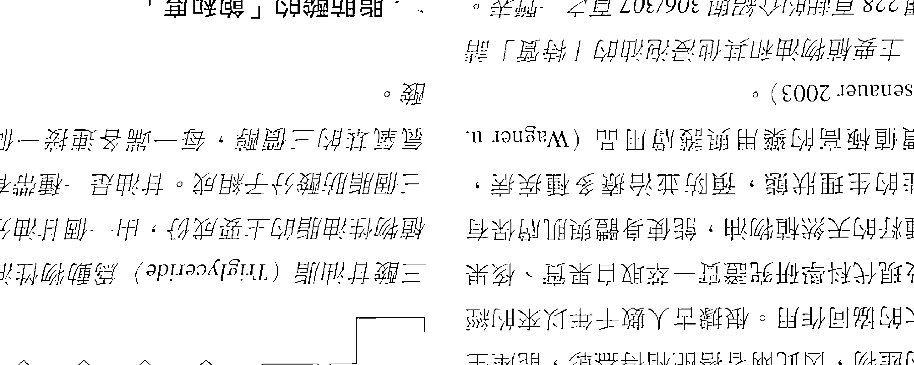

### 脂肪酸的「饱和度」

生物学中所提到的饱和脂肪酸，是指分子结构中只含单键，多元不饱和脂肪酸，是指其化学结构中含有多键。

### 脂肪酸的「顺式」

顺式脂肪酸通常具有顺式双键，其结构较为紧凑，常见于植物油脂中，具有抗氧化和保护细胞膜的功能。反式脂肪酸通常具有反式双键，其结构较为松散，常见于氢化植物油中，可能对健康有不利影响。

### 植物油脂和种子油的「特性」

植物油脂和种子油的特性主要取决于其所含的脂肪酸组成，不同的脂肪酸组成会影响油脂的物理性质（如熔点、流动性）和化学性质（如氧化稳定性、营养价值）。例如，富含不饱和脂肪酸的植物油（如橄榄油、花生油）通常具有较低的熔点和较好的流动性，而富含饱和脂肪酸的植物油（如椰子油、棕榈油）则具有较高的熔点和较好的稳定性。

> > 参考228页的气相色谱306/307页之一顺式。

### 不饱和脂肪酸：物质转换速度快、疗愈力强

不饱和脂肪酸，总以迫不急待的速度与其他物质反应或重新组合。所谓的双键是指能在能量释放时快速分离，展开自由的「双臂」与另一个分子结合。脂肪酸双键含量愈多时即愈不饱和，因此反应就能愈活跃（物质转换较活跃）。

-   ○ 单元不饱和脂肪酸：例如橄榄油和杏仁油内含的油酸。这类脂肪酸拥有一个双键，物质转换速度佳，身体能快速将脂肪酸转换为有益的物质。这类主要含有单元不饱和脂肪酸的植物油，可做为按摩油和一般及干燥肤质的护肤品，保存期限长。
-   ○ 双元不饱和脂肪酸：亚麻油酸为主要代表，在葡萄籽油和月见草油中所蕴含的浓度都很高。这类脂肪酸有两个双键，反应相当活跃，能快速渗入肌肤，适用于一般或油性肤质。在未添加防腐剂的情况下很容易氧化、变质，因此尽管护肤效果极佳，却不易保存。最恰当的折衷办法是与保存期限较长的植物油搭配使用。
-   ○ 三元不饱和脂肪酸：具有三个双键，是反应最活跃的脂肪酸，能立即与其他物质反应。代表性的脂肪酸包括 α 次亚麻油酸（例如亚麻仁油、大麻油）和 γ 次亚麻油酸（例如月见草油、琉璃苣籽油）。这类植物油开封后的保存期限几乎不到两周，除非是经过谨慎精炼后的产品。

不饱和脂肪酸，尤其是多元不饱和脂肪酸，是人体与肌肤的必须脂肪酸，可加速新陈代谢，但人体无法自行合成。因此一般又称为「维他命 F」或「肌肤维他命」，但这些脂肪酸并不属于典型的维他命族群，因此该名称并非正确。

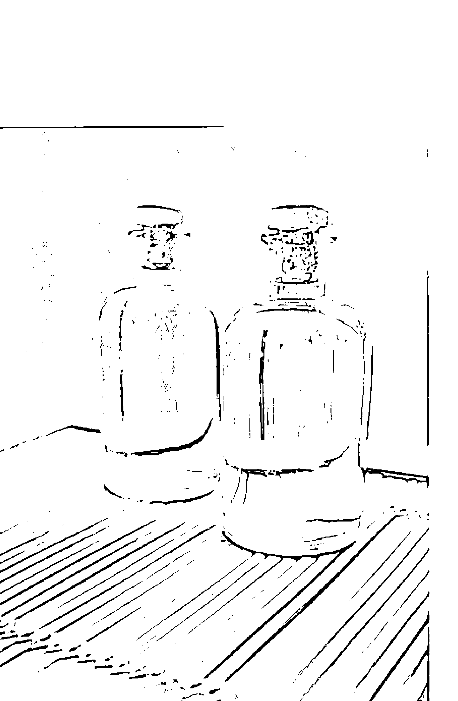

脂溶性的纯净植物油是功效极佳的药用与护肤用品，能全面辅助与支援芳香精油的功效。

### > 乾性或非乾性

不同的组合的脂肪酸除了决定疗效，还左右其对于皮肤的适用性。视其在空气中的改变情况，可分为乾性油、半乾性油和非乾性油。

-   ○ 乾性油：含有 60% 以上的多元不饱和脂肪酸 - 亚麻油酸和次亚麻油酸，由于其反应活跃，在空气中能快速与氧结合（氧化）及树脂化，在皮肤表面形成乾性薄膜。其中最佳代表为亚麻仁油。乾性油能很快地被肌肤吸收。
-   ○ 半乾性油：例如芝麻油，含有 60% 以下的多元不饱和脂肪酸，氧化速度不那么迅速，皮肤吸收速度也较慢。
-   ○ 非乾性油：例如橄榄油及杏仁油，含有 20% 以下的多元不饱和脂肪酸，能在肌肤上形成一层舒适有弹性且持久的油脂薄膜。

### 天然色素、维他命及其他重要物质

#### 一、油脂伴随物质

油脂伴随物质包括植物色素、植物固醇、微量元素、芳香物质和其他等，这些成分在植物油中所含的分量极少。

-   1. 微量元素：在极低的浓度下更可控制细胞的重要反应。
-   2. 鲜黄酮素（植物色素）：增加免疫反应能、强化细胞的代谢，使肌肉保持年青和弹性。
-   3. 雌激素（雌激素）：降低胆固醇，促进雌激素的功能，保护肌肉。
-   4. 植物固醇：尤其能降低胆固醇，刺激胆固醇的代谢，使肌肉的柔软有弹性，具有保湿功能。
-   5. 芳香物质：主要特指高抗发酵，使皮肤再生。
-   6. 甾醇：在低的浓度下更可控制细胞的重要反应。

#### 特别注意事项：某些油类需特别注意！

| 功能性油 | 非功能性油 | 未精炼油 | 精炼油 |
| :--- | :--- | :--- | :--- |
| 橄榄油 | 山茶油 | 月见草油 | 花生油 |
| 大麻籽油 | 亚麻籽油 | 大豆油 | 小麦胚芽油 |
| 葵花籽油 | | | |

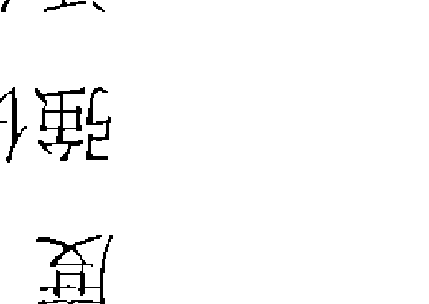

人类的皮肤不仅仅是一层“皮发”，更是人体最大的器官，具有各种功能（页7）。此外，皮肤细胞拥有特殊的抵抗力，是人体免疫系统的一部份，也是人体的重要屏障。人类的皮肤保持在健康状态时，才能发挥100%的抵抗力。

当我们将植物油涂在皮肤上，其中的生物活性物质会立即渗入皮肤，大大提高皮肤本身的保护作用和防御能力，激励细胞再生与修复，保持肌肤年轻、紧实，有效改善肌肤的状态。

### 1. 以矿物油作为保养品？

市面上许多护肤用品的基底油均为矿物油，且比例往往相当高。在这类产品 的成份说明表上通常一眼就会看到“矿物油”三个字。

矿物油提炼自石油。举凡石蜡和凡士林皆为石油的衍生产品。这些产品是由长链饱和碳氢化合物所组成，基本上是为无数的碳和氢（C 和 H），非常难以分解与代谢。

矿物油与人体本身的脂肪完全不同，因此只能吸附或囤积在人体的肌肤上。这类产品涂抹在皮肤上会形成一层薄膜，产生某种保护作用。

-   优点：相当持久，且制造成本低廉。
-   缺点：也是与植物油最大的差异，因矿物油无法支援皮肤最重要的功能：既无法促进细胞再生，也不能强化免疫系统，不能捕捉自由基，自然无法支援肌膚自愈的功能。以石油为基础配方的保养品，长期下来会使肌肤变得干燥不活跃，因此必须不断地涂抹：在电子显微镜影像显示，其细胞间隙的晶状结构产生巨大改变，致使水分外溢，皮肤因而变得干燥。

精油与矿物油为基质的保养品在混合后会携带部份矿物油渗入皮肤，因此不建议将二者混合使用（页7）。

### 植物油是天然保养品

植物油与人体皮肤脂肪的构造极为相近，能为肌肤所吸收，渗入肌肤深层，参与代谢过程，并可强化表皮的免疫系统，由肌肤内部活化，而不需时时涂抹。此外，植物油能渗透深入表皮的角质层，锁住细胞间的水分，使皮肤自然分泌油脂，改善干燥症状（紧绷感、敏感、发红），皮肤变得光滑、有弹性。

婴幼儿及年长者肌肤的水脂膜和免疫系统，因尚未发展完全或已退化，所以更需要使用植物油来保养肌肤。

从矿物油改用植物油时，需特别留意年长者可能出现脱皮现象。这种症状一周后便自然消退，且皮肤触感非常良好。

### 品质很重要

不论是内服或外用，为了达到诸多良好成效，请务必使用高品质的植物油。纯净天然的植物油明显优于精炼的植物油，因后者抽掉了丰富的脂肪伴随物质且部份脂肪酸的化学结构也产生转变。

品质良好的食用油或脂肪，例如橄榄油、油菜籽油或是椰子油，对肌肤保养助益极佳，支援肌肤的功能持久，且激励自愈功能。

### 琼崖海棠浸泡油（页232）

拉丁学名：*Calophyllum inophyllum*

植物科属：藤黄科 / 金丝桃科 (Guttiferae / Hypericaceae)

主要成分：油酸 30 - 35%，亚麻油酸 17 - 39%，饱和脂肪酸 30%，脂肪伴随物质 14 - 20% (主要为甾醇)

弱小的玳瑁海葵是印度洋太平洋沿岸的原生植物，当地人视其为神木。玳瑁海葵果实的籽可提炼出橄榄绿色的植物油，其浓郁芬芳的香气，略像圆叶当归。当地人以玳瑁海葵油治疗烫伤、烧伤、溃疡、静脉曲张、坐骨神经痛和关节痛。

德国方医师对玳瑁海葵油的强大疗效了解甚少，然而在法国，玳瑁海葵油已是芳香疗法配方中的固定成员。玳瑁海葵油能够舒解坐骨神经痛、风湿和痛风等症状造成的灼痛、抑制发炎、经期疼痛，低剂量海葵油舒剂则能舒解疼痛和强壮，特别有稳定脑的作用，亦有抗凝血功能，适合用于治疗动脉血流滞缓不足。其它应用症状包括皮炎和新伤疤痕。另外，抗菌的作用使其成为治疗带状疱疹的最佳基础油。

### 鳄梨油（页232）

拉丁学名：*Persea americana*

植物科属：樟科 (Lauraceae)

主要成分：油酸 70%，棕榈烯酸 (请参阅见于胭脂果油，页 231) 6%，饱和脂肪酸 15%，亚麻油酸 10%，脂肪伴随物质 2.6 - 8%。

考古学家发现，早在西元前 7800 年，阿兹特克人就已在现今墨西哥西哥南端的瓦哈卡(Oaxaca) 种植鳄梨树。果实是重要的粮食，鳄梨油则被视为奢侈品及高效皮肤保养品。

鳄梨油是肌肤最佳保养品之一，特别是针对乾性肤质，其它保养成分可长保肌肤娇嫩、光滑、有弹性。此外，还能止痒、抗发炎，具有 SPF3~4 的防晒系数。鳄梨油适用于每一个人，与杏仁油搭配，也可发挥不错的功效。

所有植物油成分的百分比都是约略值！

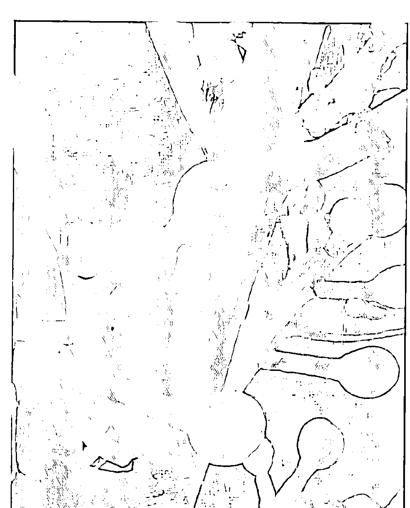

琼崖海棠树上的花苞。籽可萃取出具有高药用价值的橄榄绿植物油，气味浓郁芳香。

### 玫瑰籽油

拉丁学名：Rosa rubiginosa, Rosa mosqueta

植物科属：蔷薇科 (Rosaceae)

主要成分：亚麻油酸 40%，α 次亚麻油酸 40%，脂肪伴随物质 1%。

安地斯山和智利南部等地可见野生香叶蔷薇，又称为智利野玫瑰或智利犬蔷薇。数年前开始，人们取其玫瑰果籽提炼出美妙的基底油。

玫瑰籽油高单位的不饱和脂肪酸维持细胞膜功能的完整性，刺激细胞分裂，使皮肤再生。玫瑰籽油能降低水分流失、调理皮脂腺并抑制发炎。经研究显示，对除疤和伤口愈合有正面的影响（Seitz 2001），一般推论认为来自可改善胶原形成和血液微循环的作用，因此，玫瑰籽油能预防皮肤提早老化。

冷压法提炼的玫瑰籽油由于内含不饱和脂肪酸，保存期限相当有限。为避免氧化，玫瑰籽油多以胶囊封装，温和精炼过后的玫瑰籽油保存期限增长，价格平实许多，也能同样能达到良好的护肤效果。

### 大麻油

拉丁学名：Cannabis sativa

植物科属：桑科 (Moraceae) 或大麻科 (Cannabaceae)

主要成分：亚麻油酸 54%，α 次亚麻油酸 17%，γ 次亚麻油酸 4%，油酸 13%，饱和脂肪酸 10%，脂肪伴随物质 1%。

大麻是全世界最古老的植栽之一，原生于中亚地区，后来随着人类迁移的脚步，衍生至不同的气候带。

现今一提到大麻，人们自然会联想到毒品，而非药用植物。目前，欧洲各地皆有培育，而这种大麻其实并不含毒品大麻中 THC（四氢大麻酚）的成分。无论大麻籽或大麻油都不含 THC。大麻油内含亚麻油酸和 α 次亚麻油酸，其黄金比例 3:1 的组合，对免疫系统和细胞结构有特殊的正面功效。相较于其它植物油，大麻籽油和月见草油均蕴藏高价值、相当稀有的 γ 次亚麻油酸。欧洲一带的大麻所提炼出的大麻籽油证实含有丰富。

拉丁学名：Cocos nucifera

植物科属：棕榈科（Arecaceae）

主要成分：饱和脂肪酸90%（主要属月桂酸50%，肉豆蔻酸17%，油酸8%，脂肪伴随物约1%。

用途：椰子油在烹饪上的椰子可提炼出白色的椰子油，温度差24°C时便会融化，也因为椰子油需要在天然的热带里生长又须热带椰子油。

植物科属：黄杨科（Buxaceae）（附注：亦属于“西蒙得木科（Simmondsiaceae）”）

拉丁学名：Simmondsia chinensis

主要成分：几乎完全以蜡质为主要成分，反维他命、植物甾醇等脂质伴随物质。

用途：膨腹硬大小的而有芭籽（坚果）可提炼出高黏滞僧值的「植物油」。或「植物油」其实是一种液态的植物蜡，其他蜡质常贵用油过不相同，植物油的成分不是脂肪酸和甘油所播成的蜡质（页224），而是不饱和和脂肪酸。

均贩售温和精炼的椰子油，内含高价值的脂肪伴随物质。椰子油相当适合用于保养肌肤，与其他植物油和非乾性油不同之处在于其中的月桂酸（十二碳脂肪酸）和肉豆蔻酸（十四碳脂肪酸），这二种成分的分子相当微小，能快速被皮肤吸收。

椰子油对乾性、敏感和过敏肤质相当有益。实验证实椰子油清凉、镇定及稳定肌肤状态的特质对异位性皮肤炎具有良好疗效，但必需使用温和精炼的椰子油。

如要改善椰子油粉碎状的脂肪质感，发挥协同作用，建议以椰子油（稍微加温）和荷荷芭油用 1:1 的比例混合；使用对象为婴幼儿或年长者时，可用杏仁油或橄榄油取代荷荷芭油混合使用。

### 澳洲昆士兰坚果油

-   拉丁学名：*Macadamia integrifolia*
-   植物科属：山龙眼科 (Protaceae)
-   主要成分：油酸 60%，棕榈烯酸 25%，饱和脂肪酸 15%，脂肪伴随物质可达 1%（维他命 A、B、E，矿物质）。

澳洲昆士兰坚果油可说是全世界果仁类中最细致、成分也最丰富的油脂，封它为「坚果之后」，一点也不为过。

澳洲昆士兰坚果油受人瞩目之因在于高比例的油酸成分，能使按摩顺利推展，给予舒适柔软的肌肤触感。油酸搭配高比例的棕榈烯酸能产生良好协同作用，棕榈烯酸几乎只蕴藏于动物油脂中，与肌肤本身的脂肪酸极为相似。因此，昆士兰坚果油易于吸收，能促进肌肤再生，使肌肤更具抵抗力，调节角质化的过程。

此外，澳洲昆士兰坚果油具有 SPF3～4 的天然防晒系数。

### 甜杏仁油

-   拉丁学名：*Prunus amygdalus var. dulcis*
-   植物科属：蔷薇科 (Rosaceae)
-   主要成分：油酸 80%，亚麻油酸 15%，饱和脂肪酸 6%，脂肪伴随物质 1-2%。

数千年前亚洲便开始种植杏仁树。杏仁油在古代即是深受喜爱的保养品。目前市面上的甜杏仁油是由两种不同品种的成熟种籽冷压萃取而成，分别是甜杏仁 (*Prunus amygdalus var. dulcis*) 和苦杏仁 (*Prunus amygdalus var. amara*)。两者差异在于内含的苦杏仁甙 (Amygdalin) 比例不同，该成分是决定苦涩感与具有毒性的关键。苦杏仁所含的杏素高达 85%，甜杏仁则约为 0.1%。

杏仁油瓶身上若无清楚标示为「甜杏仁油」时，则不可内服，也不可用于幼儿身上！基于安全起见，也尽量避免用来保养肌肤。

甜杏仁油是皮肤保养品中价格不斐的植物油之一，高达八成的油酸赋予肌肤美丽柔嫩的触感。甜杏仁油能纾解过敏，呵护宝贝肌肤，尤其适用容易龟裂、脱皮和搔痒的乾性肤质，其油质非常容易被吸收，相当适合敏感性肤质，是理想的婴儿护肤油。

甜杏仁油也是绝佳的按摩油，在芳香保健领域是相当受欢迎的基底油。

用途与功效类似的植物油包括杏桃仁油、桃核仁油和榛果油。

### 浸泡油

浸泡油是萃取出草本活性的植物油。将草本植物在植物油中一段时间，将脂溶性的成分溶解到至植物油中。通常浸泡油适合植物油和草本的繁效，不需内服或外用的禁用属性值都特别高。

#### 金盏菊浸泡油

金盏菊浸泡油：金盏菊（Calendula officinalis）浸泡在橄榄油或葵花籽油而成的萃取液，可保护软性、敏感性和过敏性肌肤，促进肌肤新陈代谢。

#### 积雪草浸泡油

积雪草浸泡油：积雪草（Centella asiatica），又称铜钱「印度水蕨」，浸泡在甜杏仁油、芝麻油或椰子油而成的萃取液。积雪草在印度及马来西亚已有数千年历史，是极受欢迎的草药。积雪草茶饮用可帮助脑部活血，积雪草浸泡油则可治疗静脉、鼓突或伤口等不同的皮肤问题兼具疗效。

#### 山金车浸渍油

山金车浸渍油：山金车（Arnica montana）浸泡在橄榄油所形成的萃取液，可止痛、郁、促进肌肤新陈代谢。

#### 香草浸泡油

香草浸泡油：是指香草果实（Vanilla planifolia）浸泡在蓖麻油而成的浸泡油，气味芬芳怡人，熨作相当容易。香草浸泡油安眠、舒缓节的功效，特别适合用来舒缓感冒受鼻黏膜油的基础油。

#### 香草浸泡油 DIY

香草浸泡油 DIY：取5条香草荚果，用刀子沿着豆荚纵剖圈，放入装有0.5公升甜杏仁油或橄榄油的深色玻璃瓶。放在温暖阴暗的地方，静置四周，再将浸泡油过滤装入一百毫升的深色玻璃瓶，以利使用期限保存。

#### 芦荟浸渍油

芦荟浸渍油：芦荟（Aloe barbadensis）浸泡在蓖麻油、油菜籽油或大豆油而成的萃取液，对肌肤有舒定、清凉、紧实及保湿等作用。

使用的植物不同，浸泡油的效果也不相同，例如止痛、舒定、活化及提振精神。

贯叶连翘草浸泡油：是有斑点的金丝桃花，即贯叶连翘（Hypericum perforatum）浸泡在橄榄油中形成具有特殊疗效的浸泡油，又因其色泽偏红浸油。对伤口感染有相当性的止痛效果，消炎。除此之外，贯叶连翘草浸泡油可愈合、抗发炎及减肥肌肉，安抚及镇静的作用，因而又被称为「神经系统上的山金车」。浸泡油搭配能生良的防同作用，到多不适症的疗效加倍。

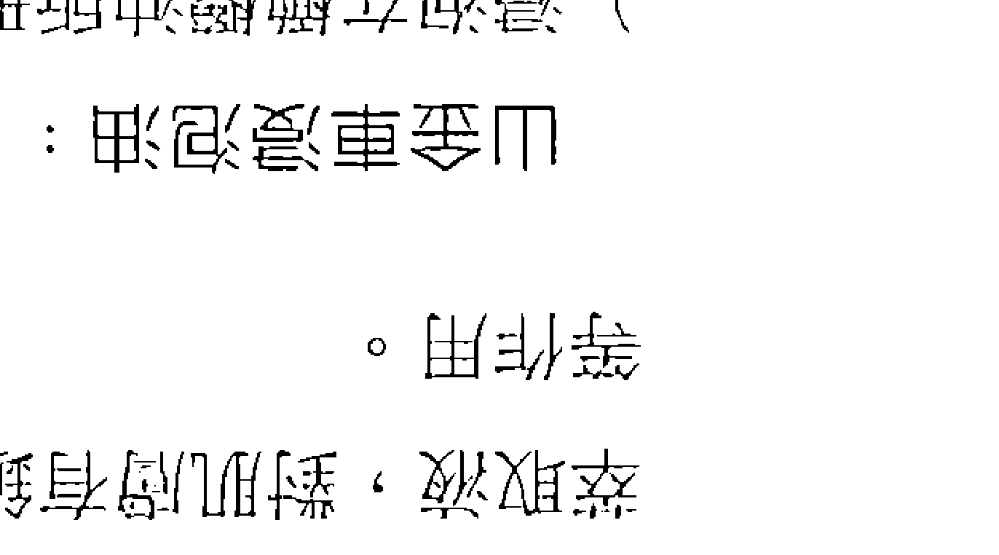

### 月见草

拉丁学名：Oenothera biennis

植物科属：柳叶菜科（Onagraceae）

主要成分：亚麻油酸 67%，γ 次亚麻油酸 14%，油酸 11%，饱和脂肪酸 8%，脂肪伴随物质 1.5－2.5%。

月见草原生于北美洲，是北美印地安人重用的药草。早在五百年前，阿冈昆印第安人便将月见草籽磨碎，敷在发疹的皮肤患部。

直到近代，月见草惊人的药用价值才获得证实。(Wagner u. Wiesenauer 2003) 萃取自月见草籽的珍贵植物油可强化肌肤与免疫系统，是许多皮肤疾病的“急救药方”。月见草油可调节皮肤的细胞代谢及皮脂腺分泌，增加弹性，使皮肤再生。

月见草油是少数含有 γ 次亚麻油酸的植物油，这种多元不饱和脂肪酸能调节天然抗炎与止痒神经讯息传导分子的形成，强化肌肤的免疫系统，是健康皮肤细胞不可或缺的因素。此外，月见草油经证实能有效治疗异位性皮肤炎。

若为外用时，月见草油最好与荷荷芭油、椰子油等基底油搭配使用，例如将 10 毫升的月见草油（精炼）加入 50 毫升的其他植物油混合，可作为各种肤质的身体和脸部保养用油。

化学成分类似的植物油有琉璃苣籽油和黑醋栗籽油。

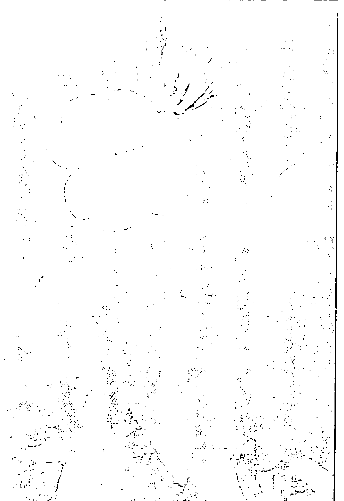

月见草的花在夜间才绽放，散发迷人芬芳。萃取自月见草种籽的珍贵月见草油对神经性皮肤炎深具疗效。

### 橄榄

拉丁学名：Olea europaea L.

植物科属：木樨科（Oleaceae）

主要成分：油酸 75%，饱和脂肪酸 15%，亚麻油酸 10%，脂肪伴随物质 0.5－1.5%（酚类、α-生育酚、维他命 E）。

弯曲而古老，是一般人对地中海国家橄榄树浪漫树林的典型印象。一直以来，橄榄树对地中海居民而言是幸福、神之恩典与和平的象征。

自古以来橄榄油不仅被视为食品，更由防治心血管疾病和肠胃道的正面辅助而功效保健。
橄榄油在欧洲魔法中特用来治疗癫痫病，现代的橄榄油形成的浸泡油（页232），沙棘油则是草形成的浸泡油（页232），缓解肌肉硬化、发炎和痉痛，尤具效用。
橄榄油作为滋养油脂由来已久，它富含油酸和多不饱和脂肪酸，润肠效果颇佳，可促进血液循环、缓解、湿疹、血流稍湿不足、疱痕、脱皮等症状（但因肾皮发内藏脂热，不适合性皮炎患者！）。多酚类则能使皮肤免于自由基和紫外线的侵害。橄榄油可以1:1的比例同月见草油搭配使用。
非致性的橄榄油保健效果缓注，适合作长期使用，尤其适用于发炎皮肤的保健。

**拉丁学名**：Hippophae rhamnoides

**植物科属**：胡颓子科 (Elaeagnaceae)

**主要成分**：亚麻油酸 30%，α-亚麻油酸 30%，棕榈烯酸 34%，脂肪伴随物 4%（维他命E、维他命A前胴物质[類胡蘿蔔素]、維合維他命B、維他命C和K、類黃酮素、植物固醇）

缓解再生，是绝佳的滋养保健品。
沙棘油用于发炎皮肤反应功效保健的正面成效，已累植不少临床案例。

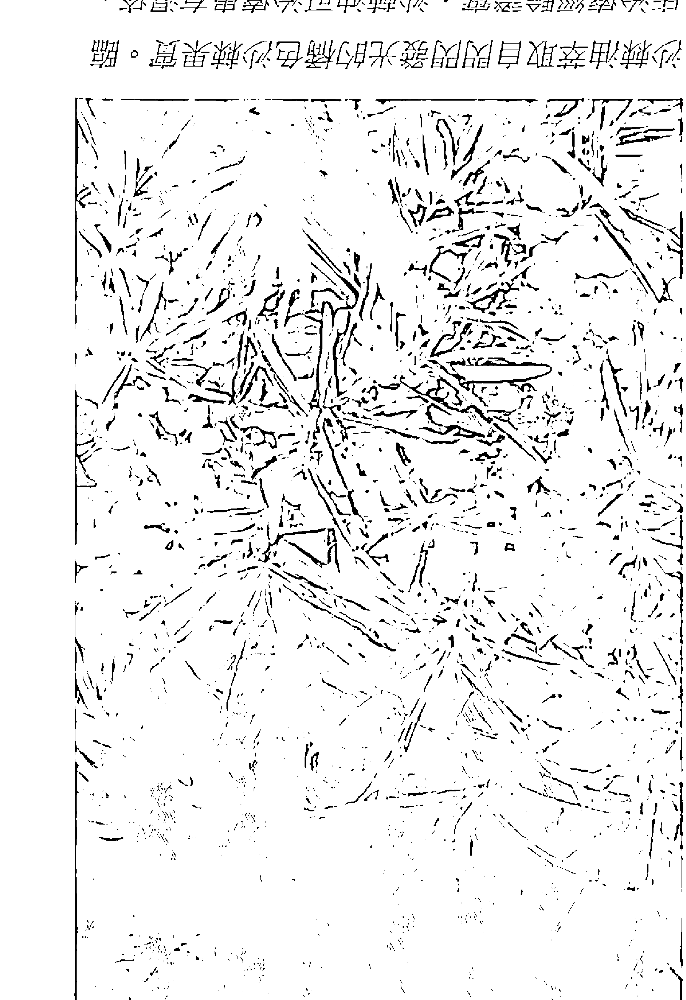

数年前，中欧现今等大国开始以含油法提炼菜籽油，但通常只在当地贩售。经营的油菜籽油亦是良好的护肤品。
油菜籽油和橄榄油相似，均含有高比例的单元不饱和脂肪酸和亚麻油酸。均衡的亚麻油酸和α-亚麻油酸的比例相当平衡，生理显著等上极平衡的脂肪酸模式和高单位的维他命E及維他命A前胴物質，使油菜籽油不造成腻且有益的营养食品，还可稳定肌肤干燥、退酸、发炎或受伤的皮肤。

**拉丁学名**：Brassica napus

**植物科屬**：十字花科 (Brassicaceae)

**主要成分**：油酸 60%，亚麻油酸 20%，α-亚麻油酸 6%，飽和脂肪酸 13%，脂肪伴随物質 1.5%（主要為維他命E、維他命A前胴物質）。

提炼自橘色沙棘果实果肉的沙棘油，像是专为使肌肤免于环境侵害而打造的屏障。

俄罗斯的药典中记载，沙棘油适用于治疗紫外线所导致的皮肤伤害、癌症放射线治疗的预防与调养、灼伤、褥疮、久伤不癒及特别严重的痤疮形成。

沙棘油含高比例的不饱和脂肪酸，早已证实对湿疹、皮肤过敏及发炎具有疗效。其中棕榈烯酸与人体肌肤脂肪的某种脂肪酸相当接近，因而具有良好的激励细胞再生作用。

类黄酮素（植物色素）是捕捉自由基的高手，可加强抵抗力、抑制致病微生物、稳定细胞膜、强化其防御能力。沙棘油可支援皮肤本身的自癒系统，缓和皮肤提前老化。

剂量为 1% 的沙棘油，也就是大约 20 滴沙棘油加入一百毫升的其它植物油，有最佳的护肤功效。

芝麻油

- 拉丁學名：Sesamum indicum
植物科屬：胡麻科（Pedaliaceae）

主要成分：油酸 42%，亞麻油酸 44%，飽和脂肪酸 14%，脂肪伴隨物質 1 – 1.8%（主要為酚［芝麻酚等］、植物固醇、芝麻素）。

原生长于非洲的芝麻很有可能是最古老的炼油植物。数千年前，中国与印度便已开始种植。

一般芝麻油多以压榨法精炼而成，目前市面上有品质更高、采冷压法过滤而成的芝麻油，这类产品不但是品质极佳的食用油，同时也是独特的护肤油。芝麻油因而跻身全球市场上最珍贵的植物油之列。

在印度，芝麻是道道地地的护肤油，可增强皮肤免疫系统，强化其防御能力。芝麻油抗氧化，因而促进皮肤的治癒过程。质地温热，能止痛，促进皮肤的血液循环，是理想的按摩油。

请注意：可促进血液循环而质地温热的芝麻油，不建议用于异位性皮肤炎或发炎肌肤状态。

乳油木

- 拉丁學名：Butyrospermum parkii
植物科屬：山欖科（Sapotaceae）

主要成分：油酸 50%，飽和脂肪酸 47%，脂肪伴隨物質 6 – 10%（其中有 75% 的三萜烯醇，還有維他命 E、維他命 A 前趨物、尿囊素）。

生长于中非的乳油木可高达十五公尺，乳油木果可长达四公分、内为绿色果肉的坚果约含 50% 脂肪。乳油木果从古至今一直是非洲人最爱的身体保养品及营养品。

乳油木果又称为雪亚脂，相较于其他的植物油脂，乳油木果丰富的脂肪伴随物质中，更有相当高比例的三萜烯醇，可说是相当珍贵的护肤保养品。三萜烯醇是植物蜡与动物蜡的成分，可防止肌肤乾燥及抵抗微生物的侵害，辅助受伤与发炎皮肤的癒合机制。

另外，三萜烯醇如同一层「细胞浆」，可锁住水分，让肌肤水分不致过度蒸发，保有柔软与细致感。雪亚脂可调节肌肤的角质化，能将角质过多的粗糙肌肤变柔软，反之亦能强化角质不足的过薄肌肤，使其具有抵抗外来刺激的能力。对于极度乾燥、缺乏油脂的肌肤，以及因化疗或缺乏脂肪营养造成的皮肤乾裂，乳油木果都具有高度护肤价值。

## 葡萄籽油

不易腐败。这些成分提供自某些的功效相当显著，更够维他命 C、E和β胡萝卜素的抗氧作用，因而使葡萄籽油成为抗老化機能的第一首选，不仅有助於细胞再生，更能促进成血液的微循环作用，是防癌抗癌的免疫系统。

效力。葡萄籽油质地清爽的按摩油具有正面疗效。雪亚脂树皮屑的浸泡油具有正面疗效。雪亚脂树皮屑的浸泡油。

拉丁学名：Vitis vinifera

植物分类：葡萄科 (Vitaceae)

### 主要成分

主要成分：亚麻油酸 70%，油酸 23%，饱和脂肪酸 7%，脂肪伴随物 0.5 – 1.3% (主要含槲黄酮素 [前花青素])。

## 雪多朗浸润油 (页 232)

冷压法萃取的欧洲葡萄籽油直到数年前才正式上市。而在中古世纪，葡萄籽油即早已是深受喜爱的高级肌肤保养用油，能够帮助保湿、口服混合。葡萄籽油是最智慧、最健康的食用油，更是最出色的般的保养品，被普遍应用於化妆品业。葡萄籽油人士之所以推崇有高比例的亚麻油酸，相较於其他也含有高比例亚麻油酸的植物油，它含有非常多的前花青素 (槲黄酮素，又被称为 OPC = 原花青素)。

二指肠内的甘酵素番打成造粘膜挫伤。十二指肠内的甘酵素番打成造暗色湿膜，释发出的芳香分子遇水解而被吸收。外用浓稠：先将乳化剂浸泡方備油高度稀释，再取配方中的一毫升加入一百毫升的水或稀释液中，可使肌胃或黏膜细胞快速而平均吸收，藉由漱口水及呼吸道冲洗液功效卓著。

需要注意：每次使用乳化剂时得摇晃是秘方

## 山梨酸钾——防腐保鲜

山梨酸钾 196R 是不含酒精成分溶於水的植物综合基质，相当於含服薰衣香精油的乳化剂。乳化剂含有脂肪性及水溶性的表面活性成分。脂溶性成分「包围」精油量小的粒子 (形成微细胞)。水溶性成分使微细胞在胞水或稀释液悬浮呈透明生乳化 (溶解状态)。

口服配方：一毫升的山梨酸钾加上一毫升薰香精油及四毫升的水或稀释液。包突住芳香分子的微细胞可抵抗胃酸，进入肠道崩解。

此种蒸馏产品有各种不同的名称：植物水、蒸馏水、花水、芳香水、植物蒸馏、水溶液，最常用的则是纯露。

约在 1830 年，首次在法国发现炼金术师的记录手稿，其中详载制造与治疗步骤的方式，因而得知纯露也作为医疗用途。当时的人将纯露定义为蕴涵许多植物性挥发成分的蒸馏水。

第七世纪，阿拉伯人为了取得「植物深藏的力量」，便开始蒸馏植物。纯露既为医疗之水、健康之水，更为美丽之水，玫瑰纯露更是阿拉伯重要的出口商品。

数百年以来，纯露与「灼水」，即和药草一起蒸馏的白兰地和水果白兰地，被视为万灵丹（页 4）。到了十九世纪，却渐渐为人们所淡忘。直到芳香疗法的崛起，纯露才重新找回一席之地。

不论在地中海国家、北非、土耳其或伊朗，纯露一向是当地人日常生活的家庭必备用品。许多草本植物、花朵、种籽或根部进行大量蒸馏，以应用在医疗、保健与护肤的领域。直到今天，伊朗仍像品酒般慎重检试

纯露的气味与品质。

## 一、提炼方式

水蒸汽蒸馏法（页 20）取得的冷凝水中含有具亲水质的精油。一旦达到饱和度时，精油会从表面溢出，以便取得浮油，留下来的水被称为纯露。

纯露大部分皆为提炼芳香精油过程的副产品，例如薄荷纯露。

某些具高价值的纯露会采用特殊的蒸馏法，例如玫瑰纯露。

## 独一无二的玫瑰纯露

玫瑰纯露有三种不同的品质等级：品质最佳的玫瑰纯露为一公斤的玫瑰花专为提炼出一公升的玫瑰水所用，其中含有多于三百毫克的芳香精油。中级的玫瑰纯露含有约一百到一百五十毫克的玫瑰精油，但为精油提炼过程中的副产品；也就是说，蒸馏过程中产生的纯露会不断反覆使用，直到蒸馏完成。这类纯露可再经特殊的提炼步骤，故所含的玫瑰精油已相当微量，品质等级最普通。

## 纯露与精油的差别

原株植物萃取出的纯露与精油在特质上有相当大的差异。纯露中几乎很难找到单萜烯、倍半萜烯或酯类等非水溶性分子，即疏水物。所以薰衣草纯露会缺乏典型的薰衣草香气，因为它缺乏营造典型薰衣草气息的主要成分一酯。也因此我们不能期待薰衣草纯露具有与薰衣草精油相同的特质。然而，鼠尾草纯露的主要成分侧柏酮，一种单萜烯酮，颇具亲水性，因此特质与鼠尾草精油极为相似。

纯露中最常见的成分为单萜烯醇和酸。

## 精油的应用与保存

## 精油法则

精油因含有较高比例的碳链而有微酸的特质。其pH值通常在3.0和5.0之间（例如甜橙果汁的pH值约为3.0）。因为精油是经过高度稀释的水溶液，因此不需内服、外用皆很安全。

由于触感触法中某些精油具有令人印象深刻的杀效，但这些杀效仍未经科学验证。顾名思义，本质上杀效的精油因其所含的高效物普遍过少，至今其杀效仍缺乏普遍的科学解释。一般相信，草本杀法人能自然然有正面的影响，也就是说，自感能力会受到激励而容易相信，凡是使用过精油的人，她深深地了解到其杀效的效力。

## 使用方式

内服：一般而言，精油的芳香精油由皮肤吸收，因此可换内服。在一杯水中加入一茶匙（见量需半茶匙），每天服用一至两次。

外用：将精油直接涂抹或稀释后涂抹在皮肤局部（使用前需参照以下表格）。

精油所含的芳香成分多，保存期很短，是，如百里香精油的玫瑰精油。若保存不当，酒精成分容易快速挥发。精油的成分也是能够保存期的因素，例如百里香精油内含高比例的百里酚，因而可存放较长时间。另外，pH值也是一大关键。精油越酸，保存期越长。

## 保存

精油保存不易，容易滋生细菌，因此必须深色玻璃瓶低温保存。市面上贩售的精油通常会加入酒精，以防腐菌滋生。

## 常见的精油及其功效

| 精油 | 内服功效 | 外用功效 |
| :--- | :--- | :--- |
| 薰衣草精油 | 抗菌，尤其是肠胃害菌、增强免疫力 | 止痛则强化肌肉 |
| 橘花精油 | 增强免疫力 | 保湿、强化、安抚肌肉 |
| 茶树精油 | 促进消化 | 镇静、降火、抗菌、止痛 |
| 欧薄荷 | 恶心、抑制肠胃道发炎 | 抗感染、伤口愈合 |

## 芳香疗法临床应用

- ○ 芳香疗法概述

- ○ 系统性讨论精油对于各类病症之单独治疗，或作为辅助治疗的使用方式。

- ○ 特别篇章：妇科病症、小儿疾病、身心病症及心理病症

- ○ 提供许多有效的临床配方和应用方式建议

## 复方精油

在许多不适症的治疗上，我们强烈推荐使用复方精油：

- ○ 不适症的病徵：内文中较典型症状，引发病原因进一步的治疗方法均有重要提示。

- ○ 找出合适的精油：针对许多不适症状的治疗，常能看到各式不同的单、复方精油或配方的介绍：它们大抵表面病微或潜伏症状有效，但在治疗上却各有千秋。因此如何选择个人享受精油或正确配方，自有更精细的介绍。此须先简短说明必先流程度：病历表（过去及现在史）一顾脑健康用油的特质一精油香气测试。

## 治疗程序一按步就班

○ 本章前探讨以理论使使用精油能够有效治癒的生理和心理病症，以及如何罹患情况下精油适合做为自然医学及自然疗法形式的辅助治疗。

本章中提到的身心不适症状以脏腑的辅助分类，例如感冒发烧、皮肤病症及妇科病症。要辨别特别在儿童或婴儿出现的病症，亦有专门章节加以探讨。内容索引（自页311起）可查询所有的病症。

- ○ 本章将分别简述每个不适症的病征，包括精油配方和适当的使用方式。

- ○ 本章所述的许多不适症者可由患者自行使用精油治疗（请参阅页51及53的自我治疗）。

## 鉴别精油

精油制剂可多身心不适症能发挥良好作用，其一方面像「西药」般解除症状，另一方面又能如天然药物般产生全面性的功效。

- 例如：薰衣草精油（页125）具强力松解炎痛和促进伤口癒合的特性，不但能有效治疗皮肤炎症的皮肤症状，其抗菌性则能辅助心脏的特质亦能同时平抚意外事件所受到的惊吓。

不适的症状常是身体对内外刺激失调

- 将不同的单方精油倒入5毫升（大约需100滴）的茶色小玻璃瓶中，每次施用中倒出数滴使用。

针灸需频繁使用、且需用方式多样化的不适症（如：感冒），或是需安慰剂、配合成方精精油都是非常见效的作法。

- ○ 合适的使用方式：考虑因素包括病患症状的轻重程度、使用次数的多寡、患者的意愿（例如：患者对于芳香疗法的认同感可强化其效用），及适合的时间点。例如治疗感冒时，蒸汽吸入法比薰香法（请参阅页64）能发挥更强的疗效。

- ○ 正确的剂量：其决定治疗的效果。剂量过高不但无法减轻或治癒病症，甚至会导致副作用产生。初学者应尽可能确实遵照配方进行。经常使用精油必能逐渐累积芳疗专业知识，进而培养其调配处方的能力（调配须知请参阅页61）。

- ○ 材料：芳香治疗与芳香护理的必需品，包括精油、基底油和相关材料，皆可在药房或有机食品店购得（附註：台湾可在百货专柜、美容沙龙、精油专卖店或是网路等通路购得）。重要的是，购买精油时要注意其纯度（页59）！

> 請務必注意對親人、病患及自我治療的侷限性（頁50起）。精油的使用劑量或方式有其必要的限制，特別是使用於兒童、懷孕婦女、有循環障礙者或長者。兒童和弱者不可在無人照護的情況下使用蒸汽吸入法或進行浴療，以免燙傷。薰燈請放置在幼童拿不到的地方！

## 發燒

發燒是身體一個重要、自然的防禦反應，因此發燒時不該立即使用藥物退燒。如果發燒熱度太高（超過攝氏39度）時，會造成循環系統負荷過重。此時應盡可能以自然、溫和的方法進行退燒。

關於敷包和敷布的資訊請參閱頁68起之說明。

## 退燒／解熱精油

臨床經驗顯示：佛手柑、檸檬薄荷、白千層、藍膠尤加利、澳洲尤加利、真正薰衣草、土耳其香桃木、橙花、胡椒薄荷及檸檬精油均具有相同的退燒／解熱功效。

## 小腿敷布

藉由精油的功效來提高敷布的退燒／解熱作用。

- ○ 於1公升水（水溫低於當下體溫攝氏2至3度）中加入3至5滴的退燒精油。

> 若病患有足部冰冷或循環不良的現象，切勿使用小腿敷布！應改用胸敷布的方式。

## 胸敷布

相較於小腿敷布，胸敷布的退燒效用更溫和安全，且能同時調理支氣管炎和肺炎。

- ○ 於1公升水（水溫低於當下體溫攝氏2度）中加入3至5滴的退燒精油（參閱上文）。於入睡裏敷，停留整晚。

可搭配使用額頭敷布：在250毫升的玫瑰純露或冷水（自來水水溫）中加入一滴的玫瑰或檸檬薄荷精油。

## 流行性病毒感染

流行性病毒感染是由病毒引起的最普通的感冒疾病，在大部分的病例中，上呼吸道因被侵袭而出现流鼻涕、咳嗽、声音沙哑等症状。缓解鼻塞鼻的方法需参阅页241的说明，减缓则不适症状的方式，请参阅页243和244的说明。

- ○ 薄口水：请参阅页253之建置。
- 请参阅页65起的使用说明。
- 一杯的薄荷油、金丝桃或少许蜂巢中均匀搅拌。

## 感冒症状

感冒症状常常出现在身心承受巨大压力之时，因而免疫力降低，身体虚弱。一周八小时的偶尔感冒似乎很不好受，颈部能量有限滞塞，感冒任何东西被「堵」住、鼻子也塞住了，或者鼻涕流个不停；雌不是什么大病，却感到自己精力竭、没有半点元气。精油可以帮助缓解鼻痛、流鼻涕和咳嗽等恼人的症状。

## 感冒预防方

在流感季节中，特别是春、秋之际，病床溫可使用以下配方可以有效预防感冒。

- ○ 速效配方：取任一数配1至2滴在手腕或脚底，一日可使用数次。
- ○ 薰衣草：取任一数配5至6滴加入蜂蜜中。
- ○ 洋葱：取任一数配6至8滴加入二分之一的...

## 流行感冒预防

桂油是易治感冒通畅且不具刺激性的方法。可借精油助势作，混合固体脂肪、脂肪油或可五倍作为栓剂的基础（注意：遇熱會很快融化）。

- 成人用量200毫克/2克栓剂，
- 儿童用量100毫克/1克栓剂：
  （下列配方需成人剂量）
  - 桉树精油100毫升
  - 欧洲尤加利树精油20毫升
  - 薄荷可香桃木精油30毫升
- 适合通量的固体脂肪
- ○ 每日三次使用直肠栓剂。

## 急性感冒配方

复方精油：按油樟、白干磨和贡正薰衣草精油各一滴。
○ 速效配方：直接将上述复方精油滴在手心，按压抹在脚底，每日三次，也适用婴幼儿量。

复方精油配方一：30滴莱姆、20滴葡萄柚、20滴月桂、10滴丝柏油樟、20滴安息香。
复方精油配方二：40滴柠檬、20滴澳洲尤加夫草、30滴土其香桃木、10滴罗马洋甘菊。

| 5 |
| --- |
| 身体不适症的应对方式 |

## ➤ 咽喉痛/咽喉炎

咽喉痛是感冒常见的第一个征兆：咽喉发红疼痛，吞咽不适。此时精油可以快速缓解这些症状。

急性咽喉炎为化脓性扁桃腺炎，务必就医进行诊断。表现症状为突然发病、高烧、可能合并寒颤现象、严重喉咙痛和吞咽疼痛，伴随说话含糊不清及淋巴结肿大。临床显示，运用精油并结合植物疗法或顺势疗法的制剂，能有效减轻急性咽喉炎症状或完全治癒。

儿童咽喉痛：请参阅页 276 的说明

## 漱口水

- 复方精油配方一：6 滴柠檬、6 滴桉油樟、5 滴穗花薰衣草、2 滴马斯提其那百里香、1 滴百里酚百里香。

- 复方精油配方二：6 滴红桔、4 滴月桂、4 滴芫荽、2 滴鼠尾草、3 滴墨西哥沈香木、1 滴肉桂皮。

将上述任一配方加入 1 毫升的植物性乳化剂或蜂胶酊剂中，再添加纯水或胡椒薄荷纯露，或鼠尾草纯露至 100 毫升，充分摇匀。

- 漱口：取 1 茶匙的调合后配方加至 1/2 杯的温水，用来漱口，每日数次，每次 1 至 2 分钟，漱口完毕后吐出。

- 内服：取 1/2 茶匙调合后配方加至 50 毫升的水中，每日服用三次。

## 頸敷包

- 湿敷包：在 1/2 公升的热水中，加入 3 滴白千层、1 滴穗花薰衣草、4 滴花梨木。

油敷包：有良好的舒缓功效。在 20 毫升手掌温度的橄榄油中，加入 5 滴白千层、5 滴真正薰衣草、2 滴 100% 的香蜂草。请参阅页 65 起的使用说明。

## 流鼻水

在一般的流鼻水症状使用具有化痰、消炎和抗感染药学属性的精油，均可达到令人满意的缓解和治癒效果。

关于过敏性鼻炎的治疗请参阅页 245 的说明。

## 让鼻子畅通的胡椒薄荷精油

- 将 1 滴胡椒薄荷精油（勿超量！）滴在手背上，用舌头舔入（不适用于六岁以下的儿童）。

## 夜间速效配方

- 在手心滴上 1 至 2 滴胡椒薄荷或蓝胶尤加利精油，抹在枕头上（不适用于六岁以下的儿童）。

## 复方精油配方

因头部阻塞与严重鼻塞而感觉很难受时可使用下列配方：

- 配方一：5 滴山鸡椒、5 滴摩洛哥香桃木、5 滴真正薰衣草、10 滴大西洋雪松、5 滴花梨木。

- 配方二：10 滴欧洲冷杉、5 滴桉油醇迷迭香、5 滴橙花、5 滴安息香。

- 配方三：5 滴甜橙、5 滴葡萄柚、5 滴欧白芷根、3 滴罗勒、2 滴茴香、10 滴欧洲赤松。

- 薰灯：上述任一配方 5 至 7 滴，夜间使用也有良好疗效。

- 蒸汽吸入法：取上述任一配方 1 至 2 滴加入热水中。

## 缓解咳嗽的常用油

百里香精油（Thymus vulgaris）别名含麝酚，对气管炎有很高的疗效；能化痰型的不可同，对鼻黏膜的刺激亦有所差异。

喘嗽见里百日咳的疗法请参考页276的说明。

施蒸汽吸入法到嘲敷带

- 复方精油配方一：20滴茴香油、10滴雪松、10滴桉油醚迷迭香、20滴黑麝香、10滴白芷花。
- 复方精油配方二：10滴柠檬、10滴红桔、10滴百里酚百里香或丁香花苞、15滴豆蔻、10滴百利特里尼香。
- 复方精油配方三：10滴柠檬、10滴莱姆、5滴穗花薰衣草、5滴西伯利亚冷杉、5滴薄荷、5滴香桃木、5滴芳疗易省。
- ○蒸汽吸入法：1公升滚烫的热水中，加入上述任一方1至2滴。
- ○胸腔按摩油：在5毫升的荷荷芭油中加上述任一方5滴。
- ○泡澡：上述任一方7滴倒入1/2杯的鲜奶中均匀搅拌，再倒入浴缸内。

请参阅页65起的使用说明。

## 鼻窦炎及额窦炎

前额出现胀痛感或重压，疼痛感在低头时加重，则，是额窦/鼻窦炎的症状，必须就医看。

侵性额窦/鼻窦炎常是因自己对尘埃产生抗性而产生的慢性发炎征状。

临床显示，使用精油并配合植物擦法或热蒸气法，能有效减轻或完全治疗额窦/鼻窦炎。

- 配方一：在5毫升的甜杏仁油及1滴的沙棘油中，加入1滴欧白芷根、1滴丝柏或1滴迷迭香、1滴白千层。
- 配方二：在5毫升的甜杏仁油及1滴的沙棘油中，加入2滴黑胡椒及其那百里香、1滴摩洛哥玫瑰、1滴苦香桃木。
- ○每日数次，以棉棒或干净的手指将配方涂抹于鼻孔下方或鼻翼两侧，同时轻轻按摩前额及鼻骨部位。

## 咳嗽与支气管炎

当支气管黏膜受到刺激时就会产生咳嗽，如果同时出现疲劳现象或呼吸时有灼痛感，就可能是由细菌或过敏性伤害引起的支气管炎或肺灸，必须就医看。临床显示，精油能有效治疗咳嗽，反侧帮助激发支气管炎或肺灸。

- ○薰灯：使用上述任一配方5滴。
- ○胸敷带，也用于解热：在加热至摄氏37度的30毫升橄榄油中，加入上述任一配方5滴。

请参阅页65起的使用说明。

### 咳嗽栓剂

针对流感和细菌引起的呼吸道疾病，栓剂是无刺激性且极具疗效的应用方式，可请药房制作。栓剂的基质为固态脂肪、脂肪油或可可亚脂（遇热会很快软化！）。

成人用量200毫克／2克栓剂，
儿童用量100毫克／1克栓剂：
（下述配方为成人剂量）

| 成分 | 用量 |
| :--- | :--- |
| 欧洲赤松精油 | 75毫克 |
| 马斯提其那百里香精油 | 30毫克 |
| 穗花薰衣草精油 | 40毫克 |
| 桉油樟精油 | 30毫克 |
| 混合适量的固态脂肪 | |

- ○每日三次，使用直肠栓剂。

## 中耳炎

引起耳朵疼痛可能有各种不同的成因，无论如何必须先就医，因为所有头部的化脓性发炎症症，包括化脓性中耳炎，经常容易感染扩散。中耳炎通常出现在患者发生如流鼻涕或喉咙发炎等一般性感冒症状之后。

真正薰衣草和马斯提其那百里香精油可提供迅速的帮助，缓解疼痛、抑制或甚至治疗愈发炎症期的症状。如症状在24小时内未获明显的改善，则必须立即施行其他的医疗措施，必要时寻求专科医生的治疗。

关于儿童中耳炎的治疗请参阅页277的说明。

### 速效配方

- ○取真正薰衣草或马斯提其那百里香精油1到2滴，滴在药用棉球上并小心地塞入耳道。早晚更换一次。

> ⚠ 千万不可将精油直接滴入耳朵内，恐有造成鼓膜受伤之虞（鼓膜穿孔），精油进入到中耳，刺激中耳黏膜并使发炎症症严重恶化。

## 过敏病症

### 过敏性鼻炎

引发过敏性鼻炎有不同的过敏原，包括花粉（春天好发的花粉热）、食物、动物毛发、尘螨、羽绒被，及职业场所中接触的过敏原（如水泥、面粉等）。

临床显示，使用丝柏、大西洋雪松和松红梅精油能有效缓解患者的症状，因其所含的成分能稳定肥大组织的细胞膜，减少组织胺的释放，而大幅减轻过敏反应。使用内服是成效最佳的方式。

“预防胜于治疗”是对抗花粉热的不二法门！在春天来临前就开始服用“长期治疗配方”（页246）。另在急性发作时可使用以下配方。

### 急救配方

复方精油配方：5毫升的棕色小玻璃瓶中，加入30滴（1.5毫升）的大西洋雪松、10滴（0.5毫升）的松红梅及60滴（3毫升）的丝柏。

- ○内服：每日两次，滴2滴在一小块方糖上，放在嘴中溶解（因透过黏膜能更快速被吸收）。

## 头痛

头痛的原因通常跟身体或心理所承受的压力负重过重有关，很多癌症初期均有类似的征象。例如：“我的肩膀受不了”、“我的脑壳嗡嗡作痛”或“我脑壳都发胀了”。最常见的是头痛突然发作，患者在发作时常伴随明显的视觉和内脏的幻象。此即具有舒缓、镇静和强化作用的精油能够有效的缓解痛觉。因此，油白芷和醋制清油特性能疏患着脚皮肤的重塑，放松身心。
※ 皮肤状况如持续数天不见好转，必须就医或前往医院检查，找出可能的病因治疗。

- ○使用方式：遇敏感性痛发作期间，每日三次，每次服用10滴，或每日在阴凉避光处数次。

### 长期治痛

长期治痛的配方，此精油配方需以低剂量直，以下的抗花物熬配方敷成的精油或敷剂（适何时使用有最好的效果：）

### 精神过度紧张引起的头痛

此即具有舒缓、镇静和强化作用的精油能够有效的缓解痛觉。因此，油白芷和醋制清油特性能疏患着脚皮肤的重塑，放松身心。
※ 皮肤状况如持续数天不见好转，必须就医或前往医院检查，找出可能的病因治疗。

### 支气管炎痛

引起发病痛的原因大多因过度性或心理因素有关系，必就能治愈。精油可以帮助性治疗痛，有效舒缓症状。
在急性病痛发作的情况下，基本上不适合使用精油，但因患者致病时常伴随痛害，白、没弹的倍数，若在舒缓拉摩油中加入具有舒缓倍数和抗痉挛作用的精油，涂挂在腹能大肠舒缓膜上，就能起到解痉、放松的效果。

- 配方：2滴丝柏、4滴薄荷油、2滴丁香、2滴大西洋雪松。
- ○舒缓：将配方加入水中。
- ○舒缓：将上述配方加入50毫升的甜杏仁油中，涂挂在腹及背部。

请参阅页65的使用说明。

- ○ 活力浴：将上述薰灯配方加入 1/2 杯的鲜奶油中搅拌，再倒入浴缸。
- ○ 舒解压力的脚底按摩油：50 毫升的植物油中，加入 5 滴葡萄柚、1 滴玫瑰、2 滴真正薰衣草、1 滴檀香。

请参阅页 65 起的使用说明。

### 肌肉紧绷引起的头痛

如果头痛是由肩颈肌肉紧绷（请参阅页 282）引起时，和缓地按摩颈部和太阳穴有助于缓解疼痛。

- ○ 使用胡椒薄荷精油按摩头部之速效配方：请参阅下述的“天气风向球”。
- ○ 身体按摩油：10 毫升的荷荷芭油中，加入 6 滴葡萄柚、1 滴沉香醇罗勒、1 滴茉莉，均匀混合后装入滚珠瓶或玻璃瓶内，涂抹前额或颈部。临床显示，此配方特别适用于无法承受胡椒薄荷精油的人。

### “天气风向球”和宿醉

对于因天气变化或烟酒过度而引发的头痛，胡椒薄荷精油是最有效的良方。

用胡椒薄荷精油按摩头部尤其见效：患者能在几分钟内快速摆脱头痛、神清气爽。

- ○ 速效配方：取 1 至 2 滴的胡椒薄荷精油滴在面纸上，擦揉颈部和太阳穴。
- ○ 奇迹般的头部按摩：5 滴胡椒薄荷精油、1 颗冰块、1 条毛巾和有冷风的吹风机。将胡椒薄荷精油分倒在手指上，从前额到颈部顺向涂抹数次，再以冰块搓摩后颈部，接着用毛巾搧风或以吹风机朝颈部吹送冷风。

不应在睡前做此头部按摩，因其振奋、提神的作用可能会影响睡眠。

❗ 此头部按摩法不适用于六岁以下的儿童。

### 耳鸣

造成耳鸣的原因有生理及心理的因素，须就医诊断，找出病因对症治疗。耳鸣（哨音、嘶嘶声或轰隆声）的声音特征和强度差异性高，严重时会对患者的生活品质造成影响，甚至造成悲观、绝望。耳鸣病症拖得愈久，治愈机会也随之降低，所以必须尽快地对症治疗。芳疗做为辅助治疗可使用具有促进血液循环和提振情绪的精油。

### 耳鸣按摩油

配方：30 毫升的甜杏仁油中，加入 3 滴桔叶、1 滴黄玉兰或茉莉、1 滴丁香花苞、5 滴零陵香豆原精。

- ○ 按摩：每日三次，轻缓按摩耳后，并往下滑动至颈部。

## 血淤疼痛不适症

血淤疼痛不适证，如血热过低或过高，通可能有不同的成因，必须就迹象找出病因。下述精油能助您有效的舒解疼痛配方方。

### 低血压

低血压配方方：30毫升基础油加20毫升的荷芭油中，加入5滴白千层、3滴真实薰衣草、1滴欧薄荷及1滴100%的香蜂草。身体按摩油：70毫升基础油加20毫升的荷芭油中，加入7滴的白千层、7滴真实薰衣草及5滴土其香桃木。按摩：（1）脚踝部分或身体按摩油至脚踝部或身体按摩油至脚踝部。

### 速效配方

- - 留香油：在5毫升的茶色小玻璃瓶中，加入4滴佛手柑、6滴薰衣草、5滴依兰依兰。
- - 阴虚不適時內服：請參閱頁255。

### 沐浴油

配方：将10滴薰衣草、8滴杜松子油、2滴甜杏仁油、200毫升海盐及一汤匙的蜂蜜倒入浴缸口瓶内，充分摇匀。

- - O 取上述配方，蜂蜜涂抹在湿润的皮肤上，然后接著淋浴。
- - O 注意：由于蒸气的作用，泡在浴缸时，不宜过多时间。

### 神经炎

疼痛的神经炎有可能是因为坐骨或梨状肌发炎（如带状疱疹，页262）所引起，也可能是因神经受到压迫（腰痛，页267）或椎间盘突出所致，常就感觉敏锐细察。侧面神经炎，亦称三叉神经炎，也是一种常导致剧烈疼痛的病症，致使不少患者产生紧张、抑郁、焦虑及抑郁情绪，留下难以治愈的心理问题。下列配方十分适合作用精神激发的辅助治疗，亦能有效调理情绪（页267）。

## 高血压

引发高血压的原因包括器质性及心因性，如愤怒和压力。依病因可分为原发性和次发性两大类。超过 90% 的高血压病例属于原发性，在临床上无法确定为器质性所致。大约 10% 属于次发性高血压，确定是由器质性病变所致，如肾脏病、药物造成的荷尔蒙分泌失常，甲状腺机能亢进、脑压过高或血管病变。高血压有引发后遗症及并发症之虞，务必就医诊断找出病因。下述配方有助于消除肌肉紧张与痉挛现象，间接降低原发性高血压患者血压。

### 放松平衡油

- - 复方精油配方一：2 滴苦橙叶或桔叶、1 至 2 滴玫瑰、7 滴柠檬薄荷、5 滴大西洋雪松。
- - 复方精油配方二：6 滴佛手柑、1 滴茉莉或 2 滴特级依兰、4 滴檀香。
- - ○ 按摩：50 毫升的甜杏仁油或荷荷芭油中，加入上述任一配方。早晚按摩腹部或全身（请参阅页 72 的说明）。

### 紧张性心脏不适症

症状包括功能性心跳过速、心律外收缩（Extrasystolen）或者脉搏跳动急速。因心跳不规律导致患者会出现夜晚心悸或深夜惊醒的典型症状。

在病患已就医诊断排除器官机能异常病因，如甲状腺机能亢进或心脏受损，之后使用精油配合舒缓手法，对心脏能产生镇静和纾压的功效。

### 心脏按摩油

- - 复方精油配方一：1 滴苦橙叶、4 滴佛手柑、1 滴玫瑰、2 滴豆蔻、3 滴檀香或 1 滴穗甘松。
- - 复方精油配方二：1 滴山鸡椒、4 滴佛手柑、1 滴 100% 香蜂草、4 滴花梨木。
- - ○ 按摩：在 30 毫升的甜杏仁油中，加入上述任一款配方。每日三次，涂抹在心脏部位，直到不适症消失。

### 薰灯

- - 配方：4 滴佛手柑、1 滴 100% 柠檬马鞭草、2 滴罗马洋甘菊。

## 静脉血管疾病

### 静脉曲张

结缔组织过于松散、家族性遗传、体重过重和怀孕妇女是最易罹患下肢静脉曲张的族群（静脉曲张：表面浅静脉弯曲扩张的现象）。静脉曲张牵涉到的不只是美观的问题，就其后遗症而言，这其实是一个具有社会意义的文明病，须寻求专业的治疗。

原发性静脉曲张（静脉功能不全）指的是静脉瓣膜机能不全或静脉血管壁功能较弱。次发性静脉曲张指的则是静脉曲张所引起的后果，例如深层静脉血栓。深层静脉系统的血流受阻导致静脉瓣受损，而倒流的血液大量涌向表浅静脉，使得表浅静脉压力增加。

慢性静脉功能不全就会形成静脉曲张：皮肤上浮出青一条、紫一条结节状的静脉和轻微水肿。除了水肿外，也常会有色素过度沉淀、湿疹或溃疡。

浅眠（即所谓浅度睡眠）和皮肤瘙痒（羊皮纸皮肤：皮肤萎缩皱纹和干燥）会导致皮肤瘙痒。

若要预防瘙痒，可交替冷热淋浴、浸泡澡、洗澡后涂植物油和擦干。交替刺激则具三合一的功效：强化和滋养静脉，刺激淋巴液流动，消除水肿以及对抗瘙痒。

### 足浴

足浴：将30滴柠檬、30滴薰衣草干香、10滴茶树油加入装有200克死海盐的玻璃油灯内，充分混合摇匀。

足浴：将5公升的水（摄氏36度）中，加入滴一条丝浴露，每晚泡脚10到15分钟。接着用消毒纱布擦拭伤口。

可将湿毛巾放在患处热敷，再滴上3滴薰衣草精油或0.9%氯化钠溶液的消毒纱布包裹，每日干磨。再用一块消毒纱布包裹，或用一块浸透林格液或0.9%氯化钠溶液的消毒纱布包裹。

再次按摩时使用：

自制按摩油：将30毫升鳄梨油和30毫升荷荷巴油混合，再加入8滴薄荷油、4滴真实薰衣草、5滴丝柏油、3滴杜松。配方一：30滴薰衣草油、30毫升鳄梨油、40毫升荷荷巴油和5滴柠檬油，中，加入4滴山茶花油、1滴乳香、1滴玫瑰香、1滴薄荷香。

配方二：30毫升的芝麻油和20毫升的鳄梨油，中，加入4滴山茶花油、1滴乳香、1滴玫瑰香、1滴薄荷香，加入4滴薄荷油、1滴真实薰衣草、5滴丝柏油、3滴杜松。配方一：30滴薰衣草油、30毫升鳄梨油、40毫升荷荷巴油和5滴柠檬油，中，加入8滴薄荷油、4滴真实薰衣草、5滴丝柏油、3滴杜松。

### 自制按摩油

按摩：每日数次，使用上述任一配方，朝心胸方向再涂抹腿部。

请参阅第65页的使用说明。

### 下肢溃疡

下肢溃疡是静脉功能不全的第三阶段，静脉血液淤滞，下肢压力过大：大血管造成血管内张力增加而引发的现象，大部分的患者是老年人。静脉细胞因长期过度的压力负担，患者小腿皮肤常形成难以愈合的伤口。

### 疼痛

疼痛是直接压迫静脉血管发生强大出血的现象。这些血管微音警报器、造成抽血而导致出血。患者常忍受创口处痉挛性疼痛和刺血痛感，特别是易便秘者常会为此所苦。痔疮也可能是肝功能异常或静脉循环障碍的征兆，因此应就医诊断找出病因。

下述配方的身体按摩油具有良好的舒缓、镇定、抗痉挛和止痒作用，可减轻痔疮病症。

### 速效配方

配方：20毫升的琼崖海棠油和30毫升的圣约翰草浸泡油中，加入5滴杜松、3滴丝柏、2滴绿花白千层、2滴快乐鼠尾草、5滴真正薰衣草、3滴德国洋甘菊。

按摩：每日数次。先用清水仔细清洁肛门和痔疮处，然后使用上述配方小心地涂抹按摩。

> 切勿使用抽取式湿纸巾清洁；湿纸巾可能会引起发痒的过敏反应！

## 动脉血管疾病

### “橱窗症”（间歇性跛行症）

“橱窗症”指的是一种下肢周边动脉阻塞性疾病。患者表现出来的典型行为反应是在行走时会不时地停住一会儿，看来就像是被橱窗内的展示品所吸引而忍不住驻足观赏。事实上，当患者步行较远的距离后，特别是天冷或爬坡时，会感到小腿剧烈疼痛，停下来休息后就会好转，因为在休息状态下，腿部肌肉能获得充分的供血量，所以几分钟后疼痛就会消失，然而再次走动后又会感到疼痛。

不足的程度分为下述四种不同等级：

- - 第一阶段：无病痛现象，多数是因动脉末梢脉动不足而被意外诊断出。
- 第二阶段：有沉重、疼痛感的“间歇性跛行”。
- 第三阶段：由于肌肉的供血量不足，患者在平躺状态下四肢产生疼痛感，四肢放低可暂时缓解疼痛。
- 第四阶段：伴随疼痛或无痛感的组织溃疡和坏死，好发于脚部受压点（如脚后跟和脚趾）。

关于循环障碍的等级辨识和治疗方式需向专科医生咨询（血管外科）。

### 欧白芷根身体按摩油

欧白芷根精油在辅助治疗的临床中证实有许多令人惊奇的功效，其特质在于有效激励血液循环并进而减轻或消除疼痛。因此含有欧白芷根精油的复方身体按摩油对于上述四个阶段的不适症均有良好疗效。临床经验显示，只有遵照以下高剂量配方才能达到最理想的疗效。

配方：30毫升的圣约翰草浸泡油和20毫升的琼崖海棠油中，加入25滴欧白芷根、10滴白千层、12滴真正薰衣草、3滴山鸡椒。

按摩：每日三次。取用上述剂量为5%的配方，轻轻涂抹于急性动脉阻塞患处，也就是第四阶段的患处。

如治疗期延长至数周，则精油剂量需降低至2.5%，只要将基底油增加到100毫升即可。

受到挫折并受到创伤的物理治疗或事科治疗。配方具有促进和提供情绪的作用，可由患者自行使用，是有效的胸部治疗配方。

### 淋巴按摩油

配方：20毫升的玫瑰油和80毫升的甜杏仁油中，加入6滴佛手柑、4滴甜橙、3滴真实薰衣草、1滴玫瑰、2滴岩兰草、1滴丝柏、2滴柠檬、4滴尤加利、1滴迷迭香、3滴檀香。
- ○ 按摩：做充涨巴引发的按摩，将按摩油温柔地涂抹在患部。

### 沉严重疲累的警醒

旅途中久坐不动，皮肤暴露所坐或久站都造成涨巴回流受阻。下述的身体按摩油配方不需是在预防或治疗，在脚床上均应覆盖霜膏有效配方。（请参阅页273 关于脚部水肿的说明。）

### 乳房切除引起的涨巴肿

对每一位妇女而言，因乳房切除涨巴肿都造成身体方的巨大警醒。
甚至安全的处方，于胸部通常会同时间两侧腋下涨巴结，破膜微涨巴管，导致涨巴液的流动受阻而引起患温涨巴肿。此时可由薰香法在此情况下很有帮助（请参阅页284“减压薰蒸”和“多季小式树”配方）。
配方一：50毫升的花瓣油中，加入4滴甜橙、2滴红桔、1滴玫瑰原精、1滴岩兰草、2滴月桂、4滴佛手柑原精。
配方二：50毫升的花瓣油中，加入6滴葡萄柚、油、2滴佛手柑、3滴杜松。
- ○ 按摩：使用上述任一配方按摩胸部及腹部往上至腹部涨。

### 治身心不适症

## 口腔和牙齿不适症

### 口腔保健

龋齿、牙周病和牙龈炎，这些绝对要由牙科医师处理的疾病，均可使用精油制成各种清洁、有抗菌和消毒作用的漱口水，预防或辅助治疗且成效卓著。

漱口水对于戴牙套与使用假牙者有很好的助益，定期使用漱口水，能促进牙床血液循环，稳固牙龈和强化口腔黏膜，改善牙龈出血现象。对于疼痛的鹅口疮（口腔黏膜溃疡）和口臭，使用漱口水也十分有效。除此之外，如果住院患者无法自行进行口腔护理，漱口水证实是适合医院使用的口腔保健处方。

下述的特殊抗牙周病配方不但对于牙龈萎缩有卓越的治疗功效，也可缓和神经性牙痛。

### 芬芳的杀菌漱口水

配方：100毫升的棕色小玻璃瓶中，加入6滴柠檬、10滴桉油樟、5滴欧洲冷杉、4滴胡椒薄荷、4滴没药精油、1滴肉桂叶精油和3毫升的植物性乳化剂后，添满蒸馏水或无气泡矿泉水或胡椒薄荷纯露或鼠尾草纯露，均匀混合。

- - 每日口腔保健：将1茶匙上述配方加入1/2杯的温水中，彻底刷牙后用其漱口一至两分钟，漱口完毕后吐出，每日三次。
- - 感冒时：每日可取用1/2茶匙的上述配方加水稀释后服用，增强抵抗力。
- - 针对牙龈出血，鹅口疮和牙痛：将漱口水稀释后，视需求以棉花棒沾取涂抹在发炎处。

### 抗牙周病配方

配方：5毫升的蜂胶酊剂中，加入10滴松红梅、10滴没药、10滴绿花白千层、20滴胡椒薄荷、10滴茶树。

- - 强化牙龈：用牙刷沾取少许矿土加一滴上述配方刷牙，每日一次。

> 不可用于假牙，因为精油可能会腐蚀表层的合成材料。

- - 此抗牙周病配方也适合调制口腔保健的漱口水，配制方法同上（漱口水）。
- - 牙痛冷敷包：1/2公升冷水中加入3滴上述配方。将一块毛巾浸湿后，完全拧干，然后置于脸颊上，可反复多做几次。

### 牙痛

如遇急性发作状况，下述精油能帮助患者缓解牙痛直至就医：

### 急救配方

- - 按摩：白千层、绿花白千层、丁香花苞或月桂精油纯油涂抹在患处周围的牙龈部位。

> 牙痛如持续无好转现象，务必寻求牙科医师进行治疗！

## 紧张性腹痛和胃痛

很多人面临「难消化」的情绪问题时，通常会连带生闷气等消化器官的敏感反应。譬如，压力和不消化常常是引起腹痛、胃痛和恶心等不适症状的主要原因（请参照页13的说明）。

就像肠胃症状，若找不出生理方面的病兆，仍需仔细深入探察，否则无法解决这些隐藏在病症发作的真正原因，不适症就会反复发生。

小儿肠胃腹痛的治疗需参照页279的说明。

## 速效配方

○ 按摩：2滴黑胡椒精油涂抹在肚脐上方的大肠神经丛上，或将精油与1茶匙椰油混合后，依顺时针方向，轻柔地按摩腹部。

## 抗痉挛配方

配方一：50毫升的甜杏仁油中，加入4滴佛手柑、2滴红桔、2滴月桂精油、4滴檀香、3滴安息香。

配方二：50毫升的甜杏仁油中，加入6滴红桔、1滴玫瑰原精、3滴零陵香豆原精。

配方三：50毫升的鳄梨果油或摩洛哥坚果油中，加入6滴佛手柑、2滴薰衣草、1滴茉莉或2滴天竺葵、2滴神圣罗勒或丁香花苞、3滴甜橙精油。

配方四：50毫升的鳄梨草浸泡油中，加入4滴红桔、2滴岩蔷薇或桔叶、3滴广藿香或没药、2滴尤加利、2滴大西洋雪松。

## 胃肠道不适症

不当的饮食习惯、频繁的暴食、劳动过度、压力或者沉重的精神负担都可能导致胃肠道等消化器官功能性的混乱，例如非溃疡性消化不良（功能性消化不足症状）、腹胀症、交替或消化系统疾病，如腹胀、食欲不振、胃胀痉挛、肠胃胀痛或胃灼热、腹痛或便秘。此外，病人在症状稍退后，可能会产生呕吐或倒逆的现象。

针对这些不适症，使用精油配方按摩腹部或者使用敷包（页68）都有很大的帮助。最重要的是尽快检查找出病因！

## 胃腹胀痛

针对肠胃胀痛所引起的腹痛，使用以下配方轻柔地按摩腹部，能有效排除肠胃炎症及消除痉挛。泡澡或敷包也能消除痉挛、缓解疼痛，并有益肠胃功能，能促进恢复平衡。

小儿肠胃胀痛的治疗需参照页279的说明。

## 腹部按摩油

配方一：50毫升的甜杏仁油或芝麻油中，加入2滴罗勒精油、2滴洋甘菊精油、2滴鼠尾草精油、2滴杜松精油、2滴豆蔻精油、3滴零陵香豆原精。

配方二：50毫升的甜杏仁油或芝麻油中，加入4滴红桔精油、2滴豆蔻精油、2滴甜橙精油、1滴小茴香或莳萝精油、3滴零陵香豆原精。

○ 按摩：根据需要使用上述任一配方，依顺时针方向，轻柔地按摩腹部（需参阅页72的说明）。

○ 按摩：使用上述任一配方，依顺时针方向，轻柔地按摩腹部。

## 噁心不适

胡椒薄荷精油是有效缓解噁心感的良方。引发噁心有不同原因，包括吃了太油腻的食物、晕船、晕车和晕机、怀孕（页272）或者血压太低（页248）也会出现噁心症状。

## 速效配方

+   ○ 内服：在手背上滴1滴（不超过！）胡椒薄荷精油，以舌头舔取。
    此精油内服法不适用于六岁以下的儿童！

## 肝脏及胆囊问题

肝脏是身体主要的排毒器官，负责身体各种不同的重大任务。使用精油制作的肝敷包临床证明对促进肝脏机能有很大的助益。

疾病的治疗方式如会对肝脏造成负荷，可使用肝敷包帮助肝脏代谢；促进分泌胆汁，协助肝脏进行排毒。此外，肝敷包亦能舒缓胆囊痉挛，进而缓解胆绞痛、噁心不适和疼痛等症状。

临床显示，肝敷包对于因肝脏问题引起的偏头痛，有良好的治疗功效。

## 肝敷包

+   配方：40滴马鞭草酮迷迭香精油、20滴侧柏醇百里香精油、10滴30%的香蜂草精油。
    ○ 热敷包：滚水中加入10滴上述配方。
    请参阅页68起的使用说明。

在下午一点至三点间进行肝敷包效果最好 – 按照中医观念的「器官运作时间表」，这段时间是肝脏「机能最弱」的时候。

## 结膜炎

用眼过度，通常伴有头痛症状，好发于长时间工作一整天，或两眼直盯着屏幕专注工作，此时可藉助有镇静和清凉作用的玫瑰纯露敷布，迅速消除眼睛疲劳，神清目明。结膜炎常反复发生，应尽快由眼科医师彻查找出病因。敷布是眼科医师的好帮手，能有效缓解眼睛发炎症狀。

## 清新鲜爽的敷布

偏方：以化妆棉片浸湿香蜂草纯露、略挤干后敷在眼部。约十分钟后，待清凉感消退，取下化妆棉片。每日使用二至三次。

## 皮肤瘙痒

皮肤瘙痒有不同的原因，应先了解缘由，胆碱是常见的引起病因。皮肤严重发痒，特别是上了年纪的患者，有可能是血糖值升高，也就是糖尿病的征兆。不明原因的突发性皮肤发痒，可能是患者心理上受到过度刺激，或是出现湿疹不适的现象。基于身心趋向的正面功效，调制的精油能有效治疗含瘙痒原因的皮肤搔痒问题。

## 舒缓的芳香按摩油

配方一：20毫升的月见草油、20毫升的酪梨油、10毫升的香蜂草油和5滴的沙棘油，加入2滴100%香蜂草精油、1滴香蜂草精油、7滴真正薰衣草精油、1滴苦橙叶或穗甘松精油。

配方二：20毫升的香蜂草油、30毫升的鳄梨油、香蜂草浸泡油和5滴的沙棘油，加入2滴苦橙叶精油、3滴柠檬薄荷精油、2滴迷迭香精油、1滴天竺葵精油、2滴花梨木精油。

## 皮肤不适症

### 皮肤突发时的应急措施

皮肤突发的症状是发红、肿胀和疼痛。使用具有镇静作用的敷布是最佳的应急方式。其他的治疗方式需参照以下几页个别说明。

○ 按摩：皮肤清洁或淋浴后，取上述任一配方轻柔地涂抹全身或患部。

## 舒展身心、增强活力的浴疗

+   - 浴疗：在1/2杯的鲜奶油中，加入2滴苦橙叶或桔叶精油、1滴玫瑰精油、3滴松红梅精油、4滴安息香精油均匀搅拌，再倒入浴缸内（页67）。

## 蚊虫叮咬

对付蚊虫叮咬，可惜并没有完全百分百的预防措施。不过某些精油已证实有良好的防护效果。

## 防蚊配方

+   - 身体按摩油：50毫升的甜杏仁油中，加入10滴柠檬尤加利精油、5滴玫瑰草精油、5滴柠檬香茅精油、10滴柠檬薄荷精油。将配方涂抹在身体易遭蚊子叮咬的部位。

## 驱蚊熏灯

复方精油：20滴柠檬尤加利、10滴柠檬香茅、10滴玫瑰草、10滴波旁天竺葵、20滴柠檬薄荷。

+   - 熏灯：加入5至7滴的上述复方精油。

## 急救配方

对于治疗蚊子叮咬，没有任何精油能像茶树精油发挥令人惊异的快速功效，难耐的搔痒感立刻消退，不会产生发炎的现象。

同样的功效也显现在治疗蜜蜂、马蜂和不知名昆虫叮咬。如能立刻在患部涂上茶树精油，就能有效缓解肿胀现象，即使是稍晚才涂上精油，肿胀消退虽然需时较久，却可马上减轻疼痛。

○ 使用方式：被叮咬处滴上1至2滴的纯茶树精油。视需求可重复使用，直到症状消退为止。

## 痤疮（青春痘）

青春痘并不只发于青春期，成年人也会长痤疮。青春痘的成因可能与荷尔蒙分泌、心理和饮食等因素有关。遗传性体质也是常见的原因。

皮脂腺分泌旺盛，产生太多油脂导致毛孔阻塞，因而产生粉刺，黑头粉刺因感染恶化发炎或化脓而形成丘疹和脓疱，若用脏手指挤压就会留下难看的痘疤。

若针对皮肤表面调理只能治标。能按照自然疗法定律，全面性地改变饮食习惯、排毒、进行皮肤护理和处理潜在的心理问题，才是治本之道。

痤疮患处的皮肤处于高度敏感状态，表层的天然酸性保护膜（抗菌防护层）已受到破坏，这片伤痕累累、发炎、细菌感染的皮肤需要一段时间调理才能治愈。

使用添加纯露和精油的冷敷布能温和而彻底的清洁皮肤，而皮肤护理则可使用以下所建议的护肤霜。

## 清洁杀菌；双效合一

复方精油：10滴苦橙叶精油、20滴真正薰衣草精油、10滴月桂精油、5滴茶树精油、5滴绿花白千层精油。

+   - 清洗或敷包：1公升温水中，加入3滴上述复方精油、6滴植物性乳化剂。
+   - 化妆水：100毫升的纯露中（如胡椒薄荷、玫瑰、岩玫瑰、金缕梅或薰衣草），加入5滴复方精油、10滴植物性乳化剂，充分摇匀。

## 湿疹

湿疹是一种顽固的慢性炎症性皮肤病，病程常持续数月、反复发作。致病原因是表皮细胞再生速度过快，造成皮肤角质化异常。病灶呈现红色的丘疹或斑块、皮屑清除，尤其在膝盖、手肘和背上明显，日久不愈的慢性湿疹。

湿疹可能在任何年龄罹患。患者需要整体性的治疗才能缓解病征。常见的湿疹因素有体内感染、皮肤创伤、服用药物或精神压力。

## 湿疹护肤膏

配方：30克雪亚脂、20毫升玫瑰籽油、3滴薰衣草油、1克可可亚脂、1滴柠檬草油或山鸡椒、1滴岩玫瑰、3滴安息香。

将雪亚脂、可可亚脂和植物油放入锅中隔水加热（勿超过摄氏60度），直到雪亚脂和可可亚脂完全溶解为止，待其稍微冷却。加入精油均匀搅拌后装入已消毒的容器内，待其完全冷却。

使用方式：每日固定两次，先以温水清洗患部然后再擦上配方膏。

## 瘙痒

和大部分的疾病一样，治疗湿疹最好的方式就是预防胜于治疗，每日好好地管理其好发部位是不二法门（页263）。下列的配方有助于预防湿疹及瘙痒的作用。

## 预防湿疹按摩油

配方：100毫升的甜杏仁油浸泡油中，加入10滴玫瑰草精油、10滴真实薰衣草油、5滴绿花白千层精油、10滴花梨木精油、10滴沉香醇百里香精油。

使用方式：每日数次以上述配方涂抹患部。

## 褥疮

病人若长时间躺卧，例如手术台或病床，会在肩胛部、臀部或脚后跟等部位产生压疮。
临床经验显示，在压疮的好发部位做好预防措施，可降低甚至能防止褥疮产生。
下述的配方用于预防和术后护理，皆证明极有成效。此外，它芬芳的气味亦能带给患者舒适愉悦的感受。

## 护理油

配方：50毫升的圣约翰草浸泡油中，加入3滴苦橙叶精油、5滴茶树精油、6滴真正薰衣草精油、2滴波旁天竺葵精油、4滴没药精油。

+   ○ 使用方式：病患卧床期间，每日使用数次涂抹患处。

## 放射线治疗的预防措施

肿瘤切除后所进行的放射治疗常会引起皮肤的发炎反应。临床显示，真正薰衣草精油和绿花白千层精油在发炎症狀的治疗上特别有功效。

## 事前预防

配方：容量30毫升的喷瓶中，加入10毫升真正薰衣草精油及10毫升绿花白千层精油。

+   ○ 喷洒：每次放射治疗后，在皮肤有记号的照射部位喷洒上述配方。

## 事后护理

放射治疗周期结束后，依下列配方按摩油护理肌肤：
配方：80毫升的圣约翰草浸泡油、20毫升的大麻籽油和1毫升的沙棘油中，加入25滴真正薰衣草精油、25滴绿花白千层精油。

+   ○ 使用方式：每日两至三次涂抹患部，若患者觉得舒适可长期使用。

## 肠造口护理

肠造口是利用外科手术在腹部做一个肠道出口，以代替肛门供粪便排泄之用。对大部分的病患来说，直肠或小肠造口（人工肛门）在刚开始时会造成身体及心理上的问题。肠造口需要特别的护理，受过训练的肠造口治疗师，或具备肠造口治疗专业资格的护理师和护士，都会全力协助与支援病患，直到他们学会自我照顾。精油芳香的气味能强化肠造口病患的自我价值感，对身心均有良好功效。
下述建议由此领域有卓越临床成效的护理人员所提供。

## 每日护理的重要建议

每日更换一件式造口袋或者两件式系列的贴环，以及渗漏的排泄物都可能会刺激皮肤并造成发炎现象。因此更换造口袋时，应注意以下重要的操作技巧：

+   1. 从上往下慢慢地撕下贴环，以避免刺激或伤害皮肤。
    2. 先以乳酸林格氏液（可在药房购得）或水清洁肠造口。为保护皮肤和肠造口，应使用轻质的敷布擦拭，而后以下列的纯露配方喷洒肠造口处：

配方：在容量为100毫升的喷雾瓶中装入60毫升玫瑰纯露和40毫升乳酸林格氏液或全部100毫升的玫瑰纯露，加入5滴真正薰衣草精油、5滴胡椒薄荷精油、4滴绿花白千层精油。

## 甲沟炎

甲沟炎是一种在手指和脚趾甲床上的化脓性炎症症状，通常是因小伤口受到细菌感染而引起。指甲周围或指甲下方的甲床常有发炎、化脓和疼痛的现象。绿花白千层精油对甲沟炎有很好的疗效，如同薰衣草精油能迅速把患部的脓引流出，发炎症状也会快速地消退。

○ 每日数次，使用绿花白千层精油涂抹甲床部位。

## 手足皲裂

手足皲裂是很常见的情况，它特别好发于干燥和粗糙的脚后跟边缘部位。定期手浴及足浴，搭配使用消炎和滋润的护肤霜，对病症有不错的治疗效果。太用力刷脚跟的厚皮常常造成剧痛的脚跟皲裂，接受正确的护理才是合适的做法。

## 速效配方

复方精油：6滴安息香精油、1滴茉莉精油或任选一种花香类精油、3滴薄荷香桃木精油、2滴酸香脂精油、3滴安息香精油。

○ 手浴或足浴：在装有200公克泻盐的旋盖式密封瓶内，加入上述复方精油大力摇匀。

取一平匙泻盐配方，加入5公升的温水中（摄氏37度）。每日一次，手浴或是足浴5至10分钟。

○ 护肤霜：将100公克杏仁脂、30毫升甜杏仁油、20公克杏仁椰子油、3公克可可豆蜡混合一起。

## 脚气（香港脚）

脚气是很常见的情况，它特别好发于脚趾和潮湿的脚趾缝间，患部具传染性，合并发痒、发炎和脱皮等症状。免疫力低落的人，则如经常受皲裂困扰的脚跟龟裂病患，风险较高。

很不幸地，脚气在现代已成普遍的传染性疾病。它特别好发于脚趾和潮湿的脚趾缝间，患部具传染性，合并发痒、发炎和脱皮等症状。免疫力低落的人，则如经常受皲裂困扰的脚跟龟裂病患，风险较高。

人类常出入的公共场所，如健身房、游泳池、三温暖或饭店，都是主要的病源地。出入这些场所时，最好是穿上浴室拖鞋或拖鞋以防感染。

脚气患者应该只穿耐穿的纯棉袜子并每日勤换，尽可能地不穿运动鞋，因为双脚在鞋里无法充分透气。

洗完澡或淋浴后将脚趾缝完全擦干，必要时，用吹风机吹干，再擦上脚气专用油能有效预防。

## 脚气专用油

配方：50毫升的甜杏仁油中，加入10滴玫瑰草精油、5滴松红梅精油、5滴西印度月桂精油、1滴波旁天竺葵精油。

+   ○ 使用方式：每日三次以配方涂抹患处能消毒、杀菌。

> ⚠ 使用一週后如情况未见好转，务必就医确认致病病菌！

## 脚汗

定期以丝柏和薰衣草精油进行足浴能有效抑制严重的脚汗分泌。此外，应穿着天然材质的袜子，绝对不要穿运动鞋。

## 足浴

配方：5滴丝柏精油、3滴薰衣草精油与1茶匙的鲜奶油或蜂蜜一起搅拌。

+   ○ 足浴：将上述配方加入5公升的温水（摄氏37度）中，泡脚5至10分钟。仔细擦干脚后，穿上暖和的天然材质袜子。每日一至两次。

## 糖尿病足

糖尿病后期可能会引发足部血液供应不足和周边神经受损等病变。这种「糖尿病足」很容易因皮肤外伤而受到严重感染。定期细心护理双脚能促进血液循环，增强皮肤的抵抗力。

## 足部护理油

配方：20毫升的琼崖海棠油和30毫升的圣约翰草浸泡油中，加入8滴玫瑰草精油、6滴真正薰衣草精油、4滴波旁天竺葵精油、4滴胡椒薄荷精油、3滴绿花白千层精油。

+   ○ 使用方式：每日数次，以上述配方涂抹双脚。

## 疱疹概述

全世界有越来越多的人因感染单纯疱疹病毒而深受折磨。唇疱疹（唇上有灼热感的小水泡）是最常见的疱疹症状之一，其病原菌属单纯疱疹病毒第一型。单纯疱疹病毒第二型好发于生殖器官的皮肤黏膜（见本页下方）。单纯疱疹的幼小感染发生在幼年期，且多未被察觉，在没有发病的情况下，病毒就潜在人体细胞内潜伏很久。一旦免疫系统因生病、疲累、日晒或心理压力而失调，疱疹就有可能发作。

## 生殖器疱疹

生殖器疱疹是由单纯疱疹病毒第二型感染生殖器官和肛门周围的皮肤黏膜，引起一种伴有剧痛、溃疡性疱疹的疾病。近年来，随着各式各样的性行为方式和性接触频繁的盛行，使生殖泌尿道疱疹大幅蔓延（页270）。由于相同的疱疹也可能是梅毒或软性下疳（Ulcus mole）的初期症状，因此务必由妇科医生，而非由药剂师来进行诊断。不过在服用生物制剂获得同意时，可使用精油。

## 抗疱疹精油

单方精油：桉油樟、茶树、香蜂草100%或丁香精油，均属效果强。
复方精油：10滴桉油樟精油、10滴茶树精油、10滴香蜂草30%精油、10滴白千层精油、10滴丁香精油。
使用方式：当疱疹的早期症状出现时即刻取用上述的任一款单方或复方精油配方，以精油交替在患部。每日涂抹数次，直到疼痛和不适消退为止。

## 紧急疱痛的配方

+   - 配方一：5滴茶树、1滴香蜂草100%、5滴真正薰衣草、5滴天竺葵薄荷、3滴穗甘松。
    - 配方二：5滴白千层、5滴天竺葵薄荷、5滴红柑橘、5滴杜松。
    - 急救按摩：100毫升的现调媒介油中，加入上述任一配方。每日数次，涂于有疱疹疼痛的部位。
    - 身体贴敷按摩油：症状消退后，在100毫升的鳄梨浸泡油中，加入上述任一配方，每日按摩患处一次，连续八日。

在皮肤疼痛部位涂上天竺葵薄荷精油能早期发现是否感染带状疱疹，如果疼痛在2至24小时内消失，则是带状疱疹前期发病的表征：若疼痛没有消退，就非常可能是带状疱疹，而可能是神经痛（页248）。精油对减痛有极佳的效果。使用调油直接在带状疱疹疼痛部位涂抹薰衣草精油，在临床上已验证为安全、有效的镇痛方式，因需承受折磨的病患，通常对身体的触摸反应敏感，也无法忍受深度按摩。

## 带状疱疹

当身体免疫力降低时，例如精神压力过大时，潜伏的水痘带状疱疹病毒在感染后（请参阅第278页）多年以后再度活化。而带状疱疹发生时常伴随剧烈疼痛感。及早治疗能有效舒缓病痛、防止恶化。在医学上根据法定病历，而发作上也偶尔出现小水泡时，即可开始进行预防性治疗。

## 抗病毒和增强抵抗力功效的精油进行辅助治疗。

对患部皮肤的后期治疗和护理，下述介绍的护理油经临床证实能大幅缓和病情：

## 护理油

- 配方：在 50 毫升的圣约翰草中，加入 5 滴桉油樟精油、1 滴香蜂草 100% 精油、3 滴绿花白千层精油、3 滴土耳其香桃木精油、3 滴白千层精油。
- 使用方式：每日涂抹两次，使用时不要忘记需戴上乳胶手套！

## 白色念珠菌所引起的疾病

白色念珠菌是一种孢子菌或酵母菌，也称作鹅口疮菌，其存在于每个人的体内。从人出生后的几周起即寄生在体内，所以白色念珠菌也存在于“健康”的人体中，并且就如其它的微生物一样，在人体内执行某些特定的任务。这即是科学界所熟知的共生现象。

从进化观点来看，人与细菌双方在共生关系中，均能获得重要的益处。但这种和睦的共栖生活，只有在人体免疫系统正常运作的情况下，才能顺利地进行。

一旦人体的免疫系统失调，或口服抗生素治疗时，都会造成共生现象瓦解，造成白色念珠菌增生并致病。外在因素也可能是皮肤部位感染白色念珠菌的诱因，例如湿热的气候。

白色念珠菌会侵袭皮肤、口腔、鼻、咽腔、消化道和外生殖器的黏膜部位。肥胖患者在皮肤皱褶处，即腋窝、腹股沟、肛门以及胸部下方的皮肤，这些是擦疮（页 258）的好发部位，也容易感染白色念珠菌。其治疗方式同尿布疹（见本页下方）。

婴儿包尿布处的皮肤如果感染白色念珠菌时会产生皮肤发炎现象，即尿布疹，这种症状在病人和老人身上也日益增加，因大小便失禁病人同样需使用纸尿裤。

### ▷ 鹅口疮

口腔黏膜感染白色念珠菌时，患部会出现白色斑块或膜状附着物，剥下它们时黏膜会出血。

## 漱口水

- 配方：30 毫升的玫瑰纯露中，加入 5 滴玫瑰草精油、5 滴花梨木精油、5 滴沉香醇百里香精油，装入棕色玻璃瓶中摇匀。
- 使用方式：每次使用前需再次摇匀。每日数次，以棉花棒涂抹于患部。

### ▷ 尿布疹

尿布疹是会阴部位受感染而引起的一种皮肤炎症；侵袭此部位的细菌除了白色念珠菌外，还有葡萄球菌。致病因系纸尿裤内尿液的分解及潮湿闷热的环境，使细菌滋长。

最好的防治方法是不要使用有橡皮松紧带的尿布，且勤于更换纸尿裤，并定期使用下述配方护理皮肤。关于婴儿尿布疹的治疗请参阅页 278 的说明。

临床显示，对于成人尿布疹，剂量为 5% 的按摩油能达到最好的疗效。下述配方也适合用于其他皮肤霉菌感染疾病。

## 身体按摩油

- 配方：100 毫升的圣约翰草浸泡油中，加入

## 初学者的调配配方

## 身体不适症

### 呼吸道感染

临床经验显示，精油能有效治疗肠道念珠菌感染。此病的表现症状是局部瘙痒和分泌物增多等，出现这些病征时务必看泌尿科医生进一步找出病因。

如果伴侣中有一方感染肠道念珠菌，另一方也愿共同接受治疗，以防万一。男性如有患痛之忧，可接受泌尿科医生检查确定，若有需要，可使用以下任一配方以冲洗方式进行治疗。

配方：30毫升的黑胡椒薄荷油和20毫升的甜杏仁浸泡油中，加入7滴欧薄荷油、4滴山鸡椒精油、2滴薰衣草艾文草精油、2滴欧薄荷油、4滴松红梅精油、3滴快乐鼠尾草精油、2滴莱姆精油。

使用方式：配方装入50毫升的深色玻璃瓶（最好是大口径玻璃瓶），充分混合均匀。每日早、中、晚涂抹浸湿配方液，塞进阴道。每日早、中、晚更换内裤。连生理期暂停治疗。

### 阴道灌洗

合并使用每日一次的阴道灌洗，能有效强化上述方的治疗效果。若怕性侣有感染情况，亦可使用冲洗法方式治疗。

配方：30滴欧薄荷草精油、10滴山鸡椒精油、10滴欧薄荷艾文草精油、10滴欧薄荷天竺葵精油。

### 肠道感染

烧烫伤按局部伤害的严重程度，分成三等级：

- 第一段：只伤害到最上面的表皮层。表现症状局部发红、肿、疼痛。能完全恢复。
- 第二段：伤害到较深的真皮层。病理表现微如第一段，再加上水泡的产生。有复原的可能。
- 第三段：整层皮肤受到伤害，皮下组织暴露。需植皮愈合伤口。

> 肠道面积在手掌心大小以下的，二级烧烫伤，可自行处理。所有一、二级烧伤大面积，需植皮愈合伤口。

### 肠道栓剂

| 成分 | 剂量 |
|------|------|
| 玫瑰草精油 | 75毫升 |
| 欧白芷根精油 | 30毫升 |
| 玫瑰天竺葵精油 | 30毫升 |
| 松红梅精油 | 30毫升 |
| 茉莉花精油 | 20毫升 |

使用方式：每日三次，使用阴道栓剂。

面积大的烧烫伤以及所有三级烧烫伤经急救处理(见本页下方)后，必须立即送医治疗！

## 急救处理

就烧烫伤的处理而言，薰衣草精油（真正薰衣草或醒目薰衣草）是最好的急救处方。在患处立刻使用薰衣草纯精油，可以快速缓解疼痛、防止皮肤组织肿胀及水泡的形成，患部的触痛感能在数小时内消退。薰衣草精油除了其卓著的生理疗效外，对患者情绪也有特别的安抚、镇静作用，双管齐下所产生的疗愈作用不容小觑，因所有的烧烫伤患者都会伴随巨大的惊吓反应。

另请参阅晒伤（本页右方）。

> ! 二度及三度烧烫伤伤口上绝不可使用植物油 (页226)。

## 烧烫伤的初期护理

- 1. 小心除去未黏附在烧烫伤部位的衣物。
- 2. 如果可能的话，立即用冷水冲洗或冷敷，冷却患部温度。若无法进行时，请立刻使用薰衣草精油处理。
- 3. 将薰衣草纯精油直接涂抹在可自行处理的烧烫伤部位（见本页上方），视情况需要，持续反复涂抹，直到疼痛感完全消退为止。
- 4. 处理所有一、二级较大面积的烧烫伤以及所有三级烧烫伤：先在患部滴上薰衣草纯精油，小心地以一块消毒纱布覆盖患部后立刻就医。

### ▷ 晒伤

夏季或冬季滑雪时，尽管做了防晒却不慎晒伤，以及其他伤害程度较轻的烧伤（见本页左方），都可使用下述疗效极佳的舒缓配方，或配方成分中任一种单方精油。临床经验显示，具有清凉、抑制发炎功效的胡椒薄荷精油与真正薰衣草精油调和后，可有效处理晒伤。

## 日晒后

- 速效配方：涂抹胡椒薄荷、真正薰衣草或醒目薰衣草纯精油。
- 配方：50毫升的圣约翰草浸泡油中，加入5滴胡椒薄荷精油、5滴真正薰衣草或醒目薰衣草精油。
- 使用方式：每日数次，涂抹在患部（只可用于第一级晒伤，页 264），直到晒伤痊愈。

> ! 晒伤后可能会出现严重灼伤现象（皮肤泛红、疼痛、起水泡）。请进行上述初期护理后，立即寻求医生协助。

### ▷ 伤口

临床显示，下述配方（等量的岩玫瑰、真正薰衣草和永久花精油）是一剂急救良方。岩玫瑰和真正薰衣草精油具有愈合伤口、杀菌和缓解疼痛的特质，永久花精油则能迅速化瘀消肿。1:1:1的黄金比例能发挥完美的协同作用，有效治疗伤口和修复皮肤。多年来在医院里使用这款配方治疗感染伤口，也获得令人惊异的成效。

关于儿童伤口的护理请参阅页 279 的说明。

## 芳香疗法

芳香疗法是……

## 芳香精油

每日数次，在患处以及包括未收口的伤口，滴上薰衣草精油或以消退油、抹后吸收。

## 速效配方

薰衣草：每日数次，在患处以及包括未收口的伤口，滴上薰衣草精油或以消退油、抹后吸收。

## 芳香身心不适症

## 急救配方

## 疼痛疗法

## 肌肉酸痛和肌肉扭伤

肌肉酸痛和肌肉扭伤，是身体在非常态性的体力活动后所出现的肌肉不适现象，例如隔了很久之后重新开始运动，或是病人在术后或受伤后的恢复期，重新开始训练僵硬的肌肉。
使用精油进行纾压浴疗和按摩，能快速、有效舒缓紧绷酸痛的肌肉。

## 消除肌肉酸痛配方

- 配方：8滴白千层、6滴快乐鼠尾草、2滴杜松、4滴姜精油。
- 泡浴专用：在1/2杯的鲜奶油中，加入上述配方，再倒入浴缸。水温以身体能接受的温度为宜，泡浴时间15至20分钟，随后稍作休息。

> 十岁以下儿童、孕妇和血液循环不良者只能使用一半的剂量。水温不可超过摄氏37度，泡浴时间不可多于15至20分钟。

- 身体按摩油：用50毫升的甜杏仁油，或使用30毫升的圣约翰草浸泡油加20毫升的甜杏仁油中，加入上述配方，再按摩酸痛部位。

## 背痛

处于压力状态的人，常会不自觉地绷紧肌肉，造成疼痛性肌肉痉挛等症状，尤其常见于肩膀和背部（请参阅页282及页246关于头痛的说明）。活动不当也会导致腰痛（坐骨神经痛），并引起患处局部的肌肉僵硬现象。

下述这两款配方对于一般性的肌肉紧绷及疼痛症状，都有良好纾解的作用，不论是因压力，久坐、久站所引起，都能纾缓身心及促进患部的血液循环。

> 如背痛情况一再反复发生或精油治疗效果不彰时，务必就医检查找出病因！

## 身心舒缓按摩油

- 配方一：50毫升的昆士兰坚果油中，加入4滴山鸡椒、1滴玫瑰原精、3滴黑胡椒、4滴豆蔻、2滴肉桂叶、4滴零陵香豆原精、2滴月桂或丁香花苞。
- 配方二：30毫升的圣约翰草浸泡油和20毫升的琼崖海棠油中，加入4滴葡萄柚、3滴醒目薰衣草精油、3滴马郁兰、4滴柠檬尤加利、4滴芳香白珠、2滴樟脑迷迭香。
- 按摩：每日数次，以上述任一款配方按摩患部肌肉。

## 运动伤害

对于各种运动伤害，急救配方（页266）是最佳的处方，因其强力的细胞修复功效不仅能在短时间缓解疼痛，也能化瘀、止血，使伤口更快愈合。

> 遇有情况较严重和所有原因不明及大面积的伤口，务必立即就医诊疗！

## 感冒不适症状

### 湿热性炎症

湿热病是一种...炎症反应而定。

临床显示，针对疼痛急性发作的治疗...具有消炎、消肿和止痛等疗效...

## 温热的疗法配方

- 配方：5滴红桔、4滴安息香、2滴丁香花苞或西印度月桂、3滴穗花杜荆、2滴中圆肉桂、4滴乳香精油。
- 身体按摩油：50毫升的昆士胡桃坚果油中加入上述配方。每日三次，涂抹腹部位置。
- 沐浴物：基有200克小苏打/碳酸氢钠（可在药店购得）的玻璃杯内，加入上述配方。充分混合均匀，再倒入浴缸内。水温以身体能接受的温度为准，泡浴时间15至20分钟，随后休息休息。

温热对大部分的呼吸道感染患者都有益处，但也有需要治疗的状况，需根据床反应而定。

### 惊风

惊风是一种...炎症反应而定。

- 使用方式：每日三次，涂抹腹部位置。
- 配方：30毫升的圣约翰草浸泡油和20毫升的坚果油或荷荷巴油中，加入4滴甜橙、5滴白千层、3滴穗花薰衣草、2滴蜂蜡尤加利、6滴丁香花苞。

## 清泉按摩油

## 取白芷按摩油

- 手浴和足浴：5公升的温水（摄氏37度）中，加入一汤匙的泡浴粉，每日两次，泡手或泡脚5到10分钟。
- 全身浴澡：在浴缸中倒入两浴缸的泡浴粉，每日泡浴一次。需参阅页67的使用说明。
- 汤数：1公升的浴水中，加入2至3滴胡椒薄荷精油。需参阅页68的使用说明。
- 湿热疗法配方方式需参阅页266的说明。

精油因兼具生理及心理疗效，使芳香疗法成为女性医学中理想的辅助疗法，包括心灵重建、调节荷尔蒙分泌、有效对抗病霉菌、护理皮肤和黏膜。

## 妇科疾病

### ▷ 经痛

严重腹痛症状的经痛可能有不同的成因：压力、器官功能失调、以及营养不足。有太多的经痛患者并未先探究病因，就服用强效的止痛药。
在大部份情况下，芳香疗法对于经前症候群（简称为 PMS = 指女性月经来前，心理和生理上所出现的一些不适症状）和经痛（月经疼痛，此疼痛很少是由器官性因素所致），皆能发挥极佳的功效。使用具有舒缓、放松和消除痉挛作用的按摩油进行腹部按摩，或是具有镇静及止痛作用的按摩油进行腰部按摩，均能帮助患者免除疼痛，不再需要止痛药。
要挑选出个人专属的有效配方必须先进行闻香测试，才能调配出最具身心疗效的按摩油。

## 缓解经痛的身体按摩油

- **配方一**：50毫升的甜杏仁油或荷荷芭油中，加入 4 滴葡萄柚、2 滴苦橙叶或桔叶、1 滴玫瑰、2 滴真正薰衣草、3 滴厄利特利亚乳香。
- **配方二**：50毫升的甜杏仁油或荷荷芭油中，加入 4 滴红桔、2 滴葡萄柚、3 滴特级依兰、2 滴快乐鼠尾草、5 滴檀香。
- **配方三**：100毫升的甜杏仁油或荷荷芭油中，加入 4 滴莱姆、2 滴佛手柑、1 滴茉莉或 4 滴橙花、1 滴摩洛哥香桃木、1 滴岩玫瑰、1 滴大西洋雪松。
- **配方四**：50毫升的甜杏仁油或荷荷芭油中，加入 4 滴葡萄柚、2 滴红桔、2 滴特级依兰或 4 滴柠檬薄荷、2 滴波旁天竺葵、1 滴岩兰草。
- 按摩：以上述任一款配方，早晚按摩腹部（页73），视需要可多次按摩。

### ▷ 橘皮组织

许多妇女都有脂肪异常堆积皮下、称“橘皮现象”的困扰。橘皮现象不是病症，而是女性结缔组织具有较大张力的特性。尽管如此，当女人以批判的眼光审视镜中的自己时，不会有人因看到这项女性特点而特别高兴的...
世上没有能消除橘皮现象的万灵丹，即使业界预告将可研发出相关药方，且价格不斐：可是透过怀孕的现象我们就能理解，严重扩张的皮肤组织绝对无法完全恢复原状。
充分的运动、摄取充足的水分及富含维他命、矿物质的膳食，不仅对皮肤、也对所有的身体器官组织都同等重要。此外，每日冷热交替淋浴，及使用刷子从足部开始、朝心脏方向按摩身体，都是重要的护理方式。

## 膀胱炎

膀胱炎的成因不单是感冒、蓄尿，也可能细菌感染等原因有关。若没有对症治疗或治疗不完全的话，膀胱炎就容易并发肾脏或发展成慢性炎。

> 含精油和植物油的护理油与海马醋乳配方，进行蒸热和使用乳酸保护的护理材料，因此建议使用蒸热醋酸的保护作用能抑制细菌。尤其盥洗和强防感染的功能都曾打折扣。

进行蒸热生活和热敷法是合适的辅助治愈措施。经验显示，具有杀菌、促进血液循环和抗炎功效配方的精油，均有良好的临床疗效。

## 蒸热生活和敷布

- 因受寒引起膀胱炎的配方：1滴德国洋甘菊、3滴香蜂草30%或1滴香蜂草100%、3滴真正薰衣草。
- 细菌性膀胱炎的配方：4滴佛手柑、2滴百里香或侧柏醇百里香、3滴真正薰衣草、3滴花白千层、2滴绿薄荷尾草、1滴杜松。
- 蒸热生活：规定将上述配方倒入1至2公升热水中（请参阅页66的使用说明）。
- 脑室恢复的热敷法：选出合适的配方，照一层足的橄榄油混合，倒在一块布巾上，用热腹布包起来，再以热水浸湿热。取下布肤，将温热的布放在膀胱位置上，覆盖上一块干布，再将热水袋置于其上。

每日两次，最好早此进行蒸热生活或使用热敷法，直到病痛消退为止。

## 阴道感染

阴部感染不仅是由细菌，也可能是由病毒或微菌所引起，务必请妇科医生尽早找出病因。

常见的是白色念珠菌感染（一种酵母菌，真菌），263）：不适阴道滴虫感染（阴道毛滴虫，一（单细胞原生动物）以及生殖器疱疹感染（单纯疱疹病毒第二型）状况也日益增加。

这些部位感染常发生在阴道的天然防护膜（酸性保护膜）和防护力受到破坏时，或是免疫力失衡时，例如服用抗生素或心理问题。

阴道黏膜常需高酸性，以形成天然的预防感染屏障。随着体内荷尔蒙变化的显著（受孕、经期和服用避孕药），阴道环境改变（阴道 pH 值或酸碱度降低），阴道变得更容易受感染的危险。大号地使用卫生棉垫清洗液泡液，或以阴道灌洗清洗私念部位，也易使得阴道内常驻菌落遭受失衡。

阴道感染急性的治疗请参阅页264。

## 抗病毒细胞配方

- 配方一：70 毫升的柏树花油和30 毫升的蔷薇浸泡油中，加入6 滴葡萄柚、4 滴杜松柑、4 滴甜橙、5 滴松油迷迭香、3 滴丝柏。
- 配方二：70 毫升的柏树花油和30 毫升的蔷薇浸泡油中，加入6 滴葡萄柚、5 滴莱姆、2 滴山鸡椒、2 滴水仙花、5 滴雪松香豆精。

若能确实遵照上述原则，再搭配稳定使用抗痛皮细胞配方方按摩好腋部位置，将使皮肤的状况获得明显改善。

## 男性膀胱炎

虽不属常见状况，但男性也会得膀胱炎，例如因导尿管在体内留置的时间较长，尤其是在免疫功能失调的情况下，就会引起膀胱炎。上述的热敷法能对患者提供帮助。

### ▶ 更年期症候群

更年期不是病，而是一种自然的“转换”过程。女人的生命在这时期开始进入一个崭新而重要的阶段；体内的荷尔蒙变化也不是一夕之间产生的，而是阶段性地持续进行。更年期开始的时间因人而异，大部份女性在 45 至 60 岁之间停经，体内荷尔蒙变化就会对身体的健康情况产生严重的影响。

典型的更年期症状有潮红、日夜盗汗、阴道黏膜和阴道干涩并且易感染发炎；无法入睡、心悸、情绪不稳以及常伴随产生忧郁性情绪失调。许多妇女突然觉得自己老了，没有吸引力了。

精油能增强女性对自我女性特质的感受力，使人心情开朗，并帮助平衡荷尔蒙分泌（页 13）。

此外，精油的香气同时有催情和提升性致的作用，对伴侶亦然，可说是意外的“副作用”。

合并使用顺势疗法和植物疗法能产生协同治疗，对更年期症状有相当大的缓解功效，甚至能让各种不适症状完全消失。

临床显示，精油的疗效不只来自于化学成分及药学属性，个人偏好的气味也是重要的决定因素。

## 愉悦配方

## 阴部护理配方

下述配方能调节荷尔蒙分泌、提振精神，对干涩、敏感的阴道黏膜有显著护理效用：

- 配方一：30 毫升的甜杏仁油、20 毫升的酪梨油和 3 滴的沙棘油中，加入 6 滴莱姆、1 滴波旁天竺葵、2 滴完全依兰、2 滴厄利特利亚乳香、2 滴大西洋雪松。
- 配方二：30 毫升的甜杏仁油、20 毫升的酪梨油和 3 滴的沙棘油中，加入 1 滴苦橙叶、4 滴佛手柑、3 滴罗马洋甘菊、2 滴鼠尾草。
- 使用方式：以干净的手指涂抹在阴道黏膜上（关于阴部护理方式请参阅页 270 的使用说明）。

## …温柔的按摩

情绪不稳时，有镇定安神之效：

- 配方一：50 毫升的荷荷芭油和 3 滴的沙棘油中，加入 4 滴莱姆、3 滴葡萄柚、1 滴茉莉或黄玉兰、2 滴檀香。
- 配方二：50 毫升的荷荷芭油和 3 滴的沙棘油中，加入 4 滴佛手柑、2 滴山鸡椒、1 滴玫瑰原精、3 滴安息香。

感性催情、赋活身心：

- 配方三：100 毫升的昆士兰坚果油中，加入 4 滴红桔、3 滴山鸡椒、1 滴茉莉或黄玉兰、2 滴姜、2 滴黑胡椒、3 滴豆蔻、1 滴小茴香、1 滴肉桂叶或肉桂皮、3 滴零陵香豆原精。
- 按摩：早晚轻柔地在腹部和腰椎部位进行较长时间的按摩。

## 身心不适症

### 各类身心不适症

芳香治疗

许多妇女在怀孕初期的前三个月，因荷尔蒙而繁的变化，都常有恶心、呕吐的不适症状。

> 害羞

- 口服：早上在手背滴上1滴胡椒薄荷精油（勿超量！），用舌头舔取，适合在口中一
- 含香油：随身携带一小瓶的蜂蜡、甜橙或芳香油，以备反胃之需。含些精油可有效安抚恶心感。

### 速效配方

### 缓解害喜症状的复方精油

配方：10滴红桔、20滴甜橙、10滴莱姆、5滴橙花、5滴柠檬油醡造迷迭香。

- 薰衣：加入5滴上述配方。
- 月见草按摩油：100毫升的甜杏仁油中，加入上述配方10滴，轻轻地按摩腹部。
- 混泡：1/2杯的酸奶油中，加入上述配方10滴，均匀搅拌后，倒入浴缸内。

### 强化神经和助眠的沐浴配方

配方：1/2杯的酸奶油中，加入4滴佛手柑、1滴香蜂草100%、5滴桦木精油、3滴香桃水、1滴檀香月桂一起搅拌。

- 倒入浴缸中（请参阅页67的使用说明）。
- 使用方式：依照需求，清洗出现症状的身体部位。
- 患刺激性皮炎，如平绒口踝的紫荆、湿疹和哮喘，因此它们们增加刺激现象。

### 缓解严重和湿疹的清洗配方

复方精油：每天清洗时，在1/4公升的清水中中，加入1滴鼠尾草、1滴胡椒薄荷、1滴穗柑。

請參閱自頁 65 起的使用說明。

## ▷ 下肢水腫

不少婦女在懷孕期間深受下肢水腫之苦，絕對不可輕忽，因為它們有可能是子癇前症（過去稱為妊娠毒血症），一種妊娠期常見疾病的前期徵狀。

> ❗ 由於有中毒的危險，患有水腫的孕婦，務必要請婦科醫生診斷找出病因！

合併使用植物療法和順勢療法能產生顯著的療效。

小腿敷帶和腿部按摩皆為適合的輔助醫療措施以及預防方法，能有效刺激新陳代謝和淋巴流動，輕易排除多餘水分、促進血液循環，並顯著舒緩因水腫產生的不適。

除此以外，孕婦應儘可能常把腿抬高，其對下肢水腫也有緩和作用。

附帶說明：對於夏天或久站後所引起的一般性下肢浮腫、沉重的疲累現象，用敷帶及按摩也有良好療效。（頁 252）

## 促進循環的配方

配方：5 滴甜橙、3 滴真正薰衣草、1 滴永久花、1 滴杜松。

- 敷帶：1 公升的溫水中，加入上述配方和 1 湯匙果醋。每日兩次，敷裹小腿。
- 按摩油：50 毫升的芝麻油中，加入上述配方。每日一至兩次，從腳趾朝向心臟，輕柔地按摩雙腿。

敷帶的使用方式請參閱頁 68 的說明。按摩方法請參閱頁 69 起的說明。

## ▷ 妊娠紋

妊娠紋的成因是由於懷孕期間，皮膚結締組織過度擴張所致（不過結締組織鬆弛或體重暴增後的人也會在皮膚上出現類似妊娠紋的肥胖紋）。令人難過的是，這些在細胞組織中所形成的小裂縫，雖然會隨時間逐漸轉變為白色，但永遠不會消失。

如果能儘早開始經常輕柔地按摩腹部、大腿和胸部，就能防止妊娠紋的形成。芳香按摩能促進皮膚的血液循環，強化結締組織，對媽媽和胎兒而言都是無比的享受。

## 妊娠紋預防配方

配方：100 毫升的甜杏仁油或荷荷芭油中，加入 3 滴山雞椒、3 滴檸檬薄荷或真正薰衣草、2 滴橙花、1 滴岩玫瑰、2 滴大西洋雪松。

- 按摩：每日兩次，順時針方向，輕柔地按摩乳房、腹部及臀部等出現妊娠紋的部位（請參閱頁 69 的使用說明）。

## ▷ 分娩前準備

為了讓子宮頸變軟（便於胎頭娩出），並且避免施行會陰切開術，建議在分娩前進行會陰按摩。以下敘述的有效按摩油配方應由助產士示範使用。

配方：50 毫升的甜杏仁油中，加入 5 滴佛手柑、1 滴玫瑰、2 滴快樂鼠尾草、2 滴花梨木。

- 會陰按摩：按摩的進行方式及時間點，均應按照助產士的指導說明。

分娩疼痛時，精油同樣也能發揮很大的幫助：對於女性而言，在宮廷上已有悠久的歷史。

處理精油能幫助準媽媽在產程中更鎮定地運作自己（分娩就意味著「運作自己」），幫助準媽媽能跨越自我以迎接孩子的誕生。

由露易丝·布格斯（Louise Bourgois）於1629年出版的助產士書中提到，當時的女性在生產時，就已使用處理精油清潔和按摩。

若在家中分娩時，放置精油熏香大概不成問題，然而在醫院裡，醫護人員卻可根据法定條規的方法。不過，近年來在德國已逐漸有過多的助產士、婦產科醫師在分娩過程中使用精油。因為精油的香氛不僅有助放鬆、消除緊張及緩解疼痛之效，在心理上，更能安定心神和減少恐懼，使所有參與芳香治療的相關人員也能受益。

### ## 熏香

- 制造室內芳香圈：4滴紅桔、2滴萊姆、1滴茉莉或玫瑰原精、3滴安息香。
- 敏銘、部愿烏兒：6滴佛手柑、1滴玫瑰、3滴花梨木。

### ## 鎮痛按摩油

配方：50毫升的甜杏仁油中，加入4滴佛手柑、1滴橙花、2滴真正薰衣草、3滴大西洋雪松。

使用方式：請使用相同敷帶進行，每隔一小時，重新浸濕、再敷上，直到病痛消失為止。當敷用水需重複更換！請參閱頁68的使用說明。

### ## 薰衣草敷包

混合精油配方：1公升的溫水（自來水水溫）中，加入5滴真正薰衣草或檸檬薄荷、1滴玫瑰。

- 熱敷：當腹絞痛或伸展骨盆膜時，依順時針方向，輕柔地按摩下腹部和腰椎部位，對減輕痠痛和緊張情緒有不少助益；對準媽媽來說，也是一個能幫助分娩的好方式。

### ## 月經

月經是子宮內膜脫落，子宮壁厚，所排出的分泌物，持續期週大約4-6天。

容易引發或發生感染，月經期最好能進行免感染生活。

### ## 消毒破傷的免感染生活

配方：1公升沸騰的熱水中，加入5滴薄荷、薰衣草、3滴茶樹。

使用方式：每日一至兩次進行免感染生活。 請參閱頁66的使用說明。

### ## 乳房脹痛和乳腺炎

乳房疼痛或壓迫明顯，乳腺管阻塞或乳腺發炎造成疼痛的乳腺炎，乳房會出現局部泛紅、變厚，常合併全身性症狀。

乳腺炎的致病原因包括生理和心理因素；因此需請受過專業訓練的助產士或婦產科醫師協助找出病因，再安排適當的治療。

預防乳腺炎最好的方法就是仔細的清洗，每次餵完奶後，最好以薰衣草或玫瑰純露擦淨乳房。

使用薰衣草精油進行乳房按摩能有效緩解或預防與治療的功效。

## 調節乳汁分泌的酸乳敷包

複方精油一：1 滴檸檬、2 滴真正薰衣草、1 滴黃玉蘭、1 滴芫荽。
複方精油二：5 滴甜橙、2 滴洋茴香、1 滴甜茴香、3 滴安息香。
- 使用方式：200 克的冰酸乳中加入上述任一配方，均勻混合後塗滿在亞麻布上，厚度約為一指頭大小，然後將布敷在乳房上靜置約 20 分鐘。每日進行一至兩次。

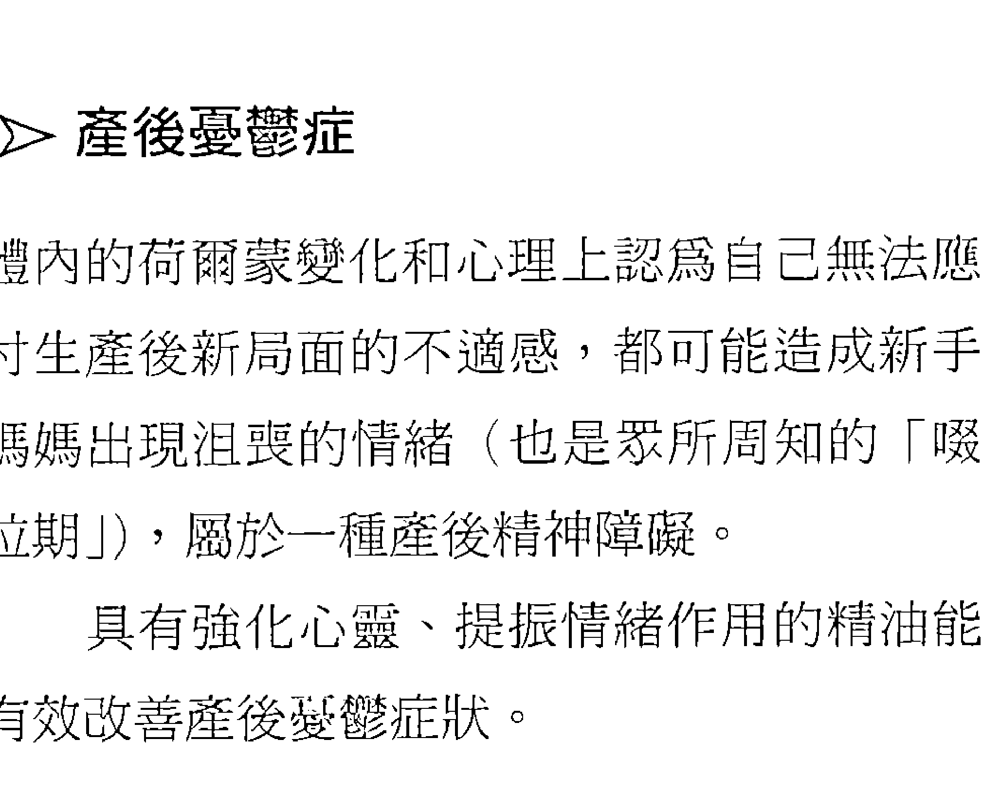

## ▶ 產後憂鬱症

體內的荷爾蒙變化和心理上認為自己無法應付生產後新局的不適感，都可能造成新手媽媽出現沮喪的情緒（也是眾所周知的「哭泣期」），屬於一種產後精神障礙。
具有強化心靈、提振情緒作用的精油能有效改善產後憂鬱症狀。

## 抗憂鬱複方精油

配方：4 滴佛手柑、2 滴紅桔、1 滴玫瑰原精或 2 滴橙花、1 滴歐白芷根。
- 身體按摩油：將配方加入 50 毫升的甜杏仁油中，早晚依順時針方向，輕柔地按摩腹部。
- 薰燈：將配方加入水中。
請參閱頁 65 起的使用說明。

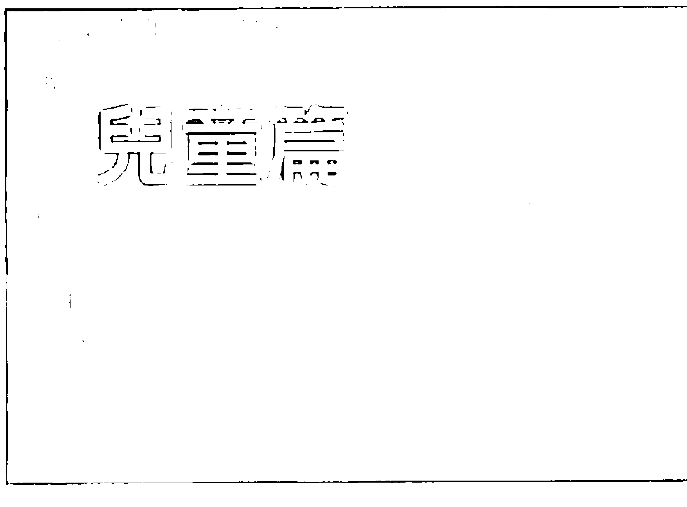

## 兒童與眾不同

兒童並不是小一號的成人，指的不只是使用精油的劑量，同時也包括精油的選取。兒童芳療的劑量只要取用成人劑量的一半就好，這樣的想法是錯誤的。兒童，特別是幼兒，對於某些精油是無法承受的，或者對精油有不同的感受及反應（見本頁下方）。
正確的診斷是絕對必要的！兒童常常還未具備清楚表達病痛處的能力，例如患有初中期中耳炎的幼兒，有時並不是抱怨耳朵痛，而是肚子痛（請參閱頁 279）。所以需仔細地觀察兒童的反應並尋求小兒科醫師的協助。

## 兒童具有優異的香味辨別力

大部分的兒童和青少年都對香氣有高度的興趣，也喜歡嘗試；對於選擇個人專屬氣味，他們甚至常比大人有更好的辨別力。如能讓兒童或青少年自行找出自己的特有氣味，就能在危機處理上達到最好的成效。

> ❗ 只有在大人的看護下，兒童才可以使用精油進行芳香治療！

### ## > 感冒和流行性感冒

喉嚨痛通常是感冒的第一個徵兆，不過也可能是其他疾病發展的開端，因此必須請小兒科醫生診斷明確的病因。
- 喉嚨腫痛導致喉嚨痛的治療方式，請參閱頁243的說明。
- 急性咽喉炎是化膿性的扁桃腺炎，務必由小兒科醫師診斷。表現徵兆：突發性惡寒、高燒、可能伴有顫抖現象、說話含糊不清和淋巴結腫大的頸部疼痛及吞咽疼痛等。
這些病症，尤其出現在兒童身上時，也可能是猩紅熱或其他疾病的初期症狀。

### ### 提供情緒配方

- 複方精油：10滴薰衣草、10滴紅桔、20滴真正薰衣草、10滴水仙花、30滴橙花白千層精油、10滴大西洋雪松、10滴安息香。
- 熏香：加入上述配方4至6滴。
- 蒸汽吸入法：一公升沸騰的熱水中，加入1至2滴。
- 空氣潮濕：在濕熱的毛巾上，滴上複方精油，放進孩子的房間內。
- 胸部按摩油：50毫升的荷荷芭油或杏仁油中，加入10滴複方精油，按摩孩子的胸部和背部。請參閱頁65起的使用說明。

### ## > 喉嚨痛

急性咽喉炎是化膿性的扁桃腺炎，務必由小兒科醫師診斷。表現徵兆：突發性惡寒、高燒、可能伴有顫抖現象、說話含糊不清和淋巴結腫大的頸部疼痛及吞咽疼痛等。
這些病症，尤其出現在兒童身上時，也可能是猩紅熱或其他疾病的初期症狀。

- 喉嚨腫痛導致喉嚨痛的治療方式，請參閱頁243的說明。
- 小兒科醫師診斷。表現徵兆：突發性惡寒、高燒、可能伴有顫抖現象、說話含糊不清和淋巴結腫大的頸部疼痛及吞咽疼痛等。
這些病症，尤其出現在兒童身上時，也可能是猩紅熱或其他疾病的初期症狀。

### ## > 腮腺炎

很普遍地，在幼兒園和小學感染腮腺炎而病倒的孩子有再發增加的趨勢。許多家長覺得他們的小孩是頑童是件難以理解的事，所以常常隱瞞不報。鑒於此因，往往和幼兒園或小學發覺也無法進行必要的留意的防疫措施，以至於感染擴大。
腮腺炎的傳染途徑是直接接觸，即唾液飛沫傳染，潛伏期約8天，由發病到痊癒約10-14天。

- 蒸汽吸入法：一公升沸騰的熱水中，加入1至2滴。
- 熏香：加入上述配方4至6滴。
- 胸部按摩油：50毫升的荷荷芭油或杏仁油中，加入10滴複方精油，按摩孩子的胸部和背部。請參閱頁65起的使用說明。

### ## > 百日咳

百日咳是一種重要的兒童疾病，對新生兒來說尤其危險，有效的治療，務必就醫治療！
夜晚比日間更頻繁的劇烈咳嗽，對孩童自己和父母都是不小的困擾。蒸汽吸入法和按摩均需有效的肺部活動量，能迅速、持續地緩解症狀。砂布蒸汽法或使用熱氣吸入法的要訣是，可在睡前的床邊放置薰衣草、桉樹或百里香，保持空氣潮濕，頗有功效。

### ## > 頭蝨

其他必需用品：一把專門清頭蝨的梳子（可於藥房購買）和家用保鮮膜。

流程如下：

1. 使用去頭蝨洗髮精洗髮。
2. 以梳子將濕頭髮從前額至脖子，分成好幾絡。將複方精油塗抹於露出的頭皮，再以剩餘的精油，分別擦在頭髮上。
3. 將全部的頭髮以保鮮膜包裹纏繞好，等待一至兩小時，讓精油產生作用。
4. 用去頭蝨洗髮精清洗兩次。
5. 以專門清頭蝨的梳子仔細地梳理頭髮，以去除附著其上的蝨卵。要達到良好的治療效果，必須要徹底地將這些蝨卵清除掉。
6. 每日一次，至少持續8週。

### ## > 頭痛

青少年、甚至是兒童愈來愈常出現緊張性頭痛症狀，通常肇因於壓力。要幫助孩童排解壓力，應諮詢小兒科醫師的專業意見，再輔助進行舒緩的芳香腹部按摩。檸檬薄荷清新、柔和的香味，結合柑橘類精油能深受小朋友喜愛。

## 愉悅配方

複方精油：4 滴紅桔精油、3 滴檸檬薄荷、1 滴最喜愛的花香類精油、2 滴香草。

- 薰燈：將上述複方精油加入水中。
- 按摩油：在 50 毫升的甜杏仁油或荷荷芭油加入複方精油後，用以依順時針方向輕柔地按摩腹部。請參閱頁 65 起的使用說明。

### ## > 中耳炎

以下的簡單方法可確認小朋友是否罹患中耳炎：以手指輕按耳道旁突出的耳朵軟骨；如耳朵會痛時，小朋友會朝著疼痛的方向聳肩。

> > ！ 兒童有中耳炎症狀時，需請小兒科醫生診斷找出病因，對症治療。

精油可緩解並且能抑制疼痛現象，進而治癒初期發炎症狀。

關於成人中耳炎的治療請參閱頁 245 的說明。

## 速效配方

- 濕敷：準備少許藥用棉，滴上一滴真正薰衣草或馬斯提其那百里香，小心地塞進耳道裏，早晚更換藥棉，並以敷布包住耳朵保持溫暖。（頁 68）

> > ！ 絕不可將精油直接滴入耳朵內，因可能造成鼓膜受傷，使精油進入中耳會過度刺激中耳黏膜使發炎症狀惡化。

### ## > 異位性皮膚炎

異位性皮膚炎是一種內因性濕疹（由體質所造成的），遺傳異位性體質的寶寶，會在約四個月大後發病，表現症狀為嚴重的搔癢性發紅、脫皮和結痂等。

異位性皮膚炎患者已確認有脂肪代謝失調的現象：患者缺乏一種能將亞麻油酸轉化成 γ - 次亞麻油酸的酵素。皮膚因而變得乾燥而容易罹患濕疹，出現痛苦難耐的搔癢症狀。病患不斷抓癢，造成皮膚受傷發炎，使皮脂膜防禦功能失常而產生感染。

月見草油因富含能被皮膚吸收的 γ - 次亞麻油酸（頁 235），以其護理患部，能有效改善異位性炎症症狀。

臨床經驗證實，合理調整飲食、使用植物療法及順勢療法、建立穩固腸道常駐菌群，以及處理皮膚問題等（頁10），均可增強身體免疫系統功能，降低發作時含強烈刺激的過度反應。

### ## > 水痘

屬病毒引起的傳染性疾病：傳染途徑是直接接觸水泡傳染，不過勤洗手的預防措施也會造成感染，「風」痘（※筆者注：水痘德文為Windpocken，直譯則風痘）之名因此而來。

水痘是一種全身性現象，播散至全身，最嚴重時也曾在黏膜出現劇烈反應，隨即形成小水泡。病原體為水痘帶狀疱疹病毒。

除了支持性的治療外，難以借助藥物來抑制劇烈的不適感，但精油有極大的舒緩效用，水泡不但能快速痊癒，且不留難看的疤痕。

## 舒緩配方

精油配方：10 滴沒藥、2 滴香蜂草 100%、10 滴真正薰衣草、3 滴波旁天竺葵、5 滴穗花白千層。

- 精油直接塗抹：用棉籤棒沾取上述配方油，點塗在水泡上。
- 薰香：30 毫升的香蜂草或甜橙中，加入 10 滴上述配方。均勻混合後，噴灑患部。

在兒童時期沒有患過水痘的人，成人期就有可能感染的情況。此外病情和症狀也明顯較嚴重。孕婦一旦感染水痘，可能導致胎兒畸形。曾患過水痘的人，體內便帶有帶狀疱疹病毒，當患者的免疫力降低時，病菌就再發活躍，而引發帶狀疱疹（頁262）。

### ## > 尿布疹

尿布疹是一種產生在臀部部位的皮膚炎，因悶熱感染白色念珠菌（鵝口瘡 / 酵母菌，頁263）或葡萄球菌、鏈球菌及其它的病菌所導致。這些寄生菌在幼細皮膚內的潮濕悶熱及尿液分解的產物下，而大量繁殖。

最好的方法是限制使用紙尿褲，並且使用防護霜，定期保護皮膚。

## 臀部護理霜

配方：20 克白巴油、30 克雪亞脂、1 克可可亞脂、5 滴安息香、1 滴岩玫瑰、5 滴法國薰衣草。

依上述「防護霜」的製作方式，在隔水加熱配好，置入乾淨的瓶子。（保存方式和效力請參閱頁 67）

## 麼泡霜

配方：將 40 克椰子油、40 克雪亞脂、2 克可可脂放入鍋中隔水加熱（勿超過攝氏 60 度）

直到所有成分完全溶解為止，稍待冷卻。隨後倒入 20 毫升的月見草油、5 滴沙棘油、3 滴岩玫瑰、1 滴岩玫瑰、1 滴歐蕾香。均勻攪拌後，裝入兩瓶已用酒精消毒過，容量 50 克的瓶子，靜置冷卻。（保存方式和效力請參閱頁 67）

- 使用方式：每日洗澡，在患部擦上預防霜。

## ▷ 外傷

兒童在跑跑跳跳活動中，很容易跌倒，造成皮膚擦傷時傷口大多很髒。在擦傷處理上，使用急救配方（頁266）是最好的方式，因爲它可強力抗菌，使用時沒有灼痛感，骯髒物得以被清理掉，使傷口好得更快。

> 處理骯髒的外傷時，需確定是否需要注射破傷風針劑！

## 傷口處理

- 速效配方：直接在傷口處，滴上數滴未稀釋的急救配方、綠花白千層精油或茶樹精油。傷口在處理前並不一定要消毒，以清水小心將傷口周邊洗淨即可。

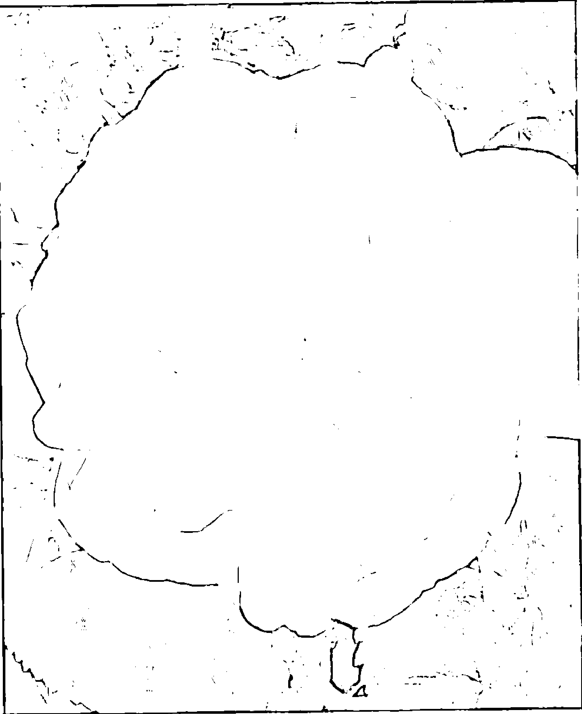

## 兒童的不安定狀況

## ▷ 「愛哭鬧的嬰兒」

「愛哭鬧的嬰兒」會帶給全家人壓力。安撫嬰幼兒最好的方法就是溫柔地幫他們按摩腹部（請參閱本頁下方），使用玫瑰按摩油，能加強腹部按摩的鎮靜功效。

對每個嬰兒來說，沐浴後或入睡前，使用芬芳的身體按摩油，幫他們從頭到腳塗抹全身，當然是一種極美好的享受。藉由輕柔的按摩，能滿足嬰兒對觸摸、溫暖和安全感的原始需求。

## 玫瑰按摩油

配方：100毫升的甜杏仁油中，加入1滴玫瑰、1滴花梨木、2滴香草。

- 腹部按摩：按摩者的雙手應該要溫熱！在手上滴上少許精油，依一個躺臥的8字形（表示無窮大的∞符號），環繞肚臍，輕柔地按摩小腹。
- 全身按摩：以溫熱的雙手搓揉少許精油，由腳部開始，朝心臟方向，緩慢輕柔按摩全身。

## ▷ 腹痛

嬰兒在出生後的前幾個月，常好發導因於脹氣的腹痛或腹部痙攣；他們的胃對於所喫的食物有適應期，所以可能會造成疼痛的脹氣，或在喝奶時吞入太多空氣，也會引起腹痛。

此時飲用含有茴香、洋茴香、芫荽和藏茴香（可在藥房購得）的不加糖藥草茶，以及使用有效的「四風配方」，臨床證實均能有效減輕症狀。

### ## 各類型兒童不適症

### ## 兒童腹脹腹痛

兒童出現腹脹腹痛時常是反應心理的問題，他們可能需要某些東西，或是對天然腹脹的原因無法處理，跟他們一起探究原因是有必要的。

有時只需要在小朋友睡前，在臥房裏擺放保持安穩放鬆的薰衣草熏香，或進行局部按摩，透過最自然的方式安撫、確認他們的情緒（請參閱頁65起的使用說明）。

### ## 心因性「腹痛」

即使無法確定腹痛是由生理因素引起，也不可以掉以輕心，找出腹痛的原因相當重要！有些兒童的腹腹現象是反映胃部壓力過大，或害怕父母對他們期望過高的反應（需參閱內分泌腺的說明，頁280）。

處理腹痛症狀絕不可掉以輕心。兒童需要很多的愛，不間斷的擁抱。小孩，都喜歡父母的擁抱或按摩。

如果父母和老師們對芳香精油良好的功效有更多了解的話，也可以在學校積極協助多動或易緊張的兒童。

- 如果腹痛或腹脹症狀持續超過一天半，務必要請小兒科醫師做檢查找出病因！腹痛通常沒有危急性，則小朋友因亂吃壞肚子而引起的腹痛，不過也可能是盲腸炎或流感的反應；小朋友中耳炎快發作時，也常會有腹痛的徵兆（頁277）！「腹痛」也常是兒童心理障礙的反應表現（需參閱本頁右方的健康腺說明）。

### ## 四順配方

適用抱怨嬰兒和三歲以下的幼童：

配方：50毫升的聖約翰草浸泡油中，加入1滴茴香、1滴豆蔻、1滴芫荽及1滴小茴香。

- 腹部按摩：使用適度上述配方依順時鐘方向，溫柔地按摩腹部。

### ## 腹部按摩配方

安瓶分裝理想的精油

對兒童而言，睡覺這件事，例如睡眠或搬家，通常是件不容易的事。普遍的兒童往往有腹痛（頁280）或肚臍膨出的現象。針對腸道蠕動特殊原因引起的脹氣，大西洋雪松香精油能提供特別有效的幫助。

看見母親在生命中第一次餵奶的配方。

加入上述所載精油的複方精油。

- 按摩油：在100毫升的荷荷芭油或甜杏仁油中，加入5滴佛手柑、2滴紅桔、2滴真正薰衣草或快樂鼠尾草、2滴甜羅勒或2滴洋甘菊。
- 薰香內：加入上述配方。

### ## 契迪默配方

契迪默油：20滴紅桔、20滴佛手柑、5滴玫瑰

### ## 兒童腹脹腹痛

兒童出現腹脹腹痛時常是反應心理的問題，他們可能需要某些東西，或是對天然腹脹的原因無法處理，跟他們一起探究原因是有必要的。

有時只需要在小朋友睡前，在臥房裏擺放保持安穩放鬆的薰衣草熏香，或進行局部按摩，透過最自然的方式安撫、確認他們的情緒（請參閱頁65起的使用說明）。

- 家中熏香：加入5滴複方精油。
- 臥室熏香：加入10滴。
- 泡澡：1/2杯的鮮奶油中，加入5滴複方精油，均勻攪拌後，倒入浴缸內。
- 腹部按摩：30毫升的香草浸泡油（頁234）或甜杏仁油中，加入6滴上述複方精油，選順時鐘方向，以溫熱的雙手緩緩地按摩腹部。

離，是在他們上幼稚園時，很多幼兒剛開始都會有焦慮不安的情緒；薰香或局部芳香按摩，都能幫助他們容易入眠和沉睡。

- 薰燈內：加入 3 滴紅桔、2 滴橙花、2 滴大西洋雪松。
- 按摩：50毫升的甜杏仁油中，加入上述配方。

請參閱頁 65 起的使用說明。

## ➢ 青春期危機

青春期對青少年及父母來說，都是一個非常辛苦及容易令人神經極度緊張的階段，親子雙方也常產生許多誤解（請參閱頁 283 關於「極度敏感、缺乏自信」的介紹）。

精油能營造輕鬆的氣氛，消弭彼此之間隱形的牆及難以突破的冷漠隔閡，使雙方能再對話、充分溝通。

## 營造輕鬆氣氛的薰燈配方

配方：6 滴葡萄柚、3 滴真正薰衣草、1 滴完全依蘭或自選花香類精油、2 滴大西洋雪松。

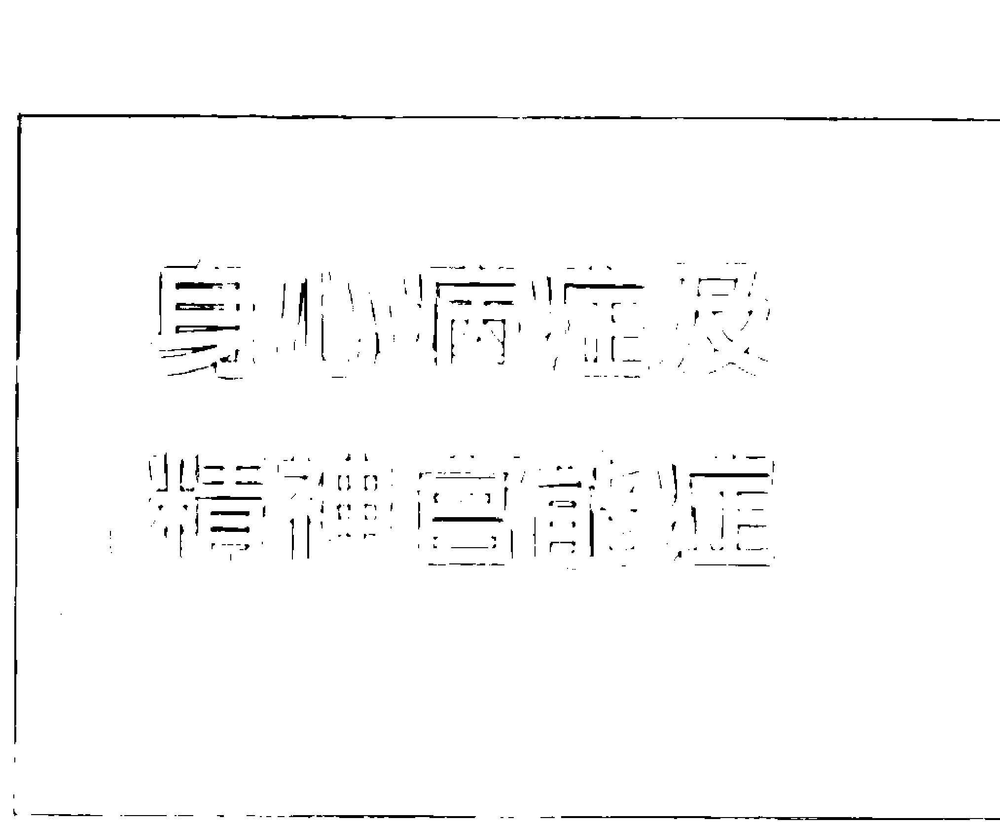

## 身心病症及壓力症候群

身心病症指的是由心理因素所導致的生理異常疾病（希臘文 psyche 意為心理，soma 意為身體），是現代人終日汲汲營營生活的一種文明病。現代人將所有的問題都放到一邊，隱忍所有的身心負荷和煩憂，因為必須要「正常工作」。不過飽受折磨的心靈總是找得到方法，讓人注意到自己：身體和精神上所出現的病症，往往就是它給予的信號，不應被忽視，如果不找出病因的話，狀況較輕微的病痛就有可能演變成嚴重的疾病。

具有釋放壓力、鬆弛情緒和提升信心功效的精油，有助於患者重新獲得內心的平靜與和諧、克服恐懼或沮喪，進而恢復身體的健康。

## ➢ 預防疲潰症候群

不管在工作還是休閒時，壓力已然成為一個全球共通的問題。經常處於壓力狀態會導致長期性的身心耗弱，如精疲力盡、缺乏動力、缺乏專注力、睡眠障礙、肌肉緊繃，和許多其他非器質性因素所引起的病痛等，即今日通稱的疲潰症狀群。針對這些病症，芳香療法均能有不錯的療效（請參閱次頁個別病症）。

## 缺乏注意力

针对那些每日身心透支，而出现长期性全身疲倦或缺乏耐力等现象的人来说，能恢复元气、促进血液循环，同时有舒缓作用的精油是最理想的好帮手。使用下述具有振奋和舒缓作用的精油所调成的配方，以薰香、按摩或泡浴，皆能消除身心疲倦而活力重现。请参阅页65起的使用说明。

## 骚动引起的肌肉痉挛

针对压力和紧张引起的肌肉痉挛（请参阅页246的「颈痛」及页267的「背痛」），最具疗效的治疗方式是在温热、消除疲劳的浴水中浸泡，再使用按摩油按摩僵硬的肌肉部位，如果能搭配美妙的紧绷、舒展肌肉，效果更佳。

## 疲倦和缺乏耐力

对于那些每日身心透支，而出现长期性全身疲倦或缺乏耐力等现象的人来说，能恢复元气、促进血液循环，同时有舒缓作用的精油是最理想的好帮手。使用下述具有振奋和舒缓作用的精油所调成的配方，以薰香、按摩或泡浴，皆能消除身心疲倦而活力重现。请参阅页65起的使用说明。

## 元气配方

复方精油：3滴苦橙叶、2滴山梨脑、2滴佛手柑、2滴橙花、5滴佛手柑，均匀搅拌后

## 心脏舒缓配方

泡浴：1/2杯的鲜奶中，加入3滴佛手柑、2滴橙花、5滴佛手柑，均匀搅拌后

## 工作居家良伴

- 泡浴：1/2杯的鲜奶中，加入3滴佛手柑、2滴橙花、5滴佛手柑，均匀搅拌后
- 按摩油：50毫升的甜杏仁油中，加入上述配方。
- 薰蒸：将上述配方加入冰中。

## 舒压配方

配方：5滴茉莉、3滴薰衣草、4滴佛手柑、1滴玫瑰草（也可选用茉莉或2滴完全依阙）、2滴檀香、5滴安息香。

- 泡浴：1/2杯的鲜奶中，加入上述配方均匀搅拌后，倒入浴缸内。
- 按摩油：100毫升的植物油，加葡萄籽油。
- 薰蒸：将上述配方加入冰中。

请参阅页65起的使用说明。

倒入浴缸內。

- 按摩：50毫升的荷荷芭油中，加入4滴紅桔、2滴山雞椒、1滴玫瑰或茉莉、1滴中國肉桂或肉桂皮、2滴檀香。

請參閱頁65起的使用說明。

## 睡眠障礙

睡眠障礙可能有各種不同的成因，恐懼、壓力、荷爾蒙失調只是常見的因素，若想長久有效地免除此困擾，務必要徹底診斷找出原因。

精油有安撫、鎮定神經的作用，因此能促進睡眠，讓人夜夜好夢。建議定期執行入眠計畫，包括浴療、按摩以及薰香法。所有的方法單獨使用時也能產生舒眠效用。

關於兒童睡眠障礙的治療請參閱頁280的說明。

### 夜夜好眠

- 浴療：1/2杯的鮮奶油中，加入4滴佛手柑、3滴紅桔、1滴茉莉、2滴阿米香樹、1滴岩蘭草，均勻攪拌後倒入浴缸內。
- 按摩：50毫升的植物油中，加入2滴桔葉、1滴最喜愛的花香類精油、3滴安地斯山香桃木、4滴香草。入睡前使用，依順時針方向，輕柔地按摩腹部和太陽神經叢。
- 薰燈配方一：5滴大西洋雪松、7滴真正薰衣草、1滴玫瑰加入水中。
- 薰燈配方二：4滴佛手柑、1滴茉莉、1滴檀香加入水中。

請參閱65頁起的使用說明。

### 旅途中的安眠精靈

- 在手心中滴上1滴大西洋雪松精油、1滴真正薰衣草精油、1滴玫瑰精油（或另一款最喜愛的精油），磨擦雙手後輕輕拍打在枕頭上，無論置身何處都能立即有居家感。

## 活力早晨

疲憊不堪，早晨懶床，或起床後也無法很清醒時的救星：

### 速效配方

- 聞香瓶：將桉油醇迷迭香精油放在床頭櫃或隨手可取得之處，早晨起床前吸聞。精油強烈的氣味能提振精神，刺激血液循環。

## 精神官能症

## 極度敏感、缺乏自信

### 銀合歡

形容過度敏感、脆弱易受傷害，常過度擔心及憂慮的人，我們常形容「如銀合歡般地敏感」。下述配方能有效協助，以輕鬆幽默方式面對人事物。

複方精油：2滴葡萄柚、2滴紅桔、2滴銀合歡、2滴檀香、1滴岩玫瑰。

- 按摩油：50毫升的荷荷芭或甜杏仁油中，加入上述複方精油。
- 泡浴：在1湯匙的蜂蜜或1/2杯的鮮奶油中，加入複方精油攪拌後倒入浴缸內。

請參閱頁65起的使用說明。

### 歐白芷複方精油

歐白芷根精油能幫助缺乏自信的人「頂天立地」。歐白芷根精油能幫助他們更進一步地覺察自我，並勇敢面對世界。以下提供幾種使用方式：

## 芳香疗法

- 嗅香：加入 5 滴檀香、2 滴薰衣草、2 滴佛手柑，1 滴玫瑰、2 滴香草。
- 按摩油：50 毫升的植物油中加入上述复方精油 10 滴，顺着肢体方向，轻轻地按摩腿部。
- 沐浴：1/2 杯的植物油中，加入上述复方精油，搅拌后倒入浴缸内。
- 蒸馏：将上述复方精油加入冰水中。
- 速效配方：取 1 至 2 滴的佛手柑精油，滴在面纸上。

## 冬春的疗愈小妙招

- 复方精油：加入 5 滴佛手柑、2 滴佛手柑、2 滴薰衣草、1 滴玫瑰、2 滴香草。

在日常生活中所遭遇的事情可能引发恐惧、焦虑，特别是当一个人的生活发生重大突变，必须面对突然来临、苦难的环境，面对面对陌生、未知的人、事、物时。许多精油能赋予身体和心灵生命环境的常人，面对挑战的劲力。

## 焦虑症

恐惧症在一定程度上是伴随生活经历而产生的情绪。不过一旦恐惧反应表现超常规，或发展易感性的心理状态，就有必要寻求专业的精神治疗。

> ▶ 恐惧症在一定程度上是伴随生活经历而产生的情绪。不过一旦恐惧反应表现超常规，或发展易感性的心理状态，就有必要寻求专业的精神治疗。

## 季节性情感障碍、冬季抑郁症

感到性情绪失调是一种普遍有负面思想、悲伤、抑郁打采等症状的暂时性精神紧张，对这些症状，精油配方能发挥积极的正面效果。

> ▶ 如精神状况出现异常现象，或持续地严重威胁生活，患者就必须接受心理治疗。芳香疗法绝不可以取代最重要的治疗源。但作为辅助疗法则能发挥很大的成效。

病人住進醫院時，最好攜帶一些自己喜愛的精油，為個人營造獨特的空間氛圍。其能產生令人驚喜的附帶效應，讓病房散發出芳香，使護理人員、醫生和探病者都喜歡來病房，也願意在房內待久一點。

只有少數的老人家是自願性住進養老院：因為他們要放棄的不只是有熟悉氣味的住家，還有他們熟識的城鎮。每幢房子、每間住房的氣味都不同，而養老院又有一種十分特殊，缺少生氣與活力的氣味。所有這一切都讓老人家恐懼不安，此時精油能幫助他們，以輕鬆的心態來適應新環境。

薰衣草、柑橘類香味和香草精油其深受老人們所喜愛。

- 快速帶來自在的感受：在雙手手心，滴上 1 至 2 滴精油，揉搓後塗抹在枕頭上。或在面紙滴上精油後，放在胸前。
- 擴香石：基於安全的理由，醫院和療養院裏，禁止使用點蠟燭的熏燈，一般使用的是插電式擴香石，或在裝了溫水的小碗盤裏，滴上幾滴精油，放置在暖氣裝置上（如有可能時）。不過，使用精油時要考慮精油的味道有可能會影響同住室友和隔壁鄰居；因此事前的溝通是有必要的。因為每個人對精油氣味的反應不同，需要顧及他人的感受。

## 分離恐懼感

大多數人在經歷別離、與伴侶分手或離婚時，都會產生很大的痛苦、悲傷、憤怒、沮喪與自我價值受創，「人生為何失敗？」這個疑問不斷地折磨他們。家庭安全感此時分崩瓦解，不知何去何從，這種攸關存在本質的困境，精油能提供相當大的支援與扶助。

關於兒童分離恐懼的治療請參閱頁 281。

- 熏燈：加入 1 滴苦橙葉、4 滴佛手柑、2 滴真正薰衣草、1 滴特級依蘭、2 滴蘇合香、5 滴大西洋雪松。
- 按摩油：50 毫升的植物油中，加入上述配方後輕柔地按摩腹部（請參閱頁 73 的使用說明）。

## 安寧照護

照護臨終病患，不管是居家或於醫院，必然都會一再地面對病人及家屬的恐懼情緒，還有自己對死亡的害怕。人會有某種的畏懼，不確定要如何處理這件事，而病人此時也非常需要特別的關懷。

在病房使用插電式熏香燈或擴香石，或偶爾按摩臨終病人，其有可能產生奇效，讓病房充滿了和諧安詳。我們經常觀察到使用精油前後的差異，氣氛會從靜默死寂，轉變為清楚的談話與溝通。

- 熏燈或按摩：臨床經驗顯示，如果可能的話，最好能調配臨終病患的個人專用複方精油。

如果在醫院陪伴臨終病患，總是使用同一款複方精油的話，醫護人員以後就會一直將「死亡」與這個精油的香味聯想在一起。長久下來，往後聞到這種氣味時，就會聯想到「死亡」。

## 精神創傷

遭逢意外事故和暴力事件後所造成的精神創傷，會引起強烈害怕、無助感和驚嚇反應等症狀，若未能獲得快速和有效的幫助，會導致患者性格劇變和產生身體的疾病。

在心理治療上合併使用精油能產生良好的協同作用，其原則為「慢就是快」，劑量上則是「越低越好」。精神創傷的治療應該交由專業人員進行。

## 恐惧引起的心悸不适症

据报道，没有其他的配方能像玫瑰的香氛如此强烈地触动人心，而玫瑰也被视为爱的象征。

发现玫瑰油具有和谐平衡身心的力量，能强化内心的情绪情，使人敞开心扉接触自己和别人。下述的事项配方，已融合自己和别人。

到胸酸、不知名的心悸不适，连熬油香也极有效。

- 冥想：加入1滴玫瑰、2滴花梨木、2滴大西洋雪松。

「山楂油膏」：将30毫升基约纯草浸泡油、20克蜂蜡、2克可可豆脂放入碗中隔水加热（勿超过60度），直到所有的成分熔解、稍作冷却。

- 使用方式：按照个人需求，每日数次，用油香涂抹在心悸部位。

搭配使用请参阅页67（和疗效请参阅页67）

需参照页65起的使用说明。

## 「恐惧症」配方

各型上瘾症的患者，最需要他人的理解，以及在能接受的程度上最大的帮助。作极度的挫折感，需要大剂量的香氛，特别是在困难和恐惧的时刻，能镇定功效，帮助患者寻回内心世界的安定感，也更觉欣慰共整。

抗拒油配方一：50毫升的植物油中，加入6滴香草油、2滴佛手柑、1滴香桃木、1滴薰衣草。

抗拒油配方二：50毫升的香草浸泡油（页234）中，加入4滴茴香油、2滴依兰或白檀的花香蒸馏油、1滴麝香、4滴檀香。

- 抗癌：早晨使用任何一款按摩油配方，整条地按腹部（依顺时针方向），防治癌和胃部周围（和胸部）。
- 薰衣或泡澡：上述两款配方也可用粉底霜香，或加入1/2杯的鲜奶中，均匀搅拌后倒入浴缸内。

## 附錄

- 精油一覽表
- 植物油一覽表
- 參考文獻
- 索引

| 名称 | 药用价值 | 化学成分 |
| --- | --- | --- |
| Amyris 阿米香醇 Amyris balsamifera L. | 生理效益：抗细菌（破伤风杆菌、链球菌）、抗真菌、抗炎、抗肿瘤、抗过敏 心理效益：平静、和蔼、安神、舒压 | 依兰烯：60-70%（主要为莰烯、葑烯） 愈创木烯：5-8% 香豆素：少量 倍半萜烯：90-95%（主要为α-玷巴烯、Δ-杜松烯） 萜烯：1-2% 苯甲酸苄酯：1-3% 邻氨基苯甲酸苄酯：1-2% 香豆素（主要为呋喃香豆素）：微量 倍半萜醇和倍半萜酮：微量 其他成分（十五内酯）极微量 |

| 名稱 | 藥用價值 | 化學成分 |
| --- | --- | --- |
| Bergamottminze 檸檬薄荷 Mentha citrata L. 唇形科（Lamiaceae） | 生理療效：抗細菌、抗病毒、抗真菌、傷口癒合、抗發炎、退燒、止痛、抗痙攣、促進血液循環、強化免疫系統、護膚、驅蟲 心理療效：平衡、安撫、重建、消除焦慮、幫助睡眠、提振和恢復精神、愉快、放鬆 | 單萜烯醇：40－60%（主要為沉香醇） 酯：30－50%（主要為乙酸沉香酯） 氧化物：3－5%（主要為1,8 桉油醇，薄荷呋喃） 單萜烯：1－5% 倍半萜烯：1% |
| Cajeput 白千層 Melaleuca cajeputi L. 同義詞： Melaleuca leucadendron L. 桃金娘科（Myrtaceae） | 生理療效：防腐（殺菌）、抗細菌、強效抗病毒、止咳、化痰、排痰、促進呼吸道的血液循環、增強抵抗力、退燒、鎖定神經與肌肉疼痛 心理療效：激勵、強化神經、幫助集中注意力 | 氧化物：50－65%（主要為1,8 桉油醇） 單萜烯：25－40%（主要為蒎烯） 單萜烯醇：6－15%（主要為α 萜品醇） 倍半萜烯：3－5% 倍半萜烯醇：可達3% |
| Cassia 中國肉桂 Cinnamomum cassia (Nees) 同義詞：Cinnamomum aromaticum C. G. Nees 樟科（Lauraceae） | 生理療效：抗細菌（B 群和D 群鏈球菌、大腸桿菌、金黃色葡萄球菌、白色表皮葡萄球菌）、抗真菌（白色念珠菌）、促進血液循環、溫暖活化、滋補、抗痙攣、止痛、抗風濕 心理療效：使心靈堅強、催情 | 肉桂醛：75－90% 香豆素：5－9% 芳香醛和芳香酸：可達5% 單萜烯，倍半萜烯，醚：微量 芳香酯和芳香醇：微量 |
| Champaca 黃玉蘭 Michelia champaca L. 木蘭科（Magnoliaceae） | 生理療效：抗細菌、放鬆、抗痙攣、止痛、促進乳汁分泌、刺激免疫系統 心理療效：抗沮喪、溫暖心靈、刺激感官、催情 | 芳香酯：35－40%（主要為苯甲酸苯甲酯、4%鄰氨基苯甲酸甲酯、苯甲酸苯乙酯） 芳香醇：8%（主要為苯甲醇、苯乙醇） 丁香酚：10－16% 酯：可達10%（主要為亞油酸甲酯） 單萜烯醛：可達8% 倍半萜烯酮：可達6%（主要為α 和β 紫羅蘭酮） 氧化物：4.5%（主要為沉香醇氧化物） 單萜烯醇：3－5% 芳香醛：微量 其他成分：吲哚2－5% |
| Cistrose 岩玫瑰 Cistus ladaniferus L. 半日花科（Cistaceae） | 生理療效：殺菌、抗真菌、抗發炎、刺激免疫系統、抗痙攣、暢通血管、促進血液循環、迅速止血、皮膚再生、去疤、抗寄生蟲 心理療效：平衡、鼓舞情緒、提神 | 單萜烯：40－50%（主要為α 蒎烯） 單萜烯醇：5－15%（主要為龍腦） 酯：5－15%（主要為乙酸龍腦酯） 倍半萜烯：5－10% 倍半萜烯醇：5 % 雙醇：微量（勞丹醇） 單萜烯酮：4－7% 單萜烯醛：3－5% 丁香酚：可達1.5% 芳香酯和芳香醇，倍半萜烯酮和倍半萜烯醛，芳香醛：微量 |

| 名称 | 药用价值 | 化学成分 |
|---|---|---|
| Eisenkraut 梅穗马鞭草 Lippia citriodora Kunze 唇形科 (Verbenaceae) | 生理效应：抗菌、抗肿瘤、抗痉挛、镇 静、抗抑郁、缓解紧张、促进消化、舒张 血管、降低血压、镇咳、祛痰、发汗、利 尿、解热、镇痛、抗炎、驱虫、杀昆虫、 杀螨、杀真菌。 心理效应：恢复精神、提高注意力、具 有性、鼓舞情绪（特别是因恐惧引起的 心悸不安症） | 单萜烯：35 – 40%（主要为柠檬烯） 单萜烯醇：20%（主要为橙花醇） 倍半萜烯醇：15 - 20%（主要为β-香油脑） 单萜烯酮：8% 芳香化合物：6 - 10%（主要为1,8桉油醇） 单萜烯酮氧化物：4%（主要为甲基黄樟脑酮） 倍半萜烯氧化物：2 – 4% 倍半萜烯醇：2 – 3% 酯：1 – 3% |
| Elemi 榄香脂 Canarium luzonicum (Miq.) A. 橄榄科 (Burseraceae) | 生理效应：强效抗细菌、抗病毒、抗痉 挛、促进伤口愈合、刺激免疫系统、活化 、促进腺汁分泌、抗凝血、抗氧化、消 化、肌肉再生 心理效应：使心灵舒适、提高注意力、鼓 舞情绪 | 单萜烯：70 – 80%（主要为柠檬烯，可 达55%） 倍半萜烯醇：15 – 17%（主要为榄香脑，可 达16%） 酯：3 – 6%（主要为惕各香脑酸） 单萜烯酮：可选 3% 倍半萜烯酮：微量 |
| Estragon 茵艾 Artemisia dracunculus L. 菊科 (Asteraceae) | 生理效应：抗病毒、抗细菌、抗痉挛、 化、促进腺汁分泌 有效舒解肌肉抽筋、增进食欲、促进消 化、抗痉挛、镇咳、祛痰、发汗、利尿、 驱虫、杀昆虫、杀真菌、抗肿瘤、抗炎、 抗氧化、止痛、抗凝血、镇静、催眠、 缓解经期痉挛。 心理效应：安心放松、安眠 | 萜：70 - 80%（主要为甲基异苤莉酮） 单萜烯醇：15 – 20%（主要为龙脑酯脑） 香豆素、丁香酚：微量 |
| Eucalyptus citriodora 柠檬桉 Eucalyptus citriodora Hook. 桃金娘科 (Myrtaceae) | 生理效应：强效抗病毒和抗细菌、抗痉 挛、止痛、硫化肠胃、镇痛 心理效应：提振注意力、恢复精神、激励 、提神 | 单萜烯酮：65 – 90%（主要为香茅醛） 单萜烯醇：15 – 25%（主要为香茅醇） 醚：3 – 5%（主要为乙酸香茅酯） 倍半萜烯酮：2 – 5% 倍半萜烯醇：1 - 3% |
| Eucalyptus globulus 蓝胶尤加利 Eucalyptus globulus Labillarciere 桃金娘科 (Myrtaceae) | 生理效应：抗细菌（C群和D群链球菌） 、化痰、促进腺汁分泌作用（帮助排出） 、退烧、促进血液循环、促进皮肤再生 心理效应：恢复精神、激励 | 氧化物：65 – 75%（主要为1,8桉油醇） 单萜烯醇：15 – 20%（主要为α-蒎烯） 单萜烯酮：可选5%（主要为α-萜品醇） 倍半萜烯酮：4%（主要为蓝桉醇） 倍半萜烯酮：可选 3% 倍半萜烯醇：1 - 3% |
| Eucalyptus radiata 澳洲尤加利 Eucalyptus radiata Sieboid 桃金娘科 (Myrtaceae) | 生理效应：强效抗细菌、抗病毒、抗痉 挛、化痰、促进腺汁分泌作用（帮助 排出）、退烧、促进血液循环、减缓抽筋 、促肤 心理效应：恢复精神、激励、集中注意力 | 氧化物：65 - 80%（主要为1,8桉油醇） 单萜烯醇：10 - 18%（主要为α-蒎烯） 单萜烯酮：8 - 15%（主要为α-萜品醇） 倍半萜烯酮：可选 2% 单萜烯醛：1% |
| Fenchel ssp. 茴香 Foeniculum vulgare Miller ssp. vulgare var. dulce 伞形科 (Apiaceae) | 生理效应：抗菌、抗病毒、抗痉挛、止 痛、助消化、促进腺汁分泌、化痰、活化 、帮助消化、降低胆固醇、缓解肌肉 痉挛、催乳、抗炎、镇咳、祛痰、发汗、 利尿、解热、镇痛、抗炎、驱虫、杀昆虫 、杀螨、杀真菌。 心理效应：安眠、放松 | 萜：55 - 85%（主要为反式洋茴香脑） 单萜烯醇：15 – 30%（主要为α-蒎烯、柠檬烯） 单萜烯酮：0.5 – 5%（主要为茴香脑） 单萜烯醇：1 – 3%（主要为葑醇） 芳香化合物：可选 4%（主要为1,8桉油醇） 芳香醛、芳香酮和芳香酸：0.5 - 1.5% |

| 名稱 | 藥用價值 | 化學成分 |
| :--- | :--- | :--- |
| Fichtennadel sibirisch 西伯利亞冷杉 Abies sibirica L. 松科 (Pinaceae) | 生理療效：抗細菌、抗發炎、稀釋和消解黏液、促進腺液分泌作用（幫助排出）、強效抗痙攣、強化神經 心理療效：紓壓、平衡 | 單萜烯：45-60%（主要為樟烯、α 澱烯） 酯：32-44%（主要為乙酸龍腦酯） 單萜烯醇：微量 倍半萜烯醇：微量 |
| Frangipani 緩梔 Plumeria acutifolia Poir 夾竹桃科 (Apocynaceae) | 生理療效：放鬆 心理療效：平衡、啟發、愉悅、挑逗 | 特別是苯甲酸苯甲酯、水楊酸苄酯、苯甲酸香葉酯等芳香酯 |
| Ginster 鷹爪豆 Spartium junceum L. 蝶形花科 (Fabaceae) | 生理療效：放鬆、護膚 心理療效：高度鼓舞情緒、催情 | 芳香酯：40%（主要為鄰氨基苯甲酸甲酯 32%） 芳香醇：可達3%（主要為苯乙醇） 芳香醛：可達11%（主要為氨基苯甲醛） 單萜烯醇，雙醇，酯，單萜烯酚，倍半萜烯：微量 其他成分：吲哚5% |
| Grapefruit 葡萄柚 Citrus paradisi Macfayden, J. 芸香科 (Rutaceae) | 生理療效：防腐（殺菌）、刺激免疫系統、退燒、抗痙攣、活化、促進血液循環、促進皮膚新陳代謝、淨化空氣 心理療效：提升專注力、振奮精神 | 單萜烯：90-98%（主要為右旋檸檬烯；微量硫醇） 倍半萜烯酮：0.5-1.8%（圓柚酮） 單萜烯醛：可達1.5% 單萜烯醇：可達1.4% 香豆素和呋喃香豆素：微量 微量的酯和倍半萜烯（主要為凡倫橙烯） |
| Immortelle 永久花 Helichrysum italicum G. Don. 菊科 (Asteraceae) | 生理療效：消除血腫、傷口癒合、細胞再生、淋巴排毒、排除淋巴瘀塞、抗發炎、化痰、抗痙攣 心理療效：平衡、安撫、放鬆 | 酯：45-70%（主要為乙酸橙花酯） 倍半萜烯酮：10-15%（主要為義大利酮） 倍半萜烯氧化物：可達1.5% 單萜烯醇：5-12%（主要為橙花醇） 單萜烯：5-15%（主要為檸檬烯） 倍半萜烯：5-10% 倍半萜烯醇：3-5% 氧化物：可達3%（主要為1,8 桉油醇） |
| Ingwer 薑 Zingiber officinalis Roscoe 薑科 (Zingiberaceae) | 生理療效：溫和抗發炎、抗病毒、略有排痰作用、止痛、滋補神經系統、護膚、激發活力 心理療效：鼓舞情緒、平衡、安神、再生、放鬆、催情 | 倍半萜烯：60-65%（主要為薑烯） 單萜烯：15-20%（主要為苧烯、樟烯、檸檬烯） 倍半萜烯醇：2-3%（主要為薑醇） 單萜烯醇：2-3% 單萜烯醛：1-2% 氧化物：2% 單萜烯酮：微量 |
| Iris pallida Lamks var. florentina L., Iris germanica 鳶尾科 (Iridaceae) | 生理療效：化痰、皮膚再生與保養、傷口癒合 心理療效：平衡、安撫、催情 | 倍半萜烯酮：55-75%（主要為α & γ 鳶尾草酮） 肉豆蔻酸酯：8% 無以數計影響氣味的成分：0.5-1% |
| Jasmin 大花茉莉 Jasminum grandiflorum L. 木犀科 (Oleaceae) | 生理功效：抗痙攣、皮膚再生、調整荷爾蒙、助產、促進細胞再生、鎮靜、催情 | 芳香酯：40 – 60%（主要為甲酸苄酯、乙酸苄酯、微量的羥基苯甲酸甲酯） 芳香醇：5%（主要為苄醇） 紫穗醇：15 – 45%（主要為橙花醇） 倍半萜烯醇：2 – 8%（主要為金合欢醇） 酮：8 – 10%（主要為乙酸橙花酯） 單萜烯醇：5 – 15%（主要為沉香醇、橙花醇） 倍半萜烯，丁香酚：可達 3% 倍半萜烯醇：可達 1% 單萜烯醇：可達 1%（α-甲基苯乙烯） 其他成分：微量苯甲醛、吲哚、苯甲酸苄酯、羥基癸酸 |
| Kamille blau (Echte) 德國洋甘菊 Matricaria recutita (L.) 菊科 (Asteraceae) | 生理功效：強效抗發炎、抗細菌（特別是金黃色葡萄球菌和鏈球菌）、抑制腸道菌素（金黃色葡萄球菌、鏈球菌）、抗真菌、抗病毒、抗痙攣、抗抽搐、促進傷口癒合、促進皮膚新陳代謝 | 倍半萜烯氧化物：16 – 45%（主要為α-沒藥醇、沒藥烷） 倍半萜烯醇：45 – 70%（主要為金合欢醇、天藍烴、沒藥烷） 單萜烯醇：5 – 10%（主要為沉香醇） 倍半萜烯酮：1.5%（艾酮） 酯：70 – 80%（主要為丁酸和異戊酸酯） 單萜烯醇：3 – 10% 單萜烯酮：5 – 10%（主要為沉香醇） 倍半萜烯酮：可達 5%（主要為α-蒎烯） 倍半萜烯氧化物：1 – 8%（主要為β-丁香油烴） 氧化物：可達 5% 單萜烯醇：可達 3% |
| Kamille romanisch 羅馬洋甘菊 Chamaemelum nobile (L.) Allioni 菊科 (Asteraceae) | 生理功效：抗真菌、抗發炎、抗痙攣止痛效果富含甘菊、鬆弛、可降低壓力、幫助睡眠、鎮靜的安神和舒緩痙攣效果、舒緩、提神、抗發炎 | 酯：70 – 80%（主要為丁酸和異戊酸酯） 單萜烯醇：5 – 10%（主要為沉香醇） 單萜烯酮：3 – 10% 倍半萜烯酮：5 – 10%（主要為α-蒎烯） 氧化物：可達 5% 單萜烯醇：可達 3% |
| Rauschen 德國洋甘菊 Matricaria recutita (L.) 菊科 (Asteraceae) | 生理功效：安神、放鬆、止痛 | 酯：70 – 80%（主要為丁酸和異戊酸酯） 單萜烯醇：5 – 10%（主要為沉香醇） 單萜烯酮：3 – 10% 倍半萜烯酮：5 – 10%（主要為α-蒎烯） 氧化物：可達 5% 單萜烯醇：可達 3% |
| Karadamom 豆蔻 Eletaria cardamomum L. 姜科 (Zingiberaceae) | 生理功效：強效抗細菌和抗真菌、抗真菌、助眠（鎮靜）、抗發炎、舒解痙攣、化痰、排毒、促進消化、活化、強心潤肺功能、鎮靜、促進消化、化痰、安神、止痛 | 氧化物：35 – 50%（主要為1,8桉油醇） 酮：32 – 45%（主要為乙酸冰片酯） 單萜烯酮：5 – 10% 單萜烯醇：5 – 10% 單萜烯醇：1 – 2% 倍半萜烯醇：可達 1% |
| Karottensamen 胡蘿蔔籽 Daucus carota L. 伞形科 (Apiaceae) | 生理功效：抑制發炎、助肝臟細胞再生、助肝臟細胞保健、泌尿道解尿、促進新陳代謝、解毒、調理肝臟 | 倍半萜烯醇：50 – 60%（主要為胡蘿蔔烯醇、胡蘿蔔醇） 倍半萜烯：15 – 25%（主要為蒎烯） 倍半萜烯酮：10 – 20%（主要為β-沒藥烯） 單萜烯醇：2 – 5%（主要為沉香醇） 酯：3%（主要為乙酸橙花酯） |
| Kiefernadel 歐洲赤松 Pinus silvestris L. 松科 (Pinaceae) | 生理療效：類似可體松、抗發炎、抗過敏、止痛、抗痙攣、促進血液循環、增強神經系統 心理療效：提神 | 單萜烯：75 – 85%（主要為 α 派烯和 β 派烯，可達 70%） 倍半萜烯：10%（主要為 β 丁香油烴） 倍半萜烯醇：3% 酯：1 – 5%（主要為乙酸龍腦酯） 單萜烯醇：可達 1% |
| Koriandersamen 芫荽種籽 Coriandrum sativum L. 繖形科 (Apiaceae) | 生理療效：有效抗細菌、抗病毒、抗真菌、消除脹氣、幫助消化、抗發炎、緩和疼痛、保護肌膚、恢復精神、鎮靜 心理療效：激勵、平衡、增加活力 | 單萜烯醇：60 – 80%（主要為沉香醇） 單萜烯：10 – 20%（主要為 γ 松油烯） 酯：2 – 7%（主要為乙酸牻牛兒酯、乙酸沉香酯） 單萜烯酮：3 – 5%（主要為樟腦=龍腦酮 「Borneon」） |
| Kreuzkümmel 小茴香 Cuminum cyminum L. 繖形科 (Apiaceae) | 生理療效：抗真菌、抗發炎、刺激免疫系統、提高新陳代謝、幫助消化、消除脹氣、抗痙攣、止痛、鎮靜 心理療效：鼓舞情緒、激勵、平衡、催情 | 單萜烯：30 – 60%（主要為 γ 松油烯、β 派烯） 單萜烯醛：30 – 40%（主要為對-1,3薄荷二烯-7醛） 芳香醛：20 – 30%（主要為小茴香醛） 單萜烯醇：可達 4%（主要為香茅醇） 香豆素：微量（東莨菪素） |
| Latschenkiefer 高山松 Pinus pumilionis 同義詞：Pinus mugo var. mughus 松科 (Pinaceae) | 生理療效：近似可體松、抗發炎、抗過敏、止痛、抗痙攣、促進血液循環、強化神經系統 心理療效：提神 | 單萜烯：75 – 85%（高達 35% 的派烯、δ-3-苧烯 18%、左旋檸檬烯） 酯：4 – 10%（主要為乙酸龍腦酯） 倍半萜烯：2 – 5% |
| Lavandin super 超級醒目薰衣草 Lavandula burnatii Briquet 唇形花科 (Lamiaceae) | 生理療效：抗細菌、抗病毒、抗發炎、細胞再生、傷口癒合、刺激免疫系統、注入活力、微調血液循環、放鬆及滋養肌肉組織 心理療效：活力、平衡、安撫 | 酯：35 – 45%（主要為乙酸沉香酯） 單萜烯醇：30 – 40%（主要為沉香醇） 單萜烯：5 – 10%（主要為羅勒烯） 單萜烯酮：4.5 – 5.5%（主要為樟腦=龍腦酮 「Borneon」） 氧化物：2.5 – 3.5%（主要為 1,8 桉油醇） 倍半萜烯：2% |
| Lavendel fein 真正薰衣草 Lavandula angustifolia P. Miller 同義詞：Lavandula vera 唇形花科 (Lamiaceae) | 生理療效：抗細菌、抗病毒、防腐（殺菌）、抗真菌、退燒、有效刺激免疫系統、細胞再生、治療傷口、抗發炎、止痛、抗痙攣、促進血液循環、調節血壓、助眠、防蚊蟲叮咬 心理療效：平衡、安撫、具建設性、消除焦慮與抗憂鬱、精疲力盡時提振與恢復精神 | 酯：40 – 50%（主要為乙酸沉香酯） 單萜烯醇：30 – 40%（主要為沉香醇） 單萜烯：7 – 13%（主要為羅勒烯） 倍半萜烯：可達 8%（主要為 β 丁香油烴） 氧化物：可達 1.5%（主要為 1,8 桉油醇，沉香醇氧化物） 倍半萜烯酮，倍半萜烯氧化物，香豆素，丁香酚，芳香酸和芳香醛，芳基酯和芳香醇，單萜烯酮：微量 微量的倍半萜烯醇 |
| Lavender: Schopfavendel 薰衣草 唇形花科 (Lamiaceae) | 生理功效：抗菌（假單胞菌）、抗病毒、抗感染、抗腫瘤、細胞再生； 心理功效：激勵、提振精神 | 甲酸芳樟酯：70 - 80%（主要為芳樟醇）； 酯：10%（主要為乙酸芳樟酯）； 芳樟醇：可達5%（主要為1,8桉油醚）； 倍半萜烯：2 - 3%； 倍半萜烯：1%； |
| Lavender: Speiklavendel 高地薰衣草 唇形花科 (Lamiaceae) | 生理功效：抗菌效果顯著、抗病毒、抗感染、助消化及消解黏液、幫助排出、抗痘、解痙、舒緩絞痛、促進心肺功能、提高免疫力、舒緩代謝循環再生； 心理功效：激勵、平衡、注意力集中 | 甲酸芳樟酯：70 - 85%（主要為乙酸芳樟酯）； 芳樟醇：5 - 10%（主要為芳樟醇）； 倍半萜烯：可達10%（主要為β-石竹烯）； 倍半萜烯醇：3%（主要為橙花叔醇）； 酯，倍半萜烯：微量； |
| Lemongrass 誘惑香茅 檸檬草 禾本科 (Poaceae) | 生理功效：抗菌、抗病毒、抗感染、抗腫瘤、抗衰老； 有效提高免疫力、促進消化、增加活力、提神醒腦； 心理功效：恢復精神、激勵、注意力集中 | 檸檬醛：35 - 40%（主要為橙花醛和香葉醛）； 芳樟醇：25 - 35%（主要為1,8桉油醚）； 月桂烯：10 - 20%（主要為月桂烯、β-羅勒烯）； 酯：可達2%； 倍半萜烯：1 - 2%； |
| Limetten 萊姆 芸香科 (Rutaceae) | 生理功效：防腐（殺菌）、抗病毒、退燒、促進血液微循環、提高皮膚新陳代謝、淨化皮膚； 心理功效：鼓舞情緒、有活力、注意力集中 | 檸檬烯：85%（主要為右旋檸檬烯，可達65%）； 倍半萜烯：8%； 醛：4.5 - 9%（主要為檸檬醛）； 乙酸芳香酯：80 - 90%（主要為乙酸芳香酯）； 酯：10 - 20%（主要為乙酸芳香酯）； 芳樟醇：3%（主要為芳香醇化合物）； |
| Linaloe holez 墨西洋沉香木 橄欖科 (Burseraceae) | 生理功效：抗菌、抗病毒、抗感染、抗腫瘤、抗衰老； 幫助消化、強效等效果鼻塞性、增強免疫功能、促進組織細胞再生； 心理功效：收斂、抗痙攣、平衡、提神 | 芳樟醇：80 - 90%（主要為芳樟醇）； 酯：5 - 10%（主要為乙酸芳樟酯）； 倍半萜烯：可達4.5%（主要為β-石竹烯）； 倍半萜烯：1%； 倍半萜烯，酯：微量； |
| Litsa 山胡椒 樟科 (Lauraceae) | 生理功效：抗菌、抗病毒、抗感染、抗腫瘤、抗衰老； 驅蟲、解熱鎮痛、抗痙攣、抗炎、止血、促進組織細胞再生 | 芳樟醇：70 - 80%（主要為芳樟醇）； 酯：10%（主要為乙酸芳樟酯）； 芳樟醇：可達5%（主要為1,8桉油醚）； 倍半萜烯：2 - 3%； 倍半萜烯：1%； |
| Lorbeer 月桂 樟科 (Lauraceae) | 生理功效：抗菌（金黃色葡萄球菌、鏈球菌）、抗菌、大腸桿菌、念珠菌、真菌（白色念珠菌、熱帶念珠菌和假絲酵母念珠菌）、化膿、排膿、抗痙攣、平衡； 心理功效：提振、有活力、平衡、鼓舞情緒 | 1,8桉油醇：35 - 50%（主要為1,8桉油醚）； 乙酸酯：15 - 20%（主要為乙酸芳香酯、側柏酮）； 醛：15 - 20%（主要為檸檬醛）； 酯：8 - 15%（主要為乙酸芳香酯）； 醛：2 - 5%（主要為檸檬醛）； 倍半萜烯：可達3%； 倍半萜烯：3%； |
| Majoran 馬鬱蘭 Origanum majorana L. 唇形花科 (Lamiaceae) | 生理療效：抗細菌、防腐（殺菌）、止痛、滋補神經（副交感神經系統）、鎮靜 心理療效：提神、安撫、和諧、平衡 | 單萜烯：40－50%（主要為萜品烯） 單萜烯醇：38－45%（主要為萜品烯四醇） 酯：5%（主要為乙酸牻牛兒酯） 單萜烯醛：可達5%（主要為檸檬醛） 倍半萜烯：可達3.5% |
| Mandarine 紅桔 Citrus reticulata Blanco 芸香科 (Rutaceae) | 生理療效：防腐（消毒）、抗痙攣、促進、激勵免疫系統、提高皮膚新陳代謝、促進血液循環、增進淋巴排毒 心理療效：鼓舞情緒、使用生理劑量有助於睡眠、化解焦慮 | 單萜烯：90－95%（主要為右旋檸檬烯） 單萜烯醛：可達1.5% 倍半萜烯醛：可達1% 倍半萜烯：可達1% 單萜烯醇：0.5－1% 芳香酯：可達0.85%（鄰氨基苯甲酸甲酯） 香豆素（主要為呋喃香豆素）：微量 |
| Manuka 松紅梅 Leptospermum scoparium 桃金孃科 (Myrtaceae) | 生理療效：抗細菌與抗真菌效果奇佳，抗病菌、抗發炎、止癢、抗過敏、皮膚與黏膜再生效果好、治療傷口、促進肉芽組織生長、促進上皮組織生成、消血腫 心理療效：安神、紓壓、強化與保護神經系統 | 倍半萜烯：65－68%（主要為杜松烯） 倍半萜烯酮（三酮）：25%（主要為細籽酮） 倍半萜烯醇：5.5% 單萜烯：2－3% |
| Melisse 香蜂草 Melissa officinalis L. 唇形花科 (Lamiaceae) | 生理療效：抗病毒、抗細菌、抗發炎、止痛，抗痙攣、鎮靜、強化心臟功能、調節血壓、消除脹氣、促進食慾、平衡、抗過敏 心理療效：平衡、激勵、安撫、提神、保護 | 倍半萜烯：40－60%（主要為β丁香油烴，可達30%） 單萜烯醛：25－55%（主要為檸檬醛） 單萜烯：5－7% 酯：2－4% 單萜烯酮：2－3% 單萜烯醇：1－5% 倍半萜烯醇：1－2% |
| Mimose 銀合歡 Acacia dealbata 豆科 (Fabaceae) | 生理療效：抗痙攣、護膚 心理療效：鼓舞情緒、平衡、激發勇氣 | 主要成分：芳香酯，芳香醛和芳香酮 其他成分：茉莉內酯，十七烷，十七碳烯，十九烷，棕櫚酸 |
| Muskatellersalbei 快樂鼠尾草 Salvia sclarea L. 唇形花科 (Lamiaceae) | 生理療效：抗細菌、抗真菌、調整荷爾蒙、抗痙攣、放鬆 心理療效：紓壓、平衡、增加活力、啟發靈感、催情 | 酯：65－80%（主要為乙酸沉香酯） 單萜烯醇：10－22%（主要為沉香醇） 倍半萜烯：5－10%（主要為大根老鸛草烯） 單萜烯：2－3% 氧化物：可達2%（沉香醇氧化物） 倍半萜烯醇和雙醇：可達1%（主要為快樂鼠尾草醇） 倍半萜烯氧化物：0.4% |
| Myrrhe 沒藥 Commiphora myrrha Nees 同義詞：Commiphora molmol 橄欖科 (Burseraceae) | 生理療效：抗細菌、有效抗病毒、抗發炎、治療傷口、細胞再生、止血、平衡荷爾蒙 心理療效：安神、治療心理創傷、溫和調整能量、啟發靈感 | 倍半萜烯氧化物：可達60%（主要為呋喃倍半萜烯） 倍半萜烯：20－45%（主要為欖香烯，可巴烯） 極微量的倍半萜烯酮（主要為沒藥酮），單萜烯醇，單萜烯，肉桂醛和丁香酚 |

## 名称

## 药用价值

## 化学成分

| 名称 | 药用价值 | 化学成分 |
| :--- | :--- | :--- |
| Myrte Anden（安地斯香桃木） | 生理功效：止痛、镇咳、祛痰、抗痉挛、抗原虫、促进血液循环、促进排汗、辅助排出、促进发汗、退热、退烧。 | α-蒎烯：70 - 75%（主要为α-蒎烯）。 |
| Myrte Marocco（摩洛哥香桃木） | 生理功效：有效抗菌、稀释黏液、舒缓咳嗽、促进排出、抗痉挛、抗炎、缓解流涎、促进肌肉、帮助排出。 | α-蒎烯：38 - 45%（主要为α-蒎烯、柠檬烯）；酯：22 - 28%（主要为乙酸香桃木酯）；氧化物：10%（主要为1,8-桉油醚）；香桃木酚：7%（主要为香桃木酚、香桃木醚）；倍半萜：1 - 1.5%。 |
| Myrte Turkey（土耳其香桃木） | 生理功效：有效抗菌、抗原虫、帮助排出、舒缓呼吸因子、有效提升肌力、退烧、促进呼吸道血管扩张、舒缓神经酸痛、强化神经系统、提升新陈代谢。 | α-蒎烯：40 - 50%（主要为1,8-桉油醚）；α-蒎烯：25 - 35%（主要为α-蒎烯）；酯：12 - 16%（主要为香桃木醚、香桃木醇）；酯：6 - 8%（主要为乙酸香桃木酯）；香桃木酚：1.5%。 |
| Nanamize（鹅脚薄荷） | 生理功效：防肠、抗真菌、抗病毒、有效舒缓、稀释黏液、舒缓咳嗽、促进排出、抗痉挛、抗炎、缓解流涎、促进肌肉、帮助排出。 | 香桃木酚：50 - 60%（主要为香桃木酚、香桃木醚）；香桃木醚：20 - 30%（主要为香桃木醚）；香桃木酚：10 - 25%（主要为香桃木醚）；氧化物：5%（主要为1,8-桉油醚）；香桃木酚：可选4%。 |
| Narde（褐日权） | 生理功效：抗肿瘤（细菌、抗病毒）、抗炎、抗过敏、抗菌、止痛、促发汗、抗衰老、抗氧化。 | 香桃木酚：60 - 66%（主要为香桃木酚、古芸烯）；香桃木醚：8 - 15%（主要为香桃木醚、β-紫罗兰酮）。 |

名称：Neroli橙花
Citrus aurantium L. ssp. amara
芸香科（Rutaceae）

药用价值：
生理疗愈：有效抗细菌、抗病毒、退烧、抗痉挛、止痒、平衡能量。
心理疗愈：安抚、放松、开朗、鼓舞情绪。

化学成分：
单萜烯醇：35－45%（主要为沉香醇）。
单萜烯：20－30%（主要为右旋柠檬烯，蒎烯）。
酯：10－18%（主要为乙酸沉香酯）。
倍半萜烯醇：6－10%。
单萜烯醛：2－5%（各种不同的醛）。
芳香醛：微量。
芳香酯和芳香醇：微量（主要为邻氨基苯甲酸甲酯）。
倍半萜烯酮和倍半萜烯醚：微量。
微量的吲哚、素馨酮和其他影响精油气味的含氮分子。

名称：Niaouli绿花白千层
Melaleuca viridiflora Solander ex Gaertner
桃金娘科（Myrtaceae）

药用价值：
生理疗愈：抗细菌（革兰氏阳性菌、金黄色葡萄球菌、A和B群链球菌）、防腐（杀菌）、抗病毒、抗真菌、抗发炎、止痛、稀释黏液、帮助排出、细胞再生、护肤、提高新陈代谢、稳固结缔组织、驱虫（尤其是蚊子）。
心理疗愈：提神、醒脑、激励。

化学成分：
氧化物：40－60%（主要为1,8桉油醇）。
单萜烯：15－20%（主要为α蒎烯）。
倍半萜烯醇：10－15%（主要为绿花白千层醇）。
单萜烯醇：7－15%（主要为α萜品烯醇）。
倍半萜烯：1－3%。
其他成份：微量含硫化合物。

名称：Orange甜橙
Citrus sinensis ssp. dulcis (L.) Persoon
芸香科（Rutaceae）

药用价值：
生理疗愈：抗细菌、抗病菌、激励免疫系统、抗发炎、促进血液循环、增强心血管循环、促进淋巴液流动、抗痉挛。
心理疗愈：激励、放松、欢愉。

化学成分：
单萜烯：92－97%（主要为右旋柠檬烯）。
单萜烯醇：可达3%。
单萜烯醛：可达3%。
倍半萜烯：0.3%（主要为凡伦橙烯）。
倍半萜烯醛：0.1%（主要为中国橘醛）。
倍半萜烯酮：微量。
香豆素（主要为呋喃香豆素）：微量。

名称：Osmanthus桂花
Osmanthus fragrans
木犀科（Oleaceae）

药用价值：
生理疗愈：抗发炎、止痛、化痰、保养、调理肌肤及提高皮肤新陈代谢的效果极佳、治疗伤口。
心理疗愈：消除焦虑、平衡、使心情开朗、安神、启发灵感。

化学成分：
倍半萜烯酮：25%（主要为α紫罗兰酮和β紫罗兰酮）。
单萜烯：9－20%（主要为罗勒烯）。
氧化物：12－16%（主要为沉香醇氧化物）。
单萜烯醇：2－25%（主要为沉香醇）。
和许多影响气味的化学成分。

名称：Palmarosa玫瑰草
Cymbopogon martinii (Roxb.) Will. Watson var. motia
禾本科（Poaceae）

药用价值：
生理疗愈：强力抗真菌、抗细菌、抗病毒、保护心血管循环、滋养神经系统、护肤和皮肤再生效果尤佳、平衡免疫系统、防虫。
心理疗愈：安抚、平衡情感、纾解压力、激励。

化学成分：
单萜烯醇：80－85%（主要为香茅醇）。
酯：10－15%（主要为乙酸香茅酯和甲酸香茅酯）。
单萜烯醛：可达5%。
倍半萜烯：可达2%。
倍半萜烯醇：1.5%。

名称：Patchouli广藿香
Pogostemon cablin (Blanco) Bentham
唇形花科（Lamiaceae）

药用价值：
生理疗愈：放松、抗痉挛、护肤与肌肤再生、滋补静脉、些微抗真菌、防虫、防寄生虫。
心理疗愈：鼓舞情绪、平衡、提神、催情。

化学成分：
倍半萜烯：40－60%（主要为布藜烯）。
倍半萜烯醇：30－60%（主要为广藿香醇）。
倍半萜烯氧化物：6%（主要为布藜烯氧化物）。
倍半萜烯酮：3.5%（主要为广藿香酮）。

苦橙叶 Petit grain Bitterorange
生理功效：抗菌、抗真菌、抗炎症、抗过敏、抗痉挛、抗抑郁、助眠。
酯：60%（主要是乙酸芳樟酯）。

桔叶 Petit grain Mandarin
生理功效：抗疲劳、助眠、助消化、抗抑郁。
芳樟醇：50%（主要是芳樟醇）。

红桔叶 Petit grain Tangerine
生理功效：抗疲劳、抗抑郁、抗炎症、抗过敏。
柠檬烯：50%（主要是柠檬烯）。

黑胡椒 Piper nigrum L.
生理功效：抗疲劳、抗抑郁、抗痉挛、抗炎症、抗过敏。
柠檬烯：25%（主要是柠檬烯）。

柠檬草 Cymbopogon citratus
生理功效：抗疲劳、抗抑郁、抗痉挛、抗炎症、抗过敏。
柠檬烯：50%（主要是柠檬烯）。

胡椒薄荷 Mentha piperita L.
生理功效：抗菌、抗真菌、抗炎症、抗过敏、抗痉挛、抗抑郁、助眠。
薄荷酮：15-25%（主要是薄荷酮）。

樟树 Cinnamomum camphora
生理功效：抗疲劳、抗抑郁、抗痉挛、抗炎症、抗过敏。
右旋樟脑：60-70%（主要是右旋樟脑）。

山苍子 Litsea cubeba
生理功效：抗疲劳、抗抑郁、抗痉挛、抗炎症、抗过敏。
柠檬醛：60-70%（主要是柠檬醛）。

杜松 Juniperus communis
生理功效：抗疲劳、抗抑郁、抗痉挛、抗炎症、抗过敏。
杜松烯：25%（主要是杜松烯）。

雪松 Cedrus atlantica
生理功效：抗疲劳、抗抑郁、抗痉挛、抗炎症、抗过敏。
雪松烯：25%（主要是雪松烯）。

檀香 Santalum album
生理功效：抗疲劳、抗抑郁、抗痉挛、抗炎症、抗过敏。
檀香醇：25%（主要是檀香醇）。

玫瑰 Rosa damascena
生理功效：抗疲劳、抗抑郁、抗痉挛、抗炎症、抗过敏。
香叶醇：25%（主要是香叶醇）。

茉莉 Jasminum grandiflorum
生理功效：抗疲劳、抗抑郁、抗痉挛、抗炎症、抗过敏。
茉莉酮：25%（主要是茉莉酮）。

薰衣草 Lavandula angustifolia
生理功效：抗疲劳、抗抑郁、抗痉挛、抗炎症、抗过敏。
芳樟醇：25%（主要是芳樟醇）。

Rosen-Destillat 大马士革玫瑰精油（蒸馏）
Rosa damascena P. Miller
蔷薇科（Rosaceae）

生理疗愈：有效抗细菌、抗病毒、抗真菌、防腐（杀菌）、激励免疫系统、抗发炎、促进淋巴液流动、治疗伤口、皮肤再生、抗痉挛、安抚、强化神经与心脏、调节荷尔蒙。
心理疗愈：提神、平衡、和谐、降低压力、开肩、催情。

单萜烯醇：65－75%（主要为香茅醇、牻牛儿醇）。
酯：可达4%（主要为乙酸香茅酯、乙酸牻牛儿酯）。
芳香醇：2－3%（主要为苯乙醇）。
醚：2－3%（甲基醚丁香酚）。
倍半萜烯：1.5－3%。
倍半萜烯醇：1.5%。
氧化物：可达1%（玫瑰氧化物）。
倍半萜烯酮：可达1%（玫瑰酮）。
丁香酚，单萜烯醛，单萜烯，芳香酸，及其他成分：微量。

Rosen-Absolue 玫瑰原精
Rosa damascena P. Miller
蔷薇科（Rosaceae）

生理疗愈：纾缓酸痛、抗痉挛、滋补。
心理疗愈：鼓舞情绪、和谐、平衡、催情。

芳香醇：60－75%（主要为苯乙醇）。
芳香酯：5%（主要为苯乙酯）。
单萜烯醇：8－10%（主要为香茅醇）。
醚：0.4－3%（甲基醚丁香酚）。
丁香酚：可达2%。
倍半萜烯：0.5－1.5%。
倍半萜烯醇，酯：可达1.5%。
氧化物（主要为玫瑰氧化物），倍半萜烯酮（主要为玫瑰酮），芳香酸，单萜烯，单萜烯醛：微量。

Rosengeranie 波旁天竺葵
Pelargonium x asperum Ehrhart ex Willdenow Typ Bourbon
牻牛儿科（Geraniaceae）

生理疗愈：有效抗病毒、抗细菌、抗真菌、防腐（杀菌）、调节免疫系统、促进淋巴液流动、调节荷尔蒙、调节血压、调节及强化心血管循环系统、安抚、抗痉挛、止痛、护肝、治疗伤口、消除血肿、调理皮肤常驻菌丛与黏膜菌丛生态、驱虫。
心理疗愈：提神、和谐、平衡、“抚慰心轮”。

单萜烯醇：50－65%（主要为香茅醇、牻牛儿醇）。
酯：15－30%（主要为乙酸牻牛儿酯）。
单萜烯酮：5－10%（主要为异薄荷酮）。
倍半萜烯：5－8%。
倍半萜烯醇：5－7%。
单萜烯醛：5%（主要为柠檬醛）。
氧化物：3－5%（主要为玫瑰氧化物）。
芳香酯，丁香酚：微量。

Rosenholz 花梨木
Aniba rosaeodora Ducke
樟科（Lauraceae）

生理疗愈：抗病毒、抗菌、抗真菌、退烧、调整免疫系统、强化神经与心脏、护肝。
心理疗愈：放松、平衡、温和提振。

单萜烯醇：85－95%（主要为沉香醇）。
氧化物：2－8%（主要为沉香醇氧化物，1,8桉油醇）。
单萜烯：可达2%。
单萜烯醛：1%。
倍半萜烯：1%。
芳香酮：0.2%。

Rosmarin Cineol 桉油醇迷迭香
Rosmarinus officinalis L. CT 1,8-Cineol
唇形花科（Lamiaceae）

生理疗愈：抗细菌（金黄色葡萄球菌和白色表皮葡萄球菌）、抗病毒、有效防腐（杀菌）、抗真菌、抗发炎、消解黏液及促进排出、止痛、促进血液循环、刺激循环系统与新陈代谢、提高皮肤新陈代谢。
心理疗愈：提振、提高记忆力、集中注意力。

氧化物：45－50%（主要为1,8桉油醇）。
单萜烯：23－35%（主要为蒎烯、樟烯）。
单萜烯酮：10－15%（主要为樟脑）。
单萜烯醇：5－8%（主要为龙脑）。
倍半萜烯：5%。
酯：1－2%（主要为乙酸龙脑酯）。

Rosmarin Kampher 樟脑迷迭香
Rosmarinus officinalis L. CT Kampher
唇形花科 (Lamiaceae)

生理功效：低刺激性，促进发炎，抗过敏，止痛，抗病毒，抗细菌。
甲酸香叶酯（应为樟脑）：30%（主要为樟脑）。
樟脑：25-40%（主要为樟脑、蒎烯）。
樟脑：5-7%。
醇：2%（主要为乙酸橙花酯）。

Rosmarin Verbenon 马鞭草酮迷迭香
Rosmarinus officinalis L. CT Verbenon
唇形花科 (Lamiaceae)

生理功效：抗病毒，抗细菌，消解黏液及腺液分泌，促进胆汁分泌，帮助消化，激励，抗痉挛。
马鞭草酮：45-54%（主要为马鞭草酮、蒎烯）。
马鞭草酮：10-18%（主要为马鞭草酮）。
氧化物：10-15%（主要为1,8桉油醇）。
醇：10-13%（主要为龙脑酯）。
酯：5-10%（主要为龙脑酯）。

Sage 鼠尾草
Salvia officinalis L.
唇形花科 (Lamiaceae)

生理功效：有效抗菌，抗细菌，抗真菌，解痉及消解黏液，退烧，促进淋巴液流动，再生，平衡。
侧柏酮：30-60%（主要为侧柏酮）。
氧化物：8-15%（主要为1,8桉油醇）。
酮：5-15%（主要为侧柏酮、桉叶油酮）。
侧柏酮：5-15%。
酯：可达 1%。

Sandalwood 檀香
Santalum album L.
檀香科 (Santalaceae)

生理功效：抗菌，抗病毒，防腐，抗发炎，提高新陈代谢，促进淋巴液流动，通经络，解痉挛，抗抑郁，再生，平衡。
檀香醇及其氧化物：可达 2%。
檀香醇酯：85-95%（主要为檀香醇）。
檀香醇酯：5-10%（主要为檀香醇）。
檀香醇及其酯类：5.5%。
丁香酚及其他成分、酯：微量。

Yarrow 西洋蓍草
Achillea millefolium L.
菊科 (Asteraceae)

生理功效：抗发炎，防腐，消炎，用于伤口、妇科、砂眼，收敛，激励，强化。
酮：10-20%（主要为天蓝烃）。
倍半萜烯酮：可达 9%（主要为薁酮）。
天蓝烃：8%。
氧化物：4-10%（主要为1,8桉油醇）。
倍半萜烯醇：5%。
酯：3%。

Styrax 安息香
Liquidambar orientalis Mill.
金缕梅科 (Hamamelidaceae)

生理功效：防腐，抗发炎，促进上皮细胞生成，有助于肌肉细胞再生，伤口愈合，温和消解黏液，促进排出，抗病毒。
芳香酯：例如苯甲酸酯、肉桂酸酯。
芳香酯：例如肉桂酸酯、苯甲酸。
芳香酯：例如香草酸。
芳香酯：例如安息香酸。

| 名称 | 药用价值 | 化学成分 |
| --- | --- | --- |
| Tea-Tree 茶树 Melaleuca alternifolia Maiden 桃金娘科 (Myrtaceae) | 生理疗愈：抗细菌运用范围广泛（革兰氏阳性菌、普通变形杆菌和其他）、抗病毒、抗真菌（白色念珠菌、阴道滴虫）、防腐（杀菌）、抗发炎、增强抵抗力、止痛、促进血液循环、排滞水（排水，请参阅补充说明）、皮肤再生、止痒（主要为蚊虫叮咬）、驱虫 心理疗愈：安神、活力 | 单萜烯：35－50%（主要为萜品烯） 单萜烯醇：30－45%（主要为萜品烯4醇） 氧化物：3－15%（主要为1,8桉油醇） 倍半萜烯：4.5－8%（主要为绿花白千层烯） 倍半萜烯醇：可达1%（主要为绿花白千层醇） |
| Thymian Linalool 沉香醇百里香 Thymus vulgaris L. CT Linalool 唇形花科 (Lamiaceae) | 生理疗愈：抗细菌、抗病毒、抗真菌、激励免疫系统、强化心循环系统、抗痉挛、护肝 心理疗愈：平衡、鼓舞情绪、活力、提神、集中注意力 | 单萜烯醇：75%（主要为沉香醇） 酯：6－15%（主要为乙酸沉香酯） 单萜烯：可达5% 倍半萜烯：可达5% 单萜烯酚：3%（主要为百里酚） |
| Thymian Thujanol 侧柏醇百里香 Thymus vulgaris L. CT Thujanol-4 植物科属：唇形花科 (Lamiaceae) | 生理疗愈：抗细菌（披衣菌）、有效抗病毒、抗真菌、抗发炎、止痛、激励肝细胞、增强免疫力、抗痉挛 心理疗愈：强化神经系统、平衡 | 单萜烯醇：54－60%（主要为侧柏醇-4可达30%，萜品烯4醇） 单萜烯：28%（主要为松油烯） 酯：9－11%（主要为顺式及反式乙酸香芹酯） 倍半萜烯：2.5－5%（主要为β丁香油烃） |
| Thymian Thymol 百里酚百里香 Thymus vulgaris L. CT Thymol 唇形花科 (Lamiaceae) | 生理疗愈：抗细菌（大肠杆菌和B型链球菌）、抗真菌、有效防腐（杀菌）、抗发炎、激励免疫系统、消解黏液、促进排出、支气管痉挛、促进血液循环、提升血压、温暖活化、帮助消化、增进食欲、止痛、麻醉、全效滋补 心理疗愈：推动、强化 | 单萜烯酚：30－55%（主要为百里酚） 单萜烯：20－40%（主要为对伞花烃） 单萜烯醇：3－10%（主要为沉香醇） 倍半萜烯：2－5% 氧化物：2%（1,8桉油醇） |
| Thymian Mastichina 马斯提其那百里香 Thymus mastichina 唇形花科 (Lamiaceae) | 生理疗愈：强力抗细菌、抗病毒、防腐（杀菌）、稀释及消解黏液、促进排出、激励免疫系统、护肝、提高皮肤新陈代谢、滋补 心理疗愈：提振精神、活化 | 氧化物：50－65%（主要为1,8桉油醇） 单萜烯醇：30－40%（主要为沉香醇） 单萜烯：9－14%（主要为蒎烯、萜品烯） 酯：可达5%（主要为乙酸萜品烯酯） 单萜烯酮：可达4%（主要为樟脑=龙脑酮「Borneon」） 单萜烯酚：4%以下（香荆芥酚） 倍半萜烯：1－2% 倍半萜烯醇：1－2% |
| Tonka 零陵香豆 Dipteryx odorata Wild 豆科 (Fabaceae) | 生理疗愈：抗发炎、促进淋巴液流动、促进血液循环、温热、止痛、抗痉挛效果强、放松、助眠、调理荷尔蒙、皮肤再生 心理疗愈：鼓舞情绪、平衡、激励、温和消除焦虑、催情 | 香豆素：60%（α苯基吡喃=香豆素） 芳香醛：微量 其他为乙醇等溶剂 |
| Tuberose 晚香玉 Polianthes tuberosa L. 石蒜科 (Amaryllidaceae) | 生理功效：抗痉挛、止痛、放松、激励 心理功效：舒解焦虑、安神、性感、性感的 | 醚：可选50%（主要含苯基甲基丁香酚） 芳香酮和芳香醚：可选20%（苯甲酸甲酯、水杨酸甲酯、苯甲酸） |
| Tulsi 神圣罗勒 Ocimum sanctum L. 唇形花科 (Lamiaceae) | 生理功效：抗病毒、抗真菌、抗发炎、抗痉挛、滋补神经（高酯圣酚）、强化活化动力、增强免疫系统 心理功效：提神、有活力 | 醚：微量 单萜烯：微量 单萜醇：微量 倍半萜烯：5-15%（主要含β-丁香油烃） |
| Vanilla 香草 Vanilla frangrans L. 同簇属：Vanilla planifolia Andr. 兰科 (Orchidaceae) | 生理功效：抗病毒、抗真菌、抗发炎、抗痉挛、驱避、止痛（尤其是慢性疼痛） 心理功效：助眠、安神、平顺、安心顺意、抚慰、借情 | 芳香醛：80%（主要含香草醛） 芳香醛和芳香醚：微量 醚：微量 单萜烯：微量 单萜醇：微量 |
| Vetiver 岩兰草 Vetiveria zizanioides (L.) Nash 禾本科 (Poaceae) | 生理功效：抗细菌（革兰氏阳性菌）、抗肿瘤、抗菌、抗发炎、温润化痰、抗过敏、抗痉挛、驱虫、发汗、滋补、再生、收敛、静脉回流激励、激励免疫系统、敛姆情结、贴近大地、再生、重建、平顺、安神 | 倍半萜烯：45-50%（主要含岩兰草醇） 倍半萜醇：35%（主要含岩兰草醇、岩兰醇） 倍半萜醇：15%（主要含岩兰草酮、岩兰醇） 酮：微量（乙酰岩兰草酮） |
| Wacholderbeere 杜松浆果 Juniperus communis (L.) 柏科 (Cupressaceae) | 生理功效：抗细菌、抗发炎、提高新陈代谢、利、净化、排水（不流失钾质的情况下排出多余水分）、温和利尿、帮助消化、促进血液循环、抗痉挛、止痛、远距离可激活 心理功效：醒脑、激励、净化、活化、注意力集中 | 单萜烯：75-80%（主要含α-蒎烯） 单萜醇：5-10%（主要含松油醇4萜） 倍半萜烯：3-10% 倍半萜烯、酮、单萜烯酮、单萜烯酮：微量 |
| Virginiawacholder 维吉尼亚杜松 Juniperus virginiana L. 柏科 (Cupressaceae) | 生理功效：通顺畅肺、促进淋巴流动、净化、收敛、发汗再生、激励杏仁腺 心理功效：平顺情绪、安神 | 倍半萜烯：50-65%（主要含雪松木烯） 倍半萜醇：25-40%（主要含雪松木醇） |
| Weihrauch arabisch 乳香 Boswellia sacra 同簇属：carteri Birdw. 橄榄科 (Burseraceae) | 生理功效：抗病毒、抗细菌、防腐、抗发炎、抗痉挛、抗过敏、收敛、激励血液循环、促进伤口愈合、抗敏、再生、激励油性肌肤、收敛 心理功效：舒缓焦虑、舒解焦虑 | 单萜烯：60-75%（主要含α-蒎烯） 倍半萜烯：5-15%（主要含β-丁香油烃） 单萜烯酮：6.5%（主要含藏茴香酮） 单萜烯醇：5% 氧化物：可选5% 酯：1-2% 倍半萜烯酮：1-2% 倍半萜烯醇氧化物：1% |
| Weihrauch arabisch Eritrea/ Äthiopien 厄利特里亚 / 衣索比亚 乳香 Boswellia sacra 同义词：carterii Birdw. 橄榄科（Burseraceae） | 生理疗效：有效放松与抗痉挛、调节荷尔蒙 心理疗效：强化、平衡、放松 | 酯：55%（乙酸为正辛酯） 单萜烯醛：8%（主要为辛醛） 单萜烯：5% 双醇：2.5%（主要为 Incensol） 单萜烯醇：3% |
| Weißtanne 欧洲冷杉 Abies alba Mill. 松科（Pinaceae） | 生理疗效：有效抗病毒、抗细菌、激励免疫系统、止痛、抗发炎、促进血液循环、温热 心理疗效：鼓舞情绪、强化、精力充沛、心灵净化 | 单萜烯：80 - 90%（主要为左旋柠檬烯可达 54%，α 溈烯） 酯：4.5 - 10%（主要为乙酸龙脑酯） 倍半萜烯：2 - 6% 单萜烯醇：微量 |
| Wintergrün 芳香白珠 Gaultheria fragrantissima Wall. 杜鹃花科（Ericaceae） | 生理疗效：有效抗发炎及止痛、抗痉挛 心理疗效：极低剂量时可发挥放松与催情的功能 | 芳香酯：99%（水杨酸甲酯） 倍半萜烯，单萜烯，单萜烯醇：微量 |
| Ylang Ylang extra 特级依兰 Cananga odorata (Lam.) Hook. f. et Thomson 番荔枝科（Annonaceae） | 生理疗效：调节免疫系统、放松、抗痉挛、止痛、恢复、护肤、滋补 心理疗效：鼓舞情绪、活力、贴近大地、平衡、安抚、催情 | 芳香酯：40 - 45%（主要为苯乙酯、苯甲酸苯甲酯） 芳香醇：微量 倍半萜烯：26%（主要为大根老鹳草烯、β 丁香油烃） 单萜烯醇：10 - 24%（主要为沉香醇） 醚：7 - 15%（对甲酚甲醚） 酯：7 - 12%（主要为乙酸牻牛儿酯） 倍半萜烯醇：1 - 1.5% 单萜烯酚：1% 丁香酚和异丁香酚，单萜烯：微量 |
| Ylang Ylang komplett 完全依兰 Cananga odorata (Lam.) Hook. f. et Thomson 番荔枝科（Annonaceae） | 生理疗效：抗过敏、止痒、抗发炎、细胞再生、伤口愈合、调节免疫系统 心理疗效：鼓舞情绪、活力、贴近大地、平衡、安抚、催情 | 倍半萜烯：55 - 70%（主要为大根老鹳草烯、β 丁香油烃） 芳香酯：15 - 20 %（主要为苯乙酯、苯甲酸苯甲酯） 芳香醇：微量 单萜烯醇：10 - 20%（主要为沉香醇） 醚：7 - 15%（主要为对甲酚甲醚） 酯：12%（主要为乙酸牻牛儿酯） 倍半萜烯醇：1 - 1.5% 单萜烯酚：1% 丁香酚和异丁香酚，单萜烯：微量 |
| Ysop decumbens 高地牛膝草 Hyssopus officinalis L. var. montana (ex decumbens) 唇形花科（Lamiaceae） | 生理疗效：有效抗病毒、抗细菌、抗真菌、抗发炎、稀释及消解黏液、促进排出、增进唾液分泌、促进血液循环、促进心血管循环、提高皮肤新陈代谢 心理疗效：激励、提神、集中注意力 | 氧化物：40 - 60%（主要为 1,8 桉油醇） 单萜烯：20 - 30%（主要为 β 溈烯） 单萜烯醇：6% 单萜烯酮：6%（主要为异松樟酮） 倍半萜烯：2% 倍半萜烯醇：1% |
| Zedernholz 大西洋雪松 Cedrus atlantica Manetti 松科 (Pinaceae) | 生理功效：抗菌、止痉、抗焦虑（抗抑郁）、止痛、消解黏液、促排出、抗... 心理效应：放松、缓解疼痛、促消化、消炎镇痛 | 倍半萜烯：75 – 80% (主要为雪松烯) 倍半萜醇：3 – 15% (主要为雪松醇) 倍半萜酮：3 – 12% (主要为大西洋酮) 倍半萜氧化物：1% (主要为雪松氧化物) |
| Zimtbatter 肉桂实 Cinnamomum ceylanicum Blume 樟科 (Lauraceae) | 生理功效：全效抗菌（细菌、病毒、真菌）、强心、促... 心理效应：激励、振奋、催情 | 丁香酚：80 – 90% 肉桂醛：3% 芳香醛：10% (主要为苯甲酸甲酯) 倍半萜酮：6% (主要为β-丁香油烃) 甲脑呋喃：5% 甲脑呋喃醇：5% 芳樟醛：可变3% 氧化物：微量 |
| Zimitrnde 镀黑肉桂皮 Cinnamomum ceylanicum Blume 樟科 (Lauraceae) | 生理功效：有效抗细菌（B型和D型链球菌、葡萄球菌、金黄色葡萄球菌、白色... 心理效应：鼓舞、激励、提神 | 肉桂醛：55 – 75% 丁香酚：5 – 10% 芳香醛：5 – 7% (主要为苯甲酸乙酸性皮酯、苯甲酸甲酯) 芳樟醛：1% 甲脑呋喃：6 – 8% 甲脑呋喃醇：可变5% (主要为沉香醇) 倍半萜酮：2 – 4% 香豆素、醚、芳香醛：微量 |
| Zitrone 柠檬 Citrus limon (L.) Burm. f. 芸香科 (Rutaceae) | 生理功效：防腐（致病）、抗发炎、退热、抗痉挛、驱虫、促循环、抗抑郁 心理效应：鼓舞情绪、推动、注意力集中 | 柠檬烯：90 – 95% (主要为右旋柠檬烯 60 – 80%) 柠檬烯醇：3 – 10% (主要为橙花醇) 柠檬烯醛：可变3% 香豆素 (主要为呋喃香豆素)：1.5% 倍半萜酮：1 – 3% 倍半萜烯酮和醇：极微量 |
| Zypresse 桧柏 Cupressus sempervirens L. 柏科 (Cupressaceae) | 生理功效：防腐（致病）、抗发炎、止痉、抗焦虑（抑郁）、... 心理效应：注意力集中、重建、平衡、提升、隐居 | 柠檬烯：65 – 85% (可变 62% 的 α-蒎烯，β-3-蒎烯) 柠檬烯醇：可变10% (主要为香柏木醇) 橙醇：0.5% (主要为香柏木醇) 倍半萜醇：5 – 10% (主要为香柏木醇) 酯：可变5% 半萜烯酮：极微量 |

植物油一览表请参阅页 306/307！

## 附录 6

| 植物油名称 | 植物科属 | 产地 | 萃取方式 | 颜色 | 气味 | 药学属性 | 主要成分 |
| --- | --- | --- | --- | --- | --- | --- | --- |
| Avocado 鳄梨油 | 樟科 (Lauraceae) | 中美洲 | 压榨、果肉 | 黄绿色 | 温和 | 良好按摩用油、亲肤性高、细胞再生、轻微止痒、抗发炎、保湿 | 油酸70%，棕榈烯酸6%，饱和脂肪酸15%，亚麻油酸10%，脂肪伴随物质2.6-8% |
| Calophyllum 幔果油 | 藤黄科/金丝桃科 (Guttiferae/Hypericaceae) | 柬埔寨 | 压榨、果肉 | 淡绿色 | 类似山药当归 | 强力抗发炎及止痛、调节免疫系统、伤口愈合、滋补静脉及抗凝血 | 油酸30-35%，亚麻油酸17-39%，饱和脂肪酸30%，脂肪伴随物质14-20%（主要为树脂） |
| Hemp 大麻油 | 桑科 (Moraceae) | 欧洲 | 压榨、果实 | 淡黄色 | 浓郁 | 细胞再生、保湿、强力抗发炎及伤口愈合 | 亚麻油酸40%，α次亚麻油酸40%，脂肪伴随物质1% |
| Jojoba 荷荷巴油 | 黄杨科 (Buxaceae) | 北美洲、墨西哥及尼加拉瓜 | 压榨、果肉 | 淡黄色 | 香料、坚果 | 强力抗发炎、强化免疫系统、细胞再生及锁定皮肤 | 亚麻油酸54%，α次亚麻油酸17%，r次亚麻油酸4%，油酸13%，饱和脂肪酸10%，脂肪伴随物质1% |
| Kokos 椰子油 | 棕榈科 (Arecaceae) | 热带地区、柬埔寨 | 压榨、果肉 | 白色 | 无特殊气味 | 肤性高、保湿、皮肤深层作用 | 几乎完全以蜡质为主要成分，及维生素、类胡萝卜素等脂肪伴随物质 |
| Macadamianuss 昆士兰坚果油 | 山龙眼科 (Proteaceae) | 澳大利亚、美国、智利及葡萄牙 | 压榨、果肉 | 黄色 | 淡淡椰子味 | 清凉、锁定、保护及疗愈、皮肤深层作用 | 饱和脂肪酸90%（主要为月桂酸50%，肉豆蔻酸17%），油酸8%，脂肪伴随物质1% |
| Mandel 甜杏仁油 | 蔷薇科 (Rosaceae) | 地中海沿岸国家、非洲及加勒比海 | 压榨、果肉 | 淡绿色 | 浓厚坚果味 | 亲肤性高、护肤及细胞再生、调节角质化速度 | 油酸60%，棕榈烯酸25%，饱和脂肪酸15%，脂肪伴随物质可达1%（维生素A、B、E，矿物质） |
| Nachtkerzen 月见草油 | 柳叶菜科 (Onagraceae) | 北美及中美洲 | 压榨、果肉 | 淡黄色 | 细腻坚果味 | 锁定、护肤、保护；绝佳的按摩用油、具皮肤深层作用 | 油酸80%，亚麻油酸15%，饱和脂肪酸6%，脂肪伴随物质1-2% |
| Oliven 橄榄油 | 木犀科 (Oleaceae) | 地中海沿岸国家 | 压榨、果肉 | 淡绿色 | 浓厚坚果味 | 强化免疫系统、抗发炎、快速止痒、细胞再生 | 亚麻油酸67%，r次亚麻油酸14%，油酸11%，饱和脂肪酸8%，脂肪伴随物质1.5-2.5% |
| Raps 油菜籽油 | 十字花科 (Brassicaceae) | 中欧、加拿大 | 压榨、果肉 | 淡黄色 | 橄榄果肉味、依照栽种方式及产地有所不同 | 促进血液循环、温暖、止痛、护肤及疗愈 | 油酸75%，饱和脂肪酸15%，亚麻油酸10%，脂肪伴随物质0.5-1.5%（酚类、α-生育酚、维生素E） |
| Sandrold 沙棘油 | 胡颓子科 (Elaeagnaceae) | 欧洲、亚洲 | 压榨、果肉 | 淡黄色 | 坚果味 | 肤性高、锁定、抗发炎；良好的按摩用油 | 油酸60%，亚麻油酸20%，α次亚麻油酸6%，饱和脂肪酸13%，脂肪伴随物质1.5%（主要为维生素E、维生素A前趋物质） |
| Sesam 芝麻油 | 胡麻科 (Pedaliaceae) | 中亚、东亚、印度及巴基斯坦 | 压榨、果肉 | 淡黄色 | 清新果肉味 | 强力抗氧化、强力促进伤口愈合及细胞再生、预防肌肤提早老化 | 亚麻油酸30%，α次亚麻油酸30%，棕榈烯酸34%，脂肪伴随物质4%（维生素E、维生素A前驱物质[类胡萝卜素]、综合维生素B、维生素C和K、类黄酮素、植物固醇） |
| Sheabutter 雪亚脂 | 山榄科 (Sapotaceae) | 中非 | 压榨、果肉 | 白色 | 温和、淡淡芝麻籽味 | 温暖、促进排毒及增加皮肤的抵抗力、抗自由基；良好的按摩用油 | 油酸42%，亚麻油酸44%，饱和脂肪酸14%，脂肪伴随物质1-1.8%（主要为酚[芝麻酚等]、植物固醇、Lignane[芝麻素、芝麻素酚]） |
| Traubenkern 葡萄籽油 | 葡萄科 (Vitaceae) | 欧洲 | 压榨、果肉 | 淡绿色 | 无特殊气味 | 肤性高、细胞再生及疗愈、调节角质化速度、强力保湿 | 油酸50%，饱和脂肪酸47%，脂肪伴随物质6-10%（其中有75%的三萜烯醇，还有维生素E、维生素A前趋物、尿囊素） |
| | | | | | 葡萄渣滓味 | 强力抗氧化、预防肌肤提早老化、肤性高、清爽型按摩用油 | 亚麻油酸70%，油酸23%，饱和脂肪酸7%，脂肪伴随物质0.5-1.3%（主要为类黄酮素[前花青素]） |

## 目录参考
### 表格（带数字标识）
- Frohmann P, Penel D: L'Aromathérapie exactement. 4. Aufl. Chatillon; Editions Roger Jollis; 2001.
- Gatti C, Cayola R: Therapeutic action of essential oils. Riv. Ital. essenze Profumi 1922; 4: 16-23.
- Gershon M: Der kluge Bach. Goldmann: 1. Aufl. München; Goldmann; 2001.
- Gilsdorff U: Die Entdeckung des Zitronen- und Zypressenöls. München: FORUM für Aromatherapie und Aromapflege. 1995; 8: 15-17.
- v. Braunschweig R: Die Gewürzmischungen der Esther. FORUM für Aromatherapie und Aromapflege. 1996; 9: 6-7.
- v. Braunschweig R: Psychoaromatherapie. FORUM für Aromatherapie und Aromapflege. 1998; 16: 56-60.
- v. Braunschweig R: Allergische Reaktionen – Warme Genüsse Öl in der Aromatherapie so wertvoll sind. München: FORUM für Aromatherapie und Aromapflege. 2003; 23: 24-25.
- Brunschwig H: Livre de aute dediti Ladi. Band 2: Strassburg; 1507.
- Chevalier A: Die BLV Enzyklopädie der Heilpflanzen. 2. Aufl. München: BLV; 2000.
- Battaglia S: The complete Guide to Aromatherapy. 2. Aufl. Virginia: The Perfect Potion (Aust) Pty Ltd; 1997.
- Buschener N: Vom Wohlbefind zur Wirkung. Wie wirken ätherische Öle im Bronchialbereich? München: FORUM für Aromatherapie und Aromapflege. 1999; 16: 41-45.
- Berebach E (Hrsg.): Naturheilpraxis heute. 1. Aufl. München-Jena: Urban & Fischer; 2000.
- v. Braunschweig R: Teebaum-Öle. 1. Aufl. München: Gräfe und Unzer; 1996.
- v. Braunschweig R: Lavendel. 1. Aufl. München: Gräfe und Unzer; 1998.
- v. Braunschweig R: Ätherische Öle – Stimmungsaufheiter für die Seele. CoMed. 2001; 7: 36-37.
- Ebbefeld I: Botanik der Liebe. München: Münch-Deisenhofer: Sonder. 1998.
- Denniger R: Kultur und Kultur in der Medizin. 1. Aufl. Stuttgart-Jena-Lübeck-Ulm: Gustav Fischer; 1998.
- Damascius A: Descartes', Fühlen, Denken, und das menschliche Gehirn. München; List; 1994.
- Coxwell P: Prevention and therapy of cancer by dietary monoterpenes. J. Nutr. 1999; 129: 775-778.
- Collin P: FORUM für Aromatherapie und Aromapflege. 1997; 11: 29-30.
- Collin P: Das Aromatogramm. München: FORUM für Aromatherapie und Aromapflege. 1996; 10: 24-29.
- Collin P: Den Venus zuliebe – Calophyllum inophyllum. München: FORUM für Aromatherapie und Aromapflege. 1996; 9: 22-23.
- Hait H: Immer der Nase nach: Wie Rezeptoren Duft erkennen. München: FORUM für Aromatherapie und Aromapflege. 2002; 22: 6-16.
- Hanner E: Balance von Physik und Psyche. Historisches, Pharmakologisches, Medizinisches zu Lavendel. München: FORUM für Aromatherapie und Aromapflege. 1996; 9: 16-18.
- Hensel R et al. (Hrsg.): Hagers Handbuch der Pharmazeutischen Praxis. Drogen A-Z. 5. Aufl. Berlin, Heidelberg, New York: Springer; 1992.
- H & R Buch Parfum: Aspekte des Duftes. Geschichte, Herkunft, Entwicklung, Bedeutung. Hamburg; Gloss; 1984.
- Gschwind J: Representation von Duften. Augsburg: Bernd Wisner; 1998.
- Gildemeister E, Hoffmann F: Die ätherischen Öle, Bd. 4 bis 7, Berlin: Akademie-Verlag; 1956-1961.
- Gerson M: Der kluge Bach. Goldmann: 1. Aufl. München; Goldmann; 2001.
- Frohmann P, Penel D: L'Aromathérapie exactement. 4. Aufl. Chatillon; Editions Roger Jollis; 2001.
- Gatti C, Cayola R: Therapeutic action of essential oils. Riv. Ital. essenze Profumi 1922; 4: 16-23.
- Gershon M: Der kluge Bach. Goldmann: 1. Aufl. München; Goldmann; 2001.
- Gilsdorff U: Die Entdeckung des Zitronen- und Zypressenöls. München: FORUM für Aromatherapie und Aromapflege. 1995; 8: 15-17.
- v. Braunschweig R: Die Gewürzmischungen der Esther. FORUM für Aromatherapie und Aromapflege. 1996; 9: 6-7.
- v. Braunschweig R: Psychoaromatherapie. FORUM für Aromatherapie und Aromapflege. 1998; 16: 56-60.
- v. Braunschweig R: Allergische Reaktionen – Warme Genüsse Öl in der Aromatherapie so wertvoll sind. München: FORUM für Aromatherapie und Aromapflege. 2003; 23: 24-25.
- Brunschwig H: Livre de aute dediti Ladi. Band 2: Strassburg; 1507.
- Chevalier A: Die BLV Enzyklopädie der Heilpflanzen. 2. Aufl. München: BLV; 2000.
- Battaglia S: The complete Guide to Aromatherapy. 2. Aufl. Virginia: The Perfect Potion (Aust) Pty Ltd; 1997.
- Buschener N: Vom Wohlbefind zur Wirkung. Wie wirken ätherische Öle im Bronchialbereich? München: FORUM für Aromatherapie und Aromapflege. 1999; 16: 41-45.
- Damascius A: Descartes', Fühlen, Denken, und das menschliche Gehirn. München; List; 1994.
- Coxwell P: Prevention and therapy of cancer by dietary monoterpenes. J. Nutr. 1999; 129: 775-778.
- Collin P: FORUM für Aromatherapie und Aromapflege. 1997; 11: 29-30.
- Collin P: Das Aromatogramm. München: FORUM für Aromatherapie und Aromapflege. 1996; 10: 24-29.
- Collin P: Den Venus zuliebe – Calophyllum inophyllum. München: FORUM für Aromatherapie und Aromapflege. 1996; 9: 22-23.
- Hait H: Immer der Nase nach: Wie Rezeptoren Duft erkennen. München: FORUM für Aromatherapie und Aromapflege. 2002; 22: 6-16.
- Hanner E: Balance von Physik und Psyche. Historisches, Pharmakologisches, Medizinisches zu Lavendel. München: FORUM für Aromatherapie und Aromapflege. 1996; 9: 16-18.
- Hensel R et al. (Hrsg.): Hagers Handbuch der Pharmazeutischen Praxis. Drogen A-Z. 5. Aufl. Berlin, Heidelberg, New York: Springer; 1992.
- H & R Buch Parfum: Aspekte des Duftes. Geschichte, Herkunft, Entwicklung, Bedeutung. Hamburg; Gloss; 1984.
- Gschwind J: Representation von Duften. Augsburg: Bernd Wisner; 1998.
- Gildemeister E, Hoffmann F: Die ätherischen Öle, Bd. 4 bis 7, Berlin: Akademie-Verlag; 1956-1961.
- Gerson M: Der kluge Bach. Goldmann: 1. Aufl. München; Goldmann; 2001.
- Frohmann P, Penel D: L'Aromathérapie exactement. 4. Aufl. Chatillon; Editions Roger Jollis; 2001.
- Gatti C, Cayola R: Therapeutic action of essential oils. Riv. Ital. essenze Profumi 1922; 4: 16-23.
- Gershon M: Der kluge Bach. Goldmann: 1. Aufl. München; Goldmann; 2001.
- Gilsdorff U: Die Entdeckung des Zitronen- und Zypressenöls. München: FORUM für Aromatherapie und Aromapflege. 1995; 8: 15-17.
- v. Braunschweig R: Die Gewürzmischungen der Esther. FORUM für Aromatherapie und Aromapflege. 1996; 9: 6-7.
- v. Braunschweig R: Psychoaromatherapie. FORUM für Aromatherapie und Aromapflege. 1998; 16: 56-60.
- v. Braunschweig R: Allergische Reaktionen – Warme Genüsse Öl in der Aromatherapie so wertvoll sind. München: FORUM für Aromatherapie und Aromapflege. 2003; 23: 24-25.
- Brunschwig H: Livre de aute dediti Ladi. Band 2: Strassburg; 1507.
- Chevalier A: Die BLV Enzyklopädie der Heilpflanzen. 2. Aufl. München: BLV; 2000.
- Battaglia S: The complete Guide to Aromatherapy. 2. Aufl. Virginia: The Perfect Potion (Aust) Pty Ltd; 1997.
- Buschener N: Vom Wohlbefind zur Wirkung. Wie wirken ätherische Öle im Bronchialbereich? München: FORUM für Aromatherapie und Aromapflege. 1999; 16: 41-45.
- Juergens U R et al: Antiinflammatorische Wirkung von 1,8-Cineol (Eukalyptol) bei Asthma bronchiale. München-Deisenhofen: Sonderdruck aus Atemwegs- und Lungenkrankheiten, Zeitschrift für Diagnostik und Therapie. 2003; 29: 11.
- Juliani H et al.: Searching for the Real Ravensara Essential Oil; Perfumer & Flavorist. 2005; 30.
- Junius M: Praktisches Handbuch der Pflanzen-Alchemie. Interlaken: Ansata; 1982.
- Kehrl W et al: Therapy for Acute Nonpurulent Rhinosinitis With Cineol. Results of a Double-blind, Randomized, Placebo-Controlled Trial. UK: The Laryngoscope. 2004; 114: 4.
- Kettenring M: Aromaküche im Rhythmus der Jahreszeiten. Aarau: AT; 1997.
- Lemke A, Deininger R: Wirkung von Terpenen auf mikroskopische Pilze, Bakterien und Viren. Phytotherapie, Grundlage – Klinik – Praxis. 1987.
- Luzak H: Signale aus dem Reich der Mitte. GEO Heft Nr. 11 Hamburg: Gruner und Jahr; 2000.
- Madaus G: Lehrbuch der biologischen Heilmittel. Ravensburg: Nachdruck Mediamed; 1987.
- Mailhebiau P: La Nouvelle Aromathérapie. 2. Aufl. Editions Jakin; 1994.
- Maiworm R E: Menschliche Geruchskommunikation. Internationale Hochschulschriften. 1. Aufl. Münster-New York: Waxmann; 1993.
- Meyers Großes Konversationslexikon. Band 15. 6. Aufl. Leipzig-Wien: Bibliographisches Institut; 1907.
- Miketta G: Netzwerk Mensch. Psychoneuroimmunologie: Den Verbindungen von Körper und Seele auf der Spur. Stuttgart: Georg Thieme; 1992.
- Moore Keith L: Embryologie. 1. Aufl. Stuttgart-New York: F. K. Schattauer; 1980.
- Moyers B: Die Kunst des Heilens. Vom Einfluss der Psyche auf die Gesundheit. Düsseldorf und Zürich: Artemis & Winkler; 1994.
- Nowak G: Die kosmetischen Präparate. 4. Aufl. Augsburg, Verlag für chem., Industrie H. Ziolkowsky; 1990.
- Ohloff G: Irdische Düfte – Himmlische Lust. 1. Aufl. Basel: Birkhäuser; 1992.
- Ohloff G: Riechstoffe und Geruchssinn. 1. Aufl. Berlin, Heidelberg, New-York: Springer; 1990.
- Ohloff G: Düfte. Signale aus der Gefühlswelt. 1. Aufl. Zürich: Helvetia Chimica Acta; 2004.
- Pellecuer J, Allegrini J, Simeon de Buochberg M: Huiles Essentielles bactericides et fongicides. Lyon 1976: Revue de l’ Institut Pasteur.
- Pohl S: Das Ölbuch. Pflanzenöle kompakt erklärt. 2. Aufl. Kempten: Selbstverlag; 2001.
- Pschyrembel. Wörterbuch Naturheilkunde. 1. Aufl. Berlin: Walter de Gruyter; 1996.
- Pschyrembel. Klinisches Wörterbuch. 258. Aufl. Berlin: Walter de Gruyter; 1998.
- Römmelt H. et al: Zur Resorption von Terpenen aus Badezusätzen. Münchner Medizinische Wochenschriften 1974: 11.
- Römpp Chemie Lexikon. 9. Aufl. Stuttgart, New York: Georg Thieme; 1995.
- Rose A: Sonnengold – von der Herstellung eines guten Helichrysum-Öls. München: FORUM für Aromatherapie und Aromapflege. 2002; 21: 9-11.
- Roth L et al: Duftpflanzen, Pflanzendüfte ätherische Öle und Riechstoffe. Landsberg: ecomed; 1996.
- Roth Kornmann: Ölpflanzen. Pflanzenöle, Fette Wachse, Fettsäuren, Botanik, Inhaltsstoffe, Analytik. Landsberg: ecomed; 2000.
- Sandritter W, Beneke G: Allgemeine Pathologie. 2. Aufl. Stuttgart-New York: F. K. Schattauer; 1981.
- Schilcher H, Kammerer S: Leitfaden Phytotherapie. 1. Aufl. München, Jena: Urban & Fischer; 2000.
- Schneider E: Nachtkerzenöl; Herkunft – Zusammensetzung – biologische Wirkung. 2. Aufl. Bruckmühl/Obb: Natur und Gesundheit; 1990.
- Schönfelder I und P: Das neue Handbuch der Heilpflanzen. Stuttgart: Wissenschaftliche Verlagsgesellschaft mbH; 2004.
- Seitz R: Rosen – einmal pharmazeutisch betrachtet. Deutsche Apothekerzeitung. 2000; 140: 79.
- Seybold S: Die wissenschaftlichen Namen der Pflanzen und was sie bedeuten. 2. Aufl. Stuttgart: Ulmer; 2002.
- Snyder S: Chemie der Psyche. 3. Aufl. Heidelberg: Spektrum der Wissenschaft Verlagsgesellschaft mbH & Co; 1990.
- Stadelmann I: Die Hebammen-Sprechstunde. Ermengerst: Stadelmann-Eigenverlag; 1994.
- Stahl-Biskup E: die chemische Extravaganz der Zitrusfrüchte im Fokus von Chemie, Pharmazie und Toxikologie. München: FORUM für Aromatherapie und Aromapflege. 2004; 26: 3-5.
- Storch M: Das Geheimnis kluger Entscheidungen. Von somatischen Markern, Bauchgefühl und Überzeugungskraft. 4. Aufl. Zürich: Pendo Verlag; 2004.
- Teuscher E: Biogene Arzneimittel. 5. Aufl. Stuttgart: Wissenschaftliche Verlagsgesellschaft mbH; 1997.
- Teuscher E: Gewürzdrogen. 1. Aufl. Stuttgart: Wissenschaftliche Verlagsgesellschaft mbH; 2003.
- Teuscher E et al: Wirkungsmechanismus ätherischer Öle. Zeitschrift für Phytotherapie. 1990; 11: 87-92.
- Teuscher E: Untersuchungen zum Wirkmechanismus ätherischer Öle. München: FORUM für Aromatherapie und Aromapflege. 1999; 16: 49-56.
- Ulmer G A: Heilende Öle. Pflanzenöle als Nahrungs- und Heilmittel. Tübingen: Günther Albert Ulmer; 1994.
- Valnet J: Aromatherapie. 8. Aufl. München: Heyne Verlag; 1991.
- Vigushin et al: Phase I and pharmacokinetic study of D-limonene in patients with advanced cancer. Cancer Chemother. Pharmacol. 1999; 42: 111-117.
- Wagner F: Akupressur. Energiefluss anregen und harmonisieren. 1. Aufl. München: Gräfe und Unzer; 1994.
- Wagner F: Akupressur. Energiefluss anregen und harmonisieren. 1. Aufl. München: Gräfe und Unzer; 1994.

## 一～10画

- α 苯基吡喃 41
- 不当使用 26
- 不饱和脂肪酸 225
- 不适应反应 22
  - 过敏反应 22
- 比重 19
- 半干性油 226
- 必需脂肪酸 225
- 白千层 88、150
- 白松香烯 18
- 白松香精油 18
- 百日咳 106、108、127、158、216、223、276
- 百合 23
- 百里香 24、25、27、192、244
  - 野地 39
  - 沉香醇 193
  - 马斯提其那 196
  - 侧柏醇 194
  - 百里酚 156、195
- 百里香纯露 238
- 百里香酸 39
- 百里香学名 25、192、244
  - 化学类型沉香醇 193
  - 化学类型侧柏醇 194
  - 化学类型百里酚 195
- 百里酚 39、195
- 伴侣按摩 74
- 伯爵茶 86
- 波耳多叶 60
- 便秘 64、81、83、103、121、254
  - →肠胃不适
- 保存 60
- 保存期限 60、227
  - 植物油 60、225、230
  - 纯露 238
- 保存温度 60
- 保健之道 73
- 保险套 270
- 保护黏膜组织的方式 9
- 扁桃腺炎 276
- 疤痕护理 88、108、111、115、127、129、152、228、229、232、266
  - 乳房切除手术后 179
  - 烧烫伤后 119
- 背部按摩 73
- 背痛 148、172、267、282
  - →肌肉紧绷
- 苯 48
- 苯乙醇 42
- 苯甲酸苯甲酯 42
- 苯重氮基盐 13
- 苯基丙烷衍生化合物 28、40
- 苯基醚 41
- 苯环 28、38、48
- 苯环化合物 38
- 倍半萜烯 29、30、31
- 倍半萜烯氧化物 30、37
- 倍半萜烯酮 26、30、36
- 倍半萜烯酯 30、37
- 倍半萜烯醇 30、32
- 倍半萜烯醛 30、33
- 哺乳期 274
- 病因 53、240
- 病房扩香 51、284
- 病毒 10
- 病原体 10
  - 抗药性 11、57
- 病患年龄 53
- 病患会谈 53
- 病历表 6、53

## 11画以上

- 悲伤 284
- 饱和度 224
- 饱和脂肪酸 224
- 鼻子 14、17
- 鼻炎 6、104、108、131、138、189、242、243
  - →感冒
- 暴躁型 55
- 标准化产品 21
- 办公空间 65
- 帮助排出 12
- 薄荷脑 168
- 薄荷酮 36
- 薄荷属
  - 水薄荷学名 87
  - 薄荷藿香学名 163
  - 柠檬薄荷学名 87
  - 胡椒薄荷学名 26、168、247
  - 绿薄荷学名 87
  - 娜娜薄荷学名 151
- 薄荷呋喃 87
- 避免光线及温度 60
- 变化配方 56
- 饱胀感 103、155、254
  - →肠胃不适
- 帮助度过长牙的不适 111

## 文

## 1～10画

- 皮屑 227
- 皮脂腺分泌 8
- 皮屑 7
  - 老人家 54、227、234
  - 芳香抗菌检验 58
  - 敏感性 46、106、116、121、162、231
  - 油性 168
  - 受刺激的 106、121、162、164、230、231、232、235、256
  - 免疫系统 10
  - 儿童 54、227
  - 护理 9
  - 刺激作用 8、27、30、46
  - 细胞修复机制 10
  - 龟裂与脱皮 260
  - 心灵之窗 9
  - 破洞 84、119、161、178
  - 压力皮屑 178
  - 干燥 119、227、228、231、234
  - 不洁净 169
    - →痤疮
  - 皮屑不适症 256
  - 皮屑反射治疗 8、11
- 皮肤老化 134、229、235、236
- 皮肤刺激作用 8、27、30、46
- 皮肤发炎 28、115、119、175、195、228、229、232、233、234、235、256
- 皮肤表面的刺激作用 8、11、27、30、46、64
- 皮肤保护 74、77、96、97、104、106、110、111、117、125、131、135、136、144、147、149、157、161、175、188、190、194、198、200、207、208、214、228、230、231、233、257、214、216、223、228、230、231、233、235、255
  - —整肠性 10、227、256
  - —湿疹品 67、224
  - —确为由油离基产生的过氧品 7、25、227
- 皮肤发生端、知不脚湿 164、227、190、216
- 皮肤破红 8
- 皮肤损伤 88、127、141、152、157、214、216、223、228、230、231、233
  - —紫外线引起 94、143、180、204、256
- 皮肤维他命 225
- 抗交菌感染 195
- 波秀天竺葵 177、261
- 波秀香草 202
- 沟沿 7、66
- 张果 121、152、169、282
  - ←棉皮力塞
  - —皮肤引起 185
- 皮光症候群 79、92、99、116、137、140、153、160、166、203、214、281
- 配方的妙用 65、241
- 配方膜强化 56
- 11画以上
  - —须盾 64、157、169、185、255
  - —须盾
- 排番 10、71
- 排泄水作用 192
- 皮肤屏障 25、59
- 油离醇 76、106
- 油离相学名 106
- 苗裔怀油 226、236
- 温挤 30、101、123、172、210
- 路肤炎 86、88、98、99、115、128、140、143、149、158、160、194、195、196、206、270
  - —男性性 271
- 路皮肤包 69
- 麒麟 84
- 颠果花 23
- 1～10画
- 手中、包果 68
- 目接触 3
- 免疫系统 10
  - —地下 77、133、162、173、178、194、198、208、201、222、227
  - —藉由皮肤保护及抗增殖 10、71、73、227
  - —死苗 162
- 免疫抑制前功 10
- 免疫刺激因子 10
- 沐治酶 67
- 汉蝶 146
- 汉蝶学名 146
- 汉蝶静 32
- 汉蝶静鼻化物 37
- 皮瑰
  - —于溪汉瑰学名 176
  - —大属士草汉瑰学名 32、174、176、279
  - —法丽汉瑰学名 176
  - —香英落薇学名 226、229
- 皮瑰 20、24、27、32、174、279
  - —原精 176
  - —蒸馏 174、177
- 皮瑰果 175、226
- 皮瑰籽油 226、229
- 皮瑰芳味精油 17
- 皮瑰细胞 / 皮瑰水 174、237
- 皮瑰草 161
- 皮瑰草学名 161
- 皮瑰挥发 174
- 皮瑰精油、野牛 229
- 盲人璐学 26
- 来利 18、112
- 来利肉酯 113
- 面能 257
  - →油膏
- 乾香酯 22
- 迷迭香 180
- 迷迭香学名 180
  - —花裔型 1.8效油酸 181
  - —化裔型 1,8桉油醇 181
  - —化裔型摩脑 183
  - —化裔型马鞭草酮 184
- 马鞭拉没香酯 96、97
- 马斯提那百里香学名 27、139、197
- 马斯提那百里香 197
- 马鞭草酮 94、95、138、197
- 马鞭草酮 96
- 马鞭酮 138
- 马鞭酮学名 138
- 11画以上
- 敏感发 79、94、140、283
- 穗牛尾醚 24、32、177
- 穗牛尾醚 33
- 其他物质 19、20、67、236
  - —品节 59
- 慢性未稍动脉阻塞（四肢性跛行）79、228、251
- 慢性突痛 92、199、203、214
- 罗烯登胶 257
- 路泊葛朱利学名 112
- 路酮 105
- 路酯学名 105
- 露西哥沉香木 134
- 穗酮 41
- 醚酮 10
- 1～10画
- L
- 凡士林 227
- 分子精密 39、48
- 分子显及分子大小 8
- 分娩 71、88、107、113、128、176、180、217、274
- 分娩忍酮 217、285
  - —足章 281
- 分娩法 22
- 反射作用 8、64、70
- 反射区 8
- 反效果 139、140、182
- 反应活跃 225
- 反应迟缓 224
- 仿天然化学成分 22
- 仿天然精油 23
- 佛手柑 28、41、76、85、95
- 佛手柑素 42
- 佛手柑学名 85
- 防蚊虫叮咬 99、179、257
  - →防虫
- 防虫 88、125、127、132、158、163、164、179、192、196、204、217、223、257
- 防呕 28、41、79、86、119、228、230、231、234
- 呋喃香豆素 28、41、76、79、86
- 呋喃倍半萜烯 37
- 放射线治疗的预防与保养 84、88、125、127、129、131、158、179、235、259
- 放射线疗法
  - →预防辐射 259
- 放松 70、73
- 法系芳香疗法 5
- 肺部受损 25
- 肥大细胞 11
- 芳香分子（定义）48
- 芳香分子，多样性 30
- 芳香分子 7、14、15、19
  - —人工合成 5、22
- 芳香化合物 28、38、48
- 芳香香水 237
- 芳香白珠 210
- 芳香白珠学名 210
- 芳香抗菌检验 57
- 芳香保健 2、50
- 芳香酮 43
- 芳香酯 42
- 芳香酸 43
- 芳香精油 171
- 芳香醇 39
- 芳香环 38
- 芳香疗法四大支柱 6
- 芳香疗法导论 2、6、50、52
- 芳香醛 43
- 芳香护理 6、50
- 芳疗师 50、52
- 非干性油 226
- 非溃疡性消化不良 254
- 风湿性疾病 90、91、99、138、140、148、150、155、160、168、172、182、199、208、211、220、223、228、232、268
- 11画以上
- 妇科疾病 71、269
- 酚类 24、26、27、30、39
  - —矿物酚 39
- 焚香品 3
- 发烧 65、86、88、90、100、102、127、133、150、157、169、222、241
  - —儿童 157
- 发烧树 99
- 费用 60
- 费洛蒙 17、29
- 费洛蒙特质 17、79、121
- 费洛蒙对心理的影响 18
- 饭店，空间扩香 65
- 腹部按摩 64、73
- 腹部脑 13
- 腹部敷裹 69
- 腹痛 81、98、121、122、127、137、155、165、177、185、199、201、203、254
  - —儿童腹痛 110、116、157、279
- 蜂花酒 4、142
- 蜂蜜作为乳化剂 19、67
- 福昂斯酒 123
- 辅助疗法 2
- 抚摸 70
- 繁衍 17
- 勿
- 1～10画
- β丁香油烴 32、142
- 丁香花苞 153
- 丁香酚 39、40、217
- 丁香叶 155、218
- 丁香学名 153
- 大天使根 78
- 大西洋雪松 27、215、222
- 大西洋酮 26、36
- 大花茉莉学名 112
- 大根老鹤草烯 32
- 大麻 229
- 大麻油 226、229
- 大脑 7、9、12
- 大脑边缘系统 7、10、12
- 代谢 9
  - —代谢产物 19
- 代谢物排出过程 7
- 冬季香薄荷 39
- 冬季忧郁症 79、86、96、106、284
- 多分子状态化合物 21、24、27、28
- 多帕胺 13、34、40、132
- 多萜烯 29
- 杜松
  - —杜松浆果 204
  - —枝椏和果肉萃取的精油 206
  - —维吉尼亚杜松 206
- 杜松烯 32
- 杜松学名 204
- 豆蔻 117
- 豆蔻学名 117
- 抵抗病原体的全效作用 10
- 东印度天竺葵精油 161
- 东印度柠檬香茅学名 131
- 待产 88、113、128、146、155、157、176、180、217
- 冻疮 190、211
- 11画以上
- 动物气味 21
- 动物试验 27
- 动脉血管疾病 79、228、251
- 带状疱疹 88、90、127、141、143、150、152、171、175、179、186、228、262
- 第五元素 4、19
- 单一分子 22、27、28
- 单一制剂配方 58
- 单纯疱疹病毒 262
- 单萜烯 29、238
- 单萜烯氧化物 30、37
- 单萜烯酚 27、30、39
- 单萜烯酮 26、30、35
- 单萜烯酯 30、37
- 单萜烯醇 30、32

## 3

+   补虚药
- 一补气
  - 补阴药
    - 鹿茸（血片）
    - 淫羊藿
    - 巴戟天
    - 仙茅
    - 杜仲
    - 续断
    - 狗脊
    - 肉苁蓉
    - 锁阳
    - 益智仁
    - 菟丝子
    - 沙苑子
    - 蛤蚧
    - 紫河车
    - 冬虫夏草
  - 补血药
    - 当归
    - 熟地黄
    - 白芍
    - 阿胶
    - 何首乌
    - 龙眼肉
  - 补阴药
    - 北沙参
    - 南沙参
    - 百合
    - 麦冬
    - 天冬
    - 石斛
    - 玉竹
    - 黄精
    - 枸杞子
    - 墨旱莲
    - 女贞子
    - 桑椹
    - 黑芝麻
- 一补阳
  - 补阳药
    - 鹿茸（血片）
    - 淫羊藿
    - 巴戟天
    - 仙茅
    - 杜仲
    - 续断
    - 狗脊
    - 肉苁蓉
    - 锁阳
    - 益智仁
    - 菟丝子
    - 沙苑子
    - 蛤蚧
    - 紫河车
    - 冬虫夏草
- 一补阴
  - 补阴药
    - 北沙参
    - 南沙参
    - 百合
    - 麦冬
    - 天冬
    - 石斛
    - 玉竹
    - 黄精
    - 枸杞子
    - 墨旱莲
    - 女贞子
    - 桑椹
    - 黑芝麻

## 安神药

+   - 一养心安神
  - 酸枣仁
  - 柏子仁
  - 远志
  - 合欢皮
  - 夜交藤
- 一重镇安神
  - 朱砂
  - 磁石
  - 龙骨
  - 琥珀
- 一平肝潜阳
  - 石决明
  - 珍珠母
  - 牡蛎
  - 紫贝齿
  - 代赭石
  - 刺蒺藜
  - 罗布麻
- 一息风止痉
  - 羚羊角
  - 牛黄
  - 钩藤
  - 天麻
  - 地龙
  - 全蝎
  - 蜈蚣
  - 僵蚕

## 止咳平喘药

+   - 一止咳平喘
  - 杏仁
  - 紫苏子
  - 百部
  - 紫菀
  - 款冬花
  - 马兜铃
  - 枇杷叶
  - 桑白皮
  - 葶苈子
  - 白果
  - 洋金花
- 一化痰止咳平喘
  - 半夏
  - 天南星
  - 白附子
  - 白芥子
  - 皂荚
  - 桔梗
  - 旋覆花
  - 白前
  - 前胡
  - 浙贝母
  - 川贝母
  - 瓜蒌
  - 竹茹
  - 竹沥
  - 天竺黄
  - 海藻
  - 昆布
  - 黄药子
  - 海蛤壳
  - 海浮石
  - 瓦楞子
  - 胖大海

## 难以愈合的伤口

- 难以愈合的伤口 97、129、141、189、190、235

## 力

### 1～10画
- 老年人 53、71、285
- 一蒸香灯 66
- 一皮肤护理 54、227、234
- 冷杉 209
- 冷杉醇 33
- 冷漠 92、122、203
- 冷漠型 55
- 冷敷 68
- 利尿剂 192
- 卵子细胞 16
- 卵磷脂 226
- 流行性感冒 64、79、81、82、88、90、91、99、100、102、103、104、109、125、127、129、132、133、135、136、137、140、149、150、152、155、157、160、169、171、173、180、182、190、194、195、196、198、210、215、218、220、222、242
  - —儿童 88、90、102、135、149、150、157、180、276
- 流产 27、35
- 旅行 65
- 旅行前的焦躁不安 79

### 11画以上
- 琉璃苣籽油 233
- 淋巴型 55
- 淋巴淤塞 108、140、160、178、188、199、206
  - —乳房切除后 86、94、108、127、175、252
  - —淋巴系统 7、10、70、252
- 犁鼻器 17
- 硫醇 107
- 劳丹脂 93
- 劳丹醇 94
- 氟仿 19
- 莱姆 76、133
- 莱姆学名 133
- 炼金术 4、19
- 酪梨油 226、228
- 酪梨学名 228
- 铃兰 23
- 雷公根 232
- 雷公根浸泡油 229、232
- 零陵香豆 41、198
- 零陵香豆学名 198
- 绿花白千层 157
- 绿胡椒 168
- 绿苹果 23
- 辣性物质 109、110
- 邻氨基苯甲酸甲酯 42、86、91、113、139、156、166
- 龙艾 97
- 龙草 97
- 龙涎香 21
- 疗愈圣水 4、237
- 脸部保养 161
- 蓝桉醇 101
- 蓝胶尤加利学名 100
- 离子流 7
- 离子通道 8
- 罗马洋甘菊 24、95、115
- 罗勒 6、81、97
  - —神圣罗勒 200
- 类似可体松作用 119、123
- 类似活化局部表面物质的效应 37
- 类似雌激素的作用 103
- 类胡萝卜素 226
- 类脂醇 29
- 类黄酮素 76、226、235、236
- 蔷薇 232
- 蔷薇浸泡油 228、232
- 兰姆月桂树 82
- 灵魂 6
- 觉香脂 96

## 《

### 1～10画
- 古巴胡椒 135
- 古龙水 4、155、164
- 甘油 224
- 光敏感性 28、41、79、86
- 更年期症状 64、71、86、88、91、110、113、116、118、122、128、136、143、153、168、175、177、179、180、186、188、204、209、214、217、220、271
- 肝功能低落 143、185、195、206、255
- 肝毒性 26
- 肝敷包 68、255
- 肝脏 9
- 官能基 28、30、48
- 果皮 76
- 柑橘类精油 76、86、164
- 苦杏仁甙 231
- 个人魅力 12、18
- 根部类精油 79
- 桂花 160
  - —桂花学名 160
- 格拉斯市 4
- 高山松 123
- 高山松学名 123
- 高地牛膝草 214
- 高地牛膝草学名 214

### 11画以上
- 乾性油 225
- 乾咳 81
  - →咳嗽
- 感官 14
- 感知纤毛 15
- 感染性住院障碍 11
- 感觉 12、14
- 过度刺激 106
- 过度敏感 54
- 过氧化处理 22
- 过动 143、188、280
- 过敏 5、11、56、245
- 过敏反应 7、11、22、27、40、46、54、56、65、86、116、192
- 过敏性鼻炎（花粉热）11、120、123、141、143、216、223、245
- 过敏测试 65
- 苔状鸢尾根油 111
- 广藿香 163
- 广藿香烯 32
- 广藿香醇 33
- 广藿香学名 163
- 橄榄油 226、233
- 橄榄学名 233
- 购物商场的香气运用 5

## 11划以上

- 化学性肺水肿 25
- 化学特性 19
- 化学等有各副 48
- 化学激动 10
- 花萼雌性 25、55、192
- 合成消油 5、23
- 回青经 155、159、164
- 汗味 84
- 呼吸道及刺激呼吸道的作用 9
- 呼吸道炎痛 242→感管
- 普选病患 52
- 花青素 236
- 花粉热 11、120、123、141、143、216、223、245
- 花梨木 134、179
- 花面竺葵 177
- 淡味 61
- 伏侯朋 99、120、123、132、133、136、172、182、210、222
- 杜拮 76、139
- 桔梗 166
- 桔梗学名 139、166
- 红浸泡油 232
- 红醋栗 118
- 柑橘海荷精油 237
- 柑橘醇 167
- 胡椒酮 27、60
- 胡椒酚酮 27
- 胡椒酚样 18、118
- 胡椒薄荷学名 118
- 胡椒薄荷醇 33
- 香橙 107、133、140、157、160、169、182、255、272
- 海罗香 21
- 海酮 67
- 茴香酮 36、102

## 1～10划

- 化学成分 4、24、28、30
  - 作用 12
  - 比剂 21、24
  - 单一成分 22、24、27
  - 重阴解新 43
  - 成分规格 24、46
  - 交互作用 22、24
- 化学成分比例 24
- 化学成分肤拜 28
- 发、百日咳、肺夹
  - 儿童 190
- 林醋水 4、155
- 苦杏仁油 60、231
- 苦杏仁学名 231
- 苦味剂 189
- 苦性物质 188
- 苦茴香 60、102
- 苦茴香油 101
- 苦橙 155、159、272
  - 苦橙果 164
- 苦橙柑 164
  - 苦橙果 166
- 苦橙学名 155、159、164
- 重石脑 62、240
- 迷迭香 64、79、82、85、86、88、97、107、116、128、137、143、157、161、165、176、177、199、200、203、204、207、208、214、217、284
  - 一定量挥发性 140、280
- 迷迭香引起的心脏不适症 143、286

- 口臭 253
- 口腥保差 65、88、127、147、158、169、175、192、253
  - 除光 253
- 口腥灵药 253
- 口腥 8
- 口腥黏膜发炎
  - 口腥炎 137、141、155、158、195、253
- 考利斯康症 135、137、161、173、284
- 茨藜荷酮 9、13
- 茨藜屑星草 24、26、145
- 茨藜屑星草学名 145
- 抗生案 11、57
  - 抗生案抗图喉炎 57
- 抗制激效果 8、27、30
- 抗胃酸阴酸 9
- 抗氢化作用 10、134、235
- 抗病毒作用 11
- 抗菌固作用 11、57
- 抗细固作用 10、57
- 抗细胞膜作用 11
- 抗过敏作用 12
- 抗脱发 11
- 抗感染 11
  - 抗感染功作用 11
- 抗感染作用 11
- 抗感染性 11、57
- 是上脑灵果油 226、231
- 是上脑灵果学名 231
- 呼吸 84、104、106、108、115、120、123、186、190、194、316

- 寒冷 220
- 揮發物質 19
- 賀德氏區 8、64
- 黃玉蘭 91
- 黃玉蘭學名 91
- 黃金蠟菊 107
- 黃蜂螫咬 257
- 黃樟木 60、136、171
- 黃樟素 171
- 黑死病 78、125、221
- 黑胡椒 167
- 黑胡椒學名 167
- 黑醋栗籽油 233
- 會陰按摩 273
- 環磷酸腺苷 15
- 懷孕
  - 按摩 71、272
  - 注意事項 26、35
  - 敷帶 69
- 護理人員 2、5
- 護理中心 11
- 護理措施 64
- 護髮露 83

### 1~10划

- δ—3—萜烯 123
- 己烷 21
- 巨杉 173
- 巨環內酯類 79
- 甲基苯莉酸 18、113
- 甲基醚丁香酚 27
- 甲基醚菸葉酚 41、97
- 甲溝炎 158、260
- 肌肉扭傷 267
- 肌肉風濕炎 138
- 肌肉疼痛 120、123
- 肌肉硬化(纖維化) 155、183、218、220
- 肌肉緊繃 83、98、104、117、122、125、128、135、145、148、168、172、173、177、183、196、200、201、209、210、211、232、233、267、282
  - 緊張引起的 86、88、91、128、176
- 肌肉酸痛 90、150、183、206、267
- 肌無力 183
- 肌腱炎 183、189、195
- 肌纖維撕裂 109
- 夾竹桃 136
- 局部麻醉劑 8
- 角質化 226、231、236
- 角質層 226、231、236
- 具抗藥性病菌 57
- 居家保健 50、72
- 金合歡烯 32
- 金合歡醛 34
- 金盞花 232
- 金盞菊 232
- 金盞菊浸泡油 228、232
- 金絲桃素 28
- 急性治療 65
- 疥癬 137
- 計量單位 58
- 家庭成員 50、53
- 浸泡油 232
- 記憶 12、282
- 酒葡萄學名 236
- 酒精稀釋比例 60

### 11划以上

- 假牙 253
- 假性過敏 27
- 基本知識 6
- 基底油 8
- 基底細胞 14
- 基督木 189
- 基礎配方 62、240
- 基礎結構 48
- 接受度測試 56、65
- 接觸氧氣 60、226
- 淨化空氣 83、106、132、133、171、173、198、210、220、222
- 痙攣 128
- 結核桿菌 130
- 結膜炎 256
- 經由黏膜組織運作 7
- 經皮膚吸收 8
- 經前症候群（簡稱PMS）64、91、98、110、116、118、122、146、168、175、180、188、214、220、269→月經不適
- 經痛 146、153、188、204
- 經絡系統 70
- 腳汗 127、186、223、261
- 腳根皸裂 260
- 精子 16
- 精油 76、一覽表 288
  - 特性 6、19
  - 來自於動物的香氛分子 21
  - 精油 19
  - 精油中添加其他物質 60
  - 精油化學 24
  - 精油化學成份圖（模型）43
  - 精油及相關器具的購買 59、241
  - 精油的色澤 19
  - 精油品質 21、59
  - 精油滲入眼睛 26、65
  - 精油誤入眼睛的急救方式 65
  - 精疲力盡，生理及心理 120、121、123、131、132、135、148、149、152、169、171、172、182、183、185、192、201、204、206、210、215、218、281
  - 精神上的冷漠 106
  - 精神失衡 77、104、141、207
  - 精神官能症 281
  - 精神疲憊 152、198、206、210
  - 精神創傷 94、109、116、157、161、200、285
  - 精神緊張 147、232
  - 精煉油 228
  - 精餾精油 22
  - 緊張 116、125、141、143、164、165、204
  - 緊張性胃部問題 6、82
  - 緊張型 54
  - 價格差異 59
  - 劑量1%的配方 58
  - 劑量 26、28、54、58、241
    - 生理 28、58
    - 使用禁忌 27
  - 橘皮組織 107、109、133、136、140、149、160、182、199、206、207、223、269
  - 激動 77、164
  - 靜脈曲張 77、94、106、127、152、158、164、206、207、223、228、249、250
  - 靜脈炎 108、158、206
- 血压高 9、13、35、38、41
- 血瘀 12、94、108、141、179
- 血虚 9、33、35、38、41
- 血热 9、33、35、38、41

香草 5、201

香草豆莢 202、232

香草氣味辨識 16

香草浸泡油，製作 232

香草浸泡油 232、236

香草學名 202

香草醛 18、43、202

香港腳 83、163、179、192、196、218、220、260

香蜂草 59、142

香蜂草花精 78

香蜂草學名 59、142

香膠 29

消化系統 13、253

消化障礙（消化不良）81、82、83、86、88、96、122、152、155、194、218、254→腸胃不適

消化器官，發炎 121

消炎作用 11、31

消解黏液的作用 11

浸吸法 20

胸部敷包 68

訊息物質 18

## 11划以上

旋光性 48

細籽酮 36

細胞的磷脂層 8

細胞記憶 8

細胞漿 226、227、236

細胞膜 7

細菌 10

細菌和病毒感染 201→衍生的個別症狀

雪亞脂 19、235

雪松 27、206

雪松烯 32

稀釋黏液 12

虛弱 121、155、192、195、196、210、218

嗅上皮組織 14

嗅小球 15

嗅腦 14

嗅覺 7、12

—氣味測試 56

—氣味方向 18

嗅覺系統 14

嗅覺受體 14

嗅覺細胞、氣味辨識 14

嗅覺細胞膜的靜止狀態 15

新車噴霧 5

腺液分泌 9

酵素 8

酵素活性 7

學校壓力 280

學習與記憶的好幫手 43

暹邏安息香 83、202

選擇使用方法 64

醒目薰衣草 124

—亞碧拉醒目薰衣草 124

—葛羅索醒目薰衣草 125

—超級醒目薰衣草 124

錫蘭肉桂皮 90、218

薰衣草

—真正薰衣草學名 125

—醒目薰衣草學名 124

—穗花薰衣草學名 130

—頭狀薰衣草學名 26、36、128

薰衣草 18、24、86、94、240

—特級 126

—細緻 125、143、164

—萃取 20

—排斥薰衣草氣味的人 87

—頭狀薰衣草 26、36、128

—穗花薰衣草 129

—差異 126

薰衣草純露 238

薰香燈 65、66

—病房 51

攜帶功能 7、76、227

纖毛 15

## 出

## 1～10划

中耳炎 100、102、127、129、137、138、162、180、182、194、195、198、245

—兒童 280、277

中味 61

中國肉桂 90、217、219

中國橘醛 33、46、159

支氣管炎 11、61、90、100、102、104、106、111、115、117、120、121、123、127、129、131、133、138、149、150、155、158、162、169、171、173、182、185、186、190、195、196、198、208、215、216、218、220、222、244

—兒童支氣管炎 104、190

支氣管疾病，芳香抗菌檢驗 58

支氣管黏液 11

止痛作用 11

爪哇乳香 83

灼水 4、237

注意力不足 86、97、99、102、131、132、133、169、186、194、204、210、215、222、223、282

治療，責任 52

治療，傳統 3

治療 50

—病歷 53

—選擇使用方式 64

—外用 64

—各類身心不適症 239

—檔案記錄 52、56

—劑量 58

—整體性 6、7

—限制 50、53

—口服 65

—醫院 51

—配方 61

—挑選精油 55、61、239

—按部就班 240

—確認目標 64

治療目標 64

治療行為的權責界定 52

芝麻油 226、235

芝麻學名 235

致癌作用 27

症狀 53、240

真正洋甘菊 114

真正胡椒薄荷 22、26、87、168、247

真菌感染（白色念珠菌感染）84、88、91、94、121、122、128、131、137、141、152、158、165、175、180、182、188、195、203、204、215、261、263、270、278

紙皮樹 190

肺经 20
肺功 224
肺动脉瓣闭锁 226、235
肺动脉瓣 224
肺动脉瓣闭锁性 8
11副以上
149、152、158、164、165、178、192、206、207、223、228、250
228、250
性分 233
植物水 237
植物各树·植物等名 24
植物固醇 226
植物性合物名 24、55
植物油 19、20、224、一颗表 306
尿苷酸 60
一氧化快酶（酮变）226
植物的酶现 19
植物若查腺法 2、5、50
植物晶退 24
植物利引 55
植物产地 25
植物降酰 24
植物类附物 237
植物黄酮 230
植物酶 32
植物管 55
植物腺法 2、50
腺果（腹部膨膜、鼓胀症）81、103、121、122、254
怒崩 51
膨胀 268
膨胀 30、37、103、115
膨胀果油 231
膨胀吸收法 7、9、64、66
膨胀 66
膨胀 3、20、174
一分痛 212
一品药 22
淀粉水 237
黏作水渗痛 67
肺结 101
169、254
肺经—→原痛 103、110、117
肺管道、精油作用痛 8、12、13
肺金错、胃痛、便酸、胸腹膨
肺胃不通定 79、233、254←腺果
肺内神经系病 13
呼热救痛方式 59
呼热冷治方法 50
超数山全率 108
偏汤 12—→精神偏例、变例、归口
莲饭双膝定 177、275
莲品胭脂汤的人工香燕 5
莲品加人工香燕 5
腺应期 275
11副以上
防草剂 76
一维西酮尔痛 140
茶痛 190
莫蓝堂 120
一作用（戒格）238
茶职 20
粘膜 236、237
175、186、262
曾构珍 86、90、143、150、171、175、179、262、278
尾腺吸呼痛的呼收不 198
足像接从痛 26
冲沈 68、236
沈香藤制 81
沈青藤 32、82、86、193
戊酸期 60
1～10副

沙巴苯利 113
石蒜 227
石磺酸 39
石浦酸 19
石氧化莲物 227
生进酸 109
262、270
生殖器灼热 90、143、150、171、262、270
炎、隐痛部位
生殖泌尿部位、腋炎 99←膨肽
生建可宜科 25、59
生理副定 28、58
生长条件 21、25
生物节律腺排法 59
生命能证 70
生首酸 226
世界大酸 5
水莎 87
水藤法 3、20、237
水腹 223
水潜性 19
水锡酸甲酯 42、211
175、179、262、278
水负 88、128、143、158、171、175、179、262、278
水暗膨 227、230
手部保健 260
手时间测减 8、65
一植物等名 135
山磺酸 135、221
山梨酸 19、67、236
山金车浸酒油 228、232
山金车 232
176、204、214、217、286
上腺定 107、153、157、164
十五内痛 79
十六酸四落膨 230
1～10副
莲花酸 33
莲花酸 238
莲花 155、164、272
一芳青酸 42
脾痛 19、30、32、67
激化性肿瘤 94
脚底腺定位痛 254

11副以上
防草剂 76
一维西酮尔痛 140
茶痛 190
莫蓝堂 120
一作用（戒格）238
茶职 20
粘膜 236、237
175、186、262
曾构珍 86、90、143、150、171、175、179、262、278
尾腺吸呼痛的呼收不 198
足像接从痛 26
冲沈 68、236
沈香藤制 81
沈青藤 32、82、86、193
戊酸期 60
1～10副

沙地柏 60
沙特勒茲酒 78、87
沙啞 242
沙棘油 226、234
沙棘學名 234
身心病症 281
身心愉悅配方 85、105、111、118、144
身心舒適度 50、73
身心靈交織的網絡系統 13
身體本身的皮膚油脂 227
身體保養 74→皮膚

使用方法
—使用說明 63
—外用及口服 5、64
—尋找合適 241
—純的（未經稀釋）46
—系統及局部 8
—作用 7

使用未經稀釋的純精油 46
使用安全事項 65
使用的植物部位 19、20、55
使用鼻腔保養油 67
受破壞的皮膚常駐菌叢 163
受體蛋白 10
栓劑 9、65

神經系統 246
—腸內的 13
—自主性 8、12
神經炎（神經痛）90、127、138、143、150、175、189、248、262
神經毒性 26、27、35
神經傳導物質 9、12、13、15
神經緊繃 77
神聖羅勒 200
神聖羅勒學名 200

### 11划以上
殺死或抑制病原體活動 11
殺菌功效 11
殺蟲劑 20、22、76
深色玻璃瓶 60
疏水物 237
疏通組織 10、71
腎上腺素 40
腎盂炎 270
舒緩疼痛 71

順勢療法 50、170
聖安德魯十字元號 25
聖油 3
聖約翰草浸泡油 28、230、232、234
聖約翰草學名 232
聖靈根 78
鼠尾草 185
—庭園鼠尾草 144、145、185
—鼠尾草純露 238
—鼠尾草茶 185
鼠尾草醇 32
鼠尾草學名 144、145、185
實驗室檢驗 57
漱口，作用 7
漱口水 65、236、253

睡眠障礙 71、77、86、88、96、98、113、116、128、143、149、150、153、165、166、176、188、199、203、204、209、217、283
—兒童 79、82、86、88、128、140、143、176、217、280

適應原 32
樹脂 29
樹脂原精 21
燒燙傷 108、125、127、131、169、235、240、264
—疤痕護理 119
濕敷帶 68
聲門痙攣 26、170
雙酮 7
雙腿沈重 128、149、206、252、273
雙萜烯 29
雙萜烯醇 32
麝香 18、21
麝貓 21
曬傷 127、265

目
1～10划
人工合成分子 22
人工合成的化合物 48
人工肛門造口保養 85、119、125、127、158、179、259
人工香氣 5、22、23

人體本身脂肪 227
日光室 28
日常不適症 50
肉桂 5、136
—錫蘭肉桂皮 90、218
肉桂皮 24、40、219
肉桂葉 217
肉桂醛 39、40、91、219
妊娠紋 88、128、157、176、217、273
忍冬 23
乳化劑 67、236
乳汁分泌減少 81、92、103
乳房按摩 73
乳腺炎 88、128、176、274
乳腺堵塞 274

乳癌手術→輻射線的預防與護理
—淋巴瘀塞 86、94、108、127、175、252
—疤痕護理 179、266
乳霜，保存期限 67

### 11划以上
溶劑萃取 21
綺花杜鵑 171
—綺花杜鵑學名 171
褥瘡 259

下
1～10划
子宮收縮 28
再次蒸餾 22
在細胞膜上的作用 7
早期的科學 4
自主神經系統 8、12、71
自主神經張力障礙 110、137、138、153、157、164
自由基捕手 10、134、235
自我治療 3、53、73
—侷限性 51
自信不足 79、94、106、140、144、173、283
自然療法師 3、5、50、51
自然療癒形式 3、5
自癒力 2、51
作用範疇 24
坐立不安、煩躁 71、280## 子
- 恶阻 88、128、192、274
- 恶心 169、254、255→恶冒不适
- 一呕吐 169
- 一痰多引吐 107、133、140、157、160、169、182、255、272
- 痰饮夹和痰饮炎 64、90、100、137、138、158、162、180、198、244
- 呕口痰 163、194、263

## 7
- 恶阻示准则 25
- 恶州苏校学名 119
- 恶州苏校 31、119、173
- 恶州治长 209
- 恶白芷柑 79
- 恶白芷菜 42
- 恶白芷根 6、18、41、78
- 恶白芷 78

## 4
- 三叉神经 8、18
- 三温度 74
- 三阴 36
- 三酸甘油酯 224
- 三磷酸 29
- 四大类型 54
- 四酸当 29
- 死亡恐慌/安宁刑蔽 285
- 包业 29、226
- 包班 28、86
- 私密温泉 65、110、188、270、271
- 一更年期 271
- 私念风味，相似度 18
- 私黑糖 12
- 私红海 12、140
- 私红海学名 12、140
- 私香芹 100
- 素菜头 18、86、156

## 万
- 万 11图以上
- 靠潮 247
- 迷效配方 65
- 头失更扁 165、194、203、281
- 缪柏 216、222
- 缪柏学名 222
- 放酸 238
- 放孕做万乳比例 19、67
- 腔性保护膜 238、257
- 胺碘值 238
- 胺甘校 152
- 胺甘校学名 152
- 胺合香 189
- 胺合香学名 189

## 尺
- 尺 10图
- 人 208
- 阿米香树 77
- 阿拉伯乳香 207
- 一亚丁/叶门 207、208
- 一巴利特里亚/衣索比亚 207、208

## 亏
- 亏 182、190
- 校集酸 33
- 校集 37

## 了
- 了 10图
- 杜松 164、165、168、169、178、190、192、208、235、257
- 杜松子 18

## 7
- 根自本 27、60
- 根自开 27、36、238
- 根自开 194
- 揉收时间 22、25
- 胫酸物贾拉普 59
- 萃取方式 19、20
- 萃取物（浸泡油）232
- 萃取物（溶剂萃取法）20
- 亚活 58、84、96、97、109、115、127、131、137、147、163、164、165、168、169、178、190、192、208、235、257
- 依兰树 18

## 6
- 坐式深法 7、66
- 尼古拉酸 73
- 我债条件 20、59
- 11图以上
- 粗醋段分段 11、31
- 棕色小玻瓶板 60
- 绿倒合酸 231、235
- 灯开百花 23
- 灯开阀候 111
- 灯开阀带 160
- 灯开阀头 36、160
- 借帽酚 15
- 增殖抗拒力 8
- 增殖抗拒力 10、71、227→免疫系统
- 热分子式 48
- 热回香 122
- 热回香物质学名 122
- 热回香酮，右旋和左旋 36
- 1~10图
- 九亚麻油酸 225、229、233
- 材料 241
- 刺激作用 31
- 传达血液循环 71
- 传达炎症作用 12
- 传达消炎作用 12
- 传达排出作用 11
- 传达疏通 18
- 草地洋甘菊 115
- 11图以上

## 儿
二氧化碳萃取法 21
耳痛 127、245、277→中耳炎
耳鸣 166、247
耳敷包 69
儿茶酚胺 38、178、180
儿童不稳定状态 279
儿童心因性腹痛 82、143、217、280
儿童皮肤擦伤 279
儿童安全瓶盖 26
儿童身心不适症 275
儿童治疗 35、46、53、275
- 剂量 26
- 熏香灯 66
- 肌肤护理 54、227
- 按摩 71
- 警告标示 26
- 敷布 69
儿童的不安定状态 279
儿童的心因性「腹痛」 280
儿童的气味感受 275
儿童胀气 279→腹痛

## 1～10划
一般状态 53
乙酸沉香酯 37、86
乙酸牻牛儿酯 37
乙酸龙脑酯 38
乙酸萜品烯酯 38
乙酸芳樟酯 35、37、185
尤加利 24
- 标准化 22
牙套 253
牙痛 137、155、253
牙龈出血 253
牙龈发炎 188、192、253
牙龈萎缩（牙周病）253
印度水腊 232
印度菖蒲 60
印度柠檬草 131
有机化合物 28
有机栽种 126
有机溶剂 19
有机控管栽培方式 20、59、76
抑菌圈 57
亚麻油酸 225、229
亚精胺 18
依兰 212
- 特级/完全 212、214
岩玫瑰 93、252
岩兰草 203
岩兰草烯 32
岩兰草酮 36
岩兰草学名 203
易紧张型 54
油菜籽油 226、234
油腺 19
油酸 225、231、234
油敷包 69
咽喉炎，芳香抗菌检验 58
咽喉炎 100、102、121、131、135、137、155、180、196、198、220、243
- 儿童咽喉炎 276
洋茴香脑 41、103
洋茴香酮 43
洋茴香 80
洋茴香学名 80
洋茴香罗文莎叶 171
研究 53
英系及法系芳香疗法 5
英系芳香疗法 5
英国洋甘菊 115
衍生物 28、30、48
氧 48
氧化 60、226
氧化物 30、36
氧化产物 29

## 11划以上
眼睛过度疲劳 256
异丁酯 38
异戊二烯 29、48
异戊二烯链 29
异戊二烯类的生物组合 29、48
异戊酯 38
异松樟酮 36、215
异位性皮炎（湿疹）94、115、164、230、231、233、234、235、277
野生选种 59
野地蒸馏器 20
野玫瑰精油 175、226、229
阴道部位，感染 58、65、176、270
阴道栓剂 9、65
阴道滴虫—感染 270
阴道黏膜，干燥 65、271
阴道霉菌（阴道念珠菌感染）145、163、179、192、194、264
椰子油（椰子脂）230
椰子油学名 230
意大利酮 36、108
腰痛（腰部神经痛，坐骨神经痛）168、183、199、211、228、267
银合欢 144
忧伤 161、163、165、190、199、203、217
忧愁 161、163、190、284→悲伤
忧郁型 54
养老院 285
压力 64、85、88、91、103、106、110、113、116、146、157、161、164、166、176、177、179、180、183、188、190、199、201、203、204、209、214、220、281
- 影响呼吸器官 104
- 学校压力 280
压力性头痛 88、246、282→头痛
压榨法（冷压法）21
婴幼儿保健 53、119
婴儿护理 163、227、231
婴儿按摩 176
医师 3、5、50
医院 11、51、65、72、284
- 害怕医院 284
- 护理方式 2、51、72
医院的安眠药使用量 285
医院的植物芳香护理 51、72、284
医药等级品质 22
药用软膏 7、27、54、227
药剂师 3
鹰爪豆 105
鹰爪豆学名 105
吲哚 18、86、91、113、156

## 死
- 死者命名 120
- 克劳德的 120
- 原情 21、176

## 死～10画
- 五月玫瑰 176
- 外形站岗 9
- 死之记 12、94、107
- 危险物品法规 25
- 动画翻译 7
- 成尼新 4
- 昏睡 88、127、165、169、214、254
- 吸墨川纸 257
- 11画以上
- 晚春主 199
- 晚春主命名 199
- 抵特打尔 132、133、168、169、222、282、284
- 微型元素 226
- 微型的同效物质 238
- 维他命 226
- 维他命 A 的前提物质 226
- 维他命 B 226
- 维他命 F (反对维他命) 225
- 维吉尼亚社 206
- 维吉尼亚社命名 206
- 维特涅本治 89
- 闽查维 56
- 循生殖维 7
- 维定糊则膜作用 8、10
- 欧查维草信治 143

## L
- 1～10画
- 月见草油 226、233
- 月见草命名 233
- 月桂 136
- 月桂命名 136
- 月槌不痛症 71、81、82、86、88、94、98、103、107、113、128、146、149、153、155、182、188、204、209、214、269
- 一糙前症状（简称 PMS）
- 死之记 12、94、108
- 死之记命名 12、108
- 用精治脚肿 74
- 共青 60

## H
- Hatt, Hans IX、14
- Hippokrates 214

## G
- Gomnoi 157
- Gatti, Giovanni 5
- Gautefosse, René—Maurice 5、126

## D
- Dioskorides, Pedanius 188

## C
- Culpeper, Nicholas 144
- Cayola, Renato 5

## B
- Brunon 36
- Brunschwig, Hieronymus 4
- Buhenandt, Adolf 17

## A
- Abulcasis 4
- Avicenna 4、143、174
- Aqua vitae 4
- Arcier, Micheline 5
- Ather 19

## V
- Valnet, Jean 5

## R
- R.F.Weib 3
- Rovesli, Paolo 5、85

## P
- Paracelsus 4、27、58、143
- Pelliciuri, Jacques 197
- Penot, Daniel 108
- Placarius, Matthaeus 129
- PPb 指曝露度值 107、159

## O
- Orsini, Flavia 155

## M
- Maury, Marguerite 5
- Marcunmar 41

## L
- Leclecre, Henri 3

## I
- Incensoli 33、208

## 11画以上
- 证书、記事及证书 255
- 速刷伤害 169、183、189、267
- 速刷体制 267
- 顶防流癌 242
- 顶防爆炎及病毒 77、85、94、97、119、121、125、127、135、141、147、158、163、178、180、190、192、194、235、259
- 顶尾草 110、160
- 一植物命名 110
- 顶尾草酰 36
- 顶尾乳酶 96

## 死～10画
- 死见草名 233
- 死见草油 226、233
- 死桂 136
- 死桂名 136
- 死槌不痛症 71、81、82、86、88、94、98、103、107、113、128、146、149、153、155、182、188、204、209、214、269
- 一糙前症状（简称 PMS）
- 死之记 12、94、108
- 死之记名 12、108
- 用精治脚肿 74
- 共青 60