# 國際中文版獨家授權

# Aromatherapy

# 芳·香·療·法 精油寶典

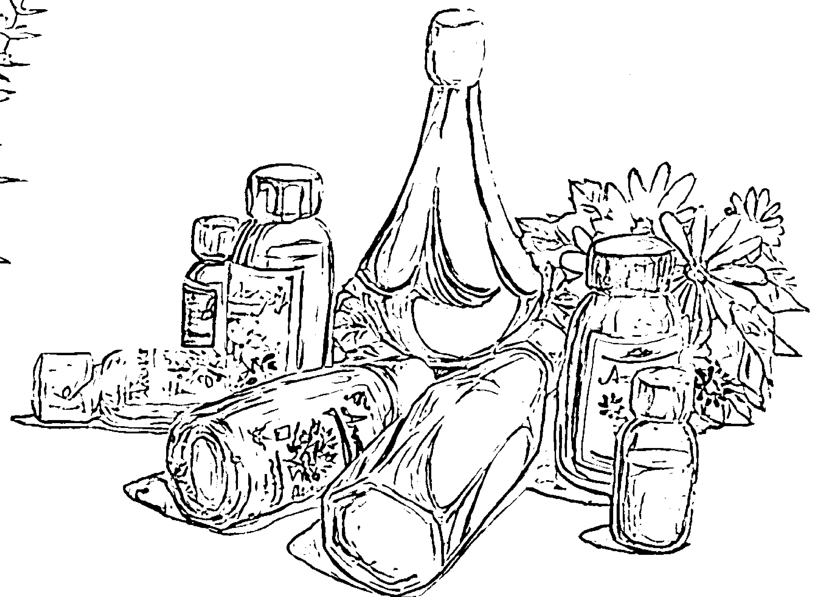

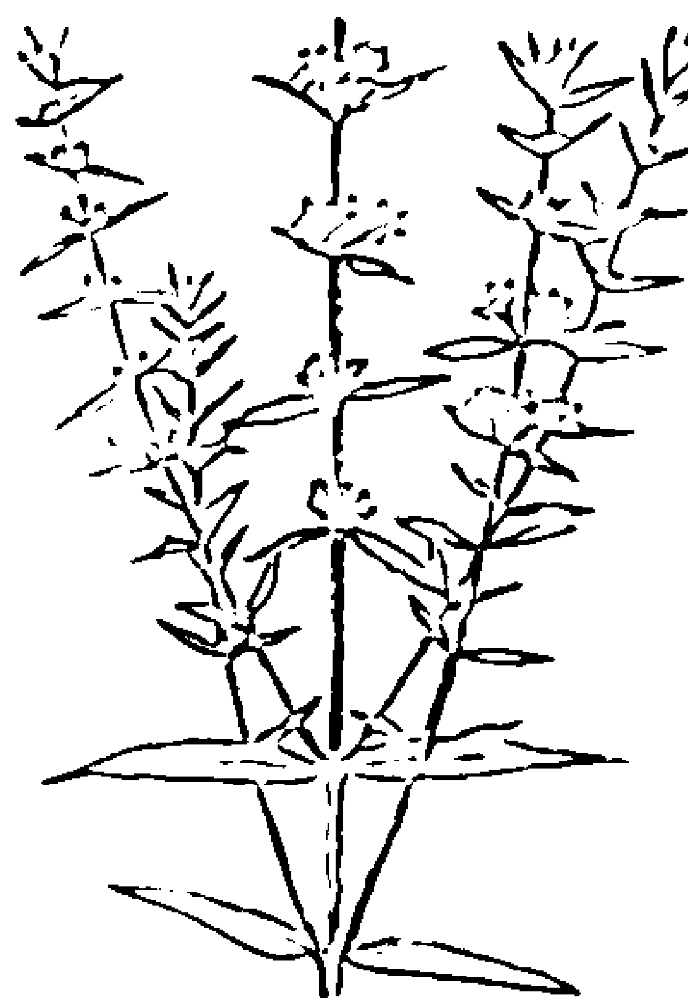

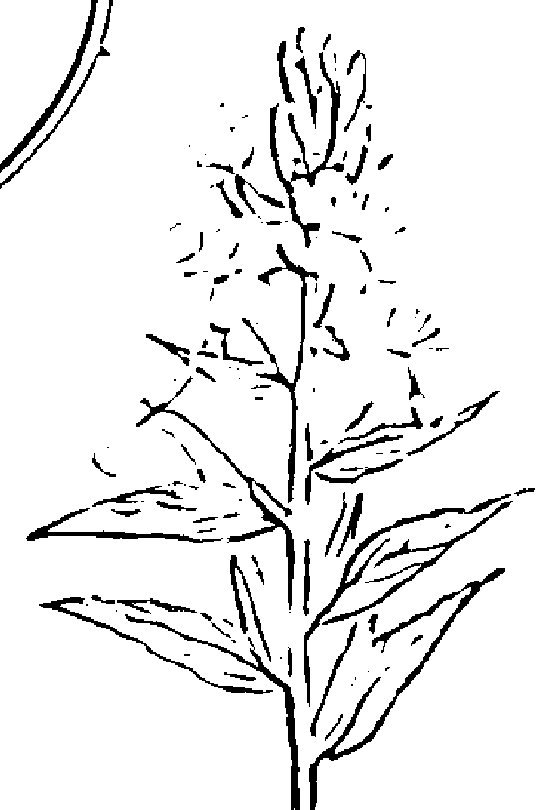

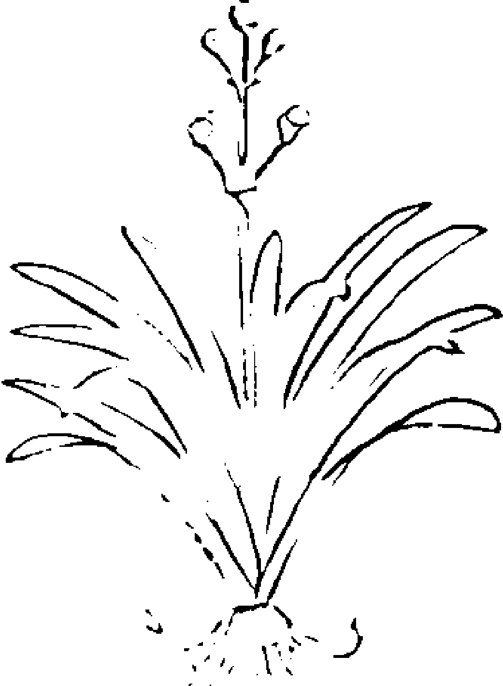

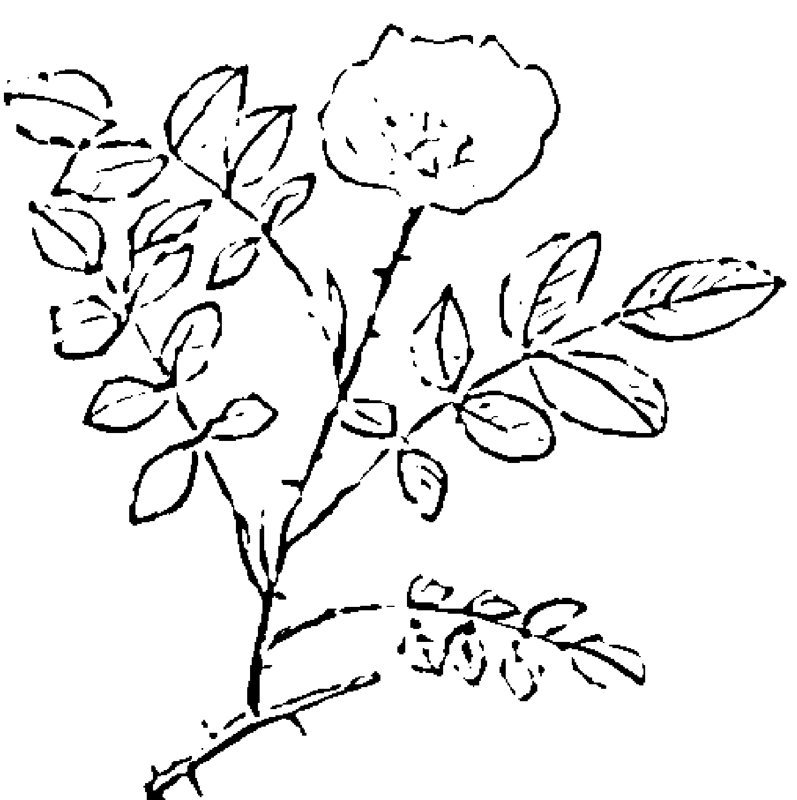

英國國家檢定合格芳香療法師
國際芳香療法 & 精油研究權威
汪妲·謝勒/著
溫佑君/譯

國際中文版獨家授權

# 芳香療法

# 精油寶典

書中蒐羅84種精油功能與療效
及各類精油的相互調合法

英國國家檢定合格芳香療法師 汪妲・謝勒／著
溫佑君／譯

# 目 錄

譯者序 7

作者序 11

各類精油介紹 13

- 1.阿米香樹 AMYRIS 14
- 2.歐白芷 ANGELICA 17
- 3.洋茴香 ANISEED 20
- 4.八角茴香 ANISE-STAR 23
- 5.羅勒 BASIL 26
- 6.月桂 BAY 29
- 7.安息香 BENZOIN 32
- 8.佛手柑 BERGAMOT 35
- 9.樺木 BIRCH 38
- 10.黑胡椒 BLACK PEPPER 41
- 11.白千層 CAJUPUT 44
- 12.樟樹 CAMPHOR 47
- 13.蒔茴香 CARAWAY 50
- 14.豆蔻 CARDAMOM 53
- 15.胡蘿蔔種子油 CARROT SEED 56
- 16.雪松 CEDARWOOD 59
- 17.芹菜 CELERY 62
- 18.洋甘菊 CHAMOMILE 65
- 19.肉桂 CINNAMON 68
- 20. 香茅 CITRONELLA 71
- 21. 快樂鼠尾草 CLARY SAGE 74
- 22. 丁香 CLOVE 77
- 23. 芫荽 CORIANDER 80
- 24. 小茴香 CUMIN 83
- 25. 絲柏 CYPRESS 86
- 26. 莳萝 DILL 89
- 27. 榄香脂 ELEMI 92
- 28. 尤加利 EUCALYPTUS 95
- 29. 茴香 FENNEL 98
- 30. 椴 FIR 101
- 31. 乳香 FRANKINCENSE 104
- 32. 白松香 GALBANUM 107
- 33. 大蒜 GARLIC 110
- 34. 天竺葵 GERAIUM 113
- 35. 姜 GINGER 116
- 36. 葡萄柚 GRAPEFRUIT 119
- 37. 愈创木 GUAIACWOOD 122
- 38. 牛膝草 HYSSOP 125
- 39. 義大利永久花 IMMORTELLE 128
- 40. 茉莉 JASMINE 131
- 41. 杜松 JUNIPER 134
- 42. 醒目薰衣草 LAVANDIN 137
- 43. 薰衣草 LAVENDER 140
- 44. 穗状花序薰草 LAVENDER SPIKE 143
- 45. 柠檬 LEMON 146
- 46. 柠檬香茅 LEMONGRASS 149
- 47. 莱姆 LIME 152
- 48. 菩提花 LINDEN BLOSSOM 155
- 49. 山鸡椒 LITSEA CUBEBA 158
- 50. 桔 MANDARIN 161
- 51. 马郁兰 MARJORAM 164
- 52. 香蜂草 MELISSA 167
- 53. 没药 MYRRH 170
- 54. 香桃木 MYRTLE 173
- 55. 橙花 NEROLI 176
- 56. 绿花白千层 NIAOULI 179
- 57. 肉豆蔻 NUTMEG 182
- 58. 橙 ORANGE 185
- 59. 野马郁兰 ORIGANUM 188
- 60. 玫瑰草 PALMAROSA 191
- 61. 欧芹 PARSLEY 194
- 62. 广藿香 PATCHOULI 197
- 63. 薄荷 PEPPERMINT 200
- 64. 苦橙叶 PETITGRAIN 203
- 65. 玉桂子 PIMENTO 206
- 66. 松树 PINE 209
- 67. 玫瑰 ROSE 212
- 68. 迷迭香 ROSEMARY 215
- 69. 花梨木 ROSEWOOD 218
- 70. 鼠尾草 SAGE 221
- 71. 檀香 SANDALWOOD 224
- 72.薰衣草棉 SANTOLINA 227
- 73.綠薄荷 SPEARMINT 230
- 74.萬壽菊 TAGETES 233
- 75.紅柑 TANGERINE 236
- 76.龍艾 TARRAGON 238
- 77.松脂 TEREBINTH 241
- 78.百里香 THYME 244
- 79.茶樹 TI-TREE 247
- 80.馬鞭草 VERBENA 250
- 81.岩蘭草 VETIVERT 253
- 82.紫羅蘭 VIOLET 256
- 83.西洋蒼草 YARROW 259
- 84.依蘭 YLANG-YLANG 262

精油調配圖表 265

精油與皮膚類型 266

精油功能索引 267

參考書目暨推薦讀物 280

中文筆劃索引 285

# 譯者序

所謂的精油(Essential Oils)，是一種萃取自植物的花、葉、種子，甚或樹皮的揮發性有香物質。西方的傳統醫療運用精油有點類似中醫之運用藥草，但由於精油的化學結構和一般的植物藥材不同，其應用方法與所得療效也頗有差異。而所謂的芳香療法(Aromatherapy)，便是一種運用精油以養生、美容甚至調整情緒的另類療法。

全世界最盛行芳香療法的國家是英國，但法國、德國、美國、澳洲在這方面的研究也頗有建樹。台灣可以買到精油的地方，現在主要是在專業的沙龍和少數百貨公司專櫃，不過，真正了解精油而且能確實運用在芳香療法中的人，仍屬鳳毛麟角，一般大眾對精油及芳香療法的印象恐怕還相當模糊。

最初會想要動筆翻譯這本「芳香療法精油寶典」，只是為了教學上的方便。筆者過去專職美容教學工作，主要是對沙龍的美容師講授芳香療法。由於國內十分缺乏這方面的知識，現有的少數書籍和各化妝品公司自己整理的資料又殘缺不全，甚至錯誤百出，於是，在六十餘冊關於芳香療法的英語專書中，挑出這本”The Directory of Essential Oils”做為基礎教材。

翻譯期間，筆者曾於今年7月至英國Surrey大學，參加95年之國際芳香療法會議，出席代表兩百餘人當中，筆者是唯一的台灣人。反觀鄰國日本，一口氣到了三十多位，僅遜於英國和美國。在會議當中，筆者曾與各國代表交流芳香療法在自己國內的發展情形，其中有一位日本代表詢問台灣有多少關於芳香療法方面的書籍，同樣的問題，也有德國的代表向筆者提出。我們或許可以這樣理解：對他們來說，知識比銷售量更具影響力！但是在引進精油已有五年歷史的台灣，精油至今只是一種「香香的按摩油」，所謂的芳香療法，則又是另一個「很好聽的美容術語」罷了。由此，筆者才發願要將這個領域的重要著作悉數翻譯出來，讓一般的消費大眾和專業人員，能真正認識精油與芳香療法之美。

在這裡，也要特別感謝英國C.W. Daniel公司的米勒女士，及台灣世茂出版社的簡泰雄先生。英語世界裏，有關芳香療法的經典著作，幾乎都是C.W. Daniel公司的出版品，在洽談版權的過程中，米勒女士表現了最大的善意，也提供筆者極多幫助。而世茂則出版了台灣第一本芳香療法專書——「神奇的芳香療法」，負責人簡先生願意再次出版一本不夠熱門的專業書籍，其遠見與胸襟實在令人感佩。

閱讀本書以前，希望讀者能留意以下幾點：

- 1. 讀者千萬不可憑書中所述便自行使用精油。因為純精油的使用方法各有不同，滴數的安全劑量也有很大的影響，凡是初次接觸精油者，都必須尋求真正的專業人士予以輔助。
- 2. 盡信書不如無書。誠如作者在序言中指出，各種精油的療效，仍有賴個人的洞見與經驗才能發揮出來，初學者不宜視書中所述為必然的結果。
- 3. 有許多化妝品公司和美容師把精油與中醫的經絡穴位結合在一起，筆者並不否定這種發展的價值，但卻極力反對其後「中學為體，西學為用」的意識型態。因為精油在西方的歷史文化中，自有其豐富長遠的淵源，時至今日，芳香療法在歐美更已形成一門集合化學、醫學、心理學等精密科學的「顯學」，漠視這些背景而隨意強加另一套醫療邏輯，不但不能彰顯精油的生命力，也未必能體現中醫的博大。學習精油，必須尊重其文化淵源和背景知識，否則就永遠難以領略它所代表的生活哲學。
- 4. 精油在台灣被局限在美容界裏，是一件非常可惜的事，希望本書能引起其它相關專業的興趣，共同來研究神奇的芳香療法。不過，本書並不是一本入門書，如果讀者想循序漸進來了解芳香療法，請先參閱亞諾泰勒博士所著之「神奇的芳香療法」。

最後，筆者要感謝每週前來參與芳香療法研討課的學員們，是她們的求知若渴，促成了本書中譯本的誕生。

1995年11月 台北

溫佑君

溫佑君【譯者】

- 學歷：東吳大學社會學系
  英國肯特大學哲學研究所
  英國倫敦芳香療法學校
- 現任：芳香療法研究學會專任講師

# 作者序

在芳香疗法如此流行的今日，这门治疗的艺术，其实已不太需要什么引言了，因此我这篇引言也将会尽量精简。许多芳香疗法方面的书籍，主旨在于介绍精油的用法，这本书的目的，则在于描述各种精油的特性，以及它们对身体、心理，乃至于精神层次的贡献。

在本书中，我用不同的条目来给每一种精油分门别类，如此一来，读者便可以立刻找到他想知道的特定讯息，这种编排方式，将有助于芳香疗法师为疗程选择适当的精油。然而，每一个人都是各个特质的某种奇妙之组合，所以，任何精油宣称能达到的疗效通常也只是极可能实现的承诺，而并非屡试不爽的验证。也许，最后真正奏效的会是芳香疗法师凭直觉为客人选配的精油。

书中所列的一些病痛若属于较严重的痼疾，自然只有在合格的医师监督下才能以精油予以护理。

虽然按摩是芳香疗法中最常选择的精油用法——大约5ml基础油中加入3滴精油——有些条目中所指称的疗效并不宜藉按摩达成。通常，那些不适合按摩的精油，都会在「注意事项」里注明。书中的某些精油，比较无法引起一般大众的兴趣，而且它们的作用也过于强劲，也许并不适合收罗在芳香疗法师的药典中，这些精油也都有特别的标示。

将精油特质类比于音符的「高音」、「中音」或「低音」并无绝对的标准可评定，所以在不同的书籍中，你将会发现有些油的音符与本书所载并不相同，主宰星球的形也是一樣。因此，這本書所提供的乃是一個好的參考點而非蓋棺定論，同樣的，「適合與之調和的精油」也只是一個頗有幫助的嚮導而已，真正能讓調油登臨治癒之境的，仍然是個人對精油的掌握。在本書後頁附有一個調油表，提供另外一個調油的方向。每一類組中的精油據說都能互相協調，而相鄰的類組也可以合作無間。至於「化學結構」這一欄，則可讓大家一窺精油的複雜性。

對我而言，是那些「應用歷史與相關神話」使各種精油充滿生命的，不過其中有許多故事，主要是由萃取出精油的植物而來，比較不是在講精油本身。在那些故事裏，你可以看到有些精油，像薑與黑胡椒是十分「剛毅」的，而其他的精油，如洋甘菊和紫羅蘭則比較「溫柔」。

本書卷尾的「精油功能索引」把精油的各種屬性做出便利的一覽表，提供讀者相互參照，大部分常用的精油都被涵括在內了。

# 各類精油介紹

## 1. 阿米香樹 AMYRIS

| 植物種類／萃取部位 | 樹／木材 |
| --- | --- |
| 學名 | (阿米香樹屬) Amyris balsamifera |
| 科名 | 芸香科Rutaceae |
| 類比音符 | 低音 |
| 主宰星球 | 未知 |
| 萃取方法 | 蒸餾 |

<氣 味> 木頭燃燒過後的乾燥香氣。

<外 觀> 阿米香樹野生於海地的山坡地。常見於小樹叢中，它是一種開有可愛白花的常綠樹，但它饒富價值的樹脂乃是從樹皮流出的。雖然也被稱爲「西印度檀香」，但它並非檀香科的一員，不同地區所出產的阿米香樹的精油，品質屬性也各有不同，好壞主要取決於樹齡和含水量，如果木材被切得太細小，所能萃取的精油量也會減少。

<應用歷史與相關神話> 阿米香樹的木材內蘊含豐富的油份，木材燃燒時宛如蠟燭一般，因此它得了個別名叫蠟燭樹，而它常被劈來做柴火也就不足爲奇了。在海地夜晚的海邊，漁人常以阿米香樹的枝條做成火把，來吸引螃蟹；同樣的，住在山裏的村民，在夜間將農作物或牲口運到城裏時，也是點燃阿米香樹的枝條來照路的。因爲它堅固耐用，所以阿米香樹的木材也是築籬架的好材料。

二次大戰前，大量的阿米香樹小塊木材，從委內瑞拉、海地和牙買加被運至德國以供蒸餾，蒸出的精油屬性據說頗似純正的印度檀香，而檀香精油被阿米香樹混摻的情形則時有所聞。阿米香樹精油的主要用途是做香水的定香劑和肥皂，也是化妝品的成份之一。

## <化學結構>

倍半萜——杜松烯，石竹烯，Cadinole

## <屬 性>

抗菌、消炎、抗痙攣、催情、化痰、降低血壓、鎮靜。

## <注意事項>

氣味縈繞不絕，有些人未必會習慣，其他的負面作用則還未被發現。

## <心靈療效>

紓緩神經緊張。

## <身體療效>

有關這種精油的知識甚少，除了它多彩多姿的應用歷史以外。它的各種療效，其實主要是以其倍半萜烴的成份，和近似檀香的特質推論而來的。

由此，我們大概可以判定這種精油較爲鎮靜、安撫，而這也和它的低音特質互相呼應，別忘了阿米香樹是被用做香水中的定香劑。它抗痙攣的本質源自鎮定安撫的特性，而且就像檀香一般，阿米香樹有益於咳嗽和胸腔方面的毛病，也許能降低血壓。

大部份的精油都有抗菌的屬性，阿米香樹自然也不例外。因此可預防傳染性疾病，只是它的抗菌強度如何則尚未能確定。既然像檀香，阿米香樹應也有益於泌尿方面的問題，不過另一個類似檀香的功用一催情，則有待個人的觀察體驗了。

### <皮膚療效>

倍半萜類多具消炎的特質，所以富含倍半萜的阿米香樹大概也能安撫發炎的狀況。另一方面，它具有像木材燃燒的氣味，這是否也意味著它能使油性膚質乾化呢？

### <適合與之調和的精油>

- 安息香
- 快樂鼠尾草
- 橄欖脂
- 乳香
- 白松香
- 天竺葵
- 茉莉
- 薰衣草
- 香蜂草
- 玫瑰
- 花梨木
- 依蘭

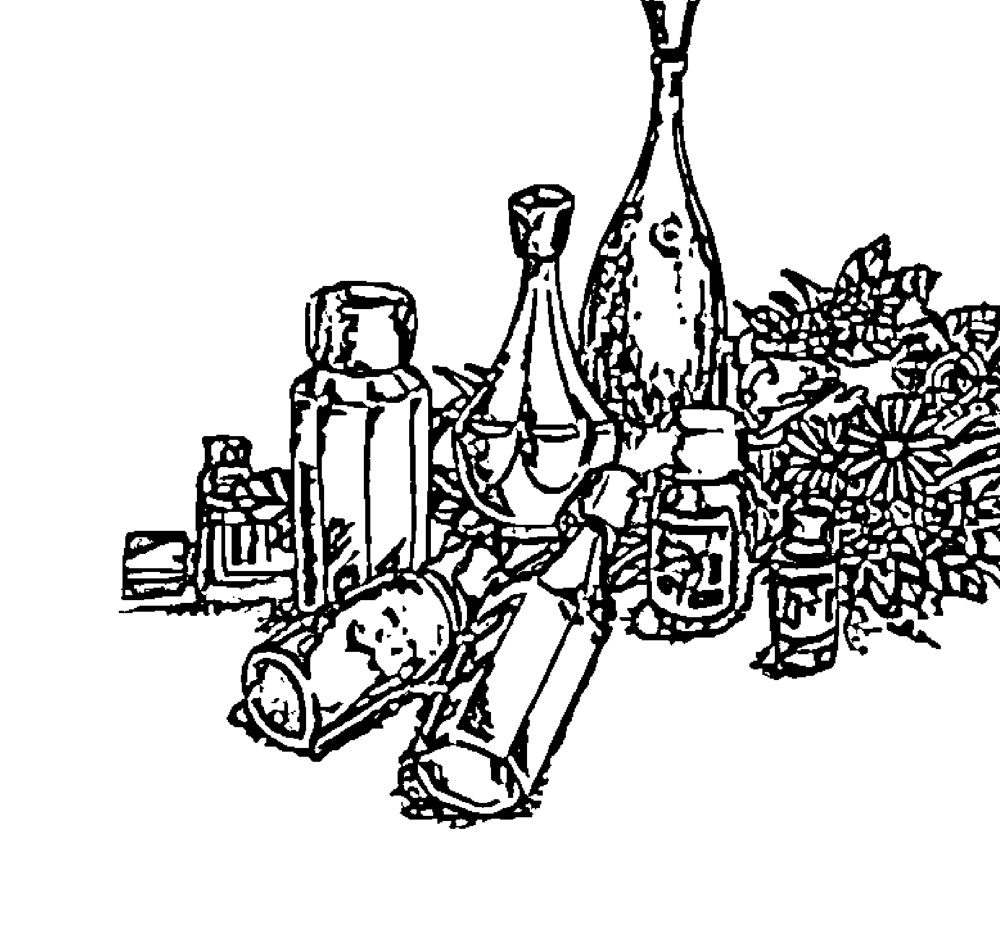

## 2. 歐白芷 ANGELICA

| 植物種類／萃取部位 | 藥草／種子或根 |
| --- | --- |
| 學名 | (當歸屬) Angelica archangelica |
| 科名 | 繖形科Umbelliferae |
| 類比音符 | 低音 |
| 主宰星球 | 太陽 |
| 萃取方法 | 蒸餾 |

<氣 味> 甜甜的藥草香，略帶麝香味。

<外 觀> 這種藥草很喜歡水，常可在河邊或溪畔發現它，長得頗高，寬大的葉片有的又形成較小的卷葉，其上還點綴了綠白色的小花。歐白芷品種衆多，分別生長在北歐、冰島、格陵蘭以及俄羅斯中部，至於其精油多半產自英國與比利時。

<應用歷史與相關神話> 在16世紀的某個時期，歐白芷從北非來到了歐洲氣候較溫暖的一些地區。因爲它在一年中首次開花的日子是5月8日——天使長聖麥可之日，這使它常出現在一些神秘儀式中，由此也不難理解，爲何它常被種在修道院，而且被稱做「天使草」了。 在法國很流行的一些酒，像是查爾特勒酒與本篤會甜酒中，都用到了這種可愛的藥草。後來，它又成爲討喜的庭園植物，普遍認爲它可以抵抗瘟疫。1665年，醫師學院出版了一本小册子，上面載有一則皇家處方，其中便列有「 歐白芷水 」這味药材，而那一年也正是倫敦大瘟疫蔓延時期。古代名醫巴拉斯索斯(Paracelsus)對它推崇備至，甚至認爲它是一種萬靈丹，常用以調味琴酒，增添香水的風情，傳統上則將它製成糖食甜點。

### <化學結構>

- 醇類一龍腦、芫荽油醇
- 內酯一香柑油內酯
- 萜烴一檸檬烯、水茴香萜、松油萜

### <屬 性>

抗痙攣、催情、祛腸胃脹氣、利尿、通經、化痰、利肝、利胃、激勵、促發汗、補身。

### <注意事項>

使用過量將過度刺激神經系統，可能導致失眠，也可能引起皮膚對光過敏，亦即在曝曬太陽之後，使皮膚出現刺激反應。最好不要在懷孕期間使用，有些人還建議糖尿病患者也該避免使用。

### <心靈療效>

神經系統的強心劑，迅速消除壓力和筋疲力竭之感，帶來平衡的感覺。使疲憊的心靈和搖擺不定的情緒重現生機，賦予面對難題的動力。

### <身體療效>

歐白芷補身的功能，對身體有很強的治癒力，特別是在剛開始治療時，將它用來強化組織結構。它賦予淋巴系統活力，藉排汗的功能加速淨化作用，尤其在長期臥病之後，可幫助身體釋放毒素。

改善消化不良、脹氣，反胃不適，胃潰瘍和絞痛。可開胃，幫助神經性厭食症，相傳也是肝、脾的補品。它在泌尿方面的抗菌功能對膀胱炎頗有助益。

祛痰的特性對於感冒發燒、慢性支氣管炎和胸膜炎都有益處，可紓緩神經緊張的氣喘、呼吸急促、煙槍型咳嗽，也能恢復嗅覺的功能，顯然是肺部的全方位補品。

據說可以促進雌激素之生成，所以能規律經期，減輕經痛，並幫助排出胞衣。對男性和女性的不孕症，療效頗為出名。

控制尿酸，有益於風濕病、關節炎以及痛風和坐骨神經痛。

迅速止痛，無論是頭痛、牙痛或是偏頭痛。另外，它還能中和蛇毒。

### <皮膚療效>

良好的護膚品，具有消炎功能，對各種皮膚問題都有所幫助，處理微菌寄生問題的功效卓著。

### <適合與之調和的精油>

- 羅勒
- 洋甘菊
- 天竺葵
- 葡萄柚
- 薰衣草
- 檸檬
- 桔

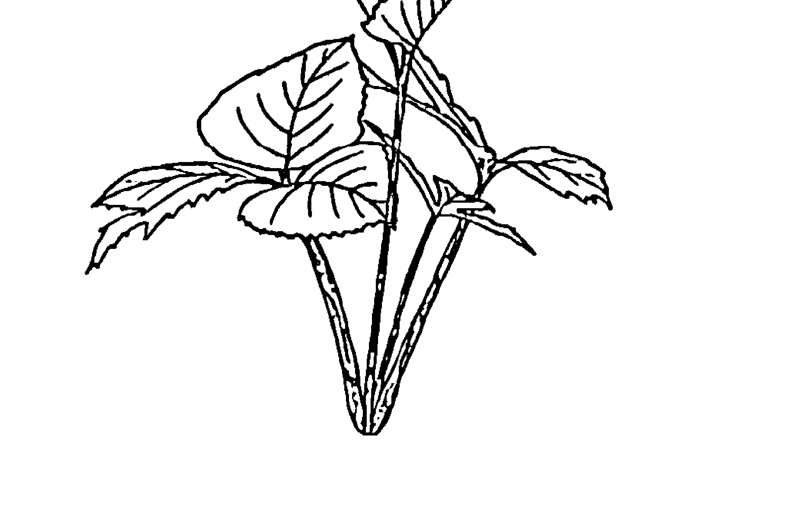

## 3. 洋茴香 ANISEED

| 植物種類／萃取部位 | 藥草／種子 |
| --- | --- |
| 學名 | (茴芹屬)Pimpinella anisum |
| 科名 | 繖形科Umbelliferae |
| 類比音符 | 高～中音 |
| 主宰星球 | 太陽 |
| 萃取方法 | 蒸餾 |

<氣味> 辛辣刺激，似甘草，非常溫暖。

<外觀> 洋茴香是中東地區給這個世界的獻禮，現在則可在歐洲較溫暖的地區，或是北非和美國發現它。人工栽種至60公分高，長有纖細的羽狀葉和小白花，棕灰色的種子在蒸餾前才碾碎，這樣做是為了增加萃取量。洋茴香精油在低溫下會呈現固態，所以使用前應以手溫來融化它。

## <應用歷史與相關神話>

備受古文明推崇，尤其是在中東一帶。務實的埃及人用洋茴香來做麵包，可能著眼點就在它祛腸胃脹氣的屬性。羅馬人盛讚其催情效果，並利用洋茴香的種子做成一種香料糕餅，名為「Mustaceus」。希臘人發現它對於消化系統具有鎮靜作用，到了現代，洋茴香則被用於酒類和果汁中，如Pernod和苦艾酒。印度人嚼洋茴香的種子使口氣清新，曾為牙膏和漱口水的成份之一。

### 化學結構

- 酸類—洋茴香酸
- 酚類—茴香腦、馬鬱蘭酚
- 萜烴—檸檬烯

### 屬性

止吐、抗痙攣、催情、利心臟、祛腸胃脹氣、利消化、利尿、化痰、催乳、殺蟲、輕瀉、殺寄生蟲、助產、利肺、激勵、利胃。

### 注意事項

極其強勁的精油，不常拿來按摩，因為它可能會引起皮膚過敏。通常帶有刺激的效果，使用過量可能會造成遲緩呆滯。極端的個案中，還可能引起循環方面的問題以及腦充血，絕不可在懷孕期間使用，一般人也以完全避免為宜。

### 心靈療效

可以讓疲憊的心靈重現生機。

### 身體療效

以幫助消化的功能聞名，有助於改善消化不良、絞痛及脹氣，可鎮撫嘔吐與反胃，特別是由神經緊張引發者。因為它能刺激腸胃蠕動，從而使消化道重新運作。顯著改善少尿的情況。

曾被用做心臟無力時的激勵劑，但同時也能安撫心悸，是循環系統和呼吸道的營養品，一般使用於肺臟和心臟疾病，對氣喘和呼吸困難均有很好的療效。又因為它是暖性的精油，自然有益於感冒的治療。

性方面的困難，例如性無能和性冷感，可得到幫助——至少羅馬人是這麼認為。激勵腺體，其雌激素成分可調節生殖系統。亦能安撫經痛，在生產時幫助生產速度，還能刺激母奶分泌。偏頭痛和眩暈患者，乃至易宿醉的人，都能從洋茴香得到一些幫助。

### 皮膚療效

據說可以控制蝨子及引發疥癬的「癢蟲」。一般使用於傳染性的皮膚病，頗具效果。

### 適合與之調和的精油

阿米香樹、月桂、豆蔻、藏茴香、雪松、芫荽、蒔蘿、白松香、桔、苦橙葉、花梨木。

## 4. 八角茴香 ANISE-STAR

| 植物種類／萃取部位 | : | 樹／果 |
| :--- | :--- | :--- |
| 學名 | : | (八角茴香屬)Illicium verum |
| 科名 | : | 木蘭科Magnoliaceae |
| 類比音符 | : | 高音 |
| 主宰星球 | : | 太陽 |
| 萃取方法 | : | 蒸餾 |

<氣味> 具穿透力，辛辣刺激，類似洋茴香。

<外觀> 這種古老而且充滿異國情調的常綠樹來自東亞，可長到9公尺高。它只喜歡在家鄉生長，蹤跡罕至外地。白色的樹皮周圍裝點了黃花與星形果實，果實在鮮綠的狀態時便送去蒸餾，所得之精油氣味類似洋茴香而稍強。八角茴香源自中國大茴香，有時又被稱爲綠茴香，因爲它的綠顏色之故。日本品種的八角茴香(Illicium religiosum)是有毒的。

<應用歷史與相關神話>
生產八角茴香精油是中南半島鄉村工業的項目之一。雖然，人們常說八角茴香的品質比不上洋茴香，中國人卻很善於將八角茴香納入中藥裏運用。它是個很受歡迎的開胃劑，有時也會把它磨成粉加入咖啡或茶中，以使口氣清香。肉類的菜餚如豬或鴨，可藉八角茴香調味，甚至甜點中也可以加入它。英國的海上探險家在16世紀把它引進歐洲以後，立即大受歡迎，法國、德國與義大利等地都用它做酒類的調味劑。

### 化學結構

- 氧化物—桉油醇
- 酚類—茴香腦、黃樟腦
- 萜烴—松脂烯、繖花烴、苦艾萜、檸檬烯、松油萜、水茴香萜

### 屬性

祛腸胃脹氣、利尿、化痰、激勵、利胃。

### 注意事項

這種強勁的精油，可能會過度刺激神經系統，有過敏傾向者應避免使用。它在芳香療法中的用途不廣，而且最好完全避免在芳香療法中使用。

### 心靈療效

一般性的激勵效果。

### 身體療效

對消化系統而言似乎是全方位的精油，因為它有十分強勁的祛脹氣特質。安撫胃部，減輕反胃感，藉由激勵腸胃蠕動有效克服便秘。整體來說對腸是有助益的。也許正因如此，而有減輕疝氣症狀的功用。

它利尿的屬性可以解決膀胱方面的問題，例如膀胱炎和少尿的毛病。

在身體發冷時，使手腳溫暖。對呼吸系統也相當有益，能治癒喉嚙痛與胸腔感染，顯著改善肇因於寒冷氣候的風濕性腰痛。

據說也能刺激雌激素的製造，因此可用於改善經前症候群、經痛，有利於調經。

<皮膚療效> 未知

<適合與之調和的精油>

- 藏茴香
- 豆蔻
- 芫荽
- 絲柏
- 蒔蘿
- 茴香
- 姜
- 桔
- 苦橙葉
- 花梨木

## 5. 羅勒 BASIL

| 植物種類／萃取部位 | 藥草／花的頂端、葉 |
| :--- | :--- |
| 學名 | (羅勒屬)Ocimum basilicum |
| 科名 | 唇形科Labiatae |
| 類比音符 | 高音 |
| 主宰星球 | 火星 |
| 萃取方法 | 蒸餾 |

<氣味> 非常清甜，略帶香辛料的味道

<外觀> 羅勒有許多種類，但均源自亞洲與太平洋群島。在它40公分長的莖上，寬寬的橢圓尖葉襯出它可愛的白紫色花朵。夏季裏，成群的蜜蜂總是繞著羅勒打轉。北非、塞浦路斯、以及西昔爾（非洲東部之島國）都出產羅勒精油，但據說歐洲產的羅勒品質最好。

<應用歷史與相關神話> 羅勒的種名源自希臘文，意指「皇家」；它的另外一個拉丁字源則意指「蛇類」，卻又不免予人聲名狼藉之感。 有一些荒謬的魔術師，以為他們可以用兩個石頭搗碎羅勒而變出蛇子來。聰明的印度民俗裏，視羅勒為神聖之物，認為天神賜與它保護的力量，事實上，的確有些印度部落在參加宗教儀式前，習慣嚼羅勒葉以獲得「天啓」。它也被廣泛用於印度傳統的阿優斐達醫療中。中國人珍視它已好幾個世紀，把它拿來入藥，治癲癇症尤其聞名。它受歡迎的程度，在二次大戰時到達巔峰，因為戰時不易取得香料。羅勒精油也被用在香水中。

### 化學結構

- 醇類—芫荽油醇
- 酮類—龍腦、樟腦、桉油醇
- 酚類—馬荷蘭酚、丁香酚
- 萜烴—羅勒烯、松油萜、蛇床烯

### 屬性

止痛、抗沮喪、防腐、抗痙攣、抗蛇毒、催情、殺菌、祛腸胃脹氣、利腦、助消化、通經、祛痰、退燒、催乳、殺蟲、健胃、利神經、催汗、補身、復健、激勵、驅蠕蟲。

### 注意事項

通常可激勵，但使用過量反而會引起麻痺。因為可通經，所以懷孕期間應避免使用，對敏感皮膚也可能有刺激性。

### 心靈療效

對神經是很好的補強劑，特別在感覺虛弱時，可使感覺敏銳並使精神集中，穩定歇斯底里與神經功能失調，可振奮沮喪的情緒。

### 身體療效

治頭疼和偏頭痛的一級品，可能是由於它對頭部有益的屬性，據說可使瞬間的暈眩和暫時的麻痺恢復正常。它還可以消除鼻黏膜上的息肉，改善耳痛。能減輕過敏的症狀，因為羅勒會影響腎上腺皮質，而腎上腺皮質能控制因壓力而造成的過敏現象。羅勒對呼吸道也頗爲有益，常被用於鼻竇充血、氣喘、支氣管炎、肺氣腫、流行性感冒、百日咳。亦可回復因黏膜發炎而喪失的嗅覺。

羅勒對消化異常也很有效，如嘔吐、胃痙攣、噁心、消化不良（上消化道的不適）和打嗝，它的抗菌作用可淨化腸和腎。

作用類似雌激素，對月經方面的問題通常都很管用，如經血過少、乳房滿脹，並可快速排離胞衣，對不易懷孕也有助益。

可用於黃蜂和昆蟲咬傷，過去還用來退瘧疾引起的高燒，而瘧疾正是由蚊子血中寄生蟲所傳染的。

可降低血中的尿酸，進而紓解痛風和肌肉疼痛，促進血液流通，能減輕深層肌肉的痙攣。

### 皮膚療效

對下垂、阻塞的皮膚，有緊實、更新清爽之功效，也可控制粉刺。

### 適合與之調和的精油

佛手柑、黑胡椒、快樂鼠尾草、天竺葵、牛膝草、薰衣草、馬鬱蘭、香蜂草、橙花、檀香。

## 6. 月桂 BAY

| 植物種類／萃取部位 | : | 樹／葉 |
| :--- | :--- | :--- |
| 學名 | : | (月桂樹屬)Laurus nobilis |
| 科名 | : | 樟科Lauraceae |
| 類比音符 | : | 高音 |
| 主宰星球 | : | 太陽 |
| 萃取方法 | : | 蒸餾 |

<氣味> 甜甜的香料味，有點像肉桂。

<外觀> 這種堅實的常綠樹高達9公尺以上，實際上原產自南歐。它的另一個品種Pimenta racemosa，為西印度的飲料Bay Rum增添不少風味。一般所見的月桂樹，有長矛狀的長葉，又厚又亮，小小的花朵呈乳黃色，結的是黑色的漿果。月桂精油的產地主要是摩洛哥及西班牙。

### 應用歷史與相關神話

埃及人用月桂用得極多，它也倍受羅馬人的青睞，羅馬人視之為智慧、護衛與和平的象徵。人們也常將月桂樹與醫療之神阿波羅聯想在一起。月桂的拉丁字源Laudis意為「讚美」，所以在奧林匹克競賽中獲勝的人，都會受贈一頂月桂編成的頭環，而「桂冠詩人」的意象，也正是由這個典故衍生出來的。

有個故事相傳，若將一片月桂葉置於枕下，你就能夢到好預兆。比較實際一點的用法，是把它加在湯或醬汁裏，長久以來人們都這麼做的原因，在於月桂能增加唾液分泌以幫助消化。在希臘，人們仍在教堂的樓層上遍灑月桂葉，這大概是要借重它的抗菌特質。月桂樹的木材很耐用，所以人們拿它來做手杖。它的英名俗名除了叫Bay以外，有時也被稱爲Laurel。

### 化學結構

醇類—牻牛兒醇、芫荽油醇、松油醇
氧化物—桉油醇
酚類—丁香酚
萜烴—水茴香萜、松油萜

### 屬性

止痛、抗神經痛、抗菌、抗痙攣、開胃、收斂、促進膽汁分泌、利尿、通經、退燒、利肝、殺蟲、助產、激勵、利胃、促進發汗、補身。

### 注意事項

泡個灑滿月桂葉的澡是羅馬人的最愛，但是月桂精油卻會刺激皮膚，甚至可能波及黏膜組織，因此它適不適合用在按摩中仍存有爭議。

### 心靈療效

有輕微的麻醉效果，使心靈溫暖平靜。

### 身體療效

對消化系統有顯著的助益，可以幫助你打開胃口、祛退脹氣、安撫胃痛，而且養肝補腎，促進尿液流動。

不管是風濕痛、一般性疼痛或是扭傷，月桂均有減輕症狀的效果，尤其是與玫瑰、杜松調和使用的時候。在感覺寒冷的情況下，特別適合以月桂為處方。同時，藉由它發汗的作用，月桂也能降低體溫。用在傳染性疾病上的功效卓著，可能還有助於治療支氣管炎。

能調理生殖系統，調節流量過少的月經，並可在生產時加速產程。也能幫助耳朵感染的病情好轉，進而減輕暈眩的感覺，恢復平衡。

### 皮膚療效

頭髮及頭皮的良好補品，可刺激毛髮生長並清除頭皮屑。據說也能打散淤血，安撫發炎，以及縮小結疤的範圍。

### 適合與之調和的精油

- 雪松
- 芫荽
- 尤加利
- 薑
- 杜松
- 薰衣草
- 檸檬
- 馬鬱蘭
- 甜橙
- 玫瑰
- 迷迭香
- 百里香
- 依蘭

## 7. 安息香 BENZOIN

| 植物種類／萃取部位 | : | 樹／樹幹流出的樹脂 |
| :--- | :--- | :--- |
| 學名 | : | (安息香屬)Styrax benzoin |
| 科名 | : | 安息香科Styraceae |
| 類比音符 | : | 低音 |
| 主宰星球 | : | 太陽或木星 |
| 萃取方法 | : | 溶劑萃取 |

<氣味> 甜，似香草。

<外觀> 安息香樹生長於爪哇、蘇門答臘及泰國，人們在安息香的樹皮上切下三角形的缺口，而後樹汁便會流出。這種棕灰色的黏稠樹汁最後會凝固成硬塊，在定義上還不能算是精油，是香樹脂。使用前要隔水加熱使之溶化，也可以購買已溶在乙二醇中的液體使用。

### 應用歷史與相關神話

這種芳香樹脂用在美容方面已有數百年之久。古代文明認為它是驅離惡靈的重要法寶，經常用於薰蒸和焚香。最近因為「苦行僧的香膠」中有安息香，使得安息香更受歡迎。在古老的藥草誌中，安息香常被叫做「樹脂安息香」、「香膠」或「樹脂班傑明」，一種老式的化妝水「處女牛奶」中便含有安息香、薰衣草及乙醇。一般人相信它能使皮膚「皎潔和明亮」，現今則多用於香水中做定香劑。

### 化學結構

- 酸類—安息香酸、肉桂酸
- 醛類—苯甲醛、香草醛
- 酯類—苯甲酸苄酯

### 屬性

抗菌、收斂、祛腸胃脹氣、有益頭部、興奮、除臭、利尿、化痰、鎮靜、治創傷。

### 注意事項

若需集中注意力則最好避免使用，因爲它會使人昏昏欲睡。

### 心靈療效

因爲能安撫神經系統，所以是緊張與壓力的紓緩劑。也能安撫悲傷、寂寞和沮喪的情緒。排除憂慮、樹立信心。紓解筋疲力竭的身心狀態。

### 身體療效

對身體似有回春的效果，能溫暖心臟及循環系統，減輕一般的疼痛及關節炎。

對呼吸道異常現象的助益十分顯著。可潤肺並改善支氣管炎、氣喘、咳嗽、感冒、喉炎及喉嚨痛。對黏膜充血極爲有效，可排除身體中的液態廢物。

也可幫助泌尿管道之異常如膀胱炎，因爲它有益於尿液流動。還能治生殖器官的問題，如白帶，甚至處理性方面的問題，較著名的是治早洩。

對胃部有安撫作用，可排除脹氣，強化胰臟以幫助消化。據說能控制血糖高低，十分有助於糖尿病患者。

另外，可減輕口腔潰瘍。

<皮膚療效> 是龜裂、乾燥皮膚的聞名療方，能使皮膚恢復彈性。對手部、腳部皮膚龜裂及凍瘡、小疹子特別有用。是傷口及潰瘍的良好療方，對皮膚炎的發紅、發癢與刺激現象亦有療效。

### 適合與之調和的精油

- 佛手柑
- 芫荽
- 絲柏
- 乳香
- 杜松
- 薰衣草
- 檸檬
- 沒藥
- 橙
- 苦橙
- 玫瑰
- 檀香

## 8. 佛手柑 BERGAMOT

| 植物種類／萃取部位 | : | 樹／果皮 |
| :--- | :--- | :--- |
| 學名 | : | (柑橘屬)Citrus bergamia |
| 科名 | : | 芸香科Rutaceae |
| 類比音符 | : | 高音 |
| 主宰星球 | : | 太陽 |
| 萃取方法 | : | 榨取 |

<氣味> 輕淡、纖巧、清新，有些類似橙和檸檬，又帶著點花香。

<外觀> 不要和一種也叫佛手柑的花混淆了，那種裝飾用的花其學名是Monarda Didyma。而我們所謂的佛手柑是一種4.57公尺高的樹，長著長長的綠葉，開的是白花。佛手柑的果實就像個小橘子，但是外皮坑坑窪窪，形狀呈梨形。其精油來源為義大利和摩洛哥。佛手柑樹在所有的柑橘屬植物中是最嬌嫩的，需要特別的氣候和土壤才能生長。

<應用歷史與相關神話> 佛手柑之名是由義大利一個小城之名而來，因為這種樹最早栽植於該地。但另有一傳說，哥倫布在卡納利島發現了這種樹，將它帶進西班牙和義大利。根據歷史記載，佛羅倫斯從1725年開始便懂得使用佛手柑，在義大利，它是民間醫療很歡迎的藥材，但直到最近，他們才開始出口佛手柑。

有一種比較便宜的佛手柑精油，是從掉落但未成熟的果子所蒸餾出，有時候，這種精油還會被摻在較昂貴的精油裏。它的葉子蒸餾後，所得的是另一種型式的苦橙葉精油。通常在芳香療法中頗借重其提振情緒的特性，因此，佛手柑也是沮喪時的最佳選擇。大概是香水中最常見的成分，尤其常用於古龍水中。

### 化學結構

- 醇類—芫荽油醇、橙花醇、松油醇
- 酯類—芫荽酯
- 内酯—香柑油内酯
- 萜烴—苦艾萜、檸檬烯

### 屬性

止痛、抗沮喪、抗菌、抗痙攣、退腸胃脹氣、促進傷口癒合、興奮、除臭、利消化、化痰、退燒、殺蟲、鎮靜、利胃、補身、治創傷、驅蠕蟲。

### 注意事項

使用後，避免曝曬於強烈的日光下，因爲它會增強皮膚對日光的敏感程度。這是由於佛手柑精油中含有香柑油内酯，它會幫助皮膚曬黑，但不能避免曬傷，也可能刺激敏感皮膚。

### 心靈療效

既能安撫，又能提振，因此是焦慮、沮喪，神經緊張時的最佳選擇。清新的特性，能安撫憤怒和挫敗感，也許是因爲它降低了交感神經的作用所致。

### 身體療效

對尿道極有價值的抗菌劑，處理尿道的感染和發炎現象很有效，主要能改善膀胱炎。

對消化道也頗有助益，可減輕消化時的疼痛、消化不良、脹氣、絞痛、食慾不振等。絕佳的腸內抗菌劑，能驅逐腸內寄生蟲，並明顯消除膽結石。對厭食症者很有用，因爲佛手柑可以刺激食慾。

有助於呼吸道的傳染性疾病，如呼吸困難，扁桃腺炎，支氣管炎和肺結核等。對唇部疱疹、水痘、以及帶狀疱疹通常都頗有效。

調節子宮機能，曾用來治療經由性行爲傳染的疾病。

極好的驅蟲劑，也能讓寵物遠離植物。

### 皮膚療效

佛手柑抗菌和療效性的作用，對油性皮膚的狀況尤其有益，特別是這些狀況與壓力有關時。這些狀況包括濕疹、乾癬、粉刺、疥瘡、靜脈曲張、傷口、疱疹、皮膚和頭皮的脂漏性皮膚炎。和尤加利併用時，對皮膚潰瘍療效絕佳。

### 適合與之調和的精油

- 洋甘菊
- 蕪荽
- 絲柏
- 尤加利
- 天竺葵
- 杜松
- 茉莉
- 薰衣草
- 檸檬
- 馬鬱蘭
- 橙花
- 玫瑰草
- 廣藿香
- 依蘭

## 9. 桦木 BIRCH

| 植物种类／萃取部位 | : | 树／树皮、树枝 |
| :--- | :--- | :--- |
| 学名 | : | (桦属) Betula alleghaniensis (黄色) |
| | | Betula pendula (银色) |
| | | 黑桦 Betula lenta (樱桃色) |
| 科名 | : | 桦科 Betulaceae |
| 类比音符 | : | 高音 |
| 主宰星球 | : | 金星或水星 |
| 萃取方法 | : | 浸软和蒸馏 |

<气味> 消毒抗菌的清新气味。

<外观> 生长于森林的庞大树木，树身长出的葇荑花使这种树木极易辨识。在一百多个品种中，有些甚至可以长到24公尺高，其纤细的枝条往下生长，椭圆的叶片呈锯齿状。B. Alleghaniensis原产于美国，B. Pendula与黑桦则来自旧苏联、荷兰与德国。黑桦是其中最矮小的树种，也就是人们所知的甜桦木。在蒸馏之前，甜桦木的树皮必须浸在温水中泡软以释出精油。

### 应用历史与相关神话

桦木常引人联想到驱魔，但在实际的应用上，其叶汁乃是口腔伤口绝佳的漱口液。千百年来，桦木的树汁都被用来调制药酒，其叶片冲茶喝则有利尿作用。它也是乳液与软膏中的成份之一，也许是因为它具有收敛的作用。年来則被使用於香水中。

俄羅斯過去曾生產樺木的木焦油，它被用在皮革業與肥皂業製造過程中，不過它也可以幫助風濕痛的關節、痛風和皮膚感染。

白樺是盛行於德國的護髮產品——「樺木之水」中的主要成份。樺木的主要化學成份——水楊酸甲酯——也是阿斯匹靈的主要成份，由此可知樺木具有止痛的特性。

另外，在男性清潔用品中，樺木賦予它一股皮革的氣息，此類產品在法國比較流行。它結實的木材常被拿來製造傢俱、農具與居家用品。樺木也是常見的裝飾性路樹。

### 化学结构

- 酸類—水楊酸
- 酯類—水楊酸甲酯
- 倍半萜—樺木烯、Betulenol

### 属性

- 止痛
- 抗菌
- 收斂
- 清血
- 消毒
- 利尿
- 殺蟲
- 補身

### 注意事项

屬於強勁的精油，可能刺激敏感皮膚，用量上需特別注意，有些芳香療法師乾脆完全放棄它。

### 心灵疗效

賦予活力，甚至帶來振奮的效果。

### 身体疗效

是一種具有淨化功能的精油，能清血，激勵汗腺而使身體釋出有害的毒素，幫助淋巴排毒，避免感染疾病。它促進尿液的流通，消減有機的廢物，並可紓解膀胱。

## 10. 黑胡椒 BLACK PEPPER

| 植物種類／萃取部位 | ： | 灌木／果實 |
| :--- | :--- | :--- |
| 學名 | ： | (胡椒屬)Piper nigrum |
| 科名 | ： | 胡椒科Piperaceae |
| 類比音符 | ： | 中音 |
| 主宰星球 | ： | 火星 |
| 萃取方法 | ： | 蒸餾 |

<氣味> 非常強烈的辛辣味。

<外觀> 墨綠色的葉片，白色的花朵，以及紅色的果實妝點了這種似葡萄藤的爬牆灌木。原本是一種森林中的植物，在陰暗的地方長得最好。自然生長可長到6公尺以上，但人工育種只能長到3.65公尺左右。胡椒精油是萃取自黑胡椒而非白胡椒，因爲黑胡椒較具香氣同時也含有較多的精油。栽種於東方，精油主要產地爲新加坡、印度和馬來西亞。

<應用歷史與相關神話>
非常古老並倍受尊崇的香料，印度人在四千年前便開始使用它，主要用來治療泌尿功能與肝功能失調，可能也用來治霍亂和痢疾。其名之字根源出梵語的「pippali」，而後演變爲拉丁文的「piper」。
羅馬人十分愛用黑胡椒，甚至可拿它來替代錢幣付稅。希臘人總在需要退燒時使用黑胡椒，而土耳其人對凡運載黑胡椒經過土耳其的篷車均課以重稅。中世紀時，印度與歐洲之間的胡椒貿易是很重要的生意，以至於葡萄牙、法國和荷蘭常因而掀起海戰，19世紀以前葡萄牙一直獨占胡椒的貿易。在這段動盪的歷史中，黑胡椒曾被用以治療淋病和尿道炎。

## <化學結構>

- 酚類—丁香酚、肉豆蔻油醚、黃樟腦
- 萜烴—沒藥萜烴、樟烯、麝子油烯、檸檬烯、楊梅烯、水茴香萜、松油萜、檜烯、蛇床烯、側柏烯
- 倍半萜—丁香油烴

## <屬性>

止痛、止吐、抗菌、抗痙攣、催情、利心臟、除胃腸脹氣、排毒、利消化、利尿、退燒、輕瀉劑、皮膚溫熱、激勵、利胃、補身。

## <注意事項>

使用過於頻繁或過量，都會過度刺激腎臟，也可能刺激皮膚。

## <心靈療效>

非常具有激勵效果，強化神經和心靈。挫敗時能給予耐力，感覺麻木時則可用以溫暖心房。

## <身體療效>

緊實骨骼肌，擴張局部的血管，所以對肌肉痠痛、疲累的四肢和肌肉僵硬都很有幫助。過度伸展肌肉如運動之前，若先用黑胡椒精油，將可有效預防肌肉痠痛。同時也有益於風濕性關節炎與四肢短暫的痲痺現象。強化胃功能，增加唾液的分泌與流動，促進食慾，驅退脹氣，止吐，並增進蠕動。有助於改善腸的問題，因為它能使結腸肌肉保持緊實。據說是魚類及蘑菇類食物中毒的解藥。激勵腎臟，促進尿液的製造。

消除多餘的脂肪，也許是藉由幫助消化蛋白質（如極滋養的肉類）而達成的。一般而言亦可排毒。

促進血液循環，而且也或可改善貧血，因為它能幫助血液形成新血球。

對呼吸道疾病頗為有益，特別是著涼感冒的時候，極小的劑量就能夠退燒。

## <皮膚療效>
有益於消退淤血。

## <適合與之調和的精油>

- 羅勒
- 佛手柑
- 絲柏
- 乳香
- 天竺葵
- 葡萄柚
- 檸檬
- 玫瑰草
- 迷迭香
- 檀香
- 依蘭

## 11. 白千層 CAJUPUT

| 項目 | 內容 |
| :--- | :--- |
| 植物種類／萃取部位 | ： 樹／葉和短枝 |
| 學名 | ：(白千層屬) Melaleuca leucadendron |
| 科名 | ： 桃金娘科Myrtaceae |
| 類比音符 | ： 高音 |
| 主宰星球 | ： 未知 |
| 萃取方法 | ： 蒸餾 |

＜氣味＞ 甜甜的藥草香，略刺鼻。

＜外觀＞ 這種生機盎然的樹原產於馬來亞的海岸平原，可長到13.7公尺高。菲律賓、摩鹿加島和澳洲也有它的蹤跡。樹皮為白色、樹幹彎曲，非常容易生長，甚至會佔去其它樹種的生存空間。即使砍除後又能自動再生，所以人工栽植並不多見。Caju-pute在馬來語中意謂著白色的樹，因此常被稱做白色茶樹。

＜應用歷史與相關神話＞
白千層在東方有著各式各樣的用途，從烹飪到化妝品和香水，它都派得上用場。它的抗菌特性倍受讚譽，長期以來一直是馬來亞、印度與中國等地極受歡迎的家庭良藥。被尊為胃病和皮膚病的萬靈丹，也是風濕和霍亂的傳統處方。常被用為室內芳香劑以驅除蚊蟲。古印度稱它為Kayaputi。

## <化學結構>

- 醇類—松油醇
- 醛類—苯甲醛
- 氧化物—桉油醇
- 萜烴—苦艾萜、檸檬烯、松油萜

## <屬性>

止痛、抗神經痛、抗風濕、抗菌、抗痙攣、似香膠、可促進傷口結疤、解除充血和腫脹、化痰、退燒、殺蟲、利肺、激勵、催汗、驅蟲。

## <注意事項>

是一種非常強勁的精油，使用時宜小心謹慎，有可能刺激敏感皮膚及黏膜組織。

## <心靈療效>

相當具激勵效果，可使思緒清晰，喚醒懶散的狀態，並平衡身心。

## <身體療效>

呼吸道絕佳的抗菌劑，它促進發汗的屬性能使發燒減輕至最輕微程度，感冒時用吸入法也很有幫助。泡澡中加入一滴，能促使發汗以排出流行性感冒的毒素。感染初期時使用特別有效，如感冒、咽炎、喉炎和支氣管炎。據說能減輕長期的肺部疾病，也能改善氣喘。

紓緩腸的絞痛與發炎現象，如腸炎、痢疾、胃痙攣、神經性嘔吐和腸內寄生蟲。

對泌尿系統也有抗菌效果，還能改善膀胱炎及尿道炎。

其鎮痛屬性可用於神經痛、頭痛、牙痛、耳痛、痛風、慢性風濕、肌肉僵硬、及一般性的疼痛，治療牙痛幾乎和丁香一樣有效。

成份類似雌激素，可改善更年期的問題，紓緩經痛。

著名的解毒劑，可治蚊蟲咬傷和頭蝨。為寵物抹上此油之後，跳蚤、蝨子就只能另覓棲身處了。

＜皮膚療效＞ 有益於長期、慢性之皮膚狀況，如粉刺和乾癬。

## ＜適合與之調和的精油＞

- 歐白芷、佛手柑、樺木、豆蔻、丁香、天竺葵、義大利永久花、薰衣草、香桃木、綠花白千層、肉豆蔻、玫瑰、花梨木、百里香。

## 12. 樟樹 CAMPHOR

|  |  |
|---|---|
| 植物種類／萃取部位 | ： 樹／木材 |
| 學名 | ： (樟屬) Cinnamomum camphora |
| 科名 | ： 樟科Lauraceae |
| 類比音符 | ： 低音 |
| 主宰星球 | ： 未知 |
| 萃取方法 | ： 蒸餾 |

<氣味> 新鮮、潔淨、極具穿透力。

<外觀> 生長於東方，特別是婆羅洲，中國、斯里蘭卡、馬達加斯加和蘇門答臘。它是一種十分堅硬的常綠樹，可以長到3公尺高，白色的花朵與紅色的漿果點綴在它小小的鋸齒狀樹葉之間。這種長壽的樹木常可活1000年，一般需要50年的樹齡才有使用價值。這種樹由根到葉均含有樟腦的成份，不過它無色的結晶塊則要費時數年才能形成。有一種原產自蘇門答臘的龍腦樟樹（家族為龍腦香科，學名是Dryobalanops camphora），其精油較一般的樟樹精油溫潤，所以較為芳香療法界所愛用。

<應用歷史與相關神話>
有些遠東地區的文明視樟樹為神聖之物，所以常將它用於祭典儀式中。人們會為戰鬥的英雄冠上樟樹的樹葉，另外它也常被用來防腐屍體。樟樹強烈的氣味似乎很吸引中國人，甚至於遠赴越南進口樟樹建造船舶與寺廟。一度它還被古波斯（即今之伊朗）當作對抗瘟疫的強藥。

波斯王「克羅斯羅伊斯11世」(Chrosroes 11)珍視樟樹的程度，甚至把樟樹與其它的珠寶共同收藏在他巴比倫的宮殿中。考古學家在義大利的一次挖掘行動時發現，在一個龍腦樟罐中，竟還保存有尚未腐壞的有機體。

長久以來它一直是個十分重要的精油，在世界各地廣泛地被用作芳香劑與殺蟲劑。

## <化學結構>
- 酮類—樟腦
- 醇類—龍腦
- 酚類—黃樟腦
- 萜烴—樟烯

## <屬性>
止痛、抗沮喪、抗菌、抗痙攣、利心臟、祛脹氣、利尿、退燒、升高血壓、殺蟲、輕瀉劑、使皮膚溫暖、激勵、催汗、驅蟲、治創傷。

## <注意事項>
一種強勁的精油，非常刺激，劑量過高將導致抽搐與嘔吐，孕婦、癲癇及氣喘患者不可使用。白色的樟樹精油據說比黃色和棕色的精油毒性來得低，因為後二者含有大量的黃樟腦（一種酚類）。日本樟樹油中含有更毒的酮類。

## <心靈療效>
雖然它主要的特質是激勵作用，但樟樹精油仍可算是一種平衡的精油，可安撫神經質的狀態，尤其是因沮喪而麻木的神經質，所以有助於復健期的心靈狀態，明顯有益於精神官能症之類的身心病症。

## <身體療效>

激勵心臟、呼吸與循環功能，可提昇低血壓、淨化充血的肺臟，使呼吸順暢，常用作吸入劑。

有助於任何身體發寒的狀況，從普通的病菌到嚴重的肺炎都可用樟樹精油。它平衡的作用也能在發炎時派上用場，樟樹精油使人體處於均衡的狀態，依需要而發揮回暖或降溫的功能。

對於消化道的作用在於鎮定安撫，不管是對便秘或腹瀉都有很好的效果，也有助於腸胃發炎。能影響泌尿系統，幫助順利排尿，也能減輕性器官受刺激的不適。

有益於僵硬的肌肉，在運動時特別有用。也用以減輕風濕病的疼痛。過去，它被用於治療較嚴重的疾病，如霍亂、肺炎和肺結核。一般來說，有益於減輕傳染性疾病的病情。

## <皮膚療效>

在皮膚上產生清涼的作用，因而能減輕發炎的情況。尤其適用於油性皮膚，處理粉刺、灼傷與潰瘍。將樟樹精油以冷敷法用於淤傷和扭傷，通常都能奏效。

## <適合與之調和的精油>

- 羅勒
- 白千層
- 洋甘菊
- 薰衣草
- 香蜂草

## 13. 藏茴香 CARAWAY

| 植物種類／萃取部位 | 藥草／種子 |
|---|---|
| 學名 | (黃蒿屬)Carum carvi |
| 科名 | 繖形科Umbelliferae |
| 類比音符 | 高音 |
| 星球 | 水星 |
| 萃取方法 | 蒸餾 |

### ＜氣味＞

甜卻刺激，有點像胡椒味。

### ＜外觀＞

人工栽植於北歐、非洲及俄羅斯，不過藏茴香的原產地其實是小亞細亞的一個國家——卡里亞Caria。這種植物可以長到60公分高，果實與茴香、小茴香的果實極為相似，藏茴香的葉子柔軟而狀如羊齒植物，小小的棕色果實有些捲曲，一簇簇的花叢或為粉紅色或呈白色。

### ＜應用歷史與相關神話＞

藏茴香有時又被叫做「草地小茴香」，它是一種非常古老的香料，遠從石器時代開始便為人們所使用。埃及人喜歡拿藏茴香為食物調味，而在他們的墓穴中也可以發現微量的藏茴香。羅馬人用它製成麵包，而且是擺在最後一道食用，這可能是因為它具有祛腸胃脹氣的作用。藏茴香在阿拉伯世界裏也十分聞名，其英文俗名Caraway就是從阿拉伯語的Karawya演變而來的。它擁有強化視力的盛名，也能讓口氣芳香，可藉它來留住愛人。印度人用它來製造肥皂。整個中世紀裏，它的盛名不衰，特別受到德國菜與奧地利菜的垂青。它也可以釀製欽梅爾酒，這是波羅的海東岸的名產。而將它引進英格蘭的是維多利亞女王的王夫——艾伯特親王。

## <化學結構>

- 醛類—乙醛、小茴香醛、糖醛
- 酮類—藏茴香酮
- 萜烴—檸檬烯

## <屬性>

抗菌、抗痙攣、開胃、收斂、利心臟、祛腸胃脹氣、清血、利消化、消毒、利尿、通經、化痰、催乳、殺寄生蟲、激勵、驅蠕蟲。

## <注意事項>

這是一種強勁的精油，可能會刺激敏感皮膚，是否適合用於按摩中仍是具爭議性的問題。

## <心靈療效>

為情緒注入一股暖流，調節神經，紓解心理的壓力和疲累，亦可補充喪失的精力。

## <身體療效>

對胃部的問題有安撫的效果，尤其像是腹痛、胃痙攣和脹氣。可穩定消化作用，刺激胃口，減輕腹瀉和一般的腸疾。據說它可以使口氣芬芳，事實上也確有其事，因為它能中和胃部的發酵作用。

似乎有益於泌尿方面的問題，因為它可以增加尿量進而排掉毒素，也可以養肝與改善肝炎。

它祛痰的特性有助於支氣管炎和氣喘患者。另外對於其它的喉部與肺部問題也有改善效果，如喉炎和吞氣症。

促進哺乳母親的泌乳量，整體而言可算是腺體的補品。對經痛也有安撫作用。

治耳朵疼痛效果頗佳，改善眩暈的毛病，也能刺激循環系統，整體而言能使身體恢復健康。

## <皮膚療效>

有效促進組織再生，特別適合油性膚質。已知可消散淤血，治療癤子，淨化受感染的傷口。其它的好處還包括紓解皮膚發癢、粉刺、頭皮問題以及疥癬。藏茴香一度還曾被用以改善蒼白的膚色。

## <適合與之調和的精油>

- 羅勒
- 月桂
- 安息香
- 豆蔻
- 洋甘菊
- 芫荽
- 橄香脂
- 乳香
- 白松香
- 天竺葵
- 薑
- 薰衣草
- 甜橙
- 花梨木

## 14. 豆蔻 CARDAMOM

| 植物種類／萃取部位 | 薷葦／種子 |
| --- | --- |
| 學名 | (豆蔻屬)Elettaria cardamomum |
| 科名 | 薑科Zingiberaceae |
| 類比音符 | 高音 |
| 主宰星球 | 未知 |
| 萃取方法 | 蒸餾 |

<氣味> 甜而帶香料味，類似苦檸檬。

<外觀> 在印度、錫蘭和中南半島都有野生及人工栽培的豆蔻，但是豆蔻精油卻產於南美和法國。豆蔻是一種多葉的有莖灌木，長5.5公尺，有極長的葉與淡黃的花，花朵的頂端又泛淡紫色。豆蔻長橢圓形的灰色果實內含有許多種子，通常是在果實即將成熟前才收集它的種子。

## <應用歷史與相關神話>

在印度，長久以來都被用做調味料和藥材。一般認為豆蔻對消化系統有良好的效果。可減輕痔瘡、黃疸和泌尿方面的困難。埃及人認為它很適合用於香水和焚香中，他們嚼豆蔻的種子來保持牙齒的潔白。現在豆蔻常與咖啡豆調配磨碎以增加咖啡的風味。

羅馬人曾在大啖美食之後，食用豆蔻來促進消化，阿拉伯人同樣認為豆蔻有利消化，他們甚至還相信它有催情的作用。豆蔻也出現於東歐的烹調中，因為豆蔻可以明顯地掩蓋大蒜的氣味。在古龍水中，它是很受歡迎的成份。據說豆蔻精油是在1544年問世的，這是在葡萄牙人發現它們以後的事。

## <化學結構>

- 醇類—松油醇
- 氧化物—桉油醇
- 萜烴—檸檬烯、檜烯、松油烴

## <屬性>

- 抗菌
- 抗痙攣
- 開胃
- 催情
- 祛腸胃脹氣
- 利腦
- 利消化
- 利尿
- 促進唾液分泌
- 激勵
- 利胃
- 補身

## <注意事項>

敏感皮膚宜小心使用，因為豆蔻可能會引起過敏反應。

## <心靈療效>

使感官溫暖，特別在感覺虛弱疲憊時可提振情緒，使人感覺清新並賦予活力，也許還能清理迷惑、紊亂的思緒。

## <身體療效>

特別有助於消化問題，尤其是源自神經緊張的消化異常，能發揮輕瀉劑的作用，用來處理絞痛、脹氣、上消化道不適與胃灼熱，紓解反胃的感覺。有效消除口臭，因為豆蔻能調理胃部的發酵，刺激唾液流動，並可開胃。

幫助膽汁的分泌，分解並減少體內脂肪。其利尿的功能可以在排尿困難時派上用場。

它催情的作用也許是由於其補身進而提高性反應的效果，有一段時間曾被用來治療男性的陽痿。同時它也可以安撫經前症候群的頭痛和易怒。對呼吸系統的效果也不錯，能紓解咳嗽，並使發冷的身體暖和。

## <皮膚療效>
未知。

## <適合與之調和的精油>

- 芫荽
- 乳香
- 白松香
- 天竺葵
- 杜松
- 檸檬
- 香桃木
- 松
- 花梨木
- 馬鞭草

## 15. 胡蘿蔔種子油 CARROT SEED

| 植物種類／萃取部位 | 藥草／種子 |
|---|---|
| 學名 | (胡蘿蔔屬)Daucus carota |
| 科名 | 繖形科Umbelliferae |
| 類比音符 | 中音 |
| 主宰星球 | 水星 |
| 萃取方法 | 蒸餾 |

<氣味> 略甜而乾燥的味道。

<外觀> 這種精油是從野胡蘿蔔中蒸餾而得，但一般食用的胡蘿蔔也有蒸餾出精油的可能，這兩個品種的莖與葉頗為類似，只是野胡蘿蔔的組織較粗，而且根部不可食用。它的莖上開有紫心白花，整棵植物可蒸餾出精油，這種精油主要產自歐洲，有些則得自埃及與印度。

## <應用歷史與相關神話>

在古代的世界裏，胡蘿蔔的醫療價值極受推崇，carrot這個名字便源自希臘文的carotos。古代人已認識到胡蘿蔔祛脹氣與利肝的屬性。自16世紀開始，胡蘿蔔漸趨流行，它處理皮膚疾病的能力更是聲譽卓著。

近來它開始被用在癌症病人身上，尤其是喉嚨和胃部的癌症。它對皮膚癌也有效果，因為胡蘿蔔中富含胡蘿蔔素，可在體內轉化為維他命A，維他命A對皮膚、毛髮、牙齒、牙齦的健康，有決定性的影響。

長久以來胡蘿蔔一直與良好的視力連在一起，它也能縮短罹病的時間。胡蘿蔔種子油是食品調味劑，也是含酒精之飲料及一些香水中極重要的成份。

## <化學結構>

- 酸類—醋酸
- 醇類—胡蘿蔔醇
- 酚類—細辛腦
- 萜烴—沒藥萜烴、檸檬烯、松油萜

## <屬性>

祛脹氣、促進細胞再生、清血、利尿、通經、養肝、激勵、補強、驅蟲。

## <注意事項>

最好避免在懷孕期間使用。

## <心靈療效>

可淨化心靈，能紓解壓力與筋疲力竭的感覺。

## <身體療效>

是極佳的身體淨化油，因為它對肝臟有解毒的功效。亦有益黃疸及其它的肝臟問題，輔助消滅腎結石，改善肝炎的功效十分著名。

也能清腸，控制脹氣，抑止腹瀉，可緩和胃潰瘍的疼痛。可釋出滯留的水分，減輕膀胱炎，另外似乎也能安撫痛風的病情。

藉著增加紅血球的數目，胡蘿蔔種子油能增強器官的機能與活力，可能也有助於貧血及伴隨貧血而來的疲弱感。

似乎對流行性感冒、支氣管炎之類的呼吸道問題頗有作用。因為它能強化鼻、喉、肺的黏膜組織，據說也能改善咳嗽和凍瘡。有調理荷爾蒙的功能，因此在生殖系統方面的效用絕佳，可規律經期，幫助受孕，改善不孕症。

## <皮膚療效>
胡蘿蔔種子油能強化紅血球，所以可以改善膚色，使皮膚更緊實有彈性。使用後的皮膚變得年輕有活力，還可淡化老人斑，是早衰皮膚的救星。預防皺紋之生成——也許這是由於胡蘿蔔種子油可促成表皮細胞再生，同樣地，這個功能也能促進傷口結疤。據說還能改善其它的皮膚問題，如流湯的傷口及潰瘍、白斑、搔癢、癩子、濕疹、乾癬等。可治療發炎的傷口，以及粗硬乾燥的皮膚和雞眼。

## <適合與之調和的精油>

- 佛手柑
- 杜松
- 薰衣草
- 檸檬
- 萊姆
- 蜜蜂花
- 迷迭香
- 馬鞭草

## · BIRCH ·

炎的疼痛。它也能清除尿蛋白，效果相當著名。消解膀胱與腎臟中的結石，有效對抗腎水腫，對於腎臟有整體性的補強功能。

它利尿的屬性有助於肥胖、蜂窩組織炎、以及水腫的現象。

消除關節中積聚的尿酸，對風濕病、關節炎和肌肉痠痛很有好處。據說止痛的作用相當強勁。

## <皮膚療效>

可在慢性的皮膚問題上出現效果，如濕疹、乾癬、粉刺與皮膚潰瘍。

## <適合與之調和的精油>

- 豆蔻
- 洋甘菊
- 乳香
- 薑
- 薰衣草
- 檸檬
- 甜橙
- 萬壽菊
- 白千層
- 百里香

## 16. 雪松 CEDARWOOD

| 植物種類／萃取部位 | : | 樹／木材 |
| :--- | :--- | :--- |
| 學名 | : | (檜屬) Juniperus virginiana 鉛筆柏、紅刺柏（紅） (雪松屬) Cedrus atlantica（白） |
| 科名 | : | 柏科／松科 Cupressaceae／Pinaceae |
| 類比音符 | : | 低音 |
| 主宰星球 | : | 太陽 |
| 萃取方法 | : | 蒸餾 |

<氣味> 木質香，有點像檀香的味道，但較乾燥。

<外觀> 維吉尼亞雪松是一種高大的紅木，原產於北美；另一種大西洋雪松則產自摩洛哥，但這兩種樹種所產出的精油其療效並無太大差異。

<應用歷史與相關神話>
Cedar是閃族語，意指精神的力量，它還是閃族恆久信仰的象徵。人類最早使用的芳香物質之一，常被用為寺廟中的焚香，因而使人對它存有神秘的印象。古埃及人廣泛使用此油，特別是在製作木乃伊時。埃及人拿雪松的木材做棺木及船桅。雪松還曾被用來建造寺廟等的大型建築物，但現在多用以製作小件物品，像盒子、鉛筆等，這是因爲雪松的木材在某些條件下會變形。一些古董所使用的雪松品種（黎巴嫩雪松，乃大西洋雪松的近親）因爲使用過度，現在已經非常稀少了。

在東方，當無法得到檀香精油時，人們就用雪松來治淋病。在北美洲它則被用於治支氣管炎、肺結核，以及皮膚疾病。Mithvidat是一種用來解毒的百年老藥，其中便有雪松這味成分。現在雪松是香水裏的主要基劑。

- 醇類—雪松醇
- 倍半萜—杜松萜烯、雪松烯

- 抗菌
- 收斂
- 利尿
- 柔軟
- 化痰
- 殺黴菌
- 殺蟲
- 鎮靜
- 補身

高濃度可能會刺激皮膚，最好不要在懷孕期間使用。

神經緊張和焦慮狀態可以藉雪松的安撫效果獲得鎮定，也有助於沈思冥想。

比較適合處理慢性的病痛，不適於急性的症狀。是腺體與神經系統的調節劑，因此能使身體回復正常狀況，並維持體內的環境恆定。

它主要的作用在於呼吸道方面，由於其止咳化痰的特性，能改善支氣管炎、咳嗽、以及流鼻水等問題。過多的痰可以藉雪松治癒，因爲它有「乾化」的效果。

對生殖、泌尿系統的療效也很重要，像膀胱炎，尤其是帶灼熱痛楚者，雪松都能有所助益，還可調節腎臟功能。

另外，能減輕慢性風濕痛與關節炎的疼痛。

<皮膚療效> 它收斂、抗菌的特性最有利於油性膚質，當然也能改善面疱和粉刺皮膚。它還能幫助消除瘡痂、膿、以及一些慢性病，如濕疹和乾癬。絕佳的護髮劑，可有效對抗頭皮的皮脂漏、頭皮屑和禿髮，與絲柏、乳香調和使用，有明顯軟化皮膚的效果。

## 適合與之調合的精油

- 安息香、佛手柑、肉桂、絲柏、乳香、茉莉、杜松、薰衣草、檸檬、菩提花、橙花、玫瑰、迷迭香。

## 17. 芹菜 CELERY

| 植物種類／萃取部位 | : | 藥草／種子 |
| :--- | :--- | :--- |
| 學名 | : | (芹屬) Apium graveolens |
| 科名 | : | 繖形科 Umbelliferae |
| 類比音符 | : | 中音 |
| 主宰星球 | : | 水星 |
| 萃取方法 | : | 蒸餾 |

<氣味> 新鮮、溫暖，略帶香料味。

<外觀> 原產於歐亞大陸，喜歡在靠海的濕地生長，其莖平滑，長約60公分。開白花，淡綠色的葉片十分嬌嫩。它小小的棕色種子在蒸餾前才予以碾碎。芹菜精油的主要來源是印度和法國。

<應用歷史與相關神話>
芹菜的屬名Apium源自凱爾特語的apon，意思是「水」。而其種名Graveolens在拉丁文裏意指「重力」。古埃及人與希臘人常將芹菜與葬禮聯在一塊兒，可見他們視芹菜爲哀傷和死亡的象徵，然而，永遠實際的埃及人也利用芹菜來減輕四肢的腫脹。
到了晚近時代，我們可以在南歐的一些邊界鹹土上發現芹菜，17世紀時，更被義大利人拿來栽植。而原來的品種從此發展出許多種不同的品種。芹菜有時又被稱作「芳香野芹」，因爲這整株植物在烹調中，均扮演著調香的角色，常用於湯和沙拉中，它富含礦物質，可提供低鹽的餐飲。卡爾培波主張這種藥草可以「解除女性的障礙」，由此可知它對生殖系統具有的正面影響力。此外，它還是出名的鳥飼料、神經方面的補品、以及調味料。

### 化學結構

- 酸類—瑟丹硬石膏
- 內酯類—瑟丹內酯
- 萜烴—檸檬烯、蛇床烯

### 屬性

消炎、抗風濕、催情、祛腸胃脹氣、利尿、降低血壓、鎮靜、補身。

<注意事項> 未知

### 心靈療效

對中樞神經系統有補強的效果，因此有益於神經失調，最理想的情況可帶來一種喜樂的感受。

### 身體療效

芹菜顯著的利尿特性可以幫助改善超重的問題，特別是由於水腫與蜂窩組織炎所導致的超重。它也能淨化膀胱、肝臟與脾臟，由清血的方式有效排淨身體的毒素。

廣泛用以解消聚積在關節內的尿酸，有助於風濕、關節炎和痛風患者。

具有祛腸胃脹氣的作用，有益於消化道，尤其對於驅除脹氣，減輕充脹感特別有用。

一般相信可降低性方面的困擾，可能是因為它對焦慮與緊張具鎮靜效果。它令人愉快的本質可以為心靈注入一種微微的陶醉感，由此可以想見，它催情的效果應為確有其事。據說芹菜還能降低高血壓，因此能幫助心臟不好的人恢復性慾。

它消炎的特性在一般情況下可以退燒，而且對支氣管炎也有些許功效。

### <皮膚療效> 改善皮膚因充水引起的浮腫、發紅的現象。

### <適合與之調和的精油> 歐白芷、羅勒、白千層、洋甘菊、葡萄柚、癒創木、檸檬、甜橙、玫瑰草、迷迭香、馬鞭草。

## 18. 洋甘菊 CHAMOMILE

| 植物種類／萃取部位 | 藥草／乾燥的花朵 |
| :--- | :--- |
| 學名 | 羅馬洋甘菊 (黃春菊屬) Anthemis nobilis 德國洋甘菊 (母菊屬) Matricaria chamomilia |
| 科名 | 菊科 Compositae |
| 類比音符 | 中音 |
| 主宰星球 | 太陽 |
| 萃取方法 | 蒸餾 |

<氣味> 水果香，似蘋果的香氣。

<外觀> 原產於英國，栽種於德國、法國和摩洛哥。羅馬洋甘菊和德國洋甘菊有許多共同的特徵：約30公分高，中心黃色，花瓣白色，略為毛茸茸的葉片。德國洋甘菊長得小，這兩種洋甘菊的精油都含藍香油烴（一種高效的抗過敏物質），但它主要存在於精油而非整株植物中。德國洋甘菊中的藍香油烴含量稍為多一點，顏色為深藍色，有時被稱作「匈牙利洋甘菊」。

<應用歷史和相關神話> 據卡爾培波的說法，埃及人把這種藥草獻祭給太陽，因為洋甘菊能治熱病，其它的文獻則指稱它是屬於月亮的藥草，因為它有清涼的效果。

埃及祭司在處理神經方面的問題時，特別推崇洋甘菊的安撫特性，它在歷史上被尊稱為「植物的醫師」，因為它可以間接治療種在它周圍的其它灌木。

它的名字源自希臘文，意指「地上的蘋果」，而其拉丁種名Nobilis意指「高貴的花朵」。多年來廣被使用於洗髮精中，特別是針對淺色頭髮的滋潤和增亮效果。目前則多用在化妝品及香水裏。甘菊茶是消化問題上極受歡迎的幫手，它亦能促進好眠，改善黃疸及肝臟等疾病，這也是它被加入飯後酒中的原因。

- <化學結構>（羅馬洋甘菊）：
  - 酸類─甲基酪胺酸、甲基丙烯酸、Tiglic
  - 倍半萜─天藍烴
  （德國洋甘菊）：
  - 醛類─小茴香醛
  - 倍半萜─天藍烴

<屬性> 止痛，抗過敏，抗抽搐，抗憂鬱，止吐，抗發炎，止癢，抗風濕，抗菌，抗痙攣，祛腸胃脹氣，促進膽汁分泌，促進結疤，利消化，利尿，柔軟皮膚，通經，退燒，利肝，利神經，鎮靜，利脾，利胃，催汗，補身，驅蠕蟲，治創傷。

<注意事項> 有通經的效果，懷孕早期應避免使用。

<心靈療效> 安撫效果絕佳，可紓解焦慮、緊張、憤怒與恐懼，使人放鬆有耐性，感覺祥和。減輕憂慮，讓心靈平静，对失眠很有帮助。

## <身体疗效>

洋甘菊止痛的功能，可缓和闷闷的肌肉疼痛，尤其是因神经紧张引起的疼痛，对下背部疼痛也很有帮助。同样的作用还能锁定头痛、神经痛、牙痛及耳痛。

可规律经期，减轻经痛，常被用来减轻经前症候群和更年期的种种恼人症状。

使胃部舒适，减轻胃炎、腹泻、结肠炎、胃溃疡、呕吐、胀气、肠炎，及各种不舒服的肠疾。据说对肝的问题也有帮助，改善黄疸及生殖泌尿管道之异常。

可改善持续的感染，因为洋甘菊能刺激白血球的制造，进而抵御细菌，增强免疫系统，对抗贫血也颇见效。

## <皮肤疗效>

减轻烫伤，水疱、发炎的伤口，溃疡和痂。帮助改善湿疹、面疱、疱疹、乾癣、超敏感皮肤，及一般的过敏现象。平复破裂的微血管，增进弹性，对乾燥易痒的皮肤极佳。消除浮肿，强化组织，是非常优良的皮肤净化保养品。

## <适合与之调和的精油>

- 安息香、佛手柑、天竺葵、茉莉、薰衣草、柠檬、马郁兰、橙花、玫瑰草、广藿香、玫瑰、依兰。

## 19. 肉桂 CINNAMON

| 植物種類／萃取部位 | : | 樹／花蕾，樹皮，葉子 |
| :--- | :--- | :--- |
| 學名 | : | (樟屬) Cinnamomum zeylanicum |
| 家族 | : | 樟科 Lauraceae |
| 類比音符 | : | 低音 |
| 主宰星球 | : | 太陽或水星 |
| 萃取方法 | : | 蒸餾 |

<氣味> 帶香料味，略衝鼻，甜甜的麝香味。

<外觀> 這種充滿異國情調的鏽色樹木終年開花，原生於印尼，但18世紀時開始由荷蘭人栽植於斯里蘭卡。它淡棕色的厚羽管卷曲成莖，雖然在自然狀態下能長到5公尺，但為了商業上的目的，一般只讓它長到1.8公尺。肉桂也生長在東印度群島、爪哇、及馬達加斯加。

<應用歷史與相關神話> 這是一種非常古老的香料，一直被視為珍貴物品，特別用做寺廟裏的焚香。神話中的火鳳凰蒐集肉桂、沒藥與印度甘松香，用以燃起神奇之火，好浴火重生。埃及人認為它是有益於足部的好油，它也是膽汁過多的絕佳療藥。早在千年前，肉桂便已是印度、中國以及埃及之間的重要貿易商品。 中國人用肉桂治脹氣、降肝火。希臘人看重它利胃、抗菌的特性。羅馬人把它用在他們著名的香水Susinum中。第9世紀時，歐洲人開始將肉桂加入酒類和調情酒內，婦女臨盆時也用肉桂做鎮靜劑。英國在18世紀末期佔領斯里蘭卡後，肉桂工業就成了東印度公司的獨占事業。

## <化學結構>

- 醇類—芫荽油醇
- 醛類—苯甲醛、肉桂醛、糖醛
- 酚類—丁香酚、黃樟腦
- 萜烴—繖花烴、苦艾萜、水茴香萜、松油萜

## <屬性>

麻醉、抗菌、抗腐化、抗痙攣、催情、收斂、刺激心臟、祛腸胃脹氣、通經、腐蝕劑、止血、殺蟲、殺寄生蟲、催涎藥、激勵、利胃、驅蠕蟲。

## <注意事項>

一般較偏愛用葉片蒸餾出來的精油，而不用樹皮或花苞蒸餾出來的精油，因為後兩者含有高量的肉桂醛，常會引發嚴重的皮膚過敏。即使如此，肉桂葉精油的威力還是很強勁，使用時宜小心謹慎。懷孕期間避免使用，因為它可能會導致流產。用的劑量過高時，可能會導致反胃。

## <心靈療效>

對筋疲力竭和虛弱、沮喪的安撫功效絕佳。

## <身體療效>

非常強勁的抗菌劑，對呼吸道有補強的效果，藉它暖性的作用略為升高體溫，以減輕感冒症狀，因此是流行性感冒的療方，為身體保溫是它的主要特性。減輕呼吸困難，在暈眩襲擊時幫助人保持清醒，抵抗病毒感染和預防疾病傳染的效果良好。

可刺激體液分泌，如眼淚、唾液與其它黏液。

是腸道感染的紓緩劑，安撫消化道的痙攣、下垂無力、消化不良、結腸炎、脹氣、胃痛、腹瀉、反胃及嘔吐。刺激胃液分泌。過去曾被用以治療像霍亂、傷寒等嚴重的疾病。

腺體的強勁刺激劑，能減輕經痛，調節過少的月經流量，治療白帶。它催情的屬性對男性陽痿的功效最有名。

對全身均有緊實、調理的效果，特別是循環系統，也能紓緩肌肉痙攣和關節的風濕痛。減輕昆蟲叮咬的痛楚。

<皮膚療效> 對皮膚有溫和的收斂效果，緊實鬆垮的組織，清除疣類功效良好。

## <適合與之調和的精油>

- 安息香、豆蔻、丁香、芫荽、乳香、白松香、薑、葡萄柚、薰衣草、野馬鬱蘭、松、迷迭香、百里香。

## 20. 香茅 CITRONELLA

| 植物種類／萃取部位 | 草／割刈之草 |
| :--- | :--- |
| 學名 | (香茅屬) Cymbopogon nardus |
| 科名 | (禾本科) Gramineae |
| 類比音符 | 高音 |
| 主宰星球 | 未知 |
| 萃取方法 | 蒸餾 |

<氣味> 略甜，似檸檬。

<外觀> 硬質草，主要生長在斯里蘭卡及爪哇，但也可以在緬甸、馬達加斯加、瓜地馬拉和南非發現它。香茅在以前是被歸名爲Andropogon Nardus，可長到90公分高，長而窄的葉片如果任其繼續生長則會開出花來。一般傾向用乾草而不用新鮮的草來蒸餾，因爲後者太耗燃料，而且據說萃取出的精油氣味也較不宜人。

<應用歷史與相關神話>
原產於斯里蘭卡，十九世紀時才成爲流行寵兒。首批運往歐洲的香茅精油，被當時的人稱爲「斯里油」。1890年以前，一直都是斯里蘭卡執出口牛耳，但此後爪哇也加入生產香茅精油的行列，而且品質明顯優於斯里蘭卡所產之油，它含有較多的牻牛兒醇，而且氣味較重。過去人們曾用煤油摻入斯里蘭卡的香茅精油，藉以拉低價格。有很長一段時間，香茅是蠟燭中很受歡迎的成份，因為這種香茅蠟燭可以驅蚊。而香茅精油更是被廣泛用來添加在香水、肥皂、乳液、亮光剂、清潔剂和除臭剂、化妝品之中，另外它也為某些中國菜增添誘人的香味。

- **化學結構**
  - 酸類—香茅酸
  - 醇類—龍腦、香茅醇、牻牛兒醇、橙花醇
  - 醛類—檸檬醛、香茅醛
  - 萜烴—樟烯、苦艾萜、檸檬烯

- **屬性**
  - 抗抑鬱、抗菌、除臭、殺蟲、殺寄生蟲、補身、激勵。

注意事項：未知。

心靈療效：可以淨化並提振情緒，能紓解抑鬱的心情。

身體療效：它最有用的特性乃是驅蟲，所以大概最適合在炎夏熱天裏，用來噴灑及薰香。也可以幫助狗貓擺脫跳蚤的糾纏。在棉花球上滴上少許香茅精油，放置於衣櫥及抽屜中，如此可保持衣物清新並有驅蟲作用。

此外，由於它有淨化心靈的特性，因此可有效減輕頭痛、偏頭痛及神經痛。香茅可視為一種身體的補品，能平衡心臟及神經系統，對消化系統與生殖系統也有類似的益處，因而可用於疾病初癒的階段以助恢復身心平衡。至於其抗菌的屬性，則可在病房裏發揮作用，藉薰香的方式驅離病菌。

它除臭與激勵的特性，可使疲憊又汗濕的雙腳清新有活力，進而活化全身之各系統。對風濕性疼痛的助益相當出名。

## <皮膚療效>

據說與橙花和佛手柑調和之後，可以軟化皮膚。

## <適合與之調和的精油>

- 佛手柑
- 白千層
- 尤加利
- 天竺葵
- 薰衣草
- 橙花
- 薄荷
- 苦橙葉
- 鼠尾草
- 依蘭

## 21. 快樂鼠尾草 CLARY SAGE

| 植物種類／萃取部位 | : | 藥草／開花的頂端和葉 |
| :--- | :--- | :--- |
| 學名 | : | (鼠尾草屬) Salvia sclarea |
| 科名 | : | 唇形科 Labiatae |
| 類比音符 | : | 高～中音 |
| 主宰星球 | : | 月球或水星 |
| 萃取方法 | : | 蒸餾 |

<氣味> 藥草氣息，又帶點堅果香，有些厚重的感覺。

<外觀> 快樂鼠尾草的種名Sclarea源自希臘語的”Skeria”，意為「堅硬」，因為快樂鼠尾草的藍白花瓣頂端有個硬塊。它略帶紅色的莖幹能長到60公分高，其上頂著又大又皺的心形葉。據說這種植物原產自歐洲，但現在美國也有它的蹤影。從新鮮的藥草蒸餾出的精油，一般是產自法國和摩洛哥。

<應用歷史與相關神話> 快樂鼠尾草的俗名CLARY是源於拉丁文的”Clarus”意指「淨化」，可能因為這種藥草曾被用來淨化眼睛的黏膜。原生於南歐，在德國它常被種植於葡萄園內。1562年被引進英國後，被用來替代蛇麻草以釀啤酒，毫無疑問能增添一種迷醉的效果。中世紀時，它時常被稱作Oculus Christi，意即「耶穌的眼睛」。近代，則是香水成分裏的常客。

## <化學結構>

- 醇類—芫荽油醇、洋蘇草酮
- 酯類—芫荽酯
- 氧化物—桉油醇
- 倍半萜—丁香油烃

## <屬性>

- 抗抽搐
- 抗沮喪
- 抗炎
- 抗菌
- 抗痙攣
- 抑汗
- 催情
- 具香膠特質
- 祛腸胃脹氣
- 除臭
- 助消化
- 通經
- 降低血壓
- 利神經
- 助產
- 鎮靜
- 利胃
- 緊實
- 利子宮

## <注意事項>

鎮靜效果強烈，甚至會使注意力難以集中，最好不要在開車前使用。也不要在飲酒前後使用，否則會感到反胃，用量過多也會導致頭疼。

## <心靈療效>

神經緊張，爭強好勝與驚慌失措的狀態，都能藉這種溫暖放鬆的精油得到紓解。它讓人歡愉的效果可帶來幸福的感受，並使人感到生命充滿希望，是極佳的神經振奮劑。

## <身體療效>

子宮的良好補藥，特別有益於子宮方面的問題，是荷爾蒙的平衡劑，能調節太少的月經流量，減輕經前症候群的症狀。能幫助肌肉舒展，因而可改善下背部的痛性痙攣。在解決性問題上有良好的聲譽，因爲它能控制潛在的壓力，相對地對男性及女性的生育力均有正面的影響。幫助生產，讓即將臨盆的準媽媽放鬆，並可安撫產後憂鬱症。

紓緩消化方面的困難，如脹氣、胃痙攣，據說也是腎臟的良好補藥。

藉著鎮定潛在的緊張，改善頭痛和偏頭痛，同樣的安撫作用還可紓緩焦慮的狀態，以及伴隨而來的肌肉痙攣。

抑制過度的出汗現象，中止伴隨肺結核而生的頰汗極有效果，處理氣喘和喉嚨痛也很有用。可強化自體之防禦系統，對於病後的虛弱狀態提供活力，適合在復健階段使用。

它讓人振奮歡愉的特性，可用於戒除藥癮的過渡期，因為它能排解該階段身心煎熬的無助感。對全身均有調節、平衡的功效。

## <皮膚療效>

能促進細胞再生，尤其是有利於頭皮部位的毛髮生長。它能淨化油膩的頭髮及頭皮屑，因為它能抑止皮脂的分泌過度旺盛。有益於發炎和腫脹的皮膚。

## <適合與之調和的精油>

- 佛手柑
- 雪松
- 香茅
- 絲柏
- 乳香
- 天竺葵
- 葡萄柚
- 茉莉
- 杜松
- 薰衣草
- 萊姆
- 檀香

## 22. 丁香 CLOVE

| 植物種類／萃取部位 | ： | 樹／花苞 |
| :--- | :--- | :--- |
| 學名 | ： | (丁香屬) Eugenia caryophyllata |
| 科名 | ： | 桃金娘科Myrtaceae |
| 類比音符 | ： | 低音 |
| 主宰星球 | ： | 木星 |
| 萃取方法 | ： | 蒸餾 |

＜氣 味＞ 強勁、似香料味、有穿透力。

＜外 觀＞ 這種常綠樹長得像廊柱一般，可達9公尺，它在空地上獨自生長時，比在樹蔭下生長得好。它指甲狀的花苞為紅棕色，小小的葉片則呈灰色。原產於摩鹿加群島與印尼，但桑給巴爾、馬達加斯加和爪哇也有人工栽植的丁香。它的精油主要產自斯里蘭卡。

＜應用歷史與相關神話＞
希臘、羅馬與中國人都很看重丁香的醫療價值，中國人懂得咀嚼丁香葉來紓解牙痛，並使口氣芬芳。它的拉丁字源“Clavus”意指甲的形狀，因爲丁香的花苞長得就像指甲。
它被用為抗菌劑的歷史已非常久遠，特別是用來預防傳染性的疾病，如瘟疫等。有個著名的事實足以說明其抗菌效果：當荷蘭人伐盡了摩鹿加群島上的丁香樹以後，許多的傳染病便相繼爆發了。

它後來成爲十分重要的一種香料，葡萄牙人與法國人爭相進口。比較受歡迎的用法是，把丁香嵌進甜橙中當作芳香的驅蟲劑，它的氣味使它成爲乾燥花與牙膏裡常見的成份。印度人已認識其利消化的特性，另一方面也用它製作催情的瓊漿。

帶香料的香水少不了丁香這一味成份，它還被加進烈酒與香料酒中。丁香被大量用於藥劑方面的事實，正說明了它抗菌和殺菌的重要作用。

## <化學結構>

- 醛類—糠醛
- 酯類—水楊酸甲酯
- 酚類—丁香酚
- 倍半萜類—丁香油烴
- 萜烴類—松油萜

## <屬 性>

- 止痛
- 麻醉
- 止牙痛
- 止吐
- 抗神經痛
- 抗菌
- 抗痙攣
- 開胃
- 催情
- 祛脹氣
- 具腐蝕性
- 促進傷口結痂
- 消毒
- 殺蟲
- 助產
- 利脾
- 激勵
- 利胃
- 利子宮
- 驅蠕蟲

## <注意事項>

這是一種非常強勁的精油，使用時務必小心。不適合以按摩方式使用，因爲它可能會刺激皮膚。

## <心靈療效>

爲心靈帶來正面影響，激勵的作用可強化記憶，振奮沮喪的情緒，有助於振奮嗜睡和萎靡的精神。

## <身体疗效>

有益于消化系统，纾解胀气，因为丁香能减少肠内留气的作用。也能有效抑制呕吐、腹泻、肠的痉挛、消化不良，以及驱逐肠内寄生虫。丁香还可以减轻因胃部发酵引起的反胃及口臭。可以补强肾、胃、脾，以及处理一般的肠功能异常。

丁香止痛的特性可发挥在牙痛、风湿痛、关节炎、唇部疱疹和紧张性头痛等。

减轻呼吸道方面的问题，曾被用于肺结核、气喘和支气管炎上，在传染性疾病流行时，丁香有净化空气的作用。它有绝佳的杀菌效果，在冬季里常以丁香熏蒸，它将使身体在面对细菌时更具抵抗力。

它催情的属性有助于性无能及性冷感等困扰，它甚至能在妇女临盆时明显地减轻痛感。

和甜橙、柠檬调和便是十分优越的驱虫剂。

## <皮肤疗效>

可治伤口的感染现象，以及皮肤上的疮或溃疡，腿上的溃疡，和慢性的皮肤病，如狼疮等。

## <适合与之调和的精油>

- 罗勒、安息香、黑胡椒、肉桂、香茅、葡萄柚、柠檬、肉豆蔻、甜橙、薄荷、迷迭香。

# ## 23. 芫荽 CORIANDER

| 植物種類／萃取部位 | 藥草／果實（種子） |
| :--- | :--- |
| 學名 | (芫荽屬)Coriandrum sativum |
| 科名 | 繖形科Umbelliferae |
| 類比音符 | 高音 |
| 主宰星球 | 金星 |
| 萃取方法 | 蒸餾 |

**<氣味>** 略為刺鼻，甜而帶香料味。

**<外觀>** 最先給我們這種植物的是摩洛哥，但目前世界各地均有栽種，主要產地為高加索、舊蘇聯、亞美尼亞及地中海岸一帶。這種植物的葉子搗碎後，會散發出一股難聞的氣味，彷彿踩碎的甲蟲一般，其字根Koris在希臘文中即是甲蟲之意。但它棕灰色的種子具有一種十分怡人的香氣。芫荽可長到60公分高，長有羽狀的葉子和粉紅色或淡白色的花朵。

**<應用歷史與相關神話>** 原生於中東，據說還長在世界七大奇觀的巴比倫空中花園裏。從古代便被使用於醫療、烹飪，以及香水中。埃及人視它為快樂的佐料，也許是因為它被推崇為催情聖品。希臘人與羅馬人以芫荽來調酒，也把它當藥草用。印度人多用它烹調，以延緩肉類腐敗時間，但他們也已認識它其他的醫療用途，如治便秘、失眠、和幫助懷孕。羅馬人把它帶進英國和法國。17世紀時它是巴黎一種化妝水的原料，也被拿來製作一些飲料。

## <化學結構>

- 醇類—龍腦、牻牛兒醇、芫荽油醇、松油醇
- 氧化物—桉油醇
- 萜烴—繳花烴、苦艾萜、水茴香萜、松油萜、松油烴、松油烴Ⅱ

## <屬 性>

- 止痛
- 抗痙攣
- 祛腸胃脹氣
- 除臭
- 淨化
- 激勵
- 利胃

## <注意事項>

據說用量過大會使人呆滯。

## <心靈療效>

能激勵心情，特別是在嗜睡、疲累、緊張和神經衰弱時。振奮、清新、增進記憶力、減少暈眩感。

## <身體療效>

主要作用於消化系統，可紓緩脹氣與胃絞痛，使胃部溫暖，刺激胃口，協助矯正不當的飲食習慣，對口臭也有些效果。對身體是「暖性」的作用，所以可用於風濕痛、關節痛、以及肌肉痙攣，有助於發寒的狀態，如流行性感冒。也有益於肺部，尤其是幫助肺部抵禦麻疹病毒的功效相當聞名。 它也是一般性的淨化劑，能清除身體的毒素及液體的廢料。芫荽激勵身體的作用，應是它調節脾臟的基礎。對筋疲力竭的身心狀態與頭痛均是極佳的療方。 據說可活化腺體，刺激雌激素分泌，所以能處理生殖系統方面的問題，如月經不規則和不孕等。

## ＜適合與之調和的精油＞

- 佛手柑
- 黑胡椒
- 肉桂
- 香茅
- 絲柏
- 白松香
- 天竺葵
- 薑
- 茉莉
- 檸檬
- 香蜂草
- 橙花
- 橙

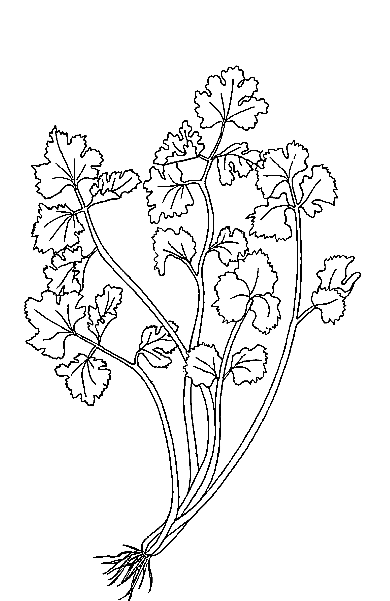

## 24. 小茴香 CUMIN

| 植物種類／萃取部位 | ： | 藥草／果實（種子） |
| :--- | :--- | :--- |
| 學名 | ： | (小茴香屬) Cuminum cyminum |
| 科名 | ： | 繖形科 Umbelliferae |
| 類比音符 | ： | 高音 |
| 主宰星球 | ： | 土星 |
| 萃取方法 | ： | 蒸餾 |

<氣味> 香料氣息，有穿透力，相當刺鼻。

<外觀> 原產於地中海一帶、埃及和亞洲，可以長至30公分高，窄窄的墨綠色葉片宛如螺絲釘，小小的花朵呈白色或粉紅色，最後可蛻為果實，由種子萃取精油。

<應用歷史與相關神話>

從聖經時代開始便享有盛譽，主要是因為它能幫助消化，而且它也被用在許多肉類的菜餚中。埃及人一味治頭痛的處方中，便選用了小茴香、杜松以及乳香。而法利賽人（猶太教的一派）甚至拿它來付稅。印度教徒視小茴香為忠誠的象徵，並且很看重它治黃疸與反胃的療效。小茴香也是麵包製做過程中一項重要的材料。

希臘人與羅馬人將小茴香與其它禮品同置於墓中，為死者陪葬。而中世紀的英國人把小茴香視為珍貴之物，在這個時期，小茴香再次被當成貨幣，封建領主的邑民會進貢小茴香，代替原本应尽的服务义务。然而在藏茴香被引进之后，小茴香的名氣便漸漸衰微了。小茴香是印度咖哩中相当重要的一种成份，在墨西哥，人们拿它调味墨西哥菜。香水中也偶而用之，但这是比较令人不解的作用。

<化學結構> 
- 醛類—小茴香醛
- 萜烴—繳花烴、苦艾萜、檸檬烯、水茴香萜、松油萜

<注意事項> 小茴香有一種十分刺鼻的強烈氣味，不會輕易消散，因此用量上宜少。另外，可能會引起皮膚的敏感，懷孕期間避免使用。

<心靈療效> 是神經系統的強勁補藥，具有高度的激勵效果，對疲乏萎靡的狀態有正面的影響。

<身體療效> 非常溫暖的精油，可以釋放體內鬱積的毒素，有助於肌肉痠痛及骨關節炎。
在消化方面有激勵的效果，特別適用於胃腸脹氣、消化不良，因胃痛引起的頭痛、絞痛以及腹瀉。
有益於生殖系統，據說它能增進男性的性慾和精子活力，女性也可藉以調節月經週期，及增進泌乳量。
另外，小茴香在心臟與神經系統方面的補強效果，可使身體的代謝過程回復正常。

<皮膚療效> 未知。

## <適合與之調和的精油>

- 歐白芷
- 藏茴香
- 洋甘菊
- 芫荽

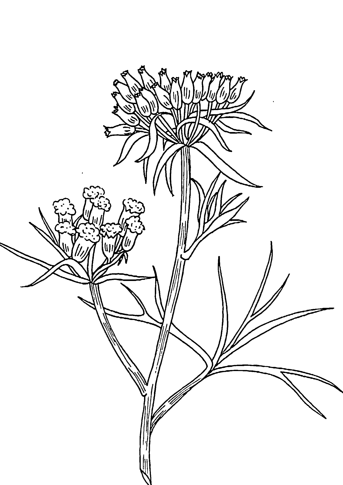

## 25. 絲柏 CYPRESS

| 植物種類／萃取部位 | : | 樹／葉或毬果 |
| :--- | :--- | :--- |
| 學名 | : | (柏屬) Cupressus Sempervirens |
| 科名 | : | 柏科Cupresaceae |
| 類比音符 | : | 中～低音 |
| 主宰星球 | : | 土星 |
| 萃取方法 | : | 蒸餾 |

<氣味> 木頭香，清徹而振奮。

<外觀> 絲柏是高大、帶毬果、原產於地中海一帶的樹木，在希臘半島，絲柏是花園及墓地裏常見的景觀。這種常綠樹有著堅硬強韌的黃紅樹幹，毬果則呈棕灰色，一旦被砍伐後，它就不再生長，不過枝葉卻比其它樹種存活得久一點。絲柏精油的產地一般說法為法國及德國。

<應用歷史與相關神話> 絲柏是賽浦路斯島命名的由來，在當地，絲柏曾被人們所崇拜。據說太陽神阿波羅把一個名叫Cuparissos的希臘青年，變成了絲柏樹（此人的名字正是絲柏拉丁屬名的由來）。另一個傳說指稱，十字架便是絲柏的木材所做成的。絲柏似乎常被人和死亡聯想在一起，希臘人和羅馬人都把絲柏種在墓地，而神話中的陰間之神——布魯托，便住在一個種有絲柏的宮殿裏。

自腓尼基人以來，絲柏便有很高的實用價值，克里特人用它來築屋造船，埃及人用它來製造棺木，也用之於各種醫療中，希臘人認為它是雕塑神像的好材料，因爲絲柏不易腐敗，因此它被賦予一個拉丁種名Sempervirens（意爲「長生不老」）。絲柏一度被用作孩童百日咳的處方，現則廣用於香水業，特別是用於男性香水中。

## <化學結構>

- 醇類—檜醇
- 醛類—糠醛
- 酯類—松油酯
- 萜烴—樟烯、繖花烴、松油萜

## <屬性>

- 抗風濕
- 抗菌
- 抗痙攣
- 抑制發汗
- 收斂
- 促進結疤
- 除腋臭
- 利尿
- 退燒
- 止血
- 利肝
- 殺蟲
- 復健
- 鎮靜
- 收斂止血
- 補身
- 收縮血管

## <注意事項>

可調節經期，因此避免在懷孕期間使用。絲柏對靜脈曲張的療效衆所皆知，但使用此油時必須小心，因爲實際的按摩可能讓患部不勝負荷。

## <心靈療效>

絲柏安撫的功用對喋喋不休、易怒的人非常有幫助，可紓緩憤怒的情緒，淨化心靈，除去胸中之鬱悶情緒。

## <身體療效>

對所有過度的現象均有幫助，特別是體液方面，因此可幫助浮腫、大量出血、流鼻血、經血過多、多汗（尤其是腳汗）、和各種失禁，對蜂窩組織炎也或有幫助。由於有收縮靜脈血管的功能，所以可改善靜脈曲張和痔瘡。為循環系統的「補藥」，也可退燒。它對肝的調節功能可幫助血液維持正常狀況。

經證實對生殖系統極有益處，特別是月經方面的問題，如經前症候群、更年期的種種副作用（臉部潮紅，荷爾蒙不平衡，易怒等）。可調節卵巢功能失常，對於痛經和經血過多有很好的效果。

它抗痙攣的作用，能幫助伴隨流行性感冒而來的咳嗽、支氣管炎、百日咳及氣喘，也可減輕肌肉的痛性痙攣與風濕痛。

## <皮膚療效>

可保持液體的平衡，控制水分的過度流失，所以對成熟型肌膚頗有幫助，多汗與油性的皮膚也可獲益。它還有利於傷口的癒合，因為它有促進結疤的功能。

## <適合與之調和的精油>

安息香、佛手柑、快樂鼠尾草、杜松、薰衣草、檸檬、菩提花、橙、松、迷迭香、檀香。

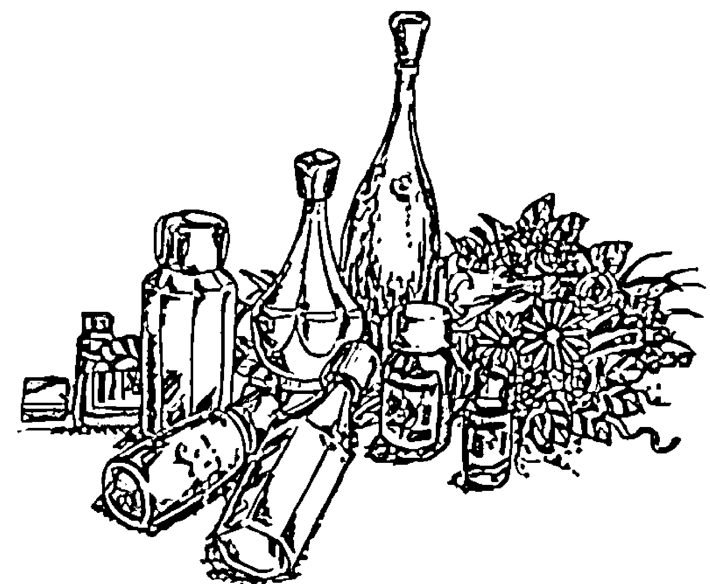

## 26. 薅蘿 DILL

| 植物種類／萃取部位 | 藥草／果實 |
| :--- | :--- |
| 學名 | (薅蘿屬) Anethum graveolens |
| 家族 | 繖形科Umbelliferae |
| 類比音符 | 高音 |
| 主宰星球 | 水星 |
| 萃取方法 | 蒸餾 |

<氣 味> 藥草香，氣味近似草的味道。

<外 觀> 墨綠色的植物，覆有羽狀葉，據說原生於印度，由於它也開黃花，果子小小的，看起來有點像是茴香，只是沒有茴香長得高。近年來，在地中海區域、歐洲及黑海附近，已可發現薅蘿的蹤影。印度產的薅蘿精油與歐洲品種的精油化學結構不同。

<應用歷史與相關神話> 可確定的是，人們在五千年前的埃及首次得知薅蘿這種植物。埃及人將它和芫荽及瀉根混合，以治療頭痛。希臘人和羅馬人也很愛用薅蘿，他們管它叫Anethon，這個名字也正是薅蘿植物學上屬名的由來。有些人相信它就是聖經裏所說的「洋茴香」Anise（馬太福音23章、24節），因為在巴勒斯坦，人們大量地栽種薅蘿。古代的醫者則相信它有益於止嗝。

蒔蘿的英語俗名Dill是由盎格魯·薩克遜語的Dylle或Dylla演變而來的，到了中世紀時才變成Dill，這個字意指風平浪靜、哄嬰兒入睡等，可能是指蒔蘿祛腸胃脹氣的主要用途，而它也用來溫敷以幫助安眠，冰島文有個老字Dilla意為安撫孩童。蒔蘿在中世紀時，已是一種非常普遍的植物，當時的人們相信它是可以對抗巫術的符咒，而且也喜歡把它加在春藥當中。

西元812年，法蘭克王國的君主查理曼大帝，曾下旨全國廣栽此種植物。蒔蘿常用來烹調魚類，烘焙麵包，做湯，調味醬和醃漬小黃瓜。

## <化學結構>

- 酮類—藏茴香酮
- 酚類—丁香酚、肉豆蔻油醚
- 萜烴—檸檬烯、水茴香萜、松油烯

## <屬性>

- 抗痙攣
- 祛腸胃脹氣
- 利消化
- 消毒
- 促進泌乳
- 助產
- 鎮靜
- 利胃
- 促發汗

<注意事項> 過去一度被拿來在臨盆時助產，所以應避免在懷孕期間使用。

<心靈療效> 在驚嚇和極度緊張後可派上用場，有助於走出籠罩心靈的陰霾，帶來輕鬆的感受。

<身體療效> 蒔蘿水常用以改善兒童的消化異常，特別是腸胃脹氣的毛病。但是蒔蘿精油比蒔蘿水要強勁得多，絕不可用在嬰兒身上。蒔蘿精油確實有助於成人的消化異常，減輕脹氣和便秘的困擾，對於胃部的發酵作用也有相當的療效，因此可解決口臭的煩惱。具抗痙攣的特性，可止嗝。

據說可以增進哺乳母親的泌乳量，而其助產的功能仍不斷受到重用。

可安撫緊張的神經，包括伴隨而來的頭痛和汗如雨下。

## <皮膚療效>

促進傷口癒合。

## <適合與之調和的精油>

- 佛手柑、蕪荽、絲柏、天竺葵、桔、香桃木、甜橙、苦橙葉、迷迭香。

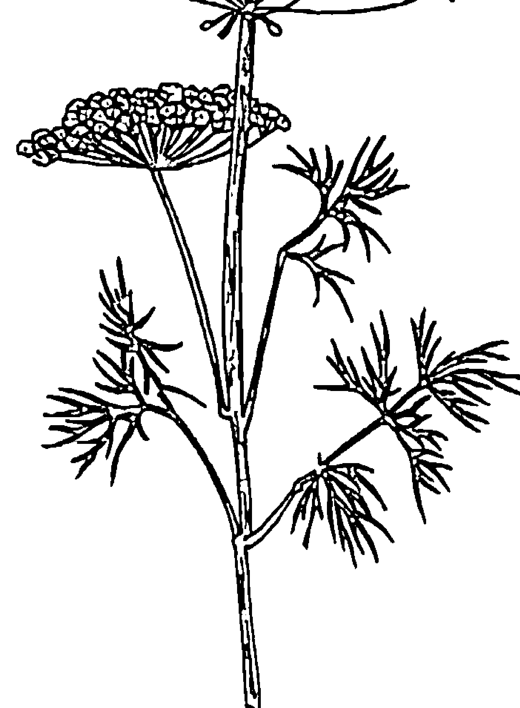

# ## 27. 榄香脂 ELEMI

| 植物种类/萃取部位 | 树/树皮 |
| :--- | :--- |
| 学名 | (橄榄属) Canarium luzonicum |
| 科名 | 橄榄科Burseraceae |
| 类比音符 | 低音 |
| 主宰星球 | 太阳 |
| 萃取方法 | 蒸馏 |

<气味> 似柑橘，又带点香料味。

<外观> 这是一棵来自菲律宾的树，它会自然流出树脂，而这树脂则可蒸馏出充满异国风味的精油。榄香脂只在树叶萌芽时才会制造它淡黄色的树脂，树脂一遇空气就凝固，而树叶掉光后，树脂也就不再流出了。当地人叫它「披立」(Pili)，有时候也叫它「马尼拉榄香脂」，除了菲律宾的榄香脂以外，其实也还有其它品种，例如巴西的Protum Heptaphyllum，和墨西哥的Amyris Plumerrii等等。

### <应用历史与相关神话>

在15世纪的欧洲十分流行，常被用做老式的药膏，即使到了现在，也时而出现在一些处方及药用石膏中。是焚香、肥皂里的原料之一，可增加亮光漆的硬度。

从马尼拉出口的生胶分两个等级：「皮美拉」(Primera)是净化过的树脂，「西昆达」(Secunda)则为未净化的原始树脂。对于榄香脂精油的化学检验，早在上个世纪末便已经开始了。

## <化学结构>

- 醇类—松油醇
- 酚类—榄香脂酚
- 倍半萜—榄香脂烯
- 萜烃—苦艾萜、柠檬烯、水茴香萜

## <属性>

- 止痛
- 抗病毒
- 杀菌
- 有香脂的作用
- 化痰
- 杀霉菌
- 补身
- 治创伤

## <注意事项>

可能会刺激敏感皮肤。

## <心灵疗效>

似可使人安稳且满心喜乐，注入一股祥和之气，有助于镇定神经。

## <身体疗效>

藉由刺激免疫系统的作用强化身体，在疾病初期可帮助身体抵御病毒。

榄香脂用于黏膜发炎的状态，可得到良好的回应，一般而言能调节寒性身体的状况，可减轻肺部的充血，控制过多的黏液。

有助于抑止体液过度分泌，如多汗。另外，据说榄香脂也有净化和补强泌尿系统的效果。

## <皮肤疗效>

和没药类似，使皮肤清凉干爽。对下列的慢性皮肤问题也有明显的改善作用：溃疡、霉菌生长、和受感染的伤口。用于健康皮肤则可平衡皮脂分泌。

## <適合與之調和的精油>

- 豆蔻
- 乳香
- 白松香
- 天竺葵
- 薑
- 薰衣草
- 山雞椒
- 香蜂草
- 甜橙
- 花梨木

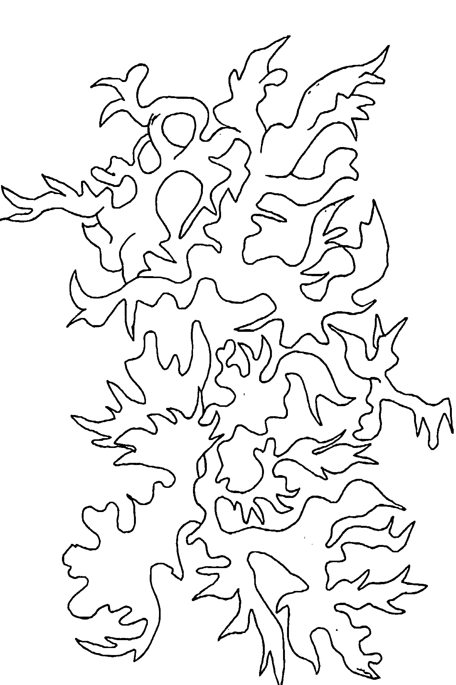

## 28. 尤加利 EUCALYPTUS

| 植物种类／萃取部位 | : | 樹／葉 |
| :--- | :--- | :--- |
| 學名 | : | (桉屬)Eucalyptus globulus |
| 科名 | : | 桃金娘科Myrtaceae |
| 類比音符 | : | 高音 |
| 主宰星球 | : | 土星 |
| 萃取方法 | : | 蒸餾 |

<氣 味> 澄清、略衝鼻、有穿透力。

<外 觀> 尤加利，亦即澳洲藍膠樹，其身形異常高大，可達92公尺，葉片堅硬，其狀如箭，多生於易生瘧疾的國家，可使土地較不潮濕，而帶來一個比較健康的氣候環境。尤加利樹是澳洲最主要的樹種，而各種不同的尤加利樹可蒸餾出氣味相異的精油。這些樹種包括E.Polybractrea, E.Dumosa以及E. Radiata，後者有顯著的清涼特性，味道比較像樟腦。而E.Maculata和E.Citriodora的香味則比較傾向於柑橘的味道。

<應用歷史與相關神話>
尤加利這個名稱源自希臘文，"尤"意指「完善」，"加利"表示「覆蓋」，整個名稱意指它被緊緊覆蓋的雄蕊。澳洲土著叫它「基諾」，用它來包裹嚴重的傷口。尤加利在1788年被引進歐洲，當作一種裝飾性的樹種，但後來發現它會抑制其周圍植物的生長，因為它會釋放一種化學毒素至土壤中。第一次進口到英國的尤加利精油，是萃取自E. piperita，當時它被稱為「雪梨薄荷」，對消化方面的問題有安撫的作用。

## <化學結構>

- 醛類—香茅醛
- 氧化物—桉油醇
- 萜烴—樟烯、茴香萜、水茴香萜、松油萜

## <屬 性>

- 止痛
- 抗風濕
- 抗發炎
- 抗菌
- 抗痙攣
- 抗病毒
- 殺菌
- 具香膠特質
- 促進結疤
- 解除充血（腫脹）
- 除臭
- 淨化
- 利尿
- 去痰
- 退燒
- 降低血糖
- 殺蟲
- 使皮膚發紅
- 激勵
- 驅蠕蟲
- 治創傷

## <注意事項>

尤加利是一種強效的精油，所以在劑量方面要小心，高血壓與癲癇患者最好避免使用，可能會成為「順勢療法」治療藥物的消解劑。

## <心靈療效>

對情緒有冷靜的效果，可使頭腦清楚，集中注意力。

## <身体疗效>

尤加利抗病毒的作用對呼吸道最有幫助，能緩和發炎現象，使黏膜舒適。對下列病症特別有益——流行性感冒、喉嚨感染、咳嗽、黏膜發炎、鼻竇炎、氣喘與肺結核。因感冒和花粉熱所引起的頭部沈重感，也可被消除，對傳染性的疾病效果絕佳。 對各種發燒都有效，可降低體溫，使身體清涼。可消除體臭，改善偏頭痛的痛苦。它能改善下列病症的效果也是有口皆碑——猩红热、痢疾、伤寒、白喉、疟疾和水痘。

它对生殖泌尿系统也大有帮助，可改善膀胱炎与腹泻。似可解消胆结石，也被用来治疗肾脏炎、淋病和糖尿病，据说对痔疮也有效。

尤加利和柠檬、杜松混合后使用，可减轻风湿的不适，对一般性的肌肉疼痛、神经痛、脓漏都有帮助。

似乎也可解毒蚊虫咬伤及其他分泌毒液的生物咬伤。

### 皮肤疗效

对疱疹有显著功效，对烫伤亦有帮助，预防细菌滋生及随之而来的蓄脓，促进新组织的建构。割伤、伤口、溃疡与发炎状态，在使用尤加利后均反应良好。另可改善阻塞的皮肤。

### 适合与之调和的精油

- 安息香、芫荽、杜松、薰衣草、柠檬、柠檬香茅、香蜂草、松、百里香。

## 29. 茴香 FENNEL

| 植物種類／萃取部位 | 藥草／種子 |
| --- | --- |
| 學名 | (茴香屬) Foeniculum vulgare |
| 科名 | 繖形科 Umbelliferae |
| 類比音符 | 高～中音 |
| 主宰星球 | 水星 |
| 萃取方法 | 蒸餾 |

<氣味> 花香、草味、稍帶香辛料味。

<外觀> 不要與佛羅倫斯茴香混淆了，那是一種蔬菜。甜茴香開的是黃花，極能吸引蜂群，它也有灌木的綠色羽狀葉，結長方形的果，高度約1.5公尺，生長在地中海一帶，大部份的精油也自此地產出。其屬名 Foeniculum 源自拉丁文的 Foenum，意指「乾草」。

<應用歷史與相關神話> 古代中國人常用這種藥草來治療蛇咬傷，埃及人與羅馬人已認識其利胃與抗毒的特性，並視它為讚譽的象徵。它被認為可幫助各類的眼疾，特別是白內障。茴香還能簡單快速地驅趕出耳中的小蟲。它在減肥方面的用途廣受歡迎，因為它能帶來飽腹的感覺。茴香和蒔蘿一樣被用來治療嬰兒的絞痛。中古時代的人們認為茴香可以驅逐惡靈和狗跳蚤，因此它常被種在狗屋旁邊，我們可以假設狗兒因而能保持乾淨無跳蚤。

### 化學結構

- 醛類—洋茴香酸、小茴香醛
- 酮類—茴香酮
- 酚類—茴香腦、馬鬱蘭酚
- 萜烴—樟烯、苦艾萜、檸檬烯、水茴香萜

### 屬性

- 抗發炎
- 抗菌
- 抗痙攣
- 開胃
- 除腸胃脹氣
- 解毒
- 利尿
- 通經
- 祛痰
- 催乳
- 殺蟲
- 輕瀉（促進排便）
- 使病理現象消退
- 利脾
- 利胃
- 激勵
- 促發汗
- 補身
- 驅蠕蟲

### 注意事項

一種強效的精油，使用過度會引發毒性，可能導致皮膚敏感。孕婦、癲癇患者宜避免使用。

### 心靈療效

在困頓時可給予力量和勇氣，還有一說，它可賜與長壽。

### 身體療效

絕佳的身體淨化油，可消除體內因過度飲食及酒精所累積的毒素。對偏頭痛非常有幫助，也是肝、腎、脾的補藥。還可解消蟲咬及蛇咬的毒素。以利尿的方式有效改善蜂窩組織炎並減重。另外，能化解腎結石。

可減輕胃部不適，因為它是消化系統的補藥。它可以鎮定神經系統，在壓力下進食的消化不良也能被改善，適用於打嗝、反胃、嘔吐與絞痛。由於其清腸的作用，便秘和脹氣都會有所改善。

因為能抗痙攣和祛痰治咳，所以感冒、支氣管炎、百日咳時都可派上用場。據說能活化腺體，又因其作用類似雌激素，所以它能幫助經前症候群、流量過少、更年期及性冷感等問題，讓哺乳婦女增加泌乳量的功能是極出名的。

<皮膚療效> 似乎有很好的淨化、強化效果，防皺的作用也享有盛名。

<適合與之調和的精油>

- 羅勒
- 天竺葵
- 薰衣草
- 檸檬
- 玫瑰
- 迷迭香
- 檀香

## 30. 樅 FIR

| 植物種類／萃取部位 | 樹／針葉 |
| --- | --- |
| 學名 | (冷杉屬) Abies balsamea   Abies sibirica |
| 科名 | 松科 Pinaceae |
| 類比音符 | 中音 |
| 主宰星球 | 木星 |
| 萃取方法 | 蒸餾 |

<氣味> 清澈、新鮮的樹脂、香膠味。

<外觀> 樅樹主要生長於北方，種類繁多。它們都有羽狀葉，在人字型的枝椏上長出毬果，雖然它們常在北方出現，有些種類也能生長於南方的國家，如墨西哥與阿爾及利亞。樹脂狀的樅樹精油一般萃取自 Abies balsamea 這個樹種，其來源是美國與加拿大。

另一種樹種，西伯利亞樅 Abies sibirica 生於俄羅斯，較老的針葉可以蒸餾出較多的精油。還有一種叫大樅樹 (Abies Grandis) 的樹種在搗碎後，會釋放出強烈的甜橙味。

### 應用歷史與相關神話

本世紀初時，許多俄羅斯的農村小工業仍以相當大的規模生產樅樹精油。聖經裏的「 Gilead 香脂」指的就是 Abies Balsamea 這種樹，這種樅樹材質耐用，過去常用以建屋造船。美洲的印第安人把樅樹的樹脂用在醫療和宗教方面，17世紀時才傳入歐洲。它現在的用途則包括了衛浴產品，如刮鬍膏、肥皂、沐浴用品、室內芳香劑、除臭劑、消毒劑和吸入藥劑等。

### 化學結構

- 酯類—乙酸龍腦酯、松油脂
- 萜烴類—沒藥萜烴、樟烯、苦艾萜、水茴香萜、松油萜

### 屬性

- 抗壞血、抗菌、化痰、利肺、鎮靜。

### 注意事項

到目前為止尚未廣泛用於芳香療法中，可能是因其副作用或反效果尚不明確之故。

### 心靈療效

可帶來溫暖、實在的感受。

### 身體療效

樅樹精油對身體最有幫助的部位在呼吸系統，對胸腔的狀況有十分顯著的益處，特別像是化除支氣管的黏液、膿與痰。可有效安撫急促的呼吸，對氣喘患者相當有益，尤其它還對神經系統有調節補強的功能，更是氣喘患者的福音。可改善因著涼和流行性感冒引起的疲累感與四肢痠痛。

樅樹精油的溫暖效果，也能紓解風濕痛或關節炎引起的肌肉疼痛。

作用於泌尿系統時，主要在抗菌及抑制感染。

它還能活化內分泌腺，使新陳代謝的速度受到良好的影響，進而平衡體內的諸種化學反應。

### 皮膚療效

未知。

### 適合與之調和的精油

- 羅勒
- 藏茴香
- 雪松
- 乳香
- 薰衣草
- 香桃木
- 綠花白千層
- 花梨木

## 31. 乳香 FRANKINCENSE

| 植物種類／萃取部位 | 樹／樹皮 |
| --- | --- |
| 學名 | (乳香屬) Boswellia carteri   Boswellia thurifera |
| 科名 | 橄欖科 Burseraceae |
| 類比音符 | 低～中音 |
| 主宰星球 | 太陽 |
| 萃取方法 | 蒸餾 |

<氣味>縈繞不去的香氣，帶木頭香及香料味，甚至有一點檸檬的味道。

<外觀>這種樹原產於中東，包括中國、衣索比亞、伊朗和黎巴嫩。人們在它的樹幹上劃出個刀口，然後便會流出狀如淚滴的黃色樹脂，其精油就是從樹脂中蒸餾而得。

<應用歷史與相關神話>乳香的字首 Frank 在法文裏意指「真正的焚香」，有時候乳香也被稱作 Olibanum，也許意指「黎巴嫩來的油」。在埃及，乳香被用作焚香，於神壇獻給神祇。也可用以幫助沈思，在某些宗教中仍保持了這個傳統。一度它也用來煙薰病患，目的是要消滅邪靈。埃及人常常將乳香與肉桂並用，如此可以紓緩四肢的疼痛。希伯萊人與埃及人甚至不惜鉅資向腓尼基人進口乳香。它在古代的身價幾乎如黃金般貴重，以致於東方三博士特別挑選它做禮物，送給剛誕生的耶穌。埃及人還特別將它運用在美容方面，製成回春面膜；中國人則發現它在治淋巴腺結核與麻瘋病很有效。

### 化學結構

- 倍半萜—杜松萜烯
- 萜烴—樟烯、苦艾萜、松油萜、水茴香萜
- 醇類—乳香醇

### 屬性

抗菌、收斂、祛腸胃脹氣、促進傷口結疤、增進細胞活性、利消化、利尿、鎮靜、補身、利子宮、治創傷。

### 注意事項

未知。

### 心靈療效

讓呼吸不再急促，使人感覺平穩，使心情好轉且平和。它安撫卻又有些清新的作用，能幫助焦慮及執迷過往的精神狀態。

### 身體療效

對黏膜有卓越的功效，特别是能清肺，對呼吸方面的效果尤其優異，舒緩急促的呼吸，有益於氣喘患者。是黏膜發炎（流鼻涕或喉嚨有痰）的一帖好藥，一般而言還能調節黏液分泌量，對頭部著涼有紓緩效果，也是咳嗽、支氣管炎及喉炎的紓解劑。有益於生殖泌尿管道，能減輕膀胱炎、腎臟炎和一般性的陰道感染。其收斂的特性能減輕子宮出血及經血過量的症狀，一般視為子宮的補藥。其安撫作用在分娩時很有用，也能紓緩產後憂鬱症，還可處理胸部發炎的現象。同時能安撫胃部，幫助消化，改善消化不良和打嗝。

<皮膚療效>賜予老化皮膚新生命，撫平皺紋的功效卓著，真正的護膚聖品。它收斂的特性也能平衡油性膚質。對傷口、瘡傷、潰瘍、癰及發炎均有效果。

<適合與之調和的精油>
羅勒、黑胡椒、白松香、天竺葵、葡萄柚、薰衣草、橙、香蜂草、廣藿香、松、檀香。

## 32. 白松香 GALBANUM

| 項目 | 詳情 |
| --- | --- |
| 植物種類／萃取部位 | 灌木／樹皮 |
| 學名 | (白魏蔥) Ferula galbaniflua |
| 科名 | 繖形科 Umbelliferae |
| 類比音符 | 高音 |
| 主宰星球 | 土星 |
| 萃取方法 | 蒸餾 |

<氣味>似麝香的氣息，使人聯想到潮濕的林地和新鮮的罌粟種子。

<外觀>可在中東見到的灌木，伊朗的白松香產出的樹脂是硬的，黎巴嫩、敘利亞等地的白松香則出產軟樹脂。這些樹脂或者是自動流出，也可在枝椏底部切割一個刀口使之流出，而白松香的精油，便是由這淡綠色的樹脂蒸餾而得。伊朗所產的白松香精油氣味較具萜烴類的味道。另一種由土耳其斯坦生產的白松香，乃是從其花朵萃出，但此品種與一般之白松香並不相同，名爲 F. ceratophylla。

<應用歷史與相關神話>在古代極享盛名的焚香，帶有神秘的影響力，它有輕微的麻醉效果，常被用爲沈思的輔助品。當然它也是聖油中常見的一個成份，聖經出埃及記30章34節裏，提到白松香與乳香混合，再加以古猶太人用製神香的香料 Onycha 和 Stacte 之後，被用於猶太人的聖幕裏。埃及人用它做為防腐屍體的成份之一，由此可知其強烈的防腐屬性。近年來則是東方情調香水中的一個成份，以及一般香水中的定香劑。亞諾泰勒博士在「神奇的芳香療法」一書中曾經提到，白松香是比較適合上了年紀的人使用的精油。

### 化學結構

- 醇類—龍腦、癒創木醇、芫荽油醇、松油醇
- 酮類—藏茴香酮
- 倍半萜—杜松萜烯、cadinol
- 萜烴—松脂烯、檸檬烯、楊梅烯、松油萜、Terpinolene

### 屬性

止痛、抗痙攣、祛腸胃脹氣、利尿、通經、化痰、化解腫脹與瘍、治創傷、激勵。

### 注意事項

有通經的作用，因此避免在懷孕期間使用。它縈繞良久的氣味可能會令人頭昏，甚至導致頭痛，也可能刺激黏膜組織，或刺激某些敏感皮膚。

### 心靈療效

它有除去胸中壓力的聲響，使人感覺實在而平穩。可安撫情緒化的狀態，紓解神經緊張。

### 身體療效

常能在難纏的箤疾上發揮作用，一般而言是對抗慢性病的一股支援力量。白松香長久以來都被用以處理肺部的持續性感染，尤其有益於去除黏液並紓緩擾人的咳嗽。總體來說，是有利於呼吸道的一種精油，特別能安撫的支氣管的痙攣。

白松香對生殖系統也極有幫助，可改善月經不至的現象，痙攣性的經痛以及水分滯留。它也可以紓緩更年期易怒的情形，與臉部潮紅等問題。

它止痛與抗痙攣的屬性則可改善肌肉的痛性痙攣以及風濕病。

<皮膚療效>有益於發炎、腫脹、傷口與膿腫，特別是那些對其它藥物沒有反應的皮膚狀況，不妨試試白松香。另外它也能使成熟型的皮膚比較柔軟。

<適合與之調和的精油>

- 香茅
- 橄欖香脂
- 乳香
- 茉莉
- 玫瑰草
- 天竺葵
- 薑
- 松
- 玫瑰
- 萬壽菊
- 馬鞭草
- 依蘭

## 33. 大蒜 GARLIC

| 植物種類／萃取部位 | 藥草／莖和頭 |
| --- | --- |
| 學名 | (蔥屬) Allium sativum |
| 科名 | 百合科 Liliaceae |
| 類比音符 | 未知 |
| 主宰星球 | 火星 |
| 萃取方法 | 蒸餾 |

<氣味>強勁、辛辣的氣味。

<外觀>凱爾特語的 Allium（亦即大蒜的屬名），意指這種植物的強烈「燃燒」本質。原產於亞洲，但西班牙、埃及、西西里與法國也有栽種，高90公分，開白色或粉紅色的花朵，葉片長而平，白色的球莖由珠芽和膜質管徑所構成。

<應用歷史與相關神話>享有延年益壽的聲譽，腓尼基的水手總會為長程的航行準備大量的大蒜，以預防疾病。埃及人用它來抵禦流行性傳染病，如霍亂和斑疹傷寒。古希臘人則認為大蒜對不孕有效；希臘的摔角選手會在賽前先嚼個幾瓣大蒜，用意在給予自己力量和勇氣，這樣做無疑也是想嚇阻對手。中藥裏亦大量運用大蒜為藥材。大蒜防禦魔鬼的名聲是由吸血鬼炒熱的，因為我們都了解吸血鬼不太喜歡大蒜。事實上瑞典人也相信大蒜能讓「特洛爾」(Trolls)乖乖待在他們該待的山洞中，所謂的特洛爾乃是北歐傳說中愛惡作劇的妖精。法國鄉間的居民常用大蒜驅離想獵食家畜的野獸。

在二次大戰中，我們可以看到大蒜廣為人們所使用，因為它具有類似抗生素的屬性。

### 化學結構

- 硫化合物—蒜臭素、丙烯硫化物

### 屬性

止痛、似抗生素、抗壞血、抗寄生蟲、抗菌、抗痙攣、抗病毒、殺菌。 促進膽汁的製造、促進傷口結痂、消除鼻塞、利尿、治疣、化痰、殺黴菌。 降低血糖、降血壓、殺蟲、預防疾病、消解腫塊與瘍、促發汗、補身、擴張血管、驅蠕蟲。

### 注意事項

大蒜擁有宛如熊熊烈火的本質，不宜用於憤怒或熱性的人身上，也不該用在急性的肺部問題及消化問題，因為其迅速解毒的特性，可能會超過身體所能負荷的程度。有皮膚方面的毛病，如可能肇因於代謝異常的濕疹，也不建議使用大蒜。如果哺乳的母親使用大蒜，則小嬰兒可能發生急性腹痛（結腸炎）。大多數的人都比較喜歡吞食大蒜膠囊，而少用它來進行芳香療法的按摩。

### 心靈療效

它溫暖而刺激的作用可驅散疲憊的感覺。

### 身體療效

補身良藥，強化身體結構。能延緩老化的過程，因為它可以調節執掌人體細胞的甲狀腺。活化淋巴系統，促進排毒。

對循環系統十分有益，藉由擴張微血管降低血壓。另外，大蒜藉由影響脂肪的代謝，還能降低高膽固醇。整體而言，對循環有調節、平衡的作用，有助於澄清血液，控制動脈的硬化現象。

和呼吸道本身的功能相似，所以可有效對抗流行性感冒、喉炎、胸部不適及支氣管黏膜發炎。曾被用以改善肺結核、白喉、慢性支氣管炎和百日咳。

有益於消化道，能刺激腸胃蠕動，並發揮像輕瀉劑的作用，也可以控制胃中的發酵和腐化作用。並可驅除蠕蟲，刺激膽囊，促進膽汁分泌，幫助消化脂肪。

可調節體內的胰島素，對糖尿病也頗具價值。它利尿的功能可預防腎結石的形成，減輕扭傷、肌肉與風濕疼痛，以及神經炎的情況。

### 皮膚療效

常在下列皮膚問題時建議使用，如突然冒出的小痘痘、粉刺、膿腫、癬和狼瘡。用於消毒潰瘍以及受細菌感染的傷口，雞眼和疣也可得以改善。

### 適合與之調和的精油

未知。

## 34. 天竺葵 GERANIUM

| 屬性 | 值 |
| --- | --- |
| 植物種類／萃取部位 | 開花植物／花和葉 |
| 學名 | (天竺葵屬)   Pelargonium odorantissimum   Pelargonium graveolens |
| 科名 | 牻牛兒科 Geraniaceae |
| 類比音符 | 中音 |
| 主宰星球 | 金星 |
| 萃取方法 | 蒸餾 |

<氣味>甜而略重，有點像玫瑰，又稍稍像薄荷。

<外觀>這種漂亮的植物常見於樊籬，高約60公分，帶著鋸齒狀的尖葉和小小的粉紅色花。其精油通常產自法國、留尼旺島、西班牙、摩洛哥、埃及和義大利。天竺葵的英文俗名 Geranium 其實是個錯誤的命名，因為它的精油是從 Pelargoniums 這種植物產出的，P. Odorantissimum 的香氣有點像蘋果，而 P. Graveolens 則帶有玫瑰香。

<應用歷史與相關神話>過去被認為是極具療效的植物，常被用來治療傷口、腫瘤、霍亂和骨折。幾世紀以來人們深深相信它的威力，都把它種在住屋周圍以驅趕惡靈。早在19世紀時，法國人就開始做天竺葵精油的商業生產，但今天大部分的天竺葵精油是產自留尼旺島，這個芬芳的小島位於西南印度洋上，原本叫做波旁島。最早被使用的品種應是 P. capitatum，這種天竺葵長得比較小，但精油含量甚高，直到今天還有野生的品種存在。本世紀初期，摩洛哥開始競產天竺葵精油。它的香味常被用於香水和肥皂中，或用來假冒大多數的香料。

### 化學結構

- 酸類—牻牛兒酸
- 醇類—牻牛兒醇、香茅醇、芫荽油醇、香桃木醇、松油醇
- 醛類—檸檬醛
- 酮類—薄荷酮
- 酚類—丁香酚
- 萜烴—檜烯

### 屬性

止痛、抗凝血、抗憂鬱、抗菌、收斂、促進結疤、增強細胞防衛功能、利尿、除臭、止血、降低血糖、殺蟲、收斂止血、補身、收縮血管、治創傷。

### 注意事項

對某些敏感皮膚可能有刺激性。能調節荷爾蒙，所以懷孕期間以不用為宜。

### 心靈療效

是神經系統的補藥，可平撫焦慮、沮喪，還能提振情緒。讓心理恢復平衡，而且由於它也能影響腎上腺皮質，因此它能紓解壓力。

### 身體療效

藉著調節荷爾蒙系統的功能，對經前症候群、更年期問題（如沮喪、陰道乾澀、經血過多）都十分有用，並能改善乳房的充血及發炎問題。

一般性排尿系統不良且充血時，天竺葵的利尿特性是很有效的，可幫助肝、腎排毒，所以或許也能幫助上癮者戒除煙癮、酒癮。還可處理黃疸、腎結石和膽結石，以及糖尿病與泌尿感染。能改善水分滯留症狀，及腫脹的足踝。

刺激淋巴系統以避免感染，排除廢物，它也能強化循環系統，使循環更通暢。對喉部和唇部的感染有療效，並能安撫神經痛。一般而言可淨化黏膜組織，特別是消化系統的黏膜，而對胃炎和結腸炎也有所幫助。

是一種芳香的驅蟲劑。

### 皮膚療效

適合各種皮膚狀況，因爲它能平衡皮脂分泌而使皮膚飽滿。可能對濕疹、灼傷、帶狀疱疹、疱疹、癬及凍瘡有益。對鬆垮、毛孔阻塞及油性皮膚也很好，堪稱一種全面性的潔膚油。由於天竺葵能促進血液循環，使用後會讓蒼白的皮膚較爲紅潤有活力。

### 適合與之調和的精油

羅勒、佛手柑、胡蘿蔔種子油、雪松、快樂鼠尾草、葡萄柚、茉莉、薰衣草、萊姆、橙花、橙、苦橙葉、玫瑰、迷迭香、檀香。

## 35. 姜 GINGER

| 植物种类／萃取部位 | 药草／根 |
| :--- | :--- |
| 学名 | (姜属) Zingiber officinale |
| 科名 | 姜科 Zingiberaceae |
| 类比音符 | 高音 |
| 主宰星球 | 火星 |
| 萃取方法 | 蒸馏 |

<气味> 香辛料，尖锐、温暖而使人愉悦。生机蓬勃，有点像柠檬及胡椒。

<外观> 大部分的热带国家，都有这种经济作物的商业生产，如非洲与西印度群岛等，但据说原产地在印度、中国与爪哇，其中显然以牙买加姜的气味最佳。这种常绿的药草有结节的块茎匍匐于地，其上则挺立着状似芦苇的垂直茎干，开的也是白花。

<应用历史与相关神话> 自古以来，一直是备受推崇的一种香料，在古希腊与阿拉伯的药典中，均占有一席之地。它干燥过的根部是广受欢迎的调味料，同时也是个芳香的激励性药材，以及对抗疟疾的处方。中国人用它来化痰、强心。现在已不能确定它是何时传入欧洲，可能在第10世纪或15世纪，但是人们从未将它和其它植物混淆在一起。希腊人唤它作「 Ziggiber 」，很喜欢它使胃部温暖的特性以及解毒的功能。在梵文的文献中，姜则以「 Srngavera 」之名出现。现在大家所熟知英文名称Ginger，乃源自拉丁文的Zingiber。另有一种重要的说法指出，Ginger其名是照着印度地名Gingi而起的，在当地，人们饮用姜茶以纾解胃部的不适。

### 化学结构

- 醇类—龙脑
- 醛类—柠檬醛
- 氧化物—桉油醇
- 倍半萜—姜烯
- 萜烃—樟烯、柠檬烯、水茴香萜

### 属性

止痛、止吐、抗菌、防坏血、开胃、催情、祛肠胃胀气、化痰、退烧、轻泻、使身体温暖、激励、利胃、促进发汗、补身。

### 注意事项

可能刺激敏感皮肤。

### 心灵疗效

在感觉生活平淡、世界冰冷的时候，它能温暖你的情绪。可以使感觉敏锐并增强记忆，使人心情愉快。适用于疲倦状态，能激励人心，也可带来脚踏实地的感觉。

### 身体疗效

特别有助于体内湿气或体液过多的状态，如流行性感冒、多痰、和流鼻水时。也能减轻喉咙痛及扁桃腺炎。虽是一种暖性的油，却可平抑因湿引起的恙症，促进汗腺的活动。另一个重要的作用是调节因受寒而不规律的月经。

调节并安定消化系统，促进胃液分泌。姜油对以下的问题均能产生良好效果：食欲不振、消化疼痛、胀气、腹泻以及坏血症（肇因于饮食不当而导致的维他命C缺乏症），甚至在感觉反胃、偏头痛、晕机晕车晕船时都有帮助。

它止痛的属性可纾解关节炎、风湿痛与抽筋、扭伤、肌肉痉挛，尤其是下背部的疼痛。

刺激循环作用，可减轻心绞痛。据说还可改善冻疮，血中过高的胆固醇和静脉曲张。

长久以来都被尊为催情剂，似乎在治疗性无能方面很有价值，有一种调配方法的确能带来显著的美妙效果，亦即把姜、肉桂、芫荽和迷迭香调和使用。同理，姜油也可用于产后护理，以消除积存的血块。

维护视力的声誉卓著，但没有一种精油可以直接使用于脆弱的眼睛部位。据说还能改善听力，使感觉器官比较敏锐。

＜皮肤疗效＞ 有助于消散淤血，治创伤及痈。

＜适合与之调和的精油＞

月桂、白千层、藏茴香、豆蔻、肉桂、芫荽、丁香、榄香脂、尤加利、乳香、天竺葵、柠檬、莱姆、香桃木、甜橙、迷迭香、绿薄荷、马鞭草。

## 36. 葡萄柚 GRAPEFRUIT

| 植物种类／萃取部位 | 树／果皮 |
| :--- | :--- |
| 学名 | (柑橘属) Citrus paradisi |
| 科名 | 芸香科 Rutaceae |
| 类比音符 | 高音 |
| 主宰星球 | 未知 |
| 萃取方法 | 蒸馏 |

<气味> 甜，略冲鼻，清新。

<外观> 这种树长着油亮的叶片，开白花，黄澄澄的果实悬挂于树枝上，仿佛一大串压扁的葡萄。它的油脂腺深埋在果皮内，和橙、柠檬相比，葡萄柚的产油量较少。有些葡萄柚精油是借蒸馏法萃取得而，但品质明显逊于压榨法所产出的精油。大部分的葡萄柚精油产自以色列、巴西及美国。

<应用历史与相关神话> 通常生长于地中海地区，属于一种装饰性的树种，它原产于亚洲，据说是橙树的变种。另有一种传说指这种水果最早被培育于西印度群岛，时间是18世纪。它当时被命名为「沙达克果」，显然是以沙达克船长而命名，因为沙达克船长将这种水果引进当地。葡萄柚精油的主要商业性产销始于1930年的佛罗里达，而美国至今仍为最大的供应者。它也是食品、化妆品及香水业很欢迎的一种成分原料。

### 化学结构

- 醇类—牻牛儿醇、芫荽油醇
- 醛类—柠檬醛
- 萜烃—柠檬烯、松油萜

### 属性

- 抗沮丧、抗菌、开胃、利尿、消毒、使病理现象消散、激励、补身。

### 注意事项

使用后若曝晒于强烈日光下，可能会引起皮肤敏感。

### 心灵疗效

有全面性的提振效果，所以在压力状况下使用极有效果。对中枢神经系统有平衡的作用，因此可以稳定沮丧的情绪。据说能使人欢愉，有些许的催眠效果。

### 身体疗效

是淋巴腺的刺激剂，滋养组织细胞，控制液体流动，对肥胖症和水分滞留能发挥效果。它利尿的特性也能改善蜂窝组织炎。它还是减肥餐的好帮手，因为它能刺激胆汁分泌以消化脂肪。

它也是开胃剂，能平衡与调节消化系统，也能帮助戒除药瘾，因为它能净化肾脏和脉管系统（血液、淋巴）。它的消解特性还能化除胆结石，据说也是肝的补药。

能安抚身体，减轻偏头痛、经前症候群及怀孕期间的不适感。它还能纾缓时差的症状如头疼、疲乏等等。

在耳部感染后能帮助恢复平衡。

### 适合与之调和的精油

- 罗勒
- 佛手柑
- 雪松
- 洋甘菊
- 香茅
- 乳香
- 天竺葵
- 茉莉
- 薰衣草
- 玫瑰草
- 玫瑰
- 花梨木
- 依兰

## 37. 愈创木 GUAIACWOOD

- 植物种类／萃取部位：树／木心
- 学名：(癒创木属) Guaiacum officinale, G. sanctum, Bulnesia sarmienti
- 科名：蒺藜科 Zygophyllaceae
- 类比音符：低音
- 主宰星球：未知
- 萃取方法：蒸馏

### 气味

深沉而强劲，隐隐带着香草气息的泥土味。

### 外观

原产于南美，B. sarmienta这种树种可萃取出最多的癒创木树脂油，但是有些精油的来源是佛罗里达南部及巴哈马群岛的G. sanctum这种树种。癒创木是一种小型的树，高约3.65公尺，长着淡绿色的树叶，白色的树皮、蓝色花与棕绿木心，它常被刨成木屑或木片出售。

虽然它可以自然流出树脂，有时人们会借着燃烧其木材以收取软化的树脂。这种精油在室温时为固态，需要加热来使它溶为液体。

### 应用历史与相关神话

有时被称为「圣树」，可见它或曾被用于一些半宗教半巫术的仪式中。然而，巴拉圭人则认为癒创木在治疗一些严重的疾病上颇有价值，如癌症和梅毒等，这也许要归功于它促进发汗的特性。

其木心之用途包括雕刻木碗与其他的装饰用品。在1891年时，首度被船运至欧洲以萃取精油，但在巴拉圭本地的蒸馏作业，则迟至二次大战爆发前夕才开始。

香水业界已认识它做为定香剂的价值。多年前，它甚至还被用来搅杂在大马士革玫瑰精油中，同时也是玫瑰气味的香皂成份之一。

### 化学结构

醇类—Bulnesol、愈创木醇

### 属性

消炎、抗风湿、催情、收敛、具疗效的香脂、利尿、轻泻、促发汗。

### 注意事项

可能会使人慵懒，阻碍精神的集中，而且其气味不易散失，有些人不喜欢这种感觉。

### 心灵疗效

可使人放松，解除武装，有助于冥想，也或可安抚神经紧张。

### 身体疗效

它极佳的发汗功能，可帮助身体驱离血中的不洁成份，长久以来都被用于改善痛风与风湿性关节炎，尤其有助于发炎的情况。同样的，发汗作用在发热型感冒时可安抚喉咙的黏膜组织，减轻扁桃腺炎的不适。

一般而言可调节体液分泌，有助于性方面的障碍，例如停经期因阴道干涩而导致的性交疼痛。愈创木神秘的特质与大地之母的气息，再再都说明了它享有催情盛誉的缘故，它也能纾解经痛。

给予松弛的生殖泌尿系统正面的影响，使其作用重上轨道，愈创木在此的功能就像利尿剂与轻泻剂。

＜皮肤疗效＞ 可使组织紧实，有益于成熟型肌肤。

＜适合与之调和的精油＞

安息香、佛手柑、芹菜、香茅、榄香脂、乳香、天竺葵、葡萄柚、茉莉、薰衣草、柠檬、玫瑰草、广藿香、玫瑰、依兰。

## 38. 牛膝草 HYSSOP

| 项目 | 值 |
|---|---|
| 植物种类／萃取部位 | 药草／叶和花的顶端 |
| 学名 | (海索草属) Hyssopus officinalis |
| 科名 | 唇形科 Labiatae |
| 类比音符 | 中音 |
| 主宰星球 | 木星 |
| 萃取方法 | 蒸馏 |

<气味> 温暖，甜味，具穿透力。

<外观> 这种妆点了地中海的蓝紫色花朵，是蜜蜂的最爱，它能长到60公分高，毛茸茸的木质茎上长出狭长的绿叶子。精油产地为德国、法国和意大利。

<应用历史与相关神话>

圣经诗篇第51篇第7则写着：「求你用牛膝草洁净我，我就洁净。」。这应是指这种植物对瘟疫、麻疯、和胸痛的净化效果。事实上，由于它具有除臭的特性，人们常用它来净化神圣的祭坛与庙宇，因此牛膝草一直以来都被认为是一种神圣的植物。约翰福音第19章第30节中也记载，人们在一束牛膝草上绑着浸满醋的海棉，然后递给耶稣请他饮用。

Hyssop其名是由希伯莱文Ezoph与希腊文Azob而来的。牛膝草大概是在10世纪左右，由圣班迪克的僧侣引进欧洲，他们用它来制作饮料。在中世纪时，人们拿牛膝草来喷洒虫子。它的叶子有时被拿来包裹伤口，疗效明显而快速。牛膝草磨成细粉，可治肿块及面疱，也被用来抑制癌细胞生长。

### 化学结构

- 醇类—龙脑、芫荽油醇
- 酮类—樟脑、牛膝酮、侧柏酮
- 倍半萜—杜松萜烯
- 萜烃—樟烯、松油萜

### 属性

抗风湿、抗菌、抗痉挛、收敛、镇咳、利心脏、祛肠胃胀气、利头部、促进伤口结痂、利消化、利尿、通经、化痰、退烧。柔软、升高血压、利神经、舒胸、预防疾病、促使病理现象消退、镇静、激励、利胃、促排汗、补身、驱虫、治创伤。

### 注意事项

因为它是十分强劲的精油，建议只使用低剂量，而许多芳香疗法师干脆完全舍弃它。癫痫及高血压患者绝对禁止使用，孕妇也不可使用。

### 心灵疗效

对心灵有很强的作用，使人头脑清晰敏锐。由于它可以把潜藏的感受抒发出来，显然可借此释放痛苦的情绪。据说能清脾而忘忧。

### 身体疗效

调节循环系统，有效提高低血压，当身体虚弱或处于复健期时，牛膝草激励的功能帮助很大。

对呼吸系统的问题及病毒感染非常有效，如着凉、咳嗽、喉咙痛、流行性感冒、支气管炎和气喘。帮助清肺，减轻胸部的紧闷，使黏液流动顺畅，纾缓支气管痉挛。

也是消化系统的补药，作用如温和的轻泻剂，纾缓胃痉挛，祛胀气，据说还能驱蠕虫。帮助恢复胃口，消化脂肪。

有益于月经周期，尤其是经期中发生的水分滞留现象，对月经异常中断和白带都有效。

另可纾缓风湿、关节炎和痛风。

＜皮肤疗效＞ 皮肤的疗效包括促进伤口结痂和打散淤血，改善皮肤炎和湿疹。

### 适合与之调和的精油

- 欧白芛
- 芹菜
- 茴香
- 薰衣草
- 香蜂草
- 橙
- 迷迭香
- 红柑

## 39. 意大利永久花 IMMORTELLE

| 植物种类／萃取部位 | 灌木／花 |
| :--- | :--- |
| 学名 | Helichrysum angustifolium |
| 科名 | 菊科 Compositae |
| 类比音符 | 低音 |
| 主宰星球 | 未知 |
| 萃取方法 | 蒸馏或溶剂萃取 |

<气味> 强烈的木质香，又带了点香料的感觉。

<外观> 这是一种野生植物，花色暗黄，银绿色的叶片则带有胡椒味，其茎长60公分，品种繁多。精油的主产地在欧洲，特别是意大利、法国和南斯拉夫。若在收成后的24小时内立即蒸馏，将可获得品质较好的精油，愈嫩的植物可萃取的量愈多。

<应用历史与相关神话>

大麦町自1908年开始生产意大利永久花。它的另一个品种Helichrysum stoechas与其化学属性相似，而且此二者经常一起蒸馏以产出精油。另外还可用溶剂萃取出意大利永久花的原精，这类程序主要的进行地点是法国的格拉斯一带。人们很喜爱将它制成干燥花供装饰用。

### 化学结构

醇类—牻牛儿醇、芫荽醇、橙花醇
酯类—Neryl acetate
萜烃类—松油萜

### 属性

抗炎、抗痉挛、抗病毒、收敛、杀菌、利胆、利尿、柔软皮肤、化痰、促进细胞再生、杀霉菌、利肝、镇静、利脾。

### 注意事项

未知。

### 心灵疗效

淡化惊吓、畏惧、恐慌的情绪，据说还能纾解抑郁的情绪。

### 身体疗效

这是一种回春的精油，可促进细胞再生，帮助组织重建，并活化器官。它还能通经络——贯穿全身的精气通路。

刺、湿疹、疖与脓肿的痊愈。据称意大利永久花与佛手柑、薰衣草、以及西洋蓍草调和后可治干癣，其杀霉菌的属性作用，在治疗香港脚与癣时反应十分良好。

### 适合与之调和的精油

- 佛手柑
- 洋甘菊
- 天竺葵
- 乳香
- 薰衣草
- 桔
- 甜橙
- 苦橙叶
- 玫瑰
- 花梨木
- 西洋蓍草

## 40. 茉莉 JASMINE

| 项目 | 内容 |
|------|------|
| 植物种类／萃取部位 | 树木／花朵 |
| 学名 | (茉莉属)   Jasminum grandiflorum |
| 科名 | 茉莉科 Jasminaceae |
| 类比音符 | 低～中音 |
| 主宰星球 | 木星 |
| 萃取方法 | 脂吸法或溶剂萃取 |

<气味> 甜甜的花香，充满异国风情，会使头部感到有一点沉重。

<外观> 这种攀爬植物的纤柔白花只能在晚上摘取，因为晚上它的气味最强烈。茉莉原产于伊朗和北印度，能长到60公分高，现在栽种于阿尔及利亚、摩洛哥、埃及、意大利和法国，法国产的精油品质最佳。它的萃取过程十分精细，需要高度的技巧，通常需要极大量的花朵才能生产出少许的精油，所以它的价格十分昂贵，而且多掺有其他的精油。

<应用历史与相关神话> 茉莉精油又被称作「花精油中的国王」，长久以来一直被用作春药，其催情的作用声誉卓著，重要的是，它也能治疗淋病和摄护腺方面的疾病。在印度，它被广泛用作油膏的香料，也用于仪式中。客人则会被套上茉莉花做的花环及手环以表欢迎。

土耳其人用茉莉的枝干做绳索的中心，中国人则爱饮茉莉花茶。茉莉花也是印尼菫中极受欢迎的装饰品，西方人十分感谢征服者摩尔人将这种植物带到西班牙。目前，做为香水成分是它最昂贵的用途，而此用途近来愈趋流行。

### 化学结构

醇类—苯甲醇、麝子油醇、牻牛儿醇、橙花醇

### 属性

抗沮丧、抗菌、抗痉挛、催情、柔软皮肤、催乳、助产、镇静、利子宫。

### 注意事项

怀孕期间不可使用，临盆前才能用以帮助生产。过度使用会干扰体液，特别是痰的流动。而它类似麻醉剂的属性，会干扰注意力的集中，这种强劲的香气一定只能使用低剂量。

### 心灵疗效

对严重的沮丧是很有效的处方。安抚神经、温暖情绪、使人产生正面的感受与自信。它是服务行业人员不可多得的帮手，可让人恢复精力，重现活力。

### 身体疗效

可能是生产时最有帮助的精油。它能强化收缩的作用，加速生产，并减轻生产的痛苦。它是绝佳的荷尔蒙平衡剂，可有效改善产后抑郁症，加强亲子间的联系，并促进乳汁分泌。它也能纾缓子宫痉挛，减轻经痛，有益于一般的阴道感染。它对男性生殖系统的重要性，在于它能增加精子的数目，进而改善不孕症。让人极度放松的特性，使它成为超越性障碍的著名精油，能改善阳痿、早泄与性冷感。

茉莉能帮助呼吸系统，调节并加强呼吸的深度，因此它能纾解支气管的痉挛，并安抚扰人的咳嗽。据说还能改善嘶哑的声音。

放松僵硬的四肢，功效卓著。

### 皮肤疗效

一般而言对任何皮肤都有帮助，尤其是干燥及敏感皮肤的高效护肤品。茉莉、桔、薰衣草三者调和，可增强皮肤的弹性，常用以淡化妊娠纹与疤痕。

### 适合与之调和的精油

佛手柑、乳香、天竺葵、愈创木、意大利永久花、橙、桔、香蜂草、橙花、玫瑰草、花梨木、檀香。

## 41. 杜松 JUNIPER

| 植物种类／萃取部位 | 灌木／浆果 |
| :--- | :--- |
| 学名 | (桧属) Juniperus communis |
| 科名 | 柏科 Cupressaceae |
| 类比音符 | 中音 |
| 主宰星球 | 太阳 |
| 萃取方法 | 蒸馏 |

<气味> 干净、清新、略带木头香。

<外观> 一种常绿灌木，一般可长到1.8公尺高，有一种斯堪地那维亚的野生杜松可以长到9公尺高。杜松在北极区生长茂盛，但在世界各地都可以发现杜松的踪影。它有红色的树干、针状叶，开小小的黄花，结蓝黑色的浆果。杜松精油产自匈牙利、法国、意大利、南斯拉夫和加拿大。

<应用历史与相关神话>

在接触性传染的疾病如霍乱、伤寒热的治疗上，杜松扮演十分重要的角色。在西藏，它被用以防瘟疫。希腊、罗马与阿拉伯的医者都很看重它的抗菌功效。在蒙古，妇女临盆时会以杜松来助产。15、16世纪的药草学者极为赞赏杜松，不仅是由於它能防瘟疫，也因为它是咬伤的特效药。有趣的是，古凯尔特语的「杜松」意思是「咬伤」。

有很长的一段时间，法国医院都拿杜松和迷迭香的枝条焚烧，以清洁空气。在南斯拉夫，它则被尊为万灵丹，一度还被认为可改善糖尿病。

圣经中曾提及杜松补给疲惫心灵的效果，在列王纪19章第4节及第5节中，记载了筋疲力竭的以利亚倒卧在一个罗腾（即杜松）树下。另外，杜松还以琴酒的成分之一而闻名。

### 化学结构

- 醇类—龙脑、松油醇
- 倍半萜—杜松萜烯、雪松烯
- 萜烃—樟烯、杨梅烯、松油萜、桧烯

### 属性

抗菌、抗风湿、抗痉挛、催情、收敛、祛肠胃胀气、促进结疤、净化、排毒、消毒、利尿、通经、利神经、杀虫、助产、使皮肤发红、激励、利胃、催汗、补身、治创伤。

### 注意事项

使用过久可能会过度刺激肾脏，若有严重的肾病或其它的肾感染时，要避免使用杜松。又因为能通经，怀孕期间不可使用。

### 心灵疗效

清净，激励并可强化神经。杜松能净化气氛，让心灵在挑战性的情况下获得支援，对服务业、医疗、美容业人员而言是一个好帮手。

### 身体疗效

非常有效的利尿剂，生殖泌尿道的抗菌剂，对膀胱炎、尿急痛（无力排尿）和肾结石是极佳的药剂。摄护腺肿大时，杜松可帮助排尿，它还能使蜂窝性组织炎、水肿与体液滞留均恢复正常。

杜松排毒的功能十分出名，特别是摄取过量的食物和酒精时，它能排出堆积的毒素，净化肠道黏膜，有效对抗痔疮。一般而言对消化系统有利，可调节胃口，帮助肥胖症。是肝的补药，对肝硬化的帮助十分出名。

当身体感觉沉重、疲倦时可激励精神，而上述的状态可能肇因于身体囤积太多废物。用杜松足浴可减轻某些充血的现象。它能以清血的方式排毒，在病媒昆虫滋生的区域成为无价之宝。

能够清除尿酸，所以对关节炎、风湿、痛风和坐骨神经痛十分有益。可能强化四肢，而身体僵硬、活动困难时，杜松可以减轻疼痛。

另外还可以规律经期、纾缓经痛。促进生产顺利。

＜皮肤疗效＞ 油性、充血皮肤的帮手，还能改善头皮的皮脂漏。它净化的特性可改善粉刺、毛孔阻塞、皮肤炎、流汤的湿疹、干癣和肿胀。

＜适合与之调和的精油＞
安息香、佛手柑、丝柏、乳香、天竺葵、葡萄柚、橙、柠檬香茅、莱姆、香蜂草、迷迭香、檀香。

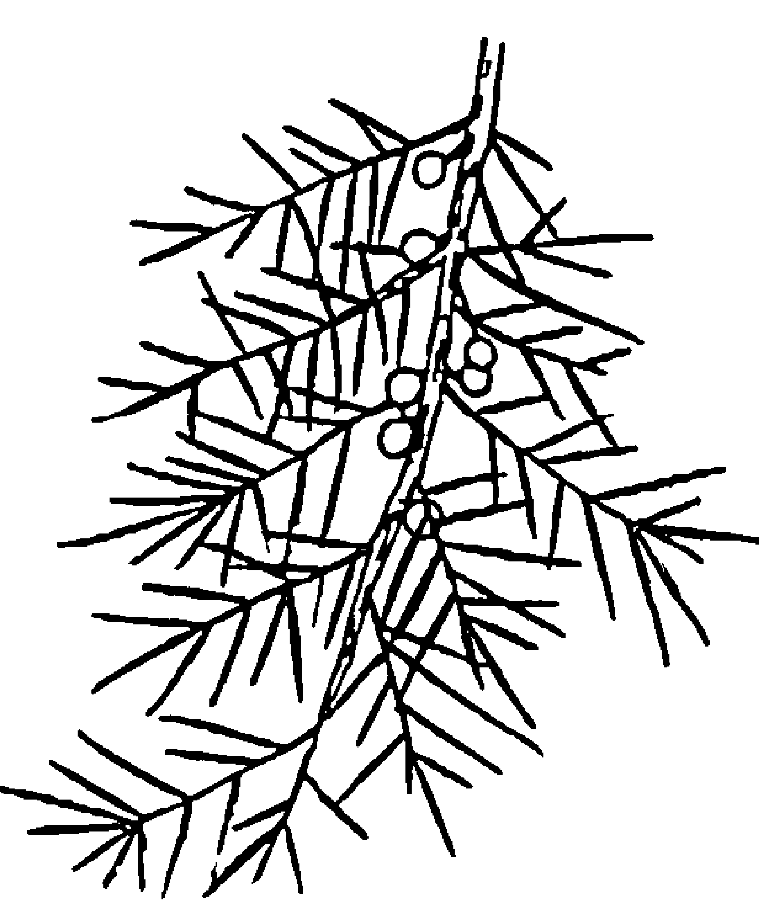

## 42. 醒目薰衣草 LAVANDIN

| 植物种類／萃取部位 | 药草／开花的顶端 |
| :--- | :--- |
| 学名 | (薰衣草属) Lavandula flagrans |
| 科名 | 唇形科 Labiatae |
| 类比音符 | 高音 |
| 主宰星球 | 水星 |
| 萃取方法 | 蒸馏 |

<气味> 清澈，甜而具穿透力，和薰衣草相似。

<外观> 靠着传递花粉的蜜蜂做媒，真正的薰衣草与穗状花序薰衣草交配孕育出这种欧洲品种，在法国欣欣向荣。这三种薰衣草的分布地区分别是：

- 低地－穗状花序薰衣草
- 中间地带－醒目薰衣草
- 高地－纯种薰衣草

与另外两种薰衣草相比，醒目薰衣草灰蓝的花瓣比较大且坚硬，但据说疗效却相对较少。

<应用历史与相关神话> 因为醒目薰衣草比其它两个品种来得坚硬，其精油产量也比较多。不过从前它不曾被当成单一精油销售出口，其主要用途是搀加在比较纤弱的纯种薰衣草中。第二次世界大战后，醒目薰衣草的产量逐年增加，现在即出口供肥皂制造业及香水业运用了。

### <化学结构>

- 醇类—薰衣草醇、芫荽油醇、松油醇
- 酯类—芫荽酯
- 酮类—樟脑
- 氧化物—桉油醇
- 倍半萜类—丁香油烃
- 萜烃类—樟烯、苦艾萜、柠檬烯、罗勒烯、松油烃

### <属性>

抗抑郁、止痛、抗菌、促进伤口结疤、化痰、利神经、治创伤。

### <注意事项>

在某些方面用途与薰衣草类似，但放松效果则大大不如，并不适合于需要镇静的状态。

### <心灵疗效>

使疲惫的心灵焕然一新。

### <身体疗效>

特别有益于肌肉疼痛与肌肉僵硬，也能帮助风湿的不适和不灵活的关节。

对呼吸道颇有好处，尤其是像咳嗽、感冒与流行感冒等毛病。当肺部和鼻窦被浓痰与鼻涕堵塞时，醒目薰衣草可以使呼吸顺畅。

### <皮肤疗效>

促进伤口结疤，有助于伤口愈合，据说对皮肤炎也有一些效果。

## <适合与之调和的精油>

佛手柑、洋甘菊、香茅、快乐鼠尾草、天竺葵、意大利永久花、茉莉、柠檬、甜橙。

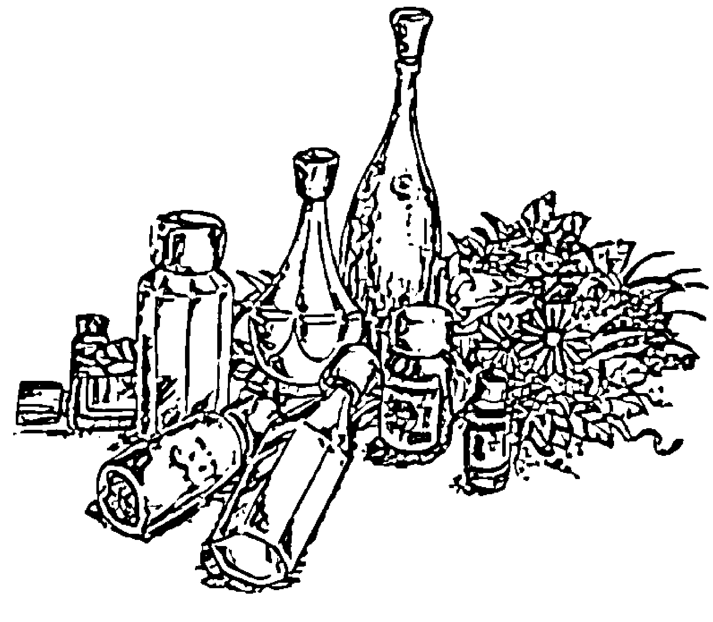

## 43. 薰衣草 LAVENDER

| 植物种類／萃取部位 | 灌木／花 |
| :--- | :--- |
| 学名 | (薰衣草属) Lavandula Officinalis |
| 科名 | 唇形科 Labiatae |
| 类比音符 | 中音 |
| 主宰星球 | 水星 |
| 萃取方法 | 蒸馏 |

<气味> 花香，淡而清澈，略带木头香。

<外观> 此种可爱的植物有不少品种野生于地中海地区。L. Officinalis 据说是气味最浓郁的，它小小的紫蓝色花朵栖息在长长的茎干上，花上覆盖星形细毛，窄长的叶片呈灰绿色。薰衣草被广泛栽植于英国、法国及南斯拉夫。

## <应用历史与相关神话>

芳香疗法中用途最广的精油之一，而且是从不可考的年代起，便被用于医疗方面。

几个世纪以来，人们都把薰衣草香包放在橱柜中，用以驱虫。事实上它杀虫的特性最著名，罗马人盛赞其抗菌力，用它来泡澡和清洁伤口。薰衣草的拉丁字根 Lavare 的意思就是“洗”。一度曾被认为能治疗轻微的癫痫。

薰衣草香水在依莉莎白与史都华时代极受欢迎，也是查理一世的皇后最喜欢的香水。长久以来，英国的薰衣草主要长在萨里（Surrey）的米切姆（Mitchum），然而现在已被大量栽种于诺福克（Norfolk）一带。它对皮肤的完美疗效是法国化学家盖特福赛（Gattefosse）在本世纪初意外发现的，它为某些摩洛哥菜和法国菜增添了不寻常的特殊风味。

### <化学结构>

- 醇类—龙脑、牻牛儿醇、薰衣草醇、芫荽油醇
- 酯类—牻牛儿脂、薰衣草酯、芫荽酯
- 氧化物—桉油醇
- 倍半萜—丁香油烃
- 萜烃—柠檬烯、松油萜

### <属性>

止痛、抗抽搐、抗沮丧、消炎、抗风湿、抗菌、抗痉挛、抗病毒、杀菌、祛肠胃胀气、利胆、促进结疤、兴奋、增进细胞活动。解除充血与肿胀、除臭、解毒、利尿、通经、杀霉菌、降低血压、利神经、回复健康、镇静、利脾、催汗、治创伤。

### <注意事项>

有些低血压的人用了薰衣草精油后，会发生呆滞的现象。它也是通经药，避免在怀孕初期使用。

### <心灵疗效>

因为它能安定情绪，所以对失常的心理状态有正面的效果。能净化、安抚心灵，减轻愤怒和筋疲力竭的感觉，使人可以心平气和地面对生活。因为它能平衡中枢神经，所以对惊慌和沮丧的状态很有帮助。

## <身体疗效>

对心脏有镇静效果，可降低高血压、安抚心悸，改善失眠状态的作用闻名已久。

它止痛的特性有效改善肌肉痉挛，对扭伤、肌肉使用过度以及风湿痛也有益，与马郁兰混合时能提高疗效。

对呼吸系统有帮助，可处理支气管炎、气喘、黏膜发炎、感冒、喉炎及喉咙感染。减轻肺结核，并预防感染。

对月经方面的问题也很有帮助，如流量太少、痛经、白带。临盆时使用可减轻痛苦及加速生产，用来按摩下背部可消除产后的不适。

据说可清脾和肝（脾气便是由脾而来）。还可促进胃的分泌作用，所以在反胃、呕吐、绞痛和胀气时可派上用场，刺激胆汁分泌以帮助消化脂肪。

是有名的杀虫剂，可以驱走蛾类与昆虫。据说还能消毒犬只咬伤，以及净化空气。

## <皮肤疗效>

它能促进细胞再生，平衡皮脂分泌，因此，对所有的皮肤状态都很有效。治灼伤与晒伤的功效名闻遐迩。还可改善面疱、湿疹和干癣，治脓肿、疖与痈，并能抑制霉菌生长，使肿胀、疤痕、坏疽减至最低的程度。

是一种很好的护发剂，对秃头有些帮助。

## <适合与之调和的精油>

- 佛手柑
- 甘菊
- 快乐鼠尾草
- 天竺葵
- 茉莉
- 柠檬
- 桔
- 肉豆蔻
- 橙
- 广藿香
- 松
- 百里香
- 迷迭香

## 44. 穗状花序薰衣草 LAVENDER SPIKE

| 植物种類／萃取部位 | 灌木／开花的顶端 |
| :--- | :--- |
| 学名 | (薰衣草属) Lavandula spica / Lavandula latifolia |
| 科名 | 唇形科 Labiatae |
| 类比音符 | 高音 |
| 主宰星球 | 水星 |
| 萃取方法 | 蒸馏 |

<气味> 与薰衣草相似，但比较澄清与新鲜。

<外观> 比纯种的薰衣草强壮高大些，花色灰蓝，喜欢在海边生长，其精油多产于西班牙、意大利和法国。

<应用历史与相关神话>
有时候被叫做“雄性薰衣草”，因为其属性较具侵略性。气味给人的感觉较粗重，偏樟脑那一型，通常用来为廉价的食品增添香气。也常被亮光漆工业所采用。
它在西班牙以野火燎原之势大量生长，工人常需工作好几个小时，才能割完穗状花序薰衣草再送去蒸馏。内战以前，西班牙的人口主要分布于乡间，所以当时的人工非常廉价。然而自1936年起，西班牙的产量递减，而由法国接手执生产之牛耳。有一度，穗状花序薰衣草油曾被掺杂以鼠尾草油。它也被用在动物医疗方面，如清洗伤口等。

## <化学结构>

- 酮类—樟脑
- 氧化物—桉油醇
- 萜烃类—樟烯
- 醇类—龙脑、芫荽醇

## <属性>

止痛、抗抑郁、抗菌、抗病毒、解除鼻塞、杀虫。

## <注意事项>

比较温和的另一品种——薰衣草，有通经的作用，所以为安全起见，还是不要在怀孕期间使用。剂量太高时，会过度刺激中枢神经系统，引起心悸。

## <心灵疗效>

它是脑脊髓的镇静剂，可帮助混沌的脑袋清醒。能稳定神经，但仍保持相当的敏锐度。

## <身体疗效>

对呼吸道的一些问题如支气管炎、喉炎等特别有效，使呼吸和缓，头部清爽，减轻鼻塞或黏膜发炎所引起的头疼。强化免疫力，以迎战病毒的攻击。
其止痛的属性主要发挥于减轻肌肉和风湿酸痛。并可促进神经纤维的放松，人体受伤后的肌肉往往会呈现过冷或过热的状态，这时可藉它平衡的属性予以调整。
纾解昆虫叮咬的疼痛不适。

## <皮肤疗效>

可促进结疤，杀霉菌的属性有益于治癣和香港脚。

## <适合与之调和的精油>

- 佛手柑
- 洋甘菊
- 天竺葵
- 瘗创木
- 意大利永久花
- 茉莉
- 柠檬
- 甜橙

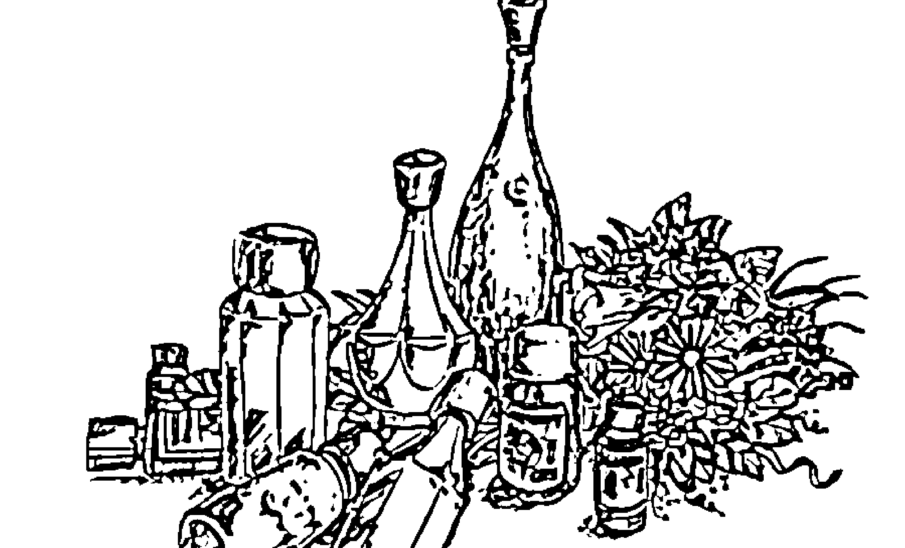

## 45. 柠檬 LEMON

| 项目 | 内容 |
| :--- | :--- |
| 植物种類／萃取部位 | 水果／果皮 |
| 学名 | (柑橘属) Citrus limonum |
| 科名 | 芸香科 Rutaceae |
| 类比音符 | 高音 |
| 主宰星球 | 太阳 |
| 萃取方法 | 蒸馏 |

<气味> 柑橘类的香气，新鲜而强劲。

<外观> 小而多刺的常绿树，原产于印度，但现多种植于南欧、佛罗里达及加州。它有不规则的枝椏，发亮的椭圆形叶，花色为纯白或粉红，香气强劲。柠檬的种类很多，不同之处在于外皮的厚薄及果汁的多寡，绿色未熟的果子可榨出较多的精油，以手压榨出的精油较蒸馏出的品质优越。

<应用历史与相关神话>
长久以来，柠檬在抗菌方面的功效一直很受重视，特别是用在病媒蚊虫的叮咬，曾经被认为是治疗疟疾的良药。它让动脉硬化者血压降低的效果也受到肯定。埃及人认为它是肉类和鱼类食物中毒，及伤寒传染病之解毒剂。
英文的柠檬一字源自阿拉伯文和波斯文，意指柑橘类水果。中世纪的圣战期间，十字军把丰富的宝藏带回欧洲，而柠檬也是其中之一。早期，意大利是重要的柠檬产地，随后加州也渐成柠檬的生产重镇。其新鲜的果实因富含维他命C而倍受重视，还曾被认为是内分泌腺的补药。用作食品和香水的调味剂也很受欢迎。

## <化学结构>

- 醇类—芫荽油醇
- 醛类—柠檬醛、香茅醛
- 萜烃—柠檬烯、杨梅烯、樟烯、松油萜、水茴香萜
- 倍半萜—杜松萜烯

## <属性>

抗酸、抗硬化、抗坏血、抗神经痛、抗风湿、抗搔痒、抗菌、收敛、杀菌、除胃肠胀气、促进结疤、净化、利尿、柔软、治疣、退烧、止血、利肝、降低血糖、降低血压、杀虫、轻泻、利胃、补身、驱蠕虫。

## <注意事项>

可能会刺激敏感皮肤。

## <心灵疗效>

感觉炙热烦躁时，可带来清新的感受，帮助澄清思绪。

## <身体疗效>

循环系统的绝佳补药，使血流畅通，因而减轻静脉曲张部位之压力。是有效的强心剂，通常用于降低血压。可恢复红血球的活力，减轻贫血的现象；同时刺激白血球，进而活络免疫系统，帮助身体抵抗传染性的疾病。
据说可止鼻血及一般性的外伤出血。
它抗菌的特性能减轻喉咙痛、咳嗽、着凉和流行性感冒，特别是有发烧现象时，因为柠檬能使体温下降。另外，能改善唇部疱疹情况。
促进消化系统的功能，抑制体内的酸性，使胃中的碱性增加。明显促进胰岛素的分泌，曾被用以治疗糖尿病。可解除肝肾的充血现象，对全身有清洁净化的功能。对便秘与蜂窝组织炎也颇有益。
据说可减轻头痛、偏头痛、痛风和关节炎。能安抚蚊虫叮咬的不适。

## <皮肤疗效>

藉着去除老死细胞使黯沉的肤色明亮，改善破裂的微血管，对油腻的发肤有净化的功效。用于去除鸡眼、扁平疣和一般疣都很有效，也可以软化结疤组织，预防指甲脆裂。

## <适合与之调和的精油>

安息香、豆蔻、洋甘菊、尤加利、茴香、乳香、姜、杜松、薰衣草、菩提花、橙花、玫瑰、檀香、依兰。

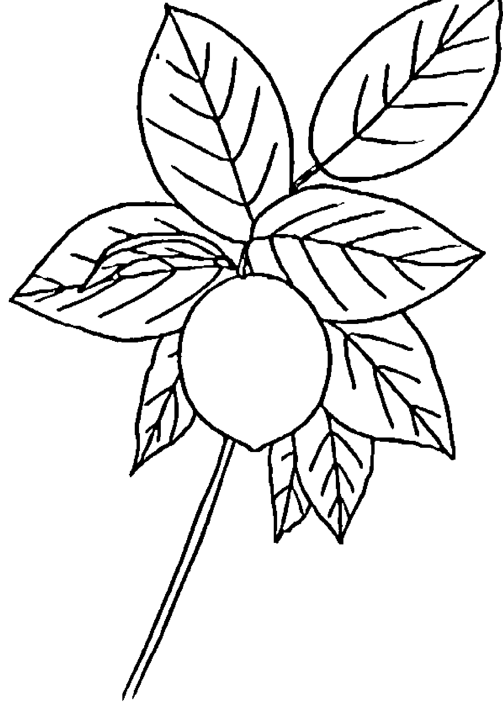

## 46. 柠檬香茅 LEMONGRASS

- 植物种類／萃取部位：草／叶
- 学名：(香茅属) Cymbopogon citratus / Cymbopogon flexuosus
- 科名：禾本科 Gramineae
- 类比音符：高音
- 主宰星球：未知
- 萃取方法：蒸馏

## <气味>

强劲，微甜，带着柠檬香。

## <外观>

这种强烈但不失可爱的精油，萃取自两种人工培育的新鲜嫩草，野生的品种在采集上花费太大。原产于印度，也生长于其它的热带地区，如巴西、西印度群岛、斯里兰卡和中国，只长到91公分的高度。

## <应用历史与相关神话>

在印度广受喜爱，应用历史已有数百年之久，当地名为 Choomana poolu，意指其红色的茎干。被认为可帮助退烧，改善传染性的疾病，抑制肿瘤生长。

二次大战前的主要供应者是印度，其后柠檬香茅的生产逐渐转移至西印度群岛，目前品质较好的精油也产自该地区。东印度的品种是 C. Flexuosus，西印度的品种是 C. Citratus，美国也出产优质柠檬香茅精油。若暴露于空气和光线下，会降低精油中的柠檬醛含量，而对化妆品、香料、清洁剂、香皂来说，柠檬醛都是个很有价值的成分。

- 醇类—香叶油醇、牻牛儿醇、橙花醇
- 醛类—柠檬醛、香茅醛
- 萜烃—柠檬烯、杨梅烯

### <属性>

抗沮丧、抗菌、杀菌、祛肠胃胀气、除臭、帮助消化、利尿、杀霉菌、催乳、杀昆虫、预防疾病、激励、补身。

### <注意事项>

一种比较刺激的精油，可能刺激敏感皮肤，最好使用低剂量。

### <心灵疗效>

激励、复苏、产生精力，对于筋疲力竭的状态很有帮助，提振精神，重新出发。

### <身体疗效>

恢复活力的作用，使它成为身体的全方位补药。它能刺激副交感神经，而副交感神经能帮助病体痊愈，促进腺体分泌以及激励消化系统的肌肉。
它可以打开胃口，并帮助结肠炎、消化不良以及肠胃炎。
它强劲的抗菌能力能预防接触性传染疾病，对呼吸道的感染特别有用，例如喉咙痛、喉炎与发烧。
对肌肉疼痛的功效绝佳，可减轻疼痛，使肌肉柔软，因为它能消除乳酸、促进循环。它对肌肉的紧实效果能帮助因节食或缺乏运动而松弛的肌肤。在长时间站立之后，可纾解疲惫的双腿。

它使身体重获活力的作用，可减轻某些时差的不适症状，让头脑清醒，消除疲劳。

有效驱虫，使动物身上的跳蚤、害虫远离，而除臭功能可让动物保持好气味。另外，还能增进哺乳母亲的乳汁分泌。

## <皮肤疗效>

调节皮肤，对毛孔粗大颇有效。清除粉刺和平衡油性肤质的功效卓著，对香港脚及其它霉菌感染也十分有益。

## <适合与之调和的精油>

- 罗勒
- 雪松
- 芫荽
- 天竺葵
- 茉莉
- 薰衣草
- 橙花
- 绿花白千层
- 玫瑰草
- 迷迭香
- 茶树
- 西洋蓍草

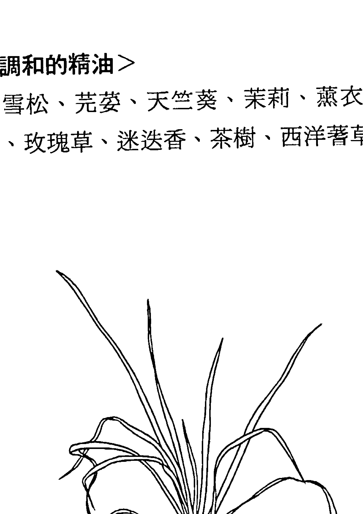

## 47. 莱姆 LIME

| 植物种類／萃取部位 | 果实／果皮 |
| :--- | :--- |
| 学名 | (柑橘属) Citrus medica |
| 科名 | 芸香科 Rutaceae |
| 类比音符 | 高音 |
| 主宰星球 | 太阳 |
| 萃取方法 | 压榨及蒸馏 |

<气味> 相当强烈，既苦又甜。

<外观> 原产自亚洲，现在则栽种于许多温暖的国家，如意大利，西印度群岛和美洲国家。它的外表似柠檬，但颜色偏黄且形状较圆。虽然莱姆的品种繁多，其直径一般为5公分。压榨所得的莱姆精油比柠檬精油淡很多，气味显然也比较甜。

<应用历史与相关神话>
显然是摩尔人把莱姆带进欧洲，在16世纪时，又由西班牙与葡萄牙探险家带到美洲，当时装载莱姆的船只被称作“莱姆果汁机”，因为船员都靠莱姆来预防坏血病。这种病是由于营养不全所导致的虚弱状态，莱姆从此便成为维他命C的良好来源。

现今的果汁和水果工业发源于19世纪的西印度群岛，而莱姆精油一直被用以调理姜汁酒与可乐饮料。另外在香水工业中，你也能找到甜莱姆油，它们的气味闻起来像是佛手柑精油。

- 醇类—芫荽油醇、松油醇
- 醛类—枸橼醛
- 酯类—芫荽酯
- 内酯类—香柑油内酯
- 萜烃类—柠檬烯、松油萜、桧烯、Terpinoline

### <属性>

抗坏血、抗菌、抗病毒、开胃、收敛、杀菌、消毒、退烧、止血、杀虫、复健、养生。

### <注意事项>

使用后，曝晒在强烈日光下，可能导致皮肤对光敏感，也可能会刺激敏感皮肤。

### <心灵疗效>

使人生气蓬勃，特别在你感觉不带劲、焦虑和沮丧时，让疲惫的心灵焕然一新。

### <身体疗效>

伴随着凉感冒、喉咙疼痛和流行性感冒的发烧，都可借莱姆精油降低体温。纾解咳嗽、胸部郁积、黏膜发炎以及鼻窦炎。是免疫系统的补品，降低感染病菌的机率，缩短病后的虚弱状态，很快地重拾精力。

就如同大多数的柑橘类精油，莱姆可以刺激消化系统。可帮助厌食症患者，因为它能刺激消化液的分泌，进而使胃口大开。

据说可以处理酒精中毒的一些症状，也许是因为它具有净化与复健的作用。有助于风湿性疼痛，此作用十分闻名。

### <皮肤疗效>

莱姆收敛、调理与清新的功能，可净化油腻的肤质，据说还能止住割伤与一般外伤的出血。

### <适合与之调和的精油>

欧白芷、佛手柑、天竺葵、菩提花、薰衣草、橙花、肉豆蔻、玫瑰草、玫瑰、紫罗兰、依兰。

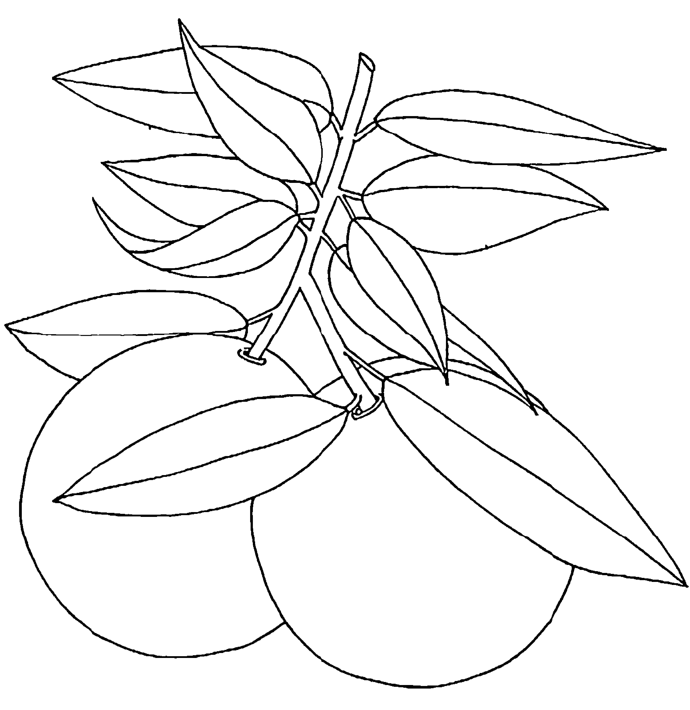

## 48. 菩提花 LINDEN BLOSSOM

| 植物种類／萃取部位 | 树／花 |
| :--- | :--- |
| 学名 | (椴属) Tilia europaea |
| 科名 | 椴科 Tiliaceae |
| 类比音符 | 低音 |
| 主宰星球 | 木星或金星 |
| 萃取方法 | 脂吸法 |

<气味> 深沉的甜味，略带香辛料的感觉，气味颇持久。

<外观> 欧洲菩提在英国及欧洲的林荫大道上，是常见的景观，据说它是另两种菩提 (Platyphylos 及 Cordata) 的混种。它能长到30公尺高，而它另一个广为人知的名称为“莱姆树”。菩提暗灰色的树干上枝椏茂密，锯齿叶缘的树叶正面是墨绿色，反面却呈淡绿色，垂吊的白花里蕴含了大量的花蜜，往往吸引成群的蜜蜂。

<应用历史与相关神话> 知道菩提能治癫痫和瘫痪的人，大概也都听说过它和巫术的关联。古代的日耳曼民族无视于菩提树不吉利的暗喻，把它定为自己民族的象征图腾。罗马人则稍为实际一些，他们用菩提树内侧的树皮和肉类同煮，以避免肉类过咸。菩提花常和蛇麻草并用以诱发睡意，事实上，菩提花## LINDEN BLOSSOM

茶在法國是一種很受歡迎的飲料，人們相信它可以改善失眠和消化不良的毛病。曾有一度，菩提木所製成的木炭被人們和水吞下，以中和胃中的毒物。此外，一般都相信菩提能夠抑制發汗，過去也曾用於惡化的傷口，以及有癌細胞生長的病人身上。

菩提的拉丁屬名Tilia可能是源自另一古字Ptilon，意指「羽毛」，因爲菩提樹葉其狀如羽。雕刻大師葛林·季本斯（ Grinling Gibbons ）偏好用菩提木來雕刻作品。可惜的是，天然的菩提花精油極難獲取，又因爲商人已能成功地複製做商業生產，因此，天然的精油便不受重視。

### <化學結構> 醇類－耨子油醇

### <屬性>

- 抗痙攣、收斂、止咳、利腦、消除鼻塞、利尿、使皮膚柔軟、降低血壓、利神經、鎮靜、促進發汗、補身。

### <注意事項> 菩提花的氣味會使某些人頭暈目眩，它也可能引發某些敏感皮膚的過敏反應。

### <心靈療效> 讓人完全放鬆，能帶給你深睡熟眠。

### <身體療效>

神經系統的絕佳補品，有助於頭疼、偏頭痛、神經痛與暈眩。據說對神經緊張所引起的高血壓相當有效。可以淨化血液，因而能改善慢性的循環疾病，如控制過高的膽固醇，顯然也有益於貧血。可改善慢性的黏膜發炎問題，促進排汗退燒，又能改善支氣管發炎及呼吸系統的過敏症狀，改善夜裏盜汗。一般而言，對呼吸道方面的疾病有益，例如：流行性感冒、胸膜炎和支氣管炎。

菩提花能幫助你擺脫那種透不過氣來的窒悶感覺，讓氣體出入的管道流通，使呼吸順暢，改善咳嗽。
它利尿的作用有益於腎功能失調，能淨化任何黏液。對肝臟可發揮解毒和調理的作用，適用於肝炎。對胃部異常消化不良、乃至腹瀉均有效果。還可改善口腔潰瘍。清除過多的尿素。有效治療風濕、痛風及坐骨神經痛。
明顯強化眼部肌肉，但絕不能直接用在這個部位。

### <皮膚療效>

它安撫、軟化與緊實的功能，能使皺紋不易生成。菩提花另一項受人讚賞的作用，是處理皮膚上的瑕疵、雀斑與灼傷。它也能調理頭皮，刺激頭髮生長。

### <適合與之調和的精油>

- 安息香、香茅、薑、葡萄柚、茉莉、薰衣草、橙花、玫瑰草、玫瑰、馬鞭草、紫羅蘭、依蘭。

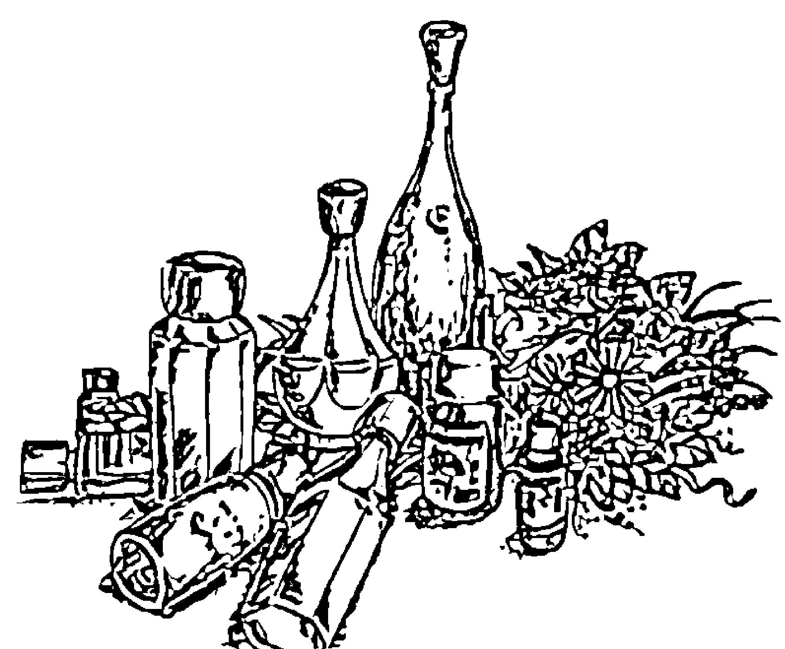

## 49. 山雞椒  LITSEA CUBEBA

| 植物種類/萃取部位 | : | 樹/果 |
| --- | --- | --- |
| 學名 | : | (木姜子屬)Litsea cubeba |
| 科名 | : | 樟科Lauraceae |
| 類比音符 | : | 高音 |
| 主宰星球 | : | 未知 |
| 萃取方法 | : | 蒸餾 |

<氣味> 甜甜的柑橘果香，又帶點花香的味道。

<外觀> 這種亞洲來的小樹有芳香的花和葉，所結的果實還帶著香味。產地在中國與馬來西亞，在當地被稱為「中國胡椒」、「May Chang」，以及大家耳熟能詳的「山雞椒」。

<應用歷史與相關神話> 這種在東方十分著名的香料樹，直到近代才為西方世界所熟知。山雞椒狀似胡椒的果實在50年代首次被蒸餾出精油，此後，就成為檸檬香茅精油最大的競爭對手。這兩種精油中的檸檬醛含量幾乎完全相同，不過檸檬香茅的氣味較持久，油臭味也稍為重一點。 除了在中國菜裡被當作調味料以外，它還被用以治療癌症腫瘤，人們認為它有抑制癌細胞的能力。近年來，山雞椒則被廣泛用於製造肥皂、香水以及除臭劑。

### <化學結構>

- 醇類－牻牛兒醇、芫荽油醇
- 醛類－檸檬醛、香茅醛
- 酯類－芫荽酯
- 氧化物－桉油醇
- 倍半萜類－杜松萜烯
- 萜烴類－檸檬烯、檜烯

### <屬性>

抗抑鬱、抗菌、收斂、殺菌、祛脹氣、促進乳汁分泌、殺蟲、激勵、補身。

### <注意事項>

氣味十分強勁，所以使用的劑量要小心。

### <心靈療效>

非常振奮精神，可營造出一種陽光普照的精神感受。

### <身體療效>

可以激勵身體，使之重現活力，可算是心臟與呼吸系統的補品，對於能量低落的狀態特別有用。據說可擴張氣管，有助於支氣管炎和氣喘。有些報告甚至指出，山雞椒有益於心臟方面的疾病。也能刺激消化作用，紓解脹氣和反胃的感覺，還可以開胃。可以改善口腔的鵝口瘡，經證實還能處理哺乳困難的種種問題。

### <皮膚療效>

緊實和收斂的特性，可在油性皮膚和油性髮質上，發揮平衡的作用。

### • LITSEA CUBEBA •

### <適合與之調和的精油>

- 羅勒、天竺葵、癒創木、茉莉、薰衣草、橙花、甜橙、苦橙葉、玫瑰、迷迭香、花梨木、馬鞭草、依蘭。

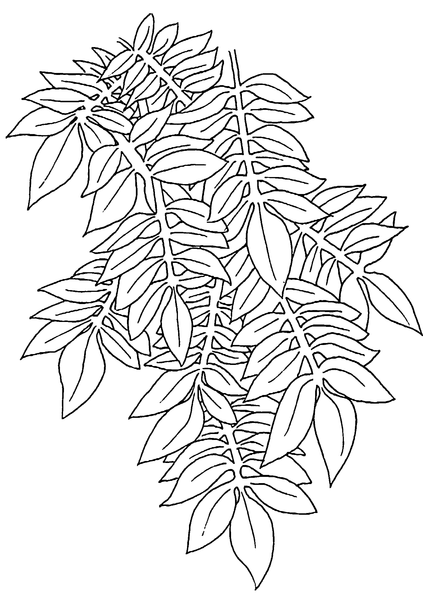

## 50. 桔 MANDARIN

| 植物种类／萃取部位 | : | 树／果皮 |
| :--- | :--- | :--- |
| 学名 | : | (柑橘属) Citrus madurensis |
| 科名 | : | 芸香科 Rutaceae |
| 类比音符 | : | 中～高音 |
| 主宰星球 | : | 未知 |
| 萃取方法 | : | 压榨 |

<气 味> 细致优雅的甜味，除了独特的柑橘皮味之外，还带了少许幽幽的花香。

<外 观> 这种多产的果树喜爱炎热潮湿的气候，但是生在温带的桔树却能产出较多的精油，而且半熟的果实可以榨出最多的精油。生产桔油的地区包括了巴西、西班牙、义大利和加州。和桔同一植物根源的红柑，气味显然较弱，或者应说红柑的气味较纤细。

<应用历史与相关神话>
桔的英文名称 Mandarin，指的也是一度统治中国的满州人，此二者竟然在英语中同名，似乎颇令人不解。原来，这种柔软的橙色水果，曾被献给他们东方的主子以示尊敬，因此才有相同的名字。过去的两百年内，桔在欧洲受欢迎的程度渐渐水涨船高，尤其是地中海沿岸一带，其栽种范围既大且广。
桔油在美国的生产规模不断扩大，在第二次世界大战期间，曾一度停滞，因为战时要从意大利进口水果，就是一大难事。战后，巴西取代了意大利，成为输美的出口大宗，不过据说，意大利桔油的气味比较细致，而品质也略胜一筹。不论在香水界或烹饪方面，桔油都有广泛的运用。

### <化學結構>

- 醇類－牻牛兒醇
- 醛類－檸檬醛、香茅醛
- 酯類－胺基苯甲酸甲酯
- 萜烴類－檸檬烯

### <屬性>

抗痙攣、利膽、促進細胞再生、利消化、柔軟皮膚、鎮靜、補身。

### <注意事項>

可能具光毒性，所以最好不要在接受強烈日曬前使用。

### <心靈療效>

它清新的氣味有提振精神的作用，常用於平撫沮喪與焦慮。

### <身體療效>

消化系統的補品，增進胃口，特別有益於病體初癒或沮喪所導致的食慾不振。有刺激肝臟、調節代謝的功能，以及促進膽汁分泌、加速脂肪分解的功能。另外，它還能安撫腸胃，幫助排氣。

桔油是一種出了名的溫和精油，溫和到孕婦、兒童都可以安心使用（但劑量仍宜少量）。事實上，任何人只要感覺脆弱、身子虛，都適合選用桔油。桔油就像是能重新賦予活力一般，有精神爲之一振的效果。

桔油因爲有使人開懷的特性，有時也被拿來處理經前症候群，若與其他柑橘類的精油調在一起，也許能增強其效果。

> <皮膚療效> 經常與橙花和薰衣草調和在一起，淡化妊娠紋和疤痕。

### <適合與之調和的精油>

- 羅勒、佛手柑、黑胡椒、芫荽、洋甘菊、葡萄柚、薰衣草、檸檬、萊姆、馬鬱蘭、橙花、玫瑰草、苦橙葉、玫瑰。

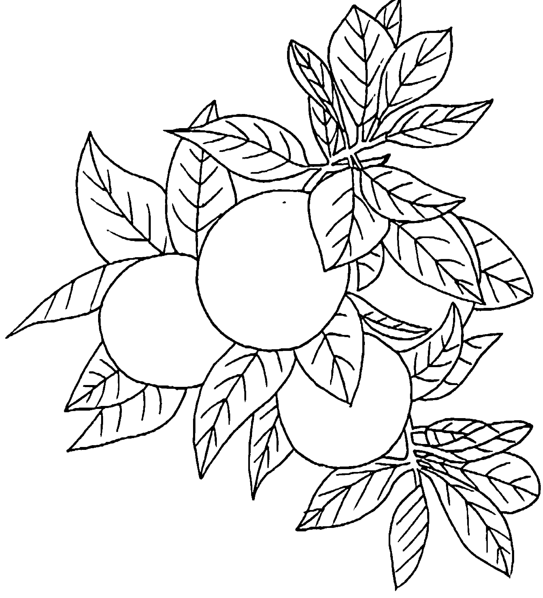

## 51. 馬鬱蘭 MARJORAM

| 植物種類／萃取部位 | : 藥草／開花的頂端、葉 |
| :--- | :--- |
| 學名 | : (牛至屬)Origanum marjorana |
| 科名 | : 唇形科Labiatae |
| 類比音符 | : 中音 |
| 主宰星球 | : 水星 |
| 萃取方法 | : 蒸餾 |

<氣 味> 溫暖而具穿透力，稍帶香料味。

<外 觀> 馬鬱蘭有許多不同的品種，最為人熟知的是一種25公分高的小型植物，長有小小的橢圓型葉，開白色或粉紅色的花朵。甜馬鬱蘭源自利比亞、埃及、和地中海地區，但大部分的馬鬱蘭精油產自法國。西班牙的野馬鬱蘭 ( Thymus mastichina ) 其品質明顯較差。

<應用歷史與相關神話>
在古希臘，它是一種非常受歡迎的常用藥草植物。他們用它來治痙攣，與組織內過多體液的狀態，認為它是極有價值的解毒劑，還可幫助消化。希臘文裏的orosganos意指「山鬱之喜樂」，這個名稱似乎非常貼切，因為人們常贈予新婚夫婦馬鬱蘭以預祝他們幸福。它也被種在墳地，使死者安息。

在拉丁文裏，馬鬱蘭的字首Marjor意指「偉大」，據說它能使人延年益壽。在史都華的時代，人們佩戴含馬鬱蘭的花飾以掩蓋不雅的氣味。芳香水、鼻煙壺，甚至晚近的義大利脆餅Pizza中，都有馬鬱蘭的蹤影。

### 化學結構

- 醇類—龍腦、松油醇
- 酮類—樟腦
- 倍半萜—丁香油烴
- 萜烴—松油萜、檜烯、松油烴

### 屬性

- 止痛
- 抑制性慾
- 抗菌
- 抗痙攣
- 祛腸胃脹氣
- 有益頭部
- 刺激心臟
- 利消化
- 通經
- 化痰
- 降低血壓
- 輕瀉劑
- 利神經
- 促進康復
- 鎮靜
- 補身
- 治創傷

### 注意事項

使用時間過長可能導致精神狀態遲緩，最好避免在懷孕期間使用。

### 心靈療效

對神經系統有安撫效果，紓緩焦慮、壓力、甚至深層的心理創傷。能強化心靈，幫助人面對現實。在憂傷寂寞時，能給人安慰，因爲它有溫暖情緒的作用。對過度活躍的人們來說，是非常優越的鎮靜劑。

### 身體療效

這是一種非常實用的精油，能以不同的方式爲人們帶來良好的健康狀況。處理疼痛的肌肉特別有效，尤其是消化問題和月經異常引起的下背部疼痛。

能幫助風濕痛與腫大的關節，特別是感覺冰涼和僵硬的疼痛，因爲它能影響血液循環。亦能擴張動脈與微血管，讓血流通暢，使人感到溫暖愉悅，很適合做運動後的活絡油。

是心臟的補藥，能降低高血壓。它的放鬆效果有助於改善頭痛、偏頭痛和失眠。

它安撫消化系統的效果相當聞名，有益於胃痙攣、消化不良、便秘、脹氣，還能幫助身體排除毒素，以及預防暈車、暈船。

似乎有益於胸腔的傳染病及感冒、鼻竇炎、支氣管炎與氣喘。在感冒時，能消除頭腦的窒塞感。

調節月經週期，減輕經痛。它抑制性慾的作用也十分著名。

### <皮膚療效>

消除淤血的作用極富價值，它能消除淤血，是因爲擴張微血管後血液較易流通。

### <適合與之調和的精油>

- 佛手柑、雪松、洋甘菊、絲柏、薰衣草、桔、橙、肉豆蔻、迷迭香、花梨木、依蘭。

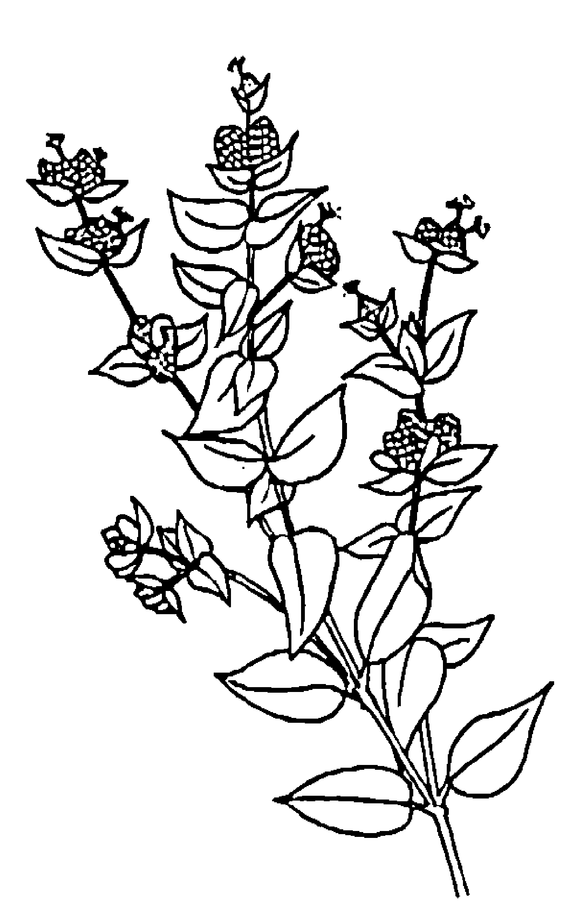

## 52. 香蜂草 MELISSA

| 植物種類／萃取部位 | : | 藥草／葉與花 |
| --- | --- | --- |
| 學名 | : | (滇荊芥屬) Melissa officinalis |
| 科名 | : | 唇形科Labiatae |
| 類比音符 | : | 中音 |
| 主宰星球 | : | 木星 |
| 萃取方法 | : | 蒸餾 |

<氣味> 甜似檸檬，還帶點花香。

<外觀> 這種地中海植物的精油，以法國為最大產地。香蜂草喜愛含鐵豐富的土壤，或許這可解釋其效果卓越的抗貧血作用。高度約60公分，長著毛茸茸的小巧葉片，略皺，葉緣為鋸齒狀。它黃色的花很能吸引蜜蜂，而香蜂草的原文Melissa，正是希臘文的「蜜蜂」。

<應用歷史與相關神話>
當邱比特的母親瑞亞躲著他父親克羅納斯時，蜜蜂便以蜂蜜餵食邱比特。據說由香蜂草釀成的蜂蜜特別可口，甜美如神飲的瓊漿玉液一般。一位著名的瑞士醫生帕拉切爾蘇斯 ( Paracelsus ) 管香蜂草叫「生命的萬靈丹」，毫無疑問是由於它有安定心臟的作用。香蜂草以回春的特性聞名，另外也有「萬靈藥」的名聲。這種植物應用在醫療上的時間頗為久遠，在中東，它也是常用的心臟刺激劑。

香蜂草另一個廣為人知的名字是「檸檬香脂」，它是balsam及希伯來文Bal-Smin（意指油中之首）的縮寫。它被羅馬人引進英國，從古至今都是很受歡迎的藥草。14世紀時，法國聖衣會的修女調製了一種調理藥水，其中便含有香蜂草。

在依莉莎白女王時代，香蜂草的葉子被拿來釀酒，稍後，又被用以磨亮傢俱。香蜂草常有摻偽的情況，真正的香蜂草精油相當昂貴。法國人有時會叫它Citronelle。

- 酸類—香茅酸
- 醇類—香茅醇、牻牛兒醇、芫荽油醇
- 醛類—檸檬醛、香茅醛
- 酯類—牻牛兒酯
- 倍半萜—丁香油烴

- 預防過敏、抗沮喪、抗痙攣、祛腸胃脹氣、激勵心臟、利消化、退燒、降低血壓、利神經、鎮靜、利胃、促發汗、補身、利子宮。

因為它能規律經期，所以避免在懷孕期間使用。也可能刺激敏感皮膚。

既能安撫又能提振敏感的心理狀態，據說能除去胸中鬱悶。在震驚、恐慌和歇斯底里時，可以安撫情緒。幫助人們面對失落，在心中種下積極的未來觀。

它的安撫作用是循環系統的調節劑，可降低高血壓，使心跳平和。一般而言是心臟良好的補藥，痙攣、疲態時很有幫助。

似乎與女性的生殖系統有很密切的關係，可使經期規律，紓緩經痛，讓身體放鬆。它調節子宮的作用，有助於某些不易受孕的症狀。

也能促進胃部的消化功能，包括反胃、脹氣、嘔吐、消化不良和痢疾。

有益於感冒症狀，似可退燒，及改善伴隨感冒而來的頭痛和偏頭痛。

可有效驅蟲，並減輕蚊蟲叮咬的瘡痛。它控制過敏的作用，顯然能幫助氣喘患者、安撫急促的呼吸。

### <皮膚療效>

快速止住傷口流血，抑制黴菌感染與濕疹也頗有效果。據說可潔淨油膩的髮質，並預防落髮。

### <適合與之調和的精油>

- 羅勒
- 月桂
- 洋甘菊
- 乳香
- 天竺葵
- 薑
- 癒創木
- 茉莉
- 杜松
- 薰衣草
- 馬鬱蘭
- 橙花
- 玫瑰
- 迷迭香
- 紫羅蘭
- 依蘭

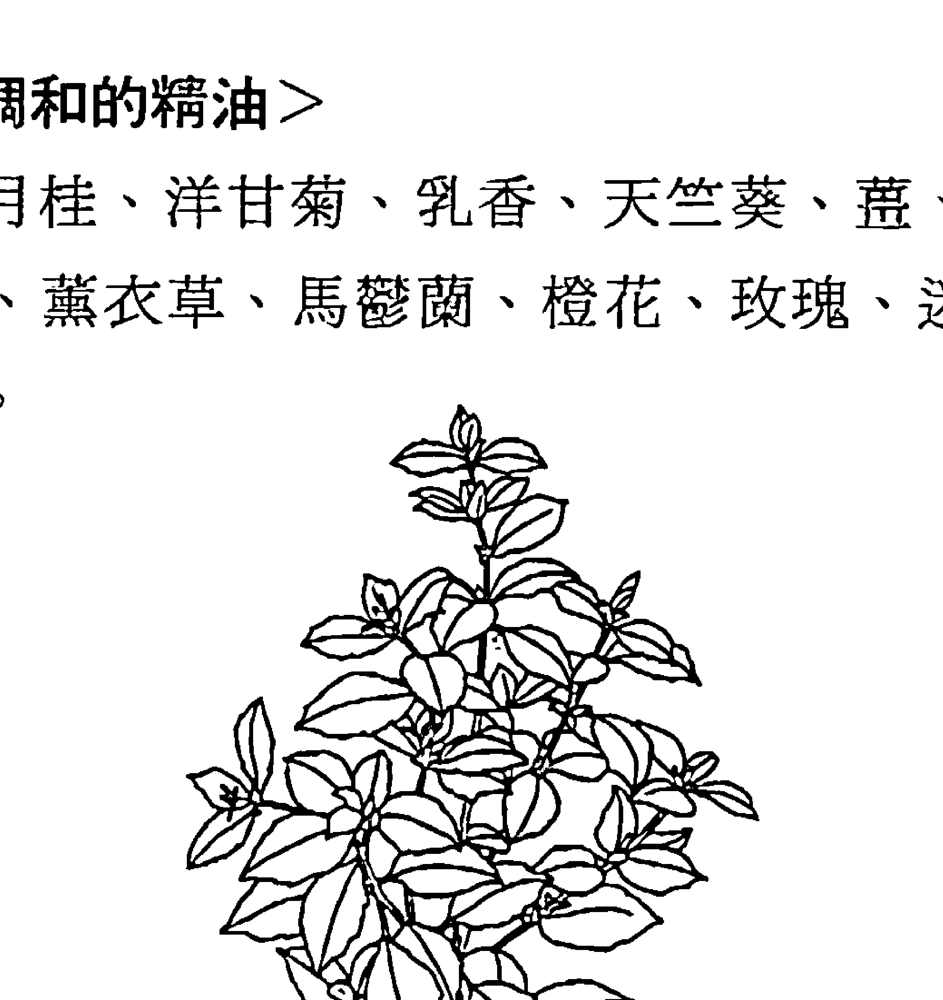

## 53. 没药 MYRRH

| 植物种类／萃取部位 | : | 灌木丛／枝枒 |
| --- | --- | --- |
| 学名 | : | (没药属) Commiphora myrrha |
| 科名 | : | 橄榄科 Burseraceae |
| 类比音符 | : | 低音 |
| 主宰星球 | : | 太阳 |
| 萃取方法 | : | 蒸馏 |

<气 味> 烟味，呈树脂状，略带麝香。

<外 观> 这种著名的灌木有许多不同品种，一般可长到2.74公尺高，原产于北非、亚洲及索马利亚，其精油则多得自中东。
在它灰色的树皮上划个刀口，便会流出黄白色的树脂，树脂干涸后，则变成棕红的硬块，精油便是从这些硬块中蒸馏而得。
有些山羊爱嚼没药美味的叶子，因此它们的胡子也常会沾上树脂的香气。

<应用历史与相关神话>
古代的人们使用没药之广泛，正是它大受欢迎的证明。埃及人会在每天正午焚烧没药，这是他们太阳仪式中的一部分，他们还把没药、芜荽及蜂蜜调在油膏中治疱疹。事实上，它在医疗方面的用途极广。没药甚至能做出最好的木乃伊。保养品，特别是面膜里也常可发现它。

旧约以斯帖记提到没药被用来给女士净身。而在创世记里，当约瑟被他哥哥卖给以实玛利人的篷车时，他们的骆驼便驮着香料、乳香和没药要运到埃及去。希腊兵士都会随身携带一小瓶没药上战场，因为没药抗菌抗炎的特性能让他们的伤口止血。

小耶稣诞生时，便收到没药做礼物（马太福音第2章，11节），被钉上十字架时，信徒也将没药混着酒递给耶稣以止痛消毒（马可福音15章，23节）。

### 化學結構
- 酸類－沒藥酸
- 醛類－肉桂醛、小茴香醛
- 酚類－丁香酚
- 倍半萜－杜松萜烯
- 萜烴－松油萜、苦艾萜、沒藥萜、檸檬烯

### 屬 性
抗菌、抗微生物、抗炎、收斂、具香膠特質、除臭、祛腸胃脹氣、消毒、利尿、通經、化痰、殺黴菌、激勵、利胃、催汗、補身、利子宮、治創傷。

### 注意事項
是通經藥，避免在懷孕期間使用。

### 心靈療效
似乎能提振虛弱不振的精神，也能讓熾烈的情緒冷靜下來。

### 身體療效
肺中有過多黏液時最適合用沒藥，因為它有特別的「乾化」作用。它對一般的肺部問題有很好的效果，可清肺，並治療支氣管炎、感冒、喉嚨痛、黏膜發炎、咽喉炎及咳嗽。也能治療腺體的發燒現象，這是由病毒引起而伴隨著喉嚨痛的一種病症。

對所有的口腔問題和牙齦異常均有絕佳的功效，能為口腔潰瘍、膿漏、牙齦發炎、海綿狀牙齦提供最好的治療。也能改善胃部異常發酵而引發的口臭。是胃部的補藥，能激勵胃口，可止瀉、疏通脹氣、減輕胃酸與痔瘡的病情。

對婦科問題有極大助益，可處理經血過少、白帶、念珠菌感染、及子宮的諸病症。

能刺激白血球，活化免疫系統。它能直接抵抗微生物，使病體快速康復。

### <皮膚療效>

防止組織退化很有效果，尤其是有傷口壞疽的情況。它清涼的功能可幫助癤、皮膚潰瘍與瘡，還能改善流湯的傷口及龜裂的皮膚。有效對抗流湯的溼疹及香港腳。

### <適合與之調和的精油>

- 安息香、丁香、乳香、白松香、薰衣草、廣藿香、檀香。

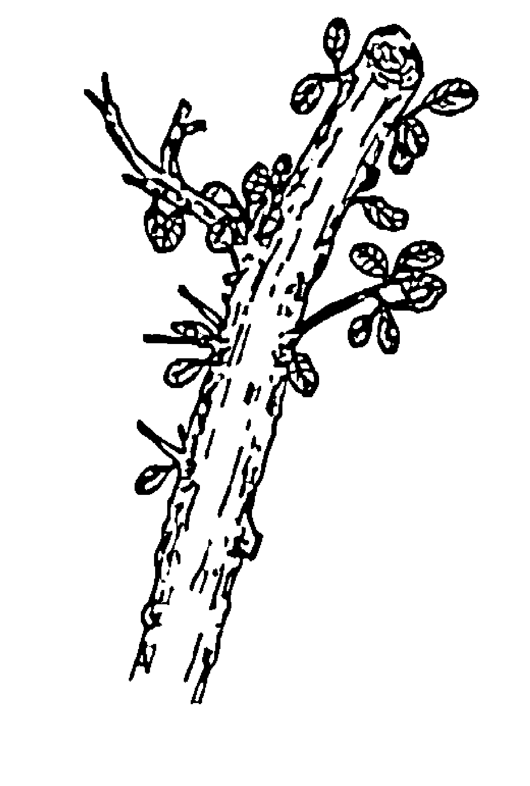

## 54. 香桃木 MYRTLE

| 植物種類／萃取部位 | : | 灌木／葉 |
| :--- | :--- | :--- |
| 學名 | : | (桃金娘屬)Myrtus communis |
| 科名 | : | 桃金娘科Myrtaceae |
| 類比音符 | : | 中音 |
| 主宰星球 | : | 金星或水星 |
| 萃取方法 | : | 蒸餾 |

<氣味> 新鮮、略甜、帶穿透力。

<外觀> 從前，香桃木是野生於北非和伊朗的一種灌木，現在則普遍被栽植於地中海沿岸，與迷迭香共同構成該區的景觀特色。這種小小的常綠樹葉片帶油亮的藍綠色，開白花，結黑色漿果。科西嘉的香桃木精油曾被認為是極品，目前主要產地在摩洛哥、奧地利及突尼西亞。

<應用歷史與相關神話> 埃及人用香桃木來紓緩顏面抽搐，羅馬人認為它是治呼吸道及泌尿問題的萬靈丹，多愁善感的希臘人則視它為愛與不朽的象徵。它催情的名聲始終很響亮，也常被用以調製愛的瓊漿。

希臘神話中有一則故事，提到忒修斯的妻子費德拉在香桃木樹下愛上希波呂托斯。它是香水及香料酒的成分之一。在奧林匹克競賽中的優勝者，常被冠以香桃木葉子編成的頭環。

## 香桃木

它在聖經中時常與和平一起出現，如尼希米記第8章第15節及撒迦利亞書第1章之8和11節。

常被用於新娘捧花及頭飾中，乾燥後還可做成嬰兒的爽身粉。16世紀時，香桃木被認為是對抗皮膚癌的良藥，它也是”天使之水“（一種化妝水）的成分之一。

### 化學結構
醇類－牻牛儿醇、芫荽油醇、桃金孃烯醇、橙花醇
醛類－香桃木醛
氧化物－桉油醇
萜烴－樟烯、苦艾萜、松油萜

### 屬性
抗菌、收斂、殺菌、祛腸胃脹氣、化痰、殺寄生蟲。

### 注意事項
使用過久可能會刺激黏膜組織。

### 心靈療效
可安撫憤怒的情緒。

### 身體療效
有顯著的淨化功效，對肺部異常十分有用，尤其是夜裏伴隨盜汗症狀時，它也能帶來安穩的睡眠。晚間適合用香桃木，其作用與尤加利相似，但不像尤加利具有刺激的性質。香桃木和尤加利一樣能抵抗潮濕、改善支氣管黏膜發炎和鼻竇炎，抑制感染相當有效。
能調節生殖泌尿系統，減輕痔瘡、腹瀉和痢疾的困擾。除此以外，它抗菌的屬性還能改善膀胱炎和尿道炎。
可以減少白帶，紓解骨盆充血的疼痛，而且是子宮極佳的補藥。
驅逐體外寄生蟲的效果良好。

### 皮膚療效
它具有抗菌和收斂的特性，能淨化阻塞的皮膚進而消除粉刺和不潔的突起物，也能驅散淤血，並改善乾癬落屑的外觀。

### 適合與之調和的精油
- 佛手柑
- 豆蔻
- 芫荽
- 時蘿
- 薰衣草
- 檸檬
- 檸檬香茅
- 花梨木
- 迷迭香
- 綠薄荷
- 百里香
- 茶樹

## 55. 橙花 NEROLI

| 項目 | 內容 |
|------|------|
| 植物種類／萃取部位 | 橙樹／花瓣 |
| 學名 | (柑橘屬) Citrus aurantium Citrus vulgaris |
| 科名 | 芸香科 Rutaceae |
| 類比音符 | 低～中音 |
| 主宰星球 | 太陽 |
| 萃取方法 | 脂吸法或蒸餾 |

### 氣味
芬芳的花香，縈繞不去。

### 外觀
橙樹原產於中國，但橙花精油大多產自法國、摩洛哥、葡萄牙和義大利。據說，最好的橙花油來自塞維爾苦橙（C. vulgaris）的白色花瓣，甜橙（C. aurantium）的橙花油則以”葡萄牙的橙花”聞名。某些橙花油是從檸檬與桔的花瓣萃取而得。

### 應用歷史與相關神話
橙花之名據說源自一位義大利的公主安瑪麗，她是尼羅利的郡主，而尼羅利即為橙花精油之英文名稱。這位公主拿橙花精油當香水用，並用來薰香手套和泡澡用水。橙花的花瓣長久以來都在婚禮中使用，象徵純真以及愛情永固。
在中國，橙花的花瓣廣泛被用以製造保養品，稍晚的維多利亞時代，橙花成為古龍水的成分之一，這種古龍水專供勒緊腰部的淑女們在感覺暈眩時使用。在許多的東歐菜餚中，橙花水也是烹調的必備品。橙花是非常昂貴的精油，因為它需要大量的花朵，却只能萃取出極少量的精油。橙花水常用於護膚保養品中，它也是古龍水的成分之一。

### 化學結構
- 酸類一酚乙酸
- 醇類一橙花醇、牻牛儿醇、芫荽油醇、苦橙花醇、松油醇
- 酯類一芫荽酯、胺基苯甲酸甲酯、橙花酯
- 酮類一素馨酮
- 萜烴一樟烯、檸檬烯
- 氮化合物一吲朵

### 屬性
抗沮喪、抗菌、抗痙攣、催情、殺菌、祛腸胃脹氣、使興奮、增進細胞活力，除臭、幫助消化、柔軟皮膚、鎮定、補身。

### 注意事項
使人放鬆，但需要頭腦清晰、集中注意力時不宜使用。

### 心靈療效
催眠，使人精神愉快，可減輕長期的焦慮、沮喪和壓力。情緒起伏、歇斯底里和受到驚嚇時，橙花能提供安撫作用，帶來祥和的感受。

### 身體療效
它鎮定副交感神經的作用使它成為治失眠的好處方，尤其是在沮喪不得成眠的情況下。還可改善神經痛、頭痛和眩暈。另外，還能止住接連不斷的呵欠。
它鎮撫焦躁狀態的功能有助於性方面的問題，同時也是有效的催情劑。它也能幫助克服沮喪的情緒，如經前症候群及更年期的心理問題等。
抗痙攣的特性，可安撫腸胃，對結腸炎和腹瀉也有效果。
鎮定心悸、清血、促進循環。整體而言，是一種非常好的補品。

### 皮膚療效
因有增強細胞活動力的特性，能幫助細胞再生，增加皮膚彈性。適合乾性、敏感及成熟型肌膚，對於其他的皮膚問題也都有幫助，特別是螺旋狀的靜脈曲張、疤痕及妊娠紋。在照X光時，亦可用來保護皮膚。

### 適合與之調和的精油
安息香、佛手柑、蕪荽、天竺葵、茉莉、薰衣草、檸檬、萊姆、橙、玫瑰草、苦橙、玫瑰、迷迭香、檀香、依蘭。

## 56. 綠花白千層 NIAOULI

| 植物種類／萃取部位 | : | 樹／葉及嫩芽 |
| --- | --- | --- |
| 學名 | : | (白千層屬) Melaleuca viridiflora |
| 科名 | : | 桃金娘科 Myrtaceae |
| 類比音符 | : | 高音 |
| 主宰星球 | : | 未知 |
| 萃取方法 | : | 蒸餾 |

### 氣味
略甜、清澈，有穿透力。

### 外觀
綠花白千層是一種大量野生於澳洲的大樹，它像灌木的葉片與黃色的花朵是新喀里多尼亞島上常見的景觀。新喀里多尼亞是南海上的一個島嶼，綠花白千層的蒸餾作業經常在此進行。當地的空氣清新，從無瘧疾的蹤跡，這全是綠花白千層的功勞，因為飄落的樹葉覆蓋地面，其作用宛如強勁的消毒劑。

### 應用歷史與相關神話
強力的抗菌功效也許是綠花白千層長久以來為人所用的緣故。雖然它對許多日常病症都頗有療效，但它在中東一帶卻被當地人們當作是平常的飲料。有時綠花白千層會被稱為Gemenol，這是一個法語的名稱，它的植物學名是在1788年庫克船長的澳洲之旅中所命名的。
在法國，醫院將綠花白千層用於產科病房，因為它有強勁的抗菌功效。綠花白千層也被拿來和白千層、尤加利交替使用，以治療感冒、風濕痛和神經痛，它也是許多藥劑中常用的成份，如口腔噴劑、牙膏等等。

### 化學結構
- 酸類－緞草酸
- 醇類－松油醇
- 氧化物－桉油醇
- 萜烴類－檸檬烯、松油萜

### 屬性
止痛、抗風濕、抗菌、具治癒力、殺菌、促進傷口結痂、消解鼻塞、退燒、殺蟲、激勵、驅蠕蟲、治創傷。

### 注意事項
未知。

### 心靈療效
激勵、復甦，使頭腦清醒，注意力集中。

### 身體療效
刺激組織，促進局部的血液循環，加強白血球與抗體的活動力，協助身體抵抗感染。疾病初期，最適合選用綠花白千層增強抵抗力。事實上，任何虛弱狀態下綠花白千層都能派上用場。對於愛滋病患，綠花白千層雖不能提供治癒的療效，但仍可以增強免疫系統功能。當然，這必須由合格的醫事人員從旁協助使用。
對於呼吸系統有決定性的影響，可改善胸腔的傳染病、支氣管炎、肺結核、流行性感冒、肺炎、百日咳、哮喘、鼻竇炎、黏膜炎以及喉炎等。
可調節腸的功能，能有效對抗腸炎、痢疾、腸內寄生蟲，甚至可處理泌尿系統感染疾病。它止痛的屬性似乎對風溼痛及神經痛十分有益。

### 皮膚療效
緊實組織，促進疾病痊癒，可處理面皰、粉刺、癩、潰瘍、灼傷與割傷。或可用來清洗受細菌感染的傷口。

### 適合與之調和的精油
- 芫荽
- 茴香
- 白松香
- 杜松
- 薰衣草
- 檸檬
- 萊姆
- 香桃木
- 甜橙
- 松
- 薄荷
- 迷迭香

## 57. 肉豆蔻 NUTMEG

| 植物種類／萃取部位 | 樹／果子 |
| --- | --- |
| 學名 | (肉豆蔻屬) Myristica fragrans |
| 科名 | 肉豆蔻科 Myristicaceae |
| 類比音符 | 高音 |
| 主宰星球 | 木星 |
| 萃取方法 | 蒸餾 |

### 氣味
強烈的香辛料味，有點像麝香，令人感覺溫暖。

### 外觀
肉豆蔻強烈的氣味灑遍了熱帶地區，它們生長在強壯的常綠樹上，樹高可達13.7公尺，一株雄樹可授花粉給20株雌樹。雖然原產於摩鹿加島，它的蹤跡也出現在Penang、爪哇、西印度群島與絲里蘭卡。肉豆蔻長得像個小桃子，大小不一，連形狀和品質的差距也很大。肉豆蔻精油得自其種子的核仁，果實的外殼則可產出另一種精油－Mace（肉豆蔻乾皮精油），這種精油很不容易取得。

### 應用歷史與相關神話
肉豆蔻的使用歷史比肉豆蔻乾皮短，不少古文明對肉豆蔻乾皮都十分看重。印度人用肉豆蔻處理腸的問題，埃及人則用它來防腐屍體。它還被做成一種義大利焚香以防禦瘟疫，這種焚香中尚含有月桂、丁香、杜松、沒藥、香桃木和玫瑰。中世紀時，它是治痔的有名處方，人們將它磨碎後調和豬油，拿來當藥膏使用。當時，它也被視為強胃的藥品。
1605年之前的香料貿易由葡萄牙人所獨占，之後則由荷蘭人接管，但在他們已相當接近摩鹿加島時，卻換了艘船而離開了。直到1768年，肉豆蔻才被引進其他國家，用來做食物的調味料、飲料的成分、及牙科方面的製品。香水及髮乳中也含有肉豆蔻。

### 化學結構
- 醇類－龍腦，牻牛儿醇、芫荽油醇、松油醇
- 酚類－丁香酚、肉豆蔻油醚、黃樟腦
- 萜烴－樟烯、苦艾萜、松油萜

### 屬性
止痛、抗痙攣、止吐、抗菌、催情、利心臟、祛腸胃脹氣、通經、輕瀉劑、利分娩、激勵、利胃、補身。

### 注意事項
這種精油效力頗強，使用上要小心，長期使用可能會過度刺激運動神經（第三對腦神經），導致心神不寧。最嚴重的情形，會引起譫妄、抽搐，甚至可能變得麻木，也有可能過度刺激心臟和皮膚。避免在懷孕期間使用。

### 心靈療效
讓心靈產生活力，也能讓昏厥的感覺消散，回復清醒。

### 身體療效
最主要的功效在消化系统方面，特别有助於分解脂肪類與澱粉類食物，並促進食慾。也能改善脹氣、反胃、週期性的嘔吐、口臭及腹瀉。能有效預防便秘，是腸的抗菌劑，據說還能消解膽結石。
它是生殖系統的補藥，因為它的性質與雌激素十分相似，可調節過少的經血，紓緩經痛。對性方面的障礙，亦很有幫助，因為它有催情的作用。另外，它能強化肌肉收縮的力量，所以對生產極有助益。
它屬於暖性的精油，拿來按摩可改善肌肉疼痛、風濕痛、特別是長年的痼疾。據說，也能減輕神經痛的劇烈痛楚。
非常刺激的油，可賦予心臟活力，促進血液循環。

### 皮膚療效
對毛髮有益。

### 適合與之調和的精油
- 黑胡椒
- 肉桂
- 丁香
- 芫荽
- 絲柏
- 乳香
- 白松香
- 檸檬
- 萊姆
- 香蜂草
- 橙
- 廣藿香
- 迷迭香
- 茶樹

## 58. 橙 ORANGE

| 植物種類／萃取部位 | : | 水果／果皮 |
| :--- | :--- | :--- |
| 學名 | : | (柑橘屬) Citrus vulgaris Citrus aurantium Citrus cinesis |
| 科名 | : | 芸香科 Rutaceae |
| 類比音符 | : | 高音 |
| 主宰星球 | : | 太陽 |
| 萃取方法 | : | 壓榨 |

### 氣味
清新強烈的柑橘香。

### 外觀
一棵橙樹可萃取出三種不同的精油，令人愉悅的橙精油來自果皮，可愛的白花可蒸餾出橙花精油，誘人的苦橙則來自其葉片。橙樹原產於中國和印度，17世紀時被帶到歐洲，現在它繁茂地生長於地中海地區、以色列和美國。其精油有的來自甜橙，也有來自苦橙的。

### 應用歷史與相關神話
長久以來被視為純真與富饒的象徵。它是特洛伊戰爭裏的一個關鍵，在一項選美賽中，帕里斯頒送”金蘋果”給維納斯做獎品，據說這只所謂的金蘋果，事實上便是一顆橙。之後，維納斯把絕世美女海倫投桃報李給帕里斯，只是維納斯忘了提醒帕里斯，海倫已是有夫之婦，於是引發了著名的特洛伊戰爭。
橙Orange的字根，源自阿拉伯文，一般相信是十字軍把它帶回歐洲的。英國人在16世紀時認識了它，它跟著早期的傳教士坐船到加州，而目前橙精油在當地已成爲一個重要的工業資產。西印度羣島的居民用它的皮做成一種名叫Curacao的飲料，它也是做果醬的好材料。香水業及食品業都用得上橙精油。

### 化學結構
- 醇類－橙花醇
- 醛類－檸檬醛
- 萜烴－檸檬烯
- 酯類－胺基苯甲酸甲酯

### 屬性
抗沮喪、抗菌、抗痙攣、祛腸胃脹氣、利消化、退燒、鎮靜、利胃、補身。

### 注意事項
長期使用或高劑量使用都可能刺激敏感皮膚，或許也會引起光毒反應。

### 心靈療效
在陰鬱的思緒中灑下一片陽光，驅離緊張和壓力，鼓舞積極的態度。感覺無聊和缺乏活力時，可使人恢復生氣。

### 身體療效
對於緊張狀態下的胃特別具安撫作用，能鎮靜所謂的蝴蝶效應，也能改善身體的小病痛，例如腹瀉、便秘等。它還能刺激膽汁分泌，幫助消化脂肪，使胃口大開，因此節食時要小心使用。幫助身體吸收維他命C，藉此抵抗病毒感染，對感冒、支氣管炎、發燒的狀態均有助益。
幫助膠原形成，對身體組織的生長與修復有決定性的影響，再加上它有使人放鬆的屬性，所以能有效紓解肌肉疼痛，重造健康的骨骼。改善焦慮導致的失眠，及血中過高的膽固醇。

### 皮膚療效
它能促進發汗，因而可幫助阻塞的皮膚排出毒素。同時，能有效改善乾燥皮膚、皺紋及濕疹，是一種相當優異的護膚油。

### 適合與之調和的精油
肉桂、芫荽、丁香、絲柏、乳香、天竺葵、茉莉、杜松、薰衣草、橙花、肉豆蔻、苦橙、玫瑰、花梨木。

## 59. 野馬鬱蘭 ORIGANUM

| 植物種類／萃取部位 | : | 藥草／開花的頂端及葉 |
| --- | --- | --- |
| 學名 | : | (牛至屬) Origanum vulgare |
| 科名 | : | 唇形科 Labiatae |
| 類比音符 | : | 中音 |
| 主宰星球 | : | 水星 |
| 萃取方法 | : | 蒸餾 |

### 氣味
藥草味、木質香，又略帶香料感。

### 外觀
野馬鬱蘭的原名是墨角倫草，原產於地中海地區，現在遍生於歐洲、美國及亞洲。有毛茸茸且堅硬的莖部，紫色或粉紅色的花朵，橢圓的葉子，只有90公分高。屬性類似馬鬱蘭，但毒性較強，因爲成分中含有百里酚。

### 應用歷史與相關神話
埃及人喜歡用野馬鬱蘭泡澡，希臘人則把它應用在比較嚴肅或神聖的場合，他們將馬鬱蘭種在墓地，希望能幫助死者安息。但同時，它也被用在烹調和醫療方面，人們認爲它能有效改善肺結核。 亞里斯多德說，烏龜吞了蛇以後會找野馬鬱蘭來吃，這確實是相當有益的方法。在波斯，星相家會釀製野馬鬱蘭的香液，做爲抵抗相剋星座的護身符。很少有藥草不被用來入春藥，野馬鬱蘭也不例外；然而，13世紀時的修道院中也都栽種野馬鬱蘭，不過我們推想僧侶們是看重野馬鬱蘭在胸腔病症的療效，而不是著眼於它撩起性慾的作用。

### 化學結構
- 酚類－香旱芹酚、百里香酚
- 萜烴－萵蘿烴、松油萜

### 屬性
止痛、抗風濕，抗痙攣、抗菌、開胃、鎮咳、祛腸胃脹氣、消毒、通經、化痰、利肝、輕瀉劑、殺寄生蟲、使皮膚發紅、利脾、激勵、利胃、促發汗、補身、治創傷。

### 注意事項
非常強勁的精油，可能刺激黏膜組織，最好不要在懷孕期間使用，有些人主張根本就不要使用。

### 心靈療效
能調節與刺激神經，瓦涅醫生說它有助於心理或想像的疾病，自然也有益於精神病患。

### 身體療效
主要的作用似乎是在消化系統方面，能安撫胃部、肝和脾。也可算是一般性的淨化劑與調節劑，因為它可以安撫神經性的胃部異常與腸的痙攣，也能抑制酸度、脹氣，並能開胃，改善吞氣症。
有益於呼吸系統，如感冒、支氣管炎、黏膜發炎。可能也可改善氣喘及百日咳。它激勵的作用能使感官知覺復甦，事實上，卡爾培波一直強調它能減輕耳聾的程度、耳內的疼痛、噪音、以及牙痛。對偏頭痛及臉部抽搐也有一些效果。
它溫暖與止痛的特性，有助於痙攣性經痛、風濕痛與一般性的肌肉疼痛，為患者帶來舒適感。藉催汗的作用排除組織內的水分滯留，功效卓著。或許也能促進排尿。

### 皮膚療效
用在受感染的切割傷口，反應不錯。治療皮膚上的蟲子，也有顯著的效果。

### 適合與之調和的精油
歐白芷、羅勒、茴香、天竺葵、檸檬香茅、香桃木、松、百里香、迷迭香。

## 60. 玫瑰草 PALMAROSA

| 項目 | 值 |
|------|-----|
| 植物種類／萃取部位 | 草／葉 |
| 學名 | (香茅屬) Cymbopogon martini |
| 科名 | 禾本科 Gramineae |
| 類比音符 | 高音 |
| 主宰星球 | 未知 |
| 萃取方法 | 蒸餾 |

### 氣味
甜甜的花香，略帶乾草味，並隱隱散發出玫瑰的氣息。

### 外觀
這種大量生長的野草，在開花前就被收割下來以蒸餾精油。玫瑰草在砍下後約一星期左右便會完全乾燥，此時所蒸餾出的精油產量最高。它原生於印度，幾世紀以來，一直由技術高超的工匠蒸餾精油。科摩羅島與馬達加斯加也出產玫瑰草精油。 玫瑰草有兩個品種：摩提亞（Motia）和蘇菲亞（Sofia）。它們的生長環境與緯度均不相同，摩堤亞的玫瑰草不論是精油品質和氣味都比蘇菲亞略勝一籌。

### 應用歷史與相關神話
玫瑰草又叫印度天竺葵或羅莎，常被用以攙入較昂貴的玫瑰精油。蘇菲亞的玫瑰草油有時會被稱為薑草油，其牻牛儿醇的含量較低。偶爾，蘇菲亞的玫瑰草油也會被攙在較佳的摩堤亞玫瑰草油中，當地的商人能靠以瓶擊掌來評定油的好壞。如果經過搖晃後，油中的氣泡升至表面接著便迅速消失，這瓶油就是正常（未經摻假）的油。孟買的出口商則用簡單的可溶性測試來評定油的好壞。
西塞爾也產玫瑰草，其氣味較輕柔。爪哇產的玫瑰草油則帶了水果香。大部分的玫瑰草油出口至歐美和日本，用以製造肥皂、化粧品、香水，甚至被加入煙草中以增添風味。

### 化學結構
醇類－牻牛儿醇、香茅醇、麝子油醇
醛類－香茅醛、檸檬醛
酯類－牻牛儿酯
萜烴類－苦艾萜、檸檬烯

### 屬性
抗菌、抗病毒、殺菌、促進細胞再生，退燒。

### 注意事項
未知。

### 心靈療效
對情緒有安撫作用，但同時也有提振的效果。據說還能使人六根清靜、耳目一新。

### 身體療效
對體溫過高似乎頗有助益，因為玫瑰草可發揮降溫的作用。這個功能提高了它抗病毒的作用，因為細菌在低溫下較無活動力。
玫瑰草也是消化系統的補藥，對寄居腸內的微生物或病原體有抑制的功能，在罹患痢疾時可派上用場。另外，它也能強化胃壁的肌肉。刺激胃口的作用有助於神經性厭食。食症患者，而且會給情緒帶來正面的影響。依據顧恩德（Guenther）的「精油」一書，我們知道薑草油可紓解關節的僵硬，和它關係密切的玫瑰草油應該也具有相同的作用。

<皮膚療效> 恢復保濕的狀態，刺激天然皮脂的分泌，由此可知它對乾燥皮膚一定有很大的幫助。能促進表皮細胞再生，但消除皺紋的作用則有待進一步證實。一般的皮膚感染問題也可用玫瑰草處理。

適合與之調和的精油

- 佛手柑、香茅、天竺葵、茉莉、薰衣草、萊姆、香蜂草、甜橙、苦橙葉、玫瑰、花梨木、檀香、紫羅蘭、依蘭。

## 61. 歐芹 PARSLEY

| 植物種類／萃取部位 | 藥草／種子 |
| --- | --- |
| 學名 | (洋芫荽屬) Petroselinum sativum |
| 科名 | 傘形科Umbelliferae |
| 類比音符 | 中音 |
| 主宰星球 | 水星 |
| 萃取方法 | 蒸餾 |

<氣味> 似藥草，又帶點香料味。

<外觀> 歐芹的英文名稱Parsley源自屬名字首的Petros，Petros在希臘文的意思是石頭，因為歐芹喜歡在滿佈碎石的環境生長。原產於地中海地區，如今在大部分的大陸地區都可生長得欣欣向榮。歐芹的品種繁多，它油綠的葉子有的平坦、有的品種則有皺褶，開黃色的花朵，莖長60公分。歐芹精油的主要產地是法國。

## <應用歷史與相關神話>

具實用精神的埃及人拿歐芹來處理泌尿方面的問題，希臘人則把它視為名聲及喜樂的象徵。依斯米恩競賽中，優勝者常會被冠以歐芹做的花環，不過，人們也在喪禮後的喪酒上使用歐芹追悼亡者。

羅馬人很質疑歐芹的好處，甚至深信它會導致不孕，他們還警告準媽媽要和歐芹保持距離，以免小嬰兒出生以後有癲癇的症狀。有的傳說把它與巫術連在一起，宣稱移植歐芹會帶來壞運氣。然而，16世紀的歐洲人卻對歐芹頗具好感，也許當時的人們已了解歐芹富含維他命，特別是鐵質與維他命C。

### 化學結構

- 酚類－芫荽醚、肉豆蔻油醚
- 萜烴類－松油萜

### 屬性

抗菌、抗痙攣、催情、祛脹氣、清血、利消化、利尿、化痰、通經、退燒、輕瀉、助產、鎮靜、補身。

### 注意事項

使用這種強勁的精油必須將幾點謹記在心：劑量宜低，否則會使人頭暈目眩，懷孕期間和經痛發生時都不宜使用，因為歐芹會引起子宮收縮。
據說可以刺激並調節腎臟，但避免在罹患腎疾與胃潰瘍時使用。是否能用於按摩中則是個見仁見智的議題。

### 心靈療效

對於不堪負荷的心靈與飽受衝擊的神經，有淨化和冷靜的作用。

### 身體療效

非常強勁的利尿劑，常用於月經期間以幫助排解水分滯留，以及肥胖症和蜂窩組織炎。它能激勵腎臟，有效清除膀胱炎與尿道結石。處理經血過少的療效十分著名，因為具有類似雌激素的特性，由此可知，它也能紓解更年期的問題。
在生產時極有益處，因為歐芹能刺激分娩時的子宮收縮，并恢复分娩后的再生机能。另外，还能促进乳汁分泌，改善乳房发硬的感觉。

有净化血液的功能，调节循环系统，因而有助于风湿痛与关节炎的毛病。也能减轻肌肉痉挛的痛苦，据说可用于扭伤。

安抚消化系统，同时也能开胃。对胀气很有用，安定反胃和绞痛的所有不适，亦能在胃部发寒时派上用场。另有益于痔疮，是肝脏的补品。

快速消除昆虫叮咬的刺痛感。

### <皮肤疗效>

清洗伤口，消退淤血，因为欧芹能促进血液流通。据说也是头皮与发丝的调理圣品，只要极微量的欧芹，就能使头虱无影无踪。

### <适合与之调和的精油>

- 薰衣草
- 莱姆
- 桔
- 马郁兰
- 甜橙
- 迷迭香

## 62. 廣藿香 PATCHOULI

| 植物種類／萃取部位 | 灌木／葉 |
| --- | --- |
| 學名 | (廣藿香屬) Pogostemon patchouli |
| 科名 | 唇形科Labiatae |
| 類比音符 | 低音 |
| 主宰星球 | 太陽 |
| 萃取方法 | 蒸餾 |

<氣味> 強烈的味道，泥土的感覺，加上甜甜的香料味，帶有異國風情。

<外觀> 長著毛茸茸葉片的灌木叢，葉長10公分，寬12.7公分，白花上帶紫色光彩，這種植物能長到91公分高，需要很肥沃的土壤供養。它的精油是從嫩葉中蒸餾而得，蒸餾前，要讓葉片先乾燥並發酵。廣藿香的精油像好酒一樣，時間愈長，效用與氣味愈好。產於印度、馬來西亞、緬甸及巴拉圭。

<應用歷史與相關神話> Patchouli其名源自印度斯坦，在馬來西亞、印度、日本、中國已有很久的藥用歷史，它能解昆蟲及蛇咬傷的毒。英屬馬來亞所蒸餾的廣藿香精油，產量獨占鰲頭多年，第二次大戰期間，其地位漸被西塞爾島所取代，只是西塞爾島之精油品質略遜於馬來西亞所產者。

維多利亞時代的人們，把乾燥的廣藿香葉夾在印度製的喀什米爾布巾中，用來包裹商品以防蛾蛀。印度人很流行用廣藿香香包來薰香抽屜或驅離床上的蝨蟲。它是東方情調香水中的基礎香料，60年代崇尚「花朵力量」的時期，廣藿香和檀香、茉莉都是最時髦的東西。

### <化學結構>

- 醇類－廣藿香醇
- 醛類－安息香醛、桂皮醛
- 酚類－丁香酚
- 倍半萜－杜松烯

### <屬性>

抗沮喪、抗炎、抗菌、催情、收斂、促進傷口結疤、促進細胞再生，除臭、利尿、退燒、殺黴菌、殺蟲、鎮靜、補身。

### <注意事項>

低劑量有顯著的鎮靜效果，但高劑量反而會造成刺激作用。會使人失去胃口，因此對飲食習慣需要糾正者有所幫助。它的味道對某些人而言會有縈繞不去的感覺，甚至讓人生厭。

### <心靈療效>

它那較為「泥土」的氣味帶給人實在而平衡的感覺。似乎能消除嗜睡的傾向，讓人比較清醒。因此，能冷靜地面對問題，讓眼光更客觀。

### <身體療效>

廣藿香最大的特色在它的聚合作用，這個作用是由其收斂與促進傷口結疤的屬性而來的。這個特點使它特別有助於因過度節食引起的皮膚鬆垮。
它也能抑制胃口，所以適用於減重計劃中，還能控制腹瀉的狀態。有明顯的利尿功能，對水分滯留和蜂窩組織炎非常有幫助。能平衡過多的排汗量，明顯除臭，可解消悶熱煩躁的感覺。

廣藿香和性慾增強之間有一些關聯，這是由於它能夠強化中樞神經系統。但它既不會太鎮靜，也不會過於刺激，因此可營造出一種平衡感。它還可以紓解昆蟲及蛇咬傷的痛癢感。

### <皮膚療效>

幫助皮膚細胞再生，促進傷口結痂，明顯減輕發炎的狀況，改善粗糙龜裂的皮膚以及各種傷口與瘡。也能稍稍改善粉刺、濕疹、黴菌感染和頭皮的異常症狀。

### <適合與之調和的精油>

- 佛手柑、黑胡椒、快樂鼠尾草、橄欖香脂、乳香、白松香、天竺葵、薈、薰衣草、檸檬香茅、沒藥、橙花、松、玫瑰、花梨木、檀香。

## 63. 薄荷 PEPPERMINT

| 植物種類／萃取部位 | 藥草／葉與開花的頂端 |
| --- | --- |
| 學名 | (薄荷屬)Mentha piperita |
| 科名 | 唇形科Labiatae |
| 類比音符 | 高音 |
| 主宰星球 | 金星或水星 |
| 萃取方法 | 蒸餾 |

<氣味> 強勁的穿透力，清涼醒腦。

<外觀> 原產於歐洲，也生長於日本和美國。種類極繁，目前的主產地是美國。最好的薄荷產自英國，因爲這種植物喜歡在潮溼的氣候下生長。莖長90公分，毛茸茸的葉片呈鋸齒狀，開紫色的花穗。這一種薄荷是水薄荷(M.Aquatica)和綠薄荷(M.Spicata)的混血產物。

<應用歷史與相關神話> 就像其它的藥草一樣，古代的埃及人、希臘人、羅馬人都已懂得利用它。羅馬人在宴席上會頂著薄荷葉編成的頭冠，顯然是要借重它解毒的功能。然而，他們也不反對用薄荷來製酒。

希伯來人用它做香水，這有一個很重要的典故，因爲據說薄荷有催情的屬性。也許他們聽說過精靈曼莎(Mentha)被冥王布魯托(Pluto)如何地熱烈追求過，而布魯托善妒的妻子前去騷擾這個可憐的少女，把她兇暴地踐踏在地上，布魯托同情曼莎，把她變成了薄荷，這是薄荷被命名的由來。英國早從1750年就開始拿薄荷做商業生產。

### <化學結構>

- 醇類－薄荷腦
- 酯類－醋酸薄荷酯
- 酮類－藏茴香酮、素馨酮、薄荷酮
- 酚類－香荊芥酚
- 萜烴－檸檬烯、水茴香萜

<屬性> 止痛、麻醉、退乳、消炎、抗菌、抗痙攣、收斂、祛腸胃脹氣、利腦、利膽、興奮、解消充血腫脹、通經、祛痰、退燒、利神經、激勵、利胃、促發汗、收縮血管、驅蠕蟲。

<注意事項> 氣味強而有力，要小心劑量。最好是浸泡後使用，不很適合用於按摩，但局部也許無妨。它很可能會刺激皮膚和黏膜組織，一定要避開眼部四周。懷孕及哺乳期間避免使用，因爲它能通經和退乳。可能會解除順勢療法的作用。

<心靈療效> 它清涼的屬性可安撫憤怒、歇斯底里與恐懼的狀態，對疲憊的心靈和沮喪的情緒，功效絕佳。

<身體療效> 有雙重的功效——熱時清涼，冷時暖身——因此它治感冒的功效絕佳，因爲它能抑制發燒和黏膜發炎，並促進排汗。大體而言有益於呼吸道的毛病，也有利於乾咳和鼻竇充血，治氣喘、支氣管炎、霍亂、肺炎及肺結核的疗效均十分有名。

它最重要的贡献在消化系统方面，特别是急性的症状。可放松和轻微麻醉胃部肌肉，有效中和食物中毒，可治呕吐、腹泻、便秘、胀气、口臭、绞痛、胆结石、反胃以及旅行疾病，可改善肾肝失调。

激励的特质对一般的四肢麻痹很有效果。也适用于惊吓、晕眩、贫血、头昏。对心脏和心灵都有补强的作用。它清凉、镇痛的功效，可减轻头痛、偏头痛和牙痛。

对疼痛的双脚能提供最佳的帮助，也可安抚风湿痛、神经痛和肌肉酸痛。

月经过少、痛经和乳腺炎也能由薄荷精油得到改善。昆虫和皮肤寄生虫都不太喜欢薄荷精油。

### <皮肤疗效>

藉著排除毒性郁积的阻塞现象，可改善湿疹、癣、疥疮和搔痒。可收缩微血管，清凉，纾解发痒、发炎和灼伤，也可柔软皮肤。清除黑头粉刺，对油性的发质和肤质极具效果。

### <适合与之调和的精油>

- 安息香、雪松、丝柏、薰衣草、桔、马郁兰、绿花白千层、松、迷迭香。

## 64. 苦橙葉 PETITGRAIN

| 植物種類／萃取部位 | 橙樹／葉及嫩芽 |
| --- | --- |
| 學名 | （柑橘屬）Citrus vulgaris／aurantium |
| 科名 | 芸香科Rutaceae |
| 類比音符 | 中～高音 |
| 主宰星球 | 太陽 |
| 萃取方法 | 蒸餾 |

<氣味> 相當具持續力的香氣，交替發出木質香和花香。

<外觀> 苦橙葉精油是橙樹萃取出的三種精油之一，另外兩種是由花朵萃取出來的橙花精油，和由水果萃取出來的橙精油。原產於中亞，現在常見於地中海一帶。苦橙葉精油的主要產地在義大利、西班牙和巴拉圭，但據說最好的精油產自法國。然而，因其價格太高，一度曾發生以苦橙和甜橙精油混摻的情形。

<應用歷史與相關神話> Petitgrain的名字意指「小顆」，因為苦橙葉精油原本是從未成熟的果子而非葉子蒸餾而得的。有些苦橙葉精油的萃取來源是檸檬樹和桔樹。過去，苦橙樹的葉子曾被用來治療癲癇，但现在苦橙葉精油多被用於藥學界和香水業，它也是許多古龍水中很受歡迎的成分。

### ＜化學結構＞

- 醇類－牻牛兒醇、芫荽油醇、橙花醇、松油醇
- 醛類－檸檬醛
- 酯類－牻牛兒酯、芫荽油酯
- 萜烴－樟烯、檸檬烯

### ＜屬性＞

抗沮喪、抗痙攣、除臭、鎮靜。

### ＜注意事項＞

未知。

### ＜心靈療效＞

安撫憤怒與恐慌，情緒低落時能給人踏實感，使心情煥然一新。安撫人心的作用類似橙花，但對比較嚴重的沮喪狀態，仍然是橙花精油比較有效。

### ＜身體療效＞

神經系統的鎮定劑，它放鬆的特性，能幫助伴著失眠與心跳加快的焦慮感。似能放慢身體的步調，調理呼吸，放鬆痙攣的肌肉。
有益於病癒的虛弱身體狀態，因為它能溫和地刺激免疫系統，增強對疾病的抵抗力。同時，它除臭的特性也能使身體保持清新有活力。
安撫胃部肌肉，因此可解決苦惱的消化問題。

### ＜皮膚療效＞

調節皮膚功能，清除皮膚的瑕疵部位，如粉刺、青春痘等。

### ＜適合與之調和的精油＞

- 佛手柑
- 雪松
- 豆蔻
- 天竺葵
- 薰衣草
- 香蜂草
- 橙花
- 橙
- 玫瑰草
- 迷迭香
- 花梨木
- 檀香
- 依蘭

## 65. 玉桂子 PIMENTO

| 植物種類／萃取部位 | 樹／葉，果 |
| --- | --- |
| 學名 | (玉桂屬)Pimenta officinalis |
| 科名 | 桃金娘科Myrtaceae |
| 類比音符 | 中音 |
| 主宰星球 | 未知 |
| 萃取方法 | 蒸餾 |

<氣味> 溫暖的香料味，略為強烈的感覺。

<外觀> 玉桂子在它的原產地—西印度群島一帶隨處可見，在南非、留尼旺島與印度也可發現它的蹤影。這種常綠樹一般可以長到9公尺高，開白花、結綠果，果實成熟後會轉成紅棕色。這種植物要放入水中蒸餾，它在水中會自動分為兩部分，較輕的浮在水上，較重的沈在水底，這兩者混合以後，便可蒸餾出玉桂子油。

<應用歷史與相關神話> 玉桂子也叫做”綜合香料”，因為它的味道像是把胡椒、丁香和肉桂調在一起。它是牙買加主要的出口品，因此有時又被稱為牙買加胡椒。早期，只有它的漿果被用以蒸餾精油，1916年開始，人們也拿玉桂子葉去蒸餾精油。阿茲特克人用玉桂子製作一種叫「 巧克力 」的飲料，近來，它則出現在西印度群島極受歡迎的一種飲料中，人們稱這種飲料「 玉桂子酒 」，另外，它也是月桂酒中的成份之一。
葡萄牙的貿易商把玉桂子引進歐洲，現在它是北歐常用的調味料，他們用玉桂子為食物增添風味。

### <化學結構>

- 醇類－桉油醇
- 酚類－丁香酚
- 倍半萜類－丁香油烴
- 萜烴類－水茴香萜

### <屬性>

止痛、止牙痛、抗抑鬱、催情、祛脹氣、使皮膚溫暖發紅、利胃、補身。

### <注意事項>

小心控制劑量，因為它可能會刺激皮膚和黏膜組織，是否可用於按摩仍存有爭議。它的作用十分強勁，但局部使用是沒有問題的。

### <心靈療效>

當你感覺灰心、失望的時候，玉桂子油可以使情緒回暖，就像在心靈疲憊和筋疲力竭時給自己打一劑強心針。

### <身體療效>

非常暖性的精油，使循環系統順利運行，有益於身體寒冷的狀態。可用在咳嗽、胸腔的傳染性疾病，以及流行性感冒、著涼和支氣管炎。
安撫腸胃，特別是抽搐性的胃腸痛、脹氣與嘔吐，對腹瀉也或有幫助。它止痛的屬性可減輕風濕痛、關節炎的肌肉痠痛、與抽筋。可紓緩頭痛和牙疼。
對身體而言，是一種良好的全方位補品。

<皮肤疗效> 未知。

### <适合与之调和的精油>

- 乳香
- 白松香
- 姜
- 薰衣草
- 柠檬
- 柠檬香茅
- 肉豆蔻
- 甜橙
- 松树

## 66. 松树 PINE

| 植物种类／萃取部位 | 树／针叶与毬果 |
| --- | --- |
| 学名 | (松属)Pinus sylvestris |
| 科名 | 松科Pinaceae |
| 类比音符 | 中音 |
| 主宰星球 | 火星 |
| 萃取方法 | 蒸馏 |

＜气味＞ 新鲜的森林气息。

＜外观＞ 大型的毬果植物，主要分布于北欧、俄罗斯东北和斯堪地那维亚半岛。这种令人叹为观止的树木约有80个不同的品种，但大部分的松树精油都是从挪威松和苏格兰松萃取而得。它们大多长着红色的树皮和灰绿的针状叶，所开的花则是橙黄色。

### ＜应用历史与相关神话＞

古代文明如埃及、希腊和阿拉伯等对它毫不陌生，他们早已认识了松树强劲的疗效。在宗教仪式中也能发现它的踪影。松树主要还是被用来处理肺部的疾病感染，如支气管炎、肺结核和肺炎，吸入法是它主要的使用方法。人们喜爱聚集到松树大量生长的区域，为的就是那里绝佳的空气有益肺部健康。

北美印第安人认为，松树对坏血病有很好的疗效。松树也是肥皂和浴盐中常见的成份，它除臭和消毒的属性在制造清洁用品时极有价值。

### <化學結構>

- 醇類－龍腦
- 酯類－乙酸龍腦酯、松油酯
- 倍半萜類－杜松萜烯
- 萜烴類－樟烯、苦艾萜、水茴香萜、松油萜、Sylvestrene

### <屬性>

消炎、抗菌、呈香脂狀、解除鼻塞、除臭、利尿、消毒、化痰、恢復體力、使皮膚溫暖、促發汗、激勵、補身。

### <注意事項>

應避免使用矮松（Pinus Pumilio）的精油，其毒性較高。一般所選用的歐洲赤松在低劑量時是安全的，只是它可能會刺激敏感性皮膚。

### <心靈療效>

有益於虛弱的感覺、萎靡不振及疲憊的心靈，使精神煥然一新。

### <身體療效>

威力十足的抗菌劑，有助於支氣管炎、喉炎、和流行性感冒。它可依身體的需要，提供清凉或暖身的效用。一般而言，對呼吸系統的問題有良好的影響，減輕呼吸的不順暢，清除鼻涕和痰，似乎對排汗過量也有些許作用。

可淨化腎臟，對膀胱炎、肝炎和攝護腺的問題都有療效，抑制膽囊的發炎現象、消除膽結石。能激勵腎上腺，讓身體重現活力。

松樹也能刺激循環作用，它暖性的作用可紓解風濕病、痛風、坐骨神經痛和關節炎的症狀。當症狀十分緊急或疼痛時，可以用濕敷法使用松樹精油。也有益於肌肉痠痛與一般的肌肉僵硬。

改善消化系統疾病，特別是腸方面的失調症狀。

據說可改善過多的白帶，也可以對子宮發炎的現象提供一些療效。幫助男性重振雄風的效果聞名。

另有一說，跳蚤無法忍受松樹的氣味。

### <皮膚療效>

對於阻塞的皮膚極具價值，而濕疹、乾癬也可藉松樹精油得到改善。似乎還能癒合切割的傷口，並安撫受刺激的皮膚。

### <適合與之調和的精油>

- 雪松
- 肉桂
- 丁香
- 絲柏
- 尤加利
- 薰衣草
- 香桃木
- 綠花白千層
- 迷迭香
- 百里香
- 茶樹

## 67. 玫瑰 ROSE

| 植物種類／萃取部位 | 花／花瓣 |
| --- | --- |
| 學名 | (薔薇屬) Rosa centifolia百葉玫瑰、Rosa damascena大馬士革玫瑰、Rosa gallica紅玫瑰 |
| 科名 | 薔薇科Rosaceae |
| 類比音符 | 低～中音 |
| 主宰星球 | 金星 |
| 萃取方法 | 脂吸法 |

<氣味> 甜而沈的纖細花香。

<外觀> 玫瑰花是許多國家的最愛，玫瑰精油主要產自摩洛哥、土耳其和法國。大馬士革玫瑰，又名奧圖玫瑰，來自保加利亞。它栽種於山區，晨露初降後就必須把花摘下，立刻蒸餾才能得到最多的精油。脂吸法可得到更多的精油，所得者稱為「原精」。

<應用歷史與相關神話> 玫瑰可能是最早被拿來蒸餾的植物，發明者是第10世紀的阿拉伯醫生阿威西納（Avicenna）。在東方非常受歡迎，波斯戰士用紅玫瑰裝飾他們的盾牌，而土耳其的侵略者在17世紀時將它引進保加利亞。

长久以来，玫瑰都被视为爱与纯洁的象征，在婚礼中，人们遍洒玫瑰花祝福婚姻幸福。玫瑰似乎有助于冥想与祈祷。据说，圣多明尼克曾在一次幻觉中见到了处女玛丽，并从她那里得到第一串玫瑰念珠，每颗念珠都用玫瑰熏香。佛教徒和回教徒，也使用类似玫瑰念珠之物。

加利卡玫瑰，也就是一般所知的「药剂师的玫瑰」，在中世纪时被制成药膏以治疗肺病和气喘。依莉莎白时代，熏香食物蔚为风潮，以玫瑰风味为最受欢迎的一种。二次世界大战期间，维他命C短缺，玫瑰的果实便成为其替代品。

上个世纪，法国的玫瑰工业快速蓬勃发展。至今，玫瑰油仍是香水业与香皂业的重要原料。

## <化学结构>

- 酸类－牻牛儿酸
- 醇类－香茅醇、牻牛儿醇、麝子油醇、橙花醇
- 酚类－丁香酚
- 萜烃－杨梅烯

## <属性>

- 抗忧郁、消炎、抗菌、抗痉挛、催情、杀菌、利胆、净化、利尿、通经、止血、利肝、轻泻剂、镇静、利脾、利胃、补身。

## <注意事项>

玫瑰是通经药，避免在怀孕期间使用。

## <心灵疗效>

可平抚情绪，特别是沮丧、哀伤、嫉妒和憎恶的时候。提振心情，纾缓神经紧张和压力。它显然是极女性化的精油，能使女人对自我产生积极正面的感受。

## <身体疗效>

是优越的子宫补品，镇定经前紧张症状，促进阴道分泌，调节月经周期。对不孕症有益，即使对男性亦然，因为它能增加精子的数量。对性方面的困难也有帮助，尤其是性冷感与性无能，可纾缓潜在的紧张与压力，释放一种使人快乐的荷尔蒙Dopamine（多巴胺）。

对心脏颇有助益，能活化停滞的血液循环，降低心脏的充血现象，强化微血管。情绪低落时，可平衡并强化胃部。由于它有抗菌和轻泻的功能，所以能净化消化道，也能改善反胃、呕吐和便秘。

古罗马人十分看重它对偏头痛的疗效。它能清除毒素及过度酒精造成的肝充血，因此可以改善黄疸。

能明显地减轻喉咙痛与咳嗽症状。

## <皮肤疗效>

适用于所有的皮肤，特别有益于成熟、干燥、硬化或敏感的皮肤。其紧实、纾缓的特性，对发炎现象很有帮助，由于它还能收缩微血管，所以是治疗小静脉破裂的神奇之宝。

## <适合与之调和的精油>

- 佛手柑
- 洋甘菊
- 快乐鼠尾草
- 白松香
- 天竺葵
- 茉莉
- 薰衣草
- 橙花
- 橙
- 玫瑰草
- 广藿香
- 檀香

## 68. 迷迭香 ROSEMARY

| 植物種類／萃取部位 | : | 藥草／開花的頂部&葉 |
| :--- | :--- | :--- |
| 學名 | : | (迷迭香屬) Rosmarinus officinalis |
| 科名 | : | 唇形科Labiatae |
| 類比音符 | : | 中音 |
| 主宰星球 | : | 太陽 |
| 萃取方法 | : | 蒸餾 |

### <氣味>

強烈、清澈、有穿透力，清新的藥草香。

### <外觀>

迷迭香的拉丁原名意指「海之朝露」，源於這種植物喜愛水分。它的木質莖可長到90公分高，葉片帶墨綠線條，藍紫色的小花讓蜜蜂為之瘋狂。原產於亞洲，但現在是地中海沿岸常見的景觀，大多數的精油產自法國、突尼西亞和南斯拉夫。

### <應用歷史與相關神話>

在埃及的古墓中，曾見到迷迭香的殘餘。事實上，希臘人和羅馬人也都把迷迭香視為再生的象徵和神聖的植物，認為它能使生者安定、死者平和。他們以迷迭香的枝條來獻祭神祇，用迷迭香做成焚香以驅離惡靈。摩爾人認為它能趕走害蟲，因此在果園周圍大量栽種迷迭香。它的回春效果，在匈牙利皇后－唐娜・依莎貝拉身上似乎獲得證明，她在晚年用它洗臉，臉部皮膚很明顯地恢復年輕的模樣。由於迷迭香一直被用來保存肉類（防腐），這個回春的奇蹟應與其中的某些成分有關。在”匈牙利皇后之水”中，據說還包含了下列成分：檸檬、玫瑰、橙花、香蜂草和薄荷。法國的醫院非常了解其抗菌特性，總在流行病爆發時焚燒迷迭香以淨化空氣。

### <化學結構>

- 醇類－龍腦
- 醛類－小茴香醛
- 酯類－乙酸龍腦酯
- 萜烴－丁香油烴、樟烯、松油萜
- 酮類－樟腦
- 氧化物－桉柚醇

### <屬性>

止痛、抗憂鬱、抗風濕、抗菌、抗痙攣、收斂、祛腸胃脹氣、利腦、利膽、促進結疤、興奮、幫助消化、利尿、通經。利肝、使低血壓升高、利神經、促使病理生長消退或解除、激勵、利胃、促發汗、補身。

### <注意事項>

它高度的刺激特性不適合高血壓及癲癇患者。因為能通經，避免在懷孕期間使用。另外，它也可能會消除順勢療法的效用。

### <心靈療效>

活化腦細胞，使頭腦清楚，增強記憶力。改善緊張的情緒、滯悶和嗜睡。能讓人活力充沛，強化心靈，特別是在軟弱和疲憊時。

### <身體療效>

使腦部及中樞神經充滿活力，似可恢復知覺，某些個案中，甚至能幫助言語、聽覺及視覺方面的障礙。讓頭痛、偏頭痛一掃而空，特別在這些症狀是由胃痛引起時。也能改善暈眩，極好的神經刺激品，幫助麻痺的四肢恢復活力。

是止痛劑，但不至於太鎮靜，可紓緩痛風、風濕痛以及使用過度的肌肉。

珍貴的強心劑和心臟的刺激劑，使低血壓恢復正常，調理貧血的效果也很好。對肺也有幫助，可改善感冒、氣喘、慢性支氣管炎與流行性感冒。

可改善肝臟之充血現象，減輕肝炎和肝硬化，以及膽結石、黃疸、膽管堵塞。增強消化功能，改善結腸炎、消化不良、脹氣和胃痛。

紓緩月經絞痛，改善流量過少的問題。它的利尿屬性有助於經期中的水分滯留症狀。對蜂窩組織炎、肥胖症也有效。

### <皮膚療效>

對鬆垮的皮膚很有益處，因為迷迭香是很強的收斂劑，有緊實效果，可減輕充血、浮腫、腫脹的現象。它刺激的功能，對頭皮失調特別有幫助，能改善頭皮屑並刺激毛髮生長。

### <適合與之調和的精油>

- 羅勒、雪松、乳香、天竺葵、薑、葡萄柚、檸檬香茅、萊姆、桔、香蜂草、橙、薄荷、紅柑。

## 69. 花梨木 ROSEWOOD

| 植物種類／萃取部位 | : | 樹／木材 |
| :--- | :--- | :--- |
| 學名 | : | Aniba rosaeaodora |
| 科名 | : | 樟科Lauraceae |
| 類比音符 | : | 中音 |
| 主宰星球 | : | 未知 |
| 萃取方法 | : | 蒸餾 |

### <氣味>

甜甜的木質香，並帶有花香以及淡淡的香料感。

### <外觀>

這種漂亮的精油，是由巴西熱帶雨林中一種常綠樹的木心蒸餾而得。它能長到38公尺左右，開黃色花朵。1927年以前，這一類精油主要產自法屬蓋亞那，在當地，它被稱為「蓋亞拿油」，和它的首都同名。蓋亞拿油和花梨木油，其實是分別蒸餾自兩種近親的樹種。蓋亞拿油的樹材很像紅木，而巴西的樹種顏色則偏黃灰色。在蒸餾之前，樹木會被削成小木片，蓋亞拿油的味道，聞起來像山谷中的百合花。

### <應用歷史與相關神話>

某些精油供應商稱這種精油為「玫瑰木」，這是屬於香水業用的別名，在巴西當地，它被稱為Jacaranda。它在香水業界久享盛名，但萃取來源是另一名為Convlvus scoparious的品種，它被引進芳香療法界，則是最近的事。在法國，它那帶著玫瑰花香的木心，常被用以製成小櫥櫃和刷子，及刀子的木柄部位。

原本，花梨木是從法屬蓋亞那船運至歐洲再蒸餾的，但快速成長的貨運量，刺激產地本身的蒸餾量增加。驚人的需求量使得商人們必須再尋求其他的供應來源，最後終於又在巴西發現新的樹林。這種樹木在巴西大量野生，但由於花梨木精油的出口量太龐大，為預防它絕種，巴西政府立法規定：蒸餾業者每砍一棵花梨木，便需種下一棵花梨木新樹。

## <化學結構>

- 醇類－牻牛儿醇、芫荽油醇、橙花醇、松油醇、桉油醇
- 萜烴－苦艾萜

## <屬性>

- 止痛、抗沮喪、抗菌、催情、殺菌、利腦、除臭、殺蟲、激勵、補身。

## <心靈療效>

穩定中樞神經系統，有全面性的平衡效果，可幫助情緒低落、極度疲勞及憂心忡忡的心理狀態，使人振奮、精神煥發。

## <身體療效>

是一些慢性病的最佳藥方，尤其在免疫系統防禦力低落的狀態，能提供身體極佳的抵抗力。抵抗微生物與病毒頗有效果。也是喉部極有價值的抗菌劑，可紓解喉嚨發癢的咳嗽症狀。是聞名的催情劑，在恢復性慾方面，甚為奇妙有效，對性無能、冷感等性困擾，也頗有助益。對於那些曾受過性虐待的人，花梨木温暖的抚慰效果，可使他们冷漠的性态度又重新燃起，其效果十分神奇。

利脑的特性可减轻头痛，尤其是伴随著反胃感的头痛，也能减轻因时差引起的不适症状。

有良好的除臭效果，帮助身体调节过度的湿气和高温。在驱虫方面效果良好。

## <皮肤疗效>

有效地刺激细胞，使组织再生，因此对伤口很有用。改善乾敏、发炎的皮肤极有声 响，甚至能抗皱与延缓老化。即使是保湿良好的皮肤，也能从花梨木平衡、温暖的特性中获益。

## <适合与之调和的精油>

- 雪松
- 芜萎
- 乳香
- 天竺葵
- 玫瑰草
- 广藿香
- 苦橙叶
- 玫瑰
- 迷迭香
- 檀香
- 岩兰草

## 70. 鼠尾草 SAGE

| 項目 | 內容 |
|---|---|
| 植物種類／萃取部位 | 藥草／葉與花 |
| 學名 | (洋蘇草屬) Salvia officinalis |
| 科名 | 唇形科Labiatae |
| 類比音符 | 高音 |
| 主宰星球 | 木星 |
| 萃取方法 | 蒸餾 |

### <氣味>

清澈，藥草味，略刺鼻。

### <外觀>

鼠尾草通常長著紫綠色的葉，開藍色的花，但也有許多其他長相的種類。一般能長到約69公分高，野生於南斯拉夫一帶，原產自地中海地區，大部分的精油也產自該地。

### <應用歷史與相關神話>

中國人很擅長應用鼠尾草，認為它可以治療不孕症。羅馬人認為它能治癒所有的疑難雜症，將它視為一種神奇的植物。鼠尾草其名之拉丁字根salvare，即指「治療」或「拯救」。它和「智慧」、「長壽」常被聯想在一起，幾世紀以來，它都是極受推崇的藥草。

中世紀時，鼠尾草是神經系統的補藥成分之一，這種植物本身也被用來清潔牙齦、潔白牙齒。中國茶和印度茶被進口到英國以前，鼠尾草茶一直是最受歡迎的飲料。它的精油通常出現在男性香水中。

### <化學結構>

- 醇類－龍腦、洋蘇草醇
- 酮類－樟腦、側柏酮
- 氧化物－桉油醇
- 萜烴－水茴香萜

### <屬性>

退乳、抗風濕、抗痙攣、抗菌、抑汗、開胃、收斂、促進傷口結疤、淨化、利尿、通經、利肝、調升血壓、補身。

### <注意事項>

一種強烈的精油，極端的一些個案中，會對中樞神經系統產生副作用，如抽搐、癲癇發作、或麻痺。即使是低劑量也可能產生毒性。不能在懷孕及哺乳期間使用，因爲它能通經和退乳，也可能導致子宮痙攣。快樂鼠尾草有類似鼠尾草的療效，但毒性較低，使用起來較安全。

### <心靈療效>

用極少的劑量時，對神經有鎮靜效果，因爲它能紓緩副交感神經，適用於疲憊、沮喪和哀傷狀態時。使反應較快，明顯增強記憶力。

### <身體療效>

對女性生殖系統極有益處，因爲它和雌激素十分類似，能調節月經週期，幫助受孕。對更年期的問題也極有幫助，尤其是頻汗。也能治陰道念珠菌感染。消化系統的補藥，特別有益於改善胃口不佳狀況，或肉類攝取過多時。也能改善便秘，幫助尿液流動，對肝、腎有一定的好處。對水分滯留和肥胖症也能發揮效果。淨化顎、喉、胃的黏膜，對口腔潰瘍和齒齦發炎也有療效。促進淋巴液的流動，所以對腺體失常也應有幫助。對循環系統有淨化功能，能明顯提高過低的血壓。一般性的感冒、黏膜發炎、支氣管炎和細菌感染，都能有所改善，有效抑制發汗現象，與月桂葉精油調和使用效果更佳，但這個處方的藥效極強勁，宜小心使用。它止痛的作用，對運動過度或疲勞的肌肉都很有幫助。也可治療纖維組織炎（一種肌肉發炎）和斜頸（一般性的頸部僵硬），改善顫抖與癱瘓的情形。

### <皮膚療效>

有益割傷或其他傷口止血，促使形成結疤，對毛孔粗大也有幫助。皮膚問題，如瘡痛、濕疹、乾癬、與潰瘍均可獲得改善。鼠尾草植物本身，可給予黯沈的髮色光亮，其精油也應有同樣的效果。

### <適合與之調和的精油>

- 月桂
- 佛手柑
- 天竺葵
- 薑
- 薰衣草
- 香蜂草
- 綠花白千層
- 橙
- 迷迭香

## 71. 檀香 SANDALWOOD

| 项目 | 内容 |
|------|------|
| 植物種類／萃取部位 | 樹／木心 |
| 學名 | (檀香屬)Santalum album白檀 |
| 科名 | 檀香科Santalaceae |
| 類比音符 | 低音 |
| 主宰星球 | 未知 |
| 萃取方法 | 蒸餾 |

### <氣味>

木質、細緻，甜而帶異國情調，餘香裊繞。

### <外觀>

這種精緻的油，來自一種常綠的寄生樹，此樹把自己的根依附在別的樹根上。它黃色的木材以薄木片型式出售，檀香樹在60歲的樹齡時，才達到成熟期而被砍收，否則最少也要等到30歲。公認最好的檀香精油，產自印度的邁索爾（Mysore）。檀香的其他樹種包括紅色的Pterocarpus santalinus，主要用以做染料，另有一種澳洲檀香，即是為人熟知的Santalum spicatum，它所產出的精油品質較差。

### <應用歷史與相關神話>

自古以來便廣受歡迎，從印度到埃及、希臘、羅馬的貿易路線上，常見篷車滿載著檀香。許多古代的印度廟宇或傢俱都由檀香木所造，可能是由於檀香具有防蟻蛀的功能。檀香的焚香需求量不少於檀香木，它獨特的安撫作用對冥想很有幫助，因而廣泛被用在宗教儀式中，特別是印度和中國，對檀香的需求至今絲毫不曾減少。在喪禮中，人們焚燒檀香，冀望以釋放死者的靈魂。埃及人用檀香防腐屍體。它也是治淋病的有名處方。經常被用在香水中，可惜的是，據說香水中的檀香多有摻假。檀香樹幾已瀕臨絕跡，現在只用來蒸餾精油。

## <化學結構>

- 醇類－檀香腦
- 醛類－糖醛
- 倍半萜－檀香烯

## <屬性>

消炎、抗菌、抗痙攣、催情、收斂、鎮咳、祛胃腸脹氣、利尿、柔軟皮膚、祛痰、鎮靜、補身。

## <注意事項>

香氣有極強的持續力，常常在衣物清洗過後，仍有香味殘留。其催情的效果眾所皆知，所以該謹慎使用。也許該避免於沮喪時使用，因為可能會使情緒更低落。

## <心靈療效>

放鬆效果絕佳，可安撫神經緊張及焦慮，但鎮靜的效果多於振奮。在用以改善執迷狀態上，極獲好評。被用來安撫死者，帶來祥和、平靜的感覺。

## <身體療效>

對生殖泌尿系統極有幫助，可改善膀胱炎，用來按摩於腎臟部位，有清血抗炎的功效。它催情的特性，可改善性方面的困擾，如冷感和性無能，也許是因為它能驅散焦慮的情緒。檀香對身體有抗痙攣和補強的功效，能帶來放鬆和幸福的感覺。一度用以改善經性行爲傳染的疾病，對性器官也確有淨化功能，可促進陰道的分泌作用。

對胸腔感染，以及伴隨著支氣管炎、肺部感染的喉嚨痛、乾咳也有效果。當黏膜發炎時，檀香能讓患者感覺非常舒服，幫助入眠。可刺激免疫系統，預防細菌感染。

還可用來治療胃灼熱。由於它收斂的特性，對腹瀉亦有幫助。

### <皮膚療效>

基本上，檀香是一種平衡的精油，但是對乾性濕疹及老化缺水的皮膚特別有益。使皮膚柔軟，混合可可脂之後，便是絕佳的頸部乳霜。改善皮膚發癢、發炎的現象。其抗菌的功效能改善面皰、癤和感染的傷口。

### <適合與之調和的精油>

- 羅勒、安息香、黑胡椒、絲柏、乳香、天竺葵、茉莉、薰衣草、檸檬、沒藥、橙花、玫瑰草、玫瑰、岩蘭草、依蘭。

## 72. 薰衣草棉 SANTOLINA

| 项目 | 内容 |
|---|---|
| 植物種類／萃取部位 | 灌木／種子 |
| 學名 | Santolina chamaecyparissias |
| 科名 | 菊科Compositae |
| 類比音符 | 未知 |
| 主宰星球 | 水星或月球 |
| 萃取方法 | 蒸餾 |

### <氣味>

像是帶香料味的蘋果。

### <外觀>

雖然叫做薰衣草棉，其實它並不是唇形科的一員，而是菊科的一份子。常綠的灌木，可長到60公分高，白色的莖幹上，有著銀灰色的葉片，毛茸茸的葉片看起來很像棉花，開黃色的小花。可以在義大利、法國南部及地中海沿岸國家發現它，目前英國也有栽種。可長時間忍受高溫缺水的狀態，若在開花前採收，可蒸餾出最多的精油。

### <應用歷史與相關神話>

把薰衣草棉引進英國的是諾曼人。16世紀時，薰衣草棉在英倫三島上十分常見，人們把它當作焚籬來種植。它的俗名Santolina源自拉丁文，意指「神聖的亞麻」，由此可知它受人們重視的程度。法國人廣泛運用薰衣草棉以殺蟲，他們叫它"衣服的守護者"，把它放在衣櫃、床單中以防蟲。是極受歡迎的藥草，十分常見。它抗痙攣和驅蠕蟲的屬性，使它成為歐洲藥劑中熱門的成份。不過，薰衣草棉的精油並沒有做大規模的商業生產。

### <化學結構>

- 醇類－龍腦
- 氧化物－桉油醇
- 萜烴類－樟烯、繖花烴、檸檬烯、楊梅烯、水茴香萜、松油萜、檜烯、松油烯

### <屬性>

- 消炎
- 抗痙攣
- 治疣
- 通經
- 利肝
- 激勵
- 利胃
- 補身
- 驅蠕蟲

### <注意事項>

使用的時間過長，會產生一點毒性反應，可能會刺激皮膚，懷孕時間最好避免使用。

### <心靈療效>

對心靈有激勵和清新的效果。

### <身體療效>

它最特別的作用應屬驅蠕蟲，可驅逐腸內的寄生蟲。它也是絕佳的解毒劑，可幫助有毒的叮咬消散。可為肝臟做掃除工作，有效對抗黃疸並淨化腎臟。紓解胃痙攣，是消化系統的補品。有助於白帶之類的陰道疾病，據說，還能調節過少的經血。氣喘和咳嗽也可藉薰衣草棉獲得改善。

### <皮膚療效>

在發炎時，把發癢的感覺減至最低程度，幫助成痂脫落，據說可改善扁平疣，一般性疣及癬。

### <適合與之調和的精油>

- 洋甘菊
- 薰衣草
- 桔
- 甜橙

## 73. 綠薄荷 SPEARMINT

| 植物種類／萃取部位 | 藥草／開花的頂部、葉 |
| 學名 | (薄荷屬)Mentha spicata |
| 科名 | 唇形科Labiatae |
| 類比音符 | 高音 |
| 主宰星球 | 金星 |
| 萃取方法 | 蒸餾 |

### <氣味>

近似薄荷但稍微甜一些。

### <外觀>

繚而尖的葉片是它英文俗名的由來（Spear意為長矛、鏢槍），它能長到90公分高、開紫花。薄荷屬的植物族繁不及備載，而且屬性也多有雷同。但綠薄荷不同於薄荷的地方，在於它不含薄荷腦。綠薄荷原產於地中海一帶和北非，但現在主要的栽植地是美洲、亞洲及英國。

### <應用歷史與相關神話>

古希臘人把綠薄荷視為芳香的補品，大量用於泡澡的水中。它有治療性病（如淋病）的聲響，同時也享有催情的名氣。

羅馬人將它引進英國以後，當地人主要是用它來防止牛奶變酸凝塊。但到中世紀時，綠薄荷成了口腔衛生的代表藥物，它被用來治療牙齦疼痛及美白牙齒。

### <化學結構>

- 酮類－藏茴香酮## 73. 綠薄荷 SPEARMINT

- 醇類－桉油醇
- 倍半萜類－丁香油烴
- 萜烴類－檸檬烯、楊梅烯、水茴香菇

## ＜屬 性＞

止癢、抗痙攣、祛脹氣、通經、殺蟲、助產、恢復健康、激勵。

## ＜注意事項＞

這種精油會使皮膚感覺刺痛，除非劑量很低，否則不宜用以做全身按摩，但局部按摩還是可以進行的。會刺激眼睛和敏感的皮膚，孕婦禁用。可能會消除順勢療法的藥效，所以不宜併用。

## ＜心靈療效＞

激勵疲憊的心靈。

## ＜身體療效＞

有助於消化方面的問題，例如嘔吐、脹氣、便秘與腹瀉。似可放鬆胃壁肌肉，紓解打嗝與噁心的感覺。有助於減輕旅途勞累，及暈車的一些症狀。整體來說，可謂消化器官的補品，能刺激胃口。據說也能讓積存的尿液排出，明顯消除腎結石。對生殖系統也有一些效果，像是消退乳房脹奶和發硬的情形。同理，它也能改善經血過量及白帶的現象。生產時，還能幫助生產順利。也有益頭痛、口臭以及牙齦疼痛。

## ＜皮膚療效＞

綠薄荷葉曾被用以抑制皮膚發癢，它的精油也可以提供類似的療效。同理，它有益於皮膚上的瘡與癤。

## ＜適合與之調和的精油＞

- 羅勒
- 葡萄柚
- 菩提花
- 迷迭香

## 74. 萬壽菊 TAGETES

| 項目 | 內容 |
|---|---|
| 植物種類／萃取部位 | 灌木／花與葉 |
| 學名 | (萬壽菊屬)Tagetes patula /glandulifera |
| 科名 | 菊科Compositae |
| 類比音符 | 高音 |
| 主宰星球 | 木星或太陽 |
| 萃取方法 | 蒸餾 |

＜氣 味＞ 甜甜的水果香，近乎柑橘類的味道。

＜外 觀＞ 萬壽菊原來栽植於北非，另有一種說法認為，它的始祖生長在中美洲，不過，它現在的主要生長地區是法國，因此常被稱作法國金盞菊。它的羽狀葉一片一片分得很開，片片簇擁著它淡橘色的小花，萬壽菊的花朵長得頗似康乃馨，只有在盛開期過後，才被採收，用來蒸餾精油。

## ＜應用歷史與相關神話＞

> 萬壽菊在非洲名為Khakibush（卡基布許），常見它垂吊於土著的茅屋下，以驅趕成群的蒼蠅。它也被種在蕃茄、馬鈴薯和玫瑰之間，以防長成的花果成了小線蟲的大餐，這一切顯示，萬壽菊應是種有效的殺蟲劑。它也被製成油膏，用來殺死傷口中具破壞力的蛆。它的根和種子都有催瀉的作用，可能是藉此來幫助身體排毒。

本世紀初，波爾戰爭結束以後，澳洲軍隊把這種植物帶回原產地北非，結果，萬壽菊也立刻在那裡恣意生長，繁茂無比。目前，萬壽菊則被廣泛用於法國香水中。

## ＜化學結構＞

酮類－萬壽菊酮
萜烴類－檸檬烯、羅勒烯

## ＜屬 性＞

抗微生物、消炎、抗菌、抗痙攣、促進細胞再生、柔軟皮膚、殺黴菌、殺蟲、降低血壓、鎮靜。

## ＜注意事項＞

非常強勁，用量宜謹慎。

## ＜心靈療效＞

澄清思緒，解除緊張，使人更能控制自己的情緒。

## ＜身體療效＞

萬壽菊廣為人知的抗微生物作用，在防病媒蚊蟲方面極有價值，它也可藉此防止傷口受細菌感染。
能有效對抗耳朵的感染性疾病，據說還能增進聽力，一般的作用是使感官敏銳。
似乎與呼吸系統特別相容。可擴張支氣管，以利黏液流通，疏通阻塞的現象，也能夠減輕咳嗽的不適。
顯然能紓解疼痛與扭傷、勞累。它鎮定的作用，也有助於降低高血壓。

## ＜皮膚療效＞

萬壽菊對皮膚是一種很有用的油，它能處理細菌或病毒的感染，尤其是化膿的情況。它對傷口、割傷的癒合力，大概是來自其消炎的能力，也能清除黴菌感染的病徵。

## ＜適合與之調和的精油＞

- 洋甘菊、蕪荽、乳香、天竺葵、薰衣草、檸檬、菩提花、甜橙、檀香、紅柑、茶樹、依蘭。

## 75. 紅柑 TANGERINE

| 項目 | 內容 |
|---|---|
| 植物種類／萃取部位 | 水果／果皮 |
| 學名 | (柑橘屬) Citrus reticulata |
| 科名 | 芸香科 Rutaceae |
| 類比音符 | 中～高音 |
| 主宰星球 | 未知 |
| 萃取方法 | 冷壓法 |

＜氣味＞ 甜甜，輕快，帶柑橘類特有的刺鼻味。

＜外觀＞ 紅柑和桔來自同樣的植物品種，但紅柑在果類的園藝發展上，屬於較低的等級。紅柑的收穫期較早，約在十一月，色澤偏橘，桔的顏色則較黃一點。這兩種水果氣味相仿，但紅柑的味道較淡，或說較細膩。原產於中國，其精油的最大產地是美國，其次是西西里。不同的是，紅柑無籽，桔則帶籽。

＜應用歷史與相關神話＞
紅柑是由中國經歐洲，然後引進美國。有時，它會被稱為「丹西紅柑」以紀念丹西上校（Colonel G.L.Dancy），因為他是第一位在美國南方播種紅柑的人，時間約在1871年左右。

＜化學結構＞
醇類－香茅醇、芫荽油醇
醛類－檸檬醛
倍半萜－杜松萜烯
萜烴－檸檬烯

＜屬 性＞ 抗菌、抗痙攣、刺激表皮細胞再生、鎮靜、利胃、補身。

＜注意事項＞ 可能具有光毒性，所以在使用紅柑油護理後，宜避免曝曬於強烈陽光下。

＜心靈療效＞ 據說有近似催眠的效果，一般有助於紓解壓力和緊張情緒，因為它對神經系統具有安撫的作用。

＜身體療效＞ 紅柑的醫療作用與甜橙、桔多所重疊，三者對消化系統都有良好的效果，能處理各種腸胃問題，如脹氣、腹瀉、便秘，還能刺激膽汁流動，以分解脂肪。
是血管系統的補藥，特別是微循環方面，可滋養末梢血管的動脈與靜脈，因此可以活化疲憊疼痛的四肢。
是極受孕婦歡迎的按摩油，因為它富含維他命C。

＜皮膚療效＞ 紅柑能賦予血液活力，使蒼白的皮膚恢復血色，是一種十分有用的護膚油。可以撫平妊娠紋，尤其是與薰衣草、橙花油調和使用，效果更佳。

＜適合與之調和的精油＞
羅勒、佛手柑、洋甘菊、快樂鼠尾草、乳香、天竺葵、葡萄柚、薰衣草、檸檬、萊姆、橙花、甜橙、玫瑰。

## 76. 龍艾 TARRAGON

| 項目 | 內容 |
|---|---|
| 植物種類／萃取部位 | 藥草／開花的頂端 |
| 學名 | (苦艾屬)Artemisia dracunculus |
| 科名 | 菊科Compositae |
| 類比音符 | 高音 |
| 主宰星球 | 火星 |
| 萃取方法 | 蒸餾 |

＜氣 味＞ 藥草氣息，頗似洋茴香，帶香料味。

＜外 觀＞ 龍艾在河邊與溪旁長得最好，它的木質莖可以長到90公分高，橄欖綠的葉子窄而長，長起來繁繁密密地有一大叢，小小的花朵呈白或灰色。雖然原產於中東，有一段時間，其精油都是自俄羅斯來的，但近來，俄羅斯的龍艾已被法國龍艾所取代，因爲後者的品質有較佳的口碑。

＜應用歷史與相關神話＞ 龍艾（Tarragon）又名Estragon，是由征服者摩爾人帶進西班牙，英國人則在16世紀時，開始熟悉龍艾。它的英文俗名Tarragon源於阿拉伯語的Tharkhoum，而它的拉丁種名Dracunculus則意指「小龍」，也許是因爲其根部盤環如龍而得名。無論如何，龍艾對蛇咬傷或狂犬咬傷的傷口很有用。有一個神話說，龍艾的拉丁屬名源自於一位職掌狩獵和生育的女神。這個女神名叫阿爾特米西亞Artemisia，而龍艾的屬名就和她的名字一模一樣。它是一種極受歡迎的食用藥草，可做龍艾浸泡醋，塔塔醬（配魚吃的佐料）以及無鹽調理餐。龍艾富含維他命A與C，過去，曾被用來治療壞血病，它的根部可在牙痛時派上用場，還曾被用來清除癌細胞。
    它在法國香水中，也佔有一席之地。

## ＜化學結構＞

酚類－甲基莢葉酚
萜烯類－羅勒烯、水茴香萜

## ＜屬　性＞

抗風濕、抗菌、抗痙攣、開胃、祛脹氣、利消化、利尿、通經、輕瀉、激勵、利胃、驅蠕蟲。

## ＜注意事項＞

使用時間過長有中毒之虞，孕婦應避免使用。

## ＜心靈療效＞

讓人重新出發，揮別麻木和疲憊心情，燃起動力向前邁進。

## ＜身體療效＞

一般而言，具有淨化效果。有助於慢性或週期性的困擾，這是由於它有利尿特性，能為腎解毒，改善排尿困難，同時也能解消尿酸的累積，換句話說，就是能預防關節炎。它也能安撫風濕病與神經痛的折磨。
    當你感覺脆弱、無力或暴怒時，龍艾能有效鎮定你的消化系統。幫助開胃，控制反胃的感覺、噯氣和打嗝，有一定的效果。具輕瀉作用，可促進膽汁分泌以利消化脂肪。
對生殖系統的問題相當有效，可調節不規則的經期，安撫經痛，或許也有助於改善不孕症狀。

＜皮膚療效＞ 處理流湯的傷口時可派上用場。

## ＜適合與之調和的精油＞

- 歐白芷
- 胡蘿蔔籽
- 洋甘菊
- 快樂鼠尾草
- 樅
- 杜松
- 薰衣草
- 萊姆
- 松
- 桔
- 花梨木
- 馬鞭草

## 77. 松脂 TEREBINTH

| 項目 | 內容 |
|---|---|
| 植物種類／萃取部位 | 樹／樹脂 |
| 學名 | (松屬)Pinus sylvestris Pinus palustris Pinus martima etc |
| 科名 | 松科Pinaceae |
| 類比音符 | 中音 |
| 主宰星球 | 火星 |
| 萃取方法 | 蒸餾及溶劑萃取 |

＜氣 味＞ 新鮮的氣味，頗似松樹精油，但多了樹脂的味道。

＜外 觀＞ Turpentine是由許多不同品種的針葉樹取得樹脂混合而成，這些樹脂再拿去蒸餾後，便讓精油家族再添一支生力軍——松脂。由於需求量龐大，廠商自然大量生產此種精油，它主要的來源是法國和美國。

＜應用歷史與相關神話＞
希臘醫者希波克拉提斯和蓋倫，都在活絡油中加入松脂，可能是藉以處理傷口感染。到了晚近時期，即上個世紀時，美國便開始大規模生產松脂精油，美國南部各州擁有廣大的針葉林。松脂油首先被當作一種溶劑，用來稀釋油漆和亮光漆，也用作亮光劑和生產黑色顏料。這種樹脂，也被美國的航海工業用以修補木船與船索。

美國的南北戰爭期間，來自南方的供應被切斷之後，北方便轉向加州的內華達山脈松林，尋找松脂的來源。當地的工業因而興盛了一段時間，但在南方通路打開之後，他們便好景不再。目前，松脂精油是製藥常用的成份。

＜化學結構＞ 萜烴類－檸烯、Carene、苦艾萜、楊梅烯、水茴香萜、Terpinolene、松油萜。

＜屬性＞ 止痛、止癢、抗風濕、抗菌、抗痙攣、具香膠特質、促進傷口結痂、利尿、止血、殺蟲、殺寄生蟲、行血以熱身、驅蠕蟲。

＜注意事項＞ 有些專家認為，松脂精油不宜用以按摩，因為它可能引起皮膚過敏。癲癇患者絕對禁用。

＜心靈療效＞ 未知。

＜身體療效＞ 松脂所有的功用中，就屬對肌肉和骨骼系統的效果最出名。因為它有止痛和暖身的特性，有助於風濕痛、痛風、神經痛、坐骨神經痛和一般性的肌肉痠痛。促使體內排出痰液，特別是在罹患支氣管炎時。有助於胸腔出血及其他一般性的呼吸道問題，也可改善百日咳和喉嚨痛。對泌尿道而言，是一種有效的抗菌劑，減輕膀胱炎、少尿、尿道炎的困擾。據說可消解膽結石。也有助於改善產後常見的白帶及陰道感染。
有益於消化道，有效解決長期的便秘、脹氣與結腸炎，據說也能清除腸內的寄生蟲。

在流鼻血時止血，瓦涅醫生聲稱它可以控制血友病。

＜皮膚療效＞ 促使受感染的傷口癒合。

## ＜適合與之調和的精油＞

安息香、樟樹、絲柏、尤加利、薑、薰衣草、野馬鬱蘭、迷迭香、百里香。

## 78. 百里香 THYME

| 項目 | 內容 |
|------|------|
| 植物種類／萃取部位 | 藥草／花和葉 |
| 學名 | (百里香屬)Thymus vulgaris |
| 科名 | 唇形科Labiatae |
| 類比音符 | 中～高音 |
| 主宰星球 | 金星 |
| 萃取方法 | 蒸餾 |

＜氣味＞ 相當甜而且強烈的藥草香。

＜外觀＞ 百里香的品種極多，全都由原產於南歐的野百里香（Thymus serphyllum）所分生出來。現在，百里香多栽種於英國、美國和法國，莖長20公分，長著迴旋狀的灰綠色葉片，花朵為白色或粉紫色。白百里香油是紅百里香油淨化後的產品。

＜應用歷史與相關神話＞ 百里香在古代藥典中出現的時間很早，它也是香水的成分之一。事實上，百里香其名之希臘字根即為「使之芬芳」。它也被當作薰香使用，在希臘神祇的神壇前燃燒。另一神話說，百里香是特洛伊戰爭中，海倫的串串珠淚所生成。埃及人認為它用來保存屍體很有效，也許是由於它有強勁的防腐作用。

據說，是羅馬人將百里香引進歐洲各地。在騎士時代，百里香被贈予馬上的騎士，賜給他們勇氣。它強烈的抗菌特質，讓它在中世紀後期的司法系統裏扮演了很重要的角色，法官通常會帶著成束的百里香上法庭，以防細菌感染。它也被用在較嚴重的一些疾病，如癱瘓、多重硬化、痲瘋病，及肌肉萎縮。

## ＜化學結構＞

醇類－龍腦、芫荽油醇
酚類－香荊芥酚、百里酚
萜烴－丁香油烴、欖花烴、松油烴

## ＜屬 性＞

抗微生物、抗風濕、抗菌、抗痙攣、抗腐敗、抗昆蟲毒液、開胃、催情、殺菌、鎮咳、利心臟、退腸胃脹氣、促結疤、利尿、通經、袪痰、升高血壓、殺蟲、激勵、強身、驅蠕蟲。

## ＜注意事項＞

非常強勁的精油，最強的抗菌劑之一，長期使用恐有中毒之虞。吸入法可能比按摩或泡澡妥當，因為它可能會刺激皮膚與黏膜組織。高血壓患者和孕婦禁用。

## ＜心靈療效＞

強化神經，活化腦細胞，因此能提高記憶力和注意力。提振低落的情緒、筋疲力竭的感覺、以及挫敗的沮喪感。據說，可釋放禁錮的心靈，撫慰心靈的創傷。

## ＜身體療效＞

可強化肺臟，治療感冒、咳嗽、喉嚨痛，尤適於處理扁桃腺炎、喉炎、咽炎、支氣管炎、百日咳及氣喘。是相當「熱性」的精油，能夠止痰。
刺激白血球的製造，協助身體抵禦疾病，控制細菌的蔓延，有益於免疫系統。
對循環有幫助，提升過低的血壓。可用於風濕、痛風、關節炎與坐骨神經痛，因其激勵與利尿的特性可幫助排除尿酸。用來熱敷，能減輕痛苦的關節腫脹。另外，可以止鼻血。
振奮消化系統，是小腸的抗菌劑，對於胃部的感染性疾病，療效特別優越。驅逐蠕蟲，改善消化不良、遲滯的消化作用、脹氣、以及因胃痛引起的頭痛。是尿道的抗菌劑，也對膀胱炎有所助益。
似能減輕月經方面的不適症狀，如流量過少、白帶過多。據說還能幫助生產，可加速臨盆，順利排出胞衣，其淨化作用也有助於流產的情況。

## ＜皮膚療效＞

頭皮的補藥，對頭皮屑和抑制落髮十分有效。可使傷口、瘡、濕疹、癬和癰早日康復。

## ＜適合與之調和的精油＞

佛手柑、雪松、洋甘菊、杜松、檸檬、綠花白千層、桔、香蜂草、迷迭香、茶樹。

## 79. 茶樹 TI-TREE

| 項目 | 內容 |
|---|---|
| 植物種類／萃取部位 | 樹／葉 |
| 學名 | (白千層屬) Melaleuca alternifolia |
| 科名 | 桃金娘科 Myrtaceae |
| 類比音符 | 高音 |
| 主宰星球 | 未知 |
| 萃取方法 | 蒸餾 |

＜氣味＞ 新鮮、清新，略為刺鼻。

＜外觀＞ 非常有用的精油，有時被拼成Tea Tree，但與茶杯中的「茶」無關，也不是山茶花的「茶」。這種矮小的樹源自新南威爾斯，和絲柏很像。它能長到6公尺高，在低濕地帶長得特別茂盛，但現在多被培育於林場。生命力極強，砍掉後仍繼續欣欣向榮，兩年後便能再次採收。茶樹精油只產於澳洲。

＜應用歷史與相關神話＞
澳洲的原住民在很久以前就認識茶樹的好處，當世人都還當它是野草時，他們就懂得用茶樹的葉子治療感染的傷口。它在1927年左右被介紹到歐洲，卓越的抗菌性很快就受到矚目。移民至澳洲的英國人也師法原住民的智慧，並發現醫療配備短缺時，茶樹的葉片可用來救急。
茶樹是芳香療法中的新角色，但它受歡迎的程度與日俱增，因為茶樹刺激免疫系統的效果非常好。澳洲、美國和法國都在研究茶樹抗感染、抗黴菌的效力，特別是用來治療各種皮膚病的效力。

二次大戰時，茶樹是派至熱帶地區的軍隊及軍火工廠治皮膚損傷的必備良藥。常被用於外科及牙科手術，也常出現在肥皂、除臭劑、清潔劑與空氣芳香劑中。

＜化學結構＞ 醇類－松油醇Ⅱ
氧化物－桉油醇
萜烴－徹花烴、松油萜、松油烴。

＜屬 性＞ 抗生素、抗搔癢、抗菌、抗病毒、殺菌、具香膠特質、促結痂、興奮、祛痰、殺黴菌、殺蟲、激勵、促發汗。

＜注意事項＞ 在皮膚的敏感部位，可能引起刺激反應。

＜心靈療效＞ 使頭腦清新、恢復活力，尤其適用於受驚嚇的情況。

＜身體療效＞ 茶樹最重要的用途，是幫助免疫系統抵抗傳染性的疾病，策動白血球形成防護線，以迎戰入侵的生物體，並可縮短罹病的時間，為強效的抗菌精油。用排汗的方式將毒素逐出體外，流行性感冒、唇部疱疹、黏膜發炎時建議使用此油。也能用以治療腺體發熱和牙齦發炎。

雖然不能治癒AIDS病患，但可強化他們的免疫系統，當然，這必須由合格的醫療人員來執行。
在開刀前用茶樹按摩，有助於強化身體，開刀後使用，則可安撫驚恐的情緒。它強勁的抗病毒與殺菌特性，可治療持續性感染，幫助病毒感染後的虛弱狀態，讓身體在復原的階段增添活力。

它抗黴菌的特性，可清除陰道的念珠菌感染，一般而言，對生殖器感染很有幫助。也可淨化尿道，改善膀胱炎。解除生殖器與肛門的搔癢，也能紓緩一般性的搔癢，如水痘和昆蟲叮咬的紅疹。

據說能保護接受X光治療的乳癌患者，能顯著減少疤痕。在治療前抹上茶樹精油，可在皮膚上形成一層保護膜，這層保護膜能阻擋X光穿透過深。

減輕耳炎，亦即中耳的感染，這種感染常伴隨著扁桃腺的疼痛。減輕腸的發炎現象，並可驅逐腸內的寄生蟲。

＜皮膚療效＞

淨化效果絕佳，改善傷口感染的化膿現象，以及癩和癰。清除水痘和帶狀疱疹所引起的小痘痘和不潔部位。可應用於灼傷、瘡、曬傷、癬、疣、圓癬、疱疹和香港腳。也可治療頭皮過乾與頭皮屑。

＜適合與之調和的精油＞

肉桂、絲柏、丁香、尤加利、薑、薰衣草、檸檬、桔、橙、迷迭香、百里香。

## 80. 馬鞭草 VERBENA

| 項目 | 內容 |
|---|---|
| 植物種類／萃取部位 | 灌木／莖與葉 |
| 學名 | (過江藤屬)Lippia citriodora |
| 科名 | 馬鞭草科Verbenaceae |
| 類比音符 | 高音 |
| 主宰星球 | 金星 |
| 萃取方法 | 蒸餾 |

＜氣味＞ 聞來像是個甜檸檬。

＜外觀＞ 小小的灌木長滿茂盛的葉子，比較不耐霜寒。其葉淡綠，略有皺褶，花朵則帶淺淺的粉紅。18世紀時，由南美洲引進歐洲，大部份的精油產自阿爾及利亞和西班牙。有時候會和下列兩種植物混淆－Vervain及異國馬鞭草（即山雞椒）。

＜應用歷史與相關神話＞
馬鞭草學名中的屬名「利皮亞」（Lippia），本是一位歐洲醫生的名字，這位醫生生於1678年，是位植物學家。而其種名Citriodora，指的正是它柑橘類般的香氣。馬鞭草又被稱爲檸檬馬鞭草，18世紀開始，替英國的花園點綴不少風情。它在歐洲大陸是很受歡迎的飲料成份，也可調味烈酒，女巫則利用它的催情特性來調製春藥。
馬鞭草也是乾燥花裹的重要材料，可以驅離細菌，其他常和馬鞭草一起製成乾燥花的植物，還包括肉桂、丁香、杜松、檸檬、薰衣草、百里香及檀香。過去，馬鞭草曾被用於發炎的眼睛和鵝口瘡上。

現在，馬鞭草油的主要用途是製造肥皂與香水，由於這種植物的油含量較低，其價錢自然較昂貴。

## <化學結構>

- 醇類－龍腦、牻牛兒醇、芫荽油醇、橙花醇
- 醛類－檸檬醛
- 萜烯－苦艾萜、檸檬烯、楊梅烯

## <屬 性>

抗菌、抗痙攣、催情、利消化、使皮膚柔軟、退燒、利肝、殺蟲、鎮靜、利胃、補身。

## <注意事項>

最近的藥學實驗已證實，馬鞭草油具有光毒性，其強勁的程度足以使皮膚呈現敏感反應，最好不要在按摩時使用馬鞭草油。

## <心靈療效>

消弭沮喪情緒的效果聞名，因為它對副交感神經系統有調節和安撫的作用。它使人情緒放鬆、清新振奮，得以從容面對壓力。

## <身體療效>

作用於消化系統，控制胃部痙攣與絞痛，克服反胃、消化不良、和脹氣，並刺激胃口，促進膽汁分泌以分解脂肪。使肝臟降溫，進而減輕發炎和感染的現象，如肝硬化。也許對酒精中毒或酒癮也有益處。
有助於呼吸系統，像是支氣管炎、鼻塞、鼻竇充血等。據說能預防抽搐，安撫氣喘引起的咳嗽。
可穩定心悸，改善神經性的失眠。馬鞭草油出名的催情作用，也许是源自它镇定潜在紧张之能力。

＜皮膚療效＞ 明显柔软皮肤，减轻浮肿现象，也有护发的功能。

## <適合與之調和的精油>

- 羅勒、佛手柑、洋甘菊、天竺葵、葡萄柚、薰衣草、萊姆、橙花、玫瑰草、玫瑰、迷迭香、依蘭。

## 81. 岩蘭草 VETIVERT

| 項目 | 內容 |
|---|---|
| 植物種類／萃取部位 | 草/根 |
| 學名 | (纈芒草屬)Andropogon muricatus |
| 科名 | 禾本科Gramineae |
| 類比音符 | 低音 |
| 主宰星球 | 未知 |
| 萃取方法 | 蒸馏 |

<氣 味> 深沈的煙味，泥土的氣息。

<外 觀> 你可以在熱帶地區發現這種野草，像是印度、大溪地、爪哇、海地等。美洲所栽種的少量岩蘭草，主要是製成香袋出售。因為它的精油很難與水分離，所以這種植物的精油產量很少。岩蘭草的根愈老，萃取出的油愈好，其氣味也是愈陳愈香。

<應用歷史與相關神話> 以「鎮靜精油」的稱號為人所知，顯然它的安撫作用的確出眾。在加爾各答，人們用岩蘭草編成遮雨篷和遮陽篷，他們稱為「庫斯-庫斯」(Kus-Kus)。在炎熱的天氣裹，「庫斯-庫斯」被灑過水後，會散發出一股細緻的幽香。印度的回教徒把岩蘭草根磨成粉後，放在香包中以防蟲防蛾。爪哇的人們用岩蘭草根編蓆子、做茅草屋頂，已有數百年的歷史。大溪地原住民則偏好用岩蘭草的草葉部分，來搭蓋屋頂。

有一種遠近馳名的歐洲香水名爲「印度回教徒」，其中的成份便含有岩蘭草、檀香、安息香、百里香和玫瑰。實際上，岩蘭草常被用爲香水中的定香劑。

第一次世界大戰以前，爪哇出口大量的乾岩蘭草根到歐洲，以供蒸餾精油，但由於航線擁擠，爪哇開始在當地自行蒸餾岩蘭草根，當地人叫它「阿卡·汪奇」(Akar wangi)。

## <化學結構>

- 酸類－安息香酸
- 醇類－岩蘭草醇
- 醛類－糖醛
- 酮類－岩蘭草酮
- 倍半萜類－岩蘭草烴

<屬 性> 抗菌、催情、利神經、鎮靜、補身。

<注意事項> 未知。

<心靈療效> 這是一種鎮靜的精油，也是對抗壓力和緊張極爲著名的特效藥。可以在演講前或看牙醫前使用，因爲它能夠穩定神經。也可幫助那些自覺失去平衡，心裏不踏實的人們。一些比較深層的心理問題，可藉岩蘭草油獲得改善，特別是極度敏感和茫然無措的情況。

<身體療效> 它對中樞神經的平衡作用，可爲使用者注入一種安定的感覺。也許能幫助人們擺脫對鎮靜劑的依賴，據說還可以清氣。氣是一種環繞全身的能量場域，岩蘭草強化一個人的「氣」，有助於抵禦疾病的侵擾。

除了鎮靜的作用之外，也有益於心力交瘁的狀態。它藉著強化紅血球喚醒身體的機能，因爲紅血球是傳輸氧氣至全身各個系統的重要媒介。活血行血的功能，可以解除肌肉痠痛，也有益於風濕病及關節炎的疼痛。

滋補生育系統的聲響卓著，它放鬆的特性，也有助於許多妨礙性行爲的緊張狀態。一般而言，可以幫助身體恢復健康，主要是由於它能改善失眠，促進酣睡。

### <皮膚療效>

可治療粉刺。

### <適合與之調和的精油>

- 安息香
- 乳香
- 白松香
- 天竺葵
- 葡萄柚
- 茉莉
- 薰衣草
- 廣藿香
- 玫瑰
- 花梨木
- 檀香
- 紫羅蘭
- 依蘭

## 82. 紫羅蘭 VIOLET

| 項目 | 內容 |
|---|---|
| 植物種類／萃取部位 | 花／葉 |
| 學名 | (堇菜屬)Viola odorata |
| 科名 | 堇菜科Violaceae |
| 類比音符 | 低～中音 |
| 主宰星球 | 金星 |
| 萃取方法 | 脂吸法 |

<氣味> 乾而甜，有點像乾草。

<外觀> 紫羅蘭的品種眾多，遍佈世界，不過它大部分的精油主要產自法國和埃及。這種植物性喜潮溼的林地及陰暗的地方，長有長莖、墨綠色的心形葉，以及纖巧的藍色或紫色花朵。

## <應用歷史與相關神話>

紫羅蘭在古希臘是富饒多產的象徵，雅典以它做為徽章旗幟上的標記。羅馬人也很看重紫羅蘭，把它種在大蒜、洋蔥之間。克里特人則把它們用於皮膚保養方面，他們將紫羅蘭花浸在羊奶中，當成乳液使用。然而，盎格魯·薩克遜人則將它視為抵抗邪靈的救星。

雖然它是瑪麗－安托瓦內特（法王路易十六的皇后）所喜愛的香水，拿破崙仍然拿紫羅蘭來做他宴席上的徽章。19世紀的人們以紫羅蘭葉熱敷惡性腫瘤的部位來減輕痛楚。到了晚近時期，製成甜食的紫羅蘭則被用於胸腔方面的問題。香水工業所使用的紫羅蘭有兩種一帕瑪及維多利亞。帕瑪的氣味較受歡迎，但是比較強壯的維多利亞種則在本世紀逐漸流行起來。

### <化學結構>

- 酸類一水楊酸
- 醇類一苯甲醇
- 酮類一Par mone
- 酚類一丁香酚

### <屬 性>

抗菌、催情、止咳、利尿、催吐、化痰、輕瀉（通便）、治胸腔疾病、鎮靜。

### <注意事項>

未知。

<心靈療效> 它鎮靜的屬性可以克服失眠的困擾，並弭平憤怒、焦慮的感受。重建友誼的作用廣為人知。

<身體療效> 紫羅蘭和腎臟頗為相容，可發揮淨化尿液的效果，因此有助於膀胱炎，特別是在下背部感到尖銳疼痛時。它也可以驅散體內一般性的阻塞現象，有輕瀉的作用，另外還可催吐。經常用作肝臟的解毒劑（消除充血現象），有助於清除黃疸及偏頭痛。
對呼吸道頗有益處，有助於過敏性的咳嗽及百日咳，尤其適用於呼吸方面的問題，如呼吸急促。安撫喉嚨發炎、聲音嘶啞與胸膜炎，可分解黏液、化痰。
減輕頭部的充血鬱塞，處理頭痛及突然發作的暈眩，也許在癲癇的問題上也能派上用場。

一般相信是非常強勁的催情劑，有益於性方面的障礙，恢復性慾的功能相當有名。應可幫助停經期間的一些症狀，如易怒和臉部潮紅等。據說也有止痛的作用，因此能安撫風濕痛、纖維瘤及痛風。

### <皮膚療效>

強勁的抗菌劑，有益於傷口、淤青、阻塞的皮膚、腫脹與發炎，據說還能改善乳頭龜裂。

### <適合與之調和的精油>

- 安息香
- 香茅
- 乳香
- 葡萄柚
- 茉莉
- 薰衣草
- 檸檬
- 甜橙
- 檀香
- 馬鞭草
- 玫瑰

## 83. 西洋蓍草 YARROW

| 屬性 | 值 |
|------|------|
| 植物種類／萃取部位 | 灌木／開花的頂部 |
| 學名 | (菁屬)Achillea millefolium |
| 科名 | 菊科Compositae |
| 類比音符 | 高音 |
| 主宰星球 | 金星 |
| 萃取方法 | 蒸餾 |

<氣味> 略甜、帶香辛料味。

<外觀> 這是鄉間小路旁常見的矮樹叢，主要產於歐洲、西亞及北美。它可以長到90公分高，羽狀葉，看來像蕨類一般，粉紅色與白色的花成束地長在它有稜有角的粗莖上。它也被叫做「多葉鋸草」，顯然是因爲它羽狀葉的外觀而得名。

<應用歷史與相關神話>

西洋蓍草常和算命卜卦連在一起，蘇格蘭人用它做護身符或幸運符。人們認爲它有驅逐邪靈的威力，教會也借重它來與惡魔對抗。年輕的少女，會滿懷希望地把西洋蓍草藏於枕下，夢想由它的魔力召來眞愛。希臘神話中提到，阿基利斯在特洛伊戰事期間，以西洋蓍草爲士兵療傷。類似的情況，盎格魯薩克遜人會以鐵療傷。有趣的是，西洋蓍草以「軍隊的藥草」爲人所熟知。它的名聲建立在萬靈丹似的作用上，千百年來，一直被用於處理各式各樣的病症，包括了肺癌、糖尿病、重感冒，甚至被人當作嗅劑以引發鼻血——毫無疑問，這乃是一種放血的技巧。瑞典人把它加在啤酒中以增添刺激性。

## <化學結構>

- 醇類－龍腦
- 氧化物－桉油醇
- 倍半萜－天藍烴（甘菊藍）
- 萜烴－檸檬烯、松油萜

## <屬性>

抗炎、抗菌、抗痙攣、收斂、促進膽汁分泌、利尿、化痰、退燒、激勵、補身。

## <注意事項>

長時間使用會導致頭疼，並會刺激敏感皮膚，對孕婦而言作用太強，不適合在懷孕期間使用。

## <心靈療效>

情緒低落時，或可提供一些幫助。

## <身體療效>

是種整體性的補藥，因為西洋蓍草能直接影響骨髓並促進血液的更新。它可說是血管系統的補藥，可改善循環方面的一些毛病，如靜脈曲張、痔瘡等。

對女性生殖系統極有貢獻，因為它具有類似荷爾蒙的作用。可改善不規則的經期，尤其是流量過多的問題，以及更年期的問題、卵巢發炎、子宫脫垂和子宮肌瘤。

刺激胃與腸的腺體分泌，進而改善遲滯的消化功能。平衡影響消化系統的神經，促進腸胃的吸收與消化汁液的分泌，有助於絞痛和脹氣。刺激膽汁分泌而使脂肪分解消化，也能使人開胃。它收斂的特性，有助於止住腹瀉。

可用於發熱型的感冒和感冒時的頭疼，疏通汗腺，增加排汗，進而達到淨化和降溫的效果。

據說能平衡尿液的流動，有益於尿液滯留和尿失禁。

它紓解疼痛的特性，也可在背痛、風濕痛及頭痛時派上用場。

據說，蚊子不喜歡西洋蓍草的味道，因此可用來驅蚊。

## <皮膚療效>

可治療發炎的傷口、割傷、龜裂的皮膚，以及潰瘍，雖然緩慢但確實有效。它收斂的屬性可平衡油性皮膚，另外，它也是知名的頭皮滋潤劑，可刺激毛髮生長，進而改善落髮、甚至禿頭的問題。

## <適合與之調和的精油>

- 歐白芷、快樂鼠尾草、杜松、檸檬、香蜂草、迷迭香、龍艾、馬鞭草。

## 84. 依蘭 YLANG-YLANG

| 項目 | 內容 |
|---|---|
| 植物種類／萃取部位 | 樹／花 |
| 學名 | Cananga odorata |
| 科名 | 番荔枝科Anonaceae |
| 類比音符 | 低～中音 |
| 主宰星球 | 金星 |
| 萃取方法 | 蒸餾 |

<氣 味> 甜甜的花香，帶著異國風情的厚重感。

<外 觀> 這種小小的熱帶樹木，依不同品種而有粉紅、藍紫以及鮮黃的花朵，但黃花所萃取的精油較佳。這些花朵第一次蒸餾所得的精油品質最好，其後所得之精油療效相似，但香味比較遜色，通常稱這些較差的油為Cananga。這種半野生的樹種木質堅脆，常見於南海的島嶼如西塞爾、模里西斯、大溪地及菲律賓，菲律賓所產的依蘭精油是最好的依蘭精油。

## <應用歷史和相關神話>

這種「花中之花」語音源自馬來語的「Alang-il-ang」，形容這種花懸吊搖曳的風姿。這種樹顯然是「東方的王冠」，又名「香水樹」。在南海一帶的婦女，都用依蘭精油調以椰子油來整理頭髮。在歐洲，它也是髮油中的成分之一。

印尼人有個很可愛的傳統，他們總會在新婚夫妻的床上遍灑依蘭花瓣，他們這麼做的目的，可想而知是借重依蘭出名的催情效果。1900年以前，菲律賓獨占依蘭的世界貿易市場。雖然依蘭有時又被稱作「窮人的茉莉」，但事實上，它總是出現於高級香水中。

## <化學結構>

- 酸類－安息香酸
- 醇類－鱷子油醇、牻牛兒醇、芫荽油醇
- 酯類－乙酸苯酯
- 酚類－丁香酚、黃樟腦
- 倍半萜－杜松萜烯
- 萜烴－松油萜。

## <屬性>

抗憂鬱、抗菌、催情、降低血壓、鎮靜。

## <注意事項>

使用過度可能導致頭痛和反胃。可能會刺激敏感皮膚，不建議用在發炎的皮膚狀態和濕疹上。

## <心靈療效>

適合在容易興奮的情況下使用，可調節腎上腺素的分泌，放鬆神經系統，使人感到歡愉。可紓解憤怒、焦慮、震驚、恐慌以及恐懼的情緒。

## <身體療效>

它在平衡荷爾蒙方面的聲譽卓著，用以調理生殖系統的問題極有價值。基本上，可稱為子宮之補藥，用在剖腹生產之後，能給產婦一種溫暖的感受。據說，還能保持胸部的堅挺。

它抗沮喪和催情的特性，用來幫助改善性冷感和性無能是十分有名的。

對呼吸急促和心跳急促特別有效，其鎖定的特性，也能降低高血壓。整體而言，對神經系統有放鬆的效果，但使用時間過長反而會引起反效果。
其抗菌的特質似乎對腸道感染也頗爲有益。

### ＜皮膚療效＞

是一種多功能的精油，由於能平衡皮脂分泌，所以對油性和乾性皮膚都有幫助。對頭皮也有刺激及補強的效果，使新生的頭髮更具光澤。

### ＜適合與之調和的精油＞

- 佛手柑
- 葡萄柚
- 茉莉
- 薰衣草
- 檸檬
- 香蜂草
- 橙花
- 橙
- 廣藿香
- 玫瑰
- 花梨木
- 檀香

## 调油

每一类组内的精油均能调和得当，而紧邻的两组也适合互相调配。

（附注：此处分是以气味为主而非以植物科属为主）

## 精油與皮膚類型

一般有益皮膚者
- 歐白芷
- 蘿勒
- 茴香
- 乳香
- 天竺葵

一般有益頭皮者
- 雪松
- 洋甘菊
- 快樂鼠尾草
- 香蜂草
- 迷迭香
- 茶樹
- 西洋蓍草
- 依蘭

## 精油功能索引

麻醉（止痛）Anaesthetic :
- 肉桂
- 丁香
- 薄荷

止痛Analgesic :
- 羅勒
- 月桂
- 佛手柑
- 樺木
- 樟樹
- 黑胡椒
- 白千層
- 洋甘菊
- 丁香
- 芫荽
- 尤加利
- 白松香
- 天竺葵
- 薑
- 醒目薰衣草
- 薰衣草
- 馬鬱蘭
- 綠花白千層
- 肉豆蔻
- 野馬鬱蘭
- 薄荷
- 玉桂子
- 迷迭香
- 松脂

節慾（降低性慾）Anaphrodisiac :
- 馬鬱蘭

抗酸（抑制體內的酸性）Antiacid :
- 檸檬

抗過敏（減輕過敏的症候）Antiallergenic :
- 洋甘菊
- 香蜂草

抗菌（抑制身體的感染現象）Antibiotic :
- 大蒜
- 茶樹

抗凝血（預防血液凝結）Anticoagulant :
- 天竺葵

抗抽搐Anticonvulsive :
- 洋甘菊
- 快樂鼠尾草
- 薰衣草

抗抑鬱（振奮）Antidepressant :
- 羅勒、佛手柑、香茅、快樂鼠尾草、天竺葵、葡萄柚、茉莉、薰衣草、檸檬香茅、山雞椒、香蜂草、橙花、廣藿香、苦橙葉、玉桂子、玫瑰、迷迭香、花梨木、依蘭

抗牙疼Antidontalgic :
- 白千層
- 肉桂
- 丁香
- 肉豆蔻
- 薄荷
- 玉桂子

止吐Antiemetic :
- 洋茴香
- 八角茴香
- 黑胡椒
- 洋甘菊
- 肉桂
- 丁香
- 茴香
- 蓽
- 肉豆蔻

退奶Antigalactagogue :
- 薄荷
- 鼠尾草

抗微生物（減少微生物）Antimicrobe :
- 沒藥
- 萬壽菊
- 百里香

抗神經痛Antineuralgic :
- 月桂
- 白千層
- 丁香
- 檸檬

抗炎（減輕發炎現象）Antiphlogistic :
- 芹菜
- 洋甘菊
- 快樂鼠尾草
- 尤加利
- 茴香
- 癒創木
- 義大利永久花
- 薰衣草
- 沒藥
- 廣藿香
- 薄荷
- 松
- 玫瑰
- 檀香
- 薰衣草棉
- 萬壽菊
- 西洋蓍草

防腐（延緩動植物的腐敗）Antiputrefactive :
- 肉桂
- 百里香

止癢Antipruritic :
- 洋甘菊
- 檸檬
- 綠薄荷
- 松脂
- 茶樹

抗風濕（減輕風濕痛）Antirheumatic：
- 白千層、芹菜、洋甘菊、絲柏、尤加利、大蒜、癒創木、牛膝草、杜松、檸檬、薰衣草、綠花白千層、野馬鬱蘭、松、迷迭香、鼠尾草、龍艾、松脂、百里香

抗硬化（預防因慢性發炎導致的組織硬化）Antisclerotic：
- 大蒜、檸檬

抗壞血病（預防壞血病）Antiscorbutic：
- 椴、薑、檸檬、萊姆

抗菌、防腐（預防組織退化、控制感染現象）Antiseptic：
- 羅勒、佛手柑、樺木、黑胡椒、白千層、樟樹、雪松、洋甘菊、肉桂、快樂鼠尾草、丁香、絲柏、尤加利、茴香、椴、乳香、大蒜、天竺葵、薑、牛膝草、茉莉、杜松、薰衣草、檸檬、檸檬香茅、萊姆、馬鬱蘭、沒藥、香桃木、橙花、綠花白千層、肉豆蔻、野馬鬱蘭、玫瑰草、歐芹、薄荷、松、玫瑰、迷迭香、花梨木、鼠尾草、檀香、萬壽菊、松脂、茶樹、百里香、馬鞭草、岩蘭草、西洋蓍草

抗痙攣Antispasmodic：
- 歐白芷、洋茴香、羅勒、月桂、佛手柑、黑胡椒、白千層、樟樹、藏茴香、豆蔻、洋甘菊、快樂鼠尾草、丁香、芫荽、蒔蘿、尤加利、茴香、薑、茉莉、杜松、牛膝草、薰衣草、菩提花、桔、馬鬱蘭、橙花、肉豆蔻、甜橙

## 精油功能索引

### 止汗 (Antisudorific)
- 快乐鼠尾草
- 丝柏
- 鼠尾草

### 抗蛇毒 (中和毒素) (Antivenomous)
- 罗勒
- 百里香

### 抗病毒 (控制病毒生物体) (Antiviral)
- 橄榄香脂
- 尤加利
- 大蒜
- 意大利永久花
- 薰衣草
- 穗状花序薰衣草
- 莱姆
- 玫瑰草
- 茶树

### 开胃 (增进食欲) (Aperitif)
- 月桂
- 藏茴香
- 豆蔻
- 丁香
- 茴香
- 姜
- 肉豆蔻
- 野马郁兰
- 鼠尾草
- 百里香
- 龙艾

### 催情 (增进性欲) (Aphrodisiac)
- 欧白芷
- 洋茴香
- 罗勒
- 黑胡椒
- 豆蔻
- 欧芹
- 肉桂
- 快乐鼠尾草
- 丁香
- 小茴香
- 姜
- 愈创木
- 茉莉
- 杜松
- 肉豆蔻
- 橙花
- 欧芹
- 广藿香
- 玉桂子
- 玫瑰
- 花梨木
- 檀香
- 百里香
- 马鞭草
- 岩兰草
- 紫罗兰
- 依兰

### 收敛 (使组织收缩、紧实) (Astringent)
- 月桂
- 安息香
- 桦木
- 藏茴香
- 雪松
- 丝柏
- 乳香
- 天竺葵
- 愈创木
- 牛膝草
- 意大利永久花
- 杜松
- 柠檬
- 莱姆
- 没药
- 香桃木
- 广藿香
- 薄荷
- 玫瑰
- 迷迭香
- 鼠尾草
- 檀香
- 西洋蓍草

### 杀菌 (Bacteriacide)
- 罗勒
- 小茴香
- 橄榄香脂
- 大蒜
- 尤加利
- 意大利永久花
- 薰衣草
- 柠檬
- 柠檬香茅
- 莱姆
- 没药
- 香桃木
- 橙花
- 绿花白千层
- 玫瑰草
- 玫瑰
- 花梨木
- 茶树

### 具治癒、安抚及软化作用 (Balsamic)
- 白千层
- 快乐鼠尾草
- 橄榄香脂
- 尤加利
- 愈创木
- 没药
- 绿花白千层
- 松树
- 松脂
- 茶树

### 止咳 (Bechic)
- 姜
- 牛膝草
- 菩提花
- 野马郁兰
- 檀香
- 百里香

### 利心脏 (对心脏具有激励效果) (Cardiac)
- 洋茴香
- 黑胡椒
- 藏茴香
- 樟脑
- 肉桂
- 牛膝草
- 肉豆蔻
- 百里香

### 祛肠胃胀气 (Carminative)
- 欧白芷
- 洋茴香
- 八角茴香
- 罗勒
- 佛手柑
- 黑胡椒
- 藏茴香
- 豆蔻
- 胡萝卜籽
- 芹菜
- 洋甘菊
- 肉桂
- 丁香
- 芫荽
- 小茴香
- 蒔萝
- 茴香
- 白松香
- 姜
- 牛膝草
- 杜松
- 柠檬
- 柠檬香茅
- 马郁兰
- 香蜂草
- 香桃木
- 肉豆蔻
- 甜橙
- 野马郁兰
- 欧芹
- 薄荷
- 牙买加胡椒
- 迷迭香
- 绿薄荷
- 龙艾
- 百里香

### 灼热、腐蚀 (Caustic)
- 丁香

### 利脑 (激励且澄清思绪) (Cephalic)
- 罗勒
- 豆蔻
- 牛膝草
- 马郁兰
- 薄荷
- 迷迭香
- 花梨木

### 利胆 (促进胆汁生成) (Cholagogue)
- 月桂
- 洋甘菊
- 大蒜
- 意大利永久花
- 薰衣草
- 薄荷
- 玫瑰
- 迷迭香
- 西洋蓍草

### 促进伤口结痂 (Cicatrisant)
- 佛手柑
- 白千层
- 洋甘菊
- 丁香
- 丝柏
- 尤加利
- 乳香
- 大蒜
- 天竺葵
- 牛膝草
- 杜松
- 薰衣草
- 醒目薰衣草
- 柠檬
- 绿花白千层
- 广藿香
- 迷迭香
- 鼠尾草
- 松脂
- 茶树

### 强心 (补强心脏) (Cordial)
- 安息香
- 佛手柑
- 薰衣草
- 马郁兰
- 香蜂草
- 橙花
- 薄荷
- 迷迭香
- 茶树

### 促进皮肤细胞再生 (Cytophylactic)
- 胡萝卜种子
- 乳香
- 天竺葵
- 意大利永久花
- 薰衣草
- 桔
- 玫瑰草
- 橙花
- 玫瑰
- 万寿菊
- 红柑

### 减轻充血 (纾解鼻腔黏液) (Decongestant)
- 白千层
- 尤加利
- 大蒜
- 薰衣草
- 穗状花序薰衣草
- 菩提花
- 绿花白千层
- 薄荷
- 松树

### 除臭 (Deodorant)
- 安息香
- 佛手柑
- 香茅
- 快乐鼠尾草
- 芫荽
- 丝柏
- 尤加利
- 天竺葵
- 薰衣草
- 柠檬香茅
- 没药
- 橙花
- 广藿香
- 松树
- 花梨木
- 苦橙叶

### 清血 (Depurative)
- 桦木
- 藏茴香
- 胡萝卜籽
- 芫荽
- 小茴香
- 尤加利
- 杜松
- 柠檬
- 欧芹
- 玫瑰
- 鼠尾草

### 排毒 (中和毒性物质) (Detoxican)
- 黑胡椒
- 茴香
- 乳香
- 杜松
- 薰衣草

### 帮助消化 (Digestive)
- 洋茴香
- 罗勒
- 佛手柑
- 黑胡椒
- 藏茴香
- 豆蔻
- 洋甘菊
- 快乐鼠尾草
- 小茴香
- 蒔萝
- 柠檬香茅
- 桔
- 马郁兰
- 香蜂草
- 橙花
- 甜橙
- 欧芹
- 迷迭香
- 龙艾
- 马鞭草

### 消毒 (减除细菌) (Disinfectant)
- 桦木
- 藏茴香
- 丁香
- 蒔萝
- 杜松
- 莱姆
- 没药
- 松树

### 利尿 (Diuretic)
- 欧白芷
- 月桂
- 安息香
- 桦木
- 黑胡椒
- 胡萝卜籽
- 雪松
- 芹菜
- 洋甘菊
- 丝柏
- 尤加利
- 茴香
- 白松香
- 大蒜
- 天竺葵
- 愈创木
- 牛膝草
- 杜松
- 薰衣草
- 柠檬
- 柠檬香茅
- 菩提花
- 欧芹
- 广藿香
- 松树
- 玫瑰
- 迷迭香
- 鼠尾草
- 檀香
- 松脂
- 紫罗兰
- 西洋蓍草

### 催吐 (Emetic)
- 紫罗兰
- 玫瑰

### 通经 (促进并调节经血流通) (Emmenagogue)
- 欧白芷
- 罗勒
- 月桂
- 藏茴香
- 胡萝卜籽
- 洋甘菊
- 肉桂
- 快乐鼠尾草
- 小茴香
- 茴香
- 白松香
- 牛膝草
- 茉莉
- 杜松
- 薰衣草
- 马郁兰
- 没药
- 肉豆蔻
- 野马郁兰
- 欧芹
- 薄荷
- 玫瑰
- 迷迭香
- 鼠尾草
- 薰衣草棉
- 龙艾
- 百里香

### 安抚并软化皮肤 (Emollient)
- 雪松
- 洋甘菊
- 天竺葵
- 意大利永久花
- 茉莉
- 薰衣草
- 菩提花
- 桔
- 玫瑰
- 檀香
- 万寿菊
- 红柑
- 马鞭草

### 治疣 (Escharotic)
- 肉桂
- 大蒜
- 柠檬
- 薰衣草棉

### 化痰 (清除支气管内过多黏液) (Expectorant)
- 欧白芷
- 罗勒
- 安息香
- 佛手柑
- 白千层
- 雪松
- 橄榄香脂
- 茴香
- 樅
- 白松香
- 大蒜
- 姜
- 牛膝草
- 马郁兰
- 没药
- 香桃木
- 野马郁兰
- 欧芹
- 薄荷
- 松
- 檀香
- 茶树
- 百里香
- 紫罗兰
- 西洋蓍草

### 退烧 (Febrifuge)
- 罗勒
- 月桂
- 佛手柑
- 白千层
- 樟脑
- 洋甘菊
- 丝柏
- 尤加利
- 大蒜
- 姜
- 牛膝草
- 柠檬
- 香蜂草
- 绿花白千层
- 甜橙
- 玫瑰草
- 广藿香
- 薄荷
- 马鞭草

### 杀霉菌 (Fungicide)
- 雪松
- 橄榄香脂
- 大蒜
- 意大利永久花
- 薰衣草
- 柠檬香茅
- 没药
- 广藿香
- 万寿菊
- 茶树

### 促进泌乳 (Galactagogue)
- 洋茴香
- 罗勒
- 藏茴香
- 蒔萝
- 茴香
- 茉莉
- 柠檬香茅
- 山鸡椒

### 止血 (含止痔疮流血) (Haemostatic)
- 欧白芷
- 月桂
- 胡萝卜籽
- 洋甘菊
- 丝柏
- 葡萄柚
- 意大利永久花
- 柠檬
- 野马郁兰
- 薄荷
- 玫瑰
- 鼠尾草
- 迷迭香
- 薰衣草棉
- 马鞭草
- 紫罗兰

### 养肝 (激励肝脏及胆囊之功能) (Hepatic)
- 欧白芷
- 月桂
- 胡萝卜籽
- 洋甘菊
- 丝柏
- 葡萄柚
- 意大利永久花
- 柠檬
- 野马郁兰
- 薄荷
- 玫瑰
- 鼠尾草
- 迷迭香
- 薰衣草棉
- 马鞭草
- 紫罗兰

### 提升血压 (Hypertensive)
- 樟脑
- 牛膝草
- 迷迭香
- 鼠尾草
- 百里香

### 降低血糖 (Hypoglycemiant)
- 尤加利
- 大蒜
- 天竺葵

### 降低血压 (Hypotensive)
- 芹菜
- 快乐鼠尾草
- 大蒜
- 薰衣草
- 柠檬
- 菩提花
- 马郁兰
- 香蜂草
- 万寿菊
- 依兰

### 杀虫 (Insecticide)
- 洋茴香
- 月桂
- 佛手柑
- 桦木
- 白千层
- 藏茴香
- 雪松
- 肉桂
- 香茅
- 丁香
- 丝柏
- 尤加利
- 茴香
- 大蒜
- 天竺葵
- 杜松
- 穗状花序薰衣草
- 柠檬
- 柠檬香茅
- 莱姆
- 山鸡椒
- 香桃木
- 绿花白千层
- 野马郁兰
- 广藿香
- 松
- 万寿菊
- 松脂
- 茶树
- 百里香

### 轻泻，帮助排便 (Laxative)
- 洋茴香
- 黑胡椒
- 樟脑
- 茴香
- 姜
- 愈创木
- 柠檬
- 马郁兰
- 肉豆蔻
- 野马郁兰
- 欧芹
- 玫瑰
- 龙艾
- 紫罗兰

### 利神经 (减少神经方面之异常现象) (Nervine)
- 罗勒
- 洋甘菊
- 快乐鼠尾草
- 牛膝草
- 杜松
- 薰衣草
- 菩提花
- 马郁兰
- 香蜂草
- 薄荷
- 迷迭香
- 檀香
- 岩兰草

### 除寄生虫 (Parasiticide)
- 洋茴香
- 藏茴香
- 肉桂
- 香茅
- 丁香
- 小茴香
- 尤加利
- 大蒜
- 柠檬
- 柠檬香茅
- 香桃木
- 野马郁兰
- 薄荷
- 迷迭香
- 松脂
- 百里香

### 助产 (Parturient)
- 洋茴香
- 月桂
- 快乐鼠尾草
- 丁香
- 蒔萝
- 茉莉
- 杜松
- 薰衣草
- 肉豆蔻
- 欧芹
- 玫瑰
- 绿薄荷

### 有助于胸腔之传染性疾病 (Pectoral)
- 白千层
- 橄榄香脂
- 牛膝草
- 紫罗兰

### 预防疾病 (Prophylactic)
- 大蒜
- 牛膝草
- 柠檬香茅

### 消解疡和肿块 (Resolvent)
- 白松香
- 茴香
- 大蒜
- 葡萄柚
- 迷迭香

### 帮助身体回复健康 (Restorative)
- 罗勒
- 丝柏
- 薰衣草
- 莱姆
- 马郁兰
- 松
- 绿薄荷

### 促进血流而使体肤温暖发红 (Rubifacient)
- 黑胡椒
- 樟脑
- 尤加利
- 姜
- 杜松
- 野马郁兰
- 玉桂子
- 松
- 松脂

### 镇静 (Sedative)
- 安息香
- 佛手柑
- 雪松
- 芹菜
- 洋甘菊
- 快乐鼠尾草
- 丝柏
- 乳香
- 茉莉
- 薰衣草
- 菩提花
- 桔
- 马郁兰
- 香蜂草
- 橙花
- 苦橙叶
- 玫瑰
- 鼠尾草
- 檀香
- 马鞭草
- 岩兰草
- 依兰

### 促进唾液分泌 (Sialogogue)
- 豆蔻
- 肉桂

### 调养脾脏 (Splenetic)
- 欧白芷
- 洋甘菊
- 丁香
- 茴香
- 意大利永久花
- 野马郁兰
- 薰衣草
- 玫瑰

### 激励 (促进肾上腺素有助于振奮精神) (Stimulant)
- 欧白芷
- 洋茴香
- 八角茴香
- 罗勒
- 月桂
- 黑胡椒
- 白千层
- 樟脑
- 藏茴香
- 肉豆蔻
- 肉桂
- 香茅
- 丁香
- 芫荽
- 小茴香
- 尤加利
- 茴香
- 姜
- 牛膝草
- 柠檬香茅
- 绿花白千层
- 肉豆蔻
- 野马郁兰
- 薄荷
- 松
- 迷迭香
- 绿薄荷
- 龙艾
- 百里香

### 利胃 (Stomachic)
- 欧白芷
- 洋茴香
- 八角茴香
- 罗勒
- 月桂
- 佛手柑
- 黑胡椒
- 豆蔻
- 洋甘菊
- 肉桂
- 快乐鼠尾草
- 芫荽
- 薄荷
- 茴香
- 姜
- 牛膝草
- 杜松
- 柠檬
- 香蜂草
- 没药
- 肉豆蔻
- 甜橙
- 野马郁兰
- 薄荷
- 玉桂子
- 玫瑰
- 迷迭香
- 薰衣草棉
- 红柑
- 龙艾
- 马鞭草

### 止外部流血 (Styptic)
- 丝柏
- 柠檬

### 促进排汗 (Sudorific)
- 欧白芷
- 罗勒
- 白千层
- 樟脑
- 洋甘菊
- 蒔萝
- 茴香
- 大蒜
- 姜
- 香蜂草
- 牛膝草
- 杜松
- 薰衣草
- 没药
- 薄荷
- 松
- 迷迭香
- 茶树

### 补身 (促进身体之整体表现) (Tonic)
- 罗勒
- 佛手柑
- 黑胡椒
- 豆蔻
- 胡萝卜籽
- 快乐鼠尾草
- 乳香
- 大蒜
- 天竺葵
- 姜
- 葡萄柚
- 牛膝草
- 杜松
- 柠檬
- 柠檬香茅
- 莱姆
- 桔
- 马郁兰
- 香蜂草
- 没药
- 肉豆蔻
- 橙花
- 甜橙
- 野马郁兰
- 欧芹
- 广藿香
- 玉桂子
- 松
- 玫瑰
- 迷迭香
- 花梨木
- 鼠尾草
- 檀香
- 红柑
- 百里香
- 马鞭草
- 岩兰草
- 西洋蓍草

### 利子宫 (Uterine)
- 快乐鼠尾草
- 丁香
- 乳香
- 茉莉
- 香蜂草
- 没药
- 玫瑰

### 收缩血管壁 (Vasoconstrictor)
- 丝柏
- 天竺葵
- 薄荷

### 扩张血管壁 (Vasodilator)
- 大蒜

### 驱蠕虫 (Vermifuge)
- 罗勒
- 佛手柑
- 白千层
- 樟脑
- 藏茴香
- 胡萝卜籽
- 洋甘菊
- 肉桂
- 丁香
- 尤加利
- 茴香
- 大蒜
- 牛膝草
- 薰衣草棉
- 柠檬
- 绿花白千层
- 薄荷
- 龙艾
- 松脂
- 百里香

### 治创伤 (预防组织退化，有助于伤口止血) (Vulnerary)
- 安息香
- 佛手柑
- 樟脑
- 洋甘菊
- 橄榄香脂
- 尤加利
- 乳香
- 白松香
- 天竺葵
- 牛膝草
- 杜松
- 醒目薰衣草
- 薰衣草
- 马郁兰
- 没药
- 绿花白千层
- 野马郁兰
- 迷迭香
- 薰衣草棉
- 龙艾

## 参考书目暨推荐读物
1. 《精油》，尔斯特·恭德著，迪·凡·诺斯傅特公司出版
The Essential Oils; Ernest Guenther Ph.D; D.Van Nostrand Co.Ltd.
2. 《芳香疗法的艺术》，罗伯·滴莎兰德著，中译本由世茂出版社出版
The Art of Aromatherapy; Robert Tisserand; The C. W.Daniel Co.Ltd.
3. 《精油安全手册》，罗伯·滴莎兰德著，滴莎兰德芳香疗法师协会出版
The Essential Oil Safety Manual; Robert Tisserand; The Association of Tisserand Aromatherapists.
4. 《大家的芳香疗法》，罗伯·滴莎兰德著，企鹅出版社出版
Aromatherapy for Everyone; Robert Tisserand; Penguin.
5. 《芳香疗法手册》，丹妮尔·雷曼著，C.W.丹尼尔公司版
The Aromatherapy Handbook; Daniele Ryman; The C.W. Daniel Co. Ltd.
6. 《精油讲义》，大卫·威廉斯著，（伦敦）伊芙·泰勒公司出版
Lecture Notes on Essential Oils; David Williams MR Pharm S; Eve Taylor (London) Ltd.
7. 《芳香疗法：运用植物精油治愈疾病》，瑞门·劳第与安德鲁·巴赛别克合著，寿森出版集团出版
Aromatherapy: The Use of Plant Essences in Healing, Raymond Lautie D.Sc & Andre Passebecq Md DPs; Thorsons Publishing Group.
8. 《健康之最：感谢精油》，保罗·杜拉福著，干净的生命公司出版
The Best of Health: Thanks to Essential Oils, Paul Duraffourd; La Vie Claire.
9. 《芳香疗法》，茱迪·杰克森著，多林·金得斯利公司出版
Aromatherapy, Judith Jackson; Dorling Kindersley.
10. 《女性的芳香疗法》，玛姬·滴莎兰德著，寿森出版集团出版
Aromatherapy for Women, Maggie Tisserand; Thorsons Publishing Group.
11. 《浪漫的香气》，瓦勒莉·安·沃伍德著，潘图书公司出版
Aromantics, Valerie Ann Worwood; Pan Book.
12. 《芳香疗法配方宝典》，瓦勒莉·安·沃伍德著，中译本由世茂出版社出版
The Fragrant Pharmacy, Valerie Ann Worwood; Macmillan.
13. 《芳香疗法之应用》，荣·瓦涅医师著，C.W.丹尼尔公司出版
The Practice of Aromatherapy, Dr.Jean Valnet; The C.W. Daniel Co. Ltd.
14. 《芳香疗法大百科》，派翠西娅·戴维斯著，中译本由世茂出版社出版
Aromatherapy: An A-Z, Patricia Davis; The C.W. Daniel Co. Ltd.
15. 《芳香精油心灵能量处方》，派翠西娅·戴维斯著，中译本由世茂出版社出版
Subtle Aromatherapy, Patricia Davis; The C.W. Daniel Co. Ltd.
16. 《整体主义之魔力：芳香疗法》，克莉斯汀·史特德著，杰佛林公司出版
The Power of Holistic Aromatherapy, Christine Stead; Javelin.
17. 《实用芳香疗法》，雪莉·帕莱思著，寿森出版集团出版
Practical Aromatherapy, Shirley Price; Thorsons Publishing Group.
18. 《摩利夫人的芳香疗法》，玛格丽特·摩利著，中译本由世茂出版社出版
Guide to Aromatherapy: The Secret of Life and Youth, Marguerite Maury; The C.W. Daniel Co. Ltd.
19. 《芳香疗法入门》，威廉·亚诺泰勒博士著，中译本由世茂出版社出版
Aromatherapy for the Whole Person, Dr. Arnould Taylor; Stanley Thornes (Publishers) Ltd.
20. 《药草与芳香疗法》，乔安娜·梅特卡非著，韦布与鲍尔公司出版
Herbs and Aromatherapy, Joannah Metcalfe; Webb & Bower.
21. 《花卉精华与共振治疗》，辜路达斯著，卡珊卓出版社出版
Flower Essences and Vibrational Healing, Gurudas; Cassandra Press.
22. 《古埃及药草记》，丽兹·曼尼克博士著，大英博物馆出版
An Ancient Egyptian Herbal, Dr Lise Manniche; British Museum Publications.
23. 《药草之书》，伊莉莎白·培布洛著，伦敦W.H.艾伦公司出版
The Herb Book, Elizabeth Peplow; W.H. Allen—London.
24. 《药草暨香料全书》，克莱克·洛温费尔特与菲利帕·白克著，大卫与查尔斯出版公司出版
The Complete Book of Herbs and Spices, Claire Lowenfeld & Philippa Back; David & Charles (Pub) Ltd.
25. 《人人都能享受的美容法》，凯瑟琳·帕马著，强纳生·凯普公司出版
Beauty For Free, Catherine Palmer; Jonathan Cape.
26. 《药草全书》，勒思利·布瑞尼斯著，国家信托出版

## 參考文獻

*   The Complete Book of Herbs, Lesley Bramness; The National Trust.
*   「卡爾培波藥草誌」，派特頓編輯，富善有限公司出版 - Culpeper’s Herbal, Edited by D. Potterton, W. Foulsham & Co. Ltd.
*   「帕特之植物藥材與處方新百科全書」，R.C.瑞恩著，C.W.丹尼爾公司出版 - Potter’s New Cyclopaedia of Botanical Drugs and Preparations, R.C. Wren FLS, The C.W. Daniel Co. Ltd.
*   「藥草植物歷史」，李察·司通傑著，安格斯與羅勃森出版社出版 - The History of Herbal Plants, Richard Lestrange, Angus & Robertson publishers.
*   「簡明藥草百科全書」，唐納·勞著，約翰·巴索樓繆父子子公司出版 - The Concise Herbal Encyclopaedia, Donald Law; John Bartholomew and Son Ltd.
*   「神秘心理學」，艾麗思·拜利著，路西斯出版社出版 - Esoteric Psychology, Alice Bailey; Lucis Press.
*   「希臘神話」，羅勃·桂佛斯著，鵜鶘出版社出版 - The Greek Myths, Robert Graves, Pelican.
*   期刊類：「芳香療法季刊」、「芳香新聞」、「IFA通訊」以上為英國發行。「常味」美國發行 - Periodicals: Aromatherapy Quarterly, Aromas News, I.F.A. Newsletter, Common Scents (U.S.A).

## 中文筆劃索引

（2劃）
*   八角茴香 23
*   丁香 77

（3劃）
*   小茴香 83
*   山雞椒 158
*   大蒜 110

（4劃）
*   月桂 29
*   尤加利 95
*   天竺葵 113
*   牛膝草 125
*   廣藿香 197

（5劃）
*   白千層 44
*   白松香 107
*   玉桂子 206

（6劃）
*   安息香 32
*   肉桂 68
*   肉豆蔻 182
*   百里香 244
*   西洋蓍草 259

（7劃）
*   豆蔻 53
*   芹菜 62
*   快樂鼠尾草 74
*   芫荽 80
*   杜松 134
*   沒藥 170
*   花梨木 218

（8劃）
*   佛手柑 35
*   阿米香樹 14
*   香茅 71
*   乳香 104
*   茉莉 131
*   香蜂草 167
*   玫瑰草 191
*   苦橙葉 203
*   松樹 209
*   玫瑰 212
*   松脂 241
*   岩蘭草 253
*   依蘭 262

（9劃）
*   洋茴香 20
*   胡蘿蔔種子油 56
*   洋甘菊 65
*   茴香 98
*   馬薄荷 164
*   香桃木 173
*   紅柑 236
*   茶樹 247
*   馬鞭草 250

（10劃）
*   桔 161
*   迷迭香 215

（11劃）
*   雪松 59
*   萊姆 152
*   菩提花 155
*   野馬薄荷 188
*   紫羅蘭 256

（12劃）
*   黑胡椒 41
*   絲柏 86
*   葡萄柚 119
*   萬壽菊 233

（13劃）
*   時蘿 89
*   義大利永久花 128
*   綠花白千層 179
*   鼠尾草 221
*   綠薄荷 230

（14劃）
*   樺木 38

（15劃）
*   歐白芷 17
*   樟樹 47
*   椴 101
*   歐芹 194

（16劃）
*   菫 116
*   醒目薰衣草 137
*   橙花 176
*   橙 185
*   薄荷 200

（17劃）
*   藏茴香 50
*   薰衣草 140
*   穗狀花序薰草 143
*   檀香 224
*   薰衣草棉 227
*   龍艾 238

（18劃）
*   愈創木 122
*   檸檬 146
*   檸檬香茅 149

（19劃）
*   羅勒 26

（24劃）
*   橄香脂 92

## THE DIRECTORY OF ESSENTIAL OILS

copyright © by Wanda Sellar.
First published in Great Britain in 1992 by The C.W. Daniel Company Limited.
1 Church Path, Saffron Walden, Essex CB10 1JP, England.
All rights reserved.

## 芳香療法精油寶典

著者 / 汪妲·謝勒
譯者 / 溫佑君
編輯 / 黃敏華、羅煥耿、賴如雅
美編 / 陳麗真
出版者 / 世茂出版有限公司
發行人 / 林正中
負責人 / 簡泰雄
地址 / 新北市新店區民生路十九號五樓
電話 / (02) 2218-7777（代表）
傳真 / (02) 2218-7339
劃撥 / 19911841 世茂出版有限公司帳戶
登記證 / 新聞局登記版台業字第三二一○八號
電腦排版 / 龍虎電腦排版公司
印刷 / 長紅彩色印刷公司
初版一刷 / 一九九六年二月
初訂一刷 / 一九九六年四月
初版二刷 / 一九九六年九月
八刷 / 二○一二年九月
定價 / 四五○元
※ 版權所有。翻印必究
• 本書如有破損、缺頁，敬請寄回本社更換
PRINTED IN TAIWAN
單次郵購總金額未滿500元（含），請加50元掛號費

## 國立中央圖書館出版品預行編目資料

芳香療法精油寶典 / 汪妲·謝勒著 ; 溫佑君譯 . -- 初版. -- 臺北縣新店市 : 世茂, 1996[民85]
面 ; 公分
譯自 : The directory of essential oils
含索引
ISBN 957-529-571-4(精裝)
1. 植物性生藥
418.52 85001145

## Aromatherapy 芳·香·療·法 精油百科

溫佳伶 (Wanda Sellar) 溫佳伶·謝斯助受训於著名的伦敦芳香疗法学校(London School of Aromatherapy)，她也是国际芳香疗法协会(I.F.A.)的会员之一。溫佳伶是个杰出的芳香疗法讲师，也曾在哈洛威(Holloway)当地的HM监狱，为受刑人主持每周一次的芳香疗法研讨会。她在成人教育课程中教授芳香疗法，另外还为哈克尼·伯蒂(Hackney)的会议，安排芳香疗法讲座。她的文章常见於一些妇女杂志和健康杂志。溫佳伶住在伦敦，但不时会至英国境内各地接受访谈。

### 溫佳伶 / 譯者

學經歷：
*   東吳大學社會學系
*   英國肯特大學社會研究所
*   英國倫敦芳香疗法學校
*   翠柏園芳香疗法研究中心負責人