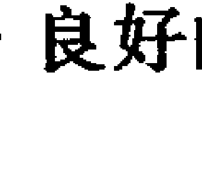
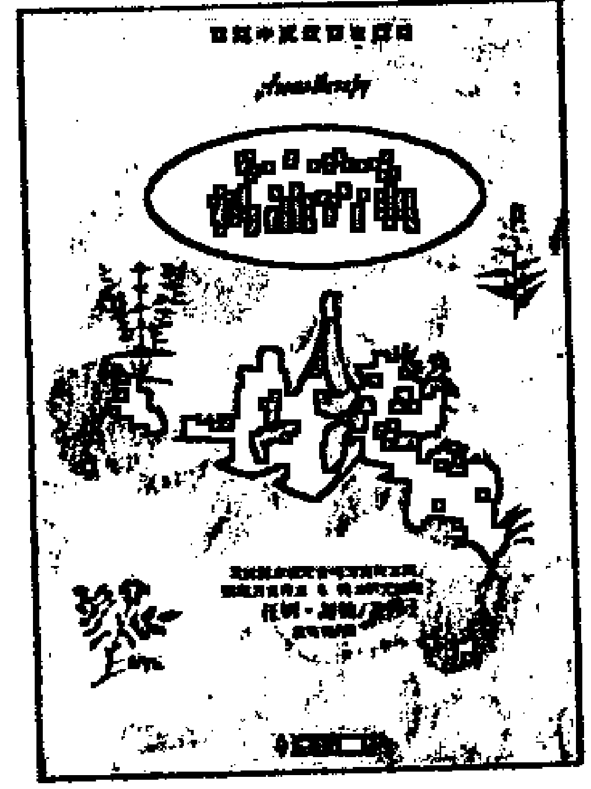
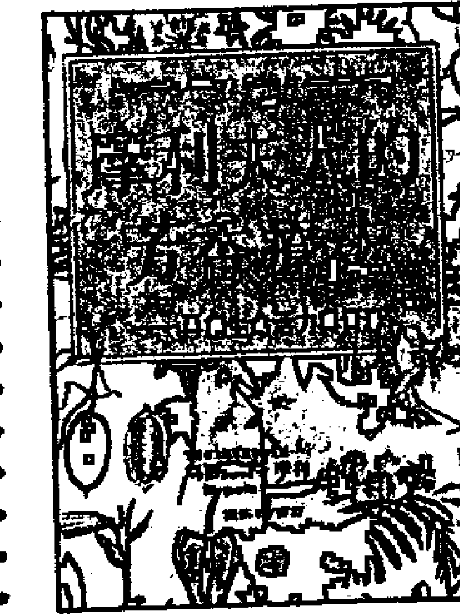
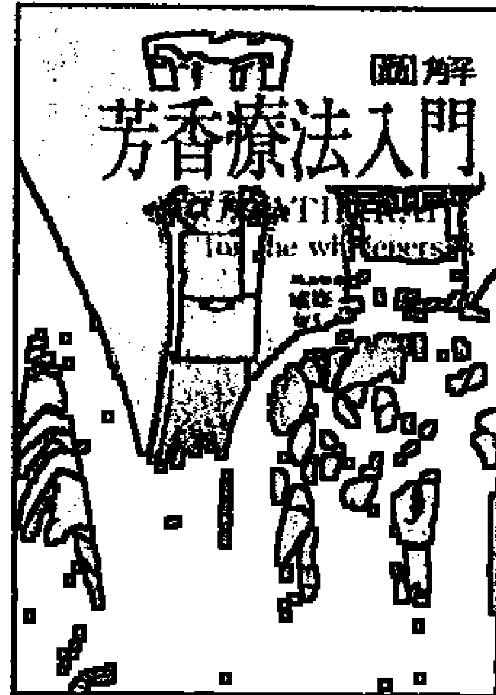
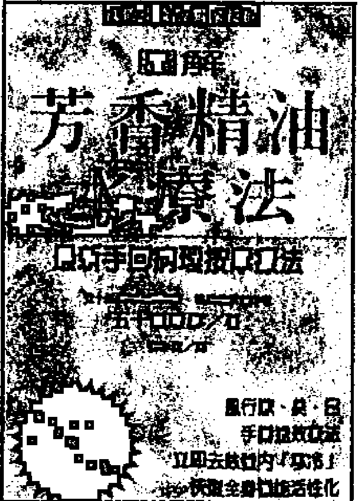

# 芳香療法配方寶典

# THE FRAGRANT PHARMACY

本書的宗旨絕非是要取代合格醫生的診斷及治療。由於作者無法監控他人使用精油的方法，所以她不能對其使用的功效做任何的承諾或負責，使用精油時，用者理當審慎行事，讀者若直接或間接的參用本書的內容，作者與出版公司一概不負任何的責任。

著者：瓦勒莉・安・沃伍德
譯者：朱慧綏

# 《芳香疗法配方宝典》审订者序

沃伍德女士这本《芳香疗法配方宝典》是英语系芳香疗法界的畅销书，除了一般的大型书局以外，凡是销售精油的专门店也都会陈列。这本书之所以广受欢迎，是因为它堪称最完整的『精油处方书』，满足了一般人的实用需求。从普通的小毛病（如头痛、感冒……），到罕见的疑难杂症（如子宫内膜异位、肌痛性脑脊髓炎……），你都能找到适合的精油与用法。除了病理现象以外，它也提供了美容、餐饮、生活情趣与照管宠物等各个层面的芳疗指南。本书中译本的出版，正值芳香疗法在台湾方兴未艾之际，势必会对其发展产生推波助澜的作用。

我们可以把《芳香疗法配方宝典》看成是维护个人健康的教战手册，它确实也像一般的DIY书籍一样能满足消费者知的权益。过去，有关调油用油的资讯，多被精油厂商或所谓的专业人士视为商机卖点，《芳香疗法配方宝典》正可打破那种垄断知识的作法，使得人人都能亲近芳香疗法。

但在这一片荣景背后，却也潜藏着许多危机。犹记'95年国际芳疗会议时，与会的学者专家尚需费力向世人宣扬精油的医疗价值，今年在英国Warwick大学举办的'97国际芳疗会议上，各国代表却已忧心忡忡地讨论：该如何迎击卫生当局与跨国大药厂联手夹攻的威吓。因为，套句德国化学家瓦布那（Dietrich Wabner）的话说，『官僚体系已经在精油身上闻到钱的香气！』换言之，精油的疗效已是无庸置疑的事实，接下来的议题只是，谁「有资格」从中获利。而这也即是芳香疗法师与一般大众的危机。可以想见的是，当植物精油被严格限定为一种药材时，自然仅有医药专业人员才能贩售和调配。去年美国FDA已开过一场研讨会，准备向自然疗法界宣战。澳洲政府甚至硬性规定，当地所销售的尤加利和茶树精油，必须在瓶身上标示「有毒」(POISON)的警告。早在1994年10月，英国政府也曾试图将精油列入药品管制，此举引发了大规模的游说抗议活动，最后才不了了之。德国目前正陷入类似的热战，政府计划把精油收编至正统医疗旗下，同时排除「平民百姓与闲杂人等」的自由使用权，德国的精油贸易协会则花大钱聘请名牌律师严阵以待。然而全球精油工业的真正大户，既非芳香疗法界也非制药业，而是对象普罗的食品业与香水业，他们自然不会坐视精油为药商所寡占……。

这些波诡云谲的发展，是资本主义社会的必然之恶。主流医药界对精油的态度如此前倨后「恭」，一般大众与芳香疗法界的小众更该好好思考精油对自己的意义。在《摩利夫人的芳香疗法》一书之审订者序中，我曾经指出：只把精油视为养生治疗的死药材，是非常狭隘的看法。也就是这种狭隘的看法，引来主流医药界排他的兴趣。所以，我们固然可以藉本书为自己开启一条芳香的保健之道，但不要忘了：芳香疗法还有更深远的精神意涵，值得大家从不同的角度来探究与追求。有心的读者不妨同时阅读《摩利夫人的芳香疗法》，定能深获启发。

把精油局限在医药或美容的「实用」范畴内，还有另一层隐忧。本次的'97国际芳疗会议中，来自加拿大Concordia大学的社会人类学家大卫豪斯(David Howes)，就和我讨论到一个饶富深意的问题。他质疑的是，当芳香疗法风靡台湾一如它席卷西方国家时，是否会取代或遮蔽了我们原有的药草传统？毕竟现代芳香疗法中常用的精油多来自欧陆，在陶醉于这些异香的同时，我们必然也会受到其后的文化习染。过去的十年间，由于另类疗法的抬头，举凡中国的针灸、印度的阿输吠陀(Ayurveda)、日本的指压(Shiatsu)*¹ 等东方疗法与精神，都已進入西方人的生活或思想中，一股「東潮」正逐漸瀰漫全球。現在，隨著西方世界芳療之復興與「入侵」，我們是否又會再次淪為文化弱勢國家？豪斯教授將此描述為“recolonization”：「再殖民化」。

我的看法是，這種現象正是精油被物化的結果，亦即，單視精油為醫療仙丹或美容聖品的下場。如果有適當的引導，對精油的解讀則可超越商品的層次而帶動文化自覺，如此「再殖民化」便不致發生。因為芳香療法不光是買賣與應用精油而已，它主要在體現所謂的整體觀“Holism”。真正具有整體觀的芳香療法師，能在使用精油時感受到其萃取植物的能量，進而對植物產生一種普遍的興趣，這種愛好又會點燃他對土地的關懷，連帶使他開始反省人與土地的關係。我從個人經驗中發現，許多前來學習芳香療法的學生，剛開始只關心精油有沒有效、能不能賺錢，後來竟漸漸把精油當成體貼可靠的摯友，少數甚至還能與植物聲氣相通。有個學生曾如是說：「用了精油以後，看到植物都會有一種很親的感覺。」她們開始注意行道樹的變化，對這塊土地的生態重新生出強烈的情感。本世紀初的臺灣伐木工人，在每砍一棵樟樹之前，都會敬備牲禮、對樹祭拜*2，時至今日，多數人恐怕連樟樹長什麼樣子都弄不清楚。禮失而求諸野，西方的芳香療法或許可喚起我們「向植物學習」的集體記憶。所以我給豪斯教授的答覆是，純粹就療效而言，精油也未必能超越中草藥太多，因此漢醫傳統絕不致被芳療淹滅；至於芳香療法的文化影響，如果能跳出時尚和商品化的模式，我們所「習染」的，將是一種無分中外而亙古彌新的環保視野，和一種與植物相親相依的鄉土自覺。但願讀者在享受本書的妙用時，也有機會領略芳香療法的這層超然之美。

本書最早於1990年在英國出版，後來問世的美國版與英國版之間略有差異，中文譯本採用的是英國版。在審訂期間，沃伍德女士又对本书做了大幅的修改，因此，如有读者比对原文而发现颇有出入，请不必担心是译作有误。书中出现之精油种类繁多，有些甚至尚无中文学名，我们只有登录原文。另外，因为中文译名分歧，请读者务必要参阅本书后页的精油一览表，仔细比对拉丁学名，确认处方中所指之精油为何。例如，沈香醇百里香Thyme linolol与一般的红色百里香Red Thyme（亦即百里酚百里香）虽为同一品种，但其化学结构有如天壤之别，疗效与安全性的差异更大，真正是失之毫厘，差以千里。又如，不同的尤加利不仅气味显著有别，作用也有明确分野，实不宜张冠李戴，像所谓的薄荷尤加利Eucalyptus dives or Eucalyptus peppermint乃一独立的品种，可不是薄荷加上尤加利。

最后要提醒有心研究芳香疗法的朋友：「配方」不是一切。很多问题的解答，不在于一剂神奇的处方。再精妙的调油，如果少了「仁心仁术」，所能成就的效用都是有限的。反之，有一副愿意倾听的耳，和一双温暖服贴的手，才是最教人期待的芳香疗法师。

温佑君97年7月
东吴大学社会学系
英国肯特大学哲学研究所
英国伦敦芳香疗法学校
翠柏园芳香疗法研究中心负责人

+   *1 指压原为中国之医疗技术，但日人予以发扬光大，并传至西方世界。英文中的Shiatsu，就是源自指压的日语发音，所以西方人一般都视指压为一种日本传统。
*2 语出日人Teikichi Hiraizumi, PhD于1949年所著之《The Camphor Oil Industry of Formosa》。

# 导读 芳香疗法配方宝典

当你置身于这部芳香疗法配方宝典中，会有一个充满了可能性的世界向你招手。在那里，你会发现大自然正在以它最具效力的方式呈现在你的面前——带有香气的液态物质，亦即人们所知道的「精油」；它是从某些种类的花、草、果实、叶子、根和树中所萃取出来的精华。这些浓缩的液体对医药、食品以及化妆业而言，是不可或缺的物质，当今约有三百种的精油共同构成了一个极具疗效的医药系统；有许多由正统的西医所开的药，其中含有精油的活性成分，业界在调配化学药剂时，常会受到精油的启发。在饮食上，精油被用来加重天然的风味与香味，并可当作防腐剂。化妆品的制造者则是欣赏精油具有促进细胞再生和美容的功效，而香水业者比较着重于精油怡人的气息和增进情调的能力。

每一种单独的精油可依据许多不同的目的来被使用，譬如，薄荷精油就是一种消炎药材，可以用来医治风湿病和关节炎；医生为了减轻消化系统的不适，会开一种含有薄荷成分的药物「柯柏灵」(Colperin)。大家都知道糖果业也用到薄荷，但是很少有人知道它还是男性爽鬚水的成分呢。本书将内容加以延伸，驰骋于宽广的角度，并且首度把精油在居家的许多用法做详尽的介绍。我们将学会薄荷油不止具备上述的用途，它尚有许多其他的用法，从治疗头痛到清理蚁窝，甚或防止老鼠在你家的屋顶过冬。

尽管精油的疗效卓著，芳香疗法配方宝典不只是一本供你查阅病症，找出适当疗法的工具书而已，它堪称是未来居家必备的手册，针对许多问题，提出了解答。你可以使用这些纯天然的植物精油来治疗孩子的流行性感冒；当你邀请上司到家中吃晚饭，正可借用它来创造一道美味、新奇的佳肴。植物精油可以轻而易举的把狗毛内的跳蚤赶走，做法之简单有如把蚜虫逐出园里的植物。无论你是在工作，或者是在玩耍，精油都会助你一臂之力——同时还能促进你的番茄成长。你很清楚自己的健康将会有所改善，藉着精油，你可以控制自己的生活和周遭的环境。你可以像医药界、食品业和美容业一样，基于同样的理由而使用精油，其实它还有数不清的用途呢！

凡是懂得这种天然产物的人，在使用时必融入几分悟性，都会对精油产生敬意。他会情不自禁的仰慕精油的本能，它不仅在细胞、身体的层面上大展神效，在我们的生活中，它还影响到我们的情绪、心智、精神以及审美观。在这个世上，如果有一样东西堪称兼具身、心、灵之美，精油必定是当之无愧，然而并非只是因为精油会以整体的方式来治疗一个人，很有可能成为未来的药材，它还提供了一套医药体系，在生化上能和人体完全和谐相容，就热力和电磁学的观点来看，它不会侵害人体。此外，精油的输送体系是如此有效率，相形之下，化学药品看来却是非常粗糙。「口服」是使用药物常见的方法，但在使用精油时，它却是效率最低的一种方法，因为身体会把精油送到消化系统，在那它碰上了食物以及细菌，有可能引起化学反应。另一方面，精油可以藉由皮肤来被吸收：加到按摩油内，或是渗入洗澡水中，甚或用吸入，用法非常的多。

天然的精油是以一种最便捷的形式出现，造就了它具有非比寻常的多种用途。把几滴纯薰衣草油擦在皮肤烧伤处，它会发挥医疗的神效，没几天皮肤就会回归正常的状态，倘若没擦上精油，皮肤就会出现一片水泡，最后还留下疤痕。头痛的时候，你同样可向这一小瓶精油求救：只要用一滴精油按摩两边的太阳穴，你就会感到舒畅。由于薰衣草精油天生就是蚊子、飞蛾和其他昆虫的克星，我们可以毫不费劲的把它拍在缎带上，然后将缎带挂在窗户上，这样就可以防止蚊子及飞蛾入侵；当然也可以洒在棉球上，然后放到衣橱内，以便驱虫。薰衣草油本身具有抗虫、防腐的特性，是一种极为有效的清洁液，可以用来处理割伤和擦伤（无论是自身，还是宠物）；而我们还能用它来清洗桌子、磁砖和冰箱。薰衣草油闻起来很舒服，无论何时何地，我们都可以愉快地使用它，调配空气清香剂时，薰衣草油也可以派上用场。

在这个世界上，精油是尚未被开发的伟大资源之一，就在这里，我们坐拥大自然的支援系统，它并不局限于医药系统而已，它能够预防疾病，消除病症。这些极为复杂、珍贵的液体是从特定种类的植物生命中萃取出来的，与人类、这个星球共同相容并存。一旦将精油带到生活里，我们为家人、家园提供了保障与乐趣，这正是他们所需要的，杜绝因为使用了化学药剂而造成自身以及环境的污染。

近来我们所使用的药物和家庭用品大多来自化学成分，我们吃下的东西和吸入的空气也含有过量的化学物质，已超过我们的负荷量。这些影响累积起来，再加上一些不为人知的影响，都会在我们的体内发生作用，这对我们绝对不利，而超过地球负荷量的化学物质也有负面的影响。迟早我们都必须找出化学物质的替代品，为了解决我们自身的一些问题，替代品其实已近在咫尺，它在我们的鼻子附近，它的甜美香气吸引住我们——大自然的精油，它是稀有的奇迹、创造的喜悦！

# 目　录

审订者序

导读　芳香疗法配方宝典

## 第一章　来自大地的良药

永恒的药剂师

品质管制

如何使用本书

精油的使用方法

植物油或基础油

## 第二章　你的基本保健装备

薰衣草

茶树

薄荷

洋甘菊

尤加利

天竺葵

迷迭香

百里香

柠檬

丁香

基本保健装备的使用

## 第三章 你的基本旅行装备

旅程……

到达目的地……

阳光……

暑热……

发烧……

肚子不舒服……

小虫的叮咬……

污染……

基本旅行装备紧急状况精油表……

## 第四章 男女上班族的精油

办公室……

家庭……

工厂……

医院……

土地……

面谈及考试……

自我催眠以放松……

两脑并重……

隐约的飘香……

烧伤……

腐蚀性烧伤……

背部问题……

重复扭伤症候群……

肌痛性脑脊髓炎

工作狂的心脏

紧张和压力

治疗紧张有一套——自制配方

工作表现的压力

蜡烛两头烧

## 第五章 运动、舞蹈及练习的必备精油

处理受伤的方法

肌肉

足部的护理

运动紧张

淋浴

蒸汽浴

按摩式的泡澡

热澡桶

更衣室的卫生

运动及舞蹈伤害一览表

## 第六章 款款香气话美容

皱纹与老化的皮肤

清洁用品

脸部去角质剂

面膜

冰岛式蒸脸

滋养成收敛露

脸部保养油

問題皮膚 …………………………………………………………………… 216
頸部 ………………………………………………………………………… 226
眼部 ………………………………………………………………………… 228
唇部 ………………………………………………………………………… 231
牙齒與牙齦………………………………………………………………… 233

## 第七章  健美的身體 235
沐浴油及泡沫沐浴精 …………………………………………………… 236
浴前的身體用油 ……………………………………………………… 239
消除體味的精油 ……………………………………………………… 240
身體乳液 ………………………………………………………………… 241
身體噴劑 ………………………………………………………………… 241
身體保養劑與去角質劑 ………………………………………………… 243
減肥和蜂窩組織炎 ……………………………………………………… 245
乳房 ……………………………………………………………………… 252
手臂 ……………………………………………………………………… 253
手部 ……………………………………………………………………… 254
指甲 ……………………………………………………………………… 257
足部 ……………………………………………………………………… 259

## 第八章  柔絲萬縷 262
正常的頭髮………………………………………………………………… 266
乾枯的頭髮………………………………………………………………… 268
油性的頭髮………………………………………………………………… 270
脆弱的頭髮………………………………………………………………… 273
掉頭髮 …………………………………………………………………… 275
大量掉髮 ………………………………………………………………… 276
頭皮屑 ……………………………………………………………………… 278

## 第九章 慈母心——對嬰兒及孩童的輕柔呵護 281
- 新生兒 ……………………………………………………………………… 281
- 嬰兒及孩童用精油一覽表 ………………………………………… 287
- 二到十二個月大的嬰兒……………………………………………… 289
- 兒童 ……………………………………………………………………… 298
- 青少年 …………………………………………………………………… 329
- 殘障兒 …………………………………………………………………… 332

## 第十章 自然——女性的最佳選擇 354
- 懷孕期的困擾 ……………………………………………………… 355
- 分娩的準備…………………………………………………………… 365
- 產後的照顧…………………………………………………………… 370
- 產後憂鬱症…………………………………………………………… 378
- 流產 …………………………………………………………………… 380
- 不孕症 ………………………………………………………………… 384
- 月經失調……………………………………………………………… 392
- 更年期 ………………………………………………………………… 392
- 骨盆痛 ………………………………………………………………… 395
- 婦科毛病 …………………………………………………………… 406
- 其他的常見疾病 …………………………………………………… 421
- 乳房的護理…………………………………………………………… 432

## 第十一章 自然——男性的最佳選擇 435
- 心臟的照顧…………………………………………………………… 436
- 注意身體健康 .......................... 438
- 生殖系統 .......................... 441
- 其他的疾病 .......................... 450
- 肝臟疾病 .......................... 454
- 秃頭 .......................... 458
- 皮膚保養法 .......................... 461

## 第十二章 成熟期的必備助力 467
- 血液循環.......................... 468
- 足部與腳踝的腫脹.......................... 469
- 腳抽筋.......................... 469
- 靜脈曲張.......................... 471
- 靜脈潰瘍.......................... 472
- 失眠.......................... 473
- 呼吸困難.......................... 476
- 支氣管炎.......................... 478
- 肺炎.......................... 481
- 高血壓.......................... 482
- 動脈粥樣化與閉塞性動脈硬化症.......................... 483
- 記憶減退.......................... 485
- 身體顫抖.......................... 488
- 帕金森氏症.......................... 488
- 關節炎.......................... 490
- 消化不良.......................... 497
- 胃腸脹氣.......................... 498
- 便秘.......................... 499
- 痔瘡.......................... 500
- 拇囊炎腫.......................... 500
- 雞眼及硬薺 501
- 指甲及指甲床 502

## 第十三章 香氣飄飄——居家的整理 504
- 空氣清新劑 505
- 玄關 506
- 驅除細菌 508
- 廚房 508
- 工作間 512
- 客廳 515
- 臥房 518
- 浴室 519
- 喬遷誌喜 520
- 紙箋與墨水 522
- 香枕與香囊 523
- 乾燥花與香丸 524
- 自製香皂 526
- 芬芳的蠟燭 527
- 不速之客 528

## 第十四章 蒸餾室 531
- 自製香水 533
- 女性的氣息 536
- 男性的氣息 540
- 自製古龍水 544
- 自製精油 545

## 第十五章 馥郁的慶典 548
- 耶誕節 548
- 情人節 553
- 復活節 554
- 萬聖節 556
- 其他值得慶祝的日子 557
- 氣氛的凝聚 557
- 宴會酒 560
- 暴飲暴食 562
- 製作禮物 565

## 第十六章 精油烹飪法 571
- 精油烹調一覽表 571
- 沾醬 573
- 沙拉油和醋 574
- 牛油、乾酪和起司 575
- 開胃菜 575
- 調味醬 577
- 滷汁 578
- 湯類 579
- 蔬菜 581
- 魚 583
- 肉 584
- 點心 586
- 冰品 587
- 蛋糕 589
- 麵包和糕餅 591
- 花草糖漿 592
- 蜂蜜和糖 592
- 芬芳的花瓣 593
- 香花醬 593
- 果凍 594
- 伯爵果仁麥片粥 595
- 堅果奶昔 596

## 第十七章 寵物的自然保健 597
- 狗 597
- 貓 601
- 兔子 604
- 黃金鼠 604
- 馬 605
- 小型農場 606
- 寵物的自然保健 608

## 第十八章 未來的花園 612
- 清理花園的儲藏室 614
- 香灑庭院 615
- 花草營養液 618
- 自然的驅蟲劑 619
- 其他控制害蟲的方法 623
- 鳥 625
- 菌與蕈 625
- 友善的花木 626

## 第十九章 目录 627
- 大地的保母 627
- 樹與果 635
- 花與室內盆栽 636
- 草本植物 638
- 土壤 639
- 完美的農作物 644
- 附錄一：精油一覽表 646
- 附錄二：精油按摩法 674
- 附錄三：有用的地址及推薦讀物 680
- 注意事項 682
- 中文筆劃使用索引 683

### 第一章 來自大地的良藥

> 「上帝從大地創造了藥物，聰明人不會棄它於不顧。」——舊約傳道書38：4

日日與精油為伍，不必很多年，你就會發現原來大自然已經為人類準備了一種強而有力、用途繁多的醫療藥材。假使我們沒有科學的根基來解釋精油的運作，有些被精油治癒的案例會被當作是奇蹟；但是將神奇的現象用科學的眼光來解釋，無損於精油令人驚嘆的特質。

上帝曾指示摩西用「流動的」沒藥、甜肉桂、菖蒲、桂皮和橄欖油來做神聖的塗油，它是一種強力的抗病毒和抗菌物質，塗上了這種油，人就得到了保護和治療。肉桂是一種強勁的抗病毒與抗菌媒介，並可抑制黴菌；沒藥是有效的防腐劑、癒合傷口的良藥，它會促進細胞的生長，在聖經尚未出現以前，沒藥用於外傷、潰瘍以及腫皰上的療效，就已廣為流傳。

時下精油的專業人員經常使用的精油約有三百種，但是一般家庭只要用到約十種的精油，就能滿足可能的需求。每種油都具備藥用以及其他的特性。現代的研究已經肯定了幾世紀來使用精油的實際效益，我們現在知道這個芳香的醫藥世界除了有抗病毒、抗菌和抗黴菌的特性外，它還囊括了多種屬性，可以防腐、消炎、抗神經痛、防止風濕、抗痙攣、解毒、抗憂鬱、鎮靜、止痛、幫助消化、祛痰、除臭、促進傷口癒合、促進循環、利尿，還有不勝枚舉的用途。

把精油用在醫藥和化妝品上有諸多好處，其中之一便是它能極為有效的進出身體，而且不會留下任何的毒素。口服不是使用精油最有效的方法，這可能與你的想法有出入，最好是外用或吸入。使用的方式包括了在身體上擦油、熱敷、乳液、沐浴（坐浴、手足浴）、洗髮、吸入（藉著蒸氣、直接從瓶子或面紙）、香水、在房內噴灑，以及一整套在室內使用的方法。雖然在有人指導的情況下，我們可以服食處方上的精油，但是事實上這是精油進入體內最少效益的方式，因為它會經過消化系統，當碰到消化液和其他的東西時，它的化學成分就會受到影響，任何一種化學藥劑也都有同樣的限制。精油在醫療的使用方法上頗具彈性，病人基於某種原因，他的消化系統受到了損傷，不能服藥，此時精油對病人而言，真是一大福音。

據我們所知，精油不會像化學藥物一樣，殘留在體內，它是藉由便尿、出汗、呼氣而被排出，對正常、健康的人而言，排出的時間需要三至六個小時，但對肥胖、不健康的人而言，則可長達十四個小時。每種精油的排放方式各不相同，例如：我們可從尿中聞到檀香及杜松的味道；另外，大蒜就算是被擦在皮膚上，卻仍是藉由我們的吐氣而被排出體外，反觀天竺葵，這是一種有益循環的精油，我們可在汗液中找到它。

從各種不同的樹、灌木、草本植物、草和花，我們萃取出了精油。它濃縮在植物各個不同的部位，岩蘭草精油是從學名Vetiveria zizanoides被截下的根中提煉出來；月桂油則是從葉中被提煉出來。天竺葵油來自它的葉與莖，而小茴香油來自種子，薑油來自看來很像根的莖，這種莖是在地下或是沿著地面生長。沒藥、乳香和安息香的油則是從其樹脂中萃取出來。桔、檸檬、葡萄柚和佛手柑的油是從果皮中榨取出的，至於零陵香豆油，你可能會猜到是由豆中提煉出來。肉桂油來自該樹的皮，而歐洲赤松油則從學名Pinus sylvertris的松針和松枝中提煉出來。

視植物而有不同，植物儲藏精油的地方有專門的油脂細胞、茸毛、細胞或鱗片（帶有單或複細胞的囊袋、小儲存槽），舉茴香為例，它的精油儲藏在細胞的間隙。

### 從植物中萃取精油的方式有很多種

從植物中萃取精油的方式有很多種，所選用的方法得視植物的種類而定。最常用的方法是蒸餾，儘管我們還有其他重要的方法，如：溶液萃取、壓榨、油漬和浸泡法；提煉的方式一直在推陳出新。

我們得大費周章，才能生產出少量的精油。一盎斯的玫瑰油需要六萬朵玫瑰花，而薰衣草的精油含量較多，一百公斤可提煉出三公斤的精油。至於茉莉花，我們必須在開花的第一天，趁太陽尚未高照的時候，用手採擷。檀香木必須生長三十年而且有三十呎高的時候，才能被砍下蒸餾。上述的兩個例子比較極端，大部份精油植物的生長採收條件與一般植物無異。每種精油的價格都反映出這些條件，由於生產一公斤的茉莉花精油得用上八百萬朵手採的花朵，你該不難了解為何茉莉花精油是市場上最貴的油之一。

精油貿易可以說是全球性的，精油的商品穿梭於各國之間：法國、中國、巴西、保加利亞、土耳其、沙烏地阿拉伯、衣索比亞、印尼、美國、澳洲、蘇俄、以色列、英國、泰國、爪哇、瓜地馬拉、埃及、索馬利亞、西班牙和其他的地方。同樣的植物若生長在不同的國家，則受到不同的土壤及海拔高度的影響，所萃取之精油化學成分和醫療特性也會有所不同。

平均說起來，精油含有一百種成分，主要有萜烯、醇、酯、乙醛、酮和酚，雖然科技能讓我們鑑別更多的成分，但是仍有更多的內容有待探索。有些人聲稱純精油和人工合成的精油沒有什麼分別，這些人只注重天然精油的香味特質，因為他們只想仿製精油，好製造出人工味道和香氣。然而，除了它的香氣之外，精油還有更多的特質。即使我們尚未能全盤了解精油的化學成分，我們依舊知道精油對身體無害，而且我們與它都是由同樣的物質構成的。帶有香氣的化學物質是來自精油中的苯基丙烷，這是氨基酸的前身，氨基酸串連起來形成蛋白質，從最細微的酵素到骨骼，蛋白質幾乎提供了身體所有的基礎架構。精油中也含有大量的松脂醇(terpineol)，它是由乙醯基輔酶素A(acetyl-coenzyme A)所構成的，松脂醇在人體的組織裏，扮演了很吃重的角色，它影響賀爾蒙、維他命及精力的製造。

除了對人體組織機能不具侵害力、不具毒性外，精油不會對體熱和磁場造成干擾。人體的每一個細胞都帶電，不管電的影響是以何種形式出現，它都有助於身體的痊癒。人們很早以前就已經知道精油具有左旋轉和右旋轉的特性，有鑑於人們對身體磁場的重要性日益關切，這些特性應該重新加以評估。精油的這些特質很有可能會刺激身體本身與生俱來的自療機能。

許多人都知道精油能夠幫助血液循環，它能挑起重任，把氧氣和養分帶到組織，同時又能有效的排除因細胞新陳代謝所產生的二氧化碳和其他的廢物。身體的血流大量增加，免疫系統的能力也會因而改善，而降低了血液的黏稠度。的確，人體的每一個部位以及腦部都有賴於良好的血液循環。

廣義的來說，植物本身就是化學物質的製造工廠。它置身於光與暗、太陽與地球之間，從中汲取能源，然後形成碳水化合物、蛋白質和脂肪的微粒，這些都是「原油」，我們人類和其他的動物會把它分解成ATP(adenosine triphosphate)——我們的「高級汽油」。精油就像是植物的高級汽油，當它進入人體內時，我們等於服食了植物的精華。把精油當作疾病的預防方法是最理想不過的，精油令人舒暢，而且用法很有彈性，討人歡心之餘，更能輕鬆融入你我繁忙的現代生活當中。

精油芬芳、甜美的氣息很容易讓人以為它的價值主要在於魅力，這是不正確的，這些物質的分子結構異常複雜，而且很有療效。譬如：野馬鬱蘭精油當成防腐劑時，其效力是石碳酸的二十六倍，而在很多清潔用的商品裏，石碳酸是一種很重要的成分。

### 永恆的藥劑師

醫藥的鼻祖——希波克拉底斯(Hippocrates)曾說：「每日洗一次芳香浴，用芬芳的精油按摩，你就會健康。」早在公元前四世紀，他就知道焚燒某些芬芳的物質可以抵禦傳染病，基於同樣的理由，我們在今日的社交場合裹，也可把這個法子加以改良而予以推廣。事實上我們所處的環境更為有利，可以憑藉特定的科學資訊，知道芬芳精油具有殺菌、抑制病毒的特性。的確，以今日的眼光來看芳香的物質，這些東西具有保護及促進健康的特性，我們應該將香水的歷史重新加以評估。

在最早的文獻記載中，提到香水是街上很容易就買得到的商品，這是一部公元兩千年前的印度敘事詩——拉馬雅那(Ramayana)，其中有一段插曲是英勇的王子拉馬在歷經一段放逐的日子後，勝利的重返家園，詩中描述每一個人都湧上街頭，高聲歡呼，其中還有燈匠、寶石匠、陶匠、澡堂侍者、賣酒的人、織工、鑄劍的人、賣香水的人和賣香的人。

有些人以為早期使用香水是為了要遮掩因衛生不佳而發出的惡臭；但是我們必須了解一件不爭的事實，那就是早在工業革命發展出室內的水管工程之前，大地就已先為人類準備了未被污染的河川，有很多跡象可以證明古老文明的人跟我們一樣，都很注重清潔。考古學家發現，在今日的巴基斯坦有一座公元前五千年的古城馬汗油達羅(Mohenjo Daro)，那裹的居民「極度講究衛生」，考古學家找到了一個公共澡堂，長十二公尺，寬七公尺，此外，每家都有一口水井。從公元前一千五百年的草紙的記載中，我們讀到體香劑的成分，可見埃及人對個人的清潔衛生頗為重視。埃及的僧人不只是在為法老王的屍體塗上香料的時候，會用到帶有香氣的物質，在充當「精神醫師」為人治瘋狂、憂鬱和緊張的時候，僧人也會使用香料。古埃及曾使用香油，其中有許多是來自中國和印度，有證據可以顯示早在法老王的時代之前，香油已經被人使用了一千多年了。

巴比倫人甚至將建造廟宇的灰泥加上香料，他們把這種藝術傳給了阿拉伯人，阿拉伯人在建築回教寺院的時候，也會採用這種芬芳的建造法。在印度，早期的寺廟全由檀香木築成，這樣可以隨時確保薰香的氣息。公元前約一千八百年，來自巴比倫的黏土版上記錄了一張進口訂單，上面有雪松、沒藥和絲柏等香料，這些東西在今天都是以精油的方式來作藥用。

古代的希臘人非常重視香料，將甜美的香味視為神聖的表徵。在古老的神話裹，神來到人間時，是乘著香雲，所穿著的衣裳也在香精中浸泡過。希臘人相信死後會到天堂，那裹的空氣永遠瀰漫著來自香河的香甜氣息。羅馬人以及希臘人的澡堂都廣泛使用香油，這是遵照希波克拉底斯的指示，對身體有好處。

阿拉伯人阿比西那（Avicenna）是歷史上另一位有名的醫生，十世紀時，他住在君士坦丁堡，寫過上百本的書，他的第一本書談到玫瑰的好處，玫瑰水是十字軍從東方帶回來的香水和香精之一。到了一二〇二年，第四次十字軍東征的時候，法國已認真地從事香水製造，同時也是歐洲的香水中心。從十四、十五一直到十六世紀，書籍裏記載了許多的草本植物，其中還有處方教人製造精油。皮革手套製造商會用到香油，據報導，當疫疾在這幾個世紀橫掃整個歐洲時，就是這些人和其他使用各種香料的人逃過了浩劫。

一九二〇年代，法國的化妝品化學師羅內一摩理斯·蓋特佛塞（Rene-Maurice Gattefosse）首開先河，將精油的醫療特性做了很科學的研究。有一天在實驗室製造香水時，蓋特佛塞的手臂受到了嚴重的燒傷，他把手浸到距他最近的冷液裏，這恰巧是盆薰衣草精油。他很詫異疼痛減輕了很多，傷口並沒像一般燒傷一樣產生紅、熱、發炎和水泡的反應，很快就痊癒而且沒留下疤痕。從此，他把生命都奉獻在研究天然精油的神奇療效上；「芳香療法」一詞便是由他創造的。

### 品質管制

為了確保在醫療上使用的效果，我們一定要選用純精油，也就是說，藉由蒸餾、溶液萃取、壓榨，浸泡或油漬而提煉出來的天然植物精華。因為人工合成油和模仿天然精華的化學物質並不適合作為醫藥，所以不管油聞起來有多麼香，購買不純的精油是毫無意義的。對精油的最大消費者（香水工業）而言，精油的醫療特性並不重要，於是就有人為了應付市場的需求，推出了琳瑯滿目的所謂精油產品，提供就連大自然也無法辨識的整齊劃一。依照慣例，這些產品會被籠統的冠上「精油」的頭銜，一個毫無經驗的消費者會被弄得一頭霧水：「合成品」、「自然香料替代品」、「萃取品」、「合成香水」以及「香氛」(reconstitutions; nature identicals; isolates; perfume compounds; aromas)（例如：薰衣草香氛）是些似是而非的名稱。在香水製造廠，除了上述用來取代精油的商品外，還有一些精油，當它和其他的油混合時，聞起來會好像是它所要模仿的香味，並被冠上名稱，企圖魚目混珠，例如：康乃馨精油很昂貴，把黑胡椒和依蘭混合在一起，就能製造出康乃馨的香味。倘若你的著眼點是在製造香水，這倒也無可厚非，但是康乃馨精油若是當作醫療用的話，這種做法真是下下之策。

不肖的精油供應商以及上述的精油都會利用基礎油，將純正的精油加以稀釋，然後把它充當純天然精油售賣。這些假貨較容易察覺，因為基礎油很油膩，而精油大體上來說是不會油膩的；這樣說來，所謂的精「油」該算是一種誤稱。把純精油滴在吸墨紙上，它會浸透整張紙，隨後會揮發、消失掉，不會留下油漬；換成植物油的話，就會在紙上留下油印。當然也有例外，例如：岩蘭草本身就很黏稠，用基礎油加以稀釋後，我們較難區分真假。

選購純精油時，請到專門標榜自然、健康的商店，例如：健康飲食店，絕不光顧那些以身體、香水為訴求的店。本書的後面，你可以找到一些可靠的購買資料，值得你做參考。一旦自己確信鼻子能分辨好壞時，你可以選擇一個對你較為方便的銷售點。雖然人類的鼻子確實是精油品質的最佳裁判，但調香師必須鑽研數年，他的嗅覺才夠發達到能從事專業的工作；通常利用化學物質合成的香味會比真品濃烈，可別被它的強勢給唬住了，判斷的標準應該是價格、供應商的信譽，假以時日，還可運用你的經驗與直覺。

到店裏買精油時，你可能不會想帶著吸墨紙去驗貨。當然，這些產品被種植在不同的環境裏，其運輸、生產的成本也必然相差很大，同一系列的精油應該在批發價上正確的反映出彼此間的不同。譬如，在我的批發價格表上，茉莉花的價格是葡萄柚的九十三倍，檀香是萊姆的4倍。有信譽的精油供應商絕不會以同樣的價格來銷售精油。

精油的儲藏方式不容忽視，它應該被保存在咖啡色或深色的瓶子裏，並遠離光線、熱及潮濕。不用的時候，請把蓋子蓋緊。精油的藥用期限約有兩年，當然有人會說比這個時間長；若超過期限，它的殺菌和其他的特性仍可被利用在空氣清新劑、廚具表面的擦拭、香水、慶祝和送禮方面（如果精油的香味是使用的重點），但請勿使用在身體上。很遺憾精油在出售的時候，上面並沒標明使用期限，所以在你購買時，沒有辦法查出精油的年齡，這也是你應該光顧一家信用良好的商家的原因。

### 如何使用本書

在還沒介紹使用精油的各種方法之前，我們必須了解幾個重點。

- 協同作用

當調和後的效果大於各部分的總和時，我們稱之為協同作用。把兩種或更多的精油混合在一起，你就創造了一種化學合成物，它有別於個別的組成部分，而且這些調油既特殊又有威力。利用協同的調和精油，我們就可得到效力倍增但劑量不必增加的混合液。例如：將適量的薰衣草精油加到洋甘菊精油之中，洋甘菊的防炎作用便可大大的提升。幾種特別的精油彼此之間的相互作用，會為整體的調油帶來活力與動力，如果只用單種精油，就無法產生這種效果。

協同調油的要點在於正確的劑量，因此為了要讓小量調油能夠以正確的劑量，溶入整個混合液中，有時你不得不調配出更多的混合液，但是實際上你並不會用到這麼多。你可能會把一種協同調油加到身體護膚油裏稀釋，它的成分只佔總體的0.01/100，但是那微量卻是整體的一部分。

- 應變基

有好些種精油是天然的平衡劑，這些所謂的應變基在體內會依需要發生作用，使身體回復平衡的狀態。這種反應能影響到自主神經系統、內分泌系統、血壓和其他的系統。例如：牛膝草能夠使高或低血壓正常；檸檬能影響自主神經系統，它可依需要發揮滋補或鎮定之用；薄荷油兼具「放鬆」及「刺激」兩種作用，除非你很了解這些精油是應變基，否則你會被這種明顯的矛盾現象搞糊塗。前蘇聯的科學家在烏拉底沃斯多克(Vladivostock)就曾對這一類的天然產品做過實驗，薄荷以及人參的根就是其中之一。

#### 化學種類

生長在不同的環境，即使是同種類的植物，它的精油成分也會含有不同的化學物質。譬如，一種學名為Thymus of-ficinalis是一種常見的百里香，依據它所生長的土壤、氣候以及高度，可以生產出好幾種精油作為藥用；紅色百里香（即百里酚百里香）十分刺激皮膚，只有醫師或醫護專業的芳香療法師才可使用。學名Thyme linalol的沉香醇百里香通常被種在高地，它是百里香的化學種類之一，書中所有含百里香的處方均可選用它而安全無虞，它也是唯一能被用在治療孩童疾病的百里香。由於一種會產生精油的植物可被細分為幾種化學種類，每個化學種類又有各自不同的藥效，所以我們的精油名單應該會比現在已知的更長。

### 精油的使用方法

以下我們會列出一些使用精油的方法以及建議的用量；有些方法在全書中介紹，因此沒被列出來，參閱烹飪、園藝、家庭寵物和慶典等章節。

下列的圖表被分為三部分：身體用法、水療法與房間用法。儘管我們在房間的方法裏使用到的精油很少，但是它絕對夠用，如果想要測量香味究竟有多強，你可以先把方法依照書中的指示做好，然後離開房間，關上門，幾分鐘後再回來，這樣做，你的嗅覺神經便可對氣味有一幅較真實的畫像。頭一次進入一間充滿煙味的屋子與在房裏待了一會便可形成對比，這也會產生不同的感覺，因為我們的身體能夠很快的適應氣味。

#### 身體用法

| 方法 | 用量 | 使用方法 |
| --- | --- | --- |
| 香水 | 不定 | 有兩種方法：你可把精油溶在酒精或油中，然後擦到身上，好比擦香水一樣，或是把精油加到香水裏（請參閱第十四章 蒸餾室）。 |
| 面紙或手帕 | 1滴 | 需要時，用鼻子聞氣味。 |
| 吸入蒸氣 | 2～3滴 | 碗中盛上熱水，滴入精油，用毛巾蓋住頭，俯身在碗上，臉距離水面約25公分，雙眼閉上。用鼻子深深的吸氣約一分鐘。 |
| 按摩油 | 依照指示，或在每3毫升的基礎植物油中，最多加入1滴的精油。 | 向藥劑師要一個咖啡色的玻璃瓶，瓶身會印有它的容量，用來計量基礎油（杏仁、榛果、桃仁、杏桃核仁、葡萄籽、大豆、花生油等）。加入精油，你會看到精油層層的溶入基礎植物油裏。為使精油完全的溶解，把瓶子倒過來幾次，再放在手中快速的揉動。 |

為了確定每回按摩時需要多少的油，你可以把手當杯子，將油倒入，但不要多得讓油流入指縫或是流到手邊。因為我們的手恰與身體的大小成比例，所以手中所掬的油的分量也會因人而異。一茶匙的油對大多數的身體來說，是很夠的了。

#### 水療法

| 方法 | 用量 | 使用方法 |
| --- | --- | --- |
| 沐浴 | 依照指示，或最多4滴精油。用些許植物油先予稀釋。若為乾燥皮膚也可先調以牛奶或潤膚霜，豆漿亦可拿來做緩衝劑。你也可以直接將精油加入水中，但下水前要先用手攪拌撥散。 | 打開水龍頭放洗澡水，再滴入精油。關好浴室的門，蒸氣才不會跑掉。泡在水中至少十分鐘，盡量地放鬆，深深的呼吸。有時，我們會先用植物油來稀釋精油，請參閱第七章「健美的身體」。 |
| 净身盆 | 依照指示，或將2~3滴的精油稀釋在1茶匙的植物油中。 | 將盆中裝滿自來水溫水，攪動一下，加入精油，再好好地以旋轉的方向攪動，這樣可避免精油浮在水面上，浮在水面上的精油會刺激黏膜。 |
| 阴道灌洗器 | 務必依照指示。 | 將自來水煮過放冷後，注入容器中，或使用加溫過的瓶裝礦泉水。加入精油，好好地搖晃一下，直到精油完全混合為止。 |
| 按摩式浴缸 | 每人1滴精油 | 請參閱附錄一的「除菌專家」，以保持與他人共浴時的安全。 |
| 蒸气浴 | 每600毫升的水，加2滴精油。 | 精油請用尤加利、茶樹或松樹。先將精油混入水中，依照慣例，必須把混合液置於熱源上。我們只用這些精油，因為它們能藉由吸氣而進入體內，藉出汗而排到體外。這些精油都是絕佳的清潔劑和去毒劑。 |
| 淋浴 | 依照指示，或最多2滴精油。 | 照慣常的方法淋浴。在沖洗時，把精油滴在毛巾或海綿上，然後輕快地擦拭身體。一面深深的吸入芳香的蒸氣。 |
| 坐浴 | 依照指示，或1～2滴的精油。 | 洗澡水只要放到臀部的高度即可，或可用一個能夠容納得下臀部的盆子。加入精油後，以旋轉的方式攪拌均勻，水面上就不會殘留精油的微粒，因為它可能會接觸到敏感的黏膜而引起不適。 |
| 手浴 | 依照指示，或1～2滴的精油。 | 把雙手浸在溫水中，不超過十分鐘。 |
| 足浴 | 依照指示，或2～4滴的精油。 | 把雙腳浸在溫水裏二十分鐘。 |

#### 房間用法

| 方法 | 用量 | 使用方法 |
|------|------|----------|
| 蜡烛 | | 在制作蜡烛时可加入精油，点燃使之散发香气。 |
| 熏蒸台 | 1~6滴的精油 | 这是特别为使用精油而设计的器具，市面上有各式的熏蒸台，有些是用蜡烛加热，有些则为电加热。有一点很重要，盛装精油的碗表面必须没有气孔，这样我们才能将碗彻底擦干净，以便更换新的精油。不管熏蒸台是用黏土、玻璃或金属制成，其用意是在把精油加热，使精油的分子被散发到空气中。 |
| 电灯泡 | 1~2滴的精油 | 灯泡所发出的热，正好可以用来把精油的分子释放到空气中。各式各样的配件是用非燃烧的物质或金属制成，可和电灯泡一起搭配使用；千万别把精油滴到灼热的灯泡上，因为精油是易燃物。只要用1-2滴的精油，不能多过2滴，否则油会由灯泡边缘流进到配件里。 |
| 洒水机（增加空气中的湿度） | 1~9滴的精油 | 在水中直接加入精油。 |
| 暖气机 | 1~4滴的精油 | 将棉花球沾上精油，放到气管或是能接触到热气的地方。 |
| 房间扩香器 | 每300毫升的水，4滴以上的精油。 | 用一个新的喷洒器，倒入温的而非沸腾的水，加入精油，使用前要摇晃一下。你可把它喷入空气中，或喷在地毯、窗帘、家具上，但别让水喷到珍贵的木头上。 |
| 水碗 | 1～6滴的精油 | 把沸腾的水倒入碗中，加入精油。关好门窗，香气会在五分钟内散布整个房间。 |
| 生火木 | 每根木头，1滴精油。 | 选用丝柏、松、檀香或雪松精油。在每根木头上加上一滴精油，生火前先放置半小时。虽然精油的香味能保持很久，但木头最好先准备好。每次生火只需要用到一根木头。 |

### 植物油或基礎油

純精油的濃度太高，不能直接用在我們的皮膚上，因此在本書中，你會發現不斷的提到基礎油。基礎油被用來稀釋精油，這樣我們才能以正確的劑量，將精油用來按摩或塗抹於皮膚上。你所需要的量可能只是一滴精油，但這絕對不便使用，若將它稀釋在基礎油裏，精油就能覆蓋很大片的區域。

基礎油是指植物、堅果或種子的油，很多基礎油本身就具有醫療的效果。從生長在世界各地的植物種子裏，我們可以製造出各種的植物油，有好幾百種的植物，它們的種子會生產出油，其中只有少數的幾種油是用在商業的用途上。我們所製造出的植物油，主要是為了食用，是營養和精力的良好來源，身體有了它就能產生熱，它是蛋白質的絕佳來源；為工業及家庭的用途，提供了潤滑油及烹飪的材料。芳香療法所選用的精油應該是經過冷壓的提煉，而平日你在超級市場的貨架上所看到的油，很有可能是用化學介質製造出來的。

當你用植物油作為基礎油來稀釋精油時，請遵照以下的指示來做測量。

| 精油 最少～最多滴 | 基礎油 （毫升） |
|-----------------|----------------|
| 0～1滴          | 1              |
| 2～5滴          | 5              |
| 4～10滴         | 10             |
| 6～15滴         | 15             |## 基础油滴量与毫升换算表

| 滴数范围 | 对应毫升数 |
| :--- | :--- |
| 8~20滴 | 20 |
| 10~25滴 | 25 |
| 12~30滴 | 30 |

以下是大约的分量，购买精油时，是有用的测量标准：

| 容量 | 换算 |
| :--- | :--- |
| 5毫升 | 1茶匙 |
| 10毫升 | 1点心匙 |
| 15毫升 | 1汤匙 |
| 20滴 | 1毫升的精油 |
| 40滴 | 2毫升的精油 |
| 60滴 | 3毫升的精油 |

#### ○甜杏油

- 颜色：淡黄
- 来源：果仁
- 成分：配糖物(glucosides)、矿物质、维他命。
- 用途：富含蛋白质，各种肤质都适用，能帮助止痒、红肿、干燥和发炎。
- 基础油：可当作基础油，100%。

#### ○杏桃核仁油

- 颜色：淡黄
- 来源：果仁
- 成分：矿物质和维他命
- 用途：适合各种肤质，早衰、敏感、发炎和干燥的肌肤尤其适用。
- 基础油：可当作基础油，100%。

#### ○鳄梨油

- 颜色：深绿
- 来源：果实
- 成分：维他命、蛋白质、卵磷脂、脂酸
- 用途：适合各种肤质，尤其是干燥、缺水、湿疹的皮肤。
- 基础油：10%稀释。

#### ○琉璃苣种子油

- 颜色：淡黄
- 来源：种子
- 成分：丙种亚麻油酸、维他命、矿物质
- 用途：经前症候群、多重硬化症、更年期问题、心脏病、干癣、湿疹和早衰的皮肤，能再生和刺激皮肤，各种肤质都适用。
- 基础油：10%稀释

#### ○胡萝蔔油

（胡萝蔔种籽油是一种精油，胡萝蔔油则是一种被当作基础油的浸泡油）

- 颜色：橘红
- 成分：维他命、矿物质和β胡萝蔔素
- 用途：早衰、痒、干、干癣及湿疹的皮肤。再生细胞并淡化疤痕。
- 基础油：10%稀释，千万不要把未经稀释的胡萝蔔种籽油擦在皮肤上。

#### ○玉米油

- 颜色：淡黄
- 成分：蛋白质、矿物质、维他命
- 用途：当作基础油时，能舒缓各种肤质。
- 基础油：可100%当作基础油。

#### 月见草油

- 颜色：淡黄
- 成分：丙种亚麻油酸、维他命、矿物质
- 用途：经前症候群、多重硬化症、更年期障碍、心脏病，最能治疗干癣和湿疹。能防止皮肤的早衰。
- 基础油：10%稀释。

#### 葡萄籽油

- 颜色：几近无色或浅绿
- 成分：维他命、矿物质、蛋白质
- 用途：各种肤质。
- 基础油：可100%作为基础油。

#### 荷荷芭油

- 颜色：黄
- 来源：豆
- 成分：蛋白质、矿物质、蜡状类似胶原质的物质
- 用途：发炎的皮肤、湿疹、干癣、面疱、护发，适合各种肤质，渗透力强。
- 基础油：10%稀释。

#### 橄榄油

- 颜色：绿
- 成分：蛋白质、矿物质、维他命
- 用途：风湿、护发、化妆品、舒缓肌肤。
- 基础油：10%稀释。

#### ○榛果油

- 颜色：黄
- 来源：核仁
- 成分：蛋白质、矿物质、维他命
- 用途：适合各种肤质，有些微的收敛作用。
- 基础油：可100%当作基础油。

#### ○花生油 (Arachis硬果)

- 颜色：淡黄
- 成分：蛋白质、维他命、矿物质
- 用途：适合各种肤质。
- 基础油：可100%当作基础油。

#### ○红花油

- 颜色：浅黄
- 成分：蛋白质、矿物质、维他命
- 用途：适合各种肤质。
- 基础油：可100%当作基础油。

#### ○芝麻油

- 颜色：淡黄
- 成分：维他命、矿物质、蛋白质、卵磷脂、氨基酸
- 用途：干癣、湿疹、风湿、关节炎。适合各种肤质。
- 基础油：10%稀释。

#### ○大豆油

- 颜色：浅黄
- 成分：蛋白质、矿物质、维他命
- 用途：适合各种肤质。
- 基础油：可100%当作基础油。

#### ○向日葵油

- 颜色：浅黄
- 成分：维他命、矿物质
- 用途：适合各种肤质
- 基础油：可100%当作基础油。

#### ○小麦胚芽油

- 颜色：黄／橘
- 成分：蛋白质、矿物质、维他命
- 用途：湿疹、干癣、早衰的肌肤。适合各种肤质。
- 基础油：10%稀释。

# 第二章 你的基本保健装备

- 薰衣草 Lavendula angustifolia
- 茶树 Melaleuca alternifolia
- 薄荷 Mentha piperita
- 罗马洋甘菊 Anthemis nobilis
- 澳洲尤加利 Eucalyptus radiata
- 天竺葵 Pelargonium graveolens
- 迷迭香 Rosmarinus officinalis
- 沉香醇百里香 Thymus officinalis linalool
- 柠檬 Citrus limonum
- 丁香 Eugenia caryophyllata

如果我必须选出十种用途最多、最有用的精油，给一般的家庭药箱备用，我一定会挑出上列的精油。虽然我首先是根据它们的医疗特性和治疗许多身体毛病的能力而挑选出这些精油，但是你将会发现它们在整本书中扮演着举足轻重的角色，而且用途广泛，从护肤到园艺、家庭保健到庆典，不一而足。

本节所摘要出来的治疗方法虽然看起来很简单明瞭，但却很有效。这里所列举出来的病症会在书中其他的章节裹，有更详尽的探讨。在你的保健装备中，你还可以加上芦荟、金缕梅纯露以及玫瑰纯露。芦荟来自一种仙人掌植物的叶子，它本身就是一种很好的愈合剂，可治疗伤口、发炎和灼伤，同时也是很好的携带媒介，能把精油带入体内；市面上是把它制成胶状或液状来出售。金缕梅纯露是从一种灌木中萃取出来的，以其收敛和防炎的特性而广为人知。玫瑰纯露是我们在蒸馏玫瑰精油时所得到的副产品，具有轻微的抗菌作用和舒缓的效用。首先还是让我们先看一下这十种构成基本保健装备的精油。

### 薰衣草

薰衣草能肩负起很多重要的任务，使用起来也很宜人。如果没有其他的精油，每一个家庭至少也应该有一瓶薰衣草精油，因为它在处理烧伤和烫伤非常有效。薰衣草是自然的杀菌、消毒剂，具有抗忧郁、镇定和解毒的功能，可促进康复，预防疤痕，它能刺激身体的免疫系统；伤口的细胞经过它的刺激后，会加速的再生，帮助身体恢复。薰衣草并不只能促进循环的物质，它似乎还可缓和病人在伤痛中的惊慌情绪，是一种情绪的舒缓剂和抗忧郁剂，能安抚因受伤所引发的精神不安。薰衣草还有许多其他的好处，真是一种不可或缺的精油。

#### 茶树

茶树的抗菌作用比石碳酸强过百倍，然而它对人类却不具任何的毒性！在澳洲，原住民把茶树用来治疗，已经有好几个世纪；今天，茶树正是许多国家研究的主题。它具有抗病毒、抗菌和抗黴菌的特性，效果卓著，因此能被用在多种症状上。我们把它用来治疗念珠菌感染及各式的传染病，例如金钱癣、晒伤、面疱、香港脚、牙疼、脓漏以及其他毛病。

#### 薄荷

许多拥有古老文化的民族一直都在使用薄荷，包括埃及人、中国人和美国的印地安人，毫无疑问，这归功于它极能促进身体健康的特性。这是一种绝佳的消化剂，能帮助呼吸系统和循环，而且还是消炎、抗菌剂。由于这些特性，薄荷是用来医治下列毛病的最佳精油：消化不良、胀气、口臭、流行性感冒、黏膜发炎、静脉曲张、头痛、偏头痛、皮肤刺激、风湿、牙痛、疲劳。薄荷还能让老鼠、跳蚤和蚂蚁退避三舍呢！

#### 洋甘菊

洋甘菊的精油有好几种，德国洋甘菊最是出类拔萃，由于富含天蓝油烴(azulene)，它美丽的深蓝色，更显出它的特别；罗马洋甘菊也丝毫不逊色，尤其适合用来治疗紧张及失眠。请注意，有种摩洛哥洋甘菊Chamomile Maroc(Ormenis multicaulis)不是真的洋甘菊，不能当作药用。

尽管洋甘菊能抵抗细菌、防腐和杀菌，它的最大价值在于它有消炎的特性，它适用于如风湿等体内的症状，同时也可用于体外的发炎。如果你有孩子，洋甘菊更是不可或缺，因为它能处理孩子长牙的麻烦；洗澡水中有了它便能舒解紧张和不悦（请参阅第九章有关孩童的护理）。洋甘菊可以用来治疗包括晒伤在内的灼伤、干癣、面疱、气喘、花粉热、痢疾、扭伤、反胃、发烧以及紧张、忧鬱的症状。洋甘菊的止痛、利尿、镇静和安定的效果令人爱不释手。有人若要戒掉使用镇静剂的习惯，洋甘菊更是不可多得的助力；它也能帮助神经紧张性的食欲不振。更有甚者，洋甘菊还被用在回春美容的疗程中。

#### 尤加利

从西元一七八八年开始，就有人蒸馏出尤加利的精油，当时有两位医生——约翰·怀特(John White)以及丹尼斯·柯希登(Denis Cossiden)蒸馏出学名是Eucalyptus piperata的尤加利，以治疗胸部的问题和肠绞痛。在澳洲的新南威尔斯州里有数座名为“蓝山”的羣峰，就因尤加利树脂所分泌出独特的蓝色雾气笼罩了整片山区而得名，置身在这令人震撼的芬芳环境里，令人不禁想起这古老树木的神奇疗效。

尤加利是一种很了不起的油，用途繁多而且有效。夏天它能让我们的身体变得凉爽，冬天它能帮助禦寒。它有防炎、防腐、抗虫、利尿、止痛和除臭的功效，研究已证明它有抵抗滤过性病毒的特性。它治疗咳嗽和感冒的特效一直为人所称道，在治疗膀胱炎、念珠菌、糖尿病和晒伤的效果也是同样的好，同时它也是兽医的好帮手，可以把它当作除虫剂来使用。尤加利的精油有好多种类，对我们的基本保健装备而言，它的任何一种精油都会发挥很大的功能。

### 天竺葵

天竺葵是我所钟爱的精油之一，能够深入治疗情绪上的问题，并且在处理许多医疗问题时发挥功效；天竺葵即使拿来作药用，闻起来依旧是香气十足。天竺葵精油不是从一般所知颜色鲜艳的天竺葵萃取出来，它是从一种天竺葵属植物(Pelargonium)中提炼出来，这植物亦被称为Geranium Robert或“柠檬植物”，希腊餐厅多用它来作摆设。

天竺葵能让冻疮很快的消退；用于护肤时，我们的皮肤看来会很有光泽。最重要的是，它能治疗子宫内膜异位，并是下列症状的特效剂：月经问题、糖尿病、血液问题和喉咙发炎，滋补神经，是很好的镇静剂。天竺葵还因能帮助子宫癌和乳癌患者而闻名，最基本，它可以协助病人放松心情、减轻病痛。从冻疮到不孕症，天竺葵有诸多的用途，它之所以如此的有用，主要是归功于它的抗菌和收敛的特性。它那怡人的花香，在使用时更是一大享受。我们可以单独使用它，或是把它与其他的精油调和在一块。

#### 迷迭香

迷迭香能够振奋我们的身心，因此很适合在早上沐浴时使用它。同时能有效调理肌肉的问题，所以在繁忙的一天之后，它将是你在泡澡时的最佳拍档。我们把这个具有消毒功能的精油用来治疗肌肉扭伤、关节炎、风湿、忧鬱、疲劳、记忆减退、偏头痛、咳嗽、流行性感冒、糖尿病和其他的毛病。迷迭香是护发、治疗面疱和蜂窝组织炎的良方，能够帮助美容。对运动员、厨师及园丁而言，迷迭香是无价之宝。

#### 百里香

百里香有好多种，有些可以安心的使用在各种情况，有些则不能。抗滤过性病毒、驱虫、抗菌以及利尿都是它的显著功能，但在使用时可要小心，如果用得太多会刺激甲状腺和淋巴系统。跟许多好东西一样，使用时务必适可而止，在还没被稀释前，千万别把它擦在皮肤上。除非百里香的化学种类是沈香醇百里香，否则绝不能用在孩子的身上（请参阅29页，在“如何使用本书”这一节里所提到的化学种类）。

百里香是对抗滤过性病毒的有力武器，因此是基本保健装备里重要的一员。流行性感冒盛行的时候，我们可以在房间的薰蒸台中加入百里香，它能帮助身体排出有毒的废物。它适合用在很多的问题上，包括百日咳、疣、风湿、颜面神经痛、疲劳以及面疱。它可被加在抗菌粉剂里，也是护肤、护发和烹调的圣品。百里香能让各类的寄生虫和昆虫远离你的家园，是一种无所不能的精油。

#### 柠檬

当我们的祖先乘船出海探险、驶过惊涛骇浪时，新鲜的柠檬救了他们，让他们免于坏血病的威胁；时至今日，对许多不出门的人而言，柠檬精油的功效与净水器是不相上下的。把它与其他油调和在一起，这个能防腐、抗菌的精油有很多的用途，包括医治疣、虫咬和因为紧张而引发的头痛。对淋巴系统而言，它有滋补的作用；对消化系统则有激励的功效。它能帮你减肥，消除蜂窝组织炎并防止皱纹。由于它能够加强复方精油的功效，因此在调油剂里可以发挥很大的功能。同时柠檬还是在制造香水和调味时不可或缺的要角。

#### 丁香

丁香油可以防腐、抗菌和止痛，很适合用来预防疾病和发炎。丁香本身是一种香料，因此在烹饪时经常被添加到菜里。虽然最为人知的是它能快速治疗牙痛，但是在消化问题以及肌肉疼痛上，也同样具有疗效。它能治疗气喘、反胃、鼻窦炎，并且可作为镇定剂。丁香是一种很强烈的精油，一向被拿来消毒手术用具。未经稀释前，请勿涂抹到皮肤上。

#### 基本保健装备的使用

从以下章节开始，你将会发现除了我们在前文所提到的精油外，仍有其他的精油也同样能够治疗上述的病症。
「基本保健装备」整章内容里都会提到一些治疗的方法，例如：热敷、吸入和冷敷。详情请参阅第一章「身体用法和房间用法」，以及第五章「处理受伤的方法」。

- ☆斜体字的精油表示它不属于基本保健装备，但可作为你的参考用。

##### 腹痛

如果疼痛持续不退而且程度有增加的现象，应寻求医生检查，因为可能是盲肠炎或其他需要做适当诊断的问题。

###### ☆腹部上半部

请以顺时针的方向，在疼痛的部位涂抹以下的精油：

- 薄荷 3滴
- 丁香 2滴
- 用1茶匙的植物油加以稀释

其他可使用的精油

- 尤加利
- 洋甘菊
- 马鬱兰
- 芫荽
- 欧白芷
- 茴香
- 洋茴香

###### ☆腹部的下半部

请以顺时针的方向，在疼痛的部位涂抹以下的精油：

- 百里香 2滴
- 尤加利 3滴
- 用1茶匙的植物油加以稀释

其他可使用的精油

- 天竺葵
- 薄荷
- 迷迭香
- 广藿香
- 薑

##### ○擦伤

把5滴的薰衣草稀释在一盆温水中，用水清洗伤口的部位。

其他可使用的精油

- 茶树
- 百里酚百里香
- 绿花白千层
- 橙花
- 乳香
- 没药

##### o 脓肿

以下列精油做敷剂，每日两次敷在红肿处。

- 薰衣草 2滴
- 茶树 2滴
- 洋甘菊 2滴

其他可使用的精油

- 尤加利
- 百里酚百里香
- 柠檬
- 杜松
- 檀香
- 玫瑰草

##### o 肛门裂隙

在温水裏加入5滴薰衣草、2滴柠檬精油，用来浸泡患部。用以下的精油按摩患部周围：

- 洋甘菊 2滴
- 天竺葵 1滴
- 薰衣草 3滴
- 用1茶匙的植物油加以稀释

其他可使用的精油

- 尤加利
- 茶树
- 没药
- 橙花
- 苦橙叶
- 百里香

##### o 牙龈脓肿

在棉签上倒1滴的洋甘菊精油，直接用它涂抹在脓肿区。同时用下列的油来按摩下颚及面颊：

- 薰衣草 3滴
- 茶树 2滴
- 用1茶匙的植物油加以稀释

其他可使用的精油

- 柠檬
- 天竺葵
- 茴香
- 佛手柑
- 没药

##### 香港脚

将2滴茶树和1滴薰衣草混合，以棉签沾上，把它擦拭在脚趾与指甲的四周。调配下列的按摩油，并涂抹在脚上，请特别加强脚趾部分：茶树 5滴 用1茶匙的植物油，柠檬 1滴 加以稀释。

其他可使用的精油

- 百里香
- 薰衣草
- 万寿菊
- 牛膝草

##### 反胃

在面纸上滴1滴薄荷和1滴柠檬油，然后吸入。在1茶匙的植物油裹加上2滴薄荷，用来擦在胆囊区（约在右边一端肋骨处）及肚子上。

其他可使用的精油

- 迷迭香
- 丁香
- 薑
- 玫瑰
- 茴香
- 豆蔻

##### 眼睑炎

眼皮发炎，请参考结膜炎。

其他可使用的精油

- 玫瑰
- 茴香

##### 黑眼圈

将1滴天竺葵和1滴洋甘菊稀释在1点心匙的金缕梅纯露裹，好好的加以混合。再把它加到1汤匙的冰水中，再一次加以混合，并把棉块浸在裹面。闭上眼睛，将棉块敷在眼睑及周围。

其他可使用的精油

- 薰衣草
- 玫瑰

##### 流血

外部伤口的流血，使用以下精油做疗敷：

- 天竺葵 1滴
- 柠檬 1滴
- 洋甘菊 1滴

其他可使用的精油

- 牛膝草
- 玫瑰草
- 丝柏
- 玫瑰

###### ☆流鼻血

背部朝下平躺，捏紧鼻孔，吸人滴在面纸上的精油味：

- 柠檬 3滴
- 薰衣草 1滴

其他可使用的精油

- 迷迭香
- 洋甘菊
- 丝柏
- 玫瑰
- 玫瑰草

###### ☆牙龈出血

调配下列的混合剂，加到一杯温水中，用来作为漱口水。请勿吞饮。

- 柠檬 2滴
- 薰衣草 1滴
- 尤加利 2滴
- 用1茶匙的白兰地加以稀释

其他可使用的精油

- 茶树
- 没药
- 玫瑰
- 丝柏

##### 。水泡

擦上1滴纯质的薰衣草精油和1滴纯质的洋甘菊精油。小心地把它完全拍入水泡中。

其他可使用的精油

- 茶树
- 柠檬
- 万寿菊
- 没药

###### ☆灼烧与烫伤的水泡

请勿戳破。将1滴纯质的薰衣草精油涂在水泡的上面，然后把冰块敷在水泡上至少十分钟，再用一块干的清洁纱布盖在上面。每天最多做三次（请参阅第四章的烧伤）。

其他可使用的精油

- 茶树
- 尤加利
- 西洋蓍草

##### ○痈

将2滴薰衣草和2滴的茶树加到一小盆的热水裏加以稀释，把患处浸在水中。如果发炎得厉害，加入1滴洋甘菊。一日浸泡两次。

其他可使用的精油

- 洋甘菊
- 百里香
- 柠檬
- 欧芹
- 肉豆蔻
- 野马郁兰

##### 热敷法

可用來挤出脓液。在一块很热的热敷巾上加入1滴百里酚百里香，每日敷用两次。脓液排除后，用少许下列的精油涂在患部，每日两次：

- 薰衣草 3滴
- 百里酚百里香 2滴
- 茶树 2滴
- 用1茶匙的植物油加以稀释

##### ○瘀伤

准备一碗冷水、一碗热水，将下列的精油加到每个碗裏：

- 薰衣草 2滴
- 迷迭香 3滴
- 天竺葵 1滴
- 将一块法兰绒布浸在各个碗中，交替的把它敷在瘀伤和四周，然后再擦上少许下列的精油：

其他可使用的精油

- 洋甘菊
- 欧芹
- 丝柏
- 牛膝草

- 天竺葵 2滴
- 迷迭香 2滴
- 薰衣草 1滴
- 用1茶匙的植物油加以稀释

##### ○肿块

依照瘀伤的方式处理患部。

其他可使用的精油

- 绿花白千层
- 罗勒
- 薑

##### ○烧伤

用冰水敷在伤处至少十分钟，然后立即将2滴纯质的薰衣草油滴在伤处。在干的冷敷巾上倒入5滴薰衣草油，覆盖在烧伤上（请参阅第四章的烧伤）。根据病情的需要，重复以上步骤。

其他可使用的精油

- 洋甘菊
- 尤加利
- 西洋蓍草
- 绿花白千层

###### ☆香烟的烧伤

在伤口涂上1滴的薰衣草精油。

##### ○痈

依照痈的方式处理患部。

其他可使用的精油

- 野马郁兰
- 肉桂
- 罗文莎叶

##### o 呼吸道黏膜炎

利用碗裏的热水来吸入蒸气。在水的表面滴上以下的精油，闭上双眼，然后吸气至少十分钟。

- 迷迭香 1滴
- 薄荷 2滴
- 茶树 1滴

其他可使用的精油

- 薰衣草
- 丁香
- 松树
- 乳香
- 肉豆蔻

并用下列的精油擦胸部和背部：

- 茶树 2滴
- 迷迭香 2滴
- 尤加利 5滴
- 百里香 1滴
- 用1点心匙的植物油加以稀释

在面纸上也可洒上精油，需要时可拿来吸气。精油可以是迷迭香、百里香、尤加利和茶树。

##### o 嘴唇干裂

请在唇面涂上：

- 洋甘菊 2滴
- 天竺葵 2滴
- 混合在1点心匙的芦薈胶裏

请与下列用于皮肤干裂的精油交替使用。

其他可使用的精油

- 尤加利
- 玫瑰
- 檀香
- 橙花## 皮膚乾裂

調配下列精油，塗在患部並加以按摩，如果臉部皮膚乾裂，也可用它來按摩。

- 天竺葵 10滴
- 洋甘菊 10滴
- 檸檬 5滴
- 薰衣草 5滴

稀釋在30毫升的杏仁油裡。

其他可使用的精油：
- 玫瑰
- 檀香
- 胡蘿蔔
- 橙花

##### 凍瘡

將1滴純質的天竺葵精油塗在患部（通常是腳趾和手指），持續兩天，然後用以下精油加以按摩：

- 天竺葵 5滴
- 薰衣草 1滴
- 迷迭香 1滴

用1茶匙的植物油加以稀釋。

其他可使用的精油：
- 茶樹
- 洋甘菊
- 檸檬
- 薑
- 黑胡椒

##### 唇部疱疹（感冒發燒時嘴邊所起的疹子）

將棉簽沾上1滴的天竺葵精油，將其直接擦在患部，一發現時就儘快的處理，每日擦拭。同時用以下的精油來擦拭全身、臉部及頸部：

- 天竺葵 10滴
- 薰衣草 10滴
- 百里香 2滴
- 檸檬 8滴

用30毫升的植物油加以稀釋。

其他可使用的精油：
- 茶樹
- 洋甘菊
- 玫瑰
- 牛膝草

##### 一般感冒

在熱洗澡水中加入以下精油，仰躺在水中並深深的吸氣：

- 百里香 2滴
- 茶樹 2滴
- 尤加利 1滴
- 檸檬 3滴

其他可使用的精油：基本保健裝備中的所有精油。

- 野馬鬱蘭
- 肉桂
- 丁香
- 羅勒

使用蒸氣吸入法時，百里香、茶樹、薰衣草和丁香各1滴。

隨身攜帶一張面紙，上面加有1滴的百里酚百里香、薄荷、尤加利和丁香精油，儘可能深深的吸面紙上的精油香氣。

用以下的油按摩胸部、頸和鼻竇區（額頭、鼻、顴骨）：

- 檸檬 1滴
- 尤加利 2滴
- 迷迭香 3滴

用1茶匙的植物油加以稀釋。

##### 結膜炎

在1茶匙的金縷梅純露中加入1滴的洋甘菊，好好的混合。再將其倒入30毫升的玫瑰純露中，靜置至少7個小時之後，用咖啡濾紙將混合液過濾，再滴在毛巾上。雙眼閉起，毛巾蓋在眼皮上做療敷。

### 便秘

用以下的精油，以順時針的方向按摩下腹部，每日三次：

- 迷迭香 15滴
- 檸檬 10滴
- 薄荷 5滴

用30毫升的植物油加以稀釋。

其他可使用的精油：
- 廣藿香
- 雪松
- 歐白芷

便秘有可能是由一些不明的原因所引起的，請檢討自己平時的飲食習慣。

##### 康復

如果你是在家裏調養身體，花些錢添購其他的精油，它們是不屬於基本保健裝備中的精油，這些油能夠增強神經和體力。在此列舉了一些基本保健裝備中的精油，它們頗有助益，而且可以用於按摩油、沐浴、薰蒸台和其他的房間方法上：

其他可使用的精油：
- 桔
- 玫瑰草
- 玫瑰
- 花梨木
- 薑
- 天竺葵
- 迷迭香
- 檸檬
- 洋甘菊
- 薰衣草

##### 咳嗽

###### 乾咳

在2湯匙的蜂蜜裡加入尤加利和檸檬各2滴，加以混合。將其中1湯匙的蜂蜜加在一酒杯份量的溫水中，然後緩緩飲下。

其他可使用的精油：
- 洋甘菊
- 茶樹
- 野馬鬱蘭

用下列的精油按摩背部和胸部：
- 尤加利 3滴
- 百里香 2滴

用1茶匙的植物油加以稀釋。

若用蒸氣吸入法，請加入3滴薰衣草。

其他可使用的精油：
- 檀香
- 乳香
- 薑

###### 咳痰

依照上面乾咳的方法處理，但在蜂蜜中是加入下列的精油來做混合劑：
- 尤加利 2滴
- 百里香 1滴
- 茶樹 1滴

混合後，只加1滴到蜂蜜裡。

##### 割傷和傷口

將下列的精油加到溫水裡，用來浸泡患部：
- 薰衣草 5滴
- 茶樹 2滴

每500毫升的溫水。

紗布上滴入3滴的薰衣草，覆蓋在傷口上。每日更換兩次紗布。可能的話，在第三天把割傷或傷口暴露於空氣中。

其他可使用的精油：
- 絲柏
- 沒藥
- 玫瑰
- 玫瑰草

###### 腹瀉

它通常是由食物、神經過敏以及濾過性病毒相關的原因而引發的疾病；不管原因為何，請喝下大量的水。遵照醫生的治療方法，但請選用適合自己症狀的精油：

其他可使用的精油：
- 絲柏
- 乳香
- 橙
- 羅勒
- 馬鬱蘭

| 食物 | 神經過敏 | 濾過性病毒 |
| :--- | :--- | :--- |
| 薄荷 | 薰衣草 | 茶樹 |
| 尤加利 | 天竺葵 | 百里酚百里香 |
| 百里香 | 檸檬 | 檸檬 |
| 洋甘菊 | 洋甘菊 | 薰衣草 |
| 茶樹 | 薄荷 | 尤加利 |

| 食物 | 神經過敏 | 濾過性病毒 |
| :--- | :--- | :--- |
| 洋甘菊 2滴 | 洋甘菊 1滴 | 百里香 3滴 |
| 薄荷 3滴 | 尤加利 2滴 | 薰衣草 2滴 |
| 尤加利 1滴 | 薰衣草 3滴 | 茶樹 1滴 |

用這些精油來調配按摩油，或者你也可以遵照下列的配方：用1茶匙的植物油將它們稀釋後，按摩整個腹部。

在調配飲劑時，請在1茶匙的蜂蜜裡加入1滴相關的精油，然後把它加在一杯溫水裡稀釋，慢慢的啜飲。

食物的原因：薄荷
神經過敏的原因：薄荷
濾過性病毒的原因：尤加利

##### 腸憩室病 (diverticulosis)

這病症所引起的發炎、痛楚、脹氣和不適都可以藉由精油來舒緩，但更應該好好的檢討自己飲食的習慣。

其他可使用的精油：
- 羅勒
- 馬鬱蘭

每日兩次，用下列的精油按摩腹部：

- 薄荷 2滴
- 洋甘菊 1滴
- 迷迭香 3滴
- 丁香 1滴

用1茶匙的植物油加以稀釋。

其他可使用的精油：
- 牛膝草
- 鼠尾草

同時，將1滴的薄荷混入1茶匙的蜂蜜裡，再用1杯的熱水加以稀釋。請慢慢地啜飲。

##### 耳痛

持續的耳痛和難受表示可能耳膜穿孔或是發炎了，你應請醫生診斷。如果只是一般的耳痛，請在1茶匙溫的橄欖油裡加入薰衣草和洋甘菊各1滴，好好地混合。把一塊棉花浸入其中，再塞到耳朵裡。

其他可使用的精油：
- 尤加利
- 茶樹

同時並用下列的精油來按摩耳部，從頸部往上，一直按摩到整個顴骨：

- 洋甘菊 3滴
- 薰衣草 1滴
- 茶樹 1滴

用1茶匙的植物油加以稀釋。

按摩後用溫水在面頰和耳朵周圍做熱敷，也能減輕疼痛。

##### 耳炎

依照耳痛的方法來處理，但選用不同的精油。耳塞棉花滴上3滴的茶樹和2滴的薰衣草。按摩油則改成以下配方：

- 茶樹 3滴
- 百里香 1滴
- 薰衣草 2滴

用1茶匙的植物油加以稀釋。

其他可使用的精油：
- 綠花白千層
- 馬鬱蘭
- 杜松
- 洋甘菊
- 尤加利

##### 昏厥

鬆開衣服，把腳抬起高過頭部。將精油的瓶口打開，放在病人的鼻下：請用薰衣草、迷迭香或薄荷精油。

甦醒後，在1茶匙的蜂蜜裡加上1滴檸檬精油，再把它溶在一杯熱水中。請務必讓病人慢慢的啜飲。同時，將以上所列的任何一種精油倒2滴在面紙上，以備吸用。

其他可使用的精油：
- 歐白芷
- 馬鬱蘭
- 橙花
- 玫瑰

###### 由虚脱或疲劳所引起的昏厥

依照昏厥的處理方法，並儘快泡一個加有下列精油的溫水澡：

- 洋甘菊 2滴
- 薰衣草 1滴
- 天竺葵 1滴

隨後請立即上床休息。

##### 發燒

請參閱第三章「你的基本旅行裝備」。

##### 纖維組織炎

用下列的精油按摩患部：

- 迷迭香 2滴
- 薰衣草 1滴
- 薄荷 1滴
- 丁香 1滴

用1茶匙的植物油加以稀釋。

其他可使用的精油：
- 洋甘菊
- 百里香
- 快樂鼠尾草
- 馬鬱蘭
- 薑
- 黑胡椒
- 乳香

做過包心菜的熱敷，再使用這種按摩油，將會很有助益。用熨斗燙一大片包心菜的外葉，它會釋放出維他命以及酵素，趁熱敷在患部，約十五分鐘。

同時，將上述的精油混合劑不需稀釋，倒入熱洗澡水中——每次沐浴時用4滴。

##### 凍傷

用最多5滴的純質天竺葵精油按摩患部，可和薰衣草一起交替使用。如果病人身體溫暖，請用下列精油來按摩患部：

- 天竺葵 4滴
- 丁香 2滴

用1茶匙的植物油加以稀釋。

其他可使用的精油：
- 牛膝草
- 薑

##### 五十肩

通常可用治療纖維組織炎的方法來減輕五十肩症狀。包心菜熱敷法（請閱第五章受傷的處理方法）應該每日都要做，隨後用下列的精油加以按摩：

其他可使用的精油：
- 迷迭香
- 薰衣草
- 黑胡椒
- 薑
- 肉豆蔻

##### 牙齦發炎

一般人相信牙齦發炎會比蛀牙更容易掉牙齒。在一杯溫水裡加入1茶匙下列的混合劑，這就是很好的漱口水。把它含在口中好好的漱洗，請勿吞食。

- 丁香 3滴
- 洋甘菊 3滴
- 百里香 3滴

用1茶匙的植物油加以稀釋。

- 百里香 3滴
- 尤加利 2滴
- 洋甘菊 3滴
- 薄荷 3滴

用1湯匙的白蘭地加以稀釋。

同時，在1湯匙的蘆薈膠裡混合3滴洋甘菊和2滴薰衣草。把少許的膠均勻抹在牙肉上。

##### 花粉症

在面紙上滴上洋甘菊和檸檬精油各1滴，吸入氣體。在洗澡水中加入下列的混合精油：

- 洋甘菊 2滴
- 檸檬 2滴
- 薰衣草 1滴

用下列的精油配方來按摩頸子、胸以及背部：

- 洋甘菊 2滴
- 天竺葵 1滴

其他可使用的精油：
- 茶樹
- 沒藥
- 佛手柑
- 薄荷
- 丁香
- 迷迭香

檸檬 1滴。

花粉症因人而異，表現出不同的症狀。治療的方法常是從嘗試與錯誤中求得經驗。請試試看以上的精油。

#### 口臭

口臭的原因通常不是因為呼出的氣體，而是其他的因素。我列舉出一些有助益的精油：

- 消化的問題——薄荷 2滴、檸檬 2滴
- 牙齦的問題——茶樹 2滴、百里香 2滴
- 一般的問題——薰衣草 4滴

把上述4滴精油加在1茶匙的白蘭地裡稀釋，然後倒入一杯溫水中作為漱口水用。

其他可使用的精油：
- 洋茴香
- 芫荽
- 茴香
- 沒藥

##### 頭痛

在基本保健裝備裡，有幾種精油能夠減輕頭痛，但是頭痛是由許多不同的原因所引起，請參閱下列相關的分類：

其他可使用的精油：
- 迷迭香
- 洋甘菊
- 玫瑰
- 馬鬱蘭
- 芫荽

###### 一般的頭痛，沒有特別原因

沿著髮際，按摩太陽穴的四周和頭蓋骨的下部。將下列1滴純質的混合精油和1滴植物油混合：

- 薰衣草 3滴
- 薄荷 1滴

或者也可單獨使用薰衣草或薄荷來做按摩。

###### 神經性頭痛

依照上述的頭痛處理法，但請用下列的精油：

- 薰衣草 3滴
- 洋甘菊 1滴

混合後只用1滴。

其他可使用的精油：
- 迷迭香
- 丁香

也請在上腹部的太陽神經叢部位，以順時針方向，用下列精油來按摩：

- 天竺葵 1滴
- 檸檬 2滴
- 薰衣草 3滴

用1茶匙的植物油加以稀釋。

###### 鼻竇炎的頭痛

請參閱鼻竇炎。

其他可使用的精油：
- 洋甘菊

###### 胃所引發的頭痛

通常是因為吃了不潔的食物。在一杯溫水裡溶入1滴的薄荷精油和1茶匙的蜂蜜，慢慢的啜飲。

將下列的精油混合：
- 迷迭香 1滴
- 薄荷 2滴
- 薰衣草 1滴

取用1滴混合的精油來按摩頸與背。可在面紙上滴上1滴，以備吸氣用，或用3滴來做蒸氣吸入法。

###### 紧张性头痛

請參閱神經性頭痛。

##### 胃灼熱

在1茶匙的蜂蜜裡加入1滴薄荷精油，然後溶入一杯溫水裡，慢慢的啜飲。同時用下列的精油按摩上腹部。

- 尤加利 2滴
- 薄荷 3滴

用1茶匙的植物油加以稀釋。

其他可使用的精油：
- 丁香
- 薰衣草

##### 打嗝

把1滴的洋甘菊精油滴到棕色的紙袋裡。將袋口罩住口、鼻，用鼻子深且慢的吸氣。

其他可使用的精油：
- 薰衣草
- 檸檬
- 洋茴香
- 茴香

##### 流行性感冒

它是由許多已知和不明的濾過性病毒所引起。濾過性病毒在侵入體內時，會引起發燒、疲倦、咳嗽、感冒、肌肉痠痛和虛脫，我們稱這些症狀為流行性感冒。

其他可使用的精油：
- 洋甘菊
- 薰衣草
- 野馬鬱蘭
- 肉桂
- 羅文莎葉
- 澳洲尤加利

治療務必要快，目的是要提高免疫系統、打擊濾過性病毒。根據病狀的輕重，你可以參考附錄一的「除菌專家」。基本保健裝備中有一些油對這種濾過性病毒所引發的感染有很大的幫助。

如果你會發抖、覺得冷，或感到還有其他的問題，就洗個熱水澡，在水中加入：

- 茶樹 5滴
- 薰衣草 2滴
- 百里香 2滴

並用下列的油按摩全身：

- 茶樹 2滴
- 尤加利 3滴

用1茶匙的植物油加以稀釋。

然後上床休息。

臥室裡應噴灑百里香和薰衣草，或採用一種房間的方法來把這些油散布到整個起居的環境。大量喝水，並調配特殊的飲劑：把以下1滴的混合精油加入1茶匙的蜂蜜裡，再用一杯熱水加以稀釋，慢慢的啜飲。

- 丁香 1滴
- 薰衣草 2滴

混合後，每飲劑只取1滴。

你亦可參考本書其他的章節來治療流行性感冒的病症。

##### 蚊虫咬傷

如果有螫針的話，把它拔出來。再把純淨的薰衣草精油塗在患部。請參閱第三章「你的基本旅行裝備」。

其他可使用的精油：
- 洋甘菊

##### 喉炎

把下列的精油加入熱水中，做蒸氣吸入法：

- 洋甘菊 2滴
- 薰衣草 3滴
- 百里香 1滴

用以下的配方按摩整個頸部和耳後：
- 洋甘菊 5滴
- 百里香 1滴
- 檸檬 2滴

用1茶匙的植物油加以稀釋。

為了減輕喉嚨痛，將1滴的薰衣草和2滴的檸檬精油加到1點心匙的蜂蜜裡。把一酒杯量的玫瑰純露煮沸，把蜂蜜與玫瑰純露混和，當作飲劑。

其他可使用的精油：
- 天竺葵
- 羅文莎葉
- 薑
- 歐芹
- 鼠尾草
- 松樹

##### 腰痛

將下列的精油滴在熱敷巾上，蓋在下背部：
- 迷迭香 3滴
- 丁香 1滴
- 尤加利 1滴

熱敷巾冷了就需換一張。每日至少更換三次。用下列的油按摩下背部到脊椎尾端，但請勿按摩到肛門，至尾端就可停止。

其他可使用的精油：
- 薰衣草
- 薑
- 黑胡椒
- 鼠尾草
- 玉桂子
- 肉豆蔻

- 薄荷 3滴
- 迷迭香 5滴
- 洋甘菊 2滴

用1茶匙的植物油加以稀釋。

上床休息。

##### 口腔潰爛

輕微的濾過性病毒所引起的發炎會造成嘴部的潰爛。如果潰爛總是困擾著你，請參閱附錄一的「除菌專家」，其中有你能參考的精油。

- 薄荷 2滴
- 檸檬 4滴
- 天竺葵 2滴
- 百里香 2滴

用1點心匙的白蘭地來稀釋。

把下列的精油加以混合，沾取少量，均勻地塗抹在潰爛部位：
- 洋甘菊 2滴
- 百里香 1滴

用1湯匙的蘆薈膠或蘆薈液來稀釋。

###### 其他可使用的精油

- 薰衣草
- 茶樹
- 沒藥

##### 蕁麻疹

儘可能在患部發生時立刻塗抹最多2滴純薰衣草精油。然後調配下列的混合劑，將其均勻地抹在疹子上。
- 薰衣草 5滴
- 洋甘菊 5滴

用1湯匙的蘆薈膠或蘆薈液來做混合劑。

洗個熱水澡，其中加入一把瀉鹽和4滴洋甘菊精油。

###### 其他可使用的精油

- 尤加利
- 西洋耆草
- 歐白芷

##### 神經痛

在患部敷上冰塊可以減輕疼痛，可在疼痛的部位用冷敷巾或冰療法。為了減輕發炎，用下列的油按摩患部：

其他可使用的精油：
- 薄荷
- 尤加利
- 百里香
- 肉豆蔻
- 馬鬱蘭
- 岩蘭草
- 杜松

- 薰衣草 5滴
- 洋甘菊 5滴
- 丁香 2滴

用1點心匙的植物油來稀釋。

患部如果是在顏面，便需改用2滴的迷迭香精油。

##### 燙傷

請參閱燒傷。

##### 心悸

在面紙上滴入下列的精油並吸入氣體：

其他可使用的精油：
- 纈草
- 橙花
- 玫瑰
- 歐白芷
- 洋茴香

- 薰衣草 2滴
- 洋甘菊 1滴
- 天竺葵 2滴

用下列的精油，每晚在軀幹（頭手除外）做有規則的按摩：
- 薰衣草 10滴
- 洋甘菊 10滴
- 迷迭香 3滴
- 檸檬 7滴

用30毫升的植物油來稀釋。

上床前，先泡個熱水澡，水中要加入檸檬和洋甘菊各2滴。

##### 休克

依照昏厥的方法來做處理，並在睡前先用下列的油按摩全身：
- 檸檬 3滴
- 天竺葵 2滴
- 薰衣草 1滴

用1點心匙的植物油來稀釋。

其他可使用的精油：
- 洋甘菊
- 縷草
- 玫瑰
- 玫瑰草
- 羅勒

##### 鼻竇炎

將下列的精油用在蒸氣吸入法上：
- 迷迭香 3滴
- 百里香 1滴
- 薄荷 1滴

其他可使用的精油：
- 茶樹
- 羅勒
- 杜松
- 安息香
- 野馬鬱蘭
- 綠花白千層
- 松樹

依照下列的比例混合精油，然後把1滴滴在面紙上並吸氣：
- 迷迭香 2滴
- 天竺葵 1滴
- 尤加利 1滴

將下列的精油依比例混合，每次按摩只需5滴。按摩整個頸部、耳的前後、顴骨、鼻子以及額頭。
- 迷迭香 5滴
- 天竺葵 5滴
- 尤加利 2滴
- 薄荷 3滴

混合好，每茶匙的植物油裡要加入5滴的混合液。

##### 喉嚨痛

請參閱喉炎。

##### 碎屑刺入

用消毒過的針或鑷子拔出碎屑。
塗上1滴純淨的薰衣草精油。

其他可使用的精油：
- 茶樹
- 沒藥

##### 瞼腺炎、麥粒腫

先準備好熱敷所需的液體，煮10毫升的玫瑰純露，加入1滴的洋甘菊精油。用咖啡濾紙將混合液過濾，讓它靜置待涼。

現在把1滴純淨的薰衣草精油滴在棉簽上，擦在顴骨上；如果要擦在麥粒腫的下面，眼睛需緊閉。

把一塊棉花浸在玫瑰純露和洋甘菊的液體裡，然後把棉花敷在緊閉的眼皮上，直到棉花涼了為止。連續三天，每日兩次重複以上的步驟。同時，用上述鼻竇炎的按摩配合做治療。

##### 滑膜炎

用下列的精油來按摩發炎的關節：

- 洋甘菊 10滴
- 尤加利 5滴
- 迷迭香 5滴
- 薰衣草 3滴
- 薄荷 7滴

用30毫升的植物油來稀釋。

其他可使用的精油：
- 茶樹
- 西洋蓍草
- 玫瑰
- 杜松
- 薹

##### 牙痛

棉籤沾上1滴的丁香油，把它擦在牙肉上，或擦在牙縫裡。用精油按摩顎骨和面頰：
- 丁香 1滴
- 洋甘菊 3滴
- 檸檬 1滴

用1茶匙的植物油來稀釋。

其他可使用的精油：
- 薄荷
- 薰衣草
- 丁香
- 快樂鼠尾草

##### 化脓性指头炎

調配下列的混合精油：
- 百里香 2滴
- 檸檬 3滴

將1滴純精油擦在患部，每日三次。當膿液出來後，依照同樣的方法，每日做三次，但是改用下列的1滴混合精油：
- 薰衣草 2滴
- 洋甘菊 2滴

其他可使用的精油：
- 茶樹
- 安息香
- 沒藥

## 第三章 你的基本旅行裝備

薰衣草、薄荷、天竺葵、羅馬洋甘菊、薑、澳洲尤加利、沈香醇百里香、檸檬香茅或香茅。

我們出外旅行時，來往的奔波以及所經歷的環境都會為我們和家人帶來某些的傷害。我們所吃的東西也許是在不太衛生的情況下做出來的；與陌生人共用衛浴設備；將自己暴露於不尋常的天氣或接觸到當地的昆蟲。我們大多經歷過一些令人想了就害怕的事情，旅途中生病了，或在診所裡花了幾個鐘頭，為的就是要看醫生。但是若在行李中準備好你的行動芳香藥局，你便可萬無一失，並可保證你的假期不會因任何一項的不便而為之掃興，離家時，這些不便常會讓家人難以招架。即使你只帶了一、兩瓶精油，它們可能幫助你應付自己所知道的老問題——或許是對陽光敏感或是那些對你肆無忌憚的蚊子。請參閱本章的緊急狀況精油表，幫助你自己決定何者是適合家人和目的地的精油。

##### 旅程

旅行應該是人生最愜意的事情之一，但是一旦自己發生暈車或暈機的話，你便會懷疑旅行是否真令人快樂。薄荷油具有了不起的鎮定效果，能幫助你的胃，對不適合的旅行人而言，薄荷精油絕對是少不了的；它的味道很強，因此在一杯熱水中只要放入一滴就好，再配上糖，在動身之前，慢慢的把這杯水喝下。另一種方法就是在方糖上灑上少許的薄荷精油，孩童和成人都可食用，就算是一段很長的旅程，它也夠用。這個方法的優點就是你可把方糖塞到塑膠袋或口袋裏，在需要時便取出來用。

另一種完美的通用旅行精油就是薑，它能減輕暈船的難受，同時它對治療其他的旅行症狀也有效。手帕上滴上兩滴薑精油，用做吸入法，效果很好。一滴的薑精油加在一小瓶的植物油裏稀釋，將它擦在上腹部，也能舒緩不適感。

仲夏時分，開車到海灘卻在路上塞車，是件讓人垂頭喪氣的事情，若能在車子的後窗架上放一、兩個棉球，上面沾有一滴薰衣草、尤加利或薄荷精油，乘客和駕駛者便會感到清涼和神閒氣定。這些油不僅具有消毒、殺菌的功能，它們還能安撫神經，安定暴躁情緒。此配方對駕駛人有提神作用，並可平穩身心，整個人雖然放鬆了，但是警覺性依然很高。如果是長途旅行，開車的人可以在前一天的洗澡水中加入兩滴的羅勒精油；或是在淋浴過後，將精油滴在毛巾上，用毛巾擦拭全身。這樣做可以使精神更加集中，開車就會隨時提高警覺了。

汽車所排放的廢氣會令人有頭暈、嘔吐感，在塞車的時候，你可以關起車窗，在幾張面紙上倒入一滴的尤加利精油，然後把面紙放在車內四周，這樣可以消除不悅的氣味。

乘車坐船時的頭暈作嘔，大部分是因為從眼睛傳送到腦部的訊息，彼此之間相互衝突，而眼睛正好就是耳朵和腸胃的平衡器。這時，你可以望望遠方地平線上不移動的事物；倘若你是在飛機或船上，那就闔上眼。通常孩子會想吐，是因為他坐在位子上，而兩眼卻注視著距自己很近的東西上，所以你不妨找個椅子，高度與窗戶平行，並鼓勵孩子眺望遠方，玩類似捉迷藏的遊戲。

##### 飛行

今日，大多數的人都會選擇搭乘飛機至旅遊目的地，這種交通方式會帶來特別的困擾。艙壓會讓整個機艙乾燥缺水，乘客的足踝也會腫脹起來、四肢痙攣、皮膚乾燥、頭痛不適，尤有甚者，坐經濟艙的客人必須蜷著腳，緊靠於兩面的椅背，膝蓋真是痛苦難當！搭乘飛機時，應避免飲用酒、咖啡和茶；應大量的飲用水和果汁，這樣才能提升血糖。倘若你有腸胃的毛病，你的胃會覺得像要爆開一樣，因為在飛機上，胃裏的氣體會膨脹。為了舒緩這種症狀，在出門前先喝一杯檸檬茶：將一滴的檸檬精油與一茶匙的蜂蜜混合，然後溶在一杯熱水裏。

飛行若會讓你忐忑不安的話，事先在口袋裏準備一個塑膠袋，袋中各加入一滴薰衣草和天竺葵精油的面紙。開始感覺不適時，抽出面紙，將它置於鼻邊一會兒，再深深的吸氣，身體放鬆地往後躺，閉上雙眼。有些人很怕坐飛機，這一招也頗為管用。

長途飛行中，腫脹的足踝尤其讓人覺得很麻煩，這裏有兩種治療的法子，兩種方法同樣的有效，但需事先做準備。方法一：你需要一塊棉布或是一張小手帕，用來作為敷蓋巾。將它弄濕，上面滴入五滴的薰衣草油；摺起手帕，放入塑膠袋中，再將袋子放在口袋裏備用。旅途中足踝腫了起來，或在下飛機後覺得足踝又重又累，這時可用敷蓋巾包住足踝，由下到上輕輕的按摩足踝，一直到小腿下部為止，來回地做上幾分鐘。方法二：這必須在洗手間內進行，將五滴的薰衣草或尤加利精油加到一茶匙的油裏，用來按摩足踝，和方法一相同，也是從下往上按摩。如果你要環遊世界，你所需要的就不只是一茶匙的油，因此請備妥一小瓶的油隨身攜帶。我敢保證這瓶油功效神奇，即使旅途中有許多莫名其妙的不便也不會使你的旅程失色。我說的「莫名其妙」，正是當你無法將兩腳穿到鞋子裏時，你就會有這種感覺了！

假使你在旅行時很容易抽筋，請依照上述的方法做敷巾，但改用天竺葵精油，把敷巾蓋在患部——通常是小腿或腳踝。

同時，可以試一下中國人的古老方法，以手指的拇指和食指緊緊的夾住大腳趾。

我們的膝蓋天生就不適宜被曲起來幾個小時，痛苦地頂在你前面的座背上，對高的人而言，在飛行中這尤其是個大問題。同樣請你使用敷巾法，上面加了五滴的薰衣草油，用來按摩你的膝蓋。穿著西裝筆挺的人，如果要他坐在位子上按摩膝蓋可能會感到困窘。其實他可以很變通的走進洗手間，大方地捲起褲管做按摩，這樣就不會有人投以好奇的眼光了。

孩子在長途飛行時會變得不安、易怒，這會連帶地影響了你的情緒。請先備好一小瓶以下的油：在三十毫升的清淡堅果油或植物油中，加入十五滴的洋甘菊。一旦情況失控時，要求孩子好好的坐在位子上，用油按摩他的腿和腳，然後把他抱在懷裡，很快的他就會安定下來。此時，你可能只會用到一小部分的油，你可以隨時把剩下的油用在其他的旅行問題上。

一旦我們要飛行較長的時間，目的地是天氣較熱的地方，時差就會愈形嚴重。對已經是很短的假期或是很重要的差旅而言，若有兩三天不愉快的休息時間，當事人都會感到度日如年；隨後，他還不得不面對將來回程上可能會碰到的困擾！時差的發生是因為你的生理時鐘和新環境的時間不能一致，精油可以將兩種不同的時間輪軸輕巧地套在一起，免除了旅人的疲憊和精神的不安。有好幾種精油配方可以發揮這種功效，但是好的混合劑配方中，早上必定有薄荷以及尤加利，晚上則有薰衣草以及天竺葵。出發前，在洗澡水中加上薄荷及尤加利精油各兩滴，如果你是淋浴，在浴後把以上的精油各一滴倒在濕的毛巾上，然後用它擦拭全身。

抵達目的地後，強迫自己不休息，一定要配合當地的時間才上床睡覺，當然你可以在晚上早點休息。如果在到達時你小歇了片刻，好讓自己從飛行勞累中恢復體力，你將會在半夜醒來。睡前先泡個熱水澡，水中加入薰衣草、天竺葵各一滴；假使不方便洗澡，在手心倒入少量的堅果油或植物油，再加上薰衣草和天竺葵各一滴，把油擦在頸部、肩膀、你所能接觸到的上半背部、胸部和太陽神經叢的部位，同時不斷的吸氣。另外，也要將油擦在背的下半部以及臀部，因坐在位子上太久，兩膝也沒足夠的地方伸展，這樣做能夠紓解旅途的不適感和緊張。

這種做法可解除時差的症狀，若是為了獲得良好的效果，你必須持之以恆。睡醒後你要在洗澡水裏加上薄荷、天竺葵精油各一滴；或者在淋浴之後，你在濕的面巾上倒入上述精油各一滴，然後用它來擦拭身體。另一種方法就是沿用上一段所述的擦油法，但是只選用早上的精油。白天要想辦法不讓自己睡覺，但是晚上還是要早點上床。在抵達後的第二、第三天，你一定要遵循這早、晚的例行公事，直到你的身體能夠適應當地的時間為止。

如果你要做一次真正的洲際旅行，不妨在你的旅行裝備中加上功效神奇的葡萄柚精油。最近，我飛了二十六個小時去澳洲，由於到達的時間很早，因此可以小睡幾個鐘頭，而不必先去上當地的清晨電視節目，而且還得看來神采奕奕，葡萄柚精油是我當天的救星，說得更正確點，應該是那天早上！我要做為期六週的旅行，其中包括了飛行和接受採訪，這天是第一個早上，我真的迫切需要精油所能給我的各種支援。在為自己的必備支援做計劃時，你務必要能掌握自己的上機時間以及抵達的當地時間。因為我希望能在上機後就睡覺，所以在離家前，我先洗了個放鬆身心的澡，裡面有洋甘菊和薰衣草精油。飛機上，我盡量睡覺，並且喝了大量的水及果汁；當飛機停在中途站時，我則下機四處走動。我依賴聞著沾有薰衣草和洋甘菊精油的手帕氣味，很輕鬆的度過這段時差。住進旅館後，我鑽入帶有葡萄柚和薰衣草精油的熱水中，泡了一個好久的澡，深深的吸入那股令人恢復元氣的香氛。當我抵達電視的錄影棚時，整個人覺得舒暢極了。在這龍捲風式的整個行程裏，我一直小心翼翼，靠著我的朋友——葡萄柚和薰衣草的從旁協助，我用了一次洋甘菊和薰衣草的混合精油，好讓歸程輕鬆愉快。

旅行的人也適合使用薄荷以及天竺葵的混合精油。有些人在度假的地方，頭一個星期是將自己的發條放鬆，另一個星期則是讓自己完全的解除禁錮，盡情的輕鬆；當他們回家時，會感到兩週的假期竟突然的結束了，而自己又重新回到辦公桌前，週一上班的無奈感覺又全部湧現——情況似乎比過去還糟！重返例行的工作實在不容易，但是幾滴薄荷與天竺葵精油能夠助你一臂之力，讓你度過對現況的震驚。

##### 到達目的地

我們到外國旅行，可能會接觸到我們天生對它沒有免疫能力的細菌和濾過性病毒。其實還不只這些困擾，我們睡覺、盥洗的地方，已經被無以數計的陌生人使用過了，有些人所攜帶的細菌和濾過性病毒都是很危險的種類，我們為何要甘冒危險，感染到這些病菌？今日殺手型的疾病已經很猖狂了，因此採取對治的方法，好保證我們回家時不會帶著壽命比古銅膚色還要長的東西，這種想法絕對不是庸人自擾。

即使你的衛浴設備看起來很清潔，卻不表示它已被消毒過。你可以用一張滴有百里香精油的面紙擦拭一下馬桶座墊，這動作不需要一分鐘；雖然馬桶就在你的房間裏，但你最好還是每天擦拭一次。請你也別忘了清潔一下沖水按鈕和門把。如果你正在令人不安心的地方旅行，你可能會用到一些面紙，其上有百里香、薰衣草和尤加利的精油，這三種精油合起來就是一種強烈的殺菌劑，鮮有微生物能夠逃離它的趕盡殺絕。同時，帶有精油的面紙來擦拭洗臉盆和浴缸是惠而不費的事。

我們皮膚的死細胞會不斷的剝落，因此每一張床都充滿了這些死細胞所滋養的微生物，而且床上所有留下的液體都滲透入床墊中，這一切讓床舖變成危機四伏的區域，因此你可以拉起床單，用一張沾有幾滴百里香、薰衣草和檸檬香茅的面紙來擦拭床墊，尤其是幫你的孩子做預防的措施。

去年我送了一套旅行用的精油給一位年輕人，他打算以少數的錢做一次環遊世界，並在極為荒涼地方住一段時間，他經歷了一次安全、快樂的旅行。回來之後，他告訴我他在加爾各答等地時，時常會住宿在青年旅舍裏，當他一到這些粗陋的房舍中，他就會在床墊上灑上幾滴的薰衣草精油，雖然同室的旅行老手都帶有揶揄的表情，以為他是在為自己睡覺的地方灑香水。隔日早晨，其他同室的室友都在身上瘋狂的抓癢，他卻輕鬆的背起行囊，獨自出發。整個旅程中，他能沒被床蝨咬過——這種紀錄恐怕是很多年輕的冒險家所羨慕的。

帶著精油出外旅行該不是難事，因為你僅需從平均所用的精油中，挑出幾種攜帶，而且在異地使用這些精油，它們會提供一種令人愉悅的香氣——既熟悉又安全的氣息。也許這種感覺對你的重要性不比孩子的感受來得強烈，因為通常孩子在離家時，會覺得很不安。孩子們去游泳，在游泳池邊跑來跑去，開心的玩著新奇事物的時候，一切看起來似乎平安無事；但當母親外出，即使只是幾分鐘的時間，並且孩子有人陪伴，但孩子卻有被遺棄的感覺。在家中，他可以獨自一人待在熟悉的房間裏，因為孩子可以聽到其他家人的談話、笑聲和在屋裏走動的聲音，他可以伴著這些熟悉的聲音入夢。但他若被留在陌生的環境裏，孩子一無所有，到處充斥著他自己的幻想、敲門聲以及許多令他不安的怪聲音，他的恐懼也就變得越發真實。

我們使用他所熟悉的香氣，雖然不能完全趕走他的恐懼，但是精油的確可用一種難以言喻的方式幫助孩子在晚上安定下來，或許精油之所以有效，就是因為這種「關連」的理論。如果選用了像天竺葵這類可愛的香氣，住進房間後，你可在房子的四周灑上幾滴精油，在浴室裏泡個天竺葵澡，更重要的是在孩子上床前，為他洗個天竺葵澡，你將會詫異於孩子在這聞起來像家的房間裏，很容易的就安定下來。一旦你知道可以這樣使用精油，想要使用嗅覺來安撫孩子，就選用平日家中所用的精油，旅行時把這些精油一起攜帶，並在出發前的幾天都用這種精油為孩子洗澡。

##### 陽光

儘管新聞和其他的媒體一再的警告大眾，造成皮膚癌的原因之一是因為皮膚長期曝曬在陽光之下，但是依然有幾百萬的人湧到海邊，恣意攤開四肢躺在海灘上，盡情地讓皮膚接觸陽光。惡性的黑色腫瘜若能早期發現，治癒率相當的高，要注意黑痣的變化狀況。尤其是皮膚出現以下症狀：癢、面積變大了，痣很大或有不規則的形狀，痣混有棕色和黑色、有紅邊，發炎、流血、流出液體，或變硬，請立刻去看醫生！黑色腫瘜的病症很多，如果你的身上長了許多這種痣，情況真令人擔憂，更何況我們很少有人會去注意自己黑痣的顏色和形狀，以及它們的變化情況。當你躺在沙灘上沒有什麼事做，而且身體又是一半以上的赤裸，這時是一個絕佳的機會，你可以用筆詳細的記下身上所長的黑色腫瘜。通常我們很少會一個人單獨的躺在沙灘上，我們的伴侶可藉此機會檢查我們的背部。它最常生長的地方，有時是在女人的大腿和男人的背部。這幅黑色腫瘜的地圖，很有可能就是你帶回家的最有用的紀念品。

地球的嚴重污染侵害到保護地球的臭氧層，因而導致更多的紫外線照射到地面，陽光對我們的影響也一直在改變。而人類對此現狀實在能力有限；但是重點是能做到也是必須做的——那就是在正午十二點到下午三點之間，我們應該避開陽光，並且擦上防曬系數十以上的防曬霜。然而人類依舊需要陽光，這是一個不爭的事實：因為有了陽光，身體才能製造維他命A。在有名的瑞士伯爵班納診所（Bircher Benner Clinic）裏，陽光是許多重要治療法的一環；每個人都知道缺少陽光會讓脆弱的人罹患憂鬱症，甚至心生自殺的意念。陽光能醫治乾癬、濕疹和面皰這類不正常皮膚，疼痛的不適感覺似乎也能隨之改善。雖然陽光能使我們整個人感到全身舒暢，但是必須適度的曬太陽。

曬傷的程度不一，嚴重的會起水泡或脫皮，輕者則是感到皮膚緊繃、紅痛、灼燒的。起因不論是太陽曬得過久，或是被熱的熨斗燙傷，最有效的治療方法是使用薰衣草精油。處理所有的灼燒，重點在於把熱趕出皮膚外，以水槽或澡缸裝滿冷水，最好也能加入冰塊，灼傷後儘速的將患部浸入水中。灼燒部位至少要在水裏浸泡十分鐘，然後將乾淨的薰衣草油塗在傷部，請記住，一滴薰衣草油可以覆蓋很大片的皮膚，你不必用得太多，只要確定薰衣草已經塗在傷部表面就可以了。這樣處理之後，第二天早上你將看不到灼燒的痕跡；但即使傷處看來似乎已痊癒了，你仍必須提高警覺，至少有兩天不能曬到太陽。倘若你沒帶薰衣草精油，可改用尤加利精油，也別忘了你的防曬霜（油）。

徜徉在陽光下一段時間之後，請務必使用帶有精油的防曬油，它不但可以延長古銅色肌膚的保有度，而且還能滋潤皮膚。淋浴或沐浴過後，在身上塗上以下的護膚油：

###### 曬後護膚油

- 薰衣草 10滴
- 洋甘菊 5滴
- 天竺葵 2滴

稀释在：
- 70毫升的杏仁油
- 30毫升的芝麻油

芝麻油是一種天然的濾光劑，把它用在傍晚溫暖的洗澡水中，可以保護皮膚，使其不會受到陽光傷害；在還沒出去跳一整晚香汗淋漓的狄斯可舞之前，這泡澡可以先讓你清涼一番！

###### 日光浴後的沐浴

- 洋甘菊 4滴
- 天竺葵 3滴

稀释在1汤匙的荷荷芭油里

把这些精油稀释在荷荷芭油里，再把油全部加入洗澡水中。泡在水里，轻轻的用油按摩被太阳晒过的皮肤：大腿、臀部、胸和乳房部，这些部位通常是曝晒程度最严重的部位。

在滑雪、驾船和徒步旅行时，我们因为晒伤而皮肤缺水，以下的精油就很有疗效。这种油很黏稠但很管用，当我们在阳光强烈的地带从事剧烈活动时，它能够保护被太阳晒到的脸部。将成分好好混合在一起，每晚睡前擦上它，白天则擦上防晒霜（油）：

###### 滑雪、海水、太陽、駕船和徒步旅行之前的護膚油

- 洋甘菊 5滴
- 天竺葵 5滴
- 薰衣草 5滴

稀释在：
- 5毫升的荷荷芭油
- 5毫升的芝麻油
- 5毫升的月见草油
- 15毫升的杏仁油

过度的风吹、日晒、海水以及泳池中的氯，会伤害我们的头发。请参阅第八章「柔丝万缕」，它会告诉你如何滋润头发。头上秃头的部位也应加以保护，头发是头部的天然屏障，能防止太阳的直接照射，这也就是为何非洲的婴儿一生下来就

##### 暑熱

###### 中熱衰竭

熱氣會令身體虛弱，但它似乎並不會影響到大部分的旅行者；當氣溫升到華氏一百多度時，沒有喝足夠的水或補充身體流失的鹽分，這就是很危險的事了。如果你感到頭暈、昏厥與嘔吐感，雖然你可能並不口渴，這時請你躲到陰涼的地方，喝大量的水。白天你應該喝下至少三公升的水，其中還得加上一茶匙的鹽。在太陽穴、頸背和上腹部的太陽神經叢上，擦上薰衣草或尤加利精油，然後深深的呼吸。

###### 中暑

中暑、中熱衰竭以及高熱的發病是很緩慢的進行，一開始會有點神智不清、頭痛、昏沈和發燒。皮膚變得又乾又熱，看起來很紅，但身體反而在打寒顫。基本上，身體的調熱系統已經停止工作，體溫因而上升。這是個非常嚴重的問題，我們必須立刻降低體溫，而且至少要持續兩天的治療，以確保安然度過了危險期。

這時你得把身體泡在冷水中，水中先加入尤加利和薰衣草精油各一滴；同時不斷的把水淋到身上，並在太陽穴和頸背上擦上尤加利。在腋下、鼠蹊、手腕和頸子上放冰塊也能幫助病情。儘快的把病人帶到室內，不時的用帶有尤加利的冰水擦拭他，這樣的護理至少要持續四十八小時。用水擦拭身體一次只能降低百分之一度的體溫，這是不夠的，我們必須時時為他用水擦身而且時間要加長。病人一定要喝下大量的流質，由三公升的水開始，每公升的水中要加上半茶匙的鹽。

###### 熱痙攣

身體在流失水分和鹽分之後，或是做了非習慣性的運動後，可能會發生熱痙攣。先喝下一公升帶有半茶匙鹽的水，再用下列的精油來按摩病人的兩腿：

- 天竺葵 2滴
- 尤加利 3滴
  （稀釋在1茶匙的植物油裏）

###### 痱子

痱子是一種小水泡般的疹子，看起來像小紅點。汗腺的阻塞會造成痱子，它令人癢得難受。痱子可生在身體的任一部位，最好的治療法就是盡量的讓身體涼爽，可能的話，把患部敞露在空氣中，儘量穿著輕巧的棉製衣服。

將尤加利、薰衣草和洋甘菊各六滴加入酒精（伏特加酒也可以）中稀釋，再將它放到四分之一公升的礦泉水裏，搖晃瓶子以幫助混合。在患部拍上這種混合液。

溫水澡中加入尤加利和薰衣草精油各四滴，洗起來也會很舒服。

無論是在家裏或是出門在外，若長了痱子，請在洗澡水裏加入碳酸氫鈉（食用蘇打），這是最好的治療法。倘若你能採用這種治療法，你就只需要用到薰衣草精油，將薰衣草油加到碳酸氫鈉裏，再加以好好的混合，然後方能倒入水中，千萬別把兩樣東西分開加入。根據不同的年齡層，我們在下面為你列出所需的劑量。照顧嬰兒時，注意他的皮膚皺褶處是否在沒洗澡前都是乾的。以下的洗澡水都是用溫水：

| 嬰兒不滿一歲 | 二到七歲 |
|---|---|
| ¼杯食用蘇打 | ½杯食用蘇打 |
| 2滴薰衣草精油 | 2滴薰衣草精油 |

- 八到十歲：
  - ½杯食用蘇打
  - 3滴薰衣草精油
- 十歲到成人：
  - 1杯食用蘇打
  - 4滴薰衣草精油

##### 發燒

發燒就是指正常的體溫升高了，若是體溫超過攝氏三十七度（華氏九十八點四度），就是發燒。通常在度假時患了發燒，是由濾過性病毒或細菌所引起的發炎。破傷風、瘧疾和抽搐發燒是熱帶性氣候常見的疾病，通常是藉由蟲咬或寄生蟲傳播疾病。但是甚至在哥斯達布拉瓦(Costa Brava)，也有可能得到沙蠅熱的毛病和污染水源處的小蟲所傳播的發燒。我們得到的肝炎，可能是因為和患了這種病的人有所接觸。發燒時，最重要的就是經過醫生正確的診斷。

身體在發燒的時候，可能會經歷多種的變化，從冷顫到發熱、流汗乃至胡言亂語，傷寒的情況更可能會產生毒血症。發燒的病人務必躺在床上——充分休息一般來說是最佳的治療方式。用水擦拭可以使身體清涼，有助於降低燒度：在此水中加入尤加利、薄荷或薰衣草精油。

讓病人喝下大量的液體（包括果汁），並維持空氣的流通。你可在房裏噴灑百里香精油，如果你正在照顧發燒的病患，自己也該使用百里香（可在洗澡水中加入四滴）。

##### 肚子不舒服

我曾向一位大膽的旅者請教，他就算是到了新幾內亞島，也不會鬧肚子，但是島上並沒有四星級以上的旅館。「我只飲用瓶裝的礦泉水，就算是我得為此而搬一個大木箱，我也會堅持這個原則。飲料裏不加冰，不吃任何生食，並且隨身攜帶瑞士小刀。」顯然他是要用小刀割下果皮。或許用礦泉水刷牙聽起來有點過分，但是若患了腹瀉，你的假期就會耗在廁所裏，相形之下，這比得了腹瀉輕鬆多了！

有些人住在豪華的旅館裏，但他們也會得到腸胃性的疾病，這真令人納悶。或許那讓人食指大動但卻包藏禍心的自助餐就是罪魁禍首——那的確是細菌的溫床和蒼蠅停留的好地方。原來吃一頓自己未曾嚐過的餐飲也和熱天的飲食一樣，都可能引起腹瀉。

###### 腹瀉

輕微的腹瀉通常只會持續四十八個小時，身體脫水是最主要的危險，因此你必須喝下更多量的流質，果汁也包括在內。（女性應記住腹瀉會減低身體吸收避孕丸的能力）。檸檬精油可以淨化用來清洗果蔬的水。每瀉完一次就喝一杯治療脫水的混合劑。可別完全停止攝食糖分，糖分可協助身體吸收鹽分。

###### 脫水時適用的混合劑

- 1公升的瓶裝礦泉水
- 8茶匙的糖
- ½茶匙的鹽
- 8滴檸檬精油

每次喝一杯

在溫的洗澡水中加入天竺葵和薑精油各四滴，這能減輕腹瀉，最起碼這讓病人覺得舒服許多。

###### 食物中毒

在吃下了有毒的食物之後，通常在四十八個小時內就會發生食物中毒的現象。它可能是由人、蒼蠅或腐敗食物中的細菌所引起。反胃、呕吐、绞痛和腹泻是常见的症状，随后可能会发生高烧和疼痛。

请务必躺在床上休息，并喝大量的流质，请参照前面的说明，调配治疗脱水的混合剂。并用下列的油按摩全身：

- 天竺葵 5滴
- 薰衣草 5滴
*用30毫升的植物油来稀释*

患者的呕泻会使循环不顺畅，为了阻止这种现象，请在洗澡水里加入天竺葵和姜各二滴。同时，在每茶匙的植物油中加入5滴的姜精油，再将油擦在整个腹部上。蓖麻油是治疗食物中毒的最好方法之一，它的味道并不好闻，我们可以把它溶在一杯带有柠檬汁的水里以掩盖味道；使用时，你需要一～二汤匙，或者也可将薄荷精油混入（每汤匙一滴）以便服用。

##### ☆痢疾

痢疾杆菌孳生在被污染过的水和食物里，藉由苍蝇和其他的细菌以及与他人的接触来传播疾病。这是一种传染病，一定要看医生，因为病人可能需要注射盐水针。请把病人加以隔离，并在房里喷洒百里香及薰衣草精油；洗澡水中加入下列的精油（剂量很强，但必须如此）：

- 百里香 5滴
- 薰衣草 5滴
- 姜 4滴

倘若病人肌肉疼痛，请将上述的三种精油，以同等的比例调配按摩油。薰衣草可以减轻头痛和发烧，如果不能奏效，改用薄荷精油：把一滴精油洒在指头上，沿着头盖骨下方和太阳穴的四周按摩。

##### 小虫的叮咬

许多北半球的人到南半球旅行时，都曾亲身经历过小虫叮咬的不适和危险；小生物似乎为了要弥补自己体态的不足，通常都特别的凶狠。旅行本身就是一件危险的事，不管你的目的地是到那里；凡是去过加拿大北部度假的人，都会有躲避当地黑色苍蝇的经验，他们知道往北部旅行未必比去南部来得舒服。

在本节中，你将会了解到在山中行走、在森林里散步或在海里游泳都有可能会发生危险，同样的，在爬满沙蝇的海滩上做日光浴，或在飞满蚊子的阳台上喝酒也并不安全。从发生的次数来看，这些危险似乎不具威胁，但从叮咬的程度来看，危险仍是不容忽视的。因此，不论到那里，请带着你的旅行装备同行，或至少你也该选带一种或几种适用于当地的精油。这些油所占的体积只有一点点，不带精油绝非明智之举，因为从外面回到旅馆房间时，你可能就会开始后悔。

就算是绿草如茵、舒服的英国，你还是有被蛇咬的可能。有些看来无害的植物也能让人长起恼人的疹子，很多的植物则会引起过敏反应。鱼、水母以及海胆一同在海水里游泳，尽管这场面不能和恐怖电影大白鲨相提并论，但是至少能够让这珍贵的假期泡汤。若要替会咬人的虫列一个清单，这辈子几乎是没完没了，其中包括：蜜蜂、黄蜂、跳蚤、臭虫、蚋、沙蝇、水蚤、大黄蜂以及会传播疾病的世界第一号杀手——蚊子。旅行装备中的精油都有消毒的功能，当被任何一种昆虫咬到的时候，你可把油直接擦在皮肤上，愈快愈好，但请对本节所推荐的精油的特殊作用和药方多加了解，以便在对付螫人的昆虫时，能够胸有成竹。

### ## 预防

一提到虫咬，我们都会同意预防是非常简单的工作。与治疗相比，预防是更好的抉择。依照惯例，你可选用柠檬香茅和香茅精油来遏阻蚊虫，使用的方法很多：空气的方法——房间的方法（蒸气碗、热源、窗户上的纸带、室内和室外的灯泡上、树上所垂挂的丝带或书中所列举的空气法）。倘若你不想让蚊子停在你的皮肤上，通常薰衣草会是较佳的选择。

如果你身边有一个植物喷洒器（不论新旧，只要是精油专用就好），把柠檬香茅或香茅油稀释在水里，用这个喷洒剂来喷洒房间的四周。倘若你有自己的浴室，浴缸里装着带着蒸气的热水，晚上出门前，在水中加入几滴精油，任由蒸气从开着的浴室门飘到你的卧房里。同时，在热水龙头上也滴上几滴的精油，水龙头的热度可以把精油的香气微粒释放到空气中。另外还有一种方法；找几个方便的容器，例如：咖啡杯或玻璃杯，在里面盛上来自浴室的热水，或最好是煮开的沸水，然后在水中滴入几滴精油，将容器有目标的放置在不速之客可能会进入你房间的地方。

你也可以用薰衣草、百里香或薄荷精油来达到上述的目的，当然你也不妨调配以下很有效的复方精油：

####### ☆防止昆虫的复方精油
- 百里香 4滴
- 柠檬香茅 8滴
- 薰衣草 4滴
- 薄荷 4滴

这种复方精油很值得你多制做一些随身携带，因为你可以把它用在几种不同的情况。晚上或午睡时分，用棉花球或面纸沾上两滴的油，把它放在靠近床铺的地方。蚊子是最令人生气的夜间偷袭者，我们几乎可以用任何的一种精油来收拾它，尤其是薰衣草和红百里香的效果最好。为了赶走昆虫，不让它打扰我们在阳台上用餐时的食物，你可剪下长条的丝带或纸带（面纸就可以了），在每条带子上滴一滴精油，再把带子四处的挂在阳台上。若把这带子挂在窗上，昆虫将会犹豫是否该进到你的房中。

度假前几天，你可用精油来按摩身体；度假时，精油的气味可遏阻蚊虫，使它们不得在你的身上饱食晚餐。上述的复方精油在这些用途上，可谓成果辉煌。把两滴的混合剂稀释在一点心匙的油里，这分量刚好用来擦拭全身；或者索性在自己所使用的乳液和乳霜中，加入纯质的精油。

你也可以调配喷剂来喷洒肌肤。将上述的五滴混合剂加到一茶匙的金缕梅纯露中，再用四汤匙的水来稀释它。把在瓶中的成分摇晃一下，以便完全的混合，随后你就用这液体来滋润身体。如果你不想用金缕梅，可以选用像伏特加酒的酒精液体来取代它，但只能使用一点心匙的酒精物质，而不是汤匙的分量。这时，请把喷体泼在身上，然后轻轻地把液体在皮肤上推抹开。

夜间外出之前，请擦上以植物油为基础的身体护肤油。如果昆虫很喜欢叮你，最简单的办法就是先准备好三十毫升的基础植物油，其中加入三十滴的薰衣草；取用少许的油，用来擦拭暴露在外的皮肤。上床前，你也可以擦上这种油，保护自己一晚上都不会受到干扰。我说的这种分量能帮助你度过整个假期，甚或更长的时间。如果出发前的时间很赶，就把薰衣草精油连同一个小塑胶瓶，一同丢到箱子里；抵达以后，你可以把当地出产的植物油灌入瓶中，遵循每一毫升的基础油加入一滴精油的原则。

足踝是蚊子和其他小虫的主要目标。例如：沿着沙滩漫步时，若有沙蝇跑出来，一切就变得不怎么浪漫了。穿上棉质短袜来盖住脚踝是一个既简单又有效的办法，在袜上洒上一滴纯质的薰衣草或香茅精油，保证两脚不会受到叮咬。另一个方法就是在裤脚底洒上几滴的精油。

##### 。咬伤和螫伤：一般的处理法

动物的咬伤不会有毒，然而却有得到狂犬病的危险，不可掉以轻心。所有的动物，不只是猫狗，都有可能被感染到这种病毒，因此最佳的保护之道就是要让自己不被咬到。目前世界上，仅有少数几个地方还有扁虱横行，因此对大多数的旅行者来说，只有在这些高危险地区欢度夏日假期时，才必须当心留意。在美国，若有人被蛇咬到，通常情况并不会致命，但越往南走，被蛇咬伤的危险程度就越大。被蛇咬伤的问题在于它可能有危险，也可能没有危险，除非你对蛇很有研究，否则你根本无法判断，所以你必须立刻寻求专家的协助。

从昆虫到鱼类、海洋生物和植物，许多的生物都会用针螫人，刺人的荨麻就是名副其实的例子。通常，其影响只会局限于被螫的部位，红肿、疼痛和疹子会随之而起，但若发生过敏的反应，其影响可能遍及全身。无论螫伤是来自昆虫、鱼或植物，我们一定要使用解毒剂。

很多的咬伤和螫伤有传染病毒的危险。例如：沙蝇会传染白蛉热(Phlebotomus fever)。毫无疑问，预防是最佳的防线，我们只要花上几分钟，擦上精油、乳霜或乳液，就能避免你日后所要耗费的时间，省去麻烦，当然对危险的规避更是不在话下。大家都知道精油能够保护你不会受到蚊虫的叮咬，许多著名的产品里都有精油这种活性成分。当你选用了纯正的东西——未经化学溶剂处理过的天然产品，你就可以很有弹性的使用这东西。仍然是这一小瓶的精油，它能保护你，不管你是在房间里、阳台上或车内；它能被用在身体或衣服上，对你做无微不至的呵护。一旦你不幸碰到了困境，精油能够帮你度过难关。在我们还没介绍特殊情况之前，让我们先对一般的处理法有些认识。

###### ☆消毒水的复方精油1

| 成分 | 滴数 |
| :--- | :--- |
| 薰衣草 | 10滴 (2) |
| 百里香 | 20滴 (4) |
| 尤加利 | 10滴 (2) |

###### ☆消毒水的复方精油2

| 成分 | 滴数 |
| :--- | :--- |
| 薰衣草 | 10滴 (2) |
| 百里香 | 20滴 (4) |
| 尤加利 | 5滴 (1) |
| 野马郁兰 | 5滴 (1) |

我们可以任选一种配方，把八滴的油加到一盆水中，当作清洗液。如果你并未准备上述的混合剂，你可以在一盆水中，依照括弧内的分量，加入相关的精油。

- 动物的咬伤 如果皮肤被咬破皮了，你应该去医院检查，因为你或许要注射破伤风预防针。无论如何，请用温水和柔性肥皂清洗伤口，水中加入AV1（请参阅675页）、百里香或薰衣草精油；如果你已备有清毒用复方精油的任何一种，就用它来洗伤口。随后用绷带、纱布或膏药来包伤口，但覆盖物上要先加上四滴薰衣草和三滴百里香。
- 昆虫的螫伤 如果你看到了螫针，就把它拔出来，但千万不能用力挤它出来，这样有可能会把附在针上的毒囊弄破。将一滴纯净的薰衣草精油直接擦在螫伤部位。持续每五分钟擦一次纯净的精油，每次一滴，或者一看到它被吸收了，就立刻擦上精油，直到你总共擦了十滴精油为止。
- 植物的刺伤 一被刺伤，立刻在该部位涂上一滴纯净的薰衣草或尤加利精油，并尽快用冷水冲洗患部，随后再涂上一滴精油。
- 鱼的咬伤：擦干被咬伤部位，擦上一滴纯净的薰衣草精油。每隔五分钟或看到精油被吸收了，就擦一次纯净的薰衣草精油，每次一滴，直到你总共擦了十滴精油为止。
- 红肿：先在患部涂上纯净的薰衣草精油，然后再涂上纯净的洋甘菊。一滴精油可以擦很大片的皮肤，根据实际所需，使用自己所需要的分量。假使这是一种过敏反应的现象，皮肤过度的红肿，你应该尽快的就诊。去医院的途中，每十五分钟就在颈子上擦一滴洋甘菊，最多能擦到四滴。

以下我们针对不同的咬伤和螫伤，做更仔细的介绍：

### ### 带有狂犬病毒的咬伤和抓伤

狂犬病是一种滤过性病毒的传染病，感染到病毒的动物唾液是狂犬病传染的媒介，通常这些动物是无主的猫狗。有时我们会在路旁看到无主的小猫，他们的模样很可爱、讨人喜欢，但千万别想去碰碰它们或是走近瞧瞧。猫咪若在你的小伤口或裂开的伤口上舔一下，在嘴巴、鼻子或嘴唇上舔一下，都能传染病毒到你的身上，因此你一定要很确定，孩子真的明白这些动物带有危险。依照以上对动物咬伤所做的指示，先彻底清洗咬伤或抓伤的部位，再擦上百里香精油和你的最强烈的酒。之后立即把伤者送到医院。

### ### 鱼

有毒的鱼和海洋动物，他们的毒主要是藏在触须和背刺里。若想把毒物抽出来，会引起很大的痛苦，尤其在污染的水域里，人很容易就受到感染，这是一个棘手的问题。
这时，我们应该把看得见的背刺拔出来，将患处浸在盐水里，然后再涂上百里香精油。
至于螫伤，请用冷水清洗患部，然后再涂上纯净的洋甘菊精油。

### ## ☆电气水母(Portuguese Man of War)

被它刺到时，你会很痛苦，这可能引起休克、痉挛和呕吐。将留在身上的触须拔出，用你所能找到的清水清洗伤处，然后把纯净的薰衣草精油擦在整个患部，当皮肤组织吸收它后，再多擦上一些精油。回到家中，用水和肥皂清洗患部，然后擦上洋甘菊精油，在二十四小时之内，持续每隔三小时就涂一次薰衣草和洋甘菊。保持伤者的温暖，要他睡觉或休息。让他喝下大量的温暖流质，并用急救药Rescue Remedy（一种顺势疗法的药剂，很多地方都可买到）处理他的问题。每日一次用下列的精油来按摩全身：

- 尤加利 10滴
- 薄荷 2滴
- 天竺葵 10滴
（稀释在30毫升的植物油里）

### ## ☆水母

常见的小水母会轻轻地刺伤人，使皮肤红肿起来。尽快用水和肥皂彻底清洗被刺的地方，然后再擦上一滴的洋甘菊或薰衣草精油，随后把冰块置于其上。

### ## ☆海胆

如果你不幸踩到了海胆，当务之急就是拔出所有的长刺。由于这些长刺极为脆弱，很容易就会折断，拔刺时请特别小心，用来拔刺的器具务必先消毒过。拔完所有的刺，彻底的清洗伤部，此后的十二个小时里，每隔三个钟头，就擦一滴纯净的百里香精油。

如果海胆刺很难拔出，请买一个万寿果(pawpaw)，将其果皮的内部当作糊膏。果皮的酵素能够把留在皮肤里的刺溶解，还能同时安抚伤处的不适。我们可以用三种同等剂量的精油，来治疗疼痛：

洋甘菊 10滴
薰衣草 10滴
尤加利 10滴
稀释在30毫升的植物油里

另外，你也可以每种精油各二滴（总共六滴），把它一同加到一茶匙的植物油中。

### ## ☆黄貂鱼

依照海胆的处理法，拔除所有的针，除了百里香之外，先立即擦上薰衣草精油。它所引起的剧痛会持续四十八个小时。

### ## ○蜜蜂

被蜜蜂螫到是一件很痛苦的事，可能还会引起发烧和头痛；一旦产生过敏的反应，身体会变得红肿，并起疹子。想办法拔出刺针，请在患部用洋甘菊精油做冷敷，可能的话，冷敷几个小时。即使如果被叮的地方不是很雅观的部位，也需有长时间的冷敷。在这两种情况下，请持续两天，每天三次，将一滴纯净的洋甘菊精油擦在患部。

### ## ○黄蜂

苹果酒和酒醋属于碱性，它能用来处理黄蜂的螫伤：在一茶匙的苹果酒或酒醋中，加入薰衣草和洋甘菊精油各二滴，混合好后，每日三次，将混合液轻拍在被螫到的地方。

### ## ○蜘蛛

把三滴的薰衣草、二滴的洋甘菊精油稀释在一茶匙的酒精中。混合好后，每日三次涂在患部，请多擦一天，相信必能治疗患部。

- 黑寡妇蜘蛛
  薰衣草精油在这方面的治疗效果一直为人称道，它能中和这种令人厌恶的蜘蛛毒液。在送医院急救之前，每两到三分钟，在患部擦上十滴纯净的精油。
- 扁虫
  只有在你看到皮肤上黏附着肿胀的虫身时，你才会发现这是扁虫。用香烟烫它的身体，扁虫就会掉下来，或者是一滴百里香精油也有异曲同工之妙；千万不能把它硬扯离皮肤。为防止伤口的感染和减低肿痛，随后每五分钟擦一滴纯净的薰衣草精油。
- 大黄蜂的螫伤
  依照蜜蜂螫伤的处理法，来治疗大黄蜂的叮伤，或是每日三次，在患部擦上纯净的薰衣草精油。
- 蚊蚋
  在一茶匙的苹果醋或柠檬汁里，加入三滴的百里香精油，将其擦在被叮咬的部位。它能舒缓皮肤的搔痒。另外一种方法，是在患部擦上纯净的薰衣草精油。
- 床虫与跳蚤
  最重要就是避免被咬的部位受到感染。清洗患部，然后涂上纯净的薰衣草精油。另外，你也可以把三滴百里香精油稀释在苹果醋里，将其涂在患处。尤加利也是你的另一个选择，你可依照使用薰衣草的方法来使用它。

##### 沙虫与沙蚤

这些隐藏的昆虫主要是由脚部展开攻势。它会在我们的皮肤下成排的下卵，而引起感染。如果腿上出现一条条的红线，或是淋巴腺肿了起来，赶紧就医。把十滴的百里香加到一茶匙的任何一种酒精饮料中，每三小时擦患部一次。此后，每天三次，将纯净的薰衣草油擦在患部。

##### 沙蝇

被它叮到之后，可能会得到白蛉热(phebotomus fever)，这病症会持续三天。被叮到之后，尽快擦上纯净的薰衣草精油；为了防止发烧，为期一周，每日二次，用下列的油按摩全身：

| 项目 | 用量 | 说明 |
|---|---|---|
| 薰衣草 | 10滴 | 稀释在30毫升的植物油里 |
| 尤加利 | 10滴 | 稀释在30毫升的植物油里 |
| 百里香 | 10滴 | 稀释在30毫升的植物油里 |

倘若你一时之间无法找到这么大的容器，你可以变通的把每种精油各三滴，加在一点心匙的植物油中。

沙蝇所携带的寄生虫就是引发白蛉热和莱什曼病(Lei Shmaniasis)的罪魁祸首，并会造成东方疮(Oriental sore)，使身体经常的生病、发烧而且破坏组织，引起嘴鼻长期溃烂，看起来很像麻疯病。请避免去沙蝇孳生的地方，在看得到它的地方，请擦上护肤霜（油）。

##### 蚊子

你所要去的地方蚊子叮人状况十分猖狂。疟疾是由一种阿诺菲力滋蚊(Anopheles mosquito)传播的，这种蚊子分布在一百多个国家里，而且它正迁徙到更多的区域，同时对一般的医疗，它已经有了抗体；登革热是另一种蚊子所传播的滤过性病毒传染病。由于蚊子会传播好几种严重的滤过性和细菌传染病，很有可能其他尚未被发现的传染病正在某些地方酝酿。蚊子在你的房里飞窜，在它还没叮你之前，你根本无法知道它叮过谁，因此最聪明的方法就是采取所有可能的预防措施，不让自己被蚊子叮到。擦保护油时，别忽略了脸部，这样做不但可能会救你一命，同时也挽回了你的面子！

如果你已经被蚊子叮到，请将纯净的薰衣草油涂在叮咬处。如果你被叮了一大片的皮肤，请准备一杯苹果醋或两个柠檬的榨汁，加入十滴薰衣草精油和五滴的百里香精油。在洗澡水里加入这种混合剂，搅拌一下，以便混合剂充分溶人水中，然后再做泡澡。沐浴后，在被叮的地方，擦上纯净的薰衣草精油。在上述沙蝇的混合剂中，加入五滴的柠檬香茅，每晚用这种精油配方来擦身体。

##### ○蛇

在欧洲多山的地方，人们很早以前就会用薰衣草来治疗毒蛇的咬伤；在救援尚未到达之前，薰衣草精油是旅行装备里的最佳精油。或许你想要辨认受那一种蛇咬伤，但是别轻举妄动，也别想赌运气，与蛇搏斗。很少有人在度假前，先对当地的蛇做一番研究，虽然你在被蛇咬伤的同时，会希望自己事先做过研读。假使皮肤上有两个明显的咬痕，很有可能它是毒蛇；如果是小排的牙印，而且皮肤没被咬裂，那么你可能还满幸运的。无论如何，快去求援。用手边找得到的液体来清洗伤口：水、酒精、可乐或精油，任何能洗除毒液的液体都可派上用场。请勿移动被咬的部位，这样做有可能会让毒液散布开来。在伤口涂上薰衣草精油，你可依自己的需求，尽量使用精油，不必在乎自己已擦了多少量的精油，因为这是紧急状况。若能用绷带，绑在脚上或胳膊上，能够减缓血液循环。

##### ○ 植物

像刺人的荨麻、毒藤等植物，它们含有多种的刺激成分，能够引起荨麻疹（皮肤起疹的地方有一片片隆起的红肿），强烈的搔痒是另一个症状。立即用水和肥皂清洗伤口，然后擦上纯质的薰衣草、尤加利或洋甘菊精油，或把精油用在冷敷上。从这些精油中，任选一种，将两滴用在冷敷上，通常这在几个钟头之内就能纾解皮肤的不适。

##### 污染

当我们外出旅游的时候，阳光和海水一直吸引着我们。然而海水可能会引起各种的问题，因为全球的海洋现在已成为垃圾场，从各种有毒的废物、人和动物的排泄物、金属、被污染过的医院废弃物，到地下核子试爆的放射线，海洋是这些污染物的汇集地。

我住在一个沿海的城镇，有些人认为那些在海水里游过泳的孩子是因为感染到滤过性病毒而变成四肢瘫痪。在地中海地区，结膜炎、疹子和各式奇怪的发炎是经常见到的疾病。如果在游泳过后，你的身体有异样的症状发生，就把它当成滤过性的病毒感染加以治疗，这比日后遗憾来得有用的多。

##### 基本旅行装备紧急状况精油表

- 动物的咬伤
百里香、薰衣草、尤加利、洋甘菊
- 水泡
天竺葵
- 瘀伤
洋甘菊、天竺葵、薰衣草
- 肿块
薰衣草、洋甘菊
- 烧伤
薰衣草
- 寒颤
姜、天竺葵
- 暴露在冷天气里
姜、百里香、天竺葵
- 暴露在热天气里
尤加利、薄荷、薰衣草
- 发烧
尤加利、薄荷、薰衣草
- 骨折
姜、百里香、薰衣草、天竺葵
- 疹子
薰衣草、洋甘菊、尤加利
- 感冒
尤加利、姜、百里香
- 便秘
薄荷、百里香
- 水土不服的肠胃不适
姜、薰衣草、洋甘菊、薄荷
- 抽筋
天竺葵、姜
- 干燥、脱皮的肌肤
天竺葵、薰衣草
- 身体虚脱
薰衣草、洋甘菊、薄荷、天竺葵
- 时差
薰衣草、尤加利、天竺葵、薄荷、柠檬香茅、葡萄柚
- 肌肉运动过度
百里香、薰衣草、尤加利、姜
- 痱子
天竺葵、洋甘菊、尤加利、薰衣草
- 割伤、擦伤
薰衣草、百里香、尤加利
- 花粉症
洋甘菊、尤加利## 第三章 你的基本旅行装备

- **失眠**
  洋甘菊、薰衣草

- **中热衰竭**
  薰衣草、尤加利

- **扭伤**
  薰衣草、姜、百里香、洋甘菊

- **消化不良**
  薄荷、姜

- **昆虫的叮咬**
  薰衣草、洋甘菊、尤加利、百里香

- **夏日的瘙痒**
  尤加利、薄荷

- **晕车、晕船（机）**
  姜、薄荷

- **风伤（吹风引起的皮肤炎）**
  薰衣草、洋甘菊、尤加利

- **呕吐**
  薄荷、薰衣草、姜

- **头痛**
  薄荷、薰衣草

- **中暑**
  薰衣草、尤加利、薄荷、洋甘菊

- **晒伤**
  薰衣草、薄荷、尤加利、洋甘菊

- **红肿**
  尤加利、薰衣草

- **感染**
  百里香、薰衣草、洋甘菊、尤加利

- **驱虫剂**
  柠檬香茅、百里香、薰衣草、薄荷

- **牙痛**
  薄荷、洋甘菊

- **伤口**
  薰衣草、洋甘菊

## 第四章 男女上班族的精油

工作环境通常是我们最无法掌控的地方。工作的时候，日光灯的照明令人不适，原本因为空调系统的不足，我们已经被弄得两眼通红。距自己有两个办公桌之远的同事患了严重的流行性感冒，不停地打喷嚏。你和这位仁兄之间坐了一个女同事，她正在抽烟。办公室里的空气原本就不流通，而现在变得更加混浊。这时，你头痛了，感到疲倦，两耳堵塞，头内有一股压力。看一下时钟，现在是下午五点，还得再熬上二十分钟，你必须试着使自己看起来很有效率、很灵光。

然而，置身在现代的办公室里，或是终日看着电脑屏幕的闪动符号，都不算是度过工作生涯的最危险方法。交通警察和计程车司机都吸入过量被铅污染的空气；在农地工作的人，长期暴露于带有杀虫剂的环境里；各种工业的灰尘都会引起不同的肺部毛病，从支气管炎到肺尘症和石绵沈滞症，更有最新发现的“硬金属症”。工厂的生产线制造出了肌肉的重复扭伤症候群，这比温布顿网球公开赛所造成的网球肘，在数量上高出了很多。年轻的证券经纪商还没过三十岁，人就已经完全的油尽灯枯。

稍后，我们将在本章介绍专门用来对治一般职场疾病的疗法（包括情绪上的问题），并借由对精神状况的事先检查和面谈的方式，寻求解决之道。但是先让你我振作起来，浏览一下能够让职场改头换面的精油，它会使工作环境变得很舒服，适合上班族的男女在里面工作。

### 解决空气的不流通

- 柠檬
- 薰衣草
- 迷迭香
- 葡萄柚
- 尤加利
- 柠檬
- 丝柏

### 驱除细菌和滤过性病毒

- 薰衣草
- 迷迭香
- 茶树
- 绿花白千层
- 澳洲尤加利
- 丝柏
- 佛手柑

### 集中注意力

佛手柑、葡萄柚、罗勒、豆蔻

#### 办公室

在办公室上班可能会损害你的健康，这是公认的事实。根据促进健康研究基金会所赞助的“办公室环境品质调查”，在四千名受访者中，有百分之八十的人因为在某一特定的办公室里工作，身体觉得不舒服。以下我们会列出最常被报道的症状，同时我还会推荐一些精油，你可把它们用在房间的方法上，来改善这些状况：

- 昏沈——葡萄柚、柠檬尤加利
- 鼻塞——茶树、迷迭香
- 喉咙干——葡萄柚、柠檬
- 眼睛干痒——茶树（加在增湿机中）
- 头痛——薰衣草

上述的症状常发生在有空调系统的办公室。在伯明罕的阿斯敦大学，艾伦·海基博士（Dr.Alan Hedge）是环境心理学的讲师，他说如果办公室的空调系统很复杂，在里面工作的人会比在自然通风的办公室里工作的人，高出一倍的感冒、咳嗽和喉咙痛的罹患率。不好的空气增湿机是细菌的温床，我们都该听到有关某些建筑物，因为搬进去住的人毫不知情，这些可怜人都染上了退伍军人症（Legionnaire's disease）、「生病建筑物症候群」还有其他的肇因：会排放废物的吸尘机、地毯清洗剂、家具或家具三夹板上化学药剂，以及因欠缺保养而放出臭氧和二氧化氮的影印机。一旦这些因素开始相互的作用，情况真的变得难以收拾，最后你的建筑物会带给你所有的一般常见的人体疾病，外加皮肤痒、疹子、流鼻血、胸闷和呼吸急促。

但是，你还是能做一些事情，使自己的生活更安定。假使阳光照射到木头家具的三夹板，它可能会令三夹板释放出一种气体（三夹板上有化学物质），这大概就是过敏和喉咙痛的原因。把家具换一个位置，或许可以改善情况。注意办公室设备的保养时间；必要时，你可以和公会的员工健康安全代表做一次沟通。请尽量选用自然的通风法，如果没办法，那就用空气离子清新器。大叶的绿色植物能改善空气的品质，当嘈杂的电子设备令人心烦时，在这水泥做的森林中，绿色植物正在一旁摇曳，这里恰好是你休息眼睛和心神的地方。

精油原本就是可以用來减轻许多因办公室引起的毛病，它能抵抗细菌和滤过性病毒，冬天的时候，一间接一间的办公室，都感染到流行感冒，这时，精油的抗菌力正可发挥效用。正基于这一个理由，如果老板愿意花钱，投资在室内熏蒸台和几种抗滤过性病毒的精油上，一个星期之内，他们就能回收成本。

除了能降低员工因细菌和滤过性病毒而请病假，精油对其他方面，也能有所助益。它能增加生产力和工作效率，同时又让每一个人觉得舒服很多。请选用本节在一开始时就列出的精油，或本章的“两脑并重”中所列举的精油，这些精油能加强我们的右脑——主创造和灵感；我们可把它们单独的使用，也可把它们混合在一起使用。精油的配制法几乎是永无止境，因此你可以试一下并创造出各种不同的配方，供不同的日子使用，例如：星期一早上的混合精油或许和星期五下午的精油是不一样的。大多数的房间法都可被用在办公室里，如果你的办公室里有空调，增湿机就会变得很重要，但是由于增湿机所能引发的问题会比它所能解决的问题还多，所以有必要将精油与它一并使用。你可把精油加在暖气机上的小增湿机里，或是加在坡板上的增湿机里；用在室内熏蒸台、水碗、暖气机上的棉球、其他的热源上、电灯泡或者加在植物喷洒器内。即使是一个大的开放式办公场所，你所拥有的小空间也可适应你的需求。如果你和他人共用同一个空间，你必须考虑其他的同事是否会对香气敏感，因为香气能够引发一个人强烈的情绪反应。你或许喜欢豆蔻的气味，但是它可能对你的同事所想要忘却的事物有提醒作用，因此，他不会喜欢豆蔻香。请务必征询周围人的意见，问问他们对这香气的感受，造物主给了我们这么多的精油，我们可以做很多的选择，让每个人皆大欢喜。

柑橘类的精油香气怡人，很少有人会排斥它。使用一半的薰衣草和一半的葡萄柚，我们便可调配出很棒的混合精油；薰衣草能抵抗细菌，并带有些微的抗滤过性病毒的能力，它会创造出一种恬静的气氛，而葡萄柚能让你在工作时不会睡着，并且会清洁混浊的空气。两者加在一起，闻起来很棒，几乎所有的人都会很快乐，它亦帮助注意力的集中，使我们的灵感一触即发！

#### 家庭

家庭主妇的工作，本身就是一种职业伤害。大多数的意外事件都发生在家里，除此以外，家庭主妇有染上使用镇定剂的倾向，这问题本身就是一种很大的危机。这问题错综复杂，牵涉到医学界的臆测以及所承受的压力。我们发现了一个耐人寻味的现象，例如：在被诊断为忧郁症的案例中，女人竟是男人的两倍。家庭工作一再的重复，而且没完没了，说得好听点：「女人的工作永远没法做完」。家庭主妇的工作真的很磨人，凡是带过孩子的女人都会心有戚戚焉，同意照顾孩子是所有工作中最艰巨的任务。这整本书将会谈到家庭中可使用的精油：在第二章「你的基本保健装备」里，我列出可供家庭意外事故使用的精油；十三章「香气飘飘——居家的整理」，其中介绍了一些精油，让你的家务做起来更加的得心应手；十六章「精油烹饪法」，它教你如何把煮饭烧菜变成有趣的工作；这一章则是在介绍对压力的治疗。

#### 工厂

有很多的因素使得工厂的环境对人体有害。受伤、灰尘、污垢和油渍都明显的对健康构成威胁，此外还有一些隐藏的因素：辐射、电气的操作以及机械内的金刚石所产生的震荡能量。工作中使用的化学物质，也是危险的因素，因为即使短期的影响为人所知而且被视为无害，但是我们亦无法得知长期的影响。除此之外，化学物质一经混合后，通常变得很危险，即使化学物质已经过安全处理的程序，但更约有十万种的物质会相互混合在一起，混合作用后的产物却没被做过安全处理。单调无趣的工作特性制造出了一些问题，跟许多其他的人一样，你被迫一直站在同一个地方。

今日的工厂亟需充分的通风以及除尘系统，每一个人都有监督的责任，以确保这些系统一直在接受适当的保养，能够有效的运作。工作中如果要用到石绵或新发现的硬金属（如钴、钛），更尤其要留心注意。每家厂房的地面应该使用工业用的吸尘器来清理，而不是只用扫帚，而且一天之内，每次换班时，都要做一次清理，不可以一天只清理一次。一定要确实了解，你的健康安全工会代表知道何种化学物质有害、何种无害，例如：工作上会接触到木头的防腐剂时，工作者就该避免带有林丹（Lindane）的物质，这是一种能摧毁神经的毒素，带有TBT和PCP的东西也应避免接触。我们都十分清楚，很多行业的工作人员都应该在安全的环境里工作，从事精準仪、航空和武器制造的人员如果不想罹患最近发生的硬金属症，他们必须对周遭的环境格外的注意。

谈到使用精油，大多数的工厂都会因为占地太大而不适合使用房间的方法。然而，即使你的工作环境面积大得惊人，你还是在面纸或手帕的一角滴上精油，然后把它放在上衣的口袋里，沾上精油的一角留在口袋外，这样香气就能至少嘉惠自己的身体。

你在厂房里，最需要的就是那种能帮助你放轻松，同时又能让你集中注意力的精油。这两种用途并不会起冲突，想一想自己在全身神经紧绷的时候，你究竟有多集中注意力？唯有放轻松，你才能集中精神。这种既放松又集中注意力的状态，就好像是自己沿着熟悉的路径开车，往往在这个时候，经常可以得到很多的灵感。薰衣草以及葡萄柚最适合使用在厂房里，因为它们有上述的功能；单独使用时，效果会有一点不同，可各以一半的分量加以混合。倘若再加上天竺葵，就会有锦上添花的效果。这些油都能增加血液循环以及氧气供应量，并能安定神经。

如果你的工作环境很油腻，雪松精油是再适合也不过了，它会分解油分子并清理空气。如果问题在于噪音污染，丝柏是最佳处方，因为它似乎有吸收震荡的功能，神经系统会因而变得安稳。噪音减少了，从今开始你可以更有效率了。

在欧洲的医药体系中，精油是很重要的一环，这系统即是植物疗法，在照顾病人的各种症状时，人们会广泛的使用精油。在英、美两国，许多被用在医院的整套空气清新剂，里面都含有精油作为它的活性成分，但是我们一直被那一长串、听起来很科学的名词弄得麻木，而蒙蔽了危险的事实，你可以看一下产品的标签，就会了解我所说的话。

在医院里，精油都被用来当作细菌和滤过性病毒的空气清新剂，精油明显地发挥正面性的影响，另一方面，也把精油用來止痛，帮助病人入睡并加强镇定剂的效果，使得镇定剂的用量可以减少。在牛津的邱吉尔医院里，许多患有老人痴呆症的病人，在接受过精油的治疗之后，会变得比较机灵，而这些病人所制造的喧闹声也减少了许多，整个环境变得比较安静。在伦敦的圣史提芬医院里，老人病房里的空气芳香器都在使用精油。在牛津的另一家医院的病房里，为了减轻痛苦，帮助病人入睡，医生会让病人在传统的医药和精油之间，做一个选择，病人都一致的选择精油。这件事颇耐人深思，病人对院方所提的治疗效果，是最佳的评判者：只有他们自己才知道自己究竟承受了多少痛苦的煎熬，自己究竟睡得如何，结果他们都选择使用精油。精油的香味让整个环境充斥着美好的气味，这算是附带的优点，当然这也大大的改善了一般医院里的气味！

我在这一列出一些能抵抗滤过性病毒的精油，它们不但能够像俗语所说的「如人所愿」，帮助每一个人健康，而且还会以自身独特、微妙的方式来振奋我们的精神。你只要用一个干净或全新的植物喷洒器，来喷洒带有精油的液体，或者在一碗沸腾的水面上，加入几滴精油：

##### 病房的抗滤过性病毒精油

- 野马郁兰
- 茶树
- 绿花白千层
- 丝柏
- 土木香
- 肉桂
- 百里酚
- 百里香

如果你不是病人，但是在医院里值夜班，很需要借助外力，使自己头脑清楚而且轻松自在，请在一碗沸腾的水中加入下列其中一种精油，让香气分子四处飘荡。精油不但能够协助你做事，而且还能够安抚病房里的病人。

##### 适合医院使用的精油

- 天竺葵——帮助情绪上的问题
- 薰衣草——清洁空气、抵抗细菌等

将天竺葵、薰衣草和佛手柑三种精油混合在一起，其混合剂可以舒缓焦躁和忧郁；薰衣草和葡萄柚的混合剂可以让职责保持清醒、心情平和轻松，同时又可以让每一个人享受这股清新、振奋、刺激的香气。

#### 土地

在土地上工作的人，手中掌握的以及脚下所踩踏的，都是人类的最大资产。为了自己的后代，展望未来是他们的义务。今日，大多数的人都会同意，单种农作物的种植方式是仰赖化学农药而不是土壤本身的良质，这对土壤本身和那些必须周而复始的使用杀虫剂、除草剂以及杀菌剂的工人而言，是非常的不利，而且食用使用这些化学物质的果蔬，便直接伤害到消费者。倘若这就是你所吃下去的食物，那么累积到现在，大多数的人已经变成是活的化学物质！若使用间作的方法，植物生命里的自然保护机能可以发挥出来；用有机肥施肥，土壤中的营养品质得以保存下来；把精油当作生长激素（在生长面积和风味上都有益）和除虫剂。这些做法会是关心环境的人所能采取的最好行动，他们起而力行保护地球。细节请参阅第十八章「未来的花园」。

#### 面谈及考试

在「印象管理」中，应试时你所擦的香水或爽胡水具有成败攸关的重要性，很多从事研究调查的行业都懂得这个原则。有趣的是，你的主试官是男性还是女性，也会造成天壤之别的结果。男人对其他擦爽胡水的男人并不会留下什么印象，或许这是因为男性间的竞争吧。令人惊讶的是，他们看待那些在面谈时会擦香水的女人，是办不了大事而又不专业的人。女性的面谈主考官就好应付多了，他们认为香水和爽胡水是良好仪表的一部分。如果你擦了一种味道很浓、可以催眠的香水，这也许是你在幽会时用来施展魅力的选择，但不论对象是男是女，没有人会在面试时对你留下深刻的印象。倘若你擦了这种香水去应征一份工作，他们会立刻请你离开，完全失去得到工作的机会。

很明显，如果你想让他人对你留下良好的印象，你所选用的香味在整体的印象里，占有极重要的分数。因为气味可以改变人与人之间潜意识中的相互感受，所以你所擦的香味可能会比你手中握有的资历来得重要。「我就是不喜欢他（她）」，这是一个回绝某人求职的无聊借口，但是根据调查报告，这种事经常发生。有鉴于此，我们在面谈的时候，最好不要擦香水（尤其如果你是一位男性）；然而我们擦香水的目的是要愉悦自己和他人，更重要的是，它能让我们有自信。我们必须在两极端之间取得一个平衡点，而精油的使用恰好能让你我允执其中。

毫无疑问，精油可以提升一个人的自信心，并影响脑部如枝节般的边缘系统。而且它的香气很淡，即使当面试官在下意识里觉得你擦了香水，他们的自信也会因精油而被升高了，精油对双方的人都有好处。由于我们都明白浓郁的香水会产生负面的影响，比较明智的做法就是一直使用味道清淡的花香，就算面试官察觉到你擦了香水，也无伤大雅，不会让人留下不好的印象，反而你将会以清新、清洁和自信的仪表，完成这一次的面试。以下的指南会告诉你那些精油适合在面试时使用，那些不适合，使用的方法和你擦香水的方法一样：轻拍在耳后，或在手巾上倒一滴，然后放在外套的上衣口袋里。日后，你如果问主考官，为什么你会获得这份工作，如果回答是「我就是喜欢你嘛」，你可别惊讶！

##### 面试适合使用的精油

柠檬、佛手柑、香蜂草、苦橙叶（柠檬或橙）、橙花、芫荽、柠檬马鞭草

##### 面试不适合使用的精油

摩洛哥玫瑰、依兰、水仙、茉莉、岩兰草

在这里，我们列出一种具有协同作用的配方，它能提升你的自信，加强你的记忆力，并且使你注意力集中，即使你是个紧张大师，也会变得信心十足。它适合在面谈和考试时使用。在面谈、考试之前，将以下的成分混合，滴六滴在洗澡水中，或者将三滴倒在法兰绒布上，沐浴的时候，用布擦拭全身。深深地吸入香气，让你在身上充分的发挥全效：

##### 安然度过面试以及考试的配方

- 葡萄柚 4滴
- 罗勒 3滴
- 佛手柑 3滴
- 薰衣草 1滴

考试或面试的前一个晚上，通常人会感到忐忑不安。内心的种种揣测弄得你越来越心神不宁，时间一个小时、一个小时地过去了，令人难挨，躺在床上，彻夜未眠。为了防患未然，使自己能在睡醒后神清气爽，你需要把下列的精油配方加在洗澡水里，随后做一次按摩：

##### 考试、面试前一晚的美梦配方

- 罗马洋甘菊 1滴
- 天竺葵 3滴
- 檀香 2滴
- 柠檬 2滴

依照比例调配复方精油，睡前，在洗澡水里使用4滴。另外，加3滴在一点心匙的植物油里，用来按摩。

考试或面试前一个晚上，你没有必要一次又一次的重复教材的背诵，或是在已经乱哄哄的脑袋里再塞进一些内容。该做的，应早已准备好了，在这个时间是要让自己调适心境，让自己能够从容不迫，将本身的优点一一展现出来，而不是凌乱的把内容全部的倾倒出来。想办法忘却这件事，做些自己喜欢的事情：看电视、看书，或许做爱会更好，每个人都知道这能纾解压力。然后洗一个你的「美梦」澡，一边听着可以让你完全放松的音乐。此时你可以自己做按摩，或请人为你做按摩，还是用以上的配方。闭上眼睛，任由自己飘到一片园地，在那不会受到面谈或考试的压力。第二天早上，使用「安然度过」的配方洗个晨澡。

罗勒精油很了不起，它能帮助你集中精神、抓到重点，考试前的一个礼拜，在你K书同时，可以把罗勒用在房内的熏蒸台上或用来深深的吸气，以保持精神充沛。并准备好一张倒有一滴罗勒油的面纸，考试前和考试中，吸一口罗勒的气味，这能让你加倍清醒，还有谁比你更聪明！

若你不满十六岁，至少在考试前一周，每晚洗澡时使用下列的配方，它能控制你的紧张情绪。或许你会想到让自己的孩子使用，但请别告诉他们油是用来安抚紧张的情绪，这会让孩子认定自己是非常不安的。

##### 十六岁以下的考前配方

- 调配成复方精油
- 薰衣草 3滴
- 洋甘菊 2滴
- 天竺葵 2滴
- 桔 3滴

考试当天的早上，在洗澡水中加入两滴的葡萄柚和一滴的薰衣草，然后钻到水里泡澡！

### 自我催眠以放松

有些人在考试或面谈时，会变得失常，甚至记不起自己家人的名字。自我催眠或许对这些人很有用，但是并不是只有这些人才能使用这种技巧。很多工作都是极具压力的任务，我们许多人都需要一片心灵的绿洲，让自己在這重新恢复在工作中所耗损的心智。倘若证券经纪商不想在三十岁之前就油尽灯枯，放松式的自我催眠可以拯救他；如果老师必须带着一班调皮捣蛋的十几岁的孩子，如果妈妈正在带着蹒跚学步的孩子，自我催眠同样地适用于这些人。

自我催眠是一种技巧，它让正常情况下的意识作用在一段时间内休息一下，我们的身心可借此放轻松，重新充电。这种意识停止的状态能让人完全放松，尽管是短短的几分钟，也能够大大复苏我们的精力。有些人会比其他的人更轻易的能让支配我们的左脑休息下来，但是只要我们勤加练习，每个人都可以办得到。一旦你对这技巧能够驾轻就熟，你无需做任何的前置动作，就能达到自我催眠的境界。有些精油正好可以辅助催眠的进行。

首先，你必須覺得很舒服、安定。至少在學習這技巧的時候，屋內不可有噪音。從下面的精油裏，選出一種，在面紙上加入一至二滴的精油，然後深深的吸入氣體。在熱源處加上幾滴的精油也很有幫助，精油將滲入房間的空氣裏。

#### ☆幫助自我催眠的精油

水仙、橙花、玫瑰草、黃水仙、桂花、天竺葵、廣藿香、快樂鼠尾草

或者，你也可以試一試下面任何一種的複方精油：

| ☆濃郁型複方精油 | ☆清爽型複方精油 |
| :--- | :--- |
| 水仙 1滴 | 快樂鼠尾草 5滴 |
| 玫瑰草 3滴 | 天竺葵 2滴 |
| 桂花 1滴 | |

現在，請把注意力集中在——顏色鮮豔的某一件事物上，集中精神。慢慢的從一數到五十，對事物的注意力不能中輟。之後，閉上雙眼，在心中繪出事物的圖像，盡量的把它描繪到最清楚。告訴自己我的眼皮很重，我沒有辦法撐開它，一直等到五分鐘、十分鐘或十五分鐘過去之後。感覺自己全身在放鬆，整個人很自在。

當你睜開眼睛時，你會真的覺得好輕鬆自在，可以接納任何事情、任何人。

### 兩腦並重

人的頭腦分為兩大明顯的部分—左腦和右腦，兩者分別是管理邏輯、分析性的工作以及創造、靈感性的工作。大多數的人都是依賴左腦，能夠很靈活的操作左腦所給予我們的技巧，例如：說、讀和寫。有一些人較側重於右腦，此類型通常是藝術家。我們若是經常常用一邊的腦，就會忽略去用另一邊的腦。經常使用左腦的人，較容易成為會計師、律師和老師，這些人不會作畫；常用右腦的人，他們通常是音樂家、藝術家，他們看不懂資產負債表。當然，這只是對一般情形所做的概論，但是的確有很多人兩眼望著錄放影機，告訴你說：「技術性的東西我不在行」；也有人會說：「我不會畫圖」，從青少年時期開始，他們在學校上美術課時，就不曾試著去畫任何東西。這些狀況是天生的心理障礙，還是我們教學的結果？我們的教學常會偏頗的強調某人特別突出的才華。難道我們大家不能藉由兩腦並用而獲益，如此我們做起事來可以既合乎邏輯又合乎美學的原則，而且左、右腦可以彼此相互支援。

里奧納多·達芬奇（Leonardo da Vinci）是個典型的例子，他有著發達的左、右腦，他是一位最了不起的藝術家，同時又富有卓越的邏輯才能，他也是出眾的數學家、建築師、工程師以及飛行機器、潛水艇、水力學和武器的發明者。他一直被稱頌為「完美無缺的人」。其實我們都能夠以同樣的方式，成為一個完美的人——文藝復興時代的男女都能從事各種事務，盡情的享受人生，盡情的工作。

大多數的人都知道自己比較喜歡用那一個腦，有趣的是，重邏輯思維的人偏重用左腦，卻用右手寫字；而偏重用右腦的藝術家通常是左撇子。（或許你已知道，右腦控制我們的左半身，反之亦然。）社會上大多數的人都是用右手寫字，使得腦部主宰靈感和創造的部分沒被善加利用，甚至沒被發展。我們正應該好好的開發這個右腦。

幾千年來，東方的哲學思想一直是承認人性的二元化，而且人們也致力於在兩極端中尋求一個平衡點，希望無論何事，兩者的相互影響能夠激發出更有效率的表現。西方的社會裏，有一群奉行這種思維的人，他們可能是運動選手，在有紀律、邏輯的訓練法中，他們會加入特殊設計的訓練，企圖把自己靈性的一面激發出來，往往藉由這種訓練，網球明星和高爾夫球的明星就這樣被造就出來了。許多遍佈全球各地的人們，都曾讀過一些像貝蒂·艾德華（Betty Edwards）的作品「用右腦來作畫」（Drawing on the Right Side of the Brain），之後學會了繪畫、上色或演奏音樂，但是在過去，這些才能都不曾被發覺。很明顯地，只要我們肯訓練腦部，我們可以得到許多的成果。

首先，安靜的坐下或躺下，觀想腦中有一環小光圈帶著色彩的光芒。這光芒可以是任何一種顏色，將光芒放在腦裏，正好在左眉之上，讓它慢慢的在整個左腦裏探索。然後觀想它穿入了右腦，並在右腦裏探索。接著指引光芒去到那條區分左、右腦和前、後腦的線。再重複一次，引導這光芒去探索左、右腦，並回到中線向下探索。每天花幾分鐘做觀想。另外，如果你是慣用右手的人，反過來試試，使用你的左手做事。

工作若不順遂，就在心中畫一幅圖，其中充滿了安寧，把這幅圖送到另一邊的腦，就這樣來回的傳送。同理，我們也可把這種方法應用在成功上：不管你是要做完一堆的公事，完成博士論文，或是佈置房間，請觀想自己正大功告成，完成一樁想做的大事。你看到自己完成了工作之後，露出了一副滿足的笑容，然後把這幅成功圖來回的傳送於左、右腦之間。你將發現這樣的簡單動作可以激勵自己，把工作好好的完成。

你可能很想知道，精油在這種情況下所能扮演的角色，也可能驚訝的發現某些精油可以刺激我們的右腦（有些則刺激左腦）。工作時或在開發右腦的潛能時，你可以用以下的精油，將一至四滴的精油倒入薰蒸台或用在其他房間的方法上：

#### ☆訓練右腦的精油

- 佛手柑
- 橙花
- 苦橙葉
- 葡萄柚
- 羅馬洋甘菊
- 天竺葵
- 樺木
- 玫瑰草
- 芫荽
- 香蜂草

### 請使用以下的復方精油，做腦部的訓練

- ☆復方精油一
  - 玫瑰草 4滴
  - 苦橙葉 2滴

- ☆復方精油二
  - 天竺葵 2滴
  - 葡萄柚 3滴

- ☆復方精油三
  - 橙花 2滴
  - 芫荽 2滴

- ☆復方精油四
  - 香蜂草 3滴
  - 羅馬洋甘菊 1滴

### 隱約的飄香

過去幾年，企業界想盡了法子，希望能提升員工的效率，同時也讓顧客滿意度增高，這時間接式的噴香設備已然成為企業所關注的焦點。全球各地的科學實驗室正在對香氣的影響做實驗，所得的結果，有一天將會影響到你我的工作與休閒。例如：在美國印地安那州拉法耶的普渡大學，羅勃拜倫博士（Dr.Robert Barron）證實工作場合的香氣會影響人們的工作效率，工作者不僅會覺得心情舒暢、心態更積極，而且思緒變得清晰、更有直覺。航空公司正對此做法的可行性拭目以待，期望能夠用間接式的噴香設備使滿機生香，讓乘客覺得輕鬆自在。日本的第三大建築營造公司——清水建設，在建築新的辦公大廈和醫院時，會把「香氣製造系統」納入空調的設備中。他們依照顧客的需求，製造出香氣，在目錄裏已經有二十種標準的氣味。清水建設根據日本最大的香水製造商高砂公司和其他單位所做的調查，對香氣的魅力產生信心，進而從事投資。報告中顯示，空氣中若帶有檸檬的清香，操作電腦以及文字處理機的人員，在鍵入字符時所犯的錯誤會減少百分之五十四；在茉莉香的空氣裏，則會減少百分之三十三的錯誤；至於薰衣草，則是百分之二十。在日本，這些香味被稱為「動力香水」，意味著日本的銀行人員終日會在帶有檸檬香味的空氣中工作，而在一旁的顧客則是受到薰衣草的照拂。

美國也不甘人後，在紐約的國際香水公司（International Flavors and Fragrances），總裁亨利沃特（Henry Walters）曾說過該公司「看到未來可能會有不同香氣，種類之多好比天文數字」。這種情況和當年抗生素的發跡是一樣的。國際香味香水公司是全球最大的香料製造商及供應商（在我們每天使用的餐具清潔劑、肥皂粉和香水裏都有這些香料的芳跡），我們可以預期我們將會感受到香氣所會帶來的影響，無論我們上班或辦事，香味的魅力是無遠弗屆。年輕的學生先做好心理準備，因為可能已有人計劃將有振奮作用的香氣抽送到教室裏，學生上課再也沒有打瞌睡的理由了！

老闆把香氣送到你的工作場所，目的是要提高你的工作效率，或減少所承受的壓力，你可能對他此種動機不太領情。另假設他使用的是抑制食慾的香氣，午餐休息時間會因此而取消，這對午餐供應業者會帶來什麼樣的衝擊？情況會有何發展？我們當然不會知道。即使我們如果現在受到道德考量的牽制，我們終究有一天會想利用香味做為調整心理和情緒的工具，這與新科技和新的工作環境（如：日光燈照明、空調）相比，香味並不會侵害到我們的個人權益，大家都知道，前者對必須在其中工作的人，會有負面的影響。因此，工作申請表上似乎會多加上一個問題：你的工作場所若有電動式香氣，你會反對嗎？名為「香氣代表」工會的出現，也是指日可待的了。

如果缺少選擇性是未來間接噴香的問題點，現在我們在這方面其實是可以做選擇的。毫無疑問，香氣能夠影響一個人的工作品質，何不把這個事實善加利用，讓工作變得更有趣、更具生產力？從本章的各章節中，你可以挑選出想要用的精油，將它用在植物噴灑劑、薰蒸台或薰蒸環裏；或者在熱源處放置棉花球，上面加入幾滴的精油，枱燈最適用這個方法，因為它很靠近我們，可以得到最好的效果。間接式噴香為兩性雙方面都帶來了特殊的好處。根據心理測試，男性若是在身上灑香水，會引起其他男性對他的敵對，或許在空氣裏散放香味是比較理想的方法。其他男性們僅會羨慕你的工作環境，這並無傷大雅，更不會讓你難受。女性的香水通常在廣告上，是以性感作為訴求，在辦公室裏擦香水，可能會傳遞給周圍的男性同事錯誤的訊息，但是帶有香氣的辦公室能讓整個工作場合瀰漫著迷人的氣氛，不會產生其他的副作用。與眾多男性職員共事的女人，可以使用羅勒和檀香的精油，它們聞起來一點也不像女人的香水，可以個別的提升一個人的心智，加強「優點」。無論工作情況如何，對每一個人來說，在間接式噴香的領域中，精油實在是個寶藏，所以你儘管去嚐試，找出最適合自己的味道。大多數的我們，每週在工作的地方，大概要待上四十個鐘頭，因此你我很有可能從間接式噴香獲得最大的好處。

### 燒傷

在醫院的燒傷病房裏，你會看到因為接觸到腐蝕物、電、放射線或沸騰的溶液而被燒傷的人，也有些人是被火燒傷。其中有許多的燒傷意外是發生在工作場所中。燒傷的程度及嚴重性必須由醫生來做判斷，根據燒傷的程度而非所傷到的部位，燒傷被區分為一度、二度和三度，有的時候燒傷可能比它所呈現的情況還要嚴重。被電燒傷尤其令人難以捉摸，因為它所造成的傷害可以深入皮膚之下。休克是所有燒傷的後遺症，它可能是在事故後的幾小時才發生，休克的嚴重程度得視燒傷的部位而定。如果皮膚被傷到百分之十以上，休克可能已嚴重到需住院治療，因此在燒傷後請不要逞強，因為症狀隨時可能有改變。傷口感染是燒傷的另一個潛在危險。

#### ☆治療一度燒傷和休克的精油

- 薰衣草
- 西洋蓍草
- 羅馬洋甘菊
- 德國洋甘菊

單獨使用以上其中一種精油，它們都可以在燒傷部位發揮很好的療效，瞬間把傷口清理乾淨，解除痛苦，在許多案例中，這些油甚至能預防水泡和疤痕。若把它們配成復方精油，效果會更加顯著。

被電燒傷（電擊）實際病情通常比外部所呈現的狀況來得嚴重，請務必送醫診斷。然而，在採取任何步驟以前，盡快的先把患部浸泡在冷水裏。不論是哪一度燒傷，都會發生變性的過程，殺死生物體中的蛋白質。我們假設把皮膚下的組織比喻成受熱的蛋白，它從液狀被煮熟成蛋的白色固狀，你便容易理解為何要立即阻止這種變性過程。將燒傷的部位放在冷水中，泡上十分鐘，即使疼痛正在消退。處理的重點在於把所有的熱力盡快排出體外，以防止皮膚下的活組織受到進一步的傷害。

千萬不可在燒傷的皮膚上塗抹牛油或植物油，因為它會把熱氣堵塞在裡面，使得燒傷加劇。把患部浸在冷水中讓它冷卻，然後冷敷燒傷處。如果你有紗布，最適合用它來做敷巾，或是消毒過的布料亦可，若是找不到這些用具，一條乾淨、燙過的手帕也可以代替使用。如果找不到任何的清潔敷蓋物，最好就不要蓋住傷口。將覆蓋物浸在冰水裡，滴入精油，然後把它覆蓋燒傷的部位。受傷皮膚每一平方英吋，用一滴精油。你可單獨的使用上述的任何一種油，也可使用下列的復方精油。假使你的工作環境很容易發生燒傷，這個配方不可或缺，在急救箱裏絕對少不了它：

#### ☆燒傷的複方精油

- 薰衣草 10滴
- 德國洋甘菊 10滴
- 羅馬洋甘菊 5滴

請以此劑量混合在一起。

> 薰衣草精油具有抗生素，能降低皮膚被感染的危險。

#### 腐蝕性的燒傷

請遵循我在前面對燒傷所做的建議。儘管大部分的化學物質裏會摻人中和介質，但是介質和化學成分的相互作用會產生更多的熱，結果把燒傷弄得更糟。用冷水徹底的清洗患部，擦上純淨的精油，再用清潔的冷濕紗布覆蓋。

蘆薈與精油的混合劑也可用來醫治燒傷。兩滴的複方精油加到一湯匙的蘆薈膠裏，每日三次，將它擦在傷處。每天服食一千毫克的維他命C，能夠幫助傷口早日復原，並可以減輕休克所帶來的不適，另請喝下大量的水分，在其中加入蜂蜜、葡萄糖或糖。

### 背部問題

據估計，光是在英國，每年因為背痛就有三千萬個工作天被白白的浪費掉。因此而喪失的生產力，來自全球的數據一定更令人咋舌，但是至今我們對慢性的背痛依然是束手無策。曾經有這樣的說法，我們的老祖宗在遠古時代，從四肢匍匐的姿勢演變到直立行走，背痛產生因此是一個不可避免的結果。換言之，背痛是你我必須忍耐的事情。

背痛還有一個令人懊惱的現象，除非你真的是痛得發抖，否則沒有人會看得出你有問題，因此當你告訴上司自己不舒服、不能上班，通常別人不會相信。或者當你告訴別人你有背痛的毛病，他們會回答：「哦，我也有這個毛病」，之後他們會喋喋不休的告訴你，他們的背痛有多要命！

少數的病症，像腰椎鬆脫等，都有可能造成背痛，針對這些病因，我們可以對症下藥。但是大多數的背痛是由扭傷造成的，一年有五十二個禮拜是身子向前彎以便操作電腦鍵盤，或者用了不正確的姿勢抬起箱子，都會引起背痛。不良的姿勢，在園中鋤土以及在辦公室忙了一天，回家時得帶著大包小包的購物，這些事情都會讓背不舒服。幾年前的跌傷，在幾年後可能會以背痛的形式再度出現，此外，有一些退化症也會引起背痛。

脊椎是人體最重要的部位之一，我們必須妥善照顧。脊椎裏面是脊柱神經，屬於大腦的一部分。嚴重的背傷能使人癱瘓，並引發一大堆其他的毛病。最好的預防方法之一就是強化腹部肌肉，原因是背部的補強作用不一定要經由支持背部的肌肉才能被發揮出來。這種腹部運動對姿勢不良或肌肉不結實的人特別重要：躺在地板上，兩手臂交叉，緩緩的將上身抬起，這時只能使用上、下腹肌肉的助力。起身時吐氣，躺下時吸氣。剛開始做的時候，動作要緩和，最後要增加到每日做二十次這種仰臥起坐。這運動不但可以改善你的姿勢，強化你的背部，而且還能幫你減肥。

背痛有很多種：腰痛影響到背部下方疼痛；坐骨神經痛引起臀部的不適，疼痛會一直延伸到大腿和小腿；另外像纖維組織炎是指肌肉裏有纖維組織的軟塊、關節炎、脊椎炎、脊柱彎曲、腰椎鬆脫，及不健全的背肌、腹肌和緊張都能引起背痛。

精油能夠為慢性背痛提供完美的紓解。它能深入肌肉組織，使得萎縮的肌肉再度伸展開來，並可以增加流到患部的血液，以便身體修護扯裂的纖維組織。這些精油最好是以配方的方式來使用，每一毫升的基礎油中，加入一滴的精油：

#### ☆醫治背痛的精油

- 各種百里香
- 秘魯香樹脂
- 樟樹
- 岩蘭草
- 洋甘菊（羅馬、德國）
- 安息香
- 絲柏
- 薄荷
- 尤加利
- 迷迭香
- 薑
- 薰衣草
- 杜松
- 鼠尾草
- 歐白芷
- 野馬鬱蘭
- 羅勒
- *R1配方

*R1配方是一種被調配好的精油配方，請參閱675頁。

在這，我列出三種復方精油，它們都很適合用來減輕背痛：

#### ☆背痛復方精油的配方

| 配方一 | 配方二 | 配方三 |
|--------|--------|--------|
| 迷迭香 7滴 | 薰衣草 7滴 | 薄荷 7滴 |
| 馬鬱蘭 7滴 | 尤加利 7滴 | 迷迭香 7滴 |
| 鼠尾草 7滴 | 薑 7滴 | 羅勒 7滴 |

* 三種配方各用三十毫升的植物油來稀釋。

按摩可以舒緩各類的背痛。找一位朋友替你按摩，若是自己做按摩工作，你會發現自己按摩上背部會滿困難的，但是可以輕易地為下背部按摩。而且你依然有辦法自己在整個背部的皮膚抹上精油，它將滲透到肌肉的組織裏。方法是在海棉或布塊上倒入精油，再把海棉或布固定在背刷上，這樣就可以把精油擦在背上了。

治療腰痛、坐骨神經痛和纖維組織炎，用冰塊按摩患部是一種很有效的方法。打字員和辦事員最常遭遇這些問題，通常是起因於以同樣姿勢坐得太久，而影響到背的上半部肌肉，造成慢性疼痛，使得肌肉經常出現痙攣。冰塊按摩也對發炎的部位有很大助益，準備幾個聚苯乙烯的杯子，杯中裝滿水，放入冰箱結凍，之後把杯子割開，使冰塊露出來，用冰塊以畫圈的動作，在疼痛的背上做按摩。

### 重複扭傷症候群

人類的身體似乎不適合一再重複同樣的動作，一旦身體這樣做，一大堆的問題就會接踵而來，從書寫痙攣到網球肘，現在又出現了外星球人手腕！無論是在打字、裝箱、操作機械或採葡萄，我們都用「重複扭傷症候群」這個名詞，來描述許多因為不斷使用同一關節和肌肉而造成的病症。過分的使用某些肌肉會導致肌肉疲乏、發炎以及對骨頭、關節、韌帶、肌腱和組織的各種傷害。除了疼痛和不適外，有人可能會感覺身體僵硬和疲累。

一旦重複扭傷症候群露出了第一個徵兆，請務必立即治療，因為此時的疏忽，可能引發日後諸如關節炎的症狀。同時，請減少自己患上這種症候群的機會，這其實是十分容易辦到的，你可以使用合乎人體功能的家具、變換工作的姿勢或重複的動作分成幾部分來做，但是這一切說得容易，做起來難。如果你不改變趴在鍵盤上打電腦的姿勢，那就沒什麼理由換一張新椅子！

有些國家承認，重複扭傷症候群是一種職業傷害，受害者可以獲得賠償，因此許多律師接了不少此類型的案件，忙得不可開交。但在大多數的國家，你恐怕很難說服老闆自己因為工作引起身體不適，需要休息不上班，這就是為什麼你要出示醫療證明，並且需要正確的診斷。我在這一節裏會談到七種症狀，它們都可以被歸類為重複扭傷症候群，首先是腱鞘炎，在這類毛病中，這個名字常被誤用到其他的症狀上。

#### ●腱鞘炎

我們的足踝與手腕的肌腱，被一層纖維質的鞘所包圍，此部位的發炎稱之為腱鞘炎。身體的這些部位發炎的時候，我們會感受到立即的疼痛和一種會傳到上臂或大腿的麻痛。其他的症狀還有碎裂和碾磨的聲音、麻木、刺痛的感覺、僵硬以及日漸的虛弱無力，有時關節會腫大。從鋼琴家、電腦小神童到木匠、畫家和裝潢工作者，腱鞘炎主要的攻擊對象是長期使用手掌和腕部的人。

遇到這種情況，請儘快就診。在患部使用冰塊按摩法（請參閱背部問題）並經常做按摩。使用下列配方，或是利用下面的精油，來調配自己的配方：

##### ☆腱鞘炎的按摩油配方：

| 成分 | 用量 | 說明 |
|---|---|---|
| 薄荷 | 7滴 | 用30毫升的植物油來稀釋 |
| 薰衣草 | 7滴 | 用30毫升的植物油來稀釋 |
| 尤加利 | 7滴 | 用30毫升的植物油來稀釋 |

##### ☆腱鞘炎的精油：

- 羅馬洋甘菊
- 德國洋甘菊
- 薄荷
- 薰衣草
- 檸檬尤加利
- 尤加利

#### ●肌腱炎

如果手指和指關節開始糾結在一起，手腕肌腱的發炎就成了一種名副其實的職業傷害。在工作上經常使用雙手的人，通常是這種問題的受害者。初期的症狀是手指及手掌的刺麻。請在患部使用冰塊按摩法，並用下列的精油來做按摩：

| 成分 | 用量 | 說明 |
|---|---|---|
| 迷迭香 | 7滴 | 用30毫升的植物油來稀釋 |
| 薰衣草 | 7滴 | 用30毫升的植物油來稀釋 |
| 薄荷 | 7滴 | 用30毫升的植物油來稀釋 |## 肌腱炎的精油

迷迭香 薰衣草 薄荷 姜 柠檬尤加利 薄荷尤加利

#### 腱鞘瘤

打字员和办事员最容易在手背或手腕上长出这种无害但有碍观瞻的肿块。腱鞘瘤是一种囊肿，看起来像是皮肤底下的圆形果冻，按一下，它就会移动。我们使用轻柔的按摩及精油，它就会逐渐的消退，只需把按摩集中在肿块的地方即可。请选用下列精油，来调配自己的配方，或使用复方精油：每一毫升的植物油里，加入一滴复方精油。每日按摩三次。

##### 腱鞘瘤的复方精油

- 姜 8滴
- 罗勒 5滴
- 广藿香 10滴
- 杜松 7滴

##### 腱鞘瘤的精油

姜 杜松 沉香醇百里香 罗勒 广藿香

#### 书写痉挛

并不一定是作家，才会罹患这种疾病。为考试日夜苦读的学生、裁缝师、作曲家、雕塑家以及常让手和手臂长时间保持同一个姿势的人，都有得到书写痉挛的危险。主要的症状是手部的痉挛，严重时，患者的双手不能工作，而且必须就医，如果置之不理，病情会日益恶化。按摩是最佳的治疗方法之一，增加维他命D及钙的摄取也能有所助益。选用下列的一些的精油，调配自己的配方，当然你也可以使用我的配方：每一毫升的基础植物油里，加入一滴的复方精油：

##### 书写痉挛的配方

- 天竺葵 8滴
- 牛膝草 10滴
- 丝柏 1滴
用30毫升的植物油来稀释

##### 书写痉挛的精油

迷迭香 牛膝草 天竺葵 丝柏

#### 网球肘

不断的使用螺丝起子和网球场上打几回合的球，两者都很容易患上所谓的「网球肘」。这种毛病的起因是由于肌肉被拉得太紧，尤其是肘关节的外侧和下面的肌肉。网球肘会导致疼痛、僵硬和红肿。冰块在这可以发挥大的功效。将冰块削成碎状，放入塑胶袋中，以冰袋包住手肘，再用绷带或石膏将它固定。你也可以把精油按摩入患部肌肉，沿着手臂下来一直到手部，用油做按摩。选用下列的精油，来调配自己的配方，或者使用我的配方：每一毫升的植物油里，加入一滴的复方精油：

##### 网球肘的配方

- 薄荷尤加利 7滴
- 姜 7滴
- 迷迭香 7滴
用30毫升的植物油来稀释

##### 网球肘的精油

迷迭香 丝柏 薄荷尤加利 姜 牛膝草

#### 黏液囊炎

在描述黏液囊炎时，我们会用女佣的膝盖、除灰工人的肩膀以及织工的臀部来打比方。黏液囊是被黏膜包住的纤维组织块，其功用是减少身体各活动部位的摩擦（骨骼和韧带或骨骼和肌腱之间的摩擦）。打字员和一些不断使用手指的人最容易罹患此疾病，不过任何人只要过分的使用某一个黏液囊，都有可能使它产生发炎症狀。黏液囊就跟我们一样，坚持自己必须在良好的环境下才工作！

冰杯式的按摩有助于黏液囊炎。平时应该尽可能地活络这个黏液囊部位，做一些工作上不会用到的动作，例如：打字员应该经常展开手指，让它们放轻松。另外，使用下列的精油配方按摩该部位，或者选用下列的精油调制你自己的配方：每一毫升的基础植物油里，加入一滴精油混合剂：

##### 黏液囊炎的配方

| 精油 | 滴数 | 备注 |
|---|---|---|
| 杜松 | 5滴 | 用30毫升的植物油来稀释 |
| 罗马洋甘菊 | 10滴 | 用30毫升的植物油来稀释 |
| 丝柏 | 15滴 | 用30毫升的植物油来稀释 |

##### 黏液囊炎的精油

- 杜松
- 姜
- 罗马洋甘菊
- 丝柏
- 牛膝草

#### 斜颈

造成原因是脖子保持同一个姿势太久。尤其是经常性头侧一边，注意装配线上送过来的东西，并要检查瑕疵，这类工作很有可能会造成歪脖子。如果你刚好坐在通风口，你的头最后会很痛苦的硬撑著，动弹不得。

这些不正确的姿势会影响到脖子两旁的大片肌肉，这两片肌肉是从耳后两侧向下延伸至胸骨和锁骨。用冰袋冷敷患部，随后用温热的毛巾做热敷。包心菜叶治疗法也有很大的帮助（请参阅第五章处理受伤的方法）。用下列的配方来按摩患部，或者利用下列的精油调制自己的配方：每一毫升的植物油需要一滴的复方精油。

##### 斜颈的配方

- 马郁兰 10滴
- 罗勒 5滴
- 迷迭香 15滴
稀释在30毫升的植物油里

##### 斜颈的精油

迷迭香 百里香 罗马洋甘菊 罗勒 马郁兰

#### 眼睛疲劳

在我们最重要的资产里，眼睛是其中之一。如果你的职业是秘书、办事员、会计师或律师，你常在不知不觉中过度使用双眼，直到某天发现看字无法对准焦点，而且数字好像会走路。眼睛疲劳的症状也可能是视力模糊，看见有色的光线或黑点，物体的四周有光晕、复视、灼热感、疼痛、干涩、酸痛、头痛、疲累、想睡觉、流眼泪、眼睛红、眼袋以及眼睛有异物感，但是最常见的症状是眼睛无法对准焦距。看书一段时间后，抬起头来，很快的看远处定点一眼，如果看起来模糊，你就可能就有眼睛疲劳的问题。

你可以用一些方法来保护灵魂之窗，保持工作环境以及家中的照明设备良好，例如：阅读的时候，照明灯应该在你的背后、肩膀以上的位置。最好移动你的桌子，让自己有机会利用所有的天然光线。倘若发现视力有问题，一定要请医生为你做检查。有几种很好的运动可以增强视力，你可以参考相关的书籍。不管你是不是有眼睛疲劳的问题，为了加强视力，早晚在洗完脸以后，用冷水泼洒眼睛几次，这样做同时也能够提神，用冷水冲洗眼睛可以纾解它的灼热感。

精油在这里也派得上用场，但是切记精油只能擦在眼皮上，把精油弄到眼睛里是很危险的，不论它是否已被水稀释过。如果你的眼睛疲劳，以下有个方法可以帮助你，但是千万小心，从开始到结束，你都必须紧闭双眼。

制作洗眼水时，请将十滴蓝色的德国洋甘菊加到一汤匙的分解剂里（分解剂的作用是使精油溶于水中）或加到一点心匙的酒精饮料里（请使用白兰地或伏特加酒），再把上述的混合剂倒入一百五十毫升品质优良的矿泉水中，好好的摇晃一下，以便完全的溶合。把混合液放到冰箱冷藏，早晚就用液体来冲洗眼皮。如果你的眼睛真的很痛，头重重的，把一块纯天然的布浸在溶液里，然后将它敷在眼皮和额头上。另外，制作其他的浸液布块放在冰冻库内，需要时可以拿出来使用。

金盏菊很适合用在上述的溶液里，准备工作虽然要花点时间，如果你正为眼睛疲劳所苦，这样做会很值得的。这个方法的调配顺序有些与众不同，请将德国洋甘菊的精油和分解剂（或酒精性的饮料）混合在一块，如果你的花园中种了金盏菊，可在混合剂中加入三朵新鲜的花朵，否则你可以加入一点心匙的干燥花瓣，静置一个晚上。第二天清晨，把这混合剂加到矿泉水中，把这瓶水冰到冰箱里，至少冷藏五个钟头。之后用一张咖啡滤纸将水过滤，你便得到了澄净的液体，这是最佳的眼皮清洗液。

工作以及情绪上的压力也会引起眼睛疲劳，如果能够解除这些压力，你可能会发现眼睛的问题也不见了。这一章中有介绍紧张的处理，从其中你可以选一些精油用在工作的地方，精油的香气可以散发到空气中，同时又能排除工作时的紧张和压力。

#### 视讯仪器的伤害

人们对视讯仪器所带来的伤害持有两种对立的态度：有些人关心的是身体健康，另一些人则是关心所能获得的利益。

从事视讯仪器工作的人应该好好的阅读一下由伦敦伤害中心基金会（London Hazards Centre Trust）所发行的视讯仪器伤害手册，这本手册在阅读后会令人很气馁，甚至让你想改行。这本手册根据使用视讯仪器者的状况，列出了身体出现的毛病，这份明细表很长，你在其中或许可以找到自己的症状，从严重的不孕症到青春痘，应有尽有。视讯仪器会对眼睛、手、腕、手臂、肩膀、颈、背、皮肤和耳朵造成伤害，由于大多数这种工作的性质都是既单调又孤立，又会使人变得很紧张。除此以外，视讯仪器还会为你带来一箩筐与辐射线、电有关的伤害，在银行里，电脑操作员遥控着全球的「看不见的利润」，而他们本身却可能也正在损失一笔看不见的资产，却毫不知情，未来总有一天，这些因职业伤害造成的损失，会把他们逼得疲于奔命。

至今人们仍对辐射线和电对人体造成的影响不甚了解。我们对电生物学的新知是与日俱增，我们越来越明白人体本身就是一种电的现象，看不见的电波可以通过空气，身体的健康与否正与它息息相关。从一般空气的正常静电压（三伏特）到距我们有十八英吋的视讯仪器（每一平方英吋有一百五十伏特），我们却不知道其间的变动会对我们的身体造成怎样的影响，因为视讯仪器问世不久，大家对长期的影响并不清楚。

男性的精子可能是受害者之一，它们是极度脆弱的小细胞，仪器所射出来看不见的光会影响精子的健康，畸型儿的比例日益增多，这些机器可能就是原凶；女性的流产也可能是肇因于视讯仪器的使用。根据视讯仪器的伤害手册所说，女性在发现自己怀孕后，即使立刻远离视讯仪器，也可能为时已晚，原因不仅是可能之前她的伴侣使用的视讯仪器，已经伤及他的精子，或是在怀孕的前四周到六周之间，孩子的头脑可能已受到严重伤害，这伤害早在她得知自己怀孕前就已经造成了。因此男女在准备生育之前，最聪明的做法就是远离视讯仪器一段时间，我必须承认目前并没有切确的证据显示视讯仪器常有危险性，仅有少数的几个实例似乎是把矛头指向这个方向。但是如果你本身在工作上会使用到视讯仪器，你可能就会想在这方面做进一步的探讨。凭着自己的知识，你必须随时提醒自己，做正确的判断，这也许就是你对工作环境中的视讯仪器所能做的唯一处理方法。

在许多办公室里，视讯仪器只是其中一种带有高度阳电荷的机器，其他的因素尚有：办公室所用的隔间金属框、空调和中央暖气系统的金属外框以及非天然纤维做成的家具和填充物。这类办公室内的空气非常不自然，很多研究显示它对健康不利，当然也包括心理健康；精油恰好可以从这个层面切入，让身心恢复平衡。它能提升阴离子的效益，使得环境趋向良好。在现今重科技的环境中，我特别推荐各位使用下列的精油：

##### 提升阴离子效益的精油

- 丝柏
- 柠檬
- 橙
- 佛手柑
- 松树
- 花梨木
- 雪松
- 葡萄柚
- 苦橙叶
- 广藿香
- 檀香

你可以看到此列的精油，大部分都取自于树木，事实上，你所要做的就是把久为知的森林净化空气功能，带回自己的室内。你可以把精油使用在任何一种的房间方法上，当然最好还是用薰蒸台，在添加精油时，它能省去你诸多的不便。回到家后，修补一下免疫系统因科技和紧张所带来的负面影响，这时你可以使用下列的精油：

##### 刺激免疫系统的精油

- 天竺葵
- 薰衣草
- 迷迭香
- 茶树

#### 肌痛性脑脊髓炎

来自全世界的肌痛性脑脊髓炎患者勇敢的站出来，告诉世人他们已被病魔折磨得筋疲力尽。直到一九八〇年代的末期，医生把这种症状当成是歇斯底里、装病和忧郁症，因为当时还没人能够解释为何病人的肌肉会有如此深度的疲劳，为何病人会抱怨有其他的症状。至今仍是众说纷纭，但医学界一致认为在人体的消化里有一种滤过性病毒是引发此疾病的罪魁祸首，这类的病毒共有七十四种，这些滤过性病毒中的任何一种似乎都会停止细胞的活动，阻碍细胞进行正常的运作。

肌痛性脑脊髓炎是身体被滤过性病毒侵入后所产生的并发症，人们一直称之为「雅痞的流行性感冒」，因为它的攻击对象似乎都是从事紧张工作的年轻人，这些人个个表面上都生龙活虎。但是，这称呼并不是很适当，患者还包括有家庭主妇、家庭医师乃至牙医和计程车司机。所有的病患共同的征兆是身体在受到某种滤过性病毒的感染（例如：流行性感冒或食物中毒）之后，症状就会逐渐扩大。身体不但没有康复，反而只做了轻微的活动，却觉得累得不得了，一些与身体各部位相关的症状也纷纷出现。由于这些征兆诡谲多变，医生无法侦测出其间的共同、基础性，再加上医生难以测出病人的疲态度。所以医生通常会告诉病人：「回家休息，凡事想开点」，或许还会塞给病人一张镇定剂的处方。过去人们对肌痛性脑脊髓炎懵懂无知，病患迫于无奈，感到自己仿佛濒临精神崩溃，或者只是自己的幻想、装病，事实上病患正饱受各种问题的煎熬。除了肌肉疲劳之外，其他的症状有：注意力和记忆力减退、头脑不清楚、昏睡、失眠、易怒、忧郁、视力和听力的不平衡以及头痛。这种毛病可以持续很多年，令人恐惧。医生会告诉患者，如果症状持续了一年，便有一半的机会，症状将会再继续七年，得知这样的讯息，难怪忧郁也是其中症状之一。

精油治疗法在对治这些症状时，可以予以各个击破。你不必担心治疗肌肉疲劳的油会和治疗其他症状的油起冲突，精油和化学药品不一样，万一你使用了错误的搭配，精油并不会产生危险的副作用。精油之间好比一群好友，各自的特性可以独立发挥，但在需要调合时，也会卯足全力互相扶持。应付每天所发生的状况，尽管让这些朋友助你一臂之力。依照状况所需，你可以使用单一的精油朋友或一群朋友。我在本节里会讨论一些主要的症状。如果这些症状都不是你的问题，你同样可以在本书中其他章节找到你要的治疗法，通常肌肉疲劳来来去去，是此类患者共通的特性，必须做经常性的治疗。

##### 肌肉疲劳

也许你在卡通影片中曾看过以下的情节：有一个人因为疲劳过度，竟在喝汤时睡着了，这个人很可能就是肌痛性脑脊髓炎的患者。除非是刚跑完马拉松，或者持续几个晚上为了照顾生病、哭闹的婴儿，彻夜未眠，否则很少有人能够真正了解这种肌肉疲劳的状况。这种疲劳来得突然，去的也突然，每个人的經歷方式不大相同，每次发作的方式也不一样。发作时，四肢的感觉可能是被挂上了重重的铅锤，或像是严重的流行性感冒所造成的肌肉酸痛，当然也有可能感到骨头酸痛和一般的虚弱。有一位此症状病人非常的虚弱，她床上的羽毛被，在她手里摸起来却好像是里面充了铅球。

如果你是肌痛性脑脊髓炎的老病患，或许已经观察出疲劳发作时的形式。果真如此，你可以善加利用所知，在未发作前，先用精油来做预防。若不幸，你的症状是身体肌肉不断的疼痛，请特地空出一些时间，把精油擦到身上，并在手边备有所需要的精油，一有机会，你就可以用到它们；其目的就是要预防肌肉疼痛的发生，因为到了那时你根本无法帮助自己。每日至少使用两次下列的精油：

| 精油 | 滴数 |
|---|---|
| 百里香 | 2滴 |
| 迷迭香 | 5滴 |
| 丝柏 | 3滴 |
| 薄荷尤加利 | 5滴 |
稀释在30毫升的植物油中

###### 肌肉疲劳的精油

百里酚百里香 迷迭香 丝柏 马郁兰 葡萄柚 薄荷尤加利
另请参阅第五章的「肌肉」

### 失眠

肌痛性脑脊髓炎的患者必须要睡眠充足，但是失眠刚好就是病人的症状之一，往往事与愿违。人确实累得受不了，却无法入睡，这是最糟的情况之一，整个人如同一个活死人。以下是可以用到的精油：

###### 失眠的精油

缬草 马郁兰 罗马洋甘菊 快乐鼠尾草 檀香 柠檬

在没做精油沐浴之前，先把精油按摩到皮肤里。以上的精油中，一共汲取三十滴，加到三十毫升的植物油中，就成为你自己调配的混合剂。制作每次的按摩油，请用五滴的精油加入一茶匙的植物油中，或者每一点心匙的植物油中搭配十滴的精油。将油用来按摩全身，也包括肩膀、颈部。放洗澡水时，你可趁机按摩身体。选用上述的四滴精油（可单一或数种混合）倒入洗澡水中，水温不宜太冷或太热。泡入水中，静静的躺著，任身体浮动，如果精神不错的话，看一下书也很好。洗完后，上床睡觉，依照身体所需，每晚做一次精油泡澡。

##### 忧郁

伴随肌痛性脑脊髓炎而来的常是忧郁，这是因为体内化学成分的不平衡，而且在症状还没发生之前，身体无力把分内的任务一种一种的完成。好像有一股看不见的力量把你绊住，自己只得眼睁睁的望着朋友攀上成功之梯，完成你也曾梦想的事，生命似乎在此时与你绝缘。你很难向人启齿，诉说你的疲惫问题，没有人相信你生病了，只是认为你精神衰弱，对自己这么依赖别人，你觉得沮丧，很想「重新振作起来」，这是不了解你病情的人所给予的无情忠告。有时你终日无所事事的坐在沙发上，但自己根本就没有轻松过！倘若有人能了解你的苦衷，那该有多好。

难怪你有的时候会变得很沮丧。治疗忧郁的问题，你可使用在本章的「紧张」一节里，我所列出的精油，但是下列的精油更能针对肌痛性脑脊髓炎的问题来协助患者：

###### 肌痛性脑脊髓炎的忧郁适用精油

葡萄柚 红柑 玫瑰 天竺葵

##### 记忆力减退

这个问题深深的困扰着此疾病的患者。看看现在的你，从前可以用两倍的速度完成所有的工作，而今连自己的分内工作都办不完，而且经常忘东忘西。这与年纪没有多大关系，这是消化道里有一种滤过性病毒在作祟，使得你脑里的化学物质无法运作。

学着与记忆力减退终生为伍不是一件容易的事，生活里自己要做调适。用笔记下所有必须记住的事，不管它是重要或是不重要。不必再去记住过去你所做的「提示字」的内容，因为当你忘了这些提示字的意义时，它们便毫无用处，凡事使之精简。也许过去简单事情而今变成一长串大大小小的艰困任务，你当然会灰心、懊恼，但是你可以学着去做调适，有些人根本不会看出你现在和过去有何不同。学着找出自己在心力和肌肉疲劳上的作息，亦即它们每日的节奏。如果你在四点钟的时候拿不动一枝笔，把它记录下来，同时也记下其他高低起伏的状况，看看是否能从其中找出固定的模式。趁自己精神好的时候，把每一件事情做好，把发现的模式善加利用。下列的精油能协助你完成工作：

###### 肌痛性脑脊髓炎的提升注意力和记忆力适用精油

- 迷迭香
- 佛手柑
- 罗勒
- 葡萄柚
- 薰衣草
- 橙花

尽可能随身携带一小瓶稀释过的精油，需要时，可以拿出来深深的吸气，并擦在太阳穴和颈背上。你也可以在身边放一个小的喷洒瓶，把精油喷在办公室的四周。你自己决定使用精油的最好方法：或许用在早晨的淋浴；或许在上班的途中擦上精油。下面是一种很有益处的复方精油，你也许会很想试试：

###### 肌痛性脑脊髓炎的提升注意力和记忆力复方精油

- 罗勒 8滴
- 葡萄柚 10滴
- 薰衣草 7滴
- 迷迭香 5滴

##### 其他的症状

肌痛性脑脊髓炎或许还有许多其他的症状让你深受其苦。你在本书其他章节中都可以查阅到这些问题，依循其中所提出的治疗方法。本节提出了一些配方，你可以选用最方便的方法来使用精油。我们可以把肌肉疲劳的配方同样有效的用在泡澡里，而忧郁和注意力集中的配方也可用来擦拭全身。选择对你最有效果的方式。

肌痛性脊髓炎因人而异，因此你应该找出适合自己的精油治疗法。对某些人而言，紧张是他们必须处理的问题，实际地尝试一下各种不同的放松技巧，打坐也包括在内。当疲累到达巅峰时，你即使把坐的地方垫高也没用。正确的呼吸，保持空气流通，摄取大量的新鲜食物。切勿服用自认可以滋养身体的药物，勿食已被污染的食物，因为这样会加重身体的疲劳度。任何自然的食物你都可以吃，但是已被处理包装后的食物，就不适合了，增加矿物质和维他命的摄取量，维他命B、D、C都有益身体，碘、硒和锗也都是身体所需要的元素。

### 工作狂的心脏

回答以下的问题，如果你答案全是肯定的，这表示你是个工作狂。

- 你是否认为自己是唯一能把这份工作做好的人？
- 入睡前你是否还在思考工作上的事情？
- 你是否忽略了家人、朋友和自己的嗜好？
- 你的性生活是否退居其次的地位？

工作狂的人一定要学着说「不」。一切适可而止，就算我今晚不工作到很晚，世界依然在运行；明天尚未来到之前，顾客不会发生任何变动。今晚做的事情到了明天仍是原封不动，绝对不会有「问题发生」：「回去休息了」：练习说这句话！

不容置疑，在这个竞争的社会中，如果要先驰得点，一个人必须努力使自己比他人更好、更快，竞争很激烈，担任重要角色的人都是比较年轻的男女，他们有足够的时间、精力以及野心，能够为工作付出百分之一百五十的心血。当这些果决又有才华的人在一旁觊觎你的工作时，你真的很难放松，因此你一直感到有压力，而且已重重地在你的心头。

精油能够帮你度过难关，安抚你的急躁，但首先你应该有自救的心理准备。你务必在一周内安排一个特定的时段，让你的心脏休息一下，再次充电，最好的方法莫过于定期接受芳香浴。

芳香疗法的治疗，或者至少要学會放松自己。你可以要求伴侣替你做按摩，如果你觉得这太被动了，你可以反过来按摩他，但是手法要轻柔、有节奏，而不是快速、密集式的拍打！

以下的精油对工作狂的人有很大的帮助，它们具有刺激性，但又不会过度地刺激身体，这里大多数精油都有放松身心的效果。这个状况不容易说清楚，或许可以把它比喻成人来看待，有些人很能激发你的心智，而且跟他们在一起的时候，你会感到很轻松自在。牧师和智慧大师就是属于这一类的人，或者一个既亲密又聪明的朋友也算是这一种人。所以这些精油都是专心工作者的朋友。无论何时、何地、用那一种方法，你都可以安心地使用它们。

#### ☆工作狂的精油

天竺葵　薰衣草　马郁兰　罗勒　橙花

#### ☆工作狂的沐浴用配方

- 橙花　1滴
- 薰衣草　2滴
- 天竺葵　1滴

你可以把这个配方用在晨浴，但是若能在下班后做一次整套的调理，效果会更好，因为在这时你会有想放松的心情。躺在浴缸中，看一本书，必要时，一本教科书也无妨，或者翻翻与自己本行相关的杂志。然后学猫的动作，花几分钟做伸展四肢的运动，这可以帮助身体把毒素排出。沐浴后将精油混合剂稀释在基础植物油或质地精纯的身体乳液中，用它来按摩身体。不管你选用那种基础油，请利用上述的精油调配混合精油，稀释的方法是在每一毫升的基础油中加入一滴的混合精油，或者你也可以依照下列的配方：

#### ☆工作狂的按摩油

| 精油名称 | 用量 | 备注 |
| :--- | :--- | :--- |
| 橙花 | 3滴 | 稀释在30毫升的植物油或乳液中 |
| 薰衣草 | 5滴 | 稀释在30毫升的植物油或乳液中 |
| 天竺葵 | 2滴 | 稀释在30毫升的植物油或乳液中 |
| 柠檬 | 5滴 | 稀释在30毫升的植物油或乳液中 |

尽管有工作狂的人一般都有整洁的外貌，但是他们的内在往往并不是如此光鲜。女性常会忽视皮肤的保养，压力常令这些专心工作的人皮肤干燥、头发油腻（请参阅第六、七章）。千万别忘了，你需要这个身体的时间，远远超过你需要工作的时间！

### 紧张和压力

全世界的每一个人都在承受某种压力，这是一个颇富争议性的说法，压力有可能是正面性的，赛跑选手会主动让自己承受压力就是一个很好的例子。压力也有可能是负面性的，例如：坐在没有隔间的办公室里，随时都会有十多支电话在响。压力的种类与程度有很多种，因此所选用的精油以及精油配方必须反映出其间的差异。

首先，先对正面性的压力、正常的压力以及苦恼做一次厘清。我们可以把正面性的压力说成是一种“亢奋”，当你快速、有效地把工作完成，你会经历那种兴奋的紧张感，正是因为有这种的亢奋，你才会乐在其中，把工作放在第一优先。不论是你把完成的公文丢在收文箱里，或是写完了一部书，这是一种真正的喜悦，庆幸自己身而为人，并且能够完成事情。正面性的压力让我们把着眼点提高些，每个人的人生中都会有逆境，它正可助我们一臂之力，助我们越过令人失落的陷阱，给了我们力量，积极迎接挑战。正面性的压力就是一种能量，它会增加刺激，帮助我们有精神，引导出创造性的泉源。显然我们没有必要用精油治疗这种压力。

我们的身体为了应付外在环境的变化，为了生存，它会执行自身的职务，这是一种正常的压力。举例来说，当你发生了车祸，身体会分泌肾上腺素，产生各种现象，例如：身体的状况变得迟缓，或是你感觉不到痛。意外事故可以引起正常的紧张，这对人体有正面的影响，因为它能增强你的应对能力和效率。你的心会噗通地跳个不停，全身吓得颤抖，但是你仍会努力地走向电话亭求救。事后你会望着自己的伤口，告诉他人：“真不知道自己是怎么办到的”。其实你的身体十分清醒，在面临生死关头时，体内的构造本能地接管大局，让你有能力应付紧张和压力是良性而且有益，也没有必要医治这种状况。

然而苦恼不能和以上两种压力相提并论。一旦有益身心的压力变成了经常的状况，让我们失去了精力和斗志，对日益沉重的压力，我们感到消沉、沮丧，这时苦恼就会缠着我们不放，也就是在这个时刻，我们需要用精油调理身心。

首先，我们针对各种不同程度的压力做探讨，找出能够对症下药的精油。当然，不同的压力彼此之间亦会相互影响，使得状况变得更糟。像是因工作环境的压力造成的心理紧张，当你把这个问题带回家中后，它可能导致你的情绪压力。

- 环境的压力  例如：书桌上的强光、机器声、电话铃响声以及办公室空间太拥挤，这些都能造成环境的压力。
- 檀香 芫荽 天竺葵 丝柏 罗马洋甘菊 罗勒 佛手柑
- 化学物质所引起的紧张  例如：喝了太多咖啡、午餐时喝了太多酒、吃了过多的垃圾食品、服用过多的阿司匹林和抗生素、吸入过量的工厂或办公室废气、上班途中的污染、办公室里的烟味等。
- 薰衣草 广藿香 苦橙叶 天竺葵 快乐鼠尾草 葡萄柚 柠檬 迷迭香
- 身体的紧张　例如：身体使用到极限、健身房运动过度、不休息的长途开车。
- 迷迭香 罗马洋甘菊 马郁兰 薰衣草 佛手柑 百里香 天竺葵 茴香
- 精神的紧张　例如：该做的事情、面临考试、任务没完成时的焦虑、失业、财务拮据等。
- 天竺葵 薰衣草 檀香 罗勒 佛手柑 葡萄柚 豆蔻 广藿香
- 情绪的压力　例如：人际关系问题、父母子女间的沟通、不能爱人或被爱、忧伤。
- 天竺葵 檀香 玫瑰草 佛手柑 岩兰草 玫瑰 豆蔻

不同的紧张或压力会以不同的程度出现，因此我所推荐的精油与配方都应将发生的程度纳入考虑范围。先认清压力的程度，再从下列的精油及配方中选出适合自己的有效调理法。程度一至程度二，最需立即处理，其他程度的治疗依此类推。精神的健康和身体的健康都是宝贵的，但实际状况中，我们常在两者之间做出划分，这种做法其实是一种误导，两者只是分别以不同的方向表达同一种现象，实际上是一体。人是由肉体与心灵组合而成，当你照顾其中任何一方时，其实你也正在照顾另一方。

- 程度一：开始时是感到疲劳，逐渐地变成易怒、头痛以及失眠。
- 程度二：沮丧、焦躁、肌肉疼痛、经常性的疼痛、久久不消退的发炎、罪恶感、冷漠无情、无助感。
- 程度三：认为有人要迫害自己、害怕处在宽敞或封闭的空间里、丧失斗志、日益增加的罪恶感和沮丧、很容易受到滤过性病毒以及细菌的侵袭。
- 程度四：身体发出“求救的信号”。诸如溃疡或关节炎等其他的疾病，有些医学界人士认为它们是起源于紧张和压力，除此之外，莫名的疼痛、心脏问题、中风以及高血压可能都会来拜访。进而免疫系统被压抑，造成各种生理疾病。

首先，我会介绍一些复方精油。程度一和三可并为同一组，因为这些症状均需要安定剂和轻松剂的调理；在程度二，你需要一种能够刺激身心的精油，这样方可避免每下愈况，恶化到程度三，此时调理的目的是要将你带出无以自拔的困境，激励你自重自发，并且刺激免疫系统，防止疾病感染。倘若你已进入了第四阶段，这时你必须使用分量较重的镇静剂，即是所谓的“催眠精油”。

在宽敞的工作空间里，我们只能使用属于程度二的复方精油，它们是用来纾解压力所造成的乱象，具有刺激身心的效用。如果你的办公室很密闭，所有的混合剂或精油都可用于办公室的空气，以及用在其他你所选用的方式上。不论紧张和压力的症状已经到达何种程度，每晚下班后一定要沐浴：将六至八滴自己选用的配方或精油加到洗澡水里。你也可以调理成按摩油，在上班之前，用来涂抹全身；早晨，如果你有淋浴的习惯，也可以使用这种油。任何一种房间的方法都可用于家庭及工作场所，或许最好的使用方式是准备一小瓶油和植物喷洒器，方便随时拿出来清新一下工作的环境，中午每个人都外出用餐的时间，便是最好的清新空气的机会。当然，你也可以使用面纸或手帕的吸气方法，或者嗅一下精油瓶口，甚至在人中的位置沾上一滴精油。

#### ☆紧张程度二的复方精油

一般适用：

| 配方一 | 配方二 | 配方三 |
| :--- | :--- | :--- |
| 佛手柑 3滴 | 葡萄柚 2滴 | 橙花 3滴 |
| 天竺葵 4滴 | 迷迭香 4滴 | 薰衣草 1滴 |
| 姜 4滴 | 玫瑰草 2滴 | 柠檬 7滴 |

特殊用途：

| 冷漠、无助感 | 忧郁、罪恶感 | 焦虑 |
| :--- | :--- | :--- |
| 葡萄柚 5滴 | 天竺葵 5滴 | 薰衣草 4滴 |
| 迷迭香 4滴 | 薰衣草 2滴 | 天竺葵 4滴 |
| 薰衣草 2滴 | 佛手柑 4滴 | 玫瑰草 4滴 |

| 肌肉痛 | 发炎、莫名的疼痛和寒颤 | 消化的问题 |
| :--- | :--- | :--- |
| 薰衣草 4滴 | 薰衣草 4滴 | 芫荽 5滴 |
| 迷迭香 2滴 | 姜 5滴 | 葡萄柚 4滴 |
| 丝柏 5滴 | 豆蔻 2滴 | 丝柏 2滴 |

#### ☆紧张程度一与程度三的复方精油

一般适用：

| 配方一 | 配方二 | 配方三 |
| :--- | :--- | :--- |
| 快乐鼠尾草 5滴 | 马郁兰 5滴 | 苦橙叶 6滴 |
| 柠檬 4滴 | 罗马洋甘菊 5滴 | 橙花 2滴 |
| 薰衣草 2滴 | 柠檬 4滴 | 肉豆蔻 4滴 |

特殊用途：

- **疲累**
  - 柠檬 4滴
  - 快乐鼠尾草 2滴
  - 薰衣草 5滴
- **易怒**
  - 肉豆蔻 4滴
  - 檀香 3滴
  - 苦橙叶 4滴
- **头痛**
  - 薰衣草 4滴
  - 罗马、德国洋甘菊 4滴
  - 天竺葵 4滴
- **失眠**
  - 马郁兰 3滴
  - 岩兰草 3滴
  - 柠檬 5滴
- **忧郁**
  - 天竺葵 5滴
  - 橙花 3滴
  - 肉豆蔻 4滴
- **恐惧**
  - 玫瑰 5滴
  - 罗马洋甘菊 4滴
  - 苦橙叶 2滴
- **沮丧**
  - 摩洛哥玫瑰 5滴
  - 苦橙叶 4滴
  - 橙花 2滴
- **罪恶感**
  - 檀香 7滴
  - 快乐鼠尾草 2滴
  - 罗马洋甘菊 2滴

#### 免疫力低（滤过性病毒的感染）

- 岩兰草 4滴
- 薰衣草 4滴
- 天竺葵 4滴

为了治疗程度四的症状，我们特地选用剂量较重的“香精”，当然价格也较昂贵，我们可以使用柠檬、佛手柑和苦橙叶的精油作代用品。将以下配方浓度稍微调淡点，如果你在三者之间选用其一，并将它的精油一至二滴加入配方中，这样丝毫不会减损配方的效益。

##### ☆紧张程度四的复方精油

#### 一般适用：

- **配方一**
  - 水仙 1滴
  - 玫瑰 2滴
- **配方二**
  - Michela alba 3滴
  - 零陵香豆 1滴
- **配方三**
  - 桂花 1滴
  - 风信子 2滴

#### 特殊用途：

- 慢性忧郁症
- 与日俱增的焦虑
- 心脏杂音

| 慢性忧郁症 | 与日俱增的焦虑 | 心脏杂音 |
| :--- | :--- | :--- |
| 桂花 1滴 | Michela alba 2滴 | 玫瑰 3滴 |
| 茉莉 1滴 | 黄水仙 2滴 | 缬草 3滴 |

| 慢性失眠 | 活动过度 | 无理取闹 |
| :--- | :--- | :--- |
| 缬草 5滴 | 水仙 2滴 | 玫瑰 3滴 |
| 蛇麻草 4滴 | 零陵香豆 1滴 | 桂花 1滴 |
| 玫瑰 2滴 |  |  |

### 治疗紧张有套——自製配方

你可参照以下的紧张程度表，调配自己的复方精油，并且对照先前我们所谈到各种紧张所需要的精油，这些油可以单独使用或加入配方（最多可用三种精油）中使用。在前两张精油表中，你将看到有四种同样的精油重复出现，它们具有刺激与镇静的效果，因为适量的使用，它们可以当作放松剂；一旦分量增加时，它们就成了刺激剂。这些调节剂的后面加上了*号。

- °刺激剂 对程度二的紧张而言，这些精油很有效，能够带动并刺激一个人的身心。另外，我们也可把它们用在其他程度的紧张上。
- 佛手柑  薰衣草*  柠檬*  丝柏  芫荽  姜  葡萄柚  迷迭香  天竺葵*  橙花*  玫瑰草  豆蔻
- °镇静剂、放松剂 这些精油尤其适用来调理程度一和程度三的症状，但是我们仍可以在其配方上使用程度二的刺激剂。如果要治疗程度三的症状，请加重剂量，例如：在为程度一的紧张症状调配按摩油时，你总共会用到三十滴的精油，但在程度三时，总共会用到四十滴的精油。如果你正为程度三的问题所苦恼，请经常使用配方油，一旦状况有所改善，剂量便应随之减少。
- 肉豆蔻
- 马郁兰
- 薰衣草*
- 檀香
- 快乐鼠尾草
- 苦橙叶
- 天竺葵*
- 柠檬*
- 德国和罗马洋甘菊
- 橙花*
- 玫瑰
- 岩兰草
- °催眠剂 这些油是用来调理程度四的紧张问题。它的处方会用到前面两类的精油，但是只能用一种有催眠作用的精油。“催眠剂”在这是指高剂量的镇静剂。
- 本节的油和前几节教我们如何开发创造性的右脑所谈到的油（第四章两脑并用）都能在自我催眠的技巧里发挥很大的助益（第四章的自我催眠以放松）
- 虽然这一类的油有些很难买到，但是它们极为有效。
- 水仙
- 黄水仙
- 摩洛哥玫瑰
- 风信子
- 桂花
- Michela alba
- 康乃馨
- 茉莉
- 繾草
- 零陵香豆
- 蛇麻草
- 香草

当你感到工作的压力时，并不表示你能力不足，其实正好相反，因为通常是那些带头冲锋的人，在搏取成功的同时，所能感受到的压力最是强劲。所有的父母都曾告诉过自己的子女，成功是辛勤的果实，而这一切是要付出代价的。无论结果成功与否，男性尤其容易受到赢和输的影响，心理上承受一种微妙的压力。攀上成功之梯而成为赢家与敬陪末座的输家，谁也无法比较出那一种人所承受的压力比较大？

我们的工作情况常是身不由己——在某一个特定的时刻，我们必须至某处赴约；每天早上，我们都心怀莫大的紧张，恐惧着巴士久久不来或是巴士里已挤满了人；搭乘地铁时，大家拥挤成一团，像是沙丁鱼；在火车上一车厢一车厢地找位子；交通大堵塞时，我们必须被闷坐在车里。时钟尚未敲响九点，有一半的人已经忙得手忙脚乱！

但若能在这时使用精油，必能减轻我们不可避免的紧张与不适感。你可以借助于放松的技巧，请教专业人员，帮你找出问题的症结点。每个月做一次按摩或芳香疗法帮助了无数人身心的平衡，瑜伽和东方的健身法也造福了许多人。如果你的身体没有严重的紧张问题，运动和体操是最好的纾解方法，时常在健身房运动的人，能够有效地化解工作的紧张。

凡事有轻重缓急，依据自己的需要来做计划。学会说不，别妄想成为一个超人，如果事情不能被延宕到明天，那就把工作分派给他人。如果工作分量增加了，而且你又落后了，就挑出特定的一天，专门做迎头追赶的工作。可能的话，星期六特地把办公桌整理干净。家务事总是让人忙个没完，但若是因此将该做的事拖延下来，花了一整天的时间清理家务后，才可以松口气，用仅剩的时间做最重要的事情，如果你愿意，也可以把这种改变叫做治疗。挑出一个不会受到干扰的时段，把电话筒拿起来放到一旁，这时全心全意你所想要做的事。不要操心打扫、洗衣或公事，只要看一本书，练习自我催眠术，做体操，享受按摩或泡澡，或者做身体保养。不管你是用何种方法打发这段时间，请把这种休息的方式变成一个习惯，这对身心的健全将会有莫大的好处。也请拨点时间和真心的朋友共处，即使是为了见他们一面，得开长途车，也是一种值得的作法。维系友谊对你十分重要，它会让你感觉更有安全感。

好好的保养身体，检讨一下自己的饮食习惯，减少咖啡及茶的饮用量，它们会引起头痛和神经紧张。综合维他命B与每日摄取两百五十到五百毫克的维他命C，都能有效地帮助你克服紧张。呼吸新鲜的空气并做适量运动，因为紧张会用尽身体的氧气，使你觉得整个很昏沉。外出到四处走走可以恢复体力；开怀地接纳这个世界，它并非只有挣扎与辛苦；尽情地笑，开怀的大笑能够提高安多芬的含量，使你觉得身心舒畅。在美国，许多的医院非常重视欢笑所带给人的心理影响，并且特别为此设计了“欢笑室”，在这里，病人可以尽情享受医生为他们所开出的笑话处方，其实一点不假，关怀的大笑就是最佳的良药。

### 工作表现的压力

一次就能决定大局的事情或工作，通常会带来很大的压力。对某些人来说，有些事情会让他紧张不已，而对我们大多的人而言，多少也会感觉忐忑不安，例如：婚礼上发表演说；将公司的年度报告呈现给股东；在大客户的面前做展示；在妇女联会中演讲；在教堂里宣读圣经或者是在学期终了时要做一次演讲。对于那些终日要在众人面前工作的人，工作压力可与他们形影不离。当演员走上舞台时，他可以知道台下有数百、数千人正注视着他的一举一动，任可一个闪失都逃不了观众的眼睛。不论是演员所扮演的角色、所踩的舞步或是说的台词，观众都会要求他们做到正确无误。几乎所有的舞台演员都承受着另一种压力——不知道六个月后自己是否还会有工作，有钱支付生活上的负担。难怪会有许多的演员明星求助于麻醉药、镇定剂、酒或毒品，让自己能好好睡上一觉。

这里所列出的精油能够帮助你摆脱紧张的阴影，紧张是你在表演时的信心杀手。精油同时还会让正面性的压力滋长，为一场好的表演激励鼓舞：

#### ☆工作表现压力的适用精油

- 佛手柑
- 芫荽
- 橙花
- 迷迭香
- 薑
- 葡萄柚
- 玫瑰草
- 安息香
- 柠檬
- 玫瑰
- 快乐鼠尾草

#### ☆工作表现适用的复方精油

| 配方一 | 配方二 | 配方三 |
| :--- | :--- | :--- |
| 佛手柑 4滴 | 罗勒 5滴 | 玫瑰 6滴 |
| 玫瑰草 5滴 | 薑 2滴 | 橙花 2滴 |
| 葡萄柚 5滴 | 快乐鼠尾草 2滴 | 芫荽 2滴 |

演出之前，用精油沐浴或淋浴，并深深地吸入香气。随身携带一张滴有精油的面纸，需要时取出吸气——同样是深且缓慢。在沐浴水中加入四至六滴的精油，若使用淋浴，则在法兰绒毛巾上滴上三滴的精油。你当然也可以把精油加到植物喷洒器内，把它喷洒在演出环境的四周。调配按摩油的方法，在每毫升的基础植物油中加入一滴精油。

### 蜡烛两头烧

啊！你终于完成了工作。此刻你已精疲力竭，受到疲累波及的细胞在抗议罢工，这个人体工厂已经打烊了。恭禧你，你没有浪费一丁点时间，一口气完成了四件事，早上五点起床，晚上工作到十点，现在的你已被超级的疲倦弄得不成人形。你无法放轻松，因为心仍在原地打转，那里也不想去。你似乎变了，开始怀疑自己是否要崩溃。你的精力已完全被耗尽，你怀疑自己是否有能力把门口的牛奶拿进来，更别奢谈想要过完一整天。

蜡烛两头烧正如其言，但是在这里它不是指可以烧得又快又猛，直到油尽灯枯的蜡烛能源，它指的是你。一旦身心久处于紧张、压力之下，这种精疲力竭的状况就会发生。证券经纪商以及银行里的投资顾问都会遭受到这种疲倦的袭击，频率之高令人咋舌，由于瞬息间所做下的决定，会影响到几百、几千万高金额买卖，这种蜡烛两头烧的发生实在不足为奇。但是终日为家计操劳的母亲，也有可能会身陷此种困境，如果我们没有善待自己，任何一个人都可能有蜡烛两头烧的情况。

儲備自己的能源並避免疲憊不堪，是一件重要的大事。運動不僅能夠讓你有足夠的健康趕走疲累，它還能加強心臟，促使腦部釋出安多芬到全身，讓你感到很舒服、健康。運動前請先在全身擦上這種複方精油：

- 葡萄柚 2滴
- 絲柏 2滴
- 天竺葵 1滴

以此劑量加以混合，在每1毫升的植物油中加入1滴的精油。

放鬆身心也是很重要的一件事，如果你無法放輕鬆，至少必須調息，使脈搏的速度減緩。打開窗戶，呼吸自然的空氣，讓空氣慢慢充入肺部，然後再慢慢的吐氣。多做幾次這種呼吸，每日至少做一次。自我催眠可以深達你意識所不能控制的地方，我們可以隨時運用這種方法。

儘可能的減輕自己的工作負擔，按照事先排定的時間，如期的完成工作，別讓其他瑣事干擾你的進度，有些事情可以暫時擱置一旁。上天只給了你一個身體，身體就是你最重要的資產。人體的能源系統好比車子的油箱，如果你體力用完了，可以求助於「能源儲存箱」。假使你不斷的以最快速度驅使自己，在尚未儲備妥另一批能源之前，你可能又會再度的竭盡心力了。請使用幫助你放鬆的精油，讓身體處於低檔的狀況：

#### ☆疲倦不堪適用的放鬆複方精油

- 檀香 3滴
- 玫瑰草 2滴
- 檸檬 3滴

以此劑量加以混合。

你可以把這複方精油應用在任何一種房間方法上，或是加在洗澡水裏，一邊放鬆，一邊看書。調配按摩油，在每一毫升的植物油中加入一滴複方精油，請別人為你按摩，或者索性把油塗滿全身。

想要補充精力，就把下列的配方應用在任何一種房間的方法上，也可用來泡澡沐浴（四至六滴）或淋浴。用來泡腳極為有效，用二至三滴的精油，或是自己調配擦身油，在每一毫升的植物油中加入一滴的精油。

#### ☆疲憊不堪的補充精力複方精油

| 精油 | 滴数 | 備註 |
|---|---|---|
| 薰衣草 | 2滴 | |
| 薄荷尤加利 | 3滴 | 以此劑量加以混合 |
| 葡萄柚 | 3滴 | |
| 迷迭香 | 2滴 | |

洗過溫暖的熱水澡後，用一種冰涼的復甦液噴灑全身。為此請特別準備一個瓶子，礦泉水的塑膠空瓶就很適合，在每一百五十毫升的水中加入三滴的迷迭香精油。把瓶子放置在冰箱裹，以便在取用時，隨時都是冰涼的。使用前先搖晃均勻，再用它來噴灑全身。為了讓精油能更有效的分散開，你可以將精油與分解劑混合在一起（請閱236頁的 沐浴油泡沫沐浴精），或在裝入瓶中之前，先將精油混合一茶匙的伏特加酒。

將一半的冷水和一半的金縷梅純露混合好後，將棉花塊浸入其中，這對治療眼睛的疲勞有很好的效果。請參閱本章的「眼睛疲勞」。

## 第五章 運動、舞蹈及練習的必備精油

不論你是一名舞蹈家，想要保持身體的柔軟度，或是一名跑者，對於比賽的勝利志在必得，精油均定能助你一臂之力。精油不僅可以治療運動傷害，而且還能紓解疼痛，使肌肉健康。它幫助血液循環，同時當你和別人共用一間儲藏室時，自己的衣物會與他人的東西放得很近，精油可以保護你不會受到他人所帶細菌的感染。它在極為重要的精神層面上也功不可沒，能夠幫助你集中注意力，建立積極的態度，而這往往是勝負的關鍵。

像精油這般溫潤的物質也有剛強的一面，這個特性的確非常獨特。在身心兩方面，它們的確為你我帶來了正面的影響，在面對運動的挑戰和舞蹈時，當事者勢必會超出極限的使用身體，這時精油就成了一種很了不起的治療靈丹。但這並不表示精油的力道不夠強勁，它甚至能夠治療你在更衣室所感染到的疣，在這裏，我們主要就是介紹各種精油的珍貴特性。

雖然我們都把運動視為有益健康的活動，但其實運動健身中心應該在大門掛上一個警告標示：「 運動可能會損害你的健康 」。網球肘恐怕是最為人知的運動傷害，但這僅是一個具體而微的例子，它是由於肌肉不斷的被扭傷而造成的後遺症，這個名詞也被用來泛指一些運動傷害。網球肘肇始於運動的性質，運動者會重複地做某種動作，這種問題涵蓋的範圍很廣，如：打網球時做發球的動作、抬起腿跨過柵欄、打棒球時做投球的動作、玩板球時的揮棒、高爾夫球場上揮桿、游蝶式。經常使用身體肌肉的同一部位，重複的做某一動作，這是一個人的習慣使然，很難要他去改變固有的作風，如果更因此比賽獲勝了，就根本不會想去做任何改變。舞蹈者更沒有選擇的自由，觀眾注視著他們，不管疼痛與否，他們都必須精準的舉手投足。我們可以用第四章「網球肘」的治療方法來處理各種重複性的扭傷症候羣，但是在詳讀那部分之前，請先參閱第四章的「重複扭傷症候羣」這一節，因為這一節中和本章其他地方所使用的方法，我們都會做詳盡的介紹。

由於我們過分的伸展身體，傷害也就隨之而來，也有可能是因為腦部釋放出的安多芬在作用，督促我們達到更好的程度。原本體內帶有鎮定效果的天然成分，能夠給予我們一種很舒服的感覺，其用意是良善的，它督促你在寒冷的冬天早晨起床、每天慢跑兩英哩。但這些成分在影響你的時候卻像是毒品，你的運動量必須愈來愈多，才能表現出同樣的「高水準」，在這種狀況下，這些成分是有害的，也就在這個時候人們會過度的伸展身體，造成身體某一部分的扭傷。所以請別忘了無論什麼事，中庸之道是最好的態度，運動也應如此。

職業運動員，無論男女，都會把適量當成失敗，勝利對他們而言就是比賽的目的，經幾年來的實驗，我們已證實精油對這些人有莫大的助益。說實話，我本人就十分肯定在奧林匹克運動賽中，必定有選手使用精油來做賽前或復元的治療。

在賽跑場上，雖然無法人人都拿到冠軍，但慢跑其實是許多人熱中的活動，是一種可以全家共享的簡單運動。這裏有一個要領，在起跑的時候不可以太過用力，因為用力地踩踏步會造成對肌肉、腳踝骨、人體骨骼，尤其是背部下方很大的壓力。有的人了解到慢跑可能造成的傷害，在此我特別為他們列出了一個精油處方，它對一般的肺部和呼吸系統、肌肉和骨骼尤其有幫助。跑步前請先在腳、足踝、小腿、大腿、臀部、背部下方和手臂處塗上油，油中的百里香可以預防扭傷的發生：

## ☆初學跑步者的精油配方

| 精油 | 滴数 |
| --- | --- |
| 尤加利 | 4滴 |
| 迷迭香 | 4滴 |
| 百里香 | 4滴 |

稀釋在30毫升的植物油中。

如果你想要把體魄鍛鍊得更強壯，就請再調配入另一種的精油，將十五滴的尤加利和十五滴的迷迭香混合入三十毫升的基礎植物油中。除了使用初學跑步者的配方外，另外再加上這個配方，在每次你跑完步、洗完澡後，把它擦拭在全身的皮膚上，每天使用，持續兩週。

當你使用以下的比賽精油時，請記住精油對我們的心理狀況也會產生影響，深深的吸入這股香氣。這個配方應該留在參加大賽時使用，因為你若經常性的使用，嗅覺對香氣的敏感度會變得遲鈍，但你的用意是要讓精油的珍貴特性助你一臂之力。精油能夠強化肌肉，保持身體的節奏，此時比較容易達到驚人的表現。在比賽前，把下列的混合精油擦到全身：

## ☆跑者的比賽精油

| 精油 | 滴数 |
| --- | --- |
| 佛手柑 | 2滴 |
| 羅勒 | 2滴 |

稀釋在1點心匙的植物油中。

天竺葵是治療「跑者乳頭症」的靈丹，由於跑步時衣服會摩擦到乳頭，長時期下來便引起這個問題。長跑的男性選手以及各種運動的女性選手若受到這種問題的困擾，其難受的程度真是難以言喻。所有的女性運動員都該穿上合身的胸罩用以預防。但若是那些已患了此種症狀的患者，解決之道是在一茶匙的植物油裏加入五滴的天竺葵精油，每天用這配方擦拭患部四周，尤其在運動前後更要做這個動作。

比賽所帶來的衝勁十分驚人，往往激勵運動員希望找到能夠幫助他們表現得更好、讓身體處於巔峰狀態的精油。在以前，運動員會浸泡在薄荷及香油裏，來加強肌肉與筋骨；時至今日，我們大多會在洗澡水中加入薑和黑胡椒精油。從前人們常用蓽菜的種籽油來安撫疲累、比賽後的肌肉，今天從事物理療法的人員以及運動的復健人員會選用尤加利精油、樺木精油、鹿蹄草、茶樹或迷迭香等精油。但是蓽菜籽油依然是一種很棒的肌肉去瘀劑，雖然我們在市面不容易買到它，但你可以自己動手做。將一把蓽菜籽放到研缽裏，用杵搗碎，再加入兩百五十毫升的大豆油，靜置七天，之後把油過濾，這時你就可以依照所需，使用自製的蓽菜籽油。

運動傷害的標準療法以及維護身體健康的方法都和自然的醫療法結下了不解之緣，而運動讓我們的血肉之軀在耐力、體力和技巧上發揮到極限。以下幾頁為這些自然療法做摘要，你將會發現琳瑯滿目的精油秘方和建議，它們將協助你在自己的專才上成為一名佼佼者。

#### 處理受傷的方法

- 熱療

當身體的某一部份承受熱時，熱可以使毛細管擴張，進而增加了血流量。血液為組織帶來養分，因而加速了復元的過程，減輕肌肉的痙攣和疼痛。但是熱療本身也有負面的作用，它可能會讓血和血漿滲漏到受傷部位，萬一發生了這種情況，康復的時間就會被延長，紅腫、積水隨之增加，因此請千萬記住，在運動之後的十二個小時，才可以在傷處熱療。

- 冷療

身體裏的微小毛細胞會因冷收縮，使得傷口四周的血量減少，這可能會延長復元的時間。在傷處使用冷療可以減輕瘀血、紅腫、發炎以及疼痛。

- RICE
這四個字母分別代表休息 (Rest)、冰塊 (Ice)、冷熱敷 (Compress) 和抬高肢體 (Elevation)，這些字經常是物理療法的專門人員以及運動復健人員對病人所做的耳提面命，因此索性將它縮寫成為 RICE，凡是出現需要療養的傷，這個字就會不停的繚繞耳旁。
  - 休息
讓傷口休息是一件很重要的事，因為這能確保患處不會再受到進一步的傷害。當醫生告訴你要好好的休息，並不是叫你取消下一個禮拜的活動，而是要你現在就休息——立刻去休息！
  - 冰塊
在整本書中一直提到在各種傷害上使用冰療法，它確實有很大的助益，而且並不侷限於運動傷害的處理。使用得法的話，冰塊能夠停止內出血、瘀血以及發炎，如此一來，痊癒的時間就會縮短。使用冰塊的方法有很多種，聚苯乙烯杯的方法能讓你把冰塊放在身體某一特定的部位，而且兩手又不會受凍。在聚苯乙烯杯裏加入冷水，把杯子放入冰庫，需要時，將杯邊割下幾英吋，好露出一塊硬硬的冰，方便你把冰塊放在受傷的部位。
你也可以將冰塊放在盆子或桶子裏，然後把腳趾、腳、手指、手、手肘以及其他的患部浸到裏面。在醫院的物理治療科，冰塊常被放在聚乙烯的袋子裏，加以打碎，用兩條毛巾包住碎冰，然後裹住傷部的四周。在某些狀況下我們不得不採用這種冰療，雖然濕淋淋的滴水毛巾可能讓人覺得很不舒服。
無論你採用那種方法，冰塊敷在傷口的時間至少要有二十分鐘，然後休息二十分鐘，才可以再做下一次的冰敷。持續這種做法三至四個小時。
  - 冷熱敷
我們可以用一條繃帶或一塊布，把它摺成一塊敷巾。敷巾一定要牢牢的包住患部，使傷口不會腫起來。敷巾可以是熱的，也可以是冷的。通常為了減少流到傷部的血流量，我們必須做按壓，但是千萬不能過緊或過重壓迫血液的循環，造成傷者疼痛、麻木或是皮膚轉變成藍色。

##### ○抬高肢體

藉著把受傷的肢體抬得高過心臟，能夠預防或減輕傷口的腫起與疼痛。抬高肢體尤其對舞蹈者來說是一種很重要的方法。枕頭、椅墊……只要是你手邊能找到東西，用它來支撐你的肢體。

##### ○油膏

我們可以製作一種帶有精油的油膏，在某些運動時使用這種油膏，精油的效果會比加在基礎植物油裏來得更好。請遵照下列的方法製作最基本的油膏。我們利用隔水加熱的雙重蒸煮法將五十公克未加水的綿羊油以及三十毫升的杏仁油加在一起（一共是九十毫升），把它們好好的混合後，再加入你所選用的精油。針對不同的傷害和病症，使用不同的精油配方，這些配方也可以被加到基本的油膏中。

##### ○按摩油

一般的做法是在每一毫升的基礎植物油裹加入一滴的精油，但若是傷勢嚴重，所需的精油劑量可能會比這裹所開的劑量高一些，最高是一般劑量的兩倍。一旦傷勢好轉，必須改回使用一比一的配法。

##### ○冷熱敷

在傷勢很嚴重的時候，若無法立即得到醫生的特別指示，你可以在敷巾上加上最多八滴的精油，敷巾可以是冷、熱、濕的或是帶有蒸氣的。

##### ○包心菜葉療法

用電熨斗在一片包心菜葉上燙一下，趁還熱的時候，把葉子敷在患部（請參閱第四章斜頸）。敷十分鐘，必要時可以重複這種療法。

##### ○黏土膏藥

把兩湯匙的綠黏土加到冷水或熱水裏，將兩者混合，直到黏稠的糊膏出現為止，再把精油加入，混合均勻。把膏藥塗在患部，用繃帶或細棉布包住。

##### ○按摩或動作的治療

治療肌肉痙攣和收縮極為有效的方法就是按摩。使用按摩來處理運動傷害，能減輕傷口的積水和腫脹，同時又能刺激血液循環和淋巴液的流動。按摩的動作一定要輕緩，緩慢、輕柔平穩的按摩法對運動傷害最有幫助。按摩的方法是使用手掌來按摩，不要按到傷處，朝著心臟的方向按，例如從手部按到肩膀、腳部到大腿，以此類推。

#### 肌肉

配合身體的運動，我們可以使用精油達到強健肌肉的目的。我們可以把精油加到洗澡水中，或是加到洗澡前（後）的按摩油裏。如果想要肌肉柔軟，在運動前淋浴時，在毛巾上滴入精油，用毛巾來擦拭肌肉部位。你可使用下列的精油。

##### ☆柔軟肌肉適用的精油

- 黑胡椒
- 薔
- 迷迭香
- 薰衣草
- 絲柏
- 羅勒
- 苦橙葉
- 杜松
- 百里香
- 薄荷
- 葡萄柚
- 橙
- 萊姆
- 樺木

使用精油能夠輔助並增強有氧運動的效果，它不但能強健肌肉，而且可使呼吸變得順暢，加速血液循環：

##### ☆有氧運動適用的精油

呼吸精油
- 尤加利
- 薄荷
- 迷迭香

循環精油
- 天竺葵
- 玫瑰草
- 玫瑰

##### ○運動過度的肌肉

患有這種肌肉問題，會感到疼痛，有時甚至導致行動不良、四肢顫抖，這是因為肌肉持續地收縮，這時休息是最佳的良藥，隨後應該泡個熱水澡、做按摩。如果疼痛久久不退，你的身體極可能已經受傷了。倘若出現紅腫的症狀，冰塊可以消腫並減輕發炎所帶來的疼痛。接下來你該泡一個熱水澡，水中加入三滴的馬鬱蘭和兩滴的檸檬，儘量泡在熱水裏，愈久愈好，然後用下列的精油做按摩：

###### ☆運動過度的肌肉適用的按摩油

| 精油 | 用量 |
| :--- | :--- |
| 尤加利 | 5滴 |
| 薄荷 | 5滴 |
| 薑 | 5滴 |

稀釋在1湯匙的植物油裏。

##### ○局部止痛油膏

我們可以把以下這種油膏擦在疼痛的肌肉上。利用隔水加熱的雙重蒸煮法，將綿羊油和玫瑰純露混合在一起，當水溫變涼的時候，加入精油並把它們混合均勻：

- 無水的綿羊油 50公克
- 玫瑰純露 25毫升
- 丁香: 20滴
- 尤加利: 20滴
- 百里香: 10滴

如果你比較喜歡質地較硬的油膏，在加熱的過程中，可以加入二十公克的蜜蠟。

#### 足部的護理

對所有的舞蹈家以及大多數的運動員而言，雙腳需要承受一切的作用力，因此呵護雙足是十分重要的工作。妥善保養雙腳，能夠經得起加諸於每隻腳（由二十六根較大骨頭組成）的壓力，同時也能避免因水泡、雞眼和拇囊炎腫所帶來的痛苦。

水泡可能會引起細菌的感染，尤其是長在腳趾間的水泡，必須立即治療。直接擦上精油可能會有刺痛感，但在戳破的水泡上用一滴薰衣草精油，便可以避免被感染的危險。長了一段時間的雞眼令人很難受，萬壽菊精油正好可以派上用場：當雞眼在作痛時，可用一滴的萬壽菊精油按摩腳趾。舞蹈家若把萬壽菊精油當作足部的保養品，就比較沒機會讓腳部長雞眼。

經常的按摩兩腳能讓足部柔軟、有彈性，並且可以避免受到傷害。舞蹈家和運動員的需求各有不同，尤其舞蹈家的雙腳承受了更多的酷刑：古典芭蕾舞者必須將脆弱的腳趾硬塞到芭蕾舞鞋裏；至於現代舞者，他們必須穿上很高的高跟鞋跳舞，還必須動作靈活，我們一般人只是穿高跟鞋走路已覺得辛苦。針對足部的特殊需求，我介紹兩種精油的配方，它們都是複方精油，請依照劑量，調配出一瓶精油療劑：

- ☆舞蹈者的足部復方精油
  - 萬壽菊　5滴
  - 迷迭香　3滴
  - 安息香　4滴
  - 天竺葵　3滴
- ☆運動員的足部復方精油
  - 薰衣草　5滴
  - 百里香　3滴
  - 迷迭香　4滴

*每1茶匙的植物油中加入5滴複方精油（此為每隻腳的用量）

走路、慢跑或跑步對腳會造成不同的壓力，因此要使用不同的精油。有研究發現，女性走路時當鞋跟與地面接觸時，雙腳會使出更大的力量，所以聰明的女人會在鞋跟的部位加上鞋墊。

##### ☆走路者、慢跑者以及跑步的足部複方精油

- 迷迭香　5滴
- 薄荷　　3滴
- 薰衣草　4滴

每次按摩時以此劑量混合在一起，再加5滴到1茶匙的植物油中。

如果腳跟著地時一直很用力，不但會使兩腳痠痛，而且還會對臀部的骨頭造成壓力，若再加上想把頭抬得高高的，腳跟用力著地甚至可能會帶給頭部壓力，造成偏頭痛。

如果你感到疲倦，這有一個很能幫助你放鬆身心的方法。薰衣草是一種很了不起的抗菌劑，能夠治療任何一種的水泡和割傷。請找一個大臉盆，盆底裏鋪上大約十二個或更多的小圓石，倒入熱水，其高度可蓋過足踝，然後加入兩滴的薰衣草精油。輕鬆的坐下，吸入蒸氣，兩腳輕輕地摩擦石子。

非洲金盞菊是製造萬壽菊精油的原料，許多人對它做過無數的實驗，證明了它是治療拇囊炎腫的靈丹。金盞菊還能治療雞眼、老繭或硬皮，並可強化關節與腳部。調製精油時，將三十滴的萬壽菊加到三十毫升的植物油裏，用油來塗抹在炎腫部位以及其他的趾頭上，特別加強發炎處和需要治療的部位，只要你感覺患部的發炎和痛處，每晚都要使用此油做治療。

如果你的腳受到壓迫而瘀血，或者你有雞眼、拇囊炎腫或趾節發炎的問題，以下的配方將可以治療這些症狀，並加強足部的健康：

##### ☆治療足部的精油配方

- 百里酚百里香 5滴
- 小蘇打 1杯
加在一大盆的溫水中將腳浸泡其中。

以下的精油配方能有效幫助足部恢復健康，每次泡腳時，用三滴這種複方精油，再加上一湯匙的瀉鹽和一茶匙的岩鹽：

##### ☆複方精油——足部礦泉澡

- 薄荷 3滴
- 迷迭香 1滴
- 萬壽菊 2滴
- 天竺葵 3滴
每次泡腳要用3滴。

另一種方法就是將上述的配方與三湯匙的瀉鹽、1¹⁄₂點心匙的鹽混合在一起，將它置於攪拌器中攪拌。需要時把混合物放入熱水中，然後浸泡足部十分鐘，接下來就是使用適當的足部按摩油。

##### 。足部的問題

。黑指甲
腳趾甲內若瘀血了，它會變成黑色，發生的原因有：趾甲部位被重擊或穿了不合腳的鞋子。鬆脫的趾甲若令你不適，可要求外科醫生為你拔除。前三天，儘可能將一滴牛膝草精油擦在趾甲之下，然後調配一瓶腳趾按摩油，做法是把五滴的牛膝草精油稀釋在一茶匙的植物油裏。

。水泡
療法請參閱第二章基本保健裝備的使用。另一種方法，把兩滴的萬壽菊精油稀釋在兩滴的碘酒裏，把它擦在患部。如果你的腳很容易生水泡，可以把雙腳泡在冷茶裏（這是舞蹈家一直沿用的秘方），請泡一壺濃茶，把它倒在一盆水中。

- 拇囊炎腫　請參閱第十二章成熟期的必備助力。
- 硬皮及老繭　請參閱第十二章成熟期的必備助力。
- 雞眼　請參閱第十二章成熟期的必備助力。
- 趾甲長到肉裏　為了防止趾甲遭到感染，請用下列的油做每日的按摩：
  - 薰衣草　10滴
  - 茶樹　10滴
  - 稀釋在1湯匙的植物油中
- Fallen Arches　如果腳背拱起來的部位又痛又癢，用下列精油從腳背處往腳跟方向做按摩。
  - 迷迭香　10滴
  - 黑胡椒　5滴
  - 薑　10滴
  - 快樂鼠尾草　10滴
  - 稀釋在1點心匙的植物油裏
- 腳汗　請參閱第十一章男性的自然選擇中其他問題一節。
- 疣　請參閱第九章慈母心的孩童一節。

###### 足部護理小秘訣

將三滴的迷迭香精油以及一湯匙的食用蘇打碳酸氫鈉混合加入一盆溫水中，把腳浸泡在水裏，這樣可以安撫足部的疲累。

冰療法適用於足部以及身體其他的部位，若是腳腫起來了，就將三滴的薰衣草精油加到冰過的水中，這是一種很棒的療法。

#### 運動緊張

競技性的運動本身就是一種令人緊張的活動，而某種程度的正面性緊張能產生一種衝擊力，使一個人的表現更為突出，但若是緊張未能被消耗殆盡，會產生一些問題。運動前後，洗一個放鬆身心的澡可以克服緊張的襲擊，但在進行下列所推薦的沐浴之前，先用以下的精油擦拭全身：

- ☆解除緊張的澡前身體按摩油
- 廣藿香 1滴
- 檸檬 1滴
- 百里酚百里香 1滴

稀釋在1茶匙的植物油中

- ☆複方精油——運動前解除緊張的泡澡
- 迷迭香 1滴
- 檸檬 2滴
- 薰衣草 1滴
- 洋甘菊 1滴

混合好後，加4滴到洗澡水中

- ☆複方精油——運動後解除緊張的泡澡
- 檸檬 2滴
- 肉豆蔻 1滴
- 橙 1滴
- 快樂鼠尾草 2滴

加4滴到洗澡水中

這兩種運動前後的泡澡與澡前在全身擦油都有助於把殘留在體內的腎上腺素排出體外，腎上腺素倘若未被用盡，會造成負面的緊張症狀。

##### ☆增進體能表現的精油

- 葡萄柚
- 百里香
- 羅勒
- 薰衣草
- 薄荷
- 黑胡椒
- 芷
- 玉桂子
- 迷迭香

以上的精油可單獨使用或與其他精油混合在一起：洗澡水裏最多共可倒入兩滴；至於按摩油，則在三十毫升的基礎油中加入十滴的精油。精油的用量通常很少，長遠來看對身體很有益處，這些劑量很有可能會被用好一段時間，因此低劑量使用反倒比較有益。

如果你感到極度疲憊，最好選用一種能幫助你放鬆的精油，而不是會刺激身體的精油，因為突來的刺激可能會使身體變得更為疲累。使用像馬鬱蘭這類的精油而非迷迭香，遵守低劑量的原則：在三十毫升的植物油中加入十滴的精油。

#### 淋浴

練完舞或運動後，沖個溫暖的澡會令人神清氣爽，你不但會覺得舒適（你所吸入的所有陰離子對身體很有益），而且還能幫助身體排除引起肌肉痠痛的乳酸。只用肥皂和水來沖澡淋浴，並不能達到身體所需的深層清潔目的，若改用精油，它能協助身體排除廢物，避免肌肉的痠痛。

淋浴前，先在清潔的法蘭絨布上倒入三滴的純質精油，用這條布擦拭全身，然後再以一般的洗法進行淋浴。由迷迭香、檸檬與檸檬尤加利所組成同劑量精油配方最適合用來沖澡，達到排除身體廢物的目的。

淋浴後，依照自己的需要，你可用舒展肌肉的油或增強肌肉的油按摩肌膚。

##### ☆淋浴前以及淋浴時適用的精油

薰衣草 迷迭香 檸檬 尤加利 檸檬尤加利 薄荷尤加利 樺木 綠花白千層 杜松 佛手柑

## 170 第五章 運動、舞蹈及練習的必備精油

#### 蒸汽浴

蒸汽浴真是好處多多，但除非你能在浴後在雪上打個滾，否則你可能會感到身體有些虛弱，蒸汽浴所選用的精油是要協助身體將廢物經由皮膚排出體外，用煤或其他的熱源燒洗澡水時，請將精油加到水中。

☆蒸汽浴的精油

- 尤加利
- 松樹
- 檸檬
- 薰衣草
- 綠花白千層
- 絲柏
- 樺木
- 迷迭香
- 萊姆
- 葡萄柚
- 佛手柑

雖然很少有人會把以下的複方精油當作是蒸汽浴的香氣，但是它的確有效，作用輕柔而且能舒展身心，當然它的香味也很宜人：

##### ☆使人放輕鬆的蒸汽浴複方精油

| 精油 | 滴數 |
|------|------|
| 檀香 | 4滴 |
| 檸檬 | 2滴 |
| 天竺葵 | 1滴 |
| **說明** | 以此劑量混合，每次用4滴 |

以下的配方帶有較高的激勵作用：

##### ☆具激勵作用的蒸汽浴複方精油

| 精油 | 滴數 |
|------|------|
| 松樹 | 1滴 |
| 迷迭香 | 1滴 |
| 綠花白千層 | 1滴 |
| 葡萄柚 | 4滴 |
| **說明** | 以此劑量混合，每次用4滴 |

薄荷尤加利以及檸檬尤加利都很適合單獨使用在蒸汽浴中，兩種精油都能清新頭部和呼吸道，並能促進廢物的排除。

#### 按摩式的泡澡

徜徉在你自己的按摩式浴池裏，汨汨暖水沖在背上，任由精油打開身心的每一個結，這種的泡澡方式和在公共按摩的澡堂裏有天壤之別，後者是一個帶有化學藥劑的洗澡池，其中的洗澡水不斷的被循環使用。書中所列出的任何一種精油都適合用在這裏，雖然精油用了一段長時間之後，會殘留在水管內，但是只要應用你平日的清洗方式，精油殘渣應該是可以被清除乾淨的。假使你真的對公共的按摩式泡澡很著迷，想邀請左鄰右舍的鄰居一起共襄盛舉，給您一個良心的建議，請務必熟讀附錄一的「精油除菌專家」，洗澡時一定要併用這些精油！

#### 熱澡桶

熱澡桶是日本的傳統民粹，全家人都快快樂樂的和鄰居一起泡在澡桶中。日本與西洋之間的文化差異就在於日本人在鑽進熱澡桶之前，會先把自己洗得乾乾淨淨，當然若有人患了細菌、濾過性病毒或黴菌的感染，他就更會潔身自愛。事實上，如果從事澡堂業的管理人士正讀到這個章節，他（她）或許不妨考慮一下，有些精油能夠有效的治療風濕痛和關節炎，他可以在一旁放置專用的熱澡桶，供這類的受苦人士使用。

#### 更衣室的衛生

更衣室和公共的淋浴設備可能是許多種細菌、濾過性病毒和黴菌孳生的溫床。如果我們能用一個顯微鏡觀察，看到微生物大量成羣的聚集與孳生，我敢打賭就再也沒有人願意進人或使用這些設施。

這類場所的椅凳和地板應該每隔一段時間就使用抗菌、抗濾過性病毒以及抗黴菌的精油，做一次大掃除。精油的洗禮又可使得滿室生香，若要對香氣做選擇的話，也不難找到適合男性的陽剛氣味或是女性的婉柔氣味。事實上，我們不可能要求別人做得那麼講究，因此最聰明的方法，就是在自己的勢力範圍內使用精油，使自己不受他人的「常客」的干擾。有些使用精油的規則其實僅是一般的常識，例如：絕不使用他人的毛巾，只用自己專屬的清潔毛巾。在坐椅子之前，先墊一條小毛巾，這毛巾是事先已灑上幾滴有保護作用的精油。為了遏止黴菌感染的散佈，所穿的鞋子要灑上除菌粉。更衣室內不宜進食，而且不要把手指放人嘴裏。離開更衣室後，請徹底清洗雙手。進人更衣室時，打開窗戶，保持空氣的流通。假使你有自己的更衣室，就用抗菌的精油噴灑四周的環境，假使你是和他人共用一間更衣室，就在面紙上滴人精油，並將它置於房間角落處。在更衣室裏，許多人都會噴灑香水或擦上護膚液，因此不會有人在意甚或注意到你在周圍噴灑一些精油。有很多種精油可在此情況使用，以下的精油便滿適合公用的更衣室，它們的香味容易被人接受，而且都有清毒、殺菌的功能，做了*記號的精油，表示它有抵抗濾過性病毒的能力。

##### ☆更衣室的除菌專家

- 綠花白千層
- 松樹
- 羅文莎葉*
- 百里香
- 尤加利
- 佛手柑
- 薰衣草
- 檸檬
- 野馬鬱蘭*
- 肉桂
- AV1(Dermartect)*

##### ☆除菌粉

| 成分 | 数量 |
|------|------|
| 純滑石粉 | 100公克 |
| 羅文莎葉 | 20滴 |
| 松樹 | 20滴 |
| 尤加利 | 20滴 |
| 肉桂 | 10滴 |
| 佛手柑 | 20滴 |
*以此劑量加以混合*

把滑石粉放到攪拌器裏，由於攪拌器的蓋子通常有孔，可以讓我們把事先混合好的精油從孔中滴入。攪拌的工作必須持續進行，直到所有的粉末都變得很均勻為止，再把粉裝成一包包，需要時拿出來使用。

##### ☆更衣室的噴灑、擦拭液

| 成分 | 数量 |
|------|------|
| 肉桂 | 20滴 |
| 檸檬 | 20滴 |
| 松樹 | 20滴 |
| 百里香 | 20滴 |
| 野馬鬱蘭 | 10滴 |
將精油混合好，加上一湯匙的伏特加酒或是純酒精。在100毫升的水中加入10滴混合液

在使用上述的混合液之前，請將它放在噴灑器中好好的搖晃一下。倘若你要把混合液當作擦拭液來使用，稀釋的方法和噴液的作法一樣，但是要將液體倒在抹布上，便於擦拭物體的表面。

## # 運動及舞蹈傷害一覽表

###### 《 腹壁的拉傷 》

腹壁和下腹部的肌肉或肌腱受傷。
頭一天用冰療法，第二天起在熱敷布上滴入4滴的迷迭香，把它敷在患部，每日做三次熱敷。同時用同等劑量的薑及百里香為該處做輕柔的按摩：每1毫升的植物油中加入1滴的精油混合液。

- 跳高
- 跳遠
- 觸身的運動
- 伸展四肢
- 標槍
- 鐵餅
- 投擲
- 舉重
- 舞蹈

###### 《 腳踵肌腱炎 》

腳踵肌腱發炎，行動因而不便，患部可能會又熱又痛。
前三天敷用冷的黏土膏藥，其中加入洋甘菊和薰衣草各3滴。此後敷用熱的黏土膏藥，其中加入3滴的薑和2滴的洋甘菊。並在1茶匙的植物油中加入3滴洋甘菊和2滴薰衣草，用來按摩患部。
包心菜葉的療法也對此症狀有所幫助。

- 跑步
- 慢跑
- 跳高
- 跳舞
- 有氧運動
- 踢

###### 《 腳踝和腳跟的撞傷 》

該部位受到直接的撞擊，造成皮膚組織的瘀血，患部感到疼痛及紅腫。

曲棍球
足球
橄欖球

前三天每日至少使用三次冰療法，其間用下列的精油每日三次按摩足踝：

絲柏 10滴
天竺葵 8滴
薰衣草 2滴
稀釋在30毫升的植物油中

###### 《 腳踝的扭傷 》

腳踝部韌帶受到輕微的拉扯。使用冰療法，並用下列的精油按摩整個腳踝以及大腿到小腿間的肌肉：

幾乎任何的一種運動和舞蹈

薑 7滴
肉豆蔻 6滴
丁香 1滴
稀釋在30毫升的植物油中

腳踝要綁上繃帶固定，以免受到進一步的傷害。
使用冰袋三天（然後再做按摩），每日三次。如果疼痛依然未消，就將冷、熱敷的法蘭絨布交替敷在患部，兩條布巾上都要加入4滴薄荷精油。熱敷巾要熱得冒出蒸汽，冷敷巾則要很冰冷，每次數回交替使用冷、熱巾，每日進行三次。當然最好的方法是讓腳踝充分休息，舞者可能無法這樣做，所以他們應該每五分鐘就做一次法蘭絨布的冷、熱敷。

###### 《 手臂扭傷 》

上下手臂的肌腱受到扭傷或傷害。
使用冰療法，然後再用以下的精油按療患部，持續兩天，每天三次：

觸身的運動
投擲
舉重

## # 男性舞蹈

- 姜：7滴
- 黑胡椒：2滴
- 肉豆蔻：2滴
稀释在30毫升的植物油中

###### 《背部：脊間盤脫出》

纏繞住脊椎椎間盤的韌帶斷裂，應該由醫生來做治療，在治療期間可以做些額外的照顧。

- 網球
- 保齡球
- 體操
- 舉重
- 跳舞

前三天在疼痛的患部使用冰袋，這樣可以減輕發炎，隨後把下列的精油輕輕的塗在患部：

- 迷迭香：10滴
- 薄荷：10滴
- 尤加利：5滴
- 姜：5滴
稀释在30毫升的植物油中

依受傷的種類而定，過了第三天之後，改採冷熱敷巾（或法蘭絨布）的交替使用，或許更能有效的控制傷部的疼痛。在敷巾上滴人羅勒及薄荷精油各2滴做冷熱敷，然後再用按摩精油輕輕的按摩患部，每日三次，依照病情所需，可以一直做下去。

###### 《背部：一般的扭傷》

依照脊椎骨的鬆脫處理法，但是在傷勢嚴重時，用一條包巾裹住冰袋，將其置於疼痛部位至少十分鐘，然後休息一下，過一會再做冰敷。

- 觸身的運動
- 舉物的運動
- 跳舞
- 體操

###### 《手腕道綜合病症》

手部與手臂的神經出現問題。

請用下列的油每日為雙手、手臂及肩膀做兩次按摩：

馬鬱蘭 4滴
薰衣草 4滴
尤加利 4滴
稀釋在30毫升的植物油中

###### 《胸部的撞傷》

胸部的瘀傷及疼痛。

使用冰療為傷部做按摩，每日四次，然後將下列的精油輕輕的擦在受傷的地方做按摩：

洋甘菊 2滴
天竺葵 4滴
絲柏 4滴
牛膝草 2滴
稀釋在30毫升的植物油中

兩天後可改採敷用熱敷或帶有2滴洋甘菊精油的法蘭絨布，隨後擦上按摩油做按摩。如果你是女性，請穿上具有保護作用的支撐型胸罩。

###### 《臀部的撞傷》

摔倒或被東西直接的重擊使臀部皮膚和組織受到瘀傷。

每天四至六次使用冰療，三天後改用熱敷，每次做完熱敷，就將下列的精油輕柔的按摩到患部的皮膚內：

- 觸身的運動
- 跳舞
- 觸身運動
- 跳舞
- 跌倒
- 騎馬
- 滑雪
- 跳高

###### 《 胸肌的拉傷 》

胸部的肌肉受到了拉扯和傷害。
每日四至六次做冰療，四十八個小時之後改用熱敷。每日兩次，用下列的油做按摩：

- 薑 4滴
- 尤加利 4滴
- 薄荷 2滴
- 肉豆蔻 2滴
稀釋在30毫升的植物油中

- 觸身運動
- 舉重
- 男性舞蹈

泡熱水澡通常能夠減輕症狀，水中請加入薰衣草和迷迭香各2滴。

###### 《 耳朵受傷 》

使用冰療法來紓解不適，並擦上止痛的油膏（請參閱本章肌肉一節的「局部止痛油膏」）。

###### 《 手肘的撞傷 》

手肘皮膚以及皮下組織的瘀傷。
每日四至六次使用冰療法，持續三天。每次做完冰療後，請用以下的精油為患部做輕柔的按摩：

- 觸身運動
- 跌倒
- 打擊

牛膝草 5滴
薑 4滴
絲柏 4滴
尤加利 2滴
稀釋在30毫升的植物油中

三天之後可改用敷巾或法蘭絨布來做熱敷，上面要加入2滴的尤加利精油。

###### 《 手肘的拉傷 》

觸身運動

手肘關節的韌帶被過度的拉扯。

把手肘放到冰袋裏十五分鐘，每天做三次。沒做冰療的期間，請用下列精油做按摩：

- 薑 5滴
- 肉豆蔻 3滴
- 丁香 2滴
稀釋在30毫升的植物油中

將手肘泡在熱水裏能幫助傷勢復元，而交替的泡在冷、熱水中也很有效。水中放入迷迭香及薰衣草各2滴。

###### 《 手肘炎（網球肘） 》

網球
球類運動
投擲

手肘部位的肌腱、黏液囊或組織的發炎，通常會引發手臂的疼痛。

碰到這類問題時，通常熱是最佳的療法。在1公升的熱水裏加入5滴的檸檬精油，將法蘭絨布或敷巾浸在其中，然後再把熱敷巾敷於患部，每日三次，接著用以下的油輕輕的從手腕到肩膀整條胳膊做按摩：

薄荷 4滴
尤加利 4滴
羅馬洋甘菊 4滴
稀釋在30毫升的植物油中

###### 《 臉部的撞傷 》

臉部的皮膚組織受到撞擊而瘀傷。
在受傷的部位立刻敷上冰袋，每日至少三次，每次十五分鐘。然後再用下列的油按摩整個臉部：

薰衣草 2滴
天竺葵 4滴
絲柏 2滴
牛膝草 2滴
迷迭香 2滴
稀釋在30毫升的植物油中

做冷敷時，在冷的棉布上灑3滴的洋甘菊精油，每日早晚各一次。

- 觸身運動
- 擊劍
- 棒球

###### 《 手指的扭傷 》

指關節的韌帶被過度的拉扯。
把手指放在平整的冰塊上至少十分鐘，再用下列的油按摩整個手部：

薑 7滴
黑胡椒 2滴
肉豆蔻 2滴
稀釋在30毫升的植物油中

24小時以後，交替的使用冷、熱敷，每日四次，然後再為患部擦上按摩油。

- 觸身運動
- 接球
- 投擲
- 體操

###### 《脚部的黏液囊炎》

趾肉上的软囊裏充满了黏滑的液体，这就是黏液囊，它有可能会发炎，造成黏液囊必有一段相当长的时间，一旦出现类似症状，请务必立即就医。
每日三次将脚浸泡在冷水裏，然后再用以下的油为整隻脚做按摩：

- 薄荷 10滴
- 稀释在30毫升的植物油中
- 请尽量让脚部休息。

跳舞
有氧运动
竞技的运动

###### 《脚部的撞伤》

脚部皮肤及皮下组织的瘀伤。
依照前面的脚部黏液囊炎的治疗法，但请用以下的油来做按摩：

- 牛膝草 2滴
- 丝柏 1滴
- 天竺葵 4滴
- 稀释在30毫升的植物油中

跳舞
有氧运动
脚部遭到撞击

###### 《脚部的腱鞘瘤（在关节滑液处所长出的囊肿）》

在关节与腱之间或其上所长出的小而硬，做有氧运动会转动的瘤，它会慢慢变大，有时会因田径运动按摩而被压破。
使用热敷，其中有1滴的百里香精油。并用下列的精油来按摩患部：

有氧运动
田径运动
竞技的运动

| 精油 | 滴数 |
|------|------|
| 百里香 | 4滴 |
| 迷迭香 | 4滴 |
| 萬壽菊 | 5滴 |
稀釋在30毫升的植物油中。

###### 〈 鼠蹊部的拉傷 〉

下腹部的鼠肌腱受到傷害。在柔韌的部位使用冰療法，隨後用以下的油輕輕的按摩整個下腹部、大腿和鼠蹊，請小心別按摩到生殖器：競技的運動 觸身運動 男性舞蹈

| 精油 | 滴数 |
|------|------|
| 牛膝草 | 4滴 |
| 天竺葵 | 4滴 |
| 洋甘菊 | 4滴 |
稀釋在30毫升的植物油中。

連續兩天，每天三次做上述的治療，然後只要繼續做按摩就可以了。

###### 〈 手部的撞傷 〉

手部皮膚及皮下組織的瘀傷。把手放在一盆冰塊裏十分鐘，連續兩天，每日三次做這種冰療。請用下列的油儘量多按摩整隻手以及手指頭：觸身運動 跌倒

薄荷 10滴 稀釋在30毫升的植物油中

###### 〈 手部的腱鞘瘤 〉

請參閱腳部的腱鞘瘤

###### 〈 手部的扭傷 〉

請參閱腳部的扭傷

###### 《頭部受傷》

頭部若受到撞擊，應立即請醫生做診斷。送醫前，請保持頭部向前平視的位置，在患部擦上純淨的薰衣草精油2滴，並做冰敷。

###### 《臀部的拉傷》

連接臀關節與大腿骨的肌腱受到傷害。
讓患部休息並且每日做三次冷水坐浴，將冰塊置於受傷部位，用以下的油按摩整個臀部與大腿：

- 觸身的運動
- 跳舞
- 有氧運動
- 跑步

| 成分 | 用量 | 稀释说明 |
| :--- | :--- | :--- |
| 薑 | 4滴 | 
| 丁香 | 4滴 | 稀釋在30毫升的植物油中 |
| 肉豆蔻 | 4滴 | |

四十八小時之後，交替的使用冷、熱坐浴，其中加入4滴的迷迭香和2滴的薰衣草。每次坐浴要十分鐘。

###### 《膝蓋軟骨受傷》

在受傷的部位使用冰塊可以減輕紅腫及發炎。受傷部位應該用繃帶包紮好，以免受到進一步的傷害，病人坐下時，該部位應抬高。每日三次交替的使用冰療以及法蘭絨布的熱敷，再用下列的油做按摩：

- 觸身的運動
- 足球
- 橄欖球
- 跳舞
- 有氧運動
- 跳高

| 成分 | 用量 | 稀释说明 |
| :--- | :--- | :--- |
| 丁香 | 3滴 | 
| 薑 | 4滴 | 稀釋在30毫升的植物油中 |
| 肉豆蔻 | 4滴 | |

###### 《膝蓋滑液囊炎》

請用以下的油每日做四次按摩：

杜松 4滴
馬鬱蘭 4滴
萬壽菊 4滴
稀釋在30毫升的植物油中

- 觸身的運動
- 跳舞
- 有氧運動

按摩的方向是從足踝到膝蓋，再從膝蓋到大腿的頂端。如果疼痛及發炎還沒消退，請用冰療法。

###### 《小腿的扭傷》

小腿的韌帶被過度的拉扯。
每日四次，每次二十分鐘，把冰袋敷於患部，隨後請用下列的油來做按摩：

迷迭香 4滴
尤加利 4滴
薄荷 4滴
稀釋在30毫升的植物油中

- 跳舞
- 慢跑
- 跑步
- 跳高
- 滑雪
- 大多數的運動

四十八小時之後改採熱敷法，其上加有薰衣草及迷迭香各2滴。沒做治療的時候，大腿要用有伸縮作用的繃帶紮好固定，每隔一段時間就按摩整條腿，方向是從足踝到大腿。

###### 《小腿肌肉的拉傷》

小腿的肌腱受到傷害。
請遵照小腿扭傷的處理方法，但是改用以下的油：

薑 4滴
丁香 2滴
肉豆蔻 2滴
羅馬洋甘菊 4滴
稀釋在30毫升的植物油中

- 跳舞
- 跑步
- 慢跑
- 有氧運動## 《頸部的扭傷》

頸部的韌帶受到猛烈的拉扯。
醫生通常會要求病人一直戴著有支撐作用的頸圈。將冰袋敷裹在頸子的四周，每次至少十五分鐘。用下列的油為頸部和兩肩做按摩，每日三次：

- 觸身的運動
- 潛水
- 體操
- 賽車

- 薑 4滴
- 迷迭香 4滴
- 黑胡椒 2滴
- 薄荷 2滴
- 稀釋在30毫升的植物油中

冰療法可用來減輕痛苦。倘若你因受傷而頭痛，在1茶匙的植物油中加入5滴的薄荷精油，用它來按摩頸背，往上一直按到髮際。

###### 《鼻子受傷》

請立即在受傷的地方敷上冰袋。
先將1滴薰衣草精油滴在紗布上，把它剪成二塊，將紗布塞到鼻孔內止血，立即就醫。如果鼻子外部有傷口，請用以下的油輕柔的抹在額頭和顴骨處：

- 觸身的運動
- 拳擊
- 摔角

- 洋甘菊 4滴
- 薰衣草 4滴
- 天竺葵 2滴
- 迷迭香 2滴
- 稀釋在30毫升的植物油中

如果鼻子外部沒有傷口，每日三次把冰塊敷在鼻部。請用上列的油為鼻部以及額頭、顴骨部做按摩。

###### 《肩部的拉傷》

肩部的肌腱受傷。
使用冰療法，每次十分鐘，四十八小時之後，改採熱敷或法蘭絨布的熱敷法。每日三次，用下列的油按摩整隻胳臂和肩膀：

- 觸身的運動
- 拳擊
- 投擲

| 精油 | 量 |
| :--- | :--- |
| 薑 | 4滴 |
| 洋甘菊 | 4滴 |
| 肉豆蔻 | 4滴 |
| *稀釋在30毫升的植物油中* | |

###### 《大腿受傷（腿窩處）》

連接大腿後側及側邊肌肉的腿窩肌腱受傷。
每日四次，每次至少十分鐘使用冰療法及冰袋。另外，每日三次用下列的油做按摩：

- 跳舞
- 體操
- 跑步
- 競技的運動

| 精油 | 量 |
| :--- | :--- |
| 迷迭香 | 4滴 |
| 尤加利 | 4滴 |
| 洋甘菊 | 2滴 |
| 薰衣草 | 2滴 |
| *稀釋在30毫升的植物油中* | |

###### 《手腕腱鞘炎》

請參閱腳部的腱鞘炎。

###### 《手腕的扭傷》

腕部的多條韌帶被過度的拉扯。

- 觸身的運動

每日在患部用冰袋做冷敷三至四次，隨後請用下列的油做按摩：

- 薑 7滴
- 肉豆蔻 6滴
- 丁香 1滴
- 稀釋在30毫升的植物油中

- 撐竿跳
- 滑雪
- 保齡球

沒做冰療的時候，手腕要用一條有伸縮作用的繃帶包紮固定。

## 第六章　款款香氣話美容

人的面孔就好比一本書，它會說故事。每一條皺紋代表生命中的每個篇章，而每一個瑕疵則說明了問題的處理不當。臉上的笑紋向全世界公佈你的世界有幽默與笑聲，然而下垂的嘴角就是表明你的世界有著不為人知的哀怨與憤怒。人生的盛衰、榮枯都一五一十的顯示在這個頭版上：衰弱、體弱多病、緊張與壓力、危機、霉運，它們都無所遁形的披露在眾人之前。沒有一張臉可以戴上面具遮掩，即使我們在臉上擦了一層掩飾的化妝品。

覆蓋在身體上的皮膚會隨著情緒起伏而有所變化，因此深受壓力之苦的人，會感到自己的皮膚乾澀又緊繃，而情緒處於焦慮狀態的皮膚則會變得晦澀。賀爾蒙的改變使得臉上長出斑點。雖然油脂分泌增加了，但是臉龐卻出現一塊塊的乾燥肌膚。氣候也能影響臉部和身體的皮膚，熱的天氣會讓皮膚紅腫，也會使皮膚變乾，長出皺紋，至於濕氣較重的空氣則可嘉惠我們，使皮膚呈現濕潤的狀態。香煙會把一張臉燻老，使它看來面目枯槁、面皮打褶，污染對人體也有同樣的影響，這就是為什麼我看到越來越多的年輕女人，她們的臉部皮膚呈現出早衰的現象。過去我們可以用軟性的雨水洗臉，而今有誰會笨得敢這麼做？酸雨能摧毀整片森林，當然它也能輕易奪走一張姣美的臉蛋。

不久以前，人們都還以為皮膚是一種防水的保護層，沒有物質可以經由它被下層的組織所吸收。但現今各種醫療法都是直接藉助皮膚，達到吸收的目的。只要是在工作上使用精油的人，應該都很了解身體能夠吸收精油，不僅是因為這些人親眼目睹精油發揮了治療的功效，而且擦在皮膚上的精油會經由尿液、糞便、汗液以及呼吸而被排出體內，人們已多次應用科學證實了這個事實，而且這種「成功的甜美滋味」可以用鼻子輕易的辨識出來，不需藉助任何的科學儀器。此外，某些特殊的精油會偏好於一些被排出身體的固定方式，此種特性即是我們選用精油的指標。有鑒於皮膚能夠有效的吸收物質，使用精油並不需要用口服的方式，若採用口服，精油會接觸到消化系統與其他廢物，因而減低了效用。精油的天然、微小粒子滲透過表皮，進行治療的任務，但其純淨的本質卻絲毫不減。

就技術的層面做剖析，人體的皮膚大約有四公斤之重，它是一種器官，能隔絕我們身體和外界的接觸，並且能夠調整身體內的冷熱系統。男人和女人的皮膚沒有什麼不同，表皮就是皮膚細胞的最外層，也就是我們所能看到的那層皮膚，它是基層皮膚的產物，基層皮膚會不斷的生出飽滿、充滿水分的新細胞。這些細胞會向上、朝外生長，一路上會碰到各種的不利環境，水分因而喪失，細胞也就變瘦了。基層細胞抵達表皮層時可能已經過了三到四個月，假如你平日就做好保養，別人就看不出來皮膚細胞所經歷的歲月折磨（縱使有些美容護膚可以在一小時之內讓你看來年輕幾歲）。當然你若反其道而行，其結果會令人慘不忍睹：例如因為不當的飲食習慣、維他命的缺乏以及抵抗力衰弱，所造成的傷害，最多不會多於四個月，就會一五一十的呈現在皮膚的外觀上。一旦皮膚細胞到達了最外層，會自動剝落成為空氣中的灰塵。我們的皮膚是一種有生、有死、能再造的器官，永遠馬不停蹄的向外推動。

我們的皮膚細胞裏含有大量的角質素，它也是指甲的成分，皮膚細胞就如同指甲一般，可能會變得脆弱、容易剝落。皮膚是一種排泄的器官，不斷的工作，把毒素排出，排汗的地方不僅限於腋下而已，而是全身。出汗能讓你我的身體冷卻下來，因此皮膚還有調節體溫的功用。皮膚上密佈著無數的神經末梢，有些神經末梢會告知我們壓力的存在，有些則是傳達疼痛的訊息。皮膚能區分不同的感受：是愛人對你的撫摸，還是老闆用手指戳著你的肩膀！脂腺不眠不休的努力，為的就是要潤滑皮膚，它的努力程度決定了你的皮膚呈乾性或是油性。皮膚組織內部是一個大型的活動區域，毛囊長出毛髮，神經輸送訊息，體內的毒素被排出，體溫的檢查，還有藉由毛細管，血液以及淋巴液做來回的循環。本章還包括了一個重點——結締組織，它是一種膠原質，這成分可算是一種彈力素，它能夠主宰皮膚的彈性程度，即使你的皮膚本來沒有彈性。

精油有美容的功效，是一種抗老化的介質。它能刺激皮膚細胞，加速其再生，新細胞的生長與老細胞的代謝，其間所花費的時間就會因此而縮短，精油同時延緩老化過程所需要的時間，所以只要是經過精油的調理，皮膚會顯得越發有活力、健康。精油能改善淋巴液的流動以及淋巴腺的一般狀況，預防毒素產生及堆積，並且加速有毒廢物排到體外。它能改善循環作用，循環作用有助於氧氣的供應，加快把營養帶給真皮組織的速度，為皮膚注入一股活力。有些精油可以平衡脂腺分泌油脂的速度，如此可確保皮膚的健康。當作殺菌劑時，精油能消滅可惡、不友善的細菌，遏止不良狀況的發生。用作消炎劑時，它能安撫敏感、受傷肌膚。由於有些精油帶有植物的賀爾蒙，這些成分能為我們的內分泌系統帶來平衡，這種平衡狀態對身體所造成的影響，遠非其他平衡物質所能比擬。它對周邊神經末梢的作用足以減輕緊張和壓力，而緊張和壓力常是肌膚老化的直接原因——所謂誠於內，形於外，你的疲憊會與內在的感受相互呼應。有了精油，膠原質與彈力素就能夠完整無缺，我們有充足的理由相信，精油所含的養分和蛋白質具有修護作用，能夠將重要的組織纖維凝結在一塊。

使用精油做治療、調理時，我們赫然發現了許多獨特的現象，其中之一是——有位病人來要我為他治病，就以背痛為例，在接受六週的治療之後，竟比他（她）當初的樣子年輕了許多。部分的原因是因為疼痛消失了，病人看來舒服很多，但是真正的原因還不僅如此，包括臉部在內的全身皮膚，膚質似乎正在做基礎的大翻修，有時這樣的轉變實在太大，令人誤以為當事者動過美容手術。這種現象一直讓我又驚又喜，一次又一次，精油會佇立一旁，提醒我它的功效是全方位的！我們為臉部專門設計了保養的方法，其效果真是令人嘆為觀止，你不得不讚嘆奇蹟發生了。

世界上最昂貴的護膚產品內含有精油和其他的天然成分，作為主要的活性元素，但這些產品為了能長久保持，通常也含有化學防腐劑。各種化學成分都會出現在具有商業用途的美容產品裏，其中有些物質，如類固醇，會引起嚴重的副作用。此外，商品裏還摻雜了不少可疑的動物成分，如今海洋已不適合眾多海洋生物的居住，海狗的總數正在大量減少，說句良心話，你將店裏買的東西擦在臉上，後果是值得憂慮。如果你能拒絕這些不明物質，親自動手調製、使用自己的保養品，這樣會為你省下一大筆花費。廣告和包裝把店裏的商品售價抬得高高的，居中的製造商和零售商也想要賺錢。只要你願意依照本章的成分說明，你與自己的皮膚將是最大受益者。

### 皺紋與老化的皮膚

歲月總是悄悄的到來，我們卻依然故我，照常化妝、穿衣打扮、外出赴約。有一天，可能是深夜歸來，我們照了一下鏡子，看到了一張已經不再年輕的面容。

對衰老的恐懼折磨了無數的人，驅使他們追尋長生不老的靈丹妙藥。許多世紀以來，煉金術士及哲學家一直極力討好耄耋的君主，獻出秘方，希望能夠將他們從歲月的桎梏中拯救出來。凡是有人聲稱能夠活著逃過衰老的一劫，這些人必定能發財。今天，有錢人和名人會接受美容手術，或搭飛機趕到收費驚人的歐洲診所，它們的專長就是幫助來訪者重拾青春。就連證券經紀商也對皺紋產生了極大的興趣，因為這些人明白，只要一家公司能推出除皺或防皺的配方，他們就可以賺進大筆鈔票，因為會有幾百萬人蜂擁而上，搶購該產品。

在這場瘋狂活動的幕後，來自大地的天然精油一直在默默的盡忠職守。有些人專程飛到倫敦，為的就是要接受精油所做的美容理療，它不需要為你動手術，而且美容診所對她們的秘密絕對是守口如瓶，因為你若是讓全世界的人都知道你美過容，那麼看來年輕十歲也就會變得毫無意義。所謂的回春遊戲是走在眾人之前，或者說得更正確點，就是要走在眾人之後，讓別人看不到你。

年輕皮膚的最大本錢就是細胞的再生能力，精油正好有這種功能，與時下使用胎盤細胞的做法相比，它真是令人覺得舒服很多。精油裏的養分及蛋白質能夠維持膠原質的彈性，膠原質本身像是一張墊子，皮膚的表層座落其上，精油的成分還能促進新細胞的再生。精油有刺激循環的特性，能為血液帶來大量的氧氣，血液因此能把能源注入細胞之內，促使細胞重獲新生，有些精油是細胞的催生高手，另外也有一些精油，例如茴香，含有類似賀爾蒙的成分，可以促進皮膚結實，使皮膚看來更年輕。

當你用這些抗老化的精油做保養時，如果你不讓自己的身體負荷更多的毒素，你將會很明顯的看到身體進行代謝，皮膚必須加把勁才能把毒素排到體外。這時你必須要戒酒（對蒼老的人而言尤其如此）、咖啡、茶、甜點、紅肉以及所有你所知道會阻塞皮膚和妨礙消化系統的食物。你或許會問值得嗎？毫無疑問，絕對值得。倘若你真能把十年的歲月痕跡從面容上摘下來，你將會覺得自己年輕了十歲，精力倍增，你對生命的展望也會跟著改變。

#### ☆打擊皺紋的抗老化精油

- 紫羅蘭葉
- 快樂鼠尾草
- 茴香
- 橙花
- 玫瑰
- 白松香
- 薰衣草
- 百里香
- 胡蘿蔔籽
- 廣藿香
- 西洋薈草
- 德國洋甘菊
- 乳香
- 沒藥
- 檸檬
- 牛膝草
- 野馬鬱蘭
- 橙
- Vervaine
- 迷迭香
- 天竺葵
- 玫瑰草
- 萊姆
- RE1*

> *請參閱675頁附錄一的配方。

你可將以上的任何一種精油單獨使用，或者為了適合自己的需要，也可以將兩種以上的精油調配在一起，你可以把這些油加到洗澡水中，用來保養臉部或擦拭全身。也別忘了照顧鏡子照不到的部位——你的身體！你看到臉部的機會很多，但卻無法經常看到自己的身體。由於每一個人的皮膚生長速度都不一樣，請耐心等候三十天之後，你才有機會看到皮膚的改善。

稍後在本節中，你將會閱讀到臉部保養的獨特配方，其中涵蓋了四種年齡層，這些油都是許多精油的混合配方。然而就算你只選用一種油，它仍舊可以在你個人的復元計劃中擔綱，以天竺葵為例，這是一種理想的精油，能夠治療緊張、疲累以及焦慮，上述的因素往往都會讓你看起来、感覺上，比實際年齡老了許多。天竺葵不是僅憑著一股香氣就解決你的問題，它的功效的確能驅除憂慮，讓你能夠面對困難。天竺葵還可以用來治療各種因情緒折磨而發生在皮膚上的症狀：如胸部的紅斑、在鬆垮、脫皮的背部或皮膚上的斑點。除此以外，它還能克服心神不寧所帶來的冷漠無奈感和逃避的心理。洗澡水中滴入六滴的天竺葵精油；調配臉油，將六十滴的精油加到三十毫升的清淡硬果油中；調配身體保養油，請將三十滴的精油加到三十毫升的清淡硬果油或植物油中。

做過一次精油的保養之後，你就能親身體驗神奇的精油使情況改善了。洗澡前，赤裸的站在鏡子前面，好好觀察一下自己身體的姿態和外觀。可以開始沐浴了，洗澡水裏已事先加入了六滴的天竺葵精油，躺在水中做至少五分鐘的深度吸氣。起身之後，用天竺葵的身體保養油擦拭整個身體，然後花幾分鐘做不同方向的四肢伸展。現在再照一次鏡子，你將會發現身體有著明顯的改善，如果你每天都會做這樣的保養，想像一下結果的不同，做與沒做真的有如天壤之別。

每過三百六十五天，我們就會增加一歲，沒有人能夠逃避這個事實，但是精油能幫助我們，不作時光的階下囚。當我們年紀漸長，平日忙碌生活所積壓的焦躁不安令我們行動遲緩。從撫養孩子、維持良好的人際關係到事業的追尋，許多的困難都會一一浮現。焦慮，它會壓抑淋巴系統的運作，如果你我都能一掃焦慮的陰霾，改採一種樂觀進取的態度，淋巴系統的運作狀況便能改善，身體的排泄系統得以順暢地清理體內所堆積的毒素，皮膚的斑點因而消失，身體好轉了，你會忍不住告訴別人：「我覺得現在身體好多了」，就是因為你自己在身體及情緒兩方面都有進步，整個人看起來便會格外的年輕，而且因為自己更有能力放鬆身心、解決問題，你將會發覺自己的狀況真是好極了。使用精油時，請再多留一點時間，讓花卉的精華在做過全身的洗禮後，又重新回歸到你的皮膚，這樣才能算是達到完整補充精力的程度。

請優雅從容的忘卻衰老，從另一角度來看，雖然就像這是一種投降，因為人生的旅途上，我們總是步步為營地與每一件事抗衡。這種補充力的復元計劃在時間表上沒有開始，也沒有結束，它是終生性的。假使你已年屆九旬，這個計劃在你身上恐怕要多花些時間，才能發揮最大的效益，但是就算你已如此老邁，精油還是能讓你看起來、感覺起來都年輕些。明顯的，當我們一天天的老去，身體健康有助於精力的提升，足以掌握大局，但是若想要外表變得好看些，保持年輕、敏銳的心靈也是同等的重要，針對這一點，佛手柑稱得上是居功厥偉，它是一種具有刺激性、振奮、果敢、有力的精油，而且還能抵抗憂鬱。

現在針對不同的年齡層，我們會有各種的臉部防皺保養油，每晚擦在臉上，如果你願意，還可以把油擦在頸部、胸部，甚或頸骨所延伸的區域（請參閱本章的頸部一節以及清潔用品、面膜和蒸臉）。

#### ☆二十歲以上的防皺保養油

- 橙花 4滴
- 薰衣草 3滴
- 茴香 3滴
- 德國洋甘菊 2滴
- 天竺葵 4滴
- 胡蘿蔔籽 1滴

稀釋在30毫升的榛果油、杏仁或杏桃核仁油裡

#### ☆三十歲以上的防皺保養油

- 西洋耆草 5滴
- 廣藿香 1滴
- 玫瑰草 5滴
- 快樂鼠尾草 4滴
- 茴香 4滴
- 玫瑰 4滴
- 胡蘿蔔籽 3滴
- 琉璃苣種子 3滴
- 荷荷芭 3滴

稀釋在30毫升的榛果油或杏桃核仁油裡

#### ☆四十歲以上的防皺保養油

- 橙花 5滴
- 薰衣草 5滴
- 乳香 5滴
- 迷迭香 1滴
- 茴香 5滴
- 檸檬 2滴
- 胡蘿蔔籽 5滴
- 月見草 5滴

稀釋在30毫升的榛果或杏桃核仁油裡

#### ☆五十歲以上的防皺保養油

- 紫羅蘭葉 3滴
- 白松香 3滴
- 玫瑰 3滴
- 橙花 5滴
- 薰衣草 2滴
- 沒藥 1滴
- 胡蘿蔔籽 5滴
- 花梨木 5滴
- 月見草 5滴
- 琉璃苣種子 5滴

稀釋在30毫升的榛果油或杏仁油裏

### 清潔用品

用一個柔軟的純豬鬃臉刷輕柔的清洗臉部，這真是人生一大樂事，臉刷應該搭配質地良好、溫和的清潔用品（肥皂、清潔液或霜）一起使用，之後務必用純淨的水徹底洗淨清潔用品。雖然要找到純豬鬃做的臉刷需要費些工夫，完全純淨、有效的清潔用品也並非隨處可得，最緊迫需要改善的是，我們用來洗臉的水可能已被循環使用了數次，這水甚至有可能還出人過某人的腎臟呢！

我們對自來水的問題無能為力，唯一能做的就是自己在清洗所用的水，務必要先要蒸餾或煮沸、過濾。至於我們所使用的清潔用品，雖然普遍在一般商店都可以買到清潔用品，其成分最多不過只值幾十塊錢，你其實是在為它的包裝、廣告與形象掏腰包，因此自己動手調製清潔用品才是明智之舉。

自己調製清潔劑有個好處，你可以將它調配成適合自己的膚質。隨著季節的變換，皮膚狀況也會有所不同，這時你可以依皮膚狀況改變清潔用品種類，就這一點來看，人類和許多不同的動物本無差別，一切回歸自然。清潔的工作即是要把身體的有毒物質除去，但或許有些人清洗的目的只是要把炎炎夏日街道所帶來的多餘汗水和灰塵洗淨；在寒冷的冬天，蜷縮在暖爐旁邊，大口吃著油膩的食物，所關心的只是自己的外表和室內生活的整潔，嘴巴裏卻不知已聚集了多少的毒素。這兩種心態是非常地不同的。但是你若能依照四季變化的需求，為臉部做清潔的工作，你的皮膚將會看起來很漂亮，而且老化速度減慢（請參閱臉部的去角質、面膜以及蒸臉）。

所有植物和堅果的油都能被用來清潔和滋潤皮膚，在古代以及現代阿拉伯國家，人們通常用這些油清潔皮膚。古羅馬人將油按摩到皮膚裹面，然後再把油連同所有的污垢一起刮下來。乾燥的皮膚要用質地濃稠的油，例如：鱷梨或小麥胚芽油；油性的皮膚則要使用像杏仁、向日葵之類的清淡油。快樂鼠尾草、檸檬、萊姆、鼠尾草或百里香精油都有清潔的作用，適合各種膚質使用，迷迭香、洋甘菊、薰衣草或天竺葵也是不錯的選擇。

這裏有一種以植物油為基礎的清潔糊，適用各種膚質使用：

- 杏仁油 100毫升
- 碾碎的杏仁 120公克
- 蘋果醋 50毫升
- 礦泉水 50毫升
- 自選的精油 6滴

將所有的原料放入攪拌器，讓這些材料好好的混合兩分鐘，直到糊狀物出現為止。完成後，把清潔糊盛裝在罐子裏。

以下是多種用途清潔油的材料：

- 葡萄籽油 50毫升
- 向日葵油 20毫升
- 芝麻油 20毫升
- 小麥胚芽油 10毫升

請將這些油混合在一起，然後再加入五滴自選的精油，將油與精油好好的混合。這種油可以用來卸妝和清潔皮膚。

#### 滋潤的清潔霜（缺水的肌膚尤其適用）

- 蜜蠟 15公克
- 含水的綿羊油 30毫升
- 杏仁油 50毫升
- 鱷梨油 25毫升
- 葡萄籽油 25毫升
- 純礦泉水 25毫升
- 快樂鼠尾草精油 2滴
- 檸檬精油 2滴

利用隔水燉的雙重蒸煮法，將蜜蠟、綿羊油以及植物油加以融合，攪拌均勻。然後加入精油，將鍋拿離熱源，把礦泉水慢慢的倒入鍋中。將以上的混合物放入混合器（或攪拌器）中加以混合，直到它冷卻為止。

#### 可可乳脂潔膚劑

- 可可乳脂 100公克
- 溫的葡萄籽油 50毫升
- 溫的礦泉水 50毫升

利用雙重蒸煮法，將可可乳脂融化，加入礦泉水和葡萄籽油。

###油。

將混合物放入混合器（或攪拌器）中加以混合，直到冷卻為止，一旦混合物涼了，就加入以下的精油，之後存放在陶罐裏：

- 摩洛哥玫瑰 1滴
- 檀香 1滴

###杏仁洗面皂（適合各類皮膚）

- 碾碎的杏仁 100公克
- 玉米粉 100公克
- 磨碎的純植物皂 100公克

把這些材料放在攪拌器內混合，加入以下的精油，然後再加以混合：

- 天竺葵 2滴
- 檸檬 2滴
- 牛膝草 1滴

保存時務必保持乾燥。洗臉僅取用少量置於手心，與水混合後使用。清潔後，用水沖洗乾淨。

###臉部的去角質劑

想要清除角質層或徹底清潔毛孔，我們通常使用臉部的去角劑，使用後，皮膚呈現細嫩、水粼粼，因為外層的死細胞已經脫落了。製作去角質劑時，大約只需要一茶匙的原料，其中還可加入其他的食品作為打底：一般的穀類就是很好的去角質物，例如麥片，或者像乾豌豆的豆類以及堅果、杏仁和榛果。

你可以將現有的食物善加利用，或者利用必須購買的食品。不論你使用的是何種食物，都必須先將它加以碾碎至如粗砂粒的大小。這些穀物、豆子或堅果中所含的澱粉和酵素在進行去除角質的時候，會變得活躍起來，而能徹底清潔臉部肌膚。

許多的化妝品中都含有麥的成分，把它和碾碎的杏仁混合在一塊，就成了很棒的去角質劑。將燕麥片和碎杏仁各一茶匙混合，加入一滴適合自己膚質的精油（請參閱附錄一的臉部皮膚專用精油），用濕潤的手指沾取方才混合好的去角質劑，在臉上輕輕的畫圈，最後用溫水洗淨。

- 磨碎的杏仁 1茶匙
- 燕麥片 1茶匙
- 鹽 1小撮
- 蘋果醋 ½茶匙

先將醋、鹽混合後，再加入杏仁和燕麥片。用濕的指頭沾取混合物，用它在臉上輕柔的畫圈，之後，請用水洗淨。

在漫長冬日裏，我們的皮膚較不易受到陽光的照拂，終日與乾燥的暖氣以及污染的煙霧為伍。過了冬天，我們的皮膚真的很需要做一次春季大掃除。下一個配方將能協助你，做一次很棒的清潔處理，同時又能為你省下在收費昂貴的美容中心裏的大筆花費。

- 磨碎的豆子或堅果 1茶匙
- 杏仁油 ½茶匙
- 檸檬精油 1滴

把這些成分混合，將它輕拍到臉上，靜置三十秒。輕柔的在臉上畫圈，然後再用清潔混合劑把所有的污垢、灰塵及死細胞洗淨。最後用清水潑灑臉部約二十次，拭乾，大功告成後，靜靜的感受一下你的柔軟膚質。如果希望去角質劑發揮最大的效用，請每週使用兩次。萬壽果富含多種酵素，能吞噬死細胞及細菌，它們就像生物清潔粉裹所含的酵素一樣，能有效治療粗大的毛孔和黑頭粉刺。在這裹，你不需要用很多的分量，可以替你節省一些購買萬壽果費用。所需材料是一大匙被碾碎的萬壽果，和在其中加入一滴的花梨木精油。將它們混合好，把混合物鋪抹在臉和頸部，但不包括眼部四周。靜置七分鐘之後，把它洗淨。千萬別把這種混合物用在敏感的皮膚上。

##面膜

面膜的好處實在很多：它能滋潤、再生和刺激皮膚；修護、清潔並剝落皮膚的角質層；安撫發炎的皮膚；清除面皰、治療黑頭粉刺。其實它的主要功用是防皺，是一種自然的美容方式。整體而言，面膜能夠改善臉部膚色。

在各種物質裹，我們都可找到面膜裹所含有的活性成分。有些面膜乾掉後會變得跟木片一樣硬，臉部肌肉稍稍一動，它就會裂開；有些面膜膠、面膜霜則軟得跟晚霜一樣，還有的面膜有冷、熱之分。你可以在面膜裹加入果蔬和其他許多可食的物質，近來市面上所出售的面膜大多採用牛肉做為基礎劑，其用意是牛肉纖維裹的膠原質和彈力素能被我們的皮膚吸收，雖然到現在這種方法尚未證實有效。

花卉水可以用來調和乾的原料，我個人非常喜歡將純淨的礦泉水當作補充水分的媒介，再添加具有療效的精油，這些都是物盡其用。多年來，由精油所調配的面膜一直被使用在收費昂貴的診所以及美容保養品中，只要是適合自己的膚質，你可以使用任何一種精油來做美容。只用一種精油護膚，它的好處很多，但若你是想用精油配方的話，就必須把它調配成複方精油，也就是先把幾種精油混合好，這樣才能讓所有的成分有機會互相接觸，相互補充能源。下列的基本秘訣可以更改，以迎合你所選用的精油，但是在決定那種基礎劑最適合自己的膚質以前，請你務必先把本節全部讀完。

###黏土

它的種類繁多，每種礦物質的成分都不一樣，對皮膚的作用當然也就不同。經過數十年，黏土已經吸收了太陽、植物以及大地礦物質的精華，因此能讓肌膚再生，有防止老化的效果。黏土可分為紅、黃、綠、白、黑、棕等顏色，每種顏色的黏土本身有各自的醫療效果，它們都能和精油美妙的搭配在一起，而且精油和黏土彼此之間能激盪出綜合性的效果。在這，我們只選用在健康食品店和西藥店裏最常見的黏土。

###白色高嶺土

它有收斂的功用，能除去皮膚的雜質，同時又能清潔皮膚，改善淋巴液的流動，並促進該皮膚部位的血液循環。適用於中性和油性的皮膚。

###漂布泥

這是一種柔軟的棕色黏土，刺激性強，對表層皮膚的影響力極為明顯。它能清潔皮膚，並且有使表層皮膚剝落的作用，亦即它能清除死細胞。它僅適用於油性偏中性的皮膚。

###綠色黏土

它能被用來治療各種皮膚問題，是所有黏土中的極品。適合用來治療面皰和問題皮膚，由於它有防止老化的效果，也可使用在成熟型的皮膚上。它能平衡混合性的皮膚，使得油性膚質回歸正常，並且補充乾性膚質所需要的養分。它富含鈣、鎂、鉀及鈉，能補充結締組織所需的養分。綠色黏土有消毒、癒合的作用，也是一種軟化劑，能讓皮膚變得平滑、有光澤。它帶有輕微的刺激性，可以有效的促進淋巴液的流動和血液循環，加速氧氣把廢物排出體外。

你從瓶管中所擠出的現成面膜含有許多各種不同的成分，可能在一年或更久以前，由一家工廠在不為人知的情況下被製造出來。製造商絕對標榜它的產品既新鮮又純淨，但事實上它並不如此。現在你可以有另一種選擇，自製的面膜只不過花了你幾分鐘，只要把基本的原料準備好，裝人陶罐裹，你就能立即享用自己的面膜，並能根據自己的膚質需求，調配出適合自己的面膜。

###速效面膜

這種面膜具有多重功效：淨化、滋養、安撫以及促進細胞的再生。基本的成分有：

- 綠色黏土 50公克
- 玉米粉 2茶匙

將上述材料混合，裝人陶罐裹儲存，隨時都可以和下列的任何一種配方混合在一起，或者你可以只取用一湯匙的這種混合物，把它和下列任何一種的精油混合劑攪拌在一起，形成一種糊漿，然後再加入自選的精油。

我在這列出了一些配方，專供速效面膜的基本成分使用。請將各種原料混合，使它變成一種光滑的糊漿，再把它敷在臉部十五分鐘。之後，請洗淨面膜，擦上臉部保養油，最後用一張面紙輕拍臉部。

###正常皮膚

- 基本成分 1湯匙
- 蛋黃 1個
- 水 1茶匙
- 天竺葵 2滴
- 花梨木 1滴
- 混合後只取用1滴

###乾性皮膚

- 基本成分 1湯匙
- 蛋黃 1個
- 杏仁或月見草油 1茶匙
- 胡蘿蔔浸泡油 2滴
- 水 2茶匙
- 洋甘菊 1滴
- 玫瑰 1滴
- 混合後只取用1滴

###油性皮膚

- 基本成分 1湯匙
- 啤酒酵母 1湯匙
- 水 1湯匙
- 迷迭香 1滴
- 薰衣草 1滴
- 混合後只取用1滴

###缺水皮膚的活力面膜

- 基本成分 1湯匙
- 蛋黃 1個
- 啤酒酵母 1茶匙
- 荷荷芭油 1茶匙
- 水 1湯匙
- 洋甘菊 1滴
- 胡蘿蔔 2滴
- 混合後只取用1滴

###面皰專用面膜

- 基本成分 1湯匙
- 水 1茶匙
- 洋甘菊 1滴
- 薰衣草 1滴
- 杜松 1滴
- 廣藿香 1滴
- 混合後只取用1滴。

##凝膠

各類膚質以及皮膚的問題都適合使用它。市面上所賣的凝膠通常是一種小粒的乳膠，外面包裹壓克力製成的透明膠囊。雖然以下使用的材料在廚房裏幾乎找不到，但他們卻可製成很棒的凝膠，極具美容的效果，既便宜又省事。

###樹薯粉

將樹薯的澱粉物質磨碎即成樹薯粉，它富含蛋白質，是製作上乘滋潤面膜的最佳原料，也是一種緩和的鎮痛劑，有清涼和安撫的功效。

| 成分 | 量 |
|------|----|
| 煮沸的水（或草本植物的熬汁、花卉水） | 100毫升 |
| 樹薯粉 | 1½茶匙 |

用小火慢煮水和樹薯粉，直到樹薯粉溶解變成透明為止。準備一雙乾淨的緊身襪或絲襪，用以過濾液體。做法是將液體倒入一隻襪腳裏，把襪頭繫在一根棒子上，使棒子固定，絲襪能夠垂直的掛吊著，直到所有的液體流光為止。冷卻之後，過濾液將會呈現膠狀，在它尚未凝結之前，加入你的精油，並加以攪拌，如果你取材自單一種精油或精油配方，所需的劑量是五滴；假使你想調配清淡的日用凝膠，用量可減為三滴。

###果膠

這是一種用蘋果皮或柑橘類果皮所製成的酸性粉末。你可以動手自製果膠，將蘋果削皮，用文火慢熬三十分鐘，過濾之後，再度用文火慢熬汁液，直到它形成濃縮物為止，冷卻後就會變成凝膠。若想做得特別一些，可使用花卉水熬煮果皮，製造獨特的花卉果膠，當然你也可以變通的選用其他類植物的熬汁，熬出各式的果膠。如果你用的是現成的果膠粉，一定要依照上述的說明，方能製出果膠來。

每三十公克的果膠裏加入一茶匙的杏仁油（五毫升），將它置於混合器內加以混合，然後加入自選的精油，再混合均勻。

用這種方法可以製造出很好的果膠，它帶有酸性以及收斂的作用，適合用來治療油性或有面皰的皮膚，它能夠安撫皮膚。

###榆樹皮

它來自榆樹的內層樹皮，草藥裡和病癒期間都會用到這種物質。

- 榆樹皮的粉末 30公克
- 水 100毫升

用文火熬煮上述的成分至少三十分鐘，然後加以過濾。冷卻後混合物會變得黏稠，這時你可以加入五滴自選的精油。另一種做法是把樹膠放入攪拌器內，加入一茶匙的杏仁油及五滴自選的精油。再次提醒讀者，請在參閱附錄一的臉部皮膚專用精油之後，才選用精油。

喜歡顏色搭配的你，如果能將樹膠和你所選用的精油顏色搭配起來，這特殊的凝膠看起來會很漂亮，是饋贈友人的最佳禮品。你可以利用天然食品的色彩，例如玫瑰、天竺葵、玫瑰草、薰衣草或檸檬精油，除非你使用純天然的著色品，否則為樹膠配色就會變得毫無意義。不妨把水的顏色渲染成玫瑰紅，在製作樹膠的時候，剛好可以用上它：把深紅色的玫瑰花瓣倒入水中熬煮，再將水連同花瓣全部倒入一個混合器內，過濾出你所想要的花卉水。

###其他的媒介物

愛爾蘭苔蘚（鹿角菜）、紫菜、其他的海藻以及欖梓的種子，將其浸在水中，就能產生透明的膠質，這些東西所產生的膠質很適合用在化妝、美容保養品上。

###面膜的其他成分

在製作面膜時，你可以用花卉水或草本植物的熬汁來取代水。市面上的花卉水是花卉經過蒸餾後的副產品，如果你想要製作自己的薰衣草面膜（凝膠或黏土），你可以把薰衣草熬煮成汁，把它當作基礎劑。在一百毫升沸騰的水裏，撒下一大把的薰衣草花朵，水冷卻後，再將它過濾，使用這種液體的方式和使用配方的水是一樣的。

以下所有的成分都可被加到黏土面膜或凝膠面膜裏。

- 玫瑰純露：滋潤、安撫
- 橙花純露：刺激、滋潤
- 金縷梅純露：使皮膚乾爽，是一種收斂劑
- 卵磷脂：富含天然的脂肪酸，適合各種膚質，同時可補充水分
- 蕁麻純露：安撫、防腐
- 西洋蓍草純露：消炎
- 洋甘菊純露：消除紅腫、安撫
- 蘆薈：安撫、鎮定，含有促進癒合的成分
- 茴香純露：防皺
- 蜂蜜：安撫、癒合、補充水分
- 金盞菊純露：滋潤、安撫

###冰島式蒸臉

在專業的美容理療裏，蒸臉機是設備之一。一縷縷的輕柔蒸氣吹到你的臉上，此時，毛孔張開了，你開始流汗，污垢、被困住的毒素以及皮膚的死細胞一併地被排出來。如果有皮膚的微血管破裂、皮膚極度敏感或者皮膚曬傷的各種發炎症狀，不論你是到專業的護膚中心或在自己的家中，都不應該使用蒸氣來做保養。

蒸臉並不難，在家中就可以自己動手做，一盆沸水和一條毛巾，工具便齊全了。在冒著熱氣的沸水水面上，加了你選用的精油，用毛巾蓋過頭，毛巾長度務必可罩住盆的四周。俯身面朝下，臉距水面約25公分，在毛巾下至少停留五分鐘。

這種蒸臉法對脂肪分泌過盛的皮脂漏和面皰皮膚是一大福音，而且又能幫助成熟型的肌膚，進行細胞再生。至於正常的皮膚，蒸臉能夠使其氣色紅潤，改善膚質。針對這四種膚質，我列下了最理想的精油種類：

- 正常
  - 茴香
  - 檸檬
  - 薰衣草
  - 橙花
  - 在一盆冒著蒸氣的水面上加入2滴精油

- 乾性
  - 羅馬洋甘菊或德國洋甘菊
  - 玫瑰草
  - 花梨木
  - 在一盆冒著蒸氣的水面上加入2滴精油

- 皮脂漏
  - 快樂鼠尾草
  - 沈香醇百里香
  - 杜松
  - 葡萄柚
  - 在一盆冒著蒸氣的水面上加入2滴精油

- 面疱
  - 快樂鼠尾草
  - 沈香醇百里香
  - 薰衣草
  - 羅馬洋甘菊或德國洋甘菊
  - 在 一盆冒著蒸氣的水面上倒入2滴精油

蒸完臉，用大量的冷水潑灑臉部。
所有的皮膚在接受用冰塊做的理療之後，色澤都會有所改善：在聚苯乙烯杯中盛滿水，將它冰凍，把杯邊割開約一英吋，用這冰杯以往上的方向做臉部按摩。按摩後，擦上適合自己膚質的臉部專用油。

###滋養露及收斂露

滋養露能夠刺激血液循環，減少油脂的分泌，改善毛孔粗大的情況與不光滑的皮膚。通常我們會先把臉上所殘留的面霜或乳液洗乾淨，再擦上滋養露。皮膚滋養露的作用比收斂露緩和的多，它的作用在於改善皮膚紋理。收斂露的刺激作用遍及整個皮膚組織，但因為帶有乾爽的效果，只適用於油性及毛孔粗大的膚質，斑點或面疱肌膚不可以使用收斂露，因為它有可能會使狀況惡化。至於面疱，我們在做處理時一定要更加的小心、輕緩。皮脂漏以及其他的皮膚瑕疵需要具有調理作用的滋養露，既能癒合皮膚，又可以改良皮膚的平衡狀態。
滋養露和收斂露裏若是加入了精油，調理的效果加倍，但是調配這些精油，困難度比較高，一定要使用分解劑幫助精油的混合，且使用前必須要先混合均勻。
調製下列的滋養露與收斂露，方法是一樣的。將所有的材料放入瓶中，混合均勻後，靜置二十四小時，然後用一張咖啡濾紙過濾，再裝入瓶中。洗完臉後，依照自己的皮膚狀況使用滋潤露或收斂露，當然你也可以用它來醒膚。

我們可以把棉球浸在自己的滋養露裏，再將棉球一個個分裝在格狀的盒子裏，然後把一茶匙的滋養露灑在這些棉球上面，隨後將它們密封起來。說變就變，瞧你現在不是已經自創品牌，擁有可立即使用的醒膚清潔棉塊！

###滋養露

玫瑰純露是一種完美的基礎劑，其他花卉或草本植物的熬汁也有異曲同工之妙，如矢車菊可以化瘀解塞、消炎，能安撫皮膚以及眼瞼。

###滋養露

- 中性到乾性的皮膚
  - 玫瑰純露 100毫升
  - 檀香 1滴
  - 玫瑰草 1滴

- 中性到敏感性的皮膚
  - 洋甘菊純露 100毫升
  - 德國洋甘菊 1滴

- 中性到油性的皮膚
  - 橙花純露 100毫升
  - 橙花 1滴
  - 橙 1滴

- 有斑點的皮膚
  - 薰衣草純露 100毫升
  - 薰衣草 1滴
  - 杜松 1滴

###收斂露

####一般用途

- 金縷梅純露 25毫升
- 橙花純露 75毫升
- 蘋果醋 1茶匙
- 杜松 2滴
- 萊姆 1滴
- 葡萄柚 1滴

####激勵用

- 金縷梅純露 25毫升
- 玫瑰純露 75毫升
- 蘋果醋 1茶匙
- 羅勒 2滴
- 薄荷 1滴
- 德國洋甘菊 1滴

###醋

- 礦泉水 50毫升
- 橙花純露 25毫升
- 白酒醋 25毫升
- 玫瑰草 2滴

###臉部保養油

精油是了不起的臉部保養油。在這一節裏，我會針對三種皮膚的特性，介紹不同的保養法。原則上，在每三十毫升的基礎油中，你必須加入十五滴的精油。
混合型的皮膚集合了中性、油性以及乾性的膚質，額頭、鼻子及下巴的T字型部位通常是出油的地方，而且經常長有黑頭粉刺。請用保養中性皮膚的方法來處理混合皮膚，如果出油的部位造成你的不便，可以在該部位擦上適合油性膚質使用的臉部保養油。一旦皮膚開始平衡穩定下來，你可視情況而做適度的調整。我們的皮膚可以改變得很快，因此必須注意其間的變化，並隨時做更換精油的準備。

###正常的中性皮膚

坦白說，我們根本就找不到所謂的正常皮膚，或者說得更正確些，只有小孩才擁有正常的中性肌膚，成人只有羨慕的份！在十三、四歲，也就是青春期之前，皮膚如果生得很完美，它應該是飽滿，是指皮膚的細胞很飽滿，既不乾也不油；不會鬆垮；紋理細緻，看不到毛孔或斑點；摸起來柔滑，並且沒有皺紋。如果皮膚能夠接近上述的標準，就可以把它稱為「正常」，其實若能符合一半的要求，已經是相當不錯的膚質了。把「正常」用在這真的滿牽強的，我比較喜歡稱這種皮膚是「處於平衡的狀態」。

如果你的皮膚剛好屬於此類，在調配皮膚保養油時，你幾乎可以選用任何一種精油，但是為了確保你的皮膚常保幾近完美的狀態，最好還是選用性質溫和或是敏感皮膚所用的精油。
####中性平衡膚質的基礎油
甜杏仁油  榛果油  杏桃核仁油  荷荷芭  琉璃苣種子  月見草  胡蘿蔔浸泡油
####中性平衡膚質的精油
德國洋甘菊  天竺葵  薰衣草  玫瑰  橙花  玫瑰草  檸檬茴香  茉莉  花梨木  乳香  安息香

###中性膚質日間濕潤油

- 玫瑰 8滴
- 德國洋甘菊 3滴
- 薰衣草 3滴
- 檸檬 3滴
- 稀釋在30毫升的杏仁或榛果油裏

這濕潤油應該擦在濕的皮膚上，將它按摩到皮膚裏，然後用一張面紙吸去多餘的油。

###中性膚質夜間修護油

- 天竺葵 5滴
- 玫瑰草 5滴
- 茴香 3滴
- 檸檬 3滴
- 稀釋在30毫升的杏核仁油，其中先加有10滴的月見草油

如果你覺得皮膚還需要更多的滋養，請再多加五滴的胡蘿蔔精油。

###乾性偏中性的皮膚

一旦脂腺沒有分泌出足夠的油脂，以保持皮膚嫩滑、有彈性，皮膚就會出現乾燥的現象，易生皺紋、缺乏彈性，而且可能會脫皮。日子一久，皮膚可能變得敏感，很容易發炎，而且暖氣系統、颶風和陽光可以一下子就讓皮膚缺水。這類皮膚在壓力大的狀態下，很容易脫皮、發癢，洗澡過後，皮膚常會覺得緊繃。有時更年期和賀爾蒙的改變也會造成乾性皮膚。

皮膚表層的濕潤並非來自環繞在細胞四周的水分——細胞間隙液，在表層皮膚和下層皮膚之間有一道屏障，水分不能透過，而表層的皮膚事實上已經死亡、沒有生命，不像其他的身體細胞會有間隙液。脂腺的運作可以為皮膚的表層帶來水分，脂腺所分泌出的油脂可以堵住我們在不知不覺中所流的汗，這汗液有時可用肉眼看見，可以濕潤皮膚的表層。如果油脂分泌得不夠多，汗液就會太快蒸發成氣體，皮膚會因而變得過分乾燥。

###乾性偏中性膚質的基礎油

- 杏仁
- 鱷梨
- 小麥胚芽
- 橄欖油
- 杏桃核仁油
- 大豆
- 基礎油添加劑：荷荷芭、琉璃苣種子、月見草、胡蘿蔔浸泡油。

###乾性偏中性膚質的精油

- 德國洋甘菊
- 薰衣草
- 檀香
- 廣藿香
- 玫瑰
- 花梨木
- 牛膝草
- 安息香
- 金盞菊
- 天竺葵
- 玫瑰草
- 橙花
- 迷迭香

###乾性偏中性膚質日間的雙重滋潤油

| 精油 | 用量 |
|------|------|
| 羅馬洋甘菊 | 2滴 |
| 檀香 | 4滴 |
| 芳樟 | 7滴 |
| 橙花 | 2滴 |
| 稀釋在30毫升的基礎植物油中，其中加入了10滴的月見草油和2滴的玫瑰籽油 | |

這種保養面油的使用方法與你平日擦保濕霜或乳液的方式無異。

###乾性偏中性膚質夜間修護油

請將下列的基礎油加以混合：

| 基礎油 | 用量 |
|--------|------|
| 大豆 | 10毫升 |
| 鱷梨 | 10毫升 |
| 小麥胚芽 | 10毫升 |
| 荷荷芭 | 30滴 |
| 琉璃苣種子 | 10滴 |
| 月見草 | 20滴 |

| 精油/添加劑 | 用量 |
|--------------|------|
| 胡蘿蔔浸泡油 | 5滴 |
| 玫瑰籽油 | 5滴 |
| 玫瑰 | 5滴 |
| 德國洋甘菊 | 3滴 |
| 天竺葵 | 3滴 |

之後再混合一次

按照這個配方，我們可調配出非常滋養皮膚的夜間保養油。

油。取用少量，把它按摩到皮膚內層，稍待片刻，再用面紙拭去多餘的油。

### 油性偏中性的皮膚

如果油脂腺運作過於旺盛，會形成油性的皮膚。這些脂腺會隨著荷爾蒙的變化而有所改變，正因為如此，青春期的油性皮膚通常很令人傷腦筋。活動過盛的脂腺可能會造成皮脂漏的問題，但通常看到的是出油的現象，使得臉部油光滿面。值得注意的是，這種問題經常是由於過度洗臉所造成：尤其是用了強烈的潔面用品或肥皂去除油垢，或是擦了含有酒精的收斂露。市面上出售的去油脂洗面乳常適得其反，為了要補充因清潔所流失的油脂，刺激了脂腺分泌油脂的速度，製造出更多的油脂。同理，我們所使用的洗髮用品也可能導致類似的反效果。精油能夠平衡皮膚的油脂，卻不會刺激腺體分泌更多的油脂，為這兩難的問題，提供了完美的解決辦法。

#### 油性偏中性膚質的基礎油

- 杏仁
- 榛果
- 杏桃核仁油
- 葡萄籽
基礎油添加劑：琉璃苣種子、月見草、胡蘿蔔浸泡油

#### 油性偏中性膚質的精油

- 德國洋甘菊
- 杜松
- 薰衣草
- 天竺葵
- 絲柏
- 玫瑰草
- 檸檬
- 萊姆
- 橙
- 乳香
- 苦橙葉
- 馬鬱蘭
- 迷迭香
- 茉莉
- 依蘭

#### 油性偏中性膚質日間平衡油

| 杜松 | 4滴 |
| 天竺葵 | 5滴 |
| 檸檬 | 5滴 |
| 迷迭香 | 1滴 |

稀釋在30毫升的榛果油中，其中先加入10滴的胡蘿蔔精油

將油按摩到皮膚裏，再用面紙輕拍臉部，直到所有多餘的油脂被拭淨為止。

#### 油性偏中性膚質夜間修護油

- 杜松 5滴
- 苦橙葉 8滴
- 乳香 3滴
- 馬鬱蘭 3滴
- 檸檬 5滴
稀釋在30毫升的杏桃核仁油中，其中先加入10滴的玫瑰籽油

### 問題皮膚

#### 微血管破裂

臉上最細微的血管破裂，這種情況雖然可能發生在整張臉上，但是最常見於兩頰。皮膚脆弱的人似乎比較容易微血管破損，或許部分的原因是因為在脆弱皮膚破裂的微血管較在結實皮膚的情況下容易察覺。諸如酒精性的飲料、咖啡、陽光和風都是刺激物，通常也是造成微血管破裂的元兇。以下是能調理此問題的油：

#### 基礎油

- 杏仁
- 杏桃核仁
- 鱷梨
- 小麥胚芽
基礎油添加劑：琉璃苣種子油、月見草油、胡蘿蔔浸泡油

##### 精油

- 歐芹
- 天竺葵
- 絲柏
- 德國洋甘菊

當你在調配自己的治療油時，可依照下列配方的指示，先把精油混合在一起，讓它們彼此間發生作用，產生綜效，然後才把混合劑倒入基礎油中：

##### 微血管破裂的調理油

- 歐芹 10滴
- 天竺葵 5滴
- 絲柏 3滴
稀釋在30毫升的杏仁油中，其中先加入了10滴的月見草精油

#### 白頭粉刺（栗丘疹）

當油脂被堵塞在皮膚裏，在表皮上找不到出口時，它便形成白色的硬塊。栗丘疹通常都發生在乾性的膚質；如果皮膚受到了傷害，也可能會長出栗丘疹。麻煩的是如果白頭粉刺已經長了很久，你必須請美容師幫你把它挑掉。但是你可用按摩的方式，把新生的白頭粉刺給打散，請用下列的油：

- 佛手柑 3滴
- 沈香醇百里香 3滴
稀釋在1湯匙的植物油中

每日早、晚兩次，用少量的油按摩栗丘疹，可以協助身體把栗丘疹吸收掉。

#### 黑頭粉刺

當表皮細胞衍生出硫化物，一接觸到氧氣時，會讓表皮細胞變成黑色，這時被堵在毛孔裏的油脂就形成了黑頭粉刺。黑頭粉刺除了有礙觀瞻之外，主要的問題是當它一旦用外力擠出之後，傷口可能會受到感染，填滿了更多的油脂。此問題的癥結在於脂腺的分泌過盛，但是即使是乾性皮膚的人也會長黑頭粉刺，尤其是在鼻子與下巴的部位。背部也是它主要生長處，但是在胸部、腋下、頸部，甚至陰毛處，都可發現其蹤跡。不管它長在那，處理黑頭粉刺的方法都是一樣的——一定要把它挑擠出來。

蒸汽是一種很理想的處理方法，當毛孔打開了，黑頭粉刺就會變軟。盛一盆冒著熱氣的水，水面上倒入一滴的薰衣草精油，用一條毛巾罩住頭和盆的四周，讓蒸汽為你做十分鐘的蒸臉。之後，將一茶匙的蘋果醋倒在熱水（不是沸騰的水）裏，用它來洗臉。如果黑頭粉刺變得鬆軟了，你可以輕輕的擠出它，但要小心，千萬不要傷到了皮膚。完成後，請用以下的特殊混合液潑灑臉部：

- 礦泉水 50毫升
- 蘋果醋 10毫升
- 金縷梅純露 1茶匙
- 佛手柑 1滴
- 絲柏 1滴

潑完臉後，用手輕輕拍乾皮膚，再用下列的油來做按摩。這樣做可以預防黑頭粉刺的再發，同時又能使已生出的黑頭粉刺軟化下來：

| 紫羅蘭葉 | 5滴 |
| 檸檬香茅 | 5滴 |
| 薰衣草 | 3滴 |
| 快樂鼠尾草 | 3滴 |
| 沈香醇百里香 | 5滴 |
| 荷荷芭 | 5滴 |
| | 稀釋在30毫升的杏仁油中 |

每日早晚做按摩，只使用純肥皂洗臉，想要化妝的話，只化眼部的妝，請勿使用臉部的化妝品或粉。

#### 痘子

你是否曾在最不想要有痘子的時候，它們卻冒冒失失的蹦出來，我認識的一個女性朋友，她的臉上從來不曾長出任何的痘子，她結婚的當天，她的鼻尖竟冒出了一大個痘子！如果痘子可以從我們這得到訊息，它就會「知道」自己在什麼時候最不受歡迎，所以我們不應該在心理表明負面的害怕：「希望在重要的時候臉上不會冒出痘子」，何不試著做些積極的肯定：「我的皮膚將會看起來很好」。如果你的臉上已經有了痘子，或者正在醞釀當中，使用下列的配方，同時告訴自己：「這痘子就要不見了」，並努力著去相信這是真的！

每日兩次，將少許的戰痘配方抹在皮膚上長痘子的地方，耐心的靜待三天，它就會消失。

##### 戰痘配方

- 樟樹 1滴
- 檸檬 1滴
- 薰衣草 1滴
- 將其與6滴的月見草油混合

我們可以用一只盛蛋杯來混合像這樣少量的精油，從杯中取出油來用。倘若你需要較多的分量，你可以把這三種成分精油，以同等的劑量混合在一個瓶子裏，這樣能讓所有的分子進行綜效地的相互作用，當在你取用精油時，它們會變得更有療效。

#### 痤瘡

美麗十分膚淺，但是當你的皮膚生了痤瘡，你可能就不會這麼想了。你會看到在油性的皮膚上，長滿了黑頭粉刺和膿皰，有時還一併會有疤痕、坑洞和發炎。痤瘡生長的部位不只限於臉部，頸、背和胸部也是它佇足的場所。由細菌所引起的二次感染，會帶來更多的問題。痤瘡看起來不但不美麗，它還令人很難受。受害者真巴不得把痘皰擠一下，除去受到感染的膿液，儘管他的用意是想讓皮膚變得好看些，然而這樣做反而適得其反，情況變得更糟。在這過程中，擠壓的動作會造成皮膚生疤，流出的膿液也會感染到皮膚的其他部位。我們所看到凹凸不平的皮膚，都是由於上述的原因所造成，這樣的皮膚狀況將會終生如此。

# 第六章 款款香氣話美容

痤瘡通常發生在青春期，但是罹患的對象並沒有年齡的限制。我的病人有些是二十幾歲和三十幾歲時才發生這種問題。痤瘡通常是因為脂腺分泌了過多的油脂，這問題可以上溯至荷爾蒙的分泌不均衡。一般認為這是體內分泌了過多的男性荷爾蒙，但女性也同樣會長出與荷爾蒙有關的痤瘡，而且通常是在月經來臨之前。

用精油做調理，再加上適當的飲食、運動和新鮮的空氣，痤瘡的困擾就能迎刃而解。淋巴液的流動一旦活潑了，體內的有毒廢物可被帶走，循環代謝因而獲得了改善，氧氣和養分便可大量的流送到皮膚。精油有殺菌、消炎的特性，能夠有效的輔助癒合的進行。緊張會促使油脂分泌增加，精油具有的放鬆身心特性，剛好也可以在這個時刻派上用場。

痤瘡的患者應避免刺激性的食品，抽煙會使症狀惡化，酒、咖啡、茶甚至巧克力都會使病症加劇。在這我們不對巧克力讓人發胖的事實做探討，巧克力中含有刺激性的化學成分，尤其是苯乙胺(phenylethylamine)以及柳酸(theobromine)，它們與我們的荷爾蒙頗為相似，而巧克力所含的咖啡因和糖分對痤瘡有加倍不利的影響。對某些人而言，戒食乳類產品，尤其是奶油以及硬奶酪，會有很大的幫助。令人驚訝的是，水果對痤瘡沒有實質上的幫助，因為它的糖分過高，倒是蔬菜很有益處。醫生常會開抗生素給病人吃，但是這只是暫時的治標，而且抗生素會殺死我們腸內的有益細菌，我們正需要這些腸菌來進行消化與迅速的排除毒素，因此長久看來，抗生素只會使問題愈演愈烈。我們用Retin A來治療痤瘡，成果非凡，同樣的，維他命A也有很好的表現。你只要擦上胡蘿蔔油，就可以利用這些成分來治療皮膚的問題，因為胡蘿蔔油富含β胡蘿蔔素，是維他命A的天然來源。

我們在治療痤瘡時，可分為三個階段，以下就是我們所會用到的油：

#### 基礎油

- 杏仁
- 月見草
- 琉璃苣種子

#### 第一階段的精油

- 德國洋甘菊
- 羅馬洋甘菊
- 西洋薔草
- 沒藥
- 玫瑰
- 玫瑰草
- 胡蘿蔔

#### 第二階段的精油

- 佛手柑
- 金盞菊
- 薰衣草
- 澳洲尤加利
- 茶樹
- 快樂鼠尾草
- 沈香醇百里香
- 天竺葵

#### 第三階段的精油

- 橙花
- 茴香
- 杜松
- 檸檬
- 玫瑰
- 橙
- 歐芹
- 紫羅蘭葉
- 白松香
- 胡蘿蔔
- 薰衣草
- 天竺葵

第一階段的主要目的是促進傷口的愈合，減低發炎，並且開始緩和矯治油脂分泌的狀態。這是一個慣常的調理期，需要至少十四天的時間，我們得格外有耐心。此後還要花上更多的時間，才能看到痤瘡完全的痊癒。

請不要使用刺激性強的物品，洗臉時要用質純的肥皂，並只使用乾淨的水做至少二十五次的沖洗，水溫必須是不冷、不熱的溫水。在做最後的沖洗時，水中加入二湯匙的蘋果醋，然後用手輕輕拍乾皮膚。白天就擦以下的精油，千萬不要在臉上做任何的化妝，或是塗抹遮瑕霜，只要擦這些油就好了：

#### 第一階段 日間的護理

| 精油 | 滴数 |
|------|------|
| 德國洋甘菊 | 5滴 |
| 沒藥 | 2滴 |
| 玫瑰草 | 5滴 |
| 西洋薔草 | 3滴 |
| 羅馬洋甘菊 | 4滴 |
| 胡蘿蔔浸泡油 | 10滴 |

*稀釋在30毫升的杏仁油中*

胡蘿蔔油帶有鮮豔的橘紅色，塗在皮膚上能讓你看來很健康。將它靜置皮膚的表面五分鐘，讓它深入皮膚內部，再用面紙輕輕拭去多餘的油。

晚上做過臉部清洗之後，在整個患部擦上三滴純淨的夜間一號油，再抹上夜間二號油。讓油留在患部五分鐘，然後拭去多餘的油。請勿在擦精油之前使用任何的面霜、乳液或藥劑。

#### 夜間護膚一號油

- 胡蘿蔔浸泡油 15滴
- 琉璃苣種子 30滴
- 德國洋甘菊 3滴
混合在一起，每晚使用3滴

#### 夜間護膚二號油

- 玫瑰 5滴
- 玫瑰草 5滴
- 羅馬洋甘菊 3滴
- 沒藥 3滴
稀釋在30毫升的基礎油中

在這十四天裏，盡情的享受新鮮的空氣。只攝取「活性」的食物：如新鮮的蔬菜、適量的水果、五穀、豆類、碳水化合物以及魚類，飲用草本植物茶和大量的礦泉水。有些紅肉或白肉帶有抗生素和荷爾蒙，一定要避免食用這些肉類，除非你能買到在天然有機環境下生長的動物肉類，否則你就必須拒絕這些帶有生化成分的紅、白肉。更要摒棄所有的食物添加劑、防腐劑以及類似的物質。食用帶鋅的食品以增加身體的含鋅量，多攝取維他命B與C。這段期間，請勿使用面膜或蒸臉來做護膚。

第二階段的主旨是要消弭細菌的感染，繼續平衡油脂的工作。清潔皮膚的方法如同階段一，但是還要調配一瓶含有下列成分的油，在做最後一次的清洗時，在水中加入一茶匙的油，清洗後把臉輕輕的拍乾。

- 蘋果醋 50毫升
- 薰衣草 10滴
- 澳洲尤加利 10滴

根據時間，選用以下適合的精油：

#### 第二階段 日間的護膚

- 澳洲尤加利 3滴
- 快樂鼠尾草 3滴
- 沈香醇百里香 3滴
- 薰衣草 8滴
- 胡蘿蔔浸泡油 3滴
稀釋在30毫升的杏仁油中

將油靜置在臉上五分鐘，讓它滲入皮膚內，再用面紙拭去多餘的油。

#### 第二階段 夜間的護膚

- 月見草 15滴
- 胡蘿蔔浸泡油 10滴
- 佛手柑 5滴
- 薰衣草 3滴
- 天竺葵 3滴
- 澳洲尤加利 5滴
稀釋在30毫升的杏仁油中

將油靜置在臉上五分鐘，讓它滲入皮膚內，再用面紙拭去多餘的油。

遵守第一階段的飲食指示，第二階段的調理期需要十四天。

第三階段是這場戰役的落幕式，目前你的皮膚狀況可能已經有改善的成果了，因此你可以不再進行調理皮膚的工作。若是你還想得到更多的進步，你必須再接受另一個十四天的調理。早晚使用第二階段的洗面劑，輕輕的拍乾臉部，塗抹下列相關的日間或夜間護膚油：

#### 第三階段 日間的護膚

- 橙花 5滴
- 茴香 3滴
- 天竺葵 3滴
- 歐芹 3滴
- 檸檬 3滴
稀釋在30毫升的杏仁油中

將油靜置在臉上五分鐘，讓它滲入皮膚內，再用面紙拭去多餘的油。

#### 第三階段 夜間的護膚

- 玫瑰 5滴
- 紫羅蘭葉 4滴
- 胡蘿蔔浸泡油 5滴
- 白松香 2滴
- 檸檬 4滴
稀釋在30毫升的杏仁油中

整個調理循環下來要耗時六週，一方面，你必須參考油性膚質的用油，從其中選出所要繼續使用的精油。只使用百分之百的純質肥皂，不可使用刺激性強的痤瘡藥劑。

### 酒渣鼻

人們常把它誤認為痤瘡，因為兩者頗為相似，跟痤瘡一樣，它也是油脂分泌過多所造成。這問題很少發生在三十歲以下的人身上，一旦發病，患者會很難受。通常鼻子和兩頰受害最嚴重，由於膿皰和紅腫會長在皮膚上，患部看起來通紅。治療的方法和痤瘡相似，只是所用的精油不同而已。請遵循在「痤瘡」一節裏的飲食及維他命攝取的指示，並依此法清洗皮膚。治療分為兩個調理期，每一期為十四天。

#### 第一階段的精油

- 德國洋甘菊
- 西洋蓍草
- 胡蘿蔔
- 歐芹
- 白松香

#### 第二階段的精油

- 紫羅蘭葉
- 絲柏
- 天竺葵
- 義大利永久花
- 澳洲尤加利

遵循痤瘡第一階段的指示，但是要使用下列的配方：

#### 第一階段  日間的護膚

- 德國洋甘菊 8滴
- 歐芹 8滴
- 稀釋在30毫升的杏仁油中

#### 第一階段  夜間的護膚

- 白松香 3滴
- 胡蘿蔔 8滴
- 德國洋甘菊 5滴
- 歐芹 8滴
- 稀釋在30毫升的杏仁油中

十四天後，進行第二階段，依照痤瘡的指示，使用下列的配方：

#### 第二階段  日間的護膚

- 絲柏 8滴
- 天竺葵 8滴
- 稀釋在30毫升的杏仁油中

#### 第二階段  夜間的護膚

- 紫羅蘭葉 5滴
- 義大利永久花 3滴
- 澳洲尤加利 8滴
- 歐芹 8滴
- 稀釋在30毫升的杏仁油中

### 浮腫

當皮膚的紋理呈現海綿狀，表示裡面藏有很多的水分。體內的積水成因，或許和月經的週期有關，或許是先前疾病的後遺症，或是對某些藥物的過敏反應。敏感、花粉症和鼻竇炎都有可能引起臉部和眼睛的腫脹。積水也有可能是疾病的症狀，也是浮腫的初期徵兆之一。請使用以下的油：

#### 基礎油

- 杏仁
- 杏桃核仁
基礎油添加劑：胡蘿蔔浸泡油和月見草油

#### 治療水腫皮膚的精油

- 檸檬
- 杜松
- 薰衣草
- 檀香
- 義大利永久花
- 玫瑰草
- 廣藿香
- 茴香
- 玫瑰
- 絲柏

#### 浮腫皮膚的日間平衡油

- 薰衣草 5滴
- 檀香 3滴
- 茴香 5滴
- 絲柏 3滴
稀釋在30毫升的杏仁油中

#### 浮腫皮膚的夜間油

- 胡蘿蔔浸泡油 3滴
- 杜松 3滴
- 廣藿香 3滴
- 玫瑰 5滴
- 檀香 5滴
稀釋在30毫升的杏桃核仁油中

### 頸部

有一次，我聆聽一位美容師對一羣女性的聽衆演講，她把臉部比喻成一朵玫瑰，要是它的莖無法支撐住花朵，再怎麼照顧玫瑰花朵，一切也是枉然。我們都明白她所爲何指，頸子是身體最先顯現出年齡的部位之一，頸部會出現起皺的皮膚、缺乏彈性的皺紋與雙下巴。不管我們下了多大的工夫，企圖保住姣好的容顏，缺乏保養的頸部仍是會透露出年齡的秘密。在頸部打一條絲巾，似乎可以做為掩飾，但這絕非理想的解決之道。對許多人而言，拜精油之賜，頸部在接受精油的保養之後，會有很好的反應，它的清潔與補充油脂的作用尤其令人稱道。

#### 頸部保養的精油

- 玫瑰
- 玫瑰草
- 天竺葵
- 快樂鼠尾草
- 檸檬
- 苦橙葉（檸檬）
- 苦橙葉（橙）
- 檸檬香茅
- 黑胡椒
- 羅勒
- 胡蘿蔔浸泡油
- 岩蘭草

#### 基礎油

- 荷荷芭
- 月見草
- 琉璃苣種子
- 鱷梨
- 小麥胚芽

頸部的皮膚很脆弱，因此在清潔頸部時，我們應該像清潔臉部一樣，講求清潔用品的質地。你可以在自己的清潔霜中每兩公克就加入一滴上述的精油。每晚在頸部擦上以下的油，靜置幾分鐘，然後用面紙拭去多餘的油：

#### 頸部的夜間油

| 精油/基礎油成分 | 用量 | 說明 |
|----------------|------|------|
| 苦橙葉（橙） | 4滴 | 加混在此液基中合础油 |
| 橙 | 2滴 | |
| 胡蘿蔔浸泡油 | 5滴 | |
| 羅勒 | 1滴 | |
| 玫瑰草 | 7滴 | |
| 檸檬 | 5滴 | |
| 荷荷芭油 | 10毫升 | |
| 小麥胚芽油 | 10毫升 | |
| 鱷梨油 | 10毫升 | |

若要做特殊的處理，以下是複方精油配方，將十滴加入一茶匙的月見草中。將它好好的按摩到皮膚裏，靜置至少十分鐘，再用面紙拭去多餘的油份：

#### 頸部的特殊調理複方精油

- 玫瑰 5滴
- 快樂鼠尾草 4滴
- 檸檬 5滴
- 胡蘿蔔浸泡油 10滴
以此劑量混合在一起

一旦日光浴的膚色消退了，或是在冬季穿了高領的衣服，頸的顏色會看起來很不均勻。剝除死的皮膚細胞是使頸子再度生光、易於吸收精油滋潤的最佳方法。請用下列的油：

- 輾碎的杏仁 1茶匙
- 荷荷芭油 ½茶匙

將上述的成分混合成糊狀，以往上的方向，將它擦在整個頸部，也別忽略了胸部。再用下列的滋養醋水來清洗敷頸劑：

- 蘋果醋 ¼茶匙
- 礦泉水 1湯匙
- 金縷梅純露 1茶匙
- 檸檬 1滴

先把檸檬精油與金縷梅純露混合好，然後儘快的將它和其他成分調在一起。把這混合劑加到最後的洗臉水中，用它來清洗頸部，直到所有的杏仁糊被洗淨為止。

### 眼部

眼睛是靈魂之窗，理所當然，我們花了很大的心思，想將它裝扮得很迷人，作者執筆時，光是在英國，每年就有九千九百萬英鎊是花在眼部的化妝品上。眼睫毛液和眼線筆並不能夠掩飾眼部周圍脆弱肌膚所受到的傷害，皺紋、打褶的皮膚、眼袋以及黑眼圈在在都會令最樂觀進取的愛美人士受到打擊！ 經常性的在眼睛四周擦上精油，可以減少眼部的皺紋，撫平細小紋路。由於眼睛周圍的皮膚是極度脆弱的，因此務必要使用最清淡的基礎油和最小劑量的精油。依照自己的年紀，選用適合自己的配方：

#### 眼睛周圍的用油

##### 十八到二十五歲

- 榛果油 10毫升
- 琉璃苣種子 1滴
- 德國洋甘菊 1滴
- 胡蘿蔔浸泡油 1滴

##### 二十五到四十歲

- 榛果油 10毫升
- 琉璃苣種子 1滴
- 月見草 2滴
- 薰衣草 1滴
- 檸檬 1滴
- 維他命E 1個膠囊*
- 胡蘿蔔浸泡油 2滴

##### 四十到四十五歲

- 榛果油 10毫升
- 月見草 3滴
- 琉璃苣種子 2滴
- 玫瑰草 1滴
- 薰衣草 1滴
- 維他命E 1個膠囊*
- 胡蘿蔔浸泡油 2滴

##### 成熟年齡

（文本在此处截断，根据原始OCR文本，后续内容缺失或不完整，因此处理到此为止。）

#### ☆眼部周圍所使用的精油

德國洋甘菊、薰衣草、茴香、胡蘿蔔浸泡油、檸檬、玫瑰草、玫瑰

#### ☆基礎油

榛果油、杏仁

基礎油添加劑：荷荷芭、琉璃苣種子和月見草

榛果油 10毫升
荷荷芭 3滴
維他命E 1個膠囊*
薰衣草 1滴
檸檬 1滴
花梨木 1滴
胡蘿蔔浸泡油 2滴

*1膠囊是250個國際單位

將所有的成分完全融合在一起，取用最少的油，擦在眼睛的四周，若擦了過多的油，過重的重量會使眼瞼鬆垮，在眼部抹上任何的保養用品時，都要注意到這一點。讓油靜置數分鐘，然後拭去多餘的油。每晚都要擦這種油。

這裏有幾種成分，你可以把它們用來治療眼泡和黑眼圈：

榛果油 10毫升
金縷梅純露 1湯匙
茴香 1滴
德國洋甘菊 1滴

首先，將精油盡量溶解於冰涼的金縷梅純露中，再把這溶液放到冰箱裏冷凍成塊。用一塊棉花球包住混合液冰塊，把棉花球與冰一起浸在溶液裏，立刻拿起來，兩眼閉上，把棉花敷於眼皮和浮腫的部位。靜置幾秒鐘，之後趁著眼皮濕潤，將少量的榛果油輕輕的擦在這些部位。

泡一杯玫瑰果茶或綠茶，冰過之後，可用它來輕輕的擦拭疲累的眼睛，兩眼會舒服很多。

你可以使用下列的精油來調配自己使用的眼油，但是可別忘了先前用油的指示。用面膜做保養的時候，正好可以用上你的眼油，因為此時雙眼會閉起，感覺很輕鬆，你可以躺下，讓身心完全的放鬆五分鐘。眼油塗擦在眼部四周，但不擦在眼瞼上。

### 唇部

香唇的作用之一是接吻，所以該永遠看起來動人，不要辜負別人對它的期待。可惜的是雙唇可能會乾裂、受到感染、露出唇紋，甚而成為疱疹濾過性病毒肆虐的溫床。

無論男女，嘴角紋並不讓你特別吸引人，其實我們絕對有能力預防嘴角紋的生成。起因是健康欠佳、過度的曝曬太陽或天氣乾冷，乾裂的雙唇令人難以接受。市面上所賣的護唇產品大部分是以石油或動物脂肪為基礎成分，在這我要介紹一種純天然的代用品：

#### ☆護唇光澤基礎配方

| 成分 | 用量 |
| :--- | :--- |
| 白色的蜜蠟 | 25公克 |
| 甜杏油 | 30毫升 |
| 荷荷芭油 | 10滴 |
| 胡蘿蔔浸泡油 | 5滴 |
| 維他命 E（自由選用） | 1個膠囊* |

*250個國際單位

#### ☆唇澤精油

### 第六章 款款香氣話美容

天竺葵、薰衣草、德國洋甘菊、玫瑰草、檸檬、玫瑰

利用雙重蒸煮法（詳見第八章）融化蜜蠟，隨後加入杏仁油，其間不停的攪拌，然後加入荷荷芭油、胡蘿蔔油以及維他命E，再混合均勻。最後，自以上的精油名單中選用十滴的精油，加到方才混合好的物質裏，或者你也可以依照下列的建議：

☆乾裂的嘴唇配方
天竺葵 3滴
薰衣草 3滴

☆潰爛的嘴唇配方
德國洋甘菊 3滴
金盞菊 3滴

如果嘴唇因皰疹而潰爛，你可以調配下列的複方精油，加入二十滴到唇部的光澤基礎配方裏，每日使用三次。另一種方法是用棉棒沾水後，將一滴的複方精油滴在棉棒上，每天一次擦在潰爛的部位。

☆唇疱疹的複方精油
天竺葵 4滴
檸檬 2滴
德國洋甘菊 3滴
茶樹 4滴
薰衣草 3滴

> 以此劑量混合均勻

如果你想見識真正健康的牙齒和牙齦，可以走訪非洲某些地區，在那你看不到牙膏。傳統上，他們會利用某種樹枝、木棍和岩鹽，這是最有效清潔口腔的方法。時至今日，精油已成為刷牙用品的天然替代品。當然，如果你不吃甜的東西，也有助於口腔的健康。

我們可以用下列的成分來製造牙粉：

黏土 2點心匙
鹽 1茶匙
薄荷 1滴
檸檬 1滴

綠色黏土和白色黏土在這裡的效果不分軒輊。將所有的成分放在攪拌器內加以混合，再裝盒儲存。刷牙時，將牙刷沾上牙粉，再用少許的水把粉弄濕，用平日的刷牙方式清潔口腔。

長久以來，人們利用沒藥治療口腔的問題，它是很棒的治療劑，能保持牙齦的健康，同時又能治療生病的牙肉。我們可以調配自己的漱口水，將兩滴的沒藥精油加到一湯匙伏特加酒裏，讓兩者完合融合在一起，在漱口用水中加入兩滴混合劑。

根據古老的瑞士秘方，有一份牙粉的配方，它能幫助你，使得齒白如貝：

### ☆瑞士「白雪皚皚」牙粉

輾碎的乾橘皮 1湯匙
輾碎的乾燥鼠尾草 1點心匙
小蘇打 1點心匙
鹽 1茶匙
檸檬 3滴
薄荷 1滴

倘若你的牙齦有毛病，就在以上的成分裹加入十五滴沒藥酊劑（藥房有出售），事先要在酊劑中加入一滴沒藥精油，把所有的成分放入混合器內，好好的加以攪拌混合。

### 第六章 款款香氣話美容

### 第七章 健美的身體

在人類的美容歷史裏，所用到的美容用品成分中，油類一直是名列前茅。歷史上的美人都使用油，初期她們用的是植物油，其中浸有花草，後來因為發明了蒸餾法，花草的精油於是問世。

擦上天然的油，皮膚會呈现金黃色的光澤，沒有其他的物質可以產生這樣的效果，如果經常擦油，皮膚上會有一層光澤，讓你成為眾人注目的焦點。不要使用人造的體膚光亮劑，一旦把它放在天然真品旁邊，它們就會頓然失色。

我們可以在眾多的基礎油和精油中做選擇，以做完美的搭配，這些油不僅滋潤我們的肌膚，讓它展現出最好的狀態，也能讓精神奕奕，同時它們還訴諸於我們的嗅覺和審美觀。使用精油來寵愛自己的身體，它能令你非常的舒適，而且你可以用得安心，這些天然物質不會有害，只會帶來好處。

調配自己的身體用油，在每一毫升的基礎植物油裏加入一滴的精油。杏仁、葡萄籽和杏桃核仁油都是很好的基礎油，常見的大豆、紅花以及葵花油也是很好的基礎油。橄欖油、芝麻油、小麥胚芽油和鱷梨油都有一股很強的味道，較適合加到基礎油中做添加劑；月見草、荷荷芭和胡蘿蔔油也很適合與基礎油加在一起。有一種我很喜歡的身體油，它使用杏仁和月見草兩種基礎油，其中含有德國洋甘菊、天竺葵以及薰衣草精油。你可以依照自己喜好，調製簡單或複雜的身體用油，有些很棒的身體用油只含有一種精油，或者你可以使用五種以上的複方精油，一切調製法都是悉聽尊便。

把沐浴油的香氣和身體用油的香氣做一搭配，是一種挺有創意的想法。如果你在沐浴時只想用一種精油，那麼就選柑橘類的某一種精油，它能和大多數的身體用油香味配合得天衣無縫。

洗澡水中加入四至六滴的精油。針對四種不同的膚質，你會在這找到最適合的精油，以及各種皮膚的複方精油，你可把它用作身體用油和沐浴油。

### 沐浴油及泡沫沐浴精

沐浴時，我們有四種使用精油的方法。第一個方法是把未經稀釋的純精油倒入水中，讓洗澡水泛起一陣香氣，而你本身便在其中接受精油的調理。我們也可以把精油加到自製的沐浴球、沐浴油和泡沫沐浴精。

大部分你在商店裏買到的沐浴球，包裝十分精美，其成分只是清潔用的蘇打而已，裏面還添加了顏色及香料。在家做自己的沐浴球是再理想不過的了，如果你收集了許多漂亮的玻璃罐，只要花大約十分鐘的時間，你就可以為所有的親朋好友做出禮物！方法很簡單，只要把清潔用的蘇打壓碎，加上一點點的食用染色和你所選的精油，每二百五十公克的蘇打，要加二十滴的精油。最後把絲帶繫在每一個玻璃罐上，就大功告成了。

很多人發現用沒有添加物的自來水洗滌會使皮膚乾燥，因此在洗澡水裏加入沐浴油，以便消除乾燥的作用。沐浴油很少能夠自行分解，唯一的例外是一種經過調配的蓖麻油，我們稱之為紅色土耳其油，你可以把這種油直接倒入瓶中，方法就像你把其他的基礎油倒入瓶中，原則是在每一毫升的基礎油中加入一滴的精油。由於這種油大多是五十毫升裝，因此即可在瓶中加入五十滴自選的精油或者是複方精油。每次洗澡，水中要加入一茶匙這種混合物。還有一種方法，每次洗澡水裏先加入四到六滴的純精油，然後再將一茶匙的紅色土耳其油混入水中。

洗澡水中也可加入不會分解的油，在這種情況下，油會漂浮在水面，當你起身時，它會黏附在你的身體上。像鱷梨、杏仁、杏桃核仁或葡萄籽油時，這類具有滋潤效果的油，都可當作沐浴之用，當然我們也可把它們調配成沐浴油，每次的洗澡水中需要加入一茶匙的分量。這裏有一種很好的沐浴專用配方：

#### ☆滋潤沐浴油

| 成分 | 用量 |
|------|------|
| 鱷梨 | 10毫升 |
| 杏桃核仁 | 10毫升 |
| 甜杏仁 | 30毫升 |

加入25滴的自選精油

躺在充滿泡沫的洗澡水裏，精油的芬芳四溢，既緩和又輕鬆，此時真是再愜意不過了。以下是具有清潔作用的配方，是一種起泡的沐浴劑，只使用百分之百的純質肥皂：肥皂片或磨碎的純肥皂。

| 成分 | 用量 |
|------|------|
| 肥皂片（或磨碎的純肥皂） | 225公克 |
| 金縷梅純露 | 2湯匙 |
| 杏仁油 | 450毫升 |
| 礦泉水 | 450毫升 |

煮沸礦泉水，把肥皂溶於水中。將金縷梅純露和杏仁油混合在另一個容器內，搖晃均勻（可能的話，用攪拌器將這兩種成分混合）。然後將肥皂混合液徐徐倒入金縷梅純露和杏仁油的混合劑中，這時再做一次搖晃、混合的工作。以上的分量可以做出大量的基本泡沫沐浴精，你可以斟酌情形，在裏面加入自選的精油或複方精油，每三十毫升的基本泡沫沐浴精裏，加入十五滴的精油，混合均勻後儲存。在每次的洗澡水中加入一至二茶匙。

#### ☆體油和沐浴油

##### 中性皮膚適用的精油

玫瑰草、胡蘿蔔籽、天竺葵、茉莉、橙花、依蘭、乳香、檀香、廣藿香、薰衣草

##### 中性皮膚適用的複方精油

| 精油 | 滴数 |
|---|---|
| 乳香 | 3滴 |
| 玫瑰草 | 5滴 |
| 橙花 | 3滴 |
| 薰衣草 | 6滴 |

##### 乾性皮膚適用的精油

安息香、玫瑰草、廣藿香、胡蘿蔔籽、德國洋甘菊、天竺葵、苦橙葉、花梨木、薰衣草、玫瑰

##### 乾性皮膚適用的複方精油

| 精油 | 滴数 |
|---|---|
| 玫瑰草 | 5滴 |
| 德國洋甘菊 | 3滴 |
| 胡蘿蔔 | 3滴 |
| 花梨木 | 5滴 |

##### 油性皮膚適用的精油

羅馬洋甘菊、橙、檸檬、薰衣草、快樂鼠尾草、依蘭、茉莉、橙花、肉豆蔻、絲柏、佛手柑

##### 油性皮膚適用的複方精油

| 精油 | 滴数 |
|---|---|
| 檸檬 | 8滴 |
| 絲柏 | 5滴 |
| 依蘭 | 3滴 |

##### 斑點皮膚適用的精油

綠花白千層、天竺葵、快樂鼠尾草、檸檬尤加利、薄荷尤加利、羅馬洋甘菊、德國洋甘菊、薰衣草、沒藥、沈香醇百里香

##### 斑點皮膚適用的複方精油

| 精油名稱 | 用量 |
| --- | --- |
| 檸檬尤加利 | 8滴 |
| 薰衣草 | 3滴 |
| 沈香醇百里香 | 3滴 |
| 羅馬洋甘菊 | 3滴 |

### 浴前的身體用油

一般都會在洗過澡後擦上身體用油，其实在下水之前，我們可以先擦好身體用油，這種效果常令人雀躍，因為身體上覆蓋了一層油，水中的溫度恰好可以對它加熱，經過對皮膚的滲透，油會被身體所吸收。你可以將精油做任何的搭配以治療各種的皮膚問題，請參閱前面的精油名單，調配出適合自己的配方。下列這種浴前基礎油對治療關節炎和風濕痛有很大的幫助，在每一毫升的浴前基礎油裏加入一滴的精油。在進入浴盆以前，先把油擦在全身（如果你是淋浴，這種浴前抹油法無法達到相同的效果）。

#### ☆浴前基礎油

| 基礎油名稱 | 用量 |
| --- | --- |
| 葡萄籽 | 30毫升 |
| 荷荷芭 | 20滴 |
| 月見草 | 10滴 |
| 胡蘿蔔浸泡油 | 5滴 |

以下的專門配方要被稀釋在十毫升的浴前基礎油中：

#### 淨化膚質的浴前油

檸檬 1滴
薄荷 2滴
杜松 3滴

#### 改良膚質的浴前油

天竺葵 1滴
橙 2滴
苦橙葉 3滴

#### 改善膚色的浴前油

薑 1滴
檬檬香茅 3滴
黑胡椒 2滴

### 消除體味的精油

如果你很容易流帶有不悅體味的汗液，不平衡的賀爾蒙和心理問題都可能是肇因，在洗澡後，擦上去除體味的身體用油會有很大的幫助。你可以調配下列的配方油，或者利用我為你所列出的精油，創造出自己的按摩配方。洗完澡，用油擦拭全身：

#### ☆消除體味的體油配方

鼠尾草 8滴
百里香 5滴
薄荷尤加利 3滴
稀釋在30毫升的植物油中

#### ☆消除體味的精油

鼠尾草
快樂鼠尾草
百里香
薄荷
薄荷尤加利

### 身體乳液

乳液其實就是把水加到油中、把油加到水中的混合物，兩者都摻有一種乳化劑，我們在家裏自製乳液時，很難拿捏得恰到好處。理論上，我們可以把精油加到任何一種的面霜或乳液裏，市面上可以買到許多質地純正、天然的乳霜和乳液，你可以把它當作基礎劑，再把一種精油或精油配方加入其中，讓兩者徹底的混合。如果我們把精油稀釋在簡單的植物基礎油裏，精油會產生比較大的效果，因為精油分子的分佈會比較均勻。

### 身體噴劑

身體噴劑是一種具有振奮效果的噴液，或者是具有多種用途的輕拍水質乳液。視你所加入的精油而定，身體噴劑具有刺激、滋潤、振奮或放鬆身心的效果。因為它的製作方法很簡單，又是饋贈友人的好禮物，所以你我都會樂此不疲的創造出自己的最愛。不妨在浴室裏準備多種噴劑，依照心情的不同，選用不同的種類。男性比較鐘情於噴劑，因為它既能讓你渾身舒暢，卻不會留下任何油漬。身體噴劑可使皮膚摸起來很柔軟，並且是有效的殺菌劑及去除體味劑，過去人們稱之為「衛浴用的盥洗醋」，今天我們依然遵循同樣的原則，在某些情況下，我們還是使用同樣的成分。這裏所用到的醋是指白酒或蘋果酒，你可依據自己的喜好來做選擇。而其中的伏特加酒，酒精濃度越高，效果越好。如果你的皮膚敏感缺水，千萬不可使

用這些噴劑。

#### ☆身體噴劑的基本成分

強烈的伏特加酒 10毫升
白酒或蘋果酒 100毫升
礦泉水 500毫升

首先要把精油混合在一起，把混合液加到伏特加酒中，盡可能將它搖晃均勻，使其充分的混合。靜置一段時間，讓所有的成分都沈澱下來，再加入醋。最後把所有的混合物倒入五百毫升的礦泉水中，充分的混合均勻。之後，用一片咖啡濾紙來過濾液體。在你尚未把混合物倒入水中之前，若能讓加在伏特加酒和醋裏的精油放的時間越久，精油的香氣就會越濃。

調製以下的身體噴劑時，請遵循上述的步驟。以下是各種不同功用的噴劑：

#### 去除體味噴劑

薰衣草 3滴
鼠尾草 3滴
檸檬 3滴
迷迭香 3滴
薄荷 2滴
葡萄柚 3滴

#### 保濕噴劑

檸檬香茅 9滴
羅勒 1滴
黑胡椒 2滴
鼠尾草 3滴
廣藿香 2滴

#### 補充精力噴劑

萊姆 5滴
薰衣草 5滴
薄荷 3滴
檸檬 2滴

#### 安撫效果噴劑

安息香 5滴
肉豆蔻 1滴
檀香 5滴
天竺葵 3滴

#### 果香噴劑

橙 5滴
檸檬 3滴
桔 5滴
葡萄柚 3滴

### 身體保養劑與去角質劑

身體保養劑和美容劑一樣，兩者都能除去肌膚裏的雜質，改善膚質，同時能替膚色做一次很好的調理，有些身體保養劑也可以瘦身。歐洲的溫泉度假地就大量的使用這些身體保養品，這些保養品的成分有黏土、泥巴或海藻。其實身體保養品製作非常容易，在家就可以完成，而精油就是一種完美的成分，不僅是因為它有治療的效益，還有那股芬芳令保養成為一種莫大的享受！完成之後，把敷在身上的保養劑清洗乾淨，此時你和你的身體都會感到妙不可喻。如果感到自己受人冷落或很沮喪，不妨做得徹底點，用身體保養品呵護全身，洗個精油澡，隨後再做一次精油按摩，你將會覺得百分之百的舒服多了，這種做法比你動身前往瑞士接受保養划算得多。

黏土實在是一種了不起的吸收劑，它的作用好比一塊磁鐵，能夠吸取藏匿在我們皮膚裏所有的毒素和廢物。用一張聚乙烯的墊子覆蓋在你躺下的地方：把兩個黑色的垃圾袋撕開，就是很棒的墊子。將約兩百公克的綠色黏土或白黏土（高嶺土）與足夠的水混合，做成一種糊漿，質地不可以太硬，呈現酸奶酪的濃度。把蛋黃盛在另一個盤子上，加入十滴的精油，混合均勻。此精油可選擇檸檬，薰衣草或迷迭香，檸檬精油可用來除去皮膚的雜質，薰衣草可以放鬆身心，迷迭香有刺激的效果。現在把方才做好的蛋黃混合物與黏土糊混合在一起，仔細地把糊漿敷抹在皮膚上，之後，躺著休息，任其停留在皮

膚上十五分鐘，再用微溫的水將它洗去。完成後做一次精油泡澡，之後並用按摩油擦身。

我們現在已經可以買得到粉狀被磨碎的曬乾海藻，它是黏土的優良替代品。與黏土一樣，它是治療肌肉或關節毛病的珍品。你只要把它用來取代黏土，依照上述的說明來調配，一切就OK了。

身體專用的去角質劑是用來剝落死的皮膚細胞，使得新生皮膚能夠暴露在空氣中，膚質以及膚色都會因而改善。我們在家裏可以輕鬆的做出自己的身體去角質劑，像扁豆與粗燕麥混合就是一種很理想的基礎劑，任何一種被磨碎的硬果或豆類都可被用來當作基本的成分。用攪拌器或研缽將一把土黃色的扁豆磨碎，再加上一把粗燕麥，把它們加以攪拌混合，直到磨出粉末為止。加入葡萄柚和胡蘿蔔精油各四滴，再混合一下，直到變成糊狀為止。用此糊狀物來塗抹全身，手肘、膝蓋和腳背容易乾燥、脫皮，要特別注意。用淋浴或洗澡的方式，將去角質劑洗淨，然後擦上體油。以下我們要介紹一些其他的身體去角質劑：

☆乾燥皮膚
磨碎的杏仁 1把
燕麥 1把
檀香 1滴
月見草 1滴

☆油性皮膚
aduki beans 1把
燕麥 1把
迷迭香 1滴
薰衣草 1滴

☆有斑點的背部和胸部
磨碎的杏仁 1把
燕麥 1把
沈香醇百里香 1滴
檸檬 1滴

### 閨房樂

有些保养肌膚的物品可謂極盡奢華、官能享受之能事，其中有一種是來自東方，它之所以有名是因為後宮的佳麗為了要博取回教君王的歡心，她們會擦用這種保養品，它能去除皮膚的死細胞，使得皮膚光亮、有香味而且有如絲綢般的細膩：

磨碎的乾橘皮 1茶匙
磨碎的杏仁 3茶匙
燕麥片 2茶匙
丁香粉 少量
壓碎的乾玫瑰花瓣 1茶匙
肉豆蔻粉 少量
杏仁油 2湯匙
橙花（或檸檬、橙精油） 2滴
檀香（或廣藿香） 2滴

將所有的成分混合在一起，直到糊漿出現為止，如果覺得有必要，你可加入更多的杏仁油。洗過澡，擦乾全身，站在浴池裏把這種混合物滾抹在全身的皮膚上，用它來按摩皮膚乾燥的部位，這樣做的目的是要在皮膚上敷一層細膩的保養劑，所以你要把糊漿滾抹於全身（像在摩洛哥，當地人常會使用到這種滾抹的技巧，他們在做很薄的點心時，會把圓圓的麵糊拍打在熱盤子上，盤面上就可以留下最薄的一層糊）。在糊漿抹完全身之後，這時回到最先抹糊的身體部位，把細小的粉末拍掉，再用一條乾法蘭絨布，輕輕的拭淨其他帶有糊粉的地方。

### 减肥和蜂窝组织炎

想要减肥，你就必须运动，减少食量。世界上并没有什么仙丹或植物性的成分可以讓你少吃點東西，真正的關鍵在於自我節制。然而正確的飲食是很重要，唯有如此，身體才不會從肌肉那獲取能源，而忽略了脂肪的存在。如果你無法正確的減肥，體重表或許可以顯示出體重的減輕，但是這是因為重要的肌肉組織消失了，只留下脂肪和蜂窩組織與你為伴。用一塊肉為例，把瘦肉和肥肉切分開來，分別放在砧板的兩邊；如果你攝取新鮮的果蔬、魚和肉，你的肌肉組織看起來會像那一塊瘦肉，如果你吃的是蛋糕、糖果以及沾有大量牛油的馬鈴薯，你的肌肉組織就會像一塊肥肉。

想要減肥，好好的為身體按摩，擦上精油，再配合減肥的飲食和運動，身體的皮膚才不致於鬆垮垮、出現妊娠紋，這樣做一定會帶給你一個健美的身材。洗澡時不忘使用精油，就算你沒有節食，我也敢打包票你將會看到身體組織的色澤有長足的進步。

這裏是減肥用的精油，在一般性的精油名單上，其中有許多油都具有利尿的作用。

#### ☆一般性的減肥精油
- 橙
- 羅勒
- 薰衣草
- 葡萄柚
- 迷迭香
- 鼠尾草
- 百里香
- 苦橙葉
- 萊姆
- 檸檬香茅

#### ☆有利尿作用的減肥精油
- 茴香
- 芹菜
- 葡萄柚
- 野馬鬱蘭
- 絲柏
- 檸檬
- 杜松

節食期間，你可以使用以下兩種複方精油，它們必須用在洗澡水裏，藉由滲透作用，油可以發揮功效。根據我的分量指示，就能調配出一瓶屬於自己的精油配方，每次洗澡使用六滴：

#### ☆一般性的減肥浴（節食者適用）

| 複方精油一 | 複方精油二 |
|---|---|
| 薰衣草 2滴 | 檸檬香茅 2滴 |
| 葡萄柚 3滴 | 野馬鬱蘭 2滴 |
| 絲柏 2滴 | 茴香 1滴 |
| 杜松 1滴 | 苦橙葉 3滴 |
| 羅勒 2滴 | 羅勒 2滴 |

以下你會看到四種緊實肌膚的沐浴配方，依照劑量的指示，調配一瓶油，或者你也可以把這些分量用在兩次沐浴：

#### ☆緊實肌膚的沐浴

##### 複方精油一
| 精油 | 滴数 |
|---|---|
| 葡萄柚 | 2滴 |
| 羅勒 | 1滴 |

##### 複方精油二
| 精油 | 滴数 |
|---|---|
| 迷迭香 | 2滴 |
| 苦橙葉 | 1滴 |

##### 複方精油三
| 精油 | 滴数 |
|---|---|
| 檸檬香茅 | 2滴 |
| 薰衣草 | 2滴 |

##### 複方精油四
| 精油 | 滴数 |
|---|---|
| 橙 | 2滴 |
| 百里香 | 1滴 |

以下是四種有利尿作用的複方精油，依劑量的指示，調配一瓶油，或者你也可以把這些分量用來做兩次沐浴：

#### ☆利尿的沐浴

##### 複方精油一
| 精油 | 滴数 |
|---|---|
| 杜松 | 1滴 |
| 檸檬 | 2滴 |

##### 複方精油二
| 精油 | 滴数 |
|---|---|
| 茴香 | 2滴 |
| 絲柏 | 1滴 |

##### 複方精油三
| 精油 | 滴数 |
|---|---|
| 芹菜 | 1滴 |
| 葡萄柚 | 2滴 |

##### 複方精油四
| 精油 | 滴数 |
|---|---|
| 野馬鬱蘭 | 1滴 |
| 檸檬 | 2滴 |

減肥按摩油在調配時，先在三十毫升的優質杏仁油裏倒入十滴的胡蘿蔔浸泡油，然後再加入六滴的精油。

#### ☆一般性的減肥按摩油（節食者適用）

#### 配方一
- 葡萄柚 3滴
- 苦橙葉 2滴
- 野馬鬱蘭 1滴
- 萊姆 4滴
- 迷迭香 4滴

#### 配方二
- 杜松 2滴
- 絲柏 4滴
- 羅勒 4滴

#### ☆緊實肌膚的按摩油

#### 配方一
- 羅勒 6滴
- 檸檬香茅 2滴
- 薰衣草 5滴

#### 配方二
- 百里酚百里香 2滴
- 迷迭香 4滴
- 橙 5滴

#### ☆利尿的按摩油

#### 配方一
- 杜松 3滴
- 茴香 4滴
- 葡萄柚 4滴

#### 配方二
- 絲柏 5滴
- 檸檬 5滴
- 杜松 2滴

淋巴液的疏通有助於減肥以及蜂窩組織的打散，但是若沒有治療人員的協助，一切都會變得不易進行。如果你的浴用蓮蓬頭是可以活動的，在家中你仍然可以進行緩和的淋巴疏通。將冷水開到最大（冷可以收縮血管和淋巴腺），蓮蓬頭對著腿部沖，利用冷水對皮膚的影響，以往上的方向做大腿內側的按摩，尤其要加強大腿到鼠蹊間的部位。接著以畫圈的動作把水沖繞在腹部四周，然後由手臂內側往上沖到腋下。經常做這種淋巴液的疏通工作。

#### ○蜂窩組織炎（浮肉）

它的起因很多，從循環不良、缺氧到體內積水或賀爾蒙的改變，它也許和女性的月經週期有關，也可能與淋巴液流通不良有關。某些人的蜂窩組織或許應歸咎於內分泌系統的不平衡，也有一些人則會埋怨是敏感的體質造成這種現象，他們對麥類和乳品尤其敏感。毒素是問題的主要原因，這可能與整個大環境有關，非人力所能為，或者和我們所吃的東西有關，飲食裏帶著有害的成分，當務之急便是要先戒茶、咖啡以及酒。

治療這些難看的脂肪堆積物，想把它們清除掉，不是一件簡單的工作，假使你的先天體質本來就很容易患上這毛病，蜂窩組織炎更可能隨時會復發。對付蜂窩組織炎就好比一場終生的戰爭，由於整個大環境充斥著毒素，這場戰役只會每下愈況。現在不僅僅只是我們所呼吸的空氣和所飲用的水受到了污染，就連蔬菜也含有現代農耕方法所採用的殺蟲劑、除草劑以及除菌劑的殘留；肉類則含有類固醇、賀爾蒙以及抗生素的殘留，因為飼主一直用這些物質來餵養動物，而我們所吃的魚也在充滿了危險污染源的海洋中游泳、繁殖。有鑑於此，我們並不難想見那些會引起蜂窩組織炎的毒素，已經把許多人的身體組織細胞塞得死死的。

對付蜂窩組織炎，正確的飲食是帶頭的先鋒部隊。許多嚴重的患者只要改變飲食，多多攝取維他命和礦物質，他們就能挽救頹勢。理想的情況是，只攝食生鮮的蔬菜，包括豆芽在內，可能的話，它們都需經過水的浸泡與削皮；購買放養的雞、火雞和這類家禽的蛋；麵包是用有機種植的全麥製成；豆類與米也務必是有機種植的植物。只飲用礦泉水和果汁，或者在迷迭香之類的花草茶裏加入一滴檸檬精油或迷迭香和檸檬精油各一滴。最重要的是忌食來自牛乳的任何乳類製品。請不要食用任何發酵的食物，生食包心菜是排除體內有毒廢物的極佳方法。提升你的維他命C補充量到每日一千毫克，直到蜂窩組織消失為止，並且增加鋅和維他命B的攝取量。在此時，B羣的維他命是不可或缺的元素，但是要弄清楚這些補充的成分不是來自酵母粉。

這裏有一個行動計劃，一共有六個重點，我們一起付諸行動，打敗蜂窩組織炎：

一、摩擦皮膚以增進血液循環，使用一把純正豬鬃製成的毛刷。刷皮膚的時候，方法與你用冷水淋浴，把淋巴液疏通的道理是相同的，務必要向上刷皮膚組織。

二、專門做可以動到蜂窩組織部位的運動，因為這些部位常是運動不到的地方，有毒的廢物容易堆積在這裏，情況就好比一潭死水。

三、每天不僅要按摩蜂窩組織炎患部，而且還要按摩整個身體。蜂窩組織炎可能只會出現在某些部位，但是本質上這是一種全身性的問題。

四、藉由滲透的作用，洗澡水裏的精油能夠穿透皮膚，泡在水中時，用手捏、用拳頭槌打蜂窩組織炎的部位，這樣可以打散脂肪的堆積物。

五、健康的身體必定少不了氧氣，所以深呼吸是很重要的。做呼吸吐納的練習的確能夠促進蜂窩組織的排出，而且效果顯著。

六、要使身體排除廢物和脂肪堆積物，你必須將心情放輕鬆，因為緊張和壓力反而會讓蜂窩組織根深柢固。

#### ☆蜂窩組織炎適用的精油
- 野馬鬱蘭
- 杜松
- 葡萄柚
- 檸檬
- 雪松
- 茴香
- 絲柏
- 芹菜
- 各種百里香
- 迷迭香
- 鼠尾草
- 羅勒
- 廣藿香

另外，請參考前面減肥用的利尿精油清單。

#### ☆特殊的排毒浴

洗澡缸中放人：兩把瀉鹽（硫酸鎂）和一把岩鹽後，再加入四滴下列的複方精油：
- 野馬鬱蘭：2滴
- 杜松：2滴
- 檸檬：4滴
- 葡萄柚：4滴
- 羅勒：3滴
混合在一起

把蜂窩組織炎的部位泡在洗澡水中，並且加以按摩。

你可以依照下列的劑量，調配出治療蜂窩組織炎的沐浴用複方精油，供以後使用，或者把這些分量分用做兩次沐浴。不管是那一種做法，每次洗澡都要用到三滴：

#### ☆蜂窩組織的沐浴

| 複方精油一 | 複方精油二 |
|---|---|
| 百里香 3滴 | 鼠尾草 9滴 |
| 檸檬 2滴 | 廣藿香 2滴 |

| 複方精油三 | 複方精油四 |
|---|---|
| 迷迭香 2滴 | 野馬鬱蘭 2滴 |
| 杜松 2滴 | 檸檬 2滴 |

蜂窩組織炎的按摩油中，所使用的基礎油具有關鍵性，利用三十毫升的杏仁油作為基礎油，再加入荷荷芭油和胡蘿蔔油各五滴，未加入精油之前，先把这些成分油混合好：

#### ☆治療蜂窩組織的按摩油配方

| 配方一 | 配方二 | 配方三 |
|---|---|---|
| 杜松 5滴 | 茴香 3滴 | 羅勒 4滴 |
| 檸檬 4滴 | 檸檬 4滴 | 百里香 3滴 |
| 野馬鬱蘭 2滴 | 葡萄柚 4滴 | 葡萄柚 4滴 |

整套治療蜂窩組織炎的流程如下：依照行動計劃的第一點，洗澡前先用豬鬃刷刷一下皮膚。每日洗澡，選用沐浴用的配方，把它加到溫水或熱水中，隨後用冷水淋浴來疏通淋巴液的流動（248頁），然後選用一種按摩油的配方，做全身的按摩。除此以外，每天還要再做一次身體按摩，最好早晚兩次使用按摩油。每週兩次，洗一個排毒浴，在自己覺得舒適的水溫下，洗澡水要儘量熱一點。熱水浴會讓你全身流汗，因此洗好澡後用淋浴或冷水拭身，讓體溫下降。

海藻和包心菜都是治療蜂窩組織炎的最佳材料，將海藻或包心菜剁碎，製成糊膏，用兩張質地柔細的布料包裹，如紗布或棉布，再用熨斗燙一下。用這膏藥包住患部，在皮膚上停十五分鐘。在做過排毒浴後，或是使用按摩油之前，若能進行這種療程，患者將受益良多。

### 乳房

姑且不論你是希望增大或縮小乳房的尺寸，很少人對自己的胸圍十分滿意，乳房的尺寸由脂肪組織而決定，也是它賦予乳房的形狀。若要保持十幾歲少女時的豐挺胸線，我們必須很努力而且要有耐心，這要在自己還年輕時就開始實行。缺乏運動的胸肌會有下垂的現象，或者呈現筆直胸線。將胸部浸在水中，做能牽動胸部的撫摸動作，是很好的胸部運動。或者，用力地將兩手掌合併在一起，置於下巴的位置，兩隻手肘分別往兩邊打開，也是一種很好的胸部運動。精油配合運動以及冷水、冰療法，可以幫助胸部肌肉的發展，冰冷會讓組織緊縮，使胸部結實。用冷水潑灑胸部，或是以向外畫圈的動作，用冰杯刺激胸肌，然後再擦上按摩油，按摩能預防因胸部重量改變而造成的妊娠紋。

#### ☆增加乳房的尺寸並結實胸肌的精油
- 茴香
- 快樂鼠尾草
- 鼠尾草
- 歐白芷
- 檸檬香茅
- 天竺葵
- 絲柏
- 胡蘿蔔浸泡油
- 蛇麻草
- 歐芹
- 綠薄荷

最適合乳房使用的基礎植物油是葡萄籽或杏仁。

調理(一) 在一茶匙的金縷梅純露中加入三滴的絲柏精油，盡量把精油稀釋得很均勻。把混合油倒入一碗冷水或是一盆冷水裏，再用水交替的潑灑乳房，每邊至少十次。交替潑灑冷水的原因，是要讓兩邊的乳房有時間做收縮和膨脹的動作。再用以下的油為乳房按摩，動作是向外畫圈：

#### ☆乳房按摩油一
- 快樂鼠尾草 1滴
- 天竺葵 2滴
- 茴香 4滴
- 檸檬香茅 4滴
稀釋在30毫升的基礎油中

在做完胸部運動後，就做調理(一)結實胸肌的工作，每天都要做。

#### 調理(二)

洗熱水澡時，把冰杯放在乳房上往外畫圈，隨後用以下的油做按摩：

#### ☆乳房按摩油二
- 檸檬香茅 4滴
- 絲柏 4滴
- 綠薄荷 3滴
- 黑胡椒 1滴
稀釋在30毫升的基礎油中

倘若你無法忍受冰杯法，可以改採用蓮蓬頭來噴灑冷水。

### 手臂

手臂的上半部和乳房、頸部一樣，很容易鬆弛下來，因此這裏也常是蜂窩組織肆虐的地方。適度的手臂運動可幫助兩臂肌肉健康、結實，如果這裏是你唯一的問題區域，那麼請使用下列的油與調理方法。上臂的內側很靠近腋下的淋巴腺，你可以使用疏通淋巴液的方法，既方便又有效的治療手臂內側的問題。首先，要調配一瓶自己的複方精油：

#### ☆手臂內側的複方精油
- 絲柏 2滴
- 薰衣草 4滴
- 茴香 3滴
- 杜松 3滴

請依據上述的劑量，調配自己的複方精油，在每一毫升的基礎植物油裏，加入一滴複方精油，按摩油就完成了；調配手臂潑灑液時，把八滴複方精油加到一瓶盛有一百毫升的水中。

向天舉直一隻手臂，高於頭部，然後用另一隻手結實的按摩手臂內側，往下至腋下為止，力氣重到像是要把手臂內側的肉擠掉似的，每隻手臂至少做十次這種運動。現在重複以上的步驟，但是這次用的是一條法蘭絨布，已用精油和水混合成的潑灑液浸泡過，用它來按摩手臂內側。擦乾手臂，然後一直朝腋窩的方向，按摩整隻手臂，接著再做另一隻手臂。

### 手部

我們會保養臉部，在運動場練身材，然而卻忽略了手部，我們為保養身心所做的努力似乎有些功虧一簣。實際上我們的雙手很容易顯示出自己的年齡，想要隱藏年齡的秘密卻因此而被揭穿。首先，老人斑會出現在手上，手背上的皮膚鬆弛下來，而且長出皺紋，這些是第一個向青春告別的警訊。如果你又必須經常使用雙手，皮膚便更容易被撐鬆，再加上我們的雙手比身體其他的部位容易接觸到污染源，灰塵、污垢、油污和刺激的洗潔劑等……，試想這一雙手每天要與多少污物作接觸。儘管手的皮膚要比身體其他部位的皮膚來得厚（腳底的皮膚除外），但我們仍應戴著手套工作，會有多少人真正的關心這一雙手？

感謝上蒼，藉由精油的呵護，我們的雙手可以被保養得很好。如果有一盒適合自己的護手霜，你可以直接加入精油混合，其實最理想還是在製作護手霜的時候，就把精油一起放進去。如果你發現全家爭相使用你的護手霜，千萬別驚訝，含有精油的護手霜似乎很快就被用完了！

#### ☆手部的精油
- 玫瑰
- 天竺葵
- 檀香
- 廣藿香
- 薰衣草
- 迷迭香
- 檸檬
- 萊姆
- 胡蘿蔔籽
- 橙花

#### 消毒的精油
- 迷迭香
- 檸檬
- 檸檬尤加利
- 萊姆
- 薰衣草

#### 手乾的精油
- 玫瑰
- 天竺葵
- 檀香
- 廣藿香
- 胡蘿蔔籽

#### 缺乏保養的手適用精油
- 玫瑰
- 橙花
- 檸檬
- 天竺葵
- 廣藿香

從這些精油名單中，選用你所需要的精油，然後把它們加到下列的乳液裏：基礎護手霜（十滴）、隔離霜（二十滴）以及隔離凝膠（十滴）。

#### ○基本護手霜
- 可可脂 12公克
- 杏仁油 30毫升
- 蜜蠟 12公克
- 月見草 5滴
- 胡蘿蔔籽油 5滴

用雙重蒸煮法，將可可脂和蜜蠟溶在隔水的坩鍋裏，然後加上杏仁油、月見草和胡蘿蔔油。現在你已做好了基本護手霜，剛開始時，按自己喜好，你可以多加些杏仁油，讓它變得稀釋，或者減少杏仁油，讓它變得濃稠。最後，再加入十滴自選的精油。

#### ○ 富麗護手油
- 胡蘿蔔籽油：10滴
- 鱷梨油：10毫升
- 荷荷芭油：10滴
- 月見草油：10滴
- 維他命E：2個膠囊

混合成分好加入下列：
- 玫瑰：5滴
- 檸檬：2滴
- 天竺葵：1滴
- 檀香：2滴

每次只要取用少量的富麗護手油，把油好好的按摩到手部的皮膚內。

#### ○ 隔離霜

| 成分 | 用量 |
| :--- | :--- |
| 綿羊油 | 25公克 |
| 蜜蠟 | 12公克 |
| 礦物油 | 75公克 |
| 薰衣草純露 | 90毫升 |
| 硼砂 | 1撮 (約¼茶匙) |

用雙重蒸煮法將綿羊油和蜜蠟融化在一起，加入礦物油。把薰衣草的花卉水和硼砂混合在另一個容器內。用攪拌器把以上的兩種混合物徹底加以混合，再加入自選的精油，迷迭香、薰衣草及百里香都很適合被用在隔離霜裏，這些精油都有抗菌的功效，這裏一共要用到二十滴的精油。

#### ○ 隔離凝膠
- 葛粉：1湯匙
- 甘油 1湯匙
- 植物純露 120毫升
- 自選的精油 10滴
*請參閱第十四章的自製精油

把上述甘油放入一只小鍋中，以文火慢煮加熱，先加入葛粉，然後再加入植物純露（我個人最愛玫瑰純露，不過你可以選擇自己的最愛）。用攪拌器來混合這些物質，然後加入精油。

### 指甲

想要指甲長得美麗、健康和堅硬，你不可以只照顧我們會剪掉的指甲，還應該注意到指甲的基部，也就是指甲根的外皮。從指甲表面的隆起或變厚，我們可以看得出許多身體的問題，患風濕和類風濕性關節炎病人的指甲會變厚，乃至變形。凡是要為病人做身體治療的專業人員，他們都必須剪短指甲，對於從事芳香療法的專業人士來說，剪指甲是他們的全職，因為他們的手經常的浸泡在優良的精油混合液裏，這些油會促進指甲的快速生長。我們這些工作上使用精油的人，在放了一個禮拜的假期之後，指甲都會長得很長，既美麗又健康，我們根本不需要做任何保養，只要看著它們長出來就是了，這樣的說法絕非自我炫耀。

#### ☆刺激指甲強健生長的精油
- 檸檬
- 薰衣草
- 薄荷尤加利
- 胡蘿蔔籽
- 葡萄柚
- 迷迭香
- 絲柏

#### ☆植物油
- 荷荷芭
- 琉璃苣種子
- 月見草

#### ☆基礎油
- 杏桃核仁
- 葡萄籽
- 杏仁
- 鱷梨

我在這提供了一般性的複方精油，能強化指甲。你可以把它調配出來，存放在一個瓶裏，隨時取用。將十滴的複方精油加到一茶匙的鱷梨油中，並把它完全按摩到手指和指甲，及腳趾和趾甲裏。每次剪完指甲，就進行這種保養，做完之後可別急著擦指甲油。

#### ☆強化指甲的複方精油
| 成分 | 用量 |
|---|---|
| 葡萄籽油 | 10毫升 |
| 荷荷芭油 | 5滴 |
| 胡蘿蔔籽油 | 3滴 |
| 檸檬 | 8滴 |
| 迷迭香 | 2滴 |

#### ☆指甲根的表皮軟化油
| 成分 | 用量 |
|---|---|
| 荷荷芭油 | 5毫升 |
| 胡蘿蔔籽油 | 5滴 |
| 薄荷尤加利 | 2滴 |

把油全部按摩到指甲外皮裏

如果你不幸感染灰指甲的話，將以上配方中的兩滴薄荷尤加利精油去掉，改用下列的精油：
| 成分 | 用量 |
|---|---|
| 薰衣草 | 2滴 |
| 野馬鬱蘭 | 1滴 |
| 茶樹 | 2滴 |

#### ☆指甲感染時適用的精油
- 茶樹
- 澳洲尤加利
- 薰衣草
- 野馬鬱蘭
- 各種百里香
- 羅文莎葉
- 沒藥
- 廣藿香
- 金盞菊

#### ☆一般指甲感染的治療配方
- 茶樹 10滴
- 澳洲尤加利 5滴
- 廣藿香 5滴
- 萬壽菊 10滴
稀釋在30毫升的植物油中

每日三次，將油擦到指甲根的部位，把油全部按摩進去。

甲床炎 這是女性朋友因為兩手長期浸泡在水和洗潔劑裏，造成指甲根的發炎。治療法同上，但是在一般指甲感染的治療油中，再加入十滴的德國洋甘菊和五滴的薰衣草。

### 足部

一談到美容保養，不禁想起我們的雙腳才是最被忽視的部位。雙腳是我們的忠實朋友，日復一日的辛勤工作，負荷著我們的體重，每分每秒都承受著壓力，追趕公車、爬山越嶺，全仰賴這雙腳，我們才能四處走動。只有在它們開始作痛的時候，我們才會開始注意、關心它們的存在。

一想到雙腳要做那麼多的工作，就會發現它們真是任勞任怨，而且這麼謙卑。你不曾想過要去注意一下自己的腳，這雙腳隱藏了七萬二千個神經末梢，這也就是為什麼腳底按摩能讓你渾身自在，像是一個得到了一個大解脫。為腳做一些簡單的動作，如用兩腳拍打海水或者把腳浸泡在一盆溫水中，所獲得的結果常會出乎我們的意料之外。同時，這一雙腳也是我們身體和這片大地的導電介面，經由足部我們可以把體內所堆積的靜電排出體外，並把這些靜電「埋」在地下。你一定感受得到在水泥地上走了一個禮拜的路，兩腳被禁錮的難受，但是到了週末就可以把鞋子踢開，走在草地上，這時的感覺又是何等的美。

妙，因為赤腳能讓我們的身體毫無阻礙的放電，這種「與大地接觸」讓我們得到解脫，區區一個赤腳的小動作，竟也能帶來這麼大的回饋！

有些人卻認為我們的雙腳實在微不足道，但是當你體會到它們是如何的責任重大，卻又被忽視，詫異的會是誰？我們把腳硬塞到不合穿的鞋子裏，它們只會默默的承受痛苦，直到有一天它們真是忍無可忍，問題發生了，這時它們會大呼救命。為什麼我們非得等到那時不可？這雙腳應該有更好的待遇，精油正好可以為足部提供一個棒得難以想像、有效的保養，即使情況已非人力所能改變，精油還是能夠發揮很大的功效，讓身體恢復平衡。

我們若是任由硬皮長在腳底，這些痛苦會跟隨一輩子，在問題一開始時，就應該立即對症下藥，如果能做得更完美一點，根本就應該防止硬皮的產生。輕石是一種天然的火山岩，可以把硬皮緩和的除去，並且能夠遏止硬皮的積生，它是一種神奇的物質。

#### ☆硬皮的預防配方

- 基礎油 1茶匙
- 鹽 1茶匙
- 金盞菊（或萬壽菊） 5滴

請用輕石按摩全腳，腳的四邊、大腳趾的肉球以及腳後跟要格外的仔細，洗完澡後做這種按摩可省不少力氣。然後再用鹽按摩全腳，務必把鹽的成分按摩到腳裏。最後，用精油和基礎油的混合液來按摩腳，同樣要把油按摩到皮膚裏。倘若腳底已經生出了很厚的一層硬皮死細胞，就請腳科醫生替你剪除，然後再使用以上的治療法。

足部可以自下列的精油獲得妥善的照顧：
薄荷：醒膚，適合宴會前使用，或是一整天購物後使用。
金盞菊或萬壽菊：能治療硬繭和雞眼。
薰衣草、洋甘菊、茴香：最適合又腫又累的腳使用。把精油分開來使用，或將它們以等量混合在一起。
天竺葵：強化皮膚，改善彈性，預防水泡並促進腳部的血液循環。

在一盆溫水裏放入大約十二個小的圓石頭，加上一湯匙的鹽以及四滴自選的精油，讓兩腳浸泡其中，相信必能受益良多。你可以趁機深深的吸入陣陣誘人的香氣，同時用腳底在石子上做來回的摩擦。輕鬆的做，盡情的享受。

輕輕的把腳擦乾，用以下的油按摩整隻腳，務必把油按摩到皮膚裏，並花時間來做腳趾按摩：

#### ☆特殊的足部保養複方精油

- 玫瑰草 6滴
- 檸檬 4滴
- 沉香醇百里香 3滴
- 安息香 2滴

以此劑量混合。並加入5滴在每1茶匙的荷荷芭油裏。

你需要做數次的特殊保養，讓久被冷落的雙足重回最佳狀態。

## 第八章 柔絲萬縷

髮質的好壞能影響一個人的外貌，頭髮可以是你的「無上光榮」，是你的王冠，也可能像一堆蓬草，永遠不能服貼。有很多人花了大筆的鈔票購買護髮專用的產品，但即使用遍了所有的昂貴保養品，他們對使用後的結果依舊很失望。

我們在描述某人的外表時，一定會先描述他的頭髮，這是第一個辨認的特徵。如果我說：「她就是那個留著紅色長髮的人」、「……頭髮油膩得聞起來像老鼠的臭味」或者「……削短髮的金髮男人」，你腦中便會出現三種不同的形像。在某些國家，每一個人的髮色都是一樣，很少有人把頭髮染上其他的顏色。而在西方，有些女人的頭髮每個月會染不同的顏色，其實這不是創舉，四千多年前的埃及人就會利用指甲花來染髮。在古代的希臘，身為奴隸的妓女用番紅花把頭髮染成金黃，這和古羅馬人把金髮奉為不朽，應該有關連，身分尊貴的羅馬女人一定認為金髮的人生活比較多彩多姿，因此將頭髮染成金黃色或紅色，很快的蔚為羅馬女人的風潮。物換星移，很多世紀之後，歐洲人竟把紅髮與巫婆相提並論。灰白的頭髮令人聯想到年邁，不知經過了多少世紀，直到今天人們依然想盡法子遮掩白髮。有一種很古老的染髮劑是用胡桃核殼壁上用來包藏胡核仁的薄膜製成的。

精油並不能夠改變你天生的髮色，但是它們會促進髮色的顯現。洋甘菊可以把金髮的顏色減淡，鼠尾草適合用在黑色或淺黑色的頭髮，至於胡蘿蔔籽，它可以增加淡黃色頭髮的色澤。如果你打算使用天然產品的染髮劑，這些產品可以在某些商店買到，其中的成分有指甲花、鬱金根、大黃、蘿蔔、綠色的水蠟樹、洋甘菊、苜蓿、馬鈴薯、橘子或黃瓜。

姑且不論頭髮的修剪和樣式，我們的頭髮正常應該是又厚又亮，但一般來說均事與願違，髮質不是太油就是太乾、毫無生氣、髮尾分叉，髮絲被染髮劑和陽光弄得像一堆蓬草，或者變得越來越稀薄。

頭髮的基本成分是角質素，它也是指甲的成分，在動物的身上，爪子、羽毛、角和獸皮也都含有角質素。人類不會像動物一樣，隨著季節的更迭而蛻變，但是當每根毛髮過完了自然的生命週期之後，我們還是會掉頭髮，這段生命共有二到七年之久。這種情況發生時，頭髮會從毛囊（頭皮內的小孔）裏鬆脫出來，然後在原來的地方生出新髮，這種生長的動作應該在瞬間發生，但是健康欠佳、營養不良、緊張和壓力，都令舊髮脫落和新髮生出的時間延長了，所以我們的頭髮開始變得稀薄。

在每個毛囊的旁邊，有一個脂腺，它的功用是要分泌油脂，我們的頭髮才會潤滑有光澤。

我們所吃的食物和我們所使用的護髮產品都可以影響髮質的好壞。我們都知道生病或餵養不良的動物，很快的就會喪失毛皮的光亮，如果這種情況惡化下去，動物的毛皮會生出疥癬，從毛皮我們便可以推斷動物的生長狀況。人類的生長條件也和動物相距不多，如果我們的血液沒有將組成角質素的十七種氨基酸送到髮部，頭髮就會變得很乾澀或是很油膩，髮尾分叉，失去彈性。頭髮所需要的養分也就是皮膚所需要的營養，皮膚的外層也是由角質素所構成。如果你能吃下大量的新鮮食物，少喝像咖啡、茶和酒之類的刺激物，增加維他命B的攝取量，只食用冷壓製成的植物油以及不飽和脂肪酸，並且睡眠充足，你將會擁有一頭光亮的秀髮。

我們一般所使用的護髮品通常都是化學混合劑，就連所謂的天然產品也會含有成分可疑的合成物質，以Lauramide DEA為例，這是一種半天然、半化學合成的物質，它產生肥皂泡沫以潔淨頭髮，但它會使頭髮乾枯，頭皮發癢，引起皮膚發炎；Oleyl betaine是一種化學合成物，大多用來減低靜電，但會造成頭皮屑、頭髮和頭皮乾燥，一旦經由皮膚被身體吸收，便會產生毒素。其他在養髮產品裏經常可以發現的有毒物質有：Sodium C14-16 Olefin Sulfate（當作潤濕的石油提煉物），另外請小心以下這三種化合物：Sodium lauryl sulfate、Sodium cetyl sulfate以及Sodium laureth sulfate，它們能引發各種敏感症、脫髮、頭皮屑增加或皮膚起紅疹，但是這些產品卻經常打著「天然」產品的旗號。請務必記住，你在頭髮上所擦的東西也可能會造成身體其他部位的傷害。

當你使用純天然方法來護髮時，避免使用以強烈洗潔劑為主的洗髮精，但是很不幸地，許多洗髮精在瓶子上並未標明其中的成分，這其中你可以選購自稱質地溫和的洗髮精，因為它比較不可能把頭髮酸性的護膜給洗掉。潤絲精應當含蛋白質。根據自己頭髮的狀況，參考列在各類髮質下的精油，選擇適合的油並把它加在一般商店裏買到的產品中。當然，最好還是應用本章的資訊，調製個人的頭髮用品，我提供了基本配方，你可以將適合的精油加到裏面，還有特殊配方，專供不同髮質使用，這樣就可以確實了解自己在頭髮上用了什麼物質，同時也為你省下了為數不小的花費。精油能深入滲透到髮根和毛囊裏，頭髮因而長得健康、亮麗，甚至有些精油可以促進新髮的生長。

在介紹洗髮精、潤絲精和護髮劑的基本配方之前，先說明經常被用來製造這些天然產品會用到的方法——雙重蒸煮法。喜好烹調的人可能會有自己專用的燉鍋，這種烹飪鍋是用來把食用的材料隔油或隔水加熱煮熟。我們可以模仿這種效果，把一支保溫碗放在盛有少許水的鍋中，把鍋中的水煮沸，產生所需的熱力，可以把其中的成分變成很棒的頭髮用品，因此這個碗一定要夠大，免得沸水的震動，碗會被打翻。鍋裏的水不必多，只要足夠用來保持住必需的溫度就好了，水若用得過多，水會淹過碗邊而破壞了你的混合液。

### ○ 洗髮精的基礎劑

家庭自製的洗髮精不會像市售洗髮精一般容易起泡沫，因為其中不含合成清潔劑，但不起泡並不意味你的頭髮洗不乾淨，而且你只需使用少量的自製洗髮精即可洗淨，不必像市售洗髮精一般多。

以下是三種不同的基礎劑，它們可以產生基本的肥皂液。你可以選擇最方便自己製造的配方，肥皂液一旦被製造出來，它能保持永久適用，永不變質。

### ○ 純粹的肥皂片

我們可以在某些健康食品店或藥房買到。

| 肥皂片 | 100公克 |
| --- | --- |
| 礦泉水 | 1公升 |

以小火煮水，加入肥皂片，不停的攪拌，直到肥皂融化為止。等肥皂液冷卻之後，將它裝入舊的咖啡罐或是類似的容器中。此種混合物被儲存一段時間後，可能會凝結成膠狀或變成一塊塊，當你要使用它時，只需把膠或塊丟到攪拌器裏打碎即可。

### ○ 橄欖皂

品質一定要純正而且是白色。

| 橄欖皂（磨得很碎） | 100公克 |
| --- | --- |
| 礦泉水 | 1公升 |

以小火煮水，加入肥皂，將水煮沸，直到肥皂溶解為止。裝罐儲存，需要時拿出來用。

### ○ 肥皂草根

它原本是製造肥皂和其他清潔劑的原料，故得此名。你必須壓碎它的根，在藥草店和健康食品店裏，你可以買得到肥皂草根。

| 壓碎的肥皂草根 | 12公克 |
| --- | --- |
| 礦泉水 | 2品脫（每品脫約為0.57公升） |

將水煮沸，然後倒入一個盛有肥皂草的碗裏。至少要等一個小時，好讓肥皂汁被熬出來，然後用棉布或咖啡濾紙將液體過濾，再裝瓶儲存。洗頭時，將會用到大量的這種基礎劑，至少要用到兩湯匙的份量。

### ## ○ 潤絲精

其實我們有很多種天然潤絲精可供使用，但是最好的莫過於簡單的蘋果醋，你可以加入自選的精油，每湯匙的醋裏加入二滴，然後把它加到最後的洗頭水中。

### 正常的頭髮

正常的中性頭髮或許應該被叫做健康的頭髮，這種頭髮不乾也不油，梳起來很服貼，而且光澤亮麗。但是所謂的正常髮質很容易會變得乾枯、油膩，甚或生起頭皮屑來，如果你長期服用藥物或抗生素，這種情況會尤其明顯，因此需正確使用質地溫和的洗髮精及保養品，以便保持髮質的健康與亮麗。

#### ☆正常髮質適用的精油

- 薰衣草
- 迷迭香
- 檸檬
- 檸檬尤加利
- 歐芹
- 天竺葵

#### ☆正常髮質適用的植物油

- 杏仁
- 桃仁
- 琉璃苣種子
- 月見草

#### ## ○ 洗髮精

##### ### 激勵毛髮生長

| 成分 | 用量 | 备注 |
| --- | --- | --- |
| 肥皂燉液 | 100毫升 | |
| 迷迭香 | 1滴 | |
| 檸檬 | 2滴 | 放在攪拌器中混合 |
| 檸檬尤加利 | 3滴 | |

##### 保濕

- 肥皂燉液：100毫升
- 天竺葵：1滴
- 胡蘿蔔浸泡油：2滴
- 檸檬：1滴
- 琉璃苣種子油：2滴
- 放在攪拌器中混合

#### ○ 醋潤絲精

- 水：25毫升
- 蘋果醋：2茶匙
- 檸檬：1滴

將蘋果醋與檸檬精油混合後，再加入水。在最後一次洗頭的水中，加入這種混合液來做頭髮的潤絲工作，完成後，清洗頭髮。

#### ○ 啤酒潤絲精

- 啤酒：25毫升
- 檸檬：2滴
- 迷迭香：2滴

這種混合液要加到上述的醋潤絲精中。啤酒可以在髮絲的外面形成薄膜，所含的蛋白質能夠保護頭髮，使它不受傷害。這裏所用到的啤酒並不需要剛從橡木桶裹汲出來的純正麥酒，任何一種陳年的啤酒都可以拿來使用。

將所有的成分混合後，再把混合物倒入上面的醋潤絲精裏，把它用在最後一次的洗頭水裏，為頭髮做潤絲，最後再將頭髮洗淨。

#### ## ○ 頭皮激勵劑

這是一種可以刺激頭皮的配方，對於促進男性生髮非常有效。

- 伏特加酒 1茶匙
- 迷迭香 1滴
- 薰衣草 2滴
- 混合後，加到1湯匙的水裏面

用手指尖沾取混合液，把它按摩到頭皮裏。混合液聞起來很香，你可以在任何方便的時候，隨時把它擦到頭髮上，並不一定要在洗頭前後才使用它。

### 乾枯的頭髮

如果你的頭髮很乾，這就表示脂腺沒有分泌足夠的油脂，作為保護頭髮的潤滑劑，因此頭髮容易受損、打結、分叉和斷裂。游泳池水的氯、過度的曝晒和海水，還有頭髮重複地去色和染色，都會使原本已經很糟的髮質變得更差。過度的暴露在陽光和海水下，會造成頭皮的油脂分泌過旺，但是髮梢卻很乾枯、脆弱。

#### ### ☆乾枯髮質適用的精油

- 薰衣草
- 迷迭香
- 天竺葵
- 樺木
- 胡蘿蔔浸泡油
- 歐芹
- 西洋蓍草
- 檀香

#### ### ☆乾枯髮質適用的植物油和蠟

- 芝麻
- 荷荷芭
- 月見草
- 琉璃苣種子
- 桃仁
- 杏仁
- 可可脂
- 葵花油
- 鱷梨

#### ○ 洗髮精

##### 刺激的作用

- 肥皂燉液 225毫升
- 杏仁 1茶匙
- 薰衣草 1滴
- 胡蘿蔔浸泡油 5滴
- 歐芹 1滴

放在攪拌器裏混合

##### 補充水分

- 肥皂燉液 225毫升
- 桃仁油 2茶匙
- 荷荷芭油 5滴
- 胡蘿蔔浸泡油 5滴
- 檀香 1滴

放在攪拌器裏混合

#### ○ 護髮劑

用量不宜超過一小匙，否則將難以洗淨。利用雙重蒸煮法，混合所有的成分：

- 芝麻油 1茶匙
- 冷壓的杏仁油（甜） 1湯匙
- 杏桃核仁油 1湯匙
- 琉璃苣種子油（或月見草油） 2滴
- 鱷梨油 2滴
- 胡蘿蔔浸泡油 2滴
- 歐芹油 2滴
- 天竺葵 1滴

趁著護髮油不燙、但尚存餘溫的時候，將油擦在頭皮上，靜置十分鐘，然後用洗髮精洗淨。擦上這種護髮劑，倘若你能在太陽下待一會兒，它的功效會更明顯。

#### ○ 護髮劑（受到陽光傷害或掉色頭髮適用）

用量不宜超過一小匙，否則將難以洗淨。利用雙重蒸煮法，混合所有的成分：

- 荷荷芭油 1茶匙
- 月見草油 6滴
- 芝麻油 1茶匙
- 胡蘿蔔浸泡油 2滴
- 檸檬汁 1茶匙
- 檸檬尤加利 5滴

趁著護髮油不燙、餘溫尚存的時候，將油擦在頭皮上，用一個聚乙烯的袋子罩住頭髮，至少靜置十分鐘，然後用水徹底的清洗。最後使用下列的醋潤絲，只在頭髮上留下少許的潤絲精。

#### ○ 醋潤絲精（乾枯髮質）

在一茶匙的蘋果醋裏，加入一滴檀香精油，使兩者徹底的混合，把它加在一杯開水中，再把這杯混合液加在最後一次的洗頭水裏。用這一盆水徹底的清洗髮絲，不停的把水澆在無法泡在水中的頭髮上。

### 油性的頭髮

產生油脂的脂腺如果活動過盛，就會造成油性的髮質，每個髮囊的旁邊有一條脂腺。油性的頭髮很細長，而且看來好像從沒清洗過，這是它的特徵。使用強力的洗髮精來洗頭，對原本油膩的問題而言，無異是雪上加霜，只會導致惡性循環，頭髮洗得越勤，洗的次數就必須越多。油性的頭髮和無生命力的頭髮一樣，都是健康不良的徵兆，油性頭髮又常會伴隨頭皮屑，十分不雅觀。

#### ☆油性髮質適用的精油

- 迷迭香
- 薰衣草
- 絲柏
- 檸檬
- 檸檬尤加利
- 玉桂子
- 樺木
- 羅勒
- 鼠尾草
- 百里香
- 西洋蓍草

#### ☆油性髮質適用的植物油

- 月見草
- 芝麻種子
- 琉璃苣種子
- 桃仁

#### o 洗髮精

##### 刺激的作用
- 肥皂燉液 100毫升
- 迷迭香 1滴
- 檸檬 5滴
- 羅勒 1滴
- 絲柏 1滴
- 可能的話，放在攪拌器裏混合，使用前好好的搖晃均勻

##### 增加頭髮光澤
- 肥皂燉液 100毫升
- 百里香 2滴
- 薄荷尤加利 3滴
- 薰衣草 1滴
- 迷迭香 2滴
- 可能的話，放在攪拌器裏混合，使用前好好的搖晃均勻

#### o 乾洗精

下列的成分一定要被徹底的混合，雖然你可以用手來做混合的工作，最好還是使用攪拌器。大多數攪拌器的蓋子上都會有一個小洞，剛好可以把精油一滴一滴由洞中加入混合液裏。

請務必把蓋子蓋緊再打開開關，否則你的廚房會被乾洗一番！質地純正的滑石粉是很多藥物的基本成分，許多化學藥品中都會有滑石粉的存在。

- 質地精純的滑石粉 25公克
- 檸檬 4滴
- 迷迭香 1滴
- 徹底的混合

用一把純豬鬃毛刷沾上約一茶匙的乾洗精，當你不想用水洗頭，但是頭髮需要你照顧時，可以在頭髮上使用這種乾洗。

#### ○ 護髮劑

用量不宜超過一小匙，否則將難以洗淨。跟其他的髮質一樣，油性的頭髮同樣也需要呵護。利用雙重蒸煮法，混合下列所有的成分。

- 葵花油 1茶匙
- 綠黏土 1湯匙
- 伏特加酒 1茶匙

依次加入葵花油、伏特加酒以及黏土。說句實話，此時你會弄得一團糟，但是堅持做下去，這樣做必定會有所回饋！現在加入以下這些精油，並讓它們與上述的成分完全混合：

- 樺木（或迷迭香） 1滴
- 薰衣草 1滴
- 西洋蓍草 1滴

把混合劑抹在頭髮上，靜置十分鐘，然後洗淨。

#### ○ 醋潤絲精（油性髮質）

在一湯匙的蘋果醋裏，加入1滴的百里香精油，混合後，盡量的把百里香溶解掉，再把它加在半品脫的礦泉水中。在最後一次洗頭的水裏，加入潤絲精，不斷地把水淋在頭髮上，使得整個頭髮能夠獲得有效的呵護。

### 脆弱的頭髮

燙髮、染髮、慕斯、髮膠，這些都能傷害脆弱的頭髮，到最後頭頂上只蓋著稀薄的毛髮，末梢分叉，或是一碰即斷裂。我們必須對這種髮質做溫和的呵護，避免頭髮發生更嚴重的斷落，而且頭皮也需要刺激，促進新的健康頭髮的生出。脆弱的頭髮需要小心的照顧，直到新生的頭髮長到你所想要的長度，你才可以鬆口氣。這裏有適用的油：

#### ☆脆弱髮質適用的精油

- 歐芹
- 薰衣草
- 洋甘菊
- 樺木
- 百里香
- 金盞菊
- 胡蘿蔔浸泡油
- 檀香
- 快樂鼠尾草

#### ☆脆弱髮質適用的植物油和蠟

- 荷荷芭
- 榛果
- 琉璃苣種子
- 月見草
- 桃仁
- 杏仁
- 可可脂

#### ○ 洗髮精

##### 激勵毛髮生長（每週使用一次）

| 项目 | 用量 | 备注 |
| --- | --- | --- |
| 肥皂草根洗髮基礎劑 | 100毫升 | 可能的話放入攪拌器中混合 |
| 薰衣草 | 1滴 |  |
| 西洋薈草 | 1滴 |  |

##### 保養（需要時使用）

| 项目 | 用量 | 备注 |
| --- | --- | --- |
| 肥皂草根洗髮基礎劑 | 100毫升 | 可能的話放入攪拌器中混合 |
| 琉璃苣種子油 | 3滴 |  |
| 薰衣草 | 1滴 |  |

#### ○ 脆弱髮質的保養劑

- 可可脂 25公克
- 杏仁油 50毫升
- 琉璃苣種子油 4滴
- 月見草油 10滴
- 樺木油 2滴
- 羅馬洋甘菊 1滴

利用雙重蒸煮法，先將可可脂融化，加入杏仁油，並不時的攪動，再加入其他的成分，把所有的材料完全的均勻混合好，裝罐儲存，需要時拿出來使用（此處的量可以做二到三次的保養）。洗過頭後，擦上護髮劑等待至少十分鐘，然後用水洗淨。慢慢的，這樣的保養能夠重建殘存的細胞，並且可防止頭髮斷裂。

#### ○ 蛋白質護髮凝膠

使用的方式與臉部保養劑用法無異，不過你是把凝膠抹在髮絲上：

- 洋菜（無添加物） 12公克
- 礦泉水 225毫升
- 蘋果醋 1茶匙
- 胡蘿蔔浸泡油 3滴
- 快樂鼠尾草 1滴

將洋菜和水混合好，直到成為一種光滑的液體為止。攪拌以後，把液體放到一邊，它會形成一種膠狀物質，但是可別讓它凝結起來。現在加入醋、胡蘿蔔浸泡油和快樂鼠尾草油，這些成分可以防止凝膠液變硬。把膠液用作護髮劑，抹在全部的髮絲上，靜置十分鐘，然後用水清洗乾淨，每週使用一次。

### 掉頭髮

當你開始注意到梳子上的頭髮越來越多，已經超過一般正常的掉髮量，此時就是你行動的時刻，趕快救救你的頭髮吧！這與大量的掉髮相比，情況好很多。一旦頭髮開始從頭皮上掉落，你在家具上、各個角落都能發現頭髮，令你十分困擾，用下面的配方來做調理：

#### ○ 洗髮精

這裏有兩帖配方，你可依照個人的喜好來選擇，但是每星期最多只能使用一次，頻繁地洗頭只會增加負擔。把以下的成分全部混合在一起：

| 洗髮精一 | 用量 | 洗髮精二 | 用量 |
| :--- | :--- | :--- | :--- |
| 肥皂燉液 | 100毫升 | 肥皂燉液 | 100毫升 |
| 荷荷芭油 | 4滴 | 荷荷芭油 | 4滴 |
| 洋甘菊 | 1滴 | 迷迭香 | 1滴 |
| 玫瑰草 | 1滴 | 檸檬 | 1滴 |

#### ○ 護髮劑

用量不宜超過一小匙，否則將難以洗淨。洗髮前請先使用這些護髮劑，任其靜置十分鐘，再用水洗淨。利用雙重蒸煮法，將成分混合在一起。

| 護髮劑一 | 用量 | 護髮劑二 | 用量 |
| :--- | :--- | :--- | :--- |
| 可可脂 | 12公克 | 荷荷芭油 | 5滴 |
| 杏仁油 | 30毫升 | 月見草 | 10滴 |
| 快樂鼠尾草 | 2滴 | 杏仁油 | 30毫升 |

#### ○ 潤絲精

在這有兩種潤絲精，任由你選擇。將成分混合在一起，把混合物加在一品脫的開水或濾水中，在你洗完頭髮以後，把這種混合液加在最後一次的洗頭水裏。

- ☆ 潤絲精一
  - 蘋果醋 25毫升
  - 礦泉水 100毫升
  - 檸檬 10滴
  - 薰衣草 3滴

- ☆ 潤絲精二
  - 蘋果醋 25毫升
  - 礦泉水 100毫升
  - 迷迭香 3滴

### 大量掉髮

當頭髮開始大把的脫落，頭頂露出一塊塊的光禿，這表示你的頭髮真的掉得很嚴重。禿髮是另一個單獨的主題，在第十一章的禿髮一節中，我們會有專題的探討。但是有些人是突然間開始掉頭髮，自己又不清楚這是否來自遺傳，此時梳子上一塊塊的落髮真令人怵目驚心。

當務之急是先去請教醫生，確定自己的甲狀腺和腦下垂體的功能沒有問題，如果你還有其他症狀的話，你就更該做檢查。頭頂一塊一塊的光禿也可能是由猩紅熱和梅毒所造成。一旦排除疾病的因素，頭髮的大量脫落好似一團迷霧，就連醫學人士也無法確知根本的生理原因，為何髮囊會突然罷工。其他的已知原因包括嚴重的心理壓力、健康不佳、放射線治療、某些長期的醫療以及頭髮的保養錯誤等，但是這些仍然無法解釋所有受苦者的症狀。

這一節會介紹禿頭症的治療方法，有些人頭髮掉得並不是很嚴重，他們可以使用下列的精油，減少掉髮量。精油與許多的硬果油，都能夠刺激髮囊，增加血液循環和氧化作用，促使新頭髮的再生，有時這種新生髮很像嬰孩的頭髮，非常細。當我們利用精油療法來促進毛髮的生長，我們只可使用淨化過的水（開水或濾水）來洗頭。避免接觸用氯消毒的游泳池水，不在被污染的海水裏游泳。實行正確的飲食方法，補充維他命B。太勤於洗頭通常會導致更多掉髮，所以你必須減少洗髮的次數，並且不要使用強效的洗髮劑，因為它會撐開原本已很孱弱的髮絲，使頭髮斷裂。化學成分的頭髮用品可能會殘留在頭髮上，殘留量越積越多的時候，就會導致頭髮的大量脫落。因此，還是選用天然產品為佳，首先，我們要用天然的油。

#### ☆ 治療禿頭症的精油

- 百里香
- 迷迭香
- 薰衣草
- 胡蘿蔔浸泡油
- 鼠尾草

#### ☆ 減少掉髮量的精油

- 羅馬洋甘菊
- 絲柏
- 檸檬
- 樺木
- 玫瑰草
- 百里香
- 玫瑰
- 西洋耆草
- 胡蘿蔔浸泡油
- 鼠尾草
- 快樂鼠尾草
- 迷迭香
- 金盞菊

#### ☆ 治療禿頭症的植物油

- 荷荷芭
- 琉璃苣種子
- 月見草

#### ○ 禿頭症適用的洗髮精

利用雙重蒸煮法專用的坩鍋，將下列的成分予以混合。每週使用一次這種洗髮精。

| 配方成分 | 用量 |
| :--- | :--- |
| 肥皂燉液 | 100毫升 |
| 荷荷芭油 | 12滴 |
| 胡蘿蔔浸泡油 | 6滴 |
| 迷迭香 | 2滴 |
| 薰衣草 | 4滴 |

同時，不要忘了參考下列的護髮劑，洗髮之前先把它按摩到頭髮裏。

#### ○ 禿頭症適用的護髮劑

用量不宜超過一小匙。

- 荷荷芭油 2毫升
- 月見草油 10滴
- 玫瑰草 1滴

洗髮之前，請先擦上這種保養劑。把所有的成分混合在一起，並把油按摩到頭皮裏，任其靜置頭髮上至少三十分鐘，然後再用水清洗。

#### ○ 禿頭症適用的夜間護髮劑

用量不宜超過一小匙。

每晚在整個頭皮上擦抹這種保養劑。混合全部的成分，儲存在一個乾淨的瓶裏。每次擦用時，將一茶匙的油加到一湯匙的冷水裏稀釋，最好是用冰冷的水。

- 蘋果醋 100毫升
- 胡蘿蔔浸泡油 20滴
- 迷迭香 4滴

### 頭皮屑

散落在肩上的皮膚死細胞，既不雅觀又不健康。即使你在早上梳了一次很徹底的頭，而且還把肩上的頭皮屑都清乾淨了才出門，到了午餐時間，那些令人討厭、小小的白色碎片又回來了，讓自己看起來很不整潔，有時它甚至會讓你的生活手忙腳亂。頭皮屑專用的洗髮精製造商，他們的經營理念並非要把這種頭髮問題永遠的剷除，因為這麼做絕對是自絕生路。但是當頭髮碰到了精油，便可以追溯到問題的本源，泯滅令人煩惱的頭皮屑，一勞永逸。

#### ☆ 治療頭皮屑的精油

- 迷迭香
- 檸檬
- 萊姆
- 樺木
- 羅勒
- 百里香
- 玉桂子
- 絲柏
- 薰衣草
- 薄荷尤加利
- 鼠尾草
- 胡蘿蔔浸泡油

#### ☆ 治療頭皮屑的植物油

- 荷荷芭
- 月見草
- 琉璃苣種子

#### ○ 洗髮精

共有兩劑，第一劑洗髮精是用來將頭皮的死細胞層鬆開，洗頭時頭皮屑就會被帶走。同時它能刺激皮膚的癒合組織，防止頭皮屑的再生與堆積。只固定使用這種洗髮精，千萬別使用市面上的強效洗髮精。

| 成分 | 用量 | 備註 |
| :--- | :--- | :--- |
| 肥皂燉液 | 100毫升 | 徹底的混合所有成分 |
| 迷迭香 | 6滴 | |
| 百里香 | 4滴 | |
| 鼠尾草 | 3滴 | |

第二劑洗髮精能刺激健康的頭皮、促進濃密光亮頭髮的生成：

| 成分 | 用量 | 備註 |
| :--- | :--- | :--- |
| 肥皂燉液 | 100毫升 | 徹底的混合所有成分 |
| 鼠尾草 | 4滴 | |
| 檸檬 | 4滴 | |
| 羅勒 | 2滴 | |
| 薄荷尤加利 | 5滴 | |

#### ○ 醋潤絲精（頭皮屑）

利用醋潤絲精來治療頭皮屑，效果尤其顯著。以下是它的基本成分：

- 蘋果醋 1湯匙
- 百里香 2滴
- 薄荷尤加利 2滴
- 鼠尾草 1滴
- 胡蘿蔔浸泡油 5滴

將成分混合好，加在二十五毫升的礦泉水中。每次只要取用大約一茶匙的分量，每晚睡前，把油按摩到頭皮裏（不是頭髮）。

在此再介紹另一帖夜間的保養，效果也相當好。它也是頭皮的保養劑，所以別把它擦在頭髮上。將成分混合好，用指尖沾取混合液，把油按摩到頭皮裏：

- 胡蘿蔔浸泡油 5滴
- 荷荷芭油 15滴
- 月見草油 15滴
- 絲柏 1滴

## 第九章 慈恩心—對嬰兒及孩童的輕柔呵護

從小小的生命，孩子長大的速度真令人吃驚，誠如天下許多的母親驚喜地望著自己的小孩飆高，超過了自己的肩膀，長大成人後，孩子已高過自己許多，作母親的都會發出這樣的驚嘆！我們在用精油照顧孩子時，為了真實的反映出他們的成長，必須在劑量上有所調整，因此這一章被分為好多節：新生兒、兩個月到一歲大的嬰兒、一到五歲的孩童、五歲到七歲的孩子等等。讀者可以參考孩童的精油一覽表，明瞭自己可以選用那些油以及適用的孩童年齡。並非孩子一定要長大成人，才可以使用所有的油；而有些油擦在孩子的身上時，一定要減少劑量。

### 新生兒

當你知道自己懷孕了，這時就可以開始物色一些適用的瓶瓶罐罐，用來裝寶寶的各種乳霜和藥劑。藥房裏會出售小的棕色玻璃瓶，另外你還需要小的罐子和藥丸盒，這些東西都必須加以清洗，並放在寶寶的消毒機裏消毒。等到自己要調製藥劑時，你就不會像隻無頭蒼蠅，四處找尋合適的容器，來裝填各種少量要用的油劑。

本章節中除非在配方裏有特別的指示，否則這些我所推薦的精油都可以用在從出生到兩個月大的嬰兒身上：

☆ 新生兒適用的精油

- 羅馬洋甘菊
- 德國洋甘菊
- 薰衣草
- 莳蘿

在所有最溫和，但也是最有效的調理方法中，讓精油微粒分子蒸發，瀰漫在整間嬰兒房裏，這是治療各種普通毛病的好方法。我們可以用兩種方式來做這種治療法，第一種方法是在距離嬰兒頭部很遠的地板上，放一碗冒著熱氣的熱水，其中加入精油，如此蒸氣可帶著精油往上升，滲透到空氣中。剛出生的寶寶只需要用到一滴的精油，把它加到一品脫（約為0.57公升）的水中。

第二種方法要用到薰蒸台，它的表面務必是光滑上釉，因為這樣我們才可以把它徹底清理乾淨。陶土的薰蒸台看起來雖然很原始自然，但是表面多孔，不適合嬰兒及孩童的使用。

擺在嬰兒房裏的薰蒸台千萬不能使用不攙水的精油，即使在薰蒸台裏只加入一滴，效果還是太強了，因為熱力可以把所有的精油分子釋放出來。但若把油滴在一碗水上，在水尚未冷卻下來以前，並不是所有的精油分子都可以被釋放到空氣中。在一點茶匙的水裏，加入一滴精油，混合好，注入少許的混合液在上了釉的薰蒸碗裏。

如果寶寶得了消化性的毛病，如：疝氣、消化不良、便秘、拉肚子或吐奶，利用上述的房間方法，把萵蘿精油加在熱水裏蒸發，你將會嗅到一股似曾相識的氣味，因為許多嬰兒用的消化劑裏都含有萵蘿的成分。

倘若寶寶睡不安穩，就用羅馬洋甘菊精油。薰衣草精油具有抗生、防腐、消毒及輕微抵抗濾過性病毒的能力，你可以把它用來清潔嬰兒房裏的空氣，使空氣清新起來。在市面上，現在可以買得到嬰兒房專用的空氣清新劑，但是這些都是化學成品，倒不如使用我所推薦的精油，它的香氣天然，而且比人造的化學清新劑迷人多了。

#### 寶寶的皮膚

剛生下來的嬰兒，他（她）的部分身體通常會裹了一層油脂性的物質，胎兒還在羊水裏浮動時，這種物質能夠保護它細嫩的皮膚，它讓寶寶看起來好像剛游完英吉利海峽！這物質被稱為胎兒皮脂，我們不能用水清洗掉，因此醫院只好改用油來清洗，油質越純正、自然，孩子的保護工作就會做得越好，所以你大可自己調配油劑，把它帶到醫院，要求院方使用你調的油。有些醫院會使用BP橄欖油(olive oil BP)，與礦物油相比，這當然是一個比較理想的選擇，但依舊有不盡理想的地方，因為它已經歷了許多的處理過程，再加上被儲藏的時間相當長。孩子剛來到人間，我們應該準備理想的油，為他做第一次的洗禮，你可以把三十毫升的杏仁油與五滴的月見草（或琉璃苣種子）油相混合，再加入三滴的荷荷芭油以及十滴的小麥胚芽油，這種混合油不具刺激性、沒有香味，院方應該不會拒絕使用，之後還可把它用做你和寶寶的按摩油。

寶寶剛出生的二十四小時之內，絕對不可以為他擦精油，這樣做是有一定的道理，為的是怕會造成嬰兒皮膚的乾燥和皺褶，這種情況經常出現在晚產或催生的嬰兒身上。你可能會望著皮膚乾燥、起皺的寶寶納悶，他與你原先所期盼有著濕潤、細嫩皮膚的小天使，真有天壤之別，不過這問題還滿好解決的。我的小女兒也是個晚產兒，出生時，她的足踝、手腕以及所有有細褶的部位，上面都是一層紅色、要斑落的皮膚，醫院給了我一瓶BP橄欖油，要我將它擦到皮膚裏。我並沒這麼做，反倒打電話給家母，請她調配一瓶三十毫升的油，其中含有百分之八十的榛果油、百分之十的小麥胚芽油以及百分之十的純正、未被處理過的橄欖油（這和BP橄欖油非常的不同）。事先我已經先把一套嬰兒油帶在身邊，以防萬一，並且也調好了下列的複方精油，把它儲存在另一個帶有滴管的瓶子裏：

##### ☆ 起皺皮膚專用的複方精油

- 德國洋甘菊 8滴
- 薰衣草 1滴
- 將3滴加入前面所述的30毫升皮膚油裏

當你把此複方精油混合到皮膚油中，看到油變成藍綠色，可別被嚇到了，這是因為德國洋甘菊的精油含有天藍油烴(azulane)的成分。

我們之所以要調配複方精油，就是因為它能讓你將劑量拿捏得很準，可以得到標準的藥劑，用它來解決自己的問題，而且這種做法通常也可以避免精油的浪費。以這個複方精油為例，因為當時我還有六滴剩下的油可用，每次寶寶洗澡時，我就用一滴，短短一日之內，我寶貝女兒的皮膚變得美好，連醫生都感到驚訝。同時，女兒和我都養成了每日做按摩的習慣，兩人樂此不疲。

我們還可以把起皺皮膚專用的配方用來治療其他兩種嬰兒的皮膚問題。嬰兒的頸部和眼睛的周圍皮膚會長出小的紅色斑點，雖然不加治療，仍然會自動消失，但是我們可以用起皺皮膚專用的油，輕柔地按摩患部，可以幫助斑點早日的消褪。黑人嬰兒可能在身上會有藍色的胎記，看起來像是瘀傷，這些都是因為色素的集中而造成，而且顏色也褪得很快，我們同樣可以使用起皺皮膚的油，為患部做每日一次的按摩，幫助褪色過程的加速進行，持續十五天，然後停用一個禮拜，如果還有需要，再重新開始按摩的治療。

有種胎記叫做「紅葡萄酒斑」，不需做任何的治療，約一年以後，這些胎記就會自動的消失或褪色，若是大的胎記如果有變形的跡象，在孩子再大一點的時候，可以利用外科手術予以切除。

尿布疹也是嬰兒最常碰到的問題，儘管一般人都把它當成小毛病，但是對嬰兒而言，他會感覺非常不舒服，而做母親的也很擔心。精油可以在這個問題上對症下藥，這裏有兩種配方，效果是一樣的好，你可以依照家中正好有的油，選擇適合自己的：

##### ☆ 尿布疹適用配方

德國洋甘菊+薰衣草 或 單獨使用薰衣草

- 兩種配方劑量相同

當你為寶寶清洗屁股時，在一盆溫水裏加入你所選用的配方，劑量是在每一品脫的水裏加入兩種精油各一滴或單獨使用薰衣草兩滴，混合均勻。用一條棉布沾取清洗液，輕柔地清潔寶寶皮膚，每次更換使用乾淨的棉布，避免使用帶有化學香料成分的嬰兒擦巾。之後，用布把寶寶的屁股仔細的擦乾，再用鋅與蓖麻油霜的混合物擦拭寶寶的皮膚，在這混合物中，已先加入了所選的尿布疹配方，在每兩茶匙的霜中，加入精油各一滴。若你在產前為嬰兒準備好了瓶子，在這時便派上用場，一茶匙的霜中，加入一滴尿布疹配方，你的用量就只需要這麼多。在把治療用的霜擦到寶寶屁股之前，務必要將精油和霜做完全的混合。

乳痂是嬰兒長在頭上的硬皮，很不美觀，而且會一大塊、一大塊的脫落。醫生通常會告訴你使用橄欖油來治療乳痂，但是我卻認為橄欖油用在細嫩的嬰兒頭皮上，似嫌太過於強烈，杏仁油會是更佳的選擇。利用下面的配方，調配按摩油，用指尖輕輕的把油擦到頭皮上，避免碰觸到嬰兒頭頂會跳動的部位。這時千萬不可改用薰衣草精油，因為它會促使皮膚長得太快，在這我們並不希望皮膚長得太快。每月一次使用下列的配方，直到乳痂完全康復為止：

##### ☆ 乳痂的治療劑

- 檸檬尤加利 1滴
- 天竺葵 1滴
- 稀釋在2湯匙的杏仁油中，將成分徹底混合好

#### ○ 臍帶

孩子出生時，醫生會把臍帶剪斷、紮好，留下很醜的殘餘臍帶，它會漸漸萎縮，到了第六或第七天，就會自動剝落。基本上，盡量不要去觸碰這個部位，任它自然掉落，只要保持肚臍部位的乾爽及清潔，避免它發炎。如果該部位流出液體或發紅，我們可以擦上消毒粉，或者你也可以自製消毒粉，把五滴的薰衣草精油加到一盎司（約為三十一公克）的純BP滑石粉中，加以混合，這種滑石粉可以在藥房裏買到，請參閱第八章油性的頭髮一節，其中介紹到如何製造自己的乾洗粉劑，在歐洲，人們則會使用百里香粉，草藥店裏有出售。用一個新粉撲或棉球沾取選用的消毒粉，每月一次，在洗完澡後，把粉擦到患部。另一種方法是用一根棉棒先沾取薰衣草精油，然後再快速地沾少許乾淨的水，用乾淨的手把多餘的水分擠掉，用這根棉棒輕輕的擦拭肚臍的周圍，每日兩次。

倘若寶寶的肚臍有腫起來的現象，自己暫時不要做任何的動作，把問題告知你的醫師或助產士，讓他們了解該部位的紅腫或發炎。

#### ○ 其他的早期問題

所有的小寶寶都會流汗，偶爾還會把他們吃的食物吐出來，大便呈稀狀。但是對過分的流汗、拉肚子和嘔吐千萬不可掉以輕心，因為這些問題都可能立即影響到寶寶的健康，讓他身體脫水，這時請立即帶孩子就醫。要判斷怎樣才算是過分，實在不容易，但是你應該知道醫生對過分小心的父母都還蠻容忍的，雖然你自己在作病人時，他們也許對你非常的沒耐心或兩三下就要把你打發走，但我們還是情願小心點，判斷錯誤也無傷大雅。同時，對自己的直覺要有信心，而且還要助長這股直覺，它將是你照顧孩子的最大本錢。

#### 嬰兒及孩童的精油一覽表

| 精油 | 基礎油 | 基礎油添加劑 |
| :--- | :--- | :--- |
| （除非另有說明，否則最多一律是基礎油的10%） | | |
| ○ 新生兒 | | |
| 羅馬洋甘菊 | 榛果油 | 荷荷芭油 |
| 德國洋甘菊 | *甜杏仁油 | 琉璃苣種子油 |
| 莳蘿 | | 小麥胚芽油 |
| 薰衣草 | | |
| | 劑量：1~3滴，稀釋在30毫升的基礎油中 | |
| | * 不是用在糖果的苦杏仁 | |
| ○ 2~6個月 | | |
| 同上，再加上 | 同上 | 同上 |
| 桔 | | |
| 澳洲尤加利(radiata) | | |
- 芫荽 | | |
| 橙花 | | |
| | 劑量：3~5滴，稀釋在30毫升的基礎油中 | |
| ○ 6~12月 | | |
| 上面所有的精油，再加上 | 同上 | 同上 |
- 玫瑰草
- 金盞菊
- 葡萄柚
- 茶樹
| | 劑量：3～5滴，稀釋在30毫升的基礎油中 | |

### 1-5歲

| 左列 | 右列 |
| :--- | :--- |
| 上面所有的精油再加上薑，但用量只用其他油的1/3 | 同上 |
| 劑量：5～10滴，稀釋在30毫升的基礎油中 | 胡蘿蔔浸泡油 |

### 5-7歲

| 左列 | 右列 |
| :--- | :--- |
| 上面所有的精油，加上下列的精油，用量是其他油劑量的1/3： | 同上 |
| 薑 | 榛果油 |
| 薄荷迷迭香 | 甜杏仁油 |
| 天竺葵 | *杏桃核仁油 |
| | *大豆油 |
| | *葡萄籽油 |
| 劑量：5～12滴，稀釋在30毫升的基礎油中 | |

### 7-12歲

所有到七歲的油，加上下列的精油，用量是其他油劑量的¹/₃：

- 茴香
- 檸檬
- 乳香
- 紅柑
- 絲柏
- 芳樟
- 沉香醇百里香

劑量：5～15滴，稀釋在30毫升的基礎油中

### 青春期

上面所有的油全劑量加上 同上 同上

| 女性 | 男性 |
| :--- | :--- |
| 玫瑰 | 馬鬱蘭 |
| 天竺葵 | |
| 馬鬱蘭 | |
| | 劑量：10～20滴，稀釋在30毫升的基礎油中 |

* 這些基礎油比先前的油來得濃稠、強烈些，倘若寶寶或孩子需要治療，而家中恰巧沒有我所說的基礎油，就利用手邊現成的油，即使是炒菜油也好，等到你可以到店裏或藥房買一瓶比較理想的基礎油，再做更換也不遲。

### 二到十二個月大的嬰兒

照顧嬰兒很不容易，他們不會說話，告訴我們他們為什麼哭。母親與孩子之間要建立默契，多做接觸，這樣才容易安撫。

#### ☆嬰兒的按摩油配方

- 羅馬洋甘菊 1滴
- 薰衣草 1滴
- 天竺葵 1滴

稀釋在30毫升的甜杏油中

這個嬰兒配方的按摩油是唯一被我推薦可以經常或天天的使用；其他的配方必須隔日使用或者依照專家的指示，或者在急需的情況下才可以使用。我們不必為了以防萬一，為寶寶擦上任何的治療油，等到孩子真的出現問題了，這時才需要加以治療。

### ○疝氣

嬰兒是藉著哭鬧讓大人知道孩子有些地方不對勁。所有的母親都有過這種經驗，寶寶肚子餓了就會哭個不停，直到媽媽把乳頭或奶瓶塞到他的口中為止，方才漲紅臉的哭鬧嬰兒，霎時變成全神專注的吃奶小天使。如果你的寶寶哭，不是因為餓了，千萬別掉以輕心，很可能寶寶患了疝氣，我們可以用按摩油輕輕的按著孩子的肚子，通常問題就會改善很多，然後讓他趴著，以畫圈的方向，用油輕輕按摩寶寶背部的中間地帶。

如果疝氣比較嚴重，請以同樣的方法使用以下的精油配方。它聞起來像肚子痛時所喝的藥水，因為這種藥水是用時蘿調成的。

##### ☆嚴重疝氣適用的配方

- 時蘿 1滴
稀釋在15毫升的甜杏油裏

有些卡通人物一直很受大家的歡迎，舉一個典型的例子，一位媽媽或爸爸的懷裏抱著一個娃娃，來回的踱步，一隻手不時輕拍娃娃的背部，想要讓已半睡的孩子打嗝。引孩子打嗝真的很花時間，我們在餵奶的時候，寶寶可能會飲下空氣，在他哭的時候，空氣也會跑到腸胃裏，不論是什麼原因，處理的方法都是一樣。

嬰兒和孩童的哭鬧不安可以開闢一個專題來做研討，每一位母親都有自己的一套理論。琴·里得洛夫（Jean Liedloff）在她的書「連續觀」（The Continuum Concept）裏就提出了一個很有趣的論點，她在南美洲的叢林裏和耶括那（Yequana）人共處了幾年，在書中針對西方人照顧嬰兒的方法和耶括那人的育嬰法做分析，比較兩者間的差異。她的論點是人類經過了幾百萬年的進化，嬰兒已經進化到很想在呱呱墜地時，就能立刻擁進媽媽的懷裏，所以不應該把他放在另一個房間裏。倘若喪失了天性所賦予他們的期盼——親密感，嬰兒就會哭，希望能引起我們對此事的注意，進而加以改正。至於我們這些大人，則在一旁猛啃育嬰書籍，希望排除我們想把孩子抱在懷裏的天性。不過，媽媽若是經常的把寶寶放在懷裏，孩子就比較不容易哭鬧不寧。

若是寶寶經常的哭鬧不安，對所有與他有關的人而言，這真令人苦惱，同時也搞不清楚是不是寶寶肚子裏有氣、長牙不舒服，或者生病要看醫生。快樂、健康的寶寶不會老是哭個不停、臉部漲紅發脾氣、流汗或不肯睡，有這些症狀的孩子，大多很不安，需要爸爸和媽媽的關心和注意，要不然就是孩子病了。

#### 吵鬧不寧

孩子偶爾會很彆扭，我們大人都會受到影響，嬰兒其實也有自己的沮喪和脾氣，必須加以排遣。當孩子必須面對放在角落上的電視機，聲音開得很大，螢幕上全是槍戰以及車子的相互追擊聲，你能想像得到孩子的感受嗎？我們輕輕的撫摸不安的孩子，會有很奇妙的結果，而且為嬰兒按摩真的給了媽媽和孩子很大的安慰。每週數次或當寶寶好像很彆扭的時候，你就可以用下列的按摩油為他按摩：

☆吵鬧不安寶寶的專用按摩油

| 配方一 | 配方二 |
|--------|--------|
| 羅馬洋甘菊 3滴 | 羅馬洋甘菊 4滴 |
| 薰衣草 4滴 | 天竺葵 3滴 |

| 配方三 | 配方四 |
|--------|--------|
| 紅柑 7滴 | 桔 7滴 |
| 羅馬洋甘菊 2滴 | 羅馬洋甘菊 2滴 |

> * 以上的精油都需稀釋在30毫升的甜杏油中

我們可以藉著按摩嬰兒的兩腳來安撫鬧彆扭的孩子，這個方法很管用，做法如下：同時按摩兩腳，動作務必輕柔、有節奏，從腳底的中央開始，用大拇指出著腳趾的根部方向按摩，並按摩大腳趾的肉球。你可以用按摩油來做按摩，甚至隔著寶寶所穿的布襪，你也可以照樣的做按摩。第一次嬰兒可能會動來動去，你可以用兩手的大拇指和其他手指抓緊孩子的兩腳，他很快就會安靜下來；這是從中國傳來的古老方法，而今世界各地的保母也會經常的用這種方法來安撫嬰兒，你將會驚訝於原本非常吵鬧不安的孩子，沒多久就安定下來了。

#### 生病和嘔吐

如果你的寶寶老是生病，他（她）很有可能是對牛奶敏感，不妨換個牌子，喝喝別種牛奶，但是如果情況未獲改善，就該請教你的醫生，通常他會要求寶寶改喝豆奶。有些嬰兒的身體沒有敏感的問題，但是動不動就把吃下去的東西大量的吐出來，我們可以用薄荷精油做有效的治療，因為它能鎮靜腸胃，使消化過程進行得更為順暢。在棉球上倒一滴薄荷精油，把棉球放在娃娃床裏，位置是在寶寶頭部的對面方向。

當寶寶吐出所吃下的東西時，要是用力過猛，吐出物會被吐到幾英呎之外，這種拋吐是一種生理疾病。由胃肌的不正常運作所造成，必須要由醫生診斷，可別被蒙騙了，你應該堅持要孩子接受徹底的檢查。

#### 睡眠

如果你的寶寶不肯睡覺，這裏要介紹一個配方，請隔夜使用，直到他（她）學會了一覺睡到天亮為止。寶寶不需要每晚都使用它，慢慢的，孩子的睡眠習慣就會有所調整，獲得全面性的改善。當你把寶寶抱上床睡覺，將一碗沸水放在寶寶床下的地板上，勿直接放在頭下方的地板上，水中加入羅馬洋甘菊和天竺葵精油各一滴，把門幾乎完全的關上，這樣才能讓香氣分子瀰漫在孩子的房中。隔夜這樣做，幾次下來，寶寶很快就學會在晚上要儲備精力，這股精力正好可以作為不時之需。

#### 長牙

孩子長到兩三歲時，他約已經長了二十顆的乳牙。孩子大概在六個月大的時候，就會開始長牙齒，不過這和孩子的生長發育狀況一樣，會因人而異，每個孩子長牙的情況很不一樣。有些孩子就是到了一歲，還沒開始長牙，有些則是牙長得很早，甚至更有極少數的嬰兒一出生，口中已長了牙齒。牙齒要長出來的時候，牙肉可能會發炎、紅腫，孩子若不舒服，身體還會發燒。人們常把嘴邊的疹子和長牙混為一談，其實孩子的唾液比較可能是疹子的起因，如果任由皮膚被浸濕，它就會變得潰爛。有些嬰兒似乎比其他的孩子受罪，不知多少個晚上，孩子為了長牙的不適而無法入睡，從此開始了不舒服和疲倦的惡性循環，寶寶因而更加容易發脾氣。

在這一段時間，有一件事情很重要，你要餵食寶寶一些他可以咀嚼的東西，牙齒長出來就必須使用。中國人會讓孩子咬骨頭，不過給他骨頭時，千萬要留意是否有可能會被咬斷的碎骨。蘋果適合作為磨牙用，但要注意小小的蘋果片也可能會哽在寶寶的喉嚨裏。

糞便為稀狀、流鼻涕等也是長牙時會出現的問題，有些嬰兒則會便秘，這時最好餵他喝果汁。

很多父母會把小孩所有的身體不適都歸咎於長牙，其實可能是由於其他的原因，因此在這段期間，父母一定要密切注意孩子的身體狀況。這裏是長牙時寶寶所會用到的精油：

##### ☆長牙時適用的精油

- 羅馬洋甘菊
- 德國洋甘菊
- 薰衣草
- 西洋蓍草

下面列出了一些配方，可以解決牙齒和牙肉的問題，達到安撫寶寶的目的。頭一次，從三種精油中，選用一種，或者是以相同的分量混合使用（若用兩種精油，每樣各六滴；若用三種，每樣各三滴），它們的效果都很好：

- 羅馬洋甘菊 6滴
或
德國洋甘菊 6滴
或
西洋薔草 6滴

稀釋在25毫升的植物油中，徹底加以混合

然後，取用一茶匙的混合油，放在一個盛蛋專用的小碗裏，加入冰凍的冷水，好好的加以攪拌，完成配方。

現在，你同時擁有混合油與配方，它們各有不同的功用。首先，用一根棉棒沾取蛋碗中的配方，用它輕輕的擦拭寶寶的牙肉，然後再用混合油沿著上下顎線，按摩臉的外部，每次只需用幾滴的油，在把油擦到寶寶的皮膚上以前，先用手指頭搓一下油。

我們還有另一個比較省事的方法，它能迅速的把法國人所謂的「火風」從牙肉中排除掉，做法是在蛋碗裏盛一整碗的冷水，加入一滴洋甘菊精油，好好的攪拌一下。用一根棉棒沾取這種混合液，然後用它輕輕擦拭寶寶的牙肉。將混合液存放在冰箱裏，以便需要時可以拿出來使用。

在洋甘菊的成分中，有一種是天藍油烴（azulene），它有消炎的功效，是從花朵裏萃取出來。蘆薈也具有安撫的作用，我們可以利用液狀的蘆薈來取代上述水與洋甘菊精油的療劑，或者在上一段的配方中，用它來取代水。

薰衣草也可以用來解決長牙的問題，在十五毫升的植物油中，加入五滴的薰衣草精油，混合好。我們只需用到大約二滴的這種稀釋液來按摩寶寶的上下顎外部，並且由下往上按摩他的頸部。

另外，順勢療法也會用洋甘菊的麥芽粕來治療長牙時的各種問題，這種麥芽粕與以上所有的配方配合使用，效果很好。

#### 感冒和咳嗽

許多的母親一定都曾經煩惱過自己應該如何做，才能不讓孩子得到感冒，尤其是在冬天，房子裏擠滿了其他的孩子。但是千萬別因為家中已有人患了感冒了，而把精油配方用在嬰兒和孩子身上，以預防感冒。如果家中有人病了，你想要保護孩子，不妨把精油稀釋在水中，用植物噴灑器把它噴在房子的四周，與寶寶房間外的走道，但請勿灑在他的房內。

我們都知道患了感冒實在很難受，嬰兒的難受程度一定是我們的兩倍，可憐的小寶寶甚至不能幫自己擤鼻涕。這時餵孩子吃東西會很辛苦，因為寶寶在吸吮過程中，會不斷的喘氣，就連呼吸也顯得很困難。雖然感冒只是令人心煩，不是什麼大毛病，然而它卻可能導致其他更嚴重的問題，如果你的寶寶發燒、不吃東西，或是哭得很厲害，務必送醫讓醫生診斷。如果嬰兒還不滿三個星期大，就患了咳嗽，更是一定要帶他看醫生。

這裏有一種治療嬰兒感冒的簡單方法，將一小碗的沸水放在娃娃床下的地板上，不能直接放在頭部下方的地板上，水中加入三滴尤加利精油，上升的蒸氣會把香氣分子散放到房間各處。或者你也可使用下面的複方精油來進行治療，效果的確很棒。

##### ☆流鼻涕和鼻塞適用的複方精油

- 尤加利: 10滴
- 茶樹: 10滴
- 薰衣草: 10滴
*以此劑量混合在一起*

每晚睡前以及白天，將三滴復方精油加在房中的薰蒸台上。倘若孩子的呼吸真的很困難，在一塊棉布上倒入兩滴復方精油，再把布塞在枕頭下面。

替寶寶洗澡時，在水中加入一滴這種複方精油，讓油與水混合好（一到五歲的孩童洗澡時，水中可以加入兩滴）。

當然你也可以調配按摩油，將三滴的複方精油稀釋到二十毫升的植物油中，用它來按摩寶寶的背部和胸部。此複方精油治療法的使用期限每次不能超過一個禮拜。

如果寶寶咳得很厲害，或是患了百日咳、嚴重的支氣管炎或其他的呼吸問題，你可以使用下列的配方，晚上把它加在孩子房裹一小碗的沸水中，或者把它加在薰蒸台上。連續三個晚上都使用這個療劑，之後休息兩個晚上，必要時，你可斟酌情況，繼續使用這個方式，方法依舊是三用二停。

##### ☆嚴重呼吸問題的嬰兒配方

| 精油名稱       | 用量 | 備註               |
|----------------|------|--------------------|
| 澳洲尤加利     | 3滴  | 混合後使用2滴       |
| 羅文莎葉       | 1滴  |                    |
| 沉香醇百里香   | 1滴  |                    |

每回你使用薰蒸台散發精油時，請事先用少量的水稀釋油。

#### ○過敏

我們可以使用按摩油的方式，為寶寶做按摩，濕疹通常可以成功的被治好，此類毛病的肇因可能是體質的敏感，最常見的有對牛奶或蛋類的敏感，醫生應該可以檢查出敏感的原因。儘管醫學界尚未能完全的證實，家族性過敏症與嬰兒身上的濕疹有關連，在父母或祖父母輩中，其中若有人患過濕疹、花粉症、哮喘或是乾癬，孩子的濕疹很可能與此有關。倘若媽媽對有些食物敏感，她也可能已經把這種體質遺傳給孩子了，因此當媽媽喂他固體的食物，他就會顯出對食物的過敏，長起濕疹來。

### 兒童

我們吃下什麼樣的食物，便會長成什麼樣的人，如果這種說法可以成立，那麼我們餵孩子的食物就決定了孩子如何的成長。根據最近在美、英兩國的研究發現，偏愛缺乏養分的垃圾食物而忽略了攝取健康的飲食，這對孩子的行為以及智力成長都有負面的影響。不僅是因為垃圾食物對身體沒好處，更重要的是若缺乏優良食物中的營養，孩子的潛能也會隨之被耗損掉。也許我們無法說服孩子，在我們看不到他們的時候，不要用可樂和薯條填飽肚子，因此補充他們所需要的維他命倒是一種不錯的想法。假使以上這個研究是正確的，孩子的行為應該會變好，而且成績也會進步許多，這種做法真的值得一試！

兒童的營養狀況也會影響他們的健康，這是一個既複雜又重要的主題，因為舉凡咳嗽、感冒的復發到癌症，飲食可以影響到幾乎所有的病症。

#### 割傷、擦傷、瘀血以及灼傷

孩童動不動就可能會受傷，對他們而言，樹就是用來爬；為了要知道「燙」是什麼，他們燒到自己；跑來跑去，結果跌倒了。你告訴他們一百遍，千萬別在碎石上追逐玩耍，但是玩起遊戲時，他根本就把你的話忘得一乾二淨。兒童時期充滿了好動，身為父母者唯一能做的就是做好心理準備，知道他總有一天準會受傷。因為孩子在玩的時候很開心，通常不會注意到他們已經傷到自己，多少次你問他們：「怎麼會變成這個樣子？」孩子的答案總是千篇一律：「我也不知道。」

☆擦傷和割傷適用的精油

- 薰衣草
- 尤加利
- 檸檬
- 茶樹
- 綠花白千層
- 松樹

精油能夠對抗發炎、幫助癒合，是父母照顧孩子的理想幫手。在傷口癒合期間，依然別忘了使用精油，因為孩子喜歡去破壞已結痂的傷口，他們這樣做的動機實在令我不解，或許他們想要看看痂下面是什麼東西，也或許覺得痂很討人厭，大人若想阻止他們這麼做，幾乎是行不通的，而精油可以讓受傷的程度減到最小。

孩子的皮膚擦破後，最令人擔心的就是感染，大人一定要很確定割傷、擦傷或刮傷裏的碎片或異物已被取出，而且傷口的污垢已徹底洗淨。我們可以在一品脫的溫水裏加入十滴的薰衣草或是一滴上述的任一種精油，就成了清洗傷口的溶液，它不像消毒劑有難聞的味道，其中的香氣對我們和孩子都很有益，能為膽小的父母帶來勇氣，同時又能讓孩子安靜下來。可能的話，讓受傷的皮膚暴露在新鮮的空氣裏，以方便傷口早日痊癒，傷口若有再發炎的可能，則把它包裹起來。幾個鐘頭以後，不論傷口是否已被包紮住，我們必須再用精油溶液清洗患部。如果你要為孩子上膏藥，先在膏藥上倒入一滴未攙水的純淨薰衣草精油，這樣可幫助快速治癒傷口，而且在大多數的情況下，傷口不會留疤。

##### ☆瘀傷適用的精油

- 義大利永久花
- 薰衣草
- 天竺葵

瘀傷的照顧方式與前面不一樣，首先，用一條毛巾包住一些冰塊，把它敷在剛受傷的地方，然後將三十滴的義大利永久花精油稀釋在三十毫升的植物油中，把油擦在瘀血的地方。此外，另類療法中的山金車碘酒也很適用。每日兩次為瘀傷做治療。

灼燒部位的熱氣務必要立即的予以排除，雖然我們無法用肉眼觀察組織會發生的變質作用（參閱第四章的電擊燒傷）。

##### ☆灼燒適用的精油

- 薰衣草
- 尤加利
- 天竺葵
- 德國洋甘菊
- 西洋蓍草

用冷水沖洗灼傷的部位，如果該部位無法接觸到水龍頭，就使用冷敷法：準備一盆冷水，加入冰塊，一條乾淨的法蘭絨布，加入兩滴純質的薰衣草精油，再將絨布浸入水中，拿起後絞乾。用這條絨布冷敷傷處，通常這樣做可以預防水泡的發生。

### 失眠

兒童需要充足的睡眠，才會有足夠的精力活蹦亂跳，也就在這時，頑皮的孩子會把皮膚給擦破了。從對學校的懼怕到肚子痛，孩子晚上睡不著的原因實在太多了。在童稚的腦海中，晚上會浮現出各種怪獸，再加上心中莫名的恐懼，就算是一個健康寶寶，他也會被嚇得不敢睡覺。這時，爸爸媽媽除了安撫孩子之外，精油也可以從旁做多方的輔助，許多世紀以來，無以數計的家庭都使用精油來紓解孩子不肯睡覺的情況。養成睡前洗熱水澡的習慣，趁還沒把頭放在枕頭上以前，輕鬆一下，這樣最能幫助孩子克服徹夜不眠的問題。假使我們上床時，腦中塞滿了今天的困惱與對明日的恐懼，試問我們睡得著嗎？一杯熱飲、一個愛的擁抱和一則故事，這一切都得在孩子還沒上床以前就要完成，而不是等到他睡在床上時才做。你必須試著不讓孩子因為遊玩而晚歸，之後直接上床睡覺；戴著耳機聽一段搖滾樂對失眠有弊無利。我們的重點是安撫正在成長的神經和腦細胞。

##### 治療兒童失眠適用的精油

| 十二個月大到五歲 | 五歲到十二歲 |
|------------------|--------------|
| 桔 羅馬洋甘菊    | 除五歲前所用精油外，另加： |
| 薰衣草 玫瑰草    | 天竺葵 快樂鼠尾草 |
| 在洗澡水中加：    | 在洗澡水中加： |
| 1歲1滴，最多可以  | 七歲以前用1滴 |
加到3滴
- 七歲到十歲用2滴
- 十一到十二歲用3滴

這裏有幾種很棒的複方精油，你不妨試試看：

###### ☆失眠時適用的複方精油

| 十二個月大到五歲 | 五歲到十二歲 |
|------------------|--------------|
| 薰衣草 3滴       | 羅馬洋甘菊 6滴 |
| 羅馬洋甘菊 4滴   | 天竺葵 3滴    |
| 桔 3滴           | 檀香 2滴      |

使用這些精油，調配出複方精油，使用的滴數請參照前述對不同年齡的劑量指示。或者身為母親的妳另有巧思，想利用前一節的精油總表中的組合，調配自己的配方，盡情地利用櫥櫃的現有物吧！在這要再提醒媽媽們一次，請遵循前面的劑量指示，或者使用單獨的精油。

洗完澡，在睡前做腳底按摩可以使人放鬆身心，這是最好的催眠方法。你可以用方才的複方精油調配按摩油，當然也可以參考精油表來調自己的配方，或者只選用表上的一種精油。請記住有些精油的使用劑量如果過高，很有可能成為刺激性很強的油，造成反效果，永遠把分量減低，而不是提高分量。腳底按摩油的調配原則是在三十毫升的植物油中，加入十滴精油。

#### ○疼痛

孩子的疼痛可真多，通常大人也搞不清楚究竟是什麼原因，因此索性就有人創造出「成長時疼痛」的字眼，用以詮釋這種狀況。這些身體上的不適通常在晚上發作，到了早上又復原了，尤其是手臂和腿部的疼痛更是如此。有時孩子是因為在學校運動過度，或許是游泳，但孩子若是經常抱怨同一個地方一直在痛，你便應該帶他去做個檢查。

按摩可以紓解各種疼痛。根據自己的需求，你可以調配出按摩油，例如：大腿疼痛，選用少量的薰衣草精油，如果孩子已超過五歲，就用迷迭香油。每種疼痛跟每個孩子一樣，各有不同的特性，因此你可以利用本節的資料以及孩子現在的年齡所適用的精油，做多方面嘗試，找出解決的方法。

##### ☆運動過度適用的按摩油

- 薄荷 2滴
- 迷迭香 2滴
- 薰衣草 2滴
稀釋在30毫升的植物油中

肚子痛的起因很多，從運動過度、暴飲暴食到焦慮，不一而足。肚子痛也可能表示身體有更嚴重的問題，例如：盲腸炎剛開始的時候會有輕微的肚子痛，所以為了安全起見，應請教醫生的意見。

##### ☆肚子痛適用的精油

- 薄荷
- 時蘿
- 尤加利
- 芫荽
- 天竺葵
- 迷迭香
- 薰衣草

調配按摩油時把其中的一種精油五滴加到三十毫升的植物油中。

為孩子做腹部按摩時，動作是採順時針方向，或多或少都應繞在肚臍的四周。以下是一個很有效的配方：

##### ☆肚子痛適用的複方精油

- 時蘿 3滴
- 天竺葵 2滴
稀釋在30毫升的植物油中

#### ○發燒

孩子發燒時，孩子以及父母都會覺得很不好受，令人十分擔心，因為嚴重的發燒會造成身體痙攣。千萬別把孩子的打寒顫當作他覺得很冷，我們的身體會利用各種可行的方法，試圖將燒熱逐出體外。孩子若是發燒，體溫上升，並在發抖，父母不应该让他穿得太暖，这样做只会使情况更糟，你的任务就是要让身体凉下来，一旦凉下来，寒颤就会消退。

脱掉孩子身上的多余衣服以及被褥，只要用一条毯子盖着他，这样就足够了。不停地用一条湿毛巾擦拭孩子的头与身体，可别用冷的毛巾，因为它会惊动身体，在皮肤上的冷水只会将热困在体内，因为冷的温度会促使血管收缩。同时，偶尔要用海绵沾着微温的水擦拭身体，水中请先加入精油（每一公升的水中加入两滴的精油）。

##### ☆降低体温的精油
- 尤加利
- 薰衣草
- 茶树
- 罗马洋甘菊
- 薄荷（只用在房间里的熏蒸台）

柜子里有什么油，就用什么油。把同剂量的尤加利和薰衣草加在一起，就成了最佳的降低体温精油。

倘若发烧的症状恶化了，你可以准备一盆退烧的温水，水中先加入十滴的精油。搅拌一下，找出几块旧布做为敷巾（参阅第五章治疗受伤的方法），把它浸入溶液里，然后取出扭半干。在身体下面铺垫一层橡胶或塑胶垫子，然后将带有精油水分的布巾敷在腋下、鼠蹊部（不是在生殖器官）、额头以及背部下方，当敷巾变热了，再换新的凉巾，重复这样做，直到高烧消退为止。遇到严重的高烧，最常用的办法就是将一条被单浸在精油与水的混合液中，再用这条凉被单包裹住整个孩子的身体。

如果淋巴腺肿了起来，可以擦用下列的配方：

##### ☆淋巴腺肿胀及发烧适用的复方精油

| 精油 | 滴数 |
|------|------|
| 尤加利 | 2滴 |
| 薰衣草 | 2滴 |
| 茶树 | 2滴 |

以此剂量调配复方精油。并在一茶匙的植油中加入五滴复方精油彻底混合好，轻轻的用油按摩淋巴腺、颈子以及鼠蹊部（避免碰到生殖器），每小时按摩一次。此方法与其他的上述方法并用。

如果孩子发生痉挛，脱去他的衣服，让他侧躺。保持身体的凉爽，打电话给医生，但务必确定孩子不会伤到自己，不要让他一人独处。

#### ○脓疱病

这是皮肤表层的发炎，皮肤被抓伤或是被虫咬了，经细菌感染所造成的发炎。开始时皮肤会长出小红点，然后变成水泡、溃烂和化脓，患部会变大并向四方扩散。这种皮肤病不但会从一个人传染给另一个人，而且感染的部位也会传染到其他的皮肤，这是一种极为普遍的毛病，学校里要是有一个孩子患了这种皮肤病，其他的孩子铁定也会染上它。

溃烂的皮肤不会自动慢慢消退，一经发现就必须立即予以治疗。溃烂皮肤里的脓水已被细菌所感染，一定要把它清除掉，方法是准备一小盆冷却下来的开水（约一百毫升），倒入十滴薰衣草精油，再用清洁的棉花彻底地把溃烂的脓水洗干净。现在你可以为孩子做疗敷。

第一，把精油准备好：用等量的万寿菊和没药来调配复方精油。你还需要一张做绷带用的麻布，裁成一块长方形，面积要大得可以将溃烂的部位绕裹两次。将布浸在水中，拿起后拧干，让其湿润，再把两滴复方精油倒在布面的中央，麻布自两边对折，这样精油就不会直接碰触到溃烂的皮肤。现在用这块麻布做绷带，包住患部，假若溃烂是生在不便包扎的地方，就利用胶泥把布敷在患部，一小时以后，把布取下，让溃烂的地方接触空气。如果溃烂的皮肤无法一次就清理干净，就重复上述的疗法，直到患部干净为止。

#### ○便秘

孩子排便不顺畅有好几种原因，从饮食习惯的改变到压力，甚至在刚学走路时，妈咪训练宝宝排便的方法，都可能影响到他的排便。所排出来的粪便又干又硬，很像兔子的粪便。只要让孩子多喝果汁和水，并用精油为他做按摩，问题马上就能迎刃而解。

##### ☆便秘适用的精油
- 天竺葵
- 迷迭香
- 罗马洋甘菊
- 广藿香
- 桔
- 红柑

你可以把以上的任何一种精油做单独或混合的使用，或者你也可以使用我的精油配方：

##### ☆儿童便秘的按摩油配方

| 精油名称 | 用量 | 备注 |
| :--- | :--- | :--- |
| 天竺葵 | 2滴 | |
| 广藿香 | 2滴 | 稀释在30毫升的植物油中 |
| 桔 | 5滴 | |

睡觉时，先要求孩子喝一大杯的天然果汁和水，然后轻柔地按摩他整个腹部，手法是绕着肚脐做顺时针的按摩，因为我们的肠子是顺时针的走向。

#### ○拉肚子

孩子拉肚子的原因很多，可能是身体的问题，例如：细菌、滤过性病毒、感染和流行性感冒、孩子对某种食物会过敏，或者他所服用的药物有副作用。精神上的紧张与压力也可能是罪魁祸首：你的孩子是否对校园里的强凌弱感到很不舒服？畏惧考试？甚至因为父母的争吵，使孩子坐立不安？

孩子拉肚子时，最重要的就是补充所流失的水分，不让身体发生脱水的现象。如果问题持续超过了二十四个小时，你应该打电话给医生，征询他的意见。不必勉强孩子吃东西，只要让他喝下大量的流质，喂他喝稀汤以及蜂蜜的饮料，不要给他乳类食品，因为乳类品会把问题弄得更糟。

你可以将以下的精油加到按摩油里，用油在腹部上做轻柔的按摩：

##### ☆腹泻适用的精油
- 罗马洋甘菊
- 天竺葵
- 檀香
- 薑

##### ☆儿童腹泻适用的按摩油配方

| 精油 | 用量 |
| :--- | :--- |
| 薑 | 2滴 |
| 檀香 | 3滴 |
| 罗马洋甘菊 | 3滴 |
| **稀释** | **稀释在30毫升的植物油中** |

如果孩子拉肚子状况十分严重，造成屁股疼痛，心疼的妈妈可以调制洋甘菊油膏（参阅第五章的治疗受伤的方法一油膏），把它擦在肛门附近，可以减轻红肿和烧痛的感觉。

拉肚子复原之后，至少一个礼拜不要让孩子吃乳类食品，只给他柔软的食物，如：香蕉、炒蛋、炖熟的苹果、米饭以及燕麦。

#### ○牙齿与牙龈

孩子应该从小养成彻底清洁牙齿的习惯。当你在为孩子清洁牙齿时，要站在小孩的后面，并且在他大约三岁后，开始鼓励他来帮助你。

牙齿疾病的罹患率似乎一直直线上升，用没药酊剂来做漱口水能够防患于未然，一般西药房里都有出售没药酊剂。

如果你的孩子患了牙龈疾病或有蛀牙，下列的油可以改善症状：

##### ☆适合牙龈使用的精油
- 没药
- 薰衣草
- 金盏菊
- 罗马洋甘菊

在一杯温水中，加入一滴的精油，用来清洁口腔，请勿吞食。每日用它漱口一次，直到问题改善为止。

#### ○ 扁桃腺炎

患病时，扁桃腺肿大、发炎，肿起来的部位会疼痛，而且喉咙又红又痛，扁桃腺上长出黄色的小颗粒。孩子会觉得不舒服，可能会发烧，或者有耳痛、头痛、颈痛或肚子痛的现象。

要孩子喝下大量的流质，其中加入蜂蜜，可以减轻喉咙痛、促进康复。玫瑰糖浆、金盏菊糖浆以及天竺葵糖浆都很有帮助（请参阅第十六章花草糖浆，介绍如何制造这些糖浆），糖浆有两种使用方法，假使孩子喜欢它的味道，你可让孩子喝下一茶匙的糖浆；若否，你可以把一茶匙的糖浆加在一小杯温水里，要孩子用它漱口，为了早日痊愈，每日做三次。

精油的用法有多种，可以单独、混合或依照以下的指示来使用：

##### ☆ 扁桃腺炎适用的精油
- 薰衣草
- 茶树
- 柠檬
- 薔
- 罗马洋甘菊

##### ☆ 扁桃腺炎适用的复方精油
- 薰衣草：4滴
- 茶树：5滴
- 薔：2滴
- 柠檬：1滴

每日两次，使用四滴油，在喉咙的部位做暖敷。同时，调配一种按摩油：将五滴的精油加到一点心匙是植物油中，用它按摩上腹及背部；也可以把精油用于熏蒸台。

以下是一个效果奇佳的扁桃腺疗剂，它可以作为漱口水，倘若孩子尚未能漱口，你可以用它替孩子清洁口腔：

##### ☆ 扁桃腺炎的疗剂

| 成分 | 用量 |
| --- | --- |
| 苹果醋 | 3汤匙 |
| 蜂蜜 | 1汤匙 |
| 芥 | 1滴 |
| 柠檬 | 2滴 |

彻底混合所有的成分后，把1茶匙的疗剂加在一杯温水中。每日两次，要孩子用它漱口，随后再饮下一茶匙的玫瑰蜂蜜露（请参阅第十六章的蜂蜜与糖）。

#### 喉咙痛

它的种类从轻微的发痒不适到吞咽困难，不论情况为何，都令人苦恼和不舒服，通常喉咙痛起因于滤过性病毒或细菌入侵造成。你可以依照扁桃腺炎的治疗法来做处理。

#### 耳朵

耳朵发炎的原因很多：感冒、鼻子用力过度，或是孩子用异物挖耳朵。耳朵痛一定要由医生诊断，判断是否耳朵遭到感染，若在婴儿或儿童时期未完全医治痊愈，可能会造成日后的失聪，而且感染甚至可能会传染到脑部。以抗生素治疗耳痛，无法得到令人满意的结果，反而是一些古老的秘方往往对病情有所助益，其中之一是用一块浸过橄榄油的棉花塞到耳朵里，但这棉花一定要够大，才不至于被推入耳朵深处，拿不出来。我们可以把这个古老的治疗方法改良一下，在一茶匙的橄榄油里加入一滴的薰衣草精油，混合好，浸入一块棉花，把棉花放入耳朵里，每日更换两次。或许孩子会想要把棉花拿出来，只要有机会盯着孩子，一定要让棉花留在耳内，你可以说一则故事给孩子听，想办法转移他的注意。你要十分确定自己用的橄榄油是纯正、第一次压榨的品质，在把棉花放入耳朵之前，请先挤掉多余的油。

得了耳痛的孩子很可怜，若发生在婴儿身上，又可能会导致拉肚子和呕吐。如果发现孩子的耳朵里流出水或脓水，这时你必须每一个钟头换一次耳塞，直到停止流出液体为止。假使耳朵发炎了，选择一种洋甘菊精油使用（最好选用德国洋甘菊），同时并搭配薰衣草精油，两种精油各一滴。
耳痛若是由滤过性病毒所引发，请依照前面介绍的治疗步骤，在薰衣草和能抵抗滤过性病毒的精油——茶树或百里酚百里香中，选择一种使用，加五滴到五毫升的植物油里，混合好，只取用几滴，把油擦在两边：从耳后沿着颈部，越过锁骨，直到腋下；然后把一些油擦在内裤的前半部，亦即从臀部的侧边到鼠蹊，沿伸到大腿的上方，请勿接触到生殖器。由于你只需要在皮肤上抹一层薄薄的油，这样的擦油法应该并不困难，每日擦两次，直到发炎复原为止。

#### ◦细支气管炎与支气管炎

这两种毛病都会影响支气管——空气流通的管道。细支气管炎一般的罹患对象是十八个月以下的婴儿，这两种毛病都会使得空气的管道里充满了痰的黏液，发炎会延伸到肺部，使得孩子缺乏空气，因而呼吸速度变得急剧与沈重。感冒以及咳嗽会引发这两种呼吸道的疾病，这种疾病是由很多种的滤过性病毒所造成。

不论是那一种情况的支气管阻塞，精油都可以提供协助。它们抗菌、抗滤过性病毒的特性对人体很有益处，可以被吸送到患部。用精油治疗呼吸道疾病，孩子的反应都十分良好，在用量正确的前提下，你可以安心的使用精油，而且它们也可以与医生的药方并用。

如果宝宝患了支气管炎，妈妈必须注意保暖，让他不哭闹。这时你可能必须终日抱着孩子，因为他不能睡觉、不舒服并且闹别扭，喂食要遵循少量多餐的原则。如果你尚未请教过医生，马上打个电话给你的医生，一旦情况有变化，孩子可能需要住院治疗以及氧气支援。

##### ☆细支气管炎适用的精油
茶树  罗马洋甘菊  *尤加利  薰衣草

##### ☆支气管炎适用的精油(五岁以上孩童)
除了上述的精油外，另加：迷迭香  牛膝草  *百里香

我们可以用B1（Bronchotect，请参考675页）取代下列的任何一种配方，这是一种专为治疗呼吸道疾病所做的疗剂。

##### ☆吸入法用油

| 五岁以下 | | 五岁以上 | |
| :--- | :--- | :--- | :--- |
| 茶树 | 3滴 | 茶树 | 3滴 |
| 罗马洋甘菊 | 3滴 | 百里酚百里香 | 4滴 |
| 尤加利 | 4滴 | 罗马洋甘菊 | 3滴 |

利用以上的精油，你可以调配出自己的复方精油。每日三次，把三滴油加在熏蒸台或一碗沸水中，使香气分子扩散到空气里。

##### ☆按摩用油

| 五岁以下 | | 五岁以上 | |
| :--- | :--- | :--- | :--- |
| 茶树 | 4滴 | 百里酚百里香 | 5滴 |
| 尤加利 | 4滴 | 茶树 | 5滴 |
| 薰衣草 | 4滴 | | |

将以上的剂量加到三十毫升的基础植物油中，每日三次，用油按摩胸与背部，对于背及肺部尤其要加强。

>*如果你能找得到的话，最佳品质的尤加利是澳洲尤加利(E. radiata)。
>*治疗儿童呼吸道的疾病，我特别推荐沈香醇百里香，它的学名是thymus vulgaris linololiferum，效果很好。它会比其他种类的百里香贵，但是这样的花费却很有代价，因为它还能治疗很多种儿童疾病。

#### 儿童气喘病

在气喘儿童的案例中，我们为人父母者时常感到强烈的无力感，面对患病的孩子，这种感受好深刻。望着孩子发出咻咻的喘声、挣扎着喘气的样子，父母必定很心疼而且惊慌，有些父母本身就是气喘病患，因此很能体会孩子所遭受的折磨，当然也了解这种毛病是如何的阻挠孩子，使他不能和同伴尽情的享受童年时光，幸好气喘病通常在孩子的发育期间会断根。

虽然父母无法让孩子不要气喘，但还是在多方面给予协助。养成写日记的习惯，记下所有会影响孩子的事情：他的饮食、运动、得过什么疾病以及空气中的花粉指数，你能做得多好端赖于自己能拨出多少的时间来做，大部分气喘病童对喷发液、除体臭剂、香水、指甲油、灰尘、花草、动物毛发和羽毛敏感，至于热气、冷和湿气更是不在话下。这本病历日记会让你忙得团团转，你根本不会有时间使用喷发液、漆家具或是除草，记录下发病的时间和严重程度，找出疾病的模式，设法由孩子的饮食起居做适度的调整。

许多的孩子在接受自然疗法之后都很有起色。饮食严禁乳类食品、麦类、泡沫饮料，你会大为惊讶，很多的孩子停止喝这种饮料之后，身体都会明显好转，食物里不能带有添加剂或防腐剂，绝对不吃罐头或包装食品。很难办到吗？是的，值得吗？百分之百值得。

气喘病童的直觉异常敏锐，当你很焦虑时，他们体会得出，这种直觉只会令他们更加担忧，往往对气喘的发作有雪上加霜的负面影响。发病时，千万不要惊慌！

你不需阻止孩子做运动，但是要很清楚此运动不会耗用太多的体力，患有气喘的孩子需要有强健的肺，才能抵御病症的发作。瑜伽的呼吸吐纳法正好可以加强肺部与横膈膜的功能，你的孩子或许还需要一个气管舒张器，它能协助肺肌的舒张，使呼吸变得顺畅一些。

许多花卉的精油在经过稀释之后，都能对气喘症状有所助益，它们最适合用在按摩，这种精油按摩的功效真是了不起。若是把这些精油混合好，用来作为预防发病的措施，它们经常能够成功地遏止气喘病的复发。你在按摩背部的时候，动作务必又长又慢，而且范围要大，从脊柱底部开始，两只手分别放在脊柱的两边，向上按摩到肩膀，横越过肩部，顺着身体的两侧按摩下来。你的按摩会使孩子感到安全、有归属感。请用以下的配方来做按摩：

##### ☆气喘适用的按摩油配方

| 二岁以下的婴孩 | 二到七岁 | 七到十二岁 |
| :--- | :--- | :--- |
| 薰衣草 2滴 或 天竺葵 2滴 | 薰衣草 2滴  天竺葵 1滴  乳香 1滴 | 天竺葵 2滴  丝柏 2滴  乳香 2滴 |
| *以上配方都必须稀释在30毫升的植物油中 | | |

* 以上配方都必须稀释在30毫升的植物油中

#### ◦过敏

至今医学界仍无法解释过敏的体质，过敏这个主题真的很复杂，要想找到治本的方法着实不易。直到最近，我们对过敏的毛病才有进一步的了解，最佳的治疗方法就是除去带有刺激作用的过敏源，若要为过敏追本溯源，必须花上好一段时间，因为几乎世界上的任何一种物质，都有可能引发人体的敏感反应：从我们所呼吸的空气到我们所饮用的水，从我们所心爱的人到我们的衣着。过敏除了会使身体非常的痛苦之外，连生活起居也会蒙受不便，有时甚至要做三百六十度的大改变。

孩子的过敏病源往往是一般常见的日常事物，牛乳食品、草、灰尘、宠物、麦类产品、食用色素、添加剂以及防腐剂都是敏感的起因。过敏的发病方式有很多种，诸如：气喘、湿疹、过分的好动、疲倦、搔痒、流鼻水、打喷嚏、头痛和皮肤的肿块。

使用得当的话，人体很少会对精油产生过敏的现象，但是患有花粉症以及湿疹的小孩可能会对它产生敏感的反应。倘若孩子对某种精油过敏，千万不要因此就论定其他看来相似的精油，以为这些油也同样的会引发孩子的过敏病症，例如对橙精油敏感并不表示就会对柠檬精油敏感。

#### ○湿疹
它会让患者的皮肤搔痒难耐，在这我介绍一个配方，每日两次，把它涂在患部：

| 精油 (共8滴) | 用量 | 稀释在 | 基础油 | 用量 |
| :--- | :--- | :--- | :--- | :--- |
| 德国洋甘菊 | 4滴 | 稀释在 | 植物油 | 30毫升 |
| 西洋蓍草 | 2滴 | 稀释在 | 荷荷芭油 | 30滴 |
| 万寿菊 | 2滴 | 稀释在 | 月见草油 | 10滴 |

#### ○荨麻疹
孩子的皮肤会长出白色的肿块或条痕，让人误以为孩子挨打了，而且皮肤发痒。依照治疗湿疹的方法来处理荨麻疹，另外，在四分之一杯的食用苏打里，加入两滴德国洋甘菊，两者混合后加入洗澡水中。

#### ○花粉症
我们必须使用一种特别的配方来治疗它，请向你的芳香治疗师求教。

#### ○蜂蜇
这在孩子一小片的皮肤上会产生过敏的反应，身体会肿起来，呼吸变得困难。想办法把针取出，并且调配一种复方精油，其中含有等量的薰衣草和德国洋甘菊精油，涂一滴在螯伤处。薰衣草精油具抵抗毒素的功效，经常使用作解毒剂，能够阻止身体发生过敏的症状。

#### ○偏头痛
以下整节都将针对这问题做一探讨，但是因为儿童所患的偏头痛大多是对某些食物的过敏反应，所以父母应该花点时间，好好的检视一下孩子的餐饮内容。他的饮食里不能有任何过期的食品，所有你看得到的包装食品，其中都含有人工色素或调味料、添加物以及防腐剂，因此你要禁止孩子吃任何罐装和包装的食品，尽管它的标签上注明了多么动人的纯质保证。禁食乳类制品，这是有的绝对的必要；孩子可以吃谷类食品，但是不要给他小麦制品。不准喝茶以及泡沫饮料，也不准吃红肉。

你可能会认为这样一来，孩子就没有什么东西可以吃了！你应该给孩子吃很多的鱼、鸡、新鲜的果蔬、矿泉水以及用矿泉水稀释过的天然果汁。早餐是纯正的燕麦、爆米花加上豆奶，或者你也可以参考第十六章的果仁麦片粥，做一碗风味地道的健康饮食。只用天然果汁来做冰棒；睡前让孩子喝下用草本植物所熬出的汁；洋甘菊汁里加一点蜂蜜就成了很好的花茶；如果孩子因为偏头痛而很想吐，白天你可以要求他喝薄荷草茶。

这种新的餐饮方法在刚开始的几天，可能会引起一些症状，例如：头痛或肚子痛，但是很快的这些症状就会消失。

偏头痛会令人变得软弱无力，葡萄柚精油最适合用在这里，在暖和的洗澡水里加入四滴，或者在一品脱的水中加入两滴的葡萄柚精油，将一条敷巾浸入水中，把它放在头上做暖敷。同时，在三十毫升的植物油中，加入十五滴葡萄柚精油，用来当做按摩油。

## 偏头痛

经过一段时间的调理，用精油按摩身体，偏头痛通常都会减轻。大多数的芳香治疗师都接受过训练，懂得如何处理这个毛病，但是在家中，同样你也能帮助孩子。选定一个时段，父母与孩子双方都可以放下牵挂、自由自在的时刻，不接任何电话，此刻你扮演着芳香治疗师的角色，要孩子趴在床上，依照附录二的精油按摩法，为孩子进行按摩治疗，每次至少十五分钟，每星期做一次，如果孩子承受很大的压力，每周不妨多做几次按摩。在使用下列的精油时，你可以单独使用某一种精油，也可以把它们混合在一起使用：

##### ☆儿童偏头痛适用的精油
- 葡萄柚
- 薰衣草
- 罗马洋甘菊
- 橙花
- 薄荷
- 迷迭香

##### ☆儿童偏头痛适用的复方精油

| 精油 | 用量 | 年龄段与稀释方式 |
|---|---|---|
| 罗马洋甘菊 | 2滴 | 七岁以下的孩童： 稀释在120毫升的植物油中 |
| 葡萄柚 | 4滴 | |
| 薄荷 | 2滴 | 七岁以上的孩童： 稀释在60毫升的植物油中 |
| 迷迭香 | 1滴 | |

精油是陪伴患有偏头痛儿童的忠实伴侣，只要父母能够遵循前面的指示，许多到我这求诊的病童，他们的毛病大多迎刃而解。在前面的过敏一节里，我对饮食做过介绍，你也可以遵循其中的指示，调整孩子的餐饮。孩子患偏头痛的原因，不外下面几个因素：早、午餐吃得不够饱、压力、过敏体质以及过度看电视，睡眠其实就是一种最佳的治疗方法。

#### ○流行性腮腺炎

这是一种很普遍、藉由空气传播的滤过性病毒疾病，它的发病部位是分泌唾液的耳下腺。在感染后的两三周内，症状就会开始出现，其中最明显的就是在两耳的下方、颈子的两侧，会出现像蛋一般大小的肿块，有时只有一边会受到感染。其他的症状还有轻微的发烧、耳朵痛、头痛以及吞噬食物时疼痛。通常腮腺炎对身体并无大碍，症状在几天以后就会自动消失；但是有的时候，感染可能波及其他的腺体，严重时睾丸、卵巢和胰脏都会受到感染。一般而言，腮腺炎并不是大毛病，除非孩子正值发育期或年纪再大些时，女孩感到卵巢疼痛，男孩则是睾丸肿痛，严重时会造成男性的不孕症，偶尔腮腺炎还会造成孩子的终生失聪。因此我建议父母在照顾腮腺炎病童时要很小心，千万不要让他沦为少数的不幸患者之一。男性成人若是未曾患过腮腺炎，请避免与病童接触，因为这种滤过性病毒是## ☆流行性腮腺炎適用的精油
- 茶樹
- 綠花白千層
- 芫荽
- 薰衣草

說明：將2滴的精油加在600毫升的水中，或者把精油加以混合，調配成複方精油。

##### ☆流行性腮腺炎適用的複方精油

| 精油 | 量 |
|------|----|
| 茶樹 | 4滴 |
| 薰衣草 | 4滴 |
| 芫荽 | 4滴 |
| 檸檬 | 4滴 |

混合在一起。

將以上十二滴的精油加到三十毫升的植物油裏，調配一瓶複方精油，把油輕輕的擦在疼痛的部位、頸背以及腹部。連續十天，每天擦三次，剩下下來的複方精油可用來噴灑房內，半品脫的水中加入五滴。

#### ○麻疹

這是一種高傳染度的疾病，人們常把它視為孩子長大的必經過程。事實上，麻疹是一個殺手，這種疾病的嚴重性在於當孩子遭受感染時，他的身體尤其容易受到細菌的入侵，包括支氣管炎、肺炎以及會導致耳聾的耳朵發炎。麻疹跟許多兒童疾病一樣，剛開始時只不過是流鼻涕和喉嚨痛，你會以為這位不舒服的小朋友患了感冒。其他早期的症狀尚有眼睛紅腫、流眼淚、發燒以及頸部兩側的腺體腫脹。出疹子是身體上最明顯的症狀，由嘴邊長出小小的紅點，中央呈白色，接著面頰生出紅點，到了第四天左右，這些東西會變成一片疹子，麻疹也開始向下發展到身體的其他部位。

要孩子躺在床上休息，並且把他與其他的孩子隔離，病人的唾液以及鼻水或眼淚是濾過性病毒傳播的媒介。你可以在整個房間的四周，使用空氣清新劑，它是由具有殺死濾過性病毒的精油混合而成，讓家中的其他成員也能吸入這股殺菌的香氣。孩子的房間也要噴灑精油，並且保持房間的溫暖。

在調配複方精油時，使用等量的德國洋甘菊及薰衣草精油，把五滴的複方精油加在一品脫微溫水中，並予以攪拌均勻，然後把海綿或毛巾浸在水中，絞乾後用它輕輕擦洗孩子的整個身體，這麼做可消退疹子，幫助痊癒。

如果你想用爐甘石乳液(calamine lotion)塗抹疹子，其製作的方法如下：在一瓶一百毫升的爐甘石乳液中，加入德國洋甘菊以及薰衣草精油各五滴，把瓶身搖晃一下，促進混合的進行。

#### 。德國麻疹

這是一種輕微的麻疹，除非女性是在懷孕的前四個月患了德國麻疹，否則它對身體不會造成什麼大問題。懷孕媽媽若是患了德國麻疹，它可能會造成胎兒的嚴重生理缺憾，因此年輕女性若是在兒童時期沒得過德國麻疹，她們都會施打預防注射。每三、四年，這種濾過性病毒的傳染病似乎就會流行一次。它的發疹狀況與麻疹不同，德國麻疹疹子是從耳後開始長，然後擴散到身體的其他部位。在某些案例中，孩子的皮膚沒有生疹子，但是身體發燒，覺得有點不舒服。

德國麻疹的處理方法與所有濾過性病毒的感染處理方法一樣，你可以噴灑能夠殺死濾過性病毒的精油，或者利用薰蒸台來潔淨空氣。

同時，選擇以下任一種精油，使用四滴，或者把四滴的複方精油加在一品脫的溫水裏，每日一次用此溫水擦洗孩子的身體：

##### ☆德國麻疹的身體清洗劑

| 精油 | 複方精油 |
|------|----------|
| 薰衣草 | 薰衣草 5滴 |
| 德國洋甘菊 | 德國洋甘菊 5滴 |
| 羅馬洋甘菊 | 茶樹 2滴 |
| 茶樹 |  |

#### ○水痘

這也是一種濾過性病毒的感染，是一種高傳染度的疾病。大多數的人都認為一旦得過水痘，就會有終生免疫力，但是我知道有些孩子得過數次這樣的毛病，包括本人在內，濾過性病毒會潛伏在體內，等孩子又長大一點的時候，水痘又會再度的發作。

濾過性病毒的潛伏期有兩個星期，孩子的體溫在此之後會上升，幾乎就在同時，皮膚上會長出水痘，這是一種小小的疹子，它可能會變成水泡，水泡破皮後，在表面結成硬皮。這時你必須時時注意不讓孩子去抓皮膚或剝下痂。水痘剛開始時長在軀幹上，然後再延伸到臉部及四肢。在孩子最後的結痂尚未掉落以前，我們務必要將他予以隔離。

卧床休息可以防止孩子發燒，父母應該鼓勵孩子多多睡覺，這是治療水痘很好的方法。此時，我們對孩子所做的治療工作，重點是要讓這種令人難受的搔癢停止下來。在一瓶一百毫升的爐甘石乳液中，加入薰衣草以及德國洋甘菊各十滴，將內容物搖晃均勻，每日兩次用它來擦拭全身。為孩子洗澡也可以紓解搔癢：在一杯小蘇打裏，加入三滴的薰衣草精油，再把它和入水中；另外，將能夠殺死濾過性病毒的精油混合在一。

#### ○百日咳

咳嗽時，身體會產生一種自然反射動作，關閉聲門，因此當患病兒童吸入空氣時，空氣會與聲門發生摩擦，發出「呼呼」的嘯聲。孩子在咳嗽的時候，根本無法把空氣吸進體內，基本上，百日咳發生得太突然，使孩子無法像平日一樣，正常的吸入空氣。百日咳會使孩子咳得很厲害而且一發不可收拾，在二十四個小時之內，咳嗽的發作次數可以多達五十次。在這種情況下，你休想安安靜靜的睡一個晚上，如果運氣好，百日咳只會讓你與孩子三、四個星期徹夜難眠，反之可能會拖上十二個星期。對嬰兒以及五歲以下的孩童而言，百日咳的確是一種嚴重的疾病，它能造成腦部受傷、抽搐、耳朵發炎、肺炎、支氣管炎、疝氣以及肺部萎陷，同時它還會削弱孩子抵抗能力，使他易遭受其他的嚴重感染。

百日咳是一種很磨人的疾病，孩子的咳嗽及嘔吐不僅令他非常痛苦、不舒服，就連做父母的也憂心如焚，擔心它是否會帶來其他的併發症，而且它的治療方法頗複雜，但為了要把病情減到最低程度，多花點精力是值得的，努力不會白費，成果自然會擺在眼前，你的堅持終會獲得回報。

首先，至少有兩個星期，你要把自己的孩子與其他孩子隔離，即使這些孩子具有免疫力，他們還是有可能會感染到輕微的百日咳，它的傳染度仍舊很高。實際上，百日咳的發生機率比你想像要高，有時症狀輕微的病童看起來只像是患了嚴重的感冒而已，沒人知道的情況下，這個病童可以很容易的把疾病傳染給其他的孩童。

治療百日咳所用的精油並未列在本章為兒童所做的精油總表上，我會介紹更多重要、效果很好的精油，在家中你可能已經備有一些這種油：

##### ☆百日咳適用的精油
- 肉桂
- 薰衣草
- 牛膝草
- 百里酚百里香
- 絲柏
- 綠花白千層
- 葡萄柚
- AV1(Dermatect)
- 沈香醇百里香

這時，媽媽最好為孩子的三餐做一次調整，把它改換成清淡、營養的飲食。剔除乳類食品，因為孩子的體質容易產生過多的痰，孩子該多吃一些雞、魚、蛋、全麥麵包、蔬菜、果汁、礦泉水以及草茶。在家裏可以用稀釋過的天然果汁自製冰凍果子露，孩子吃下去會很舒服；你也可以做些湯，裏面多放蔬菜，孩子比較容易下嚥。魚肝油以及維他命C對身體有益，請使用可溶於水的維他命C，孩子可以把它當成飲料來喝。讓孩子服用多種維他命與礦物質，並且補充鋅的攝取量，這些尤其能夠幫助百日咳的病情。當我們染上疾病，身體會盡力地將令人不舒服的東西排出體外，這時我們應該協助身體的運作，而不是阻礙它，所以請勿再攝取糖果、食物添加劑或防腐劑，也就是說，孩子不能再喝其他飲料，只能喝礦泉水及果汁。

不要把孩子放在悶熱、堆滿東西的房間裏，因為身體內的水分容易流失，房內的空氣務必保持清新自然，白天把窗戶打開，而且要留意孩子是否穿了足夠的衣服。蒸汽也對百日咳有所幫助，晚上在孩子的房裏放上幾碗熱騰騰、帶有蒸汽的熱水，這樣一來，房內的空氣裏就會有濕氣，可以避免身體支氣管的嚴重缺水。請利用下列的精油，調配複方精油，把它用在孩子的房裏：放在幾碗帶有蒸汽的熱水裏、薰蒸台或者熱源上，每日三次，每次使用三滴油。

##### ☆使用於房間方法的複方精油
- 牛膝草 4滴
- 百里香 4滴
- 肉桂 4滴

以此劑量調成複方精油 或者 用AV1取代之。

你還要再調製另一種配方，把它用在洗澡水裏（每次四滴），並且把三滴倒在一塊棉布上，把布塞在孩子的枕頭邊，孩子便可安心的睡覺：

##### ## ☆洗澡和枕頭所用的複方精油

| 成分 | 劑量 |
|------|------|
| 絲柏 | 4滴 |
| 綠花白千層 | 2滴 |
| 薰衣草 | 1滴 |
| 百里香 | 1滴 |

以此劑量調配成複方精油。

同時，再調配按摩油，用它來按摩胸部，早晚各一次：

##### ## ☆按摩油的配方

| 成分 | 劑量 | 說明 |
|------|------|------|
| 百里酚百里香 | 2滴 | 稀釋在30毫升的植物油中 |
| 綠花白千層 | 2滴 | 或者 |
| 薰衣草 | 2滴 | 把代用的8滴AV1加到30毫升的植物油中 |
| 牛膝草 | 2滴 | |

如果你的孩子未滿一歲，請將所有配方的分量減半。

#### ## ○腳疣以及疣

濾過性病毒是這兩種問題的起因。疣看起來像一個小腫塊，雖然它可能生在身體的其他部位，但是最常見的還是指頭和手上。腳疣是生長在腳部的疣，它不會向外生長，只會向內生長，讓人感覺異常疼痛，在疼痛部位的中央，你可以看到明顯的黑點。通常疣可以不假外力，自動消失，但在眾多案例中，我們發現不管你用什麼方法治療它，它似乎都無法除去。
腳疣以及疣的患者請勿失望，有幾種精油是這些人的福音，儘管我們經常使用AV1，但是以下這些油的口碑也很不錯：

##### ## ☆腳疣以及疣適用的精油
- 檸檬
- 絲柏
- 薰衣草

在為十二歲以下的孩子治療腳疣或疣時，請千萬別忘了事先要把精油加以稀釋，你可以將上述的精油單獨使用，也可以和其他的油混合使用，把油稀釋在蘋果醋裏，或者依照我的建議：
- 檸檬 10滴
- 絲柏 5滴
- 稀釋在每一點心匙的蘋果醋中

將這三種成分全部倒在一個乾淨的瓶子裏，搖晃均勻。如果你要用AV1的濃縮劑，就在每一點心匙的醋當中，加入五滴。用一根棉籤沾取，每日兩次塗在患部，不要擦到周圍的皮膚。

如果小孩已超過十二歲，就可以把未經稀釋的精油塗在患部。用一根棉籤沾取，小心別把油擦到正常的皮膚上面，每日擦兩次。

#### ○香港腳

小小運動員跟成人運動員一樣，都有可能得到香港腳，他們只要光著腳丫，在患有香港腳的人走過的地方走一圈，便能感染到這種皮膚病。這種具有傳染性的黴菌最喜歡孳生在游泳池及運動場，它使皮膚脫皮、發癢，趾間的皮膚變成白色而且好像吸了水。

##### ☆香港腳適用的精油
- 茶樹
- 薰衣草
- 萬壽菊
- 絲柏

在以上的油裏，茶樹與萬壽菊是比較理想的選擇。每天為孩子洗腳一次：在一杯鹽裏加入五滴的茶樹精油，再把它們倒在一大盆水裏，每天要求孩子至少做五分鐘的泡腳。

製作爽腳粉的方法是把十滴的茶樹精油倒在一杯乾的綠黏土裏，你可以在健康食品店中買到黏土，如果找不到黏土，可以用滑石粉代替。你必須把黏土與精油好好的混合在一起，電動攪拌器可以派上用場，攪拌器的蓋子上通常會有一個小孔，因此你可以間歇地加入精油，輕易地把成分徹底予以混合。每天用爽腳粉擦腳，趾間的皮膚務必保持乾爽。不穿尼龍襪，只穿純棉或羊毛襪。

同時，在三十毫升的植物油中，加入三十滴的萬壽菊精油，調配成孩子的足部按摩油，在睡前，用油按摩他的雙腳（請參閱附錄二的足部按摩法）。

#### ○金錢癬

「金錢癬」是一種概括性的用語，它泛指由許多種不同的黴菌所引起的皮膚表層病變，嚴格說起來，香港腳是金錢癬的一種。在這，我們把焦點對準金錢癬在皮膚上的其他病變，它們出現在身體的不同區域，尤其是頭皮。金錢癬會在皮膚上出現一輪輪的形狀，由此而得名，這種皮膚病會以圓輪狀向外擴散。當黴菌往外發展時，中央的患部會痊癒，因此外環才是疾病的活躍地帶。金錢癬令人癢得難受，一旦生在頭皮上，它會使得頭髮暫時性一小撮、一小撮地脫落。有時，過敏反應會使又小又癢的水泡長在身體不同的部位，這些水泡與金錢癬不同。金錢癬是傳染病，從家畜到人類，都有染上這種皮膚病的機會，治療金錢癬，我們可以使用這些精油：

##### ☆金錢癬適用的精油
- 茶樹
- 薰衣草
- 沈香醇百里香

茶樹精油能夠非常有效的治療金錢癬，每日三次，把一滴純茶樹精油擦在患部，直到痊癒為止，這種療法不能超過十天。此後，將三十滴的茶樹精油稀釋在三十毫升的植物油中，每天用這種油塗抹患部。

#### ○寄生蟲

許多微生物都喜歡寄居在人體裏，腸內的寄生蟲便是其中之一。在本節我將針對其中最常見的問題——蟯蟲，做一個介紹，處理孩子的各種寄生蟲，方法都是一樣的，只要遵照這裏所列出的一般準則，再參考本節後面所提出的治療方法以及精油，選出孩子適用的配方。

無論孩子是乖巧或頑劣，寄生蟲都會毫不留情地在各種孩子體內紮營居住。你的孩子是在一流的公立學校讀書，或是就讀其他的私立學校，對問題本身並不會有多大的影響，他或她都有可能得到寄生蟲的毛病。藉由糞便，寄生蟲可以從一個人傳到另一個人身上，最新的發現指出，寄生蟲卵飄浮在空氣中，一旦被人體吸進，也會得到寄生蟲。不論蟲卵落在何處，是在廁所裏、他人手上、寄生蟲病人接觸過的東西上，甚或者蟲卵剛好被下在某個物體上面，我們會很容易就接觸到這些寄生蟲卵，而把它們往嘴裏送。一旦進入體內，蟲卵經過胃部，到達腸子，就在這它們開始長成寄生蟲。晚上，雌寄生蟲會鑽到肛門產卵，這種動作造成了主要的症狀——肛門搔癢，儘管有人說這是寄生蟲病的唯一症狀，但是你的孩子若老是覺得有點不舒服，寄生蟲很有可能也是原因。寄生蟲還會引起其他的問題，例如：體重下降、肚子腫脹、易怒、精神不集中、昏沈、頭痛以及磨牙，雖然說這些問題並不嚴重，但若是你可以輕而易舉的就把寄生蟲一網打盡，你實在沒有理由讓這些小生物寄居在孩子體內。

蟯蟲的外形看起來很像一小段的白色棉線，大約半英吋長。藉由糞便，蟯蟲會離開我們的腸子，在肛門的附近及衛生紙上，我們都可以發現它的蹤跡。小孩子對所有來自他們體內的東西都會特別好奇，因此你可以要孩子注意一下，看看裏面是不是有「線」，但是千萬不要嚇到孩子，有位媽媽告訴她四歲大的女兒好好的注意一下：「不要讓棉線掉了出來」，孩子聽了，心裏很害怕，以為縫肚子的線掉了出來，她的肚子會掉下來！

在為孩子築起第一道防線時，首先你要教導孩子養成良好的個人衛生習慣，上完廁所後及進食前，一定要洗手。家中的每一個人都應該擁有自己使用的手巾及臉巾。醫生或是藥劑師所開出的藥不會和精油療法相互牴觸。

以下的精油可以用來塗擦肚子，效果很不錯：

##### ☆寄生蟲適用的精油

**精油配方一**
- 綠花白千層
- 羅馬洋甘菊
- 尤加利
- 檸檬
- 將30滴的精油加到30毫升的植物油中

**精油配方二**
- 沈香醇百里香
- 茴香
- 肉桂
- 將15滴的精油加到30毫升的植物油中

過去在法國的鄉間村莊裏，小孩子都會在頸部掛上一串大蒜做成的項鍊，這樣可以預防孩子得到寄生蟲病。時至今日，人們則改用大蒜湯或大蒜麵包，顯而易見，寄生蟲的剋星就是大蒜，一碗大蒜湯是最佳的天然療劑之一，能幫助孩子除去肚子內的寄生蟲，大蒜丸也很管用，如果嫌帶有大蒜味的口氣不好聞，可以咀嚼歐芹代替。

蟯蟲的生命期為兩個星期，因此治療時間至少也需兩週之久。家中若有一人患了蟯蟲，所有其他人也應該接受治療，你可以利用上述的劑量，調配專門用來塗擦肚子的精油，用它擦拭整個腹部，至少為期兩個星期，如果患者是成人，劑量就要加倍。

吸入精油的香氣也能紓解問題，你可以調配一種複方精油，在溫暖的洗澡水中加入兩滴，孩子房中的燻蒸台或帶有蒸汽的熱水碗則需要加入三滴：

##### ☆寄生蟲適用的複方精油

| 精油名稱 | 滴數 |
| --- | --- |
| 綠花白千層 | 10滴 |
| 薰衣草 | 14滴 |
| 百里酚百里香 | 5滴 |

縧蟲看起來很像一小段紙帶，食用石榴可以使它癱瘓，然後來一次徹底的腸內大掃除，它就會從身體裏被排出來。你為孩子除蟲時，他們甚至可能毫不知情，你只要要求孩子吃石榴，隨後再給他們吃乾梅子、杏仁脯、蘋果、香蕉或任何可以幫助清腸的東西，或者吃脫了水的水果乾，效果比新鮮水果好得多。石榴含有生物鹼的藥性—石榴皮鹼(pelletierine)，它能有效擊敗寄生蟲，不妨在每年石榴產季時，做一次腸內大掃除，確保孩子體內沒有任何縧蟲。如果你知道在孩子的學校裏有人感染了縧蟲，這種治療法便是很好的預防方法。你的家中如果養了寵物，你的孩子就更有可能感染到寄生蟲病，你可以製作一些石榴糖漿（請參閱第十六章），讓他每日飲用，或者在為寵物除蟲的當天，讓孩子吃一個石榴，每日三次。

蛔蟲以及鉤蟲很怕土荊介(chenopodium)精油，其中含有 ascaridole，是除蟲的好幫手。

#### ○頭蟲

這是一種體型很小，六隻腳，住在毛髮裏的昆蟲。頭蟲對寄生的條件要求不多：金髮、黑髮、直髮、捲髮，任何有頭髮的人都是它寄居的對象。頭蟲所渴望的只是一個舒適、溫暖的家，好把卵一個個產下。它比火柴頭小，但肉眼可以看見，它的身體呈棕灰色，把奶油色的蟲卵產在皮膚附近。小頭蟲一旦孵化，會脫離白色的小空殼，這些小頭蟲看起來會讓人誤以為是頭皮屑，它們不像蝨子成蟲，寄居在靠近頭皮的地方，通常它們寄居的地方距離頭皮較遠。

頭蟲的覓食方式是咬吸宿主的血液，一日之內，牠們可以咬宿主頭皮一千次之多，其唾液帶有一種防腐劑的成分，因此長期下來，宿主的頭皮知覺會變得麻木、遲鈍。

小頭蟲長了幾個月之後，聚集了相當數量的同伴，這時受到感染的頭髮才會開始覺得很癢。有鑑於此，父母必須隨時留意孩子頭部的清潔衛生，即使孩子就讀於一所相當不錯的學校，只與品學兼優的同學在一起，他（她）仍然有可能感染這種很普遍的寄生蟲，事實上就連你也很可能受感染。得了頭蟲並不表示個人的清潔衛生做得不夠，因為頭蟲會從一個人頭上，跳到另一個人頭上，在擁擠的火車及公車上就是一個很好的傳播場所，很有機會感染到這種寄生蟲。

看起來像是頭皮屑的蟲卵可以很容易辨識頭髮裏生了蟲子，再加上頭蟲本身對光線很敏感，倘若你撥開頭髮找頭蟲，牠們會爭先恐後的跑開。蟲卵則不然，牠們會緊緊的依附在頭髮或衣服上，不像頭皮屑，可以一下就被撥下來。在衣角下、頸背上以及耳朵上，檢查一下是否有這個小壞蛋的蹤跡。梳頭的時候，要一層層的梳，你得花點心思，才會找到一隻頭蟲，但是蟲卵以及空殼就比較容易找。此外，在替孩子洗完頭之後，注意一下洗頭水，頭蟲會浮在水面上。

我們還是有能力阻止頭蟲在家中肆虐。第一，教導你的孩子及其他家人，每日早晚要把頭髮做徹底的梳刷，頭蟲再怎麼強壯，也經不起用力的刷梳。請把下列的精油加在乳液裏，或把油加在洗頭時的洗頭水中：

##### ☆驅除頭虱的精油
- 迷迭香
- 天竺葵
- 薰衣草
- 尤加利
- 檸檬

以上是最適合兒童使用的精油。將等量的迷迭香、薰衣草以及檸檬精油混合在一起，就成了很棒的複方精油，可以用來預防頭蟲的感染。洗完頭，在最後的洗頭水中加入兩滴。在亞洲，許多的護髮產品裏都含有迷迭香，因為它能阻礙各種令人發癢的寄生蟲寄居在頭髮中；薰衣草則是眾所周知的優良驅蟲劑。使用精油時，請依照上述指示，並以斷續性的使用為宜。如果有罹患頭蝨的可能，請將下列調油少量塗於頭皮和頭髮上，讓它留置整夜。

##### ☆預防頭蝨的複方精油
- 迷迭香 5滴
- 茶樹 5滴
- 薰衣草 5滴
- 檸檬 5滴
- *（稀釋在50毫升蓖麻油中）*

如果你的孩子已經得到頭蝨，因頭癢緣故抓得力度過猛，結果頭皮抓破了，而引起發炎，請在下列的精油中，選用一種，或者也可以使用複方精油。這些油具有消毒的功用，並且能夠使發炎的皮膚清涼、安定下來：

##### ☆具有清涼、鎮定功效的消毒劑

**精油**
- 德國洋甘菊
- 羅馬洋甘菊
- 薰衣草
- 天竺葵

**複方精油**
- 德國洋甘菊 20滴
- 薰衣草 10滴
- 檸檬 5滴

這些精油可被當作潤絲精來使用，或者你也可以將三十滴精油加到三十毫升的蓖麻油中，同樣也讓它整晚留在孩子的頭皮上。
當你為孩子驅頭蝨的時候，要注意他的感受，不要讓他覺得自己好像是非常骯髒的，因為我們都明白，蝨子有可能黏附在任何人的身上。

### 青少年

同伴的慫恿以及對性愛的開始認知，發育尚未完成的孩子必須面對身體上的改變和學校裏的各種考驗，這時也許他們要到別的地方就學，必須要和熟識的好友道別。他們不再是初級學校裏的好學生，現在他們是另一個環境中的新生，必須學習面對競爭激烈的環境。這些小大人畢竟與成人不一樣，成人只要在一個領域與他人競爭，而且成人這方面也已展露了自己的性向，這就是他們的職業，但是學校的小大人卻承受了更大的壓力，他們必須在各方面贏過別人。

同時，十幾歲孩子的身體正經歷重大、深人的改變，這個過渡時期也帶來了問題。男孩有時因為胸部發育而受到gynecomastia的困擾，因為此時男性和女性賀爾蒙正在進行調整，造成新的平衡狀態，通常這些困擾會自動消失，各種伴隨而來的疼痛也可以利用精油予以紓緩，我們只要把十五滴的薰衣草精油加到三十毫升的植物油中，用它來擦拭不舒服的部位。發育中的男孩還有陰囊腫脹、自動勃起以及洩精等問題，女孩則會深為月經不規則或經痛所苦，再加上經前會有各種令人不適的症狀。

#### ○ 皮膚的問題

青少年的皮膚失調實在很惱人，性賀爾蒙的增加會導致這些皮膚問題，性賀爾蒙能促使脂腺分泌更多的油脂，一旦皮膚表層變厚，毛孔就會增大，如果毛孔被皮膚的死細胞堵住，油脂因此而被困住，人體皮膚上的細菌就會趁機感染油脂。這時最重要的就是清潔皮膚，除去皮膚的死細胞，這樣便可預防各種皮膚問題，十幾歲的孩子正值賀爾蒙旺盛期，尤其要注意皮膚的清潔。這裏要介紹一種臉部去角質劑，針對問題皮膚或想預防各種問題皮膚，它都十分有效而且不會傷害到孩子脆弱的皮膚：

##### ☆青少年必備的臉部去角質劑

- 磨碎的杏仁 2湯匙
- 生鮮的蛋白 1茶匙
- 檸檬精油 4滴

將以上的材料混合後，放少許的分量在手掌中，把它擦在已弄濕的臉上。再將混合物均勻地抹在整個臉上，手法是在臉部皮膚上輕輕畫圈，再用品質很好的過敏皮膚專用皂洗臉，最後用大量的水清洗乾淨。現在，把五滴薰衣草精油加到三十毫升的礦泉水中，用這水輕拍方才去過角質死細胞的臉部，每次要用薰衣草潑灑液前，先將瓶中內容物搖勻，再把液體輕輕的拍在臉上，讓它留在皮膚上一段時間。每日都要做一次上述的清潔步驟。

根據研究顯示，與皮膚正常的人相比，面皰患者體內的鋅含量比正常人低很多，因此面皰患者應該由飲食或補充劑下手，增加體內的含鋅量。本書第六章對皮膚的保養法有很詳細的介紹。洗頭髮能紓解油性髮質的問題，但最根本也是因為油脂的分泌過旺所致。

學校會把孩子壓得喘不過氣，就如同成人也會因為工作的緣故，感到有壓力，而精油正好可以幫你紓解這種令人窒息的感覺。先為孩子準備好洗澡水，給他（她）一本他最喜歡的笑話集，然後要孩子去洗澡，叮嚀他務必要在裏面輕鬆三十分鐘。洗澡前，你最好花點時間，傾聽孩子所遭遇的問題，幫助孩子傾訴出所有的困惑與不悅。洗澡水中用四滴以下的精油：

##### ☆紓解課業壓力的沐浴精油

- 羅馬洋甘菊
- 天竺葵
- 薰衣草
- 肉豆蔻
- 馬鬱蘭
- 檸檬
- 佛手柑

或者你也可以從以下的精油配方中，選用一種，幫助孩子抵禦課業上的壓力：

#### 配方一
- 葡萄柚 2滴
- 薰衣草 2滴
- 馬鬱蘭 2滴
- 檸檬 2滴
- （足夠兩次洗澡用）

#### 配方二
- 天竺葵 3滴
- 桔 3滴
- 快樂鼠尾草 3滴
- （足夠三次洗澡用）

薰衣草可以再度為壓力的問題做解答，你只要在洗澡水中加入兩滴（加多了，薰衣草會變成刺激劑而非放鬆劑），隨後讓孩子喝下一大杯溫暖的飲料，並為他做一下腳底按摩，到這時，相信沒有一個孩子會不想睡覺！

儘管十幾歲的孩子老是想往外跑，但是他們仍然需要經常的「跑回本壘」，這點與其他成人無異，或許就是因為他們時常在外，所以就更想回家。對每一個人而言，接觸是一種極為重要的動作，但是孩子長大了，父母就會比較不會像在孩子小時候一樣，經常的摟抱孩子，有些孩子會經歷好些年沒人疼、沒人抱。十幾歲的孩子或許會認為父母對他的擁抱會使自己看來十分幼稚，而按摩卻是很有深度的行為，無論在表面上或象徵的意義上，按摩的確是接觸子女的最佳途徑，你可以按摩他的腳、手、肩膀、背、腿，甚至於全身。下面的精油就有助於父母與子女間的接觸：

##### ☆男孩

絲柏 馬鬱蘭 葡萄柚

##### ☆女孩

玫瑰 天竺葵 馬鬱蘭

#### ○麻藥的濫用

很不幸，麻藥在現代的生活裏極為普遍，我們為人父母者根本就不敢奢望孩子絕對不會接觸到它們。芳香療法師與其他另類療法的從業人員都有過相同的經驗，許多求助無門的父母會要求他們救救自己的孩子。戒除海洛英、古柯鹼或藥效很快的毒品絕非易事，而且精油也無法提供魔術般的萬靈丹。上了癮的人若想重回正常的生活，他必須要有心理準備，知道自己一定要經歷一段在心情上與生理上的痛苦過渡期。精油在戒毒的過程中，可以提供兩方面的協助：當上癮的人想努力的掙脫毒品的吸引時，精油可以充當患者在情緒上以及生理上的強化劑，另一方面，精油也可以被用在治療戒毒時所發生的許多副作用，其中包括失眠、極度的焦慮、夜汗、心悸、嘔吐、抽筋、頭痛、食慾不振以及顫抖。我們可以把下列很有用的精油放在洗澡水中以及按摩油裏，當毒癮患者掙扎著要克服困難時，精油必會賦予此人莫大的鼓舞：

##### ☆戒毒時適用的精油

- 玫瑰
- 檀香
- 茴香
- 樺木
- 歐芹
- 肉豆蔻
- 薰衣草
- 羅馬洋甘菊
- 纈草
- 葡萄柚
- 馬鬱蘭
- 佛手柑
- 羅勒
- 薄荷尤加利
- 檸檬尤加利
- 橙

### 殘障兒

有些人必須與殘障的孩子朝夕相處，當我們和這些人交談時，他們說話的內容常會令人吃驚而且發人深省。有一對年紀很大、身患重病的夫婦，在過去的四十二年裏，一直不斷的在照顧他們患有唐氏症的兒子，他們把探望兒子當作一種福氣，今天這個老大不小的兒子可以很乖的為爸爸媽媽提東西，經常陪伴一旁，為父母拿一些他們要他去拿的東西，他無法閱讀報紙，但是他卻能和父母心領神會，他們三人所共築的家園既有活力又快樂。另一位與殘障者共同工作的女性就指出，我們所有的人其實都是殘缺不全的，有一部字典就對殘障下過定義：「任何能夠使成功機率減少或使進步困難的事物」，對我們這些不善算術、不會換輪胎的人而言，這位女士所說的話真是一針見血。她指出，我們每日都會與人發生互動，使彼此之間相互牽連，而且在這個社會的結構裏，每一位成員都可以奉獻自己，造福大眾。有些人在商業體系中貢獻自我，這是一種比較能引人注目的方法，而另外也有一一些人則是孜孜不倦的把所有重要的價值觀教給眾生，用關心、愛、憐憫與諒解，或許就是因為殘障兒屬於後者，他們為父母及他人帶來了無比的快樂。

我們不應該把殘障人士與這個大環境分隔開來，不僅是因為這樣做會使我們這些四肢健全的人無法體會到生而為人的真諦，況且還會使身體或智力上有缺憾的人感到自己是個無人收留的可憐人，因此殘障兒的父母必須做各種努力，讓孩子盡量的和這個大世界融合，如果我們其他的人不再用異樣的眼光看待殘障者，或是不再把他們當成外星人，那麼殘障者就有救了。做都市計劃的人和建築師可以把環境規劃好，讓殘障者通行無礙。目前的隔離情況或許並不樂觀，父母想要孩子接觸更寬廣的世界，這真是說的容易，做起來難。無論如何，千萬不要放棄，想辦法讓孩子融合在裏面，一旦有一天你不能再在一旁保護他，訓練他不會受到現實生活的摧殘，你的孩子會比較有機會勇敢的站起來。

如果自己有一個不健全的孩子，你會發現自己很難處理健康人對孩子的態度。日復一日的照顧孩子已經是很累人的工作，體力上與情緒上，消耗得很快，因此父母也要照顧自己，有時要讓自己完完全全的放鬆一下。經過了一天的折騰：彎下腰、伸直手臂和隨時注意孩子，唯恐孩子會跌倒。這時用精油洗澡和做按摩真的很舒服。不妨請你的另一半為你按摩手臂、肩膀以及背部，可能的話，就讓孩子為你服務一下，如果他有能力這樣做，他一定會很樂意，好回報答父母的辛勞，而且也藉機拓展孩子的活動內容，這將會使他信心大增。

下面幾頁會對殘障兒的問題做諸多的建議，許多也都可以被應用在殘障成人的身上。

#### 脊柱裂

這是脊椎的先天缺陷，通常問題是發生在脊柱的下方。輕微的情況是身體的某一小部分地方沒有知覺，嚴重時腰部以下的肢體會完全癱瘓，這種疾病的嚴重與輕微程度之間有很大的落差，關鍵就在於究竟有多少塊的脊椎骨沒有發育長大，使得骨與骨之間留有縫隙，脊髓因此被推進到底。事實上，人體的脊髓就是人腦的延伸，由於腦脊髓液的流失，患者可能會智能不足，而且腦部必須承受更大的壓力。

不管患者是接受正統的治療法或是另類療法，我們都無法找到治療脊柱裂的仙丹。然而，我們還是可以做很多的事來增進孩子身體的全面健康，並藉著在神經系統上的治療，我們可以紓緩孩子的疼痛，必要的時候，我們可以用精油來安定或刺激孩子。病童若能多多的攝取各種維他命，包括所有維他命B羣以及卵磷脂，對他會有很多的好處。

按摩對生理上以及心智上不健全的孩子有很多的助益，它使親子或看護與孩子之間建立起完美的默契。按摩的動作務必要輕緩，向上朝頭部的方向按，請參閱附錄二精油按摩法，或者你也可以做三點式的按摩：先從腳部開始，再按摩手與頭皮。

利用以下的精油來調配你的按摩油，你可以使用單獨一種精油或選擇幾種混合，在三十毫升的植物油中，一共加入十五滴的精油：

##### ☆脊柱裂病童適用的精油

薰衣草 洋甘菊（兩種） 金盞菊 歐芹 肉豆蔻 薄荷尤加利 迷迭香 甜橙 檸檬

##### ☆放鬆、鎮靜按摩油

| 精油 | 滴数 | 备注 |
| :--- | :--- | :--- |
| 薰衣草 | 5滴 | 稀釋在30毫升的植物油中 |
| 甜橙 | 5滴 | 稀釋在30毫升的植物油中 |
| 羅馬洋甘菊 | 5滴 | 稀釋在30毫升的植物油中 |

##### ☆具刺激作用的按摩油

| 精油 | 滴数 | 备注 |
| :--- | :--- | :--- |
| 迷迭香 | 5滴 | 稀釋在30毫升的植物油中 |
| 檸檬 | 6滴 | 稀釋在30毫升的植物油中 |
| 薄荷尤加利 | 4滴 | 稀釋在30毫升的植物油中 |

#### ○下身麻痺

這個醫學用語係指病人的下半身癱瘓了，四肢麻痺則指四肢已經喪失了它們的知覺，而單癱表示病人有一隻肢體不能動，至於半身不遂，是指病人身體的半邊麻痺了。在這裏，我所針對的對象是下半身癱瘓的患者，但是這個治療方法在經過調整後，可以被用來幫助上述的所有病情。

下半身癱瘓大部分是因為脊柱受傷，當然疾病也可能是原因，通常失禁是這種問題最難克服的層面。每個孩子都有自己的特殊需求，但是不論情況如何，整個身體都會從每日的按摩中受益良多，受惠的部位不單單只有未受癱瘓影響的身體部位。克里昂(Kirlian)照相術顯示出所有的生物都帶有自己的磁力，不管它的組成部分是否能正常的運作、癱瘓了或是被割去肢節了，這種磁力也同樣的發生在人體的四肢以及植物的葉子上。精油就跟人一樣，是一種完全天然的物質，能夠影響生物到某一種程度，這是化學藥劑所望塵莫及的。

你必須在原本已經很繁忙的一天當中，撥出一些時間，為你的孩子每天做精油按摩，這將會對他有很大的幫助。如果你是下半身癱瘓的成人，你可以做自我的按摩，或者也可以成立按摩小組，在這個團體裏，你可以為他人、也可以讓別人為你進行這關鍵性的按摩。

基於某些特定的目的，精油可以被區分成兩組：冷質與熱質。治療下半身癱瘓的時候，我們就會遵循這個原則，在身體冰涼的部位採用所謂的「熱」精油，反之亦然。但是當我們說身體的某一部分是熱或是寒的，並不是指表面摸起來的感覺，而是指肌肉本身。身體的某一部位癱瘓了，或者失去了一些知覺，這部位就是屬於寒性，因此需要「熱質精油」來調理它，同樣的道理，倘若身體的軀幹未曾遭受麻痺的侵襲，它就屬於熱性，因此需要「冷質精油」。癱瘓的肢節一定會對肌肉產生影響，身體的運動以及按摩將會改善肌肉全面性的健康。從下列的精油表中，最多可以選出三種精油，將其混合好後，你就可以調配出兩種按摩油：一種是熱質，一種是冷質；當然，你的選擇得視手頭所擁有的精油種類與個人對氣味的偏好而定。在三十毫升的植物油裏，加入三十滴的精油：

##### ☆熱質的精油
- 安息香
- 黑胡椒
- 薑
- 羅勒
- 迷迭香
- 豆蔻
- 百里酚百里香

##### ☆冷質的精油
- 洋甘菊（兩種）
- 薄荷尤加利
- 檸檬尤加利
- Eucalyptus blue mallee
- Green mint
- 天竺葵
- 沈香醇百里香

你也可以利用「熱質」及「冷質」兼具的精油，調配按摩油：

##### ☆冷熱質兼具的精油

薰衣草 橙花 檸檬 葡萄柚

在為孩子做整套的身體按摩時，先從背部開始，兩手放在脊柱的兩旁，力道要夠強勁卻又不失憐愛，由下往上按摩，至少持續十分鐘做這種輕柔的刺激；現在轉到大腿後方，依照需要，你可以用「冷質」的精油來替代「熱質」的油。接著按摩孩子的足部，人體的兩腳是很重要的部位。然後是身體的正面進行按摩，從頸部（而非臉部）開始，往下按摩，也是按摩到足部結束，這一次，你要用兩手緊緊的握住孩子的兩腳，想像自己正在把愛灌輸到他的腳以及全身，許多父母都說此刻正是他們與孩子之間特殊的溝通時間。

摩利女士是精油按摩的先驅，曾經推薦把安息香和黑胡椒精油混合在一起使用，你不妨也試試看，或者依照我所建議的配方來使用：

##### ☆調理冰冷肢體適用的熱質配方

#### 配方一

| 精油 | 滴数 |
|------|------|
| 薑 | 4滴 |
| 安息香 | 4滴 |
| 豆蔻 | 2滴 |
| 羅勒 | 2滴 |

稀释在30毫升的植物油中

#### 配方二

| 精油 | 滴数 |
|------|------|
| 百里酚百里香 | 2滴 |
| 薰衣草 | 2滴 |
| 葡萄柚 | 4滴 |
| 黑胡椒 | 4滴 |

稀释在30毫升的植物油中

##### ☆調理燥熱肢體適用的冷質配方

#### 配方一

- 薄荷尤加利 3滴
- 天竺葵 3滴
- 薰衣草 3滴
- 檸檬 2滴
稀釋在30毫升植物油中

#### 配方二

- Eucalyptus blue mallee 6滴
- 檸檬 4滴
- 檸檬尤加利 6滴
- 天竺葵 4滴
稀釋在30毫升植物油中

#### ○萎縮

這是指身體的某一部位縮小，在西方萎縮一詞常用來形容不會使用肌肉的四肢，原因是麻癢，或是因為它們被折斷了，必須使用夾板固定住，造成肌肉的消瘦。此外，由疾病所造成的血液輸送不順暢也會使肌肉組織或器官萎縮。在第三世界的落後地區裏，萎縮一詞也會用在因為缺乏營養，人體器官便退化。對治這種寒症，請使用熱質精油（細節參閱上面所介紹的下身麻痺）。

#### ○肌肉的營養失調

這是一種很詭異的疾病，支援肌肉的神經看起來很正常，但是卻無法運作，這會阻礙肌肉的有效運作，在不同人的身上，影響的程度也會不一樣。這種蔓延性的疾病在一般的醫學上還找不到治療的方法，所以患者必須使用各種方法與病魔纏鬥，為的就是要盡量不讓病情蔓延。患了這種疾病的孩子會突然之間覺得爬樓梯、離開座位、走路或跑步都很吃力，這種四肢的無力真的使生活陷於膠著的狀態，動彈不得。
若要戰勝病魔，就得先從孩子的餐飲著手，選購最好的食物：全部都是新鮮的食物，沒有罐裝的產品，也沒有防腐劑和添加劑，杜絕高度的油脂、牛乳產品以及小麥的製品，不准孩子吃任何經過加工的東西。提升孩子對維他命與礦物質的攝取量，並且向營養師請教。如果你的孩子要補牙齒，請醫生不要用水銀作填料。

讓生活裏盡量的充滿了歡笑，不要收看帶有暴力色彩的電視節目，將會戕害身心的書籍束之高閣。

請記住，你的孩子的體質可能一直有罹患這種毛病的傾向，但是他不一定會患病。我們要為孩子做按摩並幫他做運動，這場戰鬥依舊會持續下去，當肌肉疲累時，你就要為他做按摩。再試一次，使明天更美好。

##### ☆肌肉營養失調症適用的精油

- 薰衣草
- 義大利永久花
- 薄荷尤加利
- Eucalyptus viridiflora
- Eucalyptus blue mallee
- 天竺葵
- 迷迭香
- 羅勒
- 薑
- 檸檬
- 橙
- 玫瑰
- 玫瑰草

這些精油可以被分成兩種——激勵作用與放鬆作用：

##### ☆肌肉營養失調症的激勵性精油

- 義 大 利 永 久 花
- Eucalyptus blue mallee
- Eucalyptus viridiflora
- 薄荷尤加利
- 迷迭香
- 羅勒
- 薑

##### ☆肌肉營養失調症的放鬆性精油

- 薰衣草
- 天竺葵
- 玫瑰草
- 檸檬
- 橙

最理想的使用精油就是擦上聞起來很舒服，並且帶有治療作用的油，因此我在這介紹一種配方，把它用在洗澡水中，能夠放鬆你的身心：

##### ☆放鬆身心的沐浴配方

| 玫瑰草 | 2滴 |
| :--- | :--- |
| 天竺葵 | 2滴 |
| 橙 | 3滴 | 以此劑量混合，洗澡水中需要4滴

四歲以上的孩童若罹患了肌肉營養失調症，按摩就必須成為每日的例行事項之一。把雙手放在孩子脊柱的兩邊，由下往上的為他做按摩；如果基於某種原因，你無法按摩他的背，就改採對腳、手與頭部的按摩，每天都要交替的使用輕快、具有刺激作用的按摩以及輕柔、具有放鬆效果的按摩，或許你也很想試試這兩種配方：

##### ☆具有刺激效果的按摩油

- Eucalyptus blue mallee 4滴
- 羅勒 4滴
- 檸檬 4滴
- 稀釋在30毫升的植物油中

##### ☆具有放鬆效果的按摩油

- 義大利永久花 2滴
- 天竺葵 4滴
- 檸檬 3滴
- 薰衣草 3滴
- 稀釋在30毫升的植物油中

#### ◦痙攣性麻痹症

這種病會使某些肌肉永遠保持一個固定的姿態。按摩可以大大的解除患部的痛苦與無力，並且可以把堆積在肌肉中的毒素予以排除。除非你是一位受過專業訓練的芳香療法師，懂得如何按摩病患，否則不要擅自為孩子做治療，因為它的按摩手法務必要輕柔、不斷的重複，這種動作必須一氣呵成。

##### ☆痙攣性麻痹症適用的精油

- 安息香
- 薑
- 迷迭香
- 絲柏
- 檸檬
- 檀香
- 杜松
- 薰衣草

上述所有的精油，每一種都可以被單獨使用，調配成很有效的按摩油，請將三十滴的精油稀釋在三十毫升的植物油裏，或者你也可以從上面的精油名單中，把幾種精油混合在一起，一共是三十滴。下列我的精油建議配方就很有療效：

##### ☆痙攣性麻痹症適用的按摩油

- 薑 4滴
- 檸檬 6滴
- 絲柏 2滴
稀釋在30毫升的植物油中

這裏有兩種配方，它們都能很成功的排出肌肉裏面所堆積的毒素與廢物：

#### 配方一

- 安息香 4滴
- 檸檬 5滴
- 檀香 2滴
稀釋在30毫升的植物油中

#### 配方二

- 迷迭香 4滴
- 薰衣草 4滴
- 薑 2滴
- 杜松 1滴
稀釋在30毫升的植物油中

#### ○ 腦性小兒麻痺

先天性的痙攣麻痺被稱為腦性小兒麻痺，這種問題是因為腦中一羣羣的神經細胞無法正常的運作，病童所遭受的困難程度會因不同的起因而有很大的差異。這疾病會造成幾種行動失常的情況：行動缺乏協調、痙攣以及無法控制和沒有目的的動作。偶爾孩子的心智能力會遭到損傷，由於孩子很難把自己的反應清楚的表達出來，也無法把話說清楚，以致於他有時看來像個智障兒。

所有患有腦性小兒麻痺的人都會有肌肉無力的現象，而用精油為患者按摩在這方面確實有所幫助。把四肢以及脊柱的按摩安排在孩子的成長計劃中，當他稍微大一點的時候，教他如何為自己按摩。精油的香氣實在討人喜愛，而且按摩又是那麼的令人舒服，因此這必是令孩子開心的時刻，而且另一方面還能加強肌肉的功能，並提供孩子所需的信心。

能享受精油為他調理身心。

##### ☆肌肉痙攣適用的精油
- 芫荽、檸檬尤加利、薑、肉豆蔻、馬鬱蘭、天竺葵、絲柏、薰衣草

##### ☆肌肉無力適用的精油
- 迷迭香、義大利永久花、薄荷尤加利、Eucalyptus viridiflora、橙、羅勒、橙花、檸檬

##### ☆腦性小兒麻痺肌肉痙攣的配方

| 精油 | 用量 |
|------|------|
| 薑 | 4滴 |
| 馬鬱蘭 | 4滴 |
| 薰衣草 | 2滴 |
| 檸檬尤加利 | 2滴 |

*稀釋在30毫升植物油中*

##### ☆腦性小兒麻痺肌肉無力的配方

| 精油 | 用量 |
|------|------|
| 羅勒 | 2滴 |
| 檸檬 | 3滴 |
| 薄荷尤加利 | 3滴 |
| 義大利永久花 | 3滴 |

*稀釋在30毫升植物油中*

#### ○褥瘡
身體的某些部位由於在休息的時候一直採取同一姿勢，久而久之就會造成褥瘡。長期臥床的人尤其容易生褥瘡，長期坐在輪椅上的人也有可能生褥瘡，臀部、腳踝以及身體其他經常接觸到床、椅的部位會變得很乾、不舒服並且皮膚會裂開。不斷的讓臥者翻身有助於壓力的紓緩，因此便能避免褥瘡越生越多。然而很不幸，不論我們事先預防的有多周全，褥瘡仍然會發生。

如果身體生出了一個褥瘡，就準備一盆六百毫升的溫水，加入十滴的薰衣草精油，用它來浸泡整個患部，然後在一塊消毒過的薄棉布上，倒入五滴純質的薰衣草精油，每日一次把它擦在褥瘡上。

金盞菊是一種很好的擦身油，可以用來預防褥瘡。在三十毫升的植物油中，加入三十滴的金盞菊精油，再以摩擦的動作，把油擦在身體會承受壓力的部位，每週至少擦一次油。

天竺葵的用途與薰衣草相同，把它當作預防褥瘡的療劑，其用途則與金盞菊相同。

增加維他命C以及鈣的攝取量也有助於褥瘡症狀的減輕。

#### ○糖尿病
這種疾病會引發各種的症狀，嚴重的患者甚至會喪命。至今糖尿病依舊是一個謎，至於為何糖尿病會發生在孩子的身上，現今的醫學理論則有各種說法，從濾過病毒的感染到遺傳都可能是原因。孩子身體的各部分都可能受到某一方面的傷害，最常見的症狀就是偶爾大腿會感到冰冷而且失去知覺，走路時腿會痛，為了舒緩不適，請讓病人把雙腳泡在一盆溫水中，其中加入了五滴的天竺葵精油以及兩滴的薑精油，要孩子把腳泡在水中休息至少十五分鐘。同時請用下列的配方來按摩孩子的腳、腿、手與手臂：
- ☆腳、腿、手與手臂的按摩油
天竺葵 4滴
薑 4滴
絲柏 4滴
稀釋在30毫升的植物油中

根據我的經驗，在一些案例中，若能每週做兩次的全身按摩，的確可以遏止某些兒童糖尿病所會引發的併發症。你可以從下列的精油單中選出精油，調配自己的療劑，或者使用我的配方：
- ☆糖尿病適用的精油
薄荷尤加利 Eucalyptus viridiflora 檸檬尤加利 Eucalyptus blue mallee Eucalyptus australiana 天竺葵 絲柏 薰衣草 薑

##### ☆糖尿病的按摩油

| 项目 | 数量 | 备注 |
|------|------|------|
| 薰衣草 | 1滴 | |
| 天竺葵 | 4滴 | |
| 薄荷尤加利 | 2滴 | |
| Eucalyptus blue mallee | 2滴 | |
| 薑 | 2滴 | 稀釋在30毫升的植物油中 |

#### ○唐氏症
病童的外觀會有這種疾病的特徵，外人很容易就認定他們的身心能力與外觀彼此之間相距不遠，但是他們也會和一般正常的孩子一樣，擁有自己的個性，而且殘障的程度也因人而異。不過一般而言，患有唐氏症的孩子都很勤勉、快樂，他們的幽默是會傳染的，你會被他們逗得很開心。當他們年紀稍長，在家中或工作場合，他們都很熱心，願意助人，且能夠完成份內的工作，這與常人無異。青春期的男女病童可能會遭遇某些問題，因為這時他們會意識到性生理的變化，這些問題應該和照顧你孩子的社工團體或服務中心好好的討論一下。

唐氏症的孩重生來就具有一種感覺，喜歡香氣與觸摸，因此對精油會做出適度的反應。何不就把精油按摩變成家中的例行事項？孩子一定會很樂意用這些可愛的油，替爸爸媽媽痠痛的腳按摩一下，同時這樣做能啟發孩子的敏感度，並且讓他有機會回饋父母。

依照附錄二的精油按摩法，你可以選用自己所喜歡的精油來按摩唐氏症的孩子。用各種不同的油來做實驗，為全家調配出不同的按摩油，這種樂趣一定會令你對精油愛不釋手，再讓家人挑選自己所要的按摩油。除了情趣之外，你可以用油來當療劑，調理孩子的毛病，其做法與照顧一般的病童無異。

#### ○ 關節炎
關節經常的發炎、疼痛，這種症狀就叫做關節炎。嚴格說起來，痛風也屬於關節炎，在這我們主要的對象是另外兩種型式的問題：類風濕性關節炎以及骨關節炎，類風濕性關節炎會影響結締組織，一般人都認為這是因為體內的自動免疫系統在對健康的細胞進行攻擊，關節因此而失去作用，肌肉也就隨之退化，症狀有劇烈或經常性的疼痛、頭痛以及又腫又軟的淋巴節。關節炎的肆虐對象有孩童、壯年人以及老人。

我們治療類風濕性關節炎以及骨關節炎的方法都是一樣，但是所採用的精油則有不同。骨關節炎會使關節的軟骨逐漸的磨損掉，而骨頭會形成粗質的沈澱，沒有發炎的跡象，但是細胞的改變使得病人的行動痛苦、困難。

在為這兩種類型的關節炎進行治療的時候，營養是不容忽視的考量，病人的飲食要嚴禁牛乳以及小麥的食品、紅肉、鹽、糖、酸性的水果和帶糖的飲料。讓孩子多吃素食、魚與家禽，配上各式各樣的新鮮蔬菜、沙拉與包心菜。鼓勵孩子喝胡蘿蔔汁以及大量的水，補充孩子的維他命以及礦物質，維他命B、C、D、鋅及鈣的攝取尤其要加強。

##### ☆類風濕性關節炎適用的精油
- 薰衣草
- 薄荷尤加利
- 羅馬洋甘菊
- 德國洋甘菊
- 天竺葵
- 迷迭香
- 檸檬
- 沉香醇百里香

##### ☆骨關節炎適用的精油
- 薑
- 羅勒
- Eucalyptus viridiflora
- 沉香醇百里香
- 芫荽
- 馬鬱蘭
- 檸檬

洗澡水與按摩油都會用到這些精油，但是我們必須先把體內的毒素排掉。治療類風濕性關節炎，黏土做的糊膏效果非常顯著，到健康飲食店購買綠黏土，把精油加到土中：

##### ☆類風濕性關節炎的糊膏

| 原料 | 用量 |
|---|---|
| 薄荷尤加利 | 3滴 |
| 羅馬洋甘菊 | 3滴 |
| 薰衣草 | 1滴 |
|  | 在一湯匙的乾黏土中加入水，做成硬糊，再加入精油，混合好 |

將調好的糊膏塗在患病的關節與疼痛的部位，用一塊薄棉布覆蓋其上，然後讓患者休息，每日進行兩次這種敷藥。

治療骨質疏鬆症，請試用包心菜治療法，它的效果很好。用電熨斗燙一下包心菜葉，把活性的成分釋放出來，趁它還很溫暖的時候，把葉子包住患部的關節。

不論你是採用黏土糊膏還是包心菜葉來去毒，在為孩子的關節上了藥之後，覆蓋關節，必須要他好好的休息一個鐘頭，然後讓他洗個澡，從上述的精油表中選出一種或將數種混合，將四滴的精油與一杯的瀉鹽加入洗澡水中。洗完澡，選用下列相關的油，每日兩次，為患部做按摩：

##### ☆類風濕性關節炎按摩油

| 原料 | 用量 |
|---|---|
| 薰衣草 | 4滴 |
| 薄荷尤加利 | 4滴 |
| 沉香醇百里香 | 2滴 |
|  | 稀釋在30毫升的植物油中 |

##### ☆骨關節炎按摩油

| 原料 | 用量 |
|---|---|
| 薑 | 4滴 |
| 羅勒 | 2滴 |
| 馬鬱蘭 | 4滴 |
|  | 稀釋在30毫升的植物油中 |

治療關節炎，詳情請閱第十二章成熟期的必備助力，其中會對關節炎做更進一步的介紹。

#### ○畸型足
如果發現孩子出生就有一隻畸型的腳，此刻若能立即開始按摩治療，症狀仍有挽救的餘地。在醫院的其他媽媽都會玩弄著寶寶的小手，你則在一旁輕柔、有力的要把孩子的腳按直。要把孩子內縮、向下垂的小腳變成一般的正常狀態，這似乎是一個極為艱鉅的任務，但是你將功不唐捐，任何正確的矯治行動都會有所回饋。使用下面的精油，請教芳香療法師，問問他自己應該如何按摩孩子的小腿和腳部。有些情況，你的醫生可能會要孩子接受物理治療；嚴重時，你該帶孩子去看一下整形外科的醫生，商討治療事宜。

##### ☆畸型足的按摩精油
- 薰衣草
- 洋甘菊（兩種）
- *迷迭香
- *薑

##### ☆畸型足的按摩配方

| 精油名稱 | 用量 |
| :--- | :--- |
| 薰衣草 | 3滴 |
| 羅馬洋甘菊 | 3滴 |
| 薑 | 3滴 |

*稀釋在30毫升的植物油中*
*除非是在像這樣的特殊情況，否則這些精油都不能用在嬰兒的身上。*

按摩時，從膝蓋一直到足踝，手法要輕柔、有力、向下按，握住孩子的腳一會兒，然後輕輕的把它稍微的往正常的方向扳；然後再按摩整隻腿以及腳部，跟方才一樣，輕輕的把孩子的腳扳回到正確的位置。白天你若是能為寶寶的腳做重複的矯正，只要手法輕柔、正確，做的次數越多，就對孩子越有好處，但是每天務必至少要做兩次。按摩時，只能使用以上所列出的精油或是經植物油稀釋過的配方。

#### ○盲眼
對一個看得見的人而言，他只能憑想像去揣摩喪失視力的感受。生來就看不見東西的孩子從來都不會明白自己究竟失去了什麼，但是有時這些孩子竟能準確的描繪出周遭的世界，連我們這些正常人也會咋舌稱奇，覺得自己的感受以及認知真是少得可憐。當然，盲人為了補償視力的缺憾，必定會發展其他的官能，觸覺就是其中之一，另一種是嗅覺。看不見的孩子很喜歡別人接觸他，他會接著你的手指來觸摸自己，感覺一下自己的五官輪廓與身體，他似乎把你的手指當成你的視覺工具。在這微妙的觸覺裏，平添幾許精油的香氣吧，你的指尖蘊藏了豐富的寶貝，是你與孩子之間的溝通橋樑。

視障者為自己的雙手培養出高超的敏銳度，這是一個難能可貴的長處，連家人與朋友都會同霑其惠，如果你的孩子變成了家人的治療專家，千萬別詫異。藉著嗅覺與觸覺，十次裹有九次，孩子都可以辨認得出精油，如果稍加練習，他可以百分之百的正確。在中國大陸有專門的學校，盲人可以在這學習用手為人治療的技巧，希望有一天在西方也會開設類似的機構，讓我們的視障子孫也能全心的投入、積極的參與這塊收穫豐富的工作園地。在芳香療法的領域裏，觸覺和嗅覺的重要性遠大於視覺，說不定有朝一日你的孩子將會過著有意義的生活，用芳香療法來幫助他人。

#### ○ 自閉症兒童
有一種障礙可以讓受苦者與世隔絕，這就是自閉症。患有自閉症的孩子都是活在自己的世界裏，困在內心的陰霾裏，無法與人溝通、接觸、施與受，他的身體並未停滯下來，但是他卻沒有能力與他人建立友誼。這類的孩子生活在恐懼當中，他們會把自己的沮喪與慌張、焦慮與失望都發洩在自己的身上，表達的方式常具有毀滅性：尖叫、暴力與自我戕害。身為自閉症兒的父母真的很難為，因為他們雖然試圖幫助孩子，但是孩子只會還以冷漠或敵對態度。

自閉症兒童的父母註定要面對子女的拒絕，沒有任何的事物能夠協助他們做好準備。嬰孩會離開媽媽的視線或者不停的尖叫；孩子被關在房中，他就會對環境大肆破壞。恐懼感已經完全的凍結了這些孩子與人溝通的能力，他們被鎖在沮喪的樊籠裹。眼巴巴的望著孩子，作父母的卻無力接近孩子、幫助他，心裹有如刀割，這是一個極為嚴重的問題，相形之下，其他諸如要孩子吃飯、如廁等問題都會顯得微不足道。

然而患有自閉症的孩子卻有能力對家人以及關心他們的人產生濃厚的愛意和情感。他們有一股屬於另一個世界的特質，令人猜不透，也令人好奇。儘管他們是很明顯的不想參與生活，但是我們仍然有機會把他們帶回到正常人的世界裹。不管你是走那條成功的道路，自閉症的治療是一條既漫長又磨人的路。

最令人棘手的問題在於至今尚未有人真正的知道自閉症的原因，也沒有最佳的治療方法。當然，醫學理論比比皆是，而且有些做法也很成功，此外，「固定療法」也有很好醫療成果，而且你在家裹也可以辦得到：每天早晚各一個小時，緊緊的抱住孩子，他會不安的動來動去，極力要掙脫你，但是你不要理會這些動作，盡量和他的兩眼相對做接觸，除非你能與孩子做眼神的接觸，否則你將永遠無法親近自己的孩子，因此不管這種治療法要花多久的時間（可能會數年），做起來又會有多困難，唯一能鼓勵你向前看的就是「堅持下去」這四個字。不管我們是在為孩子做何種的治療，耐心與毅力是我們必備的二大金剛，改變遲早都會到來。

飲食 未經人工處理過的餐飲是最好的食品，受患者不只是患病的孩子而已，全家人也受益良多。只購買新鮮的農產品，嚴禁加工食品，碳水化合物的成分要減低。新鮮的蔬果應該是一天的主食，搭配少量的全穀以及新鮮的蛋類。檢查一下孩子是否會對某些食品過敏，如果他是一個過動兒，你就得格外費心。花一點想像力，創造出一盤盤彩色繽紛的菜餚，這樣可以刺激孩子的食慾。補充孩子對維他命和礦物質的攝取量，例如：維他命B1、B2、B3及B6還有鎂及鋅；你可以讓孩子做一次頭髮分析，藉著對重要生長元素的測試，醫生就可檢查出孩子體內所帶有營養成分，有些醫學人士說自閉症的起因一部分可能是因為體內有太高成分的銅、鐵、水銀以及鋁。

#### ○運動
許多自閉症兒童的身體都很虛弱，而且肌肉會有萎縮的現象。但是我們不能讓孩子的身體萎縮下去，因為他們在身體上並沒有殘障，而且就算他們現在還是肢體健全，自己已經有許多的問題要克服。吉塔哈拉醫生設計出治療自閉症的方法，其中的重要基石就是讓身體做密集式的運動，據她說這不僅是因為鍛鍊體力可以培養出具有耐力的精神，而且運動還能解放孩子的恐懼。劇烈的身體活動會刺激身體釋放出安多芬(endorphin)，使人精神振奮，這是慢跑者的親身體認。安多芬是人腦中的一種化學成分，能夠讓人鎮靜下來。我也了解你真的很難把孩子帶去做大量的運動，屆時你會被迫不停的大喊並與他一起跑步。或許可以和他一起做能夠伸展全身的運動，或者比較理想的做法就是白天幫孩子穿好運動衣，一旦情況不妙時，你就抓著他的手跑一圈，釋放他的精力，孩子這時會安靜下來。

#### ○舞蹈與音樂
它們都會刺激一個人的感官，能夠幫助你患有自閉症的孩子重回正常的生活。即使你覺得自己像個傀儡戲主，必須帶動孩子不願意動的手腳，你還是應該和他一起跳舞。邀請全家人和朋友一起活動，但是只請熟悉的面孔，因為這些孩子怕生以及外面的世界。

在家裏整天都要彈奏音樂，古典和流行音樂都可以，只要能刺激你的孩子就好。如果家中沒有鋼琴，就用小鍵盤代替，把你的手搭在孩子的手上，帶他一起彈奏樂曲，或者選擇一種孩子必須用力吹才能發聲的樂器，如口琴。

#### ○著色
父母可以利用一大張紙以及鮮豔的顏色來吸引孩子的注意力，在自己的手腳上塗顏色，如果這是唯一能使他走出冷漠的方法，你可以生活中不斷的添加色彩。這種治療法最適合夏天在家裏的院子做，全家人都可以參與這個大家畫的節目，只要有機會，許多自閉症兒童都會在藝術與音樂顯出自己過人的才華。
- 大小便失禁 自助對自閉症兒具有重大意義。不要讓他再穿尿布，每次他弄髒了衣服，你就要他洗自己的衣物。在洗衣的過程中，你可能要抓住他的手來洗，但是當你的孩子在學習如何上廁所前，這種做法終究會是比較理想的方法。
- 餵食 這裏我必須再強調一次自助的重要性，你或許要狠下心讓孩子挨餓，這時會點燃他的求生慾望，孩子就會自己吃起東西來。

我在前面做了不少的建議，無非就是要你從各方切入，督促孩子去做他最不願意做的事情。我不時的提到「要孩子做」，而且你也會一次又一次的督促他做事，這種工作好比要從很深的海底撈起龐然重物，現在這個大海就橫在你與孩子之間。說得委婉些，這個工作將會遭遇到重重的障礙，但是這可能是把孩子帶離孤寂的深淵、走向人群的唯一辦法。
- 精油 精油有兩種用途可以用來幫助自閉症兒：築起接觸的橋樑以及宣洩情緒。

讓全家人一起玩一種遊戲，目的要贏得互信，在我們的潛意識裏有著看不到與聽不到的環扣，就是它把你我牽繫在一起，我們要讓這些環扣做一次心領神會的溝通，精油恰好能夠在這潛意識裏發揮功效。玩一種遊戲，朦起孩子的雙眼，讓他聞一種精油的味道，然後叫他找出房中的人，看看究竟是誰的身上也擦了這種精油。所有參加遊戲的人都必須了解在玩耍的過程中，大家都要展現出無條件的關愛與快樂，不管孩子是猜對了沒有，這都不重要，你還是要以擁抱與親吻來獎賞孩子（無需物質上的獎賞）。遊戲進行時，孩子可能不會有什麼反應，整個人僵硬的好像木頭一樣，但是沒有關係。經常的玩這種遊戲，也許只玩十分鐘，你可以在一個月之內天天玩這遊戲。每一個人應該固定的使用同一種精油（佛手柑滿適合的），並且選用他們所喜歡擦的精油。

你可以應用香氣對嗅覺的潛意識作用，編造出自己的遊戲，但是不管你是怎麼玩遊戲，一旦某些氣味會令其他的家人感到不快，你就必須避免再用這些精油。雖然自閉症兒表面上好像不會受到香氣的影響，但是這些負面的香氣會滲透到孩子的體內，這時不管周圍有什麼香氣，它們都會和這種負面的印象牽扯在一起，必須避免使用這些精油。
- 按摩 沒有人喜歡按摩僵硬、一動也不動的身體，如果身體會躲避觸摸，那就更沒有人願意為他按摩了。然而治療自閉症就需要用到接觸，在為孩子按摩的時候，整個過程你可以放啓發性音樂，這大約需要三十分鐘，中間不要被電話或訪客打斷，你應該排出一個時間，專心的為孩子按摩。

你可以應用各種不同的精油，由於自閉症兒童常常會有許多其他的需求，這整本書針對各種問題列出了精油配方，你可以選用適合孩子的油。下面是兩種專為自閉症兒所調配的精油，效果相當不錯：
- ☆舒緩焦慮及恐懼的按摩油配方
佛手柑 7滴
天竺葵 3滴
快樂鼠尾草 4滴
稀釋在30毫升的植物油中
- ☆具有刺激效果的按摩精油配方
迷迭香 5滴
羅勒 3滴
薄荷 2滴
檸檬 5滴
稀釋在30毫升的植物油中

前六個月只按摩孩子的背部，力道要夠強而且在控制之中。按摩的手法是滑撫，基本上這是一種撫摸的動作，如果要有刺激的效果，手掌則向外畫圈做按摩：右手是順時針方向，左手是反時針方向。六個月以後，你就可以開始按摩身體的前面，腹部以及太陽神經叢的按摩方向是順時針。

當你坐在椅子上，孩子坐在地板上，頭枕在你的兩膝上，或當他坐在你的膝上時，這時是為孩子做頭部按摩的好機會。在背部按摩以及稍後背部與前部的按摩裹，頭部的按摩也應該包括在內。用指尖在頭部輕柔的做畫圈的按摩，在按摩前，把油先擦在手指上而不是孩子的頭上。

照顧自閉症兒的工作實在很了不起，父母必須每分鐘都要承受緊張與壓力，同時又要把孩子帶離黑暗的恐懼樊籠，使他走人充滿愛的光明世界中，其間所耗費的光陰是如此的冗長。但是與其把孩子留在收養機構，在那人們只會眼睜睜的看著他恐懼，或是讓他服用大量的鎮靜劑，倒不如親身參與拯救自己孩子的工作。這條路將會走得很辛苦，我祝福你，希望你能擁有你所需要的耐心與毅力，但是千萬要銘記在心，在接受治療以後，這些孩子的確會進步，他們對你的第一次微笑乃至擁抱都將是你此生的最大成就。

## 第九章 慈恩心——對嬰兒及孩童的溫柔呵護

## 第十章 自然——女性的最佳選擇
不論女性是否生過孩子，女性的身體構造真的很複雜，目的就是要傳宗接代，因此她的一生中有六點二年是花在月經週期上，有一個很有名的衛生棉廣告做出以上的說明。推算一下，每次月經都要五天，一年十三次，共三十五年，即使月經並未帶來疼痛，它也會令女性極為不便，有些女性在經前會有好幾天心緒不寧。這種令人不適的月經週期會一直持續下去，直到收經為止。

在這期間，月經週期會因懷孕而停止，儘管所有懷孕的女人看起來以及在感覺上都會神采奕奕，但是身體的荷爾蒙會有極大的改變，使得孕婦變得緊張，懷孕初期女人會害喜，到了末期身體還必須承受極大的重量，而且油脂的分泌會增加，皮膚可能會有出油或脫皮的現象，頭髮也許會變得又細又長，除了大腹便便之外，身體會變胖。這些徵兆全都一湧而上，懷孕的女人真的很難「美得像一朵盛開的花」，然而只要妳能好好的照顧自己，妳依舊可以經歷一次健康、快樂的妊娠。

孕婦應該特別留意自己的健康，妳或許對營養的要求沒這麼講究，可以將就一下，但是肚子裏的小生命可不那麼省事。在媽咪尚未吸收營養以前，胎兒早已先把重要的養分吸收了，因此孕婦體內的營養很容易就被消耗掉。胎兒的吸收速度快的驚人，妳必須留神自己所喝的水以及所吃的東西，胎兒吸收自來水中的鉛，其速率是成人的五倍，某些池塘的供水，尤其是英國的東部，已被殺蟲劑滲入，為了安全起見，孕婦一定要喝瓶裝的礦泉水，把濾水用在烹飪與飲用，也別忘了經常更換新的濾水器。這樣固然很不方便而且花錢，但是卻能避免孩子因吸收了鉛而智力減低，同時又能杜絕一些因為攝取了各種化學物質所帶來的危害。

污染源而引起的已知和未知的疾病。怀孕期间最好也要避免外界环境所排放的过多废气。怀孕时，胎儿的成长其实就是从你的身上分离出去。从怀孕的开始，你所吃的每一样东西或你所擦的成分都会渗到胎儿的体内。如果你患了过敏症，你的孩子很有可能也会患有过敏的问题；如果你对某种化妆品会过敏，你的孩子也有可能会有类似的反应，甚至连染发剂也能流到孩子的体内。胎儿还会听到所有你听到的声音，所以当你去听一场摇滚音乐会时，你绝对不是单独赴会！此时你尤其要做心灵的环保，因为你一紧张，孩子就会受到影响，你必须尽量不要动怒，吃最好的东西，多喝瓶装的矿泉水，当然还得戒烟。理想上，在你尚未怀孕以前，这种照顾胎儿的特殊方法就应先开始了。

虽然有许多的精油在妊娠期仍可使用，但不是所有的精油都使用起来很安全。质地温和的精油最适合这个时期，例如：使用绿薄荷而不是薄荷。以下就是你在怀孕期间可以安心使用的精油。

### ☆妊娠期适用的精油
- 红柑
- 桔
- 葡萄柚
- 天竺葵
- 罗马洋甘菊
- 保加利亚玫瑰
- 摩洛哥玫瑰
- 茉莉
- 依兰
- 薰衣草

你可将上列的精油放在洗澡水中或淋浴后搭配按摩油，或者把油用在房间的方法上。千万不要用带有精油或其他物质的水来冲洗下体，除非事先征得医生的意见，否则千万不要这样做。请参考第一章的一览表，其中会介绍到精油的最多与最少的用量以及使用精油的各种方法。怀孕时，你必须严守只使用最少量的原则。

### # 怀孕期的困扰

## 第十章 自然——女性的最佳选择

许多女性在怀孕时都会产生一大堆的小问题，如背痛、脚肿、胃灼热、消化不良以及失眠，或者会因为无法像往日一样，能够很有效率的把日常工作完成，孕妇这时的脾气会很暴躁。如果这就是你的现况，你需要关爱你的人宠你一下！我在这提供一个配方，你可以请伴侣或友人定期的用油来按摩你的背部，它不但能够减轻生理的问题，同时也会振奋你的精神。不论玫瑰油的种类，只要是你手边有的或是喜爱的都可以，不然的话，你也可以用天竺葵代替玫瑰。

### ☆妊娠期的提神背部按摩油
- 玫瑰
- 天竺葵
- 薰衣草
- 罗马洋甘菊

在每30毫升的植物油中以同等的剂量稀释，选用数种或全部这些精油，总共10滴。

*有些情况下，德国洋甘菊会更适合用在这里。

怀孕时身体所承受的沉重感，至今记忆犹新。恐怕只有亲历其境的女性才会知道全身疲倦的感觉，仿佛每个身体部位都在往下沉，当然身躯一定包括在内，还有手臂、腿、头，对我而言，甚至连睫毛也似乎重得要掉下来。倘若要把怀孕比喻成「至高无上」，那么怀孕也是「沉重」经验的开始。一日下来，真的很累人，脚肿、背痛，精油的提神功用确实可以助你一臂之力。孕妇的洗澡水中只能放二到四滴的精油，你大可从众多的精油中，选出自己的最爱，或者不妨试一下很能帮助你放松身心的复方精油，其中掺有罗马洋甘菊以及薰衣草各一滴。

### ○害喜

为了减轻害喜的不适，晚上睡觉时，在床边的地板上放一碗沸腾的热水，里面有四至六滴的绿薄荷精油，这样就能防止胃部作呕。当你进入梦乡时，精油的香气分子会冉冉上升，轻轻的发挥它们的治疗功能，连续三个晚上用这种方法来做调理，害喜的问题就会不翼而飞了。另一个方法是在枕头上洒一滴绿薄荷的精油。

### ○妊娠纹

我用精油为许多的怀孕女性做保养，她们没有一个人在身上会留有妊娠纹，而且她们每个人都生下漂亮的娃娃。说到腹部的按摩保养，基础油的重要性绝不亚于精油，这里有一个配方，使用过的人，都说它的效果很好。

#### ☆按摩的基础油
- 杏仁油 30毫升
- 小麦胚芽油 15毫升
- 琉璃苣种子油 4滴
- 胡萝卜浸泡油 2滴

将油滴入瓶中之后混合，需要时再拿出来用。

由于这个基础油有四十五毫升（不含八滴的添加剂），与第一章植物基础油分量一览表对照，查出最少及最多的用量，你将会发现还要再加十二滴的精油到三十毫升的杏仁油中，以及六滴在十五毫升的小麦胚芽油中，一共是十八滴的精油，这是在四十五毫升的基础油中，所能使用的最少用量。

凡是妊娠纹可能出现的地带：上腹、下腹、大腿和臀部，都要用油按摩。经常使用按摩油可以预防妊娠纹。这儿有一种很棒的复方精油，不妨试一下：

#### ☆妊娠期腹部按摩适用的复方精油
- 保加利亚（或摩洛哥）玫瑰 3滴
- 薰衣草 2滴
- 红柑 2滴

以此剂量混合成复方精油，在每点心匙的上述基础油中，加入2滴。

### ● 便秘

每位孕妇都知道在这九个月里和哺乳时，她必须摄取正确的饮食。但是由于环境变迁，想要这样做绝对不会像昔日一样，很容易的说做就做。在这个年代，蔬果的生长过程以及灌溉都仰赖化学药剂，没有人再敢保证苹果富含维他命B及C；过去人们都推荐食用肝脏，因为它富含铁质，而今动物的肝脏也带有大量的毒素，因为饲主在饲养的过程中，它并不是使用纯净的饲料。「天然」食品表面上看起来好像很天然，但是其中可能带有很多并不天然的东西，所以在那个时代，请在选择食物时，务必要特别的当心！

我们的饮食并不天然，再加上荷尔蒙的改变、运动量的减少以及怀孕时消化系统所承受的压力，在在都使便秘成为普遍的问题。然而我们必须避免便秘的发生，因为粪便的毒素可能会渗回体内。这时不可以使用带有化学成分的通便剂，相反的，我们必须坚持使用自然的医疗法，事实上，所有化学药剂的制成都是仿造天然的成分。喝大量的矿泉水并且尽量生食蔬菜。良好的自然通便剂就是脱水的水果，如干李与无花果，以及绿色的蔬菜，如甘蓝菜以及包心菜。现在你的饮食中需要有米糠或麦麸的成分，但是不要吃买来的麦麸、麦片粥当早餐，必须另外加入牛奶和糖才能进食，你应该改吃由瑞士苏黎世的伯爵班纳诊所(Bircher Benner Clinic)设计的果仁麦片粥（请见第十六章「伯爵果仁麦片粥」），之后，你将会发现身体已经恢复正常了。燕麦能清洁血液，将肠内的黏液带走，燕麦提供了你所承受得起的治疗，最能消除体内的废物。

另一种清理肠胃的方法是喝下一杯水，里面加入四分之一茶匙的绿黏土（green clay，在健康食品店里买得到）。当黏土经过肠道时，它会吸住毒素，然后把毒素带走！我还可以提供一个方法，这要用到psyillium的外壳，它是种纯粹的纤维质，你可以买生的，也可以买到它的胶囊。以上的几种方法都可以消除藏在肠子里的废物。

广藿香是最能清理肠子的精油，如果你很容易便秘，就更应该调配一瓶油，供怀孕时使用。在一瓶装有三十毫升的植物油里，加入三十滴的广藿香精油。为了促进肠子的蠕动，以顺时针的方向，把油擦在整个肚子上，先从右边的下腹，靠近鼠蹊的地方开始，往上轻轻的按摩，直到乳房的下面为止，横过到左腹，向下按摩一直到靠近阴毛的地方为止。按摩整个腹部时，动作一定要慢且轻，而且是顺时针的方向。

### ○ 痔疮与静脉瘤

便秘的恶性结果就是它会让你用力过度，可能导致痔疮的发生。静脉瘤和痔疮都是静脉血管曲张，它们的照顾与治疗法是相同的。一有机会就把脚抬高，每日至少十分钟，躺下时腰下放一个枕头，颈背也要垫一个枕头，但不是放在头的下面。你可以趁这个无法活动的时刻，默想肚子里的生命是多么的健康，将带着爱意的正面思维传达给孩子，因为心物一元，积极正面的想法会带来正面的事物，这种意念投射法是最古老的治疗法之一，其价值到了今天又被再度肯定。

请利用下列的精油，调配出一种能预防和纾解静脉瘤及痔疮的按摩油：
- 天竺葵 15滴
- 丝柏 5滴
- 稀释在30毫升的植物油中

你要很温柔的按摩双脚，从足踝到大腿，由下往上按。天竺葵能促进血液循环，而丝柏具有收缩的作用，能影响整个静脉系统。这种混合油也可以平衡心理，减轻疑虑和焦躁。别忘了每一股你所吸入的气体将会送达孩子，所以就从现在开始深深的呼吸。同理，当你走在街上，如果一辆车正在排放有碍健康的废气，立即暂停呼吸，直到最严重的排气情况过去为止。

怀孕会带给腿部额外的重量，静脉瘤是这个时期常见的问题。即使没有很大的活动能力，你也应该做点运动，同时尽量的把双脚抬高。在洗澡水里放入天竺葵和丝柏精油各两滴，轻柔的由下往上做腿部的按摩……你一定会发现怀孕五个月时做这些动作会比在第九个月来得轻松，记住你只要尽力，不必勉强。若能在洗澡水中再加入薰衣草精油，就会有锦上添花的效果，因此方便的话，在水中再加两滴薰衣草精油。浸泡足部也对静脉瘤有所帮助，你若是在一盆水的水底放上大约十二个又小又圆的石子，效果会更好，将双脚在石子上来回做轻柔的摩擦，水中要先加入天竺葵与丝柏精油各两滴。

如果你在怀孕前就已经患有痔疮，现在就可以为自己调制乳霜，你可以在一小条的KY凝胶里，加入十五滴的天竺葵以及五滴的丝柏精油。方法是将凝胶挤到一个小瓦罐里，加入精油，把所有的成分混合好，需要时就把它抹在肛门周围。这种治疗法不仅可以纾缓症状，而且也能预防痔疮的发生。

### ○肠胃胀气

在大家兴致高昂的时候，肠胃胀气令人很尴尬，怀孕时这种胀气的问题会更加的严重。胃里若是有气，人会觉着很不舒服，这种气尤其会造成对所有肠子的压力，并且使得呼吸急促、心悸。一旦胃部膨胀，这股压力可能会导致类似狭心症的疼痛，严重时，这种症状会被误认成心脏病发作。如果胀气被排出时，发出很大的声音，这表示可能有消化不良的现象，有时情况可能会比较严重，例如：胆囊有问题，甚至胆结石。但是胀气通常是身体的运作而已，和器官的疾病没有太大的关系。怀孕时胀气的常见原因是吃得太快，把空气吞到肚子里了，或是白天吞下了大量的空气。如果你现在所吃的东西曾经有让你闹肚子的经验，这种不舒服的感觉会因为胀气而变得更加令人难受。在大结肠里发酵的碳水化合物的食物常会引起胀气，若能避免食用含有大量淀粉及纤维素的食物，情况会有所改善，这些食物包括了豆类、马铃薯、胡萝卜以及洋葱。试着不把空气吞到肚子里，可能的话，你应该用鼻子呼吸。如果你想要打嗝，就打嗝，你不需要把更多的压力留在体内，但是留神点，打完嗝，别又把另一股空气吞到肚子里了。

这里要介绍三种精油，它们很能治疗胀气，而且适合怀孕时使用，它们分别是莳萝、茴香和绿薄荷。在调配腹部油时，你可以单独的使用上述任何一种精油，或者将任两种加在一起，将你所选的单独精油或是混合精油，一共三十滴，稀释在三十毫升的植物油中，每日数次，把油按摩在腹部上。还有另一种方法，绿薄荷精油可以被服食到体内，但是只限于每日一次，而且剂量要很低：在一汤匙的蜂蜜里，溶入三滴精油，把这混合物储存起来，需要时再取用。每日一次，在一小杯的温开水里，加入半茶匙的蜂蜜及绿薄荷精油的混合物，慢慢地把水饮下，要避免把空气吞到肚子里。

### 。消化不良

严重的消化不良有很多原因，从吃到不对的食物到胃肌衰弱，或者是情绪的问题。忧郁、担心、工作过度或过度的紧张以及暴饮暴食都有可能引起消化不良。基本上，起因是胃酸过多，一旦吃下食物，患者觉得胃部好像并没装满食物，只是虚饱感而已，或者他会觉得不舒服。担心与焦虑，有时是兴奋与高兴，都会使消化问题更加严重。患者会有背痛、头痛、失眠、心悸、缺乏食欲、没力气、忧郁的现象，而且对生理的机能，产生一种偏执的态度。虽然便秘、胀气和消化系统的不顺畅令人非常难受，但是消化不良却不会引起太大的痛苦。

如果你深为消化不良所苦，你应该看医生，不过你还是有自救之道。首先，大约每两个小时就吃一点食物，要细嚼慢咽。治疗便秘，如果你也患有肠胃胀气，随着便秘的治疗，胀气的问题也会解决。有三种精油可以用帮助治疗消化不良：芫荽、豆蔻与莳萝，理想的做法就是将这三种精油配成一种复方精油，用它来治疗消化不良，因为这三种精油在体内可以发挥各自的功效，互不干扰，也可把它们分开来使用，无论如何，莳萝是此时居家的必备精油，而且将来宝宝也会用的到。

#### ☆消化不良适用的复方精油
- 芫荽：以同等的剂量，调配成复方精油，或者只选用一种精油
- 豆蔻：以同等的剂量，调配成复方精油，或者只选用一种精油
- 莳萝：以同等的剂量，调配成复方精油，或者只选用一种精油

将上面的精油，一共三滴，加到一汤匙的蜂蜜中，混合好后，装在盛蛋的小杯里。取用这蜂蜜与精油的混合物半茶匙，让它溶解在微热的豆奶里，每日两次，于饭后慢慢饮下豆奶。千万可别超过了这个剂量。

如果你患了消化不良，感到肚子痛，你可以调配按摩腹部及肋骨周围的油。在三十毫升的植物油里，加入一共三十滴的精油，再一次强调，复方精油的效果最好，但是你也可以单独使用这三种精油的任何一种。每日只能使用一次，而且用量要很少。同时，浓咖啡和茶、辛辣的食物、胡椒、泡沫性饮料、油腻的食物以及抽烟全部都得严禁。

### ○反胃

一般怀孕到了第四个月，作呕的感觉就会消失，但是有些女人没那么幸运，从怀孕的开始到结束，从早到晚都会有反胃的感觉，而且还会呕吐。这现象的起因部分是因为荷尔蒙的改变或不平衡，由于oestrogen（某种女性荷尔蒙）的增加，造成了脑下丘部的改变，进而影响到胃肠器官。症状轻者没有食欲，重者闻到食物的味道时，就会反胃、呕吐。本来怀孕的女人应该保持心情开朗，这种症状反倒令她懊恼起来，但是妊娠期的过度呕吐不容忽视，应该小心的处理才对。

#### ☆反胃适用的精油
- 芫荽、豆蔻、薰衣草、茴香（用量应为其他精油的三分之一）

通常治疗反胃的精油剂量一定要很低，在下列的用法里，我们会使用芫荽、豆蔻和薰衣草各一滴，或是其中一种精油的三滴。茴香的药性很强，其剂量应为其他精油的三分之一，在下面的疗剂里，我们只会用到一滴的茴香。把精油加到一汤匙的蜂蜜中，混合好；在半杯的温水中加入柠檬或莱姆汁，然后再将二分之一茶匙的蜂蜜混合物放到水中，加以溶解，需要时便把水慢慢的饮下。这种治疗法的最高剂量是每日四次，为期六日。每次做完这种疗程就休息十天，如有必要，你可以重复这种治疗方法。

另外，还有一种纾解反胃很好的方法，其中会用到姜精油。只要在盆中加入沸水，每一品脱的水中加入一滴姜精油，用一条毛巾盖在头上，双眼闭上，做五分钟的深呼吸。

### 。下体出血

怀孕的前三个月，下体会偶尔流出一点点的血，如果发生了这种情况，请打电话给你的医生，立即上床休息。上床休息通常可以纾解问题，但是流血变多而且不止，这将造成流产，所以请立即上床休息，同时要家人替你立即打电话给医生，不可延误。

### 。抽筋

怀孕到了末期，脚抽筋的情况往往会变得比较严重，起因是婴儿在腹中的位置或是缺乏钙质，晚上或睡午觉的时候，抽筋通常会变得严重些。多年来，法国与瑞士的孕妇都会进行下面的泡脚方法，抽筋的问题的确改善了不少：

#### ☆脚抽筋适用的泡脚浴
- 天竺葵 5滴
- 薰衣草 10滴
- 丝柏 2滴
- 加到一盆热但不是沸腾的水中

同时你也应该补充钙质。

腹部抽筋与脚抽筋大不相同，你应该让医生为你检查一下。怀孕时的所有问题都应与你的医生讨论，因此在这九个月当中，养成记笔记的习惯，写下身体所发生的每一种情况，不必管问题有多细小琐碎，以便于医生掌握你的发展状况，处理这个时期所会发生的症状。请务必参加所有的产前晤谈，因为唯有如此，你才能定期的做尿及血液检查，顺便也可以和医生谈一下这段期间所发生的身体变化。

### ○ 水肿

孕妇应该向你的医生或助产士提起自己身体的水肿问题，通常发现手指或足踝的部位。妊娠期的水肿是很普遍的现象，不必担心，但是这种水肿若和高血压以及尿蛋白一并产生，这可能是子痫前症(pre-eclampsia)，即「毒血症」，你绝对不能任它发展下去。如果你的身体有水肿，每日至少花十分钟躺下来，脚下垫一个枕头，重点是把两脚抬得高过你的心脏，单单只是坐下来没有作用。饮用草茶是最佳治疗水肿的方法之一，茴香和荨麻茶是很好的疗剂，每日喝两次。下面有一个按摩油配方，它也能纾缓你的不适，把油擦在足踝和腿的部位（以此方向来回轻轻的按摩皮肤）、手指和手臂（也是顺此方向轻轻的按摩），尤其不能忘了在背上擦油。请伴侣用油按摩你的背部，这种按摩会借着中枢神经系统的传输，把精油直接送到体内。不要把这油擦在肚子上，持续十日，每日只能擦一次：

#### ☆水肿适用的按摩油
| 成分 | 滴数 | 备注 |
|------|------|------|
| 姜 | 3滴 | 稀释在30毫升的植物油中 |
| 丝柏 | 2滴 | |
| 薰衣草 | 2滴 | |

### 。疲累无力

怀孕的每一个阶段都可能会令孕妇觉得整个人有气无力，尤其当你已经有一两个小孩子要带的话，你会更加的忙碌。在这提供给各位姊妹一个效果很好的配方，你可以把它当作复方精油，用来擦身、洗澡或泡脚。产后你也可以继续使用这个配方，此时你对它的需要依旧不逊于产前！

#### ☆调养疲累身体的配方
| 成分 | 滴数 | 备注 |
|------|------|------|
| 薰衣草 | 4滴 | 调配擦身油，将这些剂量稀释到30毫升的植物油里。或者以同等的剂量，把这些精油调配成复方精油 |
| 葡萄柚 | 4滴 | |
| 芫荽 | 4滴 | |

如果你已调好了复方精油，就把六滴放入洗澡水中。在一点心匙的植物油里，加入五滴，这就是你的按摩油；或者在一盆够热，但不会烫伤人的水中加入四到五滴，当作泡脚水。

### 分娩的准备

怀孕到了第七个月，你就可以开始帮助子宫，做分娩的准备，这时你要喝覆盆子叶茶。它的叶子含有一种叫fragrine的物质，能够舒张骨盆肌肉，减轻子宫分娩时的痛苦。在一杯滚水里，加入一茶匙覆盆子茶叶。

在产期的前一个礼拜，你可以在每一毫升的杏仁油中，加入一滴摩洛哥玫瑰精油，把这种油擦在会阴，使其柔软下来。这少量的油大约够让你使用七次，但是由于油量过少，你真的很难测量、储存它，因此我建议你使用一茶匙的杏仁油（五毫升），加上五滴摩洛哥玫瑰的精油，将油保存在盛蛋杯里，用保鲜膜包住。每日一次，沿着会阴部，涂上少量这种油。会阴就是连接生殖器官与肛门的一条肌肉纤维组织。这样做可以增进该部位的弹性，避免生产时造成的扯裂。

### ○产房

哦，你进入了产房……必须勇往直前！肚子里的小生命已下定决心，要在此时此地呱呱坠地，当你踏出了这个房间，你将是一位新妈妈。胎儿为了向这个世界报到，早在数周前就开始了前置的工作，从肾上腺释放出来的荷尔蒙，一直被存在胎儿的体内，就是为了等待这一刻，此时孩子必须依赖自己的心脏及肺来支持他的生命。怀孕时，妈妈的子宫一直在做测试性的收缩动作，有时孕妇几乎感觉不到它在收缩，其实子宫一直重复的演练，为的就是要应付这一刻。体内的黄体酮含量可以使得骨盘、子宫、子宫颈以及周围的肌肉和韧带都会柔软下来。

> 「分娩」本身就是一个任务，它可能是女人这一辈子里最困难的工作，我们应该帮助母亲与孩子，尽量的使生产过程很顺利。妇产科的改革大部分原因都是准妈妈的期许和要求。我们每一个人都可以贡献意见，假如我们的建议可以促成更顺利的分娩，帮助了产妇与婴儿，助产士和医生没有理由会反对。

近来很多人提倡在分娩时应用按摩来减轻产妇的辛苦，尤其是当伴侣会陪伴着她，为她按摩，这样更好。我们可以为她特别的调配一种复方精油，再配合用油按摩的好处，同时又能清洁产房内的空气，让孩子在舒服香气中诞生。我建议你在分娩时使用下面这种复方精油：

#### ☆分娩时适用的复方精油
- 薰衣草 5滴
- 茉莉 3滴
- 玫瑰 2滴

在产痛开始时，就可以在床边或房间里扩散这种香气。你也可以将这种复方精油稀释在植物油里，做成按摩油，让伴侣为你按摩背部、腹部和大腿。这种温柔的触摸不仅能缓解疼痛，还能给你带来安全感和放松感。记住，你的呼吸方式也很重要，深长而缓慢的呼吸可以帮助你更好地应对宫缩。当宝宝终于降临，请好好享受这初为人母的奇妙时刻。

使用摩洛哥玫瑰或天竺葵：精油可以单独的使用，或者将两者按照1：1的比率加在一起，再将它稀释在任何一种的植物基础油中，如果妳有一些按摩用的基础油，这时正好可以派上用场。从以下的表中，妳会发现玫瑰与天竺葵最适合用在分娩，两者经混合后，效果非常的令人满意，妳所选择的精油香味一定要符合妳的喜好，这点也不容忽视。在分娩的整个过程中，我们可以把按摩油擦在产妇的背上，但是在刚开始的时候，只能在腹部擦上一次或二次的油。精油能帮助子宫的运作，但是妳一定不希望使用太多的精油，因为在第二阶段孩子将必须为他的诞生而努力。

#### ☆产房内适用的精油

- ○玫瑰
  - 放松子宫。
  - 软化韧带，使骨盆的骨头撑开，并在产后重获弹性。
  - 天然的消毒剂。
  - 轻微的止痛效果。
  - 滋补心脏。
- ○橙花
  - 能影响神经系统，促使呼吸顺畅（尤其在喘气的时候）。它的镇静效果能增加血液及脑部的含氧量，并帮助产妇不致于过度的强力呼吸及换气。
  - 使用低剂量（每日在薰蒸台上放一至二滴），它具有镇静、安定的效果；若用高剂量，它就成为一种刺激剂。
  - 消毒、杀菌。
  - 增加信心。
  - 抗忧郁。

## 第十章 自然——女性的最佳选择

### 薰衣草

- 促进血液循环。
- 轻微的止痛效果。
- 安定的效果。
- 抗生素，有消毒、杀菌的功用，能轻微的抵抗滤过性病毒并能消炎。
- 愈合裂开的伤口，可以用它来代替消毒剂治疗。
- 使人从休克中复苏。

### 肉豆蔻

- 止痛。
- 镇静中枢神经系统，缓和焦虑。
- 促进循环，有助于血液的输送。

### 快乐鼠尾草

- 请别将它与鼠尾草混为一谈。为了孩子，千万不要使用鼠尾草，它会把毒性很强的残渣留在体内。快乐鼠尾草是一种质地温和的植物，不过在使用时，依然要很小心。
- 帮助呼吸、肌肉以及子宫系统。
- 轻微的止痛剂。
- 帮助生产，能滋补子宫。
- 产生安乐感。
- 藉由对脊柱下半部的安抚作用，能使呼吸顺畅。

### 天竺葵

- 促进血液循环。是最佳促进循环的精油之一，如果血液循环顺畅，呼吸就会较为顺利。
- 对子宫及子宫内膜有益。
- 收缩的效果：收缩膨胀的组织。
- 最适合用于产后，有助于女性的整个生殖系统。
- 最著名的效果是抗忧郁。

胎儿对子宫外的世界有很敏锐的反应。现在人们都认为肚子里面的小生命除了能感受到妈咪的情绪和她所听到声音之外，胎儿还能知道她所吸入的气味。如果孕妇能够了解这点，准妈妈可以布置一下胎儿的环境，让新生儿觉得很有安全感。至少在产前几天，每天都抽一点时间欣赏柔美的轻音乐，并且安静的放松自己，这时妳可以轻轻的抚摸肚子，告诉孩子一切都平安无恙。同样的，轻音乐也可以在产房里播放，这样可以减少子宫和外在世界的强烈对比。当妳全身放松，在家听音乐的时候，就可以和孩子说话，这时将妳会在产房用到的精油，洒一点到薰蒸台上，点燃它，让所有的情感扣结在孩子的心灵深处：放松、欢迎、音乐与香气。当孩子诞生时，他（她）将置身一个与妈咪有关的环境，更重要的是这个新环境是和身心放松的妈咪心气相连。

产房里所用的精油一定要经过稀释，不必用上大量的精油，让整室飘香，重点在于清洁空气，为孩子提供熟悉、欢迎的香气。把自己选好的单一或数种精油和少量的水混合在一起，用在薰蒸台上，或用棉球沾上，放在枕头下面或是电暖气上。请不要使用太多的油，妳一定不会希望助产士因为香气太浓而与妳保持距离吧。产房内很适合使用薰衣草或橙花精油，但是请别把两种油加在一起，应该分开来使用。

产前妳可以先和助产士谈一下，看看是不是能在产房里为妳准备一个放音机和薰蒸台，并要求把房内的灯光关到很小的亮度。如果妳要在家生产，这些要求都不成问题，但是医院的规矩则大不相同，医疗人员必须在产前就先得知妳的要求。有些教学医院规模较大，会接纳病人各种不同的要求，这些病人通常来自不同的地区，背景也各不相同，因此工作人员很了解应该事先知道妳是否有何特殊的需求。如果生产时没有任何的并发症，产后若能立即让妈咪抱着宝宝，让孩子贴近妈咪的心，这样最能安抚新生儿，所以妳应该告诉工作人员这样做对妳是很重要的，不要把孩子立即抱走。这应该是妳此生中最珍贵的时刻之一，请做周详的准备，让此刻变得弥足珍贵。

### 产后的照顾

现在妳总该松口气，让自己舒服一下，好好的欣赏一下自己的杰作——妳的宝宝。精油是产后的使用圣品，不仅是因为它们具有抗生素、消毒和杀菌的功能，并且也能振奋情绪与精神。此刻妳不可以随意的使用每种精油，因为妳还很虚弱，我会在这推荐一些产后适用的精油，因此，每一位妈咪都可以深感安慰，知道她可以用精油保养自己。下列的精油全部都可用在洗澡水中（四滴），或者被加到擦身油中（在每三十毫升的植物油或坚果基础油中，一共加入三十滴的精油），当然也可被用在任何的房间方法上。如果妳宁愿淋浴而不坐浴，在淋浴后，将四滴的油倒在毛巾上，用这毛巾来擦拭全身。但勿立即在生产后冲洗下体或坐浴时，在水中加入任何东西，包括精油在内。

#### ☆产后适用的精油

- 玫瑰
- 橙花
- 薰衣草
- 肉豆蔻
- 快乐鼠尾草
- 天竺葵
- 葡萄柚
- 茴香
- 金盏菊
- 乳香
- 没药
- 广藿香
- 花梨木

### ○感染

产后的妈妈和婴儿都很容易受到感染，然而大自然依旧对我们疼爱有加，提供了在这方面的协助。走遍全世界，你都可以看到大自然用它化腐朽为神奇的能力来照顾我们，在最原始的环境里，妈妈会将少量的初乳（最初几天的母乳）涂在她自己或宝宝遭受感染的部位。初乳带有大量的抗体，这种物质能抵抗细菌的感染，从眼睛发炎到割伤和其他的伤口，初乳的确是治疗各种感染的特效药。

产后的女人一定要保持整个生殖部位的清洁，不让它受到细菌的感染。用带有盐分的溶液来清洗下体，在盛有清洗液的盆子或净身盆里，最好能加上薰衣草及洋甘菊（罗马或德国，两种都合用）精油各一滴，在将下体浸泡到水中以前，别忘了先把这两滴油充分混合在水中。这种简单的做法能对生殖器进行不带化学药剂的清洗，能有效的祛除感染、促进伤口的愈合。

妳在产后阴道和子宫颈若遭受细菌的感染，请使用下面的复方精油。在净身盆或盛好水的盆子里，加入三滴，每日做三次的浸泡。水温要很温暖，而且一定要在水中浸泡五分钟，精油才有机会发挥功效。五分钟听起来可能并不久，但是有时时间仿佛过得很慢，妳不妨准备一只表和一本杂志，好好的在水中享受！

妳真的很有必要调配一些这种复方精油，因为它可以用来治疗各种可能发生在妈妈和孩子身上的小感染，尤其是在最初几个月，两个人都很容易发生问题。把精油混合在一个干净、棕色的玻璃瓶中，瓶口附有点滴器，方便做测量：

#### ☆细菌感染适用的复方精油

- 薰衣草 20滴
- 西洋蓍草 10滴
- 罗马洋甘菊或德国洋甘菊 10滴

千万不可使用这种未经稀释的复方精油，而且不论复方精油是否经过稀释，它都不适合用在身体的开口部位：嘴、耳朵、直肠或阴道（除非有特别的指示，妳才能使用，而且务必仔细的依照说明来使用）。治疗割伤、刮伤或裂开的伤口时，在一品脱的水中加入上述的两滴复方精油，将消毒过的纱布或细棉布浸在水里，用纱布来清洗伤口。倘若孩子和妈妈的皮肤上生了疹子，可以在一汤匙的乳霜中，加入一滴复方精油。妳可以选择治疗时所会用到的乳霜或乳液，将它与油混合。倘若妳至今伤口尚未愈合或产后复元的情况并没预期的快，这就表示妳的免疫系统很弱，因为它刚经历完过度消耗元气的分娩。在每一毫升的植物油或坚果油中，加入一滴上述的复方精油，这就是妳的按摩油，用它来按摩全身，可以提升免疫系统的抵抗力。如果妳的子宫已受到细菌的感染，同样遵照1：1的比例来调配按摩油，用油来按摩腹部以及背的下半部。

### ○乳房的护理

生产过后，乳房及乳头的护理显得格外重要，因为这会影响到妈妈的舒适以及孩子的健康。乳头龟裂是一种常见的问题，而且令人很痛苦。光是为了这个原因，产妇就应该善加照顾自己的乳头。产后乳头会有受到感染的可能，因此护理工作绝对是刻不容缓。下列的配方效果很好，用油按摩整个乳头以及它的四周乳晕组织，同时花点时间，用涂了油的拇指和食指揉乳头，达到刺激该部位的效果。

#### ☆乳头龟裂适用的配方

| 成分 | 比例 |
|------|------|
| 杏仁油 | 90% |
| 小麦胚芽油 | 10% |

混合后 在每1毫升的基础油中，倒入1滴的金盏菊精油

妳也可以在含有维他命E的乳霜或凡士林里，加入金盏菊精油。这些打底乳霜或凡士林必须先被挤出来，放到干净的小陶罐里，再将金盏菊精油加入，彻底加以混合，每一茶匙乳霜或凡士林需要五滴的油。

不管妳是在乳头上擦了什么纾解皮肉裂开的痛苦，在喂奶之前，请把它洗掉。医院会开出药剂让妳擦，尽管他们告诉妳喂奶时可以把它留在乳头上，我还是建议妳把涂上的东西先清洗。

偶尔我们也会看见产前的孕妇得了乳疮，不过一般都是产后才会有这种问题。乳房会变得又硬又痛，通常会红肿，有跳动的感觉，而且乳房摸起来很热。此时，妳一定要经常的请教医生，因为这问题可能导致毒血症。不管妳的医生是要用什么方法来治乳疮，妳都可以再另外使用下面的疗剂，因为它除了可以缓和红肿、溃烂以外，尚能舒缓发炎，是一种天然的抗生素，并且会刺激我们体内的免疫系统：

#### ☆乳疮适用的复方精油

| 精油名称 | 用量 | 备注 |
| :--- | :--- | :--- |
| 德国洋甘菊 | 15滴 | 以此剂量调成浓缩液 |
| 薰衣草 | 10滴 | |
| 尤加利 | 5滴 | |

将这配方的十滴油加在一碗温热的洋甘菊茶里，把一块薄棉布浸在里面，再用布覆盖在乳房的患部上，方法跟妳做冷热敷是一样的。

每日进行两次这样的治疗，只能连续五天。五天后妳若仍然感到不舒服，就按照这个复方精油的分量（一共三十滴），把精油加到三十毫升的植物油中，调成按摩油，每日两次，用油轻轻的按摩乳房，直到情况改善为止。

### ○哺乳

所有的人都会一致赞成婴儿一生下来就吸食母乳，这是孩子最好的人生开始。但是有的时候事与愿违，妈妈很难亲自哺乳。全世界都在提倡哺喂母乳，尽管用意良善，但是依然有许多问题产生：从乳房的充盈到奶水不足、母亲的身体太弱，或者婴儿本身体虚弱，没办法做强力的吸吮，因此不能刺激奶水的流出。无论问题出在那里，母亲与婴儿都同样的深受其害，这时应该寻求协助，咨询的对象有助产士、护士或者医生。精油并非仙丹，能解决一切哺乳的问题，倘若奶水不敷婴儿的需求，或者妈妈整个人很羸弱，下面的按摩油配方对情况有所帮助，有三种精油供妳选择，它们都有增加乳汁的效果，妳可以斟酌自己现有的精油或是那一种比较容易买到，调配出适合自己的配方：

#### ☆增加乳汁的按摩油

- 茴香 15滴
- 天竺葵 15滴
- 快乐鼠尾草 10滴

稀释在30毫升的良质坚果油或植物油中。

调配按摩油时只选用其中的一种精油，千万不要为了增加奶水而将三种精油混合在一起。按摩是采用圆形的画圈动作，先从腋下开始，向内按摩到乳房的外侧，往下按，然后再沿着两乳间的分界线往上按。每日按摩一次，可别忘了喂奶前先把油清洗掉。

### 产后的复元

从怀孕到生产，这个过程真是非常了不起，让我们目睹人类如何把自己的精力扩充到极限，为的就是要繁衍子孙。但是这个过程真的耗损了大量母体的精力，我要献给产后的妈妈们一份礼物，因为妳已经历了太多、付出的太多，而且也希望自己尽快恢复到最佳状况！这是一种多功能的油，能帮助妳的身心状况重回正常的状态：

#### ☆产后复元的特殊配方

- 肉豆蔻 7滴
- 花梨木 6滴
- 乳香 2滴
- 柠檬 9滴
- 玫瑰（任何种类）6滴

将这些分量加到30毫升的植物油中，用来按摩、擦身；或者以此剂量调配成浓缩剂，用在薰蒸台、房间的方法或当作香水。

### 产后忧郁症

产后忧郁症在过去一直不被当作是一种医学上的疾病，患有这种症状的女人真值得同情，她们与家人都找不出正确的答案来解释她们的忧郁，这种感受戕害到了妈妈，通常随之而来的是对自己亲生骨肉的排斥。照常理来看，生了一个健康的宝宝，她应该感谢老天的保佑而且欢天喜地，却反倒哭闹、悲叹，这似乎太不合理了。现在我们知道原来女人在生产时失去了胎盘，随之而去的竟是许多的荷尔蒙，这些成分对她的情绪健康有着密不可分的关系。当胎盘被排到体外，脑下垂体的前叶立即开始运作，分泌出催乳激素(prolactin)及催产素(oxytocin)两种泌乳刺激素，有了它们，奶水才会源源不断的产生。产后身体会立即释出黄体酮，它似乎能让容易罹患严重产后忧郁症的女人好过些，使得症状得以减轻。诚然，生产会造成荷尔蒙的全面改变，对每位女性的影响也各有不同。 产后忧郁症的严重程度不一，轻者有稍许的忧郁，这是许多妈妈在产后大约三天都会有的现象，很多人都把这现象视为生产过程的一环；重者则是产后精神病，这是一种精神的完全不正常，大约在每五百位产妇里，就有一位患了这种疾病。当然也有些女人根本就没有忧郁症。

在短短的几个小时，人体会因为生产而经历最重大的化学变化，同时也为新妈妈的人际关系带来了最重大的改变，至少在今后十年里，她所做的每一件事都会受到影响。孩子生下来以后，妈妈要承受多方的压力并且要操很多的心，孩子分分秒秒都要人照顾，亲友纷纷贡献意见，再加上这时妳的伴侣可能会觉得被冷落了而心生妒嫉。我们一般人只有在广告里才会看到完美、快乐的妈妈。比较理想的做法就是事先做好对问题的准备，我们必须明白在荷尔蒙、身体、心理以及人际关系上，都已经历了重大的改变，对可能会发生的问题都要尽量的防范于未然。从精油的角度来看，整个改善的重点在于恢复荷尔蒙以及情绪的平衡，使行为举止、心理和自尊都不致于偏差。周遭的朋友应该了解妳的身心做了一次全然的改变，因此要让妳有一点时间做调适。藉着精油来进行调适，每星期要求伴侣抽三个小时单独相处，大部分的新妈妈将会发现她们不仅能面对问题，而且还能以新增的自信和精力来处理事情。

千万别忘了宝宝的幸福全仰赖妳自身的健康，因此妳所做的每一件事，只要是能让妳活得轻松自在，对妳和孩子都会有好处。妳不应为了宠爱自己而觉得歉疚，妳足足花了九个多月怀胎、养胎儿，又刚生完孩子，势必要负起一生的重担，妳当然应该受到一点宠爱，事实上这是妳此刻最应该得到的奖赏。替自己添制衣裳，改变发型，为自己买些保护身体的乳液和补品，让自己开心一下。此刻妳最需要的补品非精油莫属，从下例的精油名单中做一个选择，它们将使妳感到很独特，使妳安静下来，强化神经系统，更能以其特殊的方式解除妳的忧郁症。

#### ☆轻微忧郁症适用的精油

- 佛手柑
- 橙花
- 水仙
- 快乐鼠尾草
- 葡萄柚
- 意大利永久花
- 桔
- 天竺葵
- 玫瑰
- 欧白芷

你可以将以上的精油单独使用，或者混合在一起。调配按摩油时，在三十毫升的植物油中，最多可以加入三十滴的精油；房内的薰蒸台可用二至三滴；洗澡水中四至六滴；或者索性把它当作香水，轻轻的点在皮肤上。

产后妳可随时使用以上的精油，住院时带一瓶按摩油，将它擦在肚皮与乳房上，这样不仅可以恢复皮肤的健康，同时也会让你觉得很舒服。如果妳已为轻微忧郁症做好了万全的准备，妳一定能防范于未然。

若妳觉得自己真的需要充电一下，那就每个礼拜安排三个钟头，让自己放纵一下。请伴侣在这一段时间为妳照顾宝宝，如果有罪恶感的话，就记住他也需要时间和孩子建立起亲密的关系……。这时，选一种精油，带到浴室里，放洗澡水，加入六滴自选的精油或者复方精油，搅拌混合洗澡水，然后妳就可以钻到水中，深深的呼吸，把香气吸到体内。水、精油以及能吸引妳注意的事物，这种搭配将恰如其分的发挥奇妙的功效，所以只要妳喜欢，妳就尽管泡在水中。妳应该好好的为自己享受这三个小时。之后回到卧房，轻松的用擦身油来涂抹全身，重点放在从乳房到阴毛间的腹部，抹油时要深深的呼吸，再做一些轻柔的伸展运动。放松自己，做些自己想做的事，即使只是躺在床上东想西想也可以。不要理会来自其他房间的声音，尽情的享受整整的三个小时，如果妳仍觉得把孩子交给伴侣照顾不妥当，妳不妨想想自己每星期要花至少一百六十五个小时照顾孩子，而他只是三个小时！妳的要求并不过分，妳只不过是想保持身心的平衡罢了，这对全家都有益处，妳将会惊讶三个小时的缓冲放松，在精油的配合下，竟让妳精力充沛、容光焕发。

#### ☆轻微忧郁症适用的复方精油

| 复方精油一 | 复方精油二 | 复方精油三 |
| :--- | :--- | :--- |
| 天竺葵 2滴 | 佛手柑 4滴 | 橙花 2滴 |
| 橙花 4滴 | 玫瑰 1滴 | 意大利永久花 3滴 |
| 葡萄柚 5滴 | 快乐鼠尾草 2滴 | 桔 1滴 |
| 复方精油四 | 复方精油五 | |
| 欧白芷 2滴 | 葡萄柚 4滴 | |
| 天竺葵 3滴 | 天竺葵 4滴 | |
| 佛手柑 2滴 | 桔 2滴 | |

请依照上述的剂量，将你的复方精油调在一个干净的棕色玻璃瓶中。在制作按摩油的时候，在每一毫升的植物油里，加入一滴复方精油，请参考第一章，在精油的使用方法一节中，会介绍到身体的用法，请遵照其中的说明。妳也可以参考轻微忧郁症适用的精油，调配自己想要的复方精油，但是仍要遵守 1：1的稀释原则。

### 流产

对一个女人而言，流产的经验真会令她伤心欲绝，这是身体经历一次震惊、痛苦的经验，这和荷尔蒙起了微妙的变化有关。即使有些女人是「意外」的怀孕，她们也会因为流产而陷于失望与空虚，满怀歉疚与自责。

即使妳知道在所有的怀孕比例中，有一半可能遭到流产的命运，也未必能抚平妳的创伤，通常流产发生得太早，以至于孕妇根本就没注意到。有些研究的机构可以帮助一再流产的女性，在伦敦圣玛苏医院(St. Mary's Hospital)里的哈里斯出生权中心(Harris Birthright Centre)，他们已研发出一种治疗的方法，解决母体的免疫系统会将孩子父亲的细胞、孩子以及胎盘视为「异物」而予以排斥的问题，这是一种常见的问题，在成功怀孕的过程里，母体的免疫反应会阻止这种排斥现象的发生。新的治疗法就是藉由注射父亲的血液细胞，使得母体获得免疫的能力，这是一种刺激抗体的做法。伦敦还有一家密得撒克斯医院(Middlesex Hospital)，它的研究则着重于脑下垂体发出讯息的时间，告诉荷尔蒙促进卵生长成熟，这样女性才能够怀孕。

负RH血型的女人以及不知道自己血型的人如果在怀孕八周之后就流产了，应尽快的和她们的医师联络，这是因为如果孩子是正RH型，母体会产生抗体排斥它而造成流产。为了防范于未然，担心下一个孩子仍然是正RH的血型，到时又会有抗体排斥孩子，医生会在流产后的七十二个小时以内为她做例行的注射——anti-D，有些女人堕胎了或是生下正型血液的孩子，医生也都会为她们进行anti-D的注射。倘若母体未曾接受过anti-D的注射，如果下一个孩子带有正RH的血型，孩子的身体就会生出黄疸，出生之后可能需要换血。

我在这里推荐一些流产适用的精油，它们不但能使母体重返怀孕前的状态，而且也能愈合情绪和心灵的创伤。利用下列的精油，妳可以只选一种或者将数种混合，在每一毫升的基础植物油中，加入一滴的精油，就是妳的按摩油，或在洗澡水中，请加入六到八滴的精油：

#### ☆流产后适用的精油

- 天竺葵
- 罗马洋甘菊
- 花梨木
- 乳香
- 玫瑰
- 水仙
- 葡萄柚
- 玫瑰草

或者试试下列的复方精油：

#### ☆流产后适用的复方精油

| 精油 | 滴数 | 使用说明 |
| :--- | :--- | :--- |
| 乳香 | 9滴 | 以此剂量调配成浓缩剂，洗澡水中用6滴。或者调配按摩油：在每一毫升的基础植物油中加入一滴。 |
| 天竺葵 | 5滴 | 以此剂量调配成浓缩剂，洗澡水中用6滴。或者调配按摩油：在每一毫升的基础植物油中加入一滴。 |
| 葡萄柚 | 7滴 | 以此剂量调配成浓缩剂，洗澡水中用6滴。或者调配按摩油：在每一毫升的基础植物油中加入一滴。 |
| 罗马洋甘菊 | 9滴 | 以此剂量调配成浓缩剂，洗澡水中用6滴。或者调配按摩油：在每一毫升的基础植物油中加入一滴。 |

流產以後，妳一定要撫平起伏不定的情緒，重新振作起來，不要讓焦慮影響到妳的下一胎，因為焦慮本身就是流產的原因之一。

## 不孕症

有一種最新的測試排卵的器具，做過一個廣告，其中提到：

> 「每年至少有二十五萬的女性想盡辦法懷孕，但是都失敗了」

當一個女人想要擁有自己孩子的時候，這時若能知道何時是懷孕機率的最高期，當然對她有莫大的幫助，很不幸，不孕症的原因很多，對很多夫妻而言，懷孕的成功不能只靠到藥房買一次藥，一切就會萬事OK。的確，在英美兩國，每六對夫妻中就有一對在尋求醫療的協助，企圖懷孕生子。

不孕的原因來自男女兩方，大約各佔百分之四十，其餘百分之二十的問題只能說是很難懷孕而非不孕。當妳掐算一下這些問題的可能原因，能懷孕生子的人似乎是一大奇蹟。首先，妳得在正確的日子裏行房事，而每年大約只有二十六天是受孕日，從懷孕的角度來看，其他三百三十九日只是在做白工而已。

在不能生孕的男性中，百分之十都不能射出精子；精子數目很低的男性，每次射精時，精子的數目都低於六千萬，唯有高過這個數目，女性才有受孕的機會。健康的射精，每次應該有六千萬到一億兩千五百萬隻的精子，這似乎是太多了，但是這也證實了自然界的造化，顯示出要一個精子和卵子做成功的結合是多麼不容易。有些男人所射出的精子是不正常或是患病的精子；有些男性的精子沒有活動力，無法游到目的地和卵子結合；另外還有一個危險，就是精子被包在自己的抗體中。即使精子的數目夠多，既健康又有活力，它們還必須要毫無阻礙的衝過輸精管，接下來精子被送達陰道，它們就得面對一大考驗——子宮頸，其上包著黏液，有些精子根本就無法滲透，有些女性的子宮頸黏液能夠排斥甚至殺死精子。最後，成功的精子會飛快的跑去與卵子結合，但是此時女性的腦下垂體是否刺激身體生出能促使卵子成熟的賀爾蒙，而且時機正好？多囊腫性卵巢疾病會使卵子不能在適當的時機被釋放出來。

常見的不孕原因是因为輸卵管的阻塞，造成精子與卵子不能結合。此外，輸卵管壁上有一層醣蛋白，這物質會有病變的可能，當受精卵要從輸卵管送到子宮時，外面也會裹了這層物質。子宮內膜是子宮壁的一層膜，受精卵在這著床，子宮內膜也有發生問題的可能。

現在有越來越多的人患有不孕症，主要是因為男女雙方都希望晚點成家，在這期間感染到疾病、受傷或者服用了會引起不孕症的藥物。男性的睾丸是對毒素最敏感的器官，我們的環境以及工作場所的污染，包括殺蟲劑與重金屬在內，都與男性精子數目的日益減少有部分的關連。放射線和酒精也能影響精子的產生，流行性腮腺炎以及賀爾蒙不平衡也能影響男性的生殖能力。女性也會因各種毛病，例如：子宮內膜異位、輸卵管炎、骨盆發炎、淋病、披衣菌、多囊腫性卵巢疾病以及肺炎，使得賀爾蒙發生改變而造成生殖力的受損。

正是由於不孕症的可能原因實在太多了，而且牽涉到男女雙方，若要找出真正的癥結，恐怕兩人必須接受無數次的測試和檢查，這些人原本已經垂頭喪氣，對未能如願以償的做爸爸或媽媽，覺得很難過，這種檢查的程序只會帶來更大的壓力。很明顯如果原因是人體構造上的問題，精油在這絕對幫不了忙，但是對一些特殊的疾病，它們便能夠有所幫助，在本章骨盆痛及婦科毛病兩節裏，妳可以找到各種精油的配方，專門用來治療多囊腫性卵巢疾病、子宮內膜異位、輸卵管炎、骨盆炎以及披衣菌。精油也能調整賀爾蒙並且減低緊張的情緒。

懷孕所需的賀爾蒙至少有八種，我所推薦的精油都是屬於植物性的賀爾蒙，和人體賀爾蒙頗為接近。尚瓦涅醫生(Dr. Jean Valnet)執植物藥療法(phytotherapy)的牛耳（這種療法在歐洲極為普遍，用精油來做治療），他說精油能為腺體注入新的活力，進而發揮醫療的效果。緊張和壓力對受孕的影響程度，最能從眾所周知的現象看出來：一對夫妻多年來一直想生孩子，最後決定收養一個孩子，就在這個時候妻子竟懷孕了。

以下是女性所適用的精油：

#### ☆調理女性不孕症的精油
- 絲柏
- 快樂鼠尾草
- 百里香
- 肉豆蔻
- 芫荽
- 天竺葵
- 茴香
- 羅馬洋甘菊

#### ☆子宮和卵巢的滋補精油
- 摩洛哥玫瑰
- 保加利亞玫瑰
- 香蜂草
- 天竺葵

以下是男性所適用的精油：

#### ☆調理男性不孕症的精油
- 百里香
- 小茴香
- 鼠尾草
- 快樂鼠尾草
- 羅勒
- 雪松
- 岩蘭草
- 歐白芷

男性和女性的精油治療法都一樣，不過女性應該在月經的最後一天才開始使用精油，而男性的治療時間至少應該持續三個月。從精油名單中，選用一種精油，或者用數種調配成一種複方精油。在洗澡水中加入六至八滴自選的精油；調製按摩油時，在每一毫升的基礎植物油中，加入一滴精油。用油來擦拭整個腹部、臀部、背部的下方以及臀部間的縫隙，但是不要擦到肛門。在這個按摩的過程中，背部的下方是不容忽視的部位，因為這是神經集結的地方，它們與生殖腺、子宮和卵巢都有相連。

我們若利用上述的精油來做組合，其排列組合有無限可能，這裏有兩種很適合女性使用的精油組合：

### ☆調理女性不孕症的按摩油

**配方一**
- 玫瑰（任何種類） 5滴
- 天竺葵 20滴
- 肉豆蔻 5滴
- 稀釋在30毫升植物油中

**配方二**
- 芫荽 5滴
- 茴香 15滴
- 天竺葵 10滴
- 稀釋在30毫升植物油中

除了使用這些配方外，可在洗澡水中加入六滴的天竺葵。如果你認為緊張是問題的來源，就將三滴的天竺葵以及三滴的快樂鼠尾草精油混合後，再加入洗澡水中。

或許花個時間兩人仔細思索一下其他可能不孕的原因，鋅的缺乏與男女的不孕症也有關連，今天醫學發達，你們可以去做一下鋅含量的檢查。在美國，成人每日的鋅建議用量是十五毫克，據說大部分英國人的飲食中只能提供十毫克，素食者的攝取量可能比這個還少。鋅的最佳來源有：魚、肉、綠色帶葉蔬菜、豆類、堅果和小麥胚芽，有機生長的蔬菜會比用人工肥料培育的蔬菜好，含有更多的鋅；當然你也可以接受帶有鋅的檸檬酸(zinc citrate)的治療。

牛津家庭計劃協會(Oxford Family Planning Association)對四千名女性做了一個五年的調查，發現吸煙有礙身體對鋅的吸收：每日至少抽十六根煙的女人和不抽煙的女人相比，後者的懷孕機會是前者的兩倍；從懷孕的失敗率來看，終生不吸煙的女人和戒煙者以及每日抽不到五根煙的女人有同樣的機率。此外，飲食中的高纖以及避孕藥也都有防礙鋅吸收的可能。

各種支援性的醫療體系也都有其獨門的不孕症治療方法，如：順勢療法、針灸和脊椎指壓醫療法等，妳可以和它們各自的專業協會聯絡。

最重要的就是要滿懷信心與希望，受孕是一件極為奇妙的事情，而且奇蹟一直在不斷的上演。我最近才聽說一個女人的故事，她經過人工受孕懷了第一胎，但她的第二胎卻是以正常的方式受孕，她的狀況是子宮頸所分泌出的黏液製造出抗體排斥她先生的精子。她的醫生真的很想知道為何黏液會突然的改變，倘若他能找出原因，就能造福許多的不孕女性。在醫學發達的今日，幾乎每年都會發現治療不孕症的新方法，許多的不孕原因都是可以克服的。

## 月經失調

月經對每位女性所造成的影響會因人而異，對有些人而言，她們並不會有什麼感覺，相反的，有一些女人每個月有三個星期會讓她們苦惱萬分，不錯，真的是「星期」。女人在經期可能會有以下症狀：子宮抽痛、積水、腫脹、便秘、腰痠背痛、疲倦、頭痛、偏頭痛、頭暈、嘔吐，甚至鼻竇的問題和流鼻水。經前的不適症狀還會造成情緒上的干擾。

每個月的來經都會令女性痛苦，有鑑於此，我們應該為月事的任何相關問題找出對應的方法。經使用證實，精油確實能夠調整這些問題，而且效果卓著，讓許多女性重見曙光，這個好比「詛咒」的月經不必再肆虐，妨害女性們的生活品質。

### ○月經前症候群

這是賀爾蒙的問題，一般認為這是因為月經前的日子裏，身體未製造出足夠分量的黃體酮。因為體內所有的賀爾蒙都是以整體、平衡的方式來運作，女性所經歷的症狀也與影響身體鹽分和糖分的賀爾蒙有密切的關連。在這些症狀裏，積水是一個很嚴重的問題，因為它會影響身體的所有細胞，尤其是腦細胞，症狀有體重增加、頭痛和易怒。若要為月經前的症狀做一個清單，問題真的是一長串：乳房腫脹、疼痛、疲倦、沒有性慾、睡眠和飲食習慣的改變、憤怒、頹喪、憂鬱、緊張、焦慮、失去理智、注意力不集中和記憶減退等。有些女人的經前症狀是無法控制的哭個不停，有些人的臉上則會長痘痘。任何一種這些症狀都很磨人，倘若再加上其他一兩個問題，這幾天的經期準會讓妳寢食難安。

月經和其他的許多毛病不一樣，不容易找出解決方法。感謝老天，現在至少人們已經了解這種問題的確存在，有些女人在這段期間舉止失常，會因偷竊而吃上官司，或者因為用打字機砸老闆而被炒魷魚，現在都可以獲得釋放和原諒。然而光是認知並不能減輕問題，除非我們能調理女性的生理，否則問題仍舊會重演。醫生通常會開鎮靜劑給病人，但是這東西只有鎮定的效果，而且養成容易病人的依賴性，因為她每個月都需要服用鎮靜劑。女性不如接受維他命B₆或月見草精油的治療，對身體更有益處。

芳香療法配合精油的使用的確能夠對這問題做有效的處理，或者說得更正確點——這些問題。由於每位女性的經前症狀各有不同，勢必無法光靠一個簡單的方法，就能解決所有人的問題，妳或多或少可以根據我在這所提供的訊息，找出自己的治療方法。首先，我列下能夠紓解問題的精油名單，並將它們分類成「暴力／具侵略性」、「哭泣／憂鬱」、「易怒／不合羣」以及「冷漠／疲累／不安」，這些分類大致上是所有經前症狀的寫照。倘若妳很清楚自己是屬於其中的一類，就在適當的類別中選出合用的油。倘若妳的症狀橫跨了兩類，就將兩類的精油做調配性的嘗試，如此妳一定會找出最適合自己的配方。

每一位女性的經前症狀在時間的長短上也各有不同，它可能是在月經的前三天甚至前兩個禮拜就開始了，一直到流血開始後的兩個鐘頭或三天以後，這些經前的症狀就會自動消失。無論如何，妳應該在月經結束後的第一天就開始用精油做調理的工作，持續到兩個完全的月經週期（月經包括在內）外加十四天，然後休息十四天，不做治療。這樣一來妳就可以趁下一個月經還沒有來以前，看一下身體的反應，體會一下全新的感受。如果發現過去的經前症狀都不見了，妳就可以使用成功的精油或配方，偶爾把它放在洗澡水裏或用來按摩身體。原則是精油的用量要適中，找出適合自己的配方來驅除這些症狀，需要的時候，再使用這些油，因為它們只是妳的幫手，屬於支援性的幫助。如果在接受過這兩個月的調理之後，症狀仍未解除，妳就調整一下配方的內容，再試一次。使用精油是一件令人身心暢快的事情，妳絕對不會覺得無聊，事實上，妳反倒會慶幸自己有藉口用精油來做實驗。

#### ☆改善經前症狀適用的精油

- 茴香
- 保加利亞玫瑰
- 摩洛哥玫瑰
- 天竺葵
- 快樂鼠尾草
- 佛手柑
- 肉豆蔻
- 葡萄柚
- 茉莉
- 水仙
- 黃水仙
- 羅馬洋甘菊

據估計顯示，有百分之四十的女性會有月經前的不適症狀發生，我們只要把以上的精油加以組合，就能針對每個人的問題，調配出專屬的複方精油。調配時，這些油的劑量可以是相同的，或者用各種不同的比例來做混合，當然妳也可能只使用單種精油。在下面不同的症狀類型中，我提出幾種配方，並且註明它們所應該使用的劑量，例如：在「哭泣／憂鬱」這類裹，精油成分的比例是9：12：9，將這些滴數的精油加到30毫升的基礎植物油中，或者也可以此比例，在另一個瓶中調配複方精油（妳在洗澡水中也需要用到這種複方精油）。換句話說，如果你的用量是書上的十倍，妳的複方精油就會含有90：120：90滴的精油成分。

這些複方精油可以用在洗澡水裏或當作擦身油。把它擦在腹部、臀部和背部的下方到尾椎骨的部位（脊柱的尾端，介於臀部之間，還沒到肛門）。每天在洗澡水中加入七至九滴自選的單一精油或是複方精油。

#### ☆月經前的症狀：暴力／具侵略性

**精油**
- 水仙
- 黃水仙
- 肉豆蔻
- 佛手柑
- 天竺葵
- 歐芹
- 玫瑰草

**配方**
- 玫瑰草 10滴
- 佛手柑 10滴
- 天竺葵 10滴

#### ☆月經前的症狀：哭泣／憂鬱

**精油**
- 保加利亞玫瑰
- 摩洛哥玫瑰
- 快樂鼠尾草
- 佛手柑
- 天竺葵
- 肉豆蔻

**配方**
- 玫瑰（任何種類） 9滴
- 快樂鼠尾草 12滴
- 佛手柑 9滴

#### ☆月經前的症狀：易怒、不合羣

**精油**
- 黃水仙
- 肉豆蔻
- 佛手柑
- 天竺葵
- 快樂鼠尾草
- 羅馬洋甘菊

**配方**
- 肉豆蔻 10滴
- 天竺葵 5滴
- 佛手柑 15滴

#### ☆月經前的症狀：冷漠／疲累／不安

**精油**
- 歐芹
- 快樂鼠尾草
- 佛手柑
- 天竺葵
- 葡萄柚
- 茴香
- 羅馬洋甘菊

**配方**
- 快樂鼠尾草 10滴
- 葡萄柚 18滴
- 黃水仙 2滴

我有一個朋友，每當她發現自己又在房子裏走來走去，只要是她看見的東西，她都會清理一下，她的瘋狂行動絕對不會放過任何的地板、牆壁或是物體的表面，她便了解月經就快來了。房中的每一件衣物都會像新買時一樣的乾淨而且還被燙過，整齊地掛回衣櫥裏。這種瘋狂的舉止並不是她的經前症狀，她的嚴重不安才是問題。她很清楚接下來幾天會縮在床上不能動，於是就先採取行動，希望房子不會因自己的不適而污穢不堪。我們這些外人若在那幾天拜訪她，一定會認為這裏住了一個瘋女人，再不然也會認為這女人有潔癖。

我們用精油來調理經前症狀的問題，精油能夠針對這種賀爾蒙不平衡以及偏執的傾向，適度發揮醫療的特性。經前症狀的行為常會很離譜，藉由精油的調理，誇張的舉止會變得有所節制，讓天生急性子的女人不致蠻橫不講理；天生好哭的女人不會哭得像個淚人。有些女性被這問題弄得苦不堪言，不妨考慮一下接受幾個月的芳香療法，如果精油在具有關鍵性的月經前幾天，讓妳的生活平靜正常，妳真的應該嘗試一下芳香療法。

### ○經痛

月經的痛苦從隱隱作痛到令妳全身蜷曲的劇痛，據說有三分之二的女性在這期間都會有很不舒服的感覺。當我們鬧情緒，自然覺得身心脆弱，此時經痛會比平日的情況嚴重好幾倍。其他的原因所引發的疼痛，在月經這幾天會痛得更厲害。

經痛有兩種，一種是充血性經痛，疼痛在經前幾天就已開始了，疼痛遍佈整個腹部；另一種是痙攣的疼痛，骨盆和（或）腰部會抽痛。這兩種經痛都要注意避免便秘的發生，每次月經會疼痛的女性如果有便秘的問題，應該考慮進行灌腸。

#### ☆舒解經痛適用的精油

- 羅馬洋甘菊
- 絲柏
- 天竺葵
- 薰衣草
- 鼠尾草
- 百里酚百里香
- 肉豆蔻
- 薄荷

究竟那種精油最有效，這必須看引起疼痛或腹部絞痛的原因而定，而且原因可能很多。妳必須嘗試不同的油和配方，直到找出適合的為止。不妨試一試下面其中一種配方：

#### ☆充血性經痛適用

| 精油 | 滴数 |
|---|---|
| 羅馬洋甘菊 | 10滴 |
| 快樂鼠尾草 | 5滴 |
| 百里酚百里香 | 15滴 |

#### ☆痙攣性經痛適用

| 精油 | 滴数 |
|---|---|
| 薰衣草 | 5滴 |
| 薄荷 | 10滴 |
| 肉豆蔻 | 10滴 |
| 絲柏 | 5滴 |

當妳調配按摩油時，以上的精油成分應被加到三十毫升的基礎植物油中。用油按摩整個腹部、背部的下方以及兩肩，每日做按摩，經期中也相同。此外，從下列的精油中，選出一種油，或者將數種調配成一種複方精油，在月經期間用它洗兩次澡，這兩次澡必須相隔一日，當然這天妳仍然可以洗澡，但是水中不加精油。

- 天竺葵
- 橙花
- 玫瑰草
- 快樂鼠尾草

每次洗澡用4滴。

* 用水來清理腸道的治療方法

### 月經過多

經血過多、血流結塊或是下體不定期的出血，這些症狀統稱為月經過多。這些問題並不應該被當作是女性生理現象的一部分，如果妳有上述的任何一種問題，妳應該看醫生，這樣才能對狀況做一個確切的釐清，因為子宮出血可能是子宮癌或是裡面生了纖維性的組織，妳的毛病應該立即由醫生做診斷。

在接受醫生正確的診斷之外，精油亦能幫助你紓緩這類狀況。每日洗澡的時候，請在水中加入天竺葵以及檸檬精油。找一個小瓶子，將這兩種同劑量的精油倒入瓶中，這樣不僅使用起來很方便，兩種油也會有機會做徹底溶合，發揮綜效的功能。妳也可以利用下面的配方，調配出擦身油，在月經期間妳可以每天隨時使用它：

#### ☆月經過多的按摩油配方

- 羅馬洋甘菊 10滴
- 天竺葵 10滴
- 檸檬 10滴
- 稀釋在30毫升的植物油中

### 月經不來

根據史書的記載，都德王朝的皇后，亦即通稱的「血腥瑪麗」，有十八個月沒有月經，她知道自己懷孕了。月經未來的初期不需要大驚小怪，生活中的緊張和壓力也可能造成月經遲遲不來。月經週期的停止原因可能有卵巢的疾病、神經性的食慾減退、身心的震驚、緊張、情緒上的困擾、旅行、搬家或是工作上的問題。懷孕和哺乳時月經會停止，這是所謂的「續發性閉經」，不算是一種疾病。倘若月經不來是因為情緒的問題，只要問題一經解決，月經週期通常會恢復正常。精油能夠促進機能的運行，可以用在處理情緒與緊張的問題，同時藉著對生殖器官的調理，精油能促使月經週期重新開始。洋甘菊精油最能紓解緊張，下列的所有精油也都具有抵抗緊張的成份。如果妳認為緊張與壓力是造成月經不來的原因，妳不妨參考一下第四章的緊張與壓力這一節，該節介紹到適用的精油，妳可以在自己三十毫升的按摩油中，再另加五滴其中一種精油。正確的按摩油做法是在三十毫升的植物油中，加入精油名單上的單一精油或數種精油的複方精油，一共三十滴：

#### ☆月經不來適用的精油

- 德國洋甘菊
- 羅馬洋甘菊
- 西洋蓍草
- 天竺葵
- 絲柏
- 茴香
- 快樂鼠尾草

或者使用以下的配方：

| 精油 | 滴数 |
|---|---|
| 西洋蓍草 | 4滴 |
| 羅馬洋甘菊 | 15滴 |
| 天竺葵 | 11滴 |
*稀釋在30毫升的植物油中*

每天用這種油按摩腹部和背部下方，至少持續兩個星期。除此之外，妳也可以選用上述的精油或配方，進行浴療法。我個人特別推薦快樂鼠尾草、天竺葵和茴香，這是一種雙重療法，要用到熱的洗澡水以及一盆冷水。在澡缸和盆中各加入上面其中一種精油六至八滴，浸入澡缸的熱水中十分鐘，然後再坐到冷水中五分鐘，如此交替的做三次，一共是四十五分鐘的療程。

### 更年期

女性一谈到更年期，就会变得很惶恐。长久以来，我常听到我的病人谈到各种的疑虑：我会不会因更年期的停经而全身长毛和胡子？我的脸会不会松垮，满脸皱纹像火车轨道？我会不会丧失性欲？甚或最糟的情况，我的另一半会不会对我没有兴趣？

有很多的人并不知道更年期可以来得很早（在女性的三十几岁），我们看到许多三十几岁或四十几岁的女人，她们真的很迷人，令人不得不艳羡这些女人的风采与女人味，事实上她们正处于更年期或者已经停经了。另一方面，也有一些女人到了五十几岁仍然有月经。

对这些杞人忧天的女性，我常会告诉她们停经其实会带来诸多的好处。首先，妳不会再因月经而流血、疼痛，怀孕不会再干扰妳。如果妳一直因为每个月荷尔蒙的改变，深为经前症状或偏头痛所苦，这时所有的痛苦都会一扫而空。性爱生活并不会有所改变，唯一不同的是妳不必再担心怀孕，而且每个月的那几天不便已和妳挥手道别，妳和他将更能享受鱼水之欢，或许做爱的次数反而会更多。

不错，我们都將老去，但是更年期并不意味是身体衰退的开始，这种衰退是妳我都无法避免的过程。首先，更年期是一种循序渐进的过程，其间要经过好几年；其次，通常是男人而不是女人会显现老态，当女人还想进行肌肤之亲时，男人常会力不从心，无法勃起（这并非生理上无法避免的现象，而是心态的反映）。这时，身为女人的我们绝对不可以让传统的观念动摇我们的自信。在有些南欧的国家，他们的传统是当女人一且開始經歷更年期，她們就會開始穿著黑色的衣服，表示自己不能生育了，這種做法是旁人說來容易，做起來難。整個西歐瀰漫著對老年人的輕蔑，女人很容易從媒體和廣告上體會出其中的弦外之音。如果妳的男人讓妳的日子不好過，因為妳正經歷一次「生命的轉變」，妳請他看一看伊莉莎白泰勒以及其他上了年紀的美人，並且提醒自己如果他不改變自己的態度，妳可以隨時換個男人！

我們的確都聽說過更年期的女人會經歷潮熱的現象，我們也都認為這種現象會發生，但是大多數的女人根本不曾有過這種現象。讀者文摘做過一項調查，發現只有百分之二十五的女人有此症狀，其中百分之七十有潮熱的經驗，百分之四十覺得沮喪，百分之三十有流汗症狀，百分之二十五覺得疲倦，而百分之十五的人則是有皮膚和毛髮的改變，我多年工作的經驗證實這些數據不假。其他的問題可能是身體腫脹和水腫、便秘、陰道乾澀、血液循環不良、靜脈瘤以及骨質疏鬆症等。

所有上述的問題似乎都可以藉著賀爾蒙的替換治療法而枯木逢春，這是一種新的方法。它是從雌馬的尿液中汲取出一些成分，我對這種做法並不看好，但是它似乎能夠遏止骨質疏鬆症的蔓延，並且有些女人真的受益良多。但是，現在出現一個爭議，懷疑賀爾蒙的替換治療法是否會引起其他的生理疾病。

但是妳還是有其他的安全方法來幫助自己：良好的營養、選用冷壓法製出的烹飪油、服用維他命和月見草油，這些方法都很有益，而且精油也是其中的最佳伙伴：

#### ☆更年期適用的精油

- 快樂鼠尾草
- 天竺葵
- 茉莉
- 花梨木
- 肉豆蔻
- 鼠尾草
- 摩洛哥玫瑰
- 佛手柑
- 芫荽
- 百里酚百里香

這些精油，妳可以只選一種來使用，或者調配成複方精油。或者針對不同的症狀，選用下列其中一種配方。

當血管一收一放，造成不規律的運作，使得身體冒汗、潮熱。這時血流量會增加，體溫增高，而且心臟跳動的速度會微增，突然間妳變得滿臉通紅，開始冒汗，在眾目睽睽之下，尷尬才是妳的主要不適。杜絕像茶、咖啡和酒之類的刺激物是很好的做法，月見草油的功效很好，尤其能幫助身體會潮熱的女人。

當症狀發作，或自己想用時，妳都可以使用下列的配方：

#### ☆潮熱適用的配方

| 精油 | 滴數 | 使用說明 |
| :--- | :--- | :--- |
| 快樂鼠尾草 | 4滴 | 稀釋在30毫升的植物油中；或調配複方精油，在每3毫升的植物油中加入1滴複方精油，這就是妳的按摩油 |
| 天竺葵 | 4滴 | |
| 檸檬 | 3滴 | |
| 鼠尾草 | 1滴 | |

用這油來按摩全身，或者可在洗澡水中使用五滴的複方精油。

#### ☆冒汗適用的配方

| 精油 | 滴數 | 使用說明 |
| :--- | :--- | :--- |
| 葡萄柚 | 4滴 | 稀釋在30毫升的植物油中；或調配複方精油，然後再按照3：1的分量來調成按摩油 |
| 萊姆 | 4滴 | |
| 鼠尾草 | 2滴 | |
| 百里香 | 2滴 | |

用這油來按摩全身。每日洗澡時，在水中加入五滴的複方精油。

#### ☆身體積水、腫脹適用的配方

| 精油 | 滴數 | 使用說明 |
| :--- | :--- | :--- |
| 茴香 | 2滴 | 稀釋在30毫升的植物油中；或調配複方精油，然後再按照3：1的分量來調成按摩油 |
| 杜松 | 2滴 | |
| 檸檬 | 5滴 | |
| 薄荷 | 2滴 | |

每日用油按摩腹部與背部下方。每日洗澡時，在水中加入五滴的複方精油。

#### ☆血液循環不良適用的配方

| 配方 | 说明 |
|------|------|
| 天竺葵 4滴 薄荷 2滴 摩洛哥玫瑰 4滴 廣藿香 2滴 | 稀釋在30毫升的植物油中；或調配複方精油，然後再按照3：1的分量來調成按摩油 |

每日按摩。永遠是朝向心臟按摩，如果患部是兩腿，就從足部往上按摩到大腿；如果患部是手，就從指頭往上按摩到手臂；如果患部是全身，就按摩身軀的下部和背部。每日並在洗澡水中放入五滴的複方精油。

妳只需要使用極少量的按摩油，如果妳在身上只擦上一層薄薄的油，一茶匙的油便應該足夠全身使用，讓油立即被皮膚所吸收，不要讓皮膚的表面蓋住了一層油脂。基礎植物油在這只是充當介質，藉著它我們可以將精油傳遞到身體的表面，然後滲透皮膚，到達體內，千萬別把這種做法當成是滋潤皮膚的方法。

讀者從這本書的其他章節中，可以找到治療前面所談到的更年期各種症狀的方法。

### 骨盆痛

現代的醫學常受女性同胞批判，因為它在對骨盆痛的診斷以及治療上做得不盡理想。有些批評或許很公正，另外有些則可能有欠公道。骨盆痛的原因有很多種，若要診斷正確並不容易。本節我們將會對一些引起疼痛的情況做一探討，妳會發現問題還真是一籮筐。在尚未決定何種狀況（如果有的話）是妳現在的問題以前，請先讀完本節，然後再和妳的醫生討論所有的可能原因。

醫生沒把女性病人的疼痛加以審慎的處理，這是她們的最大不滿。通常在做過草率的檢查之後，醫生就會開抗生素給病人服用，一旦這些藥沒法減輕問題，他就再開另一種抗生素，接著又是另一種，最後女病人終於覺醒了，知道自己已經服用了多年的抗生素，而今疼痛依然不減。到了這種狀況，醫生就可能會開出鎮定劑的處方。其實針對一般的骨盆痛，醫生都會先開鎮定劑給病人服用。

病情找不出原因有時也不是醫生的過失，到了一九八六年，倫敦聖瑪麗醫院附設醫學院的醫生發現骨盆中擴大的靜脈才是骨盆痛的罪魁禍首。那時研究人員將一種不透明的顯影色劑注射到子宮壁上，然後用X光來檢視骨盆靜脈，他們看顏色劑流失掉，於是他們了解如何找出病因，因為在接受一般的檢查時，女病人會躺下來，這種姿勢使得靜脈中空。

相反的，有時我們也會責怪醫生大驚小怪，將女人的疼痛看得太過嚴重。在南安普敦的安妮公主醫院(Princess Anne Hospital)任職的派屈克霍克斯頓醫生(Dr. Patrick Hogston)認為，許多接受過各種婦科檢查或手術的女人，其實她們的癥結在於腸子的不舒服，這根本不必動手術，更不會奪走女人的生育能力。很多女人都碰到過喜歡勸人開刀的醫生，我認識一位女性，幾年來她一直有骨盆痛的問題，但是又找不出原因，有一天她暈倒了，醒來時發現自己躺在醫院的病床上，旁邊站了一位手拿表格書的醫生，他要她簽開刀同意書，讓他切除問題的病因。她立刻起身、穿好衣服，回到安全的家中。她決心做食物過敏的檢查，發現蛋才是引發問題的原因，於是她不吃蛋和任何帶有蛋的食物，疼痛就消失了。過了幾年後的今天她的身體似乎已對化學成分有相當的適應力，她又可以開心的吃下一個水煮蛋，和兩歲大的兒子玩在一起。

- 子宮內膜異位

據估計，全英國有一百多萬的女性有這種疾病，這是令人難以相信的數據。的確令人難以相信，患者會痛得難以支撐，子宮內膜異位是一個謎，過去人們並不知道會有這種毛病，至今它的起因仍未被發現。子宮壁上通常都會有子宮內膜的細胞，但是患了這毛病，子宮內膜的某些細胞會移轉到骨盆和身體的其他部位。為何這細胞會長到子宮外的地方，當今有三種主要的推測：一、這些細胞經過輸卵管進入骨盆的空隙，二、這些細胞是藉由血液以及淋巴液的輸送而到達子宮的外部，三、它們是胚胎組織的殘餘細胞，但卻生長在不正確的位置。到了青春期，賀爾蒙開始作用，這些細胞會變得很活躍。

女性在經期中或做愛時腹部痠痛，有時醫生會診斷出這種問題，但是還是要做過腹腔鏡的檢查才能確定，做法將一條光纖管經由皮膚插入人體內，檢查腹部的空洞。通常女性是為了找出不孕的原因，在接受檢查後才發現是子宮內膜異位。發育不良的子宮內膜細胞群集在一起，形成一大腫塊，一碰到合適的空隙（卵巢、輸卵管、腸和肺的四周），它們就會黏附上去，我看過好幾個病人，她們的手臂甚至連面頰的地方也會長出這種組織細胞。

由於這些異位的細胞會造成越來越多的破壞，傷害到生殖器官，為了避免一再的動手術、做部分或整個的子宮切除術，病人應做定期檢查及早發現問題。據估計，百分之四十的受害者可能會終生不孕。我們可以注意自己是否會有以下的徵候：房事、月經或排卵時疼痛、不定期的大出血以及大小便疼痛。有些時候，患者甚至沒有任何的徵兆，直到做不孕檢查時，才發現了問題。

治療子宮內膜異位，醫學界現在常會用Danazol這種藥，這是一種類似睪酮的藥。這種藥的副作用很大，藥廠對這些問題也心知肚明，但是醫生很少會把問題告知病人，或許是因為在現今的醫藥中別無選擇。Danazol的副作用有臉部漲紅、冒汗、陰道炎、身體搔癢、體重增加、乳房減小、多毛、沒有性慾、停經、聲音低沈、面皰、緊張和情緒不穩定。倘若這藥果真可以治病，或許妳對這些副作用會毫不在乎。

很明顯子宮內膜異位是一種極為嚴重的問題，從生孕能力到外觀的美醜，它涵括了女性生理的每個層面。但是不要絕望，直到現在，芳香療法一直是最有效的治療方法之一，它能幫助妳免於罹患子宮內膜異位的恐懼，而且它能減輕問題。運動、游泳、良好的飲食和維他命的補充都有幫助，消除緊張也是一帖良藥，注意自己的生活起居，找出令你緊張的事物而且盡力把它們消除。我們對這毛病必須小心的照顧，亦即要找一位有資格的芳香療法師為我們調理病情，因為他（她）具有正確的資訊，只使用質地純正的精油。

不過本書的宗旨就是要教人如何自己做芳香療法，儘管沒有專人來幫妳，有些事情妳仍然可以自己做。找一位朋友替妳做按摩，這是消除緊張的妙招。此外，妳還可以利用下列的雙重治療法。

第一部分的浴療法要患者交替的做熱水浴與冷水的坐浴。澡缸的水要夠熱，但是不要讓人熱得難受，另外再準備一盆坐浴用的冷水。嬰兒的洗澡盆或洗衣盆都能拿來用，因為妳只要將屁股泡在盆裹做泡浴（理想的做法是妳坐在水高及腰的盆中，診所都會有這種器材）想要找到一個適合的工具，到花店走一趟，買幾個大的花盆也行！現在，將九滴的複方精油只加熱水中。

#### ☆ 子宮內膜異位適用的浴用複方精油

- 天竺葵 10滴
- 摩洛哥玫瑰 5滴
- 絲柏 2滴
- 肉豆蔻 10滴
- 快樂鼠尾草 8滴

將35滴的精油混合在一起，或以此比例調配更多的複方精油。

請在水中至少泡十五分鐘，然後再做冷水坐浴，在冷水中泡五分鐘，起身後再進行熱水浴。進行第二回合浴療時，妳可能要加一些熱水到澡缸裏，使水溫保持舒適的溫暖。交替的做熱水與冷水浴，這算是一個完全的療程，往返次數的多寡必須視妳的病情輕重而定，但是妳可以把目標訂在二到四次的療程。浴療的目的就是要使血管做收縮和舒張的動作，妳每天都應該進行這種治療。

倘若妳無法做冷水的泡浴，不妨用冰袋來代替，甚至胡鬧一點，索性用一包冷凍的豆子！把妳的工具放在骶骨的部位（脊柱尾端的骨頭，在尾骨的上方），靜置五分鐘，隨後再做熱水浴，方法如前。同時請注意，要用一條毛巾包住冰袋或冷凍豆的袋子，以免自己凍傷。

雙重療法的第二部分是用下列的油來做按摩，每日兩次。請按摩整個腹部以及臀部。

#### ☆子宮內膜異位的按摩油複方精油

- 快樂鼠尾草 5滴
- 摩洛哥玫瑰 5滴
- 天竺葵 10滴
- 肉豆蔻 10滴

稀釋在30毫升的植物油中；或以此劑量配成複方精油，在每1毫升的基礎植物油中加入1滴複方精油。

月經時，如果疼痛格外的厲害，妳就使用兩倍的劑量：在三十毫升的植物油中，加入六十滴的精油，調配出另一瓶按摩油，在月經還沒來的前一個禮拜，就開始使用它。妳必須每日三次使用這種效用加倍的油，擦拭在前面所提的部位。即使妳要上班，可以將這瓶油帶在身上，在午餐時間使用它。事實上妳是責無旁貸，妳的子宮得靠自己來拯救！妳只會用到少量的油來按摩腹部和臀部，如果用手掌來掏油，用量約是一個五塊硬幣。

### ○ 輸卵管炎

這是由鏈球菌和葡萄球菌所引發的輸卵管發炎。有時在急性盲腸炎或墮胎之後，就可能引發這個疾病，引起下腹劇烈的疼痛。其他的症狀尚有發燒、嘔吐和陰道分泌異物。如果不做治療，會演變成慢性，使得月經大量的出血、行房時疼痛以及卵巢發炎。令人憂慮的是結痂會堵住輸卵管，迫使子宮外孕或失去生育的能力，嚴重的狀況病人必須接受手術。

很不幸，醫生很難診斷出這個疾病，而且症狀可以持續好幾個月。如果發現自己得了輸卵管炎，應立刻做治療。醫生可能會要妳服用抗生素，同時也請妳配合下列兩種精油治療法，這些精油能使身體變得更容易吸收治療劑，促進身體早日痊癒，而且它們本身也具有抗生素的效力。

妳必須盡量臥床休息，攝取尤其像新鮮蔬果這類的新鮮食物，並飲用大量的礦泉水。此外，服用高劑量的維他命C，但是要身體承受得起，亦即不引起腹瀉為主。選用下列其中一種精油配方，用它按摩整個腹部，每日三次：

#### ☆ 輸卵管炎的按摩油配方

**配方一**

| 精油 | 滴數 | 使用說明 |
| :--- | :--- | :--- |
| 薰衣草 | 10滴 | 稀釋在30毫升的植物油中 |
| 沈香醇百里香 | 5滴 | |
| 茶樹 | 10滴 | |
| 羅馬洋甘菊 | 5滴 | |

**配方二**

| 精油 | 滴數 | 使用說明 |
| :--- | :--- | :--- |
| 肉桂 | 9滴 | 稀釋在30毫升的植物油中 |
| 沈香醇百里香 | 9滴 | |
| 薰衣草 | 5滴 | |
| 德國洋甘菊 | 7滴 | |

另外，把麻布繃帶做的衛生棉條浸在精油中，白天把它塞到陰道裏，晚上睡前別忘記要把它取出。這裏有兩種療劑供妳選擇，看那種最容易配好，就用那種。

將一小塊的麻布捲好，把這衛生棉條浸在下面其中一種的混合劑裏：

#### ☆輸卵管發炎的療劑：麻布混合劑A

- 薰衣草 3滴
- 綠花白千層 3滴
- 羅馬甘菊 3滴
- 加入蜂蜜3茶匙及黏土1茶匙混合好

*各種黏土都可以用，但是以綠黏土最為理想。

從這混合劑中，取出半茶匙，將它溶於一百五十毫升的溫水中。把麻布衛生棉條浸在裏面，再把它塞到陰道裏，每日三次。

#### ☆輸卵管發炎的療劑：麻布混合劑B

- 德國洋甘菊 2滴
- 薰衣草 2滴
- 溶於1茶匙的甘油中→再將此混合液加到1杯溫水中

將麻布浸在裡面，再把它塞到陰道裏，每日兩次。

### ○披衣菌感染(Chlamydia)

骨盆痛是這種問題的症狀之一，其他的徵兆尚有類似流行性感冒的發燒、結膜炎、腸蠕動時疼痛，女性的陰道有大量的分泌物，男性的陰莖有分泌物和（或）出血。如果感染蔓延到子宮，會有頻尿和小便時疼痛的現象，月經流血量增多而且很痛。它還能影響肝臟，造成未出生嬰兒的結膜炎和肺炎。若不加以治療，披衣菌就會攻擊輸卵管，造成不孕症。最令人憂慮的是這種感染除非已經很嚴重了，否則病情可能不會發出任何的症狀。另一個問題就是它的症狀來來去去，人們會視之為常態，視為令人費解的女性問題。

披衣菌感染是世界上最常見的性病之一，姑且不論對錯，人們常將它與淋病扯在一起。據估計，每年英國有十七萬人會感染到披衣菌，有些人得到這疾病卻全然無知。一項調查發現，在兩百名接受人工受精的女性當中，其中有一百人得過披衣菌的感染，造成輸卵管的傷害。在三十九名曾經子宮外孕的女性當中，其中有二十七人得過披衣菌的感染。所有性活動頻繁而且擁有一個以上性伴侶的人，都應該做一次徹底的檢查，有子宮外孕紀錄的女性也應該注意。

一九七〇年以前，人們都以為引起沙眼的披衣菌是一種濾過性病毒，因為它必須生在活的細胞裏才能繁衍。今日我們才知道它是一種細菌，特別喜歡攻擊年輕的女性，尤其是服用避孕丸或裝了避孕裝置的女性，或許是因為年輕的女性有較多的性伴侶，而且上述的兩種避孕法並不能像保險套一樣，能夠提供各方面安全的保障。

引起沙眼的披衣菌是一種頑強的細菌，會對所有可能的部位進行攻擊。除了服用醫生所開的抗生素以外，患者要使用下列的治療法，精油能夠強健身體，同時又具有抵抗細菌和黴菌的功能。

#### ☆抵抗披衣菌的精油

- 茶樹
- 澳洲尤加利
- 綠花白千層
- 沈香醇百里香

這裏有一種有效的複方精油，女性可以把麻布衛生棉浸於其中，再用它塞入陰道做治療。男女都可以在進行交替的熱水和冷水浴療中，加入這種複方精油：

#### ☆披衣菌感染適用的複方精油

| 成分       | 滴数 | 备注     |
|------------|------|----------|
| 茶樹       | 15滴 |          |
| 綠花白千層 | 5滴  | 以此劑量混合 |
| 薰衣草     | 5滴  |          |

在半品脫的溫水中，加入四滴上述的複方精油，將麻布衛生棉條浸在裡面。每日早晚共兩次，把它塞到陰道中。睡前要把陰道內的衛生棉條拿出來，每次都必須使用新的衛生棉條。

男女患者都應該做雙重浴療法。第一步驟是熱、冷水浴的交替進行，會使用到浴缸和一個盆子，浴缸用來裝溫熱的水，盆子則是冷水。在兩種水中各加入五滴複方精油，再將下體浸在熱、冷水中，二十分鐘內來回做四次。每週進行三次這種治療。

請每日利用下列的配方，做下腹部的按摩：

#### ☆披衣菌感染適用的按摩油

- 沈香醇百里香 10滴
- 茶樹 15滴
- 綠花白千層 5滴

稀釋在30毫升的植物油中。

*AV1(Dermatect)可以代替浴療法和按摩油療法中的療劑。在三十毫升的植物油中，加入三十滴的AV1。

### ○骨盆發炎疾病

這個名稱泛指好幾種發炎的症狀，骨盆痛和腹部無力是最典型的症狀。人們經常用骨盆發炎來描述特殊的疾病（披衣菌感染和輸卵管發炎包括在內），醫生若是檢查不出其他的問題，經常會說病人患了骨盆發炎的毛病，並開出各式各樣的抗生素，但通常不能對症下藥。

有越來越多的研究針對患有骨盆炎復發的女性做調查，他們發現這些女病人的男伴大多患有這方面的毛病，而且通常都有症狀，她們重覆的從男伴身上感染到這疾病。倫敦的聖湯瑪斯醫院(St. Thomas' Hospital)做過一項調查，在接受治療的五十八位女性中，有四十六位男伴患了非淋菌引起的尿道炎，這些男性當中，百分之七十五以上看不出什麼症狀。由此可知，女性若是希望自己的骨盆發炎能被正確的診斷出來，她就該考慮要求伴侶也到泌尿生殖科醫院做檢查。

任何一種洋甘菊精油都是所有發炎的好朋友，和薰衣草加在一起，它們的功效會因為綜效而大大增加。以下的療劑絕對可以和醫生所開的抗生素併用：

#### ☆骨盆發炎的複方精油

- 薄荷 10滴
- 德國洋甘菊 10滴
- 薰衣草 5滴
- 佛手柑 5滴

依照以上的劑量，調配一瓶複方精油，將六滴加到每次的洗澡水中。再調一瓶按摩油：在每一毫升的植物油中，加入一滴的複方精油；將油擦在整個腹部以及骨盆的部位（但是千萬別靠近生殖器），背部的下方也包括在內，每日兩次。

### ○骨盆疼痛症候羣

從人體的生理結構來看，女性生殖器與某些靜脈相通，這些靜脈很獨特，其內沒有瓣膜，懷孕時它們可以舒張到普通狀態的三倍，一般認為這是為了孕婦肚子裏日益長大的胎盤和胎兒所設計。但是有些女人在沒有懷孕的情況下，這些靜脈也會照樣的舒張，造成疼痛。基本上，這是一種隱痛，但是偶爾也會有嚴重的疼痛，有時痛得太厲害，必須到醫院治療，醫生會誤以為她得了盲腸炎或子宮外孕，害她接受了不必要的手術。雖然大多數的女性常是一邊疼痛，但是有的時候疼痛也會發生在骨盆的另一邊。走路或舉起重物都會使問題更加的嚴重，在做愛時或完畢後，情況會更糟，因為此時血液都流向生殖器官。骨盆疼痛症候羣的其他症狀還有背痛、陰道有分泌物以及頭痛。

由於骨盆疼痛症候羣很難被診斷出來，女性病患很容易被扣上神經衰弱的大帽子。當醫生重視她的疼痛，並且為她進行## 骨盆疼痛症候群

检查，却在女病人躺下后，血液从静脉中流走，所以医生仍然看不出身体有何不妥。如果在检查时医生发现了滤泡性的囊肿，他可能认为这就是问题的起因并将其摘除，卵巢或输卵管会结疤，这有可能伤害到她的生育能力。令人堪忧的是当女性患者带着骨盆痛去求诊时，医生会要她吃抗生素，治疗所谓的骨盆发炎，这真是冤枉，而且抗生素也无法纾缓病情。一旦下次骨盆疼痛症候群又再度出现，医生便说这是骨盆发炎的复发，又开了更多的抗生素让她服用，于是这种恶性循环就一直持续下去，可能长达数年之久。

为了减轻骨盆疼痛征候群，你不妨使用下列的精油：

#### ☆骨盆疼痛症候群适用的精油

- 肉豆蔻
- 丁香
- 佛手柑
- 芫荽
- 玫瑰
- 黑胡椒
- 姜
- 天竺葵
- 百里香

治疗这种疾病，病人必须每日做两次按摩以及每周三次进行坐浴。在月经的前十天，开始每日早晚两次做按摩，至少要持续八周。你可以参考上面的精油名单，调配一瓶自己的油，在每三十毫升的基础植物油里，一共加入三十滴的精油，或者也可以使用下列的配方。从腰部到膝盖，用油来按摩这个部位的前后：

#### ☆骨盆疼痛的按摩油配方

| 成分 | 用量 | 处理方式 |
| :--- | :--- | :--- |
| 肉豆蔻 | 5滴 | 稀释在30毫升的植物油中 |
| 天竺葵 | 15滴 | 稀释在30毫升的植物油中 |
| 黑胡椒 | 5滴 | 稀释在30毫升的植物油中 |
| 姜 | 5滴 | 稀释在30毫升的植物油中 |

治疗的第一步骤是热水浴和冷水坐浴的交替进行，目的并不是让患者觉得很舒服，是想藉由静脉的一张一缩，把骨盆静脉里的充血予以打散。每周进行三次这种浴疗法，每次至少要做两回合。

#### ☆骨盆疼痛适用的温水浴用油

- 姜：5滴
- 玫瑰：2滴
- 佛手柑：8滴
- 用法：以此剂量调成浓缩剂，在深及臀部的温水中加入3滴，至少浸泡10分钟。

#### ☆冷水坐浴

- 芫荽：1滴，在水中浸泡5分钟

如果你找不到这些精油来调配这种疗剂，你可以从上面的适用精油中，挑出单一一种精油，或者将数种精油混合，平常洗澡时，在水中加入五到六滴的油。如果你备有两种浴疗所需的所有精油，在平常的洗澡水中也可加入专门用来治疗骨盆疼痛症候群的精油。

### 妇科毛病

### ○鹅口疮

这是女性常要应付的感染，它令人厌烦而且不舒服。鹅口疮的患者有越来越多的趋势，纵观抗生素和避孕药的滥用、现代生活的紧张压力和各种其他因素，都令问题加重。这种不适若持续下去，会令患者变得很忧郁，而且在某些方面，鹅口疮可能是性爱的杀手，有些男女因此停止了一切的房事。白色念珠菌（Candida Albicans）是所有问题的来源，可以从一个伴侣传染给另一个伴侣。有些研究人员认为男性是带菌者，不过他很少会显出症状，因此如果你有了这个问题，不管另一半是否也有症状，他也应该接受治疗。

真正令人堪忧的是鹅口疮可能会引发更多危险的疾病，例如：不明原因的尿道炎，它使排尿时会有疼痛的感觉，进而导致莱特尔氏症（Reiter’s disease）——这是一种会令人跛足的关节炎，也会造成子宫颈炎。鹅口疮可不是小毛病，必须加以谨慎的治疗。

糖分能促使鹅口疮的恶化，所以患者的第一件工作就是将平日的饮食改变成未经加工、无糖分的天然食物。我们也可利用小苏打（bicarbonate of soda）、大蒜、酸奶酪，当然更有采用植物之精华的精油，这些东西都能够消除症状。

鹅口疮使得患者全身疲倦，造成他（她）在人际关系上的疏离。茱蒂找我为她治疗鹅口疮的时候，年方十九，她一直只有一个爱人，也就是现在的男友彼得，然而她却已经认为他只会徒增更多的麻烦，根本没有想像中那样的有内涵！鹅口疮把她折磨得心灰意冷、愤怒以及疲累，由于阴道溃烂，根本无法做爱；自己因为注意力不能集中，工作绩效很差。这些问题把茱蒂缠得死死的，她被烦得无法入睡，于是开始吃下所有不该吃的东西，这样做纯粹是自我安慰。

亲眼目睹像茱蒂这样迷人的年轻女性走下坡，我真的很是难过，一切都是这令人痛恨的真菌（fungus）在作祟。她和彼得曾经一起去看医生，也试过一般的治疗方法：避孕用的子宫套、药霜以及抗生素，结果病情变得更糟，整个人也就越发垂头丧气。

在治疗的这段期间，我首先规定她必须把餐饮转变成未经人工加工的食物，唯一的糖分就是果汁和水果中的天然糖分。我告诉她要戒除咖啡和茶；每日服用三粒乳酸锭（Acidaphillus），其中有经过冷冻干燥处理的乳酸菌，它在进入体内后可以对白色念珠母菌战斗（这是我们唯一应该谈到的生化战）。不论你是否患有鹅口疮，你都应该对这些乳酸锭有所认识，因为乳酸菌能促进体内生出有益的细菌，也就是说身体可以更有效的执行排毒的作业。它的一些好处有保持肠内的清洁、消除口臭和胀气、改善肤质并且解救因抗生素所带来的身体损伤。

茱蒂的阴道黏膜完全的溃烂掉，几乎不敢小便，所以我的第一个想法就是要为她调制精油霜，好让她擦在脆弱的部位，这样可以缓和溃烂以及令人难受的搔痒。你在制作精油霜的时候，请选用下列名单中的精油，在一茶匙的维他命E膏或KY凝胶中加入两滴。茱蒂的下体分泌物量多而且混浊，于是我决定用酸乳酪（yogurt）与精油来做治疗，先用它来灌洗下体，然后把它调成浓液体，每日把它塞到阴道内，持续两个星期。

两星期以后，当我再看到她，茱蒂好像换了一个人似的，上回她愁眉不展，这回阴霾完全一扫而空，而且不再紧张兮兮。她告诉我所有的症状都不见了。彼得当然也义不容辞的为自己做了同样的疗程，以下便是我为他开出的疗剂。

#### ☆男性鹅口疮的调理法

参照前面的指示，改变饮食。每日服用三粒乳酸锭。

- 茶树 5滴
- 广藿香 5滴

混合好，把1滴加到一盆温水里每日两次，用水清洗包皮。并用30毫升的植物油稀释这混合液，每日一次，把它抹在包皮下。详情请参考第十一章的男性鹅口疮。

既然你已经了解你的另一半或许不会带有任何鹅口疮的症状，但是却不能保证不会把毛病传染给你，不妨参考下列能够帮助你解决鹅口疮问题的精油：

#### ☆鹅口疮适用的精油

- 德国洋甘菊
- 西洋蓍草
- 马郁兰
- 白千层
- 尤加利
- 薰衣草
- 天竺葵
- 迷迭香
- 茶树
- 没药
- 百里香
- 广藿香

治疗鹅口疮的方法不一而足，所以你要找出最适合自己的有效方法。第一种是酸乳酪的方法，这里所用的酸乳酪务必是全脂、天然、白色、未经低温消毒、还要带有活的乳酸菌、绝对没有添加剂或防腐剂。如果你找不到「活的」酸乳酪，暂且不要采用这种方法。

酸乳酪配合精油能够产生双效的作用：酸乳酪含有乳酸以及有益的细菌，再加上精油的抗生、抗霉菌的特性。你可以准备好一盒的酸乳酪，将它放在冰箱里。如果你的下体溃烂的很厉害而且很痒，酸乳酪的方法的确有效。

- 德国洋甘菊 5滴
- 薰衣草 5滴
- 茶树 5滴

参考前面的指示，将油加到100公克的酸乳酪中，彻底的予以混合。

现在重头戏要开始了：把上述的酸乳酪混合物塞到阴道里。你可以使用塞子宫套或卫生棉条的辅助器，如果你选用后者，将卫生棉条取下来，尽量的让辅助器上盛满大量的酸乳酪（放在支撑卫生棉条的部位，通常是辅助器的尾端）。辅助器的尾端是用来将卫生棉条推到阴道内，你必须先把尾端封起来，用胶带或是棉花堵起来再沾上酸乳酪。将这个辅助器往阴道里塞，做法就跟你塞卫生棉条的方法一样。这样做让你在阴道内塞入够多的酸乳酪。每日使用一次直到病症根除为止。

另外还有一种使用酸乳酪的方法，把它稀释在温的矿泉水中，直到它变成稀薄的液体为止，然后加入以下的精油：

- 天竺葵 3滴
- 马郁兰 2滴
- 广藿香 1滴

加在100公克的酸乳酪和矿泉水里，彻底加以混合。

将这种混合剂倒入灌洗器中，每日两次做阴道的清洗工作。倘若你没有灌洗器，可以使用另一种方法，但是效果没那么好，因此要费较长的时间，才能根除鹅口疮。在一盆温水中，加入酸乳酪和精油，然后将下体泡在里面，整个生殖器官的部位都要淹在水中。用你的手指撑开阴道，再用另一只手的手掌掬水，尽量的把水推到阴道里。如果你觉得这样做很不容易，那就尽可能的把阴道完全撑开，好让这种混合液流入。另外有一个变通的方法，就是把卫生棉条浸在酸乳酪混合液中，每日早上放一片，把它塞到阴道里，睡前千万别忘了要把卫生棉条拿出来。

另外也可以用醋水法来治疗鹅口疮，当然所用的醋务必是纯粹的天然产品，不带添加物或者防腐剂，苹果醋就是很棒的疗剂。由于鹅口疮的菌会因糖分而大量的孳生，你的醋一定要不含糖分。阴道的酸碱度会因醋的介入而重获平衡。

#### ☆鹅口疮适用的醋疗法

- 薰衣草 2滴
- 迷迭香 2滴
- 茶树 2滴

加到2汤匙的醋里，混合好后加到600毫升的温水中。

溶液调配好以后，浸入卫生棉条，再将它塞入阴道内。每日早上做一次，睡前请把它取出。另一个方法就是把全部溶液倒在灌洗器中，每日用它来洗涤下体，持续三天。如果你比较喜欢使用洗澡的方法，就将上述的溶液全部倒在深及臀部的洗澡水中，然后再加入一汤匙的岩盐，因为盐也可以使黏膜复原。（只能在洗澡的方法里才加入盐，灌洗器或卫生棉条的方法都不能使用盐）。

当阴道黏膜发炎了而且痛，我们最好改采另一种方法——小苏打。这正和酸乳酪、醋疗法大异其趣，因为小苏打会增加阴道的碱性，增强阴道碱度，白色念珠菌因而无法滋生。

#### ☆鹅口疮适用的小苏打疗法

1. 将½汤匙的小苏打稀释在600毫升的温水中，彻底混合。
2. 薰衣草 2滴
   西洋蓍草 2滴

将两种精油稀释在1汤匙的植物油中。

### ○阴道的感染与发炎

在为阴道做治疗的时候，请切记未经稀释的精油可能会将脆弱的黏膜组织烧坏，因此精油必须被稀释过才能用于阴道。治疗这些问题，我们有好几种方法，你只需要从中找出你最喜欢的做法。

如果你的阴道受到感染，并且流出了大量的分泌物，首先不是做自我治疗，应该先请医生诊断，因为这可能意味着身体发生了严重的问题。同时你的性伴侣也应该接受医生的诊断，所有的性活动都该停止，直到感染已被根除为止。如果你无法推拒性生活，请使用保险套，因为它可以降低两人之间彼此互相传染的危险。

### ○毛滴虫病

这里有一种复方精油的配方，专门用来治疗这问题。由你调配复方精油，视你所使用的方法而定，加入我所建议的滴数。不论你使用那种方法，重点是你必须不断的展开攻势：定期的使用精油疗剂，别妄想把剂量加倍，以为自己便会有两倍的复元机会，正确的做法是这些剂量应分为两次使用。治疗的准备工作请参照鹅口疮。

#### ☆毛滴虫适用的复方精油

- 茶树 5滴
- 丝柏 4滴
- 薰衣草 8滴
- 沉香醇百里香 3滴

你可挑选以下任一方法使用此复方精油：

- 每天在坐浴中使用8滴
- 在酸乳酪中用4滴
- 在酸乳酪和600毫升的水中用4滴
- 在小苏打和600毫升的水中用4滴
- 在醋和600毫升的水中用4滴
- 在600毫升的水中用2滴，浸泡卫生棉条
- 在每1茶匙的植物按摩油中用5滴：每日早晚各一次（将½茶匙的油放在盛蛋杯里，晚上按摩用）。

现在我们一起分析一些精油，它们能够解决女性最易得到的细菌感染和发炎：

#### ☆阴道感染适用的精油

杜松、牛膝草、薰衣草、迷迭香、鼠尾草、快乐鼠尾草、沉香醇百里香、茶树、尤加利、丝柏、绿花白千层

#### ☆阴道发炎适用的精油

德国洋甘菊、薰衣草、西洋蓍草、茶树、尤加利、欧白芷

精油可以帮助许多的病症，或许你很想自己试一下。我对灌洗器以及其他的方法都做了摘要性的说明，请读者务必遵守其中的金科玉律：

#### ☆使用方法摘要

- **灌洗器**：如有特别的需要，你可以每周三天，每天一次做阴道的灌洗。一定要在加温过的矿泉水中，你方能加入精油。
- **坐浴**：在深及臀部的洗澡水中，滴入一定剂量的精油配方。至少浸泡15分钟。
- **卫生棉条**：依照指示，将卫生棉条浸在精油和其他成分的混合液中。早上将它塞入阴道，晚上取出来。
- **乳霜**：将配方加在120毫升的维他命E油膏或KY凝胶中。
- **按摩油**：每30毫升的植物油中，依照配方比例，一共加入30滴的精油。植物油包括：大豆、杏仁、向日葵、琉璃苣种子、月见草、荷荷芭。
- **甘油**：任何药店均有出售。甘油能使精油对阴道黏膜组织的伤害减低，并能改善不适。先把精油加在甘油里，然后再将这混合物加到水中。

### 其他的妇科毛病

以下我会介绍几种精油配方，你不妨用它们来治疗一些常见的痼疾。治疗的方法任你选择，每一次你最多可以使用两种方法。

#### 白带

阴道分泌出非细菌感染的黏液，通常是因为该部位制造出过多的死细胞，是一种混浊的白色物质：

| 配方 | 稀释 | 方法选择 |
| :--- | :--- | :--- |
| 快乐鼠尾草 2滴 | 在1点心匙的甘油里 | 1. 每日坐浴 2. 每日按摩 3. 如要灌洗，需再加 600 毫升的水稀释，每周只做三次。 |
| 杜松 2滴 | | |
| 沉香醇百里香 1滴 | | |

#### 不明原因的阴道炎

阴道分泌出白色或黄色混浊的东西，有时还带有血丝。阴道又痛又痒，小便的时候可能会有灼热的感觉：

- **配方**：薰衣草 2滴、丝柏 1滴、牛膝草 1滴
- **稀释**：在1点心匙的甘油里
- **方法选择**：1. 每日坐浴 2. 每日按摩 3. 每日使用卫生棉条 4. 如要灌洗，需再加600毫升的水稀释，每周只做三次。

#### Gardnerella vaginalis

这是由一种嗜血杆菌属（Haemophilus）细菌所引起的阴道分泌感染。在一般正常的情况下，就算是健康的阴道里也会有这种细菌，但是当阴道的碱性太强时，它就会引起很大的麻烦，使得阴道搔痒，分泌出白色或灰色的物质：

- **配方**：薰衣草 1滴、茶树 1滴
- **稀释**：在1茶匙的醋里，加上½茶匙的柠檬汁
- **方法选择**：1. 每日用卫生棉条 2. 如要灌洗，需再加600毫升的水稀释，每周只做三次。

### ○萎缩性阴道炎

这并非真的细菌感染，是由于女性荷尔蒙动情激素的减少，造成生殖器的壁面发炎，也可能连带使阴道容易受到感染。

- **油的方法**：德国洋甘菊 5滴、薰衣草 5滴、快乐鼠尾草 5滴。稀释在30毫升的榛果、红花或杏仁油中。每日至少使用1点心匙的油，用来做卫生棉条或按摩的治疗法。

#### ☆乳霜的方法

- 西洋蓍草 5滴
- 薰衣草 5滴
- 快乐鼠尾草 5滴

加在120毫升的乳霜里，利用手指或辅助器，将它擦到阴道内。

谈了这么多的女性的烦恼，读者不难想见可能还有更多细菌感染的症状，如果你的下体有分泌物，请务必看医生，接受正确的诊断。如果你想自行治疗，务必选用纯粹的精油产品，请参阅第一章的品质管制，其中会谈到掺假的产品，教你如何辨识真品以及选择供应商。另外，如果你想使用灌洗的方法，在还没用精油做治疗以前，也请参阅这一节。只要你肯遵照书上的指示，便很有可能会找到被你所遗漏的解决之道。

### ○多囊肿性卵巢疾病

卵巢囊肿是细胞做不正常的生长，其中常常有液体分泌，这些囊肿很容易出血，或在某些卵巢部位受到扭缩而造成患部疼痛。据估计，在英国就有十万名女性患有多囊肿性卵巢疾病。除了疼痛以外，其他的症状还有：体重上升、多毛以及各种荷尔蒙不平衡的问题。在百分之二十八无法排卵的女性中，这种疾病造成了她们的不孕症。治疗多囊肿性的卵巢疾病，我建议患者不妨使用下列的精油配方，每日一次，用它轻轻的做腹部按摩：

#### ☆多囊肿性卵巢疾病适用的复方精油

- 快乐鼠尾草 10滴
- 茴香 10滴
- 天竺葵 7滴
- 玫瑰 3滴

把这些分量加到30毫升的植物油中；或者以此剂量调配成复方精油，洗澡水中用6滴；调按摩油时，在每1毫升的植物油中加入1滴复方精油。

### ○子宫脱垂

生产困难或生产过多都可能拉长支撑子宫的韧带，造成子宫位移与脱垂。严重时，子宫会脱垂到阴道外面；轻者则会感觉有一种拉脱的不适感。通常子宫脱垂并不会有什么其他的影响，只不过它对膀胱所造成的压力有时会造成患者轻微的小便失禁。医生经常会为病人施行手术，或者在子宫颈上装一个子宫套，固定住子宫的位置。

事实上我们找不到可以点石成金的精油，为韧带所失去的弹性做修复的工作，但是有几种油确实能够帮助患者减轻压迫的感觉。运动在这里扮演了极为吃重的角色，两脚打开，相距约两英尺半（或者六英寸会更舒服些），提起阴道的肌肉，好像在憋尿。白天的时候，例如：洗衣服或烧饭时，尽量多做这些个动作，你并不需要刻意的拨出时间来做这个运动。

同时，使用下列的精油，每日两次做下腹以及背部的按摩：

#### ☆子宫脱垂适用的韧带与肌肉滋补油

| 精油 | 滴数 | 备注 |
| :--- | :--- | :--- |
| 肉豆蔻 | 10滴 | 稀释在30毫升的植物油中 |
| 迷迭香 | 10滴 | |
| 柠檬 | 10滴 | |

洗澡水中加入肉豆蔻及柠檬精油，能纾解症状，每次洗澡时，水中要各加两滴的油。

### ○子宫癌

这是指子宫内的细胞因受刺激而造成恶性的生长，这类的癌症通常都发生在更年期以后的女性身上，没有生育或更年期较迟的女性比较容易罹患子宫癌。如果你的阴道出血或在停经之后，下体的分泌物有异味，请立即看医生。不可拖延，治疗癌症，我们必须分秒必争，因为病人要接受化学和放射线治疗或者手术。

我们若用精油做居家治疗，其目的有二：一是缓和患者的紧张与焦虑，这是癌症必会引发的情绪反应；二是在患者接受放射线治疗的前后，用油来照顾皮肤，防止放射线所造成的灼烧。首先，这里有些精油你可以选用，调配按摩腹部的油。

#### ☆子宫癌的腹部按摩油

- 天竺葵：每次调配复方精油时，其剂量必须要占总剂量的百分之五十。洗澡时，水中共使用4至6滴。
- 雪松、绿花白千层：调配腹部按摩油时，在每1毫升的植物油中，加入1滴精油。

执业多年，我看过无数病人因放射线的治疗而被烧伤，以下的配方可以在接受放射疗程前使用以保护皮肤，但请勿在放射治疗当天或开始前的一周内使用。

#### ☆放射疗程前保护皮肤配方

| 精油 | 滴数 |
| :--- | :--- |
| 薰衣草 | 10滴 |
| 德国洋甘菊 | 5滴 |
| 罗马洋甘菊 | 5滴 |
| 万寿菊 | 5滴 |
| 西洋耆草 | 5滴 |

稀释在30毫升的长春花（vinca）浸泡油中，或者30毫升金盏菊浸泡油中。

这个配方里的基础油是一大关键，你可以使用植物油，但是长春花与金盏菊会是比较理想的选择。长春花是从长春花属植物（periwinkle）中提炼出来，periwinkle含有生物碱，将其制成药，有时可以用來遏止癌细胞的生长，如果你的园中种有这种植物，请参考547页的薰油，来调配带有其他花草的油。如果你没有新鲜的材料，干燥的长春花也可以，任何优良的草药店都会出售长春花，可把这薰油当作你的基础油。另一种基础油是金盏菊浸泡油，不可以使用万寿菊（非洲金盏菊），只能使用那种昔日在花园中经常可以看得到的金盏菊。

每日一次，将配方油擦在清洁、干爽的皮肤上。包括背部下方以及腹部在内的躯干都应该抹上油，对患病部位要格外留意。为了治疗子宫，把油擦到腹部的皮肤里；治疗乳癌，则把油擦到乳房的皮肤里。

至少在放射线治疗的两三周，你就该开始使用这些油。有时院方并未告知确定的日期，所以一当医生说你将要接受放射线治疗的时候，你就可以尽早开始做精油的治疗，一旦院方要你立即去医院接受治疗，即使事出突然，你也是有备而来。接受治疗当天不要用油，请在两次治疗的空档间使用，而且最少要在放射治疗后一周才开始用油。

治疗癌症的方法通常会令头发大量的脱落，患者可以每日用荷荷芭油来按摩头皮，当头发再长出来的时候，它会变得又亮又厚。

用精油调养身体绝对不会和医生的治疗相冲突，请别忘了请教医生，询问在治疗疾病的相关领域中，是否还有其他的专家。辅助性的治疗方法应该只是对正统医疗做补强的作用，你还是可以从许多方面来帮助自己。我一再的强调如果要阻止癌症的蔓延，我们必须把身体培养得极为强化，使这些恶细胞不能逞凶，也就是说，饮食得当而且尽可能的减低紧张和压力。增加维他命C的摄取量，杜绝使用市面上所卖带有化学成分的身体保养品和食物，极力维持一种自然的生活。

### ○子宫颈癌

人们通常谈癌色变，子宫颈癌在尚未变成恶性的情况下，其治癒率是百分之百，因此所有的女性都应该定期接受子宫颈抹片检查。很可惜现今的设施还不算充裕，无法普遍让每一个人都在固定的时间接受检查，而且有些医生也不会如我们所愿的做这些检查。如果这正是你的遭遇，不妨到你附近的妇产科诊所，告诉他们你记不清楚自己上次是何时做过抹片检查，请……他們為妳做一次檢查，這或許是一個善意的謊言，但它可能挽救妳的生命。

一般都認為子宮頸癌的起因之一是一種濾過性病毒，它是藉由性行為而被傳播開來，但這並不表示女性患者的私生活一定很不檢點，亦即她曾與一個以上的男人有過關係。自從避孕藥問世以來，大多數人放棄使用阻隔的避孕方法，使得子宮頸癌的患者增加，尤其是在年輕的族群裏，問題尤其明顯。

在尚未成癌症以前，細胞可以最多長達十年不會突變，抹片檢查便是要篩選出這些潛伏的細胞。今日醫生會用激光來做治療，過程很直接了當而且不必動刀。子宮頸癌的症狀有：不定期的出血，兩次月經之間會有膿水的流出、膀胱的問題，乃至房事時疼痛，不過有些女人則說「體內覺得不舒服」，任何異狀的發生，都是妳看婦科醫生的理由。位於雪斐得(Sheffield)的傑塞普女性醫院(Jessop Hospital for Women)做過一項研究，確認激光治療法絕對不會傷害到女性的生育能力。倫敦的密得撒克斯醫院(Middlesex Hospital)也做過另一項研究，發現到那裏治療生殖疣感染的女性，幾乎有一半的人在一年之內就呈現出癌症早期的現象，他們鼓勵接受過生殖疣治療的女人定期做陰道鏡的檢查。在澳洲有一項研究恰好也和密得撒克斯醫院的報告相吻合，同時還指出二十五歲以下的女性，如果在第一次診斷就檢查出濾過性病毒，她們的子宮頸癌罹患率會很高。如果妳也屬於這類的人，妳必須經常的接受檢查。

我們無法拍拍胸脯說精油能夠預防或治癒癌症，因為至今尚未有人做出相關的報告。不過，天然的產品絕對會在症狀裏有所表現，胡蘿蔔浸泡油就被用來做治療，帝國癌症研究基金會(Imperial Cancer Research Fund)已發現胡蘿蔔能提供植物性的維他命A，就是β胡蘿蔔素，它能遏止潛伏性癌細胞的生長。在對三百名女性做調查時，他們發現癌症的細胞變化會使女性患者體內的β胡蘿蔔素比一般正常的女性少了四分之一。研究人員鼓勵人們多攝取β胡蘿蔔素來預防疾病，健康飲食店裏出售β胡蘿蔔素錠劑。胡蘿蔔本身含有大量的這種成分，其次是綠色的菜葉、水蜜桃、李子和桃子。除了富含維他命以外，胡蘿蔔浸泡油是一種強力的清潔劑，能刺激肝臟及膽囊。我建議妳將油加在被碾碎的生或熟的胡蘿蔔裏；做胡蘿蔔湯，在每碗湯中加入四滴油，而且要每星期吃數次。願意的話，妳可以在一茶匙的蜂蜜裏，加入兩滴的胡蘿蔔浸泡油，在做過激光治療之後，每日喝一次這種飲料，持續兩星期。

## 第十章 自然——女性的最佳選擇

子宮頸癌的發生與緊張、壓力不無關連，當然患了病妳所必須承受的壓力將更大。我建議患有子宮頸癌的姊妹們使用下列的精油，它們能夠驅除妳的身心壓力與恐懼：

- 天竺葵
- 胡蘿蔔浸泡油
- 安息香
- 檸檬
- 乳香
- 沒藥
- 玫瑰
- 綠花白千層
- 薰衣草
- 絲柏

利用上述的精油，調配複方精油，在洗澡水中加入六至八滴。調配按摩油時，在每一毫升的基礎植物油中，加入一滴的精油。上述的精油中有些氣味非常討人喜愛，妳只消稍稍做嘗試，就能替自己調配一種專屬的療劑，由於它的香氣宜人，妳在不知不覺中會忘了這其實是做治療用的，而沈浸在這呵護身心的歡愉之中。喜歡的話，妳當然也可以將這些油只做單獨使用，另一種變通的方法就是按照我的配方：

### ☆沐浴

- 天竺葵 10滴
- 薰衣草 5滴
- 乳香 5滴
- 檸檬 17滴

調配成複方精油，每次洗澡水中使用6到7滴

### ☆按摩油

- 檸檬 10滴
- 絲柏 10滴
- 天竺葵 10滴
- 胡蘿蔔浸泡油 5滴

混合在一起之後加到30毫升的植物油中。每日至少兩次，將油按摩到下腹、臀部以及背部下方的皮膚內。

無論情況有多惡劣，試著保持最樂觀進取的態度，並且盡其在我，天助自助。幾年前，一項對美國的五個都市所做的調查，發現經常吸煙的女性，她們罹患子宮頸癌的機率是不抽煙女性的兩倍，如果她們最近經常吸煙，患病率就會更高。誠然，吸煙的女性應該做出明智的舉動，不要再把拋棄抽煙的念頭延宕到明天，就從今天開始。休養癌症的身體，我們必須留心自己的飲食。身心的放鬆也是養病的不二法門，何不練習一下瑜伽術或者其他的放鬆方法。

### 其他的常見疾病

- 膀胱炎

這是膀胱的發炎，有時則為尿道口的發炎。許多的女性（有些調查估計說是一半的成人女性）都有這個毛病，令人非常的痛苦與麻煩。她們有頻尿的現象，半夜常從床上爬起來，結果只解出一點點的小便，而且覺得很痛。膀胱炎一般都是因為細菌的感染，有時則是因為輸尿管和膀胱在行房時被輕微的擦破了，通常被稱為「蜜月」膀胱炎，可見其來有自。如果是遭到細菌的感染，治療的行動是刻不容緩，以確保感染不會延伸到腎臟。引起膀胱炎的細菌能對抗生素產生抗體，使得原本是急性的疾病變成慢性。請大量的飲用流質，每日至少喝二品脫的水，要杜絕咖啡與茶。我們用純天然的精油來做治療，效果會尤其的顯著。

### ☆適用精油

- 迷迭香
- 沉香醇百里香
- 冬季香薄荷
- 松樹
- 綠花白千層
- 馬鬱蘭
- 羅勒
- 丁香
- 白千層
- 肉桂
- 薰衣草
- 茴香
- 小茴香
- 芫荽
- 絲柏
- 尤加利

*請參考下列對羅勒的使用法所列出的注意事項。

利用上述的精油，妳可以調出自己的配方用來按摩身體，千萬不可單獨使用羅勒精油，所有其餘的精油均可被單獨的使用，只有羅勒的用量不能超過全部精油成分的三分之一，用量必須少於這個極限。妳可以使用下列的按摩油配方，把它加在三十毫升的植物油中，或者使用自己所調配的按摩油。每日用油按摩下腹、臀部以及背部的下方，持續做下去，直到病情好轉為止，有些女人只需兩天，有些則是兩個星期。我相信妳一定能感受得到紓解的到來，知道何時可以終止做精油的治療。

### ☆膀胱炎適用的按摩油配方

#### 配方一
- 羅勒 4滴
- 薰衣草 4滴
- 松樹 4滴

稀釋在30毫升的植物油中

#### 配方二
- 鼠尾草 2滴
- 野馬鬱蘭 2滴
- 綠花白千層 7滴

稀釋在30毫升的植物油中

在坐浴水中加入精油，也能醫治膀胱炎，但請勿使用羅勒精油。準備一缸深及臀部的洗澡水，將下體浸泡在水中。妳也可以使用淨身盆或盆子。我所提到的方法都可以當作單獨使用，或者搭配每日的按摩方法，妳可以依照自己的時間和病情來選擇治療方法。以下是我的坐浴配方：

### ☆膀胱炎適用的坐浴配方

- 配方一
- 尤加利 2滴
- 肉桂 1滴
- 綠花白千層 2滴

- 配方二
- 迷迭香 2滴
- 牛膝草 2滴
- 冬季香薄荷 2滴

- 配方三
- 小茴香 2滴
- 松樹 2滴
- 白千層 2滴

- 配方四
- 薰衣草 2滴
- 馬鬱蘭 2滴
- 芫荽 2滴

### ○靜脈曲張

這是一種預防勝於治療的疾病。沒有人喜歡把流行丟到一邊，一年到頭都穿著長褲，為的就是要遮掩不好看的突起靜脈。我們也不喜歡靜脈曲張所引起的疼痛以及疲憊，我們更難掩藏這些感覺。遮瑕霜既不清潔又不方便，不論妳用什麼方法，都不能隱瞞血管的突起。幸好目前醫療所使用的支撐襪和緊身褲都比往昔來的美觀，這些東西的確可以預防靜脈曲張。

經常站立的人得靜脈曲張的可能性會比較高，因為血液無法充分的循環。如果妳的工作是美腿的大敵，中午吃飯的時候，妳可以趁機走動一下，任何終日坐在收銀機或辦公室裏的人也都應該偶爾起身走走。

如果妳已經得了靜脈曲張，支撐的醫療襪和緊身褲或多或少都會有所幫助，能夠減輕靜脈曲張所引起的疲憊感，不過它們卻不能改善疾病的本身，因為二十個*丁尼爾粗度的襪子並不能對擴張的靜脈施展足夠的壓力，使血液流遍全身且上達心臟。一旦我們了解這種潛伏性的威脅，對自己的兩腿、兩腳必定會備加愛惜。我們可以在泡腳、坐浴和按摩油中加入精油，下班之後，晚上在家可以把雙腳抬高，攝取良好的營養食物，避免便秘。大量的運動，並且花點時間讓自己輕鬆一下——在用下列的油為腿、腳做完按摩後，這時最適合放鬆：

#### ☆預防靜脈曲張的按摩油

- 薄荷 5滴
- 絲柏 10滴
- 檸檬 5滴
- 天竺葵 10滴
- 稀釋在30毫升的植物油中(也可使用堅果油)

按摩的方向永遠是從腳往大腿按，朝著心臟的方向進行。如果一天下來讓妳的雙腿很疲累，回家後，睡前用這種油好好的按摩雙腿。

足部的泡浴對靜脈曲張的預防很有幫助。進行以下的治療時，妳要使用兩個盆子來泡腳：一盆盛熱水，另一盆盛裝有一些冰塊的冷水；冷水中加入兩滴的薰衣草，熱水中則是兩滴的天竺葵。首先，將兩腳浸在冷水中五分鐘，然後再泡在熱水中五分鐘。冷水能收縮血管，熱水則舒張血管，一縮一張，使血液重新流回全身。這種療法也適合用來紓解疲累、腫脹的腿。

如果妳終日站著，每週至少三次，妳得為自己做半個小時的足部泡浴，然後再做腿部的按摩。在泡腳用的溫熱水中加入兩滴天竺葵精油，再使用上述的按摩油。然後將兩腳抬高，放輕鬆。看電視、把公事拿回家做或者在準備晚餐的時候，妳就可以進行足部泡浴。其實真正比較有效的治療方法就是坐下來，讓自己全身放鬆——日子真是不好過！

> *譯者註：丁尼爾(denier)是生絲和人造絲的粗度單位，國際制為450公尺之絲重是0.05公克時，稱為1丁尼爾。

### ○ 心臟病

六十五歲以下的男性和女性最容易因心臟病死亡，若把年齡層降低，女性因心臟病死亡的人數會比男性低：五十歲以上的人數，男女比例是二比一；五十歲以下的人數中，比例則為五比一。在統計中，由於男性佔有很高的比例，至今大部分的研究都是以男性為研究的對象，以至於造成眾人的迷思，認為女性不會有什麼心臟的問題。同時，我們很難找到有關的資訊，告訴我們當女性得到心臟病時，她們會有何種徵兆，這些資訊其實很重要，因為女性與男性的症狀很不一樣。米尼森錫金醫生(Dr. Millicent Higgins)任職於弗明罕流行心臟病研究協會(Framingham Heart Disease Epidemiology Study)，他認為醫生可能看遺漏了或誤診女性患者的症狀，結果不堪設想，雖然男性比較容易心臟病猝發，但是女性因此而喪生的機率卻是男性的兩倍。

女性對胸口的壓力以及疼痛應該提高警覺，這可能每隔一段時間就會做間歇性的發生。糖尿病患者的循環功能很差，因此很容易罹患心臟病。抽煙與高脂食物，更是健康大敵。乳類產品要少吃；使用橄欖油，研究顯示它對心臟有益；攝取更多新鮮的蔬果，它們將拯救妳的心臟，並保持妳的身材苗條。讓自己有時間完全的放鬆，努力的消除緊張，每日沐浴或者每個月做一次按摩，只要妳能有機會跳離緊張圈，任何合適的方法都可以派上用場。摩里斯教授是健美健康諮詢團體的執行理事長，他認為每日做三十分鐘輕快的步行可以將罹患心臟病的機率減半，或許妳該考慮走路上班，外加在家中做十分鐘的簡易運動，妳不必千篇一律的做硬性規定，如果實行性很高，妳才會堅持的做下去。

所有可以刺激血液循環的精油都對心臟有益，將它與我的心臟配方交替使用。將這油擦在整片正面的軀幹上，按摩是採順時針的方向：

#### **★預防心臟病的配方**

- 天竺葵 5滴
- 牛膝草 2滴
- 迷迭香 3滴
- 薄荷 2滴

當作按摩油：如果每週用一次，將這些劑量稀釋到30毫升的植物油中；如果每日使用，稀釋到100毫升的植物油中。

根據上述的劑量，調配複方精油，將三十滴加到自選的基礎油中，洗澡水中加四滴，當妳躺在水中，深深的吸入芬芳的氣息時，妳一定會同意預防重於治療的說法。

### **○骨質疏鬆症**

由於這種毛病，老太太會彎腰駝背，骨骼變得脆薄而且多孔，脊柱也斷了。今年有四萬名英國的女性跌斷坐骨，妳和我可能都會掉以輕心，直到有一天我們的腿被跌斷了，才發現事態嚴重。我們可能以為骨頭是實心而且不會改變，其實它是活的成分，不斷的改造，漸漸的將自己改頭換面。每過一兩年，小孩就會更新自己的骨架，成年人則要長達十年以上。過了四十歲以後，我們就會處於骨質衰退的曲線上，流失了鈣以及骨骼的精力。罹患骨質疏鬆症，女性是男性的五到六倍，而且大多數都是更年期以後的女性。女性動情激素的喪失使得很容易產生骨質疏鬆的問題。過去人們以為失去了動情激素，骨頭裏的固體物質就不能汰舊換新，但是最近的研究指出，輕微的運動可以增加腰椎骨內的礦物質成分，缺乏運動則會使成分降低，這個發現意義重大，因為停經後的女性往往只能眼巴巴的望著自己的骨質每年以大約百分之二的速率流失掉，與有月經女性的百分之零點二相比，前者的流失率真是快的令人心驚。

為了解決此一問題，醫生有時會為更年期中或在更年期完畢後的女性，立即進行動情激素汰換的治療，但是這並不能代替原先已經流失的骨質，而且這種做法仍有危險，所以到目前為止，預防措施是治療骨質疏鬆症的最佳方法。醫學人士推斷，人到了晚年若想行動自如，平日就該多多的活動，因為運動能促進骨質的密度增高，不過這個推測至今尚未獲得證實。我們若能在三十五到四十歲之前注意鈣質的儲存，我們年紀大的時候仍然可以抬頭挺胸。然而鈣質的攝取並非簡單易行，有些女人拒絕食用乳類的製品，例如：牛奶和起司，這些東西正好提供大部分的鈣質，也有些人對它們會過敏；咖啡能將骨骼中的鈣帶走。從飲食的觀點來看，我們會把有些新鮮的蔬果當成最佳的食物，但是它們卻會阻止身體對鈣質的吸收。如此看來，想要找出一套完美的食療法，讓身體能夠對鈣質做最大的吸收，必須將諸多因素都列入考慮，例如：是否吸煙、喝酒和咖啡，我們都吃些什麼東西，甚至連自來水也得考慮在內，因為如果妳是住在硬水區，自來水可以每日最多提供兩百毫克的鈣質。大多數有品牌的瓶裝水在標籤上都會註明鈣質的含量。或許妳也可以吃鈣片，但是妳的身體若缺乏某些所需的酵素，妳可能會因此得到腎結石。

面對鈣、磷酸鹽、草酸、維他命D以及其他養分的重視，妳真的會成為這方面的專家。何不從下列精油中，選出一、二乃至三種，享受一次令妳心曠神怡的沐浴：

#### ☆精油

- 薑
- 迷迭香
- 牛膝草
- 茴香
- 小茴香
- 鼠尾草
- 羅馬洋甘菊
- 西洋蓍草
- 胡蘿蔔
- 野馬鬱蘭
- 黑胡椒
- 薄荷
- 德國洋甘菊
- 檸檬
- 沉香醇百里香
- 安息香
- 白千層
- 天竺葵
- 肉荳蔻
- 肉荳蔻皮
- 丁香
- 綠花白千層
- 月桂

以上的精油都可以被單獨使用，加在洗澡水中，或者依照個人的喜好，調配成複方精油，兩者各自用於沐浴時，一次需要四滴。此外，調一瓶擦身油，先將大量的油擦在最易患病的關節部位：臀部、膝蓋、手肘、手腕和足踝，然後再泡到洗澡水裏，在水中為這些部位仔細的按摩一下。調配按摩油時，妳可從總表中選出適用的精油，加以混合，或者使用我的配方：

#### ☆按摩油配方

#### 配方一

| 薑 | 4滴 |
| :--- | :--- |
| 肉荳蔻 | 3滴 |
| 胡蘿蔔 | 2滴 |
| 羅馬洋甘菊 | 3滴 |

#### 配方二

| 安息香 | 3滴 |
| :--- | :--- |
| 沉香醇百里香 | 2滴 |
| 黑胡椒 | 3滴 |
| 茴香 | 4滴 |

#### 配方三

| 檸檬 | 4滴 |
| :--- | :--- |
| 牛膝草 | 2滴 |
| 迷迭香 | 4滴 |
| 綠花白千層 | 2滴 |

#### 配方四

- 小茴香 2滴
- 薄荷 5滴
- 月桂 4滴

倘若妳身體健朗，骨頭沒有嘎嘎作響，妳可以使用上述的配方（或者從總表中選配精油，一共三十滴）加到一百毫升的植物油中，這樣就可以使用很久。如果妳感到骨質疏鬆症正伺機入侵，就將上述的配方（或者從總表中選配精油，一共三十滴）加到三十毫升的植物油中，每日按摩。更年期後的女性尤其容易罹患這種毛病，糖尿病患、瘦的白人女性、患有神經性厭食症或關節炎，或者母親有這種疾病的女性，這些人都屬於危險族群。當彎曲時，妳的膝蓋嘎嘎作響、人越來越矮了、姿勢似乎歪了、關節會嘎嘎作響，這些症狀都在提醒妳，要妳接受更嚴密的治療。有些女性只是覺得她們的骨頭不對勁，住在軟水區的人比較容易患病，因為水中的鈣質含量較低。

這些油不但可以在洗澡時被擦在關節上，而且還可作為按摩身體的油，定期的用油按摩全身是預防骨質疏鬆症的理想做法，同時，礦物質及維他命的大量補充也會有所助益。

### ○ 雷諾氏病(Raynaud's Disease)

當妳要把一包魚排從冰箱的冷凍庫中拿出來的時候，妳會冷得必須戴上製冰工人的手套，妳敢想像自己會冷到什麼樣的程度？我認識一些女人，她們被雷諾氏病弄得苦不堪言，即使她們在出門前穿了五雙襪子，她們的腳依然很快的就變成紫青色，而兩腿變成了調色盤，膚色中露出一塊塊的紅、橘、紫藍、淡紫與白色。抵達宴會的場合時，想要艷光四射實在是不太可能，因為妳會脫下三對手套，把隨身攜帶的袖珍暖爐放到一邊，結果眾人只會看到妳那雙凍得發青的手。

雷諾氏病不會傳染，也不能算是一種疾病，這是一種生理的現象，跟動脈以及支援動脈的交感神經有關。在正常的情況下，動脈的肌肉管壁會做適度的收縮，使得寒冷時血中的熱度得以保存；相反的，當外界的溫度夠暖，動脈就會舒張，使血液流到皮膚的表面，血液就會涼下來。雷諾氏病病患的動脈遇冷痙攣，皮膚會嚴重的缺血、變麻和慘白，一旦組織因為缺乏氧氣，皮膚就變青。當痙攣結束了，帶氧的血液又會流動起來，使得膚色變紅，有時則會帶來顫動的疼痛感。

每次痙攣發作會持續幾分鐘、幾天甚或數週，患者根本無法預先得知每一次的發作時間是十分鐘還是兩個星期。一些奇怪的舉動往往可以制衡疾病的發作：利用電鑽、抽煙或者緊緊的抱住一個袋子不放。這種病患十個人裏有九個是女人，雷諾氏病不會致命，但是嚴重時，它能造成凍傷和壞疽。為了確保安全起見，妳應該請醫生做診斷，以免體內長了東西壓迫到動脈或結締組織病變，自己還不知道。另外，有些藥物也會引發雷諾氏病的症狀。

幸而精油可以幫助雷諾氏病患者，治療她們的毛病，成績斐然，這可以從我的許多病人的病例中得到佐證。有一位年輕的媽媽在接受完我的治療以後，她說這是生平的第一次她能夠穿著長襪和鞋子，在一月的寒冬出門，她不再害怕冬天的到來，這件事情至今仍歷歷在目。

妳不妨親身體驗精油使用一種簡潔有力的方式來幫助妳，從以下的精油中，妳可以選配自己的配方，或者使用下列的配方：

#### ☆雷諾氏病適用的精油

- 肉荳蔻
- 肉荳蔻皮
- 丁香
- 黑胡椒
- 天竺葵
- 摩洛哥玫瑰
- 玫瑰草
- 薰衣草
- 茴香
- 迷迭香

這是一種雙重的治療法：沐浴和按摩，兩種配方必須做隔週性的交替使用，以下是第一週所用的配方：

#### ☆雷諾氏病適用的複方精油（配方一）

- 肉荳蔻 15滴
- 薰衣草 5滴
- 天竺葵 10滴

每天早上和睡前各做一次沐浴，水中加入六至八滴的複方精油。洗澡水要夠熱，但是不要熱得令妳難受，坐在水中按摩手指和腳趾。調配按摩油時，將一滴的複方精油加在每一毫升的植物油內，用它來擦全身，但是不要擦到臉。請伴侶或朋友為妳按摩背部，尤其是手指和腳趾，但是其他的地方也要照顧到：手臂、腿、臀部、腹部、胸以及肩膀，每日做按摩。如果病情發作，妳可以按照自己的喜愛，隨時使用按摩油，在手指和腳趾的地方，用量加倍。

如果妳的手指與腳趾老是覺得痛得難受，而且皮膚脆弱，就在方才配方所調配的三十毫升按摩油中，加入五十滴的萬壽菊，這分量似乎太多了，但是妳並沒看錯，的確是五十滴。在前兩個星期，請使用這種按摩油。

現在介紹第二種配方，它應該和配方一輪流使用，直到病情轉好，不適感消除為止。用法與前相同：持續一個星期，把它用在洗澡水中，並且作為按摩油。

#### ☆雷诺氏病适用的复方精油（配方二）

- 黑胡椒 10滴
- 天竺葵 10滴
- 肉荳蔻 10滴

妳要吃很多的洋蔥和新鮮的大蒜，同時還要服用大蒜膠囊。杜絕咖啡、茶，而改喝草本植物的茶，在玫瑰果實茶中加入一滴的肉桂、橙或肉荳蔻的精油，雖然精油不能治癒這種毛病，但是它們能紓緩症狀。倘若妳願意捨棄一般的茶，我相信有一天會在溜冰場上碰到妳。

### 乳房的护理

我们戴上漂亮的蕾丝胸罩来衬托我们的乳房，穿着开敞的衣裳好让别人欣赏我们健美的乳房，用它们来哺育孩子，任由我们的男人爱抚它们。检查乳房是否有硬块可能会救我们一命，但是又有多少人真的这样去做过？我们之中很少有人会这样做，每个月只需花五分钟自我检查一下，然而我们可能只会在担心乳房不够大、不够小，或者其他的问题上花更多的时间。

谈到乳癌，我只想呼吁一件事，请勿使用市面上的体香剂，因为其中含有铝盐，可以阻碍流汗，但是铝是有毒的金属，可以被皮肤所吸收。我们用体香剂来阻止自然排毒（这正是流汗的目的）真的很不聪明，这和不让身体进行其他的排泄工作是同样的有害，最后都会发生问题。凡是知道铝的害处的人，多年前就已经停止用铝锅做菜。你的腋下毛孔需要呼吸，所以请你尽量不要使用体香剂，需要时请到健康饮食店选购天然的产品，把纯天然的东西擦在身上，让自己安心。

如果你已罹患乳癌而且要使用放射线治疗，在治疗前请先使用具有安抚效果的按摩油，治疗后则使用滋养按摩油，稍后我就会介绍这两种配方。正在接受放射线治疗的女性应该参考本章的子宫癌，其中会介绍预防放射线灼伤的配方。

如果医生说要开刀，这是因为有其他的原因：摘除非恶性的囊肿，或是取出矽胶制的人造乳房，在手术前用滋养按摩油做开刀的准备，手术后则用安抚的按摩油。

如果你发现乳房有硬块，请勿妄下断语，每年英国有二十万的女性求诊，全是她们自己疑神疑鬼，十个人里会有九个是虚惊一场。有些女人因为乳房痛而就诊，其实大多数是因为周期性的问题，跟催乳激素（prolactin）荷尔蒙的分泌有关。当然，如果你的乳房有硬块或疼痛的话，你还是应该看医生。精油确实能够帮助各类的乳房问题，它们也会预防妊娠纹的产生，由于节食，女性的脂肪组织减少，乳房的表面上会出现这种纹路。

好了，你已做完了每月一次的乳房检查，而且平安无恙。现在，我们可以做乳房的结实与保养。运动是不可或缺的保养工作：双手合掌并拢，两手臂用力互朝相反方向推，胸肌会因为这股推力而挺起来，这是锻炼胸肌的方法。每天一次，用下列的油以画圈的动作，为整个乳房按摩：

**滋养乳房的按摩油**

- 天竺葵 2滴
- 柠檬香茅 4滴
- 欧芹种子 2滴
- 胡萝卜浸泡油 2滴
- 快乐鼠尾草 2滴

混合后加到30毫升的植物油中。

如果你的乳房有溃烂现象，每日二次，使用下列安抚效果的配方。

**安抚溃烂乳房的按摩油**

- 罗马洋甘菊 4滴
- 天竺葵 2滴
- 薰衣草 4滴
- 胡萝卜浸泡油 2滴

混合后加到30毫升的植物油中。

### 乳房脓肿

由于细菌感染，乳房上出现一片带有脓水的疮。当乳房发炎时，如果我们不加理会，日后便会造成这种问题。正在哺乳的女性应该参考本章产后照顾中介绍的哺乳护理。我们在治疗工作有三方面：首先，将两滴纯净的薰衣草精油擦在脓肿的部位。然后准备一盆温热的水，其中有茶树、薰衣草精油各五滴，把一小块的布浸在水里，拿起后放在患部做热敷。同时，使用下列的按摩油配方，将它擦在乳房上。每日都应进行这三种治疗程序。

**乳房脓肿的按摩油配方**

- 茶树 4滴
- 薰衣草 4滴
- 罗马洋甘菊 4滴

稀释在30毫升的植物油中。

### 乳房囊肿病

我们若在此时将饮食做一适度的调整和改变，整个病情似乎会有很大的转机，精油在这同样可以小兵立大功。杜绝茶、咖啡和饮料，改喝果汁、瓶装的矿泉水和草茶。卡地夫（Cardiff）的威尔斯医院（Hospital of Wales）以及苏格兰的丹地大学（University of Dundee）都利用月见草油做过实验，将它当作一种*安慰剂来医病，结果使病情很快的好转，而且症状也减轻许多。每六周你该接受一次芳香疗法的治疗，或者请伴侣、朋友一有空就替你用下列的配方做背部按摩，而你自己则每日按摩乳房：

**乳房囊肿病的配方**

- 薰衣草 4滴
- 丝柏 2滴
- 罗马洋甘菊 5滴

稀释在30毫升的植物油中。

> *译者注：安慰剂（placebo）是无药理作用的药剂，主要是用来引起病人的心理效应，使其不会过度的依赖药物。

## 第十一章 自然——男性的最佳选择

对我们大多数的人而言，生活是一条紧绷的弦，而男人通常都会把压力藏在心里不说，以下的数据很惊人：在男性的死亡人数中，从四十五岁到六十四岁之间，其中有百分之四十的人是心脏承受了压力，造成冠状动脉的疾病。在二十二岁以上的族群中，心脏病猝发正以骇人的频率击倒男性，据推测，有一百多万的四十到五十九岁的男性血压过高，他们罹患严重心脏病的机会是低血压男性的三倍。请问你最近是什么时候做过一次健康检查？

每年在英国就有十六万人死于心脏病，有些人是因家族性的遗传，惨遭英年早逝的命运，其他的人或许可以在生前做多方的努力，不让自己可怜的心脏这么早就报销了。根据最近政府的统计，在一般医生的病历中，有最近血压测量纪录的病历竟然不到一半；相形之下，百分之七十五的美国人每隔半年就会做一次血压的检查。如果你很清楚自己的血压正把自己推向高危险的族群，或许你就会注意一下公益性广告，停止抽烟，摄取更多的健康食品，而且勤于运动。

已经患有心脏病的人，他们的生活步调务必要放放缓，或许这对每一个人都是一句忠言，但是只许成功、不许失败所带来的压力令人难以透气，而且竞争态势令人难以招架，有谁能够说放弃就放弃？通常都是那种好像凡事都在掌握之中的男人罹患心脏的疾病，当人们得知他的毛病时，都会很诧异，并报以一句：“他不是看来好好的吗？”

### 心脏的照顾

有鉴于预防重于治疗，我就先介绍一种配方，它能减少压力、改善血液循环和神经系统，并且降低高血压：

**保护心脏的配方**

- 迷迭香 1滴
- 牛膝草 1滴
- 佛手柑 1滴

加在洗澡水中或加在1茶匙的植物油中，用来按摩身体。

最近，爱丁堡大学（Edinburgh University）做了一项调查，其中发现曾经有过心脏麻痹或是患有狭心症的男性，他们体内的必需脂肪酸会比没有心脏病的男性来的少。这表示身体因为缺乏植物油、鱼和新鲜的绿色蔬菜时，就会发生这些毛病，而不是单单因为摄取了过量饱和性的动物性脂肪。某人如果一直在吃牛油，他便不会同时摄取多种不饱和的脂肪，因为他已经在使用某一类的脂肪，而且没有人会脱线到在土司面包上涂两类的奶油！所以方才所谈到有关脂肪摄取的两种类型，其实都和这种情况有关系，况且当你在正餐中吃肉（它含有动物性的脂肪），你就不会吃鱼。这一切都是出自个人的选择，保护心脏的预防措施最赞成大家多吃鱼和蔬菜，少吃牛排和用牛油烘烤的马铃薯。这项调查不过是对我们常听的劝告：降低胆固醇的摄取量，做出进一步的阐明而已。

除了先前的配方和遵照饮食上的建议外，患有心脏疾病的人应该每个月做一次芳香疗法。假使现况并不允许你这样做，你可以参照附录二的精油按摩法，每周一次，为自己做按摩；并每周至少两次，用加有精油的水来洗澡。你或许也想对螯合疗法（chelation therapy）一探究竟，它的做法是令患者服下大量的维他命E、C、A、综合维他命B，外加其他的维他命、矿物质和稀有元素，据说它能刺激抗体的产生，使得动脉壁上所黏附的危险油脂脱落。几千年以来，中国人一直把姜视为强心剂，我在保护心脏的方法里也推荐你使用姜精油。

以下有两种精油的名单，任你选做单独的使用或是调配成复方精油：洗澡水里共加五滴；至于按摩油，在每三十毫升的植物油中，一共加入三十滴的精油。当然，你也可以为自己调配出很棒的香味，让自己的感官接受一次盛宴，这样做也会对你有莫大的帮助：

**保护心脏的精油**

- 天竺葵
- 迷迭香
- 保加利亚玫瑰
- 摩洛哥玫瑰
- 埃及玫瑰
- 黑胡椒
- 豆蔻
- 姜

### 舒缓紧张和压力

- 佛手柑
- 快乐鼠尾草
- 桉柏
- 罗勒

这里面的许多油闻起来都很强烈并且带有阳刚之气，高级的男性爽肤水和盥洗化妆品内都含有这些成分，因此要找出适合自己品味的精油或复方精油并不困难。你不妨试一下以下这个配方，把它放在洗澡水中，或者用作按摩油。基于对心脏保护的考量，在按摩的时候，请务必朝着心脏的方向做按摩，重点放在你的两肩、颈背与手臂的内外侧。这个配方能促进血液循环，加强神经系统，同时可以帮你排除焦虑、放松身心。

**保护心脏的配方**

- 豆蔻 2滴
- 天竺葵 1滴
- 快乐鼠尾草 2滴
- 佛手柑 1滴

加在洗澡水里或加在3茶匙的植物油中，用来按摩全身；或加在3茶匙的植物油中，为自己按摩。

### 注意身体的健康

男性为了交际应酬，常会忽略生理的现象，这些现象是要用来保护他，使压力和疾病不会找上门。为了逞强，他经常不把疲累当作一回事，疲累其实是在警告他不能再撑下去了，并且要他保留精力；或者出于责任感，也或许是职责所需，他无法兼顾身体所发出的警讯。不论原因为何，长期的身体透支，超过良性疲劳所能承受的限度，终必造成身体机能逐渐瓦解。

倘若我们能注意身体的健康，一定可以分辨得出卯足全劲与透支有何不同。一旦我们精疲力竭，我们根本就无法了解到事态其实已经很严重，反而将日益严重的问题、暴躁的脾气以及恶劣的人缘怪罪在不相干的事情上。

如果突如其来的状况令你觉得招架不住，体力不够，可以认定自己正在和问题招手。连电话响声也可能令你火冒三丈，你的善意似乎越磨越薄了，认为全世界的人都是白痴、无能的人。有些男人变得不能分辨何者对自己有利、何者对自己有害，这种在原地打转、晕头转向的感觉令他变得很焦虑，没有能力控制自己的思想举止。这时，常会有一些莫名其妙的事情发生，当老婆要你去除草时，你却认为简直叫你去攀登圣母峰一般困难，芝麻绿豆大的事也变得像是大祸临头。很自然的，这种反应会为家庭带来更多的磨擦，口角成了家常便饭，晚上失眠，性生活付之阙如，最后终以离婚收场，两人对簿公堂时，妻子说：“我无法和你共同生活”，先生则抱怨：“我的太太根本就不了解我”。

在这冷漠无情的剧本中，我们可以看到一个很重要的关键：社会加诸于男性的压力——他必须有能力处理生活的困境。工作固然必须承受压力，但是失业却会招致更多的压力，失业者的最大问题就是精神不健全；喝酒过量的人接受精神治疗的机率是不沾酒者的十五倍。

男性通常都会否认事情有所不妥，他很难把自己内心的问题与别人分享，这是一个众所周知的事实。这种现象使得男性普遍都会有一种很深的孤独感，我们从每年男性自杀的统计数字中看出蛛丝马迹。金博利医生（Dr. Jim Birley）是皇家精神病学院（Royal College of Psychiatrists）的院长，他就说过：“意外是年轻男性第一大死亡原因，而自杀是第二位。”与同年龄层的女性相比，若有五位三十五岁以下的男性是自杀身亡的，女性则只有一人。若总括各种年龄在内，男女的自杀比例是二比一，每年自杀死亡的人数显示男性有三千人，而女性则有一千五百人。过去十年以来，三十五到四十四岁之间的男性自杀事件已经有百分之四十六的上扬趋势，而女性寻短则有百分之六的下跌趋势。由此可见，尽管男人总会在家人面前摆出一副强者的姿态，其实在内心深处他们觉得难以面对现实的生活，或许正因为如此，他们才会选择自杀一途。

何不大方的承认你有时很焦虑、生气而且沮丧？你很累；厌烦对成功的力争；厌烦养家活口的重担；厌烦比你年轻的人都升了级，爬到了你的头上；厌烦望着别人添购新物；厌烦自觉活似一个倒霉鬼；厌烦一心一意的永保不败；厌烦现在的工作；厌烦四处求职——这一切都令人厌烦、疲累、疲累！

身心的疲惫呈现在各种不同的层面上，一般常见的问题有狭心症、高血压、低血压、水肿、胃溃疡、肠疾病、呼吸困难、强力呼吸以及莫名的疼痛。令人担忧的是当事者变得在生活上都得靠药物来控制问题，在这种情况下，医生通常都会要病人服用*β阻断剂（Beta-blockers），但是它并不能解决疲累的问题，倒不如将所有的症状加以厘清、追本溯源。家人与朋友对你的态度正是自己的借镜，不妨自己观察一下，如果你一进房，他们立即离开，你该有自知之明，了解这是放缓脚步的时候了。此刻再想一下腿痛或背痛，或许你会有所体悟，其实毛病是出在身心交瘁，而非风湿病。

所有问题的关键就在于你愿不愿意放轻松，不过若是没有外力的支持，恐怕会说得容易，做来难。按摩最能帮助身心疲惫的人进行放松，不过他可能要接受六次以上的疗程，才能达到完全的放松境界。使用精油不但能帮助身体处理问题，并且让精疲力竭的人得以安眠，重新养精蓄锐。一旦经过充分的休息，人就会对情绪上的问题做比较妥当的处理，避免疲惫时所带来情绪的大起伏。

> *译者注：β阻断剂是一种肾上腺素激导性的阻断剂，能降低心搏速率以及心脏的收缩力。

**精油：纾解疲惫的第一步**

- 岩兰草
- 乳香
- 佛手柑
- 罗马洋甘菊
- 马郁兰
- 薰衣草
- 香蜂草
- 安息香
- 快乐鼠尾草

**按摩油：纾解疲惫的第一步**

| 精油 | 滴数 |
| :--- | :--- |
| 岩兰草 | 1滴 |
| 乳香 | 2滴 |
| 佛手柑 | 2滴 |
| 马郁兰 | 3滴 |
| 快乐鼠尾草 | 2滴 |
| 罗马洋甘菊 | 2滴 |

稀释在30毫升的植物油中。

藉着对身体做进一步的刺激并不能克服疲惫，若要身心恢复常态，唯有借由精油来作敲门砖，它可以对神经系统产生镇定和放松的效果。这是疗程第一步，用来解除负面因子，所以会比较花时间，别期望一夕之间就会产生奇迹。你可以使用上面的配方，或者根据精油的名单，选配自己的油，每晚用它来按摩全身，如果你有一位能为你按摩的伴侣，那会更好。当你睡的很甜，并且不再挂念自己还有一长串的事要做的时候，你已有进步了，请进行第二步的疗程。

**精油：纾解疲惫的第二步**

- 薰衣草
- 迷迭香
- 罗勒
- 芫荽
- 檀香
- 黑胡椒
- 橙花
- 柠檬
- 莱姆
- 葡萄柚

**按摩油：纾解疲惫的第二步**

| 精油 | 用量 | 备注 |
| :--- | :--- | :--- |
| 柠檬 | 4滴 | 稀释在30毫升的植物油中 |
| 迷迭香 | 4滴 | 稀释在30毫升的植物油中 |
| 罗勒 | 3滴 | 稀释在30毫升的植物油中 |
| 薰衣草 | 1滴 | 稀释在30毫升的植物油中 |

你可以使用第二步的配方，或者根据第二步的精油名单，选配自己的油，每天早上用来按摩全身。同时，继续在晚上使用第一步的按摩油，晚上睡觉时，任由身体吸收精油，不必擦掉。持续的做早晚的疗程，直到有一天你会发现身体和心灵已经重拾往日的精力与平衡为止。

疲劳可以直接引发高血压或低血压，两者都不是好现象。如果高血压是你的遭遇，请从下列的精油名单中，选配按摩油，方法是在三十毫升的植物油中，加入三十滴的精油。

**降低血压**

- 薰衣草
- 香蜂草
- 马郁兰
- 快乐鼠尾草
- 柠檬
- 迷迭香

### 生殖系统

男性的生殖系统非常复杂，输送网络也分成许多的部分，有阴茎、阴囊、睾丸、前列腺、精囊、输精管以及尿道，全部都是由输送管来联络。彼此之间的传导关系若有一点失误，势必造成生育上的困难，为了确保整体运作的顺畅以及运输工作的持续不断，男性必须了解这个网络中潜伏了哪些的麻烦地带。睾丸便是其中之一，睾丸癌是年轻男性最常罹患的癌症，而且患病的人数正在日渐增多。这种癌症的治愈率是百分之九十，有些人是在发现病症的几个月甚至数年之后才去看医生，错失了治疗的机会。两个睾丸的大小通常略有不同，但是当其中一个开始改变，或者它的硬度不一样，你摸到里面有硬块或结，这时你一定要去看医生。通常睾丸癌的症状有：睾丸肿起来，但却不觉疼痛，或是没多大的感觉，只感觉麻麻的或稍有麻木。其他的症状尚有背痛、下腹或鼠蹊部隐痛、组织松软、包皮或龟头生出疣类的东西、脓水分泌物、尿中带血、小便会痛和频尿。有一个睾丸没有下垂到阴囊的男性对上述的症状务必要格外留意，统计显示这类的人罹患睾丸癌的机会是一般人的十倍。不过所有的男性都应该每个月例行一次自我检查，看看睾丸是否有异样或改变。洗澡的时候，睾丸周围的支持性肌肉都会放松，用大拇指和指头来滚动睾丸，这就是检查的方法，请养成习惯，这样做或许可以救你一命。

上述的许多征兆其实也可能发生在各种其他的毛病上，毋庸置疑，任何异状都要求医诊断。例如：尿中带血，这可能和癌症毫无关系，结核病和过分放纵的性活动等多种的情况也会带来这种问题。生殖器部位的溃烂有很多的原因，包括糖尿病和性病。说到这，我必须说男女之间的细菌感染常会传来传去，可能伴侶中的一方并不会显出症状。如果你的伴侶因为性行为而得到感染，不管你是否有征兆，你必须接受检查，你本身或许是造成她患病的原因，若不加治疗，感染会造成不能生育的后果——不论患者是男性还是女性。

#### 鹅口疮
通常女性比较容易得到这种毛病，但是男性也可能患病。这是由寄生在肠、腹中的念珠菌所引起的疾病，感染的患部不限于生殖器，皮肤、嘴巴甚至连指甲也会出现病症。我们在洗澡水中或用水擦洗身体时，可以用精油来治疗这个毛病，用带有精油的按摩油来按摩身体也有治病的功效。具有抗真菌作用的精油最适合用来治疗鹅口疮，其中的冬季香薄荷和广藿香的功效最好。你可以选择自己的治疗方式，每天用精油来做治疗，直到病情完全根除为止：

**鹅口疮的三种沐浴用油**

- 广藿香 6滴、佛手柑 2滴、意大利永久花 2滴 ＜三种沐浴用油用法相同。＞
- 冬季香薄荷 6滴、佛手柑 2滴、冬季香薄荷 1滴、广藿香 2滴、薰衣草 2滴］ 把这些剂量加在洗澡水里；或者把一半的剂量加在坐浴里；或沾在海绵、毛巾上面，用它来擦拭身体。

下列的复方精油可以加在洗澡水中，或者作为按摩油来用。按摩油要擦遍全身，每日按摩，直到病情根除为止。

**鹅口疮适用的复方精油**

- 广藿香 5滴、绿花白千层 10滴、茶树 5滴、秘鲁香油 5滴、柠檬 5滴］ 洗澡水中加4滴；或在1茶匙的植物油中加入5滴，作为按摩油。

#### 毛滴虫感染
这又是一种性行为常见的传染病，很难被根治。它会造成男性的尿道发炎。按照下列的配方，调配自己的按摩油，从腰部以下的脊椎开始按摩，两手经过臀部，然后再按摩上、下腹。每日用精油做按摩和坐浴，直到毛病被根除为止：

**毛滴虫感染适用的按摩油**

- 广藿香 8滴
- 玫瑰草 8滴
- 意大利永久花 8滴

稀释在30毫升的植物油中。

**毛滴虫感染适用的坐浴剂**

- 意大利永久花 4滴
- 佛手柑 4滴

稀释在一盆水中，浸泡下体10分钟。

#### 疼痛与溃疡
阴茎上如果有任何的溃疡或疼痛，应请医生做诊断，切勿置之不理。疼痛可能是因为肾脏、膀胱或前列腺不正常；溃疡则可能是由性病、痛风、糖尿病和不清洁所引起。治疗溃疡、舒缓不适的方法就是用盐和精油来清洁患部：

**具有安抚作用的沐浴溶液**

- 薰衣草 2滴
- 天然的盐岩 1茶匙

加在1品脱的水中。

为了确保健康和两性关系的幸福，生殖器一定要被洗的很干净。将包皮的底层洗净有助于祛除生殖器的异味，而且精油具有抗菌、抗滤过性病毒的能力，不啻为安全的性行为提供了部分的保护、预防措施。清洗生殖器的时候，先将六百毫升的温水倒入盆中，将你的精油加入以便稀释，再用水清洗阴茎和阴囊，请注意要用水而非只用纯质的精油，由于水油不相溶，因此你会看到精油一层一层的穿过水。愿意的话，你可以先在半茶匙的纯酒精或伏特加酒中倒入两滴精油，与水混合，这些物质可以溶解精油，稍后精油便可轻易的溶于水中。你可以使## ☆男性生殖器疾病適用的精油

用下列的精油，雖然我是依照它們的醫療特性加以分類，但是它們都很適合被加到清洗用的水中。
醫生對男性生殖器毛病的診斷經常是很籠統，他會說你患了「細菌感染」、「濾過性病毒感染」或者是「發炎」。倘若你在本節找不出適合你現況的症狀，那就選用最相似症狀的適用精油：

- **發炎**
德國洋甘菊 羅馬洋甘菊 西洋薈草 薰衣草 羅文莎葉
- **感染**
茶樹 薰衣草 野馬鬱蘭 澳洲尤加利 綠花白千層 廣藿香
- **紅腫**
絲柏 羅文莎葉 薄荷尤加利 尤加利 迷迭香 薰衣草 金盞菊 德國洋甘菊 杜松

### ○擦傷

陰莖的黏膜很脆弱，在房事時可能會發生小小的擦破，或是包皮裂開，這兩種問題都會導致感染。這時你可以用精油來治療，效果非常好，薰衣草的抗菌力可以預防破裂部位的感染，同時又能促進癒合：

> ☆陰莖的輕微擦傷
薰衣草 3滴 加在一盆水裏，每日清洗患部兩次，直到痊癒為止

### ○發炎

別光顧著要紅腫早日消退，就貿然使用未經稀釋的純質精油，你所選用的精油一定要依照指示，加以稀釋。這裏要介紹兩種治療發炎、紅腫睪丸的方法：

#### ☆睾丸紅腫的消炎劑一

牛膝草 6滴 用於坐浴；或加在1品脫的冷水中，清洗患部

#### ☆睾丸紅腫的消炎劑二

- 羅馬洋甘菊
- 德國洋甘菊
- 西洋蓍草

選用其中一種15滴加在15滴的薰衣草與30毫升的荷荷芭或杏仁油中

事實上，很多精油都含有消炎的作用，利用海綿或法蘭絨布沾濕來處理患部，是最佳的用油方法，當然這種方法也適用於陰莖：

#### ☆陰莖和睾丸的清涼配方

- 羅馬洋甘菊
- 德國洋甘菊
- 西洋蓍草

在300毫升的水中，加入一共4滴的單一精油或複方精油；或者將任一精油的2滴與2滴的薰衣草加在一起，再倒入300毫升的水中。

### ○陰莖頭炎

這是介於龜頭和包皮之間的部位發炎了，原因有不乾淨、衣服內的藏污納垢，甚至布料的纖維被夾在其中。陰莖頭炎會導致包皮腫大而從包皮的內層分泌出膿水，小便的時候，會有灼熱的燒痛，任何帶有類似症狀的毛病都應就醫診斷，以免自己得了性病還不知道。請以下列的療劑浸泡下體，每日二次：

- 薰衣草 5滴
- 德國洋甘菊 5滴

加在一盆溫水中，水中要先加入1茶匙的鹽

同時在發炎、感染的部位抹上少許下列的油：

沉香醇百里香 3滴 稀释在10毫升的荷荷芭油中

### ○ 陰囊積水

睾丸周圍組織的積水通常並不會有害或帶來疼痛，但是這種現象會造成腫脹和不舒服的感覺。在正常狀態下，陰囊有一種韌帶來支撐睾丸，積水可予以排除。這種問題的棘手處在於積水的現象可能會復發。

減少積水的最好辦法就是按摩，亦即整個身體和腫起的睾丸都要接受按摩的治療，用水按摩患部的效果很好，詳情參閱249頁的蜂窩組織炎。

用下列的配方，連續十五天，每天按摩一次：

#### ☆陰囊積水的按摩油

- 杜松 10滴
- 茴香 5滴
- 檸檬 10滴
- 牛膝草 5滴

稀释在30毫升的杏仁油中

你的陰囊如果腫脹起來，請每日兩次，用下列的配方按摩陰囊和鼠蹊部：

#### ☆腫脹陰囊的按摩油

- 杜松 5滴
- 牛膝草 5滴
- 絲柏 10滴
- 薰衣草 10滴

稀释在30毫升的杏仁油中

### ○ 睾丸炎

這是睾丸的發炎，腮腺炎會導致這種併發症，淋病有時也會造成這種毛病。患病的男性不限年齡層，症狀有睾丸又腫又痛、發燒和小便會痛，至少要經過兩個星期以上，這些症狀才會消退。如果病因係來自流行性腮腺炎，處理的方式與其他濾過性病毒無異，病人務必臥床休息。治療的方法有兩個層面：睾丸與身體的按摩，每日二次，各用兩種不同的油進行治療：

#### ☆睾丸炎的身體按摩油

- 野馬鬱蘭 5滴
- 茶樹 10滴
- 檸檬 10滴
- 牛膝草 5滴

稀釋在30毫升的植物油中，用油按摩全身

#### ☆睾丸炎的睾丸按摩油

- 牛膝草 10滴
- 德國洋甘菊 10滴
- 絲柏 5滴
- 玫瑰草 5滴

稀釋在30毫升的植物油中

### ○前列腺炎

前列腺發炎的原因很多，並有急性和慢性之分。症狀有疼痛、小便時灼熱感、下腹痛、身體沈重、小便失禁、頻尿、發燒以及全身疲累、昏昏欲睡。任何年齡的男性都有患病的可能，這種毛病令人非常不適。

患者依照自己的病情，用下列的配方按摩下腹、背部下方以及骶骨，每日最多可做三次按摩：

#### ☆前列腺炎的按摩油

- 薰衣草 5滴
- 絲柏 10滴
- 澳洲尤加利 10滴
- 沉香醇百里香 5滴

稀釋在30毫升的植物油中

### ○擦疹

潮湿、易流汗的皮肤部位，例如：鼠蹊部，最容易和其他的皮肤表面相触碰而得到擦疹，皮肤会发生溃烂与发炎。它的问题大部分是由细菌造成，皮肤会有不好闻的气味。肥胖的人以及不会控制大小便的婴儿和老年人都容易得到这种疾病。

持续一个星期，每日二次，用下列的清洗液来清洁患部。

- 薰衣草 5滴
- 薄荷尤加利 10滴

稀释在600毫升的水中。

调制下列的爽身粉，请到西药房购买精纯的药用滑石粉，如果你有搅拌器的话，将所有的成分彻底的混合。洗完澡后，把粉擦在患部：

- 纯质的滑石粉 100公克
- 薰衣草 10滴
- 迷迭香 10滴
- 德国洋甘菊 10滴

### ○精索静脉曲张

睾丸的静脉发生肿胀现象，以人体的解剖构造来看，通常都是发生在左侧的睾丸。软软的肿起部位通常不会有害而且不痛，或许也可能会带来疼痛，尤其当你站立过久时，疼痛会更明显。治疗方法有两个部分。

每天用下列的油来按摩下腹和骶骨：

- 天竺葵 15滴
- 丝柏 10滴
- 罗马洋甘菊 5滴

稀释在30毫升的植物油中。

另外，每日一次，将冰杯敷在患部，冰杯的做法请参阅160頁，然後再用以下的油做按摩：

牛膝草 2滴 ] 稀釋在1茶匙的月見草油中。此分量足夠用來
絲柏 5滴 ] 做兩次的按摩

### # 其他的疾病

### 。脚臭

脚丫的氣味不好聞絕不是男性的專利，不過男性似乎比c較容易有這種問題。黴菌所造成的皮膚病以及飲食習慣不良，例如：喝太多的啤酒和吃了腐敗的食物，都有可能造成這種既尷尬又失禮的問題。倘若黴菌的感染造成了你的困擾，請在下列的爽足粉中，加入兩滴茶樹精油：

#### ☆脚臭的爽足粉

1湯匙的發酵粉+2滴的鼠尾草

將發酵粉放在塑膠袋內，加入鼠尾草精油，將袋子好好的搖晃一下。等粉乾了以後，用一條擀麵棍在袋子上來回滾動，將它打散起塊。

每日補充鋅的攝取，鋅可以改善你的問題。另外，在一盆水中加入兩滴的鼠尾草精油，把腳泡在水中，持續一週每日做。經常的把上述的爽足粉擦在腳上，晚上睡前，先在鞋內放上半茶匙的粉，翌日倒掉，這種做法可以防止細菌作祟，當然你也應該經常的更換鞋子。

### 。Jock Itch

這是男性常見的問題，男運動員尤其深受其害，通常是因為穿了太緊的內褲或牛仔褲，症狀有鱗片狀的疹子，令人發癢，嚴重時患者會很難受。Tinea cruris是引起皮膚感染的一種黴菌，最喜歡孳生在潮濕地帶，所以你必須保持鼠蹊部的乾爽和清潔，拳擊手所穿的寬鬆短褲可以讓空氣自由的流通。若想在皮膚上擦精油療劑，阻止黴菌的擴散，有兩種精油使用方式：

#### ☆Jock Itch的療劑

- 薰衣草
- 絲柏
- 茶樹
- 廣藿香

**用法**：
1. 任選一種油，將2滴稀釋在一盆水中，用以清洗患部後擦乾。
2. 任選一種油，將2滴稀釋在1茶匙的植物油中，早晚將油抹在患處。

### ○肛門搔癢

這問題令人顏面無光，它的起因很多，從洗澡的肥皂、衣物、衛生紙所帶有化學成分到抗生素和通便劑的使用。因為肛門的附近既潮濕又溫暖，是孳生黴菌和細菌的好地方。排便時，食物的殘餘會帶著細菌經過直腸，這時肛門週圍的陰毛恰好攔住這些細菌。如果吃了太辣的食物會使得肛門發熱、疼痛，造成搔癢、不舒服的感覺。又有些人在發脾氣的時候，肛門附近會出汗，造成肛門的搔癢。洗澡時請勿使用肥皂，最好在排便之後，用下列的複方精油治療法，每日二次，浸泡肛門：

#### ☆肛門搔癢的複方精油

| 精油成分 | 剂量 |
|---|---|
| 天竺葵 | 5滴 |
| 薰衣草 | 4滴 |
| 佛手柑 | 3滴 |

**使用方法**：以此劑量，調成濃縮劑，在一盆水中加入2滴的濃縮劑，浸泡肛門。

### ○痔瘡

它似乎困擾著不少的男性，若能在問題發生時予以治療，治癒率會較高。患者要喝大量的水，補充維他命E。很多人在接受下列的治療七到十天後，都說症狀完全沒有了：

+   ☆痔瘡的療劑
- 絲柏 2滴
- 天竺葵 2滴
- 薄荷 2滴

稀釋在30毫升的小麥胚芽油或30公克的KY凝膠中，每日數次將它擦於患部

### ○疝氣

人體的構造實在很奧妙，在某些時候，我們都會自問：「身體各部位拼湊在一起，它們何以會作的這麼有效率？」其實身體偶爾也會出錯，有些器官的一小部分會從它們專屬的間裏鑽出來，硬把自己塞到別人的地盤上。這些突出來的器官被稱為疝，疝氣發生的地方都是支撐性組織構造有弱點的部位。通常這種問題發生在男性身上，他們常受到腹股溝疝的困擾，這是最常見的疝氣之一。在上述的症狀裏，腹肌之間的空隙就是一大弱點，因為經由這空隙，睾丸可以下垂到陰囊裏，血管也會經過這裏，因此這空隙不能被堵起來，腸子的一小段或其他腹部的組織便可經過這個空隙露出來。人體在構造上有好幾處類似的弱點，疝氣也可能波及嬰兒和女性。

> > 「身體各部位拼湊在一起，它們何以會作的這麼有效率？」

所有的疝氣都應該由醫生來做診斷，有些疝氣很危險，因為它們可能會被「堵死」，亦即疝氣門口的那段腸子打了結，被堵死了，該部位可能因而壞死。大體而言，主要的問題是疝氣所帶來的不適和潰爛、咳嗽、排便時腹部疼痛。但是我們還是有辦法把疝氣完全治好，這必須仰賴人力，促使脫出的部位慢慢回歸到正常的位置，利用精油癒合開裂的纖維性組織。

以下的治療方法適用於腹股溝疝、膈疝以及切口疝，患者請選用適合自己症狀的油。不論你的症狀為何，請以下列的方法，用相關的按摩油來按摩患部。

#### ●適合疝氣患者的體操

平躺在床上或地板上，做幾分鐘的深呼吸，瑜伽術的呼吸吐納法很有幫助。手掌做輕柔的畫圈動作，用按摩油為患部做按摩，按摩的同時，放鬆並且深呼吸。如果脫疝的部位很大，用手掌輕輕的按摩；如果脫疝部位小，就用指尖輕緩的把器官托送回去。請注意是要「托送」而不是「推」，因為推的動作會造成更大的傷害。現在，你可以休息片刻，稍後要再做輕緩的圓形按摩動作以及托送的工作，至少交互的做十次這兩種治療方法。結束時，躺在原地不動，做十至十五分鐘的放鬆。每天多做這種體操，至少要做兩次。

#### ●腹股溝疝

先前我們對它已做過討論，這脫出的器官是掉在陰囊上面的腹肌空隙中。脹起的部位可能會很大，剛好在鼠蹊之上，而且可能會順勢滑入陰囊。調配按摩油時，從下列的名單中選配，一共是三十滴的精油，或是按照配方指示：

+   ☆精油
迷迭香 天竺葵 絲柏 牛膝草 羅勒 薰衣草 薑

☆配方
| 薑 | 10滴 |
| 羅勒 | 5滴 |
| 薰衣草 | 8滴 |
| 迷迭香 | 7滴 |
稀釋在30毫升的植物油中

#### ●膈疝

男女都有可能得到這個毛病，中年以後的人尤其容易受到困擾，所以許多人大多會認為這是上了年紀的必然現象。脫疝的部位會穿過橫膈膜，這是一層肌肉與纖維性組織，分隔胸腔與腹腔，通常脫疝發生在食道穿過橫膈膜到達胃部的這個地帶——最常見的問題就是胃部往上壓頂到空隙，因此患者切忌暴飲暴食，以免使病情惡化。

#### **☆精油**

- 芫荽
- 豆蔻
- 茴香
- 薰衣草
- 迷迭香
- 薑
- 羅勒

#### **☆配方**

| 成分 | 滴数 | 备注 |
|---|---|---|
| 芫荽 | 10滴 | 稀釋在30毫升的植物油中 |
| 迷迭香 | 7滴 | |
| 薑 | 8滴 | |
| 茴香 | 5滴 | |

#### **●切口疝**

結痂的組織沒有痊癒會造成切口疝，在腹部受傷或手術過後，傷口受到細菌的感染。

#### **☆精油**

- 薰衣草
- 橙花
- 茶樹
- 天竺葵
- 玫瑰草
- 檸檬
- 薑

#### **☆配方**

| 成分 | 滴数 | 备注 |
|---|---|---|
| 玫瑰草 | 10滴 | 稀釋在30毫升的植物油中 |
| 薰衣草 | 10滴 | |
| 薑 | 5滴 | |
| 橙花 | 5滴 | |

### # 肝臟疾病

人體的肝臟是最重要的器官之一，它默默擔負起幫助消化、合成蛋白質的工作，不管身體接受了什麼樣的不當物質，肝臟都會將毒素加以中和。除非肝臟四分之三的細胞都受到了傷害，否則它不會停止工作，它的沈默往往讓人不易察覺到肝臟出了問題，一旦得知病情，恐怕問題已病入膏肓。儘管其受到傷害的程度已不算輕，但我們可能只是感到一段的不適、消化不良或體重減輕而已。

酒是肝臟的頭號敵人，當它為了保衛身體其他器官的健康時，就會進行解酒的工作，但它本身也有中毒的可能。下次要喝雙倍威士忌的時候，想想這一切都會成為你的災難，別忘了你必須依賴自己的肝臟來解毒，因此肝臟是阻擋所有毒素的擋箭牌。肝臟還必須處理體內來自環境的毒素和在工作場所吸入的化學劑，許多用來幫助身體其他部位的藥物也會造成肝中毒。我們在超級市場所購買的垃圾食品，不消說其中所含的毒素最後還是要經過肝臟的過濾，固然「便利」食品使用起來很方便，但是對已經中毒的可憐肝臟而言，這些食品可真令它傷腦筋。

### 。肝硬化

這種慢性、蔓延的疾病主要是由飲酒過量所引起，患者大多是男性。原本是健康的肝臟細胞會被纖維性的組織所取代，使得肝臟變得很硬，並且壓迫到血管。喝酒只是徒增解毒的重擔，導致肝硬化。清潔劑、某些藥物，甚至麻醉劑也會引起中毒，造成肝硬化。B型肝炎的濾過性病毒以及聚集在肝內的細菌也都有可能引發這種問題。

儘管正常肝臟的再生力很強，能夠遞補受害細胞，但是受到肝硬化侵害的組織只能對其本身進行再生的工作，因此患者務必防止疾病的擴散，換句話說，你必須戒酒，不管毛病的起因為何，不可貪戀杯中物。在任何的情況下，治療的訣竅在於不讓肝臟再接觸更多的毒素，使得肝臟組織不再惡化下去。紅肉、魚、雞、小麥以及乳類產品都不能吃，因為它們的飼料裹含有一些化學成分與污染物。同時，戒飲茶、咖啡和柑橘類的飲料。

改食生鮮或者水煮的蔬菜，盡量吃有機種植的蔬菜、五穀（不包括小麥）、豆類、硬果以及除了柑橘類以外的各種水果。鳳梨對肝臟有利，因為其中含有溴，是治療各種肝病的成分，不論你是用何種方式：生吃、果汁或罐裝（這是唯一可以食用的罐頭），每日都必須吃鳳梨，菠菜也是每日必吃的聖品。不妨買一本關於乾草的飲食(hay diet)它會教你如何把各類的食物加在一起，或許這種飲食對病情有所幫助。不管是瓶裝的礦泉水還是煮過的開水，除了果菜汁（柑橘類的果汁除外）外，患者只可以喝清涼的水。每日攝取一千毫克的維他命C，維他命A必須以β胡蘿蔔素來攝取，綜合維他命B也不能缺少。

為了幫助排毒，你可以參考第七章對蜂窩組織炎的介紹，替皮膚做梳刷。每天做淋浴，可能的話做蒸汽浴，請一位合格的理療師為你進行淋巴排毒。每月按摩也有很大的幫助，這個你可以自己做。假若你確實做到了這些步驟，你必會很快的痊癒，先前的刺痛感、麻木、沒有性慾、虛弱以及灰白不潔的膚色都會一掃而空，你必會頓時感到輕鬆自在而且神采奕奕！

在為肝臟做大掃除的期間，請只用下列的精油，其實它們的功效有很多，包括皮膚保養在內。這樣的限制是有原因的，因為精油必須被身體排泄出來，而且油中帶有生化成分，此時對身體最有益。

#### ☆肝硬化適用精油

- 羅馬洋甘菊
- 德國洋甘菊
- 薰衣草
- 天竺葵
- 沒藥
- 金盞菊
- 乳香
- 橙花
- 玫瑰

#### ☆肝硬化適用配方

- 德國洋甘菊 2滴
- 薰衣草 2滴
- 乳香 1滴
- 金盞菊 1滴
- 玫瑰 2滴

稀釋在95毫升的杏仁油中，其中要先加入5毫升的琉璃苣種子油。

### ○肝炎

肝臟發炎可能是由三種濾過性病毒所引起。

### ○A型肝炎

患者多是孩子與年輕人，被蒼蠅或糞便所污染的食物是傳染源。

### ○B型肝炎

患者的病情因人而異：有些在受到濾過性病毒的感染幾個月後就痊癒了，但是有些人則是終生感染。患有B型肝炎的人很有可能會把病傳染給醫生或牙醫，這種問題也普偏存在愛滋病的濾過性病毒裏，與愛滋病一樣，B型肝炎也是藉由受到感染的注射針頭、輸血或性交而散播疾病。

### ○原因不明的肝炎

病因是一種很新的濾過性病毒，截至目前為止，尚未被指認出來，但是這類的肝炎很普遍。

不論是得到那類的肝炎，醫生都會要求病人多臥床休息，因為病人可能會有昏昏欲睡、頭暈、疹子、嘔吐、意識不清，甚至昏迷的現象。病人身體所排出的液體都會將疾病傳染給他人，因此要格外留意；在處理病人衣物時，請務必小心。病人的餐飲要按照肝硬化的規定，並且進行排毒工作。在治療各類肝炎時，請只選用下列的精油：

#### ☆各類肝炎適用的精油

德國洋甘菊 羅馬洋甘菊 西洋蓍草 金盞菊 AV1(Dermatect) 野馬鬱蘭 絲柏 肉桂 茶樹 檸檬尤加利 澳洲尤加利 百里香 廣藿香 義大利永久花

我們可以把精油加在洗澡水中或按摩油中。治療的前兩個星期使用下列的配方：

#### ☆肝炎：前兩個星期的按摩油

| 精油 | 滴數 | 說明 |
|---|---|---|
| 德國洋甘菊 | 10滴 | 稀釋在30毫升的植物油中 |
| 百里香 | 5滴 | |
| 肉桂 | 2滴 | |
| 茶樹 | 10滴 | |
| 廣藿香 | 3滴 | |

#### ☆肝炎：兩週後的按摩油

| 精油 | 滴數 | 說明 |
|---|---|---|
| 澳洲尤加利 | 10滴 | 稀釋在30毫升的植物油中 |
| 德國洋甘菊 | 5滴 | |
| 茶樹 | 5滴 | |
| 檸檬尤加利 | 10滴 | |

同時，請諮詢芳香療法師，請他為你調配抗濾過性病毒的複方精油配方，以便配合你的現況需求。

### # 禿頭

男性的自我形象往往會因為禿頭而大打折扣，事實上禿頭與高量的睪酮(testosterone)有相互關係，而睪酮正是男性氣魄的助力。許多深為禿頭所苦的男性都夢寐以求地期盼某種藥或物質能早日出現，讓頭上再生出年輕時茂密的頭髮。

最近有幾種新藥問世，有些人用了確實能刺激頭髮的生出。這些藥物塗在禿髮的頭皮上會刺激萎縮的毛囊生出新髮，最令研究人員驚奇、感興趣的是這些藥物都是用來治療高血壓的藥劑：它們可擴張血管，促進細胞的分裂，慢慢的就能幫助頭髮的生長。這些生髮藥的發明倒未令芳香療法師吃驚，因為他們常會使用到各種具有同樣功效的精油；除此以外，精油和化學藥物有很大的不同，應用正確的話，精油對身體不會有任何的害處。所以當化學師正孜孜不倦的做實驗時，芳香療法師與研究過精油的毛髮專家也在一旁用精油治療萎縮的毛囊，刺激頭皮生出新髮。

當然禿頭也與遺傳有關，但是若能保持細胞運作的健全與活力，必能減少全身的衰退現象，使得遺傳性的禿頭延後發生。

當你使用下列治療禿頭的方法時，請務必將精油也運用到你的整個身體系統，尤其要加強血液循環和淋巴系統。你可以翻閱本書，找出一些能夠在其他方面也有所幫助的方法，或者索性從下列的精油中，選配出自己的按摩油，在治療禿頭的同時，也用這油擦拭全身。你可以調配一些很棒的油，聞起來很有大丈夫的味道，這正可與你的性格相吻合。洗澡水中加入四至六滴單一的精油或複方精油。

### ★刺激頭髮生長的精油

迷迭香 橙花 薰衣草 天竺葵 羅勒 薑 雪松 鼠尾草 牛膝草 百里香 檸檬 葡萄柚 絲柏

有一種強化髮質的簡單做法：洗完頭後，在冷水中加入一滴的迷迭香精油，用水來沖洗原已洗淨的頭髮，之後你不必把迷迭香洗淨，它能令你的頭髮閃閃發亮，而冷水可以刺激血液的毛細管，使其收縮，血液中的養分就會流到頭皮或毛囊裏，使頭髮吸收到營養。

### ○改善的方法

這也是阻止再掉頭髮的方法，使得尚存的頭髮更加的健康與厚密些，如果髮囊仍有生長的能力，有些人會長出軟細的頭。

這些油能夠減輕過早發生的禿頭，但是你得要有耐心，持之以恆的進行治療，前四個月效果可能不會很彰顯。然而，耐心定會有所代價，當你一面在做治療，你同時可能會發現你不會感冒、咳嗽或患流行性感冒，或者鼻竇炎好了很多。首先，你要調配此複方精油：

#### ☆早禿的適用複方精油

- 迷迭香 3滴
- 天竺葵 4滴
- 薰衣草 5滴 以此劑量混合
- 絲柏 4滴
- 肉桂 2滴
- 杜松 2滴

每日從這瓶複方精油中汲取一滴，將其與四分之一茶匙的水混合在一起，再用它來按摩頭皮。先按擦在禿髮的部位，然後再按擦在其他的頭皮上，請勿用力按擦。晚上最適合進行治療，因為此時身體正努力進行細胞的修護和再生。早上，使用不會引起過敏的洗髮精，也就是不帶有清潔劑的洗髮精。請務必遵循這個治療方法，幸好療劑聞起來很清新，促使你在進行治療時，應該會很有恆心，不會懈怠。

接受治療的前二週，我們還必須做些特別的努力，使頭皮復甦生機。每隔一日就要將上述的療劑擦在頭皮上，然後用一條毛巾包住頭，包法很像土耳其頭巾的樣子，靜置兩三分鐘，隨後再用冰杯（請參閱160頁）輕輕的磨擦頭皮，當頭皮變得很冰的時候，就再用另一條熱毛巾包住頭。重複這種熱冷交替的做法，至少要做五次，然後再第二次的擦上配方療劑，讓它留在頭皮上過夜。

到了第十五日，取用一點心匙的荷荷芭油，用來按摩整個頭皮。這個分量很多，在按摩過後，請將頭髮梳整齊，盡可能的任油留在頭皮上，至少要留一個鐘頭。如果你平日是用髮膠讓頭髮看上去濕濕的，或是用髮膠做不同的造型，現在可改用荷荷芭油來達到這個效果，它是一種液態的蠟，最理想的是還能把養分輸送到髮絲內。

### 皮膚保養法

大約在三千年前，羅馬詩人奧維德(Ovid)曾經說過：

> 「男子漢不應該太過重視外表，他應該對此很不在意」

，至今我還沒碰到一位同意這種論調的女性。話說回來，有那位女性願意親吻脫皮、乾燥的皮膚，而且上面帶有刮鬍子所引起的疹子和膿疱？皮膚粗糙或許並不會令老闆退避三舍（除非老闆是個女的），但是這是一個競爭激烈的社會，一旦你滿面倦容，緊張兮兮，老闆可能會認為你看來不太中用，而去提拔另一位仁兄，他看來聰明、整潔，此人不一定比你年輕，如果他保養的很好，年紀大點的男人反而容易引人注意，臉上的皺紋使他看來很性格。反之，不注重外貌給人一種輕率甚或懶散的感覺，這種不重儀表的態度對工作和形象都會帶來極為負面的影響。

當然有些男性抱持同樣的看法，每年男性化妝品的銷售額有五千四百萬英鎊，這個數字只是英國的批發總售價而已，全球男性在為自己儀表裝扮上所花費的金錢難以估計。在男性的世界裏，這些東西不叫做「化妝品」而是「生物工程」，「保濕霜」變成了「油膏」，「輕輕的撫平皺紋」在男性產品的措詞上，會被改成「打擊無情的壓力與疲累」。

由於男性的生活方式有其嚴酷的一面，因此他們的皮膚所遭受到的摧殘也和女性肌膚的問題不太一樣。捕魚的漁夫在驚濤駭浪中作業，咆哮的海風對他們無情的肆虐；玻璃工廠裏令人全身乾燥的感覺，女性對這些摧殘只能憑想像得知；礦工在很深的地底下挖煤，每次換班時，總是全身大汗，上面蓋著煤塵。我的皮膚也經歷過很怕人的事情，有一天我在混合水泥，結果傷到了皮膚，好幾個星期之後乾痛的情況才消失。

男人的皮膚比女人厚，雖然這表示他們比較不容易老，但這也表示他們可以花幾個小時，在花園裏鋤地，絲毫不在意在環境會帶來的傷害。當晒太陽的時間並不很長，又礙於大男人的形象，有些男性硬是不肯在身上防曬乳液。許多商務人士花了很長的時間，坐在密閉的飛機空調環境裏，真的很乾燥，他們卻不會採取任何措施，來解決乾燥所帶來的後果，抵達目的地時，還搞不清楚自己看起來怎麼這麼難看。

男女的膚質在某些方面是一樣的，在每一平方公分的皮膚裏，有兩百個神經末梢、二十五個壓力感應器、十二個熱度感應器和兩個冷度感應器，其中大約有七百個毛孔、一百條汗腺以及十五條脂腺。在每一公分的皮膚上，我們都有大約十二根毛和毛囊，賀爾蒙使得男性毛髮比女性粗，因此很容易就看出他身上的毛。男性的皮膚也會分泌較多的油脂，再加上他們的皮膚較厚，因此比較不會太早長皺紋，不過就是由於他們的皮膚較厚，人到了中年，皮膚上的皺紋會更深。男人的毛髮茂密也會帶來一些問題，若沒有適當清洗，毛髮是油脂和污垢的棲身之處，若經常清洗，又惟恐肥皂的細小分子會滯留其中。體毛原本是要保護皮膚，但是到了冬天，皮膚會變得很敏感，若是晒到了太陽，它會很不舒服，上述的問題尤其在毛茸茸的胸膛、背部和肩部上尤其嚴重。如果體毛過多，或許可以請醫生用電針除毛。

男女皮膚的最大不同就是臉毛，男性平均一生中要花費十九個星期，站在鏡子前面，拿著刮鬍刀剃鬍子。每天早上，男人都得刮鬍子，有時他們索性決定就留個鬍子，或至少留點髭髯，不管你的鬍子有多長，或者你根本就沒蓄鬍子，你必須細心的照顧這地帶的皮膚，我們在這所談的臉部的健康，其實就是指這些方面。你可以參閱本書前面各章所介紹的美容方法，把它應用在身體的其他部位。

### 刮鬍子

男人每天都得刮鬍子，其實這動作就好比用砂紙在臉上刮，破壞到具有保護作用的皮膚細胞和脂肪，每刮一次就造成一次新的敏感皮膚。由於身歷其境，你該不難想見皮膚遲早會出問題。優良的刮鬍前所使用的產品，應該幫助鬍子膨脹起來，幫助潤濕鬍子，即使是單純的水也會減低毛髮的百分之四十到六十的強度。如果你的皮膚極為脆弱且乾燥脫皮，在抹上鬍膏以前，先在皮膚上抹一層具有潤澤效用的油，稍候片刻，使皮膚的狀況做適度的調整。盡可能時時更新刮鬍刀，順著鬍子生長的方向，向下刮兩次。你所使用的鬍膏務必是天然、溫潤的品質，避免任何對你的皮膚造成乾燥、不適的產品。刮完鬍子之後，請用大量的水沖洗臉部。

### 爽鬍液

這個配方兼具清爽、消毒和去除痘子的功能，你可以任意的更換精油，調配個人專屬的名牌爽鬍液：

- 金縷梅純露 20毫升
- 玫瑰純露 60毫升
- 蘋果醋 10毫升
- 安息香酊劑 10毫升
- 月桂 2滴
- 檸檬 2滴
- 薰衣草 1滴
- 迷迭香 4滴
- 萊姆 1滴

將所有的精油加入安息香酊劑中，做至少一分鐘的搖晃混合。然後加入金縷梅純露，再混合一次，依序加入玫瑰純露和蘋果醋，並加以搖晃以便徹底溶合。

為了不讓皮膚受到環境污染物的傷害，男性應該時常擦上保濕劑，使用臉部保養油（詳情請閱第六章的臉部保養油及問題皮膚兩節），之後用面紙拭去多餘的保養油。

儘管你在刮鬍子的時候，總是小心翼翼，但是問題依舊層出不窮。

#### o刮傷

調配這種刮鬍子專用的刮傷療劑，把它放在浴室的櫃子裏，以備不時之需。方法是將所有的成分放在瓶中，使用前徹底混合均勻。把它少量的沾在傷口，既可止血，又有消毒作用。

- 金縷梅純露 10毫升
- 薰衣草 4滴
- 西洋蓍草 4滴

#### o刮鬍疹

有時你會無緣無故的在皮膚上長出這些疹子，不過這裏有一個療劑，能夠為你很快的就把問題解決掉。刮好鬍子之後，將少量沾抹在疹子上，靜置幾分鐘，然後用面紙將多餘的療劑拭去：

- 薰衣草 4滴
- 德國洋甘菊 4滴
- 金盞菊 2滴
（稀釋在20毫升的月見草油中）

#### o刮鬍時的乾癢

乾性皮膚的人在刮完鬍子後，通常會有癢癢的不舒服感覺，上述的配方對這種乾癢也有很棒的舒緩作用。調配的方法如上，但是你還得將這療劑做進一步的稀釋，亦即把所有上述的成分加在三十毫升的大豆油中。

#### 刮鬍所造成的發炎與過敏

倘若你的皮膚在刮完鬍子以後，發炎而且有過敏的現象，那麼就在刮完鬍子之後，將這個配方擦在臉部的皮膚上：

- 沒藥酊劑 10毫升
- 玫瑰純露 30毫升
- 德國洋甘菊 4滴
- 薰衣草 2滴
- 薄荷 1滴
- 檸檬 1滴

先將所有的精油加在沒藥酊劑中，然後倒在玫瑰純露裏。如果你有自己的蒸餾器，可以用來製作洋甘菊純露，或者你把洋甘菊熬成汁，這都可以用來取代玫瑰純露。調配好了之後，徹底的混合內容物，每次使用之前，都要再搖晃混合一次。

### 面膜

男人每天早上都得例行刮鬍的工作，長鬍子的皮膚也會深受伴隨而來的傷害，變得很乾燥，端詳一下，你會發現該部位和臉部其他的部位真有天壤之別，尤其當其他的部位帶有油脂，例如：長了痘痘的鼻子和額頭，這種對比會很明顯。油性膚質的男性最適合使用去角質面膜，請參閱第六章臉部去角質劑及面膜兩節，選用一種適合自己的面膜，幫助鬍子以上的皮膚部位，清除油脂及死細胞。

### 鬍子

大約每六週，鬍子就會長到相當的長度，過長的鬍子會惹出一些麻煩。鬍子所使用的產品也必須對皮膚有益才行，因為鬍子會攔住油脂以及廢物，造成不悅的味道，而且皮膚會長出一粒粒的痘子。同時，鬍子也需要刮出個型來，過去這些照顧鬍子的問題都委諸於理髮師傅，但是到了今天，男人必須照料自己的鬍子。

健康的鬍子會有光澤而且很好整理，一眼看上去就很舒服，相形之下，黯然無光、僵硬、疏鬆的鬍子，下面還有一粒粒的痘子，就連你自己和女朋友看了也覺得很骯髒、嚇人。在鬍子長出的這段期間，把精油稀釋在保養油中，用來擦拭，效果真的會令你喜出望外，而且也能幫助已經長出的鬍子，進行深度的護鬍任務：

#### ☆鬍子適用的精油

- 迷迭香
- 薰衣草
- 沈香醇百里香
- 檸檬
- 絲柏

#### ☆保養油

- 鱷梨油
- 荷荷芭油

#### ☆保養鬍子的配方

| 成分 | 用量 | 稀釋說明 |
| :--- | :--- | :--- |
| 迷迭香 | 4滴 | rowspan="4" | 稀釋在20毫升的杏仁油和10毫升的荷荷芭油中 |
| 薰衣草 | 2滴 |  |
| 沈香醇百里香 | 2滴 |  |
| 檸檬 | 4滴 |  |

在鬍子的生長期間，每天在鬍子部位、四周抹上一些保養油，把油按摩到鬍子裏，再將多餘的油擦掉。

如果你的鬍子已經長出來，洗澡前，先用油進行保養的工作，用油做按摩，務必讓鬍子和皮膚把油吸收；洗好澡後，用冷的開水把油沖洗乾淨。

# 第十二章 成熟期的必备助力

不同的社会，对长者就会有不同的态度，这之间有很大的悬殊。在中国，长幼有序，年轻人必定会请教有人生历练的长者。但是在许多西方的社会裏，人们的态度总让年纪较大的人自觉无用，没有发展的机会。很多人在尚未真正的报废之前，就已自觉用尽废退，这点是否令你我都纳闷？

大多数的老人都觉得自己和年轻时没两样，但是人生经验或许使得他们对某些事物持有不同的看法，这是很自然的现象。我们这个社会崇拜任何事物的聚积，愈多愈好，唯独对年龄的增长颇有微词，因此年纪大的人若要将自己内在的感受和外界的反应做适度的调整，势必会很困难。然而若是他们能对精油有所认识，必定可以藉由精油的助力，使自己的身体与心理能和年轻人相互呼应，进而成为有尊严、很优雅的老人。请记住，除非你在体能上有所限制，否则你绝对不会老得不能动，法律上有那一条说八十岁以上的人不得跳迪斯可？

不管你想做什麼，请把你的这一段人生变得生动有趣。退休以後，你会有更多的时间去享受生活中平凡的乐事，像音乐、在草坪上的午餐以及造访更多的地方，办杂志和另创其他的事业也是有可能！所以此刻正是重新迎接挑战的好机会。当然，我们每一个人都有需要他人帮助的时候，你假使有一天醒来，只觉忐忑不安和疲倦，这裏有一个保健的方法，供你参考：早上起床，喝杯果汁，使用下列的精油洗个泡澡或淋浴。假使你喜欢泡澡，请放松躺在水中，深深的呼吸，将微妙的香气分子吸入，复苏全身的每一个细胞：

### ☆成熟期专用早晨清新配方

| 沐浴 | 淋浴 |
|---|---|---|
| 佛手柑 | 3滴 | 1滴 |
| 羅勒 | 1滴 | 1滴 |
| 薄荷 | 1滴 | 1滴 |

現在，你可以做點運動，我不是指像珍芳達的健美操，我是指像貓咪早上伸展四肢的活動。只要盡力伸展每條肌肉就好了，並且一一留意身體的每一個部位。就光從這小小的運動來觀察，假使你發現雖然心有意，但是力不足，請勿氣餒，當你做完了早晨清新配方的沐浴或淋浴之後，事情會順利很多，因為這些精油能夠刺激血液循環、呼吸、神經、肌肉以及骨骼系統。

這時，你可以吃一頓營養均衡，未經加工的天然早餐了。人生的這段時間有一件很要緊的事，多年來你體內所積聚的毒素，千萬不能任它成為全身痠痛甚或風濕、關節炎的導火線，對此你得格外注意。三餐務必定食、定量，而且富營養，就算今天你不需要更多的營養，但是身體仍舊像年輕時一樣，需要同等的養分。

不論做什麼事，總要滿心歡喜，享受人生。

### 血液循環

上了年紀的人，血液循環不良會是一個問題，手脚尤其深受其害。為了調養血氣，你可以在三十毫升的植物油裏，加入三十滴的天竺葵精油，從手指到手肘，從足部到膝蓋，將油按擦到身上，身體能擦到油的面積越大，效果就會越好。你也可以把油抹在臉上，天竺葵是最佳復甦生機的精油之一，它將改善你的膚質，使其更加結實、光滑。天竺葵不但能使你看來很棒，而且還會振奮你的精神，因為它是一種有效的抗憂鬱劑。

有關血液循環，詳情請閱第十章的雷諾氏病。

### 足部與腳踝的腫脹

腳踝腫起來的原因很多，包括關節炎、風濕、靜脈曲張、高血壓、體內積水，甚至連便秘也會造成這種問題。休息時把腳抬高是一個屢試不爽的好法子，石子足浴也很有效，方法是在一盆溫熱的水裏，加入大約十二個小的鵝卵石，然後再加上：

- 絲柏 1滴
- 薰衣草 1滴

兩腳的腳底在石子上來回慢慢的磨上幾分鐘，然後把腳擦乾。盡量的從低處開始按摩：由腳部、腳踝，向上按摩到膝蓋，包括膝蓋的後面，請用下列的油：

- 茴香 5滴
- 絲柏 5滴
稀釋在30毫升的植物油中

同時，別忘了要喝大量的水。

如果腫脹是發生在熱天，在按摩足部和腳踝以前，將一塊冰放在聚乙烯的塑膠袋中，用它按摩膝蓋的後面，直到膝蓋感到冰冷為止，再用冰塊按摩兩腳的腳底心。

### 腳抽筋

睡眠中，腳若是抽筋，整個人會覺得很難受，肌肉痙攣，疼痛可以長達十多分鐘，連最勇敢的人碰到這種問題也會放聲大叫，而且它還會打斷我們的睡眠。肌肉不能放鬆的時候，就會緊縮在一起，造成令人疼痛的痙攣，痙攣大多發生在小腿的肌肉上。

瑞士人對治腳抽筋頗有一套，這個方法應該是從中國人那裏學來的，而且還真管用。你只要掐住自己的大腳趾頭，用力壓趾甲——用力從趾頭的前、後兩面加壓。

然而預防還是上上之策，你需要補充鈣質與鋅、大蒜膠囊和奎寧。注意保護和勤做按摩也是預防腳抽筋的不二法門，以下是適用的按摩油：

#### ☆腳抽筋適用的按摩油

- 迷迭香 4滴
- 牛膝草 2滴
- 薰衣草 2滴
- 馬鬱蘭 4滴
稀釋在30毫升的植物油中

睡前，由下往上按摩整條腿，最後才按摩足部。然後穿上一雙能夠保暖的襪子。這種做法必須每晚做，持續至少兩個星期。治療睡眠時的抽筋問題也是一個改變心態的工作：你必須杜絕每晚都想腳會抽筋的念頭。

有時，治療晚上睡覺時兩腳冰冷的最有效方法，就是在床尾的被單中放一個軟綿綿的枕頭，把它當成隨身暖包來用，當然枕頭和隨身暖包仍有不同，隨身暖包剛開始時很溫暖，但是晚上溫度會慢慢的下降；枕頭剛開始的時候涼颼颼的，但是它會吸收你的體溫，溫度反而會逐漸的升高而暖起來。如果你可以先把枕頭放在電暖器上烘一下，再將它放在被窩裏，一定能讓你高枕無憂。

# 第十三章 靜脈曲張

你的腿有兩個彼此相互連接的靜脈系統：深層靜脈以及所謂的表層靜脈，它很接近皮膚的表面。表層靜脈很容易變成難看、令人痛苦的病態，亦即靜脈曲張，血管腫大，因為瓣膜無法正常的運作，或者靜脈壁上的肌肉組織鬆弛了，有時這是由於賀爾蒙不平衡造成的。雖然曲張的靜脈並不會有什麼大礙，但是當你站立時，會覺得很不舒服，並且引起腳部的腫脹和全身疲累。嚴重時，靜脈會從皮膚的表面突出來，使皮膚看來很不平滑，有時還帶著深色、打結般的表面。靜脈曲張可能會造成血管發炎，而且很容易被擦傷或變成靜脈潰瘍。

一般的按摩方式可能會對脆弱的毛細管壁造成傷害，但是精油極為有益，能夠緩和不健全瓣膜所承受的壓力，只有當你使用一種特別的按摩技巧時，才可以使用精油。請記住，治療靜脈曲張，你不可以使用其他的按摩技巧。輕輕的握住腳踝，用整隻手輕輕的一次向上掃過，做撫摸患部的動作，隻用一隻手。

### ☆靜脈曲張的日間按摩油

- 天竺葵 4滴
- 絲柏 5滴
- 牛膝草 2滴
- 稀釋在30毫升的植物油中

### ☆靜脈曲張的夜間按摩油

- 歐芹 10滴
- 稀釋在30毫升的植物油中

在調配日間按摩油時，若無法找到牛膝草精油，則改用天竺葵和絲柏各六滴來代替此複方精油。如果你的家族患有嚴重的靜脈曲張，就在上述配方中，再多加十滴薄荷精油。

如果你想利用純精油，按照按摩油配方的劑量，調配複方精油，你可以把此複方精油每次十滴，加到足浴用的溫熱水中。進行一次足浴，用配方油做按摩，隨後將兩腳抬高一個鐘頭。當你坐在那裏進行治療的時候，啜飲一杯薄荷茶，這樣才算是一個完整的療程。另外還有一個方法，將四滴的檸檬精油加在兩湯匙的蜂蜜裏，取用一茶匙的混合物，放在一杯熱水裏，每天你應該喝兩杯這種蜂蜜檸檬飲料。

另外，你務必維持排便順暢，因為便秘會增加靜脈的壓力。作菜時，使用大量的大蒜和洋蔥，可能的話，就生吃歐芹。治療靜脈曲張，大蒜膠囊和維他命E是得力的助手。對任何有靜脈曲張問題的人而言，走路是最好的運動，而且任何一種輕微的運動都比不運動好。每次在站了很久之後，盡量把腳抬得跟你的頭一樣高。

### 靜脈潰瘍

有一項調查顯示，在英國隨時有四十萬的人患了腳部潰瘍，其中四分之一帶有裂開的潰爛，情況比較嚴重。一旦這些傷口遭到細菌的感染，問題會更加的不樂觀，如果傷口無法癒合，患者最後會被迫接受植皮手術。剛開始的時候，皮膚看來有點變色或是變成慘白色，但是不像是很嚴重的樣子，這現象是因為皮膚無法獲得充分的氧氣供應量，而靜脈曲張正是肇事者。靜脈潰瘍範圍的大小各有不同，它們通常不會令人疼痛，但是一旦遭到任何對患部的撞擊，都會立刻痛得難捱。

患者必須補充營養，包括鋅、維他命E、C、D以及β胡蘿蔔素（維他命A）。只吃新鮮的食物，喝草茶。嚴禁乳類食品、酒、茶和咖啡。建議你多多臥床休息，但是別忘了盡可能隨時把患部的腿抬高。如果你得了靜脈曲張，請遵照前一節所做的治療指示。治療潰瘍的本身倒不是一件難事，下列的精油以及複方精油都是用來清洗患部和包紮傷口。

#### ☆靜脈潰瘍

精油：
薰衣草 茶樹 薄荷尤加利 德國洋甘菊 沈香醇百里香 天竺葵

| 精油 | 用量 |
|---|---|
| 薰衣草 | 10滴 |
| 天竺葵 | 2滴 |
| 沈香醇百里香 | 2滴 |
| 薄荷尤加利 | 4滴 |

在一杯水中，加入兩滴精油，這水實在很多，不但足夠用來清洗潰瘍的患部，而且夠用來清洗整條腿。先清洗未受感染的部位，然後再擦洗到潰爛的患部。之後，你可以把潰瘍的傷口包紮起來，從上述的精油名單中選出一種，將四滴的純質精油灑在消毒過的紗布上。每日更換包紮的紗布。

### 失眠

我們年紀越大，睡覺的時間就會越來越少，我們仍舊有著根深柢固的觀念，認為每一個人每晚都應睡足八個小時，睡得少反倒成為一個問題。事實上，很多人一生每晚只睡五或六個小時，身體依然很健康。退休以後，白天若是稍做假寐，半夜自己就會醒來，因為身體並不需要這麼多的睡眠，長此下去，便會造成惡性循環。

一般而言，我們睡覺的時間比自己所認知的多很多，而且失眠的時間常被當事者誇大了。「整晚我未曾睡著」，仔細推敲一下，這句話可能是在表達某人晚上醒來好幾次，為時只有兩三分鐘。半夜醒來所造成的痛苦感覺，使得當事者認為失眠的時間很長。

東方魚肚白，你在這時醒來其實並沒有什麼不正常，但是如果你反倒因此而憂心，終日覺得疲累，或是頭腦昏沉，那麼你可能真的得了失眠症。失眠的原因可能有身體疼痛、抽筋、疲累、飲食、刺激物，甚至連吃得不夠也是造成原因。根除失眠的原因是解決問題的第一步，也是最關鍵的一步。如果癥結在於小便，半夜你會頻尿，就減少流質的攝取，睡前尤其要注意這點。胃腸脹氣會引起胃痛和不適，通常是因為進食的時間太晚，所以你得提早吃東西。疲累是因為通宵熬夜的工作，即使看書也能造成過度的刺激，引發雖然很累但卻睡不著的症候群。不妨仔細觀察一下自己沒睡覺時的起居習慣。如果你上床的時間是晚上十點，下午四點以後，你就不該吃任何的刺激物（茶是其中之一）。像滴答作響的時鐘或是會發出嗡嗡響聲的電子儀器，這些外在的干擾都應予以排除。

情緒上的問題以及焦慮比較難以掌控，不過在自己還沒靜下來以前，使用精油和聽點輕鬆的音樂不失為緩和不安的好法子。不妨將床頭桌燈的電燈泡改成低伏特，而且顏色柔和些，粉紅色和某些淺綠色系，都是很好的選擇，紅色和藍色都不宜使用。你的臥室的空氣必須流通，因為半夜醒來常會是因為房內悶不通風。晚餐可小酌一點白蘭地，這能幫助你酣睡，比安眠藥好的多。言歸正傳，最重要的還是不要胡思亂想，擔心自己睡不著覺！

你可以將下列的精油放在洗澡水中，睡前享受溫暖、感性的沐浴，這和帶有刺激作用的熱水或冷水浴不同。或許你也可以把精油加入足浴裏，或者把精油調配成擦身油，用它輕輕的按擦在身體容易摸得到的部位。臥房內若能整夜點燃薰蒸台，效果也會很好。我在某些油上會打*，表示少量的使用，它們只具有放鬆的功效，如果劑量太高，就成了刺激劑，因此你在使用精油的時候，請注意這點，例如在洗澡水中，不可多過三滴。

#### ☆失眠者適用的精油

- *薰衣草
- *馬鬱蘭
- *羅馬洋甘菊
- *肉豆蔻
- 安息香
- 快樂鼠尾草
- 岩蘭草
- 蛇麻草
- 纈草

#### ☆一般用途的失眠複方精油

| 精油 | 用量 |
| :--- | :--- |
| 快樂鼠尾草 | 3滴 |
| 岩蘭草 | 2滴 |
| 纈草 | 1滴 |
| 薰衣草 | 2滴 |
| **使用说明** | 每次洗澡水中加1滴；或調配身體按摩油：在15毫升的植物油中加入2滴 |

#### ☆失眠的暖身複方精油

| 精油 | 用量 |
| :--- | :--- |
| 安息香 | 4滴 |
| 肉豆蔻 | 3滴 |
| 羅馬洋甘菊 | 2滴 |
| **使用说明** | 每次洗澡水中加1滴；或調配身體按摩油：在15毫升的植物油中加入2滴 |

#### ☆失眠的足浴複方精油

| 精油 | 用量 |
| :--- | :--- |
| 薰衣草 | 1滴 |
| 馬鬱蘭 | 3滴 |
| 羅馬洋甘菊 | 3滴 |
| 纈草 | 1滴 |
| **使用说明** | 足浴水中加1滴 |

# 呼吸困難

呼吸最常見的問題有三種：呼吸時疼痛，呼吸時喘不過氣，或者呼吸時有很大的咻咻聲。在這短短的篇幅裏，我會逐一的加以解說。

### 呼吸時疼痛（胸膜炎呼吸）

通常這表示肺部、胸肌或骨頭發生了嚴重的問題。伴隨而來的還有令人疼痛的咳嗽與發炎。呼吸會疼痛的最可能原因是纖維組織炎，在接受下列的治療之前，患者必須先行釐清病因不是胸腔受傷或肺炎。請選用以下的精油，調配自己的按摩油，或者你也可以使用以下配方，把油擦在整個胸膛和背部：

#### ☆纖維組織炎所引起的呼吸疼痛

- 薄荷尤加利 Eucalyptus blue mallee
- 牛膝草
- 乳香
- 迷迭香
- 薑
- 羅馬洋甘菊
- 肉豆蔻
- 肉桂

| 精油 | 用量 |
| :--- | :--- |
| 肉豆蔻 | 2滴 |
| 肉桂 | 1滴 |
| 薄荷尤加利 | 4滴 |
| 薑 | 4滴 |
| 迷迭香 | 1滴 |
*稀釋在30毫升的植物油中*

### 喘不過氣

一旦上了年紀，活動量不夠，喘不過氣會成為一種問題。當你爬樓梯或要走完花園，卻發現自己氣喘呼呼，這時你勢必被迫改變自己的生活方式，更遑論走到外面買東西。引發喘不過氣的原因實在太多，對此問題，千萬不可等閒視之，因為它可能是其他呼吸疾病的前兆。

身心的焦慮也可能造成喘不過氣，例如：考駕照或搭乘電梯，幾乎所有的事物都有可能引發這種現象。嘆口氣或放聲大笑，你會愕然發現情況即刻停止。

如果你學會如何控制自己的呼吸，這種呼吸的問題必定能夠獲得很大的紓解。練習深呼吸，屏息幾秒鐘再吐氣；吸氣時把手臂舉得高過頭頂，吐氣時把手放下，這樣做可以鍛鍊胸肌。增加血液循環對你也有幫助，保持足部的溫暖也會改善呼吸。從下列的精油中，選配出自己的按摩油，或者也可採用此配方，每日用它按摩軀幹。另外，將精油加在熱的洗澡水裏，把蒸氣深深的吸入體內。

#### ☆改善喘不過氣

- 檸檬尤加利
- 迷迭香
- 豆蔻
- 杜松
- 天竺葵
- 牛膝草
- 安息香
- 馬鬱蘭
- 百里香

| 精油 | 用量 |
| :--- | :--- |
| 安息香 | 5滴 |
| 天竺葵 | 2滴 |
| 牛膝草 | 4滴 |
*稀釋在30毫升的植物油中*

### 呼吸時聲音很大

這是一種氣喘或粗沙的聲音，可能是突發（急性）或是慢性的氣喘聲，會越喘越大聲。通常這是由一般的感冒所引起的症狀，但是原因也可能並不單純，例如：呼吸道阻塞、氣喘病、支氣管炎或是某種濾過性病毒的感染。

呼吸的聲音很大，如果是急性毛病，患者只要好好休息並吸入精油的蒸汽就可以了。請在一碗熱水中，倒入四滴的尤加利或牛膝草精油，至少做五分鐘的深呼吸。必須用一條毛巾罩在頭上，使得蒸汽不會散失掉，因此你將不時的抬起頭來，做一兩秒鐘的透氣。當你頭蓋毛巾，做深呼吸的時候，雙眼要閉起來。

晚上，臥房內不妨也準備精油的蒸氣，對病情有所幫助。在壺中加水，不時的重複煮沸，其間所產生的蒸氣也能消除房內乾燥灰塵的微粒，當然坐在帶有水蒸氣的浴室裏，算是一種變通的方法。至於慢性的呼吸問題，病人則每天都需要按摩和蒸氣，請用下列的配方，先在胸腔做按摩，接下來就是頸子，可能的話，再按摩背部：

#### ☆改善呼吸聲過大的按摩油

- 尤加利 5滴
- 迷迭香 4滴
- 牛膝草 2滴
*稀釋在30毫升的植物油中*

### 支氣管炎

支氣管是肺部的空氣通道，支氣管倘若發炎了，有可能是急性或是慢性的毛病。急性的支氣管炎通常會有喘聲、咳痰以及咳個不停，患者也可能會頭痛或發燒。毛病通常在三週之內就會痊癒，但是它真的很磨人，你應該注意保暖，多休息，不論是來自香煙還是來自生火的煙味，你都必須避開。如果你是乾咳而且咳得肺都痛了，晚上輕輕的吸入精油的香氣會很有助益，精油可以用在薰蒸台、房間的方法，或是加在一碗熱水裏，不管你選用何種方法，只要使用六滴的精油就足夠了。

濾過性病毒通常都是支氣管炎的起因，續發性的感染則常為細菌所引起，請參閱附錄一的除菌專家，其中介紹精油的屬性。這些油可以用在任何你所選擇的吸入法。同時，調配按摩油，將它擦在胸膛：肋骨的四周，並沿著前面整片的軀幹，從喉嚨、頸子到腹部。可能的話，找一個人幫你把油擦在背上。在一塊方糖上，加上一滴尤加利精油，每日吃三次，能幫助身體對抗感染。

各種帶有尤加利的精油是治療支氣管炎的得力助手：下列的表裏列出四種，其中我較偏愛薄荷尤加利以及 blue mallee。你可以使用下列的配方，或者調製自己的配方，每日按摩兩次：

#### ☆支氣管炎

- **精油**：安息香、乳香、薄荷尤加利 Eucalyptus blue mallee、藍膠尤加利、澳洲尤加利、沉香醇百里香、馬鬱蘭、薑、肉豆蔻、丁香

**配方**

| 精油 | 滴數 |
| :--- | :--- |
| 肉桂 | 2滴 |
| 肉豆蔻 | 2滴 |
| 薑 | 2滴 |
| 沉香醇百里香 | 10滴 |
| 尤加利 | 10滴 |
| 安息香 | 4滴 |
*稀釋在30毫升的植物油中*

治療支氣管炎還有一個絕招：在面紙上滴上精油，把它塞在你的短襪裏，效果很好，不過這聽起來真的有點奇怪。請把一張面紙撕成一半，在每張上面倒兩滴沈香醇百里香精油，把紙分別鋪在兩隻襪底，穿上時，紙會貼在你的腳底板上。每日更換兩次面紙，晚上在睡覺所穿的襪中墊上面紙，整晚穿著襪子過夜。

一旦支氣管炎的黏液分泌過多，支氣管變窄，而肺部的小氣囊擴大，此時支氣管炎便演變成慢性的疾病。至今人們對此病症的原因仍舊不很了解，不過環境的污染與燃燒的廢氣污染的確都對身體有不良的影響。慢性支氣管炎可以轉變成肺氣腫，這並不意味支氣管炎本身不是危險的疾病，每年光在英國就有兩萬人因此而喪命。

休息在這種情況下益發重要，千萬不可為了任何原因而過度疲勞。病症尚未消除的時候，你的唯一運動就是做呼吸的練習。你必須遠離冷空氣，注意保暖，尤其是手腳不要受寒。注意自己的飲食：嚴禁乳類食品（蛋除外）、白麵粉製品以及糖，因為這些東西會使支氣管分泌出更多的黏液，同時，盡可能的避免毒素，咖啡和茶都包括在內。不過，你仍然可以喝點白蘭地，振作一下精神：把一滴的尤加利精油加在少量的白蘭地酒裏稀釋，再把這混合物加在一杯熱水中（水中事先要加入一點蜂蜜與檸檬）。在瑞士，人們很喜歡飲用這種安撫性的飲料，用來治療支氣管炎。中國人喜歡用薑來醫治支氣管炎：在一支乾淨的玻璃瓶裏，倒入一整酒杯的白蘭地（可用中國的米酒代替），瓶中約有六公克碾碎的新鮮薑，讓這酒浸泡一個星期，然後過濾一下酒滓，將白蘭地混合液加在一杯的蜂蜜中，混合好後裝瓶。在一杯熱水中，加入一茶匙的上述混合液，在寒冷的冬天裏，這是預防支氣管炎很棒的飲料，或者它也可以被用來治療支氣管炎。毫無疑問，它還是紓解感冒的療劑。當然，你可以不用薑，而改用六滴的薑精油，靜置一個星期，讓精油慢慢的溶入白蘭地裡。

除了薑或尤加利飲料外，每日三次，每次吃下一塊帶有一滴尤加利精油的方糖，而且還要在複方精油中加入下列的油，進行改善慢性支氣管炎的按摩：

#### ☆慢性支氣管炎的添加油

- 羅文莎葉
- 雪松

# 肺炎

肺炎是因為身體的抵抗力較弱，病後無力抵抗細菌的感染，成熟期年齡的人通常就是因為小小的感冒得到肺炎。醫生會開出抗生素的處方，其戰果堪稱輝煌，因此不管你喜歡與否，反正就是非服用抗生素不可。肺炎的病情容許我們應用不同的醫療方法來治病，彼此之間不會抵觸。肺炎有兩種：細菌以及濾過性病毒，後者的病情比較沒那麼嚴重，肺部是疾病的感染部位。

患者務必多多臥床休息，並且要注意手腳的保暖，飲用大量的流質。請參閱479頁的說明，睡眠時在襪中使用精油，但必須用兩滴的薑精油取代百里香。精油的蒸汽吸入法最能幫助肺炎早日康復：

- **☆肺炎適用的精油（蒸汽吸入法）**：羅文莎葉、茶樹、綠花白千層

同時，調配按摩油，用來按摩全身（臉部除外），配方如下：

- **☆肺炎適用的身體按摩油**

**精油**
- 綠花白千層
- 茶樹
- 羅文莎葉
- 檸檬尤加利
- 尤加利
- 野馬鬱蘭
- 百里香

**配方**

| 精油 | 用量 |
| :--- | :--- |
| 檸檬尤加利 | 10滴 |
| 綠花白千層 | 10滴 |
| 百里香 | 5滴 |
| 羅文莎葉 | 5滴 |
**稀释：** 以上混合后，稀释在30毫升的植物油中。

三餐務力求營養均衡，只吃新鮮的食物，飲用大量的檸檬蜂蜜水以及草茶，例如：蕁麻、玫瑰果實和薄荷。

### 高血壓

有好幾種特殊的疾病可以引發高血壓，最為人知的就是腎臟的毛病，但是仍然有很多高血壓患者，病因仍是未知。儘管高血壓本身並不一定會造成其他的毛病，但是大家都知道高血壓患者的壽命絕對不比正常者長，部分是因為它可能會引發其他的併發症，例如：中風、狹心症和血栓塞。高血壓會使動脈管壁變硬、失去彈性，引發閉塞性動脈硬化症，嚴重時，它會造成心臟衰竭與腎臟病。至今人們對高血壓的起因仍然不很清楚，因此治療的方法只侷限於高血壓本身的調理，無法兼顧引發問題的癥結點。患者不會顯出任何的徵兆，有的話也只是像頭痛、疲倦和頭暈等不明顯徵兆，追蹤血壓正常與否的唯一方法就是定期的檢查血壓。

患有高血壓的人應該設法減少壓力，做事不要太心急，如果可憐的心臟必須承受太多的體重，你就該減肥了。

這時患者必須改變飲食，多吃蔬果、魚、家禽、豆類以及五穀，使用橄欖油、香料、洋蔥、大蒜和生薑等調味料，盡量生吃食物，動手做自己的果仁麥片粥（詳情請閱第十六章）。嚴禁動物脂肪、糖、精製麥片、紅肉和乳類食品，完全不要攝取鹽。少喝咖啡和茶，不過每日兩杯葡萄酒或一杯啤酒對你無妨。運動對你很重要，不過可別運動過度。補充身體所需的維他命和礦物質，例如：維他命A（β胡蘿蔔素的型式）、C、E、硒、天竺葵以及輔酵 CoQ₁₀。

許多的精油對心臟血管系統有很大的幫助，不妨把它們加在洗澡水中，每天用它做按摩，永遠是朝著心臟的方向（例如：從腳部到大腿）按摩，請朋友或伴侶為你按摩背部，或許你也可以投桃報李（因為我們每一個人都會需要朋友的援手）。按摩務必要輕柔而且動作要有節奏感：

#### ☆高血壓適用的精油

- 快樂鼠尾草
- 薰衣草
- 馬鬱蘭

每日用油按摩一次。

下列的配方是專為六十歲以上的高血壓患者所設計。

##### 按摩油

- 馬鬱蘭 4滴
- 天竺葵 5滴
*稀釋在30毫升的植物油中*

##### 沐浴用的複方精油

- 馬鬱蘭 5滴
- 薰衣草 2滴
- 天竺葵 4滴
*以此劑量混合，每次洗澡用4滴*

### 動脈粥樣化(Atheroma)與閉塞性動脈硬化症(Arteriosclerosis)

這兩種疾病都會影響到動脈而且兩者之間有密切的關連，一般人比較熟悉閉塞性動脈硬化症，但是通常它是繼動脈粥樣化之後才會發生，動脈粥樣化是膽固醇以及其他的脂肪性物質在動脈管上所形成的堆積，閉塞性動脈硬化症則是指動脈管壁的增厚、變硬。這兩種毛病都很危險，因為它們會妨礙血液流動的暢行無阻，血塊可能會黏附在動脈壁上，造成血栓症。通往心臟的冠狀動脈倘若被血塊堵住，就會引起冠狀動脈血栓症，倘若通往腦部的動脈有血栓的現象，就會引起中風。許多嚴重的病症，從狹心症到腎臟衰竭，都是因為血液流量的不足所致。

這兩種疾病很適合接受芳香療法師的治療，你自己也可以擔負起自救的工作。請參閱前面對高血壓飲食所做的說明，嚴守飲食的規範，並在自己所做的果仁麥片粥裏，添加卵磷脂的顆粒。每日做一些輕鬆的運動，游泳相當理想，何不趁著退休以後，搶在眾人之先，到達游泳池，享受戲水的樂趣。每日練習做深度、瑜伽式的呼吸，並且，我想不必再多費唇舌，現在就戒煙。

使用這些精油，每日做按摩與沐浴：

- **☆ 動脈粥樣化與閉塞性動脈硬化症適用的精油**：杜松、迷迭香、黑胡椒、檸檬、薑、樺木、沈香醇百里香

- **☆ 動脈粥樣化與閉塞性動脈硬化症的按摩油**
  薑 3滴
  迷迭香 4滴
  檸檬 4滴
  沈香醇百里香 1滴
  *稀釋在30毫升的植物油中*

- **☆ 動脈粥樣化與閉塞性動脈硬化症浴用複方精油**
  檸檬 4滴
  黑胡椒 2滴
  沈香醇百里香 2滴
  *以此劑量混合，每次沐浴用4滴*

每日一次，用按摩油按摩全身；每日都要在洗澡水中加入浴用的複方精油。

### 記憶減退

你是否有過以下的經驗：當你拿起電話聽筒，準備撥一個號碼，但是卻記不起來自己是要打給誰？或者走到另一個房裏，要拿東西，但是到了那，卻記不起自己要拿什麼？諸如此類的事情，你、我、每一個都必定經歷過，所以你還不必為此而慌張。孩子、青少年、成人以及許多上了年紀的人都會健忘，注意力的不集中是健忘的主要原因，心事太多或是一次在想三件事，難免會發生掛一漏萬的糗事。很不幸，世界上沒有魔術般的精油，可以把記憶帶回來，但是精油能夠幫助注意力的集中，使得記起事情來比較不困難。你可以選擇房間方法中的任一種（薰蒸台或植物噴灑器既簡單又好用），將等量的精油加在裏面：

#### ☆加強注意力

- * 羅勒、豆蔻、薑、黑胡椒（同等劑量）

假設自己的頭腦當成電路，當它從一條電路轉到另一條時，可能會有短路的現象，那麼就不難想像一旦腦筋變得一片空白或混亂是怎麼回事。你必須供給頭腦所需的營養，可想而知，這是一個頗為複雜的主題，某些維他命、礦物質以及微量營養的確對腦部的運作有很大的影響，其中尤以維他命C與E、硒與鋅最為重要。惡性貧血在接受維他命B12以及鐵的治療後，病況大有起色；有些人因缺乏鉀而記憶減退，在接受鉀錠的治療後，記憶又恢復了。卵磷脂是人腦不可或缺的另一種複合物，但是如果服用了太多，恐怕會造成消化性的問題，所以每日服用二十五到三十公克的 phosphatidyl choline 是比較理想的做法。

在英國有二十五萬的人患有阿爾滋海默氏症，而且這個數目還有可能繼續增加。這個毛病頗為棘手，會使得一個人的心智遭到全面性的破壞，病人變得無法與人溝通，正值壯年的人常受到它的波及，因此也被稱為「早發性痴呆症」(presenile dementia)。最近對此毛病所做的研究，有一項發現頗令人玩味，在一堆 aluminosilicates 的四周生有相互糾結的神經纖維，從這個英文單字來判斷，其中帶有鋁元素，於是醫學界便推測重金屬中毒可能與阿爾滋海默氏症的形成有關，今天人們認為 aluminosilicates 是噴霧劑的主要成分，這也可能就是此病的患者腦裏為何會有鋁堆積的原因；我們日常所使用的噴霧劑可能正在醞釀數不盡的生態傷害，其中的 CFC 氯氟碳化物已造成臭氧層的大洞，而且 aluminosilicates 也讓人腦遭到空前的浩劫。

不過，醫學界對阿爾滋海默氏症的研究才剛剛起步，因此我奉勸諸位務必避免自己受到鋁的侵害，這是比較明智的做法。鋁鍋應該被立即丟棄不用，由於自來水當局會在我們所飲用的水中添加鋁鹽，我們對自己的飲水應保持謹慎的態度，因為患有此症的人大多住在水中含有過量鋁元素的地區。最簡單的做法就是喝瓶裝的礦泉水，烹飪用的水要先加以過濾。儘管這種做法未必能解決所有問題，但是仍有所幫助。我們可以服用維他命C、鈣和鎂，幫助分解體內已經存有的鋁。

望著身邊的人在心智上日趨毀滅，我們都會很痛心。往者已矣，你現在要和一位陌生人朝夕相處，他根本沒有能力去記起你倆共同走過的歲月，甚或記得你，這一切恐怕只會徒增你的無力感。按摩或許還能挽回兩人之間的親密感，在無法相互溝通的情況下，幫助你築起兩人的溝通管道。這種按摩並不能治病，只是藉以傳達關愛而已，因此只要進行輕柔的身體按摩，或是手、腳的按摩，就足夠了。你在按摩油裏所加入的精油，對阿爾滋海默氏症患者以及你的感官都是很舒服的事，而且還有可能點燃患者的記憶。你可以為患者選用任何的精油，如果患者是你的母親，她過去經常擦薰衣草香水，這時薰衣草精油該是最完美的選擇，我們將這訴諸嗅覺的精油獻給患者，就是要勾起她的回憶，一切思緒都深鎖在她的腦中，沒有人能知道她究竟在想什麼。你不妨回想一下患者在未發病前最喜歡什麼樣的香味，設法再把這些香味重新再造一次。比較理想的選擇有柑橘類的精油，例如：檸檬、葡萄柚和橙，或者香料精油，例如：芫荽、豆蔻、肉豆蔻和薑，因為上述的精油可以刺激胃液的分泌，觸動覓食與爭取生存的官能——一種很原始的良知良能。請試著以食慾、氣味、記憶、關愛與信任為基礎，為你和患者之間，架構出溝通的模式。

如果阿爾滋海默氏症是最近才被診斷出來，而且病情並不嚴重，問題處理起來倒可以比較大膽些，使用像薰衣草、玫瑰、天竺葵和橙花等輕柔的花香，是很好的選擇，若和上述的香料精油或羅勒、迷迭香、牛膝草搭配使用，效果也很不錯。請用以下的精油，調配出按摩油，用油做全身、手或腳的按摩，或者用來做像頸和肩膀這種重要部位的按摩。將精油依照劑量指示混合好，在每一毫升的基礎植物油中，加入一滴複方精油：

#### ☆阿爾滋海默氏症適用的複方精油

- 玫瑰 5滴
- 天竺葵 5滴
- 羅勒 2滴
- 薰衣草 10滴
- 迷迭香 2滴

### 身體顫抖

如果顫抖不是因為人體的病變（如帕金森氏症）所引起，我們可以用下列的油來按摩身體，改善狀況：

- 水仙花 2滴
- 肉豆蔻 4滴
- 檸檬 2滴

稀釋在10毫升的植物油中

如果上身抖動的比較厲害，把油擦在一隻手臂上，然後擦過整片胸部，順著另一隻手臂擦下來，並且要擦到兩隻手掌。如果顫抖是下半身，將適量的油置於掌中，用來按摩背部下方、臀部、腿及腳部。同時，你還得把油順著脊柱擦下來，擦幅約是脊柱兩旁的四英寸，這時你可能需要某人幫你擦油，如果你找不到人幫忙，你只要盡力就好了。水仙花精油很貴，如果你無法購買自己所需的極少分量，就改用德國洋甘菊。

### 帕金森氏症

這是一羣位於腦中的細胞——基底神經結，發生了病變，基底神經結能夠將有意識的訊息傳遞給神經和肌肉。一旦神經結退化了，受意識支配的行動就會受到牽制，有時只是某些肌肉羣會不聽指揮，有時可能造成許多的部位出現問題。每個案例都各不相同，端賴於神經細胞的退化程度。帕金森氏症的主要症狀是肌肉會不由自主的抽動，肌肉變得僵硬，使得行動異常的吃力。

精油對帕金森氏症的患者有很大的幫助，因為其中有許多都能對中樞神經系統發揮功效，紓解病情。按摩可以防止肌肉的僵硬，使其保持活動力。當官能上的享受日益減少時，伴之而來的常是氣餒、憂鬱，這時溫暖、芬芳的沐浴就是良藥。

如果你患了帕金森氏症，請盡量多做自我按摩，一切盡其在我。最好還是請他人為你做按摩，情況許可的話，每個月去看一次芳香療法師，接受他的調理，病情將會大大的改觀。

請在洗澡水中以及按摩油裏，選用下列的精油：

#### ☆減輕肌肉僵硬並對中樞神經系統發生效用的精油

- 迷迭香
- 檸檬
- 蛇麻草
- 羅勒
- 橙
- 佛手柑
- 馬鬱蘭
- 肉豆蔻
- 薰衣草
- 天竺葵
- 纈草
- 沉香醇百里香

#### ☆帕金森氏症的沐浴配方

| 成分 | 用量 | 说明 |
| :--- | :--- | :--- |
| 橙 | 2滴 | 以此劑量混合，每次洗澡用4到6滴 |
| 佛手柑 | 2滴 | |
| 薰衣草 | 4滴 | |

#### ☆帕金森氏症的一般按摩油

| 成分 | 用量 | 说明 |
| :--- | :--- | :--- |
| 肉豆蔻 | 2滴 | 稀釋在30毫升的植物油中 |
| 纈草 | 1滴 | |
| 天竺葵 | 2滴 | |
| 迷迭香 | 6滴 | |

#### ☆帕金森氏症治療肌肉僵硬的按摩油

| 成分 | 用量 | 说明 |
| :--- | :--- | :--- |
| 馬鬱蘭 | 4滴 | 稀釋在30毫升的植物油中 |
| 羅勒 | 2滴 | |
| 迷迭香 | 4滴 | |
| 檸檬 | 2滴 | |

### 關節炎

關節炎這個醫學名詞指的是關節所會發生的幾種毛病，其中最常見的三種有類風濕性關節炎、骨關節炎及痛風。不論是那一種關節炎，疼痛是共有的特徵，幾百萬的人都深為不同程度的疼痛所苦。由於這是屬於身體退化的疾病，疼痛會日益的增加，你會自忖「今天只是比較痛一點」，卻沒想到明天你會痛苦難捱。患者大都對疼痛習以為常，但是他們應該在問題尚未失控以前，設法中止這些病症。

芳香療法是治療關節炎的有效方法之一，它不僅可以保持關節的活動能力，還能減輕疼痛，緩和發炎與腫脹。不論是哪一種關節炎，我們都必須先從飲食下手，有些病人藉著飲食的改變，病情得以全面的改觀。

- ○ 飲食

很多病人在飲食上做了調整，使得病情不再持續下去。食物過敏亦是造成關節炎的原因，要找出病因只有一個辦法，你恐怕必須割捨一大堆好吃的東西。以下的食療法至少要實行六個星期，可能的話，最好再延長點。即使你不會當下就把自己的餐飲全部改過來，你可以現在開始寫下治療的日期與時間，以及自己過去所吃過的東西，記錄一定要很徹底，「茶」應該是「茶、牛奶、糖」。有些人只要一吃錯東西，半個小時之後，整個人就會變得很不舒服，但是在另外一些人的身上，恐怕要好幾個星期之後，問題才會發生。當然，屬於第二類的患者若想要查出病因，不會是一件容易的事，但是只要你做了食物的記錄，必會從中看出發病的型式。

請將下列的東西從你的飲食中剔除：紅肉（包括豬肉）、酒、茶、咖啡、乳類製品、含糖的、精製麵粉食品（餅乾、蛋糕、白麵包）、巧克力和巧克力飲料、油炸食物（包括快炒食物）、花生、檸檬、葡萄柚、柑橘類水果、萊姆、肉汁、根莖類蔬菜（馬鈴薯）、番茄，所有的防腐劑和添加劑（天然的也包括在內）。

你可以吃很多的魚（罐頭魚亦可），大量的綠色蔬菜、沙拉、豆類、堅果、種子（葵花子、南瓜子）、全麥麵包、雞肉、葡萄、杏桃以及桃子。飲用過濾的水或瓶裝礦泉水、蒲公英咖啡與花草茶。

你不必費事到附近店裏的冷凍生鮮部，購買餐食，簡易的餐點只要兩三下就可以出爐了。何不在菠菜上加一個荷包蛋，再配上全麥吐司，或者是鱈魚配上蔬菜煮熟，一旁再放上蒸熟的菜花和綠色豆子。另外，一大盤的鮪魚沙拉，是一道很可口的附餐；雞內塞滿栗子以及全麥麵包，既有營養，又可取代烤牛肉與蓋滿肉汁的烤馬鈴薯。假使你真的很想吃些甜點，在一杯熱水中溶入一茶匙的蜂蜜飲用。

每日服用一千毫克的維他命C、二百五十毫克維他命E、綜合維他命B以及β胡蘿蔔素，鱈魚肝油也對身體有益，每日至少服用一點心匙的鱈魚肝油，其中加入五滴的月見草油或琉璃苣種子油，你可以把此混合液加在果汁裹混合飲用。如果你對鱈魚肝油會過敏，那就改服大比目魚肝油(halibut oil)。

剛開始的頭二週，所有的關節炎療法都是一樣的，痛風也是如此。重點是在排除體內的毒素，每天做排毒的沐浴，洗澡水裏加入兩把瀉鹽、一把岩鹽，再加入四滴下列的複方精油：

#### ☆關節炎第一階段的浴用複方精油

- 茴香 30滴
- 絲柏 16滴
- 杜松 10滴

*這些劑量夠你用十四天。

在這兩週，患者接受準備性的沐浴治療，結晶狀的毒素會被身體所溶解掉，經由尿液和糞便排到體外。這段時期，不要同時進行其他的治療方法，即使是精油的療法也必須避免。兩週後，我們將針對不同的關節炎，進行各別治療。

#### ○類風濕性關節炎

問題的起因至今尚未明朗化，有很多可能的原因。通常是在患了濾過性病毒的感染或其他的疾病之後，病人才得到類風濕性關節炎。它可能和腺體、賀爾蒙有關，或者身體的自動免疫系統有缺陷，使得身體開始將自己的細胞當作入侵體內的異物。不管原因是什麼，類風濕性關節炎令人非常痛苦，關節周圍的纖維性結締組織發炎，引發了這種疾病，患病的關節通常是在手腕和指關節，但任何的關節都有患病的可能。

類風濕性關節炎可能會造成關節的變型以及不良於動作，患部的周圍和上面的皮膚會發亮而緊繃，關節周圍腫起來，病患很可憐，手、腳和四肢都變得很僵硬，這些症狀一眼就可以看出來。

治療的方法可分為三個階段，第一階段已於前面做過介紹，為期兩週，接下來的兩個階段也各需兩週的調理期，在完整的六週療程裏，你必須恪守先前對餐飲所做的指示。

##### ☆類風濕性關節炎第二階段適用精油

- 羅馬洋甘菊
- 德國洋甘菊
- 薰衣草
- 西洋耆草
- 薄荷
- 綠花白千層
- 金盞菊
- 萬壽菊
- 各類尤加利
- 歐白芷

治療的方法與第一階段無異，每日在洗澡水中，加入兩把瀉鹽、一把岩鹽以及四滴下列的複方精油：

##### ☆類風濕性關節炎第二階段的浴用複方精油

- 薰衣草 10滴
- 薄荷尤加利 30滴
- 羅馬洋甘菊 16滴

*這些劑量足夠你用在十四天的沐浴。

同時，請用下列的油來按摩全身，早晚各一次：

##### ☆類風濕性關節炎第二階段的按摩油

- 德國洋甘菊 8滴
- 薰衣草 10滴
- 薄荷 2滴
- 尤加利 8滴

稀釋在30毫升的植物油中

第二階段的過程需要兩個星期。隨後進行到第三階段的治療，此期適用的精油如下：

##### ☆類風濕性關節炎第三階段適用精油

薑 黑胡椒 迷迭香 薰衣草 尤加利 萬壽菊 德國洋甘菊 羅馬洋甘菊 乳香

在第三階段的兩個星期裏，每日的洗澡水必須輪流使用第二階段的浴用配方（請剔除瀉鹽）及下列的配方。同樣的，加入四滴到每次的洗澡水中：

##### ☆類風濕性關節炎第三階段的浴用複方精油

- 薑 8滴
- 迷迭香 15滴
- 乳香 5滴

*這些劑量足夠你做七次的沐浴。

到了第三階段，你只要按摩患病的關節即可。請將下列的油與第二階段的按摩油輪流使用，每日替換：

##### ☆類風濕性關節炎第三階段的按摩油

- 迷迭香 8滴
- 薰衣草 7滴
- 乳香 10滴
- 薑 5滴

稀釋在30毫升的植物油中

在做完為期六週的療程之後，繼續進行平日的保養工作，於稍後會做介紹。

#### ○ 骨關節炎

這屬於身體退化的疾病，關節的軟骨被磨損掉，骨頭露出來，形成疏鬆的骨質沈澱。這種疾病的患部包括有臀部、膝蓋與手指，引發的原因通常是早年過度的使用身體某個部位。剛開始時，患者只有一點痛和僵硬的感覺，沒有什麼影響，但是時間久了，毛病會逐漸惡化，終至關節發出嘰嘰嘎嘎的聲音。有一點要注意，患部要經常活動，才能避免身體動彈不得的慘劇。我先前已經介紹過第一階段的療養，它為期兩個星期，而第二階段也需要兩週，以下就是此期階段適用的精油：

##### ☆骨關節炎第二階段適用精油

雪松 檀香 苦橙葉 絲柏 松樹 薑 薰衣草 迷迭香 黑胡椒

##### ☆骨關節炎第二階段的浴用複方精油

苦橙葉 10滴
薑 30滴
迷迭香 16滴

* 洗澡水中要加入兩把瀉鹽、一把岩鹽，然後再加入四滴的複方精油。以上的劑量足夠你做十四次的沐浴。

除了每日沐浴外，你必須以下列的配方油按摩患部，每日兩次：

##### ☆骨關節炎第二階段的按摩油

- 薑 13滴
- 黑胡椒 8滴
- 雪松 4滴
- 絲柏 5滴

稀釋在30毫升的植物油中

第三階段的療程也為期兩週，以下便是適用的精油：

##### ☆骨關節炎第三階段適用精油

薰衣草 黑胡椒 迷迭香 檀香 苦橙葉 樺木 薑 肉豆蔻 馬鬱蘭 絲柏 松樹

到了第三階段，患者應該輪流交替使用第一階段的沐浴配方與下列的配方，每次洗澡水中加入四滴：

##### ☆骨關節炎第三階段的浴用複方精油

- 黑胡椒 5滴
- 迷迭香 15滴
- 馬鬱蘭 8滴

* 這些劑量足夠你做七次的沐浴。

在第三階段，只需要按摩患病的關節。請輪流交替使用第二階段的按摩配方與下列的配方：

##### ☆骨關節炎第三階段的按摩油

- 檀香 15滴
- 薑 5滴
- 肉豆蔻 10滴

稀釋在30毫升的植物油中

在做完為期六週的療程之後，你就可以進行下列的平日保養工作。

如果你的關節炎是在更年期或之後才開始發病，請在療劑中添加天竺葵與玫瑰精油。不管是何種類型的關節炎，如果一碰到緊張，病情就會加重，在你的複方精油中，加入能夠幫助你對抗緊張的精油，請參閱本書關於克服緊張的章節，其中會有相關的精油名單。

#### ○平日的保養工作

患者可以依照自己的實際需要，重複進行上述治療類風濕性關節炎或骨關節炎的程序。在沒做治療時，必要時可以用下列的任何一種精油，或將多種油調配在一起，做患部的按摩。另外，把油加在洗澡水中沐浴用，每次四滴。

##### ☆關節炎的保養精油

- 迷迭香 薰衣草 羅馬洋甘菊 德國洋甘菊 薄荷尤加利
- Eucalyptus blue mallee 薑 馬鬱蘭 沉香醇百里香 *R1

* 此為治療骨關節炎與類風濕性關節炎的療劑，效果非常好。也適用於任何類型的風濕病。

#### ○其他的類似病變

如果你有關節黏連或脊椎關節黏連的毛病，請依照骨關節炎的治療法來處理。如果你患了紅斑性狼瘡，治療的方法與類風濕性關節炎相同。

#### ○痛風

雖然幾世紀以來，人們未曾重視過這個問題，痛風其實是一種嚴重，令人疼痛難安的毛病。身體產生過量的尿酸結晶，它聚集在關節四周，通常在大腳趾底部或是指節處，這是痛風的起源。遺傳性的生化問題或許是起因，食用葡萄酒與乾酪可能並非真正的肇事者。

痛風可以讓你痛得叫苦連天，而且一種灼燒的感覺和腫脹也會一併出現。它之所以危險，是因為尿酸的結晶可能會傷到腎臟，甚至從耳朵到膝蓋，包括腳部，乃至全身都可能會遭到它的傷害。
患者的餐飲務必遵守所有關節炎疾病的飲食規定，至於沐浴及按摩的治療，則遵照類風濕性關節炎的做法。除了該章節所列出的精油之外，在做第二、第三階段治療時，你可以使用以下的精油：

##### ☆痛風適用的其他精油

- 羅勒
- 樺木
- 松樹
- 百里香

### 消化不良

消化不良讓人難受而且很傷身，問題的起因很多：憂慮、緊張、吃得太快且未經咀嚼，或是因為胃壁肌肉不健康，你應該請醫生為你診斷持續不斷的消化不良症。

細嚼慢嚥到讓自己覺得很無聊，這是治療消化不良及胃腸脹氣的不二法門。現在你也到了含飴弄孫的年齡了，何不慢慢的吃東西，享受一下，不必再像從前那麼匆忙，連吃飯也得快手快腳。同時，假牙要戴得很合，否則你就會吞下大塊的食物，嚥下大口的空氣。兩餐之間，請用以下的精油或配方，為上腹部做按摩，你可依照自己的情況，選用最適合的類別，在每三十毫升的基礎植物油中，加入十滴的精油。

#### ☆一般用途

- 洋茴香
- 薄荷
- 芫荽
- 豆蔻
- 薘蘿
- 茴香
- 薑

- 芫荽 5滴
- 薑 5滴

茶：將1滴薄荷精油稀釋在1茶匙的蜂蜜裏

#### ☆胃肌衰弱滋補劑

- 薰衣草
- 豆蔻
- 絲柏
- 茴香
- 迷迭香
- 薄荷
- 芫荽

- 迷迭香 5滴
- 豆蔻 5滴

茶：將1滴薄荷精油稀釋在1茶匙的蜂蜜裏

#### ☆緊張

- 綠薄荷
- 薑
- 洋茴香
- 岩蘭草
- 薘蘿
- 薄荷
- 薰衣草

- 綠薄荷 5滴
- 薰衣草 5滴

茶：將1滴綠薄荷精油稀釋在1茶匙的蜂蜜裏

### 胃腸脹氣

脹氣的起因可能和器官有關——它生病了，最常見的原因有膽結石或膽囊疾病；脹氣也有可能是機能性的問題，身體並沒有生病，對食物的過敏也會造成脹氣，所排出的氣體常會帶有很重的味道，簡單的治療方法就是不吃會引起脹氣的食物。我們一般常見的脹氣多屬於機能性問題，原因是在吞食食物的時候，嚥下了空氣，或是其他時候，不知不覺把空氣吞到肚子裏去，這兩種狀況都很容易養成習慣。碳水化合物的食物，其中所含的澱粉也會在腸道內造成發酵，發酵的氣體使得腸子鼓脹起來。姑且不論過多的氣體或空氣怎麼會跑到那裏，由於腸子的膨脹，結果腹部會鼓起來，讓胃部覺得很難受。偶爾，氣體的壓力實在太大了，鼓起的部位可以一直脹到肋骨腔之下，造成心悸、呼吸急促，有些人甚至會發生類似狽心症的痛感。治療機能性胃腸脹氣，只要改變進食的習慣，注意自己是否吞進了空氣。別認為打了嗝就會好些，因為其實這樣做會帶入更多的空氣。少吃纖維素和馬鈴薯、小麥、豆子、洋蔥、胡蘿蔔之類的澱粉食物。飯後，在一杯熱水裏，加入少量的小蘇打以及一滴薄荷或綠薄荷精油，慢慢將水喝下，對腸道和胃都有幫助。

#### ☆胃腸脹氣的適用精油

薄荷 芫荽 蒔蘿 薄荷尤加利 綠薄荷 豆蔻

如果脹氣引起胃痛，調配少量的按摩油，擦在整個腹部，按摩是採順時針方向。

| 豆蔻 | 2滴 |
|---|---|
| 薄荷 | 3滴 |
| 稀釋在1茶匙的植物油中 | |

### 便秘

便秘的原因之一就是肛門地帶不很健康，嚴重時，糞便變得很硬，要醫生幫你把它取出。留在直腸裏的糞便會變乾而硬起來，日子久了，排便就會更加困難。便秘通常會引起假性腹瀉，這是因為直腸不舒服時會排洩出水樣的東西。

患有便秘的人，餐飲或許需要調整一下，像纖維質這類能增加糞便體積的東西需要被添加到飲食中。若在直腸的地方，塞上一小片的肥皂或甘油栓劑，問題會減輕些。請喝大量的水，多吃水果乾。

沿著腸子按摩下腹，這可刺激硬塊的糞便。但是在按摩以前，先在兩茶匙的蜂蜜中，加入薑和茴香精油各一滴，然後把這蜂蜜倒在一杯熱水裏，慢慢的飲下，再等十分鐘，才能使用下列的油來按摩。以順時針的方向，在肚子上做深度的按摩，但是不要用力過猛而引起不適，接著按摩臀部、背部的下方，順著脊椎下來到肛門的上方。每日做三次這種按摩。

#### ☆改善便秘適用精油

- 廣藿香
- 迷迭香
- 檀香
- 黑胡椒
- 茴香
- 薑
- 豆蔻

#### ☆改善便秘的適用配方

| 项目 | 滴数 | 备注 |
|---|---|---|
| 廣藿香 | 15滴 | 稀釋在30毫升的植物油中 |
| 黑胡椒 | 5滴 | 稀釋在30毫升的植物油中 |
| 豆蔻 | 5滴 | 稀釋在30毫升的植物油中 |

### 痔瘡

痔瘡的形成多是由於便秘時用力排便，食用帶活性乳酸菌的酸奶酪能改善問題，因為其中所含的活菌能促進腸道健康。同時，用一條溫暖的法蘭絨布沾上兩滴下列的複方精油，敷蓋患部肛門幾分鐘，重複三、四次，每日進行兩次這種療法。

#### ☆痔瘡適用的複方精油

| 项目 | 滴数 | 备注 |
|---|---|---|
| 廣藿香 | 2滴 | 每次用2滴 |
| 沒藥 | 10滴 | 每次用2滴 |
| 絲柏 | 5滴 | 每次用2滴 |

### 拇囊炎腫

拇囊炎腫是大腳趾第一個關節的變型，通常兩腳的大腳趾都會受到影響。包括穿鞋子在內，關節一直受到壓力的推擠，形成拇囊炎腫，它會帶來一些麻煩，例如：很難買到一雙合腳的鞋子。通常醫生都會利用手術，達到治療的效果，但是這恐怕會招致更大的問題。在倫敦有一家專門治療拇囊炎腫的診所，主持人是坎醫師（Dr. Khan），他宣稱自己能夠利用各種天然物質，包括金盞菊香精在內，治好這種令人痛苦的毛病，而這家診所的名稱是「金盞菊診所」。

芳香療法在治療這種症狀時，也是使用一種金盞菊，亦即萬壽菊，雖然芳香療法尚未做出能夠矯治關節的保證，但是它 的確可以舒緩患部的腫大與疼痛。治療分為兩個步驟，以下就是我們會用到的精油：

☆拇囊炎腫適用的精油
萬壽菊、德國洋甘菊、胡蘿蔔浸泡油、金盞菊

☆拇囊炎腫配方
萬壽菊 5毫升
荷荷芭油 5毫升
徹底的加以混合

調好以上的拇囊炎腫配方，擦三滴在腳上，特別留意炎腫部位及大腳趾的肉球。然後將少許下列的足部按摩油擦滿全腳和腳趾，用輕柔的動作，為整隻腳做按摩。每日兩次，進行整套的治療。

☆足部按摩油
萬壽菊 10滴
胡蘿蔔浸泡油 5滴
德國洋甘菊 15滴
稀釋在30毫升的植物油中

### 雞眼及硬繭

我們可以用萬壽菊或金盞菊治療雞眼。由於金盞菊精油很昂貴，何不自己動手提煉？你所需要的素材只不過是一些普通的金盞菊，花頭越多越好，先在一個深色的玻璃缸中，倒入杏仁或紅花油，再將花丟到裏面。把缸子放在太陽底下至少四十八個小時，接着用一張咖啡濾紙過濾內容物，並盡量從花頭裏擠出珍貴的油；利用同樣的植物油，重複進行這煉油的步驟，可能的話，可以做到高達七次的煉油工作。如果你找不到金盞菊來提煉油，就在三十毫升的植物油中，加入十滴的金盞菊精油，或是在三十毫升的植物油中，加入三十滴的萬壽菊精油，用這種油作為代用品。

把油抹在雞眼和皮膚上，輕輕的按摩，每日三次。即使當雞眼和硬繭被除去之後，這仍是一般很棒的保養足部方法。另一個方法是使用下列的配方，做單次治療：

- 萬壽菊 5滴
- 胡蘿蔔浸泡油 5滴
  徹底的予以混合

雞眼將會在幾天後軟下來。每日在一盆水中加入兩把鹽以及兩茶匙的蘋果醋，用來泡腳。將腳擦乾，從上面的兩種配方中選出一種，把油輕輕的按摩到硬皮和雞眼裏，油的用量完全取決於患部面積的大小。每日持續這樣做，直到雞眼顯出軟化的現象，通常是在三到四天之後，這時你可以用輕石或金屬的指甲銼，把死細胞的皮膚擦落。隨後，你還是要繼續在患部做保養的工作。

### 指甲及指甲床

上了年紀的人，指甲和指甲床常會生病、變厚，而且很容易受到黴菌的感染。如果這部位遭到黴菌的感染，可在患部塗抹純淨的茶樹精油。如果問題的起因並不是很明顯的來自黴菌，就用下列配方，按摩指甲與指甲床：

- 茶樹 5滴
- 萬壽菊 5滴

稀釋在10毫升的植物油中

## 第十三章 香氣飄飄——居家的整理

客人一進到你屋裏，迎面而來的是一股香氣，它給人的印象是如此的深刻，比家具和飾品更能觸動心靈。這股獨特的香氣徘徊在屋內，娓娓的傾訴出家人的點點滴滴：家中是否有人吸煙、養寵物、他們吃些什麼樣食物等等。房屋仲介商越來越了解到香氣的重要性，當很可能會成交的買屋客人來到時，仲介商會建議客戶在家中烤麵包、磨新鮮的咖啡以及點燃壁爐的木頭，以製造出甜蜜家園的氣氛。如果你正想賣房子，不妨觀察一下，在屋內灑上幾滴快樂鼠尾草或檸檬精油，會使看房子的人覺得輕鬆自在，而且他們通常會不由自主脫口而出：「這房子帶有一股令人喜愛的輕鬆氣氛，我們真的搞不清楚怎麼會那麼好」，但是你心知肚明！

對你和家人而言，每天都很不一樣，因為精油在以最自然的方式，為你的家園平添幾許歡樂氣息。精油的種類繁多，可以供你做無限的選擇，調配出獨特的香味，讓居家的氣氛獨樹一格。然而，除了香氣以外，精油尚有許多的功用，流行病猖獗時，你可以選用帶有抗菌或抗濾過性病毒的精油，一掃家中的陰霾，振奮家人；或者配合季節和特殊的慶祝，調配專門的馨香。在你讀完本章之後，你將收穫豐碩，發現上百種凝聚家庭氣氛的新方法。用途廣泛、有益身心、令人開心而且變化多端，這些都是精油的特性，你不禁自問在尚未認識精油以前，自己是否做了許多冤枉事，白忙一陣。今後你的唯一困擾將會是自己究竟是要把精油放在急救箱、花園儲藏室、廚房、工作間、浴室還是臥房裏。

### 空气清新剂

使用精油，你便不必担心化学空气清新剂（喷雾剂），其中的氟氯碳化物会对地球的臭氧层有什么影响，或者其中所带有的化学物质会对家人的健康造成什么伤害。从各方面来考虑，精油会是一种比较好的选择，我敢打赌，只要你一使用精油，你就会同意我的说法。你可以把精油用在任何的房间方法上（详情请阅35页），把它们加在植物喷洒器内：在六百毫升的水中，加入大约八滴的精油，将细微的水珠喷在空气里，洒在窗帘和地毯表面，但是不要洒到绒布、丝与木头，因为可能会留下水印。凭着地心吸引力的作用，香气分子就会落在地毯上，但是有饲养宠物的人或许要对这种用法特别考虑。通常，家中总有一间房间会闻到早餐烤焦吐司的味道，若能在房内长期性放一个精油扩香器，倒不失为一个良好的对策，每次厨房内飘出味道的时候，你就不必打开窗户了。

市面上可以买到好几种精油熏环，把它套在电灯泡上，或者你也可以把精油直接加在直立灯的灯泡上。但是请小心，不要使用过多的油，因为精油是属于易燃物，每个灯泡不得超一滴的精油。当你把油放妥以后，需要时便可以开灯，藉着热度，香气的分子会扩散到空气里。

精油的易燃性使得用木头生火也可以香气十足，可使用丝柏、檀香、松树或雪松精油，在把木头放到火中前，先在每块木头上加一滴精油。宴客之前，你可以预先私下在木头上加精油，客人必定会很惊喜，以为你的木头是来自印度迈索（mysore）的檀木林！

薰蒸台在使用上既简便又有效，能让香气飘到房内的各个角落，每次在添加新油或配方油時，你得先將薰蒸台擦乾淨。如果你把幾滴精油加在一碗沸水的水面中央，香氣將會盤旋在整個室內，久久不散。一旦熱源沒了，你就可以將薰蒸台拿走，如果家中有孩子和寵物的話，千萬不要放在他們可以拿得到的地方。冬天，你可以在暖氣機後面塞一個帶有四滴精油的棉球或面紙；在潤濕空氣的灑水機裏，你可以依自己的喜好，加入數滴的精油。你當然不希望精油的香氣太濃，因此使用房間的方法時，房間要關上，離開房間，幾分鐘之後再回來，這樣你就可以掌握到房內的香氣到底有多濃。細節請閱第30頁精油的使用方法。

#### 玄關

房子或公寓的所有的門都是開向玄關，因此家中每個房間所散發出的香氣，正好可以在玄關上彙集成一股香氣的標記，它是你和家人的專屬。玄關通常沒有窗戶，香氣就會一直徘徊並且散佈在這個地帶，不流通的空氣也會沿著樓梯和樓梯的平臺處，向上攀升，像是一層香霧，罩在該處。然而，玄關老是被我們忽略：我們或許會在客廳裏放著帶有乾燥花瓣的香包，但是我們是否想到要在玄關上放一個香包？這個被人忽視的地區，正是我們迎賓送客的地方，而且家人風塵僕僕的從烏烟瘴氣的外面回到家，第一步就是踏進玄關。

玄關是一個很獨特的地方，需要令人心曠神怡的東西來做點綴，廚房內的香料和炒菜用的植物或是我們用在其他地方的濃香精油，都不適合放在這個地方，倒是柑橘類精油，例如：檸檬、萊姆、佛手柑以及葡萄柚，最適合用在玄關。天竺葵或薰衣草和上述的精油做混合，是一種很好的搭配，早上最好用薰衣草，能令人精神抖擻，而天竺葵適合用在下午，經過白天的衝刺，此時需要平靜與安撫。當客人快抵達家中時，天竺葵也是迎客的最佳香氣，他們還沒坐下，整個人就已感到神閒氣定。家人如果得了傷風或流行性感冒，可在柑橘類的基礎精油中，加入二、三滴的迷迭香或綠花白千層精油。在植物噴灑器內，倒入六百毫升的水，再加上一共八滴的精油，用來噴灑玄關，如此玄關可以保持好幾個小時清新的空氣，若把水灑在走道和樓梯的地毯上，也可以保持整區的空氣清潔。

我們經常進出玄關，因此這地帶很容易積灰、生垢。有時我們必須做清潔的工作，這時若能使用令人振奮的精油香氣，清洗的工作就會感覺比較能讓人接受，並且此時精油正在發揮消毒、殺菌及其他 的功效。你可以在水中加入幾滴的精油，或在抹布上加一滴的精油，甚至讓清洗水中的香氣與空氣清新噴灑劑的味道相互搭配，達到整體的效果。

精油的選擇要盡量和時間與場合搭配，隨著季節的更迭，散發出不同的香氣。炎炎夏日，換上輕淡、舒爽的精油或複方精油；冰冷的冬日，則選用溫馨的精油。例如：

- ☆春天與夏天
萊姆 檸檬 天竺葵 苦橙葉 薰衣草

- ☆秋天與冬天
橙 肉豆蔻 安息香 乳香 絲柏

下列的複方精油，芳香可愛，令人對季節景觀生出無限的遐想：

☆春天與夏天
複方精油
檸檬 5滴
天竺葵 2滴
苦橙葉 2滴
檀香 1滴

☆秋天與冬天
複方精油
橙 4滴
乳香 2滴
安息香 2滴
天竺葵 2滴

#### 驅除細菌

大部分的精油都可作為防腐劑和殺菌劑，這表示它們能阻止細菌的生長，這正是居家管理的一大要點。不管你是如何使用精油，它們不但令你的環境聞起來很舒服，而且使得居家安全。下列的精油還有其他的特性，有些可以抗黴菌和抗濾過性病毒。我根據價格的實惠性以及療效，選擇了下列的精油：

- ☆驅除細菌的精油
- 肉桂
- 丁香
- 檸檬
- 尤加利
- 薰衣草
- 松樹
- 綠花白千層
- 百果香
- 葡萄柚
- 萊姆

儘管大部分的精油具有約兩年的療效期（若作為香水，則無此限），但是尤加利精油的消毒性會隨著時間而越來越強。如果你的一些精油因為年分太久，不適合用作皮膚或身體保養，不妨將它們用在廚房或浴室的水槽邊，在抹布上倒兩滴，用來擦洗水槽或浴缸表面，然後將抹布扭乾，讓帶有精油的水流過水管，殺死藏匿的細菌。

#### 廚房

廚房是製造許多味道的地方，從新鮮的烤麵包香到包心菜煮壞的味道，應有盡有。各位姊妹跟我一樣，廚房裏一定有一個裝垃圾的地方，或許濕外套和工作服也掛在這裏，沾滿泥漿的靴子也丟在這，任其風乾。我們會把貓咪的沙盆或者狗兒的睡床放在廚房，不過這樣做實在很不妥當。廚房裏有數不清的氣味來源，但是通常廚房的空氣都很不流暢，因此無法將難聞或很壞的氣體分子帶到室外。

精油主要是要用來清潔空氣，而不是掩蓋難聞的氣味。精油的另一個很大的優點就是使用得法的話，它不會對人體或環境造成傷害，不過最好不要把精油灑在食物上，即使灑到了，也會平安無事，高坐在幼兒椅上的寶寶也不會受到傷害。的確，許多的精油都可用作防腐劑，例如：百里香能夠阻止黴菌的生長。在法國，屠夫會在店裏噴灑精油，因為它們可以防止肉質腐壞，這和你先前認為是用來掩蓋腐肉的味道扯不上關係，相信這又教了你一個使用精油的妙招。

除了烹調的蒸氣所帶來的水汽外，空氣中尚有油脂分子，它們是來自煎炸和燒烤的食物。我們所需要的精油必須可以包住油脂分子，去除油脂的味道，使得廚房和你在廚房所做的菜餚一樣，都很清爽宜人。你可以依照自己的喜好，單獨用一種精油，或是幾種精油加在一起，調配出獨特的空氣清新劑：

- ☆廚房專用的空氣清新劑精油
迷迭香、檸檬、尤加利、薰衣草、萊姆

清洗冰箱、冷凍庫或爐台時，在最後一次的清水裏，加入一滴的檸檬、萊姆、葡萄柚、佛手柑、桔或橙等精油。這些柑橘類的精油可以替冰箱除臭，但是卻不會滲入食物，相形之下，草木植物精油則作用力太強，不適合做這種用途。

清洗廚俱的表面時，請用下列的任何一種精油，直接將一滴倒在抹布上，或在清洗的水中加入七滴，用來清理流理台、櫥櫃、水槽、磁磚或油漆牆面：

- ☆清洗廚俱表面的精油
尤加利、薰衣草、檸檬、萊姆、葡萄柚、松樹、絲柏、檸檬香茅、百里香、玫瑰草

佛手柑精油也可名列上面的精油名單中，在義大利的米蘭，羅維斯提教授（Professor Rovesti）做過實驗，證實佛手柑還具有抗憂鬱作用，能讓我們感到自己是心甘情願、開開心心的洗地板！你可以選用上述的任一種精油，做最後的清洗時，每一品脫的水需要加入約四滴的精油。

我經常調配下面的複方精油，隨時拿出來用。它的效果很棒，可以消毒、抗菌，而且還會留下香味。包括地板在內，你可把它用來清潔廚房用具的表面，並噴灑廚房的四周：將八滴的複方精油加到六百毫升的水中。請將配方裝在乾淨、棕色的玻璃瓶裏，遠離光線及熱源。

##### ☆乾淨廚房的複方精油

- 薰衣草 4滴
- 檸檬 5滴
- 尤加利 3滴 以此劑量混合在一起
- 花梨木 4滴
- 玫瑰草 2滴

談到對香味的偏好，因人而異，不同的國家和不一樣的時代都會有其獨特的品味。在委內瑞拉，市面上所銷售的地板清潔劑，其中所含有的松香是美國類似產品的十倍；在西方國家中，會用檸檬和花香來取代松香。但是，人們總是認為化學香味對我們一定有好處，反倒排斥精油的香味，認為它起不了什麼作用。假使你真的有些懷疑精油的效用，可以參考許多相關文獻，來證實它的效果。有些商品也含有天然的香精，作為強化效果的成分，不過製造商可能會用化學合成香味遮蓋了天然的香味，讓我們誤以為這產品最適合用在清潔工作上，而買下了它。

過去，我們一定會把洗碗布用沸水煮過，藉以殺死上面的細菌。現代的清潔機器很少可以到達沸點，我們必須使用另一種方法，將洗碗布上所聚集的微生物殲滅：在一盆沸水裏，加入一滴尤加利、百里香、茶樹或薰衣草精油，然後再把布浸在水中，數分鐘後，將其撈起，放到清洗機裏，按照一般方式清洗。你也可以在洗碗機裏使用精油，在未把清潔用的鹽加到隔盒裏之前，先在量匙上加兩滴檸檬精油，把油攪拌在鹽裏面。大多數的地方仍是用人工洗碗，日復一日，他們必須清洗一大堆盤子，家務是如此的磨人，因此有很多的女人（大部分都是由女性來操勞）只要一進到廚房，就會有一種害怕的感覺——「我們又得上路了」。這些工作一再重複，令人感到異常的無聊，再加上是一個人埋頭苦幹，這分差事就越發倍感無奈。我們站在廚房裏，洗碗、燙衣、洗衣、將購買回來的東西放好或是準備餐點，從另一個房裏卻不時地傳來家人看電視時的歡樂聲。

近年來，洗碗清潔劑中常會攙大量的合成檸檬香劑，我們何不使用道地的天然香？精油的天然香氣帶來的不只是清新的味道和廣告所標榜的清潔，就連我們的情緒也會受到影響（若是使用檸檬精油，我們的活力會增加）。早上起床，何不使用萊姆或佛手柑精油，讓整個人神采奕奕；中午讓薰衣草輕柔的喚起你的精神；下午讓天竺葵安撫你的疲累；最後在晚上，用帶有玫瑰或茉莉的香味，好好的寵愛自己一下。你的伴侶可能會因此而更願意在洗碗槽旁邊，為你分擔工作。只要在清潔劑裏，加入十滴自選的精油，好好的搖晃一下，讓精油溶在裏面。如果你對洗碗的工作十分厭煩，你應該選用佛手柑精油，因為它帶有抗憂鬱的特性。由於我個人對洗碗不很熱中，因此我的洗碗清潔劑中包含了一些這種可愛的油：

##### ☆洗碗劑的特殊配方

- 萊姆 3滴
- 佛手柑 2滴
- 薰衣草 1滴
- 橙 1滴

加在100毫升的清潔劑中，徹底加以混合

大部分的精油在兩年之後，就會喪失原有的醫療和美容效用，但是你還是可以把它們留下來，每次兩滴，將其倒在水管裏，熱水一旦流出，排水管就會放出清新的香氣。另外，你也可以把過期的精油加在水裏，用來清洗窗戶和垃圾桶。

我們拉拉雜雜的談了這麼多的廚房雜務，無非只是希望你能了解，精油會使你的廚房工作更加的安全和令人愉悅。

## 工作間

洗衣服的時候，為衣服做一下芳香的處理，這並不算是的一種創舉。我們的祖先，他們早就把衣物及床單掛在迷迭香或薰衣草的花叢上，好讓布面都沾上花香，並且將鳶尾花的根丟在洗衣水裏，讓水也帶著天然的香氣。儘管我們很難找到一叢夠大的迷迭香來晾掛雙層被單，但是我們卻可以找到各種不同的精油，把它們用在洗衣機、烘衣機、晾衣的地點或抽屜與衣櫥裏，我們對芳香物質的運用方法，應該是比前人有更多的選擇。慢慢地，我們將會發現，使用精油的用意並不只是侷限於要使衣物聞起來很香而已。

如果你是用洗衣機，請將三至五滴自選的精油，倒在放置洗衣粉的盒子裏；如果你是用手洗，在最後一次的清洗水中，加入兩滴精油，攪拌一下。避免使用樹脂類精油，有些像玫瑰這類的精油，質地較濃，洗衣時它會黏附在衣物表面。但是在進行烘乾或保存衣服的時候，你便可以使用這些精油。

### 第十三章 香氛飘飘——居家的整理

倘若你想在洗衣水中，加入甜美的香味，不妨使用柠檬香茅或薰衣草。如果你偏爱奇花异草的香味，那就选择依兰或橙花精油。冬天，如果全家大小患了伤风或流行性感冒，洗衣时可以加入尤加利、迷迭香或者松树精油。这些附在床单上的精油香味，用来减轻彻夜的咳嗽和呼吸道黏膜炎，真是再好也不过。家人若是患了百日咳，就用牛膝草与薄荷。如果老是失眠，马郁兰、洋甘菊或橙花可用在清洗床单或睡衣，这些油可帮助入睡。

我有一个方法，可以让所有的衣物都沾上精油的香气：当你把衣物放到烘干机里时，先在一块布上（约为十平方公分）倒入两滴精油，然后将布连同衣服一起放在烘干机里。这里有些油，或许你会很想试试：

- ☆清新
  - 薰衣草
  - 迷迭香
  - 佛手柑
  - 苦橙叶
- ☆花香
  - 天竺葵
  - 玫瑰草
  - 橙花
  - 花梨木
- ☆罗曼蒂克
  - 依兰
  - 玫瑰
  - 茉莉
  - Vervaine

烫衣物的时候，或许你也会想使用精油。这儿有两种方法：在浇花的喷雾器中，加入一滴精油，将水喷洒在衣服的表面，然后再烫衣服；或者在一块润湿的布上倒一滴精油，将其置于熨斗与衣物之间。当然，你也可以将精油直接加在蒸汽熨斗的水盒内，不过精油并不溶于水中，可能会残留在熨斗内。

把精油放在晾衣的位置，衣服会沾满精油的香气。熏衣的方法有好几种：你可以在几块小小的天然布上或棉球上，倒一滴精油，把它们夹在衣服之间，或者将二至三滴的油倒在一块布上，把它挂在衣服间，晒衣服的日光热气会很微妙的将精油分子释放出来。这里有一种讨人喜爱的复方精油：

- ☆衣物的清香剂
花梨木 2滴
天竺葵 1滴
檸檬 2滴

以此劑量混合在一起

為了不讓蠹蟲爬到衣物上，在下列的精油中選出一種，使用兩到三滴的油，夏季的幾個月裏，我們通常會把大衣和羊毛衣物收起來，此時正是這些精油施展威力的時候：

#### ☆蠹蟲驅除精油

薰衣草 檸檬香茅 樟樹 迷迭香 香茅

我們也可以在抽屜裏的衣物中間，夾放著帶有精油的棉花球，抽屜的墊底若是用精油處理過，會比帶有化學香味的墊底來得好，而且它做起來也很容易。依照抽屜的大小，裁出一張紙（最好是吸墨紙或其他有吸力的紙），然後把精油點在上面，用鳶尾花根粉掃一下紙面，這粉是用來固定精油，之後把粉抖掉，將紙放在抽屜底部。你要選用那種油、用多少，都由你自己決定，而且還得視抽屜的大小以及其中的衣物而定，例如：女性內衣的抽屜比較適合使用玫瑰；兒童睡衣的抽屜則選用具有放鬆、安定效果的洋甘菊；至於學校制服的抽屜，應該使用具有提神作用的葡萄柚或羅勒；感冒流行時，將一種帶有抗菌、清毒作用的精油放在抽屜裏，要家人取用其中的手帕。

我們常把鞋子放在工作間裏，為了使鞋子保持清潔，將兩茶匙的小蘇打倒在盛蛋杯裏，加入兩滴的檸檬、薰衣草或迷迭香精油，徹底加以混合，把這種粉撒在鞋內整個晚上。第二天早上，把粉拍掉，這時你的鞋子穿起來會跟新的一樣，非常的舒爽。

即使你沒有腳臭，上司可能也會對你挑三揀四，你還是遵照上面的方法，清潔鞋子的內部，但是在每一茶匙的小蘇打中，加入兩滴下列的複方精油。第二天早上，鞋子已經不再是昨天的那雙臭鞋子：

#### ☆鞋子除臭的複方精油

- 鼠尾草 1滴
- 迷迭香 3滴
- 薰衣草 2滴

以此剂量混合在一起

### 客廳

大部分的客廳，是一家人共處的地方，我們常會用各種帶有香味的產品來整理客廳，從家具亮光劑、空氣清新劑、地毯的清潔香粉到椅套清潔劑，應有盡有。這些東西在香味上並不協調，最重要的是，它們都帶有化學成分。很明顯它們絕對不是最佳的選擇，因為帶有精油的天然產品，其作用力通常很好，可以用來取代化學產品的功用。

老一輩的人或許還記得，過去人們會在小塊的地毯或墊子下面，放一些香香的草類，人走在上面壓到草，香氣就會釋放出來，使得整室生香，空氣會變得好清新。今日，我們大多數人的家中都是用一整片的地毯，從牆壁的這端鋪到對面牆，因此我們都需要一樣東西——地毯清潔粉，用法和市面上的產品一樣，我們可以自己動手做，將精油與*滑石粉、高嶺土、小蘇打或硼砂粉加在一起。任選上述的任何一種粉作為基礎粉，在每湯匙的基礎粉中，加入一滴你所選的精油（請用比較便宜的油），你只要把粉放在攪拌器裏，再加上精油，混合好，就大功告成了。自己要做多少的清潔粉，完全依照需求來定，做好儲存在有附蓋的罐子裏或是有封口的塑膠袋中，放在通風的櫥櫃裏一個晚上，才可以打開使用。將粉撒在地毯，幾分鐘以後，再用吸塵器把粉吸起來。

吸塵器用久了，其中積存的灰塵會有一股味道，你可以在吸灰袋裏放一茶匙的地毯清潔粉，當空氣被吸到吸塵器裏時，清潔粉就會把空氣薰香，代替吸塵時所發出的難聞氣味。還有另一種更有效的方法，在一個棉花球上，加入六至八滴的精油，把棉球丟到吸塵袋中，每次更換吸塵袋或傾倒袋中灰塵的時候，也可以更換另一種精油的香味。比較省事的做法是在吸塵袋的通風口直接加上幾滴精油，但是袋子如果不能更換，這種做法便不理想，因為以後你可能會想要換另一種香味。使用檸檬、橙、薰衣草或松樹精油，它們可以祛除塵埃滿天飛的感覺，否則每次吸完塵，你總是想衝進浴室裏，為自己洗塵！

想把窗戶擦得完全透明、發亮，真是難上加難。就算你辛苦地擦完了窗子，玻璃上似乎還留著幾道條紋，這時可以捲起一張報紙，上面倒入一滴的萊姆、葡萄柚或檸檬精油，用這張報紙再擦一次窗戶，玻璃的斑點就會不見了。精油浸到報紙裏後，會與油墨溶合，玻璃可以被擦得很亮，當太陽照射到玻璃時，它會散放出清新、淡淡的香味。

現在市面上所販售的「老式」家具亮光劑，通常都是用人合成的薰衣草香和各種化學成分做成，它的老式充其量只是表現在包裝上而已。蜜蠟亮光劑堪稱此中的聖品，法國的打光師傅以及骨董修復專家都一致堅持使用蜜蠟亮光劑。它在製作上十分簡單，當然也很值得你我自己動手做，以下便是它的材料：

#### ☆道地家具亮光劑

- 蜜蠟 225公克
- 松節油 600毫升
- 水 600毫升
- 純質肥皂片（或純質的碎肥皂） 50公克
- 精油 最少5滴

這裏所用的蜜蠟一定要質地純正，未添加任何物質，而且未經提煉過，白色加工過的蜜蠟不適用於此。從養蜂人士那，## ☆輕鬆自在的客廳複方精油

天竺葵 | 4滴
---|---
快樂鼠尾草 | 2滴
檸檬 | 3滴
佛手柑 | 2滴
| 以此劑量混合在一起

#### ☆振奮人心的客廳複方精油

- 葡萄柚 4滴
- 薰衣草 2滴
- 萊姆 2滴
- 羅勒 1滴

以此劑量混合在一起

*這裹所用的滑石粉必須不添加任何的物質，不帶香味。規模較大的西藥房應該都有出售。

### 臥房

臥房是睡覺或休息的地方——全憑你個人的喜好來做決定。生活中，我們若能常有香氣與浪漫相伴，我們就擁有了香漫(Aromatics)。此刻，如果你的心頭一直掛著瑰麗的戀情，依蘭、玫瑰、茉莉、玫瑰草和快樂鼠尾草精油都是最能描繪你目前心情的精油。

為了讓你的臥房永保浪漫的香氣，你得精心調配特別的複方精油，它與家中一般的配方大不相同，你可以把它噴在空氣裏，灑在地毯上。

#### ☆浪漫的臥房複方精油

- 玫瑰草 4滴
- 依蘭 1滴
- 快樂鼠尾草 1滴
- 肉豆蔻 1滴
- 萊姆 2滴

以此劑量混合在一起

一般臥房在使用精油上，最適合洋甘菊、天竺葵、薰衣草或檸檬的香味。洋甘菊和快樂鼠尾草的精油具有放鬆的效果，如果你在薰蒸臺上加了一滴這類的油，它會幫助你進入夢鄉。床罩和床罩都可在清洗、風乾或收藏的各個過程用到精油（請參閱512頁）；玫瑰草用來擦窗戶的時候，其效果絕不亞於檸檬（516～517頁）。

精油的香氣也能嘉惠衣櫥，在衣櫥的角落，放幾個帶有自己最喜愛的香氣棉花球，或是棉球上沾有專門用來驅除蠹蟲的精油（514頁），在同一章節裏，你會找到抽屜墊底的做法，你也可以把這種墊底應用在衣櫥底。你當然不希望精油的香味滲透到衣櫥的衣物裏，因為這樣會影響到你香水的效果，所以你最好選用一種香味很淡的精油，目的只是要讓衣櫥內的空氣保持清新。

### 浴室

打掃浴室的重點與廚房相同，必須驅除細菌和濾過性病毒，若馬桶是設在浴室裏，更要特別保持清潔。在你清洗所有的浴室表面，包括浴缸、水槽以及馬桶時，最後一次的清水裏加上一種「除菌精油」，藉著它來殺死細菌，並且讓整間浴室飄著舒服的香氣。你可以選出其中的一種精油或用下列的複方精油，用油噴灑空氣與清洗窗戶。電動的薰蒸台不能用在浴室內，但是你可以買金屬的薰蒸環，把它套在向下垂吊的燈泡上，而且最好能將這些環與精油擺在一起，這樣來你就可以隨時找到能夠抵抗細菌的香氣。有些馬桶是和浴室分開的，或許沒有地方可以使用盛裝精油的薰蒸台，這時我們只好利用衛生紙：在沒把整卷衛生紙裝在夾臺上之前，先在紙卷的硬紙板上，加上幾滴下列的複方精油，硬紙板會吸收精油，再慢慢的將香氣分子釋放出來，使得整個空間乾淨、清香。這裏有兩種很好的消毒、殺菌複方精油，適合浴室使用：

#### ☆浴室的複方精油

佛手柑 | 3滴
---|---
薰衣草 | 5滴
肉桂 | 3滴
檸檬 | 5滴
香茅 | 5滴
野馬鬱蘭 | 3滴
鼠尾草 | 5滴
百里香 | 5滴
檸檬 | 10滴

以此劑量混合在一起

既然電動的薰蒸台不能用在浴室，你可以改用蠟燭加熱的薰蒸台，整個人懶洋洋的躺在溫暖的洗澡水中，燭光微微的閃動著，而你所自選的精油香氣飄盪在空氣裏，有什麼事還能比這更愜意。

### 喬遷誌喜

我們都很怕搬家，因為很累人。還沒搬進去以前，房子裏因為有家具的佈置，看起來還滿好的，現在房子空了出來，突然之間，顯得非常骯髒，牆上露出照片懸掛的印子，角落也堆滿了灰塵，先前的沙發和衣櫥都把灰給遮住了，相信你原先所住的房子，它的狀況也是大同小異。剛剛搬入新屋，我們有好多的清理工作要做，通常還得為房子大肆整修和裝潢。

站在空房子裡或許才會感受到房子的氣息。一個空間的氣味往往也是構成「氣息」的要素之一，每一位住戶都會在這幢建築物裏，留下他們的烙印，在很多的老房子裏，我們很可能會模模糊糊的發現一些前人使用香味的習慣。有一家專門從事工業用的灑水器和除濕器公司，受聘請為一座幾世紀之久的老教堂進行除濕的工作，教堂因為屋頂漏水，整個建築被水損傷得很嚴重。該公司在教堂安放了工作用的設備，才沒幾天，教堂裡就可以聞到一股很濃的香味，這是教堂所燒的香，牧師大感詫異，因為這種香已經幾百年沒有使用了。這座教堂的情況好比一塊海綿，幾世紀以前，這幢建築物就已經吸收了很多的香氣，現在這個特殊的除濕設備又促使教堂釋放出淤積已久的香氣。

我們才住進另一間屋子，大多數的人都沒有這麼大的功力，能夠釋放出它所聚積的香氣，但是我們至少可以在其他的香味脈絡上，烙上我們自己的香氣，我們越努力這樣做，它就越有能力遮蓋住所有先前的氣味。當你搬到新家時，先不要擺家具，用一個帶有自己喜愛精油的噴水器，把水噴灑在房子的四周，將房子的氣氛改成你的香味，連續做幾天這種換氣的工作，直到你感到這間房屋已經開始和你心氣相通為止。

有很多人認為建築物可比喻為一個錄音機，會將人們在屋子裡所說的話、所做過的事，點點滴滴的記錄下來。如果住在裡面的人，他們的思想模式與舉止都很光明磊落，這種正面積極的效益將刻印在一塊牆上。另一方面，如果這地方住的是思想邪惡、舉止不良的人，同樣的，每一塊磚瓦水泥都會沾染上不好的東西，使得屋子充滿了邪氣。長久以來，這是一個令人爭論不休的議題，既然我們都在等問題的解答，何不自己做一次求證，你所要做的就是讓你的房子充滿了很好的磁場震盪（一點點的乳香精油將有所幫助），你可以播放任何你認為「磁場很好」的音樂，舉行一個喬遷慶宴，邀請所有的朋友，

### 紙箋與墨水

大部分人的郵箱不外兩類的郵件：棕色的信封裏裝的是帳單以及沒有用的垃圾信函，它們總是雪片般的飛到家中；一般的信如果是宴會的請柬或是友人的問候，會讓人精神為之一振，如果信箋飄出宜人的香氣，更有心花怒放的效果，精神抖擻，它使得陰沈的早晨變成一個特殊、可愛的日子。

我們可以利用精油，輕易地做出香噴噴的信箋。把精油點在信紙的一角，裝入信封，然後寄出去。若要讓整盒的信紙、信封染上花香，將一張面紙、棉質手帕、吸墨紙或紗布，裁成約是一平方英寸大小的碎片（大約要六片），每片滴入一滴的精油，把它們夾在不同的信紙、信封之間。將盒子封緊，倘若沒有盒子，可把信件放在一個塑膠袋裏，然後封起來，放置至少二十四個小時。

你是薰香工作的主導者，可以任意挑選精油或複方精油。檸檬色或奶油色的信紙選用檸檬精油，桃紅色的信紙選用橙精油，淡紫色的紙選用薰衣草，都是不錯的選擇。請記住，潛意識裏，你所用的香味將和自己與所要傳遞的訊息一致，所以信中若是有不好的消息，請不要用香箋來寫信，怕收信者以後聞到同樣的香味時，會勾起舊日讀信時的回憶，再一次接受情緒的沖擊。香箋只適合用來報喜。

傳統上，一對戀人常會互送香箋，表達愛意與關懷，而且當收信者再聞到信的香味，便會想起寫信的人，惦念之情不禁油然生起。不能見面的朋友正在憂鬱之中，何不送他一封帶有抗憂鬱作用的佛手柑香箋。

香墨水也和香箋一樣，具有同樣的效果，只需在每一毫升的墨水中，加入兩滴的精油。

廚房用紙及衛生紙也可以帶著香味，且具有殺菌的功用，做法和香箋的製作頗為相似。把紙卷放在一個鞋盒大小的硬紙板盒裏，放入一張帶有精油的面紙，再用膠帶封住盒口。不妨嘗試一下檸檬或松樹精油，同時也請參考519頁，其中會告訴你如何將精油加在衛生紙的硬紙板上。請勿在餐飲的紙巾上使用精油，因為會分散對食物香味的注意力，減低食物的吸引力。

### 香枕與香囊

很久很久以前，美人們用味道香甜的燈心草與催眠用的乾燥蛇麻草把枕頭薰香，頭躺在香枕上，才肯入睡。過去，家家戶戶都會大量的使用草本植物，把它們放在枕頭和囊袋中，它們具有醫療的效果而且又很清香，躺在枕頭上，枕頭就會散放出一股香氣；人們把香囊塞到抽屜、櫥櫃、鞋子和靴子裏，希望它們都能含香迎人。時至今日，我們仍然可以看到許多的店出售這些東西。

自己動手做香囊和香枕，不僅可以省錢，而且其中所添加的精油可以提升它的療效，香氣用完了，也可以很容易的為枕頭、囊袋添香。所有的材料不過是一塊布，面積的大小不拘，先把布袋的三邊縫合起來，與一些清新的乾燥植物或香料以及精油。乾燥植物和香料的香味是來自於精油，或者你可以先將精油滴在乾燥花上，再把植物放到囊袋裏，靜置一晚，植物就會吸收所有的精油，這是加強香味的方法。枕頭和囊袋的大小是決定你要使用多少滴精油的考量。使用精油的時候，你不一定非用乾燥植物不可，任何的填充物都可以。睡覺的枕頭用洋甘菊、薰衣草、橙花、馬鬱蘭、纈草、肉豆蔻式蛇麻草；白天的枕頭香味可以和每個房間裏的香味搭配，例如：檸檬、天竺葵或快樂鼠尾草。最後塞進填料，把第四邊縫起來。

你只要發揮創意和巧思，就能為家人和朋友，精心做出獨一無二的禮物。添香的方法又是那麼的簡單，只要把純質的精油滴在布面上，如果囊袋不大，可以僅把一角的縫邊拆開一些，把油滴在填料上。

#### 乾燥花與香丸

你為了要讓乾燥花的香氣持久，就必須將花瓣放在密閉的袋子裏，以免香氣散失。坊間所賣的化學合成香劑可以用來補充乾燥花的香味，但是用精油來添香，才一種自然的做法，反觀我們在美麗的花朵、植物或香料上添加化學成分，不禁要為這些乾燥植物感到委屈。

乾燥花有好多種不同的型式，最常見的就是在開口的碗中，放入乾燥的花瓣；另一種是濕花，其素材來自新鮮、濕潤的花瓣，由於花瓣並不適合觀賞，我們會把它放在一個合口的容器內，通常蓋子上會有一些洞，好讓花香散出來；還有一種植物與香料的混合物。依照不同的型式，你可以選購不同的材料，再將它們混合在一起，或者你也可以製作自己的乾燥花。

花一乾燥，就會失去原有的香味，只適合用來觀賞它的外型與色澤。將幾滴選好的精油加在乾燥花上，再把花放在塑膠袋裏封好，放上幾天，讓精油滲透花瓣。你不妨做的自然點，順著花的種植及用來與其搭配的裝飾物，選些帶有花香的精油，或者從這些複方精油中，選出一種來使用：

☆花香複方精油
- 花梨木 2滴
- 天竺葵 2滴
- 葡萄柚 1滴
- 苦橙葉 1滴
- 玫瑰草 1滴

☆東方風複方精油
- 檀香 2滴
- 廣藿香 1滴
- 安息香 1滴
- 肉豆蔻 1滴
- 依蘭 1滴
- 萊姆 1滴

將這些油混合後，一滴一滴的把油加在乾燥花的素材上，直到它達到你所希望的香度為止。用一個塑膠袋把它們裝在一起、封好，俾使精油的香味擴散到材料裏。

木屑也是可以利用的材料，把它上色、風乾，木屑可被加在任何一種的乾燥花裏，非常引人注目。將染料稀釋好，把木屑浸入，然後拿出來風乾，鶯尾花根的粉是一種很好的固定劑，用以定色，洗淨吹乾的果核（尤其是李子和桃子）不論是否染過顏色，都很適合加在乾燥花裹，乾燥葉看起來也很漂亮，一整個肉豆蔻真是好看，若在上面加上一滴肉豆蔻精油，再把它放在塑膠袋裏，封好口，過大約一天，它的香味就會更濃郁。你可以運用同樣的方法，處理肉桂枝和肉桂油、丁香和丁香油。此外，你還可以在香料型的乾燥花中，加入橙、檸檬及以萊姆的果皮，利用一種廚房的用具，它可以把果皮切成可愛、彎曲的形狀。把果皮加上適合的精油，再放到塑膠袋裏封起來，果皮將會更香。下列的複方精油適合加到香料型的乾燥花裏：

☆香料型的複方精油
- 複方精油一
  - 肉豆蔻 1滴
- 複方精油二
  - 檸檬 2滴
  - 丁香 1滴
  - 羅勒 1滴
  - 肉桂 1滴
  - 橙 2滴

乾燥花配上苦艾、南木蒿、迷迭香、鼠尾草、薰衣草和薄荷，可以用來驅除蟲蟲。希望強化效果，請另外加上薰衣草、檸檬香茅、迷迭香和香茅精油。

傳統的香丸做法是將丁香戳放到柑橘類水果中，再把水果放在香料粉上滾動一下。香丸的香味以及保存的價值都會大幅提升，做法是把水果在合適的精油上滾動一下。

### 自製香皂

自己做香皂並不是一件很簡單的事，環境有時會被弄得凌亂，儘管如此，這仍是很有代價的工作。你的皮膚可以用到最純粹的成分，你自己也可以享受到最喜歡的香味，而且你還能自由地將不同的成分和造型加以排列組合，獨特的產品就會神奇的展現在你眼前。

你可以任憑自己喜好，選擇精油為肥皂增添香味，調配複方精油十分有趣，下面有三種供你參考，其中所含的精油劑量足夠二百五十公克碎肥皂使用：

☆清晨的呼唤
- 葡萄柚 2滴
- 萊姆 1滴
- 檸檬 1滴
- 羅勒 1滴
- 薰衣草 1滴

☆男性的魅力
- 肉豆蔻 1滴
- 月桂 1滴
- 萊姆 3滴
- 快樂鼠尾草 1滴

#### ☆鄉村的气息

- 薰衣草 3滴
- 天竺葵 1滴
- 羅馬洋甘菊 1滴
- 迷迭香 1滴

使用百分之百的純質肥皂，把它碾碎。另外有些成分也很適合加在肥皂裏，它們是燕麥片、杏仁片、鱷梨油、橄欖油、荷荷芭油和胡蘿蔔浸泡油。準備一些水，用量是碎肥皂的一半，在爐子上先用鍋子煮些水，上面放一個碗，現在把方才備好的水倒在這碗裏，再加入碎肥皂，一面加熱，一面攪拌，直到肥皂完全融化為止（溶夜會變得黏稠、滑滑的）。將溶液拿離熱源，放到一邊，當它開始凝固的時候，放入選好的精油，再把它們混合均勻。你可以把肥皂飄出來，用手把它捏成自己喜歡的造型，或者將它倒在事先準備好的模子裏。找一個舊的肥皂盒來裝肥皂，也可以選一個小盒或容器來裝你的傑作，但是盒面一定要塗上一點油，或襯上防油紙。等肥皂成型之後，把它倒出來，如果這些香皂是要當做禮物，把它們分別用彩色紙包好，再用包裝紙包起來。

### 芬芳的蠟燭

很多人都喜歡自己做蠟燭，這是他們的嗜好。現在我們可以買到製作蠟燭的工具，這個工作便顯得更為容易。若要替蠟燭添香，你只需要在二百三十五公克的蠟燭裏，加入三十至六十滴的精油。即使你不想自己做蠟燭，但是仍舊可以擁有香氣，當蠟燭被點燃，蠟開始融化的時候，請在燭心周圍的蠟上，加上三滴精油，請勿加在燭心上，精油是易燃物。我們選擇精油的標準並不單單的只憑其香味，還應該注意它是否具有其他的效果。在一個深情款款的晚上，只有兩人共享，這時該用使人放輕鬆的精油，晚上喝餐前酒的時候，使用有刺激效果的精油，能幫助談話的進行，晚餐之後，喝些白蘭地，這時就用帶有安定作用的精油，再晚一點，你也許會點上帶著浪漫香氣的蠟燭。

所有帶著精油的蠟燭都具有微妙的效果，不像化學的蠟燭香料，味道不會濃得嗆人。女主人的殷勤與巧思可以從蠟燭顏色、香味以及飾品的搭配看得出來。只要你能抓到竅門，你甚至可以用精油烘托客人的個性，在喜歡打岔的人旁邊，點上一隻令人輕鬆的蠟燭，內向的人則需要有刺激作用的蠟燭。

### 不速之客

精油並不是用來大規模屠殺昆蟲和小動物，我們只是要藉著精油來遏阻這些生物進入或賴在我們的生活圈裡。有鑑於此，你會發現使用精油還有一個很大的好處，那就是我們不必再用化學藥劑來噴灑室內，化學成分只會污染我們所呼吸的空氣，並且危及家人的健康。

- 爬蟲

大致來說，精油是處理爬蟲的好工具，這些蟲從打開的窗戶，不小心跑了進來，或是冬天的暖氣把它們給吸引了進來；夏日炎炎，家中陰涼的角落也是它們的落腳處。

薰衣草精油是最為人知的抵抗劑，能夠抵禦黑寡婦蜘蛛的咬傷。有一次，朋友把一箱進口的葡萄託寄在我英格蘭東南部的家裏，就此開始，招來了黑寡婦，因此我身旁隨時備有一大瓶的薰衣草精油。當我去美國加州的時候，我這瓶油綁在身上，以保萬無一失。在英國所見到的爬蟲通常不會造成什麼傷害，當然如果你要把垃圾桶內從蛆變成綠頭蒼蠅的幼蟲，它們飛出來的景象也包括在內，那又另當別論。

昆蟲好比過客，生命週期很短，每年到了一定的時候，就會成群的來來去去。這一個星期，當地到處都是蜘蛛，下一個星期，則是大蚊為患。有很多的訊息，可以告訴我們他們的動向、喜好和厭惡，倒是可以稱做計劃，很容易就把蟲趕走，任其到別家去鬧。第十八章會對爬蟲做更多詳盡的介紹，根據一些特別昆蟲的厭惡，我列出一個精油表。這兒也有一些很好的精油，供你居家使用：

- 薰衣草
- 香茅
- 薄荷
- 檸檬草
- 肉桂
- 百里香
- *芸香
- 羅勒

我有一個方法能讓昆蟲不從窗子進來，那就是做一條一條的紙帶，你可以利用廚房紙卷，或是將繩子裁成一段一段，在每條上面加一滴精油，再把它們掛在窗戶上。我認識一位很講時髦的年輕單身漢，他在自己住處的窗戶上懸掛了灰、黑色的緞帶，看起來好像一件藝術品，一點都不像有效的昆蟲驅除物。不管你是用什麼樣的代用品，都會比你買來的蒼蠅黏紙強，不需要眼見這噁心的昆蟲墳場，或吸入可以殺死這些生物的化學藥劑，相形之下，用精油的方法在夏日夜晚，吹著暖暖的清風，整個房間飄送著宜人的香氣。

蒼蠅和飛蛾最不喜歡薰衣草精油，薄荷則令蚊子卻步，飛蛾很討厭柑橘類的精油。以下的兩種複方精油都擅長把大部分的昆蟲阻隔在窗戶外面：

複方精油一 | 複方精油二
---|---
香茅 10滴 | 薰衣草 5滴
薄荷 3滴 | 香茅 5滴

這兩種複方精油以及其他的精油都可以沾在棉花球上，將棉球放在房中的各個角落，或是用來四處噴灑房舍。薄荷精油使得螞蟻不敢越雷池一步，如果螞蟻要來你家築窩，薄荷精油會讓它打消念頭。在螞蟻最喜歡出人的地方、門和窗戶上，把純精油滴在附近。把一條條的布浸在精油和水的混合液中，再把它們掛在垃圾桶內，這樣可以防止綠頭蒼蠅和其中的蟲利用你家的垃圾桶，作為牠們的孳生溫床。前面香茅和薄荷的配方效果很不錯，或者使用很有用的*芸香精油，不過它的氣味並不討喜，家人或許對它興趣缺缺。

### 老鼠

幾隻小田鼠在屋頂上跑來跑去，聽起來卻像是大老鼠所組成的騎兵隊，到了晚上，這吵聲益發令人不安。為了不讓老鼠跑到你家，請在適當的地方，鋪上新鮮或乾燥的綠薄荷或薄荷葉，或是將其精油加到水和酒精裏，用來噴灑。最強的配劑就是香精，其中成分含有百分之十五到三十的精油，把它灑在房子的四周和屋頂的天花板上，相信必能讓你安靜的過日子，使老鼠無法喧賓奪主。

>*芸香精油只能做此用途。

# 第十四章 蒸馏室

这一章将带领你我做一次巡礼，看一看精油究竟是用什么方法帮助我们重现伊丽莎白一世时代的家庭蒸馏室。这里不谈蒸馏酒类的饮料，谈的是制作自己的古龙水和香水。这个工作可以简单也可以很困难，一切全凭你的喜好。最名贵且昂贵的香水，它的成分可能会有一百、两百种或更多的化合物，调香师在法文里是Le Nez，即“鼻子”之意，他必须花两年甚或更久的时间，才能设计出香水的极品。但有些最成功的香水仅取材自两三种香精。我们也将一窥精油的制造，你会恍然大悟，你的个人蒸馏室足以应付自己在香味上的需求。

我们在店里买的香水或古龙水，瓶中的成分实际上只值零售价的十分之一，其余都是你对商品的包装、广告、销货利润以及税所做的献金。自己制造香水可以省下很多钱，你就可以把它用来购买极为稀有的精油，有些奇花异草的精油贵得让你咋舌——每公斤两万两千英镑！但是可别慌，你只需要一或二滴的精油，把它加在一瓶很奢华的香水里，让它变得和一般的香水很不一样，你可以确知自己的材料都是纯正、地道。的确如此，自己制作香水有几个好处，其中之一就是你能够保持成分的天然纯质，一般的香水是天然和化学成分的混合物。除了精油以外，现代的调香师都使用一大堆成本较低的原料，而且避开处理天然产品时所会遭遇的不确定因素——诸如天气与运输，不利的情况可能会截断香水基础原料的来源。为了规避不确定因素的风险，现代的调香师必须少做艺术层面的工作，他的职责反倒比较像一个化学师。

从另一方面来看，你不必为每年的品质水准忧心，相反的，随着每年植物的收成，你可以将成分略做调整。更不需要担心香水里需要用化学防腐剂，因为你不会把香水放在货架上长达一年。通常在东西尚未卖出以前，商品都不知已经放了多久。最后，你绝不会去创造一种可以迎合几百万购买人潮的香味，你只要一种自己，或许还有爱人所钟爱的香水。

你那诗情画意的香水到底会有多香，这得视精油加的水和酒精的比例而定。香精是最强烈的配剂，应该含有百分之十五到三十的精油，剩下的百分之八十五到七十的成分，其中有百分之九十到九十五的酒精，百分之五到十的水。下列对照表很清楚的表达出成分之间的关系：

| 香水的种类 | 精油的百分比(%) | 剩余部分中的酒精百分比(%) |
|------------|-----------------|----------------------------|
| 香精       | 15-30           | 90-95                      |
| 淡香精     | 8-15            | 80-90                      |
| 淡香水     | 4-8             | 80-90                      |
| 古龙水     | 3-5             | 70                         |
| 古龙水喷液 | 1-3             | 80                         |

制作的过程里，精油务必保持纯质，亦即我们不可以利用植物油或其他的物质将其稀释。香精一克含有某个百分比的水分，即使水只占整体的百分之五，你也应该使用蒸馏水或纯质的瓶装矿泉水。理想上，酒精一定要很纯而且可以当做药用，或者也应该使用伏特加酒，酒精浓度愈高愈好，白兰地酒是另一种代用品，但是它带有很重的味道。精心调配的精油香气或精油的浓度若是不够高，很可能会因此付之一炬。如果你想为成品添上颜色，请选用品质优良、天然、植物性的食用染色。你同时还需要一些小巧、消毒过的玻璃瓶，用来盛装你的创作，虽然透明、表面有花纹的玻璃瓶很好看，但是很容易使其中的液体变质，因为它会引来香水的头号敌人——阳光。最后，你需要一本笔记簿，记录下浓缩精油的配方与你使用精油的剂量。任意添加一滴这种或那种精油，整个香水的味道会完全的不同。一旦自己创造了极品，却记不起来究竟是三滴的橙花和一滴的佛手柑，还是一滴的橙花和三滴的佛手柑，这时你真的会责怪自己。制作的过程，从头到尾都应该记下来，俾使自己对成功与失败的原因都能做确切的掌握。

### 自制香水

首先，你必须决定自己所制造的香水究竟要有多香。淡香精的香味比香精淡些，但是比淡香水的香味持久，最适合装在喷雾瓶中，白天可以随时把它喷在身上。我把精油分为女性和男性两类，稍后你会看到这两类精油的介绍，但是这些指导原则要加以活用，千万不要因此而觉得绑手绑脚，你将发现有些精油同时出现在男性与女性的名单中。敞开心胸，大胆的运用自己的鼻子和直觉，你是这里的艺术大师，创意泉涌而出，不必跟着我或传统的香水做法走，只有你才了解自己，知道谁是你的取悦对象。不过，你还是要对自己所想要的东西要有一个大概的构想：是强烈、花香或是诱惑十足？所有的香水制造都有共通的模式，好比音乐的曲式有基调、中调以及高调，其间会利用「固定」或「串连」的因子来贯穿全场，读者若能熟悉这种模式，调起香水来，必定会得心应手。用音乐来比喻香水的调配实在很恰当，因为香水说穿了是所有芬芳元素的交响乐或协奏曲，这和把音符做艺术性的整合，在本质上是没有不同的。一流的香水设计家珍惜他们的工作，他们所费的心血好比伟大的音乐作曲家或画家，作品的整体格式、第一印象、微妙的低音、强调音及背景旋律，每一个组成的分子都恰如其分的让整个作品尽善尽美。作品中一定要有对比，光明与黑暗、高与低，每一个组成分子之间要有互动，尤其是和谐。

香水也有生命力，随着不同的人、不同的时间，它会改变。擦在不同的肤质上，香水会有不同的表现，因此无法断然的说一种香水只带有一种香味；香水也会蒸发，这时它的香味也跟着变化。成分的挥发力才是它蒸发的速度，挥发速度快的成分就是初味，不那么快的就是中味，挥发速度很慢的则称为基础味。应用每种香味有不同的蒸发速度的道理，将香料成分汇集在一种香水里，这也就是为什么香水刚擦到皮肤上的时候、几分钟以后，乃至晚一点的时候，随时都会香味不同。

好的香水会顺着每种成分的挥发速度，将三阶段的香味和谐的汇集在一起。如果香水只会在香味上有很大的转幅，随着时间的流逝，它也会有不同的香味，可以说这香水没有「溶合在一起」，它尚未成为一个圆融的整体，这就是我们需要「串连」或「固定」成分的原因，目的是要让所有的元素都能成为一体。

谈到这，或许你会认为一瓶好香水的制作程序太复杂了，但是千万不气馁，你只要稍加磨练，配上你在香味上良好的素养，调配的工作很容易就上手。于斯曼（J. K. Huysman）的「与自然拔河——精油」（Against Nature, Pes Es- seintes），故事里的男主角（也是配角）最喜欢制作香水，尤其热衷于仿製某些特定的花香，他一直想调配出香豌豆的香味，有一段描述：

> > 「他把原料做了各种不同的组合，当他将橙花精油加到夜来香和玫瑰精油中，再用一滴的香草使三者结合在一起，他终于配出了正确的味道」

香草就是这三种精油的桥梁。安息香和天芥菜（heliotrope）也是很有效的桥梁（串连剂），柑橘类和花类精油可以利用薰衣草和花梨木来作为彼此之间的桥梁。

与自然拔河写于一八八四年，在此之前一直到今天，香豌豆仍是桀骜不驯，让人无法汲取它的香气。虽然新的科技已经能够分析花朵所释放出来的香气分子，但调香师仍旧深受某些问题所困扰，相信有一天他们必能克服困难。将来我们必然可以买得到香豌豆的香精，如果它不是从香豌豆的本体蒸馏得来必然，必定是业者将很多种香气分析所认同的成分组成在一起，亦即利用化学物质架构出它的香味。

有些花一旦被采下来，它的香味就会转变，这是香水制造业经常面临的问题，花朵紧张的时候会分泌出不好的物质，称为紧张代谢物，我们似乎不太有把握能安定这些制造香水的成分。这些香味的再造恐怕只得仰赖化学成分的分析与合成，或者按照老式的做法，将各种天然精油混合，希望碰巧得到地道的香味。

最简易的香水制造可以简单到只把一种天然的精油和酒精、水混合在一块儿，制成带有花香香精的液体。或许你所要创造的花香基于某些考量，不适合从蒸馏法汲取，因此要把其他的精油混合在一起，重新创造它的香味。你要创造的一幅景象而不是一朵花，而是一整片的花，制造香水就像演奏大型的交响乐，此时，你应该坐下来，任想像力飞扬、驰骋，弹奏出充满活力、复杂性和互动的香漫表象。你的心可以想像春天的阿尔卑斯山、夏日的英国式花园，或是秋天空气里的香味，当然也可以是美国的风情、峇里岛的花卉庆典、加勒比海之夜或是东方的欢乐景象。这一切都是你的取材，任由你自行发挥，眼前有数不尽的精油供你调配，任你挥洒出各种的意象。最重要的是带着玩耍的心情，享受挑战与调配自己专属香水的快乐。

调制自己的香水时，你必须先架构出基础味或混合的基础味，然后是中味，最后才是初味，通常我们会在中味或初味，使用同样的精油。先在一个大瓶里调好酒精和水的基础液，再把你的精油浓缩液加入，轻轻的搅拌均匀，使精油完全扩散，静置至少四到六周，之后用咖啡滤纸过滤、装瓶。

### 女性的气息

香水有三部曲：初味、中味、基础味，在这里介绍女性香水或古龙水基础味所适用的精油，你会发现其中不乏植物的根、树胶或树脂：

#### ☆女性的精油：基础味

- 安路香树脂 秘鲁树脂 安息香 雪松 肉桂 乳香 愈疮木
天芥菜 Labdanum Melilot 没药 橡树苔 Olibanum Opoponax 广藿香 檀香 Styrax 零陵香豆 香草 岩兰草

接下来这些油可以用在基础味或中味，依照你的整个配方而定，它们是串连两种香味的最佳桥梁。

#### ☆女性的精油：基础味或中味

- 雪松 肉桂 乳香 天芥菜 没药 广藿香 檀香 Styrax
岩兰草

#### ☆女性的精油：中味

- 康乃馨 桂皮 快乐鼠尾草 丁香苞 天竺葵 姜 风信子
茉莉 黄水仙 柠檬香茅 菩提树 马郁兰 含羞草 水仙
橙花 肉豆蔻 兰花 东方玫瑰 玫瑰草 玉桂子 松针 千叶玫瑰 玫瑰 花梨木 百里香 夜来香 紫罗兰花 依兰

#### ☆女性的精油：中味或初味

- 月桂 桂皮 快乐鼠尾草 风信子 马郁兰 含羞草 肉豆蔻
橙花 玫瑰草 花梨木 百里香

初味的精油通常是挥发性最强的成分，亦即它们蒸发的最快，因此是你最先闻到的香味。初味逐渐的蒸发掉，留下中味，而中味也在挥发之后，最后留下基础味。不妨将香气的整个转调过程比喻作一首恋曲：初味象征男女一见钟情时的激情，中味（或称“主味”，这是香水业者的用语）是爱情的滋长，而基础味则表示这段恋情天长地久。不过在制作香水的过程上，这个次序刚好相反，初味反倒变成是你最终所做的锦上添花。请从各个名单上，选出一种或数种精油，用来调配自己的香水与恋情！

#### ☆女性的精油：初味

- 欧白芷 洋茴香 armoise 罗勒 佛手柑 豆蔻 罗马洋甘菊 芫荽 小茴香 龙艾 白松香 杜松 薰衣草 柠檬 莱姆 桔 金盏菊 橙花 苦橙叶 万寿菊 绿薄荷

世界上最有名的香水，它们的完整配方绝不外泄，必须绝对的保密，但是对其中的成分还能略知一二。强·巴铎（Jean Patou）的「欢悦」（Joy）在广告上被喻为「世界上最昂贵的香水」，其中含有玫瑰和茉莉，至于其他的成分以及配方剂量，却无人可知，因为完整的资料被锁在瑞士银行里。浪凡（Lanvin）的琶音（Arpège）汇集了玫瑰、茉莉、鸢尾花、幽谷百合、岩兰草、檀香以及其他的成分。激情（Jicky）是男女通用的香水，带着热爱户外活动的气味，含有薰衣草、柠檬和佛手柑，我们所知也只有这么多。香水一般都含有数种主要的精油，而且基础、中、初味的本身都是极为复杂的混合剂。为了让你一窥香水的成功原因，我把一些受人喜爱的香水成分，依照基础味、中味及初味，列出下面的成分表：

#### ☆基础味

- 岩兰草
檀香
安息香
香草
秘鲁树脂
妥路香树脂

娇兰（Guerlain）的Chamade
调香师称之为馥郁香脂型的气味

#### ☆中味

- 茉莉
- 摩洛哥玫瑰
- 依兰
- 鸢尾草根
- 康乃馨
- 晚香玉

Rochas的Femme
甜美、花香、辛香型的气味

- 水仙
- 茉莉
- 黄水仙
- 玫瑰
- 康乃馨
- 晚香玉

Jovan的Mink and Pearls
如痴如醉的花香型气味

- 玫瑰木
- 玫瑰
- 茉莉
- 康乃馨
- 肉桂
- 依兰
- 姜
- 茉莉

Monteil的Royal Secret
奇异草的花香型气味

#### ☆初味

- 柠檬
- 佛手柑
- 桔
- 花梨木

娇兰的Shalimar
柑橘清香的气息

- 佛手柑
- 柠檬
- 桔
- 橙花

Despres的Bal de Versailles
清新型的气息

- 风信子
- 白松香
- 佛手柑
- 水仙
- 柠檬

露华浓（Revlon）的Norell
青翠宜人的气息

虽然调香师不会把香水的配方公诸于世，有关成分剂量的完整资料全都被收藏在保险柜里，但是他们仍然会提供一些线索。有多种香水颇受女性的青睐，我特别将其中的重要成分提供出来，这些成分可以用作初味、中味以及基础味：

- **☆娇兰的Shalimar**
- 柠檬
- 佛手柑
- 桔
- 花梨木
- 广藿香
- 玫瑰
- 茉莉鸢尾草根
- Opoponax
- 香草
- 安息香
- 秘鲁树脂

- **☆圣罗兰的鸦片(opium)**
- 橙
- 玉桂子
- 月桂
- 康乃馨
- 玫瑰
- 依兰
- 肉桂
- 茉莉
- 安息香
- 广藿香
- 乳香

- **☆香奈儿的五号香水（No.5）**
- 佛手柑
- 柠檬
- 橙花
- 茉莉
- 玫瑰
- *幽谷百合
- 鸢尾草根
- 依兰
- 岩兰草
- 雪松
- 香草

*我们买不到它的天然精油。

### 男性的气息

制作男性用的古龙水，请遵循香水制造的相同程序，其中精油的浓度会低很多。

- **☆男性的精油：基础味**
月桂 安息香 雪松 肉桂 乳香 苔藓 没药 橡树苔 Olibanum 檀香 Styrax 零陵香豆 香草 岩兰草

- **☆男性的精油：基础味到中味**
月桂 雪松 肉桂 没药 广藿香 玉桂子 檀香 岩兰草

- **☆男性的精油：中味**
欧白芷 洋茴香 Artemisia 罗勒 香菜 豆蔻 康乃馨 胡萝卜 快乐鼠尾草 丁香 芫荽 茴香 白松香 天竺葵 姜 茉莉 杜松 薰衣草 桔 马郁兰 橙花 豆蔻 野马郁兰 鸢尾草根 黑胡椒 薄荷 苦橙叶 松树 玫瑰 迷迭香 花梨木 鼠尾草 龙艾 百里香 依兰

- **☆男性的精油：中味到初味**
欧白芷 罗勒 月桂 香菜 快乐鼠尾草 芫荽 薰衣草 马郁兰 豆蔻 野马郁兰 黑胡椒 玉桂子 迷迭香 花梨木 龙艾 百里香

- **☆男性的精油：初味**
- 洋茴香 Artemisia
- 佛手柑
- 杉木叶
- 小茴香
- 白松香
- 杜松
- 柠檬
- 柠檬香茅
- 莱姆
- 桔
- 橙花
- 橙
- 薄荷
- 苦橙叶
- 鼠尾草
- 柠檬
- 马鞭草

- **☆基础味**
- 零陵香豆、雪松 → 娇兰的皇帝古龙水(Imperial)
- 香草、天芥菜 → 皇家林(Royale Lyme Ltd.)的Royal Soice
- 雪松、岩兰草 → 威尔(Weil)的Pour Homme

- **☆中味**
- 薰衣草、杜松、松树、康乃馨、茉莉 → 浩士敦(Halston)的Halston 1-12 调香师评为青翠树脂型的气息
- 茉莉、岩兰草、广藿香、肉桂、康乃馨、天竺葵、鸢尾草根 → 圣罗兰的Kouros 花木型的气息
- 快乐鼠尾草、橙、罗勒、天竺葵、茉莉 → 纪梵希(Givenchy)的Monsieur 清新型的气息
- **成分**：茉莉、康乃馨、肉桂、松树、百里香
- **对应香水**：雅拉密斯(Aramis)的 Devin
- **香型描述**：香辣树胶型的气息
- **☆初味成分**：薰衣草、柠檬、苦橙叶、佛手柑、洋茴香、莱姆、桔
- **对应香水**：Aramis的 Tuscany
- **香型描述**：柑橘般的清新、草木植物型的气息
- **成分**：薰衣草、迷迭香、佛手柑、柠檬
- **对应香水**：卡伦(Caron)的 Pour un Homme
- **香型描述**：薰衣草般的清新型气息
- **成分**：佛手柑、薰衣草、罗勒、Artemesia、苦橙叶、柠檬
- **对应香水**：古奇(Gucci)的 Pour Homme
- **香型描述**：清新、带有草香型的气息

有几种受男性欢迎的香水与古龙水，以下是其中的精油成分：

#### ☆PACO RABAN
- 月桂
- 佛手柑

#### ☆ARAMIS
- 橙
- 佛手柑
- 薰衣草
- 迷迭香
- 苦橙叶
- 快乐鼠尾草
- 康乃馨
- 天竺葵
- 花梨木
- 肉桂
- 松树
- 零陵香豆
- 雪松
- 玉桂子
- 柠檬
- 康乃馨
- 肉桂
- 玫瑰
- 茉莉
- 依兰
- 广藿香
- 檀香
- 香草
- 乳香
- 安息香

#### ☆GEORGIO
- 橙
- 佛手柑
- 玉桂子
- 康乃馨
- 肉桂
- 广藿香
- 鸢尾草
- 玫瑰
- 雪松
- 安息香
- 乳香
- 香草

从前面的精油名单中，相信你已经有所心得，我们所认为“女性化”的香料，其实 in 男性的香水里也扮演极吃重的角色。男性和女性的香水，其间的差异主要在于所选用的成分，若你把男性与女性的精油名单做比对，很快便能发现两者间的差异。另一个关键是每种精油的剂量，想要找到一种完全适合自己的香水，需要不断的尝试。虽然男性产品的行销策略大都诉诸于大男人的形象，例如：武艺或者掠食性的动物，但是这些商品里却亦含有婉柔的成分，像薰衣草、佛手柑、柠檬、莱姆、橙、茉莉、康乃馨和天竺葵。至于女性的商品，其中必拢有化学合成以及动物的成分，我们若能自己动手做，就可以避免这些物质。

### 自制古龙水

首先，运用先前我对香水制造所做的介绍，调配精油浓缩剂，或者使用下列其中之一的配方：

#### ☆古龙水的配方

- **配方一**
- 佛手柑 10滴
- 迷迭香 2滴
- 柠檬 10滴
- 橙 20滴
- 橙花 2滴

- **配方二**
- 玫瑰 4滴
- 柠檬 2滴
- 橙 2滴
- 罗勒 1滴
- 橙花 1滴
- 苦橙叶 1滴
- 佛手柑 2滴

- **配方三**
- 玫瑰草 10滴
- 橙 8滴
- 苦橙叶 3滴
- 莱姆 2滴
- 天竺葵 1滴

准备七十毫升、酒精纯度高达百分之百的伏特加酒，把精油加到里面，慢慢的搅拌，使精油能够完全散开。之后，静置四十八个小时，随后倒入三十毫升的矿泉水，再一次搅拌，务必要让两种液体彻底混合。这一次的混合物至少要再静置四十八个小时，如果你愿意依照香水业者的做法，把它摆上四到六个星期，混合液的香气会更加浓郁。混合液成熟期的长短由你自己做决定，摆了一段时间之后，用一张咖啡滤纸过滤，再予以装瓶。倘若你觉得香味太强了，可以加入矿泉水，这是稀释古龙水的方法。

### 自制精油

你很容易就能买到家庭式蒸馏器，它能替你省下大把的钞票和麻烦。这些蒸馏器可以帮你制造花卉水及少量的精油，尽管分量很少，但是也够你用上一段很长的时间，精油最需注重的就是品质，自己制造便能确定品质的纯正，并且还可以制造出市面上买不到的精油。你所需要材料的多寡，会因花朵或草本植物的种类而有所不同，整个制造过程会影响到你所需要的香味浓度。接下来的内容会告诉你如何用其他的方法来制造精油、含有花或草的植物薰油，但不论你是用那一种方法，请记住有机种植的原料是比较理想的选择，一般用杀虫剂和肥料种出来的植物并不适合拿来用，如果目前你还没打算自己动手做精油，不妨可以先开始利用有机的方式种植原料——请参考第十八章「未来的花园」，假如你想利用成品来做治疗，原料尤其重要。自制精油给了你一片很大的空间，你可以自由的调配化妆美容所需的乳液和保养剂。

- **自助式蒸馏器**
这种方法可以同时制造精油及精纯的花卉水或草水。你需要一个大的搪瓷水壶，用长约一公尺半的塑胶水管套住壶嘴。将要蒸馏的花或草放到壶里，加入瓶装矿泉水。把水壶放在炉子上，炉边准备一个矮桌，高度不超过炉高一半，上面放一整盆的冰块。最后在距离桌子不远的地板上，放一个空水壶。现在将水管扭弯，让弯曲的部分能浸在盆中的冰块里，再把水管的另一端接放在地板上的空水壶里。

把炉上的水壶煮沸，再把火转小，让它慢慢的煮，却不至于滚沸，煮约一个钟头。从壶嘴里喷出的蒸汽会有精油的分子，经过冰块时就冷却下来，一滴一滴的注入地板上的水壶中，这水带有精油的微粒以及水分子，结束之后，壶中的水面会飘浮着精油。稍待片刻，让油浮出水面，然后用点滴吸管，小心的把油吸起来，你可以到西药房买这种滴管，留在壶中的液体就是纯正的花卉水或草水。

### ○香油

它是带有香精的油脂，我们可以把它加在乳霜里，或者和其他的香精混合，就成了乳霜香水。我们会用到一种两阶段式的制作方法，第一阶段完成时，可以得到香油，如果继续做完第二阶段，就可以从香油中汲取出精油。

在两块同样大小的玻璃上，铺上你所选择的花卉，再抹上植物油脂，非指人造奶油，而是纯质的葵花油和含有大量重要不饱和脂肪的植物油脂所形成的混合物，这算是植物油膏，避免使用香水制造商所采用的动物脂肪。将另一块玻璃叠在沾有油脂、花卉的玻璃上，好萃取这花的精油，茉莉花和夜来香就是用这种方法来萃取，它也可以用来萃取康乃馨、水仙、紫丁香和根茎类植物。请将两块玻璃叠在一起，带有油脂的那两面合在一起，放一个晚上，每天更换玻璃板上的花，直到没花可用为止，或者直到油脂闻起来很香为止。

萃取精油时，需要使用香油四倍量的酒精，将其与香油混合，装在一个罐子里几个星期，保持密封，然后飘出油脂，放到炉子上的坩埚里，加热使酒精慢慢的蒸发掉，最后便会得到精油。

### 薰油

有两种方法，可以把花草的香味注入植物油中。把选好的花或草本植物放入一个大的炒菜锅里，加入品质良好、无味的植物油，用量只占花或草体积的一半，盖上锅盖。将锅子加热到摄氏六十五度，这种温度会使带有香味分子的细胞分裂罐，植物油就会吸收这些分子。把油加以过滤，然后装瓶。

另一种方法，将选好的花和草放在一个罐子里，要塞得满满的，倒入植物油盖过材料，紧紧的封住罐口，然后把罐子放到室外晒太阳，晚上则把罐子收回室内，为时数周。把油加以过滤，然后装瓶。

这些薰油可以直接单独使用，或者当作基础油，用来稀释精油。

## 第十五章 馥郁的庆典

从年头到年尾，有许多值得庆祝的特殊节日，通常它们都与特殊的香味有其关连。世代流传下来的习俗，将天然的芬芳物质拿来应用，直到今天，我们依然对前人的遗赠感到有兴趣。然而都市生活讲求的是实用性，尽管有些天然的东西曾经一度勾起我们对原始香味的联想，但是我们已经不太可能把这些东西带回家中。精油的情形则大不相同，我们可以应用一种机动、简洁而且是完全现代化的方法，将昔日的香味魅力重新塑造出来。

家中有庆祝活动时，我们会在屋内各处使用精油，请选用能引起注意但不至于太过强烈的香味。你不妨同时使用几种方法，或是调配一种很独特的庆祝配方，俾使香味能够反映节庆的气氛。

### ## 耶诞节

一个人对香味的联想会因为他生长的地方而有所不同，在美国，月桂莓的香味令人想起耶诞节，因为传统上，他们在这个节日都会点上带有这种香味的蜡烛，纪念第一批的拓荒生民，这些人就是利用月桂莓的蜡，制作他们的蜡烛。

松香可以勾起北美和北欧人的回忆，想到儿时欢乐的光景，因为这两地都有同样的传统，会用饰品、灯泡、糖果和礼物替松树或类似带有树脂的针叶类树木张灯结彩。但是今日很难再重拾松香的气息，耶诞树大多是用塑胶及亮片制成，而真的耶诞树在表面又上了一层防腐剂，以免家中的中央暖气使针叶枯萎，所以就算屋内摆了一株真的树，针叶微微分泌出的树脂被困在里面，无法让松香散布在空气里，耶诞节的气氛已不同往昔。借着自然界的精油，我们未必会完全失去耶诞节气氛，你只要把六滴的松树精油加到三百毫升的水中，用这水来喷洒耶诞树，或者将几滴的松树精油倒在一块吸水的布面上，再把布塞绕在树干上。

#### ☆耶诞节的精油

- 香料类: 肉桂, 丁香, 月桂
- 柑 橘类: 桔, 橙, 红柑
- 树 木类: 松树, 雪松
- 树 脂类: 乳香, 没药

古书记载东方三博士把树脂状的乳香和没药献给圣婴耶稣。今日，从依索比亚的首都亚底斯亚贝巴（Addis Ababa）到雅典，教堂里依然燃烧这些香料，其精油则是将天然的树胶加以蒸馏所取得的精华。除非你想要房子闻起来有教堂的味道，否则最好不要随便使用乳香，而没药闻起来，味道嫌重了一点而且辛辣，因此最好把它们加在复方精油中使用，例如：你可以在以下这个配方里，加入一滴乳香精油，赋予配方一种精神的情操：

#### ☆耶诞节的室内喷洒剂

| 松树 | 4滴 |
|------|-----|
| 桔   | 2滴 |
| 肉桂 | 1滴 |
|      | 稀释在300毫升的水中，将水装入植物喷洒器中 |

有很多的复方精油都适合用在耶诞佳节，你不妨做多方面的尝试。桔、红柑和橙闻起来很清香，而且带有耶诞节的气氛，是欢迎宾客的好选择。庆祝用的蛋糕和面包都带有香料，香气四溢，令客人觉得温馨，若能在复方精油中再加上肉桂、丁香及月桂等香料精油，能让气氛更加温暖洋溢。只要使用一点点精油，很容易就能把季节香味的形象提高了。

准备生火用的耶诞节木柴，在每根木柴上，加上一滴精油，每次生火只需点燃一根上了油的木柴，你便会诧异于这么一小滴的油竟能提升室内周围的香气。燃烧萃取精油的木头时，火的味道会和木头一样。只要把一滴的“生火木柴”适用的精油加在木柴上，放一段时间，让精油浸到木柴里，然后再将木柴放到火上。由于精油是易燃物，除非你已放了一段时间，让油渗入木柴里，否则火花之多将远超过你所希望的程度。聪明的你，不妨事先同时准备好数根加了精油的木柴，需要时便可拿来使用。

#### ☆生火木柴适用的精油
- 檀香
- 丝柏
- 雪松
- 乳香
- 没药

耶诞节点上蜡烛，能为气氛平添几许暖意，我们可以利用精油，使蜡烛生香，方法很简单：点上蜡烛，稍待一下，等到蜡开始流泪的时候，将一滴精油加到蜡泪里，油只可加在烛心旁的蜡上，因为精油是易燃物，千万不可加到烛心上。月桂是很好的选择，对思想传统的美国人而言，它尤其意义重大。松树和桔的精油也很适合用在蜡烛上，最能唤起耶诞佳节的气氛。

#### ☆耶诞节蜡烛的混合剂
| 材料 | 滴数 |
|------|------|
| 桔   | 4滴  |
| 天竺葵 | 1滴 |
| 肉桂 | 1滴  |

这个混合剂很能配合佳节的气氛，桔能勾起耶诞节的回忆，天竺葵则令人心情愉快，肉桂可以促进食欲。我们也可以把这个配方加到六百毫升的水中，用来喷洒室内。

庆祝佳节当然少不了要为房舍做些布置，我们可以轻易的就将精油和这些装饰搭配在一起。松毯大多是从店里买来，而不是森林里刚掉落的松毯，因此它会既干燥又缺乏香味。但是这难不倒你我，将松毯装在一个大的塑胶袋里，再将一个沾有两滴松树精油的棉球丢入袋中的松毯间，封好袋口，放一个晚上，第二天早上，这些松毯都会熏染上淡淡的自然香味。我们可以用缎带来装扮这些可爱的松毯，而缎带事先已用含有季节香的精油处理过：选好可以配合耶诞气氛的精油，加六滴到半品脱的水中，搅动丢在水中的缎带，拿起之后把它们擦干。利用月桂或柑橘类的精油熏染缎带，用它们来捆扎冬青或蔓藤饰物，当这些应景的装饰散发出淡淡的香气时，将凸显耶诞节香气缤纷的场面。装饰榭寄生（mistletoe）时，缎带若能用上述一种感性的精油处理过，整个饰物一定更加精彩。

用丁香精油浸泡过的橘子是耶诞节的应景装饰，有些耶诞酒里也会加入这种橘子。当作装饰的丁香橘子不会腐坏，因为丁香本身就是天然的防腐剂。你可以先把橘子放在橙与丁香的精油中，滚动一下，它的芳香效果必能大大提升，而且橘子就能永垂不朽了！何不藉此机会，好好发挥各种精油的特性，有了精油的协助，一切都是这么容易。加入一滴肉桂，用以加强丁香橘子的香味；何谓桔味的丁香球？就是把桔放在桔与丁香的精油中滚动；柠檬、莱姆以及葡萄柚果实，全都放在各自的精油中加以滚动，这样可确保最佳的香味效果。

请将带有香味的装饰物，依照不同的香味予以分类保存，密封在聚乙烯的塑胶袋里，使气味可以持久。当这个季节又再度光临时，「耶诞节」将会从袋里纷纷出笼。

我们一直都很喜欢老式的传统礼物，其实制作的方法也相当的简单。说句实话，用精油来做各式各样的礼物，我们很难找出一个比这更具创意的方法，让孩子在耶诞大节来临前的几个星期，都有事情可做。本书对礼品的制作做过很多介绍，为了应景，你可以将耶诞节所适用的精油与礼物结合，让它成为真正的触物生景礼物。用松树精油处理过的松毯来装饰你自己的桌子，上面还配有冬青香味的缎带。不妨多做几个这种饰品，大方的分送友人。

在制作礼物之前，第一个任务就是制作带有香味的包装纸。将二滴的精油加在一个棉花球上，然后把它与包装纸一起密封在袋子里，放一个晚上。家中的每一个人所用的香味可以不相同，男性可用雪松或乳香，女性用天竺葵或肉桂，孩童则用柠檬或橙的精油。

在英国，耶诞节倘若少了一道碎肉馅饼，就会失色不少，在馅里加一滴橙或柠檬精油，能使最传统且带有香料的肉馅食谱变得别具风味；香料与水果精油的共同使用，烘制出可口的点心。馅饼还没做好，所有的人都会跑进厨房，流着口水，巴望它早些出炉。

从香料里蒸馏出来的精油，是调制各种耶诞糕点的绝佳材料。加在耶诞布丁以及香料蛋糕里的姜精油，会发出绝妙的香味，并且不会辜负你的美意，对风味产生了作用，使点心别具风味。烹饪应景菜肴时，不妨尝试加入下列的任何一种精油：

#### ☆耶诞烹调适用的香料精油
- 肉桂
- 肉豆蔻皮
- 丁香
- 姜
- 豆蔻
- 肉豆蔻

我们也可以用精油来代替调味酒中的香料，冰冷的冬天来一杯掺有精油的加热调味酒，有什么能比这更惬意。这里有一个调酒谱，其中的剂量是要加在一公升的红葡萄酒中：

- 肉桂 1滴
- 丁香 1滴
- 橙 2滴
- 桔 2滴
- 与2汤匙的蜂蜜混合

把一公升的红酒倒在非金属制的锅中，用文火慢慢温热，加入以上的蜂蜜混合液，加热时，务必要将酒搅拌均匀。当酒开始冒泡时，将其拿离热源即完成。一杯杯的温热酒，才入口，心窝便开始暖洋洋的。祝各位耶诞快乐！

### 情人节

当你寄出一张带有香味的情人卡，这香味便是你的亲笔签名。为了传达你的爱意，下回和意中人见面时，请务必擦上和卡片上同样的香水。把一张带有香味的情人卡寄给往日的恋人，表示这份恋情永远萦绕在心头，但是你得十分笃定，你所寄出的香味会使他联想到你，这闻香起忆才算奏效。

比起其他的官能，香气与嗅觉能使我们的脑部做更快的反应，所以傍晚与心上人相见的时候，一开门，你就要传达给对方你那罗曼蒂克的心意。把空气喷的香香的，房间四处都插上香水蜡烛——粉红色的蜡烛代表爱情。情人节若心里还在挂念着一些重要的事情，这里有几种适用的精油：

- 保加利亚玫瑰 摩洛哥玫瑰 埃及玫瑰 茉莉花 依兰 天竺葵

一顿罗曼蒂克的烛光晚餐，两人共享一瓶催情的酒，随后，你们可以交换礼物，带有玫瑰花香的土耳其甜点是热恋时的传统礼物。你也可以加重由店里买来的土耳其甜点的味道，在一张小巧的礼物卡片上，倒两滴玫瑰精油，将卡片放到点心盒里，这些爱情的甜点便会吸收玫瑰的香气。

依兰的香味是有名的催情剂，我们可利用这香味把巧克力或点心薰得香香甜甜的，而且做法也极为简易。为你的心上人买他最喜欢吃的甜点，甜点本身不要带有浪漫的香味，吃起来很清爽，如乾糖或纯巧克力。将这些甜点放在一个漂亮的盛盒里，盒底先衬上一张带有一滴依兰精油的吸纸，让甜点吸收香味，再用蜜饯花装饰这些点心，漂漂亮亮的把礼物包好，或许再系上一个红色蝴蝶结。

然后，你可以藉着下列的油，为对方做一次浪漫的按摩：

#### ☆深情款款的按摩油

| 复方精油一 |      | 复方精油二 |      |
| :--------- | :--- | :--------- | :--- |
| 玫瑰       | 10滴 | 茉莉       | 10滴 |
| 依兰       | 2滴  | 肉豆蔻     | 5滴  |
| 柠檬       | 8滴  | 黑胡椒     | 5滴  |
| 玫瑰草     | 10滴 | 桔         | 10滴 |

*复方精油一、二，要分别稀释在30毫升的植物油中。

或者，你只想沐浴和舒服的睡一觉，这时不妨使用这些油：

#### ☆鸳鸯沐浴

| 复方精油一 |      | 复方精油二 |      |
| :--------- | :--- | :--------- | :--- |
| 玫瑰       | 2滴  | 依兰       | 3滴  |
| 玫瑰草     | 3滴  | 葡萄柚     | 4滴  |

欢渡情人之后，即将分离前，在爱人的衣袋里塞一张备忘录——一条小小的香帕，薰着恋爱中的香水，例如：玫瑰、茉莉或依兰。当他拿出钥匙或笔的时候，香气就会飘到他的鼻边，这张含情脉脉的香帕勾起了对你的回忆。

### 复活节

无论你是要烤热腾腾的十字架面包或是香料蛋糕，调味时若能加上精油，它们的味道将会更棒，并让家中洋溢着季节的香气。其实我们仍然有办法把店里买来的热十字架面包加味，吃起来更香并带有水果味，方法是在半茶匙的肉桂粉里，加上一滴橙精油，然后把面包和肉桂粉同放在一个袋子或罐子里；或者把精油倒在一小块干净的纯质布上，把它放到盛有面包的容器里。

现在很容易买到制作各种形状巧克力的工具，如果在巧克力里添加橙、柠檬、葡萄柚或莱姆精油，味道必定会更好。

复活节的意义就是重获新生，这时家里应被点缀得五彩缤纷，处处都是迎春的花儿：喇叭水仙、郁金香和番红花，这些花虽无法萃取出精油，但是只要有风信子和水仙的精油，不但可使气味清新，而且可以把春天带到你家。家中的空气喷洒剂应该要用气味清淡、舒爽的精油，或者使用我的配方：

#### ☆春意配方

- 玫瑰草 3滴
- 天竺葵 1滴
- 花梨木 2滴

复活节，很自然的会联想到带有浓郁香料的味道，上述的配方再添加两滴的芫荽精油，我们就会得到这种香味。这些精油很适合用在任何一种房间的方法上，木柴上加一滴花梨木精油，半小时之后，把它放到火上烧，整间屋子都会飘溢着一股婉约、清新的气息。

我们可以在包装纸间，夹放一张张带有香气的面纸，再用包装纸包装礼物。复活节的应景精油还有香草、肉桂、柠檬、花梨木或玫瑰草。

### 万圣节

每年的十月三十一日，巫婆和幽灵会四处出没、作祟。孩子都喜欢万圣节派对，所有的人都会装扮，玩起游戏，到处都是一连串的笑声与捉弄人的尖叫声。当然，小巫婆会向你讨蛋糕和饼干，因此你务必把这些东西做的很特殊，只要在最爱的食谱里，加上一点点的天竺葵或檀香精油，魔术点心就出炉了。

复活节的传统活动有“捉弄还是招待”以及“唧苹果”——用嘴巴把一盆水中的苹果卿起来，此外，戏剧和魔术表演也是凑热闹的活动。准备一块木炭，把它放在防热碟上点燃，当它开始燃烧时，在木炭边加上两、三滴的精油。一阵阵带着香味的烟袅袅上升，就连玩厌的小小巫婆和法师也会精神一振。这时最好选用香味较重的广藿香、安息香或是雪松之类的木质精油，另外用香蜂草或马鞭草精油，把味道冲淡些。

如果大人能够注意看管胡闹的孩子，点上蜡烛会让布置更美妙，我们可以用雪松、白松香或带有类似神祕色彩的精油，把蜡烛染香。

把小树枝扎在一起，可以做成很香的巫婆扫帚。先把带有强烈木味的松树、丝柏精油或根类的岩兰草精油用水稀释，再把树枝泡在里面。这些扫帚是很棒的纪念礼物，小客人们都会拍手叫好，争着想要骑着飞上天。

#### ☆万圣节适用的精油
- 雪松
- 丝柏
- 松树
- 白松香
- 橙
- 桔
- 香蜂草
- 柠檬马鞭草
- 安息香
- 广藿香
- 檀香
- 岩兰草

### 其他值得庆祝的日子

一年内总有一箩筐的庆祝活动：除夕、仲夏的节庆、生日及周年纪念，我们可以借助精油，让这些日子多彩多姿、终生难忘。何不树立起自己专属的香味，为场景描述，提醒我们曾一起度过、互道感谢的日子。将最珍爱的复方精油用在房间的方法上，或者擦在自己身上，或者两者兼用，来庆祝你的生日。你也可以用同样的方式庆祝婚礼及结婚周年纪念日，为新娘与新郎调配一种特殊的复方精油，把配方交给这对新人，未来他们便可在周年纪念日时，再使用这种油，唤起鲜明的记忆。大喜之日，我们可以把精油加在蜡烛上，把它放在接待处，当作房间扩香剂，或者把它加在人造花上，让客人带回家作纪念。细心的你还能创造很多的点子来使用精油，绝不辜负它的特殊魅力，使庆祝的日子与众不同，同时也为平淡的日子增添几许节庆的气氛。

### 气氛的凝聚

宴会似乎也有生命。尽管食物有如满汉全席般奢华，喝不尽的美酒，会场装设了大型的高科技音响，宴会依旧办得很失败。有些宴会只是聊备了一碗洋芋片、几罐啤酒与一个老式的收音机，但是却办得有声有色，大伙不时的发出赞叹声。我很难告诉你究竟是什么原因造成了这种天壤之别，不过关键并不在于宴会所供应的茶点和环境，主要的问题还在于在场的人士以及主人、客人对当时气氛的共同感受。

从本书其他各章节的介绍，你应该已经了解精油可以影响情绪和心情，这是它们很重要的特性之一，事实上，你已经预估当客人群聚一堂时，精油能够发挥多大的影响力。你要举行何种类型的宴会以及你希望塑造出什么样的气氛，这是决定使用何种精油的考量原则，只要试过几次，就会有些经验，了解应该调配何种香味来迎接周六夜晚的游欢、周日下午的轻松闲聊或是两人的浪漫小宴。我建议你不妨试一下这些可爱的精油：

#### ☆轻松气氛精油
- 天竺葵 快乐鼠尾草 玫瑰 乳香 茉莉 依兰 风信子 黄水仙 水仙

#### ☆刺激气氛精油
- 葡萄柚 桔 橙 芫荽 豆蔻 姜 黑胡椒

#### ☆浪漫气氛精油（少量使用）
- 安息香 广藿香 秘鲁树脂 橡树苔 零陵香豆 依兰 茉莉 玫瑰

这些精油名单还可以再一连串的写下去，我仅将一些买得到的油列出来。每一种精油就好比每一位客人，都具有自己特有的个性，却可以圆融无碍的和整体结合，例如：

天竺葵：放松心情，使心情愉快。少量使用。
快乐鼠尾草：陶醉感，极为男性化，放松心情，使人健谈。少量使用。
檀香：放松心情，使人健谈。
玫瑰：浪漫、特殊、挥霍无度。
依兰：东方味、急性子。

温馨、轻松快乐的夜晚，客人们都高谈阔论，这正是你所希望的。现在我们来调配一种奇妙的复方精油，将两滴的快乐鼠尾草、两滴的天竺葵与一滴的檀香混合，若要使气氛带有醒脑和刺激的作用，就再加入葡萄柚和柠檬。你可以使用任何一种房间的方法，包括：热源、蜡烛或者盛有花瓣的碗，这些方法每种需要利用二至四滴的精油，需要时再添加。精油的香味会通过嗅觉提醒客人一场欢宴正在上演，并且刺激大脑的边缘系统，使人尽情放松身心。做主人的你只要愿意花点时间和巧思，就能调配出完美的复方精油，供某一特定的宴会使用，如此能使每一位客人离去时都觉得很尽兴。

某些人偏偏在自己健康欠佳，尤其在伤风和流行性感冒猖狂的冬日里，硬是要出门。这些疾病之所以会流行，正是因为生病的人四处走动，将滤过性病毒传染给别人，此时你可以采取防范措施，利用精油的抗菌和抗滤过性病毒的特性，使体内带有不受欢迎的微生物的客人早日康复，而且让别人免于受害。以下的油可以用用来对抗细菌和滤过性病毒：

#### ☆抗细菌、抗滤过性病毒的宴会精油

- 柠檬
- 佛手柑
- 天竺葵
- 香蜂草
- 肉桂
- 丁香
- 松树
- 薰衣草
- 快乐鼠尾草
- 玫瑰

你可以用这些油，调配成一种复方精油，宴会时把它应用在房间的方法上，没有人会知道其实你是在保护他们免受细菌的侵犯，因为这些精油闻起来令人心旷神怡，再加上客人尽情的享用餐点，侃侃而谈，根本不会发觉你正在为他们采取预防感染的措施。复方精油的种类繁多，在耶诞节的派对里，你或许可以试试将等量的肉桂、丁香及松树精油加在一起，这是应景的香味，同时又能捍卫你的家园，让它成为流行性感冒的免疫区。若把这种保护性的复方精油用在房间的方法上，用量是二至四滴。客人还没到达前，先在植物喷洒器的水中，加入六滴，用来喷洒室内。此种复方精油也可用来清洁浴室和厕所，避免了消毒剂的味道，又能对细菌做有效的制裁。这里有一个精油妙方，香味不但很棒，而且作用力强，保证你的佳宾各个## 既安然無恙又賓主盡歡：

#### ☆宴會專用的除菌配方

- 檸檬 3滴
- 佛手柑 5滴
- 肉桂 1滴
- 快樂鼠尾草 1滴
- 天竺葵 5滴

你可以準備一盒用精油處理過的面紙，放在洗手間裏，並委婉的告訴客人，為了表示對下一位使用者的禮貌，洗完手之後，請務必用面紙擦拭馬桶的座墊。如此一來，宴會中的洗手間可以一直保持清潔而且香氣宜人。方法是在面紙盒裏面，灑上十滴的精油，再將紙盒密封起來，放一個晚上，讓香氣分子滲透到所有的面紙裏。

### 宴會酒

宴會酒可被調製成熟的是冷的、帶有酒精或沒有酒精，若再把精油加在裏面，用來調味和調香，這些方便招待用的飲料，頓時生色不少。所選用的精油可以分為三大類：

| ☆香料類 | ☆柑橘類 | ☆花草類 |
|----------|----------|----------|
| 肉桂     | 檸檬     | 天竺葵   |
| 丁香     | 萊姆     | 香蜂草   |
| 肉豆蔻   | 桔       | 檸檬馬鞭草 |
| 芫荽     | 橙       | 玫瑰     |
| 豆蔻     | 紅柑     | 橙花     |
|          | 葡萄柚   |          |

這些精油都很適合加在任何一種的宴會酒裏。迎接從寒冷的屋外走進屋內的客人，熱的水果酒能讓人打從心窩暖到全身。只要用點想像力與精油，就算是一瓶普通的葡萄酒，也能變成瓊漿玉液。以下的酒譜只是少數例子，讓你知道可做那些的變化。

#### ○ 熱或冷橘子酒

- 葡萄酒 1瓶
- 芫荽精油 1滴
- 橘子汁 ½公升
- 天竺葵精油 1滴

如果當作熱飲，請加入糖調味。若作冷飲，請加入加有金盞菊花瓣的冰塊。

#### ○ 甜桔酒

- 水 180毫升
- 紅酒 1瓶
- 葡萄酒 1瓶
- 伏特加（或白蘭地） 200毫升
- 丁香精油 2滴
- 肉豆蔻精油 1滴
- 桔精油 6滴
- 桔（清洗過） 2個
- 白色的杏仁片 50公克
- 葡萄乾 50公克
- 李子乾 50公克
- 粗蔗糖 50公克

我把傳統的甜酒譜做了一點變動，用桔與桔精油來代替橘子。

用一個大的非金屬鍋裝水、伏特加酒、精油、水果與蔗糖。將液體煮沸，然後用文火慢煮三十分鐘。再加入紅酒及葡萄酒，把它煮沸。將鍋拿離熱源，靜置至少八個小時。將整鍋酒過濾之後，加入杏仁片，然後加熱，完成以後，就可以請大家共同來品嚐你的手藝。

#### ○ 水果酒

- 水果片 2公斤
- 檸檬水（調味用）

| 材料 | 用量 |
| --- | --- |
| 蜂蜜 | 2點心匙 |
| 白蘭地 | 1瓶 |
| 白酒 | 6滴 |
| 香蜂草或檸檬精油 | 2滴 |

將桃子、杏桃、橘子、蘋果等水果片放到一個大碗裏，加上幾條香蜂草和薄荷的嫩枝。倒入白蘭地（不必是最佳品質）以及蜂蜜，把這盆混合物放一個晚上。隔天加入精油和白酒，然後加上檸檬水來調味，並配上帶有香蜂草及薄荷嫩枝的冰塊。攪拌好之後，就可以招待客人喝。

#### ○ 玫瑰酒

| 材料 | 用量 |
| --- | --- |
| 白蘭地 | 1½酒杯 |
| 草莓（新鮮或罐裝） | 225公克 |
| 玫瑰紅酒 | 6瓶 |
| 檸檬水 | 2公升 |
| 石榴糖漿 | 1湯匙 |
| 玫瑰精油 | 8滴 |

先將精油溶解在白蘭地裏，再與玫瑰紅酒和糖漿混合好。把草莓煮一下，加入檸檬水加以混合，再將它倒入方才準備好的酒混合液。酒中加上帶有玫瑰花苞（已先洗過）的冰塊，為了要讓你的美麗創作錦上添花，選一朵你能找到最漂亮的玫瑰花，任其隨意的飄浮在酒盆上。

### 暴飲暴食

#### ○ 宿酔

好客實在是一件難得的事，但是你必須為此付出相當大的代價。飲酒過度會造成身體的脫水，引起很不舒服的感覺——嘔吐、頭痛與失去平衡，相信我們每個人在這生中，都至少有過一次這種經驗。碰到這種情況，我們的身體多多少少都得抵抗酒精中毒，對此我們可以做一些準備工作，下回我們再參加宴會時，不會這般狼狽。酒的種類有很多種，有些屬於有機成分，並不是用化學物質來培養這些成分，在釀酒的過程裏也不會加上化學物質，另外有些則屬於完全的化學成分，品質良好的有機材料對身體的傷害少很多，宿醉的隔天早上，頭不會那麼難受，並且長久下來，肝臟不會病變。現在很多大型的連鎖食品店都出售有機酒，如果你找不到的話，就只好買貴一點的酒，請務必避免購買標籤上註明「產自多國」(From more than one country)的酒類。

宿醉還有其他的預防之道，飲酒前先喝下大量的水，可以減緩身體吸收酒精的速度，使身體更有能力抵抗。睡前，至少服用一千毫克的維他命C，劑量若提高到二千毫克將會更有效，但是也可能會引起腹瀉，不要喝不加糖和奶精的黑咖啡，因為這只會使情況更糟。宴會結束後，喝大量的水有一定的助益，因為水能將體內的毒素沖出去，但是也由於酒精毒素被釋放出來，你將再度感到暈眩不適，直到酒精完全排出體外為止。

這些精油可以用來幫助身體恢復正常狀態：

#### ☆宿醉後的早晨適用精油

- 杜松
- 檀香
- 葡萄柚
- 薰衣草
- 胡蘿蔔
- 茴香
- 迷迭香
- 檸檬

你不妨利用以上精油，調配自己的複方精油，在洗澡水中加六至八滴，或在吸入法中用四滴。以上的精油有略為不同的效果，觀察下面兩種配方，你不難發現兩者之間的差異：第一種具有鎮靜作用，第二種則為刺激作用。

除了用平常的生理排洩方法把毒素沖走之外，睡眠也是解決宿醉的最好辦法。運氣好的人第二天早上、甚至下午都能依然應付自如，這裏有一種放鬆的配方，能夠幫助身體在經過昨晚的狂歡之後，重新修復耗損的精力：

#### ☆治疗宿醉的温和配方

| 精油 | 滴数 |
| --- | --- |
| 茴香 | 5滴 |
| 薰衣草 | 3滴 |
| 檀香 | 5滴 |
| 柠檬 | 10滴 |

混合以后装瓶，下次紧急时可随时取用。

洗澡水里放八滴，肝的部位以及颈背分别擦上两滴的纯质配方。饮下掺有蜂蜜的大量水分：一茶匙的蜂蜜和两滴的胡萝卜精油混合液。

前夜饮酒过量，第二天一大早又得在交通巅峰时间，赶着上班或送孩子上学，我为这些人准备了一种配方，能够给予你适度的刺激，它也能利尿。使用的方法与先前所说的一样，饮用蜂蜜的方法也与上述相同：

#### ☆治疗宿醉的刺激配方

| 精油 | 滴数 |
| --- | --- |
| 葡萄柚 | 10滴 |
| 迷迭香 | 7滴 |
| 茴香 | 4滴 |
| 杜松 | 3滴 |

以此剂量混合，然后装瓶。

#### ○饮食过量

每年圣诞，我们都会毫无节制的大吃特吃。我们总是发誓今年不再狼吞虎咽，即使餐桌上的美食堆得高高的，也要毫不动心。巧克力、核桃坚果、糖葫芦、碎肉馅饼、圣诞布丁以及白兰地奶油，统统没有。事实上，这些想法其实是在浪费时间，因为届时我们将像去年一样，重蹈覆辙，暴饮暴食，接着又有好几个礼拜觉得很对不起自己。

精油不是仙丹，不能让时光倒流，当然也无法将你所吃下的大量食物溶解掉，精油所能做的就是帮助消化，最好把它们加在蜂蜜茶里，此法仅限于成人的使用，将一、两滴的精油和一茶匙的蜂蜜混合，加入热水，搅拌一下，慢慢啜饮这杯水。

#### 这些精油可供你使用：

#### ☆饮食过量适用的精油

- 柠檬
- 姜
- 小茴香
- 芫荽
- 薄荷
- 绿薄荷
- 豆蔻
- 莳萝
- 香菜
- 桔

#### ☆治疗狼吞虎咽的不适感配方

| 精油 | 滴数 |
| --- | --- |
| 桔   | 10   |
| 薄荷 | 2    |
| 姜   | 2    |
| 柠檬 | 5    |
| 芫荽 | 3    |

说明：以此剂量混合，在蜂蜜茶裹加入1到2滴。

### 制作礼物

我们可以利用精油，调出很多配方，做成各式东西，这些都是馈赠亲朋好友很好的礼物，本书在这方面也做了不少的介绍。精油香皂、沐浴油、香水、蜡烛以及信笺都是极为独特的礼品。这是一个凡事讲求快速的时代，你在制作它们所花费的时间，本身就是一种无形的礼物。孩子总是喜欢做一些新奇的玩意儿，可以花好几个小时，为家人及朋友制作礼物，一点也不厌倦，他们也不需要找一个好理由（生日或圣诞节），才能把善意的惊喜送给别人。

#### ○熏香的珠子、链坠和动态的装饰品

虽然用纸黏土做美劳是孩子的游戏，但是只要稍动灵感和想像力，紙漿便可被塑成很美的東西。製作的過程若能加上一些精油，成品便會帶有可愛的香氣。把它們配戴在身上，體溫能促使這些東西發出香味，而動態的裝飾品也會隨著微風的吹動，輕輕的飄送香氣分子。香味的濃度和你所選用的精油用量有關，製作的過程中，我們有四次加入精油的機會：用水和麵粉做的基礎液中、報紙本身、尚未吹乾的成品上以及用來裝飾成品的色料中，請在每一個階段加入精油。

做珠子的時候，在每個揉成型的珠子上，加一滴精油；我們可以把紙黏土做成各式造型，把它穿串起來就成了鍊墜；做一顆心，用玫瑰精油薰香，再用漂亮的絲帶把鍊墜掛起來；動態的裝飾品可以是各種的形狀，鳥兒和動物是孩子們的最愛。若要替成品穿洞，趁紙黏土還沒乾的時候，用一根溫熱的針刺洞。

#### ## ○書籤

製作書籤所需的材料是一些顏色紙或裝飾用的紙，大多數的孩子都做過一些自己的書籤，這些紙片還可以變得更特別，做法是將一滴的精油滴在紙上，再將它們丟到塑膠袋裏，封起袋口，放一個晚上，讓香氣滲透到紙裏。用紙黏土製成或帶有香料味的珠子，我們可以用一條絲帶，將它穿在書籤上面，讓它垂掛在書頁的外面。

#### ## ○香料珠子

下面的做法會教你製作糊漿，用它你就可以揉成一個個很小的圓珠子，這些珠子正好可以串成項鍊或耳環。珠子的溫度越高，香味就越濃。在這，我用的是天竺葵，但是你可以任選所要用的精油，使用單種油或是數種油，總而言之，你可以創造出專屬於自己的芳香。

| 材料 | 用量 | 材料 | 用量 |
| :--- | :--- | :--- | :--- |
| 安息香粉末 (樹膠) | 30公克 | 香草香精 | 2滴 |
| 阿拉伯橡膠粉末 (樹膠) | 30公克 | 碾碎肉豆蔻 | ½茶匙 |
| 鸢尾草根粉末 | 15公克 | 甘油 | 30毫升 |
| 肉桂粉 | 15公克 | 天竺葵精油 | 10滴 |
| 丁香粉 | 15公克 | (或自選的精油) | |

除了精油之外，把以上的所有材料都混合在一塊，精油最後才加進去。如此，你就做完成了糊漿，可以用它做成小小的圓球，放到一邊，任其風乾。當它們變得夠乾，可以拿得起來的時候，就為珠子穿洞：再用一根金屬製的溫熱縫衣針，把珠子一顆顆的串在上面，放在盤子上，讓整盤的珠子留在通風處風乾。

#### ○頸枕和加有襯墊的衣架

你只要在這些東西的表面，灑上幾滴的精油，這些禮物便會令人難以忘懷。枕頭適合使用迷迭香和薰衣草，衣架則適合薰衣草或檸檬精油。

#### ○鞋子清香劑

我們可以利用精油和乾樹葉，製作鞋子清香劑。使用任何一種的乾葉子，壓碎後，在一把碎葉子上，加入兩滴精油，使它均勻分佈，把葉子蓋起來，任其風乾。鼠尾草精油是除臭劑，穿運動鞋的男性少不了它，鞋裏的臭味會在不知不覺中消失了。檸檬、檸檬香茅以及薰衣草精油是穿高跟鞋女性的最佳選擇。把葉子放在小巧的棉袋裏使用。

#### ○掛袋

想把蒼蠅和會飛的小蟲趕走，請利用上述乾樹葉的方法，並做一些可以用絲帶吊掛的小袋子，把薰衣草、百里香、鼠尾草或香茅精油灑在葉子上，再裝入袋中。

#### ### 薰香的木頭

薰香的木頭可以用來使抽屜裏的味道變得清新，使抽屜有香味，或者用來作裝飾。任何的乾木頭都會吸收精油，如果這些東西是用做裝飾品，可以把它們上色。用一個盤子盛水，加上精油，喜歡的話，還可以用食用色料為水染色，讓木頭浸在水中。拿起木頭、擦乾，此刻你正利用豐富想像力，創造出生動有趣、饒富天然氣息的裝飾物。倘若你住在海邊，在沙灘上，你也許多會找到一些很美的老舊木頭。有時即使是一件極小的創作，也能令人印象深刻，若再配上精油，這作品還能散發香氣，是一種視覺與嗅覺的雙重享受。

## 第十六章 精油烹饪法

来自大自然的精油，也是厨房的调味圣品之一，由于用途广泛，真会令人有不知从何下手的感觉。的确，每道菜只要加上精油，味道就会变得更加鲜美，精油为烹饪开启了无穷的新点子。使用精油做菜也十分简单，将一滴的柠檬精油和胡椒粉混合，再铺洒在牛排上，就成了令人垂涎三尺的胡椒牛排。香草冰淇淋也能摇身一变，成为一流厨子的水准，你只要将几种精油（尝试点、薄荷或玫瑰）与冰淇淋搅拌在一起就可以了。

食品加工业都大量的利用精油，作为调味剂与香料，广告商对此也大肆吹嘘一番：「纯正果精」或「……的精油」是这种产品的成分，他们或许体认到，现代的商品生产方式剥夺了成分中所含有天然养分，科技赶走了自然，正好可以用精油来弥补这个缺憾。除此以外，食品业利用精油创造出全新的口味，例如：绿薄荷口香糖、薄荷糖或是橘子巧克力。如果你有模子，可以制出一块块的巧克力，用橙精油做橘子巧克力，或者创新一下，做些柠檬、莱姆、葡萄柚、桔或红柑巧克力？厨房内的精油可以任由你自行挥洒，创造出无穷的新奇口味。

厨房里的精油可以区分为四大类：药草、香料、柑橘水果和花卉。这些精油是称职的调味圣手，可以被加在下列的食物中：汤、开胃菜、卤汁、调味酱、红白肉、鱼、蔬菜、沙拉酱、面包、饼干、蛋糕、点心以及糖果。

做红烧肉时，先在卤汁里加上药草类精油，或是直接把精油加在锅里，这类的油非常强劲，所以你得当心，别让油喧宾夺主，遮住了菜餚的味道。若要使快炒的蔬菜爽口好吃，可使用一滴的药草类精油；把鼠尾草或迷迭香这类精油和在面糰里，便能制造出口感很棒的面包。

我们可以把柑橘类的水果精油加在沙拉酱、卤汁、调味酱和點心裏，它們也是魚和家禽的調味聖品：將檸檬精油加在用酒調成的滷汁裏，用此滷汁澆淋牛肉，使牛肉有更佳的風味；檸檬奶油可以用來烹飪魚和蔬菜，食物會變得更加鮮美。談到奶油，這另有一個秘訣，做青豆或豌豆的時候，使用薑奶油，要吃了你才會知道滋味！

烹調使用精油有諸多的好處，風味純正與清爽是一大特色。精油能夠幫助肉類消化，雖然它們的營養價值鮮為人知，但是它們的確是作用力強、純正的天然產物，含有維他命、其他營養以及稀有元素，比起人工甘味，這些成分能為身體帶來好處。精油不但能夠抵抗微生物、具有藥效、提供一種天然的預防保健，還能對心理產生治療作用。用天竺葵做一個蛋奶酥，讓自己心情開朗起來，幾百年來，人類用天竺葵葉做菜，這種微妙的蛋奶酥除了能讓你精神大振，嚐起來也十分可口。

精油還有一個很大的特點，那就是用量很省。幾滴的檸檬精油會比幾個檸檬來得便宜的多，而且味道毫不遜色。你可以用精油來調製冰淇淋的橘子巧克力醬，其口感絕對遠超過只用橘子來做的巧克力醬。你家可能已經備有許多的精油，可以把它們應用在自己新想出來的烹調點子上，而不必再掏腰包買精油。千萬不可一次使用太多的精油，使用精油的目的在於加強食物的天然風味，或是把味道加到無味的加工食物裏，因此只要稍微加強味道就好了。

這一章只有一個宗旨，從旁為你提供建議，好讓你能輕鬆地用精油做菜。在這章中，你會接觸到不少的新花樣，例如：你只要把普通美奶滋的做法，改良一下，很容易的，它就成了沾醬、調味醬、配菜醬或調味汁，種類之多，不勝枚舉。

### 精油烹調一覽表

|   | 肉 | 雞 | 魚 | 蛋 | 起司 | 蔬菜 | 米 | 義大利麵 |
|---|---|---|---|---|---|---|---|---|
| 檸檬 |   | ○ | ○ | ○ | ○ | ○ | ○ | ○ |
| 橙 | ○ | ○ | ○ | ○ | ○ |   | ○ | ○ |
| 葡萄柚 |   | ○ | ○ |   |   | ○ | ○ | ○ |
| 萊姆 | ○ | ○ | ○ |   |   | ○ | ○ | ○ |
| 桔 | ○ | ○ | ○ | ○ | ○ | ○ | ○ | ○ |
| 玫瑰 |   | ○ |   | ○ | ○ |   | ○ |   |
| 天竺葵 |   |   |   | ○ | ○ |   | ○ | ○ |
| 茉莉 |   | ○ |   | ○ | ○ |   | ○ | ○ |
| 薰衣草 | ○ | ○ | ○ |   | ○ | ○ | ○ | ○ |
| 依蘭 |   | ○ |   |   |   |   | ○ | ○ |
| 肉桂 | ○ | ○ |   | ○ |   |   | ○ | ○ |
| 肉豆蔻 | ○ | ○ |   |   |   | ○ | ○ | ○ |
| 丁香 | ○ |   |   |   |   |   | ○ | ○ |
| 豆蔻 |   |   | ○ |   | ○ | ○ | ○ | ○ |
| 芫荽 |   | ○ | ○ |   |   |   |   | ○ |
| 薄荷 |   |   |   | ○ |   | ○ |   |   |
| 香蜂草 |   | ○ | ○ |   | ○ | ○ | ○ | ○ |
| 羅勒 | ○ | ○ | ○ |   | ○ | ○ | ○ | ○ |
| 洋茴香 |   |   | ○ |   |   | ○ | ○ |   |
| 蒔蘿 |   |   | ○ |   |   | ○ | ○ | ○ |
| 小茴香 | ○ | ○ | ○ |   | ○ | ○ |   |   |
| 茴香 |   | ○ | ○ |   | ○ | ○ | ○ | ○ |
| 薑 | ○ | ○ |   | ○ |   | ○ | ○ |   |
| 黑胡椒 | ○ | ○ | ○ | ○ |   | ○ | ○ | ○ |
| 馬鬱蘭 | ○ | ○ | ○ |   |   |   |   |   |
| 迷迭香 | ○ | ○ |   |   |   |   |   |   |
| 歐芹 | ○ | ○ | ○ | ○ |   | ○ | ○ |   |
| 百里香 | ○ | ○ |   |   |   |   |   |   |
| 鼠尾草 | ○ | ○ |   |   | ○ |   |   |   |

### 精油烹调一览表

| | 点心 | 糕饼 | 面包 | 蛋糕 | 果子露 | 冰淇淋 | 水果 |
|---|---|---|---|---|---|---|---|
| 柠檬 | ○ | ○ | ○ | ○ | ○ | ○ | ○ |
| 橙 | ○ | ○ | ○ | ○ | ○ | ○ | ○ |
| 葡萄柚 | ○ | ○ | ○ | ○ | ○ | ○ | ○ |
| 莱姆 | ○ | ○ | ○ | ○ | ○ | ○ | ○ |
| 桔 | ○ | ○ | ○ | ○ | ○ | ○ | ○ |
| 玫瑰 | ○ | ○ | ○ | ○ | ○ | ○ | ○ |
| 天竺葵 | ○ | ○ | ○ | ○ | ○ | ○ | ○ |
| 茉莉 | ○ | ○ | ○ | ○ | ○ | ○ | ○ |
| 薰衣草 | ○ | | | ○ | ○ | ○ | ○ |
| 依兰 | ○ | ○ | ○ | ○ | ○ | ○ | ○ |
| 肉桂 | ○ | ○ | ○ | ○ | ○ | ○ | ○ |
| 肉豆蔻 | ○ | ○ | ○ | ○ | ○ | ○ | ○ |
| 丁香 | ○ | ○ | ○ | ○ | ○ | ○ | ○ |
| 豆蔻 | ○ | | ○ | | | | ○ |
| 芫荽 | ○ | | ○ | ○ | | | ○ |
| 薄荷 | ○ | ○ | | ○ | ○ | ○ | ○ |
| 香蜂草 | | | | | ○ | ○ | ○ |
| 罗勒 | | | | | | | ○ |
| 洋茴香 | | | ○ | | | | ○ |
| 莳萝 | | | ○ | | | | ○ |
| 小茴香 | | | ○ | | | | ○ |
| 茴香 | | | | | | | ○ |
| 薑 | ○ | ○ | ○ | ○ | ○ | ○ | ○ |
| 黑胡椒 | | | | | | | ○ |
| 马郁兰 | | | | | | | ○ |
| 迷迭香 | | | | | | | ○ |
| 欧芹 | | | | | | | ○ |
| 百里香 | | | | | | | ○ |
| 鼠尾草 | | | | | | | ○ |# 蘸醬

### 基本美奶滋

- 蛋黃：1個
- Dijon芥末：1/2茶匙
- 鹽：1/4茶匙
- 磨碎的黑胡椒：1/4茶匙
- 酒醋：1茶匙
- 橄欖、植物或堅果油：約100毫升

將蛋黃盛在一個碗裡，除了油以外，加入所有的材料，混合好，然後再慢慢將油滴入，用手攪拌這個混合物，可以用叉子或手動攪拌器來做，動作要輕且保持同一個方向。使用油量的多寡取決於蛋黃的大小及天氣冷熱，但基本上你只要慢慢的加油，直到醬的濃度合乎你的標準為止，這裡所使用的油，應該依自己喜歡的味道做選擇。

### 大蒜萊姆沾醬

- 基本美奶滋：4湯匙
- 壓碎的大蒜：2片
- 萊姆精油：4滴

將大蒜放在切菜板上，加上萊姆精油，把大蒜壓碎，然後再和美奶滋混合好。

### 番茄檸檬沾醬

- 基本美奶滋：4湯匙
- 番茄泥：1茶匙
- 檸檬精油：4滴

將基本美奶滋與番茄泥混合攪拌，直到顏色變成很均勻的橘紅色為止，加入檸檬精油，再做一次混合。如果想要沾醬更加辛辣有勁，可加入兩滴辣醬油與少許現磨的黑胡椒。

### ◌茴香醬

| 基本美奶滋 | 4湯匙 |
| 茴香精油 | 2滴 |

將兩種材料混合好，各種魚類的烹調都可以沾著這個醬來吃，味道棒透了，像鯡魚這類多油脂的魚，尤其適合選擇這種佐醬。

這種醬只要再稍事調理，就能變出一道茴香魚肉醬泥。做法是把去了鱗的魚剁碎，再加入茴香沾醬予以混合。做好之後，把這盤肉醬裝飾一下，上菜時配上全麥土司。

### 沙拉油和醋

為了方便烹調，可以購買和植物油混合好的藥草類精油。若要自己調配油，在十毫升的植物油裡，添加一滴精油；植物油務必是沒有摻加任何其他的成分，例如：大豆、葵花或紅花油。

檸檬、橙、紅柑、萊姆或者葡萄柚，這些柑橘類精油都適合加在沙拉油裡。選好一種或數種精油，加一百滴在一公升的植物油中，攪拌均勻，使成分徹底混合。烹調時，依照自己的平常做法用油。

香醋在精油的烹飪裡，佔有舉足輕重的地位。把精油加在醋裡的時候，比例是每十毫升的醋，就需要一滴精油。

沾醬、酢醬、調味醬及沙拉醬可以使用玫瑰或天竺葵香醋，魚和油脂較多的肉類則適合使用檸檬香醋。

醋是一種很容易保存的調味品，使用前請搖晃均勻。

### 牛油、乾酪和起司

在牛油中加入精油，把它加在馬鈴薯、肉和義大利麵上，使食物更美味。這樣的牛油能夠保存很久，而且可以加以冷凍。

將一百公克的牛油放在室溫下，讓它半融化，放在碗中，加上一滴自選精油，混合好。之後把牛油放到冰箱裏儲存，需要時拿出來使用。

將一滴的精油加在二百二十五公克新做好的乾酪或起司奶油裏，夏天吃草莓的時候，在水果上加一層玫瑰或桔所做的乾酪，或者吃水田芥沙拉，上面加些橙和葡萄柚的起司奶油。

### 開胃菜

#### ○蘇俄蛋

- 水煮蛋 6個
- 剁碎的綠橄欖 1茶匙
- 剁碎的蝦夷蔥 1茶匙
- 基本美奶滋 3湯匙
- 剁碎的洋蔥 1茶匙
- 辣醬油 少量
- 現磨的黑胡椒 ¼茶匙
- 剁碎的歐芹 1茶匙
- 檸檬精油 2滴
- 葡萄柚精油 1滴

將蛋切成兩半，挖掉蛋黃。把蛋黃放在碗裏，除了歐芹之外，把所有的材料都加到碗裏，加以攪拌混合，使混合物形成糊狀，再用匙瓢回到蛋白裏。在盤子上鋪一層生菜，把蛋放在上面，再將先前備好的歐芹末灑在蛋上。

#### ○橘薑明蝦

- 生明蝦（大的為佳）：450公克
- 滷汁：
  - 醬油：2湯匙
  - 雪莉酒：2湯匙
  - 植物油：2湯匙
  - 壓碎的大蒜：1片
  - 小橘子（需壓榨處理）：1個
  - 薑精油：2滴
  - 橙精油：2滴

將滷汁的所有材料混合好，倒在生明蝦上，浸泡一至二個小時。然後把滷汁裏的明蝦拿出來，用一茶匙的滷汁快炸，炸熟之後撈起，再利用剩下的滷汁，煮明蝦五分鐘。

盤底鋪上一層水田芥，將明蝦摆在上面，用切好的柳丁薄片或萵苣花來做裝飾。

#### ○薄荷雞球

- 剁碎的雞肉（素食可用大豆代替）：350公克
- 打好的蛋：1個
- 切好的小洋蔥：1個
- 麵包屑：2湯匙
- 歐芹：1湯匙
- 肉桂：1/4茶匙
- 玉桂子：1/4茶匙
- 鹽和現磨的黑胡椒（調味用）
- 綠薄荷精油：1滴

將洋蔥、歐芹、綠薄荷、肉桂、玉桂子、鹽和胡椒都攪拌到蛋裏，然後加上碎雞肉與麵包屑，材料要攪拌成均勻的質地，放到冰箱裏，需要時取用。

把先前備好的材料揉成球，大小要方便咬食，鍋中倒入少量的橄欖油，快炸雞球。

上菜時，請配上黑橄欖及下列的沾醬：

- 切碎的黃瓜 2湯匙
- 綠薄荷精油 1滴
- 酸奶酪 300毫升
- 萊姆精油 1滴

將上述的材料加在一起，放在碗裏，把雞球沾在裏面，吃了真的令人胃口大開。

### 調味醬

一道平淡無味的菜，只要加上調味醬，味道就會出色一些，或者可用調味醬將剩菜改頭換面。當然也可以只用調味醬，把新鮮的全麥麵包撕成一塊一塊，沾著醬來吃。在這，精油再一次表現出變化莫測的特性，我們得以做出各式各樣自己喜愛吃的東西。

#### 荷蘭醬

- 熱融化的牛油 100公克
- 蛋黃 3個
- 鹽和胡椒粉 ½茶匙
- 檸檬精油 4滴

把蛋黃連同自選的精油、鹽和胡椒放到攪拌器裏，混合好，再慢慢加入熱融化的牛油，繼續進行約十分鐘的攪拌混合。在這，也可改用葡萄柚精油或萊姆精油。

#### 翡翠醬

- 剁碎的歐芹 2湯匙
- 剁碎的水田芥 2茶匙
- 剁碎的洋蔥 1茶匙
- 剁碎的樹莓芽(Capers) 1茶匙
- 煮熟的小馬鈴薯 1個
- 橄欖油 1湯匙
- 醋 1茶匙
- 鹽和胡椒（調味用）
- 葡萄柚精油 4滴
- 橙精油 1滴
- 壓碎的大蒜

將所有剁碎的材料和大蒜混合在一起。把馬鈴薯放在另一個碗裏碾碎，加上橄欖油、精油、醋、鹽和胡椒，將混合物攪拌成均勻的糊狀。現在，你可以把大蒜混合物加到糊裏，繼續攪拌幾分鐘。

冷盤的肉、蔬菜和麵食都適合用翡翠醬作佐料。另外，也可以把翡翠醬加到酸奶酪裏，在連皮煮熟的馬鈴薯上，淋上這種色香味俱全的調味醬。

#### ○ 萊姆和薄荷醬

| 材料 | 數量 | 材料 | 數量 |
|------|------|------|------|
| 橄欖油 | 4湯匙 | 剁碎的蝦夷蔥 | 1茶匙 |
| 芥末 | 1茶匙 | 剁碎的薄荷 | 1湯匙 |
| 剁碎的歐芹 | 1茶匙 | 萊姆精油 | 4滴 |

萊姆精油與薄荷的結合，讓蔬菜、豆子和米飯帶有一股清香。

將橄欖油和萊姆精油混合，再加入剩下的材料，混合好。如果要吃熱醬，請用文火，慢慢將它加熱。

### 滷汁

很久以前，我們沒有冰箱，在漫長、寒冷的冬季尚未到來之前，我們會用香料醃漬肉類，這是保存食物的方法。時至今日，我們已不需要像往日一樣，用滷汁來浸泡肉類，我們只用它來增添風味，使肉變得更嫩。

#### ○ 紅肉的滷汁（足夠1公斤牛肉使用）

| 材料 | 數量 | 材料 | 數量 |
|------|------|------|------|
| 紅酒 | ¼公升 | 百里香精油 | 1滴 |
| 馬鬱蘭精油 | 1滴 | 丁香精油 | 1滴 |
| 橄欖油 | 2湯匙 | 大蒜 | 2片 |
| 剁碎的洋蔥 | 1個 | 鹽 | 少許 |
| 整個黑胡椒子 | ¼茶匙 | 橙精油 | 1滴 |

把百里香、馬鬱蘭和丁香精油加到橄欖油中。

準備一個容得下肉的盤子，倒入紅酒，再加上大蒜、洋蔥以及橙精油。用一湯匙混合好的油淋在肉上（另一湯匙的油留待下次再用），然後把肉浸泡在紅酒裏，浸泡八個小時，期間要把肉做一兩次的翻動。

你也可以用這滷汁作為調味醬，依照自己喜歡的方式來烹飪。

#### ○ 新鮮鮪魚的滷汁（足夠450公克鮪魚使用）

| 材料 | 數量 | 材料 | 數量 |
|------|------|------|------|
| 不帶甜味的白酒 | ¼公升 | 大蒜 | 1片 |
| 切片的小洋蔥 | 1個 | 橄欖油 | 1湯匙 |
| 鹽 | 少許 | 整個黑胡椒子 | ¼茶匙 |
| 萊姆精油 | 1滴 | 茴香精油 | 1滴 |

準備一個容得下鮪魚的盤子，倒入白酒，再加入大蒜、洋蔥、鹽和胡椒。將萊姆及茴香精油和橄欖油混合，用這油澆淋鮪魚，使其滲透到魚肉裏，然後把魚肉放到白酒中浸泡，時間約為三至六個小時。烹調的方法可以是燒烤或白煮，白酒的滷汁亦可以作為調味醬。

### 湯類

#### ○ 鱷梨萊姆湯

- 熟的鱷梨: 2個
- 切碎的小洋蔥: 1個
- 不加味的酸奶酪: 150毫升
- 牛奶（或豆漿）: 150毫升
- 壓碎的大蒜: 1片
- 蔬菜原汁塊: 1塊
- 水: 300毫升
- 鹽: 少量
- 現磨黑胡椒（調味用）
- 萊姆精油: 2滴

用攪拌器，將鱷梨、洋蔥、酸奶酪、牛奶、大蒜以及萊姆精油攪碎混合。將蔬菜原汁塊溶在水裏，將水煮沸後，把火轉小慢燉，這時慢慢的把方才準備好的混合物加入，並不時的攪動材料，用文火燒開這鍋湯，然後就可以上菜了。

#### ○羅勒番茄馬鈴薯湯

- 切好的番茄: 450公克
- 去皮切丁的馬鈴薯: 450公克
- 切成細碎的洋蔥: 2個
- 牛油: 50公克
- 水: 500毫升
- 糖: 1茶匙
- 酸奶酪: 1點心匙
- 鹽和胡椒粉（調味用）
- 羅勒精油: 2滴

把牛油放入鍋中，加熱融化，加入洋蔥，把它煮軟，再加入番茄，把它煮軟，加入水，煮至滾沸。之後加上馬鈴薯、糖、鹽和胡椒，用文火慢煮十五分鐘。把酸奶酪和羅勒精油加在一起，放一會兒。篩濾剛才的湯，再用火煮後，一邊攪動，一邊把酸奶酪和羅勒慢慢地加入，隨後就可以上菜了。

#### ○桔胡蘿蔔湯

- 刨成絲的胡蘿蔔: 450公克
- 刨成絲的馬鈴薯: 1個
- 切碎的洋蔥: 1個
- 蔬菜原汁: 600毫升
- 鹽和胡椒（調味用）
- 桔精油: 4滴
- 牛油 25公克

把牛油放在一個大鍋裏，依序加熱融化，加入胡蘿蔔、馬鈴薯、鹽和胡椒，攪拌一下，加蓋用文火煮十分鐘。加入蔬菜原汁，煮沸。現在加入桔精油，把火轉小，慢煮十分鐘。篩濾過湯之後，把火開大，當整鍋湯都完全熟透，就可以上菜了。

做湯時若要使用精油，這裡有一個省事的方法。在將肉或蔬菜放入湯中前，用精油與牛油或人造奶油之混合液，嫩煎肉或蔬菜；或者把精油與酸奶酪或奶油混合好，加到湯裏。

### 蔬菜

醋、油、牛油和調味醬裏若能加入精油，烹調出來的蔬菜必能更加的可口、營養。我們可以把基本美奶滋加以改良，加入醬泥和精油，美奶滋的用途就會更多。

#### ○ 馬鈴薯沙拉

| 嫩馬鈴薯 | 1公斤 | 切很細的洋蔥 | 1個 |
| 基本美奶滋 | 4湯匙 | 檸檬精油 | 5滴 |
| 切碎的蝦夷蔥 | 1湯匙 | 綠薄荷精油 | 1滴 |

把馬鈴薯煮熟，讓它涼下來。將兩種精油混合，加兩滴拌到美奶滋、蝦夷蔥及洋蔥裏。用此醬來澆淋馬鈴薯，放到冰箱，隨時可以拿出來上菜。

#### ○ 水蒸青豆

| 青豆 | 1公斤 | 杏仁片 | 1湯匙 |
| 基本美奶滋 | 4湯匙 | 薑精油 | 1滴 |

把青豆蒸熟。將美奶滋和一滴的薑精油混合好，把此混合液澆在豆莢上，再用杏仁片做裝飾。

### 快炒蔬菜

精油可以用來快炒任何種類的蔬菜。薑精油是很棒的材料，其他像豆蔻、小茴香和肉豆蔻皮，也可以增添菜香，方法是在一湯匙的炒菜油裏，加上一滴的精油。

### 水煮蔬菜

在鍋裏的水中加上一種自己喜歡的精油，隔水把蔬菜煮熟。肉豆蔻或其皮以及檸檬精油尤其適合用來烹調包心菜和綠色蔬菜，但是你也不妨嚐試天竺葵和薰衣草這類花卉精油。

### 甜味蔬菜

番薯、瑞典燕菁以及甜菜都可以用精油調味，做成一道新奇、好吃的菜餚。

用番薯做甜點的時候，紅柑或桔精油是它的最佳拍檔。

#### 紅柑番薯

| 食材 | 數量 | 食材 | 數量 |
|------|------|------|------|
| 番薯 | 450公克 | 剁碎的核桃 | 1湯匙 |
| 牛油（或代用品） | 50公克 | 甜酒或做菜用的雪莉酒 | 2湯匙 |
| 紅糖 | 3湯匙 | 紅柑精油 | 6滴 |

將番薯煮熟並碾碎。把牛油和糖混合調成奶油狀，加上紅柑精油，喜歡的話，還可以再加入甜酒或雪莉酒。把這個醬澆淋在番薯上，然後拌在一起。

把番薯倒在一個微波爐適用的盤子上，灑上核桃。將盤子放入微波爐，選中溫，熟後便可上菜。

如果你喜歡，也可以用桔精油代替紅柑精油。

### 檸檬或橘子味胡椒

我們可以用很好喫的檸檬胡椒來取代一般的胡椒。如果你認為檸檬的香味能夠增加菜餚的風味，請大方的使用這種胡椒，我最喜歡在魚和沙拉裏，加上檸檬胡椒。

將二十五公克的胡椒磨成大大的顆粒，放在一個小碗裏，然後加入兩滴的檸檬精油，混合好後裝瓶，至少要等三日，才能拿出來用。

橘子胡椒的做法與上述完全一樣，不過精油改為橙精油，而不是檸檬。

### 魚

燒烤白色魚排之前，我們可以用準備好的調味油，刷一下尚未調味的魚排。檸檬、茴香、蒔蘿、葡萄柚和萊姆精油都能增添白魚肉的風味。在每一湯匙的植物油中，加入一滴精油，這是利用精油調配調味油的方法。使用此油烤魚排的方法與平常無異，時而翻轉魚排、擦油、再烤，重複這種燒烤程序直到熟了為止。

像鮪魚這類多油的魚特別適合用精油來調味，鮪魚配上檸檬或萊姆精油，別具風味。

#### 烤鮪魚

- 鮪魚（洗淨、整理好） - 2條
- 碾碎的蘋果 - 1個
- 剁碎的歐芹 - 1茶匙
- 新鮮麵包屑 - 1湯匙
- 洋蔥（切成圈狀） - 1個
- 蘋果汁 - 1杯
- 橙精油 - 3滴

將蘋果泥、歐芹泥、橙精油與麵包屑混合，同等量的填塞到兩條鯖魚肚裏，再把洋蔥圈放在魚上。把魚放在微波爐專用的盤子上，澆上蘋果汁，選用中熱度，烤二十分鐘。

#### 檸檬杏仁鱈魚

| 鱈魚排 | 2片 | 杏仁片 | 1湯匙 |
| 植物油 | 1湯匙 | 鹽和胡椒粉（調味用） |  |
| 檸檬精油 | 3滴 |  |  |

將植物油、檸檬精油、鹽和胡椒混合，刷在魚排的兩面。讓多餘的油流下來，再用杏仁片鋪在魚上，然後拿去烤。

### 肉

烹調紅肉時，精油一定要在加植物油裏，把它刷在肉面上：每一湯匙的植物油需要一滴精油，這個分量足夠用來烹飪。市面上所販售的精油，很多都被調配成這種形式，可以直接加在紅燒肉、燉肉以及調味醬裏。迷迭香、羅勒、百里香、鼠尾草、月桂、紅椒、蕪荽、豆蔻及馬鬱蘭是調配烹飪油的最佳專材。

你可以改用豆類食品，取代所有食譜中的肉類。

#### 蒜香羊肉

把四片大蒜泡在一茶匙的橄欖油和一滴的迷迭香精油中，時間三十分鐘。用一把尖利的餐刀，將肉切開，把浸泡過的大蒜塞入。依照你的喜好，羊肉的做法有烘烤、燒烤以及紅燒。

#### ○蒜香牛肉

將橙、肉豆蔻和肉桂精油各一滴，加在一茶匙的橄欖油中，再把四片的大蒜泡在裏面，接下來的做法與蒜香羊肉相同。

#### ○碎牛肉或羊肉

碎肉類和含有大豆蛋白質的食物都適合在烹飪時，使用各種不同的精油。每半斤的肉需要一滴精油，開始做碎肉時，就把精油加在炒菜油裏。

#### ○蜜汁雞

- 蜂蜜	4湯匙
- 檸檬精油	2滴
- 橙精油	2滴
- 白酒或蘋果酒	1杯
- 中型的雞	1隻
- 小橘子	1個
- 檸檬	1個
- 不加味的酸奶酪	100公克
- 牛油（或代用品）	50公克

將檸檬和橙精油加在白酒（或蘋果酒）和蜂蜜裏，儲存起來，需要時拿出來用。

把檸檬和橘子洗乾淨，放在整理乾淨的雞肚裏。牛油塗在雞的表面，把雞按照平常的做法，烤四十五分鐘。烤後取出，用先前備好的蜂蜜混合液刷整隻雞，再把它放回烤箱，這一次要完全的烤熟，期間要經常的用蜂蜜混合液刷雞。

#### ○烤雞

- 蜂蜜	4湯匙
- 芥末	1點心匙
- 檸檬精油	2滴
- 橙精油	2滴

將所有的材料攪拌成均勻的糊狀，用它在整隻雞上刷一次，然後把雞拿去烤。

### 點心

花卉精油的用處很多，加在點心裏，可以增加香味和口感。

- **米布丁**
你若在布丁裏添加了精油，傳統的米布丁便不再平凡，搖身一變，成為特殊的點心。不妨在自己最喜歡的食譜裏，加上一滴玫瑰草精油。

- **滑蛋**
烤滑蛋以及其他用蛋做成的甜味菜餚，很適合搭配橙、紅柑和桔的味道，方法是在每三百毫升的液體裏，加上一滴精油。

- **巧克力慕絲**
薄荷、萊姆、桔、檸檬、橙或依蘭精油，任選一種，把一滴加在材料裏。如果你希望慕絲帶著羅曼蒂克的氣息，在每六百毫升的慕絲材料裏，添加一滴玫瑰或萊姆精油。

- **蛋奶酥**
把精油用在這，實在太美妙了，你的點心不僅可帶有花香，而且蛋奶酥也不會有坍塌之虞。選好一種精油，在每六百毫升的液體裏，加入一滴。

- **煎蛋餅**
在每六百毫升的糊裏，添加兩滴精油，種類可以是花卉或水果類精油。

#### ○ 點心醬
在每三百毫升的醬裏，添加兩滴精油，把它澆在各式點心上，可以改變點心的風味。

#### ○ 使糕點滑軟
在每三百毫升的材料中，加入兩滴精油。

#### ○ 水果泥
在每三百毫升的果泥裏，加入一滴精油。天竺葵、玫瑰與橙精油能夠增添蘋果的風味。

### 冰品

#### ○ 果子露
我們在這所談的是一種味道很重的果子露，不是指在每道菜之間所上的點心。炎炎夏日，若能嚐一客柑橘果子露，吃的人一定會大呼爽快。

#### ○ 柑橘果子露

| 成分 | 數量 | 精油 | 數量 |
|------|------|------|------|
| 水 | 600毫升 | 檸檬精油 | 2滴 |
| 糖 | 150公克 | 葡萄柚精油 | 2滴 |
| 蛋清 | 1個 | 萊姆精油 | 2滴 |
| 水果（依個人喜愛添加） |  |  |  |

這道點心可以加或不加水果，全看個人喜好。我比較喜歡加水果，因為它能增加口感，水果可以是自己手邊現有的，草莓、覆盆子、黑醋栗、檸檬或葡萄柚都是很棒的材料。

將糖、水以及精油混合煮十分鐘。涼下來以後，放到冰箱的冷凍庫裏，使部分結凍，然後取出，把它打成軟軟的稠狀，另把蛋清打成凝固狀。將水果加在剛才經過冰凍、打散的混合物裏，再把蛋清澆上，放回冰箱，冰凍約四個小時。

可以把任何一種精油加在果子露的基本混合材料中。使用花卉精油的時候，不妨配上花瓣作裝飾。紅柑或桔果子露的果皮不要剝除，這樣會更好吃。

#### ○ 冰淇淋
自己做冰淇淋有一個好處，冰淇淋裏的材料都是自己想吃的。或者，你可以動個手腳，把買來的現成冰淇淋，加上自己選好的精油：把兩滴的精油加在二百二十五公克的冰淇淋上，紅柑或桔精油配上巧克力冰淇淋，真是棒透了，想不想試一下薄荷與綠薄荷口味？

我們可以用大量的奶油、蛋和糖，做老式的冰淇淋，這些材料對大多數的人而言，實在太營養了。這裡有兩個食譜，一個是傳統的做法，另一個則較為今日所適用。

##### ☆ 傳統作法
- 蛋 6個
- 蓖麻糖 225公克
- 奶油 600毫升
- 精油 6滴
- 水果或巧克力 75公克

##### ☆ 現代作法
- 蛋黃 4個
- 蓖麻糖 50公克
- 牛奶 300毫升
- 奶油 150毫升
- 精油 6滴
- 水果或巧克力 50公克打散加了糖的蛋或蛋黄後，加入少量的牛奶或奶油。將剩下的牛奶或奶油熱一下，但是不要煮開，再把它慢慢加入蛋混合物裏，並攪拌均勻好後，再用文火加熱。如果你選的是現代的作法，當奶油涼下來後，再把它加在蛋混合物裏。這兩種方法都可以加上精油、水果或堅果、咖啡，乃至任何其他你想加入的材料。冷卻後，放到冰箱裏冷凍。

#### ○天竺葵奶油

| 材料 | 用量 | 材料 | 用量 |
|------|------|------|------|
| 奶油 | 300毫升 | 起司奶油或新鲜乾酪 | 225公克 |
| 糖 | 4汤匙 | 天竺葵精油 | 4滴 |

把奶油、糖和天竺葵精油一起加热，之後讓它冷卻下來。當這混合物涼了，加入新鮮乾酪或起司奶油與其攪拌混合，隨後放到冰箱冷凍。我們可以直接把這奶油拿來吃，或塗在起司蛋糕、水果上面。

#### ○酸奶酪冻

在酸奶酪中，加入一些精油，然後放到冰箱冷凍。每三百毫升的酸奶酪裏，加入一滴精油。

### 蛋糕

由於精油的味道不會和做蛋糕的任何材料起衝突，所以我們可以把它們加在任何的蛋糕食譜裏。在烘培的過程中，只要添加一些精油，原本平淡的海綿蛋糕，頓時變成饒富風味、新奇的蛋糕。烹調時，精油大部分的香味都會散失，只留下淡淡的香氣。

如果你偏好較濃的香味或較重的口味，就在奶油或蛋糕的澆醬上，加入精油，精油便能滲透整個蛋糕。以下的食譜可以使用白麵粉或全麥麵粉。

### 薇拉的海綿蛋糕

| 配料 | 用量 | 配料 | 用量 |
|---|---|---|---|
| 自己會發起來的麵粉 (請勿使用發粉) | 225公克 | 蛋 | 4個 |
| 糖 | 225公克 | 溫水 | 2湯匙 |
| 軟牛油 (或代用品) | 225公克 | 橙精油 | 2滴 |

將牛油和糖打成奶油稠狀，把蛋一個個加進去，加以攪拌，直到混合物變得凝固而且質地均勻為止。接著倒入水以及橙精油，並用湯匙把麵粉加入。準備兩個裝三明治的盒子，底部塗上奶油和麵粉，將混合物分成二等分，分別裝進兩個盒子裏，放在烤箱的中央烤二十五分鐘，熱度請調攝氏一九○度。

### 牛油灑雪

| 配料 | 用量 | 配料 | 用量 |
|---|---|---|---|
| 軟牛油 (或代用品) | 100公克 | 橙精油 | 4滴 |
| 做糖衣的糖 (篩濾過) | 150公克 | | |

將牛油和糖打成柔軟、蓬鬆的奶油稠狀，加入四滴的橙精油，攪拌好。
這種奶油可以放在糕點裏作填料，或者加在蛋糕上面作糖衣。你也可以用下列任一種精油，取代橙精油：玫瑰、檸檬、茉莉、天竺葵或葡萄柚。

### 巧克力薄荷蛋糕

| 配料 | 用量 | 配料 | 用量 |
|---|---|---|---|
| 軟牛油 (或代用品) | 150公克 | 天然香草熬汁 | 1/2茶匙 |
| 糖 | 150公克 | 蛋 | 3個 |
| 溫水 | 1湯匙 | 薄荷精油 | 6滴 |

自己會發起來的麵粉 100公克 巧克力粉(稻子豆粉) 50公克

把牛油和糖打成奶油稠狀，加入蛋攪拌均勻，之後慢慢的把水加入，再加麵粉。將香草熬汁、薄荷精油、巧克力粉加入，混合好。混合物分為二等分，裝入兩個三明治盒裏。烤箱溫度調成攝氏一九○度，烤二十五分鐘。烤好的蛋糕，中間放上帶有薄荷精油的碎巧克力片。

### o艾瑪的胡蘿蔔蛋糕

蛋 3個 磨碎的杏仁 50公克
大胡蘿蔔(刨好) 3個 自己會發起來的麵粉 50公克
橘子汁 1茶匙 橙精油 3滴
紅糖 225公克

將蛋黃和蛋白分開，並且打散蛋黃。把刨好的胡蘿蔔放入一鍋沸騰的水裏，煮五分鐘，撈起之後，把水濾乾，把胡蘿蔔、蛋黃和糖徹底混合。接著把橘子汁和精油加入，然後再加入杏仁和麵粉。把蛋清打硬，加到之前的混合材料中。蛋糕盒底部先塗上油，把材料倒進去，烤箱調成攝氏一七○度，烤約四十分鐘。四十分鐘後用叉子，試一試是否烤好了。

### 麵包和糕餅

我們可以在做麵包的麵粉糰裏，加上精油，再拿去烤。每一百公克的麵糰要用一滴精油，舉例來說：要做橘子和肉桂面包，四百五十公克的麵糰需要四滴的橙、一滴的肉桂精油。

一般糕點的材料中，若加入精油，便會帶有香料、柑橘或花香。每五十公克的糕點需要一滴精油。

### 花草糖浆

我的這些糖漿，做法都很簡便，而且回味無窮，還會令人不禁想到伊莉莎白女王一世的時代。從布丁、飲料、點心的澆漿，乃至作為藥用，糖漿的用途很廣泛。例如：玫瑰糖漿能夠舒緩喉嚨痛，而薄荷糖漿則能改善消化不良。製作純正的糖漿，你必須具備花卉以及精油。

- 一品脫（○·五七公升）的缸子裏裝滿花卉或草本植物
精油	3滴
糖	1公斤
水	600毫升

把現採的花朵丟到水中，煮熟後再把火轉小，慢煮十分鐘。等待十分鐘，任其自行涼下來，然後把水過濾，再把水加成六百毫升。加入糖一塊加熱，緩緩的攪拌著，直到混合物變得黏稠為止，煮的越久，糖漿就會越濃。這時，你可以把精油加到糖漿裏，並配上幾朵花加強效果。完成後，把它裝入罐子裏，保存起來。

為了錦上添花，不妨找一些能和精油搭配的花朵，如：薰衣草配上薰衣草精油。

### 蜂蜜與糖

芬芳的蜂蜜是廚房和藥箱的得力助手。我們可以把蜂蜜調成飲料、塗在土司上，或者把它加在任何需要蜂蜜的食譜裏。方法是在一罐四百五十公克的蜂蜜中，加入三滴精油，若能再加入花瓣，蜂蜜會變得清澈。

糖分最能吸收香味，但是不要把精油直點滴在糖上，應該把兩滴精油倒在廚房專用紙巾上，用這紙巾放在糖盒墊底，使用紙巾之前，精油的香味必須已經至少做了二十四小時的滲透。希望你能嚐試一下依蘭、薰衣草、檸檬或橙精油的香味。

#### # 芬芳的花瓣

水晶花瓣是蛋糕和點心的最佳裝飾品，我們經常使用阿拉伯樹膠來做花，然而我比較喜歡使用蛋清，不過它的儲存期不像其他的方法那麼長。

把蛋清打硬，倒入盛蛋杯中，再加上一滴精油，把清潔的花瓣均勻沾滿此混合物，然後將花瓣晾在盤中，再把蓖麻糖仔細的灑在花瓣上，讓它風乾。

#### # 香花醬

製作花醬的時候，請選擇花瓣柔軟的花朵或草本植物（薰衣草和迷迭香會在醬裏留下大的顆粒）。

- | 項目 | 用量 |
| --- | --- |
| 花或草本植物 | 450公克 |
| 糖 | 450公克 |
| 玫瑰純露或橙花純露 | 150毫升 |
| 精油 | 2滴 |

將糖和花卉純露一起加熱，使成糖漿狀，隨後加入花瓣或葉子，用文火慢煮五分鐘，然後加入精油。接著讓這混合物放在文火上慢煮四十五分鐘，偶爾攪拌一下。完成後，把醬裝在乾淨的小罐裏，儲藏備用。

果醬中其實也可以加入精油，理想的搭配有草莓和玫瑰、覆盆子和檸檬、李子和橙、橘子和橙花精油，組合的方式可依喜好做改變，只要稍用一點的想像力，就能搭配出馥郁的果醬。

### 果凍

果凍是所有魚、肉和蔬菜等佳餚的最佳拍檔；我們亦可以把果凍加在派或蛋糕裏，甚至將它融化，當作澆醬或加在飲料中。以下是一種基本的果凍，你可以依照個人喜好加以修改。此外，我還針對不同類別的菜色，建議你搭配不同的精油。

- 蘋果 450公克
- 糖 450公克
- 水 300毫升
- 一品脫裝滿花朵或草本植物的罐子

蘋果帶皮切成丁狀，放在帶水的鍋裏。用小火慢煮成蘋果泥，再把果泥倒在製作果凍的袋子中，讓它瀝水八至十個小時，把這液體冷卻，加水使液體成為六百毫升。加人糖，一面用小火加溫，一面不停的攪拌，直到糖融化為止，然後加入花朵或草。之後繼續煮到使果凍開始凝結，但是別讓它燒焦了，這時加入三滴精油，目的是要增添所用的花或草的風味。把做好的果凍盛人空罐子裏，保存起來。

| 羅勒 | 茴香 | 薘蘿 | 歐芹 | 迷迭香 | 綠薄荷 |
| --- | --- | --- | --- | --- | --- |
| 冷肉拼盤 | 魚 | 魚 | 蔬菜 | 羊肉 | 肉 |
| 番茄菜餡 | 蔬菜 | 家禽 | 穀類 | 家禽 | 蔬菜 |
| 麵食 | 家禽 | 蔬菜 | 家禽 | 蔬菜 |  |
| 沙拉 |  |  | 紅肉 |  |  |
| 茉莉 | 薰衣草 | 香蜂草 | 天竺葵 | 玫瑰 |  |
| 多油的肉 | 肉 | 家禽 | 肉 | 肉 |  |
| 多油的魚 | 蔬菜 | 魚 | 米 | 家禽 |  |
| 咖喱 |  | 蔬菜 | 咖喱 | 蔬菜 |  |
| 點心 |  |  |  | 米 |  |

#### # 伯爵果仁麥片粥

你在超級市場的貨架上，所看到的包裝脫水麥片和水果，這並不是純正的果仁麥片。道地的果仁麥片粥是集燕麥、新鮮蘋果粒、硬果核和水果之大成，不但可口，而且營養高、口感柔滑，可添加牛奶，也可不加。你需要下列的材料，製作一人份的果仁麥片粥：

- 燕麥
- 水或蘋果汁
- 煉奶或豆漿
- 磨碎或整個的硬核仁
- 帶皮碾碎的大蘋果
- 檸檬精油

把燕麥泡在蘋果汁或水中一個晚上，放入冰箱。早餐前，把蘋果碾碎，加上其他的材料，而磨碎的硬核仁則用以灑在麥片上。

當季的水果與酸奶酪也可以加入麥片粥，但是麥片粥的基本材料永遠是不變的。

蘋果與燕麥加在一起，便成了強身金剛，能夠降低膽固醇，並且排除像鉛和放射性鋁這些重金屬。我們若能將此燕麥粥當作是每天的食物之一，必定能夠幫助身體，並預防關節炎和風濕症。

### 堅果奶昔

堅果奶昔既好吃又營養，我們可以把它加在麥片粥上、布丁裏，甚或用作飲料、調味醬的基礎液。

#### ○杏仁奶昔

| 杏仁 | 2湯匙 |
| 水 | 150毫升 |
| 蜂蜜 | 1茶匙 |

用攪拌器，把杏仁和蜂蜜加以混合，加水後，靜置一個鐘頭，再把水過濾。

這個作法同樣也可以做出芝麻奶昔和榛果奶昔。

### 第十七章 寵物的自然保健

用精油來照顧寵物，除了能夠增進它們的健康之外，還有其他許多的好處。精油花費並不多，你亦可以利用手邊現有的油，隨時搭配使用，節省了在獸醫和照顧寵物產品上的花費。寵物是活生生的見證者，能夠證明精油的效用絕非來自一般人所以為的心理作用。

### 狗

狗的天性和精油頗能契合，彷彿很懂得什麼樣的精油對自己有益。如果你在兩隻手上，分別擦上幫助消化的精油與殺蟲作用的精油，一隻正在鬧肚子的狗，必定會上前舔沾有幫助消化精油的手。請不要忘了，狗比人類具備更敏銳的嗅覺，所以一般使用最少的精油劑量，必要時才提高分量。就我們所知，狗約有二億個嗅覺的接收神經，這可能是人類的二十倍。

精油能夠驅除跳蚤、蝨子及其他的小型寄生蟲，這些東西最喜歡寄生在狗的身上。替狗洗澡時，解決上述問題的最簡單方法之一，就是在愛犬的沐浴精裏，加入一滴檸檬香茅或香茅精油，像丹麥狗這種大型犬就需要兩滴的油。大多數的狗似乎都很喜歡精油的香味，並且它能使狗的身上散發清新的氣味。

如果跳蚤是你愛犬的大患，這裏有一個療劑，不僅能夠驅除跳蚤與其他寄生蟲，而且還能使狗毛健康、有光澤。使用精油絕對不會影響到狗的皮膚和毛的作用，而干擾到天然油脂的分泌平衡，對愛犬只會帶來好處。找一個舊的鐵梳、一塊和梳面大小相符的布，這塊布要很厚，所以你可以把一條稍大的布摺成三、四層。將布罩在梳子上，距梳柄約兩公分，可以依照狗毛的長度做調整。在一盆溫水裏，加入四滴雪松或松樹精油，把梳子浸在裡面，用它來刷狗毛。如此可替狗做消毒工作，潤澤狗毛，寄生蟲和蟲卵都會掉落在梳子裏，因此必須把梳子一次又一次的浸在含有精油的水中，徹底沖洗乾淨後再使用。

倘若你的愛犬深為跳蚤或其他寄生蟲所苦，就在上述的布面上，倒四滴的雪松或薰衣草精油，對搓布面讓精油散開，再把布罩在梳面上，刷狗毛之後，使用未攙加任何物質的溫水來清洗狗毛。

狗兒若是被割傷或擦傷了，用加有百里香或薰衣草精油的水浸泡傷口，在半盆水裏，加入六滴其中一種精油。精油是天然的抗生素和消毒劑，能夠清潔傷口，並且你可以放心，狗若舔到傷口，牠不會吃到任何有害的成分。

傷口上的污泥一定要清除乾淨，在傷勢尚未痊癒以前，動物不會乖乖不動，因此更要特別注意牠的傷口。如果傷口已經潰爛流膿，治療的第一步驟是想辦法盡量把傷口的感染除去，除去後，把精油直接塗在患部，讓傷口加速癒合，假如感染仍留在裡面，這樣做反而得到反效果。有鑑於此，最好採用包心菜治療法將感染除去（162頁），用電熨斗把包心菜燙過，用它包住傷口，請包緊，在一日內要更換四至六次葉子，或是所有膿液被葉子吸收後，就要更換新的葉片。在一百五十毫升的溫水中，倒入四滴的薰衣草精油，用這溶液徹底清洗傷口，這是治療嚴重傷口的好方法，極為有效，而且適用於任何一種動物：犬、貓、馬、驢、羊或牛。

狗跟人一樣也會咳嗽、傷風和感冒，最適合這些狀況的精油有綠花白千層、茶樹以及尤加利。你不妨採用兩種治療法：一種是用精油作基礎，另一種則是用水作基礎，不管使用那種方法，需顧及狗的嗅覺，一開始要使用最少的精油劑量，必要時再慢慢的遞加份量。下面的油是用來擦在胸部、整個肋骨、喉嚨的四周，以及最重要的地帶——耳朵到肩膀的直線距離區域。

以精油為基礎的治療法，是要在三十毫升的植物油裡，加入上述其中兩種精油各兩滴。有些人不喜歡把油擦在狗毛上，倘若寵物的毛相當的長，我們就不難了解他們的反對原因，因此必須請這些飼主另外調配一種以水作基礎的特別配方：在一茶匙的酒精（或伏特加酒、白蘭地等）裡，加入兩滴精油，然後再把這混合物加在六茶匙的水中。此配方必須調配較多的分量，因為這與以精油為基礎的治療法相同，都必須每日擦兩次，連續三天。如果你的狗病得不輕，你可只用純質的尤加利精油，輕輕的擦拭上述部位，但是只能使用幾天。

狗睡覺的地方藏著許多細菌和濾過性病毒，你也應該把這個地方清理一番，讓這些不速之客掃地出門。狗專用的毯子用帶有精油的水清洗，根據毯子的大小，五至六滴的精油應該足夠了。清洗睡覺的位置，在半桶的溫水裡，加入六滴精油；另一個方法是用植物噴灑器，把精油加在水裡稀釋，用這液體噴灑睡覺的位置。理想的清潔配方是在六百毫升的水中，加入牛膝草和尤加利精油各六滴。

關節炎令狗痛苦，情況跟人一樣，所以在照顧狗的時候，請務必用心，狗狗都很喜愛按摩，患了關節炎的狗將因為下列的用油獲益匪淺，而且會心甘情願的接受你的調理：

#### ☆關節炎適用配方

- 迷迭香 4滴
- 薰衣草 2滴
- 薬 3滴

稀釋在30毫升的植物油中

盡量將油擦到患病的關節上，要翻開狗毛，把油擦到皮膚上。從背部開始，把油按摩到肌肉裡，動作要有節奏，從拱起的部位往内按，四条腿与脊椎都要按摩到。无需担心这会让狗儿变得很邋遢，因为狗儿会一下子就把绝大多数的精油舔光，可是在那之前，正确的精油剂量早已渗透皮肤，进入患病的组织和骨骼，而且藉著舔食，精油会到达消化系统。前面所提的包心菜叶方法，对病情也大有助益：趁叶子还是温热时，把它敷在患部，一个小时以后，换另一片温热菜叶，重复几次这个疗程。狗的饮水中可以加入半茶匙的白黏土，它能吸收肠内的毒素。

狗通常都会有流耳垢的问题，它的气味很不好闻。我们必须把耳垢清理掉，同时为耳朵进行除臭和消毒的工作。有好几种精油具有这种功效，薰衣草便是其中之一，在一茶匙的金缕梅液中，加入三滴薰衣草精油，每隻耳朵至少要点进四滴的混合剂，如果你没有点滴器，将一块棉花浸在疗剂裡，把油一滴滴挤进去。之后，轻轻的按摩整隻耳朵，每天做这个疗程，使耳垢软下来，便可以轻易地用棉花把耳垢清理出来。

淌口水和口臭表示你的爱犬有牙齿方面的疾病，我们必须定期带狗去做牙齿的检查与清理。常见的食用苏打（碳酸氢钠）配合精油，这是清洁牙齿、使口气清新的一大秘诀，并能够清除牙结石。如果牙结石情况很严重，在狗食裹加入一些脱水的食物。

#### ☆狗专用的牙膏及口气清新剂

- 食用苏打 2汤匙
- 丁香 1滴
- 洋茴香 1滴

调制这种牙膏，需要时便可使用。刷牙的时候，要用棉花而不是牙刷，以免伤害牙龈。将棉花弄湿，沾一些牙膏混合剂，轻轻磨擦牙齿与牙龈，完成之后喂狗喝水。

口臭的原因若不是来自牙齿或牙龈，就表示狗儿的肠胃不健康。薄荷精油最適合用在這種症狀，並不是因為它是口氣清新劑，主要是因為它能清理腸道、幫助消化。從耳後往下一直到肩膀的這段直線距離區域，用一滴純質薄荷精油來做按摩。

#### ○ 狗食

吃罐頭食品長大的貓和狗，牠們可能不曾挨餓過，但是很有可能患有維他命及礦物質不足的問題，讓寵物啃骨頭，以補充鈣質；吃海帶和苜蓿，以取得有益的礦物質；用白雲石(dolomite)治療神經和易怒的問題；啤酒酵母與肝錠富含維他命B和稀有元素。鱈魚肝油是維他命A與D的最佳來源，每週餵食二至三次，但是每次不得餵食超過二至三滴，增進狗毛健康有光澤。動物和人一樣，良好的健康有賴於良好的營養。

貓不僅是乖巧的寵物，而且還能促進人們身體的健康。艾力卡·費得曼醫生(Dr. Erika Friedmann)以及其他的專家都曾做過研究，發現撫摸貓能帶來鎮靜的效果，幫助神經系統，並且降低血壓。曾經患有心臟麻痺的人，若能養一隻寵物，病發時的獲救機率將因此而大幅的增加。相對地，貓也很喜歡有人疼愛牠、關心牠。

不管我們有多疼愛貓咪，有時牠還是會惹人生氣，因為貓會用爪子亂抓，破壞家具。有這種舉止的貓，為的是想要讓老的指甲剝落，促使新生長，並同時把身上的味道留下來。為了杜絕問題，找一塊舊的木頭，用作貓的抓棒，上面灑上纈草精油，這精油十分討貓的歡心，纈草根亦有同樣的效果。貓薄荷也是貓咪的最愛，如果花園裏種了一小片的貓薄荷，牠一定會高興的在上面打滾、嬉鬧。

貓若患了關節炎和跳蚤，可以依照先前醫狗的方式，來治療愛貓。由於睡在硬地板上，晚上貓會不安分，動來動去，很容易使身上生出膿瘡，治療的方法是將純質的茶樹精油塗在患部，使膿汁流出。當牠舔自己的毛時，會吃入精油，如此一併能清除體內的膿瘡。一旦膿瘡破開，膿水流出，這時為牠塗上薰衣草精油，使傷口早日癒合。

貓會染上咳嗽和支氣管炎的毛病，治療的方法和人的方法相同，每日一次，用四滴的尤加利精油沿著背部、胸部做按摩，直到痊癒為止。

貓還會生爛耳病，症狀分為濕疹型和寄生蟲型。貓抓患部，引起患部破皮、潰爛，造成細菌的感染。貓的耳朵會摸起來燙燙的，甚至可能流出耳蠟，儘可能的清潔耳部。為了不讓抓癢造成潰爛，把洋甘菊和薰衣草精油各一滴，加在一茶匙的橄欖油裏，然後加溫，把少量的油滴到耳朵裏，並用油按摩耳部四周。爛耳病是會傳染的，因此要立刻加以治療。

凡是細菌和濾過性病毒所引發的感染，你都可以參考附錄一的除菌專家精油名單，把油擦在貓的胸部、背部及頸部，好比在為自己孩子擦油一樣。

貓會吃草，使自己反胃、嘔吐，藉由這動作把體內積聚的毛排出來，這些毛是貓在整理毛的時候，被一併吞到體內。如果你的貓終日不進食，很可能是胃裡被一團毛球給佔據了，讓貓服下一點心匙的橄欖油會有所幫助，持續做下去，直到毛球被排洩或吐出來為止。平時定期在貓食裏，加入少量的橄欖油，可以防止貓毛在體內的堆積。

貓患了疥癬，這種毛病是傳染性的，所以牠的睡寢用具必須加以清理或丟棄。準備一盆水，將薰衣草與茶樹精油各三滴倒入，讓貓盡量把全身浸在水中，在這也可以單獨使用洋甘菊精油。貓咪或許會感到不舒服，但是仍需設法讓牠所有的皮膚都浸泡在这溶液里。

### 跳蚤项圈

市面上所贩卖的跳蚤项圈，大多是用毒性极烈的化学药剂制成，我们的宠物和我们会因它对皮肤的渗透，而把毒素吸收到体内。通常猫都很受不了戴上这些东西，会想尽法子舔理项圈周围的毛，反倒增加了身体所吸收的化学成分。

跳蚤只会把八分之一的时间耗在动物的身上，如果你的宠物已经把跳蚤带到家里，跳蚤的生命有八分之七的时间，将会花在宠物的寝具、地毯和家具上。事实上，跳蚤比较喜欢走动，而不是藉着动物到处移动，这正好和一般的想法大有出入，所以想要找寻跳蚤踪迹，不能只守在一处等待。

用精油制成的项圈，是最了不起的守护神，能够抵御跳蚤的侵人，经济实惠，做法也很简单。买一个用布做成的软质项圈，把它浸在下列的精油混合液里。

- 酒精 ½茶匙
- 雪松 1滴
- 薰衣草 1滴
- 香茅 1滴
- 百里香 1滴
- 和 4个大蒜胶囊 混合

或

和2滴此混合剂混合：1滴的大蒜精油稀释在1茶匙的植物油中

如果你选用大蒜胶囊，弄破胶囊使大蒜液和精油混合剂混合在一块。把成分调好，倒在项圈上，让精油完全渗透进去。项圈风干之后，就可以让宠物使用，其效用应可维持一个月。

跳蚤只吸食血液，当它发觉血中有大蒜的时候，必会快速逃离。你必须考量宠物体积的大小、季节的不同，在它的食物里加入一至二个大蒜胶囊。

### 兔子

在荒野里，兔子活蹦乱跳，穿梭于纯净的田野和树林间，然而一朝被人捉去，成了笼中兔，生活空间变得非常狭窄，经常被迫忍受踩在脚下、浸了尿的稻草。我们真该把它们的笼子保持干净、空气流通，才对得起兔子。若任尿、粪便自行腐败，将会孳生细菌产生更多的问题，因此你要经常清扫兔子的住处，把干草放高些，不要接触到地面，让兔子可以吃到粮草，在笼底铺上干的草本植物，能够遏止蛆的孳生。苍蝇能传播黏液瘤病(myxomatosis)，这是一种人造的疾病，目的是在控制野兔的繁殖，这也是兔主人该扑灭苍蝇及蛆的原因。

鼻塞和感冒也会侵袭兔子，我们可以在它的胸、背的毛上，擦上尤加利、薄荷或茶树精油，另外在水中加入茶树或尤加利精油，把笼子放在水中清洗，藉此也可以扑灭跳蚤，一举两得。

兔子和猫犬一样，也会染上烂耳病。在少量的橄榄油里，倒入一滴薰衣草精油，把它涂在发炎的耳部。茶树精油也适合用在这里，能够防止因抓痒而造成的感染。

### 黄金鼠

黄金鼠的住处一定要很干净、清爽。在它的身旁放一个装果酱的宽口瓶，黄金鼠会把它当作马桶，让你方便清理。你可以参考兔子的照顾方法，用精油来清洗笼子。黄金鼠似乎很喜欢薰衣草的味道，这真是一举数得，因为薰衣草精油能够消毒、抗生（抵抗微生物），并且使鼠宝宝身强体壮。在两公升的水里，加入两滴薰衣草精油，当你用水洗过笼子之后，再用这混合液冲洗整个笼子。

倘若黄金鼠发高烧，尽管它可能看起来病得很重，几乎奄奄一息，但是它会复原的很快，所以你不必担心。黄金鼠有储藏食物的天性，食物很可能会过期腐坏，因此要在笼底铺上带有精油的干燥草本植物，避免蛆的孳生。

### 马

马厩一定要保持清洁、干爽，因为这个地方正好也提供了老鼠安身的舒适环境。为了杜绝麻烦，你可以用普通的方式洗地，在做最后一道的刷洗时，把十五滴的薄荷精油加到四公升的水中，用这混合液冲洗整个马厩。

马也和其他的动物一样，会得寄生虫病，治疗的方法是在马的饲料里，加入艾菊叶和三滴的百里香精油。

苍蝇是马厩的大患，据说在附近种一株胡桃树可以驱除苍蝇，但这种做法并非处处可行！为了不让这些恼人的昆虫侵犯马，你可以在用来赶走苍蝇的挡刷上，添加三滴纯质的柠檬香茅或香茅精油。

腐蹄症是所有带蹄的动物可能都会有的毛病，可以用热敷来治疗患病的蹄部。每次热敷时，搭配使用一茶匙下列的配方：

- 洋甘菊 10滴
- 百里香 15滴
- 香蜂草 5滴
稀释在100毫升的植物油中

另外，还要调配一种精油混合液，用它刷洗马厩：

- 洋甘菊 10毫升
- 百里香 5毫升
- 柠檬香茅 2毫升
加到4公升的水中，然后再将此混合液½公升稀释到四公升的水中

马常会因为腿的问题导致不能行动，最糟的情况恐怕非腿骨折断莫属了，用姜精油做热敷，可以加速伤势的愈合。在一百毫升的橄榄油里，倒入十滴的姜精油，把油加温，倒在敷巾上，用它包裹整条腿。包心菜叶也是很有用的疗法。骨折复原之后，立刻按摩马腿，以加强韧带韧性并预防骨质钙化。所用的配方如下：

- 百里香 20滴
- 迷迭香 10滴
稀释在100毫升的植物油中

### 小型农场

请参考前一节对马的介绍，进行畜舍的清洗及驱除苍蝇的工作。我们可以使用以下的精油，照顾农场里的动物。

- ☆驱除昆虫
广藿香、芸香、柠檬香茅、香茅、茶树、薰衣草、百里香、薄荷

- ☆驱除大田鼠
薄荷、芸香、绿薄荷、广藿香、大蒜

### 乳牛与小牛

通常，乳牛都会需要补品，我们可以调配下列的配方：

- 茴香 10滴
- 洋甘菊 5滴
稀释在100毫升的沸水里

把精油加到水中之后，混合好，取用一茶匙，将其装人植物喷洒器和更多的水混合，冬天用它喷洒饲料。

若想使乳牛的产乳量增加，只要在饲料里，添加正确的草本植物和精油，绝对不能使用贺尔蒙，不知情的消费者在喝牛奶时，也会连带的喝下这种贺尔蒙。一般都认为榛果叶能够提升牛奶中的乳脂含量，而且对乳牛的消化系统有益。香蜂草也能增加泌乳量，把干燥的植物放在饲料中；或在一百毫升的沸水中，添加十五滴的香蜂草精油，取用一茶匙，喷在食物上。马郁兰可以增加泌乳量，还能预防乳牛的流产，在一百毫升的沸水中，加入十滴的马郁兰精油，在植物喷洒器装一公升的水，再把一茶匙的混合液加到里面，用它来喷洒饲料。乳牛产后也应该使用这种方法，能够帮助子宫的复元。

小牛若是患了痢疾或腹泻，可以在它的饲料里，加入一滴洋甘菊精油。另外把一块大的布浸在四又二分之一公升的温水里，水中先加入十滴的洋甘菊精油，用这块湿布包住小牛的肚子。

### 山羊

若希望羊奶的产量增加，请在饲料里，添加一茶匙下列的配方：

- 茴香 7滴
- 莳萝 8滴
稀释在100毫升的沸水中

山羊很容易染上寄生虫疾病，给它吃大量的胡萝卜会有所帮助。帮助，并将一茶匙下列的配方，倒在喷滤器的水中加以稀释，用这溶剂喷滤饲料：

胡萝卜油 10滴 稀释在100毫升的沸水中

### 绵羊

绵羊棚里经常老鼠为患，由于老鼠最讨厌薄荷，你可以在羊棚的四周，种一些薄荷草作为边界。清洗羊圈的时候，先在一加仑（约为四・五公升）的水中，加入五滴薄荷精油，用水做最后一次的刷洗，或者你也可以沿着羊圈的四周，把纯质的薄荷精油洒在稻草上。薄荷似乎能让羊妈妈轻松愉快，很乐意待在里面。母羊产后，在一公升沸水中加入一滴西洋蓍草精油，凉下来之后，让羊妈妈喝这混合液。

### 蜜蜂

想让蜜蜂喜欢新的蜂窝，将下列的精油混合，加到一汤匙的水里，用此混合液浸淫一块布，用它来擦蜂壁的内侧；香蜂草精油也适合用在这里。或者可以单独使用下列这些精油。

- 牛膝草 1滴
- 茴香 1滴
- 百里香 1滴

### 宠物的自然保健

#### 脓疮

将一滴茶树精油涂在患部，等脓水流出后，涂上一滴薰衣草精油。清洗伤口的时候，需使用盐水。

#### 肛门红肿

用棉花沾取下列的配方，涂在患部：

- 洋甘菊 5滴
- 茶树 5滴
稀释在1茶匙的植物油中

#### 口臭

在动物的饲料中，加入一滴莳萝或洋茴香精油。如果口臭是由牙龈发炎所引起，用牙刷沾取下列的配方，把它涂在牙龈上。

- 丁香 1滴
- 薰衣草 1滴
- 没药 1滴
稀释在1茶匙的植物油中

#### 支气管炎

在一块温热的布上，加绿花白千层或尤加利用油，用这条布热敷背部和胸部，最好是将这两种精油各两滴混合使用。

#### 烧伤及烫伤

治疗的方法与人相同，尽快先用冷水安抚皮肤，然后再用纯质的薰衣草精油，涂抹患部。

#### 呼吸道黏膜炎

治疗的方法与支气管炎同。

#### 不健康的毛皮

每次的喂食里，添加四分之一茶匙下列的精油配方：

- 橄榄油 1汤匙
- 小麦胚芽油 1汤匙
- 胡萝卜浸泡油 5滴
- 月见草油 5滴

#### 割伤及咬伤

在盐水中，加入两滴百里香精油，让患部浸泡在这溶液里，之后把一滴纯质的薰衣草精油涂在伤口。

#### 囊肿

将一滴纯质的薰衣草或茶树精油涂在患部。

#### 耳朵的问题

把下列的配方一点一点的滴入耳内，并用油来按摩耳朵四周：

- 茶树 1滴
- 薰衣草 1滴
- 洋甘菊 1滴
以上稀释在1茶匙的温橄榄油中

#### 风湿病

用下列的配方按摩患部：

- 姜 5滴
- 迷迭香 2滴
- 洋甘菊 5滴
以上稀释在30毫升的植物油中

#### 皮肤病

将下列的配方擦在患部：

- 月见草油 10毫升
- 薰衣草精油 5滴
- 洋甘菊精油 5滴
稀释在30毫升的植物油中

## 第十八章 未来的花园

前人种树，后人乘凉，每一代的人都必须爱惜这块大地，把它传给下一代的子孙。但可惜的是，我们这一代及前几代的先民，已经为自然的生态环境带来了空前的浩劫。

未来，明智的土地规划必须以大自然作为最重要的考量方向。在自然的世界里，找不到一个只生长一种作物的地方，大自然喜欢在一块土地上，聚集好几种不同的植物。各类不同的植物共荣共生，这种关系和谐相容，所有热爱园艺种植的人，都应该以此为借镜。倘若我们都愿意遵守这个原则，承担维护美好大地的重任，灵巧的运用植物和植物生产物的各种效用，促进并保卫人类和自然界彼此间的关系，我们就能将前人遗留给我们的美丽地球，继续传给我们的子孙。

我们对植物的无知、对植物彼此之间所建立的共生关系的懵懂，都足以阻挠这个理想的实现。举例而言，科学家对自然界的香味究竟扮演何种角色，知道的很少，在植物界里，香味代表的是生命和死亡。植物的繁衍是靠着鸟儿和蜜蜂，将花粉从一株植物传到另一株，在此时，香味占有非常重要的地位。香味愈浓的花，愈容易招蜂引蝶而受精；果香则会吸引甲虫；带有难闻腥味的植物，只能引来专门徘徊在粪便及肉上的苍蝇。香味也能让某些昆虫敬而远之，甚至带有毒性，达到保护植物的目的。至今我们在这方面的科学知识，依旧欠缺不全，或许是因为香味实在很抽象、难以形容，更遑论把它加以记载分类。

从前，人们不了解植物香味作用的防御程度到底有多强，直到一九八二年，才开始有人对这主题做研究，当时美国华盛顿大学有两位生物学家：奥利安与罗得滋博士 (Dr. Orians and Rhoades)，发现柳树和赤杨具备一种很复杂的生化沟通系统。他们刻意将掠食性的毛毛虫和会结网捕食的虫布满树上，发现此时树叶开始制造松烯(terpenes)和单宁酸(tannins)，树中所含的蛋白质也跟着改变，昆虫发现树叶变得难吃而且难以消化，接着开始死亡。尽管树与树之间在树枝与根的部位并未有所接触，这些树还是能够将警告的讯息传给其他的同类树，使对方进行生化的改变，避免受到共同敌人的侵害。科学家相信，放出气味的化学物质是利用空气来传达警讯，而这物质就是香味的微粒分子。

自此以后，科学家也发现这种预警的现象会发生在其他植物身上。随着时代演进，毫无疑问，我们将能够根据科学的观察，把资讯加以收集、编纂，不过仍需要一段时间，才能较完整地告诉世人香味分子对其他生物组织的影响，这些生物包括微小的细菌及滤过性病毒，它们都会迫害动植物。然而这研究非做不可，因为我们已经证实某些精油具有抗菌、抗滤过性病毒的特性，表示当精油在植物里的时候，就一直在发挥这种功能。香味分子甚至可以对植物产生影响，虽然进行的方式极不明显，例如：波长和电磁场，但这种效应都可能发生在人和动物的身上。

当我们对香味在自然界的重要性有更多的了解，我们就能解释，为何一种作物被种在另一作物旁的时候，会生长的比较好。这种彼此共利的关系早已建立起来，虽然世人对它不甚了解，但已把它应用在商业上。在保加利亚，玫瑰被混合种植在大蒜及洋葱之间，这样做不但可以阻止掠食的昆虫以及蕈类的侵害，而且还能增加玫瑰的香味，使花日益茁壮。几百年来，人们就知道把胡萝卜种在金盏菊的旁边，促使它们长的很好，在康文区(Caonventry)的理顿研究中心(Ryton Research Centre)，他们更发现这种共生的关系能够遏阻白蝴蝶迫害胡萝卜。

我们很难说出一个原因，解释何以一种植物竟然能够帮助另一种植物，或许是因为植物的香味遏阻了掠食的昆虫或动物；也有可能是一株植物的颜色吸引了昆虫，达到替另一株植物授粉的目的；或者有时一种植物的根生得很深，可以吸收深层土壤的养分，在它旁边的另一株植物，根生得很浅，藉由根深的植物汲取养分，因而生得茂盛；某些植物会分泌出邻居植物所需要的营养；某些植物的香味物质中所带有抗菌、抗滤过性病毒的特性，能够使左邻右舍的植物免受微小害虫的侵害。更或许这种共生的益处可以简单说明为：植物只是提供了邻居所需要的荫凉和保护。除了发掘正面关系的原因外，也应该探究为何某些植物之间带有负面的影响。

### 清理花园的储藏室

一般的园艺储藏室，其中所存放的毒物强度是可以杀死人类所需毒性的好几倍。这些东西可能包含有杀虫剂、弑蕈剂或木头防腐剂。倘若你的储藏室里有下列的东西，你应该立即把它妥善处理丢弃，因为专家已发现，使用它们会损害健康：在英国，有十四种园艺农业用品含有paraquet（一种有毒的除草剂）；lindane是用来杀死昆虫的药剂，英国有一百三十种产品中含有这种成分，用途广泛，通常被使用来处理家中的木头；2.4.5.T是一种除草剂，坊间是以好几种产品的型式来销售，有些产品是专门卖给园丁；chlordane以及Heptachlor是一种杀虫剂，尤其在用来杀蚂蚁、蚯蚓的杀虫剂中，使用更为普遍。

全英国所贩售的危险商品比我所说的还要多，许多相关人士都相当疑惑，如果这些东西是有害的，为什么还有人要卖，更何况所有的这些商品及许多其他物质在其他的国家早己被列

### 香洒庭院

在花园的舞台上，精油扮演好几种角色，是天然的害虫驱除剂，同时，当害虫得了细菌和滤过性病毒的传染病，精油是一种预防药剂，能够保护你庭院里的其他健康植物。尤有甚者，某些精油具备抗菌、抗滤过性病毒的能力，这表示从植物萃取而来的精油，也具有直接保护植物免受细菌及滤过性病毒侵害的能力。蕈类与霉菌也是园中的问题，精油能够快速、有效的对付它们。

健康、强壮的植物有能力抵抗疾病，把不同的植物种在一起，能为彼此带来生化与电磁场互补的效益，而精油正有异曲同工之妙，能够促进植物的茁壮。它似乎能够影响产量，使之提升，而且花果蔬菜的香味及味道也会改善，如：番茄和罗勒是菜肴及沙拉里的好搭档，如果在番茄的四周种罗勒，或在浇水器里加入罗勒精油，都能增添番茄的风味。

在荷兰，他们利用种植法国金盎菊以遏止线虫的入侵，这是种植物保护法，其实他们可以很容易的把金盎菊砍下，丢放在患区的四周，或者把万寿菊精油倒在浇水器里用以喷洒。玫瑰最喜欢和大蒜、罗勒或百里香为伍，你可以在玫瑰的四周种这些植物，或在浇水的时候，添加使用这些植物的精油。百里香和薰衣草是蔬菜的守护者，依照上述的做法，你可以在蔬菜的周围种植这些植物，或在浇水器里加入精油。若欲进一步了解驱虫所需要的植物或精油，请翻阅本章的「自然的驱虫剂」。

园中的薄荷可以阻止蚂蚁的进入，蚂蚁真的很讨厌薄荷，为了避免接触，它宁愿逃之夭夭。只要把两滴的纯质薄荷精油，直接倒在蚁窝里，就能让蚂蚁大搬家，这是清除蚁窝的好方法。如果蚂蚁跑进室内，在门槛或它们进来的地方，洒一至二滴的薄荷精油。或者在花盆里种薄荷，作为机动性屏障，把它放在门后，一旦蚂蚁变聪明，想要从另一个入口进来时，你可以随时移动花盆；另外还有一个方法，摘下薄荷的叶子散放在四周，作为屏障。由于老鼠也很恨薄荷，这些方法同样的也能赶走老鼠。的确，驱除各种昆虫（包心菜白蝴蝶也包括在内），薄荷植物或精油是你手中的一张王牌，你可以把它的干叶子散放在周围，或在浇水器中加入一些精油。你也可以利用同样的方法，使用鼠尾草来赶走包心菜白蝴蝶。

不可讳言，包括蜜蜂、黄蜂和蝴蝶在内，有些昆虫是传播花粉的使者，你在庭院中洒的精油，亦要考虑到把这些有益的昆虫吸引过来，蜜蜂对芫荽的香味尤其着迷。

精油不仅能够控制害虫的骚扰，使得你的作物茁壮、味道更好、更香，它更能让你待在花园的分分秒秒变得更加舒适。在众多驱蚊的精油中，柠檬香茅、香茅与薰衣草的精油香味是驱蚊的常胜军，花园里有了它，仲夏夜就不必害怕蚊子入侵。所有会飞来飞去的昆虫都令人咬牙切齿，解决之道仍然是使用柠檬香茅或香茅精油，方法有好多种。在碗中装水，倒入三滴精油，将一些缎带浸在里面，然后再将带子垂挂在树枝上。

清扫庭院的时候，请格外留意树下以及水面，因为蚊蚋最爱藏匿在这些地区。清理池塘的方法是将浸过精油的缎带挂在竿子上，再把竿子插在池塘的中央。而直接在人造花或荷花上，倒几滴纯质的柠檬香茅或香茅精油，既美观又具驱虫效果。如果你有在室外点蜡烛，你可以利用蜡烛开始熔化时，在顶部的蜡面滴精油。如果你有室外灯，在开灯以前，甚或更早一点，在灯泡上倒一滴精油，一旦灯泡变热，香味分子便会被散放到四周，威胁附近的飞虫不宜逗留。如果飞蛾使你的夏夜泡汤，你可以依照同样的步骤使用薰衣草精油，飞蛾最痛恨这种油。

从上一段的介绍，你可发现许多园中使用精油的方法都颇具巧思，除了下列的方法以外，你也可以设计出更多的方式，将园丁的最佳帮手——精油，善加利用。

- 喷洒剂
我们用它作为驱虫剂，杜绝草类和发霉，或用它来促进植物生长。除非另有说明，一般都是在四公升的水中，加入四至八滴的精油，用水来喷洒花、果以及蔬菜。

- 垂带
在布条上滴一滴纯质的精油，把它垂挂在棍子或树枝上。把布条垂挂在树枝上的效果尤其好，又能免除对一大片区域做喷洒的麻烦，在垂条上添加精油方便多了。

- 棉花球
我们用这个方法来驱逐昆虫以及像鼹鼠之类的掘洞动物，方法是在棉花球上倒三滴的精油，把它放在洞里或窝巢里，根据情况你可以重复使用此法。

- 硬盒
这个方法可以用来驱赶蛞蝓、蜗牛、老鼠、猫、狗以及所有在地里钻来钻去的昆虫。利用旧的塑胶盒，例如：酸奶酪或奶油的容器，将它埋到地里，使盒顶与地面齐平，盒中倒入四滴的精油，视情况而定，可以再添加精油。猫和狗最不喜欢强烈的香味，因为香味使得嗅觉变得迟钝，可防止猫狗随地撒尿，但未必能够阻止它们在刚播种子的土地上走动。使用像薄荷、绿薄荷、百里香或尤加利味道很浓的精油，但是也别忘了，狗喜欢薰衣草；尽管一般人都认为猫讨厌橘子，但是它却喜欢橙精油，所以若为了驱赶它不要使用这类精油。

#### 细绳
把细绳泡在水与精油的溶液里，然后把它系在一排一排的蔬菜之间，这样可以驱赶飞虫，如专吃包心菜的白蝴蝶。请参考下表名单，选用合适的精油。

#### 花草营养液

有好几种方法可以把园中的花叶制作成营养液，做法讲究的是精致，能够将花草中的「活性成分」转送到另一种植物的身上。作为营养液的植物，采撷的时间应该是在早上，而且越早越好，趁着太阳还没升起把精油挥发掉、花朵尚未开放、茎叶和花苞正蕴含着生长的要素时。老植物的效果不如年轻植物来得好。

#### 花草营养液
准备两杯的水、一杯干燥或新鲜的花或草。把水煮沸，倒入装有植物材料容器中，浸泡至少四个小时。将液体过滤，盛装起来。把两汤匙的营养液加到四公升的水中稀释，盛装在浇水器或花园喷洒器中。

营养液若想调得浓些，就在壶中装满花或草，把沸水倒入，放置一个晚上，然后过滤，用法如上。

#### ○精油營養液

在六百毫升的水中，加入八滴精油，將水煮沸後讓水涼下來。平日澆水的時候，每四公升的水中加入兩湯匙的營養液。

### 自然的驅蟲劑

| 昆蟲 | 驅蟲植物 | 精油 |
|---|---|---|
| 螞蟻 | 綠薄荷、艾菊、歐薄荷、薄荷 植物要種在靠近家門的地上或花盆裏；將精油倒在棉花球上，放在門邊；在蟻窩和發現螞蟻的地方灑上精油。 | 薄荷 綠薄荷 歐薄荷 大蒜 香茅 |
| 蚜蟲 | 蕈菜、綠薄荷、蕁麻、南木蒿 大蒜、馬鈴薯、歐芹、羅勒 山葵 | 綠薄荷 薄荷 雪松 牛膝草 |
| 豆子的甲蟲 | 馬鈴薯、百里香 | 百里香 大蒜 薄荷 |
| 黑蠅 | 蕁麻、羅勒、薰衣草 | 薰衣草 萬壽菊 |

## 第十八章 未来的花园

| 害虫 | 植物 | 精油 |
|---|---|---|
| 包心菜根蝇 | 百里香、鼠尾草 | 百里香 鼠尾草 |
| 包心菜白蝴蝶 | 鼠尾草、迷迭香、牛膝草 百里香、薄荷、芹菜、薄荷 苦艾、南木蒿 | 薄荷 鼠尾草 迷迭香 牛膝草 百里香 |
| 胡萝卜蝇 | 迷迭香、蝦夷蔥、鼠尾草 百里香、韭菜 | 艾菊 迷迭香 萬壽菊 |
| 毛毛虫 | 芹菜、芹菜類、馬鈴薯 | 綠薄荷 歐薄荷 薄荷 |
| 糖蛾 | 橡樹葉和樹皮 | 百里香 鼠尾草 |
| 線蟲 | 金盞菊 | 萬壽菊 |
| 黑色跳蚤甲蟲 | 苦艾、薄荷、生菜 | 薄荷 檸檬香茅 綠薄荷 芸香 薰衣草 |

| 害蟲 | 驅蟲植物 | 混種植物 |
|---|---|---|
| 跳蚤 | 薰衣草、薄荷 | 檸檬香茅、歐薄荷、芸香、艾菊、薰衣草 |
| 蒼蠅 | 芸香、艾菊、苦艾、番茄 在堆肥區及穀倉的四周種植芸香會很有幫助 | 芸香、薰衣草、香茅、薄荷、艾菊 |
| 蚊蚋 | 歐薄荷 | 萬壽菊、綠薄荷、香茅、廣藿香 |
| 綠蠅 | 大蒜 | 薰衣草、萬壽菊、艾菊 |
| 蝨子 | 綠薄荷、歐薄荷、薄荷、蕁麻 羅勒 | 綠薄荷、薄荷、雪松、歐薄荷、芸香 |
| 蚊子 | 苦艾、歐薄荷、黃樟、南木蒿 | 薰衣草 |
| 飛蛾 | 苦艾、南木蒿、迷迭香、鼠尾草 | 綠薄荷、薰衣草、牛膝草、香茅、薄荷 |
| 線蟲類 | 金盞菊 | 萬壽菊、鼠尾草、香茅 |
| 植物的蚤子 | 蕁麻 | 芸香、綠薄荷、薄荷 |
| 蛞蝓 | 大蒜、蝦夷蔥、苦艾 | 大蒜、雪松、牛膝草、黃樟、松樹 |
| 蝸牛 | 大蒜 | 雪松、黃樟、松樹 |

迷迭香、鼠尾草、薰衣草棉、歐薄荷、薰衣草、薄荷、黃樟、香茅、檸檬香茅、艾菊。
天井很適合種植蓖麻油植物。

| 害蟲 | 植物 | 更多植物 |
|---|---|---|
| 扁蝨 | 芸香 | 大蒜、廣藿香、香茅、檸檬香茅、百里香、鼠尾草、歐薄荷、芸香 |
| 象鼻蝨 | 大蒜 | 雪松、芸香、檀香、廣藿香 |
| 白蠅 | 金盞菊、番茄 | 萬壽菊、艾菊、薰衣草、鼠尾草 |
| 生在羊毛上的一種蚜蟲 | 蕺菜 | 檀香、苦橙葉、松樹 |

### 其他控制害蟲的方法

園藝人士用盡了各種方法來抵擋不受歡迎的昆蟲，由於堅決不使用化學溶液，我深信大家一定能夠想出更多的好法子。保護種子所長出的幼苗有一個很簡單的方法：將塑膠瓶底鋸掉，圍著植物把它們插入土中，從瓶口澆水，灌溉幼苗。

在包心菜莖的四周包上錫箔，讓白蝴蝶的幼蟲無法依附在莖上。地毯下的襯墊也是一種可利用屏障物，把襯墊剪成約15公分的方塊，一邊剪開，中間剪一個洞，種植的時候，用襯墊圈住蔬菜周圍，這種做法能夠節省時間，也不必整日猜想包心菜根蠅是否正在摧毀你的作物。胡蘿蔔蠅討厭樟腦丸，我們可以把它弄碎，散在土壤的表面上。胡蘿蔔蠅好像也不喜歡木餾油(creosote)，把它塗在細繩上，再將繩子貫穿於一排排的胡蘿蔔之間。把種植時間安排在五月以前或六月以後，就能避開胡蘿蔔蠅的活躍期，這也是防止蟲害的對策。

截至目前為止，我們談的都是昆蟲大戰的策略，這完全是從設防為出發點。但是我們其中必定有人是鐵石心腸，不在乎大量殘殺昆蟲，一旦下定決心做了這樣的抉擇，各種的可能方法都會用上。例如：你可以使黃蜂自殺，果醬瓶用完之後不要丟，裡面裝水，把瓶子吊掛起來，最好是掛在果樹四周。短時間內，黃蜂會變成趕死隊的飛行員，向瓶子俯衝，淹死在水中。也可以運用同樣原理來對付蛞蝓，這次要用到啤酒的詭計：將裝奶油的舊容器埋入土裡，盒頂與地面齊平，把啤酒或蘋果酒倒入，然後退到一旁觀看，啤酒的味道會吸引蛞蝓掉入啤酒中，被弄醉之後淹死在裡面。

蛞蝓的嗅覺極為敏銳，不管大蒜被做成什麼形式，它都會逃之夭夭。大蒜精油的味道實在太衝，用起來令人不舒服，比較簡單的做法就是把大蒜分成一片一片，埋在地裡，尤其是在花園蛞蝓產卵的地帶。法國的園藝人士偏好使用搗碎的大蒜：將一湯匙的大蒜加在裝水的澆水器中、混合好，用這混合液澆灑蛞蝓造成傷害的地區。當然也有其他的方法保護會引來蛞蝓的植物，通常是茂密、多水分的植物，作法是在這些植物的周圍，撒放鬆針或冬青樹葉，作為保護屏障。你可以保存聖誕樹的針葉，來年夏天，正好可以拿來和昆蟲大戰一番。這個方法之所以管用，原因很簡單，蛞蝓不喜歡讓自己柔軟的肚子爬在又尖又刺的松針或冬青葉上。橡樹上的覆蓋物也是蛞蝓敬而遠之的，任何粗糙刺人的東西都有同樣效果，能夠驅使蛞蝓拖著黏黏的身軀，遷居他處。

大多數的害蟲在企圖吞噬作物、產卵繁殖的時候，我們有能力使其不能得逞，不管你的意圖是在阻遏還是消滅，戰勝的訣竅就在於對敵人的了解：它們的好惡、它們的天然敵人、如何引誘它們、它們的生命週期、它們在行動上可能會有的變數等等。有了這些資訊，你應該可以架構出作戰計劃，而且還是所向無敵的作戰計劃！

鳥類的嗅覺與味覺都很差勁，雖然有人提出在多汁的果子之間種紫羅蘭或薰衣草，能夠阻止鳥類的靠近，但是人們仍不清楚為何這種方法有效（也許你注意到這兩種植物的顏色很類似，只是深淺有些不同）。花園、菜田裏以及果樹之間，若能張起網子或縱橫交錯的細繩與棉線，確實能夠遏止鳥的靠近，但是保護鳥類協會要求相關人士，務必要把這些器材加以染色，使鳥類能辨認出這些東西，而且繩網都要繫得很牢，落入陷阱的鳥，腳才不致於纏在裏面。

### 霉與蕈

黴菌和蕈類常生在樹、植物和花上，我們若能使用具有抗黴菌效果的精油來處理花木，黴與蕈便活不長久，就像一溜煙消失不見。在使用平日的花園噴灑工具時，請在每四公升的水裏，加入十滴的精油。

+ ☆抗黴菌與抗蕈類的精油
- 廣藿香
- 茶樹
- 肉桂
- 綠花白千層

你在使用花園的噴灑工具時，也可以加入營養液。接骨木(elderflower)的營養液能夠驅除長在園中任何植物上的黴；蝦夷蔥(chive)的營養液則是對治灰色、粉狀黴菌的高手，這種黴菌喜歡在嬌柔的玫瑰花上撒野，使其枯萎。蕁麻營養液可以治療小黃瓜上的黴菌；木賊(hosetail)營養液由於富含矽質，可以保護植物，免受多種黴菌的侵襲。

### 友善的花木

若把某些帶有香味的植物種在花卉與蔬菜之間，它們必會為花蔬帶來好處。但是，你不一定要栽植這友善的花木，就能利用這些植物的本能強化園中花草的健康，因為你可以在澆水器中，加入它們的精油，只需在九公升（二加侖）的水中，加入六滴精油，這個分量雖不多，但因為精油本身就是從大量的來源植物中蒸餾所得。準備一個一加侖的水桶，灌入溫水，加入六滴精油，混合好。等到它涼下來之後，取用一半，把它倒在一加侖的澆水器中，再用冷水裝滿整個澆水器並混合好。如果你用的是噴霧器，只要裝填一半的混合液，其餘的一半用自來水摻入。

即tagetes minuta and patula）是很神聖的植物，和主司農作物的神有關，人們把金盞菊種在各種植物旁邊，由它的效能來看毫無疑問它必能增加作物的收成。鼠尾草與薰衣草都能為許多種蔬菜帶來好處，應該把薰衣草叢種在菜田的邊緣，而不是種在蔬菜之間，因為薰衣草是一種永生型植物。我們可以把龍艾種在任何地方，因為它不像其他的植物會吸盡土壤中的養分。西洋蓍草能增加所有草本植物的香味品質，因此是藥用植物及草類的好伴侶。纈草是大多數植物的好朋友，因為含有磷，所以會招引蚯蚓。它的根經過曬乾、碾碎之後，泡在水中，就成了具有鎮靜效果的茶，能夠幫助睡眠；若把纈草根刮裂，貓會被吸引到植物的旁邊，挖扒土壤。指頂花(foxglove)若是種在花床後部的邊緣地區，所有的植物都能受惠，由於無法得到指頂花的精油，所以可以將它製成營養液，澆水的時候，把營養液加在水中。

### 大地的保母

牛膝草能夠幫助飽受細菌虐待的植物，起初我們在花園種花的時候，並沒想到會發生細菌侵害的問題，因此若在噴灑植物的器皿中，加入牛膝草精油，是解決問題的完美方法。另一種植物——洋甘菊，它能協助生病的植物復元，你可以把洋甘菊移種到病患旁邊，或者用它的精油來噴灑植物，植物一旦復原後便只需隔日噴灑精油。

+ ○好伴侶

| 蔬菜 | 草本植物 | 花 | 其他蔬菜 | 精油 | 水果 |
|---|---|---|---|---|---|
| 芦筍 | 歐芹 | 番茄 | 羅勒 | 歐芹 | |
| 豆荚（绿矮型） | 冬季香薄荷 | 甜菜根、芹菜 | 薰衣草、羅勒、冬季香薄荷、草莓 | | 草莓 |
| 豆荚（宽阔型） | 冬季香薄荷 | 馬鈴薯、甜玉米 | 薰衣草、羅勒、冬季香薄荷 | | |
| 豆荚（蔓匐型） | 冬季香薄荷 | 馬鈴薯、甜玉米 | 薰衣草、羅勒、冬季香薄荷 | | |
| 甜花根 | 馬鬱蘭 | 洋蔥、矮豆 | 芹菜、馬鬱蘭 | | |
| 硬花甘藍 | 緩菜 | 莹菜 | 包心菜、豌豆、番茄 | 羅勒、百里香 | |
| 包心菜 | 薄荷、鼠尾草、迷迭香、甘菊 | 小黃瓜、芹菜、番茄 | 薄荷、百里香、鼠尾草、快樂鼠尾草、洋甘菊 | | 大黄 |
| 胡蘿蔔 | 蝦夷蔥、豌豆、鼠尾草、韭菜 | | | | |
| 花椰菜 | 百里香、蔓匍豆荚、芹菜、芹菜、百里香 | 胡蘿蔔 | | | |
| 芹菜 | 西洋蓍草、包心菜、天竺葵、韭菜、西洋蓍草、矮豆、芹菜屬、番茄、花椰菜 | | | | |
| 小黄瓜 | 蝦夷蔥、向日葵、豌豆、鼠尾草、包心菜、西洋蓍草 | | | | |
| 韭菜 | 纈草、芹菜、芹菜、草莓、胡蘿蔔、牛膝草 | | | | |
| 生菜 | 萬壽菊、胡蘿蔔、胡蘿蔔、萬壽菊 | | | | |
| 洋葱 | 洋甘菊、玫瑰、甜菜根、洋甘菊、草莓、冬季香薄荷、番茄、冬季香薄荷 | | | | |
| 豌豆 | 香菜、薤菜、甜玉米、天竺葵、胡蘿蔔、胡蘿蔔 | | | | |
| 硬花甘藍 | | | | | |
| 蘿蔔 | | | | | |
| 小黃瓜 | | | | | |

| 蔬菜 | 草本植物 | 花 | 其他蔬菜 | 精油 |
|---|---|---|---|---|
| 蘿蔔 | 山蘿蔔 (產於歐亞大陸)、歐芹 | 胡蘿蔔、豌豆、生菜 | 歐芹、冬季香薄荷 | |
| 馬鈴薯 | 山葵 | 指頂花 | 各種豆類、甜玉米、包心菜、豌豆 | 羅勒、鼠尾草 |
| 瑞典蕪菁 | 鼠尾草 | 金盞菊 | 蕪菁 | 鼠尾草、萬壽菊 |
| 甜玉米 | 冬季香薄荷、洋甘菊 | 金盞菊 | 寬豆莢、蔓匍豆莢、豌豆、馬鈴薯 | 冬季香薄荷、萬壽菊 |
| 番茄 | 羅勒、蝦夷蔥、歐芹 | 金盞菊、萬壽菊、指頂花 | 蘆筍、芹菜、硬花甘藍、包心菜 | 萬壽菊、羅勒、醋栗 |

#### ○ 好伴侣

| 蔬菜 | 草本植物 | 花 | 其他蔬菜 | 精油 | 树木 |
| :--- | :--- | :--- | :--- | :--- | :--- |
| 蘋果 | 南木蒿、蝦夷蔥 | 葶菜、香羅蘭、指頂花、薰衣草 | 豆莢 | 薰衣草、艾屬植物 | 榆木 |
| 葡萄 | 牛膝草 | 鐵線蓮 | | 牛膝草、薰衣草 | |
| 草莓 | 琉璃苣、蕁麻、薄荷、百里香 | | 韭菜、菠菜、生菜 | 鼠尾草、迷迭香、薄荷 | |

| 花卉 | 草本植物 | 花 | 其他蔬菜 | 精油 | 树木 |
| :--- | :--- | :--- | :--- | :--- | :--- |
| 玫瑰 | 大蒜、歐芹、蝦夷蔥 | 木犀草、羽扇豆、金盞菊 | 洋蔥 | 羅勒、牛膝草 | |

| 麥片 | 草本植物 | 花 | 其他蔬菜 | 精油 | 树木 |
| :--- | :--- | :--- | :--- | :--- | :--- |
| 裸麥 | 洋甘菊 | 三色紫羅蘭 | | 洋甘菊 | |
| 小麥 | 洋甘菊 | | | 洋甘菊 | |

没有人喜欢自家的花园中长出刺人的荨麻，但是在植物界里，荨麻是很了不起的保姆，却经常吃力不讨好。当你觉得长在某处的荨麻令人不便或讨厌，就把它砍下，制成营养液，这将是园中所有植物急救时的「紧急备用药」。

正如同某些植物，彼此之间共荣共存，也有些植物共处时，它们彼此之间却会相克。有的时候，我们能够解释这个现象，例如：因为它们在争夺资源；或者它们会引来昆虫和微生物，造成彼此伤害，除此之外原因仍旧不明。某些种植的安排效果不彰，例如：在洋葱、大蒜和冬葱附近种植任何一种豆类，不关土质或天气，这种组合注定要失败。从下列的表中，你或许可以为园栽失利把脉，找出原因。对所有的植物而言，通常茴香及芸香都不是好伴侣，我们应该将它们分开种植，若是用园艺的术语来描述，它们属于无家可归的一群。

### 死對頭

| 蔬菜 | 草本植物 | 花 | 其他蔬菜 | 水果 |
|------|----------|----|----------|------|
| 所有绿色蔬菜 | 大蒜 | 劍蘭 | 甜菜根、大頭菜、洋蔥、冬蔥 | |
| 甜菜根 | | 金盞菊 | 番茄、菠菜 | |
| 包心菜 | | | 洋蔥 | 草莓 |
| 紅包心菜 | | | 番茄 | |
| 胡蘿蔔 | 蒔蘿 | | | |
| 小黃瓜 | | | 馬鈴薯 | |
| 生菜 | 歐芹 | | | |
| 豌豆 | 大蒜 | 劍蘭 | 洋蔥 | |
| 馬鈴薯 | | 向日葵 | 洋蔥、南瓜、小黃瓜 | 覆盆子 |
| 蘿蔔 | 牛膝草 | | | |
| 番茄 | | | | 大頭菜 |

| 水果 | 草本植物 | 花 | 其他蔬菜 | 麥片 |
| --- | --- | --- | --- | --- |
| 樱桃 | | | 馬鈴薯 | 小麦 |
| 草莓 | | | 包心菜 | |
| 一般果樹 | | | | 燕麥 |

### 樹與果

若以園藝術語來稱呼植物之間的相伴伴關係，我們可以說樹木也有自己的朋友。若將下列的植物種在樹木附近，樹會長得很茂盛，它們是蝦夷蔥、山葵、大蒜、艾菊、南木蒿、蓴菜以及刺人的蕁麻。樹底的四周種植蓴菜，或任其生在樹幹上，樹木就可避免蚜蟲；蓴菜也具有抑制蘋果樹得斑點病與黴菌的功效。蝦夷蔥也可以預防蘋果樹得到斑點病。我們把香羅蘭種在蘋果樹的周圍，或者將其製成營養液，噴灑在果樹上，一樣也能有類似的保護及有益效果。一般的豆莢都對樹木有益，大可任其沿著樹幹匍匐生長，豆類尤其能夠促進杏樹的生長。

樹的四周種南木蒿，可以驅趕果樹蛾，艾菊則可驅除一般的飛蟲。另一方面，蜜蜂是傳播花粉的大功臣，可以在樹與樹之間種芫荽，吸引蜜蜂。有一則故事是關於老農夫的太太在樹上掛樟腦丸，有效的打擊昆蟲，但是我個人偏愛使用薰衣草。我們得做一些小袋子：方法是將棉花球浸在薰衣草的精油裹，再把棉球放入塑膠袋的角落，將袋角裁下，然後封起，用針在袋上扎幾個洞，以便精油的味道散出來，但不致於完全揮發掉。完成後，把小袋子掛在樹枝上。也可以利用小紗布袋，裝新鮮或乾燥的薰衣草，也有同樣效果。

你若下了很大的功夫保護樹木，並得到了很豐富的農收，但卻由於儲藏不當功虧一簣，這真是非常可惜。我就聽過類似令人傷心欲碎的故事，一位種花人士，他決定另要種植番茄，並把這兩種作物裝在同一個儲藏櫃裏，運到花市賣。當他在貨櫃的另一頭把貨櫃打開的時候，一大堆正在腐壞的花蔬把顧客嚇壞了！花卉與水果不可以存放在一起，即使是幾個小時也不成。如果放得很靠近馬鈴薯，蘋果也會吃不消，其實他倆也不適合種得很靠近。成熟的蘋果會發出一種乙烯(ethylene)的氣體，能夠促使花卉和蔬菜成熟，而且還會產生一些不易被人察覺的效應，例如胡蘿蔔若是儲放在蘋果旁，便會喪失甜味。

果農最怕果實因腐壞變成褐色，但是果農有四大金剛好友：韮菜、大蒜、洋蔥以及蝦夷蔥。可以將這些植物種在果樹之間，或被製成營養液，用來澆水或噴灑果樹。

刺人的蕁麻是一種很有用的植物，因為其中含有氮、矽、鐵、蛋白質、磷鹽、葉酸、礦物鹽以及其他稀有元素，把它種在任何的醋栗（黑、紅或白）之間，收成會比較多而且果實的風味會更好。

然而若把草莓種在矮豆、菠菜、琉璃苣和生菜的旁邊，牠們彼此也能相安無事。琉璃苣能引來蜜蜂好傳佈花粉；生菜和草莓雖會招來蛞蝓，如果你在園裏鋪上松針，蛞蝓必會加速逃走。松針的確比稻草理想，不只是因為它是蛞蝓的驅除物，而且松針所含的養分比稻草多，松針已無生命，對你的土質會有更大的幫助。松針也可以提供一個附帶的好處，它能使草莓帶有野生草莓的風味，某些外燴的供應商就對這個訣竅略知一二。

### 花與室內盆栽

我們都有同樣的體驗，想要選購一株聞來有玫瑰香味的玫瑰，是不太簡單的事了。養花的人似乎比較在意花卉的外觀，至於花香倒是其次，但是花香能夠賦予花卉天然抵抗力，抵禦害蟲的侵人，也因如此，從前的玫瑰可以不使用殺蟲劑就長得那麽好。

世界上最有名的玫瑰出産國是保加利亞，保加利亞人一直採用間作的方式，將玫瑰與大蒜、洋蔥、歐芹、木犀草及羽扇豆夾雜的種在一塊兒。事實上，採用間作園藝法，你根本毋需用到化學殺蟲劑，尤有甚者，更提升了花卉的香味與健康。

當然，花卉和蔬菜一樣，也會遭遇有害昆蟲侵害。玫瑰會有生徽及黑點的問題，這些都可以用相關的精油來處理，請參閱前頁「徽與覃」。一般而言，能夠對治覃類的精油都適合用在花上，不過我自己倒是有把天竺葵和檸檬香茅精油用在玫瑰上的經驗，成績斐然。但必須切記一個要點：某些花並不喜歡我們用同類的精油來噴灑它，所以請不要用玫瑰精油來噴灑你的玫瑰，否則會招致花卉的抗議！

澆灑香豌豆和其他的花卉時，若能在灑水器中加入小蘇打，效果會出奇的好。小蘇打可以增加花朵的大小及數目，同時讓香味變濃，只需要每個月一次，為花兒做這種加強的工作：將四分之一茶匙的小蘇打加到四公升的水中，用這水來澆花根，千萬不要超過了這個量，寧願少用而不要多用，我們也可以用這種稀釋液來插切花。

有些花在被切下、插到瓶中之後，花與花之間似乎會不能相容。幽谷百合和水仙如果被插在一起，他們將會很快的枯萎。由於喇叭水仙和鬱金香的花期相同，人們常將兩者插在同一瓶中，事實上，它們會使得對方的生命縮短，你仍舊可以同時種植或買這兩種花，但是要把它們分置兩處。木犀草似乎對大多數的切花都不很友善，若把它和花卉插在同一瓶中，花兒必會提早枯萎。

我們可以利用很多有效的方法，輕易的把花卉的插花期予以延長。其中一個最簡單的方法，在水中加入白糖或紅糖，每一公升的水中不得超過四分之一茶匙的糖量。在花瓶底放一枚銅幣也能延長某些花的生命，這方法對玫瑰花就很有效。喇叭水仙屬的花，例如：水仙和黃水仙，如果插在帶有少許鹽的水中。中，花期會更持久，但是只需少許的鹽。另外，別把茶壺裏的茶葉視為廢物，茶滓加在水瓶中，提供花卉營養（避免用玻璃瓶），茶葉亦可以鋪蓋在任何植物的根上，達到相同效果。

把指頂花做成營養液，加到澆花的水中，便成了蒔花的最佳肥料，營養液的用量還是得適中才好。首先，你要把指頂花熬成營養液，方法是在瓨中放滿新鮮的指頂花，然後倒入熱熱的滾水（如果你用的是乾花，花的用量只需要一半，你可以把新鮮花倒掛在花棚裏，便可得到乾花），再熬四十八個小時，以成營養液。由於將會放上好一段時間，才會取用營養液，花可能會有腐爛之虞，所以你可以先把營養液過濾好、裝瓶。從此瓨中，取用一茶匙的液體，稀釋到一公升的花瓶水中。

把牛奶或啤酒稀釋，用來澆室內的盆栽和窗槽上的植物，但必須記住，這些物質的用量一定要很少，才能對植物產生益處，最方便的方法是當你喝完了一盒或一瓶牛奶、一罐啤酒後，加入水搖晃一下，讓殘渣和水混合，使用這水澆花，牛奶的蛋白質及啤酒原料中所含的荷爾蒙對植物有諸多的好處。

精油的儲存時間過久，已不能作為藥用，通常這是指買來的兩年以後，不妨用它來沖洗花盆，以殺死留在花盆裡的細菌和濾過性病毒。你實在沒有理由讓植物的疾病延伸到另一株健康的新植物。在澆水的噴灑器中，可以加入幾滴天竺葵、乳香或檸檬香茅精油，室內的盆栽會長得很好，羅勒及檸檬香茅精油若用來噴灑植物，可以有效遏止蚜蟲入侵。

### 草本植物

草本植物是一種極為有用的間作，可以被種在蔬菜與花卉之間。但有些種類的草本植物不適合種在一起，但這只是少數的例外，例如：甜罗勒和芸香、芫荽和茴香就不宜种在一起。草本植物中的好伴侣有迷迭香和鼠尾草、洋茴香和芫荽，所有的草本植物皆因西洋蓍草或荨麻为邻居而受益。一般而言，草本植物性喜阳光、排水良好的环境，不过若采取间作法，技术层面难以安排。不妨在花与蔬菜之间，种植以下的草本植物：薰衣草、鼠尾草、罗勒、百里香、马郁兰、洋甘菊、牛膝草、山萝卜以及龙艾。包心菜、硬花甘蓝、芽甘蓝以及无头甘蓝若散种在草本植物与花卉之间，其收成将会很丰硕而且品质良好。而甜玉米被种在莳萝附近时，它会长得格外的好。

### 土壤

- 白垩土
  这土质应是碱性的，需要大量的堆肥。有许多种草本植物和植物很适合生长在这种土质里。
  牛膝草 马郁兰 菊苣 迷迭香 夏季香薄荷 沙拉地榆 薰衣草

- 沙土
  这种土壤很可能会有水分保持的问题，营养容易流失，它很需要用良好的堆肥以增加土壤的肥沃度。有很多草本植物都适合生长在沙土里，植物可以补充土壤所流失的养分。以下的草本植物都可以加以蒸馏，制成精油，这使得种植业更有意义，尤其是在第三世界的国家。

## 第十八章 未来的花园

洋茴香 茴香 马郁兰 洋甘菊 薰衣草 琉璃苣 芫荽 龙艾 月见草 小茴香 百里香

### 黏土

冬天，泥土会沾黏在花园的草耙与长筒的雨靴上；夏天，太阳把泥土晒成硬块，好像陶器的黏土，又干又硬。堆肥可以帮助土壤排除水分。在这环境里，草本植物一定要有很长的根，也就是有了这些根，土壤才得以松开。

薄荷 紫草 欧白芷 绿薄荷 香蜂草

### 潮湿的沼泽地

由于这种土质保持了很多的水分，我们称之为「沼泽」。尽管有些草本植物并不喜欢长期的让自己泡在水中，但是另外也有一些植物却很喜欢生长在这沼泽的环境中。

缬草 药蜀葵 水菖蒲（提炼鸢尾草根的原料）

### 潮湿的壤土

这是一种肥沃度极高的土壤，即使在炎夏也能保持水分。对园艺栽植者而言，是很好的土质，草本植物种在土里会生长得很好。

欧白芷 缬草 欧芹 石碱草 薄荷 绿薄荷 香蜂草 酢浆草

### 壤土

这也是很肥沃的土质，富含养分。土壤或许需要排水。我们可以把很多有用的草本植物种在土里。

羅勒 香菜 百里香 蝦夷葱 芜萎 山蘿蔔 茴香 歐芹 薜蘿 迷迭香 鼠尾草 歐白芷 芸香

### 地盡其利

良好的園藝有賴於肥沃的土壤，對土壤施肥，而不是對植物施肥，植物會把自己照顧的很好。這個主題的牽涉太廣，本書並不打算將其列於探討的範圍，但是有幾個要訣，你或許會用得到。

氮素能夠促進植物的生長與強壯，我們可以應用天然的方法，把氮素埋在土中。羽扇豆會製造出大量的氮，人們通常會在荒蕪的土地上，先種植羽扇豆，例如：在火山爆發之後，它能替其他的植物打頭陣，讓其他植物吸收自己所留下的氮。豆類的根上長有帶著細菌的結節，能將氮的化合物輸送到土壤裹，豆類、豌豆、苜蓿、紫花苜蓿以及大豆都屬於這類的植物。芥末是一種生長快速的「綠色肥料」，能為土壤帶來氮，當你有空餘的土地，不妨在五月到八月間下種子，只需四到六個星期，芥末就可以收成。

富含皂角苷(sapogin)的植物亦能夠幫助附近的作物，皂角苷能夠製造出肥皂泡沫般的物質，可以作為肥皂的代用品，石鹼草就是最為人知的例子，其他富含皂角苷的植物尚有菠菜、蔓匍豆類、番茄、馬鈴薯、月見草、康乃馨以及山茶。包心菜這一類的植物性喜皂角苷，所以你可以在同一塊土地上，隔年輪種菠菜及包心菜。

輪作是園藝的重要一環，即使最前衛的農夫也認為存在同一塊土地上，每年種植不同的作物，雖然是一種老式的農耕法，卻是植物醫生對貧瘠土壤做調節的好機會，因為單作會吸盡土中養分，輪作恰可恢復土壤的沃度。我們必須輪流種植食量大和食量小的植物，食量大的植物，顧名思義，它會吸盡土中的养分，这类的植物有包心菜类、花椰菜、大多数的绿色叶菜、甜玉米、小黄瓜以及芹菜；食量小者则包括了豆类、豌豆和番茄，虽然番茄喜欢生长在同一个地区，如果你在其四周种了罗勒，你就可以经常的移动它们。

实施轮作的目的是要让每种植物吸收它所需要的物质，并将自身的营养回馈到土壤里，把这些植物和有其他营养需求的植物轮作，促使每种不同的植物都能对土质贡献各自的养份。有些植物并不是这类型的作物，但是对土壤却有极大的好处，荨麻就是一个很好的例子，倘若你让土地荒芜了一季的时间，不必担心，上面若是长满了荨麻，它便会赋予了土壤很好的力量。蒲公英对土壤也大有帮助，下一株种在那里的植物将因而受惠。其他像这类所谓的野草（cough grass也包括在内）能够协助土壤做准备工作，尤其容易接受像果树这类的作物。

「绿色肥料」不一定是绿色，香蕉皮含有钙、镁、硫、磷、钠和矽，对玫瑰、芍药以及其他植物而言，这些成分都是极佳的肥料。若在土中埋入大蒜和洋葱的残余物，玫瑰花的香味会更浓。当你剥除香蕉皮后，把不要的皮收集起来，将来可以好好的利用一番。甜瓜的叶子富含钙质，适合用来覆盖土壤。

铺在植物四周的覆盖物能够保护植物，并且可以保持水分，若把它覆盖在植物间的土地上，可以防止土地上生出野草。一般人都习惯用潮湿的稻草、草以及叶子作为覆盖物，但是何不利用森林里的树皮与木屑，把它们盖在栽区之间，尤其是蛞蝓出没的地带。春天趁野草尚未丛生、土壤既湿又暖的时候，就把覆盖物铺好，将黑色塑胶布的边缘埋入土中，或用石子压住，便成了很棒的菜田覆盖物。旧报纸、硬纸板甚至地毯都是很好的覆盖材料，只要确定覆盖物被砖块、石头、乾草、碎草或任何可用的东西固定住即可。你可以不用覆盖物，而种植金盏菊和羽扇豆，同样可以阻止野草生长，看起来也比黑色的塑膠布光鮮亮麗的多。

每個做堆肥的人都有自己的一套理論，認為自己的做法才是最好的方法，基本上，所需要的材料就是蔬菜和動物的糞便、水分、空氣、溫暖、催化劑以及蚯蚓。蒲公英、洋甘菊、繽草、海草、接骨木的果實，所有的葉子都是堆肥的好材料，紫草與蕁麻更是很好的催化劑，能夠促進發酵過程的進行。松針、砍下來的針葉樹枝以及其他的木質材料、生了病的植物則不是理想的材料。割下的草量如果用得過多，也不是理想的堆肥材料。

花球植物或灌木需要很多水分，因為根深，在乾燥的天氣也能耐旱，針對這類植物，你可以沿著植物，在土裏安置一條舊導管或一小段的水管，以確保水分會到達根部。

園藝的另一個領域也是眾說紛紜，那就是找出播種的最佳時機。幾百年前，在密德蘭(midlands)的農夫會光著屁股坐在地上，測試土地的溫度，這是一種頗為荒謬的方法。還有一種更古老的方法，那就是在月光下播種，雖然這聽起來像是老太婆的無稽之談，世界上還是有許多的高科技農人對此原則深信不疑，並把它運用在大規模的耕作方法上。若你稍加思考，這種方法就不會顯得那麼的怪異了。月亮的圓缺不僅會引起海洋的漲潮，還能影響生物的其他層面，這些生物的主要成分就是水，其中包括了你、我與園中所有的植物。宇宙中的星球默默的對所有的生物產生影響，依照月亮的時序來耕作會有益處，原因很簡單，因為在新的滿月之後以及月亮是四分之一圓和四分之三圓的時候，會下大雨，使得種子很快的萌芽，但是除了這個原因以外，必定還有更多未被人們發覺的道理。要判斷月下栽種是否有效，你得自己實行一次，譬如：在月下種一排包心菜，而另一排則不是在月光下種的，然後觀察兩者有何不同。古老的摩爾人曆書上曾記載很完整的耕作日期，這些日子都非常明確，例如：一九八九年的十月有四天的種植日，在十三日及十四日，時間應該在早上八點十分到十點三十五分、十二點四十分到下午四點二十五分及五點三十五分到六點三十五分播種。又有人主張北向的播種，其結果有別於東西向的種植，當然這又和電磁場的作用力以及它對生物的吸力有關，何不兩者都試試，看看自己是否能發現不同的地方。所有的生命皆從種子開始，然而世界各大化學公司興致勃勃，一心想要干預植物的基因，設計出植物與化學劑之間的共生關係，企圖說服我們使用化學藥劑來栽培植物。他們的干預長期下來會有何效應，真的令人不敢想像，園藝人士若是想要仰賴大自然本身的進化智慧，就應該從來源清楚的地方取得種子或切枝才是正確的做法。

### 完美的農作物

對農人而言，種植能夠被蒸餾成精油的植物，具有極大的經濟效益並且符合環保的意義，種植任何的植物，都能幫助在大氣裏循環流通的氧氣。一旦蒸餾出來，一流品質的精油就可以被出售，用來促進身心的健康，至於次等的精油，會被用在香水工業上。提煉過程中所用到的材料以及尚未被用到的精油可以製作成乾物，下一回提煉時，把這些東西用來做為燃燒蒸餾的器具。其灰燼還可以被埋在土裏，為土壤提供了像鉀與其他稀有元素等養分，是一種完整的營養寶庫，讓你擁有優質的土壤以及強壯、能夠抵抗疾病的植物。其他用過的材料可以被用來做堆肥或當作動物的飼料。蒸餾精油一開始必須要付出資本來做投資，但是之後就不需什麼花費，這項投資的花費亦可由幾家農場共同分擔。由於精油的用途廣泛，因此它的市場很大，而且前景看好。

第三世界的農人無力購買肥料和燃料，而製造精油對他們而言意義非凡，所以某些西方政府正著手輸出自己的知識以及生產設備，使這些農人得以從事精油的製造。這樣做能為這些人提供可以兌現的作物，因為醫藥、化妝界以及食品工業，再加上像你、我這樣的消費大眾，都對它十分有興趣。

栽植者若能了解植物彼此之間的共生關係，那些專為製造精油而被栽培的植物，其精油的產量必會因此而增加。你可以參考本章的好伴侶名單，請別忘了出身卑微、會刺人的蕁麻，當我們把蕁麻種在下列植物的旁邊時，它能發揮很大的影響力，使植物的產量大增：

| 植物 | 產量的增加（百分比） |
|------|----------------------|
| 歐白芷 | 80 |
| 纈草 | 20 |
| 馬鬱蘭 | 10—20 |
| 鼠尾草 | 10 |
| 薄荷 | 10 |

從本書所涵蓋的內容來看，精油的需求廣泛：藥用（人類與動物）、化妝品、頭髮及美容的用品、香水及古龍水中的香料、食物的調味料、防腐劑、清潔及空氣清新劑、驅蟲劑、除草劑與植物的肥料。它們的多樣性以及對整個大環境所做的貢獻，使精油堪稱為完美的作物。

## 附錄一 精油一覽表

### 除菌專家

| 精油名稱 | 抗生素 | 防腐 | 抗濾過性病毒 | 抗黴菌 |
|----------|--------|------|--------------|--------|
| 秘魯樹脂 | ○ |  |  | ○ |
| 月桂 |  | ○ |  |  |
| 佛手柑 | ○ | ○ |  |  |
| 花梨木 |  | ○ |  |  |
| 白千層 |  | ○ |  |  |
| 樟樹 |  | ○ |  |  |
| 豆蔻 |  | ○ |  |  |
| 雪松 |  | ○ |  |  |
| 野生芹菜 |  | ○ |  |  |
| 芹菜 |  | ○ |  |  |
| 德國洋甘菊 | ○ | ○ |  |  |
| 羅馬洋甘菊 | ○ | ○ |  |  |
| 肉桂 | ○ | ○ | ○ |  |
| 香茅 |  | ○ |  |  |
| 快樂鼠尾草 |  | ○ |  |  |
| 丁香 | ○ | ○ | ○ |  |
| 小茴香 |  | ○ |  |  |
| 絲柏 |  | ○ |  |  |
| 欖香脂 |  | ○ |  |  |
| 尤加利 | ○ | ○ |  |  |
| 檸檬尤加利 | ○ | ○ | ○ | ○ |
| 澳洲尤加利 | • | • | • | • |
| 大蒜 | • | • | • |  |
| 天竺葵 |  | • |  |  |
| 薑 |  | • |  |  |
| 牛膝草 | • | • |  |  |
| 杜松 |  | • |  | • |
| 薰衣草 | • | • | • | • |
| 檸檬 | • | • |  | • |
| 檸檬香茅 |  | • | • |  |
| 萊姆 | • | • |  |  |
| 桔 |  | • |  |  |
| 馬鬱蘭 |  | • |  |  |
| 香桃木 | • | • |  | • |
| 綠花白千層 | • | • |  |  |
| 肉豆蔻 | • | • |  |  |
| 洋蔥 | • | • | • | • |
| 橙 |  | • |  |  |
| 野馬鬱蘭 | • | • | • |  |
| 歐芹 |  | • |  |  |
| 廣藿香 | • | • |  | • |
| 薄荷 |  | • |  |  |
| 苦橙葉(檸檬) |  | • |  |  |
| 苦橙葉(橙) |  | • |  |  |
| 玉桂子 |  | • |  | • |
| 松樹 | • | • |  |  |
| 羅文莎葉 | • | • | • |  |
| 玫瑰 | | ○ | | |
| 迷迭香 | | ○ | | |
| 鼠尾草 | | ○ | | ○ |
| 檀香 | | ○ | ○ | ○ |
| Sarviette | ○ | ○ | | ○ |
| 冬季香薄荷 | | ○ | | ○ |
| 綠薄荷 | | ○ | | |
| 茶樹 | ○ | ○ | ○ | ○ |
| 松脂 | ○ | ○ | | |
| 百里香 | ○ | ○ | ○ | ○ |
| 檸檬馬鞭草 | | ○ | | |
| 岩蘭草 | | ○ | | |
| 白珠樹 | | ○ | | |
| 依蘭 | | ○ | | |

### 美容保養油

| 眼部 | 手部 | 腳部 | 指甲 | 頸部 | 脣部 |
| --- | --- | --- | --- | --- | --- |
| 檸檬 | 檸檬 | 檸檬 | 檸檬 | 檸檬 | 檸檬 |
| 薰衣草 | 薰衣草 | 薰衣草 | 薰衣草 |  | 薰衣草 |
|  |  |  | 葡萄柚 |  |  |
| 胡蘿蔔 | 胡蘿蔔 | 胡蘿蔔 | 胡蘿蔔 | 胡蘿蔔 |  |
|  |  |  | 絲柏 |  |  |
|  | 迷迭香 |  | 迷迭香 |  |  |
|  |  |  | 薄荷尤加利 |  |  |
|  |  |  |  | 苦橙葉 |  |
|  |  |  | 指床發炎 |  |  |
|  |  |  | 茶樹 |  | 茶樹 |
|  |  | 萬壽菊 | 萬壽菊 |  |  |
|  |  |  | 野馬鬱蘭 |  |  |
|  | 沈香醇百里香 |  | 各種百里香 |  |  |
|  |  |  | 羅文莎葉 |  |  |
|  |  |  | 沒藥 |  |  |
|  | 廣藿香 |  | 廣藿香 |  |  |
|  |  | 金盞菊 | 金盞菊 |  | 金盞菊 |
| 茴香 |  | 茴香 |  |  |  |
| 德國洋甘菊 |  | 各種洋甘菊 |  |  | 各種洋甘菊 |
|  | 天竺葵 |  |  | 天竺葵 | 天竺葵 |
|  | 玫瑰 |  |  | 玫瑰 | 玫瑰 |
|  | 檀香 |  |  |  |  |
|  | 橙花 |  |  |  |  |
|  | 萊姆 |  |  |  |  |
|  | 檸檬尤加利 |  |  |  |  |
|  |  |  |  | 橙 |  |
|  |  |  |  | 羅勒 |  |
| 玫瑰草 | 玫瑰草 | 玫瑰草 |  | 玫瑰草 | 玫瑰草 |
|  |  |  |  | 快樂 |  |
|  |  |  |  | 鼠尾草 |  |
|  |  |  |  | 岩蘭草 |  |
|  |  |  |  | 檸檬香茅 |  |
| 花梨木 |  |  |  |  |  |
|  |  |  | 澳洲 |  |  |
|  |  |  | 尤加利 |  |  |

### 身體保養油

| 乾性皮膚 | 油性皮膚 | 一般皮膚 | 問題皮膚 | 敏感皮膚 |
| --- | --- | --- | --- | --- |
| 安息香 | | | | |
| 玫瑰草 | | 玫瑰草 | | |
| 廣藿香 | | | | |
| 胡蘿蔔 | | 胡蘿蔔 | | |
| 天竺葵 | | 天竺葵 | 天竺葵 | 天竺葵 |
| 苦橙葉 | | | | |
| 花梨木 | | | | |
| 薰衣草 | 薰衣草 | 薰衣草 | 薰衣草 | 薰衣草 |
| 德國洋甘菊 | | | 德國洋甘菊 | 德國洋甘菊 |
| 玫瑰 | | | | |
| 羅馬洋甘菊 | | 羅馬洋甘菊 | 羅馬洋甘菊 | |
| | 橙 | | | |
| | 檸檬 | | | |
| | 快樂鼠尾草 | | 快樂鼠尾草 | |
| | 茉莉 | 茉莉 | | |
| | 橙花 | 橙花 | | |
| | 肉豆蔻 | | | |
| | 絲柏 | | | |
| | 依蘭 | 依蘭 | | |
| | | 乳香 | | |
| 檀香 | | 檀香 | | |
| | | 廣藿香 | | |
| | | | 綠花白千層 | |
| | | | 檸檬尤加利 | |
| | | | 薄荷尤加利 | |
| | | | 沈香醇百里香 | |
| | | | 沒藥 | |
| | 佛手柑 | | | |# 滋养/瘦身油

| 一般性 | 利尿 | 蜂窝组织 | 胸部 | 松弛的手臂 |
|--------|--------|----------|------|------------|
| 橙     |        |          |      |            |
| 罗勒   |        | 罗勒     |      |            |
| 鼠尾草 |        | 鼠尾草   | 鼠尾草 |            |
| 百里香 |        |          |      |            |
| 苦橙叶 |        |          |      |            |
| 莱姆   |        |          |      |            |
| 柠檬香茅 |        |          | 柠檬香茅 |            |
| 葡萄柚 | 葡萄柚 | 葡萄柚   |      |            |
| 迷迭香 |        | 迷迭香   |      |            |
| 薰衣草 |        |          |      | 薰衣草     |
|        | 杜松   | 杜松     |      | 杜松       |
|        | 芹菜   | 芹菜     |      |            |
|        | 茴香   |          | 茴香 | 茴香       |
|        | 丝柏   | 丝柏     | 丝柏 | 丝柏       |
|        | 柠檬   | 柠檬     |      |            |
|        | 野马郁兰 | 野马郁兰 |      |            |
|        |        | 百里香 |      |            |
|        |        | 广藿香   |      |            |
|        |        | 雪松     |      |            |
|        |        |          | 快乐鼠尾草 |        |
|        |        |          | 欧白芷 |        |
|        |        |          | 绿薄荷 |        |
|        |        |          | 天竺葵 |        |
| 胡萝卜 |        |          | 胡萝卜 | 胡萝卜   |
|        |        |          | 蛇麻草 |        |
|        |        |          | 欧芹   |        |

### 脸部皮肤保养油一

| 油性 | 干性 | 缺水 | 充水 | 敏感 | 问题皮肤 |
|------|------|------|------|------|----------|
| 洋甘菊 | 德国洋甘菊 |  |  | 德国洋甘菊 | 洋甘菊 |
| 胡萝卜 | 胡萝卜 | 胡萝卜 | 胡萝卜 | 胡萝卜 | 胡萝卜 |
| 柠檬 | 柠檬 |  | 柠檬 |  | 柠檬 |
| 天竺葵 | 天竺葵 | 天竺葵 | 天竺葵 | 天竺葵 | 天竺葵 |
| 薰衣草 |  | 薰衣草 | 薰衣草 | 薰衣草 | 薰衣草 |
|  | 牛膝草 |  | 牛膝草 |  | 牛膝草 |
| 玫瑰草 | 玫瑰草 |  | 玫瑰草 |  | 玫瑰草 |
| 广藿香 | 广藿香 |  | 广藿香 |  | 广藿香 |
| 安息香 | 安息香 |  |  |  |  |
| 马鞭草 |  |  |  |  |  |
| 薄荷 |  |  |  |  |  |
| 橙 |  |  |  |  |  |
| 迷迭香 | 迷迭香 |  |  |  |  |
|  | 檀香 |  | 檀香 |  | 檀香 |
|  |  |  | 茴香 |  |  |
|  | 玫瑰 |  | 玫瑰 |  |  |
| 丝柏 |  |  | 丝柏 |  |  |
|  | 橙花 |  |  |  |  |
| 茉莉 |  |  |  |  |  |
|  | 花梨木 |  |  |  |  |
| 苦橙叶 |  |  |  |  |  |
| 依兰 |  |  |  |  |  |
| 乳香 |  |  |  |  |  |
| 杜松 |  |  |  |  | 杜松 |
|  |  |  |  |  | 快乐鼠尾草 |

### 脸部皮肤保养油二

| 补充活力 | 皮肤炎 | 面疱 | 干性湿疹 | 湿性湿疹 | 皱纹 |
| :--- | :--- | :--- | :--- | :--- | :--- |
| 柠檬 | | 柠檬 | | | 柠檬 |
| | | 澳洲尤加利 | | | |
| | | 杜松 | | | |
| | 薰衣草 | 薰衣草 | | | |
| 玫瑰草 | | 玫瑰草 | | | 玫瑰草 |
| | | 广藿香 | | | |
| | | 檀香 | | | 檀香 |
| | | 快乐鼠尾草 | | | 快乐鼠尾草 |
| 佛手柑 | | 佛手柑 | | | |
| | 洋甘菊 | 洋甘菊 | 洋甘菊 | | |
| 胡萝卜 | 胡萝卜 | 胡萝卜 | 胡萝卜 | | 胡萝卜 |
| | | 天竺葵 | | | 天竺葵 |
| | 牛膝草 | 牛膝草 | 牛膝草 | | |
| | | 迷迭香 | | | 迷迭香 |
| | | | 杜松 | | |
| | | | 没药 | | |
| | | | | | 玫瑰 |
| | | | | | 橙 |
| | | | | | 橙花 |
| | | | | | 花梨木 |
| 白松香 | | | | | 白松香 |
| | | 苦橙叶 | | | |
| 紫罗兰叶 | | 紫罗兰叶 | | | 紫罗兰叶 |

### 脸部皮肤保养油三

| 干癣 | 正常皮肤 | 毛细管破裂油 | 混合性皮肤带干 | 混合性皮肤带油 | 复苏皮肤 |
|------|----------|--------------|----------------|----------------|----------|
| 金盃菊 |  |  | 金盃菊 |  | 紫罗兰叶 |
|  |  |  |  |  | 白松香 |
|  |  |  |  |  | 茴香 |
|  |  | 欧芹 | 欧芹 |  |  |
| 洋甘菊 | 洋甘菊 | 洋甘菊 | 洋甘菊 | 洋甘菊 |  |
|  |  | 丝柏 |  |  | 丝柏 |
|  | 天竺葵 | 天竺葵 | 天竺葵 |  |  |
|  |  | 牛膝草 |  |  |  |
| 佛手柑 |  |  |  |  |  |
|  | 柠檬 |  |  | 柠檬 | 柠檬 |
|  | 玫瑰草 |  | 玫瑰草 |  |  |
|  | 檀香 |  |  | 檀香 |  |
|  | 玫瑰 | 玫瑰 | 玫瑰 | 玫瑰 | 玫瑰 |
|  | 橙花 |  |  | 橙花 | 橙花 |
|  | 胡萝卜 | 胡萝卜 | 胡萝卜 | 胡萝卜 | 胡萝卜 |
|  | 花梨木 |  | 花梨木 |  | 花梨木 |
|  |  |  | 苦橙叶 |  |  |
|  |  |  |  |  | 安息香 |
| 薰衣草 | 薰衣草 |  | 薰衣草 |  |  |

##### 精油

| 精油名称 / 拉丁学名 | 植物种类 | 萃取的部位 | 出产地 | 家庭的芳香疗法 | 其他用途 |
|-------------------|----------|------------|--------|----------------|----------|
| 欧白芷   Angelica archangelica | 草本植物 | 种子、根部 | 中国、西班牙、苏俄、埃及 | 咳嗽、感冒、发烧、胀气、消化不良 | 糖果业、制药业 |
| 洋茴香   Pimpinella anisum | 草本植物 | 种子荚 | 中国、南美洲、印尼、印度 | 消化不良、咳嗽、支气管炎、鼻黏膜炎 | 制药业、牙膏 |
| 月桂   Pimenta racemosa | 树木 | 叶子 | 西印度群岛、南美洲 | 扭伤、感冒、流行性感冒、失眠、风湿病 | 香水业 |
| 安息香   Styrax benzoin | 树木 | 树干 | 爪哇、苏门答腊、婆罗洲、泰国、欧洲 | 咳嗽、痒、关节炎、感冒、镇静剂、支气管炎 | 制药业、化妆品 |
| 罗勒   Ocimum basilicum | 草本植物 | 整株 | 美国、马达加斯加、留尼旺岛、西塞尔群岛 | 疲劳、注意力不集中、偏头痛、痛风、疼痛、支气管炎、感冒 | 食品业、制药业 |
| 佛手柑   Citrus bergamia | 树木 | 果皮 | 意大利、摩洛哥、几内亚 | 发烧、面疱、紧张、受伤、咳嗽、压力、抗忧郁剂 | 制药业、香水业、化妆品 |
| 桦木   Betula lenta | 树木 | 树皮 | 苏俄、荷兰、德国 | 痛风、风湿病、湿疹、溃疡 | 香水业、制药业 |
| 黑胡椒   Piper nigrum | 有蔓的植物 | 果实 | 印度、印尼、巴西、东南亚 | 感冒、疼痛、流行性感冒、胀气、风湿病 | 制药业 |
| 花梨木   Aniba roseodora | 树木 | 木头 | 巴西、墨西哥 | 补品、咳嗽、头痛、抗忧郁剂 | 香水业 |
| 樟树   Cinnamomum camphora | 树木 | 木头 | 婆罗洲、苏门答腊、中国、日本 | 咳嗽、感冒、发烧、风湿病、关节炎 | 制药业 |
| 豆蔻   Elettaria cardamomum | 草本植物 | 种子 | 危地马拉、印度 | 反胃、咳嗽、头痛、疼痛、帮助消化、补品 | 香水业、制药业、食品业 |
| 胡萝卜   Daucus carota | 蔬菜 | 根、种子 | 英国、法国、欧洲 | 痛风、溃疡、胀气、湿疹、干癣、利尿 | 制药业、食品业 |
| 大西洋雪松   Cedrus Atlantica | 树木 | 木头 | 美国、北美洲 | 支气管炎、面疱、关节炎、利尿、支气管炎、鼻黏膜炎 | 制药业、化妆品 |
| 德国洋甘菊   Matricaria chamomila | 草本植物 | 花、叶子 | 英国、匈牙利、南美洲、法国 | 神经、偏头痛、面疱、发炎、失眠、月经失调、皮肤炎、湿疹、干癣、发炎性疾病、烧伤 | 制药业、化妆品 |
| 罗马洋甘菊   Athemis nobilis | 草本植物 | 花、叶子 | 英国、法国、匈牙利、保加利亚、南斯拉夫 | 神经、偏头痛、面疱、发炎、失眠、月经失调、皮肤炎 | 制药业、化妆品 |
| 肉桂   Cinnamomum zeylanicum | 树木 | 细枝、叶子 | 斯里兰卡、印度、马达加斯加 | 流行性感冒、风湿病、疣、咳嗽、感冒、滤过性病毒感染 | 制药业、牙医、食品业、香水业 |
| 香茅   Cymbopogon nardus | 草类 | 整株 | 马达加斯加、南美洲、苏俄 | 杀虫剂、除臭、补品、刺激剂 | 香水业、家庭用品 |
| 快乐鼠尾草   Salvia sclarea | 草本植物 | 花头 | 西班牙、苏俄、法国 | 忧郁、神经、喉咙痛、疼痛、衰弱、镇定剂 | 制药业、化妆品、香水业 |
| 丁香   Eugenia caryophyllata | 树木 | 花苞 | 菲律宾、摩鹿加群岛、东印度及西印度群岛 | 反胃、胀气、支气管炎、关节炎、风湿病、牙痛、痢疾、细菌感染、止痛剂、防腐剂 | 制药业、香水业、食品业 |
| 芫荽   coriandrum sativum | 草本植物 | 成熟果实、种子、叶子 | 苏俄、印度、意大利、摩洛哥、突尼斯、美国 | 消化不良、流行性感冒、疲劳、风湿病、胀气、紧张、止痛剂 | 制药业、兽医、香水业 |
| 小茴香   Cuminum cyminum | 草本植物 | 种子、果实 | 地中海、印度、西西里、摩洛哥 | 消化不良、头痛、肝病、刺激剂 | 食品业、香水业、兽医 |
| 丝柏   Cupressus sempervirens | 树木 | 叶子、细枝 | 地中海 | 更年期障碍、血液循环、风湿病、感冒、百日咳、紧张、痔疮、伤口、收敛剂 | 制药业、香水业 |
| 莳萝   Anethum graveolens | 草本植物 | 种子、果实 | 地中海 | 胀气、消化不良、便秘、紧张、胃不舒服、头痛 | 制药业、香水业、化妆品、食品业 |
| 蓝胶尤加利   Eucalyptus globulus | 树木 | 叶子、细枝 | 澳洲、塔斯马尼亚、中国、西班牙、加州、巴西 | 喉咙痛、咳嗽、支气管炎、窦炎、皮肤细菌感染、溃疡、红肿、风湿病、疼痛、防腐剂、消炎剂 | 制药业、兽医 |
| 柠檬尤加利   Eucalyptus citriodora | 树木 | 叶子、细枝 | 澳洲、塔斯马尼亚 | 头皮屑、疥癣、鹅口疮、气喘、发烧、霉菌感染、皮肤细菌感染、喉咙痛、防腐剂 | 制药业、香水业 |
| 薄荷尤加利   Eucalyptus dives | 树木 | 叶子、细枝 | 澳洲、塔斯马尼亚 | 溃疡、红肿、咳嗽、感冒、发烧、呼吸疾病、滤过性病毒感染、头痛、流行性感冒、风湿病、关节炎 | 制药业、兽医 |
| 澳洲尤加利 | 树木 | 叶子、细枝 | 澳洲、塔斯马尼亚 | 滤过性病毒感染、感冒、咳嗽、支气管炎、百日咳、风湿病、肌肉扭伤、防腐剂 | 制药业、兽医 |
| 茴香   Foeniculum vulgare | 草本植物 | 种子 | 日本、地中海、苏俄、罗马尼亚、北欧、印度 | 消化疾病、更年期障碍、肥胖、便秘、肾结石、反胃、利尿 | 制药业、食品业、兽医 |
| 乳香   Buswellia thurifera | 树木 | 树皮 | 索马利亚、中国、埃塞俄比亚、南阿拉伯 | 红肿、伤口、发烧、咳嗽、感冒、支气管炎、压力、紧张、神经质 | 制药业、宗教 |
| 白松香   Ferula galbaniflua | 树木 | 树皮 | 伊朗、黎巴嫩、好望角 | 支气管炎、呼吸疾病、肿胀、发炎、紧张、神经质 | 香水业 |
| 天竺葵   Pelargonium graveolens | 草木 | 叶子、茎、花 | 留尼汪、马达加斯加、埃及、法国、摩洛哥、苏俄、中国、阿尔及利亚 | 忧郁、月经失调、痢疾、糖尿病、肿痛、神经痛、流血、血液循环不良、湿疹、喉咙痛、神经紧张、肾结石 | 制药业、香水业、化妆品 |
| 姜   Zingiber officinale | 草木 | 根部 | 中国、日本、印度、西非 | 风湿病、肌肉疼痛、扭伤、骨折、感冒、反胃、痢疾、酒精中毒、消化不良 | 香水业、食品业 |
| 葡萄柚   Citrus paradisi | 树木 | 果皮 | 以色列、美国 | 补品、肥胖、忧郁、肾肝的疾病、偏头疼、戒毒的补品与助力 | 食品业、化妆品、香水业 |
| 蛇麻草   Humulus lupulus | 草木 | 花苞、花 | 北欧、苏俄、西班牙、美国、新西兰 | 神经痛、擦伤、风湿病、滋补神经、利尿、镇定剂、止痛剂 | 食品业、制药业 |
| 牛膝草   Hyssopus officinalis | 草本植物 | 叶子、花头 | 南欧、巴西、巴勒斯坦 | 擦伤、风湿病、关节炎、咳嗽、感冒、喉咙痛、滤过性病毒感染、血压、血液循环不良、神经质紧张、补品、气喘 | 香水业、食品业 |# 精油一覽表

| 精油名稱 拉丁學名 | 植物種類 | 萃取的部位 | 出產地 | 家庭的芳香療法 | 其他用途 |
| :--- | :--- | :--- | :--- | :--- | :--- |
| 義大利永久花 Helichrysum angustifolium | 花卉 | 花頭 | 歐洲 | 細菌感染、肌肉疼痛、軟弱、昏睡、憂鬱、呼吸疾病、感冒、流行性感冒、發燒、除菌劑 | 製藥業 |
| 茉莉花 Jasminum Officinale | 灌木 | 花 | 法國、埃及、中國、阿爾及利亞、摩洛哥 | 神經質緊張、憂鬱、月經失調、喉炎、焦慮、昏睡、放鬆劑 | 香水業、化妝品 |
| 杜松 Juniperus Communis | 灌木 | 果實 | 歐洲、北美洲、北亞、北非 | 肝病、肥胖、風濕病、面皰、咳嗽、潰瘍、尿道炎、利尿劑 | 製藥業、香水業、食品業 |
| 薰衣草 Lavendula Angustifolium, officinalis | 草木 | 花頭 | 英國、法國、塔斯馬尼亞、南斯拉夫 | 燒傷、發炎、割傷、傷口、皮膚炎、暈厥、頭痛 | 製藥業、香水業、化妝品 |
| 檸檬 Citrus limonum | 樹木 | 果皮 | 巴西、以色列、美國、阿根廷 | 濕疹、流行性感冒、失眠、歇斯底里、偏頭痛、反胃、神經質緊張、細菌感染、細菌引起的問題、腫痛、潰瘍、面皰、膿腫、氣喘、風濕病、關節炎、喉嚨痛、神經質緊張、血壓、消化性疾病、膽結石、無力、發燒、焦慮、補品、收斂劑、防腐劑 | 食品業、製藥業、香水業 |
| 檸檬香茅 Cymbopogon citratus | 草類 | 整株 | 巴西、斯里蘭卡、中非 | 感染、頭痛、喉嚨痛、呼吸疾病、發燒、補品、防腐劑、驅蟲劑 | 香水業、製藥業 |
| 萊姆 Citrus aurantifolia | 樹木 | 果皮 | 巴西、墨西哥、義大利、西印度羣島 | 發燒、風濕病、喉嚨痛、食慾不振、頭痛、酒精中毒、憂鬱、焦慮、收斂劑、補品 | 糖果業、食品業、香水業 |
| 肉豆蔻皮 Myristica fragrans | 樹木 | 果皮 | 斯里蘭卡、巴西、西印度羣島、爪哇、蘇門答臘 | 消化不良、一般的衰弱、細菌感染、痛風、風濕病、關節炎、幫助血液循環 | 牙醫、香水業、食品業 |
| 桔 Citrus Nobilis | 樹木 | 果皮 | 義大利、巴西、西班牙、阿根廷、中國 | 失眠、緊張、肝病、焦慮、補品、鎮靜劑 | 食品業、香水業 |
| 馬鬱蘭 Origanum marjorana | 草本植物 | 花頭、葉子 | 埃及、法國、葡萄牙、匈牙利、西班牙、德國 | 扭傷、擦傷、感冒、風濕病、腸部痙攣、月經失調、氣喘、支氣管炎、失眠、血液循環不良、肌肉的問題 | 製藥業、食品業、焦慮 |
| 香蜂草 Melissa officinalis | 草本植物 | 葉子 | 地中海、歐洲 | 緊張、細菌感染、霉菌感染、痢疾、濕疹、鎮靜劑、滋補心臟 | 製藥業、香水業 |
| 沒藥 Commiphora myrrha | 樹木 | 樹皮、樹脂 | 索馬利亞、衣索匹亞、北非 | 傷口、口腔、潰瘍、細菌感染、支氣管炎、痢疾、霉菌感染、鵝口瘡 | 製藥業、牙醫 |
| 橙花 Citrus bigaradia, aurantium | 樹木 | 花 | 法國、埃及、義大利、摩洛哥、突尼西亞 | 憂鬱、焦慮、歇斯底里、痢疾、神經質緊張、更年期障礙、皮膚炎、滋補心臟 | 香水業、化妝品、食品業 |
| 綠花白千層 Melaleuca viridiflora | 灌木 | 葉子、細枝 | 澳洲、塔斯馬尼亞、東印度群島 | 割傷及傷口、感染、細菌引起的疾病、喉嚨痛、燒傷、呼吸疾病、面皰、防腐劑 | 製藥業、化妝品 |
| 肉豆蔻 Myristica fragrans | 樹木 | 種子 | 爪哇、蘇門答臘、印尼、西印度群島 | 反胃、嘔吐、肌肉疼痛、風濕病、關節炎、緊張、失眠、心臟刺激劑 | 製藥業、食品業 |
| 橙 Citrus aurantium | 樹木 | 果皮 | 美國、巴西、法國、西班牙 | 憂鬱、焦慮、便秘、神經緊張、肌肉痙攣、補品、鎮靜劑、防腐劑 | 食品業、香水業 |
| 野馬鬱蘭 Origanum vulgare | 草本植物 | 葉子、花頭 | 北非、歐洲、埃及、亞洲 | 支氣管炎、濾過性病毒感染、風濕病、呼吸疾病、肌肉疼痛、消化性問題 | 食品業 |
| 玫瑰草 Cymbopogon martini | 草類 | 整株 | 巴西、中美洲 | 皮膚感染、食慾不振、補品 | 香水業、化妝品 |
| 歐芹 Petroselinum sativum | 草本植物 | 種子 | 歐洲 | 神經緊張、腎臟病、月經失調、更年期障礙、鎮靜劑、利尿劑 | 製藥業、香水業 |
| 廣藿香 Pogostemon patchouli | 草木 | 葉子 | 中國、印尼、馬達加斯加、日本 | 皮膚發炎、霉菌感染、面皰、濕疹、頭皮屑、防腐劑、利尿劑、殺蟲劑 | 香水業、化妝品 |
| 薄荷 Mentha piperata | 草本植物 | 整株 | 美洲、歐洲、中國 | 發炎、反胃、消化不良、發燒、脹氣、頭痛、偏頭痛、肝病、關節炎、刺激劑 | 製藥業、食品業 |
| 苦橙葉 Citrus aurantium | 樹木 | 葉子、細枝 | 法國、義大利、巴拉圭、巴西 | 焦慮、失眠、憂鬱、防腐劑、康復期的補品與助力 | 香水業、化妝品 |
| 玉桂子 Pimenta officinalis | 樹木 | 果實、細枝 | 西印度羣島、留尼汪、印度 | 脹氣、消化不良、痙攣、腸病、感冒、風濕病、肌肉扭傷、憂鬱、補品、鎮靜劑 | 製藥業、香水業 |
| 松樹 Pinus sylvestris | 樹木 | 針葉、細枝 | 歐洲、蘇俄、北美洲 | 風濕病、膀胱及腎臟疾病、呼吸疾病、胸腔感染、感冒、呼吸道黏膜炎、喉嚨痛、血液循環不良、肌肉疼痛、利尿劑 | 製藥業 |
| 羅文莎葉 Ravensara aromatica | 灌木 | 葉子 | 澳洲、馬達加斯加 | 肝部感染、濾過性病毒感染、肺部感染、呼吸疾病、防腐劑 | 製藥業 |
| 保加利亞玫瑰 Rosa Damascena | 灌木 | 花、花瓣 | 保加利亞 | 焦慮、憂鬱、血液循環不良、更年期障礙、防腐劑、補品 | 香水業、化妝品 |
| 摩洛哥玫瑰 Rosa Damascena | 灌木 | 花、花瓣 | 摩洛哥 | 月經失調、血液循環問題、憂鬱、緊張、壓力、補品、鎮靜劑 | 香水業、化妝品 |
| 迷迭香 Rosmarinus officinalis | 草本植物 | 花、葉 | 西班牙、法國、南斯拉夫、日本 | 痛風、頭痛、疲勞、風濕病、皮膚感染、肌肉疼痛、扭傷、頭皮、禿頭症、肥胖、脊椎柱受傷、神經刺激劑、心臟去瘀劑、止痛劑 | 製藥業、獸醫 |
| 鼠尾草 Salvia officinalis | 草本植物 | 花、葉 | 地中海、中國 | 痛腫、細菌感染、支氣管炎、呼吸道黏膜炎、風濕病、纖維組織炎、扭傷、收斂劑 | 製藥業、獸醫 |
| 檀香 Santalum album | 樹木 | 木頭 | 印度、印尼 | 面皰、呼吸道黏膜炎、膀胱炎、月經失調、憂鬱、皮膚感染、黴菌及細菌感染、鎮靜劑 | 香水業、製藥業 |
| 綠薄荷 Mentha spicata | 草本植物 | 葉子、花頭 | 歐洲、地中海、蘇俄、美國 | 脹氣、消化不良、腸痙攣、發燒、反胃、疝氣、痔瘡 | 食品業、化妝品、製藥業 |
| 萬壽菊 Tagetes patula | 草木 | 花 | 北非 | 微菌感染、皮膚感染、割傷、扭傷、拉傷、傷口、血液循環不良、防腐劑 | 製藥業 |
| 茶樹 Melaleuca alternifolia | 樹木 | 葉子、細枝 | 澳洲、塔斯馬尼亞 | 微菌感染、濾過性病毒感染、細菌感染、感冒、流行性感冒、唇部疱疹、疣、發炎、面皰、發燒、鵝口瘡、休克、歇斯底里 | 製藥業、獸醫 |
| 百里酚百里香 Thymus vulgaris | 草本植物 | 葉子、花頭 | 地中海、埃及 | 細菌感染、尿道炎、風濕病、濾過性病毒感染、昏睡、痛腫、傷口、刺激劑、補品、提升免疫力 | 製藥業、獸醫 |
| 沈香醇百里香 | 草本植物 | 葉子、花頭 | 地中海 | 同上 | 製藥業 |
| 纈草 Valeriana officinalis | 草木 | 根部 | 歐洲、北亞、日本、墨西哥 | 鎮靜劑、安撫、神經質、顫抖、神經痛、失眠、心悸 | 獸醫、製藥業 |
| 岩蘭草 Vativeria zizanoides | 草類 | 根部 | 印尼、菲律賓、加摩羅羣島 | 緊張、失眠、風濕、肌肉放鬆劑、防腐劑、補品 | 香水業 |
| 紫羅蘭葉 Viola odorata | 草木 | 葉子 | 義大利、法國、英國、希臘 | 發炎、腎臟病、肥胖、皮膚的感染、纖維組織炎、風濕病、止痛劑、肝臟去瘀劑 | 香水業 |
| 西洋蓍草 Achillea millefolium | 草本植物 | 葉子、花頭 | 歐洲、非洲、美國 | 發炎、痙攣、便秘、血液循環不良、類風濕性關節炎、月經失調、收斂劑 | 製藥業 |
| 依蘭 Cananga odorata | 樹木 | 花 | 印尼、菲律賓、加摩羅羣島 | 心悸、焦慮、憂鬱、高血壓、鎮靜劑、一般的補品 | 香水業 |

# 配方

| 代码 | 描述 |
| :--- | :--- |
| R1 | 专治关节炎、风湿病、肌肉扭伤拉伤、神经痛以及运动过度的肌肉。 |
| AV1(Dermatect) | 是一种抗滤性病毒剂，适用于各种滤过性病毒的感染。 |
| B1 | 专治所有支气管、呼吸道黏膜和痰等疾病。 |
| RE1 | 成熟皮肤的再生、护肤和一般的脸部保养。 |

# 附录二 精油按摩法

精油按摩法可当做复元过程的一环，它是将精油涂抹在正确部位的方法。这种按摩的方式不复杂也不困难，任何有心人都能为之，用来帮助朋友、家人，甚至自己。

- 滑抚(Effleurage)

这或许是精油按摩法中最有用的手法，是一连串轻柔、安抚的动作，能使精油渗透到体内，使得全身放松、安稳。按摩时，请使用整只手，而不是只用手指，动作可以是大幅或小幅，力道可以是强劲或轻柔。肌肉将因此而放松，神经末梢也会感到安适，它并能增加血液循环，纾解紧张及压力。按摩者的两手要放松，但却不失有力。

- 揉捏(Petrissage)

这种按摩法好比捏面团，每一个动作务必缓慢而且小心，不要引起疼痛。这些动作对脂肪厚的部位以及背部有很大的帮助，能放松肌肉，促进血液循环及淋巴液的流动，并协助困在体内的毒素排出。

做这种按摩法的时候，大拇指要略为施力。

### 头部的按摩

使用精油按摩法来按摩头皮，请用指尖沾上精油，用指头按摩整个头皮。

### 偏头痛及头痛

按摩颈子底部的周围，往上按摩到头皮的基底部，在这个部位持续按摩几分钟。手指要采用滑抚的按摩动作，力道要强，让适用的精油渗透到体内。

### 颈部

手法是小且强的画圈动作，从颈底和颈椎的两侧开始，向上按摩到头皮的基底部，再回过来按摩到颈的两旁外侧。重复这些动作，这一次手法要轻柔，最后沿着颈部的外侧按摩下来。选用合适的精油，重复按摩数次。

### 肩部

使用滑抚及揉捏的手法，此种精油按摩法要按摩到肌肉里，利用大拇指和手掌，从肩膀到颈部，重覆来回的用力按摩。

### 手臂

使用滑抚及揉捏的手法，从手臂往上按摩到腋下，但只按摩脂肪及肌肉的部位。

### 背部

可以使用滑抚及揉捏的手法，力道可强也可弱，千万不要在脊椎上按摩。从背面的腰部开始，两手的动作要一气呵成，向上按摩到肩膀，经过两肩，往下按摩背部的两侧。依照自己的喜好，你可以多次的重复这个按摩动作。按摩的时间越久，人也会越加感到轻松。

### 腰部

自己按摩时，采用顺时针方向的画圈动作；为他人按摩时，则是逆时针方向。对此，滑抚是最佳的按摩手法。

### 腿部

务必遵照往上的方向按摩腿部，可以使用滑抚及揉捏的手法，只按摩脂肪厚或肌肉的部位，千万不要按摩到静脉的部位。

### 女性生殖器官问题

采用滑抚的按摩手法，从背部的下方开始，滑过臀部，再分别按摩到腹部的两侧。重复整个按摩动作。

### 足部

用精油按摩，方向从脚趾到脚后跟，手法是大拇指在脚面上、手指在脚面下，这种按摩法会让你感到很舒服。

所有的按摩方法都必须顺着体内液体的流动方向进行，也就是说，朝着心脏的方向做按摩。

按摩儿童和孱弱者时，请采用轻柔、安抚的滑抚动作。

做完有氧运动之后，揉捏的按摩手法能达到排除毒素的效果，并且可以保持肌肉的柔软度。

# 附录三 地址及推荐读物

### 有用的地址

如欲进一步了解值得推荐的精油以及芳香疗法通讯课程，请去函：

- 芳香疗法课程
  Valerie Ann Wordwood
  PO Box 2256
  Romford, Essex, RM7 7BU, England

- 精油及芳香疗法产品
  Earth Garden
  2 Fairview Parade
  Mawney Road
  Romford, Essex, RM7 7HH, England## 推荐读物

- 1. Baerheim Svendson, Scheffer, *Essential Oils and Aromatic Plants*. Dr. W. Junk, 1985.
- 2. Bardeau, Fabrice, *La Médecine Aromatique*. Robert Laffont, Paris, 1976.
- 3. Belaiche, P., *Traité de Phytothérapie et d'Aromathérapie*, 3 vols. Librairie Maloine, Paris, 1979.
- 4. Bernadet, Marcel, *La Phyto-Aromathérapie Pratique*. Editions Dangles, St Jean de Braye, 1983.
- 5. Culpeper, *Complete Herbal*. W. Foulsham & Co., London, 1952.
- 6. Duraffourd, Paul, *The Best of Health (Thanks to Essential Oils)*. Cevic, 1984.
- 7. Franck, Gertrude, *Companion Planting*. Thorsens, 1983.
- 8. Gattefosse, R. M., *Antiseptiques Essentiels*. Desforges, Girardot, 1931.
- 9. Grieves, Maud. *A Modern Herbal*. Jonathan Cape, London, 1979.
- 10. Hutchens, Alma, *Indian Herbology of North America*. Merco, 1973.
- 11. Huws, Ursula, *VDU Hazards Handbook*. London Hazards Centre Trust Ltd, 1987.
- 12. Leyel, C.F. *Cinquefoil - Herbs to Quicken the Five Senses*. Faber, London, 1957.
- 13. Maury, M., *The Secret of Life and Youth*. MacDonald, 1964.
- 14. Moncrieff, R. W., *Odour Preferences*. Grampian Press, 1970.
- 15. Rouvière, A., Meyer, M. C., *La Santé par les Huiles Essentielles*.
- 16. Valnet, Jean, *The Practice of Aromatherapy*. C. W. Daniel Co., Saffron Walden, 1982.
- 17. Valnet, J., Duraffourd, P., Lapraz. *Phytothérapie et Aromathérapie*. Presses de la Renaissance, Paris, 1978.
- 18. Van Toller, Dodd, *Perfumery*. Chapman and Hall, 1988.
- 19. Waal, M., *Medicinal Plants of the Bible*. Samuel Weiser Inc., New York, 1980.
- 20. Wells, Billot, *Perfumery Technology*. Ellis Horwood Publications, 1975.
- 21. Worwood, V. A., *Aromantics*. Pan Books, London, 1987.

### 注意事項

我必須說明並非所有的天然植物或植物製成的商品都對健康有益，莨菪(deadly nightshade)有毒，而蕁麻可能刺傷人。無論如何，下列的精油千萬不能使用在人與動物身上。

- 苦杏(Bitter Almond)
- 波多葉(Boldo leaf)
- 菖蒲(Calamus)
- 黃樟腦(Yellow Camphor)
- 蓽萊(Horseradish)
- Jaborandi葉
- 薑蒿(Mugwort)
- 芥末(Mustard)
- 歐薄荷(Pennyroyal)
- 芸香(Rue)
- 黃樟(Sassafras)
- Savin
- 南木蒿(Southernwood)
- 艾菊(Tansy)
- 側柏(Thuja)
- 白珠樹(Wintergreen)
- 土荊芥(Wormseed)
- 苦艾(Wormwood)

### 中文筆劃使用索引

- (2劃)
  - 丁香油 clove oil 49
  - 二到十二個月大嬰兒用精油 oils for 2-12 months babies 289
- (3劃)
  - 下身麻痺 paraplegics 335
  - 口臭 halitosis 66
  - 口腔潰瘍 mouth ulcers 71
  - 土壤肥料 compost 639
  - 土壤種類 soil types 642
  - 大豆油 soya bean oil 41
  - 大量掉髮 hair loss 276
  - 大腿腿窩受傷 thigh injury 186
  - 子宮內膜異位 endometriosis 396
  - 子宮脫垂 uterine prolapse 415
  - 子宮頸癌 cervical cancer 418
  - 子宮癌 uterine cancer 416
  - 小麥胚芽油 wheatgerm oil 42
  - 小腿扭傷 lower leg sprain 184
  - 小腿拉傷 lower calf muscle strain 184
  - 山羊 goats 607
  - 工作狂 workaholics 141
  - 工作表現的壓力 performance stress 152
  - 工作間 utility rooms 512
  - 工廠環境 factory environment 109
- (4劃)
  - 不孕 infertility 380
  - 不明原因阴道炎 non-specific vaginitis 413
  - 中暑 heat stroke 86
  - 中热衰竭 heat exhaustion 86
  - 五十肩 frozen shoulder 64
  - 分娩准备 preparing for birth 365
  - 化脓性指头炎 whitelows 75
  - 反胃 bilious attacks 52, 362
  - 天竺葵油 geranium oil 46
  - 尤加利油 eucalyptus oil 46
  - 心悸 palpitations 72
  - 心脏病 heart disease 425
  - 心脏护理 heart care 436
  - 手肘拉伤 elbow sprain 179
  - 手肘撞伤 elbow contusion 178
  - 手指扭伤 finger sprain 180
  - 手部肌腱炎 tendinitis 128
  - 手部腱鞘瘤 ganglion 129
  - 手部撞伤 hand injuries 182
  - 手部护理 hand care 254
  - 手腕扭伤 wrist sprain 187
  - 手腕腱鞘瘤 wrist ganglion 182
  - 手腕道综合病症 carpal tunnel syndrome 177
  - 手臂扭伤 arm strain 175
  - 支气管炎 bronchitis 310, 478
  - 月见草油 evening primrose 40
  - 月经不来 amenorrhoea 390
  - 月经失调 menstrual problems 384
  - 月经前症候群 pre-menstrual syndrome 384
  - 月经过多 menorrhagia 390
  - 毛滴蟲感染 trichomonas 411, 443
  - 水母刺傷 jellyfish 97
  - 水泡 blisters 53, 166
  - 水痘 chickenpox 318
  - 牙痛 toothache 75
  - 牙齒與牙齦護理 teeth and gums care 233, 306
  - 牙齦出血 gums bleeding 53
  - 牙齦發炎 gingivitis 65
  - 牙齦膿腫 dental abscess 51
  - 牛 cows 607
- (5劃)
  - 包心菜葉治療 cabbage leaf 162
  - 去除體味噴劑 deodorants 242
  - 古龍水 cologne 545
  - 失眠 insomnia 301, 475
  - 打嗝 hiccups 68
  - 正常中性皮膚保養油 normal skin 212
  - 正常髮質 normal hair 266
  - 玄關 hallway 506
  - 玉米油 corn oil 39
  - 生火木 firewood 550
  - 白帶 leukorrhoea 413
  - 白頭粉刺 whiteheads 217
  - 皮膚乾裂 chapped skin 57
- (6劃)
  - 休克 shock 73, 123
  - 冰品 frozen desserts 587
  - 冰島式蒸臉 Icelandic facial sauna 207
  - 冰療法／冰杯 ice/ice cup 160
  - 向日葵油 sunflower oil 42
  - 多囊腫性卵巢疾病 polycystic ovarian disease 415
  - 更衣室 locker rooms 172
  - 百日咳 pertussis 319
  - 百里香油 thyme oil 47
  - 老化 ageing 191
  - 老鼠驅除劑 rodent repellent 530
  - 考前用油 115
  - 耳朵受傷 ear injury 178
  - 耳炎 ear infections 62, 308
  - 耳痛 ear ache 62, 308
  - 肉類烹調 meat cooking 584
  - 肌肉治療 muscles treatment 162
  - 肌肉疲勞 muscles fatigue 137
  - 肌肉疼痛 muscles pain 163
  - 肌肉萎縮 atrophy 338
  - 肌肉運動過度 muscles over-exercised 163
  - 肌肉營養失調 muscular dystrophy 338
  - 肌痛性腦脊髓炎 ME (Myalgic Encephalomyelitis) 136
  - 自我催眠精油 self-hypnosis for relaxation 116
  - 自閉症兒童 the autistic children 348
  - 自然的驅蟲劑 natural insect repellents 621
  - 自製洗髮精 making your own shampoos 265
  - 自製香水 making your own perfumes 533
  - 自製香皂 making your soap 526
  - 自製精油 making your own essential oils 545
  - 血液循環 blood circulation 468
  - 衣物保養 clothes care 512
  - 伯爵果仁麥片粥 Bircher Muesli 595
- (7劃)
  - 冷敷法 cold compresses 161
  - 利尿作用的減肥精油 diuretics 246
  - 妊娠紋 stretch marks 357
  - 局部止痛油膏 analgesic, topical 163
  - 尿布疹 nappy rash 285
  - 床蝨與跳蚤 bed bugs and fleas 99
  - 戒毒 drug withdrawal 332
  - 抗黴與抗蕈精油 moulds and fungi 626
  - 更年期 menopause 392
  - 杏桃核仁油 apricot kernel oil 38
  - 沙拉油和醋 salad oils and vinegars 574
  - 沙蝨與沙蚤 chiggers and jiggers 100
  - 沙蠅 sand flies 100
  - 沐浴前用油 pre-bath oils 239
  - 男性臉部保養 men's skin care 461
  - 禿頭 balding treatment 278, 460
  - 肝炎 liver hepatitis 457
  - 肝硬化 liver cirrhosis 455
  - 肛門裂隙 anal fissure 51
  - 肛門搔癢 pruritus ani 451
  - 足部護理 foot care 164, 259
- (8劃)
  - 身體去角質劑 body scrubs 243
  - 身體保養油 body oils 651
  - 身體保養劑 body packs 243
  - 身體噴劑 body splash 241
  - 乳房按摩 breast massage 252
  - 乳房膿腫 breast abscess 433
  - 乳房護理 breast care 432
  - 乳房囊腫疾病 cystic breast disease 434
  - 乳痂 cradle cap 285
  - 乳瘡 breast abscess 373
  - 乳頭龜裂 nipples, cracked 372
  - 乳癌 breast cancer 432
  - 兔子 rabbit 604
  - 兒童用精油 oils for children 298
  - 兒童氣喘病 asthma 311
  - 其他值得慶祝的日子 anniversaries 557
  - 刮鬍子 shaving 463
  - 受傷的處理方法 injury treatment 159
  - 呼吸時疼痛 breathing painful 476
  - 呼吸道黏膜炎 catarrh 56
  - 呼吸聲音很大 breathing noisy 478
  - 帕金森氏症 Parkinson’s disease 488
  - 披衣菌感染 chlamydia 401
  - 拇囊炎腫 bunions 500
  - 昆蟲螫傷 insect stings 95
  - 昆蟲驅逐劑 insects repellent 528
  - 昏厥 fainting 63
  - 果凍 jellies 594
  - 注意事項 warning 682
  - 沾醬 dip 573
  - 油性偏中性皮膚保養油 oily to normal skin 215
  - 油性髮質 greasy hair 270
  - 狗 dogs 597
  - 玫瑰純露 rose water 43
  - 疝氣 colic 290, 452
  - 盲眼 blindness 347
  - 空氣清新劑 air-fresheners 505
  - 肺炎 pneumonia 481
  - 肩部拉傷 shoulder strain 186
  - 臥房 bedrooms 518
  - 芳香的蜂蜜 fragrant honey 592
  - 芳香花瓣 aromatic petals 593
  - 芳香糖 fragrant sugar 592
  - 芳香蠟燭 candles 527
  - 芝麻油 sesame oil 41
  - 花生油 peanut oil 41
  - 花粉症 hay fever 65, 313
  - 花草糖漿 flower and herb syrups 592
  - 花草營養液 flower teas 618
  - 金錢癬 ringworm 323
  - 金縷梅純露 witch-hazel 43
  - 長牙期 teething 294
  - 阿爾滋海默氏症 Alzheimer's disease 486
  - 青少年用精油 oils for teenagers 329
- (9劃)
  - 便秘 constipation 59, 305, 499
  - 前列腺炎 prostatitis 448
  - 咳嗽 coughs 59
  - 客廳 living room 515
  - 扁桃腺炎 tonsillitis 307
  - 扁蝨咬傷 ticks 99
  - 按摩式泡澡 Jacuzzis 171
  - 指甲根表皮軟化油 cuticle softener 258
  - 指甲感染 nail infections 258, 502
  - 指甲護理 nail care 257
  - 洋甘菊油 chamomile oil 45
  - 流血 bleeding 53
  - 流行性感冒 influenza 68
  - 流行性腮腺炎 mumps 315
  - 流產 miscarriage 378
  - 流鼻血 nose bleed 53
  - 疣 verrucas 321
  - 紅花油 safflower oil 41
  - 美容保養油 beauty oils 649
  - 耶誕節 Christmas 548
  - 胃灼熱 heartburn 68
  - 胃腸脹氣 gastric flatulence 498
  - 背部扭傷 back strain 176
  - 背痛 back pain 124
  - 胡蘿蔔浸泡油 carrot oil 39
  - 重複扭傷症候羣 Repetitive Strain Syndrome 127
  - 降低血壓 hypotension 441
  - 面試前用油 interviews 114
  - 食物中毒 food poisoning 89
  - 香枕與香囊 perfumed pillows and sachets 523
  - 香油 pomades 546
  - 香花醬 flower jams 593
  - 香港腳 athlete’s foot 52, 322
- (10劃)
  - 凍傷 frostbite 64
  - 凍瘡 chilblains 57
  - 唐氏症 Down’s syndrome 344
  - 哺乳 breast feeding 373
  - 唇部疱疹 cold sores 57
  - 唇部護理 oils for lips 231
  - 害喜 morning sickness 356
  - 家居環境 home environment 108
  - 宴會 parties 557
  - 宴會酒 drinks 560
  - 旅行不適 travel sickness 76
  - 時差 jet lag 79
  - 書寫痙攣 writers cramp 129
  - 消化不良 dyspepsia 361, 497
  - 消除體味體油 deodorizing body oil 240
  - 海膽刺傷 sea urchins 97
  - 浴室 bathrooms 519
  - 特殊配方 formulations 675
  - 琉璃苣種子油 borage seed oil 39
  - 疲倦 tiredness 153
  - 疼痛 aches and pains 301
  - 神經痛 neuralgia 72
  - 紙箋與墨水 papers and inks 522
  - 脆弱髮質 fragile hair 273
  - 胸肌拉傷 chest muscle strain 178
  - 胸部撞傷 breast contusion 177
  - 脊柱裂 spina bifida 334
  - 脊間盤脫出 back slipped disc 176
  - 茶樹油 tea tree oil 44
  - 蚊子叮咬 mosquitoes 100
  - 蚊蟲叮咬 insect bites 69, 91
  - 蚊蚋叮咬 gnat bites 99
  - 記憶力減退 memory loss 485

## 692 中文筆劃使用索引

- 迷迭香油 rosemary oil 47
- 酒渣鼻 rosacea 224
- 除菌 bacteria busters 172, 508, 559
- 除菌精油 bacteria busters oils 646
- 馬 horses 605
- 骨盆疼痛 pelvic pain 395
- 骨盆疼痛症候羣 pelvic pain syndrome 404
- 骨盆發炎 pelvic inflammatory disease 403
- 骨質疏鬆症 osteoporosis 426
- 高血壓 hypertension 482

### （11劃）

- 乾性偏中性皮膚保養油 dry to normal skin 213
- 乾枯髮質 dry hair 268
- 乾燥花與香丸 pot-pourris and pomarders 524
- 停經症候羣 menopause 392
- 偏頭痛 migraine 313, 314
- 動物咬傷 animal bites 95
- 動脈粥樣化與閉塞性動脈硬化症 atheroma and arteriosclerosis 483
- 問題皮膚保養 problems skin care 216
- 堅果奶昔 nut milks 596
- 寄生蟲 worms 323
- 宿醉 hangover 562
- 康復 convalescence 59
- 情人節 Valentines 553
- 掉髮 hair falling 275
- 斜頸 torticollis 131
- 清潔窗戶 window cleaning 516
- 淋巴液疏通 lymphatic drainage 248
- 淋浴 shower 169
- 甜杏油 sweet almond oil 38
- 產房 delivery room 366
- 產後乳房護理 breast care 372
- 產後的照顧 post-natal care 370
- 產後感染 post-natal infection 370
- 產後憂鬱症 post-natal depression 375
- 痔瘡 haemorrhoids 452, 500
- 眼部用油 oils for eyes 228
- 眼睛疲勞 visual stress 132
- 眼瞼炎 blepharitis 52
- 細支氣管炎 bronchiolitis 309
- 荷荷芭油 jojoba oil 40
- 蛇咬傷 snake bites 101
- 蛋糕 cakes 589
- 趾甲長到肉裏 ingrowing toenail 167
- 陰莖疼痛與潰爛 penis pains and sores 444
- 陰莖發炎 penis inflammation 445
- 陰莖頭炎 balanitis 446
- 陰莖擦傷 penis abrasions 445
- 陰道感染與發炎 vaginal infection and inflammation 411
- 陰囊積水 hydrocele 447
- 魚的咬傷 fish bites 96
- 魚的烹調 fish cooking 583
- 鳥類驅逐劑 birds repellent 625

### （12劃）

- 割傷 cuts 60, 298
- 喘不過氣 shortness of breath 477
- 喬遷誌喜 housewarming 520
- 喉炎 laryngitis 70
- 喉嚨痛 sore throat 74, 308
- 復活節 Easter 554
- 揉捏 pertrissage 676
- 植物刺傷 plant stings 95, 102
- 植物油或基礎油 vegetable oils/base oils 37
- 殘障兒童的精油 oils for handicapped children 332
- 減肥用油 fat attack 246
- 湯的料理 soups 579
- 滋養/瘦身油 toning/slimming oils 652
- 痢疾 dysentery 90
- 痛風 gout 496
- 痙攣性麻痹症 spasticity 340
- 發燒 fever 63, 88, 302
- 筋疲力盡 burn-out 153
- 結膜炎 conjunctivitis 58
- 萎縮性陰道炎 atrophic vaginitis 414
- 視訊儀器傷害眼睛 133
- 開胃菜 appetizers 575
- 黃金鼠 hamsters 604
- 黃貂魚刺傷 stingrays 98
- 黃蜂螫傷 wasps 98
- 黑色腫痣 melanoma 83
- 黑指甲 black toenails 166
- 黑眼圈 black eyes 52
- 黑寡婦蜘蛛咬傷 black widow spider 99
- 黑頭粉刺 blackheads 217
- 感冒 common cold 58, 296
- 暈車 car sickness 77
- 暈機 air sickness 77
- 滑撫 effleurage 676
- 滑膜炎 synovitis 74
- 畸形足 club foot 346
- 瘀傷 bruises 54, 299
- 麻疹 measles 316
- 痱子 heat prickly 87
- 睪丸炎 orchitis 447
- 碎屑刺人 splinters 74
- 萬聖節 Halloween 556
- 經痛 dysmenorrhoea 388
- 腱鞘炎 tenosynovitis 128
- 腰痛 lumbago 70
- 腸憩室病 diverticulosis 61
- 腳抽筋 leg cramps 469
- 腳疣 warts 321
- 腳臭 foot odour 450
- 腳部腱鞘瘤 foot ganglion 181
- 腳部撞傷 foot contusion 181
- 腳部黏液囊炎 foot bursitis 181
- 腳跟撞傷 heel contusion 175
- 腳踝扭傷 ankles sprain 175
- 腳踝腫脹 swollen ankles 469
- 腳踝撞傷 ankles contusion 175
- 腳踵肌腱炎 Achilles tendinitis 174
- 腫塊 bumps 55

### （13劃）

- 腹瀉脫水 dehydration 89
- 腹痛 abdominal pain 49, 302
- 腹壁拉傷 abdominal wall strain 174
- 腹瀉 diarrhoea 60, 89, 305
- 腦性小兒麻痺 cerebral palsy 341
- 葡萄籽油 grapeseed oils 40
- 蛾驅逐劑 moth repellent 529
- 蜂窩組織炎 cellulite 248
- 蜂螫 bee stings 98, 313
- 跳蚤項圈 flea collars 605
- 運動傷害治療 sport injury treatment 159
- 過敏症狀 allergic reactions 297, 312
- 雷諾氏病 Raynaud’s disease 429
- 電擊燒傷 electrical burns 123
- 鼠蹊部拉傷 groin strain 182
- 榛果油 hazelnut 41
- 滷汁 marinades 578
- 精油一覽表 list of essential oils 656
- 精油使用方法 methods of use essential oils 30
- 精油按摩法 massage techniques 676
- 精索靜脈曲張 varicocele 451
- 緊張和壓力 tension and stress 143
- 網球肘 tennis elbow 130
- 新生兒用精油 oils for new born babies 281

### （14劃）

- 綿羊 sheep 608
- 腐蝕性燒傷 corrosive burns 124
- 膀胱炎 cystitis 421
- 蒸汽浴 saunas 170
- 蜜蜂 bees 608
- 蜘蛛咬傷 spiders 98
- 製作禮物 making gifts 565
- 閨房樂 harem special 245
- 鼻子受傷 nose injury 185
- 鼻塞 nosy stuffy 296
- 鼻竇炎 sinusitis 73
- 蒼蠅驅逐劑 fly repellent 528

### （15劃）

- 嘴唇乾裂 chapped lips 56
- 廚房環境 kitchen smells 508
- 德國麻疹 rubella 317
- 暴飲暴食 over-eating 562
- 熱痙攣 heat cramp 87
- 熱敷法 hot compresses 161
- 熱澡桶 hot tubs 171
- 皺紋皮膚保養 wrinkles skin care 191
- 膝蓋軟骨受傷 knee cartilage injuries 183
- 膝蓋滑液囊炎 knee synovitis 184
- 蔬菜 vegetables 581
- 調味醬 savoury sauces 577
- 橄欖油 olive oil 40
- 燒傷 burns 55, 122, 299
- 燙傷 scalds 72
- 磨亮傢具 furniture polish 516
- 糖尿病 diabetes 343
- 螞蟻驅逐劑 ant repellent 529
- 褥瘡 pressure sores 342
- 貓 cat 601

### （16劃）

- 輸卵管炎 salpingitis 400
- 辦公室環境 office environment 106
- 靜脈潰瘍 ulcers varicose 472
- 靜脈瘤／靜脈曲張 veins varicose 423, 471
- 頸部皮膚護理 neck skin care 226
- 頸部扭傷 neck sprain 185
- 頭皮屑 dandruff 278
- 頭部受傷 head injury 183
- 頭痛 headaches 66
- 頭蝨 head lice 326

### （17劃）

- 嬰兒皮膚保養 babies skin care 282
- 擦癬 intertrigo 449
- 擦傷 abrasions 50, 298
- 濕疹 eczema 313
- 臀部拉傷 hip strain 183
- 臀部撞傷 buttock contusion 177
- 膿疱病 impetigo 304
- 膿腫；膿瘡 abscesses 51
- 臉部去角質劑 facial scrubs 199
- 臉部保養油 facial oils 211, 653
- 臉部保養凝膠 skin care gels 205
- 臉部面膜 facial masks 201
- 臉部浮腫 puffiness or hydrated skin 225
- 臉部清潔用品 cleansers 196
- 臉部滋養收斂露 tonics & astringents 209
- 臉部微血管破裂 capillaries broken 216
- 臉部撞傷 face contusion 180
- 薄荷油 peppermint oil 44
- 購買精油 purchase essential oils 27
- 黏土膏藥 clay poultice 162
- 黏液囊炎 bursitis 130
- 點心 desserts 586

### （18劃）

- 檸檬油 lemon oil 48
- 臉腺炎、麥粒腫 styes 74
- 臍帶 umbilical cord 285
- 薰衣草油 lavender oil 44
- 薰油 infused oils 547
- 醫院環境 hospital environment 110
- 雞眼與硬繭 corns and calluses 501
- 鵝口瘡 candida 406, 442
- 寵物的自然保健 pets care 597

### （19劃）

- 懷孕 pregnancy 355
- 懷孕期出血 bleeding during pregnancy 363
- 懷孕期腸胃脹氣 flatulence 360
- 關節炎 arthritis 345, 490
- 蘆薈 aloe vera 43

### （20劃）

- 麵包和糕餅 bread and pastry 591
- 鱷梨油 avocado pear oil 39

### （22劃）

- 顫抖 trembling 488

### （23劃）

- 曬後皮膚保養 after sun skin care 84
- 曬傷 sunburn 84
- 繊維組織炎 fibrositis 63
- 蕁麻疹 nettle rash 71, 313
- 疖 boils 54
- 痈 carbuncles 55
- fallen arches 167
- jock itch 451
- vaginalis gardnerell 414

### 芳香療法系列
特別推薦

### 芳香療法精油寶典

作者：汪妲·謝勒
譯者：溫佑君
25開本・精裝
頁數：288頁
定價：450元

內容簡介：第一本供專業人士所用之精油百科，書中收錄了常用與罕見的精油共84種，將每一種精油予以詳細分類剖析，其中條目包括氣味、外觀、應用歷史、對各方面的療效等。並附錄有十分詳實的精油功能索引及調油表，是專業人士的工具寶典。

### 芳香療法系列
特別推薦

### 摩利夫人的芳香療法

作者：瑪格麗特·摩利
譯者：朱慧媛
25開本・精裝
頁數：232頁
定價：350元

內容簡介：在芳香療法已受肯定的今日，本書是一本極具價值的參考文獻，內容包羅萬象——健康、美容、飲食、烹飪、植物、精油及物理治療。芳香療法的從業人員及學生，還有那些因芳香理療而受益的人們都該人手一冊，以便隨時查閱。

## 芳香疗法系列
特别推荐

### 图解芳香疗法入门

作者：威廉·亚诺泰勒
译者：吴国卿
25开本·精装
页数：200页
定价：250元

内容简介：芳香疗法是近年来非常热门的话题，本书并用图解方式深入浅出的介绍此一科学。内容包括精油的历史、治疗技术与实际运用、芳香疗法的基本介绍，并以图解式解说十余种常用的精油，是最适合初学者选读的入门书。

## 芳香疗法系列
特别推荐

## 图解芳香精油水疗法

作者：五十岚康彦
译者：刘彤云
25开本·精装
页数：224页
定价：250元

内容简介：反射区手脚病理按摩疗法专家——五十岚康彦的最新著作！将适量的精油混合液倒入温水中，在水中进行手脚的反射区按摩，不仅能消除痼疾，更能在温水精油的气味中，舒缓神经、放松心情，达到清净心灵、减低压力、治病祛病的神奇功效！值得现代人每天来实行！

## 芳香療法配方寶典

著者：瓦勒莉·安·沃伍德
譯者：朱慧媛
編輯：黃敏華、羅煥耿、賴如雅
美術設計：林逸敏
發行人：簡玉芬
出版者：世茂出版社
負責人：簡泰雄

登記證：行政院新聞局版臺省業字第564號

地址：台北縣新店市民生路19號5樓

TEL：(02)22183277(代表) FAX：(02)22183239

劃撥：07503007·世茂出版社帳戶

電腦排版：辰皓電腦排版公司

印刷：三華印製企業有限公司

初版一刷：1998年（民87）二月
八刷／2002年（民91）4月

THE FRAGRANT PHARMACY
A BANTAM BOOK：0 553 40397 4
Originally published in Great Britain by
Macmillan London Ltd
Copyright © Valerie Ann Worwood 1990

定價：700元

### 國家圖書館出版品預行編目資料

芳香療法配方寶典 / 瓦勒莉·安·沃伍德著；朱慧媛譯. --初版. --臺北縣新店市：世茂，民86

面；公分

參考書目：面

譯自：The fragrant pharmacy

ISBN 957-529-715-6(精裝)

1. 植物性生藥

418.52

86012349