# Dancing with the Wheel

# 與藥輪共舞

# 藥輪工作簿 • The Medicine Wheel Workbook

太陽熊 Sun Bear
瓦奔 • 風 Wabun Wind
蝶蛹 • 蔡利根 Crysallis Mulligan
熊心 Rosmarv Huang

# St. Royal College

# 天使神秘学院

- ※ 专业占卜预测机构
- ※ 神秘学培训机构
- ※ 水晶能量研究中心
- ※ 官方淘宝：http://strc.taobao.com
- ※ 官方微博：http://weibo.com/715104687
- ※ 新书发布QQ群：659338717
- ※ 购买更多好书请联系院长大天使

大天使
天使神秘学院 院长
QQ：715104687
手机/微信：13641926204

微信公众平台：strc2011

# 制作说明：

本书由《天使神秘学院》出重金从台湾购入的原版书籍扫描制作完成。为达到最好阅读效果，特地把原版书全部切开后，再经由专业扫描设备高精度扫描完成，并经过一张张的PS后期处理最终成书，其间花费大量的人力、物力以及时间，只为能给大家提供经济并优质的神秘学学习资料而努力。

本学院强力谴责某些机构和个人，把本学院花心血制作完成的电子书籍，包装后直接放在自家淘宝网上低价倾销的行为，以谋取不劳而获的经济利益。如果长此以往最终将无人愿意再为大家花心思制作电子书，那以后可能大家再无新书可读。

为让大家以后能够读到更多的好书，也为了本学院的良性发展。本学院恳请大家尽量做到如下几点：

- 一、尽量在本学院的网站购买电子书籍。
- 二、请勿用技术手段把电子书内的水印及加密去掉。
- 三、在收到电子书后小范围传阅即可，千万不要公开传播，更别挂到淘宝网上低价销售。

同时为答谢广大支持者，学院电子书将做如下调整：

- 一、学院会把一些早已收回制作成本的电子书折价销售。
- 二、最新制作的电子书籍会开放打印功能，大家购买后有条件的可自行打印成书。

天使神秘学院

# Dancing with the Wheel

# 与轮共舞

# 药轮工作簿 The Medicine Wheel Workbook

太阳熊 Sun Bear
瓦奔·风 Wabun Wind
蝶蛹·慕利根 Chrysalis Mulligan
策划 Rosemary Jhong

# 無盡的迴旋

# 出版緣起

藥輪，是通往力量的門戶，是一道世界與世界之間的門，經由這條路，你將驚訝自己竟側一個身就跨進充滿神靈的剎土。藥輪，是一條從「現實世界」通往「真實世界」的入口，引領你從有限進入無限。

多年以來，我一頭栽進了這個奇幻世界，也在這一步一腳印裡，踏出前所未有的生命力，再回首才恍然驚覺，正是這顆薩滿之心築成了一道彩虹之橋，讓神聖的奇蹟來到了凡俗的生活裡，讓黑夜的美夢來到了燦亮的白晝。那些靈性畛域裡的力量，得以通過這道橋，如此真實而具體的移動到物質實相。

相對於種種虛無飄渺的靈修之道而言，我明白藥輪是一條強而有力的顯化之路，讓你所駐足的地球成為天堂，讓每一個凡俗虛妄的當下，都成為神聖的真實。我邀請你們加入這個神奇的聖圈，讓我們在藥輪裡學會編織宇宙中的力量絲線，朝著生命最高的美善和目的飛舞，學會用一隻腳安穩地踩在靈性世界，而另一腳則堅強地站穩於紅塵俗世。

這世上有多少部族就有多少種藥輪，從佛法的五方壇城、印度的曼陀羅、到南美洲、北美洲不計其數的圓輪圖騰，甚或中國的易經八卦、以及在墓葬考古資料中已溯及七千多年歷史的圓形陣法……這些看似不同的藥輪細節，都指涉著相同的源頭，藥輪是所有宗教或原始信仰的能量漩渦和儀式中心，這個圖騰例示了整體大宇宙的時間、空間、神靈，也映照出個體小宇宙的不同成長階段、存在層面、以及種種神性與天賦力量。藥輪在你之外也在你之内。

從藥女～琳恩·安德魯絲的作品，到祖父～荷耶梅約斯特·巨風的《七支箭》，每一本書和每一場教導，都為這至大無外亦至小無內的浩瀚智慧拚湊上一塊新的版圖，而太陽熊與瓦卉的系列作品，標記著又一座宏偉壯觀的里程碑，看似雷同卻又如此迥異。太陽熊的藥輪靈境，是由造物主以及三十五個力量切換點而建構成的強大場域，這些能量門戶也讓改變和儀式得以可能。就如同藥輪的精髓即是「改變」和「移動」，不移動的生命只會像一灘死水般停滯和混濁，於是我們永遠不停止學習，對於這樣深邃浩瀚的生命智慧以及力量傳承來說，足以用你一生細細品味琢磨。

一如太陽熊在《前言》中所說，自從他1970年末誕生了這個靈境開始，全世界已有不計其數的人們，以各自的天賦與藥輪共舞著，豐沛的力量體現在文學、繪畫、音樂、陶藝、珠寶……各式各樣的藝術創作上。對某些舞者來說，或許只是一個輕輕的旋轉，但對另一些舞者而言，這場淋漓盡致的舞蹈卻深遠地改變了他們整個人生。

這是一條引領你走向「力量」的神聖之路，我用自己的生命飛舞其中，屢屢發現驚奇的風景和美麗的參悟。藥輪靈境持續無限地開展，未曾曲終人散，我在這無盡的迴旋裡，邀請你一起跳這支舞、做這場夢。

黃裳·曙光夜鷹

## 銘謝

藥輪的異象是一個不斷開展中的靈境，雖然祂最初來到了我這裡，但這些年來已有更多人為它開疆拓境。瓦奔是我的醫藥幫助者以及共同作者，她協助把這個靈境帶給人們，藉由書寫關於我的異象並籌組初期的藥輪匯聚，瓦奔扶助我走在這條道路上的每一步。尼米摩夏和雷鳥女人，擔任最早的藥輪聖圈小冊子以及《藥輪》一書的美術編輯，為這個靈境增添了她們饒富藝術氣息的精彩插圖。那些曾經協助組織藥輪匯聚的人以及所有的參加者，也已然將他們不可或缺的一部份添進了藥輪這個神聖的整體之中。我特別要感謝瓦奔、熊歐迪希、葛蘭·許夫曼、唐娜·唱歌菸斗女、家雅·熊、蘭迪·北極星·迪夏姆、裘德·戴維斯、凱西·杜普利、盧以及瑪莉·凱·戴瑟柏拉、黎明·唱歌羽毛，以及所有個別的藥輪匯聚組織者，感謝他們籌辦了第一場集會，並協助聚會能持續多年，我同時也要感謝在這些藥輪匯聚中所有的老師與參加者。

熊歐迪希和瓦奔、依莉莎白·海龜心、尼米摩夏、珊卓·道路編織者，以及所有的藥輪諮詢者，他們透過藥輪諮詢，幫助人們尋找出他們現下座落在藥輪中的位置。因為有家雅·熊、佩奇·布萊恩、史考特·蓋納普、尼米摩夏、瓦奔和熊歐迪希的幫助，我們發展了大地石，這是人們能藉由藥輪工作更加瞭解他們自己的另一種方式。依莉莎白·海龜心是大地石訓練學苑的領導人，這是為了那些想知曉自己目前站在生命之輪何處的人所籌辦的藥輪諮詢組織。

## Dancing with the Wheel 與藥輪共舞

瓦奔將她的藥輪諮詢知識、大地石、以及藥輪匯聚帶進了這本書中，讓這部作品益發濃郁豐盛，因為這奠基於許許多多曾和她一同工作的人們的真實生命經驗，瓦奔感謝所有參與藥輪諮詢課程的那些人，感謝他們協助她定義出藥輪究竟如何影響著人們的日常生活。

和我們共同執筆的作者～蝶蛹，她用另一種方式與藥輪共舞著。透過對礦物王國和色彩王國的愛，她尋找出能幫助人們療癒所有存在層面的藥輪建構方法；透過她對於感官知覺的理解、以及對生活中藝術面向的美感，她精心設計出各種儀式，幫助人們以一種更完整的方式去體驗藥輪。儀式性的醫藥工具也幫助人們得以將他們的領悟帶進這個物質畛域……蝶蛹將她在這些領域的專長貢獻給《與藥輪共舞》這本書。

當我們在網路上披露我們正在尋找根據藥輪所創作的藝術品時，排山倒海而來的回響幾乎淹沒了我們，為數眾多的一群人，以各種靈感在不同媒材上詮釋著我最初的靈境：油彩、壓克力、墨水、珠串編織、羽毛、木頭、黏土……其中有些藝術作品，你可以在這本書中找到。

對於下列這些協助本書的藝術家，我們想要特別致謝：格溫·喬治、雷鳥女人、喬治·莫那瑟里、普魯·西、以及瑪琍·佛洛海……我們也要感謝理查·奧里奧洛，他擔任了本書從頭到尾的設計工作，感謝普魯·西製作了封面，也特別感謝金·勞倫斯，謝謝她協助整理手稿，並設計本書的所有圖表。感謝安德森·瑞德協助礦物章節，感謝她全程幫助瓦奔這個企劃案。也要感謝蘿絲瑪麗·葛芮絲塔，她分享了浩瀚無邊的草藥醫學知識給植物章節。感謝藍色卡瑪夏以及海倫·雨果為這本手稿打字。

我無可免俗的想要感謝每天在熊部落幫助我開展靈境的那些人，我也要向所有已閱讀了最初《藥輪》一書的人致謝，謝謝你們讓這個靈境活躍成為你日常生活中的一部份，每一個你們，都已經成了這場靈境中的重要舞者。

瓦奔她個人想要感謝熊歐迪希和綺拉的愛、支持與耐心，而我要謝謝熊部落裡的所有人，特別是家雅·熊。

最後，感謝所有王國中我們的一切親族，感謝祂們對這本書的幫助。尤其是賜予我們鼓舞和靈感的樹木，感謝植物王國裡這些高貴莊重的成員們，感謝祂們與我們同在這個企劃裡、也同在大地母親之上！我們以環保紙材印刷這本書來榮耀祂們，祈願你們這些樹木能長久留存。

對於所有已經參與或即將參與藥輪靈境的你們，我們致上最深的敬謝與感激！你們是這個靈境中很重要的一部份，也是此刻大地母親身上所發生的一切中，不可或缺的一環，請永遠記得，並盡你所能地溫柔與慈悲去對待自己和眾生。

太陽熊
寫於1990

致上我的敬意，感激太陽熊以及瓦奔，謝謝他們的愛、支持和信心。我想要對彼得·紐佛表達我全然的感激與溫情，謝謝他對我所做的一切都抱著無窮無盡的愛與支持。

我深切的對大靈以及所有礦物、植物、動物和自然王國獻上感謝，謝謝祂們所給予的機會，讓我們得以連結一切迴盪在周遭的美麗和生命，全然地活出每一天。

蝶蛹
寫於1990

## 與藥輪共舞

### 中文版序

《藥輪～大地占星學》一書，向你介紹了奠基於大地的靈性，並教導你關於礦物、植物、動物、人類和靈性王國中的親族。而《與藥輪共舞～藥輪工作簿》這本書，將帶給你大量的藥輪知識，同時也呈現出具體的工作方式，以增進你和美麗的大地母親的關係。

就如同你在《藥輪》這本書中所閱讀的，你知道當你出生時，你在藥輪上有一個起始的出發之地，這個出發點確立了你最初始的動物、植物和礦物圖騰、靈性守護者、以及元素家族。然而，為了成為一個你所能成為的完整之人，在你的人生中遊歷藥輪是很重要的，而且盡可能愈多愈好的去經驗這些力量以及弱點。學習去繞著藥輪旅行，允許你自己去接受生命即是成長、生命即是改變，如果你害怕改變，你也将害怕生命。

生活在大地上的人們都知道成長和改變的重要性，當你學著與大自然和睦相處，你會開始注意到你周遭所有的美麗變化。你在藥輪上所探索的每一個位置點，都讓你得以從不同的覺察觀點去看待生命。試想，如果你僅僅只是增添了另一種看世界的方式，你的人生觀就能有多大的擴展？而透過學習藥輪，你可以讓自己拓展出三十五個領悟生命的新道路。

人們以他們各自的時間和方法在這藥輪上旅行，有些人熱切的移動著、其他人則躊躇不前，許多人一開始會發現自己很難從出生的位置移開一小步，他們如此眷戀自己出生時的力量、圖騰、生命原力，他們不想嘗試以其它方式經驗人生。這會障礙住他們的成長，也阻擋了那些需要經驗這個位置的人們的成長。藉由環繞著藥輪移動，你擴展了你自己以及你的大地知識，你也鼓舞了其他人去成長。

如果你對這宇宙要教導你的所有功課敞開，如果你用這種方式生活，你可以確定對的教導總會在恰當的時刻到來。有時候會來自於其他人们，有些時候則會來自於一顆石頭、一株植物、一隻動物或一個神靈。如果你觀察大自然，祂會常常提醒你是如何環繞著藥輪移動，而哪一個位置此刻正影響著你。例如：如果你生在群鴨飛遷之月（渡鴉/血石碧玉/毛蕊花）。而你突然間被土耳其石吸引，這可能暗示著你已經移動到了大風之月（美洲獅/土耳其石/芭蕉）。藉著觀察這片大地，你可以學習到關於你自己、以及關於你在大地上所有王國裡的親族。有很多方法可行，在《與藥輪共舞》一書中有著詳細的教導。

這些方法之一就是透過儀式，儀式是一條同時可給出並接收巨大能量的道路。儀式幫助人們深刻地感受並且自由自在的給予和接受，祂們把人們凝聚在一起並且創造了社群，當人們帶著一個共同目的前來相聚在一起，他們的個體能量可以加入並呈現幾何級數的擴展。對古老的大地子民來說，藥輪是儀式的中心，他們會來到藥輪裡沈思、祈禱，去紀念大地上的改變以及人生當中的改變。藥輪也創造了一個能量的漩渦點，這個漩渦幫助療癒大地母親以及祂所有的孩子。今天，藥輪也將服務於相同的目的。

在這本書中，你會學到那些能幫助你歸於中心的儀式，讓你得以落實紮根在土地上，你會學到如何和藥輪上所有的位置點溝通，你也將學到如何從藥輪整體以及每一個部份去給予和接受。你會學習如何去建構並且維持不同型式的藥輪，並學習如何去感受這藥輪的能量。你也將學會如何去和月亮祖母的能量工作，學習關於第十三個月亮。

這本書裡也指導你去創造並使用藥輪工具：醫藥囊、醫藥包裹、項鍊、權杖、棍棒、沙鈴響器、面具、盾牌以及祭壇。你也會學到一些為了藥輪能量工作而特別設計的儀式，讓你得以把療癒帶給大地、以及所有在祂之上的你的親族。

《與藥輪共舞》這本書中，有些章節是關於每一個位置點的不同面向：礦物、植物、動物、色彩。這裡面盡是靜心冥想和練習，幫助你和藥輪裡以及生命裡的這個部份連結。另外也有一些章節，關於靈性守護者以及元素家族。

這些教導，從頭至尾都關乎著大地靈性、且攸關於如何在生命裡創造一個更深邃更強壯的你。就如同你我不斷變動中的餘生，這藥輪的靈境也持續在成長和改變，這本書的中文版如今誕生了，我相信在世界這一端的人們，將會找到一條令人振奮的嶄新道路，去善加運用我們在《與藥輪共舞》書中所分享的知識，為他們自身帶來療癒，同時也幫助療癒這片廣闊而古老的大地、以及這大地的守護者們。我很興奮且期待看到這本書將如何改變你們，而你又將如何去幫助擴展藥輪的靈境。

瑪莉絲・瓦奔・風
寫於2017年春天

## 目錄 | Contents

- 無盡的迴旋——出版緣起 2
- 銘謝 4
- 與藥輪共舞——中文版序 7
- 前言：創造你想要的世界 15

## 第一部 舞步 21

- 1. 舞蹈之初 22
- 2. 儀式與尊敬 35
- 3. 中央圓與靈性守護者之石 53
- 4. 月亮與靈性道路之石 81
- 5. 建構藥輪 105
- 6. 在藥輪中旅行 122
- 7. 第十三個月亮 140
- 8. 創造藥輪工具 152
- 9. 以藥輪療癒 175

## 第二部 藥輪 195

- 10. 礦物藥輪 198
- 11. 植物藥輪 238
- 12. 動物藥輪 280
- 13. 色彩藥輪 318
- 14. 從藥輪裡尋求幫助 342

# 觀想、練習、儀式清單

## 第一部 舞步

- 1. 舞蹈之初
    - 聆聽大地之歌
- 2. 儀式與尊敬
    - 煙燻儀式
    - 透過擊鼓讓自己歸於中心
    - 透過沙鈴讓自己歸於中心
    - 透過吟唱讓自己歸於中心
    - 透過呼吸讓自己歸於中心
    - 透過大自然讓自己歸於中心
    - 在圓圈裡歸於中心
    - 對六個方位獻祭
    - 獻供你的能量
    - 落實紮根於大地
    - 透過雙眼落實接地
    - 送出儀式能量
- 3. 中央圓與靈性守護者之石
    - 與你的靈性守護者溝通
    - 與你的元素家族溝通
    - 透過大自然與你的元素家族溝通
- 4. 月亮與靈性道路之石
    - 走向靈性道路之石
    - 與藥輪力量工作
    - 從藥輪中接受幫助
- 5. 建構藥輪 105
    - 建構一座藥輪 105
    - 練習感受藥輪能量 110
    - 建構一座樹藥輪 112
    - 樹藥輪做夢儀式 113
    - 建構隨身藥輪 117
    - 建構火坑藥輪 117
    - 送舊迎新的火儀式 118
- 6. 在藥輪中旅行 112
    - 以大型藥輪找出你的位置 132
    - 以小型藥輪找出你的位置 134
    - 透過憶起你的夢，靜心冥想找出你的位置 134
    - 來自大自然的訊息～關於你的藥輪位置 136
- 7. 第十三個月亮 140
    - 滿月靜心儀式 145
    - 熊部落滿月儀式 147
    - 印象流轉冥想 149
- 8. 創造藥輪工具 152
    - 綁定儀式1（也被稱為～對宇宙獻祭的儀式） 153
    - 綁定儀式2 154
    - 藥輪礱 155
    - 藥輪包裹或醫藥袋 158
    - 藥輪項鍊 159
    - 藥輪權杖 160
    - 藥輪棍 163
    - 藥輪沙鈴 164
- 9. 以藥輪療癒 175
    - 藥輪感官療癒儀式 176
    - 彩虹水晶療癒儀式 190

## 第二部 藥輪 195

- 10. 礦物藥輪 198
    - 藥輪礦物靜心 226
    - 藥草石頭浴 227
    - 礦物和做夢 228
    - 榮耀礦物藥輪的方式 228
    - 建造單一礦物藥輪 230
- 11. 植物藥輪 238
    - 找到你當前的植物幫助者 262
    - 製作孵夢枕頭 269
    - 製作藥輪香草蠟燭 270
    - 藥輪蠟燭儀式 271
    - 在其他儀式中燃燒蠟燭 272
    - 擁抱一棵樹 274
- 12. 動物藥輪 280
    - 認識動物 313
    - 連結動物王國 314
- 13. 色彩藥輪 318
    - 與藥輪色彩工作 334
    - 把色彩帶進家中 335
    - 裝潢你的家 335
    - 睡眠 335
    - 飲食 336
    - 泡澡 336
    - 按摩 336
    - 手指繪畫 336
    - 跳舞 337
    - 漂浮花瓣儀式 337
    - 綠葉治療儀式 338
    - 白色貝殼聖圈 339
    - 春天花朵儀式 339
    - 紅玫瑰激情儀式 341
- 14. 從藥輪裡尋求幫助 342

# 前言

# 創造你想要的世界

藥輪之舞有一場很強勁的序幕。在1970年末，大靈給了我一個強而有力的異象，在這個靈境裡我看見一座樹木零落的光禿山頂，一陣微風吹過，輕柔撫動著周遭草原上的青草……接著，我看到一片如同輪輻的岩石圈出現，在這個大型的圓圈裡，較靠近中央的地方有著另一圈石頭。當我凝視著這個異象時，我立刻知道這是我們族人的聖圈，是一個**神聖圓環**。在**中央圓**之內有一顆白水牛的頭顱骨，那是祖母的頭顱。我環顧四下，看到了一群群類似動物的東西，從四個方向的深谷中湧出……當它們靠得更近時，我才發現這不是動物、而是穿戴著頭飾和服裝去榮耀動物王國的一群人。他們朝向岩石圈移動，順時針地進入這個聖環，並在他們安頓於藥輪裡的恰當位置之前，就已形成了一個完整的圓。

第一群人安坐在**北方**，這是冬天的位置，也是讓我們自己和**大地母親**休養生息的時節。**北方象徵著**我們頭頂上有了覆雪般白髮的年歲，這也是一個讓我們做好準備去改變世界和形體的時期。其他人去到了**東方**，一個甦醒的地方，黎明以及春天的所在。**東方**是一個象徵人類出生與開始的地方。另一組人則在**南方**安頓下來，**南方**是夏日時分，是我們富饒多產的豐年，也是我們疾速成長的季節。其他人繼續移動著，直到他們來到了**西方**，**西方**是秋天時分，是我們收成的時節，這時候我們已經找到了歸於中心所需的知識。**西方**也是**西風**的家，**西風**是所有風的父親。

我看到人們唱著他們的季節之歌，唱著他們的礦物之歌、植物之歌、圖騰動物之歌，最重要的是他們正在為大地母親的療癒而唱歌。其中有一位領導者說道：「讓這神聖圓圈的醫藥廣為流傳，讓許許多多人們橫越大 地來到這個圓，為大地母親的療癒而祈禱，讓這藥輪聖圈重新歸返……」

在這個靈境裡，我看到人們來自所有氏族、所有方位，象徵著所有的圖騰，我看到在他們的心中都懷著和平。

那是我最初的異象，一個我知道必須要被實現的靈境。

我與瓦奔以及熊部落其他成員分享我所看見的，我知道這個靈境必需在物質層面轉化為實相。在當今這樣的世界裡，我必須藉由白紙黑字把這靈境帶給人們。首先，瓦奔和我書寫了藥輪聖圈，這本小冊子包涵著我靈境的精髓，我們印出它來，讓人們得以取用。部落裡有人寄送了一本藥輪聖圈給奧斯卡·柯利兒，他是瓦奔的文字經紀人，在培生出版社擔任編輯工作。藥輪聖圈在他生日那天到達，包羅在這個圓圈裡的資訊，給了他一個完整且全新的生命領悟，他認為應該和其他人分享。於是連絡了我們，問我們是否願意寫一本關於我的藥輪靈境的書。我們答應了，在1980年，這本書首度發行。

當我在寫這篇前言的此刻，已是1990年，這世界上可能已有將近百萬人，正與我最初靈視的藥輪共舞著。

我當初被賜予的靈境力量持續地成長，人們在世界各地建構著藥輪，數不清的藥輪因著這個靈境而存在。〈藥輪The Medicine Wheel〉這本書出版了英文、德文、法文、西班牙文、荷蘭文、希臘文、希伯來文、丹麥文、日文、以及土耳其文……各種版本。在歐洲，人們圍繞著藥輪而跳舞，这太不可思议了！不是吗？这样一个美國印地安原住民的灵境已经漫延过大水，如此深切的影响着那些曾经跨水而来、并从大地守护者那里夺走海龟岛的人们的后代子孙……这不也正是一场关于伟大药轮力量的教导吗？

药轮是一座力量的跳板，让你得以连结宇宙中所有的能量；药轮是伟大老师们将齐聚一堂相互分享并传递知识的地方；药轮是一个我们可以诉说医药去疗愈疾病的地方、是一种去生产食物喂饱饥饿的方法、是一条收留无家可归之人的道路、是一种教导人们在自己生命中寻求平衡并且与大地和谐共处的意义。

药轮是国家民族的神圣圆圈，这世界若要回归真正的平衡，这些国家民族必需被疗愈，当这样的疗愈发生时，就不再会有因为一个国家垂涎另一个国家的财富或领土而起的战争，在宗教或种族之间也不再有仇恨。

假如我们想要一个更好的世界，人们必须得处于平衡与和谐之中。这个世界是由人类以及万物所组成，在这片大地之上的人们已然失去了平衡，而且急需去改正他们和其他万物的关系。神圣的药轮可以教导正确的平衡之道。

在这本书中，我们将给予你们一个更深的领悟，去瞭解如何与万物的力量连结。药轮永远是一个大地的教导，祂不是带你飞上苍穹星际，而是把你带下来到红尘俗世。在印地安原住民的教导中，我们承认所有万物都是我们的亲族，因为我们全都住在同一个大地母亲之上，共享著水、空气、食物、汽油、以及来自于大地母亲的庇护，我们的生命全都息息相关。

原住民認為礦物、植物和動物都有其確切的力量，我們視這些存有為我們的親人以及力量圖騰。每一個物種都有一個保護者神靈，當我們需要幫助時，就向這個保護者神靈祈禱。這個宇宙同時存在著可見和不可見的世界，可見世界就是我們所看到的周遭一切，而不可見的世界，則是由神靈的存有們所組成，祂們駐居於這個畛域並看顧著地球上的每事每物，這些神靈與造物主一起工作，祂們能夠幫助人類。

藉由執行儀式～就如那些以藥輪所做的一切，你能夠碰觸到這些神靈。一場儀式正是一條路徑，讓人們得以將自身的能量歸於中心，並且與這些能夠幫助療癒人類和地球的神靈力量連結。

曾經有許多強而有力的發生，讓我們知道神靈正對我們敞開雙臂說著：此刻無疑是返回藥輪的時刻！在歐洲以及英格蘭有許多「神秘的」圓圈出現在田野中，這些圓圈目前也陸續在美洲現蹤，這些被某種超越我們理解的力量所創造的靈性圓圈，正在告知我們：此時此刻，正是歸返藥輪之道的時候了。

不計其數的人們已經與藥輪同舞著……對某些人而言，這可能只是一個短暫的迴旋，然而對其他人來說，這場舞卻深遠地改變了他們的整個生命。就如同其他所有舞蹈一樣，那些舞步會因著每一位舞者而有些微的改變，有些人已經與藥輪如此強而有力的共舞著，他們翩然的步伐讓這最初的靈境益發豐富華美、多姿多彩，這全都是很棒的！

然而時代在改變，大地母親的變動也更加劇烈，這片土地需要她更多的孩子們去站回自己身為大地守護者的當然位置，我們必須要對大地有一個日益高漲的承諾，並且不斷地瞭解她的需求。在這地球變動之際，我們必需要這麼做。

藥輪對這個時代而言，是一個至關重要的工具。藉由學習這個圓輪，我們學會了關於整個宇宙。透過在藥輪裡旅行，我們將生機盎然的改變帶進了自己的生命也帶進了這個世界。

〈與藥輪共舞〉不只是帶給你有關我那初始靈境的最新開展，無論你是這場大地之舞的箇中老手，抑或只是一個剛剛開始去聆聽大地之歌的新人，這本書帶給你很重要的新資訊，幫助你在生命中運用藥輪這個力量工具。

我經常旅行並教導藥輪，人們向我請求更多使用藥輪的方法，好讓他能成為他們日常生活中的一部份，〈與藥輪共舞〉正回應了這個請求。

我希望你能透過這本書而更加領悟藥輪、領悟關係的神聖律法。讓我們每一個人都學會如何以一種神聖的姿態生活、如何走上一條與萬事萬物和諧共存的道途，讓我們將自己的舞步踩在愛與和諧的大道上。當這星球上有夠多的人都走上這條大道時，我們也將會有一個更好的世界。

這就是我所要說的。

太陽熊
寫於1990

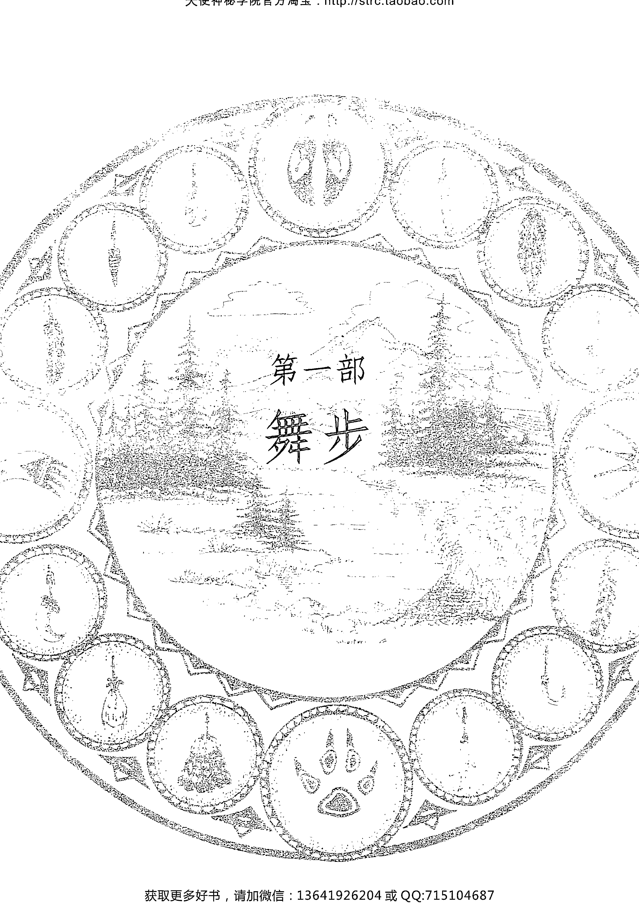

## 第一部 舞步

# 第1章
舞蹈之初

在你享受與藥輪共舞之前，必須先學會舞步，一如大部份的土地儀式和工具。藥輪看似簡單，終究不過是由區區36顆石頭架構起來，然而這個簡單的圓圈以及圓內的那些直線，卻有著數不清也說不盡的意義層次，〈與藥輪共舞〉這本書，正一步一腳印的指引你前往那些層次。

要理解藥輪之舞，你首先必須知道：這個藥輪靈境與這片大陸上的二萬多個藥輪相類似，這些藥輪在歐洲人移居這片大陸之前就已存在。藥輪為美洲印地安原住民提供了許多服務，祂們是文化、天文學、實驗的儀式中心，也是人們會去到裡面紀念他們生命裡的特殊時刻和改變的地方。藥輪是祈禱的地方、靜心冥想和沈思之處，能加強你和自然世界之間的連結，並將你和你自己的關係、以及你和所有萬物之間的關係帶入一個較高的領悟。藥輪通常被建置在一個土地能量可以被強烈感覺到的區域，而人們在儀式中不斷的使用這座藥輪，也將持續不斷地強化祂的力量。因此，藥輪地區變成了人們現今所謂的能量漩渦：強烈的土地能量和療癒之地。那些被建構了新的藥輪的地方，也提供著同樣的功能。

藥輪的形式存在於全世界各地，從歐洲的偉大巨石陣到印度的曼陀羅，這一切都在在提醒著我們去憶起過往那個時刻，當時的世界被正確的關係法則所引導，那時候的人們敬重他們自己、也敬重他們在大地母親之上的所有親族～礦物、植物、動物、神靈。學習藥輪，能夠幫助你記起你與宇宙所有面向的連結。在藥輪中的每一顆石頭都是一個工具，去幫助你明瞭～你與這古老過去的牽連塑造了你個人以及星球的現在和未來。藥輪中的每一個位置，將直接地影響著你在生命中的某一時刻。

以一顆造物主石頭或象徵物做為藥輪的中心，就如同造物主是所有生命的中心，總是無始也無終的創造著，恆常地移動著、持續著，並從這中心輻射出能量，創造了藥輪裡的一切。環繞著造物主的七顆石頭，形成了藥輪的中央圓，象徵著所有生命的基礎。東南方是象徵著大地母親的石頭，這個存有祂給了我們家和生命。當我們在建構和使用藥輪時，幾乎總是依循著順時針方向移動，接下來是榮耀太陽父親的石頭，祂溫暖並激發了生命。下一個是月亮祖母之石，祂指引著我們的夢、靈視和願景。順時針接序的是海龜家族的石頭，象徵著土元素；青蛙家族的石頭，象徵著水元素；雷鳥家族之石，象徵火元素；蝴蝶家族之石，象徵著風元素。這七顆石頭教導著關於所有生命的建構基石。

定錨在藥輪外圈的石頭是榮耀靈性守護者的四顆石頭：北方的瓦布絲、東方的瓦奔，南方的熊歐迪希，西方的默加奇維思，這些靈性守護者之石把這個輪圓劃分成了四份，也為外圈的十二顆月亮之石設立了界限，這些代表著月亮的石頭則劃分了一年。我們可以從中學習到更多關於每一個季節、一天中的每一個時刻，以及生命中的每一個階段、還有關聯到這個月亮的每一種礦物、植物、動物、元素家族，靈性守護者以及人類。

最後，以四條靈性道路完成了整個藥輪，每一條路由三顆石頭組成，這些道路從靈性守護者之石出發朝向中央圓，它們象徵著那些能將我們從日常凡俗生活帶進造物主的神聖空間的質地。

以上對於藥輪物質面的簡略描述，提供了你與藥輪共舞的第一個基礎舞步，然而要真正地瞭悟藥輪，你的理解必須超越物質和理智。假如你永遠思忖著該在何處踩下你的步伐，你絕不可能跳好這支舞。跳舞時你必需去聆聽音樂，且讓這音樂成為你身體和存在的一部分，你得花費時間去練習。當你準備好要開始時，請使用下列這第一個簡單的技巧，來幫助你開始與藥輪共舞。

整本書中的方法被稱為觀想或者練習。當某些事物不同於它現在所呈現的模樣時，這些技巧提供給你一些方法，在腦海裡觀看、感受和想像你自己以及你的生命。所有的觀想和練習若能待以尊敬之心，則皆可當做一場儀式來進行。而這些正是路徑，讓你去連結你的能量和宇宙的能量，並且去感謝這宇宙以及它所有的部份，感謝生命的恩賜。

# Dancing with the Wheel 與藥輪共舞

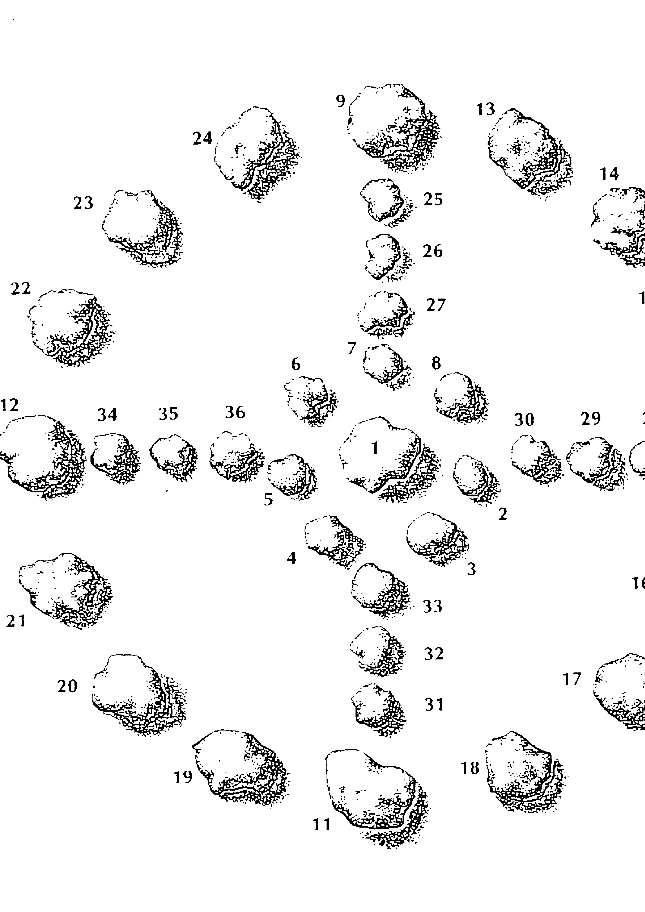

+   1. 造物主
2. 大地母親
3. 太陽父親
4. 月亮祖母
5. 海龜
6. 青蛙
7. 雷鳥
8. 蝴蝶
9. 瓦布絲
10. 瓦奔
11. 熊歐迪希
12. 默加奇維思
13. 雪雁
14. 水獺
15. 美洲獅
16. 紅尾鷹
17. 海狸
18. 鹿
19. 啄木鳥
20. 鱷魚
21. 棕熊
22. 渡鴉
23. 蛇
24. 麋鹿
25. 淨化
26. 更新
27. 純潔
28. 明晰
29. 智慧
30. 光明
31. 成長
32. 信任
33. 愛
34. 體驗
35. 內省
36. 力量

## 聆聽大地之歌

你將需要：一處安靜的地方，筆記本、筆或錄音機。

預估時間：首次約十分鐘；當你熟練這個觀想練習後，約五分鐘。

1.  舒適地坐在一張椅子上或地板上，或者躺下來……做幾個深呼吸，讓你所呼吸的氣息，盡可能地穿透你的身體。
2.  閉上你的眼睛，放鬆你的下顎和你的胃部。
3.  覺知大地正在你之下，即便你是在摩天大樓的第五十層樓，也要感覺你的能量正連結著大地的能量。
4.  當你放鬆並且感受連結時，就只是去聆聽，去聆聽……。
5.  你聽到什麼了嗎？一開始隱隱約約、非常微弱的聲音……接著，這聲音逐漸變大，你彷彿聽到一種跳動，好像鼓聲一樣……。
6.  那是什麼呢？更仔細的聆聽……咚、咚、咚、咚……你一開始所聽到的鼓聲，原來是你的心跳聲，再繼續的傾聽它……。
7.  咚…咚…咚……鼓聲慢了下來，你感覺你的心慢慢地和這股嶄新的音樂一起跳動，你感覺你自己深深地放鬆、深深地連結到這音樂的源頭：大地母親的心。
8.  享受這個音樂，享受在這神聖空間的片刻。
9.  當你準備好了，你就可以慢慢地回到現實世界、回到你的尋常意識當中。
10. 花一點時間去感覺你在身體上的任何不同，去感受你在覺察感知上的任何改變。
11. 如果你想要的話，寫下或錄下你的回響。

## 藥輪參考圖表

### 中央圓

| 石頭數字 | 石頭名字 | 元素 | 礦物 | 植物 | 動物 | 色彩 |
| :--- | :--- | :--- | :--- | :--- | :--- | :--- |
| 1 | 造物主 | 所有或任何 | 所有或任何 | 所有或任何 | 所有或任何 | 所有或任何 |
| 2 | 大地母親 | 土 | 黏土 | 玉米，豆子、小南瓜 | 陸龜 | 森林綠 |
| 3 | 太陽父親 | 火或風 | 晶洞 | 向日葵 | 蜥蜴 | 天空藍 |
| 4 | 月亮祖母 | 水 | 月光石 | 艾蒿 | 潛鳥 | 銀色 / 白色 |
| 5 | 海龜家族 | 土 | 木化石 | 香蒲 | 海龜 | 綠色 / 棕色 |
| 6 | 青蛙家族 | 水 | 河床石 | 水藻 | 青蛙 | 藍色 / 綠色 |
| 7 | 雷鳥家族 | 火 | 火山熔岩 | 野草 | 雷鳥 | 紅色 |
| 8 | 蝴蝶家族 | 風 | 藍銅礦 | 馬利筋 | 蝴蝶 | 半透明白 / 藍色 |

### 靈性守護者

| 石頭數字 | 石頭名字 | 元素 | 礦物 | 植物 | 動物 | 色彩 | 季節 | 一天中的時刻 | 一生中的時期 |
| :--- | :--- | :--- | :--- | :--- | :--- | :--- | :--- | :--- | :--- |
| 9 | 瓦布絲（北） | 土 | 雪花大理石 | 甜草 | 白水牛 | 白色 | 冬 | 子夜 | 老者與新生兒 |
| 10 | 瓦奔（東） | 風 | 菸斗石 | 菸草 | 金色老鷹 | 金色和紅色 | 春 | 黎明 | 孩童 |
| 11 | 熊歐迪希（南） | 水 | 蛇紋石 | 鼠尾草 | 土狼 | 黃色和綠色 | 夏 | 正午 | 青少年和青年 |
| 12 | 默加奇維思（西） | 火 | 滑石 | 雪松 | 灰熊 | 藍色和黑色 | 秋 | 黃昏 | 壯年 |

### 月亮和圖騰（北）

| 石頭數字 | 日期 | 月亮名字 | 礦物 | 植物 | 動物 | 色彩 | 靈性守護者 | 互補 | 元素家族 |
| :--- | :--- | :--- | :--- | :--- | :--- | :--- | :--- | :--- | :--- |
| 13 | 12/22-1/19 | 大地復甦 | 石英 | 樺樹 | 雪雁 | 白色 | 瓦布絲 | 啄木鳥 | 海龜 |
| 14 | 1/20-2/18 | 休眠淨化 | 銀礦 | 顫楊樹 | 水獺 | 銀色 | 瓦布絲 | 鱒魚 | 蝴蝶 |
| 15 | 2/19-3/20 | 大風 | 土耳其石 | 芭蕉 | 美洲獅 | 藍綠色 | 瓦布絲 | 棕熊 | 青蛙 |

### 月亮和圖騰（東）

| 石頭數字 | 日期 | 月亮名字 | 礦物 | 植物 | 動物 | 色彩 | 靈性守護者 | 互補 | 元素家族 |
| :--- | :--- | :--- | :--- | :--- | :--- | :--- | :--- | :--- | :--- |
| 16 | 3/21-4/19 | 萌芽樹 | 火蛋白石 | 蒲公英 | 紅尾鷹 | 黃色 | 瓦奔 | 渡鴉 | 雷鳥 |
| 17 | 4/20-5/20 | 青蛙歸返 | 矽孔雀石 | 藍色卡馬夏 | 海狸 | 藍色 | 瓦奔 | 蛇 | 海龜 |
| 18 | 5/21-6/20 | 玉米種植 | 苔蘚瑪瑙 | 西洋蓍草 | 鹿 | 白色和綠色 | 瓦奔 | 麋鹿 | 蝴蝶 |

### 月亮和圖騰（南）

| 石頭數字 | 日期 | 月亮名字 | 礦物 | 植物 | 動物 | 色彩 | 靈性守護者 | 互補 | 元素家族 |
|---|---|---|---|---|---|---|---|---|---|
| 19 | 6/21-7/22 | 烈陽 | 光玉髓瑪瑙 | 野玫瑰 | 啄木鳥 | 粉紅色 | 熊歐迪希 | 雪雁 | 青蛙 |
| 20 | 7/23-8/22 | 採莓 | 紅石榴石和鐵礦 | 覆盆子 | 鱷魚 | 紅色 | 熊歐迪希 | 水獺 | 雷鳥 |
| 21 | 8/23-9/22 | 豐收 | 紫水晶 | 紫蘿蘭 | 棕熊 | 紫色 | 熊歐迪希 | 美洲獅 | 海龜 |

### 月亮和圖騰（西）

| 石頭數字 | 日期 | 月亮名字 | 礦物 | 植物 | 動物 | 色彩 | 靈性守護者 | 互補 | 元素家族 |
|---|---|---|---|---|---|---|---|---|---|
| 22 | 9/23-10/23 | 群鴨飛遷 | 血石碧玉 | 毛蕊花 | 渡鴉 | 棕色 | 默加奇維思 | 紅尾鷹 | 蝴蝶 |
| 23 | 10/24-11/21 | 天寒地凍 | 銅礦和孔雀石 | 薊草 | 蛇 | 橘色 | 默加奇維思 | 海狸 | 青蛙 |
| 24 | 11/22-12/21 | 漫長冰雪 | 黑曜石 | 黑雲杉 | 麋鹿 | 黑色 | 默加奇維思 | 鹿 | 雷鳥 |

### 靈性道路

| 石頭數字 | 質地名稱 | 位置 | 礦物 | 植物 |
|---|---|---|---|---|
| 25 | 淨化 | 北方（外） | 蘇打石 | 紫錐菊 |
| 26 | 更新 | 北方（中） | 橄欖石 | 紅花苜蓿 |
| 27 | 純潔 | 北方（內） | 赫基蒙鑽石 | 延齡草 |
| 28 | 明晰 | 東方（外） | 雲母 | 迷迭香 |
| 29 | 智慧 | 東方（中） | 翡翠 | 鼠尾草 |
| 30 | 光明 | 東方（內） | 方解石 | 野生西洋蔘 |
| 31 | 成長 | 南方（外） | 螢石 | 紫草 |
| 32 | 信任 | 南方（中） | 鋰雲母 | 琉璃苣 |
| 33 | 愛 | 南方（內） | 玫瑰粉晶 | 山楂 |
| 34 | 體驗 | 西方（外） | 赤鐵礦 | 橄欖 |
| 35 | 內省 | 西方（中） | 青金石 | 洋甘菊 |
| 36 | 力量 | 西方（內） | 琥珀 | 蕁麻 |

### 其他動物圖騰

| 動物 | 色彩 |
| :--- | :--- |
| 浣熊 | 淡綠色 |
| 蚯蚓 | 深綠色 |
| 海豚 | 半透明白色 |
| 蜂鳥 | 透明無色 |
| 貓頭鷹 | 翠綠色 |
| 螢火蟲 | 螢光藍色 |
| 兔子 | 紫蘿蘭色 |
| 鮭魚 | 薰衣草色 |
| 狼 | 粉紅玫瑰色 |
| 鯨魚 | 鐵灰色 |
| 老鼠 | 寶藍色 |
| 螞蟻 | 金黃色 |

聆聽大地之歌，能讓你對藥輪有一個嶄新而整全的瞭解，因為當你覺知到這美妙的聲音，你會開始知曉關係的法則～我們每一個人都深深地連結著存在的每一件事物，我們每一個人，都攸關著神聖生命藥輪的一部分。

關係的法則是一個自然的律法，一個真正的律法對於這個時代來說是至關重要的，現今的我們已經失去了自身的平衡感、也失去了和所有生命的連結感，藥輪可以幫助你重獲你所失去的這些。

藥輪可以幫助你瞭解你與這地球上一切存有的真實關係：元素、植物、動物、人類、神靈。這些存有能夠教導你關於藥輪的許多其他層面。在《藥輪》這本書中，我們介紹了代表一年裡不同時刻的十二顆石頭，以及它的礦物、植物和動物圖騰。在《與藥輪共舞》這本書中，我們將為你介紹藥輪裡所有的位置點，以及每一個圖騰所帶給你的關於生命、關於關係的教誨。

當你學習著這舞步，並且更加清晰的聆聽這音樂，你或許會渴望一些方法去榮耀你和生命的新關係，透過正確使用儀式的虔敬心，你將找到這條道路。儀式會帶你進入一種和大地連結更深的關係裡，這是藥輪裡一個很重要的部份。練習和觀想可以幫助你對於藥輪裡的所有元素獲得一番個人的瞭悟，諸如此類的練習在本書裡俯拾皆是。

當你已經學會了儀式以及藥輪裡不同的獨特面向之後，可能你們有些人會想要建構一座藥輪並去體驗祂的能量。在《藥輪》這本書中，我們給了你建構一座基礎藥輪所需的基本指示，而在這本《與藥輪共舞》裡，我將會更精確詳細的指導你如何建構一座藥輪，我們也會告訴你如何建造各式各樣的藥輪去體驗特別的礦物能量、去榮耀樹木、去榮耀火元素，以及在你外出旅行時隨身攜帶使用。

當你已經探索了藥輪的這些面向，你也已經準備好去體驗藥輪如何教導你關於你自己的人生。雖然根據你所出生的時刻，你會在藥輪上找到一個基礎的位置點，然而你不會終其一生逗留在這個出發之地，每一個人都環繞著藥輪而旅行，盡可能愈多愈好的從各個位置點來經驗生命，這意味著在各種各樣的時刻裡，你會像其他十一個月份出生的人一樣，用他們的位置去行動、思索和感受。你能夠辨別你自己的移動，能夠知曉哪一個位置點正在特定時刻影響著你，這將會幫助你更瞭解你自己、也瞭解藥輪的其他層次。

在藥輪中經驗到其他的位置點不全是偶然，也可能是當你需要去領悟某個位置所代表的生命課題時，你刻意移動到了另一個位置點。如果你正以某些方法奮力掙扎著要平衡你自己的話，我們在這整本書中都鼓勵你去尋找出一顆確切的石頭，因為每一顆石頭象徵著生命的許多不同層面，無論是進入實質的藥輪裡、或處在腦海裡想像的藥輪中，只要在某顆特定的藥輪石旁待上片刻，就能為你不同層面的存在帶來平衡。

當你環繞著藥輪移動時，你可能會經驗到一種時刻，這時候改變的元素正前所未有的強烈影響著你，你正處於第十三個月亮的作用力之下。這不可見的月亮在我們的曆法中已然失落，去瞭解這第十三個月亮以及祂如何影響你的生活，將能移轉你的世界觀，你對生命的感覺也增添了一個新的維度，巨幅的提昇了你的自我理解。

當你明白了藥輪的物質面和儀式面向，以及這些簡單的圓輪如何影響你的生命，你幾乎已經準備好了要去跳這場強而有力的舞蹈。在你開始之前，你也會想要創造一些新的工具在你的舞蹈中幫助你：醫藥袋、珠寶、沙鈴、權杖、棍棒、盾牌和徽章……這些創作的儀式，又是藥輪的另一個層次了。

攜帶著你的新工具，你已準備好要從藥輪的跳板躍入療癒之水裡，療癒你自己和大地母親。以療癒儀式來連結藥輪，你甚至會對這生命的聖圈以及藥輪的力量有更多領悟。

當我們幫助人們準備去向大地哭求他們的靈境時，我們總會提醒他們：這靈境不是只給他們自己的一個真實的靈境會利益你在大地母親上的所有親族，不只是人類，還包括了所有王國中的兄弟姊妹。

當你經驗夠了藥輪，也真正明白了你的療癒力量，你就已準備好前往〈與藥輪共舞〉這本書中的第二部。在這個部份裡，我們把注意力轉向與我們共同分享這個地球的每一個王國，有太多人活在一個把所有時間只花在人類身上的環境裡，所以我們需要讓自己去熟悉礦物、植物、動物和色彩，榮耀這些藥輪的一部份。從這些存有的知識以及祂們與藥輪的關聯中，你將學會如何尊敬我們在地球上的所有親族，並且藉由這些大地兒女們，學會了如何去療癒和被療癒。

礦物之輪、植物之輪、動物之輪，以及色彩之輪都是藥輪中不可或缺的重要層次，分別去觀看研究每一種藥輪，你將會對自己和這些王國中的每一個親族，油然生出一股藝術家般的赏析、以及療癒者的領悟。

為了讓藥輪的療癒能量在你痛苦煩惱時也能隨手取得，〈與藥輪共舞〉這本書的最後，附上了一份礦物、植物、動物和色彩之輪的速查表、一份人類各種失衡狀態的清單、以及他們該走進藥輪哪一個恰當的地方去尋求平衡。

這本書大部份的章節都包含了練習，幫助你對藥輪的瞭解能超越理智層面，儘管頭腦上的知識確能增強你與藥輪共舞的能力，然而，唯有在你可以「感受」這個知識而不是只去「思維」這個知識時，你才能成為真正精通的大師。每個練習的一開始，會有你所需要的工具清單以及預估時間，你不可能在同一時間裡閱讀並練習，所以你可能會想要錄下這個練習，然後再跟隨著錄音進行。CD也可以引導你做這個練習，更多關於這些資訊，都收錄在這本書的最後。

〈與藥輪共舞〉是一本包羅萬象的全面藥輪指引，將帶領你走上一條你可以親自創造出平衡和美麗世界的道路。如果你先讀完一整本書，然後再回到起點依順序重讀這些篇章、並進行練習，你將會從中獲得最大的助益。記得資料速查表在第二部，假如你需要很快得到協助的話。

開始跳舞吧！

## 瓦布絲——北方靈性守護者

### 儀式與尊嚴

假如你以一個和諧的方式生活，總是尊敬這神聖圓圈以及其中的一切存有，你所踩出的每一個步伐就可以成為一個儀式，慶祝著你與造物主的連結。假如你以這樣的方式活著，你就會明瞭自己亦如藥輪一樣，只是生命的工具，被那個在你之外也在你之內的造物主所引領。

大部份的人們必須學會這種生活方式，因為有太多人已被教導成和他們周遭這股神聖性分離，藥輪可以成為一個生命觀點的重要老師。

這本書裡盡是練習以及儀式，去幫助你尋找你與造物主的連結、與所有大地兒女的連結。為了讓這些儀式盡可能有用且產生助益，你必須帶著敬意靠近牠們。有時候人們對於儀式和生命的圓圈來說都是新手，不確定該如何去展現他們的尊敬，大地儀式對他們而言彷彿外星人一樣陌生，他們也想要全然參與，但卻不知該如何開始。

關於儀式，有一件最重要的事必須記得～儀式給了總是在接受的人們一條路，好去回贈其他萬物一些能量！大地母親永遠會給我們一方立足之地；而太陽父親持續地溫暖著我們；月亮祖母帶來了夢；土元素給予我們一塊土地去長成食物，讓我們有能力去蓋房子和製造工具；水元素維持著我們的生命活力；而火元素則溫暖我們的家、烹煮我們的食物；風元素賜予我們生命的神聖呼吸，藥輪的每一部份、生命的每一部份，都持續不斷地賜給我們人類禮物。

透過儀式，我們學會如何去回贈。當我們唱歌，我們透過我們的聲音給出能量；當我們擊鼓，我們允許這大地的心跳加入我們自己的心跳；當我們跳舞時，我們將大地和天空的能量帶到我們身體裡結合再送出去；當我們祈禱，我們透過我們的心分送出能量；當我們抬頭仰望我們的親人，我們透過我們的雙眼給出祝福……當我們將這所有的行動都放在一起時，我們就有了一場儀式，這是人類所能擁有一最強而有力的一種獻祭形式。

古老的祖先們知曉儀式的重要性，他們一年到頭都會透過這些方式慶祝大地不同的部份。他們會有季節的儀式、鹿之舞、草莓嘉年華、玉米嘉年華、熊之舞、滿月儀式、以及感恩祈禱儀式……做這些儀式並非隨心所欲，他們反而會以周延的計劃去好好保持神聖圓圈的平衡。

當人們參加儀式時，他們進入了一個神聖空間，一切處在這個空間之外的事物，都變得絲毫不再重要。時間已經存在於另一個次元，情緒變得更加自由流動，參加者的身體也充滿了生命能量，這股能量往外伸展觸及到他們周遭的萬事萬物，同時也祝福一切眾生。所有都煥然一新，每一件事物都變得神聖。

這個獻祭、分享和重生，是所有儀式的核心，無論一所學校的畢業典禮或是一場藥輪匯聚都一樣。想要直取這個核心，在接近儀式時，你必須帶著理解和尊敬，溫柔地朝向你自己和一切萬物。我們所分享的許多藥輪儀式，是設計用來幫助你去增進你和萬物的關係、去給予你療癒並幫助你的需求。它們全都是為了促進所有參與者最高美善的一些儀式和練習。

這本書中的儀式都是那些自行產出的儀式，有一些來自我們自己的靈境或靜心之中，人們學習儀式、學習他們與大地的關係，這種自我發生的儀式對他們來說，似乎是最恰當的。這類型的儀式給了人們一個良好的架構，讓他們得以在自己的直覺工作上，為儀式添加新的成份。

自我發生的儀式與傳統儀式截然不同，傳統儀式諸如菸斗儀式或淨汗木屋儀式，被印地安部落人們代代相傳而來。在傳統儀式中極其必要而且不可或缺的是～儀式必須以精確的方式來進行，許多傳統儀式可以召喚一些非常強大有力的神靈幫助者，這些幫助者必須被以一種恰當的態度對待才行。

學習傳統儀式唯一的途徑，是向一位知曉這些儀式的醫藥巫士學習，而執行傳統儀式的唯一時機，是巫士特別應允你去這麼做的時候。傳統儀式絕不應該隨著一個人的突發奇想而任意改變，也不應該混搭其他的儀式或靈境，如此一來就不再是為了每個人最高的善。人們既然對這些原住民的傳統方法深感興趣，最關鍵的部份就是去對他們以及他們的傳統保持尊敬。倘若對這些儀式缺乏虔敬，將為所有參與者帶來嚴重的問題。如果你不確定一個儀式究竟是傳統儀式或自我產生，請詢問執行儀式的人。如果你深受那個儀式所吸引，請徵詢您是否能夠學習？在這學習中有什麼要求？有些傳統儀式需要一段很漫長且艱鉅的學徒過程。

當你初次進行儀式時，你可能會試著催促自己加速學習，好讓你儘快能對他人和大地母親提供療癒，這可不是一個好主意，請在儀式裡溫柔地與自己共處，從容地慢放腳步。

儀式是一位很棒的老師，教導你耐性。在本書的某些儀式中，你可能會發現自己站立或坐著長達數小時，而物質層面卻似乎什麼也沒發生。你或許會聽見反覆不斷的鼓聲或吟唱，一開始你可能感到浮躁難耐，希望儀式領導者能夠繼續前進到下一步，但是假如你允許自己放鬆進入音樂或移動中，你或許就會發現～正是這個反覆的規律帶著你進入了神聖空間，正是當你煩躁不安的頭腦就此停歇，藥輪的力量才能夠來到你這裡。

除了枯燥不耐煩之外，站立、坐著或舞蹈都可能導致一些身體上的不適……收錄在這本書中的儀式，都不應該讓你感到不舒服，如果你正在進行一場儀式時感覺到胃部翻攪、或是感覺到太陽神經叢緊繃，請你保持警覺。如果這情況總是持續發生，也請你停下下邊正在做的任何事，先好好淨化你自己。虛空之中有很多的神靈幫助者，祂們的搗蛋或傷害有時更遠甚於幫助。假如你開始懷疑這個地方或儀式能量時，請你停下來，並告訴那些神靈你不想再和祂們一起做任何事，你只要很堅定的說「不」，祂們就不會再打擾你。

如果你和你的老師一起工作，可以請問他們發生什麼事，如果你自己獨自工作，那麼就帶著這個經驗去冥想靜心吧！直到你領悟為止。通常你會發現是你自己的方法太過粗心草率，或者是太心急貪快，你愈是放慢腳步就愈能把儀式做好，在你進行儀式的下一步之前，先掌握好眼前的這個步驟。當你想學習或產出更多儀式之前，也請你先熟悉精通一場儀式。

當你執行儀式時，持續提醒自己～你不是那個帶來療癒或幫助的人，而是造物主的工具。祂透過你而為你在大地上的親族送來療癒和幫助。記住這一點，將為你所做的任何儀式帶來最恰當的洞察力。

就如同生命中大部份的事件，儀式也有一個開始、一個中段、和一個結尾，然而這結尾又是另一場儀式的開始，這個聖圈是持續不斷的，一如所有的事物般無始無終。

大部份的儀式都以淨化的形式開始，煙燻儀式是在大地儀式裡最常用的形式，而且也常見於其他宗教的儀式裡。從東方的焚香到天主教堂的乳香，燻煙儀式使用焚燒藥草而來的煙霧去淨化一個人、一個場地、或一個物件的能量場，煙是一種無孔不入的乙太物質，可以彌漫穿透在濃稠粗鈍以及精微細緻的不同萬物國度之間。

最常用做煙燻的藥草是靈性守護者的植物：北方的甜草、東方的菸草、南方的鼠尾草、西方的雪松。甜草召喚著正面的能量，菸草能汲取正面或負面的能量，鼠尾草可驅趕負面能量，雪松則帶來淨化的力量。你也可以添加其他藥輪植物到你的煙燻混合物裡，使用這些植物將幫助你召喚力量的臨在。

### 煙燻儀式

你將需要：鼠尾草、甜草、雪松或菸草，可單獨或混合使用、或添加其他藥輪植物。一個貝殼或碗、一把扇子或一支羽毛、火柴。

預估時間：個人儀式約五分鐘，團體儀式則需更長時間。

- 1. 把所要使用的藥草植物事先混合均勻，放在一個貝殼或耐熱的碗裡，點燃藥草。
- 2. 當藥草燃燒時，用扇子或來自本地土生土長鳥類的羽毛（雞、土雞、雉或鴨），去搧熄火焰。整個儀式從頭到尾，你必須間歇地搧動藥草，讓它持續悶燒冒煙。
- 3. 一旦藥草冒出煙霧，開始把煙帶到你的心輪處（只是煙，而不是碗），然後再把煙帶往你的頭部，接著帶往你的手臂而下、帶到你的身體前方順勢而下，然後把煙帶往你的身體背後，慢慢的往下帶進地面。假如你需要特別去平衡或療癒你身體的某個部位，你可以把煙帶到那個位置加強片刻。
- 4. 淨化你的能量場是你自己的責任，藥草只能協助，它們不會主動為你清理。
- 5. 接下來，朝向六個方位獻上煙供，往上獻給造物主，往下獻給大地母親，朝北方獻給瓦布絲、朝東方給瓦奔，朝南方給熊歐迪希，朝西方給默加奇維思。
- 6. 當你已經燻淨了你自己，而且也獻供了你的煙，在其他人煙燻淨化時，你可以握著這個煙燻碗或貝殼。
- 7. 你可以繞著你將要使用的地區行走，邊走邊飄送著煙，如果你在室內工作，就沿著房間的牆壁煙燻，特別注意加強燻淨角落。
- 8. 煙燻淨化任何你將在儀式中使用的藥輪工具。

### 其他淨化方法

雖然煙燻是藥輪儀式中最常用的淨化方法，但有些場合需要其他較恰當的淨化方式，如果你在進行一場火儀式，你可以先將藥草獻供給火，然後以這股來自火堆中的煙，燻淨你自己。

假如你在執一場關於水、關於月亮祖母、或者關於青蛙家族的儀式，若環境許可的話，你可以藉著浸泡在水中、讓水面淹過你的頭頂而淨化你自己。短暫屏住呼吸讓整個人淹進水裡，請重覆三次，一次是為了清理你自己，另一次是為了你的家人而清理，第三次是去清理你和造物主的關係。

你也可以用聲音來淨化你自己，以沙鈴或鼓聲，從頭頂到腳底開始清理自己，然後揮掉任何沾附在這個工具上的能量，並將這能量導向大地。

### 歸於中心

有許多方法能讓你在一個儀式裡歸於中心，至少得去使用其中一個。你愈是歸於中心，這個儀式就愈強大有力，任何歸於中心的技巧，都會幫助你把自己所有的能量凝聚起來，讓你去放下每天日常生活的世界，並能由此進入神聖的空間。

我們經常用來讓能量回歸中心的一些方法是：擊鼓、沙鈴，以及吟唱。

#### 透過擊鼓讓自己歸於中心

你將需要：一面鼓和鼓棒，吟唱或鼓聲的CD（如果你需要的話），錄音機。

預估時間：至少十五分鐘。

當你很熟絡你的鼓時，擊鼓是最有效的方式。這意味你應該撥出時間儘可能的經常練習擊鼓。

- 1. 開始擊鼓前，你應該讓自己安靜下來，並且聆聽你自己的心跳聲。
- 2. 開始把你的心跳節奏敲在鼓上。
- 3. 當你的心跳轉變時，讓你的鼓聲也跟著改變。
- 4. 不要試圖去迅速地改變鼓聲節奏，一個緩慢的、反覆的敲擊對於回歸中心來說，是最為有效果的。
- 5. 假如你的鼓聲伴隨著吟唱，首先去聆聽這個吟唱，讓鼓聲和吟唱相輔相成，而不是較勁抗衡。在任何情況下，你的鼓聲都不應該壓過歌聲。
- 6. 藉由聆聽吟唱或擊鼓的CD並且跟著練習，你可以讓自己更加精通擊鼓。
- 7. 吟唱到最後，你可以持續地快速擊鼓，這個意圖將把歌送出去給神靈，並且宣告這首歌已經完成了。

#### 透過沙鈴讓自己歸於中心

你將需要：一支沙鈴。

預估時間：至少十五分鐘。

依循著與擊鼓相同的指示，去學習使用沙鈴。然而，想要在很多沙鈴齊響時聽見你自己的心跳聲，會更加困難，所以在你的學習過程中放慢你的腳步。

#### 透過吟唱讓自己歸於中心

你將需要：你的聲音、吟唱的知識、吟唱或鼓聲的CD（如果你需要的話）、錄音機、沙鈴或鼓。

預估時間：至少十五分鐘。

當你恰當的唱誦時，你將大地的能量帶進了你的身體擴大之後，再送出來給你在這地球上的所有親族。這意味著你應該感受這個吟唱穿透你的全身上下，而不只是你的喉嚨。它應該產生一種能夠觸碰到你所有能量中心的振動。如果你認為自己不會唱歌也無妨，吟唱是一種歸於中心並送出能量的方法，而不是要你去證明你的聲音能力。然而，如果你想要進行一個吟唱，你必須在開始唱之前去學習它以表示尊敬，去仔細聆聽那個引導您吟唱的人，直到你確認自己明白每一個聲音和音調為止。有些吟唱會忽然突兀的轉換歌詞和音調，所以不要太快加入，一旦你確認了這個吟唱，就用你全部的熱情去唱它。下列是我們用來榮耀藥輪的一些簡單吟唱，倘若你沒有聽過它們，我們也有一些CD是關於這些吟唱的，你可以跟著這些CD練習，直到你確定自己已經學會了這首歌。大部份的吟唱都是四個一組循環重複，讓開始吟唱的這個人來決定何時該結束，然後以「HO！」做結尾。

#### Hey Ya Hey 嘿呀嘿

這是一首歸於中心的歡迎歌，這首歌是給瓦奔的。

- Hey Ya Hey 嘿呀嘿
- Hey Ya Hey 嘿呀嘿
- Hey Ya Hey 嘿呀嘿
- Hey Ya Hey 嘿呀嘿
- Yo hey 喲嘿
- Yo hey 喲嘿
- Yo hey 喲嘿
- Yo hey 喲嘿

#### 大地是我們的母親

這是一首榮耀大地以及北方的歌，有好幾個不同的來源，我們在這裡所呈現的，被稱為「已療癒」的吟唱版本，因為它宣告著我們對大地母親的關照。

- the earth is our mother 大地是我們的母親
- we're taking care of her 我們照顧她
- he earth is our mother 大地是我們的母親
- we're taking care of her 我們照顧她
- Hey younga , ho younga , hey young young 嘿永嘎 吼永嘎 嘿永永
- Hey younga , ho younga , hey young young 嘿永嘎 吼永嘎 嘿永永
- Her sacred ground we walk upon 我們行走在她神聖的地面上
- with every step we take 以我們所踩的每一個步伐
- Her sacred ground we walk upon 我們行走在她神聖的地面上
- with every step we take 以我們所踩的每一個步伐
- Hey younga , ho younga , hey young young 嘿 永嘎 吼 永嘎 嘿 永 永
- Hey younga , ho younga , hey young young 嘿 永嘎 吼 永嘎 嘿 永 永

#### 像鷹一樣飛翔

這首吟唱也來自許多源頭，用以榮耀東方、老鷹，以及所有有翅膀的兄弟姊妹，也榮耀那讓牠們得以飛翔的翼下的風。這個吟唱有好幾個版本，這是我們最常用的一個，領導者先唱一句，其他參與者緊跟著覆誦一句，就彷彿空谷回音那般。

- Fly like an eagle 像鷹一樣飛翔
- Flying so high 飛得如此高昂
- Circling the universe 圈出了整個宇宙
- On wings of pure light 以雙翼的純淨之光
- Ho witchi tai tai 吼 威奇 泰泰
- Witchi tai o 威奇 泰 喔
- Ho witchi tai tai 吼 威奇 泰泰
- Witchi tai o 威奇 泰 喔
- We all fly like eagles 我們全都像鷹一樣飛翔
- Flying so high 飛得如此高昂
- Circling the universe 圈出了整個宇宙
- On wings of pure love 以雙翼的純淨之光
- Ho witchi tai tai 吼 威奇 泰泰
- Witchi tai o 威奇 泰 喔
- Ho witchi tai tai 吼 威奇 泰泰
- Witchi tai o 威奇 泰 喔

#### 狼的吟唱

這首歌是布魯克·醫藥老鷹教給我們的，它歡慶著男性能量和女性能量的結合，榮耀著南方、狼，以及所有四條腿的兄弟姊妹。

女人唱圓括號裡的歌詞，男人則唱方括號裡的歌詞，如果現場少了男人或女人，就去連結你自己內在的男人和女人這兩股能量，並唱出這兩個部份的歌詞。

- (wowo wowo wowo wowo 喔喔 喔喔 喔喔 喔喔)
- [wo yaa yaayaa yaayaa yaayaa 喔 呀啊 呀啊呀啊 呀啊呀啊 呀啊呀啊]
- (yaa wo wowo wowo wowo 呀啊 喔 喔喔 喔喔 喔喔)
- [wo yaa yaayaa yaayaa yaayaa 喔 呀啊 呀啊呀啊 呀啊呀啊 呀啊呀啊]

#### 向晚的微風

這是一首榮耀西方、榮耀風以及海洋的歌，它也來自許多不同源頭。

- Evening breeze, spirit song 向晚的微風 精靈的歌
- Comes to me when day is done 在白晝將盡時來到
- Mother earth awaken me 大地母親喚醒了我
- To the heartbeat of the sea 融入了海洋的心跳

#### 黎明

這是一首用來結尾的吟唱，去榮耀人們以及我們此刻所活著的時光，這首歌來自雷鳥女人。

- The dawning of a new time is coming 一個嶄新時刻的黎明到來

### 透過呼吸讓自己歸於中心

你將需要：一個舒服安靜的地方。
預估時間：初期約十五分鐘，熟練後約五分鐘。

1. 世界各地的許多傳統裡，都運用呼吸來做為一個歸於中心的方法。
   一開始，先放鬆你的身體，如果這對你來說很不容易做到，就從你的腳指頭開始，儘可能的縮緊肌肉然後放鬆……縮緊你雙腳的肌肉，然後放鬆……縮緊你的小腿肌肉，然後放鬆……縮緊你的會陰，然後放鬆……縮緊你的臀部肌肉，然後放鬆……縮緊你的胃，再放鬆……縮緊你的橫隔膜，再放鬆……縮緊你的胸膛，然後放鬆……縮緊你的上背，然後放鬆……縮緊你的肩膀，接著放鬆……縮緊你的脖子，再放鬆……最後縮緊你的頭皮，放鬆……皺緊你臉上的肌肉、然後完全的放鬆它們……。
2. 儘可能讓你的呼吸，滲透你全身上下。
3. 進行深、長、緩慢的呼吸。
4. 把注意力放在你的呼吸上。
5. 感覺你呼吸的氣息充滿了全身，並且把你和大地、天空及周遭的一切都連結在一起。

### 透過大自然讓自己歸於中心

你將需要：在大自然中一處安全舒適的地方。
預估時間：初期約十五分鐘，熟練後約五分鐘。

1. 在大自然中，找一處讓你感覺到舒服及安全的地方。
2. 當你站在那裡，去覺知在你腳下的大地，以及你頭頂上的太陽，去感覺輕輕拂過你肌膚上的微風……。
3. 聆聽這大自然的聲音，讓它們去穿透你，增強你歸於中心的能力。
4. 儘可能地放鬆你的身體，尤其注意放鬆你的膝蓋、放鬆你的胃部肌肉，放鬆你的下頜……。
5. 跟隨你自己的呼吸。
6. 感受你呼吸時的氣息從你身體後方升起，連結你與頭頂上的太陽，接著從你的身體前方往下沈，並且連結你和你腳下的大地。

這個練習也可以採用坐姿。

### 在圓圈裡歸於中心

擊鼓、搖沙鈴、吟唱、呼吸，或在大自然裡練習歸於中心，所有這些工作都能夠很好的收攝凝聚一群團體或個人的能量。運用呼吸或在大自然裡練習回歸中心時，人們應該以左手手掌向上、右手手掌向下的方式牽手圍成圓圈，能量的流動會更加順暢。

##### 獻祭

獻祭是一種很棒的方式，去對大自然或自然中幫助你的一些元素給出感謝，最常用的獻供是菸草和玉米粉。有許多其他的物質也能使用，例如鳥餌即是一個很好的供品，去榮耀神靈並獻給那些有翅膀的兄弟姊妹。也有些人把羽毛綁在灌木或樹上獻祭，如果你想獻供而你手邊卻沒有任何東西時，你可以用你的一縷頭髮、一個祈禱或一首吟唱來獻祭。

當您從大自然中取走了一些東西，最好能留下一些獻祭，來榮耀你所被賜予的禮物。

有許許多多的方式可以獻供，只要你帶著你的感謝去做，任何形式都很好。

#### 對六個方位獻祭

你將需要：菸草、玉米粉、一縷頭髮、或其他獻供。
預估時間：一分鐘。

1. 拿一小撮菸草、玉米粉，一縷你的頭髮，或者任何你被指引想要獻供的東西。
2. 舉起你的獻供朝向天空，對造物主做一個感謝的祈禱。你可以很簡單的這樣說：「感謝你，造物主，感謝你給我生命，感謝你給我大地……」這也可以包括你特別想要感謝的那些項目。
3. 用獻供碰觸大地母親，感謝她。
4. 面對北方，並對著瓦布絲舉起獻供，感謝這靈性守護者；面對東方並感謝瓦奔，面對南方感謝熊歐迪希，面對西方並感謝默加奇維思。
5. 把獻供放回地上，進行另一個感謝的祈禱。

#### 獻供你的能量

你將需要：菸草、玉米粉、一縷頭髮或其他對你來說有意義的獻供。
預估時間：一分鐘。

1. 取一小撮菸草，玉米粉或任何你選擇獻供的物品。
2. 把獻供放到地面上，給大地母親一個感謝的祈禱。慢慢地再把獻供帶上來到你的身體前方，大約離你自己一英呎的距離，當你慢慢往上舉起你的獻供時，讓一些能量從你所有的能量中心流進獻供裡，你把這獻供帶到你頭頂上方的頂輪處，然後再從你前方帶下來至口鼻處，深深地呼吸著它的氣息。
3. 慢慢地把你的獻供放置於大地，或者放在你所準備的物件上。

### 儀式的結尾

對許多人來說，儀式中最困難的一個部份就是結尾，因為所有能量已經被引發了，無論是個別的或是在團體中的，而且因為在神聖空間中美妙出神的感覺，很多人總是不願讓這個經驗結束。然而一個好的結尾，將為你生命中的下一場儀式提供一個恰當的開始。儀式的結尾是一個極其重要的決定性時刻，所有那些已被引動的美好能量將在此時交付給宇宙，因此這個結尾確保了你儀式工作的成功。

假如你獨自一人進行儀式，你必須要能辨別出任務在何時已圓滿達成，並馬上俐落從容但不倉促的結束這場儀式。假如你和一個團體工作，儀式的領導者應該向參加者解釋這個結尾的重要性，領導者應該指示人們在儀式結束後安靜輕柔地離開這個地方。倘若人們能夠先遠離儀式場域，再去進行他們的告別、擁抱、慶典大餐……或享受其他社交，這樣會是較好的，這麼做展現了對於儀式的敬畏，以及對於這個儀式所在地的尊敬。

讓參加者能在儀式結束時落實接地也是很重要的一環，如此他們才能夠完全的退回到尋常意識裡。以下是一些落實紮根以及結束儀式的方法。

### 落實紮根於大地

你將需要：人們已完成了一場儀式，一片大地。
預估時間：五分鐘。

1. 如果你和一個團體工作，在這場儀式的尾聲，你或團體的領導者應該指示那些無法完全回到正常意識的人，請他們把雙手和膝蓋貼在土地上，同時也將他們的前額擱在地面。
2. 去嗅聞這片土地，並且覺察祂在你之下的穩固。
3. 感覺這大地能量進入了你的身體，你感到安穩落實。
4. 當你感覺自己已準備好了，即可慢慢起身。
5. 當你站起身時，確定你的能量已穩固的收攝回你的身體，若不是，請重覆這個練習。

#### 透過雙眼落實接地

你將需要：人們已完成了一場儀式、一片土地。
預估時間：五分鐘。

1. 如果你是在團體中工作，當儀式結束時，你或團體的領導者應該請人們閉上雙眼，去想想關於這場儀式的一切，以及它所提供的這個嶄新開始。
2. 當你睜開你的眼睛時，首先你應該抬頭仰觀天空，看看它是否有所不同。
3. 接著，你看向這地區裡的任何樹梢。
4. 當你感覺你的能量穩固落實在你的身體中，慢慢的環顧四周，看看這個聖圈裡的人們，以及那些和你分享了這個經驗的存有們。

#### 送出儀式能量

預估時間：五分鐘。

1. 如果你獨自進行一場儀式，當你感覺已穩固落實在你的身體之中，去想想這場儀式以及它所引發的能量。
2. 在你的體內去感受這股能量。
3. 往下移動，把這股能量送進大地。
4. 伸出你的雙手往上，把這股能量送往造物主。
5. 如果你在一個團體中工作，請等待人們完全落實回到他們的身體裡，然後請他們花一點時間去想想關於這場儀式、以及它所引發的能量。假如你是獨自一人工作，也請跟隨相同的程序。

瓦奔——東方靈性守護者

## 第3章 中央圓與靈性守護者之石

無論是個人或是一個種族，人們想生存就得需要藥輪上每一種力量的幫助，然而有一些力量卻不需要人類，他們早在人們出現之前就已經存在，被榮耀於藥輪中央以及四個主要方位。

在中央圓裡的石頭以及靈性守護者之石，代表著這些力量，從這些力量而產生出的能量，則形成了所有其他的生命。他們是最初始的存有，是一切萬事萬物的基石，這些力量遠遠超越了人類所能理解，唯有親自去經驗他們才能得到真實的領悟。從前，只有薩滿巫師會去追尋這樣的力量，其他人則望之卻步，認為這些力量太過神秘未知而且充滿危險。

而今，當地球上的人們質疑著造物主的存在；當人們威脅著大地母親的永續存在；當人們真正試圖用核子力量從太陽父親那裡竊取火焰；當人們走在月亮祖母上並毀損了她的面龐；當人們同時創造又毀滅了許多元素，卻自以為能夠獲得新的平衡；當人們遺忘了靈性守護者，遺忘了他們所代表的一切……這個時代因而需要愈來愈多的人，英勇去追尋這些靈性的力量。

藥輪提供了你許多工具來進行這場探索：這些工具能夠幫助你瞭解這個奧秘，並且避開危險。

藉由對於這些力量知識的獲取，你就能為自己和大地母親帶來平衡。透過學習這些力量如何影響著你，你得以開始你的探尋，而且你可以藉由走進這每一顆石頭去繼續你的追尋，以具體物質或視覺觀想的方式，去感受那些相關力量的勢能。這些力量極其強勁，當人們選擇去體驗他們時，也只能短暫的淺嘗即止，如果逗留在這個位置上太久，對這些強而有力的神靈而言是一種污辱，也容易有引起他們不悅的風險。這十二顆石頭，十二股力量，直接也間接地影響著藥輪上的其他二十四個位置。

當你沿著藥輪旅行時，中央圓和靈性守護者之石，這一顆石頭都有著獨一無二的禮物和天賦能夠給予你。造物主、大地母親、太陽父親、月亮祖母賜予生命和靈視願景；每一位靈性守護者給出他們所代表的方位力量，也給出每一天、每一年以及整個人生裡特定時期的力量，他們也給了我們四方的風，元素、礦物、植物、動物和色彩。每一位靈性守護者直接影響著他們四分之一藥輪裡的三個月亮符號。

元素家族代表著土、水、火、風，他給予人們許多工具去使用他們所擁有的力量，也給予人們工具去深化他們與這個宇宙連結。每一個元素家族都直接影響到由他們所統馭的三個月亮符號。

靈性守護者和元素家族描繪出你目前所在的藥輪位置的大圖像。而月亮符號則填滿了每一個細節。靈性守護者能幫助你了解自己無時無刻都想奮力學習的主要課題。同時，元素家族可以向你示現這些工具的本質，讓你得以受教學習。靈性守護者和元素家族在任何時刻影響著你，教導你許多關於你自己的生命課題、挑戰和機會。

想要更進一步了解這些力量，你必需各別去學習每一處位置點。

### 中央圓

- 雷鳥家族：火、火山熔岩、野草、雷鳥、紅色
- 蝴蝶家族：風、藍銅礦、馬利筋、蝴蝶、半透明白/藍色
- 大地母親：土、黏土、玉米、豆子、小南瓜、陸龜、森林綠
- 太陽父親：火或風、晶洞、向日葵、蜥蜴、天空藍
- 月亮祖母：水、月光石、艾蒿、潛鳥、銀色/白色
- 海龜家族：土、木化石、香蒲、海龜、綠色/棕色
- 青蛙家族：水、河床石、水藻、青蛙、藍色/綠色

### 基礎

### 造物主

造物主獨自佇立在藥輪的中央。可以用任何種類的石頭、或一顆水牛頭顱骨、或者是對這個藥輪建造者意義非凡的東西來象徵造物主。曾經在一場靠近太平洋的藥輪匯聚中，有人從博物館帶了一副鯨魚骨骸來代表造物主。其他人也用過水晶簇、牛骷髏、樹、以及柴火堆……造物主既是這些也不是這些，造物主是生命的起始也是生命的結束，是在所有事物之內也圍繞著所有事物之外的偉大奧秘，它是宇宙的能量，亦即許多人所稱的神或上帝。在許多印地安原住民語言裡，造物主這個字不是名詞而是一個動詞，代表了移動的、活躍的、動態的、脈衝的一種神聖且永無止盡的力量。

因為造物主在一切萬物之內，所以這個位置上沒有任何相關圖騰，一切的礦物、植物、動物，和所有的色彩、所有人類、所有神靈……全都是造物主的一部份。

藥輪中的造物主之石所在位置，教導你有能力去創造自己的信心、創造你自己的神聖性、教你有能力去充份發展並實現你自己的整全。

當你恐懼時；當你缺乏足夠的能量；當你害怕自己能夠用頭腦去創造出事物、抑或是你擔心自己無法用頭腦去創造事物時；當你感覺自己並不確切瞭解這個深邃的宇宙知識時……你就應該走到藥輪的中心，去尋求你所需要的幫助。當你不太確定你的靈性價值或是你覺得需要一個改變，你渴望能有一個點化去啟迪你進入一種全然不同的生命觀……這時候，你就應該走向藥輪中央，走向造物主。

### 大地母親

大地母親之石，是第一顆被放置在藥輪中央圓的石頭，這顆石頭稍稍偏向東南方，代表大地母親給予她孩子們的永恆之愛，也代表了一個新的開始。在許多藥輪中，我們會放上一盆樹和一件綠色的祈禱袍在大地母親之石旁。這盆樹象徵生命之樹，而綠色象徵著大地的豐饒。這件祈禱袍對許多原住民而言是極神聖的物件，唯有當你被熟悉這個傳統的人指示該如何正確執行時，你才能去製作這件袍子。否則，你可以用一塊綠色的布或絲帶花環裝點在樹上。如果你在戶外建構了一個大型的永久藥輪，你就可以在這顆石頭旁種下一棵小樹。

和大地母親位置相關的圖騰，是礦物王國中的黏土，植物王國中的玉米、豆子、小南瓜，而動物王國中的圖騰則是偉大的陸龜。祂的象徵顏色是森林中的翠綠，元素則是土元素。藥輪中的這個位置教導你如何滋長你內在的女性能量，也教導著關於大地本身。大地母親之石幫助你更加強烈的去感受大地的能量，當你對地球的現況深感憤怒或極度悲傷時，這裡也是你能夠找到慰藉的地方。當你覺得在紅塵俗世裡的現況走向了絕望，所有條件都無力改變時，這顆大地母親之石可以幫助你。

當環境的污染、地球的劇變……這些排山倒海而來的念頭已然淹沒了你，當你渴望對這些侵害大地母親的問題找出正面的解決之道，這也正是我們要去探尋的石頭。

假如你面臨到無法生育的問題，假如你準備為人父母，或者你已身為父母但希望能更加慈愛，這大地母親之石的位置也可以幫助你。

### 太陽父親

以順時針方向在中央圓移動，下一步，你會在靠近東南方處放置一顆石頭去榮耀太陽父親，也象徵著太陽為地球所帶來的成長和明晰。在藥輪匯聚中，我們通常會使用另一盆樹來榮耀這顆石頭，以及一件藍色布料製成的祈禱袍，去榮耀太陽父親和祂所駐居的天空。

和太陽父親相關的圖騰是晶洞、向日葵、蜥蜴、天空藍的顏色，代表元素則是風和火。這顆石頭教導關於核心的陽性能量、以及關於宇宙活躍的法則。如果你需要更多能量、需要溫暖、需要擴展你的生命時，這就是你要前往的地方。當你想獲取關於陽性法則的知識，或是你感覺到自己生命中的陽性能量受到阻礙時，你就得去尋求太陽父親之石。倘若你發現自己憎恨別人或討厭他們的所做所為時，這顆石頭能幫助你領悟。在這個位置上，你可以學習去完成很多事情，並尋獲勇氣。太陽父親之石也可以教導關於區辨的議題：當你想拒絕時就能說「不」，這是一種健康的設立界線的能力。這樣的區辨能力是今日許多人極需學習的功課，特別是那些總是不斷超限付出的女性。因著太陽和核子能量的連結，當你擔憂核子武器或恐懼核子戰爭時，這也是一個你可以前往祈禱的地方。

### 月亮祖母

中央圓的下一顆石頭，是用來榮耀月亮祖母的。這顆石頭的位置稍稍偏向西南方，榮耀著來自月亮內省能量的那股信任。在印地安原住民的許多傳統裡，月亮被認為是女性生命的引領者，部份理由是因為女人就像陰晴圓缺的月亮一般，經歷著不同的階段、不同的循環。月亮祖母迥異於大地母親，月亮教導的是一個截然不同的陰性面向。這股女性能量是一種夠強大到足以去接納和包容的力量；是一種夠強韌到足以去對生命臣服的力量；這個女性面向是一種夠狂野到足以去誘發活躍生命力的能量；也夠夢幻到足以去揣想來自遠古的新生命。大地母親養育著她的孩子們，而月亮祖母則夢著這群孩子。

與月亮祖母相關的圖騰是月光石、艾蒿、潛鳥，色彩是銀、白，元素是水。

前往月亮祖母之石的所在地，可以檢視你的存在中鮮為人知的面向，這個位置能夠幫助你的夢想、憧憬和靈境。月亮祖母也幫助你增加直覺感和通靈力。當你走到月亮祖母的位置時，你可以學到更多關於你自己的感官享受以及性感能力，你也可以學習關於你的情緒面以及你那非關邏輯的感性面。當你發現你對自己最深層的情緒感到恐懼時，或當你需要幫助去瞭解這些恐懼時，這就是你所要去追尋的石頭。

月亮祖母溫柔的光芒，讓你能夠檢視自身存在的陰暗面，那些你在光天化日下終究害怕去凝視的、深深埋藏在你之內的黑暗。

### 元素親族

元素們為地球上所有的生命提供了建構基石，而這些元素家族，也為你提供了由大靈所賜予的力量基石，讓你得以取用來服務人群。因為每一個元素都有它自己建構的方式，於焉形成了各個元素家族。這些家族的天賦不盡相同，例如火元素是來自水元素，風元素是來自於土元素。從每一個你所拜訪的元素家族位置上，你會獲得更多的工具、能力和方法去發現你真正的天份，去獲得那股以它們來侍奉大地母親以及她所有兒女的喜悅。

### 海龜家族——土的家族

海龜家族代表著土元素，這顆石頭是放置在中央圓裡稍微偏向西南的地方，與海龜家族之石相關的礦物圖騰是木化石，植物是香蒲、而顏色是綠色和棕色，大地復甦之月（從12月22日到1月19日·雪雁）、青蛙歸返之月（4月20日到5月20日·海狸）、以及豐收之月（8月23日到9月22日·棕熊），都直接與海龜家族相關，而且受到土元素的統馭，當你站在海龜家族的位置時，你會學到這個最稠密的元素特質，一種堅固的、創造性的、強韌的力量。高山和摩天大樓皆由這些微渺纖細的土元素一顆一顆堆積而成。

海龜家族因為土元素的關連，它也是最濃稠、穩定、移動緩慢的家族。受到海龜家族位置影響的人也是穩定的、堅硬的、務實的、落地的、保留的、穩固的、深思熟慮的。他們的眼光也極具識別力。海龜家族的人們非常擅於組織，能夠對任何所承擔的事物提供良好基礎。他們在表達自我時，總是很小心翼翼，除非是他們非常堅信不移的觀點。他們非常善於保衛那些幫助你所建造的事物。這些人非常務實，也非常注意安全，他們非常專精於照顧大地、礦物、植物、動物和其他的人類存有。

海龜家族人們會受到土元素以及大地母親極大的吸引，他們經常喜歡走到戶外，藉著在土地上手舞足蹈或坐在土地上，感受大地的能量。

因為土元素的移動緩慢，所以進入到海龜家族位置的人們，經常會有想要棲戀駐留這個位置的傾向，即便是該要離開去做個改變並成長的時候。假如人們太根深蒂固於海龜家族的位置時，他們就會變得冷酷麻木，生活的視野變得封閉凝滯、毫無彈性，對於周遭生命的看法也變得阻塞狹隘，他們也可能會變得狡猾詭詐、喜歡操控、而且異常頑固……這些被困住的海龜家族人們，會用一種自我犧牲的烈士傾向，來保護他們所建構的東西。

如果你發現自己表現出上述的特質，不管是正面還是負面的，最好是去檢視看看你是否已經把自己深植在這個位置了。倘若如此，你就應該移動到藥輪中由其他元素家族所統馭的位置。

從另一方面來看，假如你發現自己常常神識呆滯而且無法落實紮根，這就是你該把自己移動到海龜家族位置的時候了，在這裡你可以學到堅實的成長，以及與大地能量連結的美好感覺。當你渴望能更進一步與大地母親校準、更有能力從各個面向去幫助祂時，這就是你所要追尋的石頭。在這個地方，你能夠學會對於地球以及地球上所有親族忠誠的真義。

受到海龜家族位置影響的人們，會是你渴望遇到的最友善也最堅定的一群，他們樂善好施，對人充滿了支持和鼓勵、份外的熱情與慈悲，他們的天賦是分享，以及教導人們對於大地母親的愛。

### 青蛙家族——水的家族

青蛙和水元素有關，這青蛙家族之石，是被放置在中央圓的西方和北方之間。與青蛙家族有關的礦物圖騰是河床石，與這個家族相關的植物圖騰是水藻，與青蛙家族有關的顏色是藍綠色。大風之月（2月19日到3月20日·美洲獅）、烈陽之月（6月21日到7月22日·啄木鳥）、以及天寒地凍之月（10月24日到11月21日·蛇），全都直接與青蛙家族有關，而且被水元素所統馭。當你來到青蛙家族的位置時，你可以在存在的所有層面學到關於你自己的敏捷機靈，你也可以在這個最為流暢的元素力量中，學到關於變形、回春、重振力量的能力。水似乎無形無狀，而事實上卻創造了許多形式，水是真正的生命給予者，若沒有水的恩賜，這地球上我們所知的大部份生命都無法存活。

當你經驗一個青蛙家族的位置，你可以學到有關你維持生命的面向，學會你自己的流動性、你持續不斷去改變的能力。你也将學會讓你自己生機盎然、煥然一新的能力，學會讓你的心去引導你的頭腦。你也能夠去發現你內在某個部份的反省，這個反省同時去照映出你的內在本質以及其他人的內在面向。青蛙家族也可以教導你關於你的淨化面向，諸如此類的面向透過眼淚的禮物，去淨化你往昔的傷痛。它也教導你關於大地的淨化。

青蛙家族的人們，能夠很輕易的去到不同的實相層次之間，他們是非常具有移情作用的一群，他們有一種天賦本質，可以去觸碰到其他人的情緒，以及去感受他們自己的情緒。這個情緒的深度和力道，有時候甚至劇烈得嚇壞了自己，而導致他們開始克制自己的情緒。當青蛙家族人們壓抑自己的情感愈久，那麼他們就會愈害怕去釋放正在感受的強烈情緒。如此一來，便造就了一種艱難的循環模式，直到這個人終於決定放下這些情緒、或者移動到藥輪上另一個允許他們去良好表達感受的位置。

站在青蛙家族位置上的人們，會對月亮祖母以及水感到特別親密，青蛙家族的人們喜歡參加和月亮有關的儀式，當他們與水同在時，也會感到極大的喜悅和滿足。有時候就僅僅只是喝一口水，都能夠使他們恢復活力、煥然一新。對他們來說，僅只是在河畔或溪邊坐著，也能夠變成一種幾近宗教式的神聖體驗。

當你經歷青蛙家族的位置時，你必需留意去讓你內在深藏的感受表達出來。在青蛙家族位置的人傾向於把過多的水貯藏在體內，當這種情況發生時，顯示他們正在防堵自己的情緒或者對某件事緊抓不放，這也阻礙了他們周遭一切事物的流動。

如果你很難去感受你自己的情緒，或者很難去覺察自己的反思、很難去平靜你各個騷動的存在面向，那麼你走進青蛙家族的位置是很好的。這個位置可以幫助你去意識到那透過你汩汩而流的生命力，並且去覺知到你自己的靈通和直覺能力。青蛙家族位置的力量是一種緩慢而沈穩的改變力量，也是一種淨化的力量、轉化的力量。青蛙家族的位置，將帶給你一種深刻感受的天賦，並覺知到你與月亮的連結。當人們站在青蛙家族位置時，任何他們所擁有的關於療癒的天賦，尤其是療癒情緒障礙的那些潛能，都將被彰顯出來。

### 雷鳥家族——火的家族

雷鳥家族是一個火的家族，雷鳥家族之石放置在中央圓的北方。和這個家族有關的礦物是火山熔岩，植物是野草，顏色是紅色。萌芽樹之月（3月21日到4月19日，紅尾鷹）、採莓之月（7月23日到8月22日，鱒魚）、以及漫長冰雪之月（11月22日到12月21日，麋鹿），是直接有關於火鳥家族的月份，並且被火元素所統馭。

雷鳥家族是一個活力充沛的家族，也是一個轉化的家族。火可以幫助人類也可以摧毀人類，火藉著化事物為灰燼而轉換了基本物質組成，改變了它們所碰觸到的任何東西。同樣的，人們在雷鳥家族的影響下，移動也容易變得快速和激烈。雷鳥家族的位置是一個反覆無常、暴躁易怒的位置，在這個地方的人們，學習著關於滲透和洞察的力量，學習著競爭和轉化。這是在藥輪上一個非常創新改革的地方，猶如一座爆發的火山噴發產出了火山熔岩一樣。

在雷鳥家族位置的人們，經常看似一個矛盾的人，在某個時刻裡他們發光發熱、活力四射，他們既粗獷又溫暖、充滿了吸引力與生命活力；但在下一刻，他們似乎就變得焦躁過動、好吃貪婪、難以忍受，而且囂張跋扈。對於雷鳥家族的位置來說，這兩種畫面都同樣真實，火的天賦就像雙面刃一樣。

雷鳥家族可以帶來賜予生命的雨水，也能帶來區區一道火光就能摧毀整座森林或家園的閃電。火可以帶來滋長生命的暖意也可以帶來毀滅。火山可以在大地上建造新的地表，它也可以摧毀現存大地上的所有事物。

當人們在雷鳥家族的影響力之下，他們將會意識到在自己本質之內的二元性，雷鳥家族人們非常善於做事、創立、探索、開拓以及發明，然而他們卻不容易堅持到底，雷鳥家族的位置是一個可以帶來吸引力、魅力、勇氣、以及樂觀的位置。當人們站在這裡時，他們總會有辦法把周遭人們蠱惑得神魂顛倒，這股魅力著實讓他們得以掌控且哄騙其他人，倘若這是他們目標的話。

當人們來到雷鳥家族的位置時，他們要將這股強烈的能量用來幫助大地母親並利益周遭萬物，還是要將這股力量用來為自己謀福利？這個抉擇也是雷鳥家族位置的功課之一，雷鳥人們需要去非常清晰地知道他們的力量來自哪裡？以及他們該如何使用這股力量。

他們同時也需要學習去淡化他們的強烈，否則他們將會以生病的方式來迫使自己放慢腳步。

雷鳥家族的位置是一個改革創新的力量，是熱烈激情的力量，以及轉化的力量。當人們在雷鳥家族位置的影響之下時，可以在他們存在的各層面實相中，學會最壯烈的課題。雷鳥家族人們可以是你所見過的人之中最為迷人且機智風趣、耳聰目明、豪爽直率的一群，或者他們也可能成為最虛偽詐騙的人。有時候他們甚至會在同一時刻展現出這兩面特質，也正是在那個關鍵點，他們來到了自己生命中最巨大的挑戰時刻。

### 蝴蝶家族——風的家族

蝴蝶家族是一個關於風元素的氏族，有關蝴蝶家族的礦物圖騰是藍銅礦，植物是馬利筋，顏色是半透明隱微的藍。休眠淨化之月（1月20日到2月28日·水獺）、玉米種植之月（5月21日到6月20日·鹿）以及群鴨飛遷之月（9月23日到10月23日·渡鴉），都直接關連於蝴蝶家族，並且被風元素所統馭。蝴蝶家族和突來的改變有關，風元素也是一個永遠在移動中的家族。不管它是輕柔的微風或者是強烈的颶風，風元素的能量總是活躍的流轉。空氣、風包含了生命的氣息。風看似自由，它將思念和嚮往帶給人們。風無孔不入，可以去到任何它想去的地方、做任何它想要做的事，並且影響它所觸及的一切事物。

在這個位置的人們受到蝴蝶家族影響，也看似風一般的靈巧敏捷和快速，他們通常是優美雅緻的，而且幾乎總是精力充沛、歡樂艷麗、珍貴奇異……人們在蝴蝶家族的影響之下，傾向於無憂無慮、漫不經心、夢幻空想、充滿了理想主義……他們是那種為自己、為種族、為整個星球追尋著演化的人們。他們是適應力極強且非常善於調節自己的一群，喜歡新興的行為和無邊無際的感覺。

一如風觸摸著許許多多事物，所以蝴蝶家族的人們，也喜歡用一種他們認為能夠服務許多人的方法去廣泛傳播。這是一群喜歡服務理念的人，然而他們必須留意避免在忙於服務他人時卻無暇服務自己。蝴蝶家族人們可以對一個激怒了其他所有人的論點敞開心胸，有時候他們的開明心態直近乎於優柔寡斷、毫無原則。

當人們在蝴蝶家族的影響之下，他們偶爾必須管束自己的能量，去檢視這個難以預料且瀕臨混亂失序邊緣的傾向。他們必須小心自己的快速移動，這樣的移動將導致他們疼痛或生病。蝴蝶家族位置的主要課題之一是識別力，在這位置上你必需學習什麼是真正需要改變的，然後你必須學會改變，無論你是否有能力去做出這個改變。

在蝴蝶家族的位置上，你可以學習到關於你自己的優雅、你自己的能量層次、以及你去改變趨式的能力。假如你感覺到自己的表達需要更加清晰流利、更加輕柔動聽、更具創意和革新，蝴蝶家族位置或許就是你要前往之地。這個能量也可以幫助你去教學、幫助你領悟哲學、幫助你有一個更加開闊的展望。它同樣也可以為你示現一個去融合你所有知識的方法。當人們希望去學習更多關於他們自身的聰明才智時、當他們想要把全然的質變轉化帶進自己的生命時，他們可以前往追尋蝴蝶家族之石。

蝴蝶家族的天賦是快速的改變、突如其來的改變、以及呼吸～亦即生命本身。經歷過蝴蝶家族位置的人們，將有能力去迅速移動、有能力去攻佔大量的版圖、有能力去發現他們是否做的是自己真正嚮往的事，而如果不是的話，他們也能很快地探索出自己真正的目標。蝴蝶家族人們非常善於在生命的不同畛域之間搭起橋樑，非常善於在不同的團體之間通溝傳達，也很擅長將人們凝聚在一起。儘管他們不是有系統的組織者，但他們的高能量卻往往能夠彌補這個缺失。蝴蝶家族人們最喜歡玩耍嬉戲、製造玩笑、並且將幽默的天賦帶給那些在藥輪上太過嚴肅旅行的其他人們。

### 靈性守護者

藥輪靈境對我們示現了每一個主要的方位（北、東、南、西）都有一個特定的靈性守護者。當你圍繞著藥輪而開始你的旅程，很重要的是去覺察到那位無時無刻不在幫助你的靈性守護者。靈性守護者是一個靈性的存有，負責去教導大地兒女們關於方位、時間、季節，以及祂們所象徵的人類面向的力量。靈性守護者的課題是那些所有形式上的力量，以及那些超越形式、繽紛虛無的畛域。

猶如元素家族幫助你去發現那些揭示你真實天份的工具，靈性守護者也將給予你力量，以一種為你自己及這片大地帶來更多平衡的方式，去和這些天份工作。

| 守護者 | 方位 | 元素 | 礦物 | 植物 | 動物 | 顏色 | 季節 | 時刻 | 人生階段 |
| :--- | :--- | :--- | :--- | :--- | :--- | :--- | :--- | :--- | :--- |
| 瓦布絲 | 北方 | 土 | 雪花大理石 | 甜草 | 白水牛 | 白色 | 冬天 | 子夜 | 老者和新生兒 |
| 默加奇維思 | 西方 | 火 | 滑石 | 雪松 | 灰熊 | 藍色和黑色 | 秋天 | 黃昏 | 成年人 |
| 瓦奔 | 東方 | 風 | 菸斗石 | 菸草 | 金色老鹰 | 金色和紅色 | 春天 | 黎明 | 孩童 |
| 熊歐迪希 | 南方 | 水 | 蛇紋石 | 鼠尾草 | 土狼 | 黃色和綠色 | 夏天 | 正午 | 青少年和年輕人 |

#### 瓦布絲 · 北方靈性守護者

瓦布絲這個北方的守護者，被土元素所象徵。它的代表礦物是雪花大理石，植物是甜草，動物則是白水牛，和瓦布絲相關的顏色是白色。祂所掌管的時節是一年之中的冬天、一天之中的子夜。在一生的階段裡，祂同時是我們頭髮染上了白雪的老年，以及我們重回這個世界的新生兒期。瓦布絲直接影響著在北方四分之一圓內的三個月亮：大地復甦之月（12月22日到1月19日·雪雁）、休眠淨化之月（1月20日到2月18日·水獺）、以及大風之月（2月19日到3月20日·美洲獅）。

北方是一個在藥輪上最為弔詭的時刻，這是一個萬事萬物似乎都進入了睡眠的時間，然而在這個休眠狀態的假相之下，某些最深層的成長正悄悄發生……在冬天，當種子躺在冰凍的大地裡，它們將所有大地能量收攝進自身之內，好讓它們能在隨後的季節當中成長。也正是在冬季，我們的身體無法像過去或未來那樣靈活的輕易移動，當我們繼續著環繞藥輪的旅程時，我們似乎被迫要去將所需的靈性智慧帶進我們自身。

瓦布絲的時刻是一個放慢腳步的時機，一段明顯被限制的時期，這期間的外界活動無疑大幅的縮減。這是一個黑暗的時刻、靜寂的時刻，以及做夢的時刻。它也是一段人們脆弱又單薄的時刻，此時他們滿布皺紋的皮膚就彷彿土壤和大地母親的臉。這是一個人們傾向於追憶往事並且從中分享智慧的時刻，這是一個評估成就、瞄準目標的時刻，更是一個為死亡和出生的重要獻祭做準備的時刻。在這個時候，許多人們領悟了自己的人生並接受了自己如其所是，他們對於自己所擁有的以及尚未達成的一切，都完全的承認與領受。它也可以是一個和平的時刻、一個力量的時刻，一個你對周遭一切懷著原諒和慈悲的時刻。這更是一個揚棄舊有模式的時刻，去臣服於身體和心智的細小改變，準備好迎接更重大的改變到來。

瓦布絲同時是一個結束也是一個開始的時機，是生和死的時刻，是掩蓋在虛妄的死亡外衣下的新生命。在冬天裡，大地看似已死，然而內裡卻有著此起彼落的發生，在人類的生命中何嘗不也如此。即使當我們蛻去了人類的軀殼，我們的靈性、我們的能量則去到了一個地方，為我們準備著即將到來的嶄新開始。

瓦布絲的主要功課是贈予和分享，當我們成為老者時，我們有責任去分享我們所獲得的一切知識，我們也有責任去向族人傳授關於我們遊歷藥輪之後所學會的事。大地母親在我們行走於她之上的每時每刻都餵養著我們，最終，我們也有責任將自己的身軀獻祭給大地母親。當我們還是嬰幼兒時，我們多麼樂意分享著自己在這世界上所獲得的愛，我們完全知曉若能給出愈多，也就能獲得愈多。

瓦布絲的天賦之一，是一種對於這個獻祭的直覺體悟，伴隨這領悟而來的是通靈能力的增長，以及一種非比尋常的敏銳度，得以調頻自己和他人的夢與靈境。

白水牛，這個和瓦布絲有關的動物，是一個把牠生命所有一切都贈予人們的動物：肉、皮毛、骨頭、以及靈性，白水牛女神祂也賜給了人們菸斗。

當你正經驗一個受到瓦布絲影響的月份時，這是一個很好的時機，去思量你生命中的自相矛盾。這也是一個最佳時機，去思索關於生和死的問題，並且去檢視你朝向這兩者的態度。這也是一個可以去學習耐心的時刻。是一個你的靈性和神秘能力得以出類拔萃、遠高於平均水平的時刻。在這個時候，你也可以去看看自己對於給出那些生命所賜予的一切會是什麼樣的感受？你可以在這段時期練習一些小小分享和贈予，好為自己準備一場更大的獻祭。

在瓦布絲的時期，你特別需要讓自己落實紮根於大地，去記得你縱然是天空的存有，也同樣是這些大地存有的一份子。瓦布絲的其中一個矛盾點是～這是一個直覺與奧租能力的時刻，卻也是統馭著生命物質層面的方位，同時掌管我們如何與自己的身體和睦相處，也掌管我們如何與周遭世界和睦相處。當你的心智徘徊漫遊在天際時，你也必須學會去照顧你此時在地球上的身體。

瓦布絲是一個物質身體層面的療癒之地，我們來到這個地方，為那些曾經發生過的療癒獻上感謝，同時為我們自己也為了其他人去請求需要的疗愈，或许是疗愈身体，也或许是疗愈我们与周遭世界的关系。瓦布丝的力量是一种落实于大地的灵性力量。是一种允许所有事物以它们恰当的方式去成长的耐心和毅力。瓦布丝的力量是对生命的领受、对死亡的欢庆，并且承认去分享你所被赠予的一切有多麼重要。

#### 瓦奔·东方灵性守护者

与东方的灵性守护者瓦奔有关的元素，是风。和瓦奔相关的矿物是菸斗泥或菸斗石，瓦奔的植物是菸草，动物是金色老鹰，颜色是金色和红色。牠的季节是春天，一天中的时刻是黎明，而在人类一生的阶段里掌管著婴儿期或孩童早期。瓦奔直接影响著东方四分之一圆内的三个月亮，萌芽树之月（3月21日到4月19日·红尾鹰）、青蛙归返之月（4月20日到5月20日·海狸），以及玉米种植之月（5月21日到6月20日·鹿）。

瓦奔的力量是一种非常直截了当的力量：它是崭新开始的力量。瓦奔将新的成长时刻带来给所有大地儿女。瓦奔的时节是生气勃勃、新奇热情并且充满创造力的时刻。它是一个向外爆发的时刻，是每一段黑暗之后伴随的那道光明，也是你从虚空而来之后所看到的灿烂光辉。东方着实是一个重生的地方，一个万事万物都有无限可能的季节，它是一个天真的时刻、甦醒的时刻。

瓦奔带来了春天永恒的承诺，也带来黎明无尽的承诺。瓦奔帮助我们去明白每一个片刻都可以是一个新的开始。瓦奔的天赋是自发性的、玩耍嬉闹的、充满惊奇的、好奇发问的、说真话的。瓦奔给你能力去探索、去感受高能量、去满怀好奇地叩问每一件事物，并下定决心去看看生命的转角处究竟发生了什么。

当人们在瓦奔的力量影响之下，会感觉自己是真理的信使，而事实上，他们的确有能力比那些在其他灵性守护者影响之下的人，看得更高更远、更清楚明晰。某种程度而言，这力量与瓦奔的动物～金色老鹰有关，就像所有的鷹，金色老鷹有能力去翱翔高飛到造物主身旁。從這個高度，老鷹可以看見地面上所發生的一切，那些正在經驗瓦奔力量的人們就如同老鷹，也有能力去高飛，並且用一個遼闊的視野來觀看。

當大地進入了瓦奔的時節，所有生命似乎都帶著新能量爆發了，那曾經冰封深埋在大地母親懷裡的種子，探出它們小小的頭，鑽過母親的土壤，開始去問候太陽父親並與祂的能量共舞。在這個時期，許多動物開始孕育牠們的幼雛，並且教導牠們在大地上繁榮昌盛所需的功課。

當人們來到了瓦奔的時刻，他們就像大自然裡其他的萬物一樣，帶著熱情和能量爆炸開來，並且樂意盡他們所能去嘗試更多事物。瓦奔的時節對於大地母親以及她的兒女來說，都是一個充滿魔法的神奇時刻。每件事物似乎都有著一切的可能性，這時候的每一個呼吸、每一個片刻都是一個嶄新的開始，所有層面的成長都可能會獲得不可思議的能量。

當你在體驗一個被瓦奔影響的位置時，這是一個在你所有層面去探索生命的大好時機，也是一個去反省沈思的最佳時刻，去做那些當你在其他藥輪位置只能夢想的事，這是一個很好的契機去往上高飛並遠瞰，去學習如何訴說那些曾經向你示現的真理。

在這樣的時刻裡，很重要的是要記住：當人們沒有向你提出請求時，不要自告奮勇去幫助他們如何觀看這個世界。對那些正處於瓦奔能量影響之下的人來說，他們非常容易失去任何原有的辨識感、失落了他們對於極限的知識、也失去了疆界。當你在瓦奔的影響力之下，你需要學習去掌控你的能量，否則的話，對你來說要和別人共事會變得很艱難，無論是去支撐一個計劃或支撐你自己，都會變得困難重重。

你可以在東方學習到的一些重要功課是～如何把靈性知識往外轉變成具體可見？如何去找出一條道路將靈性知識帶進這個世界？瓦奔提供了一個很好的時機，讓你去利用自己清晰聰明的優點，有能力處於凡俗事務之中還依然記得你在其他畛域所學到的功課。

瓦奔的時刻是療癒心智頭腦的時刻，假如我們需要去找出生命的真相，並擺脫任何或許會將我們捆綁在老地方而遠離新開始的謊言，那麼瓦奔就是我們追尋之地。

假如你希望療癒心智層面，瓦奔就是你要前往的地方。如果你想要在你生命的任何面向或關係中有一個新的開始，這個位置可以幫助你，它給予豐沛的能量、強度以及堅持不懈。假如你想要用一雙新的眼睛看這世界，假如你想要去開啟那些尚未開發的創造性源頭，瓦奔也是你所要前往的地方。假如你想要變得更加樂觀、敏銳、善於觀察、熱情激昂、或者堅定果決。瓦奔可以幫助你知道對你來說何謂真正的真理，以及你如何能夠將這些真理傳遞給其他人。這是一個去尋求知曉的石頭，去知曉儘管頭腦對生命來說非常重要，但它卻不是你唯一僅有的重要部份。

瓦奔的力量是那些真相的力量、是坦率的力量、啟蒙與照亮的力量。探索瓦奔將幫助你去明白如何讓造物主的神聖能量自由流動，並且充滿活力地遍滿你整個存在。

#### 熊歐迪希 · 南方靈性守護者

熊歐迪希這位南方守護者的元素是水、礦物是蛇紋石、植物是鼠尾草、動物是土狼，色彩是黃色和綠色。祂的季節是夏天，一天中的時刻是正午時分、人生中的階段則是年齡稍長的孩童期、青少年以及青年時期。熊歐迪希直接影響到南方四分之一圓內的所有月份：烈陽之月（6月21日到7月22日·啄木鳥）、採莓之月（7月23日到8月22日·鱷魚）、以及豐收之月（8月23日到9月22日·棕熊）。

一如瓦布絲的力量，熊歐迪希的力量也看似自相矛盾。熊歐迪希帶來了迅速成長的時節、所有的存在都為了自我實現而如此快速地向外發展，沒有多餘的時間去質疑造物主鋪排在眼前的道路。

植物探出頭來穿越了土壤，並開始在瓦奔的時期裡成長，而現在需要完全的長出葉子、花朵、果實、並培育著種子，為豐收的時節做準備。所以這四分之一圓，影響著所有的生命。

人類也無例外，我們在瓦奔的時刻探索每件事事物，試圖以那些細小的區別去找到什麼讓我們感覺更好、什麼似乎更適合我們。在熊歐迪希的時節，我們開始以一種更具有明確方向的形式去探索，許多南方追尋他們靈境願景、以及懇求造物主為他們指出一條他們該去的道路。通常在造物主已經告知了方向後，人們必須毫不質疑的快速去跟隨這條路，他們必須學會去信任造物主，而熊歐迪希賜予了能量、適應力、成熟、幽默、歡樂玩耍的天賦，去協助支持這接下來的新道途。

對許多人類來說，熊歐迪希是一段自信的時刻、承認和領受的時刻。在這個時刻裡，我們世界中的一切事物著實是可能的；在這個時候，愛的追尋也絕對無疑是我們指路的力量之一，這個時期的我們，特別有能力以各種文字的意義來給予愛和接受愛。熊歐迪希的這段時節，是一段學習關係的時光。

熊歐迪希的矛盾是：當一切事物正敞開、向外、能量活躍，當我們正學習去信任生命並跟隨我們自己的人生道路，土狼這個古老的詭計者，已開始準備要變些什麼他需要的把戲，好讓我們在內心裡也能成長得更好。

土狼在印地安原住民文化裡意味著許多事物，對某些人來說，牠最強大的意義是一個耍弄戲法的騙子、是一個神聖的小丑，鞭策著生命去持續不斷地自我創造。對其他人而言，牠是一個造物主的形式。另一些人則認為土狼僅僅不過是一個小丑、一個傻瓜，一個欺騙自己遠遠甚於別人的角色。

這個動物本身對人們也有很多意義，對某些人來說，土狼是一個討厭鬼、一個小偷、一個惡棍。對其他人而言，牠卻是一個自由以及奧秘的象徵。这对于自相矛盾的熊欧迪希来说，是多么合适的一个图腾啊！

土狼最喜爱的诡计花招就是让你坠入爱河，对于药轮上的这个时刻点来说再恰当不过。与一个迥异于你的人谈恋爱，而且这个人完全不是心目中想要的真命天子或天女。吸引力就像胶水一样，把人们拉进这些行走、说话……人类的日常生活课题里，爱是一个紧紧将他们紧绑在一起的纽带，只要他们愿意从彼此身上相互学习。

熊欧迪希的力量是一种诡秘的力量、改变的力量，祂给了我们那些热切想望的事物，然后又狡诈地观察看看会发生什么。当春天里小小的渴望芽苗抽长成了夏天的花朵，这植物必须学会敞开的功课，对于大地、天空和它所有的关系，都毫无保留的绽放和柔弱。

当你在熊欧迪希的影响之下，这是一个去探索爱、探索关系、以及探索你周遭世界的好时机，去学习你是谁，去看看这和你认为自己应该成为的那个人有何不同？去朝向你自己的成熟圆满踏出强壮的第一步。

在熊欧迪希的力量中，你必须留意不要燃烧尽自己去试图做好每一件事、你必须在你的关系上小心使用一些常识、你必须学习如何保护你自己，这是为了长成一个成熟的人所必要的功课之一。你必须学会在同一时刻里向外绽放你自己，而且又向内持护着你的能量和感受。

熊欧迪希是一个心的地方、情绪的地方，当我们需要疗愈自己的心、当我们需要学习如何去爱、当我们需要学会去放走所有不是爱的：恨、恐惧、羡慕、嫉妒、以及愤怒时，这就是我们要前往的地方。

如果你的某段关系出了问题，或者你正在寻找着一段新的关系，熊欧迪希之石可以帮助你。这颗诡计者的石头，也会帮助你去明白自己为什么会被拉向一个人，而你又能为这段关系的成长如何尽力。这是一个你将会学到关于魅力、滋养、信任、天真、幽默、以及巧妙操弄的地方。熊欧迪希之石将教导你关于性能力与感官享受之间的不同和相同之处。这是一颗去追寻并恳求疗愈情绪和心的石头。当我们来到熊欧迪希的位置时，要我们再度去敞开自己似乎极为痛苦难堪，然而熊欧迪希也在此教会我们～不愿敞开的你只会更加痛苦万分……熊欧迪希的力量是爱的力量，是敞开真心去与分别心和解的力量，熊欧迪希是成长的力量。

#### 默加奇维思・西方灵性守护者

默加奇维思，这位西方灵性守护者的元素是火。默加奇维思是所有风的父亲，为雷电存有们提供了一个家。关于默加奇维思的矿石是滑石，植物是雪松，动物是灰熊，色彩则是蓝色与黑色。祂的季节是秋天，在一天中的时刻是黄昏暮色。祂所掌管的生命时期是我们的成年人和成熟期。默加奇维思直接影响着西方四分之一圆内的所有月亮：群鸭飞迁之月（9月23日到10月23日・渡鸦）、天寒地冻之月（10月24日到11月21日・蛇）以及漫长冰雪之月（11月22日到12月21日・麋鹿），默加奇维思的主要课题是责任：对自我的责任、对大地的责任、以及对所有我们在大地上的亲族的责任。

在默加奇维思的时节，所有大地儿女都准备将丰收还给大地母亲，在这段时期，长出了种子的大部份植物都已倒下回归到土地的怀抱里，为即将到来的季节做准备。在生命的这个阶段，人们也已经被赐予了一个灵境，知道自己已准备得够多够好到能去分享他们灵境中的课题。默加奇维思带来成熟的天赋、体验的天赋、以及专精的天赋，在这个时刻里，人们找出了他们真正的能力和技术是什么，并且对于自己在生命中能做什么或不能做什么，获得了一个无可动摇的坚定知识。这时期的人们不惧怕去谈论未知、或谈论那些远超过他们能力所及的事。这时期的人们稳定确立了他们的习惯和模式，终于足够明瞭他们自己，也终于可以在生命中放松下来。西方是一个在人生中拥有持久强度的力量时刻，也是一个平衡的时期。

和默加奇维思有关的动物是灰熊，是我们所有熊兄弟姊妹中最强壮的一个，就像所有的熊一样，灰熊是非常聪明灵巧、足智多谋的。灰熊是一个问题解答者，他可以用双手和心去找出方法，做一些同时利益自己以及熊王国兄弟姊妹们的事。灰熊是一个会激起人们恐惧的动物，同样的，一个真正成熟稳重的个体，也会在那些为了抵达自身圆满而踌躇不前的地方激发出恐惧。

当人们走到了默加奇维思的时间点，他们已经巩固了他们自己，他们有一份工作、一项专业、一个家庭、一座家园……他们是稳固安定的、富有责任的。他们已经抵达了一个地方，在这里他们背上揹负的不再只是那些年幼弱小者～那些需要他们提供教导、领导和疗愈的人；他们同时也扛起了对老者的责任～那些已不再有能力像他们曾经照顾别人那样去照顾自己的老人。默加奇维思看似一种直截了当、直来直往的力量，却也有祂的吊诡和矛盾：尽管你经验到了你力量的最高能耐，你会突然觉知到在你周遭的许多小死亡；尽管你感觉你能够征服这个世界，你却也会意识到你自己终将难逃死期、并领悟到那真正意味著什么。

当你在默加奇维思的影响之下，这是一个去寻找如何能够在土地上显化大灵力量的好时机。这也是一个恰当的时间点去往内看看你自己，并从中获取来自于真实自觉的力量。在默加奇维思的时期里，你拥有自由和知识可以去成为无私的理想主义者。这时期也是你能够领悟并且在宇宙万物的不同畛域之间移动的时刻，这时的你，能够与其他人分享你的力量与能耐。

当你正在经验默加奇维思，很重要的是：为了人们最美善的益处而运用那些赐予你的能力。在这个方位里的人们拥很多力量，这所有力量可以被用在好的地方，也可以被用在坏的地方。

默加奇维思的位置是一个追寻的位置，假如你渴望通向成熟圆满，默加奇维思的位置可以教导你关于力量、适应性、责任、教导、带领以及力量。默加奇维思会帮助你真正去关心其他人的福祉，祂会帮助你缓和你的激情，并且帮助你去评估自己从生命里所获得的知识。你应该去探索这颗石头，在向内观看和往外行动之间学会平衡。当你知道你生命的真正目的是什么，但却需要某些帮助去实现它的时候，你也应该来拜访这个地方。

默加奇维思为灵性的层面带来疗愈，对所有那些我们视为神圣的部份带来疗愈，正是在默加奇维思的时刻里，我们可以成为最有效力的灵性领导者以及仪式执行者。在这个时刻里，我们已拥有够多的生命经验，去分享我们所能做的那些最真实的教导。默加奇维思的力量是服务的力量：带着力量、勇气、恩典、以及伟大的能力而服务。

### 与你的灵性守护者沟通

你将需要：一个贝壳或一个碗，一支羽毛，鼠尾草、甜草、雪松或烟草（试着在药草店或水晶店找到它们），点火用的火柴，一段吟唱或击鼓的音频，笔记本、笔和录音机。如果可能，进入一座实体药轮里做这个练习会很有帮助。

预估时间：至少三十分钟。

- 1.开始播放你的吟唱或击鼓音频。
- 2.为了让你自己的能量归于中心，以一个烟熏仪式开始燻净你的场所是很好的（请见第39页）。先将干燥的鼠尾草或甜草或雪松或烟草，或者是这些药草的混合物放在一个坚固且耐热的贝壳或碗里，接接点燃药草，当它们开始燃烧时，用羽毛搧熄火焰，让药草持续以闷烧的方式发烟。用五个动作把烟雾带向自己：一、净化你的心，二、净化你的头部，三、净化你的手臂，四、净化你的身体前方，五、净化你的身体后背。
- 3.做几个深呼吸，并且感觉你自己同时连结着大地和天空的能量。
- 4.想想关于四个方位，这四个灵性守护者，以及牠们的特质。
- 5.假如你已经进入了一座药轮，当在思索牠时，就去到每一颗守护者之石旁。
- 6.如果你没有实体药轮可用，或者你使用的是一组小型药轮，那么就透过观想去进行：去行走、献供，并选择一个地方坐下。
- 7.对你出发之地的灵性守护者献供，如果你知道哪一个灵性守护者现在正影响你最深，也在那里对牠进行一场献供。
- 8.在一颗此时此刻最强烈吸引着你的灵性守护者之石旁坐下。
- 9.无论是身体上或视觉观想上的，一旦坐定，花一点时间去深呼吸并放松。
- 10.想像你正处在一块美丽的草地上，在这草地上你遇到了一座古老的药轮，注意看看这药轮的样子。
- 11.绕着这座药轮行走，特别留意灵性守护者之石，花一点时间去注意每一颗石头给了你什么样的感受，最后，在这四颗石头的其中一颗旁坐下来。
- 12.请问这颗灵性守护者之石，问牠此刻是否将与你沟通。
- 13.让自己处在一种接收的状态里等待答案。
- 14.如果灵性守护者希望和你对话，允许牠到来，注意牠的模样、动作、微笑、声音和感觉。
- 15.请问灵性守护者，是否你此刻正在经验牠的某些力量？
- 16.询问灵性守护者，牠此时正在哪一个层面影响着你？是肉体上、心智上、心绪上，或者是灵性上的层面？
- 17.请问灵性守护者，是否在此时此刻有任何特别的讯息要给你？
- 18.请问灵性守护者，是否有任何课题想要传授给你？
- 19.当灵性守护者结束了回应之后，感谢牠的教导。
- 20.请问灵性守护者，是否想要你给祂任何特别的献礼？
- 21.花一点时间去反思，当你结束时，再次的走过草原，并返回到正常的意识里。
- 22.温柔的伸展身体，确定你已完全回到日常的意识觉知中。
- 23.写下或录下你的经验。
- 24.进行灵性守护者要你做的任何献祭。

### 与你的元素家族沟通

依循上一篇与灵性守护者沟通的练习指示，以元素家族的石头取代四个方位的石头，去留心察觉，这些守护者可能以它们的元素形式出现：也许是一座山、一面湖泊、一座喷发的火山、一阵旋风……或者这四大元素的任何其他形式。

### 透过大自然与你的元素家族沟通

你将需要：一本笔记本、一支笔、录音机，土元素：花一点时间漫步在大地上，或准备一把泥土、或装满一罐泥土。水元素：实体的水，例如溪流、河水、湖泊或海洋、水龙头的自来水、或准备一个玻璃杯的水。火元素：一盏蜡烛、一堆安全的营火、壁炉。风元素：风。

预估时间：每个元素至少三十分钟。

- 1.直接和此刻正影响着你的元素沟通，是一种非常深刻有效的方式。你可以藉由环绕着药轮行走来测定元素，或许在具体实质的药轮里漫步，或许只在你脑海里的药轮中观想。去留意看看哪一颗元素家族石头最强烈的吸引着你。一旦你决定了要跟哪一个元素工作，就继续进入步骤2、3、4或5。
- 2.若特别吸引你的是土元素，你最好能实地去到大自然中经验土地的能量，你可以将双手贴在土地之上并且感觉祂的能量，或躺在土地上让祂的能量穿透你的身体。假如你的情况不允许这两种做法的话，你也可以握着一把泥土，或是静坐在一大盆土壤旁边感受土元素。
- 3.若你要经验水元素的话，可以漫步在河边、湖边、溪边或海边，去感受这能量如何影响着你。假如天气和水质许可，你也可以进入水中，去体验这些不同的水所创造出的不同能量。当你洗手时、泡澡或淋浴时、甚至喝一杯水时⋯⋯无论何时你都可以与水的能量连结。
- 4.体验火元素最常见的方法就是透过蜡烛，你可以静静坐着凝视火焰，端详着能量的转变。你也可以在一个能够安全建构营火的地方体验火元素，或者观看壁炉里燃烧的柴火。
- 5.想体验风元素时，就去留意觉察风，去感觉当一阵温柔的微风轻抚你时、或者是一阵强风打击你时，这能量上有何不同。
- 6.藉由实际去经验每一个元素，你将能够在任何特定时刻辨别出影响你最甚的元素。
- 7.记得去对此刻正帮助着你的元素表达感谢。
- 8.写下或录下你的体验。

熊欧迪希——南方灵性守护者

## 第4章

### 月亮与灵性道路之石

药轮的精髓就是移动和改变。想要成长，人们就必须环绕着药轮旅行，尽他们所能的去体验愈多位置愈好，去经验这些地方的功课、挑战、力量和弱点。每一个位置都有一些礼物可以赐予，那将会扩展并且丰富他们的生命。

尽管人们只能短暂地经验中央圆以及灵性守护者之石，却得花掉他们大半的生命去体验一个或另一个月亮位置。人们被诞生进入哪一个月亮位置，将由他们的出生时期而决定。这个出生或开始的位置，决定了一个人在孩童期将如何展现、以及在他们生命的过渡时期将如何行动。你的起始位置对你来说是最舒适的，当你在药轮上旅行，需要熟悉感和安全感时，你可以回到这个位置。然而你不会逗留在这个地方，你也会去探索其他月亮的位置，尽你所能的去到许许多多的生命功课里寻求了解。

当人们正专注于疗愈自己的肉体、心智、情绪或灵性的面向时，他们通常得去追寻灵性道路之石的知识，灵性道路之石温柔却直接地教导着关于每一个灵性守护者的力量、造物主的力量、以及人们生命中这四个层次明显区别的力量。

十二颗月亮之石，以及十二颗灵性道路之石，为游历药轮的人们提供了理性明智的实用道路，这些道路增加了他们的力量，并支持他们去尽其所能的成长，这些道路也慢慢地、幽微地将他们引进了另一个不可见的世界。

### 十二个月亮

- 漫长冰雪之月 (11/22-12/21) 麋鹿，黑曜石，黑云杉，黑色
- 大地复苏之月 (12/22-1/19) 雪雁，石英，桦树，白色
- 休眠净化之月 (1/20-2/18) 水獭，银，颤杨树，银色
- 大风之月 (2/19-3/20) 美洲狮，土耳其石，芭蕉，蓝绿色
- 萌芽树之月 (3/21-4/19) 红尾鵟，火蛋白石，蒲公英，黄色
- 青蛙归返之月 (4/20-5/20) 海狸，砂孔雀石，蓝色卡马夏，蓝色
- 玉米种植之月 (5/21-6/20) 鹿，苔藓玛瑙，西洋蔷草，白色和绿色
- 烈阳之月 (6/21-7/22) 啄木鸟，光玉髓玛瑙，野玫瑰，粉红色
- 采莓之月 (7/23-8/22) 鳟鱼，红石榴石和铁，覆盆子，红色
- 丰收之月 (8/23-9/22) 棕熊，紫水晶，紫罗兰，紫色
- 群鸭飞迁之月 (9/23-10/23) 渡鸦，血石碧玉，毛蕊花，棕色
- 天寒地冻之月 (10/24-11/21) 蛇，铜和孔雀石，蓟草，橘色

## • 十二个月亮 •

生命仿佛一个圆轮，从出生到死亡再重生。人类就像更迭的四季，在他们的生命中历经了许多阶段，药轮上的月亮之石，给了我们一条领悟的道路并且庆祝这些改变。在你出生期间的月亮，决定了你在药轮上的出发之地。

每一个月亮都有它自己的矿石、植物和动物王国的图腾，这些图腾帮助描绘了这个月亮的课题，并同时帮助那些出生于这个位置、或是行经这个位置的人去明了他们自己的特质和功课，这些图腾也在人类以及其他大地儿女之间筑起了一道桥梁。当你在药轮里旅行时，你将会尽你所能去学习更多关于你所伫立的每一个位置的图腾，于是你就对于那些和你一起共享这个地球的兄弟姊妹们的知识，也能不断成长。

当你经验到一个新的月亮位置时，你有机会去承接这个月亮图腾的特质，并且从中学习。你学得愈多，你在环游药轮的旅途上就能走得愈远。

你阅读这些月亮的相关知识时，请记得并非每一个站在这特定月亮位置的人，都会拥有这个位置的所有特质。每个人都以他或她自己的速度在药轮上旅行，在任何特定的时间点里学习着恰当的功课，对人们来说很重要的事是～继续你的旅程！不要被卡死在一个位置上，还以此做为借口，不去成为所有你能够成为的。

本书里的每一颗月亮之石，以它的月亮名字和动物图腾指称，比起矿石或植物图腾而言，人们倾向于更容易连结他们的动物图腾。有关这些月亮的资料和图腾，在〈药轮〉一书中已有详尽的讨论，以下只做重点提醒。更多矿石、植物、动物图腾以及色彩的相关细节，则呈现在这本书的第二部。

### 大地复苏之月——雪雁

大地复苏之月（12月22日至1月19日）是一年当中的第一个月亮，也是北方灵性守护者瓦布丝的第一个月亮。这个月亮始于冬至，太阳父亲从祂南方的旅程归返，开始带来温暖，加速了大地母亲以及祂所有孩子们的成长。代表这个月亮的石头，被放置在北方象限里顺时针朝往东方的四分之一处。大地复苏之月的矿石图腾是石英，植物是桦树，动物是雪雁，颜色则是白色。影响这个位置的元素家族是海龟家族。

大地复苏之月教导你成为一个水晶般清澈的宇宙能量接收者与传递者；成为白桦树般重要的古老知识的沟通者；像雪雁般敬重传统和仪式。这是一个具有强大力量潜能的位置。大地复苏之月教导你流动、正确的引导和清理，带给你良好的适应力、深谋远虑，以及站在这位置上的人应有的敏锐视野。他们会是一个很好的仪式执行者，也可以在他们个人的演进上跨出大步。所以雪雁人们需要避免自己障碍阻塞、避免去错误使用他们的巨大力量，也需要避免因为完美主义而导致生活索然无味、毫无乐趣。

### 休眠净化之月——水獭

休眠净化之月（1月20日到2月18日）是北方灵性守护者瓦布丝的第二个月亮。这颗月亮之石摆置在北方和东方的中间。银矿是休眠净化之月的矿石图腾。颤杨树是它的植物图腾，水獭是动物图腾。祂的代表颜色是银色。这个位置被蝴蝶家族所影响。

经验着这个月亮的人们，犹如银矿一样被视为珍宝，他们就像是颤杨树叶子的乐音一样无忧无虑、轻盈动听，像水獭一样嬉闹爱玩，水獭位置会帮助你真正去喜欢人们也喜欢你自己，帮助你更具人道主义观点。在这段时期，你可以出色地发展你的沟通长才，也发挥你的理性才智和感性浪漫。休眠净化之月可以帮助你去开发心灵能力，同时也发掘你聪慧、大胆、博爱、以及仁慈的种种面向。虽然水獭人有着高贵且慈爱的潜质，然而，他们必须避免自己那些高贵的理想流于做梦空想，而毫无实现之日。

### 大风之月——美洲狮

大风之月（2月19日至3月20日）是瓦布丝的最后一个月亮。这颗月亮之石的位置，在北方象限里顺时针移动四分之三处的东北方。祂的矿石图腾是土耳其石、植物是芭蕉、颜色是蓝色和绿色、动物是美洲狮。大风之月被青蛙家族所影响。土耳其石可以教导这个位置的人们所谓价值以及保护的真义；而芭蕉可以教导人们关于他们的疗愈能力；美洲狮可以教导人们有关神秘以及建立安全的领地。大风之月可以帮助你发现自己天生的医药力量，并深化你的灵通能力。在这个位置里，你会发现你深层的敏感度以及你对灵性的渴望；在这里，你也发现你对于去表达自己真实的感受竟踌躇不前，你发现自己需要去落实扎根于地。正在经验大风之月的人们，容易喜怒无常、忧郁寡欢，他们必需学习去调节自身的敏感度，并更加聚焦于现实感。

### 萌芽树之月——红尾鹰

萌芽树之月（3月21至4月19日）这是东方灵性守护者瓦奔的第一个月亮，始于春分。这颗月亮之石的位置，是在外圈东方走向南方的四分之一处。萌芽树之月的矿物图腾是火蛋白石，植物是蒲公英，动物则是红尾鹰。祂的颜色是黄色，这个位置直接被雷鸟家族所影响。

火蛋白石可以教导这个位置的人们关于对水～情绪的需求，并调和激昂的能量。蒲公英向他们示现扎根和飞翔的优势。红尾鹰可以向他们展示自由的喜悦，以及更长远清晰的视野。萌芽树之月会教你关于能量、强度、催化改变、无惧和乐观。在这个位置里你将可以展现你的领导能力、以及你自己巨大的灵性，同时扩展你清澈明晰的视野。当人们经历萌芽树之月时，他们必须学习如何去传导他们的能量、控制他们的情绪，并且对其他人事物抱持更多的耐心。

### 青蛙归返之月——海狸

青蛙归返之月（4月20日至5月20日），是东方灵性守护者瓦奔的第二个月亮。这颗月亮之石摆放的位置是在药轮外圈的东南方。祂的矿石图腾是矽孔雀石，植物是蓝色卡马夏，动物则是海狸。代表颜色是蓝色，他们的元素力量是乌龟家族。

在这个位置的人们，可以从矽孔雀石学到如何在自身之内平衡大地与天空，从蓝色卡马夏学到支撑维持自己和他人；从海狸身上学习如何尽其所能的将一切环境变得舒适宜人。当你想要学习关于稳定、关于认真工作的價值、關於幸運，以及去創造和維持的能力，或者想要一個井然有序的美好環境時，你都可以來到這個位置探索。青蛙歸返之月將會教導你堅持不懈、耐心、穩定、實踐。當人們身處於這個位置，他們需要避免太過固守成規，避免過份耽溺或過度壓抑自己的情感。

#### 玉米種植之月——鹿
玉米種植之月（5月21日到6月20日）是東方靈性守護者瓦奔的第三個月亮，這顆月亮之石的位置，在藥輪外圈的東方朝向南方移動四分三的地方。玉米種植之月的礦物圖騰是苔蘚瑪瑙，植物是西洋蓍草，動物是鹿，色彩是綠色和白色。這個月亮在蝴蝶家族的影響力之下。苔蘚瑪瑙教導這個位置的人們，去清楚看見他們自己和礦物王國及植物王國的連結，蓍草同時教導著淨化以及強化，鹿則向他們展示了優雅的美麗、敏捷快速的動作。這個位置教導你有關你自身、他人以及你環境中的美，祂也教導你關於你的療癒能力。這個位置會指出你平衡時間和能量的重要性，以及你創造的能力。經驗著鹿的位置的人，必需學習去擁有更多的一致性、更少的猜忌懷疑，並且願意去展現他們自己深層的情感。

#### 烈陽之月——紅翼啄木鳥
烈陽之月（6月21日至7月22日）是南方靈性守護者熊歐迪希所看顧的第一個月亮，從夏至那天展開。榮耀這個位置的石头，被放置在藥輪上南方走向西方的四分之一途中，烈陽之月的礦物圖騰是光玉髓瑪瑙，植物是野玫瑰，動物是啄木鳥。祂的色彩是粉紅色，元素的影響力來自青蛙家族。正經驗這個位置的人們，可以從光玉髓瑪瑙身上學到強烈地與心連結；從野玫瑰身上，同時學會去療癒、去啟發鼓舞他人的能力，而從啄木鳥身上，他們將學到有關自我表達的渴望，烈陽之月教導著關於情緒的重要性，以及對於一個堅實根據基地的需求。正在經驗這個位置能量的人們是非常有直覺力的，他們在某些面向來說是充滿野性的，但在其他方面又顯得傳統保守和戀家。烈陽之月將會教導你關係的法則，以及關於家庭、身為人母與滋養的議題。當你和這啄木鳥的能量工作時，你必須避免沈迷於自己所有的情緒之中，也不要害怕去採取任何立場。

#### 採莓之月——鱘魚
南方靈性守護者熊歐迪希所看顧的第二個月亮，是採莓之月（7月23日到8月22日），這個位置的石頭，被放置在藥輪外圈的西南方中間，鐵礦和紅石榴石是這個月亮的礦物圖騰，它的植物圖騰是覆盆子，動物圖騰是鱘魚。色彩是紅色，而這個位置受到雷鳥家族的元素力量影響。鐵礦教導在這位置上的人們關於力氣和能耐，紅石榴石向他們顯示出自心正是力量的泉源。他們可以從覆盆子身上學到自己的溫和甜美，以及為了保護自己這份甜美而對別人投出的荊棘。鱘魚展現了他們的深度，以及他們得去教導的需要。採莓之月教他們如何發自內心深處去工作、如何去展示影響力、如何去面對恐懼，以及如何去發現領導能力。這個月亮幫助發展出勇氣和力量。正在經驗著鱘魚能量的人，需要去避免心血來潮的衝動、傲慢自大，避免過度支配任何的劇情。

#### 豐收之月——棕熊
豐收之月（8月23日至9月22日）是南方靈性守護者熊歐迪希的最後一個月亮，榮耀這個位置的石頭，擺放在從南方走向西方的四分之三途中。它的礦物圖騰是紫水晶，植物圖騰是紫蘿蘭，動物圖騰是棕熊，顏色是紫色，被海龜家族的元素力量所影響著。

紫水晶，可以教導正在經驗這個月亮的人關於好的批判與正義，紫蘿蘭教導人們契入心與靈魂的神祕畛域，而棕熊，則教導他們有能力去好奇的創造。

豐收之月教導著關於區辨力、公平的決定、好的品味、不屈不撓、信心以及分析能力。這個位置所擁有的能量是平衡、合理、務實。這處藥輪之地，也將會教導你工作與責任的重要性。當你站在棕熊的位置上，要避免對別人過度苛刻挑剔或對生命憤世嫉俗。

#### 群鴨飛遷之月——渡鴉
群鴨飛遷之月（9月23日至10月23日）是西方靈性守護者默加奇維思的第一個月亮，始於秋分。榮耀這個月亮的石頭所擺放的位置，在西方順時針往北方走了四分之一的地方。這個月亮的礦物圖騰是血石種類的碧玉，動物圖騰是渡鴉、植物則是毛蕊花。祂的顏色是棕色，並且被蝴蝶家族所影響。

人們可以從血石碧玉身上學到，如何同時汲取大地母親和太陽父親的能量融於自身、以及如何去明白心底的訊息。從毛蕊花身上同時學到去舒緩以及去激揚的能力。從渡鴉的身上，他們得以對團體關係有所領悟，也能學到高飛翱翔與俯衝急下的能力。在這個位置上，你可以學會什麼是真正的平衡，即使為此你必須體驗到一些不舒服的事。被群鴨飛遷之月所影響的人，可以在兩個完全極端的想法、概念或心情中反反覆覆。這個位置也教導人們如何去展現身體的情感，如何在大地上與天空裡都同感舒適。正經驗著渡鴉能量的人，必須留心不要太過優柔寡斷、朝三暮四，連自己都困惑於自己的善變多端。

#### 天寒地凍之月——蛇
天寒地凍之月（10月24日到11月21日），是西方默加奇維思的第二個月亮，榮耀著這段時光的月亮之石，被放置在藥輪外圈的西北方中間位置，祂的礦物圖騰是銅礦和孔雀石，植物圖騰是薊草，動物圖騰是蛇。祂的顏色則是橘色，青蛙家族直接影響著這個月亮。

對於正在體驗著天寒地凍之月的人來說，銅礦教他們如何專注聚焦自己的能量，孔雀石則教導他們能更加敏銳地感知所有能量。薊草展現著療癒能力以及靈活多變的用途。蛇則教導人們適應力、安靜行過他們所懼怕前往之地的能力。在這個位置上，你可以學會如何在不同生靈的畛域之間旅行，學會如何成為靈性面向的生命信使。蛇的位置將教導你拓展你自己的能量，並有能力去創造改變。祂教導你去追根究柢、去渴求真理，也帶給你敏銳的目光和見解。當你與天寒地凍之月一起工作時，你必須小心保持讓自己落實紮根於地，同時避免對人過度猜忌和懷疑。

#### 漫長冰雪之月——麋鹿
漫長冰雪之月（11月22日至12月21日）是默加奇維思的最後一個月亮，同時也是一年中的最後一個月份。這顆月亮之石的位置，在藥輪西方順時針走往北方的四分之三途中。祂的礦石圖騰是黑曜石、植物圖騰是黑雲杉，動物圖騰則是麋鹿。代表顏色是黑色，祂被雷鳥家族的元素力量所影響。

正在經驗這個位置的人，可以從黑曜石身上學到關於感知的能力，能夠像鏡子一樣去反映出別人的想法與感受。黑雲杉教導如何既柔軟卻又堅強。麋鹿則展示著美的力量、雄偉莊嚴、以及配合協作。在這個位置上，你會學習到你對於正義的渴望，以及在大自然和生命之中與二元對立共處的能耐。漫長冰雪之月教會你有關心智力量、深層恐懼情緒、關係、教導、以及溝通……等等議題。當人們站在麋鹿的位置時，他們往往是極具洞察力的，而且勇敢無懼、英明果決、心胸開闊。他們需要避免的是過度爭論好辯，且避免在親密關係中陰陽怪氣、捉摸不定。

### 靈性道路
- 淨化：蘇打石，紫錐菊，浣熊，淡綠色
- 更新：橄欖石、紅花苜蓿、蚯蚓、深綠色
- 純潔：赫基蒙鑽石、延齡草、海豚、半透明白色

- 光明：方解石、野生西洋蔘、螢火蟲、螢光藍
- 明晰：雲母、迷迭香、蜂鳥、透明無色
- 智慧：翡翠、鼠尾草、貓頭鷹、翠綠色

- 力量：琥蕁麻、螞蟻、金黃色
- 體驗：赤鐵礦、橄欖、鯨魚、鐵灰色
- 內省：青金石、洋甘菊、老鼠、寶藍色

- 愛：玫瑰粉晶，山楂、狼、粉紅玫瑰色
- 信任：鋰雲母、琉璃苣、鮭魚、薰衣草色
- 成長：螢石、紫草、兔子、紫羅蘭色

### 靈性道路
靈性道路從每一位靈性守護者處，引領著我們朝向中央圓，提醒我們憶起靈性守護者的天賦，並教導我們從藥輪外圈前往中央所需要的各種質地。靈性道路提供了一幅物質身體、心智、情緒和靈性品質的路徑地圖，可以帶領我們從日常生活的現實世界前往神聖空間、前往生命的中央、前往造物主所在。人們通常藉由獻出感謝或尋求幫助而來到靈性道路之石，這些靈性道路同時提醒著我們身而為人的天賦與責任。

#### 北方靈性道路
北方瓦布絲的天賦，是療癒你肉體層面的天賦，也和我們涉入這個世界的方式有關。這個療癒讓我們釋放病痛，並且接受健康。

##### 淨化 Cleansing
在北方靈性道路外側的這顆石頭，象徵著淨化的品質，關於淨化的礦物是蘇打石，植物是紫錐菊，動物是浣熊，顏色是淡綠色。因為北方和肉體療癒有關，這顆淨化之石能為你的身體尋求排毒的解藥，協助擺脫任何讓你遠離健康的不潔物質。

在心智頭腦層面，這淨化之石幫助清理出老舊的想法，並且剝離那些不再適合於你的老舊思維方式。

在情緒層面，淨化之石是一顆排除情緒障礙、好讓你能夠真正洩瀉情感的石頭。這顆石頭可以擺脫誤解的情緒，讓人們對更寬廣的感受遠景開敞。當你覺得該是時候要挖個洞埋葬你的情緒垃圾時，這顆石頭就是你要前往之地。

在靈性層面上，淨化之石將幫助你去知曉～什麼對你而言是真正神聖的。當你已經準備好去揚棄你老舊的靈性觀念時，這也就是你該去的地方。

##### 更新 Renewal
在北方之路中央的靈性道路之石，是更新之石。與更新有關的礦物是橄欖石、植物是紅花苜蓿、動物是蚯蚓、色彩是墨綠色。在物質肉身面向而言，當你致力讓自己變得健康、美好、安適恰當；當你正確的滋養著你自己，並且努力去重新建構、重新補充你的身體時，更新就發生了。這更新之石，著實是一顆讓你的身體得以療癒、重建和恢復元氣的石頭。

更新之石，也將教導你一個更健康的態度，去觀看你的周遭世界或者你在其中的位置。當你希望能對新的想法敞開、或者重新建構你的思考時，這正是一顆你需要前往的石頭，更新之石將給予你一種新的洞察以及新的點子。在情緒層面，假如你希望學會如何更愛你自己，如何就感受方面更加善待自己、照顧自己，更新之石就是你要前往的地方。這是一個教導自我之愛的位置。在靈性層面上，更新之石可以幫助你與你自己的真實信念基礎連結，並且透過闡述儀式而去專注聚焦你的靈性。這個位置可以幫助你更新你對造物主的信念、對所有生命之中的女神的信念。

##### 純潔 Purity
純潔之石是北方的第三顆靈性道路之石，放置在北方最靠近中央圓的位置。和純潔之石相關的礦物是赫基蒙鑽石、植物是延齡草、動物是海豚，顏色是白色。純潔這個字詞，在當今西方社會裡時常攜帶著一個負面的言外之意，然而根據字典，成為純潔意即～從任何那些不純粹的、不同質的、受染污的、較劣質的事物中解脫……這些關於純潔的定義，和人們聽到這個字詞時的第一聯想少有關連。對我們而言，純潔意味著變得健康活躍、生氣勃勃、精力充沛、純樸無染……並且能以一雙孩子般的眼睛，注視這個世界。

在物質肉體層面來說，假如你想要帶著赤子之心看這世界，假如你想要回到一種天真與熱情的感覺裡，你可以來到這顆純潔之石。倘若你感覺到需要去淨化或完全清理你自己的身體，這也是一顆你要去尋求的石頭。在心智層面，純潔之石可以協助你擺脫先入為主的偏見和錯誤的概念，擺脫你的譏諷挖苦與憤世嫉俗。就情緒面向而言，這顆石頭可以幫助恢復你的正直誠信，去教導你關於誠實、自發性與接受性。這是一個平衡和給予的地方，一個能夠自我實現的地方。

#### 東方靈性道路
東方瓦奔的天賦，是療癒心智頭腦的天賦，這個療癒讓我們得以看見真實，去釋放那些我們曾經被告知而且已深信不疑的所有謊言。

##### 明晰 Clarity
東方靈性道路的第一顆石頭，象徵著清楚明晰的質地，相關的礦物是雲母、植物是迷迭香、動物是蜂鳥、顏色是透明無色。明晰之石的天賦猶如一把雙面刃，可以為你開啟一個世界，也可以為你打造一座監牢囚禁住自己。有時候，人們會對於困惑放下、騷亂頓歇而感到豁然開朗、興高采烈，他們錯把這初次瞥見的小小明晰，誤解為完整究竟的真相，他們如此牢牢地緊握著這個小小的真理，卻錯過了更大的真實風景。

對身體層面來說，假如你希望去簡化你和世界週旋的方式，假如你不想再用一種複雜難懂的方式過活，你就應該來到明晰之石。在心智層面而言，倘若你希望能夠清楚且單純的看見事物，或者希望增加你的區辨能力，希望擁有更多的覺察力、更直接的溝通能力，那麼你將前往這顆明晰之石。如果你想要更加清明警醒，你也會去尋求這顆明晰之石，但是請留心～因為當心智頭腦相信它已清晰地知曉一切時，你也就失去了來自於真心的真實知識。

在情緒層面而言，倘若你希望擁有更多自發的、直接的、順暢流動的、毫無障礙的能量，你會來找尋這顆明晰之石。在靈性層面上，若你希望變成一個更有效率的宇宙能量接收者和傳遞者，或者你想要去感受更多靈性上的連結，你也會來到這顆明晰之石。

##### 智慧 Wisdom
東方靈性道路的第二顆石頭，代表著智慧的質地。與之相關的礦物是翡翠、植物是鼠尾草、動物是貓頭鷹、顏色是翠綠色。在肉體層面，智慧意味著～同時知曉你身體的侷限、以及你周遭生命的侷限。這會讓你更加瞭解你的身體，瞭解它是如何運作；這同時也讓你更能領悟生命，明白它是如何流轉。智慧亦即知曉什麼對你而言是美好的，並且遵照這個知識來行動。

##### 光明 Illumination
東方的第三顆靈性道路之石，是最靠近中央的這顆石頭，象徵著啟蒙和光明的質地。相關礦物是方解石、植物是野生西洋蔘、動物是螢火蟲、顏色是螢光藍色。啟蒙和光明也經常指涉一種物質肉體層面的能力，能夠讓造物主的神聖能量自由活躍地流遍你全身。一旦你曾經領受過，即便只有剎那一瞬，你都會來到這顆光明之石，去懇求那份恩賜並且去感謝造物主。你也將來到光明之石，去請求那股創造的能量遍照你與周遭世界相連的道路，去幫助你看見真理、以及那所有圍繞著你的生命的光華。

就心智層面而言，當你想要去知道關於生命的真相時，或者當你已經被給予了這真實的驚鴻一瞥時，你將會來到這顆光明之石。當你想去徹底瞭悟你自己以及這宇宙時、當你想要真切地觸碰到你直覺的知曉時，你也會來到這顆光明之石。在情緒層面上，若你渴望去感覺在你存在之內的生命真相，或者你想要讓情緒變得更加自由流動與平衡，抑或是你已準備好去探索無條件之愛與和平的概念及實相，你將會來到這顆光明之石。從靈性面向而言，這顆光明之石可以幫助你去實際活出你所獲得的真理，當你希望對生命有一個神聖性的領悟時、當你想要更深刻地知曉自己與這宇宙的連結時，甚至當你希望有能力去對其他人散發出你已學會的那些真理時，你得來到這顆光明之石。

#### 南方靈性道路
當你想要接受情緒層面的療癒和心的療癒時，藥輪的南方是你將前往的地方。這是一個讓你去對關係獻上感謝、或者為關係尋求協助的方位。

##### 成長 Growth
南方的第一顆靈性道路之石，象徵著成長的質地。關於成長的礦物是螢石、植物是紫草、動物是兔子、顏色是紫蘿蘭色。在物質肉體層面，成長意味著改變、發展、開顯、綻放、擴展以及成熟。假如你想要讓你的世界觀更加成熟，假如你希望去鍛鍊開發你的物質肉身，或者你希望自己能對這個物質宇宙中的所有新知識敞開，那麼你得前往這顆石頭。

在心智頭腦層面，如果你想要學得更多，如果你想要更擴展你的知識，或者你想要拓寬並加深你自己，你將會前往這顆成長之石。就情緒面向而言，成長之石可以幫助你豐富你的情緒，延伸、擴展你的疆界，並且用一種你前所未有的寬廣去發揮你自己。倘若你想要去經驗一個感受的寬闊度，想去知道如何與這些感受連結並接受它們，你就該前往這顆成長之石。在靈性層面上，成長之石象徵著豐收、演進和發展，假如你已經準備好要為你自己的生命經驗負起責任，你將會前往那顆成長之石。

##### 信任 Trust
南方靈性道路上的第二顆石頭，象徵著信任，與信任有關的礦物是鋰雲母、植物是琉璃苣、動物是鮭魚、顏色是薰衣草色。在物質肉體層面，信任亦即充滿信心、對你自己有把握、能接納事物……換句話就是願意臣服於生命。假如你需要更多的保證，你需要完全接納你的身體，或者你需要學會關於臣服，那麼你得要前往這顆石頭。就心智頭腦層面而言，信任之石是一個放下懷疑的地方，是去強化你對某些事或某些人的信念的地方，這是一個心智頭腦處於敞開和接受狀態地方，它是一個強度劇烈的學習之地。

在情緒層面上，信任之石，是一個去懇求有能力給予愛和接受愛的地方，並且能完全地表達你自己，信任之石可以幫助你補強你的弱點。就靈性面向而言，當你想要學習去放手並且讓造物主來幫助你的時候，你會前往信任之石，去學習有關真正的信賴與臣服，並且對隨之而來的一切鬆手。你也將前往這顆石頭去學習靈性上的敞開，並學習在這世界上運用你所謂神聖的概念。在你和其他人的關係裡，或者是和大地母親之上所有眾生的關係中，信任之石也可以帶給你更多的信心。

##### 愛 Love
南方靈性道路的第三顆石頭是愛之石，關於愛的礦物是玫瑰粉晶，植物是山楂、動物是狼、顏色是粉紅玫瑰色。在肉體層面，愛是歡愉滿足，它在性能量、情愛、觸摸、飲食、嗅聞、觀看、聆聽、以及性高潮……種種方式中表達，愛也藉由去感受你身體之內那股生命能量而呈現，或許是一種色彩、一段音樂、一株植物、一棵樹、一幅畫、一個風景……任何時刻感動你的任何事物都是愛。如果你想要去尋找出關於感官享受的、結合的、觸碰的、為人父母的、以及伴侶的能量質地，你可以前往這顆愛之石。假如你想在你與這世界的關係中找出更多的熱情，以及在你自己身體之內找到更多的歡愉，你也必需來到這顆愛之石。

從頭腦心智面向來說，你必需到愛之石去尋找關於情緒問題的真正療癒。你將到愛之石去找出更良好的溝通，學會如何去接受、如何去支持你自己和他人。假如你想要確認或識別、或者想要學習如何去給出它們，你也得到來愛之石的位置。倘若你想要學習更多關於誠實、榮耀、珍視以及理解，你會前往這顆石頭。就情緒層面而言，如果你想要尋找出關於奉獻、溫柔、慈悲、或者欣喜，你也将去到這顆愛之石。假如你想要學習關於歡愉、狂喜和激情，你也得到來這個位置。你會在這裡學到關於滋養、和諧、以及最深層的分享。

在靈性層面上，愛之石可以幫助你瞭解獻身、卓越、無條件之愛、以及接納的真實義意，你會去到愛之石學習關於無私、服務、融合，並且將自己全然交託獻身於真正的服務，服務你所有的親族。在這裡，你可以經驗到你和造物主以及這些眾生萬物深深的情感連結。

#### 西方靈性道路
若你渴望在生活中的靈性層面得到療癒，西方的靈性道路就是你所要前往的地方。這條路將向你示現～對你而言什麼是神聖的、以及在這宇宙中什麼才是真正神聖的。這是一個獲取有關儀式和宗教知識的地方。

##### 體驗 Experience
西方的第一個靈性道路之石，象徵著體驗，和體驗有關的礦物是赤鐵礦、植物是橄欖樹、動物是鯨魚、顏色是鐵灰色。在肉體物質層面，體驗意味著有具體的技術、身體記憶、教育、專長、以及透過你的親自參與來學習某些事物。體驗是透過你的努力實作來做事和學習。

在心智層面，體驗就是透過嘗試和犯錯、並記住你所學到的教訓，來做為學習的方式。是心智頭腦的習慣和模式在引導著你的學習。就情緒面而言，假如你希望有更多的穩定、信心、以及更多的參與，這體驗之石就是你該去的地方。體驗之石會讓你感受到你是全然地參與在任何一種關係之中。這顆石頭也會幫助你契入你的感受並在其中放鬆。在靈性層面上，倘若你希望能夠學習關於選擇性、你希望知道如何去內化你曾被教導的課題，或者你一直在追尋更多靈性上的成熟，那麼你會去到體驗之石。如果你想更加瞭解你自己，如果你想要煉化你自己，或者希望有能力去整合並聚焦於你透由生命所獲得的知識，你會來到這顆石頭。

##### 內省 Introspection
西方靈性道路上的第二顆石頭，象徵著內省。和內省有關的礦物是青金石、植物是洋甘菊、動物是老鼠、色彩是寶藍色。內省是去往內看的能力，對身體層面而言，如果你想要僻靜休養時，你會來到這內省之石。如果你渴望孤獨隱居和安靜，或者你想要學習更多關於你的身體以及它的內部如何運作，此時你就應該前往內省之石。

就心智層面來說，內省之石可以幫助你反省、沈思、綜合、清點你自己，讓你在說話前多加思索、也讓你所有的溝通表達能被你自己的智慧所引導。從情緒面向來看，你要前往這顆內省之石去學習～什麼是你真正的感受？而什麼只是你的模式？你會去到那裡整合你的情緒，也去看看你從這孤僻寡言、離群索居中學到了什麼。

在靈性層面上，內省之石可以幫助你重新評估你的靈性想法。你會去尋求這顆石頭，去學習更多關於靜心冥想以及自我調伏。在這內省之石的所在，你將更加覺知到生命的循環往復，也正是在那內在的寂止與寧靜之地，你可以直接地經驗到造物主、直接與這股神聖能量溝通，祂在你之內也在你周遭的所有事物之內，在這裡，你可以藉由看進你自己的內在，而找到宇宙中的真理。

##### 力量 Strength
西方靈性道路上的第三顆石頭，象徵著力量。與力量有關的礦物是琥珀，植物是蕁麻，動物是螞蟻，色彩是金黃色。以物質肉體層面來說，力量有其明顯的意義，它意味著耐力、精力、一種穩固紮實的能量流動，以及勢能。想要擁有以上這些特質，你必需要知道你自己的侷限，必需要在你的訓練過程中堅定不移，無可動搖的獻身致力於發展你自己的力量。一旦這些力量在你的肉身裡顯化成為真實，它也將會在你所處的世界裡顯化成真。

在心智层面上，假如你需要更多头脑的纪律训练，或者你需要对自己的信念鼓足勇气，假如你希望拥有更多安全感，抑或更加坚决果断、毅然决然，假如你想要增进你的专注，请你前往这颗力量之石。就情绪层面而言，倘若你希望能够更加归于中心、更具自我觉察，希望能在你处理关系以及处理爱的方式上更加平衡和勇敢，也请你去追寻力量之石。这颗石头可以帮助教导你关于你的情绪极限、以及关于坚定不移、恒久不变。它也可以帮助你去知晓你真正喜欢的是什么。力量之石会在你的关系之中给予你安全感，也会在你与那些相关人等的互动举止上，给予你自我控制的能力。

在灵性层次上，当你想要知道什么是你所相信的，以及当你想要去探索灵性上的自我修练时，你可以前往力量之石。当你想要去知晓你与造物主之间真切的连结时，你也得去追寻这颗石头。

### 走向灵性道路之石

你将需要：一座实体药轮、或者清晰的视觉想象能力（观想在第一章里所提到的药轮图表）、玉米粉或烟草献供，一本笔记本、一支笔、录音机。

预估时间：三十分钟。

- 1. 当你需要去体验灵性道路之石所代表的特质时，直接走向灵性道路之石是最适当的。例如：当你感到困惑之际，你可以前往明晰之石。
- 2. 假如你经验到它们的帮助，想为此献上感谢，这时候也很适合走向这些石头。例如：你刚刚体验到一种处理生活的新方式，你可以来到体验之石。
- 3. 想要契进一颗灵性道路之石，首先你应该准备一座完整的药轮圣圈（无论是实质上的、或者是想像中的）接着走向恰当方位的灵性守护者之石。从这颗石头进入药轮，然后走在这些灵性道路之石的左边，停在你想要靠近的那颗石头处，转过身来面向药轮的外圆，对这颗石头献供。
- 4. 提出你的请求、或献上你的感谢。
- 5. 坐在石头旁片刻。
- 6. 敞开自己处于接收状态，并等待这个质地所要给你的任何讯息。
- 7. 当你感觉自己已经接受到你所需要的，请起身并站在石头的左侧，面对着药轮中央。
- 8. 继续沿着灵性道路之石的左边，朝向中央行走。当你抵达了中央圆的外缘，从这最后一颗灵性道路之石处回转，然后沿着石头的右侧，通过你先前进入药轮时的同一颗方位之石，走出药轮。

### 与药轮力量工作

你将需要：一座实体药轮、或者有能力去想象一座药轮，一面鼓或吟唱的录音，烟草或玉米粉，烟熏工具材料、以及一本笔记本、笔或录音机。

预估时间：三十分钟。

这个练习，可以在室内你自己的个人药轮里进行，（请见第105页，如何建构一座个人药轮）或者你也可以围绕着室外的大型药轮而坐。这个练习的目的，是要让药轮位置上的神灵和你一起工作。

- 1. 在这个练习中，最好能有一面鼓，或者轻声播放吟唱的录音，做为背景音乐。
- 2. 烟熏净化你自己。
- 3. 在药轮上拣选出一个位置，在这特定时刻里，任何一个你感到最合适的位置。
- 4. 在你的脑海中开始建构一座药轮，首先观想出一个完整的外圆岩石圈，然后从那条似乎正在吸引着你的道路进入，并想象出一个内部的圆圈，当你已经安置好这个中央的岩石圈后，你前往每一条道路，先朝向外圆行走，然后再转身面朝中央而来，在每一条道路上这样做，直到你已完全设立了这个圣圈，并且荣耀了药轮中的每一颗石头。
- 5. 这时候，你应该会留意到有一股力量正在召唤你。
- 6. 在你的脑海中，去到药轮上的这颗石头旁，去感觉看看什么姿势对你来说是恰当的……你应该在它旁边坐下吗？你应该跪着吗？或者你应躺下呢？你应该站着吗？观想你自己以玉米粉对这股召唤你的药轮力量做了献祭，对大灵诉说你的感激，感谢祂今天所和你分享的那些事。感谢大灵祂帮助指引你去到了这个正确的位置。
- 7. 在脑海里看着你自己把双手放在这颗石头上，荣耀这股力量，感谢这股力量今天所对你的召唤。
- 8. 告诉这个力量～你现在对于任何祂想要给予你的讯息，全然地敞开。
- 9. 让这个位置的灵性守护者来到你这里，并且告诉你任何你需要知道的讯息。
- 10. 当你和灵性守护者的互动交流已完成，想象你自己从原先进入的那条道路往外走出去。再次观想出药轮的外侧岩石圈，一个完整的圆，然后回到你所开始的地方。对于整个药轮做一个感谢的献祭，也谢谢今天对你说话的那些特定力量。
- 11. 完全回到你物质肉身的存在里，确认你感觉自己全然临在你的身体里。
- 12. 当你完全回到身体里，轻柔地伸展。
- 13. 在这个时刻，最好能建构出一个实体的药轮圣圈，然后去到你先前观想中的那个药轮的开始之地，在那里感谢并献祭。
- 14. 这是一个你可以再三使用的练习，进行这个练习，去看看哪一颗石头在任何特定的时刻召唤着你，这也是一个你可以开始观察自己药轮进程的方式。

### 从药轮中接受帮助

- 你将需要：烟熏工具材料，笔记本、笔，或录音机。
- 预估时间：三十分钟。

当你请求药轮的力量到来并协助你时，这是一个能够让你更有接受性的练习，这个练习，也能让你对于那些正在与你工作的力量，更加敞开和接纳。

- 1. 进行烟熏净化工作。
- 2. 做几个深呼吸并放松。
- 3. 告诉药轮，你希望在此时此刻与祂工作。
- 4. 去接收任何来到你脑海中的画面，不管它是药轮上的一个位置点，或一种色彩、一颗矿物、一株植物、一个动物、一个季节，或者是一天中与药轮相关的某一个时段。如果你得到了一个影像，而它却明显与药轮无关，则继续请求另一个画面到来。
- 5. 当你获得了一个画面，首先，感谢它来到你脑海中，接着告诉它你希望和它共处片刻，请求这画面帮助你变得更加敞开与接受，去接收你自己直觉的力量、感受的力量。
- 6. 以你自己感到舒适的限度，让这个影像尽可能保持在你脑海里久一点，对某些人而言，可能只有几秒钟，对其他人来说可能会是几分钟。
- 7. 当这影像渐渐从你脑海中消散，允许你自己以一种尽可能放松并敞开的状态坐在那里。不要试着做任何努力。
- 8. 如果又有其他任何画面来到你的脑海，留意它们是什么但不带评判，如果你的身体或情绪有任何感觉，去注意这些感觉是什么。
- 9. 坐在这个位置上至少15分钟，如果需要的话，你可以设置一个闹钟提醒你自己。然而，在一个沈思冥想的时刻里，这是一种相当鲁莽的觉知时间的方式。
- 10. 至少15分钟之后，拿一张纸写下任何来到你这里的画面，或者以录音机录下你的体验。
- 11. 你可能会注意到当你开始写下它们时，你会记起一些之前隐约在你脑海掠过的微弱影像。
- 12. 下次当你选择再度进行这个练习时，拿出这张纸并阅读它，它将让你知道自己在此时做得多成功。
- 13. 保留这些纸张，它们将对你诉说关于你环绕着药轮的旅程。它们也将会展现让你看到～你愈是允许画面和感受来到你这里，那么就会有愈多的画面和感受将会到来。
- 14. 每一次当你做这个练习时，请确定以一个感谢的祈祷做结尾，去感谢药轮、并感谢药轮里帮助你的这个特定面向。

默加奇维思——西方灵性守护者

## 第5章

### 建构药轮

在药轮灵境里，我们看到许许多多药轮扩散遍布整个大地，他们很确切地不只是在美洲大陆上，甚至也在全世界的土地上。各种不同的国家民族、各种不同的工作职业，人们已学会使用这些新的药轮，以一种更好的态度去协助疗愈人类、疗愈大地母亲、以及疗愈牠之上的所有儿女。

所有形式的药轮都有力量和能力去让你连结生命。牠将会教导你、疗愈你，并且扩展放大你的祈祷。如果你还未曾如此做过，那么或许是时候了，你该去建构一座你自己的药轮。

在这个章节里提供了一些资讯，有关如何去建构一座基础药轮、以及药轮的各种不同形式。这些资讯虽然给了你一些指引，然而当你感觉对了，你应该运用你的灵视和直觉，去引导自己发展出针对你以及你的药轮的特别仪式，只要它们不是从烟斗或净汗木屋这类传统神圣印地安仪式改编而来。就如同你在〈仪式与尊敬〉的章节中所学到的，有些仪式是可以自我产出的，然而有些仪式只应该在通过医药巫士的训练之后才能执行。

建构任何种类的药轮本身即是一场仪式，除了我们在此分享的这些之外，请依循着仪式相关章节里的指示和建议。

#### 建构一座药轮

你将需要：三十六颗石头，玉米粉、烟草、或其他献供，说话棍、权杖、或棍棒，圆规，绳子，一位烟斗携行者与他或她的烟斗。一面鼓或一支沙铃。这个仪式可以用一顿晚餐聚会来做结尾。

预估时间：一或三小时。

- 1. 选定那些将要参与工作的人，你可以独自建构一座药轮，或者你可以征求其他人的帮助。这是一个很好的方式，去和你所认识的人们分享这个特别的能量。
- 2. 收集三十五颗石头，以及一颗象征造物主的特别石头或者物件。去选择那些感觉似乎在召唤你的石头，如果可能的话，当你在拣选石头时，可以带着这些即将参与建构药轮的人一起进行，或者请求每位参加者带来一颗他们预先选定的石头。当你在大地上取走每一颗石头时，记得要留下一些玉米粉或烟草献供。最后，把这些收集好的石头安置在离你的药轮预订地有一些距离的地方。
- 3. 为了让仪式进行顺畅，药轮召集人可以告诉参加者一些关于这个位置的质地，然后让他们去选择一个想荣耀的位置，确认所有的位置都有人选定。在仪式期间，最好也能有一位仪式领导者、或一位有着良好的空间分辨感的人，他可以用棍杖为人们指出每颗石头应该摆放的地方，以这种方式进行，你就确定会建构出一座圆形的药轮。如果没人能有好的空间感，你可以事先标记出这些石头所摆放的地方，用绳结去决定何处应该是放置石头的正确位置。
- 4. 慎重地选择药轮座落之处。挑选一个感觉良好的、有力量的、安全的、而且和宇宙连结的地点。选择一个隐密而且会被任何偶然路过的人所尊敬的区域。它必须是一个相对来说较为平坦的地方，够大到能容纳你意图要建造的药轮尺寸，而且留一些空间让人们能够行走或站立在它之外。
如果你无法找到一个私密或者被隔绝的地点，那么你在每一次使用过后，都必须撤除这座药轮，并且在下一次仪式时重新建构它。
- 5. 藉由烟熏工作开始药轮的建构，烟熏净化所有的参与者、烟熏这个地区、并且熏净所有将被使用在仪式中的物件、熏净堆叠在旁边的石头。
- 6. 倘若能有一个具备资格的烟斗携行者，则举行一场烟斗仪式。
- 7. 藉由传递说话棍或权杖，让每一个想说话的人，都能够表达他们对于参加这场仪式的感受。
- 8. 给一小段静默的时间，让每个人归于中心。
- 9. 药轮召集人宣告这场建构仪式开始，他或她应该献上一个祈祷，然后引领一段静心、或一个归于中心的团体练习。
- 10. 仪式领导者或被指派的人，将携带着象征造物主的石头或物件，来到药轮的中央。他们将会对六个方位献上这颗石头（天空、大地、北方、南方、东方、西方），接着，放置在指定的地点上，然后以玉米粉献祭，最后再做一个简短的祈祷，或静默或大声的去荣耀造物主。接着，每一个人荣耀一颗石头，跟随着上述相同的程序，先将这颗石头献给六个方位、然后以玉米粉献祭，最后用一段祈祷去荣耀这个位置的能量。假如你是独自建构这座药轮，你会同时把所有石头一起献给六个方位，接着把所有石头放置定位，然后再分别对每一个位置祈祷。当这药轮已被安置好，如果你想要的话，当然也可以像团体工作时那样，为每一颗石头献供玉米粉。在某些部落里，一个医药工具～诸如药轮，据说必须以玉米粉献祭之后，才会开始活跃起来。
- 11. 放置好造物主之石后，人们将安置那些荣耀大地母亲、太阳父亲、月亮祖母、以及元素家族的石头。每一个人单独进入药轮，以顺时针方向移动，并且完整地绕着造物主之石行走一圈，在这个过程中放置好他或她的石头。例如：假使某个站在北方的人要为太阳父亲放置石头，那么他将从北方进入，顺时针绕着圆圈朝南方移动，来到太阳之石的位置时，放置好他或她的石头，然后继续顺时针的往西方移动、最后走回北方离开，他进入药轮的入口也就是出口。
- 12. 荣耀四位灵性守护者的人们，应该接着安置石头。他们沿着药轮外圈的圆周顺时针行走并进行这个布置。从北方瓦布丝开始放置，然后顺时针方向依序完成。
- 13. 接下来，开始放置三个北方的月亮之石～大地复苏之月（雪雁）、休眠净化之月（水獭）、以及大风之月（美洲狮），人们应该去到北方的门户，一个接着一个进入并安置好他们的石头。
- 14. 当北方的人们完成了工作，那些荣耀着东方月亮的人，前往东方的门户，开始进入并放置石头。接着是南方月亮的人们，最后是那些西方的月亮。
- 15. 当这十二个月亮的所有石头已经被荣耀了，另外十二位荣耀灵性道路之石的人们，也应该根据他们所荣耀的特质而去往正确的门户。他们应该在入口处排成一列，最靠近造物主的那颗石头代表应排在第一序位。例如：人们在北方列队，应该以纯洁之石为首，然后是更新之石、最后是净化之石。
- 16. 当所有人都就定位，他们从灵性守护者之石的左侧依序进入，走到他们所要荣耀的位置上放置好石头，然后站在这颗石头后方，并面对着药轮中央。
- 17. 荣耀最靠近外圈的那个特质的人，首先说话，就北方而言，会是那个象征着净化之石的人。接着，轮到荣耀中间那颗石头的人说话，最后是荣耀最内侧那颗石头的人说话。
- 18. 当所有灵性道路上的石头都被荣耀了，这十二个人绕着他们所荣耀的石头转一圈之后，从相反方位的灵性守护者之石离去，意即这个出口相对于入口。
- 19. 当仪式领导者献上一个祈祷时，每个人应该手牵着手环绕在药轮外围。
- 20. 当人们依然站立成圈时，最好能给他们机会说说心中的感受，无论一句话、一首诗、一个祈祷、一段音乐……都会是很棒的。
- 21. 如果合适的话，就举办一场盛宴，大家一起聚餐庆祝这个崭新的药轮。
- 22. 如果你在自己的家中建构一座小型药轮，请跟随相同的指示，只是注意缩减尺寸即可。如果有其他人能协助你建置更好，当一个人去置放所有的石头时，其他人可以围成一圈，并且为他们所荣耀的各种不同力量祈祷。
- 23. 如果有六个人协助这场仪式，你们每一个人将荣耀六个位置；如果是三个人，则每个人将荣耀十二个位置；如果有八个人，那么其中四个人要荣耀四颗石头，而另外四个人将荣耀五颗石头。

#### · 熟 悉 你 的 药 轮 ·

一旦你的药轮建构完成，请经常去使用祂。这本书中有许多练习，若它们能够在具体的实质药轮里进行，会更强大有力。药轮可以帮助你学习关于方位的力量、元素的力量、图腾的、大地的、太阳的以及月亮的力量。你愈是去使用药轮，你的学习将会愈快速进展。在药轮上的每一个位置，都可以给予你新的功课和新的领悟。

此外，药轮的临在也能够改变这个所在区域的能量。祂帮助持续不断地送出疗愈能量，给大地母亲以及祂所有的儿女们。

在建构好一座药轮之后，我们有时候会进行一个练习，给参加者机会去立刻感受和体验药轮能量。当我们运用这个练习时，我们会见证到那些怀疑者被深深地撼动了，他们震惊地从半信半疑变得确信无疑。当人们以言语表述他们所感受到的药轮能量时，通常是带着敬畏的，参加者总会被这些感觉征服。有些人从各种温度变化里体验到某些感受，例如感觉到更热或更冷，而且一般的感官知觉也变清晰敏锐了。有些人感知到各种能量：浓稠的、刺痛的、有形可触摸的、使人愉悦的、骚痒的、安全的、振动的、至福极乐的、麻木的、剧烈的、提神振奋的、安逸舒适的、仿佛在子宫里般……药轮能量也让有些人全身鸡皮疙瘩、手臂汗毛直立、皮肤发红、全身发汗……无论是什么样的回响，从头到尾的结论就只是～当石头被以这样的姿态摆放在一起后，某些特别的事就发生了！

#### 练习感受药轮能量

你将需要：一座实体药轮、烟熏用具或其他净化素材、笔记本、笔和录音机。

预估时间：二十分钟。

- 1. 站在药轮最外围的圆圈之外。如果做这个练习的人超过一位以上，他们就应该围成圆圈而站，但不要牵手。
- 2. 净化你自己并归于中心。
- 3. 将你的双手放在面前，掌心朝向大地，确认你的手是在药轮之外，去留意这能量感觉如何。
- 4. 将你的手移动进入药轮之内，注意在能量上的任何改变。
- 5. 后退，让自己大约站在药轮之外约二到四英呎处，举起你的双手，让掌心面对着药轮的中央，再次确认两手是在这个外圈圆周之外，然后将手掌慢慢地推进药轮里，感觉任何能量的变化。
- 6. 把你的手放下来，感觉你的能量如何？现在往药轮里踏进一步，并且去留意任何感知上的改变。如果空间许可，再继续往内踏进药轮中央的圆圈里，并留意自己的感觉。
- 7. 如果你一个人独自进行这个练习，你也许会想要写下或录下你的体验；如果你在团体中做这个练习，可以和其他人一起讨论各自观察到的不同经验。

#### 药轮建构的变化性

为了因应各种仪式或环境需求，药轮可以被建造成任何尺寸，他们通常是用石头或岩石建构而成，但这可以根据仪式的类别而定。现今，在世界各地有数以千计的药轮被建置，虽然大多数的药轮是以石头建造，但也有些是由其他材质所建构。

大自然是一个药轮新素材的丰富来源～滚石、岩块、鹅卵石、美丽的宝石、矿物……几乎任何触动了你的东西都可以使用：在荒沙野漠中滚成一堆的巨砾；温柔安歇在土地上的美丽芬芳的花朵；行走时在地上所发现的石头；贵重的宝石和矿物；橡实和松果，甚或是贝壳……该用什么素材来建构药轮是个人的选择，端看你正在进行仪式或者藉此与大灵交流沟通。

#### 树药轮

建构药轮时，以一棵树去象征造物主，这是一个去荣耀树人很棒的方式，并且邀请他们的能量去成为这药轮的一部份。在某些情况下，你有可能用一整片树林去建构药轮，让这些树木各自代表着药轮上的许许多多位置，这也会使树木的能量益发强而有力。一座树药轮若能包括了药轮图腾之树，当这些树处在祂们相应的药轮位置点时，特别容易引发出强大的力量。

和树药轮一起工作，对于激发你的预言和智慧天赋来说，是非常美好的。树有一种天赋，祂可以携带过去的智慧进入到现在和未来。所以和这种药轮一起工作可以激发你的通灵能力，某些人能够从地球上的这些老者那里，收拾起古老的教导。

一座树药轮提供了一个绝佳地点，去护持一座月亮小屋或男人小屋，或者去守护任何聚焦于人们的整合和共同福祉的各类团体。

经常去对树药轮献供是很好的，把供品留在树木根部，或是埋藏在树根下的土壤里。如果恰当的话，有时候也可以将献供挂在树枝上。有一种美妙无比的献供就是鸟饵，同时荣耀了树和鸟。我们可以从树木存有的身上学习到～坚定稳固的向下扎根在这片大地之上，同时也能向上伸展去拥抱天空中的太阳。

##### 建构一座树药轮

你将需要：一棵树或一片树林，以及建构药轮所需的素材（请见105页）。

预估时间：一至三小时。

- 1. 除了石头之外，你可以使用树木来建构一座更为恒久的树药轮，或是你可以运用树所提供的礼物，例如松果、叶子、坚果、莓果、以及任何倒塌或掉落的树枝来替代石头。
- 2. 根据指示建构一座药轮。当你来到这棵树所代表的位置时，荣耀这个力量的人，应该走到这棵树前对六个方位献祭，然后以一段祈祷同时去荣耀力量和这棵树。
- 3. 如果这座树药轮不是座落在一个私人的隐密地方，那么在仪式完成之后，除了树之外的所有东西都应该撤除。在这个时候，更应该进行一个特别的祈祷和献祭，来感谢这些树或整个森林。

##### 樹藥輪做夢儀式

你將需要：煙燻素材、獻供、筆記本、筆或錄音機，一件毯子。

預估時間：一小時。

只是簡單地在樹藥輪裡打盹片刻，就能帶給你一趟分外美好的探尋旅程。樹木會對你最深層的意識說話，這個做夢儀式，能讓你用一種日常狀態中很難企及的方式，向這些層面敞開。

- 用煙燻淨你自己，燻淨這個區域、以及任何你將會在儀式期間使用的東西。
- 對樹木進行一個特別的獻祭。
- 邀請樹的神靈與你同在，為你正在尋求的任何事物獻上祈禱，這個祈禱可以在心中靜默進行，也可以大聲說出來。
- 用你的手臂環抱著樹幹，讓你的身體倚靠著祂，確實地與祂的能量連結。允許這股能量進入你，也讓你自己的一些能量進入到樹裡面。如果這棵樹是非常強壯結實的，而你也是非常柔軟靈敏，那麼你或許可以爬上樹，進入到祂的枝葉裡面。繼續緊緊抱著祂，或者是靜靜地坐在樹裡面，直到你感覺到一個真切的連結為止。
- 找一個舒適的地方休息，覺知到你和這藥輪其他部份的關聯。你可以鋪上一件毯子，然後蜷曲在樹根處休息，或者是倚靠著樹讓祂支持你，最重要的是，你要能舒適到足以睡上一覺。
- 確定你旁邊有筆記本，好讓你能寫下任何當你睡著時到來的夢、影像、畫面、或者是象徵符號。
- 躺在你所選擇的地方，感覺在你之下、以及你身旁這棵樹之下的土地……讓這些能量來到你這裡。覺知你的呼吸，深長的、緩慢的、規律的深呼吸。
- 放鬆進入周遭環境之中，讓大自然去滋養你。
- 你聞到大自然的氣息、聽到鳥兒的歌聲、感覺到風愛撫親吻著你的身體……看著這些畫面在你腦海中轉移變換著。
- 讓你自已逐漸地陷入夢鄉，或者進入更深的出神狀態。
- 在你感到舒服的原則下，盡可能留在這個狀態裡愈久愈好。
- 醒來後，慢慢地伸展你自己的身體，讓你的心思保持專注在你剛才的體驗上。
- 寫下任何你能夠想起來的事物，那些在你打盹時、或是在你初醒時飄過腦海的事物，即便它在此刻對你而言似乎毫無意義。
- 在寫下任何事之後，花點時間去詮釋那些你能夠確認的，也寫下任何你所擁有的感覺、以及任何來到你這裡的洞見和啟示。別想太多，就只是讓何任訊息到來並流過你。
- 當你的意識之河已透過書寫而逐漸流盡，你就可以進行一個完成的祈禱。對造物主、對藥輪、以及對這棵樹獻上感謝，謝謝祂們今天所給你的祝福。最好能夠再以一個獻祭做結尾。
- 在往後的日子裡，回去翻閱你所寫下的每一件事，當你有了恰當的領悟之後，這些資訊會是深具啟發力的。
- 經常回去拜訪這樹藥輪，因為你的領悟將會隨著你與這棵樹的關係而成長。

#### ・花園藥輪・

在你的花園植物之間建造一座藥輪，或者是佈置一座以植物所構成的藥輪，將會鼓舞那些小人兒到來並幫助你。據說園藝若以一種圓形方式種植，將會長出更好更大更豐美營養的蔬菜，因為這些小精靈守護者如此喜愛在那裡跳舞玩耍，祂們很高興去散播祂們美好的醫藥，幫助植物成長和繁茂。最能和這些小人兒連結的地方就是在花園裡。在其他傳統中，祂們被稱做提婆、精靈或者是花園天使。祂們唱起歌來，可以讓你的心弦都跟著跳舞。

這些精靈們激發了歡樂、笑聲、天真、誠實，以及朝氣蓬勃的繁茂豐盛。祂們喜歡看到花園裡種滿了蔬菜、花草、藥草、水果樹或灌木。

當你開始要種植一座花園藥輪或任何花園時，首先要為這些小精靈守護者留下一些獻供，每天連續祈禱一個月，從一個滿月祈禱到下一個滿月。在這兩個滿月之日環繞著你的花園跳舞、唱歌，並且在月光下和朋友們說故事。小人兒喜歡你為祂們做這些事，祂們將會以豐盛的蔬菜和花朵來報答你，而且還會回應你的祈禱。

用一些獻禮大方地感謝祂們，例如：菸草、食物、石頭……或者某些對你來說很特別的事物。大部份的這些小人兒，喜歡你供養祂們一首歌、一支舞或是一個故事。祂們喜歡被款待被取悅，並將人類視為祂們的娛樂節目，假如祂們發現你很有趣，祂們會回報你的。於是妳就可以聽到小人兒在毛毛細雨中唱歌、在風中跳舞，並且當妳在炎炎夏日午間打盹時，祂們會跑來告訴你夢時空裡的故事。

感謝這些小人兒最好的方式就是～去珍愛並照顧你的花園以及那裡的藥輪，對祂們、對這植物王國展現你的感激。

有些人以所有的藥輪相關植物栽種了一座花園藥輪，每一種植物都安置在它的正確位置上生長。很顯然他們不會去種植樹藥輪，除非有足夠寬敞的空間讓樹木成長。

也有些人在每一個方位上或位置上栽種相應色彩的植物，以此來建構一座花園藥輪。你可以發揮你的想像力及直覺力去開墾和實現一座花園藥輪，當你選擇這麼做，你會發現這樣一座花園中的植物們，正以一種極其特殊的方式在成長著。

#### ·随身药轮·

随身药轮是一小组石头，用一个袋子或布料包裹著，以供建构一座小型药轮之用。这样的药轮很容易随身携带，并且可以很迅速且低调的组装起来。这个药轮的组成或许很多样化，有些人可能是用小卵石、小水晶、图腾矿物、小雕像、或者是玉米粒、宝石、豆荚……在你收集好你的药轮建构物件之后，你应该用烟燻净化它们，将它们献给六个方位，然后对它们祈祷。

因为这个随身药轮的灵巧性，当一个心情、能量或神灵的讯息流经你之前，仪式可以在区区的几分钟之内发生。

##### 随身药轮的疗愈应用

| 项目 | 说明 |
|------|------|
| 你将需要 | 一个袋子来携带随身药轮 |
| 预估时间 | 几分钟 |
| 应用 | 仿佛对古老年代的一个怀旧回忆，就像当时的医生提著一只黑色医药袋似的。若有任何情况需要一个即时的祈祷，或需要这种特定的医药形式，那么你随身携带的迷你药轮，就能随时随地派上用场。 |
| 结合其他疗愈 | 这类轻便的药轮可以用结合其他疗愈方法。把药轮置放在你正与之工作的人身旁，最好是能靠近他的头部或脚底，这将帮助扩大并支持你正在运用的其他疗愈技术。 |
| 传递讯息 | 如果你正在传递讯息，放置一个随身药轮在讯息桌底下，也可以增强这些讯息的影响力。 |
| 紧急状况 | 在某些紧急医疗状况下，药轮不能取代医生或急救团队，但倘若情势允许的话，可以用结合其他类别的治疗。所谓紧急状况，并不是你该去教育其他人关于你的「道路」的时刻，以一个静默无声的祈祷，也能和别人协力去缓和镇定这个紧急状况，直到一个恰当的时刻自己浮现出来时，你再去进行一个支持的仪式。 |

##### 建構隨身藥輪

你將需要：煙燻材料、以及你的隨身藥輪。

預估時間：五分鐘。

依循著基本指示去建構一座藥輪，因為你已經把這些石頭獻出給六個方位，而且也在每一顆石頭上祈禱過，所以你可以很迅速的安置它們，接著進行一個簡短靜默的祈禱。

隨身帶著你的煙燻用具，這樣你就可以隨時將這些石頭煙燻、組裝成一座藥輪，然後準備做儀式、祈禱、召喚指導靈，或者去進行一個片刻就能完成的療癒。

你可以使用一組隨身藥輪來幫助你靜心冥想、祈禱或專注聚焦，去幫助你對一個力量點敞開，去補強其他形式的療癒，去幫助你在荒野漫步時與野生動物的連結，去連繫一個你感覺親切迷人的地區的精靈。這個隨身藥輪也能幫助你與大靈溝通，請求大靈去療癒那些曾經遭遇過某些災難的地方，例如：一片曾被火蹂躪焦黑的森林、一個佈滿了污染的海邊。當你搭車或飛機旅行時，你也可以握著你的隨身藥輪去請求安全和保護。

#### 藥輪火儀式

火元素直接與藥輪力量聯盟，創造出強大有力的醫藥。火，長久以來存在著一種強大的能量，得以釋放負面能量和模式、並且設立正面的能量和模式。藉由把祈禱放入火中，這股力量立刻能隨著煙霧繚繞上升到大靈的處所，煙，可以很快地從這個物質世界旅行到神靈的畛域。

##### 建構火坑藥輪

你將需要：一座藥輪、一把鏟子、助燃物、木頭、菸草、打火石或火柴、鋼刀、充足的水（用以撲滅任何火焰或灰燼）。

預估時間：一小時。

- 在藥輪中央～造物主的位置上挖一個坑洞。這個坑洞將只會被用來做為神聖儀式之火。
- 決定你何時要在藥輪裡舉行一場火儀式，在日出之前去迎接白晝的第一道光？或者在黃昏中看著光明逐漸轉為幽暗？這兩者都是強而有力的力量時刻。
- 選出一個火的守護者，這個人將會隨時隨刻都待在火旁邊。
- 盡可能以一種最自然的方式點燃火苗。用松針、松果或乾草來助燃，以打火石或火柴點火，不要使用打火機或任何種類的易燃液體。絕對不要讓任何人丟任何東西進入火堆之中，除非那和你正在進行的儀式有關。
- 使用那些經過恰當獻祭所采集而來的木頭，當你看到煙霧盤旋流轉在四個方向時，你知道這神聖之火已被恰當的準備好了。
- 當你建構這樣一個火堆時，要非常留意周遭環境的土地條件，不去危害傷及你的任何親族。
- 當你來到藥輪中執行任何儀式時，應該加上一段對於火堆的菸草獻祭，讓這個獻祭成為這儀式中的一部份。
- 當儀式完成了，火的守護者應該撤除火堆所殘留的任何木頭，然後用水或土來撲滅餘燼。

##### 送舊迎新的火儀式

你將需要：鉛筆和紙，燻煙素材，一座土坑和火堆、菸草，以及筆記本、筆或錄音機。

預計時間：一小時。

- 煙燻每一個參與者，燻淨周邊地區、以及任何將被使用在這儀式中的東西。
- 讓每一個人在一張小紙條上寫下任何事，任何他們想要在自己的人生中釋放和送走的事物。例如：「我想釋放我抽煙的習慣」、「我想放下我的憤怒」、「我想要送走我的疾病」、「我想要放下我對於一段負面關係的執著」……接著，如果可能的話，最好讓每一個人都帶著這樣的決心走向一顆石頭～那顆他感覺將會幫助他的石頭，並且對這顆石頭獻供。
- 讓每個人都在另一張紙條上寫下他們想邀請進入生命裡的事物。例如：「我邀請更多的歡樂來到我的生命裡」、「我邀請更多的時間讓我和我的家人相聚」、「我邀請平靜沈著安寧」、以及「我邀請擁有一座森林小屋的各種方法」……如果可以的話，最好也讓每個人去對那個能夠帶給他們這些質地的方位獻供並感謝！
- 以一段吟唱開始這個火儀式的部份，去榮耀火的元素以及雷鳥家族。
- 每個人應該對火堆獻上菸草、並對藥輪獻上感謝。每一個人都應該為這個火堆所帶來的淨化與更新而感謝。
- 接下來，每一個人把他或她的祈禱送入火中，看著紙張焚燒成了灰燼，而這裊裊的煙霧盤旋繚繞直達神靈的處所，當這白煙升起時，每一個人應該有覺知地釋放他或她所要求釋放的負面能量、並且接受他們所請求的禮物。
- 在每個人都完成之後，大家一起哼起另一首吟唱，圓滿了這場儀式。
- 參加者應該寫下、錄下、或者討論他們彼此的經驗。
- 絕對不要殘留火苗而無人照料，撤除任何剩餘的木頭，確認這火堆已完全熄滅，並且被泥土或灰燼所掩埋。

建构药轮并与之工作，将是一个非凡的体验，视你所建构的每一座药轮而有所不同。如果你保持敞开，并且渴求更多的疗愈、转化以及成长，这些礼物都很可能透过一座具体实质的药轮工具前来。

## 第6章 在藥輪中旅行

藥輪的精髓亦即成長。在大自然中的每一件事物都在成長和改變，礦物存有們是一個從其他銀河星系而來的訪客，或是生在這星球的微小物質粒子所集合而成的一個更大形式。小小的種子從土地裡長成了花朵、藥草、樹木、蔬菜、以及水果……長成所有我們在植物王國裡所接受到的禮物。一個小小的單細胞有機體也能長成巨大的灰熊或紅杉、甚或是一個人類……一切都在成長，一切也都在改變。

社會在形成過程中，不斷教育大地上的人們去懼怕改變。他們創造了哲學、理論以及宗教，想要說服自己相信宇宙裡確有一種不變的永恆，而且人類能夠創造那些永不朽壞的事物。若要真正相信這種觀點，人們必須對這個自然世界緊閉他們的雙眼。事實上，以一種自然方式生活的人們都承認我們周遭充滿了改變，並且知曉這樣的成長即是生命的法則。他們也認出了倘若沒有成長，生命便無法繼續，那些害怕成長的人們，也終將害怕生命。

藥輪，是一個幫助你去接受改變、甚至擁抱改變的工具。這個工具，讓你能夠在自己生命裡所發生的變動中，依然懷抱著喜悅。

藥輪給了你一個整全的世界觀和生命觀，藥輪中的三十六個位置，每一個都提供給你一種對於周遭萬物的不同理解。你可以從這所有位置去體驗人生，為你現有的生命經驗增添三十五個嶄新的領悟。想像一下當你添加了三十五套全新裝備之後，你的衣櫃會多麼千變萬化？試想你增添了三十五個新觀點到你的生活之中，你的人生觀會變得如何多采多姿？這正是藥輪所帶給你的潛能。

### · 你的起點位置 ·

藥輪被劃分為十二個月亮或稱月份，從始於冬至或12月22日的大地復甦之月開始，這個改變的迴圈以幾乎三十天的間隔持續往前推移，直到一年後返回了它的起點。藉著出生時的美德品質，每一個人在其中一個月亮展開了他們的生命旅程。你的起始點位置給了你特定的力量天賦、挑戰、以及你出生那月亮的生命功課。你誕生或者起始的這個月亮，也決定了你最初始的元素家族成員，以及那第一個帶給你保護的靈性守護者。

你在藥輪上的誕生位置（請見第一章第26-29頁），是那個首先教導你如何去觀看生命的位置。對大多數人而言，這個誕生位置描繪著他們較早孩童時期所呈現的方式。在某些時刻點上，人們自然會開始成長和改變，於是他們旅行到了藥輪的其他位置上，去學習那些位置所要教導的課題。

你的起始點位置有其通曉的天賦，它代表一種你首度學會去感受、思索並且祈禱的方式。不管你後來學習了多少其他方法，這種從你出生月亮所接收到的觀點，總會讓你明確感覺到一種輕鬆自在。然而，這並不意味你就應該緊緊抓住你的起始點不放，或者害怕去繞著藥輪移動。懷有這些恐懼的人們，有時候會將他們的軟弱歸咎於他們是如何出生？他們在哪裡出生？他們的起點位置是什麼？人們利用這出發之地，做為自己不願改變或不願成長的藉口。

每一個人總會有那麼一個片刻，想要停留在原地不動。每個人也都有過許多經驗，想要挖個坑洞鑽進去並固守在一成不變位置。正是在這個時刻，人們必需鼓勵自己去沿著藥輪移動，並且從不同位置去體驗人生。

藉由去到其他位置，你擴展了你自己、你也知曉更多關於你在大地母親之上的親族。你身而為人的責任之一就是～去學習那些描繪藥輪不同所在的圖騰、月亮、植物、和元素。透過這個學習，你幫助自己的生命保持在一個持續成長的狀態，你讓這股生命能量持續在你的內心中脈動，這樣的能量，將讓你在自己的生命中盡你所能掌握的方式去儘可能的改變。這樣的學習將會幫助你去沿著藥輪前進，並且努力去經驗更多關於你自己的本質、人類的本質、以及大地本質的開顯。

藥輪可以幫助你知曉在你之內有著許多的可能性，然而你必須把你自己放置在各式各樣的經驗中，去明瞭究竟什麼是可能的。正是藉由去經驗力量和能耐，我們可以讓自己的脆弱遠離。有時候力量會來自於有關人類自然本質的學習，而其他時候，它可能會來自於學習有關礦物、元素、植物和動物。假如你用一種對宇宙所要教導你的功課全然敞開的方式而活，你就能夠確定這些對的課題總是會在對的時機到來，無論誰是這個老師、也無論他可能會以什麼樣的工具來教導。以這樣的方式生活的人們，會發現生命是如此美麗，而這片大地是一個充滿魔法之地，總是不斷對他們示現出新的驚奇。任何人都有可能過著這樣的生活，如果他願意選擇的話。藥輪正是一個幫助你去如此生活的工具。

當你已經學會了某些功課，對你而言，還有一個必需離開藥輪上某個位置的理由是～總還有其他人會出現，他們會需要這個位置的功課。如果拒絕移動，你可能會阻礙其他人去學習那些他們需要知曉的。假如你願意去移動，你不只是鼓勵並幫助你自己成長，同時你也激勵並幫助了那些你所接觸之人的成長。以這種方式，你學會了有關生命的呼吸，你學會關於去給予和接受。想要成長，你就必須張開雙臂將你自己的某些事物獻出給宇宙。藉由這個給予和分享，你將能夠經驗到生命更多更多……記住，當一個人自私自利，沒有任何老師可以調伏他；當一個人不願去分享他從性命中已獲得知識，也沒有任何老師可以教導他。若你是諸如此類的人，你凝固受阻的心智頭腦已經把你卡死在藥輪的一個位置點上，你要成長超越這個限度將會非常困難，而對於你周遭的那些人們來說，要等到你騰出空位讓他們進駐，更是難上加難。

若你想要接受知識，你就必須要給予和分享。正是這個給予的過程打開了你的心。當你在一個特別的儀式裡抽著神聖菸斗，首先你吸進這口煙並接著對大靈呼送，在這個情境下，你不是為了你自己而抽菸，你是為了大靈而抽菸，去送出這口煙是很重要的，所有的生命都一樣，很重要的是去給出那些你所接受的。你無法只為你自己而活，當你承認了這一點，你將會領悟宇宙中真正最偉大的法則之一，這也正是世界各地傳統原住民所追隨的法則之一，這是讓他們與周遭萬事萬物維持平衡的法則之一。

當你對於你在藥輪上的出生位置，有了概略的觀察和認識之後，你可以承接一個位置的性格特質，但你不會對所有特性都照單全收。假如你出生在麋鹿的位置，漫長冰雪之月大部份的特性都適用於你，但是有些卻不適宜。你是一個獨一無二的個體，我們之所以說一個位置的某些事物會適合你而其他卻不盡然，這正是你個體化特徵的一部份，去尊重這一點是很重要的。

當你已經穿越了生命，你可能會觀察到藥輪上的誕生位置似乎不再能夠精準的描繪你。例如，你或許出生在海狸的位置，對於你的人生而言，你也曾經深感這個位置是適合你的。然後有一天，你忽然留意到你不再感覺如此根深蒂固，你不再感覺到穩定、不再感覺到如此頑固，你沒有像過去那般地感到落實著地，你留意到你的眼光總在高高的天空裡飄盪，而且你羨慕著鳥兒在飛翔，無論你在大自然何處，你注意到渡鴉似乎到處都是，你甚至會有一些關於渡鴉的夢……這些，都會是很好的跡象，顯示你已經從藥輪上的海狸位置移動到渡鴉位置。你現在是群鴉飛遷之月的人了，你已經跨出了好幾步，去到藥輪上完全嶄新的另一個地方，而你擁有了一個全新的洞察力，有了一系列新的功課、一群新的幫助者。

當你旅行到藥輪的其他位置時，你會發現你只能去學習那些對你來說

### ·旅行的方式·

沿著藥輪旅行有很多種方式，並沒有所謂的標準答案，這是一個極度個人化的事情。當大部份人們以順時針方向遊歷藥輪時，有些人卻以逆時針方向旅行。有些人從一個家族位置旅行到另一個家族；例如一個出生在海狸家族位置的人，或許停留在海龜～土元素家族，然後移動去到其他的海龜家族之地：棕熊和雪雁位置。有些出生在紅尾鷹位置的人，可能停留在雷鳥（火）家族，並接著旅行到鱷魚位置、然後再到麋鹿。這相同的移動模式也能應用於青蛙（水）家族或蝴蝶（風）家族的出生位置。

有些人會在他們移動到另一個方位之前，也許會先探索那些被同一位靈性守護者所統馭的位置。

或許有些人會移動前往藥輪上的互補位置，你的互補位置就是從你藥輪上的出生之地，直接橫越藥輪去到對立面的位置。互補意味這兩個位置是互相匹配和補足的。這並非指他們很容易相處，而是意味著你會學習同時從藥輪的兩面去觀看生命，你會對於何謂生命有一個整全而且互補互足的觀點。因此，移動到互補位置對於旅行在藥輪上的人而言，並不是一件容易的事。有些人沿著藥輪移動的方式，在表面上觀察起來似乎是一種隨機的移動，然而，對一個人來說很隨機的方式，對另一個人而言可能是非常特別的指路。無論你用何種方式沿著藥輪移動都是好的，只要你持續移動、繼續前進。

當我們和一個已經在藥輪上旅行的人一起工作，我們會觀察到其中的非比尋常，一個人的所有面向，都將會在同一時刻的相同位置上開顯。

當我們討論著關於物質肉體、心智、情緒和靈性是不同速率的振动## 靈性守護者的影響
- 瓦布絲
- 瓦奔
- 熊歐迪希
- 默加奇維思

### 元素家族的影響
- 海龜
- 青蛙
- 雷鳥
- 蝴蝶

時，我們會如何描述？這些振動速率也適用於我們如何經驗、領悟以及對待這個世界。所謂物質肉體，同時指涉我們的肉身以及我們如何察覺周遭的世界。當我們談論有關於物質肉體時，我們不只是談論關於一個人的健康，還有他的職業、家庭、財務觀，以及物質世界觀。心智則指涉一個人的想法、哲學、以及世界觀，心智頭腦也指向一個個人的溝通方法、以及他用言語表述生命的方式，心智同時也意味一個人的心理健康。所謂情緒，指涉一個人去關聯這世界以及其他人的能力。你的情緒面，也就是你去結交朋友、尋找伴侶、和孩童以及這世界相處的一種強烈且充滿感受的方式。你的情緒也描述了你對於關係的能力，並暗指你是如何看待關係的宇宙律法。當我們談到靈性的時候，我們是在談論關於一個人想要去成為神聖，這其中包括了你對造物主的關係、你對宗教的關係、以及你對待靈性老師和靈性教導的關係，而這也描繪出了你對於儀式和慶典的觀點。你的靈性面向統馭了你關於人生、關於死亡以及合一的基本理念。

你存在的每一個面向，可以用不同的速度頻率移動著，所以在任何時刻裡，你所能想得到的藥輪位置至少就有五個。你的物質身體在藥輪上的某個地方，而心智在另一個地方、情緒及靈性又在另一個地方。例如第127頁的圖表：珍・杜依的藥輪。你可以在這藥輪上看到，1990年1月2日出生的珍・杜依。她誕生為一頭麋鹿，而現在就她的物質存在層面來說，是一隻雪雁；她的心智存在則是紅尾鷹，她的情緒是紅翼啄木鳥，而她的靈性面是渡鴉。

現在，同時處於五個圖騰位置的情況，也勢必會把你拉進與一些靈性守護者以及若干元素家族的關係裡。珍・杜依被瓦布絲、瓦奔、熊歐迪希所影響，然而最為突顯的影響力，則來自於默加奇維思。此外，她也被海龜、青蛙、以及蝴蝶家族的位置所影響，儘管她在這個時間點裡，最強烈的元素家族影響力是來自雷鳥家族或火元素。就如你在珍・杜依的例子裡所能看到的，任何一個時期，人們或許都經驗著多重的藥輪影響力，這是好的！因為它給了你更多機會去成長，給你更多機會去改變以及擴展。

假如你去參閱珍・杜依的藥輪，你會看到在靈性守護者和元素的影響作用之下，她目前竟處於被十三個不同藥輪位置所影響的局面，珍・杜依有一個相當平衡的圖表。一個人有可能在一個月亮位置上，同時間擁有他存在的所有面向，有可能一個人同時間在北方或海龜家族位置上展現他們所有的面向，在這些案例中，人們將會從藥輪上的某一個位置，去集中經驗更加濃縮的課題，這儘管強而有力，但也足以讓人們失去平衡。

在評估檢視人們的藥輪時，我們常常發現人們至少有三個存在的面向都位於不同的位置點上，例如：一個人的物質肉體或許在水獺的位置，心智在紅尾鷹的位置，情緒在鱷魚位置，但是靈性又再次回到水獺的位置上。同一時間在相同位置上經驗著二個存在的面向，這種情況對人們而言也是很常見的。大部份人在他們生命中環繞著藥輪行走許多次，分別以肉體、心智、情緒、靈性各個面向，去拜訪著各種不同的藥輪位置。在他們已經完成了自己的功課之後，他們也很可能去再次環遊藥輪，在同一時刻裡以他們存在的所有面向臨在相同的地方。這是一種非常強大有力的方式去經驗藥輪，而且很可能需要耗費你整個人生。

有些人或許終其一生都會在這藥輪裡旅行，其他人甚至移動得更緩慢。或許對你來說，一趟繞著藥輪的旅程就足夠你一切學習所需，但對其他人而言，去多加拜訪每一個位置才是必需的。記住，生命是一個不斷迴旋往上也同時往外的螺旋，有許多層面的功課需要學習，每一個人都是獨一無二的個體，每一個人都必須以他自己的方式、以及他自己的速度在藥輪上旅行，沒有一條放諸四海皆準的道路。

### · 找到你的當前位置 ·

假如你能對你周遭的世界睜開雙眼，你會發現這個自然世界持續不斷地試圖告訴你關於你自己的移動、關於你自己的改變、關於你自己的幫助者、以及關於你自己的圖騰，資訊全都在那裡了，你只需要去學習如何領受它而已。

雖然進行一場藥輪諮商、或者使用大地石，都是找出你當前藥輪位置的一個非常有效的方式，然而也有其他簡單容易的方式可做，在這個章節的最後，我們將會給你一些特別的練習，讓你能夠去尋找出你身在藥輪何處。

觀察你自己的藥輪旅程最好的方式之一，是去使用你所建構起來的藥輪。這可以是一座戶外的大型藥輪，也可以是被你持守在你的祭壇或自家私密地點的小藥輪。你只要經常實地去繞著藥輪行走，就能夠識別出哪一個位置最強烈吸引著你。當你沿著藥輪移動，你會發現你在某些位置點上比其他位置更能感覺到能量。這些能量活躍充沛的地方，便是你最常與之工作的位置。

如果你無法建構一個具體實質的藥輪，讓你得以實地去環繞移動，那麼你就在腦海裡想像這個移動。你可以先觀想出一座藥輪，並且去感覺哪一個位置特別吸引你。對你們某些人而言，將會在一個與你相關的位置點上看到許多差異性，也許它們會呈現出一種不同的色彩，或者散放出光輝，其他人可能會聽到一些聲音，或一個從某個位置給出的提醒。假如他們觀想自己把雙手放在石頭上的話，有些人則感覺到石頭有一股不同的能量，更有些人可能會聞到一種味道，從他們所工作的這個位置上發散出來……不管你用什麼方法來決定這個位置，只要它對你可行都是好的。

有些人可以分辨他們正在沿著藥輪移動，因為他們留意到大自然中的徵兆，例如，某些人發現了他們動物圖騰形狀的石頭、木頭或羽毛。其他人或許在凝視著雲朵時，看到了他們當前正與之工作的植物或動物圖騰。有些人會在大自然裡注意到任何與他們的藥輪有關的存在。例如：在這之前他很難得會看到啄木鳥，但突然之間，他卻隨時隨地能發現啄木鳥的蹤跡，這就會是一個很好的徵兆，顯示這個人的某些面向正移轉到了啄木鳥的位置。

其他人可能會夢到他們的在藥輪上的新位置。有多少人夢到關於藥輪的圖騰，甚至他們之前從不曾接觸過藥輪，這著實相當不可思議。有好幾次人們請我們解夢，而那個夢裡竟充滿了來自藥輪的象徵符號，這些人們正在夢著關於他們自己環繞藥輪的旅程。

有些人可以分辨出他們的旅程，因為他們會突然間被一個新的顏色所吸引，例如，某個總是喜歡粉紅色的人，可能突然間想要在周遭佈置黃色，這暗示他們正從一個啄木鳥的位置移動到了紅尾鷹的位置。類似的情形可能也會發生在礦物上，或許某個人總是想要以石英水晶做為他們的醫藥，然後有一天，他們發現自己突然被銅礦和孔雀石所吸引，這就會是一個徵兆，暗示他們已經從藥輪上的雪雁位置移動到了蛇的位置。

有可能也會發生在植物上或動物上，例如：某天起床時，你突然非常渴望一些覆盆子葉茶或覆盆子，這或許會是一個很好的徵兆，表示你必須移動去到鱒魚的位置。也可能你無法抗拒誘惑而買下了一張金色老鷹的海報，這或許暗示你此刻正處在藥輪的東方。

假如你發現自己很困難釐清哪一個圖騰現在正影響你，那麼，透過去計算出你生命中最有影響力的方向或元素家族，你可以更輕易的找出它。如果你可以藉由觀察、或透過我們建議的其中一個練習，去找到你當前與任何靈性守護者或家族的連結，那麼你至少會知道自己位於可能的三個對應藥輪的圖騰位置之一。

你或許會發現，繪製你的藥輪旅程是一個非常好的學習方式，去知曉你已經到達了何處？又將往何去？圖示你自己的進程，你可以拷貝第23頁空白的石頭圓輪以及圖表，當你弄清楚你的位置，寫下它們並且在圖表上面標註日期。

有些人每天例行圖示著他們的進程，而其他人則發現每週或每月的圖示，能給予他們自己的藥輪旅程更足夠精確的圖像。不管哪一種都很好，最重要的是你這繞著藥輪的進程，證明了你正在移動中，它也會向你示現你在特定時間點最主要的功課是什麼，以及什麼樣的挑戰最可能預期會在你生活中呈現。

某些人希望知道是否一個特定的方向、元素家族、或圖騰正在物質、心智、情緒或靈性層面影響著他。去找出它，當你有一個夢、一個來自大自然的預兆、當你被某個藥輪特定面向吸引時，或者當你在進行一個關於藥輪的冥想靜心，去觀察有些什麼在你的頭腦或你的心裡。通常你很明顯會看到自己存在的這個面向是在藥輪上的某個特定位置。例如：當你正在街上走著，你想起一個好朋友，你多麼希望自己與他的關係能夠成長，然後突然間你看到一隻渡鴉飛過，這就會是一個相當好的徵兆，表示在這特定的時刻點上，你的情緒層面正在渡鴉的位置上。假如你留意到你想要把自己的公寓粉刷成黃色，這也會是一個好的暗示，這個時候你的物質層面正在紅尾鷹的位置上。當你參加一場儀式時，如果你注意到你很強烈的一片矽孔雀石吸引，這也許是一個很好的跡象，你此刻的靈性層面正處在海狸的位置。如果你正忙著和朋友認真辯論關於你的世界觀，而且突然間你留意到窗外生長著許多野玫瑰，這就會是一個很好的徵兆，暗示你此刻的心智正在啄木鳥的位置。

當你在藥輪上旅行，留意並持續追蹤你自己的進程，這將會教導你很多關於你自己以及關於這個世界。當它相關連到你自己的生命時，這也會讓你看到改變的奇蹟。當你拜訪了藥輪的不同位置時，你將會注意到你思考的方式、感受的方式、以及對於每一件你周遭事物的感知都改變了。你會發現你能夠以一種過去從未夢想過的方式去成長。

繞著藥輪旅行並且觀察你自己的旅程，其實是充滿樂趣的。這可以將你介紹給你自己，同時也將你介紹給這大地上遠多於你的親族們。請使用接下來的練習，讓你成為一個有覺知的領航者，航向你自己這片無邊無際的生命之海。

#### 以大型藥輪找出你的位置

你將需要：煙燻或其他淨化素材、獻供、筆記本、筆、錄音機、你的個人藥輪圖表。

預估時間：一小時。

1. 燻煙或是做任何對你而言最有效果的淨化儀式
2. 靜心冥想讓你自己歸於中心，或者站在藥輪旁去感受你與大地的連結。
3. 從東方的門戶～瓦奔的石頭開始進入藥輪，因為你正在尋求一個觀看生命的新方式、一個新的開始。
4. 繞著藥輪順時針走，至少要完整繞行一圈。
5. 非常緩慢的開始沿著藥輪繼續繞另一圈，當你在繞圈時，請求任何觸動你的位置在這個時刻召喚你。仔細觀察發生了什麼？你的身體是否感到一股拉力或推力，或者一陣寒氣在你的脊椎上下流竄。注意是否你感覺到熱、冷、風，或一股能量流進你的手掌。注意是否你在藥輪某處有一個不同的心靈感知。是否你看到了氣場（來自一個物體的能量或色彩的放射）？當你行經每一顆石頭時，去注意它們的氣場是否有所改變。去留意任何從藥輪裡散發出來的不同聲音或氣味。
6. 持續的繞著藥輪轉圈行走，直到有一顆石頭用上述的其中一種方式來對你大聲「呼喚」。
7. 當它發生時，去到這顆石頭旁坐下，注意它是哪一顆石頭。
8. 請問這顆石頭在哪一個層面觸動你？是物質、心智、情緒或靈性層面？或者它在所有的層面上都觸動了你。
9. 告訴與這顆石頭相關的圖騰神靈，你想要學習他們所給予你的任何課題，你想要感謝祂們在你生命中這段時期的影響力，靜靜等待他們的回應。
10. 當你似乎已接收到所有的資訊之後，你可以在這個位置對這顆石頭獻供，然後繼續繞著藥輪完成這個圓圈，回到東方的門戶，感謝藥輪所給你的幫助，並感謝這個新的開始。
11. 假如你感覺自己被一股力量拉著去接收更多的資訊，那麼就再次地沿著藥輪繞圓，請求自己被引導至任何影響著你不同存在層面的位置。
12. 你可以繼續這個過程，直到你已經找到了自己物質上、心智上、情緒上以及靈性上的位置。
13. 確認你已對此時此刻正和你工作的藥輪位置獻祭，並且總是記得對藥輪獻供。
14. 錄下或寫下這些資訊，如果你正在追蹤你的藥輪進程，就用圖表畫下它。

#### 以小型藥輪找出你的位置

你將需要：煙燻或淨化素材、一個獻供、筆記本、筆、錄音機、以及你的個人藥輪圖表。

預估時間：一小時。

1. 以對你而言最有效的方式，煙燻或淨化你自己。
2. 讓自己歸於中心。
3. 坐在你的小藥輪旁。
4. 閉上你的眼睛，並想像你自己繞著它行走。
5. 從這裡開始，按照上一個練習的相同指示進行，就好像你實際在一個大型藥輪圈上走動一樣。
6. 通常在你已經完成了你的工作之後，記得對這小藥輪上的每一個位置點、以及對這座小藥輪進行一個祈禱和獻供。
7. 錄下、寫下或畫下你的發現。

#### 透過憶起你的夢，靜心冥想找出你的位置

～帶著對熊歐迪希的感謝

假如你在剛要入睡前做這個練習，會是最有影響力的。它能幫助你從夢世界帶回關於你藥輪進程的訊息。

你將需要：淨化的素材、筆記本、筆、錄音機。

預估時間：三十分鐘。

1. 淨化你自己。
2. 讓自己歸於中心。
3. 使用任何對你最有效的方法，盡可能的放鬆你自己。
4. 現在，想像你自己處在一片原野，你知道在這原野的某處有一口井，你開始穿過原野，往這井的方向走去。
5. 當你找到了這口井，你看見它上面寫著你的名字。
6. 在井的旁邊，你發現了一疊紙，以及一支筆或鉛筆。
7. 坐在這口井邊，你知道這是你潛意識的深井。
8. 拾起紙和筆，寫出如下的句子：我XXX（填上你的名字）現在釋放任何我需要去釋放的，並且接受任何我需要去接受的、好記住我的夢……現在，就如同簽下一張支票一樣去簽署這張紙，並標註日期。
9. 從這一疊紙張中撕下這張紙，把它折起來。
10. 把折起來的紙丟進這口井裡，並且看著它下沈。
11. 穿越過原野往回走，看見你自己走進你的臥房，並躺回你的床上。
12. 看見你自己逐漸的睡去……。
13. 當你睡著，想像你有一個非常鮮明清晰的夢，在這個夢裡，你可以看到東西，你可以嚐到東西，你可以觸摸到東西，你可以聞到東西，夢裡的一切都光輝明亮、色彩豔麗。
14. 想像你自己從這個夢裡醒來，你非常的興奮，因為你已經能夠記得你自己的夢了。
15. 你在你的床邊找到一疊紙、一支鉛筆或一個錄音機，仔細確實地寫下或錄下這個夢的發生，你非常興奮能夠記得並且記錄下這個夢。
16. 你回到原野裡，並且往回走，慢慢走回到你的身體，感覺你自己完全的臨在你的身體裡。
17. 當你已完完全全回到你的身體裡了，輕柔地舒展你全身。
18. 花一點時間去確定你全然地臨在於身體中，慢慢地入睡，假如這不是你的就寢時間，就請你緩慢溫柔地坐起來。
19. 在你的床頭放一本筆記本或一個錄音機，好讓你可以立刻記錄下你所做的夢。

熊歐迪希已經與相當多的人分享過這個練習，他的報告指出，那些之前從來不記得自己夢境的人，如實練習五到七天之後，將會開始記起他們的夢。

### 來自大自然的訊息

～關於你的藥輪位置

你將需要：一個安全的、自然的環境、獻供、走路的鞋、一張毯子、筆記本、筆、錄音機。

預估時間：二小時。

1. 在一個儘可能自然的地區散步。
2. 當你走路時，有意識地對周遭的大自然力量敞開你自己。
3. 這並非要你進入一個冥想狀態，把你的能量收攝進你的身體，反而是要你將自己的能量延伸出來，並與你周遭所有親族的能量融合在一起。
4. 有意識地去感受你腳下的土地，感覺太陽觸碰到你頭頂上方的頂輪，讓你自己去深深的呼吸，讓你的呼吸盡可能以你感到舒服的程度進行，充滿你全身。
5. 去覺察礦物王國，在這個區域裡有巨大的岩石嗎？還是你只能發現較小的石塊？如果可能的話，去尋找一個你可以坐下來和大地母親同在的地方，並且看著在那裡的礦物存有們，觀察你的感覺如何，當你盯著你礦物王國的兄弟姊妹時，請求它們去深化你對它們的覺知，並獻供給任何特別對你「說話」的存有，然後繼續行走。
6. 留意在你的路上是否有任何礦物存有，如果有，花一點時間去觀察它們。
7. 注意你所看到的任何礦物，是否是藥輪裡所提過的特殊礦物，假如是，那就是一個非常直接了當的訊息了。如果不是的話，去注意這石頭上是否有任何花樣或圖形，它提醒了你某些來自藥輪裡的事物。
8. 如果你很強烈感覺自己被拉向特別的礦物王國代表時，請問它是否想要來到你身邊，如果它不想，就留它在它所在的地方。如果它想跟你一起工作，那麼在你拿走它之前，確認自己留下了一些獻供。（不要毫無限制把每一顆召喚你的礦物都帶回家）。
9. 當你已經完成了與礦物王國的溝通，把你的注意力轉移到植物王國。依循著你和礦物存有所做的相同步驟進行。但不要把植物攜帶回家，尤其你若是住在人類遠超過植物的都會區的話。
10. 當你繼續走著，注意到是否有任何動物王國成員在你周遭，如果是，牠們是什麼呢？在這個時候，牠們看起來似乎像是要跟你溝通嗎？牠們想試著告訴你什麼呢？
11. 如果你沒有看見動物，就找一個感覺安全的地方，坐下來並花幾分鐘走進你自己的內在，在這大自然環境裡，去看看是否有任何動物存有想與你溝通，但卻無法在物質層面與你同在。
12. 當你持續走著，去對那些曾經跟你說話的所有親族致上感謝，請問它們你是否還有任何事該去做或去榮耀和感謝？並謝謝它們所賜給你的禮物。
13. 如果它們對你提出了一個要求，請跟隨它。
14. 當你已完成你的圖騰所要你做的任何事之後，花一點時間漫步，就只是散步並且放鬆，去享受你周圍這大自然的美麗。
15. 最後，寫下或錄下你的經驗。

## 第7章 第十三個月亮

某些年份裡會有十三個月亮。根據農曆，每兩個新月之間共有29天44分鐘和0.7秒。然而在當今主導地球的社會歷史中，人們決定以日的循環來劃分一年，認為以此構成的日曆，應該會比以月亮來劃分一年的自然循環更容易使用也更穩定。在陽曆期間，現行的曆法正式被採用。陽曆將一年劃分成十二個月，不同於大多數原住民所用的十三個月。

在最初的《藥輪》一書中，以印地安原住民觀點的精確度來考量，我們理解到應將一年劃分成十三個月份。我們也意識到，因為藥輪裡許多理念的獨特性，所以一年擁有十三個月份，大地占星術可能會讓某些人感到十分困惑。然而，我們知道第十三個月，最後終究會在大地占星術的系統裡呈現。

當我們一起和人們研究他們的個人藥輪時，第十三個月也確實讓我們感受到它的存在。當試圖協助人們找到他們在藥輪裡的位置時，我們經常遇到某些人對於他們存在的一個或多個層面舉棋不定。

當我們試著幫助排列他們的藥輪時，我們會發現他們所在的位置是隱形不見的。他們可能是北方的雷鳥人，或者東方的青蛙人，或者南方的蝴蝶人，或者西方的海龜人。這些位置都不存在。與這些處於隱形位置的人們交談和研究時，我們發現他們目前的生活都處在一個高度變動的狀態。舊有的行事方式不再適用，然而他們也尚未找到新的方法。

這些正是受到第十三個月亮影響的人們。第十三個月亮預告了改變的來臨。它也代表過渡時期和新的機會。對於那些受到第十三個月亮影響的人而言，當研究他們在藥輪上的進展時，瞭解這個變化的元素～第十三個月亮，會比瞭解他們之前去過的位置或者未來將往何處都還更重要。由於這第十三個月亮的概念不易融入由陽曆主導的社會，相對的，受到它影響的這些人們，也會感覺自己難以融入主流的世界。

這個藥輪案例顯示珍・杜依在1990年6月3日的個人藥輪。當你參考這個案例時，你會發現雖然她誕生在麋鹿的位置，但是身體層面上，她從雪雁開始。

## 第8章 创造药轮工具

医药工具是一个来自大灵的礼物，它们是具体可见可触摸的物件，帮助你去探索并领悟你的灵性实相。当你允许大灵对你说话并穿流过你时，医药工具可以帮助你学习有关你自己以及这宇宙的灵性秘密。造物主给了我们医药工具，去帮助我们与宇宙的灵性之流沟通，这股流动通过生命，而且即是生命。

当你动身进行任何的自我探寻或叩问，或者是在其他人的道路上协助他们，有一个工具能够支持你和指引你会是很有帮助的。药轮工具可以帮助你去了解药轮，也可以把药轮当做一个协助你改变和成长的方法，这样的工具功能就像是一把钥匙，将在理想和现实的过渡期间协助你。在建构你的药轮和宇宙知识的创造过程中，它们扮演着一个催化剂的角色。

所有的医药物件都是强而有力的工具，帮助你与大灵链接并且执行大灵打算要你做的工作，当你愈了解你就是一个神灵的工具时，你的药轮工具也将会变得愈强大有力。

螺丝起子这类工具是由肌肉的力量驱使；一辆车是被汽油所推动；身体是由食物所启动；药轮物件则是被大灵所唤醒。当人们忘记了力量的源头，他们的工具就会招致某些麻烦。光的力量以及黑暗会在此挣扎对抗，最好是在拥抱那些你所能够获得的力量和工具之时，记得永远荣耀它们的源头。对这股钟爱的力量深感谦卑，是让祂流动穿过你和你医药工具的一把钥匙。

请谨记在心～未经他人允许而去触碰另一个人的医药物件是不恰当的。如果某人碰触了我们的医药物件，我们不需要大惊小怪，只要礼貌地向他解释恰当的程序，然后再次加持启动这个工具力量即可。

如果一个女人正处于经期，她有责任去确定自己是否应该碰触一个药轮工具。有些印地安原住民认为，一个女人的力量在这个时刻里如此强大，足以影响确切的仪式结果，甚或改变一个医药工具的能量。

当你在创造你的医药工具时，记得这个创造本身就是一场仪式。让你自己归于中心并净化自身，同时也净化你所在的区域、净化任何你将使用的素材。当你完成了任何工具时，你应该再次的净化它，并且进行下列其中一个绑定仪式。你如何制作你的医药工具的过程，和它最终所完成的外表一样重要，尽管造物主喜欢美丽的事物，然而祂更是感动于纯粹的意图以及良善衷心的祈祷。

### 绑定仪式1
（也被称为～对宇宙献祭的仪式）

当你接受或创造一个新的医药工具时，对你来说很重要的是～去融合你的能量和它的能量，然后创造一个缔结。在进行一个绑定仪式时，你应该一再的祈祷你和这个工具可以一起工作，而且当它被使用时，能够为任何仪式、人、或者情况带来最高的美善。同时感谢能有这个机会和这个医药工作。你应该了解～这个物件虽然由你所看管，然而你并不会拥有它，它是造物主的一个工具。

**你将需要：** 烟熏或其他净化素材、医药工具、笔记本和笔、录音机。
**预估时间：** 十五分钟。

- 1. 净化和归于中心。
- 2. 假如你绕着药轮做这个仪式，请从一个最清晰符合你工具目的的方位门户进入药轮，来到中央圆。
- 3. 将工具献给造物主，进行一个祈祷，请造物主以最高的善来使用这个工具和你。
- 4. 弯下腰来以这个物件碰触一下大地母亲，进行一个祈祷，请大地母亲以最高的善来使用这个工具和你。
- 5. 转向北方，握着你的工具伸出双手向北方祈祷，请瓦布丝帮助你和这个工具，能为了最高的美善而工作。
- 6. 转向东方，并重复这个程序，然后转向南方、西方，对每一个灵性守护者重复你的祈祷。
- 7. 当你已经完成了你的圣圈，静静地握着这个工具，聆听任何有关这个工具该如何运用的讯息。
- 8. 假如你想要的话，写下或录下你的体验。

藉由将你的医药工具献祭给宇宙，带着恰当的真心诚意和意图，它可以真正的为你所用、为你所尊敬、所荣耀。

### 绑定仪式2

在开始使用一个药轮工具之前，最好能进行一场绑定仪式，去满足这医药工具未来的目的，并且去感谢能有这个机会和这个医药一起工作。以下是一个绑定仪式的形式之一。

**你将需要：** 和《绑定仪式1》中相同的素材、一场献祭。
**预估时间：** 十五分钟。

- 1. 烟熏你自己，以及周边地区，熏净你在这仪式期间将会触碰的任何东西。
- 2. 将医药工具放置在你面前。
- 3. 以一个祈祷去邀请工具的神灵和医药，例如：“大灵，我这渺小的人想要邀请这个医药权杖的医药和力量，这个权杖未来的目的是为了疗愈和梦而工作。我祈请这些能量的医药和神灵进入这个权杖……”
- 4. 祈祷为了最高美善目的而绑定这个医药工具，例如：“我祈祷能绑定这个权杖的神灵以及医药，为了疗愈和做梦的目的，为了曾经牵连或者是未来将接触这权杖的人们的最高美善……”
- 5. 接着，进行一个感谢的祈祷以及献供，感谢大灵所给予你的礼物。例如：“我感谢大灵移动所有的事物，感谢大灵现在已进驻这个医药权杖里……”在你给出感谢，做完献供，我们通常会藉由说“太棒了！圆满了！HO！”来结束我们的祈祷。
- 6. 写下或录下你的体验。

### 药轮囊

一个医药囊，应该是你首先要做的医药工具之一。它提供给你一个方法去保护并携带那些增强你个人医药的物件。你应该用皮革或布料制作你的医药囊。

**你将需要：** 剪刀、针、线、袋囊的素材、铅笔、尺、圆规、玻璃杯、一张粗纸或硬纸板。假如你使用的素材是皮革，你会需要牛筋线或者是强韧的棉麻线，钻子、穿孔器、打孔机、皮革针、刀子或非常锋利的剪刀。当你打孔钻洞或者裁切时，需要一个垫在皮革下的板子。收集任何你想要的装饰性物件，例如珠子、彩绘、小扣扣等等。

**预估时间：** 二小时。

- 1. 先画出图样：把一张纸摊放在平坦的桌面上。以一把尺、圆规或是玻璃杯，根据你想要的尺寸画出一个长方形或圆形图样，所有外缘需预留四分之一英寸的缝边。

一般醫藥囊常見的恰當尺寸為三英吋半乘上一英吋半，再額外加上四分之一英吋的縫邊。雖然它也可以根據你自己的喜好更大一點或更小。一個三英吋的圓形加上縫邊，對一個圓形的醫藥囊來說是很好的尺寸。

- 2. 根據你的圖樣來剪裁布料或皮革素材。將你的素材內側向外，對摺布料，或者是將一片布料重疊在另一片之上。撫平布料上的任何皺褶，把你預先畫好的圖樣放在二層重疊的布料上面，沿著圖樣剪裁。如果你使用的素材太厚，可以把兩片布料分開來，各自沿著圖樣仔細剪裁，以確保這兩片布料尺寸能吻合。

- 3. 固定住你的素材。你可以將兩片皮革或布料釘在一起，以免它太容易分開。

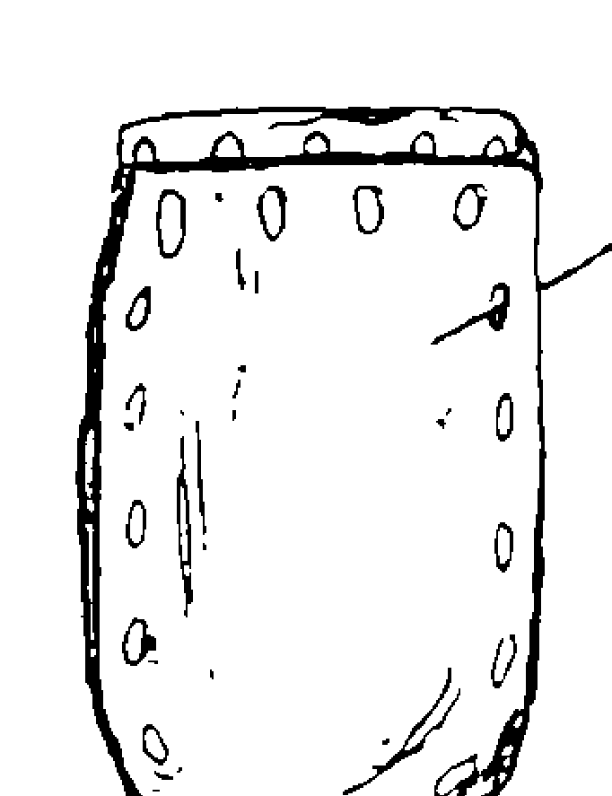

- 4. 決定你醫藥囊的上端在哪裡，假如你使用的是布料，請反摺夠多的布料，好讓你的袋子完成時，能有足夠的空間讓繩子輕易滑過這個通道。假如你採用的是皮革，你也需要夠多的空間能在袋子頂端打孔。

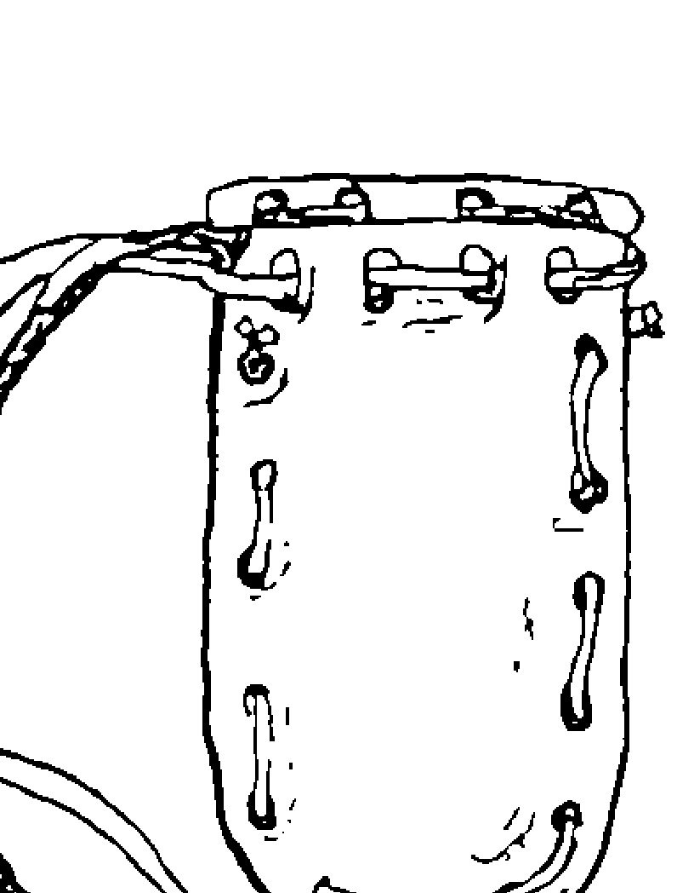

- 5. 如果你的素材是布料，把兩片重疊的布料縫合在一起，摺痕和縫線應該在外側。

- 6. 將醫藥囊縫合，從皮革繩下方的開口開始逐漸縫到另一邊。採用布料製作時，要確保你至少重複車縫兩次以上，如此袋子才能牢固地支撐很久。

假如你使用的皮革非常粗厚，你也許會想用打孔機為皮囊鑽孔，或者使用鑽子來穿引牛筋線或細皮繩。當你打孔時，最好在皮革下放一塊板子，避免損傷桌子或你自己。

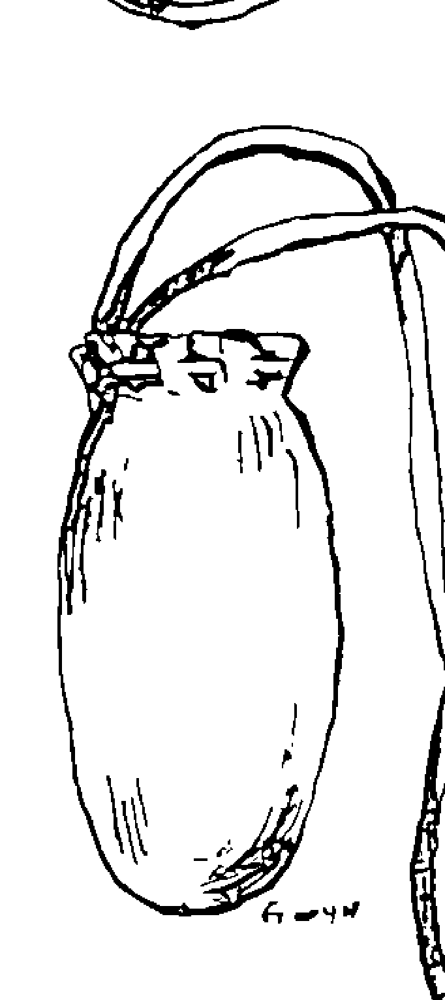

- 7. 把醫藥囊反過來，在你翻轉了這個袋囊之後，用尖錐戳一戳各角落，讓它的外觀看起來更加整齊完整。

- 8. 用一段肩帶把醫藥囊掛起來，這個肩帶可以是粗繩、緞帶、皮革條或任一種長條的素材。確認你剪下的帶子夠長，好讓你可以輕易把摺帶套進你的頭。用一根非常小的針，小心仔細地幫助這條繩子穿過布袋子，並且固定結尾。用針穿引繩子通過袋囊頂端的開口時，拉一拉繩子，讓它完全的穿過開口之後再移開針，接著把繩子的尾端安全的綁緊在一起。

若是皮革袋的話，請先打好洞讓皮革條穿過。用打孔針在袋子上端鑽孔，假如皮革不是太厚，你可以同時打孔穿過兩層皮革。如果太厚了，就分別在每一層皮革上鑽三到四個孔洞。

- 9. 加上任何珠飾、彩繪、或者你想要的繡花，採用藥輪的圖樣來設計和縫製。

- 10. 你可以添加更多的裝飾：用牛筋線綁上一顆已經鑽了孔的圖騰石頭，以皮革針用牛筋線直接縫在你的醫藥囊上，或者運用你當前正在工作的圖騰色彩來設計珠飾，沿著醫藥囊的接縫處縫上珠子，做出一個彩色的滾邊或吊飾。彩繪一個動物或植物圖騰在你的袋囊正面。

- 11. 煙燻淨化你自己、燻淨你的醫藥囊，並且淨化任何你會放進它裡面的東西。將這個醫藥囊獻給宇宙，為自己以及你的袋囊召喚你想要的醫藥。再次對造物主祈禱，請祂去使用這個工具來幫助你、保護你、並且療癒你。對於那些已經幫助過你或即將幫助你的力量獻上感謝。

- 12. 執行一個綁定儀式。

什麼樣的東西會來到你的藥輪囊裡，取決於你自己、以及你此刻正與之工作的藥輪位置。很常見的物件會是石頭、藥草、或有關你正在藥輪裡探索的位置的小信物，或者是那些你需要它協助和療癒的東西。例如：帶來保護的土耳其石、給予能量的紅玉髓、祈求和平的菸斗石、映照他人想法的黑曜石、振奮鼓舞你的野玫瑰、守護整體健康的車前草，以及帶來力量的西洋蓍草。

假如你正與熊的保護、正義、或勇氣工作，你可以找一個小小的熊的象徵信物，用石頭、木頭或其他天然材質所雕刻皆可，放進你的袋子裡。使用象徵信物是一個很棒的方式，可以去連結你的動物圖騰，但卻不會為了掠奪爪子、羽毛、牙齒……等等，而犧牲一個動物的生命。所以，去找到一個帶有熊、海狸、或其他醫藥動物形狀的石頭或小木雕。

為了淨化任何的負面能量、純化並且吸引好的神靈來到你這裡，我們通常也會放進少量的鼠尾草、雪松、以及甜草在醫藥囊裡。其他在袋囊裡常見的物件是這三姊妹～玉米、豆子和小南瓜，用以連結你和大地，並且帶來豐盛。

### 藥輪包裹或醫藥袋

藥輪包裹通常是用一大片布料或皮革捆裹著醫藥物件，然後以一段皮革條、棉線或麻繩安全的捆綁固定。這用來包裹的素材被認為是神聖的，而且不應該再用做任何其他用途。在包裹你的醫藥物件之前，確實用煙燻淨你的布料或皮革、以及捆綁包裹的皮革條或繩子。

一個醫藥袋顧名思義是用來貯存醫藥物件的特殊袋子。當你決定把某個袋子當作醫藥袋使用，它應該從此變得神聖，而且不適合再用來貯裝其他東西。這不是一個普通的錢包或摺包用途，唯有直接關於你的靈性道路的物件應該被放進去。

你可以用皮革或布料來製做它，或者也可以買現成的，只要它僅僅為了這個目的而用即可。

- 你將需要：製作醫藥袋的素材。
- 預估時間：2小時。

假如你想要製作你自己的醫藥袋，大致可依循醫藥囊的製作指示，有些許不同如下：

- 1. 決定你想要做多大的袋子，然後剪裁出一個恰當的樣式。
- 2. 將二片醫藥袋素材固定在一起，否則這尺寸很容易讓素材分開，以致於你很整齊精確的把袋子縫合起來。
- 3. 先把皮革條的孔洞鑽好，一旦袋子完工之後再打洞會更難操作，因為你將需要在更多材料上工作。
- 4. 執行一個綁定儀式。

### 藥輪項鍊

藥輪項鍊是一種將力量顯化成物質的過程，具體固化你的祈禱以及你所召喚前來同在的能量。一個簡單形式的醫藥項鍊，可以只用珠串象徵那些你正與之工作的藥輪石，佩戴這樣的項鍊，可以榮耀當前在你生命中舉足輕重的這些不同圖騰。例如：假如你想要純淨你的靈性，你可以用孔雀石串製項鍊，每串一顆珠子皆為了淨化而做一個祈禱；為了傳送以及接收能量，你可以用水晶串製項鍊；為了鼓舞希望或連結太陽、月亮和火，你可以串製蛋白石項鍊……倘你想和其他醫藥工作，請參考礦物藥輪圖表的指引。

你將需要：已經鑽孔的珠子、強韌的線、繩子、或者細魚線，如果你需要的話：貝殼、石頭、木頭、小象徵信物，鉤子和釦夾。

預估時間：一小時。

- 1. 讓自己安靜下來，邀請大靈與你同在，清晰地宣告你所尋求的是什麼。
- 2. 在儀式中製作你的項鍊。開始串製項鍊時，你所串的每一顆珠子，都必須伴隨一個祈禱，去清楚宣告你想要什麼、或者你想感謝什麼。

- 3. 當這條項鍊已串製恰當長度時，牢牢地綁緊線頭，以免珠串散落。
- 4. 執行一個綁定儀式。

你可以製作較複雜的項鍊，將貝殼、石頭、木頭、或小小象徵信物打洞之後，添加在藥輪石的珠串上。如果你想要一條較短的項鍊，你可以把每一端的線頭綁在一個鉤子或釦夾上，這些配件可以在珠寶手工藝材料行裡買到。

### 藥輪權杖

權杖是非常強而有力的個人化工具。在你開始之前，花一點時間構思、沈思並夢想你的權杖。當你製做牠的時候，在你的腦海中保持著你要用牠來做什麼的意圖。牠是用來療癒的？用來冥想旅行的？或者是用來提振能量的？釐清這權杖的儀式焦點。當你被告知你的權杖的不同元素時，著手去收集它們，在夜晚時把它們放在你身旁，當你已經擁有製作權杖的這些元素時，給自己騰出一段美好的時間，將它們整合在一起，成為一個饒富深意的醫藥工具。

你將需要：儘管權杖是一種非常個人化的工作，但仍有一些常見的基本組成可循，權杖本身大部份是以木頭製成的，雖然它不必然要用木頭材質。

製作權杖的木頭，通常介於七到十二英吋長，儘可能筆直，大約是一到一英吋半的寬度。假如這個權杖將被用來占卜和探尋，它應該要有一端是分叉的。有些時候，若權杖是要被用來創造、移動、改變或者「挑撥」能量，則可以揀選有一端是樹枝狀分岔的權杖。

採用掉落的樹枝、或者從一棵已死的樹上取下木頭來製作你的權杖。不要活生生地去砍下一棵樹的樹枝，而且你所選用的木頭能量，通常應該要能夠增強這權杖的目的。

例如：來自白樺樹的木頭，會被用來連結長者或古老的智慧，白樺樹也帶來指引、淨化、療癒以及釋放。來自白顫楊樹的木頭有助於鎮定、冷靜以及放鬆，它也具有療癒的質地。來自野玫瑰的木頭有著特別卓越的能力，可以激發無條件之愛，它在靈性的層面撫慰著你，並且給予你一種正面積極的靈性上的幸福感。黑雲杉木頭有助於釋放所有層面的黏稠阻塞，黑雲杉也鼓勵你移動。來自山艾樹的木頭，會將魔術師的把戲帶進你的生命，讓你對自己心的能量敞開。橄欖樹的木頭會強化你的目的，幫助你落實並且記得你的體驗。

當你為你的權杖選定好木頭之後，你接著會想要決定該在權杖放上什麼東西，有些人會用石頭來代表某些特殊的性質，其他人會想要彩繪上符號、或畫上不同的動物去召喚四隻腳的圖騰力量。例如：一個美洲獅的爪印會給予保護；而一個水獺的圖像會激發直覺的力量；當一條長長的蛇被畫在你的權杖上時，會促進平衡並純化你的靈性；一隻海龜能象徵土元素，而一隻青蛙也可以代表水元素。

除了木頭材質之外，權杖也可以用寶石切割琢磨而成，所使用的寶石類型通常也會幫助權杖的特性。例如：鋰雲母權杖能夠用來落實接地，平衡並創造一個平靜、穩定的環境。一支東菱玉的權杖能夠用來療癒或帶來繁榮昌盛。一根細長的天然石英水晶，帶有六個琢面的尖端能夠用來療癒、傳送、接收或者激發能量和顯化。

這些可能性是無窮無盡的，除了木頭和其他裝飾、以及你所需要的療癒動力之外，你還會需要：膠水、棉線、細金屬線、粗金屬條、皮革或者是其他素材，幫助你把權杖的所有元素組合在一起。一把刀子、尖嘴鉗，如果你想要的話，也可以準備顏料或筆刷。

預估時間：搜集素材約需一星期到一年不等，製作權杖約需四到八小時。

- 1. 讓自己安靜下來，並且對你所採集而來的元素、以及你正著手進行的儀式獻上感謝。
- 2. 邀請你想要的圖騰和靈性守護者，賦予你的權杖力量。當這麼做時，清晰的宣稱某些事物，例如：「蛇啊！請帶來平衡和靈性的潔淨，我請求你在此時此地與我同在，去加持這個權杖！孔雀石，今日請與我同在，請幫助我抵擋虛弱，請編織你的醫藥進入這個權杖之中……」每一個祈禱，應該直接指出任何你想請求它呈現的能量。
- 3. 用膠水、皮革細繩、棉線、牛筋線、或金屬細線，去把木頭、石頭、所有的元素綁在一起，彩繪上符號以及圖畫……在這期間持續地祈禱賦予這權杖力量。每一個動作都應該伴隨著真誠衷心的祈禱，祈求這權杖未來的醫藥。只去使用那些你渴望用上的元素，一支權杖，即使非常簡單也可以非常有效力。
- 4. 儘管你的權杖會非常具有個人獨特性，但通常製作這個架構時，開始著手的好地方是權杖末端的握把，你可以黏裹一塊皮革或布條來裝飾它。
- 5. 然後在這握把的皮革上端和下端纏繞著彩色棉線、細皮繩或牛筋線，牢牢地固定住它，同時也藉此榮耀你所使用的顏色。
- 6. 在權杖握把這一端，綁上一條皮繩或者棉線，你可以在這裡繫上一顆鈴鐺、珠子、石頭，或其他物件。
- 7. 在相反的另一端綁牢一顆二吋或更長的水晶，或者是橢圓形石頭，用細金屬線去固定這顆石頭。完成後至少要有一吋裸露在外，而剩餘的一吋應該被金屬線和黏膠牢牢地固定。以金屬細線將四條二英吋的粗金屬條縱向附蓋上去，其中一英吋貼靠在權杖的一端，另一英吋則恰當地支撐並穩固這顆石頭。假如這權杖是木頭材質，你可以在那四條較粗的金屬線所安裝之處，先用小刀刻畫出細細的對稱溝槽，然後再用金屬細線水平地纏繞多次以繃緊固定這四條粗的金屬線，直到它形成了一座長長的支架環繞著這顆石頭。金屬細線應該勻稱整齊的水平纏繞這較粗厚的金屬線，從木頭的末端開始圍繞著權杖繃緊多次，並繼續往上纏繞約一英吋左右，包裹住那牢牢固定著石頭的粗金屬線支架。
- 8. 你可以用樹脂或黏膠塗在金屬線上、以及石頭和金屬線接合的地方。去更進一步固定這顆石頭或水晶。
- 9. 藉由纏繞彩色棉線、皮繩或牛筋線來覆蓋住金屬線。
- 10. 決定是否你想要把其他的石頭放在你的權杖上，如果是，用小刀刻劃出溝槽，以樹脂或膠水將這些石頭黏在權杖上。
- 11. 木頭上其餘的空間，你可以彩繪任何你想要包含在你權杖上的符號。
- 12. 感謝靈性守護者和圖騰，再次謝謝祂們平衡和美好的醫藥。
- 13. 執行一場綁定儀式。

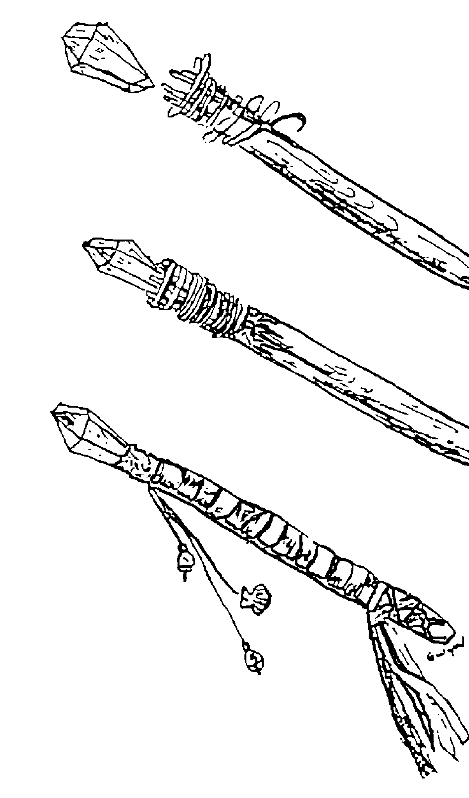

### 藥輪棍

你將需要：和權杖一樣的素材、但木頭的長度必須更長。
預估時間：和權杖一樣。

一根藥輪棍的製作方式，和權杖很類似，明顯的差別在於藥輪棍的長度更長，你得採用一根大概在你腰部到肩膀之間高度的樹枝或棍子。絕對不要活生生的從樹上掠奪木頭來做這個用途，一根從樹上掉落的素樸樹枝，可以被用做藥輪棍；漂流木也可以做為一根漂亮的藥輪棍，然而，若一根堅固強壯的長樹枝、或一根漂流浮木無法取得的話，那麼從五金店買來的木樁也是一個好的替代品。你要如何裝飾你的藥輪棍是個人的選擇，取決於祂的目的、醫藥和使用而定。如果你想要的話，你可以放一顆石頭在你藥輪棍的上端，就依循藥輪權杖中的相同指示去做，你也可以在藥輪棍上嵌入石頭或彩繪符號。

#### ·如何使用藥輪權杖或藥輪棍·

在你創造你的藥輪權杖或藥輪棍之後，讓祂指引你去到祂自己最好的用途。和你的權杖一起睡覺，或把你的藥輪棍放在你的床邊，好讓你可以更加熟悉祂。當你睡覺時，你也可以把這個權杖或棍子平放在你的床底下。在你的床頭放一本筆記，於是你可以隨時記下這些工具可能會啟發你的任何夢境。

藥輪權杖和藥輪棍可以用於能量平衡、夢的工作、療癒、儀式舞蹈、編織或淨化能量、訊息工作、祈禱連結神靈、滿月或其他儀式，也能與元素工作。一根權杖同時也可以被當做說話杖使用。

假如你有鈴鐺飾帶，可以垂繫在藥輪權杖或藥輪棍上，於是你可以用祂來做為一個樂器和聲音療癒工具。

當你在散步或採集藥草製造醫藥時，與藥輪棍一起漫步，是一種去榮耀大自然的絕佳方式。

### 藥輪沙鈴

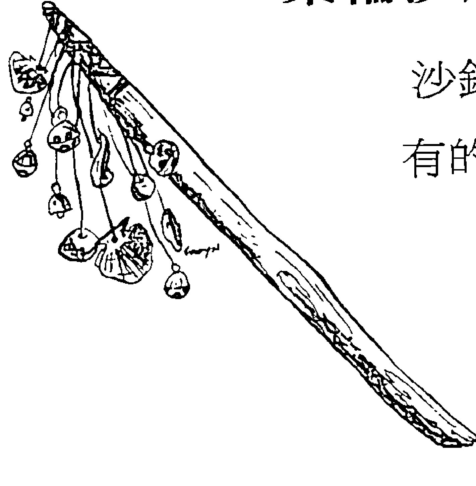

沙鈴是和大靈溝通的強有力工具，並且強化你的祈禱、強化幾乎所有的儀式，特別是包含歌唱或跳舞的儀式。根據它們的聲音質地、它們由什麼材質做成、它們如何被做成、以及它們如何被裝飾……不同的沙鈴響器將邀請不同的能量。如果一支沙鈴的靈性目的遠勝過只是樂器功能，那麼它應該被以一個儀式的方式來製作，並且待以尊敬。若要開始所有的沙鈴製作，需遵循下列基本儀式性的指導方針。當沙鈴未被使用時，某些人會選擇做一個特別的袋囊或包裹去保存他們的沙鈴。

#### 鈴或貝殼

你將需要：一根結實的棍子、鈴鐺或貝殼、牛筋線、細繩或彩色紗線、電鑽和鑽頭。

預估時間：二小時。

- 1. 使用一根結實的棍子，選擇符合這個沙鈴的醫藥的木頭材質。
- 2. 用牛筋線、細繩或彩色紗線把鈴鐺或者貝殼串起來，在木棍上繫綁出美麗的花樣。用一個帶有細小鑽頭的電鑽，在貝殼和木頭上打洞，看你想要多少貝殼就掛多少，持續添加它，直到你獲得你所想要的聲音為止。

你可以只用鈴鐺或貝殼來做這個沙鈴響器，也可以結合第三種聲響。鈴鐺象徵著風元素，而貝殼象徵著水元素，木頭則代表土元素。

#### 葫蘆沙鈴

使用葫蘆、以及一支用來握拿的木棍，你就能製做出各種類型和尺寸的沙鈴。

你將需要：一根棍子、一個葫蘆、刀子、小石頭、黏膠、顏料、刷筆，假如你想要的話：珠飾、皮革、石頭。

預估時間：二到四小時。

- 1. 選擇一根用來當做握把的木棍。
- 2. 在一個乾燥葫蘆的基底，小心切開一個適合木頭握把插入的尺寸的洞口。

- 3. 把一些小石頭或其他物件塞進葫蘆裡，發出你理想中的聲音，然後將木頭握把裝進洞裡。
- 4. 用樹脂或黏膠牢牢固定握把，然後以彩繪符號或黏貼石頭來裝飾你的沙鈴。你可以在握把上添加彩色珠串，或以皮革帶繞纏。
- 5. 執行一個綁定儀式。

葫蘆沙鈴可以被用做許多目的，有一部份是因它們的裝飾而定。例如一個葫蘆沙鈴，可以用來為一場豐收獻上感謝，或者為一場狩獵而祈禱。

#### 現成的中美洲或南美洲沙鈴

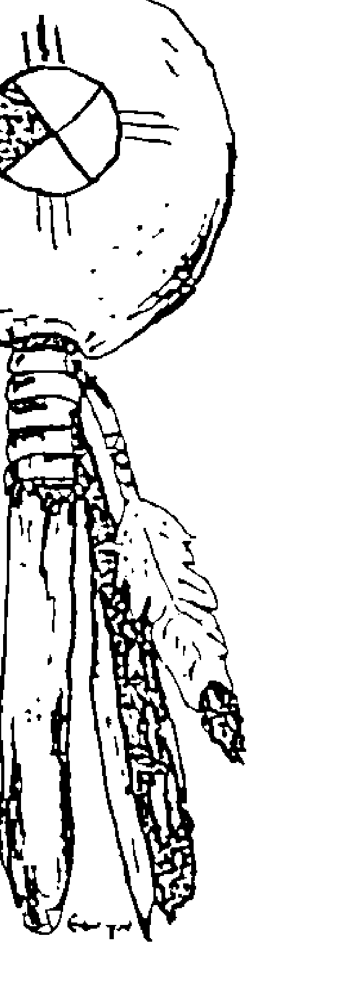

如果你不擅長手工藝，或者是無法取得葫蘆，試著去買一個不太昂貴的中美洲或南美洲現成沙鈴。你可以用顏料塗掉那些通俗的觀光藝品圖案，這是一個去支持第三世界經濟的好辦法，而且還可以個人化特製一支做工精良的悅耳沙鈴。

#### 四方沙鈴

你將需要：一支葫蘆沙鈴、顏料、刷子。

預估時間：連續兩天，每天一小時。

- 1. 使用你當前正與之工作的色彩，來彩繪葫蘆或現成的沙鈴，做為簡單的四方沙鈴。
- 2. 等待顏料風乾，接著環繞著它彩繪四個方位的顏色條紋或其他花樣圖案。白色代表北方，紅色或金黃色代表東方，黃色或綠色代表南方，藍色或黑色表現西方。
- 3. 執行一個綁定儀式。

### · 藥輪面具 ·

人類很早就開始使用面具，諸如儀式舞蹈、療癒、誘導出神、薩滿旅行、從家中驅走疾病、通靈傳訊、扮演靈性存有或元素，並且和神靈的畛域溝通與連結。

面具被用在不同的時機，例如：懷孕、生產、死亡、進入成年、女人的初潮、黎明或黃昏、季節的變換、豐收、點化啟蒙儀式……在很多儀式裡所呈現的，亦即傳統上所謂的：從面具後方觀看的不同視野。

和面具工作能幫助人們去瞭解象徵符號，當你戴上面具的時候，你會失去你自己，並且變成了面具所扮演的那個角色。你並不是躲在面具後面，而是變成某些更多的什麼……面具無法被完全的解釋，它只能夠被經驗。有些人和面具工作，感覺它們是實相中更加難以捉摸的層面的物質性顯化。每一個面具都有一個名字以及它自己的個性，面具使用何種材質製成？在它們完成之後又該如何應用？這其中有極大的差異。在某些部落裡，例如易洛魁族人，除了木頭和石頭面具之外，他們也使用玉米莢殼或濃密的毛面具。太平洋西岸的美國西北部落，則穿戴他們精心製作和裝飾的彩繪木雕面具。而近代的面具，則多半用紙漿來製作。

如同其他的藥輪工具，任何添加其上的裝飾，全都必須為了一個特別的理由。面具的製作可以是一門非常複雜的藝術。對大多數人而言，買一個已構造好的現成面具去象徵那些正與你工作的醫藥，這或許是最好的替代方式，如果你選擇這麼做，在你獲得一個面具之後，請確實去執行一個歡迎儀式以及綁定儀式。

許多地方都有面具製作的指導形式可以獲得。假如你想要製作你自己的藥輪面具時，去上課學習是一個好點子。然而，如果你無法如此做，這裡有一些製作簡單面具的指示可供依循。

#### 製做藥輪面具

你將需要：可以在烤箱裡烘烤的黏土（黏土份量要足夠遮蓋住你的臉，厚約半英吋。另外還需準備額外的黏土，塑造那些你想要添加到面具上的任何表情或輪廓特徵）、報紙、舊衣服、煙燻材料、一碗水、一根桿麵棍、一塊小海棉、凡士林，以及你能取得的黏土雕塑工具、一根鉛筆或者鑽子、皮革或紗線繩索。收集任何你想要掛在面具上的裝飾，例如：珠子、石頭、羽毛、乾的玉米、豆子、小南瓜、或者藥草，藥草可以放在一小方塊布裡，再以棉線捆綁起來，然後掛在面具烤乾後就預先鑽好的洞上。如果您想為面具上色的話，也請先準備顏料和刷子。

預估時間：二至八小時。

- 1. 淨化清理並歸於中心。
- 2. 桿平一大塊尺寸適合你的臉的黏土，你也許需要用小海棉輕輕的沾濕黏土，或者輕柔地撫平它。你完成的黏土應該要是大約半英吋厚，而且夠結實堅固不易破裂。
- 3. 在你的臉上塗上大量的凡士林，尤其在眉毛處以及臉上其他毛髮區域，需要特別多的份量。做一個深呼吸並且閉氣，接著把黏土覆蓋在你的臉上，用你的手很迅速但是很輕柔的按壓黏土，好讓它儘可能吻合你的五官輪廓。
- 4. 小心地移開面具，並將它晾置片刻，等待它變硬。
- 5. 在你的嘴巴、鼻子和眼睛處，適當地切割或鑽孔。
- 6. 添加上任何你被指引要額外加上去的特徵，你也可以鑽任何你想要的孔洞，好讓你可以在這面具上繫掛羽毛、珠串或藥草。用一根細長的工具或鉛筆鑽這些洞，雖然你應該聆聽你內在的指引而定，但通常會沿著前額或穿越下顎線打洞。
- 7. 在每隻耳朵邊各打一個洞，繫上繩子，這樣你就可以佩戴這個面具。這個孔洞要離面具邊緣夠遠，避免它們因過度拉扯而裂開。

+   8. 烘烤面具時，請根據這黏土的使用說明。
9. 當烘烤完成的面具已放涼之後，就可以開始彩繪它，並加上任何其他裝飾。
10. 執行一個綁定儀式。

### 藥輪盾牌

就像面具一樣，自從混沌初開以來，盾牌對人類就已非常重要。任何戰役都需要聰明的尋求保護，在戰爭中，無論是在物質面、靈性面、心智頭腦層面或情緒面，盾牌都是一個保護的力量。

盾牌的類型就如同它們的使用一樣廣泛多樣。除了保護自我、家或家人，盾牌還可以用來療癒、做夢，以及用來象徵家庭氏族、小屋、或社會歸屬。盾牌可以用來形成一個人的個人動物圖騰結盟、或者部落動物圖騰的聯盟，盾牌也可以用來訴說故事或記錄重要事件。

因為盾牌的製作相當複雜，你可以從一位很好的盾牌製造者那裡購買一面現成盾牌，當你帶著它在藥輪上旅行時，你再自行為它添加新的元素。如果你想要去建構你自己的盾牌，就請跟隨下列簡單的指示。

#### 製作藥輪盾牌

你將需要：一個圓框、皮革或布料、線或皮革帶、針、繩子、顏料、石頭、藥草、羽毛、木頭，以及其他你想要的物件。

預估時間：一至四小時。

+   1. 煙燻並且歸於中心。
2. 如果能夠取得柳樹枝製作圓框的話，把它捆綁成一個你想要的尺寸的圓圈。用牛筋線、繩子或皮革條去紮緊它。如果無法取得柳樹或其他柔軟易彎曲的木頭，也可以在手工藝品店購買現成的刺繡圓框替代。
+   3. 在圓框上繃緊鹿皮、麋鹿皮、布料或者是帆布。用一般針線或皮革針及牛筋線，將布料或皮革固定就位。
4. 當你在盾牌上彩繪符號之前，先讓自己安靜下來，這時候再次進行煙燻工作是很好的，接著在這面盾牌上畫進故事、徽章、或當前正影響著你的符號。
5. 綁上或縫上任何你被吸引去使用的裝飾品。
6. 執行一個綁定儀式。

#### 貯存並保護你的藥輪工具

當你不使用時，請小心貯存和保護你的藥輪工具。這些工具並不是用來陳列的藝術品，不要讓所有看到祂們的人都任意觸摸或撫弄。如果你被神靈指引去掛起某個物件，例如你的盾牌或面具，請你把祂們展示在一個較隱密的地方，或者是放上一個寫著「請勿觸碰！」的標示牌，堅持要人們尊敬你的物件。假如你被告知去展現某些東西但不談論祂，如同祖母伊芙琳·伊頓在她〈發送一個聲音〉書裡的建議：你可以製作另一個標示牌：「請勿詢問！」

大部份的醫藥物件，在你未使用的期間，都可以被保存在一個醫藥包裹或醫藥袋裡。

#### 淨化醫藥工具

為了避免從一個儀式中拖曳能量到下一個儀式，你的工具在每次使用過後都要清理乾淨，這個步驟非常重要！痛苦已經在儀式中被釋放進入醫藥工具裡，只因為這醫藥工具在先前的儀式過後沒有被恰當清理，在接下來的儀式中，這痛苦可能會意外地轉移到另一個人身上。工具可以用鼠尾草、雪松和甜草的混合藥草來燻淨，也可藉由水、聲音、呼吸和祈禱來淨化。

#### 對醫藥工具獻祭

定期煙燻淨化並且將你的醫藥工具獻給宇宙，重申祂們的意圖和目的。藉由對祂們獻祭，去感謝祂們所給予你的醫藥。大部份的醫藥工具會告訴你祂們喜歡什麼樣的獻供，例如：很多面具喜歡菸草獻禮，喜歡人們對著祂歌唱；權杖則喜歡在清晨黎明裡曬太陽、或待在滿月的月光下；盾牌喜歡被柔軟的材質覆蓋或包裹，必須使用天然材質而非人造素材。

##### 獻祭

+   - 一些常見的獻供是菸草、玉米粉、鳥餌、金尼金尼克 kinnikinnick、鹽浴、歌唱或吟唱、擊鼓、鮮花、你的一小撮頭髮、在溪水裡清洗（如果適合這個工具材質的話）、燻煙或焚香，或者把食物留在一個區域給這醫藥工具的神靈。

##### 建立獻祭的祭壇

你將需要：大自然裡一處安靜的地方、燻煙素材、你的醫藥工具、獻供、鼓、沙鈴、柔軟的花朵。

預估時間：一小時。

+   1. 在大自然中找到一處你不被打擾的地方。
2. 煙燻淨化你自己，淨化在這場獻祭中將被觸碰的每一件物品，燻淨你所在的區域。
3. 首先，把醫藥工具放在你準備要建立祭壇的地方，把獻祭的供品放在它周邊，例如花、食物、玉米粉、鹽……等等。
4. 做一個祈禱來表述你的目的，例如：「我獻上這些供品，去榮耀這個面具的醫藥，我獻上感謝，給這個醫藥以及這個面具的神靈，HO！」
5. 試試下列這些方法，去連結並感謝這醫藥工具的神靈。
+   * 花一點時間和這能量同在，靜靜地坐著，獻上一個感謝的祈禱。
+   * 藉由擊鼓、跳舞或唱歌等方式，獻禮給醫藥工具的神靈。
+   * 閉上你的眼睛，並且淨化你的念頭，或許有很多的訊息會來到你這裡，去留意察覺任何的畫面或徵兆。
+   * 以柔軟的花溫柔地摩擦醫藥工具，例如：玫瑰花瓣或蒲公英。
+   * 輕柔地把醫藥工具放在你的心間，吟唱或哼歌給祂聽。
6. 做一個圓滿完成的祈禱。
7. 移開並恰當地包裹好這個醫藥工具，同時也收拾其他的個人物件，例如：煙燻碗、扇子、藥草囊。
8. 在祭壇處留下任何的獻供，例如食物、花、石頭、或玉米粉。
9. 靜靜地帶著尊敬離開。

請記住，當你榮耀醫藥工具的神靈時，你是在對這工具的神靈或能量獻上愛和感激，很重要的是必須去尊敬這個醫藥工具，並且記得你不是在崇拜這個工具的物質外殼。透過祈禱和獻祭的形式，我們感謝的是這股能量和生命力，祂透過醫藥工具的形式來傳送呼吸、療癒和生命。醫藥工具的物質外表下傳達著人類的某種需求，這些工具的醫藥都圍繞著我們，這股生命力專注聚焦於某種預期的目的。醫藥工具是來自大靈的禮物，對人類來說，得以用一種實體可觸摸的形式去駕馭神靈的能量。這些工具以及祂們所連結的神靈守護者，就像是大靈的媒介，指引我們以自己的心去「看見」，並且傳導著光。於是我們能夠如同祖母～伊芙琳·伊頓曾說的：「去發光發亮！」我們對你的祈禱，就如同你和藥輪工具工作一樣，都是為了讓你「去發光發亮！」，朝向自己開悟的道路、朝向那些需要被帶出的療癒、並朝向造物主的光以及大地母親。

# 第 9 章
### 以藥輪療癒

有很多方式可以運用藥輪來促進療癒，研習藥輪已經為許多人帶來了療癒；建構藥輪也療癒了某些人；使用藥輪做儀式、靜心、祈禱、以及沈思冥想，同樣也能夠幫助許許多多人們，在他們存在的所有層面變得更加整全以及健康。

藥輪匯聚已為大量的人們帶來超自然的療癒奇蹟，有些人甚至帶著嚴重的問題而來。我們總是能不可思議的看見造物主如何強大有力的透過藥輪而工作，去幫助那些真正在尋求療癒幫助的人。

在最早的二十五場藥輪匯聚裡，瓦奔的彩虹水晶療癒儀式，通常是在星期天早晨會給予參加者的一個療癒工具，祂總是非常強而有力。在這個章節稍後，我們將會把這個儀式呈現給那些想要在自己藥輪裡使用祂的人。後來，瓦奔自己環繞藥輪的旅程一度將她帶離了藥輪匯聚，取而代之的是太陽熊以祈禱扇和羽毛所構成的療癒儀式，以及其他某些老師和療癒者所呈現的祈禱。彩虹水晶療癒儀式有著戲劇化的結果，藥輪本身的力量似乎可以療癒那些正敞開心去感受這股能量的人。

對於那些發覺自己很難去感受能量的人，以下是蝶蛹所發展出來的療癒儀式，這是一個用來幫助人們體驗藥輪的感官療癒工具。

#### 藥輪感官療癒儀式

藥輪感官療癒儀式，是一個用來促進個體療癒和平衡能量的方法。祂也可以幫助你去連結並學習關於你的靈性指引者和保護者。此外，這個儀式也將幫助你擴展你的五種感官知覺：聽覺、味覺、嗅覺、視覺、以及觸覺。

在這儀式期間，參加者宣告他們的靈性指引者或植物、礦物、動物幫助者，藉此邀請他們在場。這個儀式被用來發展五種感官知覺，祂也可以幫助你去連結並且探索藥輪不同的面向，可以用來標記出你在藥輪所座落的位置，幫助你瞭解藥輪的圖騰。

對某些人來說，祂非常精微、放鬆、以及沈著寧靜，是一個與大自然親密交融的愉快經驗，並且敞開和加深感官知覺。有些人曾經驗到療癒的深邃層次，且強烈地與神靈的力量連結。在不止一次的儀式中，天氣總是會驟然轉變。很特別的一次經驗是：召喚元素的力量時，一陣微風揚起，接著這個區域開始刮起了大風，並飄下了毛毛細雨。

然而對某些人而言，儘管他們能夠感受這藥輪裡面和外面的能量不太一樣，但他們絲毫無法意識到任何事發生。

進行這個儀式切忌自大傲慢或漫不經心，這也不是讓你用來和大型團體或無視於儀式力量的人分享。你愈是練習這個儀式，祂愈是能夠利益你的生命。在圓滿結束這個儀式之前，請確認那些參加者已經安穩地落實紮根於地。

當我們首次分享這個儀式時，蝶蛹後來看到一些參加者出現偏頭痛、頭痛、胃痛……以及一種解離的感覺，她注意到這些情況之所以會發生，是因為參加者沒有良好的接地、或未經釋放在儀式期間襲來的種種感受。因此，她現在會給出恰當的時間和注意力，去確認所有參加者都有機會讓自己落實紮根、並釋放任何在這儀式期間累積起來的情緒。小心地觀察參加者的需求，以避免各種不適，這是身為一個儀式主持者的責任。

有些參加者已經從這個儀式中體驗到許多不同層次的療癒。一個療癒的紀錄憑證已經銘印在心智、物質、情緒、以及靈性的各層面裡。然而，這個儀式不能代替醫師，如果你有健康問題，請洽詢你的醫生。

在你執行這個儀式之前，建議你最好重讀第二章。我們鼓勵你保持你療癒之輪最初的簡單純粹，使用來自當地森林以及溪床的石頭，當你繼續與藥輪工作，你可能會想要用確切的圖騰石來建構一座藥輪，如果你已取得它們的話。

而後，當你能舒適自在的進行這個儀式時，你或許就可以嘗試架構第五章所描述的其他類型藥輪。

##### 預備

你將會需要至少二到四小時進行這個儀式，包括了準備的時間、以及執行儀式的時間，還有收拾善後的時間。最好是不要有任何時間限制，這是一個影響力極其強烈的療癒，不要低估了祂的力量。請慢慢地進行，絕不要在沒有做好紮根接地的情況下，貿然地過早終斷一個儀式。所有參加者對於儀式的本質應該有一些知識，而且他們應該懷著尊敬。假如你對於這個儀式有任何不確定，寧可不要進行，你可以選擇這本書中的其他儀式工作。當你感覺自己準備好了並且充滿信心，你再進一步考慮與這個醫藥工作。這個儀式不是給每一個人的，也不需要如此。假如你可以與這個儀式工作，你自然就會清楚的知曉祂。如果你不確定，請詢問大靈，大靈會指引你。

決定由誰來操作這個儀式。直到你已經做了足夠多次，可以舒適自在進行這個儀式之後，你就可以自行操作，或者和四個關鍵角色一起進行：一個主持者、一個支持者、一個鼓手，以及一個參加者（要進入藥輪裡接受療癒和幫助的人）。

假如你需要這個儀式的形式來療癒自己、並對大靈敞開，去經驗你的五種感官知覺，那麼你應該成為參加者，而讓其他人去主持或者成為支持者。

身為主持者或支持者，是一個很美好的服務方式，同時也擴大你自己的療癒能力。這二個角色的任何一個，都有來自它自己本質的獎賞，對於參加者而言都是禮物，被那些已經處在這個位置上的人們宣稱之後，儘管未曾經驗過，他們也都會感受到療癒、以及與大靈更深切的連結。

身為一個主持者或是支持者，不要去自行推斷你認為這個參加者需要什麼，也不要去投射你想要這個儀式有什麼樣的結果，你僅僅只不過是一個被大靈所引導的工具，讓療癒得以在其中移動。在你的祈禱裡，很重要的是你要有意識地將這個療癒交託給大靈，並且不去限制或干預這儀式的進行。

假如你無法明白這一切是發生在參加者和大靈之間，那麼你可能還沒準備好要去主持或支持。試著先當一個參加者，好讓你有更好的體驗和領悟，並且瞭解參加者的需要。

##### 主持者

這個人將領導、主持、操作整個儀式過程，負責決定該採取什麼樣的形式、什麼樣的醫藥物件、器具、藥草、以及何種香氛芳療。當他和一個支持的幫助者工作時，要清楚這些都是主持者的責任，因為任何的困惑都會讓那些參與療癒過程的人感到騷動不安。這個重要的主持者，或許可以將一部份工作過程，委派給那些即將幫助這場儀式的支持者。

保持儀式的單純且井然有序，不要把自己或支持者們弄得心力交瘁，這對於那些參加者來說，危害匪淺而且不負責任。你寧可少做，直到你已經重覆這個儀式夠多次，可以自然地隨著藥輪裡的能量流動為止。

對於那些參與在內的人而言，假如他們能有一個很好的支持，這會是一場非常觸動人心並且充滿情緒的儀式，而正是這個主持者的角色，保證了這個支持。

##### 支持者

假如你和不止一位參加者工作，在每一個參加者走進藥輪時，都應該要有一個支持者，有足夠的幫助者去確認每一個人都得到恰當的支持和照顧，這是極其重要的。支持者這個角色，要把他們全部的注意力給予參加者。

在儀式期間的任何時候，請勿要求參加者說話或回應支持者，而支持者應該要盡可能溫和冷靜、沈著低調的進行主持者給他的指示。

支持的人們只能觸碰參加者的身體四肢，他們應該緩慢的移動，即使是很微小的細節，也不要用一種可能被視為侵擾的方式去碰觸參加者。當碰觸參加者時，在腦海中記住他在六到十二英吋之外就能感受到你的觸碰，所以你慢慢的移動、冷靜沈著並且溫和輕柔。當你的手要從他身上移開時，也請遵循同樣的方式。

要記得這是一個為他們而做的儀式，並不是為了你，這不是一個可以把你自己的需求放在其他人頭上的時候。

##### 鼓手

若整場儀式都敲擊著一首心跳之歌，將會非常強大有力，而且可以深深地增強整個體驗。這個律動應該是參加者們心跳的集合，沒有鼓手也能舉行這個儀式，你可以運用沙鈴響器所提供的節奏，然而若是可行的話，有一個鼓手總是比較好的。

##### 參加者

假如你正在尋找你的感官和療癒的開啟，或者希望與大靈更深的連結，那麼身為參加者的這個體驗，對你而言就很有價值。

##### 工具

為了這場儀式，你需要去收集一些你所能獲得的工具。我們不預期也不鼓勵你去試圖用上所有的建議工具，一開始最好能少用一點，如此你才能夠去個別經驗每一個工具的獨特力量。請牢記這個儀式是關於與大靈連結的，這不是一個讓你做秀表演的時機。以下是一些對於工具的建議：

聲音：用你喜歡的自然樂器～沙鈴、鼓、笛子、哨子、管鐘、迪吉里杜管（澳大利亞本土樂器）、雨聲棍（南美洲雨林樂器），或者是各式各樣的鈴，播放一段音頻也是可以的，如果這音樂是自然的聲音，例如鼓聲、笛子演奏、風聲、雨聲或者海浪聲。

味覺：準備一杯或一保溫瓶的熱茶，以你所能取得的藥輪香草植物來泡製，選擇一種屬性對這儀式目的來說較適當貼切的茶。

嗅覺：使用任何你所喜歡的藥輪植物香氛，可以是燻香、也可以是自然植物，或是精油、花精、小香囊，或者是香脂，無論參加者有什麼問題，選用能夠為他提供最佳服務的藥草香氣精油。藥輪蠟燭也可以用來提高嗅覺的感知能力。

視覺：視覺觀想的刺激，來自於藥輪石頭，也來自於所有藥輪工具的呈現，最重要的是來自於大自然本身。

觸覺：權杖、石頭按摩工具、和藥輪有關的特殊寶石、面具、醫藥袋囊（特別是那些柔軟或是帶有粗糙織紋的材質）、以及儀式性的珠寶，都可以在這儀式中用來刺激觸覺的感知。

那些代表著藥輪各面向的大自然禮物，也可以被使用。例如：一朵柔軟的野玫瑰、或者一朵毛茸茸的蒲公英、一顆橡實、一個松果或松針……或是一根從某種植物圖騰樹上自然掉落的樹枝。

你也會需要二條醫藥毯（一條毯子用作祭壇，而參加者應該帶來另一條毯子，以供躺下時使用）、煙燻器皿用具（貝殼、碗、扇子……等等）、菸斗（如果你是一個菸斗攜行者的話）、以及用來建構藥輪的石頭（更多關於石頭的部份，後續會再簡短討論）。

如果你還沒有藥輪的話，決定一個建造藥輪的地點。雖然他可以在室內或室外，但我們較傾向於建構一個戶外大自然中的藥輪，然而，這應該是一個你不會被打擾的地方。你會需要一個寬敞而且夠平坦的地區，去建構一座藥輪，於是參加者可以很舒適的躺在裡面。假加你已經擁有一座藥輪，你可以去到那裡進行這個儀式，

如果你要為了這個儀式而建構藥輪，請先決定藥輪和石頭的尺寸，這完全根據有多少人要進到藥輪裡療癒而定，就如我們先前曾有的提醒，這藥輪應該要夠大到讓參加者可以舒適的躺在其中。你所揀選的石頭也要夠大，好讓藥輪本身明顯可見，而且不會因為參加者的進出而破壞。

你可以使用任何種類的岩石或石頭，如果參與儀式的每一個人：主持者、支持者、鼓手、或參加者，至少各帶一顆石頭前來的話，這儀式將益發強大有力，這會幫助建造能量並且連結藥輪的力量。人們也許在樹林間漫步時找到了這些石頭，或者在他們與大自然交流時發現，抑或採用一顆對他們來說已經具有特殊意義的石頭……在這儀式過後，他們可以把這些石頭帶回家，石頭會繼續攜帶著能量以及這個儀式的療癒質地，與他們同在。這些石頭也經常被參加者和主持者使用在他們自家所建構的藥輪裡。

請依循第五章～〈建構一座藥輪〉的指導，去建造儀式之輪。

##### 儀式

在開始儀式之前，請先重讀〈儀式與尊敬〉這個章節。

1. 把你將要使用的任何東西，放在一張醫藥毯上，這裡將會是你的祭壇。
2. 煙燻淨化你自己，燻淨所有的參加者，煙燻淨化一座完整的藥輪，燻淨周遭區域、以及所有在儀式中將會被碰觸的物件。如果可行的話，在你的煙燻混合植物裡使用藥輪藥草，藉由為每一個人從頭到尾徹底的煙燻，來汲取這些藥草的醫藥。
3. 接下來，讓所有參加者以聲音淨化保護他們自己。聲音淨化能清理並純化振動層面，建立一股純粹清淨的能量，有助於療癒以及大靈的工作。運用悅耳美妙的樂器，諸如：沙鈴響器、鼓、哨子、長笛、管鐘……去進行聲音淨化。與樂器工作，例如以沙鈴從你的身體發送出聲音，藉此拉出任何你不需要的能量。輕輕地彎曲你的膝蓋並且深長緩慢的呼吸，用你自己的方式，以沙鈴從頭頂開始晃動震盪能量到你的腳趾頭，最後帶進地面，小心不要把這能量扔進聖圈裡或是某個人身上。接著，再次舉起沙鈴，在你背後做同樣的動作，當你到達你的腳時，晃動這個能量隱沒入大地。如果你有鼓或者笛子，也可以用它們進行，盡可能讓這些聲音靠近你的身體，讓自己全然去感受這股震動。
4. 以樂器淨化所在的區域。當每一個人都徹底以聲音淨化後，就接著清淨藥輪並且以美妙的樂器淨化周邊地區。以聲音淨化時，儘可能高到你所能觸及的地方，並且近可能的低到接近地面。清理藥輪四周，好讓這儀式中所有人可能行經的地方，都被聲音的振動所淨化。
5. 在一顆方位的石頭旁、或環繞著中央的造物主之石，放置安全穩固的燭臺和蠟燭，當你點亮蠟燭時，對火元素獻上感謝。用於蠟燭裡的色彩和藥草，可以根據參加者的需求而決定。蠟燭選項並非必要，假如你不使用它們，那麼就在你點燃煙燻材料時，感謝火的元素。
6. 現在，參加者可以進入這個藥輪，請他們坐在自己的醫藥毯上，他們應該知道這是一個感知的儀式，而儀式的不同部份將有可能會療癒到靈性、心智、情緒、或物質肉體的層面。這個儀式也幫助他們與神靈連結以及與五種感官覺知的不同面向連結。簡短地提醒他們這些，接著對造物主獻上一個祈禱，邀請藥輪的力量同在並回應參加者的祈禱。感謝元素的能量～地、水、火、風，以及動物、礦物、顏色和植物圖騰，對視覺、味覺、聽覺、嗅覺以及觸覺的天賦獻上感謝。再做一個祈禱，把這個儀式移交給大靈，你可以很簡單的說：「造物主，請您為了所有參與者的最高美善，來引導這場儀式……」然後以「HO！」來結束你的祈禱。儘管你將會繼續跟隨這個儀式的架構，但是你會認知到造物主才是這儀式期間所有發生的源頭。
7. 如果你準備了一壺以藥輪藥草泡製的茶，這個時候倒給參加者一杯，你可以大聲地對參加者解說：這是為了要打開他們的味覺、連結他們與植物王國，並且綁定他們與水的元素。這個步驟也是非必要的選項，如果你使用儀式性的珠寶，此時就是參加者應該佩戴上的時候。
8. 當參加者正在飲用他們的茶時，讓他們與自己視覺的天賦連結，鼓勵他們把自己的意識滲透進入藥輪以及蠟燭的視覺影像裡，若是在戶外，則讓大自然的一切映入腦海。
9. 如果你選擇做飄浮花瓣儀式（描述在第十三章裡），帶給參加者一碗花瓣，讓他們知道這個練習是為了對畫面、顏色以及氣味敞開，請他們跟隨這個練習裡的指示。

-   10. 接著，請他們躺下並且閉上眼睛，鼓勵他們去感覺大地母親的支持，請他們去留意自己的呼吸，盡可能的深長、緩慢……。查看是不是每一位參加者都足夠溫暖，如果不是的話，請為他們蓋上毯子，藉由真正去感受大地對他們的撫慰和滋養，鼓勵參加者去連結自己的觸覺。邀請他們用自己的手去觸碰身旁的地面，過程裡請他們不要睜開雙眼。

-   11. 開始儀式性的擊鼓。無論何時，如果可能的話，至少要有一個人在整場儀式裡從頭到尾擊鼓。這個鼓手慢慢地沿著聖圈行走，敲擊出集體的心跳聲。請參加者用他們的左手掌去尋找他們的心跳，並以另一手溫柔卻堅定的拍打他們的胸膛，跟著他們自己生命的脈衝，藉此來開始節奏。假如有超過一位以上的參加者，這個拍打聲最終會和諧一致。當這個脈動轉變成它自己的節奏時，鼓手就接著加入這首心之歌。鼓手繼續敲擊貫穿整場儀式，然而當鼓手堅定的心之歌節奏進來時，參加者就應該停止拍打。

如果你有許多幫助者，你可以安排不止一位去擊鼓和搖沙鈴。很重要的是節奏要非常輕柔而且態度始終一貫，避免與其他被使用在儀式期間的樂器相衝突，或者是去震驚刺激到參加者。當處在這樣安靜的意識狀態裡，任何大聲的噪音或是快速的移動，都會被放大突顯。

如果你沒有一個鼓手能為這個儀式開場，你可以自己擊鼓或搖鈴來開始這場儀式。如果你沒有樂器，就只要用你的手掌做為你的樂器，輕柔地拍打自己的胸膛，以你的心之歌為這個儀式開場。

-   12. 給參加者一點時間，去適應這個聖圈的能量以及擊鼓的聲音，然後再開始進行芳香療癒。請一位支持者從最近的道路入口走進圓圈裡，靠近參加者頭部坐下或彎腰屈身，在旁邊放置你選擇用來增強這儀式目的的香氛素材，盡可能不要打擾到參加者。琥珀和力量之石有關，通常來自於大塊或小片的黃楊木，然而，大部份的香氛都是精油的形式。支持者應該握著香氛物件盡可能靠近參加者的鼻下，要極度小心不要潑濺出精油在參加者身上。輕輕地請參加者做悠長緩慢的深呼吸。讓他們用二到四次呼吸來吸進香氣。做完後，支持者應該收拾起香氛物件並且迅速離開藥輪，回到祭壇等待主持者的下一個指示。

13. 如果可能的話，在參加者頭部的地面上放置任何加強的醫藥物件，例如一個孵夢枕頭、捕夢網、或者是雙尖水晶。如果你有很多的參加者，多過做夢的醫藥工具時，那麼就把你所有的做夢工具都放在藥輪的中央圓上。靜靜地做一個祈禱，並出聲請求參加者的夢將會被增強、記得、以及被理解，請求每一個人將會更深地與他們潛意識的秘密連結。

14. 現在，從那些先前列舉出的工具裡（本章節第180頁），挑選出一個醫藥工具或物件，輕柔地放置在參加者手中，記住，參加者在如此安靜的意識狀態下，任何一個快速或粗野的碰觸都會是嚴重的打擾。

15. 在這個時候，支持者應該被指示去使用其中一個聲音器具，清理淨化參加者的能量場。他們應該從參加者的頭頂開始工作，一路往下清理到他們的腳底，根據時間架構以及這個團體有多大而定，這樣的淨化步驟要重覆二到四次。使用聲音樂器的順序應該以沙鈴響器為先，然後是輕柔的、優美的聲音，諸如長笛、輕柔的哨子或美妙的鈴……然後才是更加氣勢磅礴的樂器，例如迪吉里杜管、海螺、鑼、管鐘或鼓。接近儀式的尾聲時，以雨聲棍、優雅的鈴或長笛再重覆一個輕盈溫柔的聲音，最後以沙鈴響器再做一次結尾。

16. 重覆在步驟12中所描述的芳香療癒，如果可能的話，採用另一種不同的香氣。

17. 重覆在步驟14中描述的醫藥工具，採用另一個不同的醫藥工具，如果你只有一個工具的話，那麼就把它留在適當的地方。

18. 重覆步驟15中所描述的聲音淨化法，依循著步驟裡指示的聲音順序。如果你只有一個樂器，那麼就重覆以它的聲音來工作。

19. 移開參加者所握著的醫藥工具，假如你有醫藥面具，現在可以輕輕地把它放在參加者臉上，引導他的手去扶住面具，好讓他自己處於舒適狀態。隨時保持覺察和尊重，留意參加者是舒適或高度緊繃的存在狀態。

20. 重覆在步驟12中所描述的芳香療癒，然後是步驟14裡的醫藥工具以及觸覺感知練習。最後是步驟15的樂器聲音淨化法，直到你已經使用了所有你能用的工具，除了最後的沙鈴淨化清理，這時候請移開所有醫藥工具或面具，在繼續之前，環顧四下確認參加者已不再握持醫藥工具或穿戴著面具。若有任何遺留，請移開它。

21. 如果你是一個具有資格的菸斗攜行者，現在是去做一個菸斗儀式的時候了。當參加者意識到這個轉換被輕聲地宣告了，你就可以開始菸斗儀式，但是不需要讓他們移動。這時候先從頭到腳趾煙燻淨化參加者。如果你沒有進行菸斗儀式，那就煙燻淨化他們即可，使用你所能取得的藥輪藥草，包括鼠尾草、甜草、和雪松。

22. 在完成了菸斗儀式或煙燻儀式之後，接下來請進行一段最後的沙鈴淨化法。

23. 這時候，從落實紮根練習開始，輕柔但堅定的把參加者帶回到物質世界，總是把你的雙手輕柔篤定的放在他的足踝上，以此做為結束。一開始施以輕柔的按壓，然後更堅定的增強力道，直到你感覺一個堅實穩固的紮根接地能量，強壯地連結著參加者和大地層面。這個過程至少進行一分鐘，然後再輕輕的放鬆。你不要去喚醒參加者或是有任何類型的言詞交流。他們是去重新連結這個物質層面，而不是連結你個人。

其他可用的落實紮根練習，例如：雙手兩極平放在身體各部位、摩擦肩膀、輕柔的觸碰額頭，或者溫柔的按摩頭部……記住，保持你的觸碰只在參加者的頭、頸和四肢，愈緩慢、沈靜和輕柔愈。不要做任何將使參加者移動或說話的建議。

24. 在所有參加者已經落實接地之後，接下來，主持者以及支持者應該全部集合在一起，並且手牽手在藥輪外的祭壇旁邊圍成半圓。

25. 主持者應該大聲分享出一個圓滿結束的祈禱，例如：「這個儀式已經圓滿完成，我們對大靈獻上感謝，謝謝今天所有在這裡發生的一切，謝謝所有臨在的元素和能量，我們獻上感謝，給這場儀式以及這個療癒聖圈。這真是太棒了！已經圓滿完成了！HO！」然後，對參加者說：該是回到物質世界的時候了！他們應該感受大地母親在他們的腳下，並且與物質層面的能量連結。繼續宣告他們曾經歷了一場強而有力的旅行，而現在旅程已然結束，他們應該把自己的能量和身體帶進與這物質大地的強壯關係中。指示他們睜開眼睛並坐起身，但不是離開藥輪，給他們一些時間進行這個過程。

小心仔細的觀察參加者，在這個儀式之後，看看是否有任何人需要特別的注意，或是更進一步的紮根接地。諸如此類的跡象可能會是：看起來輕微的暈眩、大量的白光或能量環繞著頭部、或者任何種類的焦慮煩躁。大部份來說，你可以預期參加者臉上懶洋洋的傻笑、以及做夢般心不在焉的神情、或敬畏不已的表達，很可能他們的動作也會異常緩慢。

26. 現在該輪到你自己以及其他支持者去落實接地了。邀請其他的支持者們輕微彎曲他們的膝蓋，讓他們的手臂能夠輕鬆地擺盪，並且做四個悠長緩慢的深呼吸，在每一次呼氣時，要求他們送出最後的任何祈禱或能量給參加者。接著邀請支持者和參加者一起做四個深長緩慢的呼吸。這次請求每一個人送出一個感恩的祈禱、療癒和能量給主持者與支持者們。

27. 現在，每一個人應該都已落實接地並處在當下。宣告你將會把一根說話棍繞著圓圈傳遞下去，當每一個人拿到說話棍時，應該充分表達他們想說的，而當其他人拿到說話棍時，你必須靜靜聆聽。首先從參加者開始，然後是支持者，最後由主持者結尾。請聲明每個人有三到五分鐘時間說話。這個過程至關重要，所以請確認你有足夠的時間去進行這個部分。

28. 在每個人都分享過後，花一點時間去提醒參加者：這是一個強大有力的體驗，而且這情緒在往後的某些時刻裡仍會持續浮現。鼓勵他們準備好在接下來的幾週內和恰當的支持同在。假設他們處於治療期間，在接下來幾週中，務必去和他們的治療師檢視確認，如果他們是在一個特定的治療進程中，請不要錯過他們的晤談。如果他們尋求諮詢、女人圈、男人圈團體或任何形式的支持，在接下來的兩週尤其重要。假如他們沒有做任何種類的自我檢視，鼓勵他們在這個時候考慮這麼做。另外提醒他們：因為這儀式的關係，他們的夢會變得非常強大有力而且深具啟發，所以他們應該在自己的床頭放一本筆記簿，避免遺忘了重要的夢。也告訴他們這是一個和夢的工具去工作的大好時機。如果他們不知道如何詮釋自己的夢，可以去尋找某些博學多聞的人為他們解讀。此外，也告訴他們要良善仁慈並溫柔地對待自己，因為他們才剛剛經歷了一場強大有力的體驗。

大家一起以一首吟唱來結束儀式，請他們從道路出入口離開這個聖圈。假如這裡不是一處永久的藥輪，就撤除祂。如果有任何人看起來似乎仍然沒有落地紮根，或者處於焦慮激動的狀態，請他們留下來，並且與他們更進一步工作。

對於某些人來說，這個儀式可能會讓他情緒異常激動，所以讓支持者們知道自己應該準備好去做額外的落實接地練習，或者坐在一個人身旁真正地聆聽他們究竟是怎麼了。這不是一個給予建議的時刻，也不是去照顧的時候，而且更不允許某些人去感受自己的經驗。然而，如果有些人的情緒過於氾濫誇張，請準備去幫助他或她，不要讓這個人失衡或懸盪在那樣的狀態裡。在所有參加者尚未完全落地並臨在當下物質世界之前，這個儀式是不能完全結束的。

到底這個人需要在一個具建設性的方法上情緒化的釋放？抑或這個人在尚未接地落實的情況下，更進一步釋放將只會創造出更多的不平衡？這取決於主持者的良好判斷。這不是一個治療過程，也不應該模仿。

假如你不認為自己有足夠能力去做這種判斷，無法恰當處理那些可能經由你強大有力的儀式所引發的狀況時，你就不要承擔主持者的責任。如果你在參加者的表述上做了不恰當的決定，這對於所有參與其中的人來說，都是一個幫倒忙的行為，這可能導致參加者嚴重損害的後果，這種情況應該在事前就謹慎考慮，而不是在儀式後檢討。如果你很強烈地被吸引去主持這場儀式，那麼就不要讓這些預防措施攔阻了你，大靈最清楚每一個人的極限是什麼。

### 彩虹水晶疗愈仪式

彩虹水晶疗愈仪式已被使用在许多的药轮汇聚中，直到首度现身在〈光明种子〉这本书之前，瓦奔不允许这个仪式被记录，她认为无论是用录影或录音的方式来分享这个仪式都是不恰当的。而今，因为对大地母亲以及她所有孩子们的伤害与日俱增，瓦奔感觉是公开这个仪式的时候了，她请求你仅仅当做个人静心来使用这个仪式，直到你完全准备好去和一群人进行这场仪式。这是一个强大有力的观想技巧，在团体工作中，假如领导者加入人们一起做这个静心冥想之前，没有设立恰当的心灵保护，很可能导致人们的不适。在瓦奔建立了恰当的防护之前，她看过把这仪式作为团体观想的一些人，变得迷惘茫然、无所适从。她希望节省其他人摸索的经验，因此请你先当做一场个人的静心冥想来进行，这个仪式是一股强而有力的疗愈力量，为个人而做，也为大地母亲以及我们在祂之上所有王国的亲族而做。

**你将需要**：烟熏工具素材，一颗只用于这个目的的水晶。

**预估时间**：一小时，执行这个仪式并思考关于后续。

-   1. 尽管这个仪式可以在任何地方进行，但最有力量的地点是在药轮旁执行，最好是在户外，但如果你需要的话，也可以选择室内。
-   2. 净化你自己以及你将要使用的水晶。
-   3. 把这颗水晶放置在你面前的大地上，尖端指向天空。如果你可以绕着药轮而做，就把你的水晶放在造物主之石旁边。
-   4. 做几个深呼吸，让你的呼吸尽可能地充满你的身体。
-   5. 注意察觉你的姿势，背部挺直但不僵硬，膝盖轻轻地弯曲，胃部和下颌肌肉尽可能地放松，闭上你的眼睛。
-   6. 在你下一个吸气时，去觉知那股蛰伏在你的存在中央的神圣能量，当你呼吸时，看着这股能量的一部份形成了一个圣圈，同时环绕着你的身体以及你的能量体或乙太场。你看见这个圆圈从你的头顶上方下来到你的身体前方，移动通过土地，然后再上来到你的身体后方，一直到达它所开始的起点。你可以观想它是一个白光的圆圈、彩虹光的圆圈、或是任何让你感觉到最舒服和喜爱的颜色。
-   7. 在你下一个呼气时，让这圆圈开始旋转，直到它变成了一颗光球笼罩着你并且保护你。
-   8. 当你下一次吸气时，再次进入你内在的神圣能量，并感觉看看自己今天是否想要分享出一部份能量。不要为了逞英雄，而分享多过於你能舒适给予的限度，也不要像个吝啬鬼一样紧紧抓住你所能分享的能量。当你呼气时，将你想要分享的能量藉由气息传送给水晶，允许这股能量和水晶能量融合，你知道水晶有能力去接收、传递和扩大，让这股能量在水晶上静止片刻。
-   9. 在你的心灵之眼里，看见一道太阳光线碰触到这颗水晶，从水晶向外散射出完美的彩虹，这道彩虹由所有的光谱色彩所组成，从毫无色彩的黑，到红外线的、红色、橘色、黄色、绿色、蓝色、靛色、紫罗兰色、紫外光的、以及俱足了所有色彩的白光，要知道每一条彩虹的色带都饱含着能量，去帮助并疗癒任何它所碰触到的事物。
-   10. 看着这道彩虹的一端延伸至天际，另一端则弯曲隐没入大地，看着它穿越了我们所行走的坚实固体地面、穿过了地底下的液态质地、再穿透过气态和乙太光的层面……直到彩虹与大地中央的光融合为一。
-   11. 无论什麽方式对你而言是对的，就看着这道彩虹融入地心的光中。对某些人而言，这个呈现犹如一张彩色挂毯正在编织着、或一幅画正在彩绘过程中，抑或是一道彩虹的旋风冲撞进入一道白光……不管什麽方式对你来说可行，就允许这些能量去融合，你知道大地母亲将从这道彩虹里取得任何祂此刻所需，然后去帮助并疗癒祂自己。你也知道大地母亲将会透过这道由你的能量和水晶能量所组成的彩虹，赐予你此时此刻所需要的礼物。
-   12. 当这个融合完成时，将这道彩虹带回，看着它通过所有的地层。
-   13. 让这道彩虹进入你的脚底，并且移动往来到你的小腿、大腿，穿越你的脊柱、颈项和头部……让这道彩虹穿越你头上的顶轮而出。
-   14. 将这道彩虹继续往上送向太阳父亲……无论什麽方式对你而言是对的，就让这彩虹的能量去与太阳父亲的能量融合，你知道太阳父亲可以从彩虹那里取得任何祂所需要的疗癒，你也知道祂将在此时此刻给你任何祂所能给你的礼物。
-   15. 当这个融合已经完成时，把彩虹再次带入水晶里，让这道彩虹的能量停留在水晶中片刻，感觉这股能量就在那里，去看看它在大地母亲和太阳父亲的交融之后有何改变？
-   16. 再次看见一道太阳光线碰触到水晶，并且带出了一道彩虹。这一次，你送出这道由你的能量和水晶、大地、太阳的能量所组成的彩虹，覆盖着你所站立的这片大地，你知道当彩虹覆盖了所有土地之上的存有～这些元素、植物、动物以及人类……都可以从彩虹里取用任何所需要的疗癒和帮助。
-   17. 现在，让这道彩虹弧线的一端抛向北方，直到它触及这个星球的北极。
-   18. 接着将彩虹弧线的另一端送往南方，直至地球的南极。抬高弧形的中央，於是你能看见一道圆弧形的彩虹从北方延伸横跨到南方，覆盖过你所站立的这块大地。记得这色彩，这彩虹的能量可以给予所有的大地儿女们任何此刻所需，去帮助他们并且疗癒他们。
-   19. 现在，仿佛你在展开一张地毯那样，朝向东方把彩虹铺展出去环绕着整个地球，唸出被这片彩虹所覆盖的每一个国家和海洋，直到你看见整个大地被一片灿烂的彩虹所包裹，你知道你在大地上的所有亲族，都可以从彩虹里取用任何自身所需的帮助和疗癒。
-   20. 当这片彩虹正覆盖着大地，这是一个去送出祝福的大好时机，祝福那些你知道他们有着特殊需求的人、或者祝福那些特别触动你的心的人，记得祝福元素、植物、动物和神灵力量，同时也祝福人类。
-   21. 当你已经完成你所有的祝福，开始卷拾起这片彩虹，收回成为它原初的那道弧形，然后再把这道弧形带回水晶之中。
-   22. 去觉知你的呼吸，觉知这环绕着你和保护着你的能量圣圈。
-   23. 在你下一次吸气时，从这颗水晶中收摄你的能量回到自己的气场光球里，你知道唯有那些能够帮助你成长的能量，才可以穿透这个光球。去感受看看，当你透过这个分享的机会和你所有的亲族融合，你的能量是否有所改变？又如何改变？
-   24. 确认你已感觉自己安稳落实在身体里，如果不是，你可以跪在地上并以头顶碰触地面，直到你感觉落地为止。 当你睁开你的眼睛，首先看看天空、树林、以及你周遭的植物，看看它们是否看起来已不再相同……仔细地看看那些在你周遭的大自然的美丽。

这个观想已经帮助许多人更亲密的连结大地母亲以及祂之上的万事万物，不管对你或对大地母亲来说，这都是非常有疗癒力的练习。它帮助你更觉知到你与所有生命的连结，它也是一个非常强而有力的方式，在仪式中使用水晶。瓦奔发现当一颗水晶已被用做这个仪式之后，它似乎不想再被用做其他事物。

因着被彩虹水晶疗癒仪式所引发的力量和连结，这是一个强大有力的途径，让你和水晶、药轮以及仪式的工作得以成长。

### 藥輪

## 藥輪礦物參照表

### 中央圓

| 礦物 | 位置 | 給人類的課題 |
| :--- | :--- | :--- |
| 所有或任何 | 造物主 | |
| 黏土 | 大地母親 | 療癒、祈禱、儀式、力量、延展性、連結大地 |
| 晶洞 | 太陽父親 | 行動、創造力、能量、療癒、領悟陽性原則 |
| 月光石 | 月亮祖母 | 預言能力、智慧、力量、浪漫、穩定、連結月亮、瞭解你的陰影 |
| 木化石 | 海龜家族 | 更新、定義目的、耐力、保護、健康、瞭解大地變化 |
| 河床石 | 青蛙家族 | 撫慰、潔靜、安定、改變、連結水、宣洩、理解情緒 |
| 火山熔岩 | 雷鳥家族 | 淨化、改變、進化、內在深度、強烈 |
| 藍銅礦 | 蝴蝶家族 | 接受性、質變、成長、通靈能力、靈感、預言、高能量 |

### 靈性守護者

| 礦物 | 位置 | 給人類的課題 |
| :--- | :--- | :--- |
| 雪花大理石 | 瓦布絲 | 溫和與力量、矛盾、純潔、區辨、崇高理想、和平、分享、獻祭 |
| 斂斗石 | 瓦奔 | 和平、開始、智慧、真理、溝通、和諧、集體意識 |
| 蛇紋石 | 熊歐迪希 | 奧秘、儀式、美麗、能量和行動、吸引力、信任、幸福、成長、親密 |
| 滑石 | 默加奇維思 | 力量、延展性、儀式、淨化、純化、準備、成熟、責任 |

### 月亮和圖騰

| 礦物 | 位置 | 給人類的課題 |
| :--- | :--- | :--- |
| 石英 | 大地復甦 | 擴大者、傳遞者、接收者、通靈能力、療癒 |
| 銀礦 | 休眠淨化 | 直覺、靈視、心電感應、美麗、感激、流動性、情緒和靈性療癒 |
| 土耳其石 | 大風 | 保護、安全可靠、儀式、祈雨、療癒、靈性、預防的療癒石 |
| 火蛋白石 | 萌芽樹 | 希望、生命力、想像、靈性旅行、劇烈的能量、性、力量 |
| 砂孔雀石 | 青蛙歸返 | 淨化、幸福、力量、幸運、健康、和平、安定、連結大地 |
| 苔蘚瑪瑙 | 玉米種植 | 療癒、真理、勇氣、做夢、神靈的橋樑、平衡、心智與情緒整合 |

### 月亮和圖騰

| 礦物 | 圖騰 | 屬性 |
| :--- | :--- | :--- |
| 光玉髓瑪瑙 | 烈陽 | 愛、心、保護、和平、療癒和減緩危機、急救療癒 |
| 紅石榴石&鐵礦 | 採莓 | 平衡、刺激興奮、力量、仁慈、積極正面的解答、保護、沈著冷靜、識別 |
| 紫水晶 | 豐收 | 良善的批判、正義和勇氣、撫慰、夢想、宣洩、靈性調頻 |
| 血石碧玉 | 群鴨飛遷 | 賜福、落實接地、和諧、長壽、激勵、澄清、平衡 |
| 銅礦&孔雀石 | 天寒地凍 | 淨化、領悟、靈性、力量、療癒、接收、力氣、能量、平衡 |
| 黑曜石 | 漫長冰雪 | 落實接地、尊重、洞察力、歸於中心、穩定、保護、看見未來、大地平衡 |

### 靈性道路

| 礦物 | 位置 | 給人類的課題 |
| :--- | :--- | :--- |
| 蘇打石 | 淨化 | 淨化、聚焦、成就、純淨、療癒、最高的靈性的善、平靜沈著、勇氣 |
| 橄欖石 | 更新 | 更新、生氣勃勃、冷靜、慷慨、無畏、靈性與身體的療癒、通靈能力 |
| 赫基蒙鑽 | 純潔 | 純潔、敏感、善良、安詳、溫和、流動、通靈能力、記錄者之石 |
| 雲母 | 明晰 | 明晰、冷靜、和平、決心、洞見、減輕困惑和猶豫 |
| 翡翠 | 智慧 | 智慧、正義、信心、祈禱、溫柔、理解、勇氣、安詳、耐力 |
| 方解石 | 光明 | 光明、歡樂、意志力、愛、親密交流、和平、落實接地、保護、歸於中心 |
| 螢石 | 成長 | 成長、洞察、溝通、整合、能量、減輕焦慮以及對改變的抵抗 |
| 鋰雲母 | 信任 | 信任、激發最高的善、落實接地、平衡、信心、安全感、希望、撫慰 |
| 玫瑰粉晶 | 愛 | 愛、平衡、療癒受虐、自我價值、渲洩、情緒療癒、彈性、宇宙之愛 |
| 赤鐵礦 | 體驗 | 體驗、記錄者之石、性格特質、堅忍剛毅、記憶、解決、抵抗壓力、落實接地 |
| 青金石 | 內省 | 內省、沈思、較高意識、智慧、成熟、平衡、安定 |
| 琥珀 | 力量 | 力量、堅持、古老智慧、和諧、美麗、長壽、豐盛、堅持不懈 |

## 第10章 矿物药轮

矿物将元素力量固体化，帮助我们驾驭和了解流经万物那强烈而原始的能量。

虽然矿物看起来似乎凝固不变，那只是部分的错觉。尽管如此，它们帮助我们在生命飘移的大海中定锚。大部分的人喜欢握着或者坐在他们的图腾石旁，藉此在当前的药轮旅程位置上更加稳定和扎根。也有些人佩戴或者携带着他们的图腾石，为他们带来能量场所需的转变。

当你运用药轮时，你可能会察觉自己同时受到好几个图腾石的吸引或影响，而不只是和你诞生时的图腾石互动。这的确是可能的。记得我们都在药轮上旅行，我们在旅程中被目前影响着我们的图腾所吸引，也和那些在任何特定时刻召唤我们的矿物工作。切记，当我们在阅读这个章节时，虽然每个人都只有一个诞生图腾石，但是当你在药轮上旅行时，这里描述的所有矿物都将影响你。

### 中央圆的矿物

#### 造物主——所有或任何矿物

造物主之石可以是你所想要的任何石头。造物主构成整个宇宙，也是所有万事万物的其中一部分。因此，造物主是你选择放在这个位置上的任何石头的一部分。当我们建构一座药轮时，白水牛头骨或水晶最常被用来荣耀造物主。

### 大地母亲——黏土 Clay

在中央圆荣耀大地母亲的矿物图腾是黏土。黏土是一种坚固的、可塑性的、颗粒细密的土，大部分由矽酸铝所构成，燃烧过后会变硬。在过去数不清的几千年里，黏土早已被用来制作砖块和陶器，并用来协助疗愈。黏土也被用在仪式当中，而且在全世界的大部分地区都能够找到黏土。

印地安原住民用黏土来制作陶器、砖块、烟斗碗，偶像和小雕件信物。陶瓷碎片是人类学家用来了解过去人们如何使用陶器的最具价值的工具，透过了解陶器的使用方式，也能够了解当时的文化。

美国西南部原住民过去制作过一些最精美的陶器，而现今仍在制作。他们的陶器作品当中，有一些只作为点化罐、生火罐、狩猎罐和气候罐。西南部的人们则制作各式各样的黏土偶像，其他地区的原住民也运用黏土作为类似用途。

而今制作陶器的原住民，非常清楚黏土和它的来源——“地球”之间的真实以及象征性关联。他们会在开始工作之前祈祷，并且将工作视为一种仪式。

含有铁质的红黏土被许多印地安人当作非常神圣的物质，这种黏土被认为具有特殊的医药能力，可以帮助疗愈并了解生命。有时候，在某些特别的仪式上也被用来涂画脸孔。

长期以来，黏土被用来吸取身体里的疾病、感染和毒性。现今，精细的黏土仍然被用来作为面膜和敷剂。特殊的黏土也时常被用来内服，清洗结肠或让身体增加某些矿物质。

黏土，身为大地母亲身体的一部分，它提醒你自己也属于这个生命之圆的一部分。和黏土工作，能够帮助你加强你与大地母亲以及这个生命圈的连接，它也可以帮助强化你、净化你，并教导你延展柔韧的天赋。

### 太阳父亲——晶洞 Geode

在药轮的中央圆里用来荣耀太阳父亲的矿物图腾是晶洞。晶洞是内部布满了矿物的圆形石头，通常是石英或者紫水晶，但不限于于此。晶洞相当普遍，全世界都可以找到。晶洞通常具有灰色、白色或黑色的外观。它们的内部可以是蓝色、紫色、黄色、金色、红色、粉色、白色或透明……颜色取决于它们的腔洞里分布着何种矿物。

在传统的原住民哲学中，据说老鹰朝天空飞向太阳父亲，是将人类的信息带给造物主。老鹰早已知道要把晶洞放在巢穴里，仿佛承认着它们与太阳和晶洞之间的特殊关系。

虽然晶洞具有分布在它们之内的矿物的特性，但它也拥有自己的特质。一般来说，晶洞象征行动力、创造力、移动和显化的催化剂。它们也带来疗愈的强度和温暖。某些印地安原住民甚至运用晶洞来求雨。

晶洞有利于缓解昏睡，能够刺激能量和大脑活动。它们也被称为健身石（Gymstone）而不是宝石（Gemstone），因为它们有助于在运动锻炼期间创造能量。运用晶洞的人能够学习如何快速行动，并为他们的生活带来更多创造力和行动力。

如果你希望在自己的生命中有所行动，晶洞教导你必须移动。它们可以帮助你理解太阳父亲所象征的积极阳性原则。

#### 月亮祖母——月光石 Moonstone

药轮内的中央圆里，荣耀月亮祖母的矿物图腾是月光石。月光石是一种钠长石，颜色从白色到灰色到蓝银色都有，具有珍珠般的光泽，在全球都能够找到。

历史上，月光石在月亮盈亏的过程中皆被用于仪式。在印度，它被认为是神圣的石头。根据一些神话，如果情人想知道持守在石头里的未来将会如何，他应该在满月时把月光石含在嘴里。

月光石会反射并且映照出那些运用月光石的人的特质。据说它可以增进浪漫、激发爱的激情，并且平衡情绪。这石头能够激发预言的能力、智慧和内在的力量。它可以帮你达到更高的意识领域，同时看到任何情况的真相。它也有利于保护，据说月光石能够让月经周期和其他身体周期与月亮周期平衡。

月光石因为有益于性器官而著名，特别是子宫。据说它对分娩有所帮助。被这种石头强烈吸引的那些人，可以运用其镜射的能力来了解有关自己的真相，并且改善他们与月亮的连接、以及与他们内在阴影的连接。

#### 海龟家族·土元素——木化石化 Petrified Wood

在药轮中央圆的石头里，荣耀着土元素——海龟家族的矿物图腾是木化石。木化石的生成通常是木材结构因土地变动而改变，它保留了原有木材形态的细节。

木化石的颜色从红色、米色、棕色到绿色、白色、黄色……一些最著名的木化石代表例子保存在亚利桑那州的化石森林国家公园。然而，这种矿物在全世界都能够找到。

木化石因着它与植物王国和大地母亲的特殊链接，而受到印地安人民的尊重。透过大地母亲的行动，它才会由木头转化成石头。片状的木化石，似乎包含了大地母亲及其矿物和植物儿女们在不同行星生命阶段的各种场景。因此，木化石被认为蕴含有过去年代的讯息。

木化石有利于延长寿命、恢复身体、心智和灵性、体力、耐力、生命力、毅力、保护、落实接地，以及整体的健康。木化石也帮助人们与矿物和植物王国连接。

木化石可以唤醒你去更新力量、目的、和定义。尽管大地可能发生变化，它能够帮助你了解大地母亲的真实稳定。在地球变动期间，这是一颗特别有用的石头。

#### 青蛙家族·水元素——河床石 River Rock

在药轮的中央圆内，荣耀着水元素——青蛙家族的矿物图腾是河床石。河床石是在河流、小溪或流水底部所能发现的任何种类的基本矿物构造。河床石的颜色通常是蓝灰色、白色、绿色、黑色、红色、蓝色或棕色。世界上任何水道都可以找到河床石。河床石为魔法青蛙或普通的青蛙都提供了家园，也为那些在水中所能发现的其他形式生物提供家园。它们改变水流的进程并且改变河流的流动状态。

印地安原住民荣耀河床石，因为它们同时蕴藏着土地以及土地上的水的能量，河床石被认为具备这两种元素的疗愈医药，并且让需要水医药的人们特别容易找到它。它们被认为能够协助人们唱颂土地和水的歌。

河床石可以帮助疗愈、净化、稳定或改变你的生命。运用河床石能够释放负面的模式，特别是情绪上的。如果你在自然环境中与它们一起工作，河床石会特别强而有力。这些河床石对于深层的身体和情感层面有舒缓，平静和疗愈效果。它们可以唤起具体有形的、可见且无可动摇的变化。河床石对于在功能障碍的家庭系统中成长而产生的问题特别有帮助。

它们协助人们释放老旧的一切，并允许那些陈旧的能量流走。

河床石对整体疗愈和情绪宣泄有所帮助，它们对于心、手和感官觉察方面的工作也特别有用。受到这种石头强烈吸引的人们，可以学习那种伴随着成熟而来的清理和改变。

河床石能够唤醒你对于自己真实目的的稳定和落实感，并诚实地评估你自己的正面和负面特质。它们也能够帮助你了解大地上的水，以及你内在的水——情绪。

#### 雷鸟家族·火元素——火山熔岩 Lava Rock

在中央圆的石头里，荣耀着火元素——雷鸟家族的矿物图腾是火山熔岩。火山熔岩是一种以灼热熔浆形式从火山流出、而在大地表面自成一格的岩石。它通常在冷却后固化成岩石，例如流纹岩或玄武岩。火山熔岩的颜色从黑色、棕色、米色、黄色和白色、红色和紫红色都有……在深色阴影中最常见。火山熔岩可以在全世界的火山区和山区找到。

许多印地安原住民流传着关于神秘女人在火山爆发时出现的故事，这个女人类似夏威夷的火山女神——佩蕾（Pele）。有一回太阳熊和瓦奔飞过夏威夷一座正在爆发的火山时，亲眼看到了这个女人在熔岩中跳舞。这种石头体现了位于大地母亲核心深处之火的能量，同时也代表着一股将它们往上带出地面的螺旋势能。

火山熔岩能够帮助你学习有关深度、强度、改变，以及你自己存在核心的火焰。火山熔岩可以帮助洁净你最深的存在层面，同时也帮助你以这深层的存在和大地母亲连接。

据说火山熔岩对灵魂是有助益的，它能够帮助疾病末期和临终死亡时的情绪及灵性过程。

那些受到这种石头强烈吸引的人们，能够从此学习朝向最高美善的纯净、改变和演进。

在你通往最高层次进化的道路上，火山熔岩能够唤醒一种燃烧掉任何情绪或灵性残渣的感觉，这将能够帮助你看见从自己的灰烬中飞升为凤凰的道路。

#### 蝴蝶家族·风元素——蓝铜矿 Azurite

在中央圆的石头里，荣耀着风元素——蝴蝶家族的矿物图腾是蓝铜矿。蓝铜矿是铜矿矿脉里氧化的铜的基本碳酸盐。最常见的蓝铜矿是辉煌的深邃天空蓝或皇家蓝色石头。在某些地区，这石头也可能是浅蓝色或甚至黑色。蓝铜矿在非洲、墨西哥、苏联、意大利、希腊、法国和美国，特别是在亚利桑那州和犹他州都看得到。

历史上曾有记载，魔法师和萨满用蓝铜矿治疗疾病、增加通灵能力、以及占卜未来。有人说许多预言是在梦时空里运用蓝铜矿的结果。

蓝铜矿能够增强通灵和疗愈能力、灵感、深层的静心冥想状态，并协助你做出好的决定，具创造力、感受力、直觉、进阶的心智能量和更高的能量层次。运用蓝铜矿就如同毛毛虫转变成蝴蝶的化蛹过程一样，将协助带出个人的质变。如果你正在寻求转化或改变，你可以好好运用蓝铜矿。

受到这石头强烈吸引的人们，能够学习过渡、转化和重生。蓝铜矿能够唤醒一种远离黑暗而进入光明、以及送旧迎新的感觉。蓝铜矿就仿佛春天的风一样，能够快速为你带来转变。

### 灵性守护者矿物

有很多传说诉说着当石头能够和两条腿动物说话的年代。因为石头存在大地母亲之上的时间，比人类还要更早数千年，它们有许多的功课可以教导我们，有许许多多的故事可以诉说。

有个故事讲述一个年轻人生活在一个非常特别且神圣的地区，那里的四面悬崖分别是白色的、红色带有金色、绿色中带着黄色、以及蓝色带点黑色，全都是灵性守护者的颜色。在某处特别神圣的地点，四面悬崖仿佛就像一条彩色的河流一样汇聚在一起。当这个年轻人还是一个小男孩时，他就非常喜欢去到这个地方。当他待在那里时，他会听到一个特别的声音，一个他在别处从来没有听过的嗡嗡声。

当这个年轻人去进行他的灵境追寻时，他被告知自己将会成为一个强大有力的说故事者、以及带有非常特别使命的疗愈师。得知自己被赋予了这样的责任时，这个年轻人很开心，同时却也很悲伤，因为他知道无忧无虑的青春岁月已经结束了。他担心自己不能常常回到那独特的地点，去聆听那特别的嗡嗡声。

年轻人来到那个神圣之地，思考着他的灵境以及即将到来的操练。他坐下来寻找那个嗡嗡声……结果嗡嗡声并没有出现，着实令他悲伤。

“别伤心啊……小兄弟！”一个老女人的声音说着。

他环顾着周围，并没有看见任何人。

“我在这里！小兄弟……”声音再次出现。

他望着声音传来的地方，除了白色悬崖之外，什么也没有。

“是的，我就是和你说话的白色悬崖，你的耳朵现在已经打开了，以前你听我们说话时，只能听到嗡嗡声……别伤心，我们将会训练你成为一个说故事的人。我们比任何两条腿的动物知道更多的故事。你的灵境并不会让你失去我们，小兄弟！你已准备好获得我们的真实知识。现在坐下！该是开始训练你的时候了……”

这个男孩就这样坐着，顺从地聆听教导，现在他已经长大成人了。在他的年代里，人们依然知道如果能够学会如何张开耳朵倾听，岩石、植物和动物就能够和人类沟通。这些悬崖开始对这个男人说话，告诉他许多不得不说的故事。

男人听着也学到了。每天，他都会前来献供并倾听着石头。当它们认为他学会了一个故事时，它们会要求男人背诵给它们听。只有当他的背诵准确无误时，他才可以回去对他的族人们说故事。这些都是非常重要的故事，能以恰当的方式诉说是至关重要的。

一个接着一个，他的族人听了许多故事也同时学到很多。

许多年过去，这个年轻人现在已经是一个老人了，他依然每天都来到悬崖，听石头讲述着更多的故事。

这个老男人知道，此刻的他离转换世界的时刻愈来愈近了。他虽然不怕死亡，却感到困惑，因为他还没有实现他灵境的第二个部分。他不认为自己是个疗愈师，同时也不知道他所要完成的这个特殊使命是什么。

一如往常，当他有问题时，他就会去找白色悬崖，因为它似乎是所有悬崖中的长者，拥有最近似瓦布丝的能量。

当他提出了他的问题时，悬崖说：“小兄弟！你是一个疗愈师，你的故事已经疗愈了许多你族人的疾病，并且预防了其他疾病的形成。而现在你已接近要转换世界的时刻，我将把你的特别使命告诉你……”

“我们很难得找到耳朵像你一样敞开的两条腿动物。似乎大约要二十世代或者更久才能够找到一个。令人欣慰的是，你的族人已经学到了你所讲述的故事。这些故事现在将在你的族人那里继续流传下来。但是，我们还有更多的故事要说，而我们不知道什么时候能够再找到另一个像你一样敞开耳朵的人，所以我们希望你学习一个新的技能，你明天前来的时候，请带着切割和塑形的工具。”

第二天，当这个老男人回来时，他在平常坐着的地方发现了一小块白色悬崖的碎片。

“小兄弟……”悬崖说：“你的族人现在用黏土制作向大灵祈祷的神圣烟斗，这些都很好，但我们会教你如何用我们来制作烟斗。你的特殊任务就是把这些烟斗带给你的族人，当他们抽这烟斗并向大灵祈祷时，他们的耳朵会被打开，而通过这个烟斗，他们有些人将听到真相，以及那些我们来不及告诉你的故事……”

这个老人学会了如何雕刻烟斗，先是用白色悬崖的雪花大理石，然后用红色和金色悬崖的烟斗石、接着用绿色和黄色悬崖的蛇纹石，最后用黑色和蓝色悬崖的滑石。

他将这些烟斗以及如何制造它们的知识带给他的族人。从那时候起，透过这些神圣石头烟斗，人们继续学习着有关大地母亲的、灵性守护者的、以及生命的真理。

#### 瓦布丝·北方灵性守护者——雪花大理石 Alabaster

与北方的灵性守护者瓦布丝相关的矿物是雪花大理石。虽然无色和白色是它最普遍的颜色，有时也能够找到半透明、白色、粉色、红色、灰色、黄色和棕色的雪花大理石。这种石头在世界上很多地方都有，兼具柔软和坚硬的特性，正好符合瓦布丝的矛盾特质。

由于其良好的延展性，柔软的雪花大理石被用来雕刻和抛光已经有数百年历史。早在土丘建筑文化里，就已经运用雪花大理石来制作烟斗。纳瓦霍人用雪花大理石雕刻他们所崇拜的马匹偶像，来确保他们的兽群健康并繁殖顺利。在巴比伦神话中，雪花大理石受到太阳神的青睐。在埃及墓穴中也发现了雪花大理石花瓶，象征着青春的花朵。在圣经时代，雪花大理石则代表纯洁、美德和灵性理想主义。虽然柔软的雪花大理石很容易雕塑，但它们被用在建筑物构造上的坚硬形式，却如此的强壮有力。

雪花大理石一方面鼓励我们以柔克刚，另一方面也教导我们坚强是一种美德。雪花大理石象征的含义正是“柔中带刚”。

雪花大理石能够教导我们具有敏感度、力量、灵性的纯洁、识别力、崇高的理想、温柔、勇气和爱的信念。雪花大理石可以唤醒纯洁、安详、宁静和温柔的感觉。这种石头也可以帮助你去理解矛盾，并领悟献祭与分享的真义。

#### 瓦奔·东方灵性守护者——烟斗石 Pipestone

与东方的灵性守护者瓦奔相关的矿物是烟斗石，也称作烟斗泥。烟斗石通常是红色或者红中带白，也有极少是颗粒细密且容易雕刻的金色变质黏土。这种石头主要产于美国的明尼苏达州和达科他州。

印地安原住民在仪式中使用烟斗石已有数千年历史。神圣烟斗碗的部分，通常都是用烟斗石雕刻而成，小偶像和雕像也一样。有些部落里流传着这样一个故事：许多年前，有两个交战的部落，尽管已战死了很多人，仍然持续不停的打仗。造物主厌恶这样的杀戮，因此来到这两个部落告诉他们必须停止战争。为了提醒人们的愚蠢和战争的浪费，造物主将死人的血液化作石头，并且教人们用这种石头制作烟斗。当他们想要战争时，造物主便指示他们以抽烟斗来替代战争，以这样的方式，所有人就都有了全新的开始。

烟斗石促进和平、真理、疗愈、祈祷、仪式、智慧、清晰的视野和爱。它可以帮助你离开你个人狭小的心理界限，与集体意识相连接。这将有助于个人疗愈并且进一步帮助你疗愈大地母亲、帮助你和大自然工作。它也可以协助你发展信心、乐观、沟通、和谐与安宁。

被烟斗石强烈吸引的人，能够和这个石头一起工作，去学习关于帮助大地母亲的新方法，学习发展出和大地母亲以及大灵深层沟通的形式。

烟斗石能够唤醒你内在的和平制造者以及真理宣说者。

#### 熊欧迪希·南方灵性守护者——蛇纹石 Serpentine

与南方的灵性守护者熊欧迪希相关的矿物是蛇纹石。在北美大部分的地区底下都蕴藏着丰富的蛇纹石。它有着滑溜或蜡质的纹理，富含橄榄绿、绿色、黄色、黑色、棕色到白色……种种颜色组合。蛇纹石因其表面类似蛇皮，并且被认为能够治疗蛇的咬伤而得名。

全美洲的印地安原住民都会用蛇纹石来制作观赏用和仪式用物件，例如珠宝雕刻、崇拜用的偶像和烟斗。蛇纹石物件在古代的普埃布罗原住民部落和村庄都曾被发现过，而时至今日，部落和村庄也仍在制作蛇纹石物件。

即使蛇纹石已经被使用了数千年，它仍然被视为一种神秘的石头，并且被认为与熊欧迪希完美的互补，熊欧迪希这个魔术师，就算是再熟悉他的人，也会认为他总是带着神秘的气息。

在某些文化传统里，会利用蛇纹石来防止昆虫、蜘蛛和蛇的叮咬，也据说可以刺激能量。

蛇纹石的力量就像是正午太阳的能量，象征着火、热、磁性、能量和行动。使用蛇纹石可以缓解恐惧、鼓舞信任并带来幸福，协助你为爱作准备。它也能够加强观想的能力，增进成长以及对亲密关系的渴望。蛇纹石就像熊欧迪希，即使你百般抗拒，它仍然会帮助你成长。

#### 默加奇维思·西方灵性守护者——滑石 Soapstone

与西方的灵性守护者默加奇维思相关的矿物是滑石，也被称为皂石，主要由滑石云母所组成。滑石在挪威、加拿大和美国被发现，它的质地滑溜而柔软，看起来黯淡无光或像珍珠般的色泽。顾名思义，它确实感觉像是滑溜的肥皂一般。

滑石的颜色从淡绿色到黑色、灰色或白色都有。红色色调比较少见。滑石从不透明到半透明，它是一个具有许多属性和用途的延展性石头。

从古至今，有许多清爽的爽身粉和沐浴产品都以滑石粉为主要成份。由于其柔软的特质，滑石也被用来雕刻偶像或雕件、珠宝、烟斗和装饰物品。据说，把这种石头放在日出或日落的光线中，可以增强并加倍放大它的特质。

滑石能帮助加强各个层面：灵性面、情绪面、心智层面和身体层面。用滑石雕刻而成的偶像是你强大的盟友，能够帮助你保持灵性洁净和心灵纯真。滑石也可以让你保持专注，并且洗刷掉那些阻碍你达成目标的障碍，它也将透过清除疾病根源来预防疾病。

据说滑石能够加强免疫系统。将其他石头或医药工具放在皂石上或旁边，可以强化和净化它们。对于许多人来说，这种石头让他们感觉到自身的老旧部份已被清洗涤净，并且可以为新的开始作准备。这种全新的洁净感觉，得以让你为自己真正的成熟做好准备，并且确实担负起你身为一个老师和疗愈师的责任。

### 十二个图腾动物的矿物

#### 大地复苏之月・雪雁——石英 Quartz

石英是与大地复苏之月相关的矿物图腾（12月22日至1月19日）。虽然所有形态的石英都能够影响经过这个位置的人，但最大的影响仍然来自于清澈的石英水晶。

石英是一种力量石。它是宇宙能量的放大器、发射器和接收器，有助于传递疗愈能量。它也可以增强通灵和预言能力。石英水晶带给你属于你自己的力量的知识，并教导你如何恰当地使用它。它提醒你不要太過強硬和固执于你自己的观点及哲学。

水晶为情绪、身体、心智和灵性各层面带来明晰和更新。它们同时也为脉轮带来充电和平衡。

#### 休眠净化之月・水獭——银矿 Silver

银矿是与休眠净化之月相关的矿物图腾（1月20日至2月18日）。因为它光泽、美丽和闪耀的特性，长久以来，银矿一直被认为是地球上最珍贵的矿物之一。银矿具有很好的延展性，所以被塑造成许多的艺术型态。它具有神奇的属性，可以让恰当的情绪能量去流动，并有助于释放任何阻塞的灵性能量。

银矿可以启发直觉、心灵感应以及观想的特质。这种矿物可以帮助你唤醒你自己最高的本质，并协助疗愈你最高的自我。

#### 大风之月・美洲狮——土耳其石 Turquoise

土耳其石是与大风之月相关的矿物（2月19日至3月20日）。土耳其石为我们的各个层面提供了极佳的保护。许多原住民认为土耳其石可以使佩戴者免受伤害和危险。在过去，他们把它运用在盾牌上，藉以挡开武器。它也被广泛地用于宗教仪式，并被雕刻成偶像雕件或镶嵌在其他物品上。土耳其石也常被用在祈雨的仪式中。

这种石头可以促进疗愈，并加强先天俱足的疗愈能力。土耳其石是一种良好的预防性疗愈石，它会创造天然的医药去帮助您理解生命和宇宙的奥秘，而这样的理解可以帮助你避免罹患疾病的危险。

#### 萌芽树之月 · 红尾鹰——火蛋白石 Fire Opal

火蛋白石是与萌芽树之月相关的矿物（3月21日至4月19日）。蛋白石是希望的象征。这种石头可以让人与太阳、月亮和火的力量连接。它可以激发能量并且教导我们如何驾驭和利用这生命力之火。

蛋白石可以用來引发激烈的心智体、身体和情绪体的能量，因此有助减轻嗜睡和疲劳的感觉，它也能够对抗生活中各个层面的胶着停滞。

蛋白石可以增强任何你内在现有的特质，不论是正面或负面的质地。它也将有助于你的观想能力、或者旅行进入其他存在畛域的能力。蛋白石可以帮助你了解并且疗愈与你的性事和力量相关的问题。

#### 青蛙归返之月 · 海狸——硅孔雀石 Chrysocolla

硅孔雀石是与青蛙归返之月相关的矿物（4月20日至5月20日）。孔雀石能帮助你平衡你内在的大地和天空的元素。它帮助你达到意识最高的畛域，同时也在大地上保持着坚实的基础。

硅孔雀石是一种很好的医药之石，可以为佩戴者带来好运和健康。硅孔雀石有助于净化心和头脑、以及灵性。它帮助你平衡和扎根，并且拥有整体的幸福感和力量。硅孔雀石能够增进你的和平感与稳定感，你也将因此感觉到与大地母亲更强烈的连接。

#### 玉米种植之月·鹿——苔藓玛瑙 Moss Agate

苔藓玛瑙是与玉米种植之月相关的矿物（5月21日至6月20日）。苔藓玛瑙是一种整体疗愈石，它可以平衡身体的所有部位，对眼睛特别有助益。

苔藓玛瑙过去也被用在祈雨仪式里。它能够在矿物、动物和人类王国之间建立一道桥梁，它也可以帮助你去消除自己心智体和情绪体之间的界限。

即使是在很艰难的情况下，苔藓玛瑙都能够帮助你找到内在的真实和勇气。它有助于缓解抑郁症、提高你做梦的能力、帮助你落实扎根，并且为你充电打气。

#### 烈阳之月·红翼啄木鸟——光玉髓玛瑙 Carnelian Agate

光玉髓玛瑙是与烈阳之月相关的矿物（6月21日至7月22日）。光玉髓是心的礼物，象征着爱。它对于维持心脏健康有所助益，同时也开启情绪中心。

据说你可以用棉线或皮绳挂着一颗光玉髓，像使用灵摆一样的方式在伤口上摆动，藉以缓解出血并展开疗愈过程，光玉髓公认能够协助疗愈紧急状况。

携带光玉髓玛瑙会让你的心保持健康和敞开，但对于那些试图要读取你的心的人，光玉髓会给予你保护，它也会增进你内在与周遭的和平感。

#### 采莓之月 · 鲟鱼——红石榴石和铁矿 Garnet and Iron

红石榴石和铁矿是与采莓之月相关的矿物（7月23日至8月23日）。红石榴石可以帮助平衡你的性能量，它与心脏和血液有关，并且可以刺激佩戴者的情绪，使其自由流动。

红石榴石可以加强佩戴者的能量，它也能够预先警告你危险状况。红石榴石帮助你通往美好且光彩亮丽的生活，它也可以帮助你渗透到任何事物的核心。

铁矿对心脏和血液都有好处。它可以提醒你生活经验的历练是必要的，它可以鼓励你去拥有区辨的能力，这也将让你知道何时该说「不」，并且为所有参与者谋取最高的美善。

#### 丰收之月 · 棕熊——紫水晶 Amethyst

紫水晶是与丰收之月相关的矿物（8月23日至9月22日）。紫水晶象征良好的判断力、正义感和勇气。它是一种能够舒缓你、安抚你并教导你辨别力的石头。紫水晶据说也可以保护你避免受到黑巫术、闪电、雹暴和中毒的伤害。它能够帮助您达到灵性的调频，以及物质层面和灵性层面的能量平衡。

紫水晶可以帮助您了解愤怒的来源，从而释放它。它也有助于舒缓，并让你的梦境清晰。紫水晶是一种能够激励出佩戴者内在的贵族气息和纯洁的石头。

#### 群鸭飞迁之月 · 渡鸦——血石碧玉 Bloodstone Jasper

碧玉，特别是血石的形式，是与群鸭飞迁之月相关的矿物（9月23日至10月23日），也有人叫它鸡血石。血石碧玉是一种能够带来许多祝福的石头，它提供了积极正向的落实接地能力，而且帮助人们与大地的能量和血石碧玉据说能够止血、帮助它的主人隐形、确保安全而且长寿、从蛇咬伤处吸取出蛇毒、恢复失去的视力、把它放置在水中以带来降雨……这石头也能被认为能够对恶灵施展力量。血石碧玉既能刺激又可洁净一个人的心智过程，让他在这个存在的层面上找到平衡。

#### 天寒地冻之月·蛇——孔雀石和铜矿 Malachite and Copper

孔雀石和铜矿是与天寒地冻之月相关的矿物（10月24日至11月21日）。铜矿对于净化灵魂和血液的功效卓著。它是一个能量的导体，可以将能量均匀地在分布在一个表面或人的身上。

铜矿能增强力气、能量、平衡以及对你自己能量的理解力。它能防止软弱，帮助关节炎、风湿和关节僵硬的疗愈，特别是把铜矿制作成手链或脚链佩戴时，可以强化身体的功能。

孔雀石具有灵性的力量，并且能够提高一个人对灵性声音的敏感度。它会增加你对所有形式的精微能量的接受度，并帮助激发你的通灵力量。

#### 漫长冰雪之月·麋鹿——黑曜石 Obsidian

黑曜石是与漫长冰雪之月相关的矿物（11月22日至12月21日）。黑曜石有一种能让人们与大地能量连接的力量，教导人们如何去尊敬并使用自身存在之内的这股能量。

黑曜石能够将别人的想法反射给佩戴者知道，授予佩戴者绝佳的洞察能力，它也能够帮助人们看到未来。

黑曜石是一种强大的保护石，而且也有助于澄清你的内在状态。黑曜石以大地能量帮助你归于自己的存在中心，从而提供你安稳的保护。

### 灵性道路矿物

#### 北方灵性道路矿物

##### 净化——苏打石 Sodalite

苏打石是与净化相关的矿物，也是北方第一颗灵性道路之石。苏打石是含氯的硅酸铝钠，呈现蓝色、白色、灰色、无色和绿色……各种不同颜色变化的美丽石头。它在加拿大、美国、印度、挪威和意大利都能够找到。

苏打石又称方钠石，因它的钠含量而得名。盐（氯化钠）能够加强任何净化过程，苏打石也有助于各个层面的净化：心智、身体、情绪，特别是灵性层面的净化。苏打石是你强大的盟友，它可以帮助你保持灵性的洁净和心灵的真实。苏打石有助于清理那些阻挡着你的开悟道路的问题，也能帮助你抗御疾病。苏打石会给予你任何必要的疗愈，去校准你最高灵性的美善。

用于月亮仪式或水仪式时，苏打石是很卓越的石头。它能够为你召唤领受力、平静、勇气和古老的知识。也有助于释放羞愧、屈辱、恐惧和压力。

据说这种石头能够缓解因暴露在辐射中而产生的淋巴问题、以及疾病所造成的肿胀。它协助平衡男性和女性能量，并且增强脉轮的能量。

和苏打石一起工作，可以帮助净化和强化你自己。

##### 更新——橄榄石 Peridot

橄榄石与更新有关，也是北方第二个灵性道路之石的矿物。翠绿橄榄石是宝石级的橄榄石，它提醒我们过去的火山流动。橄榄石出产于世界上好几个地区，颜色是透明的深绿色或透明的黄绿色。

在历史上，橄榄石也被称作夜晚的翡翠，因为在晚上的光线下，它很容易被误认为翡翠。这种石头自远古时期就受到尊敬。据说它与北极星有所连接，也同时被称为北方的星辰。

橄榄石能够带出清新、重生、美丽、轻盈、平衡、宁静和无畏的特质。橄榄石最好是被那些已经彻底净化或具有清晰度的人运用，否则，橄榄石所带来的清明会令人惊讶到无法招架。在运用橄榄石寻求更新之前，先使用苏打石也是很好的，因为倘若不够洁净，想要更新是不太容易的。

橄榄石能够疗愈灵性也能够疗愈身体。那些对于灵性层面有着恐惧感的人、或那些在孩童时期被教导对造物主带有负面或惧怕印象的人，橄榄石特别能帮助他们。它也能够提升通灵能力，带来一股温柔的振动、并且能整合更高的知识。它防止嫉妒、愤怒和消极负面。

橄榄石有助于那些因灵性疾病而引起的身体问题，当你重建你的肉体时，橄榄石可以帮助你更新你的灵性目的。

##### 纯洁——赫基蒙钻石 Herkimer Diamond

赫基蒙钻石与纯洁相关，也是北方第三个灵性道路之石的矿物。

赫基蒙钻石是非常清澈的石英晶体，仅仅在上纽约州的赫基蒙县才能够找到它。它有着钻石般的清净和美丽火光，而且在开采之后若有任何需要，也只需极少量的抛光。

赫基蒙钻石能促进心智、身体和灵性的纯净。它们协助你松开紧缩并释放压力，让你回到出生时的柔软、灵活和弹性。赫基蒙钻石的医药，是一个复原和平衡灵性体的礼物，并且从你存在的所有层面吸取负面能量。

赫基蒙钻石据说能够放松肌肉组织、消除毒性、平衡、净化、稳定，同时也是很普遍的治疗物。因为它也是纪录之石，带有过去、现在和未来的铭印，所以能够激发通灵和预言的能力，并且忆起前世的记忆。

赫基蒙钻石可以协助您接收到真正净化你各层面所需的能量和疗愈，然后将这股被疗愈的能量，传递给大地母亲以及你在祂之上的所有亲族。

#### 东方灵性道路矿物

##### 明晰——云母 Mica

云母是与明晰相关的矿物图腾，也是东方第一个灵性道路之石。云母是一层一层排列的半透明硅酸盐矿物，你可以像薄纸片一般撕开或刮除它。大片的云母来自于「书页」云母岩层。云母在世界各地都相当普遍，最大、最完美的云母书页岩来自印度。云母的色泽从透明、无色到淡黄色，棕色到深黑色或绿色。

云母薄片和明晰的特质，这两者都很像一层一层的洋葱。洋葱带来的眼泪起初可能会模糊你的视线，但是当泪水将双眼洗净之后，你会看得更加清楚明晰。当云母的表层剥离后，剩下的层面通常也会变得更加透明。

有些印地安原住民认为云母是通往更高畛域的窗口，所谓明晰也像是一扇窗，一扇进入我们自己和一切生命的窗口。某些原住民把云母用作占卜石（算命），它既能够保护也能够激发通灵能力。

云母能够教导你明晰的力量和局限。和云母工作可以减轻困惑以及犹豫退缩的倾向。它可以帮助你避免尴尬、混乱或沮丧，帮助你清楚明晰地看见任何情况下的所有选项。

##### 智慧——翡翠 Jade

翡翠是与智慧相关的矿物图腾，也是东方第二个灵性道路之石。翡翠是一种带有玻璃光泽的矿物，颜色从各种各样的浅绿或深绿到黑色，在极少情况下，也有白色、棕色或蓝色。

翡翠主要开采于中国、日本、缅甸、瓜地马拉、墨西哥、澳大利亚和美国等地，有时候也会冲刷到加州卡梅尔的海岸上。

从历史上看来，翡翠在许多宗教中扮演了一定的角色。在早期人类的许多墓穴中都发现有玉器。阿兹特克人和玛雅人以及新西兰的原住民毛利人，都使用过玉石作为刀具：刀、叉、刮刀和军棍。据说优质的玉石非常坚硬，你就算用锤子敲打它都不会有刮痕。

翡翠玉石在东方受到尊敬已经有数百年的历史了，特别是在日本和中国。他们觉得翡翠是最重要的石头。中国人赋予玉石五大具有价值的特色：智慧、正义、谦虚、勇气和明晰。在东方，翡翠被运用来汲取祖先的智慧和过去的生活经验。数百年来，玉石与音乐紧密相连，同时也被认为能够增强音乐能力。

翡翠能够协助祈祷、仪式、冥想和解读梦境。它能够强化温柔的感受，带来善良、温暖、宁静、力量、信心、滋养和爱的感觉。翡翠有助于提高生殖力并且帮助分娩。它能够增加耐力并且帮助人们达到既长寿又健壮的人生。

和翡翠工作能带来宁静，这份宁静也正是能做出最佳决定的催化剂，这些都是从你最深层的智慧中汲取出来的。

##### 光明——方解石 Calcite

方解石是与光明相关的矿物图腾，也是东方的第三个灵性道路之石。方解石是结晶碳酸钙，它是海洋里有机体的外壳的主要成分，随着时间积聚而成石灰石，时间再久远一些，则成了大理石。方解石的进化与人类经由灵性进化而达致光明的过程相类似。在达成最后的状态之前，这两个过程都需要进行许多转化。然而光明一直是我们存在的核心，就如同方解石是许多岩石的核心。

方解石被认为是现存最普遍和多变化的矿物，它在全世界都能找到。方解石带有荧光，通常是透明或半透明乳白色或几乎无色。然而，当它与外来原子以及其他矿物混合作用后，会频繁地产生无限多种色彩变化。

银矿、黄铁矿、石英等美丽的矿物也可以和方解石一起被找到，正如同许多发光的天賦会与光明一起被发现，透过真正的寻求也可以找到光明，因此方解石对于那些知道如何识别它的人来说，是很容易找到的。光明能够穿透过无明的黑暗，正如同方解石的荧光能够划破夜晚的黑暗。那些愿意挖掘它们的人，几乎到处都可以发现美丽的方解石晶体。

据说方解石有助于疗愈，它也能够助长和放大仪式的效果。

方解石可以教导我们有关欢乐、接受、平衡男性和女性能量、落实接地、保护、强化意志力、乐观以及爱。它能够吸引繁荣昌盛，并且有助于静心冥想、归于中心、以及星芒体的旅行。

方解石能够唤醒对灵性的亲密感觉，敞开心胸，与生命、和平、宁静和幸福交融共存。

#### 南方灵性道路矿物

##### 成长——萤石 Fluorite

萤石是与成长相关的矿物图腾，是南方第一个灵性道路之石。萤石隶属于水晶家族，带有玻璃光泽，有立方体和八面体两种形状。萤石的颜色从无色到紫色、绿色、黄色、紫罗兰色、蓝色、黑色、红粉色、棕色和白色以及荧光色都有。

虽然瑞士、意大利和英国等其他国家都出产萤石，但美国仍是最大的产地。

萤石的学名Fluorite来自拉丁语fluere，意味着「去流动 to flow」，因为萤石很容易熔化，它常被作为金属冶炼的助熔剂。由于它有改变的能力、以及能改变状态的自然属性，萤石能够通过熔化其他矿物而转成截然不同的物质。如果你愿意随着生命流动，让生命来改变你，那么你可能就有机会成长为更强壮、更进化的版本。

据说萤石的主要成份将决定人们的体形。如果缺乏它可能导致结构体薄弱、蛀牙和骨骼等疾病。

运用萤石能够激发成长，给予你洞察力并协助整合信息和思考过程。萤石有助于放松、平衡、扩展、个人进步以及宇宙的统一。它也有助于沟通和掌握更高的理想。它能够缓解抑郁、焦虑、停滞、愤怒、以及对于改变的抗拒。萤石据说也可以疗愈。

萤石能够帮助你成长超越过去的局限，而到达崭新的领域。它也可以唤醒你的信任感，允许你伸展并成长超出你此刻所知道的自己。

##### 信任——锂云母 Lepidolite

锂云母是与信任相关的矿物图腾，也是南方第二颗灵性道路之石。锂云母可以在加州、缅因州、北卡罗来纳州、康乃狄克州、苏联、德国、意大利和捷克斯洛伐克找到。锂云母的颜色从粉红色、紫色、淡紫色和紫红色，到灰色、绿色、黄色、苍白、半透明和透明都有。

近年来，锂云母的衍生物～锂，已被用作狂躁和忧郁症病患的药物。锂云母常被雕刻成权杖、按摩工具、蛋型和珠宝首饰。

除了它自己独特的特质之外，锂云母也具有石英水晶的大部分特性。它可用于疗愈、落实接地、平衡，同时也有益于传导和接收能量。这两者之间的关键区别在于：锂云母能够鉴别好坏，而且只能用于最高的美善；然而石英却可以被设定为良善、也可以被设定为邪恶。除非运用在良善的力量上，否则锂云母是完全虚弱无力的。

在进行萨满旅行、星芒体旅行、外星旅行……或任何这种性质的工作时，有锂云母在场是好的。在乙太层、灵性层或星芒层面旅行时，锂云母是一种连接的力量，能够将我们与物质肉体或大地层面紧紧系在一起。

锂云母鼓励人们生起信仰、信心、安全感、和谐、爱、稳定、希望，并且关心所有人的最大利益。它增进信赖感、强化身体构造并且扬升灵魂。锂云母能够减少竞争、恐惧、不安全感、仇恨、情绪创伤和伤痛，它有利于镇静、放松、平静和舒缓。锂云母对心脏也有助益，并且帮助疗愈我们的各个层面：情绪、身体、心智和灵性。

锂云母能够帮助你决定某些人与环境是否值得信赖，同时可以唤醒你深深的信任感，以及对自己和周遭的信心。

##### 爱——玫瑰粉晶 Rose Quartz

玫瑰粉晶是与爱相关的矿物图腾，是南方第三颗灵性道路之石。玫瑰粉晶由二氧化硅组成，并且如同水晶一样是石英家族的一份子。然而，两者之間顯著的區別是：玫瑰粉晶以固體塊狀形式出現，而不是以結晶體呈現。

玫瑰粉晶的色調從玫瑰色到淺紅或粉紅色都有。它是一種相當普遍的石頭，可以在全球許多地方找到。

玫瑰粉晶有時也被稱為波希米亞紅寶石，它被用於巫術魔法儀式以及美洲原住民儀式裡。玫瑰粉晶很適合運用於孩童、以及在兒時被忽略的大人身上，因為它能夠帶來對自己和他人的愛的感覺。它也有助於療癒心靈的創傷，特別是那些源自於虐待的傷害。玫瑰粉晶鼓勵情緒的釋放、慈悲、理解、忠誠、情緒平衡、溫暖、正面積極的解決之道、緩解兒童受虐問題、美麗、感激、重建和更新。這種石頭可以幫助緩解孤獨感、增加靈活彈性和流動性。據說玫瑰粉晶也有助於釋放憤怒、羞愧、沮喪和恐懼等負面情緒，它可以幫助療癒受創的關係以及心中的悲傷事件。

對於受到輻射影響或暴露在有害的核武廢物裡的器官和身體部位，據說玫瑰粉晶也有助於療癒。

和玫瑰粉晶工作可以教導你無條件的、全面療癒的愛，並且喚醒你對自己和他人的愛的感覺。

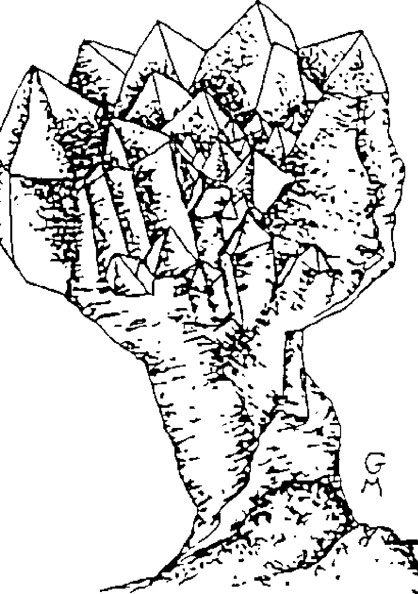

#### 西方靈性道路礦物

##### 體驗——赤鐵礦 Hematite

赤鐵礦是與體驗相關的礦物圖騰，是西方第一顆靈性道路之石。赤鐵礦的學名Hematite，來自希臘文bloodlike（血一般的）。赤鐵礦是氧化鐵，也是鐵礦最重要的部分，大量的赤鐵礦可以在北美和世界其他地方找到。赤鐵礦的顏色從鋼灰色和金屬銀到紅色、黑色都有。

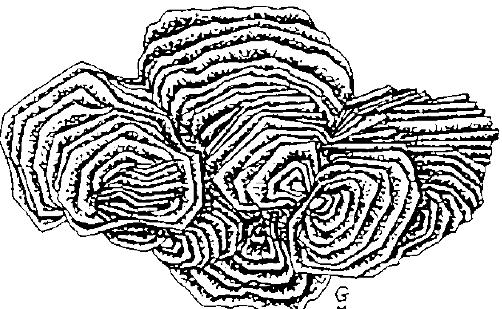

在歷史上，由赤鐵礦切割而成的寶石被稱作阿拉斯加鑽石。拋光石和塗漆顏料都由赤鐵礦所製成。

赤鐵礦是一種記錄之石，它能夠持守其他時間、事件、人物、地點和事物的記憶，而這些記憶將會衝擊傳遞給人們。這種石頭有助於抵抗壓力，幫助人們在地球上落實紮根、建構個性、保持堅強、堅持決定、抵擋強迫症……並且避免循環往復、情緒失憶、和自我否定。

赤鐵礦可以幫助你記起過去不舒服的情景，於是你不會再重覆自己的錯誤。它也能夠教導你如何從人類的集體意識中汲取經驗，所以你不會重蹈覆轍。

運用赤鐵礦有助於減輕恐懼和釋放強迫症的習慣，例如飲酒、暴飲暴食和吸煙。它能夠幫助你牢固地落實紮根於地，並且擁有很強壯的個人疆界。赤鐵礦通常會激發、強化並鼓勵積極的自我形象、信心與平衡。

雖然赤鐵礦無法讓你避免痛苦的經歷或問題，但它可以幫助你學習和成長，而不必一遍又一遍地重複同樣的教訓。

##### 内省——青金石 Lapis Lazuli

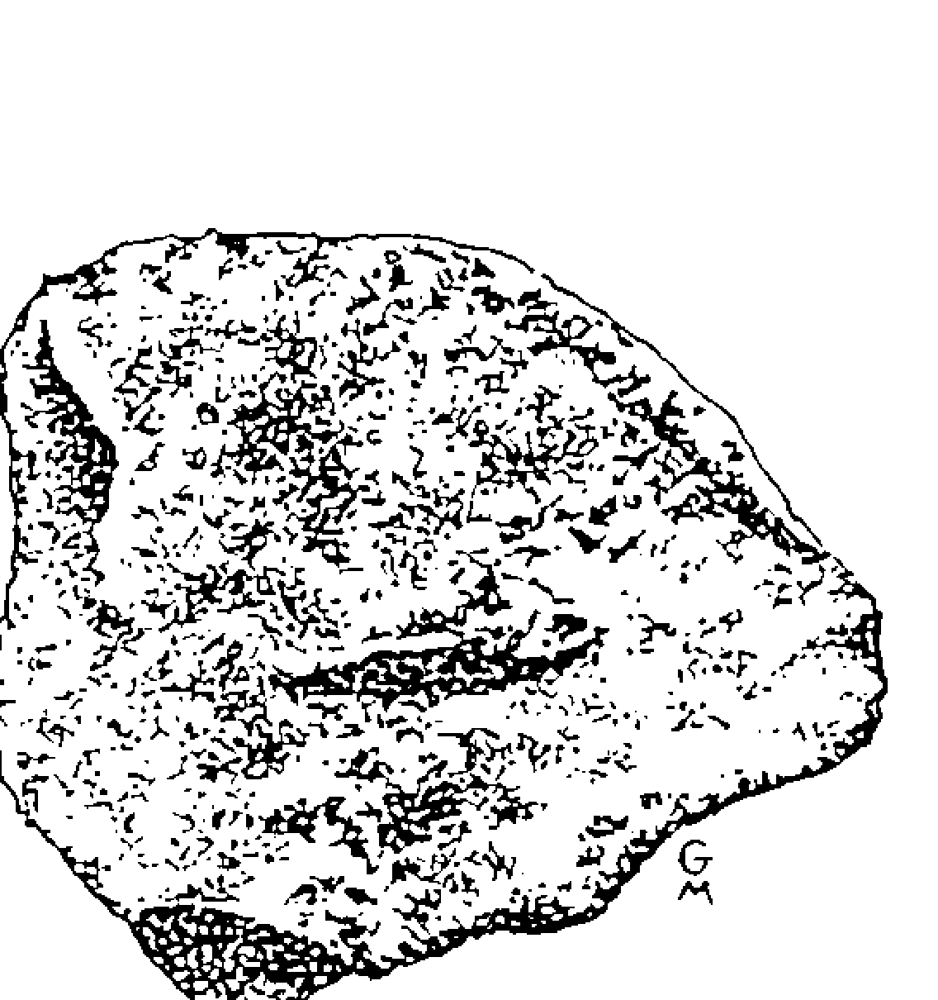

青金石是與內省相關的礦物圖騰，是西方第二顆靈性道路之石，也叫作青金岩，主要由藍色方解石所組成，並且可以在各種不同的地點找到，青金石的顏色是皇家藍、天空藍、紫藍色和綠藍色。

在數百年前，魔法師和聖職人員早已運用青金石來增強對靈性力量的感受力。青金石也被認為是古代的藍寶石。舊約聖經和古埃及的史料記載中，都曾提到這種石頭。在過去的年代裡，青金石的粉末經常被作為塗漆顏料。在俄羅斯的沙皇統治期間，青金石被運用於馬賽克和錯綜複雜的鑲嵌工作，特別是在甕和花瓶上。而在其他國

##### 力量——琥珀 Amber

琥珀是與力量相關的礦物圖騰，是西方第三顆靈性道路之石。琥珀是一種來自史前松樹的樹脂化石。在琥珀內部發現保存完整的蜻蜓翅膀或其他昆蟲，並不罕見。琥珀的顏色從清澈的黃色到金黃色、以及從透明的紅色到棕黃色都有。

琥珀被發現於蘇聯、丹麥、歐洲、挪威和其他地區，它被認為是最早用做裝飾品的古老石頭之一。遠在公元前8000年，歐洲的墓穴中已經發現有琥珀的蹤跡。在德國，琥珀被稱為伯恩斯坦，意思是「熊之石」。許多原住民認為，發現琥珀的礦藏處是神靈的安息地。近年來，柔軟的非化石琥珀樹脂，也被用來作為芳香療法的強力劑。

據說琥珀含有大熊以及默加奇維思的成熟力量。琥珀有助於激活人們內在的療癒本質。這種石頭能夠加強並鞏固身體、心智、情緒和靈性。琥珀也幫助你和元素王國以及大自然力量工作，它協助召喚長者以及古老的智慧。琥珀可防止消極、虛弱、嗜睡、抑鬱和拖延。琥珀也能夠激發美麗、長壽、耐力、豐盛、愛、療癒、堅持、良好的關係、健康的性行為、勤奮和毅力。這種石頭能夠使儀式的效果益發強大有力。

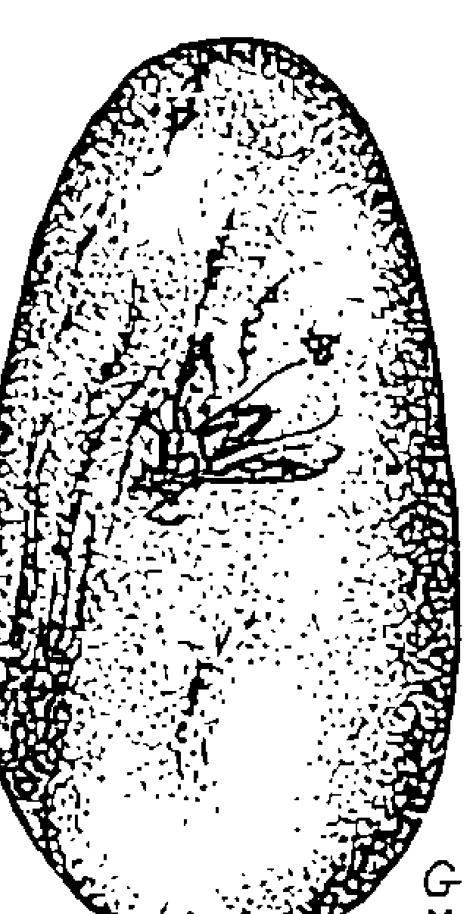

琥珀能夠教你有關力量之於智慧、力量之於平靜，這個力量來自於做好某些事物，這個力量的和諧可以幫助你真正地瞭解生命。

### 藥輪礦物靜心

特別感謝～索尼亞・凱・瓦特絲

你將需要：煙燻工具、筆記本、筆、錄音機。

預估時間：四十五分鐘。

若要進行這個靜心冥想，人們必須有能力觀想出一座藥輪，特別把注意力放在礦物圖騰上。

1. 煙燻淨化之後，安靜地坐著，緩慢而深長的呼吸，進入靜心冥想狀態。
2. 觀想一座藥輪出現在任何一個能讓你感到舒服的環境裡。
3. 從四方的其中一個方位進入藥輪的圓周，問候這個方位的靈性守護者，感謝靈性道路上的石頭們。如果你想要的話，可以進行一個祈禱，去看看是否有任何礦物要給你功課或訊息。
4. 當你準備好時，在藥輪外圈順時針移動，前往下一個位置，並且問候這個月亮的礦物圖騰。例如：如果你已從西方進入這個圓輪、而且已向灰熊祖母打過招呼，也去感謝了滑石。接著你就要去到下一個位置～群鴉飛遷之月（渡鴉），去和血石碧玉問候並互動。
5. 繼續行走在藥輪上，一一对每個月份的靈性守護者以及靈性道路上的礦物圖騰打招呼和互動。
6. 當你已經回到了你開始的地方，觀想你走到了中央圓，與這個位置的每一顆石頭互動。
7. 當你已經完成了你和礦物存有的工作，就慢慢回到尋常意識中。
8. 寫下或錄下你的體驗。

#### 變化版本

1. 觀想自己直接去到藥輪中央，然後邀請礦物們一個接著一個來到你面前。
2. 觀想自己去到中央，並請求任何一個有訊息要給你的礦物，來到你面前。
3. 觀想自己去到中央，提出一個問題，請求有答案要給你的礦物存有，來到你面前。
4. 只和靈性道路之石或者中央圓工作，去幫助你連結這些天賦或存有。

### 藥草石頭浴

你將需要：煙燻淨化工具和材料、藥草或藥草茶、筆記本和筆、錄音機，如果你需要的話，可準備薄紗或棉布、蠟燭、音樂。

預估時間：一小時。

1. 在浴盆裡放洗澡水，把藥草裝進一個薄紗袋裡，再浸入水中。你也可以煮一壺藥草茶，然後把茶倒入水中，或者只是添加一些藥草散葉。去看看哪些藥草與你目前正在工作的位置的石頭有關，使用相應的藥草會是最強大有力的方式。
2. 煙燻淨化你自己、浴缸、以及整個空間。
3. 把那些你想要與之工作的石頭，放置在這浴缸裡環繞著你。
4. 邀請這些石頭的能量與你同在，請求那些你所追尋的，請求療癒、放鬆，或請求一個問題的答案。
5. 閉上你的眼睛，讓你自己放鬆並漂浮在水中。
6. 留意任何畫面影像，或其他來到你這裡的徵兆。
7. 當你結束後，寫下或錄下你的經驗。
8. 這個冥想的版本也可自行變化，你可以點燃蠟燭、播放音樂……或者把這些石頭擱在你水面下的腹部上。

### 礦物和做夢

你將需要：煙燻工具、石頭、筆記本和筆、錄音機。

預估時間：一個晚上。

1. 煙燻淨化你自己，以及你睡覺的地方。
2. 選擇某些相應的石頭，符合你想要在潛意識層次工作的能量、療癒或轉化主題。
3. 煙燻淨化石頭，然後宣說一個祈禱去邀請它們的力量。
4. 把石頭放在你的床頭邊、床底下，床上，或者在你的枕頭下。
5. 在床邊放一本筆記本、筆或錄音機，當你醒來時，立刻寫下或錄下任何來到你這裡的念頭，或者任何你所能記得的夢境。
6. 在你醒來之後，石頭王國會持續地連結、充電、療癒或者轉化你，去留意任何從礦物王國而來的精微或顯明的徵兆。究竟有多少能量、療癒和轉化將會發生，最強大的因素是你積極活躍的參與，以及對改變的敞開。
7. 規律的重覆這個過程，直到你感覺自己和礦物之間，有一個強大並敞開的溝通連線以及接收性。

### 榮耀礦物藥輪的方式

1. 定期地煙燻淨化石頭。
2. 給它們鹽、鹽水浴、或淨水澡。
3. 用一塊柔軟的天然布料包裹它們。
4. 小心的、充滿愛意的、尊敬的握持它們。
5. 把它們放置在滿月或新月的光芒下。
6. 把它們放在一個大自然環境下的祭壇中，然後唱歌、擊鼓、搖沙鈴、或為它們吟唱，日出或日落時分是進行這些活動的最佳時機。
7. 給它們玉米粉、菸草或其他適合的物質獻供。

### 特定的礦物藥輪

一座特定的礦物藥輪，是完全由同一種礦物所構成的藥輪，象徵著藥輪上的某個位置。

這種藥輪對於需要特定幫助或療癒的人來說，特別有助益。這種藥輪的好處在於它的能量非常明顯，而且很容易被感受到。此外，當你在藥輪中只使用一種圖騰石時，會啟動一股特別強勁的能量，諸如此類的藥輪能夠產生強大的能量流動。

許多人都經歷過這種藥輪的療癒特質，雖然結果的差異頗大，根據所使用的特定礦物、以及藥輪使用者所需要的幫助，每一個經歷過特定礦物藥輪的人，都宣稱這樣的經驗為他們的生命創造了一些改變。

特定礦物藥輪強而有力的融合了該石頭所代表的位置能量、以及藥輪上所有其他位置的能量，從而創造出非常獨特的力量，對某些人的某個特定面向提供療癒和幫助。例如：如果您運用琥珀（力量），並將其放置在四個靈性守護者位置上，你將會在一個人的各種面向上創造出特別的祈禱：身體（瓦布絲），心智體（瓦奔），情緒體（熊歐迪希）和靈性體（默加奇維思）。如果你把琥珀放在所有的位置上，你便是在請求每一個位置的力量。

#### 選擇特定藥輪的礦物

你要在藥輪中使用什麼樣的礦物，是根據你想要解決的問題而定。例如：如果你想請求整體的療癒，你可以使用苔蘚瑪瑙；如果你需要更多的勇氣，你會採用紫水晶；如果是為了保護，你可以選擇土耳其石。

#### 建造單一礦物藥輪

你將需要：如果可能的話，選用其中一種藥輪礦物，準備十六至三十六顆，如果你沒有足夠多的石頭，可以用普通的石頭填補空位。煙燻淨化材料、獻祭供品、足夠的藥草可用來圍出藥輪圓周的大小、筆記本和筆或錄音機，如果需要的話：鼓、沙鈴、吟唱CD、醫藥毯、枕頭、菸斗儀式和感知醫藥（請見《藥輪感官療癒儀式》）。

預估時間：兩個小時。

1. 如果你要建構的是十六顆石頭的藥輪，請把石頭放在四個靈性守護者和十二個月亮圖騰的位置。在這座藥輪裡，你不需要在藥輪內部放置石頭，你會保持這個部位淨空，好讓要求體驗藥輪的人可以躺在裡面。要確保藥輪的尺寸足夠大，讓需要這個儀式的人能夠舒服地在藥輪裡伸展開來。如果你建構的是三十六顆石頭的藥輪，那麼，它的空間需要夠大到讓人足以躺在它的四分之一圓內。
2. 遵循藥輪的基本建構指引。謹慎選擇地點，煙燻淨化所有參與的人員、也燻淨儀式期間將接觸的一切物件、以及儀式所舉行的地方。
3. 如果有人可以輕輕地打鼓或吟唱，請指示他們開始。
4. 向造物主、大地母親、地區的靈性守護者、以及所有神靈們獻上祭品。
5. 用藥草播撒出一個圓圈，標記你即將建構藥輪的位置。如果可行的話，採用那些與您所運用的礦物相對應的植物。如果無法取得，你可以使用鼠尾草、玉米粉或菸草。宣告一個祈禱，祈求保護、幸福、並為所有參與者帶來最高的福祉。
6. 從北方的靈性守護者開始建構藥輪，然後依序是東方、南方和西方。接下來再從藥輪第一個位置的圖騰石（大地復甦之月·雪雁）開始，沿著藥輪前進。當你放置每一顆石頭時，祈禱並邀請那顆石頭所榮耀的元素或那個位置的特性，透過這些祈禱，你讓礦物知道你想要的是什麼。

例如：如果你使用火蛋白石，你可以像這樣祈禱：

> 火蛋白石！我這渺小的人邀請你來到此時此地，並懇求你激發XXX（正在執行儀式的你的名字）最高的意識畛域。火蛋白石啊！以接下來這顆石頭，我祈禱你帶來好的醫藥。火蛋白石啊！以這顆石頭，我為XXX（正在執行儀式的你的名字）請求身體的力量。

每放置一顆石頭就祈禱一次。如果你運用三十六顆石頭的話，就以正常的方式建構藥輪，從造物主之石開始，每放置一顆石頭就祈禱一次。

7. 祈求儀式的人請從東方進入藥輪。他應該以舒服的方式躺下來，可以躺在醫藥毯上，甚至使用枕頭，前提是這些物品必須先以煙燻淨化過。
8. 這個人應該感受一下他身體下方的大地能量，並且花一點時間看看上方的天空，這將能夠讓他連結那股在他上下之間流動的能量。
9. 躺在中央的人應閉上眼睛，悠長且緩慢的深呼吸，並在藥輪的能量中放鬆。他應該花一點時間去感受這能量。
10. 在這個時候，他可以放空、打瞌睡、作白日夢或休息……以便讓藥輪能夠開始生效。
11. 如果有一個具資格的菸斗攜行者在場的話，現在將會是抽菸斗的適當時機。或者你可以從藥輪感官療癒儀式中組合成任何感知醫藥。諸如此類的醫藥可以包括儀式性的樂器、醫藥物件或芳香療法。在整合這些技術之前，請仔細重讀這個儀式，不要低估這些體驗的力量，以免加重參與者的負擔。對於這個儀式而言，越少內容越好。許多活動看起來很細微，卻會帶來極其深遠的影響。切記，結果由不得我們決定，而是在於大靈。
12. 能在藥輪內停留二十分鐘到一個小時是很好的。如果參與者開始感到激動、不安、或者突然間變得警覺和清醒，這些跡象通常顯示他應該離開藥輪的時候到了。
13. 當參加者離開藥輪時，煙燻淨化他以及藥輪，清理淨化殘留的能量。
14. 如果參與者願意的話，可以給參與者機會談論他的體驗。在他身旁準備筆記本和筆或錄音機，好讓他可以寫下或記錄他所接收到的任何畫面、影像或信息。如果他不想說話或似乎無話可說，也不要帶給他壓力。
15. 當參加者準備好並完全清醒時，再次獻祭和祈禱，為了所發生的一切而感謝礦物和造物主。
16. 撤除藥輪。

#### 石英水晶藥輪

有一個女人想要更清楚記得並理解她自己的夢。她建構了一座大型的水晶藥輪，並且讓藥輪敞開靜置了很長一段時間。只要一有機會，她就會花時間待在藥輪裡。她以這種方式與石英礦物藥輪密切的互動，她不但記起了她的夢，而且這些夢境還深深地影響了她。她也說她的通靈能力和療癒能力都被放大了，她的能量流動明顯地改善，而心智的清晰度也更加敏銳。

#### 鋰雲母藥輪

有很多場合機會裡，人們在苦惱的狀態下進入了一座鋰雲母藥輪。有一個人在工作上遭受壓力、而另一個人被他的人際關係所激怒、還有另一個人正在處理與她不安的童年有關的困境……所有人在離開藥輪時都感覺到平靜、平衡且落實接地。這座藥輪據說比熱水澡或鎮靜劑更有效。參與者一致認為：鋰雲母藥輪在各種層面上都會是一個強而有力的鬆弛劑。

#### 矽孔雀石藥輪

曾經有一座矽孔雀石藥輪，幫助了一個身體非常單薄並且容易受傷生病的女人。她的脆弱總使她感到不穩定、不平衡與痛苦。在她和矽孔雀石藥輪的能量工作之後，她的健康問題得到了改善，她開始信賴自己的身體，也因此重獲平衡和幸福感。她將這些身體和情緒上的改善，歸結為礦物藥輪的功勞。

#### 紫水晶藥輪

紫水晶藥輪能夠幫助您獲得勇氣和良好的判斷力。對於那些尋求力量及勇氣來改變自己生活的人而言，這種藥輪特別有效。

有一個缺乏判斷能力的女人，經常成為受害者而因此陷入困境。她認為與紫水晶礦物藥輪的工作發揮了義意深遠的影響力，使她獲得了下決定的勇氣，從而保證了更好的保護和幸福。她說：紫水晶藥輪的經驗，是她靈性上以及自我價值上的轉折點。

#### 其他經驗

許多人藉由特定藥輪而與靈性守護者、醫藥動物、植物或礦物有了直接且個人的溝通。對於其中一些人來說，和特定的藥輪工作，成了加深他們瞭解神靈王國的觸媒。

一位運用紫水晶藥輪的女人分享：有一隻熊用牠溫暖的毛皮包圍住她，讓她在生命當中首次感受到安全與保護。她說這種感覺還一直持續著，並且給予她信心，她全新的內在安全感也延續到她的人際關係上。透過學習信任熊，她也學會了信任友誼、信任她自己，從而豐富了她的生命。

#### 靈境山的特定礦物藥輪

我，太陽熊，多年以來一直與蛇有著個人私密的關係。我正在寫一本關於蛇的醫藥的書。許多年前，響尾蛇在我小腿處咬下的那一口，給了我強大的蛇醫藥，同時也讓我對這位祖父深感敬重。

當我在1989年夏天到達了華盛頓州斯波坎的靈境山時，我注意到我那通常呈現淺色的響尾蛇咬痕，突然轉變成為深紫紅色。我知道這意味著蛇祖父正在這個地區，所以我告訴人們要特別當心。

蝶蛹最近建造了一座孔雀石和銅礦的蛇圖騰藥輪，我知道這座藥輪可能會引發極強大的能量。

在這個地區，通常能夠看到一些響尾蛇。我們在靈境山的一般對策是將這些大靈的尊貴信使搬離人們所在的地方。為了這個預備，我們準備了一些特殊的裝置來移動任何可能現身的蛇。

在接下來的一週內，竟有六條響尾蛇來拜訪我們。牠們被遷移到其他能夠保持安全距離的地方，而後我們一致決定撤除蛇圖騰藥輪。就在移除藥輪之後，那個夏天所剩的時間裡，再也沒有多的響尾蛇出現。

當蝶蛹設置蛇藥輪時，她還建造了其他的動物圖騰，例如：雪雁、海狸和棕熊。在設置礦物藥輪之後的那個冬天，其他通常不會在該地區被看到的藥輪動物，也意外地現身在那一區，其中竟有一頭山獅和一隻熊。而那些原本在靈境山中常見的藥輪動物～鹿、鵝、海龜、青蛙、蝴蝶、老鷹、土狼、紅尾鷹、紅翼啄木鳥、渡鴉、蚯蚓、蜂鳥、貓頭鷹、兔子、老鼠和螞蟻……就出現得更加頻繁了。

運用礦物藥輪，能夠在心智、情緒、身體和靈性各層面產生許多正面影響。去嘗試不同的石頭，然後看看哪一個與你運作得最好。當你和這些藥輪建立穩固的連接之後，您就可以開始與他人分享。

## 藥輪 植物參照表

### 中央圓

| 植物 | 位置 | 給人類的功課 |
|------|------|--------------|
| 所有或任何 | 造物主 | |
| 玉米、豆子、小南瓜 | 大地母親 | 滋養的、醫藥的、儀式的 |
| 向日葵 | 太陽父親 | 有益於心臟、腎臟、膀胱、皮膚和頭髮 |
| 艾草 | 月亮祖母 | 促進夢境、有助煙燻淨化、女性問題、胃、關節 |
| 香蒲 | 海龜家族 | 好的刺激物、增能劑，穩定劑，營養、美味 |
| 水藻 | 青蛙家族 | 好的食物補充品、營養、解毒、富含維生素和礦物質 |
| 野草 | 雷鳥家族 | 大地療癒者、人類的美味食物 |
| 馬利筋 | 蝴蝶家族 | 適用於肺、腸道、發燒、風濕 |

### 靈性守護者

| 植物 | 位置 | 給人類的功課 |
|------|------|--------------|
| 甜草 | 瓦布絲 | 儀式用、有助於召請好的能量和神靈 |
| 薁草 | 瓦奔 | 儀式用、與神靈溝通、獻祭、藥膏，濕敷藥泥、帶來明晰、轉化負面能量 |
| 山艾 | 熊歐迪希 | 儀式用、煙燻儀式、有助於淨化和轉化能量 |
| 雪松 | 默加奇維思 | 儀式用、有助於煙燻淨化區域中的疾病能量 |

### 月亮和圖騰

| 植物 | 位置 | 給人類的功課 |
|------|------|--------------|
| 橋樹 | 大地復甦 | 有益於皮膚、關節炎、腎臟、膀胱、消化、溝通、潔淨、古老的智慧 |
| 顫楊樹 | 休眠淨化 | 有益於消化、過敏、哮喘、排毒、放鬆和玩耍 |
| 芭蕉 | 大風 | 療癒大師、冷卻、舒緩、療癒、好的血液潔淨劑、有益於皮膚和緩解疼痛 |
| 蒲公英 | 萌芽樹 | 營養、舒緩、療癒、平靜、潔淨、鹼性化 |
| 藍色卡馬夏 | 青蛙歸返 | 有利於平衡、瀉藥、刺激、營養、維持 |
| 西洋耆草 | 玉米種植 | 補虛、利尿、麻醉劑、消化、增強劑、潔淨、緩解經痛 |

# 月亮和圖騰

| 植物 | 位置 | 給人類的功課 |
| :--- | :--- | :--- |
| 野玫瑰 | 烈陽 | 有助於治療風寒與感冒、收斂、滋補、舒緩 |
| 覆盆子 | 採莓 | 潔淨、刺激、收斂、平衡、有助於懷孕、美味的水果 |
| 紫蘿蘭 | 豐收 | 療癒毒性、淨化血液、緩解喉嚨和呼吸問題、冷卻、舒緩 |
| 毛蕊花 | 群鴨飛遷 | 加強肺、心臟、膀胱、腎臟、肝臟、舒緩粘膜、耳朵痛、皮膚問題 |
| 薊草 | 天寒地凍 | 營養、療癒大腦和內臟、退燒、增加哺乳母親的乳汁 |
| 黑雲杉 | 漫長冰雪 | 殺菌、袪痰、吸入劑、有助於治療感冒、增強 |

### 靈性道路

| 植物 | 位置 | 給人類的功課 |
| :--- | :--- | :--- |
| 紫錐菊 | 淨化 | 有益於血液、淋巴、膿腫、感染、皮膚、治療毒樑引起的過敏和動物叮咬 |
| 紅花苜蓿 | 更新 | 有益於陰道、胃、咽喉、直腸和皮膚、血液清道夫 |
| 延齡草 | 純潔 | 瀕危物種、歷史上用於女性問題、分娩出血、腹瀉 |
| 迷迭香 | 明晰 | 收斂、興奮劑、香料、止痛、結腸、消化不良、頭痛、冷敷 |
| 鼠尾草 | 智慧 | 適合烹飪香料、煙燻、滋補、沐浴或茶飲 |
| 野生西洋蔘 | 光明 | 瀕危物種、歷史上用於香料、鎮靜、加強劑、增加生命活力 |
| 紫草 | 成長 | 食物、動物的糧食、收斂、袪痰、有益於扭傷、瘀傷和止血 |
| 琉璃苣 | 信任 | 抑制咳嗽、穩定情緒、緩解疼痛、肌腱、背部、扭傷等問題 |
| 山楂 | 愛 | 減輕焦慮、有利於血壓、心臟、動脈、循環 |
| 橄欖 | 體驗 | 按摩油、有益於心臟、皮膚、毛細孔和關節、分解膽固醇 |
| 洋甘菊 | 內省 | 有助整體療癒、頭痛、耳痛、鎮靜、止痛、鬆弛劑、護膚品 |
| 蕁麻 | 力量 | 食物、滋補、有益於貧血、痛風、降低血糖、皮膚、頭髮、富含維生素和礦物質 |

## 第11章

# 植物藥輪

礦物將元素的力量凝固成結晶，而植物則給予礦物能量並讓元素王國移動。植物幫助人類去領悟一切生命之中的柔軟移動和療癒能量。

自黎明存在以來，植物就是人類以及其他動物強大有力的幫助者，植物以各種方式喚醒、激活、療癒、餵養動物，並讓生命更加美好。植物以它們的美麗打開了人類的雙眼，以它們的芬芳迷醉了人們的鼻子，以它們多樣的紋理撫觸著我們的肌膚，並慫恿著人們加入它們風中的舞蹈。植物也提供蔽護棲身之處、運輸、音樂、飲料、工具、傢具設備和娛樂。世界上有許多地方都盛產植物，提醒著人們關於這生命聖圈的其它部份，有時候也因為它們過於繁茂，而讓習以為常的人類忽視它們的存在，人類使用著植物卻不曾榮耀它們所給予的幫助。

當你在藥輪上旅行時，請留意你所拜訪的位置的相關植物幫助者，從它們身上學習，並且允許植物向你介紹它們的許多親族。

# · 中央圓的植物 ·

#### 造物主——所有或任何植物

沒有一種單一的植物可以代表造物主，因為造物主是舞動通過所有植物生命的神聖能量，造物主是每一棵植物的一部份，但卻不能被侷限於單一形式。

#### 大地母親——玉米、豆子、小南瓜 Corn, Beans, Squash

在中央圓的石頭中，用來榮耀大地母親的植物是玉米，豆子和小南瓜。這三姊妹是許多印地安原住民的主食，來自熊部落的尼米摩夏告訴我們有關這三姊妹的故事。

很久很久以前，東方森林的人們生活富饒，並且和大地母親和諧共處。他們藉著觀看和聆聽祂的聲音來學習關於生命。

有三個女孩想要到另一個村莊探訪親戚，她們是同母異父的親姊妹，然而這三個女孩未曾學會如何相處，她們總是彼此爭吵、反對、辯駁和批判。三姊妹極少有朋友，但她們有親戚，當她們希望找到陪伴和溫暖時，她們就會去拜訪親戚，走到親戚住的村莊需要一整個早上的路程。

有一天，三姊妹開始動身前往另一個村莊，女孩們無可避免地開始糾正彼此的錯誤。

這個早晨絕大部分的時間，女孩們一邊走一邊吵架。在她們抵達親戚村莊的一個小時前，她們吵得變本加厲，村民們遠遠就能聽見她們憤怒吼叫的聲音。「哦！不……」村民呻吟著：「又是那三個女孩！她們為什麼要來這裡？」村子裡有一位老婦人從她的小木屋裡走出來，站在小屋前等待著。女孩們非常認真的爭吵，絲毫沒有注意到老婦人正佇在一旁，直到她們幾乎走到了她家門口，老婦人瞅著她們的嚴厲眼神嚇著了這群女孩。

老奶奶把女孩帶到她的小屋裡……「看這邊！」她指示，並帶領女孩們來到一個窗戶般的開口。老婦人問：「告訴我這花園裡有什麼？告訴我外面看起來是什麼樣子？」

「有很高的玉米！祖母……」其中一個女孩回答：「它的根紮在土裡，玉米穗則高高地迎向太陽和風……它正在長出美好的食物送給人類。」

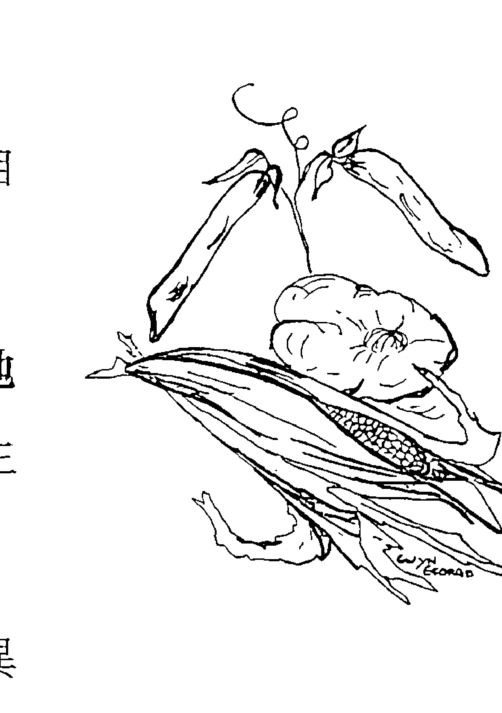

「還有豆子！」另外一個女孩說：「它們正在和玉米一起生長，它們的藤蔓攀援著高大的玉米桿，我無法分辨到底是哪個植物在扶持著對方，然而，豆子也為人們長出了美好的食物……」

「小南瓜也在那兒生長！」第三個女孩說道：「它們美麗的大葉子遮蓋了濕潤的土地，保持了水份，幫助了玉米和豆子的生長。這些瓜藤也為人們長出了美好的食物……」

「妳們都說得對！」老奶奶說：「妳們三個都說出了一部份事實，唯有當你們每個人都說完之後，這就是整個故事所要告訴我們的。就像玉米、豆子、小南瓜這三姊妹在園子裡成長一樣，妳們每個人也都擁有各自的天賦，除非妳們像植物那樣互相幫助、共同成長，否則妳們想要給人們的禮物將無法成熟。」

「而現在……」老奶奶說：「我有一個禮物要送給妳們，但只有一個禮物要給妳們三個人，所以妳們必須從現在開始學會分享，妳們不能為了這個禮物而爭吵，它是用來提醒妳們在今天所學到的功課。」

老婦人從白樺樹籃子裡拿出了一條腰帶，這腰帶的珠子是由純白色的貝殼所製成。

「帶著這條腰帶，每當你們在一起時、或者每當人們無法和睦相處時，這腰帶會給予妳們力量來幫助他們。妳們將不會再相互毆打，因為每當你們這樣做時，其中一顆珠子就會變黑而損壞了腰帶，當人們看到即便是妳們三個女孩都能學會愛和互助時，他們將會從中深受啟發……」

而今，在這海龜島大陸上的許多人，依然將這三姊妹一起種植在他們的花園裡，就像他們的祖先在古早時候所做的一樣。

這就是三姊妹的故事。

玉米、豆子和南瓜有巨大的烹飪和營養價值，是世界各地許多飲食文化中的主食，這些植物不仅仅在成長時相互扶持和互補，當它們在餐桌上一起被食用時，也能為人們帶來完整和平衡的膳食。

三姊妹也是很重要的醫藥植物，它們都被用於儀式中獻祭、或者貯放在醫藥袋中。在傳統中，玉米無論是完整穀粒或是磨成粉末，都是最常用的獻祭供品。

這是一個聰明的人所記住的三姊妹的故事，它們也象徵著大地母親的賞賜。

#### 太陽父親——向日葵 Sunflower

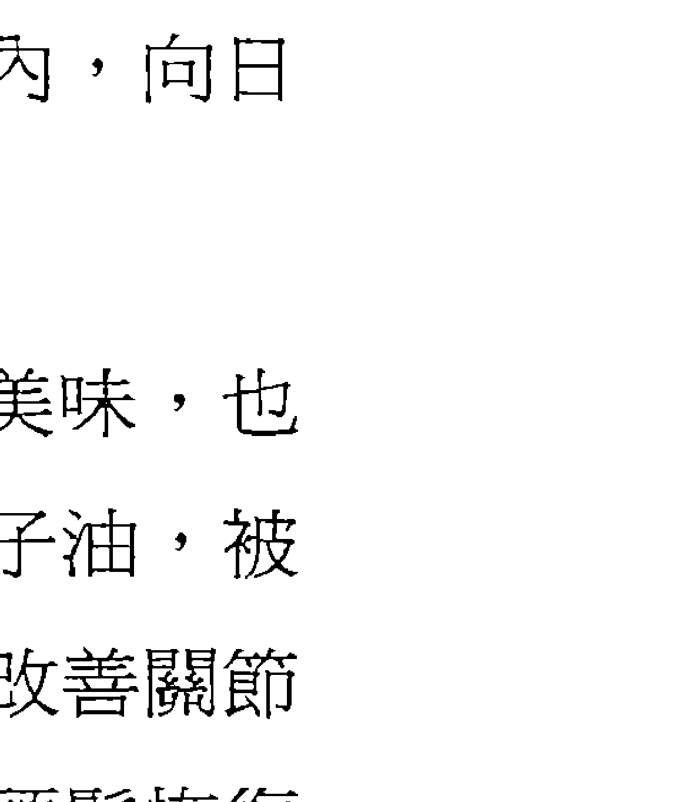

在中央圓的石頭之中，榮耀著太陽父親的植物是向日葵。這個植物命名正是用來榮耀太陽父親，因為它光輝燦爛的黃色花瓣，象徵了暖熱我們地球的那顆炙熱星辰。向日葵與太陽父親如此的志同道合，它們從黎明到黃昏，始終朝著太陽的方向移動。

它們盡其所能的努力觸及太陽父親，向日葵可以成長超過十四英呎高，為了強化它的伸展，它將根系深深地紮進土地之內，向日葵的種子藏在旭日般盛開的花朵中央。

向日葵的植物學名是Helianthus annuus，種子烤過之後非常美味，也提供了很好的維生素和營養。由它們所製出的向日葵種子和葵花子油，被認為有益於心臟、牙齒、皮膚、指甲、腎臟和膀胱，也可以幫助改善關節炎或腹瀉等病症。人們已知道用葵花油製成保健產品，讓皮膚和頭髮恢復柔軟及光澤，葵花油也是很好的按摩油。

猶如太陽父親一樣，向日葵可以豐富我們的生命，並照亮我們的每一天。

#### 月亮祖母——艾蒿 Mugwort

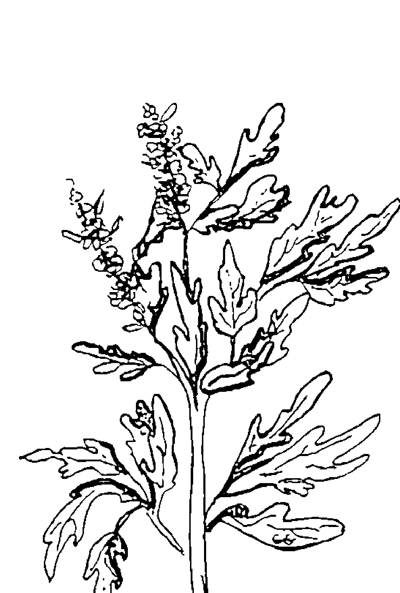

在中央圓的石頭中，榮耀著月亮祖母的植物是艾蒿。艾屬植物的成員特別有助於做夢。這種植物就像月亮祖母一樣，平衡了女性的能量，並激勵出陰柔的力量。

艾蒿的植物學名為Artemisia vulgaris，意指你其實到處都可以發現它。

艾蒿可以作為藥用的茶飲、滋補品、燻香淨化材料、酊劑、藥草浴、藥草油、護膚乳液或敷膏，它也可以使用在中醫針灸上。艾蒿主要的藥用用途是調節月經、減輕痙攣的痛苦，艾蒿也被認為能在分娩期間有效緩解痛苦和清除胎衣，應避免在懷孕期間使用，它可能會刺激生產。

艾蒿也能減輕胃痙攣，並有益於肝、膀胱和關節。這種植物可以改善循環並且鎮定慌亂煩躁的神經。

艾蒿促進做夢的功效卓越。通常我們會將艾蒿混合著玫瑰、薰衣草和洋甘菊，縫入小小的孵夢枕頭中，藉以誘發夢境。在燻煙儀式中使用艾蒿，或者用來和月亮祖母的力量一起工作，艾蒿都會成為一個強大有力的盟友以及保護力量，從外在給予強力的守護。

#### 烏龜家族·土元素——香蒲 Cattails

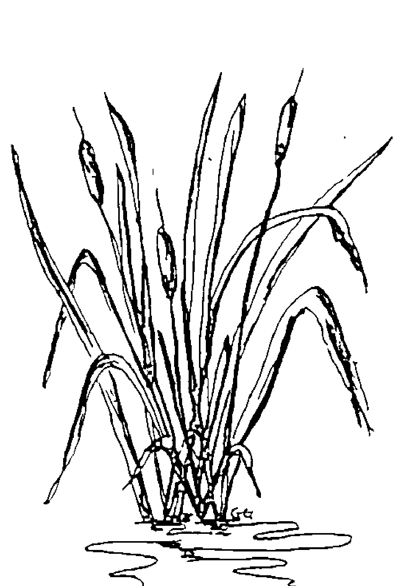

在中央圓的石頭中，榮耀著烏龜家族～土元素的植物是香蒲。它是一種水生植物，將許多池塘變成了沼澤，假以時日，便會形成結實的土地。

香蒲屬於蒲黃屬，是一種像蘆葦般的長柄狀植物，在長莖末端帶有棕色絨毛般的圓柱形抽芽。正如海龜島這片大陸一樣，這種植物滿足了美洲原住民的許多需求。香蒲是一種從頭到尾都可以使用的植物，香蒲製成的食物非常美味。這種植物的根部可以製成麵粉，上端的圓柱形嫩芽也可以做成類似玉米筍的料理，遮蔭棚也是用草莖所鋪建而成，船、籃子和墊子也都由香蒲所編製。

在藥用上，香蒲被用來增強體力、耐力和毅力，並創造可持續支撐的物質肉體能量，它也能夠激發出整體的生命力。

香蒲具有強壯的大地能量，可以幫助人們落實紮根、平衡以及穩定。

#### 青蛙家族・水元素——水藻 Algae

在中央圓石頭中，榮耀著青蛙家族～水元素的植物是水藻，是地球上遍佈各處的水域都能發現的植物成員。水藻是一群植物，有些是單細胞、有些則是多細胞，它含有葉綠素，沒有真正的根、莖或葉。水藻存在於水中或潮濕的地方。海草、螺旋藻和藍綠藻都是這種植物形式。

世界各地的原住民都知道水藻的特殊價值，海草被用作蔬菜和香料，食用藻類是當今最有效能的營養來源之一，它們的葉綠素含量很高，是維生素和礦物質的豐富來源，也是身體系統中非常卓越的殺菌劑，藻類為人們快速的收集能量。

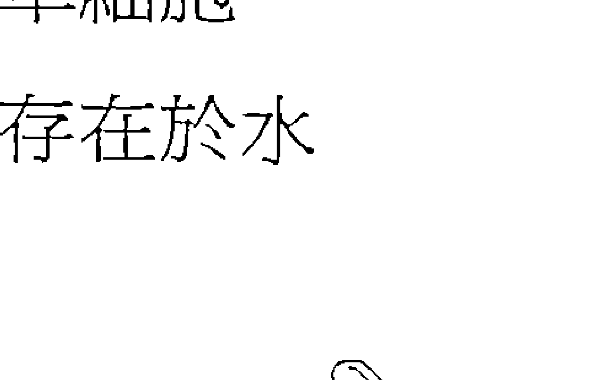

當今，人們發現某些形式的水藻同時具有藥效和食物的價值。一些池塘裡採收的藻類，就像某些類型的海草一樣，被作為一種強力的食品補充劑販售。海藻是碘以及其他維生素和礦物質的豐富來源，據說可以抵消輻射對身體的影響。它們對於消化系統更是有所助益。

就如同水藻來自水一樣，它們擁有豐富的生命能量，幫助保持身體的生命活力和行動力，足以讓所有情緒能量穿流而過。

#### 雷鳥家族・火元素——野草 Fireweed

在中央圓石頭裡榮耀著雷鳥家族～火元素的植物是野草，在烈火燒過或受損的大地上，它們是先生長的植物之一，幫助土地恢復了生機。野草Fireweed是給各種這類植物的通稱，與雷鳥家族相關的品種是Epilobium angustifolium，一種美麗高大的植物，有著象徵火焰的紫色花穗，野草可生長高達六英呎，遍佈美國和加拿大。

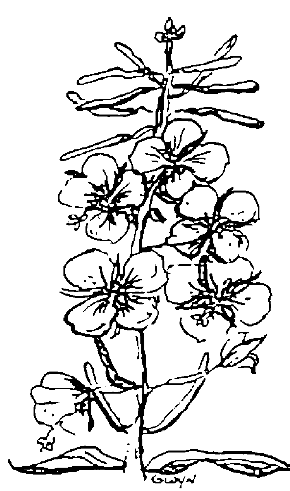

除了幫助療癒土地之外，野草也幫助著人類。這些美味的嫩葉可以當作沙拉，或加入湯和砂鍋中烹煮，它的嫩芽與蘆筍相似。較老的葉子太硬，無法當作蔬菜，但它們可以在乾燥後當作茶葉使用。就像雷鳥家族一樣，野草是一種樂於服務它所有親族的植物。

#### 蝴蝶家族・風元素——馬利筋 Butterfly Weed

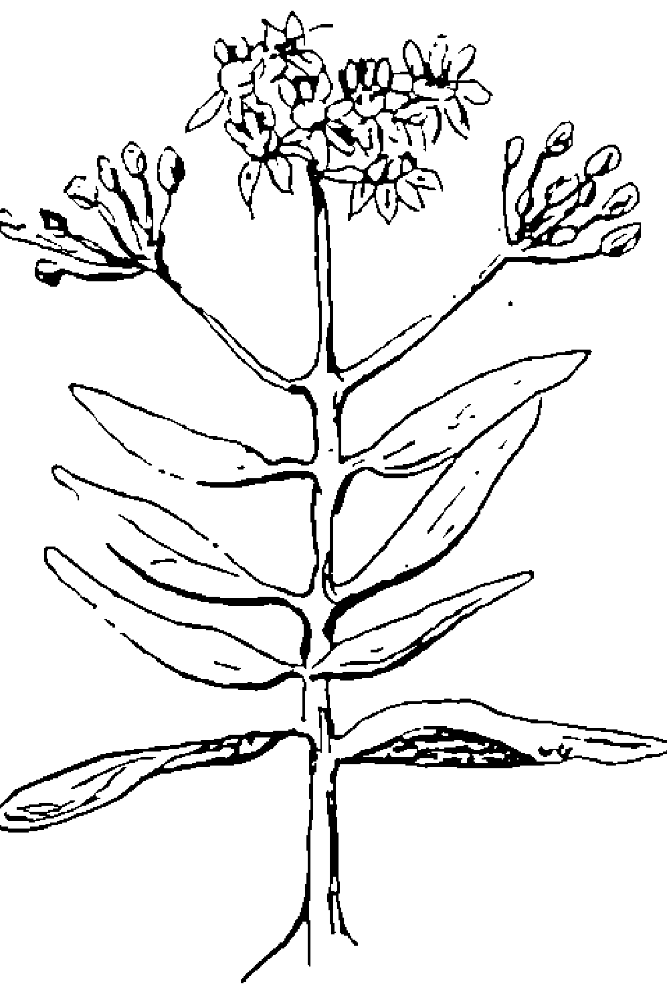

在中央圓的石頭中，榮耀著蝴蝶家族～風元素的植物是馬利筋。像是蒲公英的大哥一樣，馬利筋的莢果充滿了柔軟光潔的種子，蓬鬆得像一朵毛茸茸的降落傘，隨風飄揚尋找著新的土地來給予祝福。傳統上，馬利筋被美洲原住民認為是救命者、一個真正強而有力的療癒者。

馬利筋的植物學名是Asclepias tuberosa。這種植物也被稱為蝴蝶草或胸膜炎根，最常被用作藥用的部分正是根部，馬利筋因胸膜炎和其他肺部疾病的療癒品質而聞名，也因為它能刺激排汗，是強力的祛痰藥。這種植物也可以幫助腸道順暢，並且有助於緩解感冒、發燒和風濕。馬利筋根部的劑量不能使用太多，否則很可能導致胃部不適和嘔吐。

馬利筋就像蝴蝶一樣，是療癒和轉化的觸媒。

# · 靈性守護者植物 ·

與靈性守護者相關的動物，對於地球上的人們具有特殊的意義，植物亦是如此。四個靈性守護者植物是最常用於儀式的植物，這些也是最常獻供給聖火的植物，它們的煙可以將人類的祈禱帶給造物主。因為它們如此慷慨地把自己供獻給人類，人們長久以來一直榮耀著這些植物世界裡的特殊代表、特殊的使者。

#### 瓦布絲 · 北方靈性守護者——甜草 Sweet Grass

北方靈性守護者～瓦布絲的代表植物是甜草。為了對所有植物賴以成長的大地母親表示尊敬，甜草通常會在收割之前就被編織成辮子狀，正因如此，甜草也有母親的髮辮之稱。

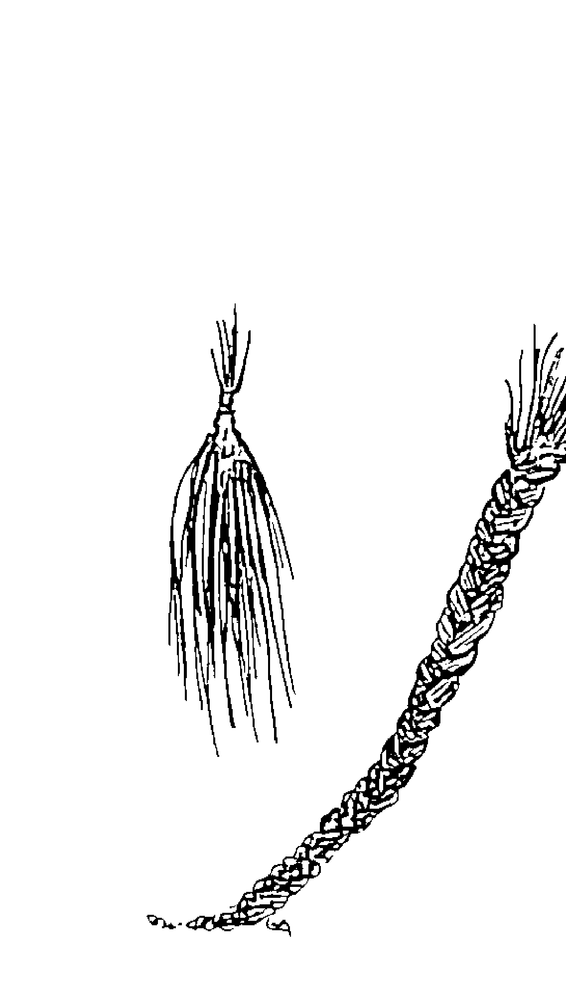

帶著大地母親深邃的智慧，甜草將會汲取正面能量流向焚燒它的人、或者流向焚燒甜草的地方。它甜美的煙霧，將召喚這個地方的美好神靈，並且邀請他們加入此時此地正在舉行的任何儀式。

甜草的植物學名是Hierochloe odorata，終年生長在沼澤或池塘附近的濕地，甜草長得像蘆葦一樣長，所以能夠被編織成粗辮子，如果你購買甜草，你會發現大部份能買到的都是紮好的甜草辮。通常我們會旋轉開甜草辮的一端，或剪下少許混入綜合的燻煙藥草裡。然而，這甜草辮的一端也可以直接點燃，以它自己的形式單獨用來燻煙。最常用的混合燻煙藥草是甜草、鼠尾草、雪松。

北方是獻祭和分享的地方，白水牛把牠自己全部獻給了人們，於是人們得以生存、成長、並學習關於他們內在深處的靈性。同樣地，甜草除了根部之外，所有部份也都獻給了儀式之用。它們的根深深地留在土地之內，猶如所有與瓦布絲相關的事物一樣，它們都可以汲取最深層的大地能量來準備自身，以便在未來的時刻，將自己最特別的禮物獻給所有的親族。

#### 瓦奔·東方靈性守護者——菸草 Tobacco

菸草，代表了東方的靈性守護者～瓦奔。許多印地安原住民講述過一個故事。有個神聖的女人懷了雙胞胎男孩，即使在子宮內，這兩個男孩一樣好鬥。其中一個男孩象徵著人類之中所有好的美善面向，而另一個則象徵著相反面。當他們誕生的時刻到來，好兒子以正常的方式出生，而另一個兒子卻焦躁著要離開子宮，他邊踢邊衝過女人的產道，造成她致命的傷害。

好兒子留下來陪伴他母親，並以他非凡的力量，按照母親的指示埋葬了她。母親告訴兒子即便她死了，美好的事物仍會來到人們面前。遵照母親的要求，他仍然在她墳旁待了好幾天。在他離開之前，他看到從母親的身體中長出了三姊妹～玉米、豆子和小南瓜，自那時候起，三姊妹就帶給所有人們賴以維生的營養食糧。接著，從她的前額長出了神聖的菸草。

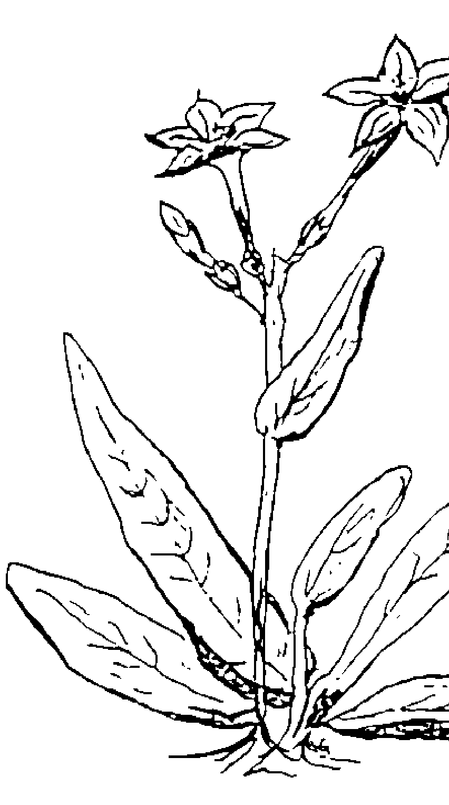

因為菸草來自於神聖女人的額頭，它被認為是一種藥草，其煙霧可以帶來明晰。明晰是一體兩面的禮物，它可以是好的和壞的：自由或監禁，菸草也是。因此，正確使用菸草可以帶來明晰、汲取能量，可以消融負面能量並將之轉化成為正能量。倘若使用不當，菸草卻會毒害你，這是一個必須懷著尊敬去使用的植物。

菸草被認為是美洲原住民最神聖的植物之一，當一支神聖菸斗被點燃時，它會攜帶著祈禱飄向大靈，抽神聖菸斗通常是在對靈性守護者或靈性指引者獻供，焚燒菸草是在召喚大靈層面的幫助。如果有人是為了消遣而抽菸斗，他們就仿佛不斷在向大靈發出一個錯誤的警報，就像那個不斷喊著「狼來了」的男孩一樣。

菸草葉長達六至十二英吋，尖葉大而寬闊，抽菸時所使用的是菸草的葉子部份。菸草屬於菸草屬，大多數商店裡能買到的菸草，多半含有大量化學物質，對健康是有危害的。

有一種常見的混合菸草，美國印地安人叫它「金尼金尼克 kinnikinnick」，它可以指稱單一種類的藥草植物，最常見的是熊果。它也可能指的是菸草和各種藥草的混合物。

菸草是一個強大的幫助者植物，用於煙燻儀式或神聖菸斗中，它就像瓦奔一樣，能夠為任何點燃它的人、或任何焚燒它的事件或地點，帶來嶄新的開始。

#### 熊歐迪希·南方靈性守護者——山艾樹 Sagebrush

南方的靈性守護者熊歐迪希，其實是由山艾 SAGEBRUSH 所代表，但我們經常簡稱為鼠尾草 SAGE。然而，山艾這種豐富多產的植物是艾屬植物的成員，不是真正的鼠尾草 SAGE。艾屬植物由月亮所統馭，山艾以各種形式在世界各地生長，但 SAGEBRUSH 這個名字導致它常與烹飪用的鼠尾草 SAGE 混淆，烹飪用鼠尾草是薄荷家族的一員，和我們經常用來取代山艾的白鼠尾草也不能混為一談。這些混淆和困惑，正是多麼典型的熊歐迪希能量！然而鼠尾草和山艾，無論從外觀上看起來、從氣味上聞起來，以及它們的成長方式都截然不同。

山艾是一種灌木，有兩到四英呎長的纖細樹枝，長出許多濃密的葉子，通常開著紫粉紅色花朵。山艾樹生長在較乾燥的氣候以及沙漠地區，例如加州、華盛頓州、猶他州……等等。它是一種大地療癒植物，有助於保持這些乾燥地區的土壤和水份。這種山艾最重要的用途是煙燻淨化，就像甜草一樣，它是今天最常用作煙燻儀式的藥草。甜草被認為能夠吸引所有美好的能量，山艾則幫助轉化任何不是為了一個人的最高美善而工作的能量。當山艾燃燒時，會散發出一種濃烈刺鼻的大量煙霧，山艾與鼠尾草的煙就像快速成長的夏天，能為一切事物帶來改變。

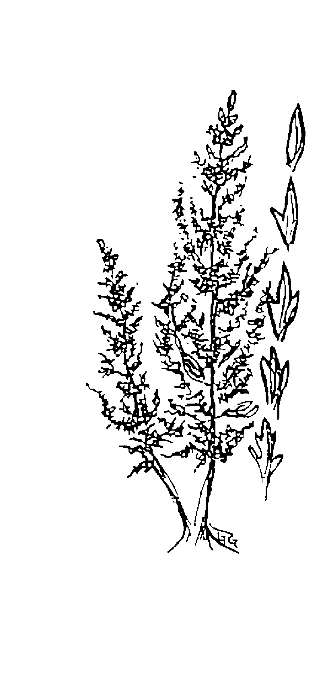

#### 默加奇維思·西方靈性守護者——雪松 Cedar

西方的靈性守護者～默加奇維思，由雪松樹所代表。雪松是生長於世界各地的常青樹，它是一種強大的植物，收留、滋養、看顧和保護許多大地兒女們。雪松的樹枝和內部樹皮都用於儀式。

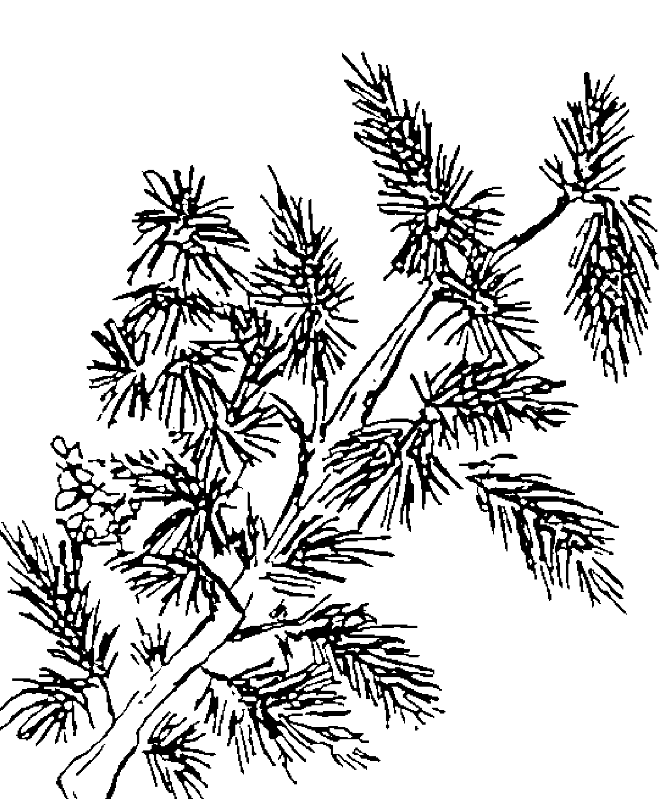

雪松是鼠尾草、甜草靈性上的同類，是第三種常被用於美國原住民儀式中的神聖煙燻藥草。這三種植物中的任何一種都可以單獨焚燒，但是混合在一起燃燒的效果最佳。單單只用雪松煙燻時（使用葉子或內部樹皮），通常是用來清理淨化疾病的負面能量。

一如山艾樹或鼠尾草，雪松也是一種淨化和純化的植物。它的煙具有一股特別令人愉悅的強烈香氣。雪松就像是處於西方位置的人一樣，有著強烈的療癒原動力。

古時候，雪松樹皮也被用以搭建房屋、獨木舟、器具、服裝以及儀式用品。不管雪松是高大莊嚴或矮小瘦弱，它都是一種引人注目和敬重的樹，它高貴的外表預示了它的年齡與智慧。因為西方的人們肩負著如此多的生命重擔，雪松特別有助於保持他們的清新潔淨，重振精神、恢復健康。

### · 12種動物圖騰的植物 ·

#### 大地復甦之月·雪雁——樺樹 Birch

樺樹是與大地復甦之月（12月22日至1月19日）相關的植物。樺樹是最古老也最豐盛的樹木之一，印地安原住民用樺樹皮書寫、以樺樹汁製作糖漿和飲料、樺樹皮和葉子也可做為茶飲和治療藥物。將樺樹葉子放在熱燙的岩石上進行汗浴，所產生的蒸汽有助於清潔淨化身體並消除靜電。樺樹的树枝可以捆扎成一把，在汗浴期间鞭打身体以排出毒素。桦树也可以制成很好的药茶来疗愈皮肤病、关节炎、风湿、肾脏、膀胱和消化系统的问题。桦树将为你带来古老传统的知识以及失落的智慧，它开展了所有能量，让它们流动良好，从而也帮助了你传导和接收宇宙力量的能力。

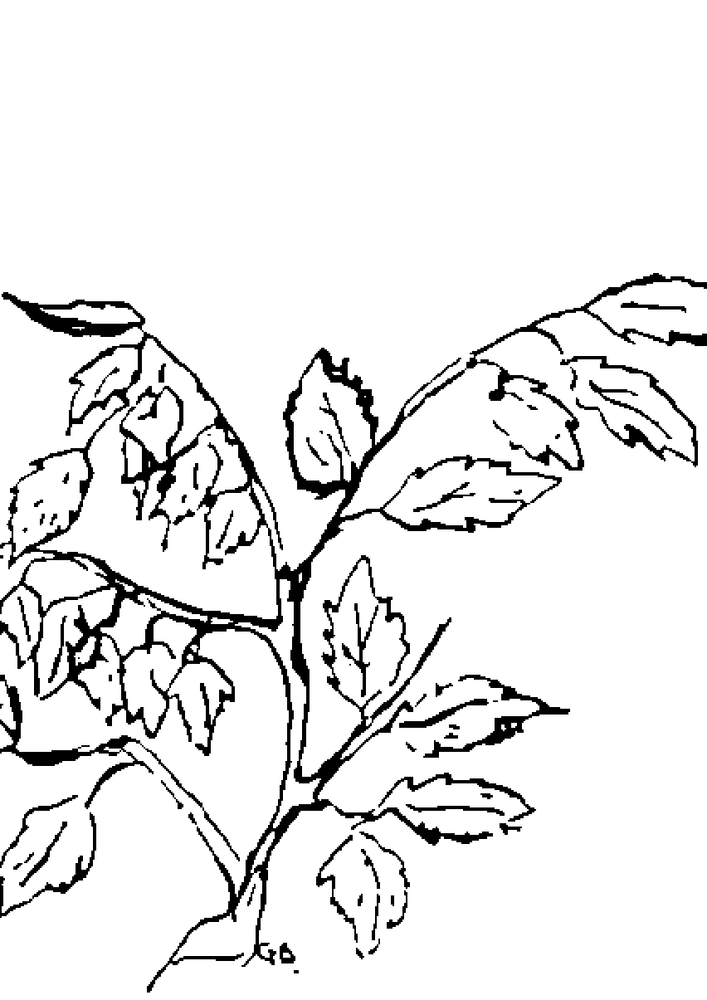

#### 休眠净化之月·水獭——颤杨树 Quaking Aspen

休眠净化之月（1月20日至2月18日）的相关植物是颤杨树，这棵树的叶子、树皮和嫩芽可以用作补品或茶饮，帮助改善肝脏或消化系统的紊乱。它也被用作松弛剂、有助治疗晕眩或花粉热、内脏器官，以及当作收敛剂。在日常应用中，颤杨树已经帮助了诸如湿疹、溃疡和灼伤等皮肤病症。从树皮刮下来的粉末可以用作除臭剂，而且据说能够帮助治疗白内障。来自颤杨树的茶饮和滋补品，可以防止身体充血，治疗花粉症、哮喘、支气管炎并祛除毒性。靠近颤杨树林时，那银色树叶唱起了风铃一般的歌，增加了你的童心玩兴以及对魔法的信念。

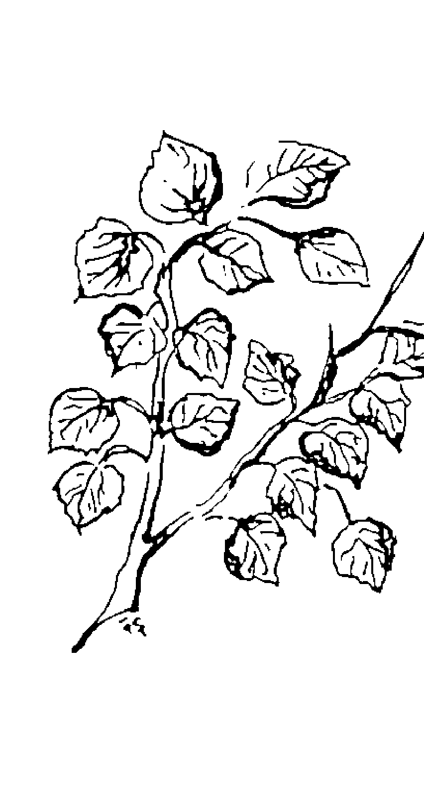

#### 大风之月·美洲狮——芭蕉 Plantain

芭蕉是与大风之月（2月19日至3月20日）相关的植物。芭蕉是一个疗愈大师型的植物。它可以制成茶饮内服，或制作外用敷布来冷却、缓解和疗愈。芭蕉被认为是杰出的清道夫，它有助于舒缓疼痛，在某些情况下，芭蕉据说能扭转毒药的影响。用作茶饮、湿敷布或用来泡澡，可以疗愈肿痛、叮咬、溃疡和炎症。它也有助于治愈肾脏和膀胱的问题。身为春天的通报者，芭蕉提醒着我们有关新生命的永恒承诺。它深长的根系也示现了坚韧与稳定的重要性，并且帮助你落实扎根在这块大地上。

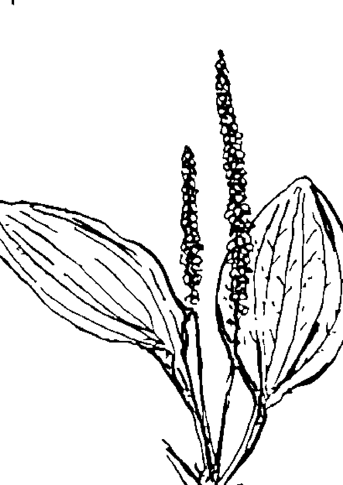

#### 萌芽树之月·红尾鹰——蒲公英 Dandelion

蒲公英是与萌芽树之月（3月21至4月19日）相关的植物，它是一种具有很多用途的药草，它的根部是很好的咖啡替代品，它是治疗药草也是食用香草。蒲公英的嫩叶可以用作沙拉，老的叶子可以煮熟成美味的蔬食，它们具有高浓度的维他命A、B、C、G，也含有钙、磷、铁和天然钠。蒲公英可以让你舒缓、放松、轻度镇静，可以清洁净化身体的所有排泄器官。蒲公英有助于净化和碱化血液，它也有助于平衡身体里的血糖水平。无处不在的蒲公英，可以提醒你在生命中探索和实验的必要性，它也向你展现出各种不同成长阶段的美丽。

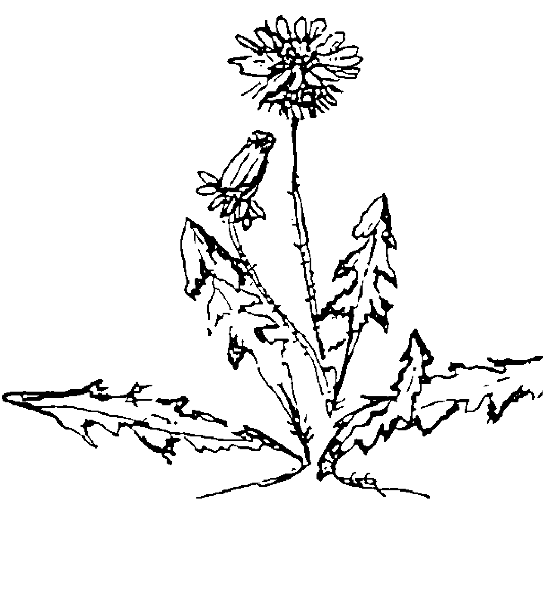

#### 青蛙归返之月·海狸——蓝色卡马夏 Blue Camas

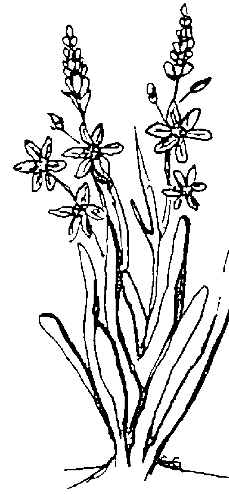

蓝色卡马夏是与青蛙归返之月（4月20日至5月20日）相关的植物，它是许多原住民的重要食物，只有带着蓝色花朵的卡马夏才能食用，任何带有黄色或绿色白花的卡马夏，都是致命的毒药。蓝色卡马夏是一种很好的主食，也可用于制作煎饼、糖蜜、代糖。这是一种持续滋养人们数千年的食物，蓝色卡马夏据说有益于平衡血糖、通便和催吐。这种植物具有非常优越的能力，可以在淤塞停滞的地方创造移动、提供支持，并且教导你在生命所有层面中的识别力。

#### 玉米种植之月·鹿——西洋蓍草 Yarrow

和玉米种植之月（5月21日至6月20日）相关的植物是西洋蓍草。整株植物都可以作为药用。 西洋蓍草除了是极佳的滋补品和增强剂之外，它用来治疗消化道紊乱和净化血液，也有良好的成效。 西洋蓍草是一种能帮助克服感冒的药草，为流感患者带来福音。它也是一种很好的利尿剂，可以打开毛孔，透过皮肤排出毒素。西洋蓍草止血的功效卓越，也是用来缓解月经疼痛的主要药草。在外用的部份，西洋蓍草可作为局部麻醉剂和消毒剂，它也有助于缓解蚊虫叮咬和牙痛。西洋蓍草还有益于肺、腺体和支气管。西洋蓍草可以帮助你发现流经你的疗愈能量，以及你的内在力量。

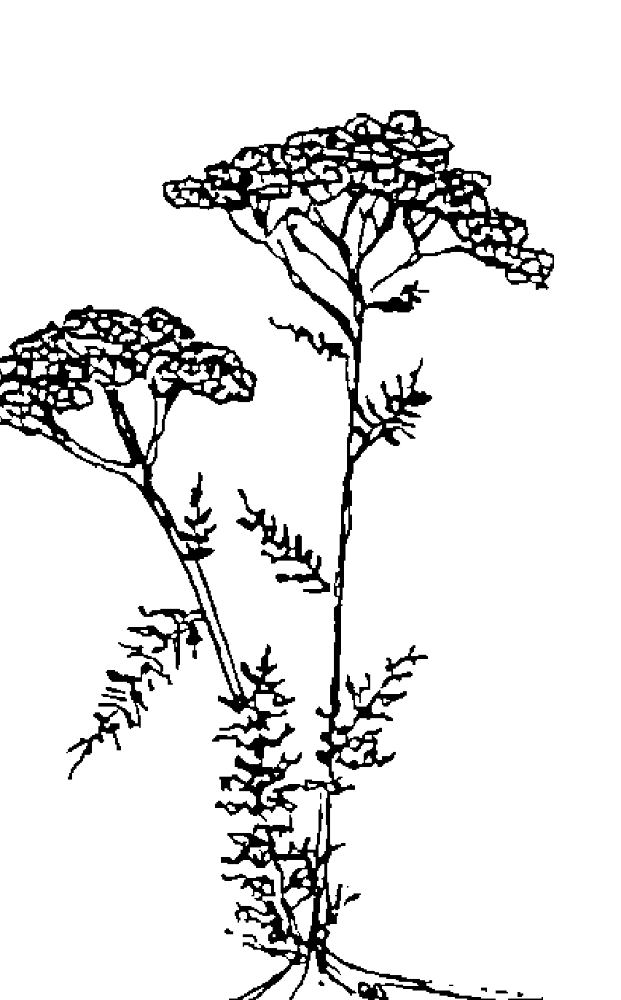

#### 烈阳之月 · 红翼啄木鸟——野玫瑰 Wild Rose

与烈阳之月（6月21日至7月22日）相关的植物是野玫瑰。除了它的美丽之外，野玫瑰还有很多其他的天赋。野玫瑰的果实称为玫瑰果，维生素C和生物类黄酮的含量很高，可以直接食用或是泡制茶饮，帮助治疗喉咙痛和感冒。玫瑰花茶也被用于治疗血液或肝脏问题，玫瑰花瓣茶是一种温和的收敛剂和滋补品。玫瑰水也被用作洗剂，并缓解了花粉症的不适。野玫瑰可以洗涤滋润灵性，并且帮助那些需要温和及冷却功效的问题。它也可以帮助重振你的精神，并敞开你的心。

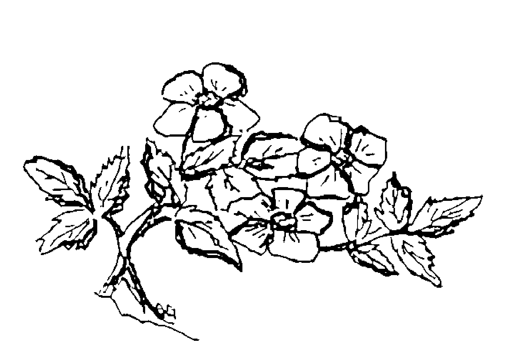

#### 采莓之月 · 鳟鱼——覆盆子 Raspberry

覆盆子是与采莓之月（7月23日至8月22日）相关的植物，覆盆子本身相当精致纤弱。这种植物的叶子和根部都有药用性质，浆果不但能让身体感到愉悦而且纯净，还能瓦解并排出胆结石和肾结石，刺激泌尿道的功能。覆盆子的根部，具有收敛止血以及一些抗生素的治疗特性。它可以作为漱口剂来减缓喉咙的疼痛，它的茶水也可以湿敷应用在创伤和切口上，以减缓出血。覆盆子叶茶可用来治疗腹泻、子宫、月经问题。覆盆子叶茶对于怀孕妇女来说，是最好的滋补药草茶之一。它的枝条所制成的茶饮对于感冒、肌肉、呼吸困难和血糖平衡都有好处。覆盆子可以教导你在生命的荆棘之中找到甜美。

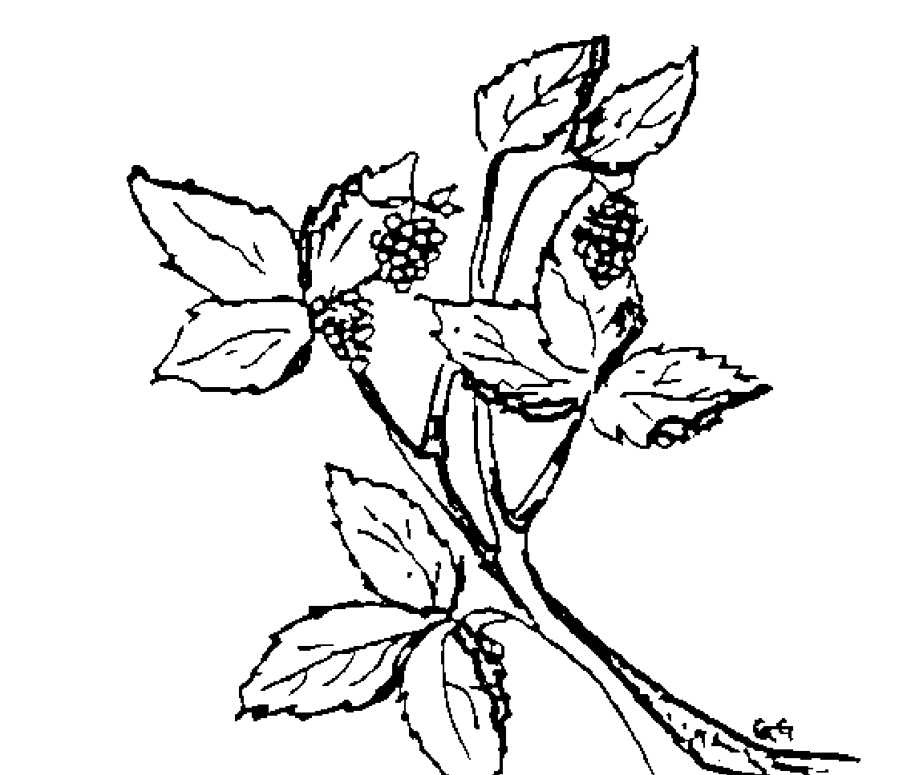

#### 丰收之月·棕熊——紫罗兰 Violet

紫罗兰是与丰收之月（8月23日至9月22日）相关的植物。紫罗兰象征着安静、温暖和多愁善感的矜持。紫罗兰也是一个强大有力的药用植物。叶子和花都是很好的舒缓剂，对于粘膜发炎特别有效。紫罗兰的维它命C含量很高，在药用上，紫罗兰能够穿透血液和淋巴液，并在这些区域溶解毒素。紫罗兰可以帮助疗愈癌症以及胃肠中的毒性。它可以减轻喉咙疼痛、呼吸困难，帮助治愈喉咙肿瘤、耳朵问题和头痛。紫罗兰有助于缓解牙痛和皮肤问题，它可以冷却高体温。紫罗兰也可以作为勾芡粉，在烹煮菜肴时加进热食、沙拉、果酱和糖浆中调味。在紫罗兰的环绕下，将唤醒你心中的圆满感，并帮助你了解你的爱的深度。

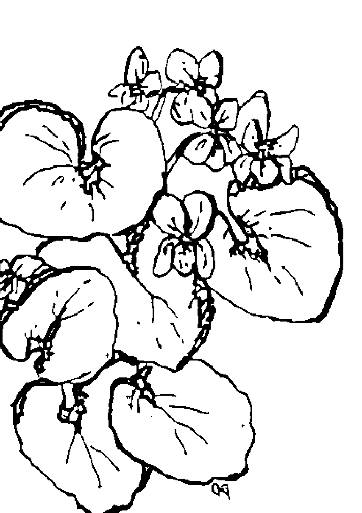

#### 群鸭飞迁之月·渡鸦——毛蕊花 Mullein

毛蕊花是与群鸭飞迁之月（9月23日至10月23日）相关的植物，这个带有天鹅绒般叶子的高大植物，是非常多功能的疗愈者。毛蕊花制成的茶，有助于舒缓粘膜和加强肺部、心脏、膀胱、肾脏及肝脏。毛蕊花可以缓和紧张的身体，而且是很普遍的收敛剂和止血药。它的药茶可以外用于痔疮、溃疡、肿瘤、喉咙肿胀和肌肉疼痛。由毛蕊花制成的油，已长期被用于耳朵、疣、肿胀、扭伤和皮肤裂伤，毛蕊花可以教导你去探索平静与流畅，并疗愈你本质的部分。

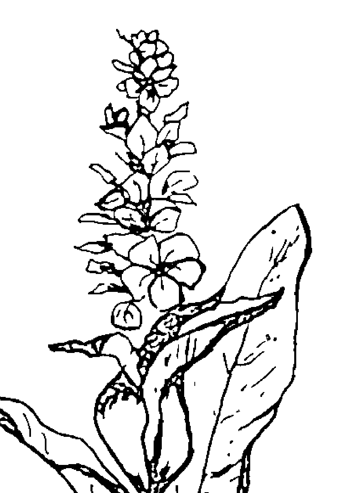

#### 天寒地冻之月·蛇——蓟草 Thistle

蓟草是与天寒地冻之月（10月24日至11月21日）相关的植物，蓟草是一种疗愈植物，也是一种维生的植物，它的所有部位都含有丰富矿物质，蓟草的嫩茎或根可以在剥完皮后生吃或煮食，果实的种子亦可以生吃或烤熟食用，蓟草茶饮能帮助治疗胃和消化问题、退烧、驱虫，亦可增加哺乳期的母乳量、强化内脏。蓟草据说能够提高机警，使大脑功能更加活跃，还可以帮助你去领悟许多不同层次的实相，并与之工作。

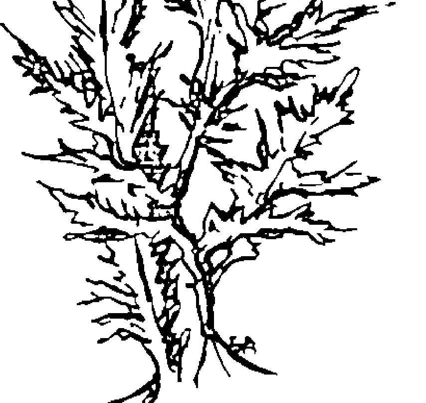

#### 漫长冰雪之月 · 麋鹿——黑云杉 Black Spruce

黑云杉是与漫长冰雪之月（11月22日至12月21日）相关的植物。黑云杉除了提供美丽、木材和氧气之外，还有很多其他用途。这种树的尖端含有很高的维生素C，可以作为茶叶或直接咀嚼啃食。由叶子制成的茶饮是很好的防腐剂，也有助于松开喉咙和胸部的粘液。黑云杉的树脂可以用來清洁伤口，也可以在净污木屋仪式中嗅吸。树脂胶可以制成石膏来固定骨头，枝条所煮制的茶水可以用来泡澡，对于治疗感冒效果极佳。黑云杉可以帮助你探索崇高的理想，也帮助你与大地连结，帮助你以一种独一无二的方式触及大灵。它可以教导你关于一个很深的内在力量，一种激发出温和柔软的力量。

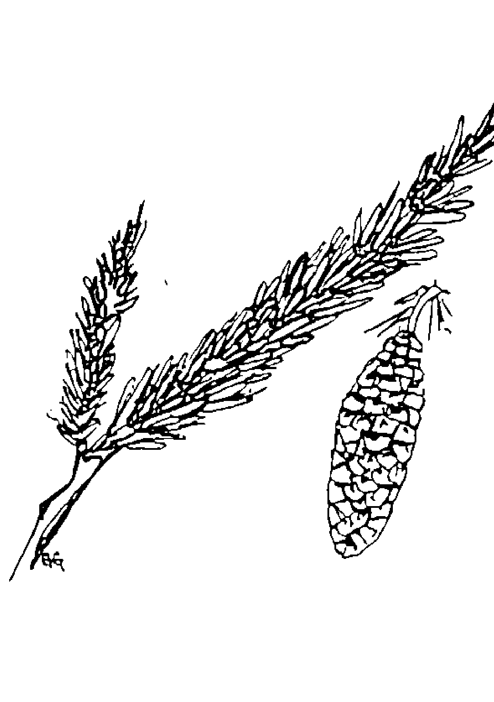

### 灵性道路植物

#### 北方灵性道路植物

##### 净化——紫锥菊 Echinacea

紫锥菊跟净化相关，位在北方灵性道路的第一个位置上。紫锥菊也被称为紫锥花，野生在美国的草原上。它是最强大有力的清洁净化药草之一。在药草传统中，紫锥菊以净化和纯化血液而闻名，对美洲原住民来说，它是众所周知的治疗者，特别用于蛇咬伤和感染。紫锥菊的根部可以内服也可以外用，作为补品、酊剂、敷泥、药草浴、烟熏净化或温和茶饮。这种植物疗愈血液和淋巴腺体，它有助于治疗发烧、感染脓肿、粘膜刺激、阴道感染和血液中毒。紫锥菊对于毒橡树或毒藤蔓引起的过敏、亦或是动物和昆虫的叮咬，都有很好的疗效。

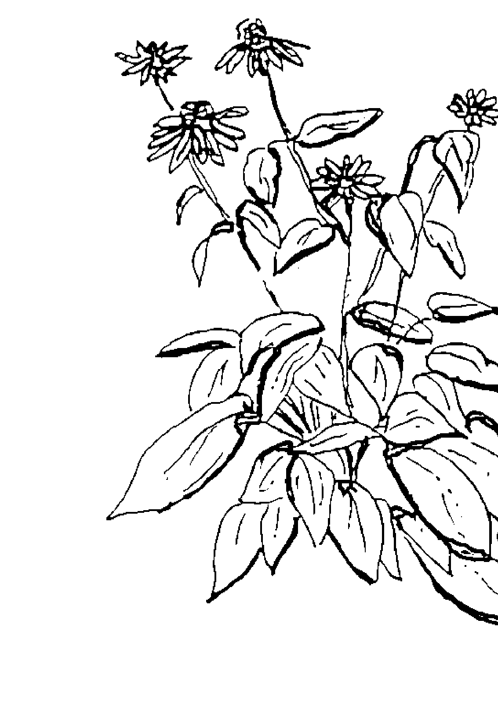

##### 更新——红花苜蓿 Red Clover

红花苜蓿是和更新有关的植物，在北方灵性道路上的第二个位置。这种多产的药草有着醒目的红色花朵，开在牧场、草坪、原野以及草地里。它是一种清理净化的植物，也可以重建身体任何耗尽的部分。这种植物非常有利于人类的福祉，被认为是造物主赐给两条腿的人们最伟大的礼物之一。

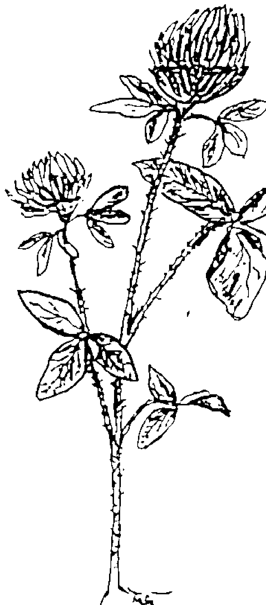

红花苜蓿的花朵具有药效，可做为补品、酊剂、漱口液、茶饮、烟熏净化、药膏和药草浴。红花苜蓿可用来治疗喉咙、阴道、胃、直肠和皮肤的刺激红痒，有助于溃疡、癌症、肺、咳嗽、感冒、支气管问题、烧伤、割伤、刮伤、痤疮……等等，它舒缓、冷静，也是很好的镇定剂。饮用红花苜蓿茶，或是在伤口上湿敷红花苜蓿，可以为你带来内部或外部的更新。

##### 纯洁——延龄草 Trillium

关联到纯洁的植物是延龄草，在北方灵性道路的第三个位置。延龄草是一种开花的香草植物，其根部看起来类似人参。延龄草繁茂地生长在丰饶、阴暗、潮湿的树林和雨林中。它是一种很精致纤细的植物，只有生长在这原始纯净地区的生物，才能羞怯地瞥见这小巧玲珑的鲜花。

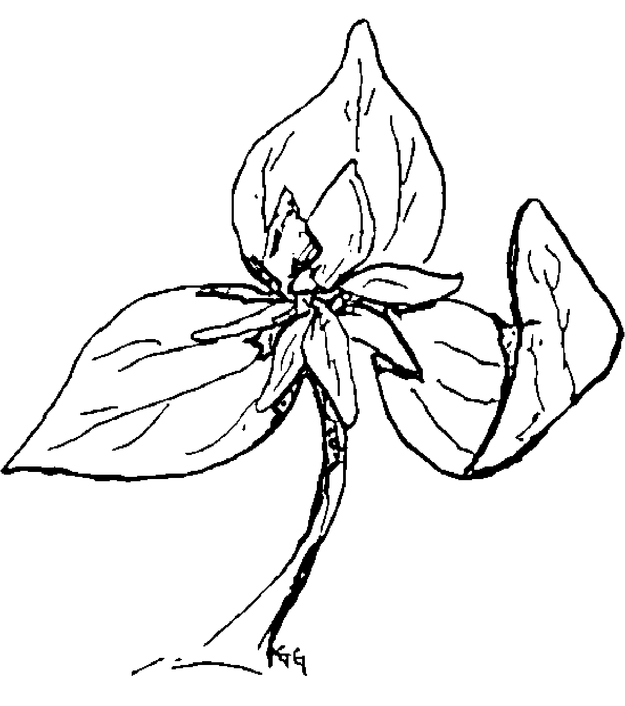

这个精致的植物是成千上万的雨林物种之一，也是那些被盲目破坏毁灭的雨林植物之中，最有价值也最无可取代的自然资源之一。

这个害羞、高贵、原始而濒临灭绝的物种，有着一个不确定的未来。药草历史学家表示，我们这个世代可能会将延龄草带到生命的尽头，就像其它历史学家的预言一样，这个世代可能也会是纯净的大地、空气和水的末日。

在历史上，延龄草的根部被制成粉末形式使用，然后煮沸以制成酊剂、茶饮、敷泥或药草浴。它对于出血、咳嗽、肺部和腹泻等问题都很有助益，它也被用作止痛剂来清洁伤口。延龄草又名分娩根，因为它常被原住民女人在分娩时用以止痛和收敛，如果发生出血问题，延龄草也可以缓解。这种植物被认为能疗愈女性器官，特别是严重的月经出血，以及阴道和子宫问题。

饮用延龄草茶据说可以净化心智、身体和灵性，然而，因为它濒临灭种的绝境，直到它有机会被大量繁衍之前，我们都不应该再掠夺它一丝一毫。

#### 东方灵性道路植物

#### 明蜥——迷迭香 Rosemary

迷迭香是与明蜥有关的植物，位于东方灵性道路的第一个位置。它的植物学名是Rosmarinus officinalis。迷迭香的花朵颜色由很浅的蓝到深蓝色，长条形的叶子略带一种皮革般的韧度和厚度，香气浓烈，摸起来有些许油润感。饮用迷迭香茶有助于增加你心智头脑的明晰感。

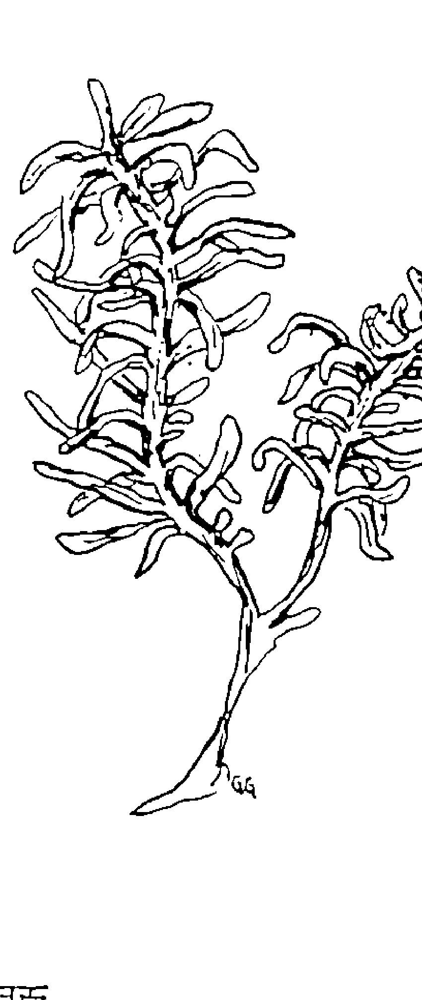

迷迭香的叶子和花可作为止痛药，特别适合治疗头痛。迷迭香也能缓解胃部和结肠问题，如胀气、消化不良、恶心和胃痛。它可以做为收敛剂、兴奋剂，或治疗发烧，特别有益于感冒和肺部问题。迷迭香是用来治疗女性问题的强力药草。

把迷迭香用作漱口水、草药浴或烟熏净化时，它是一种非常有效力的疗愈者，将带来清洁、冷静和焕然一新。迷迭香可用作芳香疗法的精油、茶饮、酊剂和补品，或装在孵梦枕和小香囊里。作为烹饪香草时，它会为菜肴带来一种开胃的美味香气。无论是将迷迭香用作烹饪、疗愈或仪式目的，它都将带给你明晰和理性。

##### 智慧——鼠尾草 Sage

与智慧有关的植物是鼠尾草Sage，位于东方灵性道路的第二个位置。鼠尾草的植物学名是Salvia officinalis。鼠尾草可以在花园里生长得很好，它是带着淡白色或灰绿色叶子的多年生植物，和薄荷是同一个家族的成员。鼠尾草自古以来即与智慧相关，它的名字Sage也是智慧、贤明的同义词。

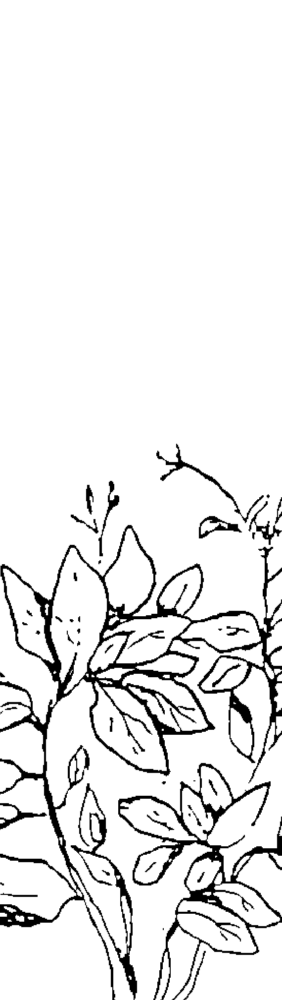

在传统中，据说人们“因美味与健康而使用鼠尾草”，事实上，无论是在烹饪调味以及疗愈药用上，鼠尾草都是极为不可或缺的。

这种植物的叶子，可以被用作香料烹煮。在药用上（无论内服或外敷），鼠尾草可以用作补品、酊剂、湿敷泥、药草浴、药草茶或熏香净化之用。

这种植物可以疗愈胃、结肠、鼻窦和鼻道、肺、肝、肾脏、皮肤、毛细孔、关节、骨骼、粘膜组织、喉咙和性器官。鼠尾草可以用來收敛止血、消毒杀菌、护发、祛除头皮屑、抗菌防腐，祛痰……也可以做为身体按摩油，以及芳香法疗中的媒介。它有益于感冒、发烧、过敏、鼻窦炎、关节炎和性的问题，也能帮助缓解疼痛、溃疡、割伤、擦伤和烧烫伤。

把鼠尾草当作漱口剂，可以帮助减轻喉咙疼痛。饮用鼠尾草药茶，能够平静你紧张焦虑的神经。泡鼠尾草药澡，可以疗愈皮肤病、蚊虫叮咬、伤口、或镇静心神。一个聪明的厨师或疗愈师，会使用这变化多端的香料药草，来添加烹饪乐趣或帮助疗愈药效。

##### 光明——野生西洋参 Wild American Ginseng

与光明相关的植物是野生西洋参，位在东方灵性道路的第三个位置。野生西洋参的植物学名是Panax quinquefolius，整株植物高度约八到十八英呎，根部长满了粗糙的瘤状突起。西洋参根部的长度约两到四英吋，宽达一英吋。

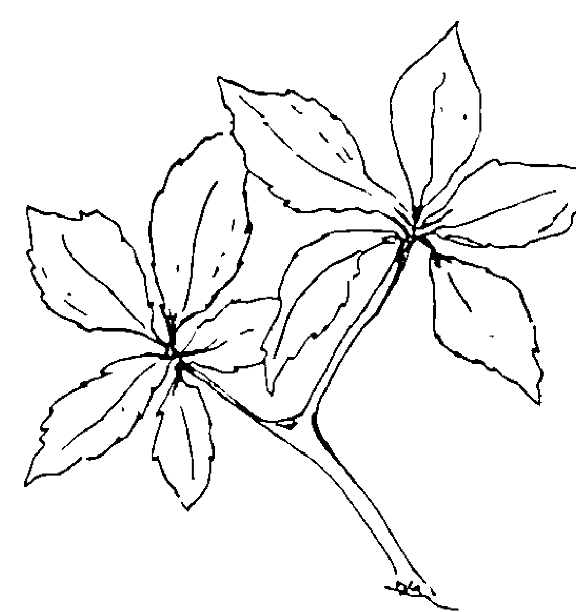

这种难以找寻的植物就如它所象征的特质一样受欢迎。要找到它的一种方式是在夜晚里寻找它所发散出的轻微萤光。西洋参内在的光可以把你拉向它，同样的，一个已经被启蒙点亮的内在光明，也能够吸引其他的人。然而，一旦你找到了人参，你可以藉由留下它而证明你的光明程度。如果人们继续恣意地采收它，这植物将会在几年内消失绝种。

这个植物需要四到八年时间，才足以长成适合药用的状态，虽然有可能找到五十年或者更老的年纪，但毕竟非常罕见。野生西洋参受到那些熟知它们强大品质的人们所追逐，以致于在过去八年来已绝少看见它的踪迹。

虽然在历史上，我们所讨论的都是野生西洋参的医疗用途，但是它的根部也常被用于烹饪。我们一点都不觉得这种植物在今天应该继续被采收，它被用作香料或茶饮，它也被磨碎成香料、酊剂或补品，或者置入胶囊中口服，被誉为大自然最甘美的烹饪礼物之一，这个声誉导致它被过度滥采滥用。它被认为可以改善健康并带来整体的疗愈，具有镇定和强身的效果，尤其是对于胃部病痛和性能力的再生、以及一般生气活力都特别有疗效。

西洋参有益于淋巴腺体、心脏、大脑、泌尿系统以及神经系统。它能帮助缓解风湿，且平息大多数形式的痉挛、咳嗽或哮喘。它也有助于开胃。

你可以藉由完全不使用这个植物，来显示你的光明和启蒙深度，你可以用人工栽培的西洋参取而代之。这么做不只是为一个已濒临灭绝的物种带来生机，同时也支持着农夫去种植这些作物。

#### 南方灵性道路植物

##### 成长——紫草 Comfrey

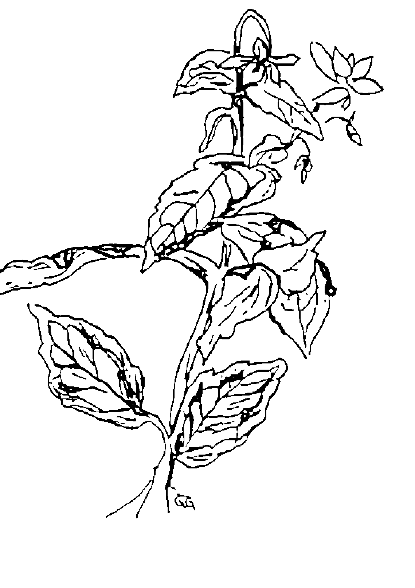

紫草是与成长相关的植物，位在南方灵性道路的第一个位置。紫草是一个成长力量的好范例，一旦这植物的根系扎进了土地，紫草就会蓬勃生长，往所有方向蔓延开来。食用或药用紫草，都能够强化使用它的人，就好像成长强化了个体一样。

紫草是一个多功能的重要植物，内服与外用皆可。它可以做为蔬菜、茶叶、酊剂、补品、敷剂、药草浴、或药粉。它对于我们牧场上的四条腿动物朋友们，也是很好的食物。

紫草被美洲印地安人用来抑止内部的出血，例如：血便、鼻血、肺部出血、血尿等等。对于癌症来说，它也被公认具有良好的疗效。紫草是一种强力的止血和收敛剂，祛痰剂、止咳糖浆、止痛剂、兴奋剂、清净剂……紫草会通过一个人的身体系统去充电和净化疾病，并找到一条道路让健康的新组织得以长成，也带来整体的健康和幸福。

这种植物对呼吸器官、肺、胃极有好处，也有益于女性器官、乳房发炎、胆结石、喉咙、肾脏、肌腱、骨骼，背部疼痛、关节……以及性欲亢奋、烧烫伤、内部或外部的溃疡、扭伤、淤肿、疼痛和肿瘤。

紫草是一种强大有力的疗愈动力，可以促进身体、灵性、情绪和心智所有层面的再生与成长。

##### 信任——琉璃苣 Borage

与信任相关的植物是琉璃苣，是南方灵性道路的第二个位置。其植物学名是Borago officinalis。这种植物有许多宽阔的叶子，它的花朵看起来很讨人喜爱，像一朵光芒四射的紫色星星。琉璃苣被使用的部分是种子、叶子和花朵，长久以来，它被视为一种与心脏能量相关的植物，琉璃苣连结着信任，因为它有能力去打开你的心，并让你能够与心的能量工作。

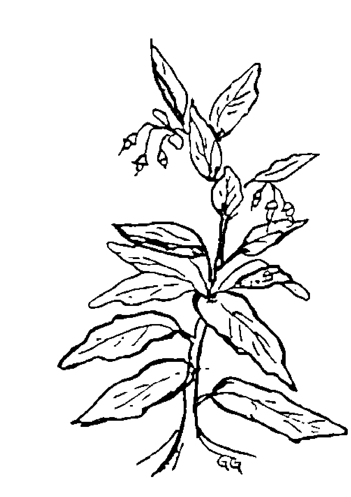

琉璃苣的药效可用于内服和外用，它可以用來漱口、洗眼，可以做为茶饮、敷剂、酊剂、补品、药草浴或烟熏净化。为了获得最佳效果，内服外用可以同时进行。

琉璃苣的花朵常用于烹饪目的，并且用来为已酿好的白酒调味。琉璃苣的叶子尝起来有黄瓜般的味道。

在药用上，它的种子、花、叶片都是有效的止咳剂和情绪稳定剂，琉璃苣还可以用来增加哺乳母亲的乳汁。

这种植物非常适合冲洗皮肤或眼睛的发炎症状，对于昆虫叮咬、肺部疾病、流感、伤风、动物咬伤、伤口和疹子…以及引起瘙痒的任何种类感染或溃疡，皆特别有疗效。琉璃苣有助于释放毒素、退烧、诱发汗水、净化血液、清洁身体系统。这个植物有助于停止黄疸、分解粘液、治愈溃疡和疱疹。一点点就很有疗效，所以请勿过度使用。

使用琉璃苣，将鼓励你去信任这疗愈的过程，以及生命的自然秩序。

##### 爱——山楂 Hawthorne

山楂是与爱相关的植物，在南方灵性道路的第三个位置，植物学名是Crataegus oxyacantha。山楂灌木和乔木都有荷叶边扇形叶片、圆形的小花朵、卵形的浆果，山楂可以长到三十英呎高。就像爱的功能一样，山楂也能强化你的心，帮助心变得健

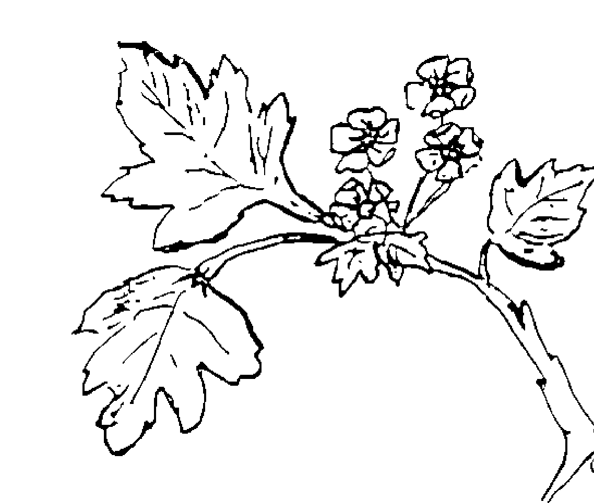康和敞开。琉璃苣藉着教导你去信任而将爱带向你，但山楂却给你力量去成为脆弱，柔弱到足以在你生命里维持着始终如一的爱的关系。山楂给你力量去承担风险并吸引友谊和爱的关系，尽管那关系似乎超乎你的手段和能力，山楂以这样的方式将爱带入你的生命。山楂象征了心的力量，这个植物也帮助你拥有力量和勇气去处理被拒绝的爱，以及已经冷却或消极的心。

山楂内服和外用皆有效果，它可以做为补品、酊剂、茶饮、敷剂、药草浴或漱口液。山楂可以用来稳定高血压或低血压，这种植物被认为具有重大疗效，可以疗愈心脏、减轻动脉硬化、改善肾脏疾病和循环问题。山楂也可以治疗失眠和焦虑，而浆果最常被用来帮助心脏、消化系统和循环。这种植物常做为利尿剂、止血收敛剂和镇痛剂，美洲原住民用它来治疗咽喉炎和关节炎。

山楂最伟大的能力就是创造爱，并且强化心的每一个面向，无论是在物质肉体层面，还是情绪或灵性层面。

#### 西方灵性道路植物

##### 体验——橄榄 Olive

橄榄树是与体验相关的植物，位于西方灵性道路的第一个位置。橄榄是当今在地球上发现的最古老的树木之一。它是一种经历了数千年历史的树，这古老的树能够教导我们很多体验的价值与洞见。

橄榄树是中型的树，这树的果实～橄榄，是几千年来的美味，并供给人类一种最健康的油品。内服或外用橄榄油，均可以促进健康。外用时，可以按摩的形式来帮助皮肤、毛孔和关节。

烹饪时，橄榄油可以被用来改善大多数的食谱用油，尽管任何的油使用过量都是有害的，但据说橄榄油可以用来瓦解胆固醇，而不是产生胆固醇。

和橄榄树、树枝以及叶子工作，可以让你对新经验的益处敞开，特别是在灵性层面上。它也有助于激发成熟、洞察、和平、以及理解。

由于它的年纪和生命的体验，橄榄树能够教导我们耐性，以及无为而临在的价值。

##### 内省——洋甘菊 Chamomile

洋甘菊是与内省相关的植物，位在西方灵性道路的第二个位置。洋甘菊的植物学名是Matricaria chamomilla。这种纤细娇柔、香气甜美的植物，可以被制成茶饮，帮助你放松进入内在的旅程，让你深深地向内看进你自己的存在。

洋甘菊被认为是一种治疗药物，可以医治从出生到成年之间折磨着人类的各种疾病。洋甘菊同时帮助缓解身体以及精神上的痛苦。

作为一种预防性药用植物，没有比洋甘菊再好的了。如果孩童们可以在饮食中定期的饮用洋甘菊茶，许多疾病以及后续所积累的健康问题都可能被防治。它可以被用作茶饮、补品、酊剂、药膏、芳疗精油、敷泥、药草浴以及漱口液。有益于成年和孩童的风寒、流感、麻疹、腮腺炎、耳痛、头痛，以及任何种类的疾病。它带来舒适、镇静、抚慰并减缓痛苦。强烈推荐洋甘菊给患有任何胃部问题的朋友。

洋甘菊被认为能减轻大量的月经出血和子宫不适。它所制成的油或药膏有助于皮肤护理。洋甘菊药草浴能让人焕然一新、精神充沛。

一杯洋甘菊茶可以帮助你放松，走进内心去寻找痛苦或问题的解决之道。

##### 力量——荨麻 Nettle

荨麻是与力量相关的植物，位于西方灵性道路的第三个位置。荨麻的植物学名是Urtica dioica，俗名荨麻。荨麻生长在野地，它的茎会往外纠缠和刺痛那些没有意识到它的存在的人，即便荨麻可能是刺激且恼人的，但它也可以是健康和疗愈的给予者。

最好是使用年轻荨麻的叶子，这叶片可以内服或外用，作为茶饮、补品、酊剂、洗发精、润丝精、外敷油、乳液、或药草浴。荨麻富含维生素和矿物质，包括叶绿素、钾、锰和铁。

当荨麻新鲜时，它会刺痛别人，一旦烹煮过后，却是一种非常有价值的食用植物。它尤其富含铁质和维生素C，可以用于汤品、煮过的沙拉、茶饮、或煮熟如菠菜。在药用上，它有助于缓解关节炎，特别是用作敷泥时。荨麻可以帮助治疗皮肤和血液的疾病、贫血和痛风，并且可以降低血糖。荨麻也能有效处理女性问题、皮疹和头皮屑。许多身体护理产品，例如：护肤乳液、洗发精和润发乳都含有荨麻。

荨麻，透过注意力教导力量，如果你还没有准备好要和荨麻周旋，它会刺伤你，藉此提醒你力量中很重要的一个元素就是辨别。如果你能归于自己的力量和能量中心，你就可以轻松拾起这个植物，而无需接受它任何的刺痛、灼烧和鞭打。

### ——与药轮植物帮助者工作——

- 找到你当前的植物帮助者。

您可以使用以下的练习，在特定时候决定你应该和哪一个药轮植物帮助者工作，这将帮助你同时在理智上和直觉上使用植物药轮：

你将需要：烟熏净化材料、药轮、纸和笔、录音机、献供品。

预估时间：三十分钟。

1.  烟熏净化你自己和地区，走到你的药轮旁，无论是在冥想或现实中。如果你知道自己想和哪一个位置工作，就坐在那块石头旁。如果你不知道自己身在旅程中的何处，那么就绕着物质实体的或心智想像中的药轮行走，然后在最吸引你的位置坐下。
2.  让自己安静下来，并归于中心。请求你所在位置的植物来帮助你，请问是否你现在需要和这个植物工作，藉以强化和疗愈你自己。
3.  如果您收到了肯定的回答，请求这植物的神灵来帮助你学习有关这个植物。
4.  如果你接收到一个否定的答案，就请这植物的神灵指引你去找到此刻真正需要的植物。继续叩问，直到你收到一个关于你应该工作的植物的肯定答案。当你得到答案时，感谢那些帮助你的植物神灵。
5.  记录你的体验。

当您已经确认了此刻可以帮助你的药轮植物时，请先阅读本章节中关于它的资讯。如果您觉得还需要更多信息，请参考其他书籍。

研究这个植物，直到你觉得你已足够了解它并且能够找到它。假如你知道这植物可能生长在你周遭的某些区域，请前往那个地区，并请求植物的神灵来指引你。当你找到了你的植物帮助者，请先进行一个献祭和祈祷，然后坐在它旁边，运用〈拥抱一棵树〉里所描述的技巧（第274页）。

如果这里有丰富的这类植物，或者唯有这里才找得到这些植物，而这里却不是你的私有财产时，请询问植物你是否可以摘取它的其中一个亲族，如果你接收到一个肯定的答案，请植物指引你去做这件事。

如果你知道吸引你的植物并不存在于你所处地区，那么去看看你是否可以取得一些干燥植物。即便如此，还是有一些非常稀有、濒临绝种、或毫无公认药效价值的药轮植物不易被取得，在这种情况下，你可以找出一张召唤着你的植物的照片，或者使用本书中的插图，你可以把特定植物的图像影印下来，然后与它工作。

如果你已经被赐予一种植物，无论是新鲜的或干燥的，请把它和那颗刚刚成为你的帮助者的石头一起带在身旁，尽可能用你所有的感官去经验这个植物。如果是一张照片，你也同样随身携带它，对它观看、研究、冥想、沉思以及做梦。如果是干燥植物，你可以拿来嗅闻、感受和品尝。若是新鲜的植物，你可以在大自然里研究它，学习如何去干燥这个植物，然后注意观察你在新鲜和干燥植物之间的感知有何不同。

如果你正在工作的植物适合各种用途，是一个丰饶的植物。你可以用本章节所提到的任何方式去使用它：茶饮、烟熏、泡澡、蜡烛、孵梦枕头、烟草混合物、献供……去观察当你选择用不同的方式与它工作时，你和这植物又有何不同？

随身携带着这植物的照片，或者是一小撮植物，特别是在你做梦、静心冥想或执行仪式时，去看看它如何在这些时刻影响着你。特别去观察这植物是否有任何疗愈的帮助要给你。去留意你的梦境、静默的时刻、以及静心冥想期间，去聆听你的植物帮助者，并跟随它所给予你的建议。

当你觉得自己着实了解了这个植物，这可能需要花上你几天到几年的时间，接着你就可以准备移动到另一个位置学习，并重复这整个过程。

以下的段落可作为一开始的指导手册，帮助你着手和植物药轮工作。当你做完了这些练习之后，你可以藉由研读一些药草书籍、或是与一名有能力的药草学家工作，而继续你与植物王国的连系。

### 如何采集、干燥及混合药轮植物

采集任何植物时，最重要的面向是去体现你的觉知和尊敬。不要因任何理由而摘取几乎濒临绝种的植物，如果这植物今年的产量比去年短少很多，也请你不要摘采它，而是去为它做一个祈祷，好让它可以再继续生长繁衍。绝对不要把一个地区的任何植物采个精光，也绝不要未经征求这个植物神灵是否愿意帮助你，就动手摘走它。最后记得做一场祈祷和献祭，去感谢这个植物的帮助。

有很多方式可以对植物祈祷并和它的神灵交谈。其中的共通点就是～你必须带着尊敬去接近这个植物。你并非藉由对它祈祷而神化这植物，你其实是在承认这同样的大灵在你之内也在你周遭，它更在你所需要的这个植物之中。有些人会对他们要摘采的每一株植物祈祷，他们可能会先感谢这个植物所给予他们的礼物，然后请求植物的神灵在他们真正剪切这植物的身体时，先行离去。他们可能会告诉这植物为什么他们会需要它，然后请求植物对他们的任务给予帮助和祝福。

有些人会去寻找那些似乎是这地区里最古老的植物物种～祖父植物或祖母植物，并对这些老者祈祷，他们对这些老者解释自己的需求，并且恳求老者的祝福和允许去摘取一些它们的孩子。

在开始采集植物之前，大多数人会留下一点玉米粉或烟草献供。如果你没有这些可用，你可以选择留下一绺你的头发或硬币。献供的目的，是去对这个给予你的植物回赠一些礼物。

在摘采野生植物时，你必须非常小心人为的干扰，除非你很确定这个区域没有喷洒任何种类的除草剂或其它化学药品，否则不要轻易摘取植物。也绝对不要摘采高速公路旁的植物，废气中含有相当多的化学成分，这对你来说可能是危险的。

除非你百分之百确定这个植物的身份，否则也绝不要摘采，很多类似的植物却具有非常不同的属性。药轮植物中最明显的例子是蓝色卡马夏与白色卡马夏，蓝色卡马夏是重要的食物，白色卡马夏则含有致命剧毒。然而，有许多其它看起来很相似的植物也将导致问题，例如：狗茴香非常类似洋甘菊，甚至连一些经验丰富的药草学家都可能被愚弄。洋甘菊能让你放松，但狗茴香却让你感觉自己病得像条狗一样。

假如你需要一个植物，但又不确定它的身份，最好能和一位有经验的药草师一起确认。如果不可行，而你对这植物的需要又远甚于你所摘采它的风险，那么你可以问问这植物是谁。（绝对不要询问卡马夏，其它的卡马夏都是致命的）。假如你已经练习了这本书的第一个章节，你将会知道如何去感受答案。对某些人来说，这植物会散发出一种非常精微细致的光芒以及气场。而其他人可能会以他们内在的耳朵去聆听到答案。有些人会在他们身体的中心点感觉到一股能量的转移，或者感觉手中有种刺麻、温暖或寒冷的感觉……假如你已经和你自己的感受工作得足够多，你会知道这植物正在跟你沟通。

有些人会用灵摆来决定自己是否找到了正确的植物，如果灵摆往它们的方向摇摆，人们就会知道这植物是被允许的，如果灵摆停滞不动，他们就不会摘取这个植物。

当你已经采集好你将要使用的植物，你应该练习处理它的干燥过程，大部份植物不应该放在阳光直射的地方，阳光会剥夺它们的菁华。你应该慢慢地干燥它，但也不能太慢以致于它们无法定型。你可以用绳子把植物单独或者一整把捆绑起来，然后吊挂或钉在屋梁上。有些人以食物干燥机烘干药草，这也很好，请仔细按照烘干机所提供的指示。有些人在烤箱里用非常低的温度干燥药草。那也没关系，如果你的烤箱不至于太热，只要让你的房子在夏天里相当温暖即可。

混合药草时，首先你应该确定自己混合的药草是相互帮助的。有一些草药可以合作得很好，其它则不然，请咨询药草师或参考一些药草书籍。

### 药草疗愈

有些药轮药草是疗愈各种问题的杰出帮助者。你可以运用它们作为茶饮、胶囊或酊剂。如果你喝药草茶的话，那会是摄取药草最好的方法。当你在准备茶饮时，这药草就能让你感受到它，闻闻它自然的芬芳气息、尝尝它的味道，并看看它在准备之前和之后有何不同。一般来说，准备叶茶或花茶时，你舀一大汤匙的药草放进一杯沸腾开水里，热水要能覆盖过药草，并在你过滤或饮用之前先浸泡超过十分钟。

对于根部和分枝的用量也相同，但你得先把水煮沸再添加药草，盖上锅盖继续焖煮十到十五分钟之后，再进行过滤和饮用。各种药草与水量的比例搭配不尽相同，请咨询一个药草学家或一本优良的药草书籍。

有些人不喜欢喝如此大量足以发挥疗效的药草茶，服药草胶囊、购买或者自制药草酊剂，对他们而言可能更适合。如果你要服药草胶囊，记得以一杯热水去启动活化药草。酊剂配合温开水，效果也很好。如果你不喜欢其中一个植物帮助者的味道，采用胶囊或酊剂是对你较好的方式。倘若没有足够多的用量，任何药草都无法运作得当。

有些药草被制成湿敷布、药膏或软膏外用。各种药草的调配方式不尽相同，您应该询问药草学家或查阅书籍。大多数的保健食品店都找得到各种药草和软膏，你会在其中发现很多药轮植物，特别是车前草、紫草、向日葵、橄榄、荨麻……等等。

### 烟草混合物

虽然有许多药草可以用于吸嗅，但有些却不能。所有的药轮植物中，我们只建议在烟草混合物里使用以下药草：车前草、覆盆子、毛蕊花、红三叶草、烟草、鼠尾草、山艾和迷迭香。

制作烟草混合物，必需彻底的干燥所有药草，再用手将它们混匀。

当你使用烟草混合物时，你会发现某些药草比其它更容易点燃。于是你就可以在将来的混合物中多加使用这类草药。在当今的地球环境下，人们呼吸着饱受污染的空气，吸食任何香烟都被视为一种有问题的活动。我们并非推荐抽烟作为一种娱乐，然而，我们相信烟斗所飘扬的神圣烟雾，我们只把烟吸进嘴里，然后吹送给大灵，如果你以很大的节制和恰当的意图进行，这是完全无害的。

#### 献供

所有药轮里的植物都可以当作给大灵的献祭。大多数药草献供都使用干燥的药草，你可以随身携带着它，随时随地都可以进行一个特别的祈祷。

藉着使用药草，有一个特定的明确意义是你可以和大灵沟通。传统的献祭方式是：以一小撮药草献给造物主、大地母亲以及东西南北四个主要方位，然后将它们洒在植物上、大地母亲上，或任何你在大自然中所拿取的东西上。

### · 药轮孵梦枕头 ·

孵梦枕头是一个非常有效的帮助者，帮助你连结你的潜意识，并且允许大灵在你睡梦间与你沟通。

许多人本身具有非常杰出的做梦医药，仅仅只需要再多一点点助力。孵梦枕头可以提供这一点，也可以成为一个卓越的触媒去连结你和你的梦。孵梦枕将会激发更强烈的梦境，让你能够更容易记住它们。和第六章里的静心冥想结合去练习记住你的梦，它们可以帮助任何人回忆起梦境。

制作一个孵梦枕头，是连结植物王国以及你梦境的好方法。你可以使用那些有助于你所需的任何特定疗愈的植物，或是用你当时正在工作的任何植物能量，去填充你的孵梦枕头。例如：西洋蓍草可以用作整体补品，毛蕊花可以用来召唤强大的宇宙力量，玫瑰花瓣可以呼唤爱的力量，艾蒿和洋甘菊一样，对于做梦医药的效果非常杰出。

#### 制作孵梦枕头

你将需要：烟熏净化材料、布、剪刀、针线、干燥药草，如果你想要的话：可添加植物精油。

预估时间：采集药草的时间因人而异，缝制枕头的时间约一小时。

1.  烟熏净化你自己，熏净所有将使用的材料。
2.  选择你的布料，柔软的棉布、白棉布或丝绒，都是用来制作孵梦枕头的极佳布料。
3.  将布料对叠，量测并标记出八乘以五英寸的长方形，如果布料不太厚，可两层一起剪裁。
4.  将布料的内里翻转向外，把两片布料固定在一起。
5.  将枕头的三个边缝合起来：从枕头上缘缝到侧边，再缝到枕头下方，留下另一侧做为开口。
6.  混匀你想放进孵梦枕里的药轮植物，如果你想要的话，亦可以添加些许精油，尽管这自然药草的气味已经非常浓烈了。如果你要添加精油，使用足够的量就好，可以使香味更强烈，但小心不要多到把药草都浸湿了。将药草放进枕头之前，记得让精油有机会干燥，以免药草发霉。
7.  用药草填充枕头，直至整个枕头蓬松。
8.  将剩余的一侧开口缝合。
9.  入睡之前，将自己和孵梦枕头烟熏净化过，并放在你的普通枕头底下。有意识地祈求能记住你的梦。在你床边放一本笔记，好让你可以在醒来的第一时间写下你的梦。持续记录这梦的日志一段时间，至少一到三个月。使用日记本和孵梦枕将帮助你成长，更清晰记得并领悟梦境，同时也可以看见你自己以及你梦境的成长模式。

### 。药轮香草蜡烛。

燃烧一盏含有药轮药草材料的蜡烛，将会邀请药草的质地以及蜡烛颜色的能量质地。当你点燃蜡烛时，你也会召唤火元素的力量。如果这蜡烛具有精油的气味，那么你也可以藉此打开你的嗅觉和视觉。

#### 制作药轮香草蜡烛

你将需要：烟熏净化材料、一片蜡块或蜂蜡（任意颜色）、蜡烛芯要比蜂蜡的长度多出一英寸，蜡的颜色可以象征那些相应于药轮位置的药草，也可以选择目前正吸引着你的色彩，如果需要的话，可以加入一些药草精油或香气。

预估时间：三十分钟。

1.  烟熏净化你自己，以及你在制作蜡烛时将会触摸的任何东西。
2.  在你面前平放一张蜂蜡。
3.  以一小撮你想要卷进这蜂蜡中的药草进行献供。然后再均匀地将药草撒在整片蜂蜡上。仅仅使用少量药草即可，否则当你点燃蜡烛时，它可能会变成一把迅速燃烧的火炬，而不会是你所期望的愉快体验。如果你使用玫瑰花瓣，只要四到六片即可，将花瓣放置在你最后才会卷滚的边缘。
4.  将烛芯放在蜂蜡边缘，约留四分之一英寸超过蜡烛高度。开始轻轻地卷动蜂蜡，将烛芯包覆固定，然后继续滚卷蜡烛直至完成。当你将平面的蜂蜡滚卷成圆筒时，记得均匀地施加压力。
5.  接着，轻轻按压并抹匀蜂蜡的接缝，使边缘更加平滑。
6.  以指尖沾附你所选择的精油或香氛，并轻轻地将它按压在蜡烛表面。

### ·药轮蜡烛仪式·

蜡烛仪式非常强大有力的协助显化和实现，因此，不要低估或轻忽这个仪式的力量。小心留意你所要求的，是否就是你最想要得到的。记住你的责任～只能为了所有参与者最高的美善而工作。

你将需要：烟熏净化用具、蜡烛、烛台、一张纸和笔。

预计时间：三十分钟到两个小时。

1.  烟熏净化你自己，以及你在仪式期间会碰触到的一切。包括仪式将发生的地方和任何参与其中的人。
2.  写下你想要的。
3.  点燃一支蜡烛，并邀请你所需的力量临在此时此刻。感谢火元素，以及色彩、药草的力量，和蜡烛的香气，感谢它们的临在。
4.  花点时间凝视蜡烛并连结其能量。当你正在连结能量时，至少做四个悠长缓慢的深呼吸，去觉知那股在你之内的、在你周遭的、以及正通过着你的生命力。
5.  以蜡烛点燃那张你写上祈祷的纸，当纸张燃烧时，把它放进烟熏碗内。燃烧期间持续地祈祷你所想要的事物，如果火已熄灭，就重新点燃它，直到这张纸烧成灰烬。假如它真的很难完全燃烧，在它和火焰至少有了一次连结之后，就留它在烟熏碗里。
6.  现在，待在蜡烛旁，继续祈祷，直到蜡烛烧尽。
7.  感谢火元素和色彩能量、香味，以及蜡烛里的药草，感谢它们的临在以及它们所给予的礼物。
8.  当蜡烛完全烧尽后，仪式也完成了。将剩余的蜡烛或灰烬埋入土中。

#### • 在其他仪式中燃烧蜡烛 •

在其他仪式中燃烧蜡烛，将会非常强大有力，例如药轮疗愈、烟斗仪式、或者当你在进行一些仪式本质的事物时，诸如研磨玉米粉或捆绑鼠尾草……等等。然而，有一些荣耀它们的指导方针，因为燃烧蜡烛本身就是个仪式。

1.  在点燃蜡烛之前，先烟熏净化自己以及蜡烛。
2.  感谢火元素，感谢色彩、药草和蜡烛香气的能量。
3.  当蜡烛燃烧殆尽时，献上感谢！感谢这些能量的临在与礼物。
4.  埋葬残余的蜡烛。

如果是因为时间架构或环境限制，不允许你当场烧光蜡烛，那么你可以扑灭蜡烛。但是，不要因为任何目的而将这些蜡烛继续使用在相似的仪式中。如果是一个高度充电、情绪强烈或是特殊疗愈的仪式，最好在仪式结束之后，立刻将这个燃烧了部份的蜡烛埋入土里。

## ——與藥輪樹工作——

所有的樹都可以是無限的答案和智慧的泉源。他們是許多靈性知識的守護者。就像所有大自然的神靈，假如你召喚樹的幫助或醫藥，它們會回應你。

樹與生俱來的醫藥，是預言和智慧，它們是擁有過去、現在和未來知識的神聖紀念碑，樹是古老教導和古老方法的守護者，它們都是行星的長老。一些最令人敬畏的樹長老在雨林裡生存得最好，從它們樹枝所掉落的每一顆種子都是記錄者，攜帶著這些古老存有的神聖傳承。

當你與樹的醫藥工作時，千萬不要從樹上拔扯樹枝，也不要用暴力或釘或鋸……這對樹木來說是一種傷害，非常不恰當，而且也將不利於你們正在進行的任何儀式。

假如你正從樹上採集葉子或樹皮，或者砍伐一棵已死的樹回收木材使用，你總是要先祈禱釋放樹木的神靈，然後給出感謝的獻供。一棵樹完全地給出它自己，它的水果和果實是食物的來源，葉子給出樹蔭和氧氣。即使在樹木死亡後，它也給我們木材建造我們的家園，成為我們爐灶裡的燃料，以及一種烹飪食物的熱能。如果樹木在森林裡倒下，來到了生命的盡頭，它們也將自己供獻給勤奮工作的蟲蛆以及忙碌的蜜蜂為家。

樹木是教我們如何充分給予的一個真正偉大的榜樣。你可以用許多不同的方式使用樹枝，它們或許成為醫藥聖圈、捕夢網的框架，它們也可以做成說話杖、祈禱棍、醫藥權杖或其它醫藥物件。

和樹上的彩色花朵及葉子工作，可以幫助你同時經驗到香氣和色彩療癒，懸掛在一棵結實矮樹的樹枝上，也有助於伸展和調整你疼痛的背部。

你也可以憑直覺與樹工作，就只是花點時間和它們同在。當你正在和某個藥輪位置的能量工作時，假如你花點時間和其中一種藥輪樹在一起，這將是特別強大有力的醫藥。

## · 擁抱一棵樹 ·

**你將需要**：一棵樹。
**預估時間**：三十分鐘。

- 1. 真正地去體驗一棵樹，擁抱它。
- 2. 只要擁抱十五分鐘或更長時間，去感受在樹木裡、在你自身裡、以及在你和樹之間的那股生命能量流動。願意花一點必要的時間去放慢自己的步調，去接近樹的節奏。
- 3. 當你擁抱樹的時候，你應該覺知到自己的身體感覺如何。當你正在做這個練習時，讓你的覺察通過你的身體上下移動著，記得這股生命能量感覺可以和性能量相同。
- 4. 持續地擁抱樹，直到你感覺自己的能量有所不同，去注意覺察這個不同是什麼。
- 5. 轉過身來背對樹，倚靠著它，直到你感覺能量的轉移，去察覺這種轉移的感受如何。
- 6. 感謝樹，並留下一些獻供。

擁抱一棵樹，是一個送給大靈的禮物，同時也是一份來自大靈的禮物。另一個送給樹的偉大禮物是環繞著它跳舞和嬉戲，讓大地能量從樹的根部流進你的存在，並且讓你的歡樂和能量往上流進這棵樹的樹枝……這個喜悅的迴圈可以同時更新你以及樹的神靈。如果這棵樹很強壯，而你也擅於攀爬，你可以爬上這棵樹並進入樹枝中依偎著它睡覺。

一旦你經驗到一棵樹的能量，你可能試著和其它的樹、灌木叢、藥草進行相同的練習，去嘗試所有的藥輪樹以及其它樹木，你有一生的時間可以去完成這些練習。留意不同的樹在你身上所喚起的不同感受，假如你能發自內心真誠的聚焦在這些感受上，你就可以開始去學習樹和其它植物的某些療癒特性。

## 藥輪 動物參照表

### 中央圓

| 動物 | 物質描述 | 棲息地點 | 特殊習性 | 與人類的關係 | 給人類的功課 |
| :--- | :--- | :--- | :--- | :--- | :--- |
| 所有或任何 |  |  |  | 受人尊敬，或遭捕殺 | 耐心、經驗、持久、古老智慧、犧牲奉獻、服務、工作和正直誠實的獎賞 |
| 陸龜 | 兩棲的爬行動物、覆蓋甲殼 | 全世界最大的品種，在加拉帕戈斯群島、動物園 | 生活在地面上 | 受某些人崇敬、被某些人當成寵物，也遭到其他人獵捕 | 好預兆、喝采、溫暖、樂觀、適應力 |
| 蜥蜴 | 鱗片粗糙、皮革般堅韌的小型爬行類，帶有凸出的圓眼睛 | 北美洲、挪威、紐西蘭 | 可以吸附任何表面，即使是天花板 | 遭到獵捕，或受到人們榮耀 | 轉化、機動性、奧秘、忠實 |
| 游鳥 | 群居鳥類，可以游泳和潛水 | 亞洲、北美洲、北歐 | 游泳健將，發出怪異的叫聲 | 受到某些人們榮耀，也遭人捕捉 | 榮耀、古老智慧、穩定、耐力、保護 |
| 海龜 | 帶有甲殼的兩棲爬行類 | 世界各地，在南美洲瀕臨滅絕 | 縮進自己的保護甲殼裡，生活於水中 | 人們享受牠們的歌聲，榮耀牠們，或捕捉牠們 | 轉化、進化、奧秘、歡樂、幽默、溝通 |
| 青蛙 | 綠色的、跳躍的、四條腿的兩棲動物 | 水中和樹林、世界各地 | 從蝌蚪變形成青蛙，喜愛歌唱 | 受人喜愛與尊敬 | 信使、善良、仁慈、服務、淨化、療癒、人道主義 |
| 雷鳥 | 會唱歌的巨大老鷹 | 靈性畛域 | 服務雷電存有 |  |  |
| 蝴蝶 | 近似美麗的彩色飛蛾 | 世界各地 | 從毛毛蟲變化成蝴蝶 | 受人喜愛，但因污染而瀕危 | 轉化、成長、演進、美麗、再生、改變、勇敢、無畏、歡樂 |

### 靈性守護者

| 動物 | 物質描述 | 棲息地點 | 特殊習性 | 與人類的關係 | 給人類的功課 |
| :--- | :--- | :--- | :--- | :--- | :--- |
| 白水牛 | 體型巨大、強壯結實、偉大壯麗的有角動物 | 非洲、美洲、歐洲 | 漫遊和放牧 | 遭白人獵殺幾近滅絕，深受印地安原住民喜愛 | 靈性、無私、服務、慷慨、古老智慧、希望 |
| 金色老鷹 | 飛得最高、最具王者氣勢的有翅膀動物 | 歐洲、亞洲、北美洲 | 空中特技表演 | 鼓舞人們，遭獵捕成為瀕危物種 | 明晰、靈性使者、偉大崇高、願景、靈感、嶄新的開始 |
| 土狼 | 敏銳的、迅速的、像狗又似狼的動物 | 北美洲 | 詭計者、有著怪異歌聲的求生者 | 受人喜愛或遭人痛恨 | 狡滑詭計、幽默、野蠻、耐力、信任、適應力、生存、創造力、奧秘 |
| 灰熊 | 毛茸茸大型動物，厚實的身體覆蓋著灰色外毛 | 阿拉斯加、黃石公園、加拿大卑詩省育空地區 | 冬眠 | 受人崇敬，但被獵殺到近乎滅絕 | 穩定、持久、療癒、內省、覺知、成熟、領導長才、教導 |

### 月亮和圖騰

| 動物 | 物質描述 | 棲息地點 | 特殊習性 | 與人類的關係 | 給人類的功課 |
| :--- | :--- | :--- | :--- | :--- | :--- |
| 雪雁 | 美麗的大型白色鳥類 | 冬天往南飛、春天飛向北方 | 以V字型隊伍飛行，遷徙，雁鳴 | 遭人們獵殺，熱愛飛翔 | 美麗、合群、傳統、傳遞、接受、敏銳遠見、個人演進、儀式 |
| 水獺 | 中型體型、腳上有蹼的水中黃鼠狼類 | 湖、河道、北加洲海岸 | 玩耍、利用工具 | 有水獺與海獺之分，海獺幾乎已滅絕 | 嬉戲、培養、預言、直覺、發明、獨創性、博愛、高貴、好奇 |
| 美洲獅 | 在大陸上的貓科家族中，體型最大的成員 | 美國、加拿大、墨西哥 | 快捷的跑者和攀爬者 | 受某些人尊敬，但也被其他人誤解和恐懼 | 主動進取、速度、優雅、奧秘、追蹤、地盤性 |
| 紅尾鷹 | 紅色尾翼的大型鷹類 | 美國、墨西哥、加拿大 | 壯麗的飛行員 | 對印地安原住民特別有義意，但遭到白人誤解 | 覺察、洞見、真理、適應力、生存、深思熟慮、樂觀積極、祈禱、強烈、坦誠開放 |
| 海狸 | 美國最大型的嚙齒動物，大型的門牙、寬闊的尾巴 | 美國、加拿大 | 建造水壩 | 毛皮以及麝香腺體深受人們珍視和喜愛 | 安全感、知足、勤勉、平衡、安慰、深情、忠貞、整潔有序、自立更生、耐性、落實 |
| 鹿 | 2-4英呎高、50-400英磅、腿部細長、部份鹿有角 | 美國 | 優雅、機靈警醒、害羞、美麗可愛 | 深受人們喜愛，也遭人們獵殺 | 敏感、優雅、警覺、保護、適應力、聰明伶俐、機智、創造力、心與靈性的連結 |

## 月亮和圖騰

| 動物名 | 物質描述 | 棲息地點 | 特殊習性 | 與人類的關係 | 給人類的課題 |
| :--- | :--- | :--- | :--- | :--- | :--- |
| 紅翼啄木鳥 | 紅色或黃色翅膀的啄木鳥 | 樹林、農場和郊區 | 用鳥嘴敲擊出歌曲 |  |  |
| 鮭魚 | 被視為魚中之王 | 北方的溫帶地區 | 溯溪回到上游產卵，可達巨大體型 | 對印地安人特別有意義、對其他人卻是有害的 | 保護、勇敢、歡樂、持續不懈、培育、愛、溝通、和諧、關係 |
| 棕熊 | 200 到 400 英磅、肩寬 2-3 英呎、毛茸茸的棕色動物 | 世界各地的偏僻荒野 | 好奇、冬眠、可以兩腿站立走路 | 人們過度捕撈牠們的魚卵製作魚子醬 | 決心、教導、領導力、一貫性、知識、深度、力量、慷慨、性能力 |
| 渡鴉 | 全身漆黑、帶有楔型尾巴的大型鳥類 | 世界各地 | 呱呱作響的響亮叫聲 | 對印地安人特別有意義，但常遭受其他人獵捕 | 謹慎小心、堅忍剛毅、英勇、公正、好的決定、滿足、領導力、組織能力、落實接地、好奇心 |
| 蛇 | 無四肢的爬行類，有著彈性良好的伸縮下顎 | 世界各地 | 會蛻下蛇皮 | 對某些人來說是好預兆、對其他人而言則是壞兆頭 | 信使、靈性的、智能智慧、社群、援助、鼓勵、小心警惕、平衡、二元性、奧秘 |
| 麋鹿 | 鹿家族中最巨大、最莊嚴華麗的成員 | 世界各地 | 公鹿每年會卸下鹿角，所有鹿都會吼叫 | 令人迴避，也遭受捕殺，但也受某些人尊敬 | 奧秘、適應力、女性能量、轉化、療癒、生命力、敏感、感官享受、通靈 |

### 靈性道路

| 動物名 | 物質描述 | 棲息地點 | 特殊習性 | 與人類的關係 | 給人類的課題 |
| :--- | :--- | :--- | :--- | :--- | :--- |
| 浣熊 | 小型動物，尾巴與眼睛處帶有圈狀毛色 | 美國與加拿大 | 清洗食物 | 受人喜愛、縱容，也被視為麻煩 | 嬉鬧、率真、大膽、清潔、聰明、決心、倖存、不屈不撓、幽默 |
| 蚯蚓 | 潮濕、柔軟的蠕蟲，小指頭般的尺寸與形狀 | 遍及全世界、在泥土中或雨後出現 | 蠕動的、濕黏的 | 被玩弄、當作誘餌 | 再生、耐力、自我療癒、復原、大地療癒、轉化 |
| 海豚 | 屬鯨類，有著明顯的溝槽尖嘴與白色肚腹 | 溫暖和緩的水域 | 警告通報危險、社交、愛嬉戲 | 被網羅、獵殺，或者捕捉以進行海洋表演或寵愛玩賞 | 純潔、明亮輕快的存有、溝通、愛、智慧、玩耍、仁慈、靈性調頻 |
| 蜂鳥 | 盤旋飛翔的纖細小鳥 | 北美洲與中美洲 | 極高速拍動翅膀、敏捷靈活 | 深受人們所喜愛，也被視為麻煩 | 精確、清朗、能量、振動、堅持、優雅、明晰、神秘、療癒 |
| 貓頭鷹 | 大頭、大眼睛的有翅膀鳥類 | 世界各地 | 發出一種怪異的聲音：呼 WHO? | 受人尊敬，或令人恐懼 | 古老智慧、知識、神秘、悖論、陰影、女性能量、傾聽、未知 |
| 螢火蟲 | 會發光的、有翅膀的小型昆蟲 | 世界各地 | 散發光亮 | 受人喜愛、捕捉、觀賞和讚嘆 | 光明、領悟、交合、生命力、連續、驚奇、敬畏、欣賞、光明與黑暗 |
| 兔子 | 毛茸茸的小型動物、有著長耳朵、強壯的後腿 | 世界各地 | 極度多產 | 令人喜愛，也遭人獵殺或飼養作食物 | 對付恐懼、多產、成長、靈巧、敏捷、天真、創造、實現 |
| 鮭魚 | 裸頭、有鰭的魚 | 大西洋、太平洋 | 強而有力、逆流回溯源頭產卵 | 被人捕食，也受某些人尊敬 | 信任、力量、堅持不懈、意志力、決心、勇氣、忠誠、傳統、支持 |
| 狼 | 尊貴、精瘦、多毛的尾巴、長鼻子、與狗類似 | 北美、歐洲、北非 | 成群結黨奔跑、具有複雜的社會結構 | 受人喜愛，也令人害怕 | 愛、療癒、關係、忠貞、原諒、親密、慷慨、社群、協調、靈巧 |
| 鯨魚 | 最大最古老的哺乳動物 | 世界各地的海洋 | 從噴氣孔噴水換氣 | 受人喜愛與尊敬，也遭獵捕到絕種邊緣 | 體驗、力量 、智慧、耐力、古老知識、觀察、與環境和諧共處 |
| 老鼠 | 有著長鬍鬚、細長尾巴的小型齧齒動物 | 世界各地 | 顫動的鼻子、守著狹小的生活地盤 | 令人厭惡，也有人真心喜歡，經常遭到陷阱捕殺 | 內省、感知、天真、觀察、信任、靜止、沉默、領受、滿意、知足 |
| 螞蟻 | 強壯的細小昆蟲 | 世界各地 | 群居、建造土丘、可以舉起體重 4 倍的重物 | 令人退避 | 力量、耐久、效率、堅持、豐饒多產、勇氣、深謀遠慮、溝通 |

## 第12章

## 動物藥輪

礦物固化了元素的力量，而植物為礦物帶來了移動。缺少了元素、礦物和植物，動物就不可能存在。藉由觀察動物之間如何自然地相互關連，觀察牠們在這神聖的生命圓圈中的所有親族，我們這些兩條腿的動物，也能夠學會如何去榮耀這股力量，並衷心地展現出這些移動通過我們的天生俱有的能量。

動物給予人類王國如此多的禮物，我們實在一言難盡。從爬蟲類動物身上，我們學會低頭往下看，把視線專注於大地母親之上。從那些游泳的動物身上，我們學會了在水中移動，同時欣賞水中全然不同的美麗世界。從有翅膀的動物身上，我們學會了飛翔的奇蹟，也學到了當我們提高日常觀點之後的感知差異。從四條腿的動物身上，我們學會了移動、優雅和平衡。從所有動物身上，我們可以學習許多不同的生活架構、社群組織和世界觀。我們也可以學習到歌曲、舞蹈和動作的美麗。

有些元素、礦物和植物將自己供獻給動物，而有些動物則供獻自己成為人類的食物、衣服、遮蔽棚、器具和醫藥，圓滿連結了所有的王國。

在你環繞著藥輪旅行期間，去觀察不同位置的動物圖騰。觀看牠們，與牠們一起唱歌跳舞，讓你內在的動物從牠們身上學會如何正面積極的移動。

### · 中央圓的動物 ·

#### 造物主——所有或任何動物

沒有一個動物可以永遠代表造物主，造物主舞動通過所有的動物，祂是每個動物的一部分，但卻無法侷限於某一個。

在我們的藥輪中，經常使用白水牛頭骨代表造物主。那是因為白水牛祖母祖父對印地安人而言如此的神聖，牠們奉獻出牠們自己，讓族人們得以存活。食物來自於牠們的血肉、遮避棚和衣服來自於牠們的皮毛、工具和醫藥來自於牠們的骨頭……我們如此感激白水牛，於是 以這種方式來榮耀牠，然而，白水牛並不是唯一與造物主有關的動物，所有動物都是。

#### 大地母親——陸龜 Tortoise

在中央圓的石頭裡榮耀著大地母親的動物象徵是陸龜。儘管陸龜和海龜是一個可以通用的詞，但陸龜特別指稱那些生活在陸地上的烏龜。巨型陸龜現今已是瀕臨滅絕的物種，只能在加拉帕哥群島和動物園中找到。這些陸龜可以長達五英呎，重達四分之一噸。這種大型爬行動物具有一種笨拙的優雅、耐心、經驗，以及和大地母親一樣的忍耐力。陸龜是地球上生命最長的生物之一，經常高達一百到一百五十歲，所有的海龜和陸龜都被印地安人所榮耀，因為這些巨大陸龜的事蹟早已流傳了許許多多 年。

很久很久以前，有一段跟現在很相似的時光，人類忘記了他們賴以生存的合一法則，他們為了一點微不足道的想法或行為而爭鬥，顯露出嫉妒、憎恨、貪婪……造物主試圖發送訊息告訴這些大地上的孩子們，要以更好的方式生活，但人類仿佛聾了一樣，繼續著他們的惡行惡狀。於是造物主召集了一切水的神靈，淹沒了所有的土地，只有礦物和少數的植物與動物倖存。

造物主非常悲伤，因為人類需要實現他們的靈境和願景。有一個生活在雲裡的靈性女人也很悲傷，她向造物主祈求一個靈性男人，好讓她可以創造生命，於是一個男人出現了，他們也結合了。

地球上剩餘的動物也感到孤單，牠們懷念人類早期奉行合一法則時所給予牠們的友誼和陪伴。動物們看見了雲端的靈性女人，決定邀請她將生命帶回到大地上。然而，牠們知道她和她的孩子需要一片土地行走，當牠們舉行議會時，一隻巨大的海龜～陸龜出現了，牠自願供獻牠的背殼，做為靈性女人生活之地。

靈性女人接受了這隻海龜的奉獻。她和動物們全爬到海龜的背上，看見這的確是一片很廣大且美好的家園。靈性女人指示所有的適水動物都潛入水中，去尋回一些泥土。當渺小卻頑強的麝香鼠成功帶回泥土時，靈性女人將這些泥土全部放置在海龜背部的邊緣。

> 「海龜……」靈性女人說：「你現在可以回到你的生活了，但是為了紀念你所作的犧牲，這片土地將被稱為海龜島。即使你是一個水中生物，你也將從此成為陸地上的生物，成為這大地的一部份……」（請參閱《藥輪》一書）。

這就是為什麼陸龜代表著大地母親，而海龜又如何成為土元素家族的圖騰。

和陸龜一起工作，將教導你關於古老的智慧，關於犧牲以及服務的快樂，關於我們認真工作的獎賞，以及成為你真正所是。牠也將教會我們耐心、耐力、穩定、可靠，以及經驗的價值。

#### 太陽父親——蜥蜴 Lizard

在中央圓石裡，與榮耀太陽父親之石有關的動物是蜥蜴，是爬蟲類家族中真正深愛太陽的一員。太陽有時候躲藏在雲層後面眺望，而蜥蜴也就經常隱約地在一些岩石或灌木叢後探出身影，只有在太陽完全露臉時，蜥蜴才會在牠的光輝下完全展現出自己。

世界各地有將近四千種蜥蜴。這些爬行動物生活在樹上、洞穴、半水生及陸地上的住處。蜥蜴似乎非常精通於掌握地心引力，當牠們在牆壁上上下下狂奔時，甚至在天花板上倒著行走時，牠們以牠們的腳趾頭緊緊吸附在任何一個表面上。蜥蜴的顏色從綠色、棕色、灰色、黑色到一些明亮的顏色，非常多樣化。牠們最顯著的特徵是牠們的鱗片、堅韌的皮革般肌膚，以及鼓起的眼睛。有些蜥蜴確切的壽命已超過了五十多年。

蜥蜴因著牠們與大地融合的能力，而被某些印地安文化所尊崇。其他印地安人則因蜥蜴的捕蠅專長而把牠們留在家中。蜥蜴避免和人類接觸，這是一個良好的求生機制，因為一些蜥蜴被人類殺害掠取皮膚製作皮革，或填充成新奇的旅遊地區展示品。

蜥蜴是一個應該要讓你微笑的好預兆，就好像你應該對一個充滿陽光的日子微笑一樣。當蜥蜴出現時，這個徵兆顯示太陽父親將熱烈地照耀在你身上。蜥蜴來到這裡提醒你：生活可以如此的熱情洋溢和興高采烈，就如同陽光在這溫暖的一天裡愛撫著你，蜥蜴可以幫助你更加樂觀並具有適應力。

#### 月亮祖母——潛鳥 Loon

在中央圓石頭裡榮耀著月亮祖母的動物象徵是潛鳥，鴨子世界中的野生成員，牠們令人毛骨悚然的怪異聲音，激發了某些藝術靈感，卻也讓其他人瀕臨瘋狂。在英文中，loony是瘋狂的同義詞，也用來描述滿月時分所帶給某些人的一種狀態。

潜鸟具有强大的水生能力，这些群鸟是伟大的游泳者和潜水员，但却不是很棒的飞行者。潜鸟分别有三种不同的叫声：一种是哭泣、一种是唱歌、一种是令人颤栗的笑声。后者是最令人毛骨悚然的。

因为潜鸟终生维持同一伴侣，有些印地安人则以牠们来象征忠贞。在奥杰布瓦族人的神圣艺术中，交配的潜鸟被描绘成创造转化，所有的生命由此而来。透过这个忠贞可以去往生命的奥秘、并且契入彼此。潜鸟能创造出以前从不存在的事物。

透过潜鸟以及被这种鸟类所唤起的奇异奥秘，你可以瞭解月亮祖母的一些魔法面向，瞭解梦的编织者、女性生命的领导者，同时瞭解在大地上、以及所有大地儿女内在的水的调节者。

#### 海龟家族·土元素——海龟 Turtle

在中央圆石头裡荣耀著土元素的象徵动物是海龟。这爬虫类之中的小成员，就像代表著大地母亲的陆龟一样，是现今地球上最古老也最长寿的动物之一。如同陆龟的妹妹一样，牠给了大地上的人们一个家，而海龟被许多印地安人所荣耀，北美洲大陆经常被称为海龟岛，以表达对这个动物的尊敬，也感谢牠们伟大的祖先所献给人们的服务。

海龟的身体被一个坚固的外壳覆盖，只有带著坚韧厚皮的头、四肢、尾巴裸露出来。海龟把蛋产在一处覆盖著沙子的洞穴裡，让太阳的热度孵化出小海龟，就好像大地自身需要太阳的热量一样，生命才得以成形。

当一些敌对或烦扰的情况发生时，海龟会撤退回牠的保护壳内，牠们有很大的理由可以退缩好些天。海龟在某些国家已经濒临绝种了，因为人们猎杀牠们做为食物，海龟也经常因为那些倾倒进入水中的垃圾和污染而伤亡。这种强壮的古老动物的灭绝，是一个悲伤的提醒，提醒著人类的不负责任已经危及土元素和大地母亲。

与海龟工作将帮助你连结并荣耀强大有力的土元素，海龟可以教导你如何照顾你自己以及所有的生命，就如同对待你最亲密挚爱的人一样。

#### 青蛙家族，水元素——青蛙 Frog

和荣耀水元素的石头有关的动物是青蛙。虽然青蛙领袖瑞毕度导致了某些青蛙大部分时间必须离开水而生活，但大多数青蛙都在水中世界生活得很开心（请参阅〈药轮〉一书）。

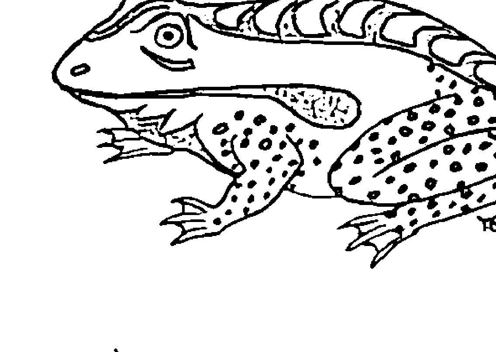

瑞毕度对于造物主所给它的一切感到不满，它被说服了，以为如果能够住在它所看见的那座远方山丘上，它就可以拥有生命中所有美好的事物、以及最肥大和美味的虫子。它不停地讲述着自己的不开心，直到所有青蛙也开始感到不满足。有一天，瑞毕度决定带领着其他青蛙前往那座山上生活，尽管有一个内在的声音总是告诉它：这不是一件对的事。

瑞毕度以及那些追随它的青蛙们，在爬山时注意到大多数动物都开始下山，它们也注意到了冒着蒸气的滚热的水，瑞毕度告诉自己：这全都是造物主为了不让它和青蛙们拥有生命中美好事物的诡计，当情况愈来愈糟时，瑞毕度才终于意识到它让所有跟着它前来的青蛙都陷入了危险。

瑞毕度向造物主祈求，它愿意牺牲自己而让其他青蛙得救。造物主回应了它的祈祷，指引其他青蛙跳进瀑布，并带着它们回到了原本的池塘与河流。当瑞毕度准备迎向死亡时，一阵风将它吹往高山上的一棵大树，让它避开了火山爆发。

> 「小兄弟……」造物主说：「既然你这么渴望住在山上，那么从现在开始，这里就是你所居住的地方。你会比以前瘦小，而且你也不会再生活于水中，树木将会是你的家，也会是你的孩子以及所有世代子孙的家……」

这就是树蛙的由来，相对于快乐的水中青蛙而言，它是被禁锁在陆地上的青蛙。

青蛙有一个显著的特征是他们从蝌蚪到成蛙的变形，青蛙是四条腿的动物之中，少数能够进行这种质变的动物。在这个变化过程中，青蛙就仿佛他们所荣耀的水元素一样，水可以从气态变成液态和固态，从水蒸气变成雨水或冰雹、雪花或冰块。

皮肤滑溜的绿色青蛙，他的特质是从危险及束缚中蹦跳飞跃的弹开能力。他的声音也是独特的，青蛙喜欢对所有聆听他的人唱着小夜曲，就像潜鸟的歌撩拨着人心，青蛙的歌也一样。很神奇的是，这样一个小小生物可以发出如此巨大的声音。他也如同水，许许多多细小的雨滴汇聚在一起，于焉形成了海洋。

青蛙可以教导你关于转化、沟通、奥秘、欢愉、幽默和演进。

#### 雷鸟家族，火元素—雷鸟 Thunderbird

与荣耀火元素的石头有关的动物是雷鸟，藏在云后的鹰对印地安人来说，是一个非常重要的象征，对某些人来说，雷鸟召唤着雷电存有。有些人认为这两者是无二无别的，也有些人认为雷鸟是雷霹的仆人，是火之存有的象征符号和信差。（请参阅〈药轮〉一书）

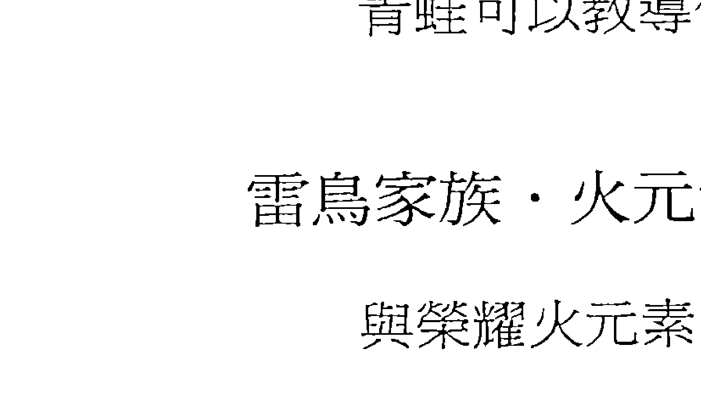

雷鸟据说是地球上最大的鹰，这只壮丽的鹰不仅善良仁慈，而且非常强大有力。他可以唱出美丽的歌曲，聚集其它鸟儿来参加议会，他也可以唱一首歌就召唤雨云前来，他的歌让许多弱小的猎物都降服于他巨大的鹰爪下。

这强大的鸟却受苦于自我的折磨，他对自己的伟大感到惊讶和崇敬，就在雷鸟上一次在地球上的傲慢舞蹈中，大灵以一团来自雷霹的火球带走了他，造物主藉著让他成为雷电存有的仆人，而给了他另一个机会。在那里，他藉由学习服务以及学习自己在宇宙中的位置，而获得了快乐与满足。

雷鸟现在和大灵在一起，但有时候会来教导我们关于善良、仁慈、净化和疗愈，他也提醒我们炫耀太多傲慢时的燃烧的痛苦，雷鸟教导我们扬弃自己的傲慢，并且去服务和疗愈人们。

#### 蝴蝶家族，风元素——蝴蝶 Butterfly

与荣耀风元素的石头有关的动物是蝴蝶，这是一个革新和再生的象征。从一只毛毛虫到蝶蛹，再羽化成蝴蝶，因为他能够如此彻底的改变自己，蝴蝶已成了改变、生命和希望的普遍象征符号。

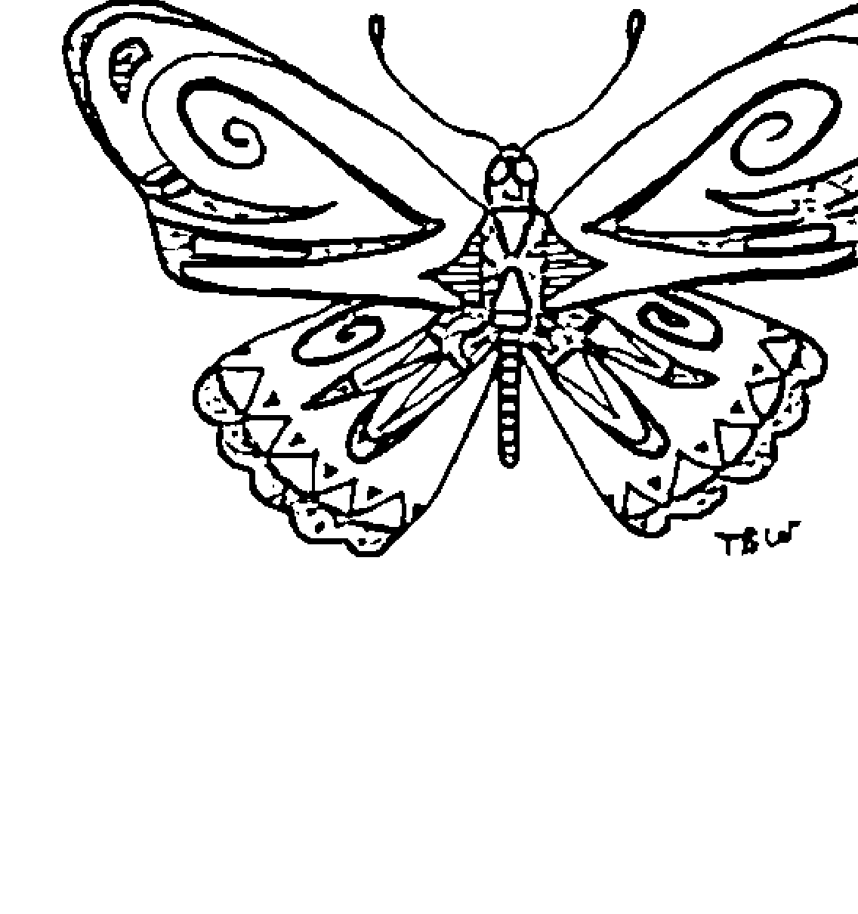

蝴蝶在很多很多年以前来到人们身边，当时，有一位疗愈者名叫在风中编织彩虹的她，她离世后进入了灵性世界。在她生前，美丽的彩色爬虫总是会帮助她疗愈，它们靠近她身旁或者爬上她的肩膀，将它们的色彩能量与力量挹注给她。这些爬虫非常担忧她死了之后，它们无法再透过她帮助人群。有一只爬虫知道更多，它要求与在风中编织彩虹的她埋葬在一起，它知道当它的身体死亡之后，它的灵性会和她融合在一起，他们会继续把疗愈带给人们（请参阅〈药轮〉一书）。

丧礼之后，一只漂亮的蝴蝶从在风中编织彩虹的她坟里飞出，所有彩虹的美丽颜色都散布在它的翅膀上，从那时候起，翩飞的蝴蝶就一直点亮了天空，也为所有接受它的人带来疗愈。

蝴蝶和蛾非常相似，但它们精致翅膀上的美丽色彩仍有所不同。全世界各地都能发现蝴蝶，它们通常是无惧地、兴奋地振翅飞向人类，轻柔地散播着欢乐和美丽在任何所到之处。

蝴蝶教导我们不要害怕改变和转化，就像毛毛虫一样，忍受了未知的。

## ·灵性守护者动物·

有关四方力量的四个动物，都是动物王国里强大的成员，它们也都曾经都想担任所有动物的酋长。

透过更伟大者居中调停，每一个动物选择将自己的力量与主要的风交融合并，使得这生命之圆对所有人而言更加强壮（请参阅《药轮》一书）。因着它们对于自己王国以及两条腿人类的服务，印地安原住民长久以来都荣耀着这些灵性守护者动物。

#### 瓦布丝·北方灵性守护者——白水牛 White Buffalo

北方的灵性守护者瓦布丝，由白水牛所代表。在这备受尊崇的动物家族中，白水牛是最被荣耀的成员，在许多印地安故事里，正是白水牛女神为人们送来了神圣菸斗，这是大灵所赐予的珍贵礼物。

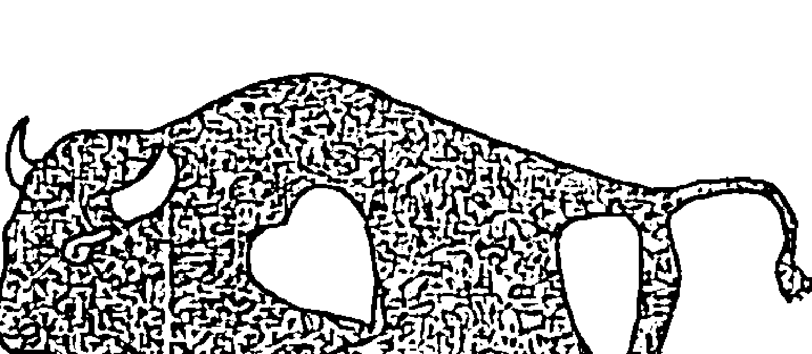

白水牛女神是个灵性的女人，她在许多不同的部落里有着不同的名字，对奥杰布瓦人来说，她叫做破晓晨星之女；对拉科塔族而言，她是白水牛小牛女人；对纳瓦霍人来说，她是蜘蛛女人；对努特卡族而言，她叫做铜之女。这个灵性女人是神圣女性原则的一部份，也是造物主的一个面向，也许对她来说最好的形容是：开显出所有事物！白水牛女神将所有重要的医药带给人们：生命的知识～出生和死亡、疗愈的锻链、对女性周期的领悟、最初的医药～神圣菸斗、净化汗屋……以及许多至为神圣的仪式。

以相似的方式，白水牛也给出了它所有的身体，帮助人们生存。印地安人民极度尊敬白水牛，直到欧洲白人到来。

在欧洲人抵达之后，预估有超过五千万头白水牛在北美大平原上被杀害，如此多的白水牛被掠杀，差点导致了它们的绝迹。这场大屠杀之所以发生，只因欧洲人以此运动消遣为乐，猎人在建造铁路时搭乘着火车横越大地，看看自己的子弹伴随着飞快的车速能够射杀多少水牛。他们杀死的水牛就任其腐烂遍地，有些猎人射杀了水牛之后，只为了割取它们的舌头，卖回欧洲做为餐桌上的美味佳肴。

我们再也不见白水牛自由自在地漫游，美国境内现今的白水牛，被平静地放牧在特定区域，饲养以供肉品、毛皮和育种。这些强壮结实的动物站起来约有六英呎高，重量将近一吨或半吨，看起来如此宏伟壮观。

当白水牛服务瓦布丝时，祂穿着雪一般的白色大衣，这代表着年纪和智慧的雪白大衣，提醒着我们去寻找亮光，尽管周遭笼罩着黑暗。

#### 瓦奔·东方灵性守护者——老鹰 Eagle

金色老鹰象征着东方的灵性守护者～瓦奔。祂是大灵的信使鸟，是一切有翅膀的动物中，飞得最高也将生命看得最清晰的鸟。老鹰对大部份原住民而言都是神圣的，因为它能够将讯息携带给造物主，老鹰的羽毛犹如一枚徽章，荣耀着医药巫师、酋长和战士，因为老鹰为这些生命的领域提供了礼物和教导。就像医药巫士一样，老鹰可以朝向造物主盘旋翱翔；像酋长一样，老鹰也可以赢得其他有翅膀的动物们尊敬；如同战士那般，老鹰凶猛搏斗着去守护它们的版图以及它们的孩子。

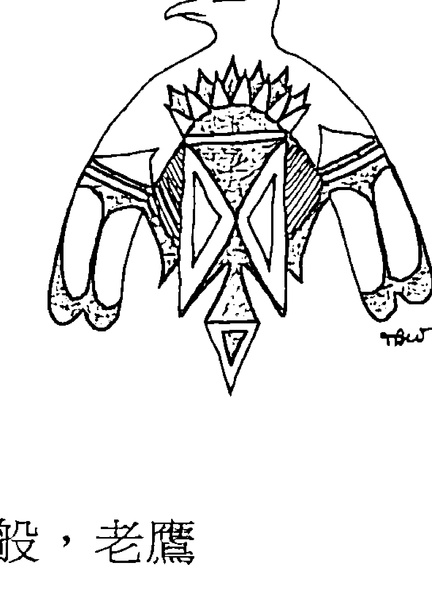

这强大的猛禽是一种鼓舞人心的空中特技表演者，虽然老鹰长久以来触动着人们内心的遐想，也被猎捕到了危及物种存续的境地，剩余的老鹰仍然可以在欧洲、亚洲和北美各地被发现。

尽管老鹰这个灵性守护者真心视人类为朋友，它引领着我们朝向大灵，但是这雄壮威严的大鸟生活在地球层面时，总还得回避着人类，以保护自己的幼雏以及生命。

与瓦奔一起服务时，老鹰穿戴黎明的金色羽毛，那智慧的金色光芒提醒着我们：每一个片刻，都是一个崭新的开始。

#### 熊欧迪希·南方灵性守护者—土狼 Coyote

南方的灵性守护者～熊欧迪希，由土狼所代表，它是动物王国中一个狂野狡滑、诡计多端的老师。有许多关于对付土狼的印地安神话，这个老骗子有时候是造物主，有时候则是个神圣的小丑。土狼是最神圣也最亵渎的动物，犹如潜鸟和青蛙一样，它们是一个强大有力的歌手，它的歌声可以让人们感到自由，也足以让人恐惧。土狼将成长带给每一个人，对于那些热爱生命的人而言，它赐予信任的礼物，正是生命中的这份信任，教会了你真正的幸存以及耐力。

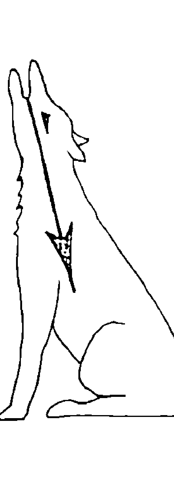

土狼可以在北美的许多农村田野被找到，它的体形小于一般的狼，这已被证明是为了适应科技文明的冲击。土狼最显著的特质是它迅速、敏锐的感知能力，像狗一般的特征以及它们的歌声。在许多乡间夜晚中，土狼的尖叫咆哮和啼哭划破了宁静的夜，提醒着所有听得到它们的两条腿人类：尽管人类此刻主宰着地球，但他们并非现存的唯一物种。

人们对土狼的反应如何，也映照出许多关于他们自己的课题。那些热爱生命与地球的人们，会被土狼的歌声所启发，也鼓舞他们去超越那试图摧残他们的文明世界。但那些恐惧一切的人，自然也恐惧着土狼，他们试图以射杀、毒害或陷阱来摧毁它。担忧恐惧的人们把土狼形容成一个小偷，偷吃鸡鸭等家畜。其实土狼喜欢捕食自由漫游的野生小动物，例如老鼠或兔子。只有在那种文明已然杀死了它所有天然猎物的地方，土狼才会偶尔把一些鸡或小家畜当做午餐。

当土狼与熊欧迪希一起服务时，它的外衣是正午阳光照耀在土地上的斑斓色彩，当它外衣的色彩似乎消失了，意即它已完成它最强而有力的工作。

#### 默加奇维思・西方灵性守护者——灰熊 Grizzly Bear

与西方的灵性守护者～默加奇维思相关的动物是灰熊，熊家族里强大有力的一员。所有的熊都能够走进内在，进行很长的睡眠，并运用那段时光去凝视生命和梦境。当熊醒来时，它知道该吃些什么来恢复自己的力量并疗愈它自己。熊移动得非常缓慢，但却带着坚定的决心，它永远如此强壮。由于这些原因，对于印地安人来说，熊是非常神圣的动物，熊的家族通常也是师者、疗愈者或领导者的家族。

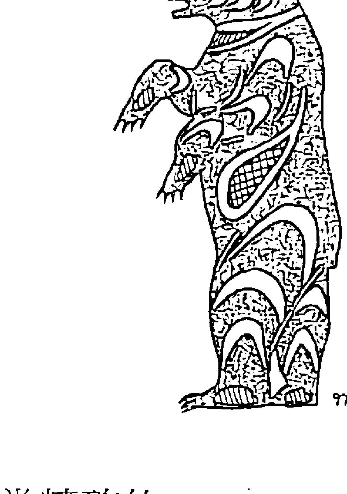

灰熊能够以两脚站立，它的前爪有很好的抓握能力。熊有非常精确的听觉和嗅觉，它们被厚厚的灰色毛皮大衣所覆盖，体重可以超过九百磅，站起来身高可超过八英呎。难怪人们对它充满敬畏，甚至有时心怀恐惧。

当它们不冬眠时，灰熊喜欢狩猎、吃饭和洗澡，除了交配季节以外，它们是孤单独居的。

除非灰熊先遭受攻击，否则它们不会主动攻击人类，灰熊在北美地区已因猎人而大量灭绝，除了一些限制狩猎的地方，例如：黄石国家公园、阿拉斯加州、加拿大育空地区、以及不列颠哥伦比亚省。

当灰熊与默加奇维思一起服务时，它穿着一件夜晚颜色的外衣前来，提醒我们一切万物都来自于空无，提醒我们这漆黑之中的银发。灰熊在在提醒着我们：倘若我们能达到成熟，倘若我们知道如何去寻找，我们将会明瞭即使在最黑暗的虚空中，也永远有光明照耀。

## ・十二个图腾动物・

#### 大地复苏之月——雪雁 Snow Goose

雪雁是与大地复苏之月（12月22日至1月19日）相关的动物图腾。这是一种美丽的白色鸟类，因着这些雁鸟春天迁徙的方向，雪雁又被称为「来自北风以外的雁」。

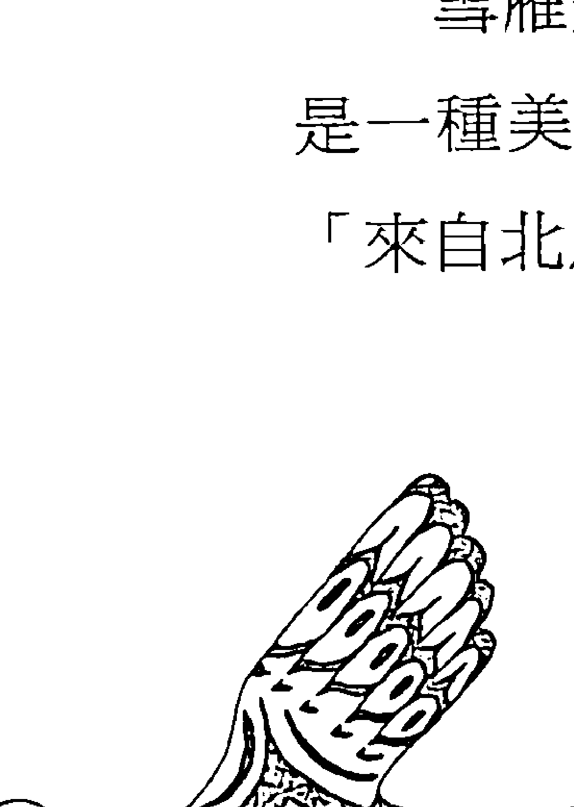

有些种类的雪雁每年可以旅行五千英哩，用松散的V字型队伍飞行，雪雁是群聚的动物，但你不容易看到二、三万只雁鸟同时停在一个地点觅食。在它们的筑巢场所，雪雁会让有经验的雁鸟先选地盘，以显示它们对传统的尊重。公雁和母雁也都会守在蛋旁边，等待幼雏孵化。

雪雁非常挑剔，它们会花好几个小时从彼此身上挑出蚊子和小虫。雪雁的视线比人类更为敏锐，它也会鸣叫，但是当好几千只雪雁同时发声时，听起来就像一帮野狗的狂吠或土狼的嚎叫。

和雪雁工作可以教导你关于创造的奥秘、宇宙的力量、传统、完美主义、稳定度、社交、仪式、愿景和进化。

#### 休眠净化之月——水獭 Otter

水獭是与休眠净化之月（1月20日至2月18日）相关的动物图腾，它们是野外最爱玩耍的动物之一。在美国，水獭和海獭都有。

水獭是依靠水域而生的黄鼠狼家族成员。大多数的河獭，在美国西部的大型湖泊、沼泽和河流被发现，而海獭的体积比河獭大很多，目前只在加利福尼亚北部的海岸上出现，猎人为了海獭的毛皮而大肆屠杀它们，因此海獭几乎在本世纪初就灭绝了。大部分的时间，海獭都在海洋中吃饭、睡觉、晒太阳、玩耍、生产和养育后代。

所有水獭都有很大的胃口，他们是少数能使用工具的动物之一，他们会使用岩石撬开贝类当晚餐。水獭的声音范围很广泛，包括尖叫、打嗝、暗笑和嘘声……当水獭生气时，他们的嚎叫可以远远传到一英里之外。水獭若不是在吃饭、狩猎或晒太阳，他最常做的事就是玩耍。

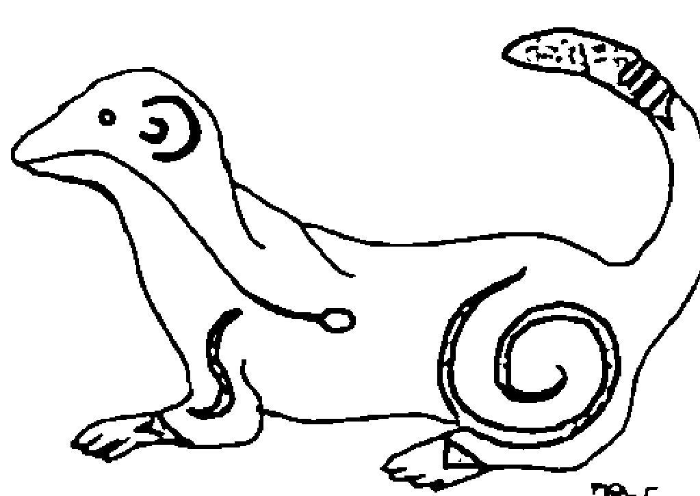

水獭拥有温暖和活跃的家庭生活，父母双方都会协助养育孩子，与大多数野生动物相比，水獭花费了更多时间陪伴他们的下一代，水獭还会哀悼伴侣的死亡。

由于水獭的模范家庭生活，以及他的高贵、好奇心、创造力和童心玩性，印地安原住民公认水獭的力量。某些部落里最强大的医药袋是由水獭毛皮所制成，水獭医药对某些部族来说如此强烈，直到你契及某种程度的启蒙之前，他都只能是一个秘密。

与水獭合作可以教会你玩耍、培育、创举、发明、高尚、好奇心、人道主义，陪伴和抚育孩子。

#### 大风之月——美洲狮 Cougar

美洲狮是与大风之月（2月19日至3月20日）相关的动物图腾。他们是美洲大陆的狮群，但却不像自己的同类非洲狮那样受人尊敬。美洲狮因为人们的误解和恐惧，而经常遭受肆意的扑杀。美洲狮也被称为山狮、美洲豹、黑豹、幽灵猫……等等，他是美洲大陆的猫科家族中，体积最为庞大的成员，身长约七英呎到九英呎，体重则在一百五十英磅到三百英磅之间。他们黑色或棕色的尾巴及耳朵，似乎从来没有停止过摆动。在现今文明散播各地之前，我们可以在美国各处发现美洲狮的踪迹，而今，他们只能在美国西部各州、佛罗里达州、加拿大和墨西哥等地被找到。美洲狮是所有猫科动物中最佳的攀爬好手，他们是最快的跑者，拥有广大的个人领域，它们的社会结构不允许这些领地和别人有所重叠。

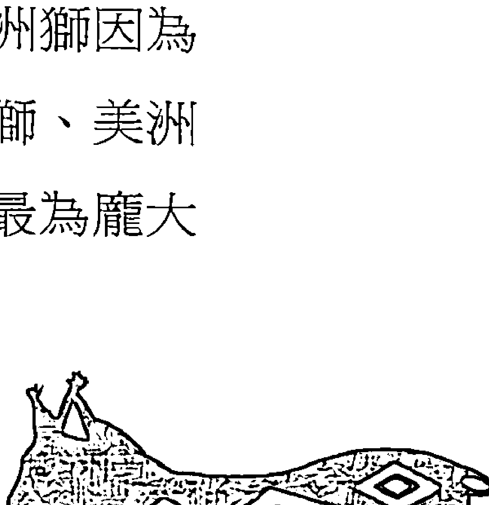

美洲狮是狩猎者，它们喜欢追捕动物，经常喜欢和伴侣或亲属一起努力狩猎，以获得更好的成绩。美洲狮不会猎取超过自己食量的食物，唯有在它们自然食物的供应出现短缺时，它们才会去猎捕家畜。比起美洲公狮来说，母狮更是优秀的狩猎专家。

当美洲狮交配时，母狮经常是积极挑逗的一方。大部分的幼狮都在春天出生，通常一胎只会产下两只。虽然美洲狮母亲非常有爱，而且致力照料它的小孩，但是美洲公狮则和幼狮没有太大的交集。

美洲狮可以教导你关于速度、优雅、领土性、敏感、奥秘、无声的沟通、追踪和直觉。

#### 萌芽树之月——红尾鹰 Red Hawk

红尾鹰是萌芽树之月（3月21日至4月19日）的相关动物图腾。红尾鹰是唯一具有宽大翅膀和扇形红色尾翼的鹰，它是一只大老鹰，又被农民称为鸡鹰，因为他们误会了红尾鹰会偷窃他们的家禽。

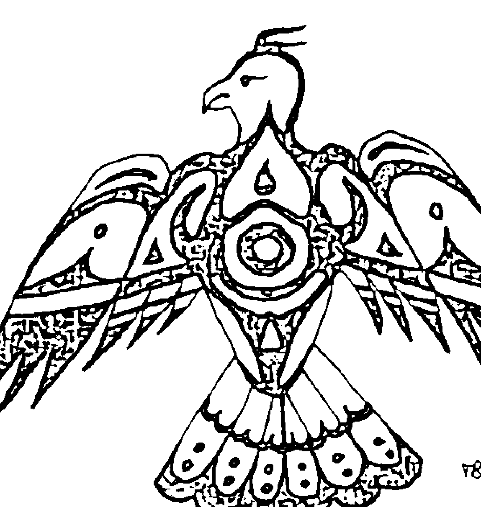

因为领土之争，红尾鹰有时会被乌鸦、喜鹊、猫头鹰、以及其他老鹰或鸣禽攻击。这些袭击很少在受伤的情况下结束。红尾鹰可以活到十四岁，它们通常在高大的树、仙人掌、丝兰或者悬崖边筑巢，父母双方一起帮助养活孩子。红尾鹰往往会年复一年地返回相同的巢。我们曾经可以在美国各地找到红尾鹰，但现在它们主要生活在西部各州、墨西哥和加拿大等地。红尾鹰的适应力极强，几乎可以生存在任何远离人烟的地方。它们飞行时所发出的声音，听起来像是从水壶里窜逃而出的蒸气。红尾鹰是壮丽的飞行者，特别是在它们求偶的舞蹈期间。

对印地安原住民来说，红尾鹰非常特别。普埃布洛人称它们为「红老鹰」，并认为红老鹰就像老鹰一样，和天空及太阳有着特殊的连结。因为鹰飞得极高，它们可以从自身的高处清楚看见地面。它们的羽毛经常作为仪式之用，携带祈祷去往太阳父亲和造物主。大鹰的羽毛就像老鹰一样，也被用在疗愈仪式中，西南部的人用它们的羽毛在仪式中祈雨。对奥杰布瓦人来说，红尾鹰家族是领导者氏族之一，它的成员拥有深思熟虑和先见之明的天赋。

与红尾鹰工作可以教导你适应性、飞行、幸存、清晰的视野、祈祷、领导、深思熟虑，乐观、强烈、以及敞开。

#### 青蛙归返之月——海狸 Beaver

海狸是青蛙归返之月（4月20日至5月20日）的相关动物图腾。除了人以外，海狸是唯一能够彻底改变环境以提供自身平静、安全和满足的动物。海狸是美国最大的啮齿动物。成年海狸的重量在三十到七十磅之间。海狸永远不会停止成长，它可以长到三至四英呎身长。

海狸不会制造很多声音，它们偶尔会吠叫、发出嘶嘶声或尖叫声，但通常它们只会在独居的小屋里，才发出猫一般的微弱叫声。海狸用尾巴拍打水面来警告危险，它们一生都只会守在一位伴侣身旁。海狸是温柔慈爱的父母，会照顾它们的孩子长达两年，或直到下一只幼狸出生。失去伴侣的老海狸，有时会变得忧郁寡欢。

海狸是一种陆上哺乳动物，但它花了很多时间在水中生活。海狸的身体有着令人惊奇的机能，可以适应它的习惯和栖息地。海狸极强的适应力使它们成为地球上生存优势的动物，除了人们觊觎它身上的两样东西：海狸皮（用于制作绅士帽子）、以及分泌着海狸香精的腺体。海狸被认为是万应良药，从早期的希腊时代到十八世纪。欧洲人因着这些对海狸的需求，疯狂地探索美洲。也因为人类对它们的欲望，海狸到了十九世纪几乎已被赶尽杀绝。人类最终发现，海狸对于帮助维持水位、鱼猎、野生动物、植被和美学都有很大的价值，所以他们努力让这物种存续。

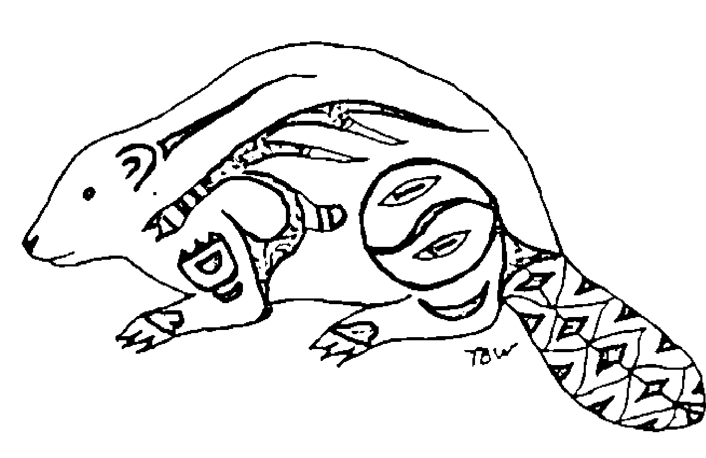

印地安原住民也认同海狸毛皮与肉品的珍贵，并且使用海狸的腺体去达到某些疗愈。但他们会以温和尊敬的态度追捕海狸。当欧洲人到来时，他们鼓励印地安原住民去猎杀更多海狸，并提供最珍贵的贸易货物以换取海狸毛皮。这些做法侵蚀着某些地区的传统土著文化。

和海狸工作可以教导你关于稳定、平衡、传统、真实价值、对环境的适应力、疗愈、影响力、不屈不挠、勤奋工作和自我信�

#### 玉米种植之月—鹿 Deer

鹿是与玉米种植之月（5月21日至6月20日）相关的动物图腾。鹿是一个敏感、优雅、警觉的生物，它的美丽为所有看见它的人带来喜悦。

尽管不同种类的鹿在体型和习惯上略有差异，但是它们的身高约在两到四英呎范围内，而体重约在五十到四百磅之间。当鹿兴奋时，会发出一种类似羊叫的咩咩声，而且带有哼哼作响的鼻息。当它们遭受攻击或痛苦时，则会转而尖叫啼哭。有时它们也会发出一种特别的咩咩叫声来呼喊小鹿。所有的小鹿在出生时都带有斑点，这是为了伪装。小鹿出生时身上也没有任何味道，这为它们提供了更好的保护。公鹿长有鹿角，但每年都会脱落和重生。

除了交配的季节之外，鹿是群居的动物，或者只和相同性别的鹿群生活在一起，当鹿求偶时，原本友善的公鹿会以生长完成的鹿角来缠斗。交配季节一过，会有一头年纪较长的母鹿，带领大家前往避冬之处。

当春天来临，母鹿开始生产，往往是双胞胎甚至

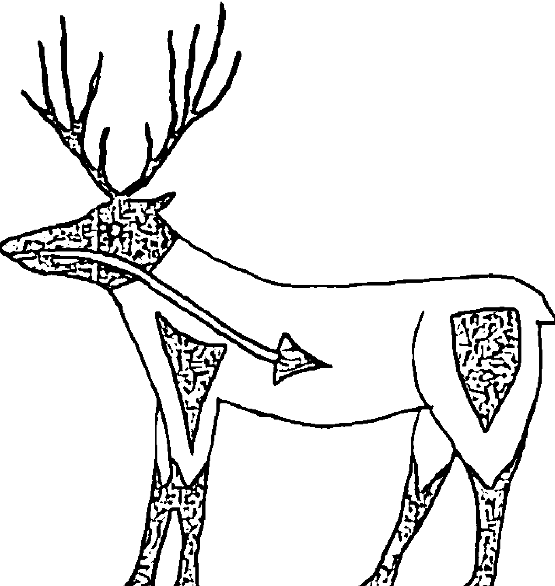三胞胎，這種多產的情況有時導致鹿群過剩。美洲獅、土狼、狗、熊、山貓、森林火災……人類和汽車，都是鹿的殺手。根據估計，每年在美國高速公路和其他道路上遇害的鹿，超過四十萬頭之多。

鹿是許多印地安人生命聖圈中非常重要的一部分。牠們提供了穩定的主食給那些部落，他們則透過儀式、舞蹈和祈禱來感謝鹿的獻禮。

對於某些部落而言，尤其是墨西哥的惠喬族人，鹿是最為重要的動物。惠喬族人相信鹿代表著心，是通往靈性世界的守門人。鹿之舞是惠喬族人最神聖的舞蹈，可以幫助他們穿破那道障蔽於世界和世界之間的帷幕。

與鹿一起工作可以教導你適應力、掩護、優雅、美麗、速度、療癒、敏感、警覺、創造力，也教導關於你的心的能量，以及你與大靈的連結。

#### 烈陽之月——紅翼啄木鳥 Flicker

紅翼啄木鳥是與烈陽之月（6月21日至7月22日）相關的動物。紅翼啄木鳥是啄木鳥類，在美國境內有兩個品種：黃翼啄木鳥棲息在北美大草原以東，而紅翼啄木鳥則出沒在北美大草原以西區域。

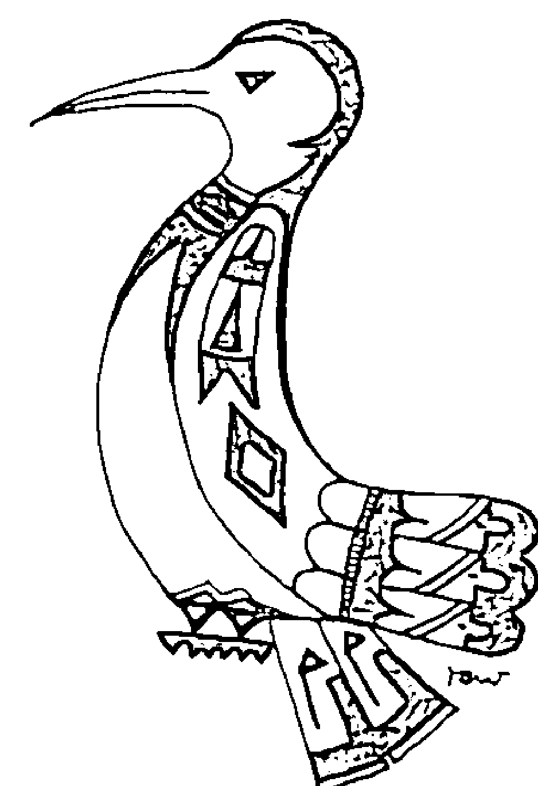

這兩種類型都可以在各種地方找到：森林、農場、甚至郊區。紅翼啄木鳥是鼓手，牠們在枯死的樹枝、錫屋頂和木屋上演奏著牠們的歌曲。有時候是為了獵取昆蟲，有時候純粹只是為了演奏的歡樂。在求偶過程中，紅翼啄木鳥會以更加華麗的技巧來展現牠們的音樂長才。

紅翼啄木鳥會在樹幹中挖出一個葫蘆形的洞做為巢穴，通常也會留給將來的其它鳥兒使用。就像大多數鳥類一樣，紅翼啄木鳥是充滿關愛的好父母，牠們會撫育下一代直到孩子們有能力自行飛翔。

對許多印地安原住民而言，紅翼啄木鳥是一種特別的鳥類。在某些傳說中，牠因為飛得太靠近地震神靈，想要撲滅牠所帶來的火焰，於是燒紅了自己的翅膀和尾翼。印地安原住民特別喜愛紅翼啄木鳥，因為牠們是很棒的鼓手。紅翼啄木鳥的羽毛與鮮血有關，經常被呈獻給戰爭的神靈。祈禱棍上的紅色羽毛也被認為是對戰爭的獻祭，用來對抗人類或靈性上的仇敵。一些醫藥社群的成員也會在頭髮上佩戴紅翼啄木鳥的羽毛，以識別他們的聯盟關係。

和紅翼啄木鳥工作，可以教導你關於溝通、音樂、喜悦、培育、勇氣、保護、堅持，也教導你連結宇宙。

#### 採莓之月—鱘魚 Sturgeon

鱘魚是與採莓之月（7月23日至8月22日）相關的動物圖騰。鱘魚被視為魚中之王，這種遠古的魚類可能早在恐龍絕跡時就存續到現在。鱘魚有多種尺寸，最大可以達到十二英呎長，至少三百磅重。

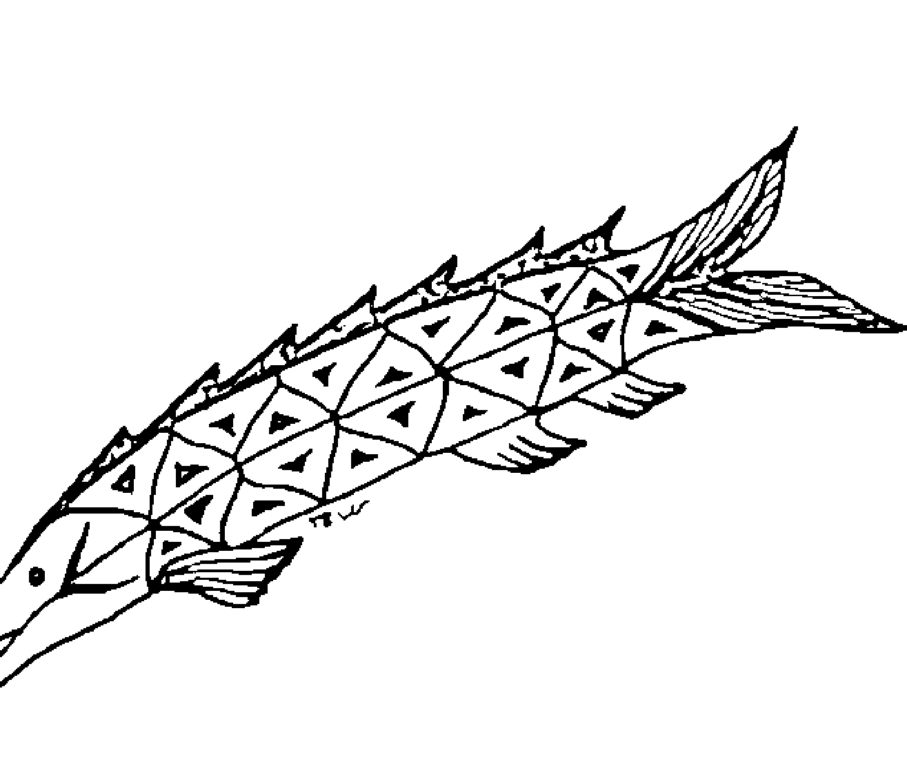

對於居住在北美五大湖區的原住民來說，鱘魚是魚類的皇族。在奧杰布瓦族有一個鱘魚氏族，它是一個教導的氏族。對於奧杰布瓦人來說，鱘魚代表著深度和力量。

來到北美的歐洲人，並未對鱘魚待以相同的敬重。起初當鱘魚誤闖入他們的魚網時，他們視為干擾和麻煩，後來，當他們發現鱘魚卵可以製成極有價值的魚子醬時，他們又幾乎將鱘魚趕盡殺絕，目前已經很難找到鱘魚的蹤跡了。

和鱘魚工作可以教導你關於你的決心、堅持、深度、知識、慷慨、力量和性能力。

#### 豐收之月—棕熊 Brown Bear

棕熊是與豐收之月（8月23日至9月22日）相關的動物圖騰。棕熊與黑熊是同一個物種。事實上，有些母熊會在一胎裡同時生下棕熊和黑熊寶寶。棕熊會在地洞、山洞、倒榻的樹木下、荒廢的建物裡或瀑布底下做窩。牠們是小心謹慎又極為安靜的生物。棕熊是雜食性動物，只要是牠們爪子能抓到的任何東西都吃，但牠們最喜愛的食物是蜂蜜和漿果。棕熊唯一的天敵是人類和森林大火。

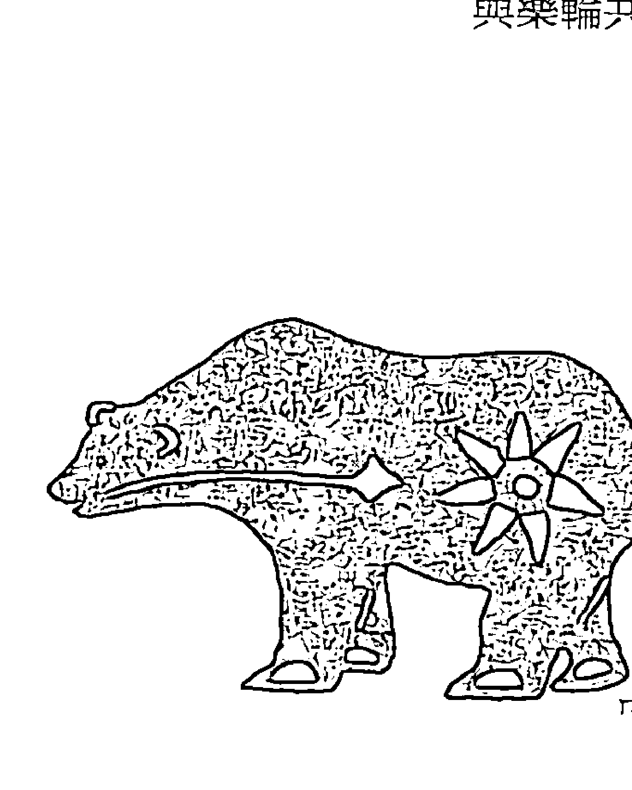

熊天生好奇，就像牠們的表弟浣熊一樣。熊的動作很緩慢，深思熟慮並且以滿足享樂為導向。牠們會花時間去觀察周遭事物並從中學習，牠們只有在秋天才會急切的不斷進食，以維持接下來的漫長冬眠。熊的冬眠期並不是完整持續的狀態，在冬眠後期，育有小熊寶寶的母熊必須隨時醒來餵哺小孩。

熊擁有快樂和良善的本質，並與人類分享著許多能力。牠們可以用兩腳站立並行走一小段距離，牠們可以爬樹，從蜂窩中獲取香甜的蜂蜜，牠們也會把自己的爪子當做利矛來抓魚。

對印地安原住民來說，熊是一種非常特別的動物。在動物世界的許多傳說中，例如：在那訴說著靈性守護者動物如何被指派的故事裡，熊被承認為動物議會的首領。傳說中牠已經擔任動物議會酋長好一段時間了，但牠的領導受到白水牛、老鷹和土狼的挑戰，牠們都各自覺得自己擁有優秀的特質足以成為領導者。當不同動物擁護者之間的爭論，威脅了動物議會的和諧與完整，西方的靈性守護者～默加奇維思來到了議會，牠告訴這四個爭吵的動物們：由於牠們個別的特質，每一個動物都會服務於其中一位靈性守護者，以這樣的方式，牠們所有的天賦都能開展運用，而動物議會也能保持和諧完整。熊也會服務於默加奇維思，熊因著牠的公正、力量和勇氣而成為動物議會酋長。在大多數部落裡，熊的氏族同時也是醫藥、領導和防禦的氏族。

與熊工作，你能夠學會關於深思熟慮、愉快滿足、觀察、放慢腳步和穩定移動、公正、勇敢、力氣、療癒和教導。

#### 群雁飛遷之月——渡鴉 Raven

渡鴉是與群雁飛遷之月（9月23日至10月23日）相關的動物圖騰。渡鴉是一種全身漆黑並帶有楔形尾巴的鳥類，而烏鴉的體形稍小，兩者經常被混淆，渡鴉和紅尾鷹的體形差不多。雖然在世界各地都能發現渡鴉，但美國西部各洲是牠們最常聚集之處。渡鴉呱呱作響的歌聲非常嘈雜巨大。

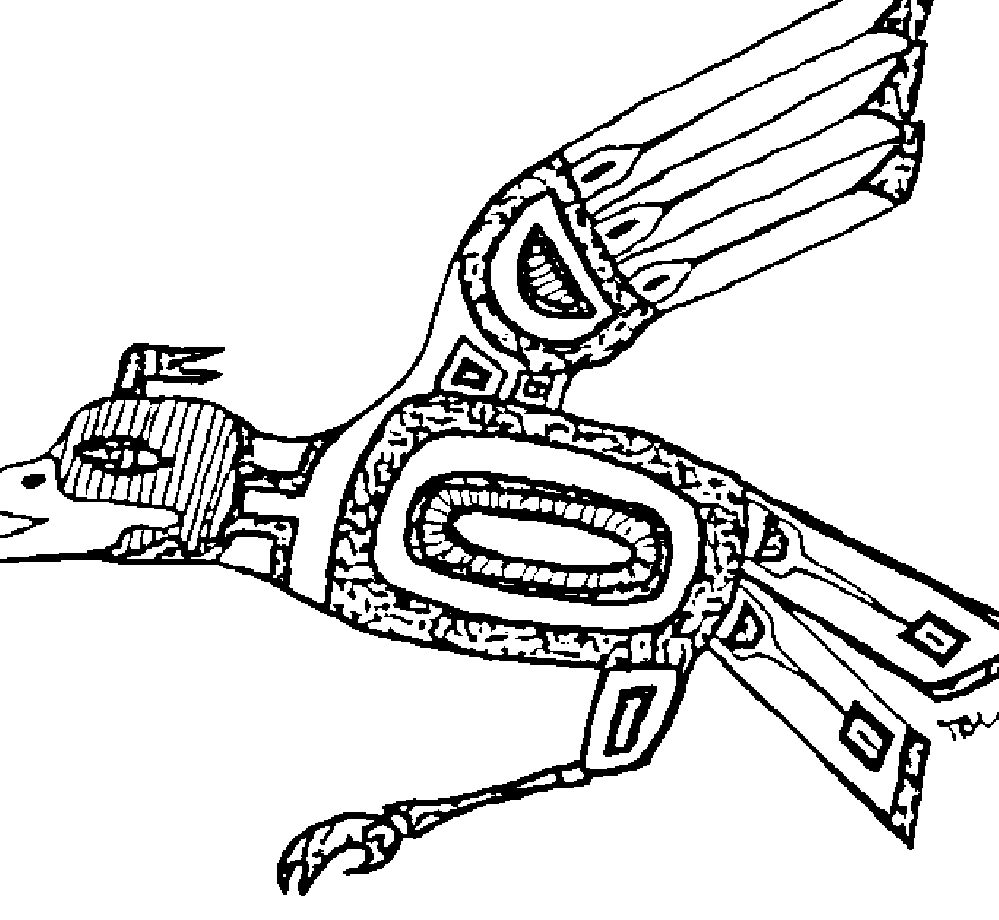

雖然牠們有時候非常積極好鬥，但渡鴉通常很小心謹慎。牠們是聰明的鳥類，知道如何將貝類從高空往下砸，以此打破貝殼取食。牠們是雜食性動物，也能夠騎乘著風，如同牠們的大鷹兄弟一樣享受。渡鴉是集體群居的動物，同時也非常防禦自己的領土。有些渡鴉會和單一配偶相伴終老，這些鳥類有牠們自己的部族議會。

對印地安原住民來說，渡鴉是一種可以平衡人類與大自然的鳥類。幾乎所有部落都有自己的傳說，來解釋渡鴉黑色羽毛的由來。在這些傳說中，渡鴉起初是一隻白色的鳥，牠的羽毛顏色之所以改變，若不是因為犯錯而遭受懲罰，就是因為冒著危險試圖幫助人類。傳說中的這種二元性表明了印地安人對渡鴉的雙重感覺。對某些人來說，渡鴉是不好的兆頭；對其它人而言卻是好的徵兆。普韋布洛族人將渡鴉與卡親那神靈連結在一起，渡鴉可以帶來降雨的烏雲，也能夠將之驅離。

#### 天寒地凍之月——蛇 Snake

蛇是與天寒地凍之月（10月24日至11月21日）相關的動物圖騰。蛇是古老的、神秘的、惡毒的……一個被誤解的脊椎動物家族的成員。全世界有將近二千五百種蛇類，在美國境內則有一百一十四種。

蛇是一種肉食性的爬行動物，無四肢，具有伸縮彈性的下頷。牠們大多捕食小動物，例如：老鼠和青蛙。蛇也吃昆蟲，因為牠們的飲食喜好，而成為平衡大自然的不可或缺的一部分。當人們惡意的對蛇大肆撲殺之後，我們就會看到各種鼠類開始橫行氾濫。

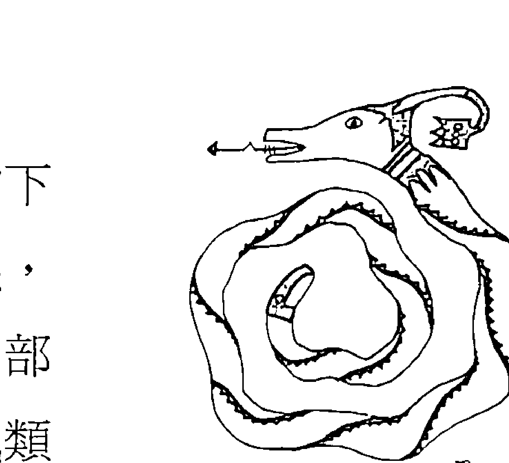

蛇對於環境的適應力極強，並且對於觸摸和振動的敏感度非常精細。蛇是冷血動物，根據牠們的環境所提供的暖熱而活動或冬眠。牠們可以改變自身的顏色與周遭土地融合，也可以蛻卻牠們的皮膚。蛇是沒有叫聲的動物，只會發出一些嘶嘶的聲響，響尾蛇則會搖動牠們的尾巴嘎嘎作響。儘管牠們因為冷血無情而聞名，但是蛇的求愛方式卻分外溫暖。即便是那些毒蛇也會迴避人類，蛇只有在面臨危險時才會自衛。

大多數原住民文化都非常尊敬蛇。羽蛇神，是南美洲和中美洲部落的古代象徵，代表了正義和轉化。霍皮族人相信蛇是進出其它畛域的使者，有力量帶來生命之雨。 奥杰布瓦族有一個蛇的氏族，這是一個醫藥氏族。他們相信蛇代表耐心，因為牠的憤怒總是來得如此緩慢。許多原住民以蛇來代表那股穿流過人類的生命能量。蛇也是女性力量和療癒的象徵符號。

與蛇工作可以教導你關於神秘、創造的領域、深層的轉化、自然的平衡、適應力，敏感、溝通、性、再生、耐心、自我防禦、正義、療癒，也教導你關於你內在的女性、以及你自身的生命力。

#### 漫長冰雪之月——麋鹿

麋鹿是漫長冰雪之月（11月22日至12月21日）的動物圖騰。麋鹿也被稱為馬鹿，是鹿族中最巨大也最華麗莊嚴的成員，麋鹿的角可以像樹枝一樣美麗。

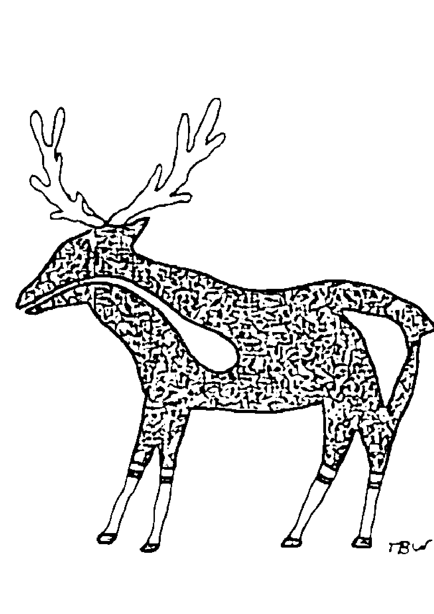

麋鹿生活在林地裡，而且似乎對於其它麋鹿深具責任感。當雪愈下愈大的時候，牠們會輪流為彼此開路。有時候麋鹿群會圍成一個大圓圈，似乎在開心的跳舞奔跑。麋鹿跑得很快，能夠在短距離內以每小時三十英哩的速度移動，牠們也能夠跳躍高達十英呎的圍欄。

麋鹿只有幾種天敵，美洲獅、熊和狼，牠們有時雖能成功捕到一頭幼小或體弱的麋鹿，但絕不會是一頭壯年公麋鹿的對手。然而，在1900年之前，美國大部分的麋鹿已被獵人宰殺，通常唯一的殺戮原因竟是：取下牠們的兩顆牙齒做為受人珍愛的珠寶首飾。

大多數的麋鹿，會像鹿群一樣以同性群居的方式生活。當求偶季節來臨時，公麋鹿會角力試圖贏得母鹿的青睞，而且勝利者會和愈多母鹿交配愈好，同時絕不允許其它公麋鹿跨越雷池一步。

在小麋鹿準備誕生的春天，母麋鹿會下到山谷，小鹿出生後，母鹿會在自己出外覓食前把小麋鹿藏起來。小麋鹿也和普通的小鹿一樣，生下來就沒有任何氣味，這也是牠們天生的保護機制。

印地安原住民非常尊敬麋鹿，因著牠的速度、美麗、力量，以及牠對族人們的關心。在某些部落裡，如果一個人夢到或看見了一頭麋鹿，那麼他就可以在婦女議會中出席和發言。

和麋鹿工作，你可以從中學會力量、責任感、快樂、速度、敏捷性、佔有欲、保護、地位、正義和智慧。

### 靈性道路動物

#### 北方靈性道路動物

##### 淨化——浣熊 Raccoon

與北方靈性道路的第一個位置～淨化有關的動物是浣熊。浣熊是一種很愛乾淨的動物，牠非常注重衛生，任何時候都會盡可能將食物在水中清洗乾淨。浣熊就像土狼一樣，是一個很好的求生者，牠經常在很多現代城市的某些地區被發現，正從垃圾桶裡尋找著晚餐。

浣熊尾巴上的黑色圈圈很容易辨識，那條橫跨雙眼和臉龐的黑色色帶，讓牠看起來像個小土匪。這種聰明的動物在陸地或水上都能幸福快樂，但是在樹上為家最令牠開心。

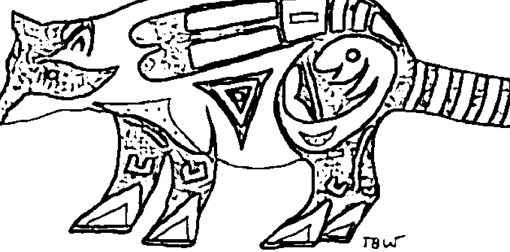

當浣熊在溪裡捕魚或在田野覓食不成功時，牠偶爾會去偷取果園的水果或是雞窩裡的飼料飽餐一頓。雖然農民和獵人會獵捕浣熊，但在美國和加拿大的許多地區，浣熊還是數量繁多。浣熊家族的變化差異，在世界上大部份地方都能發現。

印地安原住民將浣熊視為一個神聖小丑和詭計者，和土狼相較之下，浣熊似乎多了一種淘氣和幽默感，這也讓牠們能在許多情況下巧妙瞞騙過人類。如果你曾經試圖阻止浣熊偷翻你的垃圾筒，你就會明白這是什麼意思了。倘若你正在尋找淨化清理，浣熊可以教你摘下那副擋住你臉前的面具。與浣熊一起工作，也可以教會你關於歡樂、滿足、大膽、詭詐、幽默、智慧、生存和堅韌。

##### 更新——蚯蚓 Earthworm

和北方靈性道路的第二個位置～更新有關的動物是蚯蚓。這個渺小的生物卻懷著一個偉大的目的，蚯蚓創造並且更新大地母親的土壤，藉由這個活動，土地和蚯蚓彼此都恢復了活力。

儘管蚯蚓可以長得很長，但牠絕不會超過一個手指頭粗。蚯蚓可以在世界各地被找到，牠不僅是更新土地，牠也重振了自己的身體。無論是頭部或者是尾巴，蚯蚓都可以修復缺失的部位，形成新器官以取代受損壞的部份。

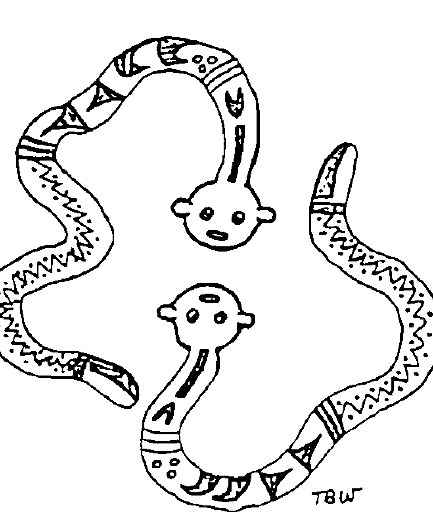

印地安原住民非常尊敬這些小小的爬行動物，因為牠們和大地母親的重要工作，也因牠們能夠讓自己再生的力量，蚯蚓被視為生命之圓裡不可或缺的一部份。

如果你想要在自己的生命中學習關於更新、修復、療癒、轉化以及再生，就和蚯蚓一起工作吧，去學習牠所分享的一切。

##### 純潔——海豚 Dolphin

與北方靈性道路的第三個位置～純潔有關的動物是海豚。這種古老的海洋哺乳動物，具有孩童般的純潔，以及超越我們所能理解的智慧。海豚總是在玩耍嬉戲，牠們知道如何與其他海洋生物以及海豚溝通，甚至與那些威脅著牠們存在的人類溝通。

海豚是在溫暖且溫和的水域裡發現的鯨類，牠們喜歡吃大量的魚群，如鮭魚和沙丁魚。

近年來，海豚在追逐這些美味佳餚時，經常身陷魚夫們為了獵捕金槍魚而設的漁網中，可悲的是，大量的海豚在這種殘酷的方式下被殺害，然後拋諸一旁，許多人開始抗議反對這種不人道的野蠻行徑，情況逐漸轉而對海豚有利。然而為了拯救牠們生命的爭吵未曾結束，當你購買金槍魚之前，請確認他們不是以傷及海豚的方法來捕捉。

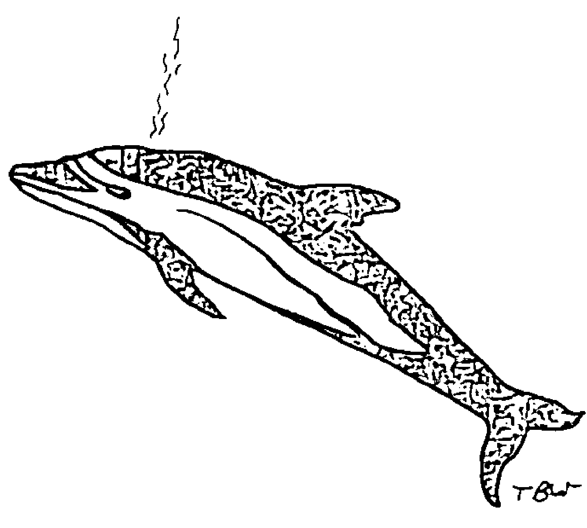

海豚對待人類總是善良寬容，這些智慧的生物對船員和船隻傳達了許多關於危險的警告。許多故事中也頻繁的訴說著海豚指引船隻通過暴風雨和危險的珊瑚礁。原住民也有關於海豚的傳說，牠拯救溺水者，並指引漁民前往較好的地方捕魚。

海豚是海洋哺乳動物。有時候牠們必須浮上水面呼吸。牠們在水裡孕育海豚寶寶，然後帶在身旁就近教導。海豚是群居性的社交型生物，當今已有許多報導指出，海豚試圖在靈性層面和人類溝通，努力幫助拯救這個星球。

即使因為人們的無知而受到殘害，海豚仍教你如何去活出一條純潔的道路。海豚也教導關於善良、靈性的調頻和諧、連結靈性、溝通、社會行為、玩耍和愛。

#### 東方靈性道路動物

## 明蜥——蜂鳥 Hummingbird

關於東方靈性道路第一個位置～明蜥的動物是蜂鳥。蜂鳥的身長從二到八英吋不等，最常見的蜂鳥通常很小型。透過將細長的鳥喙深深地插入花朵中，蜂鳥可以吃到鮮花中的小昆蟲和花蜜。蜂鳥的雙腳沒有太大用處，然而牠們出色的翅膀結構可以彌補不足，讓牠們能夠停在空中徘徊，並且拍擊出一種充滿活力的嗡嗡響聲。

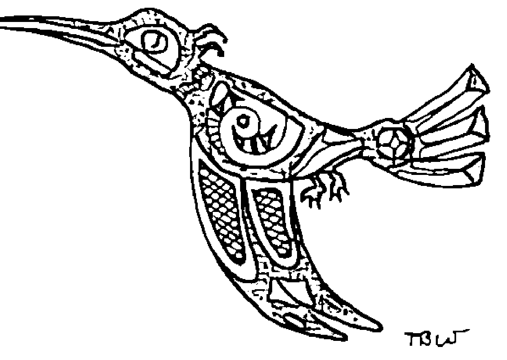

儘管人類與蜂鳥之間的物質層面聯繫很罕見，但是對於彼此的存在都感到高興。人類喜愛蜂鳥顫動、頑強的靈性和優美神秘的飛行。因此，他們經常在院子裡放置一種特別的餵食器給這些歡騰的鳥。蜂鳥喜歡在餵食器前的空中徘徊並進食，人們和蜂鳥彼此都感到心滿意足。

對許多印地安原住民來說，蜂鳥是一種神聖的鳥。他們把牠看作是一個抵達事物核心的符號，或者澄清一個議題的象徵，就如同這微渺的蜂鳥如此迅速地契及花朵中的甜蜜。

蜂鳥被一些原住民視為醫生之鳥，牠可以清理出老舊的創傷和不純淨的老舊雜質，並且為任何情況帶來嶄新的明晰。蜂鳥也被認為能夠縫合傷口，或將傷害及問題的撕裂面向再次連繫起來。與蜂鳥一起工作可以教導你關於清晰的視野、頑強堅持、優雅、神秘療癒、拉扯出老舊的、把你所有的生命面向都聚攏在一起。

##### 智慧——貓頭鷹 Owl

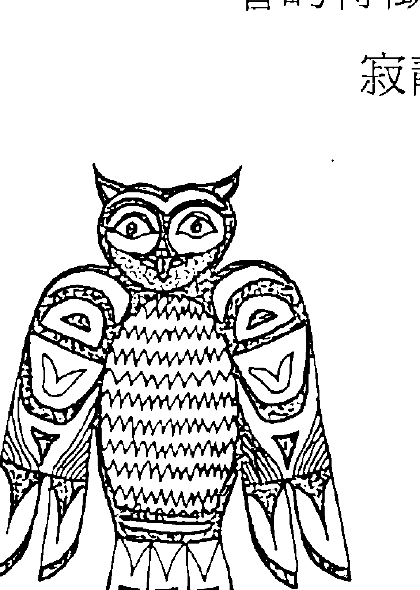

東方靈性道路的第二個位置～智慧，象徵動物是貓頭鷹。貓頭鷹最顯著的特徵是牠大大的頭，和大大的圓眼睛。貓頭鷹是夜行性動物，飛翔時寂靜無聲，這是牠們狩獵時很大的優勢。貓頭鷹的聽力無可挑剔，因此牠們狩獵時運用的是聲音而非視覺。

貓頭鷹對不同的人們而言，象徵著許多不同的事物，對某些人來說，貓頭鷹代表良善與智慧；對其他人來說，貓頭鷹則象徵黑暗與邪惡。貓頭鷹被視為一個智慧使者，有時卻被看成死亡的信使。牠通常是一個古老智慧與知識的傳達者。貓頭鷹的醫藥非常強大，所以不應該與其它能量混合，或是以不負責的輕率態度與之工作。有些印地安原住民會用紅布包裹任何形式的貓頭鷹醫藥，紅布可以幫助收納這股力量，並且保持牠與其它能量分開。有些人不會去觸碰一根貓頭鷹羽毛，儘管許多貓頭鷹醫藥是秘密的，它多半與女性的古老知識有關。

近年來，斑點貓頭鷹廣為大眾所知，因為牠已經被列入美國瀕臨滅絕的物種名單。有許多人們抗議伐木公司大量砍樹，導致貓頭鷹的棲息地大量減少。破壞了貓頭鷹的棲地也就等於毀滅了貓頭鷹。當人們把貓頭鷹列入瀕臨絕種的清單上，牠們所居住的樹種也連帶受到保護。但因為如此，大量的伐木者卻面臨失業的危機。沒有一個決定會是容易的，但有些事情卻很肯定，貓頭鷹早在伐木者出現之前就在那裡棲息，樹木也保護我們的

##### 光明——螢火蟲 Firefly

和東方靈性道路的第三個位置～光明有關的物動是螢火蟲。螢火蟲也被稱為閃電蟲，牠是一種可以用自己閃爍的微光劃破暮色和夜空的昆蟲，螢火蟲就像啟蒙的亮光：黑暗中渺小幽微、難以捉摸的光點。

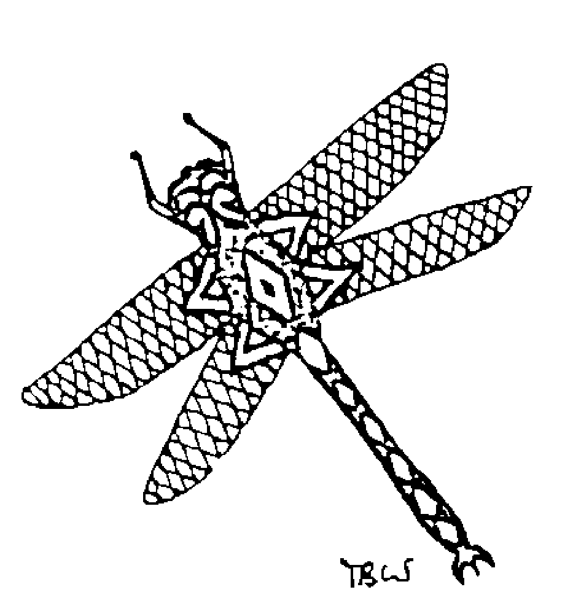

螢火蟲是散射著光芒的小甲蟲，熱帶裡最燦亮奪目的生物。螢火蟲有一個貯存螢光素的器官，那是一種會發光的化學物質。螢光素後面有一層厚厚的組織，被認為具有反射的功能。

成年螢火蟲的壽命很短，牠們耗費了所有的夜晚時間，規律地展示著淡黃色、淡綠色或淡紅色的亮光，以此吸引異性。大多數的母螢火蟲都不能飛行，牠們附著在植物上並閃爍著信號，吸引公的螢火蟲來尋找牠們，這就是螢火蟲求偶的舞蹈，點亮了整個黑夜。

雖然有些人試圖捕捉螢火蟲，但囚禁對螢火蟲來說即意味著死亡。最好只是純粹觀賞著牠們的美麗，並且讓那求偶之舞、以及牠們的生命能夠延續。

印地安人民從孩提時候到長大成人，都深受這些夜空中的小亮點所吸

#### 南方靈性道路動物

##### 成長—兔子 Rabbit

南方靈性道路的第一個位置～成長的代表動物是兔子。兔子是一種非常多產的動物，牠是自己品種的繁殖專家。兔子自身的成長也很快速，和其他動物相比，牠在相對較短的時間內可以完全長成。兔子散發著天真的氣息，本能地幫助著個體和種族的成長。兔子教導我們關於成長的實相，就算我們不做任何請求，成長的實相也總是存在。

世界各地有超過七十種兔子。牠們的體型普遍都小，全身毛茸茸的、有著長耳朵、後腿強壯有力。兔子移動的速度很快，機靈狡猾、聽力極佳。牠們奔跑蹦跳，幾乎任何一種蔬菜都吃。牠們非常多產。據估計一對兔子在三年內可以擁有超過一千三百萬的子孫。

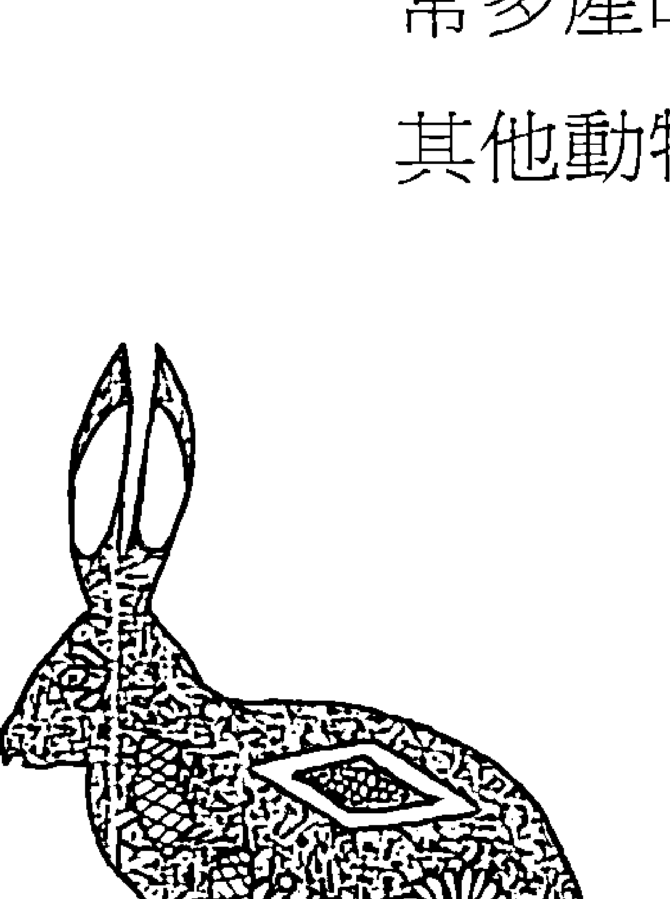

絕大多數兔子並不喜歡被圈養，然而，有些兔子已被當做很好的寵物，更常見兔子被獵殺或飼養作為食物。

印地安原住民將兔子尊崇為豐饒繁衍的象徵，牠們是人類王國賴以為生的穩定供應者。兔子也被認為象徵著天真無邪。

透過與兔子工作，你可以學習不去害怕自己成長超越目前的極限。

你可以學會擴展延伸超出你現在所是的模樣。兔子也教導狡猾、聆聽、速度，以及所有層面的豐饒繁衍，維持和天真。

##### 信任——鮭魚 Salmon

鮭魚代表著南方靈性道路的第二個位置～信任。鮭魚是一個強大的游泳健將，牠帶著一種與生俱來的信任並歸返源頭，每年有著不計其數的鮭魚回溯到故鄉產卵，而後死亡。

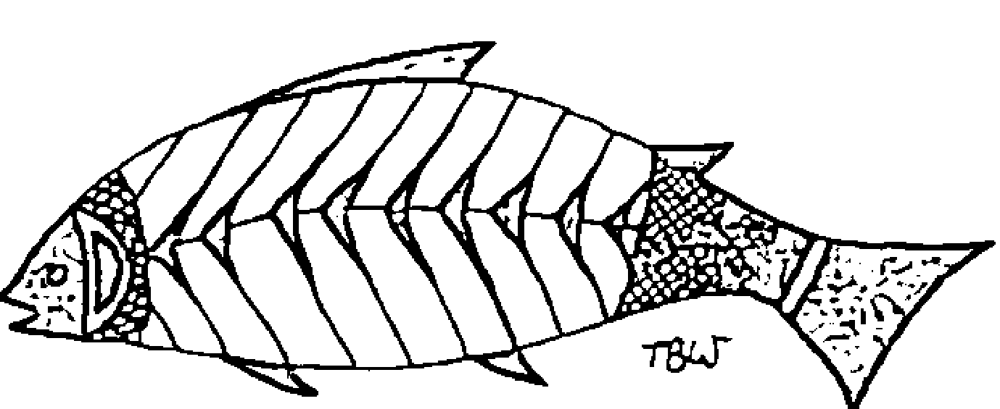

鮭魚願意為了產卵做任何事情，逆流而上返回牠們的原生地，有時候是非常大的賭注，因為這可能意味著要把自己拋出瀑布、或者讓自己疾速彈出水面。

鮭魚大家族的不同成員可以在大西洋、太平洋、北美五大湖區、西伯利亞、以及其它世界各地找到。所有鮭魚都是裸頭魚，有著分叉的尾鰭、中等長度的背鰭。

鮭魚是太平洋西北部人們的傳統主食，鮭魚的勇敢、忠誠、力氣以及對傳統的尊重，也備受這些地方的人所崇敬。鮭魚對於西北海岸的人民而言，是最為重要的一個圖騰。就像老鷹和熊一樣受人愛戴。

鮭魚可以教會你去信任生命對你的任何召喚、聆聽你內在的聲音、跟隨它的引領去往任何地方。鮭魚也教導了決心、本能的力量、維持、力氣、直覺，以及追隨你的願景的能力。

##### 愛——狼 Wolf

狼，象徵著南方靈性道路的第三個位置～愛。狼經常被人們描繪成一個獨來獨往的孤僻動物，這和牠的本性如天壤之別。狼其實是喜歡家庭和社群的動物，牠們經常把大家的快樂和福祉，揹在自己的包袱上。狼的一## 西方靈性道路动物

狼是一個美麗、尊貴的動物，瘦長的脅腹但強壯的骨架。狼有著一個長長的鼻子、明亮的橢圓眼睛、強勁的下頜、豎直的耳朵、濃密多毛的長尾巴，棕色和灰色的外衣上，夾雜著些許光亮的黑色毛髮。

狼非常聰明，時常以團隊的形式一起狩獵，牠們知道這遠比自己單打獨鬥的力量更強大，狼有一個迷人且複雜的社會系統。儘管人們曾經在北美、歐洲和北非各地發現了大量的狼，但牠們仍然接近滅絕。狼現在正慢慢復育中，生態學家認為在剩餘的荒野地區裡，應該允許狼的存在，藉此減少某些動物群裡患病或瘦弱的個體，例如鹿或北美馴鹿。狼總是試圖迴避人類。

印地安原住民非常尊敬狼群，因為牠對狼家人的照顧、因為牠對家庭的愛，也因為牠保護的本能，更因為牠會在狩獵時辨識、並且只獵捕那些病殘軟弱的動物。狼在某些部落被認為是守護的圖騰和堅持不懈的象徵。

狼可以教導你對家庭、朋友、孩子的慈悲和忠誠。假如你在自己的家庭和身世中，未曾學會關於信任和親密關係，你可以和狼一起好好工作。假如你來自一個飽受辱罵和粗暴的家庭，或者不正常的成長背景，狼也將教會你去放下你的痛苦、負面消極的模式，取而代之的是一種能夠幫助你懷著愛長大成人的品質。

和狼一起工作，可以學習關於健康的愛、寬恕、親密、信任、功能關係、社群、無私和慷慨。

##### 體驗——鯨魚 Whale

鯨魚象徵著西方靈性道路的第一個位置～體驗。鯨魚是地球上最古老的哺乳動物之一，某些鯨魚物種甚至是世界上最巨大的動物之一。牠們曾經體驗過純淨無染的環境，而今，卻只能生活在各種被人類文明所污染的海域。

鯨魚是鯨類，適應水生的哺乳類生物。鯨魚可以長達九十英呎，牠們在世界各地被發現，特別是北太平洋、北大西洋、歐洲海岸和挪威北部。

人們經常扮演鯨魚的敵人，捕鯨業者長期因大量掠奪鯨魚而獲益。與過去的數量相較，目今倖存的鯨魚數量少得驚人，拯救鯨魚的戰爭尚未結束。

就像鮭魚一樣，鯨魚也是西北海岸和阿拉斯加原住民最重要的動物之一。牠的圖騰通常被發現與老鷹、鮭魚和熊並列。原住民尊敬鯨魚為重要的生計來源，也榮耀牠為一個來自造物主的特別訊息傳遞者。

今天，許多人分享著這個信念，他們覺得鯨魚就像海豚一樣，正試圖發展一種與人類溝通的心靈連結，為了拯救牠們的水域以及整個大地母親。

與鯨魚工作可以教導你關於觀察的價值，關於奠基在經驗之上的知識，以及與環境的和諧，牠可以幫助你明瞭關於力量，耐心，壯麗、以及最古老的智慧。

##### 內省——老鼠 Mouse

西方靈性道路的第二個位置～內省的動物圖騰是老鼠。這種體型嬌小的動物，以牠有限的眼界與領土，成為向內觀看的專家。雖然老鼠沒辦法看得很遠，但卻可以很清晰地看見自己顫動的小鼻子前的事物。如此貼近的距離通常會被深具遠見的人所忽略，他們很少花時間往內看，去看看自己周圍倒底有些什麼、而內在又是什麼。

在全世界都可以發現大量的小老鼠。這毛茸茸的小小齧齒動物，有著尖細無毛的長尾巴，牠們有珠子般亮晶晶的雙眼以及小巧的圓耳朵。老鼠是內向的生物，即使牠們不是正式冬眠，牠們大部份的時間也都在睡覺。老鼠是草食性的素食者，會吃任何牠們所能找到的食物。老鼠生活在一個很小的領域之內，但牠可以對那個地方瞭若指掌。

對於一些印地安原住民來說，小老鼠代表著信任和天真。由於牠的弱小尺寸和受限的領地，老鼠幾乎無法防禦任何的攻擊。牠必須要去信任牠自己的知識，信任牠日常生活的慣例，藉以避免危險。老鼠的小小疆界，也使得牠對外在世界所發生的事物保持著一派天真。原住民人們同樣也經常花時間去欣賞小小的奇蹟或自然世界，在老鼠般的侷限視野之內，熱切地感激這些驚奇。

老鼠可以教導你去欣賞且感激這些平淡無奇的事物，並享受著每日生活中的驚奇。老鼠可以教你誠實地看見自己的錯誤以及天賦。牠向你展示了這宇宙中你身處的小小角落有多麼特別，牠也向你示現著尺寸大小一點也無關乎生命的美麗。

透過與老鼠工作，您可以學會往內看，學會去領受並心滿意足。學會清楚地看到細小的畫面，去休息和放鬆。牠也教你如何重獲你的天真，並且相信生活會以它該有的樣貌自行開展。從這樣的觀察中可以產生一種覺知，引領你去往真實的內在成長。

##### 力量——螞蟻 Ant

螞蟻是西方靈性道路的第三個位置～力量的動物圖騰。這種細小的昆蟲竟能夠扛舉和搬運比牠重四倍的東西。這正是一種展現力量的英勇事蹟，其它動物包括人類都很難模仿。螞蟻也是一種非常強大的物種，牠們可以求生和忍耐，根據霍皮族的預言，在先前的地球淨化時期，正是螞蟻人掩護了人類，假如人們不肯走回造物主為他們鋪陳眼前的道路，螞蟻人即將繼承地球。

螞蟻完成了牠們不可思議的豐功偉業，因著牠們的社會架構，個人需求對於螞蟻的社群聚落而言，已變得絕對次要了。牠們設法努力在其他動物的腳下繁榮壯大，觀察螞蟻個體和群體的這些事蹟，我們可以從中學到很多。螞蟻給了一個關於力量的典範，力量來自於深謀遠慮、堅持不懈和勇氣，而不是蠻力。

和螞蟻工作，可以教導你將自己的力量運用在人類社群裡的良善之處，以此形成持久的關係來利益所有涉入者。螞蟻教導關於可靠、信任、內在和外在的力量、堅持不懈，也教你與周遭一切平衡相處。

### 認識動物

（感謝熊歐迪希的許可，允許我們使用這個練習）

- 1. 煙燻或者使用任何最適合你的淨化方法。
- 2. 舒服的坐下或躺下，做幾個深呼吸，盡可能的放鬆。
- 3. 告訴動物王國，你想要對某一個藥輪動物學習更多，請求那個想來教導你的動物，現在就浮現你腦海中。
- 4. 記下第一個來到心中的畫面。
- 5. 仔細端詳這個出現在你面前的動物，觀察牠的移動方式、牠所發出的聲音。
- 6. 請問這個動物，是否可以允許你透過牠的眼睛來觀看世界片刻，只有當動物說「是」之後才能繼續這個練習，否則，你只要觀察動物。
- 7. 如果動物給了你許可，你透過牠的雙眼來觀看你自己。請留意這世界看起來如何？留意有什麼事物吸引你的注意？你喜歡吃些什麼？你如何狩獵？你用什麼方式溝通？你的夢想是什麼？你的目的是什麼？誰會獵食你？你如何保護自己？你的領土有多大？你有配偶嗎？你是否喜歡求愛？允許這個動物盡牠所能的向你展現牠的世界，牠自由自在分享，你也舒適地看見這一切。
- 8. 現在，請問這個動物是否能幫助你做一些移動。如果牠應允，請你將一小部份意識退回到自己的身體上，好讓你可以順利移動。允許你的身體就像這個動物一樣移動，去覺察這個運動的感覺如何。
- 9. 如果你聽到這動物發出的聲音，現在就開始學習這些動物的叫聲。
- 10. 進入這個剛剛和你連結的動物能量之中，花幾分鐘去展現牠的動作和聲音，同時對於自己的身體和周遭環境保持足夠的覺知意識，你必須知道什麼事對你來說是安全且可行的。例如：倘若你連結的是一隻鳥，你會意識到自己雖然可以拍動翅膀，但你終究不能飛翔。
- 11. 躺下並退回到你原來的放鬆狀態。
- 12. 感謝動物所給予你的禮物。接著花幾分鐘時間沈思你的體驗、以及牠所給你的教導。
- 13. 回到正常的意識狀態。
- 14. 寫下或錄下你的經驗。

### 連結動物王國

- 1. 到公園或野生動物園裡，不要打擾動物，就只是靜靜地坐著觀察。
- 2. 在大自然中找到一處地方，舒服地坐著，安頓好之後就不再移動。耐心地等待，直到周遭一切恢復成你到來打擾之前的平靜。這可能需要一些時間。請保持耐心，或許您會在大自然環境中觀察到一些藥輪動物。
- 3. 從動物書籍中剪下相關照片，放置在你的枕頭底下，並祈求能夢到牠們。
- 4. 使用上述〈認識動物〉練習裡的框架，與你想合作的藥輪動物進行一場引導意象的冒險。你可以先行研究你所剪下的動物照片，在你開始你的引導意象旅行之前，想像你所能想到的和這動物有關的任何事。
- 5. 雕刻或購買由木頭或石頭所製成的動物雕像。
- 6. 以黏土塑造出動物，請求牠們的引導、方向或知識。
- 7. 描畫或彩繪你所要連結的藥輪動物。
- 8. 煙燻淨化之後，靜靜地坐著，請求你想要合作的動物，以一種最好的方式建立你們之間的友誼。
- 9. 請記住：大部份的人際關係並不是突如其來的瞬間發生，而是必須以責任心和規律性來培養。這情況同樣適用於和動物王國建立友誼，你要有意願讓自己與動物藥輪的關係成形、發展、成長、並開花結果。

## 藥輪色彩參照表

### 中央圓

| 色彩 | 位置 | 給人類的功課 |
|------|------|--------------|
| 所有或任何 | 造物主 | |
| 森林綠 | 大地母親 | 豐收、成長、能量、溫暖、療癒、滋養、結合、穩定 |
| 天空藍 | 太陽父親 | 靈性、儀式、純淨、智慧、療癒靈魂、能量系統和心靈 |
| 銀白色 | 月亮祖母 | 靈性的純潔、魔法的特性、天真無邪、直覺、平衡、真實 |
| 綠棕色 | 海龜家族 | 成長、穩定、永久性、可靠性、力量、勇敢、結構 |
| 藍綠色 | 青蛙家族 | 淨化、純化、平衡、慰藉、幸福、滿足、療癒 |
| 鮮紅色 | 雷鳥家族 | 力量、肉體力氣、無懼、行動、改變、戰士或首領能量 |
| 半透明微藍 | 蝴蝶家族 | 溫柔、內在孩童、信仰、親切、愛、和平、靈性療癒 |

### 靈性守護者

| 色彩 | 位置 | 給人類的功課 |
|------|------|--------------|
| 白色 | 瓦布絲 | 清理、更新、純潔、反射、內在成長、轉化、淨化 |
| 金色和紅色 | 瓦奔 | 明晰、智慧、光明、重生、生命力、開悟、溝通 |
| 綠色和黃色 | 熊歐迪希 | 信任、成長、愛、感受、性、關係、整體療癒、回春 |
| 藍色和黑色 | 默加奇維思 | 體驗、內省、力量、責任、達成目標、成熟 |

### 月亮和圖騰

| 色彩 | 位置 | 給人類的功課 |
|------|------|--------------|
| 白色 | 大地復甦 | 啟蒙、開悟、完美、慈悲、演進、保護、安寧、和平 |
| 銀色 | 休眠淨化 | 直覺、恰當、情緒流暢、連結月亮、通靈能力、繁榮昌盛 |
| 土耳其藍 | 大風 | 加強藝術和療癒能力、連結你與天空及大地、平衡 |
| 黃色 | 萌芽樹 | 良善本質、鼓勵喝采、智力、幸福、能量、感受性、靈感、幸福安樂 |
| 藍色 | 青蛙歸返 | 和平、幸福、滿意、知足、和諧、令人振奮、放鬆 |
| 白色和綠色 | 玉米種植 | 深層療癒、復原、潔淨、天真，物質身體的、靈性的、心智的、情緒的健康 |

### 月亮和圖騰

| 顏色 | 季節 | 意義 |
|---|---|---|
| 粉紅色 | 烈陽 | 全面療癒、無條件的愛、健康的關係、內在孩童療癒、敏感 |
| 紅色 | 採莓 | 能量、力量、生命力、性能量、堅強的意志力、經過調和的行動、自豪 |
| 紫色 | 豐收 | 儀式、智慧、好的評判、靈性洞見、理想主義、人道之愛 |
| 棕色 | 群鴨飛遷 | 土地意識、環保意識、穩定性、落實接地 |
| 橘色 | 天寒地凍 | 雄心壯志、知識的整合、自我控制、智能、活力、覺察 |
| 黑色 | 漫長冰雪 | 奧秘、允諾、內省、覺知、臣服、直覺、重生 |

### 靈性道路

| 色彩 | 位置 | 給人類的功課 |
|---|---|---|
| 淡綠色 | 淨化 | 淨化、準備、卸除、釋放、排毒、脫離、純化 |
| 深綠色 | 更新 | 更新、樂觀、愛、信任、新的觀點、正面的轉捩點、嚴重或緊急的療癒 |
| 半透明白色 | 純潔 | 純淨、和諧、平衡、信心、和平、靈感、誠實、溫柔甜美、療癒、整合 |
| 透明無色 | 明晰 | 明晰、目的、力量、旅行、釋放、自信、移動、英勇、機智、進取 |
| 翡翠綠 | 智慧 | 智慧、成熟、知識、尊敬、歡樂、穩定、理解、界限、慈悲 |
| 螢光藍 | 光明 | 卓越、神聖、信仰，療癒靈魂、頭腦、心和能量系統 |
| 紫羅蘭色 | 成長 | 成長、進化、擴展、學習、責任感、療癒、發展、敞開 |
| 薰衣草色 | 信任 | 信任、安全感、信心、誠實、天真、療癒內在小孩、慈悲 |
| 玫瑰色 | 愛 | 愛、全面療癒、感激、領悟、慈悲同理、歡愉、忠實、浪漫、激情 |
| 金屬灰 | 體驗 | 體驗、榮耀、目的、理解力、服務、效能、價值、結果、洞察力 |
| 寶藍色 | 內省 | 內省、沈思、協調、深思熟慮、恰當的行為態度、療癒 |
| 金黃色 | 力量 | 力量、負責任的力量、紀律、耐力、領導力、鼓勵、勇氣 |

## 第13章 色彩藥輪

每一種顏色都有它自己的能量、頻率和振動。因此，每個顏色都有它特殊的力量可以療癒和幫助人們。大多數文化都認為彩虹是來自大靈的特殊信息，這個顯化連結了我們的世界以及其它畛域。

有一個關於蝴蝶如何學會飛的傳說（請詳見〈藥輪〉一書），這個傳說能夠幫助你了解顏色對於療癒以及藥輪上不同位置的重要性。這是關於一位名叫春天的花的年輕女人的故事，她有著不可思議的療癒力量。當她長大成為一位真正成熟的女人時，她為自己的人生進行了一場靈境追尋，有一種陌生又美麗的生物飛來到她身邊，牠們為她帶來了彩虹的能量。牠們告訴春天的花：彩虹的每一個顏色都具有特殊的療癒質地。這些五彩繽紛的生物告訴她，在她的一生中將會具備強大的療癒力量，而在她面臨死亡的時刻，她會釋放出這些療癒力量永遠陪伴人們。她在靈境中所得到的名字是在空中編織彩虹的她。

正如她的靈境，在空中編織彩虹的她成為一個偉大仁慈的療癒師。每當她坐在地上為別人療癒時，她注意到有不同美麗顏色的爬蟲會靠近她。牠們會爬靠近她，並試圖在她手上磨蹭。有時候會有一隻蟲沿著她的手臂往上爬，依偎在她的耳畔，並告訴她幫助療癒的方法。有一天，她替家人和人們療癒，歷經了漫長而充實的一天後，她對著其中一隻爬蟲說話，問起她如何能夠為牠以及牠的同伴服務。

爬蟲承認牠的同伴總是在她身旁幫助她療癒人們。爬蟲告訴她，牠們藉著身體的顏色把彩虹的魔法帶給她。這隻爬蟲告訴在空中編織彩虹的她，她很快就會離開塵世進入靈性世界，牠的同伴們關心著該如何繼續把顏色的療癒力量帶給兩條腿的動物。

爬蟲說：因為牠的同伴們生長在地上，牠們擔心人類不會低頭看見牠們，更不可能獲得每個爬蟲所披戴著的色彩祝福。

「如果我們能夠飛的話……」爬蟲說：「人們就會注意到我們，並且對著他們所看到的美麗色彩微笑。我們可以飛到那些需要特殊療癒的人們周圍，用我們的色彩力量帶給他們任何所需要的療癒。妳能幫助我們飛嗎？」

在空中編織彩虹的她答應嘗試，不久後她就死了。在她去世之前，她把這段與爬蟲的對話告訴丈夫。到了埋葬的時刻，她的丈夫看見其中一隻彩色爬蟲，爬蟲正在等待，並指示丈夫將牠與在空中編織彩虹的她一起埋葬。

爬蟲告訴丈夫，當他用泥土覆蓋在牠身上時，牠也會死去，但牠的靈魂將與在空中編織彩虹的她的靈魂結合為一。

「我們會一起穿越覆蓋我們的泥土……」爬蟲說：「然後我們將回到我的同伴那裡，教牠們如何飛舞，如此一來，你妻子所開展的工作就可以繼續下去。她正在等著我，現在就把我和她一起埋葬了吧。」

那個男人照著做了，他妻子的葬禮繼續進行，當其他人全都離去時，那個男人還留在女人的墳旁，他如此地深愛著她。忽然間，從墳墓中飛出了一隻帶著彩虹顏色翅膀的飛行物，牠飛向這個男人，並停留在他的肩膀上。

「請不要哀傷，我的丈夫……此刻我的靈境已全然實現了，而我將幫助教導的那些存有們，會永遠為人們帶來彩虹的美善、療癒和幸福。當你的時候到了，也來到靈性世界時，我會在這裡等待與你重聚……」

幾年後，這個男人去世了，當所有人都離開之後，他的孩子留在他的墳墓旁。他們注意到有一隻被稱作蝴蝶的美麗新生物徘徊在花園附近。幾分鐘之後，另一隻同樣美麗的蝴蝶從父親的墳中翩然飛出，並隨即加入了正在等待的那隻蝴蝶。接著，這兩隻蝴蝶一起飛向代表了生命更新重生的北方。從那時起，蝴蝶就一直以牠們的色彩和美麗照亮世界，並陪伴著人們。

大多數文化都認為彩虹是大靈所發出的特別信息，這個顯化是一道連結這個世界與其它畛域的橋樑。彩虹帶來色彩的禮物，早己被人們所熟知，包括當今的主流顏色。試想有多少的諺語將情緒狀態與顏色劃上等號：「我是藍色的（我很憂鬱）」、「他看見紅色了（她火冒三丈）」、「她有一條黃色條紋（她膽小懦弱）」、「他陷入紫色的恐懼（他陷入精神恐慌）」、「一切都看似黑暗（一切看似沮喪無望）」……試想你有多少次選擇衣服、汽車或房間的顏色，就只是因為那個顏色讓你感覺更好。

當你在藥輪上旅行時，請留意各種顏色以及它們如何影響你。你對色彩偏好的改變，可能是你正要準備或已經開始旅行到藥輪不同位置的眾多線索中的第一個。

當你運用藥輪的色彩時，根據影響你的位置、或依據你所渴望的能量來混合搭配也是適當的。透過穿戴與某個位置相關的顏色，你可以吸引藥輪上特定位置的能量。你也可以透過身處某種顏色的房間或汽車、凝視著某種色調的卡片或燭光而達到同樣效果。你可以想像某個特定顏色，在靜坐中運用它。你也可以攜帶恰當色彩的石頭，或者觀賞飛舞在你身旁的蝴蝶。不要低估和色彩工作的力量與美麗，這些光的閃亮射線和移動，隱含著我們真正的精髓～我們所是以及我們將是的本質。我們的身體是濃稠的能量體，由光的顆粒濃縮聚集而成。當人們指稱人類為光的一部分時，他們所指的是我們的光粒子連結著所有的一切。人們總傾向於侷限自我的存在，好讓自己看起來更加安全和具體，當你超越你的肉身而看向遠方，你會看見並感覺到你與色彩的連結。透過與藥輪不同位置的相關顏色工作，你也可以強化對藥輪各個面向以及藥輪整體的領悟。

### 中央圓的色彩

#### 造物主—所有或任何色彩

沒有一個單一的顏色能永遠代表造物主。造物主是所有顏色的一部分，祂既是彩虹所擁有的顏色，也是彩虹所缺乏的顏色。

#### 大地母親—森林綠

榮耀著中央圓裡象徵大地母親之石的顏色是森林綠。這是一種所有植物都在成長的綠色：閃閃發光、生氣盎然，充滿生命、充滿能量、充滿水。雖然這種綠色從淺到深，不一而足，但是我們最常稱作森林綠的顏色，是與少量的黃色或棕色混合在一起。

和森林綠一起工作，可以激發一種由大地母親所帶來的溫暖和成長，提供了極深層的療癒、滋養、連結和穩定。這個顏色有助於顯化、富足，以及豐饒的收成。

#### 太陽父親—深邃的天空藍

在中央圓石頭裡榮耀著太陽父親的顏色是深邃的天空藍。這種顏色不但榮耀太陽父親在天空的家，同時也提醒我們藍色是火焰熊熊燃燒時的顏色之一。在家中使用過瓦斯火加熱或烹飪的任何人都會明瞭這令人難以捉摸的藍色火焰。

這種深藍色鼓舞了靈性，並且與你最深層的意識相連結。這種顏色非## 月亮祖母——銀白色

與中央圓裡榮耀月亮祖母之石有關的顏色，正是我們看到月亮在夜空的黑暗中展現自身的銀白色。

和銀白色工作可以加深你與月亮祖母的連結，同時也促進靈性的純淨與目的。這些顏色能夠邀請月亮的魔法特質進入你生命中，幫助你維持內在的純潔和天真，以通往行星的最高層面以及個人的最高良善。這個顏色激發出崇高的原則以及精細琢磨的直覺能力。和銀白色工作，能夠強而有力的改善女性問題，並且平衡陽性和陰性能量。

#### 海龜家族·土元素——綠棕色

在中央圓石頭裡榮耀著土元素的顏色，是成長中植物的綠色，混雜著種植它們的土壤的棕色。

運用綠棕色能夠促進成長、穩定、恆久、可靠、堅定的信念系統、力量、勇氣、結構，並且堅定的掌握實相。這些顏色有助療癒男性和女性之間的能量，也能幫助你完成一項艱鉅任務，且讓一個虛弱的身體系統回復健康。

#### 青蛙家族·水元素——藍綠色

與榮耀著水元素的石頭有關的顏色，是清朗的艷陽天裡那種海洋的藍綠色。這些色彩可以協助強化你與自己內在以及周圍水域的關係。青蛙家族的顏色在缺水或淹水時，都能提供強而有力的幫助。當你需要徹底潔淨你的身體、心智和靈性時，這些顏色也極有助益。

對於清理和純淨靈性體、情緒體或身體而言，藍色和綠色都是很傑出的色彩。這些顏色能夠激發你內在意識的平衡，以及你周遭外在世界之間的和諧。藍色和綠色可以舒緩「騷亂的水」，從而喚醒深深的幸福感和滿足感，這些顏色是療癒的色彩。

#### 雷鳥家族·火元素—鮮紅色

與榮耀火元素的石頭相關的顏色，是火焰中鮮明強烈的紅色，介於橙色和黃色之間。

這個顏色象徵「生命之火」，激勵著肉身的氣力、能量、勇敢無畏、感官享受和熱情。鮮紅色是一種行動、移動、改變和轉化的顏色。如果你想負起責任、成為一個領導者、激發你的戰士能量，或者擁抱你的「力量道途」，可以和鮮紅色工作。

當你運用這個色彩或火元素的能量與力量時，切記，能夠為你帶來暖熱的火，同樣也能為你帶來痛苦的灼燒。當你需要緩和你的行動時，這不是你該運用的顏色。

#### 蝴蝶家族·風元素—清澈半透明的微藍色

與榮耀風元素的石頭有關的顏色，是清澈半透明中帶著些微的藍。就像被海水滌洗的沙製成了美麗高腳杯所展現出的藍彩，也像你透過蝴蝶翅膀所看到天空，或者你透過結霜的窗所看到的清朗寒涼的冬日早晨。

這種色彩，能夠讓你用一雙覆蓋了大靈溫柔面紗的眼睛，去觀看物質世界。這種半透明的藍，可以藉著提醒你造物主全能遍在的愛，來柔軟你生命中殘酷和艱難的課題。

清澈而半透明的藍色，能夠幫助療癒靈魂、心和情緒，用以療癒內在小孩以及童年時期的傷痛，效果也非常卓越。這些顏色鼓舞著信心、溫柔、天真、愛与和平。清澈半透明的藍色，特別適合療癒靈性層面。

## ・靈性守護者色彩・

與方位力量相關的七種顏色是三原色～紅色、黃色和藍色，以及欠缺所有顏色的黑、蘊含了所有顏色的白、活躍大地的金色和綠色，這些都是顏色光譜中最強大有力的顯化。

這些顏色，也主宰著每一位靈性守護者相關的季節以及一天當中的不同時刻。

#### 瓦布絲・北方靈性守護者—白色

與北方靈性守護者～瓦布絲相關的顏色，是冬天的白雪、夜空中星星的白光、以及最受尊敬的長老頭上的白髮。

這個白色可以幫助你清洗、更新和潔淨你的心智、身體與靈魂。這種顏色能夠鼓勵你反照你自己、並且與靈性連結。它有助於你內在的成長和深邃的轉化，它能夠幫助你契及深層的意識狀態、以及有關長者智慧的知識。白色也帶來返老還童所必需的淨化和純化。

#### 瓦奔・東方靈性守護者—金色和紅色

象徵東方靈性守護者～瓦奔的顏色，是太陽從地平線上升起時的金色和紅色，宣告著黎明和嶄新一天的開始。這是春天陽光所帶來的金色光芒，同時也是足以照亮我們生命道路的金色智慧之光，它提醒我們每一個片刻都是一個嶄新的開始。瓦奔的紅色是充滿活力的紅色、鮮血的紅色。

金色和紅色能夠幫助你找到明暸、智慧和光明。這些顏色激發著重生、回春、強壯的生命力、開悟和勇氣。單純的紅色可以激起企圖心和無畏的勇氣，因此用金色調和能量可以加強平衡和敏感度。金色和紅色能幫助處理紅塵俗事，同樣也能和其它畛域的能量工作。這些顏色會幫助你落實接地，幫助你表達真實的想法和感受。

#### 熊歐迪希·南方靈性守護者——綠色和淡黃色

象徵著南方的靈性守護者～熊歐迪希的顏色，是一種成長中萬物的綠，混合了幫助它們生長的陽光的黃。這是一種清晰、純淨的淡黃色，而且它照亮了所有被它觸碰到的綠色。純粹的綠色是一種成長、信任、恢復和療癒的顏色，而黃色是一種知性、心智頭腦上的感受性、以及自然智慧的顏色。

綠色和淡黃色可以幫助你學會信任、成長和愛。這些顏色鼓勵你成熟，激發你從宇宙中汲取智慧的能力，以增強你的感受和直覺。綠色和淡黃色幫助你找到你生命的目、採取必要的改變、並且能夠作出好的決定。這些顏色也刺激繁育和交合的能量。綠色和淡黃色可用來療癒性器官和腎上腺、並淨化血液。這些顏色也有益於一般的整體療癒和恢復活力。

#### 默加奇維思·西方靈性守護者——亮藍色和黑色

與西方的靈性守護者～默加奇維思有關的顏色，是暮光乍現之前的明亮藍天，以及象徵著又是一個藍天終結的黑色雲彩。單純的藍色是靈性力量、理想主義和無私的顏色。黑色則是當一個人往內看的顏色，他刻意朦蔽自己的眼睛，不去看所有外在的塵世事物，以便經驗那無形無相的黑暗虛無，正是這個空無化生了一切萬物。

這些顏色能夠幫助你瞭解你的生命經驗。它們激發著反省和內在力量。明亮的藍色和黑色教你如何放慢速度、努力工作、承擔責任，去達成你所追求的目標、以成熟的方式採取行動。這些顏色可以教導你從自己的錯誤中學習、從你的優點和缺點之中學習。明亮的藍色和黑色可以療癒動脈，血管和神經系統。

## ·十二個圖騰動物的色彩·

#### 大地復甦之月·雪雁—白色

白色與雪雁以及大地復甦之月（12月22日至1月19日）相關。這是冬天裡白雪的顏色，它讓一切看起來嶄新且閃亮。白色是所有顏色的呈現，也是所有顏色的總和。儘管它看似毫無色彩，實際上卻蘊藏了所有的顏色。白色被認為是開悟、完美和高度進化的顏色。許多人用白光來包覆或防護自己，免於受到周遭任何負面能量的影響。雖然白色可以提供保護，但也讓你對事實盲目，為了從任何可能傷害你的事物中得到最究竟真實的保護，你必須下功夫去瞭解你自己。讓白色圍繞著你，能夠帶來純潔、安寧、和平、平衡、寧靜、慈悲、保護、以及利他的心。

#### 休眠淨化之月·水獺—銀色

銀色與水獺以及休眠淨化之月（1月20日至2月18日）相關。銀色一直被視為一種魔法的顏色。某些宗教哲學教導著一條銀色光索連結著靈魂與身體，其他人則認為在金色天堂之上還有銀色的天堂。銀色是財富、繁榮、精神豐饒的色彩。銀色與月亮有關，因此也能夠增強你與月亮祖母連結的顏色。讓銀色圍繞在你周遭，能夠促進通靈能力並增進感知、直覺、以及恰當的情緒流動，它也可以幫助你改善對金錢的看法，以及對自身成功繁榮的態度。

#### 大風之月·美洲獅—土耳其藍（藍綠色）

土耳其藍（藍綠色），是與美洲獅及大風之月（2月19日至3月20日）相關的顏色。土耳其石的藍色是天空的藍色，與象徵太陽父親的天空藍相似。這種藍色可以象徵理想主義、無私、藝術和靈性的感覺，也可以代表憂鬱寡歡、以及自己加諸自身的奮鬥和掙扎。土耳其藍之中的綠色，幫助你與自然真實連結而帶來平靜沈著，這有助於平衡兩種極端。讓土耳其石的藍綠色圍繞在你周遭，能夠加強任何潛在的藝術或療癒能力。它也可以幫助你感受自己與天和地之間的連結。

#### 萌芽樹之月・紅尾鷹——蒲公英黃色

黃色是紅尾鷹和萌芽樹之月（3月21日至4月19日）的顏色。它是春天的太陽從天空中照耀的黃色，它也是蒲公英花盛開時的顏色。這個黃色是一種歡呼的顏色，它是能夠刺激良善的本質和天生才智的顏色。這是一種讓你想起陽光、幸福和能量的顏色。讓黃色籠罩在你周圍，可以幫助你擁有更強的智力敏感度，對靈感更具接受性，也對他人油然生起一種整體的快樂幸福感。

#### 青蛙歸返之月・海狸——藍色

藍色是海狸和青蛙歸返之月（4月20日至5月20日）的顏色。這是卡馬夏花朵裡明亮的藍，或毫無雜質的矽孔雀石裡的純粹亮藍。這種顏色散發出和平、幸福和精微的能量。這種藍色可以減輕黑暗的情緒，並提醒我們那些更精細幽微的畛域。讓這種藍色環繞在你周圍，能夠幫助你對自己周遭一切感到心滿意足，讓你的情緒滿足且和諧，並且對於鋪陳開展在你面前的生命感到幸福快樂。

#### 玉米種植之月・鹿——白色和綠色

白色和綠色是鹿和玉米種植之月（5月21日至6月20日）的顏色。這個位置上的白色是半透明的，就像在許多苔蘚瑪瑙上所看到的顏色。它彷彿我們進入這個世界時的無形無相、以及完美的純淨與天真。這裡的綠色，是那種生長在森林深處或水邊的植物才有的暗影與蒼白，它也是最深層的療癒以及復原的綠色。讓這種綠色與白色混搭在你的周遭環境中，將激發你所必需的純潔與天真，以達到身體、心智、情緒和靈性各層面的真正療癒。

#### 烈陽之月・紅翼啄木鳥——粉紅色

與紅翼啄木鳥和烈陽之月（6月21日至7月22日）相關的顏色是粉紅色。這是最美好的粉紅玫瑰身上的純淨色彩，色調既不太紅也不是太紫。它是與小女孩相關的粉紅色，一種不太成熟的色彩，但它也是那些色彩工作者經常引用的全面療癒之愛的粉紅色。讓這個顏色包圍著你，將幫助你的心對愛敞開、對敏感敞開，並讓你的情緒快速流動。它也能夠照亮任何你需要醞釀成熟的感情區塊。

#### 採莓之月・鱒魚——紅色

與鱒魚和採莓之月（7月23日至8月22日）相關的顏色為紅色。這是成熟覆盆子的紅色、也是最珍貴的紅石榴石的顏色。它是生命力的紅色、堅強意志的紅色，也象徵著傲慢、貪婪、不假思索的性衝動、以及飄忽不定的行動。讓這個顏色圍繞在你周遭，能夠增強你的能量和力量，它也會為你帶來挑戰，刺激你用思考去調和你的行動。

#### 豐收之月・棕熊——紫色

與棕熊及豐收之月（8月23日至9月22日）相關的顏色是紫色。這是長在森林裡輕易被忽略的害羞紫羅蘭花的顏色，它也是深邃的紫水晶顏色，這是一種慶典、儀式、靈性洞見、理想主義、以及人道之愛的顏色。某些程度的紫色，暗指一些人使用靈性力量以謀取個人利益。紫色是智慧的顏色，但它可以被用於正面或負面的方式。讓紫色環繞在你周遭，將啟發你靈感、帶給你靈性洞見、增加你對儀式的喜愛，並讓你檢視自己如何運用你的力量。

#### 群鴨飛遷之月・渡鴉——棕色

與渡鴉和群鴨飛遷之月（9月23日至10月23日）相關的顏色，是秋天大地的棕色，一種含有紅色色調的豐富棕色。它也是能將你的注意力帶回地球上的棕色、能夠幫助你瞭解你與大地母親連結的棕色。它是一種帶著許多陰影喚起你各種情緒的彩色。讓棕色圍繞在你生活周遭，能夠幫助你加強你與大地的連結與穩定性，使你可以安全地超越你原來的領域。它也可以增進你的環保意識。

#### 天寒地凍之月・蛇——橘色

與蛇以及天寒地凍之月（10月24日至11月21日）相關的顏色為橘色。這是一種你在夕陽西下的天空中所能看見的清亮橘色，或者你在成熟的南瓜田間所能看到的鮮豔色彩。這個橙色象徵著野心勃勃、傲慢自負的人，也代表一個能夠綜合並應用他從生命中所獲得的知識的人。在你的生活周遭運用這個顏色，能夠激發你的智力、活力、以及你的自我控制能力。它將幫助你更加敏銳地觀察生命，並且為了自己最高的良善以及他人的最高福祉而運用所獲得的資訊。

#### 漫長冰雪之月・麋鹿——黑色

與麋鹿和漫長冰雪之月（11月22日至12月21日）相關的顏色為黑色。一種在很深很深的夜空裡黝暗的漆黑，它是一種無形無相、神秘的黑，是任何事物所來自的空無。這黑暗帶來了應允也帶來了威脅。讓黑色包圍著你，能夠幫助你往內觀看，幫助你更深地瞭解你自己和生命。黑色能夠教導你有關臣服、直覺、感知和重生。對於許多印地安原住民而言，這是一個神聖的顏色。

## · 靈性道路色彩 ·

#### 北方靈性道路色彩

與北方靈性道路的第一個位置～淨化有關的顏色是淡綠色，也是萊姆的顏色。淡綠色是連結物質體和以太體強而有力的顏色。為了讓成長和轉化達到更精煉的層次，這個顏色能夠幫助你準備、清理、潔淨你自己。淡綠色幫助你釋放老舊的模式，以騰出空間容納嶄新的事物。

淡綠色幫助你從身體、心智和靈性中化解並移除毒素雜質，淡綠色也幫助你排除情緒和釋放錯誤見解。如果你正在為艱難的考驗或任何形式的轉化做準備，使用這個顏色在你周圍可能會有幫助。它也有利於耐力、釋放、清潔、刺激和淨化。淡綠色是有助於全身的整體療癒。

與北方靈性道路的第二個位置～更新有關的顏色是深綠色。這是大地母親的另一種綠色。這個雨林中蒼翠繁茂的深綠色，能夠幫助療癒嚴重的問題，帶來煥然一新的重生，並且更新身體、心智、情緒和靈性所有層面。象徵更新的深綠色能夠幫助你擁有健康的態度、嶄新的觀點、以及樂天的人生觀。這個顏色激發你無條件的愛以及對直覺的信任。深綠色能夠預示由疾病轉向健康的轉折點。這個顏色激勵著療癒、自我價值、繁榮和豐足。深綠色是一種強大的療癒色彩。

與北方靈性道路的第三個位置～純潔相關的顏色，是半透明的白色。這是飄浮在藍色天空中那片小小雲朵純淨朦朧的白，這個顏色有助於淨化身體的疾病，同時潔淨心智體、情緒體和靈性體的失衡與不和諧。

半透明的白色可以緩和紛爭，並且平息創傷的情緒動盪。這個顏色能夠化解破壞性的能量和混亂。半透明的白色對於與團體或組織合作是有益的，因為它鼓勵人們為了共同的福祉而團結一致。與這種白色一起工作，能夠釋放悲痛、苛刻和吝嗇的傾向，它能夠讓你平靜，並且教導你關於真摯、天真和誠實。它是一種激勵出最高美善的靈性的媒介。半透明的白色帶來信仰、和平、靈感、誠實和希望。

#### 東方靈性道路色彩

位於東方靈性道路的第一個位置～明晰的顏色是透明無色，一如清晰透明的蜂鳥翅膀。它也是春天飄落的雨滴、以及炎炎夏日升騰的熱浪。

當你旅行進入未知的畛域時，這個顏色將帶給你明晰的目的和力道去遵循你的力量之途。當你的直覺和心告訴你可以安全前往新的靈性疆域時，它是能夠給予你支持的強大盟友。它特別有助於釋放那些阻止你達到最高良善的過時信念系統。當你的大腦表示否定、而你的心和靈性充滿肯定時，運用這透明無色能夠提供你靈性上的支持。這個顏色鼓舞著信心、行動、英勇和機智。

東方靈性道路的第二個位置～智慧的顏色是翡翠綠色。這個顏色激發深層的成熟度並且能夠積極運用你所累積的知識和經驗。翡翠綠邀請著所有時期的智慧，它能夠加深你自己的知識，尊重並理解你的個人侷限和深度。翡翠綠可以幫助你清晰地辨別你恰當的疆界。如果你想要將慈悲和喜悅帶進你的生命，而不是痛苦和麻木，你可以和翡翠綠工作。翡翠綠色有助於穩定、落實接地和自我覺察。

東方靈性道路的第三個位置～光明的相關顏色是螢光藍色。螢光藍能夠點亮你內在的生命之火。這個顏色能教你如何騎乘著風在星際之間旅行。如果你想要與生命的精髓本質溝通，請運用螢光藍。這個顏色教導你有關造物主的力量、有關神聖的存有以及生命的祝福，螢光藍能夠提醒你生命中那些最特別的喜悅時刻。這個顏色的能量鼓勵你跨出自己的邊界，這種顏色將激發出一個大躍進，讓你有信心超越你自己。螢光藍激勵你昇華到世俗之上，到達每個人內在發光發熱的神性層面。如果你不相信造物主、不相信自己以及大靈，請你和這個顏色工作。螢光藍色有益於靈魂、頭腦、心和能量系統。

#### 南方靈性道路顏色

南方靈性道路的第一個位置～成長的顏色是紫羅蘭色。紫羅蘭色是柔和的紫色調，鼓舞著從青春期到成年期的成長和進展。它是紫外線中對於健康以及動植物的發展至關重要的面向。它是用來哄騙種子發芽的燈光顏色。和紫羅蘭色一起工作，可以鼓勵進化和成熟過程，特別是在情緒和關係方面。紫羅蘭色能夠激發你身體、心智、情緒和靈性各層面的擴展。假如你想敞開、學習、承擔責任、療癒、或超越你當前的能力，就讓紫羅蘭色環繞在你生活周遭吧！

南方靈性道路的第二個位置～信任的顏色是薰衣草色。薰衣草色能促進一種來自於自然秩序的安全感，諸如四季的更迭或黎明的日出。薰衣草色培育了完全且絕對的信心、真實、以及通常只在孩子身上才有的天真無邪。薰衣草色鼓勵明確的誠實，和薰衣草色工作，能夠帶來一種唯有交託於真實才能發生的療癒。薰衣草色能夠幫助你停止否認、分離或者遮遮掩掩。薰衣草色能夠療癒內在的小孩、靈性和情緒。

南方靈性道路的內側位置代表著愛，象徵的顏色是玫瑰色。玫瑰色是浪漫的顏色，源自於真實的激情以及忠誠的愛。玫瑰色，是深色調的粉紅色，象徵深刻、堅實、可靠、持久的愛。這是成熟個體的愛。它是大靈對一切生命的愛、或者父母對所有子女的愛。和玫瑰色工作能夠促進忠貞、慈悲、理解、欣賞和喜悅。玫瑰色是整體的療癒劑、平衡劑、穩定劑和鬆弛劑。

#### 西方靈性道路顏色

西方靈性道路第一個位置～體驗的顏色是金屬灰。灰色能夠教導你在生命和宇宙中真正該榮耀的是什麼。灰色也能夠帶來如何服務人們及大地母親的知識。運用這個顏色能夠增強理解力和效率，並帶來能夠幫助你計劃生命的珍貴必要信息。灰色能夠幫助你採取行動，並且從行動的結果中學習。灰色能夠帶來教導你觀點的課題，並幫助你整合及運用你所學到的知識。灰色也有助於落實接地、專注聚焦、恢復活力。它可以幫助你找到你的目的。

西方靈性道路的第二個位置～內省的顏色是寶藍色。寶藍色能夠幫助你內省並且汲取內在的力量。它鼓勵沈思、保留和內化。寶藍色能夠幫助你在開口前先思索片刻，這種顏色能夠幫助你停止不恰當的行為和傾向。寶藍色可以教導你關於你和自己周遭世界的關係。這個顏色將促進冷靜、以及經過嚴肅思考和關照而作的成熟決定。寶藍色將你和神聖的生命力連結，並且將你調頻到最有智慧的良善中。寶藍色有助於整體治療、靈性調頻和落實接地。

西方靈性道路的第三個位置~力量的相關顏色是金黃色。它是琥珀樹脂已經陳化數千年的顏色。它教導你有關於力量的責任。當你想要公正、同理、恰當地和人事物以及場域練習你的力量和領導力時，金黃色會激發你必要的奉獻與紀律。運用這個顏色，能夠幫助你做出符合所有參與者最高良善的決定。它也能夠讓你學會教導別人如何掌握自己的力量。金黃色不僅給予你個人的力量，同時還教你鼓勵別人建立相同的內在力量。這個顏色鼓勵你遵循自己進化的道路。金黃色對於耐心、勇氣、持久力、力量、信念和紀律都有助益。金黃色能夠療癒能量領域和心靈。

## ·與藥輪色彩工作·

和藥輪色彩工作，能夠在身體、心智、情緒和靈性各層面產生非常強大的療癒變化，這將會充滿樂趣。生命就是色彩和移動，運用色彩可以將療癒、愛、歡笑與和諧帶進你的生命。它可以照亮你的生活，讓生活更繽紛多彩。和這些色彩工作就如同與彩虹共舞，彩虹能夠以無止盡的方式整合融入你的生命。運用色彩藥輪是一個很棒的方法，去刺激你的創造力、並讓你的想像力流動。

無論你選擇以嚴肅的方式或輕鬆的實驗來運用色彩，彩虹的療癒能量都會到來。和色彩藥輪工作，是創建自己的儀式來療癒自身以及大地母親的好方法。

與彩虹跳舞的同時，你能夠學習如何讓各式各樣五顏六色的醫藥工具成為你每日生活的一部分。你可以和任何有顏色的物件工作，例如彩虹色的金剛鸚鵡羽毛（宇宙觀點）、綠色葉子（療癒），白色貝殼（純淨、啟蒙開悟）、新鮮或乾燥的多彩春天花朵（笑聲、全面療癒、幸福）。你可以在溪床或溪流中找到岩石或鵝卵石，或者購買美麗的彩色寶石和礦物。你也可以使用色卡、彩色燈光、彩色濾光片、蠟燭、扇子、布料或顏料。

首先，為你所收集的不同色彩目的的醫藥工具進行綁定儀式，好讓它可以整合進入你的生命。然後開始定期和它們工作，這裡有一些練習建議，透過逐日的練習，讓它成為你的一部份。

#### 把色彩帶進家中

將五顏六色的療癒醫藥物件擺放在自己周遭是很好的，將它們置放在重要的地方，例如你的床邊或餐桌中央。選擇你目前在藥輪上的位置所相對應的顏色，或者選擇你希望能夠納入自己生活中的顏色能量。

你也可以將彩色石頭放在淋浴間裡，或者在下起溫暖的雨時，將它們放在戶外或窗邊。因為彩色石頭與水的能量如此相配，這兩個元素交融在一起時，猶如俏皮的戀人或朋友，只要靠近它們就能夠為你帶來溫暖的光芒，那光芒彷彿來自於你和心愛的人共處的美好時光。

#### 裝飾你的家

在油漆或裝修你的家之前，仔細查看色彩圖表，以此決定你想要將什麼樣的顏色和能量帶入你的生活。切記這些顏色也會帶入與藥輪位置相關的其他能量。帶著有意識的選擇去擁抱那些你正要追尋的，將那些能夠支持你所需的顏色帶入你的生活中。

#### 睡眠

將你所運用的色彩醫藥工具放置在自己周圍。根據這些顏色來選擇床單、毯子、床罩和睡衣。

#### 飲食

根據你想要運用的顏色來選擇你的部分飲食。例如：如果你想要療癒，就多吃綠色食物。如果你想要激情，就吃紅色食物。請參考色彩圖表來查閱其他選項。確保將這些顏色的食物與其他食物混合搭配，以利你的飲食均衡。

#### 泡澡

讓適當顏色的花瓣漂浮在你的泡澡水中，或者在浴缸底部放置彩色石頭。確保石頭在你的身體周圍，而不是在你身體底下。泡一個長時間而輕鬆的澡，接著，留意自己在使用這些色彩物件之後，你所接收到的感官知覺有何不同。

#### 按摩

你可以使用任何一種顏色的醫藥物件作為按摩工具。用彩虹色的金剛鸚鵡羽毛輕柔地按摩，可以療癒許多哀愁並擴展新的視野。表面圓滑的彩色滾石可以做為強力的按摩工具，用這些工具按摩身體的壓力點。彩色石頭和羽毛都可以用來平衡能量。你也可以將彩色石頭放在按摩床下、在房間內使用彩色的燈光、或用彩色的布料當作被毯……選擇正確的色彩來幫助平衡，可以讓任何按摩工作變得更強而有力。

#### 手指繪畫

以手指繪畫是一種與色彩王國互動的可愛方式。你可以輕易混合搭配你想要運用的任何顏色。你可以描畫任何你想要在生活中創造、療癒、轉化的符號或圖像。你可以寫出不同顏色的肯定語句，掛在家中任何地方，例如冰箱、鏡子或常用的房間裡。

#### 跳舞

播放你喜歡的音樂，開始舞蹈。兩手握著彩色羽毛，讓它們引領你，你跟隨羽毛所喚起的能量而移動。當你跳舞時，兩手也可以握著彩色的石頭，感受這能量的流動和擴張。在你握著不同顏色的石頭或羽毛跳舞時，留意覺察不同的感受生起。去看看當你兩手握著不同顏色的羽毛或石頭時，和你握著兩個相同顏色的物件時有何不同。

#### 漂浮花瓣儀式

這個儀式能夠幫助你更深入運用自然色彩與香氣。這是一個能與藥輪感官療癒儀式整合使用的很棒的儀式。

你將需要：煙燻材料、大碗、水、獻供、筆記本、筆、錄音機。

預估時間：三十分鐘。

1.  煙燻你自己，以及在儀式期間你將會觸碰的任何東西。
2.  大碗裡盛裝約半碗的水。
3.  收集新鮮、色彩繽紛、香氣濃郁的花朵，進行恰當的感謝和獻祭。如果你沒有花園的話，可以從花店購買鮮花。選擇那些符應你正尋找的療癒或轉化型式的花朵色彩，無論是使用單一顏色的花瓣，或是能夠帶來彩虹療癒特質的彩色花瓣，這個練習都會非常有效。
4.  對植物獻上另一場獻祭，感謝它們供獻出它們自身，讓你得以進行這場儀式。
5.  將花瓣放在碗裡，讓它們漂浮在水面上。
6.  舒服地坐著，將碗捧在你的面前，凝視著浮動的花瓣。讓碗貼近你的臉，讓色彩的光輝充滿你的視線。深深地吸嗅花瓣甜美的芬芳，讓花朵的香氣和色彩真正地滲透瀰漫你的感官。至少進行五分鐘，留意你是否感受到任何能量的轉換。
7.  當你完成儀式後，務必感謝和榮耀那些將自身奉獻給你的花朵。當你使用完花朵之後，你可以將它們乾燥並用以進行煙燻儀式。
8.  寫下或錄下你的經驗。

#### 綠葉治療儀式

綠色能夠激發沈靜、療癒與平衡，它也能夠帶來力量以及自然的療癒質地。綠色是一個強大的盟友，能夠將豐盛帶進人們的生活。這是一個很美好的、療癒的、穩定的儀式，最好在睡覺前進行。

你將需要：煙燻材料、特別的祭品、綠葉、薄紗布或者一個醫藥囊、筆記本、筆、錄音機。

預估時間：採集葉子約三十分鐘、一整夜的睡眠時間、早晨約三十分鐘。

1.  煙燻你自己以及你睡覺的地方。
2.  選擇一棵你想要和它的葉子工作的樹，它有著非常濃綠的樹葉。在樹底下埋藏對你而言很寶貴的物品（石頭、羽毛、小雕像或珠寶）。
3.  摘一撮綠葉。絕對不要從生長不良或樹葉不茂盛的植物上摘取太多葉子。
4.  煙燻樹葉，然後將其放入紗布袋或醫藥囊中。把這包葉子放在你的枕頭下，並且請求綠色的力量籠罩你、療癒你。同時也召喚這些葉子所來自的灌木、樹木或植物的醫藥。
5.  夜裡，在你睡著之前，握著小袋子貼近你的鼻子，深深地呼吸著綠葉的香氣和精華。
6.  早晨，把葉子帶到戶外，將它們播撒於自然環境中，讓葉子以它們自己可愛的圖形散落到大地上。當你這樣做時，同時獻上一個感謝的祈禱。
7.  仔細觀察綠色樹葉，看看葉子以這些圖形、花樣或符號形式為你留下了什麼訊息。
8.  寫下或錄下你的經驗。

#### 白色貝殼聖圈

你將需要：煙燻材料、足夠圍成一個圓圈的白色貝殼、筆記本、筆、錄音機。

預計時間：一小時。

1.  煙燻淨化一個區域之後，以白色貝殼圍出一個足夠讓你躺在裡面的圓圈。躺在貝殼圈內邀請海洋和水元素的療癒、潔淨力量，以及白色的純潔、啟蒙、完美、平衡、和平、寧靜和進化的力量。
2.  讓你自己在其中小憩打盹……留意你的夢境，它們能夠為你帶來特別的訊息。
3.  二十分鐘之後，或者當你感覺到時間恰當時，請慢慢地起身並撤除貝殼圈，向那些陪伴你同在的各種不同元素獻上感謝的祈禱。你可以在海邊進行這項練習，將會有額外的療癒元素來支持你，例如風和海浪翻滾的聲音。
4.  寫下或錄下你的印象。

#### 春天花朵儀式

你將需要：煙燻材料、一條毯子、獻供、春天的花朵、筆記本、筆、錄音機。

預估時間：一小時。

1.  你可以在春天裡找一處繁花盛開的地方、或購買春天的花朵來進行這個練習。無論是哪一種情況，都請你先為那些供你使用的花朵獻祭，而且絕不使用瀕危植物的鮮花。接著，從花朵上摘取花瓣。
2.  煙燻你自己以及你所在的區域，把毯子鋪在草地上。（如果需要的話，本練習可以在室內進行）。
3.  讓自己歸於中心，並祈禱召喚你所渴望的療癒能量或改變的元素，請求你所想要的。
4.  朝六個方向獻供，然後取出適量的五彩繽紛的春天花瓣，讓它們輕輕地從空中飄落在毯子上。這將會吸引來你所使用的色彩和植物王國的力量，花朵也同時提供了芳香療癒。
5.  躺在毯子上，然後輕輕地在花瓣上滾動，把它們撩撥起來，讓它們深情地撒落在你身上，彷彿一條薄毯輕輕地覆蓋在你身上。繼續專注聚焦於你所想要的色彩療癒，以及每一種不同的顏色是如何療癒著你。想像花瓣飄落到地上的模樣，感謝這些植物與你同在，感謝它們幫助你、療癒你，並且把自己奉獻給你。去感受它們的能量，允許它們進入你的存在。
6.  感受在你之下那片土地的滋養力量。大約二十到三十分鐘之後（或者任何你覺得適當的時刻），慢慢地起身，獻上一個祈禱，去感謝並榮耀那些幫助你的神靈和元素。這可以是一場極其溫柔、深情的療癒儀式。
7.  寫下或錄下你的經驗。

#### 紅玫瑰激情儀式

這個練習是為了處理和療癒性能量。你可以單獨在自己的床上、或與親密伴侶在家中私隱之處進行。

你將需要：煙燻材料、毯子或床、獻供、紅玫瑰花瓣、筆記本、筆、錄音機。

預估時間：三十分鐘。

1.  進行與春天花朵儀式相同的基本儀式，唯獨使用紅玫瑰。紅色能夠帶出激情和性的療癒力量。
2.  用柔軟的花瓣輕輕按摩自己，敞開你所有的感官，全然去感覺花瓣的柔軟。
3.  如果它們的來源非常天然，你可以咀嚼一些花瓣。感覺它們在你口中的質地。
4.  靜靜地躺在花瓣上，讓自己吸收並感受療癒的能量。
5.  做個悠長而緩慢的深呼吸，覺察著香氛療癒能量的發生。
6.  如果你與伴侶一起進行這個儀式，一開始請專注聚焦於儀式，至少三十分鐘之後，你們可以進行親密的行為，同時感謝大靈所賜予你幸福的性能量。
7.  最後獻上一個祈禱，去榮耀並感謝那些支持你們的療癒能量和元素。
8.  寫下或錄下你的經驗。

切記，這是一個為了所有參與者帶來最高良善的深情療癒儀式，它不可以被利用作為製造浪漫的技巧，或者向某人求愛的床上手段。如果你與你的伴侶一起進行儀式，請在開始之前釐清你和你的伴侶各自的動機意圖。透過徹底的討論，所有參與者都能得到最高的良善、療癒和幸福。

## 第14章 從藥輪裡尋求幫助

每個人都有需要快速得到協助的時刻。如果你知道在哪裡尋找的話，藥輪知識可以提供你這樣的幫助。本章節列出了一些你可能會遇到的問題，常見於心智上、情緒上和靈性上的難題，以及藥輪上能夠最有效支持你的位置。任何位置都能夠讓你對任何問題有所見解，在這裡列出的，將為你提供最簡便的協助。

為了能夠快速得到幫助，你可以運用一座實體的藥輪，或者透過意念觀像的方式進行。

你可以握著藥輪上能夠協助你的特定位置的代表石頭、穿戴著這類石頭的首飾、或者在自然環境中尋找這種石頭並坐在石頭旁邊，你也可以對著石頭的照片靜坐冥想。

你可以讓這個位置的代表植物來協助你，端詳它的照片、把玩著它、飲用它所製成的茶，或者在一個大自然環境中找到它，然後待在它旁邊一段時間。

動物圖騰也能夠幫助你，你可以運用意念觀想、看著牠的照片、或握著會讓你想起該動物的雕像。

正確位置的顏色也可以協助你，你可以在你的生活周遭使用這個顏色，穿上這個顏色的衣服、進入一個粉刷了這顏色的房間或汽車裡。你也可以使用這個顏色的彩色燈、過濾鏡、或正確色調的蠟燭。

倘若你能去到戶外與大地母親以及實體藥輪工作，或者能在盡可能自然的環境裡與某些藥輪元素工作，你愈能更快獲得協助。但願你們都能透過這個神聖圓圈找到自己所需的協助和療癒。

| 問題類別 | 從何尋找協助 |
| :--- | :--- |
| 達成率過低 | 太陽父親、雷鳥家族、紅尾鷹 |
| 適應力缺乏 | 青蛙家族 |
| 適應力過強 | 海龜家族、雪雁 |
| 害怕 | 紅尾鷹、鱘魚、棕熊 |
| 漠然 | 青蛙家族、雷鳥家族 |
| 缺乏野心抱負 | 太陽父親、紅尾鷹、鱘魚、蛇 |
| 抗拒社交 | 蝴蝶家族、水獺、鹿、渡鴉 |
| 焦慮 | 造物主、大地母親、海龜家族 |
| 無性慾 | 月亮祖母、蛇、鱘魚 |
| 缺乏自信 | 鱘魚 |
| 缺乏評估 | 默加奇維思、棕熊 |
| 平衡陽性和陰性 | 造物主、熊歐迪希、光明 |
| 缺乏信仰 | 雪雁、紅翼啄木鳥、渡鴉、信任 |
| 相信別人強加於你的觀念 | 棕熊、純潔、力量、內省 |
| 苦澀 | 月亮祖母、純潔、明晰、信任 |
| 結合 | 大地母親、熊歐迪希、紅翼啄木鳥、麋鹿 |
| 缺乏界限 | 海龜家族、雪雁 |
| 界限太過僵固 | 美洲獅、渡鴉 |
| 冷靜 | 大地母親、海龜家族、信任 |
| 對儀式懷疑 | 雪雁 |
| 對儀式陌生 | 月亮祖母、雪雁 |
| 渴望改變 | 造物主、青蛙家族、蝴蝶家族 |
| 笨拙 | 蝴蝶家族、鹿 |
| 冷酷 | 太陽父親、瓦奔、渡鴉 |
| 溝通困難 | 蝴蝶家族、瓦奔 |
| 缺乏慈悲同理 | 造物主、大地母親、紅翼啄木鳥、智慧 |
| 強迫症 | 蝴蝶家族 |
| 缺乏信心 | 鱒魚、信任 |
| 困惑 | 瓦布絲、明晰 |
| 連結心和頭腦 | 瓦奔、熊歐迪希、智慧 |
| 連結頭腦和身體 | 瓦布絲、瓦奔、智慧 |
| 缺乏與宇宙的連結 | 造物主 |
| 渴望滿足 | 蝴蝶家族、海貍 |
| 氣量狹小 | 太陽父親 |
| 感覺失去掌控 | 瓦布絲、雪雁、蛇 |
| 勇氣 | 造物主、海龜家族、雷鳥家族、鱒魚 |
| 增加創造力 | 造物主、蝴蝶家族、美洲獅、鹿 |
| 挑剔評判 | 瓦奔、紅翼啄木鳥、渡鴉、純潔 |
| 憤世嫉俗 | 純潔、體驗 |
| 缺乏決斷力 | 雪雁、鱒魚、棕熊 |
| 過度果斷 | 渡鴉 |
| 毫無防禦 | 蛇、麋鹿 |
| 沮喪消沉 | 雷鳥家族、瓦奔、紅尾鷹 |
| 絕望 | 造物主、成長、信任、愛 |
| 缺乏紀律 | 太陽父親、瓦布絲、默加奇維思、雪雁、力量 |
| 無法信任 | 熊歐迪希、信任 |
| 不知如何捍衛自己立場 | 紅尾鷹、鱒魚、麋鹿 |
| 懷疑 | 造物主、雪雁、信任 |
| 增進夢境 | 月亮祖母、鹿 |
| 缺乏責任感 | 棕熊 |
| 渴望更深切連結大地 | 大地母親、海龜家族 |
| 對地球現況感到絕望 | 大地母親、海龜家族、青蛙家族 |
| 為地球上現存的問題尋求解決 | 造物主、大地母親、海龜家族、美洲獅、渡鴉 |
| 為地球感到悲傷 | 造物主、大地母親、海龜家族、蝴蝶家族 |
| 過度以自我為中心 | 雷鳥家族、海狸、棕熊 |
| 極度情緒化 | 海龜家族、瓦布絲、雪雁 |
| 過於深入探索情緒 | 月亮祖母、青蛙家族、美洲獅、紅翼啄木鳥、蛇 |
| 壓抑情緒 | 月亮祖母、青蛙家族、美洲獅、紅翼啄木鳥 |
| 缺乏能量 | 太陽父親、瓦奔、雷鳥家族、紅尾鷹、鹿 |
| 需要喚醒能量 | 造物主、瓦奔、紅尾鷹 |
| 尋求啟蒙開悟 | 造物主、光明 |
| 環境保護意識 | 大地母親、美洲獅、渡鴉 |
| 筋疲力竭 | 雷鳥家族（所有的）、蝴蝶家族（所有的） |
| 過於外向 | 默加奇維思、蛇、內省 |
| 未能學會生命課題 | 體驗、成長 |
| 缺乏信心 | 造物主、蝴蝶家族、雪雁 |
| 擔憂 | 紅尾鷹、鱒魚、麋鹿、力量 |
| 無畏 | 雷鳥家族、紅尾鷹 |
| 女性所需要的知識 | 大地母親、月亮祖母、紅翼啄木鳥 |
| 過度女性化 | 太陽父親、雪雁 |
| 過度炫耀浮誇 | 海龜家族、雪雁 |
| 跟隨其他人 | 默加奇維思、紅尾鷹、純潔 |
| 渴望溫柔 | 大地母親、月亮祖母、紅翼啄木鳥、信任、愛 |
| 過度落實接地 | 美洲獅、鹿、紅翼啄木鳥、渡鴉、蛇 |
| 缺乏落實接地 | 海龜家族、雪雁、棕熊 |
| 罪疚感 | 海龜家族（所有的）、熊歐迪希、信任、愛 |
| 幸福 | 青蛙家族、水獺、紅尾鷹、愛、信任、體驗 |
| 和諧 | 海狸、蝴蝶家族、渡鴉 |
| 憎惡男人 | 太陽父親、月亮祖母 |
| 憎惡自己 | 造物主、淨化、智慧、愛、力量 |
| 憎惡女人 | 大地母親、月亮祖母 |
| 憎恨 | 紅翼啄木鳥、渡鴉、愛 |
| 渴望療癒 | 鹿 |
| 情緒的療癒 | 熊歐迪希 |
| 心智的療癒 | 瓦奔 |
| 身體的療癒 | 瓦布絲 |
| 靈性的療癒 | 默加奇維思 |
| 更好的健康照顧 | 更新 |
| 普遍整體的健康照顧 | 造物主 |
| 悲傷心碎 | 熊歐迪希 |
| 持守老舊模式 | 淨化 |
| 抱持著對你有所傷害的想法 | 明晰 |
| 過度謙卑 | 雷鳥家族 |
| 缺乏謙遜 | 瓦布絲 |
| 缺乏幽默感 | 蝴蝶家族、熊歐迪希、水獺 |
| 歇斯底里 | 海龜家族、雪雁、棕熊、蛇 |
| 渴望理想主義 | 水獺、棕熊 |
| 失去平衡 | 渡鴉 |
| 幼稚不成熟 | 默加奇維思 |
| 急躁不耐煩 | 大地母親、海龜家族（所有的） |
| 不切實際 | 棕熊 |
| 恐懼衝動 | 月亮祖母、青蛙家族 |
| 怠惰無生氣 | 雷鳥家族 |
| 對他人考慮不周 | 渡鴉 |
| 漠不關心 | 雷鳥家族、蝴蝶家族、美洲獅、紅尾鷹、鹿、麋鹿 |
| 缺乏辨識能力 | 太陽父親、海龜家族、棕熊 |
| 貧瘠無孕育能力 | 大地母親、月亮祖母 |
| 剛硬執拗 | 美洲獅、紅翼啄木鳥、渡鴉 |
| 殘忍不人道 | 水獺、麋鹿 |
| 渴望啟蒙點化 | 造物主、月亮祖母、雪雁 |
| 與內在小孩工作 | 蝴蝶家族、紅翼啄木鳥、信任 |
| 感覺遲鈍 | 美洲獅、紅翼啄木鳥、鱒魚 |
| 缺乏洞察力 | 蛇、麋鹿 |
| 缺乏強度 | 青蛙家族、雷鳥家族 |
| 恐懼親密關係 | 月亮祖母、熊歐迪希、渡鴉 |
| 心胸偏執狹窄 | 水獺、鹿、紅翼啄木鳥、渡鴉 |
| 增進直覺能力 | 月亮祖母、水獺、美洲獅、信任 |
| 荒謬不理性 | 雪雁、海狸、棕熊 |
| 不負責任 | 默加奇維思、棕熊 |
| 煩躁易怒 | 蝴蝶家族、水獺、紅翼啄木鳥 |
| 嫉妒 | 紅翼啄木鳥、信任、愛 |
| 懶散怠惰 | 紅尾鵟、海狸、棕熊 |
| 恐懼領導力 | 雷鳥家族、默加奇維思、鱘魚 |
| 無精打采昏昏欲睡 | 瓦奔、鹿 |
| 生命力微弱 | 造物主 |
| 渴望輕盈愉快 | 蝴蝶家族、熊歐迪希 |
| 過度邏輯性 | 月亮祖母、青蛙家族 |
| 缺少愛 | 熊歐迪希、紅翼啄木鳥 |
| 渴望人道之愛 | 造物主、大地母親、棕熊 |
| 缺乏忠誠度 | 海龜家族、海狸 |
| 無法顯化 | 造物主 |
| 殉道者及烈士情結 | 青蛙家族、蝴蝶家族、雷鳥家族 |
| 渴望了解男性力量 | 太陽父親 |
| 過度男性化 | 大地母親、月亮祖母 |
| 成熟 | 默加奇維思、智慧、體驗 |
| 感受不到醫藥力量 | 美洲獅 |
| 過度老練圓滑 | 雷鳥家族 |
| 吝嗇 | 鱘魚、麋鹿 |
| 喜怒無常 | 海龜家族、棕熊 |
| 連結月亮 | 月亮祖母、青蛙家族 |
| 缺乏母性力量 | 大地母親、紅翼啄木鳥 |
| 缺乏動機 | 雷鳥家族 |
| 奧秘 | 造物主、月亮祖母、美洲獅、麋鹿 |
| 需要新的開始 | 瓦奔 |
| 恐懼核能 | 太陽父親 |
| 缺乏滋養 | 大地母親、熊歐迪希、紅翼啄木鳥 |
| 舊的觀點 | 更新 |
| 渴望樂觀 | 紅尾鷹、更新 |
| 缺乏組織條理 | 大地母親、海龜家族 |
| 過度井然有序 | 蝴蝶家族 |
| 過度表現完美 | 月亮祖母、青蛙家族 |
| 過度膨脹 | 海龜家族、雪雁 |
| 過度理智 | 月亮祖母、熊歐迪希、紅翼啄木鳥 |
| 理解矛盾 | 瓦布絲 |
| 準備為人父母 | 大地母親、太陽父親 |
| 尋找伴侶 | 大地母親、太陽父親、月亮祖母、青蛙家族、熊歐迪希 |
| 缺少激情 | 青蛙家族、雷鳥家族、鱸魚、蛇 |
| 過於激情 | 海龜家族、默加奇維思 |
| 討厭人群 | 水獺、鹿 |
| 缺乏毅力 | 海龜家族、海狸 |
| 悲觀主義 | 瓦奔、紅尾鷹 |
| 與物質肉體的能力脫節 | 瓦布絲 |
| 缺乏物質世界的知識 | 造物主、瓦布絲 |
| 缺乏玩耍嬉戲的能力 | 蝴蝶家族、鹿、水獺 |
| 佔有慾強 | 麋鹿、信任、愛 |
| 學習有關力量 | 雷鳥家族、瓦布絲 |
| 軟弱無能 | 雷鳥家族、瓦布絲 |
| 驕傲自大 | 鱸魚 |
| 渴望保護 | 造物主、大地母親、海龜家族、雷鳥家族、美洲獅 |
| 增進通靈能力 | 月亮祖母、瓦布絲、水獺 |

| 問題類別 | 從何尋找協助 |
| :--- | :--- |
| 需要協助目的 | 默加奇維思、渡鴉 |
| 需要目的的力量 | 造物主、默加奇維思 |
| 缺乏光采 | 雷鳥家族 |
| 與自己的現實脫節 | 造物主、海龜家族 |
| 重生 | 瓦奔、瓦布絲 |
| 孤獨隱居 | 水獺、紅尾鷹 |
| 恢復活力 | 熊歐迪希 |
| 處理關係 | 熊歐迪希、信任、愛 |
| 艱難的關係 | 熊歐迪希、紅翼啄木鳥、信任 |
| 恐懼關係 | 月亮祖母、麋鹿 |
| 尋覓關係 | 熊歐迪希 |
| 與造物主的關係 | 造物主、愛 |
| 怨恨憤慨 | 棕熊、渡鴉、愛 |
| 太過矜持保守 | 雷鳥家族、蝴蝶家族 |
| 順從宿命 | 雷鳥家族、瓦奔 |
| 缺乏責任感 | 海龜家族、雪雁、棕熊 |
| 過度負責任 | 青蛙家族、蝴蝶家族、水獺 |
| 墨守成規 | 紅尾鷹、鹿 |
| 悲傷 | 雷鳥家族、水獺、紅尾鷹 |
| 零亂鬆散 | 海狸 |
| 只看到醜陋面 | 鹿 |
| 自我控制 | 太陽父親、蛇、雪雁 |
| 自我懷疑 | 瓦布絲、鱒魚、蛇、麋鹿 |
| 自私自利 | 瓦布絲 |
| 自艾自憐 | 雷鳥家族（所有的）、蝴蝶家族（所有的） |
| 自給自足 | 海龜家族 |
| 渴望敏感度 | 月亮祖母、紅翼啄木鳥 |
| 渴望感官享受 | 月亮祖母、鱒魚、蛇 |
| 探索性 | 月亮祖母、鱒魚、蛇 |
| 性的問題 | 月亮祖母、熊歐迪希 |
| 檢視陰暗面 | 月亮祖母、紅翼啄木鳥、渡鴉、蛇 |
| 缺乏社會意識 | 默加奇維思、麋鹿 |
| 渴望安慰 | 青蛙家族、渡鴉 |
| 精神恍惚 | 大地母親、海龜家族 |
| 靈性的溝通有問題 | 蛇 |
| 尋找靈性價值 | 造物主、默加奇維思 |
| 缺乏穩定性 | 大地母親、海龜家族、雪雁 |
| 太過穩定 | 蝴蝶家族、雷鳥家族 |
| 太過古板 | 蝴蝶家族、水獺、紅翼啄木鳥、麋鹿 |
| 需要力量 | 海龜家族、默加奇維思、力量 |
| 平衡壓力 | 造物主、水獺、鹿 |
| 頑固倔強 | 青蛙家族、蝴蝶家族 |
| 阻塞停滯 | 月亮祖母、青蛙家族、蝴蝶家族、瓦奔、蛇、成長、體驗 |
| 臣服 | 大地母親、月亮祖母、青蛙家族、紅翼啄木鳥、麋鹿 |
| 學習關於生存 | 海龜家族 |
| 繃緊 | 月亮祖母、水獺、鹿、渡鴉 |
| 敏感易怒 | 海龜家族、力量 |
| 有毒物質 | 淨化 |
| 對傳統感到憤恨 | 雪雁 |
| 寧靜 | 大地母親、雪雁 |
| 轉化 | 所有位置 |
| 突來的轉化 | 青蛙家族、蝴蝶家族 |
| 尋找真理 | 月亮祖母、瓦奔、明晰、智慧、光明 |
| 缺少愛與感情 | 紅翼啄木鳥、鱒魚、渡鴉 |
| 猶豫不確定 | 紅尾鷹、鱒魚、蛇 |
| 缺乏創造力 | 造物主、瓦奔 |
| 麻木無感 | 青蛙家族、美洲獅、紅翼啄木鳥 |
| 提不起精神 | 雷鳥家族 |
| 缺乏整合團結 | 造物主、純潔、愛 |
| 與宇宙能量脫節 | 造物主、雪雁 |
| 不公不義 | 麋鹿 |
| 不幸 | 海狸 |
| 毫不猶豫質疑 | 蛇 |
| 無法紮根 | 雪雁 |
| 不穩定 | 海龜家族 |
| 過度口頭上的表達 | 美洲獅、蛇 |
| 言語表達困難 | 蝴蝶家族、瓦奔 |
| 僵化的視野 | 渡鴉、紅翼啄木鳥 |
| 願景模糊不清 | 瓦奔、紅尾鷹 |
| 缺乏願景 | 水獺、麋鹿 |
| 願景混亂糊塗 | 明晰 |
| 尋找願景靈境 | 大地母親、月亮祖母 |
| 缺乏弱點 | 熊歐迪希、紅翼啄木鳥、渡鴉 |
| 過於脆弱易受傷 | 大地母親、海龜家族、雪雁 |
| 虛弱無力 | 默加奇維思、力量 |
| 意志薄弱 | 大地母親、太陽父親、默加奇維思、雪雁、鱒魚 |
| 克服懦弱 | 太陽父親 |
| 智慧 | 太陽父親、瓦奔、棕熊、智慧 |

◆ 藥輪系列 02

## 與藥輪共舞—藥輪工作簿
Dancing with the wheel — The Medicine Wheel Workbook

- 作者 | 太陽熊、瓦奔·風、蝶蛹·慕利根
- 譯者 | 黃裳
- 美術設計 | 斐類設計工作室、洪菁穗
- 發行人 | 黃采茵
- 出版者 | 黃裳·元吉 文化事業
  - 地址：台北市大安區仁愛路四段 345 巷 4 弄 5 號 1 樓
  - 電話：(02) 2778-2133 傳真：(02) 2778-2133
  - 網址：http://www.yin-yang.com.tw
  - 信箱：tao@yin-yang.com.tw
- 總經銷 | 吳氏圖書股份有限公司
  - 電話：(02) 3234-0036
- 印刷 | 承峰美術印刷
  - 電話：(02) 2225-7055

◆ 2017年 8月 初版
◆ 定價 680 元
◆ ISBN 978-986-94722-3-4（平裝）

著作權所有，翻印必究 All rights reserved.
如有破損或裝訂錯誤，請寄回本公司更換
Printed in Taiwan

國家圖書館出版品預行編目（CIP）資料

| 項目 | 內容 |
| :--- | :--- |
| 書名 | 與藥輪共舞：藥輪工作簿 / 太陽熊 (Sun bear), 瓦奔. 風 (Wabun Wind), 克里撒里斯. 慕利根 (Crysalis Mulligan) 作 ; 黃裳譯 . -- |
| 版次 | 初版 . -- 臺北市 : 黃裳元吉文化, 2017.08 |
| 面 | 面 ; 公分 . -- (藥輪系列 ; 1) |
| 譯自 | Dancing with the wheel : the medicine wheel workbook |
| ISBN | ISBN 978-986-94722-3-4(平裝) |
| 主題 | 1.心靈療法 2.占星術 3.印地安族 |
| 分類號 | 418.98 |
| 編目號 | 106012719 |

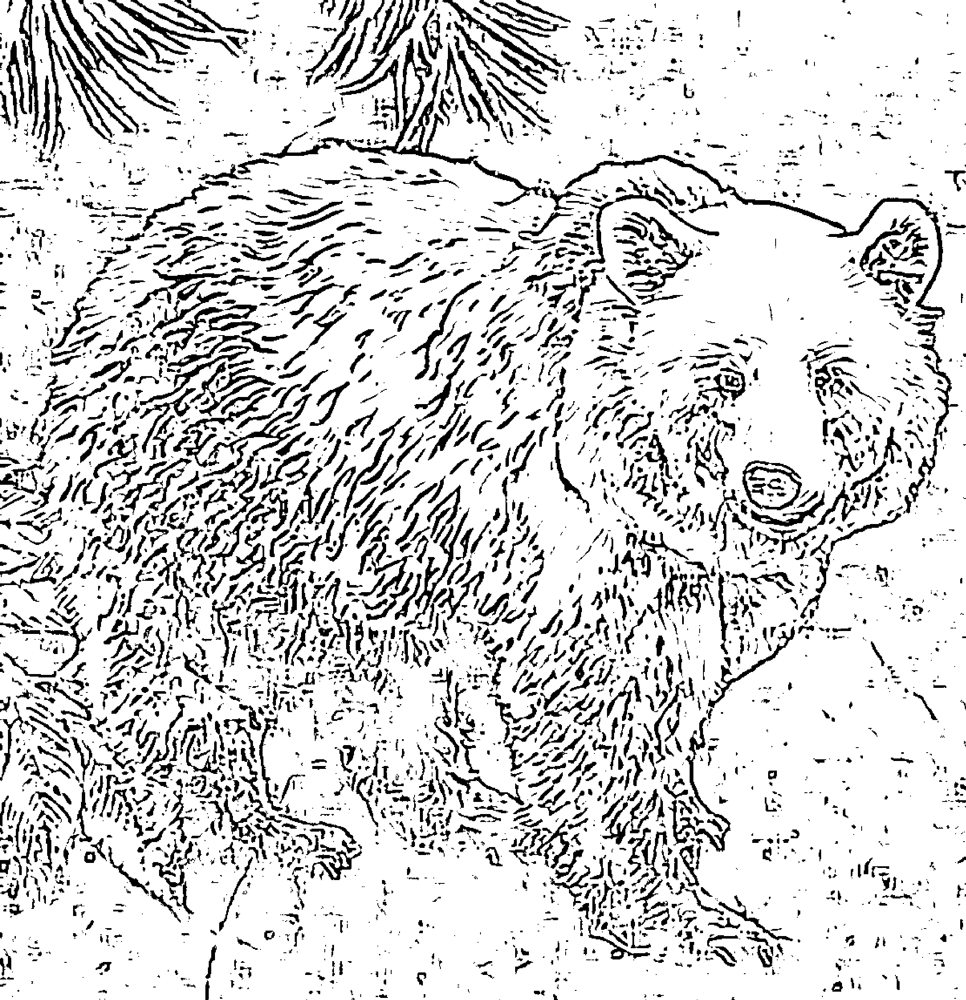

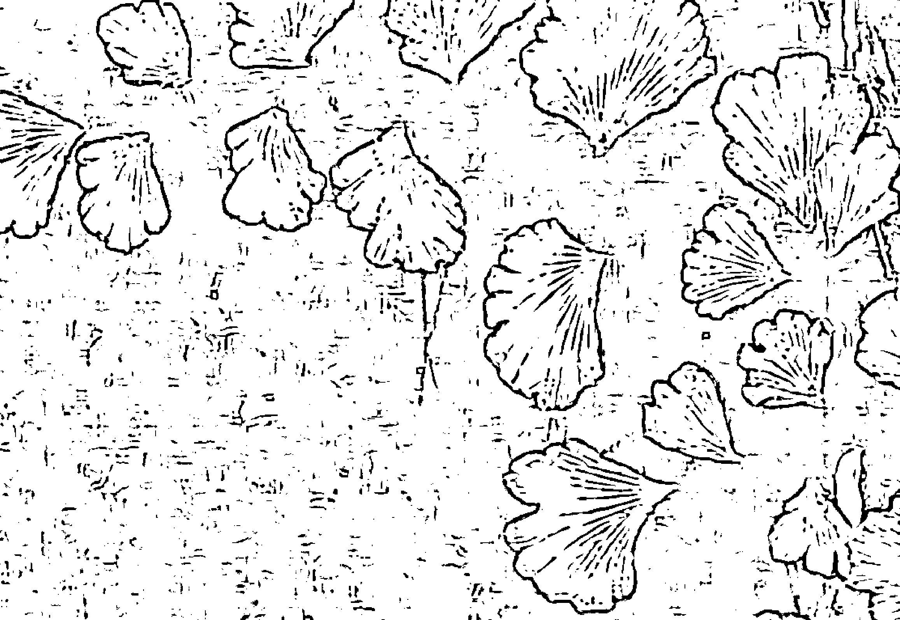

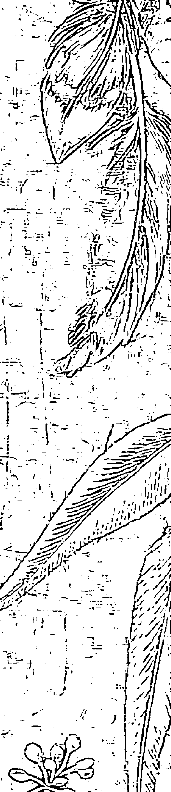

藥輪對這個時代而言，是一個至關重要的工具。藉由學習藥輪，我們學會了關於整個宇宙。透過在藥輪裡旅行，我們將生活截然的改變帶進了自己的生命，也帶進了這個世界。

在《藥輪》一書中，我們給了你建立基礎藥輪所需的知識。而在這本《與藥輪共舞》裡，我們將更精確而細地指導你如何建立不同形式的藥輪、如何製作強大有力的藥輪工具、如何執行各種藥輪療癒和祈禱儀式。

一場儀式正是一條路徑，讓人們得以將自身的能量歸於中心，並與這些能夠幫助療癒人類和地球的神秘力量連結。藉由執行儀式，你能夠感覺到這些神靈。儀式也會帶你進入一種和大地母親連結更深的關係裡，這是藥輪裡一個很重要的部份。諸如此類的儀式和冥想練習，在這本工作簿中俯拾皆是。

這是一本包羅萬象的全面藥輪指南，將引領你走上一條可以親自創造出平衡和美麗的道路，讓你學會在世界和世界之間移動，讓你夢想中的愿景得以顯化來到這世俗世。

ISBN 978-986-94722-3-4 定價680元
建议书区：心灵 国志 灵修 新时代

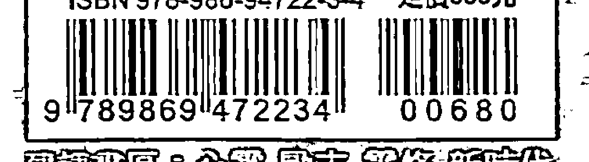