# 精油手帖

# 健康生活系列

陳為聖◎著

不只教您懂精油，更教您會用精油！
不只讓您獲得健康，更讓您得到生活品質！

全方位的精油知識／融合身體與心靈的芳香療法／如何安全使用精油？
四季五行芳香療法／芳香療法的諮詢診斷
芳香療法，可以輕易的用在生活、居家、辦公室、按摩……
協助維持身心的平衡，是一種美麗芬芳又幸福的療法。

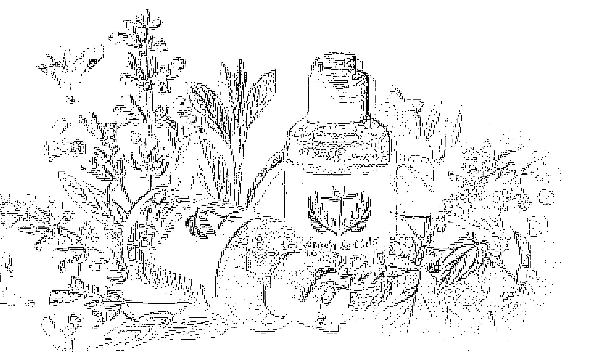

# St. Royal College
天使神秘学院

- ※ 专业占卜预测机构
- ※ 神秘学培训机构
- ※ 水晶能量研究中心
- ※ 神秘学资料库
- ※ 官方微信：strcdts
- ※ 微信公众平台：strc2011
- ※ 读书交流QQ群：
    - 占星塔罗占卜师交流群：814594478（加入密码：PDF）
    - 神秘学其他综合群：659338717（加入密码：PDF）

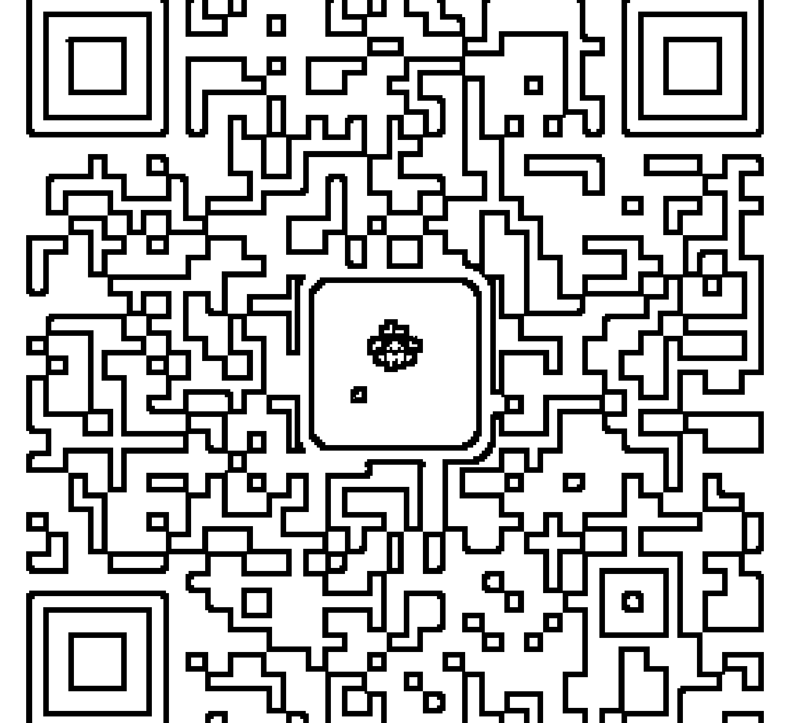

微信号：strcdts
天使神秘学院

天使神秘学院 院长QQ：715104687

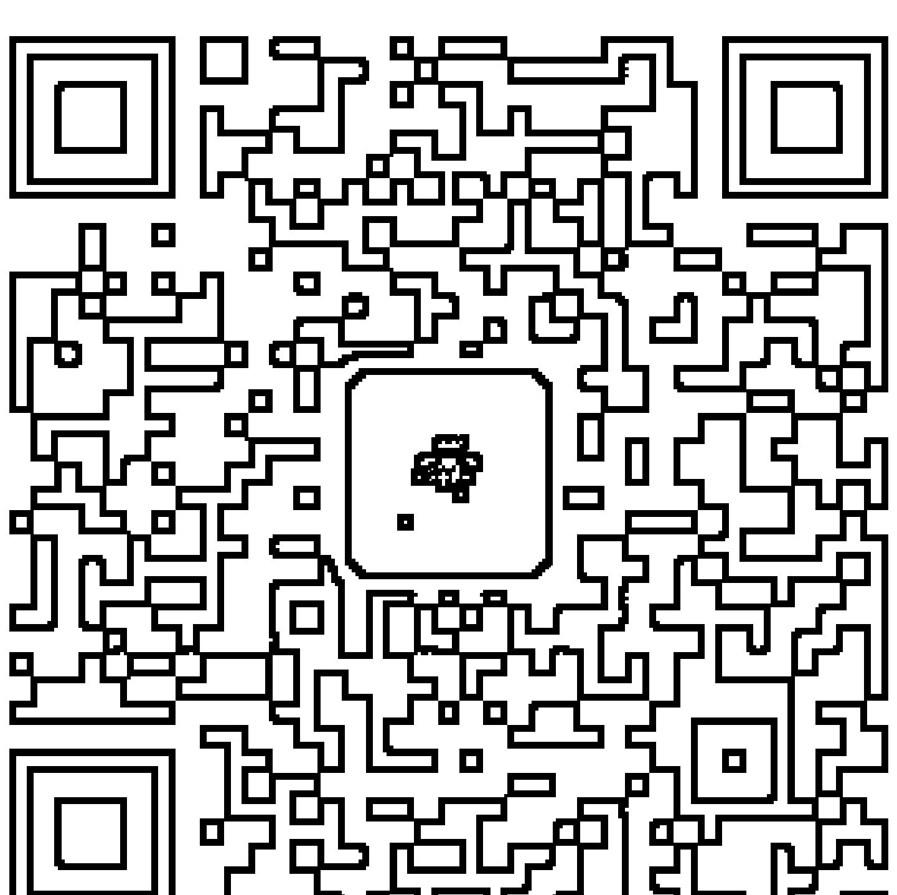

微信公众平台：strc2011

# 制作说明：

本书由《天使神秘学院》出重金从台湾购入的原版书籍扫描制作完成。为达到最好阅读效果，特地把原版书全部切开后，再经由专业扫描设备高精度扫描完成，并经过一张张的PS后期处理最终成书，其间花费大量的人力、物力以及时间，只为能给大家提供经济并优质的神秘学学习资料而努力。

本学院强力谴责某些机构和个人，把本学院花心血制作完成的电子书籍，包装后直接放在自家淘宝网上低价倾销的行为，以谋取不劳而获的经济利益。如果长此以往最终将无人愿意再为大家花心思制作电子书，那以后可能大家再无新书可读。

为让大家以后能够读到更多的好书，也为了本学院的良性发展。本学院恳请大家尽量做到如下几点：

- 一、尽量在本学院的网站购买电子书籍。
- 二、请勿用技术手段把电子书内的水印及加密去掉。
- 三、在收到电子书后小范围传阅即可，千万不要公开传播，更别挂到淘宝网上低价销售。

同时为答谢广大支持者，学院电子书将做如下调整：

- 一、学院会把一些早已收回制作成本的电子书折价销售。
- 二、最新制作的电子书籍会开放打印功能，大家购买后有条件的可自行打印成书。

天使神秘学院
2019年1月

# 回憶二十年前

回想二十年前，那時代理國外幾個品牌的化妝品，所以每年都會固定到歐洲去看化妝品展。記得有一次在德國法蘭克福的展覽中第一次接觸到精油，頓時就被精油所迷住了。展覽完就隨著廠商去他們工廠參觀，第一次帶回了72種不同的單方精油，還有他們推薦的20幾本芳療的書籍。

經過一段時間的整合，加上我本身有中醫的底子，我發覺精油加上五行經絡、淋巴排毒的療法真是太神奇了。不僅能紓解緊張情緒、提神醒腦，還可以改善各種病症，讓美容院裡的很多顧客，皮膚突然變漂亮了。我們開始全面的教育美容院，不只能幫客人做臉，還用精油幫客人做身體。因為臉部的皮膚是健康的鏡子。如果客人的健康不改善，再好的保養品也救不了客人，因為精油讓我找到了方向。開始幫那些願意成長和提升的美容院做教育。幫他們轉成醫學美容，美麗必須架構在健康的基礎上，不健康「美」將無法持久。

這二十幾年來我真的看到精油的神奇能量，讓很多使用者，留住了青春，也留住了健康和美丽。每一种精油都有它独特的味道和疗效，但如果用心的去瞭解它，将会找出它的很多秘密。所以要认识精油，必须先喜欢它，在生活中每天都用它，就像我的忠诚僕人，每天等待著任我差遣。我有如国王般的将它们组合成不同的队伍，去改善客人的不同症状。精油它是植物的精灵，每一次我打开一瓶精油，我都好像看到瓶子裡的小精灵，一个个快快乐乐的跑出瓶子。当我打开闻「保加利亚『至尊玫瑰』」精油时，我更看到一群美丽的「玫瑰仙子」对著我微笑。

二十几来我最喜欢一个人静静的调配各种处方，我一点也不会感到寂寞，因为我身旁都随时围绕著一群「小精灵」和「小仙女」。我希望能找到更多的精油处方，为那些需要的人带来健康的身体和快乐的人生。

本书的出版是希望将芳疗的实际运用作一个有系统的整理，我更要感谢陪我一起走过芳疗领域十几年的两位芳疗师——蒋惠美老师和陈念萱老师。她们俩位对精油的喜好和鑽研已到了最高的阶段，由于她们的协助本书才能如期出版。

# 序 回想二十年前 002

# 第一單元

## 芳香療法的歷史 007

- - 芳療源起 008
- - 何謂精油【光合作用】 013
- - 精油的萃取方式 018
- - 精油的滲透途徑 021
- - 精油的儲存、分類與標示 023
- - 精油的使用方式 024

# 第二單元

## 單方精油 029

- - 薔薇花科 030
- - 木樨科 036
- - 唇形科 040
- - 芸香科 055
- - 傘形科 070
- - 菊科 073
- - 牻牛兒科 081
- - 桃金孃科 085
- - 松、柏科 095
- - 樟科 108
- - 橄欖科 111
- - 禾本科 117
- - 黑胡椒科 123
- - 薑科 126
- - 大麻科蓽草屬 130
- - 按摩基底油 141

# 第三單元

## 如何成為一個專業的芳療師 155

- - 如何成為一個專業的芳療師 156
- - 傾聽您內在的聲音 157
- - 精油與按摩 158
- - 芳療師和神經系統、肌肉 159
- - 芳療與血液循環 160
- - 精油的調配劑量 161
- - 如何安全使用精油？ 162
- - 按摩是與身心最親密的接觸 164
- - 先苦後甜好轉反應 167

# 第四單元

## 芳療與顏面視診 169

- - 芳療與顏面視診 170
- - 從天庭診斷身體健康 171
- - 腦部基礎保健方法 173
- - 從眉毛診斷身體健康 176
- - 眉毛的基礎保養方法 178
- - 從眼睛診斷身體健康 180
- - 眼睛的基礎保健方法 183
- - 從鼻子診斷身體健康 185
- - 鼻子的基礎保健法 188
- - 要瞭解腎臟功能良好與否，要從先天和後天兩方面觀察 190
- - 從下庭診斷身體健康 192
- - 腸胃消化系統的基礎保健方法 195
- - 芳香療法的諮詢診断 197

# 第五單元

四季五行芳療SPA 199

# 第六單元

- 四季五行芳療養生 209
    - 春之全身淨化 212
    - 春之排毒保肝行動 214
    - 夏之消暑清涼湯 216
    - 夏之清新蓮花浴 218
    - 秋之一週體內外淨化 220
    - 秋之輕盈湯 222
    - 冬之香柚湯 224
    - 冬之潤膚美膚湯 226
    - 局部芳療篇 228
    - 頭部芳香SPA全療程 229
    - 手部SPA全療程 233
    - 足部芳療SPA全療程 235

# 第七單元

能量中心 239

# 第八單元

- 芳療處方 245
    - 頭部適用精油及治療穴道 246
    - 頸部適用精油及治療穴道 247
    - 胸部適用精油及治療穴道 248
    - 手、足部適用精油及治療穴道 250
    - 婦女適用精油及治療穴道 251
    - 男女適用精油及治療穴道 253

作者叮嚀 255

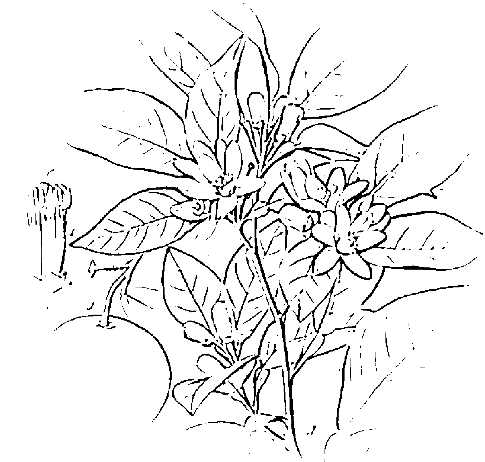

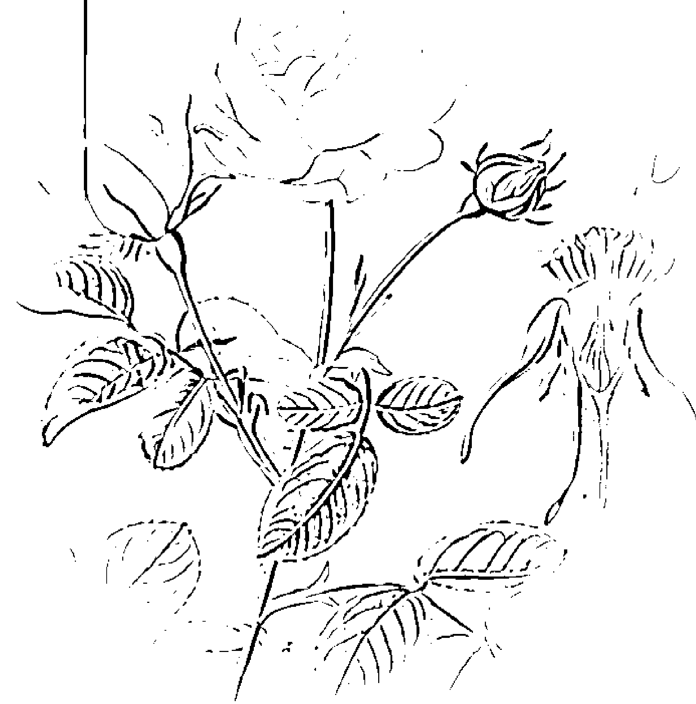

## 芳香疗法的历史

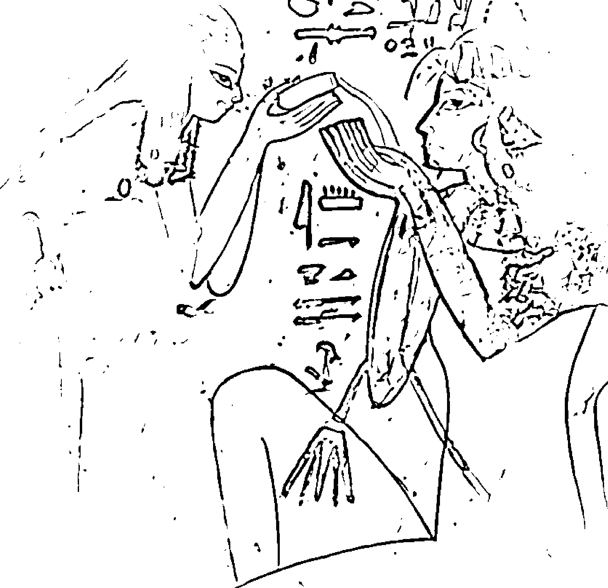

# # 芳療源起

早於三千五百多年前，甚至早於耶穌基督的出生之前，人類歷史上就有使用芳香療法的紀錄。芳療的歷史，說穿了其實就是香氣醫療的發展，但是在更早時期，醫療都是與宗教等神秘主義相結合的。例如：古埃及人會燃點薰香，把芳香植物香料當做祭神的祭禮，他們深信他們的祈禱和希望會隨著香煙裊裊飄到天庭。最後發展成香氣醫療，為現今日芳香療法奠定基礎。

### 埃及

由於古埃及人深信這神話故事，並深信人死後能復活，加上尼羅河每年有規律的泛濫、消退，與之相對的植物茂盛與枯萎、太陽的升起和落下，都可「死而復生」，使他們更深信世界循環往復，人亦應如此。故此為了準備來世復活，他們便要好好保存屍體，否則靈魂便無所依附，在這觀念下，木乃伊之風便盛行起來。乳香、沒藥、松香、雪松、杜松、桂皮等，都曾經被使用來保存往生皇室貴族的身體。

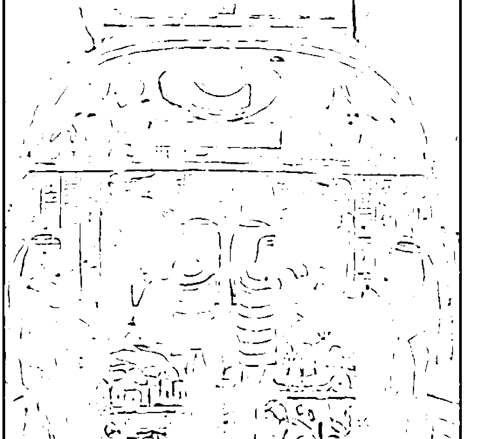

無論何時何地，香味是埃及人日常生活中不可或缺的一環。女子會於祭典或節慶時將香膏捏成錐形，放在頭上，讓熱氣慢慢地將香膏融化，香氣便會緩緩地釋出。沐浴後，還會在身上塗抹油脂，以滋潤皮膚，避免因烈日照射產生皮膚乾燥的情形。後來，埃及人不斷精進芳香精油在化妝品、焚香、香水與醫學上的運用。在耶穌出生之前，埃及香水

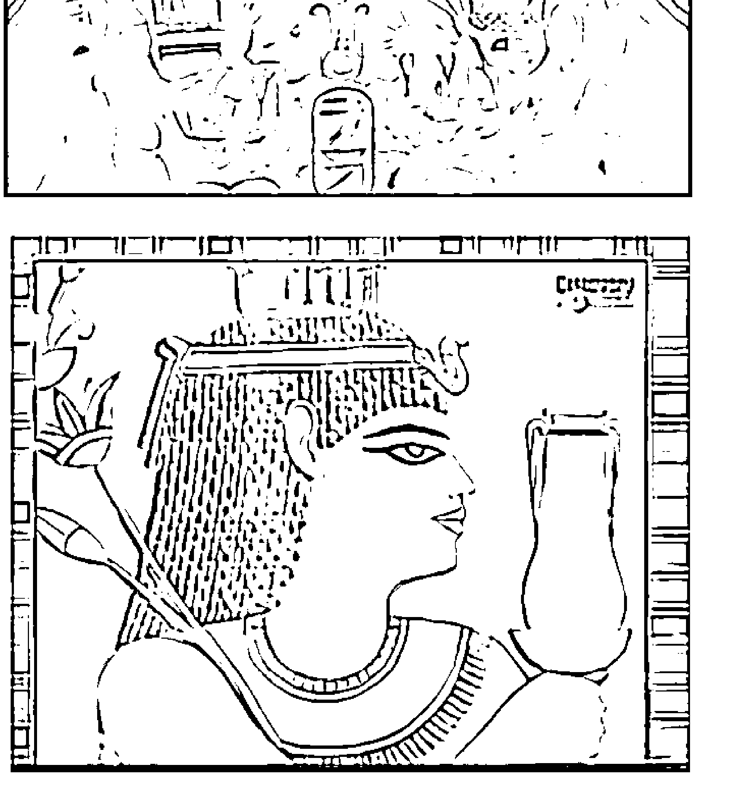

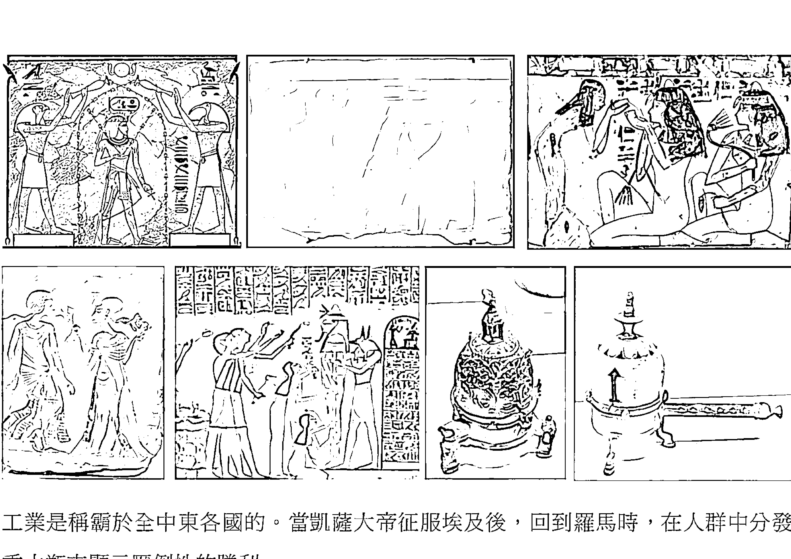

工業是稱霸於全中東各國的。當凱撒大帝征服埃及後，回到羅馬時，在人群中分發香水瓶來顯示壓倒性的勝利。

### 前進希臘

紀錄上最早的醫生是希臘的希波克拉底（Hippocrates）。他不相信埃及人對疾病的說法，當時的埃及人主張疾病乃是天譴或超自然力量所導致的。他深信醫生需要依照對病人的詳細觀察，並依症狀來判定生病的原因。希波克拉底採用物理治療、泡澡、按摩、口服藥草等溫和的治療方式行醫，據說他畢生鑽研並記錄多達兩百多種藥草的功能與藥性。他認為在無其他治療方法可行的情況下，方可施行侵入性的手術治療方式。他亦是第一位主張人體為一完整生物體的人士，而這個整體主義的主張也成為日後正統芳香療法概念的基礎。

### 波斯

芳療史上，繼羅馬帝國沒落之後，波斯人承續了發展芳香醫療的衣缽。拉齊（Al—Razi）被譽為波斯最優秀的醫生，他的著作影響後人最為深遠的為一套包含25冊的醫學百科——《醫學集成》（Kitab al Hawi）。他的醫學成就難以計數。直至今日常藥局常用的研缽、燒瓶、調藥刀、小藥瓶等工具也都是拉齊的發明。

## 盎格鲁撒克逊人

十字军东征将玫瑰水、香水、芳香植物及芳香疗法再次带回欧洲。此时的人们喜欢用芳香植物来装饰自己及家庭，或是将它加入洗手乳中，这种香味使用逐渐在欧洲掀起一股新风潮。芳香植物与芳香医疗技术又慢慢地回复为主流。但东方的医疗技术，仍尚未登陆欧洲。

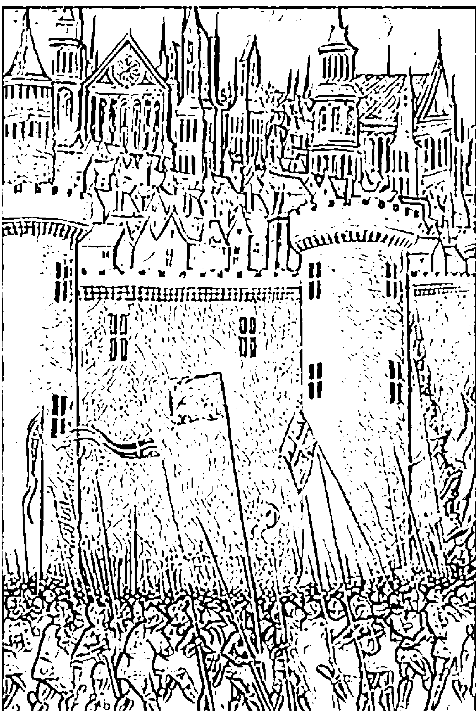

## 中古世纪

十三～十四世纪的欧洲医疗几乎都掌控在天主教会的手中。他们认为疾病是上天的处罚，而治疗的方法一般多为祷告，顶多再放一点血。1347年欧洲爆发黑死病。不到三年的光景，欧洲的人口便减少了40%，因为疫情严重，连撒克逊人所发明配戴干燥薰衣草或百里香制成的药草香包都无法阻止黑死病传播。
1603年黑死病第二次爆发，其威力不亚于上一次爆发。人们会在家中或街上燃点芳香植物或运用安息香、迷迭香、乳香或各种方便取得的精油来防止黑死病的散播。日后发现当时与芳香植物或香水接触的工作人员，其罹患疾病的机率远低于一般人，当然这都要归功于精油的抗菌特质。

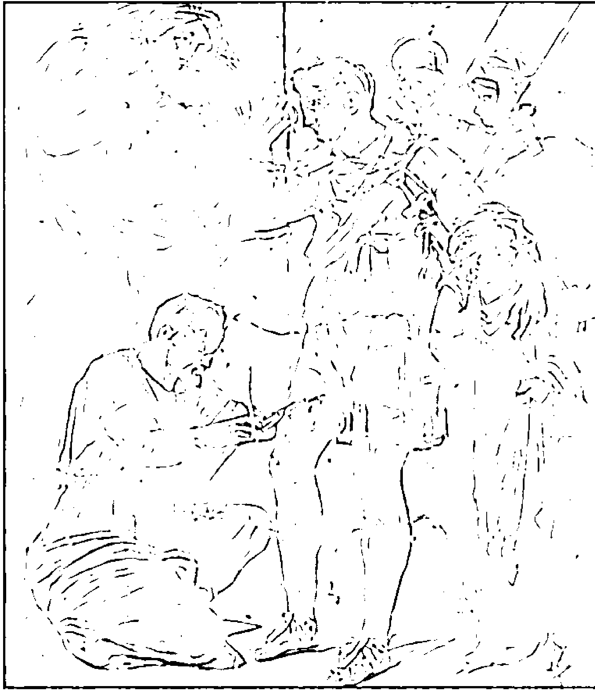

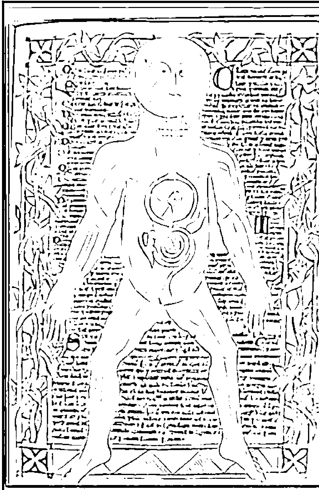

## 近代芳疗

我们现今使用「芳香疗法」(Aromatherapy)这一个词事实上是由一位法国化学家摩利斯·盖特佛赛(Rene Maurice Gattefossé)所确立的。有一次他在父亲的香水工厂中不小心烧伤了手，他曾看过有关薰衣草具有治疗功效的文章，于是立刻将受伤的手放入纯净的薰衣草精油中，神奇的是，烧伤部位两天后就痊愈了，而且没有被细菌感染。于是激发起他专研精油用途的兴趣，同时发展出应用在皮肤上的技术，1937年，他将研究成果出书，并用了「Aromatherapy」的名称，而开始了「芳香疗法」这一派的说法。

继盖特佛赛之后，法国医生尚·瓦涅(Jean Valnet)于第二次世界大战时担任军医，他使用洋甘菊、丁香、柠檬、百里香等精油治疗坏疽伤口。战后，他仍持续地运用精油来治疗疾病，也是第一位运用精油来治疗精神疾病的医生。1964年，尚·瓦涅出版了《芳香疗法——用植物精华治疗疾病》一书，并于1980年翻译成英文版的《芳香疗法临床应用》，正式将芳香疗法一词带入英文的领域。

后来，另一位出生奥地利的生化学家玛格利特·摩利(Marguerite Maury)因为阅读了一本Dr Chabenes在西元1838年发行的书《Les Grandes Possibilit' e s par les Mati'e res Odoriferantes》开始了对芳香疗法的兴趣(这位医师Dr. Chabenes是盖特佛

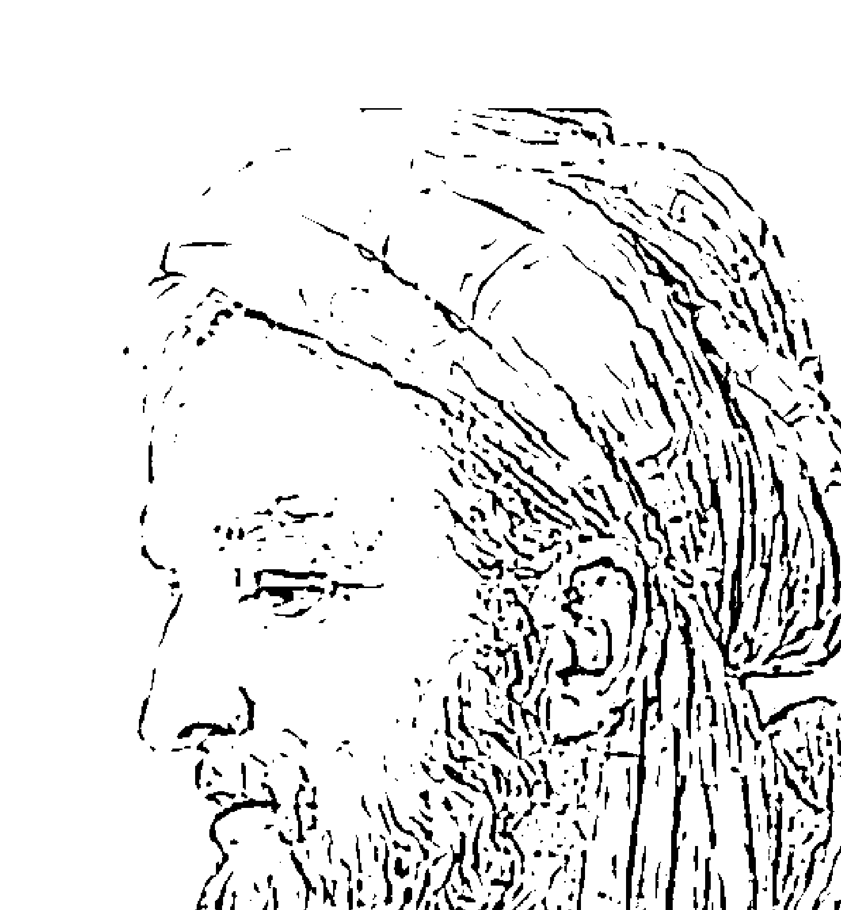

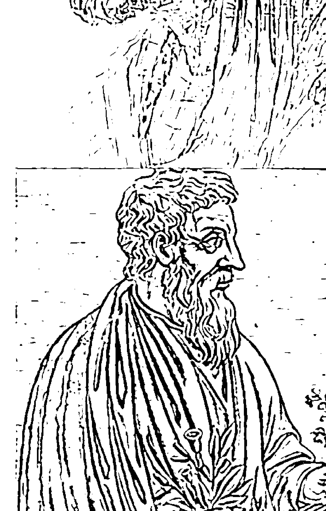

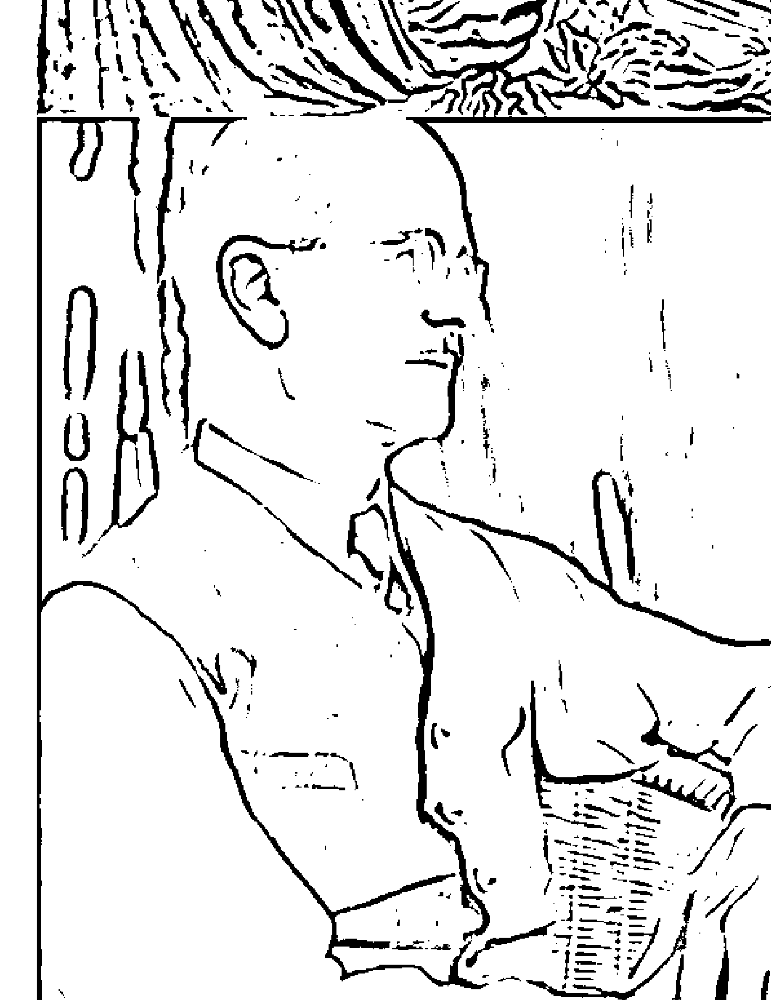

赛的老师)。摩利著名的杰作为1961年在法国出版的《Le Capital Jeunesse》一书，并于1964年翻译成《生命和青春的秘密》（The Secret of Life and Youth）英文版于英国发行。

她过世后，由丹妮尔·雷曼（Daniele Ryman）继承衣钵继续她的研究，成为现代公认的芳疗界权威。近年来埃及人芳香精油的神秘面纱逐渐被揭开，而历年来的临床经验证实芳香疗法的功效是不容忽视的，尤其现代人首重养生观念，利用芳疗自然元素来医治病痛与纾解压力，是再好不过了！

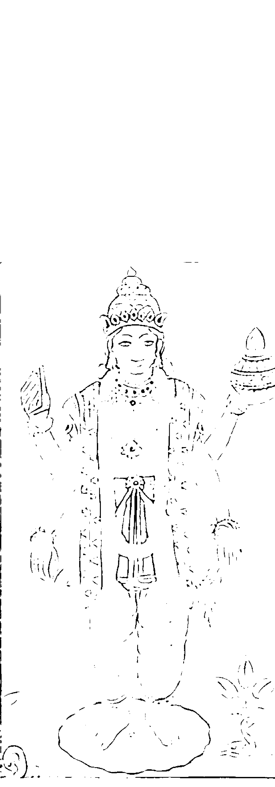

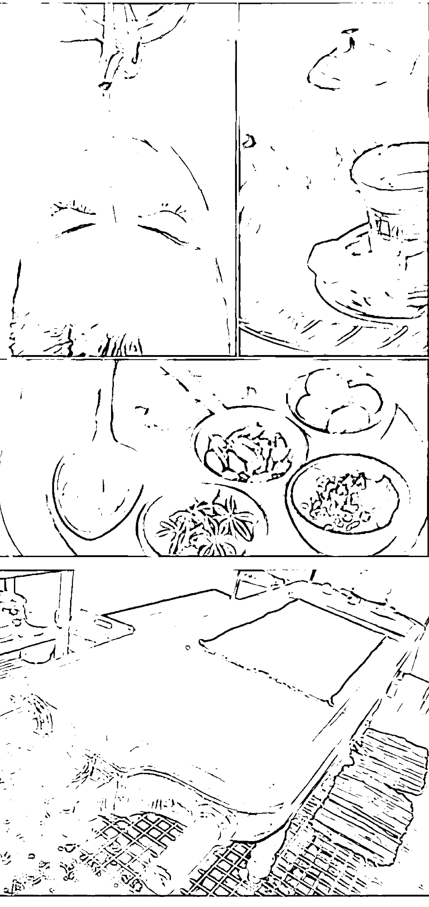

## 何謂精油【光合作用】

大部分的植物都是自己制造养分，提供自己生长的需要。植物把由根部吸收的水分，和由叶子的气孔在空气中吸收的二氧化碳，输送到叶片中的细胞（含叶绿素）中。这些植物细胞利用阳光，把水分和二氧化碳制造成碳水化合物，供给自己生长及自我保护所需。而在制造碳水化合物的过程中，植物同时释放出氧气，这个过程称为「光合作用」。

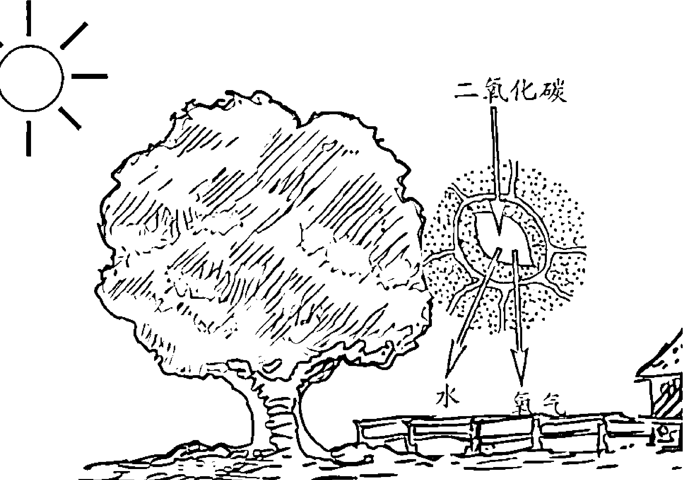

## 精油的形成

靠着众所周知的光合作用，植物不仅自己生产粮食，它还进一步把这些养分再制造成具有挥发性的芳香分子，这些芳香分子具有如下功能：

- 1. 抵抗病虫害
- 2. 在丛林大火时使地上枝叶迅速燃烧以保住根部。

这些芳香分子就是精油，它以微小粒状存在于植物细胞间隙，扮演着植物生命体荷尔蒙调节者，化学反应催化者角色，可帮助植物体适应周遭环境，抵抗疾病与虫害。

## 精油之物理特質

在室温下，大部分的精油是液体状态，只有少数呈浓稠状态，例如檀香木、安息香等。大部分的精油是透明无色的，少数呈现黄色或绿色及棕色，像蓝甘菊是蓝

绿色的。有些精油因为含有植物蜡遇到温度较低的状况会结晶，例如保加利亚玫瑰。与一般当做基础油使用的植物油不同，精油具有天然的防腐功能，具高度挥发性与渗透性，因此一般都会稀释成安全的浓度使用。

## 精油化学属性与特质

精油本身的化学结构由两大因素所决定：一是人为的，例如蒸馏过程，最典型的例子是蓝甘菊，蓝甘菊植株的新鲜液体是无色的，但在蒸馏的过程会产生「蓝烃」这个成分，也因为蓝烃的产生使其精油呈现罕见的蓝绿色。

第二个因素是植物本身的生物合成，精油中所含的化学成分很多种，例如玫瑰的组成成分高达三百多种，成分愈复杂的精油，愈不容易被合成化学模拟出来，而其价值也相对很高。

精油于蒸馏的过程只萃取植物中具挥发性及不溶于水的物质，像是萜烯类和萜品类化合物，以及苯基衍生物。植物中有许多有效物质无法存留在精油中，像是一些水溶性物质，例如酸和糖都因为分子太大或太重（单宁酸、类黄酮等）不会留在精油中，但是会留存在纯露中，因此纯露在芳香疗法上也有着一定的价值。

### 酯

- 特色：不溶于水，具水果香气。由醇与酸反应而成。
- 药学特质：抗发炎、抗痉挛、止痛、细胞再生、抗真菌、提振精神、镇静安抚。
- 生理功效：平衡交感及副交感神经，镇定中枢神经系统，促进新陈代谢。
- 心理功效：镇定、放松、清明、欣喜愉悦。
- 代表精油：佛手柑、真正薰衣草、快乐鼠尾草、罗马甘菊、苦橙叶。

### 苯基酯

- 药学特质：抗炎、止痛。
- 生理功效：护肤、护肝胆。
- 心理功效：抗沮丧，使人能够享受生活。
- 代表精油：安息香、埃及茉莉、印度茉莉、千叶玫瑰。
- 注意事项：低量使用。

### 单萜醛

- 特色：作用及挥发性皆快，容易氧化，散发柠檬香味。
- 药学特质：抗感染、消毒杀菌、镇定、抗病毒、抗真菌、抗炎。
- 生理功效：降血压、降低体温、激励消化腺分泌、驱蚊、止痛、抗风湿及关节炎。
- 心理功效：抗焦虑、给予温暖方向、让人不拘小节。
- 常见精油：柠檬尤加利、柠檬香茅、香蜂草。
- 注意事项：某些醛类精油可能会刺激皮肤黏膜。

### 倍半萜醇

- 特色：亲油，挥发性慢。
- 药学特质：抗发炎、降血压、抗癌、抗病毒、血管放松。
- 生理功效：激励免疫系统、净化淋巴、清血、抗病毒、抗癌、滋补肝细胞。
- 心理功效：疏缓压力，使情绪平和。
- 常见精油：胡萝卜子、檀香木。

### 酮

- 特色：稍溶于水，中度挥发性。
- 药学特质：降低黏液发生，抗组织氨、血管扩张、抗病毒、利尿、分解脂肪。
- 生理功效：促进皮肤及黏膜新生，促进结痂，止咳化痰、消灭水肿现象。
- 心理功效：使心灵清澈，开启灵性之门。
- 常见精油：迷迭香、鼠尾草、雪松。
- 注意事项：具潜在神经毒。

### 倍半萜烯

特色：不溶於水及酒精。

藥學特質：鎮定、平衡、止痛（刺激腦內啡生成，使痛覺不明顯但意識清楚）、抗痙攣、放鬆、消毒殺菌、抗炎。

生理功效：消炎、止癢、抗組織胺、鎮定安撫肌膚、荷爾蒙效應等。

心理功效：自我連結，肯定自我與自信。

常見精油：藍甘菊、薑、依蘭、雪松、廣藿香。

### 氧化物

特色：易溶於酒精，高揮發度，散發強烈香氣。

藥學特質：止痛、淨化、抗炎、涼爽、利肝、提振、祛痰。

生理功效：活化纖毛、止咳、祛痰、利呼吸、消化、免疫系統、抗發炎、抗菌、抗真菌。

心理功效：增進邏輯思考，為精神打氣。

常見精油：尤加利、迷迭香、薰衣草、綠花白千層。

注意事項：過度使用易堆積體內，導致神經毒、肝毒性及呼吸敏感。

### 單萜烯

特色：油質清澈，黏度低。

藥學特質：刺激、提振、止痛（刺激腦內啡生成，使痛覺不明顯但意識清楚）、清阻塞、淨化、抗菌、抗病毒、祛痰、刺激肝膽汁分泌、發紅劑。

生理功效：抗菌（消除空氣中的致病菌）、發紅（促進局部血液循環）、對肌肉及關節炎具止痛能力、清阻塞（膽脂肪結石）、祛痰並乾化黏液。刺激腦下垂體及腎上腺機能，釋放腎上腺素。抑制癌細胞的發生及擴散。

心理功效：激勵，給予力量增進活力。

常見精油：甜橙、檸檬、佛手柑、絲柏、歐洲赤松、杜松、乳香、黑胡椒、葡萄柚。

注意事項：開封後6～12個月要用完。

### 單萜醇

特色：親水，溶於酒精，適合老人與小孩長期使用。

藥學特質：高抗感染力、抗微生物、抗病毒、抗菌、抗真菌、止痛、鎮定、抗痙攣、激勵、滋補、溫暖、提振。

生理功效：提升免疫力、強化神經及內分泌系統。

心理功效：親切溫暖、給予歡愉與平衡。

常見精油：馬喬蓮、橙花、玫瑰草、大馬士革玫瑰、花梨木、茶樹、玫瑰天竺葵、百里香。

### 酚

特色：稍溶於水，中度揮發。

藥學特質：抗病毒、殺黴菌、寄生蟲、消毒殺菌、抗感染效果佳。

生理功效：激勵神經、提高免疫力、提升血壓及體溫。

心理功效：激勵，給予溫暖。

常見精油：肉桂、丁香。

注意事項：易刺激黏膜造成皮膚敏感。

## 精油的萃取方式

每種植物可以萃取出精油的量不同，萃取量愈少的精油通常愈昂貴，其中以花瓣精油為最。一般而言，玫瑰花要3000～5000公斤、薰衣草要200公斤、檸檬約要3000個才能提煉出1公斤的精油，因此玫瑰、茉莉、橙花等花瓣類精油10毫升就要上萬元就是這個原因。

### 1.水蒸氣蒸餾法

將新鮮的或經乾燥處理的芳香植物原形置入蒸餾塔中，直接或間接與蒸氣接觸，沸騰後精油會汽化隨著蒸氣進入冷凝器，在冷凝器中遇冷再變回液體，在油水分離器中比重比較輕的精油會浮在上層，經過分離之後即可得到精油及純露。

- 直接蒸氣法：將B與D閥打開。
- 間接蒸氣法：將A與C閥打開。

植物原形的花、葉、根、莖或木質類大多以此法提煉，例如：胡蘿蔔籽油、保加利亞玫瑰、橙花、薰衣草、迷迭香、花梨木、檀香等等。

### 蒸汽蒸餾法

### 2.榨取法

此種方法多用在柑橘類植物，因為這些植物的果皮富含精油，萃取方式是在壓碎果皮的過程中加水，收集汁液後，經離心機將精油分離出來。例如：檸檬、葡萄柚、苦橙、紅橙、佛手柑等等。

### 3.脂吸法

利用脂肪可以吸取精油的物理特性取得精油，而此法只用在採收後還會持續製造精油的花朵，例如茉莉花。其做法為將一片玻璃框架在木框上，將一層薄薄的油脂（含豬油或牛油之不會發臭的油脂）塗在玻璃上，然後將新鮮花瓣鋪在油脂上，24小時後將花瓣倒掉，再鋪上新鮮花瓣，處理次數視花朵品種和品質而定。之後將油脂溶入酒精中，待酒精揮發後取得精油。

### 4.溶劑萃取法

運用在樹膠、樹脂和花朵。利用酒精、己烷、丙酮等溶劑萃取精油。其方法為將欲萃取之植物放入萃取塔中並與溶劑接觸，被溶解出來的精油會隨著溶液進入蒸發塔，在此加熱將沸點比較低的溶劑蒸發，之後進入精油蒸發塔中將殘餘的溶劑蒸出即可得到純精油。

### 5.浸泡法

通常用在采收后不会再制造精油的植物，如金盏花、胡萝卜、圣约翰草等等。其方法是将采收的植物原形置入热油中，让油脂透过细胞壁吸收精油，经过浸泡的花朵以离心机或过滤法分离后，再投入更多的新鲜植物，反复约15次后再以酒精分离香精油。

### 6.二氧化碳萃取法

超临界二氧化碳萃取法是最新的技术，它是以二氧化碳为介质。优点是不会与精油有化学反应或溶剂残留的顾虑。只要在高压下将二氧化碳的温度控制在33℃，此时的二氧化碳介于气态与液态之间，这时二氧化碳可将精油从植物体中带出，而只要将压力稍微下降，二氧化碳就化为气体蒸发消散了。

## 精油的滲透途徑

### 嗅覺吸入

當您走入開滿玫瑰花的花園中，深深的吸一口氣並露出愉悅的笑容是我們最常見到的表情。實驗證明不同的芳香分子吸入後，會影響身體血清素及腦內啡的分泌，也就是有讓人產生放鬆的愉悅感、助眠及止痛的功效。

人的嗅覺接收器是嗅上皮（olfactory epithelium），位於鼻腔頂部的一小塊區域，是一群專門用來偵測味道的細胞。這些細胞是長形的，在其末端會長出一些細小的嗅覺纖毛，這些纖毛遍佈在鼻腔壁所分泌的黏液中。當我們吸入空氣中的懸浮分子時會先經過黏液的分解，然後經過嗅覺纖毛接收並在細胞中產生神經刺激。之後嗅覺細胞會穿過鼻腔頂部並來到嗅球（olfactory bulbs），並將嗅覺訊息帶到大腦邊緣系統（limbic system）。邊緣系統連結到大腦的記憶區塊，掌管呼吸、血液循環以及調節人體荷爾蒙的內分泌腺。精油的香味特質在吸入後在此決定對人體系統的影響。

### 經皮吸收

表皮層無血管通過，精油分子量很小，可輕易通過表皮層直接進入真皮，透過血液循環到其他器官作用。精油與原株藥草植物的差別在於其濃度是原株的100倍以上，同一藥草經過食入後可對身體的特殊狀況產生治療的作用，精油在經過皮膚滲透之後也會經由血液到達需要調理的部位，此種作用，我們將之稱做「靶向性」。因此經皮吸收會影響皮膚狀況和塗抹部位器官組織的變化。

運用精油可以得到的放鬆與享受莫過於與按摩相搭配，透過精油的功效與雙手的觸摸，會帶來特定神經傳導物質變化，最著名的是其安撫放鬆及止痛的功效，這也是芳香SPA所提供的紓解壓力最受歡迎的療程項目。

## 精油的功效

1. 精油猶如植物體的荷爾蒙，存在於植物細胞間的小囊袋中，當植物體有生化反應發生時，香精油擔任調節與傳遞訊息的角色。作用在人體上可催化生化反應，發揮一般生理上的調理功能。
2. 精油具有抵抗病菌感染、預防皮膚病、鎮靜皮膚、收縮毛孔、促進細胞再生的功效。
3. 精油可控制細胞的增殖與更新，對人體傷口的癒合有非常大的幫助，同時防止老化、癒合面皰、避免疤痕也有很好的效果。

## 精油的揮發度

在描述精油時常以「揮發速度」來形容，例如低度、中度、高度三種速度，而在空氣中揮發的速度和香味的持續度是定義這三種速度的標準。

高度油是最刺激和提振精神的精油，它們的香味濃烈，但是香味只能持續3～24小時。典型的高度油有：羅勒、佛手柑、快樂鼠尾草、尤加利、檸檬香茅、歐薄荷、鼠尾草、百里香。

中度油持續性比高度油長一些，可持續大約2～3天，可強化人體新陳代謝與器官功能。典型的中度油有：洋甘菊、茴香、天竺葵、杜松、薰衣草、迷迭香。

低度油是揮發最慢的香精油，香味持續一星期以上。這些精油呈現甜美及緩和的香調，對身體有放鬆及心靈撫慰的功效。典型的低度油有：西洋杉木、丁香、乳香、生薑、茉莉、玫瑰、檀香木。

## 精油的儲存、分類與標示

### 精油的儲存

大部分的香精油對光、熱、氧氣（空氣）十分敏感，因此如何保存精油直接關係到其保存品質期的長短。將精油置入琥珀瓶或藍色精油瓶中，可有效阻隔光線對精油的刺激。此外密封瓶口的滴孔及瓶蓋，都必須是可耐揮發及腐蝕的精油專用的塑膠。保存於恆溫30度以下的陰暗處，冰箱因溫差太大，不建議將精油用冰箱保管，因為芸香科植物含單萜醇成分多者，在低溫的狀況之下會變得有點混濁。有些精油愈陳愈香，如：檀香、乳香等。柑橘類除佛手柑之外，因其具高揮發性之特質則不宜久放。

### 分類標示

1. 單方精油：英文標示為Pure Essential Oil，直接從植物萃取無任何添加物之純精油，如葡萄柚、薰衣草。
2. 復方精油：英文標示為Pure Synergy，兩種或兩種以上純單方精油混合成之精油。
3. 調合油：英文標示為Synergy Blend，基礎油中加入一種或一種以上單方精油，可直接塗抹在皮膚上，用做按摩的基底油。

### 瓶身標示

精油的瓶身標示必須將瓶子的內容物表達出來，一般精油都有其俗名，但是要知道其真正的來源則必須知道其拉丁名稱，此外，此精油是純精油、復方油或調合油都要在瓶身上做標示。

## 精油的使用方式

### 1.沐浴法

此方法對身、心放鬆及減輕肌肉痠痛，促進全身血液循環及腺體平衡效果很好。其使用方式有下列幾種：

泡澡：將10～15滴精油與牛奶、海鹽或其他水療精油充分混合，之後融入溫熱泡澡水中。放鬆躺入泡澡15～20分鐘。如高血壓患者，則建議水溫不要太高並泡半身浴，即肚臍以下部位泡入水中15～20分鐘。

臀浴：可紓解泌尿系統感染症狀
將5～7滴精油與牛奶、海鹽或其他水療精油充分混合，之後融入裝滿7分溫水的泡臀盆中，肚臍以下部位浸泡於水中15～20分鐘。

淋浴：將2～4滴精油滴入沐浴乳中，加水充分起泡後做身體清潔或治療。

手／足浴：將2～4滴精油與牛奶、海鹽或其他水療精油充分混合，之後融入裝盛熱水的泡手或泡足之容器中，為達最大效果，泡手約10分鐘，泡足約20分鐘。

### 2.按摩法

按摩是芳香疗法中最放松且极为享受的部分，不论是接受芳疗师的专业按摩或居家自行按摩，香精油的精细分子都可以经由皮肤，快速进入体内，达到放松身、心，促进血液及淋巴循环，增强免疫系统，改善肤色，甚至雕塑身材等等效果。

全身按摩：取15毫升调配油加入10～15滴香精油，由四肢末端往心脏的方向按摩。

背部按摩：取5毫升调配油加入3～5滴纯香精油，由腰部至肩膀往下按摩，接着由腰部外侧往内按摩。可将按摩与理疗相结合，是芳香疗法的极致感受。

头皮按摩：头皮有许多穴点，芳香精油可以经皮渗透，达到精神与情绪的放松，进而解除头痛及失眠等等状况。只要简单的以指腹由太阳穴往百会方向按摩，就有意想不到的效果。

### 3.内服法

每种精油均有其天然的独特疗效，不含咖啡因、单宁酸等刺激成分，极易为人体吸收。但是精油本身高渗透与高挥发的特质，对口腔黏膜及肠胃道可能会产生刺激或是灼伤的反效果，因此将1滴精油融入植物油中吞服是比较适合的做法。但是最好的口服精油方式是以胶囊的方式吞服，例如玫瑰胶囊。

### 4.吸入法

直接吸入法是用深呼吸的方式将精油分子吸入体内，经过人体利用后排出，对帮助维持呼吸道顺畅很有帮助，若使用具提振效果的香精油，则除了提振精神外还可减轻头痛状况，是预防感冒的芳香法宝。

面纸吸入法：在面纸或手帕上滴2～3滴，随时拿靠近鼻孔吸嗅。

蒸氣吸入法：取3～10滴香精油滴入裝有滾燙水的碗中並加以攪拌，使用大毛巾罩頭與精油碗，閉起眼睛開始吸入，每次可持續幾分鐘甚至10～15分鐘，視您自己覺得舒適的感受而定。

### 5.香薰法

利用擴散的方式製造芳香怡人的氣氛，以趕走惱人的臭味。有些精油具有抑制空氣傳染病毒的功效，因此可做一般室內甚至病房中的空氣淨化。

薰蒸台：有電力或蠟燭等方式，點燃薰蒸台底部的燈光或燭火，將水加入上端的盛水碗中，視空間大小滴入約5～15滴精油，每4～5個小時重新滴入精油一次，並注意不可讓碗中的水燒乾。

噴霧：在噴霧瓶中注入95%的純水，加入5%的酒精，滴入4～12滴精油，瓶蓋鎖緊後劇烈搖晃，直接噴入空氣中即可。避免直接噴於傢俱上，尤其是亮面的傢俱表層。

### 6.冷、熱敷

又稱濕布法，可以熱敷或冷敷的方式，由皮膚直接吸收精油分子，促進淋巴及血液循環，舒緩疼痛或發炎現象。

熱敷可用於臉部，幫助毛孔張開以達淨化功效和柔軟肌膚，調理生理期或經痛，及舒緩肌肉痠痛等等。冷敷使用於眼睛疲勞、肌肉扭傷及曬傷時。

於盛滿熱水或冰水之容器中，滴入3～6滴香精油，劇烈攪拌使精油溶入水中後，取毛巾平鋪放入，沾濕後擰乾，直接敷在需要的部位上。毛巾溫度變冷或變熱後再重新沾濕擰乾，重複10～15分鐘。

### 7.漱口法

有效快速舒緩口腔不適及感冒症狀的方法，因精油直接接觸口腔，因此使用時宜少量並充分攪拌後使用。牙痛、想消除口腔異味或預防口臭，可使用薄荷精油。用法為：將1～2滴香精油滴入裝盛溫水的玻璃杯中，均勻攪拌融合後做漱口用。

### 8.洗髮

精油精細的分子結構，具極佳的滲透力，可修護髮絲，增加頭髮的明亮與光澤，具抗頭皮屑、防止掉髮及平衡皮脂分泌的功效，也是芳香療法中被廣泛運用者。

洗髮：將2滴香精油滴在洗髮精中，依正常程序洗頭。

護髮：以荷荷巴油混合香精油製成按摩油後，以按摩油輕輕按摩頭皮及頭髮，用溫毛巾包裹約15分鐘，之後用洗髮精再清潔一次。

### 9.敷膜

將精油與乳霜或特殊面膜配合使用，效果更為顯著，因香精油能滲入深層肌膚，調理肌膚，使肌膚由內而外恢復正常的生理機能，並加強吸收乳霜或面膜所提供的養分。此外面膜由外而內的，強化香精油的作用，並利用精油的虹吸效益，讓活性成分順利進入肌膚底層，效果更為顯著。

## 單方精油

### 薔薇花科

薔薇、玫瑰、櫻花、海棠花等著名花卉是薔薇科，梅子、桃子、梨、蘋果、枇杷等受歡迎的水果也是薔薇科的，木瓜、仙鶴草、地榆也是薔薇科的，其花樣之多讓人目不暇給。

薔薇花科最大的特徵是性狀特徵很雜，有矮小的草木，也有高大的樹木，尤其是果實類型很繁多，它可分為四個亞科，而芳香療法使用的是第三個亞科，也就是薔薇亞科。

薔薇亞科的果實是薔薇果，這種果實是由多數離生心皮、雄蕊生在壺形花托裡面，花托肉質化，每一心皮生成一小瘦果而成，總合起來統稱薔薇果。其最具代表性的就是精油之后，我們熟知且聞之心花朵朵開並釋放關懷與愛心的玫瑰。

代表精油：玫瑰

概論玫瑰：

玫瑰是落葉的灌木，可長至約1.5公尺高。是非常耐寒的植物，每年6月到7月開花，種子成熟期是7月到11月。經驗老道的花農早在凌晨四點起床工作，趕在花的油脂和香氣揮發在日照之前，以一小時兩千朵的速度，完成當日的採收。之後勤快的花農會將已裝滿玫瑰的布袋送往工廠，準備蒸餾萃取這有如天堂般的優雅花香。玫瑰精油特別昂貴，需要用6萬朵玫瑰花才能提煉出30公克的玫瑰精油，而且萃取過程需耗費相當多的人力，其價格昂貴由此可想而知。想要提高玫瑰的產量，唯一的方法是多栽植一些玫瑰花幼苗，但這些幼苗從生長到可以開花熟成需要整整兩年的時間。

#### 大馬士革玫瑰ROSE

學名：Rosa damascena
產地：埃及、法國、保加利亞、土耳其
科屬：薔薇科薔薇屬
萃取方法：蒸餾法
萃取部位：花朵
化學屬性：單萜醇

玫瑰的名字來自希臘文的「roden」，它的意思是紅色的，因為傳說中的玫瑰花身上流著維納斯的鮮血染紅的泉水。玫瑰花瓣通常都會被散佈在婚禮的會場上，以祝福並祈願這段婚姻的幸福美滿。如今，玫瑰依舊是愛情與純潔的象徵，同時也經常用在靜坐與祈禱的儀式場所佈置中。

Anicenna是十世紀的波斯醫生，他第一次做蒸餾法的實驗時，就是以玫瑰花當做實驗對象，世界上第一座玫瑰蒸餾廠就設在波斯的設拉子市（Shiraz）。大概要6萬朵玫瑰花（約180磅）才能萃取1盎司玫瑰精油（29.57毫升），換句話說，約4萬公斤的新鮮花瓣才能萃取1公斤的玫瑰原精。

雖然大馬士革玫瑰因為價格昂貴的關係，在芳香療法的運用上不如薰衣草普遍，但它卻是最全方位的萬用油。大馬士革玫瑰可以撫慰調和心靈，可以安撫沮喪、憤怒、悲傷、恐懼、神經緊繃與緊張，同時可以幫助性生活更趨美好，對自信心提升及感情問題的處理都很有助益。

玫瑰最強而有力的用途是在處理血液循環不佳及心臟問題，包括心悸、心律不整及高血壓等等。大馬士革玫瑰具有淨化、規律及排導女性婦科的功效，因此可以用來規律和平衡荷爾蒙，是子宮的補劑，可以克服經期紊亂、無排卵症、白帶過多和其他子宮方面的問題。

至於呼吸系統，大馬士革玫瑰可以幫助平撫氣喘、咳嗽和花粉熱。對於消化系統則可以激活肝臟及膽囊，清除肝臟堵塞並克服噁心的狀況。

對皮膚可以提供最佳的滋潤及保濕的效果，它的激活與殺菌的功效，對所有肌膚都有助益，特別是乾性、成熟及敏感肌膚。傳統上用於修護微血管破裂肌膚，對於肌膚發炎及發紅也有效，所以也被用於皮膚炎及疱疹等狀況。

##### 質感描述

非常濃郁持久，甜甜的花香帶一點點的辛辣感。呈淺淺的黃色，觸感清新如水。

##### 萃取方式與方法

玫瑰原精是從新鮮花瓣中萃取而來，這些花瓣在清晨8點以前就要完成採集的動作，並直接送入蒸餾廠中蒸餾，精油獲取量約0.02~0.05%。玫瑰花蒸餾的過程中，其加熱的溫度是經過嚴格管控的，因為太過高溫可能會損害玫瑰的香氣結構。

##### 使用方法

大馬士革玫瑰賦予生命和諧與快樂，可廣泛的用於神經緊張、呼吸道保養、消化問題和月經障礙以## 玫瑰精油

玫瑰精油在芳香疗法中的应用广泛。

###### 香薰和扩香
香薰玫瑰精油具有放松并减轻肌肉紧张的程度，可以改善过敏、气喘、产后抑郁症、头痛、偏头痛、神经紧张等状况，并处理情绪紧张、悲伤和失落的问题。

###### 按摩或泡澡
将玫瑰精油稀释在按摩油或泡澡基剂中，可以帮助过敏、产后抑郁症、气喘、花粉热、头痛、沮丧、偏头痛、神经紧张、抑郁、悲伤、紧张和心情恶劣等情绪状况。同时可以激活血液循环，安抚心脏，强化肝脏及胆囊，使肌肤回复健康明亮的光彩。

###### 调霜及乳液
当玫瑰精油被加入基础霜类或乳液中时，其滋润与保湿功能可以激活所有肌肤，特别是干性、成熟及敏感肤质。它可以帮助消除肌肤发红及发炎状况，修护微血管破裂状况，均匀美白肤色，同时具有收敛的效果。

##### 适合调配精油
大马士革玫瑰与所有精油混合都可以得到很好的效果，但与下列精油的协同效果最佳：佛手柑、罗马甘菊、快乐鼠尾草、天竺葵、茉莉、薰衣草、柠檬、橘、橙花、广藿香、檀香木、依兰。

##### 使用禁忌
无毒、无刺激性和无敏感性，怀孕期间不建议使用。

#### 千叶玫瑰 ROSE

| 项目 | 内容 |
| :--- | :--- |
| 学名 | Rosa centifolia |
| 产地 | 保加利亚、法国、摩洛哥 |
| 科属 | 蔷薇科蔷薇属 |
| 萃取方法 | 溶剂萃取法、蒸馏法 |
| 萃取部位 | 花朵 |
| 化学属性 | 苯基酯 |

玫瑰又称千叶玫瑰，因为其花朵是由几百个以上的花瓣所组成的，另外又有犬蔷薇玫瑰、五月玫瑰及法国玫瑰的称号。玫瑰是约1.5~2米高的灌木，有着长长会弯垂的茎，叶柄上有5~7个灰绿色的叶片，无数的如薄片般的花瓣层层叠叠，并散发着浓郁的花香。

玫瑰在传统上与维纳斯相提并论，它是受到上天祝福的爱与美的表征。在现代，玫瑰精油鼓舞温柔似水的情感，在坚定情感之余将痛心的感觉抹除。其香味强而有力，在生理上有着温和的收敛与平衡的功效。

回溯到中古世纪，玫瑰在治疗医学上扮演着非常重要的角色，它被使用在克服许多的身体症状上，包括消化障碍和月经问题、头痛、神经紧张、肝脏堵塞、循环不良、发烧、眼睛感染和皮肤方面的不适状况。

玫瑰精油与至尊玫瑰的效果有许多相似之处，但是至尊玫瑰是单萜醇类的精油，其类雌激素的效果比较好，也就是在妇科强化及循环系统的强化功能方面占有优势。相对的，玫瑰为苯基酯类精油，其神经系统放松的效果很好，对因为精神紧张引起的肢体症状，例如性冷感、肠胃不适等效果较佳。

##### 质感描述
精油颜色略为泛黄，有着浓浓的花香，蜂蜜般的玫瑰后味。

##### 使用方法
玫瑰与至尊玫瑰精油之功效有许多重复之处，但是因为其“苯基酯”类含量丰富，因此护肤及抗沮丧，满足感官及赋予人自信的效果佳。

- **香薰和扩香**：可抚慰受到感情创伤者，可提振对期待落空，导致陷溺在失落情境中的沮丧心情。
- **按摩或泡澡**：将玫瑰精油稀释在按摩油或泡澡基剂中，可以放松心情并可促进和谐美好的性生活，强化女性受孕几率。对肝、胆具有良好的排导效果，安抚反胃、宿醉及偏头痛等不适状况。
- **调霜及乳液**：当玫瑰精油被加入基础霜类或乳液中时，可适用于所有肤质，此外对调理干燥及敏感肌肤同时收敛微细血管的效果卓著。

##### 适合调配精油
玫瑰精油与所有花香调的精油都可以调合得很好，其与如佛手柑、快乐鼠尾草、檀香木、花梨木、香蜂草、乳香、玫瑰草、薰衣草等也可以得到不错的香味。

##### 使用禁忌
无毒、无刺激性和无敏感性，怀孕期间不建议使用。

### 木樨科

木樨科（Oleaceae）是一类双子叶植物的木本植物，一般路旁的树很多都属于木樨科植物。木樨科植物亦包括很多经济产物，如：桂花、丁香、茉莉、油橄榄等。

茉莉花为木樨科茉莉属，它的茎弱枝繁，丛生，略具蔓性。叶大，对生，呈椭圆形或广卵形，叶脉羽状，叶色翠绿富光泽。花开于枝梢，花型有单瓣、重瓣之分，花萼七至十裂并被有细毛。

#### 代表精油：茉莉

#### 概论茉莉
夜半开花是茉莉最特殊的一点，它也因此有一个十分凄美动人的爱情故事哦！话说在印度有位高官的千金，有着闭月羞花之貌。她和风流倜傥的太阳神相爱，陷入热恋之中，过着幸福日子。但好景不常，太阳神移情别恋离弃了她，于是她迅速的憔悴下来而香消玉殒。不久，在她的墓地上，长出一棵会开白色小花的树，这些洁白的小花，十分畏惧太阳，只在夜幕时分才绽放出朵朵散发着香味的小白花。

茉莉花的香味在夜晚会特别浓郁，工人必须趁着夜晚收集花朵，以保持花的香气与能量。一般用在芳香疗法上的茉莉有两种，一种为埃及茉莉，植物学的名称是法国素馨花，又称为“大花茉莉”，其花型与叶型与我们庭院中的茉莉差距很大。另一种为印度茉莉，也叫“阿拉伯茉莉”或“中国茉莉”，这才是我们熟悉的茉莉花，它有单瓣也有复瓣，精油的后味有一股淡淡的茶香。

#### 茉莉 JASMINE

| 项目 | 内容 |
| :--- | :--- |
| 学名 | Jasminum officinale |
| 产地 | 印度、埃及、摩洛哥 |
| 科属 | 木樨科茉莉属 |
| 萃取方法 | 溶剂萃取法 |
| 萃取部位 | 花 |
| 化学属性 | 苯基酯 |

茉莉是常青的、娇弱的攀缘灌木，它攀附至10米高，叶子深绿色，开小的白色如星星形状的花。在印度，茉莉被称为“夜晚的皇后”，因为它的香味往往让人联想到性爱。茉莉花的采收都是在凌晨进行，这样它珍贵的花香才不会因为太阳的照射而被蒸发，茉莉香味散发在空气中会令人产生神秘的遐想，这也许是驱使人追求爱及罗曼蒂克的关系。一位具有老道经验的农夫一个晚上可以采收10,000～15,000朵。茉莉的名字是从波斯语的“yasmin”演化而来，中国人、阿拉伯人及印度人都将它用于医疗用途，一般都是当催情剂或者是在仪式中使用它。在土耳其，茉莉的藤蔓常被制成粗绳使用；而印度人则喜欢用茉莉花装饰盛装食物的盘子。

茉莉花经过高温会破坏其芳香分子结构，因此不可采用蒸馏法。其精油萃取是采用溶剂萃取法，即先将茉莉花浸泡在溶剂中，花香会被转移并溶解在此溶剂中，吸饱花香的溶剂称做“凝香体”，之后将凝香体以酒精稀释分离后，再经过一道蒸馏过程就可以得到茉莉原精。一般以溶剂萃取法取得的精油都会冠上“absolute”，例如 Jasmine absolute 即茉莉原精。

虽然茉莉精油非常昂贵，但是它细腻的香味可以让您深度放松，是克服严重沮丧的良方，因为它能安抚神经使人恢复元气，并重新获得能量，因此产生自信、乐观及幸福感受。

茉莉精油可以帮助生产过程顺利，它可以强化产道的收缩，在加速生产的过程中同时减轻疼痛。除了助产外，它还可以帮助克服产后抑郁症并增进乳汁的流动。因为茉莉强大的镇静安抚功效，因此可以解决与性相关的问题，例如阳萎、早泄及性冷感等，同时可以增加精子的数目，改善不孕症。

对于呼吸系统非常有助益，它可以安抚扰人的咳嗽，克服声音沙哑及喉咙发炎，同时对肌肉酸痛、扭伤和僵硬的四肢也有帮助。茉莉精油可以柔软干燥、油腻、发红和敏感肤质，增加皮肤弹性，减少妊娠纹及疤痕。

##### 质感描述
茉莉精油有着甜美、异国情调及浓郁的花香。精油颜色偏咖啡红，触感如水带些微的黏稠感。其比重很高，如果调合在基础油或其他介质中最好均匀摇晃再使用。

##### 使用方法
茉莉精油在芳香疗法的最高价值在于平抚严重深沉的沮丧心情，帮助生产过程顺利，解决性生活障碍问题，缓和呼吸道状况，对于舒缓肌肉酸痛和均匀肤色的效果也非常显著。

- **香薰和扩香**：在香薰疗法中使用茉莉精油对戒除上瘾习惯效果非常好，同时可提振沮丧的情绪，消除紧张，平缓咳嗽状况，使人放松并安抚精神紧张。
- **按摩或泡澡**：将茉莉精油融入按摩油或泡澡精油中，可以帮助戒除上瘾的坏习性，克服产后抑郁症，释放肌肉酸痛，安抚咳嗽，舒缓紧绷、压力和精神紧张状况。深层放松达到享受完美和谐性生活的愉悦。
- **调霜或乳液**：将茉莉这支珍贵的精油，调入基础面霜或乳液中，对干性、油腻及敏感肌肤都有助益。同时对妊娠纹及其他的疤痕修护效果也很显著。

##### 适合调配精油
佛手柑、快乐鼠尾草、丁香、姜、葡萄柚、柠檬、橘子、橙花、甜橙、玫瑰草、广藿香、苦橙柑、玫瑰。茉莉精油可以圆融突兀的香调，事实上与所有的香味都可以相容。最好的调配功效发挥在刺激性欲的部分，例如与檀香木及依兰混合时。

##### 使用禁忌
怀孕期间禁止使用，茉莉可以提供深度的放松感受，过量使用可能会导致注意力不集中。

### 唇形科

唇形科（Lamiaceae）是双子叶植物纲中的一个科，大约有220个属，3500余种，是一个大科，主要分佈中心在地中海沿岸和小亚细亚半岛，是干旱地区的主要植被。

唇形科的植物基本都是草本植物，很少有木本的，一般都含有挥发性芳香油，可以提取香精、药用或烹饪做调味料。许多品种被人工种植，不仅可以食用，有许多品种做为容易存活的鲜花种植。例如薄荷、迷迭香、罗勒、鼠尾草、香草、马郁兰、薰衣草、百里香等。这些植物一般都很容易用插枝繁殖。

唇形科植物由于其花瓣分为上下两部分，类似“唇”形，花萼五裂，花瓣有的五裂，有的合瓣形成二唇或合成花冠筒而得名。茎常为4棱形（所谓方茎），坚韧不易折断，根部抓地力很强，单叶对生或轮生。

唇形科植物为适应贫瘠且温差大的地中海型气候，是一群懂得应变的植物，一旦外在环境改变，它们也会跟着变化，气味作用也相对的跟着改变，是所有芳香植物中化学类型变化最多的，因此当免疫系统感染性问题发生时，唇形科的作用是立即且直接的。

代表精油：薰衣草、薄荷、快乐鼠尾草、香蜂草、迷迭香等。

#### 快乐鼠尾草 CLARY SAGE

| 项目 | 内容 |
| :--- | :--- |
| 学名 | Salvia sclarea |
| 产地 | 匈牙利、保加利亚、法国 |
| 科属 | 唇形科鼠尾草属 |
| 萃取方法 | 蒸馏法 |
| 萃取部位 | 整株药草 |
| 化学属性 | 酯类 |

原生在欧洲南部，坚韧的两年生药草，高且大的植株可长至1米高，布满细毛的叶片及蓝／白色的花朵直接长在长且细的茎上。

快乐鼠尾草的名字来自拉丁字“Claris”，意思是“清澈的”，在中古世纪有“清澈的眼睛”的暱称，而这个暱称来自其著名的舒缓眼睛疲劳、肌肉紧绷和视力模糊的功效。也有传说指出它的名字来自希腊文“Skeria”，意思是“坚固的”，有著影射快乐鼠尾草坚硬的花冠的含义。在中古世纪时人们称它做“Oculus Christi”——“上帝的眼睛”，是当时非常受到尊重的一种药草。

在牙买加，几乎所有的人都使用快乐鼠尾草来清洁并冷却溃疡肌肤以及发炎的眼睛，同时也会将快乐鼠尾草与椰子肉混合以治疗蝨子咬伤。在被引进英国后，快乐鼠尾草被用来替代蛇麻草酿造啤酒，因为它会提供一种迷醉的感觉。

快乐鼠尾草可以安抚神经系统，特别是沮丧、紧张、失眠和长期累积的压力。此外，它也是非常好的子宫及妇科补剂，例如：它可以克服经痛、月经量少，减轻分娩时的疼痛感。对于更年期妇女而言，快乐鼠尾草更是不可缺少的良伴，因为它可帮助减轻热潮红、夜间盗汗、心跳加快、易怒情绪，并减轻头痛及昏沉现象。

##### 质感描述
质地清澈如水一般，颜色呈透明到淡淡的浅黄色。它有着泥土的香味混合着果香及花香，同时有着坚果与青草的香调。

##### 使用方法

- **香薰和吸入**：香薰快乐鼠尾草可以克服神经紧绷、紧张、压力、精神不安、失眠及更年期的情绪问题。特别对转换低落的情绪成为正向人生观最为人所称颂，同时也能强化内在的直觉力。
- **按摩或泡澡**：将快乐鼠尾草调入基础油或泡澡基剂中，可以帮助安抚肌肉酸痛、刺激并提升性欲，安抚情绪低落、精神不安、月经问题、经前症候群、神经紧张、失眠、痉挛等状况并可以帮助戒毒。
- **调霜或乳液**：将快乐鼠尾草调入基础霜类或乳液中，对皮肤问题、背痛、脖子僵硬、体臭、经前症候群很有帮助。对于平衡油脂分泌，洁净油腻肌肤特别有助益。

##### 适合调配精油
快乐鼠尾草与大部分的精油都可以融合的很好，但是与下列精油的混合效果最为显著：佛手柑、罗马甘菊、德国甘菊、杜松、薰衣草、松、天竺葵、檀香木、茉莉、乳香、橙花、花梨木、依兰、甜橙等。

##### 使用禁忌
快乐鼠尾草可以带给人们非常轻松的感受，但必须避免喝酒时使用，因为它会帮助加强酒精的吸收。无毒、不会造成敏感，但是过量可能会导致头痛，怀孕期间也要避免使用。

#### 薰衣草 LAVENDER

| 项目 | 内容 |
| :--- | :--- |
| 学名 | Lavendula angustifolia |
| 产地 | 法国、匈牙利、保加利亚、中国、澳大利亚 |
| 科属 | 唇形花科薰衣草属 |
| 萃取方法 | 蒸馏法 |
| 萃取部位 | 开花的药草 |
| 化学属性 | 酯类 |

从不可考的年代开始，薰衣草就已经被广泛用在医疗用途了。几世纪以来薰衣草包都被放在橱柜中做驱虫用途。罗马人称颂其抗菌力，将它拿来泡澡及清洁伤口。它是一种耐寒的芳香灌木，高度可达1米，叶子为细窄矛尖型，花朵呈灰蓝色，其整株植物皆会散发雅致的香味，但是只有花才能提炼出精油。适合生长在贫瘠、排水良好的土壤中。其名字源自于拉丁文lavare，是“清洗”的意思。

罗马人在日常的泡澡中经常使用薰衣草，据说薰衣草传入英国之后，很快就深入英国人的心中，深受人们的喜爱。以前薰衣草最受人们喜爱的使用方法是遍撒在地板上，因为它可以消除人们走过时留下的脚臭味，在现代，它则经常被当做厕所中的除臭水，或是除虫剂和衣服之间的香囊。

薰衣草绝佳的品质及怡人的芳香，使它成为最受人们喜爱的精油。它是极具镇静及放松的精油，可以帮助克服压力及危机，平抚紧绷的情绪、沮丧、紧张、歇斯底里和神经耗弱，一般对头痛、偏头痛及失眠效果卓越。

而其杀菌功效，可以安抚各种感冒状况和一些支气管方面的问题，对气喘、感冒、喉炎、口臭、喉咙感染及哮喘都有助益。薰衣草可以舒缓疼痛，特别是因为运动引起的关节炎、腰痛和肌肉酸痛。同时可以处理消化系统问题，例如：肚子痛、恶心、呕吐和肠胃胀气。

在皮肤效用方面，薰衣草可以均匀肤色并具有恢复健康的功能，适用所有肤质状况，例如：脓肿、面疱、油性肤质、烫伤、晒伤、伤口、牛皮癣、蚊虫叮咬，它同时也能当驱虫剂使用。薰衣草是少数可以直接在皮肤上使用的精油，当处理轻度烫伤时此种直接涂抹法效果最佳。

##### 质感描述
薰衣草带有清新草香，精油颜色透明，触感如水般清爽。

##### 使用方法
薰衣草是难得一见的万用油，它可以运用的范围非常宽广，可以解决各种不同的问题，因此是让居家便利，面对问题可以得心应手之不可或缺的精油。薰衣草不仅对与神经相关的问题有助益，同时对消化系统、呼吸道及皮肤问题也有不错的效果，它对肌肉酸痛及风湿、关节炎等的效果也非常令人称讚。

- **香薰和扩香**：香薰薰衣草可以克服失眠、花粉热、头痛、沮丧、精神上的创伤、歇斯底里、恶梦、神经紧张等状况，同时可以当做驱虫剂使用。除此之外，它可以提升生活中的低落情绪，帮助度过生命中的危机，安抚急躁的情绪，释放紧张与压力，因此解除肌肉紧张与痉挛的内在因素。
- **按摩或泡澡**：将薰衣草运用在按摩或泡澡中，可以解决腹部疼痛、肠子方面的状况、欠缺食欲、关节炎、头痛、失眠、神经紧张、压力等问题。当想要创造一个愉悦及放松的空间时，薰衣草也是一个相当好的香味选择。
- **洗剂 / 直接涂抹**：薰衣草精油可以溶在水中或是沾取在棉花棒上直接涂抹于患部，特别是面疱、蚊虫咬伤、瘀血、冻伤、头皮屑及头虱等状况。
- **冷敷**：以薰衣草精油冷敷，对关节炎、湿疹及各种疼痛发炎都有帮助。
- **调霜或乳液**：将薰衣草精油调入基础霜类及乳液中，对舒缓烫伤的效果最佳，它具有帮助皮肤愈合的能力，可以缩短伤口愈合的时间，并降低疤痕产生的几率。其镇静及抗炎的功效，对肌肤有着平衡的功能，因此广泛的被运用在皮肤炎、湿疹、牛皮癣、烫伤、粉刺及面疱等肌肤状况。当您想利用薰衣草的抗炎特质时，仅需1%的浓度就可以达到您想要的效果。此外，此方法可以安抚晒伤后的疼痛，对蚊虫咬伤的搔痒也具有安抚效果。

##### 适合调配精油
薰衣草精油与所有精油都能调配融洽，但与下列精油调配可以得到最好的效果：德国甘菊、罗马甘菊、柠檬草、玫瑰草、广藿香、百里香、迷迭香、花梨木、雪松、快乐鼠尾草、天竺葵、松、依兰和所有芸香科精油。

##### 使用禁忌
低血压状况者使用后可能产生呆滞现象，怀孕初期避免使用。

## 欧薄荷 PEPPERMINT

| 项目 | 内容 |
| :--- | :--- |
| 学名 | Mentha piperita |
| 产地 | 美国、非洲、埃及 |
| 科属 | 唇形科薄荷属 |
| 萃取方法 | 蒸馏法 |
| 萃取部位 | 整株药草 |
| 化学属性 | 单萜醇 |

原生于地中海地区，现在被大量种植于意大利、美国、日本及英国。它是多年生药草，可长至1米高，锯齿缘的叶片披覆着一些细毛，粉红及紫红色的小花组成长的圆锥花序，匍匐的地下茎则赋予它容易繁殖的特性。

根据希腊神话，半神半人的少女“Mentha”受到冥神布鲁托（Pluto）热烈的追求，却因此而招惹到布鲁托的妻子普西芬尼（Persephone），嫉妒怀恨的她将这位可怜的少女疯狂的践踏入泥土中。后来布鲁托将她变成一种药草，也就是薄荷名字的由来。

欧薄荷凉爽清新的特质，在芳香疗法上经常用在刺激提振心灵，强化精神的专注能力。它可以降低皮肤的温度，减轻肌肤发红、发炎及搔痒状况。除此之外，欧薄荷可以平息肠痉挛、偏头痛、头痛、鼻窦及胸腔堵塞，并强化消化系统。

对精神疲惫和沮丧效果卓越，它可以鼓舞精神，使人感受轻松愉悦，并改善精神注意与集中力。它可以激发热情，平抚惊吓、头痛、偏头痛与神经紧张。一般而言，欧薄荷对所有呼吸系统状况都有帮助，例如：干咳、鼻塞、气喘、支气管炎等。

至于消化系统，欧薄荷可以对抗的状况非常的广泛，它可以刺激胆囊分泌胆汁，对于腹部疼痛、痉挛、消化不良、胀气、反胃恶心都有助益。此外，其止痛功效也很优异，对止牙痛、腿部酸痛、神经痛，及肌肉酸痛都有很好的临床效果。

在皮肤方面，欧薄荷经常被用在克服发炎状况伴随而来的疼痛、搔痒及发红现象。也就是皮肤炎、面疱、金钱癣、疥疮等皮肤问题。同时也可以安抚烫伤及发炎肌肤，因此除了抗炎之外还可以降低局部的温度。

##### 质感描述
清新、强烈带有薄荷脑香气。油质淡黄偏白色，触感如水般清爽。

##### 使用方法

- **香薰和扩香**：以香薰的方法使用欧薄荷精油，可以提神醒脑并强化专注力，同时也可以解决咳嗽、头痛、反胃等状况。
- **按摩或泡澡**：将欧薄荷精油调入按摩油或泡澡基剂中使用，可以帮忙舒缓肚子痛及痉挛、背痛、肠炎、便秘、肠胃胀气、鼻黏膜炎、咳嗽、腿部肿胀、头痛、肌肉痛和精神疲惫，皮肤发红、发炎及搔痒，同时对其他发炎状况也有效。
- **漱口**：以欧薄荷调制漱口水可以消除口臭，同时消缓牙龈发炎状况。
- **调霜或乳液**：将欧薄荷调入基础霜或乳液中，可以安抚晒伤时的刺痛感及皮肤发炎时的红肿现象。欧薄荷具有血管收缩作用，因此可以降低搔痒的不适感及肌肤降温的功效。

##### 適合調配精油
羅勒、安息香、黑胡椒、絲柏、尤加利、天竺葵、葡萄柚、杜松、薰衣草、馬喬蓮、綠花白千層、松、羅文莎葉、迷迭香、茶樹及其他種類的薄荷及柑橘類精油。

##### 使用禁忌
歐薄荷在低劑量的情況下是無毒也不具刺激性的，但是因為薄荷醇的成分，也許會引發特定人士對此成分過敏的狀況，也就是可能會引起皮膚和黏膜組織發炎，使用時應小心不能接觸眼睛。懷孕期間應避免使用，7歲以下孩童也不宜使用。

#### 迷迭香ROSEMARY
- 學名：Rosamarinus officinalis
- 產地：摩洛哥、西班牙、突尼西亞
- 科屬：唇形科迷迭香屬
- 萃取方法：蒸餾法
- 萃取部位：整株藥草
- 化學屬性：單萜酮

迷迭香的拉丁原名為「海之朝露」，源於這種植物喜歡水分。迷迭香是常年生的長綠灌木，約80～120公分，葉子為強韌且呈銀綠色的針狀，花朵小呈唇形管狀的淡藍色。是香味最濃烈且廣泛被使用的藥用植物之一。

埃及人、西伯來人、希臘文和羅馬人都將迷迭香恭奉為聖物，中古世紀時，人們焚燒迷迭香以驅趕惡靈並對抗黑死病。法國的醫院也曾在流行病發生時焚燒迷迭香做消毒。在古羅馬及希臘人的眼中，迷迭香是一種聖草，是忠誠、死亡、回憶甚至是學者的象徵。在婚禮和重要的場合，只要是莊嚴的儀式，人們都會頭戴迷迭香做成的花環，以象徵信賴與恆久不變的堅定心意。

迷迭香被認為會帶來好運，而且能提供保護對抗魔法與巫術。有關迷迭香的回春效果，最有名的是駐顏有術的匈牙利皇后唐娜·依莎貝爾，她在晚年時用迷迭香洗臉，臉部肌膚明顯的回復年輕模樣，使得迷迭香名噪一時。

迷迭香最著名的功效是作用在大腦及中樞神經系統，對澄淨心靈及精神覺知的喚醒效果最佳，它激活腦部的功效一流，同時可以提升強化記憶力。它可幫助頭痛、偏頭痛、神經痛、精神疲憊等狀況。迷迭香的殺菌功能特別針對小腸感染、腹瀉、肚子痛、消化不良、腸胃脹氣及肝臟功能失調等狀況。它可舒緩與關節炎、肌肉痠痛和痛風等相關的疼痛。同時迷迭香對血液循環不良和靜脈曲張等都有幫助。

迷迭香的利尿功能，可以舒緩月經期間的水腫狀況，同時對肥胖及橘皮組織的消緩也有幫助。對呼吸系統而言，它對氣喘、支氣管炎、鼻黏膜炎、鼻竇炎及咳嗽都有助益。特質，使它對收緊鬆弛肌膚效果極佳。

對皮膚的功效方面，它可以幫助淨化堵塞、浮腫的肌膚，非常適合使用在面皰、皮膚炎及濕疹等膚質狀況。迷迭香是美髮用品喜愛使用的成分，因為它對促進頭皮與毛髮健康的效果很顯著，可以強化頭皮的血液循環，達到促進頭髮生長的效果。

##### 質感描述
迷迭香的氣味鮮明、強烈、穿透的香味，有著樟腦及濃濃的青草香。油質透明，觸感如水般清爽。

##### 使用方法
- ○ 擴香和香薰
  以香薰的方法使用迷迭香精油，對宿醉、工作過勞、鼻竇炎、身心疲憊等都有紓解的功效，更可以活化腦部，增強記憶力並讓思考條理清晰。
- ○ 按摩或泡澡
  將迷迭香精油稀釋在基礎油中或泡澡基劑中使用，它可以強化肝臟和膽囊的功能，清除黏膜堵塞、肌肉痠痛與痙攣、脖子僵硬、背痛、過勞、關節炎、感冒、支氣管炎、便秘、腹瀉、頭皮狀況等問題。
- ○ 調霜或乳液
  將迷迭香精油調入基礎霜或乳液中，可以改善血液循環並清潔淨化肌膚堵塞狀況。
- ○ 洗髮
  將迷迭香滴入洗髮精中洗頭，在增進頭皮血液循環速度之餘，同時增進頭髮生長，迷迭香同時也滋潤頭皮及髮絲，可以說是頭部的補藥。

##### 適合調配精油
羅勒、佛手柑、黑胡椒、雪松、肉桂、香茅、快樂鼠尾草、橄欖香脂、尤加利、乳香、天竺葵、薰衣草、檸檬、橘子、馬喬蓮、綠花白千層、歐薄荷、松、羅文莎葉、茶樹、百里香。

##### 使用禁忌
懷孕、癲癇、高血壓等不建議使用。

#### 綠薄荷SPEARMINT
- 學名：Mentha spicata
- 產地：美國、印度
- 科屬：唇形科薄荷屬
- 萃取方法：蒸餾法
- 萃取部位：整株藥草
- 化學屬性：單萜酮

原生於地中海區域，多年生的耐寒藥草，可以長至1公尺高，亮綠色的葉子形狀像柳葉刀，葉子邊緣鋸齒狀，開粉紅或紫色的唇形花。綠薄荷中含的薄荷醇不似歐薄荷高，古希臘人用它來泡芳香澡，同時它對治療類似淋病的性病頗受佳評，在中古世紀時，綠薄荷經常被使用於克服牙齦發炎和美白牙齒。

雖然不如歐薄荷有名，但是綠薄荷溫和的特性，連兒童都可以放心使用，它對消化系統很有助益，可以舒緩腸胃脹氣、便秘、嘔吐及嘔心狀況。對於呼吸系統則可以平撫咳嗽、支氣管炎、氣喘、黏膜炎及鼻竇炎。它的清涼感受可以克服肌膚的搔癢狀況，提神醒腦激活心靈能量。

當您的心情疲憊需要提振活力時，綠薄荷會是您的最佳選擇，雖然它和歐薄荷的功效有許多類似的地方，但是它所含的薄荷醇少很多，相對的就比較不容易引起皮膚敏感問題，也比較適合兒童使用。

綠薄荷對處理腸胃問題很有幫助，包括腸胃脹氣、便秘、腹瀉、反胃，因為它能放鬆胃部肌肉，因此相對的對打嗝也有助益。

除此之外，綠薄荷對頭痛、偏頭痛、神經緊繃、緊張、疲憊都有消緩的作用。對於呼吸道則可幫助克服氣喘、支氣管炎、黏膜炎及鼻竇炎等狀況。對於皮膚最有名的功效則是止癢，也可以幫助安撫面皰、皮膚炎、堵塞不潔的肌膚並克服牙齦對女性健康的部分，綠薄荷可以阻擋經血逆流，舒緩白帶過多及尿液滯留現象。

##### 質感描述
聞起來像歐薄荷，但比較甜一些。淡淡的黃綠色，觸感如水般清爽。

##### 使用方法
- ○ 香薰和擴香
  香薰綠薄荷可以克服嘔吐、頭痛、偏頭痛、神經緊張、氣喘、支氣管炎、鼻黏膜炎及鼻竇炎等狀況。
- ○ 按摩或泡澡
  將綠薄荷稀釋在基礎油或泡澡基劑中使用，可以舒緩頭痛、偏頭痛、神經緊張、氣喘、支氣管炎、鼻黏膜炎及鼻竇炎，並具有止癢功效。
- ○ 調霜或乳液
  將綠薄荷調入基礎霜類及乳液中，具有很好的止癢效果，特別是搔癢症或傷口結痂前引發的皮膚癢。可以清潔淨化堵塞的膚質，並降低面皰的發生率。

##### 適合調配精油
雖然綠薄荷精油與大部分的精油混合都能得到不錯的效果，但是與下列精油的協同效果最佳，例如：羅勒、尤加利、茉莉、薰衣草、歐薄荷、迷迭香。

##### 使用禁忌
有可能會刺激黏膜，但整體而言沒有特別的使用禁忌。

### 芸香科
芸香科果實屬於柑果，所謂的柑果就是外果皮厚而柔軟，內含揮發性油腺，有濃厚的香味。柑果中果皮有許多纖維束，內果為若干瓣的肉囊，裡面充滿黃色汁液，也就是可以食用的部分。

橙、橘、柚都是芸香科的著名代表，它們都是柑橘屬的植物（Citrus）。從外形來看，橙的果實接近圓形，果皮不容易剝開；橘子果實呈扁圓形，果皮很鬆很容易剝開：柚子的果實也是圓球形，但是很大，果皮也不容易剝開。

柑橘屬植物體的花的樣子可以以橙為代表，橙是一種常綠性喬木，枝上有刺，葉為大橢圓形，互生，葉柄兩邊有窄翅（植物學上稱箭葉），花萼有如杯狀，頂部3～5齒；花瓣約5片，有時4～8片，呈細長橢圓形，雄蕊多達20個以上，生在花盤上，子房上位，10室，每室有胚珠幾個。

芸香科有兩個最重要的特點：
- 1. 它的植物體內薄壁組織中有油腺，油腺內富含揮發油，即我們熟知的精油，因此當我們將果皮或枝葉揉破時會有香氣。
- 2. 細看其花的結構可以發現花盤，花盤其實是花托的一部分演變來的，不過其中有蜜腺，特名為花盤。

芸香科植物在芳香療法上使用眾多，其中最特別的是，除了果實外，其花及葉片也能提煉精油，是精油界的多產植物。

#### 葡萄柚 GRAPEFRUIT
- 學名：Citrus paradisi
- 產地：義大利、美國、西印度群島
- 科屬：芸香科柑橘屬
- 萃取方法：壓榨法
- 萃取部位：果皮
- 化學屬性：單萜烯

葡萄柚源自亞洲，現在則被廣泛種植在美國、巴西和以色列。樹身發亮帶有光澤感，大概10公尺高，開白色的花，結大的淡黃色果實。一位名叫沙達克（Shaddock）的船長將葡萄柚從中國帶到西印度群島，當時人們稱這種水果為「柚子果」。在1809年，西班牙的殖民將葡萄柚種子帶到美國，但是真正被大量種植並提供商業用途則是1880年後才開始的。葡萄柚的精油是從新鮮果皮中以冷壓法萃取的，油腺深埋在果皮深處，精油產量很少，相較於檸檬要來得少很多。

美國佛羅里達州為葡萄柚最大的供應地，如同其他柑橘類精油一般，葡萄柚亦富含維生素C及高度抗感染力。其氣味香甜，控制水分流動效果卓越，可善用於減肥及瘦身。日本實驗證明吸嗅葡萄柚精油有降低食慾的功效。歐美芳香療法臨床實驗則指出，葡萄柚具有刺激膽汁分泌，幫助脂肪分解與消化的功能。

它在情緒方面有著極為正面的功效，可以紓解因為精神緊張引起的腸胃不適。對心情具有提振的功效，可以帶您抽離沮喪與緊張的情緒，激發內在想要逃離現實的夢境，例如製造夢境，讓您身處在熱帶島嶼的棕櫚樹下，身穿泳裝，戴墨鏡及草帽，喝著熱帶水果甜美的果汁。

葡萄柚精油含有許多的維生素C，因此對免疫系統的提升極具價值，可以幫助預防各種感冒和激活免疫系統。

其強大的淋巴排導功效，對身體的毒素排除效果顯著，因此對消緩肌肉疲憊與僵硬的效果也相對優異。對打擊肥胖也有正面的評價，同時其利尿功能可以幫助身體排出滯留的水分，也因此具有消除橘皮組織的效果。

葡萄柚具有強化膚質的功效，尤其是淨化堵塞不潔的肌膚，調理面皰效果也不錯。它同時可以用在頭皮及頭髮的護理，可以刺激毛髮生長。

##### 質感描述
葡萄柚有著鮮活清新的香味，精油顏色是淡黃色或是淡淡的紅寶石顏色，觸感如水般清爽。一如其他芸香科精油，它在開封後6個月內要使用完畢。

##### 使用方法
- ○ 香薰和擴香
  香薰葡萄柚精油可以幫助解除宿醉、頭痛、精神疲憊與壓抑，日本的一份臨床報告則指出，香薰葡萄柚精油具有抑制食慾的功效。
- ○ 按摩或泡澡
  將葡萄柚精油調合入基礎油或泡澡基劑中使用，可以幫助克服橘皮組織、感冒、欠缺活力、時差、肌肉僵硬與疲勞、肥胖、頭痛、易怒及身心俱疲的狀況。
- ○ 調霜、乳液或沐浴乳
  在基礎霜及乳液或沐浴乳中加入葡萄柚精油，可以幫助清除油膩、堵塞髒污及面皰、浮腫等膚質狀況，因為它可以刺激組織間液的流動，並將多餘的水分排出。

##### 適合調配精油
葡萄柚精油與所有芸香科精油混合效果都不錯，但與下列精油調合可以得到優異的協同效果：絲柏、薰衣草、天竺葵、玫瑰草、乳香及其他香料類精油。

##### 使用禁忌
葡萄柚精油無毒、無刺激性並不會造成敏感狀況，但其具光敏性，使用後請避免直接曝曬在強烈陽光下。

#### 檸檬LEMON
- 學名：Citrus limonum
- 產地：西班牙、美國、象牙海岸、義大利
- 科屬：芸香科柑橘屬
- 萃取方法：冷壓法
- 萃取部位：果皮
- 化學屬性：單萜烯

原產自印度，這種長青樹可以長到約6公尺高，深綠色帶有鋸齒邊緣的闊橢圓形葉片，開黃或白色小花，其花朵會散發極為怡人的花香。樹身帶刺，果實綠色，成熟時會轉換成黃色。檸檬的名字來自阿拉伯語的「laimun」或波斯文的「limun」，中古世紀十字軍東征時被帶到歐洲。

這種水果含有豐富的維生素A、B和C，當時皇家海軍的水手們，一天喝約30克的檸檬汁，以治療壞血病，並克服其他維生素不足的困擾。在日本，檸檬精油被使用在銀行中香薰，以降低行員們犯錯的可能性，同時它也經常被加入日式食物及香水中，以顯現食物的香味及調香。

檸檬清新的香氣不僅可以幫助您果斷的做出決定，同時也可以幫助您集中注意力。對循環系統非常有益，因為它可以促進血液循環、降低血壓並解除肝臟及腎臟的充血狀況。可以刺激並提升自體免疫功能，幫助退燒，並舒緩喉嚨感染現象、支氣管炎、氣喘及感冒。

此外檸檬可以調理性酸體質，對身體具有淨化的功效，其改善消化系統功能，能幫助消緩便秘、消化不良等狀況。同時也對關節炎和痛風有助益，在刺激淋巴液流動的過程中，能清理橘皮組織，幫助毒素排除。

檸檬排導的功效，可以幫助清除面皰，調理性油性膚質及頭髮，幫助清除老廢角質，消緩疼痛的口角炎、嘴部潰爛、單純性庖疹，及蚊蟲咬傷。

##### 質感描述
檸檬香氣很明顯又清新，精油顏色是淺淺的黃綠色，觸感如水般清爽。檸檬精油的香味就和新鮮檸檬皮一樣，差別是精油香味要來得濃很多。其運用在芳香療法上，架上生命約8~10個月，超過此期限的檸檬精油只能用於香薰。

##### 使用方法
- ○ 香薰和擴香
  檸檬精油使用在香薰療法上，經常用在克服感冒、聲音沙啞、沮喪、緊張、缺乏能量與動力和疲憊不堪的精神狀況。除此之外，還可以平撫易怒的情緒，幫助注意力集中，提振精神、淨化心靈並幫助您做最佳的決定。
- ○ 按摩和泡澡
  將檸檬精油稀釋在按摩油及泡澡基劑中使用，可以克服與消化相關的問題，對身體能量低落、疲憊不堪、各式各樣的感染、感冒、肥胖、體重過重、關節炎等有助益。對沮喪、緊張等心靈狀況也有幫助。
- ○ 調霜及乳液
  將檸檬調入基礎霜類及乳液中，可以淨化並清潔堵塞粗糙的肌膚，其收斂的功效對油性膚質狀況很有益。除此之外，其殺菌功能可以幫助治療刀傷、燙傷及小傷口的癒合。
- ○ 漱口
  將檸檬精油充分融合於溫水中，用來漱口對口腔潰瘍效果極佳。

##### 適合調配精油
- 薰衣草
- 玫瑰
- 檀香木
- 安息香
- 尤加利
- 天竺葵
- 茴香
- 杜松
- 橙花
- 檜香脂

##### 使用禁忌
檸檬精油無毒、無刺激性並不會造成敏感狀況，但其具光敏性，使用後請避免直接曝曬在強烈陽光下。

#### 橙花NEROLI
- **學名**：Citrus aurantium bigarade
- **產地**：埃及、摩洛哥、突尼西亞
- **科屬**：芸香科柑橘屬
- **萃取方法**：蒸餾法
- **萃取部位**：花朵
- **化學屬性**：單萜醇

橙花來自苦橙樹，一般都在四月份及五月初時用手一朵一朵的摘取下來，大概要1000磅的花朵才能萃取1磅的橙花精油，一般都是用水蒸氣蒸餾法，因為橙花嬌弱的花朵，在蒸氣蒸餾法的高溫下會被破壞。

其名字來自義大利公主「Nerola」，這位引領時尚的公主是橙花的愛用者，她喜歡將橙花當香水使用，並用橙花泡澡及薰香她的手套、衣服及圍巾，橙花香味是當時流行與時尚的象徵。如今，橙花還是製造復古香水的主要香調，世界知名香水至少有17種是以橙花香味為主調。橙花的花朵經常讓人與婚禮聯想在一起，因為在傳統的婚禮中，新娘都會用橙花做成頭花及手捧花束，以象徵她的純潔與童貞。

如同薰衣草一般，橙花也是在芳香療法的領域中最被廣泛運用的精油，受歡迎的原因除了優異的療癒功能之外，還有它那令人不可言喻的香味。橙花在身體和心靈方面都具有極佳的放鬆效果，可解除肌肉痙攣狀況，平撫心悸，對於消化系統也很有助益，傳統上經常被使用在腸痙攣、腹瀉等腸胃狀況。

橙花是最具鎮靜效果的精油之一，可以安撫失眠、沮喪、焦慮、驚嚇等狀況，同時可以釋放慢性疲勞，對緊張的情緒具有安撫鎮定的功效，同時可以平穩心悸，克服頭痛、神經痛與暈眩，對病後復元的幫助很大，也是一般的滋補劑。

在皮膚使用上，橙花精油可以幫助細胞再生，其回春效果可以避免疤痕組織增生，使肌膚柔軟平滑，淡化妊娠紋並修護微血管破裂的膚質狀況。

##### 質感描述
甜甜的柑橘花香令人牽榮心頭，經常不自覺的與異國情調及優雅聯想在一起。精油顏色淺黃，觸感如水般清爽。

##### 使用方法
- ○ 香薰和擴香
  香薰橙花精油，對失眠、神經緊張、頭痛、暈眩、沮喪、焦慮和驚嚇都有助益。
- ○ 按摩及泡澡
  將橙花精油稀釋在按摩油或泡澡基劑中使用，可幫助失眠、頭痛、暈眩、神經緊張、心悸、焦慮、沮喪、腸胃不適和腹瀉等狀況，同時可以激發皮膚的再生能力。
- ○ 調霜或乳液
  將橙花精油調入基礎霜類或乳液中使用，除了可以克服妊娠紋及微血管破裂膚質外，也能預防醜陋的疤痕增生，它的作用機轉是刺激細胞增生，因此對皮膚也有著回春與再生的功效。

##### 適合調配精油
安息香、天竺葵、檸檬、快樂鼠尾草、沒藥、茉莉、薰衣草、檀香木、迷迭香、依蘭及所有芸香科和香料類精油。

##### 使用禁忌
橙花精油無毒、無刺激性，不會造成敏感及光敏感，但是當您需要清晰的頭腦時，則用量不宜過多，因為它具有強力的放鬆功效。

#### 苦橙 ORANGE BITTER
- 學名：Citrus aurantium bigarade
- 產地：巴西、義大利、象牙海岸
- 科屬：芸香科柑橘屬
- 萃取方法：壓榨法
- 萃取部位：果皮
- 化學屬性：單萜烯

苦橙是一種多刺的常綠樹。可以長至10公尺高，葉片光滑深綠色，開白色帶有濃郁香氣的小花。原生於中國南部及印度的東北部。是一種非常多產的樹，一般提到苦橙精油，指的是壓榨果皮得來的精油，苦橙的花朵可以萃取橙花精油，葉子則可以萃取苦橙葉精油。

苦橙精油味道清新並帶著一點甜香，它可以當做殺菌劑使用，對腸胃及呼吸系統有著強力的支撐力量，可以舒緩慢性支氣管炎，克服感冒、便秘、腸胃脹氣、牙齦炎、消化不良及精神緊張。

其排毒功能使它成為打擊橘皮組織不可或缺的要角。用在香薰療法上，苦橙精油可以為房間增添歡愉的氣氛。在孩子的遊戲房或臥房中香薰，可以給予孩子安全感並提供他們良好的睡眠。苦橙可以激發心靈的正面能量，產生積極、努力向上的動力。

對肌膚有著柔軟及促進細胞再生的功效，事實上是對所有的膚質都有正面效益。

效果，特别是活化肌肤暗沉状况。

##### 质感描述

苦橙精油有着非常甜的柑橘香，同时带有葡萄柚的苦味。黄绿色，触感如水般清爽。

##### 使用方法

- **香薰和扩香**
  香薰苦橙精油可以创造愉悦的气氛，产生正面的能量。于孩子的游戏房或卧房中香薰，则有定神的功效，可以帮助睡眠并赋予安全感。

- **按摩或泡澡**
  将苦橙精油稀释在基础油中按摩，或融入泡澡基剂中泡澡，可以舒缓感冒状况，强化支气管，克服肠胃胀气及便秘，同时对抗橘皮组织。

- **调霜或乳液**
  在基础霜类或乳液中调入苦橙精油，可以保持年轻预防老化，用在孩子身上则可以让孩子有香甜的睡眠及安全感。

##### 适合调配精油

肉桂、快乐鼠尾草、丁香、柠檬、没药、橙花、所有种类的薰衣草及香料类精油，例如：肉莧蔻、肉桂、丁香。

##### 使用禁忌

温和无刺激性但是具光敏性，使用后避免直接曝晒于强烈阳光之下。

#### 红橙ORANGE BLOOD

- 学名：Citrus sinensis
- 产地：意大利、西班牙、巴西
- 科属：芸香科柑橘属
- 萃取方法：冷压法
- 萃取部位：果皮
- 化学属性：单萜烯

红橙是中型的长青树，绿棕色的树干枝芽分歧很多，上面还分布着很多的刺，长椭圆形的叶子互生、叶端长尖型呈现油亮的绿色，白色的花朵，花型比一般芸香科植物大，其浓郁的芬芳，经常将周围的环境粉饰得很怡人。它独特的深红色果肉是因为含有花青素的关系，这种色素在花朵及水果中经常见到，但在柑橘类水果中却极为稀少。

柑橘树生长在意大利西西里岛的历史不可考，但是被种植为作物的文献记载是在摩尔人统治的年代，当水果对身体的益处被广为宣传之后，西西里岛人开始用船将柑橘运往世界各地。今天，没有任何一个地方拒绝进口西西里岛的柑橘。地中海地区的气候昼夜温差很大，这种天候条件似乎是红橙产生红色色调所需的独特条件，美国佛罗里达州所生产的红橙，就不如地中海地区的红色素多。

这是一支充满着阳光和活力奔放的精油，可以温暖心灵带来欢乐，并帮助人们放轻松。红橙对免疫系统非常有帮助，同时克服一般或流行性感冒并帮助身体排除毒素。它是非常好的利尿剂，对身体的水肿状况和肥胖具有平衡作用，同时它的淋巴刺激作用，可以更进一步的帮助处理水分及排毒动作。

虽然红橙被公认是所有芸香科精油中抗忧郁效果最好的，但其疗效与甜橙很类似，包括抗忧郁、抗菌、防痉挛的、催情的、排除肠胃胀气的、兴奋的、除臭的、消化不良、神经刺激剂及心脏循环系统的滋补剂。

##### 质感描述

红橙精油呈黄橘或深橘色，流动的液体有甜甜的新鲜柳橙香。

##### 使用方法

红橙特殊的颜色使它在柑橘类精油中独树一格，其排除水肿、强化神经及滋补循环系统的特质，使它在刺激活化末稍循环的部分有着一定的价值。

- **香薰和扩香**
  香薰红橙可以温暖心灵并且放松情绪，其兴奋的特质会使人乐于沟通创造愉悦气氛。

- **按摩或泡澡**
  将红橙精油稀释于按摩油或泡澡基剂中使用，可以消水肿、瘦身、健胃整肠、活化神经系统并强化血液循环。

- **调霜或乳液**
  在基础霜类或乳液中加入红橙可以消除水肿并强化四肢末稍循环，非常适合用做护手霜或护脚霜，涂抹在腹部上方可以健胃整肠。

##### 适合调配精油

薰衣草、橙花、柠檬、快乐鼠尾草、没药及香料类精油。

##### 使用禁忌

无毒，避免使用后直接曝晒于阳光下，因为可能造成光敏感。

### 伞形科

伞形科几乎整株植物都有香味，那是因为富含挥发性的植物精油的缘故。其花序可是有着大学问，例如胡萝卜开花时，从茎顶向四方放射出许多枝“总花梗”，整个形状就如一把张开的伞，总花梗似伞骨，每一总花梗上又有许多小梗，称为“花梗”，每梗上生一小花。其靠外侧的总花梗或花梗比中央的要来得长一些，这样复伞形花序上面就会很平坦有如花毯一般，于是就可以有利于昆虫在上面行动，确保花粉的顺利传递以及后代繁殖。植物学家认为，伞形花序是长期适应花粉传递进化的结果。

代表植物：
- 胡萝卜子
- 茴香
- 欧百芷
- 芫荽
- 莳萝
- 欧芹

#### 胡萝卜子油CARROT SEED

- 学名：Daucus carota
- 产地：法国、匈牙利
- 科属：繖形科胡萝卜属
- 萃取方法：蒸馏法
- 萃取部位：种子
- 化学属性：倍伴萜醇

胡萝卜子油又称为野萝卜或“皇后安妮的蕾丝”，这是从种子萃取而得的精油，千万别和由胡萝卜根茎浸泡而得的基础油搅混了。胡萝卜子油主要来自野生胡萝卜，通常来自欧洲，一年生或两年生的药草，叶子有披毛，伞状的花朵如蕾丝一般，花心是紫色的。

其名字是从希腊文“Carotos”延伸而来，在古代就已经有着极大的医疗价值，特别是排除肠胃胀气的功效。在近代胡萝卜子精油则被用在癌症病患，特别是胃及喉咙等癌症。因为含有胡萝卜素及维生素A，因此对维护肌肤、头发、牙龈及牙齿等健康也很重要，它同时也可以让模糊的视力恢复健康。

它有着柔软的泥土芳香，不仅可以放松疲惫、紧张的情绪，也是强而有力的解毒剂，同时可以激活肝脏功能，对肝脏具有排毒的功效，并可以帮助对抗黄疸，同时可以净化消化系统及全身。

对关节炎、痛风、水肿、风湿病，以及肌肉和关节所累积的毒素都有排导的效果，同时强化鼻腔、喉咙及肺中的黏膜组织，对支气管炎及流行性感冒有助益。减轻体内水分滞留，对水肿很有帮助。协助建构健康的基底细胞，因此可以将皱纹挡在门外，同时可以帮助淡化肝斑及老人斑并均匀肤色，帮助恢复肌肤的元气，对皮肤炎、湿疹及疹子都有舒缓作用。

##### 质感描述

胡萝卜子油有淡淡的甜香、干干的带点泥土味。

##### 使用方法

胡萝卜子精油有着极佳的净化肝脏及消化系统功效，它同时对治疗肌肉酸痛、皮肤及呼吸系统失调很有帮助。

- **香薰和扩香**
  香薰胡萝卜子精油不会有过度强烈的味道，但是其泥土般的气味可以产生一种“根着于地”的力量，这可以帮助克服紧张及疲惫的精神状况。

- **按摩或泡澡**
  将胡萝卜子精油稀释在按摩油或泡澡基剂中使用，可以净化肝脏，帮助舒缓肌肉酸痛并激活呼吸系统，当在身体里进行排毒动作时，也可以刺激红血球的制造。

- **调霜或乳液**
  调入基础霜类或乳液中使用，在皮肤上有近乎神奇的效果，它不仅可以柔软并光滑皮肤，还能帮助细胞生长恢复肌肤的年轻光彩，同时可以淡化老人斑。

##### 适合调配精油

佛手柑、杜松、薰衣草、柠檬、雪松、天竺葵及其他芸香科和香料类精油。

##### 使用禁忌

虽然它被评鉴为安全用油，怀孕期间最好还是避免使用。

### 菊科

菊科植物最主要的特征是花序为头状花序，头状花序是由许多花簇生在似头状的总花托上所组成的，而这些花常被称为“小花”。小花有舌状花和管状花两种，舌状花的花瓣长条形，通常生长在头状花序的外围，管状花的花瓣合生成管状，通常生长在头状花序的中央。

菊科与橄榄科有着共同的消炎特性，橄榄科的消炎属于日积月累的，存在比较久的炎症问题；菊科的消炎则是日常琐碎所形成的炎症问题。菊科是一个庞大的家族，除了极冷的冰原及酷热的沙膜外都可见到它的踪影，这种适应力强劲的植物，其精油可以处理的问题也比较多，使用范围广泛，但主要特質以消炎、鎮靜、撫慰人心為主。

有些菊科植物含有不少的酮类成分，这种芳香植物的特征是：茎和叶子是银灰色的，而且上面披覆一层绒毛。这类菊科植物细胞修护的效果很好。

代表精油：
- 蓝甘菊
- 罗马甘菊
- 永久花
- 金盏花

#### 德國甘菊CHAMOMILE GERMAN

- 学名：Matricaria recutita
- 产地：埃及、德国
- 科属：菊科母菊属
- 萃取方法：蒸馏法
- 萃取部位：花朵
- 化学属性：倍半萜烯

德国甘菊大部分栽种于匈牙利、埃及、东欧及法国，又称蓝甘菊、匈牙利甘菊或就称做甘菊。一年生的德国甘菊可长至约60公分高，有无毛的分枝，脆弱的羽毛般的叶子，花季从5月到8月，黄色的花蕊大且突出长在茎的顶端，花型线条简单如雏菊一般。

名字从希腊文延伸而来，是“地上的苹果”。在埃及，甘菊被当做药草献祭给太阳，因为它可以治疗热病；献祭给月亮，因为它能降低体温的清凉效果，它同时是公认的可以安抚神经方面状况的药草。一般被广泛使用在洗发精、保养品及香水中。

德国甘菊含有蓝烴（azulene），是一种强而有力的抗发炎成分，这种蓝色的晶体并不存在于药草植株中，而是在蒸馏的过程中产生，仅存在于精油中的成分，而且只要小剂量就可以达到治疗的目的。

其对皮肤的功效是超等的，除了镇静安抚之外，还可以医治创伤使其恢复健康，并帮助组织再生。对于皮肤方面，德国甘菊对安抚发红、干燥及敏感肌肤具有神奇的效果，因此可以镇定过敏、湿疹、牛皮癣及所有皮肤缺水、脱皮及粗糙等现象，它含有高量的碧莎宝（α —— bisabolol），这种特别成分可以刺激基底细胞再生及愈合伤口的功效，并有极佳的组织再生功效。
德国甘菊对心灵及身体都具有安抚的功效，对治疗各种发炎状况效果极佳，对于泌尿道的结石效果极佳，同时可以激活肝脏及胆囊，因此可以改善消化问题，并对抗月经及更年期的各种问题。

##### 质感描述

德国甘菊有甜的似稻草般的香味，精油颜色深蓝，具有中等的黏稠度。

##### 使用方法

- **按摩或泡澡**
  将德国甘菊稀释在按摩油或泡澡基剂中使用，可以克服下背部疼痛、关节炎、疹子、经前症状群、更年期问题等。

- **调霜或乳液**
  将德国甘菊调入基础霜中对皮肤保养的助益很大，特别是安抚敏感现象的效果最令人称颂。

##### 适合调配精油

佛手柑、快乐鼠尾草、薰衣草、天竺葵、茉莉、茶树、葡萄柚、玫瑰、柠檬、依兰。

##### 使用禁忌

具有通经的功效，怀孕不建议使用。

#### 羅馬甘菊CHAMOMILE ROMAN

- 学名：Anthemis nobilis
- 产地：法国、智利、英国、摩洛哥
- 科属：菊科春黄菊属
- 萃取方法：蒸馏法
- 萃取部位：花朵
- 化学属性：酯类

罗马甘菊广泛栽种在德国、法国、西班牙、意大利、摩洛哥及法国。多年生的矮小草本植物，其茎铺满披毛，叶子有花边并呈现精的羽状分裂，于茎的顶端开小的呈白色的雏菊般的花朵（花型比德国甘菊大些），大概可以长至25公分高，又称英国甘菊或甜甘菊。罗马甘菊长久以来都被当做传统药草使用，它的花朵被用在许多的治疗用途，其中一种用途是被制成对抗失眠的茶包。

罗马甘菊和德国甘菊都具有卓越的镇静安抚功效，但是罗马甘菊对发炎肌肤、急躁及不愉快心情的消除比较有效，同时在对抗经前症候群和其他月经及更年间题具有极珍贵的价值。

罗马甘菊对孩童有着非常正面的功效，当他们觉得焦虑、烦躁或长乳牙及腹绞痛时都能发挥很好的效果。对女性而言，罗马甘菊可以帮助克服经前症候群。一般而言它对腹部疼痛及胆郁问题很有帮助，同时对喉咙感染也有助益，帮助舒缓过敏、花粉热和气喘。

其对皮肤的功效可以安抚面疱、湿疹、疹子、伤口、皮肤炎、干和痒的肤质及其他的敏感状况。将罗马甘菊稀释成非常低的剂量，可以舒缓焦躁及长乳牙的小婴儿，同时对小婴儿的肚子痛、拉肚子、胃痉挛及胀气都有效。

##### 质感描述

罗马甘菊有甜甜的如苹果般的香味，精油颜色呈浅浅的蓝色，触感如水般清爽。

##### 使用方法

- **香薰和扩香**
  香薰罗马甘菊对神经方面的障碍、失眠、头痛及偏头痛等效果卓著。

- **按摩或泡澡**
  将罗马甘菊稀释在按摩油或泡澡基剂中使用，可以克服过敏、食欲不振、吸毒成瘾、腹绞痛、失眠、背痛、肌肉痛、关节炎、产后忧郁症及大肠的失调状况。

- **调霜或乳液**
  将罗马甘菊调入基础霜中可以帮助尿布疹、灼伤、晒伤等状况。

- **漱口**
  罗马甘菊可以调入漱口水中以安抚口腔脓肿及扁桃腺炎。

##### 适合调配精油

天竺葵、薰衣草、玫瑰、橙花、马乔莲、雪松、乳香、花梨木、快乐鼠尾草、依兰。

#### 金盞花 MARIGOLD

- 学名: Calendula officinalis
- 产地: 印度
- 科属: 菊科
- 萃取方法: 溶剂萃取法
- 萃取部位: 花朵
- 化学属性: 酯类

金盏花是多功能的药草之一，它是花园中常见的娇客，深深受到人们的喜爱，因为它的医疗价植，在保养品及厨房烹饪中都经常使用它，同时也是可以当涂料的植物。

金盏花的名字来自它的拉丁名称“Calenda”，是每个月的第一天之意，也就是金盏花在每年花季当月的第一天就会开花。古埃及人在很早以前就发现了金盏花的回春价值。埃及人是使用它最久的民族，他们用金盏花环绕奶油及乳酪并帮这些食物上色。异教徒们相信它具有净化的作用，并且只有主祭者才拥有配戴它的资格。在印度，金盏花被编织成花环以献祭给他们的天神。

金盏花是一年一生的草本植物，花季从7月到10月。花朵颜色很多，从金黄色、橘色到红棕色都有，花香甜甜的，但是只有橘色花朵的金盏花才具医疗价值。这种花样很多的植物在世界各地分布得很宽广。

金盏花原精被广泛的使用在香水工业，可以用在一些花香调香水的基礎調中，例如风信子、紫丁香、晚香玉及其他。它镇静安抚的功效，被大量的使用在化妆品及皮肤保养品中，以制成独特的并极具吸引力的产品。现代医学界将它用做助眠用途居多。

它被广泛的使用在各式各样的皮肤问题，包括：各种皮肤病、溃疡、挫伤、顽固不易愈合的伤口、接触性皮肤炎、痠伤、龟裂及粗糙皮肤、尿布疹、擦伤、乳头龟裂、静脉曲张、和发炎状况。

##### 质感描述

金盏花香味强烈，有着水果般的甜香，及青草般的后味。油质呈淡黄色，如水般清爽。

##### 使用方法

- **香薰及扩香**
  金盏花深层放松的特质，用来香薰可以让您昏昏欲睡，克服浅眠或失眠状况。

- **按摩或泡澡**
  将金盏花调入基础油或泡澡基剂中使用，可以舒缓所有的皮肤状况，例如：冬季干痒症、红疹及霉菌感染。对静脉曲张也很有助益。

- **调霜及乳液**
  在基础霜类及乳液中调入金盏花，可以克服皮肤疹、皮肤干痒、接触性皮肤炎、瘀伤、龟裂及粗糙皮肤、尿布疹、擦伤、乳头龟裂、静脉曲张等皮肤状况洗剂，也可当做护唇膏使用。

##### 适合调配精油

所有花香类及芸香科精油。

##### 使用禁忌

无毒、无刺激性，不会造成敏感状况，不建议口服。

### 牻牛儿科

牻牛儿科天竺葵属约300种多年生草本或灌木的通称，大多原产于非洲南部亚热带。茎为草质或木质，叶片厚肉质，圆形。花序顶生，花色有白色、深粉红、深红和紫色不等。

牻牛儿科精油多由叶片而来，是属于表皮腺毛型，也就是说它的叶面有被覆毛及分泌毛。被覆毛可以保护叶面，防止日晒和昆虫的伤害；分泌毛可分泌并储存芳香精质，它会因为湿度改变而释放香气，萃取出来的精油就是由分泌毛而来的。除了牻牛儿科之外，唇形科、菊科等植物也是表皮腺毛型的植物。

牻牛儿科是全面性的系统调理油，有些皮肤问题是因为情绪失调，或内在肝、肾失调引起的，例如过敏、青春痘、暗沉等等，处理这种病徵不直接表现在脏腑，而于其他部位以不同症状表现者，是牻牛儿科的特长。

#### 天竺葵 GERANIUM

- 学名：Pelargonium asperum
- 产地：马达加斯加、留尼旺岛、中国、埃及
- 科属：牻牛儿科天竺葵属
- 萃取方法：蒸馏法
- 萃取部位：花叶
- 化学属性：单萜醇

天竺葵原产于南非，在留尼旺岛、马达加斯加、埃及和摩洛哥也都有发现，它是在十七世纪时被引入意大利、西班牙、法国等欧洲国家。天竺葵的种类约有700多种，大约只有10种具有精油提炼的价值，如果是一般花园中观赏用的天竺葵，它能提炼的精油则微乎其微。天竺葵有着强烈的花香味和隐约的薄荷香气，如果是一般的天竺葵，香味中会带有苹果的后调，而其近亲玫瑰天竺葵则有似玫瑰般的花香。天竺葵是长满披毛的多年生灌木，常被栽种成一排当做树篱使用，它可以长至约1公尺高，叶子端呈尖型，边缘呈锯齿状，开粉红偏白色花朵。在早期人们将天竺葵种植在住家周围以隔离游荡的恶灵。

天竺葵在芳香疗法上有着屹立不摇的地位，它对心灵具有全面性的平衡功能，也就是具有将低落的心情提振到愉悦的清新，同时也可以将过于兴奋的心情平和至安静与内敛的功效。
它可以刺激肾上腺皮脂醇，也就是所谓的“压力荷尔蒙”，这种荷尔蒙可以帮助我们应付突如其来的环境变化，除此之外，对于情绪、新陈代谢、血压及心血管作用也有极重要的影响。“肾上腺皮质醇”如长期浓度过高，便会严重降低免疫功能、干扰睡眠、易罹患慢性疾病、月经周期不规则、性欲减低、忧郁症、情绪不稳等现象发生，甚至可能导致心脏病、糖尿病以及阿兹海默症等疾病。
天竺葵的平衡提振特质也同样作用在皮肤上，它可以在油性与干性之间创造平衡的完美肤质，让肌肤保持柔软并帮助伤口愈合。

##### 质感描述

强烈的花香味和隐约的薄荷香气，带有苹果的后调。天竺葵大部分是无色的，但是有时会偏淡淡的绿色。油质如水般不具黏稠性。

##### 使用方法

- **薰蒸和扩香**
  香薰天竺葵精油可以放松紧张的情绪及内心的沮丧，安抚经前症候群、焦虑、紧绷的情绪、更年期问题，并具有提升能量的功效。

- **按摩或泡澡**
  将天竺葵稀释在基础油或泡澡基剂中可以帮助舒缓经前症候群、沮丧、紧张、焦虑、情绪紧绷、体内水分滞留、水肿、湿疹、带状疱疹、橘皮组织、瘀伤、痔疮和经期不规则。

- **调霜或乳液**
  将天竺葵精油调入基础霜类或乳液中，可以帮助克服湿疹、带状疱疹、烫伤、晒伤、橘皮组织，并具丰胸的功效。可平衡皮肤的油脂分泌，并使肌肤保持柔软与光泽，帮助伤口愈合，包括烫伤、晒伤、伤口及溃疡状况。

- **洗髮**將天竺葵精油稀釋於洗髮精可幫助驅除頭蝨。

##### 適合調配精油

雖然天竺葵與非常多的精油混合都可以得到不錯的效果，但與下列精油調合得到的結果最佳：羅勒、佛手柑、胡蘿蔔子油、雪松、香茅、快樂鼠尾草、茴香、葡萄柚、茉莉、杜松、薰衣草、檸檬、萊姆、橙花、橙、迷迭香。

##### 使用禁忌

天竺葵精油無毒、無刺激性，不會引起敏感，因此無副作用。但當以荷爾蒙平衡為目的而使用天竺葵時，則有可能引起一些荷爾蒙變化，因此懷孕期間不建議使用。

### 桃金娘科

一般都生長在高冷地區，其樹皮光滑且堅挺，共同特徵是雄蕊很多，花絲細長柔白，花謝之後連著梗的花托會膨大長成果實，如果切開果實看見髭狀的殘留物，別懷疑，這就是退化的雄蕊。

桃金娘科植物可促進細胞的活氧量，對呼吸系統及循環系統都有很大的幫助。同時很適合處理身體上半部與下半部的失調問題，例如當使用腦部過度造成頭部脹痛與緊繃，同時下肢又冰冷僵硬時；還有一種狀況就是呼吸道及泌尿生殖系統同時都受到感染時，因為樹木類精油一般對呼吸道都有幫助，而桃金娘科本身對生殖系統的相容性也很優異。

- 緣花白千層
- 茶樹
- 尤加利
- 丁香等

#### 尤加利EUCALYPTUS

- **學名**：Eucalyptus globulus
- **產地**：西班牙、澳洲、印度
- **科屬**：桃金娘科桉屬
- **萃取方法**：蒸餾法
- **萃取部位**：葉片
- **化學屬性**：氧化物

澳大利亞的藍膠尤加利有時可以長到100公尺高，這種高度讓它成為世界高大樹種之一，現在全世界大概有500種不同的尤加利樹，它的樹葉細長硬實，顏色微藍色偏綠，花朵如奶油般的白色，樹幹平滑近白色。

希臘文中的「eu」和「kalypto」意思是「完善的」和「覆蓋」，這指出尤加利如帽子般的隔膜會包裹住花的蓓蕾，當花朵展開釋放後就會自動脫離。澳大利亞原住民稱它為「kino」，他們使用尤加利的葉子來覆蓋嚴重的傷口。尤加利樹在成長的過程中需要大量的水分，因此被廣泛栽種在濕地上，它可將沼澤地的水分吸乾，因此蚊子無法生長而達到預防瘧疾的目的。

尤加利在芳香療法的運用，對心靈具有復甦及激勵的功效，並可以幫助集中注意力。

對身體具有冷卻及去除體臭的功效，它可以幫助身體克服發燒、氣喘、喉嚨感染、鼻竇炎、支氣管炎等狀況。可以安撫鼻黏膜發炎腫脹的功效，因此達到紓解因為鼻塞、感冒及發燒引起的頭痛現象。同時具有抗塵蟎的功效，可以消除因為塵蟎引起的呼吸道敏感狀況。尤加利精油是很棒的溫補油，經常被使用於克服肌肉痠痛、風濕性關節炎、扭傷及血液循環不佳等狀況。

在皮膚保養方面，尤加利精油可以用在燙傷、水泡、疱疹、刀傷、開放性傷口、皮膚感染及昆蟲咬傷。它可以刺激活躍人體的免疫系統，尤其是當免疫力低落容易感染帶狀疱疹及流行性感冒時。此精油抗菌的效果也非常強大，尤其是對抗葡萄球菌。

##### 質感描述

尤加利精油有著清澈、強烈、清新的非常獨特的青草香味，後味則有木質的清香。偏淺淺的黃色，油質如水般清爽。

##### 使用方法

- **薰蒸和吸入法**
  在香薰療法使用尤加利精油，對下列狀況都很有助益：經常打噴嚏、花粉熱、呼吸器官問題。具驅蟲效果抗塵蟎，幫助減輕過敏源。有效改善頭痛並幫助記憶力集中。

- **按摩或泡澡**
  將尤加利精油調合入基礎油或泡澡基劑中使用，可以克服關節炎、氣喘、支氣管炎、黏膜堵塞、感冒、頭痛、鼻竇炎、鼻黏膜炎、疲勞及肌肉痠痛。

- **調霜或乳液**
  除了舒緩肌肉痠痛、扭傷及風濕性關節炎，還可以加速傷口或潰瘍的癒合速度，鎮靜安撫皮膚疹並清潔油性堵塞及充血膚質。

- **直接塗抹**
  當皮膚被蚊蟲咬傷或有開放性傷口時，尤加利精油可以直接使用在皮膚上，但是需要小心謹慎使用。

- **漱口**
  將尤加利精油充分稀釋加入清水中漱口，可安撫發炎的喉嚨。

- **洗衣及環境衛生**
  在清潔布巾類或洗衣服時，於其最後一道沖洗時，滴入數滴尤加利精油可以達到消毒效果。或於拖地時將尤加利滴入水中做環境殺菌與清潔。

##### 適合調配精油

大部分的精油與尤加利調合都可以得到不錯的效果，但下列精油與它的協同效果特別優異：雪松、安息香、百里香、薰衣草、迷迭香、檸檬草、馬喬蓮、檸檬和松。

##### 使用禁忌

尤加利精油在使用之前要謹慎小心，高血壓及癲癇患者不宜使用，過量使用尤加利精油有可能會導致頭痛發生。懷孕期間避免使用。

#### 綠花白千層NIOULI

- **學名**：Melaleuca quinquenvia
- **產地**：澳大利亞、馬達加斯加
- **科屬**：桃金娘科白千層屬
- **萃取方法**：蒸餾法
- **萃取部位**：葉片
- **化學屬性**：氧化物

這種高大的常青樹原生於澳洲、新蘇格蘭和法屬太平洋群島，樹幹容易彎曲，樹皮如海綿般鬆軟，葉子呈細長尖型，尖頭向外無柄，花朵狀似小的奶瓶刷。

因為綠花白千層的葉子掉在地上後會將泥土覆蓋住，這些葉子對土地有強效的殺菌功能，同時還可以淨化水質。它的名字是1788年由庫克船長命名的。歷史上運用最早的是在法國，當時綠花白千層被用在產房的消毒殺菌。如今它還是牙膏及口腔噴劑最常被使用的活性成分。

綠花白千層可以增加注意力，在提升心智能量的同時，達到淨化頭部的功能。因為它有極好的殺菌功效，大多被應用在對抗感染的狀況，例如：一般性或流行性感冒、發燒、胸腔感染、支氣管炎、肺炎、咳嗽、氣喘、鼻竇炎、喉嚨痛、鼻黏膜炎、喉炎等。

除此之外，綠花白千層對抗腸炎、腸子中的寄生蟲、膀胱炎及尿道感染效果很棒，對關節炎及神經痛也具有止痛及舒緩的效果。在當做殺菌劑使用時，用綠花白千層清洗傷口的效果評價極高，它可以清洗潰瘍、面皰、燙傷、灼傷、刀傷、蚊蟲咬傷等傷口，對油性肌膚則有降低充血並消除紅腫的功效。

##### 質感描述

綠花白千層有著淡淡的甜香並帶點樟腦味，精油顏色從無色、淡黃到淺綠色都有。

##### 使用方法

綠花白千層最大的功效在於其抗菌功能，可以強化身體以對抗感染，強化消化系統，並隔絕任何會讓肌膚受到感染的機會。

- **香薰和擴香**
  香薰綠花白千層可以刺激並提升注意力，淨化心靈，對抗感染，強化消化系統並解除疼痛。

- **按摩或泡澡**
  將綠花白千層調入按摩油或泡澡基劑中使用，可對抗感染性問題、舒緩疼痛、強化消化系統、清理皮膚感染。

- **調霜或乳液**
  調入霜類使用對解決發炎問題效果極好，例如：面皰、燙傷、膿腫、刀傷、蚊蟲咬傷等，同時清除油性肌膚的充血發紅現象。

##### 適合調配精油

茴香、杜松、快樂鼠尾草、萊姆、松、歐薄荷、佛手柑、尤加利、檸檬、茶樹、所有種類薰衣草、迷迭香、天竺葵，及香料類精油，特別是丁香和肉莢蔻。

##### 使用禁忌

無。

#### 茶樹 TEA TREE

- **學名**：Melaleuca alternifolia
- **產地**：澳洲
- **科屬**：桃金娘科白千層屬
- **萃取方法**：蒸餾法
- **萃取部位**：葉片
- **化學屬性**：單萜醇

來自澳洲南部的新威爾斯省，有點像絲柏的針葉，無柄的帶紫色的花開在頂端，大約可以長至7公尺高，繁茂的生長在沼澤地帶，不過現在都是在農場中栽種培植。

茶樹被砍伐之後，其生長力強盛的特質可以在2年之內再度繁茂起來供人採伐。它是澳洲獨一無二的產物，澳洲原住民使用它的歷史非常悠久，並將它用在多種的醫療用途上。茶樹精油是香皂、乳霜、乳液、體香劑、消毒殺菌劑及空氣清淨劑的主要活性成分。

在二次世界大戰時，茶樹精油的製造者及砍伐工人擁有兵役免除權，一直到足夠的精油被製造出來為止，每位軍人及水手都會拿到內含茶樹精油的個人裝備，以讓他們處理熱帶氣候感染及受到感染的傷口。

茶樹對免疫系統的健康非常重要，因為它扮演著免疫系統的活化刺激角色，並強化身體對抗各種感染的能力，同時它也振作受到驚嚇後的身心，使其重新恢復活力再次活躍起來。

在全世界，茶樹精油有效的被使用在病房的消毒作用中，以對抗各式各樣的感染，它對下列三種傳染性的微生物特別有效：

1. 細菌。
2. 黴菌。
3. 病毒。

因此可以幫助流行性感冒、帶狀疱疹、鼻黏膜炎、扁桃腺炎及牙齦炎等。

在開刀之前接受一堂茶樹精油的全身按摩，可以幫助身體建造一個隱形的屏障，並減少開刀後的驚嚇狀況。除了極為優異的抗感染功效外，茶樹同時也是最有效的可以清除支氣管堵塞、氣喘、咳嗽、鼻竇炎及支氣管炎的精油。

在婦科及泌尿系統方面，它可以幫助淨化鵝口瘡（陰道念珠菌炎）、膀胱炎和各式婦科感染。在皮膚方面，茶樹精油可以幫助清除膿腫、面疱、曬傷、疱疹、油性肌膚、香港腳、尿布疹、肉疣和處理傷口感染問題，同時也可以幫助淨化頭皮屑。

每個人的家中都要有茶樹精油，因為它是最強而有力，可以刺激活化免疫系統的精油，並可以消減大部分的病毒、細菌及黴菌所引起的立即性的身體狀況，同時它清潔傷口的能力很優異，也能舒緩肌肉痠痛。

##### 質感描述

有點辛辣刺鼻的味道，無色，觸感如水般清淡。

##### 使用方法

茶樹精油具有最強力的免疫功能提升刺激功效，可以幫助對抗所有的感染狀況，同時可以淨化皮膚。

- **香薰和擴香**
  香薰茶樹精油可以幫助感冒、鼻竇炎、支氣管炎和其他呼吸系統失調，同時可以幫助平撫受驚嚇的心靈。

- **按摩或泡澡**
  調入按摩油或稀釋於泡澡基劑中使用，茶樹精油可以幫助克服所有呼吸道失調的狀況，同時也對感冒、接觸性皮膚炎、皮膚感染、病毒感染、蕁麻疹、孩子感冒與咳嗽等狀況有助益。

- **調霜或乳液**
  將茶樹精油混合入乳霜或乳液中並塗抹在皮膚上，它可以幫助淨化所有與黴菌、細菌及病毒的感染，因此可以使用的範圍非常廣泛，包括：膿腫、面皰、頭皮屑等。同時減緩褥瘡、尿布疹或其他的發疹狀況。

- **口腔清潔**
  當有牙齦感染、口腔潰爛、喉嚨感染和扁桃腺炎時，茶樹可以當做漱口水使用以舒緩上述狀況。

- **當做洗劑或直接塗抹**
  當將茶樹精油滴入清水中做清潔使用時，對於治療膿腫、褥瘡、面皰、頭蝨、頭皮屑和傷口都很有幫助。當被昆蟲咬傷時，也可以用棉花棒沾取茶樹精油直接塗抹於患部。

  頭蝨——直接將茶樹精油塗抹於皮膚上，停留40分鐘之後再清洗頭髮，這種做法必須每兩天重複一次並持續12天，如此可將頭蝨趕盡殺絕。

  黴菌感染——例如香港腳和其他指甲感染、陰道鵝口瘡都可以將稀釋成2.5%的茶樹精油直接塗抹於患部。茶樹精油的威力很大，當要直接塗抹於皮膚時，必須小心使用。

##### 適合調配精油

一般而言，茶樹精油與其他精油都可以混合得很好，但下列精油與其混合的協同效果更佳：

- 肉桂
- 快樂鼠尾草
- 丁香
- 天竺葵
- 薰衣草
- 檸檬
- 沒藥
- 花梨木
- 迷迭香
- 百里香

##### 使用禁忌

茶樹精油基本上是安全的，它無毒也不會刺激皮膚，但有些特別體質的人可能會出現敏感現象，在使用時應謹記在心。

### 松、柏科

松科葉片細小且瘦長，柏科的葉片帶有肉質感及鱗片，它們的葉面都含蠟質，表面積也都很小，因此可以幫助它們避免水分經由葉面而散失，如此保住水分可以確保它們度過寒冷又乾燥的冬天。它們的樹根結實且深長，足夠撐起高壯的樹身，並阻擋強勁的風雪。

自古以來針葉樹都被用做驅邪避凶，它代表「正氣」，其香味可以趕走負面能量，因此很適合在陌生的空間或新房子中做香薰。

其精油特質為補氣、消炎及抗感染。以現代觀點而言，補氣就是補強神經傳導物質的意思，我們都知道神經傳導物質一如人體的信差，如果訊息的溝通管道順暢，則人體身心運行會通暢無阻，一旦神經傳導物質低落，則訊息傳達不順暢，人體的身心機能也會受到阻礙，而針葉樹對此狀況有恢復的功能。

而其消炎及抗感染的作用，是先影響神經傳導物質，再激發身體分泌類似可體松的抗炎物質，將人體原有的抗炎修護能力喚起而達到作用。

代表精油：歐州赤松、大西洋雪松、杜松漿果、絲柏。

#### 雪松CEDARWOOD

- **學名**：Cedrus atlantica
- **產地**：加拿大、北非、美國、印度
- **科屬**：松科雪松屬
- **萃取方法**：蒸餾法
- **萃取部位**：木材
- **化學屬性**：倍半萜酮

雪松又名大西洋雪松，原生於北非，金字塔狀威風凜凜的樹身可以長到約30公尺高（100呎），樹齡可以超過1000歲，可說是森林中的巨人及高齡樹種。木質堅硬並帶有濃郁的香氣，它所含的精油濃度很高，是第一支被人們發現以精油的形式使用的植物。雪松是所羅門王於耶路撒冷建造廟宇時所選用的建材。埃及人在製造木乃伊的過程使用它，並將它加入保養品及驅蟲劑中使用。北美印地安民族使用雪松來治病，並焚燒雪松達到淨化的目的。現代的雪松則是製造鉛筆、衣架及木箱的材料。

吸聞雪松可以得到潔淨及尊崇的神聖感受，除了具有安撫與平衡能量的特質之外，更具有靈性昇華的效果，對情緒具有強大的鎮靜安撫功效，同時可以克服與焦慮及神經緊張相關的狀況。

雪松最有名及為人所稱頌的是對黏膜組織的抗發炎效果，因此對呼吸道及泌尿道的感染都有助益。它的「乾化」作用，可以幫助清除呼吸系統多餘的痰及黏膜，溫和的收斂功效可舒緩泌尿道、膀胱及腎臟的失衡狀態。

對皮膚而言，雪松所提供的最大功效來自舒緩皮膚癢的鎮靜功能，其收斂特質對面皰、油性肌膚和油性頭皮及頭皮屑都有助益，對風濕及關節炎也具有一定的價值。

##### 質感描述

柔軟的木質調，有著如鉛筆般的香味，聞起來有檀香的後味散佈在空氣中的感覺。顏色是淡黃色到淺橘色，帶有一點黏稠的膠質感。

##### 使用方法

- **香薰和擴香**
  以薰蒸方法使用雪松精油，可以舒緩鼻黏膜發炎現象，改善鼻涕、鼻塞及打噴嚏等現象。安撫焦慮並釋放神經緊張與壓力。

- **按摩或泡澡**
  雪松精油可以稀釋混合在基礎油中或泡澡精油中使用，如此可以幫助改善呼吸系統問題，舒緩氣喘、支氣管炎、痰多等狀況。並克服關節炎、膀胱炎、肌肉疼痛等狀況。

- **調霜或乳液**
  將雪松稀釋在面霜中，對克服油性膚質及油性相關皮膚問題有著極大的價值，同時對皮膚炎、牛皮癬及頭皮屑也都有幫助。

- **洗髮**
  將雪松精油滴入洗髮精中清潔頭皮及髮絲，可以清潔油性頭皮並克服頭皮屑問題。

##### 適合調配精油

雪松與柑橘類精油混合可以得到很好的效果，因為它可以高揮發的柑橘類精油完美的基礎，補足其香味在空氣中無法持久的缺憾。其他適合調配的精油包括：安息香、肉桂、絲柏、乳香、茉莉、杜松、薰衣草、橙花、玫瑰、迷迭香等。

##### 使用禁忌

無毒、無刺激性，懷孕期間避免使用。

#### 絲柏CYPRESS

- **學名**：Cupressus sempervirens
- **產地**：法國、西班牙
- **科屬**：柏科柏屬
- **萃取方法**：蒸餾法
- **萃取部位**：針葉
- **化學屬性**：單萜烯

絲柏是多年生的，樹身呈圓椎狀，大概長至28公尺高，原生於中東，現在則在地中海地區的花園及墓園中栽種許多。它是一種長青樹，有著深綠色的葉子，花型很小，圓形的棕綠色毬果中有堅果在裡面，紅黃色的木材堅硬且牢固。

腓尼基人和克里特島人用絲柏建造船隻及房屋，埃及人用它來製造棺木，希臘人則用絲柏雕刻神的雕像。絲柏的拉丁種名「Sempervirens」是從希臘文延伸而來，意思是「長生不老」，它也是「塞浦路斯島」命名的由來，據說在這個地方絲柏都被用在宗教用途。傳說耶穌就是被釘在絲柏做成的十字架上，而這種樹也經常讓人與死亡聯想在一起。

這種散發潔淨的清新香味精油，是在生命中經歷重大挫折或變遷時的恩典，它可以恢復心情平靜，平撫怒氣使生命更為流暢。對體內過多的液體非常有幫助，例如流血、流鼻血、月經過多、多汗、咳嗽、支氣管炎、瘀血和水腫。對靜脈曲張及痔瘡有收縮血管的功效。除此之外，絲柏也能舒緩肌肉抽筋與痙攣，幫助規律月經週期，及減緩風濕及關節炎的疼痛，同時可以淨化油性及堵塞的膚質狀況。

##### 質感描述

絲柏帶有木質的，輕微帶有香料和清新的陽剛味。接近透明的淡黃色，觸感如水。

##### 使用方法

絲柏具有安撫神經的功效，對血管收縮非常具有價值，可以克服體內多餘的水分滯留現象，對呼吸系統也非常有幫助。

- **香薰和擴香**
  香薰絲柏對所有呼吸困難的狀況都有幫助，例如：氣喘、肺氣腫、哮喘和支氣管炎，同時可以安撫心靈並驅除怒氣。

- **按摩或泡澡**
  將絲柏精油稀釋在按摩油或泡澡基劑中，對關節炎、氣喘、橘皮組織、抽筋、腹瀉、腳汗、風濕病、靜脈曲張、經血過多和更年期症候群都有幫助。

- **調霜或乳液**
  調入基礎霜類使用，絲柏精油可以克服靜脈曲張和微血管破裂狀況，同時可以清潔淨化油性不潔肌膚。

- **冷敷**
  用絲柏冷敷對流鼻血效果非常好。

- **泡腳**
  將絲柏精油滴入泡腳桶中做足浴，可以幫助控制排汗量，同時有收斂及除腳臭的功效。

##### 適合調配精油

雖然大部分的精油與絲柏精油混合良好，但與下列精油混合所產生的协同效果更佳：佛手柑、快樂鼠尾草、薰衣草、杜松、松針、馬喬蓮、檀香、迷迭香、乳香及其他芸香科精油。

##### 使用禁忌

絲柏精油無毒、無刺激性，不會引起過敏反應，但是孕婦不建議使用，臉部按摩建議先做過貼布測試後再使用。

#### 杜松JUNIPER

- 學名: Juniperus communis
- 產地: 印度、尼泊爾、法國、克羅埃西亞
- 科屬: 柏科刺柏屬
- 萃取方法: 蒸餾法
- 萃取部位: 漿果
- 化學屬性: 單萜烯

杜松是常綠灌木，源自印度約8800到15,400呎高的喜馬拉雅山區，野生的杜松高約10公尺，但是農場栽種的則約2公尺高，藍綠色的針葉，開黃色花，母的植株會結藍黑色漿果，此漿果一年採收一次。

杜松是具有極佳醫療效用的藥草，傳統上用於具有傳染性的疾病居多，在西藏及歐洲將杜松用在治療霍亂、傷寒及瘟疫。在蒙古婦女要臨盆前會用杜松助產，在南斯拉夫它被當做萬靈丹使用。在法國的醫院，人們焚燒杜松以達到空氣淨化的目的，它同時是使琴酒別具風味的成分。

這種清新的精油在芳香療法上，可以幫助刺激和強化神經系統，同時在競爭挑戰的環境中，激發好勝心。可以安撫神經系統，釋放焦慮、神經緊張和內在精神疲憊。它對前列腺肥大很有幫助，可以紓解因為膀胱炎或腎結石引起的排尿障礙。它同時對橘皮組織及身體多餘的水分滯留很有助益。一般而言對消化系統幫助很大，特別是肥胖、過度進食和月經引起的身體浮腫。

對肝臟具有滋補作用，幫助規律月經週期並舒緩經痛。杜松可以幫助排除尿酸，因此可以舒緩痛風、風濕及關節炎引起的疼痛。除此之外，杜松對面皰、濕疹、油性肌膚、滲液的皮膚炎、牛皮癬、頭皮屑和減輕發炎狀況非常有效。

##### 質感描述

杜松精油可以從漿果、針葉和木頭中萃取而來，但是萃取自漿果的精油等級比較高且溫和。有著清新、爽朗帶點木頭的香味，油質顏色透明，觸感清澈如水。

##### 使用方法

杜松精油是對減輕焦慮、神經緊張、泌尿道、暴食症、肥胖、降低尿酸和皮膚保養具有極為珍貴的價值的，有進一步的研究顯示杜松與泌尿生殖系統的緊密關係，這個研究指出，杜松可以強化腎臟的過濾功能，因此可以讓身體排出更多的鉀、鈉及氯離子，對前列腺肥大的患者的幫助也很大。

- **香薰和擴香**
以香薰療法使用杜松精油，可以用於克服上癮習慣、神經緊張、宿醉、暴食症，同時可以激活神經系統，鼓舞接受挑戰的勇氣與士氣。
- **按摩或泡澡**
將杜松精油稀釋於按摩油或泡澡基劑中，可以安撫成人的腹絞痛，關節炎、橘皮組織、神經緊張、膀胱炎、排尿疼痛、痛風、關節腫脹、肝臟失調、肌肉疲勞與肥胖問題。
- **調霜或乳液**
當調入基礎霜類及乳液時，杜松精油可以用在油性皮膚及面皰、滲液的皮膚炎、接觸性皮膚炎、粉刺、牛皮癬及其他發炎的皮膚狀況。
- **熱敷**
杜松可以稀釋於水中做熱敷，對關節炎、濕疹及一般的發炎狀況都有幫助。

##### 適合調配精油

一般精油與杜松精油都可以混合良好，但與下列精油的協同效果更佳：雪松、絲柏、天竺葵、葡萄柚、薰衣草、佛手柑、快樂鼠尾草和檸檬草。

##### 使用禁忌

杜松精油不具毒性，但是因為具有刺激子宮肌肉收縮的功效，因此懷孕期間禁止使用，但臨盆前使用它則是非常明智的選擇。嚴重的腎臟問題也應該避免使用。它不具刺激性，但某些特別的體質可能會對它產生過敏反應。

#### 松針PINE

學名 : Pinus sylvestris
產地 : 保加利亞、法國、埃及
科屬 : 松科松屬
萃取方法 : 蒸餾法
萃取部位 : 針葉
化學屬性 : 單萜烯

這種長青樹種可以長到40公尺高，樹的頂端是扁平狀的，樹幹紅棕色有著深深的裂痕，針狀葉子對生呈灰綠色，花朵橘黃色，果實為尖型的棕色毬果。

松樹被廣泛的種植，因為木材、焦油、松脂、松節油和精油等都具有不錯的商業價值。北美原住民用它來預防壞血病，也將松針填入床墊中以驅趕蝨子、跳蚤。古埃及人則將松子當做食材使用。

對解除精神、肉體及性的疲憊感，松針精油是最佳的選擇。同時具有淨化及精神鼓舞的功效，其可以增進療癒的功效很適合於病房中香薰，對室內空間同時具有淨化並驅逐負能量的功能。

松針精油可以處理風濕、關節炎、痛風、坐骨神經痛、肌肉痠痛，同時刺激循環系統。除此之外，它也可以用在支氣管炎、氣喘、鼻黏膜炎、咳嗽、喉嚨發炎、感冒等狀況，也可消緩呼吸不順暢及鼻竇炎。常被用做腎臟的淨化，它對膀胱炎、前列腺問題、泌尿道感染效果頗佳，同時可以復甦精神疲勞症並減緩神經痛。

##### 質感描述

松針精油有著新鮮的森林香味，淺黃色，觸感如水般不黏膩。

##### 使用方法

松針精油對呼吸道問題、肌肉痠痛及尿道淨化非常有助益。

- **香薰和擴香**
香薰松針精油可以嘉惠下列狀況：氣喘、感冒、咳嗽、吸菸者的咳嗽、昏昏欲睡、熬夜和鼻竇炎。
- **按摩或泡澡**
稀釋於按摩油或泡澡基劑中，可以使用在氣喘、橘皮組織、感冒、咳嗽等狀況。

##### 適合調配精油

大部分精油與松針精油都能有良好的調合效果，但與下列精油的協同效果最佳：雪松、尤加利、絲柏、乳香、杜松、沒藥、茶樹、薰衣草、綠花白千層、迷迭香及鼠尾草。

##### 使用禁忌

這支精油天生就有引起過敏的特質，使用前要小心謹慎。雖然低劑量的松針精油被認定是無毒不具刺激性的，但是還是要小心使用，因為高劑量是會過度刺激皮膚及黏膜組織，孕婦不建議使用。

### 樟科

樟科生長在亞熱帶潮溼地區，樹形高大修長且優雅，整棵樹都是香的，包括花、枝幹、葉子、果實等都很芬芳。它多半都在春天開花，花朵很小是乳白到淡黃色，花軸上有很多分枝，分枝上有長出許多小花梗，非常可愛。樟科的葉面光滑無細毛，葉片邊緣平整無鋸齒狀。因為熱帶地區容易滋生細菌、病毒等，樟科植物普遍都有抗菌、抗病毒的功效。

代表精油：羅文莎葉、花梨木、肉桂、月桂。

#### 花梨木ROSEWOOD

- 學名：Aniba rosaeodora
- 產地：巴西
- 科屬：樟科阿米巴木屬
- 萃取方法：蒸餾法
- 萃取部位：木材
- 化學屬性：單萜醇

生長在巴西的常青樹種，可長至40公尺高，帶紅色的樹幹開黃色的花。花梨木在南美洲的雨林中遭受大量砍伐，使樹的數量一度減少很多，現在有法規規定，當蒸餾商砍下一棵花梨木時就必須要再種植一棵樹苗，以免於絕種的命運。

花梨木又稱紫檀木，是提升沮喪情緒的良方，可以提升情欲對抗婦女的性欲冷淡及男性陽萎問題。

當您覺得背負的責任太過沉重時，花梨木精油可以提振心靈，並有平衡身心的作用，用它來減輕頭痛、感冒、咳嗽、發燒和各種感染狀況很有效，同時還能刺激活化免疫系統。

它可以刺激組織細胞增生，具有回春功效，因此是熟齡肌膚保養品中極具價值的成分。對皮膚保養的功效一流，可以處理乾性、暗沉和油性膚質。

##### 質感描述

花梨木有著令人意想不到的溫暖木質香，同時擁有花香及果香的調味。花梨木含有高量的沉香醇（linalool），這種化學成分可以被轉換成多種衍生物，在香料及香水工業中具有很大的價值與重要性。

##### 使用方法

- **香薰和擴香**
將花梨木精油滴入薰蒸台中做香薰，可以幫助舒緩感冒、咳嗽、各種感染、頭痛、噁心及其他情緒緊張所引發的問題，可以提升沮喪的情緒，並對抗性生活障礙。
- **按摩或泡澡**
將花梨木精油融入基礎油中按摩或泡澡基劑中泡澡時，可以幫助感冒、咳嗽、各種感染、頭痛、發燒和神經緊張，也具有催情作用對抗性冷感與陽萎狀況，對皮膚的健康也很有助益。
- **調霜及乳液**
當花梨木是面霜或乳液中的主要活性成分時，它具有極佳的刺激組織細胞增生的功效，因此具肌膚回春效果，尤其是用在熟齡或皺紋肌膚上最為顯著。

##### 適合調配精油

花梨木與大多數的精油融合都很好，特別是柑橘類、木質類和花香類的精油，當花梨木與其他精油混合時，它可以讓香味的主調更明顯，同時圓融過於濃烈的味道。

##### 使用禁忌

無。

### 橄欖科

橄欖科普遍生長在氣候條件惡劣的地方，像陽光炙熱、植物生長艱辛的沙漠地帶，一般是長得不高的喬木或灌木，生長速度緩慢，果實是橢圓形，它最大的特徵是在粗糙的樹皮裡，有可以分泌精油及樹脂的腺道。只要割破樹皮樹脂就會溢流出來，經過風吹日曬後會固體化，顏色會變深，並且可以從樹上直接剝離下來。

橄欖科的樹脂是植物因應自然環境，所演化出的自我保護的方式，它扮演循環系統和呼吸系統的角色，除了自我保護及修護外皮外，它還扮演抵抗病菌的功效。

因此橄欖科植物最常用在皮膚及黏膜發炎與損傷，它可以直 接作用在受到創傷的部位，尤其是呼吸系統及生殖系統被黏膜包覆時，例如多痰及陰道分泌物過多。

橄欖科一如松科，也可以透過影響神經傳導物質刺激類似可體松物質，而達到抗炎的目的。

代表精油：乳香、沒藥、欖香脂。

#### 安息香BENZOIN

- 學名：Stryrax benzoe
- 產地：印尼、泰國
- 科屬：安息香科紅皮屬
- 萃取方法：溶劑萃取法
- 萃取部位：樹脂
- 化學屬性：酯＋苯基酯

安息香樹是來自爪哇、蘇門答臘和泰國，可以長至8公尺高。樹身有著深深的刻痕，灰色的樹液會從此處流出，當這些樹液結成一塊並且變脆時，就可以直接從樹幹上採收下來。

它同時也被稱為樹脂班傑明，是焚香的傳統成分之一。古代文明將它用在薰蒸消毒，同時也是幫助克服呼吸問題的「苦行僧香膏」的成分之一。安息香同時也是香水工業中有名的定香劑。

這種用樹脂萃取的精油對心靈具有極佳的安撫與鼓舞的功效，並且幫助克服悲傷和孤獨，它可以刺激循環系統並且安撫呼吸系統的失調狀況。同時促進皮膚的彈性，並安撫發紅、發癢及發炎等肌膚狀況。並且鼓舞激勵胰臟，胰臟的功能是幫助消化，控制血糖，這也讓安息香成為對糖尿病患者最有價值的精油。

對於增進肌膚彈性，幫助龜裂肌膚，因為降低發紅、發炎及搔癢的特性，可以強化疼痛發炎的傷口癒合。

##### 質感描述

安息香有著溫暖的甜香，並帶有香草般的味道。精油顏色呈略帶金黃的紅棕色，觸感有點像糖漿般的黏稠。

##### 使用方法

安息香精油最佳的助益仰賴在它對神經系統及消化系統的安撫功效，其溫補的特質，可以強化循環系統，並且對呼吸道有調和增強的功效。

- **香薰和擴香**
香薰安息香精油對神經系統的安撫功效很大，對意志消沉及情感的疲憊具有撫慰的效果。
- **按摩或泡澡**
將安息香精油稀釋於按摩油或泡澡基劑中使用，對於一般的痠痛都有助益，例如風濕痛、關節炎以及慢性支氣管炎和咳嗽等。對於末梢循環不佳的患者可以受惠於此精油，它同時也能嘉惠於肌肉僵硬狀況，撫慰意志消沉。此外，具有醒膚的功效，可以增加皮膚彈性，降低發紅、發炎及搔癢狀況因此而加速傷口癒合。
- **調霜或乳液**
安息香是乾燥、龜裂肌膚及開放性傷口的完美配方，同時對抗發炎搔癢等肌膚狀況，並強化肌膚彈性。

##### 適合調配精油

雖然安息香精油與大部分的精油都能混合良好，但與下列精油的協同效果最佳：佛手柑、乳香、杜松、薰衣草、檸檬、沒藥、甜橙、苦橙葉、玫瑰、檀香及其他香料類精油。

#### 乳香FRANKINCENSE

- 學名：Boswellia carterii
- 產地：索馬利亞、印度、法國、衣索比亞
- 科屬：橄欖科乳香屬
- 萃取方法: 蒸餾法
- 萃取部位: 樹脂
- 化學屬性: 單萜烯

乳香生長在中東地區，有著繁茂的針狀葉，開白色或淺粉紅色的花朵。樹身上有很深的缺裂，樹皮會以細長條的形式剝落，淚汁般的乳狀汁液會從樹身滲出，接觸到空氣後會變成人造奶油般的膠狀樹脂，乳香精油就是將這些樹脂以蒸餾法得來的。

乳香這個字是來自法文「Franc」，意思是「繁茂的」或是「真正的焚香」，是第一支被用做焚香的樹脂。乳香在古埃及時代是獻祭給上天的貢品，同時也是回春面膜的組成成分之一。它也被用來煙燻生病的患者達到驅逐惡靈的目的。在希伯來人心中，乳香具有極為珍貴的價值感，它曾經是耶穌誕生時的貢品之一。

乳香的心靈穩定特質深受芳療師的喜愛，它對心靈有著令人讚嘆的撫慰功效，可以幫助人們在經歷創傷後回復内心的平靜，也能平撫憂慮並釋懷過去不好記憶與經驗。它可以緩慢並加深呼吸，是冥想靜坐時的極佳用油。

在呼吸系統方面，它可以幫助擺脫肺部問題所造成的困擾，例如可以紓解呼吸短促、氣喘、支氣管炎、喉炎、咳嗽及感冒等狀況。對調節流量大的經血很有用，是子宮全面性的滋補劑，在生產時有鎮定的功效，而對尿道也有著非常正面的效果。

其回春的功效對老化肌膚非常有益，是肌膚的滋補劑，同時對肌膚的疼痛發炎、面皰、傷口、疤痕都有效，可以使肌膚回復年輕光采。

##### 质感描述

乳香的木質調帶著一點香料味，有著牽繫心頭的令人無法甩脫的獨特香味，它伴隨著一點樟腦味，但是香氣穩定帶給人愉悅及安全感。精油顏色呈透明的黃綠色。

##### 使用方法

- **薰蒸和扩香**
以薰蒸療法使用乳香，可以運用在克服支氣管炎、感冒、咳嗽及聲音沙啞，同時可以平撫心靈和養成內心的寧靜，將過去的繁瑣轉成清明透澈的未來。
- **按摩或泡澡**
乳香精油可以稀釋在基礎油或泡澡基劑中，用來克服感冒、咳嗽、支氣管炎、風濕性關節炎、打冷顫、血液循環差、疲憊、噩夢、經血過多及黏膜堵塞。
- **調霜或乳液**
乳香可以調入基礎的面霜或乳液中，以均勻膚色及其他皮膚狀況，是優質的皮膚收斂劑，能平衡油脂分泌。卓越的回春功效，可幫助熟齡肌膚回復年輕美麗，加速傷口、膿瘡及潰瘍肌膚完整癒合。
- **洗劑或熱敷**
欲加速傷口癒合並避免留下醜陋的疤痕，在清洗傷口時可在水中加入數滴乳香精油。對龜裂的肌膚或褥瘡，可在患處塗抹乳香精油或是以熱敷法做處理。

##### 適合調配精油

乳香精油與下列精油調合可得到最美好的協同效果，例如：羅勒、雪松、羅馬甘菊、快樂鼠尾草、安息香、檀香木、薰衣草、沒藥、松、天竺葵、薑、甜橙、佛手柑和檸檬。

##### 使用禁忌

乳香精油無毒、無刺激性，幾乎所有人都可以使用。

### 禾本科

本科是開花植物中種類數最多，也是最重要的科，為世界上最重要的食物來源。根為鬚根，從莖基部的節上生出。多年生種的根系每個生長季更替。地上莖特稱為稈，多中空，圓柱形，有節，節間中空，節處實心。一年生種莖稈從基部分為多枝，稱為分蘗。多年生種有根狀莖或匍匐莖。根狀莖位於地下，用以貯藏養分或進行無性繁殖。如竹，從一粒種子發育成的個體可藉根莖蔓延成大片竹林（純系或無性繁殖系）。匍匐莖伏地生長、具葉，功能似根狀莖。

花序類型多種，最常見者為圓錐花序。主要為風媒傳粉，少數花亦吸引昆蟲。穎果含種子1粒，特徵為果皮與種子緊密相連，種皮會在種子發育過程中粉碎。種子內有大量粉質胚乳，為貯藏的養分；胚小，扁平，有肉質的盾片（子葉），於種子萌發時起吸收及消化作用；子葉與胚連接部位上方有圓柱形的胚芽鞘，於發芽時起保護作用。

代表植物：檸檬草、玫瑰草、岩蘭草。

#### 檸檬草 LEMONGRASS

- 學名：Cymbopogon citratus
- 產地：尼泊爾、坦尚尼亞
- 科屬：禾本科香茅屬
- 萃取方法：蒸餾法
- 萃取部位：整株藥草
- 化學屬性：單萜醛

原生於印度的野生藥草，多年生且成長快速，香味很濃郁，大約1公尺高，葉片瘦長，有網狀的地下莖。在印度稱為「choomana poolu」影射其紅色的莖，在印度傳統阿舒吠陀療法中，經常被用在幫助退燒和治療傳染性疾病。檸檬草精油是從新鮮或部分乾燥的葉片中以蒸餾法取得，它是香水工業中極具價值的成分，也經常被用在柑橘香調的香皂中，更是驅蟲劑中常見的成分。

檸檬草是身體全方位的補劑，同時可以刺激副交感神經系統，這個系統是上帝對人們的恩典，當人體從生病到復元時需要它提供足夠的休息，同時還刺激內分泌系統使人體系統運作正常。

對呼吸道的感染很有用，例如喉嚨痛、喉炎和發燒，同時可以預防傳染疾病的散播。它也對結腸炎及消化不良很有助益。還可以強化肌肉及組織，在強化肌肉的柔軟度及血液循環之餘可改善肌肉緊繃引起的痠痛。它同時是良好的驅蟲劑，可以幫助寵物遠離跳蚤、扁蝨和寄生於其身體的寄生蟲。

檸檬草獨特的香味可以幫助調整時差，對抗橘皮組織，復甦疲憊的身體與心靈，讓我們的身體恢復元氣，清除頭痛，並幫助克服神經焦慮及與神經緊張所引發的相關問題。它可淨化油性膚質及面皰，也可針對香港腳，並減輕過多的汗水。

##### 質感描述

檸檬草有著檸檬果實的甜香，油質偏深黃到琥珀般的紅色，觸感如水清淡。

##### 使用方法

檸檬草對柔軟肌肉及皮膚都很有好處，可以復甦身體及心靈，幫助避免傳染性疾病的散佈，幫助寵物遠離跳蚤並有清新的體香。

- **香薰和擴香**
香薰檸檬草可以安撫神經緊張的情緒，給予嗜睡症者活力同時舒緩身心的疲憊狀況，並有驅蟲及預防傳染病的功效。
- **按摩或泡澡**
將檸檬草調入按摩油或泡澡基劑中，可以幫助克服橘皮組織、消化問題，具有利尿、抗感染及消除緊張情緒的功能，並安撫過度伸展的韌帶。
- **調霜或乳液**
當調入基礎霜類及乳液中時，它能幫助淨化橘皮組織，強化肌膚，潔淨開放性粉刺及面皰。其殺菌功能可以處理香港腳及其他黴菌感染狀況。

##### 適合調配精油

檸檬草與大部分的精油混合都很適合，但與下列精油混合所得到的協同效果最佳：羅勒、雪松、天竺葵、茉莉、薰衣草和茶樹。

##### 使用禁忌

檸檬草可能會刺激敏感性皮膚，但是3%的濃度之下是安全的，使用前需特別注意，也因此不建議孕婦使用。

#### 玫瑰草

*   学名：Cymbopogon martini
*   产地：瓜地马拉、尼泊尔、印度
*   科属：禾本科香茅属
*   萃取方法：蒸馏法
*   萃取部位：整株药草
*   化学属性：单萜醇

玫瑰草是野生的，草质呈绿色或麦秆色的禾本科植物，它有长且细长的茎，顶生的花朵开在最高点，草质的叶子带有浓浓的香味。在花朵出现蓓蕾前就要收割，精油含量最多的期间是草完全干燥之后，也就是收割后约一星期左右。它经常被使用在香皂、香水和保养品的成分中，以前也曾经被混入烟草中以添加烟草的风味。

玫瑰草这支特别的精油被发现后，很快的在芳香疗法的领域上占有一席之地，因为具有卓越的皮肤保养效果，还有克服肌肤僵硬与酸痛的功效，它可以安抚心灵并提振心智能量，同时扫除混淆不清与糊涂。

玫瑰草精油除了镇静安抚情绪之外，同时具有鼓舞精神能量的效果，它可以帮助清除混沌不清的思想，使人免于糊涂行事。一般都被用于对抗肉体的与精神面的紧张与疲惫，对放松肌肉酸痛与紧绷，以及与紧张相关的问题和神经质状况效果显著。

在帮助身体健康及退烧的效果最好，它可以帮助消化系统清除与肠子相关的感染。玫瑰草具有补充肌肤水分的功效，它可以平衡皮肤的保水度并刺激皮肤细胞再生。同时平衡皮脂分泌，让皮肤保持柔软与弹性，对面疱、皮肤炎、预防疤痕组织、促进皮肤再生与回春极具价值。

##### 质感描述

玫瑰草有着甜美的花香及微量玫瑰的香气在里头，浅浅的黄色，触感如水般清爽。

##### 使用方法

*   香薰和扩香：用香薰的方法使用玫瑰草精油可以帮助身体康复，也可以减轻疲惫不堪、紧张不安和神经质等状况，因为它具有提升精神能量，并使头脑清明免于糊涂状态的功效。
*   按摩或泡澡：将玫瑰草调合入基础油或泡澡基剂中使用，可以使体弱的病患恢复健康，减轻疲惫不堪、紧张不安和神经质等状况，强化消化系统，帮助激活肌肤使其健康柔软。
*   洗涤、调霜：将玫瑰草精油滴入水中并清洗伤口，可以避免感染及疤痕产生。调入霜中或乳液中使用，对皮肤有滋养及保湿功效，除了可以除皱外，同时也可以控制皮脂分泌，因此可以保持肌肤的柔软与弹性。在细胞的功效上，因为玫瑰草强而有力的回春与细胞增生的功效，赋予它可以帮助新的组织增生的功能，这在对抗干性肤质和处理皮肤感染时效果最为显见。

##### 适合调配精油

佛手柑、雪松、罗马甘菊、快乐鼠尾草、丁香、乳香、天竺葵、姜、葡萄柚、杜松、柠檬、柠檬草、甜橙、广藿香、玫瑰、迷迭香、花梨木、檀香木、依兰。

##### 使用禁忌

无。

### 黑胡椒科

胡椒科（Piperaceae）多年生攀缘藤本，学名为Piper nigrum，原产于印度马拉巴海岸（Malabar Coast）。其果味辛辣，是人们最早使用的香料之一，可能是现在使用最为广泛的香料。医药上也用作驱风药和用于刺激胃分泌。胡椒在东南亚热带地区有悠久而广泛的栽培史，早就被视为优良品。是印度和欧洲之间的重要贸易商品，又是交换的媒介。在古希腊和罗马还征缴胡椒作为贡品。在中世纪，威尼斯人和热那亚人垄断了胡椒贸易，进而促使人们寻找到远东的航路。

胡椒广泛栽培于东印度群岛，并引入非洲和西半球热带地区。植株为木质茎，藉助气根可攀缘高达10公尺（33呎）。叶互生，亮绿色，宽阔，花小而色淡，密生于细长的穗状花序上，每花序约有50朵花；浆果状果实近球形，直径约5公厘（0.2吋），成熟时黄红色，含1粒种子，芳香，味辛辣。胡椒生长要求较长的雨季，适当的高温，以及部分荫蔽。通常用枝插栽培，栽于树木或杆柱旁以得支持。也间种于茶园或咖啡园里。2～5年后开始结实，若条件良好，可连续采收40年。

浆果转红时采摘，浸入沸水里约10分钟，1小时后变成暗褐或黑色。然后摊在席上或地上晾晒3～4天。晒干后经搓磨便得黑胡椒。再除去外皮，则是白胡椒。有的地区制备白胡椒的方法是将潮湿的浆果堆放2～3天；或者装袋沉入流水约7～15天，使外皮变软，再冲洗、磨擦或踩踏除去软皮，摊开晒干，也可用机械磨去外皮而制备。白胡椒的辣味稍逊于黑胡椒。

#### 黑胡椒

*   学名：Piper nigrum
*   产地：印度、马达加斯加
*   科属：胡椒科胡椒属
*   萃取方法：蒸馏法
*   萃取部位：果实
*   化学属性：单萜烯

源自印度、马来西亚、马达加斯加、中国和印尼，精油则大部分都是新加坡、印尼及马来西亚制造的。黑胡椒原本来自森林中的植物，这种攀缘的木本藤蔓植物可长至约8公尺高，但是以商业目的种植的则都保持在约4公尺的高度，寿命约20年。

黑胡椒早在古罗马及希腊时代就已经被普遍的使用了，土耳其人还以黑胡椒当做税金征收。在中古世纪，当时法国、葡萄牙及荷兰人经常为夺取远东的黑胡椒贸易权而引发战争。

黑胡椒精油是从尚未成熟的红色种子萃取而得，而餐桌上使用的白胡椒也是从相同的植物而来，但是果实是成熟的，并且在尚未干燥之时剥开外皮而得。

这种温补的香料味的精油可以温暖心灵与肉体，放松酸痛的肌肉与关节，激励免疫系统及消化系统，激活肾脏，因为强化皮肤表面的血液循环而有收敛瘀青的功效。

黑胡椒可以用在治疗下列状况：止痛、关节炎、冷颤、一般或流行性感冒、循环不良、肌肉酸痛、生理及心理的寒冷、发烧及滋补神经系统。除此之外，它可以刺激唾液分泌，提高食欲，强化肠壁的蠕动，让大肠肌肉更为发达有力，一般而言，可以说黑胡椒是消化系统的滋补剂。

##### 质感描述

黑胡椒浓烈清晰的香料味，如果再更精制一些的话，会有丁香的余味在其中。精油颜色从红琥珀色至黄绿色都有，触感如水般清爽。

##### 使用方法

这支温补的精油在强化循环系统及散瘀的效果很卓著，在帮助肌肉结实，减轻四肢酸痛和风湿性关节炎的纾解也有特别的功效。除此之外，它可以强化消化系统，激励大肠及肾脏。

*   香薰和扩香：香薰黑胡椒精油可以温暖冷颤和感冒等状况，并且创造一种“所有事情都将完美落幕”的气氛。
*   按摩或泡澡：将黑胡椒精油调合入按摩油或泡澡基剂中使用，可以强化循环系统，帮助散瘀，消缓风湿性关节炎与肌肉酸痛等状况。
*   调霜或乳液：当黑胡椒成为基础霜类的一部分时，它可以用在疲累酸痛的四肢、风湿性关节炎，它同时可以刺激食欲并解决大肠方面的状况。低剂量使用黑胡椒精油可以退烧，它在强化皮肤表面的血液循环之余，也可以帮助皮肤恢复适当的功能。

##### 适合调配精油

虽然精油彼此之间都能混合良好，黑胡椒却与下列精油混合所得到的协同效果最佳：佛手柑、快乐鼠尾草、丁香、茴香、乳香、天竺葵、生姜、葡萄柚、薰衣草、杜松、柠檬、檀香、依兰。

##### 使用禁忌

黑胡椒精油可能会刺激敏感肌肤，过量也可能造成对肾脏的过度刺激。孕妇避免使用。

### 姜科

姜科多年生草本植物，学名为Zingiber officinale。可能原产于东南亚。其根茎芳香而辛辣，亦称生姜，用作食品、调味品或药品。在印度和中国古代就已使用。西元一世纪被商人带入地中海地区。到十一世纪，在英格兰已十分常见。西班牙人征服西印度群岛和墨西哥后不久，也把姜带到这些地方，到1547年姜从圣地牙哥出口到西班牙。

姜味稍苦，干姜粉用于面包、酱油、咖哩菜馅、糖果、蜜饯、姜汁汽水（ginger ale）。鲜姜用于烹调。可将鲜姜去皮加入糖浆中煮，做为蜜饯。日本等地，在每道菜之间要吃姜片以去味。医药上，生姜常用治肠胃胀气和驱风。

植株茎高约1公尺，多叶，叶长15～30公分（6～12吋），细长，互生，排成二纵列，有抱茎的叶鞘。花密生，毯果形穗状花序，长约5～7.5公分（2～3吋），宽2.5公分（约1吋），有重叠的绿色苞片，苞片边缘黄色，每一苞片内有一黄绿色或紫色小花。

将根状茎切片进行营养繁殖，因长期沿用这种方法，植株已不再结籽。采收时只需将根茎从土中挖出洗净晒干即可。约含2%精油（essential oil），系透过蒸馏制得，用于食品及香料工业，主要成分是姜烯（zingiberene），其辛辣味主要在于含姜油酮（zingerone，即姜酮）。

《本草纲目》记载姜可治疗：

1.  心痛难忍。
2.  胎寒腹痛（婴儿啼哭吐乳，大便色青，状如惊风，出冷汗）。
3.  产后血痛（腹内有血块）。
4.  疮癣初发。

#### 生姜

*   学名：Zingiberaceae officinale
*   产地：尼泊尔、中国、马达加斯加
*   科属：姜科姜属
*   萃取方法：蒸馏法
*   萃取部位：根部
*   化学属性：倍半萜烯

生姜是多年生的药草，可长至约0.5~1.5公尺高，有厚实的伸展的结节地下茎，每年都会发出硬茎，其上长着长矛状的叶子，黄色或白色的花朵直接从根部长出来。在中国及梵文的药典中都有记载，它在很早以前就被当做医疗用途。而古希腊、罗马和阿拉伯人的文学作品中也有提到生姜的用法。原生于印度、中国和爪哇岛，同时也是非洲及西印度群岛的土产。大约在十和十五世纪时被传入欧洲，当做调味料及香料用途。

在亚洲，生姜被晒干后当做胃的用药，例如胃痛、腹泻、呕吐，中国人则用生姜激活心脏，并且帮助黏液或黏膜过多的状况。

生姜这个名子是从印度语的「Gingi」来的，这是一种用生姜制成的茶，专门用来治疗胃的不舒服状况。

这支温补的精油经常被用在克服消化问题、反胃及晕车等。对于一般或流行性感冒也很有帮助，可以舒缓风湿痛并帮助肌肤清除瘀青状况。生姜可以用在克服挫伤，风湿病、关节炎、瘀青、反胃、宿醉、晕车、晕船、嗜睡症、感冒、腹泻、腹绞痛、抽筋、冷颤及发烧等状况。

生姜精油的温补特质对于内心的寂寞及冬季忧郁症都有帮助，其活力提升的功效使它拥有很好的催情效果。

##### 质感描述

生姜精油的颜色变化很大，从透明黄色到深琥珀色都有，触感也是从中等黏稠到水般清爽都有。气味很强烈，温暖强烈的香料味到有莱姆的香味在其中，闻起来和真正的生姜相同。

##### 使用方法

生姜非常适合在罹患一般或流行性感冒、反胃、晕车、晕船、肌肉酸痛时使用，同时也对血液循环不良及风湿痛有很好的功效。

*   香薰和扩香：以香薰的方法使用生姜精油，可以舒缓鼻黏膜炎、嗜睡症、反胃、一般及流行性感冒，还有感觉寂寞及缺乏性欲。
*   按摩或泡澡：将生姜稀释于按摩油或泡澡基剂中，可以克服关节炎、风湿病、嗜睡症、反胃、一般及流行性感冒、肌肉酸痛、循环不良和消化功能障碍等。
*   调霜或乳液：当生姜成为基础霜类的主要成分时，可以用在关节炎、肌肉酸痛、风湿痛，同时可以刺激血液循环并有散瘀的功效。
*   热敷法：当用于热敷时，生姜精油可以用在关节炎、风湿痛、肌肉痛及肚子不舒服等状况。
*   手帕吸闻：最容易使用生姜精油的方法是直接将它滴在手帕上，随时拿出来吸闻，这种使用方法可以克服反胃、消化不良、一般及流行性感冒和晕车、晕船等状况。

##### 适合调配精油

生姜强烈的味道很容易将香味不强的精油味道盖掉，但是它和佛手柑、乳香、橙花、玫瑰、檀香、依兰及其他芸香科和香料类的精油混合，可以得到不错的效果。

##### 使用禁忌

生姜在低剂量使用时，不具毒性及刺激性，但是高剂量使用可能会造成敏感和光敏感现象。

### 大麻科葎草属

为多年生草本植物。蔓长6公尺以上，通体密生细毛，并有倒刺。叶对生、纸质，卵形或掌形，3～5裂，边缘具粗锯齿。花单生、雌雄异株，雄花排列成圆锥花序，雌花穗状。茎枝、叶柄密生细毛，并有倒锯齿，上面密生小刺毛，下面疏生毛和黄色小油点；叶柄长。雌花每两朵生于一苞片腋部，苞片覆瓦状排列成近圆形的穗状花序。果穗呈球果状，长3～4公分，宿存苞片增大，有黄色腺体，气芳香。瘦果扁圆形，褐色。花期7～8月，果期9～10月。

#### 蛇麻草

*   学名：Humulus lupulus
*   产地：德国、匈牙利
*   科属：大麻科葎草属
*   萃取方法：蒸馏法
*   萃取部位：雌性柔夷花序
*   化学属性：倍半萜烯

多年生爬藤草本植物，茎枝与叶柄生倒刺。叶对生，边缘粗锯齿。花单性雌雄异株，雄花圆锥花序，雌花序呈球形短穗状，具苞片，每片内生二雌花，苞片卵圆形，覆瓦状排列，花开后增大。只有雌的蛇麻草的球穗花序内藏油腺，此油为赋予啤酒苦味的成分，并是精油的主要来源。

蛇麻草又称啤酒花，它最有名的莫过于赋予啤酒怡人的苦味，在十四世纪时就已经将它用来酿制啤酒，英国则于两个世纪之后才跟进这种啤酒酿造技巧。当喝完啤酒后会有昏昏欲睡的感觉，除了酒精的作用外，还因为啤酒中含有蛇麻草的缘故。其被当做药草使用的历史也很悠久，希腊及罗马人利用蛇麻草治疗消化不良及肠子的失调状况。

蛇麻草对治疗各种严重的焦虑状况有效，包括坐立不安、焦虑、失眠、神经紧张和易激动的情绪。它现在被用在过动儿的临床治疗上。蛇麻草药草被当做温和的镇静剂使用，最有名的运用方法是做成蛇麻草枕头，当睡觉时它强烈的香味会直接作用在嗅觉中心，而达到安抚放松的目的。其镇静安抚的功效也可以用来镇定神经系统，可以当做神经镇静剂、利尿剂和止痛剂使用。

蛇麻草具有刺激女性荷尔蒙的功效，据说在农场工作采集蛇麻草的妇人胸部都会变大，月经周期也会改变，这点可以从喝大量的啤酒的男性会丧失性欲的现象得到验证。除此之外，蛇麻草强力的淋巴排导功效，可以处理因为水肿而引发的各种身体状况，除了疏导下半身水肿之外，也可以帮助疏通胸部淋巴结，这些特性使它成为芳香疗法上珍贵的兼具健胸与瘦身功效的精油。

##### 质感描述

蛇麻草有着浓厚的，带有香料味的甜香。颜色从透明黄色到琥珀色。油质触感从清水般清稀到黏稠都有，因为以水蒸气蒸馏法所得之蛇麻草，植物整个泡在蒸馏缸中经过煮沸，因此植物蜡会留在精油中使得精油显现黏稠状，反之，以蒸气蒸馏法所得者，蒸气之高温通过花朵时不会将蜡释出，因此油质如水，此两种方法所得之精油效果相同。

##### 使用方法

蛇麻草强力的镇静安抚功效，可以克服因为神经紧张引起的肠胃、妇科及睡眠等问题，包括月经不顺、气喘、皮肤炎、头痛、消化不良、失眠、经痛、神经性消化不良、神经痛并能平衡性欲过强、刺激雌激素。

*   香薰和扩香：香薰蛇麻草精油可以安抚坐立不安、焦虑、失眠、神经紧张和易激动的情绪。同时是有名的助眠精油。
*   按摩或泡澡：当有睡眠障碍或因为神经紧张引起的腹泻、便秘、呕吐及月经方面的障碍，或身体水分排导出现问题时，以蛇麻草按摩或泡澡可以让您得到满意的效果。
*   调霜或乳液：将蛇麻草调入基础霜类或乳液中使用，可以帮助胸部淋巴排导顺畅，使肌肉滑嫩并可健胸。

##### 适合调配精油

丁香、柠檬、佛手柑、迷迭香、广藿香、松针、柑橘类及香料类精油。

##### 使用禁忌

过量可能会引起麻醉效用，对某些特殊体质的人可能会引起过敏现象，有沮丧消沉状况的人应该避免使用。

#### 柠檬马鞭草

*   学名：Lippia citriodora
*   产地：美国、巴拉圭
*   科属：马鞭草科过江藤属
*   萃取方法：蒸馏法
*   萃取部位：叶片
*   化学属性：醛类

落叶的多年生灌木，可以长到约5公尺高，木质的茎，优美的浅绿色叶子开小小的紫色花朵。原产于智利，名字来自于巴拿马的公主「verbena」。柠檬马鞭草浓浓的柠檬香带点青草的芳香，精油存在叶子的表皮腺毛处，用手轻轻擦过就可以将香气带出，怡然清新的香味，有着柠檬般强烈的排导净化功效，是花草中常见的药材，以健胃整肠的功效著称。

在消化系统方面，柠檬马鞭草可舒缓胃痉挛、消化不良及肝脏充血。其刺激作用可以帮助消化系统分解脂肪，柠檬马鞭草具有舒缓肝脏堵塞及酒精中毒的现象，因此作用在肝脏效果很卓越。它可以安抚呼吸系统，调理心悸并帮助克服性生活障碍。对肌肤具有柔软并消退水分滞留的功效，帮助解决水肿问题。

柠檬马鞭草具有消除沮丧情绪的功能，放松心情并赋予身心焕然一新的清新感受，同时可以促进压力管理的能力。

##### 质感描述

柠檬马鞭草具有浓浓的柠檬香，加上甜甜的清新味道，颜色有点淡淡的黄绿色。

##### 使用方法

*   香薰和扩香：香薰柠檬马鞭草可以帮助处理神经方面的状况，想要舒缓紧张的情绪，或心情低落与沮丧时都有提振的功效。
*   按摩或泡澡：将柠檬马鞭草调合入按摩油或泡澡基剂中使用，可以帮助消化功能障碍，激发肝脏功能，帮助睡眠及神经方面问题，舒缓呼吸系统状况，例如支气管炎、鼻窦堵塞，同时具有美白均匀肤色的功效。
*   调霜或乳液：将柠檬马鞭草调入基础霜类及乳液中，可以帮助水分排出降低浮肿状况，但是要小心使用，因为涂抹柠檬马鞭草曝晒在阳光下，可能会造成光敏感。

##### 适合调配精油

柠檬马鞭草几乎与所有的精油调配都可以得到不错的效果，但与下列精油的协同效果最佳，例如：柠檬、橄榄香脂、橙花、玫瑰草。

##### 使用禁忌

柠檬马鞭草含高单位的柠檬醛成分，有可能造成光敏感。

#### 檀香

*   学名：Santalum album
*   产地：印度
*   科属：檀香科檀香属
*   萃取方法：蒸馏法
*   萃取部位：木材
*   化学属性：倍半萜醇

檀香是一种寄生的常绿树，藉由吸收附生植物树根而窃取养分，高度约9公尺，叶片强韧开小紫花，最好的檀香品种来自印度的迈索尔地区，它长得很慢，到快要成熟并接近死亡的檀香才能砍下，砍下的檀香要先让蚂蚁吃掉树皮，留下昆虫无法侵害的部分才能成为建材、雕刻家具或提炼精油。

檀香在佛教及印度教的佛寺当焚香历史悠久，而且在印度阿苏吠陀、西藏及中国医药中占有重要的地位。它在丧礼中被用来涂抹死者，象征将灵魂带入来生。檀香长到成熟可供砍伐及提炼精油时大概要花上30～60年的时间，其淡黄色的木头是以削成薄片的方式出售，全世界公认品质最好的檀香精油来自印度的密索尔（Mysore）。

与檀香相关的记载可以回溯至4000年前，当时的商人将它从印度带到埃及、希腊及罗马，因为这些地方的人们是最独具慧眼的。非常多的庙宇都使用檀香做为建材。埃及人则用它当做保存尸体的防腐剂。

檀香在冥想静坐时达到的平静祥和效果，使它的需求量与日剧增。Swahra瑜伽建议使用檀香木精油来整合所有的感官；谭崔瑜伽则使用它来唤起性能量。

以前檀香大多被使用在家具制造上，但是这种树现在已濒临绝种，所以现在只用在精油提炼的用途上，并受到印度政府的严密管控，也因此导致其价格上涨，名列价格最高的精油之一。

這支極具放鬆功效的精油，有和諧及平靜的功能可以減輕緊張及不安的情緒，可以理想的使用在沮喪、緊張的生活形態和長期處在恐懼、精神衰竭、慢性病及焦慮的狀況之下。檀香對胸腔方面的問題效果很明顯，因為它對肺部及泌尿道的黏膜組織都有顯著的功效。

慢性胸部感染、喉嚨痛、乾咳、支氣管炎、氣喘以及膀胱炎及膀胱方面的感染，都可以因為使用檀香精油而得到顯著的改善。檀香對性生活障礙也有協調效果，例如可以處理性冷感及陽萎等狀況。

在皮膚方面，檀香精油可以舒緩搔癢及發炎的皮膚狀況，而它最為人所稱頌的是深層的保濕效果，可以修護缺水粗糙肌膚，並使它成為保養品中抗老化成分的明星。檀香同時具有不錯的收斂功效，對皮膚整體上具有滋養效果，可以調理性油性膚質，並預防醜陋的疤痕組織增生，還能對抗乾癬類的皮膚狀況。

##### 質感描述

東印度檀香木濃厚如香脂般的甜香，木質帶有異國風情的香味賦予它奢華而昂貴的風情。油質顏色淡黃偏金色。

##### 使用方法

- 香薰和擴香
香薰檀香可以營造羅曼蒂克的臥房情調，也能幫助清除支氣管炎、咳嗽、胸腔感染、氣喘、失眠、放鬆煩躁不安與神經緊張等狀況。

- 按摩或泡澡
將檀香精油稀釋於基礎油中按摩，或稀釋於泡澡基劑中泡澡，對膀胱及胸腔感染、支氣管炎、咳嗽、乾癬、失眠、疤痕組織、煩躁不安、精神緊張等都有助益，同時也具有催情效果。

- 漱口水
喉嚨痛或乾癢時，將檀香精油滴入漱口水中漱口可以得到很好的舒緩效果。

- 調霜或乳液
將檀香精油調入基礎霜類或乳液中，其優異的滋潤保濕效果，可以修護龜裂、乾性或發炎的肌膚，是很好的抗老化保養品，其恢復健康的特性，對平衡油性膚質也有很大的幫助。

##### 適合調配精油

- 安息香
- 佛手柑
- 黑胡椒
- 羅馬甘菊
- 快樂鼠尾草
- 丁香
- 天竺葵
- 葡萄柚
- 茴香
- 乳香
- 茉莉
- 薰衣草
- 檸檬
- 橘子
- 沒藥
- 橙花
- 甜橙
- 玫瑰草
- 廣藿香
- 玫瑰
- 花梨木
- 晚香玉
- 依蘭

##### 使用禁忌

無。

#### 依蘭 YLANG YLANG

- 學名：Cananga odorata
- 產地：馬達加斯加、科摩羅島、印尼
- 科屬：番荔枝科香水樹屬
- 萃取方法：蒸餾法
- 萃取部位：花朵
- 化學屬性：倍伴萜烯

依蘭是非常高大的熱帶樹種，可以長至20公尺高，開大且嬌柔並充滿香氣的粉紅、紫紅或黃色的花朵，廣泛栽植於爪哇島、蘇門答臘、留尼旺島、馬達加斯加等地區，它的名字是「花中之花」的意思。

在印尼，依蘭花瓣會在新婚之夜被撒在新婚夫婦的床上。它曾經是歐洲美髮用品的有名成分，也就是有名的一種植物性髮油稱為望加錫油（maccasar）。

依蘭精油是從剛採下來的新鮮花朵，以蒸餾法或水蒸氣蒸餾法萃取。第一道蒸餾出來的稱特級依蘭，這是最頂級的依蘭精油（ylang ylang extra），第二次蒸餾所收集到的便稱為一級依蘭精油（ylang ylang 1st），第三次蒸餾所收集的便是二級依蘭精油（ylang ylang 2nd），而最後一次，即第四次蒸餾所收集的便稱為三級依蘭精油（ylang ylang 3rd）。愈後面蒸餾出來的精油其香味愈差，但是療效差不多。

它可以讓人心情愉悅，並對神經系統有安撫的作用，可以舒緩焦慮、緊張驚嚇、恐懼和緊繃的情緒，其催情的功效對性冷感及陽萎效果優異。它對平撫呼吸急促及心跳過快效果特別好，同時可以降血壓，對小腸的感染也很有幫助。

對皮膚而言，依蘭精油安撫及平衡的功效，對於過度乾燥或皮脂分泌過多造成的過度油膩都有效。其對頭皮刺激的效果可以增加更濃密的頭髮生長。

##### 質感描述

依蘭有著異國情調的甜香，油質呈近透明的淺黃色。

##### 使用方法

依蘭精油可以幫助一些問題的解決，例如高血壓、過度急促的呼吸及心跳，催情的功效幫助克服性冷感及陽萎等狀況。

- 香薰和擴香
  香薰依蘭精油可以幫助焦慮、緊張、驚嚇、恐懼、呼吸急促、心跳急促、失眠並可以刺激性欲。
- 按摩或泡澡
  將依蘭稀釋於按摩油或泡澡基劑中使用，因為有鎮靜安撫並刺激性欲的功能，因此可以紓解疲勞、失眠、性冷感、陽萎、沮喪、神經緊繃和緊張。
- 調霜或乳液
  將依蘭精油調入基礎霜類及乳液中使用，它的平衡皮脂分泌的特性，可以讓過度乾燥或油膩的肌膚恢復正常。

##### 適合調配精油

雖然依蘭精油與大部分的精油都相當適合，但是與下列精油協同效果更佳，例如：佛手柑、葡萄柚、薰衣草、橙花、花梨木、檀香。

##### 使用禁忌

依蘭精油是無毒、不具刺激性及不會引起過敏反應的，但是過量使用可能會引起過敏現象、頭痛及噁心。

## 按摩基底油

按摩是芳香療法運用在人體上最極致的享受，但是大部分的精油因為其活性成分很強，直接使用在皮膚上可能造成灼傷或過敏反應，加上無法提供按摩所需的潤滑感，因此我們需要一些媒介油（Carrier oil）或稱基礎油（Base oil）的介質，來將精油於人體的使用達到盡善盡美。

基礎油最大的功效是稀釋精油，讓精油原本向上揮發的特性，轉而可向下滲透，直接經由皮膚滲入血管直達標的器官。當然其潤滑度提供治療師的雙手好的滑動觸摸，在流暢的按摩中，我們的腦部會產生腦內啡，這種愉悅荷爾蒙可以帶給人們身心愉悅的暢快感受並有止痛的效果。

芳香療法使用的植物油是冷壓法萃取得來的，冷壓的溫度比食品加工廠製造食用油的溫度低，萃取溫度會依不同植物種子的特性有所不同，但以不破壞油質的自然組成，保持原有營養物質為原則，因此冷壓法所得的油量較少，也相對的昂貴，但卻是有益身心的好油，不僅可提供外用還可以口服。

為使按摩及精油在身體上發揮最高效益，安全有效的調油比例是相當重要的，調配精油時使用的換算滴數可參考下列數值：

| 基底油（毫升） | 精油滴數 |
|----------------|----------|
| 1毫升          | 0.5~1滴  |
| 5毫升          | 1~5滴    |
| 15毫升         | 2~10滴   |
| 20毫升         | 4~20滴   |
| 25毫升         | 5~25滴   |
| 30毫升         | 6~30滴   |

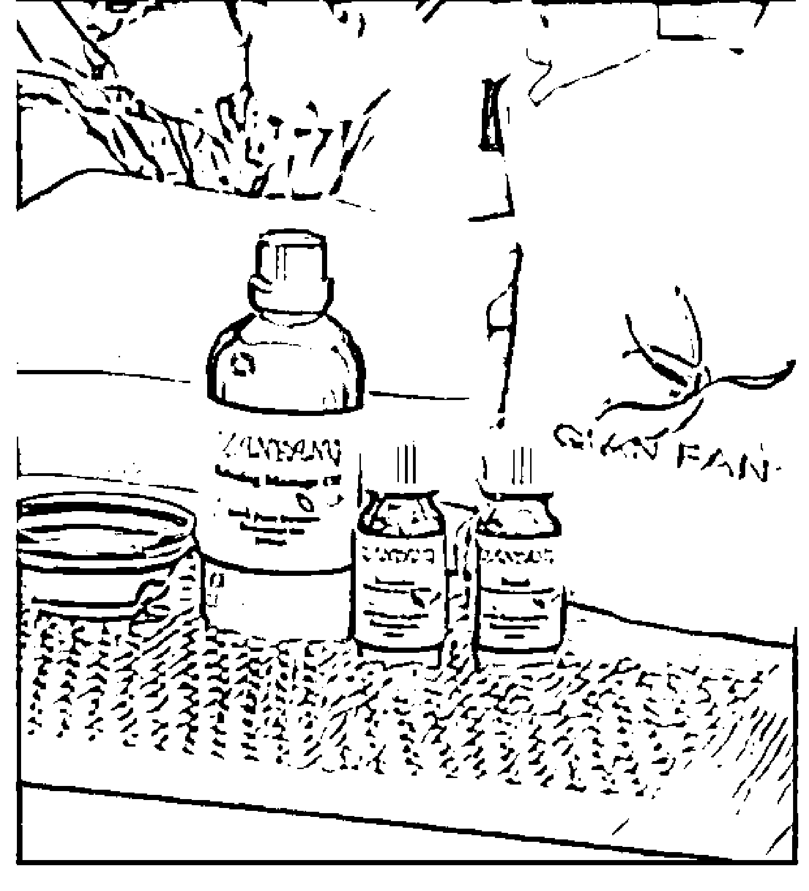

當我們提到以百分比調配精油時，其調配濃度可參考下列數值：
濃度1%= 30毫升（7~8滴）
濃度2% = 30毫升（15滴）
濃度3% = 30毫升（23滴）
濃度4% = 30毫升（30滴）
注：老人与小孩则需将剂量减低。

### 芦荟油Aloe Vera Oil Extract

学名：Aloe barbadensis miller

芦荟是一种民间草药，自古以来就深受世人喜爱，属百合科草本植物，针叶形，叶片上布有不规则白色斑点，肉厚，叶中含有黏状液是其特征。其药用部分有两个部分，即透明的胶状叶肉和叶片绿色表皮部分。

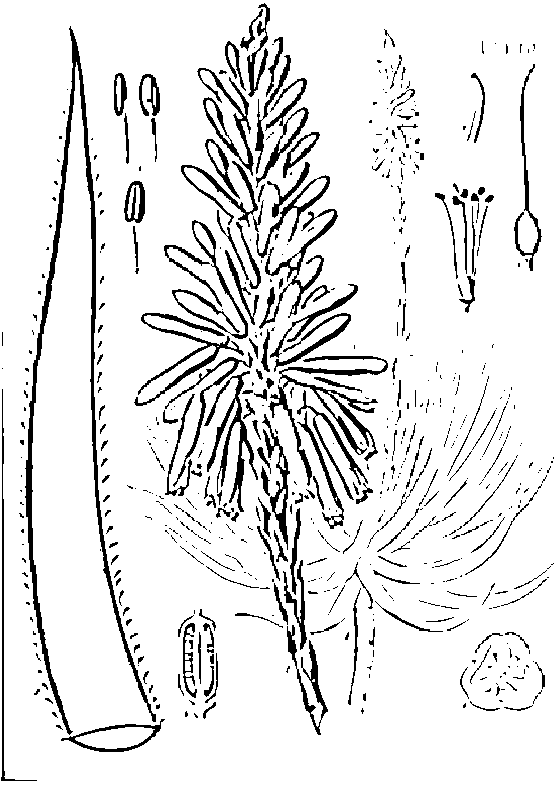

含木质素（Lignin）是一种很强的渗透物质，能帮助营养渗入肌肤；皂角苷（Saponos）为一种天然皂素，具强力的清洁与抗菌力；安特拉归农综合体（Anthraquinone Complex）具消炎、消肿、抑制细菌生长、止痒与止痛的效果；此外另含多种矿物质、维生素、单醣体与多醣体、酵素及氨基酸，可补充人体需要的养分。

**【适用】**加速细胞再生，消除疤痕，可对抗放射性灼伤及皮肤炎。

**【触感】**透明清澈油质，无味，轻度油感，涂抹在皮肤上很快被皮肤吸收。

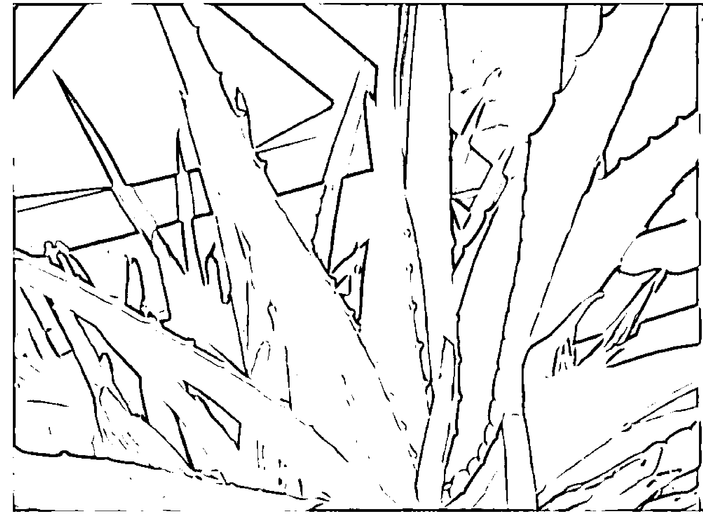

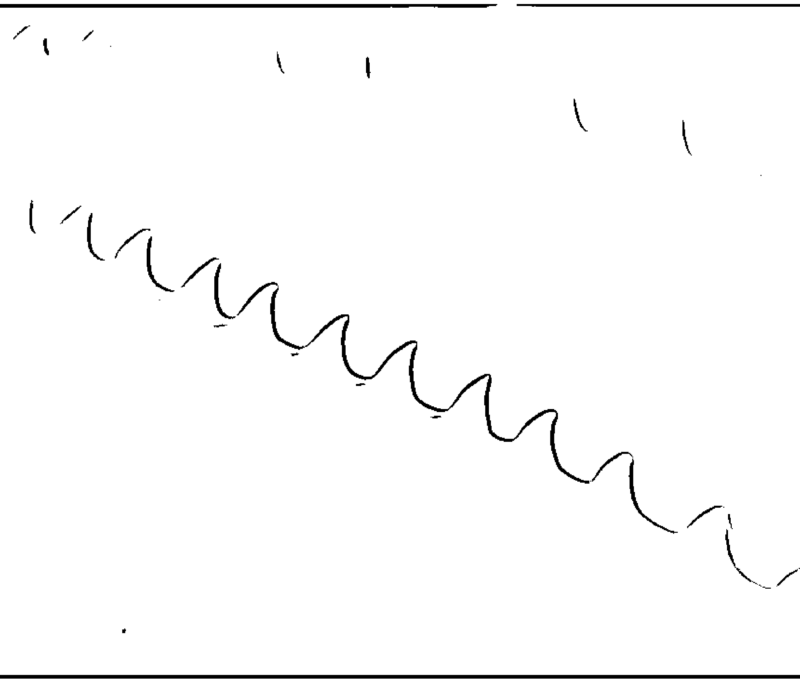

#### 酪梨油Avocado Oil Refined

學名：Pursea americana

遠在中南美洲印加文明時代起，人們就已經發現酪梨的營養價值，是當地人主要的食物之一。從乾燥果實壓榨的酪梨油，營養價值豐富，具有甜甜的水果香，顏色較偏綠，屬於滲透性及滋養性較佳的基礎油。它對促進細胞新陳代謝，淡化黑斑、消除皺紋有很好的效果，對經常曝曬陽光下的人，酪梨油可幫助肌膚保住水分，預防乾燥粗糙。

【適用】陽光造成的乾燥，連續塗抹可提高皮膚保濕度。

【觸感】親膚性佳但油質稍重，不宜直接拿來做按摩基底，建議以10%與其他較輕、不黏稠的植物油調合使用。

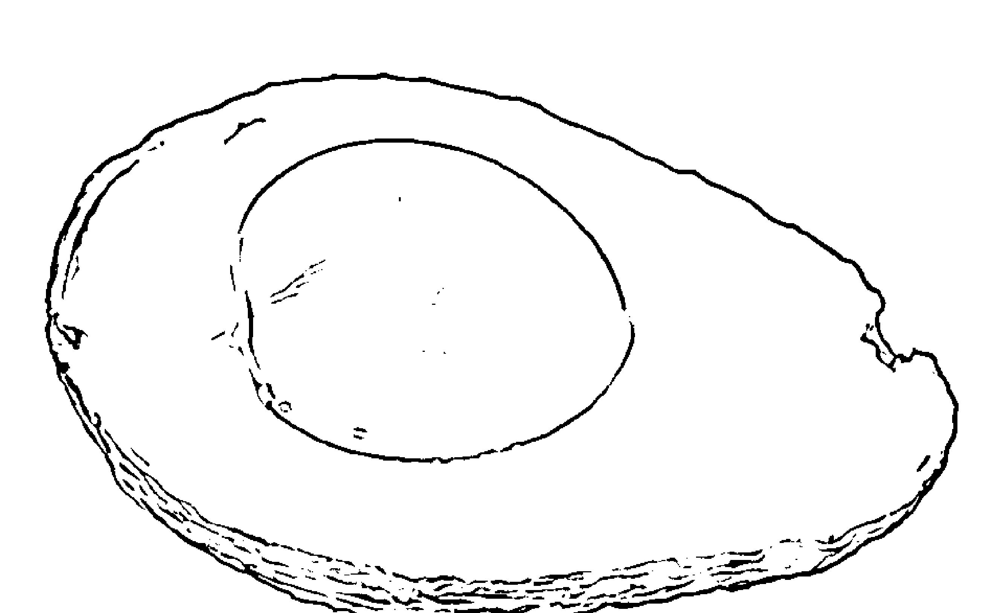

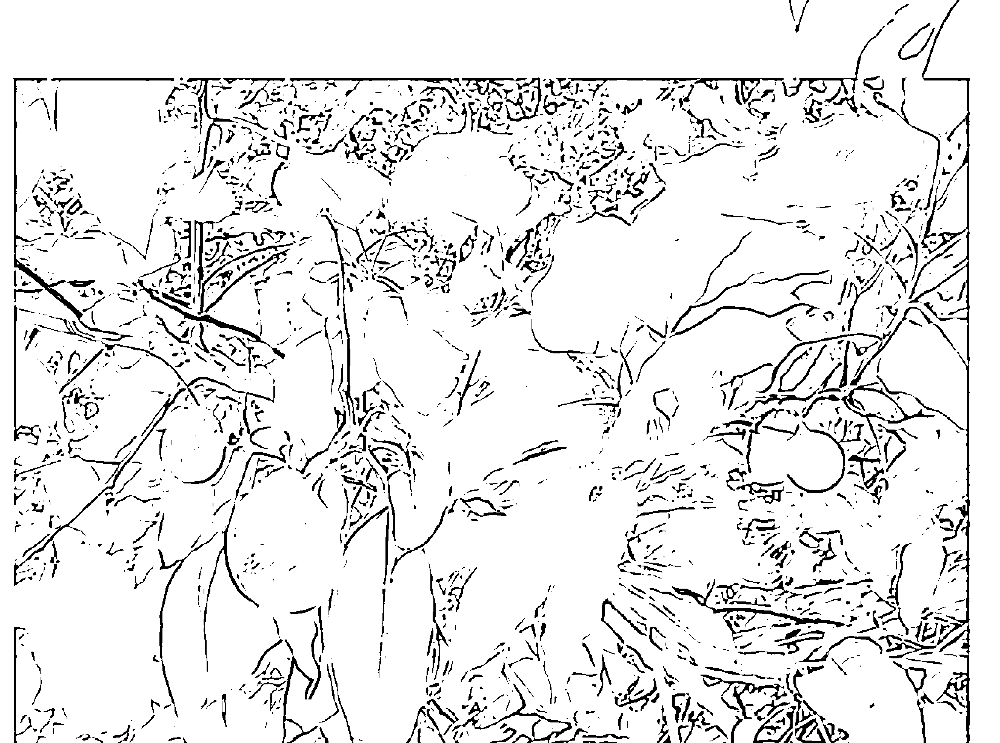

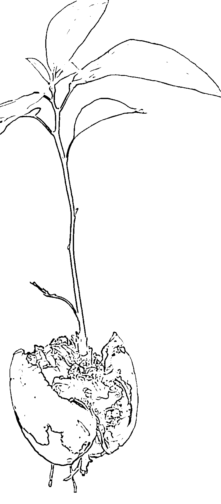

### 月見草油Evening Primrose 9% GLA

學名：Oenothera biennis

整株的月見草都可萃取油，但以種子的質地最佳，可冷壓萃取15%的油量。月見草種子屬於多元不飽和脂肪酸，含高達70%的亞麻油酸及gamma——亞麻油酸（GLA9%），可為人體正常吸收利用，建構健康的細胞膜，維護神經系統健康，並幫助人體的生化反應。

【適用】改善乾燥、濕疹、牛皮癬、皮膚敏感，增進肌膚彈性。脆弱易變質的精油，開封後需放置於適溫的冷藏室中。

【觸感】中厚度油感，淡黃色，香氣帶腥味。一般以10%調入其他植物油中處理皮膚問題。

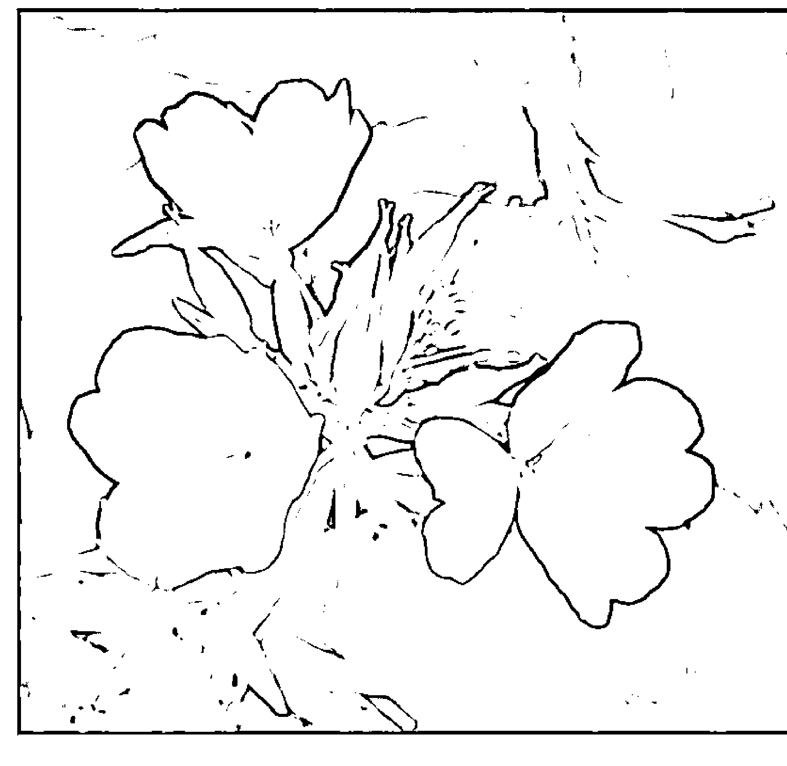

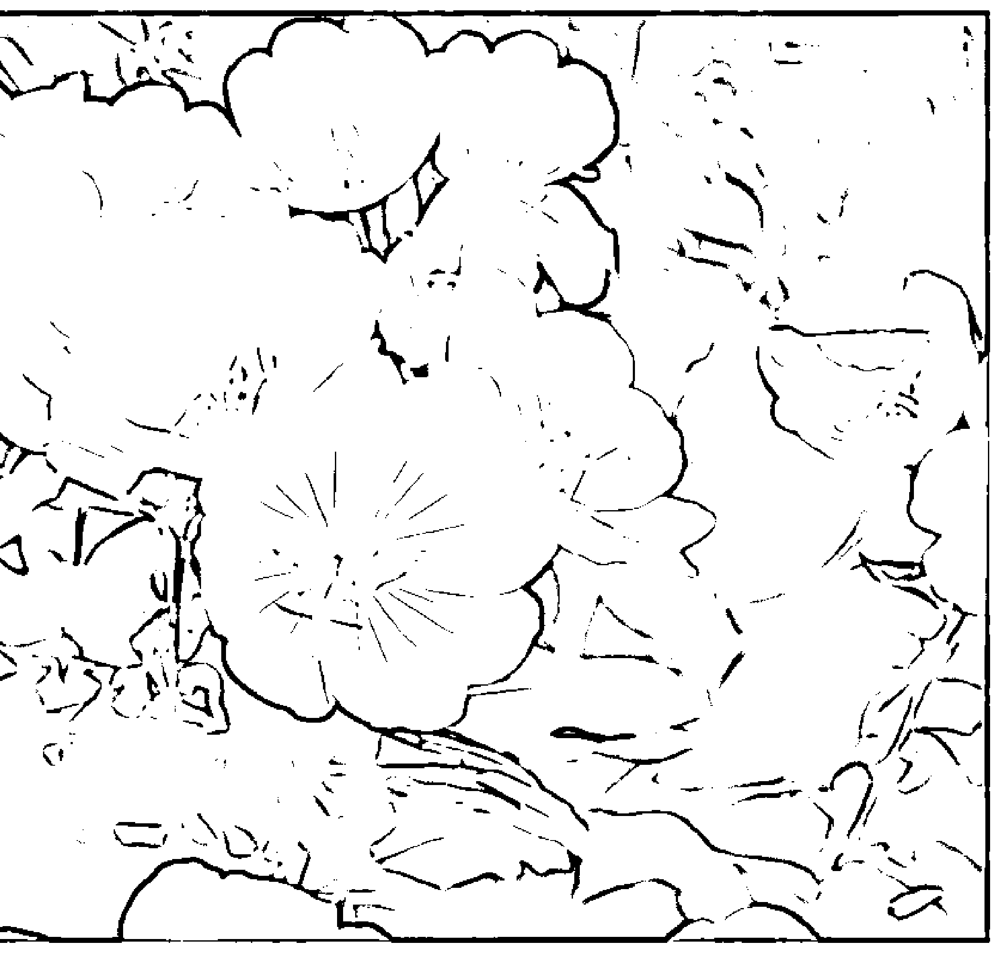

### 葡萄子油Grapeseed Oil Refined

學名：Vitis vinifera

淡黃色或淡綠色，無味，清爽不油膩，是所有植物油中最清淡的一種。葡萄子油含有兩種重要元素，亞麻油酸（Linoleic acid）及原花色素（Oligo Proanthocyanidin簡稱OPC）。亞麻油酸是人體必需卻不能自行製造的脂肪酸，可以抗自由基、抗老化、幫助維生素C和E吸收、強化循環系統的彈性、降低紫外線的傷害、保護肌膚中的膠原蛋白、降低靜脈腫脹與水腫以及預防黑色素沉澱。

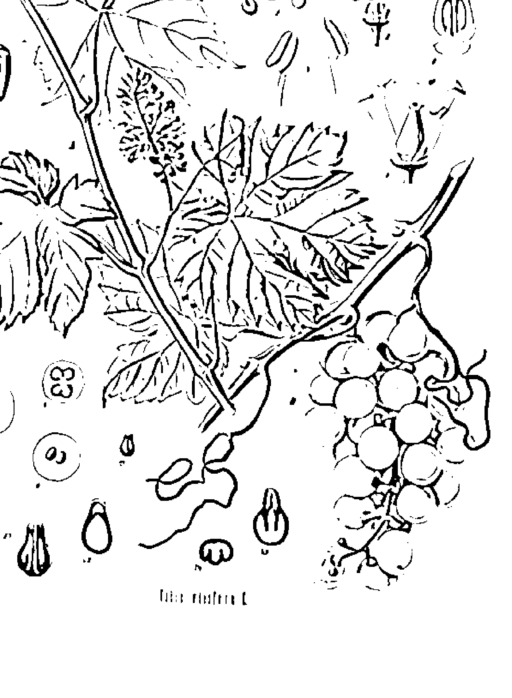

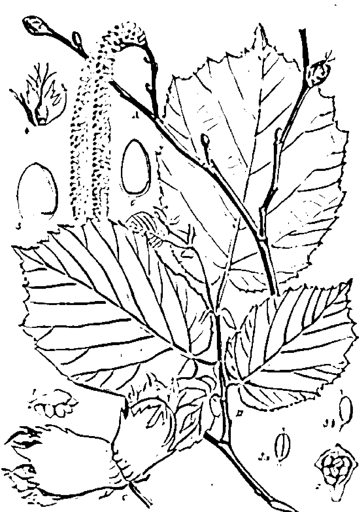

OPC是強力的抗氧化劑，具有保護血管彈性、阻止膽固醇囤積在血管壁上並減少血小板凝固。它可保護皮膚免於紫外線的傷害，預防膠原纖維及彈性纖維遭到破壞，因此保有肌膚彈性，避免下垂及皺紋發生。

【適用】分子極小，高滲透性的天然保濕劑，可強化循環系統、防止老化、消除細紋、油性、暗瘡、粉刺、皮膚下垂、保護血管彈性、降低紫外線的傷害、預防黑色素沉澱、改善水腫、保護皮膚中的膠原蛋白。

【觸感】無色無味，輕度油感。

### 榛果油Hazelnut Kernel Oil

學名 : Corylus avellana

在歐洲幾乎到處都可見到榛樹，它開黃色花，長長的柔荑花序，非常詩意並充滿異國情調。榛果油的滲透性強，吸收快，適合各種皮膚。其收斂作用對油性、暗瘡皮膚效果頗佳。它能有效的滲入表皮層不會在皮膚上留下油膩感，是評價很高的基礎油。

【適用】含有豐富的維生素A、B、E，可防止皮膚水分流失，良好的延展性，對皮膚有保護、軟化滋潤的重要作用，更具有防曬功效。

【觸感】油呈深黃色，帶有特殊的味道與氣息。中度油感。

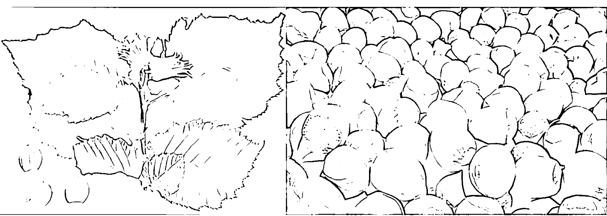

#### 荷荷巴油（金黃）Jojoba Oil Natural

學名 : Simmondsia chinensis

### 荷荷巴油Jojoba Oil Refined

學名 : Simmondsia chinensis

荷荷巴是一種沙漠植物，高約10公尺，耐高溫可達60℃，生長於美國南加州、亞歷桑那州、以色列、澳大利亞等地區。具有高度穩定性，能耐強光、高溫而保持結構不變，滲透力佳，非常滋潤無任何氣味，油質輕滑似人體皮脂膜分泌的油脂，適用所有膚質，為調製臉部及身體按摩油的最佳基礎油。

含豐富的維生素D及蛋白質，具良好的滋潤與保濕功效，可軟化皮膚、保持肌膚水分並預防皺紋。荷荷巴是一種濃厚的蠟質液體，不會氧化也不會腐臭，是壽命最長的基礎油。

【適用】萃取自荷荷巴豆，呈黃色，具有很好的抗發炎作用，適合調理皮膚方面的感染，例如乾性肌膚、發炎、濕疹、面皰等問題。同時具有天然防曬系數SPF4，是防曬霜的最佳原料。具有改善粗糙髮質的特性，除了防止頭髮曬傷及柔軟頭髮之外，還可幫助頭髮烏黑及預防分岔。

【觸感】天然冷壓的荷荷巴是金黃色無味的液態蠟，另有脫色後呈白色無味者。兩者功效相同。

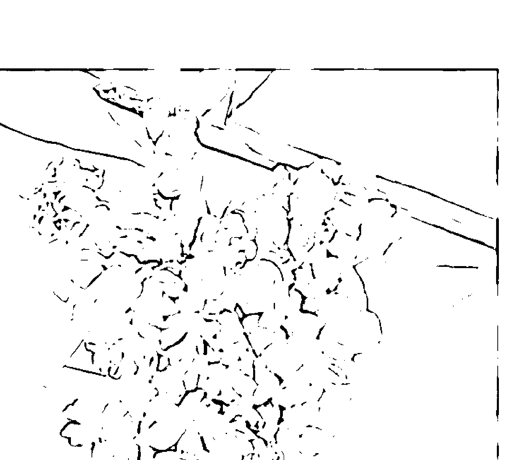

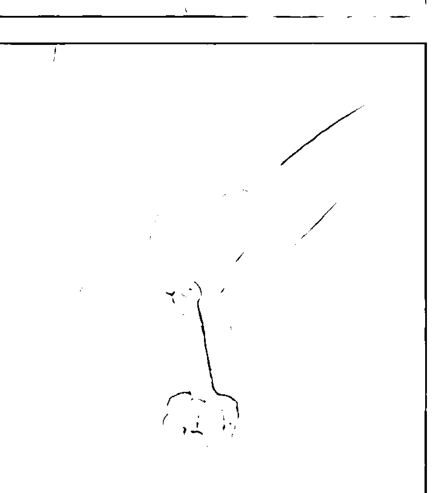

### 甜杏仁油Sweet Almond Oil

學名：Prunus dulcis

淡黃色，萃取自核仁，味道輕柔，具潤滑度且非常清爽，屬於中性的基礎油。

具良好的親膚性，連最嬌嫩的嬰兒都可以使用，含維生素A、B₁、B₂、B₆、E、蛋白質、脂肪酸、礦物質、葡萄醣甘等，適合乾性、敏感性、皺紋、粉刺等肌膚使用。其滋潤及軟化肌膚的特質，使它成為極佳的全身按摩基底，做為治療搔癢、紅腫、乾燥和發炎的配方使用。

【適用】適合各種膚質，對乾性、皺紋、敏感、發炎、改善皮膚乾燥、發癢、紅腫現象及嬰兒肌膚均可使用。特別是乾燥肌膚。

【觸感】中度油感。不會迅速被吸收，在按摩過程中可以節省許多油。比較好的甜杏仁油一般比較濃稠、不易揮發。

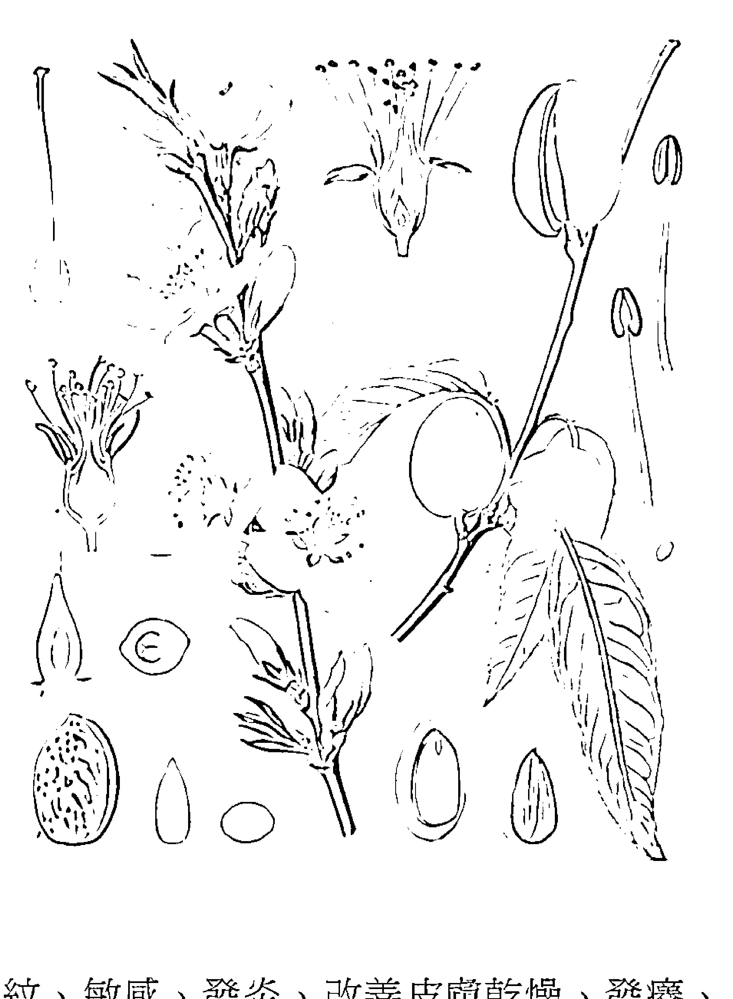

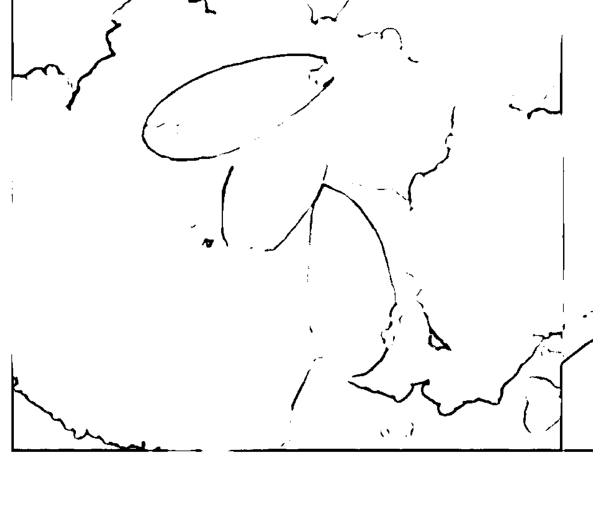

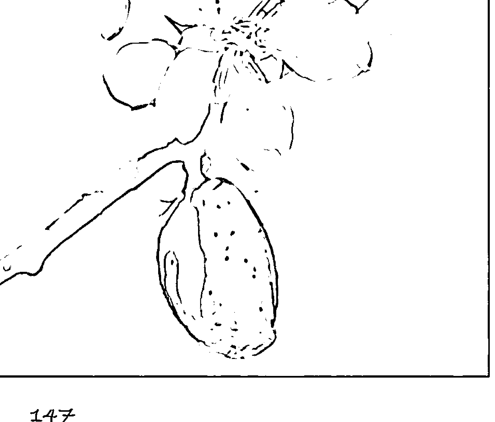

### 夏威夷核果油Macadamia Nut Oil
學名：Macadamia integrifolia

主要由三酸甘油脂所組成，含量高達80%單一不飽和脂肪酸，具有很好防腐效果易於保存特性。容易被肌膚所吸收，吸收速度被描述為「瞬間消失」的油。含有大量的棕櫚油酸，更年期間皮膚裡的棕櫚油酸含量大幅降低，可添加在任何抗老化產品中，有極佳的滋養效果，給予保濕滋潤，提供細胞修復作用，此油容易乳化，能自由的溶解調和，延展係數極佳，活性穩定甚至不需要抗氧化劑。

【適用】優質按摩油很迅速滲透入肌膚。延緩與增加細胞水分不可或缺的植物油。脆弱肌膚、成熟肌膚、循環系統、抗氧化、動脈疾病等適用。組成成分與人體皮脂很相近。容易與其他油溶解，公認的極佳的滋潤油，也是非常優質的按摩油。

【觸感】顏色偏淡褐色、淡淡的核果味。中度油感。

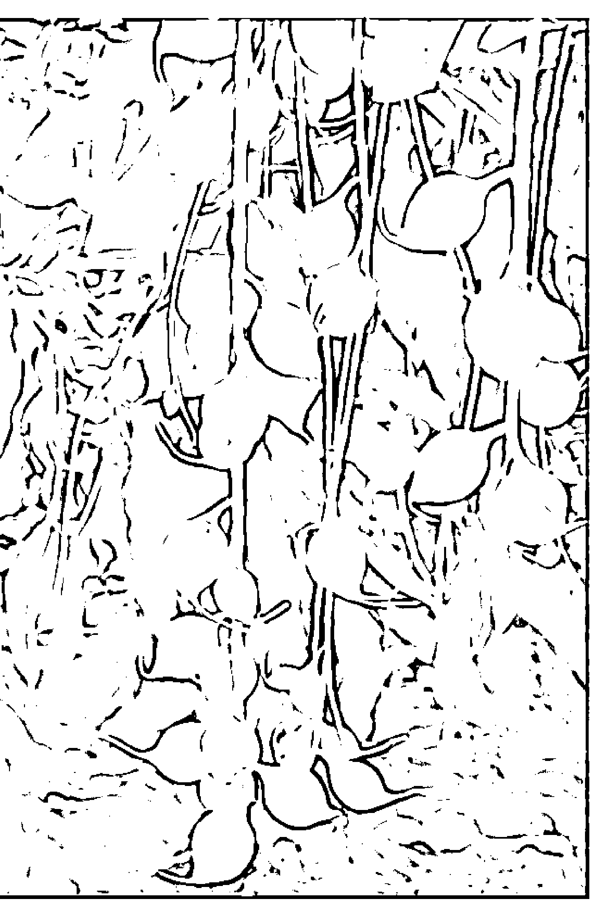

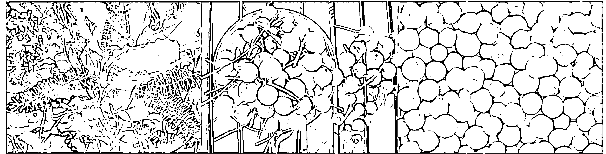

### 橄欖油Olive Refined
學名：Olea europaea

橄欖樹很能適應地中海型乾燥氣候，花型美，香氣淡淡的。橄欖枝自古便是和平的象徵。橄欖油具有優良的營養價值，主要是由於它的化學組成中含豐富的不飽和脂肪酸（棕櫚油酸、油酸、亞油酸、亞麻油酸）。不飽和脂肪是「好」脂肪，它可以幫助降低「壞」的低密度脂蛋白膽固醇，而維持「好」的高密度脂蛋白膽固醇，而且易於被人體吸收，不易氧化沉積在人體心血管壁上，如心臟冠狀動脈等部位，因而可以有效的防止心血管疾病、癌症、糖尿病的發生。

**【適用】**可柔軟皮膚、防止老化、活化肌膚、淡化疤痕；克服皮膚濕疹及乾癬、皮膚炎、燙傷及經前不適等狀況，促進指甲的強韌。

**【觸感】**顏色呈淡黃綠色，氣味清香。厚度油感。屬芳療級純植物用油，但價格較高，無使用上的禁忌；通常以10%添加入其他純植物油一起使用。

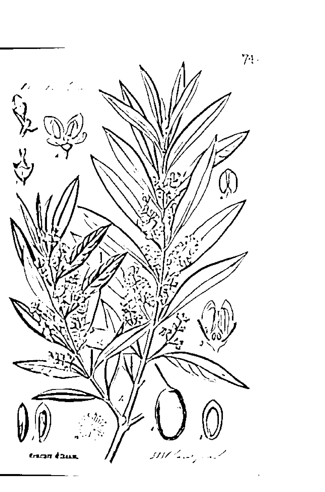

#### 玫瑰果實油Rose Hip Seed Oil Refined

**學名：** Rosa mosqueta

玫瑰果實油是將玫瑰果種子採取冷壓法提取而成的。野生玫瑰果生長於智利南部，玫瑰叢高1至2.5公尺。當玫瑰果成熟為深紅色的時候，工人便以人手採集。

在玫瑰果實油的成分中，所含亞油酸及亞麻酸的比例大約佔八成。這些不飽和脂肪酸與皮膚組織有莫大的關係。其中包括：細胞膜重生、免疫機制、細胞生長及細胞中的生物化學作用。

**【適用】**使細胞組織再生，促進傷口、手術後的疤刀癒合，並預防皮膚色素沉澱。改善老化、皺紋、濕疹、皮膚炎、乾燥、缺水、經前不適等狀況。

**【觸感】**厚度油感，較不適獨來按摩。屬於芳香療法治療油，價格較高，常以10~30%比例與其他純植物油混合。

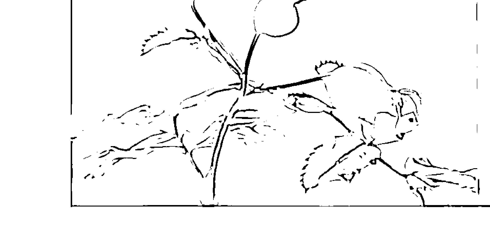

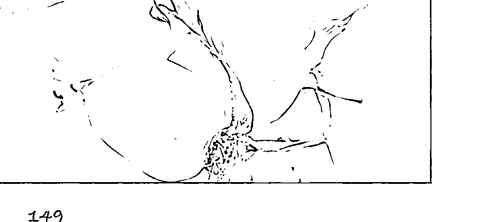

### 芝麻油 Sesame Seed Oil Refined

學名 : Sesamum indicum

傳說芝麻是最古老的植物，源自於非洲，一年四季皆有生長，樹約120公尺高，花朵為白色或紫紅色，具養生、供給能量之功效，幾千年來，在中國及印度都能找得芝麻的芳蹤。芝麻油是經過冷壓法提煉精製而成，透過冷壓、過濾的芝麻油再經高科技處理，無臭無味，價值極高，因此，精煉的芝麻油不僅被譽為最神奇的香料油，也被推崇為頂級護膚油，更被定於世界頂級價位。

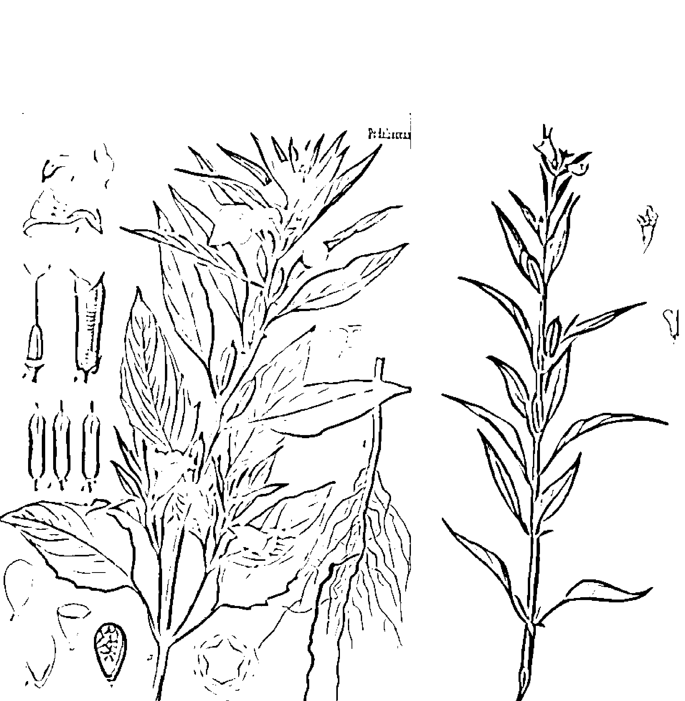

【適用】適合各種膚質、老化肌膚也可使用。其親水性、潤滑度佳，具抗自由基功效，可對抗乾燥、弱質肌膚、幫助重新建構皮膚組織，使肌膚延緩老化。

【觸感】厚度油感。屬芳療級純植物用油，無使用上的禁忌；通常以20%添加入其他純植物油一起使用。

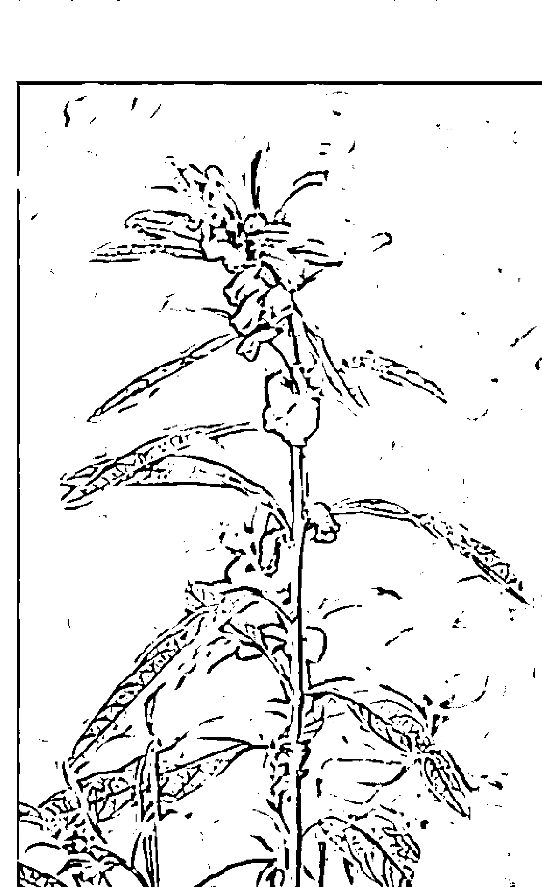

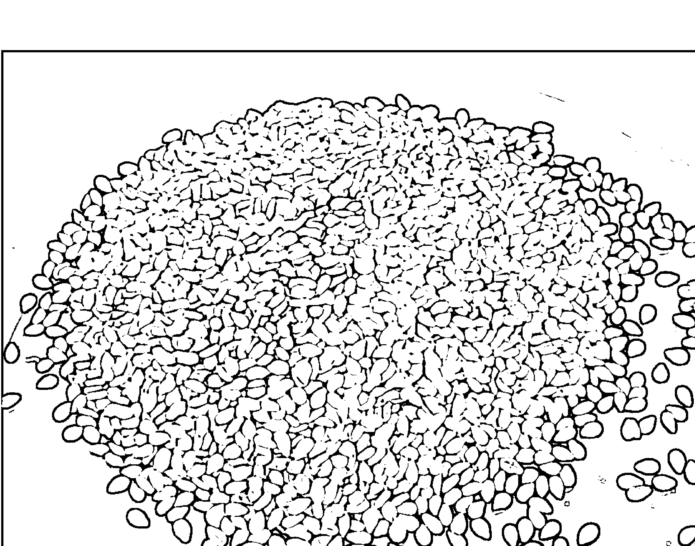

#### 葵花油Sunflower Oil Refined

學名 : Helianthus annuus

向日葵一向以大花朵及向光性著稱，大片的花海一片亮黃給人豐衣足食的飽足視覺享受，而其種子確實也是食用油的主要來源之一。芳療用葵花油來自美麗的向日葵花的種子，內含有豐富的亞麻油酸（是一種人體無法自行合成的必須脂肪酸）及維生素 E，有助於維持身體及皮膚的健康，促進新陳代謝，對於乾燥、老化肌膚具有調理的功效，可幫助撫平細紋，預防肌膚老化，使肌膚看起來更年輕。

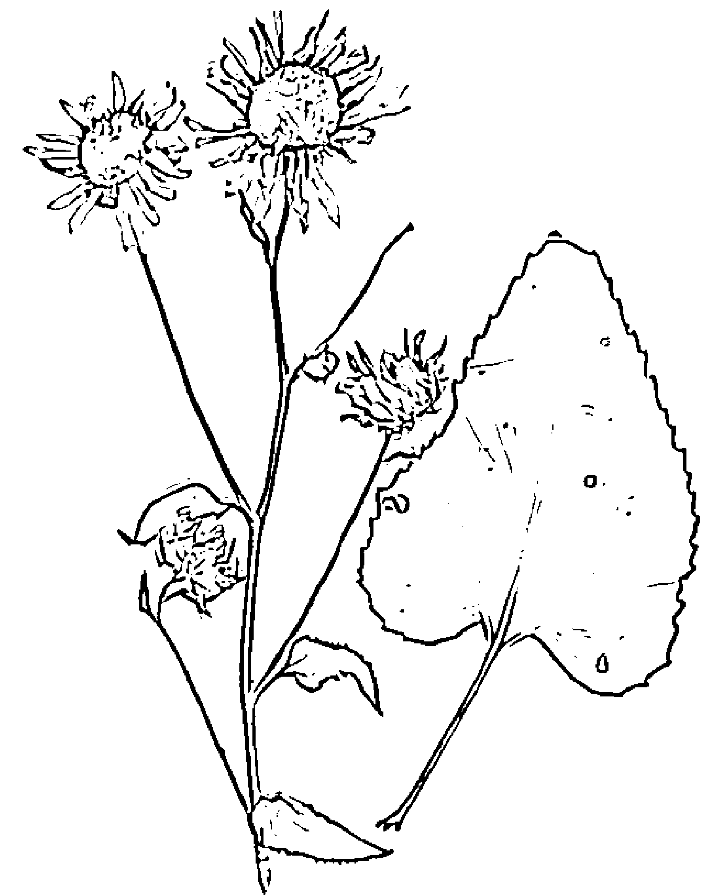

> 【適用】含礦物質及維生素E，質地細緻。為一種通用按摩油，一般膚質皆適用。且葵花油的價格便宜，適合選購於身體大範圍按摩用。

> 【觸感】輕型基底油，適合100%直接使用

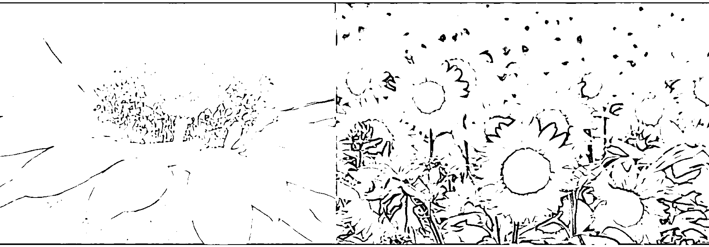

### 英國胡桃油 Walnut Oil

學名：Juglans regia

又名英國胡桃或波斯胡桃，高大落葉喬木，高約30公尺，每葉柄上有5～9片光滑綠色小葉，葉片碾碎後有香味，春天或初夏開雄柔荑花序，秋天結果。堅果仁可食用，具有降低膽固醇功效。在中國，堅果仁用來治療氣喘、背痛、腳痛和便秘。

【適用】優越的保濕及滲透性，特別適合早衰、老化、敏感、發炎和非常乾燥的肌膚使用。

【觸感】略帶金黃色清澈油質，無味，對皮膚的保濕性優越，滲透性強，可快速為皮膚所吸收。

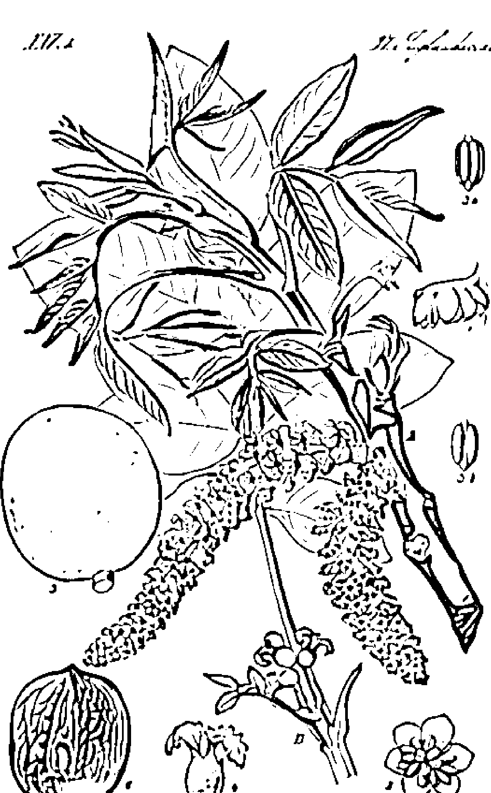

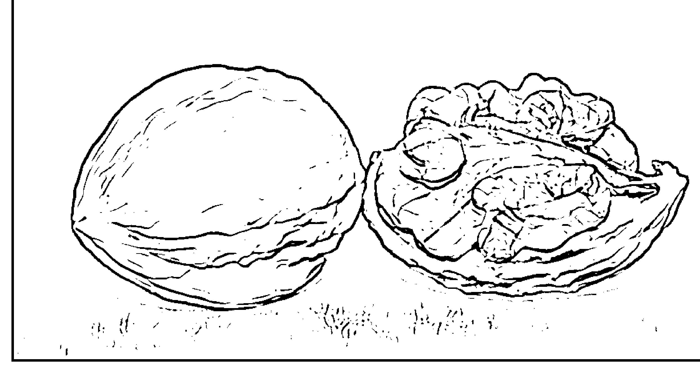

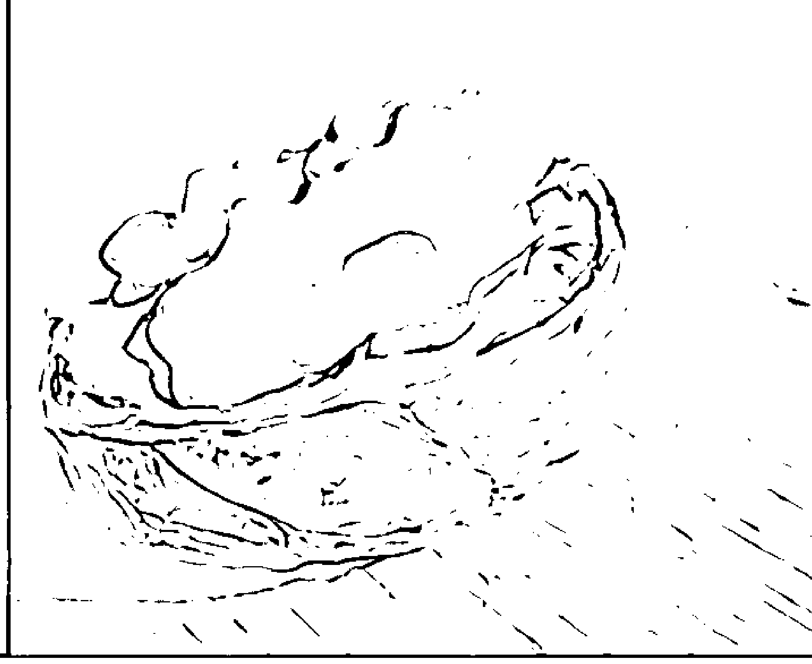

### 杏桃仁油 Apricot Kernel Oil

學名：Prunus armeniaca l.

杏核仁油含有許多對護膚有幫助的天然維生素A、C、B群及珍貴的亞麻油酸，對乾燥老化、虛弱蠟黃的肌膚具有調理、滋潤、緊實、保濕的功效，可幫助撫平細紋、預防肌膚老化，促進血液循環，使肌膚看起來更加紅潤、光滑有彈性，從杏桃核仁中冷壓萃取的果油，較濃稠、黏膩，將它搭配在複方基礎油中使用，是最合適的選擇。

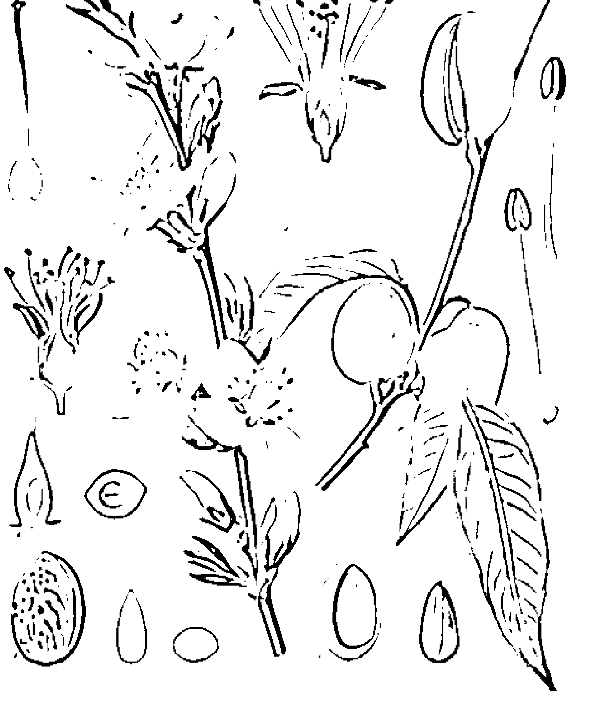

【適用】油感細緻清爽，含有讓肌膚軟化滋養肌膚與恢復肌膚生氣的成分。尤其對乾燥、脆弱、成熟及敏感皮膚特別有幫助。

【觸感】天然的杏桃仁氣味，顏色呈金黃色，非常適合用於按摩油的調製。

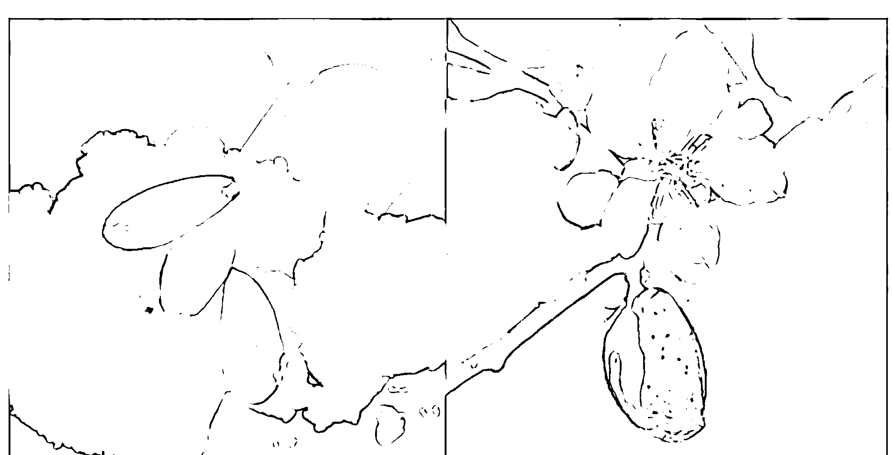

### 小麥胚芽油 Wheat Germ Oil Refined

學名：Triticum vulgare

由小麥種子的胚芽部分提煉，每18公噸的小麥才能萃取1公斤的油。以冷壓法製造的不揮發性植物油，是維生素E含量最高的基底油，具抗氧化的特性。因其抗氧化的特性，常加入其他的基底油裡面以延長它們的保存期限，適合各種膚質。

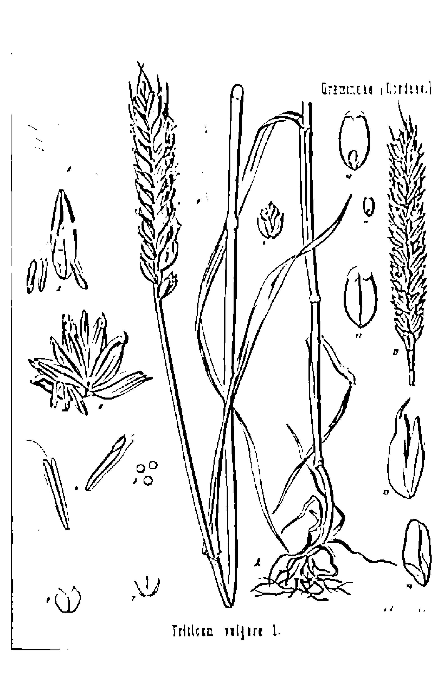

【適用】營養皮膚、乾燥、老化、皮膚炎。通常被當成抗氧化劑使用。

【觸感】重度油感，帶有一股特別味道。較不適合身體按摩，可以以低比例與其他基礎油搭配。

### 維他命E油

維生素E是一抗氧化劑，能夠保護多重不飽和脂肪酸、脂肪油溶性物質的氧化。作為抗氧化劑用，因為可接受氧，維生素E有助於防止多元不飽和脂肪酸及磷脂值被氧化，故可維持細胞膜的完整性。可保護維生素A不受氧化破壞，並加強其作用。常加入其他的基底油裡面以延長它們的保存期限，適合各種膚質。

【適用】營養皮膚、乾燥、老化、皮膚炎。通常被當成抗氧化劑使用。

【觸感】重度油感，帶有一股特別味道。較不適合身體按摩，可以以低比例與其他基礎油搭配。

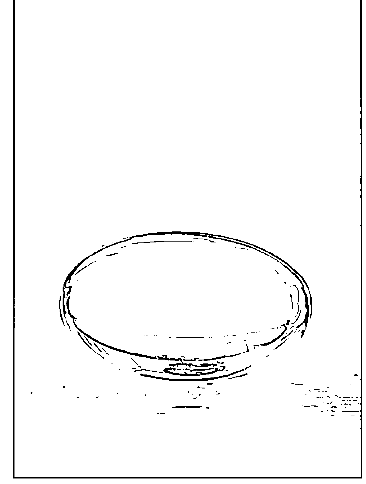

## 如何成為一個專業的芳療師

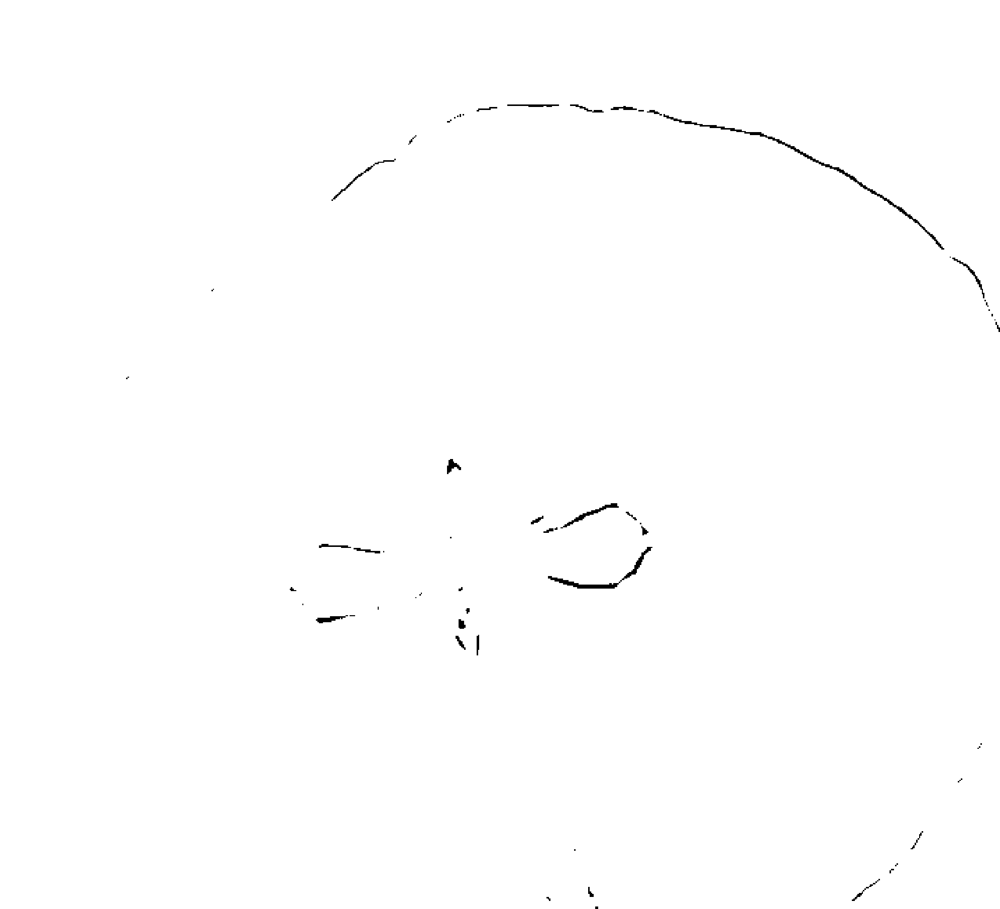

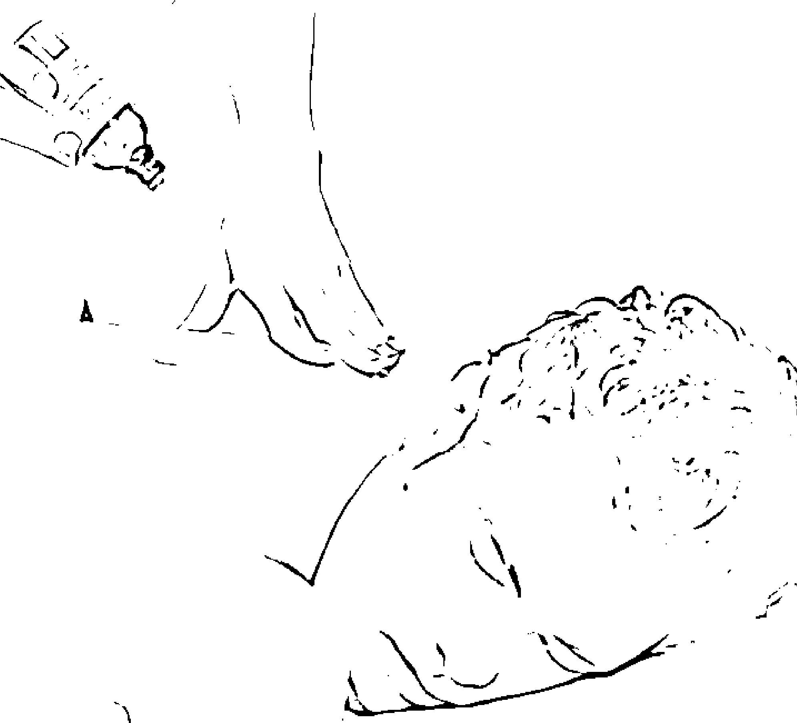

我們從前幾章已經知道，每一種精油對身體都有不同的功效，但要如何有效的使用呢？首先芳療師要懂得選擇品質好的精油，再依精油的屬性「高、中、低」，針對不同症狀調配出有效的配方。就像中藥很多有效的祖傳秘方可以藥到病除，精油也一樣，好的配方也必須經過長期的臨床追蹤。精油的來源產地更是重要，好的配方對身體只有好處，不會有任何的副作用，所以可以放心的使用。另外，操作的芳療師必須有自信心和愛心，一個芳療師具有專業的水準才能展現出自信，如此才能掌握顧客的問題，取得顧客的信任。另外芳療師更重要的是要有一顆愛心也就是同理心，按摩的技巧百分之九十是愛心，所以芳療師如果缺乏愛心，其治療效果就會變差。

精油的分子很小很快就可以從呼吸或皮膚進入身體，舒緩緊張的情緒，使肌肉放鬆，血管擴張，增強血液和淋巴循環系統，促進新陳代謝，改善各器官組織的功能，使人可以抗老化、防癌，芳香療法不但安全而且又極為舒適，所以這幾十年來廣為流行。

要成為一個好的芳療師，如果能學會顏面視診，更如虎添翼，不但能很快的從客人的臉上找到健康的問題，得到客人的信任，並為其選適合的精油和療程，客人在接受療程時可以很放鬆的達到預期效果。

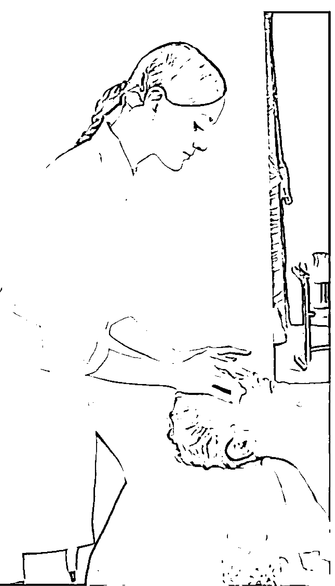

### 傾聽您內在的聲音

精油為濃縮物質，具有植物特有的濃郁芳香。是從多種植物中萃取，由於多數的精油極易揮發分解成醚類物質而消失得無影無蹤所以又被稱做植物的精靈。

天然植物精油可使人們的感覺變得更為細膩靈敏，給生活帶來無窮的樂趣，其可提高人體對疾病的抵抗力，增強人們對身體內部細微變化的注意力。芳香療法簡單且容易運用在日常生活中，它的使用方法包括室內空氣調節、沐浴、按摩等等，溫和無副作用，並在整體身、心、靈的平衡中，扮演微妙的整合角色。

在選擇自己的精油時，一定要先傾聽自己的聲音，用嗅覺決定自己的香型，如果別人給您的精油香味，其味道令您產生嫌惡的感覺，則此精油則不是適合您的香型，唯有選擇自己喜愛的精油，才能在芳香療法的過程中，帶給您全新的愉悅感受。

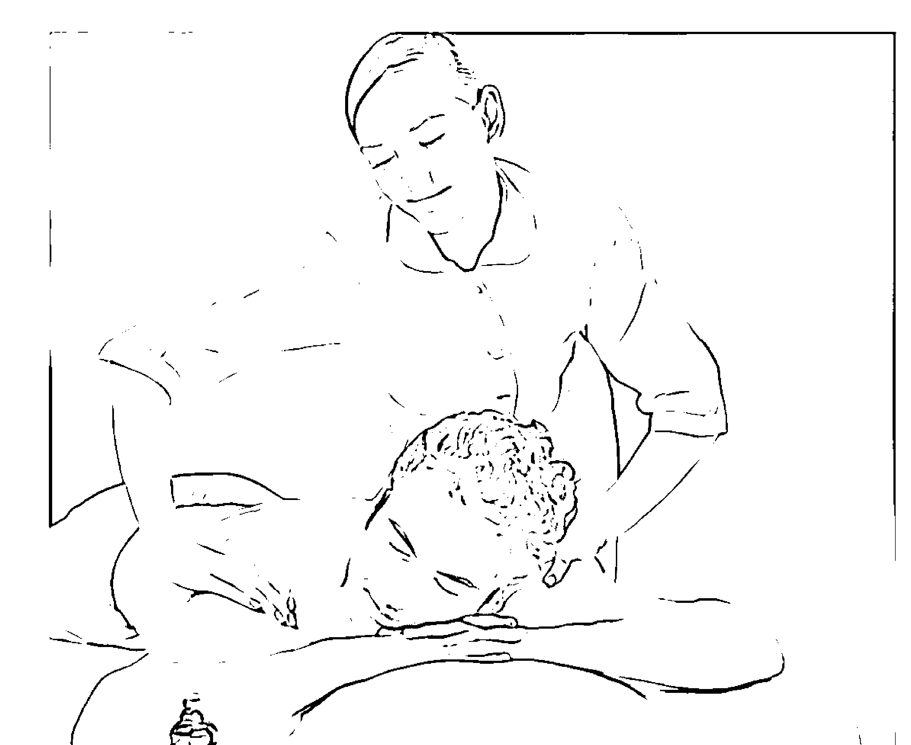

### 精油與按摩

芳療能夠快速的流行，是因為精油透過按摩，所帶給人的那種感覺。在美國的一項研究證實，常被撫摸碰觸的動物免疫力較好且個性較溫馴；同樣的嬰兒如常被擁抱、撫摸也會增強免疫力。

現代的人工作壓力大、生活緊張、肌肉僵硬，用精油按摩是一種最好的治療法。當你在諮詢客人時，找個機會用幾滴精油，在他的肩頸先做按摩放鬆，三分鐘的時間，絕對讓客人對你的感覺完全不一樣。你很快的就可以幫他安排一系列的芳香按摩療程。

芳療師運用精油做按摩時，必須放鬆心情，讓你的雙手保持柔軟，同時應全神貫注於客人的身上，按摩的手法不可太重或太快，客人才能進入舒服放鬆的境界，加強血液淋巴液的循環，以加速毒素的釋出，快速的恢復體力。

由於美容師並沒有被教導，如何去為不同的客人調配精油，所以選擇良好品牌的複方精油就很重要，可以達到預期的效果，而不會有副作用。

好的精油在萃取後必須經過測試，如旋光度分析、比重分析、定量分析、氣體色層分析、香味評估等。

精油對人體的貢獻有：

1.  淨化空氣。
2.  提供細胞營養。
3.  平衡心靈。
4.  提升免疫功能。
5.  具有天然的防腐功能。

芳療的特色功能是快速的影響神經系統，處方的選擇可偏向鎮定安撫的或激勵興奮的，使身心能夠得到平衡。

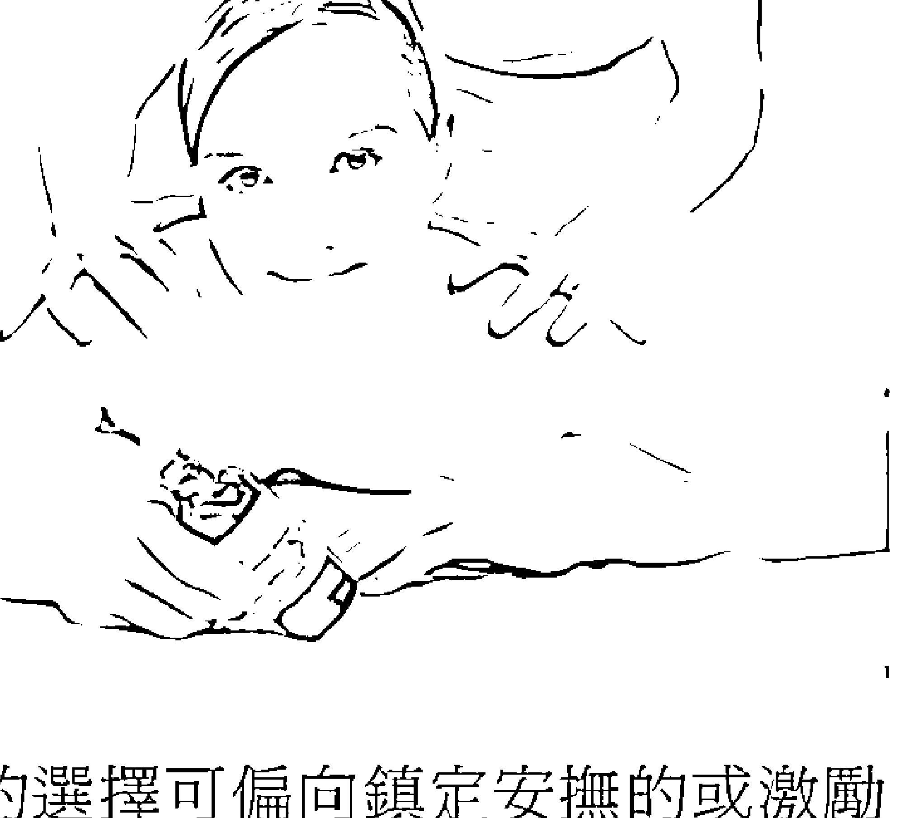

### 芳療師和神經系統、肌肉

人類藉著神經系統和內分泌系統的作用，來應付外在環境的變化，神經系統控制著肌肉的活動，協調組織與器官，肌肉操縱著骨骼，建立一套複雜的應變方法，接受外界的刺激。

肌肉組織包括平滑肌、心肌和骨骼肌，主要由肌細胞所組成，肌細胞是一種細長的纖維狀，又稱「肌纖維」。每一條肌纖維，都由肌膜包裹著，幾條肌纖維構成肌束，肌束再合成一塊塊肌肉。肌膜位於人體肌肉的表層上，具有許多微小的感覺神經，可將肌肉承受的疼痛或刺激傳至腦部。

忙碌的生活、工作的壓力、環境的污染、緊張的情緒、錯誤飲食習慣……等都會造成新陳代謝的失常。血液循環變差，使身體的酸性廢物無法排出體外。

最常見的症狀就是脖子痠痛、肩頸僵硬、容易疲勞等，尤其是肩頸痠痛，更是所有人的最大問題點。大腦指揮著身體，必須消耗大量的養分，所以製造的垃圾也特別多。用腦的人又不愛運動，所以大部分都會堆積在肩頸，大部分人的肩頸肌肉都特別的僵硬。如不排除，腦部的循環變差，就會引起記憶力變差、睡眠品質不好、內分泌失調等。肩頸的問題解決，大腦才能正常的運作。

消除肩頸痠痛的精油是「玫瑰復方精油」——成分是玫瑰、羅馬甘菊、薄荷，或是使用「綠野仙蹤」——成分是藍甘菊、天竺葵、薰衣草、薄荷等，可立刻讓肩頸的肌肉放鬆、血液擴張、血液循環加速，乳酸等疲勞物質順利排除，肌肉痠痛才能排除。

### 芳療與血液循環

血液不停地在我們的全身流動著，為100兆個細胞輸送養分、水和氧氣，並且將各個細胞內的垃圾送到肺和腎臟排出體外。血液維持著生命的根本「細胞」，所以當血液受到污染或供應不足時，會給細胞或身體造成很大影響，漸漸的就會產生很多疾病。血液約佔身體重量的1/8，如果能讓血液流動順暢，就可預防疾病的產生，也可以延緩老化。

芳療就是使用天然的香精油調配植物的基礎油，很快的就可以滲入到微血管，增進血液循環，促進細胞再生，幫助淋巴液循環，提升免疫功能，使人身心舒暢，延緩老化。

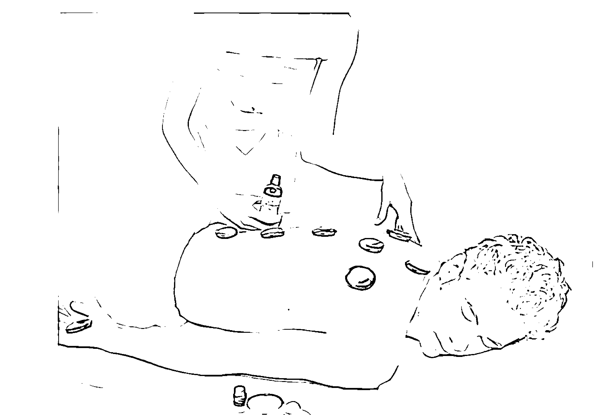

### 精油的調配劑量

精油為高萃取物質，使用時務必注意劑量並稀釋使用。精油使用的換算滴數可參考下列數值：

- 1ml 精油 = 20滴
- 5ml 精油 = 100滴
- 10ml 精油 = 200滴

一般而言可參考以下調油比例與滴數

| 濃度 | 5ml | 10ml | 15ml | 20ml | 25ml | 30ml |
| :--- | :--- | :--- | :--- | :--- | :--- | :--- |
| 0.5% | 0.5 | 1 | 1.5 | 2 | 2.5 | 3 |
| 1% | 1 | 2 | 3 | 4 | 5 | 6 |
| 2% | 2 | 4 | 6 | 8 | 10 | 12 |
| 3% | 3 | 6 | 9 | 12 | 15 | 18 |
| 5% | 5 | 10 | 15 | 20 | 25 | 30 |

### 如何安全使用精油？

#### 芳香療法注意事項：

1.  **必須稀釋**
    精油的濃度很高，因此大部分使用時都必須加以稀釋。薰香就是一種稀釋的方法，直接由皮膚吸收，則需要添加植物按摩油稀釋。

2.  **不能接觸眼睛**
    精油濃度極高，因此不可接觸眼睛，如使用在眼周，要調到低劑量，且不可靠眼睛太近，或用純露代替。

3.  **使用前先做皮膚測試**
    有些精油會引起過敏，或刺激皮膚，因此使用前可以先調約3%的濃度使用在腋下或胸口，至少24小時後沒有過敏現象，才可使用。

4.  **複方調和精油較單方純精油安全**
    單一精油不可持續使用過久，單方精油常常使用，效果會變差。

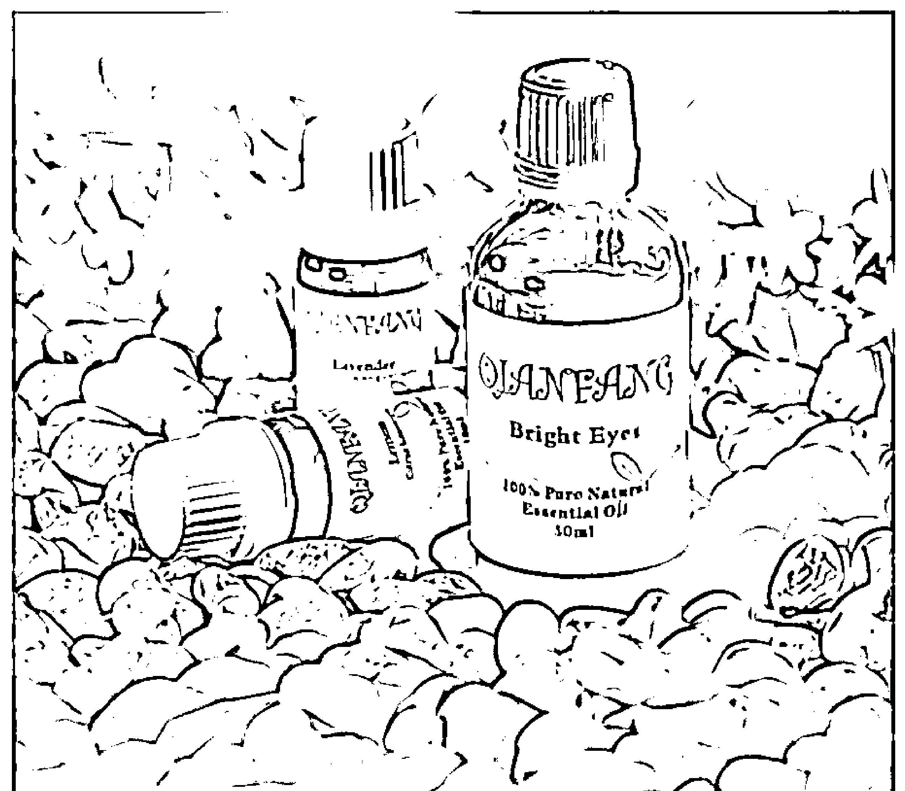

5.  **不可經常使用太高的劑量**
    想達到療效通常都要低劑量，並且持續一段時間，調整身體機能的效果最好。

6.  **皮膚上有傷口時**
    不可直接塗抹精油，不過如果是很小的傷口，則可使用精油使肌膚快點癒合。

#### 7. **請置於陰涼處及兒童取不到的地方**
    建議採用深色玻璃瓶置陰涼處保存，並注意防塵、防異味；柑橘類精油對光、熱格外敏感，應妥善存放。

#### 8. **使用柑橘類含光敏性精油時**
    4小時之內請勿曝曬陽光。有些精油含有會引起光敏感的成分，使用後避免曬到太陽，不然會使皮膚變黑，甚至引發皮膚癌。

#### 9. **氣喘患者不宜使用蒸氣吸入法**
    因為過強的蒸氣，反而會使氣喘病患者一時喘不過氣來，而產生危險。

#### 10. **肝、腎功能欠佳者請減低劑量使用**
    有些精油會產生肝、腎毒性，低劑量使用無妨，但如果劑量高時，遇到身體的功能不佳，就會有危害，因此還是請教專家後再使用，較安全。

#### 11. **嬰兒、孕婦、癲癇患者，某些精油不宜使用**
    除了有明確的標示避免使用之外，如果對精油不瞭解，一般居家使用還是以薰衣草、洋甘菊等較安全的精油為宜，且劑量要低。

#### 12. **內服須經專家或芳療師的指示**
    並不是所有的精油都適合內服，除非有專家指導，否則還是避免內服較好。

#### 13. **不可強力按摩有皮膚感染的地方**
    孕婦的腹部，有靜脈腫瘤的血管，剛結疤或紅腫的地方。

#### 14. **罹患重病症者**
    請暫停芳香療法，待嚴重期過後，再接受芳療重整系統平衡。

### 按摩是與身心最親密的接觸

在生理上按摩可以讓肌肉放鬆、血液循環更為暢通，減緩不適的症狀，達到治療的效果，而且對皮膚也有很好的美容效用。在精神上藉由輕柔的按摩可以激起一個人愛的感知，有著備受呵護及具安全感，不再不安恐懼或忸怩害羞，讓身心更為健康。

如果家人感情疏離，按摩就是增進彼此感情最簡易、最好的方法，如幫父母親按摩肩頸；夫妻之間也可以藉由泡澡及相互按摩，增進親密關係，也會更融洽。試試看，幸福就駐足在你家。

當然按摩也是有原則和方法的，只要依照小萱的方法，持之以恆，即能按摩出好感情、好身材。

#### 按摩的兩項大原則

不管是使用雙手或按摩刷按摩，都要掌握以下兩大主要原則，在此基礎下做任何動作的按摩。

1.  往心臟的方向按摩或刷洗。
2.  以順時鐘方向按摩、打圈或刷洗。

#### 穴位按壓法

- **單手按壓：**
  1.  以大拇指指腹按壓，其他四指伸直，是最普通的按壓方法。
  2.  以手掌掌握按壓，面積較廣。
- **雙手按壓：**
  1.  以左右拇指指腹伸直按壓，其他雙手四指伸直。
  2.  以左右手掌重疊按壓，比單手力量穩定。
- **拳頭按壓：**
  1.  握拳，以關節突出部位按壓。
  2.  握拳，敲打肌肉痠痛部位。

### 肌肉按摩法

- **抓捏法：** 單手或雙手
  1.  以整個手掌反覆握抓、放鬆肌肉。
  2.  大拇指與四指左右分開，反覆握抓、放鬆肌肉。
  3.  以1、2方式握住要按摩部位，做旋轉柔捏。

- **推揉法：** 雙手或單手
  1.  整隻手撫貼摩擦畫圈，按摩需要處。
  2.  雙手手掌合併成十字交疊，畫圈推摩需要處。

### 身體按摩刷洗法

身體痠痛或想要塑身、瘦身，可以配合按摩油，再加上專門的按摩刷，可收事半功倍之效，若沒有工具，當然也可以靠雙手，只是會比較累而已。

以小萱老師的臨床經驗而言，蝨尾刷是很不錯的按摩刷洗工具，尤其想要瘦身或肌肉痠痛的人，因此以下動作，按摩刷部分係以蝨尾刷為示範。

- **肩頸：**
  1.  手：直接由上往下或順時鐘方向做抓捏或推揉按摩。
  2.  蝨尾刷：從頸側由上往下刷至肩膀，直到肌膚泛紅為止。

- **手臂：**
  1.  手：由手腕處往上或順時鐘方向推揉、抓捏，再由手部外側向內旋轉抓捏。
  2.  蝨尾刷：以順時鐘方向刷洗，一路從手腕關節到肩膀，直到皮膚泛紅為止，這樣手臂會變得較纖細，讓妳大方穿上無袖上衣了。

- **腹部：**
  1.  手：以雙手交疊，輕輕地以順時鐘方向推揉按摩。
  2.  按摩刷：以順時鐘方向按摩腹部，再以橫向來回方式刷洗腰際，這樣可以讓腰更纖細，脂肪消失。

- **臀部：**
  1.  手：用雙手由下往上推及順時鐘方向推揉、抓捏按摩。
  2.  蝨尾刷：於大腿與臀部交接地方，由下往上刷洗及打圈的方式按摩臀部，有提臀的功效。

#### 背部：
由於背部自己比較難刷洗按摩，可以用長柄刷、長形沐浴巾刷洗，一樣由下往上，以打圈的方式按摩。

#### 腿部：
1.  手：以雙手由下往上、由中央往兩側，或順時鐘方向推揉、抓捏方法按摩。
2.  蝨尾刷：
    (1) 由足踝往大腿方向，以順時鐘打圈的方式，刷洗按摩至皮膚泛紅為止。
    (2) 先刷腿的內側，再刷外側。
    (3) 然後刷腿的前面，再刷腿背。(小腿正面幾乎都是足骨，故不刷)
    這樣可以減輕疲憊、浮腫的雙腳，也能使雙腿更為勻稱修長。

#### 足部腳底按壓
足部可說是人體第二個心臟，幾乎每一部位都有相對應的代表器官，能反映出一個人的健康情況，因此泡澡時可針對自己的症狀，以指腹按摩反應的症狀處，即可收到良好效果。

### 先苦後甜好轉反應

自然療法，能夠將體內日積月累囤積在腸胃的老舊廢棄物及積存在血液、組織、骨骼中的毒素代謝排出，在這些老舊廢棄物及毒素快速代謝的過程當中，身體會產生好轉反應，中醫稱為「暈眩反應」。所謂好轉反應是指過去較虛弱的身體組織或器官，因退化的機能恢復活力、毒素大量排出的過程中所產生不適現象，這種不適現象是短暫的，象徵組織及器官功能的恢復，應當以喜悅的心情來面對。

排毒反應因人而異，身體機能較佳者的反應速度較快，強度也較輕微，身體健康的人甚至立刻感到神清氣爽，並無不適之感，而身體虛弱及慢性病患者則反應速度較慢，強度較劇烈，時間也較長。

當好轉反應出現時，應飲用更多溫水，或淋巴排毒可幫助體內毒素及老舊廢棄物的迅速排出，並可快速修補組織細胞，舒緩不適現象。

可能發生的好轉反應：

※平日身體較脆弱的部分在排毒代謝期間，看起來好像會更加惡化，實際上是好轉反應，請勿擔心。

#### 身体现象與好轉反應

1.  頭部血液循環不佳者：容易產生短暫的耳鳴及臉部皮膚變暗，腰痠背痛，倦怠，色素加深的現象。
2.  子宮、卵巢虛弱者：月經會不規則3~6個月，經期間下半身會感到特別酸軟、無力，腹部會抽痛，臉部長痘痘、皮膚乾澀，這是內分泌調整中的好轉反應。
3.  原本腸胃虛弱及潰瘍者：可能吐出塊狀物或血絲，感覺較痛苦，這是由於胃的彈性恢復了，將正在剝離胃壁積存殘渣及化學性物質推擠排出所產生的好轉反應，無需擔心，可飲用大量溫水或薑湯。
4.  易感冒及呼吸器官虛弱者：會從口、鼻排出大量呈暗黑色、棕色、黃色、或透明如蛋清的髒東西，此現象並非感冒，無須服藥，若有咳嗽或喉嚨痛現象可多喝水。
5.  過去藥物服用較多者：容易有產生身體發癢、發疹的好轉反應。
6.  腎臟或下半身血液循環不良：容易腿部腫脹、頻尿等好轉反應。
7.  心臟虛弱者：容易產生短暫心悸或疼痛、胸悶、肋骨疼痛等好轉反應；身體積存過多水分者，排便水分較多，並非拉肚子，可放心。
8.  當血管壁的毒素脫落時：血管彈性改變，會產生血壓降低，頭部疼痛，聽力變差、眼睛癢、痛或視覺模糊的好轉反應。
9.  由於全身毒素及老舊細胞剝離：會產生舌苔、口臭、頭昏眼花、心身疲憊想睡覺的現象。
10. 老舊廢棄物所形成在腸壁上的積垢剝離：因此會有肚子絞痛，易脹氣，手腳冰冷的現象。
11. 細菌感染：排出大量白帶分泌物，異味分泌物。

## 芳療與顏面視診

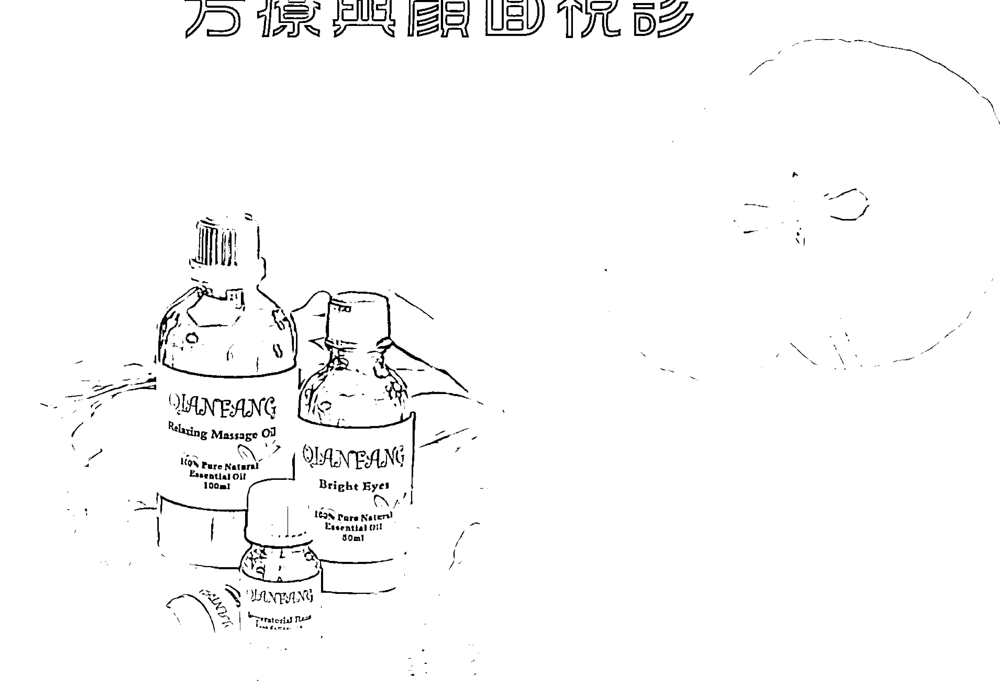# 芳疗与颜面视诊

在欧洲芳香疗师都能得到顾客的信任与尊重，所以客人在接受芳疗之前都会接受很详细的咨询，并且建立档案。但在台湾或中国，顾客都不喜欢接受太多的咨询，所以精油在中国亦必须入境随俗。芳疗师必须像中医师一样会“望、闻、问、切”等专业技巧。如果能从脸上找到客人的问题，才能取得客人的信任，才能进入疗程。

记得二十几年前我将欧洲芳疗的整套系统移植到台湾，结果发生了水土不服；推展起来十分困难，我们从欧洲学习回来的芳疗师几乎全军覆没。后来我用颜面视诊结合芳疗才快速的扩展开来。

所谓颜面视诊就是中医的望诊，融合解剖学和相学的一门健康诊断法，从脸上的轮廓就可以很清楚知道客人的个性和健康状况。要不然精油的价格很贵，一定要客人完全相信可以百分百的改善他（她）的问题，如果连客人的问题都讲不出来，客人怎会相信你能改善他（她）的问题。

颜面视诊学起来很简单，只要有一些基本的健康常识，就可以依脸上的反射区来诊断客人。

### 从天庭诊断身体健康

从天庭可以看出一个人记忆力、肾脏、心脏功能……等好不好，此外天庭呈现出一个人的思维模式与聪明才智，不同的思维模式会有不同的情绪表达，这些都和健康息息相关。

所以西藏的佛教徒相信，“关于癌症之类的疾病，其实是一种警讯，提醒我们生命中一直忽略的深层部分，比如精神的需要。”又如右脑思维的人天生对艺术敏锐，情感灵敏丰富，因此历史上许多知名艺术家多半有精神性方面的疾病。又如医学上发现中风患者说话表达能力困难，表示左脑语言区功能受损。

### 海马区凹陷——记忆力

海马区是左右脑交接处，如果凹陷严重，表示记忆力不好（用迷迭香可增强记忆力），若是加上失眠、肩颈酸痛（薰衣草可帮助睡眠，绿野仙踪精油可以改善肩颈酸痛），那么大脑细胞会死得更快，对健康影响甚大。

### 太阳穴凹陷——神经质

福德宫凹陷的人，天生比较劳碌，如果不懂得适时纾解或养生，容易患有长期性疲劳的症状，这样一来免疫功能下降，容易生病，也需要多加注意。

以解剖学来说，太阳穴凹陷的人，肩骨架构较小较不好，如此胸腔体积就小、空间小，肝、心、肺相对就小，器官运作时相对快速。所以这种人略带神经质，如果凹陷愈严重则愈敏感、神经质，可用胡萝卜籽油改善。

愈敏感愈神经质的人，通常情绪起起伏伏，先天上比较容易有偏头痛的症状。

如果饱满，则情绪好，肝功能也比较好。

若是太阳穴长青春痘，显示最近令你操心烦心的事特别多，疲劳过度，肝火太旺，应多休息。如果你最近夫妻或男女朋友吵架，太阳穴的地方也可能长青春痘，因为生气时气血凝结在里面之故。

### 印堂凹陷——心脏

印堂凹陷晦暗代表肺气不顺、缺氧、胸闷，印堂丰隆光亮则心胸宽、肺气旺，抗力强。如果严重凹陷，则可供应氧气通过的空间小，氧气供应量自然少。血液中如果缺乏氧气，就无法充分提供心肌运转所需，心跳自然会加快而不正常，所以容易有低血压，可用呼吸顺畅来改善症状。

所以，如果你的印堂先天凹陷严重，平时就要多保护肺部及心脏健康，如果近期內（几个小时、几天或几星期前）有胸痛的感觉时，就要特别注意了，这可能是心肌梗塞的预警。

### 额头长青春痘或长斑——心火

如果你吃了太多的油炸食物，如盐酥鸡、臭豆腐……，或是晚上熬夜不睡，这些对健康不好的饮食习惯及生活作息，额头会毫不客气地提出警告，那就是长青春痘、长斑，或者比脸部其他肌肤都红，让你好看。

这表示你心火太大了，此时情绪一定不好，压力大，交感神经亢奋，使得心跳加快，心脏功能就变得不正常。事实上，受害者是心脏。

可用薰衣草与玫瑰天竺葵再加上茶树，各取一滴加入晚霜里，很快就可以改善青春痘痘症状。

### 额头气色灰黑——肾脏

额头是肾脏的反射区之一，如果额头气色灰暗，容易掉头发，表示肾脏问题已相当严重，如尿毒症患者，全脸晦暗，需要长期洗肾。不过，如果只有前额晦暗发黑，大部分表示有心血管的疾病。

事实上，肾功能好不好，更详细的情形，还需从许多方面观察——耳朵、下巴、下眼睑等，以后的章节会进一步详加说明。

### 脑部基础保健方法

人类的脑由左、右两个大脑半球所组成，两个半球间以神经纤维相连接。要强化大脑，首先要令连接它的神经纤维活跃，正常运作。根据研究，一个直径百分之一毫米的脑细胞，可连接1000至10000条神经纤维，此连接者名为突触。在整个大脑中，至少有十兆个以上的突触。

大脑不仅做知性的活动，更主掌全身肌肉运动、触觉，即手、脚等与外界接触时的感觉。新的刺激，新的体验，会令大脑的突触与神经纤维形成新的组合，使大脑逐渐增加处理资讯的能力。不仅如此，想像力也会变得丰富，且有包容力，能产生新的构想，直觉也变得敏锐，判断力更为杰出。所以人的智力高低，聪明与否，并非取决于脑细胞量的多寡，而是看各功能区域间的连结程度。连结度高，反应能力相对提升，连结不佳，只是徒然浪费脑部的空间。

人类离开母胎后，脑细胞就不再分裂了，但细胞会增长，脑容量约出生时的5.5倍。脑部虽小，约只占人体体重的2.5%，但其氧气消耗量却是全身的30%~35%，所以只要3~4分钟缺氧，即可宣判脑部死亡。

大脑的结构既复杂又充满神奇的奥秘，每个人约有1000亿个脑细胞，但我们终其一生用不到10%，就是发现“相对论”的爱因斯坦，也只用到13%而已。人类在20岁后，一天内会坏死约十万个脑细胞，但如果保持带氧运动，可以大幅减少脑细胞的死亡。以下为强化大脑，减少脑细胞死亡的基本方法。

#### 良好的睡眠品质

大脑消除疲劳的主要方式是睡眠。长期睡眠不足或睡眠品质太差，会加速脑细胞的衰退，聪明的人也会变得糊涂起来。因此，最好能戒掉一边睡一边听音乐、广播，以及开着电视睡觉的习惯，安眠药或镇定剂非必要时尽量不要使用。

### 适当的运动

有氧运动有助于吸收更多新鲜氧气，使头脑活化，减缓老化速度。当身体疲劳、头脑昏沉的时候，起身做做运动，效率更好，如扩胸运动。

### 平时多动脑

思考是锻炼大脑的最佳方法（但不能过度），不愿动脑的情况只会加速大脑的退化，聪明人也会变笨。故一些创意性思考、活动，如艺术创作、旅行……等，可刺激大脑。要特别注意的是，在身体不适或患有疾病时，最好不要勉强学习或工作，如此不但效率低，且容易造成大脑损害。

### 正确的饮食知识

每餐只要7～8分饱即可，因为长期饱食，容易导致脑动脉硬化、脑早衰和智力减退等现象。要吃早餐，因为不吃早餐会让血糖低于正常供给，对大脑的营养供应不足，长期下来对大脑有害。甜食勿摄取过量，因为它会减少对高蛋白和多种维生素的摄入，导致机体营养不良，进而影响大脑发育。

### 勿抽烟

根据统计，长期吸烟，会使脑组织呈现不同程度萎缩，易患老年痴呆，所以最好不要抽烟。

### 保持空气新鲜、流通

大脑是全身耗氧量最大的器官，唯有充足的氧气供应才能提高大脑工作效率，故要保持空气流通及避免长期待在空气污染的环境中。此外，最好不要蒙着头睡觉，因为此时棉被中二氧化碳浓度升高，氧气浓度不断下降，长时间对大脑危害极大。

### 穴位按摩——头痛

当你感觉头痛，整个头重重的、昏沉沉的，先以指尖触摸天柱穴、风池穴，会发现这些地方好像有小小的硬块；接着用玫瑰精油以拇指压揉到硬块变软，就可以改善了。此外，也可以用热毛巾抵住穴位热敷。

#### 穴位按摩——额头痛

当你感到前额刺痛时，可以拇指关节按压刺激临丘及头维穴位，像画圆圈般旋转约20~25次，即可改善。

### 保健养生的饮食法

看了天庭所代表的个性、运势后，我们就可以理解自己或别人为什么某些部位特别弱，容易罹患某种疾病了。现在你不但可以为自己诊断，也可以充当一下别人的医师，不过更重要的是“预防重于治疗”。

平日懂得养生保健的人，通常比实际年龄来得年轻有活力，如运动、饮食作息正常、补充维生素、矿物质或健康食品……等；对于已经有疾病征兆或生病的人，补充相关营养素更是刻不容缓的事。

要强调的是，以下营养素及饮食上所列出的各项建议，仅表示患有该症状者平时可多摄取。因为，维持健康的不二法门，最基本的是营养、饮食要均衡，还有规律的生活、适当的运动，及时时保持心情愉快。如果平日只靠补品、药物，而完全不运动或生活、饮食不正常，那就是舍本逐末了。

### 从眉毛诊断身体健康

眉毛长得好坏和情绪息息相关，在医学上也指出，情绪与我们的健康和疾病有着重要的关系。我们常说每个人都有“七情六欲”，七情指的就是喜、怒、哀、思、惊、恐、忧，这些情绪是一种对外界的生理反应，不过如果情绪持久或过度，就会伤及脏腑气血功能，而产生疾病，所以中医表示：“怒伤肝、忧伤肺……”而肺部、肝脏的健康反射区即在眉毛。

眉毛又称为“保寿官”，因为眉毛和血液循环、荷尔蒙都有着极密切的关系。在解剖学上，眉头属肺，而眉尾系属肝的部位，因此眉毛如果长得好（亮丽有神），就代表肺脏的摄养量充沛，肝的能量充足，情绪稳定。

眉毛的神经中枢与荷尔蒙之分泌，有着极微妙的关系，因此，女孩子生理经期的时候，眉头的眉毛会直竖起来，到经期结束后，才又恢复。所以，眉毛如果向上竖得像斗鸡一样，必定会情绪紧张，脾气暴躁。

中医上说，“肺属皮毛，皮薄的人较敏感。”常常蹙眉的人，多半个性敏感、情绪不佳，长期下来寿命必不长，林黛玉可说是一个例子。所以，林黛玉的丫头紫鹃曾说：“……姑娘这病，原来素日忧虑过度……，伤了气血……”

#### 眉下及眉头

仔细观察眉毛底下肌肤的颜色，如果发现比其他部位惨白的话，表示支气管已经出现问题，肺部功能不佳。

如果在眉头部位青筋暴露或长痣，也表示呼吸系统功能不佳，肺部功能有问题。

此外，鼻子也跟肺部的功能息息相关，可说是保护肺部的外围器官，可以过滤空气中的灰尘，并调节温度与湿度，让肺部运作正常。所以我们又可以从鼻子的形状看出一个人肺部功能是否正常。

一般而言，鼻梁骨大、鼻翼丰厚的人，肺部功能较佳；鼻子小而扁，且脸色苍白的人，肺脏功能普遍不好。还有如果鼻心泛白，也是肺部功能欠佳的现象。

### 眉短促、眉尾掉毛

患有急性肝炎或慢性疾病者，有时眉毛会有一时性的脱落现象，可能变得稀少，也可能掉光光。眉毛掉落、稀少是体内某些器官衰弱、功能减低的现象。还有，眉毛短促的人通常寿命也不长。

如果一个人40岁以前，就有眉毛掉落的现象，表示早衰，显示生活中或家庭工作上有过多的事要操心、烦心，导致事事不顺心，气血衰退而掉毛。所以俗话的“倒霉”及“衰眉道人”之形容不是没有道理的。

如果过了40岁以后，眉毛外侧逐渐掉落，则是身体自然衰退变弱的征兆。此外，40、50岁以后，眉毛偏长，或眉毛长出长毛，则为长寿眉，表示肝脏机能好，身体很健康，但是寿而多忧，烦恼多。因为在中医五行中，肝属木，正如树木若营养好则树大茂密，眉就长得好，不然则眉毛稀疏。

### 眉毛枯焦无光泽

如果一个人眉毛枯焦无光泽，健康一定有问题，表示他先天不足，血液循环与贺尔蒙分泌不调和，因而心烦气躁，忧虑操心，脾气不好，导致肝脾不和而郁郁寡欢。身体可能有贫血、呼吸循环器官及新陈代谢的障碍。

### 眉毛的基础保养方法

眉相的好坏，关系一个人情绪、脾气的好坏，也关系一个人肝脏、肺部的健康与否。

虽然眉毛不像其他器官，构造复杂，但是眉相好的人，代表五脏的气血运转很协调，情绪好；眉毛光泽乌黑，则表示气足。气血足，身体就健康。

眉形可以改变吗？以“相随心转”的道理，是可以的，但是要完全改变或改变太大，如八字眉变成扬眉，是不太可能的，除非纹眉。其实最主要改变的是眉毛长得比较顺，不再直竖、散乱、黄枯……等。

眉毛有基础保养方法吗？没错！我们可以藉由以下方法，让眉毛长得更好，让情绪更开朗，不再闷闷不乐，犹如忧郁症般。

### 作息正常

避免熬夜，压力过重，而导致肝火上升或肝功能不正常，脾气变差，这样一来眉毛容易没有光泽或直竖。

### 保持开朗乐观

每天起床时大笑三声，随时提醒自己要多多微笑，放轻松，不要太紧张，保持心情愉快。可以告诉自己皱眉也要过完一天，微笑也要过完一天，微笑总比皱眉好，改变悲观的想法。心情好，自然不会“愁眉不展”，而是“眉开眼笑”了。

### 修眉

如果眉毛杂乱，杂毛多的人，心比较纷乱，可以将下面的杂毛修掉或拔掉，让人看起来清爽一些。同时要提醒自己凡事不要想得太复杂、想太多，“天下本无事，庸人自扰之。”杂毛多的人，也表示比较不会整理东西，房间比较乱，修剪时可以提醒自己房间或桌子该整理干净了。

如果眉压眼，也可以尽量修下面的眉毛，让田宅宫宽广一点，看起来不会那么急躁，不过最重要的还是脾气要改，运势才会好。

#### 画眉

如果有断眉情形，可以用眉笔补上；如果眉太短或眉尾稀疏，也可以用眉笔画长一些，不但美观，画眉时也可天天提醒自己脾气要改，如此运势也会变好。

此外，画眉时也可以依观眉八要件的原则，搭配脸形画，女孩子如果感觉太太阳刚时，就可以将眉毛画细一些，让自己看起来温柔女性化一点等。

#### 按摩、顺眉

每天早上起床时，也可以用手顺一顺眉毛，按摩一下眉毛，长期下来可以让眉毛长得顺一点，长得好一些。因为按摩时可以舒展眉棱骨，让血液循环畅通，减轻压力，情绪也会比较好，长期下来对肝功能有正面的影响。

保健养生的饮食法 要身体健康，首先一定要让情绪保持愉快，不要太钻牛角尖，凡事用另一种角度去看，不要想“我没房子、没车子、没财产，只有一份工作而已”，而是“我还有工作可做”，这是最不必花钱且操之在己的养生之道。

从面相学、解剖学的观点来诊断，可以了解眉毛和情绪好坏、肝脏、肺部健康关系密切，除了平时需要注意上述眉毛的保养外，对于其他相关器官的保健也很重要。

### 从眼睛诊断身体健康

眼睛除了是“灵魂之窗”外，也可以说是“疾病之窗”，因为从眼睛可以观察或诊断出相关疾病，如肝、肺、肾脏……等疾病，甚至脑水肿或是肿瘤也可透过虹膜诊断出来。

一个人的精神状态好不好？前一天是否有足够的休息或睡眠？由眼睛就可以判断。从睡眠惺忪、两眼无神、红眼睛、黑眼圈等状况，或多或少可以猜出此人身体有某些疾病。

在美国曾经为一群小孩子做过一项实验，发现关灯睡觉的小孩比较健康，成长也较好；而开灯睡觉的小孩，因为光线影响到眼睛虹膜及大脑褪黑激素的分泌，相较起来就比较不健康。可见光害会影响一个人的健康。

现在光害严重，加上许多人长期在电脑屏幕前工作，眼睛容易过度疲劳，加速了眼疾的产生。还有几乎每个学生都近视，“没有近视”的学生，可说是稀有动物，可见我们对于眼睛的保护，确实疏忽了。

#### 上下眼睑、眼白呈黄色——肝功能

如果上下眼睑、眼白出现泛黄现象，表示肝功能出问题了。又眼白泛黄，有可能是肝病引发的黄疸现象。

因为血液中每天有一千亿个老旧红血球被破坏，使得排泄的粪便微黄，其中如果胆红素代谢不完全，则会残留在皮肤及血液里，此时全身皮肤最薄的上、下眼睑，就会出现泛黄现象，当整个眼白呈现蜡黄时，显示代谢严重不良，黄疸问题来了。

中医学上表示，“肝开窍于目”，因为肝有贮藏和调节血量的功能，且肝经脉往上和眼睛相连之故，所以眼睛功能要正常，需要依赖肝血的滋养，如果肝血不足，则可能导致视线模糊、视力减退、眼睛干涩，甚至有夜盲等现象产生。因此根据医学临床经验，有不少的眼睛病变和肝脏相关。

情绪的好坏，和肝功能息息相关，凡事压抑、忧郁及发怒都会损害肝功能的运作，进而影响到生理疾病的产生，最后生理、心理相互影响。所以平时最好保持心情愉快，不要动不动就发脾气，一旦肝出问题就划不来了。

#### 黑眼圈——肾脏

碰到下眼睑有“黑眼圈”的朋友，我们常常会戏谑地说：“昨晚做什么坏事了？”因为除了熬夜外，有可能是纵欲过度的象征，这对肾脏来说，是一大负担。所以，有黑眼圈的人，表示长期睡眠不足，肾脏功能欠安，需要注意。

其实，要看肾脏健不健康，分先天和后天，先天看耳朵及下巴的长相，后天则分四个阶段。

肾脏是人体维持血液恒定的器官，一旦体内累积太多毒素，血液不稳定，健康就会出现问题。此时下眼睑静脉开始占优势，肤色也跟着晦暗，而产生黑眼圈，这是肾脏功能出现问题征兆的第一阶段。

第二阶段可从下巴看出，如果颜色暗沉，表示免疫功能降低，尿道、子宫、膀胱易被感染。第三阶段则是脸部肌肤容易变成敏感性肌肤。第四阶段则是额头、印堂，甚至整个脸部晦暗，开始掉发，此时状况已非常严重了，若是不改善，接下来可能就是尿毒症，需要长期洗肾了。

#### 眼白有斑或痣——肺功能

在中医五脏六腑学说中，眼睛其实和各个器官息息相关，也可从它看出各个器官功能的好坏，其中眼白部分属肺，因此眼白长痣或斑与否，关系到肺部健康功能。

如果发现眼白部分有痣或斑点，表示肺经受损，呼吸系统较差。

#### 眼凸——甲状腺

眼凸的人，除了先天的，或是后天近视的影响外，和健康相关的可能就是甲状腺疾病的象征，也是最为人熟知的现象。

不过在医学上也发现，白血病、恶性淋巴癌……等癌细胞的眼部转移，也有可能出现眼睛凸出的现象，需要留意。

### 眼皮跳动、眨眼慢、眼睛红丝

许多人都认为眼皮跳动是一种预兆，可能是好事，也可能是坏事。其实眼皮跳动反映出神经疲乏现象，是在提醒你精神要放松、休息了。

如果眨眼速度变慢，表示这个人处于疲劳状态，接着反应也会变迟钝，所以是提醒你该休息，不要再ㄍㄧㄥ下去了。

还有，如果眼睛充满红丝，表示睡眠不足，或是晚上十一点到三点不睡觉，熬夜之故，也提醒你夜深了，让眼睛早点休息吧！

### 眼睛的基础保健方法

眼睛有非常神奇的构造和功能，瞬间可以接收外界千千万万个不同的讯息，既复杂又精致脆弱。有人将眼睛比喻为相机，然而真实的眼睛运作比任何相机都复杂许多。

眼睛如何运作，让我们看到多采多姿的世界呢？首先，光线会经过角膜、瞳孔、水晶体进入眼内，这时水晶体会改变形状（看近物时变薄、远物时变厚），而使得进入眼内的光线、影像，清楚聚焦在视网膜上。而视网膜的外层细胞，会将光线影像转化成电波，这时视觉神经会将电波资讯传送到脑视皮质，经过脑视皮质的识别综合后，就是我们看到的世界了。

眼睛系统中每个部位各司其职，有着不同的功用，如果哪一个部位运作不正常，眼睛就容易出现问题。所以一个人的精力是否充沛、身体是否健康，往往从眼睛、眼神即可一目了然。

一般来说，人在45岁以后，眼部的肌肉会渐渐有萎缩的现象，水晶体也将渐渐浑浊，视力调节能力减弱，而出现种种眼疾。透过平时的保养，将可以减缓症状的产生，保有一双雪亮的眼睛哦！

#### 不宜久视，需休息一下

看东西时不宜连续一、两个小时以上，因为这样一来血管容易扩张，能量消耗过多，视觉容易疲劳，导致视力不清。所以连续阅读或看电视，最好不要超过1小时，中间应让眼睛休息约5~10分钟左右。书本与眼睛的距离要30公分以上，与电视距离要2~3公尺以上。

#### 光线适宜，不可太强、太弱、闪烁

如果光线太强，瞳孔会受到虹膜肌肉的控制而持续收缩变小，减少光线伤害到视网膜。同样的道理，如果光线太弱，瞳孔就会持续放大，允许较多的光线进入，这样一来，将容易造成眼睛过度疲劳。应避免在光线太强、太弱、闪烁的环境下阅读、看电视、看电脑；夏天阳光过强时，最好能配戴太阳眼镜，保护眼睛。

### 常看远方或闭目养神

平时看近物久了，最好能让眼睛多看看远方，以调节平衡视网膜、视觉神经。眼睛疲劳时可以闭目数分钟，然后眨眨眼睛，远望他方。

### 不要用手揉眼睛

应避免用手揉眼睛，以免将细菌带入眼内，产生发炎现象。其实，眼睛有天然的防疫力，如果有飞虫或灰尘进入，它会立刻流泪，杀死入侵的异物，所以不要过度慌张。若情况严重，应该就医。

### 眼球运动

每天睡前或起床时，让眼球先向左、右转、然后上下转，各18次；或是先顺时针方向转。再逆时针转，各18次，以促进眼部的血液循环。

### 热敷

将手掌摩擦数秒使其发热，再将手贴近眼部，重复5～10次；如果眼睛太疲劳时，可用毛巾沾湿温热水，热敷1～2分钟，重复5～10次。

### 按压穴道

眼睛过度疲劳、不舒服，或感到模糊不清时，可以用明眸疏导精油按压眉头（攒竹穴）、眼角（睛明穴）、太阳穴等部位穴道。依此约按压5秒，休息5秒，反覆按压，5～10次左右。

#### 從鼻子診斷身體健康

以解剖學來看，鼻子是脊椎的反射區，與脊椎的架構成正比，而脊椎長得好不好，自然影響一個人健康甚鉅。中醫上也表示，「鼻醜腰不寧」，所以，我們可以從鼻子看出一個人先天上脊椎架構如何。

鼻子是肺的門戶，而氧氣、二氧化碳須靠鼻子進出，生命就存在於這一呼一吸間，呼吸循環暢通，身體自然健康。所以，鼻子和肺部健康息息相關，鼻子長相之重要可見一斑。

除了脊椎、肺部外，我們也可以從鼻子觀察一個人脾臟、卵巢功能好不好，是否貧血等。

##### 鼻子——脊椎架構

鼻子長相好的人，即端正挺直、豐潤的人，先天上的脊椎架構良好，肺臟、脾臟功能佳，身體較健康，因此做事積極持久，行動力好。

鼻小又凹陷的人，先天上脊椎架構不良，做事不到三分鐘，就覺得精神不繼，腰痠背痛，懶得做下去了。如果鼻子不正，有彎曲現象，則表示先天脊椎架構不端正或有側彎現象，背部到腰部容易有毛病產生。此外，若有鼻節，則表示筋骨上有問題。

腰痠背痛，通常是其他疾病開始的警訊，因為脊椎血液循環不良，往上容易造成脖子僵硬、腦部缺氧昏沉，往下容易造成坐骨神經、腳部痠麻……等症狀。

如果你先天脊椎架構良好，但是後天卻不懂得保養，姿勢不良，久坐不運動或職業關係，當然脊椎還是會有毛病產生，要特別注意。

##### 鼻心——肺部

鼻子是肺的門戶，可以說是保護肺部的外圍器官。鼻子除了呼吸作用外，鼻腔

##### 鼻樑——貧血（脾臟）

現代中醫學表示，脾臟不僅是「儲血」、過濾老邁的血球，而且能「統攝血液循經運行」，即表示脾臟和造血功能相關，也能使血液正常運行而不會溢出血管外。如皮下出血、牙齦出血、糞便有血、吐血等現象，都可能是脾臟出問題造成的。

當造血功能不良或紅血球破壞太快時，將造成貧血現象，一副氣血不足、有氣無力的模樣。我們如何從臉部判斷一個人是否貧血？可以從嘴唇、臉的氣色、鼻梁觀察得出來。

就鼻子而言，可以觀察鼻梁骨1/3到1/2長的區域（即年壽的地方），如果這個區域與臉部其他地方的顏色明顯不一樣，出現晦暗且帶有青綠或紫綠色時，表示有貧血症狀，冬天容易手腳冰冷，顏色愈深者症狀愈嚴重。

其實，貧血主要看嘴唇是否泛白，不過現代人因為擦口紅的關係，實在不易觀察。

還有，有酒糟鼻的人，脾功能也不好。酒糟鼻就是俗稱的紅鼻子，即指鼻子潮紅、肥大，通常發生在鼻頭、鼻翼兩側，嚴重者此區域表面會凹凸不平。這樣的人，在面相學上是一種勞碌的象徵，也就是勞碌命。

##### 鼻翼——卵巢

如果鼻翼和皮膚接觸的區域，老是長青春痘或紅紅的，在解剖學上，這種徵狀表示卵巢、輸卵管有輕微發炎的現象，如果嚴重的話，表示卵巢出問題，最好到婦產科檢查。

卵巢出現問題，可能造成荷爾蒙不平衡，使經期異常，出現經前症候群或經痛等現象；嚴重的話，將造成不孕。

如果是男性，則表示其泌尿系統、前列腺，或生殖能力出現問題，最好能去看醫生，找出可能的原因。

根據我的觀察，如果此區域的某一邊顏色特別灰暗，則表示某一邊的卵巢被切除了。記得有一位朋友，她左邊的鼻子和皮膚接觸的區域蠻灰暗的，我問她是不是卵巢有問題，她驚訝的表示，「沒錯！因為我左邊的卵巢前一陣子切除了。」

##### 兩顴對稱長斑——淋巴系統

除了血管外，人體內還有一種管子擴散至全身，稱為淋巴管，管中流著的體液稱為淋巴液，而在淋巴管的各要衝上，有大小不等的硬塊，稱為淋巴結，這種遍佈全身的淋巴管稱為淋巴系統。

淋巴系統可濾出病源體，並製造白血球與抗體，可說是我們最好的醫生。如果淋巴系統出現問題，會有許多皮膚問題產生，如長斑、面皰、臉色晦暗不均、疲勞、蜂窩組織炎、局部痠痛……等。

如果兩顴對稱長斑，表示淋巴功能受阻不正常，毒素無法排除，因此在兩顴長出對稱的斑點來。淋巴系統不正常，免疫力也會跟著下降，因此容易受病菌感染。

#### 鼻子的基礎保健法

鼻子是肺呼吸道對外的門戶，主要功能就是吸入空氣中的氧氣，呼出廢氣二氧化碳。但空氣中有許多的灰塵、細菌、病毒等異物，往往也容易趁機進入體內，讓呼吸道成為致病的通道。溫度、濕度的差異，也會造成呼吸道的疾病，尤其是季節交替、乍暖還寒時節，更是嚴重。

鼻子這個守門者如何減少病菌入侵身體呢？如何讓溫度差異的影響降到最低呢？這時就需要鼻腔內的絨毛及黏膜過濾空氣中的灰塵，鼻竇則可以調節空氣中的溫度與濕度，發揮其功能了。

如果鼻內的絨毛、黏膜、鼻竇、鼻腔（嗅覺神經）的功能受損，鼻子就容易發炎，引發鼻病，防禦能力就會降低，所以需要平時的保健，以維持鼻子的健康。

##### 避免待在空氣過度乾燥、過冷的地方

使用暖氣時，可在室內灑一些水，或放一盆水，避免空氣過度乾燥；也盡量避免長期待在冷氣房中。也可使用香薰或噴霧器加上檀香、松針、雪松、薰衣草、薄荷等精油，不僅可淨化空氣增加含氧量亦可增加空氣中陰離子含量。

##### 忌用手指挖鼻子或剪鼻毛

用手指挖鼻時，容易弄傷黏膜，導致發炎，最好能使用棉花棒並用溫水沾濕，洗鼻腔。鼻毛可過濾空氣中的灰塵，不要任意修剪。

##### 冬天太寒冷時，外出應戴口罩

有鼻子過敏、慢性鼻炎及支氣管炎的人，冬天外出時，必要時要戴口罩防寒。

##### 用冷水洗鼻

用冷水洗鼻，可以提升其防禦力，如果怕冷，可以從夏天訓練起。

##### 按摩鼻子

每天睡前、起床時，上下按摩鼻梁兩側，各約20次左右。雙手微握拳，用大拇指背下半部按摩即可。

##### 按壓迎香穴

如果流鼻水、鼻塞時，使用1滴尼加利精油可當場刺激迎香穴，其位於鼻翼兩側微凹處可迅速舒通鼻子使呼吸順暢更可預防感冒。

#### 要瞭解腎臟功能良好與否，要從先天和後天兩方面觀察

要瞭解腎臟功能良好與否，要從先天和後天兩方面觀察。而先天方面就是要觀察耳朵了。所以，中醫學上說，「腎開竅於耳、腎氣絕耳枯槁」。且根據統計，耳朵大小與腎臟大小成比例，耳大則腎大；耳小則腎小。
此外，耳朵長得好壞與否，與母親懷孕當時身體健不健康大有關係。從醫學上我們可以發現，耳朵是由脖子上的六塊肌肉逐漸分裂，慢慢轉移成型的，所以從耳朵發育的程度，能推斷其週期數。
如果媽媽身體健康、營養充足、情緒良好，那麼先天上的細胞分裂就會比較正常，孩子耳朵也會長得好、豐厚有彈性。
所以耳朵長得好，表示小時候身體健康，比較不會有疾病纏身，但是還是需要靠後天的保養，才能常保健康。
此外，從耳朵也可以看出心臟功能、免疫功能，及是否容易罹患坐骨神經的病症。

##### 耳朵結構——腎臟功能

耳朵的結構與腎臟成正比，耳堅腎堅、耳薄腎脆，所以耳朵大且豐厚、輪廓分明、有彈性、愈貼腦，表示先天腎臟功能佳。
如果耳朵太小、耳大卻軟趴趴沒有彈性、輪廓不明顯、變形，或左右耳大小不一，都顯示先天腎臟功能不佳。
我們全身血液每七分鐘從腎臟流過一次，對身體有害的物質必須過濾掉。所以腎臟好，血液品質好，身體就健康，腎臟功能如果衰退到25%，就必須洗腎了，因為毒素容易堆積在身體中，不但容易腰痠，也會產生其他生理疾病。
先天不足，後天就應該好好保養。

##### 耳小而軟，下巴短小——免疫功能

我們知道耳朵過小而且沒有彈性，總是軟趴趴的，表示先天腎臟功能不佳。如果加上下巴短小（下巴長度少於兩根指頭寬），那表示骨盆架構不好，因為在解剖學上，下巴的架構和骨盆成正比。先天腎臟功能不佳，再加上先天骨盆架構不良，顯示此人的免疫功能比較差，後天需要特別調養，否則就容易體弱多病了。

##### 耳朵有凹痕或皺紋——心臟功能

根據國外醫學報告指出，如果耳垂的地方出現凹痕或皺紋，表示心臟功能不好，老年時應該慎防心臟疾病。因為腎臟不好，無法過濾對身體有害的物質，血液品質差，心臟的功能就會受影響。

##### 耳朵低下——腰痛

由於耳朵和腎臟的結構成正比，因此耳朵長得低（低於眼睛）的人，腎臟位置也會比較低，這樣的人先天上比較容易腰痠，長得愈低下者腰痛機率愈高。容易腰痠的人，可能是脊椎架構不好（鼻梁低）或是因長期坐姿不正確，加上不運動造成的，如果先天耳朵又長得低，就要提醒自己多注意了。

#### 從下庭診斷身體健康

在健康方面，下庭部位主一個人的免疫功能、消化系統、泌尿系統、內分泌系統及生殖系統等下半身之架構完整與健康與否。

所謂「病從口入」，當食物從嘴巴進入人體後，經過消化、吸收，最後排出體外，如果過程中有某一個系統出了問題，那麼日復一日，百病就叢生了。這些病症，會透過許多方式表現出來，如身體感覺不舒服，也會出現在臉部肌膚，不管是先天或後天，都時時提醒著我們該注意了。

如嘴唇泛白，臉色蠟黃、手腳冰冷等，表示有貧血症狀，脾臟的造血功能不正常；又如兩顴斑點叢生、容易疲勞受感染，表示淋巴功能有問題，免疫力開始下降，要好好保養呵護身體。

##### 下巴小、晦暗——免疫功能

在人體解剖學上，下巴與骨盆架構相關，下巴短小（長度少於兩指寬）、尖的人，表示先天骨盆架構不良，容易影響下半身的血液循環，所以要多多運動，改善先天的不足。

下巴是「子宮（右邊）」、「膀胱（左邊）」的反射區，如果整個下巴顏色晦暗，表示免疫功能不佳，尿道、膀胱、子宮容易受感染，若再加上先天下巴短小，情況會更為嚴重。

淋巴系統與免疫功能息息相關，淋巴功能良好，免疫力自然提升；而淋巴系統也與皮膚好壞相關。如果兩顴對稱長斑，表示淋巴功能受阻，毒素無法排除，自然免疫力也下降，容易受病菌感染。

##### 人中、法令紋、酒窩——胃

有酒窩的人，笑起來不但令人覺得可愛且有魅力，也讓人稱羨；但就健康的解讀，可就不好了。因為有酒窩的人，通常先天腸胃功能比較不好，需靠後天保養。

為什麼？主要是胃功能好不好，與肌肉組織是否結實及彈性相關，而酒窩即是肌肉鬆弛所造成的，其位置正好位於臉部「大、小腸」的反射區，當然功能就會比較弱。

還有，可以觀察鼻翼兩側的法令紋，如果有法令紋垂勾至嘴角，顯示肌肉鬆弛嚴重，胃潰瘍的情形已相當嚴重。

除了先天的酒窩徵兆外，想及早瞭解自己目前的胃功能是否正常，可以觀察人中兩旁的氣色。如果發現人中兩旁的色澤和其他臉色不同，且更為晦暗時，表示胃功能不好，胃寒、容易脹氣，應該盡快用整腸健胃精油滴在勞宮穴按壓1分鐘可以改善，情況才不會惡化。

##### 法令紋有痣——腳

一般來說，痣和運勢較為相關，但是長在法令紋的痣就不同了。可能有人從年輕時腳就有些毛病，如容易痠痛、受傷或跑步時不知不覺就跌倒，可是找不出原因。

當然可能原因很多，不過可以觀察法令紋的部位是否有痣。因為從體相學來說，法令紋代表人的雙腳，從法令紋可以瞭解雙腳健康與否。如果痣長在右邊，表示右腳容易痠痛或受傷，反之則左腳。

依照血液循環道理來說，腳容易痠痛的人，腰必會痠痛。因為腰部痠痛，表示腰部血液循環不良，會直接影響到下半身的循環，所以法令紋有痣的人，若平時不注意保養，腰和腳部都容易有痠痛的情形發生。

##### 兩腮長青春痘——內分泌

許多人認為，只要是長青春痘即是內分泌失調，這種說法可以說對，也可以說不對。因為青春痘長在臉部的不同部位，有不同的解釋。如長在額頭表示心火過大、煩惱多；長在下巴表示最近泌尿系統不太正常；長在兩頰表示腸胃功能不佳；長在太陽穴表示最近情緒不好，影響到肝功能。

然而，人體機能有三大系統：「內分泌系統、神經系統和免疫系統」，這三個系統會相互聯繫、相互影響。所以這三大系統之間是否平衡，關乎到一個人的健康，因為一旦某個系統出了問題，也會引起其他系統的失衡。

嚴格說來，兩腮長青春痘，才是判斷內分泌失調比較正確的方法。因為，兩腮通常比較不容易長青春痘，所以一旦發現兩腮長了許多青春痘，就要特別注意了。這種情況通常發生在青春期的少男、少女。

##### 下巴、左臉頰——膀胱

女性下巴的健康反射區可分為兩個區域，左邊是膀胱區，右邊為子宮區。如前所述，當下巴氣色晦暗時，顯示免疫功能衰退，此時如果左下巴長青春痘，則表示膀胱有發炎現象。

下巴左邊部位先天長痣的人，通常膀胱功能也較差。此外，老年人如果眼睛下方出現嚴重的眼袋時，也表示膀胱功能不佳。而膀胱功能好不好，與腎臟功能息息相關，所以腎臟保養好，膀胱功能也會維持正常。

下巴右邊長痣，則表示子宮比較不容易受孕，如果下巴短小，受孕機率相對更小。

男性如果下巴特別晦暗，或鼻翼兩旁有紅絲出現，都表示泌尿系統不正常或受感染，都需要去醫院檢查是泌尿問題還是進一步的攝護腺問題。

##### 兩頰、太陽穴——大、小腸

大、小腸分別負責吸收食物的水分及養分。當生活緊張、飲食不均衡又少運動時，腸胃功能會受影響而不正常，容易導致肥胖及便秘。

想瞭解腸功能好不好，首先可以看看兩頰的肌膚，如果晦暗、長斑或有酒窩、長青春痘，表示腸功能不佳，需要注意。

右臉頰反映小腸的功能，左臉頰反映大腸的功能。如左頰容易長青春痘，表示大腸毒素多，有宿便情形。

大、小腸功能正不正常，也可以從太陽穴看出。如果太陽穴「青筋暴露」，表示交感神經亢奮，影響了腸胃的蠕動功能，而造成太陽穴的靜脈曲張，此時便秘情況就產生了。當太陽穴靜脈曲張愈明顯，表示便秘愈嚴重，需要即時改善，否則身體毒素將愈積愈多，身體健康狀況也會愈來愈差。

#### 腸胃消化系統的基礎保健方法

整個食物消化過程是——食物經由口進入食道再送到胃裡，經過胃壁肌肉運動將食物研磨成小碎塊，並與胃裡的消化液混合、分解而成為食糜。

經過消化後的食糜，被推動而經過幽門進入小腸。小腸的主要功能就是食物營養的吸收，因為腸道內有來自肝臟、胰臟及腸道所分泌的消化酵素，藉著腸道的蠕動，與食糜充分混合，以利食糜營養被充分吸收。

在小腸中無法吸收的殘渣，則會被推送到大腸中貯存，接著大腸會吸收其中的水分及礦物質。大腸吸收後剩下的廢物，將被送到直腸，直到壓力漸增時，刺激產生便意，最後經由肛門排出體外。

所以，食物的消化，是經由腸胃道蠕動、分泌、吸收等三個功能整體作用的結果。如果其中某一部位環節出現問題，就會造成腸胃系統的不適，可能引發潰瘍、消化不良、脹氣、便秘……等腸胃問題。

平時如何保持腸胃功能的正常，有以下幾點：

##### 均衡適量的飲食

不要有暴飲暴食、偏食的習慣；餐後不要立即躺下睡覺或睡前吃東西；保持適當的體重；少吃過甜、油膩、過辣、不易消化的食品……等。均衡適量的飲食，是腸胃保健的最根本方法。

據研究，大、小腸的總長度和上半身成比例，上半身長的人，腸道就長，消化速度慢，所以應少肉食多素食，身體較健康。

##### 規律的作息

平時作息正常，心情放輕鬆，避免過度緊張或壓力過大，否則腸胃蠕動會受到不良的影響，引發腸胃病。此外，也應避免腰帶過緊或穿著緊身服。

##### 不要隨意服用成藥、避免抽菸或喝烈酒

成藥、抽菸、烈酒，會過度刺激腸胃，造成腸胃不舒服。

##### 腹脹時的按摩法

生活壓力過大、飲食不正常、運動不足等，是造成腹脹的主要因素。

腹脹時可以用四根指頭按壓腹結與四滿穴位，再以順時針方向按摩，如此就可以排氣，比較舒服了。

小孩脹氣時，可用薰衣草精油。成人感冒不適時可用健胃整腸精油。

#### 芳香療法的諮詢診斷

藉由療效性精油、按摩手法，以自然的方法，激勵免疫系統，強化體內防禦抵抗力，藉由情緒調整，使身、心、靈健康並平衡和諧，進而治療身心症狀，達到放鬆、紓解焦慮、緊張情緒的功效。

人體器官組織內累積的毒素、廢物、分泌腺體的異常、精神上的壓力、憂慮，都會反射到臉部、肌膚、肌肉、手部、腳底……芳香療法透過諮詢、觸診、視診可深入尋找問題根源，針對症狀給予適當的精油對症調理，讓人回歸身體、心靈的純淨健康。

#### 四季五行芳療SPA

#### 背部反射區

#### 症狀判讀與理療性精油之適用

-   1. 肩頸壓力高
   - 左側標註：失眠、焦慮、肩頸酸痛
   - 右側標註：甜美的夢；正面頸下鎖骨淋巴結、深度釋放、肌肉放鬆
- 2. 心肺區
   - 左側標註：高血壓、高膽固醇、手腳冰冷、暈眩、胸悶
   - 右側標註：循環活絡、強化免疫
- 3. 消化區
   - 左側標註：肝膽功能不佳、吸收不良
   - 右側標註：腹腔環保、排毒淨化
- 4. 腎水區
   - 左側標註：水腫、毒素累積
   - 右側標註：培元固本、排毒淨化
- 5. 生殖區
   - 左側標註：經前症候群、更年期困擾、性荷爾蒙不平衡
   - 右側標註：女性調理、青春永駐
- 6. 排泄區
   - 左側標註：坐骨神經痛、便秘、腹瀉
   - 右側標註：脊椎甦醒；正面鼠蹊淋巴結
- 7. 膀胱經排毒淨化
   - 底部標註：(膝後)

- Spring 春 - Heart 心
- 胡薄荷、蒔蘿、迷迭香、茴香、蒔蘿馬鞭草

- Summer 夏 - Small Intestine 小腸
- 薄荷、羅勒、鼠尾草、龍蒿

- Long Summer 長夏 - Spleen 脾, Stomach 胃
- 檸檬馬鞭草、紅橙、天竺葵、藍甘菊

- Autumn 秋 - Lung 肺, Large Intestine 大腸
- 杜松利、佛手柑、百里香、松

- Winter 冬 - Kidney 腎, Bladder 膀胱
- 豆蔻、生薑、茴香、黑胡椒

- Gallbladder 膽 - Liver 肝
- 芹菜籽、茴香籽、蒔蘿籽

- Lung 肺 - Large Intestine 大腸（關聯）
- 五味子、生薑、大蒜、韭菜

- Heart 心 - Small Intestine 小腸（關聯）
- 鼠尾草、百里香、薄荷、迷迭香、龍蒿、羅勒

#### 四季五行芳療SPA

#### 土元素——脾、胃

五行中的土，居中，屬於平衡、穩定的能量，可以承載並孕育萬物。

【脾】脾的五行屬土，五色為黃，方位是中央，開竅於口，表現在形體在肌肉，精華則充斥在唇部，體液的代表是涎（清稀的唾液），情緒的呈現是思，發聲為歌。當脾出現變動時，其重要的表現為噦，相應的五味是甘。將脾胃共同比喻為倉廩，飲食五味的精華，均透過脾的化生，而輸送全身。脾也主導口味及味覺功能。

| 脾臟 | 五行 | 季節 | 五色 | 五味 | 方位 | 開竅 | 五聲 | 在體 | 在志 | 變動 |
|------|------|------|------|------|------|------|------|------|------|------|
| 土 | 仲夏 | 黃 | 甘 | 中央 | 唇 | 歌 | 肌肉 | 思 | 噦 |

- 季節：春分、夏至、秋分、冬至（3、6、9、12月的20日左右）附近的2～3個星期。
- 始於：土元素又名「土用」，意謂著「轉換」，關係著一年四次的季節變化。
- 主運化：脾臟具有運化飲食水穀及水濕的功能，因此與消化代謝方面密切相關。脾臟功能如果失調，可能導致消化代謝的毛病，例如：食慾不振、營養吸收障礙、貧血、腹脹、消瘦、水腫等。
- 升提人體清氣：食物進入人體經過消化及吸收之後，其營養成分即為「清」，剩餘無法利用的廢物即為「濁」。脾臟具有提升人體清氣，並增強人體免疫力的作用，相對的提升其他臟腑的生理功能。

脾脏具有统理血液运行的功能。血液如果失去统理，就会发生各种出血现象，例如：崩漏、牙龈出血、流鼻血、皮下瘀血、尿血等。

口为脾脏在外部的表象，脾气上输到口，使口腔能分泌唾液，促进食欲。脾脏出现问题，可以直接影响口腔及食欲，例如：饮食习惯改变、味觉变淡、口味感受异常等。

四肢及肌肉主要受脾脏滋养，以维持及充盛、结实，脾脏如果出现问题，则四肢及肌肉也会有相对症状，例如：四肢无力、肌肉消瘦及松弛等。

脾脏如果功能低下，则嘴唇也会有相对症状，例如：嘴唇干燥、唇色暗淡、唇纹增多等。

【胃】脾胃同处在脏腑中间位置，脾有升提清气的作用，胃则有下降浊气的作用。清气上升，浊气下降，维持人体气机升降功能的顺畅。如果脾胃无法发挥这个功能，则会导致清浊不分，产生多种生理状况，例如：腹泻、噁心、头昏、晕眩、四肢冰冷等。

土系器官出现问题，对应的是黄色食物，如橙、南瓜、玉米、黄豆、甘薯等。脾、胃在人体中扮演着养分供给者的角色，它们调理好了，气血才会旺盛。

### 水元素——肾及膀胱

五行中的水，居下，属于向下流动、润泽生命的能量，代表生命中流动的能量，具宁静、深远、涵藏的特质。

【肾】肾的五行属水，五色为黑，方位是北方，开窍于耳及二阴（外生殖器及肛门），表现在形体的部位是骨，精华则充斥在发，体液的代表是唾（浓稠的唾液），情绪的呈现是惊恐，发声为呻。当肾出现变动时，其重要的表现为栗，相应的五味是咸。将肾比喻为作强，是因为体力强健与否，和肾的充盛有绝对的关系，并且认为生理、精神方面的机灵巧慧，与肾有绝对关联。

肾脏 | 五形 | 季节 | 五色 | 五味 | 方位 | 开窍 | 五声 | 在体 | 在志 | 变动
---|---|---|---|---|---|---|---|---|---|---
 | 水 | 冬 | 黑 | 咸 | 北 | 耳 | 呻 | 骨 | 恐 | 栗

季节：冬天。
始于：阳历十一月七日或八日。代表冬天的开始，冬气正式运作。
主藏精：肾脏蓄藏“精”，具有生长、发育及生殖功能。
主水：肾脏具有代谢人体水液功能。
主纳气：肾脏具有将肺所吸入的气，收纳到肾，使气息深长的功能。
与骨骼及脑相关：肾精具有生长骨骼及充养骨髓及脑髓、牙齿的作用。
与耳及听力相关：耳为肾在外上部的表象，肾气上注到耳，使耳具有聆听及辨别的能力。肾脏功能下降可以直接影响耳的功能，例如：耳聋、耳鸣、重听等。
与前后二阴及二便相关：“前后二阴”是指生殖泌尿道及肛门，二阴为肾在外下部的表象，肾气下注到前后二阴，使二阴具有控制及调节二便的能力，前阴并与生殖有关。肾脏功能低落可以直接影响前后二阴的功能，例如：遗尿、遗精、排尿困难、便秘、腹泻等。
与头发相关：肾脏如果功能失调，则头发也会有相对症状产生，例如：头发干枯无光泽、头发稀疏、脱落及斑白等。

【膀胱】人体代谢后的废物，主要靠粪便、汗液及尿液排出体外，膀胱的功能就是储存尿液并将之排出体外。而膀胱的排尿功能又受到肾气作用的影响，如果肾气虚会导致排尿无力，甚至闭尿或尿潴留的现象。

水元素对应的是肾脏与骨骼，经常吃黑色食物，如黑豆、黑芝麻、乌梅、香菇、黑枣、蓝莓、桂圆等，能帮助肾、膀胱、骨骼关系密切的新陈代谢正常，使多余水分不至于只存在体内造成体表水肿，有强壮骨骼的作用。

### 木元素——肝及胆

五行中的木属于生长、升发、舒展的能量，代表生命中的功能与根源，象征春回大地的蓬勃生机。

【肝】肝的五色为青，方位为东，开窍于目，表现在形体的部分是筋，精华则充实 in 爪甲，体液的代表为眼睛分泌物，情绪的呈现是怒，发声为呼。当肝出现变动时，其重要的表现为握，相应的五味是酸。将肝比喻为将军，认为与谋略相关。

肝脏 | 五行 | 季节 | 五色 | 五味 | 方位 | 开窍 | 五声 | 在体 | 在志 | 变动
---|---|---|---|---|---|---|---|---|---|---
 | 木 | 春 | 青 | 酸 | 东 | 目 | 呼 | 筋 | 怒 | 握

季节：春季。
始于：阳历2月4日，代表春天开始，春气正式运行。
主藏血：肝脏具储存及调节人体血液的功能。
主疏泄：肝脏能疏通人体气机、调畅气血、分泌胆汁，并具疏通及宣泄情志功能。
开窍于眼：眼睛为肝在外部的表象，肝血上冲于双眼，使眼睛的功能得以发挥。肝功能失调，可以直接影响视力及眼睛状况，如：视力减退、模糊、夜盲、畏光、眼睛干涩、眼睛分泌物增多、目赤肿痛等。
在体为筋：“筋”泛指肌腱及韧带。筋受肝血滋润，以维持其柔软及强韧，如果肝功能失调会出现下列症状：身体失去柔软度，运动时容易有扭、挫伤状况发生，身体及四肢容易痉挛及拘急。
其华 in 爪：指甲为肝的延续部分，肝功能失调指甲也会出现变形、太软，及容易脆裂情形，色泽也会有所改变。

【胆】胆具储存肝脏所分泌的胆汁，以及排泄胆汁的功能。如果胆汁排泄失常可能导致口苦、黄疸等情形发生。

如果木系某个器官感觉不舒服，可以多吃一些属木的青色食物，如白菜、包心菜和菠菜等。它们对应人体的肝脏及胆，含有大量的叶绿素、维生素及纤维素，能协助器官加速排出体内的毒素。

### 火元素——心脏及小肠

五行中的火，居上，属于温热、向上燃烧的能量，可以鼓动生命的热情。

【心】心的五行属火，五色为赤，方位是南方，开窍于舌，表现在形体的部位是脉，精华则充斥在脸部，体液的代表是汗，情绪的呈现是喜，发声为笑。当心出现变动时，其重要的表现为忧，相应的五味是苦。将心比喻为君王，精神与意识方面与心有最主要关联。

心脏 | 五形 | 季节 | 五色 | 五味 | 方位 | 开窍 | 五声 | 在体 | 在志 | 变动
:--- | :--- | :--- | :--- | :--- | :--- | :--- | :--- | :--- | :--- | :---
 | 火 | 夏 | 赤 | 苦 | 南 | 舌 | 笑 | 脉 | 喜 | 忧

季节：夏季。
始于：阳历5月5日，代表夏天开始，夏气正式运行。
主血脉：心脏的收缩及舒张运动，具有推动、调整血液运行的功能。
主神志：心脏主导人体精神、意识及思维能力。此外，人体五脏所支配的情志，仍需透过心脏传应，才能具体发挥。
与舌及味觉相关：舌头是心脏在外部的表象，心气上输到舌，使舌头能灵活运作，并且能辨别各种滋味。心脏功能失调可以直接影响舌头及味觉功能，例如：味觉迟钝、舌体僵硬、舌头发炎、舌疮及说话困难等。
与脸色相关：心脏功能失调，则脸色也会有相对应的症状，例如：心火炽盛则脸色红赤，心血不足则脸色苍白、无光泽。心气充盛则心脏强健，脸色呈现红润而有光泽。

【小肠】饮食中的精华都是透过小肠吸收，化生气血，输布全身。如果小肠失去正常功能，则影响身体分别清浊及吸引营养的能力，并导致二便异常、腹胀、腹痛等症状。

养心最好吃些赤色食物，例如红豆、西红柿、胡萝卜、红辣椒、红枣等。通常这种颜色给人的感觉就是温、热，它们对应的是同为红色的血液及负责血液循环的心脏，气色不佳、四肢冰冷的虚寒体质人更可以多吃一些。

### 金元素——肺及大肠

五行中的金，居右，属于清洁、肃静、收敛的能量，可以净化大地，使大地充满正气。

【肺】肺的五行属金，五色为白，方位是西方，开窍于鼻，表现在形体的部位是皮肤，精华则充斥在毫毛，体液的代表是涕，情绪的呈现是忧悲，发声为哭。当肺出现变动时，其重要的表现为咳，相应的五味是辛。将肺比喻为宰相，一般认为肺具有治理、调节呼吸及周身气机的功能。

肺脏 | 五形 | 季节 | 五色 | 五味 | 方位 | 开窍 | 五声 | 在体 | 在志 | 变动
---|---|---|---|---|---|---|---|---|---|---
 | 金 | 秋 | 白 | 辛 | 西 | 鼻 | 哭 | 皮毛 | 悲 | 咳

季节：秋天。
始于：阳历八月七日或八日。代表秋天的开始，秋气正式运作。
肺脏负责人体的气及呼吸功能。
主导气的升发及肃降作用。
将气血透过呼吸，输入全身各个脏腑经脉。
与鼻及呼吸相关：鼻为肺在外部的表象，肺气上输到鼻，使鼻能吸纳清气下到肺部，输往全身之后再呼出浊气，排出体外。肺部疾病可以直接影响鼻及呼吸，例如：鼻塞、流鼻涕、呼吸不顺等。
与皮肤及毛孔相关：肺如果功能低下，则皮肤毛孔也会有相对症状，例如：皮肤干燥无光泽、汗毛焦枯、自汗或汗不出等。

### 【大肠】

饮食中的精华，经过胃及小肠的消化及吸收之后，剩余的残渣均透过大肠而排出体外。大肠的排导功能，需仰赖肺的宣发及肃降作用。例如：当肺气虚时，大肠缺乏蠕动的动力，因此便秘；反之，大肠堵塞不通，也会有失音或喘满等肺的问题。

金系食物对应的主要是肺脏，大多是白色食物，如洋葱、大蒜、梨、白萝卜、山药、杏仁、百合、银耳等。这些食物性情偏平、凉，能促进肠胃蠕动，强化新陈代谢，让肌肤充满弹性与光泽。

### 四季五行芳疗养生

四季的推移变化，
蕴涵了宇宙奥秘、生生不息的循环之理，
这些被遗忘的生活养生智慧，
充满了成长、活力，将带来身心健康的能量。

---

四季的推移变化，蕴涵了宇宙奥秘、生生不息的循环之理，无论是自然界花草树木随四季变化而繁茂枯萎，生物也随着适应四季更迭或迁移或冬藏，可见动、植物的生命作息与四季变化息息相关。

人体的健康和大自然的季节韵律密不可分，古老的中国，早已知道如何在自然季节变化中生活并学习，这种生命智慧是人类一大财产，能让我们和自然取得平衡，共处共荣。

中国人观天象，预测了季节的变迁对农业的重要性，所以在历法中定义了二十四个节气，为播种及收成的时间提供参考。

其中四个节气，春分、夏至、秋分及冬至分别象征着春、夏、秋、冬四季的来临。

而中国古代有一种哲学学说，认为木、火、土、金、水是构成宇宙的基本物质，各种物质皆可依照这五种基本物质的属性来归类，且存在着相生相克的依存关系，这就是著名的五行之说。

因此，中国医学引用了五行学说，来说明人体与大自然环境的相互关系，将人体各器官分类归属成木、火、土、金、水五大类，如肾属水、肺属金……等等，而中医诊断病症即以此学说为基础。

依自然万物的发展与生长，产生了春生、夏长、秋收、冬藏四种规律，再配合五行之说，相关一种颜色两种体内器官便归纳出——春天属木、夏天属火、长夏属土、秋天属金、冬天属水等特性，加上中医五行之说，便发展出一套四季养生观念。

每个季节所带来的变化与中国五行学说都有关系，每一种元素相关一种颜色、两种体内器官，并控制一种组织及其他关联。

这一套大自然的生活智慧，充满着成长、活力，带来身心健康的能量，并运用精油、鲜花、盐、水果……等等与大自然韵律息息相关的天然物质，中西合璧的自然养生法，让您一整年都健康有好气色。

### 春之全身净化

一年之计在于春，春季与五行中的木相对应，也掌管了人体的胆囊及肝脏，而肝胆是人体的解毒器官，我们在五行中也对应着是木型人，更要特别照顾肝胆。

在经过寒冬高热量饮食之后，春天来临时，就需要让身体做一番的调适，为新的一年的开始做好准备，所以此时正是进行体内外净化最好的季节，一定要趁这个时候来个体内大扫除。所以春天是净化身体的好时节。

首先来个环境大净化，把多年不用的衣物、书报或家具回收，让居家环境更宽敞，小角落摆上绿色盆栽，不但可耳目一新，且可开运呢！

当然最重要的是来个SPA全身大扫除的净化行动。

泡澡配方：迷迭香3滴、柠檬4滴、天竺葵4滴、植物油5ml、细的能量红盐50g。
方法：将调和过的配方搓洗按摩全身，去除老废角质，再入浴。
水温时间：38℃～39℃，半身浴，20分钟。
音乐：绿光森林（风潮）。
薰香：迷迭香3滴、柠檬3滴。

按摩：
手指第四指下方区域。

保养：
玫瑰精油3滴，加身体乳霜15cc，擦拭在肝脏区域及脊椎、背部。

茶饮：
柠檬水。
黄耆10片，以沸水600cc冲泡，约10分钟后饮用。

注意事项：
春天有升发之气，适合吃芽菜类食物，不宜太油腻，睡眠宜早睡早起，肝胆的运行时间是深夜11点至凌晨3点，此时必须熟睡，不可熬夜。

### 春之排毒保肝行动

在五行中，春天属木，木有往上生长通达的特性，所以春天来临时，万物开始生长发育，大地一片欣欣向荣。春天主要代表的器官是肝、胆，因此最需要调护肝气，第一步的养生就从护肝开始。

蒲公英是中药材中公认对肝最有防护疗效的药材之一，因为它可以促使胆汁分泌，增强肝脏功能，而且对于肝炎和黄疸，疗效更为显著，拿来泡澡或茶饮都好。

胡萝卜籽含有维生素A的前趋物及维生素B、B₂、C，被认为有防癌功效及养肝疗效；柠檬精油分子能中和体内酸性，增强对疾病抵抗力，因此埃及人很早就懂得用柠檬来做解毒剂；杜松抗菌功效卓越，能刺激循环系统，所以有助于排除体内毒素。

你可以选择中草药或精油当入浴剂，或是交替使用，让自己在一年之始，精神焕发，在大峡谷的音乐旋律中，享受彩色人生。

泡澡配方：
半斤蒲公英，加水2000cc，水沸滚后小火煮15分钟，再放入浴缸。
胡萝卜籽油2滴、柠檬3滴、杜松3滴。

水温时间：
38℃，半身浴，15～20分钟。

音乐：
大峡谷。

颜色：
绿色。

薰香：
柠檬3滴、洋甘菊2滴。

茶饮：
柳丁1颗、4片香吉士、12片甘草加1500cc水煮成350cc置于冰箱，早晨空腹喝。
绿茶加1滴柠檬精油及1滴胡萝卜籽精油及少许蜂蜜。

按摩：
脚底。

保养：
胡萝卜籽油1滴加在乳液中，按摩右横隔膜上下四周。

注意事项：
泡澡配方会提振精神，勿太晚使用，影响睡眠。
保养肝脏避免喝含酒精饮料，摄取足够的新鲜蔬果汁补充维生素B、C。

### 夏之消暑清凉汤

夏季是一个充满热情、爱、能量的季节，在五行中属火，象征着一种旺盛向上的特性，所以在自然界中一切事物和现象，只要具备有过度旺盛的特点或旺盛的作用，便可列为火的范围。所以夏天大家总会说，“火气太大了，要消消火。”这时来个清凉SPA，再适合不过了。

薄荷清凉的味道，令人神清气爽，对于肠胃、神经系统都有功效，在英国最有名的一种花草茶之一便是薄荷茶。一听到迷迭香的名字，就令人有一股飘飘然的感觉，因为最顶级的古龙水就是迷迭香水制成的；迷迭香可以改善紧张情绪、滞闷情况，恢复活力。

柠檬和柠檬草精油的差别在于柠檬是从果皮中压榨萃取的，而柠檬草则是从叶子中蒸馏萃取出精油。当你感到烦躁时，柠檬或柠檬草都能带来清新与精神上的激励，也可消除乳酸促进循环。

夏天天气烦热，令人难耐，大多数人喜欢冲凉并不爱泡澡，建议在早晨时多一次的泡浴，在浴池中加入清凉配方，可消暑去热，带来一天的清凉舒爽。

泡澡配方：
薄荷2滴、柠檬草（或柠檬）2滴、迷迭香3滴。
也可以使用新鲜或干药草，先用热水浸泡10分钟后再加入浴池。

水温及时间：
38°C，全身浴，15~20分钟。

音乐：
潺潺流水声或四季（巴巴鲁地成名曲）。

颜色：
蓝色、绿色。

薰香：
薄荷2滴、柠檬草（或柠檬）2滴、迷迭香2滴。

茶饮：
随个人喜好，取适量的薄荷叶、柠檬草、迷迭香，加沸水500cc，浸泡10分钟后即可饮用。

按摩：
做深沉的腹式呼吸。
用手掌小指侧敲胸骨及两边锁骨下方。

保养：
薄荷1滴，加在清爽性乳液中，擦拭全身。
薄荷1滴、50cc鼠尾草纯露摇匀，喷洒身体、头皮、腋下。

注意事项：
高血压、癫痫症、孕妇不适用迷迭香精油。

### 夏之清新莲花浴

在炎炎夏日，来个清新莲花浴，绝对是一大生活享受，尤其是香水莲花，其原产地为长白山，颜色多而雅致均有，目前各地也有不少人栽种。

在《本草纲目》中记载，香水莲花夜晚吸收大地精华，白天吐露芬芳，可供泡茶，紫色新鲜香水莲花的特色是甘甜微苦、白色则有淡淡香味、红色和黄色芳香甘醇。

也很适合供佛、做SPA、浸酒，将花瓣捣烂，敷在脸上和身体上，干了以后冲去，能让皮肤变得较为光滑白皙。

香水莲花性温无毒，含有其他植物欠缺的莲花胚胎素、莲花蜜、莲花碱等，有抗坏血酸的作用。尤其香莲胚芽素经温水浸泡后，释出金黄色的透明胶质，是最自然的去角质磨砂膏。

浴中可做呼吸调整，想像吐气时，把所有废物和烦恼吐出，呼气时将植物芳香吸入，让全身重新充电充满能量，既怡情又养性。

泡澡配方：七朵莲花，加入沸水浸泡10分钟，再放入约37.5℃的水温中，入浴前先将全身冲洗干净，缓缓入浴。
水温时间：38℃，全身浴，15～20分钟。
颜色：粉红色。
薰香：
莲花3滴。
按摩：
冥想，缓缓的吸气、吐气。
保养：
莲花1~2滴，加在5~10ml的乳霜中，保养皮肤。
茶饮：
新鲜或干荷花一朵，以500cc的沸水冲泡，或在泡澡前先浸泡，浴后再喝。
莲心适量，冲入热开水，加入少许冰糖，即可饮用，可防暑热。
注意事项：
若不要太有宗教的感觉及价格考量可改用玫瑰精油或橙花精油。

### 秋之一周体内外净化

秋季在五行中属金，掌管人体的肺、大肠、皮肤，这些都是人体重要的排泄排毒系统，对皮肤健康影响甚巨，因此要同时加强这三方面的功能。

首先，要加强肺部功能。肺掌管人体氧气与二氧化碳交换，若呼吸循环系统下降，体内组织就会缺氧，而二氧化碳滞留在体内，致使体质变酸，不仅仅使皮肤变差，也是产生蜂窝组织炎，导致体态变形的原因之一。所以学习深呼吸、吐纳法，兼具了健康、美容、减肥功效哦！

尤加利抗菌效果强，对于流行性感冒的症状，有不错的效用，也可以改善阻塞的皮肤。檀香对于肺部感染引发的喉咙痛或干咳及肠胃道的发炎有其效用，而且用在皮肤上，可使皮肤更加柔软且具保水作用，因此和乳液调和使用，可说是很好的保养品。

秋天和春天一样，是适合净化的时刻，但饮食中需要多一点热量，以帮助度过寒冷的冬天，所以要净化肠道以帮助营养吸收。在秋天来临时，不妨来个内外净化大扫除，为自己预约一整季的美丽健康。

泡澡配方：
粗海盐50g、尤加利6滴、柠檬精油6滴。
方法：
先进行全身去角质按摩，再入浴，可净化皮肤，让毛孔通畅，皮肤细致，增强肺呼吸系统。
水温时间：
39°C，半身浴，20分钟。

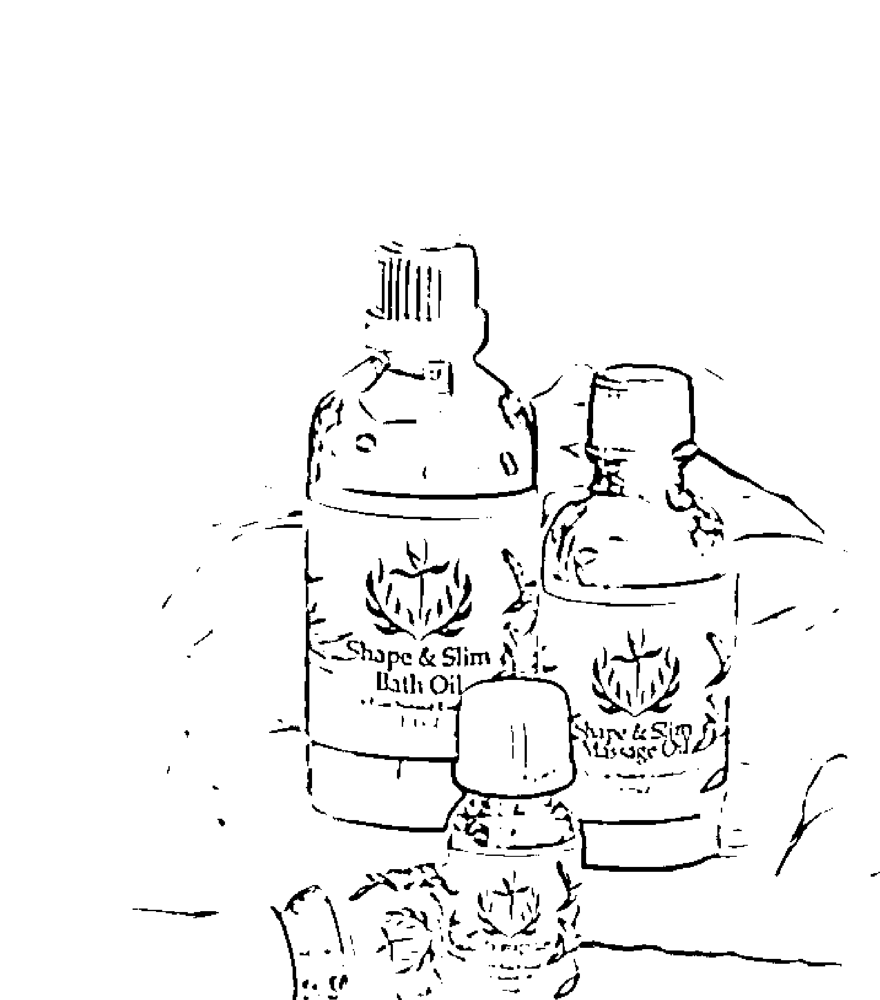

### 秋之蠶鳳湯

秋涼宜人，但接近晚秋時，天氣漸漸寒涼，相對的身體活動減少，人漸顯懶散，於是脂肪增加，身體沉重，缺乏活化輕盈感；五行中屬金的秋天是心靈的季節，特別是與獨立思考、寫作、說話有關的。所以不管是身體上、心靈上，秋天都是一個重新組織生活的時刻。

迷迭香能使中樞神經恢復活力，對於語言、視覺、聽覺等障礙也有所幫助；又因它有利尿屬性，對想減肥的人來說也有不錯的功用；此外，平日嗜睡慵懶沒有精神的人，也很適合使用迷迭香泡澡，因為它可以強化心靈，讓人活力充沛。

薑油可排除濕寒之氣，當人消沉疲憊時，有溫暖情緒、讓心情較為舒坦愉快的作用，增加元氣，和辣椒粉一樣能讓精神為之一振。

此泡澡配方可促進循環、新陳代謝、預防肥胖、增強元氣，補充能量，對減肥中減肥後、經期後的婦女可是一帖很不錯的配方。依照此方來個全套SPA按摩保養，感受將宛如浴火鳳凰，褪去層層厚皮，浴後全身輕鬆，充滿活力，有如再生。

- 泡澡配方：
  1. 迷迭香4滴、薑油3滴（或薑粉50g）。
  2. 迷迭香5公克、辣椒粉10公克。
- 做法：
  將精油滴在裝薑粉或辣椒粉的棉布袋，於泡澡前5分鐘置於浴缸。
- 水溫時間：
  38~40℃（舒適的溫度），半身浴，20分鐘。

#### 薰香：
迷迭香4滴、玫瑰草2滴。

#### 按摩：
一邊洗可一邊用棉布袋按摩身體，尤其是腳底、手肘厚繭處，一層層老化角質層隨之脫落，結束時別忘了用冷水快沖收斂。

#### 保養：
腳底完全按摩，可多多搓按深較肥胖較硬的部位。

#### 湯飲：
- 1. 將洋蔥、胡蘿蔔、芹菜放入鍋中熬煮，最重要的是加入迷迭香及少許辣椒，可當晚餐飲用，沐浴後若超過晚上8點則喝一些湯即可。
- 2. 礦泉水加蜂蜜30g，調勻，一次喝完，可調腸，治療慢性便秘。

太虛者泡澡時間可減半，慢慢漸進，出浴也要慢慢起來，注意安全。

### 冬之香柚湯

冬季在五行上屬水，自然界中一切事物和現象，只要它表現了寒涼的現象，都可列屬水的範圍，而冬季寒冷，自然是屬於水。

在五行上水掌控了腎臟和膀胱，這兩個器官都是維持人體水液正常代謝與平衡的功用。腎臟可藉由水的特性來滋潤，但過度的濕冷則容易對腎臟造成傷害，因此必須隨時保持身體的溫暖及適度的乾燥，尤其冬天，濕冷的天氣通常會讓你的背部僵硬而帶來痛苦，所以平日或泡澡時可多多按摩腳底的腎臟反射區。

寒冷的季節一到，呼吸道更容易敏感，感冒人數愈來愈多，此外皮膚容易缺水，會感到皮膚粗糙、發癢、失去原有的光滑，甚至筋骨痠痛、神經痛、虛冷症加劇的現象產生。

冬季泡澡，可說是生活中一大享受，再利用本季盛產最多、最好的柑橘類來泡澡，尤其是柚皮含維生素c最高，不僅可以美化肌膚、防止黑斑、疹子，促進循環，有助於初期的感冒，各種神經痠痛、虛冷症，提升免疫功能。

- 泡澡配方：
  1. 大柚皮1個或小柚皮2個。
  2. 葡萄柚6滴＋紅橙6滴＋茴香4滴。
- 方法：
  柚皮曬乾2天，放在烤箱烤4分鐘，切片放入棉布袋，用熱水浸泡10分鐘後，放入浴缸。可將新鮮的柚子肉浮在水上，提高柚子的芳香氣。
- 水溫時間：
  39℃，半身浴，20～30分鐘。

- 薰香：佛手柑3滴、百里香2滴。
- 顏色：暖色系橘或紅，給寒冬一些暖意。
- 按摩：腳底、腳背的前1/3是人體心肺、腎臟、胸、頸，可多多按摩；按大拇指指頭，有助於消除感冒引起的不適，預防感冒。
- 保養：佛手柑1～2滴，加在身體乳霜中，擦拭全身。
- 茶飲：柚皮20公克、加紅茶2包，以800cc水煮之後加蜂蜜飲用。
- 注意事項：不管是選用柑橘類的乾燥、新鮮品或精油，在使用後勿直接曝曬陽光，會讓肌膚變黑或過敏。

### 冬之潤膚美膚湯

有人一到冬天就開始煩惱，因為皮膚會開始發癢、泛紅、過敏，甚至脫皮等現象，總是忍不住想抓癢，實在很難過。癢的主要原因是皮膚乾燥及血液循環欠佳所引起的。

冬天時，身體為了防止體熱過分發散，致使血液循環減緩，以致血液循環欠佳，皮脂腺退化，油脂分泌減少，無法有效滋潤皮膚。此外，冬季汗腺分泌減少、皮脂表面角質層含水量降低而出現龜裂，加上遇乾冷空氣，更易敏感而癢個不停。

這時候最重要的是維持皮膚滋潤，並減少角質層的水分及脂肪流失。

薰衣草用在肌膚上有很好的療效，除了能平衡油脂分泌外，也能有效減緩肌膚過敏現象促進細胞再生、防老化等，因此常被調成按摩精油或入浴劑等。薄荷可平衡油脂、排除體內淤積的毒素，因此可紓解發癢現象，對於濕疹、癬也有改善作用。

記得發癢時千萬不要抓搔，否則容易造成發炎以及潰瘍現象，若是真的忍不住時可輕拍肌膚來克制。當然若能來個SPA滋潤肌膚，那最好不過了。

- 泡澡配方：
  1. 橄欖油600cc，浸泡薰衣草30g，2個星期以上，每次可取5cc倒入浴缸泡澡。
  2. 橄欖油5cc直接滴入6~8滴薰衣草或4滴洋甘菊＋2滴薄荷。
- 水溫及時間：
  39℃，先半身浴至全身發汗後，再全身浸泡5分鐘，起身後務必用毛巾擦乾身體。
- 顏色：
  黃色。

薰香：薰衣草3滴、薄荷2滴。

茶飲：熱甘蔗汁一杯，加少許薑汁飲用，可提供熱量，促進循環，補充維生素，潤膚養顏。

按摩：用毛巾或絲瓜絡搓按。

保養：身體乳液加上2~3滴的洋甘菊精油，擦拭全身。

- 注意事項：
  1. 勿使用鹼性肥皂洗澡，泡澡完一定要擦上身體滋養乳霜。
  2. 泡澡水溫勿太高。

### 局部芳療篇

> 人只有一種病，就是不知道自己在生命中的地位，
> 不瞭解此生的意義，試著向內心凝視傾聽，將發現不同的世界……

其實，人只有一種病，就是不知道自己在生命中的地位，不瞭解此生的意義，因為這樣，抗拒、壓力及身體失調才會產生，進而引發身心疾病。

如果你長期有頭皮屑的困擾，除了病理上的改善外，或許你應該向內看看自己，是否覺得懷才不遇，才能不被肯定，心中覺得憂慮、委屈……

試著讓身體放鬆，以滿懷的愛，用手輕輕撫觸肌膚，透過SPA的洗禮，身心將受到滋潤而自在。

小萱老師本身是過敏體質，以前醫師都說冬天——不能洗熱水澡、不能用香皂、不能泡澡，油脂會流失，後來，透過泡澡及精油的運用，治好了冬季皮膚癢的問題，於是，小萱老師自己研究出一套腳部芳香SPA，將傳統的按摩加入美容、養生的觀念，讓無法泡澡的人，也能做局部芳香SPA，享受芳療的樂趣。

### 頭部芳香SPA全療程

真正的芳香SPA放鬆，包含身、心的釋放，頭部是人體之首，在完整的頭部芳療裡，不僅可幫助頭髮生長、調理髮質、抑制頭皮出油、頭皮屑、掉髮，同時可消除頭痛、釋放壓力，提神醒腦，增強記憶。

一般而言，頭部芳香SPA護理原則，以照顧頭皮為優先，頭皮放鬆、健康了，才能改善髮質，擁有一頭令人稱羨的秀髮。現今隨著精油的廣泛運用及對頭皮健康保養的注重，在美髮界也掀起了一股精油護髮SPA風潮，邁向更高品質的服務。

如果你有頂上問題，又很難體會真正頭皮SPA的奧妙，建議你第一次先到專業的沙龍體驗一下，回家之後再按照小萱老師以下介紹的方法，再聽聽自己喜歡的音樂，即能真正享受頭部SPA樂趣了。

當然，如果沒有足夠的時間，可依自己的喜愛需求選擇其中一兩個步驟，做個半套頭部芳療，也是很不錯的。

#### STEP1 頭皮去角質

正常皮膚細胞每28天新陳代謝一次，但隨著年齡增長、內分泌失調、飲食作息等，都會影響到新陳代謝的遲緩，進而堵塞毛孔，而影響毛髮的生長及積壓在皮膚內的油垢、污物、毒素的正常代謝，特別是出油、掉髮、有頭皮屑的頭皮。

如果頭皮問題較嚴重者建議頭皮去角質一週兩次，可調節皮脂分泌，角質代謝、潔淨頭皮，讓頭皮也能呼吸順暢；若正常的頭皮建議一週一次的去角質。

- 三種頭皮去角質配方DIY
  1. 受感染、癢：茶樹2滴、洋甘菊2滴、薄荷1滴。
  2. 出油、頭皮屑：薄荷1滴、洋甘菊2滴、佛手柑2滴。
  3. 防止掉髮、增長頭髮：迷迭香2滴、佛手柑2滴、肉桂1滴。

頭皮去角質方法
- 1. 將去角質配方滴入30g～50g左右的細能量鹽，或有細顆粒的去角質霜，或礦物質粉末，調和均勻。
- 2. 將頭髮撥開分髮線，露出頭皮，將調和好的配方取適量沾在頭皮上。
- 3. 用中指或其他手指在頭皮上左右來回搓，每一小部分搓20下後，再進行下一部位。一條頭皮線做完再換另一條線，用以上方式至全頭完成。
- 4. 全頭皮去角質完成後，用十指指腹抓捏頭皮約2分鐘後，再將頭皮沖洗乾淨，接下來就可進行芳香洗髮了。
- 5. 若是用礦泥調製可停留15分鐘後再沖洗。

#### STEP2：芳香髮浴

這是個愉快又簡易的洗髮方式，每天都可以自己來。其實洗髮只要遵守以指腹搓洗，不要用指甲抓洗的大原則，其他可按自己最舒適的姿勢和方式洗即可。一般專業的SPA洗髮至少分兩道程序，1.是頭皮淨化，2.是髮質調理，同時呵護頭皮及頭髮，當然整個頭皮SPA過程一定少不了按摩，因此這時就要配合按摩了。通常頭皮有特別疼痛的地方，即是頭皮的病理反射區，加強按摩對健康是有幫助的，也可幫助頭皮減壓、釋放壓力、促進頭部循環。正常而言，一個星期約洗2～3次頭即可，只要掌握以下方法，不但隨時可自製自己喜愛的芳香洗髮精，也可達到按摩樂趣，減輕壓力哦！

##### 洗髮二部曲配方DIY

在洗髮精裡滴入數滴精油，即可自製個人芳香洗髮精了。視髮量多寡、長短，決定精油的使用量，通常男生的頭髮一次約3～5cc洗髮精加上一滴精油量即可，其他可依此類推。

##### 一、頭皮淨化配方
- 感染、出油：茶樹、佛手柑。
- 頭皮屑：蜜蜂花或甜橙。
- 痒：薄荷。
- 掉髮：迷迭香。
- 禿髮：月桂（肉桂）。
- 乾性：檀香。

##### 二、髮質調理配方
- 粗硬髮質：檸檬。
- 細髮質：紅橙。
- 受損髮質：檀香木。

但如果有很嚴重的頭皮問題，配方就要使用頭皮去角質的配方，不過要將精油配方加上10cc的荷荷巴油，一起調和使用。

#### STEP3 頭皮按摩

頭皮不只會分泌油脂，也會排出對身體有害之重金屬成分及老舊廢物，定期的頭皮按摩能加速新陳代謝及老舊污穢之分泌物排出。

頭皮按摩能促進血液循環，使毛囊獲得所需的營養物質，促使頭髮生長良好，也能釋放壓力，減輕頭痛等問題。

##### ○ 頭皮按摩配方
- 1. 受感染、癢：茶樹4滴、洋甘菊4滴、薄荷2滴。
- 2. 出油、頭皮屑：薄荷2滴、洋甘菊4滴、佛手柑4滴。
- 3. 防止掉髮、增長頭髮：迷迭香4滴、佛手柑4滴、肉桂2滴。

##### ○ 頭皮按摩方法
- 1. 將按摩配方加在15cc的荷荷巴油中調勻。
- 2. 如同去角質方式，將頭髮撥開分出髮線，露出頭皮，將按摩配方均勻塗在頭皮上。
- 3. 用十指指腹輕輕按壓抓捏頭皮，在頭皮特別痛的地方可加強按壓。若喜歡較強的按摩，也可拿刮痧板刮頭皮，或是用精油瓶子的底部做按摩（必須確定玻璃瓶是沒有缺角裂縫，以免刮傷頭皮）。
- 4. 然後在每一個部位約1～2公分區塊，來回搓，可進行5～15分鐘的按摩（此方法也可在晚上做，然後直接停留在頭皮上過夜，等隔天早上清洗，效果更好。）之後，接著即可擦上特調的精油護髮霜。

#### STEP4 護髮

別以為洗髮、按摩就好了，別忘了還有最後一道程序不可少，那就是護髮，也是不可忽視的哦！

現在空氣污染嚴重，加上待在冷氣房裡，許多人頭髮非常的毛澀乾燥，有的人過度染燙，造成頭髮分叉沒彈性，對整體美觀及神采倒扣不少分數，實在美中不足，三千煩惱絲，形容可真是貼切。

如何讓三千煩惱絲柔軟有彈性呢？只要你肯再花一些時間，一週1～2次，一段時間後就會有意想不到的效果哦！

- 護髮霜配方DIY
  - 中粗髮質、乾燥、毛澀、分叉：迷迭香2滴、天竺葵2滴、紫檀木2滴。
  - 細、乾燥、毛澀、無彈性：天竺葵2滴、檀香木2滴、紅橙2滴。
  - 粗硬、乾燥、毛澀、分叉：天竺葵2滴、檸檬2滴、尤加利2滴。
- 護髮方法
  - 1. 護髮霜配方加上15cc的荷荷巴油即可。可依髮量、長短同比例增加，若家中有護髮霜也可加30cc一起調和，精油不需再增加了。
  - 2. 將頭髮分成一小搓一小搓，把調和好的護髮霜用手指直接抓塗在頭髮上，尤其是髮尾；一搓一搓進行至全部頭髮都上護髮霜。
  - 3. 將全部頭髮用保鮮膜包起來，再包上毛巾。
  - 4. 約20分鐘之後，再沖洗頭部、頭皮及頭髮。
  - 5. 若覺得還是太油膩，可再用洗髮精快速清洗一遍，你將發現自己的髮絲光滑柔軟無比。
  - 6. 吹乾頭髮，這時更能體會頭皮與頭髮的輕盈彈性，恭喜你完成一次完整的頭部芳療SPA。
- 注意事項：
  - 若是剛染完頭髮一週內不要用精油洗髮，尤其是茶樹精油，有強力的淨化作用，會讓化學染料褪掉。

### 手部SPA全療程

手部是一個容易洩漏女人年齡身分的部位之一，也是使用的最頻繁的部位，只是其地位往往不若臉部來得受到重視，而被忽略了。

如果手部容易乾燥或有富貴手的人，一到秋冬季節，不但會脫皮也會龜裂，令人難以忍受。手部肌膚健康與否是很重要的，可是我們幾乎很少讓它休息，因此一旦受傷就很難自癒，且越傷越重，甚至難以根治。

其實無論是手部肌膚健康、乾燥或有富貴手，都應該注意手部肌膚保養之道，好好呵護雙手，保持水嫩。如平時最基本的保養方式應該：避免過度頻繁的使用洗手乳液或肥皂；每次洗完手後，擦乾後立刻塗抹護手霜；避免長時間讓手接觸各類溶劑或是水；做家事時，先戴上棉質手套再套一般手套，雙層手套以保護手部肌膚。

當然如何能定期做手部SPA全療程，依照下面方法護理保養，那麼擁有一雙美麗的玉手並非難事。

#### STEP 1 修剪指甲

手部SPA的第一步是進行指甲的修剪及搓型，之後將手洗淨。

#### STEP 2 手浴
- 1. 準備泡手的臉盆（不要使用塑膠盆），水溫約38~40℃。
- 2. 在臉盆中放入半顆檸檬切片，即可進行手浴，約10分鐘。

富貴手配方——檸檬醋50cc、茶樹2滴、快樂鼠尾草2滴，加粗海鹽30g。

#### STEP 3 手部按摩

##### ○ 按摩護手雙配方
- 手部乾燥：乳香2滴、檀香2滴、甜橙2滴、植物油10ml、小麥胚芽油5滴。
- 富貴手：乳香2滴、廣藿香2滴、茶樹1滴、植物油10ml、小麥胚芽油5滴。

##### ○ 按摩方法
- 1. 將調和好的護手SPA配方擦在手背及手指上。
- 2. 用另一隻手掌輕撫另一隻手背。
- 3. 用拇指按壓手掌，促進循環，也可在手掌反射區進行按壓，約2~5分鐘。
- 4. 用拇指指腹以螺旋方式按摩手指及指甲邊緣，一根根慢慢進行。
- 5. 換手操作。最後擦上一層植物油護手霜（可以市售）。
- 6. 套上棉料手套30分鐘，或直接戴著睡覺。
- 7. 平時隨時可擦上植物油護手霜，進行以上按摩。

○ 注意事項：使用護手霜前要洗手，馬上擦乾後立即擦上，否則在皮膚乾燥的情況下擦上護手霜，並沒有保濕的效果。

#### STEP4 美化指甲

##### ○ 美甲配方
胡蘿蔔籽油5滴、檸檬6滴、迷迭香4滴、植物油30cc、小麥胚芽油5滴。

##### ○ 美甲方法
每次取適量的配方按摩指頭、指根及指甲邊緣，再換另一隻手即可。這種方法不僅可美白手部，同時軟化甲皮，也能讓新長的指甲很健康，色澤粉紅漂亮。此外也可多補充維生素B群。

### 足部芳療SPA全療程

足部又稱為第二心臟，它承載身體重量，引領我們移動到想到達的地方。擁有健康美麗的雙足，不但可顯現感性之美，同時也能讓生活擁有彈性與活力，在人生道上順利向前走。

人體所有的器官在腳部都有反射區，按摩反射區，會產生類似生理電作用，反射到相對器官，有促進自癒功能、提升免疫力、調整內分泌、增強生理機能的效果，而且沒有副作用。

不過長期的站立或走路，往往累積了許多的疲勞及廢物，致末梢血液循環不良，引發腳部疼痛或腫脹，這也可能是身體健康的警訊，不可忽視。

從現在開始，每天可花一點點時間，如看電視、聊天、看書時，順便做個足部SPA，不僅可消除一天的疲勞，消除痠痛的雙足，更能帶來好的睡眠，讓你擁有一雙人人稱羨性感的雙足。

#### STEP1 足部去角質 & 足浴

足底是人體最容易長厚繭的地方，也是血液循環較不容易到達之處，所以足部的角質更容易堆積，甚至長繭、變形，所以每週至少一次去角質，保持足部的光滑，促進血液循環。

##### ○ 足部去角質配方
- 放鬆：薄荷3滴、尤加利2滴。
- 殺菌（香港腳）：茶樹3滴、尤加利2滴。
- 促進循環：薑油3滴、尤加利2滴（或薑粉30g先用熱水沖泡5分鐘）。
- 美白：1. 半顆檸檬切片，先擠出一些汁液，其餘切片放入水中。 2. 檸檬精油3滴、尤加利2滴。
- 將以上精油配方加入30g～50g的粗鹽，調勻後使用。

##### 足部去角質方法
- 1. 首先進行足部指甲修剪、搓型，若有擦指甲油者先用去光水擦掉，接著將足部清洗乾淨、雙足放入約40℃～42℃的水溫中浸泡3～5分鐘。
- 2. 如果有很厚的角質者，可使用浮石或足部搓刀先將厚的足繭搓下來。
- 3. 接著將先前調好的配方用螺旋的方式輕輕的按摩足踝、足背、足根、小腿3～5分鐘，再放入水中浸泡10～15分鐘，如果水溫涼了，可換一桶水或加熱水。
- 4. 後用毛巾擦乾，浸泡時可放一些玻璃珠或鵝卵石在盆裡，腳掌踩在上面可做腳底按摩，輕鬆又有趣，可看書報、電視或喝茶，相當悠閒享受。
- 5. 如果不做去角質者，可直接將配方加30g粗鹽倒入溫水中浸泡即可。

#### STEP2 足部按摩

足部的保養、按摩需要一些耐心，每天固定用雙手來撫摸自己的雙腳，甚至對它說話，讓自己重新感受到如同嬰兒般被愛的感覺，支持自己在生命的旅途中能夠更有勇氣克服困難、遠離疾病，找到立足點，做個完整的美人兒。

##### ○ 按摩配方
配方同去角質，不加鹽，但要加上15cc植物油調和。
香港腳：茶樹2滴，廣藿香、沒藥、快樂鼠尾草、薰衣草、尤加利（選3種各3滴）、植物油10cc調和按摩。

##### ○ 按摩方法
- 1. 將調配好的精油配方倒一些在手掌上，搓熱後用大螺旋方式均勻地將油塗在足底、足背、足踝、小腿至膝蓋。
- 2. 在足踝兩側加強小螺旋按摩，可強化淋巴排毒。
- 3. 用拇指、食指來回上下的搓足後跟上方的阿基里斯腱（腳脖子後方處），可消除疲勞。
- 4. 參考足部反射區，特別在脊椎、腎臟、消化區、生殖泌尿區加強按摩，或直接在比較疼痛敏感部位按摩，也可使用刮痧板或按摩棒。
- 5. 用雙手長拇指丘螺旋按摩足背足底。
- 6. 抓捏每一根腳指頭。
- 7. 最後雙手握住足踝上方，以捏放捏放方式由小腿往上至膝蓋上方。
- 注意事項：香港腳患者可將配方擦在患處，不嚴重者可輕輕按摩，若有傷口處避開不做按摩。

#### STEP3 足部保養

滋潤：乳香1滴、金盞花1滴、足霜（或滋養霜）適量調勻輕輕按摩足部至吸收，再套上棉襪。不僅可以促進末梢循環，可預防腳乾裂，擁有健康美麗的雙足。

香港腳：可直接用棉花棒沾茶樹精油直接塗在患部，或擦上上述香港腳配方。

平時可用茶樹2滴、廣藿香2滴加在清潔乳中清洗雙足。

#### STEP5 美化指甲

- 美甲配方
  胡蘿蔔籽油5滴、檸檬6滴、迷迭香4滴，加30cc植物油。
- 美甲方法
  每次取適量的配方按摩指頭、指根及指甲邊緣，再換另一腳即可。

這種方法不僅可美白腳部，同時軟化甲皮，也能讓新長的指甲很健康，色澤粉紅漂亮。此外也可多補充維生素B群。

### 示例文档标题

这是一个示例段落，用于展示文档内容提取。

- 列表项一
- 列表项二
- 列表项三

### 能量中心

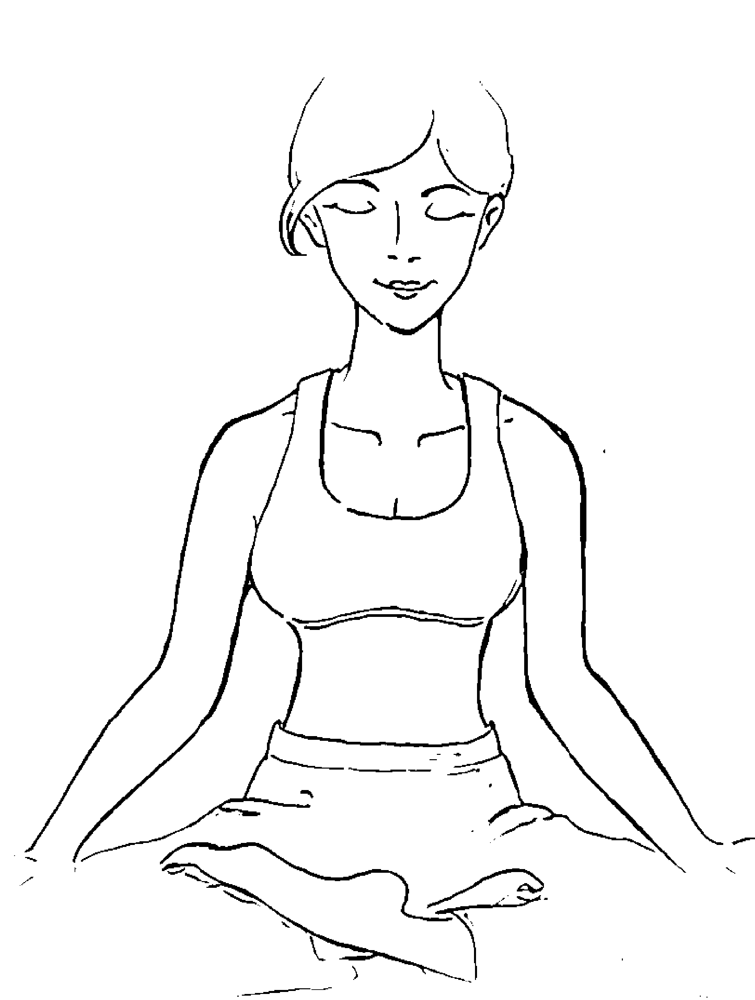

### 能量中心

能量中心是運用古印度瑜伽的脈輪原理而來的，古印度瑜伽指出人體有七大脈輪，那麼脈輪是什麼？比喻來說它是一種不斷旋轉類似紡錘形的能量中心，是喚醒並且平衡生理、情感、心智、靈性等等層面能量的好方法。

脈輪分佈在人體脊椎尾端到頭頂上方，每一個脈輪各有其相對應的器官、色彩、特性，因此可藉由冥想色彩光來平衡失調的身心感官功能，讓身心回復自然健康的平衡狀態，以更積極正面的態度面對這個世界與未來。

植物具有獨特的頻率，是往來於天人之際的橋樑。能幫助人們回到上帝的花園。尤其玫瑰精油是愛的使者，將上天無條件的愛帶到人間。透過植物精油協助找到身心的平衡，支持生命每個階段的覺醒。

按摩或泡澡時可做色彩的視覺冥想，以下介紹的方式在平時也可以做練習，只要找一個不受打擾寧靜且讓自己感到自在舒適的地方即可。

#### 人體七個脈輪

首先我們要瞭解人體七個脈輪的位置及代表的顏色特性。

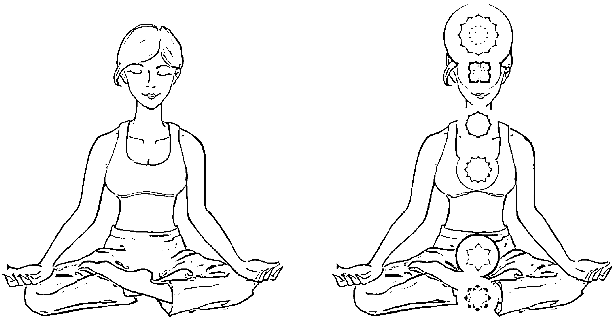

#### 第一個脈輪：海底輪

- 腺體：性腺（腎上腺）
- 位置：會陰部（尾椎）
- 身體：生殖器、排泄器官、腿、腳、脊椎底部
- 代表顏色：紅色
- 失衡：沒有安全感
- 特性：生存的渴望、熱情、生命力、性能量
- 功效：幫助根著於地，給予活力，刺激循環、平衡性能量
- 植物：紅色玫瑰、紅色天竺葵、伊蘭、檀香、生薑、花梨木

#### 第二脈輪：臍輪

- 腺體：腎上腺（性腺）
- 位置：生殖器之上、肚臍之下（薦骨）
- 身體：肚臍、腹部、腸、下背部
- 代表顏色：橘色
- 失衡：沉迷於肉體歡愉
- 特性：歡愉的追求、樂觀、創造力、恐懼與勇敢、驚嚇
- 功效：增強喜悅感、增強荷爾蒙功能、加強生殖器官、改善腹部循環、泌尿系統及下背問題
- 植物：玫瑰、金盞花、橙花、甘菊、香蜂草、甜橙、依蘭、快樂鼠尾草

#### 第三脈輪：胃輪（太陽神經叢）

- 腺體：胰腺
- 位置：肚臍和橫膈膜之間
- 身體：太陽神經叢、胃、肝、膽、脾、脊椎中段
- 代表顏色：黃色
- 失衡：控制
- 特性：力量、自信、學習、智慧、決心、領導力
- 功效：排毒、有助於消化管道，肌肉放鬆，增加自信、智慧、消除緊張
- 植物：玫瑰、金盞花、向日葵、檸檬馬鞭草、歐薄荷、甜橙、杜松

#### 第四脈輪：心輪

- 腺體：胸腺
- 位置：心臟（胸椎）
- 身體：心、肺、上背部
- 代表顏色：綠色
- 失衡：貪婪
- 特性：愛、平衡、給予和接受、希望
- 功效：強化免疫功能、幫助心、肺、改善心情、充氧、平靜
- 植物：粉紅玫瑰、佛手柑、尤加利、迷迭香、百千層、甘菊

#### 第五脈輪：喉輪

- 腺體：甲狀腺、副甲狀腺
- 位置：喉嚨（頸部）
- 身體：喉嚨、頸部、頭蓋骨底部、甲狀腺、副甲狀腺、支氣管
- 代表顏色：藍色
- 失衡：不敏感、表達困難
- 特性：創造力、溝通、和平、表達
- 功效：止發炎、鎮痛、平衡甲狀腺、促進內心寧靜、放鬆血管與肌肉
- 植物：甘菊、迷迭香、薰衣草、歐薄荷

#### 第六脈輪：眉心輪（第三眼）

- 腺體：松果腺（腦下垂體）
- 位置：前額與兩眼之間
- 身體：眉心、臉、眼、耳
- 代表顏色：靛藍色，掌控松果腺
- 失衡：疏離、幻想
- 特性：直覺、靜心、洞察、明白、敏銳
- 功效：潛意識靈感、放鬆、抗發炎、平衡神經系統、轉化情緒
- 植物：德國甘菊、乳香、花梨木、薰衣草、葡萄柚

#### 第七脈輪：頂輪

- 腺體：腦下垂體（松果體）
- 位置：頭頂
- 身體：頭、頭頂、腦、皮膚中樞、神經系統、荷爾蒙
- 代表顏色：紫色
- 失衡：盲目宗教信仰
- 特性：開悟、放下、與大自然宇宙合一、服務、治療
- 功效：放鬆、安定心神、安眠、冥想、專注、平衡頭部能量
- 植物：薰衣草、紫羅蘭、苦橙、檀香、乳香

#### 冥想方法

1. 取3滴調合好的脈輪精油，於左右手手掌以順時鐘輕繞數圈，一手置於身體前方一手置於身體後方脊椎處，各以繞圈的方式輕輕擦在對應的脈輪部位，讓天然芳香精油的頻率支持脈輪的平衡。
2. 讓自己以最舒服的坐姿或躺著，為接下來的冥想做準備。首先閉上眼睛，深呼吸，呼吸要緩慢而深長，反覆幾次，讓全身肌肉放鬆，讓自己心平氣和為止。
3. 開始進入色彩冥想，首先想像一道燦爛光輝的白光從遙遠的地方而來，白光從頂輪（頭頂）灌透而下，依序進入身體各個脈輪，最後全身充滿白光，儘量讓自己帶著積極樂觀的想法，迎接燦爛希望的白光。純淨的白光是七種顏色的綜合，可以為全身帶來平衡的力量。如果沒有特別的疾病，約5分鐘後，再做深呼吸，意念回到身體，讓白光從頂輪射出，回歸自然。
4. 若有一些疾病，於白光冥想約3分鐘後，以同樣的方式，冥想那個色彩自頂輪灌透而下，依序進入各個脈輪，可以在疾病的痛處範圍做停留，然後至全身，最重要的是心中帶著那個色彩顏色的正面特性，且不斷重複這樣的信念，你將重拾生命的熱忱與希望，進而減輕疾病。
5. 約5分鐘後，做深呼吸，讓那個色彩自頂輪射出，回歸自然，而你的身心上也重獲自由與充滿希望。
6. 能量保護：每個人或空間都有獨特的氣場，當能量不平衡低落時，氣場相對會變弱。芳香精油的揮發特性剛好是平衡氣場的最佳物質，可在脈輪冥想或按摩前或後做保護氣場。取3滴調合好的氣場保護精油於掌心，雙掌合十閉目呼吸至心情平靜。之後將雙手舉起掌心朝天，將植物的芬芳分享給宇宙，感受到掌心能量振動後，雙手掌心朝下緩緩於離頭頂約5公分處輕柔緩慢滑動，移動至頭後→臉部→脖子→肩膀→身體前面→身體背面→左手→右手→雙手同時輕滑前腿→後腿，緩緩回到胸前雙手合掌，靜心一下再張開眼睛。

## 芳療處方

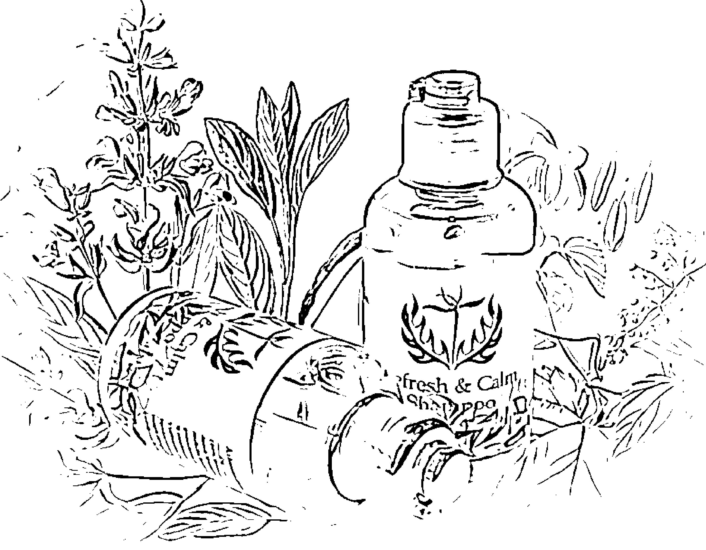

### 頭部適用精油及治療穴道

#### 一、心臟、血管

| 病名 | 適用精油 | 治療穴道 |
|---|---|---|
| 高血壓 | 纈草、薰衣草、杜松、香水樹 | 足三里、人迎、內關、風池、曲池 |
| 動脈硬化 | 迷迭香、藍甘菊 | 湧泉 |
| 心絞痛 | 玫瑰、放鬆精靈 | 膻中、曲澤、內關、神門、勞宮 |
| 心動過速 | 香油樹、薰衣草、藍甘菊 | 內關、心俞、厥陰俞、中府、郤門 |
| 貧血 | 胡蘿蔔子油、紅橙 | 足三里、血海、膈俞 |

#### 二、頭部病痛

| 病名 | 適用精油 | 治療穴道 |
|---|---|---|
| 頭痛 | 冰葉日中花、玫瑰激勵 | 印堂、百會、天柱、啞門、列缺、風池 |
| 頭暈(眩暈) | 薰衣草、薄荷、綠野仙蹤 | 鬱風、印堂、風池、內關、太陽、聰宮 |
| 記憶減退 | 迷迭香、葡萄柚、玫瑰 | 隱白 |
| 偏頭痛 | 紅橙、藍甘菊、綠野仙蹤 | 外關、太陽、足臨泣、頭維 |

#### 三、顏臉部病痛

| 病名 | 適用精油 | 治療穴道 |
|---|---|---|
| 面神經麻痺 | 薰衣草、肉桂、蛇麻草、循環好氣色 | 鬱風、聰宮、下關、頰車、地蒼 |
| 臉部癱瘓 | 薰衣草、肉桂、蛇麻草、循環好氣色 | 迎香、四白、合谷、頰車、風池 |
| 嘴角流涎 | 薰衣草、肉桂、迷迭香、循環好氣色 | 地蒼 |

#### 四、頸部病痛

| 病名 | 適用精油 | 治療穴道 |
|---|---|---|
| 睡覺撐筋 | 玫瑰、薄荷、綠野仙蹤 | 落枕 |
| 脖子僵硬 | 百千層、薄荷、玫瑰激勵 | 孔最、風池、列缺 |

#### 頸部適用精油及治療穴道

#### 五、目、耳部病痛

| 病名 | 適用精油 | 治療穴道 |
|---|---|---|
| 假性近視 | 薰衣草、明眸舒導 | 承泣、睛明、球後、勞宮 |
| 青光眼 | 胡蘿蔔子油、洋甘菊精露 | 肝俞、睛明、攢竹、承泣 |
| 老花眼 | 薰衣草、明眸舒導 | 太陽、養老、承泣、睛明 |
| 眼睛疲勞 | 薰衣草、玫瑰精露 | 睛明、攢竹、絲竹空、商陽 |
| 耳聾 | 百里香 | 下關、翳風、風池、聽宮 |
| 耳鳴 | 百里香 | 聽宮、耳門、風池、翳風、少海 |
| 重聽 | 百里香 | 聽宮 |

#### 六、鼻、口部病痛

| 病名 | 適用精油 | 治療穴道 |
|---|---|---|
| 鼻塞 | 薰衣草、百千層、歐薄荷、呼吸順暢 | 迎香、列缺、合谷、印堂 |
| 打鼾 | 新薰衣草、尤加利 | 迎堂、風府 |
| 鼻竇炎 | 銀杉、白千層、尤加利、茶樹 | 迎香、印堂、四白、合谷 |
| 口腔炎(舌帶炎) | 薄荷、佛手柑 | 合谷、曲池、地蒼、勞宮 |
| 牙痛 | 茉莉、丁香、百里香 | 合谷、下關、頰車、聽宮、曲池 |
| 口苦 | 丁香、淡薄荷 | 膽俞 |

#### 七、喉嘴部病痛

| 病名 | 適用精油 | 治療穴道 |
|------|----------|----------|
| 支氣管炎 | 檸檬、矮松、呼吸順暢 | 足三里、大椎、身柱、中府 |
| 腮腺炎 | 百里香、茶樹、尤加利 | 頰車、翳風、翳明 |
| 喉嚨痛(肩桃體炎) | 檸檬、白千層、茶樹、尤加利 | 合谷、扶突、頰車、尺澤、內關 |
| 喉嚨阻塞感 | 百里香、歐薄荷、松 | 合谷 |
| 痰多 | 苦橙、沒藥、尤加利 | 中府、扶突、肺俞 |
| 傷風感冒 | 佛手柑、茴香、茶樹、呼吸順暢 | 風府、風門、風池、大椎、孔最、合谷 |
| 咳嗽 | 茴香、乳香、松 | 魚際、尺澤、膻中、雲門、天突 |

### 胸部適用精油及治療穴道

#### 八、胸肺部病痛

| 病名 | 適用精油 | 治療穴道 |
|------|----------|----------|
| 胸悶 | 新薰衣草、歐薄荷 | 中府、內關、雲門、膻中、天池 |
| 胸痛 | 新薰衣草 | 中府、孔最、內關、雲門、膻中 |
| 哮喘 | 蜜蜂花、白千層、洋甘菊 | 足三里、尺澤、中府、孔最、腎俞 |
| 氣喘 | 尤加利、薰衣草 | 中府、至陽、天突、內關、尺澤 |

#### 九、胃腸部病痛

| 病名 | 適用精油 | 治療穴道 |
|---|---|---|
| 慢性胃潰瘍 | 藍甘菊、檸檬馬鞭草、薄荷 | 中脘、內關、足三里 |
| 十二指腸潰瘍 | 藍甘菊、檸檬馬鞭草、薄荷 | 內關、樑門、足三里 |
| 胃病 | 葡萄柚、甜橙、茴香 | 樑丘、中脘、足三里、內關、胃俞 |
| 胃下垂 | 冰葉日中花、薑、健胃整腸 | 足三里、中脘、天樞、腎俞 |
| 腹痛腹瀉 | 葡萄柚、黑胡椒 | 樑丘、氣海、足三里、天樞、神闕 |
| 腹脹腸鳴 | 薰衣草、羅勒、茴香、健胃整腸 | 關元、大橫、氣海、天樞 |
| 增進食慾 | 檸檬、甜橙 | 中脘、命門、足三里、天樞 |
| 消化不良 | 茴香、羅勒、健胃整腸 | 中脘、足三里、關元、胃俞 |
| 打嗝 | 紫檀木、放鬆精靈 | 至陽、足三里、內關 |

#### 十、泌尿部病痛

| 病名 | 適用精油 | 治療穴道 |
|---|---|---|
| 尿失禁 | 藍甘菊、迷迭香 | 關元、三陰交、中極、陰陵泉 |
| 夜尿症 | 藍甘菊、薑、培元固本 | 關元、中極、至陰 |
| 排尿困難 | 天竺葵、杜松 | 中極、至陰、委中、關元 |
| 膀胱炎 | 天竺葵、白千層、潔淨精靈 | 關元、陰陵泉、曲骨、至陰、三陰交 |
| 痔瘡 | 藍甘菊、葡萄柚、天竺葵、金銀梅 | 百會、長強、承山、秩邊、八髎 |
| 便秘 | 葡萄柚、迷迭香、茴香 | 足三里、支溝、神門、木橫、大腸俞 |
| 糖尿病 | 天竺葵、檸檬、尤加利 | 腹溜、膀胱俞、胰俞、命門、湧泉 |

### 手、足部適用精油及治療穴道

#### 十一、手足腰肩背部病痛

| 病名 | 適用精油 | 治療穴道 |
| :--- | :--- | :--- |
| 手顫 | 肉桂 | 曲澤 |
| 手臂麻木 | 薄荷、玫瑰、丁香、玫瑰激勵 | 頸背、肩井、陽池 |
| 上肢癱瘓 | 薄荷、玫瑰、丁香、玫瑰激勵 | 肩髎、四瀆、曲池 |
| 五十肩 | 薄荷、玫瑰、鹿蹄草、玫瑰激勵 | 臂臑、曲池、合谷、天柱、肩井、伏兔 |
| 肩背酸痛 | 天竺葵、薄荷、玫瑰 | 肩井、啞門、天柱 |
| 閃腰 | 鹿蹄草、薄荷、培元固本 | 腰陽關、八髎、後溪 |
| 腰、背酸痛 | 薄荷、肉桂、藍甘菊、培元固本 | 腎俞、委中、命門、殷門 |
| 小腿抽筋 | 纈草、歐薄荷、放鬆精靈 | 承山、殷門、委中 |
| 足、腿部疲勞 | 新薰衣草、薄荷 | 湧泉、承山、委中、委陽、樑丘 |
| 走路腳酸 | 新薰衣草、薄荷、能量精靈 | 血海、湧泉、承山、梁丘、委陽 |
| 下肢癱瘓 | 丁香、鹿蹄草 | 腰陽關、風市、承山、崑崙、殷門、環跳、委中 |
| 手指關節痛 | 檸檬、丁香、關節釋放 | 合谷、八邪、列缺、曲澤、通里 |
| 肘關節痛 | 檸檬、丁香、歐薄荷、玫瑰激勵 | 尺澤、小海、曲池 |
| 膝關節痛 | 檸檬、丁香、歐薄荷、玫瑰激勵 | 曲池、伏兔、血海 |
| 肩關節痛 | 檸檬、丁香、百里香、玫瑰激勵 | 巨骨、肩髎 |
| 關節風濕痛 | 迷迭香、檸檬、百里香 | 會痛的地方 |

#### 十二、神經性病痛

| 病名 | 適用精油 | 治療穴道 |
|------|----------|----------|
| 羊癲瘋 | 薄荷 | 啞門、人中、百會、身柱、勞宮 |
| 健忘 | 迷迭香 | 百會、心俞、神門、長強 |
| 口吃 | 淡薄荷 | 啞門、陶道 |
| 神經衰弱 | 纈草、丁香、茉莉 | 合谷、百會、心俞、中脘、足三里、湧泉 |
| 精神病 | 蜜蜂花、茉莉 | 人中、曲池、湧泉、內關、足三里 |
| 肋間神經痛 | 薄荷、胡蘿蔔子油、薰衣草 | 膻中、內關、少海、期門、支溝 |
| 坐骨神經痛 | 蜜蜂花、纈草、藍甘菊 | 環跳、風市、崑崙、殷門、命門、八髎 |

### 婦女適用精油及治療穴道

#### 十三、全身疲勞

| 病名 | 適用精油 | 治療穴道 |
|------|----------|----------|
| 失眠 | 薰衣草、鼠尾草、甜美的夢 | 內關、印堂、風池 |
| 多夢 | 紅橙、洋甘菊 | 神門、隱白、內關、風池、足三里 |
| 宿醉醒酒 | 檸檬、苦橙 | 胃俞、商陽、大敦、啞門 |
| 暈船、車 | 檸檬、薰衣草、薄荷 | 足三里、曲池、商陽 |
| 消除睡意 | 薄荷、淡薄荷、香茅 | 隱白、人中 |
| 睡醒不舒服 | 檸檬、淡薄荷、玫瑰激勵 | 大椎、長強、足三里 |
| 長距離駕駛疲勞 | 香茅、薄荷、綠野仙蹤 | 太陽、肩井、長強、人中 |
| 憂鬱、情緒不安 | 紅橙、茉莉、綠野仙蹤 | 湧泉、足三里 |

#### 十四、女生特有病

| 病名 | 適用精油 | 治療穴道 |
|------|----------|----------|
| 月經不順 | 玫瑰、藍甘菊、婦寶 | 氣海、血海、三陰交、足三里 |
| 月經痛 | 胡蘿蔔仔油、藍甘菊、茴香 | 關元、十七椎下、三陰交、血海、公孫 |
| 閉經 | 玫瑰、白檸檬、快樂鼠尾草、婦寶 | 血海、足三里、三陰交 |
| 乳汁分泌汁 | 茴香、蒔蘿 | 乳根、膻中、少澤 |
| 怕冷症 | 紅橙、苦橙、薑、肉桂 | 三陰交、復溜、湧泉 |

#### 十五、皮膚美容

| 病名 | 適用精油 | 治療穴道 |
|------|----------|----------|
| 禿頭 | 月桂、肉桂、天竺葵 | 風池、至陰、湧泉 |
| 脫髮 | 肉桂、杜松、薰衣草、迷迭香 | 風池、督俞 |
| 頭髮烏亮 | 紫檀木、佛手柑、薰衣草、尤加利 | 風池、腎俞 |
| 皮膚粗糙 | 藍甘菊、乳香、檀香 | 手三里、天樞、合谷、肝俞 |
| 多汗 | 茶樹、絲柏、鼠尾草 | 後溪、合谷、肩髎 |
| 乳房豐滿 | 茴香、伊蘭、迷迭香 | 乳根、膻中 |
| 過胖 | 葡萄柚、杜松、黑胡椒 | 大橫、大敦 |
| 過瘦 | 肉桂、紅橙 | 脾俞、足三里 |

### 男女適用精油及治療穴道

#### 十六、性的治療

| 病名 | 適用精油 | 治療穴道 |
|------|----------|----------|
| 陽萎 | 玫瑰、香水樹、茉莉、肉桂 | 關元、中極、三陰交、至陰、腎俞 |
| 早洩 | 玫瑰、茉莉、藍甘菊、薑 | 中極、十七椎下、關元、三陰交、足三里 |
| 增強精力 | 肉桂、茉莉 | 關元、中極、十七椎下、八髎、腎俞 |
| 遺精 | 藍甘菊、肉桂 | 中極、三陰交、足三里、關元、命門 |
| 性冷感 | 玫瑰、香油樹、檀香 | 曲骨、長強 |

#### 十七、防病保健強壯

| 病名 | 適用精油 | 治療穴道 |
|------|----------|----------|
| 男性 | 茉莉 | 足三里、關元、腎俞 |
| 女性 | 玫瑰 | 足三里、三陰交、氣海 |

#### 十八、肌膚保養

| 病名 | 適用精油 | 治療穴道 |
|------|----------|----------|
| 敏感肌 | 甘菊、薰衣草、天竺葵、玫瑰 | 按摩、保養、敷膜 |
| 老化肌 | 迷迭香、乳香、玫瑰 | 按摩、保養、敷膜 |
| 黑斑肌 | 胡蘿蔔仔油、檸檬、玫瑰 | 按摩、保養、敷膜 |
| 乾性肌 | 檀香、玫瑰、洋甘菊、薰衣草 | 按摩、保養、敷膜 |
| 沒血色 | 紅橙、天竺葵、橙花 | 按摩、保養、敷膜 |
| 皺紋 | 迷迭香、乳香、玫瑰、薰衣草 | 按摩、保養、敷膜 |
| 眼袋 | 金盞花、玫瑰、迷迭香、薰衣草 | 按摩、保養、敷膜 |

## 芳療處方

| 症狀 | 精油配方 | 用法 |
| :--- | :--- | :--- |
| 黑眼圈 | 玫瑰、金盞花 | 按摩、保養、敷膜 |
| 油性肌 | 洋甘菊、天竺葵、伊蘭 | 按摩、保養、敷膜 |
| 粉刺 | 薰衣草、洋甘菊、迷迭香 | 按摩、保養、敷膜 |
| 橘皮組織 | 杜松、羅勒、茴香、葡萄柚、迷迭香 | 按摩、保養、敷膜 |
| 蚊蟲咬傷 | 茶樹、薄荷、薰衣草、洋甘菊 | 按摩、保養、敷膜 |
| 濕疹 | 薰衣草、甘菊、金盞花、尤加利 | 按摩、保養、敷膜 |
| 美胸 | 茴香、迷迭香、伊蘭 | 按摩、保養、敷膜 |

## 作者叮咛

身心的療癒成長，隨著生命每一個階段的開展。經歷不同的療法，與各式各樣的經驗。各種獨特的療法，回應不同人的需求。肢體、顏色、光、聲音、動物、醫藥、藥草、芳香療法……

不執著於某單一療法，適時佐以傳統醫學的評估與調整，找出自己在每階段最合適的療癒方式。

芳香療法，可以輕易的用在生活、居家、辦公室、按摩……，協助維持身心的平衡，是一種美麗芬芳又幸福的方法，但並不是唯一的方式。

祝各位讀者能遠離疾病享受幸福的人生。

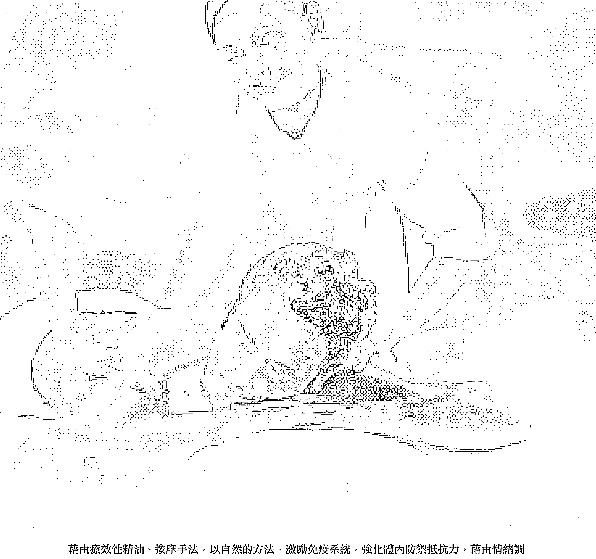

藉由療效性精油、按摩手法，以自然的方法，激勵免疫系統，強化體內防禦抵抗力，藉由情緒調整，使身、心、靈健康並平衡和諧，進而治療身心症狀，達到放鬆、紓解焦慮、緊張情緒的功效。人體器官組織內累積的毒素、廢物、分泌腺體的異常、精神上的壓力，憂慮，都會反射到臉部、肌膚、肌肉、手部、腳底……芳香療法透過諮詢、觸診、視診可深入尋找問題根源，針對症狀給予適當的精油對症調理，讓人回歸身體、心靈的純淨健康。