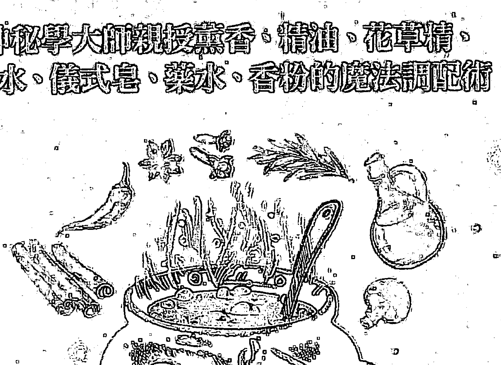
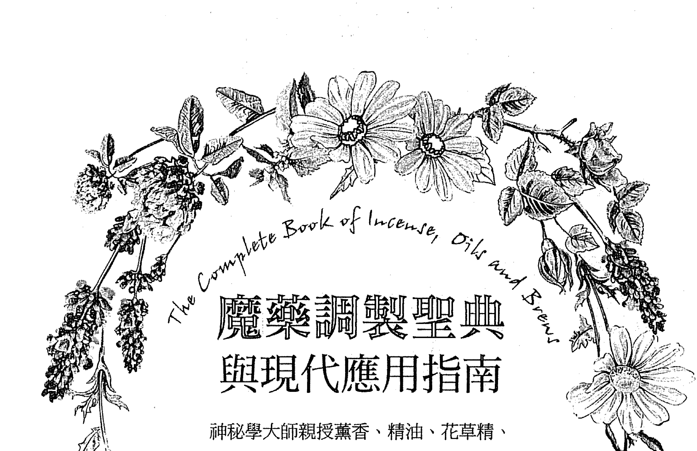
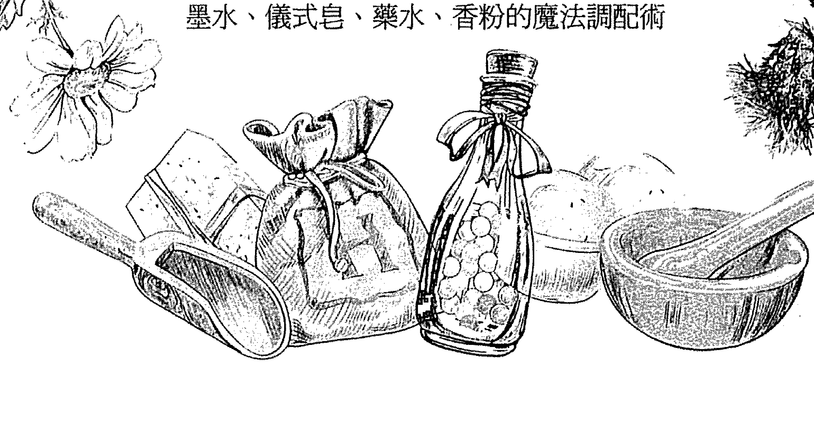
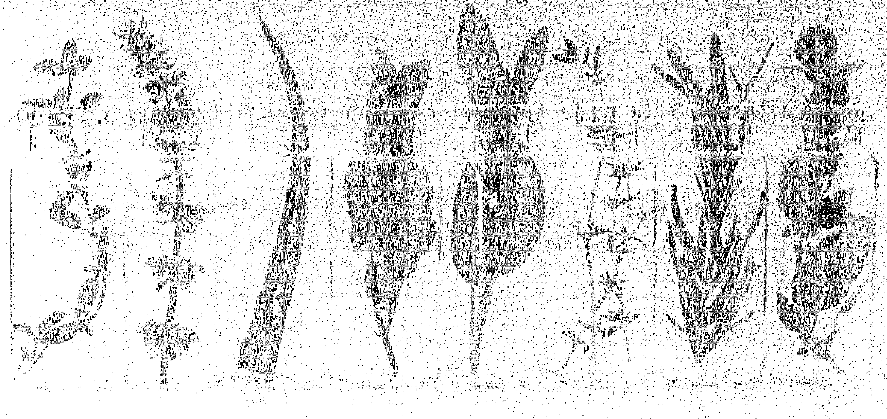
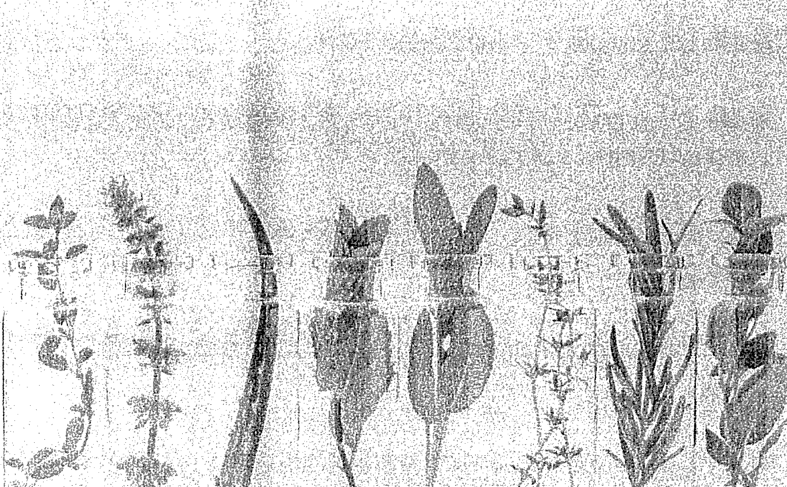

## 魔藥調製聖典
### 與現代應用指南

神秘學大師親授薰香、精油、花草精、墨水、儀式皂、藥水、香粉的魔法調配術

- ☆ 受魔法實踐者肯定而歷久不衰的經典 ☆
- ☆ 美國超過350,000人都擁有收藏 ☆
- ☆ AMAZON五顆星評價近9成 ☆

THE COMPLETE BOOK OF INCENSE, OILS AND BREWS

史考特・康寧罕 SCOTT CUNNINGHAM／著　張家瑀／譯

# Mystery 33

# The Complete Book of Incense, Oils and Brews

## 魔藥調製聖典 與現代應用指南

神秘學大師親授薰香、精油、花草精、墨水、儀式皂、藥水、香粉的魔法調配術

史考特·康寧罕 (Scott Cunningham)

張家瑞

## 魔藥調製聖典與現代應用指南：

神秘學大師親授薰香、精油、花草精、墨水、儀式皂、藥水、香粉的魔法調配術

原書書名 The Complete Book of Incense, Oils and Brews
原書作者 史考特·康寧罕（Scott Cunningham）
譯 者 張家瑞
封面設計 林淑慧
主 編 劉信宏
總編輯 林許文二
出 版 柿子文化事業有限公司
地 址 11677 臺北市羅斯福路五段 158 號 2 樓
業務專線 （02）89314903#15
讀者專線 （02）89314903#9
傳 真 （02）29319207
郵撥帳號 19822651 柿子文化事業有限公司
投稿信箱 editor@persimmonbooks.com.tw
服務信箱 service@persimmonbooks.com.tw
業務行政 鄭淑娟、陳顯中
初版一刷 2021 年 3 月
定 價 新臺幣 420 元
ISBN 978-986-99768-7-9

THE COMPLETE BOOK OF INCENSE, OILS AND BREWS
by SCOTT CUNNINGHAM
Copyright: © 1989 by SCOTT CUNNINGHAM
This edition arranged with Llewellyn Worldwide, Ltd.
through Big Apple Agency, Inc., Labuan, Malaysia.
Traditional Chinese edition copyright:
2021 PERSIMMON CULTURAL ENTERPRISE CO., LTD
All rights reserved.

Printed in Taiwan 版權所有，翻印必究（如有缺頁或破損，請寄回更換）
臉書搜尋 60 秒看新世界
～柿子在秋天火紅 文化在書中成熟～

> 國家圖書館出版品預行編目（CIP）資料

魔藥調製聖典與現代應用指南：神秘學大師親授薰香、精油、花草精、墨水、儀式皂、藥水、香粉的魔法調配術 /
史考特．康寧罕 (Scott Cunningham) 著；張家瑞譯.
-- 一版.-- 臺北市：柿子文化，2021.03
面； 公分.-- (Mystery ; 33)
譯自：The Complete Book of Incense, Oils and Brews
ISBN 978-986-99768-7-9 (平裝)
1.芳香療法 2.香精油

418.995 110002050

## 關於本書的魔法調製藝術

幾世紀以來，人類利用各種薰香、調配精油、綜合藥草來為生活創造正面的變化。但今日，「運用魔法藥草來豐富我們的生活」這種想法，會被一些人嘲笑。不過，關於藥草香氣的最新研究證實，藥草對於人類的行為確實有強大的影響力，而且科學家也在研究，如何以各種方法把這些能量運用於對人類的普遍益處上。

魔法薰香、精油、藥膏和藥水等的實際配方，在以前是不外傳的秘笈，曾與巫師的咒語書或魔法師的魔法書鎖在一起。這本書將為你揭開神秘的面紗，提供你實用、易懂的資訊，讓你練習這些鮮為人知的魔法調製方法。

史考特·康寧罕是舉世聞名的魔法藥草醫學專家，在一九八六年首次發行《薰香、精油和藥水的魔法》，而這本《魔藥調製聖典與現代應用指南》是該書的改寫與擴充版本。康寧罕採納第一版讀者的建議，增列了一百多種配方。第一版的每一頁都經過重寫，而且變得更明晰清楚，也增加了新的章節，以致新版本幾乎是原版的兩倍。

你將藉由本書得知如何製作屬於自己的薰香、精油、藥膏、墨水、花草精、藥草浴、沐浴鹽、藥水、儀式皂和香粉。你不需要添購特殊和昂貴的器材，而且這些原料也很容易取得。本書包含了各種藥草、原料購買、難以尋得的藥草之替代品的詳細資訊，以及字彙表和關於創造屬於你自己的魔法配方的章節。

康寧罕也提供了關於基礎魔法原理的重要資訊，教導你如何運用個人力量賦予藥草能量，讓它們幫你招來財富和戀情、療癒你自己和他人、提升心靈力量、提升靈性、促進身體能量和刺激心理活動等。

藥草魔法的秘訣是代代相傳下來的禮物，在這個科技發達的時代，仍然能用簡單的方法去挖掘自然中各種豐富的力量——透過藥草魔法。

## 魔力推薦

幾個世紀以來，運用魔法藥草製成各種薰香，調製成精油，來豐富生活的想法，已經不再是秘傳少數人的神秘魔法，時至今日，這些實用易懂的生活魔術，已開始攻佔了願意認真善待自己內心花園的人們。

這些內心充滿美好和善良的人們，發現熟知藥草最好的方法，就是和它們好好相處，讓大自然的魔法來教導自己。色彩的世界也是如此，自然界的色彩力就是人類靈性意識的祖師爺，為人類的能量世界開啟了充滿魔力的篇章。過去遵從古法的巫師、術士、魔法師和睿智的藥女們，善用藥草、手印和咒音的能量，並以意念來引導，使得這些力量能夠迅速傳播出去，創造了心想事成的魔法。

今天這門古老的科學，主要被用以改善生活的品質，以及增加創造快樂生命的能力。我在接收自然界與神性的授能而自創品牌時，歷經了很多精油與香氣調配和神聖咒音的實驗，最後才調製出令人滿意的色彩、香味與意念灌注的能量品質。現在的我們，擁有這本實用的指引手冊，實在是一大福音，而這些魔法的運用，對於生活信念的培養，更是具有創造性的信心和勇氣。

當我們處在生活中的困境和煩惱而覺得難以走出時，與星辰、大地、自然界的宇宙能量校準調頻之後，就可以與內在的元素相呼應，而這種關於自身的鍊金蛻變旅程，只有自己親自體會和經歷，才能明白其中的奧妙與喜悅。

每個力量的傳出，都象徵著美好的生命力，當你啟動了這個不可思議的力量時，相對的，你也會感動於天地的廣大以及人類的渺小。越謙遜，越自在，越喜樂，越自由。讓我們一起共勉、共創、共享、共好！

上官昭儀／名色香華五行油研發人、ICEM 色彩能量管理學創辦人

約十年前踏上手工皂之路的時候，完全沒有意識到，當時以為是「被化學變化吸引」的我，製作「淨化」物品竟只是覺醒之路的開始！隨著精油、香藥草與廚房香料們一路蹦蹦跳跳來到我的身邊（其實它們一直都在），我漸漸重啟了我與植物療癒能量的連結。

這些年陸續有出版社引入西方 Wicca 相關書籍，我因此接觸到史考特·康寧罕與其他前輩的著作。接獲邀請推薦書籍的時候，初期以為這分明超出我的守備範圍，但慢慢的，在閱讀與生活實踐中我理解了，這些都是宇宙在我的路途中置放的提示，提醒我這一生的任務。

史考特·康寧罕是早逝的英才，三十六歲便離世，在魔藥學界活躍的十三年間，出版了超過二十本魔藥學相關書籍，至今仍深深影響著後輩們。《魔藥調製聖典與現代應用指南》內容從薰香、藥膏、墨水、酊劑，到藥草浴、沐浴鹽、儀式皂，及各種香粉、香包的配方，看完這本書，幾乎就可以執行一輩子的藥草女巫任務了。

Wicca 傳統裡面有很多的儀式配方，但史考特並不糾綁讀者，他筆下的自然魔法，充分展現他對藥草香氛魔力的深刻理解。他鼓勵大家應該要因應自己的空間、材料取得難易度，還有個案的特質，來調整配方與儀式。

讀這本書，彷彿史考特大師本人跨越時空而來，在你耳邊細心又幽默的指點迷津，如何調配這些充滿香氣的儀式與療癒配方。

你可以利用本書的內容，去進行啟動、淨化、顯化、療癒，製作對應的護身符、元素能量和星座配方。在大師循循善誘之下，理解原理，進而開發出自己專屬的魔藥配方，這才是屬於你的真正的魔法。

> > 女巫阿娥 / 芳療與香草生活保健作家

著作等身的魔法作家史考特·康寧罕的各種類著作中，最為實用、也最受魔法實踐者們討論而歷久不衰的經典之一——《魔藥調製聖典與現代應用指南》，肯定是所有魔法入門者，或是有志於魔法實踐的人們，應該詳讀的一本著作。因為這不是一本教科書，而是實作指南。在書中詳細討論著各種魔法製作物，如魔法油、魔法酊劑、魔法香粉等等，討論它們的實際功效，以及如何製作，甚至公開了非常多种類的個人配方。根據史考特·康寧罕的個人靈性經驗以及巫術學習，這些配方都具有極為明顯的效果，從書中我們可以發現，實踐魔法並沒有想像中的困難。也非常建議搭配他的其他經典作品一起閱讀，因為這樣才有可能完整了解他面對自然魔法時的態度，也唯有這樣，才有辦法更深入的了解整個魔法運作的方式，從而創造出自己的配方與產品。

在書中，我們也可以看見大師引導我們如何將精神力量與物質連結在一起，這些看起來就在身邊的自然物，其中竟然蘊藏著諸多魔法，只要我們能夠學習如何製作，如何將自己的精神力量與之連結，最後就能理解如何應用在生活之中。

當然，也不是做了這些魔法產物之後，就不用認真生活，畢竟魔法是現實生活的輔助與調劑，如果想要過好生活，還是要好好找到在現實世界生活的方式。不過，相信有了這本《魔藥調製聖典與現代應用指南》之後，會讓使用者的魔法生活更為多采多姿。

思逸 Seer / 荒人巫思手抄格主

如果你對花草的神秘力量感興趣，絕對不能錯過史考特．康寧罕的書。他的人生就是一則傳奇，這位天才研究者和寫作者，僅僅花費數年，就在三十出頭的歲數，便躋身二十世紀最重要魔法專家之列，成為藥草魔法（Herbal Magick）由傳統過渡到現代的關鍵人物，以及「個人化魔藥」的奠基者。

我甚至可以大膽推測，如果沒有康寧罕，當代的「魔法產業鏈」或許根本不會存在。

在康寧罕諸多本著作中，這一本堪稱易讀性最高、實作性最強。當你打算成為一位巫師，第一個遇上的關卡，通常是「材料取得問題」，古籍記載的詭異藥草真的存在嗎？想遵照古法卻找不到道具怎麼辦？作者提出了化繁為簡的解決之道——運用精油！在成書的一九八九年，這還是非常革新的做法，到了如今，芳香療法和魔法合流卻已成為半個顯學。

《魔藥調製聖典與現代應用指南》中譯本的面世，不只令神秘學圈子興奮不已，對精油愛好者而言，更別具意義。坊間流傳甚廣的魔法油產品，常以這本書的配方為基礎，只是稍加修改變化而已，它是超便利的配方大全（居然連替代材料都幫忙找好，設想周到），也是查今知古的有趣史料，你會發現，現代芳療中的許多經典用法，其實都引用自傳統巫術或神話。

只要敞開心胸，任何人都能像康寧罕一樣，從此在大自然和超自然之間遊走自如！

許怡蘭 Gina Hsu / 華人芳療圈知名講師及作家

史考特·康寧罕是當代相當有名也十分重要的神秘學研究者，有非常豐富的相關著作，書中配方都是他本人實作與研究的集大成，是現代研究魔法愛好者的必讀參考書。只可惜天妒英才，史考特相當早就離世，不然我們一定能看到更多偉大的著作。

本書除了魔法油外，介紹了更多種魔法「介質」，你能製作墨水、薰香、藥膏，甚至是魔法肥皂。很適合見習魔法師們做為魔藥配方的基礎學，先依據書中的教學實作，再研發自己版本的魔藥，讓你運用各式各樣的魔法配方來達成願望。

使用魔法代替品列表中星座與行星的象徵藥草時，需要搭配更多對藥草的背景知識，才能讓效果更到位，關於這一點，讀者可以參考其他史考特已出版的著作。

植物系女巫 -Claudia / FB 粉絲專頁「Claudia Studio- 女巫的塔羅·芳療」版主

閱讀《魔藥調製聖典與現代應用指南》這本書的過程，是魔幻且充滿美麗的。正如同這本書本身想要傳遞的純淨正面能量一般，當我閱讀完本書時，竟然發現自己不自覺的嘴角上揚，一種全然的喜悅穿透身心，彷彿被一股更高的能量所洗滌一般，由衷的感佩與讚賞之情，由心中湧現。

是的，我發現自己正在落實本書中的魔法，只是我自己不自知！

在我的生活、教學與事業裡，經常需要調製各式各樣的芳香，香水、香氣油，以及香草包。面對我的可能是一位煩惱的媽媽，她不知道該怎麼幫助孩子更集中精神在學習上；有時是為自己睡眠品質所苦的上班族，他們希望藉由芳香的調配，來改善睡眠品質；有時則是受到婆家或丈夫忽視冷落的媳婦，她們長年有無法愛自己的問題，胃腸也長期受到消化不良所困擾。

當我在為他們調製香氣時，心中總是會為手中的調配香氣進行淨化與祝福。我會祝福香氣本身，同時也會觀想這瓶香氣能夠為我的客戶帶來更好的生活——更多的喜悅、寧靜、愛與平衡。

我只是很直覺的這麼做。當我將香氣瓶交給客戶時，我擁有信任。我知道這瓶香氣帶有愛的力量，客戶一定會感受得到。而奇妙的是，當收到香氣的客戶開始使用我調製的香氣後，每一個人都會告訴我，「好開心，困擾的問題改善了！」無論是身體與心靈的問題，沒有一次例外。

看完這本書以後，我才知道，原來我也正是在啟用魔法。作者如是說：

> > 「魔法是一種愛的行為，是為我們的生活帶來光明與秩序的一種方法。」

在藥草魔法中，個人力量與植物內在的力量必須結合，並賦予它們目標與方向，藥草魔法就能創造你需要的改變。

花草自有本心，萬事萬物皆有能量。透過燃燒植物、藥水煮沸與精油釋出芳香，我們邀請植物的魔法進入生命中。

這本書讓我們知曉最了不起的老師是植物本身。我們必須懷抱著謙卑的心，去接近植物，虔誠地使用植物，並與誠摯的本心連結，魔法就能夠點亮，閃閃發光！

非常感謝柿子文化給我這個機會認識這本好書，也由衷的推薦給您，但願你們也能從這本書裡，在多彩多姿的香氣魔法配方中，找到人生的解藥。

簡佳璽 / 香氣藝術家、SCENTOF 香氣品牌主理人

## 目 錄 CONTENTS

- 3 | 關於本書的魔法調製藝術
- 5 | 魔力推薦
- 12 | 新版序
- 14 | 前言
- 16 | 警語

- 17 | Part 1 基本原理
  - 18 | Chapter 1 魔法
  - 27 | Chapter 2 魔藥的比例用量
  - 30 | Chapter 3 授能儀式
  - 34 | Chapter 4 魔藥的成分
  - 45 | Chapter 5 創造你自己的魔力配方

- 51 | Part 2 藥草處理與魔法配方

  - 52 | Chapter 6 魔法薰香
    藉由焚燒薰香，魔法師用以促進儀式意識，喚起並引導個人能量時所需要的心智狀態。
    共收錄了 151 款配方，包含通靈薰香 | 事業薰香 | 勇氣薰香 | 夢薰香 | 死亡天使之火 | 賭博薰香 | 療癒薰香 | 戀情薰香 | 預知夢薰香 | 保護薰香 | 通靈眼薰香 | 學習薰香 | 小偷薰香 | 財富薰香……

  - 103 | Chapter 7 魔法精油
    以精油來施行魔法這種古老的行為，可以往前追溯到幾千年前。
    共收錄 62 款配方，包含星座精油 | 通靈之旅精油 | 事業成功精油 | 來見我精油 | 快捷財精油 | 面試精油 | 戀情精油 | 力量精油 | 保護精油 | 性能量精油 | 睡眠精油 | 幻影精油 | 財富精油……

  - 124 | Chapter 8 魔法藥膏
    魔法師通常會把藥膏塗抹在身體上，藉以產生各種魔法變化。
    共收集了 20 款配方，包括驅邪藥膏 | 飛天藥膏 | 療癒藥膏 | 解咒藥膏 | 情慾藥膏 | 通靈力量藥膏 | 財富藥膏 | 青春藥膏……

  - 132 | Chapter 9 魔法墨水
    這裡收錄 8 款魔法藥水配方。墨水最好用的地方，在於它能夠將我們魔法目標的象徵或影像，轉變成可見的形式。而這些圖形在魔法儀式中，被用來激起、設計和傳送個人能量的活動焦點……

  - 138 | Chapter 10 花草精魔方
    花草精是透過嗅覺來刺激意識，其製作方法是將乾燥的植物原料浸到酒精裡，其效果跟精油一樣棒！
    收錄的配方共 6 款：守護花草精 | 身心健全花草精 | 戀情花草精 | 招財花草精 | 神聖花草精 | 第三眼花草精。

  - 145 | Chapter 11 魔法藥草浴
    這種洗澡水能讓人獲得通靈意識、吸引戀情、加速療癒，以及給予個人保護的強大工具。
    共收錄了21款配方，包含：
    - 除惡浴
    - 催情浴
    - 美容浴
    - 節食魔法浴
    - 能量浴
    - 驅邪浴
    - 戀情浴
    - 招財浴
    - 通靈浴
    - 巫師浴
    - 平靜浴
    ...

  - 153 | Chapter 12 魔法沐浴鹽
    沐浴鹽是沐浴藥草的替代性選擇，也很容易準備，而且是市場上頗受歡迎的去角質物質。
    共收錄了18款配方，有：
    - 四大元素（地水火風）浴
    - 禁慾浴
    - 魔法圈浴
    - 愛戀如花浴
    - 療癒浴
    - 高級意識浴
    - 保護浴
    - 海巫師浴
    - 心靈浴
    - 淨化浴
    ...

  - 160 | Chapter 13 魔法藥水
    魔法藥水可以是普通的藥草茶，也可以是神秘的七彩煮劑，功效就跟幾千年以前一樣有效。
    共收錄20款配方，有：
    - 性慾飲
    - 預知力藥水
    - 夢境茶
    - 驅邪茶
    - 戀情酒
    - 招財藥水
    - 通靈茶
    - 淨化藥水
    - 彩虹藥水
    - 安眠藥水
    - 太陽水
    ...

  - 169 | Chapter 14 魔法儀式皂
    一個正確的儀式皂可使任何符咒的功效大為提升。
    共收錄9款配方，有：
    - 戀情皂
    - 運氣皂
    - 招財皂
    - 月亮皂
    - 保護皂
    - 通靈皂
    - 年輪慶典皂
    - 巫師皂
    - 伊西絲皂。

  - 175 | Chapter 15 魔法香包或藥草護身符
    是裝著藥草及其他素材的小束口布袋，功能或抵擋某些能量和疾病，或幫助吸引特別的力量。
    共收錄36款配方，包括：
    - 防巫魔香包
    - 防小偷香包
    - 防牙痛香包
    - 車子保護香包
    - 博弈香包
    - 居家保護香包
    - 戀情香包
    - 治療惡夢香包
    - 旅行保護香包
    - 找巫師幸運符
    ...

  - 187 | Chapter 16 魔法香粉
    香粉是以磨碎的藥草製成，在噴撒時會釋放出它們的力量。
    共有13款配方，包括：
    - 靈魂出竅之旅香粉
    - 驅邪香粉
    - 快樂香粉
    - 健康香粉
    - 戀情香粉
    - 幸運香粉
    - 招財香粉
    - 財富香粉
    - 保護香粉
    - 通靈香粉
    - 許願香粉
    ...

  - 193 | Chapter 17 其他配方集錦
    共有13款無法分類的魔法配方，包含有淨灑器（2款） | 野火（魔法之火） | 乳香保護項鍊 | 墨西哥療癒按摩 | 招財五角星 | 靈魂出竅之旅枕頭 | 夢境枕頭 | 魔法枕頭 | 戀情香丸 | 淨化液 | 玫瑰戀情珠 | 巫師的戀情蜂蜜。

- 199 | Part 3 替代品

  - 200 | Chapter 18 使用替代品
  - 206 | Chapter 19 魔法替代品列表
    - 206 | 特定的替代品
    - 210 | 魔法目標
    - 226 | 行星替代品
    - 232 | 元素替代品
    - 237 | 星座替代品
  - 248 | 附錄 1：詞彙表
  - 256 | 附錄 2：顏色能量表
  - 257 | 附錄 3：植物名稱索引

## 新版序

我從好幾年前就開始蒐集魔法香氣的東西，包括：薰香、精油、香包，以及其他與神秘儀式有關的藥草製品。為了拓展大眾對各種魔法藥草醫學的興趣，我決定在本書中納入墨水和藥膏等不太受矚目的題材。我在一九八五年完成這本書，次年Llewellyn出版社就發行了《薰香、精油和藥水的魔力》。

即使這本書已經交稿了，但我知道在這個主題上還有許多可以述說的內容，因此繼續研究藥草醫學的神祕技藝。隨著知識的增長，我知道這本書需要大幅的擴充。

於是這個新版本誕生了。它仍然保留了大部分的原始資訊，但在形式上更完整，裡頭新增了一百多種配方，而且大部分包含了第一版的許多讀者想知道的成分比例。

本書的每一頁、每一章都重新寫過，使內容更清晰易懂，也增加了好幾篇新的章節：

第四章「魔藥成分」檢視了用於創造藥草複合物的常見與罕見的植物性素材和精油，以及一些推薦的替代品。

第五章「創造你自己的魔力配方」是一篇指南，裡面有深度的探討，以及循序漸進的指引。

「花草精魔方」篇章審視了以酒精吸取植物芳香的技巧，是萃取精油的另一種簡單方法。

「儀式皂」篇章詳述創造咒語香皂的簡易方法，可用於各種魔法目標，而且不必使用鹼液或油脂。

「魔法香粉」篇章探討多種藥草磨細後的複合及獨特用法。

第三部分取代上一版的第十三章，內容包含關於適當替代品的一段長篇範例，以及經過大幅擴充的一些表單。有一項新的特色是特定替代品清單，例如：以菸草替代茄科植物、以雪松替代檀香。

此外，本書也附上一份界定各種專有名詞的詞彙表，以及包含所有植物及其拉丁學名的植物名稱索引。

這一版的原稿篇幅，幾乎是前一版的兩倍。雖然我仍在學習當中——這也是當然的——但是我覺得《魔藥調製聖典與現代應用指南》可以做為這個主題裡一本無所不包的入門書。

儘管這本書應該要和《魔藥學：魔法、藥草與巫術的神奇秘密》一起閱讀和使用，但它也可以單獨使用。

畢竟，最了不起的老師是藥草本身，文字只是在反映出它們的訓示。如果我們想知道大地的秘密，就必須向植物、花朵和樹木學習。本書就是引導大眾走向這條道路的指示牌。

所以，你要和植物接觸，將它們引進你的生活，並且發現它們的能量。當熏香燃燒、藥水煮沸和精油釋出芳香時，將它們的能量引入你的體內。

儀式藥草醫學是古早以前的先人所流傳下來的贈禮：一項接觸大自然的遠古技藝。秘密就在那兒等著人們去發掘。

史考特·康寧罕
加州圣地牙哥
一九八七年十月三十一日

## 前言

數千年以來，我們的祖先一直使用藥草來創造各式各樣的魔法物質。他們把珍貴的藥膏秘藏在角質容器或水晶瓶裡，需要時塗抹在身上，以產生魔法效果。他們啜飲藥水或將藥水噴灑在身上，以防止邪惡或不好的事情。他們把芳香的樹皮和木頭扔到發熱的煤炭上，以釋出香氣和力量。

這些香包、藥膏、藥水、薰香和精油的真實配方，往往被秘藏在巫師的咒語書和魔法書裡，甚至深藏在他人無法觸及的大腦裡。但是，一旦你進入到「智者們」如星光般閃耀的魔法圈裡，這些秘密配方就擺在眼前，供學習者用於儀式、咒語和日常生活中。

今日，當那層神秘、朦朧的面紗已被揭開，所有的秘密都可以用魔法的古老方式來分享之後，人們愈來愈需要有一本廣博的魔法配方專書，它能夠滿足將古老的藥水和薰香混合使用的人，這不只是為了魔法上的目的，也是為了實作時的純粹樂趣。

於是，這本書誕生了。幾乎沒有多少人知道要怎麼混合薰香，但在魔法和宗教世界裡，曾經比精油重要許多。人們一提及巫師，就會想到大釜和藥水，儘管大眾有這樣的刻板印象，但是製作藥水的技術似乎就跟藥膏一樣，已經漸漸失傳了。

所以，這本書想引領大眾一窺鮮為人知的魔法調製術。這種調製術不是用來滿足我們的口胃之慾，而是用來豐富和促進我們及所關愛之人的生活。

尤其是，本書不會像別的書那樣出現詛咒或「邪惡」的配方。

這些配方最初是源自於歐洲的魔法和威卡資源。我故意刪掉所謂的「巫毒」配方，因為它們很常出現在其他書籍裡。我也盡量不納入近五十年左右不斷出現在各種出版品中的配方。

出現在本書中的配方，有些是我的老師們傳授給我的，有的是朋友分享的舊手稿，有些是視需要而改進過的。其中有些配方確實很古老，但是在妥善的配製及授能和使用之下，效果會非常好。

熟悉藥草的最好方法，就是和它們好好相處，讓它們來教導你。

複合薰香、精油及藥水，是能使你得到最大收穫的藥草魔法學習工具。

有些人也許會發現一件有趣的事情，那就是，在科技發達的今日，仍有很多人會向大地、藥草和魔法尋求幫助。人們會寫電腦程式來施咒，在發光的陰極射線管（電子映像管）上蝕刻符文，並且等待著魔法來令我們的雙眼驚豔。

但是，遵從古法之人（巫師、術士、魔法師和睿智的女性）會把芳香的精油倒入熱水缸中，點燃薰香和飲用藥水。他們用藥草、手勢和言詞來編織咒語，運用蘊藏在自然產物中簡單但強大的力量，並且以意念來引導它們。於是力量迅速傳開來，形成魔法。

因為藥草魔法是大自然的東西，所以它只需要自然的工具。本書中包含了最強大的藥草魔法：保護薰香、愛情精油和療癒沐浴。這些都是我們能夠用來改變生活且因此改變自己的工具。

願大家的改變之路歡欣愉快。

## 警告：

本書中有些配方含有危險成分，那些配方都附有警告文字（如「當心！」），而且每一種有害物質旁都以星號（*）標示。如果服用、飲用那些藥草（天仙子、聖誕玫瑰、紅豆杉等），或將它們塗抹在皮膚上，或燃燒薰香時吸入，可能會中毒或致命。在任何情況下使用這類成分時，一定要多加留意。

事實上，為了安全起見，這類東西最好都不要使用。關於有害藥草的販售和使用，大部分都受到法律的限制，所以持有這些東西可能要冒著很大的風險。

本書會納入含有這類藥草的配方，是因為它們很傳統，但是也會附註充分的警語，讓笨到想嘗試毒物混合的人無法不去注意其危險性。

此外，在植物檢索表裡，會根據植物的安全性來做標示。標示「×」的植物絕對不能吃，標示「△」的植物應小心使用，因為它們可能對某些特殊健康狀況的人有不良影響（例如糖尿病患者、使用單胺氧化酶抑制劑、腎臟病患者等）。標示「＋」的植物不能於懷孕或哺乳期間使用。

### 其他注意事項

精油、薰香、沐浴鹽、香皂、花草精、香包和香粉，絕對不可吞食。精油一定要稀釋後才能使用，並且要放在兒童拿不到的地方。如果有過量使用的情況，要打電話給毒物防治中心。

許多植物和精油都具有毒性，我們對於植物的特性還沒有全面了解，因此要以謹慎、尊重的態度來使用藥草和精油。植物是藥，請用最新的藥草參考書來檢查用在你身上的每一樣東西。

本書所包含的資訊僅限於參考，不能做為法律、醫學或心理學方面的建議。若有這些方面的問題，請向律師、醫師或心理醫師諮詢。

## part 1 基本原理

### 1
#### 魔法

魔法是最古老的科學副產品，比天文學、化學或生物學更加古老，這種「科學」是對大自然最早的研究。是什麼造成季節輪替、潮汐起落，以及所有生物的出生與死亡？

當人類發現存在自己周圍的不可見力量時，魔法——運用大自然能量來造成需要的改變——就產生了。早在重力、電流和磁力的名詞被創造出來之前，人類就察覺到它們的效應。堅果掉落到地上；閃電擊中樹木；在乾燥的氣候下拿東西劃過動物的皮毛，會閃出火星；含金屬的岩石會詭異地吸住少量的鐵。

但是，這些古代人類的發現，有些尚未被科學準則接受。他們感應到人類和一些特定地方之間、人類和大地之間的連結。他們憑直覺知道在植物、動物和石頭內蘊含著力量。他們感覺到自己的體內含有可以根據意志和需要而流動的能量。

經過幾世紀的實驗、錯誤和啟發，魔法誕生了。魔法漸漸演化成個人力量的一項工具，那是一種能夠幫助、亦能傷害的驚人潛力。

魔法的力量源自於大地本身，也源自於星辰和天體。它存在於風中、岩石和樹木裡，也存在於火焰、水和我們的體內。喚起及引導這種力量，便是在施行魔法。

藥草魔法是運用植物力量的一種特殊方法，這就是薰香、精油、沐浴鹽、藥水和花草精所涉及的範疇。施行藥草魔法很簡單，過程也許是在彩色蠟燭上塗抹芳香精油，放到燭臺上，點燃它，然後觀想你的魔法需求。

比較複雜的儀式也許需要好幾支蠟燭、許多精油、薰香、吟誦、儀式服裝，所有一切都要與你的目的和諧一致。藥草魔法可以簡單，也可以複雜，一切都由你來決定。

這是一種個人藝術，所以施行者當然必須親自參與，但這可不是魔術師在變戲法。只有願意把手弄髒去親自執行藥草魔法的人，才能夠快速地改善自己、促進生活。

這本書是儀式藥草製作和配方的手冊。雖然這些混合物本身就含有能量，但是當它們與簡單的儀式結合使用時，效果更是好的不得了。

如果你才剛接觸魔法，也許會想問：「太棒了，那麼，我要怎麼使用這些東西？」

雖然在第二部分才會寫到每一種調配配方的指導，但是這裡先說明魔法的一些基本原理。

#### 不傷害任何人

為什麼要以這一點做為開端？因為這是所有魔法最基本、不可妥協的規則：不傷害任何人。不傷害你自己，不傷害你的對手，不傷害任何人。

對我來說，魔法是一種愛的行為，是為我們的生活帶來光明和秩序的一種方法。對於其他大多數的魔法從事者來說也是如此，但是對有些人而言就不是這樣。

許多人太過投入於魔法之中，因為他們把魔法視為一種強大的武器，可以用來對付嘮叨的老闆、不忠實的朋友和伴侶，以及一大堆想像中的敵人。

他們很快就會認清事實。

如果你想控制或操縱別人，要別人屈服於你的意志，那麼魔法不適合你。如果你想傷害、打擊，甚至殺害他人，魔法也不適合你。如果你想強迫他人愛上你或和你纏綿，魔法就是不適合你。

並不是沒有企圖以魔法嘗試這些事情的人，他們當然存在……一段時間。然後，因為某種理由，他們悄悄地消失在日落的餘暉中。

有些業餘的邪惡魔法師（實際上也沒有其他類別）往往會這麼想：「嘿！我可以對那個人施展魔法，自己卻不受到任何損害。因為我受到了嚴密的保護，哈哈！」

也許他們受到了能夠抵擋任何外在負面力量的魔法的保護，但是，這些魔法保鑰無力抵禦那些最終會將它們徹底擊垮的攻擊。這種「詛咒」來自於何處？答案是來自於內在。

施展傷害性的魔法，會喚起一個人最黑暗、最危險的內在。沒有超級英雄會為了撥亂反正而對邪惡魔法師下詛咒，沒有魔法仙子會揮舞魔法棒來制服邪惡魔法師。誤用魔法的人會對自己造成詛咒，因為他們解開了被鎖於內在的強大邪惡能量。這股邪惡能量最後必定會反噬回去，只是遲早的問題。

所以，如果你打算這樣利用魔法的話，再好好想想吧！

魔法仍有被不小心誤用的時候，無論是威脅要詛咒別人，或是假裝你能夠執行這樣的動作，都會違反「不傷害任何人」的規則，即使你不是真的想這麼做。在心裡傷害別人，就跟實際造成精神或身體上的傷害一樣糟糕，而且最後會導致那些說大話的人詛咒到自己。

為了發生親密關係而承諾別人要教導他們魔法的秘密，是另一種讓你自己招致禍害的保證。

這些都是事實，不是個人見解。一切由你自己決定。

#### 為他人付出

你的一位朋友生病了，而你想要幫忙。在為那位朋友執行任何療癒儀式之前，最好先問問對方是否想要你這麼做。要遵從對方的願望。

如果你想為別人進行任何儀式也是一樣，要先取得對方的同意，即使那是好玩的儀式。為他人施做正面的魔法，但對方並不想要，或是還沒準備好接受結果，那就是一種控制慾。

所以，要確定你真的不會傷害到任何人，在為他們把藥草混合起來以前，先問過對方。

#### 目標

保護住家、健康、愛、金錢，這些都是良好的魔法標的或意圖。所有魔法的中心都要有一個目標，沒有目標，就沒有必要進行儀式。目標不一定都是物質性的，有些儀式是用來幫助魔法師做精神上的調和——與神祇調和，如果你想要的話。有些儀式是用來強化感應力（潛意識心智）或心理警覺性（意識心智）的。

當魔法師眼前有一個目標時，她／他通常會依照自然法則的方法去取得。如果這些方法失敗了，才會進行儀式。

但顯然，有些目標不能透過一般的工具來達成。在遇到這種狀況時，就用得上魔法了。

#### 力量

在魔法中產生作用的力量，就存在於我們體內，也存在於藥草、石頭和大地上其他的自然產物之內。

力量不是兇惡、危險，甚至邪惡的，也不是超自然的。魔法力量就是生命本身的力量。

你在經過長時間的運動之後會感到疲倦，為什麼呢？因為你的身體已經釋放出很多能量了。

花朵在被剪下而離開泥土之後便會提早凋零，因為它再也不能從泥土中得到能量（以營養素的形式）。

這就是在藥草魔法中所使用的能量：個人力量和植物內在的力量。將這兩種力量結合，把它們從內部引導到外頭，然後賦予它們目標和方向，藥草魔法就能創造你所需要的改變。

在藥草魔法中（或是任何形式的魔法），我們必須喚起和釋放這種能量。達成這個目的的方法有很多種，最有效的方法之一便是透過你的情緒。

為什麼要進行魔法儀式？通常是因為需要。如果你極度需要、也極度想要某個東西，你的個人力量就會往那個目標集中。在混拌薰香時，你也將那個力量混拌進去了。在點燃蠟燭的時候，你就是在用那個力量點燃它。

許多儀式之所以沒有效，確實是因為魔法師沒有專注於手上的工作，或者她／他只是需要某個東西，但不是真的想要它。不管是哪種情況，個人力量都不會正確的轉換到薰香、精油或藥水之中，所以才沒產生效果。

這不表示藥草和香味本身不具威力，它們是有威力的。就像車子不經發動就不會移動一樣，藥草混合物也需要以個人力量來「啟動」它們。

在此提供一點方針：專注於你正在做的事。如果你在為一位朋友碾碎要用於療癒薰香的迷迭香，就在腦海中想著那位朋友健康的模樣。在為自己招財而調配精油時，就專注於調配精油的事情。

如果你能夠形成清晰的心靈畫面，就在準備儀式和進行儀式的期間做魔法觀想。用你心靈的雙眼看到混合物是有效的，看到它已經完成了工作，這會讓你的個人力量流入藥草之中。在儀式裡，由藥草釋放出來的力量會與你自己的力量結合，然後實現你的魔法需求。

魔法觀想是「迅速啟動」藥草混合物最好的方法，但是如果你無法做適當的觀想，也別擔心。只要專注於你所需要的目標就行了，藥草自然會做它們該做的事。

#### 祭壇

祭壇是魔法實踐的核心。它不見得是宗教聖壇，儘管在魔法中運用的那些力量是每個宗教的中心（開啟魔法、宗教和神祇本質的鑰匙）。祭壇就是一個平坦的區域，你可以在那裡運用藥草及進行魔法儀式。

雖然魔法能夠（也應該）視需要在任何地方進行，但是若能讓室內魔法在一個特定的地方舉行，可以做得最好，因此，建議你創建一個永久祭壇或工作區，所需要的不過就是一個不起眼的角落擺上一張小茶桌。

理想上，它最好是一個能讓物品擺放好幾天的地方，因為有些咒語需要那麼長的一段時間來運作。

雖然許多藥草魔法師會使用有顏色的布把祭壇蓋住，但這不是必要的。花俏的工具也是，例如昂貴的薰香和閃閃發亮的銀燭。你所需要的只是一個樸實無華的空間（最好是木製的）。

如果你想在祭壇上點燃蠟燭以讚頌高等能量，做就是了；以鮮花供奉神祇也是類似的意義。

為了達到最好的效果，魔法應該令自己滿意，所以要創造一個能讓你產生動力的祭壇。

#### 時間的安排

從前，當人類隨著大自然的週期而調整生活方式時，他們很重視魔法時間的安排。愛情符咒（以及所有建設性的儀式）施展於月盈時（也就是從新月變成滿月的期間）。與摧毀疾病、害蟲和麻煩有關的符咒，最好在月虧時進行（滿月變成新月的期間）。

然後，在決定對魔法儀式最有利的時間之時，要把一天裡的什麼時辰，一週裡的哪幾天，甚至一年裡的哪些月份和季節，都納入考量。假如魔法師具有天文學知識，也會講究星辰的方位。

在幾百年前，像這麼複雜的魔法時間安排，已經超過了許多不識字的農耕家庭和一般民眾的能力，儘管他們慣常實行大量自然魔法。如果家中的幼兒生病了，母親不能等到兩週後出現正確的月相時才施行魔法。她會在需要時靠著紮實的知識（而非信念）施咒。

現在，時間的安排對於某些藥草魔法師來說仍然很重要。但我覺得，除了一些罕見的情況外，這種做法已經過時了。在魔法中，我們與流經體內、藥草和色彩的宇宙能量共同合作。因為它們是宇宙能量，所以在起源、範圍和影響力上是遍及全宇宙的。

如果有人告訴我說，他們無法把儀式辦得很成功，是因為剛好遇上月虧。我會告訴他們，繞著另一顆行星運轉的另一顆月亮正逢月盈，所以這兩者會相互抵消。

這是我對魔法時間安排的看法，但如果你覺得時間安排是一項必要條件，當然可以遵照以前的方式去做。

#### 工具

魔法工具可以從家裡取得、郵購，或是靠自己簡單地製作。大部分的藥草魔法和藥草處理，至少應該具備以下幾項工具：

- 一套研缽和杵（用來碾磨藥草）
- 一個大的非金屬材質的碗（用來混拌）
- 一支小湯匙（用來做薰香）
- 一個香爐（用來燃燒薰香）
- 一根滴管（用來混拌精油）
- 一個非金屬材質的平底鍋（用來煮藥水）
- 一個小漏斗（用於精油）
- 幾塊自燃炭磚
- 紗布（過濾藥水和花草精）
- 彩色棉布和棉毛線（做香包）
- 蠟燭和燭臺
- 一堆空罐子（存放藥草製品）

#### 基本符咒

我們以療癒儀式做為魔法如何發揮作用的範例。如果這個符咒是要給某個朋友的，你要先問過她／他，並且取得對方的同意之後才能施咒。

把一個香爐、一份療癒精油、一支紫色或藍色蠟燭，擺到你的祭壇上。你在祭壇前要鎮定且平靜（而且室內要安靜），然後點燃炭磚，把它放到香爐裡，接著往炭磚上撒一點薰香。當香爐飄出香氣和許多煙霧時，你要全心專注在療癒的魔法目標上。

在腦海中清楚地觀想你自己（或生病的朋友），不要看到疾病，而是觀想完全健康的狀態。如果生病的想法跑到你的腦海裡，立刻拋開它們，它們只會妨礙你的魔法。

打開精油，此時你仍專心地觀想你或朋友，然後用精油沾溼右手的兩指。左手拿著蠟燭（或右手，如果你是左撇子的話），把精油抹到蠟燭上，從頂端（露出燭芯的那端）抹到中央，再從尾端抹到中央，直到整支蠟燭都覆滿了一層薄薄亮亮的精油。

當你在抹精油時，就是在把力量傳送到蠟燭裡，包括個人力量和存在於精油裡的力量。

去感覺精油的力量和你的力量在蠟燭上合而為一，感應它們透過你魔法授能的想像而融合在一起。觀想它！

現在，你拿著蠟燭，召喚令你覺得自在的任何力量或神祇，請求祂們幫忙療癒你或朋友。

把蠟燭穩穩地放到燭臺上，往香爐裡再添一點薰香。用火柴點燃蠟燭，盯著火焰看幾秒鐘，你仍然想像著你或朋友完全健康的狀態，然後離開工作區。離開的時候，把腦袋裡關於儀式的想法統統清空。

你想讓蠟燭燒多久就燒多久。如果你必須出門，用手指或滅燭器按熄火焰（吹熄蠟燭的動作會被視為對火元素的冒犯，關於元素魔法的更多資訊，請參見第三部分）。等你回來後再重新點燃蠟燭。

這種看似簡單的儀式可以連續重複好幾天，也可以進行一次就好。當你運用藥草魔法時，你會知道成功達成魔法目標所需重複的次數。

如果你想要的話，可以把這個符咒複雜化。你可以縫製一件色彩與符咒相應的長袍（療癒用紫色或藍色，金錢用綠色，參見附錄二），然後在進行儀式時穿著。

你可以在儀式中使用行星魔法，這可能意味著要在星期天（有利於療癒的日子）進行施咒。或者，你可以穿戴琥珀等寶石，據說它具有療癒的特質。施咒前，你可以用浸過療癒香包的水先沐浴。

施咒往往要配合口說詞語，所以加上對特定神祇的祈願詞或祈禱詞，可以當作讚美詩或具有威力的「魔法詞語」，能夠引導你的能量流入蠟燭中。

也有一些魔法師會在施咒時運用音樂或舞蹈，或是使用麻醉品（我不推薦）、奇怪的道具等，為這種基本的燃燭儀式增添無數可能的變化。

這是怎麼運作的？從你選擇要用的薰香和精油的那一刻起（或是從你挑選用來做薰香和精油的原料時；如果你手邊沒有適合的綜合薰香或精油可用的話），到點燃蠟燭的時候，你一直在注入力量。透過你對目標（這裡的例子是療癒）的凝聚專注，你送出力量，因為專注就是力量！

當你把封裝著能量的精油塗抹到蠟燭上時，你仍然觀想著那個人（或自己）完全健康的狀態，就是在把能量從精油裡、從你體內個人力量（那個支持我們生命的力量）的儲藏庫裡，傳送到你所觀想的事情上。

薰香的煙飄散在空氣中，傳送一陣陣療癒的振動能量，而這些能量被蠟燭吸收，就像你所凝聚的力量也被它吸收一樣。

獻給高等生靈的任何口說祈願詞或祈禱詞，也有助於將符咒對準你的魔法需求，而且也會增添能量。

當蠟燭燃燒時，之前集結在它內部的力量就會透過火焰慢慢地釋出。蠟從固態轉變成液態，然後是氣態，這是它身上的一種神奇過程。與此同時，你之前注入到蠟燭裡的能量和力量會一起釋放出來，而且迅速地朝它的目標進行。

這種類型的符咒費時不需超過十到十五分鐘，只要你感到舒服就可以了，當然你也不需要投資大量的工具和服裝。你需要的是對於藥草、薰香和精油的大量了解，不過這正是本書要教給你的。

這個基本符咒可以用於任何魔法需求。如果需要支付帳單，就使用綠色蠟燭、招財精油和薰香，然後觀想你自己正在支付帳單：寫下支付的支票，或在帳單上蓋上「付清」的章戳。

如果你祈求戀情，就在點燃戀情薰香時，在腦海中看見自己的身旁有那位理想伴侶陪伴（記住：不要只有一個人）。

魔法並不是瞬間就能產生效果，或如我一位朋友所說「劈哩叭啦碰」的就發生了。你不能只是彈彈手指或皺皺鼻子，就期望你的人生在一夜之間變得一帆風順。你必須付出實際的努力來支持魔法效果。

如果你只是整天待在家裡，從來不去看徵才廣告或到街上轉轉，那麼，世界上所有魔法書裡的符咒都不能幫助你找到工作。

魔法真的是一種全方位的藝術，如果你想要擴展心靈能量，必須也要準備好付出身體能量。如此一來，你的魔法需求才會轉變成穩當的事實。

#### 魔藥的比例用量

本書第一版的許多配方並未標示比例。我解釋過，藥草魔法是一種個人藝術，也鼓勵讀者自己決定每一種成分的用量。

自第一版發行之後，許多讀者（以及一些評論者）寫信來說，他們希望配方能夠標示比例。所以這一大部分配方都包含了關於比例的指引。我再次聲明，這些比例並不是聖經，它們只是參考。

許多配方的比例都來自於藥草魔法的「烹飪書」學派，他們嚴格遵從配方比例，以產生最好的效果，但這不見得是你想要，甚至做得到的。雖然大部分的廚師都會庫存許多麵粉、鹽、辛香料、蛋和植物油等原料，但是在魔法藥草混合物裡所使用的成分，許多都難以取得，就算能取得，也都貴得離譜。

所以，堅持精確的成分用量的藥草魔法師，以「幽靈薰香#6」為例，可能最後要花費至少四十美元才能製造出來。再舉例，沉香的價格目前大約是一磅（約四百五十公克）三十美元（如果你找得到的話）。幾年前，它的價格大約是一公克五美元。

有直覺力的（而不是依照書上寫的）藥草師，如果只有少許沉香，她／他在產品裡就只加入那樣的量，以免只為了「精確」混合薰香的目的而花大錢再添購。或者，她／他也可以用其他成分來取代（參見第三部分：替代品）。

你儘管依照這本書所寫的去調製配方，但記住，其中的比例僅供參考。如同我在第一版所說的：請牢記，即使每一種配方都含有精確的比例，你往往還是得為了所缺少的檀香、已用完的迷迭香、零陵香豆或廣藿香精油等成分，而做適當的調整。

如果你决定改变配方的成分用量，我建议你用一本小笔记本把比例记录下来，或把它写在资料卡上，以做为日后的参考。

别迟疑，因为如果你最后做出很棒的精油配方，却没有将比例记录下来，那么当你想再做出相同比例的精油时，可能要花上好几个星期的时间——如果你能成功的话。

举例来说，当我开始实行药草魔法时，曾经混合出一个非常芳香的香包（它现在还在）。那时候我只是一个初学者，忽略了老师提醒我要将配方和比例记录下来（那个配方是我的即兴创作）。把它放著六个月之后，它早就被我遗忘在一堆药草之中，然后我又发现它，并试图复制一个，但失败了。直到今天（十九年后），我仍然没找出调配它的秘诀。

如果你决定创造自己的配方（参见第五章）或改变用量，就花几秒钟快速记下成分和比例。别等到做出成品后才回头来写，你很容易忘记用了几滴精油或几盎司的药草。当你把每一种成分加到混合物裡时，就立刻写下它的用量。

我们会遇到的另一个问题是要做多少量的药草产品。一盎司（约二十八公克），或一磅（约四百五十公克）？建议如下：

- 一般来说，在第一次尝试某个配方时，也就是你还没用过它且确定它的效果之前，先少量调制，这样可以避免花大钱犯错。
- 薰香的制作量通常是一杯左右，因为在仪式中用来薰烧的需求量很少。以密封盖或软木盖罐子保存的效果很好。如果你想要的话，只要配方已经调整到很完美了，你可以做一磅（约四百五十公克）以上，这样的话，你手边就会有足够的存量。
- 如果你做的是圆形、棍形或块状的薰香，原则也是一样的：一开始先少量制作。在你将取味和塑形处理得很完美之后，最好大量制作这些东西，因为它们的制作过程既麻烦又耗时。
- 纸薰香不管做多少都很轻松。
- 精油的制作是以植物油量杯的八分之一杯来混拌调制精油，这样的分量很适合用来做第一批精油。
- 一旦你对混合出来的结果感到满意，就可以用你原本使用比例的较大量来制作。知道为什么要保留纪录了吧？
- 药膏、药水和花草精，通常是混合成一杯的量，至少我是这么做的。用于圣化目的的药膏用量很少，所以混製太多是不必要的浪费。

藥水不能放置超過幾天以上，否則就失去效用了（而且可能發霉），所以應該少量製作。

花草精有持久的特性，但是任何時候需要的量都很少。

儀式皂應該依照配方裡提供的量來製作。

墨水、沐浴鹽、藥草浴和香粉的製作量，就看你覺得能夠用多少，這完全取決於使用的頻繁度。

藥草護身符（香包）有需要時再製作就可以了，不用先庫存起來。

要記住，在遇到緊急情況時，你可以把薰香或精油混和在一起，立即授能給它（參見第三章）和使用，不必記下用量。事實上，有時候為了特殊的目的，我會製作只有幾湯匙量的薰香來使用。那樣沒問題，但是當時間允許時，要記下每一件事。

在混拌的時候，如果你覺得這樣很好，就繼續做。如果你決定要調整那些配方的成分用量，要相信自己。雖然常言道要從錯誤中學習，不過在混拌藥草成品時，要信任自己的直覺。如果你覺得我建議的分量不正確的話，要加多少乳香到儀式用滿月薰香裡？就加到你覺得聞起來正確為止。

古老的魔法規則介紹到此。

### Chapter 3
# 授能儀式

在魔法藥草學裡，我們運用植物內在的力量來造成需要的變化。藥草確實含有我們能用來改善生活的能量。

但是這些力量還不足夠。我們必須將個人力量添加到藥草中，以及我們使用藥草製成的混合物裡。只有將植物和人類的能量結合起來，藥草魔法才會真正有效。

長久以來，人們都知道藥草具備了有助於人們特定需求的能量。薰衣草能夠淨化，迷迭香吸引愛情，檀香提升心靈，西洋蓍草提升感應力。

許多藥草，例如迷迭香，都有好幾種傳統的魔法用途。以迷迭香做為主要成分的療癒薰香，應該用完全的療癒能量來製作。事實上，這會將迷迭香具有的引誘愛情、淨化和保護的力量，重新引導到療癒的目的上，創造出與你的需求一致的混合物。方法是傳送出個人力量，將這個力量與你的魔法目標融合在一起，然後再傳送到混合物裡。

這個過程叫做授能、加持或施法。為了這個目的，你可以使用《康寧罕的魔法藥草百科全書》中所描述的施法程序或以下的儀式，沒有哪一個比較正確的問題。如果那些儀式對你來說沒意義，你可以建構自己的儀式。

沒有哪個儀式一定需要將藥草混合物與你的力量融合在一起。如果你能夠觀想得很好，只要觸碰到藥草（或用瓶子裝著混合物），然後把你的能量傳送給它就行了。不過，儀式是一種極為有效的工具，它讓我們：

- 集中於魔法的運作（在此是指授能）。
- 從體內建立能量。
- 讓意識心智清楚知道整個運作過程已經完成，於是能緩和我們被社會約制的疑慮。

所以你可以多方嘗試，直到找到或創造出能產生最佳效果的儀式。

#### 準備

把做好的藥草混合物放到罐子、碗或瓶子裡。執行這種授能儀式時要使用成品，而不是原料。

為混合物授能時，要在你單獨一個人的地方，如果有別人在屋子裡，你就到外頭找一個安靜的地點，或把自己關在房間裡。要確定你在這幾分鐘的時間裡不會受到干擾。

要進行儀式之前，把眼睛閉上十秒鐘左右，並且慢慢呼吸，目的是放鬆你的意識心智，為即將發生的力量轉移做好準備。

睜開眼睛，然後可以開始了。

#### 儀式

點燃蠟燭，它的顏色要適合混合物的性質：藍色是療癒，白色是淨化，紅色是戀情。請參考附錄二的顏色列表以及它們的魔法效果。

把裝有藥草混合物的罐子、瓶子或碗拿在手上之後，感應它所含有的不特定能量。

觀想你自己擁有藥草混合物所需要的那种力量。比如說，看見你自己充滿健康與活力，或是快樂地沉浸在愛情中。

這可能很困難。如果你不熟練於觀想，只要去感覺你的魔法需求即可。你要建立跟混合物的目標有關的情緒。如果你生病了，就去感覺出你想要和需要的康復程度。

現在，開始建立你的個人力量。

你可以慢慢放鬆肌肉，觀想（或感覺）力量凝聚在雙手之中。

接著，能量在你手中震顫，觀想它注入藥草混合物裡，也許是帶著紫色的一道閃爍白光，從你的手掌中流出，然後進入藥草裡。你可以觀想這個能量與蠟燭的顏色一致，例如，用於療癒的藍色。

如果你無法做這樣的想像，就用堅定的聲音來聲明你的魔法意圖。拿著療癒沐浴混合物時，你可以吟誦類似以下的文字：

> 我以太陽和月亮為你加持，
消滅疾病，
洗刷掉致病原因，然後療癒。
但願如此！

在為保護薰香授能時，你可以這麼說：

> 我以太陽和月亮為你加持，
無論你在何處受火焰焚燒，
都能趕走負面和邪惡之事。
但願如此！

你也能授能精油「摧毀你塗抹之處的疾病」或是「散播和平與寧靜」。你可以自行創作詞句，只要適合藥草混合物和魔法需求就行了。

當你感到能量耗盡時，代表能量已經離開你的身體且進入藥草混合物之中，此時請坐下來，然後用力搖動雙手一陣子。這會切斷能量流。

放鬆你的身體，捏熄燭火（或按熄它），然後留待下次進行另一個相同類型的授能儀式再使用。

授能儀式就完成了。

這個儀式不需花費多少時間，但是威力可以很強大，它不需要背下好幾頁的古老語言或購買昂貴的工具。一旦你習慣了這樣的儀式，它會成為你的第二天性。

懶惰的藥草師才會使用未經授能的藥草混合物。說到底，為什麼你要自找麻煩地創造自己的薰香、精油和藥水，卻忽略了替這個以儀式為目的而配製的藥草混合物注入能量的最後一步？順便一提，像這樣的儀式可以用來為那些你從神秘用品供應店裡買來的藥草產品授能。

### Chapter 4
#### 魔藥的成分

植物、樹膠、樹脂和精油都是藥草魔法師的工具。它們都是可用於儀式中且便於取得的可見能量。

對於使用藥草的人而言，盡可能詳盡地學習藥草是有益的。重要的是，藥草魔法師不僅知道哪種混合物裡要使用哪些藥草，也知道該如何取得那些藥草並熟知它們的特性。

在純粹的物質層面上，能夠界定品質最佳的成分（最新鮮的藥草、最細緻的樹膠和樹脂）是很重要的。

對於許多藥草魔法師而言，像這種內容的篇章也許是不必要的。有些人可能會說：「給我們配方，忘掉所有這些垃圾。」

我會告訴他們：「好，請略過這一章，直接跳到第二部分。」

#### 取得藥草

取得用於魔法混合物中的藥草，有三種主要方式：採集、栽培和購買。

##### 採集

在林間漫步，越過荒野，爬上山顛，或是沿著海灘散步，都是能夠重振精神的活動。當這些活動與尋找魔法藥草結合時，就會變成很刺激的冒險。這裡有一些基本方向供你參考：

- 只採集你需要的，你真的需要滿滿五個紙袋的艾草嗎？
- 從植物上採集東西之前，要先與它調和。你可以用雙手圍住它，去感覺它的能量，吟誦簡單的韻文或以幾句話描述為什麼你要取走它的一部分能量（葉片和花朵），或是把一個有價值的東西放到植物基部的泥土裡。如果你沒有其他東西可以供奉，就放一枚硬幣或紙鈔。這個動作代表你願意以自己的東西交換植物的貢獻。
- 採集時千萬不要超過植株的四分之一。如果你採集的是根部，當然必須取走整個植株，但要確定附近其他植株的根部完好無缺。
- 不要在雨後或露水濃重時採集。至少，不要在太陽還沒將植株曬乾前採集，否則你所採集的東西可能會在變乾的過程中發霉。
- 謹慎選擇你的採集地點。千萬不要在高速公路、馬路、死水或汙染水源旁採集植株，也不要在工廠或軍用設施附近採集。

為了使採集到的藥草變乾燥，可以把葉片或花瓣剝下來，晾在陶架、木架或鋼架上等，太陽未直接照射到的溫暖乾燥的地方。或是把它們擺在籃子裡，每天搖晃那些藥草，直到變乾燥為止。然後貯存在貼上標籤的密封罐裡。

##### 栽培

栽培你自己的藥草，是一項誘人的藝術。藥草可能很難種得活，但是成功之後，你的報酬是取之不盡的鮮花、葉片、種籽、樹皮和植物根。

任何書店或圖書館裡都有介紹栽培藥草植物的基本入門書。去找一本回來，利用裡頭的資訊栽培你想種的花草，但是要把你所在地的栽培條件納入考量。大部分的苗圃園和雜貨店都有販售藥草種籽和樹苗。

在種植藥草植物時，要用魔法守護它們，方法是在土壤裡放一顆小水晶。為了確保它們能夠生長茂盛，在照料它們或澆水時要佩戴翡翠，或是在土壤裡放一顆苔紋瑪瑙。

當植株成熟或長得夠大了，你就可以開始以前述的原則採集。要記得感謝植株和大地的寶貴貢獻。

#### 購買

藥草魔法裡所使用的大部分成分，都來自於遙遠的地球另一端。雖然我喜歡在前庭種植檀香樹，但那是不可能的。

因此，許多藥草必須靠購買才能取得，但這無損於它們的價值。事實上，藥草貿易可以確保你能夠取得要用於魔法但原本無法取得的植物原料。

大部分的大城市和市鎮，至少都有一家藥草商店或保健食品商店，並且有藥草的庫存。

在購買精油時要小心。如果銷售員說：「是的，它是純正的茉莉精油！」但是標價只有三美元，那麼它就是純正的茉莉合成精油。即使有些精油標示「天然」，但它們往往來自於實驗室而非田野。

價格是一項很好的衡量標準。大部分的天然精油售價是每三分之一或二分之一盎司（約十到十四公克）十到四十美元之間。

有的精油，像是甘菊、西洋蓍草、小豆蔻、橙花、茉莉和玫瑰可能貴得多。要小心購買！

人們將合成物使用於魔法藥草中已經有很長的時間，但是我必須勸你只使用天然的精油（更多資訊請參見第七章）。

關於藥草：你不能仰賴商店定期貯藏新鮮的存貨，所以你買的迷迭香也許已經存放好幾年。通常我們會選擇色澤鮮明的乾燥藥草，帶著一點莖和些許新鮮的味道。

你所使用的藥草不要大部分都是莖部，或有各種程度的變色、受蟲害或發霉。如果該種藥草通常香氣濃郁的話，也要避免買到香氣微弱的。

如果是透過郵購的話就比較複雜，你無法判定所訂的乳香是不是高級品。只能不要再向販售次級品的供應商下訂單。

還有，請記住：供應商受會到栽培者的影響，一整年裡都要買到上等的藥草，往往很困難。所以，就用你所能找到的藥草材料，然後下次找更好的供應商就是了。

#### 在魔法中使用的植物原料字典

這是一本書的配方中出現的一些藥草、樹膠和精油的清單。有些其他物質（例如硫）也在其中。此外，這個討論植物原料的段落，在我之前的藥草書籍中並未提過。

以下內容主要是介紹異國藥草和精油，附帶提到它們的魔法功效，另外也包含了挑選最佳品質的樹膠和樹脂的特別指南。對於難以取得的精油、樹膠和木材，我建議你在配製本書裡的配方時，可以使用替代品（更多替代品資訊請見第三部分）。

##### 阿拉伯膠

也叫做塞內加爾膠、金合歡膠，來自生長於非洲北部的樹。金合歡屬裡生產阿拉伯膠和金合歡膠的品種之間關係很密切，可以取代彼此的產品。阿拉伯膠大多用於保護和通靈意識的配方中。

##### 沉香

沉香原產於印度，它的氣味被描述為龍涎香和檀香的結合。做薰香時，如果你無法取得沉香，可以用等量的檀香取代，再撒上一點合成的龍涎香。

我上次在聖地牙哥買到的沉香，如同之前所說的，大約是一磅（約四百五十公克）三十美元。

沉香通常用於祈求保護、聖化、成功和繁榮的薰香中。

##### 琥珀精油

真正的琥珀精油來自於品質較差的琥珀，琥珀是有數百萬年之久的松脂化石。它的味道有點像帶點松樹味的樟腦，很難取得。

今日市面上大部分的琥珀精油，應該都是人工的龍涎香混合物。

它大多用於祈求愛情和療癒的混合物中。

##### 龍涎香

這是抹香鯨的產品，最初是被沖上海灘（很罕見）而讓人發現的。它被大量用在魔法和化妝品香水中，早期的阿拉伯人則將它用於烹飪。

自從人們發現龍涎香的來源之後，無數的抹香鯨因為這種珍貴的物質而被殺害。

長久以來，它被用於催情類的精油和香水中。它的氣味通常被描述為陳腐、類似麝香和帶有土氣的。

在這個重視生態保護的時代裡，最好避免使用真正的龍涎香，因為許多種類的鯨魚正瀕臨絕種。

龍涎香過高的價格，是把它留給頂級香水公司用於合成香水的另一個理由（如果真的用到的話）。

現在到處都可以取得人工龍涎香或龍涎香化合物，而且通常以「龍涎香」為品名販售。

如果你連人工龍涎香精油都無法找到，試試用以下的香味或化合物取代，它們跟真的龍涎香味道很接近。

##### 龍涎香特調精油

- 絲柏精油
- 廣藿香精油（少許幾滴）

##### 阿魏

原產於阿富汗和伊朗東部，具有刺激性的難聞氣味，有些人說經常使用的話最後就會習慣。即便如此，我不會在家裡存放阿魏，更不用說把它加到保護或驅邪用的薰香裡。

如果你想要的話，可以用菸草、繯草根或是本書第三部分裡列在這些標題（保護、驅邪）下的任何藥草來取代它。

令人難以置信的是，印度菜會用到阿魏。

##### 芳香樹膠

請參見第三部分的簡介。

##### 檸檬薄荷精油

檸檬薄荷是一種小型植物，帶有薄荷及檸檬的香氣。它常用於金錢和財富的精油裡。這種精油有大量的合成版本，但你不應使用。

你可以用下列建議的方式製作替代：

##### 檸檬薄荷特調精油

- 檸檬精油
- 檸檬香茅精油
- 胡椒薄荷精油

##### 樟腦

這種白色、氣味濃重的結晶狀物質，是從原產於中國和日本的樹裡提煉出來的。曾經有許多年，在美國買不到真正的樟腦。所有的「樟腦塊」和樟腦丸都是由極具毒性的合成樟腦製成的。

最近透過一位朋友的幫忙，我在聖地牙哥找到一家供應商。樟腦目前的售價大約是一磅（約四百五十公克）八美元。

它通常少量用在與月亮有關，以及貞潔類型的混合物裡。

##### 麝貓香

真正的麝貓香是麝香貓的產物，這種動物生活於斯里蘭卡、印度和非洲。不像其他的動物性精油，這種動物不會因為人們想取得麝貓香而被殺害，但會痛苦地被刮肛腺。

真正的麝貓香有極為強烈的野生氣味，對於鼻子來說相當難受。它在微量時聞起來有甜味，因此被用於大多數的高價位香水中。

今日，人工麝貓香隨處可得，也適於用在吸引戀情和情慾的魔法精油中。

我要重申，對於所有的動物性產品，我不推薦使用實際的物質。選擇複製它們氣味的合成品和化合物，比純正且昂貴的實品來得好。另外，在藥草魔法中要避免使用所有的動物性產品。

##### 柯巴脂

柯巴脂是一種白色、淡黃色或略帶黃色的橘色膠脂。把它放在木炭上燻燒時，會產生濃郁、甜美、梨檸檬般的芳香。柯巴脂在北美相當於乳香，雖然它缺少後者的苦甜氣味，卻是樹膠脂的上選替代品。乳香在木炭上燻燒一段時間之後，最後會放出一股非常刺鼻的氣味。

然而，柯巴脂燃烧时所释放的气味从来不会改变。它原产于墨西哥和中美洲，在数不清的数百年间曾被用于宗教和魔法仪典的熏香中，它的使用也许始于玛雅文明，甚至更早以前的传说民族。

柯巴脂是我最喜欢的树脂。我常去墨西哥的提华纳城（我住在距离边界三十二公里远的地方），所以能取得各种柯巴脂，它们在价格、外观、气味和品质上的差异非常大。最好的柯巴脂呈现由浅到深的黄色，具有浓郁的树脂柑橘香。它通常以大块贩售，里头可能含有叶子和碎屑。

它很适合用于所有的保护、净化和驱邪熏香。当焚烧它来提升灵性的时候，也很有效。把柯巴脂拿来做有黏性的花草精，也很理想（参见第十章）。在美国贩售的柯巴脂，大部分都产自菲律宾的农园里。

##### 大戟

请见第三部分的简介。

##### 莲花精油

虽然市面上经常看到莲花精油，但实际上没有真正的莲花精油，因为目前尚找不到吸取这种水生植物香味的方法。为了复制出一模一样的莲花甜美芳香，所有的莲花精油都是由多种天然精油或合成物质混合而成。莲花精油大多用于灵性、疗愈和冥想配方。市售的莲花精油当然可以用在需要的地方。然而，如果你希望创造自己的莲花精油，可以试试下列的配方：

##### 莲花特调精油

- 玫瑰
- 茉莉
- 白（或淡）麝香
- 依兰
- 说明：一直混拌到香气浓郁、像花香且“新鲜”。

##### 洋玉兰精油

就跟莲花一样，并没有真正的洋玉兰精油存在。使用复合洋玉兰精油或由你自己创作。如果可能的话，在混拌以下的配方时，使用从附近采集到的新鲜洋玉兰花。试着结合下列精油来创造它令人难以忘怀的芳香：

##### 洋玉兰花特调精油

- 橙花精油
- 茉莉精油
- 玫瑰精油
- 檀香精油

洋玉兰精油常用于提升和谐气氛、感应力与和睦的配方。

##### 薰陆香

这种树脂可能非常难找到。如果真的找不到，试试用等量的金合欢胶和乳香结合做成替代品。

##### 麝香

知名的香水物质，是从原产于中国和远东的麝香鹿的香腺中萃取出来的。虽然制作萃取物的过程不必杀害鹿，但是这种野生动物仍常遭到屠杀。所以，高价的香水是以生命的代价制作出来的。

目前，合成的麝香很容易取得，而且几乎所有的香水商也都会采用，他们很少使用真正的麝香。就像龙涎香、麝猫香，以及古代使用于魔法的所有动物性产品一样，真正的麝香并不是必要的，甚至不推荐使用。

在挑选麝香时，记得要选择闻起来新鲜、有森林和野生气息，而且味道浓郁的。

麝香通常用于与勇气、吸引异性和净化有关的配方。

魔法药草中的麝香替代品，包括香葵籽、美洲悬木根、麝香阿魏（苏布根，sumbul root）、麝香蓟花和满酸浆花。

##### 新割草精油

这是香水商的另一种创意作品。若要创造出如刚割下的草那般的蜂蜜清新香味，试试下列配方方法：

##### 新割草特调精油

- 香猪殃殃精油
- 零陵香豆精油
- 薰衣草精油
- 佛手柑精油
- 橡木苔精油

新割草精油可用来“展开（人生）新的一页”，在困境上获得新的观点，尤其是破除坏习惯（像是对什么上瘾）和负面思维模式。

##### 橡木苔

橡木苔是中欧与南欧地区生长于橡树和云杉上的几种苔藓的任何一种。
橡木苔具有新鲜的淡淡辛香，大多用于招财的魔法药草混合物里，最常以精油形式出现在配方中。
它的气味可以用以下的复合物仿制：

##### 橡木苔特调精油

- 岩兰草精油
- 肉桂精油

##### 檀香

檀香是世界上最珍贵的木材之一。它具有浓郁、神秘的香气，广泛使用于魔法和宗教薰香中。心材（树干中心的木材）是品质最好的檀香，呈现淡棕色到淡红色，香气浓郁。次级品呈现白色，气味淡，不推荐使用于魔法中。檀香可用于保护、驱邪、疗愈和灵性配方。如果找不到真正的檀香，可以用雪松来取代。

##### 苏合香（安息香属）

这种树脂产自于生长在小亚细亚西南部的树，带有花果香。它长期使用于魔法和宗教香水及薰香中。
这种物质很难取得，廉价的苏合香精油通常是仿制品。你可以用安息香精油来取代，虽然它没有一模一样的香气，但是可用于魔法配方中。你也可以使用第三部分“替代品”中所提到的任何精油形式的药草。

##### 硫磺

这是一种淡黄色的矿物，没有气味，但是燃烧后会产生烟雾和类似蛋腐败的那种熟悉味道。

它可用于驱邪和保护薰香中，但是由于它会不断传出刺鼻的气味，并不推荐使用。

列在本书第三部分里任何驱邪或保护性的药草都可以取代它，或是改用烟草就好。

##### 香豌豆

没有真正的香豌豆精油。使用以下的建议，试着创造你自己的配方：

##### 香豌豆特调精油

- 橙花精油
- 依兰精油
- 茉莉精油
- 安息香精油

这是用于爱情和友谊的配方。

##### 零陵香豆

零陵香豆产自于委内瑞拉东部和巴西，长久以来多用于制作人工香草，在美国一度很普遍，直到它被认定对健康有危害。

零陵香豆可以用于恋情和招财香包，人们也会使用它的合成精油。不妨试试替代品：

##### 零陵香豆特调精油

- 安息香精油
- 几滴香草花草精（萃取物）

##### 紫云英树胶

紫云英树胶被当作制造薰香锥、薰香块和棍形薰香时的粘合剂，它是具有微微刺鼻味的白色粉末，原产于小亚细亚，有些药草店和邮购供应商会有紫云英树胶的存货。它（或金合欢胶）是所有可燃薰香制造过程中的必需品。

##### 晚香玉

原产于墨西哥，香甜气味浓郁而强烈的花。它的合成精油常被用于吸引恋情的魔法药草混合物中，但是真正的晚香玉精油（真正精纯的）很难找到，不妨自己调配适合的替代品：

##### 晚香玉特调精油

- 依兰依兰精油
- 玫瑰精油
- 茉莉精油
- 橙花精油（只要一点点）

##### 依兰

这种香味奇特、美妙的花，原产于菲律宾。依兰精油常用于恋情配方，因它的香味甜美，几乎每一家精油的邮购供应商都有提供。

### Chapter 5

#### 创造你自己的魔力配方

这一章前进得稍微快了一点，不过，请跟着我就是了。假设你一直在使用药草魔法，把这本书里的一些配方混合在一起。一旦你成功地做出了几种混合物，可能就会没完没了地一直做下去。虽然你的储藏柜里放满了薰香、精油、药膏和沐浴盐，但可能还是不够。你会想要创造自己的配方。

这是料想得到的事，有经验的厨师会视情况需要而创作新的菜色，他们也可能纯粹为了乐趣而激起烹饪创意。魔法药草师往往也是如此。

在尝试过本书的一些配方之后，你也想制作自己的配方，会纳闷要怎么做才对。在本章里，我们会用几个完整的范例来讨论这个创作过程，使其中的每一个步骤都很清楚。

虽然我这么建议，但是你别觉得自己必须使用本章的资讯。你可以每周制作一个本书中的配方，然后好几年都不会把你的方案用尽。

不过，这一章要为那些想自己创造配方的人讲解基本原理。

干嘛要这么麻烦？为什么不？这些魔法药草混合物会是属于你一个人的，与你的个人信仰和能量紧密结合。简单地说，它们可能只因为出自你的手而更具威力。

老配方以及由别人创造的配方固然有效，但是创造你自己的独特混合物并看到其结果，才令人兴奋。

这里只是提供一种做法。请记住，在决定要添加哪些成分和调配它们的比例时，要凭你自己的直觉。尽情享受吧！

#### 目标

创造新药草混合物的第一步，是决定这个未来成品的魔法目标或意图。你也许有一个明确的需要，想以这个成品来应付你的需要。或者，你只是先制作一个药草混合物，待日后遇到问题时再使用，如果是这样的话，你得决定它要为你做什么：招财、解忧、创造新恋情、带来健康或力量、保护或平安。

#### 形式

在你决定了成品的目标之后，还要决定它的形式：薰香、精油、沐浴盐、沐浴药草、花草精、护身符、药膏等。你可用以下的问题来做决定：

- **哪一种形式最适合这个类型的目标？** 很显然，有些形式比其他的更适合某些魔法关注目标。举例来说，如果你需要用在办公室或上班途中，就不会选择做薰香，护身符或保护精油会更好用。
- **哪一种制作程序最好？** 在创造你自己的药草混合物时，运用你之前采用过的程序，将是明智的决定，保证能做出更好的成品。（如果你才刚入门，我知道这个建议对你来说太早了。）
- **哪种制程能为我带来最好的结果？** 举例来说，如果你偏好薰香，而且发现可燃的种类在创造你所需要的魔法目标中没有那么特别，就混制一些不可燃的薰香。如果你发现燃烧抹上精油的蜡烛能够产生令人满意的最佳效果，就混制精油。记住：虽然这类成品确实含有能量，但是决定其效用的，是它们将我们带入仪式意识状态中的能力。
- **哪种形式能让我得到最多乐趣？** 如果你不喜欢佩戴香包，就没有理由做来佩戴。但是，假如泡进飘着药草香气的热水缸里能让你的能量流溢，或许你该决定做一个保护性的药草沐浴包或沐浴盐。

#### 药草

接着你要决定使用什么药草。查阅第三部分“替代品”中的魔法目标列表，找出哪种类型的药草在魔法上与你的特定目标有关。为了有个范例，我们假设你要做一份保护性药草的预备清单。

现在检视你的药草库存。虽然这么做有点花时间，但是备有药草库存的清单是一个好主意。在存放药草的附近摆一本小笔记本，在其中一页（如果需要的话可以用更多页）写下你所拥有的药草和植物性药物，在另一页记下你所有的精油。用第三页列出所有的加工用品：纱布、瓶子、滴管、布块、细绳和线、硝酸钾、酒精。再用第四页写下你想拥有的药草和精油。

每次你用完一种药草或精油，就注记在第四页，以便提醒自己。然后每当有新的存货时，记得更新所有清单。

这些动作看似不必要，但是这样的笔记本能够省下你一番功夫，不用为了看看自己还剩下什么东西而翻箱倒柜地检查。

最有经验的魔法药草师，通常拥有一大堆药草贮存柜，以及几十个、甚至上百个大大小小的瓶子，从陈列架一路堆到角落去。即使大致上是以字母顺序排列或以类型来区分（像是树胶、树皮、花），但检查每一个瓶瓶罐罐仍是费时又费力的工作。

现在回到我们的规划上。比较你的预备清单和库存清单，如果你的预备清单里的项目有好几种也列在库存清单中，那很好。如果没有的话，就去购买或采集。

或者，你决定哪些其他药草可用于保护配方中。方法有很多种：运用你的直觉、查阅其他书籍，或是参考第三部分里与这项工作有关的行星和元素列表，交叉比对各种列表。

举例来说，“保护”是与太阳和火星密切相关的一种魔法行为，而且往往会运用到火元素的药草，所以你也要查阅第三部分的这些列表。下列是关于魔法意图类型，以及管理这些目标的行星和元素的列表：

- 驱逐：土星、火
- 美丽：金星、水
- 勇气：火星、火
- 占卜：水星、风
- 工作：太阳、木星、土
- 能量：太阳、火星、火
- 驱邪：太阳、火
- 繁殖力：月亮、土
- 友谊：金星、水
- 幸福：金星、月亮、水
- 疗愈、健康：月亮、火星（烧掉疾病）、火（同前）、水
- 家庭：土星、土、水
- 欢乐、幸福：金星、水
- 恋情：金星、水
- 金钱、财富：木星、土
- 平静：月亮、金星
- 力量：太阳、火星、火
- 保护：太阳、火星、火
- 心灵：月亮、水
- 净化：土星、火、水
- 性：火星、金星、火
- 睡眠：月亮、水
- 灵性：太阳、月亮、水
- 成功：太阳、火
- 旅游：水星、风
- 聪明、才智：水星、风

找出掌管你的特殊魔法需求的行星和元素，并且参照第三部分里的列表，来扩充你的药草预备清单。

把这份清单与你的库存清单做比较，划掉任何你目前没有的项目。假设下列是你库存里保护性药草的正确预备清单：

| 迷迭香 | 乳香 |
| 时萝 | 茴香 |
| 玫瑰天竺葵 | 芸香 |
| 龙蒿 | 蕨类 |
| 罗勒 | 肉桂 |
| 橙皮 | 大蒜 |
| 薄荷 | 多香果 |
| 松树 | 雪松 |
| 杜松 |     |

现在，你要决定哪些药草最适合你想做的东西，其中有的项目一看就知道不适合做熏香。虽然大蒜是很好的保护性药草，但最好不要用在熏香配方里，所以把它删掉。

如果有必要，而且你还没这么做的话，就点燃一块炭砖（参见第六章），放到香炉里，然后把每一种药草都拿一点来烧。把你觉得显然不适合的品项从预备清单上删除，缩减后的药草清单看起来也许会像这样：

- 迷迭香 乳香
- 罗勒 肉桂
- 橘皮 松树
- 雪松 杜松

现在剩下八种药草。从某种意义上来说，你的配方已经配制出来了。在决定好每种成分的用量之后，你可以将上述药草混合起来、赋能，然后当成保护熏香来烧。

或者你可以创造只用其中一部分项目的配方，可能的组合如下：

| #1 | #2 | #3 | #4 |
| :--- | :--- | :--- | :--- |
| 乳香 | 乳香 | 乳香 | 乳香 |
| 肉桂 | 杜松 | 松树 | 橘皮 |
| 杜松 | 雪松 | 罗勒 | 肉桂 |
|     | 松树 |     | 杜松 |

还有许多其他可能性。你会注意到，每种组合里都包含了乳香。一般来说，我们会在每种配方里使用至少一种树胶脂。这些品项包括：乳香、没药、安息香、金合欢胶、乳香脂、柯巴脂和龙血。

即使第三部分的替代品列表中没出现这些树胶、树脂，但你可以为了做出最好的熏香而纳入其中一种。

一旦你决定好配方，就把它记在一张资料片或你的药草笔记本中。即使你认为之后会做修改，也要把它写下来！并且为那个药草混合物取个名字。

现在来混合熏香。如果有需要的话，就用研钵和杵磨碎药草，使它们的能量融合在一起。接着，授能并使用，或是将之贮存在贴上标签的罐子里，留待需要时再使用。这样你就创造了一种新的熏香。

同样的基本程序可用于任何类型的魔法成品的个人配方上。不过，要奉献给特定神祇的成品，在制作方法上有点不一样。

如果你想为了赞颂女神或男神而创造一种配方，请查阅神话集，找出哪些植物（如果有的话）用于崇敬你要赞颂的神祇（注：像这样的植物清单可以参考《神圣魔法学》一书），这些植物具有仪式上的适当性。

或者，你可以使用与神祇基本影响力有关的药草和植物。举例来说，在这个新版本中纳入的佩蕾（Pele）熏香配方中，就用了火热性质的药草来赞颂这个夏威夷火山女神。虽然火热性的夏威夷植物比较理想，但是它们在北美洲不易取得。因此，所列出的项目是可以接受的替代品。

跟着这些简单的步骤，你就能够创造用于各种用途的魔法成品。凭着你的内在智慧去研究和实验。

还有，最重要的是，好好享受药草的力量。

## Part 2

### 药草处理与魔法配方

（此处应有一张图片：img/5948531af831e585e023fa21e3a3b214_53_0.png）

### Chapter 6 魔法熏香

熏香在魔法师的祭坛上燃烧了至少五千年的岁月。在古代，人们焚烧熏香来掩盖动物祭品的味道、把祈祷文传送给神祇，以及为人类和神祇创造一个愉快的会面环境。

今日，大多数西方魔法师习惯用动物献祭的年代早已过去，使用熏香的理由也变得多不胜数。魔法师在施展魔法时焚烧熏香，以促进仪式意识，唤起并引导个人能量时所需要的心智状态。你也可以藉着使用魔法工具而达到这个目的，方法是站在点燃了用来施法的蜡烛的祭坛之前，吟诵赞美诗和具象征意义的词句。

在施展魔法之前点燃熏香，其芳香的烟雾也能净化带有负面干扰性振动能量的祭坛和周围区域。虽然这样的净化并不是常常需要的，但它有助于创造成功的施法所需的适当心智状态。

魔法师会焚烧特别调制的熏香，来吸引特别的能量，以帮助她/他将个人力量运用在仪式目的上，最后创造出所需的改变。

和所有的东西一样，熏香具有特定的振动能量。魔法师在为魔法用途选择熏香时，都曾考量过这些能量，假如要举行一项疗愈仪式，她/他会焚烧促进疗愈的药草混合物。

当熏香在仪式环境中燃烧时，它会产生转变，那些振动能量不再被它们的物质形式困住而能释放到环境中。它们的能量与魔法师的能量融合，迅速产生实现魔法目标所需的变化。

本书中所包含的熏香配方，并非都仅限于魔法用途，有些是为了（基于各种理由）感谢神祇或向神祇供奉，例如在五千年前的人们，会在夏季为伊南娜（Inanna）女神焚烧杜松，也会用其他的魔法药草混合物来强化威卡仪式。

你不需要将熏香限制于仪式用途，但要避免只是为了闻香或去除屋内的陈腐味而焚烧疗愈熏香。在没必要时焚烧这些以魔法建构和授能的熏香，是在浪费能量。如果你想焚烧气味宜人的熏香，就为这个理由制作一份家药草混合物吧。

#### 原料

熏香是由各种树叶、花朵、植物根、树皮、木头、树脂、树胶和精油混合而成的。或许你也可以将宝石加到熏香里，以增添混合物的能量，就像古代中美洲的人们会把翡翠丢到火里烧一样。

在数百种含有潜在能量的熏香成分里，有十四种是最常用到的。如果你打算做一些熏香，要时时保有这些药草的库存。它们包括：

| 乳香 | 松针或松脂（松木焦油脂） |
| 没药 | 杜松 |
| 安息香 | 檀香 |
| 柯巴脂 | 雪松 |
| 玫瑰花瓣 | 百里香 |
| 月桂 | 罗勒 |
| 肉桂 | 迷迭香 |

要注意，许多（就算不是全部！）植物在熏烧时的味道是相当不一样的，香甜的气味很快就会变成酸腐味。

如果你想要的话，拿一堆干燥且磨细的植物碎屑（花朵、叶子、树皮、植物根），每种撒一点到热炭砖上熏烧，然后决定你喜欢哪些气味。你可以准备一本专用笔记本来记下每种植物的药性和气味，或是记在资料卡上。你也要写下在烧每种药草时，自己所注意到的任何感应。如此一来，最后你会大幅增进在熏香原料方面的知识，这对你的药草魔法大有帮助。

一定要记住的是，虽然这乍听之下令人惊讶，但香气并不是魔法熏香上的要素，例外的普遍情况是：香甜的气味通常用于正面的魔法目标，而难闻的气味用于驱逐仪式。

香气就是力量，它让我们悄悄进入仪式意识中，因此也让我们唤起力量，将它与适当的能量融合，然后送往魔法目标。然而，并非所有的魔法熏香都有香甜的气味。有的具有强烈的树脂味，有的具有浓浓的刺鼻味。仪式用途的熏香是为了在魔法运作过程中提供适当的能量而混制的，并不是为了让我们感到它的香味宜人。

不过，别让这一点吓得你不敢碰熏香。我们可以想象大部分“宜人”和“难闻”的气味，而且我们的鼻子无法真正辨别出各式各样的气味。训练你的鼻子去接受奇特的气味，那么焚烧熏香的艺术会成为一种乐趣，而不是为了魔法的缘故而需要忍受的事情。

神秘仪式用品供应商会有用于魔法用途的熏香，你只要花几美元就可以买到许多罕见的药草混合物。虽然这些东西在魔法上是有效的，但是你也许会想自己动手做。

#### 熏香的两种类型

熏香几乎是施行魔法时的必需品，但是它的组成似乎很神秘。幸运的是，只要经过练习，熏香的制作方式简单得不得了。

在魔法中使用的熏香分为两种类型：可燃与不可燃。前者包含助燃的硝酸钾，但后者没有。所以，可燃的熏香能够以块状、锥形、棍形，以及其他形状燃烧，而不可燃的熏香必须撒到灼热的炭砖上，才能释放出它的香气。

用于魔法的熏香，有百分之九十五都是不可燃、未经过加工或粒状的类型。为什么呢？也许是因为比较容易制作。药草魔法师都是超级讲求实际的人。

还有，有些符咒（尤其是占卜或召唤仪式，不熟悉的词汇请参考词汇表）需要有翻腾的云雾。但因为锥形、棍形和块状熏香是以很稳定的速率在燃烧，这样的效果不可能符合他们的使用需求。

有时可燃熏香的优点能够抵过它们的缺点，端视情况而定。需要为一项临时决定进行的仪式烧一点招财熏香吗？你可以拿出香炉、炭砖和熏香，点燃炭砖。

把它放到香爐裡，然後在上面撒一點薰香。或者你也可以拿出一個錐形的招財薰香，點燃它，把它放到香爐裡，然後進行儀式。不同的魔法師喜歡不同類型的薰香。我偏好未經加工或不可燃的薰香，但是明智的魔法藥草師會為這兩種備有庫存。所以，這裡介紹配製兩種類型薰香的方法。

#### 不可燃薰香

確定你持有所有需要的成分，如果缺少其中任何一種，可以考慮用替代品（參見第五章或第三部分的相關內容）。每一種成分都要用杵缽或電動研磨機細細磨碎，最好呈粉末狀。有些樹脂不容易磨成粉，但是經過練習後，你會找到正確的手感。當我第一次處理藥草時，一直無法把乳香磨成粉，因為它不斷黏到缽的側邊和杵的前端。過了一會兒，我便不再跟它搏鬥（然後咒罵它，我承認，對於要用在薰香中的藥草這麼做並不適當），就讓一切順其自然，結果研磨出來的乳香很理想。

當一切就緒時，把你的注意力集中在薰香的目標上：保護、愛情、健康。把樹脂和樹膠放到一個大木碗或磁碗裡，用你的手把它們和在一起。在混拌時，這些芳香物質也會將它們的能量混合在一起。觀想你的個人力量隨著魔法目標振動，從你的雙手流出去，進入薰香裡。就是這個步驟讓自製薰香比買來的薰香更有效。

接著，混入磨成粉的樹葉、樹皮、花瓣和植物根。當你混拌的時候，繼續觀想或專注於薰香的目標上。

現在，添加配方裡的任何精油或液體（酒、蜂蜜等），通常只要幾滴就夠了。講到精油：假如配方中乾燥成分的量很足夠，你可以用精油來替代所缺乏的藥草。但是要確定你使用的是天然精油，因為合成精油在燃燒時會產生塑膠的氣味。

在所有成分都經過徹底的混拌之後，加入任何粉末狀的寶石或其他提升力量的東西。本書中的少數（並沒有很多）配方，會需要一小撮的寶石粉末。製作寶石粉末時，只要拿一塊所需類型的小石頭，以金屬材質的研缽和杵搗碎（或是用鐵鎚在堅硬的表面上敲碎它）。

把最後形成的碎屑磨成粉，然後加到薰香裡，只要一點點的量就足夠了。

最常用來提升力量的「石頭」之一是琥珀。將一小撮這種石化樹脂加到任何藥草混合物裡，能夠提升該混合物的效力，但價格相對昂貴許多。

現在薰香已經做好了，經過授能（參見第二章）之後，整個程序就完成了。把它貯存在密封罐裡，仔細地標示，包括薰香名稱和製造日期。當你需要時便能馬上使用。

#### 可燃薰香

可燃薰香（錐形、塊狀和棍形）的組成相當複雜，但是很多人認為它的效果很好，值得一番努力。

坦白說，這種薰香的組成可不簡單。有些成分難以取得，程序繁瑣、費力耗時，有些人甚至質疑，可燃薰香的魔法效果是否跟不可燃的同樣配方一樣好。曾經有許多年，我猶豫著要不要製作或使用棍形、錐形或塊狀薰香，因為它們含有硝酸鉀。這種物質在魔法上跟火星有關，而我覺得這也許為薰香加入了不必要的侵略性能量。

但是，當我想到用來燒不可燃薰香的炭磚也含有硝酸鉀時，態度就軟化，也做了嘗試。不過直到今天，我最喜歡的還是未經加工的形式（生薰香），每個人各有所好。

在剛開始的時候，製作可燃薰香也許看似不可能的任務。但只要堅持下去，你在點燃自己做的薰香錐時，會得到無比滿足的回報。

紫雲英樹膠或膠水是所有塑形薰香中的基本成分。有些藥草商店有供應紫雲英樹膠，在從前的某一段時間裡，每一家藥房都有存貨。它的價格比較貴（在寫這個版本時是一盎司〔約二十八公克〕三美元），但是只要一點點就能夠使用好幾個月。

製作紫雲英樹膠的方法是，將一茶匙磨好的這種藥草放到一杯溫水中，徹底攪拌，直到所有顆粒都消失。你可以把它放到碗裡用打蛋器攪拌，做起來會更容易。這道程序會產生泡沫，但是你可以輕易的從表面去除那些浮沫。紫雲英樹膠有極佳的吸收力，在一週的時間內，一盎司（約二十八公克）能夠吸收最多一加崙（約三·八公升）的水。

讓紫雲英樹膠吸收水分，直到它變成濃稠、味道刺鼻的黏膠。混合物的濃稠度取決於你想做的薰香形式。棍形薰香（最難製作的類型）需要的濃稠度很低，塊狀和錐形需要的濃稠度較高。這需要親自操作的經驗，做過一、兩次之後，你會知道在什麼情況下需要多濃稠的膠水。

如果你無法取得紫雲英樹膠，試試用金合歡膠來取代。這種樹膠也會吸收水分，我還沒有在薰香中使用過，但是所有報告都說它的效果就跟紫雲英樹膠一樣好。

當你在做黏膠時，在上頭蓋一塊溼布，然後放到一旁。在靜置期間，它會持續變得濃稠，如果它變得太濃稠，就加一些水然後徹底攪拌。

接著要做薰香的基底。本書裡的配方並非都可以用來做可燃薰香，事實上，大部分是設計用來做不可燃薰香的。幸運的是，把那些不可燃薰香放到一份基底裡，就變得很好用了。薰香基底的標準配方如下：

#### 錐形薰香基底

- 6 份磨碎的木炭（非自燃型）
- 1 份磨碎的安息香
- 2 份磨碎的檀香
- 1 份磨碎的鶯尾根（鶯尾根的根，它能「固定住」香氣）
- 6 滴精油（使用以其中一種薰香成分製造的精油）
- 2～4 份混合好、授能過的薰香混合物

將前四種成分混拌在一起，直到混合均勻。接著加入幾滴精油，然後用你的手再混拌一次，目的是創造出細緻的粉末狀混合物。如果你想要的話，用研磨機或研缽再磨一次，直到滿意為止。

加入二到四份已經製好且授能過的薰香混合物（依照前述不可燃薰香的做法指示），用你的手徹底混合。

接著拿一個小型的廚房用秤子，測量已完成的薰香的重量，然後加入百分之十的硝酸鉀。如果你做了十盎司（約二百八十公克）的薰香，就加入一盎司（約二十八公克）的硝酸鉀。把它們混合在一起，直到白色粉末被徹底混勻。

硝酸鉀的用量不能超過薰香重量的百分之十。如果加得太多，薰香會燃燒得太快；要是放得太少，薰香也許會燒不起來。

硝酸鉀並不難取得，我在藥房就買得到，你也可以試試看（它通常不會放在架上，要找人問問）。如果你的運氣不好，試試化學物品供應商。

接下來加入紫雲英樹膠，一次加一茶匙到大碗裡後用手混拌，直到所有成分都沾溼了。在做錐形薰香時，需要產生堅硬、像麵團般的質感。如果混合物太濃稠，就無法適當的塑成錐形，而且要花上一輩子的時間才會乾透。混合物應該要很容易塑型，而且做好後不易變形。

在一張蠟紙上將混合物塑成基本的錐形，就像外面賣的那樣。如果不使用這種形狀，薰香可能燒不起來。

當你做好薰香錐之後，要把它放在溫暖的地方晾乾，也許需要二到幾天的時間。

#### 塊狀薰香

在蠟紙上用混合好的團塊做出一個三分之一吋（約一公分）厚的正方形。用刀子切成一吋（約二・五公分）大小的方塊，就像在切布朗尼蛋糕一樣。輕輕地將小方塊分開，然後晾乾。

你也可以嘗試做棍形薰香。在混合好的薰香和基底裡加入紫雲英樹膠，直到混合物變溼，但仍然相當濃稠。這裡的要訣在於決定薰香／紫雲英樹膠混合物的適當濃稠度，以及找到適合的材料來使用。專業的薰香製造商會使用薄竹片，但市面上買不到。不妨試試自製的木片或竹片，或是能夠在雜貨店和亞洲食品店找到的掃帚用秸稈、很細的樹枝或烤肉串用的竹籤或木籤。

把棍子浸入混合物裡，接著豎直晾乾，然後再浸一次。通常浸泡幾次就夠了，這是最困難的一道程序。

當棍子上累積了足夠的薰香分量後，把它們插到一塊黏土或其他東西上，讓它們豎立起來，才方便晾乾。

製作棍形薰香的另一個花樣，是使用較硬的薰香團塊，將之放到蠟紙上輕輕拍打，直到它變得很薄。然後把棍子放到拍薄的團塊上，在棍子外圍滾上一層薄薄的混合物，棍形薰香的厚度不能超過棍子的兩到三倍。把混合物擠或推到棍子上，才能固定住，然後晾乾。

我發現前面的配方裡所包含的木炭既難聞又沒必要，而且在過程中必須不斷洗手。雖然是傳統配方，但木炭會讓薰香帶點令人不舒服的氣味。

所以我創造了效果比較好的另一種配方法：

#### 錐形薰香基底 #2

- 6 份粉末狀檀香（或雪松、松樹、杜松）
- 2 份粉末狀安息香（或乳香、沒藥等）
- 1 份磨碎的鳶尾根
- 6 滴精油（使用以其中一種薰香成分製造的精油）
- 3～5 份授能過的薰香混合物

在這個配方法中，我以授能過的木料來取代木炭。如果薰香配方裡有包含檀香，就在基底中使用檀香。如果沒有，就使用雪松、松樹或杜松，端看你做什麼類型的薰香。盡量讓薰香基底中的木料符合薰香配方裡的木料，如果無法做到，用檀香就對了。

把前三种成分混拌在一起，直到混合均匀。然后加入精油，再混拌一次。接着再加入三到五份已经做好的薰香混合物，当然，它应该粉末状的。测量重量，然后加入百分之十的硝酸钾。

混拌均勻後，加入紫雲英樹膠，再混拌一次，然後以前述的方法塑型。

#### 可燃薰香的組成規則

在混合可燃薰香時，需要遵守一些規則，以下是提供給「錐形薰香基底 #2」使用的。如果你不遵守的話，薰香可能燒不起來。在可燃薰香上，能夠實驗的空間比不可燃薰香還要少。

首先，不要使用超過百分之十的硝酸鹽，千萬不要！

還有，調製時要使用比例適當的木料（例如，檀香、沉香、雪松、杜松和松樹）和樹膠樹脂（例如，乳香、沒藥、安息香、柯巴脂）：木料粉末至少是樹脂的兩倍。如果樹脂過多，混合物就燒不起來。

當然，這要看你加到基底裡的薰香是什麼類型，你也許需要視情況來修改比例。只要確定乳香等材料沒有超過最終混合物的三分之一，那麼一切應該就沒問題了。

雖然這無法擴及所有可燃薰香的製作原則（它本身就能寫成一本書了），但在你親手製作時，能夠提供你足夠的指引。你可以自己嘗試，但要記住這些規則。

##### 薰香紙

薰香紙是可燃薰香中頗具趣味的變化。這裡不會用到木炭和紫雲英樹膠，而是以藥水和紙當作基本材料。完成後，你會有好幾張香氣濃郁的條形紙，而且要燻燒時也不會手忙腳亂的。

做薰香紙的時候，拿一張白色吸墨紙，把它裁成寬度一吋（約二·五公分）、長度六吋（約十五公分）的紙條。

接著，把一茶匙半的硝酸鉀加到熱水中攪拌，直到硝酸鉀完全溶解。

把紙條浸到硝酸鉀溶液中，直到徹底浸透，然後將之掛起來晾乾。

現在你有用來燃燒薰香的紙版本炭磚了。讓它們產生香氣所要克服的障礙，是一般在燃燒紙的時候所產生的氣味。基於這個理由，應該使用味道濃郁的香氣，像是花草精（參見第十章）。

以樹膠和樹脂混合而成的花草精似乎效果最好。我曾試過用精油來做薰香紙，但成功的例子不多。

以你的魔法需求來為花草精授能，然後滴幾滴到紙條上。把花草精在紙上塗開來後，滴上更多的量，直到紙條的一面完全沾滿花草精。

把紙條掛起來晾乾，然後存放在有標籤的密封容器裡，留待需要時使用。

如果要加快乾燥的速度，可以把烤箱設定在低溫，烤箱門不要關上，放入浸好的薰香紙，等到紙乾燥之後再取出。

一般來說，薰香紙應該用一種花草精來製作，而不用綜合花草精。不過我要再說一遍，你可以嘗試各種配方，直到得到良好的效果。

使用這些薰香紙的時候，只要拿出一張放到香爐上方。用火柴點燃其中一角，當那一角完全被火焰包圍時，迅速吹熄它。接著，把紙條放到香爐裡，讓它繼續燻燒，觀想或進行你的魔法儀式。

薰香紙應該會慢慢燃燒，並且釋放出宜人的香氣，不過這個結果會根據花草精味道的強烈程度和紙的類型而有所不同。

##### 香爐

無論你使用的是生薰香、塊狀薰香或薰香紙，都需要一個用來燃燒薰香的容器。

香爐可以是鍍金的、帶有鍊子的、教會使用的類型，到一碗沙或鹽等都適宜，它的類型真的沒什麼關係。我知道有些術士在有能力購買香爐之前，以碗和沙當香爐使用了好幾年。

雖然我有好幾個香爐，但我最喜歡的是一個來自墨西哥的缽。它是用熔岩鑿成的，以三支腳做支撐，用來做香爐很理想。

你自己的品味才能決定什麼樣的香爐適合你。如果找不到適合的，在碗裡裝半滿的沙子或鹽巴，那便是你的香爐。沙子對碗及其表面在遇熱時具有保護作用，也為棍形薰香提供一個現成可插入的地方。

##### 使用可燃薰香

點燃薰香的一端，在點燃的地方燒熱之後便吹掉火焰，然後放到香爐裡。當薰香燃燒時，觀想你的魔法目標在生活中實現，就是這麼簡單。或許你也想點一支顏色適合的蠟燭，在上面塗抹與你的目標一致的芳香精油。

當然，燃燒薰香也可以是較大儀式中的一部分。

#### 使用不可燃熏香

點燃一塊自燃炭磚（參見下方），把它放進香爐裡。當炭磚燒熱了且其中的硝酸鉀不再產生火花時，在它上面撒大約半茶匙的薰香。如果你想要的話，可以使用小湯匙。薰香會立刻開始燒起來，然後釋放出芳香的煙（註：燃燒和燻燒有所不同；雖然我在本書裡用了好幾次「燃燒薰香」的說法，但我真正的意思是「燻燒」）。

記住：剛開始只要使用少量的薰香，等到煙開始變稀薄的時候，再添加新的。如果你一下子就倒入一滿匙的薰香，它也許會把炭磚悶熄，所以一次只要用一點就好。含有大量樹脂和樹膠（乳香、沒藥等）的薰香，比主要成分為木料和樹葉的薰香能燒得更久。

不要敲掉炭磚上頭的灰燼，除非薰香開始傳出臭味。遇到這種情況時，用湯匙刮掉燃燒中的薰香和灰燼，然後添上新的薰香。乳香在燻燒一段時間之後，的確容易散發出異味。

燃燒薰香可做為魔法儀式的一部分，用來讚頌較高的力量，或是做為魔法的直接行為，像是淨化屋子的負面能量，或使平穩的和平振動貫穿其間。

##### 炭磚

炭磚是燃燒不可燃薰香的必需品。市售的尺寸差異很大，從直徑超過一吋（約二．五公分，通常是圓形的），到半吋（約一．三公分）的大小都有。大部分的宗教和神秘儀式用品供應商都有存貨，也可以透過郵購取得。

炭磚在製造的過程中會加入硝酸鉀來幫助燃燒。在接觸到點燃的火柴時，新鮮炭磚的火焰會散裂出火花，並且迅速蔓延到整塊炭磚上。如果你想要的話，可以拿住炭磚，這樣很容易點燃。但是要迅速地把它放回香爐裡，以免燒到你的手指。或者，把炭磚放在香爐裡再點燃，這樣可以防止燙傷。不過這種方式比較難做到。

可惜的是，有些炭磚並不新鮮，已經受潮或是沒有被適當地浸在硝酸鉀溶液裡，所以不容易點燃。遇到這種情況時，你要持續點燃炭磚，直到它均勻地燒成紅色，然後再撒上薰香。

#### 簡易薰香

這些都是單一藥草薰香，當你需要時可以放在炭磚上燃燒。由於它們不是混合物，所以我沒有把它們納入後面的配方清單中，而是擺在這裡。

在效果上，它們是即時可用的薰香，不需要混拌或測量重量。只要磨碎並在使用前授能就好了。

- 多香果：用於招財和吸引好運，以及提供額外的身體能量。
- 金合歡膠：用於淨化和保護住家。
- 月桂：少量使用，用於淨化、療癒、保護，以及使心靈力量變得敏銳。
- 安息香：用於淨化、繁榮和提升心智力量。
- 雪松：用於淨化、保護、加速療癒和促進靈性，以及獲得錢財。
- 肉桂：用於使心靈力量變得敏銳、招財、加速療癒、給予保護，以及鞏固戀情。
- 丁香：保護、驅邪、錢財、戀情和淨化。
- 柯巴脂：用於保護、清潔、淨化、提升靈性，以及在使用於魔法前淨化水晶和其他石頭。
- 龍血：用於戀情、保護、驅邪和性能力。
- 蕨類：在室內焚燒乾葉時用來驅邪，在室外用來祈雨。
- 乳香：保護、驅邪、靈性、戀情和聖化。
- 杜松：驅邪、保護、療癒和戀情。
- 沒藥：療癒、保護、驅邪、平靜、聖化、冥想。
- 松樹：用於招財、淨化、療癒和驅邪。
- 迷迭香：用於保護、驅邪、淨化、療癒和安眠；恢復或維持青春，帶來戀情和提升智力。
- 鼠尾草：用於促進療癒和靈性。
- 檀香：用於保護、療癒、驅邪、靈性。
- 百里香：健康、療癒、淨化。

#### 薰香配方

跟本書舊版本不同的是，這些配方包含了建議的比例。本書也納入了一些新配方，有些原本的配方則視情況而做了改進。

部分具有毒性、在美國目前的法律中受到限制或違法的成分，都標示了星號（*）。這些藥草並不推薦使用！

為了達到最好的效果，請以其他較不危險的成分來取代這些藥草。菸草通常是很適合的選擇（參見第三部分的簡介）。

##### 亞伯拉寧（Abramelin）薰香

- 2份沒藥
- 1份沉香
- 幾滴肉桂精油

• 功效：用於在儀式中接觸幽靈，或做為簡易的聖化薰香，以聖化祭壇或魔法工具。

##### 風薰香（當心！）

- 4份安息香
- 2份薰陸香
- 1份薰衣草
- 一撮苦艾*
- 一撮槲寄生*

• 功效：用來召喚風元素的力量，或提升才智力量；如願旅行；溝通、學習和專注，或終結藥物上癮。
在占卜儀式中燻燒。

##### 祭壇薰香

- 3份乳香
- 2份沒藥
- 1份肉桂

• 功效：放在祭壇上燻燒的一般薰香，用來淨化該區域。

##### 阿芙萝黛蒂（Aphrodite）薰香

- 1 份肉桂
- 1 份雪松
- 几滴丝柏精油

• 功效：用于吸引恋情的仪式。

##### 阿波罗（Apollo）薰香

- 4 份乳香
- 2 份没药
- 2 份肉桂
- 1 份月桂

• 功效：用于占卜和疗愈仪式。

##### 幻影薰香（當心！）

- 3 份沉香
- 2 份芫荽
- 1 份樟脑
- 1 份艾草
- 1 份亚麻
- 1 份大茴香
- 1 份小豆蔻
- 1 份菊苣
- 1 份大麻*

• 功效：用来引发幻影，如果你真的想要它发生的话。

##### 白羊座薰香

- 2 份乳香
- 1 份杜松
- 3 滴雪松精油

• 功效：做为祭坛或居家薰香，用来提升个人力量。

##### 通靈之旅薰香

- 3 份檀香
- 3 份安息香
- 1 份艾草
- 1份克里特白藓

功效：用一點點的量在室內燻燒，有助於靈魂出竅。

##### 水瓶座薰香

- 1份檀香
- 1份絲柏
- 1份松脂

功效：做為祭壇或居家薰香，用來提升個人力量。

##### 巴比倫儀式薰香

- 3份雪松
- 2份杜松
- 1份絲柏
- 1份程柳

功效：用於巴比倫和蘇美魔法儀式中，或是在與伊南娜、馬杜克（Marduk）、恩利爾（Enlil）、迪亞馬特（Tiamat）等神祇調和時來使用。

##### 朔火節薰香

- 3份乳香
- 2份檀香
- 1份香豬殃殃
- 1份玫瑰花瓣
- 幾滴茉莉精油
- 幾滴橙花精油

功效：用於朔火節（又稱五朔節，在四月三十日）的威卡儀式中，祈求財富和受惠，以及與不斷變化的季節調和。

##### 纏繞植物薰香（當心！）

- 4份異株蕁麻
- 4份薊
- 4份粉节草
- 1/4份龙葵 *
- 1/4份乌头 *

● 功效：在户外仪式中小心使用，可用来摧毁有害的习惯和想法。只需用少量，不要吸入它的烟！

##### 再生薰香

- 3份乳香
- 1份毛蕊花
- 1份菊花

● 功效：因为朋友或关爱的人过世而感到心烦意乱时焚烧。

##### 事业薰香

- 2份安息香
- 1份肉桂
- 1份罗勒

● 功效：用来吸引客户。

##### 巨蟹座薰香（月亮之子）

- 2份没药
- 1份檀香
- 1份尤加利
- 1份柠檬皮（或几滴柠檬精油）

● 功效：做为祭坛或居家薰香，用来提升个人力量。

##### 摩羯座薰香

- 2份檀香
- 1份安息香
- 几滴广藿香精油

● 功效：做为祭坛或居家薰香，用来提升个人力量。

##### 儀式魔法薰香

- 3 份乳香
- 2 份薰陸香
- 1 份沉香

功效：這個配方取自《索羅門之鑰》，是各種魔法書裡常見的典型配方。可用於一般魔法，用來提升力量和淨化區域。其他的配方可能還包括肉莧蔻皮、白蘭地和馬鞭草等成分。

##### 儀式魔法薰香 #2

- 2 份乳香
- 1 份沉香
- 幾滴麝香精油
- 幾滴龍涎香精油

說明：儀式魔法薰香的另一種配方法。

##### 魔法圈薰香

- 4 份乳香
- 2 份沒藥
- 2 份安息香
- 1 份檀香
- 1/2 份肉桂
- 1/2 份玫瑰花瓣
- 1/4 份馬鞭草
- 1/4 份迷迭香
- 1/4 份月桂

功效：用於魔法圈（威卡教徒和魔法師進行儀式的區域）的一般性事務，也能做為一般的儀式薰香。（註：魔法圈〔又稱為「力量圈」、「神聖空間」通常是搭配魔法儀式來使用〕是藉著引導個人力量來形成一個包圍著儀式區域的能量球體。請參考史考特·康寧罕的《神聖魔法學：當代神秘學大師喚醒自然能量的實踐經典》。）

##### 潔淨薰香

- 3 份乳香
- 3 份柯巴脂
- 2 份沒藥

##### 1 份檀香
- 功效：燃燒這種薰香來清除家裡的負面振動能量，尤其是當家庭成員有爭執時，或家裡充滿了憤怒、嫉妒、沮喪、恐懼和其他負面情緒時。燃燒這種混合物時要打開窗戶，保持空氣流通。

##### 聖化薰香
- 2 份沉香
- 1 份肉荳蔻皮
- 1 份蘇合香（或金合歡膠）
- 1 份安息香
- 功效：在淨化或聖化魔法工具、寶石、水晶和其他石頭時，燃燒這種薰香，並且讓工具在煙裡穿梭數次，一邊觀想香氛的煙正在淨化工具。

##### 勇氣薰香
- 2 份龍血
- 1 份乳香
- 1 份玫瑰天竺葵的葉子（或幾滴玫瑰天竺葵精油）
- 幾滴零陵香豆特調精油
- 幾滴麝香精油
- 功效：當你缺乏勇氣時燃燒的薰香。如果你在當下的情況無法燃燒薰香，就回想它的氣味，然後鼓起勇氣。
- 如果沒有零陵香豆特調精油，就用零陵香豆花草精或香草花草精（或萃取液）。

##### 水晶淨化薰香
- 2 份乳香
- 2 份柯巴脂
- 1 份檀香
- 1 份迷迭香
- 1 攝細鹽
- 1 小塊淨化過的尖形水晶柱
- 說明：使用時，倒一點薰香在木炭上（水晶留在罐子裡），讓它燻燒，把要淨化的水晶放在煙裡淨化，觀想煙送走了水晶的不潔。當然，這個薰香可與其他的淨化儀式結合使用，或取代它們。（註：如果要淨化材料中的小塊水晶，可以將它放在陽光下幾天，然後放在流水中一個晚上，或是埋在土裡幾週。）

##### 破除詛咒薰香
- 2份檀香
- 1份月桂
- 功效：如果你覺得自己受到詛咒，就於晚間在窗邊焚燒這個薰香（要將窗戶打開）。儘管詛咒很罕見，但是如果我们相信自己被詛咒，那就是被詛咒了！這時，燻燒這個薰香並觀想它驅走你身上所有負面的東西。如果可能或你想要的話，在月虧期的七個晚上重複進行這個儀式。

##### 破除詛咒薰香 #2
- 2份檀香
- 1份月桂
- 1份迷迭香
- 說明：破除詛咒薰香的另一種配方法。

##### 破除詛咒薰香 #3
- 2份乳香
- 1份迷迭香
- 1份龍血
- 功效：用來驅除一般性的負面事物。

##### 占卜薰香（當心！）
- 1份丁香*
- 1份菊苣
- 1份委陵菜
- 功效：在使用塔罗牌、魔镜、水晶球、符文石等期间或之前，熏烧这个薰香。但要注意：这种薰香并不好闻！

##### 占卜薰香 #2
- 2份檀香
- 1份橙皮
- 1份肉豆蔻皮
- 1份肉桂
- 说明：占卜薰香的另一种配方，这个版本好闻多了。

##### 萝薰香
- 2份檀香
- 1份玫瑰花瓣
- 1份樟脑
- 几滴晚香玉特调精油
- 几滴茉莉精油
- 功效：睡觉前在卧房里少量熏烧，有助于做通灵的梦。在就寝前把香炉拿走。
- 只使用天然樟脑（参见第四章）。如果找不到天然樟脑，就加几滴樟脑精油，在大部分的药房都可以买到。

##### 土元素薰香
- 2份松脂（松木焦油脂）或松针
- 1份广藿香
- 1撮细盐
- 几滴丝柏精油
- 功效：用来唤起土元素的力量以求财、求安定等（更多关于土元素的资讯请参见第三部分）。

##### 地球薰香
- 1份松针
- 1 份百里香
- 幾滴廣藿香精油
- 功效：用來讚頌地球，可用於所有崇敬地球的儀式中（細節請參見第三部分）。

##### 埃及薰香
- 4 份乳香
- 3 份金合歡膠
- 2 份沒藥
- 1 份雪松
- 1 份杜松
- 1 份菖蒲
- 1 份肉桂
- 功效：用於埃及儀式，或用來讚頌任何古埃及神祇，例如伊西絲（Isis）、歐西里斯（Osiris）、托特（Thoth）、阿努比斯（Anubis）、塞爾凱特（Selket）、赫凱特（Heket）等等。

##### 溫馨之家薰香
- 2 份龍血
- 2 份沒藥
- 1 份杜松
- 1/2 份樟木
- 1/2 份橙花
- 1/2 份玫瑰花瓣
- 功效：用來祈求家庭安全、溫暖和充滿愛。也可以當作禮物送人。

##### 滿月慶典薰香
- 4 份乳香
- 3 份沒藥
- 2 份安息香
- 1 份檀香
- 1 份梔子花花瓣
- 1/2 份鶯尾根
- 1/2 份百里香
- 1/2 份罌粟籽
- 1/2 份玫瑰花瓣
- 功效：用於滿月時的儀式和施咒中，或是年輪慶典（參見附錄一：字彙表）以外的任何威卡教聚會。

##### 驅邪薰香
- 3份乳香
- 1份艾草
- 1份迷迭香
- 1份聖約翰草
- 1份月桂
- 1份歐白芷
- 1份路邊青
- 1份羅勒
- 功效：燃燒時要將窗戶打開。這是用於受干擾之處的強效淨化薰香。在燻燒時，要透過嘴巴來呼吸。

##### 火元素薰香
- 3份乳香
- 2份龍血
- 1份紫檀香
- 一撮番紅花
- 幾滴麝香精油
- 功效：用來召喚火的力量和幽靈，也用於祈求成功、力量、保護、健康、戀情和其他類似的目標。純正的番紅花也許貴得嚇人，所以使用最少量就夠了。如果你沒有存貨，就用橙皮來取代。

##### 死亡天使之火
- 1份檀香
- 1份雪松
- 1份杜松
- 功效：在做顯像占卜時使用，或將這種薰香丟入火焰剛熄的熱炭堆上，凝視著從熱炭堆中產生的影像；後者儀式最好於夜晚在海灘上進行。死亡天使之火薰香也被當作一般誘導通靈的薰香。

##### 「緊急狀況」薰香（當心！）
(靈感來自 Jim Alan 的歌〈Talkin’ Wicca Blues〉)
- 3份乳香
- 1份迷迭香
- 2份龍血
- 1份阿魏*
- 2份沒藥
- 1份卡宴辣椒*
- 1 份天堂籽
- 1 份大蒜 *
- 1 份芸香 *
- 功效：用來擺脫邪靈、憤怒的鬼魂、稅務員、酒鬼等討厭的人或鬼。當這種薰香在燃燒時，要往後站，並且屏住呼吸，或者最好別待在室內。標註星號的藥草不見得是危險或有害的，但是它們燃燒時冒出的煙，對眼睛、鼻子和肺具有強烈的刺激性。

##### 滿月儀式薰香
- 3 份乳香
- 1 份檀香
- 功效：用於滿月儀式中，或單純地只是與月亮調和。

##### 滿月儀式薰香 #2
- 2 份檀香
- 2 份乳香
- 1/2 份梔子花花瓣
- 1/4 份玫瑰花瓣
- 幾滴龍涎香精油
- 說明：滿月儀式薰香的另一種配方法。

##### 滿月儀式薰香 #3
- 3 份梔子花花瓣
- 2 份乳香
- 1 份玫瑰花瓣
- 1/2 份鳶尾根
- 幾滴檀香精油
- 說明：滿月儀式薰香的第三種配方法。

##### 賭博薰香
- 2 份薰陸香
- 2 份乳香
- 功效：在賭博前焚燒。

##### 雙子座薰香
- 2份薰陸香
- 1份香櫞（或1份橙皮和檸檬皮的混合）
- 1/2份肉荳蔻皮
- ● 功效：做為祭壇或居家薰香，用來提升個人力量。

##### 希臘神祇薰香
- 4份乳香（獻給太陽神阿波羅）
- 2份沒藥（農神狄蜜特／Demeter）
- 1份松樹（海神波塞頓／Poseidon）
- 1份玫瑰花瓣（愛神阿芙蘿黛蒂）
- 1份鼠尾草（眾神之王宙斯／Zeus）
- 1份白柳樹皮（冥界王后泊瑟芬／Persephone）
- 幾滴橄欖油（勝利與智慧女神雅典娜／Athena）
- 幾滴絲柏精油（狩獵女神阿蒂蜜斯／Artemis；黑月女神赫卡蒂／Hecate）
- ● 功效：用來讚頌這些神祇。

##### 療癒薰香
- 1份迷迭香
- 1份杜松子
- ● 功效：用來加速療癒，在焚燒的同時進行觀想。

##### 療癒薰香 #2
- 2份沒藥
- 1份肉桂
- 1撮番紅花
- ● 說明：療癒薰香的另一種配方方法。

# Part 2 藥草處理與魔法配方

## 療癒薰香 #3（當心！）
- 3 份沒藥
- 2 份肉荳蔻果仁
- 1 份雪松
- 1 份丁香*
- 1/2 份檸檬香蜂草
- 1/2 份罌粟籽
- 幾滴松樹精油
- 幾滴杏仁油
- ● 說明：療癒薰香的第三種配方方。

## 療癒薰香 #4
- 3 份沒藥
- 1 份玫瑰花瓣
- 1 份尤加利
- 1 撮番紅花
- 幾滴雪松精油

## 療癒薰香 #5
- 2 份杜松子
- 1 份迷迭香

## 赫卡蒂薰香
- 3 份檀香
- 2 份絲柏
- 1 份綠薄荷或胡椒薄荷
- ● 功效：用來讚頌赫卡蒂，在月虧期間於十字路口或儀式中焚燒。

## 讚頌薰香
- 2 份安息香
- 2 份沉香
- 1/2 份胡椒草（或芸香）
- ● 功效：用於讚頌和愛戴。

## 角神薰香
- 2 份安息香
- 1 份雪松
- 1 份松樹
- 1 份杜松子
- 幾滴廣藿香精油
- 功效：用來讚頌角神變化多端的外貌，尤其是在威卡儀式中。

## 居家淨化薰香
- 3 份乳香
- 2 份龍血
- 1 份沒藥
- 1 份檀香
- 1 份藥水蘇
- 1/2 份蒔蘿籽
- 幾滴玫瑰天竺葵精油
- 功效：在家裡焚燒，用於淨化，至少每個月一次，滿月時是個好時機。此外，在搬進新家前也要焚燒這種薰香。

## 火炬節薰香
- 3 份乳香
- 2 份龍血
- 1/2 份紫檀香
- 1 份肉桂
- 幾滴紅酒
- 功效：在這份藥草混合物裡，加入一撮火炬節（二月一日）時在你住所附近綻放的第一批花（先乾燥）。於威卡教的火炬節儀式中焚燒，或單純用來與太陽象徵性的重生（冬天衰退和春天到來）調和。

## 反魅魔薰香（當心！）
- 2 份檀香
- 2 份安息香
- 2 份沉香
- 2 份小豆蔻
- 1/2 份菖蒲
- 1/2 份馬兜鈴
- 1/2 份薑
- 1/2 份胡椒

## 伊西絲薰香
- 3 份沒藥
- 2 份檀香
- 1 份乳香
- 1 份玫瑰花瓣
- 幾滴蓮花特調精油（參見第四章）
- 功效：用來崇敬伊西絲，或是在進行任何類型的魔法時焚燒，因為伊西絲是萬物女神。

## 木星薰香
- 2 份沉香
- 1 份安息香
- 1 份蘇合香（或金合歡膠）
- 1/4 份柊樹籽
- 1 攝天青石粉末
- 幾滴橄欖油
- 功效：混合後焚燒。此配方的特別在於含有石頭（天青石），它也可以做成木星幸運符。可用於與財富、擴張、法律和運氣有關的施咒。

## 木星薰香 #2
- 3 份乳香
- 1 份肉荳蔻皮
- 1 份小荳蔻
- 1/2 份基列香膏
- 1/4 份研磨過的橡樹葉
- 1/8 份研磨過的石榴皮
- 1 攝番紅花
- 幾滴龍涎香精油
- 說明：木星薰香的另一種配方法。

## 木星薰香（當心！）#3
- 1 份丁香*
- 1 份肉荳蔻果仁*
- 1 份肉桂
- 1/2 份檸檬香蜂草
- 1/2 份香檬皮（或等量的乾檸檬皮和橙皮）
- ● 說明：木星薰香的第三種配方法。

## 埃及奇斐香（Kyphi）
| 左列 | 右列 |
|------|------|
| 4份乳香 | 1/2份桂皮 |
| 2份安息香 | 1/2份杜松子 |
| 2份薰陸香 | 1/2份鶯尾根 |
| 2份沒藥 | 1/2份絲柏 |
| 1份雪松 | 幾滴蓮花特調精油 |
| 1份高良薑（或薑） | 幾滴白酒 |
| 1/2份菖蒲（或岩蘭草） | 幾滴蜂蜜 |
| 1/2份小豆蔻 | 7顆葡萄乾 |
| 1/2份肉桂 | |
- ● 說明：把其中乾燥的材料混合均勻，然後靜置於密封罐裡兩週。用另一個碗混合特調精油、酒、蜂蜜和葡萄乾，加到乾燥的材料裡，然後用手混拌，再靜置兩週。之後，如果你想要的話，可以把它磨成細粉。奇斐香可用於夜晚的儀式裡召請埃及神祇，也可以當作一般的魔法薰香使用。

## 埃及奇斐香 #2（簡化版）
| 左列 | 右列 |
|------|------|
| 3份乳香 | 1/2份雪松 |
| 2份安息香 | 2滴蓮花特調精油 |
| 2份沒藥 | 2滴白酒 |
| 1份杜松子 | 2滴蜂蜜 |
| 1/2份高良薑 | 幾顆葡萄乾 |
| 1/2份肉桂 | |
- 說明：混合，焚燒，用法同上。

## 獅子座薰香
- 2 份薰陸香
- 1 份檀香
- 1 份杜松子
- ○ 功效：做為祭壇或居家薰香，用來提升個人力量。

## 天秤座薰香
- 2 份檀香
- 1 份百里香
- 幾滴玫瑰精油
- ○ 功效：做為祭壇或居家薰香，用來提升個人力量。

## 不遭竊薰香
- 3 份乳香
- 2 份杜松子
- 1 份岩蘭草
- 1/2 份孜然
- ○ 說明：保護家中不遭竊。白天時把這個藥草混合物放在香爐裡焚燒，先擺在前門，然後移到可能讓小偷趁虛而入的每一個開口（門、窗戶、地下室等）。觀想它的煙霧形成一個可見但不能穿越的屏障。以順時鐘方向走遍家裡所有地方，必要時補充薰香。如果可能的話，在每個月的滿月時重複一次，或是在需要時使用。這個薰香的設計是要「鎖」住你的住家，以防止入侵者——但也別忘了將你家的門鎖好。

## 戀情薰香
- 2 份檀香
- 1/2 份羅勒
- 1/2 份佛手柑
- 幾滴玫瑰精油
- 幾滴薰衣草精油
- ● 功效：用來吸引戀情、強化已擁有的愛情，以及擴展你付出和得到愛情的能力。

## 戀情薰香 #2
- 2 份龍血
- 1 份鳶尾根
- 1/2 份肉桂
- 1/2 份玫瑰花瓣
- 幾滴麝香精油
- 幾滴廣藿香精油
- ● 說明：戀情薰香的另一種配方法。

## 豐收節薰香
- 2 份乳香
- 1 份帚石楠
- 1 份蘋果花
- 1 攝黑莓葉
- 幾滴龍涎香精油
- ● 功效：在八月一日或二日的威卡教儀式中焚燒豐收節薰香，或與即將收成的收穫調和時使用。

## 秋分薰香
| 左列 | 右列 |
|------|------|
| 2 份乳香 | 1 份松樹 |
| 1 份檀香 | 1/2 份橡木苔（或幾滴橡木苔特調精油） |
| 1 份絲柏 | 1 攝研磨過的白樺木葉 |
| 1 份杜松 | |
- ● 功效：在秋分時（大約在九月二十一日）的威卡教儀式中焚燒，或與季節的改變做調和時焚燒。

## 火星薰香
- 4份安息香
- 1份松针（或松脂）
- 1小撮黑胡椒
- ● 功效：用来吸引火星的影响力，或是用于与性欲、体力、竞争有关的符咒，以及与男性有关的仪式中。

## 火星薰香 #2（当心！）
- 2份高良姜
- 1份芫荽
- 1份丁香 *
- 1/2份罗勒
- 1小撮黑胡椒
- ● 说明：火星薰香的另一种配方。

## 火星薰香 #3（当心！）
- 2份龙血
- 1份肉桂
- 1份丁香 *
- 1份天堂籽
- ● 说明：火星薰香的第三种配方。

## 萨满药轮薰香
- 2份鼠尾草
- 1份茅香
- 1份松脂或松针
- 1份奥沙根（或欧白芷根）
- 1小撮菸草
- ● 功效：用于崇敬美洲印地安神祇和幽灵的仪式中，也可用于与那块土地的能量调和时。

## 冥想薰香
- 1 份阿拉伯膠（或金合歡膠）
- 1 份檀香
- > 功效：在冥想前燒一點點，用來放鬆意識心智。

## 水星薰香
- 2 份安息香
- 1 份肉荳蔻皮
- 1/2 份馬鬱蘭
- 幾滴薰衣草精油
- > 功效：用來召喚水星的力量，或用於與才智、旅遊、占卜等有關的施咒。（關於水星魔力的更多資訊請參見第三部分。）

## 水星薰香 #2
- 2 份安息香
- 1 份乳香
- 1 份肉荳蔻皮
- > 說明：水星薰香的另一種配方法。

## 水星薰香 #3
- 2 份檀香
- 1 份薰陸香
- 1/2 份薰衣草（或幾滴薰衣草精油）
- > 說明：水星薰香的第三種配方法。

## 墨西哥魔法薰香
- 2 份柯巴脂
- 1 份乳香
- 1 份迷迭香
- > 功效：在墨美民俗魔法儀式和施咒中燃燒。

## 夏至薰香
- 2份檀香
- 1份艾草
- 1份洋甘菊
- 1份栀子花花瓣
- 几滴玫瑰精油
- 几滴薰衣草精油
- 几滴西洋蓍草精油
- ● 功效：用于夏至时（大约在六月二十一日）的威卡教仪式中，或是与季节及太阳调和时使用。

## 夏至薰香 #2
- 3份乳香
- 2份安息香
- 1份龙血
- 1份百里香
- 1份迷迭香
- 1撮马鞭草
- 几滴红酒
- ● 说明：夏至薰香的另一种配方法。

## 月亮薰香
- 2份乳香
- 1份檀香
- 几滴尤加利精油
- 几滴茉莉精油
- 几滴樟脑油
- ● 功效：用来吸引月亮的影响力，也用于通灵工作、恋情魔法、疗愈，以及与家庭魔法和梦境魔法相关的仪式里。

## 月亮薰香 #2
- 4份檀香
- 2份沉香
- 1份尤加利
- 1份研磨过的小黄瓜籽
- 1份艾草
- 1/2份毛茛花
- 1份史雷纳脱普 (Selenetrope)
- 几滴龙涎香精油
- ● 说明：我不知道史雷纳脱普是什么，但可以用栀子花或茉莉来取代。

## 月亮薰香 #3
- 2份杜松子
- 1份鸢尾根
- 1份菖蒲
- 几滴樟脑油（或樟脑花草精，或1/4份天然樟脑）
- 几滴莲花特调精油
- ● 說明：月亮薰香的第三種配方法。

## 月亮薰香 #4
- 2份没药
- 2份栀子花花瓣
- 1份玫瑰花瓣
- 1份柠檬皮
- 1/2份樟脑
- 几滴茉莉精油

## 月火薰香
- 1份玫瑰
- 1份鸢尾根
- 1份月桂
- 1份杜松
- 1份龙血
- 1/2份硝酸钾
- ● 功效：用於占卜、戀情及和諧。這個薰香裡包含硝酸鉀的目的是為了產生火花和熱光。要注意，如果你加太多的話，它會爆炸！

## 九木薰香
| 左列 | 右列 |
|------|------|
| 1份花楸木（或檀香） | 1份杜松 |
| 1份苹果木 | 1份雪松 |
| 1份山茱萸 | 1份松树 |
| 1份白杨木 | 1份冬青枝 |
- 說明：取每一種木料的鋸木屑，混合在一起，當室內儀式需要升火或想升火但情況不是很適合的時候，可以把這種薰香放在木炭上薰燒。這個薰香會散發出曠野營火般的芳香。

## 奉獻禮薰香
- 2 份乳香
- 1 份沒藥
- 1 份肉桂
- 1/2 份玫瑰花瓣
- 1/2 份馬鞭草
- 功效：用來讚頌女神和男神，也能做為一種供奉。

## 春分薰香
- 2 份乳香
- 1 份安息香
- 1 份龍血
- 1/2 份肉荳蔻果仁
- 1/2 份香堇花（或幾滴香堇精油）
- 1/2 份橙皮
- 1/2 份玫瑰花瓣
- 功效：用於春分時（大約在每年的三月二十日到二十四日）的威卡教儀式，或是用於歡迎春天和重振你的生活。

## 佩蕾薰香
- 2 份乳香
- 1 份龍血
- 1 份紫檀香
- 1 份橙皮
- 1 份肉桂
- 幾滴丁香精油
- 功效：用於讚頌夏威夷火山女神佩蕾，或為了任何儀式而需要額外的力量時，或當你覺得被別人操弄時，或用於一般的火元素符咒。當你想充滿佩蕾女神的力量時，也可以燻燒這個薰香。（註：佩蕾不只是毀滅女神...）神，也是创造女神，一位真正的母神，因为每当她有一朵熔岩花接触到海洋时，她便会创造新的陆地。她是威力强大的女神，直至今日仍然受到夏威夷人的崇敬。

## 雙魚座薰香

- 2份乳香
- 1份尤加利
- 1份柠檬皮
- 几滴檀香精油

● 功效：做为祭坛或居家熏香，用来提升个人力量。

## 一般行星薰香（當心！）

| 左列 | 右列 |
|------|------|
| 1份没药 | 1份乳香 |
| 1份薰陆香 | 1份樟脑 |
| 1份木香 | 1份紫檀香 |
| 1份香没药 | 1份沉香 |
| 1份苏合香 | 1份大戟* |
| 1份百里香 | |

● 说明：适用于一般的魔法用途。这个配方里的有害物质是大戟，可用烟草取代。可以用金合欢胶取代苏合香，如之前提过的。香没药几乎是无法取得的，可以用香没药精油或金合欢胶来取代。

## 預言薰香（當心！）

- 1份旋覆花籽
- 1份香堇菜根
- 1份香芹
- 1份大麻籽*

● 功效：用于占卜和通灵工作。

## 預知夢薰香

- 2份乳香
- 1份南非香葉木

● 功效：在睡前焚燒這個薰香，就可以刺激通靈心智而產生揭示未來的夢境，並且確保意識心智會在早晨醒來後還記得那些夢，就能夠對未來有些許的掌握。

## 富庶薰香

- 2份乳香
- 1份肉桂
- 1份肉荳蔻果仁
- 1份檸檬香蜂草
- 1份香橼

● 功效：用來吸引財富。

## 保護薰香

- 2份乳香
- 1份龍血
- 1/2份藥水蘇

● 功效：在觀想時焚燒，用於保護身心。

## 保護薰香 #2

- 2份乳香
- 1份檀香
- 1/2份迷迭香

● 說明：保護薰香的另一種配方法。

## 保護薰香 #3（當心！）

- 1份乳香
- 1份沒藥
- 1/2份丁香 *

● 說明：保護薰香的第三種配方法。

## 保護薰香 #4

- 2份乳香
- 1/2份孜然

## 保護薰香 #5

- 4份乳香
- 1/2份艾草
- 3份沒藥
- 1/2份西洋蓍草
- 2份杜松子
- 1/2份聖約翰草
- 1份迷迭香
- 1/2份歐白芷
- 1/2份路邊青
- 1/2份羅勒

## 保護薰香 #6

- 2份乳香
- 1份柯巴脂
- 1份龍血

## 通靈薰香

- 3份乳香
- 1份拳參

● 功效：用來使通靈力量變得更敏銳。

## 通靈薰香 #2

- 2份檀香
- 1份阿拉伯膠（或金合歡膠）

● 說明：通靈薰香的另一種配方法。

## 通靈薰香 #3

- 1份乳香
- 1份檀香
- 1份肉桂
- 1份肉荳蔻果仁*
- 幾滴甜橙精油
- 幾滴丁香精油

## 淨化薰香（當心！）

- 4份乳香
- 2份月桂
- 1份樟腦
- 1撮細鹽
- 1撮硫礦*

● 功效：用來淨化受擾亂的居家氣氛。燻燒時，把窗戶打開，不要吸入硫磺的煙霧。

## 淨化薰香 #2

- 2份檀香
- 1份肉桂

● 說明：淨化薰香的另一種配方法。雖然這個配方裡不含硫磺，但在燻燒各種淨化薰香時最好將窗戶打開。

## 淨化薰香 #3

- 3份乳香
- 1份馬鞭草

● 說明：淨化薰香的第三種配方法。

## 雨薰香（當心！）

- 4份帚石楠
- 1份蕨類
- 1/2份天仙子*

● 功效：在戶外的荒蕪山丘上焚燒，以祈求降雨。不要吸入它的煙霧！

## 「召喚亡者」薰香

- 1份胡椒草
- 1份红苏合香
- 1撮番红花
- 几滴麝香精油

● 功效：把材料混合在一起，拿到坟墓上方熏蒸。这会使幽灵和鬼魂聚集过来，至少根据古书是这样子的。

## 富惠熏香（当心！）

- 2份安息香
- 1份沉香
- 1/2份胡椒草
- 1/2份丁香 *

● 功效：当你需要恩惠和财富时焚烧。

## 年轮庆典熏香（当心！）

- 4份乳香
- 2份没药
- 2份安息香
- 1/2份月桂
- 1/2份茴香
- 1/2份百里香
- 1/2份普列薄荷
- 1/2份玉竹
- 1/4份芸香 *
- 1/4份苦艾 *
- 1/4份洋甘菊
- 1/4份玫瑰花瓣

● 功效：在威卡教的年轮庆典中焚烧。

## 射手座熏香（当心！）

- 2份乳香
- 1份没药
- 1份丁香 *

● 功效：做为祭坛或居家熏香，用来提升个人力量。

## 阿兹特克芳香熏香

- 3份柯巴脂
- 2份乳香
- 1份迷迭香
- 1份鼠尾草
- 1份檸檬香茅
- 1/2份金盞花
- 1份月桂
- 1/2份北美聖草

● 功效：用於古老的阿茲特克儀式和所有的墨美民俗魔法，也能做為一般性的淨化薰香。我第一次知道這種配方法是在十年前，從我家附近的一位藥草店老闆那兒聽到的，他是個拉丁人，後來我發現在提華納（Tijuana）的秘術藥草專賣店有賣。它是現代墨西哥民俗魔法中很有名的薰香。

### 土星薰香（當心！）

- 2份乳香
- 1/4份天仙子籽 *
- 2份罌粟籽 *
- 1/4份曼德拉草 *
- 1份金合歡膠
- 幾滴橄欖油
- 1份沒藥

● 功效：用來吸引土星的影響力，也用於與建築、研究過去的生活，驅逐疾病、害蟲和負面習慣有關。這個薰香可能有損你的健康，推薦的土星薰香請見配方法 #3，或是以 1/2 份的菸草來取代上列的天仙子和曼德拉草。

### 土星薰香 #2（當心！）

- 2份雪松
- 1份阿魏 *
- 2份樺樹葉
- 1份硫磺 *
- 1份明礬
- 1/4份龍葵 *
- 1份司格蒙旋花脂

● 說明：土星薰香的另一種配方法，但不推薦。如果省略龍葵，這個薰香就對人體沒有害處，但是味道仍然很可怕！

### 土星薰香 #3

- 2份檀香
- 2份沒藥
- 1份克里特白蘚
- 幾滴絲柏精油
- 幾滴廣藿香精油

● 說明：這是推薦的土星薰香配方。如果你要用這四種的其中之一，就是它了！

### 土星薰香 #4（當心！）

- 1份胡椒草
- 1份曼德拉草 *
- 1份沒藥
- 幾滴麝香精油

## 天蠍座薰香

- 2份乳香
- 1份高良薑
- 1份松脂（松木焦油脂）

● 功效：做為祭壇或居家薰香，用來提升個人力量。

## 顯像占卜薰香（當心！）

- 1份艾草
- 1份苦艾 *

● 功效：在以水晶球、煙霧和水等做顯像占卜之前少量使用。當心，它的味道並不好聞。

## 通靈眼薰香

- 2份薰陸香
- 2份杜松
- 1份檀香
- 1份肉桂
- 1份菖蒲
- 幾滴龍涎香精油
- 幾滴廣藿香精油

● 功效：混合均勻，授能，然後焚燒以提升通靈意識。

這是出現在《魔法藥草學》中的另一種配方。它的變化版本中納入了大麻這個成分。

## 幽靈薰香（當心！）

- 4份芫荽
- 1份旱芹（香芹）
- 1/4份天仙子*
- 1/4份毒参*

● 功效：在室外焚烧，用来聚集幽灵。不要吸入它的烟雾！

## 幽靈薰香 #2（當心！）

- 像雜草的沙加賓根（Sagapen）？
- 毒参汁*
- 天仙子汁*
- 塔瑟斯巴布杜（Tapsus barbatus）？
- 紫檀香
- 黑胡椒草

● 說明：以烟雾让幽灵和不知名的东西现形。要它们消散时，就在这个药草混合物里加上香芹，这会赶走所有的幽灵并且摧毁所有景象（看来与上列的「幽靈薰香 #1」相互矛盾）。

这个有五百年历史的配方几乎不可能做得出来，我列出来的用意只是当作一个古老药草薰香的真实范例。大部分的古法薰香都跟这个薰香一样很难配制。

什么是「像雜草的沙加賓」？我一点儿也不知道！

## 幽靈薰香 #3

- 1份大茴香
- 1份芫荽
- 1份小豆蔻

● 功效：用来聚集幽灵。

## 幽靈薰香 #4

- 1份檀香
- 1份薰衣草

● 功效：放在祭壇上燃燒，用來邀請優質的能量（或幽靈）在魔法儀式中現身。

## 幽靈薰香 #5

- 2份檀香
- 1份柳樹皮

● 功效：月盈的期間於夜晚時在戶外燃燒。

## 幽靈薰香 #6

- 3份沉香
- 1份木香
- 1份荷蘭番紅花
- 幾滴龍涎香精油
- 幾滴麝香精油

## 幽靈薰香 #7（當心！）

- 3份乳香
- 2份芫荽
- 1份茴香根
- 1份桂皮
- 1/2份天仙子*

● 說明：把所有材料拿到一座幽暗、陰林、著魔的森林裡。找一截樹的舊枝殘幹，在上面撒乾的毛蕊花或廣藿香，然後放上一支黑蠟燭、香爐和薰香。點燃燭芯，焚燒薰香，靜靜等著，直到燭火突然熄滅。此時在黑暗中，你被幽靈包圍著。要驅散它們的時候，就焚燒阿魏或乳香。

你也許會納悶，為什麼我要在這本書裡列出七種幽靈薰香。唔，它們都很傳統，但我不推薦使用任何一種。這些薰香是魔法藥草師和魔法師代代傳承下來、饒富趣味的資產的一部分。我再次引述第一章的話：魔法不必透過幽靈來執行。魔法是引導個人力量（內在能量）和大地力量（植物和石頭中固有的），以實現所需的結果。此外，就算那些幽靈真的出現了，你要怎麼辦呢？

### 幽靈退散薰香（當心！）

- 1份新風輪草
- 1份芍藥
- 1份薄荷（綠薄荷）
- 1/4份蓖麻籽 *

● 功效：在戶外燃燒，以驅走所有的邪靈和幻像。如果你想使用這個配方，用幾滴蓖麻油來取代蓖麻籽，因為蓖麻籽有毒。

### 幽靈退散薰香 #2

- 2份茴香籽
- 2份時蘿籽
- 1/2份芸香

● 說明：幽靈退散薰香的另一種配方法。

### 學習薰香

- 2份薰陸香
- 1份迷迭香

● 功效：用來強化學習的意識心智，以培養專注能力和改善記憶。

### 成功薰香（當心！）

- 3份沉香
- 2份紅蘇合香
- 1份肉荳蔻果仁 *

● 功效：在執行任何任務之前焚燒。由於紅蘇合香（事實上是所有的蘇合香）無法取得，所以可以用乳香或金合歡膠取代。

### 太陽薰香

| | |
| --- | --- |
| 3份乳香 | 1/2份月桂 |
| 2份沒藥 | 1/2份康乃馨 |
| 1份沉香 | 幾滴龍涎香精油 |
| 1/2份基列香膏 | 幾滴麝香精油 |
| | 幾滴橄榄油 |

● 功效：用来吸引太阳的影响力，或用于与升职、友谊、疗愈、能量和魔法力量有关的施咒。

### 太阳熏香 #2

- 3份乳香
- 2份檀香
- 1份月桂
- 1撮番红花
- 几滴甜橙精油

● 说明：太阳熏香的另一种配方。

### 太阳熏香 #3（当心！）

- 3份乳香
- 2份高良姜
- 2份月桂
- 1/4份槲寄生 *
- 几滴红酒
- 几滴蜂蜜

● 说明：太阳熏香的第三种配方。

### 幸运符圣化熏香（当心！）

| 左 | 右 |
|---|---|
| 明矾 | 雪松 |
| 司格蒙旋花脂 | 圣诞玫瑰 * |
| 阿魏 * | 柊树叶 |
| 硫磺 * | |

● 说明：放在陶盘上燃烧，然后把幸运符放到它的烟雾里。我在这个配方中不写出比例，因为我不推荐使用它。建议你试试下列的无毒版本或圣化熏香，用它们来圣化所有的护身符和幸运符。

## 幸運符聖化薰香 #2（無毒版本）

- 2份乳香
- 1份雪松
- 1份柊樹葉
- 1份菸草
- 1份缬草
- 1份明礬
- 1份阿魏*

● 說明：雖然這個版本不會害死你，但就像上面那個版本一樣，它的氣味仍然很難聞。我衷心推薦聖化薰香。

## 金牛座薰香

- 2份檀香
- 2份安息香
- 幾滴玫瑰精油

● 功效：做為祭壇或居家薰香，用來提升個人力量。

## 神殿薰香

- 3份乳香
- 2份沒藥
- 幾滴薰衣草精油
- 幾滴檀香精油

● 功效：在神殿或「魔法房間」中焚燒，或做為一般性的魔法薰香。這個薰香能夠提升靈性。

## 小偷薰香（為了看見小偷）

- 1份荷蘭番紅花
- 一撮明礬

● 功效：在古埃及，人們會將這個混合物放到火盆裡，然後盯著木炭。

## 千名太陽薰陽（當心！）

- 3份乳香
- 1份丁香*
- 1/2份紫檀
- 1/2份檀香
- 1/4份甜橙精油
- 3撮鸢尾根

● 功效：用来吸引太阳的影响力（参见第三部分）。

## 真爱薰香

- 1份肉桂
- 1份鸢尾根
- 几滴广藿香精油

● 功效：用于恋情。

## 宇宙薰香

- 3份乳香
- 2份安息香
- 1份没药
- 1份檀香
- 1份迷迭香

● 功效：用于所有正面的魔法目标。如果这个把配方用在负面的魔法目标，薰香会消去符咒或仪式的影响力。

## 金星薰香

- 3份沉香
- 1份红玫瑰花瓣
- 一撮红珊瑚粉末（非必要）
- 几滴橄榄油
- 几滴麝香精油
- 几滴龙涎香精油

● 功效：混合均匀后焚烧，用来吸引金星的影响力，像是恋情、疗愈、伙伴关系，以及与女性有关的仪式。这个包含珊瑚的配方可以上溯到十六世纪左右，当时珊瑚被认为是强大的恋情刺激物。现在我们知道珊瑚是一种生物的骨骼，最好完全省略这一项。

## 金星薰香 #2

- 1份香堇菜
- 1份玫瑰花瓣
- 1/2份橄欖葉

● 說明：金星薰香的另一種配方法。

## 金星薰香 #3

- 2份檀香
- 2份安息香
- 1份玫瑰花苞
- 幾滴廣藿香精油
- 幾滴玫瑰精油

● 說明：金星薰香的第三種配方法。

## 處女座薰香

- 1份肉荳蔻皮
- 1份絲柏
- 幾滴廣藿香精油

● 功效：做為祭壇或居家薰香，用來提升個人力量。

## 幻影薰香

- 3份乳香
- 1份月桂
- 1/2份透納樹葉

● 功效：在從事通靈工作之前少量燻燒。

## 幻影薰香 #2（當心！）

- 1份菖蒲
- 1份茴香根
- 1份石榴皮
- 1份紫檀

● 說明：幻影薰香的另一種配方法，但不推薦。

## 水元素薰香

- 2份安息香
- 1份沒藥
- 1份檀香
- 幾滴蓮花特調精油
- 幾滴龍涎香精油

● 功效：用來吸引水元素的影響力，也用於培養通靈意識、促進戀情、繁殖力、美麗等等。

## 財富薰香

- 1份肉豆蔻果仁
- 1份胡椒草
- 1撮番紅花

● 功效：用來吸引財富。

## 財富薰香 #2

- 2份松針或松脂
- 1份肉桂
- 1份高良薑
- 幾滴廣藿香精油

● 說明：財富薰香的另一種配方法。

## 財富薰香 #3（當心！）

- 2份乳香
- 1份肉桂
- 1份肉豆蔻果仁
- 1/2份丁香 *
- 1/2份薑
- 1/2份肉荳蔻皮

● 說明：財富薰香的第三種配方法。

## 冬至薰香

- 2份乳香
- 2份松針或松脂
- 1份雪松
- 1份杜松子

● 功效：混合均勻，在冬至時（大約在十二月二十一日左右）的威卡教儀式中焚燒，或在冬季的月份裡焚燒以淨化屋子，以及在冷天及寒夜中與自然的力量調和。

### 第七章 魔法精油

把精油用在魔法上的情況已經變得相當普遍，今日有許多巫毒民俗魔法的愛好者常常使用「控制」和「走向我」特調精油。
這些被認為很古老的行為確實可以追溯到幾千年前，但是直到最近，人們才將天然和合成的植物精油使用於儀式目的。
芳香精油的使用源自於古代的風俗習慣，製作方法是將芳香植物放在油或脂肪中加熱。植物的香味被導入油脂中，所以精油會散發出香氣。
許多人告訴我，他們想製作自己的精油。可惜的是，這個過程很困難。為什麼？有幾個理由：

- 需要在設備上做大量的投資。大部分的設備必須專門為這個目的而添置，像是冷凝器、分餾裝置以及其他少見的昂貴必要設備。
- 需要大量的新鮮植物原料。你有好幾磅的新鮮晚香玉花瓣嗎？還有，那些花瓣、葉子或植物根必須是適當的品種。
舉例來說，最好的玫瑰精油來自於「遠古世界」的品種，幾乎不可能大量取得。
- 必須按照精確的標準小心製作。如果做錯或忽略了一個步驟——也許溫度太高或太低——精油的品質就不夠好。
- 成果往往不值得所投資的時間和金錢。自製的康乃馨精油聞起來當然不會像天然康乃馨的味道。

在家裡提煉植物精油，很少不遇到困難的。所以，如果要用在儀式上的話，購買或調配優質精油就好了。

#### 購買精油

市面上有許多品牌的精油，有些品牌只販售純正的天然精油，也就是從天然植物原料中提煉出來的精油（例如，薰衣草精油是從薰衣草提煉出來的）。另外有許多品牌販售混合、複合或特調精油（將各種天然精油混合在一起，製成散發特殊香氣的精油，參見第四章的特調精油範例）。

大部分的品牌所販售的是部分或完全合成的精油，儘管他們從來不在標籤上這麼註明。

在魔法上最好只使用天然、純正的精油。天然精油含有植物的魔法能量，也是最有效的。說真的，它們並不便宜，但是比較耐用，因為一次只要用一點點就夠了。設置大批的天然精油庫存會花很多錢，但是創造優質的魔法精油是必要的。

我使用合成品已經有許多年了，有些合成品雖然有效，但是跟天然精油的芳香和力量比起來，仍然相形見絀。記住，不要被製造商貼在合成品上的「天然精油」標籤唬弄了。

我知道你們有些人還是會繼續使用合成精油，不過，如果我能夠說服一些人涉足真正天然魔法的世界，我會很開心的。

至於從精油形式裡找不到的香氣（例如晚香玉、香豌豆等），請參考第四章的特調精油配方，將一些天然精油混合在一起製造出需要的香氣，並可用來取代真正的香氣，例如蓮花。

#### 調配精油

調配或混合魔法精油並沒有魔法秘訣。基本的方法是：

- 收集配方裡所需要的精油（和特調精油）。
- 在一個乾淨、無菌的玻璃罐裡加入八分之一杯下列的蔬菜油之一：紅花油、杏仁油、葵花油、榛子油、椰子油、葡萄籽油、杏桃油、荷荷巴油。我發現荷荷巴油是最好用的油，因為它不是真的油脂，而是一種液態蠟。它從來不會變得帶有腐油味，保存期間比較長。
- 使用點眼藥器或每瓶天然精油都會附上的滴管，依照配方建議的比例加入精油。
- 以繞圈方式將精油拌入基底油裡，不要隨意攪拌，而是以順時鐘方向輕輕旋轉。
- 最後，把精油倒入密封罐、不透光或黑色的玻璃瓶裡，放在不受光、熱和溼氣影響的地方（不要放在浴室）。貼上標籤，待需要時使用。

##### 範例

我們來試作快捷財精油，配方如下：

###### 快捷財精油

- 7滴廣藿香
- 5滴雪松
- 4滴岩蘭草
- 2滴薑

我一邊觀想魔法目標（金錢），一邊將八分之一杯的荷荷巴油倒入一個無菌玻璃罐裡。在我面前的桌子上，放著廣藿香、雪松、岩蘭草和薑的精油，它們都不是合成品。

我一邊觀想金錢，一邊將七滴廣藿香精油加到荷荷巴油裡，然後以繞圈方式攪拌。我嗅一下味道，它的香氣蓋過了純荷荷巴油的淡淡氣味。

我繼續觀想，一邊加入五滴雪松精油，以繞圈方式攪拌。然後嗅一下味道，香氣出現了。

之後再加入四滴岩蘭草精油，一邊觀想，一邊攪拌。嗅一下味道，魔法精油的芳香隨著第三種香氣的加入和能量的結合，變得更濃郁了。

最後加入薑精油。它的氣味很濃烈，只需要兩滴就夠了。

我再攪拌，再嗅味道，再一邊觀想。經過一個短暫的授能儀式之後，魔法快捷財精油便完成了。

它的香氣豐富且有層次。在使用時一邊觀想，會更加有效地實現財源廣進的願望。

我能用合成品來製作嗎？當然行，效果還是有的。

#### 使用精油

精油在魔法上的用途数也数不完。记住，使用精油时要搭配观想和力量。最常见的用法是，将精油涂抹在仪式中要点燃的蜡烛上。魔法目标决定了要使用的精油类型和蜡烛的颜色。精油的力量，会与蜡烛颜色的力量和烛火的力量结合在一起，所有这些能量进一步受到魔法师个人力量的增强，然后透过观想而朝着魔法目标迅速前进。

精油也可单纯用來涂抹在身上，将它们的能量传入体内。所以，将恋情精油抹一点在手腕、颈部和心脏上方，会为使用者注入吸引爱情的能量。相同的，勇气精油会为使用者注入面对逆境也能勇往直前的力量。

在水里加几滴精油，也能让沐浴变成一种仪式。自然而然地进入仪式的氛围当中，并且吸入精油的芳香，便能将精油的能量导入体内。

你可以在幸运符和护身符（又称“饰物”或“香包”）上涂抹适当的调配精油。当然，在涂精油时心里要想着特定的魔法目标。

你也可以在施咒时和仪式中，为水晶球及其他石头涂上精油，以提升它们的能量。然后，你配戴这些石头，或是把它们摆成能够实现特定魔法目标的神秘图案。

一旦你开始使用精油之后，便會开始了解精油的其他仪式用途。

#### 纯正精油和特调精油的指南

这是关于最常使用的精油和特调精油的魔法特性清单，里头不包含合成精油。这些精油可以直接使用于上述的目的，但是在你将纯精油涂抹于皮肤之前，应该先稀释它。

#### 稀释纯精油

一般做法是加五到七滴精油到八分之一杯基底油里，例如荷荷巴油。以这种方法稀释精油，才不会刺激你的皮肤，同时仍然能够散发香气。

有些纯精油对皮肤的刺激性太强烈，所以我在這部分很少将它们放在任何配方中，并且在下方注明了这种性质。

更多关于纯精油的深入魔法资讯，请参考康宁罕的《神奇的香薰疗法：香气的力量》一书。

- 杏桃油：这种从杏桃压榨出来的油具有激发性欲的特质。它被当作混合纯精油的基底，但是没有杏桃的气味。
- 罗勒：罗勒的气味会诱发电两个人之间的共鸣，因此可以用來避免重大的冲突。罗勒精油在调和使用上，有助于促进快乐与和平，以及刺激意识心智。它也适合用于招财的魔法精油，这也许是从前西班牙红灯户会用它来吸引顾客的原因。
- 安息香：这种精油的味道很浓厚，并且带有天然香草般的气味。稀释后涂抹到身体上，能够提升你的个人力量。它也能够唤醒意识心智。
- 柠檬薄荷特调精油：用于招财和保护性仪式。在洗澡水中加几滴稀释的这种精油，也可以达到同样的目的。
- 黑胡椒：这种精油用于保护和促进勇气的目的。它具有辛辣的香甜气味，最好调和使用而不要单独使用，即使经过稀释。
- 洋甘菊：带有果香，香气饱满到难以言喻。在冥想时使用少量洋甘菊精油，能够诱发电平静的情绪，虽然有点贵，但是很值得！
- 樟脑：这个气味清香的精油很适合用來净化和促进禁欲生活。
- 小豆蔻：气味香辣，能为恋情和与性爱有关的配方，注入有力的能量。
- 雪松：这个精油具有木头的香气，它的能量有助于提升灵性。
- 肉桂：纯正的肉桂精油会刺激皮肤。少量地使用于与招财和通灵意识有关的调配精油里，不要多于一滴！
- 丁香精油：这也是会刺激皮肤的精油，加一滴到八分之一杯的基底油里。适用于提升勇气和保护力的调配精油里。
- 芫荽：芫荽精油很适合恋情和疗愈的药草混合物。
- 尤加利：也许是最根本的疗愈精油，应该加在所有的疗愈性混合物里。涂抹在（不必稀释）身体上可以驱寒，也可用于净化的药草混合物。
- 乳香：气味芳香得妙不可言，有助于促进灵性和冥想状态。直接使用于皮肤前须稀释，可能具有刺激性。
- 玫瑰天竺葵：这种精油（通常以“天竺葵”为贩售品名）具有强大的保护力。涂抹在身上前须稀释，或加在促进幸福的调配精油里。
- 姜：辛香味强劲。姜精油适用于与性能力、恋情、勇气和招财有关的调配精油。
- 葡萄柚：这种精油具有强大的净化力，能够在净化时增添芳香。
- 茉莉：月亮及夜晚的神秘之象征。茉莉精油（或未稀释原精）具有美妙的诱人香气。虽然价格高昂，但是加在与恋情、通灵意识、平静和灵性有关的调配精油里，只要一滴就够了。它也适用于促进性能力。不过，要避免使用合成的茉莉精油！
- 杜松：这种以树制成的精油，适用于与保护、净化和疗愈有关的调配精油。
- 薰衣草：这种清新、提神的精油，适用于疗愈、恋情、平静和意识心智取向的配方。
- 柠檬：用于月亮精油中。在满月时，涂抹一点稀释过的柠檬精油在身上，可与月亮的能量调和。适用于净化和疗愈精油。
- 柠檬香茅：这个精油能够强化通灵意识，也适用于与净化有关的药草混合物。
- 柠檬马鞭草：常以“马鞭草”为贩售品名，这种香气饱满、带有柠檬味的精油，用在与恋情有关的调配精油里非常棒。
- 莱姆：气味清新，适用于净化和保护。
- 莲花特调精油：稀释后添加在促进灵性、疗愈或冥想的配方中。
- 洋玉兰特调精油：很适合添加在与冥想和通灵意识有关的精油里，也适合与恋情有关的药草混合物。
- 没药：这种精油可以加在与强化灵性和冥想有关的调配精油里，也常使用于与疗愈有关的药草混合物。
- 橙花精油：也叫做苦橙精油，具有丰富、浓郁的柑橘香气。苦橙精油相当昂贵，不过，只要在促进幸福和净化的调配精油里加入几滴，效果就很好了。
- 新割草特调精油：加几滴到促进转换的调配精油里，尤其是用来破除坏习惯和坏瘾头的调配精油。还有，春天时可将这种特调精油涂抹在身体上（当然要经过稀释），以迎接季节的转换。
- 绿花白千层：常用于保护性的配方时，绿花白千层精油的奇特芳香真的棒极了。
- 橡木苔特调精油：用于招财。稀释后涂抹在身上或要花掉的钞票上。
- 甜橙：具有源自太阳的芳香，甜橙精油适用于与净化有关的调配精油。
- 玫瑰草：很独特的精油，玫瑰草闻起来像是柑橘加上玫瑰的味道，用于恋情和疗愈。
- 广藿香：适用于与招财、性欲和身体能量有关的调配精油。或是稀释后使用于这些目的。
- 胡椒薄荷：这股熟悉的香气，在用于净化时效果绝佳。
- 橙花叶：具保护力，有橙花的气味。这种精油适用于与保护有关的调配精油。
- 松树：具树脂香的松树精油很常添加在与净化、保护、金钱和疗愈有关的配方里。
- 玫瑰：是公认的恋情香气。纯正的玫瑰精油（蒸馏精油）和玫瑰原精（另一种形式）很昂贵，但就跟茉莉精油一样，只要一滴就能散发出强烈的芳香。玫瑰精油适用于与吸引恋情、带来平静、刺激性欲和增强美丽有关的配方。不要使用合成品！
- 迷迭香：这种烹饪用药草的熟悉芳香就藏在它的精油里。适用于恋情和疗愈魔法的调配精油。
- 檀香：这个古老的神圣香气适用于与灵性、冥想、性欲和疗愈有关的配方。或是稀释后涂抹在身上，把那些影响力导入你的体内。
- 香豌豆特调精油：用基底油稀释，将香豌豆特调精油涂抹在身上，能够招来新朋友和恋情，也可用于类似目的的调配精油。
- 零陵香豆特调精油：这种类似香草的温暖香气可用于招财配方。
- 晚香玉特调精油：这个特调精油是一种很棒的舒缓剂，适用于带来平静的调配精油。它的香气也可以诱发电恋情。
- 马鞭草：一种招财香气，加到招财的药草混合物里或稀释后涂抹于身上。涂抹在要花掉的钞票上。
- 西洋蓍草：大地上的珍品之一，西洋蓍草精油的天然色是蓝色，香气迷人，可以少量（基于价格）使用于与恋情、勇气和通灵意识有关的调配精油中。
- 依兰：具有浓郁的热带芳香，这种精油适用于促进恋情、平静和性欲。可涂抹于身上，或添加于促进恋情、平静和性欲的药草混合物里。

#### 精油配方

我再重申一遍，这里所列的比例只是建议性质。如果你想创作不一样的配方，只要记住，列在配方里的第一个成分通常是主要的气味。接下来列出的每一个成分，其用量应该要依序递减。

记住：
- 把这些精油加到八分之一杯的基底油里。
- 当你在混拌和嗅气味时要观想。
- 为了做出最好的成品，不要使用合成品。

##### 风元素精油
- 5 滴薰衣草
- 3 滴檀香
- 1 滴橙花

功效：用来祈求风元素的力量和促进清明的思维，也用在旅行符咒上，以及克服瘾头。（关于元素的更多资讯，请参考第三部分。）

##### 祭坛精油
- 4 滴乳香
- 2 滴没药
- 1 滴雪松

功效：定期把这种精油涂抹在祭坛上，请求你的神祇看守祭坛。

##### 涂膏圣化精油
- 5 滴檀香
- 3 滴雪松
- 1 滴甜橙
- 1 滴柠檬

功效：在仪式中以涂油方式做一般性的圣化。

##### 涂膏圣化精油 #2
- 5 滴没药
- 2 滴肉桂

说明：圣化精油的另一种配方。

##### 阿芙萝黛蒂精油
- 5 滴丝柏
- 2 滴肉桂
- 1 小片干的鸢尾根

功效：把精油和鸢尾根加到基底橄榄油里，涂抹在身上，就能为自己招来恋情。

##### 水瓶座精油
- 5 滴薰衣草
- 1 滴丝柏
- 1 滴广藿香

功效：涂抹在身上的个人精油，用来提升你的力量。

##### 白羊座精油
- 3 滴乳香
- 1 滴姜
- 1 滴黑胡椒
- 1 滴橙花叶

功效：涂抹在身上的个人精油，用来提升你的力量。

##### 通灵之旅精油
- 5 滴檀香
- 1 滴依兰
- 1 滴肉桂

说明：把这些精油加到基底油里，混合均匀。涂抹在胃部、手腕、颈后和额头上。躺下，然后观想你的灵魂出窍。

##### 事业成功精油
- 3 份柠檬薄荷特调精油
- 1 份罗勒
- 1 份广藿香
- 1 撮肉桂粉

功效：把精油和肉桂粉加到基底油里混合均匀。涂抹在双手、收银机、名片或办公处的前门，以增财源。

##### 巨蟹座精油（月亮之子）
- 4 滴玫瑰草
- 1 滴洋甘菊
- 1 滴西洋蓍草

功效：涂抹在身上的个人精油，用来提升你的力量。

##### 摩羯座精油
- 3 滴马鞭草
- 2 滴丝柏
- 1 滴广藿香

功效：涂抹在身上的个人精油，用来提升你的力量。

##### 柑橘净化精油
- 3 滴甜橙
- 2 滴柠檬香茅
- 2 滴柠檬
- 1 滴莱姆

功效：涂抹在白蜡烛上，用于净化居家环境。

##### 来见我精油
- 5 滴广藿香
- 1 滴肉桂

功效：用来吸引理想的同伴。将精油滴在基底橄榄油里混合均匀，涂抹在适当性别的人形白蜡烛上，然后点燃，观想。

##### 勇气精油
- 3 滴姜
- 1 滴黑胡椒
- 1 滴丁香

功效：涂抹在身上，用来提升你的勇气，尤其是在被介绍给别人、公开演说，以及其他令你紧张的状况之前。

##### 狄蜜特精油
- 3 滴没药
- 2 滴岩兰草
- 1 滴橡木苔特调精油

功效：涂抹在身上，用来招财、成功地达成保护的任务，以及实现梦想。在栽培、照料作物，或使用药草和植物时，也可以涂抹在身上，以确保丰硕的收成。
这款油有助于我们与大地能量的调和。

##### 土元素精油
- 4 滴广藿香
- 4 滴丝柏

功效：涂抹在身上，用来祈求土元素的力量带来财富、繁荣、富饶和安定的基础。（更多关于元素的资讯请参考第三部分。）

##### 能量精油
- 4 滴甜橙
- 2 滴莱姆
- 1 滴小豆蔻

功效：当你感到缺乏精力的时候涂抹在身上，或者用来强化自己的储备能量。在经过为你的身体能量做加持的隆重魔法仪式之后，特别有效。

##### 快捷财精油
- 7 滴广藿香
- 5 滴雪松
- 4 滴岩兰草
- 2 滴姜

功效：涂抹在双手上，或涂抹于绿色的招财蜡烛上。也可以涂抹在要花掉的钱上面，确保财富还会回来。

##### 快捷财精油 #2
- 4 滴罗勒
- 2 滴姜
- 1 滴零陵香豆特调精油

说明：快捷财精油的另一种配方。

##### 火元素精油
- 3 滴姜
- 2 滴迷迭香
- 1 滴丁香
- 1 滴橙花叶

功效：抹在身上，用来祈求火元素的力量，像是能量、勇气、力量、恋情和激情等等。

##### 双子座精油
- 4 滴薰衣草
- 1 滴胡椒薄荷
- 1 滴柠檬香茅
- 1 滴甜豌豆特调精油

功效：涂抹在身上的个人精油，用来提升你的力量。

##### 疗愈精油
- 4 滴迷迭香
- 2 滴杜松
- 1 滴檀香

功效：用来加速疗愈。

##### 疗愈精油 #2
- 3 滴尤加利
- 1 滴绿花白千层
- 1 滴玫瑰草
- 1 滴绿薄荷

说明：疗愈精油的另一种配方。

##### 黑卡蒂精油
- 3 滴没药
- 2 滴丝柏
- 1 滴广藿香
- 1 片干薄荷叶

说明：把精油滴入基底麻油里混合均匀，然后再加入干薄荷叶。在防御性的魔法仪式中涂抹于身上，也可以在月亏期间赞颂黑月女神赫卡蒂的时候使用。

##### 入会精油
- 3 滴乳香
- 3 滴没药
- 1 滴檀香

功效：用于神秘的入会典礼，也用来提升你在心灵领域中的觉察力。

##### 面试精油
- 4 滴依兰
- 3 滴薰衣草
- 1 滴玫瑰

功效：用于各种面试，为你带来平静，有助于留下良好印象。

##### 木星精油
- 3 滴橡木苔特调精油
- 1 滴丁香
- 1 滴零陵香豆特调精油

功效：涂抹在身上，用来祈求财富、昌盛。有助于法律问题及其他所有受木星影响的事情。

##### 狮子座精油
- 3 滴橙花叶
- 1 滴甜橙
- 1 滴莱姆

功效：涂抹在身上的个人精油，用来提升你的力量。

##### 天秤座精油
- 4 滴玫瑰天竺葵
- 2 滴依兰
- 2 滴玫瑰草
或
- 1 滴玫瑰原精
- 1 滴小豆蔻

功效：涂抹在身上的个人精油，用来提升你的力量。

##### 恋情精油
- 7 滴玫瑰草
- 5 滴依兰
- 1 滴姜
- 2 滴迷迭香
- 1 滴小豆蔻

功效：涂抹在身上，用来吸引恋情。或是涂抹在粉红色蜡烛上，点燃后，一边观想。

##### 月亮精油
- 4 份檀香
- 2 份樟脑
- 1 份柠檬

功效：涂抹在身上，用来召请内在的神祇。

##### 火星精油
- 2 滴姜
- 2 滴罗勒
- 1 滴黑胡椒

功效：涂抹在身上，用来祈求力量、渴望之事、魔法能量和所有受火星影响的事物。

##### 水星精油
- 4 滴薰衣草
- 2 滴尤加利
- 1 滴胡椒薄荷

功效：涂抹在身上，以吸引水星的影响力，如沟通、才智、旅游等。

##### 月之精油
- 1 滴茉莉
- 1 滴檀香

功效：抹在身上，用来诱发电通灵梦境、加速疗愈、助眠、提升繁殖力，以及其他受月亮影响的事物。也用于满月时与月亮的振动能量调和。

##### 潘神（牧羊神）精油
- 3 滴广藿香
- 2 滴杜松
- 1 滴松树
- 1 滴橡木苔特调精油
- 1 滴雪松

功效：涂抹在身上，为自己注入潘神的特质。很适合魔法或仪式舞蹈、制作音乐、唱歌等。也用来与大地调和。

##### 平静精油
- 3 滴依兰
- 3 滴薰衣草
- 2 滴洋甘菊
- 1 滴玫瑰原精

功效：涂抹在身上，能够缓和紧张不安的情绪。站在镜子前，一边注视着自己的眼睛，一边将精油涂抹在身上。

##### 双鱼座精油
- 3 滴依兰
- 3 滴檀香
- 1 滴茉莉

功效：涂抹在身上的个人精油，用来提升你的力量。

##### 力量精油
- 4 滴甜橙
- 1 滴姜
- 1 滴松树

功效：若想在强效仪式中为自己注入额外的力量，就涂抹力量精油。

##### 保护精油
- 5 滴橙花叶
- 5 滴黑胡椒

功效：涂抹在身上，用来保护自己抵御所有的攻击。也可以涂抹在窗户、门和屋子的其他部分，来保卫你的房子。

##### 保护精油 #2
- 4 滴罗勒
- 3 滴玫瑰天竺葵
- 2 滴松树
- 1 滴马鞭草

说明：保护精油的另一种配方。

##### 通灵精油
- 5 滴柠檬香茅
- 1 滴西洋蓍草

功效：涂抹在身上，用来提升你的通灵力量，尤其当你使用符文石、水晶球和其他类似的工具时。

##### 净化精油
- 4 滴乳香
- 3 滴没药
- 1 滴檀香

功效：加到洗澡水中，或涂抹在身上，以摆脱负面的事物。

##### 净化精油 #2
- 4 滴尤加利
- 2 滴樟脑
- 1 滴柠檬

说明：净化精油的另一种配方。

##### 年轮庆典精油
- 3 滴乳香
- 2 滴没药
- 2 滴檀香
- 1 滴甜橙
- 1 滴柠檬

功效：将此款精油加到基底橄榄油里，通常在威卡教的年轮庆典时，涂抹在身上。

##### 年轮庆典精油 #2
- 2 滴松树
- 1 滴姜
- 1 滴肉桂
- 1 滴檀香

说明：加到任何一种基底油里，是年轮庆典精油的另一种配方方法。

##### 年轮庆典精油 #3
- 1 茶匙乳香，磨成粉
- 1 茶匙没药，磨成粉
- 1 茶匙安息香，磨成粉

说明：加到四分之一杯橄榄油里，以小火慢慢加热，直到这些树脂都融入油中。冷却后，少量使用于威卡教的年轮庆典中。

##### 神圣精油
- 3 滴乳香
- 2 滴檀香
- 1 滴肉桂

功效：在进行宗教仪式前涂抹在身上，以激发灵性。也可用于其他的神秘和宗教团体仪式。

##### 射手座精油
- 4 滴迷迭香
- 2 滴橡木苔特调精油
- 1 滴丁香

功效：涂抹在身上的个人精油，用来提升你的力量。

##### 土星精油
- 4 滴丝柏
- 2 滴广藿香
- 1 滴没药

功效：涂抹在身上，用来破除坏习惯，也用于找房子时、在你周遭创造神秘的气氛、为古董找买家时，或任何土星类型的仪式。

##### 天蝎座精油
- 3 滴松树
- 2 滴小豆蔻
- 1 滴黑胡椒

功效：涂抹在身上的个人精油，用来提升你的力量。

##### 性能量精油
- 2 滴姜
- 2 滴广藿香
- 1 滴小豆蔻
- 1 滴檀香

功效：涂抹在身上以吸引性伴侣，以及愉快、安全的性关系！

##### 睡眠精油
- 2 滴玫瑰
- 1 滴肉豆蔻皮

功效：涂抹在太阳穴、颈部、两腕脉搏处、脚底，有助于自然入睡。

##### 睡眠精油（奢华版）
- 2 滴玫瑰
- 1 滴茉莉
- 1 滴洋甘菊

说明：用法同上。

##### 太阳精油
- 4 滴乳香
- 2 滴肉桂
- 1 滴橙花叶
- 1 滴迷迭香

功效：用于祈求疗愈、活力、力量、升职，以及所有与太阳影响力有关的事情。

##### 太阳精油 #2
- 1 茶匙肉桂，磨碎
- 1 茶匙杜松子，压碎
- 1 片月桂叶，切碎
- 1 小撮纯番红花

说明：倒入四分之一杯的基底油里，以小火加热。过滤后，用途如上。

##### 金牛座精油
- 4 滴橡木苔特调精油
- 2 滴小豆蔻
- 1 滴依兰

功效：涂抹在身上的个人精油，用来提升你的力量。

##### 神殿精油
- 4 滴乳香
- 2 滴迷迭香
- 1 滴月桂
- 1 滴檀香

功效：涂抹在身上，可用于提升灵性的宗教仪式和“神殿活动”等。

##### 金星精油
- 3 滴依兰
- 2 滴玫瑰天竺葵
- 1 滴小豆蔻
- 1 滴洋甘菊

功效：涂抹在身上，用来吸引恋情和友谊、促进美丽及祈求其他受金星影响的事物。

##### 處女座精油

- 4 滴橡木苔特調精油
- 2 滴廣藿香
- 1 滴絲柏

功效：塗抹在身上的個人精油，用來提升你的力量。

##### 幻影精油

- 4 滴檸檬香茅
- 2 滴月桂
- 1 滴肉荳蔻果仁

功效：抹在額頭上，以產生通靈意識。

##### 水元素精油

- 3 滴玫瑰草
- 2 滴依蘭
- 1 滴茉莉

功效：抹在身上，用來促進戀情、療癒、通靈意識、淨化等。

##### 財富精油

- 4 滴零陵香豆特調精油
- 1 滴岩蘭草

功效：塗抹在身上，用來吸引各種類型的財富。也可以塗抹在蠟燭上，在燃燒蠟燭時做觀想。

#### 結語

讀過本書舊版本的人會發現，在精油的配方上有許多改變。事實上，在這個版本裡，我改變了大部分的配方，包括只使用純正精油和一些特調精油。

民俗魔法師必須在工具上做投資，例如水晶球、蠟燭和藥草。純正的精油也是一項投資，儘管比較昂貴，但它是圓滿地實現民俗魔法的必需項目。

### Chapter 8 魔法藥膏

當提到「巫師的藥膏」的時候，我們往往會立即聯想到惡名昭彰的「飛行藥膏」，至少對巫術和魔法史有興趣的一些人會這樣。這些軟膏含有影響心理的植物（浸泡於油脂基底中），將它們擦在皮膚上，有助於今日所謂的「靈魂出竅」。

不過，巫師和魔法師知道的藥膏種類何止這些，他們更廣為使用的是與精油有相關性的產品。

事實上，前面提過的任何精油，只要在其中添加融化的蜜蠟、豬油或（現代才有的）植物酥油，都可以轉變成藥膏。

無論藥膏是怎麼製作出來的，理想上都應該保存在水晶或瓷質的容器中。但現實上，任何有密封蓋的罐子都可以。藥膏要擺在遠離熱和光的地方。

提醒你，儘管本篇裡所討論的大部分藥膏都無害，但其中有些是具有毒性的，而且也許會致命。

雖然我把它們放到這本書裡，但是絕不主張使用這麼危險的混合物。這些藥膏在很久以前曾是藥草魔法的一部分，我只是因為它們的歷史背景而將之納入此書。

在本書的第一版發行之後，我收到許多的讀者來信，他們想尋找天仙子、毒參等有害的藥草。

他們顯然忽視我的警告，想製作出飛天藥膏。不用說，我不會幫助他們解決的，或是說幫他們早點走進墳墓。

看來，有些民俗偏方是不能相信的。

#### 製作藥膏

製作藥膏很簡單，藥膏的成分就是藥草或精油和一份基底。在過去，豬油是大家最喜歡用的基底，因為它很方便取得，但是使用植物酥油或蜜蠟的效果最好。

基底必須是能夠加熱融化的油性物質，但在室溫下是凝固的狀態。有些藥草師實際上用的是龍脂（也就是凡士林，從石油提煉而來）！

製造魔法藥膏有兩種基本方法。

##### 酥油法

把四份酥油放在小火上慢慢加熱，直到液化，小心別讓它燒起來。加入一份乾的藥草混合物，以木製湯匙攪拌，直到混合均勻。然後繼續加熱，直到酥油吸取到芳香。你應該可以從空氣中聞到香氣。

用紗布將酥油過濾到一個耐熱容器中，例如玻璃罐。每一品脫（約四百七十毫升）的藥膏，加入半茶匙的安息香花草精（參閱本書「花草精」的部分，或到藥房購買），當作天然防腐劑。貯存在涼爽、陰暗的地方，像是冰箱。藥膏應該能保存數週到數個月的時間。丟掉任何發霉的藥膏，重新做一批存放。

##### 蜜蠟法

這種方法能製作出比較像化妝品的藥膏，沒有黏稠、油膩的感覺。製作時，最好用精油取代藥草，因為藥草渣很難濾掉。

如果可能的話，使用未漂白的蜜蠟。假如沒有，就用你所能找到的。用一把鋒利的大刀將蜜蠟切成薄片，這樣你才能把它放到量杯裡。把大約四分之一份的蜜蠟放到雙層鍋的內層（例如，咖啡壺可以放到較大的盛水鍋裡），並加入大約四分之一杯的橄欖油、榛果油、麻油或其他植物油。用木湯匙攪拌，直到蜜蠟融化成液態。

把蜜蠟從爐火上移開，讓它微微冷卻，直到剛開始變稠（做這一步驟的原因，是怕熱蠟把精油蒸發了）。現在，把調配好的精油加到蜜蠟裡，用木湯匙充分攪拌，然後倒進耐熱容器裡。像平常一樣貼上標籤後再貯存。

在後面的配方裡，會提到建議的調製方法。

#### 授能

將藥膏做好並放在罐子裡冷卻之後，就以它的特定魔法需求為它授能。記住，這個重要的步驟會把能量引導到藥膏裡，讓你在儀式中隨時可以取用，千萬不可輕忽略過。

#### 使用藥膏

藥膏的使用者通常會把藥膏塗抹在身體上，以產生各種魔法變化。就像精油一樣，藥膏的使用要配合觀想，以及了解藥膏如何處理它的任務。

##### 驅邪藥膏

- 3滴乳香
- 2滴胡椒薄荷
- 1滴丁香
- 1滴松樹

說明：把精油加到蜜蠟／油脂基底裡。當你覺得需要強力淨化時，把這個藥膏塗抹在身上。

##### 無毒飛天藥膏

- 1份克里特白蘚
- 1份委陵菜
- 1份艾草
- 1份香芹

說明：把藥草加到酥油裡，以一般方法調製。在嘗試靈魂出竅前，先塗抹在身上。

##### 無毒飛天藥膏 #2

- 2 滴檀香精油
- 1 滴茉莉精油
- 1 滴安息香精油
- 1 滴肉荳蔻皮精油

說明：把精油加到蜜蠟／油脂基底裡，用法同上。

##### 飛天藥膏 #1 (別考慮使用！)

- 委陵菜
- 香芹
- 歐洲烏頭 *
- 顛茄葉 *
- 毒參 *
- 毒芹 *

##### 飛天藥膏 #2 (別考慮使用！)

- 豬油
- 大麻樹脂 *
- 大麻花 *
- 罌粟花 *
- 聖誕玫瑰 *

說明：我不是開玩笑的！

##### 療癒藥膏

- 4 滴雪松
- 2 滴檀香
- 1 滴尤加利
- 1 滴肉桂

說明：加到融化的蜜蠟／油脂基底裡，需要時塗抹在身上以加速療癒。不要用在傷口、燒傷或損傷的皮膚上！

#### 解咒藥膏

- 3份高良薑
- 2份乾薑根
- 2份岩蘭草
- 1份莿

說明：把藥草浸在酥油裡，過濾，冷卻，於夜晚時塗抹在身上。

#### 戀情藥膏

- 4滴依蘭
- 2滴薰衣草
- 1滴小荳蔻
- 1滴香草萃取液

說明：把精油加到蜜蠟／油脂基底裡，以一般方法調製，想要尋找戀情的時候，塗抹在身上。

#### 情慾藥膏

- 3份高良薑
- 2份蒔蘿
- 1份薑
- 1份胡椒薄荷
- 1整顆香草豆

說明：應用酥油以一般方式調製，需要時塗抹在身上（要避開太敏感的部位）。

#### 月亮女神藥膏

- 5滴檀香
- 3滴檸檬
- 1滴玫瑰

說明：以蜜蠟／油脂基底調製。在與月亮女神調和的時候，以及滿月儀式期間塗抹在身上。

#### 保護藥膏

- 2份錦葵
- 2份迷迭香
- 1份馬鞭草

說明：用酥油以一般方式調製。塗抹在身上以驅除負面的力量，讓它們遠離你。

#### 通靈力量藥膏

- 3份月桂
- 3份八角
- 2份艾草
- 1份北美聖草

說明：以一般方式用酥油調製。塗抹在太陽穴、額頭中間和頸後，以促進通靈力量。

#### 通靈力量藥膏 #2

- 3滴檸檬香茅
- 2滴月桂
- 1份西洋蓍草

說明：和蜜蠟／油脂基底混合在一起，用法同上。

#### 財富藥膏

- 4滴廣藿香
- 3滴橡木苔特調精油
- 1滴丁香精油
- 1滴羅勒精油

說明：依照蜜蠟／油脂法調製，然後每天塗抹在身體和手上，以幫助吸引財富。

#### 太陽神藥膏

- 4滴乳香
- 3 滴甜橙
- 1 滴肉桂

說明：依照蜜蠟／油脂法調製，塗抹在身上，以求與太陽神調和，尤其是在威卡年輪慶典的時候。

#### 幻影藥膏（當心！）

- 大麻 *
- 歐白芷
- 卡瓦胡椒

說明：用酥油調製，塗抹在身上以產生幻覺。用八角取代大麻，以產生「合法的」幻覺。

#### 無毒巫師藥膏

- 3 份馬鞭草
- 3 份檀香
- 2 份肉桂
- 1 份康乃馨花瓣

說明：用酥油以一般方式調製。貯存在一個標記了五角星的容器裡（其中一角向上）。在威卡儀式前塗抹上此藥膏，以便在儀式中與諸神及其首領為伍。

#### 無毒巫師藥膏 #2

- 3 滴乳香
- 2 滴沒藥
- 1 滴檀香
- 1 滴甜橙
- 1 滴檸檬

說明：依照蜜蠟／油脂法調製，用法同上。

#### 巫師藥膏（當心！）

- 大麻 *
- 白楊
- 歐洲烏頭*
- 煤煙

#### 青春藥膏

- 4份迷迭香
- 2份玫瑰花瓣
- 1份大茴香
- 1份蕨類
- 1份香桃木

說明：用酥油調製。為了保存或重獲青春，於日出時裸體站在穿衣鏡前，將藥膏薄薄的塗抹在身上，觀想自己想要的模樣。

### Chapter 9 魔法墨水

老油燈的燈火在簡陋的小屋裡搖曳閃爍，老婦人輕輕執起客人的手。這位先知舉起一個水晶瓶，喃喃地唸著咒語，在年輕人張開的手掌間灑下一灘墨水。當那塊黑色的汙漬反映出躍動的光芒時，她預言他的未來……

長久以來，墨水一直被使用於魔法中。也許它最好用的地方，在於它能夠將我們魔法目標的象徵或影像，轉變成可見的形式。然後，這些圖形在魔法儀式中，被用來激起、設計和傳送個人能量的活動焦點。所以，墨水是一種魔法工具。

在中世紀和文藝復興時代，許多神秘的魔法教科書被謹慎地挑選出來或抄寫傳世，其中有些（少數已於近代發行）包含淨化和「驅邪」墨水的專篇。人們認為，用來繪製符號和標記的墨水，可以召喚或驅逐可能有危險的存在物，因此在使用墨水前，有必要先做適當的淨化。

今日，墨水的魔法用途大多被遺忘，儘管有些人仍然會用假「蝙蝠血墨水」之類的東西施咒。當需要「以綠色墨水畫出兩顆心和維納斯的符號」或「畫出你家的圖形」時，許多魔法師隨便拿了一支原子筆便在格線紙上畫起來。他們這樣是在作弊，根本沒有完全投入在儀式當中。既然我們都已經做了薰香和精油，為什麼不自己製作墨水呢？

世界上的第一個「墨水」可能是木炭，第一支筆可能是燒焦的炭棒。有些原始人偶然拿起被燒黑的棒子在石頭上亂畫，他們必定對於看到黑色線條從棒子的末端跑出來，感到十分驚訝。

當然，今日還是有人這麼做。只要把一根棒子或樹枝燒到末端炭化（不是燒成灰燼）就行了。冷卻後，把棒子當作天然的鉛筆，來勾勒出你魔法目標的圖形。每次進行儀式時，都應該重新準備一支鉛筆，當棒子在燃燒以及你作畫的時候，觀想你所需要的魔法目標。

這麼原始的儀式，也許足以激發你移動和引導個人力量的能力。如果不行的話，試試創造你自己的魔法墨水。

所有的魔法墨水都需要使用削尖的羽毛管或蘸水筆，後者通常可以在文具店和辦公室用品供應店買到。在把蘸水筆用於魔法目標之前，要先做過足夠的練習。

這裡有兩個自古保存到現在的魔法墨水配方。遺憾的是，它們很難製作，而且也許不能產生令人滿意的後果。只是因為好奇而想知道的話，請參考：

#### 魔法墨水 #1

- 10 盎司（約 284 克）五倍子
- 3 盎司（約 85 克）綠礬
- 3 盎司（約 85 克）石明礬或金合歡膠

將所有的成分磨成粉，放在一個新的上釉陶鍋裡，再加入河水，然後使用在聖約翰節前夕（夏至）蒐集的小樹枝和蕨類，以及三月裡滿月那天採下來的葡萄枝來升火。把白紙丟到火裡，然後把鍋子放在火上。當水煮滾時，墨水就做好了。

#### 魔法墨水 #2

- 乳香「煙」
- 沒藥「煙」
- 玫瑰水
- 甜酒
- 金合歡膠

取來乳香煙和沒藥煙（也許是在燻燒的樹脂下方拿著湯匙接煙渣，參見後面「碳煙」的部分），放到盆子裡，加一點玫瑰水和聞起來有甜味的酒，混合均勻。加入足量的金合歡膠，讓混合物濃稠到足以用來書寫。

這些從一六○○年代，甚至更早以前就有記載的配方，是魔法墨水的製法之所以逐漸失傳的最佳範例。第二個簡化版的配方，對於願意花時間和工夫的人來說，真的可以做出實用的墨水。

#### 碳煙

前文和後文的配方裡都有用到碳煙，只要經由使用蠟燭就能取得了。如果你要為一般的魔法需求製作墨水，就使用白蠟燭，為特定目標製作的墨水則需要彩色蠟燭。例如，如果你要製作招財墨水，就使用綠色蠟燭；吸引戀情，就用粉紅色的小蠟燭（參見附錄二：顏色能量表）。

點燃適當顏色的蠟燭，把湯匙的勺部放到火焰裡，快要碰到燭芯的地方。經過大約三十到四十五秒，火焰會在勺部的表面覆上一層黑色的煙。把勺部從火焰中移開，移至一個小碗上方。用一片小紙板或資料卡，小心地將碳煙刮到碗裡。

要確定碳煙有掉到碗裡，它很輕，如果你不注意的話，它很容易飛到桌上或地毯上。

重複這個過程三十到六十次（大約要花三十到六十分鐘的時間），直到你得到足夠的黑色碳煙細末。如果你要為特定的魔法目標製作墨水，就在蒐集碳煙時不斷觀想。

這時候你的手應該已經髒了，希望湯匙柄不會太燙。

（如果你為了某種原因要製作「魔法墨水 #2」，就利用燻燒乳香和沒藥的方式蒐集碳煙。）

接著，依照以下的配方製作墨水。配方中不含用量，因為碳煙很難（不可能！）測量。但還是有一件事要提醒，你花愈多時間蒐集碳煙，能製作出來的墨水也愈多。

#### 魔法墨水 #3

- 碳煙
- 蒸餾水
- 金合歡膠

在裝碳煙的碗裡，加入溫或熱的蒸餾水，一次一滴，在你覺得應該停止加水之前就不要再加了。用一隻手指攪拌碳煙和水，直到碳煙完全溶解，水呈現出墨汁般的黑色。這並不容易，因為碳煙很容易浮在水面上。如果你加入太多水（也就是說，如果水呈現出暗灰色），就加入更多的碳煙，直到顏色達到應該有的深度。接著，加入少量的金合歡膠粉末，然後用手指（如果大量製作的話可使用湯匙）混合，直到樹膠溶解於溫溫的液體裡，現在這個混合物應該像市售的墨水一樣濃稠。拿一瓶墨水來研究，決定其正確的濃稠度。碳煙、水和金合歡膠的適當比例很難判斷出來，但是如果你有依照這些指示，應該在第一次嘗試的時候就能製作出可用的魔法墨水。將混合好的墨水貯存在一個小瓶子裡，把手洗乾淨——這是一定要的。

#### 簡易魔法墨水

這裡的許多配方也包含在本書的舊版本中。如果你想要的話，可以試著創造一些自己的配方。如果液體太稀、不好書寫，就添加一點金合歡膠。

- **魔法墨水 #4**：番紅花萃取物能夠做出很好的魔法墨水，但是價格太昂貴了。
- **魔法墨水 #5**：新鮮的美商陸（pokeberry）在碾碎後會產生紫色汁液。事實上，它的別名之一便是「墨水莓」。但它的種籽有毒，不要把這種墨水放到嘴巴裡。
- **魔法墨水 #6**：甜菜汁可以當作淡紅色的墨水，需要的話，可以加入金合歡膠讓它變得濃稠一些。

#### 魔法墨水 #7

試試黑莓、波森莓或葡萄汁

#### 魔法墨水 #8

每一個童子軍都知道，「隱形」墨水很容易製作。可以使用牛奶、檸檬汁等，拿一支乾淨的蘸水筆，寫在白紙上。它可用於許多類型的符咒，好好運用你的想像力。

想讓隱形字現形的時候，小心地把紙放到燭火上（紙要靠得夠近才能受熱，但不要讓紙燒起來），直到隱形字現形。

隱形墨水的儀式運用範例：用隱形墨水寫下或畫下你的魔法目標的文字或圖樣，做的時候要運用個人力量和觀想。等墨水乾了之後，盯著那張紙，然後看見「空無一物」；這代表在你的人生中還沒實現那個目標。接著讓它接近燭火，當影像逐漸出現時，把能量輸向它，並且知道那個目標也會在你的人生中實現。

#### 使用魔法墨水

很簡單，略舉數例：

- 用一張顏色適當的紙，寫上或畫上你的魔法目標。一邊寫或畫的時候，一邊觀想那些字或圖因能量而發出光輝。
- 在紙上塗抹符合你的需求的精油，然後將紙燒成灰燼。當紙燃燒的時候，「看見」你輸入到它身上的能量向外流出，實現你的目標。
- 製造低成本的顯像占卜工具：於夜晚時點燃誘發通靈的薰香。用一個小圓碗盛水，然後加入幾滴黑墨水，水變黑之後關掉燈，點一支黃色或白色蠟燭，然後向水中凝視。
- 放鬆你的意識、猜疑的心理，並且接觸你的通靈心智。敞開心胸接受那些與可能的未來趨勢有關的資訊。

備註：有些老符咒需要能夠內服的墨水。這也許需要在一張紙上畫出圖像，讓圖像溶解在水中，然後喝下液體。大部分市售的現成墨水和許多自製墨水都有毒，所以不要喝下或吃下墨水！在執行古老儀式的時候，腦子裡還是要裝著現代知識。

### Chapter 10 花草精魔方

廣泛運用於魔法中的精油，是透過我們的嗅覺來刺激儀式意識，同時將它們的能量輸入到符咒裡。被稱為「花草精」的芳香液體，效果跟精油一樣好。在魔法的香水調製術中，花草精的製作方法是將乾燥的植物原料浸到酒精裡，植物的香氣便會滲入酒精。這道程序又快又簡單，而且能創造出在魔法效果上跟精油一樣棒的產品。

不過有一個問題，用於魔法花草精的酒精是乙醇（又叫穀物酒精）。至於另一種酒精丙醇，也叫做消毒用酒精（醫療酒精），是從石油產品蒸餾而來，其刺鼻的氣味並不適合製作花草精，所以別嘗試使用它。乙醇是從穀物、糖或葡萄蒸餾而來的全天熱產品。

可惜的是，乙醇有時很難找到，它通常很貴。192-proof的「Everclear」（一種烈酒品牌）有時候可以在美國境內找到，但價格不菲。（192-proof表示它的酒精濃度是百分之九十六。）因為我的住所距離美國和墨西哥的邊境不遠，所以我通常會在提華納市買乙醇；成年人可以跨境購買一夸特（約九百四十六毫升）的酒。

若要做花草精，你需要使用濃度至少百分之七十的酒精（或140 proof）。伏特加是純乙醇，酒精濃度只有百分之四十五（或90 proof），不足以做出最好的香氣。到酒品店、超市和藥局找看看有沒有乙醇。一旦你找到了，就可以開始製作魔法花草精。

製作程序非常簡單。先準備好一批乾的植物素材，因為新鮮藥草含有水分而難以產生作用。此外，有些植物不溶於酒精，也就是說它們的芳香不會跑到乙醇裡，因此不能做出香氣迷人的花草精。參考本章裡的推薦藥草，或者你也可以自己試驗。

大部分的資料都說要使用濃度百分之七十的酒精，但是我使用百分之九十六的酒精所得到的效果最好。

如果你願意冒一點險（而且也想延長庫存時間），就用蒸餾水稀釋乙醇，這有助於吸取未完全溶於水的植物芳香。

#### 創作花草精

把用來製作花草精的乾藥草，放在研缽裡用杵搗碎，搗得愈細愈好，這對檀香等木料尤其重要。

你也可以考慮購買事先研磨好的。

接著，為藥草授能，在腦海裡想著你要做的花草精的魔法目標。把藥草倒進一個有密封蓋的小瓶裡，把分量剛好能夠濕潤及覆蓋藥草的乙醇倒入瓶裡，然後把蓋子封緊。每天大力搖晃瓶子，持續一到兩週。每次你搖晃的時候，要觀想花草精的魔法目標。

然後，用咖啡濾器（或在過濾器上放一塊紗布）過濾酒精。這時候的成品，香氣也許已經夠濃了，尤其使用乳香和沒藥等樹脂時通常是如此。如果成品的氣味還不夠濃，就在瓶裡加入更多藥草和酒精。做的時候手腳要快，因為酒精揮發到空氣中的速度很快。

做好後先擱著，並且重複每天搖晃的過程。酒精的香氣和顏色應該變得愈來愈濃（事實上，這種情況在你把酒精加到藥草上後不久就會發生）。如果沒有，就是你所使用的植物不易溶於酒精。此時，你在酒精裡加點水再試試看，或是另外挑選本章裡提過的藥草。

為了正確地判定花草精是否能散發出該有的香氣，抹一、兩滴到手腕上，等到酒精揮發後嗅一嗅。許多花草精在瓶子裡時，聞起來都不「真實」。

當植物的芳香完全蓋過酒精微弱的甜味時，做最後一次的過濾，然後裝瓶，加幾滴蓖麻油或甘油做為香氣穩定劑，貼上標籤後，存放在不會被太陽直射的陰涼之處，待需要時取用。

魔法花草精已經完成了，那你要怎麼使用它呢？

#### 使用花草精

无论如何，你都不能把花草精拿来喝！用于魔法花草精的许多植物原料，在吞食后都可能造成伤害。再者，浓度百分之九十六的酒精对你来说实在不太健康。

当然有其他的用法，其中一种是在薰香篇提到的：薰香纸。看起来，使用树胶和树脂花草精的效果最好，或者用任何气味浓烈的花草精也可以。

有些花草精可以用来涂抹在皮肤上，把植物的力量传到你的体内，但使用前要先以小区域的皮肤做测试。

酒精很快就会挥发掉，只留下植物的气味。有些花草精可能对皮肤具刺激性，而有些会留下难以处理的污渍或黏答答的残留物。这是含有乳香或柯巴脂的花草精经常会产生问题。薰衣草、丁香、广藿香及其他许多花草精，都很适合涂抹在皮肤上，不过所有以酒精为基底的花草精，都可能会使敏感性肌肤变得干燥。

花草精可涂抹于魔法工具、香包、蜡烛和珠宝上；加到洗澡水里；与精油混合；加到药膏里等。几乎所有的精油仪式用法，也适用于花草精。

下列是一些我使用于花草精中效果很好的药草，其中也包括一些供你尝试的配方。你也许会发现（就跟我一样），在吸取某些植物的芳香时，花草精比其他任何的自制方法都更可靠。

小提醒：乙醇会迅速地“带走”丁香和八角等植物的香气。另外，使用乳香、没药、安息香和柯巴脂等树胶、树脂的效果很好，尽管如之前提过的，做出来的成品可能比较黏腻。其他的药草要碰碰运气，多去试验看看！

##### 推荐的花草精材料

- 安息香：这种半透明的深棕色花草精，气味辛香纯净，很适合用来提升事业成功和使心智力量变得更敏锐。它适用于净化性的仪式，像是涂抹于白蜡烛上，然后点燃。可以在芳香精油和药膏里添加几滴安息香花草精，做为防腐剂。
- 樟脑：当然，只能使用真正的樟脑。它用在花草精上，可以产生渗透性的清凉气味。嗅一嗅它的味道，能够缓解性欲。将它涂抹在疗愈护身符（香包）上，或加到满月浴的洗澡水里。
- 肉桂：令人愉快的丰富气味。可涂抹于招财香包、加到招财浴里、嗅它的香味来培养通灵力量、添加到保护性的药草混合物里。它的花草精是接近棕黑色的深红色。
- 丁香：另一种极美妙的香气，用于保护和驱邪的配方。可将丁香花草精涂抹在要花掉的钱上；用于恋情。制成的花草精是透明的淡棕色。
- 柯巴脂：这种源自于墨西哥的细致树胶，能制出透明的淡黄色花草精，涂抹在皮肤上会有黏黏的感觉，它的气味像是乳香和柠檬的结合。用于保护的目的，也用于跟心灵有关的配方。
- 鹿舌草：带有一股温暖的香草味，嗅其气味以提升通灵力量。以鹿舌草制成的淡绿色花草精也用于吸引男性。
- 乳香：我制作的第一批花草精之一，乳香能做出漂亮的金黄色花草精，而且带有完整的乳香芳香。一旦你闻过它的味道，会了解大部分的乳香精油都是合成的。把乳香花草精涂抹在工具、香包或身体上（如果你不介意身体会黏黏的话）。用于心灵、驱邪、净化、运气和保护仪式。这是使用于薰香纸上最好的花草精之一。
- 高良姜：这种根茎植物能做出淡黄色的花草精，闻起来有姜和樟脑的气味。用于好运、招财、保护、驱邪和培养通灵。
- 薰衣草：它的淡绿色花草精可用来吸引恋情，涂抹在额头和枕头上能助眠，加到洗澡水里能够产生净化作用，亦有助于禁欲和促进平静。
- 没药：苦中带甜的棕色花草精。没药适用于心灵、疗愈和保护的目的。它的气味会令人产生一种怀古的感觉，当它与乳香混合时，那股气味会唤起美好的回忆。这是另一种适合做薰香纸的花草精。
- 肉豆蔻果仁：半透明的橘红色花草精，嗅其气味以促进通灵力量。或涂抹于钱上、健康和幸运护身符（香包）上。
- 广藿香：这种带有醉人土香味的药草，能做出绿色的花草精，用于招财、恋情和繁殖力的目的。
- 胡椒薄荷：尽管制成速度慢，但结果是值得的。这个带有薄荷绿的花草精，适用于招财、净化和恋情仪式，涂抹在枕头上能助眠。也可以试试绿薄荷。
- 迷迭香：黄绿色，带有浓郁树脂香的花草精。它几乎可用于每一种魔法目标：恋情、疗愈、保护、驱邪、安眠、欲望等。
- 鼠尾草：我在这个花草精里所使用的是当地的白色鼠尾草，它能做出力量强大的绿棕色花草精。它的气味有点像是带有强劲“绿叶调”的樟脑。它适用于疗愈、净化、获得智慧和保护的目的，也可以抹在许愿护身符或香包上。
- 檀香：这是另一种制成速度慢的花草精，你要确定使用的檀香是研磨过的。这个花草精需要花较长的时间来“泡制”，但是在制成之后，它闻起来就像是带着清淡雪松味的檀香。适用于保护、心灵、疗愈和驱邪的魔法目标。
- 八角：这种星形的辛香药草，能够做出带有黄樟味的花草精。嗅其气味以促进通灵意识，尤其是使用塔罗牌、符文石等占卜工具之前。
- 零陵香豆：具浓郁香草气味，又带有微苦的后韵。可涂抹在招财和恋情、勇气、许愿护身符（香包）上，但不要内服。零陵香豆是有毒的，所以也愈来愈难以取得。
- 香草：这个熟悉的烹饪用药草，能够做出气味香甜且浓郁的花草精。它能用来吸引恋情、提升通灵能量，以及刺激心智历程。
- 沉香：用这个马来西亚树种的树皮做出来的花草精，具有姜和胡椒的气味，以及浓郁的树脂味。很适合涂抹于祭祀用工具、祭坛、幸运符和护身符。

我再重申一遍：涂抹后，在酒精挥发完之前，不要去嗅花草精的味道。等到酒精挥发完之后，药草的味道才会扑鼻而来。

以上的清单很简短，但是对于有兴趣制作魔法花草精的人来说，是个不错的着手参考。

以下是一些你可以试试看的配方，它们包含了上述的药草。这些花草精用在皮肤上都很安全，但是它们的酒精含量不至于使它们变干。我再说一次，含有树脂的花草精可能会变得黏黏的。（别说我没提醒过你！）

在使用花草精的时候（和许多魔法药草制品一样），记得要观想和授能。

#### 花草精配方

##### 守护花草精

- 肉桂
- 檀香
- 丁香

功效：为了保护的目的而涂抹在你身上或物品上。

##### 身心健康花草精

- 鼠尾草
- 没药
- 迷迭香

功效：涂抹在身上、疗愈护身符（香包）、蓝色蜡烛等，以加速疗愈或维持良好的健康。

##### 恋情花草精

- 薰衣草
- 迷迭香
- 广藿香

功效：涂抹于身上或香包上以吸引恋情，扩展付出及得到恋情的能力。

##### 招财花草精

- 广藿香
- 丁香
- 肉豆蔻果仁
- 肉桂

功效：涂抹在要花掉的钱上，或招财幸运符、皮包或钱包、收银机等。

##### 神圣花草精

- 乳香
- 没药
- 安息香

功效：涂抹在你身上以增加对心灵活动的投入，尤其是在冥想和所有类型的宗教仪式之前。

##### 第三眼花草精

- 八角
- 丁香
- 肉豆蔻果仁
- 鹿舌草

功效：涂抹在枕头上以求得通灵梦境（但要小心，这可能会弄脏枕头，最好使用枕头套，以防万一）。你也可以在使用自然通灵能力之前，涂抹于手腕和额头。

### 第十一章 魔法药草浴

将一袋药草放置于一缸温水中，在浸泡的时候，那些植物会让水染上颜色和味道，魔法浴便开始了。

将药草加到洗澡水中，当然是魔法形式里最简单的一种。

事实上，含有沐浴香包的一缸水，差不多可以说是洗澡者所使用的一大锅药草茶。

当你把药草放在温水中时，它们会释放出能量和气味、颜色。这种洗澡水就其本身而言，是能让人获得通灵意识、吸引恋情、加速疗愈，以及给予个人保护的强大工具。

#### 制作沐浴香包

选择本章里其中一种配方，或是使用你的自创配方。

每一种沐浴混合物都可以事先做好准备着，将其存放在密封罐里，等待需要时使用。

当你配好所有的成分时，把材料统统放到一个搅拌碗里。用手指混拌，把你的能量注入进去，同时观想你的魔法目标。

混合好之后，拿大约一把的分量，放到一块大方形纱布中央，把四角绑起来，然后放到浴缸里。

如果你没有纱布，用旧毛巾也可以。

#### 使用沐浴香包

这很简单。在干净的浴缸里注入温水，把香包放进去，让它浸泡着，直到水变色并散发香气。如果你没有浴缸，或是你比较喜欢淋浴，就用毛巾做一个沐浴香包，在淋浴后、擦干身体前，拿来搓揉身体。

第三种使用沐浴香包的方法稍微复杂一些。拿两杯水加热到沸腾，把一、两个香包放在耐热容器里，倒入热水。盖上盖子，让药草浸泡十到十三分钟。取出香包，把水挤干，然后把溶液倒进浴缸里。

有些自然魔法师喜欢把花朵、药草和树皮直接加到水里，而不事先用布包住。但若你洗完澡后，不花几分钟把那些花瓣药草一一捡拾起来的话，它们无疑会沾到你身上并堵塞水管。

在你进入浴缸时，去感觉药草的能量与你的能量混合在一起。观想你的魔法目标，别把这一切统统留给药草去做，你要邀请它们的能量进入你的体内，然后（透过你的观想）将那些能量释放到宇宙之间，以表露你的需求。只要你觉得需要，这种沐浴方式可以重复好几天。

有人写信问我说，这种魔法沐浴应该重复多久。其实并没有这方面的规定，如同我说过的，持续做魔法沐浴，直到你觉得那些药草已经完成它们的工作。就是这样！

如果你想要的话，在沐浴的时候可以燃烧适当的薰香，或许还可以在浴室里点几支蜡烛。

#### 除恶浴

- 4 份迷迭香
- 3 份杜松
- 2 份月桂
- 1 份艾草

功效：在晚上时用这个配方沐浴，能帮你净化所有的坏事。

#### 催情浴

- 3份玫瑰花瓣
- 2份迷迭香
- 2份百里香
- 1份香桃木
- 1份茉莉花
- 1份阿拉伯胶树花

功效：在浴缸里添加三滴麝香精油。在和情人会面前沐浴，或是与朋友一起沐浴！

#### 美容浴

- 3份薰衣草
- 3份迷迭香
- 2份绿薄荷
- 1份聚合草根
- 1份百里香

说明：把一面手拿镜放在浴缸旁边。往后躺，闭上眼睛，闻着水的芳香。放松，保持心情平静。观想你自己想要呈现的样子，然后睁开眼睛，把镜子拿到面前，看看新的自己。

#### “破除旧习”浴

- 2份迷迭香
- 1份薰衣草
- 1份柠檬香茅
- 1份柠檬马鞭草
- 1份鼠尾草

说明：去除你负面、有害的习惯，以及这些习惯的根源。把沐浴香包放到浴缸里，在水染上颜色之后，坐进浴缸。往后躺，观想你开心地去除坏习惯或其他负面情况，如抽烟、喝酒、嗑药、忧郁、沉迷等。观想水吸收了你对坏习惯的想法和需求，用你的心灵之眼看见你用在这些负面事情上的能量渗到水里。在你已竭尽所能的观想之后，拔掉塞子，坐在浴缸里，直到水排光。往身上泼洒普通的水，冲掉所有污浊的痕迹。每天重复一遍。

#### 节食魔法浴

- 2份迷迭香
- 2份茴香
- 1份薰衣草
- 1撮海带

说明：若想得到最好的结果，就要早晚沐浴。浸在浴缸里时，观想你完全能掌控自己的饮食习惯，看见自己在吃适当分量的食物。若你希望有象征性的关联，就在满月后的两天开始这种沐浴法，持续到新月出现为止。在最后一天，观想自己变成你想要的模样：纤瘦、匀称、健康。

#### 占卜浴

- 3份百里香
- 2份西洋蓍草
- 2份玫瑰
- 1份广藿香
- 1份肉豆蔻果仁

功效：在执行任何形式的占卜之前沐浴，以能够放松意识心智和刺激通灵意识。

#### 能量浴

- 3份康乃馨
- 2份薰衣草
- 2份迷迭香
- 2份罗勒

功效：用于疲劳或忧郁时，能够振奋精神，尤其是在沐浴前先让水稍微放凉一下的话。观想水中闪闪发光的炽热能量水滴融入你的身体，赋予你活力和力量。

##### 驱邪浴

- 2 份罗勒
- 2 份迷迭香
- 1 份西洋蓍草
- 1 份孜然
- 1 撮芸香

功效：用来净化你身上的负面事情，尤其是当你感觉有人（或有什么事情）对你不利时。观想蕴含着能量的水正在吸收你体内的负面能量。洗完澡后，往身上泼洒普通的水，冲掉所有负面的痕迹。

##### 疗愈浴

- 3 份迷迭香
- 2 份薰衣草
- 2 份玫瑰
- 1 份胡椒薄荷
- 1 份肉桂

功效：当然，在使用上要结合常规的医疗照护。这种沐浴能加速疗愈过程，若要祛寒，就在这个配方里加两份尤加利。（如果你的医师请你避免坐浴，就不要做。）

#### 恋情浴

- 3 份玫瑰花瓣
- 2 份圆叶当归
- 1 份莳萝

功效：每天用这个配方沐浴，为你的生活带来恋情。观想你自己是一个可爱、体贴的人，正在寻找另一个同类型的人。

#### 恋情浴 #2

- 3 份玫瑰花瓣
- 2 份玫瑰天竺葵
- 1 份迷迭香

说明：恋情浴的另一种配方法。

#### 恋情浴 #3

- 3份橙花 1份姜
- 2份薰衣草 1份迷迭香
- 1份栀子花花瓣 1份玫瑰花瓣
- 1份小豆蔻

说明：恋情浴的第三种配方法。

#### 招财浴

- 3份广藿香
- 2份罗勒
- 1份肉桂
- 1份雪松

功效：用来提升你的财力。

#### 招财浴 #2

- 3份丁香
- 2份肉桂
- 1份高良姜

说明：招财浴的另一种配方法。

#### 平静浴

- 2份猫薄荷
- 2份蛇麻
- 1份茉莉
- 1份接骨花

功效：用来遏止怒气和舒缓压力。沐浴时，观想你自己正在将愤怒或压力释放到水里。你感觉到愤怒或压力漂流出来，水吸收了你的疼痛、痛苦、紧张和愤怒的感觉。洗完澡后，用普通的水泼洒身体。

#### 保护浴

- 4份迷迭香
- 3份月桂
- 2份罗勒
- 2份茴香
- 1份时萝

功效：若要强化你的心灵防护层，就每天使用这个配方沐浴，直到你感觉自己变得强壮。

#### 通灵浴

- 3份柠檬香茅
- 2份百里香
- 2份橙皮
- 1份丁香
- 1份肉桂

功效：在运用通灵意识之前使用，或是每天使用以逐渐增加通灵动力。要观想。

#### 仪式净化浴

- 4份薰衣草
- 4份迷迭香
- 3份百里香
- 3份罗勒
- 2份茴香
- 2份牛膝草
- 1份薄荷
- 1份马鞭草
- 1撮缬草根

说明：这个配方取自于《索罗门之钥》，很适合在各种魔法仪前使用，或是当你想感觉清新和摆脱不洁之物时使用。但如果缬草多于一撮时，你会后悔的，它闻起来……唔，相信我，很臭！

#### 夏季魔法洁净浴

- 3份马郁兰
- 3份百里香

功效：在春天和夏天时使用，以洗去冬天的寒气，并帮你自己做个“大扫除”。

#### 冬季魔法洁净浴

- 3份松针
- 2份月桂
- 1份迷迭香

功效：在冬季的月份里用这个药草混合物沐浴，以更新和复苏你的魔法能量。

#### 巫师浴

- 3份迷迭香
- 3份康乃馨花瓣
- 2份高良姜
- 2份肉桂
- 1份姜

功效：在沐浴的同时，观想你自己具有可以唤起、引导和释放个人力量的高超力量。使用于你为了获得额外的力量所进行的各种正面魔法仪式之前。

### 第十二章 魔法沐浴盐

沐浴盐是沐浴药草的替代性选择，也很容易准备，而且是市场上颇受欢迎的去角质物质。不过，这些含有化学成分的配方，大部分都会刺激你的皮肤。

#### 制作沐浴盐

基本的成分是食盐、小苏打（碳酸氢钠）和浴盐（泻盐／硫酸镁），有些药草师也会使用硼砂。把这些成分用以下的比例放到一个搅拌碗中：

1. 3份浴盐
2. 2份小苏打
3. 1份食盐（或硼砂）

混合均匀之后，它就是你用来创作各种沐浴盐的基底，你可以用这个基底大量制作单一种类的沐浴盐。如果你想做的种类有两、三种，只要把基底分成两、三份待用，分别取味和染色即可。

帮沐浴盐添加颜色的能量是明智的决定，要使用食用色素，让色素一滴一滴地滴到基底盐上。若需要两种以上的颜色来混合出特别的色彩（例如紫色），就先把色素放到一个汤匙里混合，再加到基底盐上，以免做出来的沐浴盐看起来是两种色调。以下的配方里包含了给所有沐浴盐混合物的推荐色，若遇到“颜色：白色”的标示，就不要染色。

做深色沐浴盐时多滴几滴色素，做浅色成品时就少滴一点。用汤匙将色素拌入基底盐里，直到颜色分布均匀。

现在一滴一滴地添加精油，一次一种成分，直到散发出正确的香气。用汤匙搅拌，直到所有盐粒都沾湿了。要保留一点时间做这项工作，因为也许要花上半个小时。在混合的时候，你要观想各种精油里的能量彼此融合，也和盐融合在一起。在搅拌时，心里一直想着沐浴盐的魔法目标。

依据第三章的基本仪式，为搅拌好的混合物授能。然后直接使用，或是贮存备用。

至于比例，虽然每一种配方都有列出相关的比例（如，两份杏仁油，一份薄荷），但还是要凭着你的嗅觉去决定正确的用量（例如一汤匙或三十滴）。成品的香气愈重，每次洗澡时的用量就愈少。沐浴盐的香气应该要很浓郁。

使用时，一个浴缸的水大约加入两汤匙到半杯的仪式沐浴盐，用手搅拌，感觉它们的能量融入水中。

当你坐在浴缸里时，就是在吸收能量。让你自己接受它，或是反过来，把你身上的特定负面能量释放到水中。

在每一次的仪式浴之后（和之前，如果需要的话）马上清洁浴缸，用市售清洁剂或沾有小苏打的湿布都可以。在不干净的浴缸里做仪式浴，不会达到你想要的效果的！

这里的用量是以几份来表示，但以精油而言，一份差不多等于六滴。一般说来，每半杯沐浴盐所含的精油总量，不应该超过十滴。你可以实验看看怎样的比例最好，请你只使用天然精油。

#### 沐浴盐配方

##### 风元素浴

- 3份薰衣草
- 2份迷迭香
- 1份胡椒薄荷
- 1份柠檬薄荷特调精油

颜色：黄色

功效：用来与风元素的力量调和，用于占卜、建立理论、强化记忆、专注、澄清思绪、观想和学习。

##### 禁欲浴

- 4份薰衣草
- 2份樟脑

颜色：白色

功效：加到微温的水中。当你想冷静下来时，用这个混合物浸泡身体。

##### 魔法圈浴

- 3份迷迭香
- 2份没药
- 2份檀香
- 1份乳香

颜色：紫色

功效：使用于任何形式的魔法活动之前，用来强化、净化你自己，好为仪式做准备。

##### 土元素浴

- 4份广藿香
- 3份丝柏
- 1份岩兰草

颜色：绿色

功效：用来与土元素调和，或用于与招财、基础、稳定、创造力、繁殖力、环保等有关的施咒。

##### 驱邪浴

- 3份乳香
- 3份檀香
- 2 份迷迭香
- 1 滴丁香

颜色：白色

功效：具有强效的通灵净化作用；洗完澡后往身上泼洒普通的水。注意：丁香精油的用量不要多于一滴，它可能会刺激皮肤。

##### 火元素浴

- 3 份乳香
- 2 份罗勒
- 2 份杜松
- 1/2 份甜橙

颜色：红色

功效：用来与火元素调和，或用于与力量、勇气、激情、情欲等有关的仪式。

##### 爱恋如花浴

- 3 份玫瑰草
- 2 份薰衣草
- 1 滴玫瑰精油

颜色：粉红色

功效：用于吸引恋情，和扩展你付出及接受爱情的能力。注意：我特别标明使用一滴玫瑰精油，因为它的价格昂贵。如果你想要的话，可以用多一点。当然，你绝对可以用价格比较便宜的玫瑰草来取代玫瑰。

##### 疗愈浴

- 3 份绿花白千层
- 2 份尤加利
- 1 份檀香

颜色：深蓝色

功效：用来加速疗愈，将病痛释放到水里。擦干身体前，先用普通的水泼身体。如果你的状况不允许的话，就不要采用坐浴。

#### 高級意識浴
- 3份雪松
- 2份檀香
- 1份乳香

顏色：紫色

功效：用来将你的意识引导向更高层级的事物，以促进灵性，以及对抗令你沉迷的世俗之物，像是乱花钱、暴饮暴食、懒惰等各种不健康的物质享受。

#### 戀情浴
- 3份迷迭香
- 2份薰衣草
- 1份小荳蔻
- 1份西洋蓍草

顏色：粉紅色

功效：用于促进和吸引恋情。使用时观想，就跟使用其他配方一样。

#### 情慾浴
- 3份檀香
- 2份廣藿香
- 1份小荳蔻

顏色：紅色

功效：用于促进情欲。

#### 保護浴
- 3份迷迭香
- 2份乳香
- 1份薰衣草

顏色：白色

功效：每天使用，以强化你的心灵防御及避开所有的攻击，包括身体、心理、精神、心灵和情绪方面的。

#### 通靈浴
- 4份西洋蓍草
- 1份月桂

顏色：淺藍色

功效：用來強化你的通靈意識。

#### 淨化浴
- 3份天竺葵
- 2份迷迭香
- 1份乳香

功效：用來淨化身體、心靈和靈魂。

#### 海巫師浴
- 3份蓮花特調精油
- 2份薰衣草
- 1份迷迭香

顏色：深藍色

功效：在基底鹽裡加一點海鹽。用海巫師浴沐浴，做為魔法活動前的溫和淨化。

#### 心靈浴
- 4份檀香
- 2份沒藥
- 1份乳香
- 1滴肉桂

顏色：紫色

功效：用來提升你對神聖之事的意識，尤其適用於宗教儀式之前。注意：只能使用一滴肉桂精油。

#### 水元素浴
- 2份洋甘菊
- 2份西洋蓍草
- 1份依蘭
- 1份玫瑰草

顏色：深藍色

功效：用來與水元素調和，或是用於祈求戀情、通靈意識、友誼、療癒等等。

##### 水元素浴 #2（較平價的版本）
- 2份玫瑰草
- 1份檀香
- 1份沒藥
- 1份天竺葵

顏色：深藍色

說明：水元素浴的另一種配方。

### Chapter 13 魔法藥水
暴風雨的午夜，閃電襲擊著天空。孤丘上三個枯槁的身影俯視著一個大釜，將毒物——毒藥草、毒蜥蜴、蛇毒——丟入沸水中。當蒸氣翻湧時，他們發出咯咯的笑聲，四面野風呼嘯，好似惡魔在痛苦呼嚎。

這就是製作藥水的標準畫面，大多要歸因於像莎士比亞那樣的作家，他們生動地描繪出那些震撼但荒謬的景象，並且深深地植入我們的腦海中。

藥水（也叫做藥劑）可以是普通的藥草茶，也可以是神秘的七彩煮劑。它們源自古老的魔法、儀式和醫藥調製過程，它們在今日的功效，就跟幾千年以前一樣有效。在藥草魔法中，藥水差不多就是藥草煮劑或茶，不需要到森林的空地裡升野火調製，用你自己的瓦斯爐或後院就夠了。

這一章裡的藥水符合多種需求，適用於各種用途。有些是拿來喝的，有些是要加到洗澡水裡的，還有一些是用來將芳香蒸氣釋放到空氣中的，讓那塊區域充滿了藥草的振動能量。

#### 水的類型
藥水需要使用什麼類型的水，也是很重要。泉水和蒸餾水好過自來水。你可以購買瓶裝水或到水源處收集，只要它是未受汙染的活水。雨水也很理想，但不要在有塵害的地方收集。自來水是最後的選擇，但是之後你最好考慮購買瓶裝水。

#### 調製藥水
##### 加熱
自己升火、瓦斯爐或電熱管爐都可以當作熱源。我猜你會用微波爐煮藥水，但那不是個好主意。撇開其他不談，那在過程中會減損一些魔法。如果你比較老派，可以用壁爐或在室外升火煮藥水。

##### 容器
在煮製時，水和藥草最好不要直接接觸到金屬。在藥草調製術裡只有少數例外，其中一個是大釜，但今日已經很少使用。以隔水加熱法調製的藥草製品，也可能需要用到金屬鍋。但總之，盡量避免金屬容器。

乾淨的玻璃罐很適合日光浸泡法。只要把水和藥草放到罐子裡，然後直接放到日光下，室外最理想；放置將近一天的時間。這裡所列的藥水，有些是使用各種顏色的玻璃罐製作的。

##### 藥水
這裡所列出的藥水，並非每一種都依照以下的方法調製，有特別指示時就依特別指示調製。

基底藥水：蒐集、碾磨和混合藥草。做口服藥水時，要使用烹飪專用的研缽和杵來研磨，不要與負有重大魔法目標的魔法藥草使用同一套研缽和杵。

用你的魔法目標為藥草授能。

將兩杯水煮滾。拿一把混合好的藥草，放到茶壺裡或其他耐熱的非金屬容器中授能。把熱水倒到藥草上，蓋上非金屬氣密蓋。讓藥草泡大約十三分鐘。用紗布或竹篩過濾，然後直接使用。

藥水應該盡快使用。有需要時，可以在冰箱裡存放三、四天。但假如過了這個期限，就讓它們回歸大地，然後製作新的藥水。

關於「戀情」藥劑的註解：沒有飲料可以讓另一個人在情感上臣服於你，也沒有可以招來戀情的藥水。不過，有些藥水長久以來以緩和壓抑及放鬆心情聞名。還有，有些藥水可用來緩解長期關係和婚姻中的難處。這裡包含了這類藥水的一些範例，但它們絕對不是戀情藥劑！

#### 魔法药水配方
##### 性慾：一種激情的飲品
- 1 攝迷迭香
- 2 攝百里香
- 2 茶匙紅茶
- 1 攝芫荽
- 3 片新鮮的薄荷葉（或 1/2 茶匙乾葉片）
- 5 片新鮮的玫瑰花苞花瓣（或 1 茶匙乾花瓣）
- 5 片新鮮的檸檬葉（或 1 茶匙乾檸檬皮）
- 3 攝肉荳蔻果仁
- 3 片橙皮

說明：把所有材料放到茶壺裡，將大約三杯水煮滾後倒進去。如果想喝甜的，可以添加蜂蜜。趁熱喝。

##### 性慾飲 #2
- 5 份玫瑰花瓣
- 1 份丁香
- 1 份肉荳蔻果仁
- 1 份薰衣草
- 1 份薑

說明：用一般方法調製，最好是用陶壺。把混合物放到茶裡，或是單獨使用，以促進激情。

##### 大釜守護者／卡列德溫（Cauldron）女神藥水（當心！）
- 橡子 *
- 大麥
- 蜂蜜
- 常春藤 *
- 嚏根草 *
- 月桂

說明：在室外升火，或用壁爐的火把大釜裡的水燒開，然後把所有材料放進大釜裡。坐在大釜前，看著火焰，並進入你自己的心靈。聞著那神祕的氣味，並且獲取智慧。
（不要喝掉藥水。為什麼？因為它有毒！）

##### 大釜守護者／卡列德溫女神藥水（無毒版）
- 1 份月桂
- 1 份菸草
- 1 份透納樹葉
- 1 份摩門茶
- 1 份金雀花

說明：使用方法同上。

##### 預知力藥水
- 3 份玫瑰花瓣
- 1 份肉桂
- 1 份肉荳蔻果仁
- 1 份月桂
- 1 份艾草

說明：放到茶壺裡，倒入沸水，蓋上蓋子浸泡幾分鐘。然後取下蓋子，嗅蒸氣的味道（不要太靠近，以免燙傷你的鼻子）幾分鐘，觀想那神祕的氣味打開了你的通靈意識，然後躺下，預言。
如果你想要的話，可以喝一點藥水，然後當你在伸展通靈意識時，讓蒸氣繼續升起。

##### 夢境茶
- 2 份玫瑰花瓣
- 1 份艾草
- 1 份胡椒薄荷
- 1 份茉莉花
- 1/2 份肉桂

說明：混合之後，挖一茶匙加到杯子裡。倒入沸水，蓋上蓋子浸泡幾分鐘。就寢前喝下藥水，製造通靈夢境。

##### 驅邪茶（當心！）
- 3 份迷迭香
- 1 份月桂
- 1 撮卡宴辣椒 *

說明：混合之後，挖一茶匙放到杯子裡，倒入沸水，蓋上蓋子浸泡幾分鐘。一天喝幾茶匙的量，或者加到洗澡水裡。
（我在这里将卡宴辣椒注记了「当心」的符号！因为它是一种很厉害的药草，要小心使用，心怀敬意。）

##### 伊西絲療癒藥水
- 1 份迷迭香
- 1 份鼠尾草
- 1 份百里香
- 1 份肉桂

說明：在一個藍色玻璃瓶裡注入半瓶普通水，加入研磨並授能過的藥草，然後在陽光下放置一整天。如果在日落前，水已經被藥草染色，就可以用了。如果還沒有，晚上先把它放到冰箱裡，隔天再放到陽光下。浸好後過濾。塗抹在身上或加到洗澡水裡，同時觀想你自己的健康狀態很理想。

##### 角神賽努諾斯（Kernunnos）保護藥水
- 1 份松針
- 1 份葛縷子
- 1 份月桂
- 1 份羅勒
- 1 份大茴香

說明：在一個紅色玻璃瓶裡注入半瓶水，讓藥草在陽光下浸泡一整天。過濾後加到洗澡水裡，或塗抹在身上做為個人保護。也可以抹在保護幸運符和護身符上。

##### 戀情酒
- 3 茶匙肉桂
- 3 茶匙薑
- 1 片一吋（約二・五公分）長的香草豆莢
- 2 杯紅酒
- 2 茶匙大黃汁（非必要）

說明：沿著豆莢的長邊刮起香草豆，把藥草和香草豆加到紅酒裡，再加入兩茶匙大黃汁（如果有的話），然後靜置三天。飲用。

##### 招財藥水
- 3 份檫木
- 2 份雪松
- 1 份多香果
- 1 份丁香
- 1 份時蘿
- 1 份岩蘭草
- 1 份菖蒲

說明：在一個綠色玻璃瓶裡注入半瓶普通水，加入大約一把已經混合且授能過的藥草。蓋緊蓋子，放在陽光下一整天。在黃昏時嗅一下水的味道，如果味道很濃，就在過濾後加到洗澡水裡，或是拿來洗手，或塗抹在招財香包上等。如果它的味道還不夠濃，就先放到冰箱裡冰一晚，隔天再放到陽光下。

##### 月亮藥水
- 水
- 銀製容器

說明：在滿月的夜晚，當月亮升起時（也就是日落時），拿一個盛著水的銀製容器放到戶外，讓水吸收一整晚的月光。在黎明前起床，把水收回來，放到陶罐裡，用軟木塞塞緊。（絕對不要曝露在陽光下）加到祈求戀情的洗澡水裡；塗抹在錢上以增加財富；用於藥水中以促進通靈意識；放到洗澡水裡，用來與精神層面調和，或在月亮儀式前使用。

##### 保護藥水（當心！）
- 3 份芸香
- 2 份迷迭香
- 1 份岩蘭草
- 1 份牛膝草
- 1 份槲寄生*

說明：以一般方法調製、過濾，然後塗抹在家裡的每一扇窗和每一道門上。把剩下的水倒入排水管中以守護排水管。不要喝掉！

##### 通靈茶
- 3 份玫瑰花瓣
- 2 份西洋薈草
- 1 份肉桂

說明：煮製、過濾，然後在占卜和進行通靈工作之前或期間喝下一杯，以強化你的靈通意識。

##### 淨化藥水
- 9 種祭獻植物
- 銀製容器

說明：蒐集任何九種祭獻植物，像是馬鞭草、芸香、迷迭香、白樺木、松樹、阿拉伯膠木、康乃馨、百里香、羅勒、茉莉等。把它們放到非金屬材質鍋或碗裡，加入雨水（或普通的水），讓藥草浸泡著，蓋上蓋子，放到陰涼處靜置三天。取出過濾後，用於灑在室內或其他東西或你身上做淨化。（製作灑淨器的方法，請參見第十七章。）

##### 淨化藥水 #2
- 1份檸檬馬鞭草
- 1份乾檸檬皮
- 1份洋甘菊

說明：調製後，在儀式前飲用以求淨化。如果你想要的話，可以加一點點檸檬汁，一茶匙蜂蜜或糖。（秘魯巫師會在淨化典禮中使用糖。）

##### 彩虹藥水
- 小盤子（非金屬材質）

說明：下雨時等著雲露出缺口，然後尋找彩虹。假如你看到彩虹，把一個小碟子或其他非金屬材質的盤子放到室外能夠捕捉到彩虹的地方。如果彩虹出現的時候天空仍然下著雨，就把雨水收起來做為儀式用途。雨水是受到彩虹的出現所賜福的，因為彩虹包含所有顏色，這種「藥水」適用於各種類型的魔法。裝到瓶子裡，貼上標籤。使用時可以加到洗澡水裡或塗抹在身上和手上，同時觀想你的魔法目標。

##### 安眠藥水
- 1份玫瑰花瓣
- 1份香桃葉
- 1份馬鞭草

說明：把玫瑰花瓣放到一壺水裡浸泡三天，每天都添加一些玫瑰花瓣。到了第三天，在日出時放入香桃葉和馬鞭草，然後浸泡一整天。到了夜晚時，在就寢前把額頭放入三杓藥水中浸洗，你的睡眠就不會受到惡夢的侵擾。使用到藥水用完為止，假如需要的話，再做新的一批。

##### 太陽淨化藥水
- 2份蕨類
- 2份杜松
- 2份迷迭香
- 1份孜然
- 1份西洋蓍草
- 1份胡椒
- 1份芸香

說明：把研磨、混合和授能過的藥草，放到一個裝著半滿水的紅色瓶子裡，然後放到陽光下，讓它浸泡著，泡好後過濾。在室內到處噴灑這種藥水做溫和的淨化，每個月做三、四次。

##### 太陽水
- 水
- 玻璃或水晶容器

說明：在黎明時把一個裝著純水的玻璃或水晶容器放到室外，要放在一整天都曬得到太陽的地方。在日落時將水倒進瓶子裡，瓶口封緊，把它放在陽光照得到的地方。加到洗澡水裡以提升能量，在家裡四處噴灑以驅邪，塗抹在身上做淨化。

### Chapter 14 儀式皂
在燭火的照拂下，你躺在一缸散發出藥草味的水中，為了待會兒要進行的魔法做準備。薰香的煙飄盪在空氣中，此時你在腦海裡形成魔法目標的理想畫面。蒸氣升起，伴隨花、種籽、植物根與葉片的香氣和能量。

接著，你在沐浴即將結束前，伸手去拿香皂，而它的人工香味香得過分。你的專注力被破壞了，你的注意力從儀式準備中被抽走。

你發生過這種事情嗎？我發生過。雖然製作香皂在魔法浴裡並不是必要的，但是一個正確的儀式皂可能使任何符咒的功效大為提升。即使你在進行儀式前不沐浴，也應該洗個手。就連像這樣的小小淨化儀式，都可以觸發儀式意識的狀態，所以，符咒香皂用在這裡會很理想。

我們能從哪裡取得這種香皂？別到超市尋找，你自己在家裡做。今日懂得製作香皂的人並不多，但是其中有很多樂趣。

大部分的市售香皂都含有腐蝕的化學成分，它們可能對皮膚造成嚴重刺激，而且添加了討厭的香精。在宗教用品店偶爾可以找到儀式皂（品質不一），但何妨試試自己做呢？

別擔心，你不需要為了這個目的而跑到鄉下去架起大釜、升柴火。而且，除非你想用刺鼻的氣味干擾你的鄰居和冒著手被鹼液灼傷的危險，否則，最好從純天然的卡斯提亞皂（Castile）開始。這種香皂在大部分的藥局和超市都找得到，買回來後，你再把精油或藥水加到香皂裡。魔法就在香氣和你對香皂的授能裡。

純正的卡斯提亞皂通常是用椰子油製作的，Kirk's（菲律賓所生產的一種天然椰油皂）就很理想。卡斯提亞皂（根據西班牙的地名命名）也可以用橄欖油製作，但是我做出來的效果並不好。

任何的卡斯提亞皂都可能造成皮膚乾燥。如果你有這方面的問題，試試在混合前（見下列配方）添加一、兩匙杏桃油、杏仁油或椰子油到水裡，並且相對地減少水量。

儀式皂的類型有兩種：球狀和液狀。

以下是製作這兩種類型香皂的完整指引。

#### 儀式皂球
使用一把非常鋒利的厚片刀，把四盎司（約一百一十三公克）的卡斯提亞皂條切成小塊，不要大於四分之一吋（六公釐）的方塊。方塊愈小愈好。把這些皂塊放到一個耐熱的非金屬容器裡。

用少於三分之一杯的水慢慢加熱，直到快要沸騰。把熱水倒到切成小塊的香皂上，然後靜置，直到水溫降到你的手能夠接觸的程度。用手攪勻香皂和水，這會讓皂塊溼潤，但是皂塊不應該浮在水面。如果發生這種情形，就加入更多的香皂。

讓香皂和水靜置約十分鐘，直到變成糊狀。如果皂塊仍然硬硬的，就把容器放到裝水的平底鍋裡重新慢慢加熱，直到香皂變軟。

趁著香皂融化時，把要用的幾種精油混合在一起，然後以你的魔法需求為它們授能。接著，把混合好的精油加到香皂和水的混合物裡。太過溫熱的水會讓精油蒸發掉，所以要等水變涼。把這些成分徹底混合均勻，香味應該會很濃郁，如果沒有的話，就添加更多的精油。

精油的品質和濃度，決定了蓋住純正卡斯提亞皂那有點像消毒水的天然氣味所需的精油用量。持續添加精油，直到你聞到精油的芳香。

把香皂團分成三、四份，用手揉成球狀。把每一個各放到九吋（約二十三公分）見方的棉質紗布上。把四個角往上拉，聚在頂端，扭在一起，紗布應該緊緊地包住皂球。做每一顆皂球時，重複同樣的步驟。

找個溫暖的地方，把皂球掛起來三天，或直到皂球完全變硬。等到用手指壓皂球，表面不會凹陷時，就可以把紗布拿掉。做好的香皂可立即用於儀式浴。或者，你也可以把它們包在乾淨的紗布裡，貼上標籤，當作禮物送給會珍惜它們的朋友。

#### 儀式皂液 #1
由於製造大廠積極地打廣告，液態皂已經是今日的新趨勢。不過，這些皂液實際上是清潔劑（detergents），並不是用來洗手的最佳物質。

雖然廣告商把液態皂吹捧得像是全新的發明，但這個概念就跟肥皂一樣古老。美洲印第安人把絲蘭（yucca）和其他用來製造肥皂的物質放到水裡攪拌，以製作清潔液，古代的夏威夷人也會把野薑花用在同樣的目的上。世界各地生長著許多含有皂素（製作肥皂的化學物質）的植物，而且對於各種族群的人來說，往往是肥皂的唯一來源。

不過，我們會以卡斯提亞皂做為儀式皂液的基底，方法如下：
當你磨碎卡斯提亞皂的時候，拿一個大碗放在下方盛裝。把磨好的皂片放到一個量杯裡，直到剛好裝滿一整杯。記得要壓緊那些皂片！
加熱三杯水到快到沸騰的程度，把皂片放到水裡。關掉火，用木製或（如果沒有木製的）金屬攪拌器攪打，直到皂片完全溶解。
靜置到冷卻，然後加入五十到六十滴已經混合好且授能過的精油。實際的用量視情況而定，當皂液散發出濃郁的香氣時，你就知道該停止了。
用漏斗把液態皂注入罐子裡，蓋上蓋子後用力搖晃，讓精油與皂液混合均勻，然後貼上標籤待用。

#### 儀式皂液 #2
你也可以試著用藥水製作符咒皂液。在三杯熱水中加入五到六湯匙已磨碎、混合好，也授能過的乾藥草（而不用後面配方中所提到的精油），關掉火，讓藥草浸泡十到十三分鐘，然後過濾。慢慢重新加熱，加入一杯卡斯提亞皂片，攪打均勻，冷卻之後便可以直接使用。

可惜的是，當藥水與卡斯提亞皂混合之後，氣味會產生劇烈的變化。假如你親自試過，就會了解我的意思。如果你不喜歡那些成品，就用幾滴你有用到的藥草之精油來增強氣味。

使用皂液的時候，只要把手弄濕，取幾滴皂液就行。它很容易形成泡沫並使你的肌膚清潔、芳香。

以下的配方能夠調製出來的皂液種類多到數不清。本書中大部分的精油配方，都可以使用在芳香皂裡。一旦你熟練了基本要領，就能做幾種放在身邊，等到儀式需要時使用。

這些配方裡，有的建議在製作皂液時使用玫瑰水或橙花水來取代普通的水。在實務上，你可以選擇用或不用，但是要用的話，只能使用含有天然橙花精油或玫瑰精油的水。

如果你的祭壇設有櫥櫃或架子，就把未使用的皂液存放在祭壇裡，或是把它們放在藥草櫥櫃裡就好。

記住，使用儀式皂時要運用力量。一邊洗的時候，也要一邊觀想你的魔法目標。

#### 伊西絲皂
- 3份沒藥
- 2份乳香
- 1份蓮花特調精油

說明：使用於埃及儀式或伊西絲儀式之前，也可以用這種皂來清洗，以培養心靈意識。如果你想要的話，可以用玫瑰水取代用來溶解皂片的普通水。

#### 戀情皂
- 4份天竺葵
- 3份玫瑰草
- 2份橙花
- 1份薑

說明：用於吸引戀情，或在與愛有關的儀式之前使用。在調製皂液的時候，可以用一比一的比例使用玫瑰水和普通水。

#### 運氣皂
- 2 份岩蘭草
- 1 份甜橙
- 1 份肉荳蔻果仁

說明：用來改變你的「運氣」，為你的生活招來正面能量。在調製皂液時，可以用橙花水取代普通的水。

#### 招財皂
- 3 份廣藿香
- 2 份胡椒薄荷
- 1 份羅勒
- 1 份松樹
- 1 份肉桂

功效：每天用這種皂液洗手以招來錢財，或用於招財儀式之前。

#### 月亮皂
- 3 份檀香
- 2 份樟腦
- 1 份檸檬
- 1 份尤加利

功效：在滿月時用於儀式之前，用來與月亮的能量調和。

#### 保護皂
- 4 份迷迭香
- 3 份羅勒
- 1 份乳香
- 1 份月桂

### Chapter 15

#### 魔法香包或藥草護身符

魔法香包（也叫做藥草護身符或幸運符）是一種裝著藥草及其他素材的小束口布袋。

有的香包能夠抵擋某些能量和疾病，有的能幫助你吸引特別的情況或力量。在這個新的版本中，我納入了星座香包，讓著重於太陽星座的人來使用。這些香包可以每天佩戴，做為個人力量的推進器，或是放在祭壇上，在魔法上象徵著你。

香包的製作歷史悠久，但很簡單。不一定要使用布料，從前的人也用過獸角、貝殼、皮革、毛皮和小盒子。也有用魔法戒指做成的香包，方法是在戒指下放一種適當的藥草。所以，寶石和藥草的能量都能朝著魔法目標而運作。藥草也可以縫到布袋裡，以產生保護作用。

#### 製作香包

以大部分的香包而言，大約一把左右已授能的藥草混合物只會太多，不會不夠用。家用香包可以做得比隨身佩戴的香包還大一些。

首先，把藥草混合在一起，用你的魔法需求為它授能。你知道藥草會隨著那些釋放到你目標上的特定設計的能量而律動。

接下來，選擇顏色適當的布料。要使用天然纖維，像是毛氈、羊毛或棉；聚酯纖維等合成布料會干擾藥草的頻率。將布料裁成邊長為四吋（約十公分）到九吋（約二十三公分）的正方形，把授能過的藥草放到中央，拿起四角，牢牢地綁在一起。此時，藥草被牢牢地包在布裡。用一條材質天然的線，像是羊毛線或棉線，把香包束起來。
如果你有各種顏色的線紗和布料的大量存貨，會很有幫助。毛氈的效果很好，而且有多種色彩。

#### 使用香包

如果你做的是個人香包，把它放在你的手掌中，輕輕地擠壓它便可以釋放出香氣，隨時隨身佩戴。
如果香包是為房子或車子而設計的，就把香包擠壓一下，然後放最適當的地方。

差不多每三個月就要更換新的香包，然後把舊的拆掉，埋起來。

#### 通靈皂

- 3 份檸檬香茅
- 2 份月桂
- 1 份肉桂
- 功效：用這種皂液清潔，以提升你的通靈意識，特別是進行占卜或通靈工作之前。

#### 年輪慶典皂
- 4 份檀香 | 1 份沒藥
- 3 份迷迭香 | 1 份月桂
- 2 份廣藿香 | 1 份檸檬
- 1 份肉桂 | 1 份薑
- 功效：用於年輪慶典（參見附錄一：字彙表）的儀式浴，或做為一般的魔法清潔用品。

#### 巫師皂
- 3 份迷迭香
- 2 份松樹
- 1 份肉桂
- 1 份甜橙
- 功效：在各種儀式之前使用這種皂液，以提升你的個人力量。

#### 防巫魔香包
- 1 份時蘿籽
- 1 份亞麻籽
- 1 份芍藥根
- ● 說明：用白布包束好，佩戴或隨身攜帶，也可以掛在門或窗戶上。

#### 防巫魔香包 #2
- 1 份車軸草（三葉草）
- 1 份馬鞭草
- 1 份聖約翰草
- 1 份時蘿
- ● 說明：用白布包束好，然後佩戴在身上。若要用來守護你的家，就掛在窗戶上。

#### 防小偷香包
- 2 份迷迭香
- 1 份杜松
- 1 份葛縷子
- 1 份接骨木
- 1 撮大蒜
- ● 說明：用白布包束好，掛在前門上以保護屋子和裡面的東西。如果你不喜歡大蒜的強烈氣味，就用一撮碾碎的大蒜皮。

#### 防牙痛香包
- 1 湯匙鹽
- 1 份麵包屑
- 1 小塊煤
- ● 說明：當疼痛開始的時候，拿一塊紅色絲布把以上材料包束好。但要去看醫師，才能保證香包有效！

#### 水瓶座香包
- 3 份薰衣草
- 2 份廣藿香
- 1 份安息香
- 1 份肉荳蔻皮
- 1 份薄荷
- ● 說明：混合均勻，用灰色或其他顏色暗沉的布包束好。佩戴或隨身攜帶，以強化此星座的正向層面。

#### 白羊座香包
- 3 份康乃馨
- 2 份杜松
- 1 份乳香
- 1 份茴香
- 1 份孜然
- ● 說明：把以上授能過的藥草混合均勻，用紅色的布包束好，然後佩戴或隨身攜帶，以強化此星座的正向層面。

#### 巨蟹座香包（月亮之子）
- 3 份檀香
- 2 份沒藥
- 1 份梔子花
- 1 份檸檬香蜂草
- 1 份梔子花花瓣
- ● 說明：用白色的布包束好，隨身攜帶，以強化此星座的正向層面。

#### 魔羯座香包
- 3 份岩蘭草
- 2 份絲柏
- 1 份馬鞭草
- 1 份銀葉合歡花
- 1 份聚合草
- ● 說明：混合均勻後，用藏青色或你喜歡的任何深色布包束好。佩戴或隨身攜帶，用來強化此星座的正向層面。

#### 車子保護香包
- 2 份迷迭香
- 2 份杜松
- 1 份艾草
- 1 份聚合草
- 1 份葛縷子
- 1 小塊單尖水晶
- ● 說明：用紅色的布包束好，藏到車上不容易被發現的地方。開車時要注意安全。這個香包無法防止可歸責於駕駛人的錯誤。幾個月後，把香包拿走，留下水晶並為其淨化（可使用水晶淨化薰香），然後放到新香包裡再次使用。

#### 車子保護香包 #2
- 3 份迷迭香
- 2 份杜松
- 2 份羅勒
- 1 份茴香
- 1 份艾草
- 1 份馬鞭草
- 1 攝鹽
- 說明：車子保護香包的另一種配方法。

#### 博奕香包
- 3 份廣藿香
- 2 份肉荳蔻果仁
- 1 份茉莉花
- 1 份丁香
- 1 份委陵菜
- 1 小塊天然磁石
- 說明：把授能過的藥草放到綠色的布中包束好，隨身攜帶。用於將錢使用在具有風險的未來報酬時，例如：投資、賭博、投機買賣。

#### 雙子星香包
- 3 份薰衣草
- 2 份薄荷
- 2 份薰陸香
- 2 份丁香
- 1 份時蘿
- 1 份大茴香
- 說明：用黃色的布包束好，隨身攜帶，以強化此星座的正向層面。

#### 療癒香包
- 2 份肉桂
- 2 份檀香
- 1 份玫瑰花瓣
- 1 份卡宴辣椒
- 1 份薑
- 1 份芸香
- ● 說明：混合均勻後，用藍色或紫色的布包束好。在香包上塗抹尤加利精油，然後佩戴在身上，或晚上時放在床的附近。

#### 居家保護香包
- 3 份迷迭香
- 3 份羅勒
- 2 份茴香籽
- 2 份時蘿籽
- 1 份月桂
- 1 份蕨類
- 1 攝鹽
- ● 說明：用紅色的布包束好，把香包放到屋子裡最高的地方。

#### 居家保護香包 #2
- 1 份飛蓬草
- 1 份聖約翰草
- 1 份續隨子（使用前先乾燥）
- 1 些整顆小麥
- ● 說明：源自於古中東，應該以紅色的布包束好，掛在前門上。

#### 獅子座香包
- 2 份橙皮
- 2 份肉桂
- 1 份乳香
- 1 份肉荳蔻果仁
- 1 份杜松
- 1 攝金合歡膠
- ● 說明：用橘色、金黃色或紅色的布包束好，隨身攜帶，用來強化此星座的正向層面。

#### 天秤座香包
- 2 份綠薄荷
- 2 份貓薄荷
- 2 份玫瑰花瓣
- 1 份馬鬱蘭
- 1 份百里香
- 1 份艾草
- ● 說明：用黃色的布包束好，隨身攜帶，用來強化此星座的正向層面。

#### 戀情香包
- 3 份薰衣草
- 2 份玫瑰花瓣
- 1 份鳶尾根
- ● 說明：用粉紅色的布包束好，放到你的衣物間，讓衣物充滿戀情的芳香。或是佩戴在身上，以吸引戀情。

#### 戀情香包 #2
- 3 份玫瑰花瓣
- 2 份橙花
- 1 份茉莉花
- 1 份梔子花的花朵
- ● 說明：戀情香包的另一種配方法。

#### 戀情「專用」香包
- 4 份玫瑰花瓣
- 1 份橙皮
- 1/2 份康乃馨花瓣
- 1 撮滿天星
- ● 說明：混合均勻後，用粉紅色的布包束好，然後佩戴。

#### 招財香包
- 3 份廣藿香
- 2 份丁香
- 1 份橡木苔
- 1 份肉桂
- 說明：用綠色的布包束好，隨身攜帶，用來吸引錢財。

#### 治療惡夢香包（當心！）

| 1 份羽扇豆 | 1 份堆心菊屬花（天芥菜或向日葵） |
| :--- | :--- |
| 1 份棉花糖 | 1 份苦艾 |
| 1 份大羊蹄 | 1 份草莓葉 |
| 1 份接骨木 | 1 份紅豆杉漿果* |

- 說明：用淺藍色或白色的布包束好，掛在靠近床頭的床柱上。這個古老的配方也用來治療「水妖病」和由小妖精引起的禍害！但我不保證這個配方的有效性。

#### 雙魚座香包
- 3 份檀香
- 2 份鼠尾草
- 1 份尤加利
- 1 份大茴香
- 1 份檸檬
- 說明：用一塊紫色的布包束好，佩戴或隨身攜帶，用來強化此星座的正向層面。

#### 保護香包
- 3 份時蘿籽
- 2 份葛縷子
- 1 份亞麻籽
- 1 攝鹽
- 說明：用白色或紅色的布包束好，隨身攜帶，以求得保護。

#### 保護香包 #2
- 2 份馬鬱蘭
- 1 份歐白芷根
- 1 份蒔蘿籽
- 1 份丁香
- ● 說明：用白布包束好，放在窗戶邊。

#### 聖品香包
- 3 份卡加那根
- 1 份乾辣椒
- 1 份玉米粒
- 1 撮綠松石粉
- ● 說明：用白布包束好，埋在你家的前門附近（或是花盆裡），以守護你的屋子，並且賜予它力量。

#### 射手座香包
- 3 份檫木
- 2 份雪松
- 2 份丁香
- 1 份八角
- 1 份龍血
- 1 份杜松
- ● 說明：用紫色的布包束好，佩戴或隨身攜帶，以強化星座的正向層面。

#### 天蠍座香包
- 3 份松樹
- 3 份沒藥
- 2 份高良薑
- 1 份多香果
- 1 份香堇菜的花朵
- 1 份羅勒
- ● 說明：用亮紅色（或藍色，如果你喜歡的話）的布包束好，佩戴或隨身攜帶，以強化此星座的正向層面。

#### 辣玫瑰香包
- 1 份玫瑰（代表戀情）
- 1 份迷迭香（代表回憶）
- 1 份木槿（代表標緻）
- 1 份丁香（代表尊貴）
- 1 份洋甘菊（代表在逆境中的能量）
- 說明：用粉紅色的布包束好，送給你所愛的人。

#### 金牛座香包
- 3 份廣藿香
- 2 份橡木苔
- 1 份小豆蔻
- 1 份玫瑰花瓣
- 1 份香草豆，壓碎
- 說明：用黃色或藍色的布包束好，佩戴或隨身攜帶，以強化此星座的正向層面。

#### 旅行保護香包
- 1 份芥菜籽
- 1 份聚合草
- 1 份鹿角菜
- 1 份墨角藻（也叫做海帶）
- 說明：用白色或黃色的布包束好，旅行時隨身攜帶，也在每個行李和衣袋裡塞一個這種香包。

#### 十二種藥草冬至香包

| 左列 | 右列 |
| :--- | :--- |
| 7 份杜松 | 2 份肉荳蔻果仁 |
| 4 份肉桂 | 2 份迷迭香 |
| 4 份多香果 | 2 份檸檬皮 |
| 4 份薑 | 2 份橙皮 |
| 4 份葛縷子 | 1 份丁香 |
| 1 份月桂 | 2 攝薑尾根 |

- ● 說明：用綠色或紅色的布包束好，在冬至或薩溫節（立冬）的時候當作禮物送人。

#### 處女座香包
- 3 份薰衣草
- 2 份廣藿香
- 2 份絲柏
- 1 份葛縷子
- 1 份蕨類
- 1 份薄荷
- ● 說明：用亮黃色的布包束好，然後佩戴或隨身攜帶，以強化此星座的正向層面。

#### 財富香包
- 2 份肉桂
- 2 份檸檬香蜂草
- 1 份委陵菜
- 1 份丁香
- 1 顆香草豆
- 1 顆零陵香豆
- ● 說明：碾碎香草豆，然後把所有材料混合在一起，授能。用紫色或綠色的布包束好，佩戴或隨身攜帶，以增加財富和創造正向的現金流。

#### 天氣保護香包（當心！）
- 1 份槲寄生 *
- 1 份雪松
- 1 份金雀花
- 1 份瀉根
- ● 說明：用白布包束好，掛在煙囪附近、閣樓上，或家裡的高處。用來保護屋子及其居住者不受天氣的蹂躪。

#### 找巫師幸運符
- 1 份芸香
- 1 份龍芽草
- 1 份少女髮絲蕨（鐵線蕨的一種）
- 1 份掃帚上的乾草
- 1 份金錢薄荷
- > ● 說明：用紫色的布包束好，佩戴在身上，可幫助你認識其他巫師——如果你孤零零的，而且正在尋找其他老派巫師的話。

### Chapter 16 魔法香粉

長久以來，香粉一直是民俗魔法裡不可或缺的部分。香粉是以磨碎的藥草製成，在噴撒時會釋放出它們的力量。香粉是一種不能拿來燒的薰香，和不能拿來戴的香包。

我在本書的舊版裡列出兩種香粉的配方（第十二章：其他配方集錦），而且也在《藥草魔法》錄影帶裡為這個主題貢獻了一篇幅。雖然多年來我斷斷續續地在使用香粉，不過我仍然懷疑是不是有必要納入這一篇。

在審視過這個擴增版本之後，我意識到我們已經討論過十種截然不同的魔法混合物，更別說還有幾百種配方，真的接近誇張的程度了一個人會願意執行多少種形式的藥草魔法？或至少，願意閱讀多少？

但是我決定，如果這本書希望成為一本介紹魔法香氛的大全，就有必要納入香粉這一篇。

此外，以這種形式而言，許多使用香粉的儀式是很特殊的。所以，這就是這一篇在此呈現的原因。

#### 製作香粉

只要儘量把藥草磨細就好。為了節省時間，你可以購買磨好的藥草，但是這種投機的方式會減損你與藥草之間的聯繫。

在研磨藥草的漫長過程中，要觀想、想像並看見你的魔法目標。

在本書中，我或許沒有太過強調授能藥草製品的必要性，所以我再重申一遍，力量就存在於藥草的內在和我們的內在我們如果不為香粉、薰香或精油授能，如果我們不透過觀想和專注力，以我們的魔法目標準確地「設定」它們，那麼那些藥草混合物幾乎等於沒有效用。如果你忘記授能，你也可能忘掉魔法！

現在回到香粉的部分，把磨成粉的藥草混合在一起，授能，然後你就隨時可以使用香粉了。

#### 使用魔法香粉

最簡單的方法是，當你需要香粉的能量時，把它們撒在你需要的地方。還有其他的方法：

- 繞著你自己撒香粉，做出一個圓形，從東方開始，以順時鐘方向繞一圈，回到東方結束。坐在這個圈圈內，然後吸收香粉的能量。
- 利用水晶和石頭進行魔法活動的人，可以在儀式中添加香粉。把香粉撒在祭壇上的水晶周圍，以提升水晶的力量。
- 在點燃蠟燭前，把香粉撒在蠟燭周圍，以提升蠟燭的能量。
- 在祭壇上把香粉撒成特定的形狀，當作觀想的焦點：保護香粉用五角星，戀情香粉用心形，通靈香粉用圓形，至於其他的狀況，你的想像力自然會教你。

香粉能不能一直維持那個形狀，並沒有關係。

但是要記住，香粉只能用於基於保護的目的而影響你的執念、你自己或已取得同意的其他人。所有的操弄魔法都是負面魔法，最後會反饋到魔法師自己身上。

提醒：有些香粉，特別是含有龍血的，會弄髒地毯、床單、衣服等織物，在播撒的時候要小心。

祝你們使用愉快！

#### 香粉配方

#### 靈魂出竅之旅香粉
- 2 份檀香
- 1 份艾草
- 1 份肉桂
- 功效：睡前撒在床罩和枕頭上，以促進經由意識引導的靈魂出竅。

#### 驅邪香粉
- 3 份羅勒
- 2 份乳香
- 2 份迷迭香
- 1 份西洋蓍草
- 1 份芸香
- 功效：把香粉撒遍室內，或是撒在任何需要強力淨化和保護的地方。

#### 快樂香粉
- 2 份薰衣草
- 1 份貓薄荷
- 1 份馬鬱蘭
- 功效：當你想要提振心情的時候，把這個香粉撒在地板或土地上，形成一個圓圈，然後坐在裡頭，吸入香粉的能量。觀想那些能量圍繞著你，為你注入歡樂。

#### 健康香粉
- 2 份尤加利
- 1 份沒藥
- 1 份百里香
- 1 份多香果
- 功效：撒在病床上或恢復室，以加速身體的療癒過程。或是撒在祭壇上，並且點上幾支藍色的蠟燭。

#### 戀情香粉
- 3 份西洋蓍草
- 3 份薰衣草
- 2 份玫瑰花瓣
- 1 份薑
- • 功效：用來吸引戀情。要確實撒在床單上或臥室裡。

#### 幸運香粉
- 2 份岩蘭草
- 2 份多香果
- 1 份肉荳蔻果仁
- 1 份菖蒲
- • 功效：用來為你的生活帶來正向的改變。

#### 招財香粉
- 2 份雪松
- 2 份廣藿香
- 1 份高良薑
- 1 份薑
- • 功效：用來吸引錢財，撒在你經營事業的地方，撒在你的皮夾或錢包裡。抹在你要花掉的錢上，或是在祭壇上撒出金錢符號，然後在那個符號上點一支蠟燭。

#### 財富香粉
- 3 份檫木
- 2 份肉桂
- 1 份松樹
- • 功效：用來吸引所有形式的財富。

#### 保護香粉
- 2 份龍血
- 2 份檀香
- 1 份鹽
- ● 功效：混合均勻後撒在你財產的周圍，用來驅逐和擊退負面的事情。

#### 保護香粉 #2
- 2 份艾草
- 2 份乳香
- 1 份蒔蘿
- 1 份杜松
- 1 份孜然
- ● 功效：在你需要受到保護的地方，裡外都撒上這個香粉。用來保護個人時，撒成一個圓圈，站在裡面，直到你受到藥草的能量而改變。每天進行，讓自己隨時受到保護能量的庇祐。

#### 通靈香粉
- 2 份西洋蓍草
- 1 份玫瑰花瓣
- 1 份檸檬香茅
- 1 份小米草
- ● 功效：在運用你內在的通靈意識之前，先撒上這種香粉。

#### 心靈香粉
- 2 份沉香
- 1 份乳香
- 1 份沒藥
- 1 份檀香
- ● 功效：在進行冥想或宗教儀式之前，撒在房間裡，好將你的意識轉化到更高階。為了這個目的，也要撒在藍色蠟燭的周圍，形成一個圓圈。

#### 許願香粉
- 2 份鼠尾草
- 1 份檀香
- 1 份零陵香豆
- ● 功效：在一個沒有人的地方，用右手拿著香粉（如果你是右撇子）。感覺它的能量，並且十分清楚地觀想你的願望。喚起你的內在力量，將它送到香粉裡。當香粉因能量而躍動時，把它拋得愈遠愈好。當香粉碰觸到地面時會釋放出能量，然後開始作用，幫你實現願望。

### Chapter 17 其他配方集錦

這些配方似乎沒有辦法做任何分類，所以我把它們集合在這個標題之下。

#### 灑淨器
- 薄荷
- 迷迭香
- 馬鬱蘭
- ● 說明：使用這些新鮮藥草的細枝。把靠近主幹的較粗端用白色的線或細繩束在一起，用來沾藥水灑在你身上、別人身上或在屋子各處。在使用灑淨器的同時要觀想。它也可用於在房子四處點灑鹽水，以驅除負面事情。灑淨器用於威卡和魔法儀式中。
在每次使用時，製作新的灑淨器。

#### 灑淨器 #2
- 馬鞭草
- 長春花
- 鼠尾草
- 薄荷
- 柊樹
- 羅勒
- ● 說明：使用取自新鮮植物素材的細枝，綁到一根處女榛木（還沒有結過果子的樹）柄上，用上述的方法做灑淨。

#### 野火（魔法之火）
- 絲柏
- 月桂枝
- 白欖木
- ● 說明：用以上的木材和樹枝升火，一邊觀想它的火焰正在淨化和授能附近的東西。適用於當你和別人為了魔法儀式或禮典儀式而會面的任何場合，它具有淨化和強化力量的功效。

#### 乳香保護項鍊
- 幾盎司乳香「淚」（圓形的小團塊。一盎司約二十八公克。）
- ● 說明：用保護性的能量為乳香淚授能。用黃色的棉線穿過一根又短又細的針。把針放到瓦斯火焰、熱水或燭火中加熱（如果用的是燭火，若在針頭上形成了任何的煤煙，要立刻擦掉）。把熱針穿過乳香淚中央，然後把乳香淚推到線上。重複熱針和穿珠子的步驟，直到你做出一條可以套過頭戴上的乳香「珠」項鍊。把兩端牢牢打結，佩戴以求得保護，或在魔法儀式時佩戴。

#### 墨西哥療癒按摩
- 1 把黃雛菊
- 1 把香莢菜
- 1 把罌粟
- 1 把迷迭香
- ● 說明：把這些新鮮的植物素材混合均勻，授能，然後放到一個大陶瓷碗裡。用伏特加或其他氣味不明顯的酒把藥草弄得濕透。如果你不想使用酒精，就用蘋果醋代替。用濕藥草揉擦病患的身體，觀想它們把病痛吸收掉。
結束之後，把藥草埋起來，洗淨雙手。

#### 招財五角星

- 4 湯匙磨碎的丁香
- 4 湯匙磨碎的肉桂
- 4 湯匙磨碎的肉荳蔻果仁
- 4 湯匙磨碎的薑
- 2 湯匙磨碎的紫雲英樹膠（或金合歡膠）
- 4 湯匙水
- 幾滴肉桂精油
- 幾滴丁香精油
- 幾滴肉荳蔻果仁精油

說明：把辛香料混合均勻，加入精油後再混合一次，然後赋能。把紫雲英樹膠倒入水裡，混合均勻，靜置，直到樹膠吸足水分。把已磨好、赋能過的辛香粉，倒入樹膠和水的混合物裡，用手指混合均勻。這樣應該會產生一個黏稠、像麵團般的混合物。如果混合物太軟糊，就再加點磨碎的辛香料。用手把團塊分成各一吋（二・五公分）大的扁平圓形，拿一把鋒利的刀在每個圓形上切出五角星形，然後把五角星放到溫暖、曬不到太陽的地方晾乾。

當五角星乾到像石頭一樣硬的程度時，就可以放到口袋或皮夾裡，吸引錢財。或者也可以放到祭壇上兩支點燃的綠色蠟燭之間，蠟燭要以廣藿香精油或肉桂精油塗抹過。如果你想要的話，可以用這些材料做一個較大的五角星形，拿綠色蠟燭環繞它，以加速招財的速度。經過四週之後，懷著感激的心把五角星埋到土裡，然後做新的來使用。

#### 靈魂出竅之旅枕頭

- 3 份艾草
- 2 份岩蘭草
- 1 份檀香
- 1 份玫瑰花瓣
- 1 份香草豆，壓碎
- 一撮磨碎的鳶尾根

說明：做成小枕頭，睡在上面，以促進睡眠時的靈魂出竅之旅。

#### 夢境枕頭

- 2 份玫瑰花瓣
- 2 份檸檬香蜂草
- 1 份脂香菊
- 1 份薄荷
- 1 份丁香

說明：把材料放進小枕頭裡，睡在上面，以求夢境逼真。

#### 魔法枕頭

說明：把每種藥草分開使用，若想達成多種目的，就把藥草混合在一起。做成大約五吋（約十三公分）見方的小枕頭，把它們放到你平常使用的枕頭之上。

- 大茴香：停止做惡夢
- 月桂：愉快的夢
- 洋甘菊：一夜好眠
- 尤加利：療癒
- 蛇麻：睡眠、療癒
- 艾草：夢境、通靈夢境
- 胡椒薄荷：若使用新鮮的，能夠誘導睡眠；要每天替換。
- 百里香：快樂（舒解憂鬱）
- 檸檬馬鞭草：催情
- 西洋蓍草：夢到愛戀的人

#### 戀情香丸

- 1 顆完整的新鮮大柳橙或檸檬（見下方）
- 2 湯匙磨碎的肉桂
- 2 湯匙磨碎的芫荽
- 2 湯匙磨碎的薑
- 1 湯匙磨碎的鳶尾根
- 一些整顆丁香

說明：如果你想吸引某位男性，就用柳橙；如果想吸引女性，就用檸檬。選擇沒有凹痕和變色的水果，而且要堅實、接近成熟。

把磨碎的藥草放到一個小碗裡，混合均勻，然後用你對愛的需求來為它赋能。

拿著柳橙或檸檬，觀想你自己在戀愛中。把一個空碗或空盤放到水果下方，以接住稍後滴下來的果汁，把其中一顆丁香塞到水果裡。現在，維持觀想，把另一顆丁香塞進去，愈靠近第一個愈好，但要留點空隙。繼續塞下一顆，直到在柳橙或檸檬的表面約略形成一個愛心的形狀。繼續觀想，塞入更多丁香，直到柳橙全部被塞滿了。這時，你的手上也許會沾上一些果汁。當水果上布滿了丁香，幾乎看不出它的表皮時，把它放到裝有混合好、赋能過的辛香料的碗裡。把它放在裡頭滾一滾，直到沾滿了戀情香料混合物。把它放在碗裡一、兩週，每天讓香丸在香料上滾一滾。幾週後把香丸拿走，以你的魔法需求為它赋能。把它放到祭壇上，用玫瑰、茉莉、玫瑰草等戀情精油，或本書建議的任一種戀情調配精油，塗在六支粉紅色蠟燭上。讓蠟燭圍繞著香丸，點燃蠟燭，讓燭火燃燒大約九分鐘的時間，同時觀想你自己在戀愛中。用一條粉紅色的細繩、線或毛線綁住香丸，把它掛在你看得到的地方，每天聞幾次它的味道。讓蠟燭燒完。香丸會發揮它的作用的。

#### 淨化液

- 1/2 杯蘋果醋
- 1 把新鮮的尤加利葉
- 1 把新鮮的芸香葉
- 3 攝鹽
- 1 夸特（約九百四十六毫升）水

說明：把藥草加到蘋果醋裡，靜置一整夜。用紗布將蘋果醋裡的藥草過濾掉，然後和鹽一起加到水裡。用這種混合物來清洗、淨化物品，像是寶石、幸運符或魔法工具等，或是添加半杯的量到洗澡水裡。實際上，它等於是一種很稀薄、稀釋過的花草精。

#### 玫瑰戀情珠

- 1 份新鮮的玫瑰天竺葵葉子
- 2 份新鮮的玫瑰花瓣（愈香愈好）

#### 玫瑰水

說明：摘掉玫瑰花瓣上白色的末端，以你對戀情的需求為這些新鮮藥草赋能。把花瓣和葉子放到一個非金屬材質的鍋子裡，加入玫瑰水淹過它們。蓋上鍋蓋，用文火煮三十分鐘，要確定沒有真的煮滾。關掉火，浸泡到隔天。再以文火煮半小時，這個步驟總計重複三天，需要時添加玫瑰水。在最後一天時，擠出所有的水，直到你得到一個芳香團塊。這個混合物應該要乾到能夠捏出形狀，用手把它揉成一個個小小的圓珠子，每個大約四分之一吋（六公釐）長。趁珠子還溼潤、能夠穿洞的時候，拿一根針或堅硬的金屬線穿過每一顆珠子。放置約一週的時間讓它晾乾，偶爾翻動一下，讓珠子乾得均勻。用粉紅色的線紗、毛線或緞帶穿過珠子。珠子又醜又黑，但是穿戴在身上時，會散發出甜美的玫瑰芳香。你可以為了戀情而穿戴，或放到香包裡，或放到錢包裡等等。

#### 巫師的戀情蜂蜜

- 1 杯純淨的淡蜂蜜
- 2 根打碎的肉桂棒
- 1 茶匙整顆丁香
- 1 片直徑約一・八公分的糖薑片
- 1 片二・五公分長的乾檸檬片
- 1 根二・五公分長的香草豆
- 1 攝磨碎的小荳蔻

說明：用你的魔法意圖為所有的藥草和蜂蜜赋能。把藥草倒進密封罐裡，加入蜂蜜後搖晃，直到所有的藥草都沾溼了。蓋緊蓋子，把密封罐放到藥草祭壇上的兩支粉紅色蠟燭之間。點燃蠟燭，讓蠟燭燒完。把蜂蜜放在陰暗的地方三週。將蜂蜜少量地加入食物和熱飲中，以促進美好的感覺和戀情。

（註：你可以到亞洲食品超市、藥草店和美食店，去尋找糖薑片或結晶薑片。）

## 第三部分 替代品

### 第十八章 使用替代品

也許你一切準備就緒，正要著手混合出一批薰香，此時卻發現，糟了，缺少一、兩種材料。然後，也許你會把每樣東西放回去，等到取得了適當的藥草再進行，對吧？

錯了！

本書裡的配方是經證實有效的真實建議和範例，但這不表示你不能配合手邊的存貨而改變配方，或只是為了自己的喜好而做些改變。

如果你缺少一些材料（例如今日很難取得的沉香），只要使用具有相同基本能量的藥草來取代就行了。

> 我很詫異，許多人對於使用替代品感到猶豫。類似以下對話的例子（雖然稍微誇張了點），經常出現：
>
> 大藥草魔法師問我：「請問你有沒有『阿莎格雷克莎納錫頓樹膠』（gum assagraxanathicthon）？」
>
> 我彈了彈手指，「沒有，你要拿來做什麼？」
>
> 大藥草魔法師挑起他的眉毛說：「做一種古老的顯靈薰香。」
>
> 「嗯……為什麼你不用薰陸香或克里特白蘇來代替？」
>
> 「不！一定要用『阿莎格雷克莎納錫頓樹膠』！」他動怒了。「這個有兩萬五千年歷史的配方很明白地說，如果不用『阿莎格雷克莎納錫頓樹膠』，邪靈就會把我抓到阿拉伯的炎熱沙漠中！」他的下嘴唇在顫抖。
>
> 「哦，它的作用是保護。那麼你有三種選擇：用阿魏來取代；不要做那種特殊的配方；或是打包行李，準備過炎熱的生活。」

我的回答好像不著邊際？並不是，我只是用另一種方法來指出重點：不需要太嚴格地遵循魔法配方。

在他問我之前，並沒有任何的「阿莎格雷克莎納錫頓樹膠」，也沒流傳了兩萬五千年的配方。

我並非鼓勵使用替代品，而是這種做法往往是必須的。雖然本書裡提到的大部分材料，都能在某些地方找到，以某種價格買到，但是沒有人能夠擁有全部的庫存。所以，如果有人使用到比較多種類的配方，就會需要替代品。

在其他比較煽動性的書籍（例如目前很流行的偽「死靈之書」）裡所提到的許多配方，列出了一些無人知曉、未經證實、早已絕種或不曾存在的藥草。原因如下：

1.  為了讓讀者認為作者是一位「學者」，以及知道晦澀魔法書的存在（許多都太過艱澀，以至於後來失傳了）。
2.  為了測試讀者對該主題的知識，以及他們不理會錯誤資訊和用相同性質的材料取代某種成分的能力。
3.  因為作者已經無法了解得更多。

所以，要組合出某些配方但不使用替代品，是不可能的。

事實上，我在本書裡也納入了無人知曉的藥草，例如，月亮薰香 #2 的「史雷納脫普」和幽靈薰香 #2 的「塔瑟斯巴布杜」。在前者的例子裡，我建議使用替代品，後者的例子是不推薦使用的配方，就不管它了。

我並非跟其他作者一樣屬於老學派：「寫得讓讀者感到糊塗、混淆。」

所以，當你用完檀香或遇到架子上的薰衣草精油瓶空了的時候，就參考這一篇來決定最佳的替代品。如果你在別的地方看到含有「史雷納脫普」、「塔瑟斯巴布杜」，甚至「阿莎格雷克莎納錫頓樹膠」和任何有毒物質的配方時，也是一樣。

你要怎麼做？最好要知道缺少的材料所具有的魔法力量。知道這一點，你才能判定為什麼它會包含在那個特殊的配方裡，也才能用具有類似能量的植物來取代。

即使你不能確定為什麼檸檬精油會被列在淨化的藥草混合物裡，至少你可以查看表格裡「淨化」項目中有什麼精油能夠取代它。

在此處舉數個例子：

假設你要製作含有薄荷、廣藿香、松樹和肉桂的快捷財精油。你記得上次看到廣藿香精油時，價格是一瓶十美元，但是你身上只有幾塊錢，只好決定先不要買。所以你查看第十九章裡的招財和財富列表，最後決定使用岩蘭草精油。它有一點相似的氣味，在儀式上很適合，而且你手邊就有存貨。太好了！你已經成功以岩蘭草精油取代廣藿香精油了。事情就是這麼簡單。如果你希望確定你的替代品是最佳選擇（記住你的哪些藥草還有庫存），就在書籍裡查查每一種可能適合的藥草。查閱它們的背景、基本能量和建議的魔法用途。然後再從這樣的知識基礎裡，選擇最適合的藥草。

當你在嘗試混合來自本書以外的配方時，有可能產生許多問題。假設你讀了阿格里帕（Agrippa）的《神秘哲學三書》（最初於一六五一年在英國發行），然後你想混製出火星「薰煙」或薰香。成分如下，未列出分量：

- 大戟
- 芳香樹膠
- 氨樹膠
- 兩種嚏根草根
- 天然磁石
- 一點點硫磺
- 沒藥
- 貓腦或蝙蝠血（註：這是一六五一年的版本。在一九七四年的版本中，此行的成分改為「雄鹿腦、男人血和黑貓血」。這麼駭人的改變令我感到懷疑。）

嗯……相當不可思議的薰香，但不管怎樣，你就是決定要做了。

首先，你決定略過腦子或血，因為……嗯，原因很明顯。古時候都用這樣的成分去黏著薰香，同時也將人們認為它們所擁有的能量添加到成品中。如果你希望用什麼東西取代腦子或血，可以試試蛋白，這是很古老的生命象徵，也是很好的黏著劑。

現在，談談大戟。它是四千種有毒、有白色乳汁的常見大戟科植物裡的任何一種，最為人知的成員也許是聖誕紅。在古時候，人們將大戟（分泌白色汁液的任何大戟屬植物）用於醫療和魔法中。也許正因為它兇猛的毒性，所以才被列入這個配方裡。

你不想被自己做出來的薰香害死，所以在第十九章的火星列表裡尋找適合的替代品。菸草如何？雖然它有毒，但是在薰香裡添加一小撮菸斗用菸草不會害死你。很好，你決定用菸草了。

現在來看看芳香樹膠。這種罕見的物質來自於橄欖科的幾種植物，它們生長在印度和非洲。雖然人類知道它的存在已經有六千年了，但在實際上，今日是無法取得芳香樹膠的。

然而，來自於裂欖屬植物的柯巴脂，從馬雅時代就一直被使用至今。它與芳香樹膠有親戚關係，至少是遠親。此外，據說芳香樹膠有一種類似雪松的芳香。我想，某些種類的柯巴脂也可以被這樣形容。

由於芳香樹膠和柯巴脂都是樹膠（而且你在藥草櫃裡有五十公克的存貨），因此柯巴脂看起來是良好的替代品。雖然柯巴脂沒有列在火星列表裡，但它是可以接受的選擇。

在決定替代品上，使用近親植物是一個很有用的方法。你沒有柯巴脂嗎？別擔心。火星列表裡也包含了龍血和松脂，任何一種都可以用來取代芳香樹膠。如果可能的話，用性質相近的物質來替代，例如，以精油取代精油、以樹膠取代樹膠、以樹皮取代樹皮、以樹葉取代樹葉等。

第三種成分，氨樹膠，是取自於一種伊朗樹和阿魏屬植物的膠脂。現今它也是無法取得的，但是你仍然決定要製作某種形式的阿格里帕火星薰香。

所以你在《康寧罕的魔法藥草百科全書》裡查閱了阿魏屬植物，發現常見的印度香料阿魏，就是阿魏屬的一個種類。阿魏也列在第十九章裡的火星列表中。成功了！但是你知道，阿魏的氣味太過濃重，只要用一小撮就足夠了。

兩種嚏根草根。「兩種」指的可能是聖誕玫瑰（黑嚏根草）和白嚏根草，是好幾種不同植物的俗稱。

這個配方裡含有這種成分，也許只是因為它有毒。它在今天是無法買到的，但是會把它用在薰香裡的魔法師也不夠聰明。你能用什麼來替代呢？查閱火星列表。

異株蕁麻如何？當然，它沒有毒，而且任何碰觸過異株蕁麻的人都知道它有刺。這樣的象徵讓它很適合用於奉獻給「好爭鬥」的火星薰香，所以，就是異株蕁麻了。

天然磁石。也許你屋子裡就有幾顆天然磁石，在傳統上，普遍認為它的管理者是火星或金星，所以它適合列在這裡。如果你沒有磁石，只要把一顆小的人工磁鐵放入成品中就好了。讓它放置一到兩週，然後在使用薰香前拿掉。這會讓薰香吸引到火星的力量。

那硫磺呢？沒問題，它很容易取得。如果你沒有的話，何不用一撮東北石松或其他種類的常見原始植物取代？為什麼要用這種植物？它由於會爆裂的特性，俗名之一就叫做「植物硫磺」。如果你找不到東北石松，那麼你已經採用的阿魏也可以取代硫磺。

最後是沒藥。如果你有的話，就把它加到配方裡。如果沒有，用松木焦油脂或龍血取代。

那麽，以下就是原始配方和修改後配方的對照表：

| 阿格里帕火星薰香 | 新火星薰香 |
| --- | --- |
| 大戟 | 菸草 |
| 芳香樹膠 | 柯巴脂／松脂／龍血 |
| 氨樹膠 | 阿魏 |
| 兩種嚏根草根 | 異株蕁麻 |
| 天然磁石 | 天然磁石／磁鐵 |
| 硫磺 | 硫磺／東北石松／阿魏 |
| 沒藥 | 沒藥／松脂／龍血 |
| 貓腦或蝙蝠血 | 省略或蛋白 |

好了！你有一個類似於十七世紀配方的全新火星薰香，它是一個修改版本，也是一個更簡單的配方。而且你已經成功地替換了每一個怪異或是找不到的成分。

如果你真的要做這種薰香，最好多用幾份沒藥（或松脂／龍血）和柯巴脂，並且使用微量的菸草、異株蕁麻和硫磺。一丁點的阿魏——相信我——就足夠了。你也可以添加一顆蛋的蛋白，但如果你不是要混製可燃薰香，可以省略它。

哇喔！那真是一個魔法替代品的好範例。也許你不會常常遇到這麼麻煩的配方，但如果會的話，你知道該怎麼做。

魔法替代品並不危險（還記得阿拉伯的炎熱沙漠嗎？）、不違背一切的魔法傳統，也不會讓你的藥草混合物失去力量，只要你有遵循基本規則。

別排斥替代品，試著使用替代品，並享受其中的樂趣。它是魔法藥草學裡一個必須且重要的層面。

### 第十九章 魔法替代品列表

#### 特定的替代品

為了提升本書的實用性，我設計出這個包含數種常見和不常見藥草的特定替代品列表。當你在做藥草混合物但缺少某種材料的時候，可以拿來參考，也可參考之後的其他列表。

這裡有一些額外的說明：

- 可以放心地用迷迭香取代任何藥草。
- 玫瑰可以取代任何花朵。
- 乳香或柯巴脂可以取代任何樹膠、樹脂。
- 菸草可以取代任何有毒的藥草。

至於其他的替代方案（尤其是精油），請參考第四章。

除非有特別註明，否則所有列表指的都是植物原料，不是精油。

| 原材料 | 替代品 |
| --- | --- |
| 阿拉伯樹膠 | 金合歡膠 |
| 歐洲烏頭 | 菸草 |
| 金合歡膠 | 乳香、薰陸香、紫雲英樹膠（用來黏著潮濕的成分，不能用於薰香。） |
| 氨樹膠 | 阿魏 |
| 阿魏 | 菸草、纈草 |
| 基列香膏 | 玫瑰花苞、薰陸香 |
| 芳香樹膠 | 柯巴脂、松脂、龍血 |
| 顛茄葉 | 菸草 |
| 安息香 | 金合歡膠、薰陸香 |
| 卡加那 | 歐白芷根 |
| 樟腦精油 | 尤加利精油、薰衣草精油 |
| 康乃馨 | 塗抹幾滴丁香精油的玫瑰花瓣 |
| 桂皮 | 肉桂（在美國販售的肉桂，實際上是較便宜的桂皮。） |
| 蓖麻籽 | 幾滴蓖麻精油 |
| 雪松 | 檀香 |
| 委陵菜 | 三葉草、車軸草 |
| 香櫞 | 等量的橙皮和檸檬皮 |
| 丁香 | 肉豆蔻皮、肉豆蔻果仁 |
| 三葉草 | 委陵菜 |
| 柯巴脂 | 乳香、雪松 |
| 毒芹 | 菸草 |
| 絲柏 | 杜松、松針 |
| 鹿舌草 | 零陵香豆（不能內服）、香豬殃殃、香草 |
| 克里特白蘚 | 薰陸香 |
| 龍血 | 等量的乳香和紫檀香 |
| 尤加利精油 | 樟腦精油、薰衣草精油 |
| 大戟 | 菸草 |
| 乳香 | 柯巴脂、松脂 |
| 高良薑 | 薑根 |
| 天堂籽 | 黑胡椒 |
| 氨樹膠 | 阿魏 |
| 芳香樹膠 | 柯巴脂、松脂、龍血 |
| 聖誕玫瑰 | 菸草、異株蕁麻 |
| 毒參 | 菸草 |
| 大麻 | 肉豆蔻果仁、透納樹葉、八角、月桂 |
| 天仙子 | 菸草 |
| 牛膝草 | 薰衣草 |
| 常春藤 | 委陵菜 |
| 茉莉 | 玫瑰 |
| 杜松 | 松樹 |
| 薰衣草 | 玫瑰 |
| 檸檬香茅 | 檸檬皮 |
| 檸檬皮 | 檸檬香茅 |
| 檸檬馬鞭草 | 檸檬香茅、檸檬皮 |
| 肉荳蔻皮 | 肉荳蔻果仁 |
| 曼德拉草 | 菸草 |
| 薰陸香 | 金合歡膠、乳香 |
| 薄荷（任何種類） | 鼠尾草 |
| 槲寄生 | 薄荷、鼠尾草 |
| 艾草 | 苦艾 |
| 橙花精油 | 甜橙精油 |
| 茄屬植物 | 茹草 |
| 肉荳蔻果仁 | 肉荳蔻皮、肉桂 |
| 橡木苔 | 廣藿香 |
| 橘 | 橘皮 |
| 橙花 | 橙皮 |
| 廣藿香 | 橡木苔 |
| 胡椒薄荷 | 綠薄荷 |
| 胡椒草 | 芸香、天堂籽、黑胡椒 |
| 松樹 | 杜松 |
| 松脂 | 乳香、柯巴脂 |
| 紫檀 | 混合一撮龍血的檀香 |
| 玫瑰 | 西洋蓍草 |
| 玫瑰天竺葵 | 玫瑰 |
| 芸香 | 混合一撮黑胡椒的迷迭香 |
| 番紅花 | 橙皮 |
| 檀香 | 雪松 |
| 荈葜 | 樟木 |
| 樟木 | 荈葜 |
| 綠薄荷 | 胡椒薄荷 |
| 硫磺 | 茹草、東北石松、阿魏 |
| 百里香 | 迷迭香 |
| 茹草 | 月桂 |
| 零陵香豆 | 鹿舌草、香豬殃殃、香草豆 |
| 車軸草 | 委陵菜 |
| 繯草 | 阿魏 |
| 香草 | 香豬殃殃、鹿舌草、零陵香豆 |
| 岩蘭草 | 菖蒲 |
| 歐洲烏頭 | 菸草 |
| 沉香 | 灑上龍涎香精油的檀香 |
| 苦艾 | 艾草 |
| 西洋蓍草 | 玫瑰 |
| 紅豆杉 | 菸草 |

#### 魔法目標

這裡並未列出所有的魔法目標，若有找不到的項目，請參見後面的行星列表和基礎列表。在製作你的藥草混合物或使用替代品時，使用這些列表。

#### 列表中的關鍵字

- H = 藥草、樹膠、花、樹皮、根、葉、果實、種籽（統稱「植物原料」）
- O = 精油／原精
- B = 特調精油
- S = 合成品

（編註：原書以英文代碼呈現，為方便讀者辨識，改為中文名稱。）

| | 植物原料 | 精油／原精 | 特調精油 | 合成品 |
| --- | --- | --- | --- | --- |
| 靈魂出竅 | 安息香 | ● | ● | |
| | 克里特白蘇 | ● | | |
| | 肉桂 | ● | ● | |## 灵魂出窍
| 植物原料 | 精油/原精 | 特调精油 | 合成品 |
|---|---|---|---|
| 茉莉 | ◎ | ◎ |  |  |
| 白杨 | ◎ |  |  |  |
| 檀香 | ◎ | ◎ |  |  |

##### 勇气
| 植物原料 | 精油/原精 | 特调精油 | 合成品 |
|---|---|---|---|
| 多香果 | ◎ |  |  |  |
| 黑胡椒 | ◎ | ◎ |  |  |
| 龙血 | ◎ |  |  |  |
| 乳香 | ◎ | ◎ |  |  |
| 玫瑰天竺葵 | ◎ | ◎ |  |  |
| 香豌豆 | ◎ |  | ◎ |  |
| 零陵香豆 | ◎ |  | ◎ |  |
| 百里香 | ◎ |  |  |  |

##### 占卜
| 植物原料 | 精油/原精 | 特调精油 | 合成品 |
|---|---|---|---|
| 大茴香 | ◎ |  |  |  |
| 樟脑 | ◎ | ◎ |  |  |
| 丁香 | ◎ | ◎ |  |  |
| 木槿 | ◎ |  |  |  |
| 旋果蚊子草 | ◎ |  |  |  |
| 甜橙 | ◎ | ◎ |  |  |
| 鸢尾根 | ◎ |  |  |  |

##### 驱邪
| 植物原料 | 精油/原精 | 特调精油 | 合成品 |
|---|---|---|---|
| 欧白芷 | ◎ |  |  |  |
| 罗勒 | ◎ | ◎ |  |  |
| 丁香 | ◎ | ◎ |  |  |
| 柯巴脂 | ◎ |  |  |  |
| 孜然 | ◎ |  |  |  |
| 龙血 | ◎ |  |  |  |
| 乳香 | ◎ | ◎ |  |  |
| 球果紫堇 | ◎ |  |  |  |
| 大蒜 | ◎ |  |  |  |
| 天芥菜 | ◎ |  |  |  |
| 欧夏至草 | ◎ |  |  |  |
| 杜松 | ◎ | ◎ |  |  |
| 紫丁香 | ◎ |  |  |  |
| 锦葵 | ◎ |  |  |  |
| 槲寄生 | ◎ |  |  |  |
| 没药 | ◎ | ◎ |  |  |
| 胡椒、卡宴辣椒 | ◎ |  |  |  |
| 胡椒薄荷 | ◎ | ◎ |  |  |
| 松树 | ◎ | ◎ |  |  |
| 迷迭香 | ◎ | ◎ |  |  |
| 鼠尾草 | ◎ |  |  |  |
| 檀香 | ◎ | ◎ |  |  |
| 金鱼草 | ◎ |  |  |  |
| 莿 | ◎ |  |  |  |
| 岩兰草 | ◎ | ◎ |  |  |
| 西洋蓍草 | ◎ | ◎ |  |  |

##### 快乐
| 植物原料 | 精油/原精 | 特调精油 | 合成品 |
|---|---|---|---|
| 苹果花 | ◎ |  |  |  |
| 猫薄荷 | ◎ |  |  |  |
| 风信子 | ◎ |  |  |  |
| 薰衣草 | ◎ | ◎ |  |  |
| 黑角兰 | ◎ |  |  |  |
| 旋果蚊子草 | ◎ |  |  |  |
| 芝麻 | ○ |  |  |  |
| 番红花 | ◎ |  |  |  |
| 圣约翰草 | ○ |  |  |  |

##### 疗愈、健康
| 植物原料 | 精油/原精 | 特调精油 | 合成品 |
|---|---|---|---|
| 多香果 | ◎ |  |  |  |
| 欧白芷 | ○ |  |  |  |
| 月桂 | ○ | ○ |  |  |
| 菖蒲 | ○ |  |  |  |
| 康乃馨 | ◎ |  |  |  |
| 雪松 | ○ | ○ |  |  |
| 肉桂 | ○ | ○ |  |  |
| 香橼 | ○ |  |  |  |
| 芫荽 | ○ | ○ |  |  |
| 尤加利 | ○ | ○ |  |  |
| 茴香 | ◎ |  |  |  |
| 栀子花 | ◎ |  |  |  |
| 天芥菜 | ◎ |  |  |  |
| 忍冬 | ○ |  |  |  |
| 杜松 | ○ | ○ |  |  |
| 柠檬香蜂草 | ○ | ○ |  |  |
| 莱姆 | ○ | ○ |  |  |
| 艾草 | ○ |  |  |  |
| 玫瑰草 |  | ○ |  |  |
| 卡宴辣椒 | ○ |  |  |  |
| 胡椒薄荷 | ○ | ○ |  |  |
| 松树 | ◎ | ◎ |  |  |
| 罂粟籽 | ◎ |  |  |  |
| 玫瑰 | ◎ | ◎ |  |  |
| 迷迭香 | ◎ | ◎ |  |  |
| 番红花 | ◎ |  |  |  |
| 檀香 | ◎ | ◎ |  |  |
| 樟树 | ◎ |  |  |  |
| 绿薄荷 | ◎ | ◎ |  |  |
| 美洲榄木 | ◎ |  |  |  |
| 百里香 | ◎ |  |  |  |
| 香堇菜 | ◎ |  |  |  |
| 柳树 | ◎ |  |  |  |
| 白珠树 | ◎ |  |  |  |
| 北美圣草 | ◎ |  |  |  |

##### 恋情
| 植物原料 | 精油/原精 | 特调精油 | 合成品 |
|---|---|---|---|
| 苹果花 | ◎ |  | ◎ |  |
| 杏桃 |  | ◎ (无气味) |  |  |
| 罗勒 | ◎ | ◎ |  |  |
| 洋甘菊 | ◎ | ◎ |  |  |
| 猫薄荷 | ◎ |  |  |  |
| 繁缕 | ◎ |  |  |  |
| 肉桂 | ◎ | ◎ |  |  |
| 麝猫香 |  |  | ◎ |  |
| 丁香 | ◎ | ◎ |  |  |
| 柯巴脂 | ◎ |  |  |  |
| 芫荽 | ○ | ○ |  |  |
| 孜然 | ○ |  |  |  |
| 莳萝 | ○ |  |  |  |
| 龙血 | ○ |  |  |  |
| 栀子花 | ○ |  |  |  |
| 玫瑰天竺葵 | ○ | ○ |  |  |
| 姜 | ○ | ○ |  |  |
| 木槿 | ○ |  |  |  |
| 茉莉 | ○ | ○ |  |  |
| 杜松 | ○ | ○ |  |  |
| 薰衣草 | ○ | ○ |  |  |
| 柠檬 | ○ | ○ |  |  |
| 柠檬香蜂草 | ○ | ○ |  |  |
| 柠檬马鞭草 | ○ | ○ |  |  |
| 莱姆 | ○ | ○ |  |  |
| 莲花 |  |  | ○ |  |
| 马郁兰 | ○ |  |  |  |
| 薰陆香 | ○ |  |  |  |
| 银叶合欢 | ○ |  |  |  |
| 香桃木 | ○ |  |  |  |
| 橙花 |  | ○ |  |  |
| 甜橙 | ○ | ○ |  |  |
| 兰花 | ○ |  |  |  |
| 鸢尾根 | ○ |  |  |  |
| 玫瑰草 |  | ○ |  |  |
| 胡椒薄荷 | ◎ | ◎ |  |  |
| 缅栀花 | ◎ |  |  |  |
| 玫瑰 | ◎ | ◎ |  |  |
| 迷迭香 | ◎ | ◎ |  |  |
| 莪术 | ◎ |  |  |  |
| 非洲茉莉 | ◎ |  |  |  |
| 香豌豆 |  |  | ◎ |  |
| 百里香 | ◎ |  |  |  |
| 零陵香豆 | ◎ |  | ◎ |  |
| 晚香玉 | ◎ |  | ◎ |  |
| 香草 | ◎ |  |  |  |
| 马鞭草 | ◎ |  |  |  |
| 岩兰草 | ◎ | ◎ |  |  |
| 香堇菜 | ◎ |  |  |  |
| 西洋蓍草 | ◎ | ◎ |  |  |
| 依兰 |  | ◎ |  |  |

##### 运气
| 植物原料 | 精油/原精 | 特调精油 | 合成品 |
|---|---|---|---|
| 多香果 | ◎ |  |  |  |
| 菖蒲 | ◎ |  |  |  |
| 蕨类 | ◎ |  |  |  |
| 天堂籽 | ◎ |  |  |  |
| 榛树 | ◎ |  |  |  |
| 帚石楠 | ◎ |  |  |  |
| 鹿角菜 | ◎ |  |  |  |
| 肉豆蔻果仁 | ◎ | ◎ |  |  |
| 甜橙 | ◎ | ◎ |  |  |
| 罂粟籽 | ◎ |  |  |  |
| 玫瑰 | ◎ | ◎ |  |  |
| 美洲榄木 | ◎ |  |  |  |
| 八角 | ◎ |  |  |  |
| 零陵香豆 | ◎ |  | ◎ |  |
| 岩兰草 | ◎ | ◎ |  |  |
| 香堇菜 | ◎ |  |  |  |

##### 情欲
| 植物原料 | 精油/原精 | 特调精油 | 合成品 |
|---|---|---|---|
| 龙涎香 |  |  | ◎ |  |
| 葛缕子 | ◎ |  |  |  |
| 肉桂 | ◎ | ◎ |  |  |
| 麝猫香 |  |  | ◎ |  |
| 丁香 | ◎ | ◎ |  |  |
| 鹿舌草 | ◎ |  |  |  |
| 姜 | ◎ | ◎ |  |  |
| 参 | ◎ |  |  |  |
| 天堂籽 | ◎ |  |  |  |
| 木槿 | ◎ |  |  |  |
| 柠檬香茅 | ◎ | ◎ |  |  |
| 异株荨麻 | ◎ |  |  |  |
| 橄榄树 | ◎ | ◎ |  |  |
| 香芹 | ◎ |  |  |  |
| 广藿香 | ◎ | ◎ |  |  |
| 胡椒薄荷 | ◎ | ◎ |  |  |
| 迷迭香 | ◎ | ◎ |  |  |
| 番红花 | ◎ |  |  |  |
| 芝麻 | ◎ |  |  |  |
| 非洲茉莉 | ◎ |  |  |  |
| 晚香玉 | ◎ | ◎ |  |  |
| 香草 | ◎ |  |  |  |
| 巴拉圭冬青（Yerba Mate） | ◎ |  |  |  |

##### 招财和财富
| 植物原料 | 精油/原精 | 特调精油 | 合成品 |
|---|---|---|---|
| 多香果 | ◎ |  |  |  |
| 杏仁 | ◎ |  |  |  |
| 罗勒 | ◎ | ◎ |  |  |
| 柠檬薄荷 | ◎ | ◎ |  |  |
| 菖蒲 | ◎ |  |  |  |
| 洋甘菊 | ◎ | ◎ |  |  |
| 雪松 | ◎ | ◎ |  |  |
| 肉桂 | ◎ | ◎ |  |  |
| 委陵菜 | ◎ |  |  |  |
| 丁香 | ◎ | ◎ |  |  |
| 三叶草 | ◎ |  |  |  |
| 莳萝 | ◎ |  |  |  |
| 接骨木 | ◎ |  |  |  |
| 高良姜 | ◎ |  |  |  |
| 姜 | ◎ | ◎ |  |  |
| 天芥菜 | ◎ |  |  |  |
| 忍冬 | ◎ |  |  |  |
| 牛膝草 | ◎ |  |  |  |
| 茉莉 | ◎ | ◎ |  |  |
| 香桃木 | ◎ |  |  |  |
| 肉豆蔻果仁 | ◎ | ◎ |  |  |
| 橡木苔 | ◎ |  | ◎ |  |
| 甜橙 | ◎ | ◎ |  |  |
| 广藿香 | ◎ | ◎ |  |  |
| 胡椒薄荷 | ◎ | ◎ |  |  |
| 松树 | ◎ | ◎ |  |  |
| 鼠尾草 | ◎ |  |  |  |
| 桤树 | ◎ |  |  |  |
| 零陵香豆 | ◎ |  | ◎ |  |
| 马鞭草 | ◎ |  |  |  |
| 岩兰草 | ◎ | ◎ |  |  |
| 沉香 | ◎ | ◎ |  |  |
| 香猪殃殃 | ◎ |  |  |  |

##### 平静
| 植物原料 | 精油/原精 | 特调精油 | 合成品 |
|---|---|---|---|
| 孜然 | ◎ |  |  |  |
| 栀子花 | ◎ |  | ◎ |  |
| 薰衣草 | ◎ | ◎ |  |  |
| 紫丁香 | ◎ |  |  |  |
| 洋玉兰 |  |  | ◎ |  |
| 旋果蚊子草 | ◎ |  |  |  |
| 水仙 | ◎ |  |  |  |
| 普列薄荷 | ◎ |  |  |  |
| 晚香玉 | ◎ |  | ◎ |  |
| 香堇菜 | ◎ |  |  |  |

##### 力量、魔法
| 植物原料 | 精油/原精 | 特调精油 | 合成品 |
|---|---|---|---|
| 多香果 | ◎ |  |  |  |
| 康乃馨 | ◎ |  |  |  |
| 龙血 | ◎ |  |  |  |
| 姜 | ◎ | ◎ |  |  |
| 薰陆香 | ◎ |  |  |  |
| 柑橘 | ◎ | ◎ |  |  |
| 香草 | ◎ |  |  |  |

##### 预言（通灵）梦境
| 植物原料 | 精油/原精 | 特调精油 | 合成品 |
|---|---|---|---|
| 樟脑 | ◎ | ◎ |  |  |
| 委陵菜 | ◎ |  |  |  |
| 天芥菜 | ◎ |  |  |  |
| 茉莉 | ◎ | ◎ |  |  |
| 金盏花 | ◎ |  |  |  |
| 银叶合欢 | ◎ |  |  |  |
| 玫瑰 | ◎ | ◎ |  |  |

##### 保护
| 植物原料 | 精油/原精 | 特调精油 | 合成品 |
|---|---|---|---|
| 欧白芷 | ◎ |  |  |  |
| 大茴香 | ◎ | ◎ |  |  |
| 金合欢胶 | ◎ |  |  |  |
| 阿魏 | ◎ |  |  |  |
| 基列香膏 | ◎ |  |  |  |
| 罗勒 | ◎ | ◎ |  |  |
| 月桂 | ◎ | ◎ |  |  |
| 柠檬薄荷 | ◎ |  | ◎ |  |
| 黑胡椒 | ◎ | ◎ |  |  |
| 菖蒲 | ◎ |  |  |  |
| 葛缕子 | ◎ |  |  |  |## 保护

| 植物原料 | 精油/原精 | 特调精油 | 合成品 |
| :--- | :---: | :---: | :---: |
| 康乃馨 | ◎ | | |
| 雪松 | ◎ | ◎ | |
| 肉桂 | ◎ | ◎ | |
| 委陵菜 | ◎ | | |
| 丁香 | ◎ | ◎ | |
| 三葉草 | ◎ | | |
| 柯巴脂 | ◎ | | |
| 孜然 | ◎ | | |
| 絲柏 | ◎ | ◎ | |
| 莳蘿 | ◎ | | |
| 龍血 | ◎ | | |
| 尤加利 | ◎ | ◎ | |
| 茴香 | ◎ | | |
| 蕨類 | ◎ | | |
| 亞麻 | ◎ | | |
| 乳香 | ◎ | ◎ | |
| 高良薑 | ◎ | | |
| 玫瑰天竺葵 | ◎ | ◎ | |
| 帚石楠 | ◎ | | |
| 忍冬 | ◎ | | |
| 風信子 | ◎ | | |
| 牛膝草 | ◎ | | |
| 杜松 | ◎ | ◎ | |
| 薰衣草 | ◎ | ◎ | |
| 紫丁香 | ◎ | | |
| 萊姆 | ◎ | ◎ | |
| 蓮花 | | | ○ |
| 曼德拉草 | ○ | | |
| 金盞花 | ○ | | |
| 銀葉合歡 | ○ | | |
| 槲寄生 | ○ | | |
| 艾草 | ○ | | |
| 沒藥 | ○ | ○ | |
| 綠花白千層 | | ○ | |
| 鳶尾根 | ○ | | |
| 廣藿香 | ○ | ○ | |
| 普列薄荷 | ○ | | |
| 芍藥 | ○ | | |
| 胡椒薄荷 | ○ | ○ | |
| 橙花葉 | | ○ | |
| 松樹 | ○ | ○ | |
| 玫瑰 | ○ | ○ | |
| 玫瑰天竺葵 | ○ | ○ | |
| 芸香 | ○ | | |
| 鼠尾草 | ○ | | |
| 檀香 | ○ | ○ | |
| 薊 | ○ | | |
| 纈草 | ○ | | |
| 馬鞭草 | ○ | | |
| 岩蘭草 | ○ | ○ | |
| 香葷菜 | ○ | | |
| 沉香 | ○ | | |
| 香豬殃殃 | ○ | | |
| 苦艾 | ○ | | |

##### 通靈意識

| 植物原料 | 精油/原精 | 特调精油 | 合成品 |
| :--- | :---: | :---: | :---: |
| 阿拉伯樹膠 | ○ | | |
| 大茴香 | ○ | | |
| 月桂 | ○ | ○ | |
| 樟腦 | ○ | ○ | |
| 桂皮 | ○ | ○ | |
| 肉桂 | ○ | ○ | |
| 香橼 | ○ | | |
| 丁香 | ○ | ○ | |
| 亞麻 | ○ | | |
| 高良薑 | ○ | | |
| 梔子花 | ○ | | |
| 天芥菜 | ○ | | |
| 忍冬 | ○ | | |
| 檸檬香茅 | ○ | ○ | |
| 紫丁香 | ○ | | |
| 肉荳蔻皮 | ○ | ○ | |
| 金盞花 | ○ | | |
| 薰陸香 | ○ | | |
| 艾草 | ○ | | |
| 肉荳蔻果仁 | ○ | ○ | |
| 甜橙 | ○ | ○ | |
| 鸢尾根 | ◎ | | |
| 胡椒薄荷 | ◎ | ◎ | |
| 玫瑰 | ◎ | ◎ | |
| 番红花 | ◎ | | |
| 八角 | ◎ | | |
| 百里香 | ◎ | | |
| 晚香玉 | ◎ | | ◎ |
| 苦艾 | ◎ | | |
| 西洋蓍草 | ◎ | ◎ | |

##### 净化

| 植物原料 | 精油/原精 | 特调精油 | 合成品 |
| :--- | :---: | :---: | :---: |
| 大茴香 | ◎ | | |
| 金合欢胶 | ◎ | | |
| 月桂 | ◎ | ◎ | |
| 安息香 | ◎ | ◎ | |
| 菖蒲 | ◎ | | |
| 洋甘菊 | ◎ | ◎ | |
| 樟脑 | ◎ | ◎ | |
| 雪松 | ◎ | ◎ | |
| 肉桂 | ◎ | ◎ | |
| 柯巴脂 | ◎ | | |
| 尤加利 | ◎ | ◎ | |
| 茴香 | ◎ | | |
| 乳香 | ◎ | ◎ | |
| 牛膝草 | ◎ | | |
| 薰衣草 | ◎ | ◎ | |
| 柠檬 | ◎ | ◎ | |
| 柠檬马鞭草 | ◎ | ◎ | |
| 莱姆 | ◎ | ◎ | |
| 银叶合欢 | ◎ | | |
| 麝香 | | | ◎ |
| 没药 | ◎ | ◎ | |
| 香芹 | ◎ | | |
| 胡椒薄荷 | ◎ | | |
| 松树 | ◎ | ◎ | |
| 迷迭香 | ◎ | ◎ | |
| 檀香 | ◎ | ◎ | |
| 百里香 | ◎ | | |
| 菸草 | ◎ | | |
| 缬草 | ◎ | | |
| 马鞭草 | ◎ | | |
| 金合欢胶 | ◎ | | |

##### 灵性

| 植物原料 | 精油/原精 | 特调精油 | 合成品 |
| :--- | :---: | :---: | :---: |
| 桂皮 | ◎ | ◎ | |
| 肉桂 | ◎ | ◎ | |
| 柯巴脂 | ◎ | | |
| 乳香 | ◎ | ◎ | |
| 栀子花 | ◎ | | |
| 天芥菜 | ◎ | | |
| 茉莉 | ◎ | ◎ | |
| 莲花 | | | ◎ |
| 没药 | ◎ | ◎ | |
| 松树 | ◎ | ◎ | |
| 鼠尾草 | ◎ | | |
| 檀香 | ◎ | ◎ | |
| 紫藤 | ◎ | | |
| 沉香 | ◎ | | |

#### 行星替代品

當你要製作行星混合物或需要替代品時，就是使用這些列表的時機。請注意，所有這類東西都是有討論空間的。隨著新資訊的出現，以及我對植物特質和行星特質的新見解，我可能隨時更換它們。從廣義上來說，所有項目在儀式上都有合宜性。有些藥草會適用於多個行星的魔法製品。

##### 太陽

這類配方用於促進療癒、保護、成功、啟發、魔法力量、身體能量，以及終結官司。

| 植物名称 | 植物原料 | 精油/原精 | 特调精油 | 合成品 |
| :--- | :---: | :---: | :---: | :---: |
| 阿拉伯膠樹 | ◎ | | | |
| 金合歡膠 | ◎ | | | |
| 月桂 | ◎ | ◎ | | |
| 安息香 | ◎ | ◎ | | |
| 康乃馨 | ◎ | | | |
| 雪松 | ◎ | ◎ | | |
| 肉桂 | ◎ | ◎ | | |
| 香橼 | ◎ | | | |
| 柯巴脂 | ◎ | | | |
| 乳香 | ◎ | ◎ | | |
| 杜松 | ◎ | ◎ | | |
| 薰陸香 | ◎ | | | |
| 槲寄生 | ◎ | | | |
| 橡樹 | ◎ | | | |
| 甜橙 | ◎ | ◎ | | |
| 迷迭香 | ◎ | ◎ | | |
| 檀香 | ◎ | ◎ | | |
| 柑橘 | ◎ | ◎ | | |
| 沉香 | ◎ | | | |

##### 月亮

這類配方用於促進睡眠、預言（通靈）夢境、通靈意識、園藝、戀情、療癒、繁殖力、平靜、憐憫、靈性。也適合與家庭有關的藥草混合物。

| 植物原料 | 精油/原精 | 特调精油 | 合成品 |
| :--- | :---: | :---: | :---: |
| 菖蒲 | ◎ | | |
| 樟腦 | ◎ | ◎ | |
| 椰子 | ◎ | | |
| 梔子花 | ◎ | | |
| 葡萄 | ◎ | | |
| 茉莉 | ◎ | ◎ | |
| 檸檬 | ◎ | ◎ | |
| 檸檬香蜂草 | ◎ | ◎ | |
| 蓮花 | | ◎ | |
| 沒藥 | ◎ | ◎ | |
| 罌粟籽 | ◎ | | |
| 檀香 | ◎ | ◎ | |
| 柳樹 | ◎ | | |

##### 水星

這類配方用於促進才智、口才、占卜、讀書、自我改善，有助於克服癮頭、破除壞習慣，適用於旅行、溝通、智慧。

| 植物原料 | 精油/原精 | 特调精油 | 合成品 |
| :--- | :---: | :---: | :---: |
| 杏仁 | ◎ | | |
| 檸檬薄荷 | ◎ | | ◎ |
| 葛縷子 | ◎ | | |
| 時蘿 | ◎ | | |
| 茴香 | ◎ | | |
| 薰衣草 | ◎ | ◎ | |
| 檸檬香茅 | ◎ | ◎ | |
| 檸檬馬鞭草 | ◎ | ◎ | |
| 胡椒薄荷 | ◎ | ◎ | |
| 百里香 | ◎ | | |

##### 金星

這類配方用於促進戀情、忠貞、和解、交流、美麗、青春、歡樂、快樂、愉悅、幸運、友誼、憐憫和冥想。

| 植物名称 | 植物原料 | 精油/原精 | 特调精油 | 合成品 |
| :--- | :---: | :---: | :---: | :---: |
| 蘋果花 | ◎ | | | |
| 小豆蔻 | ◎ | ◎ | | |
| 荷蘭番紅花 | ◎ | | | |
| 雛菊 | ◎ | | | |
| 玫瑰天竺葵 | ◎ | ◎ | | |
| 帚石楠 | ◎ | | | |
| 風信子 | ◎ | | | |
| 鳶尾花 | ◎ | | | |
| 甘草 | ◎ | | | |
| 紫丁香 | ◎ | | | |
| 洋玉蘭 | ◎ | | ◎ | |
| 香桃木 | ◎ | | | |
| 蘭花 | ◎ | | | |
| 鳶尾根 | ◎ | | | |
| 緬梔花 | ◎ | | | |
| 玫瑰 | ◎ | ◎ | | |
| 胡椒薄荷 | ◎ | ◎ | | |
| 非洲茉莉 | ◎ | | | |
| 香豌豆 | | | ◎ | |
| 菊蒿 | ◎ | | | |
| 百里香 | ◎ | | | |
| 零陵香豆 | ◎ | | ◎ | |
| 晚香玉 | ◎ | | | |
| 香草 | ◎ | | | |
| 香堇菜 | ◎ | | | |
| 柳樹 | ◎ | | | |
| 依蘭 | | ◎ | | |

##### 火星

這類配方用於促進勇氣、侵略、術後療癒、力氣、權術、性能量、驅邪、保護和防御魔法。

| 植物原料 | 精油/原精 | 特调精油 | 合成品 |
| :--- | :---: | :---: | :---: |
| 多香果 | ◎ | | |
| 阿魏 | ◎ | | |
| 羅勒 | ◎ | ◎ | |
| 金雀花 | ◎ | | |
| 芫荽 | ◎ | ◎ | |
| 孜然 | ◎ | | |
| 鹿舌草 | ◎ | | |
| 龍血 | ◎ | | |
| 高良薑 | ◎ | | |
| 薑 | ◎ | ◎ | |
| 異株蕁麻 | ◎ | | |
| 胡椒薄荷 | ◎ | ◎ | |
| 松樹 | ◎ | ◎ | |
| 菸草 | ◎ | | |
| 香豬殃殃 | ◎ | | |
| 苦艾 | ◎ | | |

##### 木星

這類配方用於促進靈性、冥想、招財、財富，以及解決法律問題。

| 植物原料 | 精油/原精 | 特调精油 | 合成品 |
| :--- | :---: | :---: | :---: |
| 大茴香 | ◎ | | |
| 委陵菜 | ◎ | | |

##### 土星

这类配方用于促进保护、净化、长寿、驱邪、愿景和结束，尤其是与居家有关的事情。

| 植物原料 | 精油/原精 | 特调精油 | 合成品 |
|----------|-----------|----------|--------|
| 丁香     | ◎         | ◎        |        |
| 忍冬     | ◎         |          |        |
| 牛膝草   | ◎         |          |        |
| 槭树     | ◎         |          |        |
| 肉豆蔻果仁 | ◎       | ◎        |        |
| 橡木苔   | ◎         |          | ◎      |
| 鼠尾草   | ◎         |          |        |
| 菝葜     | ◎         |          |        |
| 橡树     | ◎         |          |        |
| 八角     | ◎         |          |        |
| 朱蕉     | ◎         |          |        |

| 植物原料 | 精油/原精 | 特调精油 | 合成品 |
|----------|-----------|----------|--------|
| 千穗谷   | ◎         |          |        |
| 拳参     | ◎         |          |        |
| 聚合草   | ◎         |          |        |
| 丝柏     | ◎         | ◎        |        |
| 银叶合欢 | ◎         |          |        |
| 三色堇   | ◎         |          |        |
| 广藿香   | ◎         | ◎        |        |
| 柽柳     | ◎         |          |        |

#### 元素替代品

在列出与每个元素有关的药草之前，我们先大略看一下这些元素。
四大元素（土、风、火、水）是宇宙间的基本成分。所有存在之物（或是有可能存在的）都由这些元素的其中一种或一种以上的能量组合而成。
天然的元素最容易从外表马上辨认出来。一把泥土代表土元素，在微风中飘动的云代表风元素，火焰代表火元素，湖代表水元素。不过，元素不只是实质的物体，也是万物（无论可见或不可见的）背后的能量。
许多植物都有相对应的元素，而每种元素都与特定的魔法目标有关，如后文所示。在燃烧风元素熏香或涂抹火元素精油的时候，我们就是在把该元素的能量直接导向魔法目标。
若要达到最佳的效果，在使用某元素的药草产品前，要先与该元素调和。在燃烧火元素熏香时，去感觉火的炙热；在做水元素浴的时候，去感应净化的流动能量；把风元素精油涂抹在你身上时，想像有一阵风；在使用土元素药草混合物时，去嗅嗅泥土的潮湿气味。
元素魔法是最容易掌握的魔法之一，因为元素就在我们周遭。
这些列表适用于你制作元素的药草混合物、创造自己的配方，或使用替代品的时候。

##### 土元素

这类配方用于促进平静、繁殖力、招财、事业成功、稳定、成长（及栽培方面）、工作等。

| 植物原料 | 精油/原精 | 特调精油 | 合成品 |
|----------|-----------|----------|--------|
| 拳参     | ◎         |          |        |
| 丝柏     | ◎         | ◎        |        |
| 蕨类     | ◎         |          |        |
| 忍冬     | ◎         |          |        |
| 欧夏至草 | ◎         |          |        |
| 洋玉兰   | ◎         |          | ◎      |
| 艾草     | ◎         |          |        |
| 水仙     | ◎         |          |        |
| 橡木苔   | ◎         |          | ◎      |
| 广藿香   | ◎         | ◎        |        |
| 欧洲报春花 | ◎       |          |        |
| 大黄     | ◎         |          |        |
| 马鞭草   | ◎         |          |        |
| 岩兰草   | ◎         | ◎        |        |

##### 风元素

这类配方用于促进沟通、旅游、才智、口才、占卜、自由和智慧。

| 植物原料 | 精油/原精 | 特调精油 | 合成品 |
|----------|-----------|----------|--------|
| 阿拉伯胶树 | ◎       |          |        |
| 金合欢胶 | ◎         |          |        |
| 杏仁     | ◎         |          |        |
| 大茴香   | ◎         |          |        |
| 安息香   | ◎         | ◎        |        |
| 佛手柑   | ◎         | ◎        |        |
| 香橼     | ◎         |          |        |
| 薰衣草   | ◎         | ◎        |        |
| 柠檬香茅 | ◎         | ◎        |        |
| 柠檬马鞭草 | ◎       | ◎        |        |
| 肉豆蔻皮 | ◎         | ◎        |        |
| 马郁兰   | ◎         |          |        |
| 薰陆香   | ○         |          |        |
| 香芹     | ○         |          |        |
| 胡椒薄荷 | ○         | ○        |        |
| 鼠尾草   | ○         |          |        |
| 八角     | ○         |          |        |

##### 火元素

这类配方适用于促进沟通、防御魔法、体力、魔法力量、勇气、意志力、净化。

| 植物原料 | 精油/原精 | 特调精油 | 合成品 |
|----------|-----------|----------|--------|
| 多香果   | ○         |          |        |
| 欧白芷   | ○         |          |        |
| 阿魏     | ○         |          |        |
| 罗勒     | ○         | ○        |        |
| 月桂     | ○         | ○        |        |
| 康乃馨   | ○         |          |        |
| 雪松     | ○         | ○        |        |
| 肉桂     | ○         | ○        |        |
| 丁香     | ○         | ○        |        |
| 柯巴脂   | ○         |          |        |
| 芫荽     | ○         | ○        |        |
| 鹿舌草   | ○         |          |        |
| 莳萝     | ○         |          |        |
| 龙血     | ○         |          |        |
| 茴香     | ○         |          |        |
| 乳香     | ○         | ○        |        |
| 高良姜   | ○         | ○        |        |
| 大蒜     | ○         |          |        |
| 天堂籽   | ○         |          |        |
| 天芥菜   | ○         |          |        |
| 杜松     | ○         | ○        |        |
| 莱姆     | ○         | ○        |        |
| 金盏花   | ○         |          |        |
| 肉豆蔻果仁 | ○       | ○        |        |
| 甜橙     | ○         | ○        |        |
| 胡椒薄荷 | ○         | ○        |        |
| 迷迭香   | ○         | ○        |        |
| 玫瑰天竺葵 | ○       | ○        |        |
| 柠檬树   | ○         |          |        |
| 柑橘     | ○         | ○        |        |
| 薁草     | ○         |          |        |
| 香猪殃殃 | ○         |          |        |

##### 水元素

这类配方用于促进恋情、疗愈、平静、怜悯、和解、净化、友谊、解压、睡眠、梦境和通灵。

| 植物原料 | 精油/原精 | 特调精油 | 合成品 |
|----------|-----------|----------|--------|
| 苹果花   | ○         |          |        |
| 柠檬香蜂草 | ○       | ○        |        |
| 菖蒲     | ○         |          |        |
| 洋甘菊   | ○         | ○        |        |
| 樟脑     | ○         | ○        |        |
| 小豆蔻   | ○         | ○        |        |
| 猫薄荷   | ○         |          |        |
| 樱桃     | ○         |          |        |
| 椰子     | ○         |          |        |
| 聚合草   | ○         |          |        |
| 接骨木   | ○         |          |        |
| 尤加利   | ○         | ○        |        |
| 栀子花   | ○         |          |        |
| 帚石楠   | ○         |          |        |
| 风信子   | ○         |          |        |
| 鸢尾花   | ○         |          |        |
| 茉莉     | ○         | ○        |        |
| 柠檬     | ○         | ○        |        |
| 甘草     | ○         |          |        |
| 紫丁香   | ○         |          |        |
| 百合     | ○         |          |        |
| 莲花     |           |          | ○      |
| 没药     | ○         | ○        |        |
| 兰花     | ○         |          |        |
| 鸢尾根   | ○         |          |        |
| 西番莲   | ○         |          |        |
| 桃子     | ○         |          |        |
| 缅栀花   | ○         |          |        |
| 玫瑰     | ◎         | ◎        |        |
| 檀香     | ◎         | ◎        |        |
| 绿薄荷   | ◎         | ◎        |        |
| 非洲茉莉 | ◎         |          |        |
| 香豌豆   |           | ◎        |        |
| 菊蒿     | ◎         |          |        |
| 百里香   | ◎         |          |        |
| 零陵香豆 | ◎         |          | ◎      |
| 香草     | ◎         |          |        |
| 香堇菜   | ◎         |          |        |
| 依兰     |           | ◎        |        |

#### 星座替代品

在创造你自己的药草混合物或使用替代品时，使用这些列表。当你需要替代品，但又找不到这些药草的时候，可以查阅掌管该星座的行星，以得到进一步的建议。

##### 白羊座（由火星掌管）

| 植物原料 | 精油/原精 | 特调精油 | 合成品 |
|----------|-----------|----------|--------|
| 多香果   | ◎         |          |        |
| 康乃馨   | ◎         |          |        |
| 雪松     | ◎         | ◎        |        |
| 肉桂     | ◎         | ◎        |        |
| 丁香     | ◎         | ◎        |        |
| 柯巴脂   | ◎         |          |        |
| 孜然     | ◎         |          |        |
| 鹿舌草   | ◎         |          |        |
| 龙血     | ◎         |          |        |
| 茴香     | ◎         |          |        |
| 乳香     | ◎         | ◎        |        |
| 高良姜   | ◎         |          |        |
| 杜松     | ◎         | ◎        |        |
| 麝香     |            |          | ◎      |
| 胡椒薄荷 | ◎         | ◎        |        |
| 松树     | ◎         | ◎        |        |

##### 金牛座（由金星掌管）

| 植物原料 | 精油/原精 | 特调精油 | 合成品 |
|----------|-----------|----------|--------|
| 苹果花   | ◎         |          |        |
| 小豆蔻   | ◎         | ◎        |        |
| 雏菊     | ◎         |          |        |
| 忍冬     | ◎         |          |        |
| 紫丁香   | ◎         |          |        |
| 洋玉兰   | ◎         |          | ◎      |
| 橡木苔   | ◎         |          | ◎      |
| 兰花     | ◎         |          |        |
| 广藿香   | ◎         | ◎        |        |
| 缅栀花   | ◉         |          |        |
| 玫瑰     | ◉         | ◉        |        |
| 百里香   | ◉         |          |        |
| 零陵香豆 | ◉         |          | ◉      |
| 香草     | ◉         |          |        |
| 香堇菜   | ◉         |          |        |

##### 双子座（由水星掌管）

| 植物原料 | 精油/原精 | 特调精油 | 合成品 |
|----------|-----------|----------|--------|
| 杏仁     | ◉         |          |        |
| 大茴香   | ◉         |          |        |
| 柠檬薄荷 | ◉         |          | ◉      |
| 香橼     | ◉         |          |        |
| 三叶草   | ◉         |          |        |
| 莳萝     | ◉         |          |        |
| 欧夏至草 | ◉         |          |        |
| 薰衣草   | ◉         | ◉        |        |
| 柠檬香茅 | ◉         | ◉        |        |
| 百合     | ◉         |          |        |
| 肉豆蔻皮 | ◉         | ◉        |        |
| 薰陆香   | ◉         |          |        |
| 香芹     | ◉         |          |        |
| 胡椒薄荷 | ◉         | ◉        |        |

##### 巨蟹座（月亮之子；由月亮掌管）

| 植物原料 | 精油/原精 | 特调精油 | 合成品 |
|----------|-----------|----------|--------|
| 龙涎香   |           |          | ○      |
| 菖蒲     | ○         |          |        |
| 尤加利   | ○         | ○        |        |
| 栀子花   | ○         |          | ○      |
| 茉莉     | ○         | ○        |        |
| 柠檬     | ○         | ○        |        |
| 柠檬香蜂草 | ○       | ○        |        |
| 紫丁香   | ○         |          |        |
| 莲花     |           |          | ○      |
| 没药     | ○         | ○        |        |
| 玫瑰     | ○         | ○        |        |
| 檀香     | ○         | ○        |        |
| 香堇菜   | ○         |          |        |

##### 狮子座（由太阳掌管）

| 植物原料 | 精油/原精 | 特调精油 | 合成品 |
|----------|-----------|----------|--------|
| 阿拉伯胶树 | ○       |          |        |
| 安息香   | ○         | ○        |        |
| 肉桂     | ○         | ○        |        |
| 柯巴脂   | ○         |          |        |
| 乳香     | ○         | ○        |        |
| 天芥菜   | ○         |          |        |
| 杜松     | ○         | ○        |        |
| 麝香     |           |          | ○      |
| 肉豆蔻   | ○         | ○        |        |
| 甜橙     | ○         | ○        |        |
| 迷迭香   | ○         | ○        |        |
| 檀香     | ○         | ○        |        |

##### 处女座（由水星掌管）

| 植物原料 | 精油/原精 | 特调精油 | 合成品 |
|----------|-----------|----------|--------|
| 杏仁     | ○         |          |        |
| 柠檬薄荷 | ○         |          | ○      |
| 丝柏     | ○         | ○        |        |
| 莳萝     | ○         |          |        |
| 茴香     | ○         |          |        |
| 忍冬     | ○         |          |        |
| 薰衣草   | ○         | ○        |        |
| 百合     | ○         | ○        |        |
| 肉豆蔻皮 | ○         | ○        |        |
| 苔藓     | ○         |          |        |
| 广藿香   | ○         | ○        |        |
| 胡椒薄荷 | ○         | ○        |        |

##### 天秤座（由金星掌管）

| 植物原料 | 精油/原精 | 特调精油 | 合成品 |
|----------|-----------|----------|--------|
| 苹果花   | ○         |          |        |
| 猫薄荷   | ○         |          |        |
| 紫丁香   | ◎         |          |        |
| 洋玉兰   | ◎         | ◎        |        |
| 马郁兰   | ◎         |          |        |
| 艾草     | ◎         |          |        |
| 兰花     | ◎         |          |        |
| 缅栀花   | ◎         |          |        |
| 玫瑰     | ◎         | ◎        |        |
| 绿薄荷   | ◎         | ◎        |        |
| 香豌豆   |            | ◎        |        |
| 百里香   | ◎         |          |        |
| 香草     | ◎         |          |        |
| 香堇菜   | ◎         |          |        |

##### 天蝎座（由火星、冥王星掌管）

| 植物原料 | 精油/原精 | 特调精油 | 合成品 |
|----------|-----------|----------|--------|
| 多香果   | ◎         |          |        |
| 龙涎香   |            |          | ◎      |
| 罗勒     | ◎         | ◎        |        |
| 丁香     | ◎         | ◎        |        |
| 孜然     | ◎         |          |        |
| 鹿舌草   | ◎         |          |        |
| 高良姜   | ◎         |          |        |
| 栀子花   | ◎         |          |        |
| 姜       | ◎         | ◎        |        ||      | 植物原料 | 精油／原精 | 特調精油 | 合成品 |
|------|----------|------------|----------|--------|
| 沒藥 | ◎        | ◎          |          |        |
| 松樹 | ◎        | ◎          |          |        |
| 香草 | ◎        |            |          |        |
| 香莧菜 | ◎        |            |          |        |

##### 射手座（由木星掌管）

|      | 植物原料 | 精油／原精 | 特調精油 | 合成品 |
|------|----------|------------|----------|--------|
| 大茴香 | ◎        |            |          |        |
| 康乃馨 | ◎        |            |          |        |
| 雪松 | ◎        | ◎          |          |        |
| 丁香 | ◎        | ◎          |          |        |
| 柯巴脂 | ◎        |            |          |        |
| 鹿舌草 | ◎        |            |          |        |
| 龍血 | ◎        |            |          |        |
| 乳香 | ◎        | ◎          |          |        |
| 薑 | ◎        | ◎          |          |        |
| 忍冬 | ◎        |            |          |        |
| 杜松 | ◎        | ◎          |          |        |
| 肉荳蔻 | ◎        | ◎          |          |        |
| 甜橙 | ◎        | ◎          |          |        |
| 玫瑰 | ◎        | ◎          |          |        |
| 鼠尾草 | ◎        |            |          |        |
| 檫樹 | ◎        |            |          |        |
| 八角 | ◎        |            |          |        |

##### 魔羯座（由土星掌管）

| 植物名稱 | 植物原料 | 精油/原精 | 特調精油 | 合成品 |
|----------|----------|-----------|----------|--------|
| 絲柏     | ◎        | ◎         |          |        |
| 忍冬     | ◎        |           |          |        |
| 洋玉蘭   | ◎        |           | ◎        |        |
| 銀葉合歡 | ◎        |           |          |        |
| 橡木苔   | ◎        |           | ◎        |        |
| 廣藿香   | ◎        | ◎         |          |        |
| 馬鞭草   | ◎        |           |          |        |
| 岩蘭草   | ◎        | ◎         |          |        |

##### 水瓶座（由土星和天王星掌管）

| 植物名稱 | 植物原料 | 精油/原精 | 特調精油 | 合成品 |
|----------|----------|-----------|----------|--------|
| 阿拉伯膠樹 | ◎        |           |          |        |
| 杏仁     | ◎        |           |          |        |
| 安息香   | ◎        | ◎         |          |        |
| 香橼     | ◎        |           |          |        |
| 絲柏     | ◎        | ◎         |          |        |
| 薰衣草   | ◎        | ◎         |          |        |
| 肉荳蔻皮 | ◎        | ◎         |          |        |
| 薰陸香   | ◎        |           |          |        |
| 銀葉合歡 | ◎        |           |          |        |
| 廣藿香   | ◎        | ◎         |          |        |
| 胡椒薄荷 | ◎        | ◎         |          |        |
| 松樹     | ◎        | ◎         |          |        |

##### 雙魚座（由木星和海王星掌管）

| 植物名稱 | 植物原料 | 精油／原精 | 特調精油 | 合成品 |
|----------|----------|------------|----------|--------|
| 大茴香   | ◎        |            |          |        |
| 莒蒲     | ◎        |            |          |        |
| 貓薄荷   | ◎        |            |          |        |
| 丁香     | ◎        | ◎          |          |        |
| 尤加利   | ◎        | ◎          |          |        |
| 栀子花   | ◎        |            |          |        |
| 忍冬     | ◎        | ◎          |          |        |
| 茉莉     | ◎        | ◎          |          |        |
| 檸檬     | ◎        | ◎          |          |        |
| 銀葉合歡 | ◎        |            |          |        |
| 肉荳蔻果仁 | ◎      | ◎          |          |        |
| 鳶尾根   | ◎        |            |          |        |
| 鼠尾草   | ◎        |            |          |        |
| 檀香     | ◎        | ◎          |          |        |
| 菝葜     | ◎        | ◎          |          |        |
| 八角     | ◎        |            |          |        |
| 香豌豆   |          |            | ◎        |        |

## 附録

### 附錄1：詞彙表

這些定義有許多只限於魔法、魔法藥草醫學和香水調製術。很自然的，這些都是根據我個人的推論和經驗所給的定義。像 Luck, Good（好運）就是一個基本的例子。

出現於各說明段落中以底線粗體字標示的詞彙，亦是條列於本詞彙表中的另一個詞彙。

#### 阿卡夏（Akasha）
第五元素，遍及於宇宙中無所不在的精神力量，是四大元素的能量來源。

#### 護身符（Amulet）
受到授能（p.250）的東西，目的在使某種特殊（通常是負面）的能量轉向。一般說來，是一種保護性的東西。參見幸運符（p.254）。

#### 鎮慾劑（Anaphrodisiac）
一種能夠抑制性慾的物質，例如樟腦。

#### 催情劑（Aphrodisiac）
一種刺激性慾的物質。

#### 灑淨器（Asperger）
在進行儀式（p.253）時用來灑聖水的一束新鮮藥草或一個有孔洞的物件，以達到淨化的目的。

#### 靈魂出竅（Astral Projection）
一種將意識與肉體分開的行為，而且意識可以隨意遊走。

#### 災禍／有害的（Bane, Baneful）
摧毀生命的東西，有害、具毀滅性、邪惡、危險。

#### 驅逐（Banish）
將邪惡或負面的東西趕走的魔法行為，具有強大的淨化作用，有時與驅趕「邪靈」有關。

#### 朔火節／立夏 (Beltane)
威卡教的一個節日，在四月三十日或五月一日。朔火節（立夏）是為了慶祝男神與女神（威卡教神祇）象徵性的結合，在此節日之後就要迎接夏季的到來。

#### 特調精油 (Bouquet)
在香水調製術裡，它是由幾種天然或合成香氣調和產生的特殊氣味，例如玫瑰香或茉莉香。也叫做複合或調配精油。

#### 藥水 (Brew)
參見泡製 (p.251)。

#### 香爐 (Censer)
一種耐熱的容器，用來燻燒焚香；薰香爐；象徵風元素。

#### 魔法圈 (Circle, Magic)
由個人力量 (p.253) 建構而成的一個範圍，威卡儀式通常在此範圍裡舉行。這一詞彙指的是能夠穿透地面的圓圈，因為它能從自己開始向上和向下延伸。它透過觀想 (p.254) 和魔法 (p.252) 而被創造。

#### 可燃薰香 (Combustible Incense)
含有硝酸鉀的可自燃薰香，通常製成錐形、塊狀或棍形的形式。

#### 意識心智 (Conscious Mind)
我們的意識中具分析性、根據事實、具理性的那一半。當我們計算稅金、建構理論或絞盡腦汁時所運用的智力。參見通靈心智 (p.253)。

#### 聖化 (Consecration)
一種神聖化或淨化儀式 (p.253)；奉獻儀式。

#### 詛咒 (Curse)
蓄意將負面能量導向一個人、地方或東西的行為。

#### 占卜 (Divination)
透過雲、塔羅牌、火焰、煙霧等工具，來解讀隨機的圖案或符號，以發現未知事件的魔法技藝。占卜是透過儀式和觀察，或透過操作工具，而使意識心智變得薄弱、迷糊，藉此來聯繫通靈心智。對於能夠輕易與通靈心智溝通的人來說，占卜不是必要的，儘管他們仍可能進行占卜。

#### 四大元素（Elements）
土、風、火和水，此四者為宇宙的構材。存在的（或者有可能存在的）一切事物，都含有一個以上的這些能量。它們是在我們體內不停運作的元素，同時也在世界上「逍遙」。它們可以透過魔法（p.252）來引發變化。此四大元素源自原始要素或力量——阿卡夏（p.248）。

#### 授能（Empower, Empowering）
使個人能量流入藥草、石頭或其他物體裡的一種行為，被授能的物體之後便可用於魔法（p.252）中。在藥草魔法（p.251）裡，透過授能的動作，能夠校準藥草的內在能量向魔法目標看齊。

#### 萃香法（Enfleurage）
原文是與香水調製術相關的法文術語，指的是以純淨的脂質萃取花草精油的過程，也叫做脂萃法。

#### 滿月慶典（Esbat）
按月亮運行而訂的威卡節日，通常慶祝於滿月之時。

#### 召喚（Evocation）
召喚靈魂或其他非物質的東西降臨，有可能是可見的，也有可能是不可見的。參見召請（p.251）。

#### 驅邪（Exorcism）
在傳統上的意義是驅趕負面事物的魔法程序。在藥草魔法（p.251）中，它代表的是一種強大的淨化作用。

#### 魔法書（Grimoire）
包含儀式資訊、配方、以自然物件做為魔法道具，以及儀式用品之準備等的魔法規範書。許多這些作品中包含了「幽靈目錄」。在古魔法書之中，最著名的也許是《所羅門之鑰》。這些書大約首次出現於十六世紀至十七世紀之間，儘管它們也許更古老，而且含有極少量的羅馬、希臘、巴比倫、後期埃及和蘇美儀式。

#### 結手禮（Handfasting）
威卡教、非基督教或吉普賽婚禮。更廣義的說，係指任何婚禮或隆重的訂婚禮。

#### 藥草 (Herb)
用於魔法的植物。藥草通常帶有濃烈的氣味，並且因其特殊能量而受重視。它的形式包括樹、蕨類、草、海帶、蔬菜、水果和開花植物。

#### 藥草學 (Herbalism)
為了醫藥、妝品、儀式和烹飪目的，而進行的栽培、採集和使用植物的活動。參見藥草魔法（見下一條）。

#### 藥草魔法 (Herb Magic)
引導植物內部所蘊含的能量，以創造所需的改變。是魔法 (p.252) 的一個分支。施法者也會利用個人力量 (p.253) 和其他形式的能量，像是顏色、蠟燭、石頭、聲音、手勢和動作。

#### 下咒 (Hex)
參見詛咒 (p.249)。

#### 火炬節／立春 (Imbolc)
威卡教節日，慶祝於二月二日。火炬節（立春）慶祝春天的第一縷氣息，是執行魔法的傳統時機。

#### 男魅魔 (Incubus)
一種男性惡魔或邪靈，據稱他們會色誘及傷害婦女。參見女魅魔 (p.254)。

#### 泡製 (Infusion)
利用將藥草浸在熱燙的水中（但未達滾沸的程度）來製成液體。藥水或藥劑。

#### 召請 (Invocation)
向特定的神祇提出請求或祈求。一種祈禱式。在儀式 (p.253) 中請求神祇現身或降臨。或者是能夠使我們意識到內在神祇的一種秘術。

#### 好運 (Luck, Good)
做出適時的正確選擇、表現出正確行為，以及處於正面局勢的個人能力。「壞運」源自於無知和不願意承擔責任。

#### 豐收節／立秋 (Lughnasadh)
威卡教於八月一日舉行的慶典。豐收節（立秋）代表著一年裡的初次收成，也象徵著太陽能量的衰弱。

#### 秋分（Mabon）
大約在九月二十一日前後，是秋季的晝夜平分點，威卡教慶祝第二次收成。秋天即將轉變為冬天的時候。感謝與反省的時節。

#### 魔法（Magic）
創造所需變化的自然能量（例如個人力量（p.253））的變動。能量存在於萬物之中，包括我們本身、植物、石頭、顏色、聲音、運動。魔法是喚醒或增強這個能量的步驟，賦予它一個目的，然後釋放它。魔法是自然的，而非超自然的操作，儘管沒多少人能了解到這一點。參見藥草魔法（p.251）。

#### 魔法圈（Magic Circle）
由個人力量（p.253）所建構而成的一個範圍，威卡儀式通常在此範圍裡舉行。這一詞彙指的是，能夠穿透地面的圓圈，因為它能從自己開始向上和向下延伸。它是透過觀想（p.254）和魔法（p.252）而被創造出來。

#### 冥想（Meditation）
反省、沉思，向內探索自我，或向外探索神祇或自然。在此寧靜時刻裡，冥想者的思緒會專注於特定的想法或事件的意義上，要不然就是允許它們不請自來。

#### 夏至（Midsummer）
通常在六月二十一日或那天前後，是威卡教的節日之一，也是施行魔法（p.252）的絕佳夜晚。夏至代表著一年裡太陽象徵性地來到力量高點的那一天，是一年裡白天最長的一天。

#### 不可燃熏香（Noncombustible Incense）
複合物裡不含硝酸鉀的薰香，需要藉著熱來釋放其香氣。參見可燃熏香（p.249）。

#### 春分（Ostara）
發生於春季晝夜平分點的威卡節日（大約在三月二十一日左右），代表著真正春天的開始。慶祝大地回復富饒的節慶，是適合魔法的時節。

#### 異教徒（Pagan）
英文 pagan 源自拉丁文的 paganus（鄉村居民）。今日用來泛指威卡教及其他魔法教、巫教和多神教的徒眾。

#### 五角星 (Pentagram)
有五個角的基本星形，觀想時其中一角朝上。五角星代表五種智慧，即五大元素（土、風、火、水和阿卡夏），也代表手和人體。它是一種保護性的符號，自古老的巴比倫時代就開始使用。今日往往讓人聯想到威卡教。象徵力量的符號。

#### 個人力量 (Personal Power)
是指支援我們身體的能量，可用於魔法（p.252）中。

#### 通靈心智 (Psychic Mind)
潛意識或無意識的心智，我們在其中接受超自然的刺激。通靈心智在我們睡覺、做夢和沉思時運作。占卜（p.249）是利用意識心智（p.249）來聯繫通靈心智的一種儀式。感應（Intuition）是用來描述那些意外接觸到意識心智的心靈資訊的詞語。通靈（見下一條）是用來描述在一個狀態中，意識心智可接觸到來自通靈心智的資訊。

#### 通靈 (Psychism)
有意識地進入心靈狀態的行為。儀式意識（見本頁）是通靈的其中一種形式。

#### 輪迴轉世 (Reincarnation)
重生的學說。以人類形式重製化身的過程，以達成無性的不朽靈魂之演進。

#### 儀式 (Ritual)
典禮。特殊形式的活動，操作或運用物件，或是用來製造出想要的效果的內心程序。在宗教上，儀式的目的在於與神明結合。在魔法（p.252）上，儀式會製造出特定的意識狀態，好讓魔法師將能量輸入到需要的目標裡。施咒（p.254）是一種魔法儀式。

#### 儀式意識 (Ritual Consciousness)
成功施展魔法（p.252）所必需的特定意識狀態。魔法師利用觀想（p.254）和儀式（見上一條）來達成儀式意識，在這個狀態裡，意識心智（p.249）和通靈心智（見本頁）獲得調和，魔法師從其中感應到能量，並賦予能量一種效果，然後向魔法目標釋放能量。它是一種感應力的增強、非物質世界的察覺力之擴張、與自然和所有神祇概念背後的力量之連結。

#### 年輪慶典 (Sabbat)
按太陽運行而訂的威卡教節日。參見朔火節 (立夏) (p.249)、火炬節 (立春) (p.251)、豐收節 (立秋) (p.251)、秋分 (p.251)、夏至 (p.252)、春分 (p.252)、薩溫節 (立冬) (p.254) 和冬至 (p.255)。

#### 香包 (Sachet)
裝著藥草的布袋。在藥草魔法 (p.251) 中，香包是用來裝藥草混合物的，如此便可以慢慢釋放出藥草混合物的能量，藉以達成特定的魔法目標。

#### 薩溫節／立冬 (Samhain)
在十月三十一日慶祝的威卡教節日。薩溫節 (立冬) 是在進入極寒的冬天前收集能量的日子。古時候適合執行魔法的夜晚。

#### 顯像占卜 (Scry, To)
凝視著一個物體 (結晶體表面、水池、能映像的鏡面、燭火) 以暫停意識心智 (p.249)，然後與通靈心智 (p.253) 產生聯繫。這讓占卜者得以透過五大元素之外的東西，在事情實際發生前預先得知，或察覺從前的、遙遠的、即時的事件。占卜 (p.249) 的一種形式。

#### 施咒 (Spell)
一種魔法儀式 (p.253)，在本質上通常是非宗教性的，並且往往伴隨口說文字。

#### 女魅魔 (Succubus)
女性的邪靈或惡魔，據說會色誘和傷害男性。一度可能成為夢遺的理論性解釋。參見男魅魔 (p.251)。

#### 幸運符 (Talisman)
一種物體，例如紫水晶，在儀式上具備了為持有者吸引特定威力或能量的力量。參見護身符 (p.248)。

#### 花草精 (Tincture)
把植物素材浸泡在乙醇裡而製成的芳香液體 (或浸泡在蘋果醋裡做成藥用酊劑)。

#### 觀想 (Visualization)
形成心理影像的過程。魔法觀想包含了在儀式 (p.253) 中形成所需目標的影像。觀想也用於為了各種目的而使用魔法。

(p.252) 時，導引個人力量 (p.253) 和自然能量，包括授能 (p.250) 和形成魔法圈 (p.252)。它屬於意識心智 (p.249) 的一項功能。

威卡教（Wicca）: 當代的非基督教，最早表現出對自然的深深敬畏。威卡教將神祇分為女神和男神，因此它是多神崇拜的宗教。它也相信魔法 (p.252) 和輪迴轉世 (p.253)。有些威卡教徒認同自己是巫師。

威卡教徒／威卡教的（Wiccan）: 威卡教 (p.254) 的追隨者／跟威卡教有關的事物。

巫師（Witch）: 古時候及基督教存在之前的歐洲民俗魔法執行者，特別與藥草 (p.251) 和藥草學 (p.251) 有關。巫術（見下一條）執行者。後來，這一詞彙的意義被蓄意扭曲成表示發狂、危險、超自然的人或東西，他們會施展破壞性魔法，並且威脅到基督教。這種轉變在有組織的宗教裡造成了政治、財產和性別方面的一些變革，但是並未影響到巫師所從事的工作。這個後來產生但不正確的意義，仍被許多非巫術執行者所接受。有些威卡信徒會用這一詞來形容自己。

巫術（Witchcraft）: 巫師（見上一條）之術，尤其指運用個人力量 (p.253) 在石頭、藥草、顏色和其他自然物件裡結合能量的魔法。有些威卡教的追隨者會用這一詞彙來表明他們的宗教，這令教外人士感到相當困惑。

草（Wort）: 表示藥草 (p.251) 的古字。艾草（mugwort）一詞中就保留了這個字根。

冬至（Yule）: 在十二月二十一日左右慶祝的威卡教 (p.254) 節日，代表大地女神生下了太陽神，是困頓的冬季裡值得歡樂和慶祝的時刻。

### 附錄 2：顏色能量表

在選擇施咒用的蠟燭、為沐浴鹽染色，以及為你的藥草成品設計整個儀式時，可以使用這個關於顏色及其能量的列表。雖然這些儀式關係是普遍被接受的，但在想法上還是存在著差異。顏色就其本身來說，就是一種魔法系統。

- 白色：保護、淨化、和平、真相、真誠。
- 紅色：保護、力氣、健康、活動、情慾、性慾、激情、勇氣、驅邪。
- 黑色：吸收和摧毀負面事物、療癒嚴重疾病、驅趕某物。
- 淡藍色：平靜、療癒、耐心、幸福。
- 深藍色：改變、彈性、潛意識、通靈、療癒。
- 綠色：財務、金錢、豐富、繁榮、成長、幸運、受僱。
- 灰色：中性。
- 黃色：才智、吸引力、學習、說服力、信心、占卜。
- 棕色：為動物施法、療癒動物、家。
- 粉紅色：戀情、榮譽、品行、友誼。
- 橘色：適應性、刺激、吸引。
- 紫色：力量、療癒嚴重的疾病、靈性、冥想。

### 附錄3：植物名稱索引

普遍的名稱就是那麼的——普遍。植物名稱因國家而異，甚至因地區而異。變化多端的名稱很令人困惑，因此，我把在本書中出現過的植物整理成一張表，並且附上它們的拉丁學名以利識別。

因為諸多因素，很難對有些植物做正確的判別。遇到這種情況，我只給予植物的屬名。

我依照植物的安全性來做標示。標示（×）的植物絕對不能吃，標示（△）的植物應小心使用，因為它們可能對某些特殊健康狀況的人產生不良影響（例如，糖尿病、使用單胺氧化酶抑制劑、腎臟病等）。標示（＋）的植物不能於懷孕或哺乳期間使用。

| 安全性標示 | 中文名 | 英文名 | 拉丁學名 |
| :---: | :--- | :--- | :--- |
|  | 阿拉伯膠，阿拉伯膠樹 | Acacia, Gum | Acacia Senegal |
| × | 歐洲烏頭 | Aconite | Aconitum napellus |
| △ | 橡子（橡樹的果實） | Acorn | Quercus alba |
|  | 龍芽草 | Agrimony | Agrimonia eupatoria |
|  | 多香果 | Allspice | Pienta officinalis 或 P. dioica |
|  | 杏仁 | Almond | Prunus dulcis |
|  | 沉香 | Aloe, Wood | Aquilaria agollocha |
|  | 千穗谷 | Amaranth | Amaranthus hypochondriacus |
|  | 香葵 | Ambrette | Hibiscus abelmoschus |
| △+ | 歐白芷 | Angelica | Angelica archangelica |
|  | 大茴香 | Anise | Pimpinella anisum |
|  | 蘋果 | Apple | *Pyrus spp.* |
|  | 杏桃 | Apricot | *Prunus armeniaca* |
|  | 金合歡膠，阿拉伯金合歡樹 | Arabic, Gum | *Acacia vera* |
|  | 阿魏 | Asafoetida | *Ferula asafetida* |
|  | 歐洲梣樹 | Ash | *Fraxinus excelsior; F. Americana* |
|  | 歐亞路邊青 | Avens | *Geum urbanum* |
|  | 滿天星 | Baby's Breath | *Gypsophila paniculata* |
| × | 基列香膏 | Balm of Gilead | *Commiphora opobalsamum* |
|  | 大麥 | Barley | *Hordeum spp.* |
| + | 羅勒 | Basil | *Ocimum Basilicum* |
|  | 月桂 | Bay | *Laurus nobilis* |
|  | 楊梅 | Bayberry | *Myrica spp.* |
|  | 芳香樹膠 | Bdellium, Gum | *Bursera spp.* |
|  | 甜菜 | Beet | *Beta vulgaris* |
| × | 顛茄 | Belladonna | *Atropa belladonna* |
|  | 安息香樹 | Benzoin | *Styrax benzoin* |
| + | 佛手柑 | Bergamot | *Mentha citrate* |
|  | 藥水蘇 | Betony, Wood | *Betonica officinalis* |
|  | 樺樹 | Birch | *Betula alba* |
|  | 馬兜鈴 | Birthwort | *Aristolochia clematitis* |
|  | 拳參 | Bistort | *Polygonum bistorta* |
|  | 黑莓 | Blackberry | *Rubus villosus* |
| × | 聖誕玫瑰 | Black Hellebore | *Helleborus niger* |
| × | 龍葵 | Black Nightshade | *Solanum nigrum* |
|  | 黑胡椒 | Black Pepper | *Piper nigrum* |
|  | 紅茶茶樹 | Black Tea | *Thea sinensis* |
| △+ | 墨角藻 | Bladderwrack | *Fucus visiculosis* |
|  | 金雀花 | Broom | *Cytisus scoparius* |
| × | 瀉根、葫蘆瀉根 | Bryony | *Bryony spp.* |
| + | 南非香葉木 | Buchu | *Agathosma betulina or Baromsa betulina* |
|  | 卡加那 | Cachana | *Liatris punctate* |
|  | 新風輪草 | Calamint | *Calamintha spp.* |
| × | 菖蒲 | Calamus | *Acorus calamus* |
|  | 洋甘菊（懷孕及哺乳者可使用德國洋甘菊） | Camomile | *Anthemis nobilis* |
| × | 樟樹（樟腦） | Camphor | *Cinnamomum camphora* |
|  | 續隨子 | Caper | *Capparis spinose* |
|  | 葛縷子 | Caraway | *Carum carvi* |
|  | 小荳蔻 | Cardamon | *Elettario cardamomum* |
| × | 康乃馨 | Carnation | *Dianthus carophyllus* |
|  | 桂皮 | Cassia | *Cinnamomum cassia* |
|  | 蓖麻 | Castor | *Ricinus communis* |
| + | 貓薄荷 | Catnip | *Nepeta cataria* |
|  | 卡宴辣椒 | Cayenne | *Capsicum frutescens* |
|  | 雪松 | Cedar | *Cedrus libani 或 Cedrus spp.* |
|  | 菊苣 | Chicory | *Chicorium intybus* |
|  | 菊 | Chrysanthemum | *Chrysanthemum spp.* |
|  | 肉桂 | Cinnamon | Cinnamomum zeylanicum |
|  | 委陵菜 | Cinquefoil | Potentilla canadensis 或 P. rep-tans |
|  | 香橼 | Citron | Citrus medica |
|  | 丁香 | Clove | Syzgium aromaticum 或 Carophyllus aromaticus |
| △+ | 三葉草 | Clover | Trifolium spp. |
|  | 東北石松 | Club Moss | Lycopodium clavatum |
|  | 椰子 | Coconut | cocos nucifera |
| × | 聚合草 | Comfrey | Symphytum officinale |
|  | 柯巴樹 | Copal | Bursera spp. |
|  | 芫荽 | Coriander | Coriandrum sativum |
|  | 玉米 | Corn | Zea mays |
|  | 脂香菊 | Costmary | Balsamita major |
|  | 木香 | Costus | Aplotaxis lappa |
|  | 荷蘭番紅花 | Crocus | Crocus vernus |
|  | 萆澄茄 | Cubeb | Piper cubeb |
|  | 黃瓜 | Cucumber | Cucumis sativus |
|  | 孜然 | Cumin | Cumimum cyminum |
| + | 絲柏 | Cypress | Cupressus sempervirens |
|  | 透納樹葉 | Damiana | Turnera diffusa 或 T. aphrodisiaca |
| × | 顛茄 | Deadly Nightshade | Solanum spp. |
| × | 鹿舌草 | Deerstongue | Frasera speciosa 或 Liatris odoratissimus |
|  | 時蘿 | Dill | Anethum graveolens |
|  | 克里特白蘇 | Dittany of Crete | Dictamus origanoides |
|  | 大羊蹄 | Dock | Rumex spp. |
|  | 山茱萸 | Dogwood | Cornus florida |
|  | 龍血（麒麟竭或龍血樹果實滲出的樹脂） | Dragon's Blood | Daemonorops draco 或 Dracaena spp. |
|  | 接骨木 | Elder | Sambucus Canadensis |
| × | 藍桉 | Eucalyptus | Eucalyptus spp. |
| × | 大戟 | Euphorbium | Euphorbia spp. |
|  | 小米草 | Eyebright | Euphrasia officinalis |
|  | 茴香 | Fennel | Foeniculum vulgare |
| × | 蕨類 | Fern |  |
| △ | 亞麻 | Flax | Linum usitatissimum |
|  | 旋覆花 | Fleawort | Inula conyza |
|  | 乳香 | Frankincense | Boswellia carterii |
|  | 球果紫堇 | Fumitory | Fumaria officinalis |
|  | 高良薑 | Galangal | Alpina officinalis 或 A. galangal |
|  | 五倍子（也許是白櫟樹／白橡樹的果實？） | Gall nuts |  |
|  | 梔子花 | Gardenia | Gardenia spp. |
|  | 大蒜 | Garlic | Allium sativum |
| × | 天竺葵 | Geranium | Pelargonium spp. |
|  | 薑 | Ginger | Zingiber officinalis |
|  | 天堂籽 | Grains of Paradise | Aframomum melegueta |
|  | 葡萄 | Grape | Vitis vinifera |
|  | 葡萄柚 | Grapefruit | *Citrus paradise* |
|  | 金錢薄荷 | Ground Ivy | *Nepeta hederacea* |
|  | 阿拉伯膠 | Gum Acacia | *Acacia Senegal* |
|  | 氨樹膠 | Gum Ammoniac | *Ferula spp.* |
|  | 金合歡膠 | Gum Arabic | *Acacia vera* |
|  | 芳香樹膠 | Gum Bdellium | *Bursera spp.* |
|  | 薰陸香 | Gum Mastic | *Pistacia lentiscus* |
|  | 司格蒙旋花脂 | Gum Scammony | *Convolvulus scammonia* |
|  | 紫雲英樹膠 | Gum Tragacanth | *Astragalus gummifer* |
|  | 榛樹 | Hazel | *Corylus spp.* |
|  | 帚石楠 | Heather | *Calluna spp.* 或 *Erica spp.* |
| × | 天芥菜 | Heliotrope | *Heliotropium europaeum* 或 *H. arborescens* |
| × | 聖誕玫瑰 | Hellebore, Black | *Helleborus niger* |
| × | 毒參 | Hemlock | *Conium maculatum* |
| △ | 大麻 | Hemp | *Cannabis sativa* |
| × | 天仙子 | Henbane | *Hyoscyamus niger* |
|  | 木槿 | Hibiscus | *Hibiscus spp.* |
|  | 冬青 | Holly | *Ilex aquifolium* 或 *I. opaca* |
|  | 忍冬 | Honeysuckle | *Lonicera caprifolium* |
| △ | 蛇麻 | Hops | *Humulus lupulus* |
| + | 歐夏至草 | Horehound | *Marrubium vulgare* |
| × | 風信子 | Hyacinth | *Hyacinthus orientalis* |
|  | 牛膝草 | Hyssop | *Hyssopus officinalis* |
|  | 鳶尾花 | Iris | *Iris spp.* |
|  | 鹿角菜 | Irish Moss | *Chondrus crispus* |
| X | 常春藤 | Ivy | Hedera spp. |
|  | 茉莉 | Jasmine | Jasminum officinale 或 J. odoratissimum |
| △+ | 杜松 | Juniper | Juniperus communis |
|  | 卡瓦胡椒 | Kava Kava | Piper methysticum |
|  | 海带（包括墨角藻） | Kelp | Fucus visiculosis |
|  | 粉节草 | Knotgrass | Polygonum aviculare |
|  | 薰衣草 | Lavender | Lavendula officinale 或 L. vera |
|  | 柠檬 | Lemon | Citrus limon |
|  | 柠檬香蜂草 | Lemon Balm | Melissa officinalis |
| + | 柠檬香茅 | Lemongrass | Cymbopogon citratus |
|  | 柠檬马鞭草 | Lemon Verbena | Lippia citriodora |
| △+ | 甘草 | Licorice | Glycyrrhiza glabra |
|  | 紫丁香 | Lilac | Syringa vulgaris |
|  | 百合 | Lily | Lilium spp. |
|  | 莱姆 | Lime | Cirtus limetta |
|  | 莲花 | Lotus | Nymphaea lotus |
|  | 圆叶当归 | Lovage | Levisticum officinale |
|  | 羽扇豆 | Lupine | Lupinus spp. |
| △ | 肉豆蔻皮 | Mace | Myristica fragrans |
|  | 洋玉兰 | Magnolia | Magnolia spp. |
| + | 铁线蕨 | Maidenhair fern | Adiantum pedatim |
|  | 锦葵 | Mallow | Malva spp. |
| X | 曼德拉草 | Mandrake | Mandragora officinale |
|  | 械树 | Maple | Acer spp. |

# Mystery 33

| 安全性标示 | 中文名 | 英文名 | 拉丁学名 |
| :--- | :--- | :--- | :--- |
|  | 金盏花 | Marigold | calendula officinalis |
|  | 马郁兰 | Marjoram | Origanum majorana 或 O. vulgare |
|  | 薰陆香 | Mastic, Gum | Pistachia lentiscus |
|  | 旋果蚊子草 | Meadowsweet | Spiraea filipendula |
|  | 银叶合欢 | Mimosa | Acacia dealbata |
|  | 沟酸浆 | Mimulus | Mimulus moschatus |
|  | 薄荷 | Mint | Mentha spicata (绿薄荷或留香兰); M. piperita (胡椒薄荷) |
| X | 美洲槲寄生 | Mistletoe, American | Phoradendron flavescens |
| X | 欧洲槲寄生 | Mistletoe, European | Viscum album |
|  | 摩门茶，麻黄 | Mormon Tea | Ephedra spp. |
|  | 东北石松 | Moss, Club | Lycopodium clavatum |
| + | 艾草 | Mugwort | Artemisia vulgaris |
|  | 毛蕊花 | Mullein | Verbascum Thapsus |
| X | 菊花 | Mums | Chrysanthemum spp. |
|  | 垂花飞廉 | Musk Thistle | Carduus nutans |
|  | 芥茉 | Mustard | Brassica spp. |
| + | 没药 | Myrrh | Commiphora myrrha |
|  | 香桃木 | Myrtle | Myrtus communis |
| X | 水仙 | Narcissus | Narcissus fazetta |
|  | 橙花 | Neroli | Citrus aurantium |
|  | 异株荨麻 | Nettle | Urtica dioica |
|  | 绿花白千层 | Niaouli | Melaleuca viridiflora nigrum |
| X | 茄属植物 | Nightshade | Solanum |
| △ | 肉豆蔻 | Nutmeg | Myristica fragrans |
|  | 白栎木 | Oak | Quercus alba |
|  | 橡木苔 | Oakmoss | Evernia prunastri 或 E. furfuraceae |
|  | 橄榄 | Olive | Olea europaea |
|  | 兰花 | Orchid | Orchis spp. |
| + | 香没药 | Opoponax | Commiphora erythraceae; var. glabrescens |
|  | 橙 | Orange | Citrus sinensis |
|  | 鸢尾根 | Orris | Iris florentina |
| + | 奥沙根 | Osha | Ligusticum porteri |
|  | 玫瑰草 | Palmarosa | Cymbopogon martini |
|  | 三色堇 | Pansy | Viola tricolor |
|  | 香芹 | Parsley | Petroselinum sativum |
|  | 西番莲 | Passion Flower | Passiflora incarnata |
|  | 广藿香 | Patchouly | Pogostemon cablin 或 P. patchouli |
|  | 桃 | Peach | Prunus persica |
| + | 普列薄荷 | Pennyroyal | Mentha pulegium |
|  | 芍药 | Peony | Paeonia officinalis |
|  | 黑胡椒 | Pepper, Black | Piper nigrum |
|  | 辣椒 | Pepper, Chile | Capsicum spp. |
|  | 胡椒薄荷 | Peppermint | Mentha piperita |
|  | 胡椒草 | Pepperwort | Lepidium latifolium 或 Polygonum hydropiper? |
| △ | 小蔓长春花 | Periwinkle | Vinca major |
| X | 松树 | Pine | Pinus spp. |
|  | 缅栀花 | Plumeria | *Plumeria acutifolia* |
|  | 美洲商陆 | Pokeberry | *Phytolacca Americana* |
|  | 石榴 | Pomegranate | *Punica granatum* |
|  | 白杨 | Poplar | *Populus tremuloides* |
|  | 罂粟 | Poppy | *Papaver spp.* |
|  | 欧洲报春花 | Primrose | *Primula vulgaris* |
| X | 毛茛 | Ranunculus | *Ranunculus spp.* |
| △ | 紫檀 | Red Sandalwood | *Sanicula marilandica* |
|  | 红苏合香 | Red Storax | *Styrax spp.* |
| △+ | 大黄 | Rhubarb | *Rheum spp.* |
|  | 玫瑰 | Rose | *Rosa spp.* |
|  | 玫瑰天竺葵 | Rose Geranium | *Pelargonium graveolens* |
|  | 迷迭香 | Rosemary | *Rosmarinus officinalis* |
| + | 花楸 | Rowan | *Sorbus acuparia* |
| + | 芸香 | Rue | *Ruta graveolens* |
|  | 番红花 | Saffron | *Crocus sativus* |
|  | 沙加宾 | Sagapen | ?（参见幽灵薰香 #2） |
|  | 鼠尾草 | Sage | *Salvia officinalis* |
|  | 山艾 | Sagebrush | *Artemesia spp.* |
|  | 圣约翰草 | St. John's Wort | *Hypericum perforatum* |
| △ | 檀香 | Sandalwood | *Santalum album* |
|  | 菝葜 | Sarsaparilla | *Smilax aspera* |
|  | 樟树 | Sassafras | *Sassafras albidum* |
|  | 史雷纳脱普 | Selenetrope | ?（参见月亮薰香 #2） |
|  | 芝麻 | Sesame | *Sesamum orientale* |
|  | 玉竹 | Solomon's Seal | Polygonatum officinale 或 P. multiflorum |
|  | 绿薄荷 | Spearmint | Mentha spicata |
|  | 美洲鬱木 | Spikenard | Nardostachys jatamansi |
|  | 八角 | Star Anise | Illicum verum |
| △ | 非洲茉莉 | Stephanotis | Stephanotis floribunda |
|  | 苏合香 | Storax | Liquidambar orientalis |
|  | 草莓 | Strawberry | Fragaria vesca |
|  | 麝香阿魏 | Sumbul | Ferula sumbul |
|  | 向日葵 | Sunflower | Helianthus annuus |
| △ | 菖蒲 | Sweet Flag | Acorus calamus |
|  | 茅香 | Sweetgrass | Hierochloe odorata |
|  | 香豌豆 | Sweet Pea | Lathrys odoratus |
|  | 柽柳 | Tamarisk | Tamarix spp. |
|  | 橘 | Tangerine | Citrus reticulate |
| + | 菊蒿 | Tansy | Tanacetum vulgare |
|  | 塔普苏巴巴图 | Tapsus barbatu | 无法得知。也许是 Taxus baccata (红豆杉) 的误译，并且就这样流传了几个世纪。Barbatus 的意思是「带刺的或有芒的」，但并不是有用的线索。我真的不知道。 |
|  | 龙蒿 | Tarragon | Artemesia dracunculus |
|  | 红茶茶树 | Tea, Black | Thea sinensis |
|  | 蓟 | Thistle | Carduus spp. |
|  | 百里香 | Thyme | Thymus vulgaris |
|  | 朱蕉 | Ti | Cordyline terminalis |
| △ | 烟草 | Tobacco | Nicotiana spp. |
| X | 零陵香豆 | Tonka | *Dipteryx odorata* |
|  | 紫云英树胶 | Tragacanth, Gum | *Astragalus gummifer* |
| X | 车轴草 | Trefoil | *Trifolium spp.* |
|  | 晚香玉 | Tuberose | *Polianthes tuberosa* |
|  | 缬草 | Valerian | *Valeriana officinalis* |
|  | 香草 | Vanilla | *Vanilla aromatica* 或 *V. Planifolia* |
|  | 马鞭草 | Vervain | *Verbena officinalis* |
| + | 岩兰草 | Vetivert | *Vetiveria zizanioides* |
|  | 香堇菜 | Violet | *Viola odorata* |
| X | 水欧芹 | Water Parsnip | *Sium latifolium?* |
|  | 小麦 | Wheat | *Triticum spp.* |
|  | 白柳 | White Willow | *Salix alba* |
|  | 白珠树 | Wintergreen | *Gaultheria procumbens* |
| X | 紫藤 | Wisteria | *Wisteria spp.* |
| X | 欧洲乌头 | Wolfsbane | *Aconitum napellus* |
|  | 沉香 | Wood Aloe | *Aquilaria agallocha* |
|  | 药水苏 | Wood Betony | *Betonica officinalis* |
| △ | 香猪殃殃 | Woodruff | *Asperula odorata* |
| X | 苦艾 | Wormwood | *Artemesia absinthium* |
| + | 西洋蓍草 | Yarrow | *Achillea millefolium* |
|  | 黄雏菊 | Yellow Daisies | 也许是 *Chrysanthemum leucanthemum* |
|  | 北美圣草 | Yerba Santa | *Eriodictyon californicum* |
| + | 红豆杉 | Yew | *Taxus baccata* |
|  | 依兰 | Ylang-Ylang | *Cananga odorata* |