The request was rejected because it was considered high risk## 七政四餘

天最多1度餘，月亮以外的行星其位置則直接採用星曆上的位置即可，誤差率也不會超過1度。

先把所選的時間換算成GMT時間。以臺灣為例，是相差8小時。

所以，星曆上所記錄的當日的行星位置，是與臺灣相差8小時，亦即在臺灣時間必須減去8小時之後，才是真正的星曆上的GMT的行星位置。將行星的位置劃在所準備的星盤上。

以臺灣地區為例，時間早上11時正，則在減去8小時之後，剩下3小時，這3小時就是星曆上的行星已經移動的時間數。簡單的計算，月亮一天行13度，則3小時約行1.5度左右，星曆上月亮在格林威治GMT時間零時如果是獅子座12度，則加1.5度即為13.5度，在星盤上即將月亮的位置記於獅子座13.5度。其餘的行星則按照星曆表上的位置，記錄在星盤上。如此已經簡略的排好各行星在星盤上。

如時間是下午7時（亦即19時），則在減去8小時之後，剩下11小時，這11小時就是星曆上的行星已經移動了的時間數。星曆上月亮在格林威治GMT時間零時如果是人馬座5度，月亮在11小時大約運行6度，則加6度即為11度，在星盤上即將月亮的位置記於人馬座11度。其餘的行星則按照星曆表上的位置，記錄在星盤上。

如此已經簡略的排好各行星在星盤上。此為簡略的計算方法，誤差率約在一度左右，至於精密的計算方法比較繁複。正確的計算出行星位置。可以從星曆上的當日凌晨之行星位置，與次日星曆上之凌晨的行星位置，兩者之間的相減來得出。然後再除以一天的24小時，並乘以行星的移動時間數，就可以得出。

之後再經由以下的程序：

- 步驟一、計算日、月、五星、四餘的位置。
- 步驟二、計算命宮所在的位置。
- 步驟三、由命宮為始，再排出十二宮。
- 步驟四、之後再排出八字。
- 步驟五、排出化曜、神煞。

## 傳統七政四餘星盤格式

繪製七政四餘星盤需要準備什麼工具？

- 星曆表：計算日、月、五星、四餘的位置。
- 萬年曆：排八字用。
- 尺：劃線用。
- 圓規：劃星盤用。

星盤格式可自己設計，用尺和圓規可以大小隨個人使用習慣來繪製，在此已經繪出星盤基本格式，可放大或縮小使用，圖中二十八星宿的宿度亦已校正為現代宿度，尺和圓規就可以省略。

## 現代七政四餘星盤格式

此图示为《果老星宗》星盘格式，将之切割成为两半，并逐层的加以解释，这种格式为古法常用，现代电脑程式大多不予采用，尤其「二十八星宿」用三层，每层十格，计算起来很不方便，现代都改为圆形，此图存之以备一格，作为研究古书资料可也。

## 現代七政四餘星盤格式

此图示为《果老星宗》星盘格式改良，星盘呈现为圆形，将之切割成为两半，并逐层的加以解释，这种格式为现代占星常用，尤其「二十八星宿」用宫位度数及周天360度来表示，计算起来简易又方便。以下条文会逐一解释星盘各圈的用法。

## 绘制七政四餘星盘的步骤？

请举例说明。

## 星盘绘制举例：

时间：2002年8月11日上午10时30分，台北市。

首先由《星历表》查出8月11日星度为如下数据：

- 太阳在午宫18度10分
- 月亮在巳宫处女座18度29分
- 水星在巳宫7度41分
- 金星在辰宫3度44.9分
- 火星在午宫18度8.9分
- 木星在午宫2度2.5分
- 土星在申宫25度52分
- 罗睺在申宫15度47分
- 计都在寅宫15度47分
- 月孛在戌宫9度
- 紫气在卯宫12度

上列为英国格林威治8月11日0时之星度，换算为台北市的时间，台北市的经纬度：东经121度30分，北纬25度03分。格林威治8月11日0时，在中原标准时间要加 8 小时，以月亮来作说明，并且使用的是简略的比例法。月亮的位置计算如下：

## 星历表：2002年8月11日

| AUGUST 2002 | Sun | Mon | Tue | Wed | Thu | Fri | Sat |
|-------------|-----|-----|-----|-----|-----|-----|-----|
| 1           | 18°10' | 19°13' | 20°16' | 21°19' | 22°22' | 23°25' | 24°28' |
| 2           | 25°31' | 26°34' | 27°37' | 28°40' | 29°43' | 0°46' | 1°49' |
| 3           | 2°52' | 3°55' | 4°58' | 6°01' | 7°04' | 8°07' | 9°10' |
| 4           | 10°13' | 11°16' | 12°19' | 13°22' | 14°25' | 15°28' | 16°31' |
| 5           | 17°34' | 18°37' | 19°40' | 20°43' | 21°46' | 22°49' | 23°52' |
| 6           | 24°55' | 25°58' | 27°01' | 28°04' | 29°07' | 0°10' | 1°13' |
| 7           | 2°16' | 3°19' | 4°22' | 5°25' | 6°28' | 7°31' | 8°34' |
| 8           | 9°37' | 10°40' | 11°43' | 12°46' | 13°49' | 14°52' | 15°55' |
| 9           | 16°58' | 18°01' | 19°04' | 20°07' | 21°10' | 22°13' | 23°16' |
| 10          | 24°19' | 25°22' | 26°25' | 27°28' | 28°31' | 29°34' | 0°37' |
| 11          | 1°40' | 2°43' | 3°46' | 4°49' | 5°52' | 6°55' | 7°58' |

8月11日上午10時30分0秒，減8時，等於2時30分。2時30分月亮運行約1.3度。由《天文七政三王真驫萬年星曆》皇極出版社印行。查出2002年8月11日格林威治零時月亮的度數是巳宮，處女座18度10分。2002年8月11日上午10時30分0秒於台北市，月亮的度數要加上1.5度，故星盤上月亮的度數為：巳宮18度10分+1.3度=巳宮19度28分，電腦計算的位置是處女座20度02分，與簡略的算法有些差距。其餘的行星因為誤差值很小，習慣上按照星曆表上的位置，記錄在星盤上。假如每一星都要求精確，那一定要仔細計算至分秒。第一步驟完成如圖：

## 請說明繪製星盤第二步驟立命宮？

## 第二步驟立命宮：

命宮的算法：古法一般安命宮，以生時加在太陽所在之宮，順數至卯，即是命宮。

果老的命宮觀念在於觀測太陽的位置，當太陽升起於東方時，該黃道宮就是命宮。

當太陽到中天子午線上時(鐘錶時間爲午時)，取在東方正交九十度的位置爲命宮，所以只要測知天上的太陽，就知道命宮，只要測知太陽的曆度，就知道命度，是相當簡單方便的方法。

如本案例太陽在午宮，巳時生人，即將「巳時」加於(太陽宮午)之上，循宮位順數，午加於(未)之上、接著，未加於(申)、申加於 (酉)、酉加於 (戌)、戌加於 (亥)、亥加於(子)、子加於(丑)、丑加於(寅)、寅加於(卯)、卯加於 (辰)。

由以上得知，「辰宮」即是命宮。

另有學者主張，應考慮因地而異安命宮，凡近赤道者太陽皆出於卯，乃過卯安命，有生于不同時，季，不同經緯度者，因星球位置的移動，得看當地日出何時，也有辰時、寅時、安命者。本文仍以果老星宗之古法安命，以免失原意。

## 七政四餘

數到逢卯之宮，即是命宮。

太陽在午宮，巳時生人，即將「巳時」加於太陽宮「午」，循宮位「順數」。

## 請說明繪製星盤第三步驟定十二宮？

安命宮之後，第三步驟是如何定十二宮。

生時加在太陽所在之宮，順數至卯，即是命宮。命宮即是第一宮，再由命宮來定其他十一宮，從第一宮起，以逆推的方法，也就是逆時針的方向。

- 依序為：1、命宮，2、財帛宮，3、兄弟宮，4、田宅宮，5、男女宮，6、奴僕宮，7、夫妻宮，8、疾厄宮，9、遷移宮，10、官祿宮，11、福德宮、12、相貌宮。

## 七政四餘十二宮排列之原由：

人之生也，以身命為主，故命宮為第一，財為養命之源，故排在命宮之次；分我之財者，獨兄弟，故將兄弟排於財帛之後；第四宮為田宅宮，田宅乃安命藏財之所也；既有財帛田宅之後，必有子女以繼承之，故居于第五宮；子女者，須奴僕以輔之，故奴僕宮居于第六宮；妻妾乃延子嗣，與命宮相對；故居第七宮；而吾人吃五穀而生，自不能沒有疾病，故居第八宮；遷移者，乃吾人一生在外之一切，故居第九宮，官祿者，天之賜予，于命最緊，故居第十宮；第十一宮乃福德，福德者，示人之安享；相貌者，乃源自父母所生，居第十二宮。

十二宮之中，命與妻相對，相貌、福德、官祿，乃出自天上，故列在命宮之前。財帛、兄弟、田宅，隱于地下，故敘在身後。遷移、疾厄、妻妾，限數最緊，皆太陽過午而行促，有相貌，而後見福德，有福德而後居官祿，有官祿而後歷遷移，有遷移而後見疾厄，自相貌而至於疾厄，皆日月之喜升而惡沉。有財帛而後見兄弟，有兄弟而後分田宅，有田宅而後歸子女，有子女而後居奴僕，自財帛至奴僕，皆日月之右轉而分佈，人之所以為人，不過如此，故十二宮之名，足以盡人之一生也。

子女身命所生，遷移父子所專，兄弟和樂，妻孥雍睦，人之福德，此二者最難，財與官祿相連奴僕，奴僕所以服官而營財也，貌為疾厄所苦，田宅所以安身而養疾也，故皆三合，此十二宮流行之序，對待之體，錯綜之用有如此者。

第三步驟是排定十二宮完成圖

## 請說明繪製星盤第五步驟排化曜神煞？

以下是星宗化曜與神煞取法：

| 年干 | 天祿 | 天暗 | 天福 | 天耗 | 天蔭 | 天貴 | 天刑 | 天印 | 天囚 | 天權 | 天官 | 祿元 | 貴元 | 仁元 |
|------|------|------|------|------|------|------|------|------|------|------|------|------|------|------|
| 甲 | 火星 | 月孛 | 木星 | 金星 | 土星 | 太陰 | 水星 | 紫氣 | 計都 | 羅睺 | 紫氣 | 木星 | 土月 | 木星 |
| 乙 | 月孛 | 木星 | 金星 | 土星 | 太陰 | 水星 | 紫氣 | 計都 | 羅睺 | 火星 | 水星 | 火星 | 土水 | 木星 |
| 丙 | 木星 | 金星 | 土星 | 太陰 | 水星 | 紫氣 | 計都 | 羅睺 | 火星 | 月孛 | 羅睺 | 水星 | 木金 | 火星 |
| 丁 | 金星 | 土星 | 太陰 | 水星 | 紫氣 | 計都 | 羅睺 | 火星 | 月孛 | 木星 | 計都 | 太陽 | 金木 | 火星 |
| 戊 | 土星 | 太陰 | 水星 | 紫氣 | 計都 | 羅睺 | 火星 | 月孛 | 木星 | 金星 | 月孛 | 水星 | 月土 | 土星 |
| 己 | 太陰 | 水星 | 紫氣 | 計都 | 羅睺 | 火星 | 月孛 | 木星 | 金星 | 土星 | 火星 | 太陽 | 水土 | 土星 |
| 庚 | 水星 | 紫氣 | 計都 | 羅睺 | 火星 | 月孛 | 木星 | 金星 | 土星 | 太陰 | 金星 | 水星 | 月土 | 金星 |
| 辛 | 紫氣 | 計都 | 羅睺 | 火星 | 月孛 | 木星 | 金星 | 土星 | 太陰 | 水星 | 木星 | 金星 | 日木 | 金星 |
| 壬 | 計都 | 羅睺 | 火星 | 月孛 | 木星 | 金星 | 土星 | 太陰 | 水星 | 紫氣 | 太陰 | 木星 | 水火 | 水星 |
| 癸 | 羅睺 | 火星 | 月孛 | 木星 | 金星 | 土星 | 太陰 | 水星 | 紫氣 | 計都 | 土星 | 土星 | 火水 | 水星 |

## 七政四餘 天干吉凶星例、以年干直取

如下图表所示，甲年「文星」是「罗睺」。甲年「魁星」是「太陰」。甲年「官星」是「紫炁」。

- 年干：甲乙丙丁戊己庚辛壬癸
- 科名：木木火火土土金金水水
- 科甲：第七宫宫主星。
- 文星：罗计金火金炁木土日月
- 魁星：月日罗计火金水孛炁水
- 官星：炁水罗计孛火金木月土
- 印星：木日火月土罗金计水孛
- 催官：金水日罗木炁孛土月计
- 禄神：木水计罗土火金炁日月
- 喜神：罗计炁水月土金木孛火
- 禄勋：寅卯巳午巳午申酉亥子
- 阳刃：卯辰午未午未酉戌子丑
- 飞刃：酉戌子丑子丑卯辰午未
- 唐符：酉戌子丑子丑卯辰午未
- 国印：戌亥丑寅丑寅辰巳未申
- 天乙：未申酉亥丑子丑寅卯巳
- 玉堂：丑子亥酉未申未午巳卯
- 文昌：巳午申酉申酉亥戌寅卯
- 天厨：巳午子巳午申寅午酉亥

## 地支吉凶星例一、以年支直取

- 年支：子丑寅卯辰巳午未申酉戌亥
- 爵星：土水木炁孛木水火火金金水
- 天马：火计水木火计水木火计水木
- 地驿：木水金火木水金火木水金火
- 血支：木土土木火金水日月水金火
- 血忌：日土土月木水火金金火水木
- 产星：金水木火金水木火金水木火
- 岁殿：以岁驾起甲顺数遇生年干是
- 岁驾：子丑寅卯辰巳午未申酉戌亥
- 太岁：子丑寅卯辰巳午未申酉戌亥
- 剑锋：子丑寅卯辰巳午未申酉戌亥
- 伏尸：子丑寅卯辰巳午未申酉戌亥
- 天空：丑寅卯辰巳午未申酉戌亥子
- 丧门：寅卯辰巳午未申酉戌亥子丑
- 地雌：寅卯辰巳午未申酉戌亥子丑
- 地丧：寅卯辰巳午未申酉戌亥子丑
- 贯索：卯辰巳午未申酉戌亥子丑寅
- 勾神：卯辰巳午未申酉戌亥子丑寅
- 五鬼：辰巳午未申酉戌亥子丑寅卯
- 官符：辰巳午未申酉戌亥子丑寅卯
- 飛符：辰巳午未申酉戌亥子丑寅卯
- 年符：辰巳午未申酉戌亥子丑寅卯

## 地支吉凶星例二、以年支直取

- 年支：子丑寅卯辰巳午未申酉戌亥
- 月德：巳午未申酉戌亥子丑寅卯辰
- 死符、小耗：同上
- 歲破：午未申酉戌亥子丑寅卯辰巳
- 大耗、闘干：同上
- 暴敗：未申酉戌亥子丑寅卯辰巳午
- 天厄：同上
- 白虎：申酉戌亥子丑寅卯辰巳午未
- 天雄：同上
- 天德：酉戌亥子丑寅卯辰巳午未申
- 卷舌、絞殺：同上
- 天狗：戌亥子丑寅卯辰巳午未申酉
- 弔客：同上
- 病符：亥子丑寅卯辰巳午未申酉戌
- 竊越：同上

## 地支吉凶星例三、以年支直取

- 年支：子丑寅卯辰巳午未申酉戌亥
- 的殺：巳丑酉巳丑酉巳丑酉巳丑酉
- 破碎：巳丑酉巳丑酉巳丑酉巳丑酉
- 咸池：酉午卯子酉午卯子酉午卯子
- 桃花：酉午卯子酉午卯子酉午卯子
- 大殺：申酉戌巳午未寅卯辰亥子丑
- 飛廉：申酉戌巳午未寅卯辰亥子丑
- 孤辰：寅寅巳巳巳申申申亥亥亥寅
- 寡宿：戌戌丑丑丑辰辰辰未未未戌
- 三刑：卯戌巳午辰申午丑寅酉未亥
- 六害：未午巳辰卯寅丑子亥戌酉申
- 劫殺：巳寅亥申巳寅亥申巳寅亥申
- 亡神：亥申巳寅亥申巳寅亥申巳寅

## 地支吉凶星例四、以年支直取

- 年支：子丑寅卯辰巳午未申酉戌亥。
- 紅鸞：卯寅丑子亥戌酉申未午巳辰
- 天喜：酉申未午巳辰卯寅丑子亥戌
- 血刃：戌酉申未午巳辰卯寅丑子亥
- 浮沉：戌酉申未午巳辰卯寅丑子亥
- 天解：戌酉申未午巳辰卯寅丑子亥
- 地解：未未申申酉酉戌戌亥亥午午
- 天哭：午巳辰卯寅丑子寅戌酉申未
- 披頭：辰卯寅丑子亥戌酉申未午巳
- 黃麾：辰丑未戌辰丑未戌辰丑未戌
- 豹尾：戌未辰丑戌未辰丑戌未辰丑

## 諸吉星捷法例

以年干從寅上起，甲、丙、戊、庚、壬，故謂之五虎遁。假如甲子年即甲己之年丙作首即丙寅是也餘做此。

- 天元祿：以虎順命何干化祿是。
- 地元祿：以卦逆命何干屬某是。
- 人元祿：以虎順官何干受剋是。
- 天經：以虎順命何干屬某是。
- 地緯：以命宮支神所屬某是。
- 天馬：以虎順官何干祿支是。
- 地驛：以官馬支神所屬某是。
- 職元：以卦順命何干化祿是。
- 局元：以職干合何干化祿是。

## 月建吉凶星例

- 月建：寅卯辰巳午未申酉戌亥子丑
- 月廉：申酉戌亥子丑寅卯辰巳午未
- 月殺：戌巳午未寅卯辰亥子丑申酉
- 天耗：子寅辰午申戌子寅辰午申戌
- 地耗：酉亥丑卯己未酉亥丑卯己未
- 月符：午未申酉戌亥子丑寅卯辰巳
- 值難：日日月月火羅水孛木氣金金
- 注受：子亥戌酉戌亥子丑寅卯寅丑
- 斗標：以戌時加月建宮順數生時是
- 卦氣：以卦逆畫日夜月何干祿宮是

斗標者，北斗之柄也，此星至尊，凡人命遇此星指之，主爲人尊重；凡帝王之命，多有之苟，無斗柄指之，雖爲帝王，亦少尊嚴。此星術家多不知作何所取用也。

## 第五步驟排定化曜神煞之一

| 天權(炁) | 天囚(水) | 天印(月) | 天刑(土) | 天貴(金) | 天耗(木) | 天福(孛) | 天暗(火) | 天祿(羅) | 天計(计) |
|----------|----------|----------|----------|----------|----------|----------|----------|----------|----------|
| 爵星(水) | 喜神(孛) | 祿神(日) | 催官(月) | 壽元(木) | 印星(水) | 官星(月) | 魁星(炁) | 文星(日) | 科甲(火) | 科名(水) |
| 產星(木) | 血忌(火) | 血支(水) | 人元(水) | 地元(水) | 天元(火) | 馬元(水) | 祿元(木) | 地驛(金) | 天馬(水) |
| 傷官(孛) | 地緯(土) | 天經(木) | 局主(計) | 職元(金) | 值難(水) | 生官(金) |          |          |          |

## 如何推大限？如何推小限行运？

## 七政四餘的大限排法

起洞微大限法

命宫十五貌宫十。福德妻宫十一详。
官禄十五最高位。迁移止有八年粮。
疾厄七兮共六六。财帛兄弟五年强。
田宅子孙并奴仆。四年之半定毫芒。

以生日起，往前推寻至中气，视历时几日，以三日折算一岁(一日折算四个月)，并加上起限十岁，则是出命宫童限之年岁。故短则十岁出童限，长则二十岁出童限。古人言命宫十五，乃言其折中之数，并非板定十五岁在命宫限。

捷法：由于中气即为太阳黄经度数0、30、60、90、...、300、330，也就是回归黄道各宫的0度位置，故只要视此人出生时，太阳的宫位度数，以一度折算四个月、三度折算一岁起算(太阳行度一日约行一度)即可快速求得命宫起限年岁。

例如：本案例2002年8月11日am 10：10，精确计算，太阳在午宫18度15分。

午宫18度15分，以一度折算四个月、三度折算一岁计算，18度折算6年，15分折算1个月，则折算约6年1个月，再加上固定的起限十岁，可知为约十六岁又一个月出童限命宫，依此推定。

## 七政四余

找出命宮童限後，依照地支宮順推大限。

相貌宮管十年，福德宮管十一年，官祿宮管十五年，遷移宮管八年，疾厄宮管七年，夫妻宮管十一年，奴僕子女田宅各管四年半，兄弟財帛各管五年。

洞微大限：以命宮起限，順行宮位。限宮：大限行宮，例如命宮在辰，其次為巳宮、午宮、未宮等。大限年運計算各宮所管年限如下：
- 命宮：1-16
- 相貌宮：16-25
- 福德宮：26-36
- 官祿宮：37-51
- 遷移宮：52-59
- 疾厄宮：60-66
- 夫妻宮：67-77
- 奴僕宮：78-81
- 子女宮：82-86
- 田宅宮：87-90
- 兄弟宮：91-95
- 財帛宮：96-100

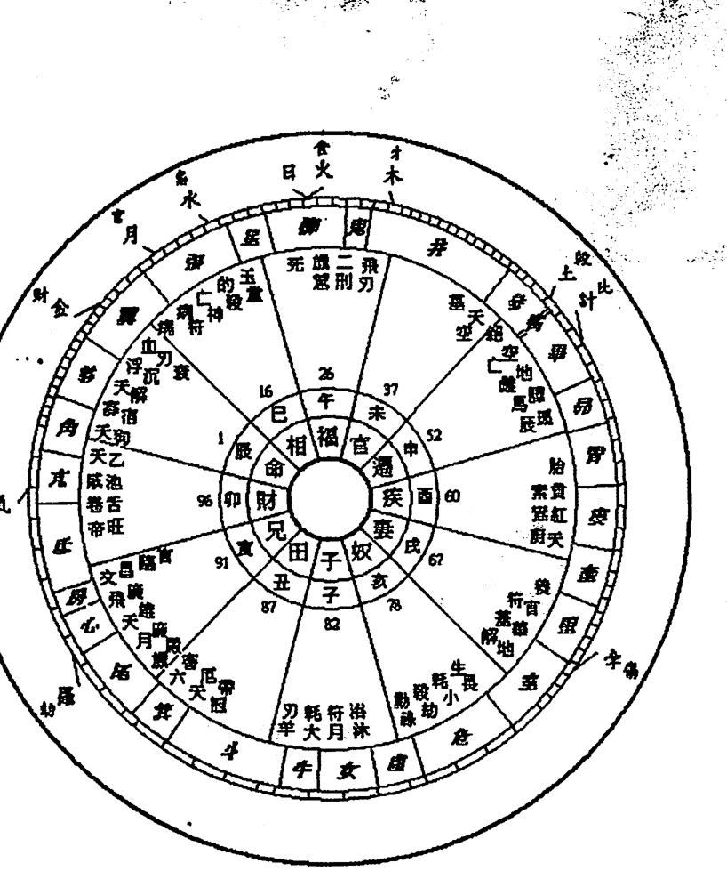

## 十二宮行大限表：
命宮行度隨淺深。相貌一年三度立。
官祿一年兩度通。遷移三載共一十。
疾厄一年四度強。三年之上同加一。
福祿妻妾三度移。三年減一為端的。
奴僕男女並田宅。一年七度三減一。
財帛兄弟各五年。一年六度行不失。
但能依此論行年 分明歲歲知凶吉。
例如：已宮大限，則依序為翼火度、張月度、星日度，接下來是午宮，依序為星日度，柳土度、鬼金度。以所行之限宮、限宮主、限度主之吉凶判斷行運之吉凶。

## 推年運、月運法：
以生年支加在命宮，逆數至本年太歲宮，是為小限，由小限宮起生月，按月逆尋，是為月限。
如甲子年五月生人，本年壬辰太歲，安命寅宮。即以子年加在命宮寅上，逆數至戌宮遇辰，此戌宮即其年小限宮也。
本人生於五月，即從戌上起五月，逆行六月酉，七月申，八月未，九月午，十月巳，十一月辰，十二月卯，正月寅，二月丑，三月子，四月亥，即其年十二月限，所謂小限宮起生月是也。

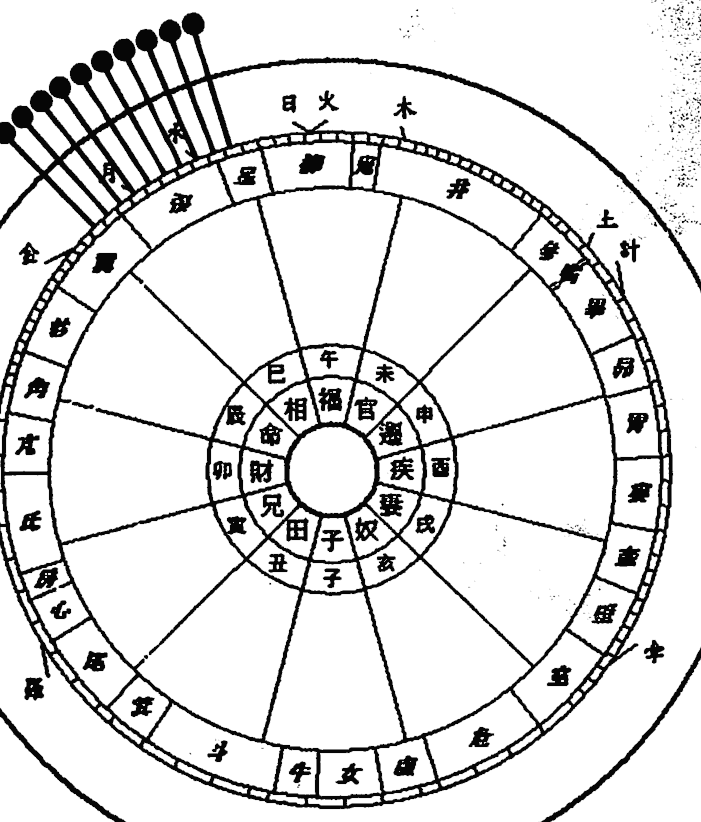

相貌宮管十年，每一宮是30度平均分攤。
30÷10=3，計算的結果是一年行3度。
如圖所示。

## 七政四餘
上文「十二宮行大限表」所述為大限每年之行度，例如：「命宮行度隨淺深。相貌一年三度立。」

「命宮行度隨淺深」：意思是大限命宮行度以節氣來論，命宮以十年，再加上太陽的度數逆數中氣，以三度為一年，兩者相加。故命宮行限的年限不一定。

「相貌一年三度立」：意思是大限相貌宮管十年，每一宮是30度，30 ÷ 10 = 3，計算的結果是一年行3度。

圖中為排盤案例大限「巳宮」相貌宮16-25歲的行限度數。如圖所示16歲行限在巳宮28-30度，17歲行限在巳宮25-27度，18歲行限在巳宮22-24度，19歲行限在巳宮19-21度，20歲行限在巳宮16-18度，21歲行限在巳宮13-15度，22歲行限在巳宮10-12度，23歲行限在巳宮7-9度，24歲行限在巳宮4-6度，25歲行限在巳宮0-3度。

| 歲數 | 16 | 17 | 18 | 19 | 20 | 21 | 22 | 23 | 24 | 25 |
|---|---|---|---|---|---|---|---|---|---|---|
| 度數 | 30-28 | 27-25 | 24-22 | 21-19 | 18-16 | 15-13 | 12-10 | 9-7 | 6-4 | 3-0 |

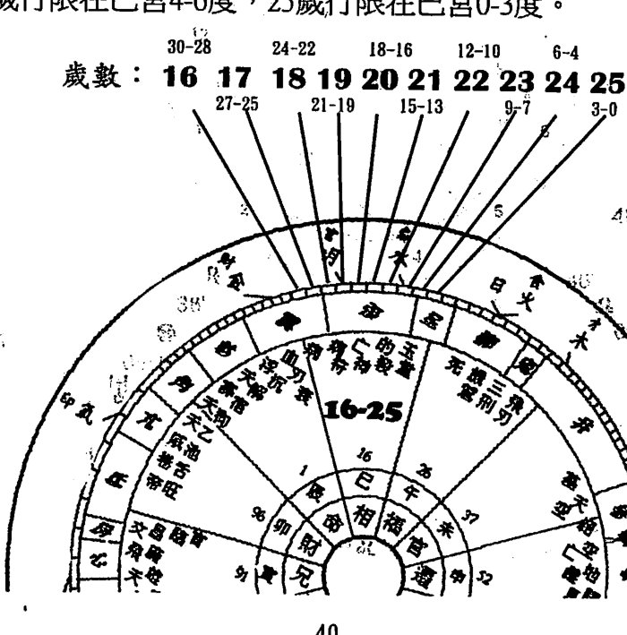

## Q. 什麼是黃道十二宮？
A. 黃道十二宮，也可以說是「十二星座」，可簡單的看成是人類從地球為中心，相對於天體所作的空間劃分，並且把這種空間劃分以十二種不同的徵象來作代表。

太陽在宇宙中沿著一定的軌道運行。太陽經過的軌道就稱做「黃道」，以地球為中心論之，太陽沿著黃道，每天大約一度行進，每月一宮（一宮有30度），一年之後再回到出發點。七政星盤就是以太陽每年的出發點，黃赤相交為春分點，以春分點為始，沿著黃道每隔三十度切分，共分為十二等分。每一等分稱為一宮，黃道十二宮每一宮皆有三十度。十二宮共三百六十度。或一天為二十四小時，十二宮，每宮兩小時，三十度。

已知的宇宙中，有千億個以上星球所組成，被命名者有8800多個，星球與星球又組成了許多星座，被命名者有2200多座，現今在地球上裝有許多超級望遠鏡，世界上有數千個天文學博士24小時不停的在研究。天文學家觀天文、星球的運轉、生滅強弱，對地球與人類的影響。黃道十二宮是人為的將天際劃分為十二等份，所以，黃道十二宮所指的並不是實際天體的星座，而只是十二種區間的劃分法，並且用這種劃分法來標誌出行星的移動位置。這十二種空間的劃分，分別具有十二種不同的氣質呈現，並且會影響到人類的特質。

黃道十二宮與十二星座，其實並無分別，中國七政四餘的傳統，以黃道十二宮來配二十四節氣，西方稱為星座，黃道十二宮與十二星座的對照如下：
- 戌宮（白羊座）
- 酉宮（金牛座）
- 申宮（雙子座）
- 未宮（巨蟹座）
- 午宮（獅子座）
- 巳宮（處女座）
- 辰宮（天秤座）
- 卯宮（天蠍座）
- 寅宮（射手座）
- 丑宮（摩羯座）
- 子宮（寶瓶座）
- 亥宮（雙魚座）

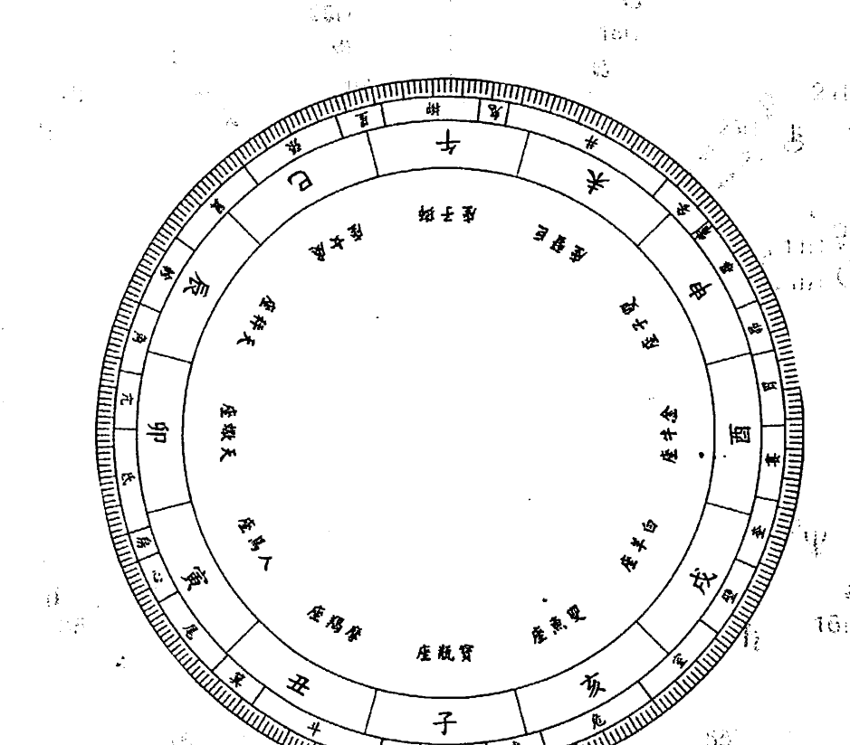

## Q12 二十四節氣怎麼解釋？
A 二十四節氣是以太陽曆爲基礎，根據視太陽在黃道上的位置，從黃經0度起，每15度爲一節，每月一個「中氣」和一個「節氣」，全年分十二個「中氣」和十二個「節氣」，以後合稱爲「節氣」。

二十四節氣按天文、氣象和農業生產的季節性賦予有特徵意義的名稱。即立春、雨水、驚蟄、春分、清明、穀雨、立夏、小滿、芒種、夏至、小暑、大暑、立秋、處暑、白露、秋分、寒露、霜降、立冬、小雪、大雪、冬至、小寒、大寒。

星命之術可藉由個人的出生年、月、日、時的天干、地支等八個字，推算出此人一生的命運。在七政四餘的概念，一個人出生的時間，代表著地球、太陽以及其他星球的相對位置，以此來推斷吉凶。

節氣也表示出日、月、五星的角度變化，因時間不同，星球的相關位置亦隨之而異，出生地的不同，星球的相對位置均會塑造出特定的磁場，這股能量直接或間接的影響著宇宙間一切物質，只要是有形體的物質或生命，都脫離不了它的牽制。

二十四節氣運用於八字、七政四餘，如調候的用法，或行星配合五行、節氣來作論斷。

二分、二至，即是春分、秋分、夏至、冬至，四個節氣，反映了日照時數的季節變化。

### 表示溫度：
小暑、大暑、處暑、小寒、大寒，五個節氣。

### 表示降水：
雨水、穀雨、白露、寒露、霜降、小雪、大雪，七個節氣。
大部分在春播和秋播季節，強調水分對農業的重要作用。雨水節氣表示降雨開始和雨量開始增多兩個含義，在這些節氣中白露、寒露和霜降雖是降水現象，但溫度的意義更重要，也可以作為溫度表示，有降溫程度的節氣。

二十四節氣中的這些節氣明顯地表示氣候的季節變化和轉折。其他節氣中，驚蟄間接表示地溫的升高，清明、小滿通過物象表示氣溫的升高，芒種以農事活動表示盛夏到來。

## 看官休憩區 輕鬆一下，充電，再出發
> 一九八○年七月，雷根漫不經意的告訴一位記者說他每天都看他的星盤。前白宮幕僚長Donald T. Regan寫道：「總統的時間表是白宮裡一個最有力量的工具，因為它決定世界上最有權勢的人將做些什麼和什麼時候做。」雷根夫婦與占星家的關係就是他透露的。

## Q. 請說明七政四餘的理論架構體系?
A. 七政四餘之星命體系，結合了陰陽五行、行星、二十八宿恆星體系，而成為中國個體論命占星學。自唐代開始流傳以來，在推命的運用結構就與神煞、八字相結合，中國獨有神煞體系，成為與現今的西洋占星術最大的差異。

七政四餘不論是推算世局或個人命運，都使用黃道十二宮及二十八星宿兩套系統並用。二十八星宿為天體星象的劃分方式，二十八宿是黃道上的實際天體位置，故而各星宿度數大小不一。

然而黃道十二宮位是人為之劃定，古人將天體空間平均等份的劃分成十二，成為十二宮。而二十八星宿和黃道十二宮的分別，只是劃分方法上的不同，並非兩種不同的星體。二十八宿講究的是實體的星座，十二宮很明顯的就是人為將區域劃分的意味。

七政四餘將神煞安置在十二宮，與星體結合的方式尚有十干化曜的概念，也是此命學特殊之處，二十八星宿，星座度數，行星位置，行星的角度關係，地盤十二宮，以及各宮內神煞，各分以不同的圈規劃在星盤之中，含蓋著生剋制化、釣起飛來，對照拱合的變化，更特別的是其中化曜星煞還配合著「八字」論命系統，可以說是八字與星學之總合，這就是七政四餘的星學體系。

## Q.25 何謂廿八星宿？
A. 二十八宿是古代的一種標示恒星群系統，為了便於觀察和研究星空，依據太陽和月亮所經過的星空背景組成28個星組，用來作爲標示日月星辰的位置和量度它們的運動情況。古代印度、阿拉伯、伊朗和埃及等都有類似二十八宿的恒星群系統。我國遠在周代之前就有二十八宿的劃分。
- 角、亢、氐、房、心、尾、箕：屬東方青龍
- 井、鬼、柳、星、張、翼、軫：屬南方朱雀
- 奎、婁、胃、昴、畢、觜、參：屬西方白虎
- 斗、牛、女、虛、危、室、壁：屬北方玄武。

二十八星宿是中國古代天文學說之一，在《果老星宗》也有提到一小部份，果老云：「奎壁爲文章之府」據古書的記載，廿八星宿的每一星宿都有其代表意涵：
- 氐：爲東方七宿之第三宿，天秤座，有四星，爲主疾病之星。
- 房：爲東方七宿之第四宿，屬天蠍星座，有四星，其星明象徵著政治清明，百姓安樂。
- 心：爲東方七宿之第五宿，有三星，屬於天蠍星座，爲一等星，其色爲紅，又稱商星，代表文明昌盛。
- 尾：爲東方七宿之第六宿，有九星，屬於天蠍星座，俗稱龍尾九星，其星明，象徵五穀豐收，如暗有洪水之患。
- 箕：爲東方七宿之第七宿，有四星，屬於人馬座，斗在北，箕在南，又名「南箕」，清明，代表風調雨順，五穀豐收。
- 斗：爲北方玄武七宿之首，屬於人馬座，有六星，又稱北斗，其昌明代表天下太平，國富民安。
- 牛：爲北方七宿之第二星宿，有六星，屬摩羯座，又名牛郎星或牽牛星，其星明象徵六畜興旺，五穀豐收，安樂和利。
- 女：爲北方七宿之第三星宿，有四星，屬寶瓶座，此星象徵女性，清明，代表婦女昌盛，女權主事。
- 虛：爲北方七宿之第四星宿，有二星，屬寶瓶座，與人馬星座，爲美麗雙星，清明，代表天下太平，安寧快樂之事，其星暗，則指有動盪不安，兵亂無寧。
- 危：爲北方七宿之第五星宿，有三星，一星屬寶瓶座，二星屬雙魚星座，見危則不安，暗則主有大災難。

## 七政四餘
室：為北方七宿之第六星座，有二星，屬雙魚星座，此星明，象徵國運昌隆，百姓樂，利如暗則天下大亂，瘟疫橫行。

壁：為北方七宿之第七宿，尾後之末也，有二星，分別屬雙魚座及白羊座，與處女座為一等之星，星明代表文人當道、當權、道德昌盛，君子明進，小人不見。

奎：為西方七白虎七宿之首，有十六星，其中九星屬白羊座，七星屬雙魚座，均代表文昌盛世。

婁：為西方七宿之二，有三星，屬白羊座，其星明，象徵國泰民安，否則兵亂四起。

胃：為西方七宿之三，有三星，屬白羊座，胃為天倉，糧庫也，星明代表五穀豐收。

昴：為西方七宿之四，有七星，六星屬於金牛座，即是所謂七姊妹星團，此星明朗代表安和樂利，天下太平，星暗則憂慮多也。

畢：為西方七宿之五，有八星，七星屬於金牛座，另一為畢宿五，亦屬金牛座為一對星，色是赤色，俗稱金牛之目，象徵兵馬軍力之權。

觜：為西方七宿之六，有三星，屬於金牛座，此星明，代表安和樂利，五穀豐收，若有移位，象徵君臣失位，兵馬動亂。

參：為西方七宿之七，末星也，有七星，屬雙子座，此星明亮，代表民生樂利，風調雨順，五穀豐收。

井：為南方朱雀七宿之首，有八星，屬雙子座，此星明亮，代表國富民安，天下太平，如色變則動盪不安。

鬼：為南方七宿之二，有四星，屬巨蟹座，星色很是暗淡，如雲非雲，如星非星，為不祥之兆。

柳：為南方七宿之三，有八星，屬獅子星座，其星明，亮主百姓豐衣足食，如果失其色，則失收饑荒。

星：為南方七宿之四，有七星，六星屬獅子星座，一為星宿，為二等之星，此七星代表有偶發性之急事。

張：為南方七宿之五，有六星，屬獅子星座，此星明亮，代表國強民富。

翼：為南方七宿之六，有二十二星，十一星屬於巨蟹星座，三星屬獅子星座，另外八星不明，其星明亮，象徵禮樂與興邦等，四海一心。

軫：為南方七宿之七，末也，有四星，屬處女星座，色一黃一紫，其星明亮，則代表風調雨順，天下太平。

二十八星宿於玄學中應用甚廣，地理陰宅「賴布衣消砂法」、擇日、易學，古法大六壬占卜等，都有運用五行合二十八星宿以占斷吉凶。

## Q：廿八星宿之宿度大小不一怎麽解釋？
A. 天空中璀璨的繁星，倘若不掌握適當的方法，要辨認這麼多天上的星星也非易事。古人為了方便認星，就把位置比較靠近的星星劃分成群，並在每一群星中用想像的線條把較亮的星聯結起來，形成各種圖案，這些星群就稱為星座。人們還有豐富的想像力，把星座和神話故事連結在一起，在幾千年的漫長歲月中，星座的概念有了很大的發展，而古老的星座名稱通常都有古老的神話與傳說。

中國古代，對星群的劃分也有獨特的體系。早在公元前11世紀以前，我們的祖先就把星空劃分成了許多「星官」或「星宿」。之後，又進一步演變為「三垣二十八宿」的星空體系。「三垣」指的是北天極周圍的三個天區，分別叫做紫微垣、太微垣和天市垣；二十八星宿指的是分佈在黃道附近的28個天區。

古人在廿八星宿各宿中選出一個恆星作為測量的標準，此星稱為該宿的距星，各宿距星決定後，只要觀測相鄰距星之赤經差，即可知各宿之赤道距度，也就是各宿在赤道的寬度，以此距度投影至黃道則得黃道距度，即各宿在黃道的寬度。

## 古書中廿八宿度數所屬
角木蛟十二，亢金龍九度，氐土貉十六，房日兔五屬六宿、心月狐十八，尾火虎、箕水豹九兮廿四，斗木獬、牛金牛亦六十數，女土蝠九度，虛日鼠、危月燕十五，室火豬十七，壁水俞九兮十八，奎木狼、婁金狗十二，胃土雉十五，昴日雞十土十六，畢月烏、觜火猴借半，參水猿數十，井木犴卅一二度，鬼金羊十二，柳土獐、星日馬六度，張月鹿十六，翼火蛇十九，軫水蚓十七。

此為果老星宗所載度數寬狹，廿八星宿是天體上實際的星宿，故其大小會不一。各朝代有校正，有些微出入。本書所附的空白星盤已經校正完成，書中案例採用PrimaryStar 軟體，各宿度經由校正。

## 廿八宿各宿之寬度如下：
- 角11.0、亢10.5833、氐17.85、房4.85、心8.25、尾15.2、箕8.95、斗23.9、牛7.65、女11.6667、虛9.9667、危20.0667、室16.75、壁12.2167、奎11.5167、婁12.9667、胃12.4833、昴9.0667、畢15.2、觜1.0、參10.6167、井30.45、鬼4.9833、柳16.0、星7.9833、張19.0667、翼16.95、軫12.8。

## 看官休憩區 輕鬆一下，充電，再出發
> 半世情
台南有家店名叫「半世情」。某晚獨自前往小酌，朋友撥行動進來問你在哪裡 作啥？
我答：「在半世情(辦事情)。」
朋友說：「那不好意思等你辦完再跟我聯絡！」隨即掛了電話～

## 七政四餘
## Q. 行星運行的速度如何計算？
A. 星宗論太陽行度，歌訣如下：
> 立春虛一起，雨水危九求，驚蟄室六度，春分壁三遊，清明奎九下，穀雨婁八留，立夏胃八邊，小滿昂八收，芒種畢十一，夏至參九頭，小暑井十三，大暑井念九，立秋柳十度，處暑張五有，白露翼二立，秋分翼十七，寒露軫十三，霜降角十及，立冬氐三行，小雪房二至，大雪尾六臨，冬至箕四逼，小寒斗十連，大寒牛二直。

星宗論太陰行度，歌訣如下：
> 欲識太陰行度時，正月之節起於危，每日常行十二度，三日兩宮次第移，二奎、三胃、四從畢，五井、六柳、張居七，八月翼宿以為初，龍角秋季任遊歷，十月房宿作元辰，建子箕子細尋覓，丑月牽牛切要知，周天之度無差忒。

晨昏度論、朔後為昏度望後為晨度
> 「昏度者，酉宮也。凡初一至十五六日生，皆從酉上起，每一時挨一度，酉、戌、亥三時順數，申、未、午、巳、辰、卯、寅、丑、子九時逆數。晨度者，卯宮也：凡十五六至三十日生，皆從卯宮起，每一時挨一度，卯、辰、巳、午、未、申、酉、戌、亥九時順數，寅、丑、子三時逆數。」

> 「初一至初四日，月行最疾，一晝夜行十四度有餘。初五至初八日，月行平，一晝夜行十三度有餘。初九至十九日，月行遲，一晝夜行十二度有餘。二十至廿三日，月行小疾，一晝夜行十三度有餘。二十四至三十日，月行大疾，一晝夜行十四度有餘。」

以今之宿度修正如下：
上文所述，為古書上所載，太陽、月亮或行星的行度皆以二十八星宿之宿度來定坐標，但是二十八星宿是恒星，因為歲差的緣故，七十年左右會差一度，必須要經過校正才能精確，《果老星宗》成書近千年以來，並未有人改編過，其中宿度與計算方法都未經過修正，故而依此公式求出的數據必然誤差甚大。

舉例來作說明，星宗論太陽行度，歌訣中：「立春虛一起，雨水危九求。」書中原意是「立春」的節令，也就是立春這一天的準確時刻，太陽度數從二十八宿中「虛」宿一度開始，立春第二天太陽在「虛」宿二度，立春第三天太陽在「虛」宿三度。

歌訣第二句：「雨水危九求」，指的是雨水那一天的準確時刻，太陽的度數從二十八宿中的「危」宿九度開始，雨水第二天太陽在「危」宿十度，雨水第三天太陽在「危」宿十一度……。

但是以現在的 二十八宿宿度，立春那一天太陽的度數應該在女宿四度左右，雨水那一天太陽的度數應該在虛宿六度左右，古今度數偏差極多，可以這麼說，書中的公式已經不適用於現代了。

當然也有更有效的方法計算太陽的角度，以目前的曆法，立春那一天的真時刻，太陽在子宮（寶瓶座）十五度，立春的第二天，太陽在子宮（寶瓶座）十六度，立春的第三天，太陽在子宮（寶瓶座）十七度，依此類推。到了雨水那一天的真時刻，太陽則是推進到雙魚座一度，在雨水的第二天，太陽在亥宮（雙魚座）二度，雨水的第三天，太陽在亥宮（雙魚座）三度。此為太陽的度數計算，古書其他行星計算方式也一樣面臨二十八宿校正的問題，現代人因爲電腦發達，以及有星曆表可以查閱，也不需要在計算行星位置上花費很多時間，所以行星度數計算只要稍微知道其數據來由即可。星象家多數是電腦操作，是故，也沒有星象家會實際去計算，有可能在教學上或許會表演一番而已。

## 看官休憩區 輕鬆一下，充電，再出發
> 妳愛嫁誰就嫁誰
有位女孩對爸爸說，她喜歡對面的帥哥，結果她爸爸小聲的對她說：「那是你同父異母的哥哥，你們只能做做普通的朋友！」
幾個月後，女孩又對爸爸說，喜歡上了巷口那家的帥哥....
她爸爸又對她說：「那是你另一個同父異母的哥哥，你們也只能做做普通的朋友，千萬別對妳媽說。」
可是女孩還是哭著對媽媽說了，她媽媽安慰她說：「妳愛嫁誰就嫁誰，妳根本就不是妳爸爸的女兒。」

## Q. 宮主、度主和身主如何分別？
A. 度：周天及二十八宿的劃分標誌，周天分為十二宮，每宮有30度，共分360度，二十八宿每宿度數不一，但每宮都為30度。
- 角、斗、奎、井度屬木，
- 亢、牛、婁、鬼度屬金，
- 氐、女、胃、柳度屬土，
- 星、房、虛、昴度屬日，
- 心、危、畢、張度屬月，
- 尾、室、觜、翼度屬火，
- 箕、壁、參、軫度屬水。

此為度宿所屬五行，以生剋制化來論吉凶。

宮主者，謂子丑宮屬土、寅亥宮屬木、卯戌宮屬火、辰酉宮屬金、巳申宮屬水、午宮屬日、未宮屬月。此為宮分相合以布七曜。

如子丑兩宮，子為寶瓶座，丑為摩羯座，皆屬土，因為子丑合土，故，子丑兩宮的宮主星為土星，假設排出的命盤，立命在子宮或丑宮，則命宮的主星即是為土星，即是第一宮「宮主星」，一般稱為「命主」。
凡看五星之法，先是排定太陽，以生時加在太陽度## 七政四余

上，则知安命在何宫，方为端的，果老是以度主为要，宫主次之，盖宫主州郡也，度主县邑也，由县而州，县为切近，二主要生旺得时为妙，凡身主切于命主，度主切于宫主，夜生人重身度主，日生人重命度主，经云，身好命不好，有福无寿，命好身不好，有寿无福。

凡论命之法，先观立命何宫何度，如立命在宫与宫交界的五度之内，以宫为轻，度主为重，最怕外星来克命度者为忌，或宫主克度为轻，或加吉星，反有利名之喜，又看三方对冲，生克亦然，宫主失躔者，生平减力，度主失次者，祖业难招，若限强有力者，主发财故曰：命弱限强，如枯苗之得雨，此之谓也。

如立命不在宫与宫交界的五度之内，亦即立命在宫位的6-24度内，以宫为重，度主为轻，即是以宫主星为判断基准，度主星作为辅助用。什么时候取宫主星为论断主轴，什么时候取度主星为论断主轴，是很重要的观念，此为七政论命极重要的口诀。

论命，务必要求其主星，命主、度主、身主，须看强弱，以论祸福，不必主星一一高强，一一得地。经云：「一星得地，终为贵显吉人。」又云：「使一星背而莫救其非，纵群曜吉，而莫能为福。」又云：「一宿加临，此命永为吉庆。」譬如五官员在任，不必员员识面，其中一员官得力，则侍从州郡，莫不刮目，观星当以理明，推其次第。

论命须看四正宫（一、四、七、十宫）为紧，或日月照四正，福禄照四正，及用星居四正之位，皆是贵显受用之人，又有火罗计孛守四强，及化曜得吉者，皆为合格，若是刑囚暗耗等星，守于四正宫中，而逢刑位克制之星，皆主破败。以图示为宫主、度主、身主之介绍。

宫主：立命辰宫（天秤座），辰宫宫主星是金星，故称本命盘的「命主星」是「金星」，或称第一宫的宫主星是金星。

度主：太阳午宫18度，将18度对应到命宫是辰宫18度，即是命度，辰宫的18度所对应二十八宿，则是轸宿7度，为立命轸宿，轸属水，故以「水星」为「命度主」。

身主：月亮所躔的二十八宿，即是身主。月亮躔张宿，故以「月亮」为「身主」。

太阳午18度—移到辰宫18度，为轸宿，故命度主星为水星。

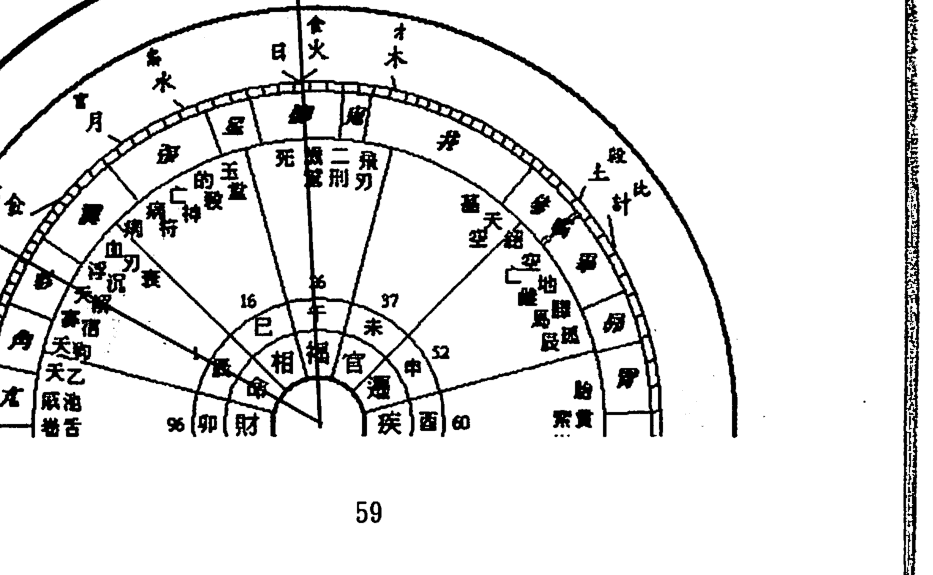

## 七政四余

**Q: 七政四余各星基本性质请作一简介？**

A. 七政者：为太阳、月亮、金、木、水、火、土。
四余者：孛、罗、计、气。
各星之性质简介如下

### 太阳：

太阳在星宫图中的地位举足轻重，其所在的黄道星座及后天宫位都备受重视。太阳有君父之威严，为万宿之主，如君，如父，如得到太阳守照、正照拱照、夹照等，必得福寿无疆，可消灾解难。择日方面，如果得到太阳到向、到座、到方，三方拱照，都会锦上添花，吉神会发挥其好的作用，而凶煞会因为它之威严，而会收敛的。书云：「请君尊用太阳照，三合对宫福禄坚」。

本命盘十二宫中，如逢太阳临之，则吉能增吉，凶能减凶。如有凶星来刑克，逢太阳则凶性顿失。

太阳每日行五十九分零八秒左右，太阳每月中气过一宫限（三十度），一年行十二宫，太阳入午宫为归垣，行经房、虚、昴、星日宿为升殿。

### 太阴：

太阴为后妃之象，有母仪、温柔、聪明、可爱，继太阳之后最重要之星，太阴晚上照耀，它能运用其宽仁慈爱，化解凶煞，普化吉祥。命中得到太阴、守、正、拱、夹等，必定主聪明、秀丽、福泽无双。择日如果得到太阴、到山、到向、到方等，亦是最佳。太阴有阴柔之性质，所以喜其到座。

太阴每日行十三度。十分卅五秒，约两日半可以行一宫限，一个月行十二宫，又一宫少些，与太阳会合，叫朔（初一）到一百八十度，与太阳对宫，叫望（十五、十六、十七）等。入未宫叫归垣、行经、心、危、毕、张，月宿为升殿。

### 土星：

又名镇星，乃是中央戊己土之精华，其色是"黄"，其风格有道德之一面，主成长与养育之能力，是五星中移动最慢之星，故有"沉滞"之气。行度有顺、逆、伏、留，如果其顺行会有福力，富贵兴隆，如果逆行会有灾难，如瘟疫、黄肿等。

土星每日平均行两分左右，约廿八个月过一宫，廿八年才行遍十二宫，平均每一年坐镇一个星宿，故廿八年才可坐镇完成廿八星宿（镇星之名由此而来）。入子、丑宫叫归垣、在氐、女、胃、柳四土宿叫升殿。

### 木星：

又名岁星，是东方木之精华，色青，性质本为仁厚，应在东方青龙之位，其主生生不息之权力，行度有迟、有快、有顺、有逆、有伏、有留，当其顺行轨道时有福力，逆行轨道之时其力弱。是掌管图书、文艺之部份，又主秀拔，青出于蓝。

木星每日行四分五十九秒，每年行一宫限，十二年行十二宫，故名岁星。如果入寅、亥二宫为归垣、行经、角、斗、奎、井四木宿为升殿。

### 火星：

又名荧惑，是南方火光耀之精，赤色，应在南方朱雀位，在夏令为得时，火星性质主礼，舒长权力，行度有迟、疾、顺、逆、伏、留。顺行轨道时会有福力，逆行轨道亦是有祸患，遇到木宫叫恩星，遇到土宫为用星，会有好表现，遇到水星叫做难星，遇到金星叫做仇星，难发挥其作用。

火星每日行卅一分廿六秒左右，两个月行一宫，两年行十二宫，入卯、戌二宫为归垣、行经、尾、室、翼、觜，四火宿为升殿。

### 金星：

又名太白，西方金之精华，色白。性义，应在西面白虎之位，金星有大将之风度，主收敛之权力，行度有迟、留、顺、逆、伏等，各星都以顺行为吉。

金星每日行一度，一月行一宫，一年行一周天，行入辰、酉二宫，为归垣、行经、亢、牛、娄、鬼四金宿，为升殿。

### 水星：

又名辰星，乃北方水之精英，主黑色，性主智、聪明，应在北玄武之位，深藏不露，行度有迟、疾、伏、退，顺行时有福力，迟、留，福力轻。

水星每日行一度，一月行一宫，一年行一周天，水星入巳、申宫为归垣、入箕、壁、参、轸四水宿，为升殿，与土星、月同宫成对照，水弱喜金星，水旺不怕土星，三、六、九、十二月，为四季土旺，就没有力道来克火星。

### 月孛：

月孛，为虚星，乃北方水星之余气，跟随水星一同坐镇北方玄武之位置，性质威猛，气势粗豪，有小人之阴险狡滑，不是非常良善之星。

月孛如果与吉星同宫，它可以潜移默化，不能作祸，因为近朱者赤之类。如果与凶星同宫，必然是助纣为虐，其性质凶多于吉，但是不能单独发难，遇到吉星，得地顺行之时，不能发祸，如果遇到五星逆行，会助其凶险，引来是非。每日行六分四十一秒，约九个月行一宫。

### 罗星：

罗喉，为虚星，又名天首星，南方火之余气，性质如火一般燥烈，气质豪雄，如果与太阳同躔，主天变日蚀，被其掩蔽，与计都呈相对的角度，每日退行三分十一秒，无伏、疾、迟、留之变。

### 计都：

又名地尾星，是土星之奴星，性质也是沉晦，主孤寡少亡，同土星坐镇于中戊己土之位，可生金，能克水，不过只是余气，作用不大，但遇着与太阴同躔之时，它就有掩蔽月亮成月蚀，常与天首星相对宫，每日约退行三十一秒，亦无伏、疾、迟、留之变。

### 紫气：

紫气为木星之余气，追随木星在东方青龙位处，又名景星。故有「紫气东来」之美号，祥瑞吉庆之星，为好修道之星，性质善良，如立命或小限宫度化曜，又没有凶星临之，定主富贵荣华，福寿双全，仁慈道德，好善乐贤，美好的，行度顺而无迟、留、伏、逆，每日行两分六秒，周月小行一度五十四秒，月大行一度三分。

### 七政行星的性情取向

> 《星度指南》性情出处有如是的论断：「木为艺术好文才，金主刚方而嗜慾，水乃漂荡而无守，火必性躁而不常，土主敦厚而沈迟，计能狡猾而深虑，孛招谤怨，罗喜贪歌，紫气清高，心必孤介。」

五星各有体性，如木主文而繁，火主暴而狂，土主厚而迟愚，金主刚而寡爱，水主快而不定。

- 气守命，主慈祥，言语分明，少病有寿，或多孤寡。
- 孛守命，主言粗语大，胆壮有为，多奸诈。
- 罗守命，性情高傲，不耐是非，无嫉妒。
- 计守命，性好勇，胆大多谋而性难定。

> 《果老星宗·性情论》中有提到，对于性情，仁、义、礼、智、信与行星的对应关系，这种关系应该是行星落入命宫时，所表现出来的征象会更显著。

日之为性，宽缓慈心，有大人之气量，习君子之威仪，出入端庄，言语真实，肯能怜贫念老，抚幼恤孤。火罗同度，足将进而谻趗，口将言而嗫嚅。木气同度，孤克有余。水孛同宫，刚柔相济。春日迟丽，温僖可人。夏日刚烈，刑克六亲。秋日乾曜，方而不圆。冬日可爱，人皆曝之。

月之宿，虽性聪敏，终受问于人。盖月禀阳精，妻顺于夫，性不自专，谋事多密。至于孤克之曜也，与土蚀晦，口纳言而心算计。但春月美丽，照耀山林。夏月可爱，春风和气。秋月朗俊，出人头地。冬月虽清，严凝可畏。发辉旦旦，孤洁有余，自爱自好之性，人所未之知也。

金于五行主义，为性刚直，方多圆少。带咸池则淫冶，带阳刃则刚方。多义气之人，乃终始之士，刑克则骨肉无情，恩中生怨，然可喜者，做事最肯任劳苦。

木于五行主仁，为性从直，有柔有刚，挽之则前，舍之则往，所谓道合则从，不合则去，不肯以私害公，徇情说众，不失背则负艺，诸般聪明伶俐，是不惮烦，心怀恻隐。

水于五行主智，为性圆变，喜怒无常，激之则扬，抵之则怒，顺之则喜，终智巧之人，多能之士，人物和气，骨肉无情，能施恩布惠，能随波逐流，只是于事多般，勤始而终怠终，东西无定。

火于五行主礼，为性暴躁，有喜有怒，触之则气夺斗牛，悦之则顺如风草。终是有头无尾，有口无心，但观其性者，如苛虐之为，然察其由者，实险狭之故。若受水之制得宜，合于制化，温恭有礼，辞逊谦让，勇而有谋。

土于五行主信，为性机变，有方有圆，触之则怒恨于心，悦之则喜无不信。但心难恻隐，事要密焉，虽言语默而暗计有余，纵于事繁而反宽反缓，不宽急之心性。

气乃木余，仁之小者。所知者百子之书，有能者九流之技。烦心好静，事多能晓。到妻宫主无男，到五宫儿多僧道，若居财帛不取无义之财，若入命宫妨妻害子，实其性之孤高，为南方之强也。若会计都，巧言花语。

孛乃水余，智之小者。所知者功利之私，所能者眼前之巧，夸多斗靡，矜己忽人，喜从讹不喜箴规，爱人情不爱清致。泊阳刃咸池，则赌博为生。会计都罗喉，则巧言令色。与气同会，反为柔弱之人，只是内藏奸计。到天门乃著朱衣之所，外貌有余，爱声名，喜功利。到狮子，则狠而无礼，骜而有余。到摩羯，则暗计难量，外假尊重，内实矫淫。为不利夫子之星曜。

罗乃火余，礼之小者。性至于燥，燥必厌烦，烦必怒生，生成勇敢。盖火余而易灭，一怒而易消，事曾为而后悔，心刚劲而胆寒。居十二宫，则面斑有麻。到八杀宫（第八宫）则为酒痣气疾，或主损目，女常血搅。如居官禄（第十宫），惹是招非。若在七宫（第七宫），妻多反目。

计乃土余，信之小者。机巧有余，能言之士，内外异态，二三其心。所作匪常，所谋不一，到中年方保可安，安之则刑六亲，孝服常见。

各星曜有其属性，而命盘的论断，必以全面性的考量，命盘的吉凶在于星盘所提供驱动力的结构。行星的属性是其中一部份，行星的角度、庙旺陷弱、各宫位的强宫、弱宫，各宫位的主星，都是整体要考虑的重点。

> 国内第一本易经、宗教、命理、养生专属杂志
星象家杂志双月刊
2005年2月5日创刊
地址：106台北市大安区罗斯福路3段193号7楼
7F., No. 193, Sec. 3, Roosevelt Rd., Da-an District, Taipei City 106, Taiwan (R.O.C.)
电话：(02)23661177  23651168
传真：(02)23670168
邮政划拨19634769大元书局账户
网址：www.life258.com
E-mail：aia.w168@msa.hinet.net
定价200元  特价169元
全书116页，每逢双月份5日出刊
订阅1年6期特价880元，全年挂号邮资另加120元；
两年12期特价1600元，两年挂号邮资另加240元，海外邮资另计。
全国金玉堂、何嘉仁、垫脚石、建宏、天才书坊、诺贝尔、敦煌、纪伊国屋、书田等连锁书店及进源、育林、瑞成等各大书局皆有销售
（各销售点地址电话见星象家杂志第114页）。

## 七政四余的强弱与生、克、制、化如何分别？

强：指强宫，即命宫、官禄宫、田宅宫、妻妾宫、男女宫、福德宫、财帛宫。在强宫者其势旺。

弱：指弱宫，即兄弟、奴仆、疾厄、相貌、迁移等宫。在弱宫者衰弱。

体：指不动者，如二十八宿、十二宫、分野、十二次、宫主、度主等。又指主要之星曜或事项，如日月五星四余及身、命、福，田、财，妻，嗣等。

用：指运动者，如日月五星四余及命、财等十二宫。又指周天行度、行限、流年、太岁宫位等。

生：五行相生。如木生火、火生土、土生金、金生水、水生木等。身、命、官、福，若是星来生之更吉。

克：指五行相克，如木克土、土克水，水克火、火克金、金克木，若身、命、田、财、官、福，遇有克它之星，则凶。

制：指五行相助性的克。如金克木时，有火来助木而克金，这种克就称为制，意思是制伏伤我之人。

化：指五行相助性的生。如金克木时，有水来，使金生水，则分散其克木之力。这种情形称之为「化」，意为化煞归善以利于生我也。

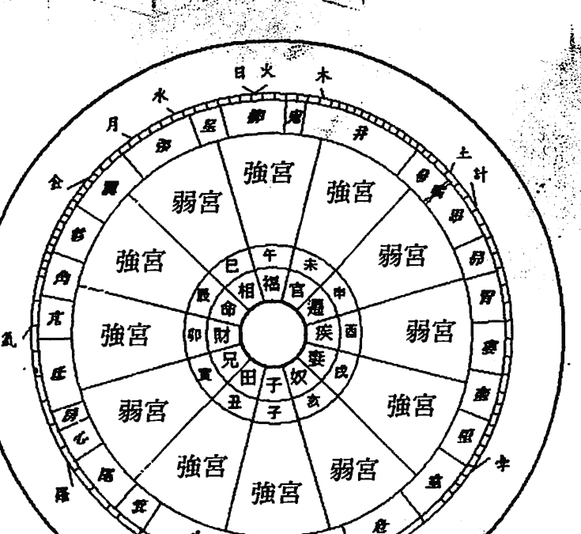

### 七政四余的强宫与弱宫

「七强五弱」，以后天十二宫为基准，判别星曜强弱。当吉星在命宫、财帛宫、田宅宫、子女宫、夫妻宫、事业宫及福德宫这七个宫位时，福力加倍。

当吉星在兄弟宫、奴仆宫、疾厄宫、迁移宫、相貌宫时，吉性之性则大为减弱。将七强五弱法则引用于所有星曜，对于星曜的吉凶判断自会另有不同的解读，在强宫的星曜希望它能强，会促使盘主取得成就，做他们想做的事情。在弱宫的星曜即使能得强旺，则犹如奴欺主一般。

## Q 行星的会合拱照向背迎送如何解释？

A. 对：指星盘上十二宫中互相对冲的宫位，如子与午对，丑与未对，寅与申对，卯与酉对，辰与戌对，巳与亥对。又叫对照。即二宫相对，双方之星若为生、化的关系则吉，若为相克的关系则凶。又叫冲、对冲。

合：指星盘上十二宫处于三角关系，如等腰的三角形，又称相拱、拱照，有聚力相拱之意。如申子辰为合拱，寅午戌为合拱，巳酉丑为合拱、亥卯未为合拱。三宫合拱时，可根据相互的五行生克制化关系以定其吉凶，相生的星来拱为吉，相克的星来拱为凶。

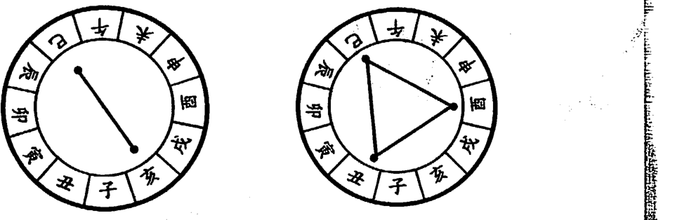

向：指诸星向朝，例如日与月处前后位置时，在后者便是向朝在前者。向朝的吉凶，依据二者所属五行的生克制化及互动关系而定。

背：指众星背躔，例如计都，罗睺在东南方(辰巳二宫)拦截其他星曜时，而命宫行限正在西北方(戌亥二宫)则叫背躔。

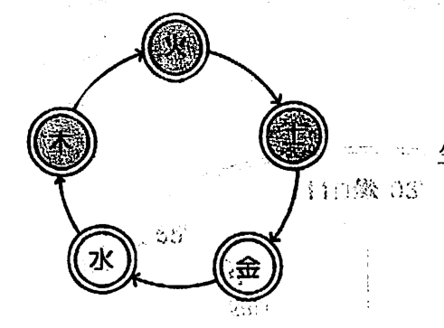
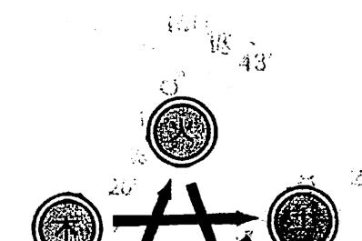
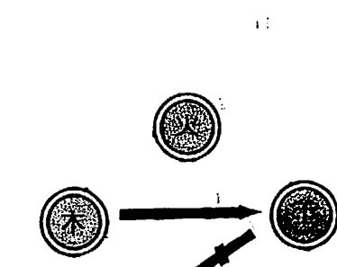
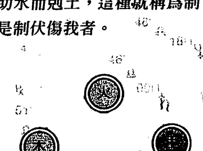

## 七政四余

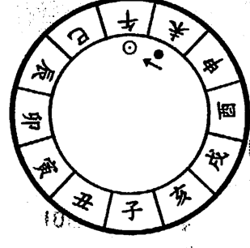
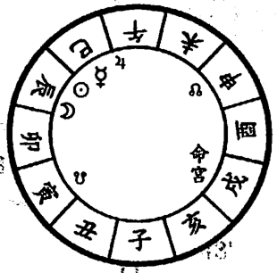

### 向

### 背

前后：指三星一前一中一后。前后一以宫分，一以度分。以宫分者，如子宫为中，则丑宫为前，亥宫为后，这是宫的前后。

以度分者，如以角宿的度数为中，则亢宿为前，轸宿为后，这是度的前后。

以行限时，以宫的前后定吉凶。讲星格时，以度的前后定吉凶。此外又有同一宫的前后之分和同一星宿内的前后之分。之所以分前后，是为了区分生克关系的作用。

凡是克我之星，喜其前行，因克我之星前行，则其克力管不到在后的星，若在后，则其克的力量会发挥作用。凡是生我之星则宜后行，因其生我之力可发挥作用，若其在前则于我无益。

迎送：星在前，对于在后之星为迎，反之为送。迎送有两宫之间的迎送和同宫之内两星宿之间的迎送，两宫之间的迎送关系远，两宿之间的迎送关系近。其吉凶也是依据五行的生克制化关系来论其吉凶。

以「宫位」分「前后」、「迎送」图示：

以宫位分前后：

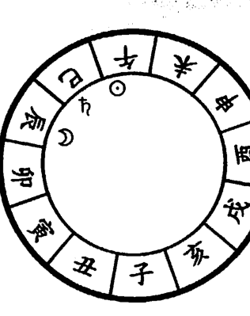

如左图为例，太阳在土星之「前」。月亮在土星之「后」。星在前谓之「迎」，星在后谓之「送」。

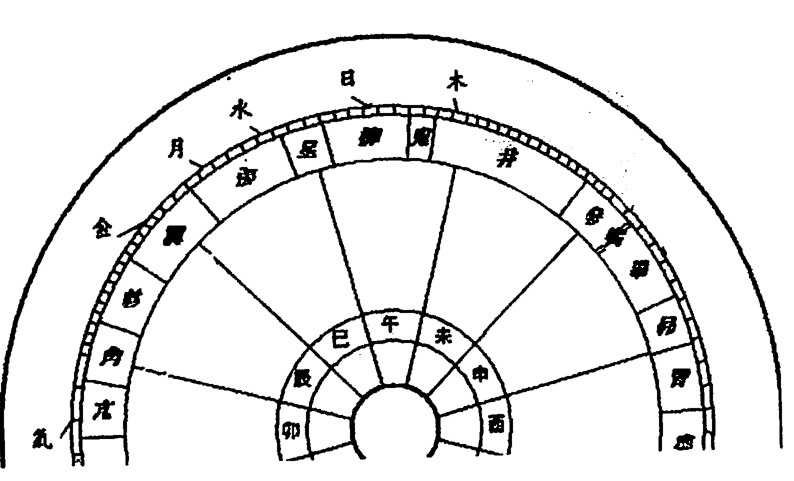

以「宿度」分「前后」：

如上图为例，月亮在张宿，金星在翼宿，以「宿度」分「前后」，谓金星在月亮之「前」。

## Q.22 日生人与夜生人在命盘格局的判断有何分别？

太阳的升、沉、明、晦，影响到白天生，或是夜间生人的格局高低。

星曜生我者则吉，克我者则凶。向背为贵贱之本。诸吉星在后，相向我者为贵；或在前，相背者不吉。又诸凶星在后，相向我者反凶；在前相背者乃吉。先看明晦、升沉、顺逆、衰旺、掩蚀、冲制。此论十二字字字要紧关。昼日明而月晦，夜日晦而月明，忌守命或为主。

太阳在六阳位为明，过未则晦，月在六阴位为明，过丑则晦。日木土水昼明，月火金罗夜明，反背为晦。

向明：白天生的人，逢日、木、土、水、气、计、孛，夜生人时逢月、火，金、罗，这时叫做「向明」，于命盘的格局有加分作用。

背曜：夜间生的人，逢日、木、土、水、气、孛，又叫「背曜」，于命不利。

升：其次，出生时，日月所在位置也会关系命局的高低。日在东时，宜寅卯辰巳午未时辰出生，月在西方时，喜申酉戌亥子丑时辰出生。这种情况都叫「升」。

沉：与升相反，日在西方时而于夜间出生，月在东方时而在白天出生，这叫做「沉」。升者吉，沉者不利，又叫失格。

姓名：Bill gate

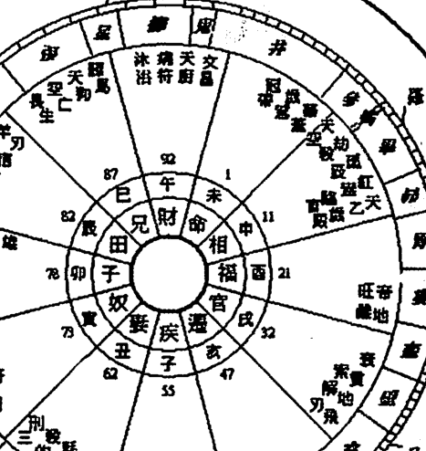

上图是比尔·盖茨的本命盘，夜生人，立命未宫，月为命主星，夜生人时逢月于中天，这时叫做「向明」，于命盘的格局有加分作用。

比尔·盖茨是美国企业家、软件工程师、慈善家以及微软公司的董事长。早年，他与保罗·艾伦一起创建了微软公司，曾获选为2005年时代年度风云人物，以表他们在慈善事业之贡献。

英国王室授予比尔·盖茨荣誉爵士，以表彰其在英国的商业与企业发展方面做出的杰出贡献。

## 庙旺星辰与宫位如何搭配最理想？

星辰在星盘上排列分布之后，便因其相互关系的不同而形成许多分布格局，星命术称之为「星格」。就是星盘格局，星盘格局分为贵格、贱格、寿格、天格、贤格、愚格、贫格、富格八种。

星格是对可能出现的数量极大的星命因素的组合的分类归纳，用星格形式对照分析千变万化的星命组合，能够以简驭繁，及提高判断速率的效用。当然星格的归纳不可能将所有的星命组合变化统括无遗，因此在具体星命的分析判断之中，还需要融会贯通的灵活态度。既要充分利用星格形式，又不拘泥于旧有的星格形式。

星格的分类，是针对人生的四个方面设计划分：贵格、贱格，是反映人们社会地位，寿格、天格，是反映人们寿命长短，贤格、愚格是表现人们才智品德。富格、贫格是针对人们财产状况。星格的分类从另一方面讲，也仅仅分为合格和忌格，或吉格或凶格，这是从事物的两个方面进行划分。

日月五星及其与二十八宿配合时各有不同位置，由此生出不同的星命意义，分为偏垣、正垣、入垣、升殿、入庙、乘旺、喜宫、乐宫，因这种种位置及意义，便对星辰排列生出吉凶及合格不合格关系。为此星命术各有规定，现在简介如下。

入垣的意义是，凡入垣的星辰主宰命盘的身，命，官、福，田，财、妻、子，亦称七强宫，或其宫主者，即为合格、为吉。

正垣以宫为准，偏垣以宿度为准。例如命度在虚宿之中，则虚之度主为「日」，日为命度主，虚在子宫，则命宫之主，宫主星为土星。如行限至虚宿之中，要论限度之吉凶，亦是以此为准。

庙旺星辰与宫位之搭配总结如下：

1.  凡升殿的星辰掌命、宫、福等宫及宫主时，为合格、吉格。
2.  凡庙旺星辰掌身、命、官、福、田、财、妻、嗣等宫及宫主者，为合格、吉格。
3.  凡喜乐星辰掌身、命、官、福、田、财，妻、嗣等宫及宫主者，为合格、吉格。

> 狗对熊说：嫁给我吧，我会给你幸福的。
熊：才不要呢，嫁给你只会生狗熊，我要去嫁給貓，生个猫熊才尊贵呢！

## Q.24 五星相生、相剋會產生什麼剋應？

### A. 論五星相生：

火星宜獨居，生星不宜重見，如木星之生，更不宜見紫氣。

木星喜相生，須要得時，如秋天的木星以落陷論，如水、孛齊來，則木浮矣，陷行殺地，加上神煞「浮沉」一同到來，主水厄。

土星主，羅火夾生，根本雖固，失之太驟，若守命主，其非疾似疾，加殺星則疾顯揚。

金星喜土計夾生，根本可固，但主發遲，如逢生旺則格局高。凡相生要得其時，不宜太過，不宜不及。太過則浮，不及則沉，要得均勻爲福。羅乃火之餘，又來生土，猶人之有嫡母庶母，本有相妒而無情。

### 論五星相剋：

金星遇火羅剋最凶，加重煞則傷殘，加飛廉、陽刃爲重也。金不宜爲飛廉、陽刃，羅火不宜爲天雄、地雌。

木星不宜金星之剋，金星有陽剛之性，若金星掌飛廉、陽刃最爲不利，若金星掌其他神煞稍輕。

水星不宜土星之剋，強遇則水不順流，加計則水竭之矣，或主氣滯，女人主月水不通。

火星忌水星剋，月孛爲水之餘，故加月孛亦凶。土星忌木星剋，加紫氣則主疾，限遇之加煞則經年不愈。

## Q.25 請舉出「日月合格」之格局？

### A. 「日月合格」如下：

- 日居日位：日居午位，太陽居垣。
- 月入月垣：月居未宮，太陰居垣。
- 日到日躔：日躔星虛房昴，又曰太陽升殿。
- 月升月殿：月躔張危畢心，又曰太陰升殿。
- 日東月西：寅卯辰謂東方，申酉戌名西地。
- 日南月北：巳午未謂南域，亥子丑名北闕。
- 日月居垣：日居午，月居未。
- 日月升殿：日躔日度，月躔月度。
- 日月並明：月本無光，借日爲明，晝生合格。
- 陰陽得地：日居東南，月在西北，故曰得地。
- 日月包五星：五星居中，日月前後包裹。
- 日月包四餘：四餘在內，日月左右包裹。
- 日月夾拱祿馬：祿勳驛馬，宜日月拱夾。
- 日月拱夾殿駕：歲駕歲殿，喜日月拱夾。
- 日月拱夾斗貴：斗杓貴人，宜日月拱夾。
- 日月拱夾符印：唐符國印，喜日月拱夾。
- 日月拱命：日月拱命宮，日月拱命主。
- 日月夾命：日月夾命宮，日月夾命主。
- 日月拱財：日月拱財宮，日月拱財星。
- 日月夾財：日月夾財宮，日月夾財星。
- 日月拱田：日月拱田宮，日月拱田主。
- 日月夾田：日月夾田宮，日月夾田主。
- 日月拱官：日月拱官宮，日月拱官星。
- 日月夾官：日月夾官宮，日月夾官星。
- 日月拱福：日月拱福宮，日月拱福星。
- 日月夾福：日月夾福宮，日月夾福星。
- 日月拱妻：日月拱妻宮，日月拱妻主。
- 日月夾妻：日月夾妻宮，日月夾妻主。
- 日月拱嗣：日月拱男女，日月拱嗣星。
- 日月夾嗣：日月夾男女，日月夾嗣星。

## 七政四餘

### 看信休憩區 輕鬆一下，充電，再出發

一條警犬看到馬路上過來一條普通狗，就氣勢洶洶地跑去質問它：我是警犬，你是什麼東西？
普通狗不屑一顧地看看它說：蠢貨！看清楚點，老子是便衣！

## Q.25 請舉出「日月忌格」？

A. 日月專取拱夾，拱夾吉則吉，拱夾凶則凶。

### 「日月忌格」如下：

- 日居月位：日在未宮是也。
- 月到日宮：月在午宮是也。
- 日躔月度：日居心張危畢度。
- 月躔日宿：月居星虛房昴度。
- 日西月東：謂之陰陽背行。
- 日北月南：謂之日月相反。
- 日月失垣：名曰陰陽失位。
- 日月失殿：名曰陰陽失躔。
- 陰陽俱晦：晦朔夜生，日既無光，月光安在。
- 日月失所：日居西北，月在東南，故云失所。
- 孤陽無輔：無分晝夜，謂之孤君獨立。
- 寒月單行：冬月寒凝，謂之獨陰晝生者吉。
- 日月拱夾刃雄：陽刃天雄，怕日月拱夾。
- 日月拱夾的劫：的殺劫殺，忌日日拱夾。
- 日月拱夾廉鋒：飛廉劍鋒，怕日月拱夾。
- 日月拱夾耗符：四耗四符，忌日月拱夾。(天耗、地耗、大耗、小耗、年符、月符、病符、死符)
- 日月拱夾孤寡：孤辰寡宿，怕日月拱夾。
- 日月拱夾刑害：三刑六害，忌日月拱夾。
- 日月拱奴僕：日月拱奴宮，日月拱奴星。
- 日月夾奴僕：日月夾奴宮，日月夾奴星。
- 日月拱疾厄：日月拱疾宮，日月拱疾主。
- 日月夾疾厄：日月夾疾宮，日月夾疾主。
- 日月拱遷移：日月拱遷移宮，日月拱遷移主。
- 日月夾遷移：日月夾遷移宮，日月夾遷移主。
- 日月拱兄弟：日月拱兄弟宮，日月拱兄弟主。
- 日月夾兄弟：日月夾兄弟宮，日月夾兄弟主。
- 日月拱相貌：日月拱相貌宮，日月拱相貌主。
- 日月夾相貌：日月夾相貌宮，日月夾相貌主。

## 看信休息區 輕鬆一下，充電，再出發

> 大約在西元前370年到西元前270年之間，齊國的甘德和魏國的石申各寫了一部天文學著作。甘德的《天文星占》、石申的《天文》，都是八卷。這是世界上最早的天文著作。

雖則這兩部著作早已失傳，但是從《史記》、《漢書》等史書的記載中，可以證明這兩部書記載了一些領先世界的發現。首先，發現了行星逆行現象。行星在空中自西向東走叫“順行”，自東向西走叫“逆行”，順行時間多，逆行時間少。

## 請列出「五星合格」之格局？

五星合格，五星者即木、火、土、金、水。

- 歲星居垣：木在寅亥二宮。
- 熒惑居垣：火在卯戌二宮。
- 鎮星居垣：土在子丑二宮。
- 太白居垣：金在辰酉二宮。
- 辰星居垣：水在巳申二宮。
- 木星升殿：木躔角斗奎井四宿。
- 火星升殿：火躔尾室觜翼四宿。
- 土星升殿：土躔女胃柳氐四宿。
- 金星升殿：金躔亢牛婁鬼四宿。
- 水星升殿：水躔箕壁參軫四宿。
- 木月清貴：弦望夜生合格，月晦寒天不取。
- 火月同宵：晦朔夜生爲妙，月明晝誕次之。
- 金助月華：夜生秋天爲奇，晝月冬生無益。
- 水涵蟾魄：月寒水冷何益，望前望後尤佳。
- 木火文明：冬春月生，無分晝夜爲妙。
- 火土高強：夏生火炎土燥，餘月晝夜皆吉。
- 土金堅實：秋冬土埋金寒，餘月皆妙。
- 金水相涵：冬生金寒水冷，餘時晝夜皆吉。
- 青龍扶硯：寅卯月生，木日同宮。木爲青龍星。
- 朱雀御符：巳午月生，火日同宮。火爲朱雀星。
- 勾陳鎮殿：辰戌丑未月，土日同宮。土為勾陳星。
- 白虎從駕：申酉月生，金日同宮。金為白虎星。
- 玄武持旌：亥子月生人，水日同宮。水為玄武星。
- 五星循環：木火土金水循行環拱命位。
- 五星聚會：木火土金水順聚會照命宮。
- 五星入廟：木火土金水俱各入廟歸垣。
- 五星入旺：木火土金水次第乘旺得地。

歡迎進駐 全國唯一發行最廣的命理工商名錄「開運聖經」農民曆 每年8月出版「算命大街」命理大師名錄募集中由中華星相易理交流協會、中華民國宗教弘法協會、大元書局聯合出版之「開運聖經」於每年8月出版發行，內容豐富（厚達240頁）、售價便宜（定價250元，開運價88元），已成為各界採購參考之優先選擇，印行2萬本以上，並在各大書店販售。「開運聖經」農民曆為協助命理界拓展商機，凡加入「算命大街」者只需助印20本，即可免費刊登一單位（高1.5公分*寬6.3公分）（每本助印工本費50元，助印20本1000元，市售88元，合計1760元），至少需助印2單位40本2000元，凡助印刊登「算命大街」者，芳名及連絡地址將免費刊登於當年12月號之「星象家雜誌」，刊登一次，卻擁有雙重宣傳效果。洽詢專線（02）23651168；23661177劃撥19634769大元書局帳戶網址www.life258.comE-mail:aia.w168@msa.hinet.net

## 請列出「五星忌格」之格局？

### 以下所列為五星忌格。

- 木入金鄉：木在辰酉二宮。
- 火居水地：火在巳申二宮。
- 土在木宮：土在寅亥二宮。
- 金乘火位：金在卯戌二宮。
- 水居土室：水在子丑二宮。
- 火到金鄉：火居辰酉二宮。
- 土居水地：土在巳申二宮。
- 金在木宮：金在寅亥二宮。
- 水乘火位：水居卯戌二宮。
- 木入土室：木居子丑二宮。
- 金木共躔：金木相剋。
- 水火同步：水火相剋。
- 木土相剋：木遇土而剋。
- 火金交戰：火金相剋。
- 土水相激：土剋水之故。

## 七政四餘

### Q. 請列出「四餘合格」之格局？

A. 四餘合格，四餘者，即是氣孛羅計也。「四餘合格」之格局如下：

- 羅計中分：羅午計子。
- 出乾入巽：羅亥計巳。
- 羅計攔截：晝截諸星東南，夜攔眾曜西北。
- 四餘獨步：氣孛羅計各占一宮。
- 一星跳垣：羅計截斷漏出，有用之星者貴。
- 木羅會舍：木爲用神，冬春生躔，廟旺宮佳。
- 火氣職權：火爲用神，入廟旺宮合格。
- 木孛符印：木爲用神，臨廟旺吉。冬生無力。
- 祥雲捧月：弦望夜生，月宜氣捧，冬月次之。
- 太乙抱蟾：弦望夜誕，月喜孛抱，寒月不取。(太乙即孛星)
- 羅月交輝：晦朔夜生，月宜羅交，寒月尤佳。
- 首星捧日：晦朔夜生，日喜羅助，冬月最妙。
- 金計同垣：金爲用神，居垣廟吉，冬生減力。
- 土羅相會：土爲用神，居廟旺奇，夏生火燥。
- 首尾陰陽居四正：羅計日月宜居四正。
- 火羅計孛守四維：四維即四正宮亦通。

前總統李登輝命盤
台灣政壇最具影響力的政治人物之一，其主貴的星盤結構如下：「一星跳垣：羅計截斷漏出，有用之星者貴。」羅計截斷所漏出之星爲火星，火星爲命度主。冬寒喜火星，更喜火羅會天門。惟月孛在火羅之前爲忌，所幸月孛於戌宮，而辰宮有土星來制伏月孛。群星朝東北：群星聚亥子丑寅卯辰，環拱日月，安命於寅，五星聚會照命宮。

## Q305 請列出「政餘合格」之格局？

- 政餘合格：政者，日月五星，餘者，氣孛羅計。
- 金水從陽：金水掌吉神居垣殿，晝生者奇。
- 火金侍月：火金為用神臨垣廟，夜生者妙。
- 五曜環陽：木火土金水順序，輔日於東南。
- 四餘捧月：氣、孛、羅、計單行捧月於西北。
- 五曜隨陽：晝生合格。
- 五星隨月：夜生合格。
- 七政入垣：日月木火土金水，各居本垣。
- 三台合格：午巳卯宮得日金水同行。
- 五曜連珠：五星連續無間，順度相生者奇。
- 二星合璧：即日月也。各得其度。
- 眾曜拱南：眾曜會巳午未上，更坐命於此。
- 群星朝北：群星聚亥子丑宮，宜安命於此。
- 居三隔三：三位有星，三位無星，星垣殿貴。
- 守一空一：一宮有星，一宮無星，星廟旺貴。
- 文武兩班：七政文，四餘武，文東武西合真。
- 君臣慶會：日君午月臣未，命坐其中合真。
- 戴天履地：命亥月申，命亥月巳。
- 出乾入坤：命月亥、火戌、金酉、日申。
- 天地開明：水申木亥，命安申亥，羅計子午。
- 山澤通氣：木寅金酉，命坐酉寅，兼格高貴。
- 水火既濟：水子火午，命坐子午。
- 風雷鼓舞：水巳火卯，命辰合格。
- 十一曜拱端門：子位。
- 十一曜拱帝座：午位。
- 十一曜拱天門：亥宮。
- 十一曜拱地戶：申宮。
- 十一曜拱殿駕：歲殿歲駕。
- 十一曜拱祿馬：祿勳，驛馬。
- 十一曜拱身命：身宮，命宮。
- 十一曜拱妻嗣：妻妾宮，男女宮。
- 十一曜拱官福：官祿宮，福德宮。
- 十一曜拱田財：田宅宮，財帛宮。
- 十一曜漏關：十一位有星，十一位無星。
- 十一曜得經：諸星分布垣廟。

> 鴨子和螃蟹賽跑，一起到達終點，難分勝負。
裁判說：你們來個剪刀石頭布吧？
鴨子大怒：媽的！算計我呀？
我一出是布，他總是出剪刀哩！

## Q. 請列出「政餘忌格」之格局？

A. 政餘忌格：

- 火羅犯日：晝日怕火，羅同宮掌，刀雄尤忌。
- 土計掩月：夜月忌土，計同宮掌，殺刃尤甚。
- 四餘侵陽：氣、孛、羅、計不宜犯於太陽。
- 五星失次：木火土金水各居剋戰之宮。
- 木蔽陽光：晝生忌木氣掩，夜生宜火羅助。
- 月圓火焰：上弦後，下弦前，夜月忌火羅。
- 孛羅交戰：亥命孛羅掌，田財作吉推。
- 計孛同宮：亥卯坐命，孛計掌福，田反吉論。
- 水計相刑：水為用神則凶。
- 土孛混雜：土為用神則力輕。
- 金羅同剋：金為用神則壞矣。
- 火孛共戰：火為用神則損矣。
- 乾坤否塞：亥命金羅，申命土計。
- 風雷相薄：水卯火巳，辰宮坐命。
- 水火相射：水午火子，或木卯戌，或火巳申。
- 山澤沉埋：金寅、木酉為用神失格。

## Q. 請列出「諸星次格」之格局？

A. 諸星次格，次格者乃補遺之謂也。

- 日月聯輝：日月木火土金水，同宮相生。
- 木氣聯枝：木氣孛在寅亥，命宮官祿合格。
- 玉猿守崑：水躔參度，會日命安，水度者貴。
- 雙魚戲水：水星同命，在亥壁度。

> 【註】：雙魚戲水，指的是立命亥宮，亥為雙魚座，水星入雙魚座，命度又在壁宿，壁為水之宿，故命度主為水星，稱之為「雙魚戲水」，這種格局在古代命盤有之，但是現代的星宿，壁宿已經不在亥宮雙魚座，由於歲差的關係，經由校正，現代的壁宿已經在戌宮白羊座。

- 玉猴嘯月：火觜月畢坐命，火月度夜生貴。
- 玉女嫦娥：水轸月張，命萁主貴，女貌傾國。
- 龍躍天池：亢金龍立命，金亥從日月。
- 蒼龍入井：亢金角木，坐命金木，躔井合格。
- 金鵞宿柳：金同命躔，柳近太陽尤妙。
- 虎嘯猿吟：木尾火觜，亥命大貴，已命大富。
- 氣孛朝斗：氣孛同命斗度，如化魁祿富貴。
- 火孛擎天：火室孛壁，水轸火翼，皆主富貴。
- 一福專權：福元不起，無星雜為美。
- 一星滿用：守命最吉，或入垣升殿尤佳。
- 祿居斗杓：斗標坐祿勳宮，又居官祿為貴。
- 星照本家：納音星爲壽元，守命宮爲妙。
- 身居八殺：如命在寅宮，未爲八殺，而身星居之。又值斗柄、國印、唐符加臨，主權貴。
- 八殺朝天：如戌命火，又未命土，或辰命金。此三星獨占天門，或守照得所，皆貴人，得時爲上。

【註】：七政以亥爲天門，而星曜合之得所爲貴。殺至天門乃至尊之位，雖有惡行而化爲善人。古書理論上雖如此，仍以星盤整體格局結構考量爲準，格局吉凶可以說吉格者，增其吉。凶格者，則命局減分，格局爲凶格者，原命局如得吉星化解，亦得轉吉。

常見命盤中出現數個吉格，同時也出現數個凶格，這種吉凶混雜的狀況在論命是並不矛盾，吉格有吉格的論斷，凶格也有凶格的剋應，吉中有凶，凶中有吉，人生命運起伏不就是如此嗎？有故論星盤格局，必當活用，不可拘泥。

## 八字調候觀念如何運用於日月躔度？

夏至一陰生，即太陽由北轉向南的運行開始，由直射而慢慢的轉變爲斜射，冬至一陽生，即太陽由南轉向北的運行開始，由斜射而慢慢的轉變爲直射。

四季的寒暑冷暖都是由黃道上太陽的角度所支配出來的，太陽的直射與斜射，地球繞太陽一週形成四季分明，命理上依出生的月分所採取的格局用神，就是根據太陽而來。所以觀察月令之氣，可定出命盤中的喜、忌。

八字調候，「候」就是在「氣候」的寒熱問題作文章，調候基本的概念就是從「日主」與月令五行之間的關係延伸，所以日主是不能過熱或過冷，因此出生在冬天十一、十二月，以及夏天四、五月時，就有需要考慮到「調候」的取用，因爲他的出生月份的氣候「寒」、「熱」，所以一般「調候」的運用大都針對在夏天和冬天出生的命局。

七政四餘與八字密不可分，七政取用八字的觀念，要以五行來調節此過於「寒」或「熱」的星宿五行，以彌補其不足。也就是說，在四柱推命時，出生在冬天的日主，就要找到屬於「火」的五行；出生在夏天的日主，就要找到屬於「水」的五行。所以找到其中能夠符合「冷熱調和」的五行，這就可能是一個命局的「喜用」。這個理論在七政四餘也適用，不同的是要把干支五行轉換成行星。星宗《七政四時論》之中，即有論及日月五星於四時之喜忌。

## 論四季太陽之喜忌：

春天之日，秀麗。萬物得宜最妙。三台引護。水金佐之。謂向陽。花紅當春。最不宜雲雨之星。與日交會。枝葉繁茂。掩日光輝。不能變化。木火氣羅交會。朝拱太陽。代日行權用事。火日俱名有氣。人皆喜之。天降吉祥。殊不知火羅能化木氣之權。以爲吉言。
夏令之日。火烈陽剛。人皆可畏。最喜水孛同行。濟潤變化。乃是晴霽兼行。萬物精彩。富貴自然。最怕木氣火羅。朝拱太陽。萬物摧枯。一陷千丈。
秋天之日。方而不圓。六親早離。最喜金水輔日而行。方是淋雨濟潤。萬物甦茂。精神可愛。富貴榮華。如見火日迎照。無水濟潤。乃火炎威未退。爲禍最慘。
冬天之日。溫媛熙熙。人皆可愛。午時爲福之大也。夜生喜木金火羅朝日。火日皆有光霽。文武雙全。不宜夜生。又見水孛土計。爲雲雨之星。掩日光彩。限行遇之。爲禍最重。若水日同行。得木飛來。泄水之氣。遇火飛來合度。取火出色。乃太陽光霽。此謂雷下天時。人皆富貴。或有行限。先見水孛。後見火日。謂之久雨逢晴。先主艱難。而後容易。又有先行火日。後見水孛。此謂之久晴逢雨。先主容易。而後艱難。

## 論四季月亮之喜忌：

春天之月。照耀山林。雖花雨風流。而晦月亦當不美。最喜太陽逢時。陽輝明暖。豐盈財福。夜月見木。則萬木清清。文章秀發。夜月見火。爲火月交輝。人生富

貴。如夜月見木。更帶桃花之星。生於二月之時。爲花月爭輝。皆風流瀟灑。精神光彩。斯時之月不宜與土計交會。謂之雲掩月華。不足論也。又不宜孛攏之星。隨月而行。掩太陰之光。爲禍甚重。

夏天之月。揚輝布暖。春風和氣。溫佈可人。水孛潤之而不寒。羅火照之而不燥。斯時之月。喜木氣以相扶。忌土計以掩蝕。金雖力薄。夜誕而喜月同行。月本無光。晝假太陽而有輝。

秋天之月。光輝朗耀。普照乾坤。出人頭地。逢水相涵。如碧潭之皎潔。得金爲助。則精神而倍佳。弦望之際。豈宜羅火以爭光。晦朔之期。那堪土計而相迎。見孛者。爲太乙抱蟾。而食祿非凡。會氣者。乃祥雲捧月。必清高而顯貴。

冬天之月。嚴凝可畏。發輝旦旦。孤潔有餘。雖清光遍於河海。而寒月亦當欠舒。所忌者水孛相逢。最嫌者土計關照。金星伴之以無情。木氣扶之安有益。生於晝者。借日光而布暖。誕於夜者。仗火羅以助輝。善觀星者。勿論生剋。先明四時。須分晝夜。於斯消詳。可爲至矣。

## Q34 调候观念如何运用于金木水火土五星之躔度？

### A 論四季木星之喜忌：

夫木者，東方青帝之神，庖羲氏執規司事。故曰：木爲仁。仁者生，生者圓。春令之木漸有生長之象。孟春之時，猶有微寒未退，借火羅以溫其枝，則木無盤屈之拘。當有舒泰之美。

如木與太陽同宮，名爲向陽花木，必然早占鰲頭，富貴之人也。設使與水孛相逢，則根損枝枯，不能華茂。

春末夏初之木，有枝有蔓，有條有幹，多見金而發福。金能琢削其木，有棟樑之材。經曰：「木繁而無金琢削，縱榮華而末歲孤窮」。

夏令之木，根燥葉乾，盤而且直，屈而已伸，喜水孛濟潤，而無枯槁甦醒。欣欣生意，榮華之人。

夏末秋初之木，斯時氣脈虛矣，畫生忌躔四火之度。又不宜與太陽交互。蓋是日烈木焦，不足論也。畫生木躔四水之度，而與太陽交光，此是上下濟潤，不可以木焦日烈而論。乃水之秀麗，枝葉繁茂，精神富貴。九月寒露之邊。遇火羅助。自能變化。

冬令之木，斯時萬物蕭疏，如畫生與太陽交光，謂之日邊紅杏，布占先魁。遇此造化，豈不美哉？兼能有幹，文才清高。如日生遇火羅，謂之寒谷回春，富貴雙全。如無太陽火羅同宮，得生巳午未之時，借日光霽。冰霜凍解，猶可舒暢。

霜凍解，猶可舒暢。或木躔四火之度，又與太陽交輝，可作十全之福也。如遇夜生，木躔四土之度，又逢水孛凍折，窮之極矣。

### 論四季火星之喜忌：

夫火者，南方赤帝之神，神農氏執衡司事。故曰：火爲禮，禮者齊，齊者平也。所謂衡行炎陽之令，主成齊之權。

春令之火，正二月之時，寒氣未消，最喜火、羅、木、氣互度。見太陰夜生光彩，文武富貴，火本酷烈，逢木慈仁，以善化惡，以剛制柔。剛柔相濟，貴而能決。威福權衡。

春末夏初之際，火入水宮，水入火地，名爲桃花滾浪，火緩花紅，名利雙清，但火不宜與水孛同行，謂之受剋，逢土有救，能破水孛之氣，名曰子來救母，祿自豐盈，見金爲黨鬼，獨火之氣脈虛也。

夏末秋初之火，斯時秋陽杲杲，借水以濟其盛，乃剛柔變化，最不宜與木氣同照，火羅朝拱，太陽無水濟潤，迎照度限，萬物摧枯，一陷千丈，如有一水貫日，一孛濟火，爲之淋漓普濟蒼生，萬物甦茂，精神宛轉，富貴，經云：火焰而無水淘溶，縱發而早年天折，又有先見火日，後見水孛，此謂之久旱乾焦，枯苗得雨，先主艱難，而後快活，又有先見水孛，後見火日，謂之久雨逢晴，先主快活，而後艱辛。

冬令之火，斯時黑帝司權，水德用事，而火失時，论四季土星之喜忌：

夫土者，中央黄帝之神，轩辕氏执绳司事，故曰，土为信，信者诚，诚者直，所谓绳居五行之中，负载养育之权。

春令之土，昼生与太阳交会，盖是阳和一点，天地皆春，若有官贵禄印爵魁佐之，主守成富贵，夜生最喜火照，土德朝拱太阳，盖水土俱名精彩，代日行权用事，北方生者，一人之下，万人之上，忠臣良将。

春初生者，土计不宜与水孛交会，谓之泥逢泛滑，如土星躔四水之度，又逢水孛，（又有一说，土星躔四水度，又逢月孛，为余奴救主，反以吉论。）春末夏初生者，谓之土陷山崩，皆非好格，盖四五月间，洪水滔天，斯时土之气脉虚矣。

夏令之土，最喜水孛，若得同宫，以润土之精神，斯时也，万物长养结实，遇水发生，清源可爱，富贵无言。

夏末初秋之土，不宜与罗火交会，为之火燥土烈，无水孛济润，万物摧枯，一落千丈，昼生土与太阳交辉，亦为日烈土焦，如逢水孛，此谓上生下润，土之精彩，万物秀丽，大降吉祥。

冬令之土，最喜日温，自能变化，夜生木气火罗，佐助土之精神光彩，朝拱太阳，皆主文武富贵，倘与水孛同躔，极主贫寒，若得一木飞来，泄水之气，而又遇火飞来合度，此谓精神展转为妙。

论四季金星之喜忌：

夫金者，西方白帝之神，金天氏执矩司令，故曰金为义，义者成，成者方，所谓矩行收敛之令，主肃杀之权。

春令之金，不怕火罗，借火罗以温助，谓之炼金成器，变化气质，不宜与水孛同行，春初生者，凝冱寒冻未退，无火日温之，极主贫寒。

夏令之金，不宜生水，就赖水以制其刚，烁石逢源，主利名显达，夏令罗火，何以相逢，冬月如斯，自能发福。

秋令之金，乃白帝司权，金神用事，不怕火罗而克，不喜土计而生，借水映色，正此谓也，金白水清，最喜秋生者贵，若金水朝拱太阳，最为奇特，经曰，金坚而无火锻炼，终见凶顽。盖火尚杀伐，水尚澄清，文武皆沾，刚柔相济，名扬四海。

冬令之金，斯时寒凝冻结，昼喜日光而温之，夜喜火罗而照之，定主文职蒙恩，不宜与水孛交互，极主贫寒，水冷故也，最妙昼土逢阳，以温其土，可助其金，主威武之职，又逢火罗拱互降祥，正所谓金罗相会，阃外司权。

论四季水星之喜忌：

夫水者，北方黑帝之神，高阳氏执权司事，故曰水为智，智者谋，谋者重，所谓权行严凝之令，主杀物之权，执性不定，决诸东则东流，决诸西则西流，遇冬则结，遇夏则散。

春令之水，斯时冰霜冻冷，借木气火罗温之，自能变化，昼生水孛，太阳同行，名曰光霁澄澈，谓之冰霜冻解，心宇清吉，作事整肃，政令威仪，当主台省扬名，所忌金星交互，昼生为妙，夜生贫寒，二三月间，天气畅和，遇水济润，发生万物，作事超群，但四五月间，泛滥无定，必无福矣。

夏令之水，及洪水滔天，得土堤防，最为奇妙，经云，水盛而无土堤防，遂归愚浊，若有土旺，不以为倒限论，反主名利发达。

秋令之水，七八月间，既济万物，不宜受克，既能借土堤防，而不泛滥，又能润土结实万物，清源可爱，富贵荣华，若水受克泄者，皆水之气脉虚矣，却不为福。

冬令之水，秉令行权，虽曰水神用事，然非令也，斯时点水成冰，冻结寒滞，不能变化，得火为上令，得土为次令，得太阳佐之，方可言令也，江河之水，缘何有冻，井内之水，缘何无冻，盖土多则水暖而清，江河之水，凝寒成冻，不能变化，喜日光霁火土以温之，天降吉祥。

太阳落入的星宿与宫度主何吉凶？

太阳落入二十八星宿所主吉凶：

太阳落入日度：主性忠直，有道艺，宜仕宦，得贵人委用，有声名，平生有福，作事长远。更是主星，昼生，有位，近君；面圆耳耸，眼大，主大贵。

太阳所落入月度：主得父母力，为事有密谋，见事深远，善主财。是主星，有官位；不是主星，略逊，只是大富而已。

太阳落入木度：主贵达，平生多福，合仕本乡官，多见金帛，晚年主富。

太阳落入火度：主作事清直，有福，性直不顾危亡，多历四处游荡。

太阳落入土度：主贵人委用，宜男女宫，亦多技巧，微贵或虚贵。

太阳落入金度：主好音律，欢乐，多怨少仁，平生多不顺，是主星，昼生加福力，有高官贵位。

太阳落入水度：主财帛丰足，多学多智，洁净，多好使钱，有贵人扶持。

太阳躔度《玉关歌》

太阳躔于二十八宿度之克应如下：

角宿：日躔角宿号天成，晚岁丰享少亦贫，胆大心高超众庶，前程端拟大声名。

亢宿：日躔亢宿号天柱，学问文章有古今，为人欢乐最贤豪，性识孤高行未遇。

氐宿：日躔氐宿号天符，美貌堂堂出众徒，性快心高多自耐，江湖漂泊少年孤。

房宿：日躔房宿号天禄，洁净为人享清福，高才富学有声名，耿介超群还不俗。

心宿：日躔心宿号天昌，白日生人福寿康，若至晚年尤享福，一生终是足衣粮。

尾宿：日躔尾宿号天杵，白日生人富益饶，性急多才人莫敌，夜生鄙俗事烦骚。

箕宿：日躔箕宿号天魁，俊义文章有大才，父母必须生贵子，官高位显列三台。

斗宿：日躔斗宿号天明，刚勇方为胆气英，产业经营辛苦置，老年丰富享安平。

牛宿：日躔牛宿号天机，机变犹长文藻驰，更得木星来赞助，荣贵声名天下知。

女宿：日躔女宿号天德，清秀聪明多智识，天文玄象性孤奇，白日生人最为吉。

虚宿：日躔虚宿号天司，耿直聪明胆气兼，白日生人多富盛，夜生逢此足迍邅。

危宿：日躔危宿号天隆，性直文章学问丰，营运资盼难积蓄，老年方见免灾凶。

室宿：日躔室宿号天福，胆气权谋性多欲，平生安乐少灾迲，父母康健延金谷。

壁宿：日躔壁宿水金运，皓魄相同福自绵，禄马更来相聚会，果然折得桂花鲜。

奎宿：日躔奎宿号端守，富贵荣华年寿久，文章高贵众难加，白日生人福自有。

娄宿：日躔娄宿号天宫，大尹公卿将相逢，年少便膺居鼎鼐，生时值此必兴隆。

胃宿：日躔胃宿号天解，令德性贤位安太，脾疾冷涎身有寿，日生却得年高迈。

昴宿：日躔昴宿号天房，耐事经营足食粮，才略机谋多智策，称为当世一贤良。

毕宿：日躔毕宿号天强，贤德才高万事昌，音律善通忧虑少，心多嗜欲行无良。

觜宿：日躔觜宿号天钧，足禄多能享世荣，学问渊源才挺出，此人名必播朝廷。

参宿：日躔参宿号天水，冷淡持身欲不累，少才多学富声名，官宫有禄终须贵。

井宿：日躔井宿号天弼，冠世文章增福力，公侯卿监世间荣，福禄恩波传子息。

鬼宿：日躔鬼宿号天流，先代资财用不休，巧计机关人莫测，心间多事出阴谋。

柳宿：日躔柳宿号天梁，仕宦须令仕本乡，金帛丰盈多积蓄，晚年须见禄荣昌。

星宿：日躔星宿号流泽，卿相当朝须得力，三方主曜旺高强，富贵荣华声赫赫。

张宿：日躔张宿号天正，才智聪明文武并，官星得力善星居，禄贵兼全增吉庆。

翼宿：日躔翼宿号天娶，贤德文才出智谋，若得木星同此位，定应官职守清幽。

轸宿：日躔轸宿号天阶，年少功名自鼎来，端洁为人须大量，定须九棘与三槐。

太阳落入黄道十二宫所主吉凶：

日宫：作事明白，足学有智，好修善有才艺。是主星，昼生有位，夜生有财；非主星，昼生大富，不受贫苦。

月宫：主得父母力，为人性密，作事难量，立机谋，与人结交无终结，少年远行损财。是主星，老年大富；非主星，微有福力。

木宫：主为人聪慧，作事有断，多心机，善主财，是财帛宫，少苦老乐。火、土同宫，妨父母兄弟，是主星，昼生转加富贵；与罗计同宫，主灾祸。

火宫：主为人性微急，作事明白，知人灾祸，多智见，是财产，父多病，日生人及在阳宫，转佳；夜生，减半。

土宫：主为人性沉厚，有威严，能营运，多财物。是主星，昼生大贵，夜生大富；不是主星，昼生少孤独，微有福力；更在土度，则凶。

金宫：主有贤德，知未来事，因女人有喜，多计谋，好斗战，有好妻妾及子孙，兼主殊常有福。

水宫：主性极聪明智巧，主文才，所为不定，常患冷疾，会天文，玄学。昼生，是主星，大吉。

月亮落入的星宿与宫度主何吉凶？

月亮落入二十八星宿所主吉凶：

日度：主有貌，多才，主声名，为事方圆明白，非常有福，若是主星，大贵，妇人遇之，大旺夫位。

月度：主形貌超群，精神爽快，平生有称心之福，每遇贵人见知。巧言语多，淫欲好女色。

木度：主文学佳，有福，好经营，多财产，少年贫，中年弱，老年富。

火度：主性急多灾，兵火之厄。多作少成，少与贵人结交。更有凶星同宫，在官寿短，吉星加临可免之。

土度：主一生多不顺。若吉星助之，更在月初度，大贵，因妻子有忧，过三十二，吉，因妻有喜。

金度：主富贵有貌，好欢乐，有母妻妾，王者委用。多因妇人生灾，若是女人，主荒淫。

水度：主聪明智慧，有学问，心巧，出入得贵人。

月亮躔度《玉关歌》

详述月亮躔于二十八宿度之克应如下：

角宿：月躔角宿号天贵，学问渊源须大智，多才慈惠更温良，夜里生人最为利。

亢宿：月躔亢宿号天玑，富贵荣华人好异，平生安乐足丰荣，妻妾颜容更奇美。

氐宿：月躔氐宿名天劫，性急多嗔又乖劣，日生兵火须逢难，若是夜生衣禄绝。

房宿：月躔房宿号天祥，文章学问更蕃昌，出众机谋多计巧，十生衣禄寿须长。

心宿：月躔心宿号天骄，运用机谋智未全，少年未脱生涯计，如临晚景始安然。

尾宿：月躔尾宿号天宗，勇智多谋胆气雄，穿窬剽掠心常有，见水方教免祸凶。

箕宿：月躔箕宿号天财，冠古穷今学问该，但得对宫逢吉曜，文章得地应儒魁。

斗宿：月躔斗宿号天封，伟望威名学问通，君子逢之须得禄，小人遇此走西东。

牛宿：月躔牛宿号天鏖，作事施为要沉审，性直温良少苦辛，才过中年便安稳。

女宿：月躔女宿号天宝，学问聪明多智巧，文章冠世早登荣，迁官必定居廊庙。

虚宿：月躔虚宿号天常，有貌多才更善良，衣食丰盈仓库实，声名闾里自揄扬。

危宿：月躔危宿号天文，磊落襟怀少比伦，为人玷污多巧计，图画机关行不真。

室宿：月躔室宿号天惊，形貌清奇富且安，更得木星同位立，直须奏对近天颜。

壁宿：月躔壁宿号天华，语言蹇滞事沉思，若遇蚀神兼月孛，主须生长在寒微。

奎宿：月躔奎宿铭肝肠，不劳余力至员郎，要得官居十位，定应台辅佐君王。

娄宿：月躔娄宿号天垣，旺庙之中福禄全，君子迁官居禄显，小人衣食旺庄田。

胃宿：月躔胃宿号天印，十度之中贵无并，更兼金木又同行，金榜题名官一品。

昴宿：月躔昴宿号天光，平生官禄不寻常，聪明才貌超今古，异日须为给谏郎。

毕宿：月躔毕宿号天明，峻宇雕墙乐太平，更得金星来照助，少年及第占魁名。

觜宿：月躔觜宿号天女，富足之人更有官，贤淑生来形貌美，此身自在不胜欢。

参宿：月躔参宿号天官，俊义宏才学问宽，富足慈仁心好善，贵人和色对天颜。

井宿：月躔井宿号天充，夜生轻巧性奸雄，爱说是非心不定，文章必定是虚空。

鬼宿：月躔鬼宿号天惊，好乐之宫每事安，得力相生官位吉，公卿要路上金銮。

柳宿：月躔柳宿号天觚，德行清高爱读书，聪俊文词人最重，声名扬赫帝王都。

星宿：月躔星宿号天节，欢乐虽多病磨折，贪怪财物行无良，性急多嗔有灾厄。

张宿：月躔张宿号天曹，才力经营志气高，形貌端方荣贵早，晚年又见福坚牢。

翼宿：月躔翼宿号天迍，虽然禄位也艰辛，骨肉分离难保守，又知寿夭是元因。

轸宿：月躔轸宿号天理，勇智多端文学取，少年辛苦老丰隆，赫奕声名传万里。

月亮落入黄道十二宫所主吉凶：

日宫：主好欢乐，多病，平生多福，每遇贵人见重。是主星，夜生富贵，昼生微福。

月宫：主性密口敏。不是主星，微有福力；若是主星，因妇人富贵。夜生足财，有权位。

木宫：主禀性沉厚，好慈善，有威名，多财禄。是主星，夜生转加福厚。

火宫：主人性急，多智勇，见事不长，平生乱与人结交，因此有厄。是主星，可免。

土宫：主性温，作事沉默，夜生尤甚，昼生好女色。平生好讼，性好杀，有心机，有词智。是主星，微有福力；不是主星，平生多灾，有善星照望则免。

金宫：主好容貌，知轻重，巧言语，多情欲，得女人敬爱，谋事多成，一生多得暗昧之财物。

水宫：主性聪明，多智见，好文章有声名，多财产，夜生轻巧，会文章，好图画，不贪。若是女人，多是婚姻有碍。

水星落入的星宿与宫度主何吉凶？

水星落入二十八星宿所主吉凶：

日度：主性格温厚，内刚外敏，聪明有才智；是主星，昼生有位，夜生大富；不是主星，昼生文艺出众，不贵，夜生性巧，因道艺立身，后必富。

月度：主性聪明有信，急性、多巧、多嗔，有贵位。

木度：主多智谋书算，多男女，能行义事，为事吉庆。非主星，多灾。

火度：主多灾厄，为性不定，多毒害，因妻子有厄，损财，主患风狂，木见，减半。

土度：主损兄弟，因男女有厄，婚姻不定，或娶在他州，有暗疾灾缠，或损目，多贪财论讼。

金度：主性格聪明，英雄多才智，好兵法，知未来事，有声名，足财帛。是主星贵不可测，亦因女人嫉妒。

水度：文学佳，有声名，常快乐，能言善道，足财帛，女人有厄。

水星躔度《玉关歌》

详述水星躔于二十八宿度之克应：

角宿：水躔角宿号天成，清秀文章学问明，喜怒无常心不定，平生衣禄自丰盈。

亢宿：水躔亢宿号天津，容貌清奇通道术，心清柔暇作文章，多智多能善音律。

氐宿：水躔氐宿号天旨，言语聪会知道体，人情好恶性能通，遇吉终须文学贵。

房宿：水躔房宿号天淫，智识聪明太古心，衣禄自然情泛滥，文章学术有人钦。

心宿：水躔心宿号天凄，清洁为人快性情，巧计多修文业事，聪明才艺两三分。

尾宿：水躔尾宿号天澄，理义该通学术明，资财耗散多灾否，惟恐风狂疾染身。

箕宿：水躔箕宿号天淫，快乐心闲乐自真，衣食平生财亦足，文词道艺细评论。

斗宿：水躔斗宿名天德，俊誉文章心耿直，荣贵子孙和且乐，丰衣足食语言涩。

牛宿：水躔牛宿号天甄，和气交朋益子孙，机密谋为人不识，多财应得外人屯。

女宿：水躔女宿号天驿，眼疾朦朧是贵人，好学贪财多议论，平生衣食也艰辛。

虚宿：水躔虚宿号天驯，清洁为人财亦勾，多技多能心亦善，弟兄孝顺乐天伦。

危宿：水躔危宿号天中，语涩心难眼半聪，中未之年方得力，外人财物稍宽容。

室宿：水躔室宿号天攸，文学聪明智慧优，历事未能心预测，算筹多计乐柔幽。

壁宿：水躔壁宿号天池，智慧多能有志机，玄象天文多洞达，平生衣食不相亏。

奎宿：水躔奎宿号天凌，忠直为人急性情，财禄自然多积聚，平生多事不安宁。

娄宿：水躔娄宿号天斯，耿直为人不受欺，衣禄丰盈多称意，一生快活少凶危。

胃宿：水躔胃宿号天泓，耿介为人记事明，忠孝存心多执拗，为人衣禄未安宁。

昴宿：水躔昴宿号天阊，容貌清奇识五音，心谋巧计事沉静，衣禄平平祸不侵。

毕宿：水躔毕宿号天淋，历事三思性又钦，容貌清奇衣食厚，文才学问满胸襟。

觜宿：水躔觜宿号天枢，清白为人好读书，多艺多才多智巧，平生欢乐远行居。

参宿：水躔参宿正庙居，文星入庙要因扶，水宿聪明多好动，凶能自执不凶虞。

井宿：水躔井宿号天涛，心好清闲智量深，筹算文章人荐用，声名远播在儒林。

鬼宿：水躔鬼宿号天洪，好静为人更美容，心内洞明兼道释，众人钦敬乐无穷。

柳宿：水躔柳宿号天注，柔善为人处世当，能作文章心巧计，声名闾里有称扬。

星宿：水躔星宿号天清，伏见皆能官职增，与日同宫须大用，定为喉舌玉街行。

张宿：水躔张宿号天荣，富贵双全性又灵，文武相兼皆并用，贤能兄弟佐朝廷。

翼宿：水躔翼宿号天异，年少登科文学济，清华要路骤迁荣，与日同行须大贵。

轸宿：水躔轸宿号天岑，文学之官众所钦，谋略聪明人倚重，才华藻思入儒林。

水星落入黄道十二宫所主吉凶：

日宫：主聪明文学，声闻四海，好图书，有道艺，合得主上重用，多因贵人喜爱，夜生有财。非主星，昼生文艺出群，顺行并贵，生微有福。

月宫：主聪明工巧，好文学，得贵人见重。是主星，有位；非主星，因武艺立身致富。

木宫：主聪明出群，明玄象，知好恶，能知人。是主星，多近君王左右，得贵人；非主星，微有福。

火宫：主为人性沉厚，作事方圆，有心机，好道德，明音律祸福，预知人休咎，凡事有成。是主星，生有位，昼生有财；非主星，夜生有福，昼生技巧，非贵也。

土宫：主性凶猛，见善行善，见恶行恶，言语涩，心细难测，得外人财物，主患眼目。是主星，微有职位；非主星，多横非之灾，善星救之可免。

金宫：主形貌端正，心性宽，多忧恼，能音律，与人为师。

水宫：主聪明急性，能知人，有文艺。是主星，夜微贵，昼生富；对照三合，性格亦同，福力减。

金星落入的星宿与宫度主何吉凶？

金星落入二十八星宿所主吉凶：

日度：主不利婚姻，性凶猛，好争战，有出常之计，因战伐而立功名。

月度：主多情，因妇人财物以立身，或娶下人为妻，行非礼之事。男主贵；女人遇之，主淫。

木度：主武男超群，常欢乐，快心性，足财物，贵人见重。

火度：因女人有喜，平生难婚偶，亦被妇人损陷。

土度：主晚婚，娶妻相去十载以上者，少年离乡井，因妻妾有忧，好色欲，财帛聚散不定。

金度：主有兵权之贵，好色欲，有好子女。

水度：主得人敬爱，有好妻，一生贵达。合娶亲戚女为妻，不然先奸后娶。

金星躔度《玉关歌》

详述金星躔于二十八宿度之克应：

角宿：金躔角宿号天清，年少登科擅大名，衣禄生平丰且厚，为官清贵佐朝廷。

亢宿：金躔亢宿号天昌，挺出英才姓字香，文武兼全为宰辅，定应旌节受恩光。

氐宿：金躔氐宿号天将，少失尊亲性自刚，衣禄文章全自得，莫教贪欲损爹娘。

房宿：金躔房宿名天角，衣禄生来殊不薄，处已温良心好欲，文章腹内一些无。

尾宿：金躔尾宿号天殃，骨肉资财定见伤，若不修仙并积德，定须夭寿见凄惶。

箕宿：金躔箕宿号天彤，妻子乖离吉见凶，家计纵然饶富足，老年不免又贫穷。

斗宿：金躔斗宿号天钤，贪色贪财行不贤，男女虽多终是克，更无衣食少安全。

牛宿：金躔牛宿号天绳，色欲多贪命里淫，衣食生来自丰足，晚年优裕享安宁。

女宿：金躔女宿号天奸，多女多男自小闲，若是十宫星得力，何愁此地不为官。

虚宿：金躔虚宿号天编，美貌丰容福寿绵，灾害不侵安到老，随时衣禄自然全。

危宿：金躔危宿号天兢，温俭忠良性自清，文学定须因女富，文星入命出官身。

室宿：金躔室宿号天勋，必主迁官近帝君，声振四方持节钺，位登枢密大尊荣。

壁宿：金躔壁宿号天光，彭祖年时寿命长，若是女人财喜旺，丰容美貌嫁才郎。

奎宿：金躔奎宿名天厌，未遂功名身不贱，为人温厚更宽容，性识孤高名有见。

娄宿：金躔娄宿号天甍，必定为人少失亲，酒色是非应不免，晚年富贵乐平生。

胃宿：金躔胃宿号天端，命若逢之五品官，任是兵刑兼法令，定须出入侍金銮。

昴宿：金躔昴宿号天璋，为官进速任关梁，卿监位中名早得，也须腰紫佩金章。

毕宿：金躔毕宿号天联，赫奕功名近帝前，不作外台观察使，须登廊庙职升迁。

觜宿：金躔觜宿号天营，冠世文章出众群，翰苑声名词藻丽，也须上国立功勋。

参宿：金躔参宿号天晶，学问词锋冠世英，若是官宫星得力，定须贵籍早标名。

井宿：金躔井宿是吉宫，高才博学福丰隆，为官定是居廊庙，福及苍生禄万钟。

鬼宿：金躔鬼宿号天淫，妇女逢之有外心，戒行不遒迷酒色，平生衣食自来临。

柳宿：金躔柳宿号天关，快乐平生衣食闲，男女更多人贵重，丰盈财物性尤宽。

星宿：金躔星宿号天奖，理义精通学冠群，更若火星来会此，是非酒色不堪闻。

张宿：金躔张宿号天赐，财物多贪行不良，若是妻运难得子，平平衣食寿延长。

翼宿：金躔翼宿号天英，学问文章显大名，经术更能修显著，此身荣贵乐平生。

轸宿：金躔轸宿号天程，口舌轻狂凶害生，言语不真心泛滥，多端非礼有奸名。

## 金星落入黄道十二宫所主吉凶：

-   日宫：主为人性刚，作事无定，多得贵人见重，婚姻难。是主星，有位；非主星，长寿。
-   月宫：主为人性温和，作事明白，有密谋，善贮积，因女人财物日生，好女人之事。是主星，夜大贵，昼微贵，不是主星，夜生大富贵，昼生有祸。
-   木宫：主聪明，性格过人，作事敏捷，得女人之财，有声名，因贵人有喜。是主星，昼生有财，夜生有位；非主星，昼生微富，夜生大富。
-   火宫：主为人性急躁，作事无定，因女人有厄，及口舌狂乱。是主星，有福，夜生有位；非主星，有技艺。
-   土宫：主为人好欢，多色欲，少男女，每得贵人见爱。土星同宫，则为事不正。是主星，夜生有位，昼生有财，有福能掌财，贵人见重；非土星，微有福矣。
-   金宫：主为人聪明，作事和缓，日生好女色，因女人有厄。是主星，有贵位；非主星，昼生有福，夜生微有职位。
-   水宫：主为人聪明，智性超群，有节操。是主星，转加富贵；昼生微有职位；不是主星，多因妇人引惹因而获福。

第一本以100问的方式 快速解读七政四余

## Q 火星落入的星宿与宫度主何吉凶？

## A 火星落入二十八星宿所主吉凶：

-   日度：主为人性急，多是非，损祖财，是主星；夜生有位，日生有财；不是主星，平生多讼，好色欲，善恶不定。
-   月度：主性急，食卑下之禄，虽聪明亦短夭，其人出言不实，多是非，与人交结不久长，多有暗昧灾，因女人有危，是主星得免。
-   木度：主一生多灾厄，疾病而损害四肢，或犯风疾、损伤男女。是主星，得吉曜相扶助则可减。
-   火度：主威名严厉，一生足词智，因武艺则有锋芒，多子孙，亦防小人相损。
-   土度：主损兄弟，男女主恶死，木见则免，三十二以后有财。
-   金度：主一生多受贫窘，因女人败声名，木见则免。若是主星，昼生，转加福力，身有贵位。
-   水度：主一生多灾厄，施恩德；有不善之报。

## 火星躔度《玉关歌》

详述火星躔于二十八宿度之克应：

角宿：火躔角宿号天姆，衣食随时不善良，刑子妨妻婚难合，免教衣食见恓惶。

亢宿：火躔亢宿号天戈，妻妾宫中有折磨，好色损妻心不定，此人衣食必奔波。

氐宿：火躔氐宿号天轻，衣食生来不称情，心性轻狂多胆志，晚来方可得安宁。

房宿：火躔房宿号天梁，官职超迁辅弼良，将相公侯名必贵，此身佩紫与金章。

心宿：火躔心宿号天相，统领兵机为上将，更兼枢府四十年，富贵功名彻天上。

尾宿：火躔尾宿号天穆，此人必定荣衣禄，安然纳福不奔驰，超腾晚景最多福。

箕宿：火躔箕宿号天明，作事机权性最灵，为官必得君王宠，大任终当领万兵。

斗宿：火躔斗宿号天征，生杀之权有大声，禄旺中年主富贵，三公位至播芳名。

牛宿：火躔牛宿号天朽，先代家资尽灭亡，形貌魁梧多智勇，此生终羡少年郎。

女宿：火躔女宿号天暗，多成多败心狂乱，若非木旺在宫扶，六亲害尽资财散。

虚宿：火躔虚宿号天磨，贫困初年财不多，心受是非耽女色，更添女子不相和。

危宿：火躔危宿号天淋，好色贪花智勇深，破祖离家自成立，施恩终是福重兴。

室宿：火躔室宿号天强，勇智操持武职良，更得木星来资助，定须学馆作文章。

壁宿：火躔壁宿号天灭，兄弟儿孙道路绝，伶仃孤苦万千般，晚景稍可身安悦。

奎宿：火躔奎宿号天厨，衣禄生来自有余，勇义智高才学美，威名应许达皇都。

娄宿：火躔娄宿号天赐，命里逢之出外襄，恩德又施兼有道，渊源学向翰林场。

胃宿：火躔胃宿名天没，定是终身无子息，中间困苦又艰难，奔走东西漫劳役。

昴宿：火躔昴宿号天镬，身蹇身孤性又愚，贪酒多淫心不足，到头衣食亦无余。

毕宿：火躔毕宿号天危，身见灾迍必损妻，破荡家资游冶客，资财耗尽走东西。

觜宿：火躔觜宿号天淫，风花雪月四时行，淫泛自然家业破，奔驰晚岁始身荣。

参宿：火躔参宿号天伦，火性颠狂好损身，工巧细心兼有志，做些阴骘与儿孙。

井宿：火躔井宿号天中，智慧威严胆气雄，衣食平平人命蹇，晚年方始见亨通。

鬼宿：火躔鬼宿号天祥，家富因何乏子郎，只怨天年多夭折，不然恶死没家乡。

柳宿：火躔柳宿号天池，多虑多疑多是非，克子克妻兄弟绝，平生衣食却随时。

星宿：火躔星宿号天荣，必定前程有大声，更得十宫星得力，为官稳稳到公卿。

张宿：火躔张宿号天颉，汨没平生难共说，若非寿夭二亲亡，克子伤妻兄弟缺。

翼宿：火躔翼宿号天怜，心性猖狂学有成，智术多端加嗜欲，生平衣食主多情。

轸宿：火躔轸宿号天暴，手足风狂多颠倒，晚年衣食稍平安，只恐妻儿命难保。

## 火星落入黄道十二宫所主吉凶：

-   日宫：作事多成，为人性急，有声名，善决断，有武勇，作文词。是主星，有权兵之贵；不是主星，目疾，损父母，或夭死，天乙贵人可免。
-   月宫：主性格不安定，多惊怕，出言不审是非。若是主星，夜生有位；日生有财；不是主星，夜微有福，日生被妇人损陷。亦主促寿，不善终。
-   木宫：主得王者任用，有兵权之贵，为人内刚外柔，于人有义，见事深远。是主星，有权贵；不是主星，大富。
-   火宫：为人性坚密，有道艺，好交才，足声名，富贵机巧。若是主星，富贵非常；不是主星，性急忠直外敏内刚，知人灾祸。夜生富贵，昼生财薄。
-   土宫：性急，形貌魁伟，有勇志，损祖业兄弟，多有恶名，招暗中是非，有恶声名，不足畏惧。是主星，好杀有权，不是主星，多因伤害。
-   金宫：好色损妻，好斗争，见事不远，与人交结无终始。是主星，微有职位；不是主星，微有财。
-   水宫：工巧细心，有财智，多刑狱，好杀害，一生多被人阻挠，与人结交无终始。是主星，见小利不顾大事，行事多成，每被人损陷。是主星，可免；非主星，因小人损害危及性命。

## Q40 木星落入的星宿与宫度主何吉凶？

## A. 木星落入二十八星宿所主吉凶：

-   日度：主文艺过人，有声名权柄，多亲贵族，得君王委用。
-   月度：主有文章足词，能知未来事。是主星，转加福力，若脑后有高骨，大贵。
-   木度：主性格宽厚，文章出众，居贵位，或有三妻，多男女。若是主星，昼生富贵。
-   火度：主多灾厄，好争讼，少年难养。水度同宫则灭，主有好妻，兼得妻财。
-   土度：主多口舌争讼，昼生免之。若脸生如满月，声响清正，其人大有贵权。不是主星，多因狱讼，不成事，亦主有位，见妻迟，娶他人妻，三十以后富。
-   金度：主先文后武，得美妻，因此有忧。宜男女，善掌财。
-   水度：主性情不定，能诗书，得贵人，多艺术。

## 木星躔度《玉关歌》

详述木星躔于二十八宿度之克应：

-   角宿：木躔角宿号天贵，诗礼传家居职位，更能艺术近公卿，财禄丰盈名早遂。
-   亢宿：木躔亢宿号天城，财禄荣华显大声，学问操修君委用，严廊辅邺一豪英。
-   氐宿：木躔氐宿号天穷，命若逢之灾祸凶，克子害妻孤惮早，安身衣禄必难逢。
-   房宿：木躔房宿号天赋，进禄荣身侍圣王，白日生人尤大富，定应官职佐严廊。
-   心宿：木躔心宿号天喜，少年荣贵妻双美，多男多女富金珠，国家库藏君王委。
-   尾宿：木躔尾宿号天和，官禄荣迁福更多，三进又须三退位，年来三七定干戈。
-   箕宿：木躔箕宿号天祥，官职须登佐庙廊，才学经邦当大用，一身荣贵坐槐堂。
-   斗宿：木躔斗宿号天程，才智全兼早贵名，柱石邦家须大用，必为廊庙福苍生。
-   牛宿：木躔牛宿号天犁，贫苦初年晚见妻，只恐是非君莫怨，家财破尽化为泥。
-   女宿：木躔女宿号天机，艺术聪明事事为，内富外贫财库足，只忧妻子见分离。
-   虚宿：木躔虚宿不曾安，天阵之星百事难，内外不和家稍进，离乡应是保身安。
-   危宿：木躔危宿号天然，骨肉从来在外边，衣食平平庄产置，到头终是不安全。
-   室宿：木躔室宿号天材，俊逸文章福大来，柱石标名官爵厚，公卿端许到三槐。
-   壁宿：木躔壁宿号天勋，金石丰登定贵荣，若是夜生身不足，日生终是富平安。
-   奎宿：木躔奎宿号天耘，灾厄虽多讼狱频，年少有灾妻子克，老来方始得安宁。
-   娄宿：木躔娄宿号天英，天马如逢太不平，富贵有期多患害，生来孤独却安宁。
-   胃宿：木躔胃宿号天耆，举措施为百事宜，性善心慈衣食旺，一生应不见凶危。
-   昴宿：木躔昴宿号天祥，大体为人性格良，妻子安和家道盛，到头终是足衣粮。
-   毕宿：木躔毕宿号天蒙，身命安康福禄崇，不见凶危终是吉，斯人才貌更丰隆。
-   觜宿：木躔觜宿号天灵，秉性聪明擅大名，作事机关人莫测，要知财福少年成。
-   参宿：木躔参宿号天聪，性直文章六艺通，户口拜畿堪立任，位登台省必高崇。
-   井宿：木躔井宿号天史，遇此之人贵气郎，年少尊崇登要路，须知官职在京堂。
-   鬼宿：木躔鬼宿号天精，衣紫腰金极贵名，将相居朝三十载，明君辅赞四方清。
-   柳宿：木躔柳宿号天庭，佐国安邦保太平，若不官居廊庙位，定然朱紫至公卿。
-   星宿：木躔星宿号端门，宏远声名位亦尊，贵禄丰荣官职显，庙堂应是展经纶。
-   张宿：木躔张宿号天裕，福寿康宁人罕遇，家藏金玉旺儿孙，生产资财能积聚。
-   翼宿：木躔翼宿号天才，金玉丰登似土堆，进益生财家道盛，满堂金玉自天来。
-   轸宿：木躔轸宿号天柱，财帛豪强定富荣，腾达声名人仰羡，只恐多灾疾病增。

## ## 木星落入黄道十二宫所主吉凶：

-   日宫：主立性仁厚，好慈善，为人有信，作事方圆，每遇贵人见知，有权贵。昼生人转加福力。第二宫不见火土，乃大贵人；见火，有灾。
-   月宫：主聪明，有文艺，得贵人扶持，有声名，有财物，能知未来事。昼生最吉，是主星，大贵；不是主星，平生有财。
-   木宫：主为人厚重，作事有断，好声名，文学佳。是主星，昼生贵命；不是主星，一生多财物，贵人见知。日生有福，大富。
-   火宫：主为人性急，有威严，能经营事，主财物。是主星，日生在阳宫，有文武权大贵；不是主星，昼主财，夜微福。
-   土宫：主才智，平生多口舌。是主星，微有职；不是主星，且免贫贱。
-   金宫：主为人性急，行事深远明白，于人有义，得大人委用，资财不缺，近贵人。是主星，昼生富，夜生有财；不是主星，平生多福。
-   水宫：主为人性巧聪慧，与人结交有终始，内敏外刚，有福有寿。

## Q. 土星落入的星宿与宫度主何吉凶？

## A. 土星落入二十八星宿所主吉凶：

-   日度：主父贵，常患冷疾，夜生尤甚，为人厚重，性有终始，若是主星，昼生大贵，夜生微福。
-   月度：主妨母损财，多患冷疾，好文章，多智慧。是主星，转厚，若脑后有高骨，大贵。
-   木度：主有财，贵人见重，晚年必得子女之力。
-   火度：不利父母兄弟，有女人厄。昼生，一生有福，夜生，好行凶恶事，主貌不扬而多疾。若是主星，少年多灾，日后得贵。
-   土度：主大富贵，有声名财产，有权位禄马。
-   金度：主父无缘，早年多灾，多辛苦，或有二妻。是主星，有非常之福，每遇贵人见重。
-   水度：主人畏服，食贵人之禄，损男女，多被人损害，有木同宫，可免。

## 土星躔度《玉关歌》

详述土星躔于二十八宿度之克应：

-   角宿：土躔角宿名天寿，盖世文章冠魁首，经纶事业富胸襟，不是公卿主富有。
-   亢宿：土躔亢宿号天住，博厚文章达帝聪，廊庙之中官极贵，蛮夷安镇得清平。
-   氐宿：土躔氐宿号天牢，命限逢之孤且高，年少定应伤骨肉，中年荣贵免煎熬。
-   房宿：土躔房宿号天信，少年作事苦劳神，语言诚实人多厚，男女难招食贵人。
-   心宿：土躔心宿号天忌，情性迟疑最有灵，疾病缠身虽夭寿，全无义气性慵平。
-   尾宿：土躔尾宿号天奇，百六逢之必有依，若是忌星须促寿，又须参考本根基。
-   箕宿：土躔箕宿号天彬，衣食丰隆却称情，官位若逢贵星照，国家掌判有声名。
-   斗宿：土躔斗宿号天枢，事业文章富有余，台鼎任中朱紫贵，定须象简与金鱼。
-   牛宿：土躔牛宿号天侗，心性温和衣禄丰，若是夜生多蹇滞，身多下贱处贫穷。
-   女宿：土躔女宿号天常，柔顺机谋足食粮，努力经营心有虑，生来只恐父先亡。
-   虚宿：土躔虚宿号天冠，好乐之宫出贵官，四九度中登宰辅，重金重紫列朝班。
-   危宿：土躔危宿庙堂窠，禄厚财丰事不讹，举措施为多利便，言柔语顺性温和。
-   室宿：土躔室宿名天伏，福厚财丰衣禄足，多男多女有资财，家道安然富金谷。
-   壁宿：土躔壁宿号天异，禄马丰盈有权位，身名远播定安荣，官禄吉星宜大贵。
-   奎宿：土躔奎宿号天津，贫贱奔波损父娘，若是中年贫苦至，晚年方可足衣粮。
-   娄宿：土躔娄宿号天賙，土妻须要木相逢，妻木虽高非土壮，枪之下定东西。
-   胃宿：土躔胃宿号天磨，财物充盈满仓库，难婚终是少男儿，不贵仍须还大富。
-   昴宿：土躔昴宿名天伏，平生须食贵人禄，多因胥吏得荣名，将相声名人畏服。
-   毕宿：土躔毕宿号天回，能通经术足钱财，中年便得文章力，必主儿孙擅大才。
-   觜宿：土躔觜宿号天模，父母先亡身早孤，衣食平平身汨没，此身应懒读诗书。
-   参宿：土躔参宿号天津，立世经营业未兴，男女尤如行路客，贵人得禄一番新。
-   井宿：土躔井宿号天骊，命若逢之心似痴，若习文章应费力，此生衣食也微微。
-   鬼宿：土躔鬼宿号天文，纵有资财化作尘，男主须防无上下，一生不足历艰辛。
-   柳宿：土躔柳宿号天稽，无禄无财又损妻，若是日生衣食足，晚年末是色沉迷。
-   星宿：土躔星宿号天途，父贵兄荣事不虚，只恐夜生脾疾苦，日生应可足金珠。
-   张宿：土躔张宿号天娥，信行为人事不讹，年少淹滞中主贵，形神肥厚足田禾。
-   翼宿：土躔翼宿号天然，经术虽通性不坚，会有文章身不贵，声名远播足威权。
-   轸宿：土躔轸宿号天笃，才艺皆通至老年，未得文章求发迹，只将经术保身全。

## 土星落入黄道十二宫所主吉凶：

-   日宫：主高位，招财，日生，大吉，好事清洁。
-   月宫：主父多声名，母先亡，损财，平生多灾，每被妇人相扰，与人结交，多因此致其厄难。是主星，可免，昼生，富贵；不是主星，夜生贫贱。
-   木宫：主声名利国家，居贵位，妨男女，养人子为子，为性沉厚，作事难测，多得贵人扶持。是主星昼生，有位。夜生有财。非主星，昼生富足，夜生有福。
-   火宫：主智谋，多胆气，性钝多难，有疾病，寿不长，性凶好杀，富有兵机，作事不长远。是主星，有贵位，非主星，或有宿疾，有救星，可免。
-   土宫：主性格宽缓柔顺，足词智，见事深远，于人有情、富文章，足道艺，多利便，夜生，多难。是主星，多得贵人进用，身有贵权；非主星，大富。
-   金宫：不利女性，难婚，少男女，老孤，一生得女人敬爱，好色能杯，因妇人成立，足财帛，兼有贵位。
-   水宫：主为人聪明，通经术，少言语，有文章，足财帛。是主星，昼生，大贵，夜生，微贵。不是主星，昼生大富，夜生多灾。

## Q.42 紫气落入的星宿与宫度主何吉凶？

A. 紫气落入二十八星宿所主吉凶：

-   角宿：气躔角宿号天休，机智清闲艺术优，僧道逢人多吉庆，庶人不系若虚舟。
-   亢宿：气躔亢宿号天僮，性善文章艺术通，不独为官井富旺，神仙快乐福无穷。
-   氐宿：气躔氐宿号天环，云水留心自得闲，耿介孤高人自傲，只宜仙道坐山间。
-   房宿：气躔房宿号天冲，清福平生孰与同，道释白衣消息好，资财衣禄却丰隆。
-   心宿：气躔心宿号天德，玄象天文须会德，儒门释典自能通，子孙虽有终须克。
-   尾宿：气躔尾宿号天渊，心性豪强克子孙，谋略威权人莫测，声名忠义史书传。
-   箕宿：气躔箕宿号天遹，智识机谋果毅深，性直文章声远播，贵人相遇有知音。
-   斗宿：气躔斗宿号天斛，飘然孤洁为清福，文章忠直外安闲，朋友柔和衣食足。
-   牛宿：气躔牛宿号天轮，耸重清高害六亲，金火逢之官显赫，如逢木月富豪人。
-   女宿：气躔女宿号天珮，耿介孤高性独明，但得吉星居十位，必为廊庙福苍生。
-   虚宿：气躔虚宿号天文，清秀为人近至尊，骨肉难为自孤洁，达人僧道乐衡门。
-   危宿：气躔危宿号天侗，章服平生与贵同，说地谈天心晓悟，逍遥乐道在崆峒。
-   室宿：气躔室宿号天玄，道释儒流性自然，经术从来胸臆悟，文才洞彻事神仙。
-   壁宿：气躔壁宿号天觉，机智文章更多学，更能筹算悟天机，举措能为应不错。
-   奎宿：气躔奎宿号天乙，性直忠良又烦急，平生多是不安闲，不受人欺财聚积。
-   娄宿：气躔娄宿号天虚，骨肉无缘六亲疏，自是缁黄遮体服，清闲衣食乐虚无。
-   胃宿：气躔胃宿号天音，衣禄生来必称心，妻子宫中难聚会，四方交友自同襟。
-   昴宿：气躔昴宿号天端，重厚为人命亦蹇，耿介性情难得犯，家门忠孝百行安。
-   毕宿：气躔毕宿号天吉，天乙居中加福力，为人清秀善为文，官禄星扶进爵秩。
-   觜宿：气躔觜宿号天福，衣食安然百事足，金珠财宝自天来，妻子难为带孤独。
-   参宿：气躔参宿号天琼，终是为官贵且荣，干直忠良参相位，文章事业四方闻。
-   井宿：气躔井宿号天令，文武双全才更敏，参枢给谏尽功名，官职崇高年寿永。
-   鬼宿：气躔鬼宿号天荣，积善之家有此人，富贵崇高声远振，官途起越旺门庭。
-   柳宿：气躔柳宿号天平，好静温良免祸生，衣食平平无破败，子孙中是不相亲。
-   星宿：气躔星宿号天强，命中若遇定孤孀，财旺家门自兴盛，若为僧道寿延长。
-   张宿：气躔张宿号天芒，克害妻儿命里当，纵有高才心又急，晚年方可免栖惶。
-   翼宿：气躔翼宿号天牢，命宫若值定孤高，生计为谋多费力，若为僧道自逍遥。
-   轸宿：气躔轸宿号天嗟，孙子丰隆后必乖，命若逢之身独嘉，此人衣食稍宽怀。

## 紫气落入黄道十二宫所主吉凶：

-   日宫：主为性缓，作事方圆，好艺术，有慈心，因道艺成立后乃富贵。
-   月宫：主为性缓，作事方圆，好艺术，有慈心，因道艺成立后乃富贵，同日宫。
-   水宫：主人性格聪慧，智量大，有心机，主富贵。
-   木宫：主为人性格聪慧，智量大，有心机，主富贵，同水宫。
-   火宫：主性格慈惠，文武异常，见文习文，见武习武，更诸星居有力位，大贵。
-   金宫：主好兵法，有谋略，得贵人擢用。若诸星在强宫、生旺，主有位。
-   土宫：主为人有信，作事方圆，有声名，好文章。
-   三主星居有力位，必有典郡之权，三主星在稍高位，定主大富；三主在无力位，亦主微福。

## ◆全国一致推崇最权威最有效率，老师绝不藏私的命理研习机构◆易经研修学院 新班招生中

周六命理班课程：3个月为一期一期12周

-   ◎正统相术与养生班(上)（场地维护费4500元）星期六9：30－11：30
-   ◎西洋占星学进阶班（场地维护费4500元）星期六13：30－15：30
-   ◎易经64卦专修班第1至64卦（场地维护费6000元）星期六15：40－17：40
-   ◎阳宅实务班（场地维护费6000元）星期六19：00－21：00
-   ◎周二下午快乐读书会：（2个月一期8周，仅收场地维护费1000元）
-   ◎周日塔罗牌研习营：2个周日全天9:30~18:00（仅收场地维护费6000元）

报名、上课地点：106北市大安区罗斯福路3段193号7楼(淡水捷运新店线台电大楼站3号出口)

电话：(02)23651168 0910092345

传真：(02)23670168

外县市可利用邮政划拨帐号：19634769 大元书局

或用ATM转帐：台新银行(代号812)00315055200900

网址www.life258.com## Q.43 月孛落入的星宿與宮度主何吉凶？

## A. 月孛落入二十八星宿所主吉凶：

- 角宿：月孛角宿號天疊，情性聰明豐貌美，貪淫好酒心不賢，殺害傷妻須剋子。
- 亢宿：月孛亢宿號天微，心毒如蛇事事危，易喜易嗔心不定，此生定是損妻兒。
- 氐宿：月孛氐宿號天金，凡事施爲細且纖，更得官星來救助，朱衣紫綬萬人瞻。
- 房宿：月孛房宿號天膽，身命逢之樂自然，武略文韜居顯宦，功名更立主威權。
- 心宿：月孛心宿號天祇，官職榮遷祿位宜，百里郎官名位著，參謀州刺著緋衣。
- 尾宿：月孛尾宿號天該，家道興隆慶自來，身命逢之官祿至，將軍公輔蘊三才。
- 箕宿：月孛箕宿號天華，燕國相逢定性奢，官祿連遷超貴顯，金珠財物富豪家。
- 斗宿：月孛斗宿號天器，面上波濤口訟調，不是過房須有剋，貪花愛酒賭錢消。
- 牛宿：月孛牛宿號天風，孤寡徒刑性更兇，若教疾病纏身上，免得生離不善終。
- 女宿：月孛女度名暗星，毒害顛狂損六親，柳陌花街游冶客，只愁老後更伶仃。
- 虚宿：月孛虚宿號天智，萬事施爲皆遂意，官班富貴旺門庭，只恐六親無一二。
- 危宿：月孛危宿號天姱，命若逢之旺一家，不是官榮須富盛，妻宮子位不吁嗟。
- 室宿：月孛室宿號天伎，及到雙魚爲正旺，逢之富貴必超榮，定作朝廷公與相。
- 壁宿：月孛壁宿號天巴，旺地逢之到一家，身命逢之徒說好，到頭不免事如麻。
- 奎宿：月孛奎宿號天便，賣盡田園賭盡錢，不是酒兮須博奕，貪花浮浪苦憂煎。
- 娄宿：月孛娄宿號天邪，年少浮遊浪裏花，寬緩性情心不定，平生終少病災加。
- 胃宿：月孛胃宿號天翰，性急情寬事少閒，只恐爲官年不永，若居貧困壽如山。
- 昴宿：月孛昴宿號天喜，命若逢之姿貌美，妻宮損剋兩三重，祿位須逢升玉陛。
- 畢宿：月孛畢宿號天讜，富貴生平主有聲，超越仕途雲路早，朱衣紫綬相儒名。
- 觜宿：月孛觜宿號天真，秀氣文章自立身，年少登科官進早，性情容易便生嗔。
- 參宿：月孛參宿號天銓，官祿須逢抵不難，妻子宮中須有剋，更兼天壽在蒼顏。
- 井宿：月孛井宿號天証，衣祿生來須大旺，資財恐是別人收，有子終須還破蕩。
- 鬼宿：月孛躔鬼宿名天訖，巨富官榮兩無價，爲人毒害更英雄，先有聲名大權伯。
- 柳宿：月孛躔柳宿號天沖，將相功勳祿萬鐘，威望從來臺憲任，蜚聲騰達顯英雄。
- 星宿：月孛躔星宿號天戎，定斷妻兒三兩重，執拗爲人心猛勇，生來衣食老無終。
- 張宿：月孛躔張宿號天權，妻子宮中未保全，衣食來自豐足，性情高尚作忠良。
- 翼宿：月孛躔翼宿號天蒹，此是星辰到本家，喜怒不常多色慾，心如狼虎毒如蛇。
- 軫宿：月孛躔軫宿號天忒，戀酒迷花好遊奕，家財破盡好行偷，若不投軍須有剋。

## 七政四餘

### 看信休憩區

> 1973年12月，在湖南長沙馬王堆3號漢墓出土的文物中，有一件天文資料《五星占》，是甘德、石申工作的繼續，它寫在帛書上，約八千字。書中主要內容是關於金、木、水、火、土五大行星在天空中的方位、運動情況以及五大行星的會合週期。《五星占》確定金星的會合週期是584.4日，比現代測定值只大0.48日，土星的會合週期是377日，比現代測定值只小1.09日，在2200多年前測得這樣的結果，這在世界上是無可比擬的。

## 羅睺落入的星宿與宮度主何吉凶？

### A. 羅睺落入二十八星宿所主吉凶：

- 角宿：羅躔角宿號天模，性直機謀出衆徒，家道自如心莫妄，限扶終久是良圖。
- 亢宿：羅躔亢宿號天般，藏物心懷亦且寬，特達機謀人仰羨，晚年衣食恐難安。
- 氐宿：羅躔氐宿號天擂，命若逢之必損妻，頭女長男須要剋，資財卻免散東西。
- 房宿：羅躔房宿號天從，大富資財膽氣雄，文武兼全官五品，兵刑之任福偏濃。
- 心宿：羅躔心宿號天辰，巨祿高才出衆人，巧計多知剛果毅，威名遠服四夷賓。
- 尾宿：羅躔尾宿號天敗，命裏逢之有重權，上將論功心好殺，何愁此地不爲官。
- 箕宿：羅躔箕宿號天聰，廟旺之宮祿早逢，百萬兵師歸統御，金吾衛上及三公。
- 斗宿：羅躔斗宿號天磨，命若逢之福亦多，智慧機謀能出衆，也須財利帶奔波。
- 牛宿：羅躔牛宿號天轅，剛毅能爲主重權，相貌豐隆髭滿面，妻兒先損護機圓。
- 女宿：羅躔女宿號天巡，午亥生人立大勳，廊廟之中須大任，其他衣食且平平。
- 虚宿：羅睺虚宿號天鏐，甲命生人位列侯，身命若逢衣食旺，到頭中是喜清幽。
- 危宿：羅睺危宿號天稷，肥厚身材更有鬚，藏事心機財亦旺，自成自立免憂虞。
- 室宿：羅睺室宿號天曜，出眾超群有大權，作事操特心耿直，若逢司命是高賢。
- 壁宿：羅睺壁宿號天持，機智文章計出奇，通達天文榮且貴，多能多壽譽名馳。
- 奎宿：羅睺奎宿號天威，性情焦煩不受欺，猛烈為人心硬直，狼貪妒婪食衣肥。
- 婁宿：羅睺婁宿號天誌，抗直傷人兼有義，多招閒事與閑非，衣食生來心未遂。
- 胃宿：羅睺胃宿號天惲，記問淵源性剛直，小人此位是威權，君子逢之進官職。
- 昴宿：羅睺昴宿號天崎，出眾機權多好勝，初年須破晚方成，果毅操持有權柄。
- 畢宿：羅睺畢宿號天危，言語猖狂惹是非，剋害妻兒君莫怨，平生衣食也隨時。
- 觜宿：羅睺觜宿號天申，亥命逢之是喜神，家道興隆金玉富，為官應許侍楓宸。
- 參宿：羅睺參宿號天津，稟性清閒心洞明，籌策自能知道釋，眾人欽仰振威名。
- 井宿：羅睺井宿號天空，怒地平生運不通，若得水星同在度，木羅相愛卻無凶。
- 鬼宿：羅睺鬼宿號天昌，機變文章志氣揚，形貌魁崇腰且厚，子孫應是保安康。
- 柳宿：羅睺柳宿號天瓢，愛樂林泉智在山，胸次文章財廣博，猶如僧道喜清閒。
- 星宿：羅睺星宿號天圓，命若逢之權自專，法令兵刑堪任重，文韜武略兩皆全。
- 張宿：羅睺張宿號天目，命若夏逢多發福，威名遠播鎮邊疆，帥相居朝榮貴祿。
- 翼宿：羅睺翼宿號天愚，心毒藏機語不虛，巧妙性情容貌美，貴人親近得安居。
- 軫宿：羅睺軫宿號天神，武職之官此位逢，生殺之權心自縱，金吾節度兩班同。

## Q 計都落入的星宿與宮度主何吉凶？

## A 計都落入二十八星宿所主吉凶：

- 角宿：計躔角宿號天沖，五星逢之立見凶，惡暴性情尤毒烈，猖狂促壽法刑中。
- 亢宿：計躔亢宿號天戈，軍陳塑功福未多，不是兵機軍健輩，定須自縊與投河。
- 氐宿：計躔氐宿號天通，東出尤宜十度中，若對命宮聲遠著，更逢福曜吉豐隆。
- 房宿：計躔房宿號天迪，兄弟難爲並子孫，晝日陽宮應且破，雖教禍害已臨門。
- 心宿：計躔心宿號天噬，狡猾無凶出賤卑，性急謀高難奈事，須知夭壽少年時。
- 尾宿：計躔尾宿號明星，百計千方巧性靈，若是火同身且貴，自然文學有聲名。
- 箕宿：計躔箕宿號天世，不招祖業自身孤，心懷巧計多奸猾，衣食生平亦少無。
- 斗宿：計躔斗宿號天梁，智慧聰明子息強，會得文章須近貴，佳名端可四方揚。
- 牛宿：計躔牛宿號天常，豐采堂堂性格良，更得善星同在度，垂紳搢笏侍君王。
- 女宿：計躔女宿號天遷，爲福須爲土地官，躔在度初爲大貴，遷官美任定非難。
- 虛宿：計躔虛宿號天流，父母須逢骨肉售，若見壽星同會此，定知處處夜行偷。
- 危宿：計躔危宿號天游，衣食艱辛事事憂，剋子損妻定破散，平生孤苦不舒愁。
- 室宿：計躔室宿號天真，性烈官高位不輕，若得木星來救助，爲官七品至公卿。
- 壁宿：計躔壁宿號天魚，四度之間十度居，與廟之中官極貴，十年之內位金吾。
- 奎宿：計躔奎宿號天雄，本月逢之近帝聰，火土若逢凶且吝，終爲亂世賊臣中。
- 婁宿：計躔婁宿號天垣，旺廟之中定主權，體貌堂堂威望重，功勳將相主王公。
- 胃宿：計躔胃宿號天刑，日裏逢之怕火并，若不離青文被面，定須犯法必爲兵。
- 昴宿：計躔昴宿要星扶，初限元來懶讀書，只可就來刀劍上，將軍位列至金吾。
- 畢宿：計躔畢宿號天征，天上呼爲一典刑，得地逢之終是吉，前程遠大有聲名。
- 觜宿：計躔觜宿號天扶，僧道之人豈是孤，若見財星三合照，不僞牙僧販商夫。
- 參宿：計躔參宿號天歡，水宿相逢作美官，庶俗也當迴避此，定知毒惡不相安。
- 井宿：計躔井宿號天衝，命度逢之立見凶，若在祿宮尤見喜，提兵百萬逞英雄。
- 鬼宿：計纏鬼宿號天旗，威武兵權立見機，君子逢之官品貴，小人剝面有凶危。
- 柳宿：計纏柳宿號天災，命裏逢之大見乖，骨肉分離財破散，父南子北不和諧。
- 星宿：計纏星宿號天鞍，命若逢之有祿官，庶俗化為文秀士，凶星一見刀傷殘。
- 張宿：計纏張宿號天孤，病若貧窮莫嘆吁，妻子身邊無一個，耳聾眼疾作殘夫。
- 翼宿：計纏翼宿號天蛇，性毒心凶身刺花，惡事更兼重複見，不然心亂好淫邪。
- 軫宿：計纏軫宿號天強，官職須教訓練場，節度兵刑須大佐，才猷奮迅佐朝堂。

看信休憩區 輕鬆一下，充電，再出發

> 古埃及的文明和尼羅河的氾濫有密切的聯繫，他們發現三角洲地區尼羅河漲水與太陽、天狼星在地平線上升起同時發生，他們把這樣的現象兩次發生之間的時間定為一年，共365天。把全年分成12個月，每月30天，餘下的5天作為節日之用；同時還把一年分為3季，即氾濫季、長出五穀季、收割季，每季4個月。埃及人在人類當中，第一個想出用太陽年計時的辦法。

## Q.24 太陽入後天十二宮所主之吉凶？

## A

太陽臨財帛，多聚資財。田宅多招好佃賓。閨極位中兄弟貴。子宮逢著只一人。
六宮陷弱主剋父。八宮一世沒災迍。西沒美妻顏似玉。九位逢之好遠行。
官祿有官兼有祿。福宮一世自安寧。相貌之宮美顏色。細將星宿好推評。

太陽入命宮：
太陽臨命性融和、衣祿贏餘禍散磨、東出壽長西沒滅、半生勞碌少年過。
太陽在命九品遷、小人富貴足田庄、三合近強看紫氣、陷沒沉居事不全。
太陽原是火之精、躔度偏宜金水星、若在命宮官祿上、平生天下有才名。

太陽入財帛宮：日居財帛要陽宮、晝生為福夜為凶、只憂計都來相剋、財帛尤關壽不中。

太陽入兄弟宮：弟兄有若雁同行、豈使三宮陷太陽、雖是同胞如手足、分張名目置田庄。

太陽入田宅宮：田宅宮中有太陽、須知安位最高強、膏腴萬頃連阡陌、榮祖榮宗福祿昌。

太陽入男女宮：太陽獨行子難當、破損頭男兒受殃、若有吉星來輔佐、二男異日貴非常。

太陽入奴僕宮：奴僕之宮號陷方、照臨君父豈爲良、縱饒父體常清健、亦恐身年壽早傷。

太陽入妻妾宮：太陽臨照在妻宮、在望尊嚴德貴崇、莫使忌星與悖逆、婚姻皇族也平中。

太陽入疾厄宮：太陽來到八宮停、身體康榮福自生、設使忌星多犯剋、反傷眠目不光明。

太陽入遷移宮：第九宮中遇太陽、更無凶曜在其傍、好將平日胸中學、對策天庭謁帝王。

太陽入官祿宮：太陽若在十宮居、抱負宏才仰大儒、或有水金相輔佐、官高職重掌機樞。

太陽入福德宮：太陽臨福遇吉星、更添命主必官清、若有吉星來輔衛、必然享福壽遐齡。

太陽入相貌宮：相貌宮中名惡弱、吉星拱臨合虛著、惟怕羅計月孛星、喜與太陽相倚約。

【註】：後天十二宮：十二星座可以稱為「先天十二宮」。十二星座(先天宮)是天之垂象，是宇宙某一時點的行星場，代表地球「公轉」的大循環。

而「後天十二宮」：第一宮命宮，二宮財帛，三宮兄弟，四宮田宅，五宮子女……乃是根據出生地的經緯度以及出生當時太陽的角度所計算出來，代表了在地球某特定位置的感應點，為地球「自轉」的小循環，在這個感應點人接收到宇宙空間內的訊息，產生吉凶悔吝的生命現象。

## 月亮入後天十二宮所主之吉凶？

月亮居財帛陰貴成。第三閒極母康寧。自身一世多閒逸。棠棣雖疏好弟兄。
月亮田宅位好簷楹。子息宮中是女星。奴僕出身多下賤。七宮妻妾貌娉婷。
疾厄無刑少災疾。遷移偏是好遊行。若居官祿並福德。有官有福不虛稱。
此宿若疆相貌宮。堂堂俊麗好儀容。

月亮入命宮：月照人無俗、多孤自有成、掌財宜市賈、托貴有名、性急招言妒。
妻良贅可膾、若能圓夜照、財祿自興榮。
照命分明有太陰、生來財祿不勞尋、凶神若也來相犯、到老無成枉用心。

月亮入財帛宮：月居財帛福為深、更加廟旺足珠金、食神若也相兼照、縱有家貧福更侵。

月亮入兄弟宮：兄弟親善如手足、若值太陰大為福、只恐女多并異胞、南北分居難並屋。

月亮入田宅宮：太陰田宅若相逢、自立榮華萬事通、陰貴又增招滿益、遷移三處振家風。

月亮入男女宮：陰偶臨宮識者稀、女先男後始為奇、不惟英俊無刑剋、更見高高折桂枝。

月亮入奴僕宮：六位名為奴僕宮、為官須有吉星逢、月守是宮先剋父、畫生夜照母先凶。

月亮入妻妾宮：太陰西沒最為佳、明靜之宮無點瑕、更若尊星相對望、必生貴子佐皇家。

月亮入疾厄宮：太陰臨照八宮存、畢世災危害不聞、忌曜莫交同此位、雙眸渾似月遮雲。

月亮入遷移宮：太陰得在九宮中、三合加臨照命同、偏利遷移商賈客、必因陰貴得財豐。

月亮入官祿宮：太陰官祿作身宮、朗朗光華福倍隆、更在廟方功愈重、貴因皇戚得侯封。

月亮入福德宮：陰耦來臨福德宮、雍容道德貴尊崇、更有吉星來本位、為官須坐玉堂中。

月亮入相貌宮：相貌宮中有太陰、命中吉曜喜相侵、忽然忌曜來相犯、甘旨空持養母心。

### 看信休憩區 輕鬆一下，充電，再出發

> 托勒密總結了希臘古天文學的成就，寫成《天文學大成》十三卷。其中確定了一年的持續時間，編製了星表，說明旋進、折射引起的修正，給出日月食的計算方法等。他利用希臘天文學家們大量觀測與研究成果，把各種用偏心圓或小輪體系解釋天體運動的地心學說給以系統化的論證，後世遂把這種地心體系冠以他的名字，稱為托勒密地心體系。其巨著《天文學大成》十三卷是當時天文學的百科全書，當時都是天文學家的必讀書籍。

## Q.23. 水星入後天十二宮所主之吉凶？

> 水星居財，一似雪和湯。兄弟犯。隔他鄉。田宮祖業破郎當。子息女多男巧妙。
僕宮偷走急忙忙。妻位夫妻多外染。厄宮腰腎也贏尪。遷移處。好遊商。
官宮早歲甲科昂。福德自然多福壽。貌宮儼雅性溫良。從頭說盡人間事。後學須教仔細詳。

水星入命宮：
命見水星臨、文術多智能、外財應有遇、引薦人相承、廟旺遷官職。餘宮道合僧、相貌同豪貴、資財晚歲興。
水德星辰在命宮、得逢旺處便攀龍、聰明智識多機變、生在榮華富貴中。

水星入財帛宮：水星乘旺莫臨財、進退難逃反起災、手藝一生方可用、凡人財散亦難來。

水星入兄弟宮：水星吉曜遇還稀、來臨三宮便不宜、上有親兄下有弟、兩頭無義便侵欺。

水星入田宅宮：善星一曜是辰星、得入強宮福轉精、不見三年刑忌照、便須萬頃與千箴。

水星入男女宮：水星高照子孫位、俊邁文章為國瑞、水數推來只一男、振起家風日榮貴。

水星入奴僕宮：辰星莫入六宮中、冠世文章用處空、縱使南宮高甲過、棲遲薄祿走西東。

水星入妻妾宮：水到妻宮對照命、富貴貞賢人難並、忽然惡殺又相侵、心濫情淫性无定。

水星入疾厄宮：第八宮中水德臨、溫柔情性足人欽、忌星凶曜來侵犯、沉溺波濤墜井深。

水星入遷移宮：水星合照最爲珍、更看當生命位星、賓主和同無惡犯、遷移出處總歡寧。

水星入官祿宮：水星偏喜照官宮、出類超群福自隆、委任股肱扶寶祚、官居高品貴尊崇。

水星入福德宮：十一宮中水德來、汪洋智識仰賢才、公嚴德厚人欽重、澤被生民遍九垓。

水星入相貌宮：水星相貌最爲強、凜凜清風在廟廊、若遇吉星無惡曜、容顏端正動君王。

### 書信休憩區 輕鬆一下，充電，再出發

> 《天官經》爲元相國耶律楚材之名著，耶律氏字晉卿，是遼東丹王之後，博極羣書，尤精天文星曆，元世祖奉爲國師，並委以軍國事，元之立國規模，皆其所手定也。

以天官爲經，始於耶律氏，天官以干化曜、配財、官印、食比於五星之內，度數明切，故觀八法之絡、貫、串三字，能使二十八宿經緯之度，一氣貫通，星曜之變化吉凶，如指之掌。

## Q.49 金星入後天十二宮所主之吉凶？

> A. 金星居財帛。財帛豐。三宮兄妹是同宗。田宅陰人成卓立。五宮見女定重重。
第六主妻多下賤。七宮妻妾送臨終。第八病時休針灸。遷移客女作家風。
官祿妻宮有官蔭。福宮白髮福無窮。第十二宮逢吉曜。其人定主美顏容。此是前賢微妙訣。後人仔細去研窮。

金星入命宮：
金主人多義、心明志自豪、倚公成附勢、權用自能高、妻娶如無贅。男兒晚歲牢、初年多偃蹇、成敗屢經遭。
金星吉曜最爲佳、華麗文章世所誇、莫使當年凶忌犯、婚姻貴族福無涯。

金星入財帛宮：金居財帛喜爲深、女祿多招衆所欽、火孛只憂來剋犯、中年惟恐早灰心。

金星入兄弟宮：第三宮內見金星、義斷分金手足情、雖是雁行同氣者、反成背面不相親。

金星入田宅宮：金星吉曜成奇局、田宅逢之主厚福、上下加臨不見刑、一世安榮自豐足。

金星入男女宮：金星第五別爲奇、子息當推有四兒、莫使同宮逢火剋、榮宗耀祖不須疑。

金星入奴僕宮：金星奴僕限宮時、年少還須剋少妻、又主交朋與親戚、直饒面是背成非。

金星入妻妾宮：金星本是號妻星、要在高強廟旺行、夫婦共榮多福兆、若逢火剋又遭刑。

金星入疾厄宮：疾厄金臨本是良、英雄氣概少災殃、若教火孛來交會、骨折根傷不可當。

金星入遷移宮：金星得地照遷移、調任榮遷福自宜、若更命無凶曜照、仰觀平地上雲梯。

金星入官祿宮：官祿宮中太白星、照臨方地產豪英、若爲祿主居強位、文武雙全佐聖明。

金星入福德宮：金居福德最稱奇、德照高門長貴兒、冠世英雄擓錦繡、禹門一躍過天池。

金星入相貌宮：金星相貌並西鄰、一部髭髯鬮口人、若遇貴人相接引、定爲胥吏處公庭。

### 看信休憩區 輕鬆一下，充電，再出發

> 黃帝、堯、舜時代，即有星象之官以觀天文而正人事，是中國最早的天文學、算命學。堯典曰：「曆象日月星辰，敬授人時」，舜典曰：「載璿璣玉衡，以齊七政」乃治國之大典。
七政四餘到了明代被列爲皇家絕學，專爲帝王論斷天下大事、擇日、堪輿之用，七政四餘落入星官之手，嚴禁民間私學。

## Q.59 火星入後天十二宮所主之吉凶？

- 火星居財帛。財帛虛。三宮兄弟主流徒。四位祖居多破蕩。六宮失火是家奴。
- 五位男女須惡死。七宮妻妾亦先殂。疾厄瘟黃腰背曲。遷移商賈外州居。
- 官祿位。好憂虞。血光刑獄事區區。福德宮中人促壽。貌宮十相不全俱。微妙經書無價寶。珍藏待價莫輕諸。

火星入命宮：
火照命宮中、心明氣量洪、倚公成附勢、煩劇立身躬、財利初年散。成家未及終、若能行順旺、權重祿財豐。
身命宮中遇火星、此人燥急性聰明、平生喜怒真難測、凡事須教立便成。

火星入財帛宮：火居財帛旺初年、中主交時恐不堅、若得善星同到此、末年退後又團圓。

火星入兄弟宮：火臨兄弟事如何、爭競紛紛惹禍多、親戚有恩還反目、自然手足不相和。

火星入田宅宮：火宿加臨第四宮、祖基破盡受貧窮、若是廟方當發福、不然孤苦一生中。

火星入男女宮：火若來臨第五宮、此星刑剋最爲凶、假饒嗣主居廟旺、必產奇男一二龍。

火星入奴僕宮：六位如逢火宿來、害刑牛馬定多災、屯殃變異起奴僕、得地專權自劇裁。

火星入妻妾宮：火入妻宮定剋妻、高強非忌作珍奇、女人以火為夫位、禍福同源一例推。

火星入疾厄宮：火星八位憂血難、災來非命禍難禁、腰駝背曲缺唇齒、惡殺不臨厄減輕。

火星入遷移宮：火星照位入遷移、遷變東西土產移、家舍亦須防火厄、末年有屋可安居。

火星入官祿宮：火星凶餓入官宮、仕列銓曹少始終、若是變爲官祿主、會看附鳳與攀龍。

火星入福德宮：熒惑來臨福德宮、夜生廟旺福豐隆、若值晝生逢水剋、定須破敗受貧窮。

火星入相貌宮：火居相貌性剛強、惹禍興災果異常、若得吉神來救助、逢人禮貌把名彰。

### 看信休息區 輕鬆一下，充電，再出發

> 金星沒有相位……感情表達的不適切
金星是你對於感情的觀念
對於喜歡的事物或對於喜歡的人，會比較不知如何來表示你內心的感受。
也有可能顯示愛情表達的不夠適切，不知道如何去關心對方，也常造成雙方的隔閡，對方無法感受到你的愛意。

## Q.51 木星入後天十二宮所主之吉凶？

## A

木星財帛橫添須守德。闔極二人手足隨。田宅富豪高大廈。五宮偏見貴男兒。
第六陷宮奴得力。那堪第七美顏妻。還居第八無災疾。第九他鄉得意歸。
十位官資須顯赫。福宮壽考亦龍眉。十二位中為相貌。歲星驟此貌偏奇。前言叙盡神仙術。後學尤宜仔細推。

木星入命宮：
木照人聰敏、藝術及文才、利官俱有益、春遇至恩該、行事人難損。逢危自脫災、聲名終有遇、衣祿晚年來。
木星入命最為奇、問世文章眾所知、三主官星俱不背、他時身到鳳凰池。

木星入財帛宮：木星好廟更臨財、一世榮華少有災、更得善星居上下、雖然運蹇福還來。

木星入兄弟宮：兄弟宮中木照時、吉星遇著甚相宜、假饒雁序恩情斷、只死中間惡曜隨。

木星入田宅宮：木星得入四宮中、可見無災喜慶重、田宅昌榮須守祖、不逢破敗福豐隆。

木星入男女宮：木星子位主三人、吉宿同宮產俊英、凶曜若來相剋陷、恐憂初子損其身。

木星入奴僕宮：第六宮中如見木、決主一生無寸祿、只因吉曜在閑宮、縱有衣食妻無福。

木星入妻妾宮：第七宮中木宿遊、聰明典雅備祥休、更兼妻室賢能助、貴子封侯萬戶侯。

木星入疾厄宮：疾厄宮中木德臨、生來疾病少相侵、更添福曜居官祿、壽如南山松柏深。

木星入遷移宮：木星照命入遷移、商賈逢之利倍宜、出外定逢人接引、錦衣歸鄉故鄉知。

木星入官祿宮：木星居官祿位高、聲名榮顯耀英豪、若得吉星相輔佐、官居台輔祿千鍾。

木星入福德宮：福德宮中木德臨、生來衣祿富難論、更得吉星相照耀、一生安泰樂天真。

木星入相貌宮：相貌宮中木德臨、形容清秀更精神、若得吉星相輔助、文章冠世聰明人。

（注：根据用户要求，已保留所有信息，纠正了明显OCR错误，合并了跨页内容，识别了标题和列表项，并用空行分隔了段落。原文中无表格，故未转换。）

## 七政四餘

木星入疾厄宮：木星解散照其宮、且免平生患難凶、財祿更招多潤澤、堂堂人品賽終童。
木星入遷移宮：木星得地九宮存、三方傍照命宮門、更得高高明健處、榮遷真得貴人尊。
木星入官祿宮：第十宮中見木星、平生衣祿享生成、文章華麗人皆仰、甲第高登位九卿。
木星入福德宮：木星一曜最尊崇、下照當生福德宮、經史優遊多博學、不勞跬步至三公。
木星入相貌宮：木宿如臨相貌宮、清奇古怪好相逢、聞詩聞禮多賢雅、不作郎官作相公。

## 輕鬆休息區

輕鬆一下，充電，再出發

> 羅盤是風水堪輿不可缺少的工具。現今市面出售的盤式，由質地款式，大小呎时都有不同，基本格式分為三大類：三元盤，三合盤，和三元三合盤。層數多寡由十多層到四十九層不等。
其中有一盤是二十八星宿，屬於恒星系統，古人觀察星體之運行變化，便把星空分為四組方向，並配以七政（金、木、水、火、土、日、月）之五行，故有二十八宿之名稱。

### Q.52 土星入後天十二宮所主之吉凶？

A. 土星臨財應有外鄉財。三位徒流爲昆季。田宅宮。家易退。子息雖多不成器。

居奴僕引盜來偷。酉没主妻先作崇。疾厄宮。傷脾胃。魘癥風邪堪驚悸。

遷移作客盜賊侵。官祿重重主官事。福宮畫見相貌位。自是英雄多膽志。須知此訣不尋常。後學得之莫道易。

#### 土星入命宮：

土照人命孤、憂勞又有餘、初年多碌碌、祖業有如無、附依終爲有。成家晚不虛、如其爲祿主、晝遇貴豪居。

土星居命主心痴、若有文章發更遲、更會木星并水宿、此生衣食欠精微。

#### 土星入財帛宮：

土星財帛最堪嘉、水曜同臨反破家、身命吉星須細算、陽宮日月問榮華。

#### 土星入兄弟宮：

土臨兄弟五人同、得他之力福重重、恐招異姓爲兄弟、四海相逢也是空。

#### 土星入田宅宮：

土星尊位爲陽德、高占強宮爲福澤、或在當生四殺中、起禍生災豈能滅。

#### 土星入男女宮：

土星五位在陽宮、五箇男兒盡送終、孛忽來相犯着是、男孫疾患半成空。

#### 土星入奴僕宮：

奴僕宮中見土星、萬般謀運一無成、不如釋道歸林教、高臥雲中有大名。

#### 土星入疾厄宮：

坎宮此地居明健、壽考雍容福不窮。
土德來臨疾厄時、凶星簸簸定災危、多因聾啞雙睛翳、不是駝腰必病脾。

#### 土星入遷移宮：

土德當生在九宮、命星合照莫相逢、男人漂蕩他鄉裹、女子淫奔外姓中。

#### 土星入官祿宮：

土星官祿占高強、兇惡威嚴不可當、若在廟方為祿主、桓圭端冕侍君王。

#### 土星入福德宮：

土星福德照臨時、若處生方始見奇、沙漠揚威名國輔、英聲傳播鎮華夷。

#### 土星入相貌宮：

土星凶熾不堪聞、限弱身衰主禍迍、不是年來羅蓋網、須愁狂疾不完身。

## 休憩區

輕鬆一下，充電，再出發

> 歲差的發現，是中國天文學史上的一件大事。虞喜發現歲差，雖然比古希臘的依巴谷晚，但卻比依巴谷每百年差一度的數值精確。而且自南北朝祖沖之將歲差引進《大明曆》後，隋劉焯《皇曆》、宋楊忠輔《統天曆》和元郭守敬《授時曆》的歲差值日趨精確。而當時的歐洲，制曆家們還在墨守成規地沿用百年差一度的差數據。兩相比較，相形見絀。

### Q.33 紫氣入後天十二宮所主之吉凶？

A. 氣入財位橫來財寶現。三宮姊妹或爲僧。田宅高田主巨富。奴僕門下出緇流。

子息須知女先見。酉没宮中妻情密。更與別人情似線。八宮終不染時災。

官位不曾見州縣。九宮遊賈福宮開。相貌爲人性良善。

#### 紫氣入命宮：

氣星臨命照、遊藝最相宜、任重防傾阻、名高財業微、初年多費力。
聚散六親離、最好中年後、興榮何老時。

紫氣臨宮學冠倫、如焉忌曜號孤神、雖然不是天庭客、也作禪門第一人。

#### 紫氣入財帛宮：

紫氣木星雖吉曜、第二宮中不爲妙、剋己待人是此星、宮主張時財可毅。

#### 紫氣入兄弟宮：

紫氣來臨兄弟時、孤星卻主兩分離、雖然暫且同相聚、反目無情各所之。

#### 紫氣入田宅宮：

當生紫氣四宮行、福蔭雙親保壽齡、看取耆年精力健、都緣強位老人星。

#### 紫氣入男女宮：

紫星來照子孫宮、穎悟聰明更美容、邁祖超宗榮貴顯、家門昌盛福無窮。

#### 紫氣入奴僕宮：

僕宮紫氣兩同行、落陷孤高總欠情、奴僕成行難保住、自家炊爨自家親。

#### 紫氣入妻妾宮：

七宮妻妾紫相逢、必主當年有剋凶、若在命中及官祿、方袍員頂或孤從。

#### 紫氣入疾厄宮：

解災脫難最高強、紫氣生平免禍殃、道德日彰君子泰、超群發秀壽延長。

#### 紫氣入遷移宮：

第九宮中有壽星、堂堂眉宇美精神、豈知天上清高秀、下照塵寰有道人。

#### 紫氣入官祿宮：

紫衣師道九流入、官祿宮中紫氣辰、若是孤高兄弟散、在他清貴作高真。

#### 紫氣入福德宮：

俊雅超群紫氣星、來居福德福頻頻、必然顯達應三主、若是爲官在大臣。

#### 紫氣入相貌宮：

相貌宮中紫氣臨、精神消洒福原深、如何晚景身康健、壽宿當年在此任。

## 看倌休憩區 輕鬆一下, 充電, 再出發

> > 歲差的現象
>
> 由于月球、太阳和行星的引力影响，使赤道部分比较突出的椭形地球的自转轴绕黄作缓慢的移动，相应的春分点治黄道以每年50.24分速度西退，差不多71年西移1度，大约26000年移动一周。虞喜将之命名为「岁差」。

### Q. 54 月孛入後天十二宮所主之吉凶？

> > A. 孛居財臨宅。破家費。兄弟奴宮難檢約。疾厄腸風內主災。酉没五位都喪卻。
>
> 宮宮淩辱夭夭年。十一宮中偏福薄。九宮飄泊相不全。依此推之終不錯。

#### 月孛入命宮：

月孛照人命、初年災破頻、機術心自有、權謀術數精、早年防反覆。中歲立方成、夜生陰位照、財祿有聲名。

月孛入命受刑剋—澳洲殺人魔Martin Bryant，發生於1996年4月28日，地點為澳洲塔斯曼尼亞州的旅遊勝地阿瑟港。當時28歲的無業漢Martin Bryant手持數挺半自動步槍和衝鋒槍沖入當地著名的黑箭咖啡廳和西斯岬海角大樓不分青紅皂白掃射度假村內遊客，35人不幸中槍遇難，17人受傷。兇手被澳洲警方出動數百名武裝警察制服，法庭控以35宗謀殺罪名，判決為35次無期徒刑，並且『永遠不得釋放』。

Martin Bryant出生於丁未年乙巳月辛未日己丑時，立命戌宮，火星於辰宮軫宿，孛、月、土守命宮，丁未年月掌羊刃，火為命主星，被孛、月、土對沖。

月孛須知是惡星、逢之禍患卒難行、若還入廟宮中者、必定前程有大成。

#### 月孛入財帛宮：

孛照財宮真可畏、須防人賴暗為災、限逢惡曜君須忌、吉宿臨宮主橫財。

#### 月孛入兄弟宮：

兄弟不宜見孛星、大小無分手足情、若有三人三路去、四人亦作四方行。

#### 月孛入田宅宮：

第四宮中月孛臨、定遭疫癘氣相侵、憂煎失業田庄盡、到老倉箱乏寸金。

#### 月孛入男女宮：

子孫宮裏孛星攻、狀類根甘蒂苦同、假似門庭當旺盛、也須不肯辱先宗。

#### 月孛入奴僕宮：

奴僕惟推最弱宮、孛星臨照愈為凶、當生祿主如全陷、衣食奔波守因窮。

#### 月孛入妻妾宮：

望門剋婦婦家貧、月孛如何更絕情、亥戌丑中未酉位、夫妻和順定無因。

#### 月孛入疾厄宮：

疾厄宮中月孛來、少年伏劍染非災、喜事不聞年歲久、近來常聽哭聲哀。

#### 月孛入遷移宮：

孛到遷移為惡宿、口舌陰謀被辱凌、迍厄敗家他處死、橫尸路首不能興。

#### 月孛入官祿宮：

月孛光華號彗星、眾星一見斂威名、廟方若作天元主、貴擁貔貅百萬兵。

#### 月孛入福德宮：

福德宮中要好星、如何孛照有和平、光威自覺年來減、困頓須知目下生。

#### 月孛入相貌宮：

十二宮中有孛星、形容美醜懼知聞、性情不如定狂妄、舉止無憑似少神。

### Q 35 羅喉入後天十二宮所主之吉凶？

A. 兄弟不宜財破蕩。四宮賣卻祖東皋。子息位苦啼號。六宮妾本名春桃。

妻位妻權中主剋。九宮回祿厄難逃。官祿遇刑福德絕。相貌為軍破疾遭。

#### 羅喉入命宮：

羅喉臨命位、權勢自能高、少達中有滯、財名晚歲牢、若然入怒地。成敗屢經遭、晝遇限宮見、迎恩見貴豪。
羅喉在命若何看、文武兼資信不難、但得一星金與木、若非稟筆即登壇。

#### 羅喉入財帛宮：

財帛之上是羅喉、己財須得即方休、更若狂圖多富積、如何不破被姦偷。

#### 羅喉入兄弟宮：

第二宮內有羅喉、悖逆乖為可自憂、宗派同源恩義等、只因凶曜一時休。

#### 羅喉入田宅宮：

羅喉天首最凶殘、祖業雖多守則難、可惜田園千萬頃、都因凶曜見闌珊。

#### 羅喉入男女宮：

羅喉臨照子宮時、戲綵盈門豈所宜、恰似花繁紅豔盛、寂然少有一留枝。

#### 羅喉入奴僕宮：

羅喉難與善星交、奴僕之宮愈怒號、假使尊嚴崇道德、反居陋巷自簞瓢。

#### 羅喉入妻妾宮：

羅喉凶宿名天首、不占高強對宮守、是惟一世有災迍、孤寡難婚更加醜。

#### 羅喉入疾厄宮：

天首羅喉第八宮、世間何事比其凶、直饒食祿重重貴、面首須防有病攻。

#### 羅喉入遷移宮：

羅喉凶曜號權星、臨照遷移回祿驚、得在旺宮爲祿主、必狀提薦貴榮身。

#### 羅喉入官祿宮：

羅喉原是貴權星、四正居強最吉寧、運限逢之多吉慶、更延壽算享遐齡。

#### 羅喉入福德宮：

天首羅喉爲福德、超群出衆事乖張、合主瘟瘟兼盜賊、財空貧賤少年亡。

#### 羅喉入相貌宮：

天首羅星相貌方、別爲陰德解其殃、更兼忌曜縱橫見、若不相殘即繫梁。

塔羅牌週日研習營 密集培訓每期限收12名

將塔羅牌廣泛地運用到生活上，不但幫助自己找到了自信，也藉此建立起與朋友溝通的最佳橋樑。塔羅牌已經成爲一個生活上有智慧的好朋友，它可以陪伴着你在感情低潮或出現狀況時幫助我們釐清問題。

第一天課程「大牌介紹」，利用圖形，將大牌的演變和牌義融入實際生活，不用死背、「宮廷牌介紹」、介紹「塔羅牌的四大元素」、介紹「基礎牌陣」，學員回去之後可以反覆練習，藉以加強對每一張牌的認識。

第二天課程：介紹「兩組小牌」並加入「數字學」的觀念以方便學員的記憶、介紹另外「兩組小牌」、介紹「進階牌陣」，在解決一個問題時，使用進階牌陣可以使事情變得更明朗化。■上課時間：連續兩個週日。
☆費用6,000元(含午餐便當)。■上課地點：易經研修學院 ■招生名額：爲強化學習互動效果只收12名
■106台北市羅斯福路3段193號7樓(捷運淡水線台電大樓站3號出口)
■報名專線：(02)23651168. 0934008755 0910092345
■郵政劃撥：19634769大元書局帳戶

### Q. 56 計都入後天十二宮所主之吉凶？

A. 財帛之中多計較。三宮昆仲惡中亡。四位金居會火燎。子宜外姓及偏生。

六位不堪乘馬跳。七宮妻剋兩三人。疾病纏身難治療。官祿如逢獄裏亡。

十一宮中福不紹。九宮沉滯相不全。此經妙處真玄妙。

#### 計都入命宮：

計都臨照命、性暴逞才能、皆昶身孤立、依高附勢行、初年災禍起。晚歲福宜生、夜逢獨位照、家門財業成。

計都暗曜最凶星、日月無光可畏人、得遇之宮加廟旺、雍容台輔股肱臣。

#### 計都入財帛宮：

財帛之宮見計都、忽然富貴變爲虛、莫教惡曜來侵犯、致使家囊掃地無。

#### 計都入兄弟宮：

昆仲宮中有計都、參商義薄有嗟吁、直饒四海皆同氣、各自營謀各自居。

#### 計都入田宅宮：

強宮之上計都侵、福祿消亡禍自深、祖業到頭都不管、空勞計較沒身心。

#### 計都入男女宮：

男女宮中見計星、多因刑害太無情、雖然亦有二三個、也似梟鷹養不成。

#### 計都入奴僕宮：

計臨奴僕不堪言、不走還須損壽元、月孛會時偷盜散、家中消耗破田園。

#### 計都入妻妾宮：

計都暗曜莫相逢、何況加臨對命宮、舉止乖張饒害剋、定知造物不相容。

#### 計都入疾厄宮：

次弱之宮名疾厄、計都守此多刑剋、若逢吉曜更加臨、無事卻為衣食迫。

#### 計都入遷移宮：

計都天尾照遷移、利害之端仔細推、出外迎祥因廟旺、不然下照定傾危。

#### 計都入官祿宮：

計都之宿最凶殘、官祿逢之利害間、若在廟方須貴重、丹墀廷諍逆天顏。

#### 計都入福德宮：

天之首尾臨福德、平生凶事反為吉、坦然不忍妄加人、患難尤能拯危急。

#### 計都入相貌宮：

計都加臨最不宜、平生戀酒被花迷、忽然更有忌星照、殘疾應須損四肢。

## 看信休閒區

舒鬆一下，充電，再出發

日本影視藝人深田恭子
出生於1982年11月2日日本東京
太陽與金星在天蠍宮準確會合，並與巨蟹宮的月北交點形成120度會照。木星與月亮形成對衝相位，亦利於爭取名聲。

### Saddam Hussein

薩達姆·海珊的本命盤：1937.04.28，am 8:18

薩達姆·海珊，從1979年至2003年任伊拉克總統、伊拉克最高軍事將領、伊拉克革命指揮委員會主席與伊拉克復興黨總書記等職。（另有一說1937.04.28,am 8:57）

2003年伊拉克戰爭中，其政權被美國推翻，薩達姆逃亡半年後亦被美軍擄獲。經伊拉克法庭審判，於2006年11月5日被判絞刑，並於12月30日當地時間清晨6時5分執行，得年69歲。

1979年7月16日，薩達姆到達權力巔峰，當天他就任總統，成為伊拉克黨和國家的領導人，原總統貝克爾被迫下臺改任伊拉克革命指揮委員會主席；復興黨原領導人物 Abdul Rahman Mohammed Aref 亦在該年淡出政治。

薩達姆執政後，一直試圖扮演阿拉伯的領袖。當時伊朗正爆發伊斯蘭革命，1980年9月22日，在兩伊邊境發生一系列衝突事，薩達姆發動了持續八年之久的兩伊戰爭。

八年的兩伊戰爭，令伊拉克經濟受到重大打擊，1990年8月2日，伊拉克指責科威特蓄意推低油價，對外宣佈「科威特為伊拉克的一個省」，並揮軍進攻。

根據伊拉克給聯合國的報告，薩達姆從美國、德國、英國、法國、瑞士和中國等國的公司獲得製造大規模殺傷性武器的技術和材料。1988年3月16日，伊拉克軍隊對庫爾德城鎮哈拉卜沙發動化學武器襲擊，在一天之內造成超過5000名庫爾德人死亡，1萬餘人受傷。據《紐約時報》指出，中央情報局樣品檢驗認定：庫爾德人大量死亡是伊朗的氰化物基毒氣。

1991年1月17日，美國領導的多國部隊發動海灣戰爭，開始對伊拉克和被佔領的科威特進行代號為「沙漠風暴行動」的大規模空襲。空襲在2月28日結束，伊拉克部隊退出入侵科威特。

：戰役令全球多國對伊拉克制裁，其權力亦開始出現變化。儘管他在1995年10月15日總統選舉中仍以超過99%的得票率當選，但他兩名女婿一度逃亡，事後薩達姆承諾會原諒他們，要求他們回國，在保證會獲寬恕的情況下返國，但1996年2月，當他們回國第三天，兩名女婿被擊殺。

2002年10月15日，薩達姆在總統選舉中以100%得票率當選。美國曾指控他使用武力鎮壓政治持不同意見者與競選對手。2003年2月2日，薩達姆·侯賽因否認伊拉克有違禁武器，3月20日，美國發動對伊拉克的攻擊，伊拉克戰爭再次爆發，美軍實施「斬首行動」；4月9日，薩達姆在巴格達的雕像被推倒，美軍佔領巴格達，伊拉克的政權被摧毀，薩達姆·侯賽因結束了24年的統治生涯。（取自：維基百科）

薩達姆·海珊命盤有如下特點：

10宮主木星升殿，立命申宮，水星為命主星，水星在酉宮胃宿，受剋。

> 承上條文所述：「計都入妻妾宮：計都暗曜莫相逢、何況加臨對命宮、舉止乖張饒害剋、定知造物不相容。」

> 「羅喉入命宮：權勢自能高、少達中有滯、財名晚歲牢、若然入怒地。成敗屢經遭、晝遇限宮見、迎恩見貴豪。」

此命局為貴氣之中帶刑煞。

## 七政四余

## Q 十干化曜、曜化干如何計算？

A 十干化曜、曜化干之定例：

甲火，乙孛，丙木，丁金，戊土，己月，庚水，辛氣，壬計，癸羅。

口訣是：

「甲火乙孛丙屬木，丁是金星戊上求。
己人太陰庚是水，辛氣壬計癸羅喉。」

如甲干化火曜，是為干化曜，火甲，孛乙，木丙，金丁，土戊，月己，水庚，氣辛，計壬，羅癸。如火曜化甲干，是為曜化干。

果老不重視化曜，但清朝的耶律天官派，很重視化曜，採用子平八字學六神生剋制化的觀念帶入星盤十干化曜，也很重視行限的化曜屬性。因為果老星宗神煞起法，多數是經由年的干支，故而十干化曜諸星起例，亦皆從年干為主。

甲火乙孛丙屬木，丁是金星戊上求。己人太陰庚是水，辛氣壬計癸羅。口訣曰：「祿暗福耗蔭，貴刑印囚權。火孛木金土，月水氣計羅。」

假如甲年生人，包含甲子、甲寅、甲辰、甲午、甲申、甲戌之年都是一樣推法，欲推何星化貴，則從「祿」數至「貴」，是第六字，又由「火」至「月」第六字，便知「月」化為「天貴」，餘倣此推。

十干化曜公式：

| 甲 | 乙 | 丙 | 丁 | 戊 | 己 | 庚 | 辛 | 壬 | 癸 |
| :---: | :---: | :---: | :---: | :---: | :---: | :---: | :---: | :---: | :---: |
| 火 | 孛 | 木 | 金 | 土 | 月 | 氣 | 計 | 羅 | 火 |

這裡以甲子年為例說明十干化曜：

如甲干化火曜，是為干化曜，火甲，孛乙，木丙，金丁，土戊，月己，水庚，氣辛，計壬，羅癸。

甲子年十干化曜整理後如下：

- 甲→火星→天祿→即比肩
- 乙→月孛→天暗→即劫財
- 丙→木星→天福→即食神
- 丁→金星→天耗→即傷官
- 戊→土星→天蔭→即偏財
- 己→月亮→天貴→即正財
- 庚→水星→天刑→即七殺
- 辛→紫氣→天印→即正官
- 壬→計都→天囚→即偏印
- 癸→羅喉→天權→即正印

由上之干化曜，如論斷財帛，以第二宮財帛宮的宮內星為主，以及第二宮財帛宮的宮主星，兩者論財帛如用化曜星作論斷，則可以得知，甲子年，月孛為「天暗」，即「劫財」，故月孛不喜入第二宮財帛宮，主財難守。若第二宮宮內無星，則以第二宮的宮主星論財帛，也不宜月孛刑剋宮主星。

## Q. 58 十干化曜天祿、天暗、天福、天蔭等有何含義？

A. 天祿（即比肩）：主食祿、官位、享福。喜入身、命、官、田、財。
天暗（即劫財）：吉星會化凶、要吉而不吉。忌入身命官、或與天官、魁星、文星相涉。
天福（即食神）：主福壽。喜入身命財福男，主財富。
天耗（即傷官）：主失財。忌入身、命、官、田、財宮，主耗財。
天蔭（即偏財）：父母榮蔭。逢生旺主妻妾。
天貴（即正財）：吉星有貴。逢喜神，主子女。即天嗣、嗣星。
天刑（即七殺）：主犯刑。忌入身命田。
天印：主官祿、貴氣。喜身命田，主田宅。又稱天官。
天囚（即偏印）：主牢獄、主刑災、傷殘。
天權（即正印）：主威權、掌生殺之職。
如以甲年為例來作說明，月孛為天暗，在八字的術語中，月孛即為劫財，若月孛在第二宮財帛宮，本命盤如此，即是主破財之兆，再與其他行星所形成的角度與所掌神煞作判斷。
甲年的月亮化曜為天貴，在八字術語，月即為正財，若月在第二宮財帛宮，在命盤，即是財星入財宮，主旺財，再與其他行星所形成的角度與所掌神煞作判斷。

## Q. 59 請再列出化曜中的其他吉曜與凶曜？

A. 文星：主文章、秀氣。文旺身衰仲尼不仕，身旺文衰廉頗就武。要相均平則貴。文星者，五行相濟而成文也，甲見羅則通明，乙見計己見氣則疏通，丙見金則陶鎔，丁見火則光明，戊見金辛見土則秀氣，壬見日癸見月則輝光，庚見木則斷削，此皆相濟而成文，獨不以水孛為文者，其無質也。
魁星：主文武前茅、官職。魁星者，陰陽和合相生而成魁，獨不以土為魁者，以土愚濁故也。文星高，而魁星陷，終作廣文先生。文魁旺而身命空，多為藝術辛苦。魁非官不榮，官非魁不顯。
科名：主科甲、名望、官爵。士子用之，主名高位重，庶人亦主聲望，在七強順行廟旺則名位高；若在五弱之宮及留逆段，雖中科甲，名次低。
科甲：主科甲、登科、考試。主登高科亦要廟旺得力必中，在七強、順行廟旺中高甲；居陷弱又退留伏逆，雖貴甲第必低。
官星：主輔君、仕政事、官職。官者輔君之星也，君以之而任政事。官星者，乃十干官星之祿星，琴堂謂對祿是也。
甲以辛為官，辛以氣為祿，則甲人用氣為官星，十干皆以此例，獨陽君不與者，以其官君之所授也。
印星：掌權印，喜與官星會。印者國之璽也，君主掌之以信天下之人，苟非其人而勿與焉。印星者，五行相符合。

## 七政四余

而为印，甲以木，丙以火，戊土、庚金、壬水是也，五阴干取日月罗计孛，亦以相生而相类然，十一曜独气不与者，以其善柔而非罗计孛之比焉。

催官：主迁官、进职。仕人赖之以荐举。催官之星，主迁官进职也，大抵此星与禄主相为催克，如甲人以火为禄，而见金则催。乙人以孛为禄，而见水则催。丙人以木为禄，而见日则催。丁人以金为禄，而见罗则催是也。十一曜独火不与者，以其有太阳在焉。

禄神：主俸禄。禄神者，正禄神，遇之主食正俸禄，十一曜俱全而甲独兼木孛者，以其阳干之首也。

喜神：主婚姻、财喜、生子之类。人命从月逆行，喜神逆禄，十曜司禄而顺布，喜神随月以逆承，故禄之序为火、孛、木、金、土、月、水、气、计、罗，而喜神之序为罗、计、气、水、月、土、金、木、孛、火。

爵星：主进爵、官职。爵者，地元爵也，自年支中出也，遇之加官进爵，最要官福身命有之，又喜在高强相遇。

生官：主官高爵厚。即子平十神之正财星。

伤官：主坏名。即子平十神之伤官星。

天马地驿：主升迁、驰驿、搬迁。

禄元：主有财禄。以年干之地支禄地，视其宫主星为何，即为禄元。

马元：主利动。以年支之驿马地支，视其宫主星为何，即为马元。

仁元：主延年。以天干五行所化五星，即为仁元。

## 第一本以100问的方式 快速解读七政四余

寿元：主寿考。以生年纳音五行所化五星，即为寿元。

血支：主血光。女人堕胎、产厄，若与杀星，或羊刃、剑锋、飞廉会聚，或孛罗、火金交战，而后为灾。

血忌：主血毒、疮疾。男主血光，女主产厄。

产星：主产难。血光、堕胎。若与杀星，或羊刃、剑锋、飞廉会聚，或孛罗、火金交战，则主为灾。

【注】：古代学七政四余多是皇家或士大夫阶级，士大夫本指官僚阶层。《考工记》说：“作而行之，谓之士大夫。”郑玄注曰：“亲受其职，居其官也。”可见只有做官或做过官的读书人才是士大夫。所谓“学而优则仕”，也只有如此才可能将终身的理想变成现实。中国传统社会是以官为本位。一个人一旦做了官，就有地位、名声。官位高则地位高，官职大则名气大。古代天文不普遍，又无星历表可供查阅，民间少人学习，也很少用七政四余，或许是请不到老师，从七政四余的神煞设计，如：名、甲、文、魁、官、印，似乎都是求官求贵，与官僚阶层关系密切。

## Q.60 七政星盘许多神煞请作说明与诠释？

### A. 神煞名义解释

卦气：主有福禄。卦气喜坐命，喜扶官，非贵即富。

> 果老：“官贵命无卦气，安能食天禄。”

斗标：果老：“斗标者，北斗之柄也。命无斗标，为君者不能致一人之位，为官者不能居一品之尊。”为人受尊重。最喜指禄，如甲年辛官，辛禄到酉，斗标指之，无不富贵。喜入身命宫，宜与长生、禄勋并，忌与沐浴、破碎、地耗并。

注受：身命逢之定富荣。此星在命，为人慈善，不犯刑宪。

天乙：阳贵，是为昼贵人。

玉堂：阴贵，是为夜贵人。贵人主聪明清高，最喜入身命宫，或身命度主居之，纵在五弱宫，亦不以弱论。

文昌：聪明、智慧、文学。喜入命，会科名，文章华国，会大煞，权谋出众。

岁殿：宜登殿、吉星临之吉、凶星守之凶。果老：“主星入殿福非常，客曜加囚必主殃，福禄官魁如不陷，抛青纡紫列朝堂。”

岁殿入命，主近贵。《星学大成》：“须是福主、权、财、命主、身主、官星、科甲、科名，居其上方曰登殿。第一要身命临之，次则福禄主临之，入此格局皆贵命也。若殿中无星，有身命二主日月福禄主星禄马官魁拱之，尤主大贵。如飞星临其上，兼凶煞加临，则为客曜临朝，飞星破殿，不为福也。如有主星处其上，又为煞星客曜混杂刑克，纵主功名富贵，不惟艰辛，亦难久享。”

岁驾：岁驾宜命主登其上，吉星登驾吉、凶星登驾凶。《五星天官书》：“太岁度不宜受克，如寅年木为度主属太岁，忌金克之，终身不吉，仍防童年有损。若太岁为恩星，一生享福。”《星学大成》：“星居其上则曰临驾，第一要身命主，第二要日月宫，第三要福星禄，主大贵。如驾上无星，得身命日月福禄主官魁禄马拱之，亦主富贵。若飞星运其上，则曰客曜临朝，飞星破驾，乃为灾凶，纵有主星临之，复为飞星杂处，凶煞加临，虽见禄亦为磨难。”

禄勋：主动禄。命主坐禄勋，得日月夹拱者贵。不喜杀难化刑囚居禄勋，破勋不贵。禄宜会马，禄怕空亡、劫煞、破碎。逢空奔走无力，九流术业，逢破衣食艰辛，逢的煞酒色破家。《星学大成》：“有主居其上，则曰崇勋，过于驾殿，亦为临驾登殿。若是飞星临之，则曰飞星破禄，凶。”

唐符、飞刃：主分离、凶刃、重权，并凶则以飞刃断，会吉则以唐符论。果老：“禄前号刃为兵器，身命逢之性横恃。只怕天雄诸杀临，若逢五鬼频遭配。禄前八位号唐符，第九名为国印宫。身命逢之膺显爵，倘逢空陷主贫穷。”

国印：主显爵、权印。符印喜居身命宫，主文武权威。

羊刃：主分离、横祸。果老：“路前号刀为兵器，身命逢之性横恃，只怕天雄诸杀临，若逢五鬼频遭配。”

“阳年刃星，忌昼生人，阴年刃星，忌夜生人。”

羊刃为凶煞之首，但遇星曜合格反为权，但未免刑克之应。入命者性凶残，入疾者破相压身之患。最忌逢金，金居羊刃为真煞。行羊刃限度，主刑伤离别或血光灾厄，女又主产难。

年符：主诉讼、即五鬼飞符。“官符杀”，又落空亡，名“妄语杀”，主其人言行怪异、不实，喜欢说谎，或说骇人听闻，危言耸听也。入命多招口舌，主星飞入，亦主好讼。若又为难克命度，主招祸。若为恩，主入公门。果老：“年支顺数第五位，宫神名号官符、五鬼。更加阳刃杀来逢，坐命临身非横悔。”

月符：忌临身命限途。主词讼。

死符：身命忌。伤病短寿。命限逢之主讼，否则疾病。

病符：主疾病，与陌越同。命限逢之主讼，否则疾病。入命又主性狡猾，好与人争斗。

大耗、小耗：忌临身命田财宫，主财不聚，耗散财物。耗与刃夹命限，太岁冲吊主大凶。果老：“大耗小耗最为嫌，驾前六七位相连。身命田财俱值此，纵然发达破家筵。”

天耗、地耗：主破耗，与命刃夹命限，太岁冲吊，大凶。若有羊刃相并，主雷惊、虎咬、蛇伤。

天雄：即白虎，主孝服、破财、官讼、疾病，命宫忌。入宫、会官主，或带火罗计孛，作难杀守命，讼事不断。果老：“天雄地雌分吉凶，驾前三位九宫中。忌临官禄和身命，锋刃廉同不善终。”

地雌：即丧门，主丧服、怕并煞、忌临妻。忌顶命度、限度主，又忌顶官禄主，主罢官。若作命度难星，主破相。若为疾厄宫主，而作难星，主失明。限度遇之，在加难星钓合，太岁当头，主孝服。

月廉、月煞：忌守命、行限。月廉主官非刑杖。月廉宫，祸较轻，月廉主星克命，其凶莫解。

的杀：即破碎杀、主破财、官事、破败。命限值此，祖业漂散，酒色破家。此杀有三名：“吟呻”、“破碎”、“白衣”，有遭刑罚、受伤流血、丧服哭泣等事。若与“官符”、“亡神”同宫，主横来官司。与“劫煞”同宫，主横死。与“白虎”、“羊刃”同宫，则流血伤残。果老：“人命如逢破碎煞，破财恰似汤浇雪、行年运限更加临，官事连绵无休歇。”忌与刃夹命限，逢太岁冲吊，大凶。

咸池：主桃花、风流、色欲。身命坐咸池，或咸池入身命，更会金水孛者，男犯痨瘵，女落风尘。与日同宫则制伏，会禄贵则救解。

大煞：即飞廉，身命限度忌之、为祸尤惨。主横祸。望斗经：“煞会文昌，权谋异众。”

空亡：阳年空阳宫、阴年空阴宫。主少积。诸煞逢空则吉，命限逢空则凶。星学大成：“空亡为害最愁人，才智英雄误一身，只可为僧并艺术，堆金积玉也须贫。金空则鸣火空发，水空日夜流不歇，不惟财宝积如山，官爵重重无断绝。”

孤辰：男怕孤辰、主鳏寡孤独。主孤克。果老：“孤辰切忌男妨妇，寡宿须教女害夫。兄弟亦当离别去，爷娘骨肉不同居。”

寡宿：女怕寡宿、主鳏寡孤独。主寡居。孤寡七宫见者，孤单半世，会木气罗计更是。会华盖为泉石中人。

三刑、六害：主刑伤克害，朋友骨肉无情。果老：“三刑六害主残伤，不测官灾最不祥。妻子亦当防克破，为官必定死他乡。”

驿马：驿马乃五行有为、待用之气，阴阳交泰、刚柔变通，而以马之性喻。与禄同乡，福力优游。与煞相冲并，或孤神、吊客、丧门并者，离乡背井之人、或为僧道商贾。禄马交驰于命，或命宫坐禄向马，或禄马拱夹身命，皆主贵显。马落空亡，必多离乡。马入迁移，多出祖，女人最忌之。

华盖：主聪明，乃艺术之星，于身命，主孤高，见气尤的，宜僧道不宜凡俗。日月居之，好善慈祥，或为僧道闲人。

劫杀：主劫破、盗贼杀伤之事。与孛星同克命，忌出外。“劫煞怕头，羊刃忌尾”。劫煞是外来的劫夺，人命带之，大多性格强烈。岁、限逢之主破财：如被倒会钱遭小倌，被抢劫、勒索，为人保证、背书赔钱，被敲诈、遭退票等。

亡神：主危亡。亡神在命宫、身宫、财帛宫主一生贫困，做事不顺利反复。喜幻想，心情淡薄。因亡神乃空虚、浅气之星，故命、限逢之，多虚名、虚利，头痛、脑神经衰弱、失眠、精神错乱、恍惚。亡劫同例，主劫破、盗贼杀伤之事。又行限遇水字带亡神克命者，多主水厄。

剑锋：怕叠刃、怕并凶、主大凶。忌与刃、亡、劫并，命限遇之，主客死、血光。

天狗：与吊客同，主吊孝。居妻克妻，居子克子。流年遇之，不克害六亲，必主跌打损伤之厄。

天空：一切凶煞喜坐天空。身命田财忌之。天空到命限不发财，在五宫主损子。守命主机巧灵变，处事少恩义。“主入天空，业如溶雪。一腐儒者，命遇天空。”《星学大成》：“身命二星逢之，必是有艺业之人，颇聪明只是多学少成。”

浮沉：主没溺，与血刃同。“浮沉若逢土计，非溺死必犯巫医。”“浮沉会水孛，主水厄。”血刃主血光，命限忌逢，女人堕胎产厄，忌五宫、厄宫。然必作杀星或刀锋廉会聚，或孛罗火金交战而后为灾。

勾神：主繰繮，与贯索同。勾绞之义为牵连、羁绊，不能发挥、受阻碍。星格吉掌刑法为将帅，星格凶主非命而终。勾绞主官灾、徙流之事。临限，令人颠倒、干事难成，更加三刑、白虎、官符，流岁冲动，主繰死。

卷舌：命限忌之，与绞杀同。主是非横事，有子不育。

天厄：命限忌，与暴败同。横灾官事，怕身命值之，也忌疾厄、五宫。《星学大成》：“此宫极忌同于八厄，若男女犯之，定主厄难”

## Q. 61 论七政四余可有快速之口诀？

> 《星平会海》中有“看五星捷诀”，论富、贵、妻、子之捷诀：凡观五星之法，先视立命，何宫何度，以何星为恩为用，以何星为难为仇为忌，何宫安身，何星作身之主，若命身恩用，得时得经得度，难仇忌，失令失陷，则断之富贵而无疑矣，倘难仇忌飞强得时，命身恩用居弱，俱依此诀断之，十试十验。

凡看命之法，只取三星为主，休咎了然，一主星，二生星，三煞星，余皆客曜，假如身命坐寅亥，木为命主，作四正，高强实地，又生春令，或逢水孛滋为妙，金为煞，入空脱之地，或陷弱之宫，并作富贵而推。

贵人之命，以日月为一，天官为二，生星为三，逢生合格，昼东南，夜西北，日月官禄夹主星，及主星拱夹身命坐籍，驾近君临贵人禄马之地，昼生日临，夜生月临，不出空脱之地，又无煞星侵犯，乃为奇特。

富人之命，财帛田宅福德三宫，坐实逢生，身命限位，高强坐实，不落陷弱，以富断之。

妻宫，七宫的宫主星，假如夫妻宫落入申巳二宫，水为妻妾，水星得地，逢生坐实，则妻贤貌美，内助荣夫，或坐籍驾禄马贵人之地，则因妻致富，或水星坐空脱之地，逢煞星同行，则无貌有克，带疾不和也，又有以日支取者，如巳时，则巳属水，则水星为夫妻同断。

子息宫，以五宫主星是也，假如子落卯戌二宫，以火为子息，火星逢生坐实，则荫双男，俊秀英豪。

## # 七政四余

## Q 62 果老星宗《观星要诀二十四秘法》怎么解释？

A. 看三主：即宫主、度主、身主，身主不傍鬼，不冥晦，宫度二主要得局，不泄气，不迟留伏逆于恶地，极喜朝元升殿垣局，生我之度也，所以不怕三方忌星刑照，正是他来刑我，我居庙旺以何妨，不必论恩援二星于失次，亦富贵论之。

> > 诗曰：宫身度主喜朝阳，三主高强福寿昌，恩援不须来辅助，也应富贵始终良。

论四时：凡四时者，春温夏热，秋清冬寒，当分节前气后，以定四时寒暑，以此论之，又如春木夏火秋金冬水四季月土，皆为令星，若宫度二主，得时得令为美，经云：“五星俱要比和，但以得时为贵。”又云：“看星须看得时星。”

> > 诗曰：二十四气转流通，四时寒暑在其中，寒凝不可居阴极，暑热嫌居阳烁宫。

分昼夜：昼生者，喜太阳木土，计水孛于阳宫阳度，夜生者，爱太阴火金罗于阴宫阴度，如合此者，则福禄崇高，显贵论之，倘或昼曜反于夜，夜星背于昼，以为孤克，乃是刑星，则减福气，如昼行夜曜，夜行昼宿，亦不祥也，故曰：“日生怕逢中宵宿，夜里须防日里星。”

> > 诗曰：昼生日木土为奇，夜反孤星非所宜，月火金星为夜曜，日光晦昧克妻儿。

辨阴阳：凡初一二三四五日，戌亥子丑时生人，日月俱晦，如为宫度身三主，有二次失次者，兼刑煞有犯则主孤独论之，若二十六七八九三十日，酉戌亥子丑时生人，亦谓日月俱晦论之，皆不足取也。

> > 诗曰：阴阳孤晦主孤栖，不损儿兮便损妻，日月分明妻子盛，无光父母主生离。

推迟留：凡木火土金水，而有迟留伏逆之辨，以尊其太阳故也，盖太阳者君象也，五星者臣下也，臣见君则让于礼，所以五星近太阳则迟，迟则行缓也，五星三方见太阳则留，留则不行也，五星太阳同行，则伏，伏则不见也，五星对照见太阳则逆，逆则退行也，经云，伏逆无光，而顺行有气。

> > 诗曰：五星过日须当伏，三合逢阳便是留，要识对官为逆度，不逢阳处顺行周。

考伏逆：但凡迟留伏逆，在于庙旺受生之地，恩情之度，不相克战，又在君前，礼不相拘，反能为吉，若迟留伏逆，在于克泄鬼制之宫，相战相克之度，又在君后死绝之地，不祥之甚。经云，顺则优游，逆则退缩，留则拘系抑郁扶则韬晦无光。

> > 诗曰：迟留庙旺在君前，富贵双全发少年，克我无情泄我气，伏逆君后反为迍。

明禄贵：凡官身度主，俱坐禄贵马乡，或禄贵拱之，或禄贵夹之为上，更兼宫度身主，得经得位，不失次于陷地，乃为富贵福寿，若见身命度主在杀宫，星辰失次者，天折贫穷之论。

> 诗曰：宫身度主贵人宫，禄贵相生富贵翁，
设使逢空星失次，一生蹇滞不亨通。

### 利生旺：

凡身命度主要居长生之地，帝旺之宫，倘命立败宫，身度主飞入死绝，不得地，贫贱的矣。

> 诗曰：宫身度主旺生乡，名利重重坐庙堂，
若见空亡临败绝，贫穷夭折绝三纲。

### 忌断缠：

歌曰：木凋天秤（亢度）与金牛（昴度），火怕酉乡（昴度）辰亦忧（亢度），土走双鱼（翼度）人马位（尾度），金锁天蝎（房度）白羊州（奎度），水漂羊角流巨蟹、计虎猪儿兔亦愁，紫亦嫌鸡唱晓（昴度），孛逢戊土（娄度）是三坵，罗喉酉（昴度）亥（壁度）君须忌，日月无光卯酉头（月房度日毕度），纵尔神仙并活佛，涅盘尸解去悠悠。

### 逢死绝：

命坐败宫，身入死绝，纵吉亦贫，大限又在死绝之地，小限犯原流旬空，太岁、天空决死之兆。

> 诗曰：死绝休囚不足观，宫身度主怕相干，
若逢二限行空地，薤露歌声日落山。

### 太岁冲：

太岁者，至尊之煞，当权司令，诸星节制，命坐人君在家，不能为祸，若在大小限，为祸不可言，如当生太岁，冲犯大限，流太岁犯小限，以凶断之。

> 诗曰：原流太岁煞相冲，二限相干子哭翁，
天德解援来救护，费财耗散一场空。

### 神杀露：

假如命限是金，行逢火度、火星，与水交战，流水或三方对照，正犯之，决死无疑，坐命亦然。

> 诗曰：露杀交争气散倾，根源最怕忌流星，
若然流杀相呼杀，导气修身要上升。

### 毒令泄：

如纳音属火，命躔参水，夏生之人，限行胃土度，为寿令俱泄，乃生土克度之故，度主又失经者，决死断之，命度身主仿此。

> 诗曰：从来土宿能克水，寿令生彼号死鬼，
流土再逢刑命限，仙人救助无道理。

### 克命度：

庸术概以宫分断之，误错多矣，假如丑上安命女初，女一度，限行斗一斗二斗三斗四，戌上娄度安命，忌行箕风，角木断绳，命躔女初，女一女二度者是，寅宫斗一斗二斗三，限行亢金鬼关。轸九度命者，胃土柳土内皆忌，如过轸十，则无害也，鬼觜参度虎口真忌，参度命者，女土之忌，若犯正真躔度，限行到此，必有大灾，应如影响，若有忌星，居上则重，吉星居上则轻，不可一例推。

### 六甲空：

如命限犯源空，流太岁又空，或限度主义又空，决死而无疑矣。

> 诗曰：空命空眼并空神，纵尔聪明志不灵，
太岁加空来激限，南柯一枕梦泉局。

### 四刑忌：

凡金骑人马，土埋双女，火烧牛角，木打宝瓶，命限逢此怒星者，决死之道也。

> 诗曰：四刑三忌亦非良，怒处行凶逞恶强，
星怒得时空有救，行逢怒煞岂为祥。

## 第一本以100问的方式 快速解读七政四余

## # 四余

值难桯：值者，正二太阳之类也，难者，八杀宫主也，桯者，天囚天耗也，且如宫身度主，犯此三端者，或值难度中安身命，或又限行此恶星，再加流星叠逢，如雪上加霜，必死无疑也。

> 诗曰：桯神莫近命身宫，碌碌浮生一世穷，
值难相刑犹可畏，莫教限犯死囚凶。

怒失令：凡春土夏金秋木冬火，为黑道之星，又为休废之曜，命身度主，躔于此上，彼无力我何施，终是不祥。如限路值此，灾莫此为大，若无生旺恩星解救者，死无疑矣。

> 诗曰：须知失令怒生嗔，黑道无光暗昧身，
限主无情君切忌，无常一到作泉人。

煞叠煞：如限见原天雄，再犯流天雄，并的刃劫亡等杀是也，故云，并天雄，劫加地雌，限路危则亡生丧魄，依此仿之。

> 诗曰：天雄的劫刃宫中，怕叠流年太岁冲，
祸起萧墙生百出，官灾死败转为凶。

鬼见鬼：假如坐命斗木，限行亢金，失次加流年金星，三合对照犯限决死，轻则囹圇，破败，断之无差矣。

> 诗曰：鬼中见鬼犯刑星，大限相迎必见倾，
若见克星流限内，十生九死决无情。

利添利：凡宫度身主，在于生局之地，如受父母之荫，或限行恩星，与我有情，当以显达富贵论之，又如木躔水宿，水躔木度，以木为宫度主者，亦曰利添利也。

空中空：太岁前一位即天空煞，太岁后一位为簑越煞，又六甲空亡身命，再限行流空，与宫度主者，最宜忌之，的死无疑矣。

> 诗曰：天空太岁最为凶，宫身度主莫重逢，
再犯流空归命限，须知短命似颜公。

扶阳势：但五星扶阳，有用者最吉，加宫度身主，极妙，若克身命度之星，朝阳者，必主夭疾论之。

> 诗曰：扶阳生岁福滔天，克我之星步莫前，
命度朝阳都显达，杀神随势夭年。

三灭关：三关者，初关中关末关是也，凡初交限谓之初关，限行居中，谓之中关，限行将末，谓之末关，此所谓以限度之出入，而分初中末之三关也。如限行子宫危十一度，乃初关也，虚日五度，乃中关也，女土二度，乃末关也，如有杀刃在初关者，其人必死于本月节之后，如有杀刃在末关者，其人必死于本月节之前，如有杀刃在中关者，其人必死于本月节之日。

> 诗曰：断躔失度过岐峰，险道休逢太岁冲，
假使流星无克战，也应泉路见阎公。

## 星宗傳自果老，可有果老之論斷心法口訣？
A. 《果老星宗》卷三記載果老大仙與李燈問答，其中有《先天心法》、《後天口訣》、《至寶論》、《評人生稟賦分金論》，凡此四篇堪稱星宗之寶，道盡星宗之要訣，學習星宗者極當詳讀。

### 《先天心法》李燈問答：
> 老仙曰：我之不與世遇無他，蓋世變人輕、不可與傳仙道，惟汝淳厚質朴可傳。

燈曰：仙道不願學也，但星命之中，願聞一二足矣。

先天心法者，老仙有先天之機，觀天之命而得於心，其驗如神。故謂先天心法。

> 仙曰：推命之術，言推命之理，必在乎精，宜詳細精研。先觀主曜，即命度主也，次察身星，即月离处也，当以二十八宿為本，以三百六十五度為本源，十一曜為用神。以木、火、土、金、水、日、月、氣、孛、羅、計為用神。

尊莫尊乎日月，日為眾曜之尊，月乃一身之主。美莫美於官福，官星顯而必貴，福星強而必榮。貴賤定格，如文武兩班，君臣慶會等格，或乾坤否塞，風雷相薄數例。貧富論財，如財居財位，田入田垣等局，或財星失陷，田逢空耗數例。賢愚識其高卑，賢者木氣扶身、金水坐命之類；愚者土孛混雜、金水背馳之例。

壽夭究其元氣，壽者田星司令、壽元逢生之類；夭者主宿失垣，身星傍鬼之例。此先天之大要，係先天心法之妙，是談星大要之旨。更有凡例具於後。

> 【註】：身星傍鬼，傍，指的是與身星相近，或同宮之星，或在同一星宿之中。鬼，指的是有剋我之星。

且如命泊尾火虎，并箕水命者，以水火二星為主。假此寅命例推之：

-   其一，木同水入軫，月居井，日居昴，火躔尾，更得夜生，此則一品之命也。主人呼吸若雷，身長大，性剛強，有威權，更生天地之心，好山水之鄉，非凡人之命也。此言寅宮尾箕，坐命合格論也。
-   其次，二曜朝陽，一星伴月，二品之命也。二曜火也，一星水也，火星朝君，水星輔日之類。
-   其三，火星入奎妻，金水會翼軫，太乙抱蟾，兼以命主逢生，身主得垣，福祿不背，皆二品至五品之命也。此言命主居垣，官福居祿，身星傍母之類。

> 【註】：身星傍母，指的是有生我之星。

-   其四，火土得牛，長庚朝斗，水日坐天門，月到金牛，木臨箕壁，金水朝陽，夜火逢陽於虛，自五品以至雜流也。此係寅宮坐命之論也。
-   其五，合前等星，或命度主、官祿主受傷，身命不高，田財有好星拱夾，巨富之命也。此亦寅宮命論之。
-   其六，身命稍入局，水木入命宮，醫卜之命也。
-   其七，羅星入命，刑殺星高，武將之命也。
-   其八，氣照身命，妻子官福俱背，或命主入三宮，皆僧道之命也。
-   其九，身守遷移，主居六三，過房之命也。
-   其十，主在前，殺在後，身命受剋，八宮有惡星，皆殘疾之命也。
-   其十一，女命須身清、夫明、子秀，水火入垣，皆富貴之命也。
-   其十二，身星弱，子星陷，夫宮雜，金字入命，娼妓之命也。
-   其十三，又兼氣照身命，夫星受傷，子星受剋，師尼之命也。
-   其十四，身入遷移，孛羅計守命，夫宮受制，三嫁不休之命也。

此先天之妙法，後學當融會之。論命如鑑照形，罔有不中者矣。

## 聰明休想區
放鬆一下，充電，再出發

> 若說男人將生命浪費在追逐名利上，女人則將生命浪費在愛情上。於是，男人女人，生氣勃勃。

## Q. 64 請詳述《後天口訣》李燈問答？
A. 《後天口訣》李燈問答：

老仙曰：論命以斗杓、卦氣、唐符、國印、天雄、地雌為主。世俗術士，尚不能曉，何以知命。夫斗杓者，北斗之柄也；卦氣者，天祿之餘也；唐符者，值年之星也；國印者，朝廷之印也；天雄者，乾象也；地雌者，坤象也。如帝王命合局，無斗杓，不能致一人之位。官貴命無卦氣，安能食天祿。武臣唐符不得地，難握重權。國印值空亡，為官到任而死，或無正印掌之。常人命中，皆有天雄、地雌、空亡、的殺、天地二耗，此人上無片瓦之處，下無立錐之地，所以最為緊要也。

燈曰：曾得先天之法，貴賤已知矣。願聞水死、兵亡、蛇傷、虎咬、或縊死、雷轟，何以知之。

答曰：有劫殺、陽刃、的殺、貫索、浮沈、天厄、桃花，皆要用也。且如命主身宮，逢水孛入煞宮，值浮沈限度，又逢流年水孛，必主溺死；或身命坐陽刃，金火與命主同度，必主兵亡。巳酉丑生人，安命寅宮，限逢計孛，必主虎咬；子午卯酉生人，巳宮安命，行限井鬼逢火羅。又云：火孛蛇傷可斷；八煞犯貫索，身命帶勾絞，限遇火星主縊死；命在天厄，火在八宮，限行箕風、鬼度、觜火，必主雷傷。

燈曰：敢問婦人出處去就何以取斷。

仙曰：福德好，身宮清，夫宮帶祿，相貌好，后妃之命也；相貌稍偏，亦夫人之命；或命主、男女主同入夫宮，入贅之命也。

燈曰：敢問，僧道俱帶孤寡，何以知其為僧為道之異。

仙曰：玉函經云：問釋火宮辨別，求玄水位參詳。蓋僧命氣照身宮，火居命位。道命主居閑極，水入命宮，並帶孤辰寡宿，此其分也。

> 【註】：釋，指佛教。玄，指道家。這裡用火宮、紫氣論佛教。水入命宮，並孤、寡，論道家，考之事實，多有出入，要確實分別，為僧？為道？尚有存疑。

燈曰：自幼從師，未嘗有此奇訣，富貴貧賤盡以知之，窮通壽夭在於行限，願盡誨焉。

仙曰：此秘不可輕傳非人。

燈曰：謹記。

看信休息區 輕鬆一下，充電，再出發

> 女人說：俊俏又愚笨的男人，是展示品；俊俏又聰明的男人，是災難；不帥又愚笨的男人，是提款機；不帥又聰明的男人，是夢魘。每個男人都一個樣，用不同的角度去看，會有不同的厭惡；除非是有錢又肯負責的男人。

## Q. 65 請詳述《至寶論》李燈問答？
### A. 《至寶論》李燈問答：
昔時大仙觀命、觀星，皆非泛論人之賦命，稟天地造化之樞機，故曰天命。果老大仙，夜觀星象，日論五行，以為指要，而成其文，能易曉也。

且論天經、地緯，夾拱不離者為貴。有甲寅生人，亥宮立命，木星在子，水星在戌，命躔壁度，坐天門之上。此是經緯夾拱，今為商賈之人何也？

老仙聞之，一晒而言：子知其一，不知其二。此水木分明、經緯然也。斯命坐於劫殺，水漂白羊之宮，木入齊瓶之地。何況水木乃我所用，水為田宅之主曜來傷財帛，木為官祿之用星，又損福德。以子丑二宮皆屬土言之，故為傷福。水木又為宮度之主，得用受損，入格破局，豈可概論。若使水子木戌，非此論也。又辛卯生人，命立卯宮，木在寅，金在辰，金為天經星，木為地緯星，二星入垣，夾拱得地，為上格；不剋不沖，不生不破為中格；拱夾破局失垣為下格。又值斗杓指破者是也。但經緯之理，四餘可用。

又問：斗杓之地，安身立命為富貴之良也。且有戊寅正月巳時生人，命坐酉宮，斗杓之中乃一寒儒，生平不富不貴，何也。

果老曰：然，寒士之格也，命居於敗鄉，地耗破碎，守照得斗杓，為聰明文善之人，若欲富貴，科甲，侯之皓首無矣。又有甲戌生於十月丑時，寅上立命，值斗杓兼祿勳長生，得局入格，此為上格貴命矣；無貴祿，守命得生旺宮，亦為中格；有劫刃耗的相刑，則為下格。嫌值經緯破局。

又問：卦氣在身命宮者主榮，反為執鞭墜鐙之人，何也。

果老曰：可詳驗之，若非劫刃、雄雌拱夾，命位亦是天耗地耗，守照身宮，要知用此為榮，則於斗杓相似。

又問：唐符、國印守命為奇，且如丙辰生人，安命在丑月，身在子，唐符在身，國印在命，不富不貴，何也。

答曰：甲寅旬中子丑空亡之地，土空則崩，何富貴之有。

> 【註】：星宗遇空亡之論斷：金空者，則有鳴振之象。木空者，則有折傷之象。水空者，則有流動之象。火空者，則有發揚之象。土空者，則有陷墜之象。五行之中，土、水、木不宜空亡，金火二空，最喜逢之。

又問：陰注陽受，身命守之，則可化凶為吉，更兼吉曜，乃是名利之人，且有庚辰四月卯時生人，立命酉上，注受之地，犯刑而死者，何也。

老仙曰：此金為陽刃之殺，又值咸池居命甲戌旬中無申酉，將何為美。豈不因酒色之中，而害己亡身也。

又問：天馬地驛，吉凶何以參詳。

答曰：歸垣入廟則吉，遇貴祿者最妙，得長生旺相猶美，嫌值空亡不宜，天耗、地耗、休囚死絕，又忌剋戰刑沖。

又問：天地人三元，禍福何以取用。

答曰：或為官福之星，或會命度之主，或遇田財，會此之間皆美，當詳十干變曜，又看入垣升殿。且如三元皆會官福，則為貴格；會田財，則是富翁；會命度主滿用，猶奇。中間駁雜，必細推詳。

又問：壽元星照本家，何以取斷。

答曰：壽元星居於命位，宜臨祿貴生旺之方，乃為吉，論不雜者尤妙。

> 【註】：推命要論及壽元，是非常的困難，而且第一、八、十二宮以及壽元星、神煞、大限、流年都是要考慮的因素，壽元星只是其中一項，不可拘執。

又問：官朝陽不貴者，何也。

> 【註】：朝陽，是近「太陽」的意思，命主星，或官祿主星近太陽主貴。

答曰：格局高強，更兼官祿朝陽，則為至貴。若命元弱矣，縱官主朝陽，有何補焉。

## 七政四餘

立命以「宮主」為重，或是以「度主」為重，各家用法不一，果老大仙採用度主，又有學者主張採用宮主之說亦有兩者兼之，現代占星術也是採用宮主，但是有一問題，如立命在兩宮交界之處，採用宮主似乎不太妥當。

後世遂有綜合用之者，在宮與宮交界的5度內，也就是0-5度，與26-30度，採用度主，兼看宮主。在交界的5度外，也就是6-25度採用宮主，兼看度主。

根據上圖，以立命子宫寶瓶座：如立命子宫0-3.9度，為「斗宿」範圍，斗屬木，以木星為「命度主」論吉凶。如立命子宫4-5度，為「牛宿」範圍，牛屬金，以金星為「命度主」論吉凶。如立命子宫6-25度，以「宮主星」為主，以土星為「命主星」論吉凶。如立命子宫26-30度，為「虛宿」範圍，以太陽為「命度主」論吉凶。

## Q. 55 請詳述《評人生禀賦分金論》李燈問答？
### A. 《評人生禀賦分金論》李燈問答：
先生曰：賢愚壽天，豈今日為然。太古之世，號為洪荒，而人也，固有壽天焉。蓋拘於氣禀之始，而不知氣禀之所以終。

前輩天綱（對李燈言），號為善知天文象緯。象星也，以二十八宿為經，以十一曜為緯也。曾會諸星宿於竺羅。（竺羅，山名也，在天西北，即竺羅國是也。）夜半諸星聚此，李袁二士曾遊彼處，察禍福尤病鸞魚。鸞飛戾天，魚躍於淵，言天綱、察禍福，如天淵懸隔也。及得予旨，得吾秘旨，方知用宮主為非。（宮主者：子丑、土，寅亥、木，卯戌、火，辰酉、金，巳申、水，午、日，未、月是也。）以度主為是。（度主者：即四日度、四月度、四木度、四火度、四土度、四金度、四水度。）

【註】：宮主、度主各家採用不一，果老大仙採用度主，但是採用宮主之說亦不宜廢，後世有綜合用之者。請參照下一頁之圖示，以圖說明。

先生曰：開元間，唐朝年號，李燈期我於衛廬，果老所寓處，果命氣禀井木犴，氣禀即命躡井木度，行限屢周天度，屢周限行數次，今左旋於亢。以宮言之，自子至丑，自寅至卯，謂之左旋；以度言之，自角至亢，自氐至房，謂之右旋。昨夜火逼金龍，逼剋也，此言限到亢金，昨晚流火剋金。太白今午，太白金星今日午時，合退於辰，火金交戰，必有大難。限宮限度皆被其傷，我當化象，披髮伏劍，太乙以禳之。太乙乃仙家祈禳之法也。言未畢，言之未終，明皇果詔試之。試以長生之術真假，飲以毒藥酒三杯，上賜酒不敢違，醺然若醉。似覺昏迷。先生曰：非佳酒也。頃之齒皆焦黑。果以手執鐵如意，擊之，齒皆落矣。假寐少時，齒再復生。時神其術。

李燈再拜受教，請誨，問曰：福祿拱夾，福福主也，祿祿主也。三合曰拱，兩傍曰夾。其命必富耶，必貴耶。只知福祿拱夾，必富必貴。不知福祿拱夾，有貧有賤。

先生曰：是淳風小兒之訛言也。言福祿拱夾之義，淳風仍未得之。五星六曜，（五星即木、火、土、金、水，六曜，即日、月、氣、孛、羅、計。）資我者吉，資者生也。傷我者凶，傷者剋也，亦隨歲而變乎。此四句乃談星之骨髓，實果老之奧妙。且如金能剋木，木為用神，若乙丑庚申生人，金掌刃雄，此謂殺中包刃，凶莫能解。其餘年分星殺，皆准此例推之。故予作羊刃六說，以併諸殺。宜細詳看，不可忽略。

先生因取王勃命示之。（勃乃唐之才子，年弱冠時，作滕王閣序，以此著名。）勃命坐翼，（命躔翼火）水退朝陽於軫。（水為官祿，退躔軫度，一為官祿主朝陽；一為官祿剋命。）木作援，（援者，救也，水生木，木生火。）氣又滋培奎壁之次。奎壁文章之府，氣星躔之對照於命，故其人秀而善屬文，木氣水日亦名文宿，以名立身，因官祿朝陽，故此得名也。以名敗身，（水為祿主剋命故也。）金曜躔斗。（金水二星，不離太陽前後三宮，此離太陽五宮者，抑恐唐朝曆法，與今之授時不同故耳。）限行井木，木為限度，對照受傷。（斗木金剋，復傷井木，大限行井，謂之頂度。）孛羅一鋒一刃，孛掌鋒，羅掌刃，互爭勝負，兩相交戰，是年屬丁，此即亦隨歲而變乎，陽刃又臨，經云：無殺刃，豈能傷乎，惡死無疑，有何疑哉。子其待之。後果溺死，二十九歲。

【註】：王勃，字子安，絳州龍門（今山西省河津縣）人，初唐四傑之一。王勃為隋末大儒王通的孫子，王通生二子，長名福郊，次名福畤，福畤即王勃之父，曾出任太常博士、雍州司功、交趾縣令、六合縣令、齊州長史等職。可知王勃生長于書香之家。

關于王勃的生卒年，至今尚有歧說。楊炯《王勃集序》說他于唐高宗上元三年（676年）卒，年28歲。據此，王勃應生于唐太宗貞觀二十三年（649年）。而王勃《春思賦》載：「咸亨二年（671年），余春秋二十有二。」據此推算則當生于高宗永徽元年（650年）。此為王勃自述，當可信，現在大多數學者認為王勃生于永徽元年（650年），卒于上元三年（676年），生年27歲。王勃是初唐詩壇上一位非常有才華的詩人，只活了27歲，確實令人痛惜。

王勃于南昌閻都督宴上賦《滕王閣序》的佳話。實乃中國文學史上最為動人的故事。《新唐書》本傳說王勃：「屬文，初不精思，先磨墨數升，則酣飲，引被覆面臥，及寤，援筆成篇，不易一字。」唐人段成式《酉陽雜俎》也說：「王勃每為碑頌，先磨墨數升，引被覆面臥，忽起一筆數之，初不竄點，時人謂之腹稿。」據此可知王勃文思敏捷，滕王閣上即興而賦千古名篇，並非虛傳。

燈又引天網集曰：（集經旨也）一生侘傺，（失志貌）對宮怕逢羅火。（因火羅對命之說未明，故設此以問。）先生曰：是得其說，不知其所以說。只知其一不知其二。倘我命寶瓶女士之次，子宮女士蝠度，火羅旺午，對宮相生，得非福乎。自然有福，惟其命躔星日馬，星日太陽，怕逢火羅對照，日火爭光，所以為禍也。不言自明，若火命人，納音屬火，乃是自家星照本家，反為吉論。凡納音星，照命剋命，不為忌也。四日度皆然，（星房昴虛四日度）又怕丑甲生人，丑生以火羅，為地雌，甲生以火羅掌陽刃，非天則貧困之人也。此亦隨歲而變乎之論。

先生曰：火躔昴，昴日金垣，天綱謂火燒牛角，酉為金牛故曰牛角，火命人不為忌，何也。納音是火不克命，蓋火即我也，火命人，火燒牛角，納音剋命，乃我勢盛，星照本家，何傷之有。無自剋自之理，其餘木虛，木打寶瓶，金尾、金騎人馬，土翼、土埋雙女，水婁、水泛白羊，皆可准此例推之。已上四星，若為納音之主，皆為星照本家，不忌論也。

先生曰：婦戱怕傷金位，婦戱火也火居辰酉，此天綱之言也。假使我命火，必不為忌。適楊國忠，貴妃從兄，丑時生子，昨夜丑時生男，命坐昂日，酉宮昴度，火羅兩夾，宮度兩傷，一為天雄殺，殺疊殺，一為羊刃星，凶併凶。又是咸池之地。即桃花殺也。

燈舉問：何如？

先生曰：昨夜，客星犯金火，此火羅之驗也。先生又能觀天象，能知人事，恐後學者，不能如此精通。是子之壽，不出今日。果其夜不救。國忠神之，請詳己命。

先生曰：是命泊處。泊者命安此也。雖得卦氣，官貴命無卦氣安能食天祿。身元坐刃，刃為殺首，而刃星又起逼命。逼命者剋命也。吾論其富且貴者，何也。以度主祿主。度主，命度也。祿主，官祿也。起從陽於福德宮。言命主祿主，輔佐太陽於福德宮。而釣起又生本元，且三合對照，又有吉星以助之，然貴則貴矣，如此格高，則當貴顯，予未保其令終也。因身元坐刃，刃星又起逼命，故此不得其死。李燈躍起拜曰：請問所已。先生作色，對曰：後自知之，天機不可洩。後天寶年亂，果被陳玄禮等所殺。

先生曰：日，火也。太陽為火之精，月，水也。太陰為水之副，日，父也。日為君父，命從此出，月，母也。月為后母，身從此生，亦日之象。日為左目，月為右目，四日度坐命。星日馬，房日兔，昴日雞，虛日鼠，四日度也，以日為主。晝生忌火羅，火羅與日爭光，火為羊刃，掌刀愈凶，羅為岐鋒，併鋒尤惡。岐字未詳，或曰山名。不曰早喪父，火刃逼陽，亦主傷盲，必損其目。四月度坐命，張月鹿、危月燕、心月狐、畢月烏，四月度也，以月為主。夜生怕土計，土計卻能掩月，土計是羊刃殺。此謂之殺疊殺凶不可解。亦同此推。不曰早喪母，亦主傷旨。

因指張巡命視之。彼命坐心月狐，今限曆張月鹿。計掌刃星，在張月度之前。土為岐鋒，攻於後。土為鋒殺，在張月度之後，使其背行稍可。土前計後，相背不相向乃可，否則往來交鬥，若計前土後，相向，不相背而鬥，能脫此乎。蓋土順行，計逆行，兩相迎鬥，焉能脫此。

燈曰：時方貴盛，正當權要。

先生曰：貴盛可勝天乎。其能如天命何，天寶二載，(天寶二年)刀殺復隨，刀併，流計加踏，更疊計星，必死於兵。命限兩傷，刀鋒併踏，果死祿山兵手。

【註】：張巡，（709年－757年），唐朝著名將領。天寶十五年（755年）安史之亂中，張巡在以真源（今安徽亳州西）令起兵守雍丘（今河南杞縣），抵抗安史燕軍，至德二載（757年），移守睢陽（今河南商丘），與太守許遠共同作戰，在內無糧草，外無援兵的情況下，城破被俘，英勇就義。他以區區兩縣幾千兵力，苦守雍丘、睢陽，二個孤城近二年，以弱勝強，以少勝多，顯示了傑出的軍事才能。

睢陽之戰，張巡在內無糧草，外無援兵之下，面臨強敵，臨敵應變，屢屢制勝。從757年1月開始，到757年10月陷落，張巡用不足萬人守軍，在睢陽苦守了十個月，有力地牽制了燕軍；若算上在雍丘之戰、寧陵之戰，則共與燕軍共對抗了二十一個月。史書載，共經歷大小四百多戰，斬叛將三百餘人，累計殲敵十餘萬。

由於張巡的堅守，阻擋了燕軍南下，使得富庶的江淮地區得以保全，保住唐朝的稅賦重鎮；此外牽制了大量叛軍，又為唐軍組織戰略反攻贏得了寶貴時間。當時的翰林學士李翰等人認為：巡蔽遮江淮，沮敵勢，天下不亡，其功也。張巡就義後，其殉國事蹟很快沿大運河、江淮一帶傳開，各地紛紛建廟立祠。其後，道教又尊張巡為“保儀”大夫，成為收災降福，懲惡揚善，統領陰兵的大元帥。民間則稱之為“張王爺”“張千歲”“挺王”“挺公”，在台灣則一般與許遠共祀，有保儀尊王，少數廟宇與清水、祖師同稱為護國尊王等尊稱。相傳農曆五月廿五日為張公誕，地方的廟宇會在這天會祭祀張巡，舉行「迎挺公」儀式。江浙閩粵一帶百姓及港澳臺同胞仍然非常尊崇張巡，單是浙江桐廬就有張巡廟九座，臺灣地區共有一千多座張巡廟。

由年代推斷，「天寶二年」為743年歲次癸未，張巡生於709年，卒於757年，757年為唐肅宗至德二年，歲次丁酉，是故上文之「天寶二年」應是傳抄之誤，應改為「至德二年」。

燈曰：敢問四木者，何也。日、月、木、火、土、金、水布列於二十八宿，皆有其四。先生曰：角斗奎井：角木蛟、斗木獬、奎木狼、井木犴，為四木是也。遇此安命，以木為主，金曜強健，金能剋木，則木危矣。命主受傷，木既危，則剝床以膚凶，豈免於患乎。（易曰：剝床以膚，凶切，近災也。）若此命者，如此之格，必壞祖破家，傾家蕩產，縱木得地，雖命主起強，亦須先破而後成。必須先難而後獲也。

燈曰：請問四火，翼火蛇、觜火猴、室火豬、尾火虎。

先生曰：舉一隅，必以三隅反。舉一可知其三，四火宜木盛，木為火母，木氣強，母強子旺，則壽堅福壯；如此格者福壽崇高，木氣弱，彼無力我何藉，而火驅所得，雖命元得地，只是清淡之士，主清閒而淡薄，火又## 七政四余

弱，不旺相，失经失次。失经，火居水度，失次，火入水宫，只为贫贱之人。如此者，贫穷下贱之人。四土：柳土獐，女士蝠，氐土貉，胃土雉；四水：轸水蚓，参水猿，箕水豹，壁水俞；四金：亢金龙，鬼金羊，牛金牛，娄金狗；皆准此论。凡坐命于此四土、四水、四金度者，皆同前四木、四火之例而推。

灯拜谢曰：命之矣。（命者，受敬也。）

先生袖出天图，指示曰，（天图即命图也，指示乃指教也。）尔命泊轸，尔命即李灯命，以水为主，命主水星，计攻水于奎。攻者，战克也，言命主被克。天纲谓水泛白羊，此言命主失陷也。水势盛，水居火位，我去克彼，故曰势盛。复梗于计，梗谓相敌，计虽强，指火宫言而有所党，又困于奎木，奎木克计乃曰为困，倘得金在奎，即计生金金生水，从水必发，展转相生方许发达，但金起远，远者不在本宫度也。只为清贫之士。由此清贫可知，四十七岁限行参度，行申限参水度，必不在人世。决死无疑。

灯曰：何也。（何故而死）

土躔参水，限度已坏矣。命限两伤故此而卒，余倣此推。（其余水、土、火、金、日、月等星受克者，限行顶度处，必死。其论看倒限篇详矣。）

先生曰：世人得袁公旨，袁公，袁天罡也，言得其秘旨。皆以行限，视度之休危。看人休咎危亡，皆以限度而论。假如命度角木，以木为主，到轸水，为吉：命木限水受生故也。到翼火，为凶。命木限火窃气故也。殊不知

当生水星，壮旺为福，否则而凶危矣。此言只知命度受生为吉，而不知命度受生为凶。何也。且如限行水度，以水为限，主必看水星起躔，垣庙壮旺则为福。论设使水星起躔，衰弱失陷，则为凶断。余皆倣此。倘若翼火起弱，亦不能窃我之木也。此言以命去生限度，为窃气，乃凶。且如限行翼火，火星起躔，失次陷弱，亦不能窃我命木也。若火星，起躔高旺，则能焚我木也。余准此推。

> 【注】：袁天罡，唐初益州成都（今四川成都）人。善风鉴，累验不爽，曾仕于隋，为盐官令。唐时，为火山令。著有《六壬课》、《五行相书》、《推背图》、《袁天罡称骨》等。通志著录，其有《易镜玄要》一卷。久佚。

袁天罡是李淳风的师傅，都是隋末知识渊博的高道。袁天罡曾经筑舍居于阆州蟠龙山前，袁天罡经常与其徒弟们在观星楼观星象，每观星象袁天罡深明玄机也。李淳风因久慕其名，故带着条金自远而来，拜于门下。

先生坐大觉寺，坐寓于此，或指金刚命试之。以塑日为生。以其塑像年月日时推排。先生不视，却之。（不看也）忽炉中风荡，火星堕地。

先生起而言曰：此寺不久人间，经旬灰于火。言十日后，必遭火焚也。

灯曰：先生因金刚命知之乎。可是因金刚命而知之。

曰：否。适火星自炉中下，金刚命亦可试也。若论其命，亦可知矣。灯课其命限，行虚日。虚日在子，太阳为用，罗申火辰，攻破日鼠。三合拱限，日怕火罗，限度被伤，其凶可决。

## 七政四余

> > 【注】：灯课其命限，指的是应是金刚神像“开光日课”，故称为“金刚命”，后之学者所用天星择日，或称“七政四余择日”亦本乎此原则。

曰：得非命乎？

先生曰：是人命，亦恶死。设若是人命，亦主不得其死。

灯曰：何也。何故，今年天雄在子，天雄在限，阳刃在午，阳刃照限，余准此也。大凡论人命限，皆可倣此推之。

李灯试一人，试看何如，命金坐氐土度，卯宫氐度，金守照为飞廉之主。月廉杀主，不宜起守命垣。何以能延。（言其何不损寿）

先生曰：尔乃专以苟见，苟略也，自谓苟且之见。而不知甲辰火命人，纳音属火，岂有畏于飞廉金乎。是我克廉非廉克我，若木命人，的不能延，纳音属木廉金克我，今限行井木，木为限主廉金傍克，飞廉、月符、官符同守照，是谓诸煞并踏，又加流星等杀，乃曰众杀相攻，问之，此人已在囹圄中矣。（囹圄古之牢狱）

先生曰：汝知天罡之语乎。问灯可知天罡语句否。劫刃地雌见夫星，劫杀羊刃，地雌怕居夫位于妻元。扬鞭再醮。鞭，丝鞭也。古者，公主招婿，执之可意者，投之。扬鞭者，女子将嫁，其母以酒醮之，曰：必敬必恭，相汝夫子。再醮，言再嫁其夫。或命坐空亡，六甲空地，妻宫为气罗所伤。

> > 经云：水遇孛、气，缁黄娼妓。嗣宫天雄及孛会。

> > 经云：五宫逢孛，男女虚花。皆主孤克。合此者必主孤孀，若嗣主受伤，余气强健，必有继子。如子星属火，被水孛克之，若罗计得所，必有继子。也又如嗣星是木，土水星失陷。若得气计孛余专权，亦同此例推之。然看三方对照如何，不可概论。宜细详之，不可造次。

先生曰：尔知孤寡命乎。无妻曰鳏，无夫曰寡，无父曰孤，无子曰独。

灯曰：敢问先生指示殊愉命曰：殊愉，或曰人名，此命格局善。善者星格美而且善，然妻宫在亥，坐命巳宫，巳上金对，亥妻属木金已对克，妻宫坏矣。七宫被伤，虽木得垣，妻主得地，妻纵有，纵然有妻，不免鼓盆之叹。（昔庄子丧妻，不哭，鼓盆而歌之。）余可准此例断之，（其余宫倣此例推）。

先生因示一行僧，命安寅坐孤劫，孤辰劫杀皆守命宫，木起同气从身。木气本为孤星，更掌孤劫伴身。在申妻位，孤劫之主更守妻宫，水为妻元失经，即失躔也。又坐阳刃，妻临刃也，此所以清孤。由此而为僧也，清闲孤高。灯曰：然近贵，何也。既为僧，如何又近贵。

先生曰：身坐斗杓，杓者，北斗之柄，主文章，又是注受之地。身命遇之，以化凶为吉，但禄主退远，官禄主退行，离远而又不干涉身命，此所以近贵不得爵禄，只为名僧耳。当与贵人相接，不能食天之禄，只为有养清高，僧人驰名于世而已矣。

> > 【注】：僧一行（683－727年）中国唐代的天文学家和比丘僧，本名张遂，魏州昌乐人（今河南省南乐县），其曾祖是唐太宗李世民的大臣张谨。青年时代剃度为僧，取名“一行”，于嵩山天台宗（当阳玉泉寺）学习佛教经典和天文数学。开元五年（717年）唐玄宗李隆基派专人将他接回长安。721年唐玄宗命一行主持修编新历法《大衍历》，这成为一行一生中最主要的成就。同年，他和梁令瓒一起设计黄道游仪、浑仪、复矩等天文测量仪器。利用新制成的黄道游仪测量恒星的赤道座标，发现和汉代的测量结果有很大的变动，这比英国天文学家哈雷在1712年提出恒星自行的观点要几乎早一千年的。

风水研究界里广泛流传一故事：唐代时国力强盛，外国使节、僧人、学生等纷纷来到中土，广求各种知识。其中，风水术亦为外国人士所景仰。然而，风水术一向被唐室视之若秘，半点不许流出民间，更何況让外国人学习；外国人一旦学成风水术，国力渐盛，必然对唐室造成威胁。故此，唐室命令对天文地理有高度学识的一行禅师，写下风水伪诀，让外国人学习，以收制夷之效。而一行禅师所编的就是俗语所说的《灭蛮经》。

此说最早曾见于曾文辿《青囊序》：“盖因一行扰外国，遂把五行颠倒编，以讹传讹竟不明，所以祸福为胡乱。”风水界人士亦有认为一行禅师所著的风水术，实际是以八卦翻来覆去的风水，亦即现时的“八宅派”一事实上《灭蛮经》原文早已失传，故此亦很难追溯是否一行禅师所作。

灯曰：天耗地耗，切忌财乡。田财身命皆忌耗星。姚崇命守天耗，或天耗星起照，又坐破碎，或破碎临主

命，何为宰相乎。既犯破耗，贵显何也。

先生曰：此禄元日也。官禄主星是日，金水引从卯位，三台辅弼之格，日出扶桑，太阳得体，何知此人，言此命也。生不创府第，（平生不造屋宇）寓居罔极寺。（住于寺中）虽宰相，亦只是清淡儒。爵位虽尊，还是清贫淡薄之儒也。得非守耗坐破碎而然。可见耗破，其验由此。

李灯曰：示命坐唐符在午，命坐午守唐符，孛星破局，午乃太阳从火，故曰孛星破局，又有孛骑狮子之论。问曰：此当贫乎富乎。命坐唐符而孛星破局，故问之。

先生曰：富也。

灯曰：何以知之。因何主富，此命在午孛，为福元。申为福德，以水为主，孛乃水余，故为福元。凡福元克命，皆为上格。其他宫分，皆喜福星克命。做此例推之。

先生曰：安禄山命坐劫杀，已宫安命，水为禄主，起于命垣，朝阳于巽宫，官星朝日，金为天地二元，禄主引前。天元、禄地、元禄前引命。又坐斗杓禄勋，然贵则贵矣，此所以得操权柄。盖由此格局，而得掌重权也。但身命坐劫刀，劫杀坐命，羊刃安身。又夹土计，水为命元，土计又夹。决不善终。言不得其死也。限到参水发者，限主得地，禄主故也。水为官禄，朝阳限至水度，必发。五十二岁酉限昴日，太阳为用，孛罗两夹，前关后锁，孛罗是天雄杀星，又属剑锋岐锋，凶叠凶神，必不在世。果其年，谋废立。其子庆绪，命孛猪儿，操刀帐中杀之。

按：金水日坐命，当为文士。文人才士，为喜木气金

水。禄山武夫，亦用何疑。武将功臣，但用火罗计孛。
先生因又取裴寂命示之。裴寂宰辅，寂命泊子，子宫坐命，子属斗杓，命坐斗杓，火为官禄，主朝阳于注受之地。官禄从阳，宜居注受。月坐官禄，身居禄位，又得天禄地禄夹辅。天元禄地元禄，又辅夹身主。是宜佐太宗（唐太宗李世民），兴唐天下致太平也。

> 【注】：裴寂，字玄真，蒲州桑泉人。隋末任晋阳(今山西省太原市)宫副监。与李渊交谊深厚，为李渊太原起兵策划者之一。并以晋阳宫米九百万斛、杂彩五万段、铠四十万枚支援出兵。后李渊进兵至长安(今陕西省西安市)，裴寂又支援李渊称帝，唐建国后，他任尚书仆射，最为李渊所宠信。唐贞观3年（629年）因罪放归原籍，曾参预制定《唐律》。后流放静州(今广西昭平县，位柳州市东)而死。

先生曰：子知万乘主乎。万乘主者，帝王之称。万乘主与下贵不同，帝王之格与人臣大异。必阴阳拱夹，日月拱命夹命，拱官福夹官福。五曜连珠。木、火、土、金、水布列次序不间。
今唐天子命乙酉，（唐玄宗命乙酉年生）其年五星，木火土金水，环拱天门。（环者，连环无间；拱者，拱扶有情。天门，亥宫。）日月分躔危室，日躔室，月躔危，金娄，水壁从阳，木火土辅太阴。命坐室宿，亥宫室度，汝可觀之。

观斯贵格，七政环拱。灯看果然。命果非凡，先生曰：限行角木蛟则危矣。危困也，继而曰木蛟虽危，必有

离宫之厄。言角木限，只有离宫之厄，不至伤寿。翼火不出矣。寿至于此。

> 【注】：唐玄宗李隆基（685～762年），早年英明果断。延和元年（712）八月睿宗传位太子，退为太上皇。李隆基即位，改元先天，是为玄宗。不久太平公主又欲发动宫廷政变以废玄宗，李隆基乃与郭元振、王毛仲、高力士等人于先天二年（713年）先发制人，赐太平公主死，尽诛其余党。改元开元。唐代进入了开元至天宝长达40余年政局比较稳定的鼎盛阶段。即位以后，深知安定升平的政局来之不易，擢同州刺史姚崇为相。开元四年（716年）玄宗又重用宰相宋璟。在姚、宋执政时期赋役宽平，刑罚清省，天下富庶。此后玄宗所用诸相张嘉贞、张说、韩休及张九龄等亦堪称贤良，各有所长。

玄宗在长期升平殷富的盛世中，他以为天下无复可忧，便深居禁中，怠问政事。开元二十二年（734年）起，奸臣李林甫专权达19年之久，宦官高力士亦日见重用；玄宗热衷于开边，对吐蕃、南诏、契丹不断发动战争，不仅恶化了民族关系，而且财政上也用度不足，任用王等聚敛之臣，对人民加紧搜括；又大量扩充边军，导致军事布局上外重内轻。天宝二年后宠幸杨贵妃，放纵杨氏姐妹穷奢极欲，而李林甫死后杨贵妃堂兄杨国忠又成了专权的朝臣。玄宗一再受李林甫、杨国忠、安禄山等人的朦蔽，终于酿成了“安史之乱”。

安禄山发动叛乱之后，直逼长安。唐玄宗于天宝十五年六月（756年）急忙率从官及杨贵妃等离长安西逃。行至

马嵬驿（今陕西兴平西），禁军哗变，杀杨国忠，玄宗被逼缢杀杨贵妃，军情始定。

灯问所从。问其所已，李坏翼火蛇，限度被伤，角之一宿，木为限度，对照戊宫之金，金星对克，今限行氐土貉度。今行氐土貉之限，李林甫当国事可知。

先生曰：尔知有令星乎。春木、夏火、秋金、冬水、季月、属土。故当时者旺，如春令木旺，我生者相，如春令火相，生我者休，如春令水休，克我者囚，如春令金囚，我克者死，如春令土死，且如木旺于春七十二日，当时者旺，相于夏七十二日，我生者相，休于冬七十二日，生我者休，囚于秋七十二日，克我者囚，死于季月中节，我克者死，其余星辰，火土金水，皆不离生克制化。俱准此例推之。

先生曰：汝知天纲之语乎，且如四土坐命，女、柳、胃、氐为四土度。火罗临旺，命度受生，福尤昌炽，其福最嘏，钩起飞居垣庙，如土星，命主起在他宫，入垣居庙。纵逢木气不为忌。经云：他来刑我，我居庙旺，以何妨。彼得令旺相，彼指土言，此鬼纵在侧，鬼指木言，不为忌矣，何足惧哉。

因阅天纲集有曰：爗爗阳光，昼生之日，火曜可忌。星、虚、房、昴四日度也。娟娟蟾影，夜生之月，土计为防。心、张、危、毕四月度也。四火惧见漂流，翼、轸、尾、室四火度也，忌见水伤。四木怕逢金健。角、斗、井、奎四木度也，怕逢金克。四金坐度，鬼、牛、娄、亢四金度也。惟怕炎火。炎焰之火，必然伤金。四土

何则为忌。女、柳、氐、胃四土度也。强梁之木，所忌木旺，要得金刚。以金制木，四水何则为防。参、箕、轸、壁四水度也。壅遏之势，所畏土强，要得木橛。以木制土，寿算迦罗，此言高寿，限度递行而无滞。因限度递行而无阻滞。福阿僧祗，此言享福，命源安居而有气。因命源居强而有气力。（以上四句，西竺国有此语，乃无限之数也。）

刃并天雄，羊刃并天雄，守星善，如有吉助，则险处获财，险中获利，劫加地猬。疑是地雌也，劫煞加地雌。或剑锋，或加剑锋，身命两危必恶死。身命二主又危困，必主恶死以无疑。大小耗并，大耗小耗，并于刃宫。盗劫身辱，非盗劫伤财，则遭官身辱。死在囹圄，牢狱中也，加金孛。金孛加于刃雄劫雌。风流丧身，痨瘵病患，不并不可概论。已上诸煞，并会诸凶，不加叠恶杀，又不可一概而论也。

李灯曰：人貌丑妍，（丑者，恶也；妍者，善也。）何以知之。（谓何以知其善恶。）

先生曰：慈心敬顺，性善人也，善曜居命之乡，善曜乃吉神，獮然凶顽，性恶人也，恶星躔之命宫，恶乃凶神也，刃在命，必有疾。刃为杀首，故有疾。加天雄，必破相。刃雄并命，必主破相，岂止于疾。坐阳刃者，性必横，阳刃坐命，性必横恶。坐天雄者，性必雄。天雄坐命，性主豪雄。淳风曰：木在命，其人必长驱，加气则多须。此则不足信也。（此论不足信，须变通消详。）

先生曰：六甲之例，甲子、甲寅、甲辰、甲午、甲

申、甲戌。古未有也，轩辕时，大挠所定。黄帝祭天，天降十干，帝命大挠作十二支，以配之。五行纳音，甲子、乙丑、纳音是金之类。古无有也。颛帝时，洪范所究，斯时所究，四七星宿。四七二十八宿也。古未之有，天纲属诸星象，而知之，斯时方知，古人惟齐七政。七政者，日、月、木、火、土、金、水是也。四曜何得同参，四曜气孛罗计也。七政犹人中之君子也。

经云：以木、气、金、水，为君子也。四曜乃余气耳。经云：以火、罗、计、孛，为小人。

李灯请问余气。问其所以。

先生指星机，语之曰：星机，即天文秘旨也。水之余孛也，孛为水余，木之余气也，气乃木余，火之余罗也，罗乃火余，土之余计也。计乃土余，宁五星犯余气，犯者，侵克也，如木犯计，土犯孛，金犯气，水犯罗，宁可我去克他。莫余气犯五星，如气犯土，孛犯火，罗犯金，计犯水，莫使余气犯我，祸患必大。为余气所犯，必大有凶害。

> 【注】：七政，犹如人中之君子，四余，犹如小人，俗云，宁得罪君子，不可得罪小人。是故，余气犯五星其祸必大。

先生论秦阶，未详。

李灯问曰：问其所有，淳风昼火夜土，昼忌火，夜忌土，忌曜之说，如此忌曜，可得闻乎。

先生曰：四火坐命，翼室尾觜，则忌水，火为命忌水克，得土谓之援曜。援者救也，以土制水，四土坐命，

胃柳氏女，则忌木，土为命忌木克，得火谓之益资。益者生也，以火化木，如土曜火曜，土星火星，为我度主，命度之主，飞起朝阳，起近太阳，又谓之忌曜可乎。岂可概以忌曜论哉。

先生言毕，拂衣长啸而去，不知所终。李灯记是语而编之，目曰：禀赋分金，别人生之贵贱也，后学融会此理，验命应如符券，以决人之休咎也。

> 灵台秘诀甚分明，奥妙元机理义精。探本穷源寻造化，出言发语见天真。经书记载宜当重，龟柜珍藏不可轻。若把天机轻漏泄，鬼神暗地罚前程。

嘉平二年九月朔旦，中都石室山人李灯记。

前后问答数十条，俱论唐世朝臣及星芒，见诸分野，应安史之乱。以其文语、聱牙用事诡异，故节之也。然谈星之要，实不外乎此。后学者融心于此，即有所得矣。不可忽略，宜细详之。

## 看信休息区 轻松一下，充电，再出发

> 观看日食的方法：由于太阳光非常猛烈，用肉眼直视太阳会导致失明。安全的观看日食方法是将日食的影像透过针孔装置投射在白纸板上，然后观看在白纸板上的投影。在投影法中以望远镜代替针孔装置可获得较清晰的影像，但观测者仍必须只观看纸板上的投影。

## Q：“贵格”怎么看，是那一类的星相组合？

A：“贵格”有以下的星相组合：

### 七政入垣

七政者，日月木火土金水，如日居午，月居未，木居寅亥，火居卯戌，土居子丑，金居辰酉，水居巳申，名曰入垣。

> 【注】：这里所指的是每一星都居于庙旺之地。

### 三台合格

紫微垣乃帝座鹑火午位，少微垣乃鹑尾巳位，天市垣乃大火卯位，此谓之三垣也。如太阳居午，得金水左右夹之，或水前金后，名曰引从辅弼拱夹是也。倘罗计截于卯酉，日在紫微，金水列于巳未，或同一宫并无别星混杂，此乃三公之象。或日月虚拱帝座，金依月，水依日，或午宫安命，日东月西，各升殿垣，或金水夹月入斗府。或木星在午，水为岁星君象也，得金水巳未，或寅戌二方拱合，亦曰三奇，此木所主，惟春夏得用，秋冬不取。

### 官令同于岁驾

令者令星也，如甲乙寅卯生人，又值春令，同官禄主星驻于生年干支岁驾上是也，官星亦要得时，若木为官主更妙。

> 【注】：这里所指的是八字的四时喜忌，此与神煞之间的配合可运用于星宗。

### 日月夹于命垣

命宫得日月在两傍夹之，又值玉堂禄勋之位为妙；午宫命得此尤妙。

### 命坐玉堂主登岁殿

玉堂即贵人也，唐符国印之地，亦喜坐命于此，岁殿即本年岁驾宫，顺数至本年干为岁殿，主星居之极妙，又如生年木星躔角宿，亦谓之主登殿，忌金罗同位，余倣此论。

### 君临帝座身处禄勋

太阳君象也，居午乃帝座也，身乃太阴，坐禄勋为美，如甲禄到寅，辛禄到酉之类，太阴居之为妙。

### 命主得局而朝元

元即本年岁星地支，各得其局，如亥卯未、三方四正拱之为妙，此亦罕值，乃少会见也，又如主星是火，得居寅午戌为入局，躔四火度为朝元。

> 【注】：以上数端所指的是星辰得其局，又得禄勋、唐符、国印、贵人…等神煞之间的良性配合。

### 太阳引远而从近

太阳，君象，要有引从，在前为引，在后为从，引宜远，从宜近。不宜火土计孛罗同行。

### 计罗截断，观其漏出何星

漏蟾光，宜值夜，不宜残晦并无干翳，又化福禄贵印为上，如化刑囚暗耗减论；漏官星，值时不空，则官居上品；漏福星得时令，又化吉，享福最厚；漏命、漏贵化福贵，乃堪财名；漏恩必得恩荣赏爵；漏杀有制无危；田财二星不可漏也，漏则主虚花。

> 【注】：田财二星不可漏，此为古书所云，当存疑，罗计截断，漏出田财二星，亦有大富者。漏出之星如得时令，或升殿、入垣，与命主有关会，俱皆得福禄。

### 官禄朝拱，无见他方恶曜

官福二主列居九五之宫，以拱命位为吉，对宫三方无恶曜则吉；有坏不取。

### 诸星群聚于强宫

强者，即命田妻宫，乃四强之宫，次则福德男女，财帛为次强，迁移谓之近强。

### 孤月独明于黄道

黄道者以十干阴阳所取，甲丙戊庚壬属阳，乙丁己辛癸属阴，且如阳命从本生年太岁宫，顺数正月至本生月，住就于月上，逆数初一至本生日，住就于日上，顺数

子时至本生时，住即以时上，起纳音之数，数之顺行第几位为黄道，逆行第几位为黑道，若是阴干亦从本生年太岁宫逆数月，月下顺数日，日上逆数时，时上起纳音，逆为黄道，顺为黑道，纳音数者，水一、火二、木三、金四、土五是也。

### 天马乘于生旺，母星占于高强

申子辰，火为天马，巳酉丑，计是天马，寅午戌，水为天马，亥卯未，木为天马。母星，即恩星也，高强即强宫也。

### 官福互垣，贵印健而为上

官福二主交互为贵，官星入福，福星入官，又化贵印，禄福得时得令，不值空陷为上。

### 金水辅日，在停均而为佳

金水辅太阳，须要分明不乱，不破为佳，停均一作停午，乃正昼也。

> 【注】：因为金星、水星最接近太阳，轨道在地球内侧，太阳和水星之间的角度不超过28度，金星轨道也是在地球内侧，与太阳相互不超过48度，也就是说，太阳、金星、水星相互间的角度不超过48度。

若“金水辅日”于命，则是太阳在命宫，出生时间约在卯时。故“金水辅日”的机会也是很常见。以此即论之为贵命，实属牵强，必须再有其他条件配合才可以。

### 殿駕貴勳，互相管攝

歲殿、歲駕、貴人、祿勳，以上四星宜相倚賴。

### 刑囚難殺，俱各潛藏

刑囚，乃十干所化曜也，難者，八宮主也，殺者，劫殺、的煞、羊刃並諸煞是也。

### 官曜顯而福星明，官高祿厚

官星，即官祿主也，福星，即福德主也。

### 科甲強而爵星弱，名重爵輕

科甲，即命宮之對宮，第七宮主星。爵星，即地元爵星也，子上丑水之類是也。

### 相天子、理陰陽，必星聚兩班而朝命

居家宰理陰陽，必須恩星、太陽、吉星兩旁拱夾、命宮，或日月列居九五之次，乃輔相之命也。

### 臨兆民，行政令，乃宿分一道以輔君

治萬民、總庶政，必宜吉恩輔佐太陽，餘難星，必列有制之垣。

### 主居六弱，用入四強

第六宮爲奴僕，李虛中云：命主入奴僕，議論有殊貴，爲君從賤作人奴。命田官妻爲四強宮，得用星吉，曜宜駐此位。

> 【註】：命主入奴僕，雖亦有入貴格者，但是其勢力必稍弱，或事必躬親，或先賤而後貴。

### 身命喜居五九恩，官畏入虛鄉

男女遷移，號爲五九之位，五爲男女宮，九爲遷移宮，亦係三方也，身命主宜列於此。甲子生人，無戌亥恩星官星，怕臨此位也。

### 更觀天馬之運行，以定品流之高下

宜看天馬、地驛流年進入何宮，會官祿、命宮，會限度，可知陞遷品第，以定高低格局。

> 【註】：主貴的條件有許多，上述條文皆可主貴，皆是主貴的原因之一，但是不一定有此即是貴命，命不可單論，宜考慮時空因素，並以命盤的整體結構作爲考量，以下各論亦仿此推。

## Q 68 「富格」怎麼看，是那一類的星相組合？

A. 「富格」的星相組合如下：

- 母依日月，身坐田財

母者，恩星也，與日月並行，故曰傍母安身，主得親友恩助，或得祖基或有橫財。太陰係身坐田財宮，有吉星助主富。

- 田財互垣守垣，更逢生而司合

田星入財，財星入田，名曰互垣，或各立本宮入垣，更得長生乘於時令尤妙。

- 日月朝命夾命，又入局而得經

日月在九五，曰朝命，在左右，曰夾命，如入局得經，太陽曜星，太陰守張更妙。

- 田財最喜臨身命，身命又喜傍父母

田財二星喜臨身主、命主。恩星同太陰，曰傍母，安身得人維持，恩同命主，曰母來顧，子有恩養之德也。

- 母星得拱，又臨照於命財

母星拱命，或臨命宮，或拱財宮，或財星同立入官宮皆吉。

> 【註】母星拱命，是指生我之星，如第一宮在寅宮人馬座，午宮或戌宮有水星，則是水生木，為母星拱命。或臨命宮，是指水星在命宮。

奴煞伏降，不侵凌於官福

餘奴星及馬前諸殺，皆伏降不相剋官福星。

財喜臨於墓庫，田忌陷於空亡

財星臨於庫，如金庫丑，木庫未，火庫戌，水土庫辰之類，要財宮值此，亦喜財星居庫，陽為空，陰為亡，如田財星居之不吉。

> 【註】七政四餘論空亡，與八字論空亡有一些差異，八字論空亡如：甲子旬中無戌亥，故戌亥為甲子旬空亡。甲戌旬中無申酉，故申酉為甲戌旬空亡。甲申旬中無午未，故午未為甲申旬空亡。甲午旬中無辰巳，故辰巳為甲午旬空亡。甲辰旬中無寅卯，故寅卯為甲辰旬空亡。甲寅旬中無子丑，故子丑為甲寅旬空亡。

七政四餘論空亡，是取與年干同一陰陽屬性者論空亡。如年柱甲寅旬中空亡為子丑。甲寅年，為陽年，取子為空亡。乙卯年，為陰年，取丑為空亡。丙辰年，為陽年，取子為空亡。餘類推。

財化令，令生財，必致豪盛

財星生令，令星生財必富。

命入田，田入命，亦主豐腴

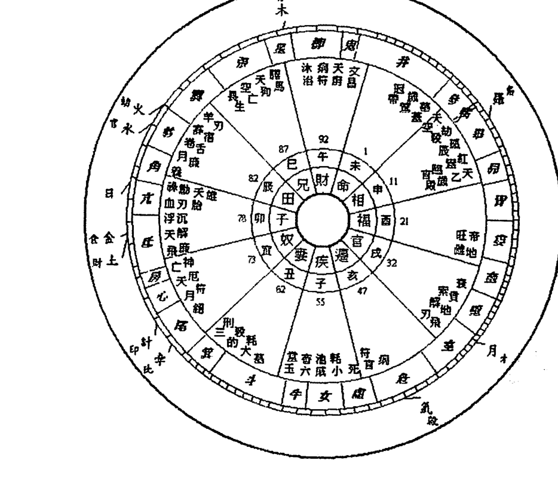

姓名：Bill gate

Bill gate，1955年10月28日pm 9:15，美國企業家、軟體工程師、慈善家、微軟公司董事長。1995年到2008年的《富世比》全球億萬富翁排行榜中，比爾·蓋茲連續13年蟬聯世界首富，位居世界第三富。命盤結構特點是：太陽爲財帛主，入垣。火星爲事業主，升殿。土星爲8宮主，金星爲田、福主，躔氐宿，兩星皆生旺。而且土、金、日皆拱照命宮，命局符合「富格」的條件。

田星入命，命星入田必富，須無駁雜星爲美。

官福生田財，名虛利實

官星、福星生田財，二主富而少貴。

田財生官福，利重名高

田財二星生官福，二主富貴雙全。

暗耗厭見二四之宮，福祿喜居九五之位

暗耗怕見田財二宮，祖業少靠，福祿二星宜居九五兩宮，三方拱命爲吉。

> 【註】：二四之宮，指的是第二宮財帛宮，與第四宮田宅宮。九五之位，指的是第九宮遷移宮，與第五宮子女宮。第五宮與第九宮和命宮成爲三方宮，三方，即三合的意思，此二宮有星，即是拱命宮。此三方宮得吉星，則謂之吉星拱命。

更逢限氣之扶持，必見鎡基之充裕

若限度相生相扶有氣，必定田宅充實。

## Q. 69 「貧格」怎麼看，是那一類的星相組合？

A. 「貧格」的星相組合如下：

- 身命受傷，田財失陷

太陰及坐命處，卻被空陷受刑，受傷害也。田星財星俱陷空弱之地、或被剋之位。

- 福祿背於身命，且居惡弱之宮

福德、官祿二主俱背，身命入落陷之宮。

- 暗耗聚於田財，更落空亡之地

天暗、天耗聚在田宅、財帛二宮，又値空亡。

【註】：天暗之化曜，即是劫財。天耗之化曜，即是傷官。劫財、傷官皆是偏星，入強宮不吉。

- 奴殺破庫而破祿，主星夾殺而夾奴

餘奴不宜入官祿，又不宜入庫宮，有此必破。命主被煞星剋或煞星傷、或奴星夾拱命主星。

- 生值嚴冬，金水孛臨於身命

冬令生人，水冷金寒之屆，五行不得其時，又値金水孛月依輔，身命不足道也。

- 坐逢弱限，火計會戰於田財

若限入弱地，火孛不宜交戰於田財二宮，計孛不宜相鬥田財兩宮，官福二位亦然，蓋孛剋火，計傷孛故也。

生忌泄於餘奴，身嫌坐於惡殺

氣孛羅計，謂之餘奴，奴恩二星同行而泄其氣，故不得福。太陰身主怕居的煞、羊刃、劫煞、亡神之地，疊惡殺尤凶。

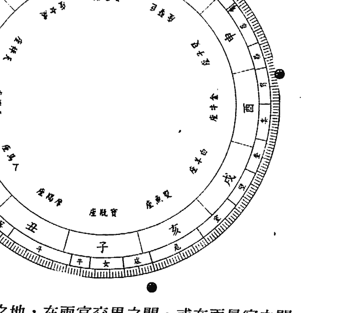

立命岐界之地，在兩宮交界之間，或在兩星宿之間，有很多的可能性，以日、月、命度、命主星至少有兩個是在兩岐之間有應驗出祖過房之可能。其中又以上圖所示的黑點上應驗程度最高，為宮位與位，宿度與宿度，兩者都在交界，

## 七政四餘

### 母命虧，而官福俱陷

命主、恩星、官福二主，俱怕陷於空亡惡弱之地。

### 限主弱，而難殺交侵

限主失所，更值難殺當途，假如午命五旬外入亥限，限主屬木，飛入辰宮亢度逢金星，秋生本弱，又見八殺之宮故凶。

### 主入六宮，定是艱辛勞苦

命主星入奴僕，必主奔波勞碌；凶星逼迫，則為勞碌命，艱辛勞苦之人。

### 命居隔界，終當遷轉流離

如胃三在戌，胃四過酉，乃是岐界之地，必出祖入贅之人，否則住居不定也。

> 【註】立命岐界之地，在兩宮交界之間，或在兩星宿之間，命有兩岐者，若過房出祖，自成自立，生來勞碌難得安樂，心常不足、有頭無尾。必自移根換葉，方剋有成。胃三在戌，胃四過酉，此為未校正之星宿，現代的岐界之地，必以新宿度為準。

### 會奴煞於福德之鄉，困老於窮途之下

奴煞二星會於福德，傷乏困老之人。

## Q. 70 「賤格」怎麼看，是那一類的星相組合？

A. 古書將人命分出貴與賤，富與貧，民主社會，人人平等，本不應將人分為貴賤，現代社會的貴與賤之分，或許是「少作多成」以「貴」論，「多作少成」以「賤」，勞心者治人，勞力者治於人，貴與賤為勞心與努力之多寡不同而已，如此論斷或許較為恰當。在此權用古書論之。

### 「賤格」的星相組合如下：

- **主居惡弱，身陷休囚**

命主坐弱宮又受剋，太陰化刑囚又臨蝕晦，居休囚死絕之地。

- **吉星散亂以無情，凶曜戰爭而不靜**

吉星入陷、居於弱宮，或背疆，而不合、不拱，凶曜反入強宮、相戰相剋。

- **奴宿或侵於命位，煞星或戰於亨衝**

餘奴入命，其諸吉星而無力，馬前諸煞戰於亨道而遇吉，宿用而無用，利而不利。

- **主曜失躔，奴餘反居正位**

如木星居亢，既失其位，氣星反得，寅亥居之其餘，羅卯戌，計子丑，孛巳申皆是。

## 七政四餘

【註】木星居亢宿，為木落金鄉，受剋不吉，如紫氣反居於寅亥之宮，為紫氣居旺相之位，而紫氣為木星之餘奴，故曰，奴餘反居正位。七政，如君子也，四餘，如小人也，餘星反居正位，君子之道消，小人之道長。

### 凶星當道，身命不近貴人

限行見凶煞當道，或剋限主，又身、命二星，不得近諸吉星與貴人。

### 陰陽晦蝕以無光，金水退留而失次

日月遇蝕，暗昧失道而少精彩。金水二星，常隨太陽而行不過三宮，如金星，水星失位，或退或留，失其次則亂。

【註】：因為水星軌道在最近太陽，從地球觀測，太陽和水星之間的角度不超過28度，太陽和金星，由地球觀測，在黃道上的角距不可能大於48度，所以太陽和金星所能形成的相位角僅限於合相、半六分相位(30度)及半四方相位(45度)。是故，金水二星，常隨太陽而行，間距不會超過三個宮位。

### 身命拱值難，殺曜當權

值難凶星拱照命身，及殺星秉令有勢，但宮中有惡制惡，而權最大。

### 日月夾刑囚，閑神攘殿

太陽、太陰被刑囚凶星夾之，午未二宮乃日月之殿，被木氣土計居之，或木氣土計躔日月之宿度亦同上。

### 無用忌奴而占貴守命

奴星、忌星、煞星，不宜占貴守命，奴星、忌星、殺星，宜居於閒宮則吉。

### 得勢值難而破福傷宮

值難星得令有勢不吉，更不喜在官福二宮。

### 安身命於驛馬前後，必效驅策於士夫左右

身命二主在馬前後居之，主卑微小輩，或驅策區畫從征近貴之末，或成功之前必歷經諸多困苦。

看信休憩區 輕鬆一下，充電，再出發

> > 醫學和占星之間一向關係密切
> 
> 在十八世紀之前，這兩種科學常被混為一談，星相曾是作為一個醫生所必需的訓練，也是行醫的重要依據。

## 七政四餘

## Q.241 「壽格」怎麼看，是那一類的星相組合？

A. 壽格，長壽少病的意思。

「壽格」星相組合如下：

- **田星司令，壽元逢生**：田星乘旺，納音得令二星逢生旺，主有壽也。

- **身處高強，無殺星而犯殿**：太陰泊處高強，諸殺不犯官福與田財之垣。

> 【註】：太陰亦主掌幼年時期的健康情形。

- **命居生旺，得歲令以入垣**：命坐生旺地，本命得歲令入垣最吉。

- **日月夾命守田宅，是壽元而最妙**：日月夾命宮、令星居田宅，若令星又是本命納音星最吉，如甲子乙丑命，金星為壽元，又得秋令。

- **金水輔身臨命位，為母曜而尤佳**：金水星輔太陰，或臨本命位，或金水為母星乃妙。

- **貧而壽者，乃田財弱而身命強**：田星財星陷空，值弱宮，如身命二主得令居強，雖貧有壽。

- **富而壽者榮，乃官福高而母令健**：官星、福星、母星、令星，皆居高強健旺，則富而又壽也。

- **大喜金水日月之滿用**：命盤中最喜太陽、太陰、金星、水星四者合照、夾照、拱照，此為吉也。

- **最嫌火羅計孛之當途**：火、孛、計、羅四星當權，臨限值殺尤忌，逢空制之可。凶星逢空則不為害。

- **田令身命以無虧，必富壽而康寧**：田令身命四主俱坐高強，並無少失，則主富壽康寧，五福之全備也。

- **倘宮度母財俱有益，當安享而遐齡**：宮度母財四星，兩相倚賴有益，相生化吉，限途不遇殺難、則安享長年壽算也。

## Q 72 「天格」怎麼看，是那一類的星相組合？

> A 《黃帝內經·靈樞》：「黃帝曰：余聞壽夭，無以度之。伯高答曰：牆基卑，高不及其地者，不滿三十而死。其有因加疾者，不及二十而死也。」

黃帝曰：「形氣之相勝，以立壽夭奈何？伯高答曰：平人而氣勝形者壽；病而形肉脫，氣勝形者死，形勝氣者危矣。」

壽指長壽，夭指早死；壽夭為一對。夭，早死，英年早逝，二、三十歲去世，稱為夭折，但也有一歲內而卒。

宋代大文豪蘇東坡，在散文、詩、詞、歌、賦、書法、繪畫、音樂、佛道等方面都有相當的成就，而且还是一位養生學家。蘇東坡在《上皇帝書》中詳細闡述養生理論：「人之壽夭在元氣……是以善養生者，慎起居，節飲食，導引關節，吐故納新，不得已而用藥，則擇其品之上，性之良，可以服而無害者，則五臟和平而壽命長。」

東坡先生養生觀在於培養元氣，使五臟六腑功能強健，相互協調。在古代認為可能會夭折的疾病，透過現代醫學發達，夭折的機會大減，或許在當今醫學突飛猛進，本篇所述，可能會有一些出入。

「天格」的星相組合如下：

- 主宿失垣，身星傍鬼

主星失垣驅剋是也，如夏金躔室，秋木躔亢金。或

殺星同命主共躔剋主，又太陰受傷，與諸煞同位。

### 破局刑囚攢命位，四正俱空

破局者，破碎羊刃、七殺、劫殺也，更化刑囚星守命，又值受剋，用星受抑，四正空，而無吉星助。

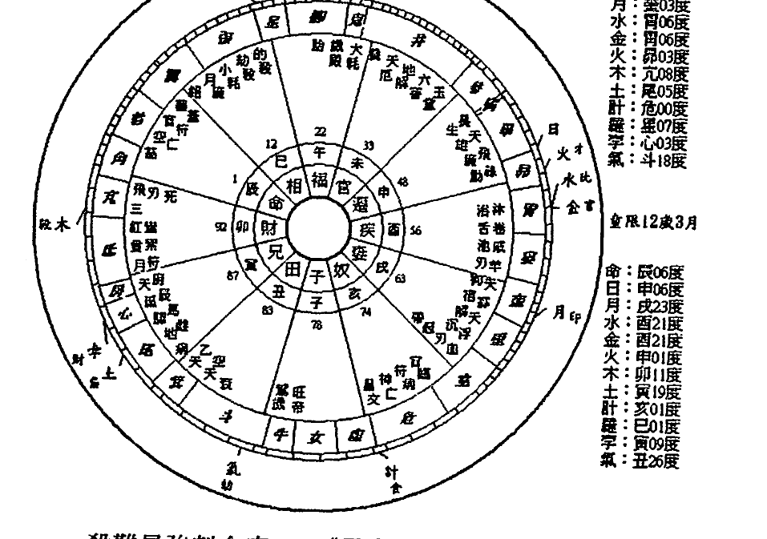

殺難星強剋命宮——《星命說證》165頁的案例：出生於1840年5月28日未時，七政立命辰宮，以金星為命主，金掌疾厄羊刃，火星是難星，在申宮拱剋命宮，必死非命。1887年丁亥與子同在洋火船燒死。

## 政餘

### 司時煞難剋限宮，三方無救

得時令旺氣之難星，剋制限宮，三方並無解救之星，更加流年逢煞加臨，主夭折。

### 母星令星俱陷，官宿福宿皆空

人則以母恩相益為本，何宜失陷，令星係人之本源出處，亦不宜損之。官星、福星既空，而無倚用，四者損廢，自然夭折。

### 天殺會合，地殺交攻

天殺原所值八殺難星，地殺即馬前劫殺、羊刃、的殺之類，及流年殺星入命，逼限即當殞歿。

### 祿元破壽元虧，齊到殺鄉端可慮

祿元者，我生彼是也，申子辰生人為木，寅午戌生人為土，亥卯未生人為火，巳酉丑生人為水。壽元者，即生年之納音，三元星雖無虧，若限到殺鄉，必因祿元、壽元星逢破，則主死無疑。

### 難星強，限星弱，才交關界便須防

殺難星強，行限星弱，剋戰岐界限交，吉凶出泰入否之間，必宜防卒時之凶。

### 看流年星殺併沖，斷某月何日殞歿

以上要斷何時年月日，以聚殺會凶年月決之。

## Q 73 「賢格」怎麼看，是那一類的星相組合？

A 「賢格」的星相組合如下：

### 金水坐命，木氣扶身

金水二星入命，或命坐金水，其星入本垣。木氣星同太陰，必賢達者，或者成功而能設策、處公道之人也。

### 名甲朝陽，躬親臨於君駕

科名者，即為甲乙木星，丙丁為火星，科甲者，命官對面第七宮的宮主星，名甲入午宮、或臨太陽、或臨歲駕，可為清賢之士，金水亦然。

### 金水秉令，獨相助於月華

金水助月，或只一星伴太陰，倘得月華上弦，秋令尤妙。

### 身泊於斗牛之間，命驤於奎壁之府

斗牛奎壁之府，文武大人之位，若太陰泊守，或命主星於此，皆賢哲之人也。

### 日居日廟，單聯兩傍之金水

如太陽坐星日馬、昴日雞、虛日鼠、房日兔，得兩傍金水夾之為吉，此為太陽升殿，金水夾之。

【註】：太陽坐星、房、虛、昴為廟旺之地。

### 月入月垣，不見三方之土計

太陰居張月鹿、危月燕、心月狐，畢月烏之宿，而三方不見土計為吉。

## 七政四餘

> 【註】：太陰坐心、危、畢、張爲廟旺之地。太陰最怕土計，故三方不宜見之。

兇閑神混雜諸端，爲氣質清明

星盤中無星殺擾亂，必主聰明出衆，智慧超群，非賢人而何。

## ◆全國一致推崇最權威最有效率・老師絕不藏私的命理研習機構◆易經研修學院　新班招生中

+ 週六命理班課程：3個月為一期一期12週
- ◎正統相術與養生班(上)(場地維護費4500元) 星期六9：30—11：30
- ◎西洋占星學進階班(場地維護費4500元) 星期六13：30—15：30
- ◎易經64卦專修班第1至64卦(場地維護費6000元) 星期六15：40—17：40
- ◎陽宅實務班(場地維護費6000元) 星期六19：00—21：00
週二下午快樂讀書會：(2個月一期8週，僅收場地維護費1000元)
◎週日塔羅牌研習營：2個週日全天9:30-18:00 (僅收場地維護費6000元)
報名、上課地點：106北市大安區羅斯福路3段193號7樓(淡水捷運新店線台電大樓站3號出口)
電話：(02)23651168　0910092345
傳真：(02)23670168，外縣市可利用郵政劃撥帳號1963479大元書局　或用ＡＴＭ轉帳：台新銀行(代號812)00315055200900　網址www. life258. com
電子信箱E-mail:aia. wl68@msa. hinet. net

## Q. 74 「愚格」怎麼看，是那一類的星相組合？

A. 人之賢愚不肖及性格才具之差異，而有各種不同之類型。孟子既主張賢者要負責教會不肖者，就本著孔子「有教無類」的原则。

近世實行普及義務教育，無論賢愚不肖，只要達於適齡，概由國家提供平等教育機會，都能夠獲得平等發展之機會。命運或有吉凶與悔吝，它不會因爲賢愚不肖而有差別待遇；不管是悲劇或喜劇，你只能面對這樣的人生課題。

聖經哥林多前書一章21到23節：「世人憑自己的智能，既不認識神，神就樂意用人所當作愚拙的道理拯救那些信的人，這就是神的智能了。」古人曰：「人生無賢愚不肖，無以相倚也。」對自我生命的認同與定位，是意義非凡而且相當重要。先天有所不足，與不完美的部分，付出了雙倍的努力，或許也有雙倍的收穫吧。

「愚格」的星相組合如下：

- 土孛混雜，金水背馳
- 土孛相戰，星辰混亂，金水退留，用而無用，來而不來。
- 日月沉淪又沾翳，命母落陷而失位

太陽太陰值晦遇蝕，或被木氣掩土計刑，又命母星失陷、居弱，此謂不明也。

## 七政四餘

### 晝行於夜曜，陰遇於陽星

日木土氣計水爲陽星，月火金羅孛爲陰曜，又如晝生在未宮，安命行限於寅卯之類，夜生午宮，安命行限未申之類。

### 奴殺交攻，而不顧其君

餘奴殺星相戰當場，而不顧其主。

### 命母失陷，而莫助其子

母星無力，而莫能助其子也。

### 身命居僕馬，且受制於餘奴

命主同太陰俱坐六九宮、驛馬、陽刃之地，更忌奴星犯主，或奴星值凶煞。

### 值難混亨衡，返遮攔於吉宿

八殺星、值難星、剋戰限道，反遇害原守吉星。

### 生星陷弱，必好自用而不移

如是生星落陷居弱，信失禮虧，愚好自用，賤好自專，過而不改也。

### 福宿殺臨，雖廢修省以無益

若福星福位遭殺剋玷，必廢修省之德，其福既破，所爲無功也矣。

## Q. 75. 女命格局如何論斷？

### A. 論女命格局：

### 非惟格局取用，專求用曜精神

女命非以格局取用，專求用神生旺得垣，不失爲美。

### 身命安清，財福無破

婦人身命二位坐吉，財福二宮不破，自然助夫而能享福。

### 夫星化貴升殿，必有稱呼

夫星，爲第七宮主星，若入垣升殿，化福祿貴權，又得時令，不值空亡，夫必貴論，如夫主是火，坐翼度或火宮，又值夏令夜生，以不見水孛才妙。

### 身主入福坐財，乃歸富室

女命專以身主倚賴，吉凶由此，如生秋月或夜明，不逢殘晦，化爲吉神，居於財帛福德，富室也。

### 夫子俱貴，堪期兩誥褒封

如夫子二星坐玉堂貴人、化祿貴、權印或官福星、又入官福宮，乃夫子俱貴，可受兩誥封贈，值破不准。

### 陰陽並明，必主一生專擅

七政四餘

但日月同宮，必生於朔旦，月占日前，必卑夫奪權。自能創立，能知書數，不可一概而論。

【註】：日月同宮，必生於陰曆月初一、二或月生於尾二八、八九，月占日前。若出生於月初，則月漸明，主吉。若出生於月尾，則月漸無光，格局必弱。

五宮主入官福，子必出賢

五宮，子女之位也，子星化祿福權貴，得時令入官祿福德，不宜空破，子必賢也。

七位宿到田財，夫當有業

七宮乃夫位，彼宮主得時令無空破，不化刑囚，又入財帛、田宅，夫必旺財有業。

夫星畏逢殺觸，嗣宿怕見難傷

如火星為夫，畏見水孛剋之，如水星為子，忌逢土計抵觸。

太陰升殿在福位，可貴於子

太陰當旺化吉，或居天門，或躔之奎、壁、角、婁、張、畢宿，生子必主聰明賢貴。

太陽當道臨對宮，必尊其夫

命之對宮為夫位，太陽君象臨其宮是也。又如張度夜生，必尊敬夫，忌土計水氣共位。

命為官身為福，必居恭淑

夫化貴，子化祿，可任封章。命主是官星，身主為福星，必可稱呼夫人。夫星化貴入玉堂得時令，子星化祿入官、福、貴人之位，必為貴人妻。

金孛不宜臨身，馬刃莫教干命

金孛同入命，則主好交際。馬刃臨主，不宜化刑，身命受剋，則禍害加身。

男女體用，怕值難作黨

男女之命用曜，俱怕值難，作黨諸殺，剋命剋限。陰陽宮度，喜者相合相生。陰宮陽宮陽度陰度，並宜相合相生為福最貴。

看信你題區

輕鬆一下，充電，再出發

> 醫藥占星家可以通過分析一個人的出生星盤，從這裡可以發現此人身體上的優點與缺點，各種疾病發生的可能性，以及在營養上的缺陷。

七政四餘

## Q. 75 三教九流各有命，何以論之？

有關星盤的解釋，各家各派每有不同的著力點，例如貴格中有一種「七政入垣」格局，其定義是：日月五星各居其入垣之宮位，即為日月五星各得其廟旺，此入垣之宮位若命宮所居，又得化曜神煞之吉，則其人主貴。

萬事萬物之存在，都有其隱微可以觀察，要推論命局，得先了解整個命盤格局架構與形局，八字、斗數的論命系統有格局的存在，七政亦如是，展現其整體命盤的結構，即可掌握禍福休咎等重要徵象。

格局的組成，包含了宮位、星曜、廟旺、落陷以及化曜等結構，以及月令節氣等元素。我們將這些元素加減乘除之後，就可以瞭解命盤架構了。

日月五星得到星曜的輔助保護，而無它星剋制之，則為合格，若命宮及田、財、官、福等居於吉格，則主其人命貴，或有田財官祿福德等。以下是由果老星宗所整理出來的各種命運結構。

#### 1·官貴之命

-   ◎金水會命居官祿，名遂功成。金水生助命位，益佐官祿，其功名可遂也。
-   ◎水金宜附近於身命，日月喜拱夾於福官。金水星宜附近身命，日月喜拱夾於官福為妙。
-   ◎日月次星張，有引從端為貴客。日在星度，月躡張宿，各升殿位，金水引從，無剋破者，乃為貴客。

#### 2·文人貴顯之命

-   ◎日月最喜拱夾，水金須要分明。太陽太陰，最宜吉星拱夾輔佐。金水分明，水前金後，不宜混失退逆。
-   ◎金水會垣，水忌退於金後，日月合朔，月宜占於日前。水在金前，水受金生；月在日前，月借日光。
-   ◎金水躔奎壁無混雜，必為仕人。金水躔奎壁，奎壁乃貴人星、文章之府。書云：五星連壁、五星聚奎，此乃文地。金躔參壁度，為金生水。水躔奎斗度，為水生木，相生之德不混，為文人貴士也。

#### 3·富貴雙全之命

-   ◎文魁火羅捧月，翰苑名公。文星、魁星，或是火羅之用，又在夜生，捧月而行，無他星混照，決為翰苑名公。
-   ◎福官驛馬朝陽，玉堂貴客。福主、官星掌天馬、地驛，又近太陽得位、得時，定是玉堂金馬高貴之客。
-   ◎極貴陰陽拱祿，朝向尤奇。日月得體，或拱夾官祿，或拱夾官星，又得朝命向命者尤奇，如若背陷固輕。
-   ◎最富日月夾財，坐旺享福。財帛宮得日月夾拱，或是日月拱夾財星，更財宮財星坐生旺宮，主享福受用。

#### 4·出外經商之命

-   ◎觜主播遷飄泊，逢生旺而作商流。觜星安命爲人無定，如逢生旺，好爲商賈於外。或遷移主入命，或命入遷移，而財星得拱夾有力者。

#### 5·聰明有壽之命

-   ◎金水互垣，終身而有慶。水居金垣，金入水垣，乃大吉也。

#### 6·孤剋有壽之命

-   ◎木氣拱身夾命，必有壽而聰明。木氣清高善曜文學之星，守命臨身，必主聰明清秀，或泊孤寡主有壽孤剋也。
-   ◎孤剋者木氣羅守身命，泊孤辰寡宿之鄉。木氣羅乃孤星也，不宜守命，太陰忌泊孤辰寡宿之鄉，主清高孤寡之士。

#### 7·高清孤介之命

-   ◎紫氣清高，性必孤介。紫氣，孤高節介之曜，守命臨身，為人好靜，有道德之士，也未免孤刑，難為骨肉者。

#### 8·林下隱士之命

-   ◎日陷奴宮終不利月，居閑極反為祥。太陽忌入奴宮欠利也。耶律經云：兄弟宮雖為惡弱，太陰居之反吉也。
-   ◎木氣貫命多於林下逍遙。木氣二星貫守命度，多宜林下。

#### 9·書吏之命

-   ◎土孛破官徒向仕途奔走。官星被土孛傷破，可為醫、卜、吏、書，卒難成名。

#### 10·九流之命

-   ◎九流者土計孛同於官祿。土孛計會於官祿，宜是九流人也。

#### 11·詭詐奸謀之命

-   ◎鬼主詭詐奸謀，更強健必為戎首。命躔鬼，太陰躔觜，皆淺薄之人也，為人詭詐，終見崎嶇。
-   ◎土主敦厚而沉潛，計能狡猾而深慮。土性沉重過於熟慮，計主機巧多端，人難測度。

#### 12·藝術文才之命

-   ◎木為藝術好文才，金主方剛而嗜欲。木星照臨，主人技藝學術，亦是文人才士；金星守照，為人剛強、方正必好酒色。

#### 13·一世康寧之命

日為眾曜之尊，月乃一身之主。太陽人君之象，太陰人臣之象，一身之主。宜升殿得位。太陽正照，諸殺罷戰鬥之鋒。如諸星值戰鬥之間，若太陽臨之，必不相攻。孤月獨明，一世享康寧之福。若月獨行，身命皆屬化吉，居角斗、井奎、升殿及在月在增明時，一世康寧。

#### 14·一事無成之命

-   ◎陰陽失殿，到老以無成。日月居惡弱，計羅犯殿是也。

#### 15·偏生庶出之命

凡身命二主自相剋者，則不為忌，蓋身主不剋命主也，如命在巳申，月在子丑，若水星與土星，同行則不忌其剋。凡宮身與元守歲駕相沖，多主離祖孤剋，凡命與身坐隔界及諸星宿初末度，或身命入奴宮，奴星入命，又如奴星拱夾身命，俱偏生庶出也。

江蕙—台灣女歌手

深厚的表演功力及精湛的歌唱技巧，從1981年迄今，已錄製四十多張專輯，唱紅的歌曲無數，連續四屆金曲獎得主，在台語歌壇的地位及成就無人能及。江蕙樂善好施，向家扶中心所屬的兒童福利基金會認養了二十位孩童，還默默資助一間療養院，是台灣閩南語歌曲天后。

立命未宮，以月為宮主星，命度井宿，木星為命度主，月在酉，水星拱照，水在巳宮為入垣。命度主木星亥宮入垣，亦得巳宮水星入垣以生之。

#### 16·桃花之命

-   ◎金孛騎馬坐桃花，主無禮而淫蕩。金孛入驛馬桃花宮，上必放蕩淫邪。
-   ◎淫賤者金水孛臨身命，坐冠帶咸池之上。金水孛乃是淫星，又臨冠帶、咸池之上。
-   ◎計羅不宜犯殿，火金不可易垣。計羅二星不宜居正垣之殿，入日月之度，火不可入金垣，金不可入火垣，疑其相攻相剋故。

#### 17·漂蕩無守之命

-   ◎水乃漂蕩而無守，火必性躁而不常。水乃漂流動蕩之星，守命性必如是；火為暴躁無常之星，照臨，性格主躁。
-   ◎孛羅剋限化刑囚，人亡財散。孛羅是惡星，若化刑囚，其凶尤甚。
-   ◎火忌晝犯於太陽，土嫌夜截於孤月。火化暗，晝生，忌與太陽同躔；土化刑，夜生，嫌與月同行。

#### 18·多疾傷病之命

-   ◎殘疾者火羅土雜於難宮。火、羅、土聚於八殺宮，必然殘疾也。

#### 19·孤寒之命

-   ◎計羅明朔望之嫌，火土分晝夜之忌。太陽忌朔逢羅，太陰忌望見計，晝生忌火羅，夜生忌土計。
-   ◎火羅夏會多招哭泣之災，金水冬生難免孤寒之嘆。夏生遇火羅，有刑傷哭泣之災；冬生金寒、水冷，未免孤寒之苦。

#### 20·祖業難守之命

-   ◎水星化暗入四宮必傷祖業。水星本無定性、漂流之星也，況又化暗守田宅，主祖業無依。

#### 21·得妻財之命

-   ◎太陰帶祿登七位，定得妻財。太陰，陰星也，化祿臨妻主，室家富厚，或臨太陰、官祿之主，亦同此論，必有妻財，或得賢妻內助。

#### 22·刑傷子女之命

-   ◎氣孛守嗣垣，兒必刑傷。氣孛二星同在五宮，必主刑傷子女也。

#### 23·產難之命

-   ◎火羅入疾厄，婦多產難。不論男女，火羅不宜入疾厄，如此者，男有暴病，女多產難，若非自災，必傷骨肉。
-   ◎的殺聚於二刃，遇刑囚必主橫胎。二刃者，陽刃、飛刃是也，更會的殺，又化刑囚，為墮胎難產。

#### 24·是非招怨之命

-   ◎孛招謗怨，羅喜貪歌。孛為纖謗毀怨之星，守命臨身，多招怨謗之非也；羅乃爽快貪婪之曜，照臨身命，作事剛斷快利。

#### 25·刑傷意外之命

-   ◎命逢刑曜，而水孛落在厄宮，投河奔井。刑曜，即剋身命之殺也，兼有水孛流蕩之星在於疾厄，必主投河奔井之人。
-   ◎身臨刃地，而火羅坐於相貌，自縊懸梁。刃為殺首，而身星命主居此，況火羅暴燥之辰，坐於相貌之宮，主自縊懸梁、刎頸之人。

五曜，金木水火土，四餘，氣孛羅計，宜辨乎生剋制化之理。宜細觀度分，何星吉、何星凶、何星用力，何星有傷。究察命源，度主有成無成，格局虛實，究限損益，三方四正，觀其釣射加臨。三方，申子辰、寅午戌之屬，四正，子午卯酉之屬，對沖、釣合、拱關之理。格局高低，俱皆詳察，星辰好樂皆悉推明。星辰既合格局，又當推其廟旺陷弱之理，則格局高低可判。此乃星家之妙旨，術者之奇書，輿廢得失、莫逃限途、損益吉凶、此爲星宗之法則。

是非招怨之命一此男命大壞事不敢，小壞事不斷，監獄常客。立命巳宮，以水星命主星，命度翼宿，以火星爲命度主星，命宮水星掌亡神、貫索、三刑、孤辰。火星掌飛廉。水星遭土星同宮同宿之剋，火星爲對宮月孛所剋。

### 第一本以100問的方式 快速解訣七政四余

## Q.77 第一宮命宮，有「吉星守命」如何論斷？

**A. 論吉星守命：**

-   ◎ 日喜金水同宮，則人才美貌，或能言善道，日與羅同守，非足疾則目疾。日遇孛在前後皆不吉，但後重於前，亦主有疾，或目疾或主傷。
-   ◎ 月喜望夜或上下弦，宜金火助之，孛在後則吉，在前則不吉。月遇計則主目疾，月與土同躔亦以凶論。
-   ◎ 凡日宜晝，月宜夜。晝月守命，或遇火羅則晦，主人貌黑，土計宜晝不宜夜，氣木亦然。
-   ◎ 木主仁慈，清修近文，加水星，則文章蓋世，安命於巳、未或奎爲最。
-   ◎ 金性剛烈，主燥不藏事，得其所則好義。遇水、孛性不定，見紫氣孤剋。
-   ◎ 水星多智巧，三方對照，則性流無定，遇孛則泛濫，奴欺主。如水星爲命主，及坐命於巳申宮，遇土同躔，則沉晦，爲主亦如奴。原局無生旺祿貴宮，而爲大小耗，天地耗併，終身晦滯無能，懷才不遇。
-   ◎ 火得局好禮，冬月生人，得火更佳，化耗，主耗財虛花，若不得地，則弄巧成拙，加煞則性急而燥，身常生瘡癩或癩，壽不永。
-   ◎ 土主厚重，得局守信，土命人，本家子丑二宮，有長生、祿馬、貴人加臨，皆以吉論。如壬寅壬申生人，長生貴人在巳。火羅助之，其貌不揚，土計同宮，其人執拗自是，窒塞不通。
-   ◎ 凡紫氣守命，主多鬚，水土度者多，金度者少。
-   ◎ 天經、地緯拱身、拱命皆為上，惟不喜遇斗標指破，斗標居官，即使官星不起，亦為貴格。
-   ◎ 五曜聯珠，四餘不雜，為貴，凡觀星皆宜拱命，不宜背命。
-   ◎ 五星聚天門，命坐其間大貴，亦不宜餘氣間之。
-   ◎ 四餘七政皆欲得所，宜向東南，不宜西沒，雖居離明又不宜背命。
-   ◎ 如命在卯，七政在南趨從，必貴。
-   ◎ 巳亥有星其餘皆無星，亥巳安命主貴，大抵巳上安命不如亥上為妙。以亥為天門之故。
-   ◎ 又夜火好禮，晝土持重矮肥，木主慈愛人必清秀。金性剛不藏事，遇火則淫亂，水木主清秀，如會文昌星或巳亥學堂或奎井亥宮，皆為文章之士。夜奎壁火命亦然。奎木伶俐三方咸池，咸池或遇金孛主風流。奴主高強則為樂人。水土守命晦甚，晝火坐命，夜土來照亦然，以晝火暴怒，夜土頑愚故。

> 【註】：如五曜聯珠於東南，立命於西北，為背命，或稱之背躔。

## 命宮中「煞星守命」如何論斷？

**論煞星守命：**

-   ◎ 命宮中有刃、併天雄、劫煞、地雌，如守星得善曜，則險處獲財，限度危，則亡生喪魄。
-   ◎ 飛廉、陽刃疊併，忌見羅計相會。
-   ◎ 官符、病符、月符不宜重見，有囹圄之患。
-   ◎ 天馬、地驛、會木孛，一生招是惹非。
-   ◎ 若大小耗併，劫盜辱身。
-   ◎ 天雄、白虎入宮，多招橫禍。
-   ◎ 陽刃在命性必橫，劫煞在命性必孤。天雄在命性必雄。陽刃在命必有疾，加天雄必破相。
-   ◎ 氣羅相會亦主孤。
-   ◎ 大小限見月符，又須傷上損下。
-   ◎ 孤辰、寡宿會劫刃、華蓋，則為泉石閒人。
-   ◎ 天耗會的劫刃亡，非雷傷、虎噬、意外之禍。
-   ◎ 財福失經，命元雖弱，而榮華，以來拱有力故。
-   ◎ 日月，目之象，亦親之象，計羅近之，則目有疾。陽刃極重，天雄、地雌、劫煞、飛廉次之。日月犯刃，火羅帶煞守命，必傷親或目疾，日月逢蝕非眼盲則足跛。
-   ◎ 金火不宜同途，羅李次之。
-   ◎ 如乙亥生人又是正月，此水孛為劫主，又是飛廉。或五月十月是耗主，況乙亥火命人，水孛為煞太重，女人则主天，男人尤重。
-   ◎ 如壬午癸未生，得孛在卯，贵旺同临，此人必发。
-   ◎ 生旺皆不重见，或生旺之地坐命，不宜行旺限。老人遇之则死，否则衰败。迁移主受冲克，主徒流，若限主在前，煞主在后，亦有此患。

> 【註】：煞星在前，其祸轻，煞星在后，其祸必重。

-   ◎ 迁移克破田财，度主衰弱，主破家荡产，或我生他主晦，限亦然，为其泄气故也。
-   ◎ 身命二主怕逢奴元。官禄宫主忌见天雄。
-   ◎ 用星皆不宜见奴元。奴仆主不宜守命，主劳碌。

> 【註】：身命二主，即是身度主、命度主，如二主入第六宫，为身入奴元，为劳碌命。第六宫主星入命宫，或命盘中强旺之星入第六宫，皆非所宜。

-   ◎ 官主不喜克命。若福德主克命，乃为上格。财主亦可克命，田宅次之，须加贵人、生旺、禄马为佳。
-   ◎ 财主、官主要与命会则吉。
-   ◎ 朝阳之星喜官星、命主、度主，其余不可概论，如行限再见此度中要，决然利遂。
-   ◎ 杀星朝阳则势张，限犯之则凶。
-   ◎ 度主旺，限主强却身亡，为暗煞加临三方照。
-   ◎ 八煞主不喜朝阳，亦不宜克命，不宜克官。假如酉宫安命，限行子宫遇木，此为煞克宫也。祸害缠绵，若胃土安命，为祸尤重。

> 【註】：「酉宫安命，限行子宫遇木。」因为行限子宫，子丑合土，子宫限属土，遇木星，则克限主，此为煞克宫也。承上之例，假设立命于胃宿，胃属土宿，行限子宫，…子亦属土，如此则命度主、限度主皆受伤，为祸更重。

-   ◎ 克纳音之星，若朝阳再行，此度轻则出百端之祸。重则决死断之，但论诸煞守命，要命主、度主、身主、三者无相克犯，又在强宫，诸煞临之则无害。

> 【註】：命宫里各星曜的强弱度，是推论命盘时的重要依据，命宫当中有可能是单一行星坐守、双星以上共守，或为命宫中无星，如命宫中无星，则是推论命主星、身主星关联吉凶最大，但是不能以命宫的星曜去作无限延伸的解读，那则悖离了七政四余的精神，也会造成论断失真，必须将命宫里的主星、凶星、吉星、拱合、刑冲、化曜、神煞做串联，并融合整体命盘的格局，以此推之，才能导论出精确的预测。

醫學史專家的看法，美索不達米亞地區在亞述和巴比倫時代，當時的人們認為，人的生老病死、健康與否等，一切都依賴於天上星辰的玄妙力量。同時，人體之內的體液（生命就存在於其中），也被認為是受星辰運行的影響，好比星辰之影響自然力或月相盈虧之影響大海潮汐一樣。

### Q. 79 第二宮掌財帛，如何論斷？

**A. 財帛宮，人生受用之大端也，或福祿照財帛，日月照財帛，田財互垣，身命二主臨財，及財星又逢生旺，得令得時，皆是有財之人，既有財，則可以養妻子，致名利，用奴僕，若財主失經，刑囚暗耗照財，此是無受用之人，若財帛不好，未可據言其貧，又看田宅何如。**

**攬駕經：**

| 星宿 | 白天生人 | 晚上生人 |
| :--- | :--- | :--- |
| 金臨財帛 | 足隨時 | 皆進鏹 |
| 木臨財帛 | 必豐隆 | 最難逢 |
| 水臨財帛 | 財帛散 | 更被孛來不足看 |
| 火居財帛 | 與前同 | 與前同 |
| 土居財帛 | 皆豐亨 | 皆豐亨 |
| 太陽居此 | 足錢財 | 質庫常開待物來 |
| 月居財帛 | 多財帛 | 只怕土星三合剋 |
| 土入二宮 | 亦忌之 | 遇日木扶還又得 |
| 羅計孛入 | 損資財 | 終身不得資財力 |

**論財帛主**

財帛主，即第二宮財帛宮宮主星。如在兩宮交界之處立命，財帛主則是以度主論之為宜。

財帛主星升殿入垣，或守本宮（第二宮），或飛入中天，或財星陷弱而得救助之星照臨，可言其富。

若財星生田宅主，必然廣為儲置，積聚田財，財星反剋田宅主者，必多漏失，因而破財。財星來助官星者，以財取貴，而富益厚，貴益隆。財星反剋官星者，必因財而傷官祿，或因之而起訟。財星犯爵元，命主又弱而受剋者，雖富足而不享天年。

財元退留、受制、無救者，其來有限，所費無厭。更值犯者強盛，恐無隔宿之糧矣。有救之者，尚可以望溫潤之象也。此專論財星、財帛，乃高強之宮，喜主星旺則生財矣。主星弱而受制者，亦不生財。

第二宮財帛宮，如宮內無星，取二宮主星為用，如財星升殿、入垣，在強吉之宮必富。二宮主星入強宮為吉，其中以第一、四、十宮其勢最宏。若主星失陷，二宮主星入三、六宮，名利虛花，百無一成。以三宮為兄弟，財入三宮，財為兄弟所分。六宮為奴僕，財入六宮，則為下人所分，或用人不當所致。

輕鬆一下，充電，再出發

國內第一本易經、宗教、命理、養生專屬雜誌
星象家雜誌雙月刊
2005年2月5日創刊
地址：106台北市大安區羅斯福路3段193號7樓
7F, No. 193, Sec. 3, Roosevelt Rd., Da-an District, Taipei City 106, Taiwan (R. O. C.)
電話：(02)23661177 23651168
傳真：(02)23670168
郵政劃撥19634769大元書局帳戶
網址：www.life258.com
E-mail : aia.w168@msa.hinet.net

# 第三宫掌兄弟，如何论断？

兄弟之分，与吾本同一气，果老云：「命卑关健，兄弟有争斗之风。」命与兄弟，须是各安其分可也，若我旺则克彼，彼怒则仇我，故果老有争斗之论，闲星入命者亦然。

如田、财、官、福入其宫者，主兄弟豪富，而本人稍弱。空亡、劫杀、的杀入宫，主兄弟贫贱。孤寡居之，则孤雁独行。五鬼、官符居之，必逞讼。刃雄居之，必带疾，马星入之，则兄弟东西，咸池入，则酒色迷恋，又看宫主星何如。

## 拦驾经：

- 木金兄弟主英雄、水星和乐旺门风；
- 火在此宫定孤寡、夜生不与孤寡同；
- 土临兄弟终难和、日居未可同言语；
- 生时父母决相背、木计合宫主贫苦；
- 太阴若得主星来、辅弼荣华由此胎；
- 孤临第三兄弟少、计星遇此渐生灾；
- 月孛来时损兄弟、古人传说难躲避。

# 论兄弟主

兄弟主即第三宫兄弟宫的宫主星。

兄弟主升殿入垣，或守本宫，无干犯之曜，有救助之星者，棣萼联芳。宫主退留失躔，或遭忌星所破，则只影高飞。有代之者，或异胞也，有救之者，当可聚也。

兄弟宫是以宫内之星曜吉凶，及宫主星所落入之位置来推断兄弟姐妹之成就，及彼此感情之好坏。

福禄主拱照兄弟宫，日、月拱照兄弟宫，兄弟姐妹之中会出有财帛名望之人。

兄弟之主益官、益财、益宅者，必因同气之力而致富致贵。若兄弟之主侵官、侵财、侵田宅者，兄弟兴趣志向各异，且较善计较利害、因而产生摩擦刑克，或因之以起争端。

兄弟宫遇煞星，兄弟主伤寿元者，或因之而伤寿。兄弟主与命主成拱照，又无凶星加临，就可以得到兄弟、朋友，或同僚的帮助。

看官休息区 轻松一下，充电，再出发

# 日食的成因

每当月球运行至地球与太阳之间，三个天体连成一线时，日食便会发生。月球阻挡了太阳光，在地球上造成阴影，使某些地区不能接受到部分或全部阳光。至于观测者看到太阳给遮盖了多少，则要视乎他们身处的地方相对月球阴影的位置。如观测者在半影区内，他们会看到日偏食，而身处本影区的人则会看到日全食。

# 第四宫掌田宅，如何论断？

田宅之位，人生受用之原，或田主不起，或有福禄照田宅，日月照田宅，身命主坐田宅亦是，有财帛名望之人，既有田宅，则人生受用，皆由此出，其中又以女命论田宅最要，如刑囚暗耗坐其宫，并有恶杀加之，皆主破财，外家冷落，兄弟无情。

## 拦驾经：

火星临此不堪说、土星骤入有房廊、
白日生人为最吉、夜生父母早年亡；
日居田宅足田园、木到双亲福寿全、
火孛不照多产业、水金合会常堪邻；
木星入位必有官、水月合分居显位、
罗居田宅不堪猜、十般死恶反破财；
计都侵之忧父母、田庄牛马化成灰、
月孛居安亦如之、夜生亦可减毫厘；
月临虽称旺田宅、白日生人反作累、
紫气居之多壮丽、父母一时居富贵；
金居田宅父母宫、白日生人主困穷、
如逢夜里最为吉、产业自荣迈祖宗；
木临田宅兴父母、自然福寿世难同、
水居第四旺田庄、更有双亲寿命长；
昼生又忌火来克、父母早亡主孤栖。

# 论田宅主

田宅主，即第四宫田宅宫的主星。田宅主升殿入垣强旺，或守本宫或明盛照临，有救助者，必见基业丰厚。或主星退留、失度、受克，虽广有田宅，亦必破而后已。

有救有肋者，当可复也。受制之余，无救无助者，岂惟离祖破败，更无兴复之时。其间又有生于异室，或移根换叶者，亦由此以致之也。

若田宅之主反侵官主者，必因之而招讼，凡侵他宫之主，随其宫之所属以断之，或流年宫主受制，或忌星侵犯宫之所，亦必有伤离之咎，或服制之凶也。

田宅为父母之宫，日月为父母之象，田宅为祖基，故以父母论之，祖业乃父母之所授也。故论父母须合田宅日月而兼论之。

如罗火犯太阳，或难星克日，及带剑锋，主先克父，如土侵太阴，或难星克月，并月带剑锋，主克母。或日生以太阳落阴宫阴度父先亡，夜生以太阴落阳宫阳度母先亡，又田宅宫主受克，日生先克母，夜生先克父，此阴阳反背之义，背日伤父背月伤母也。

# Q.82 第五宫掌子女，如何论断？

男女宫（子女宫）坐贵人禄马长生，及有吉星照者，皆主得贵子，及孝顺贤能之子，更加吉星三方对照者，子女必佳，如子女宫坐的劫死绝，又无吉星照者，子不得力，并无子断。

男女宫有火罗计孛，及化刑囚暗耗，皆主其人多子，妇人一年一产，及老皆不得力，如鸡抱鸭相似，或为忤逆之儿，多出在外，虽有若无。

夜生太阳独照男女宫，无星辅之，皆主无子，有星辅之，反有子，日生太阴独见男女宫亦然，以其孤阳不生，孤阴不成故也。犹有主星飞在强、弱宫，分轻重论之，如主星飞在强实位，损头胎，终还有子，先女后男，如主星落陷弱之地，多生多克，如白虎、六害、华盖临之，流年旬中又空，则为无子。

论子女之数，取水宫一数、火二、木三、金四、土五，加吉星则足其数，加凶星刑克者，必孤。随星论之。

如男女主，男女宫，暂为流旬所空，只是此十年无子，过旬又许生子，不可执一，如男女主是本命之杀，又掌阳刃、的杀、六害、白虎，则多生不肖之儿，如在天月二德殿驾贵人禄马官福田财之宫，与恩星同守，或男女主是恩星者，主子多得力。

## 拦驾经：

金星若在男女宫、四男聪俊各英雄、火在此宫不得地、遇著来时定主穷；土临第五迟迟有、夜生决定主孤踪、太阳若照男女宫、必主贵子显门风；太阴到此亦如之、三男富贵夜为功、紫气当生照男女、不被恶星井火土；三合水月同聪俊、男女荣华定文武、罗照男女主天亡、计都临照亦焚苦；孛星倘若居此宫、十生九死空费乳、为人性狠心肠、此乃依经与君语。

# 论男女主

男女主星升殿、入垣、无干犯之曜，有救助之星，多育聪明荣贵之子，若余气强盛，其力胜男女主，又当育庶生之贵子也。或子星受制凌犯者盛，若有星救援尚可有之。以余气代之者，异胞之子可也。子星留退受制无救之者，但望正室之生难矣。子星退留不及其数，受制遭伤或只生女而已。

子息主救助官星者，因子而荣贵，救助田财者，因之而起家致富。救助福寿元者，因之而益福益寿，救助身命主星者，必敬顺之义。凡救助诸用星者为有益之子。

若子息之主星侵凌田财者，因之而破家退耗，侵凌官星者，因而招讼伤官。侵凌身命寿元，有悖上之患及反噬之虞。男女宫及主星如在双鱼、双子、人马、处女，四宫皆含双意，立命亦在此四宫，有双生之可能。

# 第六宫掌奴仆，如何论断？

A. 身坐奴仆，有吉有凶，多有身命主入奴仆而贵者，亦有身命主入奴仆而贱者，何也？

如奴宫原是禄、马、贵人、长生、帝旺、殿、驾、崇勋之地，皆不可论之为奴仆，或为奴出身。如奴宫原是的杀、劫杀、阳刃、亡神、飞廉、死绝败之地，而身命又陷其上，此是奔波工役，无成之人，方以奴仆言之。

奴宫不独占断贵贱劳逸，亦主仆马侍从，本星坐于强旺之地，更加吉星生之，必主奴仆丰盛，若主星弱，奴星强，反被奴欺，故果老云：「主弱奴强，奴婢有侵凌之患。」

## 搁驾经：

金木星枯足奴仆、土若加之夜为毒、火在此宫必少力、太阴值此多悲哭；非惟辛苦有多般、决定生时非正屋、月居此位被日土、一世多迍更贫苦；第六宫中见太乙、男女顽愚多忌疾、不然迟忌亦寡微、此乃皆言多不利；计罗居此有灾殃、孛若临之号凶极。

# 论奴仆主

奴仆主升殿入垣，有救助者必多仆从，或主星或援星守宫得为力，若主星失度退留沉溺者，虽仆不可留也。

宫主伤克身命，及侵犯财官之主，非但不能听其驱策，又恐反有疾视之虞，或因之而伤官破财致祸，若侵妻妾主者，又有难言之隐也。

# Q.84 第七宫掌夫妻，如何论断？

A. 夫妻宫是禄贵长生帝旺之地，皆主好妻美貌多能，如是死绝的杀劫杀之宫，皆不得好妻，更会孤寡恶宿，必主无妻，术家云，鼓盆星五行绝处是也，会丧吊二符计都，必克妻，如妻主是杀星坐强实殿驾，或守财帛田宅，主妻多做大模样，欺凌夫主也。如以金为妻，若得其正位，必主妻有姿色而贤，若有水孛相侵则不然。

妻宫主落陷，居空弱地，有的杀六害白虎，加其宫分，及临其主所守之地者，必多克害。

妻星化值难，值咸池的杀同宫，必多产厄。

妻星是太阳，或入未或在午，或入兄弟，多主因亲致富，姨兄弟为之。

夫妻星掌华盖，阳刃，命坐白虎，则多是夫妻不和，隔角之类。

如妻星落陷，又得金气有力，必有小妻谐老。

夫妻星坐咸池，与兄弟主仆主同宫，又有的杀驿马夹之者，则主其配偶与外人或奴仆有情者，此诀极验，不可不察。

## 攔駕經：

金在妻宫妻妾好、木星画会喜相逢、
其妻非但能廉洁、貌白容妍世孰同；
水在妻宫多妖冶、火则伤残莫论容、
夜生尤自主分离、何况生逢在日中；
土入妻宫无貌娘、妻妾命如日里霜、
太阳美貌火孛丑、太阴见水美容妆；
紫气木星太阴吉、罗喉自缢检尸伤、
计入妻宫劳患死、不然毒药溺江亡；
妻妾宫中见孛星、计都水火自相刑、
兼主蛇伤并自吊、不然产难堕胎生；
火孛瘟疫死暴丧、落水悬梁产难灾、
木水二星多美丽、姿容可与贵妃齐；
罗计二星产难别、暴丧逃亡自带来、
孛水金火淫欲甚、交情奴仆老心灰。

# 论妻妾主

妻妾主星升殿入垣，有救助之星照临者。必得贞顺偕和之妻，余气盛者，有美丽之妾也。妻星生助官星者，必因之而贵，反犯官星者，必因之而讼。妻星援助田宅者，必因之而起家，反侵田宅者无益，邻官禄主者贵。妻星受制退留者，或被忌星凌宫殿之上者，多主刑克，若彼此相敌，或聚少离多，或可偕老。余气力胜代之，必主再婚。无力代之，或娼或妾或再醮之妇继之也，若无救代之星，终之不娶而已矣。

# Q.35 第八宫掌疾厄，如何论断？

A. 疾厄又称为八杀宫，主人之疾厄，亦主一生操权，若权星、印星、禄星、福星居之，皆主其人可掌重权，身命入八杀，得令得时，诸星扶之，贵格也，经云：「身命登八杀，科名须早发，八杀入命来，灾殃那可脱。」判断疾厄，先看命度、身度受克与否，又起处坐杀与不坐杀，更看疾厄宫有何星坐其上，如有火罗计孛，刑囚暗耗诸凶并会其上者，皆主重疾，如无星而三方对照，有凶星者，主带疾。身命居八杀，刃雄相并，或杀星照临主重疾，八杀主守照得所，主贵，上计罗带天雄阳刃，夜生与月同躔，必主破相。

## 攔駕經：

金临疾厄永无疾、木居富贵常安逸、水在此宫遇孛计、必定腰驼并背曲；白日生人火曜冲、必定风痰吐血终、荧惑疾厄须惊悸、土临八位主瘟凶；太阳遇计火土孛、风劳血病不久殒、如见本月独照之、一世优游无消歇；此宫若见紫气临、定是安荣居要津、罗照此宫应笃疾、计会孛来定凶侵；非惟痨疗又瘟疫、抑且吐血卧床亡。

# 论疾厄主

疾厄主星明盛则主无疾，若受制退留或遭凌犯，则主多病。其疾症类，随煞所主：

- 如木气，属肝胆及头目筋脉，逢金克，则主肝气风邪目疾，或因木伤。
- 如火罗，属心与小肠及诸血，逢水孛，则主寒热心痛、舌病酒痔、失血无发或因火焚。
- 土计，属脾胃及四肢，逢木气，则主胃弱脾伤皮肤唇烈或因疫死。
- 金属肺与大肠及胃气，逢火罗，则主痨疗肺热咳嗽鼻塞，或因血光、刃死。
- 水孛属腰肾膀胱及下部，逢土计，则主肾虚血浊耳聋，或因溺死。

日月主眼目，或日月逢蚀，或煞犯日月皆主失明。

若疾厄主星所临与的刀煞居之，主带疾破相，有救援者轻，无救援者重，或疾厄之主侵凌身命者，必犯刑宪，侵制寿元者，必因疾以尽天年。

# Q.86 第九宫掌迁移，如何论断？

A. 迁移主星守命，主迁居，或在克限，危重则徒流，轻则远行也。

命主在驿马，主人过房出祖，坐长生马者，有四方之志。限行遇吉星，则出入见贵扶持，会恶杀，及浮沉、水孛，主飘荡不归也。

天马地驿，星会多动也，或主星在马宫，或小限入迁移，皆主有动也，天马主职业之迁移、变异、调动，地驿为居家住所变动。

## 攔駕經：

木金之宿入迁移、定主迁移福禄齐；
水星却主远行吉、金木合照封侯印；
土星阻滞难远行、太阳昼生反为益；
金水会月夜生奇、命度相逢喜见之；
此宫见日主为官、太阴合照为瑞端；
罗在游行必见别、家中当见检尸灵；
计都若会孛星入、决定蛇伤并虎擒；
切闻月孛入迁移、损田损宅损妻儿；

# 论迁移主

迁移主得度无凌，又救援力盛者，必膺顺动之荣，或宫主受制，退留迟弱，行有趑趄资，难求利达。

身命主居迁移，或迁移遇身命主，或身命被迁移驿马照，及驿马入迁移之位，必主平生作事进退，非出祖过房，必移根换叶，或为萍梗之客。

# Q.87 第十宫掌官禄，如何论断？

A. 官禄宫如逢财星生旺守照，及犯天雄、阳刃诸杀，主人贪财坏名，亦不宜官星克命，经云：「官禄克命，以名立身，以名败身。」更不宜主宫逢罗，为人粗豪健讼。官星只宜文魁印星禄神守照则为纯粹。

官禄不宜见杀星克其宫，名曰官鬼，如官禄在亥，却不宜金星入，亦不宜三合四正宫值之，皆主其人健讼，不然遭官破家，亦主无官食禄之分。

## 攔駕經：

太白木星入官禄、一世为官居显轴、
天上之官会水星、太阳合照作公卿；
水居好乐合于月、官居位显职非轻、
火在十宫夜入庙、朝端定列仍年少；
罗星计孛本为凶、官禄之宫不可容、
土星尊重多丰禄、紫气添成衣食足；
只宜兴旺不宜衰、为人慷慨多荣富。

# 论官禄主

官禄主星升殿、入垣，明朗当天，有星来相生，而无凶煞干犯，余星曜并于强者，必获穹窿之贵也。援星明者主威权，星旺盛者，秉节钺威严之权，援星依日月之光者，有鹤班禁侍之荣，察官主余气之力，审援星表里之势，以定品位之高下也。

官主失度、退留又遭凌犯，却得援星重重，并力救之，及有余气代者，当于限度之中，得援星得志之地，大见荣显。若救援之星亦自亏损，又无外护之曜，则难求荣进，或援星宛转救之尚可，如又无生用之星，更凌犯之曜有党，虽于荣地不免履冰之凶矣。

官星力盛则贵，不盛则贱，更详日月强盛以断之。凡日月得时，尤其是月在增光时，官主得日月拱照、夹照，此为官星显赫。加官晋职。此言命主旺，官星有吉曜临之，行运又过官禄。

凡官星受损，所用之星则为不吉，若克田财，必由此以破家伤财，克科甲、文星，反因此以难第，克子息主必因之而绝后。克兄弟主，必因之而伤手足之情，伤福元，必因之而亏福，制寿元，反因之而伤天年也。

主星若生助所用之星，方以吉论，生助科名，必因之而正奏，生助田财，必因之而置产储蓄，生助福寿，必因之而享福益算，生助子息及兄弟者，必因之而益后裔，损益之中其理在此。

## 第一本以100问的方式 快速解读七政四余

# 七政四余

柯林顿八字是丙戌、丙申、乙丑、庚辰。立命巳宫翼火2度，命度主为火掌科名，得文星、太阳、科甲拱夹。官禄度主为水，水星入十二宫为入弱，但是水星躔鬼宿，金以生水，及命主朝阳。土为水之难星，土水相近，但土躔井木失经。综观全局，五曜环阳，罗计截出月亮为福德主，阴阳得地，命宫又得太阳、科名、科甲、文星夹辅，堪称七政之贵格。

尽管克林顿在任内发生了一系列丑闻，包括白水门案件和拉链门案件，但克林顿任内却有一定政绩，尤其任内创造了美国8年的长期经济繁荣，并使美国高科技行业的飞速发展，奠定今日美国高科技大国的地位。所以克林顿是历史上得到最多公众肯定的总统之一。

# 第十一宫掌福德，如何论断？

福德、官禄二宫，最喜吉星临照，若见福居福，禄居禄，身命主入官福，日月照官福，水日金月各居官福，皆是有福之人。

如福禄二宫，无星守照，或三方四正有吉星，暗加其上者，亦吉，未有此二宫无吉星照临者，是为富贵之人，凡看福德、田宅、财帛三者为重，若俱无吉星，便不可以为吉，只是庸常命断之。

人生处世以福德为最，有福则立妻子，立名利，致富贵，福德既亏，未见其为福也，若福德宫无星，更看三方对照，有吉星照福德者，皆为有福之人，为人性必端厚，量必宽洪，心必仁慈，气必温柔，有寿考之人，是可以定人之性情，每试累验，若有刑囚暗耗，诸杀居福者，多是刻薄凶狠，大宽小急，心多好杀，不仁不义，言不忠信，谲诳诈欺，奸谋机巧之人，未见其为福也。

## 搁驾经：

福德宫中或见金、夜生一世福神钦、
木会太阳居十一、禄厚福优居显秩；
水会月吉火浅薄、金土同照主食邑、
十一宫中罗最吉、太阴日木三合值；
生则须封万户侯、死则定知当庙食、
贵人不喜与土遇、刃杀孤寡皆不宜。

# 论福德主

福德主星盛者福厚，弱者福浅，身居上而无福者有之，有福而居下者，未之有也。福元升殿入垣，救助之星明盛守照，必膺莫大之福。

如福元失度退留或遭忌星凌犯，则无纯粹之福矣。或身为贵人，因此不享朦胧之福者有之，如人居帘幕高堂之内，因此不享安恬之福者亦有之。

福德主受克，入弱，而有星救之者，尚可言福。若官福身命之主俱亏，又无救代之星，不惟难言其福，又恐因此而流下矣。

德者，福之基也，福者，人之德也，犹人心之所生。苟若不行善不积德虽有福而无福，诚使行善而修德，虽无福而有福也，故云福德。

现代占星第十一宫则是代表交际能力，不同种类的人际关系，在你周围的环境。从此宫可看出你的交际手法和处事方式。

频繁的交际的和社会实践、知识面的拓宽，不盛气凌人，也不可妄自菲薄，应该谦虚谨慎、不卑不亢生活在人群中。

关心世界大事、国家大事，开拓视野，在变化多端的社会形态下，要伸缩性、创造性，善于在每种生态中自处。现代人应该体验到一个人的前途与生活，根本上靠自己的才华，但是也不能忽略，当今时代因素、人际关系与环境，每时每刻都在影响着我们的命运。

# Q.89 第十二宫掌相貌，如何论断？

凡看相貌，如命裹有星，须看先入者断之，若命与相貌皆有星，亦依例断之，及三合对照推之。

金星独行，相貌清秀温润，木星瘦长清爽，水星眼目俊丽，火星日生则面紫黑，夜生则红白，土星肥白长大，夜生矮黑，孛星额角骨露，日生长大好颜色，夜生额角露而细小，罗喉头角阔大，骨格粗，多须。计长面，骨粗露，夜则身小眼露，气星好相貌多须，太阴温润白夜黑小，太阳日黑色赤，夜生清白爽气。

相貌之宫，乃人性情之所钟，善恶之乡也，吉星临照，则为人君子，若杀星来据，更与福德阳刃同会，必寡情薄德，不仁不义之徒也。主星起会刑囚暗耗，主破相暗疾，不然钢花刺纹之辈，

金命主人，直方平而正。木命主人昂藏瘦、挺直而长，多有仁心。水命主人，形起而浮润，眉粗眼大而多智也。火命人主上尖下阔，性急而好礼。土命为人肥大敦厚，有信而不失。

## 攬駕經：

土星相貌却乌黄、木宿元来瘦且长、
金白不惟多嗜欲、水星行动受趋跄；
罗喉艺薄随身有、月孛为人带黑丑、
荧惑一星多性恶、水星最是双眉好；
计都巧计爱谈论、罗火东西打杀人、## 【論相貌主】

相貌宮分居諸宮之末，以天宮論之，反爲諸宮之首也。宮主得度明盛，有生助之星，必賦清秀之質，若宮主受制退留淩犯強盛，又無救援之星者，容儀必不美也。

以上十二宮星辰，並皆要弔起飛來，刑沖拱合，挨宮查度，逐宮認論。故曰：明見不如暗見，明拱不如暗拱是也。十二宮之論皆以宮主、度主而論，吉曜則吉，凶曜則凶，但以生者助者爲吉，救援者次之，其於剋者，並空亡、的煞、劫煞、天雄、地雌、羊刃者，皆凶也。

## 總結

星命家在長期實踐上，對各樣的命局組合進行歸納總結，具有一定規範性的星格模式，以簡馭繁和節省步驟的作用，於星命的分析判斷上具有重要意義。由於驗證集結的吉凶星格數量眾多，這又給後人的學習增添了困難，同時使得星命術更加複雜和神秘。其實，我們只要明白了星命家設計星格的用心和基本原則，不外乎行星、宮位、廟旺、失陷、拱照、夾輔等，就可從根本上掌握繁多的星格，而不必拘泥於死記硬背，很快的進入七政四餘的神秘境界，登堂而入室。

## 如何推斷大限之吉凶悔吝？與限度主有何關連？

## 《果老星宗》論限度主

夫限度主者，有限宮之主，有限度之主，二主皆要得地，不可失於偏廢，如看命宮主、命度主一樣，如限宮主受傷，而限度主得生者，或限宮主得生，而限度主受傷者，如此則知一吉一凶存焉。或限宮、限度主皆強者有之，或限宮、限度主皆弱者有之。

如宮度兩強者，必主發達，或宮度兩傷者，定入幽冥。又有宮主受傷而度主得生者亦死，又有宮主得生而度主受傷者亦死。

何也。蓋有刃星非合於宮，即合於度故也。經云：無殺刃豈能傷乎。由此推之，則吉凶生死易如反掌，如欲指命宮喜某星爲恩，以之言福。又指命度怕某星爲難，以言禍，然此則百無一驗也，斯乃執滯之學，不識變通之理，豈可與語哉。

## 行限吉凶論法

仙曰：世人多以宮主論行限，十不一應可哂可哂。大凡行限先依量天尺上，按定坐宮之度，次依洞微大限行去，專以生剋制化爲窮通壽夭之別也。

- 假如角斗奎井安命，以木爲主，行四水度或逢水孛大發跡也。貴人得之進爵加官。行四月度上亦好，逢金牛吉，逢火發達。若逢土計喪服重重。行四火度上不宜見金，主官災破財、或作土木造宅。行四日度平平、無災無禍。行四土度平坦發福，逢水孛驟發，逢金決死。行四金度無救大凶，逢水孛反主大發，決因禍而致福，不宜見金則死矣。

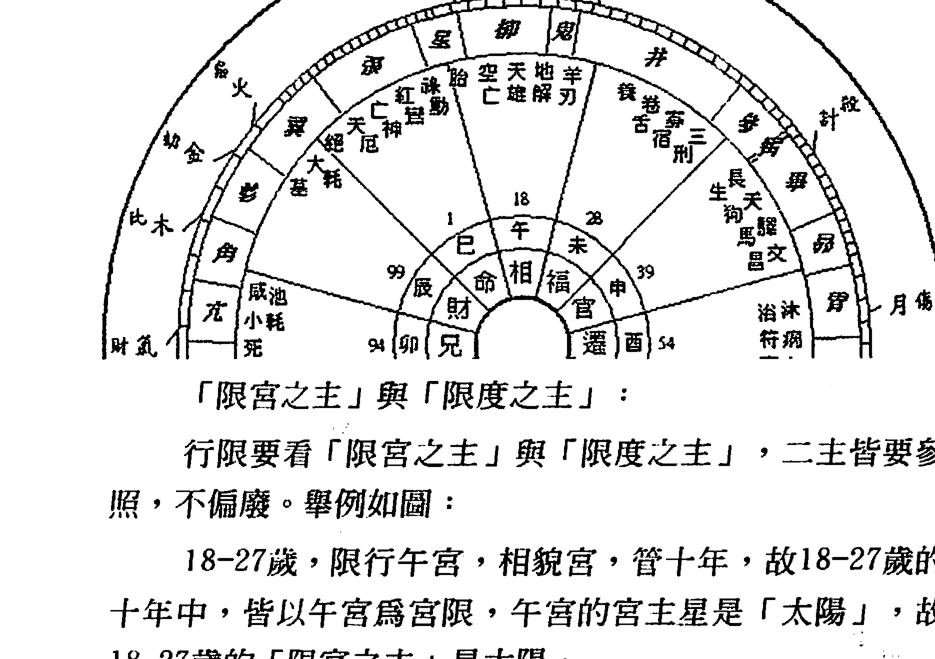

## 「限宮之主」與「限度之主」

行限要看「限宮之主」與「限度之主」，二主皆要參照，不偏廢。舉例如圖：

18-27歲，限行午宮，相貌宮，管十年，故18-27歲的十年中，皆以午宮為宮限，午宮的宮主星是「太陽」，故18-27歲的「限宮之主」是太陽。

相貌宮管十年，30 ÷ 10 = 3，一歲行三度，由圖中所示，18歲這一年在「星宿」，「限度之主」是太陽。

19-24歲，限度在「柳宿」，柳屬土，「限度之主」是土星。在此年歲之中，以太陽、土星論吉凶。

接下來25歲起「限度之主」是金星，以太陽、金星論吉凶。26-27歲，「限度之主」木星。以太陽、木星論吉凶。

- 亢牛婁鬼安命以金為主，行四土度大發。行四日度吉凶相伴，如有大凶得貴人扶也。行四月四水度見木則發，見氣主孝服、見火莫登高涉險。行四木度遇火羅決死，有水制之無妨。行四火度見土計大發，見火必死。
- 氐柳胃女安命，以土為主，行四火四日度發跡，貴則加官，否則納粟有名。行四月四水度平平，逢木氣則死，見火主造宅置田。行四金度平平、行四木度大凶，見水必死，此論四土度。
- 房虛昴星、尾觜室翼安命，皆以日火為主。行四木度大發；行四水度見孛星主落水死。行四土度主孝服、見火生男、見金生女。行四金度亦驟發。
- 心危畢張箕壁參軫安命、皆以月水為主。行四火度見土主跌死；行四木度平平，行四金度大發，行四土度見計必死、見金亦好。行四日度平平，見羅星主酒色之患、或因婦人破財。

已上星度論其得失，窮通壽夭，不過以生剋制化而取，此乃舉其例而推之，不可一概而論。如本主倘行本度亦有災有福，又如水行水度、火行火度，前文不載，惟此二宿觀其氣候，察其時勢，若夫火極明則滅，水極盛則泛，尤要詳觀有無吉凶，星辰守照兼而斷之。訣曰：更將宮度兩參詳，便是人間奇妙術。所謂宮主得生、而度主受傷，有災但不死，又如度主得所、而宮主受傷，刃星合度亦死，詳細須觀「倒限篇」始得其詳。

## 七政四余

### Q.91 如何論倒限？

> 《果老星宗》卷九「捷見限論、倒限直指篇」

倒限則一例不同，一例指執法言不同而有異論，不問坐命何宮何度，不以原守坐命某宮怕某星，不以坐度某度喜某曜，但一歲之中、指爲今某歲言，只看限行至何度爲準。

假如今年某歲，看限行何宿度，如限行土度。如限行氏女胃柳四土度中，則看土起得何經，以土爲限度主，看原土起躔某宮某度，或土起逢生，土躔尾室觜翼火度，或土起值剋，土躔角斗井奎木度。由此以決吉凶。逢生者吉、值剋者凶。

- **木土互躔：**
  且如土躔木、土躔角斗井奎木度，木躔土、木躔氏女胃柳土宿，限至土度必死。此謂木土互剋、乃限主被剋也。若土木二度中有金氣計火羅可解，有一星會亦可解。土木度者即土木所躔之二度，若會金解則是土生金，金去制木無害。若會木氣同行，則是二殺不攻一，或土計同躔，則是一殺不攻二，或逢火羅，則是泄木而生火助土爲吉，或木秉令及生旺之月亦不可解也。

- **火土互躔：**
  又如土躔火、土躔尾室觜翼火度，火躔土、火躔氏女胃柳土宿，限至土度必發。此言火土互生，乃限原受生也。

  也。倘土火二度中犯水孛、金計減力，土火度者即土火所躔之二度，火遇水孛受剋，土遇水孛則相敵，火金戰爭土金洩氣，土遇計焉主奴同舍，火會木氣則福厚，火羅同度夏月生人，乃謂火炎土燥失之大驟，又云二母爭權也。

- **金木互躔：**
  且如木躔金，木躔亢牛婁鬼金度，金躔木，金躔角斗奎井木度，限至木度必死。
  此謂金木互剋乃限主被傷也。若有火羅水孛氣星在金木二度中可解。金木度者即金木所躔之度也。若火羅與木同躔或單躔木殿，則是木生火，謂之灰飛煙滅，行木度亦死，若得冬令亦可解，但得夏月火羅犯金度可解，水孛解則金生水，水生木，氣解則是一殺不攻二。

- **水木互躔：**
  又如木躔水、木躔箕壁參軫水度，水躔木、水躔角斗奎井木宿，限至木度必發。此言水木互生乃限元受資也。倘水木二度中，犯土計火羅氣孛者減力，如木會土計則相敵，如水遇土計乃相剋，如木會火羅爲洩氣，如水遇火羅則相戰，如木見氣謂主奴同舍，水孛同躔乃二母爭權，更值冬生名曰雪壓寒梅，非但冬月，春生亦不宜矣。
  得水金相生，其福倍增。且如金躔火、金躔尾室觜翼火度，火躔金、火躔亢牛婁鬼金宿，限至金度必死。此謂金火互剋乃限主被傷也。若有土計水孛羅在金火二度中可解，若四五月火羅生旺不可解，土計解則是洩火生金，

### 金土互躔

又如金躔土、金躔氐女胃柳土度，土躔金、土躔亢牛婁鬼金度，限至金度必發。此言土金互生乃限元受資也。或金土二度中犯木炁水孛計者減力。土金度者即土金所躔之二度也。土見木炁則受制，金見木炁則抗敵，金見水孛乃洩氣，土見水孛為戰爭，如金見計土同行謂二母爭權、乃姑息太過，金見土計單行則福力尤佳，但秋冬亢牛二金遇土又謂金埋土晦，反為無益矣。

### 火水互躔

且如火躔水、火躔箕壁參軫水度，水躔火、水躔尾室觜翼火度，限至火度必死。此謂火水互剋乃限主被傷也。孛犯火度亦死，有木炁孛羅土計在火水二度中可解。火水度者即火水所躔之二度也。七八月及冬令亦不可解。七八月水孛掌值難冬令水旺故也。木炁解則是洩水生火，孛解則二殺不攻一，羅解則是一殺不攻二，土計解則是土剋水。

### 火木互躔

又如火躔木、火躔角斗奎井木度，木躔火、木躔尾室觜翼火宿，限至火度必發。此言火木互生乃限元受資也。有土計金羅炁在火水二度者則減力，如火見土計為洩氣，木見土計則戰爭。火會金而相剋，木會金則受制。木遇炁則二恩不為恩，火遇羅則謂主奴同舍，如夏令火炎木氣太盛反不為美，如遇水孛展轉相生其福最厚。

### 土水互躔

且如水躔土、水躔氐女胃柳土度，土躔水、土躔箕壁參軫水宿，限至水度必死。此謂土水互剋乃限主被傷也。有金孛木炁計在水土二度中可解。水土度者即水土所躔之二度，若土得令生助亦不可解。土旺辰戌丑未更火羅生土，惟五月不忌，反以水孛傷土則限至，子午土度凶。五月生人水土互躔，限至午柳子女士度凶，金解洩土生水孛，解一殺不攻二，木炁解則是水生木木剋土。

又如水躔金、水躔亢牛婁鬼金度，金躔水、金躔箕孛參軫水宿，限至水度必發。此言水金互生乃限元受資也。有火羅木氣孛在水金二度者減力，水會火羅則相敵金會火羅而相戰，水見木炁乃洩氣金見木炁為仇怒，水會孛謂主奴同舍，水金會土計獲福無量，冬月水冷金寒縱相生而無益。

### 日木互躔

且如日躔木、日躔角斗奎井木度，木躔日、木躔房虛昴星日度，或氣日同在木土度，限至星虛二度必死。此謂日木互垣，乃限主被傷也。有火羅同度可解，則是洩木生火助虛日，虛日子宮正垣之土，故喜火羅，春夏星度見之倒限，星日午宮太陽之正垣、又忌火羅也。惟宜金星可解。金能制木四季亦可解。又如日躔木，木躔日，或氣日同躔、限至房度必發。房日乃卯宮正垣火，若木日度中有金羅則減力以金剋木，以羅泄木。

### 日火互躔

且如日躔火、日躔尾室觜翼火度，火躔日、火躔房虛昴星日度，或羅日同躔木，日度限至昴度必死。此謂火日互躔乃限主被傷也。有土計水孛可解土，計解則是泄火，生昴日金水孛解，則是剋火護昴日金。昴日乃酉宮正垣之金也。

又如日躔火，火躔日，或羅日同宮，限至虛度必發。虛日乃子宮正垣之土，若日火度中有水孛則減力。蓋水孛能傷火羅也。且如日躔水、日躔箕壁參軫水度，水躔日、水躔房虛昴星水宿，或孛日同躔日月水火度，限至房度必死。此謂日水互垣乃限元被傷也。房日乃卯宮正垣之火，有木氣可解，木氣解則是泄水生房，日火木解較輕氣解尤切。

### 日水互瀍

又如日躔水，水躔日，或孛日同躔，限至星昴度必發。星乃午宮正垣之位，日昴爲酉宮正垣之金，若日水度中有土計火羅減力。蓋土計傷水而火羅爆水。

### 月土互瀍

且如月躔土、月躔氐女胃柳土度，土躔月，土躔心危畢張月宿，或計月同躔限至四月度皆死。此謂土月互躔乃限主被傷也。有金木水孛在土月二度中可解，土月度者即土月所躔之度者也。金解則是泄土生月水，木解則是疏土助月水，水孛解則是抗土助月水，大凡夏末秋初金令禍輕，惟畢月度怕火，羅氣犯之即死，若秋令尤重。

### 月金互瀍

又如月躔金、月躔亢牛婁鬼金度，金躔月、金躔心危畢張月宿，或金月同躔至月度必發。此言金月互生乃限元受資也。若金月二度中有火羅土計減力，金見火羅則金受制月見土，計則月受傷，如金見土計則泄土生金，金能助月。倘冬生月寒金冷又非所宜也。以上所論者乃限主互躔逢生，限主互躔值剋、前以定矣。又有限主互躔剋彼，限主互躔生他剋彼者則爲力損。生他者則曰泄氣，凡限行至此，二度皆無益於我，如行限主入垣升殿，則又無所不利矣。

【註】：「五行生剋制化」包含兩大現象，一爲相生的原理，一爲相剋的原理。傳統術數各種解讀命盤或卜卦盤的方法，推論吉凶，好像各有其特色，而有一部份法則不盡相同，但我們再深入探究時，會發現有一個共通點，那就是「五行生剋制化」的理論與應用，在每一種推斷命理方法皆採用此「五行生剋制化」理論，只是所占之比例不同而已，這也顯現出「異中求同」的易經之特性。

## 四餘

## Q. 92 請舉例說明「倒限」之斷訣？

行政院衛生署於95年5月份公佈94年臺灣地區十大死因，國人十大死因依序為惡性腫瘤；腦血管疾病；心臟疾病；糖尿病；事故傷害；肺炎；慢性肝病及肝硬化；腎炎、腎徵症候群及腎性病變；自殺；高血壓性疾病。

十大死因死亡人數合計占總死亡人數的75.2%，其中以惡性腫瘤占26.8%最多；腦血管疾病與心臟疾病分別占9.5%與9.3%。五行受剋或是太旺，其所呈現的疾病有時是會與時行疾病相感應。本案例出生時間：1956年12月24日，下午4:38。

本案例於2006年4月醫院檢查有3cm腫瘤，病兆發生直到8月，子宮肌瘤竟擴大為18cm，2006年12月16日，到院例行檢查，癌細胞更為深入，2007年1月又開始身體又不適，全身酸痛。9月已不能行，至2008年2月不幸死亡。

本命盤立命申宮，申屬水，故以水星為命主星，月孛在子，拱剋命宮，為餘奴傷主，月孛躔女士宿，在子宫，為土之宮，此論月孛在土宮土宿，失陷，自顧不暇，故命宮可以不忌餘奴傷主。

土星在寅，土為疾厄主，為疾厄主剋命，土星屬頑固之疾。所幸土星與金星同躔寅宮，金星得以洩土星，減輕其剋。但是寅宮的金星，又逢戌宮的火星拱剋，即是所謂的恩星受剋。

太陽躔丑2度，即取命申宮2度立命，星宿在昴3度，故命度主是太陽，羅星在酉28度近命度，冬天生人，羅星

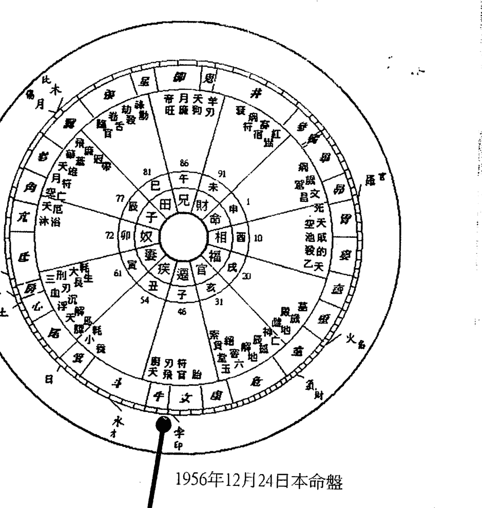

1956年12月24日本命盤 2008年2月歲次丁亥年尾，限行子宫女宿與牛宿之間。

## 七政四餘

有調節氣候之功，解命盤寒凝之氣。

寅宮的土星驪心宿，心屬於月之宿，月亮最怕土計，戌宮的火星生寅中之土，月亮受剋更為嚴重。月亮所主宰的疾病是：膿腫、腫瘤，女人身體的流質失調、機能的失調、或導致子宮的疾病。本命要比較留意，命盤中的這些矛盾，紊亂的生剋現象，行限到土金月之宿，再受流年星所剋，可能就是疾病驪身難以擺脫。

大限子宮，掌管為46-53歲，子屬土，本命土星在寅，有戌宮火星拱照相生，土為本命之難星。46-47歲，限行虛度，遷移宮每年行3.75度，46歲起，限度在子宮26.25~亥宮0度，酉28度之羅星入，太陽最忌火羅，幸房宿中有金星，尙可平安。

48歲起限度入女宿，土宮又逢土宿，本屬不吉，體質至此漸次轉弱。2008年51歲，丁亥年，女宿之末，入牛宿初，約在子11度，亥宮紫氣剋女宿，限度女受到奴星之剋。牛宿屬金，戌宮9度的火星，為煞星居前，疾病惡化，2008年2月倒限，尙未到戊子立春，在丁亥年之尾。

## Q. 餘奴傷主，如何論斷？

### A. 餘奴傷主論

- 如氣傷木，紫氣驪角斗奎井木度，或木氣同驪，限至木度決死，謂之餘奴犯主，有水孛金在木度可解。又如秋月斗角井度最忌，奎度可解餘月亦同。此論氣犯限主及行四木度也。
- 如孛傷水，月孛驪箕壁參軫四水度，或水孛同驪，限至水度決死，謂之餘奴犯主，惟參壁箕度忌之尤甚。犯軫禍輕，當水敗失經、背令則不忌，有木氣土計在水度，亦可解之。
- 如羅傷火，羅星驪尾室觜翼火度，或羅火同驪，限至火度決死，謂之餘奴傷主，惟尾室二度極怕遇之，翼度禍輕，有水孛木氣在火度可解，此論羅犯限主及行四火度也。
- 如計傷土，計驪氐女胃柳土度，或計土同驪，限至土度決死，謂之餘奴傷主，有火羅木氣在土度可解。以火羅生土，木氣制計之故。此論計犯限主及行四土度也。

假如限行木度，木登木殿，其中並無火羅，金星為殺犯度遇流年，或紫氣驪度太歲、陽刃、飛刃、劫殺、的殺、天雄、地雌至其宮者必死。餘倣此推之，百發百中。

凡諸星當令怕死、不怕剋、只怕洩，如水生木、木生火，我去生他是也。凡一星為禍、諸星皆助定倒限。如金木、木為限主被傷，土計黨殺兼金掌羊刃、的煞、劍鋒、值難，凡日度單羅計木氣犯者，皆當倒限，星虛房昴日度，凡行限度主受傷，宮主亦受傷，逢之倒限。

限度主順限宮主俱相受制，若宮主受傷，度主平輔，但逢刃星合度亦當制限。若刃不犯，若度主受傷，宮主得生但終不死，有刃合宮亦死。重在刃上，且如剛限然須認刃星合度，或行刃度皆凶，用事直斷輓重。有刃則重、無刃則輕。

凡看命如五星得生必有刑度。如限行未火金水度，但限一度受傷、或有祿火傷主度也。如刑則度只待合星他度方刑限。

又據祿火傷主之度，只看分星制其度者，行頂度限亦可言死。且如二十八宿皆須細一考案，若有一星失陷定是死限。

> > 【注】：本段節自古渡之輔法，有火以輔一格，參之可也，以現之二十八宿校正之段，縱暗馬闇壁。如「寅」是水中之火故弱，是指寅宿在巳宮，故屬水中之火，而令寅宿前一年在巳宮，後一年在辰宮，惟只輪前一年巳宮中之火屬水中之火。終一年在辰宮，則非水中之火。是故翻古書必當活用，不可拘執。

假如金曜發火、火曜元金，謂之金蛇火弱，有火不受制，如四木、四金、四土、四日、四火、四水等度，倘有一度受傷，一度受制，當行限至本受傷之度，非灾即危。

## 七政四餘

### 請詳細說明『祿火傷官』之階級？

案例：此生於1934年1月10辰時。

2003年5月23日摔傷徬腦，這腦急救之後，醫院斷言復甦無望，無法治療，於5月30日不幸死己。

上文提到：「如計都土，計曜反背呷土度，或計土同躔，限至土度決死，謂之『祿火傷主』，有火曜木弱在土度可解。

本家則立命于宮，以上星為命主星，命度在交宿，命度主土星，計主星、度主星皆是土星。

土星、計都同躔交宿，即是為「計土同躔」，祿火犯主格局。而土星又屬命主星、度主星，危機必在土宿之限度。

37-44歲，限行卯宮土宿，限宮未傷，突然度過。

67-77歲，限行午宮，宮內羅星，午宮闕大傷，有火曜星來，即是火曜二星傷及限宮，2002年68歲行限至星宿之辰提卯，抑宿之計都交宿土相同躔，則宮火曜犯主之怕度，限宮期限度俱受劫，為宮度兩傷，故歸暗重。

2002年歲火壬子，子宮中有火星，午宮中有羅星，有火曜在流年土度可解。

2003年，歲火癸未，限度完全在柳宿中，癸未年柳未宮中之月孛刻火曜，祿火犯主成立，故歸限。

## 2003年歲次癸未，限度出星入柳，流年月孛入限，剋制羅星，餘奴犯主成立，倒限。

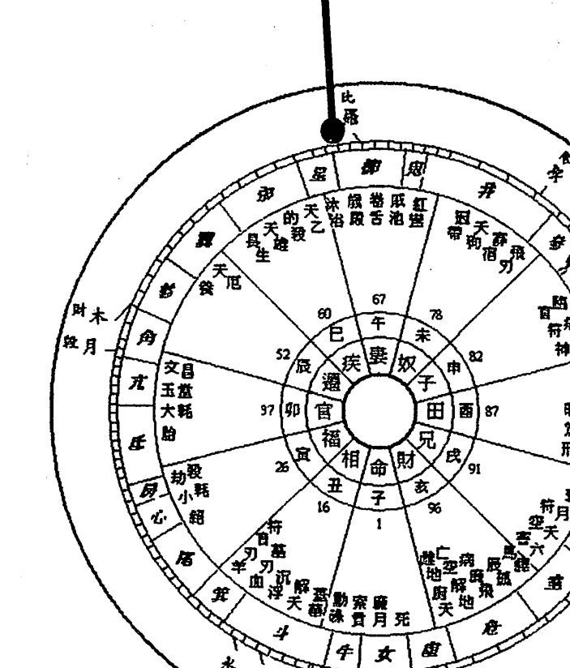

1934年1月10日本命盤

## Q. 95 限度有「貪生忘剋」之理，請詳論之？

A. 在六爻卦中有口訣：「貪生貪合，刑沖剋害皆忘。」例如，卦中有兄弟爻發動，會剋妻財，如卦中子孫爻也動。兄貪于生子，則不能去剋財，這種情況叫「貪生忘剋」，這是處理生剋關係的重要原則。

> 「貪生忘剋」可以從五行生剋順序圖上得到合理的解釋。星宗有「限度宜忌」，其中亦有將「貪生忘剋」之理運用於限度吉凶推斷。其原文如下：

### 四日度論

虛日忌木氣犯度，若木火互之可解，冬忌水孛。房日忌水孛犯度，若水氣互之可解。星日忌木氣犯度，又春忌火羅計，夏忌水孛羅。昴日忌火羅犯度，若火土互之可解。

### 四月度論

危月忌計氣犯度，有金水互之可解。心月忌計孛犯度，有木氣互之可解。張月忌計羅犯度，春夏怕木氣，有金水互之可解。畢月忌計羅犯度，夏令怕火，有金互之可解。

### 四木度論

角木忌氣金犯度，夏怕火羅會水孛可解。斗木忌金氣犯度，會水孛可解。奎木忌金氣犯度，春怕水孛。井木忌氣金犯度，夏秋怕金，季月怕土。

### 四火度論

尾火忌羅水，夏忌土計，卯尾怕水孛羅。室火忌金羅，土計惟秋冬怕水，孛有木氣互之可解。觜火忌土，計孛夏怕水孛爲緊。翼火忌土，計孛春怕羅，冬怕水孛、有木氣可解。

### 四土度論

女土忌木氣，見羅計犯度尤凶。氐土忌羅氣，水犯度倒限。胃土忌氣計犯度，更帶刀鋒倒限。柳土忌木氣犯度，冬忌水孛。

### 四金度論

亢金忌火羅犯度，有土計可解。牛金忌氣、夏忌水孛，八月忌計，季月忌太陽。婁金忌水孛羅犯度，有木氣可解。鬼金忌土計火羅犯度，有氣水互之可解。

### 四水度論

箕水忌土計孛犯度、有木可解。壁水忌土計孛羅，犯度倒限，有木氣可解。參水忌土計孛犯度，有金木氣可解。軫水忌土，計犯度倒限。

> 【註】：本段所述，宿度之五行相同，而其喜忌不同，因爲限度主受尅，而宮主又受尅更凶。限度主受尅，而宮主受生，即爲災禍必淒。

## Q.96 七政最忌刃宮刃度，請詳述之？

A. 陽刃是論命、卜卦中極其重要的神煞，在實踐中應驗率相當高，其寓意爲剛強兇猛之物。身弱逢陽刃，可起到護衛幫身的作用，故有好事臨身。身旺遇陽刃，容易出現傷病、破財等凶災。陽刃忌逢沖，原因是身弱時陽刃作爲用神，逢沖爲用神受傷，故不順；身旺時陽刃作爲忌神，逢沖易激起陽刃之烈性，故有極凶之災。陽刃雖逢沖，若制化得宜，仍作吉論。

術數中許多皆用陽刃，而最重視陽刃者，莫過於星宗，「倒限詳論」中對於陽刃的斷法有頗多，其中論及本命、流年、倒限與陽刃之關係。

倒限一說盡在捷見限論篇中，然亦有疑難處，有未至其度而死者有之。乃凶在前也，謂之凶迎。或過其度而死者有之，是凶在後也，名爲凶送。有當死而不死者有之，有殺無刃故不死。有不當死而死者有之，有刃無殺亦主死。須看陰陽二刃爲度。

以乙丁己辛癸年爲陰刃，以甲丙戊庚壬年爲陽刃。更會原流二刃爲斷。原者本年之刃，流者，行年之刃。凡逢殺不死者，無刃殺豈能傷乎。有刃有殺，決死無疑。

經云：晝忌陽刃，夜忌陰刃。陰刃晝行，陽刃夜值，或者不死。有雙刃迎送者，陽刃飛刃，前迎後送。有二刃夾身夾限者，身指命言、左右二刃夾拱是也。有刃星撞衝，撞衝指對照言，刃星剋限尤凶。有身投二刃，或命限主坐二刀宮、或二刀星守命限宮位。

有宮主受傷、刀星合度，限宮主受剋，限度主逢刀亦死。有度主受傷、刀星合宮，限度主受剋，限宮有刀亦死。有刀中包殺，殺者剋限度星也，又是刀宮刀度。有殺中藏刀同上。

有刀中有刀，刀度逢金，金星主殺，故名刀也。強弱平分，限宮主限度主強者生，弱者死。

且如丙戊生人，陽刀在午，飛刀在子，大限行星柳虛女即是。午屬日，子屬土，故以星日、虛日、女士、柳土為刀度。

若星柳虛女度內，有木氣計，即是刀中藏殺。木氣能剋土又能蔽日，故謂之殺。或土日度內有金，是謂刀中有刀，對合亦然，四正亦同。

又如甲乙庚辛生人，甲年陽刀在卯，飛刀在酉，乙年陰刀在辰，飛刀在戌，庚年陽刀在酉，飛刀在卯，辛年陰刀在戌、飛刀在辰。行火金二度，蓋卯戌屬火，辰酉屬金，乃為刀星。又尾室觜翼、亢牛婁鬼是刀度。若水孛火羅關攝，是謂殺中藏刀，若此者皆忌之。

又如丁己壬癸生人，丁己年陰刀在未，飛刀在午，壬年陽刀在子，飛刀在午，癸年陰刀在丑，飛刀在未。正是土、月為刀，子丑屬土，未乃太陰。若土月度內，氐女胃柳，土度。心危畢張月度，帶木氣土計，亦謂刀中包殺，十有九死。

二刀若然來夾命，陽刀、飛刀夾命夾限，強弱宮中以定其夭折。宮度主強者生，弱者必入黃泉境。

## 請舉例說明「刀宮刀度」斷訣？

案例：1976年6月22日卯時生。

1997年尾，限行昴胃之間，昴屬太陽之宿，掌羊刃、血刃、飛廉，胃為土之宿（以子丑宮之神煞論之），掌飛刃，是為「刀宮刀度」，故限極凶險。

且胃宿中又躔木星，木剋土，木星為煞星，掌亡神、紅鸞、天厄、驛馬，木躔於限度為大不吉。

1998年2月，歲次初交戊寅，釣起紫氣，形成木氣剋土，在外打群架，被對方連砍四刀，所幸保住小命。

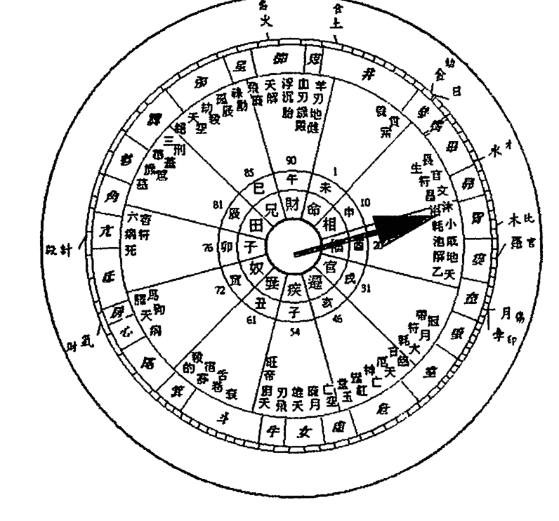

## Q 98 八字和七政四餘怎麼配合論断？

A 《七政四時賦》：「三冬之木遇水而寒」，冬天的水寒，不能有生木之功效。

「九夏之土逢火而燥」「金得火明而煥發」夏天火太旺，火生土，反燥而無益。秋金見火爲奇。

「寒月最宜于陽」「夏火不妨見月」，月逢日則失其光，但是冬天的月亮，近陽光反吉。夏火本炎，遇太陰以解酷熱，火得令，喜逢月。

「盛夏之火，何須木氣生扶」「六月之水，最怕火日枯涸」火在夏天，即已受炎夏之暑而旺極，故不須木星、紫氣再來生火。六月水星近太陽、火星，反爲不美，盛夏水勢本弱，再逢火日，更見乾涸。

《七政四時論》：「凡四時者，春溫夏熱，秋清冬寒，當分節前氣後，以定四時寒暑，以此論之，又如春木夏火秋金冬水四季月土，皆爲令星，若宮度二主，得時得令爲美。」

七政四餘採用五行生剋，合四時「溫熱寒暑」，以定格局，如盛夏之火，不須要木星、紫氣相生，反助其燥。如三冬之火，最喜木星、紫氣相生。此與八字的調候道理是非常相近。

古書中尚有「填實」一法，比較少人運用，或許過去尚無合盤的概念，故古法有將四柱八字填實於十二宮，以及八字格局與七政合斷吉凶。

填實法可用於本命盤之論斷，亦可用於天星擇日盤，取主事者的四柱，有取年柱爲主，月日時輔之。

在此舉出《星命說證正續合編》其中一個選擇案例來作解說，謹將書中原意簡述如下：

「某葉姓人士，大發財寶而回鄉，欲起造祖祠，於是邀某人去看地段，選擇地點以後即興工建造，上樑之後不到20天，葉姓主事忽然病終，繼而又損子姪。」

起造日課四柱是：光緒己丑、戊子、戊辰、辛酉，換算成西元：1889年12月18日酉時，星盤如圖。

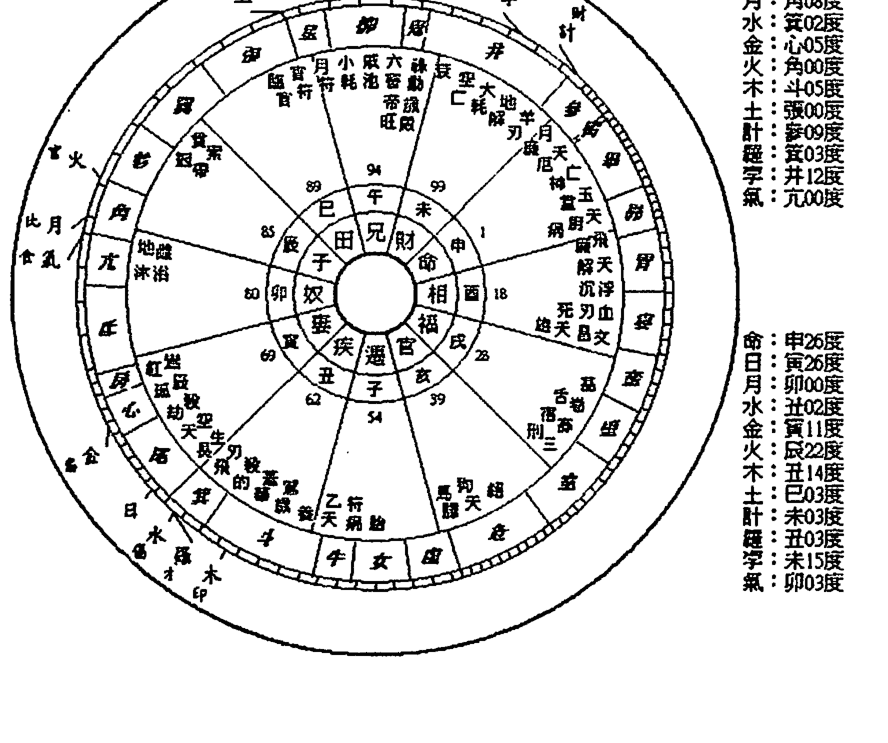

## 七政四餘

七政星盤立命申宮，以水星爲命主，命度箕3度，命度主亦屬水星。水星躔丑宮2度箕宿2度，水星在箕是升殿，而羅星在箕3度，計都在未3度，水星受剋嚴重。亦即是命主星與命度主星皆受剋。此爲不利之一。

月爲身主，月躔卯宮0度角宿，土星躔巳宮3度，計躔未宮3度，爲土計蝕月，月以掌羊刃，此其不利之二。

立命申宮，金星在寅宮11度，金以生水，但是，辰宮22度火星躔角宿，木生則火旺，又來剋金，恩星被剋，不利之三。

星盤的丑宮爲疾厄宮，土掌飛刃、病符，木星亦在丑宮，木剋丑宮，而四柱之年已丑，填實丑。業主之命亦在丑年生，亦填疾厄，不利之四。

> 書中云：「此等凶局，誕生值此日時，不大辟臨身必死於非命。」

原書中尚有未提到的部份，有關選擇日課之流年吉凶剋應，本日課太陽寅26度42分，逆數中氣寅0度，以26度42分計，3度折算一年，26度折算8年，8*3=24，餘2度折算240天，42分折算84天，相加得8年324天，此數再加命宮10年，爲18年324天上限。

行運命宮管到18年10月，30度不均分攤18.8年，命宮每年的行度是1.6度。1-4年都在參宿範圍，所以本日課最凶是在四年之內。而發凶之速，或因丑宮未宮之凶星，得已丑年，接著丁丑月填實，而且主事者葉某亦丑命，又來填實，主事不幸速死，繼亡子姪。

## Q.99 七政四餘擇日之天地盤怎麼運用？

A. 七政四餘，天星課之別名。有好的地理，無好的日課催助，難發富貴。有天星吉課，而無好的地理，只是初年得日課之吉應，好運也是有限而短暫。

天星課之應用，須要天盤和地盤二盤重疊才有力量催發富貴。天地二盤未能重疊，則催發之力會大打折扣。如得地盤而無天盤相輔配合，則催發富貴之力弱；

天星到山爲合相、到向180度，最爲吉利。三合照120度次吉，六合照60度更次之。

日月拱照、夾照最有力量，其餘五星拱照、夾照則力量小。兼看其星所掌神煞以定吉凶。

### 地盤用法：

地盤爲天星黃道度數，取壬山丙向，太陽到山、到向、三合爲例說明：

-   立春後雨水前，太陽到壬，爲太陽到山。
-   芒種後夏至前，太陽在坤，爲太陽拱照。
-   寒露後霜降前，太陽在乙，爲太陽拱照。
-   立秋後處暑前，太陽在丙，爲太陽到向。

（到山，即是太陽到坐山。拱照，即三合，中子辰、寅午戌、亥卯未、巳酉丑，太陽到坐山的三方位置。到向，即是太陽到坐山的對面。）

## 七政四餘

## 第一本以100問的方式 快速解讀七政四餘

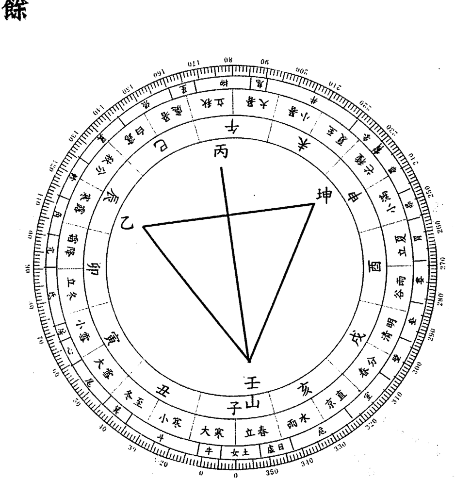

图示为壬山丙向，地盘太阳到山、到向、拱照；

如太阳壬方为到山，大约在阳历2月5日~2月18日。

太阳丙方为到向，大约在阳历8月8日~8月23日。太阳坤方、乙方为拱照，分别在阳历6月6日~6月21日，10月8日~10月23日。

| 廿四山 | 太陽到山 | 太陽到向 | 太陽三合照 |
| :--- | :--- | :--- | :--- |
| 壬 | 立春到山 | 立秋到向 | 芒種到坤 · 寒露到乙 |
| 子 | 大寒到山 | 大暑到向 | 小滿到申 · 秋分到辰 |
| 癸 | 小寒到山 | 小暑到向 | 立夏到庚 · 白露到巽 |
| 丑 | 冬至到山 | 夏至到向 | 穀雨到酉 · 處暑到巳 |
| 艮 | 大雪到山 | 芒種到向 | 清明到辛 · 立秋到丙 |
| 寅 | 小雪到山 | 小滿到向 | 春分到戌 · 大暑到午 |
| 甲 | 立冬到山 | 立夏到向 | 驚蟄到乾 · 小暑到丁 |
| 卯 | 霜降到山 | 穀雨到向 | 雨水到亥 · 夏至到未 |
| 乙 | 寒露到山 | 清明到向 | 立春到壬 · 芒種到坤 |
| 辰 | 秋分到山 | 春分到向 | 大寒到子 · 小滿到申 |
| 巽 | 白露到山 | 驚蟄到向 | 小寒到癸 · 立夏到庚 |
| 巳 | 處暑到山 | 雨水到向 | 冬至到丑 · 穀雨到酉 |
| 丙 | 立秋到山 | 立春到向 | 大雪到艮 · 清明到辛 |
| 午 | 大暑到山 | 大寒到向 | 小雪到寅 · 春分到戌 |
| 丁 | 小暑到山 | 小寒到向 | 立冬到甲 · 驚蟄到乾 |
| 未 | 夏至到山 | 冬至到向 | 霜降到卯 · 雨水到亥 |
| 坤 | 芒種到山 | 大雪到向 | 寒露到乙 · 立春到壬 |
| 申 | 小滿到山 | 小雪到向 | 秋分到辰 · 大寒到子 |
| 庚 | 立夏到山 | 立冬到向 | 白露到巽 · 小寒到癸 |
| 酉 | 穀雨到山 | 霜降到向 | 處暑到巳 · 冬至到丑 |
| 辛 | 清明到山 | 寒露到向 | 立秋到丙 · 大雪到艮 |
| 戌 | 春分到山 | 秋分到向 | 大暑到午 · 小雪到寅 |
| 乾 | 驚蟄到山 | 白露到向 | 小暑到丁 · 立冬到甲 |
| 亥 | 雨水到山 | 處暑到向 | 夏至到未 · 霜降到卯 |

## 天餘

天星到山、到向之功能，一種是「黃道盤」太陽到山到向，地球繞太陽公轉所經過之十二個主要星座。

### 天盤用法：

另一種是「地平方位」太陽到山到向，是為地球自轉之方位所形成的角度關係，以赤道為基準依運動旋轉的相應方位。

其實不只是計算太陽、太陰，也可以計算其餘行星，水星到山、到向、金星到山、到向、火星到山、到向、木星到山、到向……也都在星盤裡一併計算出來。

簡而言之，「黃道盤」是以地球為繞太陽公轉之位置劃分出來的行星角度，或稱之為「地盤」。

「地平方位盤」則是以所在地為中心，是以地球自轉之方位所計算出來的行星角度。與所在地點所相應的方位或稱之為「天盤」。圖示為每一時辰太陽的方位。

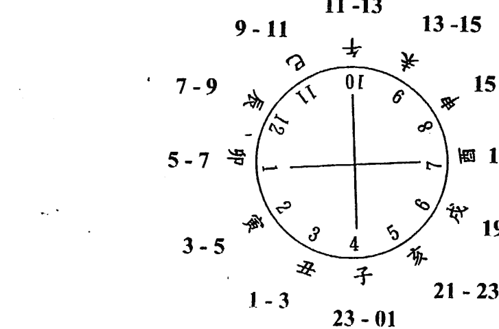

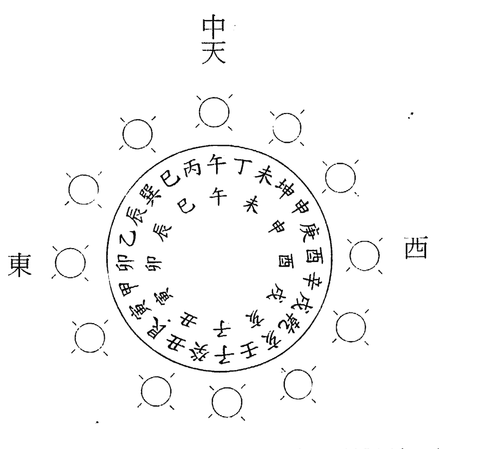

上圖是「天盤」每一時辰太陽的方位，最內圈十二時辰，也表示十二方位，如子時，太陽在子方，丑時，太陽在丑方，如午時，太陽在午方，未時，太陽在未方……。

最內圈往外的一圈，比較上面是精細了一點，為「二十四山」方位，是羅盤二十四山與太陽方位之對應。

如中午12時，太陽在午山，下午2時，太陽在未山，下午4時，太陽在申山，下午6時，太陽在酉山。

如丁山，則是介於午未之間，太陽在丁山，下午1時。坤山，則是介於未申之間，太陽在坤山，下午3時。

## 七政四餘

此為台灣地區天盤太陽到山的大約時間。詳細度數在每一節氣都會有些微差距，以上是針對「天盤」、「地盤」太陽的方位計算簡訣，其他行星到山、到向的計算從略。

要準確測定天盤太陽的方位角，在目前電腦軟體有WinStar，或者是RoyalStar，可直接計算太陽、乃至太陰、金星、水星、木星、火星、土星…，行星的到山、到向、拱照、夾照、對照，都可以從電腦圖示中很快的顯示，免去繁雜的計算程式。

古書用法，如選擇日課太陽在地盤午方，同時太陽也在天盤的午方，為天地盤重疊，其力必大。在過去電腦科技不發達的時代，會計算這些天文數理，行星山向拱照法則，被認為是很高級的術法，評價相當高，計算一則日課或分析一命盤，動則逾日，但是以現代科技，操作軟體非常容易就能上手，數分鐘內即可成辦。

學習中國風水及擇日學，許多學者針對「太陽到山到向」這個觀念相當景仰，因為它的身價被炒得相當高，要學會其技巧其演算不易，而且花費驚人。如果懂得地平空間座標就知道所謂「太陽到山、到向、拱照」即是指太陽到地平空間某個座山和對向的時刻，實不宜過份渲染其效應，這是七政天星選擇吉課的其中部份常用法則之一，可以不忌一般神煞，如三煞、沖山、沖本命、沖坐山、沖仙命…等，但是也決非選擇吉日的萬靈丹，不能忽略天星選擇尚有其他許多重點要注意。

## Q. 100 如何推論「投資理財」運勢吉凶？

A. 原有財星，行財運，行財生官，如本命財星逢生旺，大限行至正財、偏財之宿度，而無凶星拱照剋破，適合投資。若凶星拱照，再逢制化，亦可得財。有救則吉，無救則凶，若參較乎災祥，宜酌量乎輕重。

在此用一個案例來說明：

-   大限65-75在夫妻宮，共掌管11年。
-   每一宮有30度，故：
-   30 ÷ 11 = 2.72 ……夫妻宮每年行度。
-   大限58-64在疾厄宮，共掌管7年。
-   30 ÷ 7 = 4.28 ……疾厄宮每年行度。
-   大限50-57在遷移宮，共掌管8年。
-   30 ÷ 8 = 3.75 ……遷移宮每年行度。

遷移宮每年的度數如下：（其餘宮度從略）

-   57歲：卯宮0-3.75…限度角宿
-   56歲：卯宮3.75-7.5（3.75 × 2 =7.5）…限度亢宿
-   55歲：卯宮7.5-11.25（3.75 × 3 =11.25）…限度亢宿
-   54歲：卯宮11.25-15（3.75 × 4 =15）…限度亢宿
-   53歲：卯宮15-18.75（3.75 × 5 =18.75）…限度氐宿
-   52歲：卯宮18.75-22.5（3.75 × 6 =22.5）…限度氐宿
-   51歲：卯宮22.5-26.25（3.75 × 7=26.25）…限度氐宿
-   50歲：卯宮26.25-30（3.75 × 8 =30）…限度氐宿

## 七政四餘

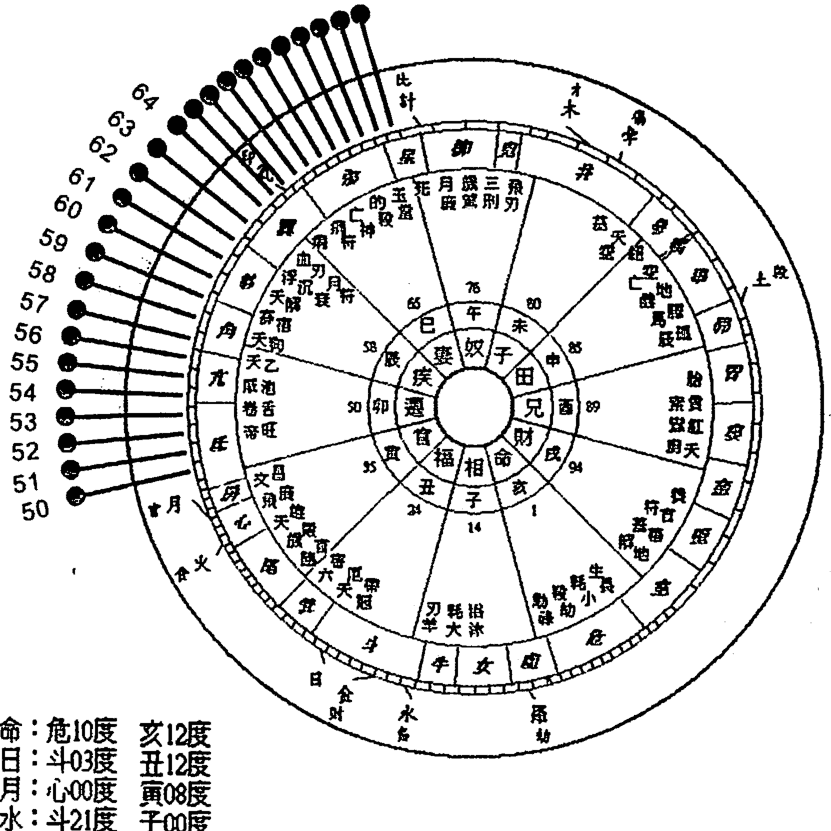

> 第一本以100問的方式 快速解說七政四餘

| 项目 | 宿度 | 地支度数 |
|---|---|---|
| 命 | 危10度 | 亥12度 |
| 日 | 斗03度 | 丑12度 |
| 月 | 心00度 | 寅08度 |
| 水 | 斗21度 | 子00度 |
| 金 | 斗15度 | 丑24度 |
| 火 | 心06度 | 寅13度 |
| 木 | 井16度 | 未21度 |
| 土 | 昴07度 | 申06度 |
| 計 | 柳15度 | 午25度 |
| 羅 | 虛03度 | 子25度 |
| 孛 | 井09度 | 未14度 |
| 氣 | 翼02度 | 巳25度 |

立命亥宮，以木星為命主星，木星躔井宿，為木星升殿，金星躔斗宿，金剋木，所幸水星亦躔斗，金生水，水生木得以制化。

財帛宮在子，屬土，宮內羅星相生，財帛主土星飛入田宅宮，田宅在申，而得寅宮官祿宮中的火星，火土對生，此為財、田、官之主星互躔相生，故為有財之命。

### 官祿宮大限：

35歲起，大限入官祿宮，官祿宮管轄的年限15年，從35-49歲為止。

35歲限度在尾宿，41歲，限入心宿，46.5歲，限度入房宿。

官祿宮在寅，木星為大限主星，土星對照，土星為福德主，又得申宮火星相生，這一大限基本上是強勢的氣運，故能投資得利，財源廣進。

### 遷移宮大限：

50歲起，大限入遷移宮，遷移宮管轄的年限8年，從50-57歲為止，大限卯宮，以火星為大限宮主星，木星、月孛拱照，水木火相生。惟火星在寅13度，月孛在未14度，火孛相絡，限主受剋。在此大限生中有剋，為吉中藏凶，投資就要注意了，必然是有得又有失。年度之吉凶，再以限度參詳之。

50-53歲行卯宮氐宿，未宮木星拱剋，而木星是命主星，命主剋不為忌。何況本命土星得火星之生，火生則土旺，這幾年投資依然獲利可觀。

54歲起行亢宿，亢屬金，本命兄弟宮在酉，所以行行亢宿為兄弟之度，限度主金星躔斗宿，為金躔木度，受剋，水星亦在斗，可相生，無奈水星在金星之前，並且水星已過宮，其力弱。從這一年起，與人合夥投資失利。迨至58-64歲大限入疾厄宮，辰宮限主星金星，金躔木，亦非所喜。可以說54-64財運不吉，不宜大量投資。

## 作者简介 白漢忠 Pai han chung

-   中華易經哲學研究所 博士
-   中華星相易理堪輿師協進會全國總會 秘書長
-   中華道教清微道宗全國總會 秘書長
-   河南安陽周易專修學院 名譽副院長·教授
-   中國都會電子報·中國都會捷運報·中國都會時報 主編
-   《科學易理與堪輿》雜誌 總編輯
-   《星象家雜誌》 專欄作家

-   《原來陽宅開運化煞好簡單》《八字占星與中醫》
-   《現代占星流年推運》《中西選擇法門與神煞之研究》
-   《黃曆101問》《天星擇日會通》

-   《科學易理與堪輿》雜誌《道德經暨太上感應篇參悟》
-   《七政天星奇門綜合軟體使用手冊》《行星中點使用實務》
-   《星體的組合與預言》

精密占星學、七政四餘、居家風水、商業風水、陰宅風水尋龍點穴、三元地理、九星地理、玄空六法。
電話·傳真：（02）2200-5434
手機：0910-004-418 0925-316-583
信箱：ha1811nk@yahoo.com.tw hank.pai@msa.hinet.net
地址：（231）台灣省台北縣新店市安祥路110巷55號5樓

## 命理教學VCD ◇ DVD

| 課程名稱 | 講師 | 價格 |
|----------|------|------|
| 易經易理研究課程 | 項仕 | VCD20片, 6800元 |
| 陽宅實用應用課程 | 項仕 | VCD12片, 7200元 |
| 完整陽宅學術師資研究課程 | 項仕 | VCD34片, 32000元 |
| 陽宅勘宅實例解說課程 | 項仕 | VCD5片, 4800元 |
| 陽宅生活應用100問 | 項仕 | VCD8片, 3600元 |
| 陽宅規劃師培訓課程 | 項仕 | VCD6片, 5800元 |
| 地理學術應用課程 | 項仕 | VCD5片, 3800元 |
| 居家風水吉凶自己來 | 項仕 | VCD8片, 1680元 |
| 辦公室風水吉凶自己來 | 項仕 | VCD3片, 1680元 |
| 梅花易數占卜軟體 | 項仕 | VCD8片, 5800元 |
| 三合擇日學應用課程 | 項仕 | VCD9片, 5500元 |
| 三元擇日學研究課程 | 項仕 | VCD3片, 2500元 |
| 手相學應用課程 | 翁向宏 | VCD12片, 7200元 |
| 文王卦卦應用課程 | 項仕 | VCD22片, 12000元 |
| 崔氏面相學應用課程 | 翁向宏 | VCD12片, 7200元 |
| 玄光面相學應用課程 | 玄光 | VCD24片, 10000元 |
| 生肖姓名學應用課程 | 林國棟 | VCD15片, 8500元 |
| 子平八字基礎入門課程 | 翁向宏 | VCD24片, 13800元 |
| 八字命學高階班課程 | 陳昱勳 | VCD24片, 19800元 |
| 開運符錄教學課程 | 玄光 | VCD8片, 3800元 |
| 開運符錄應用課程 | 玄光 | VCD4片, 3800元 |
| 開運符錄高級課程 | 玄光 | VCD8片, 6800元 |
| 大六壬神課 | 項仕 | VCD22片, 13000元 |
| 崇禎心易姓名學課程 | 李宗駒 | VCD10片, 5800元 |
| 泰卦開山符咒秘法 | 永續法師 | DVD12片, 9600元 |

| 課程名稱 | 講師 | 價格 |
|----------|------|------|
| 陽宅花寶典大補帖 | 項仕 | VCD 40片附贈盤, 25000元 |
| 八字批命初中高教學 | 黃恒堉 | DVD50片, 15800元 |
| 八字批命進階課程 | 黃英發 | DVD 13片, 3600元 |
| 高級擇日教學 | 林明德 | DVD50片, 9800元 |
| 形家姓名學 | 孫承徹 | DVD 15片, 4800元 |
| 四柱姓名學 | 陳明河 | DVD 12片, 2600元 |
| 四柱八字姓名學 | 陳明河 | DVD 23片, 5800元 |
| 奇門遁甲教學 | 洪富連 | DVD 23片, 6000元 |
| 象棋卜卦初中高課程 | 郭彩蓮 | DVD 30片, 8200元 |
| 六合生肖姓名學 | 黃恒堉 | DVD22片5000元 |
| 三才五格81劃姓名學 | 黃恒堉 | DVD 6片1200元 |
| 天運五行派姓名學 | 黃恒堉 | DVD9片2800元 |
| 開運印鑑教學 | 黃恒堉 | VCD 8片2800元 |
| 開運名片教學 | 黃恒堉 | VCD 8片2800元 |
| 開運造法符咒初中階 | 陳睿名 | DVD 21片6000元 |
| 開運造法符咒高階 | 陳睿名 | DVD 27片9800元 |
| 斗數盤型 | 林國棟 | VCD100片, 29900元 |
| 命理通甲應用研究課程 | 項仕 | 20片, 12000元 |
| 算命大師精研妙算全套17合1軟體 | | 原價15830元特價2490元 |
| 金財神總樂選11合1智慧組合軟體 | | 開運價3000元 |
| 紫微斗數初階速成課程 | 張宏魁 | VCD6片2480元 |
| 紫微斗數高階應用課程 | 張宏魁 | VCD8片5800元 |
| 易經卜卦基礎篇 | 孫承徹 | DVD32片, 10800元 |
| 易經卜卦進階篇 | 孫承徹 | DVD40片, 14800元 |
| 陽宅專用羅盤7吋2 | 含鍍金及VCD一片 | 特價6000元 |

買教學光碟24小時保證貨送到府服務
訂購以上任一產品(請先電詢產品有無缺貨)，劃撥或A T M轉帳，將匯款收據貼在A4紙上，填寫品名、數量、收件人姓名、地址、電話，傳真02-23670168快速交貨組收，24小時內貨送到府。
劃撥19634769大元書局帳戶
ATM轉帳：台新銀行(代號812)00315055200900並請將購買項目及姓名地址電話寫明，傳真至02-23670168，當天寄出，24小時內貨送到府。

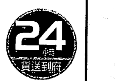

星象家雜誌 · 大元書局 地址：106台北市大安區羅斯福路3段193號7樓 電話：02-23661177 0932311071(24 H)擔心市場競爭對手太多嗎！！煩惱客人都不上門嗎！！
經濟實惠、強烈吸引群眾目光；實際有效的廣告方式

## FM105.5+命理網站+雜誌廣告

### 三合一服務
星象家雜誌與台際國際合作推出了網路、雜誌、廣播三合一廣告託播服務，為命理、開運、養生企業或個人強大宣傳效果、建立品牌形象。

### 電台廣告
大台北地區調頻FM105.5生活易數(風水命理)節目，時段:每天下午3-5點
- 插播廣告(秒數廣告)
- 專訪廣告(時段廣告)
網路電台:不限時段、不限區域，每分每秒強力播送

### 網路廣告
兩大專業命理網站
大台灣命理網
www.life258.com
台際國際
www.tailung.com.tw

### 雜誌廣告
全國唯一專業性命理雜誌
星象家雜誌

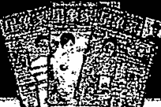

### 星象家雜誌套裝優惠專案

- A方案
兩大專業命理網站各刊登一年
星象家雜誌2單位彩色稿一期
生活易數節目專訪一次(30分鐘)
※限時優惠價：9600元

- B方案
兩大專業命理網站各刊登一年
星象家雜誌2單位彩色稿二期
生活易數節目專訪二次(各30分鐘)
※限時優惠價：15000元

### 單一刊登驚喜價

- 大台灣命理網www.life258.com 1600元/年
- 台際國際www.tailung.com.tw 1600元/年
- 星象家雜誌：二單位2000元/期、三單位3000元/期
- 生活易數節目專訪：30分鐘專訪6000元/次、30分鐘專訪11000元/二次
- 生活易數節目廣告：30秒廣告一檔(每天播放一次)，一個月30檔30000元/月
30秒廣告二檔(每天播放二次)，一個月60檔50000元/月

(節目廣告價位已包含廣告稿內文撰寫、播音員通告費、背景音樂版權費等)

專案經理人：顏兆鴻0934008755

## 國家圖書館出版品預行編目資料

七政四餘快易通 白漢忠／著 初版.台北市

大元書局，2008（民97）

320面；21×14.7公分.----(命理叢書；3)

ISBN 978-986-82681-4-2 （平裝）

- 1. 命書 2. 八字 3. 五行 4. 占星術

293.1

## 命理叢書 3

七政四餘快易通

大元書局．星象家雜誌新址 108台北市萬華區南寧路35號 (捷運龍山寺站．公車龍山國中站或和平醫院站) 電話:(02)23087171傳真:(02)23080055

作者／白漢忠

出版／大元書局

負責人／顏國民

地址／106 台北市大安區羅斯福路 3 段 193 號 7 樓

電話／（02）23651168，傳真：（02）23670168

郵政劃撥帳號 19634769 大元書局

網址／www.life258.com

E-mail／aia.w168@msa.hinet.net

總經銷／旭昇圖書有限公司

地址／台北縣中和市中山路二段 352 號 2 樓

電話／(02)22451480 傳真／(02)22451479

定價／300 元

初版／2008 年 6 月

版權所有，翻印必究

ISBN 978-986-82681-4-2 （平裝）