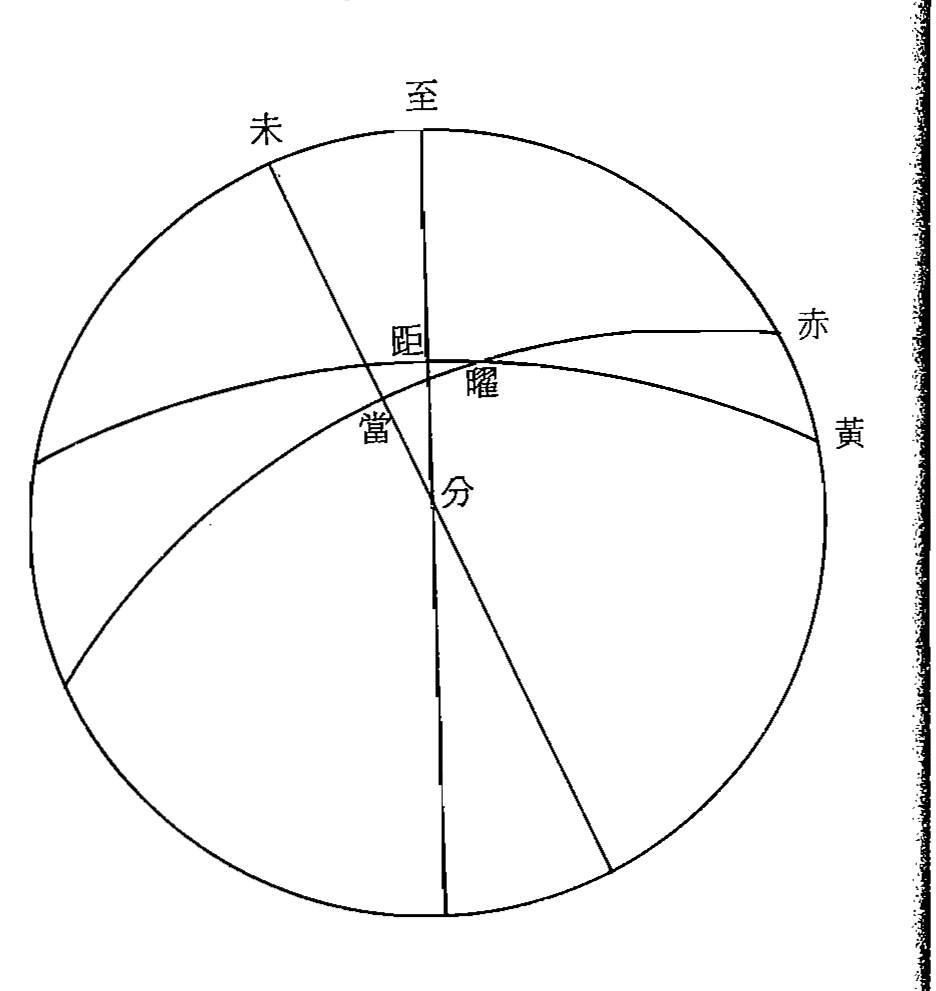
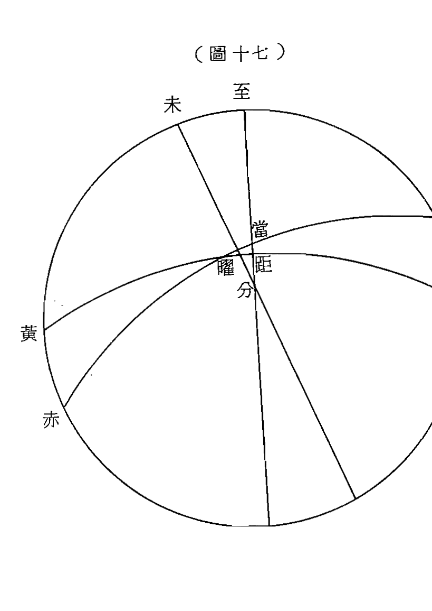
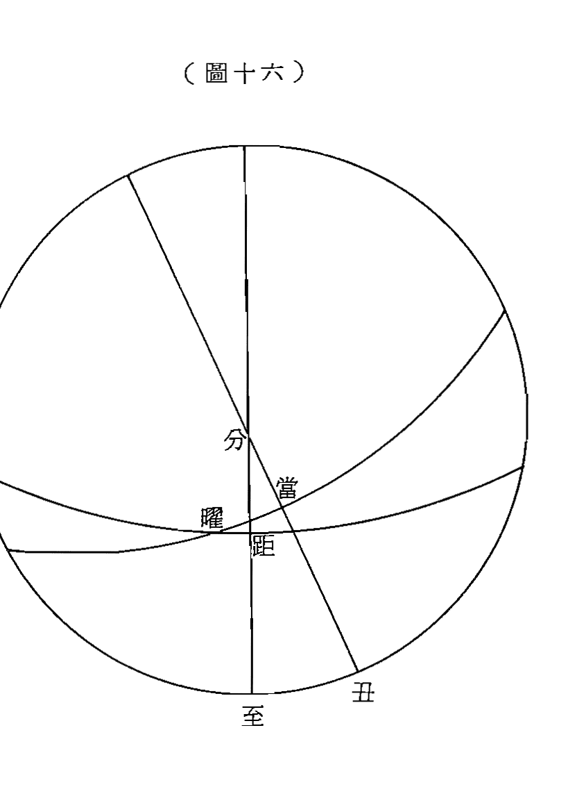
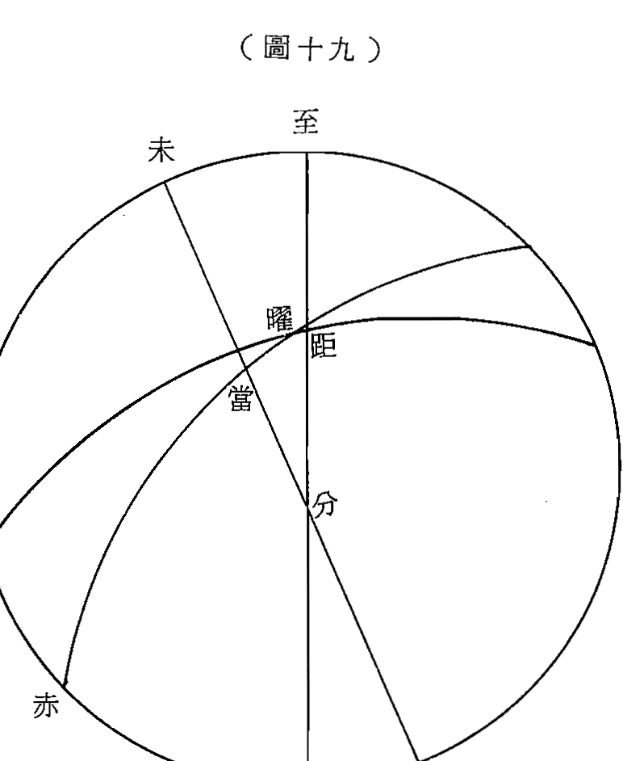
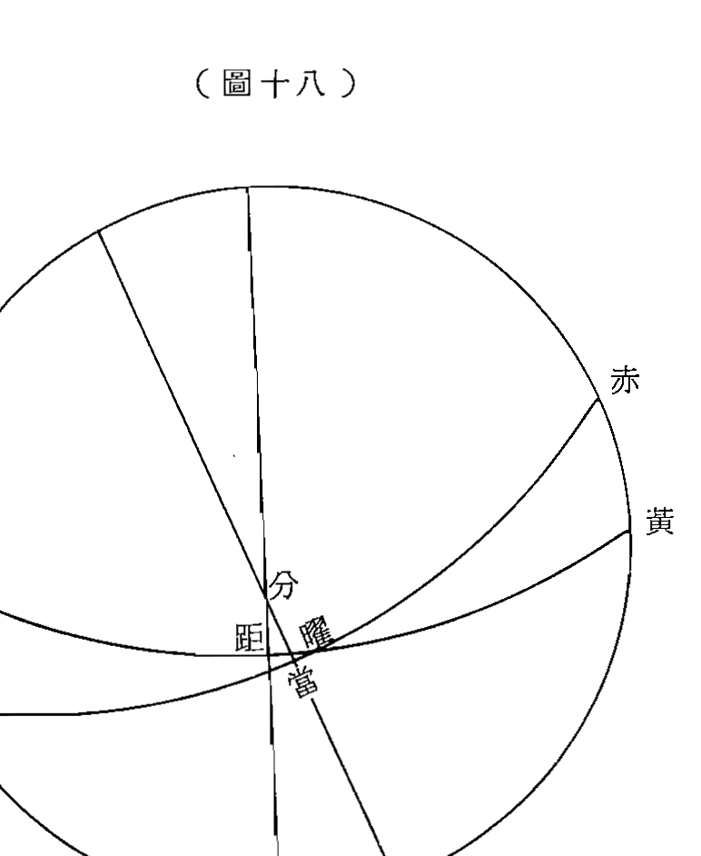
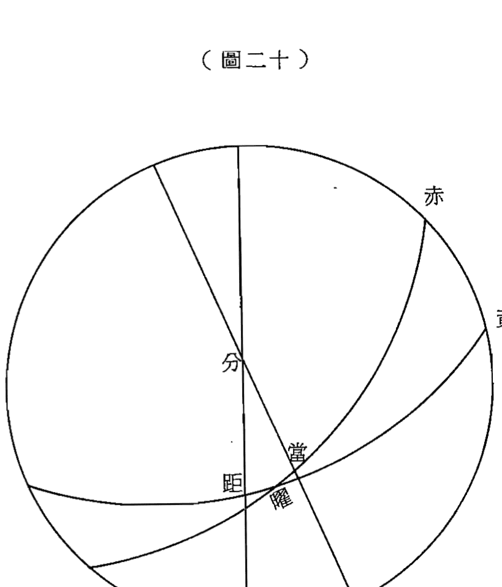

## 七政四餘演算例解

汪容駿 編著

集文書局 印行

## 最近著作

地址：台北縣板橋市
民權路二〇二巷
一一弄一四號之一
電話：九六七一八〇八

## 白話圖說 七政四餘演算例解目錄

- 自序
- 概論
- 一、七政四餘天行古今概念 ............ 三
- 二、南北極與赤道和天頂與地平 ............ 一〇
- 三、黃道白道與各星本天 ............ 一三
- 四、經度緯度及周天度數 ............ 一八
## 太陽到方舉例
- 一、天球弧角與八線四率淺釋 ............ 二三
- 二、太陽軌道與全年節氣行交之關係 ............ 二九
- 三、太陽到方弧角及垂弧圖解 ............ 三五
- 四、春秋分太陽軌道與二十四山方位 ............ 四四

## 目錄

- 五、南北緯和二十四山時刻 …………………… 四六
- 六、天角求法六例 …………………… 四九
- 七、日北弧求法六例 …………………… 五一
- 八、日北市定率弧求法 …………………… 五四
- 九、日北市小角求法六例 …………………… 五三
- 十、日北市北中垂弧求法六例 …………………… 五五
- 十一、日北市第一北大角六例 …………………… 五七
- 十二、日北市第二北大角六例 …………………… 五七
- 十三、日北市第三北大角六例 …………………… 六〇
- 十四、日北市第四北大角六例 …………………… 六三
- 十五、日北市第五北大角六例 …………………… 六六
- 十六、日北市第六北大角六例 …………………… 六九
- 十七、日台北市赤日弧六例 …………………… 七五
- 十八、度數及分秒換算時刻法 …………………… 七八
- 十九、用表舉例 …………………… 九三
- 二十、太陰及五星到方舉例 …………………… 九五
- 一、太陰五星經緯求法釋例 …………………… 九五
- 二、求諸曜經緯三項基本要件 …………………… 九七
- 三、經緯弧角圖例釋解 …………………… 一〇五
- 四、經緯比例（及太陰特例四餘公例）……………… 一〇七
- 太陰特例 …………………… 一〇八
- (1) 求黃經移度法 …………………… 一〇九
- (2) 求黃緯移度法 …………………… 一一〇
- 四、餘公例 …………………… 一一一
- (1) 黃經推算法 …………………… 一一一
- (2) 赤經推算法（太陽赤經推算亦同比例） ……… 一一一
- 五、諸曜準度 ……… 一一二
- (1) 求限距子午度 ……… 一一二
- (2) 求曜距子午度 ……… 一一三
## 台北市政餘到方演算例解
- 一、推政餘到方各用表制訂及說明 ……… 一四
- 二、赤經表制訂法 ……… 一四
- 三、台北地平赤弧表制訂法 ……… 一三四
- 四、台北地平垂弧表制訂法 ……… 一三七
- 五、黃赤道逐度同升表制訂法 ……… 二四一
- 六、二十八宿積度表 ……… 二四五
- 七、二十四節氣宮限表 ……… 二四七
## 民國六十九年黃道宿度
## 民國六十九年量天新尺
## 主要參考書目

## 自序

七政四餘演算，為曆算之基礎學術，亦係我國固有之文化，其傳播之廣，首先影響諸鄰邦屬，如日、韓、泰、越等國，於她們此項學術史料中，不難發現漢化之深植潛移，所向既宏且遠。

我國歷代宮室，對此項學術均極重視，且設有專司官署，監理其事，古時更有超然之諫聽權，所謂之天理，而及國法，人情之今日亦不能忽視其成就之宏偉，賴從我史冊記載搜證之天象資料亦復不少，譬如金牛座蟹狀星雲，其中煙塵樣之事，現在研究起來，疑其超新星之遺體也，證諸我國史書，則赫然在目，其載於宋史，在宋會要稿中更有當日發現異象之詳盡描述，見之令人驚佩。

此項學術，向為專門人士掌管，民間流散極為有限，往聖為了保留此項傳統，於其入門有關之學，不惜被以趣味之糖衣，誘引後彥朝前研習，如星命、風水、太乙三式等，無不與曆算有着密切之淵源，筆者才疏識淺，所幸生於世家，藏書甚豐，惜年幼無知，與羣籍僅有片面之緣，未能熟稔，隻身來台，亦不曾攜片紙只字，僅憑印象所及，知爲國粹精華，故默默埋首整理，粗通梗概，今不揣固陋，擇其簡要彙爲一編，顔曰：「七政四餘演算例解」。藉此拋磚，固願引來珠玉，是所甚幸，書中諸編，僅及算法精要，有關各式吉凶評斷，前賢著述甚詳，無庸重複，恕免傳抄之勞耳，敬祈讀者見諒。民國六十九年鞏秋江西貴谿汪容駿序於台北板橋寓次。

## 概論

### 一、七政四餘天行古今概念

今日科學的昌明，卽可以這麼說，就是一部天文學的發展史，從牛頓、蓋利略、愛因斯坦，無不是在從事發掘大自然神秘的過程中，進而研究發展所得的成就，我國自秦火以後，學術界雖偏重人文哲學的發展，但是古先民遺留下來對天文的觀察，及測算大自然的運律和災異等學術，至今仍然有其極寶貴的價值，以筆者之譾陋，本不敢對此類學問執筆胡謅，但目睹今日我先賢卽將失傳之心血結晶，而無法三緘其口，再保持藏拙卽聰明的古訓，謹就一得之愚，作拋磚引玉之餌，誘掖大方賢達們也各將心得成就貢獻於世，嘉惠後學，俾免斯學塵湮草腐，仵盼之忱，敬候指點，我們知道科學的一切定理，都與數學有不可分的情緣，更有的不藉數學則很難解釋其存在，我國為今日尚存的古國之一，固然有其根深源遠的歷史背景，在習慣或觀念上，都有我們獨特的形式和方法，今天我們的課題，即在偏重此等形式方法的介紹。

七政四餘，即是太陽月亮及金木水火土等五星，加上四餘的紫氣，月孛、羅喉，計都共為十一曜，亦稱做緯星，在古時儀器的缺乏下，其他目視不及的星體，我們先民也就無法計及，我國天文學與西洋天文學在論理方面是有顯著不同的，西洋天文學在古希臘時期，即有宇宙本質論，及同心球層論等，後來由同心球層論而演變成現代的天文學，而我國古來有蓋天論渾天論及宣夜等三說，漢朝的蔡邕上靈帝書有云：「古言天者有三家，一蓋天，二宣夜，三渾天，宣夜之學，絕無師承，周髀術數俱存，考驗天狀多有違失，（筆者要補一句閒話：所謂違失，想來並非失傳其真，而是有歲差的關係非古人所知，未能計及的緣故。）惟渾天近得其狀，今史官候臺所用銅儀，則其法也。」又賀道養渾天記所云：「昔言天者有三，一曰渾天，莫知其始，書以齊七政，蓋渾儀也。二曰宣夜，夏殷之法也，三曰周髀，當周髀之所造，非周家術也。近世復有三說：一曰方天，興於王充，二曰軒天，起於姚信，北高南下，若車軒然，亦名昕天，三曰安天，由於虞喜，皆臆斷浮說，不足觀也，惟渾天之說，徽驗不疑。」蔡賀二氏所謂的古昔，我們不可就斷言是從伏庖，神農，黃帝等時代開始，可憶會者其流傳也遠矣！綜合分析，不外就觀察天象之人而下立論的，或被觀察天象之實體而下立論的，還有就是治天諸方法而下立論者，我國天文學所涵蓋的內容甚廣，有星占術，氣象學，及曆象天文等學術，而後者猶為我國天文學之主要骨幹，今天所講的七政四餘演算，就大大與曆象有關。我國先民對天地的概念，與西方古時差不太多，均都以為地恆靜天者動的說法，西歐自德人哥白尼於一五〇七年（即明正德二年），始著天體運行一書，於一五三〇年（即明嘉靖九年）問世以來，才有今日地動的觀念，現在且看一看我國古時學人對天地的概念，其說：『天體渾圓，包於地外，運轉不息，地如彈丸，處於天中，至靜不動，楚詞有云：圜有九重，非實有如許重數，蓋言日月星辰運轉於天，各有所行之道，所謂圜也，諸圜之運轉，必有挈之運者，為之宗主，故九重之外一層，為宗動天，南極北極赤道所由分也，二為三垣，二十八宿經星行焉，三為土星所行，四為木星所行，五為火星所行，次六為太陽所行，亦即黃道是也，次七為金星所行，次八為水星所行，其最內則為太陰所行，亦即白道是也。』我們看了上面一段敘述，不可以為和現代所知真相不符，即認為毫無價值，棄之不顧，請看插圖(一)就是照上述文字的原意所繪而成，再試想我們坐於舟車之中，舟車迅速前進，窗外不動的景物，則隨之向後急劇的移動着，而且我們並不在覺自己在向前邁進，由此明白這種道理以後，且再來看看插圖(一)中所示各星體的軌道，其中除太陰是繞我們地球而行者外，其他星體則均是繞日而運行者，僅將地、月的位置去與太陽的位置倒換一下，豈不是正好與太陽系諸星體真實的行動相符無訛了！所以說我們先民遺留下來的資料，並非憑空憶測，而是實地觀察所得而來的寶貴資料，古時沒有儀器的幫助，又如何能知道諸星體的遠近次序呢，再看下面一段說明，可知非一朝一夕之功而有結果，得來實在不易；『分諸天之內外，而所以知其遠近者，則又以諸曜之掩食，及行度之遲速而得之。蓋凡為掩食者必在上，而掩之食之者必在下，月能蔽日之光，而日為之食，是日遠於月之微也，月能掩食五星，而月與五星又能掩食恆星，是五星高於月，而卑於恆星也，五星又能相互掩食，是五星各有遠近也，此九重所由分也，宗動天以渾灝之氣，挈諸天左旋，自東而西，一曰一週，其行甚速，諸曜各隨本道右旋，自西而東，近宗動天者，左旋速而右移之度遲，今右移之度，恒星次之，土木次之，火又次之，日金水較速，是又以次而近之證也。東壁垣曰：『楚詞天問篇云，圖則九重，只是旋有九耳。』則七政異天之說不自西人始也，土木火日金水月等天，一重低一重，何嘗靠著宿體，特人在地下一串仰觀，則九重只如一重，儼然七政都在宿上纏耳。

### 二、南北極與赤道和天頂與地平

我們面向北極而立，祇覺整個天體自東而西旋轉，故稱為左旋，以南北兩極為軸，故兩極相去一百八十度，恰為全圓三百六十度之半周，平分兩極腰圍中綫之大圈，是為赤道，赤道距兩極各九十度，人們居住在地面上，適好看見天體若半圓覆罩，頭之所向為天頂，足之所立為地平，天頂距地平各方亦皆九十度，南北兩極和赤道為原所定之點綫，係全球皆同，而天頂和地平，因人所居住在地球上之每一處所之不同，故每處所見之兩極，高下隱現亦各異，插圖(一)所示係台北地區的情況，假使居住在赤道下之地帶，則圖中的赤道移居天頂的位置，而圖中的兩極則移居地平，再者居住南極或北極之下地面，圖中之南北極則正當天頂，而圖中的赤道又恰當地平的位置了，我們台北市在赤道下偏北二十五度零三分，（二十五度四分係在五股、蘆洲、內湖一帶，）嗣後舉例圖說均以二十五度四分為準，設台北地面在赤道北二十五度四分，則台北赤道位置即在天頂南二十五度四分，北極也就因此出現地平以上二十五度四分，赤道距南地平線係六十四度五十六分。假設人居南半球，即是在赤道下偏南而言，則北極入於地平以下不見，南極反出地平以上是也。

### 三、黃道白道與各星本天

- (一) 黃道就是太陽所行的軌道，其與赤道斜交，一半出赤道以南為外為陽，一半出赤道以北為內為陰，因相交之點在一年週期中有一定之所，而兩者之距離亦有一定之度數，相去最遠之處，南北約二十三度二十七分，命名為「黃赤大距」，見於插圖(三)所示，太阳行在赤道最北處爲夏至，行在最南處則爲冬至，行在黃赤二道之交點處爲春分秋分。南北兩極爲自然之律，黃道赤道乃人所命名的產物，天球上其實並無此特別道的存在，赤道係定天體之巾綫，黃道則爲太陽所行之軌道，且爲星月之行道總樞軸然。
- (一)白道卽爲月亮所行的軌迹，與黃道相交，出入於黃道內外，由黃道南過黃道北之點，名爲「正交」，由黃道北過黃道南之點，名爲「交中」，亦名羅喉計都，如插圖(四)所示外，其交點並非固定之點，每日均向西移動，全年大約行十九度有奇，命名爲「交行」，亦名羅計行，黃白兩道相互之距離，即月道距離日道之緯度，其最遠之距離命名爲「黃白大距」。
- （二）本天一名，即所有星體自行的軌跡，土、木、火三星，各有所行之軌跡，但皆與黃道斜交，出入於黃道內外，其交點有移行，而距離則有一定之度數，金水兩星則以黃道爲本天，但是次輪周能繞日而行，與黃道斜交，遂出入於黃道內外而產生相距之度數若干，五星行道各有不同，而皆以黃道爲其總樞軸然。

### 四、經度緯度及周天度數

東西的分度名爲經度，南北的分度名爲緯度，天地以南北爲縱，以東西爲橫，凡赤道、黃道、白道、各星本天等，其運行的途中，向東西而渡過之軌跡，皆爲緯圈，其圈上截載之度數，由東橫數向西，或由西橫數向東，能於算數中分辨之度分秒，亦即與經綫相交的交點，皆爲經度，故地平圈亦即爲緯圈也，所截載之偏東或偏西的度數，即名爲地平經度。過南北兩極，或過黃道兩極，與從地面上測量至各星體的高度，因天體形圓，故這種高度係弧形的高度，即名爲高弧。南北上下之縱綫，皆爲經圈，其數，皆爲緯度，從北縱數向南，或從上數向下，與緯綫相交的度數，皆爲經度，故日、月、星之行度及方位時刻，以東西而論者，皆爲經度，日、月、星又距黃道之南北，與去兩極之遠近，距地平之高下，而以南北上下而論者，皆爲緯度，經圈均爲通過兩極而成渾體之大圈，緯圈則不然，成同樣渾體之大圈者，僅中間腰部之大圈如此，其他距腰愈遠，則去極愈近，其圈圈亦愈小，然緯圈雖有大小，但全圓三百六十度相同無異，此即名爲距等圈，顧名思義，其與中腰大圈處處等距離之意也。以上所述數種關係，相應比照用於地球，地球亦近圓之體，今日科學的昌明，卽可以這麼說，就是一部天文學的發展史。

## 太陽到方舉例

### 一、天球弧角與八線四率淺釋

我們所見蒼穹，直如圓球，包於地外，七政諸星高卑不等，且均繞行於天球，則均可以地心為圓心，圍繞球腰一綫，謂之全周，全周固三百六十度，一度六十分，一分六十秒，九十度為象限，一百八十度為半周，彼此相距足夠半周者，謂之對衝，此等圈綫繪於圖中，或只見其半周不全者，通稱之為圈，如天球左旋之腰綫為赤道圈，七政右旋之腰綫為黃道圈，地球平剖之腰綫為地平圈，過南極北極與赤道十字正交之腰綫為赤道經圈，過天頂天衡與地平十字正交之腰綫為地平經圈，諸圈相互交錯，遂可利於球面截取弧角之用，凡圈不滿全周三百六十度者皆稱為弧，兩弧相交所夾者皆稱之角，弧角之衡量以度、分、秒計之，此等單位均以六十進位，弧度取於球上諸腰綫，角度取之於角旁兩弧，且須足夠象限處其相距中間之腰綫，角度恰夠象限者為直角，小於象限者為銳角，大於象限者為鈍角，球上三弧相遇，必成三角之形，其中含有一直角者，稱為正弧三角形，不含直角之三角形，則謂之斜弧三角形，各邊均為球面上之圓穹曲綫也，而繪圖立法，因曲綫不便衡量，故必須以平面駁球體，以直綫駁曲綫，於是 有求圓於徑之例，任一直綫經過地心，而兩端均抵天周者為全徑，自地心任何一綫而至天周者為半徑，八綫表設半徑為一千萬，以比例精求弧角相對之值。

球面三角形，共計有六個單元，即三條弧綫內夾三個角度，用此六項單元，我們於天球上取得一形，必先已知其中三個單元為條件，然後其餘之三項方可求得矣。弧角皆以度、分計值，其曲綫無法相比與比例，故設半徑為一千萬，取全圓四分之一逐度逐分推之而得八綫，列成對照表册，遂可用於比例法中求值，以此兩單元比彼兩單元，制成四率十六式之定例。如插圖(五)；心為圓心，心本綫，心餘綫為半徑，本餘弧綫為象限弧，設從心點任作一斜綫引出於弧外，剖分象限弧為本弧及餘弧，又從弧之內外各作縱橫兩平行綫，一端至所作之斜綫，一端至原半徑，則內成正弦，餘弦兩綫，外成正切，餘切兩綫，此共得四綫也，其內所作之斜綫上，自心點至兩切綫所至處為兩割綫，至正切綫處為正割，至餘切綫處為餘割，兩半徑上自弧端即本點餘點起，至兩弦所截處，一為正矢綫，即本點至正弦者，一為餘矢綫，即餘點至餘弦者，此又得四綫也。但八綫表祇有弦、切、割等正餘六綫之數值，而獨缺正矢餘矢，蓋因半徑減餘弦為正矢，半徑減正弦即為餘矢，有此兩弦即寓有兩矢在內，八綫之外又有大矢綫，即餘弦和半徑，或全徑減正矢而成之也。如插圖六；作大、心半徑，大、餘象限弧，合原圖觀之自明，但大心弧形之大弧及其心角，亦皆應用本弧之弦、切、割諸綫，惟矢綫才獨用大矢耳。

四率比例，係將正弧三角形之六項單元，各用八綫以兩事比兩事所造成的定律，斜弧三角形且有作垂弧而改成兩正弧三角形者，亦恒藉正弧比例計算之，此皆係定律公式範圍，非深究天學圖錘者不能默記，我們只就常用比例，設其有已知三項而求其他一項之算法，並詳釋八綫乘除定位等方法如下：

將已知之三項單元檢八綫表，查得某度數分數，因而取得應用之三綫，按比例原式列為一率、二率、三率，其中以第二率第三率兩數相乘之積，而以第一率之數除之，擷取單位以上之數位字為四率，而後按第四率之數字再檢八綫表，找到類似之數軌在某度某分有相接近者，或恰好符合者，即為欲知所求之結果。弧角用八綫相求，惟直角恒用半徑為比例，為了省却用一率去除之手續計，故概用半徑為一率，僅須將二率三率兩數相乘，截去末後七位數字即可，因半徑為一千萬，千萬單位計八位數字，其數雖大但用其除任何數，結果僅數位字增加了，而原數字并未變更也，故可視二率三率兩數共計若干位數，減去末尾七位數字，餘為所需應用之數位數字，同理二三兩率其首位數相乘後有進位之情形，則僅減去末七位數字即可。

### 二、太陽軌道與全年節氣行交之關係

太陽行於黃道，以右旋勢每行十五度，即行交了一個節氣，全年之所行須三百六十五日五小時三分四十六秒，才行完二十四個節氣，復歸於原來位置，人們稱為一年，我們在上述概論中，已知赤道為天體運行中分之正軌，黃道斜交於赤道，由斯分為南北內外，人們在地面上觀察，只見太陽每日隨赤道左旋一周，并稱之為一天，其實太陽所行軌道日日不同，非使用精密儀器，很難窺測其所差度數，插圖(七)因不能逐日繪一軌道圖，僅就黃道南北兩半周并按二十四節氣相聯而繪成，圖中辰戌縱綫為赤道上半周，辰未戌弧綫為南黃道半周，左圖戊辰縱綫為赤道下半周，戌未戌弧綫為北黃道半周，兩圖以辰點和辰點，戌點和戌點，兩兩相聯而成循環周期是為一年，戊春分而辰秋分，未夏至而丑冬至，其餘諸節氣順右旋之勢相距皆一十五度，各縱綫為太陽隨赤道左旋節氣日之軌道，各橫綫為太陽距赤道的南北緯度也，茲就全年二十四節氣列成太陽逐日距緯表如附表；所示太陽逐日距赤道南北緯度，數字用度分、秒計值，自春分至白露為北緯，自秋分至驚蟄為南緯，表之上方節氣其積度從上向下順推，表之下方節氣其積度由下向上逆推，例如秋分春分自上向下順序為初至末，而白露驚蟄則為之相反，其初至末之次序係由下向上逆推之。

## 太阳到方举例

| 緯南 | 冬 立 | 降 霜 | 緯南 |
| --- | --- | --- | --- |
| 緯北 | 夏 立 | 雨 穀 | 緯北 |
|  | 度 分 秒 | 度 分 秒 |  |
| 末四 十三 十二 十一 十九 八七 六五 四三 二一 初 | 一六 一一 一一 一一 一一 一一 一一 一一 一一 一一 | 二〇 三三 五八 一一 二二 四四 五五 五五 五五 | 一六 一一 一一 一一 一一 一一 一一 一一 一一 一一 |
|  | 二六 一一 一一 一一 一一 一一 一一 一一 一一 一一 | 三八 五五 二八 四四 四五 六五 五三 九四 一三 | 二六 一一 一一 一一 一一 一一 一一 一一 一一 一一 |
|  | 一七 一一 一一 一一 一一 一一 一一 一一 一一 一一 | 五一 二八 一一 五五 三二 五九 一二 四七 八三 | 一七 一一 一一 一一 一一 一一 一一 一一 一一 一一 |
|  | 一八 一一 一一 一一 一一 一一 一一 一一 一一 一一 | 一二 八四 一六 五五 二一 四七 五三 五五 五六 | 一八 一一 一一 一一 一一 一一 一一 一一 一一 一一 |
|  | 一一 一一 一一 一一 一一 一一 一一 一一 一一 一一 | 五三 五五 五五 五五 五五 五五 五五 五五 五五 | 一一 一一 一一 一一 一一 一一 一一 一一 一一 一一 |
|  | 一一 一一 一一 一一 一一 一一 一一 一一 一一 一一 | 一二 五五 五五 五五 五五 五五 五五 五五 五五 | 一一 一一 一一 一一 一一 一一 一一 一一 一一 一一 |
|  | 一一 一一 一一 一一 一一 一一 一一 一一 一一 一一 | 一二 四七 五五 五五 五五 五五 五五 五五 五五 | 一一 一一 一一 一一 一一 一一 一一 一一 一一 一一 |
|  | 一一 一一 一一 一一 一一 一一 一一 一一 一一 一一 | 一二 五五 五五 五五 五五 五五 五五 五五 五五 | 一一 一一 一一 一一 一一 一一 一一 一一 一一 一一 |
|  | 一一 一一 一一 一一 一一 一一 一一 一一 一一 一一 | 一二 五五 五五 五五 五五 五五 五五 五五 五五 | 一一 一一 一一 一一 一一 一一 一一 一一 一一 一一 |
|  | 二〇 一一 一一 一一 一一 一一 一一 一一 一一 一一 | 一二 五五 五五 五五 五五 五五 五五 五五 五五 | 二〇 一一 一一 一一 一一 一一 一一 一一 一一 一一 |
|  | 度 分 秒 | 度 分 秒 |  |
| 緯北 | 暑 大 | 秋 立 | 緯北 |
| 緯南 | 寒 大 | 春 立 | 緯南 |

## 七政四余演算例解 距纬表

| 緯南 | 露 寒 | 分 秋 | 緯南 |
| --- | --- | --- | --- |
| 緯北 | 明 清 | 分 春 | 緯北 |
|  | 度 分 秒 | 度 分 秒 |  |
| 末四 十三 十二 十一 十九 八七 六五 四三 二一 初 | 〇五 〇一 〇四 〇二 〇一 〇一 〇一 〇一 〇一 一一 | 五六 四七 四四 五二 一四 二九 二四 二五 二六 二八 | 〇五 〇一 〇四 〇二 〇一 〇一 〇一 〇一 〇一 一一 |
|  | 〇六 〇四 〇三 〇一 〇一 〇一 〇一 〇一 〇一 一一 | 四一 〇三 九六 九三 五二 五二 五二 五二 五二 五二 | 〇六 〇四 〇三 〇一 〇一 〇一 〇一 〇一 〇一 一一 |
|  | 〇六 〇四 〇三 〇一 〇一 〇一 〇一 〇一 〇一 一一 | 四一 〇三 九六 九三 五二 五二 五二 五二 五二 五二 | 〇六 〇四 〇三 〇一 〇一 〇一 〇一 〇一 〇一 一一 |
|  | 〇七 〇二 〇一 〇一 〇一 〇一 〇一 〇一 〇一 一一 | 二九 四九 五二 五二 五二 五二 五二 五二 五二 五二 | 〇七 〇二 〇一 〇一 〇一 〇一 〇一 〇一 〇一 一一 |
|  | 〇七 〇二 〇一 〇一 〇一 〇一 〇一 〇一 〇一 一一 | 二九 四九 五二 五二 五二 五二 五二 五二 五二 五二 | 〇七 〇二 〇一 〇一 〇一 〇一 〇一 〇一 〇一 一一 |
|  | 〇八 〇一 〇一 〇一 〇一 〇一 〇一 〇一 〇一 一一 | 一二 二五 六四 五二 五二 五二 五二 五二 五二 五二 | 〇八 〇一 〇一 〇一 〇一 〇一 〇一 〇一 〇一 一一 |
|  | 〇八 〇一 〇一 〇一 〇一 〇一 〇一 〇一 〇一 一一 | 一二 二五 六四 五二 五二 五二 五二 五二 五二 五二 | 〇八 〇一 〇一 〇一 〇一 〇一 〇一 〇一 〇一 一一 |
|  | 〇九 〇一 〇一 〇一 〇一 〇一 〇一 〇一 〇一 一一 | 一三 五二 五二 五二 五二 五二 五二 五二 五二 五二 | 〇九 〇一 〇一 〇一 〇一 〇一 〇一 〇一 〇一 一一 |
|  | 〇九 〇一 〇一 〇一 〇一 〇一 〇一 〇一 〇一 一一 | 一三 五二 五二 五二 五二 五二 五二 五二 五二 五二 | 〇九 〇一 〇一 〇一 〇一 〇一 〇一 〇一 〇一 一一 |
|  | 一〇 〇一 〇一 〇一 〇一 〇一 〇一 〇一 〇一 一一 | 一四 五二 五二 五二 五二 五二 五二 五二 五二 五二 | 一〇 〇一 〇一 〇一 〇一 〇一 〇一 〇一 〇一 一一 |
|  | 一一 〇一 〇一 〇一 〇一 〇一 〇一 〇一 〇一 一一 | 一五 五二 五二 五二 五二 五二 五二 五二 五二 五二 | 一一 〇一 〇一 〇一 〇一 〇一 〇一 〇一 〇一 一一 |
|  | 一二 〇一 〇一 〇一 〇一 〇一 〇一 〇一 〇一 一一 | 一六 五二 五二 五二 五二 五二 五二 五二 五二 五二 | 一二 〇一 〇一 〇一 〇一 〇一 〇一 〇一 〇一 一一 |
|  | 一三 〇一 〇一 〇一 〇一 〇一 〇一 〇一 〇一 一一 | 一七 五二 五二 五二 五二 五二 五二 五二 五二 五二 | 一三 〇一 〇一 〇一 〇一 〇一 〇一 〇一 〇一 一一 |
|  | 一四 〇一 〇一 〇一 〇一 〇一 〇一 〇一 〇一 一一 | 一八 五二 五二 五二 五二 五二 五二 五二 五二 五二 | 一四 〇一 〇一 〇一 〇一 〇一 〇一 〇一 〇一 一一 |
|  | 一五 〇一 〇一 〇一 〇一 〇一 〇一 〇一 〇一 一一 | 一九 五二 五二 五二 五二 五二 五二 五二 五二 五二 | 一五 〇一 〇一 〇一 〇一 〇一 〇一 〇一 〇一 一一 |
|  | 一六 〇一 〇一 〇一 〇一 〇一 〇一 〇一 〇一 一一 | 二〇 五二 五二 五二 五二 五二 五二 五二 五二 五二 | 一六 〇一 〇一 〇一 〇一 〇一 〇一 〇一 〇一 一一 |
|  | 一七 〇一 〇一 〇一 〇一 〇一 〇一 〇一 〇一 一一 | 二一 五二 五二 五二 五二 五二 五二 五二 五二 五二 | 一七 〇一 〇一 〇一 〇一 〇一 〇一 〇一 〇一 一一 |
|  | 一八 〇一 〇一 〇一 〇一 〇一 〇一 〇一 〇一 一一 | 二二 五二 五二 五二 五二 五二 五二 五二 五二 五二 | 一八 〇一 〇一 〇一 〇一 〇一 〇一 〇一 〇一 一一 |
|  | 一九 〇一 〇一 〇一 〇一 〇一 〇一 〇一 〇一 一一 | 二三 五二 五二 五二 五二 五二 五二 五二 五二 五二 | 一九 〇一 〇一 〇一 〇一 〇一 〇一 〇一 〇一 一一 |
|  | 二〇 〇一 〇一 〇一 〇一 〇一 〇一 〇一 〇一 一一 | 二四 五二 五二 五二 五二 五二 五二 五二 五二 五二 | 二〇 〇一 〇一 〇一 〇一 〇一 〇一 〇一 〇一 一一 |
|  | 度 分 秒 | 度 分 秒 |  |
| 緯北 | 暑 處 | 露 白 | 緯北 |
| 緯南 | 水 雨 | 蟄 驚 | 緯南 |

## 七政四余演算例解

| 緯南 | 雪 | 大 | 雪 | 小 | 緯南 |
| 緯北 | 種 | 芒 | 滿 | 小 | 緯北 |
| | 度 | 分 | 秒 | 度 | 分 | 秒 |
| 緯南 | 初 | 一二三四五六七八九十十一十二十三十四十五十六十七十八九十 | ... | ... | ... |

## 太阳到方举例

三、太阳到方弧角及垂弧图解 自天顶起，引一线经过太阳而至地平圈，此弧与地平圈交于平点，如插图(八)所示（因球体绘成平面，图中直线应作弧线观之）太阳于黄道运行日日异迹，而晷影所到之方位有一准线，设此平点距地平子、午正度若干，则可由此而定方位。

太阳出入赤道亦曰日异轨，而左旋所生之时刻亦有一准线，自北极起，引一弧线经过太阳而至赤道圈，此弧线与赤道圈相交于抵点（插图八）此抵点距赤道子、午正度若干，则可由此而定时刻，上说两线尚有若干定义，从天顶至太阳命名为「天日弧」，以天顶至地平象限弧减之，为本时太阳之高弧，即太阳距离地平之高度，从北极至太阳命名为「北日弧」，以北极至赤道象限弧减之，则为本节气太阳之「距纬」，即距离赤道南北之纬度。此外自天顶至北极命名为「天北弧」，以天顶至地平子正象限弧减之，则当地之北极出地高度，此三弧相遇而成一天、北、日斜弧三角形，夹天角两旁之弧至满象限处，两弧中间相距之度数，即为太阳距子正地平经度，亦即天日、天北两弧延长至地平圈上地子点至平点之度数。夹北角两旁之弧至满象限处，两弧中间相距之度数，即为太阳距午正赤道经度，亦即天北、北日两弧延长至赤道圈，圈上赤午点至抵点之度数，设有天角度，有北日弧度，有天北弧度，求出北角度数，即可厘订出太阳到方时刻表。 插图(八)全图为子午圈，横线为地平圈，斜线为赤道圈，虚线为本节气日太阳轨道，凡从天顶引线至于地平圈上平点，从北极引线至于赤道圈上抵点，皆为象限弧，故地平子正至平点所含之赤道经度即北角度。 地平经度即天角度，赤道午正至抵点所含之赤道经度即北角度。 又方位系由我们任意所定者，故有已知之天角度数，日抵弧系太阳本节气距纬，以北抵象限弧减之，余为北日弧之度数，北地弧即北极出地面高度，以天地象限弧减之，余为天北弧之度数，以此等已知条件，依后诸例求得北角之度数，即可定太阳到方时刻。

## 七政四余演算例解

插图(九)为太阳在赤道以南而近南极，必须从南极取角推算，后例因台北市在赤道北，故例中但求北角，而求南角之理不可不知，亦附图说明于此。
图中诸腰线均与插图(八)相同，所不同者天顶更为天冲，北极更为南极，地平午正至平点为天角度，赤道子正至抵点为南角度，将求得南角，乃须加减赤道子正以定时刻，与前求北角加减赤道午正以定时刻不同，虚线即为本节气太阳南纬轨道，天冲所出象限弧，延长至天周，必迄天顶，即释论中所谓地平经圈，南极所出象限弧，延长至天周，必至北极，释论中所谓赤道经圈是也。
斜弧三角形，有可认相对之弧角，但无所求相对之弧角，必从未知之弧角作垂弧，使之成为两个大小各一的正弧三角形，然后各用比例求得弧角度数，垂弧在原斜弧三角形以内者，两得数则相加，垂弧在原斜弧三角形以外者，两得数则相减，不论求弧求角皆一法也，设求天、北、日斜弧三角形之北角，所知者有北日弧与天角相对，而与北角相对之天日弧为未知之数，故同一轨道一十二形，均须先考虑垂弧之度，而后近子端六形垂弧在内，近午端六形垂弧在外，虽然加减有别，但其垂弧之度数系两两对称相等，试举例说明如后：（同轨两形其方位线子午各相等者作内外垂弧如图十、十一、十二）。

第十图：为北轨近子边一形，从北角作形内垂弧引至中点，适与天日弧正交，遂成北天中一小形，北日中一大形，中角为直角，故两形皆正弧三角形。

第十一图：为北轨近午边一形，从北角作形外垂弧之外，又引长天日弧正交于中点，系成北天中一小形，北日中一大形，中角为直角，故两形皆正弧三角形。

第十二图：为近子近午交互之形，两天日弧取于方位线距子边午边各相等，则以近午天角减半周，余为近子天角，图中近午天角合于形外北天中小形之天角，适足半周，故北天中两小形之天北弧同，中直角又同，而天角亦同，则北小角及北中垂弧势必两两相等，两北日弧同截于一个轨道其度自等，北日中两大形中直角同，北中垂弧同，两北日弧又同，则北大角之度数亦必两两相等，惟北中弧同度，故一十二形祇须求天垂弧为通用之弧，既有天垂弧，又有中直角及北天弧，故北角可先求六小角为通用之角，于是按方推测，但求得北大角，与本方北小角相加，即近子之北角，相减则为近午之北角焉。

### 四、春秋分太阳轨道与二十四山方位

总图如插图（十三）以明之。
方位准线，为便于解释如何定二十四山方位之理，试作二十四山春秋二分当日之太阳轨道，适与赤道同轨，时刻准线亦即是图中全圆为子午圈，自天顶至天冲作方位准线一十二条，以地平线为中腰线，地平线以上记偏东十二方位，如子至卯，卯至午，地平线以下记偏西十二方位，如子至酉，酉至午十二方位，其间子线、午线各仅占七度半外，其余各线均占十五度，各准线与赤道相交处，均为太阳到方位，遂成天赤日正弧三角形一十有二形，其赤角为直角，天赤弧之度数，适等于北极出地平高度，诸天角度数自子起至卯酉，或自午起至卯酉，均为由我们任设之命题度数，亦即所求取用之时太阳到方，地平线上下虽然各有六形，但赤日弧两两对称相等，因此祇须六形去求赤日弧度数，将可包括全周二十四山时刻之太阳方位。

### 五、南北纬和二十四山时刻

南北纬度，因日行异轨积度渐殊，今任设一轨道为例，其时刻、度数南子适当于北午，北子亦同于南午，此种因素与春秋分之理有显著的不同，为便于解释计，试作南北纬二十四山总图如插图（十四）以明之。

## 太阳到方举例

## 七政四余演算例解

图中全圆子午圈内，地平线、赤道及方位诸线，均与春秋分二十四山总图相同，今设两距等圈，如前节气轨道图内南北等长之直线，不论纬度多少，悉准此线而推之，诸方位线与轨道相交之日点，此点皆为太阳到方位位置，又从两极引出各线至诸到方点，遂成天、北、日斜弧三角形计一十有二形，天，南，日斜弧三角形，亦十二形，北轨近赤午之六形，与南轨近赤午之六形，亦两两相等，北轨近赤子之六形，与南轨近赤子之六形，亦两两相等，因此但用一十二形即可求其北角或南角度数，足可完全概括同轨各节气二十四山时刻。

### 六、天角求法六例

地平习惯分为二十四山，每山适值十五度，惟子午圈中分，系偏东偏西之分界中线，实非到山之界线，故子山或午山在偏东或偏西同边者，仅占全山之半，为七度三十分焉，从此边线起始，绕加一十五度，即可得天角之度数，因为黄道赤道与方位线相交，则偏东与偏西之相距度数恒等，因此可省用二十四山一半，只用十二山即可，春秋分太阳由子山至卯酉，与由午山至卯酉系一顺一逆，其时刻分度又自相对而等，此又可省其半，仅余六山而已，南北纬太阳在十二山之时分虽有多少不等之异，但垂弧所求大小北角，以六山相加，六山相减，则取度仍止于六山，由是以列举癸、丑、艮、寅、甲、卯等六山，其距子山中线之度数，以为天角六例如左：

- 癸天角 七度三十分
- 丑天角 二十二度三十分
- 艮天角 三十七度三十分
- 寅天角 五十二度三十分
- 甲天角 六十七度三十分
- 卯天角 八十二度三十分

依上列各天角之度数捡八线表，并各分别录其正弦、正切以备后用，表列如左：

| 方位 | 天角 | 正弦 | 正切 |
|---|---|---|---|
| 癸 | 一三〇五二六二 | 一三一六五二五 | 一三一六五二五 |
| 丑 | 三八二六八三四 | 四一四二一三六 | 四一四二一三六 |
| 艮 | 六〇八七六一四 | 七六七三二七〇 | 七六七三二七〇 |
| 寅 | 七九三三五三三 | 一三〇三二二五四 | 一三〇三二二五四 |
| 甲 | 九二三八七九五 | 二四一四二一三六 | 二四一四二一三六 |
| 卯 | 九九一四四四九 | 七五九五七五四一 | 七五九五七五四一 |

### 七、北日弧求法六例

缓言之太阳距两极则有逐日之弧度，我们命题随时推测，也就是全年二十四个节气，既然皆有逐日距纬以验太阳轨道之限，我们自己选择的时间来推测，若将太阳到方时刻逐日列表，以求查表对时，则共计四千三百二十条，但此种表册不能各地区通用，亦未能各地区密切符合，故不得不从简，来按节气着手而化简之，在纬度方面，二至和二分各两两相等，因此祇用北纬，各别与象限相减，订为北日弧例如左：

- 第一弧 夏至 六十六度三十三分
- 第二弧 小暑芒种 六十七度二十三分三十九秒
- 第三弧 大暑小满 六十九度五十分二十六秒
- 第四弧 立秋立夏 七十三度三十九分二十四秒
- 第五弧 处暑谷雨 七十八度三十一分二十三秒
- 第六弧 白露清明 八十四度五分一十八秒

依上列节气度数捡八线表，并各录余切备用，八线表中未列秒数，仅及分度的数值，必须以比例法求之，其值视情况加减而推成数如左：

- 第一弧 余切 四三三七七五一
- 第二弧 余切 四一六三七九三
- 第三弧 余切 三六七一二五〇
- 第四弧 余切 二九三二四一六
- 第五弧 余切 二〇三〇三三三
- 第六弧 余切 一〇三五四八五八

### 八、台北市定率弧求法

我国在赤道以北，故北极出于地面以上，南极则潜入地平以下，台北市天顶距赤道以北二十五度四分为春秋分当日所用天，用此弧减天顶距地平象限，或以北极距赤道象限减之，均得天顶距北极六十四度五十六分，此弧用为北纬节气日天北弧定率，在距北极六十四度五十六分，此弧用为北纬节气日天北弧定率，在南纬则比照用天南弧，凡求七政四余到方时刻，均以此弧做为标准。

七政四餘演算例解

準，茲將兩定率弧檢八線表，並各錄其正弦備用如左：

### 九、台北市北小角求法六例

北天中之正弧三角形，有中角為直角，天角為方位角，天北弧為定率弧，以此諸已知條件，用四率法求北小角，乃以半徑為一率，（半徑以千萬為準）天北弧餘弦四二三六七二五為二率，取六天角正切為三率，求得四率係餘切，檢八線表得度數，此為台北市北小角六例如左：

天赤弧 正弦 四二三六七二五
天北弧 正弦 九〇五八一五四
癸 〇二三六五二五 〇〇五五七七七五 八六度四九分二七秒
丑 〇四一二一三六 〇一七五四九〇九 八〇度〇三分四七秒
艮 〇七六七三一七〇 〇三二五〇九五三 七一度五九分二七秒
寅 一三〇三二二五四 〇五五二一四〇七 六一度〇五分四二秒

### 十、台北市中垂弧求法六例

北天中之正弧三角形，有中角為直角，有天角為方位角，有天北弧為定率弧，欲求北中垂弧用四率法求之，以半徑為一率（半徑以千萬為準），天北弧正弦九〇五八一五四為二率，以六天角正弦為三率，求得四率係正弦，檢八線表得度數，此為台北市北中垂弧六例如左：

甲 二四一二二三六 一〇一二二八三五九 四四度二二分二一秒
卯 七五九五七五四一 三三二一八一二二一 一七度一五分四三秒

## 太陽到方舉例

甲 九二三三八七九五 八三六八六四二 五六度四八分三七秒
寅 七九三三五三三 七一八六三一六 四五度五六分二九秒
艮 六〇八七六一二 五五一四二五四 三三度二七分五三秒
丑 三八二六八三四 三三四六六四〇五 二〇度一六分五五秒
癸 一三〇五二六二 一一八二二三二六 〇六度四七分二四秒

七政四餘演算例解

| 天干地支 | 正切值 |
|----------|--------|
| 卯       | 二〇四一二二九一 |
| 甲       | 一五二八二二〇一 |
| 寅       | 一〇三三一五一 |
| 艮       | 六六〇六六八二 |
| 丑       | 三六九二八〇三 |
| 癸       | 一一八九五六六 |

自八例以後，則為台北市專例，其中設數，雖以台北為主，但法則可通全國各地，只要查明當地之定率弧度數，即可類推而求垂弧小角等，再援後例以求大角，便可到處隨意以算時刻。

### 十一、太陽到方時刻表釋例

我們欲釐訂太陽到方時刻表，便於用時對表取時，茲據天文常數黃赤交角（二十三度二十六分三十四秒五二九），依古法過半度以整度計算，不足半度棄去之原則，得黃赤交角二十三度二十分，又台北市北極出地二十五度四分，就前諸例推算如左：

### 台北市第一北大角六例

北極至太陽及中垂弧之正弧三角形，有中角為直角，有北日弧六弧第一弧餘切（四三三七七五一），更有北中六垂弧正切等諸已知條件，則台北市第一北大角可求焉，用其加減北小角，得夏至節氣當日北市各方太陽距午正前後赤道度數，法以半徑為一率，第一北日弧餘切為二率，北中六垂弧正切為三率，求得四率係餘弦，依次檢餘弦表，可得台北市北大角度數，以加減北小角如左式：

## 太陽到方舉例

台北市第一北大角

| 北 | 小 | 角 |
| --- | --- | --- |
| 八 六 七 四 一 | 四 九 五 一 五 | 二 七 二 一 三 |
| 百 十 度 | 十 分 | 十 秒 |
| 三〇五四二四〇四二一 | 二一一九〇八六八七二四四 | 八三五一一五〇三三四二〇〇 |

七政四餘演算例解

| 癸 | 丑 | 艮 | 寅 | 甲 | 卯 |
| --- | --- | --- | --- | --- | --- |
| 一一八九五九六 | 三六九二八〇三 | 六六〇六六八二 | 一〇三三二五一 | 一五二八二二〇一 | 二〇四二二九九一 |
| 五一六〇一七 | 一六〇一八四五 | 二八六五八一四 | 四四八一五五二 | 六六二九〇三八 | 八八五四六四七 |
| 八七度〇三分三十一秒 | 八〇度四七分五六秒 | 七三度二一分四八秒 | 六三度二三分二九秒 | 四八度二九分四二秒 | 二七度四二分一九秒 |

### 台北市第二北大角六例

北極至太陽及中垂弧之正弧三角形，有中角為直角，有北日弧六弧第二弧餘切（四一六三七九三），更有北中六垂弧正切等諸已知條件，則台北市第二北大角可求焉，用其加減北小角，得芒種小暑節氣當日台北市各方太陽距午正前後赤道度數，法以半徑為一率，第二北日弧餘切為二率，北中六垂弧正切為三率，求得四率係餘弦，依次檢餘弦表，可得台北市北大角度數，以加減北小角如左式：

| 癸 | 一一八九五九六 | 四九五三二三 | 八七度一〇分三九秒 | 丑 | 三六九二八〇三 | 一五三七六〇六 | 八一度一〇分一八秒 |
| 艮 | 六六〇六六八二 | 二七五〇八八五 | 七四度〇二分五七秒 | 寅 | 一〇三三一五一 | 四三〇一八二七 | 六四度三二分一五秒 |
| 甲 | 一五二八二二〇一 | 六三六三一九二 | 五〇度二九分五六秒 | 卯 | 二〇四二二九九一 | 八四九九五四六 | 三一度四八分三五秒 |

### 台北市第三北大角六例

北極至太陽及中垂弧之正弧三角形，有中角為直角，有北日弧六弧第三弧餘切（三六七一二五〇），更有北中六垂弧正切諸已知條件，則台北市第三北大角可求焉，用其加減北小角，得滿大暑節氣當日北市各方太陽距午正前後赤道度數，法以半徑為一率，第三北日弧餘切為二率，北中六垂弧正切為三率，求得四率係餘弦，依次檢餘弦表，可得台北市北大角度數，以加減北小角如左式：

太陽到方舉例
- 癸 一一八九五九六 四三六七三〇 八七度三〇分四九秒
- 丑 三六九二八〇三 一三五五七二〇 八二度一三分三〇秒
- 艮 六六〇六六八二 二四二五四七八 七五度五八分四七秒
- 寅 一〇三三一五一 三七九二九五五 六七度四三分三六秒
- 甲 一五二八二二〇一 五六一〇四七八 五五度五三分一七秒

台北市第二北大角

| 标签 | 北1 | 北2 | 小1 | 小2 | 角1 | 角2 |
|------|-----|-----|-----|-----|-----|-----|
| 癸丑艮寅甲卯 | 八八六四一 | 六〇一四七 | 四〇五二一 | 九三九五一一五 | 二四四二一四 | 七七二二一三 |
| 午正前 | 百十度 |  | 十分 |  | 十秒 |  |
| 癸丑艮寅甲卯乙辰巽巳丙午 | 一一一 | 七六四二九四一 | 四一六五四九四六三二一 | 〇一〇三五〇三一〇〇二 | 〇四二七一四二八六三六一 | 〇〇二五〇一五四三三一一 | 六五四七七八二五三〇一一二 |

七政四餘演算例解

台北市第三北大角

| 北 | 小 | 角 |
|---|---|---|
| 八八 七六 四一 六〇 一一 四七 | 四〇 五〇 二一 九三 九五 一五 | 二四 二四 一四 七七 七二 一三 |
| 百十度 | 十分 | 十秒 |
| 四二七 八〇 八四一六三二 七六四 二〇 五二一 | 〇七七 九四 四二二七九九一 二一五 四一 四三三五〇四 | 四七四 八八 一五六四〇三二 一一二 二五 〇五二四二 |

七政四餘演算例解

卯 二〇四一二九九一 七四九四一九 四一二八分三八秒

### 台北市第四北大角六例

北極至太陽及中垂弧之正弧三角形，有中角為直角，有北日弧六弧第四弧餘切（二九三二四一六），更有北中六垂弧正切等諸已知條件，則台北市第四北大角可求焉，用其加減北小角，得立夏立秋節氣當日北市各方太陽距午正前後赤道度數，法以半徑為一率，第四北日弧餘切為二率，北中六垂弧正切為三率，求得四率係餘弦，依次檢餘弦表，可得台北市北大角度數，以加減北小角如左式：

| 癸 | 丑 | 艮 | 寅 | 甲 | 卯 |
|---|---|---|---|---|---|
| 一一八九五九六 | 三六九二八〇三 | 六六〇六六八二 | 一〇三三一五一 | 一五二八二二〇 | 二〇四二二九九一 |
| 三四八八三九 | 一〇八二八八三 | 一九三七三五四 | 三〇二九六二八 | 四四八一三七七 | 五九八五九三八 |
| 八八度〇一分〇三秒 | 八三度四八分〇〇秒 | 七八度五〇分四五秒 | 七二度二二分五二秒 | 六三度二三分三三秒 | 五三度一四分五〇秒 |

太陽到方舉例

### 台北市第五北大角六例

北極至太陽及中垂弧之正弧三角形，有中角為直角，有北日弧六弧第五弧餘切（二〇三〇三三三），更有北中六垂弧正切等諸已知條件，則台北市第五北大角可求焉，用其加減北小角，得處暑穀雨節氣當日北市各方太陽距午正前後赤道度數，法以半徑為一率，第五北日弧餘切為二率，北中六垂弧正切為三率，求得四率係餘弦，依次檢餘弦表，可得台北市北大角度數，以加減北小角如左式：

- 甲: 一五二八二二二〇, 三一〇二七九五, 七一度五六分二六秒
- 寅: 一〇三三一五一, 二〇九七六四〇, 七七度五十四分三〇秒
- 艮: 六六〇六六八二, 一三四一三七六, 八二度一八分二九秒
- 丑: 三六九二八〇三, 七四九七六一, 八五度四三分〇一秒
- 癸: 一一八九五九六, 二四一五二七, 八八度三七分五八秒

台北市第四北大角

| 午正前 | 北 小 角 | 午正後 |
|--------|----------|--------|
| 癸丑艮寅甲卯 | 六〇一一四七 八八七六四一 | 子壬亥乾戊辛酉庚申坤未丁 |
|          | 四〇五〇二一 九三九五一一 |          |
|          | 二四二四一四 七七七二一一三 |          |
| 百十度 | 十分 | 十秒 |
| 四三〇三七〇五九一六三一 | 五五五二四三五〇一五四一 | 三四一三四三〇二二一一一三 |

台北市第五北大角

太陽到方舉例

| 行标题 | 北 | 小 | 角 |
|--------|----|----|----|
| 癸丑艮寅甲卯 | 八八七六四一 | 四〇五〇二一 | 二四二四一四 |
| 午正前 | 百十度 | 十分 | 十秒 |
| 午正後 | | | |
| 癸丑艮寅甲卯乙辰巽巳丙午 | 一七六五三一八四二二一 | 二四一〇一四一三四一三四 | 二四五一二三四一二四〇一二三 |

七政四餘演算例解

卯 二〇四二二九九一 四一四四五一六 六五度三一分五五秒

### 台北市第六北大角六例

北極至太陽及中垂弧之正弧三角形，有中角為直角，有北日弧六弧第六弧餘切（一〇三五四五八），更有北中六垂弧正切等諸已知條件，則台北市第六北大角可求焉，用其加減北小角，得白露清明節氣當日北市各方太陽距午正前後赤道度數，法以半徑為一率，第六北日弧餘切為二率，北中六垂弧正切為三率，求得四率係餘弦，依次檢餘弦表，可得台北市北大角度數，以加減北小角如左式：

| 卯 | 甲 | 寅 | 艮 | 丑 | 癸 |
|---|---|---|---|---|---|
| 二〇四二二九九一 | 一五二八二二〇一 | 一〇三三一五一 | 六六〇六六八二 | 三六九二八〇三 | 一一八九五九六 |
| 二二一三六七九 | 一五八二四〇七 | 一〇六九七八四 | 六八四〇九四 | 三八二三七四 | 一二三一七七 |
| 七七度四八分二四秒 | 八〇度五四分四三秒 | 八三度五二分三二秒 | 八六度〇五分三九秒 | 八七度四九分三一秒 | 八九度一八分四〇秒 |

台北市第六北大角

天頂赤道與太陽三者聯成正弧三角形，有赤角為直角，有天赤弧為定率弧，更有六天角為方位角等諸已知條件，則赤日弧可求焉，法當以半徑為一率，天赤弧正弦（四二三六七二五）為二率，六天角之正切為三率，求得四率為正切，依次檢八線表，即得台北市赤日弧度數，遞次減半周外，并逆列原弧度，得台北市春秋二分節氣當日太陽距午正前後赤道度數，如左式：

| 北 | 北 | 小 | 小 | 角 | 角 |
|---|---|---|---|---|---|
| 八八七六四一 | 六〇一一四七 | 四〇五〇二一 | 九三九五一五 | 二四二四一四 | 七七七二一三 |

| 午正前 | 百十度 | 十分 | 十秒 | 午正後 |
|---|---|---|---|---|
| 癸丑艮寅甲卯 | 一一一 | 七六五九九六三二一 | 六七八四五〇六二二四七二 | 〇五〇五一三三四二 | 八三八五四五二三六六五九 | 〇一〇五〇四三五一四四一二 | 子壬亥乾戊辛酉庚申坤未丁 |

- 卯: 七五九五七五四一 三三二八一一二一 七二度四四分四三秒
- 甲: 二四一四二二一三六 一〇一三八三五九 四五度三八分一一秒
- 寅: 一三〇三二二二五四 五五二一一四〇七 二八度五四分四一秒
- 艮: 七六七三二七〇 三二五〇九五三 一八度〇〇分二七秒
- 丑: 四一四二一三六 一七五四九〇九 九度五七分四八秒
- 癸: 一三一六五二五 五五七七七五 三度一一分二八秒

## 太阳到方举例

后赤道经度，尚须化为时刻即可列表，但其中除赤日弧专属春秋二分节气所用者无庸再议外，其他北大角与北小角加减所得之度数，亦即天顶北极和太阳位置所组成之斜弧三角形中的北角度，且其中仅有北轨十一节气所用之度数，故需考校南轨节气，使成完整之整体，顾南轨亦有相对之十一节气，何以得成贯通串循环，惟因其处处相反，故一顺一逆无不密合，其法当以度数化时刻后，按南北轨各节气所有距纬相等者，将北轨推得之某山某时，选其相对冲之某山某时，其中仅时刻分秒数仍照其原来不变外，即可得南轨方位时刻也。但变时之手续，亦复甚繁，兹详解举例如后，并厘订台北市太阳到方时刻表例乙副如后，以利初学醒目。

台北市

赤日弧

| 午正前 | 百十度 | 十分 | 十秒 | 午正后 |
|--------|--------|------|------|--------|
| 癸丑艮寅甲卯乙辰巽巳丙午 | 一 一 一 一 七七六五三○七四二一 六○一一四七二五八八九三 | 四○五○二一四三五○五一 九二九五一五四八四○七一 | 三二二三九九七三一一七八八 | 子壬亥乾戊辛酉庚申坤未丁 |

### 度數及分秒換算時刻法

赤道全周三百六十度，分為二十四小時，因一日之始終均定於子正，為便利推算之計，故必用小時計算，一小時有四刻，一刻十五分，一分六十秒，以度分秒換算之，用十五度相當於一小時，二百二十五分相當於一刻，如此十五分當時之一分，十五秒當時之一秒。凡太陽在偏東方位置者，置半周散列，成一百七十九度五十九分六十秒，減去距午正之度數，餘即子正後之積度，滿九十度減去之，餘即卯正後之積度，先以一十五度減若干次，得若干小時數，再化餘度為分，合併原有分數後，以二百二十五分減若干次，得若干刻數矣，仍置餘分以十五除之，即得若干分數矣，再化餘分為秒，合併原有之秒數，以十五除之，即得若干秒數，總計所變若干數，從子正起算，或從卯正起算，以切合其為某時初，某時正，即以刻、分、秒敘明於表中，得偏東到方時刻，太陽在偏西方位，即用距午正之度數，滿九十減去之，如前法變換時刻，從午正起算，或從酉正起算，得偏西到方時刻如左表：

太陽到方舉例

台北市二十四山太陽到方時刻表

夏至
| 時 | 刻 | 十分 | 十秒 | 地平方位 |
|----|----|------|------|----------|
| 子 | 一 | 二 | 八 | 癸丑艮寅甲卯乙辰巽巳丙午丁未坤申庚酉辛戌乾亥壬子 |
| 丑 | 一 | 三 | 三 | 癸丑艮寅甲卯乙辰巽巳丙午丁未坤申庚酉辛戌乾亥壬子 |
| 寅 | 一 | 四 | 四 | 癸丑艮寅甲卯乙辰巽巳丙午丁未坤申庚酉辛戌乾亥壬子 |
| 卯 | 一 | 五 | 五 | 癸丑艮寅甲卯乙辰巽巳丙午丁未坤申庚酉辛戌乾亥壬子 |
| 辰 | 一 | 六 | 六 | 癸丑艮寅甲卯乙辰巽巳丙午丁未坤申庚酉辛戌乾亥壬子 |
| 巳 | 一 | 七 | 七 | 癸丑艮寅甲卯乙辰巽巳丙午丁未坤申庚酉辛戌乾亥壬子 |
| 午 | 一 | 八 | 八 | 癸丑艮寅甲卯乙辰巽巳丙午丁未坤申庚酉辛戌乾亥壬子 |
| 未 | 一 | 九 | 九 | 癸丑艮寅甲卯乙辰巽巳丙午丁未坤申庚酉辛戌乾亥壬子 |
| 申 | 一 | 十 | 十 | 癸丑艮寅甲卯乙辰巽巳丙午丁未坤申庚酉辛戌乾亥壬子 |
| 酉 | 二 | 一 | 一 | 癸丑艮寅甲卯乙辰巽巳丙午丁未坤申庚酉辛戌乾亥壬子 |
| 戌 | 二 | 二 | 二 | 癸丑艮寅甲卯乙辰巽巳丙午丁未坤申庚酉辛戌乾亥壬子 |
| 亥 | 二 | 三 | 三 | 癸丑艮寅甲卯乙辰巽巳丙午丁未坤申庚酉辛戌乾亥壬子 |

冬至
| 時 | 刻 | 十分 | 十秒 | 地平方位 |
|----|----|------|------|----------|
| 子 | 初 | 二 | 六 | 癸丑艮寅甲卯乙辰巽巳丙午丁未坤申庚酉辛戌乾亥壬子 |
| 丑 | 初 | 三 | 三 | 癸丑艮寅甲卯乙辰巽巳丙午丁未坤申庚酉辛戌乾亥壬子 |
| 寅 | 初 | 四 | 四 | 癸丑艮寅甲卯乙辰巽巳丙午丁未坤申庚酉辛戌乾亥壬子 |
| 卯 | 初 | 五 | 五 | 癸丑艮寅甲卯乙辰巽巳丙午丁未坤申庚酉辛戌乾亥壬子 |
| 辰 | 初 | 六 | 六 | 癸丑艮寅甲卯乙辰巽巳丙午丁未坤申庚酉辛戌乾亥壬子 |
| 巳 | 初 | 七 | 七 | 癸丑艮寅甲卯乙辰巽巳丙午丁未坤申庚酉辛戌乾亥壬子 |
| 午 | 初 | 八 | 八 | 癸丑艮寅甲卯乙辰巽巳丙午丁未坤申庚酉辛戌乾亥壬子 |
| 未 | 初 | 九 | 九 | 癸丑艮寅甲卯乙辰巽巳丙午丁未坤申庚酉辛戌乾亥壬子 |
| 申 | 初 | 十 | 十 | 癸丑艮寅甲卯乙辰巽巳丙午丁未坤申庚酉辛戌乾亥壬子 |
| 酉 | 正 | 一 | 一 | 癸丑艮寅甲卯乙辰巽巳丙午丁未坤申庚酉辛戌乾亥壬子 |
| 戌 | 正 | 二 | 二 | 癸丑艮寅甲卯乙辰巽巳丙午丁未坤申庚酉辛戌乾亥壬子 |
| 亥 | 正 | 三 | 三 | 癸丑艮寅甲卯乙辰巽巳丙午丁未坤申庚酉辛戌乾亥壬子 |

太陽到方舉例

| 時 | 刻 | 分 | 秒 | 地平方位 |
|---|---|---|---|---|
| 子丑丑 | 正初 | 〇〇 | 六〇〇 | 五〇 九四 癸丑艮寅甲卯乙辰巽巳丙午丁未坤申庚酉辛戌乾亥壬子 |
| 子丑丑 | 正初 | 〇〇 | 七〇七 | 五〇 九四 癸丑艮寅甲卯乙辰巽巳丙午丁未坤申庚酉辛戌乾亥壬子 |
| 子丑丑 | 正初 | 〇〇 | 〇三二 | 五〇 九四 癸丑艮寅甲卯乙辰巽巳丙午丁未坤申庚酉辛戌乾亥壬子 |
| 子丑丑 | 正初 | 〇〇 | 一五 | 五〇 九四 癸丑艮寅甲卯乙辰巽巳丙午丁未坤申庚酉辛戌乾亥壬子 |
| 子丑丑 | 正初 | 〇〇 | 一六 | 五〇 九四 癸丑艮寅甲卯乙辰巽巳丙午丁未坤申庚酉辛戌乾亥壬子 |
| 子丑丑 | 正初 | 〇〇 | 〇三 | 五〇 九四 癸丑艮寅甲卯乙辰巽巳丙午丁未坤申庚酉辛戌乾亥壬子 |
| 子丑丑 | 正初 | 〇〇 | 一五 | 五〇 九四 癸丑艮寅甲卯乙辰巽巳丙午丁未坤申庚酉辛戌乾亥壬子 |
| 子丑丑 | 正初 | 〇〇 | 〇三 | 五〇 九四 癸丑艮寅甲卯乙辰巽巳丙午丁未坤申庚酉辛戌乾亥壬子 |
| 子丑丑 | 正初 | 〇〇 | 一四 | 五〇 九四 癸丑艮寅甲卯乙辰巽巳丙午丁未坤申庚酉辛戌乾亥壬子 |
| 子丑丑 | 正初 | 〇〇 | 七四 | 五〇 九四 癸丑艮寅甲卯乙辰巽巳丙午丁未坤申庚酉辛戌乾亥壬子 |
| 子丑丑 | 正初 | 〇〇 | 四六 | 五〇 九四 癸丑艮寅甲卯乙辰巽巳丙午丁未坤申庚酉辛戌乾亥壬子 |
| 子丑丑 | 正初 | 〇〇 | 〇〇 | 五〇 九四 癸丑艮寅甲卯乙辰巽巳丙午丁未坤申庚酉辛戌乾亥壬子 |
| 子丑丑 | 正初 | 〇〇 | 七四 | 五〇 九四 癸丑艮寅甲卯乙辰巽巳丙午丁未坤申庚酉辛戌乾亥壬子 |
| 子丑丑 | 正初 | 〇〇 | 一四 | 五〇 九四 癸丑艮寅甲卯乙辰巽巳丙午丁未坤申庚酉辛戌乾亥壬子 |
| 子丑丑 | 正初 | 〇〇 | 一五 | 五〇 九四 癸丑艮寅甲卯乙辰巽巳丙午丁未坤申庚酉辛戌乾亥壬子 |
| 子丑丑 | 正初 | 〇〇 | 〇三 | 五〇 九四 癸丑艮寅甲卯乙辰巽巳丙午丁未坤申庚酉辛戌乾亥壬子 |
| 子丑丑 | 正初 | 〇〇 | 一五 | 五〇 九四 癸丑艮寅甲卯乙辰巽巳丙午丁未坤申庚酉辛戌乾亥壬子 |
| 子丑丑 | 正初 | 〇〇 | 〇三 | 五〇 九四 癸丑艮寅甲卯乙辰巽巳丙午丁未坤申庚酉辛戌乾亥壬子 |
| 子丑丑 | 正初 | 〇〇 | 一四 | 五〇 九四 癸丑艮寅甲卯乙辰巽巳丙午丁未坤申庚酉辛戌乾亥壬子 |
| 子丑丑 | 正初 | 〇〇 | 七四 | 五〇 九四 癸丑艮寅甲卯乙辰巽巳丙午丁未坤申庚酉辛戌乾亥壬子 |
| 子丑丑 | 正初 | 〇〇 | 四六 | 五〇 九四 癸丑艮寅甲卯乙辰巽巳丙午丁未坤申庚酉辛戌乾亥壬子 |
| 子丑丑 | 正初 | 〇〇 | 〇〇 | 五〇 九四 癸丑艮寅甲卯乙辰巽巳丙午丁未坤申庚酉辛戌乾亥壬子 |
| 子丑丑 | 正初 | 〇〇 | 七四 | 五〇 九四 癸丑艮寅甲卯乙辰巽巳丙午丁未坤申庚酉辛戌乾亥壬子 |
| 子丑丑 | 正初 | 〇〇 | 一四 | 五〇 九四 癸丑艮寅甲卯乙辰巽巳丙午丁未坤申庚酉辛戌乾亥壬子 |

太陽到方舉例

| 時 | 刻 | 分 | 秒 | 地平方位 |
|---|---|---|---|---|
| 子子子 | 正初 | 〇〇 | 一四 | 七六 癸丑艮寅甲卯乙辰巽巳丙午丁未坤申庚酉辛戌乾亥壬子 |
| 子子子 | 正初 | 〇〇 | 一八 | 四六 癸丑艮寅甲卯乙辰巽巳丙午丁未坤申庚酉辛戌乾亥壬子 |
| 子子子 | 正初 | 〇〇 | 三九 | 五二 癸丑艮寅甲卯乙辰巽巳丙午丁未坤申庚酉辛戌乾亥壬子 |
| 子子子 | 正初 | 〇〇 | 三三 | 一二 癸丑艮寅甲卯乙辰巽巳丙午丁未坤申庚酉辛戌乾亥壬子 |
| 子子子 | 正初 | 〇〇 | 二一 | 七四 癸丑艮寅甲卯乙辰巽巳丙午丁未坤申庚酉辛戌乾亥壬子 |
| 子子子 | 正初 | 〇〇 | 一三 | 七四 癸丑艮寅甲卯乙辰巽巳丙午丁未坤申庚酉辛戌乾亥壬子 |
| 子子子 | 正初 | 〇〇 | 二五 | 八八 癸丑艮寅甲卯乙辰巽巳丙午丁未坤申庚酉辛戌乾亥壬子 |
| 子子子 | 正初 | 〇〇 | 一五 | 六〇 癸丑艮寅甲卯乙辰巽巳丙午丁未坤申庚酉辛戌乾亥壬子 |
| 子子子 | 正初 | 〇〇 | 〇五 | 六九 癸丑艮寅甲卯乙辰巽巳丙午丁未坤申庚酉辛戌乾亥壬子 |
| 子子子 | 正初 | 〇〇 | 〇九 | 四四 癸丑艮寅甲卯乙辰巽巳丙午丁未坤申庚酉辛戌乾亥壬子 |
| 子子子 | 正初 | 〇〇 | 〇五 | 六〇 癸丑艮寅甲卯乙辰巽巳丙午丁未坤申庚酉辛戌乾亥壬子 |
| 子子子 | 正初 | 〇〇 | 一三 | 六〇 癸丑艮寅甲卯乙辰巽巳丙午丁未坤申庚酉辛戌乾亥壬子 |
| 子子子 | 正初 | 〇〇 | 二五 | 六九 癸丑艮寅甲卯乙辰巽巳丙午丁未坤申庚酉辛戌乾亥壬子 |
| 子子子 | 正初 | 〇〇 | 一五 | 四四 癸丑艮寅甲卯乙辰巽巳丙午丁未坤申庚酉辛戌乾亥壬子 |
| 子子子 | 正初 | 〇〇 | 〇五 | 六〇 癸丑艮寅甲卯乙辰巽巳丙午丁未坤申庚酉辛戌乾亥壬子 |
| 子子子 | 正初 | 〇〇 | 〇九 | 四四 癸丑艮寅甲卯乙辰巽巳丙午丁未坤申庚酉辛戌乾亥壬子 |
| 子子子 | 正初 | 〇〇 | 〇五 | 六〇 癸丑艮寅甲卯乙辰巽巳丙午丁未坤申庚酉辛戌乾亥壬子 |
| 子子子 | 正初 | 〇〇 | 一三 | 六〇 癸丑艮寅甲卯乙辰巽巳丙午丁未坤申庚酉辛戌乾亥壬子 |
| 子子子 | 正初 | 〇〇 | 二五 | 六九 癸丑艮寅甲卯乙辰巽巳丙午丁未坤申庚酉辛戌乾亥壬子 |
| 子子子 | 正初 | 〇〇 | 一五 | 四四 癸丑艮寅甲卯乙辰巽巳丙午丁未坤申庚酉辛戌乾亥壬子 |
| 子子子 | 正初 | 〇〇 | 〇五 | 六〇 癸丑艮寅甲卯乙辰巽巳丙午丁未坤申庚酉辛戌乾亥壬子 |
| 子子子 | 正初 | 〇〇 | 〇九 | 四四 癸丑艮寅甲卯乙辰巽巳丙午丁未坤申庚酉辛戌乾亥壬子 |
| 子子子 | 正初 | 〇〇 | 〇五 | 六〇 癸丑艮寅甲卯乙辰巽巳丙午丁未坤申庚酉辛戌乾亥壬子 |
| 子子子 | 正初 | 〇〇 | 一三 | 六〇 癸丑艮寅甲卯乙辰巽巳丙午丁未坤申庚酉辛戌乾亥壬子 |

## 太阳到方举例

| 时 | 刻 | 分 | 秒 | 地平方位 |
|---|---|---|---|---|
| 子子子子丑丑寅卯辰巳巳午午未未申酉戌亥子子子 | 正正正正正初初正初正初正初初正初初正初初正初初 | 一一二二二二二二二三二二二二二二二 | 二八○一六九○五六四七七○八九四五八三三四六二 | 癸丑艮寅甲卯乙辰巽巳丙午丁未坤申庚酉辛戌乾亥壬子 |
| | 正正正正初初正初正初正初初正初初正初初正初初 | 一 | ○○一○○一○○一○一○○○一○一○ | 五九七二八二七九九一七一○二三三八二八三一五 |

## 七政四余演算例解

| 时 | 刻 | 分 | 秒 | 地平方位 |
|---|---|---|---|---|
| 子丑丑寅卯辰巳午午午午午未申酉戌亥子 | 正初正初正初初正初初正初初正初初正初初正初 | 一一二二二二二二三二二二二二二二 | 七○八九四五八三三四六二二八○二一六九○五六四七 | 癸丑艮寅甲卯乙辰巽巳丙午丁未坤申庚酉辛戌乾亥壬子 |
| | 正正正初初正正初初正初初正初初正初初正初初 | 一 | ○一○一○一○一○一○一○一○ | 三五一四三五九七二八二七九九一七一○二三三八二八三一五 |

## 太阳到方举例

| 时 | 刻 | 立春 | 立冬 | 分 | 秒 | 地平方位 |
|----|----|------|------|----|----|----------|
| 子子子子丑丑丑丑寅寅寅寅辰辰辰辰巳巳巳巳午午午午未未未未申申申申戌戌戌亥亥子子子子 | 正正正初正正正初正正初初正正初初正正初初正正初初正正初初正正初初正正初初正正初初正正初初正正初初正正初初 | 初初一二一二初初一二初初一二初初一二初初一二初初一二初初一二初初一二初初一二初初一二初初一二初初一二初初一二 | ○○一〇一〇一〇一〇一〇一〇一〇一〇一〇一〇一〇一〇一〇一〇一〇一〇一〇一〇一〇一〇一〇 | 四四二一〇八二一〇八三一〇九五四一六四二六四三四三一〇 | 四二〇〇五五〇五五二二二三〇〇〇五〇五五五五一〇 | 癸丑艮寅甲卯乙辰巽巳丙午丁未坤申庚酉辛戌乾亥壬子 |

## 七政四余演算例解

| 时 | 刻 | 立秋 | 立夏 | 分 | 秒 | 地平方位 |
|----|----|------|------|----|----|----------|
| 子丑丑丑寅寅辰辰巳巳午午午午午午午未未申戌戌亥亥子 | 正初初初正初正初初初初初正初初初正正正正正初正初正初 | 一初三初三二一二三一二初初一二初初一二初三一二 | ○○一〇一〇一〇一〇一〇一〇一〇一〇一〇一〇一〇 | 五四一六四二二六三四三一〇四四二一〇一八二〇八三一〇 | 三三三〇五〇五五五二二二四四二二〇〇五〇五二二二九 | 癸丑艮寅甲卯乙辰巽巳丙午丁未坤申庚酉辛戌乾亥壬子 |

## 太阳到方举例

| 时 | 刻 | 雨水 | 霜降 | 分 | 秒 | 地平方位 |
|---|---|---|---|---|---|---|
| 子子 | 正正 | 初一二 | ○○一 | 七七一七 | 一三一 | 癸丑艮寅甲卯乙辰巽巳丙午丁未坤申庚酉辛戌乾亥壬子 |
| 丑丑 | 正初 | 初三初 | ○○○ | 五三一○ | 二一○ | |
| 寅卯 | 初初 | 初一三 | ○一○ | 二一○ | 一○ | |
| 辰巳 | 初初 | 一一一 | ○○○ | 一七 | 一八○ | |
| 巳午 | 正初 | 初一二 | ○○一 | 八三○ | 三八九 | |
| 午午 | 初初 | 二二二 | 一○一 | 九五九 | 五九五 | |
| 未未 | 正初 | 三三三 | 一一一 | 五四三 | 四三六 | |
| 申酉 | 初初 | 一一一 | 一一一 | 六五一 | 五一○ | |
| 戌亥 | 正正 | 初三一 | 一○○ | 一五○ | 一○ | |
| 亥子 | 正正 | 初二二 | ○○○ | 三三一 | 一一八 | |
| 子子 | 正初 | 初三三 | ○○○ | 四四一 | 一○一 | |

## 七政四余演算例解

| 时 | 刻 | 处暑 | 谷雨 | 分 | 秒 | 地平方位 |
|---|---|---|---|---|---|---|
| 子子 | 正正 | 一三二 | ○一一 | 三一二 | ○三八 | 癸丑艮寅甲卯乙辰巽巳丙午丁未坤申庚酉辛戌乾亥壬子 |
| 丑丑 | 正初 | 二一初 | 一一一 | 三四三 | 三○九 | |
| 寅卯 | 正正 | 一三初 | 一一一 | 九九七 | 五九五 | |
| 辰巳 | 正正 | 三三二 | 一一一 | 三七七 | 四四三 | |
| 巳午 | 正初 | 二二二 | 一一一 | 七七七 | 四四六 | |
| 午午 | 正正 | 一二二 | 一一一 | 五五一 | 五一五 | |
| 未未 | 正初 | 初三三 | 一一一 | 一七五 | 一○一 | |
| 申酉 | 初初 | 三三一 | 一一一 | 三一○ | 一一八 | |
| 戌亥 | 正正 | 初二一 | 一一一 | 三三一 | 一一一 | |
| 亥子 | 正初 | 初二一 | 一一一 | 三三一 | 一一一 | |

## 七政四余演算例解

| 时 | 刻 | 分 | 秒 | 地平方位 |
|----|----|----|----|----------|
| 子 | 正 | 正 | 初 | 一 癸丑艮寅甲卯乙辰巽巳丙午丁未坤申庚酉辛戌乾亥壬子 |
| 子 | 正 | 正 | 初 | 一 癸丑艮寅甲卯乙辰巽巳丙午丁未坤申庚酉辛戌乾亥壬子 |
| 子 | 正 | 初 | 初 | 一 癸丑艮寅甲卯乙辰巽巳丙午丁未坤申庚酉辛戌乾亥壬子 |
| 丑 | 正 | 初 | 初 | 一 癸丑艮寅甲卯乙辰巽巳丙午丁未坤申庚酉辛戌乾亥壬子 |
| 丑 | 正 | 初 | 初 | 一 癸丑艮寅甲卯乙辰巽巳丙午丁未坤申庚酉辛戌乾亥壬子 |
| 丑 | 正 | 初 | 初 | 一 癸丑艮寅甲卯乙辰巽巳丙午丁未坤申庚酉辛戌乾亥壬子 |
| 寅 | 正 | 初 | 初 | 一 癸丑艮寅甲卯乙辰巽巳丙午丁未坤申庚酉辛戌乾亥壬子 |
| 卯 | 正 | 初 | 初 | 一 癸丑艮寅甲卯乙辰巽巳丙午丁未坤申庚酉辛戌乾亥壬子 |
| 辰 | 正 | 初 | 初 | 一 癸丑艮寅甲卯乙辰巽巳丙午丁未坤申庚酉辛戌乾亥壬子 |
| 巳 | 正 | 初 | 初 | 一 癸丑艮寅甲卯乙辰巽巳丙午丁未坤申庚酉辛戌乾亥壬子 |
| 巳 | 正 | 初 | 初 | 一 癸丑艮寅甲卯乙辰巽巳丙午丁未坤申庚酉辛戌乾亥壬子 |
| 午 | 正 | 初 | 初 | 一 癸丑艮寅甲卯乙辰巽巳丙午丁未坤申庚酉辛戌乾亥壬子 |
| 午 | 正 | 初 | 初 | 一 癸丑艮寅甲卯乙辰巽巳丙午丁未坤申庚酉辛戌乾亥壬子 |
| 午 | 正 | 初 | 初 | 一 癸丑艮寅甲卯乙辰巽巳丙午丁未坤申庚酉辛戌乾亥壬子 |
| 午 | 正 | 初 | 初 | 一 癸丑艮寅甲卯乙辰巽巳丙午丁未坤申庚酉辛戌乾亥壬子 |
| 未 | 正 | 初 | 初 | 一 癸丑艮寅甲卯乙辰巽巳丙午丁未坤申庚酉辛戌乾亥壬子 |
| 未 | 正 | 初 | 初 | 一 癸丑艮寅甲卯乙辰巽巳丙午丁未坤申庚酉辛戌乾亥壬子 |
| 申 | 正 | 初 | 初 | 一 癸丑艮寅甲卯乙辰巽巳丙午丁未坤申庚酉辛戌乾亥壬子 |
| 酉 | 正 | 初 | 初 | 一 癸丑艮寅甲卯乙辰巽巳丙午丁未坤申庚酉辛戌乾亥壬子 |
| 戌 | 正 | 初 | 初 | 一 癸丑艮寅甲卯乙辰巽巳丙午丁未坤申庚酉辛戌乾亥壬子 |
| 亥 | 正 | 初 | 初 | 一 癸丑艮寅甲卯乙辰巽巳丙午丁未坤申庚酉辛戌乾亥壬子 |
| 子 | 正 | 初 | 初 | 一 癸丑艮寅甲卯乙辰巽巳丙午丁未坤申庚酉辛戌乾亥壬子 |
| 子 | 正 | 初 | 初 | 一 癸丑艮寅甲卯乙辰巽巳丙午丁未坤申庚酉辛戌乾亥壬子 |
| 子 | 正 | 初 | 初 | 一 癸丑艮寅甲卯乙辰巽巳丙午丁未坤申庚酉辛戌乾亥壬子 |

## 太阳到方举例

| 时 | 刻 | 分 | 秒 | 地平方位 |
|----|----|----|----|----------|
| 子 | 正 | 初 | ○ | 一 癸丑艮寅甲卯乙辰巽巳丙午丁未坤申庚酉辛戌乾亥壬子 |
| 子 | 正 | 正 | 初 | 一 癸丑艮寅甲卯乙辰巽巳丙午丁未坤申庚酉辛戌乾亥壬子 |
| 子 | 初 | 正 | 初 | 一 癸丑艮寅甲卯乙辰巽巳丙午丁未坤申庚酉辛戌乾亥壬子 |
| 丑 | 正 | 初 | 初 | 一 癸丑艮寅甲卯乙辰巽巳丙午丁未坤申庚酉辛戌乾亥壬子 |
| 丑 | 正 | 初 | 初 | 一 癸丑艮寅甲卯乙辰巽巳丙午丁未坤申庚酉辛戌乾亥壬子 |
| 寅 | 正 | 初 | 初 | 一 癸丑艮寅甲卯乙辰巽巳丙午丁未坤申庚酉辛戌乾亥壬子 |
| 卯 | 正 | 初 | 初 | 一 癸丑艮寅甲卯乙辰巽巳丙午丁未坤申庚酉辛戌乾亥壬子 |
| 辰 | 正 | 初 | 初 | 一 癸丑艮寅甲卯乙辰巽巳丙午丁未坤申庚酉辛戌乾亥壬子 |
| 巳 | 正 | 初 | 初 | 一 癸丑艮寅甲卯乙辰巽巳丙午丁未坤申庚酉辛戌乾亥壬子 |
| 巳 | 正 | 初 | 初 | 一 癸丑艮寅甲卯乙辰巽巳丙午丁未坤申庚酉辛戌乾亥壬子 |
| 午 | 正 | 初 | 初 | 一 癸丑艮寅甲卯乙辰巽巳丙午丁未坤申庚酉辛戌乾亥壬子 |
| 午 | 正 | 初 | 初 | 一 癸丑艮寅甲卯乙辰巽巳丙午丁未坤申庚酉辛戌乾亥壬子 |
| 午 | 正 | 初 | 初 | 一 癸丑艮寅甲卯乙辰巽巳丙午丁未坤申庚酉辛戌乾亥壬子 |
| 午 | 正 | 初 | 初 | 一 癸丑艮寅甲卯乙辰巽巳丙午丁未坤申庚酉辛戌乾亥壬子 |
| 未 | 正 | 初 | 初 | 一 癸丑艮寅甲卯乙辰巽巳丙午丁未坤申庚酉辛戌乾亥壬子 |
| 未 | 正 | 初 | 初 | 一 癸丑艮寅甲卯乙辰巽巳丙午丁未坤申庚酉辛戌乾亥壬子 |
| 申 | 正 | 初 | 初 | 一 癸丑艮寅甲卯乙辰巽巳丙午丁未坤申庚酉辛戌乾亥壬子 |
| 酉 | 正 | 初 | 初 | 一 癸丑艮寅甲卯乙辰巽巳丙午丁未坤申庚酉辛戌乾亥壬子 |
| 戌 | 正 | 初 | 初 | 一 癸丑艮寅甲卯乙辰巽巳丙午丁未坤申庚酉辛戌乾亥壬子 |
| 亥 | 正 | 初 | 初 | 一 癸丑艮寅甲卯乙辰巽巳丙午丁未坤申庚酉辛戌乾亥壬子 |
| 子 | 正 | 初 | 初 | 一 癸丑艮寅甲卯乙辰巽巳丙午丁未坤申庚酉辛戌乾亥壬子 |
| 子 | 正 | 初 | 初 | 一 癸丑艮寅甲卯乙辰巽巳丙午丁未坤申庚酉辛戌乾亥壬子 |
| 子 | 正 | 初 | 初 | 一 癸丑艮寅甲卯乙辰巽巳丙午丁未坤申庚酉辛戌乾亥壬子 |

## 七政四余演算例解

| 地平方位 | 时 | 刻 | 秋分 | 春分 | 分 | 秒 | 地平方位 |
|----------|----|----|------|------|----|----|----------|
| 癸丑艮寅甲卯乙辰巽巳丙午丁未坤申庚酉辛戌乾亥壬子 | 子子丑丑寅寅寅辰辰巳巳午午未未申申戌戌亥亥子子 | 正正初初初正初正初正初正初正初初正初正初正初初正 | 初二初三初三初三初三初三初二初三初三初三初三初三一三 | 一〇一一〇〇〇一一〇〇〇一一〇〇〇一一〇〇 | 二九二〇二五九二一四二五二二九二〇二五九二一四二五二 | 四三一三三五〇二一四三〇三三五〇二一四三〇三三五〇 | 六一八九三六一七一八九四六一二九三六一七一二九四 | 癸丑艮寅甲卯乙辰巽巳丙午丁未坤申庚酉辛戌乾亥壬子 |

用表举例

上表设数，乃节气当日太阳到方初度之时刻，凡求节气前后七日，或入方前后度数涉有深浅，均可用比例求之，兹举例说明如左：

民国六十八年二月廿七日，台北地平，求太阳入巳方二度，系何时刻？

- 查二月廿七日，系春分后四日，应首先检春分表，其地平方位巳方相关时刻，为巳正三刻二分五十八秒，次检清明栏巳方相关时刻，为午初初刻三分三十五秒，两节时差为一刻零三十七秒，以节气十五日除之，得一分二秒强，此为一日所差时刻，今计春分后四日，约增四分十秒。
- 复检春分表，地平方位丙方相关时刻，为午初一刻五分〇九秒，与增加四分十秒后之巳方时刻相较，两下时差为一刻十三秒。

## 太阳到方举例

## 七政四余演算例解

分一秒，化作一千六百八十一秒，因太阳入巳方二度，即以入方二度乘之，计得三千三百六十二秒，再以每方十五度除之，得三分零七秒稍强，加入巳方时数，合计为已正三刻六分零五秒，为到方时刻。

## 太阴及五星到方举例

### 一、太阴五星经纬求法释例

太阴及五星虽均依黄道运行，但彼等右旋之势，与太阳均不甚同，故六曜出入黄道南北，都有大小纬度的差异，历家虽有算式成法，可以以上考下推精求彼等之经纬度，话虽如此，若随时而求某星纬度几许，动辄时日不达，其手续之繁，不言而畏，好在一般躔度立成之书，于每日子正下详载有诸星曜之经纬度数，可作推步之依据，次取黄赤两道相距最大之距离，即黄赤大距二十三度二十七分，作为六曜公用之率，乃以黄赤曜斜弧三角形，按比例式而求得赤经及赤纬度数，即如前篇求得太阳之距子距午赤经其逐节逐日之赤经赤纬相似，既得赤经和赤纬，然后可准此以地平推其方位。

### 二、求诸曜经纬三项基本要件

## 七政四余演算例解

第一要件为黄赤弧，黄道圈至南北两黄极，亦似赤道至天球南北两极相同，圈周至极间九十度，极至极间一百八十度，设北极终古不动，则黄极将永远绕赤极左旋，自黄极引弧线正交各星本道，为本道经圈，经圈过黄赤两极并正交黄赤两道者，为极至经圈，此系取黄赤两极相距最大距离，适与冬夏二至纬度相等之故，因此不论用北极或南极，均须取此距度为黄赤弧。

第二要件为曜黄弧，用日子正某曜黄纬之度数，以黄道经圈象限，即本道距极九十度弧减之，余即该曜距黄极度数，北纬用北黄极，南纬则用南黄极，订为某曜之黄弧。

### 三、经纬弧角图例释解

黄赤曜三角形，绘于极至经圈图中，计有六种形态，设曜赤纬同，至于距未距丑及宫前宫后等，请参看极至经圈图，自能分辨无讹。极至经圈图如图（十五一二十）

- （一）图中全圆为极至经圈，分点为二分限，至点为二至限，点为赤极（即南北极），黄点为黄极，十五十七十九等三图，为

第三要件为黄角，查用日子正某曜之黄经宫度，即十二支辰宫，在戊后辰前者，取其距未宫之度数为用，在辰后戌前者，取其距丑宫之度数为用，此系弧度，而弧之两端距黄极均足够九十度者，是为黄角，黄赤曜三角形之黄角，正当此度者，命名为黄外角，赤角和赤外角并同比例视之。

## 太阴及五星到方举例

### （图十五）

## 太阴及五星到方举例

## 七政四余演算例解

曜在未宫前后之形态，十六十八二十等三图，为曜在丑宫前后之形态。

- （一）黄赤曜为斜弧三角形，分至弧为黄道圈，分未及分丑弧皆为赤道圈，黄距弧为黄道经圈象限，赤当弧为赤道经圈象限，曜距弧为黄纬，曜当弧为赤纬，距至弧为黄经，亦即黄角之度数，（十七十八十九二十等四图为外角，）当未当丑两弧皆为赤经，亦即赤角之度数，（十五十六等两图为外角，）
- （二）黄赤弧为两极相距之度数，与未至丑至等黄赤大距等长，曜黄弧为黄纬减象限之余度，曜赤弧为象限加减赤纬之度数。

### （图十七）

## 太阴及五星到方举例

### （图十六）

## 七政四余演算例解

### （图十九）

### （图十八）

## 七政四余演算例解

### 四、经纬比例及太阴特例四余公例

黄赤曜斜弧三角形，有黄赤弧，即黄赤两极相距之度数，有曜黄弧，即六曜黄纬各以象限相减之余度，尚有黄角，即诸曜距二至限黄经宫度，未宫北纬丑宫南纬为本角，未宫南纬丑宫北纬为外角等三项已知条件，则赤角和曜赤弧均可求矣，先以黄赤弧与曜黄弧两项相加折半为半和弧，两项再相减折半为半较弧，次取黄角折半，如系外角即与半周相减余度折半为半黄角，以两次比例求赤角度数。

其（一）

- 一率半和弧正弦
- 二率半较弧正弦
- 三率半黄角余切
- 四率半较角正切

其（二）

- 一率半和弧余弦
- 二率半较弧余弦
- 三率半和弧余弦
- 四率半较弧余弦

## 七政四余演算例解

三率半黄角余切　　四率半和角正切

各检正切表，得半和半较两角度，相加后为赤角之度数，角度若大于象限，则当以半周相减，用其余度，视黄角为本角，则赤角为外角，黄角为外角，则赤角为本角，距未距丑及宫前宫后，均须从黄角一一注明，订为六曜二至限赤经度数。

赤角既明，再以对弧对角比例求曜赤弧，

一率赤角正弦　　二率曜黄弧正弦

三率黄角正弦　　四率曜黄弧正弦

检正弦表得曜赤弧度数，以象限减之，余为赤纬，视黄赤两角，本角小于外角，赤纬南北与黄纬同，若是赤本角大于黄外角，赤纬南北与黄纬异，异纬者曜赤弧必大于象限，利用八线表所求结果，乃系减半周所余弧度，故与图解有别，应一一细诀，而后定为六曜南北赤纬度数。

### 太阴特例

太阴右旋行度最速，每日二十四小时不能专以子正之经纬为据，故必须依所用时刻求其距子正移度若干，才可定本时之经纬，其公式如左：

- 一率　本日三百六十度
- 二率　本时距子正变度
- 三率　本日经纬移度
- 四率　本时距子正移度

太阴最大黄纬度数，于朔望之当日约四度五十八分半在朔望前后，日数逾多，则度数逾增，于两弦之当日约五度一十八分半在两弦前后，日数逾多，则度数逾减，兹就其情况截长补短，规划一表，聊备求移度之需。

## 太阴及五星到方举例

## 七政四余演算例解

| 最 | 大 | 黄 | 纬 | 表 |
| --- | --- | --- | --- | --- |
| 两弦 | 度 | 分 | 秒 | 朔望 |
| 柒陆伍肆叁贰壹本 | 四五五五五五五 | 五〇〇一一一一 | 九三七〇三五七八 | 日本壹贰叁肆伍陆柒 |

右表朔望前后日数大写，其自本日起至七日止，次序由上而下顺推，两弦前后日数亦大写，自本日起至七日止，其次序由下而上逆推，中三行小写数字，为各该日度数。

黄经，订为本宫后之经度。

### 一、求黄经移度法

黄经移度法，须先查次日子正黄经，视其与本日黄经同宫，则减去本日子正黄经度数，余即所移之度数，若次日黄经与本日异宫，应先加一宫度数后，再减本日子正黄经，才为所移之度数，既得移度，然后以公式求得本时距子正之移度，复加子正之移度，才为所移之度。

### 二、求黄纬移度法三例

- 其一为常用例，先查次日子正黄纬，大于本日者为进纬，小于本日者为退纬，与本日子正黄纬相减，余即本日之移度，然后用公式求得本时距子正之移度，再与本日子正黄纬相加，订为本时之纬度。
- 其二为黄纬在初度时，若与次日发生南北异纬现象，则取两日之子正度数相加，而为本日之移度，然后以公式求本时距子正之移度，若大于本日子正度数，则减去子正度数，从次日之南北纬度，若小于本日子正度数，则反减子正度数后，从本日之南北纬度，订为本时之纬度。
- 其三为黄纬近五度时，若与次日进退异纬，须计算本日在朔望前后若干日，或两弦前后第几日，查最大黄纬表，取其相关栏之度數，先以本日之緯度減之為進緯，又以次日之緯度減之為退緯，合計進退緯度為本日之移度，然後可用公式求得本時距子正之移度，小於進緯加本日移度為定緯，若大於進緯，減去進緯後，以最大黃緯數相減，餘為定緯。

按五星之行度，土木火三星皆比太陽遲緩，金水二星則或遲或速，但一日之間所差甚微，均可不必計較，惟太陰行度恆較太陽為速，約十二倍有奇，故黃經黃緯隨時均須用此比例推求之。

### 四餘公例

四餘中之紫氣月孛兩曜，與七政同為右旋，羅喉計都兩曜與諸星行度相反左旋，且羅計又常在對衝位置，可推一而得其二，一般纏度曆書，均於每月三旬之首日子正，註明四餘纏度，我們檢用旬中第幾日，算日數須以次日起算，以本旬與次旬的纏度相減，餘即本旬之移度，取其十分之幾，例如三日十分之三，五日十分之五等，若係月小，則用九分之幾，以氣孛之纏度相加，羅計之纏度相減，訂為本日之四餘纏度，茲將推算黃經及赤經赤緯等方法，分三例說明如後：

### 一、黃經推算法

選用四餘纏度與太陽某月某日最為接近之日期，乃以四餘纏度與此日之纏度相減，記其差數，且用此日太陽黃經宮之度數為準，四餘纏度多於此日纏度者，則將上項差數加入宮度之中，少於此日纏度者，須將宮度減去上項之差數，訂為四餘黃經宮度數。

### 二、赤經推算法（太陽赤經推算亦同比例）

黃經宮度既定，即可推得四餘距二分限前後之黃經若干度數，辰戌兩限前後，以九十度為限，各曜以黃經度數撿黃赤同升表，取其相關欄之赤經度數，併加入上項黃經之分數，訂為四餘距二分前後之赤經度數。

### 三、赤緯推算法

檢視諸曜黃經度數，其中分數超過半度者，須取為整度計算，分數小於半度者棄之，專用整數計，將此黃經度數作日數檢距緯表，距緯表見太陽軌道與全年氣節行交篇，比照取其相關欄之赤緯，訂為四餘之赤緯，尚須注意戊後辰前其為北緯，辰後戊前其為南緯之關係。

### 五、諸曜準度

推六曜四餘準度，在地平方位而言，北緯以距午赤經為準，南緯以距子赤經為準，因諸曜只有距限之赤經度數，故必須先求出限距子午之度數，而後始能求諸曜之距子距午度數也。

### 一、求限距子午度

求限距子午度數，須將太陽子正黃經，仿照太陰加移度之例，求出本時距子正宮度，尚須仿照四餘推赤經之例，求出太陽距二分限前後之赤經，乃以本時距午正前後赤經加減限度，視太陽在午前又適當限前，在午後又適當限後者，則相加仍照前後，分限度大者仍照其前後，限度小者須易其前後，訂為二分限午前午後赤經度，以此分限距午度，即為彼分限距子度。

### 二、求曜距子午度

求曜距子午度，須先將六曜距二至限赤經減象限，易其前後度，訂為距二分限度數，乃以四餘距二分限度數，各與本限距子午度相加減，前後同者相減之，異者相加之，北緯得距午，南緯得距子，而定為準度，若其子午未合者，則以象限減之，而後訂為準度。

## 太陰及五星到方舉例

## 七政四餘演算例解

## 台北市政餘到方演算例解

### 一、推政餘到方各用表制訂及說明

第一種用表；赤經表之制訂法，在七政中之赤緯，六曜赤緯均大於太陽，而太陰經度若在二至限，又巧逢在兩弦時，就更大到極點，以黃赤大距二十三度二十七分半，加上兩弦黃白大距五度一十七分半，計兩大距共二十八度四十五分之亘，因此可以十八度為基準，而遞加編成赤經表如後，自赤緯初度起，至赤緯二十八度止，每度均得四表，即初分、十五分、三十分、四十五分等四表，總計二十八度四十五分共有一百一十六表。表中由上而下有十二排數字，示為赤道之經度和經分，係各與地平二十四山之初度相互呼應吻合者，因赤緯以南北更替，地平則以東西相互動勘校關係而成，假使曜在赤道北緯時，可用左列第二方位欄，自上第一排數字行，向下順推至十二排各經度止，為偏東十二山距午經度，即癸山至午山各度，下自第十二排之數字行，向上逆數至第一排各經度止，則為偏西十二山距午經度視之，即丁山至子山各度也。若曜在南緯時，須換用右列第二方位欄，下自第十二排之數字行，向上逆數至第一排各經度止，為偏東十二山距子經度，即由癸山至午山各經度，自上第一排之數字行，向下順推至第十二排各經度，則為偏西十二山距子經度，即由丁山至子山各度，其緯度大於赤道距天頂之緯度，惟太陰有此最大赤緯，在北緯只專到北十二山向，在南緯亦只專到南十二山向，均係一日到方兩次，故另列太陰特例方位欄，以茲區別，即表中兩邊第一方位欄所載，其餘細則，詳後檢表法及演例說明。

### 檢表說明

一、大凡求得之緯度均在前後兩表之間，即用該緯度與前後赤經表之經度各自相減，擇其差數最接近之赤經表所對之方位，作準。

二、所求得之方位，如希略知其入方之深淺度，可用本山赤經與後山赤經相減，餘為本時移度，用作一率，本山赤經與本時赤經相減，餘為本時移度，用作二率，每山均為十五度視為三率，求得四率為本時入山深淺度數，舉例說明如左：
假設某曜在赤道北緯二十二度十二分，午前赤經一百一十八度四十分，首先應用北緯二十二度四表中之第一表，因第一表為初分至十四分赤經度者，其次查得赤經第四行為一百二十八度四十七分，其略大於一百一十八度四十分，第五行為九十九度二十分，略小於一百一十八度四十分，各相減後第四行差度為十度零七分，第五行差度為一十九度二十分，編東應定於寅山為準。
再例設本曜在赤道南緯一十度零八分，子後赤經一百二十九度零四分，應檢用一十度第一表，視該表第四行赤經為一百四十度五十七分為略大，第五行赤經為一百一十八度一十二分為略小，各與一百二十九度零四分相減，其差度第四行為一十一度五十三分，第五行為一十度五十二分，編東應擇定辰山為準。欲知其入山深淺度，首先查明辰山為一百一十八度一十二分，後山為巽山一百四十度五十七分，兩山度相減為本山移度二十二度四十五分為一率，本山赤經一百一十八度一十二分，與本時赤經一百二十九度零四分相減，餘一十度五十二分本時移度為二率，又以每山一十五度為三率，求得四率為入山七度一十分二十九秒後餘類推。

## 台北市政餘到方演算例解

| 太陰特例 (北緯距午) | 七政公例 (北緯距午) | 赤經 | 七政公例 (南緯距子) | 太陰特例 (南緯距子) |
|-------------------|-------------------|------|-------------------|-------------------|
| 全右 | △偏西 ▽東 | 初度十五分百度分 | △偏東 ▽西 | 全左 |
| 子壬亥乾戊辛酉辛戌乾亥壬 | 癸丑艮寅甲卯甲寅艮丑癸子 | 一七六四七 | 午丙巳巽辰乙卯甲寅艮丑癸 | 丁未坤申庚酉辛戌乾亥壬子 |
| 子壬亥乾戊辛酉辛戌乾亥壬 | 癸丑艮寅甲卯甲寅艮丑癸子 | 六一五四九 | 午丙巳巽辰乙卯甲寅艮丑癸 | 丁未坤申庚酉辛戌乾亥壬子 |
| 子壬亥乾戊辛酉辛戌乾亥壬 | 癸丑艮寅甲卯甲寅艮丑癸子 | 一五〇五八 | 午丙巳巽辰乙卯甲寅艮丑癸 | 丁未坤申庚酉辛戌乾亥壬子 |
| 子壬亥乾戊辛酉辛戌乾亥壬 | 癸丑艮寅甲卯甲寅艮丑癸子 | 一三三五九 | 午丙巳巽辰乙卯甲寅艮丑癸 | 丁未坤申庚酉辛戌乾亥壬子 |
| 子壬亥乾戊辛酉辛戌乾亥壬 | 癸丑艮寅甲卯甲寅艮丑癸子 | 一〇六三七 | 午丙巳巽辰乙卯甲寅艮丑癸 | 丁未坤申庚酉辛戌乾亥壬子 |
| 子壬亥乾戊辛酉辛戌乾亥壬 | 癸丑艮寅甲卯甲寅艮丑癸子 | 七二四一四 | 午丙巳巽辰乙卯甲寅艮丑癸 | 丁未坤申庚酉辛戌乾亥壬子 |
| 子壬亥乾戊辛酉辛戌乾亥壬 | 癸丑艮寅甲卯甲寅艮丑癸子 | 四八三九二 | 午丙巳巽辰乙卯甲寅艮丑癸 | 丁未坤申庚酉辛戌乾亥壬子 |
| 子壬亥乾戊辛酉辛戌乾亥壬 | 癸丑艮寅甲卯甲寅艮丑癸子 | 一八五五二 | 午丙巳巽辰乙卯甲寅艮丑癸 | 丁未坤申庚酉辛戌乾亥壬子 |
| 子壬亥乾戊辛酉辛戌乾亥壬 | 癸丑艮寅甲卯甲寅艮丑癸子 | 九五二三 | 午丙巳巽辰乙卯甲寅艮丑癸 | 丁未坤申庚酉辛戌乾亥壬子 |
| 子壬亥乾戊辛酉辛戌乾亥壬 | 癸丑艮寅甲卯甲寅艮丑癸子 | 〇九 | 午丙巳巽辰乙卯甲寅艮丑癸 | 丁未坤申庚酉辛戌乾亥壬子 |

| 太陰特例 (北緯距午) | 七政公例 (北緯距午) | 赤經 | 七政公例 (南緯距子) | 太陰特例 (南緯距子) |
|-------------------|-------------------|------|-------------------|-------------------|
| 全右 | △偏西 ▽東 | 初度初分百度分 | △偏東 ▽西 | 全左 |
| 子壬亥乾戊辛酉辛戌乾亥壬 | 癸丑艮寅甲卯甲寅艮丑癸子 | 一七六四九 | 午丙巳巽辰乙卯甲寅艮丑癸 | 丁未坤申庚酉辛戌乾亥壬子 |
| 子壬亥乾戊辛酉辛戌乾亥壬 | 癸丑艮寅甲卯甲寅艮丑癸子 | 一七〇〇三 | 午丙巳巽辰乙卯甲寅艮丑癸 | 丁未坤申庚酉辛戌乾亥壬子 |
| 子壬亥乾戊辛酉辛戌乾亥壬 | 癸丑艮寅甲卯甲寅艮丑癸子 | 一六一五九 | 午丙巳巽辰乙卯甲寅艮丑癸 | 丁未坤申庚酉辛戌乾亥壬子 |
| 子壬亥乾戊辛酉辛戌乾亥壬 | 癸丑艮寅甲卯甲寅艮丑癸子 | 一五一〇六 | 午丙巳巽辰乙卯甲寅艮丑癸 | 丁未坤申庚酉辛戌乾亥壬子 |
| 子壬亥乾戊辛酉辛戌乾亥壬 | 癸丑艮寅甲卯甲寅艮丑癸子 | 一三四二二 | 午丙巳巽辰乙卯甲寅艮丑癸 | 丁未坤申庚酉辛戌乾亥壬子 |
| 子壬亥乾戊辛酉辛戌乾亥壬 | 癸丑艮寅甲卯甲寅艮丑癸子 | 一〇七一六 | 午丙巳巽辰乙卯甲寅艮丑癸 | 丁未坤申庚酉辛戌乾亥壬子 |
| 子壬亥乾戊辛酉辛戌乾亥壬 | 癸丑艮寅甲卯甲寅艮丑癸子 | 七二四四四 | 午丙巳巽辰乙卯甲寅艮丑癸 | 丁未坤申庚酉辛戌乾亥壬子 |
| 子壬亥乾戊辛酉辛戌乾亥壬 | 癸丑艮寅甲卯甲寅艮丑癸子 | 四五三八 | 午丙巳巽辰乙卯甲寅艮丑癸 | 丁未坤申庚酉辛戌乾亥壬子 |
| 子壬亥乾戊辛酉辛戌乾亥壬 | 癸丑艮寅甲卯甲寅艮丑癸子 | 二八五四 | 午丙巳巽辰乙卯甲寅艮丑癸 | 丁未坤申庚酉辛戌乾亥壬子 |
| 子壬亥乾戊辛酉辛戌乾亥壬 | 癸丑艮寅甲卯甲寅艮丑癸子 | 一八〇一 | 午丙巳巽辰乙卯甲寅艮丑癸 | 丁未坤申庚酉辛戌乾亥壬子 |
| 子壬亥乾戊辛酉辛戌乾亥壬 | 癸丑艮寅甲卯甲寅艮丑癸子 | 九五七 | 午丙巳巽辰乙卯甲寅艮丑癸 | 丁未坤申庚酉辛戌乾亥壬子 |
| 子壬亥乾戊辛酉辛戌乾亥壬 | 癸丑艮寅甲卯甲寅艮丑癸子 | 三—— | 午丙巳巽辰乙卯甲寅艮丑癸 | 丁未坤申庚酉辛戌乾亥壬子 |

## 七政四餘演算例解

## 台北市致除到方演算例解

| 太陰特例 | 七政公例 | 赤經 | 七政公例 | 太陰特例 |
|---------|----------|------|----------|----------|
| 全右 | △偏▽東 | 初度四十五分 | △偏▽西 | 全左 |
| 子壬亥乾戌辛酉戊乾亥壬 | 癸丑艮寅甲卯庚申坤未丁 | 一七六四三 | 午丁未坤申庚酉辛戌乾亥壬子 | 丙巳巽辰乙卯甲寅艮丑癸 |
| 子壬亥乾戌辛酉戊乾亥壬 | 癸丑艮寅甲卯庚申坤未丁 | 一六九四八 | 午丁未坤申庚酉辛戌乾亥壬子 | 丙巳巽辰乙卯甲寅艮丑癸 |
| 子壬亥乾戌辛酉戊乾亥壬 | 癸丑艮寅甲卯庚申坤未丁 | 一六一二九 | 午丁未坤申庚酉辛戌乾亥壬子 | 丙巳巽辰乙卯甲寅艮丑癸 |
| 子壬亥乾戌辛酉戊乾亥壬 | 癸丑艮寅甲卯庚申坤未丁 | 一五〇二一 | 午丁未坤申庚酉辛戌乾亥壬子 | 丙巳巽辰乙卯甲寅艮丑癸 |
| 子壬亥乾戌辛酉戊乾亥壬 | 癸丑艮寅甲卯庚申坤未丁 | 一三三〇〇 | 午丁未坤申庚酉辛戌乾亥壬子 | 丙巳巽辰乙卯甲寅艮丑癸 |
| 子壬亥乾戌辛酉戊乾亥壬 | 癸丑艮寅甲卯庚申坤未丁 | 一〇五二五 | 午丁未坤申庚酉辛戌乾亥壬子 | 丙巳巽辰乙卯甲寅艮丑癸 |
| 子壬亥乾戌辛酉戊乾亥壬 | 癸丑艮寅甲卯庚申坤未丁 | 七〇五三六 | 午丁未坤申庚酉辛戌乾亥壬子 | 丙巳巽辰乙卯甲寅艮丑癸 |
| 子壬亥乾戌辛酉戊乾亥壬 | 癸丑艮寅甲卯庚申坤未丁 | 四四二六九 | 午丁未坤申庚酉辛戌乾亥壬子 | 丙巳巽辰乙卯甲寅艮丑癸 |
| 子壬亥乾戌辛酉戊乾亥壬 | 癸丑艮寅甲卯庚申坤未丁 | 二八〇九一 | 午丁未坤申庚酉辛戌乾亥壬子 | 丙巳巽辰乙卯甲寅艮丑癸 |
| 子壬亥乾戌辛酉戊乾亥壬 | 癸丑艮寅甲卯庚申坤未丁 | 九四二〇五 | 午丁未坤申庚酉辛戌乾亥壬子 | 丙巳巽辰乙卯甲寅艮丑癸 |

## 七政四餘演算例解

| 太陰特例 | 七政公例 | 赤經 | 七政公例 | 太陰特例 |
|---------|----------|------|----------|----------|
| 全右 | △偏▽東 | 初度三十分 | △偏▽西 | 全左 |
| 子壬亥乾戌辛酉戊乾亥壬 | 癸丑艮寅甲卯庚申坤未丁 | 一七六四五 | 午丁未坤申庚酉辛戌乾亥壬子 | 丙巳巽辰乙卯甲寅艮丑癸 |
| 子壬亥乾戌辛酉戊乾亥壬 | 癸丑艮寅甲卯庚申坤未丁 | 一六九五三 | 午丁未坤申庚酉辛戌乾亥壬子 | 丙巳巽辰乙卯甲寅艮丑癸 |
| 子壬亥乾戌辛酉戊乾亥壬 | 癸丑艮寅甲卯庚申坤未丁 | 一六一三九 | 午丁未坤申庚酉辛戌乾亥壬子 | 丙巳巽辰乙卯甲寅艮丑癸 |
| 子壬亥乾戌辛酉戊乾亥壬 | 癸丑艮寅甲卯庚申坤未丁 | 一五〇三六 | 午丁未坤申庚酉辛戌乾亥壬子 | 丙巳巽辰乙卯甲寅艮丑癸 |
| 子壬亥乾戌辛酉戊乾亥壬 | 癸丑艮寅甲卯庚申坤未丁 | 一三三二四 | 午丁未坤申庚酉辛戌乾亥壬子 | 丙巳巽辰乙卯甲寅艮丑癸 |
| 子壬亥乾戌辛酉戊乾亥壬 | 癸丑艮寅甲卯庚申坤未丁 | 一〇六〇二 | 午丁未坤申庚酉辛戌乾亥壬子 | 丙巳巽辰乙卯甲寅艮丑癸 |
| 子壬亥乾戌辛酉戊乾亥壬 | 癸丑艮寅甲卯庚申坤未丁 | 七一三〇 | 午丁未坤申庚酉辛戌乾亥壬子 | 丙巳巽辰乙卯甲寅艮丑癸 |
| 子壬亥乾戌辛酉戊乾亥壬 | 癸丑艮寅甲卯庚申坤未丁 | 四四五〇 | 午丁未坤申庚酉辛戌乾亥壬子 | 丙巳巽辰乙卯甲寅艮丑癸 |
| 子壬亥乾戌辛酉戊乾亥壬 | 癸丑艮寅甲卯庚申坤未丁 | 二八二四 | 午丁未坤申庚酉辛戌乾亥壬子 | 丙巳巽辰乙卯甲寅艮丑癸 |
| 子壬亥乾戌辛酉戊乾亥壬 | 癸丑艮寅甲卯庚申坤未丁 | 一八四一 | 午丁未坤申庚酉辛戌乾亥壬子 | 丙巳巽辰乙卯甲寅艮丑癸 |
| 子壬亥乾戌辛酉戊乾亥壬 | 癸丑艮寅甲卯庚申坤未丁 | 九四七 | 午丁未坤申庚酉辛戌乾亥壬子 | 丙巳巽辰乙卯甲寅艮丑癸 |
| 子壬亥乾戌辛酉戊乾亥壬 | 癸丑艮寅甲卯庚申坤未丁 | 三〇七 | 午丁未坤申庚酉辛戌乾亥壬子 | 丙巳巽辰乙卯甲寅艮丑癸 |

## 台北市 政餘到方演算例解

| 太陰特例 (全右) | 七政公例 (△偏▽西東) | 赤經 (一度四十五分 百度分) | 七政公例 (△偏▽東西) | 太陰特例 (全左) |
|-----------------|----------------------|---------------------------|----------------------|-----------------|
| 子壬            | 癸丑                 | 一七六三七                | 午丙                 | 丁未            |
| 癸丑            | 子壬                 | 一六九二八                | 丁未                 | 午丁            |
| 子壬            | 癸丑                 | 一六〇四九                | 午丁                 | 丙巳            |
| 癸丑            | 子壬                 | 一四九二一                | 丙巳                 | 午丁            |
| 子壬            | 癸丑                 | 一一二二四                | 午丁                 | 丙巳            |
| 癸丑            | 子壬                 | 一〇二五七                | 丙巳                 | 午丁            |
| 子壬            | 癸丑                 | 六八二五                  | 午丁                 | 丙巳            |
| 癸丑            | 子壬                 | 四二五〇                  | 丙巳                 | 午丁            |
| 子壬            | 癸丑                 | 二七〇九                  | 午丁                 | 丙巳            |
| 癸丑            | 子壬                 | 一七五一                  | 丙巳                 | 午丁            |

## 七政四餘演算例解

| 太陰特例 (全右) | 七政公例 (△偏▽西東) | 赤經 (一度三十分 百度分) | 七政公例 (△偏▽東西) | 太陰特例 (全左) |
|-----------------|----------------------|---------------------------|----------------------|-----------------|
| 子壬            | 癸丑                 | 一七六三九                | 午丙                 | 丁未            |
| 癸丑            | 子壬                 | 一六九三三                | 丁未                 | 午丁            |
| 子壬            | 癸丑                 | 一六〇五九                | 午丁                 | 丙巳            |
| 癸丑            | 子壬                 | 一四九三六                | 丙巳                 | 午丁            |
| 子壬            | 癸丑                 | 一一四八                  | 午丁                 | 丙巳            |
| 癸丑            | 子壬                 | 一〇三三四                | 丙巳                 | 午丁            |
| 子壬            | 癸丑                 | 六九〇二                  | 午丁                 | 丙巳            |
| 癸丑            | 子壬                 | 四三一四                  | 丙巳                 | 午丁            |
| 子壬            | 癸丑                 | 二七二四                  | 午丁                 | 丙巳            |
| 癸丑            | 子壬                 | 一八〇一                  | 丙巳                 | 午丁            || 北緯距午-太陰特例 | 北緯距午-七政公例 | 赤經 | 南緯距子-七政公例 | 南緯距子-太陰特例 |
| :---: | :---: | :---: | :---: | :---: |
| **太陰特例** | **七政公例** |  | **七政公例** | **太陰特例** |
| 全右 | △偏西 ∇東 | 二度十五分 百度分 | △偏東 ∇西 | 全左 |
| 子壬亥乾戌辛酉辛戌乾亥壬 | 癸丑艮寅甲卯甲寅艮丑癸 | 一七六三三 一六九一八 一六〇二九 一四八五一 一三〇三六 一〇一四三 六九一一 四二〇二 二六三九 一七三一 九一二 二五五 | 午丙己巽辰乙卯甲寅艮丑癸 | 丁未坤申庚酉辛戌乾亥壬 | 午丁未坤申庚酉乙卯辰巳丙午 | 丙己巽辰乙卯乙辰巽巳丙午 |
| 子壬亥乾戌辛酉辛戌乾亥壬 | 癸丑艮寅甲卯甲寅艮丑癸 | 一六九一八 一六〇二九 一四八五一 一三〇三六 一〇一四三 六九一一 四二〇二 二六三九 一七三一 九一二 二五五 | 午丙己巽辰乙卯甲寅艮丑癸 | 丁未坤申庚酉辛戌乾亥壬 | 午丁未坤申庚酉乙卯辰巳丙午 | 丙己巽辰乙卯乙辰巽巳丙午 |
| 子壬亥乾戌辛酉辛戌乾亥壬 | 癸丑艮寅甲卯甲寅艮丑癸 | 一六〇二九 一四八五一 一三〇三六 一〇一四三 六九一一 四二〇二 二六三九 一七三一 九一二 二五五 | 午丙己巽辰乙卯甲寅艮丑癸 | 丁未坤申庚酉辛戌乾亥壬 | 午丁未坤申庚酉乙卯辰巳丙午 | 丙己巽辰乙卯乙辰巽巳丙午 |
| 子壬亥乾戌辛酉辛戌乾亥壬 | 癸丑艮寅甲卯甲寅艮丑癸 | 一四八五一 一三〇三六 一〇一四三 六九一一 四二〇二 二六三九 一七三一 九一二 二五五 | 午丙己巽辰乙卯甲寅艮丑癸 | 丁未坤申庚酉辛戌乾亥壬 | 午丁未坤申庚酉乙卯辰巳丙午 | 丙己巽辰乙卯乙辰巽巳丙午 |
| 子壬亥乾戌辛酉辛戌乾亥壬 | 癸丑艮寅甲卯甲寅艮丑癸 | 一三〇三六 一〇一四三 六九一一 四二〇二 二六三九 一七三一 九一二 二五五 | 午丙己巽辰乙卯甲寅艮丑癸 | 丁未坤申庚酉辛戌乾亥壬 | 午丁未坤申庚酉乙卯辰巳丙午 | 丙己巽辰乙卯乙辰巽巳丙午 |
| 子壬亥乾戌辛酉辛戌乾亥壬 | 癸丑艮寅甲卯甲寅艮丑癸 | 一〇一四三 六九一一 四二〇二 二六三九 一七三一 九一二 二五五 | 午丙己巽辰乙卯甲寅艮丑癸 | 丁未坤申庚酉辛戌乾亥壬 | 午丁未坤申庚酉乙卯辰巳丙午 | 丙己巽辰乙卯乙辰巽巳丙午 |
| 子壬亥乾戌辛酉辛戌乾亥壬 | 癸丑艮寅甲卯甲寅艮丑癸 | 六九一一 四二〇二 二六三九 一七三一 九一二 二五五 | 午丙己巽辰乙卯甲寅艮丑癸 | 丁未坤申庚酉辛戌乾亥壬 | 午丁未坤申庚酉乙卯辰巳丙午 | 丙己巽辰乙卯乙辰巽巳丙午 |
| 子壬亥乾戌辛酉辛戌乾亥壬 | 癸丑艮寅甲卯甲寅艮丑癸 | 四二〇二 二六三九 一七三一 九一二 二五五 | 午丙己巽辰乙卯甲寅艮丑癸 | 丁未坤申庚酉辛戌乾亥壬 | 午丁未坤申庚酉乙卯辰巳丙午 | 丙己巽辰乙卯乙辰巽巳丙午 |
| 子壬亥乾戌辛酉辛戌乾亥壬 | 癸丑艮寅甲卯甲寅艮丑癸 | 二六三九 一七三一 九一二 二五五 | 午丙己巽辰乙卯甲寅艮丑癸 | 丁未坤申庚酉辛戌乾亥壬 | 午丁未坤申庚酉乙卯辰巳丙午 | 丙己巽辰乙卯乙辰巽巳丙午 |
| 子壬亥乾戌辛酉辛戌乾亥壬 | 癸丑艮寅甲卯甲寅艮丑癸 | 一七三一 九一二 二五五 | 午丙己巽辰乙卯甲寅艮丑癸 | 丁未坤申庚酉辛戌乾亥壬 | 午丁未坤申庚酉乙卯辰巳丙午 | 丙己巽辰乙卯乙辰巽巳丙午 |
| 子壬亥乾戌辛酉辛戌乾亥壬 | 癸丑艮寅甲卯甲寅艮丑癸 | 九一二 二五五 | 午丙己巽辰乙卯甲寅艮丑癸 | 丁未坤申庚酉辛戌乾亥壬 | 午丁未坤申庚酉乙卯辰巳丙午 | 丙己巽辰乙卯乙辰巽巳丙午 |
| 子壬亥乾戌辛酉辛戌乾亥壬 | 癸丑艮寅甲卯甲寅艮丑癸 | 二五五 | 午丙己巽辰乙卯甲寅艮丑癸 | 丁未坤申庚酉辛戌乾亥壬 | 午丁未坤申庚酉乙卯辰巳丙午 | 丙己巽辰乙卯乙辰巽巳丙午 |

| 北緯距午-太陰特例 | 北緯距午-七政公例 | 赤經 | 南緯距子-七政公例 | 南緯距子-太陰特例 |
| :---: | :---: | :---: | :---: | :---: |
| **太陰特例** | **七政公例** |  | **七政公例** | **太陰特例** |
| 全右 | △偏西 ∇東 | 二度初分 百度分 | △偏東 ∇西 | 全左 |
| 子壬亥乾戌辛酉辛戌乾亥壬 | 癸丑艮寅甲卯甲寅艮丑癸 | 一七六三五 一六九二三 一六〇三九 一四九〇六 一三一〇〇 一〇二二〇 六七四八 四二二六 二六五四 一七四一 九一七 二五七 | 午丙己巽辰乙卯甲寅艮丑癸 | 丁未坤申庚酉辛戌乾亥壬 | 午丁未坤申庚酉乙卯辰巳丙午 | 丙己巽辰乙卯乙辰巽巳丙午 |
| 子壬亥乾戌辛酉辛戌乾亥壬 | 癸丑艮寅甲卯甲寅艮丑癸 | 一六九二三 一六〇三九 一四九〇六 一三一〇〇 一〇二二〇 六七四八 四二二六 二六五四 一七四一 九一七 二五七 | 午丙己巽辰乙卯甲寅艮丑癸 | 丁未坤申庚酉辛戌乾亥壬 | 午丁未坤申庚酉乙卯辰巳丙午 | 丙己巽辰乙卯乙辰巽巳丙午 |
| 子壬亥乾戌辛酉辛戌乾亥壬 | 癸丑艮寅甲卯甲寅艮丑癸 | 一六〇三九 一四九〇六 一三一〇〇 一〇二二〇 六七四八 四二二六 二六五四 一七四一 九一七 二五七 | 午丙己巽辰乙卯甲寅艮丑癸 | 丁未坤申庚酉辛戌乾亥壬 | 午丁未坤申庚酉乙卯辰巳丙午 | 丙己巽辰乙卯乙辰巽巳丙午 |
| 子壬亥乾戌辛酉辛戌乾亥壬 | 癸丑艮寅甲卯甲寅艮丑癸 | 一四九〇六 一三一〇〇 一〇二二〇 六七四八 四二二六 二六五四 一七四一 九一七 二五七 | 午丙己巽辰乙卯甲寅艮丑癸 | 丁未坤申庚酉辛戌乾亥壬 | 午丁未坤申庚酉乙卯辰巳丙午 | 丙己巽辰乙卯乙辰巽巳丙午 |
| 子壬亥乾戌辛酉辛戌乾亥壬 | 癸丑艮寅甲卯甲寅艮丑癸 | 一三一〇〇 一〇二二〇 六七四八 四二二六 二六五四 一七四一 九一七 二五七 | 午丙己巽辰乙卯甲寅艮丑癸 | 丁未坤申庚酉辛戌乾亥壬 | 午丁未坤申庚酉乙卯辰巳丙午 | 丙己巽辰乙卯乙辰巽巳丙午 |
| 子壬亥乾戌辛酉辛戌乾亥壬 | 癸丑艮寅甲卯甲寅艮丑癸 | 一〇二二〇 六七四八 四二二六 二六五四 一七四一 九一七 二五七 | 午丙己巽辰乙卯甲寅艮丑癸 | 丁未坤申庚酉辛戌乾亥壬 | 午丁未坤申庚酉乙卯辰巳丙午 | 丙己巽辰乙卯乙辰巽巳丙午 |
| 子壬亥乾戌辛酉辛戌乾亥壬 | 癸丑艮寅甲卯甲寅艮丑癸 | 六七四八 四二二六 二六五四 一七四一 九一七 二五七 | 午丙己巽辰乙卯甲寅艮丑癸 | 丁未坤申庚酉辛戌乾亥壬 | 午丁未坤申庚酉乙卯辰巳丙午 | 丙己巽辰乙卯乙辰巽巳丙午 |
| 子壬亥乾戌辛酉辛戌乾亥壬 | 癸丑艮寅甲卯甲寅艮丑癸 | 四二二六 二六五四 一七四一 九一七 二五七 | 午丙己巽辰乙卯甲寅艮丑癸 | 丁未坤申庚酉辛戌乾亥壬 | 午丁未坤申庚酉乙卯辰巳丙午 | 丙己巽辰乙卯乙辰巽巳丙午 |
| 子壬亥乾戌辛酉辛戌乾亥壬 | 癸丑艮寅甲卯甲寅艮丑癸 | 二六五四 一七四一 九一七 二五七 | 午丙己巽辰乙卯甲寅艮丑癸 | 丁未坤申庚酉辛戌乾亥壬 | 午丁未坤申庚酉乙卯辰巳丙午 | 丙己巽辰乙卯乙辰巽巳丙午 |
| 子壬亥乾戌辛酉辛戌乾亥壬 | 癸丑艮寅甲卯甲寅艮丑癸 | 一七四一 九一七 二五七 | 午丙己巽辰乙卯甲寅艮丑癸 | 丁未坤申庚酉辛戌乾亥壬 | 午丁未坤申庚酉乙卯辰巳丙午 | 丙己巽辰乙卯乙辰巽巳丙午 |
| 子壬亥乾戌辛酉辛戌乾亥壬 | 癸丑艮寅甲卯甲寅艮丑癸 | 九一七 二五七 | 午丙己巽辰乙卯甲寅艮丑癸 | 丁未坤申庚酉辛戌乾亥壬 | 午丁未坤申庚酉乙卯辰巳丙午 | 丙己巽辰乙卯乙辰巽巳丙午 |
| 子壬亥乾戌辛酉辛戌乾亥壬 | 癸丑艮寅甲卯甲寅艮丑癸 | 二五七 | 午丙己巽辰乙卯甲寅艮丑癸 | 丁未坤申庚酉辛戌乾亥壬 | 午丁未坤申庚酉乙卯辰巳丙午 | 丙己巽辰乙卯乙辰巽巳丙午 |

| 北緯距午-太陰特例 | 赤經 | 南緯距子-七政公例 | 南緯距子-太陰特例 |
|---|---|---|---|
| 太陰特例 | 七政公例 | 二度四十五分 | 七政公例 | 太陰特例 |
| 全右 | △偏西 ∇東 | 百度分 | △偏東 ∇西 | 全左 |
| 子壬亥乾戌辛酉辛戌乾亥壬 | 癸丑艮寅甲卯甲寅艮丑癸子 | 一七六三〇 一六九〇八 一六〇〇九 四八二一 一二九四八 一〇〇二九 六五五七 四一一四 二六〇九 一七一一 九〇二 二五三 | 子壬亥乾戌辛酉庚申坤未丁 | 癸丑艮寅甲卯乙辰巽巳丙午 | 午丙己巽辰乙卯甲寅艮丑癸 | 丁未坤申庚酉辛戌乾亥壬子 | 午丁未坤申庚酉乙辰巽巳丙午 | 丙己巽辰乙卯甲寅艮丑癸子

| 北緯距午-太陰特例 | 赤經 | 南緯距子-七政公例 | 南緯距子-太陰特例 |
|---|---|---|---|
| 太陰特例 | 七政公例 | 二度三十分 | 七政公例 | 太陰特例 |
| 全右 | △偏西 ∇東 | 百度分 | △偏東 ∇西 | 全左 |
| 子壬亥乾戌辛酉辛戌乾亥壬 | 癸丑艮寅甲卯甲寅艮丑癸子 | 一七六三二 一六九一三 一六〇一九 一四八三六 一三〇一二 一〇一〇六 六六三四 四一三八 二六二四 一七二一 九〇七 二五四 | 子壬亥乾戌辛酉庚申坤未丁 | 癸丑艮寅甲卯乙辰巽巳丙午 | 午丙己巽辰乙卯甲寅艮丑癸 | 丁未坤申庚酉辛戌乾亥壬子 | 午丁未坤申庚酉乙辰巽巳丙午 | 丙己巽辰乙卯甲寅艮丑癸子

| 北緯距午-太陰特例 | 北緯距午-七政公例 | 赤經 (三度十五分) | 南緯距子-七政公例 | 南緯距子-太陰特例 |
|------------------|------------------|------------------|------------------|------------------|
| 子壬亥乾戌辛酉辛戌乾亥壬 | 癸丑艮寅甲卯甲寅艮丑癸子 | 一七六二七 | 午丙己巽辰乙卯甲寅艮丑癸 | 丁未坤申庚酉辛戌乾亥壬子 |
| 子壬亥乾戌辛酉辛戌乾亥壬 | 癸丑艮寅甲卯甲寅艮丑癸子 | 一六八五八 | 午丙己巽辰乙卯甲寅艮丑癸 | 丁未坤申庚酉辛戌乾亥壬子 |
| 子壬亥乾戌辛酉辛戌乾亥壬 | 癸丑艮寅甲卯甲寅艮丑癸子 | 一五九四九 | 午丙己巽辰乙卯甲寅艮丑癸 | 丁未坤申庚酉辛戌乾亥壬子 |
| 子壬亥乾戌辛酉辛戌乾亥壬 | 癸丑艮寅甲卯甲寅艮丑癸子 | 一四七五一 | 午丙己巽辰乙卯甲寅艮丑癸 | 丁未坤申庚酉辛戌乾亥壬子 |
| 子壬亥乾戌辛酉辛戌乾亥壬 | 癸丑艮寅甲卯甲寅艮丑癸子 | 一二九〇〇 | 午丙己巽辰乙卯甲寅艮丑癸 | 丁未坤申庚酉辛戌乾亥壬子 |
| 子壬亥乾戌辛酉辛戌乾亥壬 | 癸丑艮寅甲卯甲寅艮丑癸子 | 九九一五 | 午丙己巽辰乙卯甲寅艮丑癸 | 丁未坤申庚酉辛戌乾亥壬子 |
| 子壬亥乾戌辛酉辛戌乾亥壬 | 癸丑艮寅甲卯甲寅艮丑癸子 | 六四二三 | 午丙己巽辰乙卯甲寅艮丑癸 | 丁未坤申庚酉辛戌乾亥壬子 |
| 子壬亥乾戌辛酉辛戌乾亥壬 | 癸丑艮寅甲卯甲寅艮丑癸子 | 四〇二六 | 午丙己巽辰乙卯甲寅艮丑癸 | 丁未坤申庚酉辛戌乾亥壬子 |
| 子壬亥乾戌辛酉辛戌乾亥壬 | 癸丑艮寅甲卯甲寅艮丑癸子 | 二五三九 | 午丙己巽辰乙卯甲寅艮丑癸 | 丁未坤申庚酉辛戌乾亥壬子 |
| 子壬亥乾戌辛酉辛戌乾亥壬 | 癸丑艮寅甲卯甲寅艮丑癸子 | 一六五一 | 午丙己巽辰乙卯甲寅艮丑癸 | 丁未坤申庚酉辛戌乾亥壬子 |
| 子壬亥乾戌辛酉辛戌乾亥壬 | 癸丑艮寅甲卯甲寅艮丑癸子 | 八五二 | 午丙己巽辰乙卯甲寅艮丑癸 | 丁未坤申庚酉辛戌乾亥壬子 |
| 子壬亥乾戌辛酉辛戌乾亥壬 | 癸丑艮寅甲卯甲寅艮丑癸子 | 二四九 | 午丙己巽辰乙卯甲寅艮丑癸 | 丁未坤申庚酉辛戌乾亥壬子 |

| 北緯距午-太陰特例 | 北緯距午-七政公例 | 赤經 (三度初分) | 南緯距子-七政公例 | 南緯距子-太陰特例 |
|------------------|------------------|------------------|------------------|------------------|
| 子壬亥乾戌辛酉辛戌乾亥壬 | 癸丑艮寅甲卯甲寅艮丑癸子 | 一七六二九 | 午丙己巽辰乙卯甲寅艮丑癸 | 丁未坤申庚酉辛戌乾亥壬子 |
| 子壬亥乾戌辛酉辛戌乾亥壬 | 癸丑艮寅甲卯甲寅艮丑癸子 | 一六九〇三 | 午丙己巽辰乙卯甲寅艮丑癸 | 丁未坤申庚酉辛戌乾亥壬子 |
| 子壬亥乾戌辛酉辛戌乾亥壬 | 癸丑艮寅甲卯甲寅艮丑癸子 | 一五九五九 | 午丙己巽辰乙卯甲寅艮丑癸 | 丁未坤申庚酉辛戌乾亥壬子 |
| 子壬亥乾戌辛酉辛戌乾亥壬 | 癸丑艮寅甲卯甲寅艮丑癸子 | 一四八〇六 | 午丙己巽辰乙卯甲寅艮丑癸 | 丁未坤申庚酉辛戌乾亥壬子 |
| 子壬亥乾戌辛酉辛戌乾亥壬 | 癸丑艮寅甲卯甲寅艮丑癸子 | 一二九二四 | 午丙己巽辰乙卯甲寅艮丑癸 | 丁未坤申庚酉辛戌乾亥壬子 |
| 子壬亥乾戌辛酉辛戌乾亥壬 | 癸丑艮寅甲卯甲寅艮丑癸子 | 九九五二 | 午丙己巽辰乙卯甲寅艮丑癸 | 丁未坤申庚酉辛戌乾亥壬子 |
| 子壬亥乾戌辛酉辛戌乾亥壬 | 癸丑艮寅甲卯甲寅艮丑癸子 | 六五三〇 | 午丙己巽辰乙卯甲寅艮丑癸 | 丁未坤申庚酉辛戌乾亥壬子 |
| 子壬亥乾戌辛酉辛戌乾亥壬 | 癸丑艮寅甲卯甲寅艮丑癸子 | 四〇五〇 | 午丙己巽辰乙卯甲寅艮丑癸 | 丁未坤申庚酉辛戌乾亥壬子 |
| 子壬亥乾戌辛酉辛戌乾亥壬 | 癸丑艮寅甲卯甲寅艮丑癸子 | 二五五四 | 午丙己巽辰乙卯甲寅艮丑癸 | 丁未坤申庚酉辛戌乾亥壬子 |
| 子壬亥乾戌辛酉辛戌乾亥壬 | 癸丑艮寅甲卯甲寅艮丑癸子 | 一七〇一 | 午丙己巽辰乙卯甲寅艮丑癸 | 丁未坤申庚酉辛戌乾亥壬子 |
| 子壬亥乾戌辛酉辛戌乾亥壬 | 癸丑艮寅甲卯甲寅艮丑癸子 | 八五七 | 午丙己巽辰乙卯甲寅艮丑癸 | 丁未坤申庚酉辛戌乾亥壬子 |
| 子壬亥乾戌辛酉辛戌乾亥壬 | 癸丑艮寅甲卯甲寅艮丑癸子 | 二五一 | 午丙己巽辰乙卯甲寅艮丑癸 | 丁未坤申庚酉辛戌乾亥壬子 |

## 台北市政餘到方演算例解

| 北緯距午 - 太陰特例 | 北緯距午 - 七政公例 | 赤經 | 南緯距子 - 七政公例 | 南緯距子 - 太陰特例 |
|-------------------|-------------------|------|-------------------|-------------------|
| 子壬亥乾戌辛酉辛戌乾亥壬 | 癸丑艮寅甲卯甲寅艮丑癸子 | 一七六二三 | 午丙己巽辰乙卯甲寅艮丑癸 | 丁未坤申庚酉辛戌乾亥壬午 |
| 子壬亥乾戌辛酉辛戌乾亥壬 | 癸丑艮寅甲卯甲寅艮丑癸子 | 一六八四八 | 午丙己巽辰乙卯甲寅艮丑癸 | 丁未坤申庚酉辛戌乾亥壬午 |
| 子壬亥乾戌辛酉辛戌乾亥壬 | 癸丑艮寅甲卯甲寅艮丑癸子 | 一五九二九 | 午丙己巽辰乙卯甲寅艮丑癸 | 丁未坤申庚酉辛戌乾亥壬午 |
| 子壬亥乾戌辛酉辛戌乾亥壬 | 癸丑艮寅甲卯甲寅艮丑癸子 | 一四七二一 | 午丙己巽辰乙卯甲寅艮丑癸 | 丁未坤申庚酉辛戌乾亥壬午 |
| 子壬亥乾戌辛酉辛戌乾亥壬 | 癸丑艮寅甲卯甲寅艮丑癸子 | 一二八一二 | 午丙己巽辰乙卯甲寅艮丑癸 | 丁未坤申庚酉辛戌乾亥壬午 |
| 子壬亥乾戌辛酉辛戌乾亥壬 | 癸丑艮寅甲卯甲寅艮丑癸子 | 九八〇一 | 午丙己巽辰乙卯甲寅艮丑癸 | 丁未坤申庚酉辛戌乾亥壬午 |
| 子壬亥乾戌辛酉辛戌乾亥壬 | 癸丑艮寅甲卯甲寅艮丑癸子 | 六三三九 | 午丙己巽辰乙卯甲寅艮丑癸 | 丁未坤申庚酉辛戌乾亥壬午 |
| 子壬亥乾戌辛酉辛戌乾亥壬 | 癸丑艮寅甲卯甲寅艮丑癸子 | 三九三八 | 午丙己巽辰乙卯甲寅艮丑癸 | 丁未坤申庚酉辛戌乾亥壬午 |
| 子壬亥乾戌辛酉辛戌乾亥壬 | 癸丑艮寅甲卯甲寅艮丑癸子 | 二五〇九 | 午丙己巽辰乙卯甲寅艮丑癸 | 丁未坤申庚酉辛戌乾亥壬午 |
| 子壬亥乾戌辛酉辛戌乾亥壬 | 癸丑艮寅甲卯甲寅艮丑癸子 | 一六三一 | 午丙己巽辰乙卯甲寅艮丑癸 | 丁未坤申庚酉辛戌乾亥壬午 |
| 子壬亥乾戌辛酉辛戌乾亥壬 | 癸丑艮寅甲卯甲寅艮丑癸子 | 八四二 | 午丙己巽辰乙卯甲寅艮丑癸 | 丁未坤申庚酉辛戌乾亥壬午 |
| 子壬亥乾戌辛酉辛戌乾亥壬 | 癸丑艮寅甲卯甲寅艮丑癸子 | 二四五 | 午丙己巽辰乙卯甲寅艮丑癸 | 丁未坤申庚酉辛戌乾亥壬午 |

## 七政四餘演算例解

| 北緯距午 - 太陰特例 | 北緯距午 - 七政公例 | 赤經 | 南緯距子 - 七政公例 | 南緯距子 - 太陰特例 |
|-------------------|-------------------|------|-------------------|-------------------|
| 子壬亥乾戌辛酉辛戌乾亥壬 | 癸丑艮寅甲卯甲寅艮丑癸子 | 一七六二五 | 午丙己巽辰乙卯乙辰巽巳丙午 | 丁未坤申庚酉辛戌乾亥壬午 |
| 子壬亥乾戌辛酉辛戌乾亥壬 | 癸丑艮寅甲卯甲寅艮丑癸子 | 一六八五三 | 午丙己巽辰乙卯乙辰巽巳丙午 | 丁未坤申庚酉辛戌乾亥壬午 |
| 子壬亥乾戌辛酉辛戌乾亥壬 | 癸丑艮寅甲卯甲寅艮丑癸子 | 一五九三九 | 午丙己巽辰乙卯乙辰巽巳丙午 | 丁未坤申庚酉辛戌乾亥壬午 |
| 子壬亥乾戌辛酉辛戌乾亥壬 | 癸丑艮寅甲卯甲寅艮丑癸子 | 一四七三六 | 午丙己巽辰乙卯乙辰巽巳丙午 | 丁未坤申庚酉辛戌乾亥壬午 |
| 子壬亥乾戌辛酉辛戌乾亥壬 | 癸丑艮寅甲卯甲寅艮丑癸子 | 一二八三六 | 午丙己巽辰乙卯乙辰巽巳丙午 | 丁未坤申庚酉辛戌乾亥壬午 |
| 子壬亥乾戌辛酉辛戌乾亥壬 | 癸丑艮寅甲卯甲寅艮丑癸子 | 九八三八 | 午丙己巽辰乙卯乙辰巽巳丙午 | 丁未坤申庚酉辛戌乾亥壬午 |
| 子壬亥乾戌辛酉辛戌乾亥壬 | 癸丑艮寅甲卯甲寅艮丑癸子 | 六四一六 | 午丙己巽辰乙卯乙辰巽巳丙午 | 丁未坤申庚酉辛戌乾亥壬午 |
| 子壬亥乾戌辛酉辛戌乾亥壬 | 癸丑艮寅甲卯甲寅艮丑癸子 | 四〇〇二 | 午丙己巽辰乙卯乙辰巽巳丙午 | 丁未坤申庚酉辛戌乾亥壬午 |
| 子壬亥乾戌辛酉辛戌乾亥壬 | 癸丑艮寅甲卯甲寅艮丑癸子 | 二五二四 | 午丙己巽辰乙卯乙辰巽巳丙午 | 丁未坤申庚酉辛戌乾亥壬午 |
| 子壬亥乾戌辛酉辛戌乾亥壬 | 癸丑艮寅甲卯甲寅艮丑癸子 | 一六四一 | 午丙己巽辰乙卯乙辰巽巳丙午 | 丁未坤申庚酉辛戌乾亥壬午 |
| 子壬亥乾戌辛酉辛戌乾亥壬 | 癸丑艮寅甲卯甲寅艮丑癸子 | 八四七 | 午丙己巽辰乙卯乙辰巽巳丙午 | 丁未坤申庚酉辛戌乾亥壬午 |
| 子壬亥乾戌辛酉辛戌乾亥壬 | 癸丑艮寅甲卯甲寅艮丑癸子 | 二四七 | 午丙己巽辰乙卯乙辰巽巳丙午 | 丁未坤申庚酉辛戌乾亥壬午 |

## 台北市政到方演算例解

| 北纬距午 | | 赤经 | 南纬距子 | |
|---|---|---|---|---|
| 太阴特例 | 七政公例 | | 七政公例 | 太阴特例 |
| 全右 | △偏▽西东 | 四度十五分 百度分 | △偏▽东西 | 全左 |
| 子壬亥乾戊辛酉辛戌乾亥壬 | 癸丑艮寅甲卯甲寅艮丑癸子 | 一七六二○ | 午丙巳巽辰乙卯甲寅艮丑癸 | 丁未坤申庚酉辛戌乾亥壬子 |
| | | 一六八三八 | | |
| | | 一五九○九 | | |
| | | 一四六五一 | | |
| | | 一二七二四 | | |
| | | 九六四七 | | |
| | | 六二二五 | | |
| | | 三八五○ | | |
| | | 二四三九 | | |
| | | 一六一一 | | |
| | | 八三二 | | |
| | | 二四二 | | |

| 北纬距午 | | 赤经 | 南纬距子 | |
|---|---|---|---|---|
| 太阴特例 | 七政公例 | | 七政公例 | 太阴特例 |
| 全右 | △偏▽西东 | 四度初分 百度分 | △偏▽东西 | 全左 |
| 子壬亥乾戊辛酉辛戌乾亥壬 | 癸丑艮寅甲卯甲寅艮丑癸子 | 一七六二二 | 午丙巳巽辰乙卯甲寅艮丑癸 | 丁未坤申庚酉辛戌乾亥壬子 |
| | | 一六八四三 | | |
| | | 一五九一九 | | |
| | | 一四七○六 | | |
| | | 一二七四八 | | |
| | | 九七二四 | | |
| | | 六三○二 | | |
| | | 三九一四 | | |
| | | 二四五四 | | |
| | | 一六二一 | | |
| | | 八三七 | | |
| | | 二四四 | | |

| 北纬距午 | | 赤经 | 南纬距子 | |
|---|---|---|---|---|
| 太阴特例 | 七政公例 | | 七政公例 | 太阴特例 |
| 全右 | △偏▽西东 | 四度四十五分 百度分 | △偏▽东西 | 全左 |
| 子癸丑艮寅甲卯乙辰巽巳丙午丁未坤申庚酉辛戌乾亥壬子 | 子壬亥乾戊辛酉辛戌乾亥壬 | 一七六一七 一六八二八 一五八四九 一四六二一 一二六三六 九五三三 六一一一 三八〇二 二四〇九 一五五一 八二二 二三九 | 午丙巳巽辰乙卯甲寅艮丑癸 | 丁未坤申庚酉辛戌乾亥壬子 | 午丁未坤申庚酉丙巳巽辰乙卯乙辰巽巳丙午 |

| 北纬距午 | | 赤经 | 南纬距子 | |
|---|---|---|---|---|
| 太阴特例 | 七政公例 | | 七政公例 | 太阴特例 |
| 全右 | △偏▽西东 | 四度三十分 百度分 | △偏▽东西 | 全左 |
| 子癸丑艮寅甲卯乙辰巽巳丙午丁未坤申庚酉辛戌乾亥壬子 | 子壬亥乾戊辛酉庚申坤未丁 | 一七六一九 一六八三三 一五八五九 一四六三六 一二七〇〇 九六一〇 六一四八 三八二六 二四二四 一六〇一 八二七 二四一 | 午丙巳巽辰乙卯甲寅艮丑癸 | 丁未坤申庚酉辛戌乾亥壬子 | 午丁未坤申庚酉丙巳巽辰乙卯乙辰巽巳丙午 |

## 七政四余演算例解

| 北纬距午 | | | 赤经 | 南纬距子 | |
|---|---|---|---|---|---|
| 太阴特例 | 七政公例 | | | 七政公例 | 太阴特例 |
| 全右 | △ 偏 ∇ 西 东 | 五度 十五分 百度 分 | △ 偏 ∇ 东 西 | 全左 |
| 子壬亥乾戊辛酉辛戌乾亥壬 | 癸丑艮寅甲卯甲寅艮丑癸子 | 子壬亥乾戊辛酉庚申坤未丁 | 癸丑艮寅甲卯乙辰巽巳丙午 | 一七六一三 一六八一八 一五八二九 一四五五八 一二五四八 九四一九 五九五七 三七一四 二三三九 一五三一 八一二 二三五 | 午丙巳巽辰乙卯甲寅艮丑癸 | 丁未坤申庚酉辛戌乾亥壬子 | 午丁未坤申庚酉乙辰巽巳丙午 | 丙巳巽辰乙卯乙辰巽巳丙午 |

| 北纬距午 | | | 赤经 | 南纬距子 | |
|---|---|---|---|---|---|
| 太阴特例 | 七政公例 | | | 七政公例 | 太阴特例 |
| 全右 | △ 偏 ∇ 西 东 | 五度 初分 百度 分 | △ 偏 ∇ 东 西 | 全左 |
| 子壬亥乾戊辛酉辛戌乾亥壬 | 癸丑艮寅甲卯甲寅艮丑癸子 | 子壬亥乾戊辛酉庚申坤未丁 | 癸丑艮寅甲卯乙辰巽巳丙午 | 一七六一五 一六八二三 一五八三九 一四六〇六 一二六一二 九四五六 六〇三四 三七三八 二三五一 一五四一 八一七 二三七 | 午丙巳巽辰乙卯甲寅艮丑癸 | 丁未坤申庚酉辛戌乾亥壬子 | 午丁未坤申庚酉乙辰巽巳丙午 | 丙巳巽辰乙卯乙辰巽巳丙午 |

| 北纬距午 | | 赤经 | 南纬距子 | |
| :---: | :---: | :---: | :---: | :---: |
| 太阴特例 | 七政公例 | 五度 四十五分 百度 分 | 七政公例 | 太阴特例 |
| 全右 | △ 偏 ▽ 西 东 | | △ 偏 ▽ 东 西 | 全左 |
| 子壬亥乾戊辛酉戌亥壬 | 癸丑艮寅甲卯甲寅艮丑癸子 | 一七六一〇 一六八〇八 一五八〇九 一四五二一 一二五〇〇 九三〇五 五八四三 三六二六 二三〇九 一五一一 八〇二 二三二 | 午丙巳巽辰乙卯甲寅艮丑癸 | 丁未坤申庚酉庚甲卯乙辰巽巳丙午 |
| 癸丑艮寅甲卯甲寅艮丑癸子 | 子壬亥乾戊辛酉庚申坤未丁 | | 午丁未坤申庚酉庚甲坤未丁 | 丙巳巽辰乙卯乙辰巽巳丙午 |

| 北纬距午 | | 赤经 | 南纬距子 | |
| :---: | :---: | :---: | :---: | :---: |
| 太阴特例 | 七政公例 | 五度 三十分 百度 分 | 七政公例 | 太阴特例 |
| 全右 | △ 偏 ▽ 西 东 | | △ 偏 ▽ 东 西 | 全左 |
| 子壬亥乾戊酉辛戌亥壬 | 癸丑艮寅甲卯甲寅艮丑癸子 | 一七六一一 一六八一三 一五八一九 一四五三六 一二五二四 九三四二 五九二〇 三六五〇 二三二四 一五二一 八〇七 二三四 | 午丙巳巽辰乙卯甲寅艮丑癸 | 丁未坤申庚酉辛戌乾亥壬子 |
| 癸丑艮寅甲卯甲寅艮丑癸子 | 子壬亥乾戊酉庚申坤未丁 | | 午丁未坤申庚酉庚辰巽巳丙午 | 丙巳巽辰乙卯乙辰巽巳丙午 |

| 北纬距午 | 赤经 | 南纬距子 |
|---|---|---|
| 太阴特例 | 七政公例 | 六度十五分 百度分 | 七政公例 | 太阴特例 |
| 全右 | △偏▽西东 | 一七六〇七 | △偏▽东西 | 全左 |
| 子壬亥乾戊辛酉辛戌乾亥壬 | 癸丑艮寅甲卯甲寅艮丑癸子 | 一六七五八 | 丁未坤申庚酉辛戌乾亥壬子 | 丙巳巽辰乙卯乙辰巽巳丙午 |
| 子壬亥乾戊辛酉辛戌乾亥壬 | 癸丑艮寅甲卯甲寅艮丑癸子 | 一五七四九 | 丁未坤申庚酉辛戌乾亥壬子 | 丙巳巽辰乙卯乙辰巽巳丙午 |
| 子壬亥乾戊辛酉辛戌乾亥壬 | 癸丑艮寅甲卯甲寅艮丑癸子 | 一四四五二 | 丁未坤申庚酉辛戌乾亥壬子 | 丙巳巽辰乙卯乙辰巽巳丙午 |
| 子壬亥乾戊辛酉辛戌乾亥壬 | 癸丑艮寅甲卯甲寅艮丑癸子 | 一二四一二 | 丁未坤申庚酉辛戌乾亥壬子 | 丙巳巽辰乙卯乙辰巽巳丙午 |
| 子壬亥乾戊辛酉辛戌乾亥壬 | 癸丑艮寅甲卯甲寅艮丑癸子 | 九一五一九 | 丁未坤申庚酉辛戌乾亥壬子 | 丙巳巽辰乙卯乙辰巽巳丙午 |
| 子壬亥乾戊辛酉辛戌乾亥壬 | 癸丑艮寅甲卯甲寅艮丑癸子 | 五七二九三 | 丁未坤申庚酉辛戌乾亥壬子 | 丙巳巽辰乙卯乙辰巽巳丙午 |
| 子壬亥乾戊辛酉辛戌乾亥壬 | 癸丑艮寅甲卯甲寅艮丑癸子 | 三五三八二 | 丁未坤申庚酉辛戌乾亥壬子 | 丙巳巽辰乙卯乙辰巽巳丙午 |
| 子壬亥乾戊辛酉辛戌乾亥壬 | 癸丑艮寅甲卯甲寅艮丑癸子 | 二二三九二 | 丁未坤申庚酉辛戌乾亥壬子 | 丙巳巽辰乙卯乙辰巽巳丙午 |
| 子壬亥乾戊辛酉辛戌乾亥壬 | 癸丑艮寅甲卯甲寅艮丑癸子 | 一四五二七 | 丁未坤申庚酉辛戌乾亥壬子 | 丙巳巽辰乙卯乙辰巽巳丙午 |
| 子壬亥乾戊辛酉辛戌乾亥壬 | 癸丑艮寅甲卯甲寅艮丑癸子 | 七五二二九 | 丁未坤申庚酉辛戌乾亥壬子 | 丙巳巽辰乙卯乙辰巽巳丙午 |

| 北纬距午 | 赤经 | 南纬距子 |
|---|---|---|
| 太阴特例 | 七政公例 | 六度初分 百度分 | 七政公例 | 太阴特例 |
| 全右 | △偏▽西东 | 一七六〇九 | △偏▽东西 | 全左 |
| 子壬亥乾戊辛酉辛戌乾亥壬 | 癸丑艮寅甲卯甲寅艮丑癸子 | 一六八〇三 | 丁未坤申庚酉辛戌乾亥壬子 | 丙巳巽辰乙卯乙辰巽巳丙午 |
| 子壬亥乾戊辛酉辛戌乾亥壬 | 癸丑艮寅甲卯甲寅艮丑癸子 | 一五七五九 | 丁未坤申庚酉辛戌乾亥壬子 | 丙巳巽辰乙卯乙辰巽巳丙午 |
| 子壬亥乾戊辛酉辛戌乾亥壬 | 癸丑艮寅甲卯甲寅艮丑癸子 | 一四五〇六 | 丁未坤申庚酉辛戌乾亥壬子 | 丙巳巽辰乙卯乙辰巽巳丙午 |
| 子壬亥乾戊辛酉辛戌乾亥壬 | 癸丑艮寅甲卯甲寅艮丑癸子 | 一二四三六 | 丁未坤申庚酉辛戌乾亥壬子 | 丙巳巽辰乙卯乙辰巽巳丙午 |
| 子壬亥乾戊辛酉辛戌乾亥壬 | 癸丑艮寅甲卯甲寅艮丑癸子 | 九二二八五 | 丁未坤申庚酉辛戌乾亥壬子 | 丙巳巽辰乙卯乙辰巽巳丙午 |
| 子壬亥乾戊辛酉辛戌乾亥壬 | 癸丑艮寅甲卯甲寅艮丑癸子 | 五八〇六三 | 丁未坤申庚酉辛戌乾亥壬子 | 丙巳巽辰乙卯乙辰巽巳丙午 |
| 子壬亥乾戊辛酉辛戌乾亥壬 | 癸丑艮寅甲卯甲寅艮丑癸子 | 三六〇二二 | 丁未坤申庚酉辛戌乾亥壬子 | 丙巳巽辰乙卯乙辰巽巳丙午 |
| 子壬亥乾戊辛酉辛戌乾亥壬 | 癸丑艮寅甲卯甲寅艮丑癸子 | 二二五四一 | 丁未坤申庚酉辛戌乾亥壬子 | 丙巳巽辰乙卯乙辰巽巳丙午 |
| 子壬亥乾戊辛酉辛戌乾亥壬 | 癸丑艮寅甲卯甲寅艮丑癸子 | 一五〇一七 | 丁未坤申庚酉辛戌乾亥壬子 | 丙巳巽辰乙卯乙辰巽巳丙午 |
| 子壬亥乾戊辛酉辛戌乾亥壬 | 癸丑艮寅甲卯甲寅艮丑癸子 | 七五七二三 | 丁未坤申庚酉辛戌乾亥壬子 | 丙巳巽辰乙卯乙辰巽巳丙午 |
| 子壬亥乾戊辛酉辛戌乾亥壬 | 癸丑艮寅甲卯甲寅艮丑癸子 | 二三一一 | 丁未坤申庚酉辛戌乾亥壬子 | 丙巳巽辰乙卯乙辰巽巳丙午 |

## 台北市政余到方演算例解

北纬距午 | 赤经 | 南纬距午
---|---|---
太阴特例 | 六度四十五分 | 七政公例
七政公例 | 百度分 | 太阴特例
全右 | | 全左
△偏▽ 西东 | | △偏▽ 东西
子壬亥乾戊辛酉辛戌乾亥壬 | 一七六〇三八 一六七四八 一五七二九 一四四二一 一二二二四 九〇三七 五六一五 三四五〇 二二〇九 一四三一 七四一二 二二五 | 午丙巳巽辰乙卯甲寅艮丑癸
癸丑艮寅甲卯甲寅艮丑癸子 | | 丁未坤申庚酉辛戌乾亥壬子
子壬亥乾戊辛酉辛戌乾亥壬 | | 午丁未坤申庚酉庚申坤未丁
癸丑艮寅甲卯乙辰巽巳丙午 | | 丙巳巽辰乙卯乙辰巽巳丙午

## 七政四余演算例解

北纬距午 | 赤经 | 南纬距午
---|---|---
太阴特例 | 六度三十分 | 七政公例
七政公例 | 百度分 | 太阴特例
全右 | | 全左
△偏▽ 西东 | | △偏▽ 东西
子壬亥乾戊辛酉辛戌乾亥壬 | 一七六〇五三 一六七五九 一五七三九 一四四三六 一二三四八 九一一四 五六五二 三五一四 二二二四 一四四一 七四七 二二七 | 午丙巳巽辰乙卯甲寅艮丑癸
癸丑艮寅甲卯甲寅艮丑癸子 | | 丁未坤申庚酉辛戌乾亥壬子
子壬亥乾戊辛酉辛戌乾亥壬 | | 午丁未坤申庚酉庚申坤未丁
癸丑艮寅甲卯乙辰巽巳丙午 | | 丙巳巽辰乙卯乙辰巽巳丙午

| 北纬距午 | 赤经 | 南纬距子 |
|----------|------|----------|
| 太阴特例 | 七政公例 | 七度十五分 | 太阴特例 | 七政公例 |
| 全右 | △偏▽西东 | 百度分 | △偏▽东西 | 全左 |
| 子壬亥乾戊辛酉辛戌乾亥壬 | 癸丑艮寅甲卯甲寅艮丑癸子 | 子壬亥乾戊辛酉辛戌乾亥壬 | 癸丑艮寅甲卯甲寅艮丑癸子 | 一七六〇〇 一六七三八 一五七〇九 一四三五 一二二三 六八九二 三五五〇 一三四〇 二二一三 九一四 一七三 二二二 | 午丙巳巽辰乙卯甲寅艮丑癸 | 丁未坤申庚酉辛戌乾亥壬子 | 午丁未坤申庚酉辛戌乾亥壬子 | 丙己巽辰乙卯甲寅艮丑癸丙午 |

| 北纬距午 | 赤经 | 南纬距子 |
|----------|------|----------|
| 太阴特例 | 七政公例 | 七度初分 | 太阴特例 | 七政公例 |
| 全右 | △偏▽西东 | 百度分 | △偏▽东西 | 全左 |
| 子壬亥乾戊辛酉辛戌乾亥壬 | 癸丑艮寅甲卯甲寅艮丑癸子 | 子壬亥乾戊辛酉辛戌乾亥壬 | 癸丑艮寅甲卯甲寅艮丑癸子 | 一七六〇二 一六七四三 一五七一九 一四四〇 一二三〇 〇九〇〇 〇五五三 八三四二 六二一五 四一四 二一七 三七二 二四 | 午丙巳巽辰乙卯甲寅艮丑癸 | 丁未坤申庚酉辛戌乾亥壬子 | 午丁未坤申庚酉辛戌乾亥壬子 | 丙己巽辰乙卯甲寅艮丑癸丙午 |

## 台北市 政余到方 演算例解

| 北纬距午 | 赤经 | 南纬距子 |
| :---: | :---: | :---: |
| 太阴特例 | 七政公例 | 七度 四十五分 百度分 | 七政公例 | 太阴特例 |
| 全右 | △偏∇ 西 东 | | △▷偏∇ 东 西 | 全左 |
| 子壬亥乾戊辛酉辛戌乾亥壬 | 癸丑艮寅甲卯甲寅艮丑癸子 | 子壬亥乾戊辛酉辛戌乾亥壬 | 癸丑艮寅甲卯甲寅艮丑癸子 | 一七五五七 一六七二八 一五六四九 一四三一二 八八○九 五三四七四 三三一四九 二一○九一 一三五一二 七二二二 二一九 | 午丙巳巽辰乙卯甲寅艮丑癸 | 丁未坤申庚酉辛戌乾亥壬子 | 午丁未坤申庚酉庚申坤未丁 | 丙巳巽辰乙卯乙辰巽巳丙午 |

## 七政四余演算例解

| 北纬距午 | 赤经 | 南纬距子 |
| :---: | :---: | :---: |
| 太阴特例 | 七政公例 | 七度 三十分 百度分 | 七政公例 | 太阴特例 |
| 全右 | △偏∇ 西 东 | | △偏∇ 东 西 | 全左 |
| 子壬亥乾戊辛酉辛戌乾亥壬 | 癸丑艮寅甲卯甲寅艮丑癸子 | 子壬亥乾戊辛酉辛戌乾亥壬 | 癸丑艮寅甲卯甲寅艮丑癸子 | 一七五五九 一六七三三 一五六五九 一四三三六 八八四六 五四二四 三三三八 二一二四 一四○一 七二七 二二一 | 午丙巳巽辰乙卯甲寅艮丑癸 | 丁未坤申庚酉辛戌乾亥壬子 | 午丁未坤申庚酉庚申坤未丁 | 丙巳巽辰乙卯乙辰巽巳丙午 |

| 太阴特例 | 七政公例 | 赤经 | 七政公例 | 太阴特例 |
|----------|----------|------|----------|----------|
| 全右     | △偏▽西 东 | 八度 十五分 百 度 分 | △偏▽东 西 | 全左     |
| 子壬亥乾戊辛酉辛戌乾亥壬 | 癸丑艮寅甲卯甲寅艮丑癸子 | 子壬亥乾戊辛酉辛戌乾亥壬 | 一七五五一 一六七一八 一五六二九 一四二四二 一二一〇〇 八六五五 五二三三 三二三五 二〇三九 一三三一 七一二 二一五 | 午丙巳巽辰乙卯甲寅艮丑癸 | 丁未坤申庚酉辛戌乾亥壬子 | 午丁未坤申庚酉辛戌乾亥壬子 | 丙巳巽辰乙卯甲寅艮丑癸子 |

| 太阴特例 | 七政公例 | 赤经 | 七政公例 | 太阴特例 |
|----------|----------|------|----------|----------|
| 全右     | △偏▽西 东 | 八度 初分 百 度 分 | △偏▽东 西 | 全左     |
| 子壬亥乾戊辛酉辛戌乾亥壬 | 癸丑艮寅甲卯甲寅艮丑癸子 | 子壬亥乾戊辛酉辛戌乾亥壬 | 一七五五五 一六七二三 一五六三九 一四二五七 一二一二四 八七三二 五三一〇 三二五九 二〇五四 一三四一 七一七 二一七 | 午丙巳巽辰乙卯甲寅艮丑癸 | 丁未坤申庚酉辛戌乾亥壬子 | 午丁未坤申庚酉辛戌乾亥壬子 | 丙巳巽辰乙卯甲寅艮丑癸子 |

| 北纬距午 | | 赤经 | 南纬距子 | |
| :---: | :---: | :---: | :---: | :---: |
| 太阴特例 | 七政公例 | 八度 四十五分 百度 分 | 七政公例 | 太阴特例 |
| 全右 | △、偏 ∇ 西 东 | | △、偏 ∇ 东 西 | 全左 |
| 子壬亥乾戊辛酉辛戌乾亥壬 | 癸丑艮寅甲卯甲寅艮丑癸 | 一七五五○ 一六七○八 一五六○九 一四二一二 一二○一三 八五四一三 五一二二七 三一四七七 二○○九一 一三一一 七○二四 二一二 | 午丙巳巽辰乙卯甲寅艮丑癸 | 丁未坤申庚酉辛戌乾亥壬子 |
| | | | 午丁未坤申庚酉庚申坤未丁 | 丙巳巽辰乙卯乙辰巽巳丙午 |

| 北纬距午 | | 赤经 | 南纬距子 | |
| :---: | :---: | :---: | :---: | :---: |
| 太阴特例 | 七政公例 | 八度 三十分 百度 分 | 七政公例 | 太阴特例 |
| 全右 | △、偏 ∇ 西 东 | | △、偏 ∇ 东 西 | 全左 |
| 子壬亥乾戊辛酉辛戌乾亥壬 | 癸丑艮寅甲卯甲寅艮丑癸 | 一七五五二 一六七一三 一五六一九 一四二二七 一二○三六 八六一八 五一五六 三二一一 二○二四 一三二一 七○七四 二一四 | 午丙巳巽辰乙卯甲寅艮丑癸 | 丁未坤申庚酉辛戌乾亥壬子 |
| | | | 午丁未坤申庚酉庚申坤未丁 | 丙巳巽辰乙卯乙辰巽巳丙午 |## 台北市政餘到方演算例解

| 北緯距午 | 赤經 | 南緯距子 |
|---|---|---|
| 太陰特例 | 七政公例 | 九度十五分 | 七政公例 | 太陰特例 |
| 全右 | △偏▽西東 | 百度分 | △偏▽東西 | 全左 |
| 子壬亥乾戊辛酉辛戊乾亥壬 | 癸丑艮寅甲卯甲寅艮丑癸子 | 子壬亥乾戊辛酉庚申坤未丁 | 癸丑艮寅甲卯乙辰巽巳丙午 | 一七五四七 | 午丙巳巽辰乙卯甲寅艮丑癸 | 丁未坤申庚酉辛戌乾亥壬子 | 午丁未坤申庚酉乙卯甲寅艮丑 | 丙巳巽辰乙卯甲寅艮丑癸子 |

| 北緯距午 | 赤經 | 南緯距子 |
|---|---|---|
| 太陰特例 | 七政公例 | 九度初分 | 七政公例 | 太陰特例 |
| 全右 | △偏▽西東 | 百度分 | △偏▽東西 | 全左 |
| 子壬亥乾戊辛酉辛戊乾亥壬 | 癸丑艮寅甲卯甲寅艮丑癸子 | 子壬亥乾戊辛酉庚申坤未丁 | 癸丑艮寅甲卯乙辰巽巳丙午 | 一七五四九 | 午丙巳巽辰乙卯甲寅艮丑癸 | 丁未坤申庚酉辛戌乾亥壬子 | 午丁未坤申庚酉乙卯甲寅艮丑 | 丙巳巽辰乙卯甲寅艮丑癸子 |

## 七政四餘演算例解

| 北緯距午-太陰特例 | 北緯距午-七政公例 | 赤經 | 南緯距子-七政公例 | 南緯距子-太陰特例 |
|------------------|------------------|------|------------------|------------------|
| 子 | 癸 | 一七五四三 | 午 | 丁 |
| 壬 | 丑 | 一六六四一 | 丙 | 未 |
| 亥 | 艮 | 一五五二九 | 巳 | 坤 |
| 乾 | 寅 | 一一一二八 | 巽 | 申 |
| 戌 | 甲 | 三六八三一 | 辰 | 庚 |
| 辛 | 卯 | 三一四八五 | 乙 | 酉 |
| 酉 | 甲 | 一一三〇一 | 卯 | 辛 |
| 辛 | 寅 | 一一九〇九 | 甲 | 戌 |
| 戌 | 艮 | 一二三一一 | 寅 | 乾 |
| 乾 | 丑 | 六四二二〇 | 艮 | 亥 |
| 亥 | 癸 | 五 | 丑 | 壬 |
| 壬 | 子 | | 癸 | 子 |

| 北緯距午-太陰特例 | 北緯距午-七政公例 | 赤經 | 南緯距子-七政公例 | 南緯距子-太陰特例 |
|------------------|------------------|------|------------------|------------------|
| 子 | 癸 | 一七五四五 | 午 | 丙 |
| 壬 | 丑 | 一六六五三 | 丙 | 巳 |
| 亥 | 艮 | 一五五三九 | 巽 | 翼 |
| 乾 | 寅 | 一四一二七 | 辰 | 辰 |
| 戌 | 甲 | 一一九〇〇 | 乙 | 乙 |
| 辛 | 卯 | 八三五〇 | 卯 | 卯 |
| 酉 | 甲 | 四九二八 | 甲 | 甲 |
| 辛 | 寅 | 三〇三五 | 寅 | 寅 |
| 戌 | 艮 | 一九二四 | 艮 | 艮 |
| 乾 | 丑 | 一二四一 | 丑 | 丑 |
| 亥 | 癸 | 六四七 | 癸 | 癸 |
| 壬 | 子 | 二〇七 | 子 | 子 |

## 台北市政餘到方演算例解

| 北 緯 距 午 | | 赤 經 | 南 緯 距 子 | |
| :---: | :---: | :---: | :---: | :---: |
| 太陰特例 | 七政公例 | | 七政公例 | 太陰特例 |
| 全右 | △偏▽ 西 東 | 十度 十五分 百度分 | △偏▽ 東 西 | 全左 |
| 子壬亥乾戊辛酉辛戌乾亥壬 | 癸丑艮寅甲卯甲寅艮丑癸子 | 一七五四○ 一六六三八 一五五○九 一四○四二 一一七四八 八二○○ 四七三七 二九二三 一八三九 一一一二 一六三二 二○二 | 午丙巳巽辰乙卯甲寅艮丑癸 | 丁未坤申庚酉辛戌乾亥壬子 | 丙巳巽辰乙卯乙辰巽巳丙午 |

| 北 緯 距 午 | | 赤 經 | 南 緯 距 子 | |
| :---: | :---: | :---: | :---: | :---: |
| 太陰特例 | 七政公例 | | 七政公例 | 太陰特例 |
| 全右 | △偏▽ 西 東 | 十度 初分 百度分 | △偏▽ 東 西 | 全左 |
| 子壬亥乾戊辛酉辛戌乾亥壬 | 癸丑艮寅甲卯甲寅艮丑癸子 | 一七五四二 一六六四三 一五五一九 一四○五七 一一八一二 八二三七 四八一四 二九四七 一八五四 一一二一 六三七 二○四 | 午丙巳巽辰乙卯甲寅艮丑癸 | 丁未坤申庚酉辛戌乾亥壬子 | 丙巳巽辰乙卯乙辰巽巳丙午 |

## 七政四餘演算例解

## 台北市政餘到方演算例解

北緯距午 | 赤經 | 南緯距子
---|---|---
太陰特例: 全右 | 七政公例: △偏▽ 西 東 | 十度四十五分 百度分 | 七政公例: △偏▽ 東 西 | 太陰特例: 全左
子壬亥乾戊辛酉辛戊乾亥壬 | 癸丑艮寅甲卯甲寅艮丑癸子 | 一七五三七 | 午丙巳巽辰乙卯甲寅艮丑癸 | 午丁未坤申庚酉辛戌乾亥壬子
一六六二八 | 丙巳巽辰乙卯乙辰巽巳丙午
一五四四九 |
一四〇一二 |
一七〇〇 |
八〇四六 |
四六二三 |
二八三五 |
一八〇九 |
一一五一一 |
六二二二 |
一五九 |

## 七政四餘演算例解

北緯距午 | 赤經 | 南緯距子
---|---|---
太陰特例: 全右 | 七政公例: △偏▽ 西 東 | 十度三十分 百度分 | 七政公例: △偏▽ 東 西 | 太陰特例: 全左
子壬亥乾戊辛酉辛戊乾亥壬 | 癸丑艮寅甲卯甲寅艮丑癸子 | 一七五三九 | 午丙巳巽辰乙卯甲寅艮丑癸 | 午丁未坤申庚酉辛戌乾亥壬子
一六六三三 | 丙巳巽辰乙卯乙辰巽巳丙午
一五四五九 |
一四〇二七 |
一一七二四 |
八一二三 |
四七〇〇 |
二八五九 |
一八二四 |
一二〇一 |
六二七 |
二〇一 |

| 北緯距午-太陰特例 | 北緯距午-七政公例 | 赤經-十一度十五分 | 南緯距子-七政公例 | 南緯距子-太陰特例 |
|------------------|------------------|------------------|------------------|------------------|
| 子壬亥乾戊辛酉辛戌乾亥壬 | 癸丑艮寅甲卯甲寅艮丑癸子 | 一七五三三一六六一八一五四二九一三九三二一一六一一七九三二四五〇九二七四七一七三九一一三一一六一二一五五 | 午丙巳巽辰乙卯甲寅艮丑癸 | 丁未坤申庚酉辛戌乾亥壬子 |
| 子壬亥乾戊辛酉辛戌乾亥壬 | 癸丑艮寅甲卯甲寅艮丑癸子 | 一七五三三一六六一八一五四二九一三九三二一一六一一七九三二四五〇九二七四七一七三九一一三一一六一二一五五 | 午丙巳巽辰乙卯甲寅艮丑癸 | 丁未坤申庚酉辛戌乾亥壬子 |
| 子壬亥乾戊辛酉辛戌乾亥壬 | 癸丑艮寅甲卯甲寅艮丑癸子 | 一七五三三一六六一八一五四二九一三九三二一一六一一七九三二四五〇九二七四七一七三九一一三一一六一二一五五 | 午丙巳巽辰乙卯甲寅艮丑癸 | 丁未坤申庚酉辛戌乾亥壬子 |
| 子壬亥乾戊辛酉辛戌乾亥壬 | 癸丑艮寅甲卯甲寅艮丑癸子 | 一七五三三一六六一八一五四二九一三九三二一一六一一七九三二四五〇九二七四七一七三九一一三一一六一二一五五 | 午丙巳巽辰乙卯甲寅艮丑癸 | 丁未坤申庚酉辛戌乾亥壬子 |
| 子壬亥乾戊辛酉辛戌乾亥壬 | 癸丑艮寅甲卯甲寅艮丑癸子 | 一七五三三一六六一八一五四二九一三九三二一一六一一七九三二四五〇九二七四七一七三九一一三一一六一二一五五 | 午丙巳巽辰乙卯甲寅艮丑癸 | 丁未坤申庚酉辛戌乾亥壬子 |
| 子壬亥乾戊辛酉辛戌乾亥壬 | 癸丑艮寅甲卯甲寅艮丑癸子 | 一七五三三一六六一八一五四二九一三九三二一一六一一七九三二四五〇九二七四七一七三九一一三一一六一二一五五 | 午丙巳巽辰乙卯甲寅艮丑癸 | 丁未坤申庚酉辛戌乾亥壬子 |

| 北緯距午-太陰特例 | 北緯距午-七政公例 | 赤經-十一度初分 | 南緯距子-七政公例 | 南緯距子-太陰特例 |
|------------------|------------------|------------------|------------------|------------------|
| 子壬亥乾戊辛酉辛戌乾亥壬 | 癸丑艮寅甲卯甲寅艮丑癸子 | 一七五三五 一六六二三 一五四三九 一三九四七 一一六三六 八〇〇九 四五四六 二八一一 一七五四 一一四一 六一七 一五七 | 午丙巳巽辰乙卯甲寅艮丑癸 | 丁未坤申庚酉辛戌乾亥壬子 |
| 子壬亥乾戊辛酉辛戌乾亥壬 | 癸丑艮寅甲卯甲寅艮丑癸子 | 一七五三五 一六六二三 一五四三九 一三九四七 一一六三六 八〇〇九 四五四六 二八一一 一七五四 一一四一 六一七 一五七 | 午丙巳巽辰乙卯甲寅艮丑癸 | 丁未坤申庚酉辛戌乾亥壬子 |
| 子壬亥乾戊辛酉辛戌乾亥壬 | 癸丑艮寅甲卯甲寅艮丑癸子 | 一七五三五 一六六二三 一五四三九 一三九四七 一一六三六 八〇〇九 四五四六 二八一一 一七五四 一一四一 六一七 一五七 | 午丙巳巽辰乙卯甲寅艮丑癸 | 丁未坤申庚酉辛戌乾亥壬子 |
| 子壬亥乾戊辛酉辛戌乾亥壬 | 癸丑艮寅甲卯甲寅艮丑癸子 | 一七五三五 一六六二三 一五四三九 一三九四七 一一六三六 八〇〇九 四五四六 二八一一 一七五四 一一四一 六一七 一五七 | 午丙巳巽辰乙卯甲寅艮丑癸 | 丁未坤申庚酉辛戌乾亥壬子 |
| 子壬亥乾戊辛酉辛戌乾亥壬 | 癸丑艮寅甲卯甲寅艮丑癸子 | 一七五三五 一六六二三 一五四三九 一三九四七 一一六三六 八〇〇九 四五四六 二八一一 一七五四 一一四一 六一七 一五七 | 午丙巳巽辰乙卯甲寅艮丑癸 | 丁未坤申庚酉辛戌乾亥壬子 |
| 子壬亥乾戊辛酉辛戌乾亥壬 | 癸丑艮寅甲卯甲寅艮丑癸子 | 一七五三五 一六六二三 一五四三九 一三九四七 一一六三六 八〇〇九 四五四六 二八一一 一七五四 一一四一 六一七 一五七 | 午丙巳巽辰乙卯甲寅艮丑癸 | 丁未坤申庚酉辛戌乾亥壬子 |

| 北 緯 距 午 |  | 赤 經 | 南 緯 距 子 |  |
| --- | --- | --- | --- | --- |
| 太陰特例 | 七政公例 |  | 七政公例 | 太陰特例 |
| 全右 | △ 偏 西 東 | 十一度 四十五分 百度分 | △ 偏 東 西 | 全左 |
| 子壬亥乾戊辛酉辛戌乾亥壬 | 癸丑艮寅甲卯乙辰巽巳丙午 | 一七五三〇 一六六〇八 一五四〇九 一三九〇二 一一五二四 七八一八 四三五五 二六五九 一七〇九 —————— 六〇二 一五二 | 午丙巳巽辰乙卯甲寅艮丑癸 | 丁未坤申庚酉辛戌乾亥壬子 |
|  |  |  |  | 午丁未坤申庚申坤未丁 |
|  |  |  |  | 丙巳巽辰乙卯乙辰巽巳丙午 |

| 北 緯 距 午 |  | 赤 經 | 南 緯 距 子 |  |
| --- | --- | --- | --- | --- |
| 太陰特例 | 七政公例 |  | 七政公例 | 太陰特例 |
| 全右 | △ 偏 西 東 | 十一度 三十分 百度分 | △ 偏 東 西 | 全左 |
| 子壬亥乾戊辛酉甲寅艮丑癸 | 癸丑艮寅甲卯乙辰巽巳丙午 | 一七五三二 一六六一三 一五四一九 一三九一七 一一五八八 七八五五 四四三二 二七二三 一七二四 一一二一 六〇七 一五四 | 午丙巳巽辰乙卯甲寅艮丑癸 | 丁未坤申庚酉辛戌乾亥壬子 |
|  |  |  |  | 午丁未坤申庚酉辛戌乾亥壬子 |
|  |  |  |  | 丙巳巽辰乙卯乙辰巽巳丙午 |

| 北 緯 距 午 | 赤 經 | 南 緯 距 子 |
| :--- | :--- | :--- |
| 太陰特例 | 七政公例 | 七政公例 | 太陰特例 |
| 全右 | ∇ 偏 △ 西 東 | 十二度 十五分 百度 分 | △ 偏 ∇ 東 西 | 全左 |
| 子壬亥乾戊辛酉辛戌乾亥壬 | 癸丑艮寅甲卯甲寅艮丑癸子 | 子壬亥乾戊辛酉庚申坤未丁 | 癸丑艮寅甲卯乙辰巽巳丙午 | 一七五二七 一六五五八 一五三四九 一三八三二 一一四三六 七七○四 四二四一 二六一一 一六三九 一○五一 五五二 一四九 | 午丙己巽辰乙卯甲寅艮丑癸 | 丁未坤申庚酉辛戌乾亥壬子 | 午丁未坤申庚酉申坤未丁 | 丙巳巽辰乙卯乙辰巽巳丙午 |

## 台北市政餘到方演算例解

| 北 緯 距 午 | 赤 經 | 南 緯 距 子 |
| :--- | :--- | :--- |
| 太陰特例 | 七政公例 | 七政公例 | 太陰特例 |
| 全右 | △ 偏 ∇ 西 東 | 十二度 初分 百度 分 | △ 偏 ∇ 東 西 | 全左 |
| 子壬亥乾戊辛酉辛戌乾亥壬 | 癸丑艮寅甲卯甲寅艮丑癸子 | 子壬亥乾戊辛酉庚申坤未丁 | 癸丑艮寅甲卯乙辰巽巳丙午 | 一七五二九 一六六○三 一五三五九 一三八四七 一一五○○ 七七四一 四三一八 二六三五 一六五四 一一○一 五五七 一五一 | 午丙己巽辰乙卯甲寅艮丑癸 | 丁未坤申庚酉辛戌乾亥壬子 | 午丁未坤申庚酉申坤未丁 | 丙巳巽辰乙卯乙辰巽巳丙午 |

## 七政四餘演算例解

| 北 緯 距 午 | | 赤 經 | 南 緯 距 子 | |
| :--- | :--- | :--- | :--- | :--- |
| 太陰特例 | 七政公例 | | 七政公例 | 太陰特例 |
| 全右 | △偏西 ▽東 | 十二度 四十五分 百度分 | △偏東 ▽西 | 全左 |
| 子壬亥乾戊辛酉辛戊乾亥壬 | 癸丑艮寅甲卯甲寅艮丑癸子 | 一七五二三 一六五四八 一五三二九 一三八○二 一一三四八 七五五○ 四一二七 二五二三 一六○九 一○三一 五二二 一四五 | 午丙巳巽辰乙卯甲寅艮丑癸 | 丁未坤申庚酉辛戌乾亥壬子 | 午丁未坤申庚酉庚申坤未丁 | 丙巳巽辰乙卯乙辰巽巳丙午 |

| 北 緯 距 午 | | 赤 經 | 南 緯 距 子 | |
| :--- | :--- | :--- | :--- | :--- |
| 太陰特例 | 七政公例 | | 七政公例 | 太陰特例 |
| 全右 | △偏西 ▽東 | 十二度 三十分 百度分 | △偏東 ▽西 | 全左 |
| 子壬亥乾戊辛酉辛戊乾亥壬 | 癸丑艮寅甲卯甲寅艮丑癸子 | 一七五二五 一六五五三 一五三三九 一三八一七 一一四一二 七六二七 四二○四 二五四七 一六二四 一○四一 五四七 一四七 | 午丙巳巽辰乙卯甲寅艮丑癸 | 丁未坤申庚酉辛戌乾亥壬子 | 午丁未坤申庚酉庚申坤未丁 | 丙巳巽辰乙卯乙辰巽巳丙午 |

# 台北市 政餘 到方 演算例解

| 北緯距午-太陰特例 | 北緯距午-七政公例 | 赤經 | 南緯距子-七政公例 | 南緯距子-太陰特例 |
| --- | --- | --- | --- | --- |
| 子 | 癸 | 一七五二〇 | 午 | 丁 |
| 壬 | 丑 | 一六五三八 | 丙 | 未 |
| 亥 | 艮 | 一五三〇九 | 巳 | 坤 |
| 乾 | 寅 | 一三七三二 | 翼 | 申 |
| 戊 | 甲 | 一一三〇〇 | 辰 | 庚 |
| 辛 | 卯 | 七四三六 | 乙 | 酉 |
| 酉 | 甲 | 四〇一三 | 卯 | 辛 |
| 辛 | 寅 | 二四三五 | 甲 | 戌 |
| 戌 | 艮 | 一五三九 | 寅 | 乾 |
| 乾 | 丑 | 一〇一一 | 艮 | 亥 |
| 亥 | 癸 | 五三二 | 丑 | 壬 |
| 壬 | 子 | 一四二 | 癸 | 子 |

| 北緯距午-太陰特例 | 北緯距午-七政公例 | 赤經 | 南緯距子-七政公例 | 南緯距子-太陰特例 |
| --- | --- | --- | --- | --- |
| 子 | 癸 | 一七五二二 | 午 | 丁 |
| 壬 | 丑 | 一六五四三 | 丙 | 未 |
| 亥 | 艮 | 一五三一九 | 巳 | 坤 |
| 乾 | 寅 | 一三七四七 | 翼 | 申 |
| 戊 | 甲 | 一一三二四 | 辰 | 庚 |
| 辛 | 卯 | 七五一三 | 乙 | 酉 |
| 酉 | 甲 | 四〇五〇 | 卯 | 辛 |
| 辛 | 寅 | 二四五九 | 甲 | 戌 |
| 戌 | 艮 | 一五五一 | 寅 | 乾 |
| 乾 | 丑 | 一〇二一 | 艮 | 亥 |
| 亥 | 癸 | 五三七 | 丑 | 壬 |
| 壬 | 子 | 一四四 | 癸 | 子 |

## 七政四餘演算例解

| 北緯距午太陰特例全右 | 北緯距午七政公例西 | 北緯距午七政公例东 | 赤經 | 南緯距子七政公例东 | 南緯距子七政公例西 | 南緯距子太陰特例全左 |
|-------------------|-------------------|-------------------|------|-------------------|-------------------|---------------------|
| 子壬癸丑艮寅甲卯乙辰巽巳丙午 | 癸丑艮寅甲卯乙辰巽巳丙午 | 子壬癸丑艮寅甲卯乙辰巽巳丙午 | 一七五一一七 | 午丙丁未坤申庚酉辛戌乾亥壬子 | 丁未坤申庚酉辛戌乾亥壬子 | 丙己巽辰乙卯乙辰巽巳丙午 |
| 戊辛酉戌乾亥壬子 | 甲卯乙辰巽巳丙午 | 戊辛酉戌乾亥壬子 | 一六五二八 | 丁未坤申庚酉辛戌乾亥壬子 | 丁未坤申庚酉辛戌乾亥壬子 | 丁未坤申庚酉辛戌乾亥壬子 |
| 辛酉戌乾亥壬子 | 乙辰巽巳丙午 | 辛酉戌乾亥壬子 | 一五二四九 | 丁未坤申庚酉辛戌乾亥壬子 | 丁未坤申庚酉辛戌乾亥壬子 | 丁未坤申庚酉辛戌乾亥壬子 |
| 酉戌乾亥壬子 | 辰巽巳丙午 | 酉戌乾亥壬子 | 一三七○二 | 丁未坤申庚酉辛戌乾亥壬子 | 丁未坤申庚酉辛戌乾亥壬子 | 丁未坤申庚酉辛戌乾亥壬子 |
| 戌乾亥壬子 | 巽巳丙午 | 戌乾亥壬子 | 一一二一二 | 丁未坤申庚酉辛戌乾亥壬子 | 丁未坤申庚酉辛戌乾亥壬子 | 丁未坤申庚酉辛戌乾亥壬子 |
| 乾亥壬子 | 巳丙午 | 乾亥壬子 | 七三二二 | 丁未坤申庚酉辛戌乾亥壬子 | 丁未坤申庚酉辛戌乾亥壬子 | 丁未坤申庚酉辛戌乾亥壬子 |
| 亥壬子 | 丙午 | 亥壬子 | 三八五九 | 丁未坤申庚酉辛戌乾亥壬子 | 丁未坤申庚酉辛戌乾亥壬子 | 丁未坤申庚酉辛戌乾亥壬子 |
| 壬子 | 午 | 壬子 | 二三五三 | 丁未坤申庚酉辛戌乾亥壬子 | 丁未坤申庚酉辛戌乾亥壬子 | 丁未坤申庚酉辛戌乾亥壬子 |
| 子 | | 子 | 一五○九 | 丁未坤申庚酉辛戌乾亥壬子 | 丁未坤申庚酉辛戌乾亥壬子 | 丁未坤申庚酉辛戌乾亥壬子 |
| | | | 九五一 | 丁未坤申庚酉辛戌乾亥壬子 | 丁未坤申庚酉辛戌乾亥壬子 | 丁未坤申庚酉辛戌乾亥壬子 |
| | | | 五二二 | 丁未坤申庚酉辛戌乾亥壬子 | 丁未坤申庚酉辛戌乾亥壬子 | 丁未坤申庚酉辛戌乾亥壬子 |
| | | | 一三九 | 丁未坤申庚酉辛戌乾亥壬子 | 丁未坤申庚酉辛戌乾亥壬子 | 丁未坤申庚酉辛戌乾亥壬子 |

| 北緯距午太陰特例全右 | 北緯距午七政公例西 | 北緯距午七政公例东 | 赤經 | 南緯距子七政公例东 | 南緯距子七政公例西 | 南緯距子太陰特例全左 |
|-------------------|-------------------|-------------------|------|-------------------|-------------------|---------------------|
| 子壬癸丑艮寅甲卯乙辰巽巳丙午 | 癸丑艮寅甲卯乙辰巽巳丙午 | 子壬癸丑艮寅甲卯乙辰巽巳丙午 | 一七五一九 | 午丙丁未坤申庚酉辛戌乾亥壬子 | 丁未坤申庚酉辛戌乾亥壬子 | 丙己巽辰乙卯乙辰巽巳丙午 |
| 戊辛酉戌乾亥壬子 | 甲卯乙辰巽巳丙午 | 戊辛酉戌乾亥壬子 | 一六五三三 | 丁未坤申庚酉辛戌乾亥壬子 | 丁未坤申庚酉辛戌乾亥壬子 | 丁未坤申庚酉辛戌乾亥壬子 |
| 辛酉戌乾亥壬子 | 乙辰巽巳丙午 | 辛酉戌乾亥壬子 | 一五二五九 | 丁未坤申庚酉辛戌乾亥壬子 | 丁未坤申庚酉辛戌乾亥壬子 | 丁未坤申庚酉辛戌乾亥壬子 |
| 酉戌乾亥壬子 | 辰巽巳丙午 | 酉戌乾亥壬子 | 一三七一七 | 丁未坤申庚酉辛戌乾亥壬子 | 丁未坤申庚酉辛戌乾亥壬子 | 丁未坤申庚酉辛戌乾亥壬子 |
| 戌乾亥壬子 | 巽巳丙午 | 戌乾亥壬子 | 一一二三六 | 丁未坤申庚酉辛戌乾亥壬子 | 丁未坤申庚酉辛戌乾亥壬子 | 丁未坤申庚酉辛戌乾亥壬子 |
| 乾亥壬子 | 巳丙午 | 乾亥壬子 | 七三五九 | 丁未坤申庚酉辛戌乾亥壬子 | 丁未坤申庚酉辛戌乾亥壬子 | 丁未坤申庚酉辛戌乾亥壬子 |
| 亥壬子 | 丙午 | 亥壬子 | 三九三六 | 丁未坤申庚酉辛戌乾亥壬子 | 丁未坤申庚酉辛戌乾亥壬子 | 丁未坤申庚酉辛戌乾亥壬子 |
| 壬子 | 午 | 壬子 | 二四一一 | 丁未坤申庚酉辛戌乾亥壬子 | 丁未坤申庚酉辛戌乾亥壬子 | 丁未坤申庚酉辛戌乾亥壬子 |
| 子 | | 子 | 一五二四 | 丁未坤申庚酉辛戌乾亥壬子 | 丁未坤申庚酉辛戌乾亥壬子 | 丁未坤申庚酉辛戌乾亥壬子 |
| | | | 一○○一 | 丁未坤申庚酉辛戌乾亥壬子 | 丁未坤申庚酉辛戌乾亥壬子 | 丁未坤申庚酉辛戌乾亥壬子 |
| | | | 五二七 | 丁未坤申庚酉辛戌乾亥壬子 | 丁未坤申庚酉辛戌乾亥壬子 | 丁未坤申庚酉辛戌乾亥壬子 |
| | | | 一四一 | 丁未坤申庚酉辛戌乾亥壬子 | 丁未坤申庚酉辛戌乾亥壬子 | 丁未坤申庚酉辛戌乾亥壬子 |台北市政除到方演算例解

| 北緯距午 | 赤經 | 南緯距子 |
|---|---|---|
| 太陰特例 七政公例 | 十四度 十五分 百度分 | 七政公例 太陰特例 |
| 全 △偏▽ 右 西 東 | 一七五一三 一六五一八 一五二二九 一三六三二 一一一二四 七二〇八 三七四五 二三〇五 一四三九 九三一 五一二 一三五 | △偏▽ 全 東 西 左 |
| 子壬亥乾戊辛酉辛戊乾亥壬 癸丑艮寅甲卯甲寅艮丑癸子 | 午丙巳巽辰乙卯甲寅艮丑癸 丁未坤申庚酉辛戌乾亥壬子 | 午丁未坤申庚酉辛戌乾 丙巳巽辰乙卯甲寅艮丑癸未丁 |
| | | 午 丁 巳 丙 |
| 子壬亥乾戊辛酉庚申坤未丁 癸丑艮寅甲卯乙辰巽巳丙午 | | 子壬亥乾戊辛酉庚申坤未丁 癸丑艮寅甲卯乙辰巽巳丙午 |

| 北緯距午 | 赤經 | 南緯距子 |
|---|---|---|
| 太陰特例 七政公例 | 十四度 初分 百度分 | 七政公例 太陰特例 |
| 全 △偏▽ 右 西 東 | 一七五一五 一六五二三 一五二三九 一三六四七 一一一四八 七二四五 三八二二 二三二九 一四五四 九四一 五一七 一三七 | △偏▽ 全 東 西 左 |
| 子壬亥乾戊辛酉辛戊乾亥壬 癸丑艮寅甲卯甲寅艮丑癸子 | 午丙巳巽辰乙卯甲寅艮丑癸 丁未坤申庚酉辛戌乾亥壬子 | 午丁未坤申庚酉辛戌乾 丙巳巽辰乙卯甲寅艮丑癸未丁 |
| | | 午 丁 巳 丙 |
| 子壬亥乾戊辛酉庚申坤未丁 癸丑艮寅甲卯乙辰巽巳丙午 | | 子壬亥乾戊辛酉庚申坤未丁 癸丑艮寅甲卯乙辰巽巳丙午 |

## 七政四餘演算例解

| 北緯距午 | 赤經 | 南緯距子 |
| :--- | :--- | :--- |
| 太陰特例 七政公例 | 十四度 四十五分 百度分 | 七政公例 太陰特例 |
| 全右 △偏西 ▽東 | | △偏東 ▽西 全左 |
| 子壬亥乾戊辛酉辛戌乾亥壬 | 癸丑艮寅甲卯甲寅艮丑癸子 | 子壬亥乾戊辛酉庚申坤未丁 | 癸丑艮寅甲卯乙辰巽巳丙午 | 一七五一一〇八 一六五〇九 一二〇九二 一三六〇六 一〇三四 七〇五四 三六三一二 二二一七 一四〇九 九一一 五〇二 一三二 | 午丙己巽辰乙卯甲寅艮丑癸 | 丁未坤申庚酉辛戌乾亥壬子 | 午丁未坤申庚酉庚申坤未丁 | 丙己巽辰乙卯乙辰巽巳丙午 |

## 七政四餘演算例解

| 北緯距午 | 赤經 | 南緯距子 |
| :--- | :--- | :--- |
| 太陰特例 七政公例 | 十四度 三十分 百度分 | 七政公例 太陰特例 |
| 全右 △偏西 ▽東 | | △偏東 ▽西 全左 |
| 子壬亥乾戊辛酉辛戌乾亥壬 | 癸丑艮寅甲卯甲寅艮丑癸子 | 子壬亥乾戊辛酉庚申坤未丁 | 癸丑艮寅甲卯乙辰巽巳丙午 | 一七五一一二 一六五一一三 一五二一九 一三六一一七 一一一一〇〇 七一一三 三七〇八 二二四一 一四二四 九二一 五〇七 一三四 | 午丙己巽辰乙卯甲寅艮丑癸 | 丁未坤申庚酉辛戌乾亥壬子 | 午丁未坤申庚酉庚申坤未丁 | 丙己巽辰乙卯乙辰巽巳丙午 |

| 北緯距午 - 太陰特例 | 北緯距午 - 七政公例 | 赤經 | 南緯距子 - 七政公例 | 南緯距子 - 太陰特例 |
|---|---|---|---|---|
| 全右 | △偏▽ 西東 | 十五度 十五分 百度分 | △偏▽ 東西 | 全左 |
| 子壬亥乾戊辛酉辛戊乾亥壬 | 癸丑艮寅甲卯甲寅艮丑癸子 | 一七五〇七 一六四五一 八 一五一四九 一三五三二 一〇九五八 六九四〇 三五一七 二一二九 一三三九 八五一 四五二 一二九 | 午丁已翼辰乙卯甲寅艮丑癸 | 丙已翼辰乙卯乙辰翼已丙午 |

| 北緯距午 - 太陰特例 | 北緯距午 - 七政公例 | 赤經 | 南緯距子 - 七政公例 | 南緯距子 - 太陰特例 |
|---|---|---|---|---|
| 全右 | △偏▽ 西東 | 十五度 初分 百度分 | △偏▽ 東西 | 全左 |
| 子壬亥乾戊辛酉辛戊乾亥壬 | 癸丑艮寅甲卯甲寅艮丑癸子 | 一七五〇九 一六五〇三 一五一五九 一三五四七 一一〇一二 七〇一七 三五五四 二一五三 一三五四 九〇一 四五七 一三一 | 午丁已翼辰乙卯甲寅艮丑癸 | 丙已翼辰乙卯乙辰翼已丙午 |

| 太陰特例 (北緯距午) | 七政公例 (北緯距午) | 赤經 | 七政公例 (南緯距午) | 太陰特例 (南緯距午) |
|-------------------|-------------------|------|-------------------|-------------------|
| 全右 | △偏∇ 西東 | 十五度 四十五分 百度分 | △偏∇ 東西 | 全左 |
| 子壬亥乾戊辛酉辛戌乾亥壬 | 癸丑艮寅甲卯甲庚寅艮丑癸子 | 一七五○三 | 午丙巳巽辰乙卯甲寅艮丑癸 | 丁未坤申庚酉辛戌乾亥壬子 |
| 子壬亥乾戊辛酉辛戌乾亥壬 | 癸丑艮寅甲卯甲庚寅艮丑癸子 | 一六四四八 | 午丙巳巽辰乙卯甲寅艮丑癸 | 丁未坤申庚酉辛戌乾亥壬子 |
| 子壬亥乾戊辛酉辛戌乾亥壬 | 癸丑艮寅甲卯甲庚寅艮丑癸子 | 一五一二九 | 午丙巳巽辰乙卯甲寅艮丑癸 | 丁未坤申庚酉辛戌乾亥壬子 |
| 子壬亥乾戊辛酉辛戌乾亥壬 | 癸丑艮寅甲卯甲庚寅艮丑癸子 | 一三五○二 | 午丙巳巽辰乙卯甲寅艮丑癸 | 丁未坤申庚酉辛戌乾亥壬子 |
| 子壬亥乾戊辛酉辛戌乾亥壬 | 癸丑艮寅甲卯甲庚寅艮丑癸子 | 一○九一○ | 午丙巳巽辰乙卯甲寅艮丑癸 | 丁未坤申庚酉辛戌乾亥壬子 |
| 子壬亥乾戊辛酉辛戌乾亥壬 | 癸丑艮寅甲卯甲庚寅艮丑癸子 | 六八二六 | 午丙巳巽辰乙卯甲寅艮丑癸 | 丁未坤申庚酉辛戌乾亥壬子 |
| 子壬亥乾戊辛酉辛戌乾亥壬 | 癸丑艮寅甲卯甲庚寅艮丑癸子 | 三四○三 | 午丙巳巽辰乙卯甲寅艮丑癸 | 丁未坤申庚酉辛戌乾亥壬子 |
| 子壬亥乾戊辛酉辛戌乾亥壬 | 癸丑艮寅甲卯甲庚寅艮丑癸子 | 二○四一 | 午丙巳巽辰乙卯甲寅艮丑癸 | 丁未坤申庚酉辛戌乾亥壬子 |
| 子壬亥乾戊辛酉辛戌乾亥壬 | 癸丑艮寅甲卯甲庚寅艮丑癸子 | 一三○九 | 午丙巳巽辰乙卯甲寅艮丑癸 | 丁未坤申庚酉辛戌乾亥壬子 |
| 子壬亥乾戊辛酉辛戌乾亥壬 | 癸丑艮寅甲卯甲庚寅艮丑癸子 | 八三一 | 午丙巳巽辰乙卯甲寅艮丑癸 | 丁未坤申庚酉辛戌乾亥壬子 |
| 子壬亥乾戊辛酉辛戌乾亥壬 | 癸丑艮寅甲卯甲庚寅艮丑癸子 | 四四二 | 午丙巳巽辰乙卯甲寅艮丑癸 | 丁未坤申庚酉辛戌乾亥壬子 |
| 子壬亥乾戊辛酉辛戌乾亥壬 | 癸丑艮寅甲卯甲庚寅艮丑癸子 | 一二五 | 午丙巳巽辰乙卯甲寅艮丑癸 | 丁未坤申庚酉辛戌乾亥壬子 |

| 太陰特例 (北緯距午) | 七政公例 (北緯距午) | 赤經 | 七政公例 (南緯距午) | 太陰特例 (南緯距午) |
|-------------------|-------------------|------|-------------------|-------------------|
| 全右 | △偏∇ 西東 | 十五度 三十分 百度分 | △偏∇ 東西 | 全左 |
| 子壬亥乾戊辛酉辛戌乾亥壬 | 癸丑艮寅甲卯甲庚寅艮丑癸子 | 一七五○五 | 午丙巳巽辰乙卯甲寅艮丑癸 | 丁未坤申庚酉辛戌乾亥壬子 |
| 子壬亥乾戊辛酉辛戌乾亥壬 | 癸丑艮寅甲卯甲庚寅艮丑癸子 | 一六四五三 | 午丙巳巽辰乙卯甲寅艮丑癸 | 丁未坤申庚酉辛戌乾亥壬子 |
| 子壬亥乾戊辛酉辛戌乾亥壬 | 癸丑艮寅甲卯甲庚寅艮丑癸子 | 一五一三九 | 午丙巳巽辰乙卯甲寅艮丑癸 | 丁未坤申庚酉辛戌乾亥壬子 |
| 子壬亥乾戊辛酉辛戌乾亥壬 | 癸丑艮寅甲卯甲庚寅艮丑癸子 | 一三五一七 | 午丙巳巽辰乙卯甲寅艮丑癸 | 丁未坤申庚酉辛戌乾亥壬子 |
| 子壬亥乾戊辛酉辛戌乾亥壬 | 癸丑艮寅甲卯甲庚寅艮丑癸子 | 一○九三四 | 午丙巳巽辰乙卯甲寅艮丑癸 | 丁未坤申庚酉辛戌乾亥壬子 |
| 子壬亥乾戊辛酉辛戌乾亥壬 | 癸丑艮寅甲卯甲庚寅艮丑癸子 | 六九○三 | 午丙巳巽辰乙卯甲寅艮丑癸 | 丁未坤申庚酉辛戌乾亥壬子 |
| 子壬亥乾戊辛酉辛戌乾亥壬 | 癸丑艮寅甲卯甲庚寅艮丑癸子 | 三四四○ | 午丙巳巽辰乙卯甲寅艮丑癸 | 丁未坤申庚酉辛戌乾亥壬子 |
| 子壬亥乾戊辛酉辛戌乾亥壬 | 癸丑艮寅甲卯甲庚寅艮丑癸子 | 二一○五 | 午丙巳巽辰乙卯甲寅艮丑癸 | 丁未坤申庚酉辛戌乾亥壬子 |
| 子壬亥乾戊辛酉辛戌乾亥壬 | 癸丑艮寅甲卯甲庚寅艮丑癸子 | 一三二四 | 午丙巳巽辰乙卯甲寅艮丑癸 | 丁未坤申庚酉辛戌乾亥壬子 |
| 子壬亥乾戊辛酉辛戌乾亥壬 | 癸丑艮寅甲卯甲庚寅艮丑癸子 | 八四一 | 午丙巳巽辰乙卯甲寅艮丑癸 | 丁未坤申庚酉辛戌乾亥壬子 |
| 子壬亥乾戊辛酉辛戌乾亥壬 | 癸丑艮寅甲卯甲庚寅艮丑癸子 | 四四七 | 午丙巳巽辰乙卯甲寅艮丑癸 | 丁未坤申庚酉辛戌乾亥壬子 |
| 子壬亥乾戊辛酉辛戌乾亥壬 | 癸丑艮寅甲卯甲庚寅艮丑癸子 | 一二七 | 午丙巳巽辰乙卯甲寅艮丑癸 | 丁未坤申庚酉辛戌乾亥壬子 |

## 台北市 政餘 到方 演算 例解

| 北緯 距午 太陰特例 | 北緯 距午 七政公例 | 赤經 | 南緯 距子 七政公例 | 南緯 距子 太陰特例 |
|------------------|------------------|------|------------------|------------------|
| 子壬亥乾戊辛酉辛戌乾亥壬 | 癸丑艮寅甲卯甲寅艮丑癸子 | 子壬亥乾戊辛酉庚申坤未丁 | 癸丑艮寅甲卯乙辰巽巳丙午 | 一七五〇〇 |
| 午丙巳巽辰乙卯甲寅艮丑癸 | 丁未坤申庚酉辛戌乾亥壬子 | 午丁未坤申庚酉乙辰巽巳丙 | 丙巳巽辰乙卯乙辰巽巳丙午 | 一六四三八 |
| （更多数据行省略） | | | | |

## 七政四餘 演算 例解

| 北緯 距午 太陰特例 | 北緯 距午 七政公例 | 赤經 | 南緯 距子 七政公例 | 南緯 距子 太陰特例 |
|------------------|------------------|------|------------------|------------------|
| 子壬亥乾戊辛酉辛戌乾亥壬 | 癸丑艮寅甲卯甲寅艮丑癸子 | 子壬亥乾戊辛酉庚申坤未丁 | 癸丑艮寅甲卯乙辰巽巳丙午 | 一七五〇二 |
| 午丙巳巽辰乙卯甲寅艮丑癸 | 丁未坤申庚酉辛戌乾亥壬子 | 午丁未坤申庚酉乙辰巽巳丙 | 丙巳巽辰乙卯乙辰巽巳丙午 | 一六四四三 |
| （更多数据行省略） | | | | |

| 北緯距午-太陰特例 | 北緯距午-七政公例 | 赤經 | 南緯距子-七政公例 | 南緯距子-太陰特例 |
|------------------|------------------|------|------------------|------------------|
| 全右 | △ 偏 ▽ | 十六度四十五分 百度分 | △ 偏 ▽ | 全左 |
| 子壬亥乾戊 辛酉辛戌乾 亥壬 | 癸丑艮寅甲 卯甲寅艮丑 癸子 | 一七四五七 | 午丙巳巽辰 乙卯甲寅艮丑 癸 | 丁未坤申庚 酉辛戌乾亥 壬子 |
| 子壬亥乾戊 辛酉辛戌乾 亥壬 | 癸丑艮寅甲 卯甲寅艮丑 癸子 | 一六四二八 | 午丙巳巽辰 乙卯甲寅艮丑 癸 | 丁未坤申庚 酉辛戌乾亥 壬子 |
| 子壬亥乾戊 辛酉辛戌乾 亥壬 | 癸丑艮寅甲 卯甲寅艮丑 癸子 | 一五○四九 | 午丙巳巽辰 乙卯甲寅艮丑 癸 | 丁未坤申庚 酉辛戌乾亥 壬子 |
| 子壬亥乾戊 辛酉辛戌乾 亥壬 | 癸丑艮寅甲 卯甲寅艮丑 癸子 | 一三四○二 | 午丙巳巽辰 乙卯甲寅艮丑 癸 | 丁未坤申庚 酉辛戌乾亥 壬子 |
| 子壬亥乾戊 辛酉辛戌乾 亥壬 | 癸丑艮寅甲 卯甲寅艮丑 癸子 | 一○七三四 | 午丙巳巽辰 乙卯甲寅艮丑 癸 | 丁未坤申庚 酉辛戌乾亥 壬子 |
| 子壬亥乾戊 辛酉辛戌乾 亥壬 | 癸丑艮寅甲 卯甲寅艮丑 癸子 | 六五五八 | 午丙巳巽辰 乙卯甲寅艮丑 癸 | 丁未坤申庚 酉辛戌乾亥 壬子 |
| 子壬亥乾戊 辛酉辛戌乾 亥壬 | 癸丑艮寅甲 卯甲寅艮丑 癸子 | 三一三五 | 午丙巳巽辰 乙卯甲寅艮丑 癸 | 丁未坤申庚 酉辛戌乾亥 壬子 |
| 子壬亥乾戊 辛酉辛戌乾 亥壬 | 癸丑艮寅甲 卯甲寅艮丑 癸子 | 一九○五 | 午丙巳巽辰 乙卯甲寅艮丑 癸 | 丁未坤申庚 酉辛戌乾亥 壬子 |
| 子壬亥乾戊 辛酉辛戌乾 亥壬 | 癸丑艮寅甲 卯甲寅艮丑 癸子 | 一二○九 | 午丙巳巽辰 乙卯甲寅艮丑 癸 | 丁未坤申庚 酉辛戌乾亥 壬子 |
| 子壬亥乾戊 辛酉辛戌乾 亥壬 | 癸丑艮寅甲 卯甲寅艮丑 癸子 | 七五一 | 午丙巳巽辰 乙卯甲寅艮丑 癸 | 丁未坤申庚 酉辛戌乾亥 壬子 |
| 子壬亥乾戊 辛酉辛戌乾 亥壬 | 癸丑艮寅甲 卯甲寅艮丑 癸子 | 四二二 | 午丙巳巽辰 乙卯甲寅艮丑 癸 | 丁未坤申庚 酉辛戌乾亥 壬子 |
| 子壬亥乾戊 辛酉辛戌乾 亥壬 | 癸丑艮寅甲 卯甲寅艮丑 癸子 | 一一九 | 午丙巳巽辰 乙卯甲寅艮丑 癸 | 丁未坤申庚 酉辛戌乾亥 壬子 |

| 北緯距午-太陰特例 | 北緯距午-七政公例 | 赤經 | 南緯距子-七政公例 | 南緯距子-太陰特例 |
|------------------|------------------|------|------------------|------------------|
| 全右 | △ 偏 ▽ | 十六度三十分 百度分 | △ 偏 ▽ | 全左 |
| 子壬亥乾戊 辛酉辛戌乾 亥壬 | 癸丑艮寅甲 卯甲寅艮丑 癸子 | 一七四五九 | 午丙巳巽辰 乙卯甲寅艮丑 癸 | 丁未坤申庚 酉辛戌乾亥 壬子 |
| 子壬亥乾戊 辛酉辛戌乾 亥壬 | 癸丑艮寅甲 卯甲寅艮丑 癸子 | 一六四三三 | 午丙巳巽辰 乙卯甲寅艮丑 癸 | 丁未坤申庚 酉辛戌乾亥 壬子 |
| 子壬亥乾戊 辛酉辛戌乾 亥壬 | 癸丑艮寅甲 卯甲寅艮丑 癸子 | 一五○五九 | 午丙巳巽辰 乙卯甲寅艮丑 癸 | 丁未坤申庚 酉辛戌乾亥 壬子 |
| 子壬亥乾戊 辛酉辛戌乾 亥壬 | 癸丑艮寅甲 卯甲寅艮丑 癸子 | 一三四一七 | 午丙巳巽辰 乙卯甲寅艮丑 癸 | 丁未坤申庚 酉辛戌乾亥 壬子 |
| 子壬亥乾戊 辛酉辛戌乾 亥壬 | 癸丑艮寅甲 卯甲寅艮丑 癸子 | 一○七五八 | 午丙巳巽辰 乙卯甲寅艮丑 癸 | 丁未坤申庚 酉辛戌乾亥 壬子 |
| 子壬亥乾戊 辛酉辛戌乾 亥壬 | 癸丑艮寅甲 卯甲寅艮丑 癸子 | 六六三五 | 午丙巳巽辰 乙卯甲寅艮丑 癸 | 丁未坤申庚 酉辛戌乾亥 壬子 |
| 子壬亥乾戊 辛酉辛戌乾 亥壬 | 癸丑艮寅甲 卯甲寅艮丑 癸子 | 三二一二 | 午丙巳巽辰 乙卯甲寅艮丑 癸 | 丁未坤申庚 酉辛戌乾亥 壬子 |
| 子壬亥乾戊 辛酉辛戌乾 亥壬 | 癸丑艮寅甲 卯甲寅艮丑 癸子 | 一九二九 | 午丙巳巽辰 乙卯甲寅艮丑 癸 | 丁未坤申庚 酉辛戌乾亥 壬子 |
| 子壬亥乾戊 辛酉辛戌乾 亥壬 | 癸丑艮寅甲 卯甲寅艮丑 癸子 | 一二二四 | 午丙巳巽辰 乙卯甲寅艮丑 癸 | 丁未坤申庚 酉辛戌乾亥 壬子 |
| 子壬亥乾戊 辛酉辛戌乾 亥壬 | 癸丑艮寅甲 卯甲寅艮丑 癸子 | 八○一 | 午丙巳巽辰 乙卯甲寅艮丑 癸 | 丁未坤申庚 酉辛戌乾亥 壬子 |
| 子壬亥乾戊 辛酉辛戌乾 亥壬 | 癸丑艮寅甲 卯甲寅艮丑 癸子 | 四二七 | 午丙巳巽辰 乙卯甲寅艮丑 癸 | 丁未坤申庚 酉辛戌乾亥 壬子 |
| 子壬亥乾戊 辛酉辛戌乾 亥壬 | 癸丑艮寅甲 卯甲寅艮丑 癸子 | 一二一 | 午丙巳巽辰 乙卯甲寅艮丑 癸 | 丁未坤申庚 酉辛戌乾亥 壬子 |

| 北緯距午-太陰特例 | 北緯距午-七政公例 | 赤經 | 南緯距子-七政公例 | 南緯距子-太陰特例 |
|------------------|------------------|------|------------------|------------------|
| 子壬亥乾戊辛酉戌乾亥壬 | 癸丑艮寅甲卯甲寅艮丑癸子 | 一七四五一八九 | 午丙巳巽辰乙卯甲寅艮丑癸 | 丁未坤申庚酉辛戊乾亥壬子 |
| 乾戌辛酉甲寅艮丑癸子 | 子壬亥乾戊辛酉申坤未丁 | 一六四一八 | 午丁未坤申庚酉甲寅艮丑未丁 | 丙巳巽辰乙卯乙辰巽巳丙午 |
| 酉甲寅艮丑癸子 | 癸丑艮寅甲卯乙辰巽巳丙午 | 一五〇二九 | 午丁未坤申庚酉甲寅艮丑未丁 | 丙巳巽辰乙卯乙辰巽巳丙午 |
| 戌乾亥壬 | 子壬亥乾戊辛酉申坤未丁 | 一三三三二 | 午丙巳巽辰乙卯甲寅艮丑癸 | 丁未坤申庚酉辛戊乾亥壬子 |
| 辛酉申坤未丁 | 癸丑艮寅甲卯乙辰巽巳丙午 | 一〇六四六六 | 午丁未坤申庚酉甲寅艮丑未丁 | 丙巳巽辰乙卯乙辰巽巳丙午 |
| 甲寅艮丑癸子 | 子壬亥乾戊辛酉申坤未丁 | 六四四四 | 午丙巳巽辰乙卯甲寅艮丑癸 | 丁未坤申庚酉辛戊乾亥壬子 |
| 子壬亥乾戊辛酉申坤未丁 | 癸丑艮寅甲卯乙辰巽巳丙午 | 三〇二一 | 午丁未坤申庚酉甲寅艮丑未丁 | 丙巳巽辰乙卯乙辰巽巳丙午 |
| 癸丑艮寅甲卯乙辰巽巳丙午 | 子壬亥乾戊辛酉申坤未丁 | 一八一七 | 午丙巳巽辰乙卯甲寅艮丑癸 | 丁未坤申庚酉辛戊乾亥壬子 |
| 子壬亥乾戊辛酉申坤未丁 | 癸丑艮寅甲卯乙辰巽巳丙午 | 一一三九 | 午丁未坤申庚酉甲寅艮丑未丁 | 丙巳巽辰乙卯乙辰巽巳丙午 |
| | | 七三一 | | |
| | | 四一二 | | |
| | | 一一五 | | |

| 北緯距午-太陰特例 | 北緯距午-七政公例 | 赤經 | 南緯距子-七政公例 | 南緯距子-太陰特例 |
|------------------|------------------|------|------------------|------------------|
| 子壬亥乾戊辛酉戌乾亥壬 | 癸丑艮寅甲卯甲寅艮丑癸子 | 一七四五一五 | 午丙巳巽辰乙卯甲寅艮丑癸 | 丁未坤申庚酉辛戊乾亥壬子 |
| 乾戌辛酉甲寅艮丑癸子 | 子壬亥乾戊辛酉申坤未丁 | 一六四二三 | 午丁未坤申庚酉甲寅艮丑未丁 | 丙巳巽辰乙卯乙辰巽巳丙午 |
| 酉甲寅艮丑癸子 | 癸丑艮寅甲卯乙辰巽巳丙午 | 一五〇三九 | 午丁未坤申庚酉甲寅艮丑未丁 | 丙巳巽辰乙卯乙辰巽巳丙午 |
| 戌乾亥壬 | 子壬亥乾戊辛酉申坤未丁 | 一三三四七 | 午丙巳巽辰乙卯甲寅艮丑癸 | 丁未坤申庚酉辛戊乾亥壬子 |
| 辛酉申坤未丁 | 癸丑艮寅甲卯乙辰巽巳丙午 | 一〇七一〇 | 午丁未坤申庚酉甲寅艮丑未丁 | 丙巳巽辰乙卯乙辰巽巳丙午 |
| 甲寅艮丑癸子 | 子壬亥乾戊辛酉申坤未丁 | 六五二一 | 午丙巳巽辰乙卯甲寅艮丑癸 | 丁未坤申庚酉辛戊乾亥壬子 |
| 子壬亥乾戊辛酉申坤未丁 | 癸丑艮寅甲卯乙辰巽巳丙午 | 三〇五八 | 午丁未坤申庚酉甲寅艮丑未丁 | 丙巳巽辰乙卯乙辰巽巳丙午 |
| 癸丑艮寅甲卯乙辰巽巳丙午 | 子壬亥乾戊辛酉申坤未丁 | 一八四一 | 午丙巳巽辰乙卯甲寅艮丑癸 | 丁未坤申庚酉辛戊乾亥壬子 |
| 子壬亥乾戊辛酉申坤未丁 | 癸丑艮寅甲卯乙辰巽巳丙午 | 一一五四 | 午丁未坤申庚酉甲寅艮丑未丁 | 丙巳巽辰乙卯乙辰巽巳丙午 |
| | | 七四一 | | |
| | | 四一七 | | |
| | | 一一七 | | |## 台北市政餘到方演算例解

| 北緯距午（太陰特例） | 北緯距午（七政公例） | 赤經（十八度十五分百度分） | 南緯距子（七政公例） | 南緯距子（太陰特例） |
| :--- | :--- | :--- | :--- | :--- |
| 全右 | △偏∇西 | 東 | △偏∇東 | 全左 |
| 子壬亥乾戌辛酉辛戌乾亥壬 | 癸丑艮寅甲卯甲寅艮丑癸子 | 一七四四七 | 丁未坤申庚酉辛戌乾亥壬子 | 午丁未坤申庚酉辛戌乾亥壬子 |
| 癸丑艮寅甲卯甲寅艮丑癸子 | 子壬亥乾戌辛酉庚申坤未丁 | 一六三五八 | 午丁未坤申庚酉辛戌乾亥壬子 | 丙巳巽辰乙卯乙辰巽巳丙午 |
| 子壬亥乾戌辛酉庚申坤未丁 | 癸丑艮寅甲卯乙辰巽巳丙午 | 一四九四九 | 丙巳巽辰乙卯乙辰巽巳丙午 | 午丁未坤申庚酉辛戌乾亥壬子 |
| 癸丑艮寅甲卯乙辰巽巳丙午 | 子壬亥乾戌辛酉庚申坤未丁 | 一三二三二 | 午丁未坤申庚酉辛戌乾亥壬子 | 丙巳巽辰乙卯乙辰巽巳丙午 |
| 子壬亥乾戌辛酉庚申坤未丁 | 癸丑艮寅甲卯甲寅艮丑癸子 | 一○五一○ | 丙巳巽辰乙卯乙辰巽巳丙午 | 午丁未坤申庚酉辛戌乾亥壬子 |
| 癸丑艮寅甲卯甲寅艮丑癸子 | 子壬亥乾戌辛酉庚申坤未丁 | 六二一六 | 午丁未坤申庚酉辛戌乾亥壬子 | 丙巳巽辰乙卯乙辰巽巳丙午 |
| 子壬亥乾戌辛酉庚申坤未丁 | 癸丑艮寅甲卯乙辰巽巳丙午 | 二七五三 | 丙巳巽辰乙卯乙辰巽巳丙午 | 午丁未坤申庚酉辛戌乾亥壬子 |
| 癸丑艮寅甲卯乙辰巽巳丙午 | 子壬亥乾戌辛酉庚申坤未丁 | 一六四一 | 午丁未坤申庚酉辛戌乾亥壬子 | 丙巳巽辰乙卯乙辰巽巳丙午 |
| 子壬亥乾戌辛酉庚申坤未丁 | 癸丑艮寅甲卯甲寅艮丑癸子 | 一○三九 | 丙巳巽辰乙卯乙辰巽巳丙午 | 午丁未坤申庚酉辛戌乾亥壬子 |
| 癸丑艮寅甲卯甲寅艮丑癸子 | 子壬亥乾戌辛酉庚申坤未丁 | 六五 | 午丁未坤申庚酉辛戌乾亥壬子 | 丙巳巽辰乙卯乙辰巽巳丙午 |
| 子壬亥乾戌辛酉庚申坤未丁 | 癸丑艮寅甲卯乙辰巽巳丙午 | 三五二 | 丙巳巽辰乙卯乙辰巽巳丙午 | 午丁未坤申庚酉辛戌乾亥壬子 |
| 癸丑艮寅甲卯乙辰巽巳丙午 | 子壬亥乾戌辛酉庚申坤未丁 | 一○九 | 午丁未坤申庚酉辛戌乾亥壬子 | 丙巳巽辰乙卯乙辰巽巳丙午 |

## 七政四餘演算例解

| 北緯距午（太陰特例） | 北緯距午（七政公例） | 赤經（十八度初分百度分） | 南緯距子（七政公例） | 南緯距子（太陰特例） |
| :--- | :--- | :--- | :--- | :--- |
| 全右 | △偏∇西 | 東 | △偏∇東 | 全左 |
| 子壬亥乾戌辛酉辛戌乾亥壬 | 癸丑艮寅甲卯甲寅艮丑癸子 | 一七四四九 | 丁未坤申庚酉辛戌乾亥壬子 | 午丁未坤申庚酉辛戌乾亥壬子 |
| 癸丑艮寅甲卯甲寅艮丑癸子 | 子壬亥乾戌辛酉庚申坤未丁 | 一六四○三 | 午丁未坤申庚酉辛戌乾亥壬子 | 丙巳巽辰乙卯乙辰巽巳丙午 |
| 子壬亥乾戌辛酉庚申坤未丁 | 癸丑艮寅甲卯乙辰巽巳丙午 | 一四九五九 | 丙巳巽辰乙卯乙辰巽巳丙午 | 午丁未坤申庚酉辛戌乾亥壬子 |
| 癸丑艮寅甲卯乙辰巽巳丙午 | 子壬亥乾戌辛酉庚申坤未丁 | 一三二四七 | 午丁未坤申庚酉辛戌乾亥壬子 | 丙巳巽辰乙卯乙辰巽巳丙午 |
| 子壬亥乾戌辛酉庚申坤未丁 | 癸丑艮寅甲卯甲寅艮丑癸子 | 一○五三四 | 丙巳巽辰乙卯乙辰巽巳丙午 | 午丁未坤申庚酉辛戌乾亥壬子 |
| 癸丑艮寅甲卯甲寅艮丑癸子 | 子壬亥乾戌辛酉庚申坤未丁 | 六二五三 | 午丁未坤申庚酉辛戌乾亥壬子 | 丙巳巽辰乙卯乙辰巽巳丙午 |
| 子壬亥乾戌辛酉庚申坤未丁 | 癸丑艮寅甲卯乙辰巽巳丙午 | 二八三○ | 丙巳巽辰乙卯乙辰巽巳丙午 | 午丁未坤申庚酉辛戌乾亥壬子 |
| 癸丑艮寅甲卯乙辰巽巳丙午 | 子壬亥乾戌辛酉庚申坤未丁 | 一七○五 | 午丁未坤申庚酉辛戌乾亥壬子 | 丙巳巽辰乙卯乙辰巽巳丙午 |
| 子壬亥乾戌辛酉庚申坤未丁 | 癸丑艮寅甲卯甲寅艮丑癸子 | 一○五四 | 丙巳巽辰乙卯乙辰巽巳丙午 | 午丁未坤申庚酉辛戌乾亥壬子 |
| 癸丑艮寅甲卯甲寅艮丑癸子 | 子壬亥乾戌辛酉庚申坤未丁 | 七○一 | 午丁未坤申庚酉辛戌乾亥壬子 | 丙巳巽辰乙卯乙辰巽巳丙午 |
| 子壬亥乾戌辛酉庚申坤未丁 | 癸丑艮寅甲卯乙辰巽巳丙午 | 三五七 | 丙巳巽辰乙卯乙辰巽巳丙午 | 午丁未坤申庚酉辛戌乾亥壬子 |
| 癸丑艮寅甲卯乙辰巽巳丙午 | 子壬亥乾戌辛酉庚申坤未丁 | 一一一 | 午丁未坤申庚酉辛戌乾亥壬子 | 丙巳巽辰乙卯乙辰巽巳丙午 |

台北市政餘到方演算例解

| 北緯距午（太陰特例） | 北緯距午（七政公例） | 赤經（十八度四十五分百度分） | 南緯距子（七政公例） | 南緯距子（太陰特例） |
| :--- | :--- | :--- | :--- | :--- |
| 全右 | △偏∇西 | 東 | △偏∇東 | 全左 |
| 子壬亥乾戌辛酉辛戌乾亥壬 | 癸丑艮寅甲卯甲寅艮丑癸 | 子壬亥乾戌辛酉庚申坤未丁 | 癸丑艮寅甲卯乙辰巽巳丙午 | 一七四四三 |
| | | | | 一六三八四 |
| | | | | 一四九九二 |
| | | | | 一三二○二 |
| | | | | 一○四三二 |
| | | | | 六一○二二 |
| | | | | 二六三九三 |
| | | | | 一五五三一 |
| | | | | 一○○九 |
| | | | | 六三一 |
| | | | | 三四二 |
| | | | | 一○五 |
| | | | | 午丙巳巽辰乙卯甲寅艮丑癸 |
| | | | | 丁未坤申庚酉辛戌乾亥壬子 |
| | | | | 午丁未坤申庚酉申坤未丁 |
| | | | | 丙巳巽辰乙卯乙辰巽巳丙午 |

七政四餘演算例解

| 北緯距午（太陰特例） | 北緯距午（七政公例） | 赤經（十八度三十分百度分） | 南緯距子（七政公例） | 南緯距子（太陰特例） |
| :--- | :--- | :--- | :--- | :--- |
| 全右 | △偏∇西 | 東 | △偏∇東 | 全左 |
| 子壬亥乾戌辛酉辛戌乾亥壬 | 癸丑艮寅甲卯甲寅艮丑癸 | 子壬亥乾戌辛酉庚申坤未丁 | 癸丑艮寅甲卯乙辰巽巳丙午 | 一七四四五 |
| | | | | 一六三五三 |
| | | | | 一四九九三 |
| | | | | 一三二一七 |
| | | | | 一○四五六 |
| | | | | 六一三九三 |
| | | | | 二七一六三 |
| | | | | 一六一七四 |
| | | | | 一○二四 |
| | | | | 六四一 |
| | | | | 三四七 |
| | | | | 一○七 |
| | | | | 午丙巳巽辰乙卯甲寅艮丑癸 |
| | | | | 丁未坤申庚酉辛戌乾亥壬子 |
| | | | | 午丁未坤申庚酉申坤未丁 |
| | | | | 丙巳巽辰乙卯乙辰巽巳丙午 |

| 北緯距午（太陰特例） | 北緯距午（七政公例） | 赤經（十九度十五分百度分） | 南緯距子（七政公例） | 南緯距子（太陰特例） |
| :--- | :--- | :--- | :--- | :--- |
| 全右 | △偏▽西 | 東 | △偏▽東 | 全左 |
| 子壬亥乾戊辛酉辛戊乾亥壬 | 癸丑艮寅甲卯甲寅艮丑癸子 | 一七四四○ | 午丙巳巽辰乙卯甲寅艮丑癸 | 丁未坤申庚酉辛戊乾亥壬子 |
| | | 一六三三八 | | 午丁未坤申庚酉乙辰巽巳丙午 |
| | | 一四九○九 | | 丙巳巽辰乙卯乙辰巽巳丙午 |
| | | 一三一三二 | | |
| | | ○三四四 | | |
| | | 四四八八 | | |
| | | 四九九九 | | |
| | | 五五二五 | | |
| | | 一五五五 | | |
| | | 九三九六 | | |
| | | 六一一一 | | |
| | | 三三二二 | | |
| | | 一○二 | | |

| 北緯距午（太陰特例） | 北緯距午（七政公例） | 赤經（十九度初分百度分） | 南緯距子（七政公例） | 南緯距子（太陰特例） |
| :--- | :--- | :--- | :--- | :--- |
| 全右 | △偏▽西 | 東 | △偏▽東 | 全左 |
| 子壬亥乾戊辛酉辛戊乾亥壬 | 癸丑艮寅甲卯甲寅艮丑癸子 | 一七四四二 | 午丙巳巽辰乙卯甲寅艮丑癸 | 丁未坤申庚酉辛戊乾亥壬子 |
| | | 一六三四三 | | 午丁未坤申庚酉乙辰巽巳丙午 |
| | | 一四九一九 | | 丙巳巽辰乙卯乙辰巽巳丙午 |
| | | 一三一四七 | | |
| | | 一○四○八 | | |
| | | 六○二五 | | |
| | | 二六○二 | | |
| | | 一五二九 | | |
| | | 九五四四 | | |
| | | 六二一一 | | |
| | | 三三七七 | | |
| | | 一○四 | | |

台北市政餘到方演算例解

| 北緯距午（太陰特例） | 北緯距午（七政公例） | 赤經（十九度四十五分百度分） | 南緯距子（七政公例） | 南緯距子（太陰特例） |
| :--- | :--- | :--- | :--- | :--- |
| 全右 | △偏∇西 | 東 | △偏∇東 | 全左 |
| 子壬亥乾戊辛酉辛戌乾亥壬 | 癸丑艮寅甲卯甲寅艮丑癸子 | 一七四三七 | 午丙巳巽辰乙卯甲寅艮丑癸 | 丁未坤申庚酉庚戌乾亥壬子 |
| | | 一六三二八 | | 午丁未坤申庚酉庚申坤未丁 |
| | | 一四八四九 | | 丙巳巽辰乙卯乙辰巽巳丙午 |
| | | 一三一〇二 | | |
| | | 一〇二五五 | | |
| | | 五八三三 | | |
| | | 二四一一 | | |
| | | 一四一七 | | |
| | | 九〇九 | | |
| | | 五五三 | | |
| | | 二二五九 | | |

七政四餘演算例解

| 北緯距午（太陰特例） | 北緯距午（七政公例） | 赤經（十九度三十分百度分） | 南緯距子（七政公例） | 南緯距子（太陰特例） |
| :--- | :--- | :--- | :--- | :--- |
| 全右 | △偏∇西 | 東 | △偏∇東 | 全左 |
| 子壬亥乾戊辛酉辛戌乾亥壬 | 癸丑艮寅甲卯庚申坤未丁 | 一七四三九 | 午丙巳巽辰乙卯甲寅艮丑癸 | 丁未坤申庚酉庚戌乾亥壬子 |
| | | 一六三三三 | | 午丁未坤申庚酉庚申坤未丁 |
| | | 一四八五九 | | 丙巳巽辰乙卯乙辰巽巳丙午 |
| | | 一三一一七 | | |
| | | 一〇三二〇 | | |
| | | 五九一一 | | |
| | | 二四四八 | | |
| | | 一四四一 | | |
| | | 九二四 | | |
| | | 六〇一 | | |
| | | 三二七 | | |
| | | 一〇一 | | |

| 北緯距午（太陰特例） | 北緯距午（七政公例） | 赤經（二十度十五分百度分） | 南緯距子（七政公例） | 南緯距子（太陰特例） |
| :--- | :--- | :--- | :--- | :--- |
| 全右 | △偏∇西 | 東 | △偏∇東 | 全左 |
| 子壬亥乾戊辛酉辛戊乾亥壬 | 癸丑艮寅甲卯甲寅艮丑癸子 | 一七四三三 | 午丙巳巽辰乙卯甲寅艮丑癸 | 丁未坤申庚酉辛戊乾亥壬子 |
| | | 一六三一八 | | 丙丁未坤申庚酉辛戊乾亥壬子 |
| | | 一四八二九 | | 午丁未坤申庚酉辛戊乾亥壬子 |
| | | 一三〇三二 | | 丙巳巽辰乙卯乙辰巽巳丙午 |
| | | 一〇二〇八 | | |
| | | 五七二〇 | | |
| | | 二二五七 | | |
| | | 一三二九 | | |
| | | 八三九 | | |
| | | 五一二 | | |
| | | 三一二五 | | |

| 北緯距午（太陰特例） | 北緯距午（七政公例） | 赤經（二十度初分百度分） | 南緯距子（七政公例） | 南緯距子（太陰特例） |
| :--- | :--- | :--- | :--- | :--- |
| 全右 | △偏∇西 | 東 | △偏∇東 | 全左 |
| 子壬亥乾戊辛酉辛戊乾亥壬 | 癸丑艮寅甲卯甲寅艮丑癸子 | 一七四三五 | 午丙巳巽辰乙卯甲寅艮丑癸 | 丁未坤申庚酉辛戊乾亥壬子 |
| | | 一六三二三 | | 丙丁未坤申庚酉辛戊乾亥壬子 |
| | | 一四八三九 | | 午丁未坤申庚酉辛戊乾亥壬子 |
| | | 一三〇四七 | | 丙巳巽辰乙卯乙辰巽巳丙午 |
| | | 一〇二三二 | | |
| | | 五七五七 | | |
| | | 二三三四 | | |
| | | 一三五三 | | |
| | | 八五四 | | |
| | | 五四一 | | |
| | | 三一七 | | |
| | | 五七 | | |

## 台北市政餘到方演算例解

| 北緯距午（太陰特例） | 北緯距午（七政公例） | 赤經（二十度四十五分百度分） | 南緯距子（七政公例） | 南緯距子（太陰特例） |
| :--- | :--- | :--- | :--- | :--- |
| 全右 | △偏∇西 | 東 | △偏∇東 | 全左 |
| 子壬亥乾戌辛酉辛戌乾亥壬 | 癸丑艮寅甲卯甲庚申坤未丁 | 一七四三〇 | 午丙巳巽辰乙卯甲寅艮丑癸 | 丁未坤申庚酉辛戊乾亥壬子 |
| | | 一六三〇八 | | 午丁未坤申庚酉乙辰巽巳丙午 |
| | | 一四八〇九 | | 丙巳巽辰乙卯乙辰巽巳丙午 |
| | | 一三〇〇二 | | |
| | | 一〇一二〇 | | |
| | | 五六〇六 | | |
| | | 二一四三 | | |
| | | 一二四一 | | |
| | | 八〇九 | | |
| | | 五一 | | |
| | | 三〇二 | | |
| | | 五二 | | |

## 七政四餘演算例解

| 北緯距午（太陰特例） | 北緯距午（七政公例） | 赤經（二十度三十分百度分） | 南緯距子（七政公例） | 南緯距子（太陰特例） |
| :--- | :--- | :--- | :--- | :--- |
| 全右 | △偏∇西 | 東 | △偏∇東 | 全左 |
| 子壬亥乾戌辛酉辛戌乾亥壬 | 癸丑艮寅甲卯甲庚申坤未丁 | 一七四三二 | 午丙巳巽辰乙卯甲寅艮丑癸 | 丁未坤申庚酉辛戊乾亥壬子 |
| | | 一六三一三 | | 午丁未坤申庚酉乙辰巽巳丙午 |
| | | 一四八一九 | | 丙巳巽辰乙卯乙辰巽巳丙午 |
| | | 一三〇一七 | | |
| | | 一〇一四四 | | |
| | | 五六四三 | | |
| | | 二二二〇 | | |
| | | 一三八五 | | |
| | | 二二八二 | | |
| | | 五三〇五 | | |
| | | 四七五四 | | |

| 北緯距午（太陰特例） | 北緯距午（七政公例） | 赤經（二十一度十五分百度分） | 南緯距子（七政公例） | 南緯距子（太陰特例） |
| :--- | :--- | :--- | :--- | :--- |
| 全右 | △偏▽東 | 西 | △偏▽西 | 全左 |
| 子壬亥乾戊辛酉辛戌乾亥壬 | 癸丑艮寅甲卯甲寅艮丑癸子 | 一七四二七 | 丁未坤申庚酉辛戌乾亥壬子 | 丙巳巽辰乙卯乙辰巽巳丙午 |
| | | 一六二五八 | | |
| | | 一四七四九 | | |
| | | 一二九三二 | | |
| | | 一〇〇三二 | | |
| | | 五四五二九 | | |
| | | 二〇二五三 | | |
| | | 一一五三九 | | |
| | | 七三九五一 | | |
| | | 四五一二五 | | |
| | | 二五二四九 | | |
| 子壬亥乾戊辛酉庚申坤未丁 | 癸丑艮寅甲卯乙辰巽巳丙午 | | 午丁未坤申庚酉庚申坤未丁 | 午丙巳巽辰乙卯乙辰巽巳丙午 |

| 北緯距午（太陰特例） | 北緯距午（七政公例） | 赤經（二十一度初分百度分） | 南緯距子（七政公例） | 南緯距子（太陰特例） |
| :--- | :--- | :--- | :--- | :--- |
| 全右 | △偏▽東 | 西 | △偏▽西 | 全左 |
| 子壬亥乾戊辛酉辛戌乾亥壬 | 癸丑艮寅甲卯甲寅艮丑癸子 | 一七四二九 | 丁未坤申庚酉辛戌乾亥壬子 | 丙巳巽辰乙卯乙辰巽巳丙午 |
| | | 一六三〇三 | | |
| | | 一四七五九 | | |
| | | 一二九四七 | | |
| | | 一〇〇五六 | | |
| | | 五五二九九 | | |
| | | 二一〇六七 | | |
| | | 一二一七五 | | |
| | | 七五四〇一 | | |
| | | 五〇一五七 | | |
| | | 二五七五一 | | |
| 子壬亥乾戊辛酉庚申坤未丁 | 癸丑艮寅甲卯乙辰巽巳丙午 | | 午丁未坤申庚酉庚申坤未丁 | 午丙巳巽辰乙卯乙辰巽巳丙午 |

| 北緯距午（太陰特例） | 北緯距午（七政公例） | 赤經（二十一度四十五分百度分） | 南緯距子（七政公例） | 南緯距子（太陰特例） |
| :--- | :--- | :--- | :--- | :--- |
| 全右 | △偏▽西 | 東 | △偏▽東 | 全左 |
| 子壬亥乾戊辛酉辛戌乾亥壬 | 癸丑艮寅甲卯甲寅艮丑癸子 | 一七四二三 | 丁未坤申庚酉庚申坤未丁 | 午丁未坤申庚酉庚申坤未丁 |
| | | 一六二四八 | | |
| | | 一四七二九 | | |
| | | 一二九〇二 | | |
| | | 九九四四 | | |
| | | 五三三八 | | |
| | | 一九一五 | | |
| | | 一一〇五 | | |
| | | 七〇九 | | |
| | | 四三一 | | |
| | | 二四二 | | |
| | | 四五 | | |
| | 癸丑艮寅甲卯乙辰巽巳丙午 | | 丁未坤申庚酉庚申坤未丁 | 丙巳巽辰乙卯乙辰巽巳丙午 |

台北市政餘到方演算例解

| 北緯距午（太陰特例） | 北緯距午（七政公例） | 赤經（二十一度三十分百度分） | 南緯距子（七政公例） | 南緯距子（太陰特例） |
| :--- | :--- | :--- | :--- | :--- |
| 全右 | △偏▽西 | 東 | △偏▽東 | 全左 |
| 子壬亥乾戊辛酉辛戌乾亥壬 | 癸丑艮寅甲卯甲寅艮丑癸子 | 一七四二五 | 丁未坤申庚酉庚申坤未丁 | 午丙巳巽辰乙卯甲寅艮丑癸 |
| | | 一六二五三 | | |
| | | 一四七三九 | | |
| | | 一二九一七 | | |
| | | 一〇〇〇八 | | |
| | | 五四一五 | | |
| | | 一九五二 | | |
| | | 一一二九 | | |
| | | 七二四 | | |
| | | 四四一 | | |
| | | 二四七 | | |
| | | 四七 | | |
| | 癸丑艮寅甲卯乙辰巽巳丙午 | | 丁未坤申庚酉庚申坤未丁 | 丙巳巽辰乙卯乙辰巽巳丙午 |

七政四餘演算例解

## 台北市政餘到方演算例解

| 北緯距午 - 太陰特例 | 北緯距午 - 七政公例 | 赤經（二十二度十五分百度分） | 南緯距子 - 七政公例 | 南緯距子 - 太陰特例 |
| :--- | :--- | :--- | :--- | :--- |
| 全右 | △偏西 ∇東 | 一七四二〇 | △偏東 ∇西 | 全左 |
| 子壬亥乾戌辛酉辛戌乾亥壬 | 癸丑艮寅甲卯甲寅艮丑癸子 | 一六二三八 | 午丙巳巽辰乙卯甲寅艮丑癸 | 丙巳巽辰乙卯甲寅艮丑癸子 |
| | | 一四七〇九 | | |
| | | 一二八三二 | | |
| | | 九八五六 | | |
| | | 五二二四 | | |
| | | 一八〇一 | | |
| | | 一〇一七 | | |
| | | 六三九 | | |
| | | 四一一 | | |
| | | 二三二 | | |
| | | 四二 | | |
| 壬 | 子 | 四二 | 癸 | 午 |

## 七政四餘演算例解

| 北緯距午 - 太陰特例 | 北緯距午 - 七政公例 | 赤經（二十二度初分百度分） | 南緯距子 - 七政公例 | 南緯距子 - 太陰特例 |
| :--- | :--- | :--- | :--- | :--- |
| 全右 | △偏西 ∇東 | 一七四二二 | △偏東 ∇西 | 全左 |
| 子壬亥乾戌辛酉辛戌乾亥壬 | 癸丑艮寅甲卯甲寅艮丑癸子 | 一六二四三 | 午丙巳巽辰乙卯甲寅艮丑癸 | 丙巳巽辰乙卯甲寅艮丑癸子 |
| | | 一四七一九 | | |
| | | 一二八四七 | | |
| | | 九九二〇 | | |
| | | 五三〇一 | | |
| | | 一八三八 | | |
| | | 一〇四一 | | |
| | | 六五四 | | |
| | | 四二一 | | |
| | | 二三七 | | |
| | | 四四 | | |
| 壬 | 子 | 四四 | 癸 | 午 |

| 北緯距午（太陰特例） | 北緯距午（七政公例） | 赤經（二十二度四十五分百度分） | 南緯距子（七政公例） | 南緯距子（太陰特例） |
| :--- | :--- | :--- | :--- | :--- |
| 全右 | △偏▽西 | 一七四一七 | △偏▽東 | 全左 |
| 子 壬 亥 乾 戊 辛 酉 辛 戊 乾 亥 壬 | 癸 丑 艮 寅 甲 卯 甲 寅 艮 丑 癸 子 | 一六二二八 | 午 丙 巳 巽 辰 乙 卯 甲 寅 艮 丑 癸 | 午 丁 未 坤 申 庚 酉 辛 戌 乾 亥 壬 子 |
| | | 一四六四九 | | |
| | | 一二八〇二 | | |
| | | 九八〇八 | | |
| | | 五一—〇 | | |
| | | 一六四七 | | |
| | | 九二九 | | |
| | | 六〇九 | | |
| | | 三五一 | | |
| | | 二二二 | | |
| | | 三九 | | |

| 北緯距午（太陰特例） | 北緯距午（七政公例） | 赤經（二十二度三十分百度分） | 南緯距子（七政公例） | 南緯距子（太陰特例） |
| :--- | :--- | :--- | :--- | :--- |
| 全右 | △偏▽西 | 一七四一九 | △偏▽東 | 全左 |
| 子 壬 亥 乾 戊 辛 酉 辛 戊 乾 亥 壬 | 癸 丑 艮 寅 甲 卯 甲 寅 艮 丑 癸 子 | 一六二三三 | 午 丙 巳 巽 辰 乙 卯 甲 寅 艮 丑 癸 | 午 丁 未 坤 申 庚 酉 辛 戌 乾 亥 壬 子 |
| | | 一四六五九 | | |
| | | 一二八一七 | | |
| | | 九八三二 | | |
| | | 五一四七 | | |
| | | 一七二四 | | |
| | | 九五三 | | |
| | | 六二四 | | |
| | | 四〇一 | | |
| | | 二二七 | | |
| | | 四一 | | |台北市攷餘到方演算例解

| 北緯距午 | 赤經 | 南緯距子 |
| :---: | :---: | :---: |
| 太陰特例 | 七政公例 | 二十三度十五分 百度分 |
| 全右 | △偏▽東 | △偏▽東 |
| 全左 |  |  |
| 子壬亥乾戊辛酉辛戌乾亥壬 | 癸丑艮寅甲卯甲寅艮丑癸子 | 一七四一三 |
| 子壬亥乾戊辛酉庚申坤未丁 | 癸丑艮寅甲卯乙辰巽巳丙午 | 一六二一八 |
|  |  | 一四六二九 |
|  |  | 一二七三二 |
|  |  | 九七二○ |
|  |  | 四九五六 |
|  |  | 一五三三 |
|  |  | 八四一 |
|  |  | 五三九 |
|  |  | 三三一 |
|  |  | 二一二 |
|  |  | 三五 |
| 午丙巳巽辰乙卯甲寅艮丑癸 | 丁未坤申庚酉辛戌乾亥壬子 | 午丁未坤申庚酉乙辰巽巳丙午 |
| 丙巳巽辰乙卯乙辰巽巳丙午 |  |  |

北緯距午 | 赤經 | 南緯距子
:---: | :---: | :---:
太陰特例 | 七政公例 | 二十三度初分 百度分
七政公例 | 太陰特例 | 
全右 | △偏▽東 | △偏▽東
全左 |  | 
子壬亥乾戊辛酉辛戌乾亥壬 | 癸丑艮寅甲卯甲寅艮丑癸子 | 一七四一五
子壬亥乾戊辛酉庚申坤未丁 | 癸丑艮寅甲卯乙辰巽巳丙午 | 一六二二三
 |  | 一四六三九
 |  | 一二七四七
 |  | 九七四四
 |  | 五〇三三
 |  | 一六一〇
 |  | 九〇五
 |  | 五五四
 |  | 三四一
 |  | 二一七
 |  | 三七
午丙巳巽辰乙卯甲寅艮丑癸 | 丁未坤申庚酉辛戌乾亥壬子 | 午丁未坤申庚酉乙辰巽巳丙午
丙巳巽辰乙卯乙辰巽巳丙午 |  | 

台北市攷餘到方演算例解

| 北緯距午 | 赤經 | 南緯距子 |
| :---: | :---: | :---: |
| 太陰特例 | 七政公例 | 二十三度四十五分 百度分 |
| 全右 | △偏▽西東 | △偏▽東西 |
| 全左 |  |  |
| 子壬亥乾戊辛酉辛戊乾亥壬 | 癸丑艮寅甲卯甲寅艮丑癸子 | 一七四一○八 |
|  |  | 一六二○八九 |
|  |  | 一四六○九 |
|  |  | 一二七○三 |
|  |  | 九六三二 |
|  |  | 四八四二 |
|  |  | 一四一九 |
|  |  | 七五三 |
|  |  | 五○九 |
|  |  | 三一一 |
|  |  | 二○二 |
|  |  | 三二 |
| 午丙巳巽辰乙卯甲寅艮丑癸 | 丁未坤申庚酉辛戊乾亥壬子 | 午丁未坤申庚酉申坤未丁 |
| 丙巳巽辰乙卯乙辰巽巳丙午 |  |  |

七政四餘演算例解

| 北緯距午 | 赤經 | 南緯距子 |
| :---: | :---: | :---: |
| 太陰特例 | 七政公例 | 二十三度三十分 百度分 |
| 全右 | △偏▽西東 | △偏▽東西 |
| 全左 |  |  |
| 子壬亥乾戊辛酉辛戊乾亥壬 | 癸丑艮寅甲卯甲寅艮丑癸子 | 一七四一二 |
|  |  | 一六二一三 |
|  |  | 一四六一九 |
|  |  | 一二七一七 |
|  |  | 九六五六 |
|  |  | 四九一九 |
|  |  | 一四五六 |
|  |  | 八一七 |
|  |  | 五二四 |
|  |  | 三二一 |
|  |  | 二○七 |
|  |  | 三四 |
| 午丙巳巽辰乙卯甲寅艮丑癸 | 丁未坤申庚酉辛戊乾亥壬子 | 午丁未坤申庚酉申坤未丁 |
| 丙巳巽辰乙卯乙辰巽巳丙午 |  |  |

## 台北市攷餘到方演算例解

| 全右 | △偏西 | ∇東 | 二十四度十五分 百度分 | △偏東 | ∇西 | 全左 |
| :---: | :---: | :---: | :---: | :---: | :---: | :---: |
| 子壬亥乾戌辛酉辛戌乾亥壬 | 癸丑艮寅甲卯甲寅艮丑癸子 | 子壬亥乾戌辛酉庚申坤未丁 | 癸丑艮寅甲卯乙辰巽巳丙午 | 一七四〇七 | 午丙巳巽辰乙卯甲寅艮丑癸 | 丁未坤申庚酉辛戌乾亥壬子 | 午丁未坤申庚酉乙辰巽巳丙午 | 丙巳巽辰乙卯甲寅艮丑癸子 |

## 七政四餘演算例解

| 全右 | △偏西 | ∇東 | 二十四度初分 百度分 | △偏東 | ∇西 | 全左 |
| :---: | :---: | :---: | :---: | :---: | :---: | :---: |
| 子壬亥乾戌辛酉辛戌乾亥壬 | 癸丑艮寅甲卯甲寅艮丑癸子 | 子壬亥乾戌辛酉庚申坤未丁 | 癸丑艮寅甲卯乙辰巽巳丙午 | 一七四〇九 | 午丙巳巽辰乙卯甲寅艮丑癸 | 丁未坤申庚酉辛戌乾亥壬子 | 午丁未坤申庚酉乙辰巽巳丙午 | 丙巳巽辰乙卯甲寅艮丑癸子 |

| 北纬 | 赤经 | 南纬 |
| :---: | :---: | :---: |
| 太阴特例 |  |  |
| 七政公例 |  |  |
| 全右 | △偏▽ 西东 | 二十四度四十五分 百度分 |
|  | △偏▽ 东西 |  |
| 全左 |  |  |
| 子壬亥乾戊辛酉辛戌亥壬 | 一七四〇三 | 午丙巳巽辰乙卯甲寅艮丑癸 |
|  | 一六一四八 |  |
|  | 一四五二九 |  |
|  | 一二六〇二 |  |
|  | 九四五六四 |  |
|  | 四六一四一 |  |
|  | 一一五七一 |  |
|  | 六一九〇四 |  |
|  | 四二三一二 |  |
|  | 二一四二五 |  |
| 子壬亥乾戊辛酉庚申坤未丁 |  | 丁未坤申庚酉辛戌乾亥壬子 |
| 癸丑艮寅甲卯乙辰巽巳丙午 |  | 丁未坤申庚酉庚申坤未丁 |
|  |  | 丙巳巽辰乙卯乙辰巽巳丙午 |

| 北纬 | 赤经 | 南纬 |
| :---: | :---: | :---: |
| 太阴特例 |  |  |
| 七政公例 |  |  |
| 全右 | △偏▽ 西东 | 二十四度三十分 百度分 |
|  | △偏▽ 东西 |  |
| 全左 |  |  |
| 子壬亥乾戊辛酉辛戌亥壬 | 一七四〇五 | 午丙巳巽辰乙卯甲寅艮丑癸 |
|  | 一六一五三 |  |
|  | 一四五三九 |  |
|  | 一二六一七 |  |
|  | 九五二〇四 |  |
|  | 六五一二八 |  |
|  | 一二二四一 |  |
|  | 六四二四七 |  |
|  | 一二二二七 |  |
| 子壬亥乾戊辛酉庚申坤未丁 |  | 丁未坤申庚酉辛戌乾亥壬子 |
| 癸丑艮寅甲卯乙辰巽巳丙午 |  | 丁未坤申庚酉庚申坤未丁 |
|  |  | 丙巳巽辰乙卯乙辰巽巳丙午 |

台北市攷餘到方演算例解

| 北緯太陰特例全右 | 距午七政公例△偏西∇東 | 赤經二十五度十五分 百度分 | 南緯七政公例△偏東∇西 | 距子太陰特例全左 |
| :---: | :---: | :---: | :---: | :---: |
| 子壬亥乾戌辛酉辛戊乾亥壬 | 癸丑艮寅甲卯甲寅艮丑癸子 | 子壬亥乾戌辛酉庚申坤未丁 | 癸丑艮寅甲卯乙辰巽巳丙午 | 一七四〇〇 |
| 午丙巳巽辰乙卯甲寅艮丑癸 | 丁未坤申庚酉辛戌乾亥壬子 | 午丁未坤申庚酉庚申坤未丁 | 丙巳巽辰乙卯乙辰巽巳丙午 | ... |

七政四餘演算例解

| 北緯太陰特例全右 | 距午七政公例△偏西∇東 | 赤經二十五度初分 百度分 | 南緯七政公例△偏東∇西 | 距子太陰特例全左 |
| :---: | :---: | :---: | :---: | :---: |
| 子壬亥乾戌辛酉辛戊乾亥壬 | 癸丑艮寅甲卯甲寅艮丑癸子 | 子壬亥乾戌辛酉庚申坤未丁 | 癸丑艮寅甲卯乙辰巽巳丙午 | 一七四〇二 |
| 午丙巳巽辰乙卯甲寅艮丑癸 | 丁未坤申庚酉辛戌乾亥壬子 | 午丁未坤申庚酉庚申坤未丁 | 丙巳巽辰乙卯乙辰巽巳丙午 | ... |

| 北纬-太阴特例 | 北纬-七政公例 | 距午-全右 | 距午-△偏西 | 距午-▽东 | 赤经-百度分 | 南纬-七政公例 | 南纬-太阴特例 | 距子-全左 |
| :---: | :---: | :---: | :---: | :---: | :---: | :---: | :---: | :---: |
| 子壬亥乾戊辛酉辛戌亥壬 | 子壬亥乾戊辛酉辛戌亥壬 | 子壬亥乾戊辛酉辛戌亥壬 | 子壬亥乾戊辛酉辛戌亥壬 | 子壬亥乾戊辛酉辛戌亥壬 | 一七三五七 | 午丙巳巽辰乙卯甲寅艮丑癸 | 午丁未坤申庚酉辛戌乾亥壬子 | 丙巳巽辰乙卯乙辰巽巳丙午 |

| 北纬-太阴特例 | 北纬-七政公例 | 距午-全右 | 距午-△偏西 | 距午-▽东 | 赤经-百度分 | 南纬-七政公例 | 南纬-太阴特例 | 距子-全左 |
| :---: | :---: | :---: | :---: | :---: | :---: | :---: | :---: | :---: |
| 子壬亥乾戊辛酉辛戌亥壬 | 子壬亥乾戊辛酉辛戌亥壬 | 子壬亥乾戊辛酉辛戌亥壬 | 子壬亥乾戊辛酉辛戌亥壬 | 子壬亥乾戊辛酉辛戌亥壬 | 一七三五九 | 午丙巳巽辰乙卯甲寅艮丑癸 | 午丁未坤申庚酉辛戌乾亥壬子 | 丙巳巽辰乙卯乙辰巽巳丙午 |

## 台北市攷餘到方演算例解

| 北緯 距午 太陰特例 (全右) | 北緯 距午 七政公例 (偏西偏东) | 赤經 (二十六度十五分 百度分) | 南緯 距子 七政公例 (偏东偏西) | 南緯 距子 太陰特例 (全左) |
| :---: | :---: | :---: | :---: | :---: |
| 子癸 子壬 亥乾 戊戌 辛酉 辛戊 乾亥 壬子 | 癸丑 艮寅 甲卯 甲寅 艮丑 癸子 | 一七三五四六 | 午丁 丙未 己坤 申庚 辰酉 乙辛 卯甲 寅艮 丑癸 | 丙午 丁巳 未巽 申辰 酉庚 卯乙 辰巽 巳丙 午丁 |
|  |  | 一四四二 |  |  |
|  |  | 九二三 |  |  |
|  |  | 九二三四 |  |  |
|  |  | 八〇九 |  |  |
|  |  | 四〇二 |  |  |
|  |  | 二三九 |  |  |
|  |  | 一三一 |  |  |
|  |  | 一〇〇 |  |  |
|  |  | 一六 |  |  |

## 七政四餘演算例解

| 北緯 距午 太陰特例 (全右) | 北緯 距午 七政公例 (偏西偏东) | 赤經 (二十六度初分 百度分) | 南緯 距子 七政公例 (偏东偏西) | 南緯 距子 太陰特例 (全左) |
| :---: | :---: | :---: | :---: | :---: |
| 子癸 子壬 亥乾 戊戌 辛酉 辛戊 乾亥 壬子 | 癸丑 艮寅 甲卯 甲寅 艮丑 癸子 | 一七三五六 | 午丁 丙未 己坤 申庚 辰酉 乙辛 卯甲 寅艮 丑癸 | 丙午 丁巳 未巽 申辰 酉庚 卯乙 辰巽 巳丙 午丁 |
|  |  | 一六一一三 |  |  |
|  |  | 一四四三九 |  |  |
|  |  | 一二四四七 |  |  |
|  |  | 九二五六 |  |  |
|  |  | 四三〇九 |  |  |
|  |  | 八四六 |  |  |
|  |  | 四二六 |  |  |
|  |  | 二五四 |  |  |
|  |  | 一四一 |  |  |
|  |  | 一〇七 |  |  |
|  |  | 一八 |  |  |

| 北緯 距午 | 赤經 | 南緯 距子 |
| :---: | :---: | :---: |
| 太陰特例 | 二十六度四十五分 | 七政公例 |
| 七政公例 | 百度分 | 太陰特例 |
| 全右 | △偏西 | △偏東 |
| ▽東 |  | ▽西 |
| 全左 |  |  |
| 子壬亥乾戊辛酉辛戌乾亥壬 | 一七三五一 | 午丙已巽辰乙卯甲寅艮丑癸 |
| 癸丑艮寅甲卯甲寅艮丑癸 |  | 午丁未坤申庚酉辛戊乾亥壬 |
| 子壬亥乾戊辛酉辛戌乾亥壬 | 一六〇五二 | 午丙已巽辰乙卯甲寅艮丑癸 |
| 癸丑艮寅甲卯甲寅艮丑癸 |  | 午丁未坤申庚酉辛戊乾亥壬 |
| 子壬亥乾戊辛酉辛戌乾亥壬 | 一四四〇九 | 午丙已巽辰乙卯甲寅艮丑癸 |
| 癸丑艮寅甲卯甲寅艮丑癸 |  | 午丁未坤申庚酉辛戊乾亥壬 |
| 子壬亥乾戊辛酉辛戌乾亥壬 | 一二四〇二 | 午丙已巽辰乙卯甲寅艮丑癸 |
| 癸丑艮寅甲卯甲寅艮丑癸 |  | 午丁未坤申庚酉辛戊乾亥壬 |
| 子壬亥乾戊辛酉辛戌乾亥壬 | 九一四四 | 午丙已巽辰乙卯甲寅艮丑癸 |
| 癸丑艮寅甲卯甲寅艮丑癸 |  | 午丁未坤申庚酉辛戊乾亥壬 |
| 子壬亥乾戊辛酉辛戌乾亥壬 | 四一一八 | 午丙已巽辰乙卯甲寅艮丑癸 |
| 癸丑艮寅甲卯甲寅艮丑癸 |  | 午丁未坤申庚酉辛戊乾亥壬 |
| 子壬亥乾戊辛酉辛戌乾亥壬 | 六五五 | 午丙已巽辰乙卯甲寅艮丑癸 |
| 癸丑艮寅甲卯甲寅艮丑癸 |  | 午丁未坤申庚酉辛戊乾亥壬 |
| 子壬亥乾戊辛酉辛戌乾亥壬 | 三一四 | 午丙已巽辰乙卯甲寅艮丑癸 |
| 癸丑艮寅甲卯甲寅艮丑癸 |  | 午丁未坤申庚酉辛戊乾亥壬 |
| 子壬亥乾戊辛酉辛戌乾亥壬 | 二〇九 | 午丙已巽辰乙卯甲寅艮丑癸 |
| 癸丑艮寅甲卯甲寅艮丑癸 |  | 午丁未坤申庚酉辛戊乾亥壬 |
| 子壬亥乾戊辛酉辛戌乾亥壬 | 一一一 | 午丙已巽辰乙卯甲寅艮丑癸 |
| 癸丑艮寅甲卯甲寅艮丑癸 |  | 午丁未坤申庚酉辛戊乾亥壬 |
| 子壬亥乾戊辛酉辛戌乾亥壬 | 四六 | 午丙已巽辰乙卯甲寅艮丑癸 |
| 癸丑艮寅甲卯甲寅艮丑癸 |  | 午丁未坤申庚酉辛戊乾亥壬 |
| 子壬亥乾戊辛酉辛戌乾亥壬 | 一三 | 午丙已巽辰乙卯甲寅艮丑癸 |
| 癸丑艮寅甲卯甲寅艮丑癸 |  | 午丁未坤申庚酉辛戊乾亥壬 |

| 北緯 距午 | 赤經 | 南緯 距子 |
| :---: | :---: | :---: |
| 太陰特例 | 二十六度三十分 | 七政公例 |
| 七政公例 | 百度分 | 太陰特例 |
| 全右 | △偏西 | △偏東 |
| ▽東 |  | ▽西 |
| 全左 |  |  |
| 子壬亥乾戊辛酉辛戌乾亥壬 | 一七三五三 | 午丙已巽辰乙卯甲寅艮丑癸 |
| 癸丑艮寅甲卯甲寅艮丑癸 |  | 午丁未坤申庚酉辛戊乾亥壬 |
| 子壬亥乾戊辛酉辛戌乾亥壬 | 一六〇五九 | 午丙已巽辰乙卯甲寅艮丑癸 |
| 癸丑艮寅甲卯甲寅艮丑癸 |  | 午丁未坤申庚酉辛戊乾亥壬 |
| 子壬亥乾戊辛酉辛戌乾亥壬 | 一四四一九 | 午丙已巽辰乙卯甲寅艮丑癸 |
| 癸丑艮寅甲卯甲寅艮丑癸 |  | 午丁未坤申庚酉辛戊乾亥壬 |
| 子壬亥乾戊辛酉辛戌乾亥壬 | 一二四一七 | 午丙已巽辰乙卯甲寅艮丑癸 |
| 癸丑艮寅甲卯甲寅艮丑癸 |  | 午丁未坤申庚酉辛戊乾亥壬 |
| 子壬亥乾戊辛酉辛戌乾亥壬 | 九二〇八 | 午丙已巽辰乙卯甲寅艮丑癸 |
| 癸丑艮寅甲卯甲寅艮丑癸 |  | 午丁未坤申庚酉辛戊乾亥壬 |
| 子壬亥乾戊辛酉辛戌乾亥壬 | 四一五五 | 午丙已巽辰乙卯甲寅艮丑癸 |
| 癸丑艮寅甲卯甲寅艮丑癸 |  | 午丁未坤申庚酉辛戊乾亥壬 |
| 子壬亥乾戊辛酉辛戌乾亥壬 | 七三二 | 午丙已巽辰乙卯甲寅艮丑癸 |
| 癸丑艮寅甲卯甲寅艮丑癸 |  | 午丁未坤申庚酉辛戊乾亥壬 |
| 子壬亥乾戊辛酉辛戌乾亥壬 | 三三八 | 午丙已巽辰乙卯甲寅艮丑癸 |
| 癸丑艮寅甲卯甲寅艮丑癸 |  | 午丁未坤申庚酉辛戊乾亥壬 |
| 子壬亥乾戊辛酉辛戌乾亥壬 | 三二四 | 午丙已巽辰乙卯甲寅艮丑癸 |
| 癸丑艮寅甲卯甲寅艮丑癸 |  | 午丁未坤申庚酉辛戊乾亥壬 |
| 子壬亥乾戊辛酉辛戌乾亥壬 | 一二一 | 午丙已巽辰乙卯甲寅艮丑癸 |
| 癸丑艮寅甲卯甲寅艮丑癸 |  | 午丁未坤申庚酉辛戊乾亥壬 |
| 子壬亥乾戊辛酉辛戌乾亥壬 | 五三五 | 午丙已巽辰乙卯甲寅艮丑癸 |
| 癸丑艮寅甲卯甲寅艮丑癸 |  | 午丁未坤申庚酉辛戊乾亥壬 |
| 子壬亥乾戊辛酉辛戌乾亥壬 | 一五 | 午丙已巽辰乙卯甲寅艮丑癸 |
| 癸丑艮寅甲卯甲寅艮丑癸 |  | 午丁未坤申庚酉辛戊乾亥壬 |

| 北纬 太阴特例 全右 | 北纬 七政公例 △偏▽西东 | 赤经 二十七度十五分 百度分 | 南纬 七政公例 △偏▽东西 | 南纬 太阴特例 全左 |
| :---: | :---: | :---: | :---: | :---: |
| 子壬亥乾戊辛酉辛戌乾亥壬 | 癸丑艮寅甲卯甲寅艮丑癸子 | 一七三四七 | 午丙巳巽辰乙卯甲寅艮丑癸 | 丙午丁未坤申庚酉辛戌乾亥壬 |
| 子壬亥乾戊辛酉辛戌乾亥壬 | 癸丑艮寅甲卯甲寅艮丑癸子 | 一六〇三八 | 午丙巳巽辰乙卯甲寅艮丑癸 | 丁未坤申庚酉辛戌乾亥壬 |
| 子壬亥乾戊辛酉辛戌乾亥壬 | 癸丑艮寅甲卯甲寅艮丑癸子 | 一四三四九 | 午丙巳巽辰乙卯甲寅艮丑癸 | 丁未坤申庚酉辛戌乾亥壬 |
| 子壬亥乾戊辛酉辛戌乾亥壬 | 癸丑艮寅甲卯甲寅艮丑癸子 | 一二三三二 | 午丙巳巽辰乙卯甲寅艮丑癸 | 丁未坤申庚酉辛戌乾亥壬 |
| 子壬亥乾戊辛酉辛戌乾亥壬 | 癸丑艮寅甲卯甲寅艮丑癸子 | 九〇五六六 | 午丙巳巽辰乙卯甲寅艮丑癸 | 丁未坤申庚酉辛戌乾亥壬 |
| 子壬亥乾戊辛酉辛戌乾亥壬 | 癸丑艮寅甲卯甲寅艮丑癸子 | 四〇〇四四 | 午丙巳巽辰乙卯甲寅艮丑癸 | 丁未坤申庚酉辛戌乾亥壬 |

| 北纬 太阴特例 全右 | 北纬 七政公例 △偏▽西东 | 赤经 二十七度初分 百度分 | 南纬 七政公例 △偏▽东西 | 南纬 太阴特例 全左 |
| :---: | :---: | :---: | :---: | :---: |
| 子壬亥乾戊辛酉辛戌乾亥壬 | 癸丑艮寅甲卯甲寅艮丑癸子 | 一七三四九 | 午丙巳巽辰乙卯甲寅艮丑癸 | 丙午丁未坤申庚酉辛戌乾亥壬 |
| 子壬亥乾戊辛酉辛戌乾亥壬 | 癸丑艮寅甲卯甲寅艮丑癸子 | 一六〇四五 | 午丙巳巽辰乙卯甲寅艮丑癸 | 丁未坤申庚酉辛戌乾亥壬 |
| 子壬亥乾戊辛酉辛戌乾亥壬 | 癸丑艮寅甲卯甲寅艮丑癸子 | 一四三五九 | 午丙巳巽辰乙卯甲寅艮丑癸 | 丁未坤申庚酉辛戌乾亥壬 |
| 子壬亥乾戊辛酉辛戌乾亥壬 | 癸丑艮寅甲卯甲寅艮丑癸子 | 一二三四七 | 午丙巳巽辰乙卯甲寅艮丑癸 | 丁未坤申庚酉辛戌乾亥壬 |
| 子壬亥乾戊辛酉辛戌乾亥壬 | 癸丑艮寅甲卯甲寅艮丑癸子 | 九一二〇 | 午丙巳巽辰乙卯甲寅艮丑癸 | 丁未坤申庚酉辛戌乾亥壬 |
| 子壬亥乾戊辛酉辛戌乾亥壬 | 癸丑艮寅甲卯甲寅艮丑癸子 | 四〇四一 | 午丙巳巽辰乙卯甲寅艮丑癸 | 丁未坤申庚酉辛戌乾亥壬 |

| 北纬距午 | 赤经 | 南纬距子 |
| :---: | :---: | :---: |
| 太阴特例 | 二十七度四十五分 百度分 | 七政公例 |
| 七政公例 |  | 太阴特例 |
| 全右 | △偏西 ∇东 | △偏东 ∇西 |
|  |  | 全左 |
| 子壬亥乾戌辛酉辛戌乾亥壬 | 一七三三 | 丁未坤申庚酉辛戊乾亥壬子 |
| 癸丑艮寅甲卯甲寅艮丑癸子 | 一六〇四 |  |
|  | 一四三二 |  |
|  | 一二三〇 |  |
|  | 九〇〇八 |  |
|  | 三八五〇 |  |
|  | 四二七 |  |
|  | 一三八 |  |
|  | 一〇九 |  |
|  | 三一八 |  |
|  | 一五 |  |
|  |  | 丙巳巽辰乙卯乙辰巽巳丙午 |

| 北纬距午 | 赤经 | 南纬距子 |
| :---: | :---: | :---: |
| 太阴特例 | 二十七度三十分 百度分 | 七政公例 |
| 七政公例 |  | 太阴特例 |
| 全右 | △偏西 ∇东 | △偏东 ∇西 |
|  |  | 全左 |
| 子壬亥乾戌辛酉辛戌乾亥壬 | 一七三五 | 丁未坤申庚酉辛戊乾亥壬子 |
| 癸丑艮寅甲卯甲寅艮丑癸子 | 一六〇三 |  |
|  | 一四三三 |  |
|  | 一二三一 |  |
|  | 九〇三二 |  |
|  | 三九二七 |  |
|  | 五〇四二 |  |
|  | 二〇二四 |  |
|  | 一一二四 |  |
|  | 二五七 |  |
|  |  | 丙巳巽辰乙卯乙辰巽巳丙午 |

## 台北市攷餘到方演算例解

| 北緯 | 距午 | 赤経 | 南緯 | 距子 |
| :---: | :---: | :---: | :---: | :---: |
| 太陰特例 | 七政公例 | 二十八度 十五分 百度分 | 七政公例 | 太陰特例 |
| 全右 | △偏∇ (西 東) | ... | △偏∇ (東 西) | 全左 |
| 子壬亥乾戊辛酉辛戊乾亥壬 | 癸丑艮寅甲卯甲寅庚申坤未丁 | 一七三三九 | 午丙已巽辰乙卯甲寅艮丑癸 | 丁未坤申庚酉辛戊乾亥壬子 |
|  |  | 一六〇一〇 |  |  |
|  |  | 一四三〇九 |  |  |
|  |  | 一一二三二 |  |  |
|  |  | 八九二〇 |  |  |
|  |  | 六三五〇 |  |  |
|  |  | 九一四一 |  |  |
|  |  |  | 午丁未坤申庚酉庚申坤未丁 | 丙已巽辰乙卯乙辰巽已丙午 |
|  | ... | ... |  |  |

## 七政四餘演算例解

| 北緯 | 距午 | 赤経 | 南緯 | 距子 |
| :---: | :---: | :---: | :---: | :---: |
| 太陰特例 | 七政公例 | 二十八度 初分 百度分 | 七政公例 | 太陰特例 |
| 全右 | △偏∇ (西 東) | ... | △偏∇ (東 西) | 全左 |
| 子壬亥乾戊辛酉辛戊乾亥壬 | 癸丑艮寅甲卯甲寅庚申坤未丁 | 一七三四一 | 午丙已巽辰乙卯甲寅艮丑癸 | 丁未坤申庚酉辛戊乾亥壬子 |
|  |  | 一六〇一七 |  |  |
|  |  | 一四三一九 |  |  |
|  |  | 一一二四七 |  |  |
|  |  | 八九四三 |  |  |
|  |  | 三五〇一 |  |  |
|  |  | 五二一 |  |  |
|  |  | 三 |  |  |
|  |  |  | 午丁未坤申庚酉庚申坤未丁 | 丙已巽辰乙卯乙辰巽已丙午 |
|  | ... | ... |  |  |台北市政余到方演算例解

一二三三

| 北 緯 距 午 | 赤 經 | 南 緯 距 子 |
| :--- | :--- | :--- |
| 太陰特例 | 七政公例 | 二十八度四十五分 百度分 | 七政公例 | 太陰特例 |
| 全右 | △偏西 ▽東 | | △偏東 ▽西 | 全左 |
| 子壬亥戌辛酉辛戌乾亥壬 | 癸丑艮寅甲卯甲寅艮丑癸子 | 子壬亥戌辛酉庚申坤未丁 | 癸丑艮寅甲卯乙辰巽巳丙午 | 一七三三五 一五九五五 一四二四九 一二二〇二 八八三二 三六二三 一五九 三〇 一五 一二 | 午丙巳巽辰乙卯甲寅艮丑癸 | 丁未坤申庚酉辛戌乾亥壬子 | 午丁未坤申庚酉辛戌乾亥壬子 | 丙巳巽辰乙卯乙辰巽巳丙午 |
| | | | | | | | | |

| 北 緯 距 午 | 赤 經 | 南 緯 距 子 |
| :--- | :--- | :--- |
| 太陰特例 | 七政公例 | 二十八度三十分 百度分 | 七政公例 | 太陰特例 |
| 全右 | △偏西 ▽東 | | △偏東 ▽西 | 全左 |
| 子壬亥戌辛酉戌乾亥壬 | 癸丑艮寅甲卯甲寅艮丑癸子 | 子壬亥戌辛酉庚申坤未丁 | 癸丑艮寅甲卯乙辰巽巳丙午 | 一七三三七 一六〇〇三 一四二五九 一二二一七 八八五六 三六五九 二三六 二四 初〇 | 午丙巳巽辰乙卯甲寅艮丑癸 | 丁未坤申庚酉辛戌乾亥壬子 | 午丁未坤申庚酉辛戌乾亥壬子 | 丙巳巽辰乙卯乙辰巽巳丙午 |
| | | | | | | | | |

七政四余演算例解

一二三四

## 七政四余演算例解

第二种用表：台北地平垂弧表制订法，兹据台北市地平二十一山向订成垂弧表，将斜弧三角需用数次比例之程式，改为正弧三角省用一次比例法，如前诸曜准时刻以求方位之赤经表，就是此种便捷的方式，亦较前太阳篇中之时刻表得数更为密合，度从中起逐次递加，因末限仅占半度之关系，故在过山界之后，自一度起至中限止，均恒虚半度，表列方位度数，上列各山从前行顺推，下列各山从后行逆推之。设如台北地平求太阳入午山二度三十分，系何时刻，查垂弧表，午山中线五度相对栏为四度三十一分，因子午二山为地平中分界限，前后各占七度半计算，减入山二度三十分余五度，故以五度相对取值。其余各山除卯酉两山相同外，均以十五度计值。

| 未 | 丑 | 丁 | 癸 | 午 | 子 |
|---|---|---|---|---|---|
| 度六七 | 度五八 | 度三四五 | 度三七一 | 度一二三 | 度四八 |
| 分五六 | 分六三 | 分七六九 | 分五六九 | 分四五 | 分三七 |
| 八八 | 八八 | 九O | 九二 | 四三 | 四四 |
| 九O | 二八 | 九八 | 六O | 五六 | 三三 |
| 一二 | 二八 | 九O | 二七 | 六六 | 三二 |
| 三三 | 二八 | 九O | 六O | 五五 | 三四 |
| 度 | 度 | 度 | 度 | 度 | 度 |
| 已 | 亥 | 丙 | 壬 | 午 | 子 |

| 坤 | 艮 | 未 | 丑 | 丁 | 癸 |
|---|---|---|---|---|---|
| 度三四 | 度三五 | 度O一 | 度四三 | 度六七 | 度四一 |
| 分八三 | 分五六 | 分一二 | 分三六 | 分八九 | 分五五 |
| 五六 | 六七 | 二三 | 六六 | 九O | 四三 |
| 七八 | 七八 | 四五 | 六六 | 一二 | 三三 |
| 九九 | 九九 | 六六 | 五五 | 三三 | 二二 |
| O分 | 五分 | 度 | 度 | 度 | 度 |
| 巽 | 乾 | 巳 | 亥 | 丙 | 壬 |

### 第三种用表：台北地平赤经小角表制订法

用数次比例者，改为正弧三角形省用一次比例，检表原则，悉照垂弧表原则使用之。
设求台北市地平小满后三日，太阳入午山二度三十分时刻，查距纬表小满后三日系二十度四十六分，减象限后余六十九度一十四分为北日弧，北中垂弧四度三十一分，求北角度数。
一率 半径 一〇〇〇〇〇〇〇
二率 北日弧 余切三七九一九八八
三率 北中弧 正切七八七四九一
四率 北角 余弦二九八六一五六
检表得八十八度四十二分为北角度，乃查小角表午山中线五度为八十七度三十八分，减北角余一度零四分，为所求时刻距午

## 七政四余演算例解

| 艮 | 坤 | 寅 | 申 | 甲 | 庚 |
|---|---|---|---|---|---|
| 分九九八七六四二六分 | 五三二一〇五四三五 | 分〇四六八〇一一〇九分 | 四二〇四三一五三四 | 度一一三三四五五六度 | 度一一二二三三三度 |
| 度九〇一二三四五度 | | 度九〇一二三四五度 | | 分二一七三六八八六四分 | 〇三五二四〇二四五 |
| 乾 | 巽 | 戊 | 辛 | 乙 | |
| 分六〇七四〇六一六〇分 | 五二〇五四二一五四 | 分九七四〇五九一三二分 | 四〇四二五二〇三〇 | 分四二六八八六一五五 | 五〇一二三四五五 |
| 度五六七八九〇〇一度 | | 度六七八八九〇〇一度 | | 度三四四四四四四度 | 度三四四四四四四度 |
| 寅 | 申 | 甲 | 庚 | 卯 | 酉 |
| 分六〇七四〇六一六〇分 | 五二〇五四二一五四 | 分九七四〇五九一三二分 | 四〇四二五二〇三〇 | 分四二六八八六一五五 | 五〇一二三四五五 |
| 度五六七八九〇〇一度 | | 度六七八八九〇〇一度 | | 度三四四四四四四度 | 度三四四四四四四度 |
| 戊 | 辛 | 乙 | 卯 | 酉 | |

| 子 午 癸 丁 丑 未 丁 癸 午 子 |
| :--- |
| 中一二三四五六七末 | 分 五○四八三七二九分 度 三一四一五二○四度 |
| | 分 三一四一五二○四分 度 九九八八七七六六度 |
| | 分 八八八八八八八八分 度 八八八八八八八八度 |
| | 分 三○三一四一四○分 度 二二一○○度 |
| | 分 五三一七三九四八分 度 六五五五二五二五度 |
| | 分 一四一三○二五一五分 度 七七七七七七七七度 |
| 过山 | 巳 亥 壬 丙 午 子 |
| 初一二三四五六七中 | 分 九六○六八○五八二分 度 六六六五五四三三度 |
| | 分 四三一四一五二五三分 度 八八八八八八八八度 |
| | 分 四九九○○九九七五分 度 ○四一五二四一四一度 |
| | 分 九一四六四八七五三分 度 五○二○○二四○度 |
| | 分 一一一○○九八七七度 |
| 巽 乾 巳 亥 丙 壬 |

正前赤经，换时为四分四秒以减午正，得午初三刻十分五十六秒，系太阳入午山二度三十分时刻。

### 第四种用表：黄赤道逐度同升表之制订法

我们从概念篇，已知平分南北两极之中腰大圈为赤道，太阳所行轨迹，斜交赤道半出其南北，命名为黄道，黄赤道相距之度数日有所增，最大距离为二十三度二十七分为冬夏二至点，最小即交点零度为春秋二分点，如此两道度数互形大小交错，因圆球之体，当腰部之度数则渐宽，近两端部分之度数则渐次狭小，在每年冬夏二至时节黄道以腰部度数，对着赤道之距等圈部位，故黄道一度当赤道一度有余，春秋二分时节，黄赤道均适在腰际部位，但赤道平而黄道斜，故黄道一度当赤道一度又不足，因此产生黄赤道升度之差数，而在列宿积度间，亦各有参差的现象，而且我们推算诸曜之出入地平适中之界，和北极高下，晷影长短，中星推移，诸星照方等，无不以地平经度正午点，出弧线天顶为准，此全圈绕地之一周，必经过赤道与南北极，惟赤道经纬度始与地平经纬度相应

| 列 | 庚 | 甲 | 申 | 寅 | 坤 | 艮 |
|----|----|----|----|----|----|----|
| 分 | 八八五九九六〇一一 | 一一二三三三三三三三 | 四三二一〇四二〇二 | 四七七六一五六四一分 | 〇一三四〇一一三〇 | 三九四八一三三二六末 |
| 度 | 二〇八六四二〇八七度 | 一一二三三三三三二一 | 三二二一〇九七六五四 | 六六六六六六六六六六 | 六六六六六六六六六六 | 中一二三四五六七末 |

| 北緯南 | 初限 | 酉卯 | 半限 | 戌辰 | 初限 | 戊辰 | 北緯南 |
|---|---|---|---|---|---|---|---|---|---|
| | 度 分 | 度 分 | 度 分 | 度 分 | 度 分 | 度 分 |
| 末 | 十四 | 二二 | 七八九○一二三四五六七八九○一二三四四 | 五五○四四四三四三二三 | 四二九七五三一九七六五四三二二二二 | 一一三四五六七八九○一二三四五六七 | 四四四三三二二二一○一九六三九六五 | 八四○六一八四○六三九六三○七四 | 初一二三四五六七八九十十二三四末 |
| 十 | 十 | 一二 | 一二三四五六七八九○一二三四 | 五五五三三四三二 | 九七九四九九五二一九六五五五四三二 | 一一一一一二二二二二 | 四四三二二一一一○○三五五 | 五○五○六一六一六一六七三八 |
| 十 | 十 | 二二 | 三二 | 五五四五五 | 九二九八四一九六五五四三三二 | 一一一一一二二二二二 | 三三二二一一一○一○二五五四 |
| 十 | 九 | 三三 | 四二 | 四四四四四 | 五五九五九八九五五四三三二二 | 一一一一一二二二二二 | 二二二二一一一○二五五四 |
| 八 | 八 | 四四 | 五四 | 三三三三三 | 三三三五五五五五五四三三二二 | 一一一一一二二二二二 | 一二三四五六七八九○一二三四 |
| 七 | 七 | 五五 | 六五 | 二二二二二 | 二二二二二二二二二二二二二二 | 一一一一一二二二二二 |
| 六 | 六 | 六六 | 七六 | 一一一一一 | 一一一一一一一一一一一一一一 | 一一一一一二二二二二 |
| 五 | 五 | 七七 | 八七 | ○○○○○ | ○○○○○○○○○○○○○○ | 一一一一一二二二二二 |
| 四 | 四 | 八八 | 九八 | 九九九九九 | 九九九九九九九九九九九九九九 | 一一一一一一一一一一 |
| 三 | 三 | 九九 | ○九 | 八八八八八 | 八八八八八八八八八八八八八八 | 一一一一一一一一一一 |
| 二 | 二 | ○○ | 一○ | 七七七七七 | 七七七七七七七七七七七七七七 | 一一一一一一一一一一 |
| 一 | 一 | 一一 | 二一 | 六六六六六 | 六六六六六六六六六六六六六六 | 一一一一一一一一一一 |
| 初 | 一二三四五六七八九○一二三四 | 六六六六六 | 六六六六六六六六六六六六六六 | 一一一一一一一一一一 |
| | | 南緯北 | 半限 | 午子 | 初限 | 巳亥 | 半限 | 巳亥 | 南緯北 |

用切线分外角法，制成黄赤道同升度表，度数从二分限起，或前或后在同排初度不算外，自一度至末限计一十五度止，分六行列共九十度，为求得与距纬表吻合适切计，故须分初限半限排列之，横排宫限度数，上方各宫从前行顺推，下方各宫从后行逆推。

台北市政余到方演算例解

南緯北
半限 午子
初限 巳亥
半限 巳亥
南緯北

第五种用表：二十八宿积度，古今诸历迭有更改，兹依清代所测酌为更正，以配合经盘使用方便计，制成二十八宿积度表如后，计东方七宿积度七十六度二十分，南方七宿积度一百零二度一十五分，西方七宿积度七十二度五十一分，北方七宿积度一百零八度三十四分，共计合周天三百六十之数

| 北緯南 | 半限 | 申寅 | 初限 | 申寅 | 半限 | 酉卯 | 北緯南 |
|--------|------|------|------|------|------|------|--------|
| 末四三 | 七七七 | 三四五 | 四四五 | 三八○ | 五五五 | 七八九 | 九一四 |
| 十四二 | 八八八 | 四五六 | 五五五 | 一七二 | 六六六 | 二三四 | 四五五 |
| 十一十 | 九九九 | 五六七 | 五六六 | 二二七 | 七七七 | 四五六 | 六六六 |
| 一十 | 八八八 | 六七八 | 六六六 | 三八三 | 八八八 | 五六七 | 七七七 |
| 初 | 九九九 | 七八九 | 七七七 | 四四四 | 九九九 | 六七八 | 八八八 |

## 二十四节气宫限表

每二节气当一宫限

前节气为初限后节气为半限

| 节气 | 宫限 |
|------|------|
| 春分 | 戌   |
| 谷雨 | 酉   |
| 小满 | 申   |
| 夏至 | 未   |
| 大暑 | 午   |
| 处暑 | 巳   |
| 秋分 | 辰   |
| 霜降 | 卯   |
| 小雪 | 寅   |
| 冬至 | 丑   |
| 大寒 | 子   |
| 雨水 | 亥   |

## 七政四余演算例解

| 星宿 | 度 | 分 |
|------|----|----|
| 角   | 一○ | 三九 |
| 亢   | 一○ | 三六 |
| 氐   | 一七 | 五二 |
| 房   | 四  | 一五 |
| 心   | 八  | 五二 |
| 尾   | 一五 | 一一 |
| 箕   | 八  | 五六 |
| 斗   | 二二 | 五  |
| 牛   | 七  | 一  |
| 女   | 一  | 四  |
| 虚   | 九  | 〇  |
| 危   | 二〇 | 〇  |
| 室   | 一五 | 四一 |
| 壁   | 一三 | 一七 |
| 奎   | 一一 | 三二 |
| 娄   | 二  | 五  |
| 胃   | 二  | 三  |
| 昴   | 九  | 〇  |
| 毕   | 一五 | 〇  |
| 觜   | 一  | 〇  |
| 参   | 一〇 | 三六 |
| 井   | 三〇 | 二八 |
| 鬼   | 四  | 三四 |
| 柳   | 一六 | 五九 |
| 星   | 八  | 二六 |
| 张   | 一八 | 〇三 |
| 翼   | 一六 | 五九 |
| 轸   | 一三 | 〇五 |

| 太阳黄道 | 一度 | 二度 | 三度 | 四度 | 五度 | 六度 | 七度 | 八度 | 九度 | 十度 | 十一度 | 十二度 | 十三度 |
|---|---|---|---|---|---|---|---|---|---|---|---|---|---|
| 多至 | 尾十五 | 箕初0 | | | | | | | | | | | |
| 大寒 | 斗廿一 | | | | | | | | | | | | |
| 雨水 | 虚七 | | | | | | | | | | | | |
| 春分 | 室六 | | | | | | | | | | | | |
| 谷雨 | 奎八 | | | | | | | | | | | | |
| 小满 | 昴一 | | | | | | | | | | | | |
| 夏至 | 参六 | | | | | | | | | | | | |
| 大暑 | 井廿五 | | | | | | | | | | | | |
| 处暑 | 星三 | | | | | | | | | | | | |
| 秋分 | 翼七 | | | | | | | | | | | | |
| 霜降 | 角七 | | | | | | | | | | | | |
| 小雪 | 氏十六 | | | | | | | | | | | | |
| | 房初41 | 心初34 | 亢初16 | 柳初03 | 畢初12 | 井初0 | 鬼初28 | 张初27 | 軫初29 | 壁初54 | 婁初42 | 斗初56 | 牛初50 | 危初09 |

民国六十九年量天新尺
依御览天象渊源资料。历法岁差每年加五十二秒十年共加八分四十秒制表推算七政四余宿度中西星法通用

民国六十九年黄道宿度
加五十二秒
十年共加八分四十秒制表推算七政四余
依御览天象渊源资料。历法岁差每年

| 宿宫 | 黄道 宫度分 | 宿宫 | 黄道 宫度分 |
|---|---|---|---|
| 角卯 | 十 03 35 | 奎戌 | 三 22 11 |
| 亢卯 | 十 04 16 | 婁酉 | 四 03 42 |
| 氐卯 | 十 04 50 | 胃酉 | 四 16 40 |
| 房寅 | 十一 02 41 | 昴酉 | 四 29 08 |
| 心寅 | 十一 07 34 | 畢申 | 五 08 12 |
| 尾寅 | 十一 15 48 | 觜申 | 五 23 25 |
| 箕丑 | 初 01 00 | 参申 | 五 24 24 |
| 斗丑 | 初 09 56 | 井未 | 六 05 00 |
| 牛子 | 一 03 50 | 鬼午 | 七 05 28 |
| 女子 | 一 11 30 | 柳午 | 七 10 03 |
| 虚子 | 一 23 10 | 星午 | 七 27 02 |
| 危亥 | 二 03 09 | 张巳 | 八 05 27 |
| 室亥 | 二 24 16 | 翼巳 | 八 23 30 |
| 壁戌 | 三 28 54 | 軫辰 | 九 10 29 |

## 主要参考书目

- 天文时宪志
- 古今图书集成乾象典历法典
- 诹吉述正
- 御览天象渊源
- 天星选时造命
- 天元鸟兔经
- 象吉通书大全
- 螯头通书
- 协纪辨方书
- 选择通德类情
- 选择正宗

| 行\列 | 十四度 | 十五度 | 十六度 | 十七度 | 十八度 | 十九度 | 廿度 | 廿一度 | 廿二度 | 廿三度 | 廿四度 | 廿五度 | 廿六度 | 廿七度 | 廿八度 | 廿九度 | 卅度 |
|-------|--------|--------|--------|--------|--------|--------|------|--------|--------|--------|--------|--------|--------|--------|--------|--------|------|
| 斗    |        |        |        |        |        |        |      |        |        |        |        |        |        |        |        |        |      |
| 廿    |        |        |        |        |        |        |      |        |        |        |        |        |        |        |        |        |      |
| 虚    |        |        |        |        |        |        |      |        |        |        |        | 虚初 10 |        |        |        |        |      |
| 六    |        |        |        |        |        |        |      |        |        |        |        |        |        |        |        |        |      |
| 室    |        |        |        |        |        |        |      |        |        |        | 室初 16 |        |        |        |        |        |      |
| 五    |        |        |        |        |        |        |      |        |        |        |        |        |        |        |        |        |      |
| 奎    |        |        |        |        |        |        |      |        |        | 奎初 11 |        |        |        |        |        |        |      |
| 七    |        |        |        |        |        |        |      |        |        |        |        |        |        |        |        |        |      |
| 昴初 08 |        |        |        |        |        |        |      |        |        |        |        |        |        |        |        |        |      |
| 参    |        |        |        |        |        |        |      |        |        |        | 参初 24 | 觜初 25 |        |        |        |        |      |
| 五    |        |        |        |        |        |        |      |        |        |        |        |        |        |        |        |        |      |
| 井廿四 |        |        |        |        |        |        |      |        |        |        |        |        |        |        |        |        |      |
| 星    |        |        |        |        | 星初 02 |        |      |        |        |        |        |        |        |        |        |        |      |
| 二    |        |        |        |        |        |        |      |        |        |        |        |        |        |        |        |        |      |
| 翼    |        |        |        |        |        |        |      |        |        |        |        | 翼初 30 |        |        |        |        |      |
| 六    |        |        |        |        |        |        |      |        |        |        |        |        |        |        |        |        |      |
| 角    |        |        |        |        |        |        |      |        |        |        |        | 角初 35 |        |        |        |        |      |
| 六    |        |        |        |        |        |        |      |        |        |        |        |        |        |        |        |        |      |
| 氏十五 |        |        |        |        |        |        |      |        |        |        |        |        |        |        |        |        | 氏初 50 |
| 尾十四 |        |        |        |        |        |        |      |        |        |        |        |        |        |        |        |        |      |

## 主要参考书目

- 二十五史
- 禽星易见
- 先天禽遁大全
- 堪輿部彙考
- 果老星宗大全
- 三命通會
- 子平真詮評註
- 子平粹言
- 滴天髓
- 造化元鑰
- 珍本奇門遁甲
- 珍本大六壬
- 珍本太乙神數
- 太乙數統宗大全
- 羅經解定
- 羅經頂門
- 羅經撥霧集
- 通占大象曆星經
- 諾頓星圖

## 七政四余演算例解

### 白話 圖說 七政四餘演算例解

> > 版權所有
> 翻印必究

- 编著者：汪容駿
- 发行者：黃進文
- 出版者：集文書局
- 地址：台北市重慶南路一段六七號
- 電話：三三一七三三四號
- 郵政劃撥帳戶：第 0003144-7 號
- 本書局登記證字號・行政院新聞局局版台業字第一〇七三號
- 中華民國八十年四月出版

集文書局 售價400元