# 三式述要


## 前言

三式 (太乙、奇门、六壬) 是继周易大衍筮法之后而创立的术数预测学。《四库全书》认为，太乙“其传尚古”，六壬“其传尤古”，大概在春秋战国时代，或者更早，就出现太乙、六壬了。《汉书艺文志》所载书目有《太乙阴阳》二十三卷，现代发现出土的西汉早期的文物中，有完整的太乙和六壬式盘，这说明在先秦时期，太乙和六壬就已经盛行，其推演方法就已经趋于成熟了。前人普遍认为三式之中，奇门出现较晚，是在魏晋或南北朝时代才盛行于世。

太乙、奇门和六壬，都用式盘进行推演，因此，人们才将其统称之为三式。虽然都用式盘，但其式盘各不相同，其推演方法也自不相同，经过历代人们的实践，太乙、奇门、六壬也各有专门书籍流行，各自都成为独立的体系，都自立于传统的术数预测之林中了。

近现代以来，周易等古代文化受到很大的冲击，术数预测、风水学说等更被定为禁区，直到 20 世纪 90 年代之后，才兴起了一股研究周易及术数、风水文化的潮流。在这股潮流中，三式术数也受到了研究者的重视。近来有人指出，三式是高层次的术数预测学。当然，这是一家之言，不是定论。笔者认为，对于古代术数学说，要分层次，周易大衍筮法是最高层次，三式应排在大衍筮法之后。其实，层次的高低也不能说明问题，其学术的层次高了，预测者驾驭不了，也是收不到好的效果。对此也就不必争论了。

三式专著在长期的发展过程中也出现了不少歧义，历代以来有不少人加入了自已的见解，也有人对古人原作进行篡改。我们现在已经看不到古人的原著作了，能看到的皆为明、清以来的版本。对于明、清以来的版本，应当作一番考证、比较和分析研究的工作，即作一番正本清源的工作，这对于今后的传播是大为有益的。

以太乙式而论，清人整理编辑的《太乙数统宗大全》是一部卷帙浩繁，内容也较全面的太乙典籍。此书在民国年间出版时，除了错字之外，其阴阳遁七十二局图中加进了不少错误内容，其误导作用不容低估。笔者在《太乙局图释义汇编》中对此作了校改，并将《登壇必究·辑太乙》、《太乙统宗》、《太乙局》三部典籍中对太乙阴阳遁七十二局图的释义汇编在一起，以便显示太乙局图的奥义和内蕴。这样还有利于订正太乙局图中的错误，便于消除古籍中相互矛盾之处，也有利于读者提高掌握和运用太乙的水平。

奇门遁甲中的超接置闰法，是古人创立奇门遁甲时的要点之一。明、清人改为拆补法，打乱或颠倒了节气内上中下三元的次序，背离了古人的原意，笔者对此作了考证，提出了自己的见解。也权作抛砖引玉吧。

六壬式典籍现在发现的较多，也较完整。清人郭御青编辑的《六壬大全》、程树勋编辑的《历代六壬占验汇编》有很好的价值。程树勋的《壬学琐记》朴实无华，是其实践经验的真实纪录，极有参考价值。笔者对《壬学琐记》中逐案均作了解析，可以对读者有所帮助。

另外，太乙书中太乙命法，自成体系，内容博大精深。拙作《太乙通解》、《太乙考证》二书中只作了简介，对于命法的主要内容未能涉及。笔者不揣简陋，计划写一本《太乙命法辑要》，还计划写一本《六壬断法辑要》。当然，完成此二书还需一定的时间。

杨景磐 2009 年 3 月 8 日于文新墨旧斋

## 第一章 太乙诸神考

## 一、五福考

五福为佑福之神。早在《尚书》中就有五福之名，是指五种福德。

太乙诸书皆称五福为赐福之神，但论述简略。《统宗》对五福论述稍详，今录于下：

# 明五福太乙所主术

五福太乙者，上帝赐福之神也。所临分野，其君福厚，其民富寿，无兵革疾疫之厄。四十五年行一宫。理天十五年，风调雨顺，四时八节安享；理地十五年，地出美玉，山产灵芝；理人十五年，世出英俊，民安国富，乐享太平。

(五福) 之神所在有五德：一曰君寿考；二曰国殷富；三曰边安靖；四曰臣贤；五曰民富。其行五宫：其一曰黄秘宫，在西河之乾地，属晋分冀卫戌亥之野；其二曰黄始宫，在辽东之艮地，属燕吴越齐丑寅之野；其三曰皇室宫，在东吴之巽地，属巽分东吴扬楚辰巳之野；其四曰黄庭宫，在蜀川之坤地，属秦分晋益州未申之野；其五曰玄室宫，在洛邑之中，属中都。子午卯酉之四正，又五中宫，子齐、卯宋、午周、酉越，又河内、河东、河南之地界也。

同君基，人君福寿，坐享太平，如同在初爻之始，合生贤储。如遇君基相冲之所，乃生草寇之君。

同臣基，福利宰辅丞相，如同居在初爻之始，合生贤相，在富贵之象。

# 明五福吉算所主术

五福吉算之数，若与五福同宫，其有所利，凡二百五十年 (疑为二百二十五年——引者注) 为一周，四十五年行一宫，以不满宫法所余者，知五福之所利也。

- 单一、十一、二十一、三十一、四十一，福利于君王；
- 单二、十二、二十二、三十二、四十二，福利于公侯宰臣；
- 单三、十三、二十三、三十三、四十三，福利于后妃；
- 单四、十四、二十四、三十四、四十四，福利于太子；
- 单五、十五、二十五、三十五、四十五，福利于庶民；
- 单六、十六、二十六、三十六、四十六，福利于师帅；
- 单七、十七、二十七、三十七，福利于上将军；
- 单八、十八、二十八、三十八，福利于中将军；
- 单九、十九、二十九、三十九，福利于下将军；
- 单十、二十、三十、四十，福利于士卒。

如五福同居，如君基在阳宫则福，基在阴宫则贵，福人后妃。如君基在阴宫，与五福相对冲而克制君基者，阴人窃柄及臣下或草寇谋篡。其阴太乙诸凶神与五福同宫，则变灾为福，其灾降于对冲之分，及旱不免有之。

值上元甲子至所求积年，加宫盈差一百一十五，以五福大周法二千二百五十除之，不尽，以小周法二百二十五去之，为宫周余。以行宫率四十五约之而一，以所得宫数，不满者，为入宫以来年数，其宫命起乾、艮、巽、坤及中宫，即得五福临所在及入宫年数。

《金镜》举唐开元十二年（公元724年）岁次甲子，五福在辽东十一年之例，以《统宗》法推演如下：

```
(10154641+115) ÷225
=10154756÷225
=45132 余下56
56÷45=1 余11
```

即：乾宫45年，尚余11年，为在艮宫第11年。与《金镜》所述完全一致。

五福的推演方法，当以黄宗羲在《易学象数论》中所述为准。黄氏所述原文如下：

# 五福太乙

- 一宫曰黄祕，在西河之乾地；
- 二宫曰黄始，在辽东之艮地；
- 三宫曰黄室，在口东之巽地；
- 四宫曰黄庭，在蜀川之坤地；
- 五宫曰玄室，在洛邑之北宫。

宫周二百二十五，宫率四十五，宫盈差一百一十五。置积年，加宫盈差，以宫周去之，余以宫率而一。起一宫乾，行至五宫。不满宫率者，为入宫以末年数。

黄氏所述五福所行次序为乾、艮、巽、坤、中五宫，每宫四十五年。

五福吉算数如何求取？笔者仅见《统宗》所载如前文所述，仅此一则，未见他书有此论者。而《统宗》行文中又多错简，未有可供校对之资料。现据“以不满宫法所余者，知五福之所利也”一语，似指宫率四十五之余数，即为“不满宫法所余者”。因《统宗》在论述求取五福的计算方法中，有大周法、小周法和宫率。小周法之余数称为宫周余。宫周余除以宫率，余为人宫年数。以人宫年数定五福所利。当然，这个问题还有待于发现更多的太乙资料，才能得出确凿的结论。

对于五福所主之吉，宋人早有异议 (参观《宋史·刘黻传》)。试问五福既为天帝赐福之神，为什么只入乾、艮、巽、坤和中五宫，而不入坎、离、震、兑宫呢？五福于一宫住四十五年方移宫，这四十五年之中，该分野所历灾福将会有很大差别，这又如何解释五福所赐之福呢？当然，五福也具有五行属性，除与它本身的旺相休囚有关以外，还要看该宫其他将神加临，以及所加临将神与五福的生克制化关系。遗憾的是，我们从现存太乙典籍中，查不到更多可参考的资料。

《浙江通志》载有程山人以太乙占国事一案，其中有关五福的运用。今

## 第一章 太乙诸神考

录于下：

程山人，自玉泉山来，寓褚堂，精太乙、六壬之术。万历辛巳，有问岁事者。山人曰：“明年五福在燕，太子生；建德大将冲文昌，主将相失位，女主宠，奄官去，主水灾。”

是年生皇储，而张居正、冯保俱罢，岁又逢潦，其术悉验。后归隐，不知所终。

笔者在《中国历代易案考》中，对此案作了分析，现只对案中五福作一推演。

明代万历辛巳年的次年，为万历十年（公元1582年）岁次壬午，太乙积年数为10155499。

```
(10155499+115) ÷225
=10155614÷225
=45136 余 14
```

此不满宫率为14，即五福入乾宫第十四年。这个结论与“五福在燕”明显不符。幽燕为艮宫。由此可知程山人对五福的推演另有所本。

《统宗》对五福所主的论述中，有五福与君基同宫，又“同在初爻之始，合生贤储，又遇君基相冲之所，乃生草寇之君”。这是在判断中，还要推出所应之卦爻。但太乙诸书中未见有五福、君基等推卦爻的论述。这是有待挖掘和考证的又一个问题。

我们从《统宗》和《易学象数论》中对五福的推演方法来看，是要在积年数中再加上盈差一百一十五。这就是说，五福运行不是以上元甲子为起点的，所以要加盈差。这说明，五福行宫只能按规定去推演，找出某年其所在宫次，在太乙七十二局图中不可能有固定的位置，而《统宗》太乙七十二阳遁图居然把五福也排进去了，第一局至第四十五局，五福被排在中宫，第四十六局至第七十二局五福被排在乾宫，如果以此为准，那么，五福在太乙局中就只能在中宫和乾宫，永远也不会进入艮、巽、坤宫中去了。这样做，显

# 二、君基、臣基、民基考

太乙术的创立和发展，经历了一个漫长的过程，“人更多手，时历多世”，因此，在某些推演方法和程序上出现歧义，是不可避免的。君基、臣基和民基所主意义，诸书并无原则上的区别，而其推演方法，如所取积年数、起始宫位，诸书所主不同。因此，有必要对三基之推演程序，详加考证。

君基三十年移一邦，顺行十二邦 (支)，三百六十年一周；臣基三年移一邦，三十六年一周；民基一年移一邦，十二年一周。诸书对上述邦周、邦率并无歧义。唐王希明在《太乙金镜式经》中主张三基皆起始戊邦，顺行十二邦。

《淘金歌》则主张君、臣二基起午，民基起戌，并有起例诀曰：

三基太乙行宫别，君主三十为定则。  
臣基三岁民基一，君臣午上为初说。  
民基起戌是根源，顺行十二为真诀。

《统宗》、《登壇必究》、《易学象数论》与《淘金歌》所主起宫、邦率、邦周皆同，唯与《金镜》有岐。《登壇必究·辑太乙》有诀曰：

三基太乙同甲寅，君臣起午戌起民。

## 第一章 太乙诸神考

君基每宫三十载，臣基三年一位轮。  
民基一年行一位，十二宫中仔细寻。

除《金镜》外，太乙诸书对三基的起宫、邦率、邦周无异议，而推演公式不尽相同。

《统宗》所定，求君基于积年加帮盈差二万五千，求臣基于积年加邦盈差二百五十；求民基与君基相同，也是积年加邦盈差二万五千。这里的邦盈差二万五千，疑为二百五十之误。

《登壇必究·辑太乙》曰：

君基甲寅岁起午，至甲申入未。嘉靖甲申入酉，甲寅入戌，万历甲申入亥。  
臣基嘉靖甲寅年入戌，丁巳入亥，万历丁亥入酉。  
民基嘉靖丁巳入丑，万历丁亥入未。

今以《辑太乙》书中提供的太乙积年数，并加入邦盈差 250，推演如下：

明嘉靖三年 (公元 1524 年) 岁次甲申，太乙积年数为 1938081 (该书称“上元甲子至万历戊子，积得一千零一十五万五千五百零五算，捷得祖数一百九十三万八千一百四十五算”，由此推得嘉靖甲申年积年数) 求其年君基所在宫次。

```
(1938081+250) ÷360
=1938331÷360
=5384 余 91
91÷30=3 余 1
```

可知嘉靖三年岁次甲申，君基人酉宫第一年 (君基起午宫、未宫、申宫各 30 年，人酉宫第一年)。自嘉靖三年 (公元 1524 年) 岁次甲申始，历三十年至甲寅入戌宫。

## 三式述要

万历十二年 (公元 1584 年) 岁次甲申，太乙积年为 1938141。

```
(1938141+250) ÷360
=1938391÷360
=5384 余 151
151÷30=5 余 1
```

可知万历十二年岁次甲申，君基人亥宫第一年 (历午、未、申、酉、戊五宫，进入亥宫第一年)。

## 臣基可推演如下：

嘉靖三十三年 (公元 1554 年) 岁次甲寅太乙积年为 1938111。

```
(1938111+250) ÷36
=1938361÷36
=53843 余 13
13÷3=4 余 1
```

可知嘉靖三十三年 (公元 1554 年) 甲寅年臣基人戌宫第一年 (历午、未、申、酉各三年)。

嘉靖三十六年 (公元 1557 年) 岁次丁巳，臣基人亥宫第一年。

万历十五年 (公元 1587 年) 岁次丁亥，太乙积年为 1938144。

```
(1938144+250) ÷36
=1938394÷36
=53844 余 10
10÷3=3 余 1
```

由此可知，万历十五年 (公元 1557 年) 丁亥岁，臣基入酉宫第一年 (历午、未、申宫各三年)。

## 民基推演如下：

嘉靖三十六年 (公元 1557 年) 岁次丁巳，太乙积年为 1938114.

## 第一章 太乙诸神考

可知民基起戌宫，一年一宫，故嘉靖三十六年 (公元 1557 年) 丁巳岁人丑宫。

万历十五年 (公元 1587 年) 岁次丁亥，太乙积年为 1938144。

```
(1938144+250) ÷12
=1938394÷12
=161532 余 10。
```

民基起于戌宫，一年一宫，故可知民基于万历十五年 (公元 1587 年) 丁亥岁人未宫。

值得注意的是，上述君基、臣基、民基各式的推演，皆是加入盈差 250 之后再进行计算，得出的结论方与《辑太乙》所述相符。这就是说，《辑太乙》所说“君基甲寅岁起午，至甲申入未”，可视为上古甲寅岁为君基运行之始年。由于君基不是从远古上元甲子与太乙同步起始，故应在太乙积年中加入盈差 250。由此也可知《统宗》加入盈差 25000 亦误，就是应改为 250。

明清之际的黄宗羲为学术大家，治学严谨。他在《易学象数论·太乙》中论述三基起例说：

君基。邦周三百六十，邦率三十，邦盈差二百五十。置积年，加邦盈差，以邦周去之。余以邦率而一。起午邦，顺行十二辰，不满为入邦以来年数。

臣基。邦周三十六，邦率三，邦盈差二百五十。置积年，加邦盈差，以邦周去之。余以邦率而一。起午邦，顺行十二辰。不满，为入邦以来年数。

民基。周法十二，邦率一，邦盈差二百五十。置积年，加邦盈差，以周法去之。余起戌邦，顺行十二辰。

## 三式述要

黄宗羲对于三基推演的论述，当为准则。黄氏在当时所能见到的太乙典籍很多，有些书，我们已经看不到了。黄氏所述，必有依据，且与王鸣鹤所述例证也相符合，故遵循黄氏所述三基推演方法，当不会失误。

还应当指出的是，《太乙统宗》七十二局阴阳图中，将三基列入各宫中，这是不对的。君基和臣基于远古上元甲寅岁起于午宫，民基起于戌宫，而不是在阳遁一局或阴遁一局就起于午宫或戌宫。《统宗》在太乙阳遁第一局午宫格内列上君基和臣基，在戌宫格内列上民基，这就是将三基起始与太乙一样，变为上元甲子岁为起始了。显然，这样做是错误的。今以君基为例，三十年移一宫，如果把起始改为远古上元甲子，第一局君基在午宫，第三十一局在未宫，第六十一局在申宫，至第七十二局仅在申宫十二年，另外十八年要将君基排在何处？此后，君基还怎样排下去？因为太乙阳遁就只有七十二局（阴局也只有七十二局），其第七十三局是丙子元的第一局，与甲子元的第一局是同一局。请想一下，若把三基排在太乙局图中，这不是很荒谬吗？虽然七十二是臣基邦周和民基邦周的倍数，但是此二者起始于甲寅岁才入午宫和入戌宫的，因此，臣基和民基也不能排入到固定的太乙局图中，不然邦盈差就失去了它固有的意义。

三基只能通过既定公式推演计算才能入位。

《统宗》太乙局图中加入三基宫次，是学识浅薄的好事者加上的，是错误的，不可信的。

笔者于 1993 年出版《太乙通解》时，采用了《统宗》七十二阴阳太乙局图，失于检查，未能删除局图中三基的内容，在此向读者深表歉意。敬请读者于《太乙通解》阴阳七十二局图中，将三基的内容删除。

二零零九年四月二十七日  
写于文新墨旧斋

## 三、四神、天乙、地乙、直符考

四神、天乙、地乙、直符四者总称四神，其实各有各的名称和用途，起例运行也不尽相同。四者各自所主吉凶祸福，太乙诸书所述大致相同；惟《统宗》所述稍详备，今录于下：

四神太乙者，水神也。其神所临之分，纪纲有道之代即昌，无道之代即亡。若临克战之乡，兼君无道，则水旱兵荒饥寒为患，盗贼侵掠。若临有气有道之邦，其殃自息。

四神者，总天乙、地乙、直符而言之也。其一即水神也。由三基之说，亦总君基、臣基、民基而言之也。

同天乙，主天降大雨为灾；同地乙，里河走地陷，大水为灾；同直符，水旱兵戈饥馑之事；同大游，其分兵丧饥馑，人民流亡；同小游，其分人民不安，多生劳疫病之厄。

古法四神克战之乡，主水旱兵贼饥荒，谓太岁辰戌土乡，四神临五、九宫；太岁在丑、未土乡，四神临七、三宫而为克战；如大岁在巳、午火乡，四神临三、七宫亦为克战。尊卑相临，上凌下失序，凶咎生焉。（此节疑有错简，待考）

天乙太乙者，金神也。驭六宫逆金之气，主兵戈之事。若累年兵戈相接者，天乙临之，即有胜负，以金能决断也。其神经行之分，兵戈大起，多主暴金兵戮，人民流亡，血流数里，而肃物也。

天乙与地乙同宫，其分兵戈发，地土工兴农桑，盗贼凶荒，人民愁困；同直符，其分大旱，刀兵饥馑，人民疾困；同四神，其分水涝霜雪兵丧，舟车不通，盗贼四起；同大游，其分兵丧祸乱，饥馑流亡；同小游，其分下凌于上，不利其事。

## 四神太一

一宫，二宫，三宫，四宫，五宫，六宫，七宫，八宫，九宫，绛宫，明堂，玉堂。以上十二宫，天一、地一、直符、四神皆顺行。

天一。宫周三十六，宫率三。置积年，以宫周去之，余以宫率而一。起六宫。不满宫率，为入宫之年。

地一，起九宫。

直符，起五宫。

四神，起一宫。宫周、宫率皆同天一。

## 第一章 太乙诸神考

太乙诸书对于四神、天乙、地乙、直符的推演方法，虽然无大异，也略有区别。无异者，诸书皆认为四神等顺行十二宫，四神起一宫，天乙起六宫，地乙起九宫，直符起五宫；宫周皆为三十六，即三十六年运行十二宫一周；宫率皆为三，即皆为一宫住三年。并且诸书皆以为十二宫的名称为一、二、三、四、五、六、七、八、九宫和绛宫、明堂、玉堂。太乙局图中只有前九宫的方位，而没有绛宫、明堂、玉堂三宫的方位。太乙诸书对绛宫、明堂、玉堂三宫的方位也有不同的表述。《金镜》、《统宗》、《易学象数论》对绛宫、明堂、玉堂的方位没有表述。《淘金歌》则认为绛宫为离宫，明堂为坤宫，玉堂为艮宫。《登壇必究》则认为绛宫为亥，明堂为子，玉堂为丑。《登壇必究》不仅对绛宫、明堂、玉堂的方位与《淘金歌》不同，其他九宫的方位也与他书不同，甚至四神等起宫也与他书有别。

现录《登壇必究》“四神、天乙、地乙、直符”一节图式和论述原文于下：

| 四宫徐州 | 五宫豫州 | 六宫雍州 | 七宫梁州 |
| --- | --- | --- | --- |
| 巳 | 午 | 未 | 申 |
| 三宫青州 |  |  | 八宫兗州 |
| 辰 |  |  | 酉 |
| 二宫荆州 |  |  | 九宫扬州 |
| 卯 |  |  | 戊 |
| 一宫冀州 | 玉堂幽州 | 明堂益州 | 绛宫交州 |
| 寅 | 丑 | 子 | 亥 |

《登壇必究》所提供的四神、天乙、地乙、直符的例案，通过上面推演，皆与太乙诸书相一致，同时也同《金镜》、《统宗》四神太乙立成历相符。

值得注意的是，《登壇必究》所列十二宫与十二地支、十二分野相配，并不能直接用于推演，此表用途待考。

《登壇必究》对直符所应红巾军的历史事实，值得探讨。按前文所述，红巾军于元至正十一年（公元 1351 年）岁次辛卯二月，起于陈蔡江淮之间，此年直符入二宫。直符火神，火旺午，直符治事，主兵革水旱饥荒，与红巾军相应。至至正十六年（公元 1356 年）岁次丙申，六年之间，红巾军势焰猖炽，此三年直符入艮三宫，艮为寅位，火长生在寅，直符火神得势。至正十七年（公元 1357 年）岁次丁酉，直符入四宫卯位，火败于卯，红巾军从此开始衰败，灭亡。

“然太乙属木，又居旺乡，乘君基，故有此验。” 此指至正十七年岁次丁酉。推演太乙和君基临宫如下：

元至正十七年（公元 1357 年）岁次丁酉，太乙积年 10155274。

10155274 ÷ 360 = 28209 余 34  
34 ÷ 24 = 1 余 10  
10 ÷ 3 = 3 余 1  

此年太乙入卯四宫第一年理天。

(10155274 + 250) ÷ 360 = 28209 余 284  
284 ÷ 30 = 9 余 14  

此年君基人卯邦第十四年。

太乙在卯四宫第一年理天，君基人卯邦，太乙、君基相会。太乙属木，居卯为旺乡。“君基太乙者，人君之象，若所临之国，主守而强，五谷丰登，兵强将勇，远近归服。”（《淘金歌》故主红巾军败绩。

《淘金歌》所列十二宫分野原图式如下：

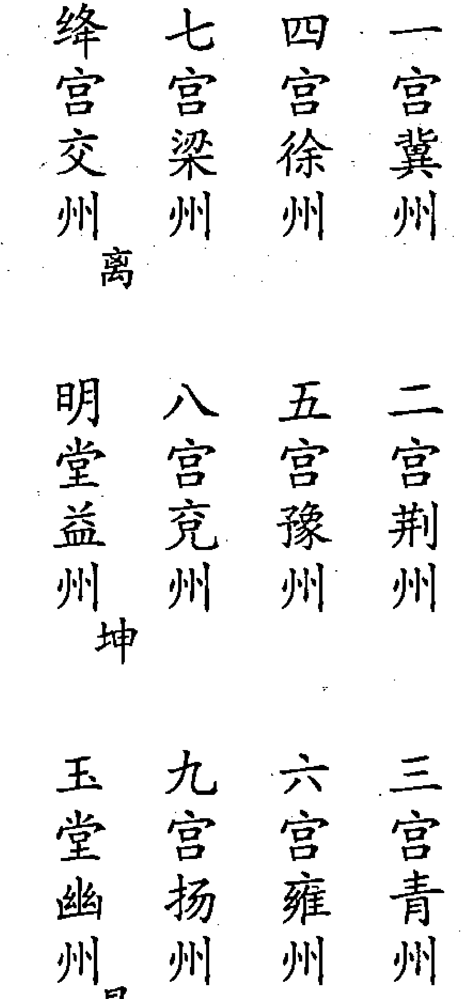

四神十二宫主要在于十二宫对应的地理分野。《淘金歌》所列十二宫分野与《登壇必究》相同，因此，二者在实质上是完全一致的。所不同的，前者把四神十二宫与太乙九宫相配，后者则把四神十二宫与十二地支相配。因此，就出现了绛宫、明堂、玉堂分别寄于离、坤、艮和分别寄于亥、子、丑的分别。我们在推演时只要掌握住四神十二宫的数序，在应用时掌握住四神十二宫所对应的地理分野就行了。

对四神等的推演，《金镜》中提出三元五纪的概念，与太乙周纪法中的五元六纪不同。《统宗》中有《推四神太乙立成历》，其分上中下三元。  
《金镜》中有《四神三元五纪立成》，亦分上中下三元。这里的三元和五纪又是怎么回事呢？先看《金镜》推四神太乙法原文：

经曰：四神太乙者，水神也，纪纲有道之代则昌，无道之代则殃，若临克贼之乡，兼君无道，则兵革水旱饥荒也。

置上元甲子所求积年，以一百八十去之，不尽，以三十六除之，为纪数，不满，算外，为入纪来年数，其纪数，命起第一纪，算外，即得四神太乙所在及入纪以来年数也。

入纪有五，三十六年为一纪。第一甲子，第二庚子，第三丙子，第四壬子，第五戊子。

置入纪年，以三除之，为宫数，不满，为入宫以来年数。命起一宫，顺行，尽九宫，又以绛宫、明堂、玉堂接之，算外，即得四神太乙所在，及入宫以来年数也。

《金镜》所述四神的推演方法，其计算结果与其他书无异，只是推演程序略有区别，尤其《金镜》所述加入了三元、五纪的概念，是太乙他书所未有的。《统宗》推四神立成中，加入了三元的概念，但未涉及五纪。

三元仍沿用古代对六十甲子纪年分为上中下三元，如清同治三年（公元 1864 年）岁次甲子至民国十二年（公元 1923 年）岁次癸亥为上元甲子；民国十三年（公元 1924 年）岁次甲子至公元 1983 年岁次癸亥为中元甲子；公元 1984 年岁次甲子至公元 2043 年岁次癸亥为下元甲子。而将上中下三元共一百八十年分为五纪，每三十六年为一纪，则是《金镜》中所特有的。或古代有此五纪之说，笔者未曾见到。也许因四神五纪之说并无实际意义，故后人不用。

五纪的区分，是从上元甲子岁开始计算，每三十六年为一纪。如：

清同治三年（公元 1864 年）岁次甲子至光绪二十五年（公元 1899 年）岁次己亥为第一甲子纪；  

光绪二十六年（公元 1900 年）岁次庚子至民国二十四年（公元 1935 年）岁次乙亥为第二庚子纪；  

民国二十五年（公元 1936 年）岁次丙子至公元 1971 年岁次辛亥为第三丙子纪；  

公元 1972 年岁次壬子至公元 2007 年岁次丁亥为第四壬子纪；  

公元 2008 年岁次戊子至公元 2043 年岁次癸亥为第五戊子纪。

今分别以同治三年（公元 1864 年）岁次甲子（上元）、民国十三年（公元 1924 年）岁次甲子（中元）和公元 1984 年岁次甲子（下元）为例，推演四神太乙所在宫次：

## 四神太乙三元立成历 天乙、地乙、直符同用

| | 四神 | 四神 | 天乙 | 地乙 | 直符 |
|---|---|---|---|---|---|
| | 上元 | 中元 | 下元 | 上元 | 中元 | 下元 | 上元 | 中元 | 下元 | 上元 | 中元 | 下元 |
| 甲子 乙丑 丙寅 | 一 | 九 | 五 | 六 | 二 | 绛 | 九 | 五 | 一 | 五 | 一 | 九 |
| 丁卯 戊辰 己巳 | 二 | 绛 | 六 | 七 | 三 | 明 | 绛 | 六 | 二 | 六 | 二 | 绛 |
| 庚午 辛未 壬申 | 三 | 明 | 七 | 八 | 四 | 玉 | 明 | 七 | 三 | 七 | 三 | 明 |
| 癸酉 甲戌 乙亥 | 四 | 玉 | 八 | 九 | 五 | 一 | 玉 | 八 | 四 | 八 | 四 | 玉 |
| 丙子 丁丑 戊寅 | 五 | 一 | 九 | 绛 | 六 | 二 | 一 | 九 | 五 | 九 | 五 | 一 |
| 己卯 庚辰 辛巳 | 六 | 二 | 绛 | 明 | 七 | 三 | 二 | 绛 | 六 | 绛 | 六 | 二 |
| 壬午 癸未 甲申 | 七 | 三 | 明 | 玉 | 八 | 四 | 三 | 明 | 七 | 明 | 七 | 三 |
| 乙酉 丙戌 丁亥 | 八 | 四 | 玉 | 一 | 九 | 五 | 四 | 玉 | 八 | 玉 | 八 | 四 |
| 戊子 己丑 庚寅 | 九 | 五 | 一 | 二 | 绛 | 六 | 五 | 一 | 九 | 一 | 九 | 五 |
| 辛卯 壬辰 癸巳 | 绛 | 六 | 二 | 三 | 明 | 七 | 六 | 二 | 绛 | 二 | 绛 | 六 |
| 甲午 乙未 丙申 | 明 | 七 | 三 | 四 | 玉 | 八 | 七 | 三 | 明 | 三 | 明 | 七 |
| 丁酉 戊戌 己亥 | 玉 | 八 | 四 | 五 | 一 | 九 | 八 | 四 | 玉 | 四 | 玉 | 八 |
| 庚子 辛丑 壬寅 | 一 | 九 | 五 | 六 | 二 | 绛 | 九 | 五 | 一 | 五 | 一 | 九 |
| 癸卯 甲辰 乙巳 | 二 | 绛 | 六 | 七 | 三 | 明 | 绛 | 六 | 二 | 六 | 二 | 绛 |
| 丙午 丁未 戊申 | 三 | 明 | 七 | 八 | 四 | 玉 | 明 | 七 | 三 | 七 | 三 | 明 |
| 己酉 庚戌 辛亥 | 四 | 玉 | 八 | 九 | 五 | 一 | 玉 | 八 | 四 | 八 | 四 | 玉 |

## (续上图表)

| 壬子 癸丑 甲寅 | 五 | 一 | 九 | 绛 | 六 | 二 | 一 | 九 | 五 | 九 | 五 | 一 |
| --- | --- | --- | --- | --- | --- | --- | --- | --- | --- | --- | --- | --- |
| 乙卯 丙辰 丁巳 | 六 | 二 | 绛 | 明 | 七 | 三 | 二 | 绛 | 六 | 绛 | 六 | 二 |
| 戊午 己未 庚申 | 七 | 三 | 明 | 玉 | 八 | 四 | 三 | 明 | 七 | 明 | 七 | 三 |
| 辛酉 壬戌 癸亥 | 八 | 四 | 玉 | 一 | 九 | 五 | 四 | 玉 | 八 | 玉 | 八 | 四 |

上述四神、天乙、地乙、直符三元历表，其行宫皆有次序和规律，但无法列入太乙阴阳遁局图中。《统宗》太乙局图中所列四神、天乙、地乙、直符皆为浅薄好事者所为，应当删除。拙作《太乙通解》所附太乙局图录自《统宗》，请读者自行删除。

## 四、大游、小游考

诸书对大游太乙的推演，存有分歧。黄宗羲在《易学象数论》中释大游太一（乙）曰：

宫周二百八十八，宫率三十六，宫盈差三十四。置积年，加宫盈差，以宫周去之。余以宫率而一。起七宫，顺行，不入中五。

《金镜》、《统宗》、《登壇必究》三书所论大游，虽说法不尽相同，其实质则相同，所推结论完全一致。《登壇必究》有决曰：

大游太乙行八宫，为首顺行须用同；  
七八九一二三四，数至之方六六穷；  
三十六年移一位，入元剪削芟繁茸；  
长兴元年庚寅岁，初起七宫为元例；

## 第一章 太乙诸神考

天禧四年是庚申，九十一年何具陈。

此诀中所云后唐明宗长兴元年 (公元 930 年) 岁次庚寅，大游入七宫第一年。仍以此年为例，用黄宗羲所述之法推演大游如下：

后唐明宗长兴元年 (公元 930 年) 岁次庚寅，太乙积年为 10154847。

```
(10154847+34) ÷288
=10154881÷288
=35260 余 1
```

即大游入七宫第一年。此与《登壇必究》所述相同。

《金镜》对大游的推演，虽然另立积年之数，但推演的结果与上述完全一致。

《淘金歌》所述大游的推演方法，与上述大不相同。其论大游之诀曰：

- 大游太乙最为凶，入宫逆数见形踪；
- 七六四三二一九，数论原来八是终；
- 三十六年移一位，上元起七逆迴宫。

接着，《淘金歌》又叙述曰：

- 七六四三二一九八，此大游所行之序，自始建甲子起一，积至所用之年，以二百八十八累除之，余者不及数，命起七宫，主三十六年满则交入六宫，又主三十六年满，则交入四宫也。

《淘金歌》并且认为大游起自远古上元甲子，故无宫盈差之说。又以大游起自七宫，逆行八宫，与诸书所述皆异，所得结论当然不同。《淘金歌》大游条目下有小注曰：

《太乙统宗》自后唐明宗长兴元年庚寅岁，太游入七宫起，至天启三年癸亥止，共六百九十四算，以小周法二除之，尚余一百一十八数。又以三十六宫法三除之，尚零十算，顺行，则在乾一宫已十年。自甲子至丁卯年已十四年。俱与《淘金歌》顺逆不同，俟考。

前人早已发现了《淘金歌》所述大游行宫等与他书不同，我们现在更无法考正了。因为现在能看到的太乙古籍更少了。文献不足，只得留下遗憾了。

大游所主灾详，惟《统宗》所载较详，录于下：

## 明大游太乙所主术

大游太乙者，驭六宫之气，金神也。巡行八宫，不入中五，三十六年考治一宫，十二年理天，十二年理地，十二年理人，考清人君之善恶，二百八十八年一周，而行其罚，与小游同所考。经曰："太乙至阳宫，速东不见兵；太乙至阴宫，中国可全身。"谓大游太乙八三四九之地为阳宫，治则灾在中国。东北之夷狄，属于阴，故云“辽东不见兵”。临二七六一之地为阴宫，则灾在夷狄之国，中国阳国得安，故云“蜀汉可全身”也。

同五福，其分兵革之灾阴于对冲之分；同太乙 (注：疑为同天乙)，其分大兴兵革，天变怪异；同地乙，其分地乙盗贼飞蝗，草木不生；同直符，其分兵、大旱；同四神，其分水旱饥馑，入民流移；同小游，其分兵丧水旱，凶暴大作

值上元甲子至所求积年，加宫差三十四，以大周法二千八百八十除之，不尽，以大游周法二百八十八去之，不尽，为宫周余，以行宫率三十六约之而一，所得为宫数，不满，为入宫以来年数，命起七宫，顺行八宫，不入中五，算外，即得大游所在，及入宫以为来年数。

后唐明宗长兴元年庚寅岁，大游入七宫梁益分，其年东川烟，董障兵叛，西川孟知津结连拒命，自后东西二川兵寇连年大振，虽命将征讨，蜀王不允，遂失西土，盖大游在七宫，为兵乱之应也。

## 五、直事太乙与九宫贵神考

直事太乙见于黄宗羲《易学象数论》，九宫贵神见于《统宗》，他书未见有直事太乙与九宫贵神之说。然细审二者之义，直事太乙即九宫贵神，只是名称不同而已。

黄宗羲《易学象数论·直事太一》曰：

周纪三百六十，纪法六十，宫周九，宫盈差三。置积年，以周纪去之。余以纪法而一，所得为一纪，不满纪法者，为入纪年数。置不满纪法者，加盈差，以宫周去之。余起一为入纪年数。置不满纪法者，加盈差，以宫周去

之。余起一宫逆行，即为直事。以直事钓入中宫。其相次之神，顺排六、七、八、九、一、二、三、四之宫为钓位。

《统宗·求九宫太乙贵神纪年术》曰：

值演上元甲子，距所求积年，以周法三百六十去之，不尽，为宫周余(注：应为周纪余)，以纪法六十约之，为纪数，不满，为入纪以来年数。其纪数年起第一纪，算外，即得九宫太乙纪年数。

《统宗·求九宫太乙贵神所在术》曰：

值周纪余，加宫盈差 (注：宫盈差为三)，以小周法九去之，不尽，命起一宫，逆行九宫，算外，即得九宫太乙贵神所在，而为直事也。

# 明小游太乙所主术

值上元甲子至所（求）积年，以小游纪元周法三百六十去之，不尽，以宫法二十四去之，不尽，为宫周余。以行宫率三约之，而以所得为宫数，不满，为入宫以来年数，命起六宫（注：应为一宫），顺行，不入中五，算外，

即得小游太乙所在及年数。其神所理，考治灾详也，已载于岁计中，兹不再述。

经曰：小游太乙主饥馑、兵革、水旱、流亡。小游与四神同宫主饥困；与直符同宫，兵戈大起；与天乙同宫，天降灾与民；与地乙同宫，天旱寸草不生；与五福同宫，灾变为福；与君基同宫，其分另有灾，不宜举兵；与臣基同宫，宰卿大夫不利，有兵厄；与民基同宫，其分民有疫厄。

唐昭宗天祐元年（注：应为唐昭宗天复四年、唐哀帝天祐元年）甲子岁，小游太乙六宫雍州分，其年正月，梁王朱全忠遗寇名卿奉囊请迁都洛阳，会长安民安按籍迁居，毁营大，浮河而下，百姓悲泣嗟恸，月余不息。此小游太乙所临考治之地，以致兵丧、水旱、饥馑、流失地之应也。而更细考之（注：疑有错简）。

《金镜》所述小游的推演方法，与上述相同。可以看出，小游于上元甲子起一宫开始，每三年一宫，顺行八宫，不入中五宫，二十四年一周。此与太乙行宫无异，即小游运行宫次和宫率、宫周，皆与太乙无异。太乙他书不取小游者，可能是这个原因。或许太乙古籍中对小游的论述，早就传抄有误，又无从考正，故不载人。对此，我们也只能作为一则疑案了。

## 六、太乙八门考

太乙八门，与壬、遁中的八门相同，亦即开、休、生、伤、杜、景、死、惊八门，其在地盘的位置亦是开门居西北乾位，休门居正北坎位等。太乙八门的推演方法，与壬、遁不同 (六壬中有八门的提法，但未列八门的具体推演方法；奇门中则有八门的具体推演方法，并且每局必须配上八门) 而太乙中也必须每局都配上八门，才能定是否 “门具将发”。遗憾地是，太乙局图中并未配上八门的居位，这是前人有意的 “疏忽”，还是另有原因？缺少八门的居位，每局中怎样来确定是否 “门具将发”？

但是，太乙典籍中有八门的推演方法，只是诸书所述未臻一致，因此，我们有必要对太乙八门的推演和运用加以讨论。

《太乙金镜式经·推八门用法》：

张良云：阳遁冬至甲日夜半甲子以后开门直使；丙日中甲午以后生门直

使；己日夜半甲子以后惊门直使；辛日日中甲午以后休门直使。三十时移门。

阴遁夏至甲日夜半甲子以后杜门直使；丙日日中甲午以后死门直使；己日夜半甲子以后伤门直使；辛日日中甲午以后景门直使。三十时一移门也。

常以直门加太乙及主客大将，随数而行。太乙三时一移，大将一时一移也。臣今太乙冬至、夏至初临之时，门则随数起，时尽则移，不拘其甲丙己辛日也。

阳遁四门，开、生、惊、休。阴遁四门，杜、死、伤、景。

上述这段话是论述太乙时局八门起例的。太乙时局冬至后用阳遁，夏至后用阴遁。冬至后甲日夜半甲子时以开门为直使，即以开门加临太乙宫，顺时针转动八门，以开、休、生、伤、杜、景、死、惊为序，三十时一移宫。今以冬至后甲子日为例，甲子日的甲子时起至乙亥时共十二时，乙丑日丙子时至丁亥时共十二时，丙寅日戊子时至癸巳时共六时，总共三十时，故至丙寅日甲午时改为生门直使 (阳遁只用开、生、惊、休为直使)。其他仿此类推。这是古法。

王希明认为太乙三时移一宫 (此指太乙时局)，而太乙直使之门 (简称直门) 三十时移一宫，二者不协调，因而改为 “门随数起，时尽则移，不拘甲、丙、己、辛日也”，改变了八门的推演方法。王希明接着又说：

臣希明今置天正时实以二百四十去之，不尽，以一百二十去之，不尽，以三十约之为门数，命起开门，依次而行，即天正冬至加时所直门也。

置夏至时实，以一百二十去之，不尽者，以三十约之为门数 (缺) 而行之，即夏至加时所直门也。

王希明企图改变太乙时局的八门推演方法，但仅凭上述论述，我们还不能掌握，其 “随数而行” 的推演方法，其学说应进一步探讨。太乙时局八门的推演方法，后面还要具体论述。

# 《太乙金镜式经·推八门占岁计法》日：

李淳风云：常以开门加太乙，即太乙之八门也。又以开门加主大将，即主大将之八门也。又以开门加客大将，即客大将之八门也。又以开门加定计大将，即定计大将八门也。本是太公考岁计定八门立五将也。又云：客、主八门与太乙八门开、休、生合者大利。

太乙天目在主、客三门下者，闭塞不通，今云客、主八门与太乙八门开、休、生三门合者大利。

臣今别立新术，置上元甲子以来距所求积年，求岁计八门，以大游纪法七百二十去之，不尽，以三分纪法二百四十除之，余以三十约之，为直门数，不尽，为直门所入年，命起开门，以次休、生门，左行八门，周而复始。

假令今开元十二年甲子，即开门为直使，至三十一年甲午岁，即休门为直使，他皆仿此。

按唐玄宗开元十二年（公元 724 年）岁次甲子，太乙积年为 1937281，推演如下：

```
1937281÷720-2690 余 481
481÷240=2 余 1
```

此为开门直事之第一年。太乙岁计八门，每三十年移门，故 240 年为一周。尚余一数，即为开门之第一年也。

此例积年数见《太乙金镜式经·推上元积年》。

# 《太乙淘金歌·八门起例》曰：

- 常以开门加太乙，
- 各门临处有凶吉；
- 杜死惊伤有灾诊，
- 开体生下喜盈溢。

## 三式述要

（注曰）凡阳遁皆以开门，阴遁皆以杜门为直事，常加太乙宫，二遁皆顺行八门，以开、休、生、伤、杜、景、死、惊为序，视主将在开、休、生门下者吉，如岁计占用三门下分野，物阜民安，不然，则灾诊作矣。

假令第三丙子元辛丑年二十六局，其年太乙在一宫，便以开门加乾一宫，顺行，则休临坎，生临艮，伤临震，杜临巽，景临离，死临坤，惊临兑是也。余仿此。

又法：二遁直事所加则异，八门定向则同。

《太乙淘金歌》为刘养鲲于明天启七年编，载入《古今图书集成·博物汇编·艺术典》。《淘金歌》所论太乙年局八门起例，阳遁皆以开门为直使加临太乙宫，顺时针依次排列八门；阴遁皆以杜门为直使，加临太乙宫，也顺行，依次排列八门。这与《太乙金镜式经》所述太乙年局八门起例显然不同。

《太乙统宗·求四计八门直事所在术》曰：

值所求积年，以八门周法二千四百去之，不尽，以小周法二百四十去之，不尽为门周余。以门率三十约之而一，所得为门数，不尽为八门以来年数。其门命起开门，顺行八门，算外，即得八门直事所在。及岁、月、日、时之计，所求皆同一法。

《统宗》所述太乙年局八门起例与《金镜》相同。《统宗》列有《岁计八门略例》如下：

宋太祖乾德二年 (公元 964 年) 甲子，开门直事；

宋仁宗天圣二年 (公元 1024 年) 甲子，生门直事；

宋神宗元丰七年 (公元 1084 年) 甲子，杜门直事；

宋高宗绍兴十四年 (公元 1144 年) 甲子，死门直事；

宋宁宗嘉泰四年 (公元 1204 年) 甲子，开门直事；

元世祖至元元年 (公元 1264 年) 甲子，生门直事；

元泰定帝泰定元年 (公元 1324 年) 甲子，杜门直事；

明太祖洪武十七年 (公元 1384 年) 甲子，死门直事；

明正统九年 (公元 1444 年) 甲子，开门直事；

明弘治十七年 (公元 1504 年) 甲子，生门直事；

明嘉靖四十三年 (公元 1564 年) 甲子，杜门直事；

明天启四年 (公元 1624 年) 甲子，死门直事；

清康熙二十三年 (公元 1684 年) 甲子，开门直事；

宋太宗淳化五年 (公元 994 年) 甲午，休门直事；

宋至和元年 (公元 1054 年) 甲午，伤门直事；

宋政和四年 (公元 1114 年) 甲午，景门直事；

宋淳熙元年 (公元 1174 年) 甲午，惊门直事；

宋端平元年 (公元 1234 年) 甲午，休门直事；

元至元三十一年 (公元 1294 年) 甲午，伤门直事；

元至正十四年 (公元 1354 年) 甲午，景门直事；

明永乐十二年 (公元 1414 年) 甲午，惊门直事；

明成化十年 (公元 1474 年) 甲午，休门直事；

明万历二十二年 (公元 1594 年) 甲午，伤门直事；

明嘉靖十三年 (公元 1534 年) 甲午，景门直事；

清顺治十一年 (公元 1654 年) 甲午，惊门直事。

上述略例皆可按公式推出。

《太乙统宗》推演年局八门方法与《金镜》同。《太乙淘金歌》认为阳遁皆以开门为直事，阴遁皆以杜门为直事，以直事之门加临太乙宫，顺转八门，此法固然简便，但不知其依据和出处。

## 第二章 太乙十二运卦

## 一、太乙十二运学说考

太乙十二运学说，又称太乙衡运，是古代太乙家的专论。这种学说，把中国古代历史，划分为十二个不同的阶段，同时把周易六十四卦分为十二组，每组表示一个历史阶段。这就是太乙十二运，即：乾、坤、否、泰四卦为第一天地否泰之运；震、巽、恒、益、坎、离、既济、未济、艮、兑、损、咸十二卦为第二男女交亲之运；大壮、无妄、需、讼、大畜、遁六卦为第三阳晶守政之运；观、升、晋、明夷、萃、临六卦为第四阴毳权衡之运；豫、复、比、师、剥、谦六卦为第五资育还本之运；小畜、姤、同人、大有、夬、履六卦为第六造化符天之运；解、屯、小过、颐四卦为第七刚中健至之运；家人、鼎、中孚、大过四卦为第八群愚位贤之运；丰、噬嗑、归妹、随、节、困六卦为第九德义顺命之运；涣、井、渐、蛊、旅、贲六卦为第十惑妒留天之运；蹇、蒙二卦为第十一寡阳相搏之运；睽、革二卦为第十二物极元终之运。十二运，统一万一千五百二十年，周而复始。

十二运学说，其起源已不可考。虽为太乙术数的一个组成部分，但其论述更具有理论和学术价值，其主旨内蕴与邵雍的《皇极经世》和黄道周的《三易洞玑》极为相类，已经大大超出了三式术数推演范围。正因如此，太乙十二运学说，在历史上曾引起许多上层学者的关注，最为典型的为元明之际的胡翰和明清之际的黄宗羲。此二人对太乙十二运学说作了充分地肯定，并在理论和学术的高度上进行了阐发。

## （二）

胡翰，字仲申，浙江金华人，幼聪颖异常，文章与宋濂、王玮齐名。明洪武初年，以儒士被聘修元史，不仕，卜居金华北山，年七十五而终，入《明史·文苑传》。著作有《春秋集义》，文集为《胡仲子集》，诗集为《长山先生集》。他写的太乙《衡运论》收录在《荆川稗编》中，其原文如下：

皇降而帝，帝降而王，王降而霸，犹春之有夏，秋之有冬也。由皇等而上，始乎有物之始；由霸等而下，终乎闭物之终。消长得失，治乱存亡，生乎天下之动，极乎天下之变。纪之以十二运，统之以六十四卦。

乾，天道也，健而运乎上；坤，地道也，顺而承乎下。天地既判，其气未交为否，既交为泰。此四卦为天地否泰之运也。天地交泰之后，而男女生焉。乾一索而得男曰震，震为长男；坤一索而得女曰巽，巽为长女。长男长女而夫妇成焉，为恒。夫妇既交为益。乾再索而得男曰坎，坎为中男；坤再索而得女曰离，离为中女。中男、中女而夫妇成为既济，夫妇既交为未济。乾三索而得男曰艮，艮为少男；坤三索而得女曰兑，兑为少女。少男、少女而夫妇成为损，夫妇既交为咸。此十二卦，为男女交亲之运也。天地判而男女生，夫妇交而万物成，故男治事于先，女理事于后。男之治也，从父之道，为阳晶守政之运，大壮至遁六卦系焉。女之理也，从母之道，为阴毳权衡之运，自观至临六卦系焉。坤阴也，得阳育而生男；乾阳也，得阴化而生女。男归于母，为资育还本之运，自豫至谦六卦行焉。女应其父，为造化符天之运，自小畜至履六卦用焉。

## （三）

黄宗羲只欣赏太乙运卦卦序的整齐性，仅由此就断定此非唐宋以后人所能作。但是，黄氏并未提示太乙运卦卦序的内涵。黄氏所说太乙运卦卦序整齐的内容是什么？怎样才算整齐？第一运乾、坤、否、泰四卦，第二运震、巽、恒、益、坎、离、既济、未济、艮、兑、损、咸十二卦，这样排列能称整齐吗？黄氏对此未作解释，这些内容仍然是待解之续。胡翰和秦晓山也未对太乙运卦卦序有更深入地论述。

也就是说，除去《太乙统宗宝鉴》和胡翰《衡运论》中对太乙运卦卦序从天地父母和六子的人伦关系上作了阐述外，从来还没有人从更广阔和更多元的角度对太乙运卦之序的深刻内涵加以揭示。笔者不揣浅陋，有意对太乙运卦卦序作进一步探讨。

先整理一幅先天六十四卦方图，在方图中除卦名、卦画符号之外，每卦再配上先天八卦乾一、兑二、离三、震四、巽五、坎六、艮七、坤八的先天卦位数和二进位制数（这是西方十八世纪数学家莱布尼茨研究中国易经六十卦所得的成果之一，详情可参考有关资料，兹不赘述，图式如下：

| 坤 | 剥 | 比 | 观 | 豫 | 晋 | 萃 | 否 |
|----|----|----|----|----|----|----|----|
| 8 2 3 1 1 1 1 1 | 
| 7 1 2 3 1 1 1 1 | 
| 8 3 3 2 3 3 2 2 | 
| 5 1 3 3 1 2 2 3 | 
| 1 1 | 
| 6 1 1 4 4 1 2 2 3 1 1 1 | 
| 4 1 2 3 2 3 2 3 3 2 3 1 1 | 
| 8 3 3 2 3 3 2 2 | 
| 1 | 
| 3 2 2 一一 2 3 2 3 2 3 | 
| 1 2 2 2 3 3 3 | 
| 5 2 2 1 2 2 3 3 2 3 2 3 2 3 3 3 2 3 2 2 3 2 |

## 第二章 太乙十二运卦

先天六十四卦方图，卦象符号排列，先天八卦位数排列，以及由二进位制数变成的自然数排列，都是整然有序的（其实，先天六十四卦圆图与方图是相通的，所不同者，只是一为圆形，一为方形，只是外表形式不同而已）。

也正因为先天六十四卦方图的排列整齐有序，西方的哲学家、数学家莱布尼茨才发现六十四卦符号的二进位制数列，也因此才使得双方的学者对中国古老的易卦大为惊叹。

太乙十二运卦的排列也呈现出惊人的整齐有序性，尤其将其纳入先天六十四卦方图之中，更见其整齐有序的特点。这些整齐有序的特点标明什么，人们尚不清楚，但是，揭示其整齐有序性也当属我们研究的一个方面。下面，将对太乙十二运卦逐运加以说明。

先看第一运和第二运：

第一，天地否泰之运。运卦乾、坤、否、泰。

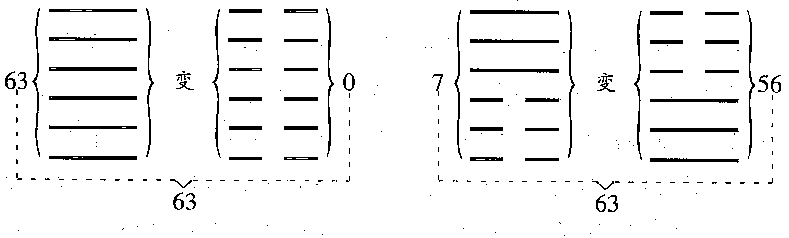

第二，男女交亲之运。运卦震、巽、恒、益、坎、离、既济、未济、艮、兑、损、咸。

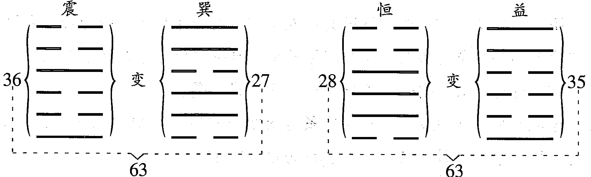

第一运四卦，第二运十二卦，共十六卦。这十六卦显著的特点有二：一是每相邻两卦的卦画符号正好相反，如乾与坤是相邻两卦，乾卦六个阳爻，则坤卦六个阴爻，图中所标“变”字，是指卦画符号阴阳相反而变的意思。二是每相邻两卦的二进位数之和为63。如乾、坤为相邻两卦，乾的二进位数为63，坤的二进位数为0。否和泰为相邻两卦，否的二进位数为7，泰的二进位数为56，相加为63。损和咸为相邻两卦，损的二进位数为49，咸的二进位数为14，相加为63。

如果把上述十六卦在先天六十四卦方图中的位置标出，所构成的图形亦耐人寻味。见下图。

第一运的乾、坤、否、泰四卦正处于方图的四角位置，乾至坤、否至泰连结成方图的两条对角线，而第二运的十二卦则分别位于这两条对角线上。

乾至坤这条对角线分布着坤、艮、坎、巽、震、离、兑、乾八个卦，其二进位制数的和为252。否至泰这条对角线分布着否、咸、未济、恒、益、既济、损、泰八个卦，其二进位制数的和也是252。

若把方图由外向内分四层看（图中虚线连结各卦，使方图分成四层），

第一层四角为乾、坤、否、泰四卦，其二进位制数的和为 126；第二层四角为兑、损、艮、咸四卦，其二进位制数的和为 126；第三层四角为离、既济、坎、未济四卦，其二进位制数的和也为 126；第四层四角为震、益、巽、恒四卦，其二进位制数的和也是 126。

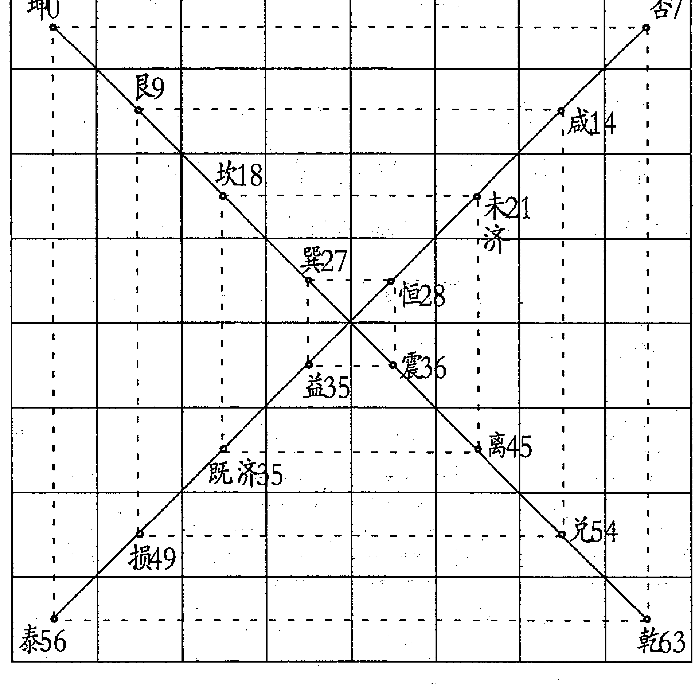

北宋先天易学的创立者邵康节有《大易吟》（载《伊川击ﾙ集》中）一首，其中所述十六事卦与上述第一、第二运的十六卦巧合了。《大易吟》曰：

天地定位，否泰反类；
山泽通气，损咸见义；
雷风相薄，恒益起意；
水火相射，既济未济；
四象相交，成十六事；
八卦相荡，为六十四。

显然，邵子《大易吟》中的十六事卦，是指乾、坤、否、泰、艮、兑、损、咸、震、巽、恒、益、坎、离、既济、未济十六卦。这十六卦分布在先天六十四卦方图的两条对角线上，与太乙第一、二运的运卦完全相符。

清人江永指出，邵子《大易吟》本为“伏羲六十四卦方图而作”。其与太乙的运卦相合，可见太乙运卦定与方图有某些方面上的联系，我们从太乙运卦在方图上的位置所构成的轨迹，也可看出这一点。

第三阳晶守政之运，运卦大壮、无妄、需、讼、大畜、遁六卦。第四阴毳权衡之运，运卦观、升、晋、明夷、萃、临六卦。此二运中，每相邻二卦，前卦的内卦为后卦的外卦，前卦的外卦为后卦的内卦。还有另外一个特点：第三运的第一卦大壮，与第四运的第一卦观，此二卦二进位制数相加也是63。其余各卦依此类推。（见图）

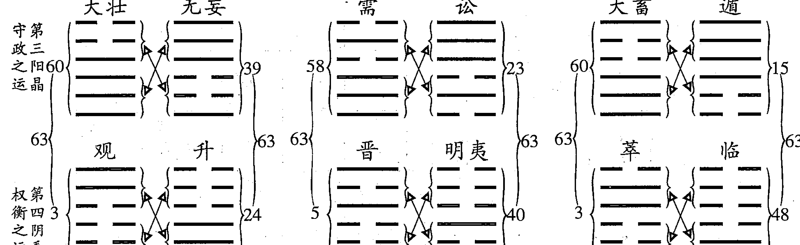

第三运六卦在方图的轨迹与第四运六卦在方图的轨迹，完全呈现对称式。（见图）

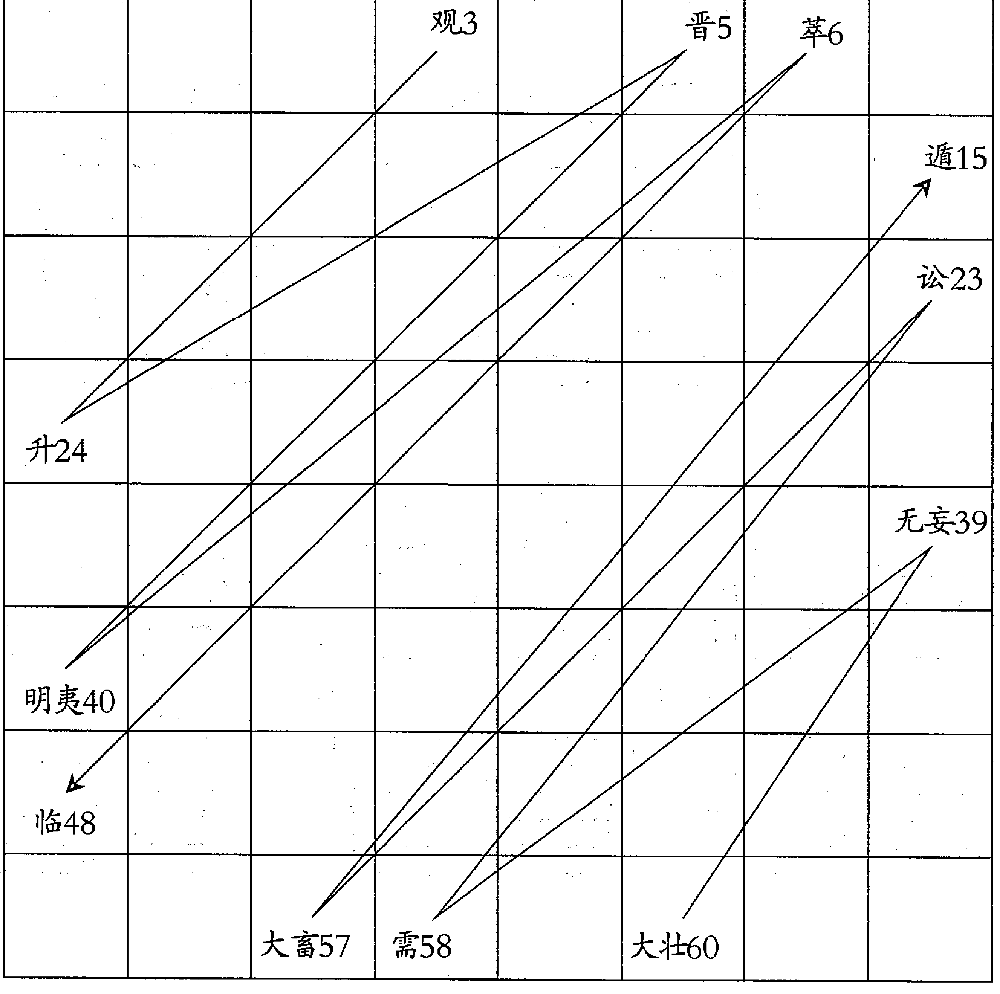

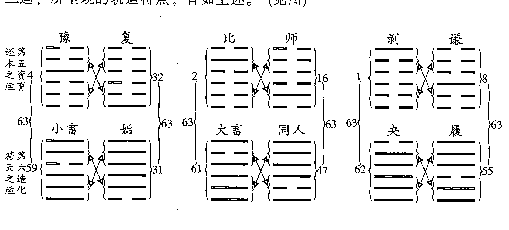

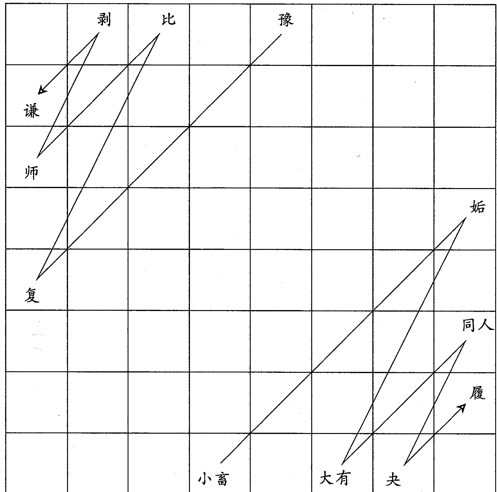


太乙运卦的推演方法，前人就有两种不同的认识，因此，流传下来两种不同的推演方法。下面分别作一介绍。

第一种方法是黄宗羲《易学象数论》中所述太乙运卦的《推法》：

周策一万一千五百二十。

卦盈差三百。

置积年，加卦盈差。满周策去之。余起乾、坤、否、泰之运，累之，即得所入之卦。以入卦年数，阳爻三十六，阴爻二十四，即得所入之爻。

积年上元甲子至今壬子（作《象数数论》之年）。一千一十五万五千五百八十九年。

太乙十二运统六十四卦、三百八十四爻（入阳爻三十六年，入阴爻二十四年）运行一周为一万一千五百二十年（六十四卦之中阳爻和阴爻各192。192×36+192×24=6912+4608=11520）故周策为一万一千五百二十。周而复始。黄氏提供的太乙积年数为康熙十一年（公元1672年）岁次壬子，该岁太乙积年为10155589年。此太乙积年数与太乙诸书（《淘金歌》除外）相同。

太乙积年始自上古甲子年、甲子月、甲子日、甲子时天正冬至，太乙纪、元、局皆自此始，而太乙行运为什么还要从太乙积年数中再加入卦盈差三百呢？这意味着太乙行运要早于上古四甲子天正冬至三百年（五个六十甲子）。为什么太乙入运行卦比太乙入纪、元、局正常要早三百年？前人没有讲清，这个问题也就成为千古之继了。

我们按照黄宗羲所述，推演康熙十一年（公元1672年）岁次壬子所入运卦爻。此岁太乙积年为10155589。

```
(10155589+300) ÷ 11520
=881 余 6769
```

6769-720-2160-1152-1008-936
=793（查卦运表入第六造化符天之运）
793-204（小畜）-204（姤）-204（大有）
=181（入同人卦181年）
181-36（同人初九）-24（同人六二）-36（同人九三）-36（同人九四）-36（同人九五）
=13（人同人上九爻第一十三年）

可知康熙十一年（公元1672年）岁次壬子入第六造化符天之运同人卦上九爻第一十三年。

第二种推演方法为《太乙数统宗大全》和《太乙统宗宝鉴》所载。《太乙统宗宝鉴·明太乙行运入卦纪年术》：

上元甲子开辟以来，历代幽远，积数太繁，难究其实，故不取焉。今截自周敬王四十三年甲子岁，太乙入第二男女交亲之运震卦初九爻为始推算，录例于后，庶易见焉。

周敬王四十三年（公元前477年）岁次甲子，太乙积年为10153441。用黄宗羲《易学象数论》提供的方法推演如下：

```
(10153441+300) ÷11520
=10153741÷11520
=881 余 4621

4621-720-2160-1152
=589 (入第四阴毳权衡之运)

589-168 (观) -168 (升) -168 (晋)
=85 (入明夷卦85年)

85-36 (明夷初九) -24 (明夷六二)
=25 (入明夷九三爻第25年)

入明夷卦九三爻第25年。
```

由此知上述两种推演方法，其计算结果相差甚远。同是周敬王四十三年（公元前477年）岁次甲子，《太乙统宗宝鉴》中推演为入第二男女交亲之运震卦初九爻。而按黄宗羲书中的方法推演，则入第四阴毳权衡之运明夷九三爻。只是《太乙统宗宝鉴》中只有结论而省略了推演过程，我们不知其推演的具体方法和依据。我们对这两种不同的推演方法和结论，只得并存之，以俟查取更多的资料，进行考证。

# 卦运表

第一，天地否泰之运 七百二十年

| 乾 | 坤 | 否 | 泰 |
|---|---|---|---|
| ——甲子
——戊子
——壬子
——丙子
——庚子
——甲子
二百一十六 | ——庚子
——丙子
——壬子
——戊子
——甲子
——庚子
一百四十四 | ———戊子
———壬子
———丙子
———壬子
———戊子
———甲子
一百八十 | ——庚子
——丙子
——壬子
——丙子
——庚子
——甲子
一百八十 |

第二，男女交亲之运 二千一百六十年

| 震 | 異 | 恒 | 益 |
|---|---|---|---|
| ——戊子
——甲子
——戊子
——甲子
——庚子
——甲子
一百六十八 | ——戊子
——壬子
——戊子
——壬子
——丙子
——壬子
一百九十二 | ——庚子
——丙子
——庚子
——甲子
——戊子
——甲子
一百八十 | ———戊子
———壬子
———戊子
———甲子
———庚子
———甲子
一百八十 |

## 第三，阳晶守政之运 一千一百五十年

| 坎 | 离 | 既济 | 未济 |
|---|---|---|---|
| — — 戊子
——— 坤子
— — 戊子
— — 甲子
——— 戊子
— — 甲子
一百六十八 | ——— 戊子
— — 甲子
——— 戊子
——— 坤子
— — 戊子
— — 坤子
一百九十二 | — — 庚子
——— 甲子
——— 庚子
— — 甲子
——— 庚子
— — 甲子
一百八十 | ——— 戊子
— — 甲子
——— 戊子
— — 甲子
——— 戊子
— — 甲子
一百八十 |
| 艮 | 兑 | 损 | 咸 |
|——— 丙子
— — 坤子
— — 戊子
——— 坤子
— — 戊子
— — 甲子
一百六十八 | — — 庚子
——— 甲子
——— 戊子
— — 甲子
——— 戊子
——— 坤子
一百九十二 | ——— 戊子
— — 坤子
— — 庚子
— — 丙子
——— 庚子
— — 坤子
一百八十 | — — 庚子
——— 坤子
——— 戊子
——— 坤子
— — 戊子
——— 坤子
一百八十 |
| 大壮 | 无妄 | 需 |
|——— 坤子
— — 戊子
——— 坤子
——— 丙子
——— 庚子
——— 甲子
一百九十二 | ——— 坤子
——— 丙子
——— 庚子
— — 丙子
— — 坤子
——— 丙子
一百九十二 | — — 坤子
——— 庚子
— — 坤子
——— 庚子
——— 甲子
——— 戊子
一百九十二 |

## 第四，阴霾权衡之运 一千八年

# 讼

———丙子
———庚子
———甲子
———庚子
———甲子
———庚子
一百九十二

# 大畜

———丙子
———甲子
———庚子
———甲子
———戊子
———壬子
一百九十二

# 遁

———庚子
———甲子
———戊子
———壬子
———戊子
———甲子
一百九十二

# 观

———戊子
———壬子
———戊子
———甲子
———庚子
———丙子
一百六十八

# 升

———戊子
———甲子
———庚子
———甲子
———戊子
———甲子
一百六十八

# 晋

———甲子
———丙子
———甲子
———庚子
———丙子
———壬子
一百六十八

# 明夷

———甲子
———庚子
———丙子
———庚子
———丙子
———庚子
一百六十八

# 萃

———壬子
———丙子
———庚子
———丙子
———壬子
———戊子
一百六十八

# 临

———庚子
———丙子
———壬子
———戊子
———壬子
———丙子
一百六十八

## 第五，资育还本之运 九百三十六年

| 解 | 屯 | 小过 | 颛 |
|---|---|---|---|
| —— —— 丙子
—— —— 壬子
—— —— 丙子
—— —— 壬子
—— —— 戊子
—— —— 甲子
一百六十八 | —— —— 甲子
—— —— 庚子
—— —— 甲子
—— —— 壬子
—— —— 戊子
—— —— 壬子
一百六十八 | —— —— 甲子
—— —— 庚子
—— —— 甲子
—— —— 戊子
—— —— 甲子
—— —— 庚子
一百六十八 | —— —— 庚子
—— —— 丙子
—— —— 壬子
—— —— 戊子
—— —— 甲子
—— —— 戊子
一百六十八 |

| 师 | 剥 | 谦 |
|---|---|---|
| —— —— 甲子
—— —— 庚子
—— —— 丙子
—— —— 壬子
—— —— 丙子
—— —— 壬子
一百五十六 | —— —— 戊子
—— —— 甲子
—— —— 戊子
—— —— 丙子
—— —— 壬子
—— —— 戊子
一百五十六 | —— —— 丙子
—— —— 壬子
—— —— 丙子
—— —— 戊子
—— —— 壬子
—— —— 丙子
一百五十六 |

## 第六，造化符天之运 一千二百二十四年

# 小畜

———戊子
———壬子
———戊子
———壬子
———丙子
———庚子
二百四

# 姤

———壬子
———丙子
———庚子
———甲子
———戊子
———甲子
二百四

# 大有

———庚子
———丙子
———庚子
———甲子
———戊子
———壬子
二百四

# 同人

———丙子
———庚子
———甲子
———戊子
———甲子
———戊子
二百四

# 夬

———丙子
———庚子
———甲子
———戊子
———壬子
———丙子
二百四

# 履

———戊子
———壬子
———丙子
———壬子
———丙子
———庚子
二百四

## 第七，刚中健至之运 六百七十二年

| 解 | 屯 | 小过 | 颛 |
|---|---|---|---|
| —— —— 戊子
—— —— 甲子
—— —— 戊子
—— —— 甲子
—— —— 戊子
—— —— 甲子
一百六十八 | —— —— 丙子
—— —— 庚子
—— —— 丙子
—— —— 壬子
—— —— 戊子
—— —— 壬子
一百六十八 | —— —— 甲子
—— —— 庚子
—— —— 甲子
—— —— 戊子
—— —— 甲子
—— —— 庚子
一百六十八 | —— —— 庚子
—— —— 丙子
—— —— 壬子
—— —— 戊子
—— —— 甲子
—— —— 戊子
一百六十八 |

## 第八，群愚位贤之运 七百六十八年

| 家人 | 鼎 | 中孚 | 大过 |
|---|---|---|---|
| —— —— 壬子
—— —— 丙子
—— —— 壬子
—— —— 丙子
—— —— 壬子
—— —— 丙子
一百九十二 | —— —— 甲子
—— —— 庚子
—— —— 甲子
—— —— 戊子
—— —— 壬子
—— —— 戊子
一百九十二 | —— —— 丙子
—— —— 庚子
—— —— 丙子
—— —— 壬子
—— —— 丙子
—— —— 庚子
一百九十二 | —— —— 庚子
—— —— 甲子
—— —— 戊子
—— —— 壬子
—— —— 丙子
—— —— 壬子
一百九十二 |

## 第九，德义顺命之运 一千八十年

| 丰 | 噬嗑 | 归妹 |
|---|---|---|
| —— —— 庚子
—— —— 丙子
—— —— 庚子
—— —— 甲子
—— —— 庚子
—— —— 甲子
一百八十 | ———— 戊子
—— —— 甲子
—— —— 戊子
—— —— 甲子
—— —— 庚子
—— —— 甲子
一百八十 | —— —— 庚子
—— —— 丙子
—— —— 庚子
—— —— 丙子
—— —— 庚子
—— —— 甲子
一百八十 |
| 随 | 节 | 困 |
|---|---|---|
| —— —— 庚子
—— —— 甲子
—— —— 戊子
—— —— 甲子
—— —— 庚子
—— —— 甲子
一百八十 | —— —— 庚子
—— —— 甲子
—— —— 庚子
—— —— 丙子
—— —— 庚子
—— —— 甲子
一百八十 | —— —— 庚子
—— —— 甲子
—— —— 戊子
—— —— 甲子
—— —— 戊子
—— —— 甲子
一百八十 |

## 第十，惑妒留天之运  一千八十年

| 涣 | 井 | 渐 |
| --- | --- | --- |
| 戊子<br>壬子<br>戊子<br>甲子<br>戊子<br>甲子<br>一百八十 | 庚子<br>甲子<br>戊子<br>甲子<br>戊子<br>甲子<br>一百八十 | 戊子<br>壬子<br>戊子<br>壬子<br>戊子<br>甲子<br>一百八十 |
| 盛 | 旅 | 责 |
| --- | --- | --- |
| 戊子<br>甲子<br>庚子<br>甲子<br>戊子<br>甲子<br>一百八十 | 戊子<br>甲子<br>戊子<br>壬子<br>戊子<br>甲子<br>一百八十 | 戊子<br>甲子<br>庚子<br>甲子<br>庚子<br>甲子<br>一百八十 |

## 第十一，寡阳相搏之运 三百三十六年

## 第十二，物极元终之运 三百八十四年

## 三式述要

卦运表从第一运乾卦初九爻入第一年甲子年，阳爻三十六年，阴爻二十四年，依次排列。如乾卦初九爻从甲子年开始，住三十六年。庚子年则入乾卦九二爻，住三十六年。丙子年则入乾卦九三爻，依此类推。至乾卦上九爻结束，共二百一十六年。从第二百一十七年庚子年开始，入坤卦初六爻，住二十四年。至甲子年人坤卦六二爻，住二十四年。至戊子年人坤卦六三爻。依次类推。至坤卦上六爻结束，共一百四十四年。第一运至泰卦上六爻结

- 蹇  
——— 戊子  
——— 壬子  
——— 戊子  
——— 壬子  
——— 戊子  
——— 甲子  

一百六十八

- 蒙  
——— 甲子  
——— 庚子  
——— 丙子  
——— 壬子  
——— 丙子  
——— 壬子  

一百六十八

- 睽  
——— 丙子  
——— 壬子  
——— 丙子  
——— 壬子  
——— 丙子  
——— 庚子  

一百九十二

- 革  
——— 庚子  
——— 甲子  
——— 戊子  
——— 壬子  
——— 戊子  
——— 壬子  

一百九十二

## 第二章 太乙十二运卦

《太乙数统宗大全》与《太乙统宗宝鉴》推演太乙年卦、月卦的方法相同，只是起月卦一是以寅月为岁首，一是以子月为岁首，孰是孰非呢？我们如何遵从呢？笔者在写《太乙通解》时还没有见到《宝鉴》这部书，故只以《大全》中所述进行推演。按照太乙起始于上古上元甲子年、甲子月、甲子日、甲子时来看，似应以子月为始。《宝鉴》中有《明太乙岁本论建子为正术》一节，对建子为始之义作了详述，认为“若论天道，当以自子为始，终于亥，此天道自然之大运，古今不易之大理也。”太乙起自上古，当循其旧，不应随意改动，故当以子月为始，才能符合其本意。

黄宗羲《易学象数论·太乙·流年直卦法》曰：

置积年，满卦周六十四去之，余依周易次序，即得所直之卦。视所求之年，阳辰不取阴爻，以卦内阳爻起子，自下而上，循环数至岁支，以为动爻。阴辰不取阳爻，以卦内阴爻起子，自下而上，循环数至岁支，以为动爻。起动爻为正月，依次布于六爻。以动爻为变卦，起变爻为七月，亦依次布于六爻。

黄氏所述，不论取阳爻或取阴爻，皆自下而上数去，并且以寅月为岁首，这与《大全》、《宝鉴》二书皆不相同。黄宗羲为明清之间的经学大家，治学严谨，所述方法定有所本。我们对此不可废弃，当从实践中加以验证。

上述三家之论，只是在推演过程中有不同之处，我们可以在实践中去加以验证，到底怎样推演更为合理有效。但是，三家对于月卦皆未作深论，只有某月对应某爻而已，到底怎样取月卦，皆未能明言。太乙中以月卦为小运，再结合所对应的太乙局的掩迫关囚等格定应期，三书中对此皆未有详述，更未有例证。读者对此只能或见仁、或见智，在实践中加以摸索了。

《太乙统宗宝鉴》对于灾变之期等论曰：

置即位太乙入卦行爻之年，阳爻三十六，阴爻二十四，遇关囚掩迫格击提挟之年，乃有变革兴亡主事，阳九、百六、太阳、阴主会于出入首位之年，

横暴墓杀之祸必焉。人君祗畏天戒，修德施仁，延释者有之。《书》云：“皇天无亲，惟德是铺。”欲知创业之主，僭乱之人，以内外卦定之，以变象互体观之，以纳甲支干推之。大抵理不独立，其势必聚，聚然后变化出焉。

纳甲者，甲爻东方兵，在齐，乙爻东方夷之分，丙爻正南，吴楚系焉。丁为蛮夷，及于海粤。庚爻正西，秦分之野。辛爻梁益，及于西戎。壬爻正北，燕冀之野。癸爻北夷。戊、己中原、豫州、三河之地。

取之姓名，卦象互观，参以纳甲、五音而决之。辰戊丑未戊己为宫，申酉庚辛为商，寅卯甲乙为角，巳午丙丁为徵，亥子壬癸为羽。又甲乙配木，丙丁配火，庚辛配金，壬癸配水，戊己配土。

凡有变必有应。变于内者应乎外，变于外者应乎内，变于下者应乎上，变于上者应乎下。应变之道，阴阳之气，以数类相从，自然之理也。

阳九、百六各有具体的推演和应用方法，拙作《太乙通解》和《太乙考证》二书中皆有论述，可作参考。纳甲十干的天文分野所属，十天、十二支配宫、商、角、徵、羽五音，以此来决定创业之主或僭乱之人所起方位和姓名，在应用中会遇到诸多方面的困难，可取唐宋等历史事实进行验证。

四、关于天子避难巡狩。天目文昌在乾、艮、巽、坤四维之地，太乙运行又至极爻，又遇太乙掩、迫、关、格、提挟之年，往往天子离开京都，外出避难，古代称为巡狩。天子外出方位，以变卦定。乾为大河，坎为险阻，艮为山陵，震为关梁，巽为林壑，离为湖潭，坤为大川，兑为泊泽。以内卦为所幸之地，外卦为所往之方，以纳甲干支推其分野。主算长和为顺，其地则迁顺。主算不和，所迁之地则逆。唐代有几任皇帝外出避难，可验证。

五、帝王即位之年，若太乙所理之爻阴阳得位，则执政之年长，当加一倍于所立之限。若阴阳失位，执政之年当为该限的正数 (阳爻三十六，阴爻二十四)。太乙行二爻，为时之正旺，帝王执政之期绵远。若太乙行三爻、

## 太乙十二运卦

上爻，为内极、外极之限，执政之期短促。太乙行四爻、五爻，阴阳得位有应数长，阴阳失位无应，数短。《太乙统宗宝鉴》又曰：

古法曰，常以即位年支加大义，太阳、阴主之下为厄会之期。亦详求行运及爻出入首尾之年，及迫、击、掩、格、关、囚之岁，的然应之。阳九、百六所到之限，厄会灾异尤深。又瞻候即位日傍云气，与日辰支干数计之，以知其的年也。

按照太乙书中规定，一个帝王的即位之年及执政年限，一个朝代的起始和结束年代，都可推演。但是，其推演方法并非固定不变的，实际推演起来，难度较大。太乙书中对唐朝、宋朝延期灭亡，金朝提前不及期灭亡，五代十国的后梁、后唐、后晋、后汉、后周等短命王朝皆有论述，但没有提供具体推演方法。因此，太乙书有关帝王执政期限和朝代执政期限，仍是一个难解之谜。

另外，《太乙统宗宝鉴》中有《明太乙岁本论建子为正术》一节，对于我国历史上曾实行过的建子、建丑、建寅等为岁首作了阐述，强调推演太乙应坚持建子为岁首，所论详明深刻，现将此节原文照录于下：

太乙天道之运自子始，年月日时四计之数皆然。得十一月节气当作岁首，尽十月中气则为岁终。或谓历日十一月、十二月尚为今年，何也？曰：历日者，时主之正也。昔夏正建寅，商正建丑，周正建子，其来尚矣。今行夏时，故以寅为岁首，遂截子、丑月为今年。行商时则以丑为岁首，行周时则以子为岁首，至秦以十月为岁首，汉兴因之，则又自亥起。自汉武帝太初元年，初用夏正，以复其旧，传袭至今，皆以建寅之月为岁首，此皆时王之正，人事也，非天道也。

若论天道，当以自子为始，终于亥。此天道自然之大运，古今不易之大理也。演纪推元，积之而大，分之而小，数无成（巨）细，皆以子始，不自寅也。

# 太乙统运入卦行爻编年解

太乙家以子月为岁首，亥月为岁终，认为这样符合天道运行的规律。具体说是以十一月冬至为分界点。这与邵子《冬至》诗也是完全一致的。以太阳的视运动而言，冬至这一天，太阳已至南回归线，故有“冬至当日回”之说，以冬至作为分界点，是与天体的运行相一致的。

## 二、太乙统运入卦行爻编年解

[原文]:

太乙蹉九宫，不经中五宫，三年一徙宫，七十二年一换局，六十年改纪。行运则周游六十四卦，历一万一千五百二十年，分十二运。其始曰天地否泰之运，其次曰男女交亲之运。自周文王在乾卦之首，至周敬王四十三年甲子，太乙始入男女交亲之运，是谓夫妇之合。虽有凶害，惟交续之际上九、上六为之甚焉。至隋炀帝大业元年 (当为隋文帝仁寿四年——引者注) 甲子，太乙运行既济卦，中男中女为治世也。既济定也，事之已成，水火相交，六爻居正，小者尚亨，况其大者乎。事之方济也，初吉，济极则反，是以终乱。《易》曰：“既济，亨小，利贞，初吉终乱。”

谨按：太乙统运，又称衡运，明代学者胡翰在《荆川稗编》书中写有《衡运论》，黄宗羲在《易学象数论》中对此也有专篇论述。可见太乙十二运之说早就引起学者们的重视。

太乙典籍中对太乙十二运有专章论述，以《太乙统宗》所述较详。《太乙统宗》规定：

- 周敬王四十三年甲子，太乙入震卦初九爻；  
- 周赧王六年壬子，太乙入巽卦初六爻；  
- 汉武帝元狩六年甲子，太乙入恒卦初六爻；  
- 汉明帝永平七年上元甲子，太乙入益卦初九爻；  
- 魏昭陵公正始五年甲子，太乙入坎卦初六爻；

- 晋安帝义熙八年壬子，太乙入未济初六爻；  
- 隋文帝仁寿四年上元甲子，太乙入既济初九爻。

凡卦阳爻三十六年，阴爻二十四年，依太乙十二运六十四卦依次类推，周而复始，以致无穷。

黄宗羲《易学象数论》中，有太乙十二运卦的推演方法，其推演结果与《太乙统宗》所定差别很大。黄氏未说明其推法来自何书，或有何依据。其太乙衡运“推法”曰：

周策一万一千五百二十

卦盈差三百

置积年，加卦盈差。满周策去之。余起乾坤否泰之运，累之，即得所入之卦。以入卦年数，阳爻三十六，阴爻二十四，即得所入之爻。

积年，上元甲子至今壬子（作《象数论》之年）。一千一十五万五千五百八十九年。

黄宗羲所说“至今壬子”，指康熙十一年岁次壬子（公元 1672 年），其积年数与《太乙局》、《统宗》皆同。

上述对太乙运卦不同的推演规定，拙作《太乙考证》中有详述，可作参考。

今按黄宗羲所定推法，隋文帝仁寿四年（公元 604 年）岁次甲子所入太乙运卦卦爻，可推演如下：

隋文帝仁寿四年（公元 604 年）岁次甲子，太乙积年为 10154521。

```
10154521+300=10154821  
10154821÷11520  
=881 余 5701  
5701-720-2160-1152-1008-156-156-156-156  
=37  
```

# 37-24=13

太乙衡运入第五资育还本之运剥卦六二爻第十三年。

以上推演可对照《易学象数论》卦运表，或参看《太乙考证》中所述太乙卦的推演方法一节。

我们可看出，若按《太乙统宗》所述，隋文帝仁寿四年岁次甲子 (公元 604 年) 太乙衡运人第二男女交亲之运的既济卦初九爻值事。初九阳爻居阳位为当位，并且初九与六四阴阳相应，这对于即位执政的帝王来说，是极为有利的天时。既济初九又是建功立德之限。这是天时为执政者提供了大好时机。

即济初九爻辞说，向后拖曳车轮，不使猛行，小狐渡河沾湿尾巴，不使

## 太乙十二运卦

速进，必无咎害。

初九拖曳车轮不使猛行，这在意义上是谨慎守成，是不会有咎害的。

既济初九爻辞和爻象提示了谨慎守成的重要意义。这是与当时的历史事实相符的。

隋王朝由隋文帝杨坚开创，他在位23年。杨坚是一位具有谋略的政治家，他即位后，成功地进行了九年的统一战争，结束了南北分裂局面。并全力进行政治改革，积蓄国力，躬行节俭，力戒骄奢，整顿吏治，施行科举选拔人才的制度，促进了社会的发展和经济繁荣。仁寿四年（公元604年）岁次甲子，杨广继位后，只要稳定局势，谨慎守成，就能促进社会前进，保持国家经济繁荣。从这个意义上说，既济初九爻象、爻辞之义是符合历史情况的。

杨广在位14年。他在位前期，修通运河，开发边地，用科举制取代九品中正制，广建粮仓府库，储蓄物质等，有利于国家的稳定和巩固。但杨广是一个荒淫残暴君主，极尽骄奢淫逸，在南北各地大修园林宫殿，供其游乐，挥金如土，先后三次巡游江都（扬州），盛况空前，耗资无数。他还穷兵黩武，发动了三次远攻高丽的大规模战争，大伤国家元气，把杨坚时代积蓄的财富挥霍怠尽。杨广统治的末年，人民不堪忍受其繁重的徭役、兵役和各种赋税，全国普遍爆发了农民起义。史称当时“普天之下莫非仇雠，左右之人皆为敌国”。

人事与天时相背离了。

此际太乙运卦入既济初九。既济初九爻用事，用事为动，初九即为变爻，由变爻又产生变卦，这是周易变卦的普遍规律。太乙运卦也是如此。下面接着就是既济卦初九爻变而产生的变卦，由变卦再进一步论述历史事件。

[原文]：

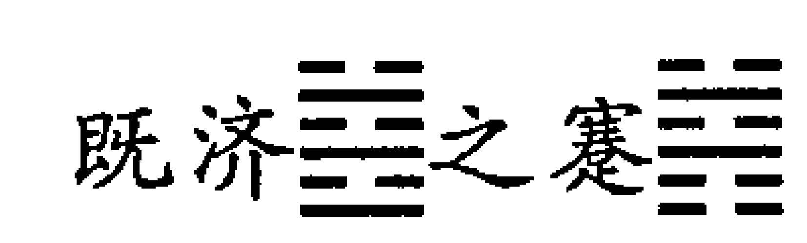

太乙理初九之爻，用事为动，故变既济之蹇。难之时，必有圣贤出，能济天下之难，坚守正道者吉。《易》曰：“蹇，利西南，不利东北，利见大人，贞吉。”夫既济之蹇，内卦变艮，艮主木菢。内互坎，坎者水，水犯此名者，

## 三式述要

可济蹇也。

隋炀帝以悖逆诈谋，志骄气溢，穷奢极欲，兵连四夷，役烦赋重，盗贼蜂起。是以李密、王世充、刘武周、刘黑闼、萧铣之徒，皆僭乱为事，各有所谋，如“曳轮濡尾”，终不能行，非建功立德之君，焉能得大业也。李渊举兵晋阳，建义旗，救民于涂炭，实仗义有为之主，所以能享国也。

唐武德元年戊寅岁 (公元 618 年)，太乙在第一纪甲子元一十五局，太乙在六宫，主参将与客大将相关，内迫太乙，始击将临之，又击太乙之宫，名四郭固，主有废篡固执之祸也。其年五月戊午，炀帝逊位唐公。其日甲子，唐公即皇帝位。

公讳渊，字叔德，姓李氏，陇西成纪人，应木果为李之象。以渊为名，应坎水之象，是谓高祖。子世民知隋必亡，遂起义于晋阳，应天顺人，扫除乱掠，四海臣服，正济蹇乃圣贤之君也。

唐公成纪人，起晋阳，后享于秦地，是“蹇，利西南，不利东北，大人贞吉”之验也。

## 太乙十二运卦

## 三式述要

谨按：太乙理既济初九，用事为动，则变为既济之蹇。蹇下艮上坎，象征艰难。卦爻辞重点揭示三个方面的意义：一是济蹇必须进退适宜，所谓利于西南平地，不利于东北山麓，表明此时可进则进，不可进则退。二是“大人”是济蹇的主导因素。所谓“利见大人”，事实上是揭示蹇难之时，期待着聚合各方力量，统一上下意志的“权威”性因素，有此“权威”为主导，则险厄可济，蹇难可解。三、济蹇又必须守持正固。所谓“贞吉”，即言行不违正道，上下同舟共济，必能济蹇获吉。（引自《周易译注》）此义与太乙上述之义完全一致。

那么，起主导作用的“大人”此时是谁呢？

以蹇卦象而言，下艮为木果，其象李字；内互为坎水，以“渊”为名，正应此象。李渊正应此时济蹇的“大人”。故云“李渊举兵晋阳，建义旗，救民于涂炭，实仗义有为之主，所以能享国也。”

武德元年 (公元 618 年) 岁次戊寅五月戊午日，隋恭帝禅位于唐，甲子日唐王李渊即皇帝位于太极殿。

武德元年 (公元 618 年) 岁次戊午，太乙积年为 10154535。推演太乙局如下：

```
10154535÷360
=28207 余 15
15÷3=5
```

此年太乙人第一纪第十五年，第一甲子元第十五局。太乙在第六宫第三年理地。（参见太乙阳遁第十五局图）天外助客。

始击在坤宫，内击太乙，主大臣逆命。

客大将与主参将皆在坤七宫，内宫迫太乙。

客参将一宫，外宫迫太乙。

始击内击太乙，客大、主参内迫太乙，客参外迫太乙，称为四郭杜，主大臣逆命，有废篡固执之祸。

此年为隋炀帝大业十四年 (公元 618 年)，又称隋恭帝义宁元年，又称隋越王皇泰元年。是年五月甲子，李渊即皇帝位，建国号为唐，改元武德。

## 太乙十二运卦

此年隋炀帝杨广、隋恭帝杨侑、越王杨侗先后被废黜、杀戮。此为太乙四郭固之验。

# 【原文】

武德九年 (太乙) 甲子元二十三局丙戌岁，太乙在九宫，太岁与太乙格，当有彗孛出于西北方，主有兵丧之事。其年二月壬午日，有孛星于胃昴之间，是彗孛出西方助太岁也。六月庚申日，秦王世民杀皇太子建成及齐王元吉。癸亥日，立世民为皇太子，听政。八月甲子日，授位于皇太子，尊帝为太上皇。

太岁与太乙格，孛星助太岁，相会，若合符契也。

谨按，唐高祖武德九年 (公元 626 年) 六月，唐朝内部诸皇子之间发生了争夺皇权的玄武门之变，秦王李世民杀太子李建成、齐王李元吉。李渊迫于李世民的崇高威望和显赫的战功，也迫于既成事实的宫廷政变，即立李世民为太子，不久，李渊自称太上皇，将帝位传给李世民，是为太宗。

武德九年 (公元 626 年) 岁次丙戌，太乙积年为 10154543。

```
10154543÷360
=28207 余 23
23÷3=7 余 2
```

太乙入第一纪，第一甲子元第二十三局。太乙在巽九宫第二年理地。

《太乙局》释此局曰：“此局算得太乙在九宫，理地，天外助客，客目併太阴，内外连谋；主目对太乙，臣下失礼。”

太岁丙戌，岁后二辰为太阴，太阴在申。今始击在申，故称客目始击并太阴。太阴主阴谋之谋，故称“内外连谋”。主目文昌在乾宫，太乙在巽宫，故称“主目对太乙，臣下失礼”。

而上文中以“太岁与太乙格，当有彗孛出西北方，主有兵丧之事”为断。

《淘金歌》注：“太乙在九宫，太岁次戊亥，彗星出乾，助太岁，五谷丰登。”而上文“主有兵丧之事”，出处待考。

## 续上表

| 公元 | 干支 | 朝代 | 帝王 | 年号 | 太乙纪 | 元 | 局 |
| --- | --- | --- | --- | --- | --- | --- | --- |
| 640 | 庚子 | 唐 | 太宗李世民 | 贞观 14 |  |  |  |
| 641 | 辛丑 |  |  | 15 |  |  |  |
| 642 | 壬寅 |  |  | 16 |  |  |  |
| 643 | 癸卯 |  |  | 17 | 第 1 纪 | 甲子元 | 第 40 局 |
| 644 | 甲辰 |  |  | 18 |  |  |  |
| 645 | 乙巳 |  |  | 19 |  |  |  |
| 646 | 丙午 |  |  | 20 |  |  |  |
| 647 | 丁未 |  |  | 21 |  |  |  |
| 648 | 戊申 |  |  | 22 |  |  |  |
| 649 | 己酉 |  |  | 23 |  |  |  |
| 650 | 庚戌 |  | 高宗李治 | 永徽 1 |  |  |  |
| 651 | 辛亥 |  |  | 2 |  |  |  |
| 652 | 壬子 |  |  | 3 |  |  |  |

谨按，既济六二爻，阴爻居阴位当位为正，与九五爻阴阳相应，六二居下卦之中，故为中正，太乙运卦之中中爻又为中道安平之限，故太乙运行既济卦六二爻，二十四年中道安平之限，称“事既济矣”，是事业有成的天时。

# 既济六二爻辞说：

六二，妇丧其茀，勿逐，七日得。

象曰：七日得，以中道也。

贵妇人乘车出行，而丧失了车辆的蔽饰，难以出行。但是不用追寻，过不了七天，必将失而复得。

象传说，七日能失而复得，说明六二能守持中正不偏之道。

据既济六二爻辞之义，可知唐太宗贞观十四年之后的二十四年之间，将有所失而后定，此限之中能守中正之道，则无失也。

既济之需，需卦之义为守正待时。而需卦内卦为乾，二和五皆阳不应，

## 三式述要

故上文说“有僭乱者生在内卦，事亟于内，必起自宫掖”。这是说，以对应的卦爻而论，此限之中将于宫廷中有乱。

# 【原文】

唐贞观十七年癸卯岁，甲子元四十局，太乙在七宫，主大将与客参将并囚太乙，为四郭杜，岁计遇之大凶。其年三月，魏王泰阴结朝臣谋代皇太子。（太子）承乾与侯君集谋以东宫兵攻大内。事觉，四月乙酉日，废皇太子为庶人，徙黔州，魏王泰阴幽于北苑，诛李安俨、赵节、侯君集等。丙戊日，立晋王治为皇太子，大赦天下。此太乙四郭杜之验也。

至贞观二十三年己酉五月，太宗崩，皇太子即位，号高宗。次岁改元。至永徽五年废皇后王氏为庶人，立宸妃武氏为皇后。僭乱者出于宫掖之间，有“妇丧其弟”失正之象。

谨按，唐太宗贞观十七年（公元 643 年）岁次癸卯，太乙积年为 10154560。

```
10154560÷360
=28207 余 40
40÷24
=1 余 16
16÷3=5 余 1
```

太乙入第一纪，第一甲子元第四十局，太乙在七宫第一年理天。

此局主目文昌在一宫，与主参同宫，故《太乙局》称“囚主参，有自谋同类者，臣近君上”。

主大将在七宫囚 (与太乙同宫为囚)，又乘囚气，主有“拘执奔败事”。

客参将也在七宫，为囚，与主大将同宫为关，主“同类自相猜忌攻夺”。

李承乾被立为皇太子后，逐渐染上许多坏习气，喜好声色，漫游无度，再加上患过足疾，行走不便，唐太宗逐渐厌恶承乾，转而喜爱四子魏王李泰，准备更换太子。在贞观十七年，便发生了魏王李泰谋杀东宫太子李承乾，李承乾发动篡位夺权的政变，侯君集等大臣也被牵连在内，此事件与太

## 第二章 太乙十二运卦

乙局所释之义相符合。

上文中只以“主大将与客参将并囚，太乙为四郭固，岁计遇之大凶”而论，似不甚确切。该局太乙前后宫并无提挟迫击之类，仅以主大、客参囚太乙宫就定为四郭固，似嫌不足。

# 【原文】

至高宗麟德元年甲子，太乙运行既济九三，阳爻三十六年，九三为内极灾变之限。既济九三爻辞：

九三，高宗伐鬼方，三年克之；小人勿用。

象曰：三年克之，惫也。

既济九三爻辞是说，殷高宗讨伐鬼方，持续三年之久终于获胜，焦躁激进小人不可任用。持续三年之久终于获胜，说明九三持久努力已经到了疲惫的程度。

前人多以既济九三爻辞中的高宗为殷王武丁。鬼方是国名，古代西北地区猃狁部落之一。这里的殷王高宗与唐高宗李治巧合了。

唐高宗麟德元年 (公元 664 年) 之后，于乾封三年 (公元 668 年) 岁次戊辰派李勣伐高丽，获其王；于总章三年 (公元 670 年) 岁次庚午，派薛仁

## 三式述要

贵征吐蕃，不利；于儀凤四年 (公元 679 年) 岁次己卯，派裴行俭伐突厥；永隆二年 (公元 681 年) 岁次辛巳，裴行俭平突厥，获其王伏念。

此时唐高宗的对外用兵，与既济九三爻辞、象辞“高宗伐鬼方，三年克之，惫也”何其相似!

太乙运行既济䷎九三爻，用事为动，九三为动爻，则变既济䷎为屯䷉

屯䷉卦象征事物初生时的艰难情状。卦辞卦象喻示创立事业虽然艰难，若能把握正确的规律，前景必然充满光明。

既济䷎之屯䷉，既济外互离，变为屯外互艮，离为戈，艮为止，止戈为武。既济内互坎，变为屯内互坤，六二与九五相应，是由险陷 (坎) 而成为国母 (坤) 之象。既济内离变为屯内震，离为中女，“帝出乎震”，中女登基称帝之象。总此数象，武氏称帝已显然若揭。

载初二年 (公元 690 年) 岁次庚寅，武氏正式称帝，改国号曰周，改元天授。此年太乙积年为 10154607。

```
10154607÷360
=28207 余 87
87÷60
=1 余 27
87÷72
=1 余 15
15÷3=5
```

太乙入第二纪第二十七年，丙子元第十五局，太乙在六宫第三年理人。

此局太乙在兑六宫，始击在坤七宫，内宫击；客大将七宫、主参将七宫内迫；客参将一宫；客大将、主参将同宫为关。故上文中称“主参将与始击将、客大将、客参将共迫太乙宫，名曰四郭固，有废簒之厄”。果然，在中国历史上破天荒地出了武则天女皇帝。

## 太乙运行既济\n\n六四(24) 所对应的历史纪年表（变卦为既济\n\n之革\n\n）

| 公元 | 干支 | 朝代 | 帝王 | 年号 | 太乙纪 | 元 | 局 |
| --- | --- | --- | --- | --- | --- | --- | --- |
| 700 | 庚子 | 周 | 武则天 | 久视 1 |  |  |  |
| 701 | 辛丑 |  |  | 大足 1 |  |  |  |
| 702 | 壬寅 |  |  | 长安 2 |  |  |  |
| 703 | 癸卯 |  |  | 3 |  |  |  |
| 704 | 甲辰 |  |  | 4 |  |  |  |
| 705 | 乙巳 | 唐 | 中宗李显 | 神龙 1 | 第 2 纪 | 丙子元 | 第 30 局 |
| 706 | 丙午 |  |  | 2 |  |  |  |
| 707 | 丁未 |  |  | 景龙 1 | 第 2 纪 | 丙子元 | 第 32 局 |
| 708 | 戊申 |  |  | 2 |  |  |  |
| 709 | 己酉 |  |  | 3 |  |  |  |
| 710 | 庚戌 |  | 睿宗李旦 | 景云 1 | 第 2 纪 | 丙子元 | 第 35 局 |
| 711 | 辛亥 |  |  | 2 |  |  |  |

## 续上表

| 公元 | 干支 | 朝代 | 帝王 | 年号 | 太乙纪 | 元 | 局 |
|---|---|---|---|---|---|---|---|
| 712 | 壬子 |  | 玄宗李隆基 | 景云 1 |  |  |  |
| 713 | 癸丑 |  |  | 开元 1 |  |  |  |
| 714 | 甲寅 |  |  | 2 |  |  |  |
| 715 | 乙卯 |  |  | 3 |  |  |  |
| 716 | 丙辰 |  |  | 4 |  |  |  |
| 717 | 丁巳 |  |  | 5 |  |  |  |
| 718 | 戊午 |  |  | 6 |  |  |  |
| 719 | 己未 |  |  | 7 |  |  |  |
| 720 | 庚申 |  |  | 8 |  |  |  |
| 721 | 辛酉 |  |  | 9 |  |  |  |
| 722 | 壬戌 |  |  | 10 |  |  |  |
| 723 | 癸亥 |  |  | 11 |  |  |  |

谨按，太乙运行四爻，为乱后待治之限。因三爻为内卦之极爻，三爻为内极灾变之限，乱而复治，故四爻为乱后待治之限。今太乙运行既济卦六四爻，虽为乱后待治，但既济䷀卦六四爻已进入外卦之坎，坎为险陷，故应“以防患虑变为急”。既济䷀六四爻象之辞曰：

六四，繻有衣袽，终日戒。
象曰：终日戒，有所疑也。

其义是说，华美衣服将变成敝衣破絮，应当整天戒备祸患。说明六四有所疑惧。

既济䷀六四爻变，则变为既济䷀之革䷀。革卦象征变革。革卦卦辞说：

革：己日乃孚，元亨，利贞，悔亡。

我们应当把既济六四爻辞和革卦卦辞联系起来看，还要结合太乙局所示之义，再对照此限所应的历史事实，就可更加清楚了。

从武氏久视元年 (公元 700 年) 岁次庚子，太乙运行既济卦六四爻开始，至唐玄宗开元十一年 (公元 723 年) 岁次癸亥二十四年中，唐王朝发生的重大历史事件：一是武后神龙元年 (公元 705 年) 岁次乙巳正月，武则天病重，宰相张柬之等与皇太子李显谋划，率羽林军 500 人拥李显入宫，诛杀武则天的内宠张易之、张宗昌，逼迫武则天传位给李显，改周复唐国号，史称“五王政变”。二是唐中宗景龙四年 (公元 710 年) 岁次庚戌六月，韦皇后和其女安乐公主为把持朝政，下毒药杀死中宗皇帝李显。韦后伪造遗诏，立 13 岁的李重茂为帝。李重茂仅挂了 10 天皇帝之名，临淄王李隆基 (此后的玄宗皇帝) 与太平公主等起兵入宫，杀韦后、安乐公主、宗楚客及韦氏亲党，逼李重茂让皇位给睿宗李旦，史称睿宗复辟。三是睿宗李旦复辟后，其妹太平公主参政主权。太平公主权倾朝野，却忌恨太子李隆基英武强硬，欲结党害死太子。睿宗景云二年 (公元 711 年)，太子李隆基监国，将太平公主迁到蒲州，次年八月李旦将帝位传给李隆基，是为玄宗。太平公主依仗其兄太上皇的势力回宫擅权用事，并采取各种手段拉帮结派，收买亲信，七个宰相有五个被她拉为亲信，文武大臣也多半趋附于她，于是，她积极谋划，准备废黜李隆基而做武则天第二。玄宗李隆基却先发制人，率兵诛杀太平公主及其党羽，史称此事为“景云之变”。四是开元前期，玄宗先后任用姚崇、宋璟为相，整顿武周后期的弊政，裁汰冗员，抑制食封贵族，限制佛教，继续推行均田制，兴修水利，发展生产。全国人口增加到五千余万，为唐朝初期人口的五倍，耕地面积日益扩大，物价便宜，社会安定，出现了前所未有的繁荣局面，史称“开元之治”。

此局太乙主算十，客算三十二，客算长于主算。主大将一宫发，主参将三宫发。客大将二宫，与太乙同宫为囚，客参将六宫发。

太乙在二宫，天外助客，客算长于主算，此为利客。而客大将与太乙同宫为囚，原文中说“人君不利有为”。《淘金歌》注曰：“囚者拘系而执之之义，主有奔亡篡弑之祸。”据此，可知该局太乙与所对应的历史事件基本相符。

景龙元年丁未，太乙在三宫，始击在地主，客大将在八宫，客参将在四宫，太乙近始击名为击太乙。在宫后为击在内，为废戮，占在同性、近臣、后妃之类，客算短，不成自败也。

武三思挟韦后，势将谋逆，内忌太子，而其子崇训又尚安乐公主，数请废太子，立皇太女。太子重俊愤不能平，七月辛丑，以羽林军千骑杀武三思、武崇训，入索公主，不克，死亡。癸卯，大赦。此太乙内击之应，亦既济之四爻动，内离外兑，离、兑二女阴柔不正之验。

谨按：唐中宗景龙元年 (公元 707 年) 岁次丁未，太乙积年为 10154624。

```
10154624÷360=28207 余 104
104÷60=1 余 44
104÷72=1 余 32
32÷24=1 余 8
8÷3=2 余 2
```

此局太乙人第二纪第四十四年，第二丙子元第三十二局。太乙在震四宫，第二年理地。

太乙在三宫，太岁在未，太岁格太乙。文昌在巳，并太阴。主算二十五，主大将，主参将不出中宫，八门杜。

始击在八宫子，内击；客大将在八宫，内迫；客参将在四宫，外迫。

此局主客俱不利。太乙受太岁格，始击内击，客大小将内外迫，故占在同姓、近臣、后妃之类有废篡之祸。此年果然发生了宫廷喋血的“景龙之变”。

太乙此局对应该年发生的“景云之变”。少帝李重茂唐隆元年，亦即睿宗李旦景云元年。该年先是韦后、安乐公主鸩杀中宗，接着就是相王李隆基与太平公主合谋诛杀韦后及其党羽的“景云之变”。

此后的睿宗太极元年，亦是延和元年 (公元 712 年) 岁次壬子七月辛未日，睿宗传位给太子李隆基。李隆基登皇帝位后，改元先天元年。

李隆基是唐王朝最重要、最有作为的帝王之一。他登上帝位后，励精图治，奋发有为，把唐王朝推向了鼎盛时期，史称“开元盛世”。此与太乙运行既济六四爻，既济䷏之革䷗，为乱后待治之限相应。

唐玄宗开元十二年甲子岁，太乙运行既济卦九五爻，三十六年，为中道安平之限。

既济上下二位，东西二邻之象也。易曰：

(既济) 九五，东邻杀牛，不如西邻之禴祭；实受其福。

象曰：东邻杀牛，不如西邻之时也；实受其福，吉大来也。

## 太乙运行既济䷏九五(36) 所对应的历史纪年表（变卦为既济䷏之明夷䷮）

| 公元 | 干支 | 朝代 | 帝王 | 年号 | 太乙纪 | 元 | 局 |
|---|---|---|---|---|---|---|---|
| 724 | 甲子 | 唐 | 玄宗李隆基 | 开元 12 |  |  |  |
| 725 | 乙丑 |  |  | 13 |  |  |  |
| 726 | 丙寅 |  |  | 14 |  |  |  |
| 727 | 丁卯 |  |  | 15 |  |  |  |
| 728 | 戊辰 |  |  | 16 |  |  |  |
| 729 | 己巳 |  |  | 17 |  |  |  |

| 公元 | 干支 | 朝代 | 帝王 | 年号 | 太乙纪 | 元 | 局 |
|---|---|---|---|---|---|---|---|
| 730 | 庚午 |  |  | 18 |  |  |  |
| 731 | 辛未 |  |  | 19 |  |  |  |
| 732 | 壬申 |  |  | 20 |  |  |  |
| 733 | 癸酉 |  |  | 21 |  |  |  |
| 734 | 甲戌 |  |  | 22 |  |  |  |
| 735 | 乙亥 |  |  | 23 |  |  |  |
| 736 | 丙子 |  |  | 24 |  |  |  |
| 737 | 丁丑 |  |  | 25 |  |  |  |
| 738 | 戊寅 |  |  | 26 |  |  |  |
| 739 | 己卯 |  |  | 27 |  |  |  |
| 740 | 庚辰 |  |  | 28 |  |  |  |
| 741 | 辛巳 |  |  | 29 |  |  |  |
| 742 | 壬午 |  |  | 天宝 1 |  |  |  |
| 743 | 癸未 |  |  | 2 |  |  |  |
| 744 | 甲申 |  |  | 3 |  |  |  |
| 745 | 乙酉 |  |  | 4 |  |  |  |
| 746 | 丙戌 |  |  | 5 |  |  |  |
| 747 | 丁亥 |  |  | 6 |  |  |  |
| 748 | 戊子 |  |  | 7 |  |  |  |
| 749 | 己丑 |  |  | 8 |  |  |  |
| 750 | 庚寅 |  |  | 9 |  |  |  |
| 751 | 辛卯 |  |  | 10 |  |  |  |
| 752 | 壬辰 |  |  | 11 |  |  |  |
| 753 | 癸巳 |  |  | 12 |  |  |  |
| 754 | 甲午 |  |  | 13 |  |  |  |

谨按：唐玄宗开元十二年（公元 724 年）岁次甲子，至唐肃宗乾元二年（公元 759 年）岁次己亥，三十六年之间，太乙运行既济卦九五爻，为中道安平之限。

唐玄宗李隆基即位之后，迅速粉碎了太平公主叛乱集团，采取一系列措施，整顿吏治，抑制食封贵族，压抑佛教，改革兵制，奖励农业生产，使唐王朝迅速走向繁荣富强，成为当时亚洲经济文化交流的中心。杜甫《忆昔》诗，就描述了当时繁荣、安定的情况：

忆昔开元全盛日，
小邑犹藏万家室。
稻米流脂粟米白，
公私仓廪俱丰实。
九州道路无豺狼，
远行不劳吉日出。
齐纨鲁缟车班班，
男耕女桑不相失。

歌舞升平的太平景象，足以使玄宗陶醉，他踌躇满志，自以为天下太平，没有什么可以担心的了。开元二十四年（公元 736 年），杨太真入宫，玄宗如获至宝，遂借酒寻欢，无所顾及，从此开始了他与杨贵妃的浪漫史。

玄宗后期，乐不思治，日益昏聩。开元二十四年，李林甫做了宰相，从此，“容身保位，无复直言”的风气便统治了朝廷，繁荣背后的危机一天天加剧了。

李林甫死后，杨贵妃的族兄杨国忠为宰相。杨国忠身兼四十余职，权倾天下，他同李林甫一样，整天发号命令，胡乱处理政事，选任官吏都在私第暗定，结党营私，贿赂公行，致使唐朝的政治更加昏暗。

从开元二十四年至天宝年间，奸相专权，贵妃专宠，玄宗日益昏聩，政治日益腐败，繁荣背后掩藏的危机也一天天加剧了。

既济䷲之明夷䷮

既济䷲之明夷䷮，内明而外暗，利于艰难守正，而自晦其明也。外卦坤，象无应，有盗贼为祸。在外卦起自藩臣。外互震，外卦坤，坤为牛，震为决躁，其物决躁而有鹿角之象。内互坎，坎北狄之北。外坤，坤为妇女，为群小，事起于妇女群邪之党。

唐玄宗开元二十八年，寿王妃杨氏为尼姑，号为太真，是时天下无事，国富民殷，太乙行中道安平之限也。到天宝三载，帝以安禄山为范阳节度使、河北采访使，是时太真妃势倾天下，禄山请为妃养儿，帝许之，命与杨钊及林甫约为兄弟，由是禄山有反天下之意。

天宝九年，封禄山为东平郡主。时帝春秋高，嬖艳鉏固，纪纲荡然。禄山反状已露，帝犹不悟。杨国忠恶禄山，言其必反，帝使谒者辅璆琳受禄山金，因言不反。皇太子亦屡言禄山反状，帝不信。国忠曰：“试诏来朝，必不至。”禄山揣知谋，乃驰谒帝，帝竟放禄山还镇，恐国忠留之，日行三百里。人有告者，必缚与之。

天宝十四载十一月，禄山反，陷河北诸郡。诏常清为范阳平庐节度使，以讨禄山。又诏郭子仪、王承业、张介杰、程千里讨之，仍以荣王琬为东讨元帅，高仙芝副之。十二月，常清、仙芝败绩，伏诛。荣王琬薨。其年太乙入八局，太乙在三宫，主算短，客算长，利客不利主故也。

谨按：太乙运行既济九五爻，卦为既济䷌之明夷䷾。明夷内离外坤，六五与六二两阴不应，故称“外卦坤象无应，有盗贼为祸”。又称“在外卦起自藩臣”。又称“内互坎，坎北狄之北”，“北坤，坤为妇女”，等等。

此时虽为中道安平之限，但“乱生于治”（见《皇极经世》），治与乱也往往交织在一起，历史往往呈现复杂的状况。仅以历史事实而论，此限出现了“开元之治”的唐朝鼎盛时期，杨贵妃专宠，李杜甫、杨国忠二奸相专制，终于发生了使唐王朝由鼎盛而转为衰败的“安史之乱”。

安禄山是柳城（今辽宁朝阳）胡人，本姓康，名轧荦山，后因母改嫁突厥人安延偃，他才改姓安，名禄山。安禄山能说六种少数民族语言，先做军队小军官，由于英勇善战，逐渐做到高级将领。天宝元年（公元742年）任平卢节度使。天宝十年（公元751年）兼领平卢、范阳、河东三镇。他用欺骗、献媚、贿赂等手段逐渐取得了玄宗的信任。

天宝十四年（公元755年）岁次乙未十一月初九甲子日，安禄山在范阳起兵，发动叛乱，兵锋直指唐的都城长安。此岁太乙积年为10154672。

```
10154672÷360=28207余152
152÷60=2余32
152÷72=2余8
8÷3=2余2
```

此年太乙入第三世纪第三十二年，第三戊子元第八局。太乙在艮三宫第二年理人。

此局太乙在三宫艮，文昌在丑，内辰迫，主大臣逆命；始击在坤，格太乙，主盗侮其君。此皆与安禄山以范阳、平卢、河东三镇节度使身份举兵反相应。

此局主算单一，短而不和，客算二十二，长。主参将三宫囚，客大小将皆发，利客不利主。此与安禄山迅速攻占河北，渡过黄河，攻下东都洛阳，

唐军则接连败退的战局相符。

(天宝十四年) 十二月，禄山称兵向阙，害太原尹杨光翙。(朝廷) 命西平王哥舒翰统兵八万镇潼关。

天宝十五年正月，禄山僭称雄武皇帝于东京，国号燕，建元圣武。六月辛卯，哥舒翰叛降于贼，遂陷潼关，京城大骇。(六月) 甲午，亲征。此玄宗不得守正之道，所以盗起而乱也。亦明夷先明后暗之象。

其年戊子元第九局，太乙在三宫，太岁在三宫，太岁丙申，太乙与太岁格，主有崩亡兵革之事。主西南国先败，东北国后败。

又，太乙在三宫，天目在和德，是太乙与天目俱在艮维之乡，主天子巡守、行聿、迁国。天目在和德主西南迁。太乙在既济九五之明夷，外卦坤象为西南梁州之分，是玄宗幸蜀之应。

六月丁酉，次马嵬驿，卫军杀杨国忠，赐贵妃自缢。己酉，禄山陷京师。七月庚辰，车驾至蜀。七月丁卯，皇太子主天下兵马事，北至灵武，裴冕等奉皇太子即皇帝位，是为肃宗，改元至德。二年正月，安庆绪杀父安禄山，而篡伪位，改元载初。

闰八月，复京师，庆绪奔陕。既济九五“东邻杀牛，不如西邻之禴祭”之时也，亦太乙格，主西南国先败，东北国后败之应也。又，既济之明夷，先明后暗之象也。

玄宗之初，欲为治，能自克厥俭德，至天宝之后，极耳目之玩，穷奢技巧，自以为帝王之富贵，皆不我若。禄山见纪纲之紊乱日甚，用进奇禽异物，以蛊帝心，玄宗不悟，以致不可支持。太乙行既济之明夷，先明后暗之应也。若玄宗能以艰难清俭守正道，克终其业，则乱无由生矣。

## 第二章：太乙十二运卦

亨北上到灵武 (今甘肃灵武西南)。即位称帝，重新聚集力量，开始组织对安禄山进行反攻。

安禄山于起兵后第三年，就被他的儿子安庆绪杀死了。

安庆绪于至德二年 (公元 757 年) 称帝，不久，洛阳、长安为唐军收复。第三年，安庆绪又被安禄山的副将史思明杀死了。

史思明在乾元二年 (公元 759 年) 先称燕王，后称皇帝。第三年，他也被儿子史朝义杀死了。

史朝义在上元二年 (公元 761 年) 称帝，两年后，兵败势穷，上吊自杀了。

“安史之乱”历时八年，叛乱葬送了玄宗的政治生命，也葬送了他与杨贵妃的浪漫爱情，更葬送了大唐王朝的赫赫国威。从此，唐王朝一蹶不振，每况愈下。

天宝十五年 (公元 756 年，亦即肃宗至德元年) 岁次丙申，太乙积年为 10154673。

```
10154673÷360
=28207 余 153
153÷72
=2 余 9
9÷3=3
```

此年太乙为戊子元第九局。太乙在艮三宫第三年理人。

此局太乙与太岁格 (太乙在艮，太岁在申)，主有奔败事；主算三，单阳，不和；文昌与主大皆在和德，与太乙同宫为囚，主有拘执奔败事；客算十五，杜塞无门，客大小将皆在中宫固守不出。

太岁和太乙，俱取象天子，二者相格，主奔败，此与玄宗下殿出走逃命蜀郡的历史事实相应。主算单阳不和，算短，文昌取象宰辅，文昌、主大将囚关，主宰辅拘执奔败，此与杨国忠兄妹等于马嵬坡被杀相应。

始击在大簇，客算十五，杜塞无门，客大小将内外迫太乙，主参将内迫太乙，此为四郭固，主有大臣逆命，相谋执献之凶。

此年主要事件是发生了宦官李辅国发动的政变。李辅国在安史之乱、玄宗入蜀时，劝太子李亨在灵武即位，自任太子家令、判元帅府行军司马事，奏章、军符皆由其掌管。宝应元年四月，太上皇李隆基死，肃宗病重，太子李豫监国。皇后张良娣素与宦官李辅国有矛盾。为争夺政权，张皇后召太子，欲诛李辅国及其从党程元振，太子不从。张后乃令越王李系行其事。李辅国知张后所谋，乃派兵收捕李系等百余人，迁张后于别殿。肃宗惊骇而死。李辅国杀张皇后、越王李系、兖王李僴等，辅代宗即位。李辅国为司空兼中书令 (宰相)。宦官为相，在中国历史上仅此一例。代宗即位后，因李辅国专权，心甚不平，乃遣人夜入其宅，将其杀死。

从此年太乙局来看，主客双方俱不利，而此年历史大事也确实如此，呈复杂状况。此年八月，还发生了明州 (今浙江宁波) 人袁晃率领的农民起义。

## 〔原文〕：

唐代宗广德元年癸卯岁，戊子元十六局，太乙在七宫，文昌将天道，内辰迫，始击将太簇，外宫击，客大将与主参将共格太乙之宫。太乙在七宫坤维之乡，主天子行幸。

经曰：太乙行极爻，但遇迫击之岁，亦必迁矣。欲知所幸之方，以变卦而定。外卦变得巽，为东南林壑之象。内互得坎，为险阻，是东南之地也。其年党项羌寇同州，郭子仪败之。子仪复长安。吐蕃陷陇诸州。

十月，车驾幸陕，系在东南之地，险阻之区也。自此连年边寇不息。至建中四年癸亥，朱泚为帝，国号秦，为乱者犯水之名者也。是有“濡首”之危，是时奸邪竟进，致君弱臣强，此其验也。

谨按：唐代宗广德元年 (公元 763 年) 岁次癸卯，太乙积年为 10154680。

10154680÷360=28207 余 160

160÷60 =2 余 40 

160÷72 =2 余 16 

16÷3 =5 余 1

此岁太乙入第三戊子元第三十七局，太乙在七宫第一年理天。

此局太乙在六宫，文昌在申，内辰迫；主大将在一宫，外迫，关客参将；始击在七宫，内宫击；客大将在七宫，内宫迫；客参将在一宫外迫。始击、客大将与客参将挟太乙。内外交迫，将相逆命，内乱外扰。太乙局与此际所对应的卦象未济之睽相符。

## [原文]:

唐德宗兴元元年甲子岁，太乙运行未济初六爻，二十四年，是上元甲子第四纪戊子元第三十七局。太乙运行既济之六爻，六爻俱得其位，此未济之爻，俱失其位。唐自受命以来，（运卦）爻俱失其位，自此以后，唐之君渐渐衰弱矣。

未济䷏之睽䷧（未济下坎上离，内互离，外互坎。）

太乙运行未济䷏卦初六爻，二十四年，为建功立业之限，以天时世运而论，是一个有利时机。德宗李适继位时三十八岁，已是壮年之君，他也确实想割除前代弊端，有所作为，但由于他“识度暗浅，恣情猜嫌，亲信多非其人，举措不由其道”，突出的表现为对功臣猜忌，对割据者姑息，对财物贪得无厌，多亏宰相李泌数年的努力，才求得一个较稳定的政局，但德宗始终未能做出什么政绩来。而他执政期间，由宦官典掌朝廷禁军，掌握宫市(宦官以皇宫的名义采集物品，对人民进行掠夺，称为宫市)，成为定制，这种恶政对唐朝后来影响很大。德宗李适执政期间的作为，与未济䷌初六爻辞和爻象居位不正，冒险躁进，终不成济之义正相应符，与之卦睽䷐卦乖背睽违之义也是一致的。

德宗李适壮年继位，执政二十六年，而又处于太乙运行建功立业之限的大好时机，却未能实现真正意义上的中兴之业，其中的原因是复杂的，也是难以阐述清楚的。

贞元二十一年 (公元 805 年) 岁次乙酉，太乙积年为 10154722。

```
10154722÷360
=28207 余 202
202÷60
=3 余 22 (太乙入第四纪)
202÷72
=2 余 58 (太乙入第三戊子元第五十八局)
58÷24
=2 余 10
10÷3
=3 余 1 (太乙在震四宫第一年理天)
```

贞元二十一年为太乙阳遁第五十八局，太岁与太乙冲。太岁为年中天子，太乙亦为天子之象。太岁与太乙相冲，两天子皆不利。此年正月辛未朔，诸王、亲戚皆上朝向德宗李适祝贺新春，太子李诵自去年九月患风疾，不能说话，病一直不见好转，不能前来祝贺，李适因此悲泣，接着也病倒了，并且病情一天比一天加重。因德宗李适与太子李诵俱病倒了，二十余日之中，内外消息不通，人情惶惶不安，各种不同的猜测都出现了。正月二十三日癸巳，德宗驾崩。二十四日甲午，太子李诵穿着孝服见百官。二十六日丙申，李诵即位于太极殿，人心才稳定下来。

李诵即顺宗皇帝。李诵因割除前代弊端，支持革新，限制宦官势力，使朝廷矛盾激化，宦官势力占据了上风，李诵仅做了八个月的皇帝便被迫退位，传位于太子李纯。接着，就发生了历史上著名的“二五八司马”事件，革新派被摧毁了。

## 【原文】：

唐宪宗元和三年戊子岁，是上元甲子第四纪戊子元六十一局，太乙运行未济卦九二爻，三十六年，为中道安平之限。未济九二，君多失道之时，所赖以，贞臣也。为君者守中行正，以尽君道，为臣者，以极其恭顺，戒其刚过，所以为正，而能保其终也。易曰：

(未济)九二，曳其轮，贞吉。

象曰：九二贞吉，中以行正也。


未济之晋，晋为进盛之时。火明在上，而下体顺附，诸侯承主之象。上者大明，而能与下同德，顺以治安也。易曰：“晋，康侯用锡马蕃庶，昼日三接。”变得内卦坤。经曰：乾坤之象，变在内卦，事主于人，起自宫掖。内互艮，外互坎，艮连坎为暗昧之人，为肘腋之祸。

自宪宗即位以来，天下丰熟，斗米二文。太乙行中道安平之限，用武元衡、裴度为相，是大明在上，而下顺附，上下同德，用康侯之象也。是以宪宗英敏果决，得于天性，选任忠良，延纳善谋，卒能清剑南，诛浙西，殍泽潞，平淮右，复齐鲁，于是百年之忧，一旦廓然，唐室复振，皆基于此。

至元和十五年庚子岁，是上元甲子第四纪庚子元第一局，太乙在一宫，主参将囚，客参将九宫格太乙，犯此主有大盗侮其君之象，人君不利有为。其年帝饵金丹多躁怒。正月庚子，宦者陈洪志弑帝，太子即位。由是宦者管民事，是为阉寺之应。

## 三式述要

至文宗太和九年乙卯岁，帝以中宫太盛，元年逆党尚在左右，畏而恶之。阴与李训、郑注谋诛之。九月，杀陈宏志。十月，杀王守澄。十一月壬戌，李训等言金吾佛舍有甘露，请观之，伏兵谋诛中宫，不克，李训奔于凤翔。守尉仇士良率兵杀王涯、贾悚，舒九兴、李孝本、罗立言、王璠、郭行余等十三族，京师大震，中宫益横。

文宗开成三年戊午岁正月甲子，仇士良使盗贼射宰相李石，朝廷震恐，百官入阙者九人而已，余皆僣窜，旬日方息，是为阉寺弄权之验也。

开成五年，太乙在二十一局，犯迫、格、挟、提，是为凶岁。其年正月戊寅，上不豫。中尉守宫仇士良矫诏立帝弟颍王为皇帝，权管领军事，废太子复为陈王。辛巳，帝崩于太和殿，号文宗。武宗即位。是构乱者起自宫掖阉寺之人，宦官为乱之应也。是上失大明之道，为臣者无德以附上，失晋卦用康侯之礼，所以及乱也。

## 太乙运行未济䷏九二(36)所对应的历史纪年表（变卦为未济䷏之晋䷓）

| 公元 | 干支 | 朝代 | 帝王 | 年号 | 太乙纪 | 元 | 局 |
|---|---|---|---|---|---|---|---|
| 808 | 戊子 | 唐 | 宪宗李纯 | 元和 3 | 第 4 纪 | 戊子元 | 第 61 局 |
| 809 | 己丑 |  |  | 4 |  |  |  |
| 810 | 庚寅 |  |  | 5 |  |  |  |
| 811 | 辛卯 |  |  | 6 |  |  |  |
| 812 | 壬辰 |  |  | 7 |  |  |  |
| 813 | 癸巳 |  |  | 8 |  |  |  |
| 814 | 甲午 |  |  | 9 |  |  |  |
| 815 | 乙未 |  |  | 10 |  |  |  |
| 816 | 丙申 |  |  | 11 |  |  |  |
| 817 | 丁酉 |  |  | 12 |  |  |  |
| 818 | 戊戌 |  |  | 13 |  |  |  |
| 819 | 己亥 |  |  | 14 |  |  |  |

太乙运行未济䷏九二爻，从唐宪宗李纯元和三年 (公元 808 年) 至武宗

## 三式述要

李炎会昌三年 (公元 843 年) 三十六年为中道安平之限。未济\n九二用事，九二阳爻居下卦中位，为阳刚居中，又与六五阴阳相应，六五阴柔为君位，九二阳刚为臣位，君弱臣强，故称 “君多失道之时，所赖者贞臣也”。此限历经宪宗、穆宗、敬宗、文宗、武宗五代帝王，其中宪宗在此限执政十二年，穆宗四年，敬宗二年，文宗十四年，武宗三年。

唐自中期以来，地方藩镇各拥强兵，表面上尊奉朝廷，但法令、官爵都自搞一套，赋税也不入中央。节度使的职位也往往父死子继，或由部下拥立，朝廷只能顺从，事后追认，而不能更改，否则，便联兵反叛朝廷。藩镇势力成为唐朝政权能否稳固的一大隐患。宪宗初期，宰相杜袭力主振举纲纪、制裁藩镇，这一主张得到宪宗的支持。宪宗时期，先后平定了西川藩镇刘辟和夏绥留后杨惠琳的叛乱。接着又平定了吴地镇海节度使李锜的叛乱。元和十二年 (公元 817 年) 平定了淮西吴元济，元和十四年 (公元 819 年) 削平了淄青节度使李师道。至此，藩镇割据势力基本上被消灭，唐朝又取得了实质上的统一。

变卦为未济\n\n之晋\n\n，晋为进盛之时，上卦离为光明，下卦坤为顺附，此与削除藩镇势力，加强中央集权的历史事实是相符的，故又称此为“诸侯承王之象”。晋\n\n卦卦辞曰：

康侯用锡马蕃庶，昼日三接。

尊贵的公侯蒙受天子赏赐众多车马，一天之内荣获三次接见。此义与当时藩镇纷纷归顺之象正相符合。

但是，未济\n\n变爻在内卦，之卦晋\n\n内互艮上连外互坎，艮为阍寺与坎险结合，故主宦官之乱。

文宗李昂开成五年（公元 840 年）岁次庚申，太乙积年为 10154757。

10154757÷360  
=28207 余 237

## 三式述要

237÷60  
=3 余 57 (第 4 纪第 57 年)  
237÷72  
=3 余 21 (第 4 庚子元第 21 局)

此年太乙在第 4 纪庚子元第 21 局。此局太乙在八宫，主大将在二宫，与太乙宫格；客参将在一宫，内宫迫太乙。此象皆对人君造成影响。格主上下相格，变易其君之象；内迫亦为挟持逼迫之象，主太监、后妃、同姓之属有谋。文宗李昂晚年，朝廷大权被宦官掌握，文宗完全成了一个傀儡皇帝，因而忧愤，尤其他的儿子被立为太子后，却突然死去，状似中毒，却无从查证，从而忧愤成疾，于开成五年 (公元 840 年) 正月初四辛巳崩于太和殿。中尉太监仇士良、鱼弘志已造伪诏立李瀍为皇太弟，并大杀文帝生前的亲近者。李瀍 (后改名李炎) 即武宗皇帝。

太乙运行卦爻和太乙第二十一局皆示有宫掖阁寺之乱。

## [原文]

唐武宗会昌四年甲子岁，太乙入第五纪庚子元二十五局，太乙在一宫一年。太乙运行未济卦六三爻，内极灾变之限，二十四年，时未济而征，所以凶也。若能涉险除惠，则吉无不利。易曰：

(未济) 六三，未济，征凶，利涉大川。

象曰：未济征凶，位不当也。

未济䷆之义为事未成功，若急于进取必有凶险，但利于涉越大河巨流以脱出险难。《象传》说，事未成急于进取必有凶险，这是由于六三阴居阳位，居位不适当的缘故。未济䷆卦六爻皆居位不当，独以六三爻辞中称“位不当”，前人指出：“以六三才弱而处下体之上也”，即内卦极位，太乙中称之为内极灾变之限。

未济䷆六三用事，则为未济䷆之鼎䷊。鼎䷊卦具有革故从新之义。鼎䷊卦内巽外离，内互乾，外互兑。乾为君，似有刚德之君主于内之象，离为文明，离火在乾天之上，有天上文明照四方之象。但是，离又为戈兵，兑又为毁折，而太乙运行内极灾变之限，此时既使出现刚德之君，也难以大展鸿图。

## [原文]

武宗会昌六年丙寅，太乙在二十七局，客大将挟，名曰四郭杜，人君不利有为。其年三月，帝服方药不愈，甲子，崩。号武宗皇帝。太叔即位，是谓宣宗。英敏特达，屡任能臣，克上党如拾芥，取太原如反掌。享国日浅，功业未就，惜哉!

宣宗李忱虽由宦官矫诏拥立，但他在位十三年，却受到史家的称赞。史官称李忱明察慎断，用法无私，恭谨节俭，惠爱民物，具有贞观之风。这虽然带有夸张成份，但也不完全是溢美之词。从唐朝中后期几代皇帝来看，宣宗李忱可以称得上是一名贤明君主。他在位期间，社会形势得到一定程度的好转，国家安定，社会经济得到发展。但此时已是唐王朝后期，各方面的弊端已经积重难返，宣宗李忱在十三年的执政期间已不可能彻底扭转乾坤了。

宣宗朝的史实，似与之卦鼎䷳卦革故从新之义相符。但是，此时的鼎是否一卦双关？革故从新之义与唐朝将要灭亡，将要改朝换代的历史事实是否联系在一起？有待进一步探讨。

宣宗李忱大中十三年 (公元 859 年) 岁次己卯，太乙积年为 10154776。

10154776÷360  
=28207 余 256  
256÷60  
=4 余 16 (第 5 纪第 16 年)  
256÷72  
=3 余 40 (第 4 庚子元第 40 局)  
40÷24  
=1 余 16  
16÷3  
=5 余 1 (太乙在 7 宫第 1 年)

此局太乙在七宫第一年理天，入庚子元第四十局，主大、客参与太乙同宫为囚：主目文昌在乾一宫，主参与文昌同宫为关，始击在丑与太阴并，主臣失爵禄，关梁闭塞。此象为四郭固，对人君构成威胁。其年八月宣宗服丹药中毒疽发而死。宦官右军中尉王宗实矫诏迎立郓王李温即位，改名漼，是为懿宗。

懿宗李漼即位时，唐朝政治已经衰败，阶级矛盾已相当尖锐。翰林学士刘允章在《直谏书》中指出，当时国有九破，民有八苦。九破是指终年聚兵、蛮夷炽兴、权豪奢僭、大将不朝、广造佛寺、贿赂公行、长吏残暴、赋役不等、食禄人多而输税人少；八苦是官吏苛刻、私债征夺、赋税繁多、所由乞敛、替逃人差科、冤屈不得申理、冻无衣饥无食、病不得医死不得葬。国有九破，唐王朝的政权已岌岌可危了；民有八苦，人民已无法继续生活下去，只有造反起义了。故称“未济之不能除患难，又不能革弊鼎新，故无有所利，何吉之有也”，唐朝至此已显露出亡国之徵，“李氏之亡于斯，决矣!”

## [原文]

唐懿宗咸通九年戊子，太乙运行未济䷡卦九四爻，为习(坎)乱之后待治之时，其限三十六年。未济九四能勉而有为，正则无悔，不正则不能济于艰险而有悔也。以义为动，能伐远方，可以成功而行大国之赏。必如是，乃有济天下之道，当贞固，所以有吉也。易曰：

(未济) 九四，贞吉，悔亡；震用伐鬼方，三年有赏于大国。

象曰：贞吉悔亡，志行也。

未济䷏之蒙䷓。蒙䷓下坎上艮，上互坤，下互震。

未济之蒙，蒙昧之世，弱主在上，强臣在下，当任刚中之臣，不失其中正之道，则可也。不然，权臣专政，小人并进，上下相蒙，失正而凶也。易曰：

“蒙，亨。匪我求童蒙，童蒙求我；初筮告，再三渎，渎则不告。利贞。”外互得坤，有应，防后妃、臣下之谋。变在外卦，事生于外，起自藩臣。外互坤，坤为黄也。上有艮，艮为黔啄之属。有山，山巅之木，巢居之象。艮为山，坤属土，坤上有一奇（按：指土上有一）乃王字，为王者之象。内互震，震为木。乱者以此为兆也。

# 太乙运行未济䷏九四(36) 所对应的历史纪年表 (变卦为未济䷏之蒙䷓)

| 公元 | 干支 | 朝代 | 帝王 | 年号 | 太乙纪 | 元 | 局 |
|---|---|---|---|---|---|---|---|
| 868 | 戊子 | 唐 | 懿宗李漼 | 咸通 9 |  |  |  |
| 869 | 己丑 |  |  | 10 |  |  |  |
| 870 | 庚寅 |  |  | 11 |  |  |  |
| 871 | 辛卯 |  |  | 12 |  |  |  |
| 872 | 壬辰 |  |  | 13 |  |  |  |
| 873 | 癸巳 |  |  | 14 |  |  |  |
| 874 | 甲午 | 唐 | 僖宗李儇 | 乾符 1 |  |  |  |
| 875 | 乙未 |  |  | 2 |  |  |  |
| 876 | 丙申 |  |  | 3 |  |  |  |
| 877 | 丁酉 |  |  | 4 |  |  |  |
| 878 | 戊戌 |  |  | 5 |  |  |  |
| 879 | 己亥 |  |  | 6 |  |  |  |
| 880 | 庚子 |  |  | 广明 1 |  |  |  |

## 续上表

| 公元 | 干支 | 朝代 | 帝王 | 年号 | 太乙纪 | 元 | 局 |
|---|---|---|---|---|---|---|---|
| 881 | 辛丑 |  |  | 中和 1 |  |  |  |
| 882 | 壬寅 |  |  | 2 |  |  |  |
| 883 | 癸卯 |  |  | 3 | 第 1 纪 | 甲子元 | 第 40 局 |
| 884 | 甲辰 |  |  | 中和 4 |  |  |  |
| 885 | 乙巳 |  |  | 光启 1 |  |  |  |
| 886 | 丙午 |  |  | 2 |  |  |  |
| 887 | 丁未 |  |  | 3 |  |  |  |
| 888 | 戊申 |  |  | 天德 1 |  |  |  |
| 889 | 己酉 |  | 昭宗李晔 | 龙纪 1 |  |  |  |
| 890 | 庚戌 |  |  | 大顺 1 |  |  |  |
| 891 | 辛亥 |  |  | 2 |  |  |  |
| 892 | 壬子 |  |  | 景福 1 |  |  |  |
| 893 | 癸丑 |  |  | 2 |  |  |  |
| 894 | 甲寅 |  |  | 乾宁 1 |  |  |  |
| 895 | 乙卯 |  |  | 2 |  |  |  |
| 896 | 丙辰 |  |  | 3 |  |  |  |
| 897 | 丁巳 |  |  | 4 |  |  |  |
| 898 | 戊午 |  |  | 光化 1 |  |  |  |
| 899 | 己未 |  |  | 2 |  |  |  |
| 900 | 庚申 |  |  | 3 |  |  |  |
| 901 | 辛酉 |  |  | 天福 1 |  |  |  |
| 902 | 壬戌 |  |  | 2 |  |  |  |
| 903 | 癸亥 |  |  | 3 |  |  |  |

太乙运行未济三九四三十六年，为乱后待治之限。此限从唐懿宗李漼咸通九年 (公元 868 年) 岁次戊子开始，至唐昭宗李晔天福三年 (公元 903 年)

## 第二章 太乙十二运卦

年) 岁次癸亥止，历经唐懿宗朝 6 年、僖宗朝 15 年、昭宗朝 15 年。

这个阶段是唐朝末年农民大起义的年代。此前于宣宗大中十三年 (公元 859 年) 爆发的以裘甫为领袖的浙东起义。懿宗咸通九年 (公元 868 年) 爆发了以庞勋为领袖的徐 (今江苏徐州) 泗 (今江苏盱眙) 起义。僖宗乾符二年 (公元 875 年)，濮州 (今河南范县南) 人王仙芝率数千人在长垣 (今河南长垣) 起义，迅速发展至数万人，冤句 (今山东荷泽西南) 人黄巢聚众数千人响应王仙芝，形成规模庞大的王仙芝、黄巢农民起义军。王仙芝战死后，黄巢率十几万起义军组建了起义政权，至僖宗乾符六年 (公元 879 年) 有众百万。僖宗广明元年 (公元 880 年) 十一月，黄巢起义军攻克长安，僖宗李儇仓惶逃至四川。十二月十三日，黄巢即皇帝位，国号大齐，年号金统。僖宗中和二年 (公元 882 年) 九月，沙陀贵族李克用率军助唐攻长安，黄巢于中和三年四月撤离长安。中和四年 (公元 884 年) 六月，黄巢败退至山东泰山地区，不屈自杀。

王仙芝、黄巢率领的农民大起义，历时十年之久，遍及山东、河南、江苏、安徽、浙江、福建、广东、广西、湖南、江西、湖北、陕西等十二个省区，沉重打击了唐朝的统治，加速了唐王朝的灭亡。

在黄巢攻占长安，唐僖宗逃至成都的中和二年 (公元 882 年) 二月，阡能在四川邛州 (今四川邛崃)、雅州 (今四川雅安西) 一带起义，前后持续了九个月，终于被官军镇压下去。

黄巢起义于唐僖宗中和四年 (公元 884 年) 失败后，唐王朝名存实亡，藩镇割据进入藩镇兼并时期。当时较强的藩镇势力有宣武节度使朱全忠 (河南)、奉国节度使秦宗权 (河南)、河东节度使李克用 (山西)、凤翔节度使李茂贞 (陕西)、卢龙节度使刘仁恭 (冀北)、镇海节度使钱缪 (浙江)、淮南节度副大使杨行密 (江苏)、西川节度使王建 (四川)、威武节度使王朝 (福建) 等。其中又以朱全忠 (朱温)、李克用的力量最为强大。从唐昭宗李晔龙纪元年 (公元 889 年) 起，朱全忠先后击败了秦宗权和刘仁恭，控制了河南地区，并降服了河北诸镇。昭宗天复二年 (公元 902 年) 又大败李克用，遂左右了唐朝政权。当时唐朝内部的宦官与朝官之争愈演愈烈，并各拉藩镇以自固。宰相崔胤与朱全忠串通一气，宦官韩全海与李茂贞共为朋党，各有挟天子以令诸侯之意。唐昭宗天复三年 (公元 903 年)，朱全忠击败了李茂贞，继而又诛除宦官数百人，迁唐昭宗李晔于洛阳，遂完全控制了唐廷。此时距唐朝灭亡只有一步之遥。唐哀帝李柷天祐四年 (公元 907 年)，朱全忠终于废唐自立，改元开平，国号梁，史称后梁。唐朝灭亡。

此限以卦而论，未济䷏九四用事，变爻在外卦，事主于外，其之卦为蒙䷂，蒙䷂内坎外艮，内互震外至坤，坤为土为黄色，土上一横 (指上卦艮上爻) 为王字，以此对应黄巢为王的历史事件，这当然很牵强。外互坤与内互震又组成复䷂卦，以此对应唐王朝经过黄巢之乱后，仍然能够恢复其政权。但是，蒙䷂卦内坎为陷，外艮为止，出此限之后，唐朝即灭亡了。

光启元年乙巳三月，车驾至自成都，大赦，改元。田令孜与王重荣争盐池。九月，王重荣反。十二月，克用叛附于重荣。十一月乙丑，李克用犯京师。其年太乙在六十六局，太乙在七宫。始击、武德俱在坤维之乡，又主、客迫挟太乙，主天子巡狩。丙子，车驾幸凤翔。太乙在七宫坤维西南之方，是以幸凤翔，太乙在七宫故也。河中王重荣掠太原，兵诣阙，焚荡俱尽。

唐僖宗光启元年 (公元 885 年) 岁次乙巳，太乙人第五纪庚子元第六十六局，太乙在七宫第三年。主大将在二宫内迫，主参将在六宫外迫，主大小将并挟太乙。始击在申外击，客参将在二宫囚。故称此局“主客迫挟太乙”，主天子离开京都，外出巡狩 (巡狩，指天子被俘或外逃)。《太乙局》对此局之义的解释：“主大将二宫内迫，宗室近臣攻外，又关客参，不利有为。”“主参将六宫外迫，大臣逆命。”“始击在申外击，臣子生逆，外国侵侮，移宫室。”“客参将二宫内迫，不利有为，又关，同类相谋。”迫和挟，为逼迫挟持之义，故有天子离开京都出走之象。

僖宗李儇因避黄巢义军逃至成都四年之久，于光启元年二月返回长安京都，并改元“光启”，是希望光复唐朝往日的繁荣强盛。但是，这只是李儇的良好愿望而已，他缺乏治国才能，并无回天之力。唐朝仍然是田令孜专政。田令孜决心以武力征讨不交出盐税和不服从朝廷调动的河中节度使王重荣。王重荣则联合河东节度使李克用以讨伐专权的田令孜为名，兵临长安城下。同年十二月二十五日，田令孜再次保护僖宗逃离长安，逃到凤翔 (今陕西凤翔，在长安西南方向)，京都会长安再遭涂炭。

唐昭宗天祐元年甲子，太乙运行未济䷐卦六五爻，中道安平之限，二十四年。未济䷐六五，以柔居尊位，弱主在上，为臣者能辅之以君子之道，以戒其君，时可济也，可济则有光辉之吉也。若以柔居尊而不能制下，下不能以忠信事上，何有光辉之吉？反道败德失之大矣。未济䷐曰：

六五，贞吉，无悔；君子之光，有孚吉。

象曰：君子之光，其晖吉也。

太乙理未济䷐六五爻，未济䷐之讼䷓。讼䷓卦上下相违，内外相悖，以为讼也。以信实居中正之道，常自惕惧戒备讼何由兴？不能守中正之道，终必有凶。《易》曰：“讼，有孚窒惕，中吉，终凶。利见大人，不利涉大川。” 外卦乾象无应，有僭乱之徒流于世。外卦起自藩臣。外卦乾，内互离，下卦坎，有名天者、日者、水者，有赤者、有光者，是其应也。

# 太乙运行未济䷐九四(24) 所对应的历史纪年表（变卦为未济䷐之讼䷓）

| 公元 | 干支 | 朝代 | 帝王 | 年号 | 太乙纪 | 元 | 局 |
|---|---|---|---|---|---|---|---|
| 904 | 甲子 | 唐 | 昭宗李晔 | 天祐 1 |  |  |  |
| 905 | 乙丑 |  | 哀宗李柷 | 天祐 2 |  |  |  |
| 906 | 丙寅 |  |  | 3 |  |  |  |
| 907 | 丁卯 |  |  | 4 |  |  |  |
|  |  | 后梁 | 太祖朱温 | 开平 1 |  |  |  |
| 908 | 戊辰 |  |  | 2 |  |  |  |

唐昭宗天祐元年 (公元 904 年) 岁次甲子，至后唐明宗李嗣源天成二年 (公元 927 年) 岁次丁亥，二十四年。太乙运行未济䷒卦六五爻，为中道安平之限。此限虽名为中道安平之限，而实际历史进入动荡不安的分裂割据的五代十国时期。

此限太乙运行未济䷒卦六五爻，其卦为未济䷒之讼䷀，讼䷀卦之义为诚信室塞，聚讼纷纭，纷争不已。此与历史进入五代十国时期，政权林立，天下分裂的局面相应。

灭掉唐朝，使中国历史进入五代十国的一个关键人物是朱全忠。朱全忠(852-912) 本名朱温，宋州砀山 (今安徽砀山县) 人，出身贫寒之家，参加了黄巢起义军，任东南面行营都虞侯。在黄巢起义军处于危难之际投降唐朝官军，赐名全忠，又参与了镇压黄巢起义军，从而，成为唐末昭宗和哀帝两朝的专权者。唐昭宗天祐元年 (公元 904 年) 八月，朱全忠派人杀死昭宗李晔，立昭宗幼子李柷做他的傀儡皇帝。哀帝李柷天祐四年 (公元 907 年)，朱全忠逼迫李柷退位，自立为帝，改唐为大梁，史称后梁，朱全忠又改名朱晃。唐朝灭亡，后梁政权产生，中国历史从而进入五代十国时期。

《太乙统运行爻编年》中认为，此际未济䷏之讼䷳，讼䷳卦上乾为天，下坎为水，内互离为日为光为赤色，外互巽为行权，以此对应朱温 (朱为赤色，温字有水) 之名。朱温称帝后，改名朱晃，晃有日有光，以此与内互离相应。这样以太乙运卦来对应历史和历史人物，实在太牵强附会了。

(唐昭宗李晔天祐元年) 其年八月壬寅，朱全忠遣李振、蒋玄晖弑帝。蒋玄晖兵犯宫门，是夕帝崩，号昭宗。全忠矫诏，立皇太子监国，丙子即位，年十三。天祐二年十二月戊申，全忠弑太后何氏。朱全忠杀唐丞相、三省官殆尽。天祐四年丁卯四月甲子，帝禅位于朱全忠，国号梁。徙帝于曹州，号哀帝。上有弱君，下有强臣，上下不相制，失正而征，所以见灭也。朱温犯水日之名，至此而唐亡矣。以数推之，则二百八十二年乃祚限之期，今在数外而终。唐朝一十八帝，其间岂无积德累功之君，所以过其数也。其年四月甲子，朱全忠受唐禅位，即皇帝位，改元开平，国号大梁，更名晃，升汴州为开封府，建名东都。梁之历数非正数，止得十二年。

梁乾化二年壬申岁，太乙在二十一局，太乙在八宫，主大将格，客参将内迫，死门为直事，加太乙宫，岁计遇之，人君不利有为。帝晚年淫愁尤甚，次子郢王友珪惧诛，六月戊寅与韩勍、冯廷谔弑帝，年六十一，号太祖，友珪自立。至次年癸酉，友珪闻乱，与妻张氏趋北垣楼下，令冯廷谔先行。

## 第二章 太乙十二运卦

刃其妻，次及己，谔亦自刎，年二十八，贬庶人。均王友恭即位，去凤历，止为乾化三年，至乙亥正月改贞明，至辛巳改龙德。龙德三年癸未六月，李存勗用郭崇韬自郓州直趋大梁，十月，败王彦章。戊寅夕，梁主诏其将皇甫麟进刃于建国楼下，而谓之曰：“李氏与我世仇，理难自降，其首不可令被刀鎗，卿可怜吾首。”涕泣斫王首，因自杀。存勗四月即位于魏州，改天祐二十年为同光元年，大赦天下，复国号唐。亦非正数，主十二年之限也。至庄宗同光四年四月，从马直郭从谦作乱，帝为流矢所伤，崩绛霄殿之廊也，年四十，号庄宗。嗣源于四月丁亥至婴子谷，闻内难，哀恸久之，至洛京，即帝位，改元天成，大赦天下。

后梁乾化二年 (公元 912 年) 岁次壬申，太乙积年为 10154829。

```
10154829÷360
=28207 余 309
309÷60
=5 余 30 (第 6 纪第 30 年)
309÷72
=4 余 42 (壬子元第 42 局)
42÷24
=1 余 18
18÷3
=6 余 1 (太乙在 7 宫第 3 年)
```

此岁太乙入第六纪壬子元第四十二局，太乙在七宫第三年。主大将与太乙同宫为囚，“有拘执奔败崩亡事”；客大将二宫内迫太乙，“宗室后戚近臣攻外，不利有为”，客参将又受挟于主二将。

明宗李嗣源即位后，改革了一些弊政，废除苛敛之法，罢除和诛杀了担任各道监军的宦官。精简宫廷人员，任用能臣，平息了汴州禁军叛乱。史称他在位八年年间年谷屡丰，兵革罕用，较之五代，粗为小康。长兴四年 (公元 933 年) 十一月，李嗣源病重，命第五子天雄节度使宋王李从厚回京继位。其次子秦王李从荣趁李从厚到京之前率兵入宫，企图先入为主，被禁军打败未死。不久，李嗣源病死，李从厚继位。上述太乙局就对应了该年发生的历史事件。

后唐天成三年戊子，太乙运行未济卦上九，为外极灾变之限，三十六年。

未济之极，否终倾变之时也。若能诚志安于义命而自乐，则可无咎，若不退而安分，忿躁陨坠，入于凶咎矣。若恣乐而耽肆，至于濡其首，信之矣。若能退而安于义命，不失其常，则无咎矣。《易》曰：

后唐明宗李嗣源长兴四年（公元 933 年）岁次癸巳，太乙积年为 10154850。

```
10154850÷360
=28207 余 330
330÷60
=5 余 30 (第 6 纪第 30 年)
330÷72
=4 余 42 (壬子元第 42 局)
42÷24
=1 余 18
18÷3
=6 余 1 (太乙在 8 宫第 1 年)
```

此岁太乙入第六纪壬子元第四十二局，太乙在八宫第一年。主目文昌、主大将皆与太乙同宫为囚，又主目文昌关主大将。客参将在一宫，内宫迫太乙。此局并无提挟。原文中称闵帝李从厚于该年四月被鸩杀，“为太乙提挟之验”不确。

清泰三年丙申五月，河东节度使、驸马都尉石敬瑭为郓州节度使，封赵国公，不受命。七月，诛敬瑭子石重英、重裔及弟敬德、范延光，晋阳危蹙，敬瑭求援于契丹。契丹王德光自将五万骑救之。九月，帝亲征，次覃怀，副讨使杨光远杀张敬达以降契丹。丁丑，车驾还。庚辰，敬瑭至河阳。其年太岁丙申，太乙在四十五局，太乙在八宫，主提挟客，是乱之验也。辛巳，帝与皇后举族自焚于武元殿下，年二十五岁，号末帝。此正十二年之数也。十一月丁卯，戎主立敬瑭为大晋皇帝于晋阳，约为父子之国，改长兴七年为天福元年，大赦天下。亦无正数，以九年为限。

后晋高祖石敬瑭天福十年（公元 942 年）岁次壬寅，太乙积年为 10154859。

```
10154859÷360
=28207 余 339
339÷60
=5 余 39
339÷72
=4 余 51
51÷24
=2 余 3
3÷3
=1
```

此岁太乙人第六纪甲子元第五十一局，太乙在一宫第三年。此局主算二十五，杜塞无门。太乙在三宫，太岁在未，岁乙相格，主兵戈之厄。此年正月，契丹大军攻陷后晋京师，出帝石重贵做了契丹的俘虏，后晋灭亡。

后晋出帝石重贵开运四年（公元 947 年）岁次丁未，太乙积年为 10154864。

```
10154864÷360
=28207 余 344
344÷60
=5 余 44
344÷72
=4 余 56
56÷24
=2 余 8
8÷3
=2 余 2
```

此岁太乙人第六纪壬子元第五十六局，太乙在三宫第三年。此局主算十五，杜塞无门。太乙在三宫，太岁在未，岁乙相格，主兵戈之厄。此年正月，契丹大军攻陷后晋京师，出帝石重贵做了契丹的俘虏，后晋灭亡。

太原北平王刘智远知晋国必亡，乃图义举。辛未，即皇帝位于太原，不改元，仍称晋天福十三年。四月癸亥，册魏国夫人李氏为皇后。至戊申年正月，大赦，改元乾祐，更名曰晃，国号汉。以冯道为太师，封齐国公。甲子日，帝不豫。乙丑，崩于万岁殿，年五十四，高祖第三子承祐即帝位，年十七。至乾祐三年庚戌，太乙在四宫，客挟，主客大将迫太乙宫，主参将格，人君不利有为。其年，郭允明弑帝，年二十，号隐帝。此正坎之流石二象也。郭威自迎春门入。辛亥岁正月，即皇帝位，国号大周，改元广顺，都于汴洛，称郭雀儿。周亦无正数，以九年为限。至四年，帝崩于滋德殿，年五十，号太祖，有飞鸟之象也。义子柴荣奉遗诏即位，改元显德。至六年己未，壬子元六十八局，太乙在八宫，始击掩太乙宫，主参将迫，人君慎之。六月，帝崩于万岁殿，年三十九，号世宗。此为离变震，有木入于火，互坎，柴之象也。子宗训即位，年七岁。庚申岁正月，就发生了陈桥兵变，赵匡胤黄袍加身，后周就此灭亡了。

宋太祖赵匡胤乾德二年甲子，太乙运行艮卦初六爻，二十四年，为建功立德之限。艮之为卦，一阳位于二阴之上，阳自下升，极上而止，其为镇静之象。艮为门阙，震之木是家中木，宋兴之兆也。宋之数一百六十四年，为祚限之数也。

初六爻动之初，止初于事止也。事止于初，未至失正，故无咎。戒以利在恒永贞固，则不失正道也。《易》曰：

（艮）初六，艮其趾，无咎，利永贞。

象曰：艮其趾，未失正也。

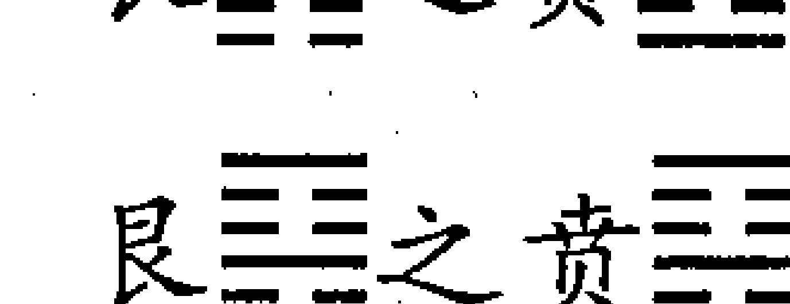

艮䷀之贵䷀，人之合聚，则有威仪，上下物之合聚，则有次序，行列合，则必有文，犹物之有饰也。有节而后能亨。然贲卦之象，亨于小者，则利有攸往。《易》曰：“贲，亨，小利有攸往。”内卦初变而为离，离日也，火也，有文明之象也。

# 太乙运行艮䷀初六(24) 所对应的历史纪年表（变卦为艮䷀之贲䷀）

| 公元 | 干支 | 朝代 | 帝王 | 年号 | 太乙纪 | 元 | 局 |
|------|------|------|------|------|--------|----|----|
| 964  | 甲子 | 北宋 | 太祖赵匡胤 | 乾德 2 |  |  |  |
| 965  | 乙丑 |  |  | 3 |  |  |  |
| 966  | 丙寅 |  |  | 4 |  |  |  |
| 967  | 丁卯 |  |  | 5 |  |  |  |
| 968  | 戊辰 |  |  | 开宝 1 |  |  |  |

北宋太祖赵匡胤建立北宋王朝后的第五年，即乾德二年（公元 964 年）岁次甲子，太乙运卦开始运行艮䷐卦初六爻，至太宗赵光义雍熙四年（公元 987 年）岁次丁亥止，二十四年，为建功立德之限。此限之中，太祖赵匡胤和太宗赵光义进行了消灭割据政权，结束五代十国分裂局面的战争，先后攻灭了南平、后蜀、南汉、南唐等南方割据政权，又迫使吴越王钱俶纳土归附，又最后攻灭了北汉政权。至此，中原和南方基本上统一在了北宋政权的

## 第二章 太乙十二运卦

北宋政权在管辖之下，使北宋政权成为相对统一的王朝。与北宋政权并存的有北方的辽国，还有西夏及大理、黑汗、回鹘、吐蕃诸部，因此，北宋王朝同此前三的五代十国分裂局面相比较，还称得上是一个相对统一的王朝。

赵匡胤、赵光义二帝，虽都为军人出身，但二人都重视文治。赵匡胤喜爱读书，重用文人，注重选拔人才。赵光义（亦称赵匡义）在位期间，使儒学渐昌，组织纂修《太平御览》、《太平广记》等大型图书，形成重文风气。

赵匡胤、赵光义二帝上述作为，与该限建功立德之限如贲卦文饰、文明之义相符。

自庚申年正月乙巳，诏禅位于太祖，奉帝为郑王，国号大宋，受周禅，周木德生火，当王，色尚赤，腊用戌，建元建隆。至乙丑乾德三年，蜀主孟昶来京师。开宝四年辛未二月，擒刘鋹，广南平。乙亥十二月，擒李煜，江南平。九年丙子岁冬十月癸丑，帝崩于万岁殿，寿五十，号太祖。弟炅，改元太平兴国，是贲卦亨小，以炅为名，离之象也。至兴国三年戊寅岁，吴越王钱俶来朝。四年五月，刘继元降。六月庚申，北征。次年七月，帝自至北京大名。乾德元年癸亥，荆南高继中归朝，得州三、县十七。乾德三年乙丑，蜀主孟昶降，赦蜀，是为建功立德之限应验也。

此段原文之义，与前述之义同，不必再解。

宋端拱元年戊子岁，太乙运行艮卦六二爻，为中道安平之限，二十四年。六二阴爻居阴位为得位得正，又居下卦中位，既得位又得中，是为中道安平之吉象，艮卦六二用事，则为艮之蛊。蛊卦之义为乱，引伸为拯弊治乱，其内巽外艮，内互兑，外互震，又为东南、东北、西方夷狄之乱。

淳化四年癸巳，盗起于蜀。贼推李顺为首，陷蜀邛州，又陷永康军。五年春正月，李顺陷汉州，又陷彭州，次陷成都府。壬寅，王师克剑州。五月，克阆州，又克巴州。王继恩进兵擒李顺，破贼十余万，遂克成都，李顺之党皆伏诛，秋八月，蜀平。为逆者李顺犯木之名也。此为有事涉极难，能革其弊，克济其事，获元亨也。

至道三年丁酉，太乙在四宫，始击将与客大将囚太乙，又太岁与太乙格，在易地，主有崩亡之事。其年二月，帝崩，年五十九，号太宗。第三子恒即位，改咸平元年，二月己亥，契丹寇澶冀，威武军王师破契丹于五合川，是彼不能退听与我，不自拯其随之失也。咸平五年三月，李继迁陷灵州，守臣裴济死之。六年四月，契丹入寇。景德元年十月，契丹寇瀛州，又逼冀州，其年太乙在七宫，文昌将阴德，始击将吕申，太乙与天目俱在坤维之分，主天子有动。其年十一月庚午，皇帝亲征。契丹犯澶州，李继隆伏弩

三式述要

射死其将挞览。契丹使韩杞来请和。戊戌，皇帝至自澶州，为涉险阻以济时之艰难，是幹蛊得元亨之象也。其年七十二处进嘉禾，封老子、孔子之尊号，天下大治，是太乙运行中道安平之限故也。

北宋太宗赵光义至道三年（公元 997 年）岁次丁酉，太乙积年为 10154914。

10154914÷360  
=28208 余 34（第 1 纪甲子元第 34 局）  
34÷24  
=1 余 10  
10÷3  
=3 余 1（太乙在 4 宫第 1 年）

此岁太乙入第一纪甲子元第三十四局，太乙在四宫第一年。此局始击、客大将与太乙同宫，始击掩太乙，客大将囚。主大将在六宫，对太乙。太岁在酉，格太乙。主天子有崩亡之祸。该年三月二十九日癸巳，帝崩于万岁殿。

真宗赵恒景德元年（公元 1004 年）岁次甲辰，太乙积年为 10154921。

10154921÷360  
=28208 余 41  
41÷24=1 余 17  
17÷3=5 余 2

此岁太乙入第一纪甲子元第四十一局，太乙在七宫第二年。此局太乙与主大将同在坤维之乡，文昌在乾一宫阴德。（天目指文昌）。原文中称“太乙与天目俱在坤维之分，主天子有动”，不确，而是太乙与主大将俱在坤维之乡。古代皇帝离开京都外出，称为巡狩。《太乙·明天子巡狩之期术》曰：

欲知天子巡狩之年，当视太乙与天目在四维之岁，则为巡狩之期。若不巡狩，则御驾亲临，百僚列遣，使按行风俗，即静事之义也。欲知出何方，以天目文昌所临而决之，乃随数转而行也。太乙囚挟格对之下，是谓行期之月。

该岁因辽军南侵，在宰相寇准的坚持下，真宗赵恒于十一月二十日庚午御驾北巡（亲征），至澶州（今河南濮阳）。因辽统军顺国王萧挞览在澶州前线被宋军射杀，辽军士气大减，辽主遣使向宋求和，双方订立“澶渊之盟”而罢兵通和。

宋祥符五年壬子，太乙运行艮卦九三爻，为内极灾变之限，三十六年。艮之九三，上下不相承也，危惧熏灼，心不得其安，行止亦则可，不可固执一隅，而举世莫与宜者，岂有容裕之礼，危惧常薰于心也（按：疑有错简）。《易》曰：

（艮）九三，艮其限，列其夤，厉薰心。

象曰：艮其限，危薰心也。

艮之剥

艮之剥，则阴盛阳衰之时，小人壮，君子弱，若能知变，顺时而止之，不往何咎？《易》曰：“剥，不利有攸往。”内互坤，太乙行坤有应，为后妃专权之象也。外互坤无应，有盗贼暴乱为害。坤为土，一阳在上，王之象。外卦艮为背，为门阙，为止，为东北方，坤为西南方，为乱者必此象也。

北宋真宗赵恒大中祥符五年（公元 1012 年）岁次壬子，至仁宗赵祯庆历七年（公元 1047 年）岁次丁亥，三十六年，太乙运行艮卦九三爻，为外极灾变之限。其卦为艮之剥。

太乙运行艮九三所对应的历史纪年表（变卦为艮之剥）

| 公元 | 干支 | 朝代 | 帝王 | 年号 | 太乙纪 | 元 | 局 |
| --- | --- | --- | --- | --- | --- | --- | --- |
| 1012 | 壬子 | 北宋 | 真宗赵恒 | 大中祥符 5 |  |  |  |
| 1013 | 癸丑 |  |  |  | 6 |  |  |
| 1014 | 甲寅 |  |  |  | 7 |  |  |
| 1015 | 乙卯 |  |  |  | 8 |  |  |
| 1016 | 丙辰 |  |  |  | 9 |  |  |
| 1017 | 丁巳 |  |  | 天禧 1 |  |  |  |
| 1018 | 戊午 |  |  |  | 2 |  |  |
| 1019 | 己未 |  |  |  | 3 |  |  |
| 1020 | 庚申 |  |  |  | 4 |  |  |
| 1021 | 辛酉 |  |  |  | 5 |  |  |
| 1022 | 壬戌 |  |  | 乾兴 1 |  |  |  |
| 1023 | 癸亥 |  | 仁宗赵祯 | 天圣 1 |  |  |  |
| 1024 | 甲子 |  |  |  | 2 |  |  |
| 1025 | 乙丑 |  |  |  | 3 |  |  |
| 1026 | 丙寅 |  |  |  | 4 |  |  |
| 1027 | 丁卯 |  |  |  | 5 |  |  |
| 1028 | 戊辰 |  |  |  | 6 |  |  |
| 1029 | 己巳 |  |  |  | 7 |  |  |
| 1030 | 庚午 |  |  | 天圣 8 |  |  |  |
| 1031 | 辛未 |  |  |  | 9 |  |  |
| 1032 | 壬申 |  |  | 明道 1 |  |  |  |
| 1033 | 癸酉 |  |  |  | 2 |  |  |
| 1034 | 甲戌 |  |  | 景祐 1 |  |  |  |
| 1035 | 乙亥 |  |  |  | 2 |  |  |
| 1036 | 丙子 |  |  |  | 3 |  |  |

续上表

| 公元 | 干支 | 朝代 | 帝王 | 年号 | 太乙纪 | 元 | 局 |
|---|---|---|---|---|---|---|---|
| 1037 | 丁丑 |  |  | 4 |  |  |  |
| 1038 | 戊寅 |  |  | 宝元 1 |  |  |  |
| 1039 | 己卯 |  |  | 2 |  |  |  |
| 1040 | 庚辰 |  |  | 康定 1 |  |  |  |
| 1041 | 辛巳 |  |  | 庆历 1 |  |  |  |
| 1042 | 壬午 |  |  | 2 |  |  |  |
| 1043 | 癸未 |  |  | 3 |  |  |  |
| 1044 | 甲申 |  |  | 4 |  |  |  |
| 1045 | 乙酉 |  |  | 5 |  |  |  |
| 1046 | 丙戌 |  |  | 6 |  |  |  |
| 1047 | 丁亥 |  |  | 7 |  |  |  |

[原文]：
乾兴元年壬戌，五十九局，太乙在四宫，主参将格，客大将迫，又客挟于主，人君不利有为。二月戊午，帝崩，号真宗。太子祯即位。时皇帝尚幼，军国事皇太后总制。明道元年，太后崩，上始亲政事。景祐元年甲戌，太乙在九宫，与太岁格，有孛彗出东南方，西北国前败，东南国后败，主兵革死丧疾疫。是年八月，有星孛于张翼东南之方。冬十月，西戎寇边。十一月戊子，皇后郭氏薨。戊寅，太后杨氏薨。

真宗赵恒乾兴元年（公元 1022 年）岁次壬戌，太乙积年为 10154939。

10154939÷360  
=28208 余 59  
59÷24  
=2 余 11  
11÷3

此岁太乙入第一纪甲子元第五十九局，太乙在四宫第二年。此局太乙在四宫，主参将在六宫，格太乙；客大将在九宫，外宫迫太乙。太乙为人君，故人君不利。此年二月十九日戊午，真宗赵恒崩于延庆殿。

仁宗赵祯景祐元年（公元 1034 年）岁次甲戌，太乙积年为 10154951。

10154951÷360  
=28208 余 71  
71÷60  
=1 余 11（第 2 纪第 11 年）  
71÷24  
=2 余 23  
23÷3  
=7 余 2（太乙在 9 宫 2 年）

此岁太乙入第二纪甲子元第七十一局，太乙在九宫第二年。太乙在九宫，太岁在戌，此为岁乙相格。始击在巳，外辰迫，客大将在二宫，外宫迫。主大将与太乙同在九宫，为囚。

《淘金歌·岁乙相格》注云：“太乙在九宫，太岁次戌亥，彗星出乾助太岁，五谷丰登。若出东南，则反主民亡兵革，瘟疫流行也。”据《续资治通鉴》载，该年八月“壬戌，有星孛于张、翼”。张、翼在东南方。故不祥之兆。史载：此岁赵元昊自正月后数次入寇。“赵元昊自袭封，即为反计，多招纳亡命，峻诛杀，以兵法部勒诸羌。”此为岁乙相格之验。

宝元元年戊寅，西河元昊氏，僭号于夏州。三年十二月，夏人犯保安军，狄青败亡。康定元年庚辰岁正月，元昊围延州，刘平与贼战于三川口，王师败绩。平死之。九月戊辰，王师失利于三川口。庆历三年冬，元昊来纳款。庆历四年五月，元昊称臣，更名曰曩霄。十二月，封为夏国王。六年丙戌，山东地震，宜防未然之变，其下登州严武备。七年丁亥，王则反于贝

三式述要

州。此谓上下不相承也，使我心不得安裕。此数年之间，王师多不利，是剥之象，不利有攸往之验也。

此节列举从仁宗宝元元年（公元 1038 年）岁次戊寅，至仁宗庆历七年（公元 1047 年）岁次丁亥十年间北宋王师多为不利的事实，以对应剥卦不利于有所前往的卦辞，未涉及太乙纪、元、局。

庆历八年戊子，太乙运行艮卦六四爻，为积乱之后待治之限，二十四年。为中道安平之限也。艮以止其辅而言有序，则悔可亡，此六五之时，以口舌文辞相尚之世，宜尊此戒。《易》曰：

（艮）六四，艮其身，无咎。

象曰：艮其身，止诸躬也。

艮之旅艮

艮之旅艮，艮以静止为吉，今山止于下，火炎于上，为吉。其师止不能处静，可以小亨，惟正则吉。《易》曰：“旅，小亨，旅贞吉。”内卦艮，东北之象，外互兑，西戎之象；外卦离，南蛮之象，将有事于此方也。

北宋仁宗庆历八年（公元 1048 年）岁次戊子，至神宗熙宁四年（公元 1071 年）岁次辛亥，二十四年，太乙运行艮卦六四爻，为乱后待治之限，其卦为艮之旅艮。

太乙运行艮六四(24) 所对应的历史纪年表（变卦为艮之旅）

| 公元 | 干支 | 朝代 | 帝王 | 年号 | 太乙纪 | 元 | 局 |
|---|---|---|---|---|---|---|---|
| 1048 | 戊子 | 北宋 | 仁宗赵祯 | 庆历 8 |  |  |  |
| 1049 | 己丑 |  |  | 皇祐 1 |  |  |  |
| 1050 | 庚寅 |  |  | 2 |  |  |  |
| 1051 | 辛卯 |  |  | 3 |  |  |  |
| 1052 | 壬辰 |  |  | 4 |  |  |  |
| 1053 | 癸巳 |  |  | 5 |  |  |  |
| 1054 | 甲午 |  |  | 至和 1 |  |  |  |
| 1055 | 乙未 |  |  | 2 |  |  |  |
| 1056 | 丙申 |  |  | 嘉祐 1 |  |  |  |
| 1057 | 丁酉 |  |  | 2 |  |  |  |
| 1058 | 戊戌 |  |  | 3 |  |  |  |
| 1059 | 己亥 |  |  | 4 |  |  |  |
| 1060 | 庚子 |  |  | 5 |  |  |  |
| 1061 | 辛丑 |  |  | 6 |  |  |  |
| 1062 | 壬寅 |  |  | 7 |  |  |  |
| 1063 | 癸卯 |  |  | 8 |  |  |  |
| 1064 | 甲辰 |  | 英宗赵曙 | 治平 1 |  |  |  |
| 1065 | 乙巳 |  |  | 2 |  |  |  |
| 1066 | 丙午 |  |  | 3 |  |  |  |
| 1067 | 丁未 |  |  | 4 |  |  |  |
| 1068 | 戊申 |  | 神宗赵顼 | 熙宁 1 |  |  |  |
| 1069 | 己酉 |  |  | 2 |  |  |  |
| 1070 | 庚戌 |  | 高宗李治 | 3 |  |  |  |
| 1071 | 辛亥 |  |  | 4 |  |  |  |

庆历八年戊子正月辛巳，文彦博平贝州。甲辰，赦河北。丙午，王则伏诛。此应积乱之后待治之限也。皇祐元年二月，淯井蛮寇边。九月，广源蛮寇邕州。四年夏四月，广源蛮侬智高反，陷邕、龚、藤、梧、封、康、端、广等州。五年正月，狄青破侬智高于归仁铺。五月拜狄青为枢密使。嘉祐八年三月辛未，帝崩，寿五十四，号仁宗。志诚爱物，而民戴之，责股肱之任于大臣，而君道常佚，委耳目而寄于言官，而视听无壅。虽则外有蛮夷之乱，奸臣窃国，能止其身而无咎，虽非大有为，惟能守正，则获小亨也。

仁宗朝处于太乙运行乱后待治之限，卦应艮卦六四爻用事。“艮其身”，仁宗能抑止自己安守本位，不妄征伐，故无咎害，虽然未有大的作为，也能获得小的亨通。至于仁宗志诚爱物，知人善任，注重发挥谏官的作用，因此得到臣民的拥戴，这是就帝王个人作用方面的评价，与太乙运卦和太乙纪元局的关系不大。此节未涉及太乙纪元局。

神宗熙宁五年壬子，太乙运行艮卦六五爻，二十四年，为中道安平之限也。艮以止其辅而言有序，则悔可亡，此六五之时，以口舌文辞相尚之世，宜尊此戒。《易》曰：

（艮）六五，艮其辅，言有序，悔亡。

象曰：艮其辅，以中正也。

艮之渐

艮之渐，天下之事止而后动，必以渐者，莫如女归于夫，臣进于朝，人进于事，固当有序，不以其序，则凌节犯义，凶咎随之。外互离为文明，居君位，下有中正之臣相应，是文明之体处于上，巽风之体化于下，上下相承，而有序则吉，又戒于利于正也。《易》曰：“渐，女归吉，利贞。”内互坎、外互离、外卦巽，亦主有事于此方者也。

神宗熙宁七年甲寅二月，泸夷吐蕃寇河州，景思立与战，死之。九年丙辰正月，交趾陷邕州，守臣苏缄死之。元丰二年，泸州蛮乞弟反，以韩存保

# 太乙运行艮䷊六五(24) 所对应的历史纪年表 (变卦为艮䷊之渐䷊)

| 公元 | 干支 | 朝代 | 帝王 | 年号 | 太乙纪 | 元 | 局 |
|---|---|---|---|---|---|---|---|
| 1072 | 壬子 | 北宋 | 神宗赵顼 | 熙宁 5 |  |  |  |
| 1073 | 癸丑 |  |  | 6 |  |  |  |
| 1074 | 甲寅 |  |  | 7 |  |  |  |
| 1075 | 乙卯 |  |  | 8 |  |  |  |
| 1076 | 丙辰 |  |  | 9 |  |  |  |
| 1077 | 丁巳 |  |  | 10 |  |  |  |
| 1078 | 戊午 |  |  | 元丰 1 |  |  |  |
| 1079 | 己未 |  |  | 2 |  |  |  |
| 1080 | 庚申 |  |  | 3 |  |  |  |
| 1081 | 辛酉 |  |  | 4 |  |  |  |
| 1082 | 壬戌 |  |  | 5 |  |  |  |
| 1083 | 癸亥 |  |  | 6 |  |  |  |
| 1084 | 甲子 |  |  | 7 |  |  |  |
| 1085 | 乙丑 |  | 哲宗赵煦 | 元祐 1 |  |  |  |
| 1086 | 丙寅 |  |  | 2 |  |  |  |
| 1087 | 丁卯 |  |  | 3 |  |  |  |
| 1088 | 戊辰 |  |  | 4 |  |  |  |
| 1089 | 己巳 |  |  | 5 |  |  |  |
| 1090 | 庚午 |  |  | 6 |  |  |  |
| 1091 | 辛未 |  |  | 7 |  |  |  |
| 1092 | 壬申 |  |  | 8 |  |  |  |
| 1093 | 癸酉 |  |  | 9 |  |  |  |
| 1094 | 甲戌 | 北宋 | 哲宗赵煦 | 绍圣 1 |  |  |  |
| 1095 | 乙亥 |  |  | 2 |  |  |  |
| 1096 | 丙子 | 北宋 | 哲宗赵煦 | 绍圣 3 |  |  |  |
| 1097 | 丁丑 |  |  | 4 |  |  |  |
| 1098 | 戊寅 |  |  | 元符 1 |  |  |  |
| 1099 | 己卯 |  |  | 2 |  |  |  |
| 1100 | 庚辰 |  |  | 3 |  |  |  |
| 1101 | 辛巳 |  | 北宋 | 徽宗赵佶 | 建中靖国 1 |  |  |  |
| 1102 | 壬午 |  |  | 崇宁 1 |  |  |  |

北宋中期，土地高度集中，广大农民破产，外部又有辽、西夏勒索岁币和军事威胁，造成各种社会矛盾加剧，积贫积弱局面日益严重，宋王朝统治危机加深。仁宗时期庆历新政失败后，朝野要求改革的呼声更高。仁宗嘉祐三年（公元1058年），王安石上《言事书》，痛陈改易更新为燃眉之急，但未被朝廷采纳。神宗赵顼即位，锐意改革图治。熙宁二年（公元1069年）二月，以王安石为参加政事，次年为宰相，大力推行新法。新法限制了统治阶级中一部分人的特权，缓和了积贫积弱的局面，有利于生产发展和社会安定。但遭到司马光、文彦博、韩琦等大臣的强烈抨击与破坏，加以变法派内部分裂，宋神宗动摇，致使王安石两辞相位，变法步履维艰。元丰八年（公元1085年）神宗死，哲宗赵煦年幼继位，宣仁太后知军国事。至明年辛巳，改建中靖国元年，春正月壬戌朔，有流星自西南入尾、氐，其光烛天。是夕，有赤气起自东北，弥亘四方，应东北艮卦方。右正言任伯雨言：“建寅之月，其卦为泰，方改元，而赤气起于暮夜，东南为阳，西北为阴，从五色推之，赤为阳，黑为阴。以一日言之，日为阳，夜为阴。朝廷为阳，宫禁为阴。中国为阳，夷狄为阴。君子为阳，小人为阴。将为阳，兵为阴。赤气起东北艮方，有兴亡之兆。”崇宁三年六月，籍元祐奸党，以司马光为首，三百九人，刻石于文德殿门之东壁。四年春正月，诏于帝鼎宫立大周鼎星祠。八月，安九鼎。戊子，诏于国丙巳之地建明堂。大观二年正月，皇帝受八宝，大赦天下。十一月辛酉，访求古礼器。政和元年九月，童贯奉使契丹，虏主不礼。

政和五年乙未，辽与女真交攻，辽大败。女真改元收国元年，国号金，此为盗贼暴乱，起自藩臣在东北之应。政和七年正月，诏道士林灵素筑通贞宫处之，崇尚道风，号道教主君皇帝。重和元年，诏改佛大觉金仙，余为仙人大士，僧尼称女德士，寺为宫，院为观，依道流戴冠。丁巳，女贞太祖自将伐辽，陷东京黄龙府。宣和二年十月，睦州方腊作乱，陷衢、婺、杭等州。三年，方腊陷楚州。淮南盗宋江犯淮阳，又犯京东、河北，知海州张叔夜击降之。此亦应盗贼暴乱为害，起自藩臣之验。

宣和七年乙巳，太乙在第三纪戊子元一十八局，太乙在七宫第三年。此局文昌、主大将皆与太乙同宫为囚。客大将在六宫，外宫迫太乙。太乙为人君之象，故称“人君慎之。”其年九月，狐由艮岳（徽宗时在京都距皇宫不远处修建的皇家园林）进宫，升御榻而坐，狐与胡同音，故为不祥之兆。此年为北宋灭亡的前一年。此年二月，北方金国灭掉辽国之后，乘机南下侵宋。徽宗赵佶闻边报惊慌失措，被迫下诏罪己，并假装革除弊端数十事，以欺骗人民，号

161

## 第二章 太乙十二运卦

召勤王，实际上准备南逃。见徽宗如此，大臣吴敏、李纲等坚持传位太子赵桓，这也正符合赵佶软弱无能、贪生怕死的心理。十二月二十三日庚申，徽宗禅位给太子赵桓，他以教主道君皇帝的名义退居龙德宫。钦宗赵桓即位。

金天会十年壬子，太乙运行兑卦初九爻，三十六年，为建功立德之限。兑，西方之卦。兑属金为少女，为戎狄，兑为口，重二口为回胡之象，主夷狄之治世也。女贞号金国，其象也。夷狄之数，一百二十六年为国祚之限。兑初九爻，兑说也，以为说而无偏私，说之正也。正则获吉，无所疑也。

《易》曰：

(兑) 初九，和兑，吉。

象曰：和兑之吉，行未疑也。

兑䷈之困䷇，兑以阴居上，坎以阳居下，上六一阴在二阳之上，而九二一阳陷于二阴之中，皆阴柔而掩阳刚，小人以陷君子，所以为困也。惟大人处困能吉而无咎。当因而言，人谁信之？《易》曰：

兑之坎，坎北方之卦。内互离，南方之卦也。坎水能制离火，北强南弱之象也。

# 太乙运行兑䷈初九（36）所对应的历史纪年表（变卦为兑䷈之困䷇）

| 公元 | 干支 | 朝代 | 帝王 | 年号 | 太乙纪 | 元 | 局 |
|---|---|---|---|---|---|---|---|
| 1132 | 壬子 | 金 | 太宗完颜晟 | 天会 10 |  |  |  |
| 1133 | 癸丑 |  |  | 11 |  |  |  |
| 1134 | 甲寅 |  |  | 12 |  |  |  |
| 1135 | 乙卯 |  | 熙宗完颜亶 | 13 |  |  |  |
| 1136 | 丙辰 |  |  | 14 |  |  |  |
| 1137 | 丁巳 |  |  | 15 |  |  |  |
| 1138 | 戊午 |  |  | 天眷 1 |  |  |  |
| 1139 | 己未 |  |  | 2 |  |  |  |
| 1140 | 庚申 |  |  | 3 |  |  |  |
| 1141 | 辛酉 |  |  | 皇统 1 |  |  |  |
| 1142 | 壬戌 |  |  | 2 |  |  |  |
| 1143 | 癸亥 |  |  | 3 |  |  |  |
| 1144 | 甲子 |  |  | 4 |  |  |  |
| 1145 | 乙丑 |  |  | 5 |  |  |  |
| 1146 | 丙寅 |  |  | 6 |  |  |  |
| 1147 | 丁卯 |  |  | 7 |  |  |  |
| 1148 | 戊辰 |  |  | 8 |  |  |  |
| 1149 | 己巳 |  | 海陵王完颜亮 | 天德 1 |  |  |  |
| 1150 | 庚午 |  |  | 2 |  |  |  |
| 1151 | 辛未 |  |  | 3 |  |  |  |
| 1152 | 壬申 |  |  | 4 |  |  |  |
| 1153 | 癸酉 |  |  | 贞元 1 |  |  |  |
| 1154 | 甲戌 |  |  | 2 |  |  |  |
| 1155 | 乙亥 |  |  | 3 |  |  |  |
| 1156 | 丙子 |  |  | 正隆 1 |  |  |  |
| 1157 | 丁丑 |  |  | 2 |  |  |  |
| 1158 | 戊寅 |  |  | 3 |  |  |  |
| 1159 | 己卯 |  |  | 4 |  |  |  |
| 1160 | 庚辰 |  |  | 5 |  |  |  |
| 1161 | 辛巳 |  | 世宗完颜雍 | 大定 1 |  |  |  |
| 1162 | 壬午 |  |  | 2 |  |  |  |
| 1163 | 癸未 |  |  | 3 |  |  |  |
| 1164 | 甲申 |  |  | 4 |  |  |  |
| 1165 | 乙酉 |  | 世宗完颜雍 | 大定 5 | 第 1 纪 | 甲子元 | 第 23 局 |
| 1166 | 丙戌 |  |  | 6 |  |  |  |
| 1167 | 丁亥 |  |  | 7 |  |  |  |

## 第二章 太乙十二运卦

金太宗完颜晟天会十三年（公元 1135 年）岁次乙卯，太乙积年为 10155052。

10155052÷360  
=28208 余 172  
172÷60  
=2 余 52（太乙在第 3 纪第 52 年）  
172÷72  
=2 余 28（太乙入戊子元第 28 局）  
28÷24  
=1 余 4  
4÷3  
=1 余 1（太乙在二宫第 1 年）

此岁太乙人第三纪戊子元第二十八局，太乙在二宫第一年。客大将在九宫，客参将在七宫。客大小将挟迫太乙。始击在九宫，外击太乙。正月二十五日己巳，太宗完颜晟崩于明德宫。史称“太宗在位十三年，宫室园苑，无所增益。承太祖草创之后以杲、宗干知国政，以宗翰总戎事，既灭辽、破汴，即议礼制度，治历明时，经国规摹，至是始定云。”（《续资治通鉴》）

十五年十月，诏废齐国，降刘豫为蜀王。于是置行台尚书省于汴，除齐弊政，民说。戊午，金改元天眷元年。戊午八月己卯，诏以河南之地割于宋，以京师为上京。二年己未四月己卯，康王构遣使谢河南之地，己巳，集群臣议南伐。五月丙子，命元帅复疆。五月都元帅宗弼率军自黎阳趋亳州，遣右监军撒离唱出河中趋陕西。时宋将岳飞，韩世忠等分据河南诸要害以拒金兵，又分涉河东岢岚、石保德之境以相牵制。宗弼使孔彦周取洛阳，宗弼取亳州及顺昌府，狄兵屡败。宗弼还军于汴，岳飞军亦自还。改元皇统，元年四月辛巳，宗弼乞取江表。此坎制离，北攻南之验也。

六年丙寅六月，翰  
林承旨宇文虚中、高士谈等以谋反伏诛。七年四月戊午，杀户部尚书完礼。天德元年五月，杀翰林学士张钧。戊申，诛耶律，十一月，诏胙王妃撒摩入宫。戊子，杀邓王奭予何懒、挞懒。癸巳，车驾忽刺浑士温遣使杀德妃乌古伦氏及妃夹谷张氏。十二月己酉朔，车驾还京。丙辰，杀妃裴蒲氏于寝殿。十二月丁巳，平章政事亮、左承相秉德、左承驸马都尉唐括辨、近侍局直长大兴国、尚书省令史李老僧等反。其年太乙在三十九局，文昌将外迫太乙宫，始击将内迫太乙宫，客大将又格之。帝遇弑崩，年三十二。亮篡立。

金熙宗（太乙书中称睿宗，即史书中所称的熙宗）完颜亶继帝位后，虽有一定战政绩，但他生性多疑而暴虐，滥杀无辜。天德元年（公元 1149 年）五月，因天气奇变欲下罪己诏，命翰林学士张钧起草诏书，完颜亶听信谗言，认为诏书中有对皇帝的诬蔑之辞，便杀死张钧。九月，因河南有个叫孙胜的士兵号众起义，自称“皇帝阿禅大王”。完颜亶据此怀疑其弟北京留守胙王完颜元，便杀死了完颜元。十一月，以积忿杀皇后。如此，使得大臣、宗室人人自危，惶恐不安。皇族完颜亮先后任左丞相、尚书右丞相、太保、领三省事，他早对完颜亶继任帝位心怀怨恨，暗中勾结党羽，伺机反叛夺位。天德元年（公元 1149 年）十二月初九丁巳夜，完颜亮及其党羽发动兵变，取得成功。完颜亮杀死熙宗完颜亶，自立为帝，即改元此年为天德元年。

金熙宗完颜亶皇统九年（公元 1149 年，即金海陵王完颜亮天德元年）岁次己巳，太乙积年为 10155066。

10155066÷360  
=28208 余 186  
186÷60  
=3 余 6（太乙入第 4 纪第 6 年）  
186÷72  
=2 余 42（太乙入戊子元第 42 局）  
42÷24  
=1 余 18  
18÷3  
=6（太乙在 7 宫第三年）

此岁太乙入第四纪戊子元第四十三局，太乙在七宫第三年。此局主大将与太乙同宫为囚。客大将在二宫，内迫太乙；客参将在六宫，外迫太乙。客大将与客参将又挟太乙。太乙受客大小将迫挟，故此岁有篡弑之祸。原文中称此年太乙在三十九局，误。

太乙运行兑☰九二(36)所对应的历史纪年表（变卦为兑☰之随☰）

| 公元 | 干支 | 朝代 | 帝王 | 年号 | 太乙纪 | 元 | 局 |
|---|---|---|---|---|---|---|---|
| 1168 | 戊子 | 金 | 世宗完颜雍 | 大定 8 |  |  |  |
| 1169 | 己丑 |  |  | 9 |  |  |  |

## 三式述要

金大定八年戊子正月庚辰，行皇太子册礼。二十四年幸上京。二十五年六月，使至报皇太子薨。十二月戊午，皇孙金源郡王授大兴尹，进封原王，宫车螭头并服金玉犀带及金盖制度。甲午，始制国子监。（天德三年）三月壬辰，命广燕城，营建宫室。四月丙午，废汴京行省，而迁都于燕，改元贞元。三月辛亥，以车驾入燕京为中都。三年三月，亲诣大房山，命张浩、敬自晖营建南京宫室。十二月，诏谏议大夫张仲轲、右补阙马钦、校书郎田与信、张受宝入宫议南伐。亮曰：“向梁流尝为胜，言宋有刘贵妃者，资质甚艳美，今一举而两得之，朕兴兵灭宋，远不过二、三年，然后讨平高丽、西夏、南蛮等国，一统之后，论功迁职，分赏将士。”正隆四年二月，遣吏部

郎中萧彦良迁会宁，甲仗及帑藏诸物，户部郎中高得基为营建南京宫室及完缮都城，选战船于通州。四月，命天下旧贮军器并运至中都，以完缮之。时方建宫室于南京，大兴土木之役，又中都所造军械甲仗，皆赋于四方之民，急如星火，官吏因而急买于市，而民间之费率过其倍，箭翎一尺至十钱，村落间往往推牛以备筋革，亦有生取其革者，家禽野兽，无不被害。又征诸路工匠至京师，疫死者不可胜计。海内之地，大骚动矣。八月，以诸路户口为差，调马五十六万余匹，仍令出马人户养饲，以俟师期。十二月乙亥，太医使其宰以上疏谏南伐，杀之。

正隆六年二月，征诸道水手以运兵船。癸亥，发自中都。四月，命百官先赴南京治事。是月，诸道征兵。五月，闻西北路诸部契丹反，遣兵讨之。七月，亡辽耶律氏与宋赵氏子男无少长皆杀之，死者一百三十八人。八月癸丑，杀其嫡母太后徒单氏于宁德宫。九月，大名贼王友仁等据城叛，众至数万。时所在盗贼蜂起，大者据城邑，小者保山寨。海陵闻之而怒。时以诸道兵三十二总管，海陵亲领中军，欲自寿春以进。甲午，南征。冬十月，世宗即位于辽。二十六年十一月，册皇孙右丞相原王为皇太孙，颁诏应天门。二十八年三月，大赦天下。二十九年正月癸巳，上崩于应天殿。是日，皇太孙即位于柩前，是为章宗。二月，宋王睿禅太子悼嗣位。明昌三年正月乙卯，皇太后不豫，上侍疾隆庆宫。辛酉，皇太后崩。七年十一月戊戌，行礼于圆丘，礼成还宫。上御应天门，百官称贺，大赦天下，改元承安元年。六年辛酉，改元泰和元年。十一月丁酉，司空襄以下宰职进新定律令。是时，天下晏然，以应太乙行中道安平之限。世宗孚诚，应于天下和平，应孚兑之吉，随不失正，故致大亨也。

此节原文错简太多。其大意是叙述金海陵王完颜亮诸多残暴杀戮的事实，不听劝谏，不顾百姓死活，举全国之力南侵宋朝，终于在军中被杀死，世宗完颜雍即位称帝，国内大治，以应太乙运行兑䷩卦九二爻中道安平之限，和兑卦九二爻辞“和兑之吉”，以及随卦之义。此节原文中未推演太乙

纪元局加以对应，不知其原因何在。

## 太乙运行兑六三(24) 所对应的历史纪年表（变卦为兑之夬）

| 公元 | 干支 | 朝代 | 帝王 | 年号 | 太乙纪 | 元 | 局 |
|---|---|---|---|---|---|---|---|
| 1204 | 甲子 | 金 | 章宗完颜璟 | 泰和 4 |  |  |  |
| 1205 | 乙丑 |  |  | 5 |  |  |  |
| 1206 | 丙寅 |  |  | 6 |  |  |  |
| 1207 | 丁卯 |  |  | 7 |  |  |  |
| 1208 | 戊辰 |  |  | 8 |  |  |  |
| 1209 | 己巳 |  | 大安 1 |  |  |  |  |
| 1210 | 庚午 |  |  | 2 |  |  |  |
| 1211 | 辛未 |  |  | 3 |  |  |  |

## 续上表

| 公元 | 干支 | 朝代 | 帝王 | 年号 | 太乙纪 | 元 | 局 |
|---|---|---|---|---|---|---|---|
| 1212 | 壬申 |  |  | 崇庆 1 |  |  |  |
| 1213 | 癸酉 |  |  | 至宁 1 |  |  |  |
| 1214 | 甲戌 |  |  | 2 |  |  |  |
| 1215 | 乙亥 |  |  | 3 |  |  |  |
| 1216 | 丙子 |  |  | 贞祐 4 |  |  |  |
| 1217 | 丁丑 |  |  | 兴定 1 |  |  |  |
| 1218 | 戊寅 |  |  | 2 |  |  |  |
| 1219 | 己卯 |  |  | 3 |  |  |  |
| 1220 | 庚辰 |  |  | 4 |  |  |  |
| 1221 | 辛巳 |  |  | 5 |  |  |  |
| 1222 | 壬午 |  |  | 元光 1 |  |  |  |
| 1223 | 癸未 |  |  | 2 |  |  |  |
| 1224 | 甲申 |  |  | 正大 1 |  |  |  |
| 1225 | 乙酉 |  |  | 2 |  |  |  |
| 1226 | 丙戌 |  |  | 3 |  |  |  |
| 1227 | 丁亥 |  |  | 4 |  |  |  |

金章宗完颜璟，泰和四年（公元 1204 年）岁次甲子，至金哀宗完颜守绪正大四年（公元 1227 年）岁次丁亥，二十四年，太乙运行兑卦六三爻，为内极灾变之限，其卦为兑之夬。兑六三爻阴爻居于阳位，居位不正，又居内卦兑的极位，与上六爻俱阴不应，并且六三爻辞“来兑凶”而不吉，这皆对于运限是极为不利的。之卦夬为五阳决去一阴之象，阳代表君子，阴代表小人，是君子决去小人之象。夬卦卦辞表明，夬卦之义象征决断，可以在君王法庭上公布小人的罪恶予以制裁，并要心怀诚信地

号令众人戒备危险，此时应当颁告政令于城邑上下，不利于兴兵出师用武力强行制裁，这样就利于有所前往。那么，此限所对应的历史事件又有哪些呢？

金泰和四年三月，宋人入宝鸡界掠民财畜。十一月，郡县诸社屡被侵掠。秦和五年乙丑正月，宋人入确山界，夺入马匹，入遂纵掠，出狱囚，火焚官舍仓廪而去。五月，宋人告以流民乱淮，盗贼作梗为辞。六年二月，宋人陷散关。其后边报日至，上每召大臣议，輒言无足虑。至是，左丞崇浩、参政贾铉犹以为狗窃鼠盗。尚书左丞布萨揆、右丞孙即康独言思忠奏彼诚小盗旦伏夜出，岂敢白昼置阵攻我寿春耶？五月辛卯，诏南征。以平章政事布萨揆领行省于汴京。六月，申报获擒宋将田俊等。百官表贺。宋师不利者，“不利即戎也”。十一月乙卯，上不豫，免朝。丙辰，上崩于福安殿，寿四十一。遗诏皇叔卫王永济即位。号章宗。次年己巳岁改元大安元年。诏石烈忽杀虎南征有功，授世袭，知大兴府事，拜完颜承裕为御史中丞。

国朝太祖皇帝是年掠西夏，将入境。三年辛未二月，金拜参知政事完颜承裕为西北安抚使，平章政事独吉思忠行尚书省统兵御边，议筑乌沙城以屯军马。乌沙当冲要，善水草。七月，太祖皇帝遣兵征之。思忠等不备，失利。兵役大丧，又败乌沙营。八月，太祖皇帝率众内侵，承裕等不利，退入翠平口，抵宣平。天兵蹑其后，承裕军气丧，遂出宣平。九月，退至清河川，兵大溃，遁入宣德。天兵遂破德兴，进突居庸关，京师大骇。忽杀虎兵七十战，于安定又败。

崇庆元年，诏忽杀虎议军国事。二年二月，攻西京。金赐忽杀虎金符牌，权右司副元帅，领武卫军五千屯北郭。忽杀虎愈不平，天兵进居庸关，人心离散。忽杀虎乘之，其年癸酉，遂谋作乱。第四纪庚子元三十四局，太乙在四宫，太岁与主大将格，太乙在易绝之地，始击、客大将囚、掩太乙宫，有篡弑崩亡兵役之事。八月壬辰，忽杀虎军分为二，自彰义门、通玄门入，矫诏杀近侍提点后，到大兴知府南平，挟尸于市，以兵扣宫门，应宿卫者悉逐之，自称监国都元帅，居大兴府，列兵自卫。癸巳，逼卫王还旧邸。

## 三式述要

召符宝郎陈宝于府阶，用御宝出宣。甲午，忽杀虎令思忠杀卫王于第。奉命御亟立，自彰德迎章宗庶兄丰王。九月，丰王在大安殿御皇帝住，拜忽杀虎为太师、尚书令兼都元帅，封泽王。

太乙行乾象无应，有盗贼暴乱为害。内互乾卦起自宫掖，外互乾起自藩臣。内有忽杀虎暴乱弑立，应虎臣为害之象。外有天兵侵取，应兵起西北之验也。

是岁改元贞祐，大赦天下。冬十月，天兵侵京城。元帅右监军术虎高琪战于城北，失利，自清夷门而入，归遂领所部杀忽杀虎于第，持其首诣阙待罪，上赦之。十二月，天兵逼京城，拜术虎高琪为平章政事兼前职。

金卫绍王完颜永济至宁元年（公元 1213 年）岁次癸酉，太乙积年为 10155130。

10155130÷360  
=28208 余 250  
250÷60  
=4 余 10  
250÷72  
=3 余 34  
34÷24  
=1 余 10  
10÷3  
=3 余 1  

此岁太乙入第五纪庚子元第三十四局，太乙在四宫第一年。太岁与主大将格太乙，始击、客大将与太乙同宫囚、掩，文昌在未与太阴并。故主此岁有篡弑崩亡兵役事。此岁所发生的历史事件是，蒙古主成吉思汗于该年七月亲率大军攻击金中都（今北京），金右副元帅忽杀虎与其党羽完颜绰诺乘机叛乱，逼迫卫绍王完颜永济出居卫王府，又派宦官李思中将永济杀死，派人从彰德（今河南安阳）迎昇王完颜珣至中都即位，是为宣宗。此岁金国外有

第二章 太乙十二运卦

兵役之祸，内有篡弑之祸，故为大凶之年。同时也与夬卦内外卦和内外互卦之象相应。

[原文]: 

金正大五年戊子，太乙运行兑卦九四之爻，积乱之后待治之限，三十六年。兑之九四下有柔邪，故不能决，而“商兑未宁”，为未能有正，不宁之时也。在两间为之介，介乃限也。疆地界也。一则去其邪恶，一则有喜庆及物也。金之起自丁未，终于甲午，合一百二十年，正在兑九四爻之中，亦犹界分，革旧更新之象也。《易》曰：

(兑) 九四，商兑未宁，介疾有喜  
象曰：九四之喜，有庆也。

兑之节  
兑之节，凡事既有节，则能致亨，节贵乎适中，过则苦矣。节至于苦，岂可长也。《易》曰：“节，亨；苦节不可，贞。”九四爻动，外卦之坎，北方之象。互震而上行，是帝出乎震也。内卦兑，过则苦矣。兑即西方，金国之象。坎代兑立，北方之象。国之兴衰有数存焉，岂人力所能致？然内卦之兑为口，外卦兑亦为口，西北二口者出焉。

太乙运行兑九四(36) 所对应的历史纪年表（变卦为兑之节）

| 公元 | 干支 | 朝代 | 帝王 | 年号 | 太乙纪 | 元 | 局 |
|---|---|---|---|---|---|---|---|
| 1228 | 戊子 | 金 | 哀宗完颜守绪 | 正大 5 |  |  |  |
| 1229 | 己丑 |  |  | 6 |  |  |  |
| 1230 | 庚寅 |  |  | 7 |  |  |  |
| 1231 | 辛卯 |  |  | 8 |  |  |  |

金哀宗完颜守绪正大五年（公元 1228 年）岁次戊子，至元世祖孛儿只斤忽必烈中统四年（公元 1263 年）岁次癸亥，三十六年，太乙运行兑卦九四爻，为积乱之后待治之限。其卦为兑之节。节卦内兑外坎，内互震，外互艮。此限之中，统治中原的金国的末代皇帝哀宗完颜守绪，仅历七年就灭亡了。金的末代皇帝完颜承麟即位还不到一天，故末代帝应为哀宗完颜守绪。哀宗天兴三年（公元 1234 年）岁次甲午正月初十，这天上午，完颜承麟刚刚接受完颜守绪的禅位礼仪坐上皇帝宝座，忽闻蒙宋联军攻入蔡州（今河南汝南）城内（当时开封、洛阳皆失守，金皇室逃到蔡州），他以皇帝身份率军顽强抵抗。战斗进行到中午时分，听说前任帝完颜守绪自缢身亡，他被迫率群臣为亡帝奠祭。奠祭刚毕，敌兵拥进奠堂，一场恶战，完颜承麟为乱兵所杀。金国至此灭亡。

“帝出乎震”，节卦之中内互震与外卦坎相连，坎为北方，因此金国

第二章 太乙十二运卦

灭亡之后，统治中国的不是南宋，而是兴起于北方的蒙古主建立的元朝。

[原文]:

金正大六年己丑，太祖皇帝二太子即位太宗。金正大九年壬辰，改元开兴，又改天兴元年，二月，天朝军马攻临于汴，攻城不克，四月罢攻。十二月，金主领兵幸河北黄龙岗，攻于卫。天朝天兵大至，金军乱溃，金主奔归德。癸巳正月，都尉崔力率同党杀二相省庭，举汴以降。六月，金主蒲察官奴自归德迁蔡。九月，天朝军马与宋兵临城。

金天兴三年甲午正月己酉，金主自知天数已尽，诏大臣逊位，遂自焚。金数之绝当在兑䷈九四庚子年中，犹有六年。盖金得中原而有天下，多尚杀戮，修德者少，所以不及祚数而终也。

《太乙统运人卦行爻编年》原文至此而结。原文之末称按数推金国之亡应当在太乙运行兑䷈卦九四爻中的庚子年，即元太宗十二年（公元 1240 年）岁次庚子，尚有六年的时间。金国之所以未达到国祚之数，提前六年就灭亡了，是因为金国占据中原之后，其君王“多尚杀戮，修德者少”，所以未能达到应亨国祚之期，提前六年就灭亡了。这当然是太乙家一家之言，或者仅是《太乙统运人卦行爻编年》中的论述。至于金国应亨国祚之期是怎样推出的，依据何在，该文中并未讲清。

《太乙统运人卦行爻编年》中，称元朝元军为“天朝天兵”，由此可以认定《太乙统运人卦行爻编年》为元人所作，或者是由元人续作。由元人晓山老人作序的《太乙统宗宝鉴》和由清人李自明作序的《太乙数统宗大全》，二书所载《太乙统运人卦行文编年》基本相同。所不同者，只是《太乙数统宗大全·太乙统运人卦行爻编年》之末载有姚易的一段话，如下：

姚易曰：兑卦各爻下文注其详，愚皆削而不录何也？盖太乙之运虽属于金，而宋统犹未绝也。注分帝金而臣宋，非君子内中国外夷狄之意也。故削之不录，而但录其太乙运行之年，兴亡吉利，详应之也。

姚易的观点在于，汉人建立的南宋政权为中国，女贞人建立的金国为夷狄之国，若把夷狄金国作为正统为主，而把中国的南宋政权放在臣属的次要位置，这就是“帝金而臣宋”，显然这就违背了内中国外夷狄的原则。但是，姚易也不得不承认“太乙之运属金”。既然太乙之运属金，又不得不以金作为正统地位来看待，在论述太乙运局所对应的历史编年事件的过程中，自然就会出现“帝金而臣宗”的情况。在这种无法回避的矛盾中，姚易采取的方法是对于兑卦各爻下的注文，“削而不录”。姚易这样不顾客观事实“削而不录”的措施，任意删改原文的作法，显然是错误的。姚易到底删削了哪些原文，由于现在找不到更多古代的太乙书，所以也无从考证。但可以看出，在《太乙统运人卦行爻编年》中，后面到金国这一部份，行文上显然与前面不同，而二书所载也有差异。

笔者认为，“太乙之运属于金”并非偶然。金国占据着中原大地，它取得了对中原大地的统治权，国都先后定于中都（今北京）和南京（今开封），理所当然地对应着太乙运局；南宋失去了对中原的统治，国都也偏安于杭州，它在定都杭州一百五十余年间，始终未能收复中原，在太乙运局中，它处于从属地位也是合乎实际情况的。另外，南宋偏安政权与取得了中国相对统一的北宋政权是不可同日而语的。姚易之辈墨守“内中国，外夷狄”的僵化观念是十分迂腐可笑的。元朝也是由北方蒙古民族先后灭掉金国和南宋之后建立的大一统的王朝政权，如果推演元朝时代的太乙统运入卦，又怎样坚持“内中国，外夷狄”的原则呢？仅从术数学角度来看，姚易的观点也是错误的。

第三章 奇门及其他

一、奇门超接置闰考

奇门遁甲中的正授、超神、置闰、接气学说及其应用，是奇门遁甲在推演过程中必须应用的程序之一，也是奇门遁甲专用的方法，与太乙、六壬等其他术数学无关。黄宗羲指出：奇门遁甲“其术之自以为精者，在超神、接气、置闰之间”（《易学象数论·遁甲》）这种方法，直接关系到奇门的用时和定局，举足轻重，而前人对于超、接、置闰的具体应用又存在诸多分歧，主要是置闰法和拆补法的分歧。因此，有必要加以深入地研究和探讨。

（一）

明代以前强调置闰法。或者说，明代以前只有超接置闰法，而没有拆补法。

三式推演过程中的要素是时间和空间，奇门遁甲也不例外。奇门遁甲的时间要素中，除甲子纪时系统之外，就是节气。空间要素就是八卦代表的八宫和中五宫了。二十四节气和八宫的密切结合，就构成了奇门遁甲的推演格局。请看《奇门遁甲·烟波钓叟歌句解》中的二至还乡图：

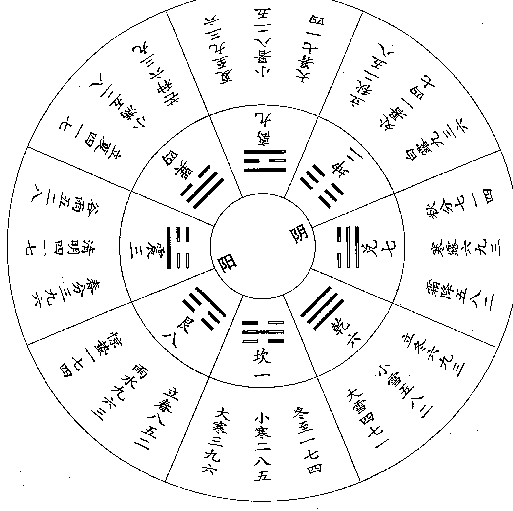

今人称此图为二十四节气奇门遁甲用局图。图中坎、艮、震、巽为四阳卦，离、坤、兑、乾为四阴卦。冬至后用阳遁从坎一宫开始，夏至后用阴遁从离九宫开始。一卦管三个节气，八卦分别对应一年二十四节气。冬至一七四，是规定冬至上元五天用阳遁一局，中元五天用阳遁七局，下元五天用阳遁四局。其他如小寒二八五、大寒三九六等皆可依次类推。奇门具体的推盘推演方法，可参阅有关工具书，本文不作详述。

奇门的推演方法，离不开节气和三元。《烟波钓叟歌》中说：‘次将八卦轮八节，一气统三为正宗；阴阳二遁分顺逆，一气三元人莫测；五日都来换一元，接气超神为准的。’节气就是二十四节气，一个节气十五天，分为上中下三元，五日换一元。一年为 365.2422 日，一年二十四个节气，一个节气平均为 15.218425 日（二十四节气并不是一年的二十四等份。即有的节气时间要长，有的节气则时间短，可查看历书，兹不详述），在一个节气中，

三式述要

五日一元，三元换尽之后，还余下 0.218425 日，一年下来则余下 5.2422 日，这就出现了上元符头不能正对节气的情况。怎样解决这个问题？古人创造出超神、接气等方法，进行调整，尽量使上元符头正对节气或接近节气。

上元符头正对节气为正授。奇门遁甲的推演，或者说奇门遁甲的运行，是从正授开始的，即以正授为起点的。三式术数中，太乙运行是以远古上元元年甲子年甲子月甲子日甲子时天正冬至为起点的，这在太乙书中有详细说明。从奇门遁甲的二至还乡图中“冬至一七四”可以看出其起始点也应当是甲子年甲子月甲子日甲子时天正冬至，上元甲子符头正对冬至，是为正授。次年的冬至，即经过 365.2422 日之后的冬至，必定是己巳日，而已巳是中元符头。第三年的冬至，即经过两轮 365.2422 日之后的冬至，必定是甲戌日，而甲戌是下元符头。这种情况表明，按照“冬至一七四”的规定，正授的第一个冬至日起上元一局；第二个冬至日虽然己巳符头正对冬至，却应起中元七局；第三个冬至日是甲戌符头正对冬至，应起下元四局。这三个冬至节气日内的 15.218425 日起局排列次序分别是：

第一个冬至 | 一 | 七 | 四  
第二个冬至 | 七 | 四 | 一  
第三个冬至 | 四 | 一 | 七  

显然，第一个冬至节气符合奇门中“一七四”的规定，第二、三个冬至节气都不符合“一七四”的规定。古人为了严格按照“冬至一七四”的规定进行推演排局，创立了超神、置闰、接气的方法，目的在于调整上元符头接近节气，从而在一个节气之中严格按照上元、中元、下元的次序进行排局。此类资料屡见于明代以前的奇门书。如《古今图书集成》收录的《奇门遁甲》中举例说：

淳祐六年丙午前四月十三日壬申交立夏节，而本月初五日是甲子巳到，即以立夏节用，立夏前九日矣。则合前初五日起超在先，借用立夏上局奇，自初十日己巳为立夏中局奇，自甲戌五日立夏下局奇。乃先得奇，后交节为

第三章 奇门及其他

速，谓之超神速者也。

又如淳祐七年丁未二月二十三日虽交清明节上局奇，然二十五日方是己酉，方用清明上局奇，此乃先交节而后得奇为接，故谓接气。迟至二十四日戊申，仍用春分下局，此是巳交本节，而奇星尚用前节也。

又如其年六月二十八日己酉交立秋节，正直节与日辰同到，其日即是立秋上局，谓之正授奇。凡换奇皆甲子时换也。

以上三段话对于正授、超神、接气之法说得清楚明白。淳祐为南宋理宗赵昀年号。淳祐六年（公元 1246 年）岁次丙午，淳祐七年（公元 1247 年）岁次丁未。上述年月日与节气皆与历书（《三千五百年历日天象》）相符。该书又接着举例说：

假如丙戌年五月初一日己卯至初九日丁亥已刻，过九日于置闰，即用初一日己卯作芒种上超局，初六日甲申作芒种中局，十一日己丑作芒种下局，毕于此，重用一局作三奇闰法。以十六日甲午作芒种闰奇。此超神置闰之法也。二十四日巳交夏至。是谓置闰借夏至七日。其五月小尽，至六月初二日己酉方作夏至上局，初七日甲寅作夏至中局，十二日己未作夏至下局，以为接气奇也。

闰奇之法，每遇芒种、大雪二节内，如是超过九日，即合置闰，以归每节气所余五时二刻也。盖奇以冬夏二至分顺逆，故于二至之前置闰，以均其气，无不应也。

考此丙戌年为元惠宗（顺帝）至正六年（公元 1346 年）岁次丙戌，该年五月小，己卯朔，初九丁亥芒种，二十四壬寅夏至。上述超神、置闰法排列如下：

+   五月初一己卯  
初二庚辰  
初三辛巳  
初四壬午  
初五癸未  
芒种上超局  
初六甲申  
初七乙酉  
初八丙戌  
初九丁亥  
初十戊子  
芒种中局  
(芒种)  
十一己丑  
十二庚寅  
十三辛卯  
十四壬辰  
十五癸巳  
芒种下局  
十六甲午  
十七乙未  
十八丙申  
十九丁酉  
二十戊戌  
芒种闰上局  
廿一己亥  
廿二庚子  
廿三辛丑  
廿四壬寅  
廿五癸卯  
芒种闰中局  
(夏至)  
廿六甲辰  
廿七乙巳  
廿八丙午  
廿九丁未  
三十戊申  
芒种闰下局  
六月初一戊申  
六月初二己酉  
初三庚戌  
初四辛亥  
初五壬子  
初六癸丑  
夏至上局  
初七甲寅  
初八乙卯  
初九丙辰  
初十丁巳  
十一戊午  
夏至中局  
十二己未  
十三庚申  
十四辛酉  
十五壬戌  
十六癸亥  
夏至下局

此例为元至正六年（公元 1346 年）岁次丙戌五月初九丁亥日芒种超神、置闰和接气实例，是古人对于超神、置闰和接气学说的具体运用。《奇门遁甲·闰奇超神接气直指》曰：

奇门之法，有正授，有超神，有闰奇，有接气。正授之后，超神继之；超神之后，闰奇继之；闰奇之后，接气继之；接气之后，复为正授。符头甲己正对节气谓之正授。此后则符渐渐过节而为超神矣。超至九日及十余日，则当置闰，以其离后节气太远，故必有闰，然后可配气候，与历家闰法同。然置闰必在芒种、大雪之后二至之前，其余节气，虽遇超至九日之外，不可置也。此法乃用奇之关键，万一不悟，则差之毫厘，谬于千里矣。

## 三式述要

古人创立正授、超神、置闰、接气之法，保持了一个节气之中，不论用超神，还是用接气，而依然是先上元，次中元，最后下元的排局顺序。即是芒种或大雪之后置闰，仍然依照上元、中元、下元的排局顺序。这是有其重要意义的。而对于这样一个有着重要作用的问题，却不见有人提示和论述，这也是超接置闰法与拆补法的主要区别所在。对于这一点，本文后面还将论述，请读者留意。

- 奇门拆局补局之法，即拆补法，不见于明代以前的奇门遁甲著作。笔者认为，所谓拆补法，很可能是明代以前人所立，其始作俑者，为清初学者黄宗羲。黄氏在《易学象数论·遁甲》中曰：

节气三十日，所零者五时二刻耳。积之一百八十日之久，则为时三十，为刻二十（按：应为十二刻——引者），盖不及三日也。符头五日一换，所差不过半局，略为消息，便可符合。今以超神而太过者九日、十日以置闰，而不及者五日、六日，气序不清，局法重出。甲之所重者在二至，置闰归余于其间，半年之中，必有超神，超神之后，必且置闰，闰闰之局，必侵二至，是二至必不能正其始也。顺者反逆，逆者反顺，使其吉凶星煞无验则可，不然，则避其所当趋，趋其所当避矣。某故以为自乱其术也。

从黄氏上述这段话，可以看出：一、黄氏是学问大家，对于术数之书无所不读，他只知奇门遁甲中有超接置闰法，由此也可证明明代及其以前尚无拆补法，只有超接置闰法。二、黄氏对超接置闰法进行诋毁，称其“自乱其术”，对于符头不能正对节气的情况，主张“略为消息”，使符头与节气相应。到底怎样“消息”，并未作说明。三、黄氏认为，超接置闰“必侵二至，是二至必不能正其始”，这确是超接置闰中不可克服的问题，用超神者，符头越过节气，用接气者，节气越过符头。四、虽然黄氏并未明确地提出拆补法，但其“略为消息”的主张，在理论上开了拆补法的先河（或者黄宗羲之“略为消息”之说，是一种不成熟的见解，黄氏自己也并未实行。但是，笔者仍然坚持认为，以黄氏本人的声望来看，其“略为消息”之说，仍然有很大的启发和诱惑力）。

晚于黄宗羲的清人锡孟樨在其著作《奇门法窍》中，明确提出了拆补法。他举例说：

假设岁在丙申，时宪书正月初九日丙子丑正一刻立春，其戊子时与己丑时之初刻，当是先年大寒下元。自丑时一刻起至戊寅日亥时止，计三十五时系甲戌下局之符头统领，即用立春下局，即为残局，拆之以补下元不足之数。此所谓节先符后须用接法。十二日己卯自子时起至十六日癸未亥时止，计五日六十时作立春上局。十七日甲申，自子时起至于二十一日戊子亥时止，计五日六十时作立春中元。二十二日己丑自子时起至二十四日辛卯辰初一刻止，计二十八时零一刻，作立春下局，并前局所拆三十五时，共计六十三时零一刻，其余三时零一刻，叠作立春下局。此即置闰之义，拆补之法也。

可以看出，上例进入立春节气之后，先用立春下残局（残局指不足五日六十时），而后再用立春上局、立春中局，最后再用立春下残局。其顺序则是：立春下残局→立春上局→立春中局→立春下残局。先后两个立春下残局可补成完整的立春下局。这就是拆局补局法，或称拆补法。锡孟樨称此为“置闰超神接气拆局补局之秘诀”，“是局局有闰余之气，用之如神”（见《奇门法窍·论拆局补局》）

拆补法简便易行，只要记住奇门用局口诀，如“冬至一七四”之类，再认准甲己符头，置子午卯酉为上元，置寅申巳亥为中元，置辰戌丑未为下元，就能推演了。拆补法把集中在芒种、大雪后的置闰分散到二十四节气之中去了，因此，就不必再考虑置闰了。实际上对超神和接气也不必去考虑了。今人图简便，故多采用拆补法。

拆补法固然简便易行，但其排局的结论与超接置闰法有不少区别，与奇门遁甲创作者的本意也不相符，因此，有必要作更加深入地探讨。

## (三)

超接置闰法和拆补法二者相比较，其主要区别是什么，哪种方法符合或者违背奇门遁甲推演本义，各有哪些值得肯定，或者值得否定之处，这些问题是应当搞清楚的。

黄宗羲指出：“遁甲、太一、六壬三书，世谓之三式，皆主九宫，以参详人事，而甲尤注意于兵。”

遁甲、太乙皆主九宫，若说六壬天地盘十二支以及四课三传，也主九宫，未免太牵强了。但是，黄氏说遁甲“尤注意于兵”，却是确切的。可以这样说：奇门遁甲是仿照古代行营佈阵、调兵遣将的兵法而创立，反过来，它又可以指导行营布阵、调兵遣将，为兵法服务。当然，不只是仅为兵法服务。笔者仅以“冬至一七四”为例加以阐述。

冬至一阳生，故从冬至开始用阳遁，“冬至一七四”，是说在冬至节气内，上元五天用阳遁一局，中元五天用阳遁七局，下元五天用阳遁四局。阳遁一局是从坎一宫起甲子戊，按照九宫次序，顺排六仪，逆排三奇。遁甲要

## 三式述要

把甲隐遁起来，依次只排列戊、己、庚、辛、壬、癸六仪和乙、丙、丁三奇即可。遁甲、六仪、三奇各自的意义，可读《奇门元览释义》中的一段话，便可明了：

遁甲者何？天干凡十，甲为之首，统领诸干，至尊至贵。其所畏者，独庚金耳。故须遁匿其甲，勿使受克于庚。然乙为甲妹，可以配之，使其终有所牵。丙丁为甲男女，可以制之，使其势不得肆。故以乙丙丁为三奇。又十干中戊己庚辛壬癸乙丙丁皆专制用事，而甲元专位，与六干同处，甲子同六戊，甲戌同六己，甲申同六庚，甲午同六辛，甲辰同六壬，甲寅同六癸。又以六十甲子布于九宫，起宫为甲子，遁一位为甲戌，又遁一位为甲申之类，皆有遁甲之义。独余乙丙丁无与同者，亦三奇之义也。

十天干中以甲为首，统领诸干，即甲为头领，其余诸干乙丙丁戊己庚辛壬癸皆被甲领导。而为什么甲还怕庚呢？以军事而论，甲为元帅，他既要对付强大的敌人，又要防止内部发生叛乱，庚金属于内部不安定因素，须安抚稳定他，令其为我所用，故甲对庚采取了联姻兼监管的措施，防止其从内部叛乱。把十干纳入到六十甲子中，按顺序排列，这就出现了一甲（甲子）元帅，二甲（甲戌）、三甲（甲申）、四甲（甲午）、五甲（甲辰）、六甲（甲寅）五虎上将，戊己庚辛壬癸分别配到六甲之中，称为六仪，乙、丙、丁则为特种部队，古代称之为奇兵，故乙、丙、丁为三奇。三奇对内对外都能发挥特殊作用，较之常规作战部队，特种部队为三奇尤为珍贵。一甲元帅的总指挥部既需要隐蔽，不可暴露给敌军，又应不断变换位置，防止被敌军方侦知，发生意外，而五虎上将的前沿指挥所也应隐蔽不可暴露，故六甲皆隐遁起来，分别只以代号戊、己、庚、辛、壬、癸来表示。在这里，安营布阵，调兵遣将，出奇制胜，等等，都应按计划分步骤有条不紊地进行，以达到时间、空间和人事的完美结合，争取到最大的胜利，取得最好的效果。

古人通过实践总结曰：“年吉不如月吉，月吉不如日吉，日吉不如时吉。”吉时不可以信手拈来，随意选取，而是有许多前提条件制约，再经过

## 第三章 奇门及其他

奇门三盘的推演才能取得。这之中有一个复杂的过程。

制约吉时的前提条件之一是节气和符头。冬至为阳生之始，故从冬至开始用阳遁，夏至为阴生之始，故从夏至开始用阴遁，对此，兹不再详析其义。一个节气又分为三候（三元），这是拆整为零的做法。因为寻求吉时，在年月日时中，时为最小单位，故应对节气采取拆整为零的措施。一个节气分为三元，并不能随意划分，而是要按照符头来确定。甲、己为符头。符头加临四仲子、午、卯、酉为上元，加临四孟寅、申、巳、亥为中元，加临四季辰、戌、丑、未为下元。

“冬至一七四”，一（坎一宫）为上元，七（兑七宫）为中元，四（巽四宫）为下元。冬至上元五日从坎一宫起甲子戊，则坤二宫为甲戌己，震三宫为甲申庚，巽四宫为甲午辛，中五宫为甲辰壬，乾六宫为甲寅癸，兑七宫为丁奇，艮八宫为丙奇，离九宫为乙奇。这就是说，在冬至节气内的上元五日，一甲元帅甲子戊的中军大账（总指挥部）要设在坎一宫，五虎上将要分布在两翼和中宫，特种奇兵分布在兑、艮、离的方位，从而构成分而能守，合而能击的局势。随着时间的推进，进入冬至中元五日，各部队的空间位置相应转移：一甲元帅甲子戊坐阵兑七宫，则艮八宫为甲戌己，离九宫为甲申庚，坎一宫为甲午辛，坤二宫为甲辰壬，震三宫为甲寅癸，巽四宫为丁奇，中五宫为丙奇，乾六宫为乙奇。冬至下元五日，甲子戊坐阵在巽四宫，甲戌己在中五宫，甲申庚在乾六宫，甲午辛在兑七宫，甲辰壬在艮八宫，甲寅癸在离九宫，丁奇在坎一宫，丙奇在坤二宫，乙奇在震三宫。可以看出，冬至上元五日，六甲部队镇守的是坎一宫至乾六宫；冬至中元五日，六甲部队镇守的是兑七宫至震三宫；冬至下元五日，六甲部队镇守的是巽四宫至离九宫。我们如果把乙、丙、丁三支特种奇兵暂不计入，就可看出，冬至上元五日，元帅甲子戊在坎一宫，其余二甲、三甲、四甲、五甲、六甲等五支部队，分别占据坤二、震三、巽四、中五、乾六等五个宫位。接着是冬至中元五日，元帅甲子戊就应当移居兑七宫，这样才不会占错宫位，其余二甲、三甲、四甲、五甲、六甲等五支部队分别占据艮八、离九、坎一、坤二、震三等五个宫位。再接着是冬至下元五日，元帅甲子戊就该着占据巽四宫了，其

## 三式述要

余五支部队仍然依次排列下去。所谓“冬至一七四”，是指一甲元帅在冬至节气内上中下三元中所占据的坎一、兑七、巽四宫位。这样排兵布阵的变化，体现了时空的密切配合，而且完全是有序地变化，在时间上，每种阵式都是五日六十时，其三元序列为：上元→中元→下元。

“冬至一七四”，不论正授，还是超神、接气，其由上元→中元→下元的三元序列都不会改变，并且每一元的阵法都是坚持五日六十时。这与《烟波钓叟赋》中“一气统三为正宗”、“五日都来换一元”是完全相符的。

清人锡孟樨提出的拆局补局法，必然出现残上——中元——下元——补上或者残下——上元——中元——补下的情况，甚至还会出现更为复杂的情况，这就完全违背了“一气分三为正宗”和“五日都来换一元”的原则。

> 《左传》曰：‘先王之正时也，履端于始，举正于中，归余于终。’（转引自《协纪辨方书·闰月》）“归余于终”就是置闰。因此，对于闰余之气，应采取集零为整的方法，阳遁归于阳遁结束的芒种之后、夏至之前置闰，阴遁归于阴遁结束的大雪之后、冬至之前置闰，这样的置闰法合乎古人“归余于终”的历法原则。

拆补法出现后，也屡屡受到批驳。《古今图书集成》中收录的《烟波钓叟歌曲解》注中说：

闰奇之法，每遇芒种、大雪二节内，如是超过九日，即合置闰，以归每节气所余五时二刻也。盖奇（门）以冬夏二至分顺逆，故于二至之前置闰，以均其气，无不应也。但近世俗师不知超接正闰之法，止接成局，以择奇门日时，盖缘上局，反作下局，颠倒错乱，俱无应验。一旦以为不足信，则是起例不明，置闰无法，非局之不验，直择焉不精故也。

四库全书中收录的《协纪辨方书·奇门三元歌》注中也指出：

又有拆局补局之法，先用本节下元，不可从。要之，正授之后为超神，超神之后为置闰，置闰之后为接气，接气之后为正授，或为超神，此则一定不易耳。

由上述二则引文可知，清人锡孟樨的《奇门法窍》成书于同治九年（公元1870年）岁次庚午，在此之前，就已经出现了拆补法。锡孟樨只是拆补法的鼓吹者，而非发明者。故他在《奇门法窍·论拆局补局》中，所举例证，经笔者考证为明代万历三十四年（公元1596年）岁次丙申，只是锡氏未作说明。锡氏举例取自二百七十四年之前，而没有从手头的历书取法，由此也可知这样的例证抄自明人的著作，这就证明在明代已经出现了拆补法，只是清人锡孟樨据为自己的专利了。

## （五）

置闰派内部也有分歧意见，在超神置闰的时间上有不同的主张。我们怎

## 样认识这种分歧意见呢？

张志春先生指出：

就是在置闰派中也有不同意见。

比如 1995 年即农历乙亥年，冬至交节在阳历 12 月 22 日（即农历十一月初一）丁亥日这一天，而早在交节的前九天，即阳历 12 月 13 日（农历十月二十二日）戊寅日，阳遁大雪四七一就完了，从阳历 12 月 14 日（农历十月二十三日）己卯日这一天就该转阳遁一局了，即应该按冬至一七四了，也就是上元符头己卯离“正授”的冬至还有九天，即“超神”达到九天了。

面对这一情况，刘广斌在其所著《奇门预测学》一书所附 1991-2000 年奇门预测专用历书中，采取了在冬至前置闰的方法，即从己卯日这一天开始，又将大雪阴遁四七一上中下三元重复一遍，一直到阳历 12 月 29 日（农历十一月初八）甲午这一天，才转用阳遁一局，即开始冬至阳遁一七四（见《奇门预测学》）。这样把本来属于“超神”的状况，变成了“接气”，把“超神”九天变为“接气”八天。

而刘金喜主编的《通用易学万年历》（沈阳出版社 1993 年 3 月出版）和郭志诚、李至高合著的《揭开奇门遁甲之谜》（东北师范大学出版社 1993 年 6 月出版）二书则与刘广斌不同，均从阳历 12 月 14 日（农历十月二十三日）己卯日直接进入冬至上元，开始用阳遁一局，一直到 1996 年夏至前才开始置闰，即从阳历 1996 年 6 月 11 日（农历四月二十六日）己卯日芒种六三九又重复使用一次，这样到阳历 6 月 26 日（农历五月十一日）甲午日才开始用夏至上元，即阴遁九局，而夏至交节日是阳历 6 月 21 日（农历五月初六），这样使本来“超神”十天的符头，变成“接气”五天了。

我同意刘金喜和郭志诚、李至高二人将置闰放在 1996 年夏至前的意见，因为在 1995 年冬至前符头“超神”并未超过九天，只刚达到九天头上，这样到 1996 年夏至前置闰后，“接气”只有五天，使符头与节气比较接近。当然，按刘广斌的置闰法，到 1996 年夏至后，也是从阳历 6 月 26 日（农历五月十一日）甲午日开始转阴遁九局，也是“接气”五天。

但是，在 1995 年冬至到 1996 年夏至这半年之间，由于置闰意见不一致，必然会出现每天用局不同的情况，比如 1996 年 4 月 3 日（农历二月十六日），干支庚午，按刘广斌《奇门预测学》所编专用历应用阳遁 9 局，而按刘金喜和郭志诚、李至高二书所编奇门历则就应用阳遁 1 局。同一天，你用 9 局，我用 1 局，必然预测同一事物会出现不同的格局，预测结果也就不会完全一样了。（见《神奇之门》第 79、80 页）

《奇门预测学》与《通用易学万年历》、《揭开奇门遁甲之谜》二书的矛盾点在于，从 1995 年农历十月二十三己卯日开始，该用大雪四七一置闰，还是该用冬至一七四“超神”？

| (1995 年) 十月 二十三 己卯 | 二十八 甲申 |
| --- | --- |
| 二十四 庚辰 | 二十九 乙酉 |
| 二十五 辛巳 | 三十 丙戌 |
| 二十六 壬午 | 十一月初一 丁亥（申时冬至） |
| 二十七 癸未 | 初二 戊子 |
| 初三 己丑 | 初八 甲午 |
| 初四 庚寅 | 初九 乙未 |
| 初五 辛卯 | 初十 丙申 |
| 初六 壬辰 | 十一 丁酉 |
| 初七 癸巳 | 十二 戊戌 |

我们可以看到，十月二十三日己卯上元符头超过冬至八日零八个时辰，《奇门预测学》选择了置闰，重用大雪四七一阴遁局。而《通用易学万年历》、《揭开奇门遁甲之谜》二书因其超神未达到九日，故舍弃置闰，而选用了冬至一七四阳局超神处理。这样就使得排局有了差别。

古代奇门遁甲著作中，有的主张芒种、大雪之后，二至之前，超神九日及其以上，方可采取置闰处理，否则，仍用超神处理。《通用易学万年历》和《揭开奇门遁甲之谜》的作者遵循了超神九日及其以上，方可置闰的规定，因上例超神不足九日（八日又八个时辰），故作了超神处理。这是有来历和依据的。

但是，有的古代奇门遁甲著作，另有主张。如《协纪辨方书·奇门三元歌》注云：

置闰必在二至之前，超不过十，接不过五，然此乃以平气正授起算。若以定气而论，盈缩各有所不同，当以远近为断。如前之符首在节前七日，后之符首在节后八日，前近后远，则当仍用超神。若前之符首在节前八日，后之符首在节后七日，前远后近，则当置闰可也。

《奇门预测学》的作者刘广斌先生遵循的是“前远后近，则当置闰”的规定，因此对上例作了置闰处理，也是有来历和依据的。刘广斌先生出身于奇门世家，不可能毫无根据地任意处理置闰问题。笔者考证出其依据所在，读者自然也就清楚了。

芒种、大雪之后，二至之前，超神九日及其上方可置闰，其理论依据是什么，还未见有人剖析清楚。一个节气的平均日数为 15.218425 日，超神八日即可“前远后近”，从量上来看，超神占了优势，主张在“前远后近”的情况下置闰，也无不可，为什么一定要超神九日及其以上才置闰呢？

张志春先生指出置闰派内部也有不同的意见，是客观存在。对此，还应深入地作正本清源的工作，尤其在理论依据方面更应正本清源。在尚未考证清楚的情况下，可以使不同的意见并存，不应轻易地加以肯定或否定。

笔者固执地认为。在现代科技方面，如人造卫星的发射，航天飞船升空等，后人胜过前人，当代胜过古代。在周易术数学方面，后人的水平不如前人，当代的水平不如古代。在周易术数学领域，当前应当以继承为主。有谁说在这方面有了新的发明创造（继承除外），多为痴人说梦，大可不必相信。

2010 年 2 月 23 日

206

# 二、读张椿来先生《铁版神数》随记

张椿来先生于 2009 年春节前后，曾两次过访寒舍，并以其所编著的《铁版神数》相赠。我以《中国历代易案考》、《皇极后世演绎》回赠。然后，我们之间不断有电话联系，交流有关易学术数问题。

我因有案卷工作，对张先生的大作未能及时拜读。近日得闲，方能通读一遍。对于铁版神数，我以前也看过一些资料。这些资料皆故神其说，未曾将推演方法说明，使人有如读天书之叹。不一定是这种方法深奥难懂，是方家们隐而不传，或是这些所谓方家，自己也搞不清楚。因此，有不少学者惊呼：铁版神数没有真传，或者已经失传了！

张椿来先生的大作问世，把铁版神数隐而不传的局面打破了。

张先生在书中比较系统和完整地介绍了铁版神数的推演程序和推演方法。人们读过此书，就可以推演铁版神数了。可以毫无夸张地说，这是张椿来先生的一个贡献！

笔者在学习阅读张先生的大作中，随手记下如下内容：

## （一）

条幅：

+   • 爻从三十起，乾卦六为头；
• 兑为后少女，集中一网收；
• 变止六八止，世应两同俦；
• 遇十不須用，玄玄妙法周；
• 当为多寡数，及止悉因由。

这个条幅的本名为“八卦加则取数诀”。似这是铁版神数中最基本的一则起数诀。为什么“爻从三十起”？张先生释曰：“每一卦共分六爻，从初

## （二）

《铁版神数》第 6 页列举了卦数诸诀。在“天干取数诀”中似缺少一首：

戊一 乙癸二 庚三辛四同

# 其“地支起数诀”如下：

+   - 亥子一六水
- 寅卯三八真
- 巳午二七火
- 申酉四九金
- 中宫辰戌是
- 丑未五同归

显然，这是《洛书》所配的数，与十二地支对应起来了。《洛书》以五和十为中宫，这里只取五，似丢掉了十。不若末二句改为：

# 辰戌丑未土 五十总生成

这里关系到辰戌丑未四地支，究竟对应五，还是对应五和十。其他地支，如“亥子一六水”，即亥子二支各对应一、六两个数，寅卯各对应三、八两个数，巳、午各对应二、七两个数，申、酉各对应四、九两个数，辰、戌、丑、未也应对应五、十两个数，若把洛书中宫五和十两个数只取五，恐有欠妥。故“地支起数诀”最后二句应作调整。不然在具体推演应用中会遇到麻烦。

# 天干和地支数的取用方法，《河洛真数》中有例题如下：

## （三）

《河洛真数》中有“八卦相荡成卦例”，摘其原文如下：

208

## （四）

《铁版神数》第 14 页“先天卦变后天卦”。先天卦为什么要变为后天卦？先天为体，后天为用，致用一定要后天卦。原书对其意义阐述明确。此节有两个先天卦变后天卦的例子。

其一，八字戊午、庚申、乙卯、丙子，先天卦为风雷益『』。

求风雷益『』可列成下式计算：

+   戊 1 午 2 7  
庚 3 申 4 9  
乙 2 卯 3 8  
丙 8 子 1 6  

1+7+3+9+3+1=24  24 小于 25，故去20 不用，余 4，4 为巽『』。

2+4+2+8+8+6=30  30 与地数 30 相等，按 3 计，3 为震『』。

上巽下震，故为风雷益『』卦。风雷益卦，子时生人，元堂在初九爻。

其二，八字丁卯、壬寅、壬辰、丙午，先天卦为艮卦。为列成下式：

+   丁 7 卯 3 8  
壬 6 寅 3 8  
壬 6 辰 5 10  
丙 8 午 2 7  

7+3+3+5+7=25 单数之和为 25，去二十只用 5，5 寄艮宫，故上卦为艮『』。

8+6+8+6+10+8+2=48  
48-30=18  去 10 不用，余 8，8 为艮『』卦。

此例上艮下艮，故先天卦为艮『』。艮『』卦，午时生人，元堂为初六爻。

此节先天卦定元堂，以及如何变为后天卦，原文中已有明确阐述，兹不

## （五）

《铁版神数》中有关刻分的论述，散见于乾集和坤集，但没有推演例证，也没有详细叙述，这就是所谓“藏其用”了。此内容只得有待另向张椿来先生请教了。

《乾集》第 19 节“考分取数诀”曰：

祸福藏刻分，甲乙斗宫寻；  
八刻天干定，运知有下文。

此诀之下有“注”曰：

考八刻天干与甲乙斗宫可知刻分，以其数化卦，卦化数其八刻（八式）  
便知祸福。如考得其人与寅刻丙壬庚合，便知其人为三刻二分生人，以丙壬  
丙庚化卦。丙六壬三为坎，丙六庚四为坤，以八卦加则化数取八式。

这段话中有三个问题待考：其一，八刻八式是指什么，不见于下文。其  
二，甲乙斗宫的问题。《坤集》中第 12 节为“斗宫密数”，第 13 节为“甲  
宫密数”，却没有乙宫密数。查其他资料，斗宫密数中分子、午、卯、酉刻；  
甲宫密数中分辰、戊、丑、未刻，皆与《铁版神数》相同。而其他资料中还  
有乙宫（密数），如下：

# 乙宫

|寅刻|巳刻|申刻|亥刻|
|---|---|---|---|
|甲壬庚壬（甲）|壬戊戊辛（乙）|戊庚乙己（甲）|丙庚壬丁（乙）|
|丙壬丙庚（丙）|乙月庚甲（丁）|甲月壬戊（丙）|戊丙己辛（丁）|
|戊辛戊乙（戊）|乙丁丁戊（己）|丙庚乙甲（戊）|庚庚月辛（己）|
|丙月甲乙（庚）|丁戊乙乙（辛）|甲壬辛辛（庚）|壬戊庚乙（辛）|
|己壬壬壬（壬）|丁乙壬辛（癸）|壬己戊辛（壬）|乙庚丁庚（癸）|

（录自《铁版神数秘解》）

其三，“丙壬丙庚化卦，丙六壬三为坎，丙六庚四为坤”，其数字与卦  
的由来，未见有说明，因此，不能推演。查《坤集》第 26 节“大运取数诀”  
中有诀曰：

## 第三章 奇门及其他

甲己乙庚四，丙辛数为六，丁壬戊癸三，胜负九十六。

为什么“丙壬丙庚”要取用“大运取数诀”？另外，“丙六壬三为坎，丙六庚四为坤”又是依据什么，仍然找不到依据。

## 第四章 程树勋《壬学琐记》评述

### 一、《跋》语评述

《壬学琐记》为清人程树勋撰。程树勋，生平事迹不详，约生于清乾隆年间，殁于道光或同治年间，安徽歙县人。一生专注六壬学说，搜集整理多部六壬古籍，以《精抄历代六壬占验汇选》一书最为珍贵，现上海图书馆收藏有原抄本。《壬学琐记》为笔记文体，是程氏自己研究和应用六壬实践中的随笔所记，其原始过程，一一现于笔端，既有程氏自己的占卜事例，也有其六壬诸友的占卜事例，有叙有议，向读者提供了一些具体的 actual 经验，甚至是难得的资料。文中录有其侄程夔的《跋》语，以见其所作《壬学琐记》的始末。《跋》语原文如下：

唐时功令，以奇门、雷公、六壬为三式，雷公即太乙，所谓太乙雷公式是也。唐代禁奇门、雷公不传，惟六壬便于民用，不涉兵事，故不之禁。传其歧多，精者独鲜。叔父承伟堂族祖之传，肄习有年，占验辄中。犹忆庚申之乱，里党为墟，叔父之灼见机先，寄书亲友，谓八月有凶，闻者疑信参半，至期果应。遂群服无闲言。以伟堂族曾祖手录秘秩甚夥，曾为刊《大六壬一字决·玉连环》，今又复刊《毕法集览》、《壬学琐记》两种，而《琐记》一书昭示后学尤切，剞劂甫竟，见示全册，命缀数语于后。夔不谙数学，何敢漫言？爱举夙昔所闻推验之一端，抑以验同志，抑以见艺术亦有分途，而法守必宗正轨，则技也进于道已。光绪七年岁次辛巳立夏后五日侄夔谨跋

### 二、六壬源流

六壬不知始于何时，《云笈七签》云：“上皇三年七月二十九日壬子，太真皇人下授黄帝六壬式图、六甲三元、遁甲造式之法，法威天下，流传子孙。”黄梨洲《易学象数论》以《国语》中伶州鸠之论七律即是六壬之法；

### 三、月将太阳

月将即太阳。六壬古籍中对于太阳过宫的时间有不同的说法。对于月将加临占时之上顺排天盘则无异议。月将在壬学中有着举足轻重的作用，不可不考。程氏对此尤加注意。

《景祐神定经》云：壬式枫天枣地，朝向东，暮向西。董说《诗》云：藜杖谶图文订枫天神式将移壬。（按：疑有错简——引者）。盖古人以枫木规为天盘，枣木规为地盘，向太阳旋而用之，以观上下相加，发四课与三传也。

月将即是太阳，以太阳加正时，顺布十二宫，则与天上星宿所临方位相符，故阴阳动尽天人感应。唐朝王远知引其师陶宏景之言曰：“六壬精髓，其一为月将，天上太阳随月亮而异宫，其光普照四方，故万事皆见。月将不误，然后凡事不误。”此语最为明显。

宋人邵彦和论次客曰：“古次客之法，因数人同时来占，乃用前五后三，换将不换时之例，试之每不验。盖烛照祸福，全赖太阳之光明，故以正将正时为最，其次则换时不换将耳。余则不换将，亦不换时，惟以各人年命为主，课虽同而理则异。区别悬殊，十不失一。”是亦月将即太阳之明证。

乃《银河棹》则曰：“错认日躔为月将”，而张松源之注，又惑于俗本奇门超神接气之法，以交接之后据河图生成数而定月将，殊属无谓。

交月将之法，古书间有异同，然总在中气之后，或一日二日，或三日五日不等。故人所用者恒气，每年二十四气匀派，而太阳行度有盈缩，未必恰于交中气之日时过宫。况其过宫，又限定于某宿某度，是以有一日二日、三日五日之殊。今时宪书则以定气为主，故太阳即于交中气日时过宫，便换月将，此正合天之妙。

张松源之注《银河棹》以月将并非太阳，宜其另生一法而交月将。及陈

耕山作《三才发秘》，误解“步戌成岁”一语，以为正月太阳在戌宫，更可笑也。

“月将不误，然后凡事不误。”此至言也。

乃《指南占验》尝有误用月将而大事仍验者何也？盖无心之错，机即随之，故能符合相应。若有意标奇示异，恐未必然也。

太阳过宫标示何种意义，太阳过宫的具体时刻是怎样确定的，为什么前人对于太阳过宫的意义和时刻有不同的表述？这些问题都涉及到天文历法，非专业学者是难以搞清楚的。现代天文学著作中，已不注重上述这些问题，更无人能对上述天文学上的问题作出解释，而古籍中对这些问题的讲述有嫌于抽象化，因此，六壬学者只能对此按图索骥，或人云亦云，或沿袭师承，故对变换月将（即太阳过宫）的具体时刻有不同的表述。

月将问题是一个重要问题。是壬学中应求助于现代天文学加以解决的一个重要问题。现代天文学运用现代科学技术和工具给出每月太阳过宫的具体时刻，不是难事。可惜，现代历书中无此内容。我们的许多六壬学者是否有天文工作者，解决太阳过宫问题，只能寄希望于现代天文学了。

前人有以月建合辰为月将者，即正月亥（寅与亥合）、二月戌，三月酉等。有以中气为换月将时刻者，如正月雨水后用亥将，二月春分后用戌将，三月谷雨后用酉将，等等，皆以交中气时刻为分界。而他书还有不同的主张。

《大六壬类集·十二月将》：

正月太阳在子，居危月燕八度，雨水后四日零八时入危十三度到亥宫，惊蛰前十日是；

二月太阳在亥，居壁水獝四度，春分后六日零十时入奎木狼二度到戌宫，清明前八日是；

三月太阳在戌，居娄金狗八度，谷雨后九日零一时入胃土雉四度到酉宫，立夏前五日是；

四月太阳在酉，居昂日鸡九度，小满后九日零八时入毕月鸟七度到申宫，芒种前五日是；

五月太阳在申，居井木犴初度，夏至后八日零十时八井九度到未宫，小暑前七日是；

六月太阳在未，居井木犴三十度，大暑后八日零二时入柳土獐四度到午宫，立秋前六日是；

七月太阳在午，居张月鹿六度，处暑后九日零二时入张十五度到巳宫，白露前五日是；

八月太阳在巳，居翼火蛇十八度，秋分后十一日零七时入轸水蚓十度到辰宫，寒露前三日是；

九月太阳在辰，居角木蛟十一度，霜降后十二日零十一时入氐土貉二十度到卯宫，立冬前二日是；

十月太阳在卯，居房日兔三度，小雪后十一日零五时入尾火虎三度到寅宫，大雪前三日是；

十一月太阳在寅，居箕水豹五度，冬至后八日入斗木獬四度到丑宫，小寒前七日是；

十二月太阳在丑，居牛金牛四度，大寒后五日零一时入女士幅二度到子宫，立春前九日是。

### 四、课体最重

课体又称卦体，即元首、重审等六十四课、七百二十局的课名，《六壬大全》中称为课经。课体在判断中举足轻重，不可忽视。程氏对此提出了自己的真知灼见。

凡占事之重大者，课体最重。若课体不吉，即有一二吉神，无补于课体之疵也。甲戌年十二月初三日，诸公在郑典五翁花园内为鲍右曾先生预馔大寿，右曾先生从院上来，盐台何公嘱占拜奏摺旨意回报如何，生意、盐务若何，得己未日井栏格，予曰：“巳火皇恩发动生干生支，天后为恩泽之神，又在干支之上，入中末两传，必蒙恩允，且有叠叠赏赐。但井上架木，易欹易斜。且一火陷于众土之中，为力不久，恐盐务仍无起色耳。”后果一一如占。

### 五、生克与象

程氏对于六壬五行生克与易象的关系，有独到的见解，非常值得重视。

予友吴稼云先生尝云：“《周易》言象而不言生克，故六壬家亦宜观象定吉凶，而不可以生克定吉凶。”此稼云先生一家之言也。夫《周易》不尽言五行，故不论生克；六壬专言五行，则不能离生克。十二神将之所届，即象也。或生焉，或克焉，即象之吉凶者也。古人又患人之情伪，事之变幻，非生克两字可尽也，于是曰德，曰合，曰刑，曰冲，曰破，曰官，曰禄，曰刃，曰旺，曰墓，曰死，曰绝，曰胎，曰养，曰败，所以参其象而尽其变也。然后吉凶悔吝无所逃于三传四课中矣。稼云先生学问渊博，深于古文，尝与予谈六壬，经日不倦，其法重初传，重丁神，以神机兆于动，既得其动，然后融会全课体象而断之，不可枝枝节节。盖初传与丁神皆课中之动者也。先生此言，最为微妙，是佛家上乘功夫，予愧未能造到此境也。庚午春，予自维扬回，见先生于崖市，过寓言谈，侃侃仍如往年，今则宿草凄凄矣，悲夫！

《周易·系辞传下》：‘吉凶悔吝者，生乎动者也。’大概说来，在周易大衍筮法中，以变爻为动，在六壬式中，以克为动，故以克取初传。明清之际的学者黄宗羲针对六壬论曰：

就以今术论之，卜筮诸术，皆以生为主，以生为用。壬则于十二时独取未辰，以斗柄罡星岁常指辰，故谓辰为天罡。辰建于三月，而为八月之将，金旺杀物之候，以天地之杀为用故也。其四课，上克下曰元首，下克上曰重审，上下交相克曰知一、涉害，日辰遥相克曰蒿矢、弹射。伏吟、返吟皆因冲克以为之名目。此明与诸术相反。故不取夫生而取夫杀，不取夫德与合而取夫克与冲，不取夫禄与旺而取夫刑与害，则凡一书之中所以论吉凶者，皆当取此。而何所论非所主，所主非所论；所主者刑杀冲克，所论者生旺德合；所主者与诸术相出，所论者与诸术相入。岂失传之中又失传与？宋成京郎、关朗辈假《易》以行壬、遁之学，其时当不如是也。（参见《易学象数论·六壬》）

黄宗羲只就理论上对六壬术提出质疑，而未能展开深入讨论。黄宗羲与其弟黄宗炎皆精熟三式之学，当其成名成家后，不得不避嫌，而又不甘心于三式之类诸术之泯灭，故在《易学象数论》中作概要论述。民国时期易学巨子杭辛斋在《易学笔谈》中针对黄氏之论分析说：

余姚黄氏《易学象数论》，其排斥河洛先天及《皇极经世》诸说最力，为毛西河、胡东樵诸氏之先驱，实则皆梨洲先生违心之论焉。盖先生非不知象数者，少壮之时，泛滥百家，于阴阳禽遁等学，实有心得。至晚年学成而名亦日高，恐平日之研求术数，近于小道，足为盛明之累，故撰此书，极力排斥，以存大儒之身矣。是以言之甚详，斥之正所以存之也。

我们由此可知，先贤大儒也是重视三式之类术数的。至于六壬式以刑杀冲克为用，也是有根据的。前人对此也有论述。

《指掌赋》云：阴阳生合比和处，吉凶之端倪不露。惟于相克处一逗杀机，而吉凶遂尔见形。盖不杀不成其为生，而取克正所以观五行相生之妙也。

《指掌赋》又云：大凡克处是动机。

不克不成事也。

总之，六壬以阴阳五行为基本理论基础，不能离开生克。而万物皆象，六壬与易象也有密切关系。《精抄历代六壬占验汇选》中有不少占案是结合易象才作出判断的。

程氏强调六壬的生克为主。并用举例加以说明。

# 乙酉日伏吟，推演如下：

| 己午未申 | 西酉辰辰 | 辰 |
| --- | --- | --- |
| 辰酉戊 | 西酉辰乙 | 酉 |
| 寅丑子亥 |  | 卯 |

此课日干乙（辰）与日支酉合，日干上神辰与日支上神酉合，故称上下相合。但酉金克日干乙木为鬼，酉加临第三课和第四课，此为鬼临三、四。《毕法赋》云：“鬼临三、四讼灾随。”以日干乙木而论，酉金克乙木为鬼。以日干寄宫辰土而论，辰土生酉金为脱气，故称脱气鬼克。此课虽有上下相合，不当以吉论。

程氏强调个人经验所得，并指出前人往往多“好奇之论，信笔之言”，不可尽信。

# 程氏为族兄廉阶先生于壬子年五月初五日占得壬寅日伏吟，推演如下：

| 己午未申 | 寅寅亥亥 | 亥 |
| --- | --- | --- |
| 辰酉戊 | 寅寅亥壬 | 寅 |
| 寅丑子亥 |  | 巳 |

此课干支相合，其上神寅亥相合，为上下相合，又壬德亥临身。但支上寅木为日干壬水的脱气，主对方有言而无信用，不可靠。又巳贵落空，终于己无益。

## [原文]：

谚云：“熟读王叔和，不如见症多。”故六壬家亦如是。所占验者，信而有据。古人多好奇之论、信笔之言，如《管子神书》，有天官天将断不相兼者；《指掌赋》有断无此三传者，有天官断不临此处者，仍作者居然作之，注者居然注之，不可解也。他书信笔指鹿为马者更难悉数焉。今将顺逆连茹课中无此三传者列于左：

子丑寅 卯辰巳 己午未 戊亥子 无以上顺连茹。

## 三式述要

纵二月占，丑是生气，亦不能解。惟年命在辰，则未冲丑墓（以下脱漏十九字）邵氏《断案》惟有乙巳日干上卯，三传不用卯寅丑而用辰卯寅，疑《毕法》因此一课而推演者也。

有阴阳之比，有五行之比。比用课取初传，阴阳之比也。《毕法》于甲辰日干上戌，不取戌加甲为用，亦取子加辰，以为戌土畏甲木而不比，是拉入五行之比矣，亦似可商。

《毕法》一书，最为纯正，亦宜融通活法看之，不可拘泥。

邵彦和《断案》中乙巳日干上卯，三传不取卯寅丑，而是取辰卯寅，对此可推演如下：

| 辰 | 巳 | 午 | 未 |
| --- | --- | --- | --- |
| 卯 |   | 申 |   |
| 寅 |   | 酉 |   |
| 丑 | 子 | 亥 | 戌 |

| | 卯 | 辰 | 寅 | 卯 |
| --- | --- | --- | --- | --- |
| | 辰 | 巳 | 卯 | 乙 |

| | 辰 |
| --- | --- |
| | 卯 |
| --- | --- |
| | 寅 |

邵氏于此课认为，卯先作了日干阳神（第一课），就不可再作日支的阴神（第四课），四课之中仅有三课，即只有第一、二、三课，缺第四课为不备课，故不取第四课卯加辰作初传。取遥克课日干乙遥克第三课上神辰为初传，故取三传辰卯寅。

## [原文]：

予忆五十七年正月初十日，族人元正先生占终身财福，其时未交春，尚是丑建，庚辰日子将未时，丑墓并月建加干，根土太固，恐非中传之未所能冲去。况寅是本命，落于空克之地，休囚无气，末传子水螣蛇又脱日干，安可以求财大获格断？后果蹇滞。

程氏为族人元正先生占终身财福，为正月初十日庚辰日子将未时，推演如下：

## 第四章 程树勋《壬学琐记》评述

此为乾隆五十七年（公元1792年）岁次壬子正月初十日，该月辛未朔，初十庚辰，十二壬午立春，故程氏说“其时未交春，尚是丑建。”

第一课丑加庚，“丑墓并月建加干，根土太固，恐非中传之未所能冲去”。此为墓神覆日，只能借助冲神冲开墓库方有希望。但根土太固，中传之未无力冲开墓库，故不作吉断（中末传之解从略）。

前人在六壬课判断时，多以节气作为月与月的界限。此案正月初十已进入壬子年正月，但立春为正月十二日，凡立春日之前皆归入上月，故此处认为还是辛亥年十二月，仍以丑为月建。其他月份依此类推。

## [原文]：

又嘉庆十四年三月庚辰日酉将辰时，苏允文乙丑命占将来就何处口岸，财利若何。得求财大获格。予见天罗自裹，命上虎鬼，象最凶。况寅马落空，非特难动，须防灾病。后果未往岸店，次年正月暴亡。

又十九年正月十八，汪应璧先生丙申命占流年，此课予亦不以财福断。支上、行年上见酉为日刃也，为病符，被勾陈夹住，主旧事缠绕不清；财空主财不聚，难望如意。后果如占。二月患外症甚危。盖丑墓带血支、血忌，阴神午克日干为鬼，又乘白虎凶神，支上酉为病符。

“占流年以行年为主”，此为至要之论。行年在辰，辰上酉亦为病符，故主病。病虽危而最终获安者，是因中传未冲日上丑墓的缘故。行年辰上酉为日干庚金比劫，故称“财福定不相宜”。

此案要点在于墓神覆日和墓加本命，其次是行年辰上酉为血支、血忌、病符，又酉乘天将勾陈。中传未冲丑。病危可解，因行年上羊刃、比劫，财福不佳。

## [原文]：

日干投墓，占病更忌。即日、年、命上有冲墓之神，无益也。《心镜》六般入墓列于第四，不过次序如此，非其凶气轻于三项也。

巳年申月辛未日酉时，占戌命人病，日干临丑墓，三传亥未未，土重埋金，皆非吉象，况未是三丘，丑为五墓，行年上太阳为鬼，回光返照，能有几时？即断此病不起，果七十有九日而死，己丑日辰，仍是日墓。干上未，中末未，命上未，并不见其能冲丑墓，是亥水为初而遭群土之克，恐其凶尚不止此，奈何？

或问曰：土长生在申，一作在寅，未知谁是？余曰：土长生自宜在申，不宜在寅。如戊己日寅木克干，无救者凶，其证也。昔者李觉子《卜易》以天时而参验，五行见土父母，有应申日雨者，有应子日雨者；又见土为子孙，有应申日晴者，有应子日晴者。盖申为长生，子为帝旺，是又一证也。

或曰：“凌氏《毕法赋》以六戊六己日干上子正月占，主有孕，故日‘戊己当绝在亥怀，明知子上是胞胎’，此非土长生在寅乎？”予曰：“此凌氏两歧之言也。彼不云‘妻财作生气，纵不作胎神，亦可用乎’？”然则戊日己日干上子，正月占主有孕，妻财故也。况其孕止其一端，而戊日己日以申

## 三式述要

为长生，以子为帝旺，以辰为墓库，以酉为败神，以寅为鬼贼，为吉为凶，未可悉数。试取古人占案用语，已所常占者验后而细详之，当亦憬然而悟矣。

程氏所述日干投墓案，为巳年申月辛未日午将酉时。列式如下：

| 宵 卯 辰 巳 | 蛇 阴 阴 虎 | 子 亥 六 |
| --- | --- | --- |
| 丑  | 午 | 父 未 虎 |
| 子  | 未 | 父 未 虎 |
| 亥 戌 酉 申 | 辰 未 未 辛 | 父 未 虎 |

此人本命在戌。日干辛寄戌宫，戌加丑，为日干投墓。四课七土一金，故称土重埋金，占病非吉。又日干临丑墓，为人（日干为人）入墓之象，占病主死。月将午临行年，午火克日干辛金为鬼，故断为回光返照之象。

未为三丘、丑为五墓之说待考。

初传亥水为日干之子孙，课传群土克一水，亥水子孙受群土之克，防有子孙之灾。

原案中提到“干上未、中末未、命上未，并不见其能冲丑墓”，这是因为日干投墓，非是丑墓覆日，故冲神现于课传，亦不能发挥作用。

## 七、阴阳贵人

出现最古，流传也最为广泛，前人较普遍认可的起贵人的方法，其起例口诀如下：

甲戊庚牛羊，乙己鼠猴乡，丙丁猪鸡位，壬癸蛇兔藏，六辛逢马虎，此是贵人乡。

此以第一句口诀为例，甲日、戊日和庚日，以前一字丑（牛）为昼贵，后一字未（羊）为夜贵，其他依此类推。此起贵人之法，宋人和明人皆遵而用之。

清代《协纪辨方书》中，另立起贵人之诀，变动古法，从此，六壬术起贵人之法出现分歧。而六壬家还是沿用古法者为多。

《壬学琐记》中概述了阴阳贵人用法。

## [原文]：

《银河棹》以子至巳为阳，用阴贵人；午至亥为阴，用阳贵人；复有贵阴神。假如例一课，戊戌日寅时戊将，明明寅是阳时，当用阴贵人，乃作阴时而用阳贵人丑，何也？以子之矛，攻子之盾，张氏穷矣。起贵人法，论理当从先天后天坤上起甲，先天坤在子，故在子起甲，顺布十干，不加魁罡，不加子所冲午；取其干合为阳贵人。后天坤在申上起甲，逆布十二，不临魁罡，不临申所冲之寅，取其干合为阴贵人。

尝读《吴越春秋》七月辛亥日平旦大吉为白虎而临辛，功曹为太常而临亥，则知辛日阴贵果在午，三月甲日阳贵果在丑。《晋书·戴洋传》十月丁亥夜半，从魁为贵人加丁，则知丁日阴贵果在酉，是皆起贵人之明证。而《六壬元女经》，其第一系天乙所在，甲戊庚日旦大吉，夕小吉；乙已昼神后，夜传送；丙丁日旦登明，暮从魁；辛日昼胜光，夜功曹；壬癸日昼太乙，夜太冲。此书出于隋朝，厥后徐道覆、凌福之、元轸、刘日新、苗公达等咸遵之，则相沿已久矣。

贵人治旦暮，或以日出为旦，用阳贵；日入为暮，用阴贵。或以卯至申时用阳贵，酉至寅时用阴贵。《六壬心镜》注云：“用昼夜长短分旦暮”，则以太阳出入为准可知矣。予以甲戌年闰二月丙子日戊将戌时，卜往维扬，见鬼临三四，水路有灾。幸末传有长生可救，即于次日启行。戊寅日三更，舟为巨石碰伤，大水冒入而受大惊。是子鬼乘蛇之故，然则丙日阴贵在亥矣。若以酉为贵人，则子鬼乘元武，玄武为盗贼，当主被盗。

《金匮》、《玉门》、《曾门》三经，似觉太简。盖作书之初，断法未备，后则踵事增华，又未免稍有穿凿。

# 程氏所举甲戌年闰二月丙子日戌将戌时予往维扬一课，可列成下式：

｜巳午未申｜蛇蛇空空｜兄巳空｜
｜辰　　酉｜子子巳巳｜财申玄｜
｜卯　　戌｜子子巳丙｜长生寅六｜
｜寅丑子亥｜        ｜        ｜

子鬼临三、四课，《毕法赋》“鬼临三四讼灾随”，并且子鬼乘天将螣蛇（螣蛇主惊恐），故有舟被巨石碰伤，大水冒人而受大惊之灾。这是以亥为阴贵而推演的。若以酉为阴贵，则子鬼乘玄武，玄武为盗贼，当主被盗。

这样看来，《协纪辨方书》变动古代起贵人的方法，也是有一定的道理的。不过，笔者坚持认为，古人起贵人的方法，仍有效验，不可丢弃。《六壬大全》、《六壬直指》、《六壬指南》等权威性著作，都是运用古代起贵人的方法，其断验的精确度相当高，也就足可证明其价值所在。

## 八、占时正时

占时即是问事占卦之时，或称用事之时。严格地讲，某事件开始进行时，称为用事之时。六壬式中无“用事之时”的称谓。正时亦是占时。程氏所谓“正时者，吾心忽于此时发动，自与天机感应也”，这应是指自占而言。若论求占者，则不可能知其心动之机，也不必追求其心动之机，他来问事之时，即作为占时可也。

从前人留下的六壬式占资料来看，六壬家多采取令问事之人回报时辰的方法，以所报之时为占时，推演课式。这就是问事者自报时辰。但自报时辰“必须随口，若稍迟回，则天机不在”。

口报时辰或其他方法，确定占时，要自然而然，不要刻意人为。否则不验。

近来有人提出，古人取占时是以自然太阳时（又称真太阳时）为标准，现在全国统一用北京时间，与真太阳时存在差距。这个问题，需要探讨研究。

## 第四章 程树勋《壬学琐记》评述

究。在六壬式中，古人多采用口报时辰，或用雷击枣木制盒，用珊瑚珠摇时，未见有其他要求。古代未有钟表，官方用刻漏报时，民间凭个人感觉推测时辰，对于真太阳时，民间是很难掌握的。现在有人公布了全国主要城市真太阳时刻表。笔者对此写有专文，收录在《易数拾零》一书中，可供参考。

程氏指出《中黄经》“五恶”章，笔者据《五变中黄经》查找，未有此章。版本不同，内容有异。谨据程氏己酉年六月二十五日占天时例，推演如下：

己卯日戊时午将

| 丑寅卯辰 | 后六六虎 | 未卯亥 |
| --- | --- | --- |
| 子巳午未 | 未亥亥卯 | 未卯亥 |
| 亥戌酉申 | 亥卯卯己 | 亥 |
| 戌酉申未 |  |  |

卯木乘白虎加临日干，克干，卯为东方震卦，震为木为雷，白虎主风。初传未为风伯，发用，三传木局伤干，木亦主风。三传不离四课，申贵加子，居天门前一位，主有暴风。果验。

《壬学琐记》在此节中还涉及到《毕法赋》有关内容。此节原文如下：

> [原文]：
《中黄经》中《五恶》章予试之，己酉年六月二十五日占天时，戌时午将得己卯日，三传未卯亥木局伤干，贵占天门，断其即有风暴，屋倒惊塌之惊。果至次日未时，迅雷暴雨从西南而起，仰见一红黑二云，或高或下，各处墙屋斜倒，人以为龙吼相斗云。

《一字诀玉连环》最重占时，予尝试之，果验，不第占来意用之，凡占时与初传相冲，或与类神相战，或于正课有碍，便多不利，纵课传全吉，亦主阻滞。六壬最重正时，正时者，吾心忽于此时发动，自与天机感应也。其次则以雷击枣木制盒摇时，拈门抽签等法，尤不及报时之准。但报时必须随口，若稍迟回，则天机不在。或云，壬将静则在位，动则周游天上人间，凡事皆知，故一旬之中各有本旬神将主事，即不占之时，壬将亦在，不在一身

## 三式述要

之左右，即在书盒之左右，故凡置盒之处，皆须洁净，则神将敬服，有断即灵。雷击枣木盒，以赤珊瑚为珠，此古法也。近见《兵帐赋》“昏濛失路，执式天盘”注云：“式者，六壬式也。以击盘画十二宫（按击盘二字不可解，内必有错误）内写十二神辰，用雷击枣木或檀木竹十二弹，每弹上刻一辰，十二弹刻十二辰为十二月将，遇昏蒙各按月将取其弹投于盘中，盖覆摇动，待定启视，其弹落于何宫，即作正时占之。”愚按：比枣制更妙，故录之。

虎乘遁鬼，《毕法》言其极凶，予占恒得之，未见大凶处，惟虎乘干鬼而遁旬丁者，凶动最速。如己巳日干乘丁卯，夜贵作虎星也。郭氏所刊《毕法赋》内有错误一条，今拈出之，“避难逃生须弃旧”注：“乙酉日干上亥，辛丑日干上未”，此舍益就损格。盖乙酉日舍去干上亥水之长生而就酉支之鬼克，辛丑日舍去干上未土之生而就丑支之暮，所谓舍益就损也。乃错列于舍就皆不可格内。舍就皆不可格，惟有庚子日干上辰，生我者既空，而庚加子支，又脱我气；庚午日干上戊，生我者既空，而庚加午支，又为日鬼也。己日卯加巳，夜将乘虎而克干，其上所载之课式亦加巳，三传卯亥未。而《大全》则错作卯加乙，其上所载之课云亦是卯中巳，三传丑亥酉。又《大全》少刻眉批一则：蛇乘丁格。原本眉批云：白虎属金，故止六甲日忌遁旬内之庚，螣蛇属火，故止六辛日遁旬内之丁。此批甚为明畅，乃《大全》失之，可惜也！

《毕法赋》有云：“虎乘遁鬼殃非浅。”注云：“谓白虎加临旬内之干为日鬼者例，此法应验如神，凡占皆畏，其咎弥深，难以消除，纵空亡亦不能为救。”

《壬学琐记》经实践认为，上述虎乘遁鬼一条“未见大凶处，惟虎乘干鬼而遁旬丁者，凶动最速。”并以己巳日干乘丁卯，夜贵作虎星为例：

## 九、《大全》得失

《壬学琐记》中对于《六壬大全》（此指郭御青所编《六壬大全》）作了评述。

下博郭御青先生，因梓人徐振南之请刻《毕法赋》二卷，《课经集》四卷，共六卷，每卷首页则有“徐振南梓”数字，是知为初刻原本，后不知何时复益以七卷，共十三卷，名曰《大全》。原本中《占验存略》一篇、《兵占》六课删去。尝读《明史·艺文志》有袁详六壬三十三卷，后观《苏州府志》，知袁详为元和县人，有《六壬大全》三十六卷。此书必有可观，惜遍求而不得，若郭氏所校辑者，虽曰“大全”，实多缺略，况校雠未尽善欤？

我们现在能见到的郭氏《六壬大全》，是编辑古代六壬典籍最多的一部书，全书共十三卷，卷中不见《占验存略》和《兵占》六课，当就是程氏所说郭御青《六壬大全》。其卷首《自序》云：

六壬向无耑刻，抄本皆鲁鱼膺字，不堪入目。较正刊行海内者，自易名谷关先生三式始，路远难以购得。余究心此道业二十年，汇集《大全》一书成帙，因旅橐萧然，难以行刻。梓人徐振南者，愿求其稿以登梨，因缮写付

## 三式述要

之，余复简书。复有中州之役，不知其刻能竟否？若集中《毕法赋》正舛订讹，分类抬头，使观者较若列眉文。《课经集》汇括诸家，更无剩义，余之心血几为呕尽。壬书中从无此精研者矣。

友人览是编曰：汝素精研此道，能占之百不失一乎？余曰：不然，占有应否，中有说焉。余揣以经常事理为主，不过信茫杳也。现前事理苟属一定，其宜行宜止，观事理为动静，其成败听之天而已。如舍定理而别图，即为妄占，妄则不诚，不诚则不明。事有宜占者，有不宜占者。宜占者，事理有两在者也，不宜占者，事理无两在者也。又事关鸿钜，疑心亟切，则宜占。事属缓慢，心不亟切，则不宜占。尝有人以不紧要之事，因闲谈而漫求占，问者之心已不诚，占者亦漫应之，两人之心俱不诚，是无物也。无物则无形见，所以课体亦茫无端绪。大约天下事皆象，心为之，未有无心而有事者也。如人闭目凝神，虽静坐一室，而室外步履音响，洞垣如见。如心偶他驰，人过我前而不见，声震吾耳而不闻。是心一不在，虽面前形声且不见不闻，而况传课中隐深之义乎？

卜筮家每云：心不诚，则神不告。非幻冥之神不告，乃吾自心之神不出现也。上彻九天，下透重渊，皆人心灵为之，何舍自己心灵而求课象必得之数也？

余持是说以告占验家，百不失一矣。请以质之海内同志者。

时在乾隆五十四年仲春上澣

古博郭御青叙

郭御青，生平不详。据《精抄历代六壬占验汇选·郭氏占案》中有关内容，郭御青为崇祯进士，曾官怀庆府。郭氏占案大部在崇祯年间，占案内容以占会选居多。明朝灭亡之后，郭氏去向不明。郭氏占案是否即《占验存略》和《兵占六课》，有待考正。

郭御青不仅编辑《六壬大全》流传于世，同时他也是一个学识宽广的六壬学者，与维扬陈公献同时。更有巧合者，蒋畹仙占会试，曾先后求陈、郭二人用六壬式占，《汇选》录有二人的原占案。但陈、郭二人同在京师，同精熟六壬式，而相互间未见有来往，这大概是由二人的政治地位不同的缘故吧。

## 十、遁干运用

《银河棹》有两种，一种不言遁干，不知谁人所辑，乃杂采诸书而成，为书六卷，惜选择不精，又多讹错。一种专用遁干，七言诗仅十六句，又择以四言数十句，以为出于姚广孝。宁波张松源详注，《张松源自序》云：“姚少师得此书而藏之内府，正统中土木之变，蓉城孙南叶先生于燕台曾门室中得之，未有师传也，后从史道邻兵宪于安庆，始遇异人指授，遂精其学。”按正统土木之变，距史公在安庆约为一百八十余年，窃恐南华先生未必有此高寿。彼松源者，焉从执贽而求之哉？其用遁干，虽本《中黄经》，而又分出天地人三遁，已为节外生枝。至于月将、贵人起例，一切与他书迥异。若依此推断，则唐宋以来诸书成不可信矣。况广孝初见成祖，怀中出太平钱五枚，并非六壬也哉！

此节主要论遁干。遁干有两种。一种是日旬遁干，如乙丑日为甲子旬，甲子旬为甲子、乙丑、丙寅、丁卯、戊辰、己巳、庚午、辛未、壬申、癸酉共十日。其子日遁干为甲，寅日遁干为丙，依次类推。二是时遁干，如乙丑日有十二个时辰，分别是丙子、丁丑、戊寅、己卯、庚辰、辛巳、壬午、癸未、甲申、乙酉、丙戌、丁亥，共十二个时辰，其中子时遁干为丙，丑时遁干为丁，寅时遁干为戊等，依次类推。

《五变中黄经》又称遁干为建干。其推遁干除上述两种以外，又以时干为标准，取五鼠遁之诀起遁干，此又添起遁干的一种方法。《中黄经》举例云：

如十一月丑将甲午日壬申时，以壬申时遁起庚子，至亥上得甲辰临亥，今日甲于立长生之地，为有气，吉。

谨按：甲午日以五鼠遁之诀为“甲己还加甲”，即甲日得甲子时，申时为壬申时。“以壬申时遁起庚子”，仍用五鼠遁口诀“丁壬庚子居”，原是丁日、壬日其子时为庚子时。这里是因壬申时而起庚子时，其道理何在？《五变中黄经》载于《古今图书集成·艺术典》中，不知其为何时代的的作品，也未知出于何人之手。此处所举例证，是因壬申时而又遁出庚子时，未见他书有此种方法，实在令人迷惑不解。接着《中黄经》又连举二例，以说明建干在判断时的作用，其建干（即遁干）又不以上述方法为准，又自相矛盾。其一例云：

假令十一月丑将甲戌日巳时，初传戊临寅，得甲戌下得丙寅，戊中有辛，合丙，将得六合。辛金克日干甲木，是主亲人因和合事起口舌。喜丙火生寅，辛金绝寅，不能相合，未足为害。又中传午临戌，得庚午，为白虎，庚金克甲日，主因亲人和合得病难痊。午临戌为五行入墓，凶，终不死。若专言甲在寅，又临午合死。所谓不死者，以白虎乘午自战，又天上甲在戌，戌居寅病，甲木临寅为入庙，亦主不死。

此例为甲戌日巳时丑将，可列成下式：

| 丑 寅 卯 辰 |
| --- | --- | --- | --- |
| 子 |  | 巳 |  |
| 亥 |  | 午 |  |
| 戌 酉 申 未 |
| --- | --- | --- | --- |
| 后 白 白 六 |
| 寅 午 午 戊 |
| 午 戌 戌 甲 |
| --- | --- | --- | --- |
| 戌 六 |
| 午 白 |
| 寅 后 |

甲戌日干为甲，戌临寅，戌所带之干为甲，地盘之寅遁干（时遁）为丙，故称“甲戌下得丙寅”。戌中有辛，丙辛相合，戌所乘天将为六合，又因辛金克日干甲木，故主亲人因和合事起口舌（若无六合，不以亲人论），等等。这里因戌加寅而引出寅的遁干丙，甲日时遁为甲子、乙丑、丙寅，故得出寅遁干为丙。此例仍以日干按日上起时口诀起遁干，并非以时干另取遁干。

## 十一、干支并重

太极生两仪，干支即两仪。干和支二者并重，不可偏废。六壬课既看日干、日干上神和干二课，又要看日支、日支上神和支二课。程氏对此另有见解。

今人占课，除家宅、风水、婚烟、六甲、官讼、谋干外，往往不看支辰，此大错也。须知干支为两议，不可偏废，如占天雨，以干为天，以支为所占之地；占考试，干为举子，支为场屋；占求官，干为求官之人，支为所任；占谋事求财，干为我，支为我所求之人；占出行，干为此处，支为彼处，余依此推。故每一课演成，先省察干支上神，心中便有把握，然后详观三传，则事之始终定矣。

崇正丁丑年五月戊辰日未将辰时，郭公御青为姚君占任所，干上青龙申金，支上未土天空，三传亥寅巳，郭公以为官马临亥，亥为卫；巳禄临寅，寅为燕，任所非卫即燕。后选周之新野，课体全无影响。详玩数日，方知四课暗拱地盘周之故。郭公此断，未免牵强，须知支为任所，支上未土，天空土即野也，是日初交夏至，太阳（月将）初到未宫，可断为新字。丁丑年五月戊辰朔子正一刻夏至，见于崇正万年书。若清朝万年书，则〇〇日。新野二字，其象如此。

此案可列成下式：

戊辰日未将辰时

| 申 酉 戌 亥 | 贵 玄 朱 后 | 官 辰 后 |
| --- | --- | --- |
| 未 | 子 | 官 未 朱 |
| 午 | 丑 | 官 戊 青 |
| 巳 辰 卯 寅 | 寅 亥 辰 癸 | 官 戌 青 |
| --- | --- | --- |

郭御青原断辞认为四课暗拱西支，酉分野为周地，以此对应周之新野县。

程氏认为，日支为任所，支上未乘天空土，即可断为野字。崇祯十年（公元1637年）岁次丁丑五月戊辰朔，该日子正一刻夏至，太阳（月将）初到未宫，可断为新字。由此推出新野县。

仁者见仁，智者见智。两家不同的断法皆可供参考。

程氏又列郭御青为刘公占任所案，如下：

又癸亥日辰将丑时，为刘公占任所，干上天后辰，支上玄武寅，三传辰未戌，以为干支上神拱地盘子，子为山东，子上卯为草，必有草头之处，查现出之缺，有莘县、蓬莱，必是蓬莱，以子又为水乡也。后果选蓬莱。殊不知支为任所，支上寅木亦草木之象也。况玄武乘寅加亥水，蓬莱乃登州府，属东北，皆海。寅为东北，玄武和亥皆水，故断东北海上，又寅加亥长生为道士，寅又为山（艮为山），蓬莱为道家修行之地，在东海中，应以地支和地支卜神，以及所乘天将判断。

但此案有必要作进一步讨论。案中称“干上天后辰，支上玄武寅”，是以巳为夜贵。《六壬大会》诸书癸日皆以巳为昼贵。若以卯为夜贵，则于上辰为螣蛇，支上寅为天后，玄武不加干支上神。又，程氏以寅为东北艮方，故称寅为山，而寅分野为幽燕，又与山东蓬莱无涉。故程氏之解未能脱牵强附会之嫌。

忆昔壬子年巳月己卯日，郑君衡翁占乃叔辛未命部选省分，得伏吟课，彼时予尚不悟支为任所之理，只看日禄临午，当在南方。次年选在福建，分野在丑，课中全无影响，逮后悟得支为任所之理，支上卯作六合为门，福建为八闽，固有门字也。

程氏为郑衡翁占乃叔辛未命部选省分案，为壬子年巳月己卯日伏吟课，列式如下：

| 午 未 申 酉 | 后 贵 玄 阴 | 父 戊 贵 |
| --- | --- | --- |
| 巳 | 戊 | 父 未 贵 |
| 辰 | 亥 | 兄 酉 阴 |
| 卯 寅 丑 子 | 未 午 酉 申 | 财 辰 玄 |

支为任所。支丑上为午，午为南方离卦，主文明、礼仪，午又为旬首仪神，上乘太常，由此推出任职为太常寺正卿。

占逃亡，古法以支为宅，予尝以支为所逃之处，往往应验。往年里人名长六者，占子逃亡，予用李九万法，以卯为 类神，加于未，断其逃于西南，支上午，午为街市，崖市在吾里之西南方，命其往崖市寻之，果于崖市见。

又辛亥年除夕，廉阶先生占一邻妇因争斗而逃出赴水者，得庚午日昴星课，并无凶煞，河不覆井，知其未赴水矣。太阴为类神加申，尚在西南，支上未贵生太阴，末得老妇，当有老妇劝回。果逃出遇西南方之老尼，拉往尼庵一宿，元旦送回。予始悟贵人为神佛，未为华盖，故在尼庵耳。

程氏所列辛亥年除夕（乾隆五十六年（公元1791年）岁次辛亥）得庚午日昴星课，支上未，可列式如下：

| 午 未 申 酉 | 后 贵 玄 阴 | 父 戊 玄 |
| --- | --- | --- |
| 巳 | 戊 | 父 未 贵 |
| 辰 | 亥 | 兄 酉 阴 |
| 卯 寅 丑 子 | 未 午 酉 庚 |  |

支上未为贵人，又为华盖，为神佛。类神酉乘太阴为妇人，加临西南申地，由此可与西南方老尼相劝联系起来。

亥子丑为天三河，卯酉辰为地三井。天盘亥子丑若加临地盘卯酉辰位，为天河覆地井，主凶。此案亥子丑分别加临地盘戍亥子上，故称“河不覆井”，知其未赴水。

又癸亥年七月，江恺堂先生占门人走失，巳将寅时，己未日八专课，干支上皆太阴乘戌，初传亥为闭口，皆是藏匿之象，不主走颺。但闭口发传，无人肯言。太阴为老妇，又为神佛，可向僧寺尼庵中寻云。谁知此门人是被老乳媪藏于得火橱内，所以恐吓先生不敢督责耳，为蒙师者难矣哉。

此案己未日巳将寅时，可列式如下：

| 午 未 申 酉 | 蛇 贵 空 青 | 寅 蛇 |
| --- | --- | --- |
| 巳 | 戊 玄武 | 卯 蛇 |
| 辰 | 亥 | 丑 子 午 戊 |
| 卯 寅 丑 子 |  | 辰 六 |

按六壬式，戌、酉、玄武皆与寺观神佛之类有关，故行年戊乘玄武临酉，可断定在神庙内隐藏无疑。初传寅为驿马（申子辰以寅作驿马），驿马为动象，又三传顺连茹，为游动之象，故断云“亦不一定在一处”。日干为本身，干上午、初传用神寅、行年戊会成三合火局生日干，故断其寻之可见。

行年、干上神和初传会成三合局，此种断法少有人用，可作参考。

雷煞的取法，《大全》以正月巳顺行十二支。此案月将为申，占时为四月或五月，雷煞为申或酉，与功曹寅无关，故原文中“阴神功曹又带雷煞”之说待考。

## 十二、宅可居否

六壬式以干为人，支为宅，前人留下许多占宅居案例，大大丰富了六壬的应用内容。程氏认为宅分新旧，求宅得失，或人宅吉凶，在壬式中皆有规律可寻，不可混同，更离不开五行生克。

[原文]：

占家宅须分新宅旧宅，或求宅得失，或人宅吉凶，不可混同。以干为人，以支为宅，此常经也。若问新旧两宅谁吉，则又以日上神为旧宅，支上神为新宅，故不可混同也。大概占宅吉凶，支上克干，便为不吉。鬼临三四更凶。

予往年曾卜一宅可居否，得甲戌日干上丑，支上酉，鬼临三四；畏之而不敢居。因《毕法》有“鬼空无畏”之说，观亥水长生在传，仍还居之。谁知自甲寅至癸亥十年，虽财窘而人口平安，且添二丁。至甲子年亥水长生一空，予便大病，辛未年妻又大病，庚午、壬申连丧二子，癸酉又因他事耗财，皆由此十年长生即空则申酉之鬼为患也。甲戌年后方安，因长生又实耳。予既自误，敢告同人，且以自警。

此为甲戌日干上丑、支上酉，可列式如下：

| 辰 巳 午 未 |
| --- | --- | --- | --- |
| 卯  | 申  | 申 酉 子 丑 |
| 寅  | 酉  | 酉 戊 丑 甲 |
| 丑 子 亥 戌 |
| 父 子 |
| 父 亥 |
| 财 戌 |

日干甲术以申酉金为鬼，第三课上神酉，第四课上神申，故称“鬼临三、四”。《毕法赋》中有“鬼临三四讼灾随”之说。原注中有云：

谓干日之鬼，临于第三、四课全者，官词患病，缠踵而至，唯宜修德作福，及归正道，庶得稍轻，尤未免其病词二事也。如或全值空亡，始能免

## 十三、舍取趋避

六壬占孕及生男生女，古例多有此类占案。但无定法。程氏对此类案例亦有评论。

《心镜》占男女歌云：“用神克下生男子。范蠡三更奏越君。”原注引《越复经》云：“越王四月辛巳日申将子时，召范蠡占郑妃产。”蠡曰：“上胜光克下必生男。”《袖中金》则作四月辛巳日申将子时，巳火克酉金。若用《通龟》则作丁丑日申将子时，巳火克酉金。《御定六壬直指》因之，然予查《越绝书》、《吴越春秋》，亦无此占，所谓《越复经》者，予未之见，《袖中金》则有讹错，但《磨镜药》等书，又云《心镜》有此歌句而改为“四上克下贼上”，以为更准。初不计其凶灾也。

六甲占男女法，前人皆以曲直、炎上为男，从革、润下为女，予试验以来，惟曲直为男，从革为母，确不可易，至炎上、润下则不然也。窃思前人盖以木东火南，东、南为阳方，故生男；金西水北，西、北为阴方，故生女。殊不知申子辰、寅午戌、巳酉丑、亥卯未，此局也，非方也。三合局中，究以仲谋作主，则子属坎为男，午为离为女，此炎上、润下所以不然之故欤？往年西商王洁庵翁卜妾孕得炎上；断其生男而得女，霞表北占妾孕得润下，予已悟破此理，断其生男而不断其生女，及至晚果得男。

在古代人们想预知孕生男孩女孩只能依靠占卜之类方法，现代有医学监测仪器，很少有人在这方面再求助于占卜了。笔者无此预测实践，不敢妄评前人。对于上述程氏之论，聊作理论方面的参考而已。

## 十四、六甲男女

六壬占孕及生男生女，古例多有此类占案。但无定法。程氏对此类案例亦有评论。

占疾病亦须兼看类神，若类神不现，则可照常法断也。予昔年为人占母病，见官鬼旺而无制，以为不宜，复一月而全愈。复取课式详云：盖三传官鬼生占人年命上之父母故也。因思《毕法赋》有“父母空亡，占父母必死；占子息之病无畏。”之言，是占病要看类神，《毕法赋》己言之矣。

凡占病患，往往不是病者本人求占，或父母占子，子占父母，夫占妻，妻占夫，等等。在判断时，既要看病者本人的行年本命，也要参看求占者的行年本命，以及其上神与求占者的六亲关系，据六亲关系作出判断。程氏为人占母病，三传官鬼旺，断其母病难愈。而三传之鬼生起占人年命卜之父母，故其母之病月余竞愈。此程氏从经验中得来，值得珍视。

## 十五、失脱类神

占失脱，须看内类神，故有支上神将而知所失之物者，此则予未尝试验，不敢妄言。古法又有以初传为盗去之人者，此则有验，亦未可尽拘。往年汪宅失一金饰，占得天后乘巳发用而克制酉金，知其为妇人盗去。因年命上诸制巳火，断其可得。

又鲍宅失一玉猴，占得丙午日干上午，三传申酉戌，予曰：“支加干，巳出外矣。初传申为猴，次传酉为玉，类神人传出现。三传申酉戌顺连茹，玉猴入于戌库。戌为奴，上乘螣蛇凶将，故断为奴仆盗去。干上午火克类神申酉金，故断‘必可得’，能够寻回。”

此案为嘉庆十年（公元 1805 年）岁次乙丑三月二十二日酉将申时。该月二十一日乙巳谷雨，故二十二丙午用酉将。

## 十六、地理风水

《六壬指南》仅有一则风水占案。今见《汇选》一书，邵彦和等人的风水占案亦不少，足以令后人作参考。

笔者在《中国历代易案考》中，录有唐宋之前的大衍风水占案，朴素无华，更具有参考价值。程氏论六壬式风水之占曰：

指南占验颇足效法，唯乙酉日占风水一课，似有可榷。又有占官讼一课，日辰错误。窃意风水之占，与家宅大略相同，以课名而知其大概，以支辰为地，观其上神与日干较生克冲合，而知其吉凶。以三传神将知其更替之迟久速暂。以旺衰定丁财，以子孙财禄参合神将意义知其发何等人，看鬼杀之所临知其支干中何命不利，果能是，是亦足矣。若必断其何处山冈，何处来龙，为何龙虎，为何形象，如何山向，如何明堂，如何水法，徒然动人听闻，毕竟依稀猜度。须知山川之形势无定，类神之生克有定，未必一一合拍也。《玉藻金英》一书虽然详细亦须节取（后有脱漏）元武，予亦常应六合。盖六合为和合会合之象耳。

## 十七、行人音信

朱雀主信息文字，故音信之占以看朱雀为主。朱雀加于支上，信到主速；朱雀加于干上，信到主迟。又须看丁马、驿马、传送、天马、信神、信煞、天鸡等。

丁马，即旬内之丁所临之支辰。

驿马，日支三合头冲即是。如申子辰以寅为驿马等。

传送，为道路之神，传送即申。传送加临干支，或作初传，亦主信至。

天马，亦即胜光，午顺六阳。

信神，正月申、二月戌、三月寅、四月丑、五月亥、六月辰、七月巳、八月未、九月巳、十月未、十一月申、十二月戌。

信煞（主远信至），正月酉顺十二位。

天鸡，正月酉逆十二位。

程氏论音信曰：

往年有考验行人一篇，皆四书集句，今已失之。占音信虽以朱雀为主，然胜光、信神、天鸡皆可参看，得朱雀加于支上，信到必速，加于干上反迟。凡朱雀入传而见丁马，朱雀三合之期必至。

## 十八、病看类神

占疾病亦须兼看类神，若类神不现，则可照常法断也。予昔年为人占母病，见官鬼旺而无制，以为不宜，复一月而全愈。复取课式详云：盖三传官鬼生占人年命上之父母故也。因思《毕法赋》有“父母空亡，占父母必死；占子息之病无畏。”之言，是占病要看类神，《毕法赋》己言之矣。

凡占病患，往往不是病者本人求占，或父母占子，子占父母，夫占妻，妻占夫，等等。在判断时，既要看病者本人的行年本命，也要参看求占者的行年本命，以及其上神与求占者的六亲关系，据六亲关系作出判断。程氏为人占母病，三传官鬼旺，断其母病难愈。而三传之鬼生起占人年命卜之父母，故其母之病月余竞愈。此程氏从经验中得来，值得珍视。

## 十九、乡试二则

程树勋、饶亮彩、吴稼云三人为六壬诤友，其占乡试二案如下：

饶公亮彩以《心镜》为秘书，吴公稼云以《未悟》及《管子神书》为秘书。二公谈论六壬常意见不合，然透《心镜》者，占验较多。予见吴公占验，惟甲子年八月二十日丙子占歙县中举几人，得伏吟课，吴公曰：“当中五人。”予与饶公竟莫测其课理，叩问吴公，公大笑而不言，迨榜发竟应。是科江铭九先生中式第二十名。先是六月甲子日未将辰时，江象坤兄为其占乡试，断其必中，予与饶公嫌青龙内战，朱雀空亡，俱未敢许。迨榜发，报云。饶公来问予，曰：“此粗心断课之过也。夫青龙是官星相气，朱雀（以下脱漏十九字）加年命之下，末见太阳，不以幕贵为墓论。”予以为深服饶公之好学，所谓因败而成者其势进。

其占歙县乡试中举五人案，为嘉庆九年（公元 1804 年）岁次甲子八月二十丙子日伏吟，推演如下：

| 巳 午 未 申 |
| --- | --- | --- | --- |
| 辰   酉 |
| 卯   戌 |
| 寅 丑 子 亥 |
| 子 子 己 己 |
| 子 子 己 丙 |
| 巳 申 寅 |

此课吴稼云断歙县中举五人。程树勋、饶亮彩二人皆不能解，吴稼云但笑而不言，结果榜发果然中举五人。程氏对此案未能作出最终能够应验的解释，恐这已成为千古悬案了。

另一则为江铭九占乡试，六月甲子日未将辰时，推演如下：

## 二十、斩关行顺

官星申乘青龙发用，三传递生，初传申金生中传亥水，中传亥水生末传寅木，末传寅为甲干之禄，故主中式。

斩关课，诸书惟言利于隐遁、逃亡、出行、厌祷、合药、书符等事，殊不知亦利于行师。《新五代史·贺瑰传》云：（瑰）事郢州朱宣为都指挥使，梁太祖攻朱瑾于兖州，宣遣瑰与何怀宝、柳存等，以兵万人救兖州，瑰趋待宾馆，欲绝梁饷道。梁太祖略地至中都，得降卒，言瑰等兵趋待宾馆矣。以六壬占之，得斩关（卦名），以为吉，乃选精兵夜疾驰百里，期先至待宾以逆瑰，而夜黑兵失道，旦至巨野东，遇瑰兵，击之，瑰等大败，瑰走，梁兵急追之，瑰顾路穷，登冢上大呼曰：“我贺瑰也，可勿杀我！”太祖驰骑取之。

《旧五代史·贺瑰传》对此事也有记载："乾宁二年十月，太祖（指朱全忠）亲征兖郓，十一月瑄（即朱宣）遣瑰（即贺瑰）与太原将何怀宝率兵万余人以援朱瑾，师次待宾馆，断我粮运。太祖侦知之。自中都引军夜驰百余里，迟明至钜野东，与瑰等接战，兖人大败。瑰窜于棘冢之上，大呼曰：‘我是郓州都将贺瑰，愿就擒，幸勿伤也。’太祖闻之，驰骑至冢前，遂擒。”

此案发生在唐昭宗乾宁二年（公元 895 年）岁次乙卯十一月，日、时不详。当时，朱全忠（原名朱温，即后来后梁的建立者梁太祖）为宣武节度

## 二十一、独足难行

使，以汴州（今河南开封）为基地，正在扩大割据势力，成为中原最强大的割据力量。在这次兖郓的战斗中，贺瑰等计划屯兵待宾馆，以断绝朱全忠军的粮道，被朱全忠侦察到了。朱全忠用六壬起课，得到斩关课，以为吉卦，选精兵夜驰百余里，至巨野（在今山东西南）东两军接战，朱胜贺败。

斩关课，六壬式六十四课之一。魁、罡加日辰发用为斩关课。《六壬大全》：“魁罡，天关也。魁罡加日辰，犹人遇凶神，重土闭墓，若天关难度。欲通道路，必须斩开关门，故名斩关。寅，天梁；卯，天关，以木克土，三天俱动，利于逃亡，可以出行。未，士女，能护身；子，华盖，能掩形。太阴，地户，主潜藏。六合，私门，主隐匿。天乙，胜光，神庇佑。青龙，万里骥，可致远。传遇此数神，占者利阴私、行藏、隐避，永无触碍。统《遁》之体，乃豹隐南山课也。”

朱全忠推得斩关课，以为吉，故夜驰军疾行对敌，果然取胜。此正史所载，当为可信。只是未知其确切日时，不能推演列式。

程树勋论独足课曰：

独足课最不吉，邵公为人占买卖得此为独足，宜舟行不利陆行，舟行必加倍获利。是说也，予未尝试，未敢以为必然。往日里中有为众事而执用己财者，因向予占问公家肯认还否，得独足课，予曰：“重重脱气，玩一独字，是尔一人耗财，公家不肯认还也。”又六安张序东翁辛未年占代办六霍口岸，得独足课，予曰：“独足难行，重午脱败，定不如意。支为店业，既乘败神，已为废岸。三传再败，无可挽回矣。”二课俱验。独足课主伤子息，庚中年三月一人占门楼倒塌主何吉凶，（此处脱漏十余字）家病者五人，是日交立夏，叠叠死气作六合，凶危极矣。

## 二十二、二烦三交

程树勋论二烦、三交、天寇课曰：

二烦课诸书极言其凶，予为人占升迁，未见有甚大凶处。因思日宿即太阳，人所易知。月宿乃太阴，太阴有迟疾，其躔度过宫，人所难晓。古法正月朔起室，二月朔起奎云云，而天上太阴躔度六合诸书，以讹承讹，所云某月某日月宿在某宫者，又何尝在宫也，乃纷纷言其大凶，知其并非实验，不过相沿旧说而已。大抵二烦课，从三交课中来，凡得三交课，须查七政时宪书，此日此时太阴躔度果在子午卯酉宫而发用者，方不错。其天寇卦，月宿加离辰死，其卦月宿在天罡，皆以七政时宪书中躔度为准，不可草率。

日宿太阳（月将过宫的具体时刻，诸家已有分歧，前已论述。月宿太阴过宫，更难把握。二烦、三交、天寇等课皆以月宿加临断吉凶，程氏指出，古法月宿在某宫，皆以讹承讹，其月宿“纕度过宫，人所难晓”，当以七政时宪书中纕度为准。现今历书中未有月宿纕度之说，故二烦、三交等课尚无法断定。笔者认为，若遇有此课，无法断定吉凶，可改用太乙数、奇门遁甲、六爻纳甲、大衍筮法，另行推演。

## 二十三、占此现彼

占此现彼，壬课最多。忆戊午科七月，予在杭州，德安孝廉余梅波先生卜来年会试，得丙子日返吟，死神加干，死气入传，皆为日鬼，常作德绝，予曰：“此课会试而应人口夭亡。”先生惊问：“何人?”予不便直言，答以兄弟等辈。惟私谓予友郑体功先生、吴友陶先生曰：“梅波先生不能过十日矣。”十日果殃于场田竹溪寺。

又忆庚申年十二月予客仪征，族兄宰传占来年转馆，得壬戌日返吟课，德丧禄绝，鬼临三四，且死神死气各在干支，是大凶象。观其转馆且缓，急宜照应人口，保重自家。盖本命壬申加寅入于绝地（申金绝于寅）。日干壬德在亥、壬禄也在亥。天盘亥加巳，亥水绝在巳，又为德

## 二十四、一课数事

不独占此现彼，又有来人心怀数事，欲占类事，殊不知神将于第一课中俱报者，不可不察。此即王远知所说“人止问我一事，殊不知此课事事可问，事事可断。盖世人来，已将他通身逐件包括在课中”之意。戊午年八月浙江乡闱之后，兰溪柳书旧行生于十九日庚戌先报子时，占乃尊己酉命在家安否，再报未时占自身丙子命今科中否。予见子时第一课干为尊长上得青龙戏水，初传辰土是父母，中传申是其长生，末传子是其帝旺，定主安康。命上丑墓遁丁神，不过痰火为患耳。又因青龙戏水，主东事，子水为子孙，是因子孙而有东事也。子是书旧行先生本命乘龙，由是行年为日禄，年命与辰土旬首结一子孙水局，更主因数命子孙而有耋事，而致东也。朱雀虽不现，却乘月建加长生，缘子时第一课即应高中，不必推第二课而知矣。是科果中，其父病痰火而年安。

程氏于戊午年八月为柳书旧行占，庚戌日子时辰将，列式如下：

| (朱雀)酉 戌 亥 子 | 后 白 玄 青 | 父 辰 玄 |
| --- | --- | --- |
| 申 | 丑 | 兄 申 蛇 |
| 未 | 寅 | 子 子 青 |
| 午 巳 辰 卯 | 寅 戊 子 庚 |

求占者先报子时，问父是否安康。日干庚为尊长。子乘青龙临干，此为青龙戏水，喜庆之象。三传辰申子为三合水局，初传辰土为父母爻，中传申为长生，末传子为三合帝旺，定主父母康。其己酉命，上乘丑墓遁丁神（庚

## 第四章 程树勋《壬学琐记》评述

戌日子时为丙子时，故丑为丁丑），痰火为患。命上丑墓遁丁，为何断其痰火为患，原案未作说明，待考。

求占者柳书旌丙子命，戊午年当是四十三岁，行年在申。故称年命与旬首辰（庚戌日为甲辰旬）合成子孙水局（申子辰为三合水局，水为日干庚金之子孙）。由此推断“因子孙而有东事也”。

此案在于说明一课可断多事。求占者前来占课，就已把他所有的信息都传导过来，故一课可断多事。这对于推演者来说，就有一个常识和水平的问题了。能否把求占者所要问的事都能判断出来，或者把课传中所包涵的内容都分清楚，这是对推演者的考验。

## 二十五、怪异之占

圣人不语怪力乱神。《周易》巽卦：“九二，巽在床下，用史巫，纷若，吉无咎。”史巫是古代掌管祭祀降神的人。这句爻辞是说，此为（商人）伏在床下怕鬼，请史巫禳灾赶鬼而出现纷闹场面（参见李镜池《周易通义》），这样可获吉祥而无咎害。程树勋氏在指出卖卜者占病专言祭祷的陋习之后，也肯定了《周易》中有“用史巫”的记载。

又是年七月壬辰命人从武陵得疾与妇者，其侄来占之。午将辰时得丙申日，三传子寅辰，予因蛇墓加支带天目，天后为鬼，既从墓上发传，主有女祟缠身，所以昏沉不醒。于上小吉，可以制鬼，中传功曹长生，未传天罡虽空，却是本命，可以冲去戊墓，又向三阳格，皆主无虑。然未为祭祀，须用史巫送之。

此人因游西湖花神庙，见塑容端丽，竟动痴情，由是得疾沉重。后乃祭送而安。可见天间实有鬼神，吾人一言一动，不可不慎也。

## 此案丙申日午将辰时：

| 未 申 酉 戌 | 后 蛇 朱 勾 | 鬼 子 后 |
| --- | --- | --- |
| 午 亥 | 子 戌 酉 未 | 父 寅 玄 |
| 巳 子 | 戊 申 未 丙 | 子 辰 后 |
| 辰 卯 寅 丑 | | |

支上戍为日干丙火之墓，上乘螣蛇，戍又为天目（春辰、夏未、秋戍、冬丑为天目），天目主鬼祟。初传子乘天后，子加戍，从墓上发传，子为日干之鬼，天后为女，由此推出女祟缠身（蛇主缠绕），昏沉不醒。

日上未乘勾陈土神克制初传子鬼，中传寅为日干长生。末传辰为本命不作空论，上乘白虎，可以冲去支上戍墓（辰冲戍，虎冲蛇），又三传为向三阳格，皆主无忧。日干丙上未为祭祀，须用史巫送之而安。

## 二十六、占评数则

《汇选》中录有王牧夫六壬案，可作参考。程氏介绍王牧夫曰：

距呈坎县五里，曰杨干，有王牧夫先生者，六壬尤精。先生名谦，号师孝，又号种道道人，久客维扬，求占等户外之屡常满所。有《六壬占验存略》两册，断法专重取象，与吴稼云先生见解相同，其贵人起例，壬癸日昼用卯，夜用巳，余日与诸本相同。其论行年，间有取行年上神之上神者，令人不解。如六十岁行年在丑，丑上见巳，不以巳论吉凶，而以巳上之酉断吉凶也。

都转卢雅雨先生见曾亦知六壬，尝请牧夫先生占升迁，辰将丑时得丁卯日，三交课，三传酉子卯，卢公以为三传递生人举荐，必升。先生曰：“生我者闭口，不能显荐。况年命皆在未，乘戌空亡，不能着实，何能升迁？三传乃大概之象，年命方切己耳。”后果未升，丙子年九月中课，壬午冬告仕。而同按年命乘空虚而不实，斯开一种新**，予尝试之有验，其闭口不能显荐，亦属《毕法》所未备。

都转卢雅雨占升迁课，为丙子年九月丁卯日辰将丑时，列式如下：

| 申 西 戊 亥 | 酉 子 卯 |
| --- | --- | --- |
| 未 子 | 酉 午 丑 戊 |
| 午 丑 | 午 卯 戊 丁 |
| 巳 辰 卯 寅 | 卯 |

此案占升迁，初传酉为闭口（丁卯日为甲子旬，旬尾酉为闭口），虽三传递生日干，主有人荐举。因闭口不能显著，故断为不能升迁。

此人年命皆在未，上乘戊，戍为旬空，“不能着实，何能升迁?”

上述判断中二条，皆发前人所未发，值得珍视。

家惠苍小阮好六壬，常借各种书遗予，及为山东固堤店巡检，犹寄牧夫先生论六壬数则，今从笥中检出，备录于后，以免遗亡。

牧夫先生曰：“生合有情，必搜其本。刑克无情，必究其根。则富贵穷通，可以据数而言之矣。天时者动也，吉凶悔吝生乎动。时，一念之动也；未动之前，阴含阳也，既动之后，阴阳分也。一念之动之先，阴阳未分，吉凶何由而见？既动之后，则为先锋，得推而测之者矣。一念之动，不可不慎也。推测之法有五：一日诚意，意不诚则精神荒乱；二日静心，心不静测则妙人难通；三日观理，理不观则专一隅；四日测向，向不测则论雷同；五日推义，义不推则数同胶柱。”“数之吉凶，虽系于占类之所向，而数之变化，则在乎卜者之精粗。神以五气旺衰而告之卜，以六义吉凶而明之干支，犹未卜占也。神明之告之行之，求其权在于卜师，神告吉而师测以凶，神告凶而师测以吉，此谓之心不静，而误占人不浅矣。圣贤之理，非止一隅，而学者之心粗，只宜两片。遂使神化轧粘，奇文隐合，此又非占者之过，乃学者胶柱鼓瑟也。故先贤以未卜之先，以观其动，于其坐立之处，以察其方位。然后洞察正时，详格值事，合乎干支三合年命，而四方八面，玲珑剔透，不使丝毫窒碍为遗恨也。学子用如是断，能事毕矣。戊辰又七月牧夫王谦识。”

牧夫先生又论行人曰：“行人知其何时为，马临鬼地识其端。盖鬼者，病也。”又解《中黄经》十一月丑将甲午日午时占行人，年四十二岁，于上酉乘勾陈，三传酉辰亥，《中黄经》以贵人逆转取卯为门，门上神戍中有辛金，克日，克行年上寅，又寅上酉金，克日克行年，主不归。牧夫先生则曰：“此主行人在远即不能来，况身有官非口舌勾留，如何得动？况干乘马作鬼，行年入墓，上见德禄，恋他乡，何能得动也?”

# 十一月甲午日午时丑将

此案占行人为十一月甲午日午时丑将，列式如下：

| 子 丑 寅 卯 | 青 贵 玄 勾 | 官 酉 勾 |
| --- | --- | --- |
| 亥    辰 | 申 丑 辰 酉 | 财 辰 玄 |
| 戌    巳 | 丑 午 酉 甲 | 父 亥 朱 |
| 酉 申 未 午 | | |

四十二岁行年在未，未上寅术，《中黄经》以贵人逆转取卯为门，门上戌中有辛金，克日干甲木，也克行年上寅木。寅上酉金又克日干和行年上神，以此断行人不归。

王牧夫分析认为，此行人所以不归，是因其本身有官非口舌勾留，这是由日干甲上酉为官，酉乘天将勾陈而作出的判断。又据驿马申克干为鬼，行年未为日干之墓，卜乘寅为日干德禄，由此知行人恋他乡，亦主不归。

原文中有错简。

程氏继续论占行人。

《心镜》占行人不知何方法，专看行人之行年所临处定吉凶，《指南》遵之。若不知行年则以支上神详之，此法出于《龙首经》。《龙着经》云：“若不知行者年，以日为行处，以辰为行之地，日之神阴与神之神阴，与吉神与凶神并，即凶。”按《龙首经》看日干日支甚是，以辰为行处，尤为的确。愚意以为即知行者年，亦当以日辰参看，而辰上之神并第四课皆可测其所在也。

程氏由《龙首经》而论述其他六壬典籍，并列历代六壬家加以简介。

《龙首经》之名，颜之推《家训》亦言及之，则其书殆出于晋时欤？近见孙湄如先生刊本，《自序》云“考其官衔，知为汉人遗书。”于是前疑顿释。

宋仁宗最嗜六壬，故其时习此学者甚多，而以元轸、苗公达为最。至徽宗、高宗时，邵彦和一出，又架诸之上。理宗时，有凌福之等本邵公之法作《毕法赋》，于是诸法咸备，至平至当，一扫疑神疑鬼之习气。至今朝，则以六壬、三命诸术考试司天台之学生。时有徐次宾者，精于其术，著《一字决》、《玉连环》，皆六壬一脉相传也。至于《凤髓灵》之节外生枝，《六壬通元》师巫邪说。更有一知半解之人，偶然凑合，便立为法，无怪书愈多而愈晦矣。北齐颜之推曰：“世传之书，皆出于流俗，言辞鄙浅，验少妄多，然哉，然哉！”

邵彦和先生所著《口鉴》，今无完本。《断案》散见于各书者，不多不全；予三十年来自徽而至杭，而苏，而扬，各处搜罗，仅得二百余课，其断语为后人改窜者时亦有之。此凌福之所谓“后人恣己见，作繁文以杂其真者”是也。考其自占动静一课，知先生为衢州人，然查《衢州府志》无其姓名，尝记相知者在衢州者访此公遗书，而久不得。

读杨忠湣公年谱，知公通三式之学，可见此学亦为君子所不弃。晋之戴洋，唐之李靖，元之刘秉忠、耶律楚材，明之刘青田，皆祖其学。因非渺见寡闻之辈所能精通者也。予所见各书之言善六壬者，《吴越春秋》则载子胥、少伯、文种、公孙圣，《晋书》则载戴洋，《龙城录》则载冯存澄。《五代史》则载梁太祖，《夷坚志》则载蒋坚，《稗史》则允升、尧山堂，《外记》亦载朱允升，《徽州府志》则载程九圭，《松江府志》则载陈雨化，《苏州府志》则载徐大衍、皇甫焯，《元史》则载刘文成，然古今书籍之言善六壬者，当不止此数人，奈予未之见耳。

马端临《文献通考》之《论六壬》云：“近世宁黾消息，而此术甚行。”又云：“《五代史》、《金銮密记》皆极言其验。”夫所云《五代史》者，尚指《贺瑰传》而言，而《金銮密记》予所见者皆摘本，未知全部中所载云何。

《周易》筮法的主旨在于教导人如何避凶趋吉。除正常的避凶趋吉之外，如吉凶生于动，如占出行遇凶课，则宜在家静守，不外出，这就是正常的避凶趋吉。那么，有无通过祈祷等禳凶之法呢？程氏对此论曰：

《毕法》以丁神带月厌、天目、飞廉、大煞、墓库、螣蛇而为本命者，宜祈祷上天星辰，庶免其凶。天网自裹宜祈祷本命星辰。鬼临三四宜去邪作福，墓虎临支宜召法官行遣，盖本邵彦和为伊知县占课而触类旁通者也。其课系癸亥日未将亥时，干上酉，三传未卯亥、常贵勾，龙戊加寅命，阴巳加行年，邵公命其露天谢罪七日，寿可少延，而未言其故。予以管窥度之，盖巳为日德生气，宜修德也，乘太阴为祷祝；太常乘未发用亦为祷祝，加亥上，亥为天德，宜露天谢罪也；中传贵为乘神祇乘太冲而制鬼，故可少延也。其余见《断案》中，邵公为应贡元占前程，知其阴德洪泰，贵寿两全。为应秀才占前程，知其孝义有亏，寿元不久，此实课中观此象，非附会之言也。

# 邵氏原案如下：

伊知县丙寅生四十四岁占赴任及前程。己酉年六月癸亥日未将亥时，六月十六日占。

| 丑 寅 卯 辰 | 贵 常 阴 空 | 官 未 常 |
| --- | --- | --- |
| 子  巳  午  | 卯 未 巳 酉 | 子 卯 贵 |
| 亥   戌酉申未 | 未 亥 酉 癸  | 兄 亥 勾 |

邵先生曰：公既贪女色，又贪男色，若能调摄，可以赴任。若不节欲，必入泉乡。近日饮酒不得，渐欲呕吐。伊曰：果然。先生曰：此乃醉饱之后，郁气积聚，五脏走作，故呕逆也。子息加太阳，公子清贵过于公。伊曰：得子强我尤妙，但我寿若何？先生曰：寿尽于今年八月，因公避妻并在灶后与婢行淫，灶君申奏于天，遂折公寿矣。伊大惊泣曰：为之奈何，何以忏悔否？先生曰：须是露天谢罪，如此七夜方可少延也。

伊遂每夜拜天谢过，不入寝室。八月初一梦神告知曰：汝知过修德，增寿一纪。伊后竟不仕，至庚申年八月十六日而殁。有三子，长早丧，次子戊辰科及第，少子甲戌科及第。

盖癸上见酉作天空，干支皆败于酉，阴阳俱败，故主女色男色，酉为色故也。癸见酉为酒，天空主吐逆，故渐不纳酒。此课六阴俱备，且癸亥为六甲极日，癸亥俱败于酉，死于卯，那更水日又得木局，阴中逢脱，自我暗消。内既空虚，外徒形体。巳为丁神而临行年，又作太阴，巳为灶，太阴为阴私，酉为婢，是于灶间行淫，以致酉来败损。况又是破碎，破碎者，色与酒病俱发也。水日木局，故主子位，太阳发传，又子爻加太阳之上。故显。

爱函曰：巳为日德，故改过修德，而可延年也。

此案选自邵彦和《六壬断案》。《六壬断案》亦为程树勋辑。爱函即程树勋。笔者于《六壬断案详解》中，对此案未作解释。

此案发生的具体时间为南宋建炎三年（公元1129年）岁次己酉六月十六癸亥日亥时未将。该月戊申朔，十三日庚申小暑，二十八乙亥大暑，故十六日癸亥仍用未将。

邵氏原案对于令求占者露天谢罪七夜，以求延寿，但未言依据何在。程树勋认为，求占者四十四岁，行年在酉，巳加酉，巳为日干癸之德，又为六月之生气，故宜修德，巳乘天将太阴，太阴主神佛愿，故称“太阴为祷祝”。初传为未，上乘天将太常，太常主祠祀，故称太常亦为祷祝。未加亥，“亥为天德，宜露天谢罪也”。六月甲为天德。六月十六日日，小暑已过，不可以五月论，故程氏称“亥为天德”为误。初传未加亥，亥为天门，由此导出露天谢罪可也。但这样推导，实属勉强，而原案说求占者通过露天祷祝，竟然延寿十二年。

此案充满奇谈怪论，不可尽信。

程氏记述太阴生日干而延寿的另一故事曰：

## 第四章 程树勋《壬学琐记》评述

[原文]：
予屏山大兄往年亦习六壬，己未岁在金华时，曾为家云友先生占寿并终身，得干上亥水作太阴生壬，断其得冥冥中之默佑。云友因云：“十六岁时，梦至一处，遍堆书籍，随手抽阅，恰见己名上下注程起隆，字云友，国学生，妻祝氏，三子一女，寿六十一。”寤后告人，疑信相半，迨后一一不爽。然则寿止六十有一矣。是至六十一岁患痢甚危，自以为必死，坚不服药，一日请其堂弟寄巢先生至床前，曰：“适见一人，手执片纸，上书程起隆有施药施棺施阴骘文之小善，准延年一季，然则今可不死矣？夫一季为三个月，今云延年一季者，意岂其三年乎？”次日其痢渐止，服药乃痊。果延三年而寿终，可见果报之不爽，而太阴生干得冥冥中之默，信而有征也。

程氏笃信因果报应之说，所述另一则六壬故事如下：

[原文]：
歙有叔侄二人，交相为恶，唆讼作财，欺孤灭寡，不可胜数。其侄尤多淫恶，里人畏之如虎。戊午年夏月有常遭其凌虐者，占此二人为何结局，得甲寅日返吟，干叔支侄，此定位也。各受申克，既为死神，又兼暗鬼，德丧禄绝，蛇虎纷纷，岂能久乎？后二年其侄患病，众鬼凭之，而言内有一女鬼尤厉。盖此女遭其淫后，被乃夫知之，推滋于河中死也。又其亡兄亦来索命，盖乾隆五十七年汪里太为人回家葬祖，其兄分办酒席，兼有资财，乃唆其兄与人争讼，籍此卷入己囊，致其兄抱恨而卒，后凌虐兄之子，是以其兄不甘也。患病月余，籍草卧地，木盘盛食，伏而啜之，哼哼作豕声而卒。其叔见乃侄如此，次年往九华山进香，殆将忏悔，至羊叉，忽顾谓同伴之万官曰：“人人说我是黑心，不能进香，今我何为？”语毕仆地而僵，天大雷电，以风尸即溃腐，其家既得凶信，扛梓往迎，而路途相左，仍以尸舁于背现青紫痕一道，人以为灵官鞭此击云。

此案为戊午年夏甲寅日返吟，可列式如下：

| 午 未 申 酉 |
| --- | --- |
| 巳 | 戊 |
| 辰 | 亥 |
| 卯 寅 丑 子 |

| 未 午 酉 申 |
| --- | --- |
| 午 巳 申 丁 |

| 财 申 合 |
| --- | --- |
| 财 酉 朱 |
| 墓 戊 蛇 |

日干丁火败于卯，卯加本命寅上，故称“命上又见败神”。三传申酉戌虽顺联茹，但由昼人夜，初中申酉之金人于末传火库之戌，亦为凶象，又兼

## 三式述要

五月以酉为死神，戌为死气，一片凶败之兆。

此人丙寅生，至丙长年为五十一岁，行年在辰。辰上巳为破碎，倾覆之象。

程氏说，初传申从日干上发用，引出许多不美。申金发用为刀，中传酉为小刀，酉又为血。命上卯冲中传酉，末传戌与中传酉相害，戌为足，卯为手，手足受伤之象，又更死神、死气人传，末传戌又为日干之墓，死期临近了。

程氏与郑体功为文友，其论曰：

[原文]：
予友郑体功先生长于考据之学，尝取邵公断案一一疏明其所以然，所疏应贡元一课尤为详细，发人神智不浅，又雠《心镜》全部遗予，扬州卢继塘先生见之，钦佩不已。

邵氏为应贡元占前程一案，拙作《六壬断案详解》中有详述，兹不再述。程氏叙述张继秀为阮芸苔占前程案曰：

[原文]：
张继秀先生名维桢，戊申副贡，又塘其外号也。作文敏捷，顷刻而成一篇。专于天文，兼精三式之法。阮芸苔先生为诸生时，向先生问终身，先生曾许为两广总督，今已如其言矣。而先生谦谦自下，以为当时未有此言。先生与泰州团蕉墩先生交好，团先生亦善六壬，尝言：“占乡试会试，课象虽吉，倘有一端未善，即不可许。”其继塘先生曾举以勖予，予按其说良然。当为人占得朱雀空亡而不得地者，年命上神冲克朱雀者，占乡试得木局者，占会试得金局者，干支并乘败神者，纵然簾幕青龙诸吉入课传，无益也。

最后，程树勋又述及《金口诀》，对其射覆和占考试诸法作了肯定：

[原文]：
六壬金口诀以方传为主，观其神将遁干而占吉凶，亦颇有验，惜其下卷歌括不甚醒，故习之者殊少。昔者屏山大兄尝以之射覆，似较大六壬为确。又尝考试，但得天官不受伤而克遁于者，名曰官动，必取中，屡验。

## 三式述要

近于继塘先生处，见《鸦池经》一册，亦非金口诀之辞也。

金华府入咏门外有马姓者，丙申年春向屏山大兄占流年，大兄曰：“此课极恶，夏日有跌扑之灾。”盖驿马克干，又带跌扑煞也。马姓司府中房科，府堂基甚立，阶有数十级。一日马姓者失足跌下，二便出血，舁归，即云“奇哉！”

## 后记

此书名为《三式述要》，目的在于解释太乙、奇门、六壬三式书的要点。

我必须告诉大家，研究三式，除了阅读学习有关古籍外，太乙还要结合阅读拙作《太乙通解》、《太乙考证》二书，方能全面掌握太乙的要点。笔者于奇门未有专著。我向读者推荐张志春先生的《未知之门》、《神奇之门》、《开悟之门》和《贯通之门》四书。对于六壬，建议结合阅读拙作《实用六壬预测学》、《六壬指南例题解》、《六壬捷录新解》、《六壬断案详解》四本书。笔者还正在着手编写《六壬断法辑要》一书，将会对初习六壬者有所帮助。

三式以太乙为首，内容也最为浩繁精深。今人于太乙用功不深，往往出错，或以讹传讹。为保护太乙学术，笔者必须严肃地指出：《易学大辞典》（华夏出版社 1992 年出版）中对太乙年局的推演是错误的；《国际易经》第一，二期刊载香港某作者的文章中，对太乙的推演是错误的；《图解太乙金镜式经》（华龄出版社 2010 年 1 月出版）图解部分所列主要推演公式是错误的。

我们应当实事求是，有错必纠，不可以讹传讹。《图解太乙金镜式经》的策划者曾于事先同我见面，提出用拙作《太乙通解》中的部分文字作为“导读”，我答应了此事。后来，看到了正式出版的《图解太乙金镜式经》，发觉其一幅幅图解中所列公式有不少问题，太遗憾了。如该书第 171 页：

```
太乙积年×岁实 (365.2425) =得数①。
太乙积日=得数①
```

应当知道，太乙积年数是以万或千万计的，岁实 365.2425 日是个不精确的数，差之毫厘，谬之千里，这样得出的积日数没有任何价值。其他错误之处，就不一一列举了。

我们对于学术应当一丝不苟，任何轻率的态度都是错误的。当然，笔者的书中也会有错误之处，敬请读者公开批评指正。

杨景磐

2009 年 5 月 21 日