# 以腎為基

腎為先天之本，由根本開發、改善循環，把身體各部共振做好，推進健康，也啟發了智慧。

開講「腎與氣功」，從觀念篇、分辨篇，到解析篇、實練篇，彙整30年研究精華，結合理論與例證，字字珠璣。氣功養生重在良性循環，打造心平氣和的身體是第一步，居家日常護心腎保健康，站坐行臥，修煉養氣，自在其中。

# 作者序
## 一起来去芜存菁，推广健康常识
## 王唯工

这本《以肾为基》，串联了过往基础中医的一些介绍工作，也为中医药的系统做了一个小结。

肾之所以复杂，一是本来就复杂，二是人为的加油添醋、夸大其辞，再加上一些有心人士借此招摇撞骗。

在过去三十多年的研究过程中，事实上我们大多在做去除错误的工作。
在人的学习历程，例如学打球，在你没学之前，可以随意乱打，这时自由度（entropy）最大；当你逐渐学会一些基本的打球规则，你就不能乱打了，必须遵循这些规则的规范；而当你技术更精进，每个球就只有一个最佳的打法，此时你完全失去了自由，混乱度反而降为零。

所以，学习是一个降低乱度的过程。正确的资讯愈多，自由度就愈少，这就是资讯理论中，资讯＝负熵（information＝negative entropy）理论。

在中医的研究中，我们只提供了「血液循环的共振理论」这个新的资讯，然后接下来的工作，就是依照这个资讯，将中医药理论的混乱度降至最低，希望最后能定于一。

我们呼吁「大家一起来」，参与这个去芜存菁的工作，让中医药成为严谨而又人性化的知识，更进而推广为维护全民健康的常识。

# 作者序
## 承先启后，我的脉诊之旅刚刚开始……
## 王晋中

记得小学三年级的某个清晨，爸爸看到我起床了，就迫不及待的跟我说著他对中医脉诊和循环系统的假说。当时刚离开被窝、仍懵懵懂懂的我，面对他说得口沫横飞、一脸兴奋，眼睛一直盯著爸爸手里从巷口买回来的那一袋小笼包。上国中的那个暑假，爸妈苦口婆心的要我用打电动的Apple II，把一个一个正弦波相加在一起，突然发现这合成的波型竟然很眼熟，和在爸爸实验室看到的机动脉脉搏波很相似……。大三大四的暑假，爸爸为了要训练我，把脉诊仪第二代改版的硬体及韧体都交给了我，那时我刚初学8051，暑假每天都在实验室Debug，当年还同时在准备GRE，后来仪器完成了，但是GRE却考砸了。

从大一开始，爸爸一直希望我去修生理学和生化，直到博三，我终於硬著头皮去跟大三学生一起上一班二○○人的课，虽然身边的小孩们都不能理解「怪叔叔」来上课的动机，特别是生理学实验解剖青蛙，那个落单的学生不得已只能跟「怪叔叔」一组……。而在职场待了几年后，我发现当年的努力，终究拓展了我日后研究的广度，并且影响不小。

出国留学以后，脱离了家庭的影响，开始了自己的职涯规划，爸爸虽然每次在越洋电话中都会很兴奋的跟我讨论最新研究成果，但电话另一头的我却总想著怎么把手上的医疗影像仪器完成，脉诊研究跟我似乎没有什么关系了……。

前些年，我在国外已能独当一面，参与过也曾领导一些大型医疗影像系统的研发及产品化，与脉诊研究的距离更是愈来愈远了。虽然爸爸从二○一一年就开始对我不停的召唤，但是在国外已逐渐开展出自己的一片天地，面对著眼前安逸的生活，艰苦创业似乎不是我的选择，尽管我心里隐约知道，有一天，我会要接续爸爸的研究。二〇一五年初冬，由於不忍见爸爸年事已高，还得忙忙碌碌的推广他的研究，也为回应父亲「当仁不让」的期望，我辞去了工作，接手父亲的研发团队，秉持著发挥自己最大正面影响力的初衷，以脉诊研究和推广脉诊普及化为今生的志业。经过两年的努力，我们已经有上千台脉诊仪器在世界各地照护著许多人的健康，大规模的临床研究也持续进行著，这次书里也记载了许多我们最新的研究成果，相信在不久的将来，在新科技元素的加持下，脉诊将成为第一线照护人类健康的工具。最后，这是爸爸的第十本书，也是最后一本，而我的脉诊之旅，才刚刚开始……

## 目录

作者序：一起来去芜存菁，推广健康常识 王唯工 2
作者序：承先启后，我的脉诊之旅刚刚开始…… 王晋中 4
前言：以数学理论破除「肾」的迷思 12

## 【观念篇】他们说的肾不是你想的肾
肾在中医体系之中，最为神秘、最难理解，但又与其他器官及功能牵连最广。它不止是肾脏、泌尿功能、肾上腺，或一些肾脏的直接功能，就中医而言，肾是所有心跳第二谐波所主导输送血液的器官、组织……。
- 1. 中医体系的肾，大不同？ 16
- 2. 肾阳为三焦元气之主 23
- 3. 先贤古籍说肾 32
- 4. 肾在循环中的功能之一：静脉回流 39
- 5. 肾脉如何帮助静脉回流 47
- 6. 肾在循环中的功能之二：肾阳 53
- 7. 肾在生理上的功能 62
- 【Column ①】奇经八脉之循行路径 27
- 【Column ②】补肾≠壮阳 70

## 【分辨篇】道家佛家修行养生的追求
道家气功讲的是性命双修。但性和命又是什么呢？其实就是身、心、灵。身即是「命」，心与灵就是「性」。佛教是讲心、修心，能得正道，就能进入灵的范畴，并没有特别讲到命。所以佛家是重性轻命，也就是重心灵，而轻身体……。
- 8. 性命双修的道家养生术 74
- 9. 重性轻命的佛家气功 86
- 10. 由生理学看精气神与戒定慧 94
- 【Column ③】气功于中医发展之猜想 98

## 【解析篇】气功也可以由数学推论
因为心跳是稳定的，所以其组成份量都是谐波，这是数学的必然，也是我们先祖发明了中医药的重要基础。因此在「气功」的讨论中，开宗明义，我们就应用了必然正确的数学来推论。而这个所谓的内功，应是与二、四、六这一组共振谐波有关！
- 11. 我们的身体有两组共振谐波 102
- 12. 由二四六谐波了解内功 112
- 13. 说解丹田 117
- 14. 练内功是在练什么？ 122
- 15. 内功修炼三原则 133
- 16. 内功也有特异功能 137
- 17. 收功目的是为什么？ 143
- 【Column ④】实测练功后振幅变化 146

## 【实练篇】修炼内功与肾气的动作
人体的气血有了初步共振，身体的穴道都没有重大伤害，这就已是心平气和的身体了。若要更进一步，修炼需要有些诀窍。第一个要诀就是「松」，接着是「运筋」和「运气」。而放松是第一课，也是最难的第一一步……。
- 修炼内功的要诀 156
- 从放松开始的日常修炼 162
- 日常修炼①【君】站桩与静坐
- 日常修炼②【臣】睡前躺床上做三式
- 日常修炼③【佐】走路
- 日常修炼④【使】拍打冲脉与环跳穴
- 女性与男性修炼之不同 173
- 后记：画龙点睛，为中西文化融合开光 176
- 延伸阅读 180

## 前言
以数学理论破除「肾」的迷思

在中医的理论中，最基础的、应用最广的，也是最为混乱的，就是十二经络中之一——「肾」。
中医之理论，以十二经络为系统，可以非常简捷、易懂，条理分明，分门别类，只要对向量分析和本徵模等基础数学有些基本概念，再具备一些生理上的了解就能做到。
在十二经络中，能量是愈来愈小。我们由C0（第○谐波，也就是心包）开始，心包是心脏能量之总输出，与静脉回流和心脏本身供血能力及健康都有关系。

C1 係肝，肝之供血，三分之二以上来自治静脉，也就是由脾胃消化系统的静脉供应，只有不到三分之一血量是由心脏经过动脉供应。

这也就难怪在我们夹肝动脉实验中，不能像夹肾动脉或到消化系统的上肠系动脉，可以看到很明显的共振。而中药典分类中，补肝肾的，其实大多都是补脾，因为门静脉由脾之输出，才是肝营养的主要来源。

接下来 C2 就是肾。

肾是十二经络中最难懂的，连中医最基础的两部经典《内经》、《难经》都着墨甚少，而且不一致。再加上之后二、三千年来的，各朝各代的前人不断加油添醋，尤其是在混入气功后，肾就成了华人最大的迷思，神秘而隐晦。

因此，这本书中，我们以数学的基础理论为根据，不再纠缠於过去杂乱无章、自圆其说的各种道法，而是用了禅宗所谓的「直指本心」、「当头棒喝」的做法。

希望大家为理出一些头绪。

## 【观念篇】
### 他们说的肾不是你想的肾

肾在中医体系之中，最为神秘、最难理解，但又与其他器官及功能牵连最广。它不止是肾脏、泌尿功能、肾上腺，或一些肾脏的直接功能，就中医而言，肾是所有心跳第二谐波所主导输送血液的器官、组织……。

#### 1 中医体系的肾，大不同？

在中医理论中，对全身器官组织的分类只有十二个，也就是十二经络。而经络与相对应之器官，因为是相同的共振频，由供血的立场来说，就是荣枯与共了。

中医的基础理论也就是血液循环之分配原理。简单扼要的说，中医之应用，就是在纠正、补救失去平衡的血液循环。因而「致中和」就是中医健康的定义，也是正常人或平人（无病者）应有的血液分配。

所以中医所言之肝，不仅包含肝脏，也包含肝经，以及所有血液经由心跳之第一谐波提供血液的身体各组织、器官等。

| 十二经络 | 对应谐波 |
| --- | --- |
| 心包经 | 第〇谐波 (C0) |
| 肝经 | 第一谐波 (C1) |
| 肾经 | 第二谐波 (C2) |
| 脾经 | 第三谐波 (C3) |
| 肺经 | 第四谐波 (C4) |
| 胃经 | 第五谐波 (C5) |
| 胆经 | 第六谐波 (C6) |
| 膀胱经 | 第七谐波 (C7) |
| 大肠经 | 第八谐波 (C8) |
| 三焦经 | 第九谐波 (C9) |
| 小肠经 | 第十谐波 (C10) |
| 心经 (未定) | 第十一谐波 (C11) |

而肾就是心跳的第二谐波所推送血液的所有器官、组织。
在左表所列十二经络对应的十二个谐波之中，心包对应C0，也就是心脏能量之总输出；C1对应肝脏、肝经及一切由第一谐波推动供血的器官、组织。
十二经络分配的能量在手腕（寸口）测量，由C0、C1、C2、C3……，逐渐变少。

这是身体血液分配的规则。
这十二经中，「致中和」是《内经》提出之健康指导。但是这个指导，对肾却是唯一不正确的，因而肾成为《内经》指导原则的化外之民。

##### 华人最重补肾

肾在中医体系之中，最为神秘、最难理解，但又与其他器官及功能牵连最广，也因此补肾就成了华人的癖好。尤其是男人，肾虚成了最大的恶梦！
它不止是肾脏，不止是泌尿功能，也不止是肾上腺，或一些肾脏的直接功能，就中医而言，肾是所有心跳第二谐波所主导输送血液的器官、组织。
所以，要理解中医所言之肾，就得由第二谐波的特性来入手。
第二谐波的能量，没有第○谐波（心包），也没有第一谐波（肝）来得大，这是十二经络中第三大的能量。但是为什么肾脏在华人的心目中这么重要呢？

认为肾重要，对健康重要，对体力重要，尤其是性功能之相关性，更是许多华人的迷思！难道心功能（C0）和肝功能（C1）就不重要吗？

##### 肾（第二谐波）的特殊性

在探讨肾（C2）的特殊性之前，我们先来了解心与肝的能量变化。

如果C0变大了，表示心脏的收缩，在喷出血液上有些不够力，这与西医检查的EF（Ejection Fraction，心室收缩时射出的血量比率），心脏收缩指数有很多相似之处。心脏收缩指数愈小，表示C0愈大，也就是中医所说的心火旺，心脏收缩力不足以把血液迅速有效的送入主昇动脉，进而进入体循环。

心脏收缩，是心脏肌肉的瞬间动作，在数学上相当於一个脉冲波。一个脉冲波包含各种频率，这是数学定理，所以心脏每次收缩产生的脉冲，就能产生十二种谐波，分送到十二经络。这个脉冲愈短而高，表示心肌有力，也就是EF数值愈大，则C0愈小；反之亦然。因此C0变大，表示老化、心脏无力，也就是心火上升。而肝脉（C1）呢？肝脉大，肝火旺，是相火（请参看《以脉为师》），也是不健康的指标。一般而言，这表示肝硬化（但尚未达西医所称之肝硬化），肝的弹性变差，是自然老化的必然结果，或因血中有毒物质需要肝脏解毒，增加去肝脏的血流量，以加速清除毒物的效率，在饮酒或服用一些西药，甚至喝咖啡后常会发生，所以C1变大也是老化或有毒在身的现象，并非好事。

至於肾脉呢？

我们经过三十年的观察，不论是老鼠，或是人，都是肾愈强愈好。《内经》中说：『独大者病，独小者病。』或『致中和』，只有肾是异类，在一定的范围内是愈大愈好。（注：近期脉诊的研究发现，在特殊病变（如心肌梗塞）时，肾脉能量也会异常升高。）仅此一点，就可略知肾的特殊性与重要性了。

##### 肾阳与膀胱经

在《内经》中，对肾的叙述并不多，主要是原则性的指出：
- 「肾者主水」——〈素问・上古天真论〉
- 「肾主骨」——〈素问・宣明五气篇〉
- 「肾生骨髓」——〈素问・阴阳应象大论〉
- 「肾气通于耳」——〈灵枢・脉度〉
- 「肾藏精，精舍志」——〈灵枢・本神篇〉

这些指导，只是将十二本经各司之职、各主之功，以对等的用字同辞，把所主、所生、所藏、所舍，做一个全面性、普遍性的指导。

在现代教科书中，对肾阳大多交代不清，有些人认为肾阳是膀胱经，此说好像也有些道理，因为高频率的经络巡行上头，影响人的欲望。而性欲与膀胱经的确是相关的，一些补肾的药（如巴戟天等）就是肾与膀胱经一起补，甚至还有只补膀胱经，浮阳溢入膀胱，蕴成湿热，造成虚火上炎，反而危害身体健康。此外，人在伤寒（病毒感染）时也容易性冲动，因为膀胱经（第七谐波）能量上升，也大大增加了病毒的传播能力。但膀胱经虽然经过各个内脏的俞穴，却只限於对各内脏供血的调节，尤其是共振频的阻抗匹配，对於能量之直接增大，似乎无能为力，也不能产生与命门或肾阳相似的生理功能。

#### 2 肾阳为三焦元气之主

也有古人认为肾阳为三焦元气之主（也就是炁，道家之真气），元气是生命活动的原动力，而元气贯通於三焦，充沛於脏腑组织。
要说明白这个论点，先得把「三焦」的定义弄清楚。
在《内经》中对三焦有两种定义：一为上焦、中焦、下焦（也就是三部）；一为三焦经，也就是第九谐波之共振经络。
而以三焦经来说，《内经》对它有一个特别的叙述——「行於脉外」，说明三焦经之能量有个特性是其他经络共振频所没有的。

##### 奇经八脉与共振常模

其他经络共振频都在脉之内，也就是只运行於血脉所及之处——血管与穴道，在器官之中，在大血管与小血管的范围之内。只有三焦经，可以溢出血管，在全身产生共振，运行於脉之外，是以全身腠理，将全身视为一个大共振腔之共振状态。这在现代生理学，或运动生理学，也发现人体整体有一个共振频，是以身体为整个共振单位，频率也接近心跳频率之九倍。由这个角度看三焦经，则奇经八脉也就容易理解了。

如果把人体看成一个共振单位，那么在一个类似椭圆球的人体产生共振时会有哪些常模（Normal mode）？从左页的示意图来看，这奇经八脉与一个椭圆球常模是十分相似的。奇经八脉与十二正经耦合，产生其混合之共振频，如任脉为 C0 + C9，督脉为 C7 （胃），阴维脉也是起於C2（＋9）；而阳维脉可能是C6＋C9，阳蹻脉是C3＋C9。
＋ C9；带脉是C2＋C9，冲脉也可能是C2＋C9；阴蹻脉起於C2（＋C9）合C5（＋C9）

##### ※平衡全身之气——三焦经※

三焦经是气之湖泊，就像水一样，在其他经络水多时蓄洪，水少时流出灌溉，做为全身之气互通有无之平衡，也是密布全身保卫体表之卫气，与三（营气）互通，因为三、六、九谐波之共鸣，是身体最重要的共振，也是气进出身体主要管道。

但是三焦之气，虽是游走全身之卫气，其能量比起肾阳的能量与功能却小很多，不足以代表肾阳。

那么肾阳究竟是怎么产生的？有些什么功能？其实「大哉问」，而这正是本书最想要探讨的问题。

这八脉之中，一半以上皆与肾有关，也难怪一些古代医家视三焦经为肾阳分布之管道。何况三焦经是全身的共振，几乎与每一条经的共振频都有相遇，而且可能互通能量（李时珍认为奇经八脉是三焦经能量主要聚集之处）。

##### 奇經八脈之循行路徑

明・李時珍《奇經八脈考》有曰：奇經八脈者：陰維也、陽維也、陰蹻也、陽蹻也、衝也、任也、督也、帶也。……陽蹻主一身左右之陽，陰蹻主一身左右之陰，以東西言也。督主身後之陽，任、衝主身前之陰，以南北言也。帶脈橫束諸脈，以六合言也。是故醫而知乎八脈，則十二經、十五絡之大旨得矣；仙而知乎八脈，則虎龍升降、玄牝幽微之竅妙得矣！

任脈起於會陰，循腹而行於身之前，為陰脈之承任，故曰陰脈之海。

督脈起於會陰，循背而行於身之後，為陽脈之總督，故曰陽脈之海。

衝脈起於會陰，夾臍而行，直衝於上，為諸脈之衝要，故曰十二經脈之海。

帶脈則橫圍於腰，狀如束帶，所以總約諸脈者也。

陽維起於諸陽之會，由外踝而上行於衛分；陰維起於諸陰之交，由內踝而上行於營分，所以為一身之剛維也。

陽蹺起於跟中，循外踝上行於身之左右；陰蹺起於跟中，循內踝上行於身之左右，所以使機關之蹺捷也。

#### 3 先賢古籍說腎

首先，我們就來回顧古文辭中對腎陽的一些想法：
《難經·三十六難》：「腎二者，非皆腎也，其左者為腎，右者為命門。命門者，諸精神之所舍，元氣之所繫也。故男子以藏精，女子以繫胞。」
第一個整理註釋《內經》的脈學泰斗王叔和也附和提出：「左腎屬水，右腎屬火。」又說：「右腎為命門，以配三焦之經。」
而身為金元四大家前輩的張元素，主張由張仲景的六經辨證回復到十二經辨證，並且提倡命門一說：

> 〈素問·陰陽離合論〉：「太陽根起於至陰，結於命門，名曰陰中之陽。………」

##### 《內經》裡的腎陽

「命門之中，內寄元陰、元陽，又稱真陰、真陽。相火發源於元陽，故稱命門，為相火之源。」
「元陽即先天之精，男女二精相合，誕生新生命。猶如天地之生，先有太極一樣。命門如太極，為天地之始，藏精生血。……命門亦有門戶之意，陽能攝陰，陽主升，陰主降，降多於升，元陽不足，封藏收攝無元，致陰精漏泄；升多於降，元陽充沛，陽能攝陰，陰精在元陽蒸化之下，化為元氣。」
「明代著名醫家、溫補學派的代表人物張景岳也強調：「命門為元氣之根，為水火之宅。五臟之陰氣，非此不能滋；五臟之陽氣，非此不能發。」
「從這些古籍及先賢對腎陽的看法，可以發現，其實與《內經》並不一致。」

##### 中醫困擾千年的爭議

在這個探討腎陽的命題中，可看出中醫過去發展之曲折與困難的原因：

+   一、依靠古經典，而且愈古愈相信。當像這樣遇到經典中之教導不一致時，如何是好？

+   二、依靠醫家臨床經驗之判斷。那些「臨床經驗」，從診病起就沒有儀器，沒有客觀指標。各家觀察，自有角度，自有堅持，難免瞎子摸象。即使觀察的是事實，也難免象腿、象肚子、象鼻子……各有所見。金元四大家就是最好的例子！此外，中醫處方之標準化，到《本草綱目》成書後，才趨於嚴格，各家用藥是否一致？也是問題。而治療效果，除了明顯的生死之別，其他局部之改善也像診斷一樣，象鼻子、象腿……各有所見。這些困擾千年的爭議，如果有些關鍵性的生理實驗，在精密的規劃之下，是可以釐清的。

> 〈靈樞・根結篇〉：「太陽根於至陰，結於命門。命門者，目也。」

> 〈靈樞・衛氣篇〉：「足太陽之本，在跟以上五寸中，標在兩絡命門。命門者，目也。」

我們在這裡可真的遇到難題了，《內經》、《難經》兩個經典，居然對「命門」的定義不一樣?！

《內經》根結和衛氣都指出「命門是眼睛」?！

中醫要現代化，科學的工具、科學的方法，以及科學的整理、科學的管理，都是不可或缺的。

##### 由血液循環來看腎

這些困擾千年的爭議，如果有些關鍵性的生理實驗，在精密的規劃之下，是可以釐清的。

##### 下面扼要說明幾個關鍵性的實驗：

在證明各器官共振頻的動物實驗中，我們將主動脈分支（進入各個內臟的動脈）夾住，分離臟器與主動脈，就可得知該臟器在體循環中之貢獻。

夾入肝動脈時，在尾動脈測量之脈（第一諧波，肝之共振頻）或大、或小、或不變，有變化也很小；夾入腎動脈時，在尾動脈量脈波，所有比腎脈高頻（二以上）的諧波振幅皆大幅下降，而且愈健康的個體（腎脈愈大者），振幅下降愈大，可達百分之六十至七十之多。

我們在夾各個動脈的實驗中，以夾腎動脈的變化最奇特，是入肝、入脾等動脈受夾後變化的數倍至十數倍之多。（請參看以往之論文註）

由這個生理實驗，可以印證中醫前輩對「命門」之推崇，是有感而發的，是根據臨床經驗的。

在相同的實驗，我們分別夾左腎及右腎動脈，就能證明左、右腎由血液循環的觀點上來看是完全平等的，又何來「左腎、右命門」之差別？

而命門對應之腑，若如先賢所提出為三焦，那麼心包所對應之腑又該如何？
何況十二經絡中並沒有命門一經。如果命門真的是第十三條經，那命門經所循行的穴道又為何？
現代醫家也多認為，腎分腎陰與腎陽，而命門不足之症狀與腎陽不足並無不同，似乎沒有必要另設毫無根據之命門一說！

##### 命門說的時代意義

在學中醫各家學說時，腎也是最難理解的。
《內經》中對於腎沒有特別偏愛與著墨，反是《難經》及後人在臨床上對腎的功能有了更多體驗。
《內經》詮釋腎，只重腎陰，但腎陽卻是腎功能中最難解也最神秘的部分。而今在腎陽是什麼都不容易說清楚的情況之下，有了命門一說，如果把這些前人由臨床經驗所得來的心得，視為腎陽，而不以命門名之，豈不是對腎陽提供了一個比較容易理解的捷徑？！

1. S. T. Young, W. K. Wang, L. S. Chang and T. S. Kuo, “Specific frequency properties of renal and superior mesenteric arterial beds in rats,” Cardiovasc. Res., 23: 465-467, 1989.
2. S. T. Young, W. K. Wang, L. S. Chang and T. S. Kuo, “The filter properties of the arterial beds of organs in rats,” Acta Physiol. Scand., 145: 401-406, 1992.

#### 4 腎在循環中的功能之一：靜脈回流

古籍經典及古代先賢的見解，總是古文，所及也只是原理原則。這些主骨、五臟之所生、生骨髓、先天之本、天一所居、真陰源於腎……，到底表示什麼確切的生理功能？

如果腎氣不足，有什麼不舒服，有什麼功能會失調，這才是我們真正能了解，也真正能拿來用的。

心臟是所有能量的來源，這是我們大家都了解的。而腎在循環中的功能主要有二：一是幫助靜脈回流；二是腎陽在循環系統承先啟後的功能。

##### 動、靜脈血流量與補血方

靜脈回流是獲諾貝爾獎的重大生理發現。人體中的血液，儲存在靜脈的佔了七成左右，真正在動脈中流動的血只佔少數。這有點像一個國家的現役軍人與後備軍人，現役約佔三分之一，而後備軍人佔了三分之二，以備打仗時可以立即徵召。

在進一步說明靜脈回流之前，我們要介紹一個有名的方子：當歸補血湯（黃耆三〇克、當歸六克）。補血方以四物湯（熟地十五克、白芍九克、當歸九克、川芎六克）為基礎，衍生出桃紅四物湯、三黃補血湯、膠艾湯等十餘有效名方。但是

在「當歸補血湯」中，當歸一味只用了六克，反而是大量使用黃耆。黃耆是補氣的良藥，重用之下如何補血呢？

有了靜脈血佔身體血液三分之二以上的知識，才能理解為何黃耆在大劑量時可做為補血湯用。

以下補充中醫補血方使用藥材特性：

##### 白芍

| 项目 | 内容 |
| :--- | :--- |
| 處方用名 | 白芍、炒白芍、生白芍、酒白芍 |
| 化學成分 | 含芍藥甙、牡丹酚、芍藥花甙，苯甲酸、揮發油、脂肪油、樹脂、鞣質、糖、澱粉、黏液質、蛋白質、β-穀甾醇和三萜類 |
| 藥理作用 | 護肝、解痙、鎮痛、消炎、抗菌、擴張血管、改善心肌血流 |
| 性味 | 苦、酸、微寒 |
| 歸經 | 歸肝經 |
| 功效 | 養血斂陰，柔肝止痛，平肝陽 |
| 應用 | 用於月經不調、經行腹痛、崩漏與自汗盜汗等症；肝氣不和，脅痛、腹痛、手足拘攣疼痛；以及肝陽亢盛引起的頭痛、眩暈等 |

##### 熟地

| 项目 | 内容 |
| :--- | :--- |
| 處方用名 | 熟地、熟地黃 |
| 化學成分 | 含有谷甾醇、甘露醇、梓醇、地黃素、醣類、甙類及多種維生素及礦物質等 |
| 藥理作用 | 補腎、強心利尿、降血壓、降血脂、抗老化、抑制血栓形成、調節體內異常激素，增強免疫功能 |
| 性味 | 甘、微苦、微溫 |
| 歸經 | 歸心、肝、腎經 |
| 功效 | 補血滋陰，益精填髓 |
| 應用 | 用於血虛萎黃，眩暈、心悸、失眠、月經不調、崩漏；腎陰不足，潮熱、盜汗、遺精、消渴；以及肝腎精血虧虛的腰膝酸軟、眩暈耳鳴、鬚髮早白等症 |

##### 川芎

| 项目 | 内容 |
| :--- | :--- |
| 處方用名 | 川芎、撫芎、炙川芎 |
| 化學成分 | 含揮發油、生物鹼、阿魏酸等有機酸，以及內脂素、維生素A、葉酸、甾醇、蔗糖、脂肪油等 |
| 藥理作用 | 保護缺血性心肌或大腦、抗血栓、抑制血小板、解痙、鎮靜、降壓、鎮痛等 |
| 性味 | 辛、溫 |
| 歸經 | 歸肝、膽、心包經 |
| 功效 | 活血行氣，祛風止痛 |
| 應用 | 用於胸骨疼痛、風濕痹痛、癥瘕結塊、瘡瘍腫痛、跌撲傷痛、月經不調、經閉、痛經、產後瘀滯腹痛；感冒頭痛、偏正頭痛等症 |

##### 當歸

| 项目 | 内容 |
| :--- | :--- |
| 處方用名 | 當歸、全當歸、西當歸、酒當歸 |
| 化學成分 | 含揮發油、水溶性生物鹼、蔗糖、阿魏酸等有機酸，以及維生素B12、聚乙炔類化合物等 |
| 藥理作用 | 保護心臟、抗炎、消除自由基、保肝利膽固腎、增強免疫功能 |
| 性味 | 甘、辛、溫 |
| 歸經 | 歸肝、心、脾經 |
| 功效 | 補血，調經，活血，止痛 |
| 應用 | 用於心肝血虛、面色萎黃、眩暈心悸；月經不調、痛經、經閉、崩漏及血虛體弱；跌打損傷、癰腫血滯的疼痛症；產後瘀滯腹痛、風濕痹痛及經絡不利，以及血虛腸燥便秘與久咳氣喘 |

前面比喻了人體內的動脈血與靜脈血，就像是一個國家的現役軍人與後備軍人，而黃耆在此方（當歸補血湯）是做為動員令用的。

運用黃耆強補氣的作用功效，將靜脈中的後備血液快速催趕到動脈，以解燃眉之急。使用時症見為「肌熱面赤，煩渴欲飲，脈洪大而虛，重按則微」。

凡婦人行經、產後血虛、發熱、頭疼等，都是因為動脈中血量不足，而出現急性貧血的症狀。以現代治療方法就是輸血，可是中醫不會輸液，就依靠黃耆的補氣之力，將靜脈中的備血動員到動脈來，可立即達到增加動脈血量之效。速度雖然不比輸血快，也是一個很智慧的急救法。由此可見，中醫在臨床上，早己應用動員靜脈血，以補充行血之不足。儘管未提出靜脈血佔三分之二以上的生理理論，甚至不知道血管分動脈、靜脈，中醫只是依靠臨床的效果，還是開發出當歸補血湯這樣的名方。

##### 黃耆

| 项目 | 内容 |
| :--- | :--- |
| 處方用名 | 黃耆、生黃耆、綿黃耆、北耆、炙黃耆、清炙黃耆 |
| 化學成分 | 含甙類、多醣、氨基酸及微量元素等 |
| 藥理作用 | 增強免疫功能、利尿、抗老化、保肝、降壓 |
| 性味 | 甘、微溫 |
| 歸經 | 歸脾、肺經 |
| 功效 | 補氣升陽，固表止汗，托瘡生肌，利水消腫 |
| 應用 | 用於脾胃氣虛、倦怠乏力，或中氣下陷、脫肛、子宮脫垂等症；肺氣虛及表虛自汗，氣血不足、瘡瘍內陷、膿成不潰或久潰不斂者；以及小便不利、水腫、腳氣、面目浮腫等 |

##### 靜脈回流牽動心臟功能

血液大多儲存在靜脈，靜脈血回流多少到心臟來，經心臟加氧活化，再進入動脈，就成了健康的重要因素。這就像一個人坐擁萬貫家財，若都存在銀行裡，無法提取出來使用，還是一個窮光蛋！

靜脈的回流，也直接影響心臟的功能。心肌是依靠伸展與收縮，將血液由左心室推進到主昇動脈。左心室的心肌是由很多肌肉纖維組成，每一束肌肉充血愈多，伸展愈長，在收縮時，釋出能量也愈多。其原理跟射箭是一樣的，弓弦拉得愈滿，箭射出力道愈大，射得愈遠。如果把心肌當成弓弦，血液視為箭，那麼相似度就百分百了。靜脈回流一方面充實了整個動脈中的血量，又能將心室充分拉長，以增加心肌收縮後射出血量（EF）。而腎脈對靜脈回流有決定性的影響，這部分在中醫過去文獻是以「心腎不交」來說明，而不歸於腎陽（或命門）的功能。其實腎脈在此項功能，影響生理功能不比腎陽來得少。

#### 5 腎脈如何幫助靜脈回流

血液在身體的分配，主要是三部九候。
上部（天部）：往上到頭上去，以膽脈為主（第六諧波）。
中部（人部）：頸項至肚臍之間，以肺脈為主（第四諧波）。
下部（地部）：肚臍以下，包含下肢，以腎脈為主（第二諧波）。
我們不論站著、走路、坐著，都是頭在心臟上方，而腳在心臟下方，故以中部與心臟最為接近。
即使躺著，我們也習慣用枕頭把頭墊高一些，以方便入睡。所以絕大部分的時間，都是頭在心臟之上、腳在心臟之下，由於地心引力的關係，上部靜脈的回流是比較容易的。

下部的腳、腿及小腹，屬於腎脈管區，是在心臟的下方，站立時距心臟更遠，因此需要更多設計協助血液由靜脈流回心臟，再經過肺臟加氧後回到動脈。

##### 靜脈回流是非常聰明的生理設計

心臟推動血液是在動脈之中，到了小動脈，脈動都一直維持。當推進到小動脈開口，與微循環交接的位置，才利用這個脈動的壓力把血送到微循環，也就是組織與器官之中。

而靜脈中的血，是動脈血經過組織及器官，將氧氣交換二氧化碳之後，收集回來準備送回心臟的血液，之後再經肺臟活化（交換氧氣），重新注入動脈，這才完成血液的循環。

但是在脈中的血液已沒有了脈動，換言之，無法像動脈血一樣有脈動來當推力，那麼靜脈血要如何流回心臟呢？

靜脈回流靠的就是這個設計！靜脈在血管中生出閥來。靜脈回流靠的就是這個設計！

這些閥，與心臟瓣膜一樣，是一個單向閥。當血液由遠心端往近心端流動時，閥是沒有阻礙的；但如果血液由近心端往遠心端流動，閥就會關閉起來，阻止血液反向流動。

這個被動式的設計，能夠阻止血液倒流。如果有地心引力，而血液所在的位置又比心臟高，如頭頸部，則靜脈血可以由重力引導，順流而下，不成問題。

但在小腹以下的靜脈血，想要對抗地心引力，向上流回心臟，就需要外加能量，以推動血液的流動。

有了閥門的設計，只要靜脈受到外力，不論上推、下推（力量向下，碰到閥後反彈，變成上推之力），或受到左右四方推擠，由於壓力增加的關係，都能將血液往上推。

所以，運動是促進靜脈回流最有效的方式。不必激烈運動，走路、站起、蹲下……，只要肌肉一用力，就會推擠靜脈，進而推動血液回流。

##### ❖ 腎脈是下部循環推動主力 ❖

既然運動能有效促進靜脈回流，那麼在不運動的狀況下，下部的靜脈血又將如何回流呢？

下部包含小腹、大腿、小腿及腳，都在離心臟很遠的最下方。而往下部的循環在動脈中，腎脈（第二諧波）是主要的推動力量。

在我們的身體中，靜脈總是伴隨在動脈的旁邊，這也是上帝的精心設計。動脈中的脈動，就近傳到了靜脈，而這些動脈的波動，不僅推動動脈血往遠心端流去，同時也促使靜脈血向近心端回流。

因此，在不運動時，下部靜脈回流是依靠腎脈來推動。腎脈愈強，推到下部流灌組織、器官的血液愈多，同時也推動了下部靜脈血的回流。到了中部，有呼吸、腸子蠕動等生理上的自主運動，要將靜脈血推回心臟，也就是順水推舟了。

##### 肾氣不足，心腎不交

中醫很早就知道前面所說的道理，因而有「心腎不交」這個「證」，腎氣不足則心火旺。

心火旺，我們在之前已經探討過。當心室充血不滿時，心肌就像是未完全拉開的弓弦，不能拉滿弓，強度只有一半或四分之三，儘管心臟肌肉同樣的用力，也只能射出小於二分之一或四分之三的滿載血量。這個生理現象造成「心火旺」。

因為心臟射出能力不足，不止妨害體循環中動脈之供血，也造成了心臟本身供血不足。這個射出至主動脈的脈衝，在心臟放鬆時（心舒），就是灌注心臟血管的動力。此脈衝變小，心臟供血就變差，使心臟更是有氣無力，雖然用了同樣的力氣，可是流注身體與營養自己的血液都大量減少。這就是腎虛產生心火，造成心腎不交的原因。

這是腎在循環上功能的一大項：幫助靜脈回流，提高心臟打出血液之效率，同時加強心臟本身的健康。

而由腎脈灌流下部的道理，也就可以體會有些保健看法，認為「腳是人的第二個心臟」。多運動，多按摩，可直接促進心臟的健康與效率，並且增加全身供血的數量及能量。

#### 6 腎在循環中的功能之二：腎陽

而腎的另一個神秘功能，就是——腎陽的功能。

腎的功能分腎陰與腎陽，腎陰為腎本身之功能，也就是第二諧波流灌血液所經器官、組織負責執行的功能。這點與其他十一經相同，沒有特別之處，總之是各司其職，各有其本分之工作。

腎有腎陽，其他經呢？

脾也可能有脾陰、脾陽，只是與腎陽比起來就少得太多了。

怎樣知道呢？一、文獻中幾乎沒有脾陽的敘述；二、在做夾上腸系動脈時，

##### 再論先賢命門之說

除了第三諧波下降外，其他高頻（四、五、六、七……）諧波能量的變化都很小，不到腎陽貢獻的一小部分。其實也就是因為腎陽，其影響涵蓋所有比二高頻之經絡，才突顯出它的特殊地位。而除了第二諧波所流灌的組織、器官之外，腎同時也影響了所有其他組織及器官的功能。

由前述生理夾動脈的實驗，可有效證明張元素的主張：

> 「命門之中，內寄元陰、元陽，又稱真陰、真陽。」

元陰是腎，本身屬陰，是低頻諧波中唯一能量愈高愈好的，可以說是身體能量的另一個基礎。而元陰不僅是指對三以上之諧波的相生關係，甚至對心臟（腎水降心火）、肝臟（腎共振頻為第二諧波，肝共振頻為第一諧波），也都有很強的相生關係。

**影響。**

至於「心腎如太極，為天地之始，藏精生血」，這兩句似乎有些過頭了。心腎如果如太極，那麼命門要放哪裡呢？

**比較正確的說法是——「心腎如太極，為天地之始，藏精生血」。** 心屬火，腎屬水，一陰一陽之謂道，此太極之原理。

而張景岳所謂「命門為元氣之根，為水火之宅」，也應該心腎一起才算正確。

接下來兩句：「五臟之陰氣，非此不能滋；五臟之陽氣，非此不能發」，其中五臟之陰氣較容易理解，也就是五臟本身之氣，要由心腎來提供；至於「五臟之陽氣」就比較難理解了。

五臟本屬陰，又何來陽氣。但如果解釋為：五臟之陽係對應五腑之腑，也就是脾（臟）胃（腑）、肝（臟）膽（腑）、腎（臟）膀胱（腑）、肺（臟）大腸（腑）、心包（臟）三焦（腑）、心（臟）小腸（腑），也就說得通了。

只是這些功能也是心與腎一起完成的，全歸命門，似乎言過其實。

##### ❖ 共振頻率與陰陽之說

前面在說到命門時，我們引述了張元素這段話：

> >「命門亦有門戶之意，陽能攝陰，陽主升，陰主降，降多於升，元陽不足，封藏收攝無元，致陰精漏泄；升多於降，元陽充沛，陽能攝陰，陰精在元陽蒸化之下，化為元氣。」

升降，在中醫是個容易混淆的概念。從一般文獻來看，大多與此段文字相同——「陰主降，陽主升」。

《內經》中有關陰陽的定義，過去幾本書也講了不少，其中生理部分，例如：

> >「上部為陽，下部為陰」、「體表為陽，體內為陰」、「五臟屬陰，六腑屬陽」等等，

只要加些《難經》的補充說明，例如：「遲者臟也，速者腑也」，這部分理論可以由血液循環理論及一些生理實驗證明。

也就是與高頻諧波共振的腑、體表、上部等，因高頻振動較快，所以是速者；

但《內經》在藥理部分著墨較少，所提出的藥方也沒有幾個。

##### 性味歸經，升降之道

> > 《素問·陰陽應象大論》：「氣味，辛甘發散為陽，酸苦涌泄為陰。」

後來李時珍《本草綱目》將之引伸：「酸鹹無升，甘辛無降，寒無浮，熱無沉，其性然也。而升者引之以鹹寒，則沉而直達下焦；沉者引之以酒，則浮而上至巔頂。」

這個藥的性味理論，讓原來很簡單的生理理論，變得混沌難解，不能一以貫之，如何是好？

「辛甘發散為陽」，是《內經》之原文，而李時珍引伸為「甘辛無降」，表示陽就無降，也就是陽為升。由陰陽之相反，也就是陰無升，所以酸鹹入陰分，「酸鹹無升」是藥之本性。 這裡就是個大難題。甘辛是人的味覺，酸鹹也是人的味覺，味覺與入經真的有完全的對應關係嗎？ 我們吃辣的東西會發熱，英文Hot，是辣熱不分的。熱的時候，血向表走，也就是走向陽（高頻在體表），似乎還有些依據。而甘是甜味，甘入心，甜食在現代營養學研究中知道會令人發福，但對其是否歸心，或有增加陽氣的功能，就毫無頭緒了。 酸鹹為降，則是本於「酸入肝，鹹入腎」，由此理論推出來的。但是今日化工食品之大量發展，各種味覺分子的化工產品都能做得出來，其原理只是刺激味蕾而已，若要以此直接推論：「特殊味覺的味蕾受到刺激後會產生血液循環之改變」，恐怕還需要做很多的實驗！ 「升者引之以鹹寒，則沉而直達下焦」、「沉者引之以酒，則浮而上至巔頂」，這些論述就更難理解了。似乎是原有藥材之歸經，經過鹹寒味之矯正，就能夠全部變成降，改屬陰？而經過甘辛（酒）之處理，就會變成升而改屬陽？

比較合理的「猜想」是：藥材的歸經是沒被改變的。當沉者（藥）以酒為藥引子，由於少量的酒能舒緩血管，增快心跳，與藥同飲，可增加高頻諧波在血液壓力波中之比重，因而增加流去高頻諧波共振部分的血液流量，於是就加大將藥力帶到高頻的部分去。

其中「升者引之以鹹寒，則沉而直達下焦」這句，連「猜想」也有些困難，只好用些「聯想」，做一部分的「猜想」。鹹是鹽類的味道，不論氯化鈉（NaCl）、硝酸鈉（NaNO₃），或各種酸鹼的化合物而成之鹽，多是鹹味。在西藥中，藥物也多是以鹽的結構供人食用，以增加溶解度及吸收。這些西藥多以NaXYZ或ABCl（Na為鈉、Cl為氯）的形式呈現。如鹹味與藥同煮，可能提高一些藥物之溶解度，以利吸收。但是為何都是入下焦，就需要更多想像與進一步的實證了。

至於寒藥「可達下焦」，也可能是部分是對的。入腎之藥如不入脾，則是寒涼之藥，比如知母、黃柏，都只補腎不補脾。不似地黃、澤瀉、杜仲等，補腎也補脾，就不是寒藥；而杜仲更能補腎陽，因此就成了溫藥。所以，部分寒藥只補腎不入脾，就可達下焦（下部屬腎）。但要以此做為炮製的通則，恐怕還需要更多研究。

談到這裡，對「陽為升」、「陰為降」還是摸不著頭緒。

##### 陽為升？陰為降？

陽經是與比較高頻的諧波共振，陰經與比較低頻的諧波共振。陽經由胃之半陰半陽起，膽、膀胱、大腸、三焦、小腸，都走到頭面，也就是上部；而陰經中，最重要的三陰——肝、腎、脾，都是起於腳，經小腿、大腿而進入中部。

表面看起來，陽經都入上部，陰經主要入下部。但要以此推斷「陽為升，陰為降」，似乎又太籠統了。如果說膽經為上部血管之共振頻，而腎經是下部血管的共振頻，所以入膽經的入上部為升，而入腎經的入下部為降，反而比較說得通。

綜合以上所述，我們可以對腎的特性有點理解：

-   只入腎的藥是寒藥，但如果也入其他經，或補腎陽，就不一定了。
-   只入腎之藥，入下部則為降，如果也入其他經，或入腎陽，就不一定了。

#### 7 肾在生理上的功能

如果把古籍中，讨论肾的功能、命门的功能，加上一些三焦的功能，那就与肾的实际功能大略相似了。

> 《内经·枢·本神》：“肾藏精，精舍志。”

「肾藏精」，精是什么？如果狭义的解释为男人之「精」虫、「精」液，那么女性就没有「精」了？！

> 《难经·三十六难》则以为“男子以藏精，女子以系胞”。

这个「精」，应解释为人体之精华。此为广义的定义，当然可以包含男性的精虫与精液（睾丸），以及女性的卵巢、子宫，终究这也是人体中精华的一部分。

##### ※ 廣義解析人體「精華」

那麼這個廣義的「精華」，還應該包含哪些部分？

> 〈素問・陰陽應象大論〉：「腎生骨髓。」

> 〈素問・宣明五氣篇〉：「五臟所主，……腎主骨。」

由這兩句話可以知道，《內經》認為腎是生長骨髓。但由「精」之廣義定義包含腦子，這才能解釋「精舍志」。

-   什麼叫做「志」？
    1.  記憶力，也就是「誌」；
    2.  意志力。以現代生理學來看，腦子才是人的根源，所以此「髓」應包含骨髓與腦髓。

> 〈靈樞・海論〉：「腦為髓之海。」

腦髓主管記憶、意志、人的一切思維，但是骨髓呢？現代生理學也教導我們，白血球、紅血球都是由骨髓製造，二者又是血液中主要功能的主力。

紅血球：是血液中攜帶氧氣之主要細胞，沒有細胞核，但其內充滿了血紅素（攜帶氧氣的主要分子），所以紅血球可視為一個充滿血紅素的袋子。人類的細胞總數中約四分之一是紅血球，而每千分之一CC約有三、四百萬個紅血球，在血液中佔了四成多的體積。每個成年人紅血球之總量約有20-30×10^12個，由製造到回收、分解，再到重新製造，約需一百至一百二十天，因此一個成年人每秒鐘約製造二百四十萬個新的紅血球。

白血球：身體主要防衛力量的執行者，為免疫系統之骨幹，每千分之一CC血液中約有四萬至十一萬個白血球，佔血液體積約百分之一。白血球有細胞核，更有許多其他細胞該有的內含物，如粒腺體（由葡萄糖製造能量）、很多運動細胞的纖維等等。所以白血球內含物比紅血球豐富太多了，對原料的需求及加工程序也都比紅血球多了很多，而且其中可拆解重用的部件並不多，因此在製造白血球時，身體的付出比製造紅血球多很多倍。

至於男性的生殖細胞：精子或精蟲，製造起來就更費工了，必須先經過減數分裂，將成對的染色體變成單個。這整個過程比較複雜，為便於了解，我們以圖解方式來做說明。

##### 精子結構與生命延續

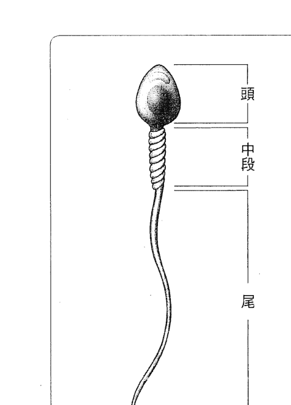

如圖示，精子的結構分為頭部、中段和尾部。中段有強壯的肌肉結構，可幫助精子尾部進行快速又強烈的運動，以通過女性生殖腔進入子宮、輸卵管，達到受精繁衍下一代的目的。而為了讓這些肌肉結構可以長時間劇烈運動，必須準備大量的「糧食」。

精子長約50~60u（1u=1/1000mm），由女性子宮口至輸卵管，總有十幾公分，這就至少是10^5，是精子本身長度的二千倍以上。如果以人來作比較，人的身長如伸長手臂約二公尺以上，二千倍就是四千多公尺，而精子需在三十分鐘之內游完全程，才有機會抱得美人歸——使卵子受精。還有一件事一定要知道，當精子在游泳時，沒有劃好的水道（甚至不是水道），分叉又很多，大多是一片沼澤，精子要隨著精液以及子宮與輸卵管內的潮濕，去找到美人所在之處，一路上是盈科而後進，奮勇向前。在數百萬個精子中，僅有一個「可能」與卵子相遇，其他都將陣亡。一個精子在睾丸中製造，前後要七○至九○天才能成熟，整個過程需要大量能量，當然也就產生了很多熱量，所以睾丸只好放在體外，以便散熱。每次射精，為了護送精子，大量的精液內含各種豐富的補給品，加上攝護腺分泌，也是一大筆成本。由上述一些生理現象，可以進一步理解到，生命的延續在演化過程中是何等重要。所有的物種，能夠繼續繁衍，必須有很強的生殖能力，否則就無法產生下一代，而在基因的大池子中被淘汰。

##### ◇◇ 精子生成 ◇◇

所有今天能在地球上生存的物種，包括人類，都有非常優秀的生育能力，才能幾千年、幾萬年的活下來，現存生理現象也是一直不斷演化、改進、適應……而得到的結果，所以總是出乎我們意料的傑出。因此，我在研究中醫時也是秉持著這個概念——「血液的分配中有出乎意料的智慧」，絕不是目前生理教科書流量理論所教的，像流在河中的水一樣，依靠動量繼續往下衝，就把血送到了每一個器官、每一個穴道、每一寸肌膚。

男性每次射精約釋出1~4CC不等的精液，每1CC約有二至三百萬個精子，數量與每CC血液中的白血球數差不太多，但是不論原材料或製造工程，製造精子的耗費都比白血球多且繁複。

##### ▼睾丸製造精子之流程

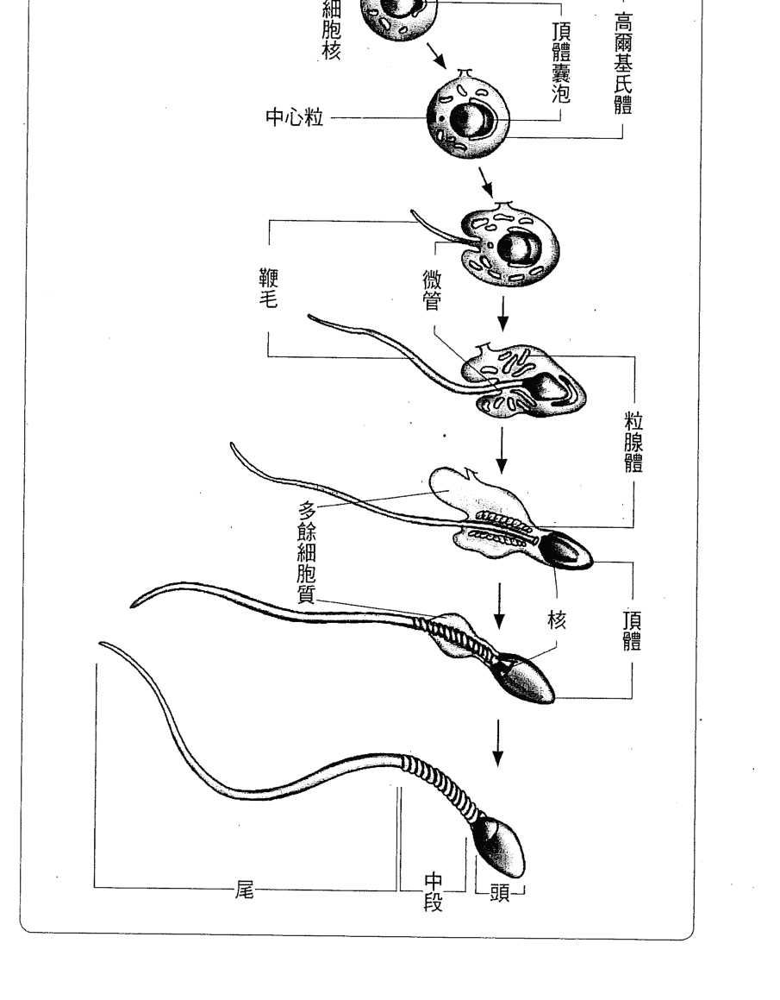

如果只從精子與精液加攝護腺液的營養成分來看，一滴精相當十滴血，似乎沒有那個比重。但若從製造的過程，手續繁複而言，恐怕就有另一種看法了！一套精製的西裝，主要原料是西裝料、縫線、鈕扣等，要經過許多裁縫師的巧手，以手工縫製七○至九○天才製成一套西裝，又怎能說這一套精製西裝等於一套西裝料呢？精子要七○至九○天大量工作才能成熟。也許，一滴精相當於幾十滴的血，甚至幾百滴血，才是比較合理的比例！

##### # 補腎≠壯陽

在華人的文化中，補腎與壯陽總是聯想在一起，這個文化偏差是怎麼產生的？這問題我們思考了很久，認為答案應該是源自於「皇帝這個獨裁天下、獨佔全國美女的人」。以往皇帝後宮佳麗三千，身體再怎麼強，也抵不住消耗。所以所謂御醫的重大功能之一，就是為皇帝找出方子來解決這個問題。因此，只在皇宮中獨有的秘方，比比皆是。其中最神秘的就是壯陽方子了。一些從西域來的「高僧」，西藏、印度來的「野和尚」，加上更多的本土道士，天天煉丹、採藥，綜其所學，呈獻的秘方瑰寶大多是此類藥物，並因而獲得皇上大量賞賜，奉為國寶。

而歷史上記載得非常仔細的，就有如「仙茅」（溫腎壯陽，祛寒除濕）這味藥。這個壯陽藥，在唐明皇時代由西域傳入，一直在皇宮中流傳，後來才流入民間，進入藥典。其他還有私自相授受的，而鄉野奇談更是大家茶餘飯後的話題，以訛傳訛，以致產生偏差，提起補腎就想到壯陽。

腎的功能，其實可由古籍所言一一分解，再以現代生理學仔細分析合理部分，就可以解除大部分的困惑，調和《內經》、《難經》不同調的窘境，以排解先賢言論中之矛盾，並進一步開啟未來研究發展的方向。

## 【分辨篇】

### 道家佛家修行養生的追求

道家氣功講的是性命雙修。但性和命又是什麼呢？其實就是身、心、靈。身即是『命』，心與靈就是『性』。佛教是講心、修心，能得正道，就能進入靈的範疇，並沒有特別講到命。所以佛家是重性輕命，也就是重心靈，而輕身體……。

#### 8 性命雙修的道家養生術

在中華文化中，道家或道教，修行的是追求世間福報，這與其他宗教（如回教、基督教、佛教）多為死後做準備的教義，是很不相同的。

而在世間的福報，健康、長壽是一切的根基，所以道家對養生術的追求，幾乎是道教或道家文化的最精華，也最雜亂，想像力最豐富，並且是牛鬼蛇神最多的一個環節。

道家是真正在中華地區產生的文化。雖然與佛教文化有很盤根錯節的交流，但仍是道家一些基本的養生文化，仍為道家之特異點。

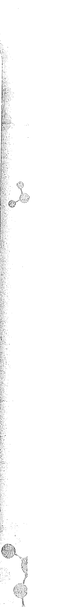

##### 中醫與道家文化

中醫的發展，與道家文化是水乳交融、密不可分的，中醫大師如孫思邈、王冰、葛洪等人，皆為著名道教人士，也都是養生的名家與提倡者。

中醫之理論，少有大量實證，大多依靠《內經》及推論；相較之下，道家養生文化更是絕對自由的發揮，許多想法和推論，常常只是一個人打坐時的感覺，或是某個人的冥想心得，於是就一傳再傳，煞有介事。但不論如何，這些道家理論就是中華養生術的主流或主力。在這些養生術中，要找到真正的道理，比起整理中醫理論體系的難度更高。

當我們在整理這些文獻時，仍是依循過去研究中醫理論的精神，盡量去找大家共同接受的部分，再由生理學的理論來試著做討論或規範，以求找出一個合理的解釋，或是將之推翻。如果發現一些現象，或理論有些道理，再將之導正，並說明其道理合理之處，進而加以整理，以成為一個合理的體系。

在開始談道家氣功之前，我們對於道家養生必須先有一個認識——煉丹，是道家養生的核心。丹藥，是煉丹的起源。《神農本草經》也認為，朱砂（丹砂）是上品，並將它列為開篇第一味藥。

##### 道家氣功概要

道家重修身養性，修仙道，也兼修醫道。晉代道教主要代表人物——葛洪，為當代著名煉丹家、醫藥學家，其重要著作《抱朴子》被視為道教經典，分為內篇與外篇，內談道家思想和丹道修煉，外談人間得失、世事臧否。

是故古之初為道者，莫不兼修醫術，以救近禍焉，凡庸道士，不識此理，恃其所聞者，大至不關治病之方，又不能絕俗幽居，專行內事，以卻病痛，病痛及己，無以攻療，乃更不如凡人之專湯藥者。

醫存玄胎息，呼吸吐納，含景內視，熊經鳥伸者，長生之術也，然艱而且遲，為者鮮成，能得之者，萬而一焉。病篤痛甚，身困命危，則不得不攻之以針石，治之以毒烈（藥也）。若廢和鵲之方，而慕松喬之道，則死者眾矣。

身為著名中醫師，葛洪以醫術為基礎，他的修道之法，強調要符合醫學，也就是生理學理論，是比較不誇大其實的大師。而其練氣理論強調：

##### 一、守一

> 《太平經聖君秘旨》：「欲壽者，當守氣而合神，精不去其形，念此三合以為一，久即彬彬自見身中，形漸輕，精益明，光益精，心中大安，欣然若喜，太平氣應矣。」

提出守一，就是精氣神合而為一，修者當守氣、合神、保精，以明為綱。一者精也，精乃元氣之母，人之本也，在身為氣，在骨為髓，在意為神，皆精之化也。

##### 二、房中、寶精

強調健康而節制的性生活。不主張采補，而以增加情趣，適度行房，保持精之長滿，生氣、增神，以達守一之功。

##### 三、行氣

有《行氣玉銘》四十五字：「行氣，深則蓄，蓄則伸，伸則下，下則定，定則固，固則萌，萌則長，長則退，退則天，天幾春在上，地幾春在下，順則生，逆則死。」也有一說，其大要者，胎息而已。「初學行炁，鼻中引炁而閉之，陰以心數至一百二十，乃以口微吐之，及引之，皆不欲令己耳聞其炁出入之聲，常令入多出少，以鴻毛著鼻口之上，吐炁而鴻毛不動為候也。漸習轉增其心數，久久可以至千，至千則老者更少，日還一日矣。」行氣、胎息，應為細長緩慢的深呼吸。

> > 《胎息雜訣》：「又胎息之妙，切在無思無慮，體合自然，心如死灰，形如枯木，即百脈暢，關節通矣。若憂慮百端，起滅相繼，欲求至道，徒費艱勤，終無成功。」胎息，還要加上將思慮停止，不要胡思亂想。

##### 四、服氣、辟穀

服氣最早出於《山海經》的「食氣、魚者」，不知是否誤認為魚以食氣為生，「此人食氣兼食魚也」。辟穀則是不食五穀，《史記·龜策列傳》記載龜能長年不食不飲而不死。而葛洪說：「法其食氣以絕穀」、「仙經象龜之息，豈不有以乎？」似乎認為食氣辟穀（即龜息大法），可將呼吸、心跳都降至幾近於零，甚至腦波也不見了。（註：我們有一些數據顯示，正確的辟穀方式在結束十天左右療程後，脈診儀的確可量測到接近致中和的脈象。）

##### 五、存思

以水或火等感覺，存在心中，如發炎則心想水之清，如得寒疾則心思火之熱，燒身令盡，存之，使精神如彷彿，疾即癒。

##### 六、導引

今所流行之八段錦或五禽戲等，皆以身體之不同姿勢，以導氣血至不同部位。以上六類是葛洪鍊氣理論，也可說是道家氣功主要內容，其重點為「精氣神」。

##### 茅山道士

说到茅山道士，很多人就会想到曾经风行一时的僵尸片，但真正的茅山道士属於道教的上清派，其法術體系和修道思想幾乎涵蓋道教史各個時期，有「茅山為天下道學所宗」之美譽。只是或許大家看多了殭屍電影，難免被片中那些神怪法術給誤導了。

茅山上清派提倡導引、存思、吐納、丹藥、符圖、訣咒，並且推崇《黃庭內景經》及自著《黃庭外景經》。《黃庭經》內容包括：

-   1. 將五臟人格化，各有其神，而以脾為主（色黃）。
-   2. 頭面有七神。
-   3. 腦中有諸神，且地位有別，分住腦中各個部分（宮）。
-   4. 命門之神。
-   5. 三部八景二十四真（將人體分為上、中、下三部，每部內含八景，共二十四真）。
-   6. 外在諸神。
-   7. 三黄庭、三丹田之说，则黄庭不再指脾，而是与三部对应。
-   8. 强调保精。
-   9. 重视口水，称为华池真精。

景）。此法与精气神相符，但更为细腻。

##### # 其他流派

外丹以陶弘景集大成，著作非常之多。陶弘景同样是有名的中醫師，如《本草經集注》、《效驗方》、《肘後百一方》、《合丹法式》等，也是中醫重要著作。至於《集金丹黃白方》、《服雲母諸石方》等，則傾向道家外丹之內容。

道家之其他流派，書不勝書，但已多參雜神仙、靈異、法術等，如許遜之淨明派，可以點瓦成金、化木炭為美女……。此派後來傳人達數百人，而有著作者亦數十人。

還有大家最熟習的八仙，如鍾離權、呂洞賓、鐵拐李、張果老、何仙姑、曹國舅……等人，皆已入神仙之流，其神跡之流傳，多於其理論著述，反而成為道教最引人入勝的風景。

張伯端（南宗）：號紫陽，本人雖未言師承，但考據皆認為傳承於劉海蟾。南宗以提出陰陽及清淨二派為其特點，強調以人補人，本質為取坎填離。

說到「取坎填離」，以自身腎中陽氣為坎，心中陰神為離，亦稱做「還精補腦」（與精氣神之理，水火相濟、心腎相交亦相合），此為清淨派；而陰陽派，則是以自身陰精為離、為汞，女方陽氣為坎、為鉛，采彼「坎中滿（☵）」補我「離中虛（☲）」。

本來此法強調男女間之感應，但後為邪門外道所乘，變成「御女采戰」、「泥水金丹」，提倡「煉劍」之說——通過性交而煉丹。如民國期間相傳有楊森者，以多媾幼妻而長壽，台北市南港近郊九五峰，系因楊森於九十五歲登峰而得名。不久楊森因手術住院（在單人房），於少妻入內探病後暴斃。

南宋於元末併入北宗龍門派，改稱龍門南派。

王重陽（北宗）：北宗為王重陽所創，而盛於丘長春，與南宗皆鍾離權、呂洞賓之內丹一系，為全真派。應始自《莊子·雜篇·漁父》之「苦心勞形，以危其真」、「謹修而身，慎守其真」。本義為全其本真、天真。此派主要旨意：

- 一、三教圆融：儒、释、道三教合一。「释道从来是一家，两般形貌理无差」乃王重阳名言。
- 二、识心见性：用禅宗明心见性之理，以「独全其真」，行于「性命双修」之法己。

大道以无心为体，忘言为用，柔弱为本，清净为基。若施于身心，节饮食，绝思虑，静坐以调息，安然以养气，心不驰则性定，形不劳则「精」全，「神」不扰则丹结。然后灭情于虚，宁神于极，可谓不出户而妙道得矣。

从〈丹阳真人直言〉这段文字明显可见，全真派将「精气神」与「戒定慧」的道理，做了完美的融合。

- 丘长春（龙门派）：系金时人（西元一一四八年），弟子十八人，传至今已近四十代。每代传人皆众，为流传最广之门派。但也因门人众多，致其他门派也目稱龍門，或雖為龍門傳人卻不知所傳何物，將龍門派變成一個大雜燴。

##### 伍仲虛、柳華陽（伍柳仙宗）

伍、柳二人直言，陰陽、性命順其自然之變化而生人；逆則返還修自然之理，則成丹（成仙成佛）。其他著作專言大、小周天及任督二脈、預防危險等，有關小周天之修煉，其要旨在周天之火候。重點論述，再三提令。

##### 蔣維喬（因是子靜坐法）

係於清代汪昂所著之《醫方集解》中發現。流傳最廣，功法先叩齒、攪漱，然後靜心默數呼吸三百六十次，以意行氣（→下任脈→過尾閭→閉目上視→至頭頂→下鵲橋→至丹田）一小周天，共行三次，擦丹田，並提倡自發外功。而楊踐形於一九四一年提出之放鬆方法，靜坐時弛緩筋肉，柔軟身體，如浮於空中，稱「弛力法」。

綜上所述，道家一直把內功、外功混於一池。雖然張三丰之太極拳被分類為内家拳，但與內功修為直接相關的方法，至楊踐形才真正提出明確的指導。

#### 9 重性輕命的佛家氣功

道家氣功講的是性命雙修。各派雖有偏好，如南宗是先命後性，北宗是先性後命，遵循原則仍是一致的。但性、命又是什麼呢？

##### 性與命

現代的話語，總說「身、心、靈」。開學術會議、演講時，也總是身心靈一起研討。其實本身就是「命」，而心與靈就是「性」。

與道家氣功之最大不同在於，佛教是講心、修心，能得正道，就能進入靈的範疇，並沒有特別講到命。所以佛家是重性而輕命，也就是重心靈，而輕身體。身體的基本健康，很大部分是生理學的。人要吃、要喝，吃五穀，怎能不生病呢？所以道家氣功重視命，也就重視生理與食物，因而與中醫接近，進而有「丹」的概念。簡單的說，「丹」是物質性的、生理上的「精華」，內丹由自己修行而來，外丹則由藥物（中藥）金石精煉以得之，服後有大用。而佛家或佛教就完全沒有「丹」這一概念，因而完全不談外丹，甚至內丹，也以修心養性為指導，絕口不提「丹」。

##### 禪宗

佛家氣功，我們只就禪宗來探討。

禪宗是在中國發展開的大乘佛教，受到道家文化的影響最大，因而氣功的成色中華文化的影響更勝於道家。

大乘佛教有許多派別，天台宗、禪宗、淨土宗、密宗為四個主要宗派，而其修持方法都是「禪定」。

禪宗在歷史上最經最有名的故事有兩個，其一是六祖惠能與神秀的故事：六祖本是廟中掃地的工友，而神秀是五祖的大弟子，五祖傳衣缽時，要各弟子提出修行心得。神秀答：「身是菩提樹，心如明鏡台，時時勤拂拭，勿使惹塵埃。」惠能的答案是：「菩提本無樹，明鏡亦非台，本來無一物，何處染塵埃。」於是五祖深夜為惠能講解《金剛經》，惠能當下悟到本性，爾後五祖便將衣缽傳予惠能。

另一個是二祖慧可向禪宗始祖達摩拜師求法的故事：達摩祖師來中國入山修行，二祖慧可（當時名為神光）在洞外恭立欲拜師，達摩久久皆不相應，於是慧可為表心志，自斷左臂，才終於見到達摩，表示自己心未安，乞求為他安心。而達摩回他說：「把心拿來，我為你安心。」慧可找不到自己的心，達摩說已為他安好心了，遂有所悟。

由以上兩個故事，很清楚的指出禪宗之開示——三無。

##### ◆ 本来面目 ◆

> 惠能釋法：「汝既為法而來，可屏息諸緣，勿生一念，吾為汝說。」又，「不思善，不思惡，正與麼時，那個是明上座本來面目。」

- 一、無念為宗。
- 二、無相為體。
- 三、無住為本。

這三個無，其實只有一個無，就是無念。不起念頭，就不會拘泥於形相，而沒了形相，那又依附什麼以停留？

##### 佛教的修行

這個「不思」，就是沒有念頭，前念已斷，後念未起，自己的本來面目。

其實全真派之「全其本真、天真」，即受到禪的啟示，也就是本來面目——「自性」、「本體」。「禪定」就是定於此「本來面目」，因而「戒」、「定」、「慧」是佛教各宗派共同遵循之修行準則。

六祖對此也予以否定（無）：「心地無非自性戒，心地無亂自性定，心地無癡自性慧。」雖然以「無」來闡述「戒」、「定」、「慧」的深層意義，但也肯定了「戒」、「定」、「慧」是為修行之準則，為佛教各宗派共同遵循之修行準則。

其實佛教也是修命的，只是不視為重點。

佛祖在菩提樹下悟道前，也曾學習印度教之苦行，以虐待自己身體，做為脫離肉體枷鎖的手段，而不是「戒」、「定」、「慧」，因而幾乎死亡。幸得村女供奉羊乳才得以生還，並領悟：雖不追求身體欲望之滿足，亦不必將之戕害，只要守「戒」即可，這才是確實可行之修行大道。守戒，反而因身體更健康，可以進入「定」與「慧」的更高境界。

道家也「戒」口腹之欲（節飲食），但終究是入世之法，不強調戒色，因而衍生出三峰派類之邪術。

在禪宗中，有兩個特別有趣的法門，是用來幫助我們開悟的：

##### 一、棒喝禪

此法門起於明僧人（臨濟宗）圓悟，就是俗稱的「當頭棒喝」。「問也打，不問也打」，這個突如其來之當頭一棒，又怎修行本來面目？

我們用現今的電腦科學來做個說明：當頭棒喝，就像電腦當機時最常用的修復方法——重新啟動（re-set）。電腦因軟體太多，難免會相沖，因為困於一處，動彈不得，不正像我們凡人思慮過度，他愛我、他不愛我、他愛我、他不愛我、他真的愛我、他真的不愛我、他一定愛我、他一定不愛我……一再反覆無了時，此時一棒打來，一切思慮放下，再重新開機，也就跳出這個死胡同了。

##### 二、參話頭

即是反覆分析一個念頭的起始之處，也就找到一念無明的起始點、發源地。「杜塞思量與分別之心」一問一答，兩人同修，自問自答則自修，不斷把答案當問題，一直問下去。

俗話說「打破砂鍋問到底」、「狀元也經不住三個為什麼」，舉個例子來說：

「為什麼蘋果掉到地上來？」一問。

「地面是蘋果該去的地方。」亞里斯多德說。

「為什麼地面是蘋果該去的地方？」再問。

「因為萬有引力，地球質量與蘋果的質量之間有引力。」牛頓說。

「為什麼有萬有引力？」三問。

這下子可不容易答了。

也许你可以试著答说：「因为有重力波。」

如果接著又问：「为什么有重力波？」

……???

上述举例是一个物理的问题，还比较容易回答。如果是人心，人性的问题，也就是性与命的题目，就像达摩要二祖「把心拿来，吾为尔安之」。乃知一切「无」有。

以上所介绍，不论是博大精深的佛学，或是杂乱无章的道教，都只是九牛之一毛。我们知识有限，难免以管窥天，只是尽心尽力的理出一些自以为是的条理，以与大家分享。

#### 10 由生理學看精氣神與戒定慧

我們在研究中華文化時，一直強調不變的部分，如中醫理論中的十二經絡、穴位、而氣功理論最不變、最廣為接受的，也就是精氣神與戒定慧。

##### ◇「精氣神」之開源節流◇

許多道家氣功都強調「還精補腦」、「煉精化氣」、「精化氣」、「氣化神」，而這些究竟要如何來理解？

由生理學的觀點，二、四、六諧波互為共振頻，也是內功的基礎。二是腎經的共振頻，對應到「精」；四是肺經的共振頻，對應到「氣」；六是膽經的共振頻，對應到腦，也就是「神」。從這個角度來看，二、四、六共振諧波的能量是可以互相交換的，所以「還精補腦」應理解為：將製造精子用的血來支援補腦。一旦血液進入睾丸的生產線，後來一定被分解成原料而製造出精子，就沒有「還」的可能了。最多也就是在儲精。我們能做到的，只是少用些精，讓多些血去養氣、去補腦。男女性交後，男生耗費成本大，因為一旦精洩，血液一定先來補足精，而降低了肺與腦的供血——在演化的過程之中，生殖功能一直是生物物種能夠長時間存在最重要的基礎。那是否有方法補腦呢？這個就要說到戒定慧了。

##### 「戒定慧」之補腦哲學

最有效的補腦方法，就是「戒」，完全沒有性生活。即使沒有洩精，生理上精子還是會不斷製造出來，只是速度較慢。從在睾丸製造生產，到運至儲精囊暫存，精子待在小倉庫內，放久也就分解了，所以適度洩精對身心有益無害。

「煉精化氣」也是一樣的道理。

只是氣如不能「定」，成了戾氣、暴氣，又如何補腦呢？——所以要「定」。

而腦子補好了，胡思亂想，做盡壞事，又有何益？——所以要開發「慧」。

那些道家想像力豐富的「房中術」、「還精補腦術」等等大批文獻，總是教人如何與女性交合，而不射精及還精，以求補腦，恐怕是沒有什麼作用。只是這個不射精或延射精的手法，倒是可能對於男性早洩的症頭有效。有心人不妨往此方向研究研究，也不枉費這些老道士們嘔心泣血的「傑作」。

至於陰陽派的理論——以人補人，是不是還有別的道理呢？

從一些統計數據顯示，有配偶或性伴侶的人，生活都比較幸福，壽命也比較長些，而婦女有兩、三個孩子活得最久，也充實些。可見與心愛的人相處，心情愉快，互相扶持，相親相愛，這就是「以人補人」的大道。

##### 氣功於中醫發展之猜想

在研究中醫理論時，我們與先祖一樣，先由最基礎的數學入手。
因為「心跳是規則的」→「人體中有共振單元」→「共振單元組成器官及經絡」，因而可導出器官及經絡的共振血液循環理論；而十二經絡及器官共振頻，才是生理上的發現，因此有「河圖洛書」之共振頻的分布。
再把人體當作一個由各種密度、彈性、有一定結構的實體，則配合肌肉、血管、骨骼等之組成，可以找到經絡及其組成之穴道。這個發現的過程，可能在一萬年以前就已經完成。我們今天所知的經絡理論、各屬之穴道，都有典雅而實用的名稱，這應是許多古聖先賢集體努力——一棒一棒的經過了千百的努力——才有的成果。
而這些發展的過程，都在萬年前一顆天外飛來的隕石打出太湖時消滅了。

> > （請參看《河圖洛書前傳》）

一些最寶貴的結論經過多次傳述，加上因為不解其本意的自行發揮，最後以《內經》、《難經》、《神農本草經》等形式留傳下來。而面對這個完全混亂的理論、毫無章法的發展過程，想要從中理出一個思路，是非常困難、幾乎是不可能的任務。

於是我們開始試著從數學入手，就像研究中醫一樣（請參看《以肺為宗》），《內經》中有「獨大者病」、「獨小者病」，所以氣功若只是將某一血液共振諧波的振幅經過鍛鍊而獨自變大，「那也是一種病態」！（註：嚴格來說，只有腎經變大愈健康，其實這也是練內功的精神。討論腎，將氣功列入主要討論內容，也是基於此理。）

所謂氣功，應是經過鍛鍊，增強了一組諧波，而達到增加健康的功效。

## PART - 3 -

## 【解析篇】

### 氣功也可以由數學推論

因為心跳是穩定的，所以其組成分量都是諧波，這是數學的必然，也是我們先祖發明了中醫藥的重要基礎。因此在「氣功」的討論中，開宗明義，我們就應用了必然正確的數學來推論。而這個所謂的內功，應是與二、四、六這一組共振諧波有關！

#### 11 我們的身體有兩組共振諧波

氣功的發展雖依附在中醫之理論，但是更為「天馬行空」，常常是某人一夢，或某人打坐時的感應。

中醫之發展，有《內經》、《難經》等理論（雖然不甚完整也不是完全沒有自相矛盾）做為規範，終究有些標準，而氣功就是漫無章法，各家各派，自說自話！

中醫理論、藥理……要在病人治病上加以證實，所以特重「驗方」，氣功、煉丹則是全憑使用者的自覺，或「內視」等沒有任何根據的感覺，因而「走火入魔」、「藥物中毒」，不知害死多少皇帝、貴族、能人、居士……

##### 二四六與三六九

於是，我們就像研究中醫一樣，試著由數學入手，推論氣功。

如前所述，心跳是穩定的，所以其組成部分量都是諧波，這是數學的必然，也是我們先祖發明了中醫藥的重要基礎。

這些諧波之共振器官及經絡，分別是：○心包，一肝，二腎，三脾，四肺，五腎，六膽，七膀胱，八大腸，九三焦，十小腸，十一心。

把這個由○到十一的十二組諧波攤開來看，可以發現有兩組互為相生之共振諧波頻組合：

- 一組為二、四、六，分別為二的、一、二、三倍。
- 一組為三、六、九，分別為三的一、二、三倍。

而到了四的共振諧波時，就只有四與八，兩個而已。至於第十二諧波，也許在人類繼續演化、進化以後，可能發展出第十三個經絡，才能存在第三組共振諧波頻組合。

##### 不同管道練功，效果不一樣

由數學來看，要增強身體的功能，也就是所謂的練功，就應是加強這兩組共振頻組合之能量。理由是：

1. 二、四、六，恰好就是上焦（部）、中焦（部）、下焦（部），也就是血管為主之共振頻，以二腎為其基頻，是謂先天之氣的根本。
2. 三、六、九，則是人體三焦經（全身腠理之氣）在全身體表分布之衛氣，而以三脾為其基頻，是謂後天之氣的根本。

由此可以明顯的理解，練功有兩條不同的管道，不同的方法，可達到不同的健康效果。

##### 三焦經——第九諧波之共振經絡

三焦經在人站立之後才演化出來，是所有經絡中最特別的，為將人的全身視作一體之共振頻。也就是說，這個共振頻是人以兩腳站立，不再四肢著地，才能夠展出來。

所有練功的姿勢，如為站立，都要求兩腳與肩同寬，正是希望啟動這個全身之共振頻，也就是「氣」的產生。

近代研究氣功，絕大多數都在了解這個共振頻的特性，像是《內經》中就指出，三焦經之特異性——「氣行脈外」，只有三焦經的氣可由脈（血管中）走出來。其他の至八，以及第十一、十一諧波，這些經絡的氣都是走在血管與穴道所組成之經絡中，而不能在身體其他部位自由遊走。

這個全身的共振頻，可以影響腦波，與腦波產生協同共振。

此外，這個約10Hz左右的波與地球外圍電離層之共振波（舒曼波）也很接近，若是由此血液共振波诱發腦波，進而與地球之共振波連接，是否就能產生「天人合一」般和諧安定的感覺？也是值得玩味的。如果強化這個全身的共振波，布滿全身之滕理，就是硬氣功，也就是所謂「金鐘罩」、「鐵布衫」，而能刀槍不入。如果將此第九諧波經由手掌、手指……向體外擴散，就是所謂的「外氣」。有些初入門的練功新手，自覺幾個星期或幾天就能氣走任督脈，其實只是這皮下之氣的表面工夫。第九諧波之氣，其基礎為脾經之氣（第三諧波），如果將此氣收回脾經，則體表柔軟，內裡充實。反之，經常發放外氣，或使硬氣功的表演者，常常是脾胃虛弱，虛有其表，而且畏寒怕冷，容易消化不良。這又是為什麼呢？因為經由第九諧波把本來營養身體的脾經之氣給消耗掉了。

##### 如何解釋丹田

以此第九諧波為主，散行全身腠理之氣，可能解釋丹田嗎？
在歷史介紹中，我們談過，丹田是由兩個概念形成：一個是煉丹的文化，也就是化學變化之顏色變化，以與五行之類比概念，轉化為身體上、生理之「丹」。但從來沒有一個氣功「行家」或門派提出解釋，究竟生理上「丹」是什麼？
另一個概念是田。
「田」有耕作的意思，就是要不斷地耕耘，讓「田」裡長滿了「丹」。
首先，我們可以從身體的外形（上圖及次頁圖）來看——

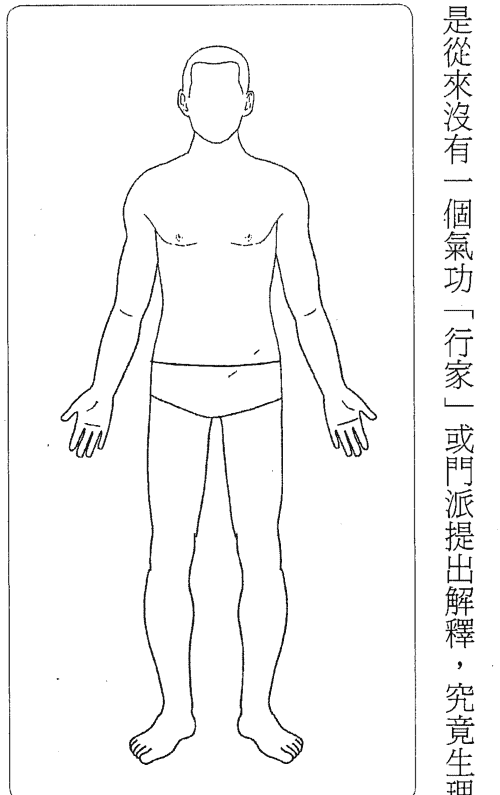

身體的外形（上圖及次頁圖）來看——

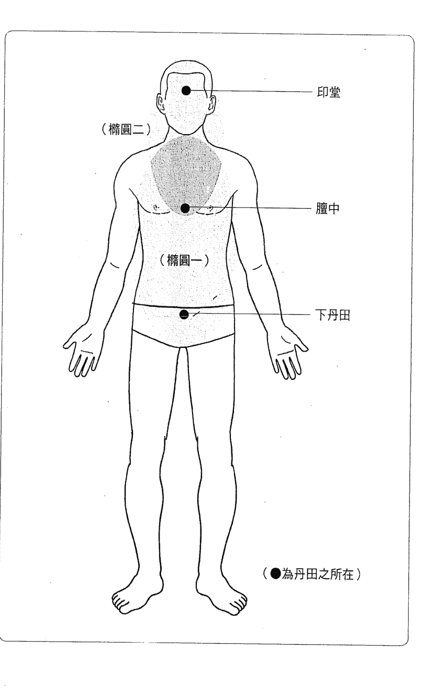

橢圓一，涵蓋範圍為身體部分，此區兩個焦點分別為膻中及下丹田。 橢圓二，由頭、頸、胸之上半形成，而以印堂及膻中為其焦點。

由聲學理論，在橢圓體中一個焦點（膻中）發出聲音，會集中（聚焦）在另一焦點，像是天壇的迴音壁就是依此原理建造，所以在某一焦點談話，另一焦點處可清析聽到，而且兩個焦點可以互相加強。

從右頁所標示這兩個想像的橢圓體，我們可以（稍微有點造作，尤其是橢圓二）大略解釋丹田的位置。

但是如何結丹？如何耕田？後面我們會再延伸探討。

##### 身體之其他部位呢？

以上所討論的，都在「氣行脈外」之三焦經。那麼其他「氣行脈內」的十一個經絡呢？

三焦经只在体表之腠理，那么骨骼、五脏六腑、血管、神经等呢？在气功文献中，最具色彩，又多样、多元化的「内经图」，又称「内景图」或「修真图」，据传为道家千年不外传之秘要图式，其将人体的形象隐于一幅山水风景画，描绘出人体与自然相应的规律，并且结合谜辞隐语，讲述人体脏腑与经络的内在关系、炼气结丹要诀及重要修炼之关键位置。在中国医史博物馆编撰的《文物选择》中收有一幅彩绘内经图，而目前流传最广是北京白云观木刻版拓印的黑白图，在宜兰「道教总庙三清宫」网站（[http://www.sanching.org.tw/dw](http://www.sanching.org.tw/dw)）内有提供图档下载。要找出身体内部加强健康的方法，如由中医之理论入手，一定是「如何增强血液循环之流暢及效率」。因此，我们必须再回到其他器官及对应之经络，也就是回到第九谐波之外的十个谐波——〇至八，以及第十、十一谐波。严格来说，应是三、六、九这三个与外功有关之谐波以外的谐波，也就是剩下的〇、一、二、四、五、七、八、十、十一，要从这九个谐波之中来寻找。

在這個部分——「氣功」的討論，開宗明義，我們就應用了必然正確的數學來做一些推論。

這個所謂的內功，應是與二、四、六這一組共振諧波有關！

#### 12 由二、四、六谐波了解内功

在我們開始以脈診研究中醫理論的時候，大約在一九八五至一九八七這三年間，我們做了《內經》中所稱『三部九候』九個穴道的脈形分析。

- 上部（天）：頷厭、耳門、顴髎
- 中部（人）：太淵、神門、合谷
- 下部（地）：太衝、衝陽、太谿

以上所列出這九個穴道，都有動脈通過，所以才可能取脈，也因而為《內經》選中。

##### 上部

顴髎

耳門

頷厭

##### 中部

太淵

神門

合谷

##### 下部

太衝

衝陽

太溪

> ▲《内經》所稱「三部九候」的九個穴位。

##### ◆ 三部九候之脈形分析

若將所有量到的諧波振幅以手上的太淵為基準，將諧波的振幅比值做一個比較，會發現上部的幾個穴道量測點，在第六以上（膽經）的諧波振幅比值都大幅增加，表示頭上動脈系統對膽經以上諸波的共振顯著；而與下部的穴道相比，第二諧波（腎經）的振幅比值在下部是最高的，不同人的量測平均增加了百分之四十二，表示下部的第二諧波共振最顯著。如果以中部的穴道與上部和下部相比，則第四諧波（肺經）的振幅最顯著，因此，我們大膽假設在人體動脈系統中，上部、中部、下部各自對應二、四、六諧波的共振頻——

-   上部（天）：就是到頭臉部的血管，其共振頻為第六諧波。
-   中部（人）：就是到胸部（頸部至肚臍）及手的血管，其共振頻為第四諧波。
-   下部（地）：就是到肚臍以下至腳的血管，其共振頻為第二諧波。

##### 健不健康？取决于肾经

并且根据这个实验结果，得到一个重大的生理上之结论：这上、中、下三部之共振频，刚好为六（胆）、四（肺）、二（肾）谐波，也就是另一组互为共振（一：二：三）的组合。

而在用老鼠实验时，我们又发现：肾脉（第二谐波）愈强的老鼠，外形佳、毛色美、活力旺、眼睛亮，各方面也都愈强壮。老鼠没有三焦经，也就没有所谓游走全身腠理的第九谐波，而老鼠的健康似乎取决于肾经，也就是第二谐波。换言之，如果有内功，其基础乃是“肾气”。由肾之共振频第二谐波，也是肚脐以下（包含双腿）身体血管之主要共振频，其大本营就在骨盆腔。这不正是下丹田的位置？（下部所有动脉之重心，也就是共振中心）

由肺之共振頻第四諧波，也就是肚臍以上至肺（包含雙手）的身體動脈血管之主要共振頻，其重心共振之最大點是膻中穴。氣聚膻中，就是主昇動脈將心臟打出之流量轉換為振動的發生地點，這也是所謂中丹田（重量之中心點，更是脈動產生地）。

由頭部血管（不含頸部——仍包含在中部）之共振頻第六諧波，其集中點在印堂穴，也就是兩眉之中心，不也正是上丹田嗎？

由心臟產生血流之脈衝，在膻中（主昇動脈）轉換為振動之脈衝。而膻中至頭頂之距離，如當做一；膻中到手心，則為二；膻中至腳底，則為三。由於管長與共振頻是反比關係，這三個部位——所謂天（頭）、人（主要上軀幹加手）、地（下軀幹加腳）——共振頻分別為六、四、二，也是符合數理原理的。

#### 13 說解丹田

丹的概念，是由早期道士以爐子煉製各種化學元素，特別是汞與鉛結合、分離之發現，所演變而來的。

有傳承的「丹」與「田」

在文獻中，可以看到各式各樣的比方、猜想、幻想、邪想，主要是企圖根據五行的概念，把人在練功時產生的各種異相、怪相、相像，以五色、五味等五行中之連結性來推論其共性。於是把人體當成爐子，由身體練功後產生之物質，就統稱為丹；而田就是丹生長的所在，如種田一般，以練功促成丹在田中生長。這是由歷史傳承的「丹」與「田」的概念。這個概念經由各式各樣的人——道士、居士、學者、騙子、瘋子的親身體驗或感覺，留下了大篇幅的「自說自話」、「胡言亂語」、「牛鬼蛇神」，成就了洋洋灑灑的氣功歷史及傳言，而更多是胡言、謊言……

##### 丹田的確切位置

丹在傳統的道家想像像是一顆丹藥一樣的物質，在丹田之中生長！但是，丹而在這個部分，我們先由血液波的共振現象來理解一下——什麼是丹。想要了解丹田的確切位置，就得理解「丹」與「田」在生理及解剖上的意義。

##### 一定要是物質的嗎？

我們在以往的著作中曾提到，就像籃球投籃、或網球擊球一樣，我們不斷的重複相同動作，將神經、肌肉……甚至骨骼等等，都訓練成一種反射式的動作。眼睛一看向籃框，便引導手、手臂、肩、腰、腳……等全身各處都有一個標準的動作，而將球一投入籃。因此我們可以想像，這個長期訓練後的成果，就是一種印在大腦、小腦、脊椎、交感、副交感運動神經的一張反應圖表，將各種投籃動作都詳細記錄，並依照記錄一再重複表現，不斷的加強→重複→修正→加強→重複……，最後成就一個偉大的籃球員，幾乎每投必中。

這張留在神經、肌肉、骨骼，甚至內分泌、呼吸……各系統中的圖表，也是一種具體的「東西」。這一「東西」可以一而再、再而三的不斷重複並改進。

現在我們再想一下練功的過程，或是道家所言「煉丹」或「練丹」的過程，是不是覺得十分相似呢？！

##### 做好共振乃健康王道

其實練『丹』與練『打球』是同樣的事情，所有練打球所要求的心志合一、專心一意、重複練習……，這些對自我的要求，也是如出一轍。 我們可以由生理學的角度說：『丹』，就是身體循環系統中共振狀態的綜合表現。 這個表現與投籃一樣，要全身血管、神經、大腦、小腦……肌肉、骨骼的協調與配合，才能將動脈脈波更有效的送往身體各部位。

而所謂打通某經絡，就是將這一個經絡的各個穴道共振狀態提高到一個良好→再更好→不斷降低阻抗→暢通……的狀態。

外功是以打通三焦經為標的。前面所介紹與三焦經直接相關的奇經八脈，也是逐個（例如由任督脈開始）漸漸暢通，因而血液的壓力波可以快速、隨心所欲的到達並充滿體表某幾個穴道，將之鼓起，而成就鐵布衫與金鐘罩。

說到這，大家心裡或許會想問：那麼在內功呢？
其實，內外有別。
外功是有防禦之功能，只在體表運作（三、六、九諧波，重點在第九諧波），
沒有增進健康、開啟智慧的效果。
內功則是向內臟與其他經絡（尤其是腎、肺、膽三條經絡）及器官，去開發，
去改善循環，以促進健康。

#### 14 練內功是在練什麼？

由生理實驗，我們知道上部（天）的血管都有第六諧波為共振波，中部（人）的血管都有第四諧波為共振波，而下部（地）的血管都有第二諧波為共振波。如果各部的共鳴狀況愈好，則血壓波及血液送到主動脈，進而分送身體之上、中、下部也就愈好！這就是由根本改善了健康，也啟發了智慧。在前面我們已經分辨道家內功的重點是「精」、「氣」、「神」，而佛家是「戒」、「定」、「慧」。這與由主要送血系統中的三部九候，又有什麼關連呢？

##### 生理學上的奇蹟

主動脈是送血的幹道，這是輸送血液最重要的管道，比經絡系統更重要、更巨大，所以一定不能阻塞或共振不良。
而這三部做為最基礎的系統，其改善比起打通任何單一經絡或穴道都更重要。
因為這是第一階段的分配，「經」是承接於其後的分配系統，「絡」則是更細微的分配！上、中、下每一部，則是大動脈好幾條經與絡的結合體或綜合體。
就像高速公路、省道、鄉間小路一樣。在高速公路上，暢通是最重要的，可以將輸送時間縮短最多，將運輸效率提高最多；而省道已不止一條，鄉間小路分支更多，每一分支暢通與否，其影響就比較小，而且比較局部。
但是血液之分配卻是高速公路、省道、鄉間小路的綜合體，係一起工作的，一個群策群力的共振單位。
這條送血的超高速公路——三部，比一般高速公路有更高的效率，以共振方式運作，這是生理學上的奇蹟——老天爺、上帝的傑作，我們凡人至今尚未參透。而氣功已知的枝枝節節也只是瞎子摸象，摸到腿，說是圓柱，摸到肚子，認為是大圓桶，摸到牙齒則是硬的、尖的……。

這個三部，除了輸送血液之外，還兼顧分布血液，所以有三部的規劃，而《內經》在一年前可能就已經知道這個秘密了。

##### ※ 三部九候的奥秘

下部（地）、中部（人）、上部（天）把人體分成三大區塊，由主動脈送入身體的血液波，就依據其共振頻，分別導入這三個區塊，這個區塊包含主動脈、經與絡，也就是微小動脈等。

所以，此區塊的主動脈、經絡、穴道就構成一個大的共振網。

這裡我們要釐清一個概念：血液輸送的共振，可不像電子電路的共振。共振頻與非共振頻的振幅可相差十倍、百倍，在循環生理上的共振，多了幾十個百分比，最多也是二倍、三倍，其他不是共振頻的振幅仍有十幾或幾十個百分點，而且總是清晰可見。因此，並不會完全沒有辦法輸送血液。只是在輸送的數量上有了顯著的選擇。

這個上、中、下部的選擇，是血液分配中最基礎的核心，但卻是最不易體會或了解的。所以，接著就讓我們娓娓道來——

這個區塊是以主動脈為動力的來源，而其經與絡中的血管才是共振之區域。是這個經與絡中的血管，以共振的方式，將主動脈中之共振頻能量引導出來。

這裡一定要有一個概念，就是共振如何將能量交換。一個共振系統，可以由一個充滿各種頻率能量的系統中，選擇性的吸收其共振頻的能量，而不吸收其他頻率的能量。

與我們日常生活最接近的就是無線電視或收音機系統，當其天線之共振頻調到電視台或廣播電台的頻率，就能收到某個電視台或廣播電台的信號。雖然空中充斥了各個電台的廣播頻率，可是這個天線經過了頻率的選擇，只選擇吸收某一個電台的信息，而播放於電視或收音機。

在此我們先做一個小結：

血液由心臟噴出後，在主昇動脈做一個三六〇度的大轉彎，同時將約百分之九十八以上流動的動能，在此（約在膻中穴）轉換為波動的位能，而沿著有彈性的主動脈向上、向下輸送。此時大動脈之彈性、平順，就能以最小的摩擦力將血液往前推進。由於血流速度很小，波動能量很大，因而在主動脈中主要輸送的是存在血管壁上的位能。

這個在血管壁上的位能，包含了心跳的各個諧波。當波動通過身體下部時，因下部之經（包含大血管）、絡（包含小血管）所形成的動脈網路，有其特定的共振頻——心跳之第二諧波，將以第二諧波為主的波能能量吸入此動脈網路，並藉此波動力量將血液推進所有下部之組織。

同理在上部是第六諧波，而中部是第四諧波。

##### 丹田的田是什麼？

由以上的了解，我們就很容易來解說「田」了。田就是整個上部、中部或下部的區塊，是一塊很大、很大的「田」。那為什麼氣功前輩們認為丹田只是一個很小的位置，或者是一個類似穴道的位置呢？

我們把身體的動脈解剖圖拿出來看一看：下丹田差不多是下部動脈之重心，也就是共振網中振動之最大點，同時也是我們一般最容易感覺到有振動的位置，難怪下丹田會有「關元」、「神闕」、「氣海」、「石門」等各種不同位置的猜測。這也是隨各人身體結構、感覺等差異而分別有不同的結果！

-   中丹田有「膻中」及「巨闕」等。
-   上丹田則有「百會」及「印堂」等。

▲從人體動脈解剖圖看上部、中部、下部之丹田位置示意。（×為肚臍）

##### 什麼是丹呢？

傳統氣功前輩總是把身體看做是煉丹的爐子，而丹則是化學之物質，是一種具有體的物質「丹」。

由前述對生理學的了解，「丹」應該是一種物理或生理的狀態！

就像我們打籃球練習投籃，或打網球一樣，將神經、肌肉、血管、骨骼……等全身的協調性，做了長期的訓練，達成一種高度合作、協作的狀態，才能因而達成高度的協調；又在不同狀態下，總是做最對的反應，而將籃球投入籃框，或將網球以一定強度、旋轉、角度……擊回。

對內功練氣而言，就是將「田」中的共振，漸進式的訓練與加強，並擴大「耕地」範圍，以擴充至整個上、中、下部的區塊。共振愈佳，所謂丹田（下丹田、膻中、印堂）的振動感就愈強，愈容易感覺到。

這些古人所宣稱的現象，幾乎都可由此做些了解。

##### 練功 vs. 精氣神與戒定慧

由上、中、下丹由之部位及其共振之諧波，分別為六、四、二心臟跳動次數之倍數，也分別為膽經（六）、肺經（四）、腎經（二）的共振頻。所以內功所修煉的也就是以這三個經絡為主。第二譜波是腎之共振頻，腎乃藏精、主髓，可以是狹義的精子、精液，更可以是廣義的血液骨髓。當然其精中之精仍是精子、精液。第四譜波是肺之共振頻，係身體宗氣之源，所有氧氣皆由此供給，可以說是氣之大本營。第六譜波是膽之共振頻，而上部之膽主要為腦，腦子是神，也就是神智、精神等各種智力活動之主導者。二、四、六互為一：二：三之共振頻，可以互相交換能量，相互支援。而我們練內功修煉腎、肺、膽，也就是精、氣、神。因此，精氣神又可相互換能，相互支援。

那麼「煉精化氣」、「煉氣化神」、「還精補腦」等神祕功法也就不難理解，只是血液循環生理的必然現象——共振諧頻間能量之互換。因而精氣神也可相生。

佛家氣功之「戒」、「定」、「慧」，其實與「精」、「氣」、「神」是同義詞，戒之中以色戒最難「持」。我們都是由「色」而產生的，子曰：「食色性也。」

能守戒則自然精足，精足則氣定，氣定則「神」開，自然產生大智慧。也就是說，大智慧是由神而生。

##### 比較精氣神與戒定慧之精義

道家是修煉在世之福報，在生理學基礎上討論內功在我們身上之物質基礎，因而得到一個結論：

-   下部共振良好則產生足夠的「精」；中部共振良好則「氣」飽滿；上部共振良好則產生「神」。好則「神」智清醒，腦力充足，這是生理的必然結果。而其成就之順序，則是精足↓氣，氣足↓神，由精而氣而神。
-   佛家強調「心」的作用，修行強調心的境界、心的努力，也就是自我心靈的昇華，以成正果。
-   所以，佛家的修行以守戒以達心靈之淨化，因而成就氣之安定；不再有暴戾之氣，或其他之惡氣，因而腦子清淨、清明，進而產生大智慧，認識自己「本來無一物」的本來面目，真正解脫生老病死之桎梏，而得到大自由、大解脫。
-   由此看來，道家認為內功為人在世間找到「神」，足以像莊子一樣的一生死平貴賤之智；而佛家可以成就「成佛之大慧」，超越人世之一切災難、苦痛。

#### 15 内功修煉三原則

有了對内功這些生理學上的了解之後，在開始進入實練前，我們要先對如何練功做些原則上的建議：

1.  要先體會或感覺到自己的心跳。
   也就是靜聽心音，似乎聽到自己心跳的聲音。這個聲音是很低頻的，低於16Hz（每秒十六次），所以不是用耳朵去聽，而是以身體去體會低頻的振動，一種聽不到的心音。
2.  要配合心跳做動作或運動。
3.  要感覺心跳在全身共振。

不論走路，或是做各種柔軟、週期性的運動，如甩手、轉腰，或轉脊椎骨、做香功……都要配合心跳，以加強各部位與心跳的協調性，也就是煉「丹」了。

在靜坐、站樁練功時，更要試著靜聽心音，感覺心跳像是在全身共鳴。

##### ※ 修煉內功與丹田發聲 ............ ※

聲音要好，丹田要有力。尤其唱歌時要（下）丹田用力。這與內功的道理又有什麼關係？！

讓我們回想一下，身體上可能的三組互為相生之共諧波：

-   二、四、六諧波——內功
-   三、六、九諧波——外功
-   四、八、(十二)諧波——？？

由二、四、六諧波（內功的諧波組）來看，如果下丹田用力，下部共振將會被壓抑，原來在下部的第二諧波能量分散到共振相生之第四與第六諧波，使得四、六之能量必然也跟著大大增加。那麼，當下丹田用力把第二諧波的能量強迫分配至第四諧波主要為肺供血，第六諧波為頭上供血，而第八諧波在頭上（上部）正是聲帶部位肌肉群之供血的主要能量。（由第六及第八諧波供血）如此一來，肺活量、聲帶的控制運用更靈活，自然歌聲也就更為動人了。

##### ❖ 看特異功能的門道

說到這裡，我們稍微插話，為下章起個頭。外功有些特異功能，像是以頭擊破磚塊石頭、以長茅刺向咽喉，甚至以大卡車輾過身體、赤腳站在刀尖上……等，這些我們常在表演中看到的硬氣功，多可由「金鐘罩」、「鐵布衫」等等，氣血充滿勝理來解釋。

也就是三、六、九諧波互為共振頻，而將三、六之能量集中到第九諧波，就形成體表的保護層，再將能量集中於幾個穴道或位置，即成為特別強硬的點或小面積，以對抗外力之侵襲。

而有些科學論文以力學的角度，把手或身體視為許多小球，以彈簧連結之連續體，以人體組織之彈性係數，以及組織間之黏彈性，認為這些現象都還在合理之範圍，其實也不算「特異」。

只是，經常將第三諧波的能量引導到體表，會造成第三諧波的虛弱，反而形成脾胃虛寒的症頭。這種情形在許多「愛現」的氣功師父身上常會發生，但又不敢在人前示弱，真是為難！

#### 16 内功也有特异功能

前章所谈的丹田用力，歌声美妙，就是像硬气功一样的特异功能。因为把肾经的能量集中到肺及声带，而产生的特殊效果——歌声美妙，这就是现代所谓的美声唱法。

这种歌唱法，与外功之硬气功相似，也有损伤肾气的副作用。长时间以丹田用力唱歌，难免肾虚而腰酸脚软。

其实内功特异功能中最强大的是：产生了佛祖释迦牟尼。

当佛祖在修行时，他就在修练内功，直到他在菩提树下静坐了四十八天，这才悟道，而這整個過程就是最典型、最強大的特異功能。

佛祖由戒、定、慧而悟出人皆有佛性，教導我們如何找回自性，因此發想了三法印、四聖諦、十二因緣等人生的道理，以加速我們認清真我，拯救了世上多少人心。這是內功特異功能中最高無上的成就。

##### 生活中的内功修炼

世間的政治家、軍事家、科學家、思想家、發明家……在做深層思考或重大決策時，總是會靜心養性，甚至齋戒沐浴，這就是由內功之「精」、「氣」來產生「神」，由「戒」、「定」來產生「慧」的過程，也都是由內功之修煉以達智慧，神清目明，而能高瞻遠矚之特異功能。

話說回來，其實我們在日常生活中，往往也不知不覺就用了內功的修煉，希望達到「神」與「慧」的「特異」效果或功能。大家不妨想想看？

##### 「畸」人「抑」士

在我研究气功与中医的过程中，的确也曾遇到一批奇人异士。

例如一位师父，祖传龟息大法，他真的可以控制心跳、血压，甚至令脑波呈现寂静的现象。然而，一度主编气功杂志推广气功的他，后来却只能以算流年、看风水及教导中医来谋生。这个龟息大法固然神奇，但对身体健康真的有好处吗？我想这是十分可疑的。

最夸张的一些畸人、抑士。怎么说呢？

有一位畸人在联络多次后，终于现身。他与我们约在晚上，号称自己可以打下人造卫星，或其他小星星。

当天晚上，他手拿着一个类似真空管的东西，以手指比作手枪状，对着天空乱打一阵后说：“你看，打下了一颗。”我顺着他的手势看去，果然有一颗流星划过天空。不过这已是这位畸人忙了超过半个多小时之后的事了！后来回想，如果那## 走火入魔

走火入魔，简单的说就是有了气。或是某些部位多了气，而其他部位少了气。很多头痛、偏头痛，就是脑部缺血；而忧郁症更是脑子缺血比较严重的症状。

晚有流星雨，也许就不必等那么久了。

异士又是什么模样呢？

有位异士在电话中号称，他在运功时可以看到月球永远背向地球的那一面，也可以到东京地铁站去看一看当地的情况。

那天他躺在躺椅上，我们一面为他量脉，并分析其脉象，于是他也开始运功了。过十几分钟后收功，接着口若悬河，说得活灵活现。而我们脉诊的记录是：「运功时头部循环严重受到抑制，必定产生幻觉，甚至会见鬼！」

这些畸人异士，大多是走火入魔的病人，而不是真正拥有特异功能。

其实胃缺血就胃病，鼻子缺血就鼻病，手缺血就举不起手来，脚缺血就不能走路……，这是大家都很了解的。

走火入魔可以用河流来做比方。

经络本与河流相似，是血液在身体流动灌输的管道。就拿黄河与淮河做例子，本来黄河是黄河，淮河是淮河，淮河的水时多时少，若只是季节的正常变化也没什么，但如果变少太多，流域就闹旱灾。相对于经络就是——胃经缺血（胃虚），长此以往就犯胃病了，这些都是正常的生病。胃经血太多，可能胃酸过多、胃食道逆流、胃溃疡……。

但如果淮河的水不够或过多，不是淮河本身的水够或不够，而是因为黄河将淮河的水抢走了，或是黄河水冲进淮河里来，这就不是正常生理应该发生的现象。

把黄河比做胆经，黄河干扰淮河，就是胆经侵犯胃经。这在正常生理上是不容易发生的。大多是人为的不正当练气、运气，而人为操作逼迫气血走向不是原本生理上的管道，久而久之，正常经络的走向就被破坏了。就像黄河夺了淮河的出海口，而不由原来黄河的出海口流向大海一样。这时就造成血液分配的严重不平衡。在一般器官，就是「走火」；而在脑子就「入魔」了。而其发生之原因，太多是过度勉强的运气、练气、或奇怪的功法，以致超过了生理能承受的强度，导致经络走位、血液妄流——「走火入魔」。此外，严重的外伤则是另一个可能产生走火入魔的原因。所以修炼功夫，都要由正确的方法，温和地循序渐进，以免走火入魔而成了畸人异士。

#### 17 收功目的是为什么？

各种不同的功夫，太极拳、八段锦……只要是内功，师父就一定会交代「最后要收功」。

外功修炼三、六、九谐波，尤其是第九谐波。第九谐波（三焦经）是可以游走全身之振动，也是发外气的来源。

其实不论你发不发气，第九谐波这个体表之气是无法留在体内的。而练习了一段时间的功法，无论你内功多精深，总有些气（振动）会留在体表的腠理间，如果不将这个能量收到内里来，过一会儿就会消散得无影无踪——功不归己。

##### ※ 把身体各部位的共振做好 ※

最大的影响自然是来自骨架。因为血管是架在骨头上的，由骨头将之撑开，所谓气的流动受阻，就是共振状态被破坏了。

收功的目的，就是将这个仍留在体表，甚至在三（脾经）、六（胆经）的能量，引导至肾经（二）及肺经（四）。这个振动能帮助下部、中部之共振状态，久了就像练习投篮一样，又多投了几次练习球，自然而然也就加强了下部或中部之共振特性，进而吸收成为身体的一部分功能，而提升了肾气，也推进了健康。

在我们日常生活之中，总是三、六、九谐波组成的外功，与二、四、六谐波组成的内功在交换、争取能量。

心脏只有一个，这是所有各种气功能量的来源，一个多了，另一个就一定要少些。但有些基本功课却是内外功共同的。

能振动良好，架子就需要是打开的、正直的、在正确的位置上。所以**姿势端正、顶天立地**，是最基本的要求。如果骨头位置不对、受伤、变形，都是对共振状态的**大伤害**。

下一个要点就是**筋肉**了。筋是连结骨头用的，所以伤筋动骨就是大伤，不容易复原。因为复原最重要是依靠血液带来的物质、营养、能量和氧气，而伤筋动骨就让血液流不到最该去的地方，这个伤害自然是久久不能复原。骨头断了、损了，总是将之固定在正确的位置上，一方面让复原筋骨生长在正确的位置，也可让血循环保持一个好的流动性。

至于肌肉受伤，也一样会阻碍到血循环，因而不能产生共振，这也就是丹田的概念。每一块肌肉能改善共振状态，这块田就愈肥沃，共振就能愈好。共振愈好，血循环就愈好，又改善了共振……。这就是练功的良性循环，因而丹田愈发肥沃，身体气血愈顺畅。反之亦然。

这是所有气功的基础，也没有内功、外功的区别。

##### 实测练功后振幅变化

写到这里，我们谈了这么多，大家或许也会好奇，在练功前后用脉诊仪测试，可以看到什么样的变化？

其实这部分，我们的团队不定时也做了些测试，并将结果分享在『米安科技—王唯工—脉诊仪』脸书粉丝页。以下就引用几则与练功（运动）或肾经相关的，提供参考。（振幅变化图请参见一五二页）

##### 【功法】杨家老架一〇八式太极拳第一段

##### 〔套拳第一节〕

-   平立无极式→起势（式）→单鞭→提手上势→白鹤亮翅→搂膝拗步→手挥琵琶→搂膝拗步→手挥琵琶→大搬拦捶→十字手→收势

测量练拳前和练拳后，挠动脉频谱的变化结果如图①，C4 肺经、C7 膀胱经、C8 大肠经、C9 三焦经能量增加都相当显著。肺经的变化和太极拳的云手、折叠劲较深沉的运动到肋间肌有关，膀胱经的变化和立身中正与松背、转腰有很大的关系，至于和大肠经、三焦经的增强则可能与虚灵顶劲松开脖子的肌肉有关系，似乎对改善头上血液循环有很大的帮助。小结：太极拳的几个关键动作和心法，对于胸背、肩颈的气血循环有很大的影响，勤练太极拳对于养生还是有很好帮助的。

##### 【重训】重训基本功夫：伏地挺身

今天来聊个MAN一点的话题，重训到底对血循环的影响是什么呢？据小编实测的结果是——可强化肾、脾、肺经的能量喔！

让我们由图③继续看下去……

至于从脉诊的角度，「平板支撑」对血循环有什么样的改变，和「伏地挺身」有什么样的不同呢？

##### 【重训】重训基本功夫：平板支撑（Plank）

我们可以从图②看出，做完两轮共四十个伏地挺身后，循环为了调整供给身体的需要，挠动脉压力波中的C2被快速拉升，将近一小时才缓缓下降，C3、C4也在一个小时内有效拉抬百分之二十左右。根据王老师的共振理论，可以推论脾、肺、肾经在运动后有效的被刺激、活化，振幅增加且效用还算蛮持久的。

所以心动了吗？想要强化自己的身体，每天适量的重量训练是CP值非常高的方式。

-   ❶ 平板支撑对谐频的增幅主要是集中在 C2（肾经）和 C5（胃经），从经络的循行来看，这两经交汇处就是腹部的正中处，也是核心肌群主要坐落位置。因此，平板支撑能够充分提升核心肌群区块的循环，达到训练的效果。

##### 【和伏地挺身比较】

-   ❷ 平板支撑大幅度减少高谐频的能量（C6～C10），换句话说，做完一小时内头上的血循环会大幅度减少。而这延伸出两个重点：
    - a. 如果头上有伤、有手术或头痛历史的朋友，平板支撑的强度不宜太高，且时间不宜超过两分钟或短时间内做超过三组。
    - b. 反过来说，平时思虑过多、烦恼过度的朋友，每天来个三组两分钟的平板支撑，保证让你短时间气力放尽，烦恼放空！

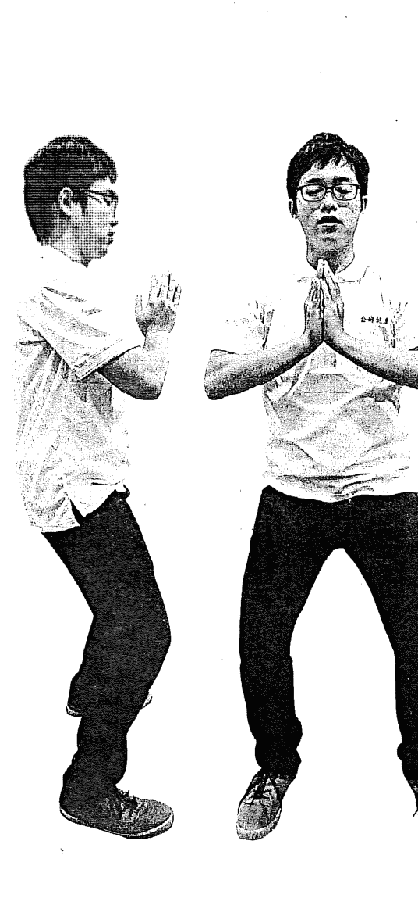

##### 【功法】站桩数息

##### 【站桩数息一〇八下……】

日前有粉丝留言提到王老师在电视上的站桩数息功法，从脉诊仪看到变化为何，小编承诺会做个实验。本次实验微观察站桩后数息一〇八下，以前后脉象的差异做为控制、对照组，实验结果（图④）可以观察到该站桩效果以减少高频振幅为主，尤其是C9～C11走在较为表层的经络（清阳发腠理，浊阴走五脏），并逐渐内敛气血。十分钟后微微的补在C1（肝经）、C2（肾经）。整体效果将外放或到头的高频能量降低，回流集中到低频肝肾经络中，产生宁心安神的功效，晚上睡前做颇为合适。需要强提脑力思考，或有严重烦心之事，该功法应该会大打折扣，还是喝些好茶更有效果。若是想强行把烦心的事带走，建议去跑个步或做些平板支撑。

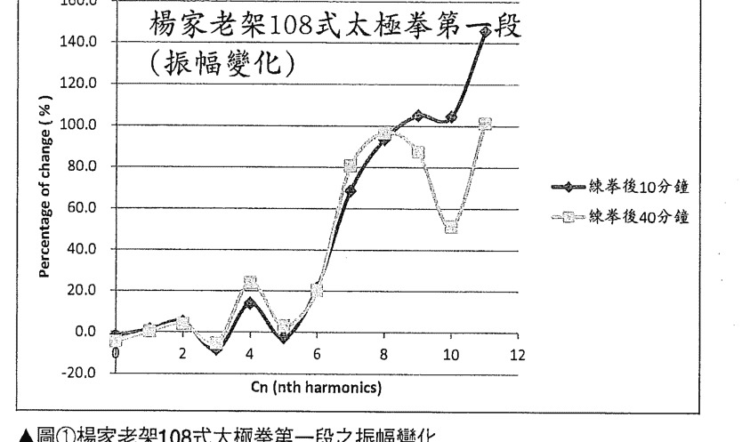

▲图①杨家老架108式太极拳第一段之振幅变化

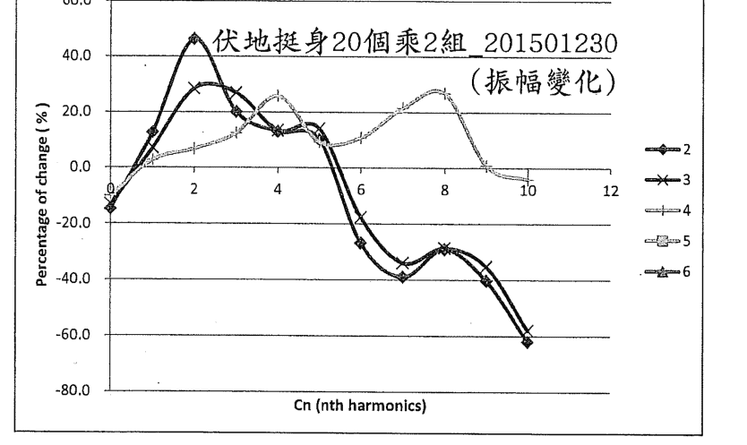

▲图②伏地挺身两轮40个之振幅变化

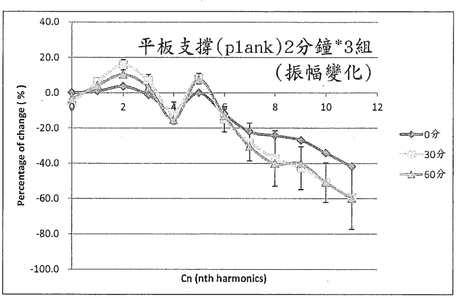

▲图③平板支撑(plank)2分钟之振幅变化

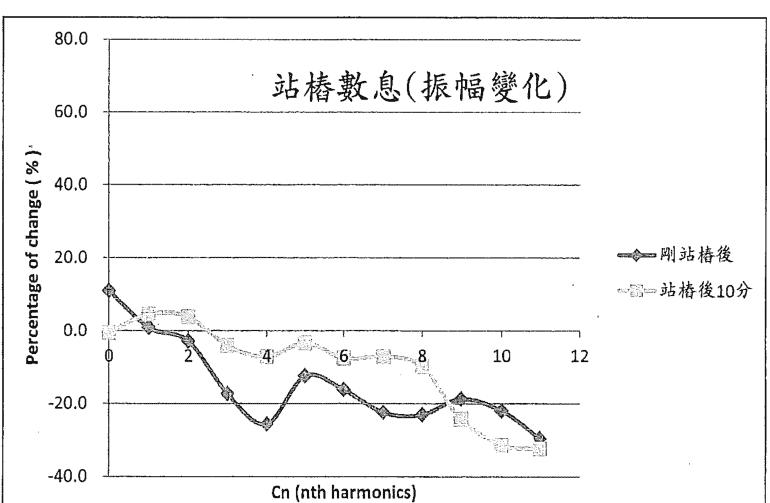

▲图④站桩数息之振幅变化

## PART 4

## 【实练篇】

### 修炼内功与肾气的动作

人体的气血有了初步共振，身体的穴道都没有重大伤害，这就已经是心平气和的身体了。若要更进一步，修炼需要有些诀窍。第一个要诀就是「松」，接着是「运筋」和「运气」。而放松是第一课，也是最难的第一步……。

#### 18 修炼内功的要诀

人体的气血有了初步的共振，身体的穴道都没有重大的伤害，这就已经是心平气和的身体了。如果要更进一步，此时就需要有些诀窍。

##### 内外功能量分布背道而驰

三、六、九谐波是把气由内引到外的外功，比较接近人的本能。遇到危险时，肾上腺素大量分泌，血液充满肌肉与皮下，此时会变得力大无比，人可以发出平时力量的好几倍。不论是准备打架、赛跑、打球、演讲、演唱……，甚至是考试，相信大家都有过充分的经验，气血充满全身体表，反应迅速、运动有力……但是脑子却似乎不太灵光。一旦事过境迁之后，就全身瘫软无力了。因为身体内第三谐波（脾经）的能量，全被抽调出来运用了。

##### 修炼内功有诀窍

而内功呢？却要把血液送到二、四、六谐波去。这岂不是与外功的三、六、九谐波能量分布背道而驰！

所以要修炼内功，就先得解除这个我们与生俱来的枷锁，加强三、六、九谐波的外功，将能量送到腠理，在肌肉紧张、准备受击时，也储存能量准备攻击。

##### 第一个要诀，就是「松」。

松是最广义的、全面的不用力也不用意。肌肉放松、皮肤放松、肚子放松、神经放松、眼光和眼神也放松、呼吸放松、嘴唇放松……，总而言之，全身上下一律放松，如棉花般的轻盈。

这是第一课，也是最难的第一步，一旦理解什么是放松，也能感觉自己放松了没有，又能真正的执行放松，那么内功就已成就了一半。再往下的功课，也就顺理成章了。

##### 下一步，是「运筋」。

一般而言，运筋其实与瑜伽动作的目的是相似的。当我们把骨骼已放得平整，肌肉、皮肤也都没有外伤，那么此时妨害气的运行的，就是身体中的湿气或酸水了。这时候最恰当的动作，就是拉筋。因为酸水最容易藏的位置，而且又最妨害气的运行的，就是筋，尤其是关节部分的筋。这个筋也包含一些固定内脏的韧带，如肠子、膀胱、胃……等；而内脏部分就要靠呼吸来拉、来锻炼。练内功时，呼吸训练是为内脏运筋的最佳动作。

##### 再下一步，就是「运气」了。

在谈运气前，我们先澄清一下，在内功中的气，究竟是指什么？

在本书，我们所谈仅限于生理学上的所谓「气」，也就是行血之气。至于行血之后，所谓「精气神」或「戒定慧」，除了血循环之外还有其他功能，我们就暂放一边了。

气行血，就是「心脏送出的血液压力波是气，也就是行血的动力，或行血的能量」，这个行血的效率，与组织共振状态也是息息相关。血要送到某处，心脏要有力打出本处所需要的共振波，血管及周围组织要顺利把共振波能量送到该处，而该处之组织（主要是经络或穴道）共振状态要好，也就是有最低的阻抗，才能将此波动能量做为送血入组织的原动力，有效的将血液送达。

▶心脏送出的血液压力波是气，也就是行血的动力（能量）。行血的效率与组织（经络或穴道）共振状态息息相关。而运气，就是将心跳或血液压力波由身体中的一点，推向另一点（穴道）。

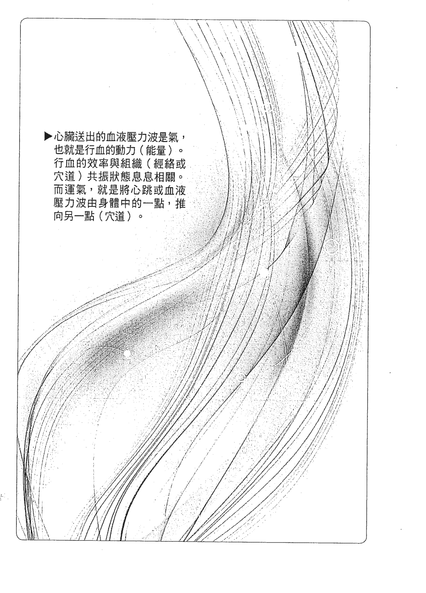

而运气的目的，就是降低血管通路与穴道对其共振频之阻抗。其运作的模式，是将心跳或血液压力波试着由身体中的一点，推向另一点。所谓的点，就是穴道。

如此不仅穴道的共振频阻力变小，在两个点之间的脉波传送阻力，也会随着练习次数增加而降低。脉波一次、两次在自己控制之下，由一点传至另一点，久而久之，身体中各条脉波通道（经络）之脉波输送阻抗就会逐渐降低了。

就像练习投篮，愈投愈准是一样的道理。因为血管、肌肉、神经……等，彼此间的协调性被训练出来，有助于投篮更准确，或血循环顺畅。

#### 19 从放松开始的日常修炼

肾与气功，谈到这里也快要接近尾声了。大家对于中医理论所讲的「肾」，有关于第二谐波（肾经）的特殊性和重要性，道家的「精气神」与佛家的「戒定慧」，以及内外功与身体两组共振谐波的关系，经过这样一环接一环的分辨解析，是否有觉得比较清楚了？有受到「当头棒喝」的感觉吗？

接下来要介绍的，是我在日常保健常做的几个动作，用以修炼内功与肾气，效果还不错。同样以君臣佐使（主辅佐引）的概念，搭配插画做重点式解说，提供大家参考。（※手脚动作一边做完一轮就换一边，次数不拘，依个人的状况衡量）

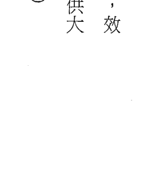

##### 日常修炼【君】站桩与静坐

##### ① 站桩

**【动作要点】**

-   - 两脚张开与肩同宽。
-   - 脚尖朝前，双膝微弯。
-   - 双手合掌（手掌镂空）。
-   - 十指相贴，指尖向上。
-   - 两手在胸前成圈。

> > 注意！全身放松，静听心音。

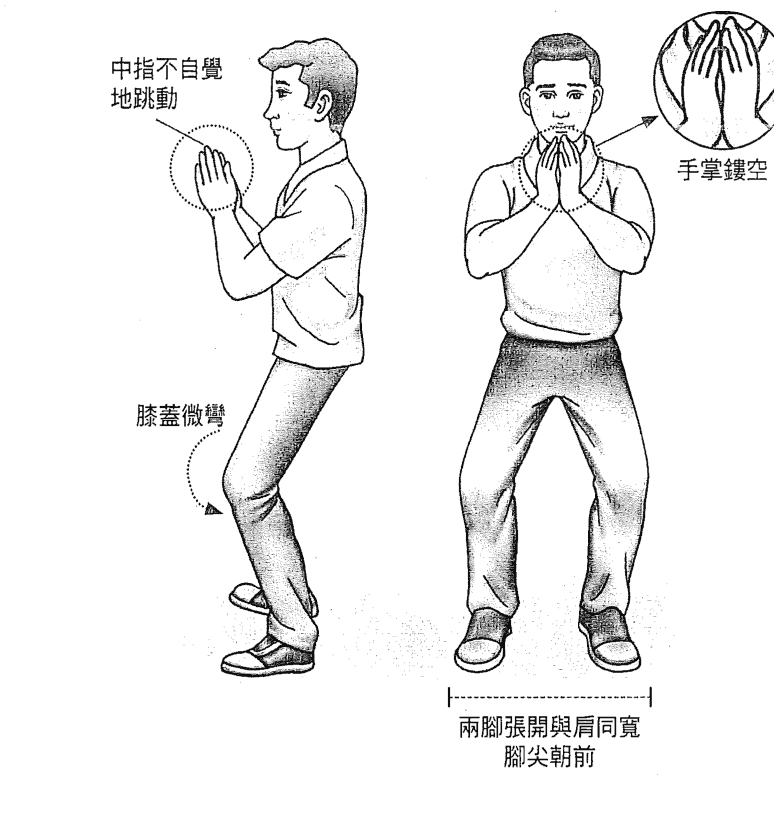

两脚张开与肩同宽 脚尖朝前

站桩要「全身放松」、「静听心音」，慢慢地就会感觉到心跳由膻中散发至中指，而相贴的两手中指会不自觉地跳动。此时，「默数心跳」自然就能忘却红尘。可默数数百至三、五千次，也就是五分钟以上，或半小时、甚至一小时。当心跳感觉非常明确，而且逐渐强烈，可尝试将原来在中指及掌心（劳宫）的心跳感觉，试着带到手臂、胸口、下腹，慢慢地去感觉身上比较不顺畅的部位，就让心跳在那个地方多跳几下。这个站桩的功法，能让我们先学会放松，然后体会心跳（也就是「气」），并渐渐地能带着气游走于身上各部位，自然也就学会了运气。

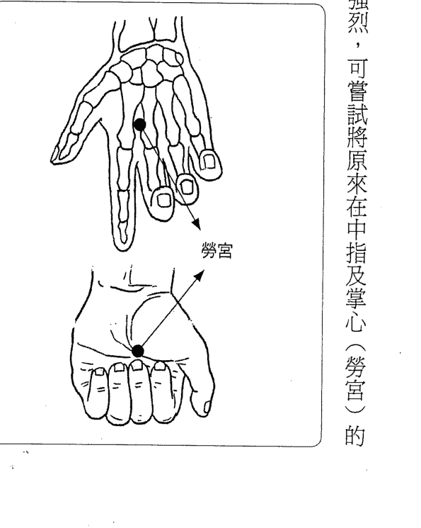

##### ② 静坐

**【动作要点】**

-   下半身轻松坐（不用勉强盘腿，而使骨盆歪斜）。
-   双手轻松放在腿上。
-   背打直，坐姿端正。
-   两眼微张。

> 注意！脊椎要正，静听心音，静数心跳，呼吸平稳轻松。

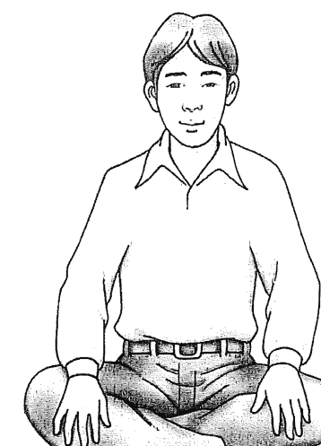

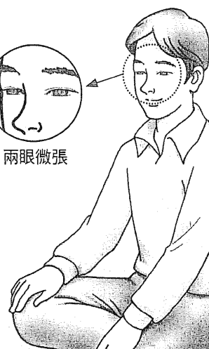

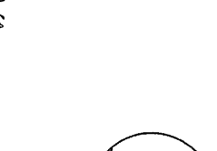

##### 日常修炼②【臣】睡前躺床上做三式

静坐这个题目的讨论已经太多了，其实最重要就是要坐得松、坐得稳，至于什么盘不盘腿，单盘或双盘，都不是重点。

姿势要端正，尤其是脊椎。骨盆要平衡、平稳。

呼吸平稳轻松，静听心音，静数心跳，自然百念不兴，心如止水。

##### ① 足跟往臀部敲

**【动作要点】**

-   身体放松躺在床上。
-   一脚伸直，另一脚抬起，大腿与身体约呈九十度。
-   以膝盖为轴心，脚上下运动，足跟尽量往臀部敲。
-   （放床上的脚亦可屈起，手抱膝，另一脚敲臀部）

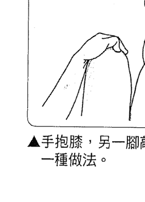

▲手抱膝，另一脚敲臀部，也是一种做法。

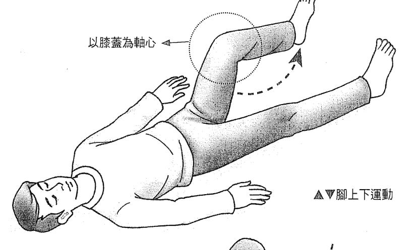

以膝盖为轴心

▲▼脚上下运动

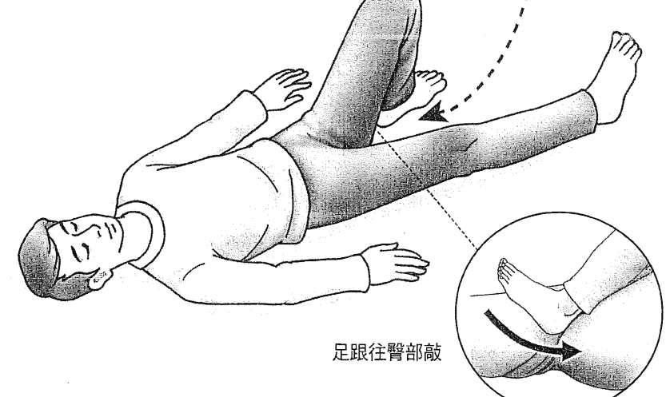

足跟往臀部敲

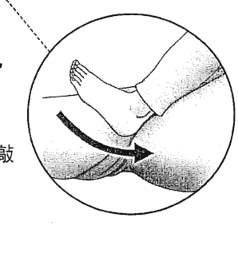

▲这动作是睡觉前躺床上做的。注意要全身放松，一脚伸直放在床上，或屈起以手抱膝（看哪个动作轻松，随个人选择），另一脚以膝盖为轴心，上下运动，足跟尽量往臀部敲，这是最大的重点。

##### ② 抬脚按摩

**【动作要点】**

抬起一脚，大腿与身体约呈九十度，或往身体再靠近些。

（另一脚可伸直，如上图；或是脚踩床面、膝盖弯曲，如下图）

用两手由下往上按摩小腿和大腿内侧与外侧。

> 注意！身体放轻松，配合按摩动作自然转动。

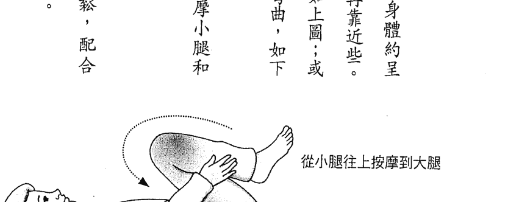

从小腿往上按摩到大腿

转动身体配合按摩动作

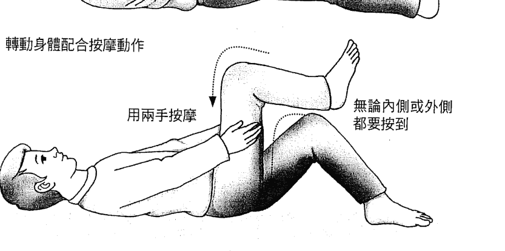

用两手按摩

无论内侧或外侧都要按到

##### ③ 伸展拉筋

**【动作要点】**

-   - 一脚弯曲，足跟尽量贴近臀部。
    - 脚用力踩床面，往前伸展，感觉大腿有拉到。
    - 另一脚放床上伸直。
    - 脚跟往前推，下压，感觉小腿也拉到。

注意！在床上做动作（运动），躺的床最好不要选太软的。

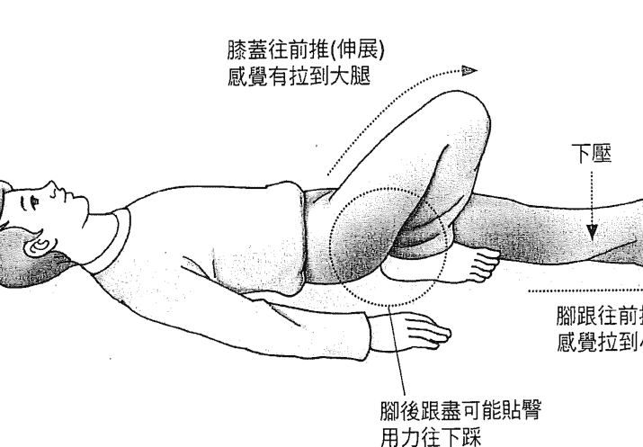

##### 日常修炼③【佐】走路

**【动作要点】**

-   - 眼睛看前方。
    - 抬头挺胸。
    - 脚踏实地。
    - 双手自然摆动。

！注意！不要弯腰驼背，要配合心跳走路。加强各部位与心跳的协调性，也是【炼丹】的方式。

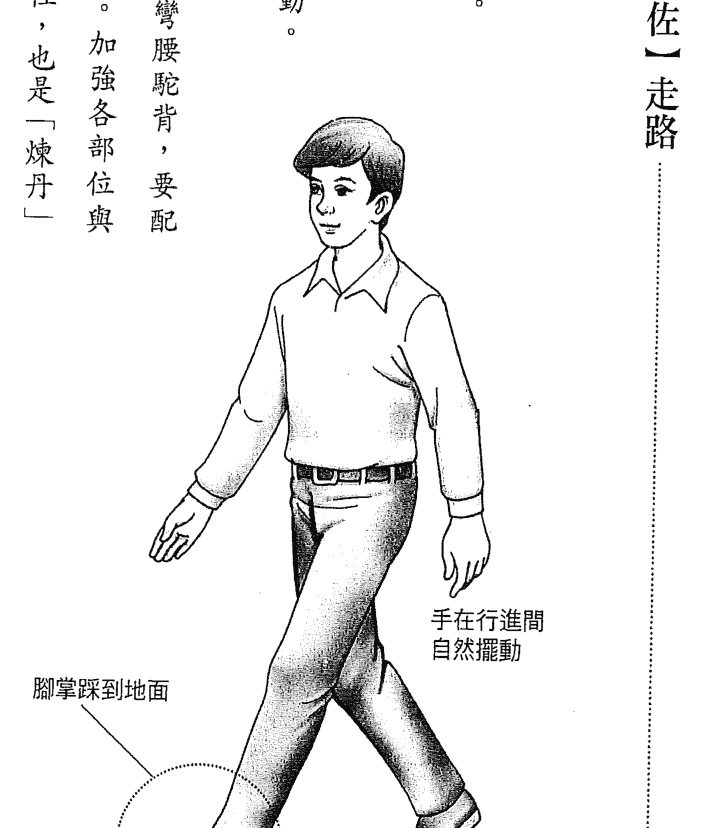

##### 日常修炼④【使】拍打冲脉与环跳穴

-   ① 拍打冲脉
    **【动作要点】**
    - 自然站立。
    - 两脚张开与肩同宽。
    - 双手握拳。
    - 拍打冲脉之下丹田两侧。

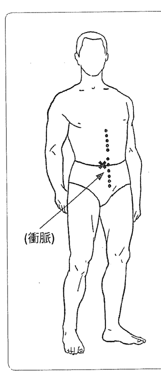

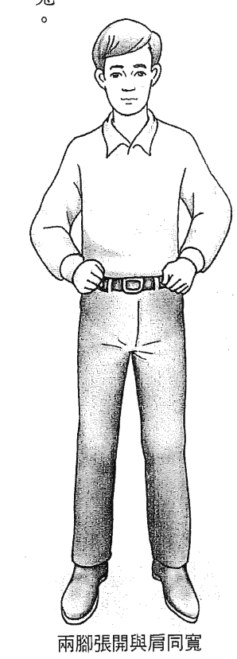

两脚张开与肩同宽## ② 拍打環跳穴

[動作要點]

- 站立抬腳，架在支撐物上。
- 膝蓋打直。
- 以手掌（或握拳）拍打環跳及四周穴道。

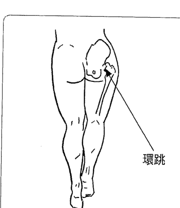

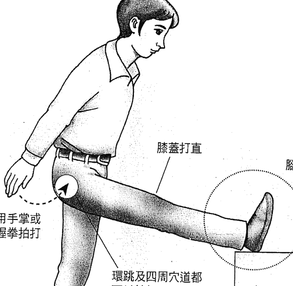

#### 20 女性與男性修煉之不同

男女之最大區別在生殖系統上，而且在細胞染色體上就有不同，男女都有二十二對染色體，加一組性染色體——男性為 XY，女性則為 XX。

##### 男性的性染色體

男性由於性染色體不成一對，在基因發生錯誤的機會上就大多了。一對的染色體，其中一個有誤，可由另一個來補救，不至於產生生理上的缺陷。而男性的性染色體是不一樣的X與Y，所以只要X或Y上有任何缺陷，就一定也會在生理上表現出缺陷。

假設二十二對加一組染色體都有相同基因數的比重，那麼男性基因出錯的機會，就會比女性高約百分之八・七（二除以二十三）。如果比較一下台灣男女的平均壽命——男性七十七歲、女性八十三・六歲，其差異約百分之八・一。也是有點接近。

##### 女性的月經

而生理上，女性最大的不同是有月經。約每月一次的排卵，以及經血的排出。

在這個月經期間，如果排經正常，量其脈象都會有肝腎氣上升的現象，女性經期若肝腎氣上升有限，則有經血過少、經痛等問題。

中藥之調經藥，作用多為補肝腎脾及活血化瘀，但由於月經期間肝腎氣血的上升，在經期服用有失血過多之慮，因此都不建議在這時候服用。女性在月經期間生理和情緒上的變化，很多是受到荷爾蒙分泌變化所影響。而這些荷爾蒙對於循環系統也有改變血管彈性的影響，進而對腎氣、肺氣都有直接影響，因此在量測女性脈象的時候，要把荷爾蒙周期的影響加入判斷的一部分，這就是為何中醫把脈會詢問女子是否在經期的原因。

##### 女性練功有禁忌？

所以女性在練功時，不宜意守（將心跳引導至）下丹田。因為這裡是子宮所在的位置。尤其在月經期間，一定會增加經血量，甚至引起大量出血。

古籍也有一些煉女丹的文獻，多提倡修煉雙乳。正確的來說，應以膻中、中丹田為主才是。不論是意守中丹田或按摩胸部及乳房，皆是此意，但過了更年期，就沒有這個不練下丹田的禁忌了。

## 後記

## 畫龍點睛，為中西文化融合開光

在眾多的中西歌曲中，最貼近我心的是一首讚美上帝的聖歌——《You Raise Me Up》，其中有一句：

Then I am still and wait here in the silence, Until you come and sit a while with me.

（我靜靜的與祢同坐一會兒）

這句淺顯的白話文，不就是內功的最高境界嗎？

放下一切，超越所有的疑慮，放棄所有的思緒，靜靜的與祂坐在一起。

亞聖孟子曾說：「吾善養吾浩然之氣。」在他所著《孟子》一書中亦有名言：

「天將降大任於斯人也，必先苦其心志……，所以動心忍性，增益其所不能。」而此歌中最後一句You raise me up, to more than I can be，不就是「增益其所不能」？但是《You Raise Me Up》這首歌中的心法，不是動心忍性，而是與祢靜坐一會。這使我想起了李白的詩句：「兩岸猿聲啼不住，輕舟已過萬重山。」

這本書是在我們心中盤算已久，而又下不了手的內容。腎與氣功，這兩個題目，都是中華文化中最神秘而又最隱晦的部分，自然也就是荒煙蔓草，牛鬼蛇神。在這麼多雜亂無章而又浩瀚如海的文獻之中，要如何整理出頭緒來，幾乎是不可能的任務。

如果要一個一個理論、一個一個現象來討論，那麼幾本書也不足夠來完成這個工作。更何況有些理論只是一個人做的夢，或是某位居士練功時的個人體會……，常常是完全神來之筆、天馬行空的創作，也許將它們當作《哈利波特》或《魔戒》來看，還比較有意義。經過長久的思索，我們決定釜底抽薪，不再討論各個想法、做法、講法的對錯，而是直指問題的核心——這個腎的基本生理功能究竟是什麼？氣功其基本能量的來源是什麼？我們專注本體，不再迷惑於表象，華麗的言辭、美豔的圖案、神奇的描述、難解的推論……而與中醫藥理論的理解一樣，我們回到了生理學的本質，回到血循環的基本性質。於是一層一層的剝下去，終於找到氣功的根源——能量，並選擇以數學——一個最純淨而完全沒有情緒的純粹邏輯做為手段。在這個過程中，我們快刀斬亂麻，直接分析了內功、外功的本質，撥開遮眼雲霧，只見一輪明月照耀大地，讓大千世界一切皆清晰能見。

我們在本書也只是提出一個看法、一個說法，還請大家努力的找出漏洞，盡力的作出批判。但是一切要根據邏輯。「理性」的討論總是能讓我們愈發接近一件事或物的本質！

王賜勇

## 延伸閱讀

這幾年，我們的研究團隊就脈診實驗發表了許多論文，相關文章並刊登在中英文期刊。以下兩篇是有關改善腎經的論文摘要，附上查閱網址，有興趣的讀者可以直接下載參閱。

- 題目：Effect of acupuncture at tai-tsih (K-3) on the pulse spectrum.
  作者：王唯工、徐則林、張修成、王林玉英 (Wang WK, Hsu TL, Chang HC, Wang YY)
  **刊登期刊**：The American journal of Chinese medicine. 1996;24:305-13.
  **摘要**：针灸太谿改善腎經（C2能量上升）
  **期刊官網**：http://www.worldscientific.com/worldscinet/ajcm
  **論文網址**：https://goo.gl/t664dA

- 题目：Liu-wei-dihuang: a study by pulse analysis.
  **刊登期刊**：The American journal of Chinese medicine. 1998;26:73-82.
  **作者**：王唯工、徐則林、王林玉英（Wang WK, Hsu TL, Wang YY）
  **摘要**：六味地黃丸改善腎經（C2能量上升）
  **期刊官網**：http://www.worldscientific.com/worldscinet/ajcm
  **論文網址**：https://goo.gl/d2RKNX

## 國家圖書館出版品預行編目資料

> 以腎為基：用現代科學看中醫腎脈，解析傳統氣功養生源流 / 王唯工,王晉中著. -- 初版.-- 臺北市：商周出版：家庭傳媒城邦分公司發行, 2017. 09
面；公分.-- (商周養生館；58)
ISBN 978-986-477-299-5 (平裝)
1.中醫 2.養生 3.醫識
413.21 10613133

## 商周養生館 58

## 以腎為基——用現代科學看中醫腎脈，解析傳統氣功養生源流

| 職稱 | 姓名 |
| :--- | :--- |
| 作 者 | 王唯工、王晉中 |
| 企 畫 選 書 | 黃靖卉 |
| 責 任 編 輯 | 林淑華 |
| 版 權 | 翁靜如、林心紅、吳亭儀 |
| 行 銷 業 務 | 張媛茜、黃崇華 |
| 總 編 輯 | 黃靖卉 |
| 總 經 理 | 彭之琬 |
| 發 行 人 | 何飛鵬 |
| 法 律 顧 問 | 元禾法律事務所王子文律師 |
| 出 版 | 商周出版 台北市104民生東路二段141號9樓 電話：(02) 25007008 傳真：(02)25007759 E-mail: bwp.service@cite.com.tw |
| 發 行 | 英蓋曼群島商家庭傳媒股份有限公司城邦分公司 台北市中山區民生東路二段141號2樓 書虫客服服務專線：02-25007718；25007719 24小時傳真專線：02-25001990；25001991 服務時間：週一至週五上午09:30-12:00；下午13:30-17:00 劃撥帳號：19863813；戶名：書虫股份有限公司 讀者服務信箱：service@readingclub.com.tw 城邦讀書花園 www.cite.com.tw |
| 香港發行所 | 城邦（香港）出版集團 香港灣仔駱克道193號 E-mail: hk cite@biznetvigator.com 電話：(852) 25086231 傳真：(852) 25789337 |
| 馬新發行所 | 城邦（馬新）出版集團【Cite (M) Sdn Bhd】 41, Jalan Radin Anum, Bandar Baru Sri Petaling, 57000 Kuala Lumpur, Malaysia. 電話：(0603) 90578822 傳真：(0603) 90576622 |
| 封面設計 | 行者創意 |
| 版面設計 | 林曉涵 |
| 內頁排版 | 林曉涵 |
| 內頁插畫 | 黃建中、陶一山（經絡穴道圖） |
| 印 刷 | 中原造像股份有限公司 |
| 經 銷商 | 聯合發行股份有限公司 新北市231新店區寶橋路235巷6弄6號2樓 電話：(02) 29178022 傳真：(02) 29110053 |

■2017年9月12月初版
定價260元

城邦讀書花園
www.cite.com.tw
版權所有，翻印必究 ISBN 978-986-477-299-5

104 台北市民生東路二段141號2樓

英屬蓋曼群島商家庭傳媒股份有限公司城邦分公司 收

請沿虛線對摺，謝謝！

## 讀者回函卡

感謝您購買我們出版的書籍！請費心填寫此回函卡，我們將不定期寄上城邦集團最新的出版訊息。

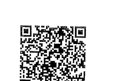

姓名：_________________________ 性别：□男 □女

生日：西元________年________月________日

地址：_________________________

联络电话：_________________________ 传真：_________________________

E-mail：_________________________

- 学历：
  - □ 1.小學 □ 2.國中 □ 3.高中 □ 4.大學 □ 5.研究所以上
- 职业：
  - □ 1.學生 □ 2.軍公教 □ 3.服務 □ 4.金融 □ 5.製造 □ 6.資訊 □ 7.傳播 □ 8.自由業 □ 9.農漁牧 □ 10.家管 □ 11.退休 □ 12.其他_________
- **您從何種方式得知本書消息？**
  - □ 1.書店 □ 2.網路 □ 3.報紙 □ 4.雜誌 □ 5.廣播 □ 6.電視 □ 7.親友推薦 □ 8.其他_________
- **您通常以何種方式購書？**
  - □ 1.書店 □ 2.網路 □ 3.傳真訂購 □ 4.郵局劃撥 □ 5.其他_________
- **您喜歡閱讀那些類別的書籍？**
  - □ 1.財經商業 □ 2.自然科學 □ 3.歷史 □ 4.法律 □ 5.文學 □ 6.休閒旅遊 □ 7.小說 □ 8.人物傳記 □ 9.生活、勵志 □ 10.其他_________

對我們的建議：
_________________________
_________________________
_________________________