# 你一定看得懂的易經六十四卦 2

## 終極解卦手冊 財運、愛情篇

劉藩 著

## 劉藩

1952年生於香港。1974年畢業於國立中興大學企管系。

精通堪輿、八字、紫微斗數、面相及玄學研究。擅長運用易理解決人生難題，透過八字及紫微斗數提供生涯規劃及流年建議，並就環境心理及企業管理理論做出陽宅風水的最佳整合運用，務求以最簡便方法，達到最到位的經濟效益。

現為「中國蟠龍堪輿發展協會」理事長、「中華蟠龍武藝協會」理事長、龍極真宗掌門人、「風生水起兩岸三地堪輿網站」負責人及風水命理專業顧問暨作家。

曾任CBS中央廣播電台新聞部主播、嘉珉建設公司執行董事、佳富金融集團台灣區董事總經理，亦於中國生產力中心、上海交通大學海外教育學院、日本橫濱商科大學、中華人力資源管理協會、中華民國全國商業總會、清涼音文化事業、中國蟠龍堪輿發展協會擔任講師，也應其他公商機構社團包括經濟部、交通部、退輔會、台南縣政府、國際扶輪社、國際獅子會、國際青商會等之邀請提供相關專業講座。

著有《你一定看得懂的易經六十四卦》、《你一定看得懂的易經六十四卦2》、2007至2015年《劉藩給你好運到》(連續九年不間斷出版)、清涼音《商業觀人術系列》演講實錄有聲書1-6集、《占卜書／吸錢術》、《占卜書／愛占卜》、《30秒檢測居家風水》、《30秒檢測居家風水Ⅱ》、《面相識人好運來》、《2006年開運風水布置》、《風生水起完全使用手冊》、《新冰鑑》、《商業觀人術》、《企管面相論英雄》等書。

http://www.master168.com

## 天使神秘学院

St. Royal College

- 神秘学资料库
- 神秘学培训机构
- 水晶能量研究中心
- 专业占卜预测机构
- 官方微信：strcdts
- 微信公众平台：strc2011
- 官方店铺网址：http://strc.cr.cx
- 读书交流QQ群：
  - 占星塔罗占卜师交流群：814594478（加入密码：PDF）
  - 神秘学其他综合群：659338717（加入密码：PDF）

微信号：strcdts
天使神秘学院

微信公众平台：strc2011

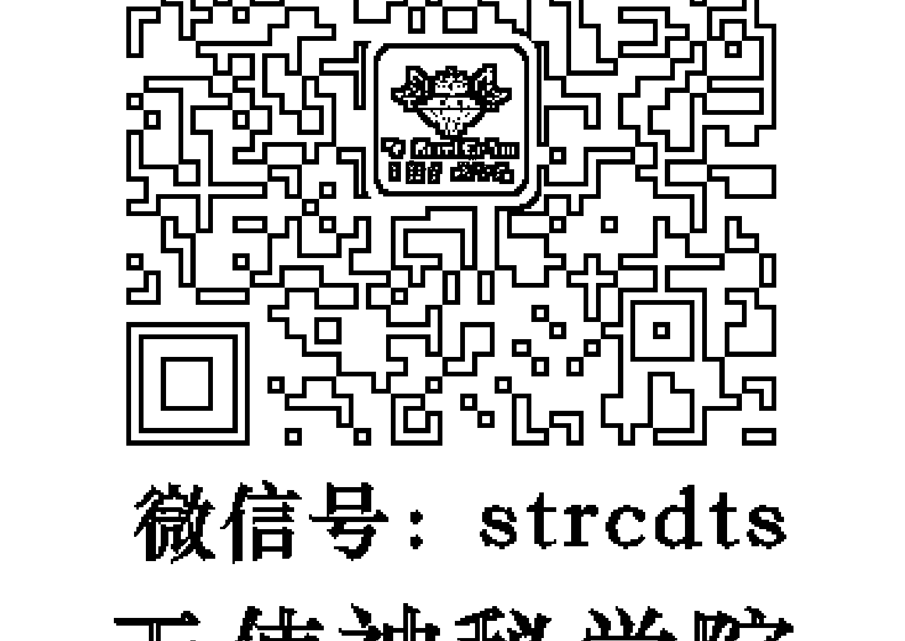

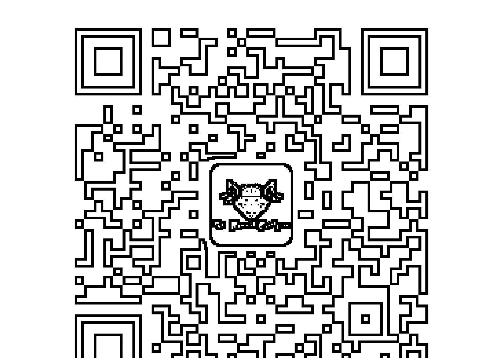

## 制作说明

本书由《天使神秘学院》出重金从台湾购入的原版书籍扫描制作完成。为达到最好阅读效果，特地把书全部切开后，再经由专业扫描设备高精度扫描完成，并经过一张张的PS后期处理最终成书，其间花费大量的人力、物力以及时间，只为能给大家提供经济并优质的神秘学学习资料而努力。

本学院强力谴责某些机构和个人，把本学院花心血制作完成的电子书籍，包装后直接放在自家淘宝网上低价倾销的行为，以谋取不劳而获的经济利益。如果长此以往最终将无人愿意再为大家花心思制作电子书，那以后可能大家再无新书可读。

为让大家以后能够读到更多的好书，也为了本学院的良性发展。本学院恳请大家尽量做到如下几点：

- 尽量在天使神秘学院的官方网站购买电子书籍。

官网电脑访问地址：http://strc.cr.cx

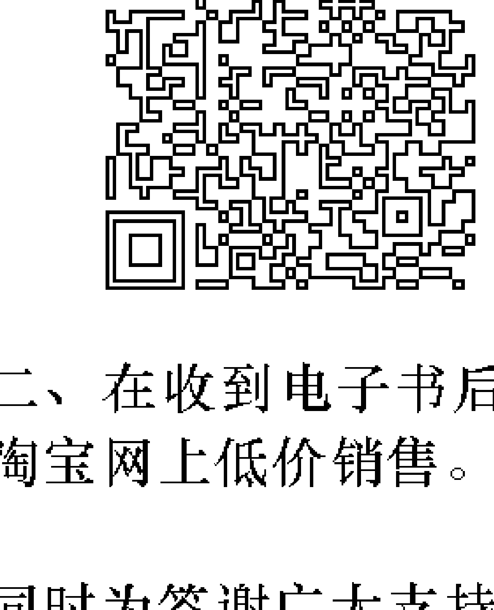

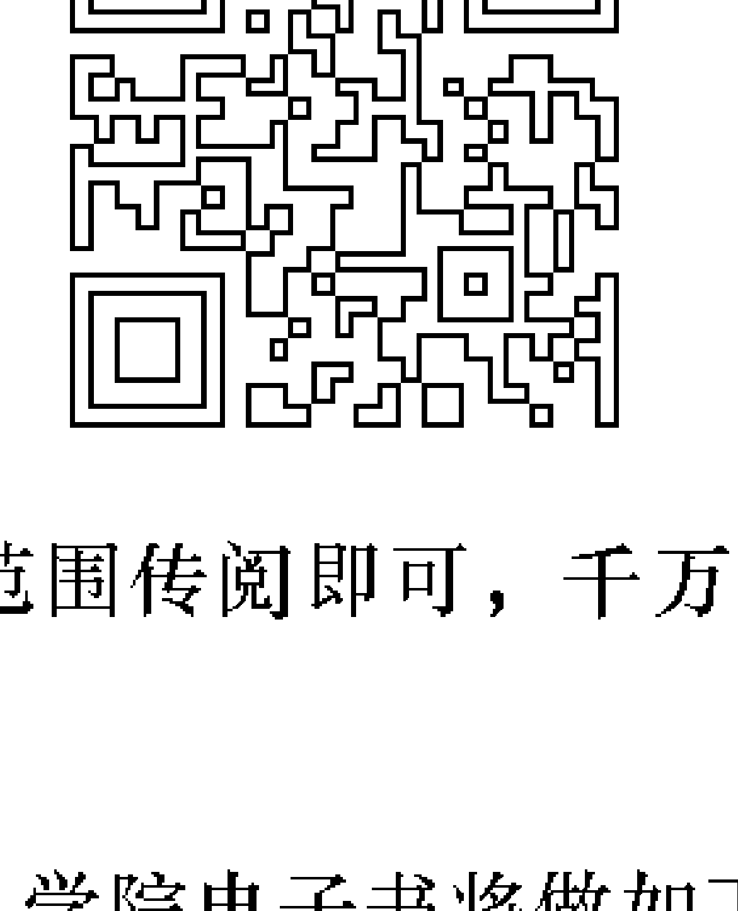

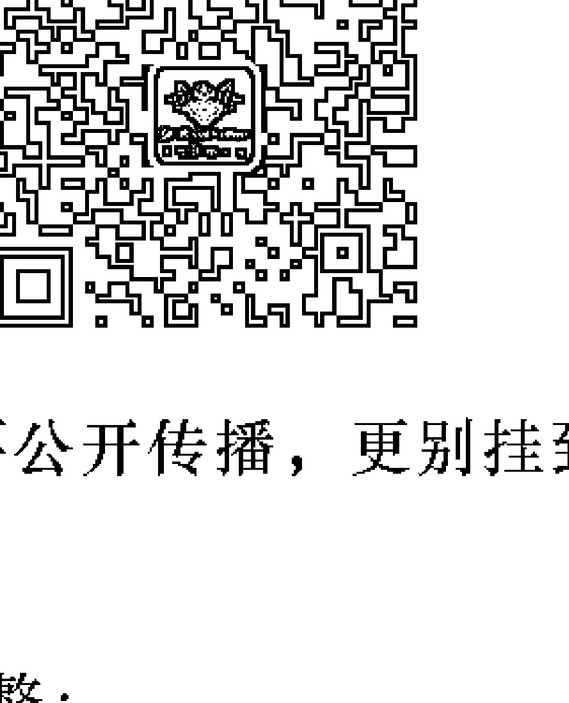

- 在收到电子书后小范围传阅即可，千万不要公开传播，更别挂到淘宝网上低价销售。

同时为答谢广大支持者，学院电子书将做如下调整：

- 学院会把一些早已收回制作成本的电子书折价销售。
- 最新制作的电子书籍会开放打印功能，大家购买后有条件的可自行打印成书。

天使神秘学院
2020年5月

# 你一定看得懂的易經六十四卦 2

## 終極解卦手冊 財運、愛情篇

劉藩 著

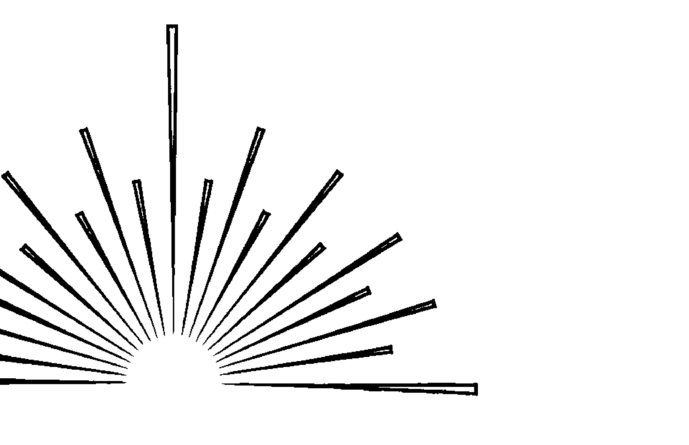

# 目录

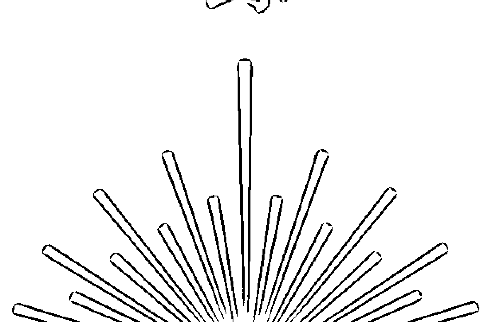

## 作者序

## 本书使用方法

- 一「易經六十四卦占卜牌卡」占卜法
- 二隨機數字選取法
- 三銅板旋轉法
- 四占卜的禁忌

## 《易經》財運與愛情運終極預測

| 编号 | 第几卦 | 卦名 | 卦象 | 吉凶描述 |
|------|--------|------|------|----------|
| 014  | 第一卦 | 乾卦 | 乾為天 | 剛健不息，成功通達之大旺卦。 |
| 020  | 第二卦 | 坤卦 | 坤為地 | 有容乃大，順天應人之吉卦。 |
| 026  | 第三卦 | 屯卦 | 水雷屯 | 懣結不順，艱困失敗之大凶卦。 |
| 032  | 第四卦 | 蒙卦 | 山水蒙 | 迷失方向，前路未明之疑難卦。 |
| 038  | 第五卦 | 需卦 | 水天需 | 韜光養晦，自強奮鬥待機緣之等待卦。 |
| 044  | 第六卦 | 訟卦 | 天水訟 | 口舌誹謗、是非官訟、意氣相爭之大凶卦。 |
| 050  | 第七卦 | 師卦 | 地水師 | 統合戰力，蓄勢待發之決戰卦。 |
| 056  | 第八卦 | 比卦 | 水地比 | 領導群鄰，一呼百諾之吉卦。 |
| 062  | 第九卦 | 小畜卦 | 風天小畜 | 累積能量，默默耕耘之基礎卦。 |
| 068  | 第十卦 | 履卦 | 天澤履 | 履薄臨深，戒慎恐懼之危機卦。 |

| 序号 | 卦名 | 卦象 | 描述 | 解释 |
|------|------|------|------|------|
| 第三十卦 | 离 | [卦象符号] | 离为火 | 坦诚相待，相互辉映之吉卦。 |
| 第二十九卦 | 坎 | [卦象符号] | 坎为水 | 险象横生，灾祸不断之大凶卦。 |
| 第二十八卦 | 大过 | [卦象符号] | 泽风大过 | 超越极限去挑战困难，因压力太大而导致烦恼之凶卦。 |
| 第二十七卦 | 颐 | [卦象符号] | 山雷颐 | 修养身心，自我充实之平和卦。 |
| 第二十六卦 | 大畜 | [卦象符号] | 山天大畜 | 韬光养晦，潜藏深耕之蓄养卦。 |
| 第二十五卦 | 无妄 | [卦象符号] | 天雷无妄 | 不依正道求利者，须防无妄之灾的失败卦。 |
| 第二十四卦 | 复 | [卦象符号] | 地雷复 | 脱胎换骨，复兴开泰之吉卦。 |
| 第二十三卦 | 剥 | [卦象符号] | 山地剥 | 结构性崩坏，必有所损之凶卦。 |
| 第二十二卦 | 贲 | [卦象符号] | 山火贲 | 表面风光、华而不实之卦。 |
| 第二十一卦 | 噬嗑 | [卦象符号] | 火雷噬嗑 | 以霹雳手段来排除障碍之卦。 |
| 第二十卦 | 观 | [卦象符号] | 风地观 | 静观其变，伺机而动之观望卦。 |
| 第十九卦 | 临 | [卦象符号] | 地泽临 | 有贵人相助，正气降临之向旺卦。 |
| 第十八卦 | 蛊 | [卦象符号] | 山风蛊 | 贪则变贫，受人蛊惑而导致败坏之凶卦。 |
| 第十七卦 | 随 | [卦象符号] | 泽雷随 | 随遇而安，捨己从人之随缘卦。 |
| 第十六卦 | 豫 | [卦象符号] | 雷地豫 | 皆大欢喜、安和乐利之吉卦。 |
| 第十五卦 | 谦 | [卦象符号] | 地山谦 | 有能之士谦卑自恃之平和卦。 |
| 第十四卦 | 大有 | [卦象符号] | 火天大有 | 顺天应人、以德服众，丰收获益之大吉卦。 |
| 第十三卦 | 同人 | [卦象符号] | 天火同人 | 同气相求、合作互利，创造双赢之吉卦。 |
| 第十二卦 | 否 | [卦象符号] | 天地否 | 阴阳不合、万物不生、困顿不通之凶卦。 |
| 第十一卦 | 泰 | [卦象符号] | 地天泰 | 和乐亨通，成功安泰之大吉卦。 |

| 308 | 302 | 296 | 290 | 284 | 278 | 272 | 266 | 260 | 254 | 248 | 242 | 236 | 230 | 224 | 218 | 212 | 206 | 200 | 194 |
|-----|-----|-----|-----|-----|-----|-----|-----|-----|-----|-----|-----|-----|-----|-----|-----|-----|-----|-----|-----|
| 第五十卦 | 第四十九卦 | 第四十八卦 | 第四十七卦 | 第四十六卦 | 第四十五卦 | 第四十四卦 | 第四十三卦 | 第四十二卦 | 第四十一卦 | 第四十卦 | 第三十九卦 | 第三十八卦 | 第三十七卦 | 第三十六卦 | 第三十五卦 | 第三十四卦 | 第三十三卦 | 第三十二卦 | 第三十一卦 |
| 鼎 | 革 | 井 | 困 | 升 | 萃 | 姤 | 夬 | 益 | 损 | 解 | 蹇 | 睽 | 家人 | 明夷 | 晋 | 大壮 | 遁 | 恒 | 咸 |
| 火風鼎 | 澤火革 | 水風井 | 澤水困 | 地風升 | 澤地萃 | 天風姤 | 澤天夬 | 風雷益 | 山澤損 | 雷水解 | 水山蹇 | 火澤睽 | 風火家人 | 地火明夷 | 火地晉 | 雷天大壯 | 天山遁 | 雷風恒 | 澤山咸 |
| 情投意合，互助双赢之爱情、姻缘大吉卦。 | 謀定而後動之改革卦。 | 相互合作、創造雙贏之互助互利卦。 | 窮途末路，艱困險阻之大凶卦。 | 低調順行，穩中求進之提升卦。 | 出類拔萃，名利雙收之大吉卦。 | 男女邂逅，但利女不利男之桃花卦。 | 堅毅果斷之決策卦。 | 相輔相成，利己利人之吉卦。 | 先利他人再利己，乃先損後益之卦。 | 消災解難，濁去清來之解脫卦。 | 險阻在前，進退為難之大凶卦。 | 意氣相爭，口舌是非之凶卦。 | 持家有道，家族成就之吉卦。 | 晦暗不明，有志難伸之大凶卦。 | 旭日東升，前途光明之吉卦。 | 雷鳴天下，場面壯盛、先聲奪人之卦。 | 明哲保身，退隱泉林之避世卦。 | 陰陽相配，恆久幸福美滿之婚姻大吉卦。 | 三人同行共商善舉之合作卦。 |

## 附錄——六十四卦索引表

| 398 | 392 | 386 | 380 | 374 | 368 | 362 | 356 | 350 | 344 | 338 | 332 | 326 | 314 |
| --- | --- | --- | --- | --- | --- | --- | --- | --- | --- | --- | --- | --- | --- |
| 第六十四卦 | 第六十三卦 | 第六十二卦 | 第六十一卦 | 第六十卦 | 第五十九卦 | 第五十八卦 | 第五十七卦 | 第五十六卦 | 第五十五卦 | 第五十四卦 | 第五十三卦 | 第五十二卦 | 第五十一卦 |
| 未济卦 | 既济卦 | 小过卦 | 中孚卦 | 节卦 | 涣卦 | 兑卦 | 巽卦 | 旅卦 | 丰卦 | 归妹卦 | 渐卦 | 艮卦 | 震卦 |
| 火水未济 | 水火既济 | 雷山小过 | 风泽中孚 | 水泽节 | 风水涣 | 兑为泽 | 巽为风 | 火山旅 | 雷火丰 | 雷泽归妹 | 风山渐 | 艮为山 | 震为雷 |
| 所托非人，因缘尚未具足之未遂卦。 | 相应相济，如愿以偿的成功卦。 | 矫枉过正，有失中庸之道的凶卦。 | 谨守正道，以诚意相交之互信卦。 | 珍惜资源，谨慎守成之节制卦。 | 意兴阑珊，精神涣散之卦。 | 在柔和、愉悦氛围之下的诚恳沟通卦。 | 瞬息万变的机缘卦。 | 独自在外闯荡，居无定所的飘泊旅行卦。 | 大有所获，亨通得利之丰收吉卦。 | 名不正言不顺，受尽委屈、心中郁结之凶卦。 | 按部就班，逐渐积累能量之渐进卦。 | 心无杂念，静思对策之保守卦。 | 雷声隆隆，吉凶未定之变幻卦。 |

## 作者序

首先多謝廣大讀者對《你一定看得懂的易經六十四卦》的熱烈支持，銘感五內！在衷心感謝之餘，並應時報出版之邀，趕緊執筆書寫續集以饗廣大讀者。

在二〇一八年初出版的《你一定看得懂的易經六十四卦》，主題是跟大家分享《易經》六十四卦的基本架構，讓大家對《易經》有概括性的瞭解，透過《易經》占卜牌卡的運作，可以對當下所面臨的客觀情勢，馬上做出沙盤推演，以利因應。

但基本上，《易經》其實包含了「理、象、數」三大元素。在《你一定看得懂的易經六十四卦》裡，主要透過圖文並茂來介紹「理」與「象」這兩大單元的基本概念。另一方面，《易經》所談論的萬事萬物都不離「時間」與「空間」，所以不易的易理及卦象，隨著不同時間的變化，雖然卜得同一個卦，最終都會出現截然不同的結果。

子、丑、寅、卯、辰、巳、午、未、申、酉、戌、亥十二個時辰，每天二十四個小時之內，就有六種不同的機率變化，除了上一本書呈現出的「本體卦」之外，其中又產生了「互卦」和「變卦」等。有鑑於卦與卦之間的變化運作頗為複雜，為了讓對《易經》感興趣的讀者，在占卜易卦時能窺其全貌，特別就大家普遍最關心的「財運」及「感情桃花運」此兩項發展出此次的進階解卦手冊，透過有系統地排列出三百八十四种《易经》牌卡的运作，得出占卜财运或感情时的终极结果，让大家能进一步更精准地掌握自己的命运，自然做到运筹帷幄、决胜千里。

## 本書使用方法

## 『易經六十四卦占卜牌卡』占卜法

需搭配《你一定看得懂的易經六十四卦》此書所附之牌卡（如下圖）。

- 步驟一：找一個安靜的地方坐下，調整至呼吸平順、心情平靜為止。
- 步驟二：取出占卜牌卡，並確定牌卡的底部朝天，以左手托底固定。
- 步驟三：雙手合十、捧住牌卡，開始默念自己的姓名、出生年月日時（必須說明是農曆或國曆）、現居地址。默念完畢後，由整疊牌卡下層任意抽出部分牌卡、再放置於整疊牌卡上方，以這種洗牌手法、雙手並用，洗牌共八次（代表八經卦）。
- 步驟四：默念自己心中想要占卜解惑之事。例如欲問投資吉凶，若心中已有投資目標，可默念相關細節，以及可能牽涉的人、事、物，像是你想投資的基金名稱、金額數量，以及操作公司或銀行的名稱。默念完畢後，再洗牌六次（代表六個爻）。
- 步驟五：洗牌六次後，請任意抽出其中一張牌卡。該張牌卡，便是所求之卦。請清楚記住抽出此張牌卡的時間。

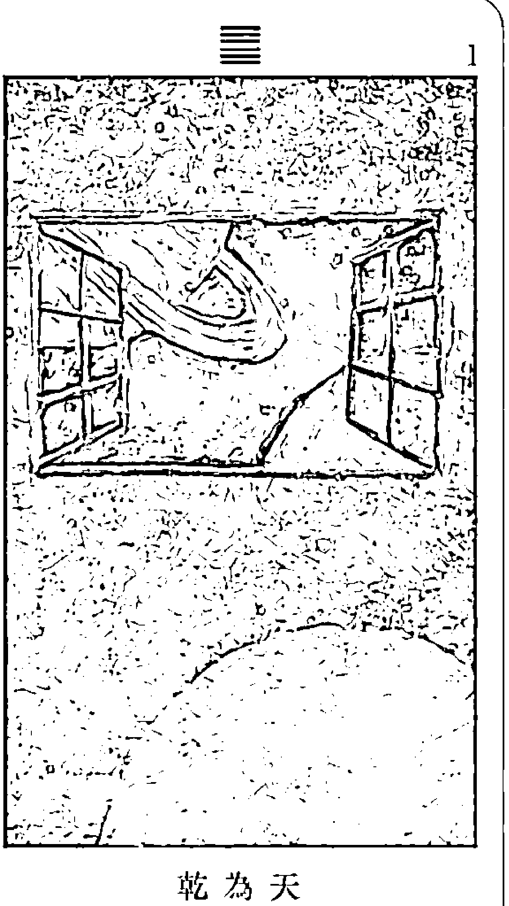

## 二 隨機數字選取法

- 步驟六：欲瞭解該卦詳情，請查看牌卡右上方的編號，及下方的「卦名」。該編號乃根據六十四卦的順序排列，即是該卦的「卦號」。
- 步驟七：根據該卦的「卦名」及「卦號」，便可利用本書所附之「六十四卦索引表」來找出該卦的正確頁碼。該卦的「基本卦解」，就是你所問的財運或感情之目前狀態。此時請回頭看看你所紀錄的抽取牌卡時間，去核對該卦裡的六個時段，即可找到針對財運或感情的終極預測結果。
- 步驟一：找一個安靜的地方坐下，調整至呼吸平順、心情平靜為止。
- 步驟二：默念自己的姓名、出生年月日時（必須說明是農曆或國曆）、現居地址。
- 步驟三：例如欲問投資吉凶，若心中已有投資目標，可以默念相關細節，以及可能牽涉的人、事、物，像是你想投資的基金名稱、金額數量，以及操作公司或銀行的名稱。
- 步驟四：默念完上述步驟所要求的資料後，安靜三至四秒鐘，然後很自然的由1、2、3、4、5、6、7、8之中，先後選出兩個數字。請清楚記住選取這兩個數字的時間。
- 步驟五：八個數字各自代表的八經卦如下：

| 卦符 | 八卦 | 數字 |
|------|------|------|
| ䷀   | 乾   | 1    |
| ䷹   | 兌   | 2    |
| ䷝   | 離   | 3    |
| ䷲   | 震   | 4    |
| ䷸   | 巽   | 5    |
| ䷜   | 坎   | 6    |
| ䷳   | 艮   | 7    |
| ䷁   | 坤   | 8    |

## 三 銅板旋轉法

- 步驟六：選出來的第一個數字是「上卦」，第二個數字便是「下卦」。上卦與下卦組合成六十四卦中的其中一卦，此卦充分說明了當下你所問卜事件的客觀狀況。
- 步驟七：欲知該卦卦義的吉凶以及建議，可利用本書所附之「六十四卦索引表」找出該卦的正確頁碼。該卦的「基本卦解」，就是你所問的財運或感情之目前狀態。此時請回頭看看你選取數字的時間，去核對該卦裡的六個時段，即可找到針對財運或感情的終極預測結果。
- 步驟五：旋轉銅板的動作共進行六次。將這六次的正、反結果，由下而上記錄下來，同時也請記住旋轉銅板的時間。陽爻用「一」的符號來代表，陰爻用「--」的符號代表。
- 步驟四：用任何一個國家的銅板，放在桌上以手動旋轉之，逐一記錄銅板停止後的正、反面，以產生陰爻與陽爻。凸出的圖案為正面，代表陽爻；有字的是背面，代表陰爻。以台幣十元為例，頭像面屬正面，為陽爻；文字面則代表陰爻。
- 步驟三：例如欲問投資吉凶，若心中已有投資目標，可以默念相關細節，以及可能牽涉的人、事、物，像是你想投資的基金名稱、金額數量，以及操作公司或銀行的名稱。
- 步驟二：默念自己的姓名、出生年月日時（必須說明是農曆或國曆）、現居地址。
- 步驟一：找一個安靜的地方坐下，調整至呼吸平順、心情平靜為止。

## 四 占卜的禁忌

- 沒有誠意的人或不相信《易經》的人不要問，不能以開玩笑的方式來問。
- 根本沒必要問的事不要問，不能以隨便問問的方式來問。
- 沒有疑惑的時候不要問。
- 不合乎倫理道德、不仁不義之事，更加不要問。
- 同一件事在短期內只能問一次。
- 若同一件事情，第一次占卜得出的卦感覺還不足以解惑時，可以換另外一種方式來問，以利於補充參考。
- 精神狀態不好、酒醉、精神無法集中時，不要問。

此時請回頭看看你旋轉銅板的時間，去核對該卦裡的六個時段，即可找到針對財運或感情的終極預測結果。

## 第一卦 乾卦——乾為天

卦象的基本性質及吉凶解讀

> 本卦在六十四卦中屬於剛健不息，成功通達之大旺卦。

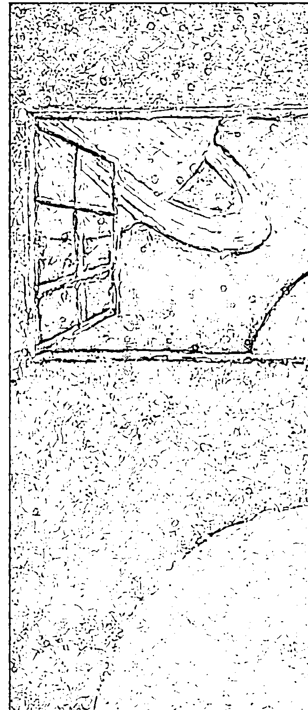

## 一、財運篇

## 基本卦解——旺到最高點

財運好到連自己都不太相信，不論是投資股票、基金，做長線或炒短線都旺到極點，甚至打個小牌也會一家贏三家，統一發票少說也有兩百元的安慰獎。不過，凡事都會物極必反，抽到這支大旺卦的你應居安思危，因為獲利高峰期即將過去，此時最好先準備穩健的理財方法。

- ◆偏財指數：96分／財運旺度：$$$$$

### 从占卜时间看终极预测

- 行动的有利时机：农历九月、十月
- 助旺财运的地方：西北方、西方、大楼的高处
- 助旺财运的颜色：白色、米黄色
- 投资的幸运数字：1、4、9

把所有投资都集中在同一个方向上，不要险中求。此卦表面上已经获利，其中却暗藏着不少危机与风险。如果你想投资的是高风险、高利润的偏财，很可能赚的钱在一夕之间就血本无归了！抽到这一卦，理应分散风险，不要

#### 终极预测及建议：第九卦『风天小畜』—— 就差临门一脚

继续努力。凡事都像耕种，有播种期、萌芽期、茁壮期，也有收获期。抽到这一卦的人，目前的求财状况就像茁壮期一样，虽然距离收获还有一段时间，但只要你坚定求财的方向与目标，多一些耐心等待、不要半途而废，锁定的利益早晚会是你的。

- 行动的有利时机：农历七到十二月
- 助旺财运的地方：北方、靠近有水的地方、酒吧
- 助旺财运的颜色：蓝色、灰色、黑色
- 投资的幸运数字：1、6

偏财指数：77分／财运旺度：$$$
偏财指数：62分／财运旺度：$$

#### 终极预测及建议：第十四卦『火天大有』—— 财运兴旺

如日中天。你的成功众人皆知，只要本着利人利己的双赢原则去求财，必定能得到周遭友人的高度认同与协助，赚起钱来自然是得心应手了！

## 第四十四卦「天风姤」

当机立断偏财来。不管你现在是赚或赔，想再追加投资金额或是壮士断腕而停损，此时都要赶快当机立断，做出明快决定，以免夜长梦多。倘若当下不做任何决定，采观望态度，只会愈来愈坏。

- 凌晨五点—上午七点、下午五点—下午七点
- 行动的有利时机：农历十到十二月
- 助旺财运的地方：西方、北方、西北方、音乐咖啡厅
- 助旺财运的颜色：粉红色、白色、蓝色
- 投资的幸运数字：1、2、6、7
- 终极预测及建议：第四十三卦「泽天夬」——
- 偏财指数：62分／财运旺度：$
- 上午七点—上午九点、晚间七点—晚间九点
- 行动的有利时机：农历七到十二月
- 助旺财运的地方：北方、西北方、西南方、音乐咖啡厅
- 助旺财运的颜色：蓝色、灰色、紫色
- 投资的幸运数字：1、6、8
- 终极预测及建议：第四十四卦「天风姤」——

## 第十三卦「天火同人」

短线获利，见好就收。得此卦者有上司与长辈的贵人缘，他们会对你关爱有加，并提供求财的机会给你，但都属于短期中小型的获利，所以不要贪心，见好就收；也不要期待会有大财或长远的获利发展。若是女性得此卦，则获利会更高。

- 偏财指数：78分／财运旺度：$$$$$
- 上午九点—上午十一点、晚间九点—晚间十一点
- 行动的有利时机：农历十到十二月
- 助旺财运的地方：北方、西南方、西北方、高楼大厦
- 助旺财运的颜色：蓝色、灰色、黑色
- 投资的幸运数字：1、2、6、7
- 终极预测及建议：第十三卦「天火同人」——

与好朋友互蒙其利。抽到这一卦的人应该与志同道合的朋友一起来进行赚钱的事，这比自己一个人埋头苦干更有赚头。这个合作计划不但大家都可以开心赚到钱，同时还能培养出彼此的共识与默契。所选择的投资方向，应该要大家都同意，那才会赚钱！

## 二、感情篇

基本卦解——天王VS天后，互相辉映

偏财指数：86分／财运旺度：$$$$$
爱情指数：72分／爱情热度：♡♡♡

### 从占卜时间看终极预测

- 晚间十一点——凌晨一点、上午十一点——下午一点

最美好的相处方式：摸清楚对方的个性，千万不要说错话

最理想的穿着打扮：尽量迎合对方的品味

助旺爱情运的颜色：白＋蓝、白＋灰

终极预测及建议：第九卦『风天小畜』——女皇陛下。你们的交往才刚开始，但女方占尽优势，追求女方的人不少，所以女方大可慢慢选择谁才是心中的最爱。如果你是男生，抽到这一卦一定要主动一点，尽可能施展浑身解数来赢得芳心，否则容易被情敌先下手为强，那就来不及了！

- 爱情指数：女生80分，男生68分／爱情热度：女生♡♡♡♡，男生♡♡♡

凌晨三点—凌晨五点、下午三点—下午五点

- 最美好的相处方式：热情、坦白、诚恳
- 最理想的穿着打扮：亮丽醒目的外表
- 助旺爱情运的颜色：只要是明亮的颜色都可以
- 最理想的约会地点：高楼层的地方，或是光线充足的地方
- 终极预测及建议：第十四卦「火天大有」——

可以合作的爱情伙伴。你们两人都很有异性缘，特别是女性那方的男性粉丝，比男方的粉丝更多。这是一对恩爱的情侣，彼此互相欣赏、也很匹配。如果两人能一起合作事业，将比别人更容易成功。

- 爱情指数：95分／爱情热度：♡♡♡♡♡

凌晨五点—上午七点、下午五点—下午七点

- 最美好的相处方式：多为对方着想，做任何决定都不要拖泥带水
- 最理想的穿着打扮：女生要打扮的比较年轻些，男生要穿着整齐
- 助旺爱情运的颜色：粉红色、白色
- 最理想的约会地点：有音乐播放的地方
- 终极预测及建议：第四十三卦「泽天夬」——

等他来找你吧！两人的观念不同，对方怕你太过干预他的生活，希望有更多自由空间。所以你愈是采取主动攻势，对方会愈厌烦，令这段感情产生困扰。建议你，交往速度不妨放慢一点，多听听对方的想法，多尊重对方的自由空间，那么你们的相处自然会渐入佳境。

- 爱情指数：68分／爱情热度：♡

上午七点—上午九点、晚间七点—晚间九点

- 最美好的相处方式：享受现在的快乐就好，至于未来就别想太多
- 最理想的穿着打扮：休闲的穿着打扮
- 助旺爱情运的颜色：蓝色、灰色、紫色
- 最理想的约会地点：有花园的公共场所
- 终极预测及建议：第四十四卦『天风姤』——一夜情。两人偶然相遇，擦出火花，这种感情并不长久。如果你是女生，将是无敌劈腿族，每个男人都被妳要得团团转，妳的要求都能如愿，但这种好事维持不久的，劝妳见好就收。如果你是男生，那就很悲哀了，因为你爱的女生有太多情人，你会追得很辛苦。

- 爱情指数：女生86分，男生68分／爱情热度：♡♡♡♡，男生⊗

上午九点—上午十一点、晚间九点—晚间十一点

- 最理想的相处方式：培养共同的嗜好或信仰
- 最理想的穿着打扮：模仿对方的打扮，情侣装最好
- 助旺爱情运的颜色：只要是明亮的色系都可以使用
- 最理想的约会地点：光线充足的地方，或高楼大厦
- 终极预测及建议：第十三卦『天火同人』——

同学、同事、好朋友变恋人。彼此有共同的信念与看法，是同一类型的人。双方个性都表里如一，各自有发展天地，都是朋友群中的灵魂人物。凡事只要坦诚以对，没有解决不了的问题。

- 爱情指数：82分／爱情热度：♡♡♡♡

## 第二卦 坤卦——坤为地

### 卦象的基本性质及吉凶解读

本卦在六十四卦中属于 有容乃大，顺天应人之吉卦。

## 一、财运篇

### □基本卦解——有容乃大，共享财利

抽到此卦者，应本着「海纳百川」的胸襟与人为善。只要自己有能力、有时间，不管赚多少钱，都要怀着感恩、谦卑的心与人分享，如此一来，必可广结善缘，广纳八方之财。

- 偏财指数：80分／财运旺度：$$$$$

### □ 从占卜时间看终极预测

- 晚间十一点—凌晨一点、上午十一点—下午一点
- 行动的有利时机：农历四到六月
- 助旺财运的地方：西南方、南方、前面有大广场的百货公司
- 助旺财运的颜色：棕色、黄色、黑色、咖啡色
- 投资的幸运数字：3、8、9
- 终极预测及建议：第八卦『水地比』—— 和气生财乐融融。你所努力的求财方向已有明确的目标与架构，如果你是男性，抽到这一卦表示将有很多红颜知己给你帮助，让你在和乐愉快的气氛下赚钱。如果你是女性，得此卦表示求财一切都要靠自己，外来的助力是很少的。
- 偏财指数：65分／财运旺度：$$$
- 凌晨一点—凌晨三点、下午一点—下午三点
- 行动的有利时机：农历六月下半月、十二月下半月
- 助旺财运的地方：东北方、西南方、山上的休闲别墅
- 助旺财运的颜色：米白色、黄色、黑色、棕色
- 投资的幸运数字：3、7、8、9
- 终极预测及建议：第二十三卦『山地剥』—— 得先花钱买经验。抽到这一卦的人，当你在进行求财行动时，一定是未蒙其利而先受其害的；但若损失的金钱与时间，能换取经验与教训的话，那还算是值得的。不过，你得控制一下「学习费」，不要缴得太多，因为这次的求财行动是绝对不会获利的。
- 偏财指数：30分／财运旺度：⊗⊗⊗
- 凌晨三点—凌晨五点、下午三点—下午五点
- 行动的有利时机：农历四到六月
- 助旺财运的地方：西南方、大卖场、观光农场
- 助旺财运的颜色：棕色、咖啡色、黑色、黄色
- 投资的幸运数字：8、9
- 终极预测及建议：第二十四卦『地雷复』—— 卷土重来必可获利。如果你在求得此卦前的投资已被套牢并蒙受损失，那要恭喜你了！眼前的机会便是解套的好时机，立刻可以连本带利的赚回来，要好好把握。如果之前没有做任何投资，那现在就是重新开始的时候了。
- 偏财指数：72分／财运旺度：$$
- 行动的有利时机：农历四到六月
- 助旺财运的地方：西南方、百货公司、中式餐厅
- 助旺财运的颜色：棕色、黄色、黑色、咖啡色
- 投资的幸运数字：8、9
- 终极预测及建议：第七卦『地水师』—— 需要以激烈手段竞争而得财。非常时期要采取非常手段，为了达成赚钱目标，抽到这一卦的人必须进行竞争激烈的求财攻势，以霹雳手段让对手屈服，利益全归你所有。但是这样的过程中，你也必须付出相当的代价。
- 助旺财运的地方：西南方、百货公司、大卖场
- 助旺财运的颜色：米白色、黄色、黑色、咖啡色
- 投资的幸运数字：7、8、9
- 偏财指数：75分／财运旺度：$$$
- 行动的有利时机：农历四到六月
- 终极预测及建议：第十五卦『地山谦』—— 低调求财好处多。所谓「满招损、谦受益」，抽到此卦者在求财过程中要低调进行，切忌心高气傲、自以为是，同时也要多听听专家的意见，作为求财的参考，如此一来必能赚钱。
- 偏财指数：65分／财运旺度：$$
- 行动的有利时机：农历四到六月、十二月下旬
- 助旺财运的地方：西南方、东北方、山上观光
- 助旺财运的颜色：棕色、黄色、黑色、咖啡色
- 投资的幸运数字：8、9
- 终极预测及建议：第十六卦『雷地豫』—— 顺水推舟，Money自然来。所谓无为而治，是看起来好像什么大动作、大计划，事情自然而然就会成功。抽到此卦者，求财过程多少也有这种意味，这表示你不需要冒很大的风险去做激烈的求财竞争，只需要顺着形势做自己该做的事，那么财利自然会进你的口袋。
- 偏财指数：82分／财运旺度：$$$$$

## 二、感情篇

### □基本卦解——相敬如宾

你们彼此相互尊重，不会给对方压力，却缺乏了一些谈恋爱的激情，犹如一对好朋友般，彼此分享看法与感受，但不会积极计划将来。好处是你们很少争吵与意见不合，坏处则是相处很久都没甚么进展与结果。

- 爱情指数：60分／爱情热度：♡

### □ 从占卜时间看终极预测

- 晚间十一点—凌晨一点、上午十一点—下午一点
- 最美好的相处方式：淡淡的感情也是一种幸福
- 最理想的穿着打扮：复古的打扮
- 助旺爱情运的颜色：米白色、黄色、咖啡色
- 最理想的约会地点：大卖场、观光农场
- 终极预测及建议：第八卦『水地比』—— 他是大众情人。男方条件优秀，异性缘好的不得了，可说是人见人爱的大帅哥。妳如果珍惜这段爱情，只有睁一只眼、闭一只眼，凡事包容、凡事信任，才有可能和对方相亲相爱的交往下去。
- 爱情指数：男生76分，女生66分／爱情热度：男生 ♡♡♡♡，女生 ♡♡♡♡
- 凌晨一点—凌晨三点、下午一点—下午三点
- 最美好的相处方式：无怨无悔的付出，对方会感受得到
- 最理想的穿着打扮：朴实成熟的打扮
- 助旺爱情运的颜色：白色、黄色、咖啡色
- 最理想的约会地点：占地很广的中式餐厅、观光农场
- 终极预测及建议：第二十三卦『山地剥』—— 买来的感情。这段感情的『制作费』都由你独自承担，当你投入愈多资源，对方的回应就变得活跃；一旦给的好处少了，对方便马上降低跟妳在一起的兴趣。如果碰到的对象喜欢这种相处模式，妳情我愿也无妨！
- 爱情指数：59分／爱情热度：⊗
- 凌晨三点—凌晨五点、下午三点—下午五点
- 最美好的相处方式：若有不愉快，何妨再给对方一次机会
- 最理想的穿着打扮：成熟稳重的打扮
- 助旺爱情运的颜色：米白色、红色、咖啡色
- 最理想的约会地点：庙会、百货公司
- 终极预测及建议：第二十四卦『地雷复』—— 旧情复燃。如果你们是旧情人或是离婚的夫妻，相信这次的相聚与重逢，是上天巧妙的安排，给你们一个可以重温旧情的好机会。说不定能重修旧好、再续前缘，重做恋人或再结夫妻。
- 爱情指数：89分／爱情热度：♡♡♡♡
- 凌晨五点—上午七点、下午五点—下午七点
- 最美好的相处方式：一切顺其自然，不要太勉强对方
- 最理想的穿着打扮：成熟的打扮
- 助旺爱情运的颜色：黄色、红色、米白色
- 最理想的约会地点：空间宽敞的海鲜餐厅、观光农场
- 终极预测及建议：第七卦『地水师』—— 逼婚才有可能成功。男方颇为潇洒，可说是师奶杀手，异性缘好到不行；女方则属于实力派，条件也不差。但如果要完全消除男方老爱做大众情人的毛病，或想要谈论婚嫁，女方必须要拿出王牌来催促、逼使对方就范才可能成功。
- 爱情指数：68分／爱情热度：♡♡
- 上午七点—上午九点、晚间七点—晚间九点
- 最美好的相处方式：从平淡的相处中找寻乐趣
- 最理想的穿着打扮：成熟朴素的打扮
- 助旺爱情运的颜色：米白色、黄色、咖啡色
- 最理想的约会地点：观光农场、果园、安静的地方
- 终极预测及建议：第十五卦『地山谦』—— 扮猪吃老虎。男方的人生经验丰富，才会扮成老实人的样子，行事低调、表现谦卑；但其实在感情上，他不但吃的开，而且异性都会对他千依百顺。所以要这么一位世故的男朋友融入两人世界里，恐怕得奉行「同志仍须努力」的总理遗教了！
- 爱情指数：65分／爱情热度：❤❤❤
- 最美好的相处方式：偶尔也要给彼此安排一些特别的节目
- 上午九点—上午十一点、晚间九点—晚间十二点
- 最理想的穿着打扮：成熟大方的打扮
- 助旺爱情运的颜色：红色、橘黄色、咖啡色
- 最理想的约会地点：庙会、观光农场、果园、中式餐厅
- 终极预测及建议：第十六卦「雷地豫」——情投意合。你们是一对开心的恋人，女生对男生的细心体贴，可说是无微不至，彼此相互了解，也尊重对方，两人对未来也充满了希望与梦想，若想谈论婚嫁，现在就是开花结果的季节。
- 爱情指数：92分／爱情热度：❤❤❤❤

## 第三卦 屯卦——水雷屯

> 卦象的基本性质及吉凶解读
本卦在六十四卦中属于郁结不顺，艰困失败之大凶卦。

## 一、财运篇

### □基本卦解——小心陷阱，切忌贪多求快
投资股票有所谓的「地雷股」，如果投资太多而且误中「地雷」，就会死的很惨。所以投资前必须多做功课，眼睛放亮一点，才能避开陷阱。不管怎样，抽到这一卦的人在此时此刻是不宜出手的，还是奉劝你等待下一次机会吧！

- 偏财指数：0分／财运旺度：⊗⊗⊗⊗⊗

### □ 从占卜时间看终极预测

- 晚间十一点—凌晨一点、上午十一点—下午一点
- 行动的有利时机：农历十到十二月
- 助旺财运的地方：北方、靠近有水的地方
- 助旺财运的颜色：蓝色、灰色、银色
- 投资的幸运数字：1、6
- 终极预测及建议：第二十四卦「地雷复」—— 卷土重来必可获利。如果你在求得此卦前的投资已被套牢并蒙受损失，那要恭喜你了！眼前的机会便是解套的好时机，立刻可以连本带利的赚回来，要好好把握。如果之前没有做任何投资，那现在就是重新开始的时候了。
- 偏财指数：72分／财运旺度：$$
- 凌晨一点—凌晨三点、下午一点—下午三点
- 行动的有利时机：农历一到三月、十到十二月
- 助旺财运的地方：东南方、北方、机场里的咖啡厅
- 助旺财运的颜色：蓝色、绿色、灰色
- 投资的幸运数字：1、4、5、6
- 终极预测及建议：第四十二卦「风雷益」—— 偏财机会来了。抽到这一卦，表示天时、地利、人和，事事都畅通，并且在赚钱的过程中还有很多好朋友替你高兴，只要您懂得如何与别人分享，这样的赚钱机会将持续不断。
- 偏财指数：88分／财运旺度：$$$
- 凌晨三点—凌晨五点、下午三点—下午五点
- 行动的有利时机：农历七到九月
- 助旺财运的地方：西方、卡拉OK
- 助旺财运的颜色：金色、银色、白色
- 投资的幸运数字：1、6、7
- 终极预测及建议：第八卦「水地比」—— 和气生财乐融融。你所努力的求财方向已有明确的目标与架构，如果你是男性，抽到这一卦表示将有很多红颜知己给你帮助，让你在和乐愉快的气氛下赚钱。如果你是女性，得此卦表示求财一切都要靠自己，外来的助力是很少的。
- 偏财指数：65分／财运旺度：$$
- 凌晨五点——上午七点、下午五点——下午七点
- 行动的有利时机：农历七到九月
- 助旺财运的地方：西方、地铁站、适合聊天的地方
- 助旺财运的颜色：金色、银色
- 投资的幸运数字：2、6、7
- 终极预测及建议：第六十卦「水泽节」——拿捏好求财的分寸。抽到这一卦的人，求财的确需要一点智慧。因为在求财的过程当中，如果使力太猛，会把事情搞砸；如果行动不够积极，又会显得有气无力。所以要了解情况后再做出精准的求财行动，过犹不及都不好，一旦分寸拿捏得当，就有获利机会。
- 上午七点——上午九点、晚间七点——晚间九点
- 行动的有利时机：农历十到十二月
- 助旺财运的地方：北方、水族馆
- 助旺财运的颜色：银色、蓝色、灰色
- 投资的幸运数字：1、6
- 终极预测及建议：第十七卦「泽雷随」——参考专家意见，随缘稳健理财。回顾过往的经验，如果你觉得并不理想，此时不妨多参考不同专家的意见。听完专家的意见后，要仔细分析一下，看哪一种方式适合你现在的状况，然后确定去执行；其他的就随缘了。
- 偏财指数：68分／财运旺度：$$
- 上午九点——上午十一点、晚间九点——晚间十一点
- 行动的有利时机：农历十到十二月
- 助旺财运的地方：北方、靠近有水的公园
- 助旺财运的颜色：蓝色、绿色
- 投资的幸运数字：1、4、6
- 终极预测及建议：第六十三卦「水火既济」——财路已开，多劳多得。你跟财神爷已经搭上线了，表示这次求财的计划是可行的，而且方向也正确。只要按部就班，稳健的求财，努力付出必定会有收获。
- 偏财指数：78分／财运旺度：$$$

## 二 感情篇

### □ 基本卦解——愛情悲劇

你們之間的困難，幾乎連老天都沒辦法幫你們解決。在感情上可能碰到三角關係，或許經濟上也會產生困難，成了沒有麵包的愛情，彼此很難再走下去。

- 愛情指數：13 分／愛情熱度：⊗⊗⊗⊗⊗

### □ 從占卜時間看終極預測

晚間十一點——凌晨一點、上午十一點——下午一點

- 最美好的相處方式：默默付出，等待收穫
- 最理想的穿著打扮：多樣化的裝扮
- 助旺愛情運的顏色：白＋藍＋灰色
- 最理想的約會地點：有音樂播放的酒吧、咖啡廳
- 終極預測及建議：第二十四卦「地雷復」—— 舊情復燃。如果你們是舊情人或是離婚的夫妻，
- 愛情指數：89 分／愛情熱度：♡♡♡♡♡

相信這次的相聚與重逢，是上天巧妙的安排，給你們一個可以重溫舊情的好機會。說不定能重修舊好、再續前緣，重做戀人或再結夫妻。

- 最美好的相處方式：聰明伶俐的配合對方
- 最理想的穿著打扮：情侶休閒裝扮
- 助旺愛情運的顏色：藍＋綠色
- 最理想的約會地點：去海邊度假、在海邊活動
- 終極預測及建議：第四十二卦「風雷益」—— 天作之合。你們彼此配合的相當好，簡直是郎才女貌，無論家人或朋友都覺得你們是天造地設的一對，伴隨著親友的祝福聲，相信你們的好事也不遠了！如果你已婚，夫妻間的感情與婚姻生活將更加甜蜜。
- 愛情指數：96 分／愛情熱度：♡♡♡♡♡

凌晨三點——凌晨五點、下午三點——下午五點

- 最美好的相處方式：像好朋友一樣的相處
- 最理想的穿著打扮：多配戴金屬飾品或珠寶
- 助旺愛情運的顏色：白＋藍＋灰色
- 最理想的約會地點：海灘音樂會、有音樂播放的酒吧或咖啡廳
- 終極預測及建議：第八卦『水地比』—— 他是大眾情人。男方條件優秀，異性緣好的不得了，可說是人見人愛的大帥哥。妳如果珍惜這段感情，只有睜一隻眼、閉一隻眼，凡事包容、凡事信任，才有可能和對方相親相愛的交往下去。
- 愛情指數：男生76分，女生66分／愛情熱度：♥♥♥♥，女生♥♥♥♥

- 最美好的相處方式：多用說話來溝通，但不要把話說太滿
- 凌晨五點—上午七點、下午五點—下午七點
- 最理想的約會地點：有音樂播放的酒吧或西餐廳、地鐵站附近
- 助旺愛情運的顏色：白＋藍＋灰色
- 最理想的穿著打扮：可愛的打扮
- 終極預測及建議：第六十卦『水澤節』—— 愛情就像烹調，多一分太熟，少一分不熟，必須恰到好處，這道菜才會美味。如果妳能把握住這個分寸，將會使愛情加分不少。

- 最美好的相處方式：寧可多聊些八卦話題，也不要不說話
- 上午七點—上午九點、晚間七點—晚間九點
- 最理想的穿著打扮：多配戴金屬飾品、鑽石、珍珠
- 助旺愛情運的顏色：白＋藍＋灰色
- 最理想的約會地點：環境有重金屬裝飾或大理石裝潢的地方
- 終極預測及建議：第六十三卦『水火既濟』—— 愛你在心坎。你們已經恩愛纏綿了一段時光，美好的相處過程中，彼此都相當滿意對方的表現，並且下定決心跟對方長相廝守、共度此生。
- 愛情指數：95分／愛情熱度：♥♥♥♥♥♥♥

上午九點—上午十一點、晚間九點—晚間十一點

- 最美好的相處方式：理性思考後，一切就交給老天安排吧
- 最理想的穿著打扮：多變的打扮
- 助旺愛情運的顏色：藍+白色、紫色、灰色
- 最理想的約會地點：有音樂播放的酒吧、沙灘音樂會
- 終極預測及建議：第十七卦『澤雷隨』——愈追愈累。你很認真的看待這段感情，但對方玩心比較重，對感情的事還沒定下心來，所以你只好凡事遷就對方，順著對方的想法與喜好做事。這種不平等關係拖得愈久，你只有愈累而已。
- 愛情指數：65分／愛情熱度：♡

## 第四卦 蒙卦——山水蒙

> 卦象的基本性質及吉凶解讀
> 本卦在六十四卦中屬於迷失方向，前路未明之疑難卦。

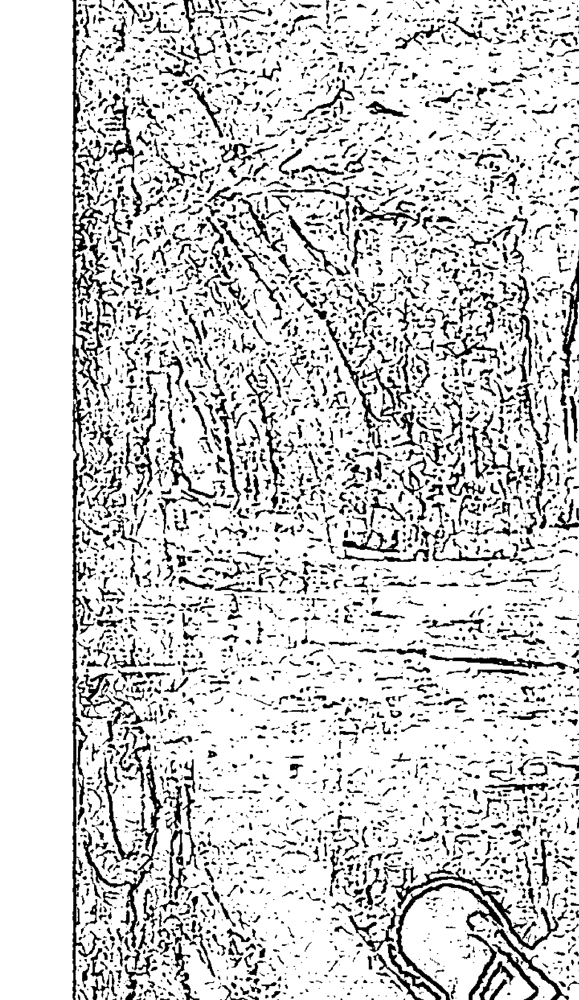

### 一、財運篇

### □ 基本卦解——狀況不明，守財為上

一艘船在海上航行，當四周都起霧時，就要小心駕駛了，否則會觸礁、甚至沉船。同樣的，當我們的投資環境處於不利的狀況，或是對投資工具不太了解的時候，千萬不要冒冒失失的出手，否則賠錢的機率相當高。

- ◆偏財指數：20分／財運旺度：◎◎◎

### 從占卜時間看終極預測

晚間十一點—凌晨一點、上午十一點—下午一點

- ♦ 行動的有利時機：農曆六月、九月及十二月的下半月
- ♦ 助旺財運的地方：南方、西南方、百貨公司、韓式烤肉店
- ♦ 助旺財運的顏色：紅色、黃色、黑色
- ♦ 投資的幸運數字：2、3、7、9
- ♦ 終極預測及建議：第二十三卦「山地剝」——得先花錢買經驗。抽到這一卦的人，當你在進行求財行動時，一定是未蒙其利而先受其害的；但若損失的金錢與時間，能換取經驗與教訓的話，那還算是值得的。不過，你得控制一下「學費」，不要繳得太多，因為這次的求財行動是絕對不會獲利的。
- ♦ 偏財指數：30分／財運旺度：⊗⊗⊗

凌晨一點—凌晨三點、下午一點—下午三點

- ♦ 行動的有利時機：農曆四到六月
- ♦ 助旺財運的地方：西南方、南方、大賣場、藝術展覽中心
- ♦ 助旺財運的顏色：黑色、紅色、黃色
- ♦ 投資的幸運數字：3、7、8、9
- ♦ 終極預測及建議：第十八卦「山風蠱」——小心受騙。俗話說「十賭九騙」，如果你打算透過賭博來求財、或透過不當管道來獲取意外之財，小心上當，因為你的對手存心不良。建議你，三十六計走為上策吧。
- ♦ 偏財指數：23分／財運旺度：⊗⊗⊗⊗

凌晨三點—凌晨五點、下午三點—下午五點

- ♦ 行動的有利時機：農曆七到九月
- ♦ 助旺財運的地方：西方、卡拉OK、地鐵站
- ♦ 助旺財運的顏色：金色、銀色、白色
- ♦ 投資的幸運數字：1、4、6、7
- ♦ 終極預測及建議：第六十四卦「火水未濟」——時機尚未成熟，仍需等待。抽到這一卦的人先不要急於求財，因為時機還沒有成熟，你必須耐心等待。等到時機對了，財運自然成熟後，才算是真正打開目前沉悶的局面。
- ♦ 偏財指數：45分／財運旺度：⊗

凌晨五點—上午七點、下午五點—下午七點

- 行動的有利時機：農曆七到九月
- 助旺財運的地方：西方、適合聊天的咖啡館
- 助旺財運的顏色：白色、銀色、金色
- 投資的幸運數字：1、4、6、7
- 終極預測及建議：第五十九卦「風水渙」——意興闌珊。也許你已經有過很多次的求財行動，同時每次的行動都付出不少努力，但都沒有獲利，原本的銳氣經過多次的挫折後，早已變得有氣無力、意興闌珊，所以在短期內如果沒有重大的突破，建議你不如及早放棄為妙。
- 偏財指數：25分／財運旺度：⊗

上午七點—上午九點、晚間七點—晚間九點

- 行動的有利時機：農曆四到六月
- 助旺財運的地方：南方、西南方、大賣場、燒烤店
- 助旺財運的顏色：黃色、黑色、白色
- 投資的幸運數字：3、7、9
- 終極預測及建議：第四十一卦「山澤損」——宜守忌攻，先損後益。得此卦者，在求財的過程必定會先賠錢，先有損失才會有獲利機會；但就算獲利也不會太多，只能當做吸收求財經驗。因此建議你下手不要太猛，留點實力等待下一次的機會。
- 偏財指數：58分／財運旺度：⊗⊗

## 二 感情篇

### □ 基本卦解——霧裡看花

對方根本沒有真正的投入這段戀情，所以才會讓你好象站在十字路口，一時之間不知該何去何從，更不知該如何跟對方相處。目前你正面臨進退為難、頗為尷尬的時期，其實別想得太多，既然看不清楚，不妨淡淡的放下，等看清楚了再出發還來得及。

- 愛情指數：48分／愛情熱度：◎◎◎
- 從占卜時間看終極預測
- 晚間十一點—凌晨一點、上午十一點—下午一點
- 最美好的相處方式：量力而為的幫助對方
- 最理想的穿著打扮：成熟的打扮
- 助旺愛情運的顏色：紅色、黑色、橘黃色、咖啡色
- 最理想的約會地點：百貨公司、大賣場

#### 終極預測及建議：第二十三卦「山地剝」——

買來的感情。這段感情的「製作費」都由你獨自承擔，當你投入愈多資源，對方的回應就變得活躍；一旦給的好處少了，對方便馬上降低跟你在一起的興趣。如果碰到的對象喜歡這種相處模式，你情我願也無妨！

- 愛情指數：59分／愛情熱度：◎
- 凌晨一點—凌晨三點、下午一點—下午三點
- 最美好的相處方式：放聰明一點，不要被騙
- 最理想的穿著打扮：光鮮亮麗的打扮
- 助旺愛情運的顏色：紅色、橘黃色
- 最理想的約會地點：你熟悉又安全的地方

終極預測及建議：第十八卦「山風蠱」——金玉其外，敗絮其中。這段感情已經不單純了，不是喜不喜歡的問題，而是對方已徹底從內心產生極大的改變。可能因為經濟因素而想離開、也可能對方已另結新歡，想中止這段感情；另一個原因是，對方發覺你並不是他的真命天女／天子。不管是哪種原因，結果都一樣，苦苦糾纏下去對誰都不好。

- 愛情指數：13分／愛情熱度：○○○○○

凌晨三點—凌晨五點、下午三點—下午五點

- 最美好的相處方式：不要談對方不想談的話題
- 最理想的穿著打扮：多一點金屬亮片的打扮
- 助旺愛情運的顏色：白＋藍色、灰色
- 最理想的約會地點：有音樂播放的酒吧、咖啡廳
- 終極預測及建議：第六十四卦「火水未濟」——沒有共同想法的空洞感情。你們兩人的想法與喜好完全不一樣，但還不至於到吵架的地步，只不過無法產生愛的火花與共鳴，因為兩人的頻道接不在一起。雖然在一起，卻往往是各忙各的、各玩各的，時間久了，感情自然就變淡了！
- 愛情指數：58分／愛情熱度：⊗

凌晨五點—上午七點、下午五點—下午七點

- 最美好的相處方式：多想一些點子來增加相處
- 最理想的穿著打扮：多一點金屬亮片、首飾的裝扮
- 最理想的約會地點：有音樂播放的酒吧、咖啡廳
- 助旺愛情運的顏色：白＋藍色
- 終極預測及建議：第五十九卦「風水渙」——彼此都缺乏歸屬感。可能經過一段無聊的相處，雙方都覺得有點膩了不好玩，對彼此的感情興趣缺缺，而沒有歸屬感。唯一的方法只有重新找出共同目標，才能改善兩人之間的關係，否則會愈來愈不想見面。
- 愛情指數：58分／愛情熱度：♡♡

上午七點—上午九點、晚間七點—晚間九點

- 最美好的相處方式：不要營造緊張氣氛，一切放輕鬆
- 最理想的約會地點：有音樂播放的酒吧、咖啡廳
- 助旺愛情運的顏色：白＋藍色
- 終極預測及建議：第七卦「地水師」—— 逼婚才有可能成功。男方頗為瀟灑，可說是師奶殺手，異性緣好到不行；女方則屬於實力派，條件也不差。但如果要完全消除男方老愛做眾情人的毛病，或想要談論婚嫁，女方必須要拿出王牌來催促、逼使對方就範才可能成功。
- 愛情指數：68分／愛情熱度：♡♡

上午九點—上午十一點、晚間九點—晚間十一點

- 最美好的相處方式：量力而為的幫助對方
- 最理想的穿著打扮：成熟的打扮
- 助旺愛情運的顏色：紅色、橘黃色、咖啡色
- 最理想的約會地點：有文化氣息的地方
- 終極預測及建議：第四十一卦「山澤損」—— 默默付出。兩個人談戀愛，難免有一方會多付出一些，你正是這位默默付出的人。有句話說付出就是獲得，這也是在告訴你，眼前看來或許你有點吃虧，但這份看似吃虧的感情，往遠處看，到頭來也許佔便宜的反而是你。
- 愛情指數：68分／愛情熱度：♡♡

# ☰ 第五卦 需卦 水天需

> 卦象的基本性質及吉凶解讀
> 本卦在六十四卦中屬於韜光養晦，自強奮鬥待機緣之等待卦。

### 一 財運篇

### □ 基本卦解——條件還沒成熟，要等待

這次的求財計畫仍有幾項重要條件還沒成熟，例如，某些重要的人際關係尚未打通、需要應用的資金還沒到手，或是出手的時機還沒來臨等，種種條件都要全部到位以後才能放手一搏，否則求財計畫便會落空。

- ◆偏財指數：60分／財運旺度：$

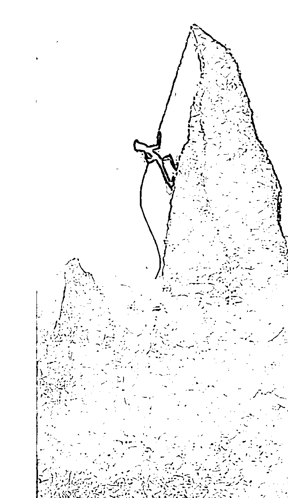

### 从占卜时间看终极预测

晚间十一点—凌晨一点、上午十一点—下午一点

- 行动的有利时机：农历七到九月
- 助旺财运的地方：西方、西北方、高水准的音乐餐厅
- 助旺财运的颜色：白色、粉红色
- 投资的幸运数字：1、6、7
终极预测及建议：第六十三卦「水火既济」—— 财路已开，多劳多得。你跟财神爷已经搭上线了，表示这次求财的计画是可行的，而且方向也正确。只要按部就班，稳健的求财，努力付出，必定会有收穫。
- 偏财指数：78分／财运旺度：$$$$

凌晨一点—凌晨三点、下午一点—下午三点

- 行动的有利时机：农历七到九月
- 助旺财运的地方：西北方、西方、歌剧院、卡拉OK
- 助旺财运的颜色：白色、粉红色、金色、银色
- 投资的幸运数字：1、6、7
终极预测及建议：第六十卦「水泽节」—— 拿捏好求财的分寸。抽到这一卦的人，求财的确需要一点智慧。因为在求财的过程当中，如果使力太猛，会把事情搞砸；如果行动不够积极，又会显得有气无力。所以要了解情况后再做出精准的求财行动，过犹不及都不好，一旦分寸拿捏得当，就有获利机会。
- 偏财指数：68分／财运旺度：$$

凌晨三点—凌晨五点、下午三点—下午五点

- 行动的有利时机：农历七到九月
- 助旺财运的地方：西方、地铁站、适合聊天的地方
- 助旺财运的颜色：米白色、粉红色
- 投资的幸运数字：2、7
终极预测及建议：第四十三卦「泽天夬」—— 当机立断偏财来。不管你现在求财状况是赚或赔，想再追加投资金额或是壮士断腕而停损，此时都要赶快当机立断，做出明快决定，以免夜长梦多。倘若当下不做任何决定，采取观望态度，只会愈来愈坏。
- 偏财指数：62分／财运旺度：$

凌晨五点—上午七点、下午五点—下午七点

- 行动的有利时机：农历六到九月
- 助旺财运的地方：西方、西南方、百货公司、地铁站
- 助旺财运的颜色：粉红色、黑色、黄色
- 投资的幸运数字：2、7、8
- 终极预测及建议：第十一卦『地天泰』——时机到，财运开。抽到这一卦，表示大财运、好机会就在眼前了。所以，尽力而为、全力以赴去赚钱，绝对不要犹豫不决、浪费宝贵时间。所谓此时不赚钱，更待何时？
- 偏财指数：98分／财运旺度：$$$$

上午七点—上午九点、晚间七点—晚间九点

- 行动的有利时机：农历七到九月
- 助旺财运的地方：西方、卡拉OK
- 助旺财运的颜色：粉红色、米白色
- 投资的幸运数字：2、6、7
- 终极预测及建议：第九卦『风天小畜』——就
- 偏财指数：62分／财运旺度：$$

上午九点—上午十一点、晚间九点—晚间十一点

- 行动的有利时机：农历七到九月
- 助旺财运的地方：西北方、西方、歌剧院、地铁站
- 助旺财运的颜色：白色、粉红色
- 投资的幸运数字：1、2、6、7
- 终极预测及建议：第四十八卦『水风井』——你求财，别人获利。得此卦者，要有“你种树，别人乘凉”的大无畏付出精神，是一种要先付出、帮助他人，而不去要求任何回报的求财状况。往好的一面想，如果你能真心诚意，没有目的地帮助别人，也许有一天，你会因为之前所做的好事，与先前结下的善缘，而有意外的收穫。
- 偏财指数：65分／财运旺度：$

## 二 感情篇

### □ 基本卦解——戒急用忍

有些事可以急功近利，有些事则应该慢慢培养。你们双方的条件不是很相配，表示缺少了一些谈爱情必须具备的基础，所以要耐心等待，默默的增进自己的条件，当时候成熟的时候，自然会有好的结果。

- ◆爱情指数：58分／爱情热度：⊗

### □ 从占卜时间看终极预测

晚間十一點—凌晨一點、上午十一點—下午一點

- 最美好的相处方式：维持个人风格，多做良性的沟通
- 最理想的穿着打扮：质料好的可爱风格穿着
- 助旺爱情运的颜色：白色、粉红色、紫色
- 最理想的约会地点：高档西餐厅、有钢琴乐声的酒吧
- 最理想的穿着打扮：活泼可爱的打扮
- 最美好的相处方式：聊一些大家高兴的话题，但不要什么话都说尽
- 爱情指数：95分／爱情热度：♡♡♡♡♡
终极预测及建议：第六十三卦「水火既济」——爱你在心坎。你们已经恩爱缠绵了一段时光，美好的相处过程中，彼此都相当满意对方的表现，并且下定决心跟对方长相厮守、共度此生。

凌晨一点—凌晨三点、下午一点—下午三点

- 爱情指数：95分／爱情热度：♡♡♡♡♡
终极预测及建议：第六十卦「水泽节」——爱情刚刚好。凡事都不宜热过头，谈爱情就好像烧菜，必须讲究火候，有所节制，恰到好处最绝妙。多一分不多、少一分不少，若能把握住其中的要领，就能赢得爱人的心。
- 助旺爱情运的颜色：白色、粉红色、紫色
- 最理想的约会地点：卡拉OK、有音乐播放的地方
- 最理想的穿着打扮：活泼可爱的打扮
- 最美好的相处方式：聊一些大家高兴的话题，但不要什么话都说尽

凌晨三点—凌晨五点、下午三点—下午五点

- 爱情指数：78分／爱情热度：❤️❤️❤️
- 最理想的穿着打扮：可爱风
- 助旺爱情运的颜色：白色、粉红色
- 最理想的约会地点：咖啡厅或有音乐的地方
- 终极预测及建议：第四十三卦「泽天夬」——
等他来找你吧！两人的观念不同，对方怕你太过干涉他的生活，希望有更多自由空间。所以你愈是采取主动的攻势，对方会愈厌烦，令这段感情产生困扰。建议你，交往速度不妨放慢一点，多听听对方的想法，多尊重对方的自由空间，那么你们的相处自然会渐入佳境。
- 爱情指数：68分／爱情热度：❤️❤️

凌晨五点—上午七点、下午五点—下午七点

- 最美好的相处方式：多包容，多沟通
- 最理想的穿着打扮：宽松而可爱的穿着
- 助旺爱情运的颜色：黄色、粉红色、黑色
- 最理想的约会地点：西餐厅、博物馆
- 终极预测及建议：第十一卦「地天泰」——心相印。你们在一起谈情说爱的时候显得特别开心，双方都不摆架子，而是用诚恳的心去爱对方，彼此都能感受到对方的付出，以及替自己设想的心。这是一段难得的恋情，想要谈论婚嫁的人若抽到这一卦，可以准备成婚了！
- 爱情指数：98分／爱情热度：❤️❤️❤️❤️

上午七点—上午九点、晚间七点—晚间九点

- 最美好的相处方式：多说一点开心的事，凡事都要看远一点
- 最理想的穿着打扮：可爱的休闲装扮
- 助旺爱情运的颜色：白色、粉红色、米黄色
- 最理想的约会地点：卡拉OK、有音乐播放的地方
- 终极预测及建议：第九卦「风天小畜」——女方占尽优势。你们的交往才刚开始，但女方占尽优## 第六卦 訟卦——天水訟

### 卦象的基本性質及吉凶解讀

本卦在六十四卦中屬於口舌誹謗、是非官訟、意氣相爭之大凶卦。

### 一 財運篇

#### 基本卦解——當心因財失義

得此卦者若想求財，最好個別行動，千萬不要跟別人有任何牽扯，因為牽扯愈多，到最後會因為誤解或交待不清之處與他人產生爭執，嚴重的話可能會鬧上法庭成為被告。求財時也要留意文件契約的內容，以免賺不到錢又惹上是非、受騙上當。

- ◆ 偏財指數：3分／財運旺度：⊗
- ◆ 從占卜時間看終極預測
  - 晚間十一點—凌晨一點、上午十一點—下午一點
  - 行動的有利時機：農曆三、六、七、九及十二月的下半月
  - 助旺財運的地方：西北方、西南方、西方、高樓大廈、鬧市
  - 助旺財運的顏色：米白色、白色、黃色
  - 投資的幸運數字：4、5、9、10
- ◆ 終極預測及建議：第十二卦「天地否」—利空出盡，否極泰來。如果你最近老是處處碰壁、求財不順，心情掉到谷底，那麼抽到這一卦反而是恭喜你啦！因為壞運氣即將快到盡頭了，當利空出盡，之後將會漸露曙光。
  - 偏財指數：68分／財運旺度：$$$
  - 行動的有利時機：農曆三、六到九月及十二月的下半月
  - 助旺財運的地方：西北方、西南方、西方、高樓、夜市
  - 助旺財運的顏色：米白色、白色、黃色
  - 投資的幸運數字：4、5、9、10
- ◆ 終極預測及建議：第四十四卦「天風姤」—短線獲利，見好就收。得此卦者有上司與長輩的貴人緣，他們會對你關愛有加，並提供求財的機會給你，但都屬於短期中小型的獲利，所以不要貪心，見好就收；也不要期待會有大財或長遠的獲利發展。若是女性得此卦，則獲利會更高。
  - 偏財指數：78分／財運旺度：$$$$
  - 行動的有利時機：農曆七到十二月
  - 助旺財運的地方：北方、西北方、西方、有音樂的咖啡廳
  - 助旺財運的顏色：白色、藍色
  - 投資的幸運數字：1、4、6、9
- ◆ 終極預測及建議：第五十九卦「風水渙」—意興闌珊。也許你已經有過很多次的求財行動，同時每次的行動都付出不少努力，但都沒有獲利，原本的銳氣經過多次的挫折後，早已變得有氣無力、意興闌珊，所以短期內如果沒有重大的突破，建議你不如及早放棄為妙。
  - 偏財指數：25分／財運旺度：⊗
  - 行動的有利時機：農曆七到十二月
  - 凌晨五點—上午七點、下午五點—下午七點
  - 助旺財運的地方：西北方、西方、高樓層適合聊天的地方
  - 助旺財運的顏色：白色、金色、銀色
  - 投資的幸運數字：1、4、6、9
- ◆ 終極預測及建議：第六十四卦「火水未濟」—— 時機尚未成熟，仍需等待。抽到這一卦的人先不要急於求財，因為時機還沒有成熟，你必須耐心等待。等到時機對了，財運自然成熟後，才算是真正打開目前沉悶的局面。
  - 偏財指數：45分／財運旺度：⊗
  - 上午七點—上午九點、晚間七點—晚間九點
  - 行動的有利時機：農曆七到十二月
  - 助旺財運的地方：西北方、北方、有音樂的咖啡廳
  - 助旺財運的顏色：白色、金色、銀色
  - 投資的幸運數字：1、4、6、9
- ◆ 終極預測及建議：第四十七卦「澤水困」—— 一籌莫展，進退為難。一件事之所以會成功，其實都少不了好的機會與運氣，而你目前的處境正缺少了這些成功的重要因素，導致你在誤判情勢下貿然投入，以致面臨一波又一波的困難，讓你進退為難。唯一的解決方式就是快快抽身離開，方為上策。
  - 偏財指數：0分／財運旺度：⊗⊗⊗⊗⊗
  - 上午九點—上午十一點、晚間九點—晚間十一點
  - 行動的有利時機：農曆七到九月、十二月下旬
  - 助旺財運的地方：西南方、西方、百貨公司裡的餐廳
  - 助旺財運的顏色：米白色、黃色
  - 投資的幸運數字：4、5、9、10
- ◆ 終極預測及建議：第十卦「天澤履」—— 富貴險中求。此卦表面上已經獲利，其中卻暗藏著不少危機與風險。如果你想投資的是高風險、高利潤的偏財，很可能賺的錢在一夜之間就血本無歸了！抽到這一卦，理應分散風險，不要把所有投資都集中在同一個方向上。
  - ❖ 偏財指數：77分／財運旺度：$$$

### 二 感情篇

#### 一 基本卦解——你們是一對冤家

相愛的時間點不對，長輩不贊成你們在一起，甚至極力反對，讓這段感情壓力很大，加上你們彼此間的愛恨情仇不是別人所能了解的，要好聚好散恐怕不容易。如果你要個性，強要對方順從你，搞不好還會鬧上法庭。

- ❖ 愛情指數：13分／愛情熱度：⊗⊗⊗⊗
- ❖ 從占卜時間看終極預測
  - 晚間十一點—凌晨一點、上午十一點—下午一點
  - 最美好的相處方式：用坦白、包容的心對待
  - 最理想的穿著打扮：古典、成熟的風味
  - 助旺愛情運的顏色：米黃色、白色
  - 最理想的約會地點：古典裝潢的餐廳
- ❖ 終極預測及建議：第十二卦『天地否』—— 要死不活。
  - 凌晨一點—凌晨三點、下午一點—下午三點
  - 生有太多情人，你會追得很辛苦。
  - 愛情指數：女生86分，男生68分／愛情熱度：女生♡♡♡，男生⊗
  - 凌晨三點—凌晨五點、下午三點—下午五點
  - 最美好的相處方式：凡事都要有主見，並主動、積極
  - 最理想的穿著打扮：任何場合都以高規格標準來打扮
  - 助旺愛情運的顏色：白色
  - 最理想的約會地點：高檔的消費場所
- ❖ 終極預測及建議：第五十九卦「風水渙」—— 彼此都缺乏歸屬感。可能經過一段無聊的相處，雙方都覺得有點膩了不好玩，對彼此的感情興趣缺缺，而沒有歸屬感。唯一的方法只有重新找出共同目標，才能改善兩人之間的關係，否則會愈來愈不想見面。
  - 愛情指數：58分／愛情熱度：♡♡
  - 凌晨五點—上午七點、下午五點—下午七點
  - 最美好的相處方式：主動、積極的態度
  - 上午七點—上午九點、晚間七點—晚間九點
  - 愛情指數：58分／愛情熱度：⊗
  - 沒有共同想法的空洞感情。你們兩人的想法與喜好完全不一樣，但還不到吵架的地步，只不過無法產生愛的火花與共鳴，因為兩人的頻道接不在一起。雖然在一起，卻往往是各忙各的、各玩各的，時間久了，感情自然就變淡了！
  - 最理想的穿著打扮：多用名牌
  - 助旺愛情運的顏色：白色、米色、黃色
  - 最理想的約會地點：高樓大廈
- ❖ 終極預測及建議：第六十四卦「火水未濟」——
  - 最美好的相處方式：大膽、果斷的說出你心中的想法
  - 最理想的穿著打扮：女生盡量打扮的像少女般可愛；男生則成熟些
  - 助旺愛情運的顏色：紅色、白色
  - 最理想的約會地點：大型的公共場所，或卡拉OK、地鐵站附近
- ❖ 終極預測及建議：第四十七卦「澤水困」——
  - 枯萎的苦戀花。這是一段不可告人的苦戀，對方表面上雖然沒有說不愛你，但兩人的相愛總是困難重重，對方不懂得替你著想，更不會跟你一起面對難關，所有的壓力與困境總是得自己一人去承擔，最後落得只剩自己獨嚐愛情苦果。
  - 愛情指數：23分／愛情熱度：☒☒☒☒
  - 上午九點—上午十一點、晚間九點—晚間十一點
  - 最美好的相處方式：順著對方的情緒來說話
  - 最理想的穿著打扮：可愛的少女、少男裝扮
  - 助旺愛情運的顏色：粉紅色、米白色
  - 最理想的約會地點：地鐵站附近、卡拉OK、歌劇院
- ❖ 終極預測及建議：第十卦『天澤履』——地位不對等的關係。雙方的身份地位相差太多，條件比較差的那一方若想贏得對方的心，得小心翼翼的讓對方高興，跟對方在一起的時候要小心心說錯話或做錯動作、拍錯馬屁，以免惹對方生氣，雙方就玩完了！
  - 愛情指數：68分／愛情熱度：♡♡

## 第七卦 師卦——地水師

### 卦象的基本性質及吉凶解讀

本卦在六十四卦中屬於統合戰力，蓄勢待發之決戰卦。

### 一 財運篇

#### 基本卦解——需要以激烈手段競爭而得財

非常時期要採取非常手段，為了達成賺錢目標，抽到這一卦的人必須進行激烈的求財攻勢，以霹靂手段讓對手屈服，利益全歸你所有。但是這樣的過程中，你也必須付出相當的代價。

- ◆ 偏財指數：65分／財運旺度：$$
- ◆ 從占卜時間看終極預測
  - 晚間十一點—凌晨一點、上午十一點—下午一點
  - 行動的有利時機：農曆四到六月
  - 助旺財運的地方：西南方、南方、百貨公司、韓式烤肉店
  - 助旺財運的顏色：紅色、黃色、黑色
  - 投資的幸運數字：3、8、9
- ◆ 終極預測及建議：第四十六卦『地風升』——偏財運已萌芽，但要小心觀察身邊所有不起眼的小財運，因為有些現在看起來不太起眼的小財運，未來會變成大財運。所以千萬不要嫌錢少而不賺，以免坐失良機。
  - 偏財指數：72分／財運旺度：$$$$
  - 凌晨一點—凌晨三點、下午一點—下午三點
  - 行動的有利時機：農曆十到十二月
  - 助旺財運的地方：北方、海洋公園
  - 助旺財運的顏色：白色＋藍色、銀色＋灰色
  - 投資的幸運數字：1、6
- ◆ 終極預測及建議：第四十卦『雷水解』——困在七天內必可解決。如果你正身陷于財務危機，那恭喜了，因為在七天內這個困難一定可以解決。但如果你現在並沒有財務上的問題，那麼你心中想進行的求財計劃則會泡湯、停止進行了！
  - 偏財指數：60分／財運旺度：$
  - 凌晨三點—凌晨五點、下午三點—下午五點
  - 行動的有利時機：農曆七到九月、十到十二月
  - 助旺財運的地方：西方、北方、有音樂播放的咖啡廳或酒吧
  - 助旺財運的顏色：銀色＋灰色、白色＋藍色
  - 投資的幸運數字：1、6
- ◆ 終極預測及建議：第二十九卦『坎為水』——驚濤駭浪必失財。這是風險極大的求財卦，如果能大起大落已經算是幸運的了。倒楣的話，一出手便會遇上陷阱，弄得血本無歸。建議你，若非做不可，投資金額應減低到本來投資預算的25%。此外，賺到一點甜頭就要立刻收手，否則就中了此卦『久戰必敗』的魔咒。
  - 偏財指數：13分／財運旺度：◎◎◎◎
  - 凌晨五點—上午七點、下午五點—下午七點
  - 行動的有利時機：農曆七到十二月
  - 助旺財運的地方：西方、北方、地鐵站、水族館
  - 助旺財運的顏色：白色、藍色、灰色、銀色
  - 投資的幸運數字：1、6
- ◆ 終極預測及建議：第四卦「山水蒙」——狀況不明，守財為上。一艘船在海上航行，當四周都起霧時，就要小心行駛了，否則會觸礁、甚至沉船。同樣的，當我們的投資環境處於不利的狀況，或是對投資工具不太了解的時候，千萬不要冒冒失失的出手，否則賠錢的機率相當高。
  - 偏財指數：20分／財運旺度：◎◎◎◎
  - 上午七點—上午九點、晚間七點—晚間九點
  - 行動的有利時機：農曆四到六月
  - 助旺財運的地方：南方、西南方、百貨公司、韓式烤肉店
  - 偏財指數：85分／財運旺度：$$$$
  - 上午九點—上午十一點、晚間九點—晚間十一點
  - 行動的有利時機：農曆四到六月
  - 助旺財運的地方：南方、西南方、圖書館、大賣場
  - 助旺財運的顏色：紅色、橘色、黑色
  - 投資的幸運數字：3、8、9
- ◆ 終極預測及建議：第二卦「坤為地」——有容乃大，共享財利。抽到此卦者，應本著「海納百川」的胸襟與人為善。只要自己有能力、有時間，不管賺多少錢，都要懷著感恩、謙卑的心與人分享，如此一來，必可廣結善緣，廣納八方之財。
  - 助旺財運的顏色：紅色、黑色、黃色
  - 投資的幸運數字：3、8、9
- ◆ 終極預測及建議：第十九卦「地澤臨」——貴人指路而獲利。抽到此卦者，會遇到在上位的貴人，包括長輩、上司或位高權重的人，他們會在你求財的過程中拉你一把。如果能把握住這種千載難逢的機會，則財運亨通。
  - 偏財指數：80分／財運旺度：$$$$$

### 感情篇

#### 基本卦解——逼婚才有可能成功

男方頗為瀟灑，可說是師奶殺手，異性緣好到不行；女方則屬於實力派，條件也不差。但如果要完全消除男方老愛做眾情人的毛病，或想要談論婚嫁，女方必須要拿出王牌來催促、逼使對方就範才可能成功。

- 愛情指數：68分／愛情熱度：♥♥
- 從占卜時間看終極預測
  - 晚間十一點—凌晨一點、上午十一點—下午一點
  - 最美好的相處方式：多包容、關懷對方，才能增進感情
  - 最理想的穿著打扮：成熟的打扮
  - 助旺愛情運的顏色：紅色、橘黃色、米白色
  - 最理想的約會地點：中式餐廳、大賣場
- 終極預測及建議：第四十六卦『地風升』——奉子成婚。
  - 你們在一起時都甜甜蜜蜜的，會替對方著想，也會配合對方的想法。正因為感情這麼好，很容易先上車、後補票，先有愛情結晶後才談論婚嫁。
  - 愛情指數：86分／愛情熱度：♥♥♥♥♥
  - 凌晨一點—凌晨三點、下午一點—下午三點
  - 最美好的相處方式：若給對方太多壓力，很容易就散了
  - 最理想的穿著打扮：多一點金屬亮片裝飾
  - 助旺愛情運的顏色：白色、金色、銀色
  - 最理想的約會地點：有音樂播放的地方、大型戶外演唱會
- 終極預測及建議：第四十卦『雷水解』——七天之內見分曉。
  - 得此卦者會遇到兩種情況，在七天內就會得到答案。第一種情況：已留不住對方，到了分手互道珍重、說聲再見的時候了，也許是無言的結局，淡淡的分手。第二種情況：也許你與對方和好如初的時候快要到了！彼此冷戰不講話，可找個藉口主動打電話給對方，說不定馬上就能雨過天晴，喜劇收場。
  - 愛情指數：第一種情況23分，第二種情況68分
  - 愛情熱度：第一種情況○○○○○，第二種情況♡♡
  - 凌晨三點—凌晨五點、下午三點—下午五點
  - 最美好的相處方式：用智慧解決不斷冒出來的難題
  - 最理想的穿著打扮：航海水手裝扮
  - 助旺愛情運的顏色：白＋藍＋灰色
  - 最理想的約會地點：海洋館、酒吧、沙灘
- 終極預測及建議：第二十九卦「坎為水」——倒楣的愛情遭遇。你們的感情沒有人支持，就像創業也到處碰壁。一波未平一波又起，是你們的宿命，這段感情就像被詛咒似的，很難安然度過。不如趁早譜下休止符，讓厄運趕快結束吧！
  - 愛情指數：13分／愛情熱度：○○○○○
  - 凌晨五點—上午七點、下午五點—下午七點
  - 最美好的相處方式：不要給對方太多壓力以免進退為難
  - 最理想的穿著打扮：多一點金屬亮片裝飾
  - 助旺愛情運的顏色：白色、金色、銀色
  - 最理想的約會地點：有音樂播放的酒吧、咖啡廳
- 終極預測及建議：第四卦「山水蒙」——霧裡看花。對方根本沒有真正的投入這段戀情，所以才讓你好像站在十字路口，一時之間不知該何去何從，更不知該如何跟對方相處。目前你正面臨進退為難、頗為尷尬的時期，其實別想得太多，既然看不清楚，不妨淡淡的放下，等看清楚了再出發還來得及。
  - 愛情指數：48分／愛情熱度：○○○
  - 上午七點—上午九點、晚間七點—晚間九點
  - 最美好的相處方式：把握相處的美好時光
  - 最理想的穿著打扮：成熟的打扮
  - 助旺愛情運的顏色：橘黃色、紅色、紫紅色
  - 最理想的約會地點：百貨公司、中式餐廳
- 終極預測及建議：第十九卦『地澤臨』——愛神降臨。愛神丘比特的箭已發射，正中你們的心，機會與幸福在此時已掌握在你們的手裡。如果你覺得對方的條件與人品都令你滿意，千萬不要再三心兩意，立即採取行動，不要讓幸福悄悄的從你身邊溜走了！
  - 愛情指數：88分／愛情熱度：♡♡♡♡
  - 上午九點—上午十一點、晚間九點—晚間十一點
  - 最美好的相處方式：淡淡的關心對方也是一種幸福
  - 最理想的穿著打扮：成熟復古的打扮
  - 助旺愛情運的顏色：紅色、橘黃色、米白色
  - 最理想的約會地點：觀光果園、大賣場
- 終極預測及建議：第二卦『坤為地』——相敬如賓。你們彼此相互尊重，不會給對方壓力，卻缺乏了一些戀愛的激情，猶如一對好朋友般，彼此分享看法與感受，但不會積極計畫將來。好處是你們很少爭吵與意見不合，壞處則是相處很久都沒有什麼進展與結果。
  - 愛情指數：60分／愛情熱度：♡

## 第八卦 比卦——水地比

### 卦象的基本性質及吉凶解讀

本卦在六十四卦中屬於領導群鄰，一呼百諾之吉卦。

### 一 財運篇

#### 基本卦解——和氣生財樂融融

你所努力的求財方向已有明確的目標與架構，如果你是男性，抽到這一卦表示將有很多紅顏知己給你幫助，讓你在和樂愉快的氣氛下賺錢。如果你是女性，得此卦表示求財一切都要靠自己，外來的助力是很少的。

- ◆ 偏財指數：65分／財運旺度：$$$
- ◆ 從占卜時間看終極預測
  - 晚間十一點—凌晨一點、上午十一點—下午一點
  - 助旺財運的地方：西方、卡拉OK或適合聊天的地方
  - 行動的有利時機：農曆七到九月
  - 助旺財運的顏色：白色、銀色、藍色
  - 投資的幸運數字：1、2、6、7
- ◆ 終極預測及建議：第三十九卦「水山蹇」——舉步維艱，進退為難。如果你的求財行動還停留在計畫的階段，那要恭喜你了！因為還來得及停止這項求財計畫，以免陷入泥沼、進退不得。所以，建議千萬不要跳進這個陷阱。萬一已經被套牢了，那就必須盡快找出停損點、及早了解，否則只會愈陷愈深，損失慘重。
  - 偏財指數：0分／財運旺度：◎◎◎◎◎
  - 凌晨一點—凌晨三點、下午一點—下午三點
  - 行動的有利時機：農曆四到六月、九月及十二月
  - 助旺財運的地方：東北方、西南方、大賣場、山上的小別墅
  - 助旺財運的顏色：米白色、黃色、黑色
  - 投資的幸運數字：3、7、8
- ◆ 終極預測及建議：第四十五卦「澤地萃」——名利雙收，出類拔萃。得此卦者，你得先有名聲後才會獲得利益，這次的求財行動叫好又叫座，而且後面的發展機會很多，只要抱著廣結善緣的心態繼續努力，長遠來看求財獲利是大有可為的。
  - 偏財指數：95分／財運旺度：$$$$$
  - 凌晨三點—凌晨五點、下午三點—下午五點
  - 行動的有利時機：農曆四到六月、九月及十二月的下半月
  - 助旺財運的地方：西南方、東北方、百貨公司
  - 助旺財運的顏色：米白色、黃色、黑色
  - 投資的幸運數字：3、7、8
- ◆ 終極預測及建議：第二卦「坤為地」——有容乃大，共享財利。抽到此卦者，應本著「海納百川」的胸襟與人為善。只要自己有能力、有時間，不管賺多少錢，都要懷著感恩、謙卑的心與人分享。
  - 偏財指數：95分／財運旺度：$$$$$

## 第九卦 小畜卦——風天小畜

### 卦象的基本性質及吉凶解讀

本卦在六十四卦中屬於累積能量，默默耕耘之基礎卦。

## 一、財運篇

### □ 基本卦解——就差臨門一腳，繼續努力

凡事都像耕種，有播種期、萌芽期、茁壯期，也有收穫期。抽到這一卦的人，目前的求財狀況就像茁壯期一樣，雖然距離收穫還有一段時間，但只要你堅定求財的方向與目標，多一些耐心等待、不要半途而廢，鎖定的利益早晚會是你的。

◆ 偏財指數：80分／財運旺度：$$$$$ 心與人分享，如此一來，必可廣結善緣，廣納八方之財。

◆ 行動的有利時機：農曆四到六月、九月及十二月的下半個月
◆ 助旺財運的地方：西南方、東北方、百貨公司、休閒農場
◆ 助旺財運的顏色：米白色、黃色、黑色
◆ 投資的幸運數字：3、7、8
◆ 終極預測及建議：第二十卦「風地觀」—— 不可孤注一擲。在情形不明的情形下最忌貿然進行求財，萬一在不對的時機出手，只會損失慘重，悔不當初。建議你，多收集資料繼續觀察。如果在十天之內還是看不清楚求財狀況，就放棄吧！

◆ 偏財指數：50分／財運旺度：⊗
◆ 行動的有利時機：農曆七到九月、上午七點—上午九點、晚間七點—晚間九點
◆ 助旺財運的地方：西方、地鐵站、歌劇院
◆ 助旺財運的顏色：白色、銀色、金色
◆ 投資的幸運數字：1、2、6、7
◆ 終極預測及建議：第三卦「水雷屯」—— 小心陷阱，切忌貪多求快。投資股票有所謂的「地雷股」，如果投資太多而且誤中「地雷」，就會死的很慘。所以投資前必須多做功課，眼睛放亮一點，才能避開陷阱。不管怎樣，抽到這一卦的人在此時此刻是不宜出手的，還是奉勸你等待下一次機會吧！

◆ 偏財指數：0分／財運旺度：⊗⊗⊗⊗⊗
◆ 行動的有利時機：農曆十到十二月、上午九點—上午十一點、晚間九點—晚間十一點
◆ 助旺財運的地方：北方、靠近有水的地方、酒吧
◆ 助旺財運的顏色：藍色、金色、銀色
◆ 投資的幸運數字：1、2、6、7
◆ 終極預測及建議：第二十九卦「坎為水」—— 驚濤駭浪必失財。這是風險極大的求財卦，如果能大起大落已經算是幸運的了。倒楣的話，一出手便會遇上陷阱，弄得血本無歸。建議你，若非做不可，投資金額應減低到本來投資預算的二五％。此外，賺到一點甜頭就要立刻收手，否則就中了此卦『久戰必敗』的魔咒。

### 三 從占卜時間看終極預測

晚間十一點—凌晨一點、上午十一點—下午一點

- 行動的有利時機：農曆一到三月、十到十二月
- 助旺財運的地方：東方、北方、熱鬧的酒吧或咖啡館
- 助旺財運的顏色：藍色、灰色、綠色
- 投資的幸運數字：1、4、5、6
- 終極預測及建議：第五十七卦「巽為風」——虛幻多變的偏財運。你選定的求財方向本來就變化多端，而你自己對這件事的信心也不夠，經常搖擺不定。所以，在這種裡外都不穩定的情況下想要求財，必須要有很好的機會才能穩穩的賺到錢，否則就會變來變去好比過路財神。
- 偏財指數：62分／財運旺度：$

凌晨三點—凌晨五點、下午三點—下午五點

- 行動的有利時機：農曆十到十二月
- 助旺財運的地方：北方、酒吧、咖啡館
- 助旺財運的顏色：藍色、灰色
- 投資的幸運數字：1、6
- 終極預測及建議：第六十一卦「風澤中孚」——誠信求財必可獲利。商場如戰場，有時候免不了會要心機、故佈疑陣；但抽到這一卦的人，建議你在這次的求財過程中千萬別來這一套，買賣雙方都應以誠信為最高原則，這樣的求財方式才是上策。
- 偏財指數：68分／財運旺度：$$

◆ 行動的有利時機：農曆七到九月
◆ 助旺財運的地方：西北方、西方、高樓層的音樂西餐廳
◆ 助旺財運的顏色：白色、粉紅色
◆ 投資的幸運數字：1、2、6、7
◆ 終極預測及建議：第一卦「乾為天」—— 旺到最高點。財運好到連自己都不太相信，不論是投資股票、基金，做長線或炒短線都旺到極點，甚至打個小牌也會一家贏三家，統一發票少說也有兩百元的安慰獎。不過，凡事都會物極必反，抽到這支大旺卦的你應居安思危，因為獲利高峰期即將過去，此時最好先準備穩健的理財方法。
◆ 偏財指數：96分／財運旺度：$$$$$

◆ 行動的有利時機：農曆七到九月、十二月下半月
◆ 助旺財運的地方：西方、東北方、卡拉OK
◆ 助旺財運的顏色：白色、粉紅色、米黃色
◆ 投資的幸運數字：2、7、8
◆ 終極預測及建議：第二十六卦「山天大畜」—— 眼光放遠，財利必豐。求財有大小之分，也有短暫之財與長久之財的分別。抽到這一卦，表示你應把求財眼光放遠，不要只汲汲營營於小財和眼前的短暫獲利。要集中全部精神，放在長久的大財之上，以免浪費時間。
◆ 偏財指數：78分／財運旺度：$$$

◆ 行動的有利時機：農曆七到九月
◆ 助旺財運的地方：西方、地鐵站
◆ 助旺財運的顏色：粉紅色、米黃色
◆ 終極預測及建議：第五卦「水天需」—— 條件還沒成熟，要等待。這次的求財計畫仍有幾項重要條件還沒成熟，例如，某些重要的人際關係尚未打通、需要用的資金還沒到手，或是出手的時機還沒來臨等，種種條件都要全部到位以後才能放手一搏，否則求財計畫便會落空。
◆ 偏財指數：60分／財運旺度：$

## 二 感情篇

### □ 基本卦解——女皇陛下

你們的交往才剛開始，但女方占盡優勢，追求女方的人不少，所以女方大可慢慢選擇誰才是心中的最愛。如果你是男生，抽到這一卦一定要主動一點，盡可能施展渾身解數來贏得芳心，否則容易被情敵先下手為強，那就來不及了！

※ 愛情指數：女生 80 分，男生 68 分 / 愛情熱度：女生 ♡♡♡♡，男生 ♡♡♡

### □ 從占卜時間看終極預測

※ 最美好的相處方式：一切放輕鬆，隨著對方的想法去做
※ 最理想的穿著打扮：對方喜歡的休閒裝扮
※ 助旺愛情運的顏色：藍色、灰＋綠色
※ 最理想的約會地點：空氣流通的休閒場所
※ 晚間十一點—凌晨一點、上午十一點—下午一點
※ 終極預測及建議：第五十七卦『巽為風』——愛情像月亮，初一、十五不一樣。你們的愛情經常吹著不一樣的風，無論在情緒上或想法上，都會起伏不定、變化多端。同時你們兩個人都缺乏定見與定信，在愛情的路上，容易見一個愛一個，對事不夠果決，以致於什麼事都反反覆覆，不容易成功。
※ 愛情指數：68 分 / 愛情熱度：♡♡♡

※ 晚間十一點—凌晨一點、上午十一點—下午一點
※ 最美好的相處方式：像家人一般的對待
※ 最理想的穿著打扮：自然的居家裝扮
※ 助旺愛情運的顏色：藍色、灰色、黑色
※ 最理想的約會地點：靠近有水的地方
※ 終極預測及建議：第三十七卦『風火家人』——緣定三生。你們除了一對戀人，還多了兄弟姐妹般的感情，兩人在一起時就像家人般親密，彼此相親相愛、尊重對方。
※ 愛情指數：90 分 / 愛情熱度：♡♡♡♡♡

#### 凌晨三點——凌晨五點、下午三點——下午五點

- 最美好的相處方式：用智慧彼此誠懇相處
- 最理想的穿著打扮：多變化的裝扮
- 助旺愛情運的顏色：藍色、灰色、黑色
- 最理想的約會地點：靠近河邊的公園

終極預測及建議：第六十一卦「風澤中孚」——天長地久。你們自交往以來，給對方的承諾從未失信過，在彼此心目中，對方是個可以託付終生的人。互相信賴、不分彼此，是這段感情最可貴的地方。如果想談論婚嫁，隨時都可以進行，而且會有圓滿的結果。

愛情指數：90分／愛情熱度：♡♡♡♡♡

#### 凌晨五點——上午七點、下午五點——下午七點

- 最美好的相處方式：保持自己的個人風格，但要多聊天溝通
- 最理想的穿著打扮：可愛而高規格的裝扮
- 助旺愛情運的顏色：粉紅色、白色、米黃色
- 最理想的約會地點：高檔的西餐廳

終極預測及建議：第一卦「乾為天」——天王VS天后，互相輝映。雙方都是有自信、傲氣的萬人迷，凡事都自以為是，好處是誰也不依賴誰，相好的時候會互相欣賞對方，甚至以對方為傲；吵架的時候，則會認為自己條件那麼好，不怕沒人愛，而擺出高姿態，希望對方聽自己的話，結果愈弄愈糟。

愛情指數：72分／愛情熱度：♡♡♡♡

#### 上午七點——上午九點、晚間七點——晚間九點

- 最美好的相處方式：等待對方邀約，重視說話品質勝過話多
- 最理想的穿著打扮：可愛樸素的衣服
- 助旺愛情運的顏色：白色、粉紅色、米色
- 最理想的約會地點：安靜的咖啡廳

終極預測及建議：第二十六卦「山天大畜」——門當戶對。你們的學歷、社會地位、家境背景都不錯，有緣成為戀人可能是彼此生修來的福氣，只要有始有終，除了感情豐收之外，一定還會有其他好的收穫。請你們要好好把握這段難得的緣份。

愛情指數：92分／愛情熱度：♡♡♡♡♡

#### 上午九點－上午十一點、晚間九點－晚間十一點

- 最美好的相處方式：多溝通、多幫助對方
- 最理想的穿著打扮：有年輕感的裝扮
- 助旺愛情運的顏色：黃色、白色、粉紅色
- 最理想的約會地點：有音樂播放的地方、卡拉OK
- 終極預測及建議：第五卦「水天需」──戒急用忍。有些事可以急功近利，有些事則應該慢慢培養。你們雙方的條件不是很相配，表示缺少了一些愛情必須具備的基礎，所以要耐心等待，默默的增進自己的條件，當時機成熟的時候，自然會有好的結果。
- 愛情指數：58分／愛情熱度：⊗

## 第十卦 履卦——天澤履

> 卦象的基本性質及吉凶解讀
本卦在六十四卦中屬於履薄臨深，戒慎恐懼之危機卦。

## 一、財運篇

### □ 基本卦解——富貴險中求

此卦表面上已經獲利，其中卻暗藏著不少危機與風險。如果你想投資的是高風險、高利潤的偏財，很可能賺的錢在一夜之間就血本無歸了！抽到這一卦，理應分散風險，不要把所有投資都集中在同一個方向上。

❖ 偏財指數：77分／財運旺度：$$$

### □ 從占卜時間看終極預測

晚間十一點—凌晨一點、上午十一點—下午一點

- 行動的有利時機：農曆七到十二月較有利
- 助旺財運的地方：西南方、熱鬧的菜市場
- 助旺財運的顏色：米白色、淺黃色
- 投資的幸運數字：2、5、8、10
- 終極預測及建議：第六十一卦「風澤中孚」— 誠信求財必可獲利。商場如戰場，有時免不了會耍心機、故佈疑陣；但抽到這一卦的人，建議你在這次的求財過程中千萬別來這一套，買賣雙方都應以誠信為最高原則，這樣的求財方式才是上策。
- 偏財指數：68分／財運旺度：$$

凌晨一點—凌晨三點、下午一點—下午三點

- 行動的有利時機：農曆六到八月為佳，不利農曆五月
- 助旺財運的地方：西北方、西南方、高樓大廈、山上
- 助旺財運的顏色：米白色、淺黃色
- 終極預測及建議：第三十八卦「火澤睽」— 求財不得，反惹是非。個性急躁的人、或在特殊行業工作的人抽到這一卦，要特別小心了。因為得此卦者，容易在求財過程中因與人意見不合、或利益分配不當而不開心，因而跟人吵架、翻臉！俗話說的好，求財不求氣。凡事應退一步來想，讓大事化小、小事化無。
- 偏財指數：23分／財運旺度：◎◎◎

凌晨三點—凌晨五點、下午三點—下午五點

- 行動的有利時機：農曆六到八月為佳；不利農曆五月
- 助旺財運的地方：西北方、西南方、大樓高處、百貨公司
- 助旺財運的顏色：米白色、淺黃色
- 投資的幸運數字：2、5、8、10
- 終極預測及建議：第五十八卦「兌為澤」— 要嘴皮，開心賺。公共關係是致富的重要工具，健談又有說服力的人更是公關好手，所以，抽到此卦的人，應多多利用你的口才，經常跟別人聊天來增加求財的機會。當雙方聊得很開心的時候，什麼事情都好談，那麼你在求財時自然能水到渠成。

偏財指數：82分／財運旺度：$$$$$

#### 凌晨五點—上午七點、下午五點—下午七點

- 行動的有利時機：農曆六到八月為佳；不利農曆一到五月
- 助旺財運的地方：西南方、西北方、西方、卡拉OK
- 助旺財運的顏色：米白色、淺黃色
- 投資的幸運數字：2、5、8、10
- 終極預測及建議：第六卦「天水訟」——當心因財失義。得此卦者若想求財，最好個別行動，千萬不要跟別人有任何牽扯，因為牽扯愈多，到最後會因為誤解或交待不清之處與他人產生爭執，嚴重的話可能會鬧上法庭成為被告。求財時也要留意文件契約的內容，以免賺不到錢又惹上是非、受騙上當。
- 偏財指數：3分／財運旺度：⊗

#### 上午七點—上午九點、晚間七點—晚間九點

- 行動的有利時機：農曆六到八月，不利農曆一到五月
- 助旺財運的地方：西南方、西北方、西方、咖啡廳
- 助旺財運的顏色：米白色、淺黃色
- 投資的幸運數字：2、5、8、10
- 終極預測及建議：第二十五卦「天雷无妄」——求財變破財，倒霉到家。你總是那個倒楣的「最後一隻老鼠」！看到人家賺錢，你去追同樣的股票卻碰上股市大跌而賠錢；別人投資賺錢的公司，紅利分不完，你看也想跟著插花，無奈一進場就遇到公司老闆惡性倒閉，害得你原想求財卻反而破大財！
- 偏財指數：0分／財運旺度：⊗⊗⊗

#### 上午九點—上午十一點、晚間九點—晚間十一點

- 行動的有利時機：農曆六到八月，不利農曆一到五月
- 助旺財運的地方：西南方、西北方、西方、熱鬧的市場
- 助旺財運的顏色：米白色、淺黃色
- 投資的幸運數字：2、5、8、10
- 終極預測及建議：第一卦「乾為天」——旺到最高點。財運好到連自己都不太相信，不論是投資股票、基金，做長線或炒短線都旺到極點，甚至打個小牌也會一家贏三家，統一發票少說也有兩百元的安慰獎。不過，凡事都會物極必反，抽到這支大旺卦的你應居安思危，因為獲利高峰期即將過去，此時最好先準備穩健的理財方法。
- 偏財指數：96分／財運旺度：$$$$$

## 二 感情篇

### □ 基本卦解——地位不對等的關係

雙方的身份地位相差太多，條件比較差的那一方若想贏得對方的心，得小心翼翼的讓對方高興，跟對方在一起的時候要小心說錯話或做錯動作、拍錯馬屁，以免惹對方生氣，雙方就玩完了！

愛情指數：68分／愛情熱度：♡♡

### □ 從占卜時間看終極預測

晚間十一點——凌晨一點、上午十一點——下午一點

- 最美好的相處方式：不要老是各懷鬼胎，要信任對方所做的一切
- 最理想的穿著打扮：運動服、休閒服
- 助旺愛情運的顏色：米黃色、棕色
- 最理想的約會地點：地勢比較高的地方
- 終極預測及建議：第六十一卦「風澤中孚」——天長地久。你們自交往以來，給對方的承諾從未失信過，在彼此心目中，對方是個可以託付終生的人。互相信賴、不分彼此，是這段感情最可貴的地方。如果想談論婚嫁，隨時都可以進行，而且會有圓滿的結果。
- 愛情指數：90分／愛情熱度：♡♡♡♡♡

- 最美好的相處方式：少說一句，免得沒事就吵架

凌晨一點——凌晨三點、下午一點——下午三點這是一對標準的吵架冤家。愈來愈淡薄。兩人會兜在一起根本是前世相欠，聊事情，一聊天就吵架，吵半天也不會有結論與共識。到頭來，愈吵愈是一肚子火，感情也前世相欠、吵架冤家。兩人的個性完全不一樣，看事情的角度與想法也不同，根本沒辦法一起。

#### ◆終極預測及建議：第三十八卦「火澤睽」——

- ◆最理想的穿著打扮：少穿暴露的衣服
- ◆助旺愛情運的顏色：米黃色、白色
- ◆最理想的約會地點：靠近有水的地方
- ◆終極預測及建議：第三十八卦「火澤睽」——
- ◆愛情指數：13分／愛情熱度：◎◎◎◎◎
- ◆凌晨三點—凌晨五點、下午三點—下午五點
- ◆最美好的相處方式：開開心心的聊天，有話就直說吧
- ◆最理想的穿著打扮：頹廢風格，好比破破的牛仔褲、洞洞裝
- ◆助旺愛情運的顏色：粉紅色、紅色、白色
- ◆最理想的約會地點：卡拉OK，有音樂播放又熱鬧的地方
- ◆終極預測及建議：第五十八卦「兌為澤」——

聊天高手。兩人都很喜歡聊天，稱得上是聊天高手，拿起手機可以講上三天三夜，在一起的時候都很開心。但小心話說多了難免會說錯話，而讓對方不高興。建議你，把握兩人一起聊天的快樂時刻，但要小心樂極生悲。

- ◆愛情指數：72分／愛情熱度：♥♥♥
- ◆凌晨五點—上午七點、下午五點—下午七點
- ◆最美好的相處方式：保持自己的風格，多打電話跟對方聊天
- ◆最理想的穿著打扮：宴會時穿著正式一點，平常休閒一點
- ◆助旺愛情運的顏色：粉紅色、白色
- ◆最理想的約會地點：在地下室的餐廳、卡拉OK
- ◆終極預測及建議：第六卦「天水訟」——

個性，強要對方順從你，搞不好還會鬧上法庭。能了解的，要好聚好散恐怕不容易。如果你要很大，加上你們彼此間的愛恨情仇不是別人所你們在一起，甚至極力反對，讓這段感情壓力是一對冤家。相愛的時間點不對，長輩不贊成終極預測及建議：第六卦「天水訟」—— 你們

♦ 愛情指數：13分／愛情熱度：◎◎◎◎
♦ 上午七點—上午九點、晚間七點—晚間九點
♦ 最美好的相處方式：容易被對方誤會的事不要做不要說，免得當倒楣鬼。
♦ 最理想的穿著打扮：低調一點，少做花俏的打扮
♦ 助旺愛情運的顏色：米白色、深咖啡色
♦ 最理想的約會地點：地勢較低的地方，比如地下室的速食店、餐廳
♦ 終極預測及建議：第二十五卦『天雷无妄』——為什麼我總是那麼倒楣。好事總是沒你的份，本來與你不相干的倒楣事，總算在你的頭上。少說多聽，少做多看，做任何事都要小心，不要誤中陷阱。
♦ 愛情指數：52分／愛情熱度：◎◎
♦ 上午九點—上午十一點、晚間九點—晚間十一點
♦ 最美好的相處方式：用主動、積極的態度替對方著想
♦ 最理想的穿著打扮：高檔的服裝
♦ 助旺愛情運的顏色：白色、粉紅色
♦ 最理想的約會地點：國家級的音樂廳、劇院、博物館
♦ 終極預測及建議：第一卦『乾為天』——天王V S天后，互相輝映。雙方都是有自信、傲氣的萬人迷，凡事都自以為是，好處是誰也不依賴誰，相好的時候會互相欣賞對方，甚至以對方為傲；吵架的時候，會以為自己條件那麼好，不怕沒人愛，而擺出高姿態，希望對方聽自己的話，結果愈弄愈糟。
♦ 愛情指數：72分／愛情熱度：♡♡♡

# 第十一卦 泰卦——地天泰

> 卦象的基本性質及吉凶解讀
本卦在六十四卦中屬於和樂亨通，成功安泰之大吉卦。

## 一 財運篇

### 基本卦解——時機到，財運開

抽到這一卦，表示大財運、好機會就在眼前了。所以，盡力而為、全力以赴去賺錢，絕對不要猶疑不決、浪費寶貴時間。所謂此時不賺錢，更待何時？

- ◆偏財指數：98分／財運旺度：$$$$$

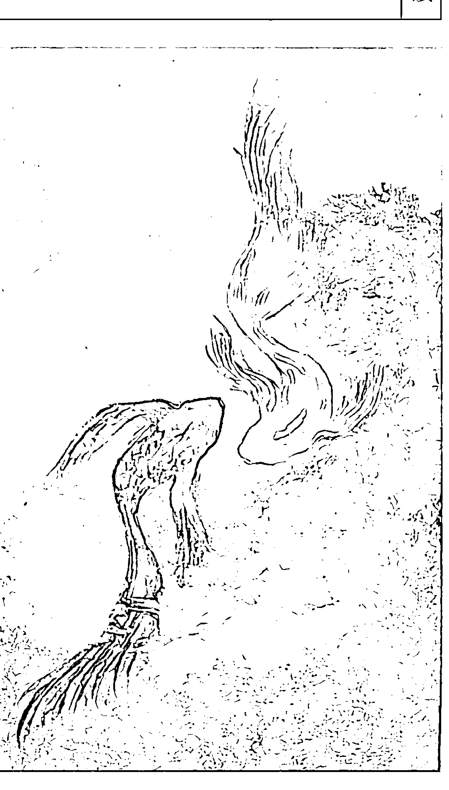

### 从占卜时间看终极预测

- 晚间十一点—凌晨一点、上午十一点—下午一点
- 行动的有利时机：农历六到九月
- 助旺财运的地方：西方、西南方、百货公司、卡拉OK
- 助旺财运的颜色：金色、银色、白色、黄色
- 投资的幸运数字：1、2、6、8
- 终极预测及建议：第三十四卦「雷天大壮」—不要光说不练。做广告是不嫌夸大其词的，但若做人处世的態度经常是画大饼、说大话，就流于不实在了。一个只爱做梦、行为浮夸的人，绝对是不容易赚到钱的。抽到这一卦的人，坐而言不如起而行，应多做少说，不要光说不练。
- 偏财指数：15分／财运旺度：⊗
- 凌晨一点—凌晨三点、下午一点—下午三点
- 行动的有利时机：农历六到九月
- 助旺财运的地方：西南方、西方、百货公司、歌厅
- 助旺财运的颜色：黑色、粉红色、黄色
- 投资的幸运数字：2、7、8
- 终极预测及建议：第五卦「水天需」—条件还没成熟，要等待。这次的求财计划仍有几项重要条件还没成熟，例如，某些重要的人际关系尚未打通、需要应用的资金还没到手，或是出手的时机还没来临等，种种条件都要全部到位以后才能放手一搏，否则求财计划便会落空。
- 偏财指数：60分／财运旺度：$
- 凌晨三点—凌晨五点、下午三点—下午五点
- 行动的有利时机：农历六到九月、十二月下半月
- 助旺财运的地方：西南方、西方、东北方、地铁站
- 助旺财运的颜色：粉红色、白色、黄色
- 投资的幸运数字：2、7、8
- 终极预测及建议：第二十六卦「山天大畜」—眼光放远，财利必丰。求财有大小之分，也有短暂之财与长久之财的分别。抽到这一卦，表示你应把求财眼光放远，不要只汲汲营营于小财和眼前的短暂获利。要集中全部精神，放在

◆ 长久的大财之上，以免浪费时间。
◆ 偏财指数：78 分／财运旺度：$$$$
◆ 凌晨五点—上午七点、下午五点—下午七点
◆ 行动的有利时机：农历四到六月
◆ 助旺财运的地方：南方、图书馆、艺文中心
◆ 助旺财运的颜色：红色、橘色
◆ 投资的幸运数字：3、8、9
◆ 终极预测及建议：第四十六卦「地风升」——偏财运已萌芽，好好培育吧！你的偏财运已经开始启动了，但要小心观察身边所有不起眼的小财运，因为有些现在看起来不太起眼的小财运，未来会变成大财运。所以千万不要嫌钱少而不赚，以免坐失良机。
◆ 上午七点—上午九点、晚间七点—晚间九点
◆ 行动的有利时机：农历四到六月
◆ 助旺财运的地方：南方、图书馆、韩式烤肉店
◆ 助旺财运的颜色：红色、橘色、棕色
◆ 偏财指数：72 分／财运旺度：$$$$
◆ 投资的幸运数字：3、8、9
◆ 终极预测及建议：第三十六卦「地火明夷」——先好后坏，求财无望。得此卦者好比日落西山，说明好时光不多了，你的求财行动会愈来愈艰困、愈来愈没有希望，无论你做的是哪一项投资，建议你还是及早了结，方为上策。
◆ 偏财指数：59 分／财运旺度：⊗
◆ 上午九点—上午十一点、晚间九点—晚间十一点
◆ 行动的有利时机：农历四到六月
◆ 助旺财运的地方：南方、图书馆、艺文中心
◆ 助旺财运的颜色：红色、橘色、棕色
◆ 投资的幸运数字：3、8、9
◆ 终极预测及建议：第十九卦「地泽临」——贵人指路而获利。抽到此卦者，会遇到在上位的贵人，包括长辈、上司或位高权重的人，他们会在你求财的过程中拉你一把。如果能把握住这种千载难逢的机会，则财运亨通。
◆ 偏财指数：85 分／财运旺度：$$$$$

## 二 感情篇

### 基本卦解──心心相印

你们在一起谈情说爱的时候显得特别开心，双方都不摆架子，而是用诚恳的心去爱对方，彼此都能感受到对方的付出，以及替自己设想的心。这是一段难得的恋情，想要谈论婚嫁的人若抽到这一卦，可以准备成婚了！

爱情指数：98分／爱情热度：♡♡♡♡♡

### 一 从占卜时间看终极预测

- ◆晚间十一点—凌晨一点、上午十一点—下午一点
- ◆最美好的相处方式：听到对方吹牛时，一笑置之就好，不要戳破
- ◆最理想的穿着打扮：可爱复古的打扮
- ◆助旺爱情运的颜色：黑色、黄色、粉红色
- ◆最理想的约会地点：卡拉OK、小吃店
- 终极预测及建议：第三十四卦『雷天大壮』——光说不练。说的比做的多，什么都说OK、没问题，但到头来不是一直拖延没做，就是忘得一干二净。只听到好听的承诺与计划，却没有可能做到的。套句成语，这就是『空口说白话』。
- 爱情指数：60分／爱情热度：♡
- ◆凌晨一点—凌晨三点、下午一点—下午三点
- ◆最美好的相处方式：多用言语来鼓励对方
- ◆最理想的穿着打扮：可爱的打扮
- ◆助旺爱情运的颜色：米白色、黄色、粉红色
- ◆最理想的约会地点：观光果园、卡拉OK
- 终极预测及建议：第五卦『水天需』——戒急用忍。有些事可以急功近利，有些事则应该慢慢培养。你们双方的条件不是很相配，表示缺少了一些谈爱情必须具备的基础，所以要耐心等待，默默的增进自己的条件，当时机成熟的时候，自然会有好的结果。
- 爱情指数：58分／爱情热度：⊗

凌晨三点——凌晨五点、下午三点——下午五点

- 最美好的相处方式：平常多用电话关心对方，被动等待对方约你
- 最理想的穿着打扮：可爱又朴素的打扮
- 助旺爱情运的颜色：红色、粉红色、黑色、白色
- 最理想的约会地点：山上的餐馆、有音乐播放的地方
- 终极预测及建议：第二十六卦『山天大畜』——你们的学历、社会地位、家境背景都不错，有缘成为恋人可能是彼此前生修来的福气，只要有始有终，除了感情丰收之外，一定会有其他好的收获。请你们要好好把握这段难得的缘份。
- 爱情指数：92分／爱情热度：♥♥♥♥♥

凌晨五点——上午七点、下午五点——下午七点

- 最美好的相处方式：想办法维持两人的爱情热度
- 最理想的穿着打扮：光鲜亮丽的打扮
- 助旺爱情运的颜色：橘黄色、红色、咖啡色
- 最理想的约会地点：光线充足的地方
- 终极预测及建议：第四十六卦『地风升』——奉子成婚。你们在一起时都甜甜蜜蜜的，会替对方着想，也会配合对方的想法。正因为感情这么好，很容易先上车、后补票，先有爱情结晶后才谈论嫁娶。
- 爱情指数：68分／爱情热度：♥♥

上午七点——上午九点、晚间七点——晚间九点

- 最美好的相处方式：用自己的热情来保持两人之间的爱情热度
- 最理想的穿着打扮：光鲜亮丽的打扮
- 助旺爱情运的颜色：黄色、红色、咖啡色
- 最理想的约会地点：艺文展览会场
- 终极预测及建议：第三十六卦『地火明夷』——由热变冷。你们的蜜月期已经过了，随之而来的是愈来愈冷的关系，一切都显得不积极，相处也变得没乐趣。如果你们交朋友的目的只是为了寻开心，可以不必再等待了，因为爱情的高潮已过去；如果想谈论婚嫁，暂时先冷静下来，但自己要有心理准备，也许会等上一段时间，才有可能春回大地。

- ◆爱情指数：48分／爱情热度：◎◎

#### 上午九点－上午十一点、晚间九点－晚间十二点

- ◆最美好的相处方式：维持表面上的光景就好
- ◆最理想的穿着打扮：热情大方的打扮
- ◆助旺爱情运的颜色：红色、橘黄色、黑色
- ◆最理想的约会地点：光线充足的地方
- ◆终极预测及建议：第十九卦『地泽临』——爱神降临。爱神丘比特的箭已发射，正中你们的心，机会与幸福在此时已掌握在你们的手里。如果你觉得对方的条件与人品都令你满意，千万不要再三心两意，立即采取行动，不要让幸福悄悄的从你身边溜走了！
- ◆爱情指数：88分／爱情热度：♥♥♥♥♥

# 第十二卦 否卦——天地否

> 卦象的基本性質及吉凶解讀
本卦在六十四卦中屬於陰陽不合、萬物不生、困頓不通之凶卦。

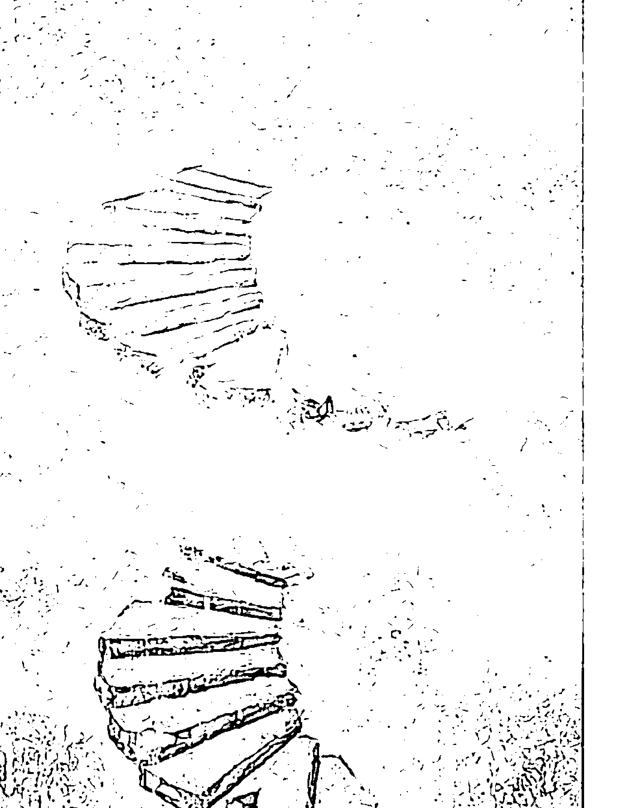

## 一 財運篇

### □ 基本卦解——利空出盡，否極泰來

如果你最近老是處處碰壁、求財不順，心情掉到谷底，那麼抽到這一卦反而要恭喜你啦！因為壞運氣即將快到盡頭了，當利空出盡，之後將會漸露曙光。

- ◆偏財指數：68分／財運旺度：$$

### 口 從占卜時間看終極預測

晚間十一點—凌晨一點、上午十一點—下午一點

- 行動的有利時機：農曆四到六月、九月、十二月
- 助旺財運的地方：南方、東北方、蒙古烤肉店
- 助旺財運的顏色：紅色、黃色
- 投資的幸運數字：5、8、9
- 終極預測及建議：第二十卦『風地觀』——不可孤注一擲。在情況不明的情形下最忌貿然進行求財，萬一在不對的時機出手，只會損失慘重，悔不當初。建議你，多收集資料繼續觀察。如果在十天之內還是看不清楚求財狀況，就放棄吧！
- 偏財指數：50分／財運旺度：⊗

凌晨一點—凌晨三點、下午一點—下午三點

- 行動的有利時機：農曆六月、九月、十二月
- 助旺財運的地方：東北方、山上的休閒場所
- 助旺財運的顏色：紅色、白色、米黃色
- 投資的幸運數字：5、7、8、9、10
- 偏財指數：50分／財運旺度：⊗
- 終極預測及建議：第三十五卦『火地晉』——已見曙光，努力必有所獲。你努力求財的事已逐漸明朗，而且成功在望，只要按部就班、穩紮穩打的進行，求財的時機應該不遠了！只要不計較自己的付出，多幫助別人也等於在幫自己。
- 偏財指數：68分／財運旺度：$$
- 行動的有利時機：農曆四到六月
- 助旺財運的地方：南方、東北方、文化中心
- 助旺財運的顏色：紅色、黃色、咖啡色
- 投資的幸運數字：5、9、10
- 終極預測及建議：第四十五卦『澤地萃』——名利雙收，出類拔萃。得此卦者，你得先有名聲後才會獲得利益，這次的求財行動叫好又叫座，而且後面的發展機會很多，只要抱著廣結善緣的心態繼續努力，長遠來看求財獲利是大有可為的。
- 偏財指數：95分／財運旺度：$$$$$

◆凌晨五點—上午七點、下午五點—下午七點
◆行動的有利時機：農曆四到六月
◆助旺財運的地方：西南方、東北方、安靜的場所
◆助旺財運的顏色：紅色、米黃色
◆投資的幸運數字：2、7、8、9
◆終極預測及建議：第二十五卦「天雷无妄」——求財變破財，倒楣到家。你總是那個倒楣的最後一隻老鼠！看到人家賺錢，你去追同樣的股票卻碰上股市大跌而賠錢；別人投資賺錢的公司，紅利分不完，你也想跟著插花，無奈一進場就遇到公司老闆惡性倒閉，害得你原本求財卻反而破大財！
◆偏財指數：0分／財運旺度：⊗⊗⊗
◆上午七點—上午九點、晚間七點—晚間九點
◆行動的有利時機：農曆三月、六月、九月、十二月
◆助旺財運的地方：東北方、西南方、休閒場所
◆助旺財運的顏色：紅色、黃色、棕色
◆投資的幸運數字：2、6、8、9
◆終極預測及建議：第六卦「天水訟」——當心因財失義。得此卦者若想求財，最好個別行動，千萬不要跟別人有任何牽扯，因為牽扯愈多，到最後會因為誤解或交待不清之處與他人產生爭執，嚴重的話可能會鬧上法庭成為被告。求財時也要留意文件契約的內容，以免賺不到錢又惹上是非、受騙上當。
◆偏財指數：3分／財運旺度：⊗
◆上午九點—上午十一点、晚間九點—晚間十一點
◆行動的有利時機：農曆七到十二月
◆助旺財運的地方：東北方、西南方、市場附近
◆助旺財運的顏色：白色、黃色
◆投資的幸運數字：6、8、10
◆終極預測及建議：第三十三卦「天山遯」——看得見卻賺不到。抽到這一卦的人，有種老是跟財神爺擦身而過的感覺，偏財明明就可以到手，卻在臨門一腳錯失良機，就好像追星族，老是追著財神爺跑，到現在都還停留在玩「躲貓貓」的遊戲階段。

## 二、感情篇

### 基本卦解——要死不活

双方的想法有很大的不同，既没有相同的地方，也没有在一起的热情，彼此的交往显得有气无力，连约会都懒了。双方都没力气再交往了，感情如一滩死水，摆明了随时都可以分手。

- ◆偏財指數：55分／財運旺度：＄
- 愛情指數：55分／愛情熱度：⊗

### 從占卜時間看終極預測

- 晚間十一點—凌晨一點、上午十一點—下午一點
- ◆最美好的相處方式：靜觀其變，一切隨緣
- ◆最理想的穿著打扮：平易近人
- ◆助旺愛情運的顏色：白色、黃色
- ◆最理想的約會地點：去公園遛達、遛達吧
- ◆終極預測及建議：第二十卦『風地觀』——走邊看。
你們的感情面臨瓶頸，因為有些現實的因素阻礙著你們。例如彼此身份的不速配，或經濟上出現困難等，連帶影響彼此的感情，而產生風風雨雨。所以應該是冷靜、客觀，好好檢視一下這份感情的時候了！
- 愛情指數：46分／愛情熱度：⊗⊗
- 凌晨一點—凌晨三點、下午一點—下午三點
- ◆最美好的相處方式：多關心、問候一下對方吧
- ◆最理想的穿著打扮：多做對方喜歡的打扮
- ◆助旺愛情運的顏色：紅色、橘紅色、紫色
- ◆最理想的約會地點：嘉年華會、熱鬧的地方
- 終極預測及建議：第三十五卦『火地晉』——是一對溫馨的好伴侶。兩人在一起會互相照顧，感情也不錯，愛情溫度猶如西下的夕陽，溫和而不刺眼，雖然少了一些激情，卻多了幾分溫馨。兩人在一起時好像老夫老妻或老戀人，祥和又有默契。
- 愛情指數：76分／愛情熱度：♡♡♡

#### 凌晨三點—凌晨五點、下午三點—下午五點約

- ◆最美好的相處方式：打電話聊聊天、等對方邀約
- ◆最理想的穿著打扮：休閒風
- ◆助旺愛情運的顏色：紅色、白色、米黃色
- ◆最理想的約會地點：多到山上走走
- ◆終極預測及建議：第四十五卦「澤地萃」——濃情蜜意。你們兩人沉浸在愛河裡，彼此互相幫助，也很替對方著想，是標準的「你儂我儂」、恩愛纏綿的情侶。抽得此卦者，你與對方的外型與條件不一定是百分之百的速配，但感情卻是百分之二百的濃情蜜意。
- ◆愛情指數：92分／愛情熱度：♥♥♥♥♥

◆凌晨五點—上午七點、下午五點—下午七點的最美好的相處方式：容易引起對方誤會的事不要做，但多關心對方
- ◆最理想的穿著打扮：寬鬆的休閒風
- ◆助旺愛情運的顏色：黑色、白色、黃色
- ◆最理想的約會地點：美食餐廳、上山去郊遊

#### 上午七點—上午九點、晚間七點—晚間九點

- ◆終極預測及建議：第二十五卦「天雷无妄」——為什麼我總是那麼倒楣。好事總是沒你的份，本來與你不相干的倒楣事，總算在你的頭上。少說多聽，少做多看，做任何事都要小心，不要誤中陷阱。
- ◆愛情指數：52分／愛情熱度：⊗⊗⊗⊗⊗
- ◆最美好的相處方式：關心一下對方，但千萬不要提尖銳的問題
- ◆最理想的穿著打扮：休閒風
- ◆助旺愛情運的顏色：粉紅色、米黃色、白色
- ◆最理想的約會地點：儘量相約到郊外走一走
- ◆終極預測及建議：第六卦「天水訟」——你們是一對冤家。相愛的時間點不對，長輩不贊成你們，加上你們彼此間的愛恨情仇不是別人所能了解的，要好聚好散恐怕不容易。如果你要個性，強要對方順從你，搞不好還會鬧上法庭。
- ◆愛情指數：13分／愛情熱度：⊗⊗⊗⊗⊗

## 第十三卦 同人卦 天火同人

卦象的基本性質及吉凶解讀
本卦在六十四卦中屬於
同氣相求、合作互利，
創造雙贏之吉卦。

## 一、財運篇

- □ 基本卦解——與好朋友互蒙其利
抽到這一卦的人應該與志同道合的朋友一起來進行賺錢的事，這比自己一個人埋頭苦幹更有賺頭。
這個合作計畫不但大家都可以開心賺到錢，同時還能培養出彼此的共識與默契。所選擇的投資方向，應該要大家都同意，那才會賺錢！
◆ 偏財指數：86分／財運旺度：$$$$

### 從占卜時間看終極預測

- 晚間十一點—凌晨一點、上午十一點—下午一點
- 行動的有利時機：農曆四到六月最旺，農曆三月次之
- 助旺財運的地方：北方、東方、東南方、靠近有水的地方
- 助旺財運的顏色：綠色、紅色、紫色、藍色
- 投資的幸運數字：1、3、4、6、8、9
終極預測及建議：第三十卦「離為火」— 本著良心賺錢，心安理得。你是個心地善良、做事風格光明磊落的人，如果能找到一位個性跟你一樣的夥伴一起求財，或者求財的方式跟你個性相符合的話，獲利就會很容易了！
偏財指數：85分／財運旺度：$$$$$

- 凌晨一點—凌晨三點、下午一點—下午三點
- 行動的有利時機：農曆三月、十到十二月
- 助旺財運的地方：北方、東南方、東方、公園
- 助旺財運的顏色：綠色、紅色、橘紅色、藍色
- 投資的幸運數字：1、4、6、8
終極預測及建議：第四十九卦「澤火革」— 改變求財方式才能獲利。有句話說「窮則變，變則通」，當你用某種方法去求財都不靈光的時候，應該要想想還有沒有別的方法，去改變一下你現有的求財方式，絕不能一味守舊固執的一成不變，否則財神爺是不會眷顧你的。
偏財指數：71分／財運旺度：$$

- 凌晨三點—凌晨五點、下午三點—下午五點
- 行動的有利時機：農曆六月、九月
- 助旺財運的地方：西南方、西北方、東北方、熱鬧的夜市
- 助旺財運的顏色：米白色、白色
- 投資的幸運數字：1、2、5、6、8、10
終極預測及建議：第三十三卦「天山遯」— 看得見卻賺不到。抽到這一卦的人，有種老是跟財神爺擦身而過的感覺，偏財明明就可以到手，卻在臨門一腳錯失良機，就好像追星族，老是追著財神爺跑，到現在都還停留在玩「躲貓貓」的遊戲階段。
偏財指數：55分／財運旺度：$

# 百貨公司

◆凌晨五點—上午七點、下午五點—下午七點
◆行動的有利時機：農曆六月、七到十二月
◆助旺財運的地方：西南方、西北方、東北方、
◆助旺財運的顏色：米白色、白色
◆投資的幸運數字：1、2、5、6、8、10
◆終極預測及建議：第一卦『乾為天』——旺到最高點。財運好到連自己都不太相信，不論是投資股票、基金，做長線或炒短線都旺到極點，甚至打個小牌也會一家贏三家，統一發票少說也有兩百元的安慰獎。不過，凡事都會物極必反，抽到這支大旺卦的你應居安思危，因為獲利高峰期即將過去，此時最好先準備穩健的理財方法。
◆偏財指數：96分／財運旺度：$$$$$

◆上午七點—上午九點、晚間七點—晚間九點
◆行動的有利時機：農曆六月、七到十二月
◆助旺財運的地方：西南方、西北方、東北方、大廈的頂樓
◆助旺財運的顏色：米色、白色
◆投資的幸運數字：1、2、5、6、8、10
◆終極預測及建議：第二十五卦『天雷无妄』——本想求財卻反而破大財！奈一進場就遇到公司老闆惡性倒閉，害得你原公司，紅利分不完，你看了也想跟著插花，無股票卻碰上股市大跌而賠錢；別人投資賺錢的後一隻老鼠！看到人家賺錢，你去追同樣的求財變破財，倒楣到家。你總是那個倒楣的『最
◆偏財指數：0分／財運旺度：⊗⊗⊗

◆終極預測及建議：第三十七卦『風火家人』——求財之前先推銷自己。行銷學有句名言：推銷商品之前必須先推銷你自己。意思是說，如果你表現優越，對方一旦接受你個人的風格與想法後，等於是開啟了求財的大門，後續發展一

◆上午九點—上午十一點、晚間九點—晚間十一點
◆行動的有利時機：農曆一到六月、農曆十月
◆助旺財運的地方：東南方、北方、公園、水族館
◆助旺財運的顏色：綠色、藍色、黑色
◆投資的幸運數字：1、3、6、8、9
◆終極預測及建議：第三十七卦『風火家人』——求財之前先推銷自己。行銷學有句名言：推銷商品之前必須先推銷你自己。意思是說，如果你表現優越，對方一旦接受你個人的風格與想法後，等於是開啟了求財的大門，後續發展一切就好辦。

偏財指數：70分／財運旺度：＄

## 二 感情篇

- □ 基本卦解——同學、同事、好朋友變戀人
彼此有共同的信念與看法，是同一類型的人。雙方個性都表裡如一，各自有發展天地，都是朋友群中的靈魂人物。凡事只要坦誠以對，沒有了的問題。
愛情指數：82分／愛情熱度：♡♡♡♡

- 從占卜時間看終極預測
- 晚間十一點——凌晨一點、上午十一點——下午一點
- 最美好的相處方式：柔性的溝通與坦白誠懇的態度
- 最理想的穿著打扮：充滿流行風采的熱情打扮
- 助旺愛情運的顏色：粉紅色、粉綠色、紫色
- 最理想的約會地點：戶外充滿陽光的大自然場所或明亮的地方
- 終極預測及建議：第三十卦「離為火」——熱情、坦白的愛。兩個人都很大方、坦白又熱情，肚子裡絕對沒有半點壞水，無論是好事或壞事，都會拿出來跟另一半分享、討論。兩人在一起的時候相當熱情，因為坦白與大方是他們感情的基礎。
愛情指數：88分／愛情熱度：♡♡♡♡

- 最美好的相處方式：雙方的相處模式一定要溫和的改變，急不得
- 最理想的穿著打扮：休閒的服裝
- 助旺愛情運的顏色：藍色＋粉綠色
- 最理想的約會地點：植物很多的公園，或充滿文化氣息的餐廳
- 終極預測及建議：第四十九卦「澤火革」——舊的不去，新的不來。兩人的交往拖得太久又沒有什麼新花樣，你覺得這段感情不好玩了，對對方慢慢失去新鮮感，甚至會有一種厭倦的感覺。這個時候，你會出現想換對象的想法哦！
對剛剛失戀，或剛離婚的人來說，抽到這一卦反而是好消息，可能會有一段新感情，悄悄來敲門！
◆ 愛情指數：有對象者68分，無對象者78分／愛情熱度：有對象者♡，無對象者♡♡♡♡

- 凌晨三點—凌晨五點、下午三點—下午五點
- 最美好的相處方式：被動等待對方邀約
- 最理想的穿著打扮：應酬場合穿著華麗，平時則休閒打扮
- 助旺愛情運的顏色：粉紅色＋米黃色
- 最理想的約會地點：愈高愈好
- 終極預測及建議：第三十三卦「天山遯」——躲貓貓。你很想親近對方，方法雖然已經很溫和又低調了，但對方還是覺得有壓力，因此故意不理你、不接電話，甚至不願意碰面，擺明想逃避這段感情。其實對方希望你冷靜一段時間再說。建議你不妨暫時放下，等待機緣。也許更好的對象正在前方等待著你，何必苦苦單戀對方呢？
愛情指數：58分／愛情熱度：⊗

- 凌晨五點—上午七點、下午五點—下午七點
- 最美好的相處方式：把彼此的約會當成日常生活的一部分
- 最理想的穿著打扮：視場合需求做高規格的打扮
- 助旺愛情運的顏色：米黃色、白色
- 最理想的約會地點：場合愈豪華愈好
- 終極預測及建議：第一卦「乾為天」——天王VS天后，互相輝映。雙方都是有自信、傲氣的萬人迷，凡事都自以為是，好處是誰也不依賴誰，相好的時候會互相欣賞對方，甚至以對方為傲；吵架的時候，會以為自己條件那麼好，不怕沒人愛，而擺出高姿態，希望對方聽自己的話，結果愈弄愈糟。
愛情指數：72分／愛情熱度：♡♡♡♡

- 上午七點—上午九點、晚間七點—晚間九點
- 最美好的相處方式：一切順其自然，容易被誤會的動作千萬不要做
- 最理想的穿著打扮：視場合需求，盡可能低調
- 助旺愛情運的顏色：米白色、黃色
- 最理想的約會地點：有圓型圖案的地方或大型建築物
- 終極預測及建議：第二十五卦「天雷无妄」｜為什麼我總是那麼倒霉。好事總是沒你的份，本來與你不相干的倒霉事，總算在你的頭上。少說多聽，少做多看，做任何事都要小心，不要誤中陷阱。
愛情指數：52分／愛情熱度：⊗⊗

- 上午九點—上午十一點、晚間九點—晚間十二點
- 最美好的相處方式：一切都以對方的意見為意見
- 最理想的穿著打扮：休閒風、平易近人的打扮
- 助旺愛情運的顏色：淺藍色＋粉綠色、淺藍色＋粉紅色
- 最理想的約會地點：一起去郊外遊玩
- 終極預測及建議：第三十七卦「風火家人」｜緣定三生。你們除了一對戀人，還多了兄弟姐妹般的感情，兩人在一起時就像家人般親密，彼此相親相愛、尊重對方。
愛情指數：90分／愛情熱度：♡♡♡♡♡

## ☰ 第十四卦 大有卦——火天大有

卦象的基本性質及吉凶解讀
本卦在六十四卦中屬於順天應人、以德服眾，豐收獲益之大吉卦。

## 一、財運篇

- □基本卦解——財運興旺，如日中天
你的成功眾人皆知，只要本著利人利己的雙贏原則去求財，必定能得到你周遭友人的高度認同與協助，賺起錢來自然是得心應手了！
◆偏財指數：95分／財運旺度：$$$$$

### 从占卜时间看终极预测

- 行动的有利时机：农历三月下半月、十到十二月
- 晚间十一点—凌晨一点、上午十一点—下午一点
- 助旺财运的地方：北方、靠近有水的地方
- 助旺财运的颜色：蓝色、灰色
- 投资的幸运数字：1、4、6、7
终极预测及建议：第一卦「乾为天」——旺到最高点。财运好到连自己都不太相信，不论是投资股票、基金，做长线或炒短线都旺到极点，甚至打个小牌也会一家赢三家，统一发票少说也有两百元的安慰奖。不过，凡事都会物极必反，抽到这支大旺卦的你应居安思危，因为获利高峰即将过去，此时最好先准备稳健的理财方法。
偏财指数：96分／财运旺度：$$$$$

- 助旺财运的地方：西北方、西方、摩天大楼的高楼层咖啡厅
- 行动的有利时机：农历一到六月
- 晚间三点—凌晨五点、下午三点—下午五点
- 助旺财运的地方：东南方、靠近公园的地方
- 助旺财运的颜色：蓝色、绿色
- 投资的幸运数字：2、3、4、6、8
终极预测及建议：第五十卦「火风鼎」——三人合作，获利更旺。俗语说的好：「三个臭皮匠，胜过一个诸葛亮。」有时候一个人做不到的事情，大家一起来就没那么困难了。抽到这一卦，不管你的求财目标是什么，找别人
偏财指数：15分／财运旺度：⊗

- 助旺财运的颜色：白色、米黄色、粉红色
- 投资的幸运数字：1、4、5、6
终极预测及建议：第二十四卦「雷天大壮」——不要光说不练。做广告是不嫌夸大其词的，但若做人处世的态度经常是画大饼、说大话，就流于不实在了。一个只爱做梦、行为浮夸的人，绝对是不容易赚到钱的。抽到这一卦的人，坐而言不如起而行，应多做少说，不要光说不练。

# 终极预测及建议：第三十八卦『火澤睽』

一起团队合作，绝对胜过自己一人单打独斗。
◆偏財指數：88分／財運旺度：$$$$
◆投資的幸運數字：3、9
◆助旺財運的顏色：紅色、紫色
◆助旺財運的地方：南方、有文化氣息的地方
◆行動的有利時機：農曆一到六月
◆凌晨五點—上午七點、下午五點—下午七點
◆終極預測及建議：第三十八卦『火澤睽』——本著良心賺錢，心安理得。你是個心地善良，做事光明磊落的人，如果能找到一位個性跟你一樣的夥伴一起來求財，或者求財的方式與你的個性相符，那獲利就會很容易了！
◆上午七點—上午九點、晚間七點—晚間九點
◆偏財指數：85分／財運旺度：$$$$

# 终极预测及建议：第二十六卦『山天大畜』

求財不得，反惹是非。個性急躁的人、或在特殊行業工作的人抽到這一卦，要特別小心了。
◆偏財指數：23分／財運旺度：◎◎◎
◆投資的幸運數字：2、5、7、8
◆助旺財運的顏色：白色、粉紅色
◆助旺財運的地方：西北方、西方、高大的建築物
◆行動的有利時機：農曆九到十二月
◆上午九點—上午十一點、晚間九點—晚間十一點
◆終極預測及建議：第二十六卦『山天大畜』——眼光放遠，財利必豐。求財有大小之分，也有短暫之財與長久之財的分別。抽到這一卦，表示你應把求財眼光放遠，不要只汲汲營營於小財和眼前的短暫獲利。要集中全部精神，放在長久的大財之上，以免浪費時間。
◆偏財指數：78分／財運旺度：$$$$

## 二 感情篇

- □ 基本卦解——可以合作的爱情夥伴
♡ 愛情指數：95分／愛情熱度：♡♡♡♡♡

### □ 從占卜時間看終極預測

- 晚間十一點——凌晨一點、上午十一點——下午一點
- 最理想的相處方式：保持自我風格，但有不滿意的地方要說出來
- 最理想的穿著打扮：正式場合打扮華麗，平常則作可愛打扮
- 助旺愛情運的顏色：粉紅色、米黃色、白色
- 最理想的約會地點：唱歌或有音樂播放的地方、豪華的餐廳
- ♡ 終極預測及建議：第一卦『乾為天』——天王 VS 天后
互相輝映。雙方都是有自信、傲氣的萬人迷，凡事都自以為是，好處是誰也不依賴誰，相好的時候會互相欣賞對方，甚至以對方為傲；吵架的時候，則會認為自己條件那麼好，不怕沒人愛，而擺出高姿態，希望對方聽自己的話，結果愈弄愈糟。
愛情指數：72分／愛情熱度：♡♡♡

- 最美好的相處方式：對於別人的承諾不要太認真
- 最理想的穿著打扮：有質感的可愛風
- 助旺愛情運的顏色：棕色、米白色、黃色
- 最理想的約會地點：環境幽美的歌廳或卡拉OK
- ♡ 終極預測及建議：第二十四卦『雷天大壯』——光說不練。說的比做的多，什麼都說OK、沒問題，但到頭來不是一直拖延沒做，就是忘得一乾二淨。只聽到好聽的承諾與計畫，卻沒有幾件答應下來的事情是真正做到的。套句成語，這就是「空口說白話」。
愛情指數：60分／愛情熱度：♡

- 凌晨三點—凌晨五點、下午三點—下午五點
- 最美好的相處方式：尊重對方的交友空間，有技巧的順從對方
- 最理想的穿著打扮：海洋風的休閒打扮
- 助旺愛情運的顏色：藍色、紫色、灰＋綠色
- 最理想的約會地點：靠近有水的公園
- 終極預測及建議：第五十卦「火風鼎」——你就是那個第三者。你們兩人可能正在熱戀中，但小心對方可能已婚，或在你之前還有一位要好的异性朋友，正在大搞三角關係。站在你的立場，你可能覺得別人是第三者，但換個位置來看，其實你才是那個第三者呢！
愛情指數：72分／愛情熱度：♡♡♡

- 凌晨五點—上午七點、下午五點—下午七點
- 最美好的相處方式：坦白、熱情
- 最理想的穿著打扮：看起來很有陽光氣息的打扮
- 助旺愛情運的顏色：藍＋綠色、橘紅色
- 最理想的約會地點：有山、有水且陽光充足的地方
- 終極預測及建議：第三十卦「離為火」——熱情、坦白的愛。兩個人都很大方、坦白又熱情，肚子裡絕對沒有半點壞水，無論是好事或壞事，都會拿出來跟另一半分享、討論。兩人在一起的時候相當熱情，因為坦白與大方是他們感情的基礎。
愛情指數：88分／愛情熱度：♡♡♡♡

- 上午七點—上午九點、晚間七點—晚間九點
- 最美好的相處方式：發脾氣前先冷靜三分鐘，不開心時少說話
- 最理想的穿著打扮：不要做對方不喜歡的打扮
- 助旺愛情運的顏色：藍＋綠色、橘紅色
- 最理想的約會地點：有山有水的地方
- 終極預測及建議：第三十八卦「火澤睽」——前世相欠、吵架冤家。两人的个性完全不一样，看事情的角度与想法也不同，根本没办法一起聊事情，一聊天就吵架，吵半天也不会有结论与共识。到头来，愈吵愈是一肚子火，感情也愈来愈淡薄。两人会在一起根本是前世相欠，这是一对标准的吵架冤家。
愛情指數：13分／愛情熱度：×××××

- 上午九点－上午十一点、晚间九点－晚间十一点
- 最美好的相处方式：对方喜欢聊天时陪他聊，平常尽量安静
- 最理想的穿着打扮：可爱朴实的风格
- 助旺爱情运的颜色：粉红色、白色
- 最理想的约会地点：地铁站附近的静态活动场合
- 终极预测及建议：第二十六卦『山天大畜』——门当户对。你们的学历、社会地位、家境背景都不错，有缘成为恋人可能是彼此前生修来的福气，只要有始有终，除了感情丰收之外，一定会有其它好的收穫。请你们要好好把握这段难得的缘分。
愛情指數：92分／愛情熱度：♡♡♡♡♡

## # 第十五卦 谦卦——地山谦

### ## 卦象的基本性質及吉凶解讀
> > 本卦在六十四卦中屬於有能之士謙卑自恃之平和卦。

## # 一 財運篇

- ## □基本卦解——低調求財好處多
所謂「滿招損、謙受益」，抽到此卦者在求財過程中要低調進行，切忌心高氣傲、自以為是，同時也要多聽聽專家的意見，作為求財的參考，如此一來必能賺錢。
◆偏財指數：75分／財運旺度：$$$$

### 從占卜時間看終極預測

- 晚間十一點—凌晨一點、上午十一點—下午一點
- ◆ 行動的有利時機：農曆四到六月
- ◆ 助旺財運的地方：西南方、南方、大賣場、BBQ烤肉店
- ◆ 助旺財運的顏色：紅色、黃色、黑色
- ◆ 投資的幸運數字：3、8、9
終極預測及建議：第六十二卦「雷山小過」——求財不順還傷和氣。俗話說的好，買賣不成仁義在。千萬別為了求財的事與人爭執、傷了和氣。所謂山不轉路轉，路不轉人轉，人不轉心轉，只要轉換一下你的想法，多為對方想想，你就不會為了求財不成的事而生氣了。這次不成，還有下一次，不是嗎？
偏財指數：23分／財運旺度：⊗⊗⊗

- 凌晨一點—凌晨三點、下午一點—下午三點
- ◆ 行動的有利時機：農曆四到六月
- ◆ 助旺財運的地方：南方、西南方、百貨公司、藝術展覽中心
- 助旺財運的顏色：紅色、黃色、黑色
- ◆ 投資的幸運數字：3、7、8、9
終極預測及建議：第三十九卦「水山蹇」——舉步維艱，進退為難。如果你的求財行動還停在計畫的階段，那要恭喜你了！因為還來得及停止這項求財計畫，以免陷入泥沼、進退不得。所以，建議千萬不要跳進這個陷阱。萬一已經被套牢了，那就必須盡快找出停損點、及早了解，否則只會愈陷愈深，損失慘重。
偏財指數：0分／財運旺度：⊗⊗⊗⊗⊗

- 凌晨三點—凌晨五點、下午三點—下午五點
- ◆ 行動的有利時機：農曆四到六月、十二月下半月
- ◆ 助旺財運的地方：西南方、東北方、南方、大賣場
- ◆ 助旺財運的顏色：紅色、白色、黑色、黃色
- ◆ 投資的幸運數字：3、7、8、9
終極預測及建議：第五十二卦「艮為山」——姜太公釣魚，願者上鉤。有時主動出擊可以增加求財的機會，但抽到這一卦，你反而應該逆向操作，採取被動的態度，反而會有好運。這就是所謂的「以退為進」。

勢操作。當你做好求財布局之後，最好不要再有任何大動作，只需要靜靜的等待，該來的財一定少不了，因為急也沒有用。

- 偏財指數：68分／財運旺度：$$
- 行動的有利時機：農曆四到六月、十二月下半月
- 助旺財運的地方：南方、東北方、山上的休閒度假屋
- 助旺財運的顏色：紅色、黃色、黑色、咖啡色
- 投資的幸運數字：3、7、8、9
- 終極預測及建議：第三十六卦「地火明夷」——先好後壞，求財無望。得此卦者好比日落西山，說明好時光不多了，你的求財行動會愈來愈艱困、愈來愈沒有希望，無論你做的是哪一項投資，建議你還是及早了結，方為上策。

- 偏財指數：59分／財運旺度：⊗
- 行動的有利時機：上午七點—上午九點、晚間七點—晚間九點
- 助旺財運的地方：南方、西南方、東北方、觀光果園
- 助旺財運的顏色：紅色、黃色、黑色、米白色
- 投資的幸運數字：3、7、8、9
- 終極預測及建議：第二卦「坤為地」——有容乃大，共享財利。抽到此卦者，應本著「海納百川」的胸襟與人為善。只要自己有能力、有時間，不管賺多少錢，都要懷著感恩、謙卑的心與人分享，如此一來，必可廣結善緣，廣納八方之財。

- 偏財指數：80分／財運旺度：$$$$$
- 行動的有利時機：上午九點—上午十一點、晚間九點—晚間十一點
- 助旺財運的地方：南方、東北方、文化藝術中心、圖書館
- 助旺財運的顏色：紅色、黃色、黑色、咖啡色
- 投資的幸運數字：3、7、8、9
- 終極預測及建議：第四十六卦「地風升」——偏財運已萌芽，好好培育吧！你的偏財運已經開始啟動了，但要小心觀察身邊所有不起眼的小財運，因為有些現在看起來不太起眼的小財運，未來會變成大財運。所以千萬不要嫌錢少而不賺，以免坐失良機。

- 偏財指數：72分／財運旺度：$$$$
- 行動的有利時機：上午九點—上午十一點、晚間九點—晚間十一點
- 助旺財運的地方：南方、西南方、東北方、觀光果園
- 助旺財運的顏色：紅色、黃色、黑色、米白色
- 投資的幸運數字：3、7、8、9
- 終極預測及建議：第二卦「坤為地」——有容乃大，共享財利。抽到此卦者，應本著「海納百川」的胸襟與人為善。只要自己有能力、有時間，不管賺多少錢，都要懷著感恩、謙卑的心與人分享，如此一來，必可廣結善緣，廣納八方之財。

- 偏財指數：80分／財運旺度：$$$$$

## 二 感情篇

□ 基本卦解 —— 扮豬吃老虎

男方的人生經驗豐富，才會扮成老實人的樣子，行事低調、表現謙卑；但其實在感情上，他不但吃的開，而且異性都會對他千依百順。所以要這麼一位世故的男朋友融入兩人世界裡，恐怕得奉行「同志仍須努力」的總理遺教了！

- 愛情指數：65分／愛情熱度：♡♡

□ 從占卜時間看終極預測

晚間十一點—淩晨一點、上午十一點—下午一點

- 最美好的相處方式：吵吵鬧鬧也是一種相處方式，習慣就好
- 最理想的穿著打扮：水手航海裝扮
- 助旺愛情運的顏色：藍色、綠色、灰色
- 最理想的約會地點：海灘音樂會、搖滾演唱會、有酒喝的舞會

終極預測及建議：第六十二卦「雷山小過」—— 情人變冤家。你們本是一對熱戀的情侶，當心物極必反，關心對方太多、替對方著想太多，彼此反而弄得不開心，反目成仇，感情因此由熱變冷，甚至有可能漸行漸遠。

- 愛情指數：52分／愛情熱度：⊗⊗⊗

淩晨一點—淩晨三點、下午一點—下午三點

- 最美好的相處方式：麻煩事不斷，要不要繼續就看你自己了
- 最理想的穿著打扮：成熟的裝扮
- 助旺愛情運的顏色：紅色、米白色、橘黃色
- 最理想的約會地點：大賣場、觀光果園
- 終極預測及建議：第三十九卦「水山蹇」——他的心裡沒有你。也許對方早已移情別戀，不再愛你。不管是哪種原因導致這段愛情走不下去，喘不過氣來；唯一從痛苦中解脫的方法。

- 最美好的相處方式：耐心等待對方來約你
- 最理想的穿著打扮：樸素成熟的打扮
- 愛情指數：13分／愛情熱度：⊗⊗⊗⊗⊗
- 最理想的約會地點：一起爬山、廟會、展覽館
- 助旺愛情運的顏色：白色、紅色、橘黃色
- 最理想的穿著打扮：熱情亮麗的打扮
- 最美好的相處方式：用你的熱情帶動相處氣氛
- 愛情指數：59分／愛情熱度：♡

點跟對方說再見，或改變一下彼此的關係，從戀人變朋友。

- 終極預測及建議：第三十六卦「地火明夷」——由熱變冷。你們的蜜月期已經過了，隨之而來的是愈來愈冷的關係，一切都顯得不積極，相處也變得沒樂趣。如果你們交朋友的目的只是為了尋開心，可以不必再等待了，因為愛情的高潮已過去；如果想談論婚嫁，暫時先冷靜下來，但自己要有心理準備，也許會等上一段時間，才有可能春回大地。

- 愛情指數：48分／愛情熱度：⊗⊗

## 一 財運篇

□基本卦解——順水推舟，Money自然來

所謂無為而治，是看起來好像不用什麼大動作、大計畫，事情自然而然就會成功。抽到此卦者，求財過程多少也有這種意味，這表示你不需要冒很大的風險去做激烈的求財競爭，只需要順著形勢做自己該做的事，那麼財利自然會進你的口袋。

- 偏財指數：78分／財運旺度：$$$$

### 從占卜時間看終極預測

晚間十一點一凌晨一點、上午十一點一下午一點

- 行動的有利時機：農曆一到三月、十到十二月
- 助旺財運的地方：東方、北方、熱鬧的酒吧或咖啡館
- 助旺財運的顏色：藍色、灰色、綠色
- 投資的幸運數字：1、4、5、6
- 終極預測及建議：第五十一卦「震為雷」——變數多多，患得患失。如果你這次的求財方式是投資，可以說心中有希望但確實沒把握，因為變數實在太多了，你自己其實也有些起伏不定，不知如何是好。建議你想辦法先降低風險，當投資的風險控制已做到了，剩下的就是放心去賭賭運氣了！

- 偏財指數：60分／財運旺度：$

凌晨一點一凌晨三點、下午一點一下午三點

- 行動的有利時機：農曆十到十二月
- 助旺財運的地方：北方、水族館、海洋館
- 助旺財運的顏色：藍色、灰色
- 投資的幸運數字：1、6
- 終極預測及建議：第四十卦「雷水解」——困難在七天內必可解決。如果你正身陷於財務危機，那恭喜了，因為在七天內這個困難一定可以解決。但如果你現在並沒有財務上的問題，那麼你心中想進行的求財計畫則會泡湯、停止進行了！

- 偏財指數：60分／財運旺度：$

凌晨三點一凌晨五點、下午三點一下午五點

- 行動的有利時機：農曆十到十二月
- 助旺財運的地方：北方、酒吧、咖啡館
- 助旺財運的顏色：藍色、灰色
- 投資的幸運數字：1、6
- 終極預測及建議：第六十二卦「雷山小過」——求財不順還傷和氣。俗話說的好，買賣不成仁義在。千萬別為了求財的事與人爭執、傷了和氣。所謂山不轉路轉，路不轉人轉，人不轉心轉，只要轉換一下你的想法，多為對方想想，你就不會為了求財不成的事而生氣了。這次不成，還有下一次，不是嗎？

烤店

- 助旺財運的顏色：白色、黃色、紅色
- 投資的幸運數字：3、7、8、9
- 終極預測及建議：第四十五卦「澤地萃」——名利雙收，出類拔萃。得此卦者，你得先有名聲後才會獲得利益，這次的求財行動叫好又叫座，而且後面的發展機會很多，只要抱著廣結善緣的心態繼續努力，長遠來看求財獲利是大有可為的。

- 偏財指數：95分／財運旺度：$$$$$
- 行動的有利時機：農曆四到六月、十二月下旬
- 上午九點—上午十一點、晚間九點—晚間十一點
- 助旺財運的地方：南方、東北方、有文化氣息的休閒場所
- 助旺財運的顏色：紅色、白色、黃色
- 投資的幸運數字：2、7、9
- 終極預測及建議：第三十五卦「火地晉」——已見曙光，努力必有所獲。你努力求財的事已逐漸明朗，而且成功在望，只要按部就班、穩

- 偏財指數：23分／財運旺度：⊗⊗⊗
- 行動的有利時機：農曆四到六月、九月及十二月的下半月
- 凌晨五點—上午七點、下午五點—下午七點
- 助旺財運的地方：南方、東北方、山上有文化氣息的地方
- 助旺財運的顏色：紅色、白色
- 投資的幸運數字：3、7、8、9
- 終極預測及建議：第二卦「坤為地」——有容乃大，共享財利。抽到此卦者，應本著「海納百川」的胸襟與人為善。只要自己有能力、有時間，不管賺多少錢，都要懷著感恩、謙卑的心與人分享，如此一來，必可廣結善緣，廣納八方之財。

- 偏財指數：80分／財運旺度：$$$$$
- 上午七點—上午九點、晚間七點—晚間九點
- 行動的有利時機：農曆四到六月、九月及十二月的下半月
- 助旺財運的地方：南方、東北方、高樓層的燒

## 第十六卦 豫卦——雷地豫

> 卦象的基本性质及吉凶解讀
本卦在六十四卦中屬於皆大歡喜、安和樂利之吉卦。

# 一 財運篇

□基本卦解——順水推舟，Money自然來

所謂無為而治，是看起來好像不用什麼大動作、大計畫，事情自然而然就會成功。抽到此卦者，求財過程多少也有這種意味，這表示你不需要冒很大的風險去做激烈的求財競爭，只需要順著形勢做自己該做的事，那麼財利自然會進你的口袋。

- 偏財指數：78分／財運旺度：$$$$

### 從占卜時間看終極預測

晚間十一點—凌晨一點、上午十一點—下午一點

- 行動的有利時機：農曆一到三月、十到十二月
- 助旺財運的地方：東方、北方、熱鬧的酒吧或咖啡館
- 助旺財運的顏色：藍色、灰色、綠色
- 投資的幸運數字：1、4、5、6
- 終極預測及建議：第五十一卦「震為雷」——變數多多，患得患失。如果你這次的求財方式是投資，可以說心中有希望但確實沒把握，因為變數實在太多了，你自己其實也有些起伏不定，不知如何是好。建議你想辦法先降低風險，當投資的風險控制已做到了，剩下的就是放心去賭賭運氣了！

- 偏財指數：60分／財運旺度：$

凌晨一點—凌晨三點、下午一點—下午三點

- 行動的有利時機：農曆十到十二月
- 助旺財運的地方：北方、水族館、海洋館
- 助旺財運的顏色：藍色、灰色
- 投資的幸運數字：1、6
- 終極預測及建議：第四十卦「雷水解」——困難在七天內必可解決。如果你正身陷於財務危機，那恭喜了，因為在七天內這個困難一定可以解決。但如果你現在並沒有財務上的問題，那麼你心中想進行的求財計畫則會泡湯、停止進行了！

- 偏財指數：60分／財運旺度：$

凌晨三點—凌晨五點、下午三點—下午五點

- 行動的有利時機：農曆十到十二月
- 助旺財運的地方：北方、酒吧、咖啡館
- 助旺財運的顏色：藍色、灰色
- 投資的幸運數字：1、6
- 終極預測及建議：第六十二卦「雷山小過」——求財不順還傷和氣。俗話說的好，買賣不成仁義在。千萬別為了求財的事與人爭執、傷了和氣。所謂山不轉路轉，路不轉人轉，人不轉心轉，只要轉換一下你的想法，多為對方想想，你就不會為了求財不成的事而生氣了。這次不成，還有下一次，不是嗎？

烤店

- 助旺財運的顏色：白色、黃色、紅色
- 投資的幸運數字：3、7、8、9
- 終極預測及建議：第四十五卦「澤地萃」——名利雙收，出類拔萃。得此卦者，你得先有名聲後才會獲得利益，這次的求財行動叫好又叫座，而且後面的發展機會很多，只要抱著廣結善緣的心態繼續努力，長遠來看求財獲利是大有可為的。

- 偏財指數：95分／財運旺度：$$$$$
- 行動的有利時機：農曆四到六月、十二月下旬
- 上午九點—上午十一點、晚間九點—晚間十一點
- 助旺財運的地方：南方、東北方、有文化氣息的休閒場所
- 助旺財運的顏色：紅色、白色、黃色
- 投資的幸運數字：2、7、9
- 終極預測及建議：第三十五卦「火地晉」——已見曙光，努力必有所獲。你努力求財的事已逐漸明朗，而且成功在望，只要按部就班、穩

絮稳打的进行，求财的时机应该不远了！只要不计较自己的付出，多帮助别人也等于在帮自己。

- 偏財指數：23分／財運旺度：⊗⊗⊗
- 行動的有利時機：農曆四到六月、九月及十二月的下半月
- 凌晨五點—上午七點、下午五點—下午七點
- 助旺財運的地方：南方、東北方、山上有文化氣息的地方
- 助旺財運的顏色：紅色、白色
- 投資的幸運數字：3、7、8、9
- 終極預測及建議：第二卦「坤為地」——有容乃大，共享財利。抽到此卦者，應本著「海納百川」的胸襟與人為善。只要自己有能力、有時間，不管賺多少錢，都要懷著感恩、謙卑的心與人分享，如此一來，必可廣結善緣，廣納八方之財。

- 偏財指數：80分／財運旺度：$$$$$
- 上午七點—上午九點、晚間七點—晚間九點
- 行動的有利時機：農曆四到六月、九月及十二月的下半月
- 助旺財運的地方：南方、東北方、高樓層的燒

## 第十七卦 随卦——澤雷隨

> 卦象的基本性質及吉凶解讀
本卦在六十四卦中屬於
隨遇而安，捨己從人之
隨緣卦。

### 一、財運篇

### 理財

### 一、基本卦解——參考專家意見，隨緣穩健

回顧過往的經驗，如果你覺得並不理想，此時不妨多參考不同專家的意見。聽完專家的意見後，要仔細分析一下，看哪一種方式適合你現在的狀況，然後確實去執行，其他的就隨緣了。

- 偏財指數：68分／財運旺度：$$

### 一從占卜時間看終極預測

◆ 晚間十一點—凌晨一點、上午十一點—下午一點
- 行動的有利時機：農曆六月下半月到九月、十二月下半月
- 助旺財運的地方：東北方、西南方、熱鬧的商場
- 助旺財運的顏色：米黃色、白色、粉紅色
- 投資的幸運數字：2、3、7、8、9
- 終極預測及建議：第四十五卦『澤地萃』——名利雙收，出類拔萃。得此卦者，你得先有名聲後才會獲得利益，這次的求財行動叫好又叫座，而且後面的發展機會很多，只要抱著廣結善緣的心態繼續努力，長遠來看求財獲利是大有可能的。

- 偏財指數：95分／財運旺度：$$$$$

凌晨一點—凌晨三點、下午一點—下午三點
- 行動的有利時機：農曆七到九月、十二月下半月
- 助旺財運的地方：東北方、西方、有鋼琴演奏的酒吧
- 助旺財運的顏色：白色、粉紅色
- 投資的幸運數字：2、5、7、8
- 終極預測及建議：第五十八卦『兌為澤』——耍嘴皮，開心賺。公共關係是致富的重要工具，健談又有說服力的人更是公關好手，所以，抽到此卦的人，應多多利用你的口才，經常跟別人聊天來增加求財的機會。當雙方聊得很開心的時候，什麼事情都好談，那麼你在求財時自然能水到渠成。

- 偏財指數：82分／財運旺度：$$$$$

凌晨三點—凌晨五點、下午三點—下午五點
- 行動的有利時機：農曆七到九月、十二月下半月
- 助旺財運的地方：西南方、東北方、山上的風景區
- 助旺財運的顏色：米黃色、白色
- 投資的幸運數字：2、5、6、8
- 終極預測及建議：第四十九卦『澤火革』——

#### 終極預測及建議：第二十五卦「天雷无妄」——求財變破財，倒楣到家。你總是那個倒楣的「最後一隻老鼠」！看到人家賺錢，你去追同樣的股票卻碰上股市大跌而賠錢；別人投資賺錢的公司，紅利分不完，你看了也想跟著插花，無奈一進場就遇到公司老闆惡性倒閉，害得你原本想求財卻反而破大財！

- 偏財指數：0 分／財運旺度：⊗⊗⊗

## 二 感情篇

### □ 基本卦解——愈追愈累

你很認真的看待這段感情，但對方玩心比較重，對感情的事還沒定下心來，所以你只好凡事遷就對方，順著對方的想法與喜好做事。這種不平等關係拖得愈久，你只有愈累而已。

- 愛情指數：65 分／愛情熱度：♥

### □ 從占卜時間看終極預測

- 晚間十一點——凌晨一點、上午十一點——下午一點
- 最美好的相處方式：展現包容與關心，但等待對方邀約
- 最理想的穿著打扮：寬鬆舒服的旅行裝
- 助旺愛情運的顏色：紅色、黃色、米白色
- 最理想的約會地點：一起去爬山，或相約到山上的餐廳吃飯
- 終極預測及建議：第四十五卦「澤地萃」——濃情蜜意。你們兩人沉浸在愛河裡，彼此互相幫助，也很替對方著想，是標準的「你儂我儂」、恩愛纏綿的情侶。抽得此卦者，你與對方的外型與條件不一定是百分之百的速配，但感情卻是百分之二百的濃情蜜意。

- 愛情指數：92 分／愛情熱度：♥♥♥♥♥

凌晨一點——凌晨三點、下午一點——下午三點
- 最美好的相處方式：對方喜歡聊什麼，就開心的陪他一起聊
- 最理想的穿著打扮：清純的少女、少男風
- 助旺愛情運的顏色：藍色、綠色、灰色、黑色
- 最理想的約會地點：海邊、沙灘音樂會、健身房、運動場所
- 終極預測及建議：第五十一卦『震為雷』——晴时多云偶阵雨。你們都是个性急躁、善变的人，感情好的时候甜甜蜜蜜，没一会儿又吵起来了！

- 最美好的相處方式：用智慧來面對問題
- 最理想的穿著打扮：海洋風
- 助旺愛情運的顏色：藍色、灰色、黑色
- 最理想的約會地點：酒吧、靠近有水的地方、水族館
- 終極預測及建議：第四十卦『雷水解』——七天之内见分晓。得此卦者会遇到两种情况，在七天內就會得到答案。第一種情況：已留不住對方，到了分手互道珍重、說聲再見的時候了，也許多是無言的結局，淡淡的分手。第二種情況：也許你與對方和好如初的時候快要到了！彼此冷戰不講話，可找個藉口主動打電話給對方，說不定馬上就能雨過天晴，喜劇收場。

- 愛情指數：第一種情況23分，第二種情況68分
- 愛情熱度：第一種情況⊗⊗⊗⊗，第二種情況♡♡

凌晨三點—凌晨五點、下午三點—下午五點
- 最美好的相處方式：相處需要智慧
- 最理想的穿著打扮：有金屬配件的裝扮
- 助旺愛情運的顏色：白＋藍色、白＋灰色
- 最理想的約會地點：吃海鮮的地方、酒吧、咖啡廳
- 終極預測及建議：第六十二卦『雷山小過』——情人變冤家。你們本是一對熱戀的情侶，當心物極必反，關心對方太多、替對方著想太多，彼此反而弄得不開心，反目成仇，感情因此由熱變冷，甚至有可能漸行漸遠。

- 愛情指數：52分／愛情熱度：⊗⊗⊗

凌晨五點—上午七點、下午五點—下午七點
- 最美好的相處方式：平常被動一點，但約會碰面時要主動關心對方
- 最理想的穿著打扮：樸素自然的風格
- 助旺愛情運的顏色：咖啡色、黃色、黑色、白色
- 最理想的約會地點：安靜的西餐廳、觀光農場
- 終極預測及建議：第二卦『坤為地』——相敬如賓。你們彼此相互尊重，不會給對方壓力，卻缺乏了一些談戀愛的激情，猶如一對好朋友般，彼此分享看法與感受，但不會積極計劃將來。好處是你們很少爭吵與意見不合，壞處則是相處很久都沒有什麼進展與結果。

- 愛情指數：60分／愛情熱度：♡

上午七點—上午九點、晚間七點—晚間九點
- 最美好的相處方式：給對方機會來追求你
- 最理想的穿著打扮：樸素、低調的裝扮
- 助旺愛情運的顏色：紅十白色、橘紅色、米色、棕色
- 最理想的約會地點：山上、安靜的地方
- 終極預測及建議：第四十五卦「澤地萃」——濃情蜜意。你們兩人沉浸在愛河裡，彼此互相幫助，也很替對方著想，是標準的「你儂我儂、恩愛纏綿的情侶」。抽得此卦者，你與對方的外型與條件不一定是百分之百的速配，但感情卻是百分之二百的濃情蜜意。

- 愛情指數：92分／愛情熱度：♡♡♡♡♡

上午九點—上午十一點、晚間九點—晚間十一點
- 最美好的相處方式：等對方約你，碰面時才展現你的熱情
- 最理想的穿著打扮：大方又樸素的風格
- 助旺愛情運的顏色：紅色、粉紅色、白色、黃色
- 最理想的約會地點：圖書館、文化藝術展覽場所
- 終極預測及建議：第三十五卦「火地晉」——是一對溫馨的好伴侶。兩人在一起會互相照顧，感情也不錯，愛情溫度猶如西下的夕陽，溫和而不刺眼，雖然少了一些激情，卻多了幾分溫馨和又有默契。兩人在一起時好像老夫老妻或老戀人，祥和又有默契。

- 愛情指數：76分／愛情熱度：♡♡♡

◆ 助旺愛情運的顏色：粉紅色、米白色、紅色
◆ 最理想的約會地點：一起打撲克牌，或相約去喝茶、喝咖啡
◆ 終極預測及建議：第五十八卦『兌為澤』——聊天高手。兩人都很喜歡聊天，稱得上是聊天高手，拿起手機可以講上三天三夜，在一起的時候都很開心。但小心話說多了難免會說錯話，而讓對方不高興。建議你，把握兩人一起聊天的快樂時刻，但要小心樂極生悲。
◆ 愛情指數：72分／愛情熱度：♡♡♡
◆ 最美好的相處方式：適合靜態性的活動，但要經常變換花樣
◆ 最理想的穿著打扮：樸素的打扮
◆ 助旺愛情運的顏色：紅+米黃色、粉紅+白色
◆ 最理想的約會地點：不同種類內容的靜態展覽會場
◆ 終極預測及建議：第四十九卦『澤火革』——舊的不去，新的不來。兩人的交往拖得太久又沒有什麼新花樣，你覺得這段感情不好玩了，

◆ 助旺愛情運的顏色：藍色、綠色
◆ 最理想的約會地點：靠近有水的公園
◆ 終極預測及建議：第三卦『水雷屯』——愛情悲劇。你們之間的困難，幾乎連老天都沒辦法幫你們解決。在感情上可能碰到三角關係，或彼此很難再走下去。或許經濟上也會產生困難，成了沒有麵包的愛情。
◆ 愛情指數：13分／愛情熱度：❌❌❌❌
◆ 最理想的穿著打扮：海洋風
◆ 助旺愛情運的顏色：藍色、綠色
◆ 最理想的約會地點：靠近有水的公園
◆ 最美好的相處方式：對方會很善變，要動動腦筋去應付
◆ 愛情指數：有對象者68分，無對象者78分／愛情熱度：有對象者♡♡，無對象者♡♡♡
◆ 對方慢慢失去新鮮感，甚至會有一種厭倦的感覺。這個時候，你會出現想換對象的想法哦！對剛剛失戀，或剛離婚的人來說，抽到這一卦反而是好消息，可能會有一段新感情，悄悄來敲門！

#### 上午七點—上午九點、晚間七點—晚間九點
◆ 最美好的相處方式：要充滿行動力，同時點子愈多愈好
◆ 最理想的穿著打扮：休閒獵裝風
◆ 助旺愛情運的顏色：綠色、粉綠色
◆ 最理想的約會地點：各種運動比賽的場合、健身房
◆ 終極預測及建議：第五十一卦「震為雷」—— 晴時多雲偶陣雨。你們都是個性急躁、善變的人，感情好的時候甜蜜蜜，沒一會兒又吵起來了！感情的不確定性與缺乏安全感是這段戀情的最大隱憂。彼此情緒的變化快速，就如變天般讓人難以預測，這種一會兒冷淡、一會兒熱情的感情，讓人好像隨時都在洗一場愛情的三溫暖。
◆ 愛情指數：66分／愛情熱度：♡♡♡

#### 上午九點—上午十一點、晚間九點—晚間十一點
◆ 最美好的相處方式：容易被誤會的事不要做，免得變成倒楣鬼
◆ 最理想的穿著打扮：貼身的休閒風
◆ 助旺愛情運的顏色：藍+綠色、粉綠色
◆ 最理想的約會地點：喝茶的地方、咖啡廳、公園
◆ 終極預測及建議：第二十五卦「天雷无妄」—— 為什麼我總是那麼倒楣。好事總是沒你的份，本來與你不相干的倒楣事，總算在你的頭上。少說多聽，少做多看，做任何事都要小心，不要誤中陷阱。
◆ 愛情指數：52分／愛情熱度：⊗⊗

## 蛊卦——山风蛊
## 第十八卦
> 卦象的基本性质及吉凶解读

本卦在六十四卦中属于贪则变贫，受人蛊惑而导致败坏之凶卦。

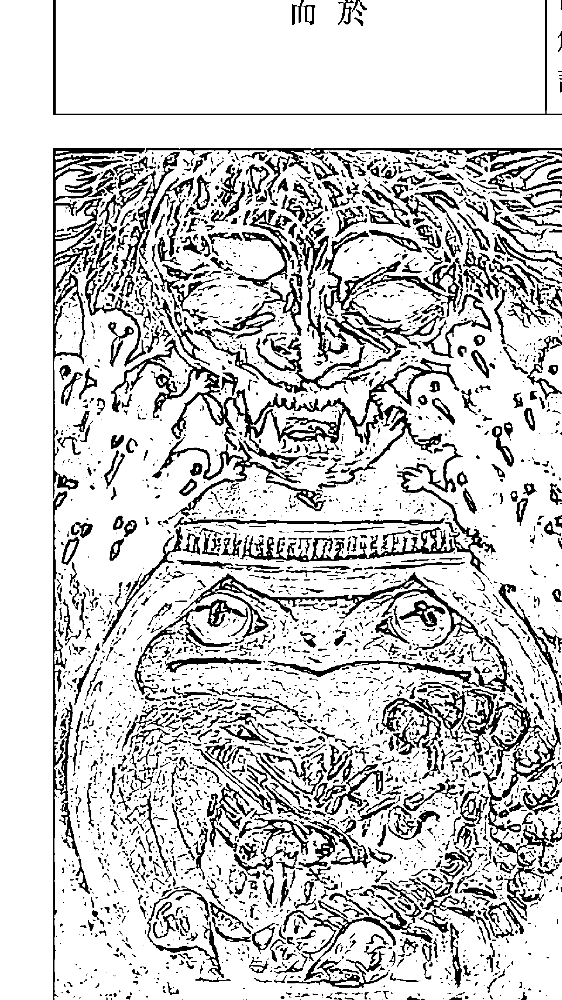

## 一 財運篇
### 基本卦解——小心受騙

俗話說「十賭九騙」，如果你打算透過賭博來求財、或透過不當管道來求取意外之財，小心上當，因為你的對手存心不良。建議你，三十六計走為上策吧。

- ◆ 偏財指數：23分／財運旺度：⊗⊗⊗⊗

### 從占卜時間看終極預測

晚間十一點—凌晨一點、上午十一點—下午一點

- ◆ 行動的有利時機：農曆四到六月
- ◆ 助旺財運的地方：南方、圖書館、燒烤店
- ◆ 助旺財運的顏色：紅色、橘色
- ◆ 投資的幸運數字：3、9
- ◆ 終極預測及建議：第二十六卦「山天大畜」——眼光放遠，財利必豐。求財有大小之分，也有短暫之財與長久之財的分別。抽到這一卦，表示你應把求財眼光放遠，不要只汲汲營營於小財和眼前的短暫獲利。要集中全部精神，放在長久的大財之上，以免浪費時間。
- ◆ 偏財指數：78分／財運旺度：$$$$

行動的有利時機：農曆四到六月、十二月下半月

- ◆ 助旺財運的地方：東北方、南方、山上的休閒度假屋
- ◆ 助旺財運的顏色：白色、紅色、黃色
- ◆ 投資的幸運數字：3、8、9
- ◆ 終極預測及建議：第五十二卦「艮為山」——姜太公釣魚，願者上鉤。有時主動出擊可以增加求財的機會，但抽到這一卦，你反而應該逆勢操作。當你做好求財布局之後，最好不要有任何大動作，只需要靜靜的等待，該來的財一定少不了，因為急也沒有用。
- ◆ 偏財指數：68分／財運旺度：$$

行動的有利時機：農曆四到六月

- ◆ 助旺財運的地方：南方、藝文展覽中心、圖書館
- ◆ 助旺財運的顏色：紅色、橘色
- ◆ 投資的幸運數字：3、7、9
- ◆ 終極預測及建議：第四卦「山水蒙」——狀況不明，守財為上。一艘船在海上航行，當四周都起霧時，就要小心行駛了，否則會觸礁、甚至沉船。同樣的，當我們的投資環境處於不利的狀況，或是對投資工具不太了解的時候，千萬不要冒冒失失的出手，否則賠錢的機率相當高。

- ◆ 偏財指數：20分／財運旺度：⊗⊗⊗

凌晨五點—上午七點、下午五點—下午七點

- ◆ 行動的有利時機：農曆一到三月、十到十二月
- ◆ 助旺財運的地方：東方、北方、健身房、水族館
- ◆ 助旺財運的顏色：綠色、藍色、灰色
- ◆ 投資的幸運數字：1、4、5、6
- ◆ 終極預測及建議：第五十卦『火風鼎』——三人合作，獲利更旺。俗語說的好：「三個臭皮匠，勝過一個諸葛亮。」有時候一個人做不到的事情，大家一起來就沒那麼困難了。抽到這一卦，不管你的求財目標是什麼，找別人一起團隊合作，絕對勝過自己一人單打獨鬥。
- ◆ 偏財指數：88分／財運旺度：$$$$$

#### 上午七點—上午九點、晚間七點—晚間九點
- ◆ 行動的有利時機：農曆一到四月、十到十二月
- ◆ 助旺財運的地方：東方、北方、跳舞的地方、親水公園
- ◆ 助旺財運的顏色：綠色、灰色、藍色
- ◆ 投資的幸運數字：1、4、5、6
- ◆ 終極預測及建議：第五十七卦『巽為風』——虛幻多變的偏財運。你選定的求財方向本來就變化多端，而你對這件事的信心也不夠，經常搖擺不定。所以，在這種裡外都不穩定的情況下想要求財，必須要有很好的機會才能穩穩的賺到錢，否則就會變來變去好比過路財神。
- ◆ 偏財指數：62分／財運旺度：$

#### 上午九點—上午十一點、晚間九點—晚間十一點
- ◆ 行動的有利時機：農曆一到四月、十到十二月
- ◆ 助旺財運的地方：東方、北方、熱鬧的夜市、親水公園
- ◆ 助旺財運的顏色：綠色、灰色、藍色
- ◆ 投資的幸運數字：1、4、5、6
- ◆ 終極預測及建議：第四十六卦『地風升』——偏財運已萌芽，好好培育吧！你的偏財運已經開始啟動了，但要小心觀察身邊所有不起眼的小財運，因為有些現在看起來不太起眼的小財運，未來會變成大財運。所以千萬不要嫌錢少而不賺，以免坐失良機。
- ◆ 偏財指數：72分／財運旺度：$$$$

## 感情篇
### 基本卦解——金玉其外，敗絮其中

這段感情已經不單純了，不是喜不喜歡的問題，而是對方已徹底從內心產生極大的改變。可能因為經濟因素而想離開、也可能是對方已另結新歡，想中止這段感情；另一個原因是，對方發覺你並不是他的真命天女／天子。不管是哪種原因，結果都一樣，苦苦糾纏下去對誰都不好。

- ◆ 愛情指數：13分／愛情熱度：⊗⊗⊗⊗⊗

### 從占卜時間看終極預測
晚間十一點—凌晨一點、上午十一點—下午一點

- ◆ 最美好的相處方式：能忍就忍，說不定哪一天仍有轉變的機會
- ◆ 最理想的穿著打扮：熱情大方的打扮
- ◆ 助旺愛情運的顏色：紅色、橘紅色
- ◆ 最理想的約會地點：光線充足的地方
- ◆ 終極預測及建議：第二十六卦『山天大畜』——門當戶對。你們的學歷、社會地位、家境背景都不錯，有緣成為戀人可能是彼此前生修來的福氣，只要有始有終，除了感情豐收之外，一定會有其他好的收穫。請你們要好好把握這段難得的緣份。
- ◆ 愛情指數：92分／愛情熱度：♡♡♡♡♡

凌晨一點—凌晨三點、下午一點—下午三點

- ◆ 最美好的相處方式：淡淡相處就好
- ◆ 最理想的穿著打扮：樸素的裝扮
- ◆ 助旺愛情運的顏色：白色、紅色、橘黃色
- ◆ 最理想的約會地點：安靜的地方
- ◆ 終極預測及建議：第五十二卦『艮為山』—— 不動如山。你們的交往一點樂趣都沒有，兩人的交往的過程好像在太空上漫步一樣，動作緩慢又失去重心，顯示出雙方都沒有很在意這段感情。與其有氣無力的勉強維持下去，不如灑脫點跟對方說再見，或改變一下彼此的關係，從戀人變朋友。
- ◆ 愛情指數：59分／愛情熱度：♡
- ◆ 最美好的相處方式：不了解的地方不要去，保護自己最重要

凌晨三點—凌晨五點、下午三點—下午五點

- ◆ 最理想的穿著打扮：保守的裝扮
- ◆ 助旺愛情運的顏色：橘黃色、紅色、咖啡色
- ◆ 最理想的約會地點：自己熟悉而熱鬧的地方
- ◆ 終極預測及建議：第四卦『山水蒙』—— 霧裡看花。對方根本沒有真正的投入這段戀情，所以才會讓你好像站在十字路口，一時之間不知該何去何從，更不知該如何跟對方相處。目前你正面臨進退為難、頗為尷尬的時期，其實別想得太多，既然看不清楚，不妨淡淡的放下，等看清楚了再出發還來得及。
- ◆ 愛情指數：48分／愛情熱度：⊗⊗⊗
- ◆ 最美好的相處方式：包容對方、有行動力
- ◆ 最理想的穿著打扮：運動裝扮
- ◆ 助旺愛情運的顏色：藍+綠色
- ◆ 最理想的約會地點：運動場、熱鬧的地方
- ◆ 終極預測及建議：第五十卦『火風鼎』—— 你就是那個第三者。你們兩人可能正在熱戀中，但小心對方可能已婚，或在你之前還有一位要好的異性朋友，正在大搞三角關係。站在你的立場，你可能覺得別人是第三者，但換個位置來看，其實你才是那個第三者呢！
- ◆ 愛情指數：72分／愛情熱度：♡♡♡

#### 上午七點—上午九點、晚間七點—晚間九點
- ◆ 最美好的相處方式：很有活力的配合對方
- ◆ 最理想的穿著打扮：休閒運動裝扮
- ◆ 助旺愛情運的顏色：藍+綠色
- ◆ 最理想的約會地點：到國外去玩、放風箏
- ◆ 終極預測及建議：第五十七卦「巽為風」——愛情像月亮，初一、十五不一樣。你們的愛情經常吹著不一樣的風，無論在情緒上或想法上，都會起伏不定、變化多端。同時你們兩個人都缺乏定見與定信，在愛情的路上，容易見一個愛一個，對事不夠果決，以至於什麼事都反反覆覆，不容易成功。
- ◆ 愛情指數：68分／愛情熱度：♡♡♡

#### 上午九點—上午十一點、晚間九點—晚間十一點
- ◆ 最美好的相處方式：積極一點帶動兩人之間的氣氛
- ◆ 最理想的穿著打扮：運動裝扮
- ◆ 助旺愛情運的顏色：藍+綠色
- ◆ 最理想的約會地點：跳舞的地方、熱鬧且人潮多的場所
- ◆ 終極預測及建議：第四十六卦「地風升」——奉子成婚。你們在一起時都甜甜蜜蜜的，會替對方著想，也會配合對方的想法。正因為感情這麼好，很容易先上車、後補票，先有愛情結晶後才談論婚嫁。
- ◆ 愛情指數：68分／愛情熱度：♡♡♡

## 第十九卦 临卦——地泽临
> 卦象的基本性质及吉凶解读

本卦在六十四卦中屬於 有貴人相助，正氣降臨 之向旺卦。

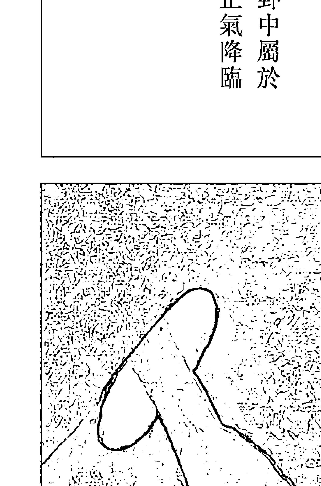

## 一、財運篇
### 基本卦解——貴人指路而獲利

抽到此卦者，會遇到在上位的貴人，包括長輩、上司或位高權重的人，他們會在你求財的過程中拉你一把。如果能把握住這種千載難逢的機會，則財運亨通。

- ◆ 偏財指數：85分／財運旺度：$$$$

### 二 從占卜時間看終極預測
晚間十一點—凌晨一點、上午十一點—下午一點

- ◆ 行動的有利時機：農曆六到九月
- ◆ 助旺財運的地方：西方、西南方、大賣場、百貨公司
- ◆ 助旺財運的顏色：黑色、米白色、黃色
- ◆ 投資的幸運數字：7、8、9
- ◆ 終極預測及建議：第六十卦『水澤節』——拿捏好求財的分寸。抽到這一卦的人，求財的確需要一點智慧。因為在求財的過程當中，如果使力太猛，會把事情搞砸；如果行動不夠積極，又會顯得有氣無力。所以要了解情況後再做出精準的求財行動，過猶不及都不好，一旦分寸拿捏得當，就有獲利機會。
- ◆ 偏財指數：68分／財運旺度：$$

行動的有利時機：農曆六月、九月及十二月的下半月

- ◆ 助旺財運的地方：西南方、東北方、山上的休閒度假屋
- ◆ 助旺財運的顏色：紅色、黑色、米黃色
- ◆ 投資的幸運數字：3、8、9
- ◆ 終極預測及建議：第七卦『地水師』——需要以激烈手段競爭而得財。非常時期要採取非常手段，為了達成賺錢目標，抽到這一卦的人必須進行競爭激烈的求財攻勢，以霹靂手段讓對手屈服，利益全歸你所有。但是這樣的過程中，你也必須付出相當的代價。
- ◆ 偏財指數：58分／財運旺度：⊗⊗

行動的有利時機：農曆四到六月

凌晨五點—上午七點、下午五點—下午七點

- ◆ 助旺財運的地方：西南方、南方、百貨公司、韓式烤肉店
- ◆ 助旺財運的顏色：紅色、黃色、黑色
- ◆ 投資的幸運數字：3、7、8、9
- ◆ 終極預測及建議：第二十四卦「地雷復」——捲土重來必可獲利。如果你在求得此卦前的投資已被套牢並蒙受損失，那要恭喜你了！眼前的機會便是解套的好時機，立刻可以連本帶利的賺回來，要好好把握。如果之前沒有做任何投資，那現在就是重新開始的時候了。
- ◆ 偏財指數：72分／財運旺度：$$$

行動的有利時機：農曆四到六月

上午七點—上午九點、晚間七點—晚間九點

- ◆ 助旺財運的地方：南方、西南方、藝文中心、燒烤店
- ◆ 助旺財運的顏色：紅色、黑色、黃色
- ◆ 投資的幸運數字：3、8、9
- ◆ 終極預測及建議：第十一卦「地天泰」——時機到，財運開。抽到這一卦，表示大財運、好機會就在眼前了。所以，盡力而為、全力以赴去賺錢，絕對不要猶豫不決、浪費寶貴時間。
- ◆ 偏財指數：98分／財運旺度：$$$$$

行動的有利時機：農曆四到六月

上午九點—上午十一點、晚間九點—晚間十一點

- ◆ 助旺財運的地方：西南方、南方、大賣場、燒烤店
- ◆ 終極預測及建議：第五十四卦「雷澤歸妹」——委屈求全，等待機會東山再起。有句話說，「形勢比人強，不得不低頭。」當你的財運還不是那麼好的時候，千萬不要迷信「道理」，更不要與之硬碰硬，暫時的退縮是為了將來更強的出擊。
- ◆ 偏財指數：65分／財運旺度：$$
- ◆ 偏財指數：45分／財運旺度：⊗

## 二 感情篇
### 基本卦解——愛神降臨

要賭氣逞強，也不能固執硬拗，因為只有見風轉舵、順著趨勢走，才能保住你的本錢；等財運到了，自然能開開心心賺錢。
愛神丘比特的箭已發射，正中你們的心，機會與幸福在此時已掌握在你們的手裡。如果你覺得對方的條件與人品都令你滿意，千萬不要再三心兩意，立即採取行動，不要讓幸福悄悄的從你身邊溜走了！

- ◆ 愛情指數：88分／愛情熱度：♡♡♡♡♡

### 從占卜時間看終極預測
晚間十一點—凌晨一點、上午十一點—下午一點

- ◆ 最美好的相處方式：含蓄的讓對方知道你關心他
- ◆ 最理想的穿著打扮：復古風舒適的打扮
- ◆ 助旺愛情運的顏色：黃色、咖啡色、米白色
- ◆ 最理想的約會地點：觀光果園、大賣場
- ◆ 最美好的相處方式：在能力範圍內幫助對方
- ◆ 終極預測及建議：第六十卦「水澤節」——愛的剛剛好。凡事都不宜熱過頭，談愛情就好像燒菜，必須講求火候，有所節制，恰到好處最絕妙。多一分不多、少一分不少，若能把握住其中的要領，就能贏得愛人的心。
- ◆ 愛情指數：78分／愛情熱度：♡♡♡
- ◆ 終極預測及建議：第四十一卦「山澤損」——默默付出。兩個人談戀愛，難免有一方會多付出一些，你正是這位默默付出的人。有句話說付出就是獲得，這也是在告訴你，眼前看來或許吃虧，但長遠來看，你的付出一定能獲得回報。彼此都能感受到對方的付出，以及替自己設想的心。這是一段難得的戀情，想要談論婚嫁的人若抽到這一卦，可以準備成婚了！
- ◆ 愛情指數：98分／愛情熱度：❤❤❤❤❤

凌晨三點—凌晨五點、下午三點—下午五點

- ◆ 最美好的相處方式：不要太勉強對方，多替對方著想
- ◆ 最理想的穿著打扮：成熟的打扮
- ◆ 助旺愛情運的顏色：黃色、咖啡色、橘黃色
- ◆ 最理想的約會地點：室內場地寬敞的餐廳
- ◆ 終極預測及建議：第七卦『地水師』——逼婚才有可能成功。男方頗為灑脫，可說是師奶殺手，異性緣好到不行；女方則屬於實力派，條件也不差。但如果要完全消除男方老愛做眾情人的毛病，或想要談論婚嫁，女方必須要拿出王牌來催促、逼使對方就範才可能成功。
- ◆ 愛情指數：68分／愛情熱度：♥♥
- ◆ 最美好的相處方式：多讓對方感受你的關懷

#### 凌晨五點—上午七點、下午五點—下午七點
- ◆ 最美好的相處方式：多讓對方感受你的關懷
- ◆ 愛情指數：68分／愛情熱度：♥♥

#### 上午七點—上午九點、晚間七點—晚間九點
- ◆ 最美好的相處方式：讓對方跟你在一起時覺得既放心又貼心
- ◆ 最理想的穿著打扮：復古風的打扮
- ◆ 助旺愛情運的顏色：橘黃色、紅色、咖啡色、米白色
- ◆ 最理想的約會地點：大型的中式餐廳
- ◆ 終極預測及建議：第十一卦『地天泰』——心相印。你們在一起談情說愛的時候顯得特別開心，雙方都不擺架子，而是用誠懇的心去愛對方，彼此都能感受到對方的付出，以及替自己設想的心。這是一段難得的戀情，想要談論婚嫁的人若抽到這一卦，可以準備成婚了！
- ◆ 愛情指數：89分／愛情熱度：♥♥♥♥
- ◆ 終極預測及建議：第二十四卦『地雷復』——舊情復燃。如果你們是舊情人或是離婚的夫妻，相信這次的相聚與重逢，是上天巧妙的安排，給你們一個可以重溫舊情的好機會。說不定能重修舊好、再續前緣，重做戀人或再結夫妻。
- ◆ 最理想的穿著打扮：成熟的打扮
- ◆ 助旺愛情運的顏色：橘黃色、紅色、米白色
- ◆ 最理想的約會地點：觀光果園、大賣場

#### 上午九點—上午十一點、晚間九點—晚間十一點
- ◆ 最美好的相處方式：多關心對方但不要讓自己受委屈
- ◆ 最理想的穿著打扮：成熟的打扮
- ◆ 助旺愛情運的顏色：黑色、黃色、咖啡色
- ◆ 最理想的約會地點：大賣場、空間寬敞的中餐廳
- ◆ 終極預測及建議：第五十四卦「雷澤歸妹」——命裡有時終須有，命裡無時莫強求。你們的戀情有許多地方都顯得很勉強，由於相遇的時機不對，所以交往時難免會讓你覺得萬分委屈，心裡常常感到不平衡，多少會有偏激的想法；萬一想不開而使用激烈的手段來處理這段感情，後果往往不堪設想。
- ◆ 愛情指數：46分／愛情熱度：⊗⊗

## 第二十卦 觀卦——風地觀

卦象的基本性質及吉凶解讀

本卦在六十四卦中屬於靜觀其變，伺機而動之觀望卦。

## 一、財運篇

### 基本卦解——不可孤注一擲

在情況不明的情形下最忌貿然進行求財，萬一在不對的時機出錯手，只會損失慘重，悔不當初。

建議你，多收集資料繼續觀察。如果在十天之內還是看不清楚求財狀況，就放棄吧！

- 偏財指數：50分／財運旺度：⊗

### 一、從占卜時間看終極預測

晚間十一點—凌晨一點、上午十一點—下午一點

- 行動的有利時機：農曆十到十二月
- 助旺財運的地方：北方、水族館
- 助旺財運的顏色：灰色、銀色、藍色、金色
- 投資的幸運數字：1、6
- 終極預測及建議：第五十九卦「風水渙」—— 意興闌珊。也許你已經有過很多次的求財行動，同時每次的行動都付出不少努力，但都沒有獲利，原本的銳氣經過多次的挫折後，早已變得有氣無力、意興闌珊，所以在短期內如果沒有重大的突破，建議你不如及早放棄為妙。
- 偏財指數：25分／財運旺度：⊗

凌晨一點—凌晨三點、下午一點—下午三點

- 行動的有利時機：農曆一到三月
- 助旺財運的地方：東方、熱鬧的花市
- 助旺財運的顏色：白色＋綠色＋藍色
- 投資的幸運數字：1、4、5、6
- 終極預測及建議：第五十三卦「風山漸」—— 財神爺快到了，你準備好了嗎？錢財到手的日子一天比一天接近了，但其中還有不少困難等著你去克服與排除，最重要的是你本身對這次的求財計畫究竟有沒有做好充分的準備，包括你的專業與資金，準備愈充分，當財神爺來臨時才能大有所獲。
- 偏財指數：65分／財運旺度：$$

凌晨三點—凌晨五點、下午三點—下午五點

- 行動的有利時機：農曆三月、六月、九月及十二月的下半月
- 助旺財運的地方：東北方、西南方、百貨公司
- 助旺財運的顏色：白色、黃色、黑色
- 投資的幸運數字：2、3、7、8、9
- 終極預測及建議：第十二卦「天地否」—— 利空出盡，否極泰來。如果你最近老是處處碰壁、求財不順，心情掉到谷底，那麼抽到這一卦反而是要恭喜你啦！因為壞運氣即將快到盡頭了，當利空出盡，之後將會漸露曙光。
- 偏財指數：68分／財運旺度：$$$

凌晨五點—上午七點、下午五點—下午七點

- 行動的有利時機：農曆四到六月、九月及十二月的下半半月
- 助旺財運的地方：東北方、西南方、大賣場
- 投資的幸運數字：3、8、9
- 終極預測及建議：第二十三卦「山地剝」—— 得先花錢買經驗。抽到這一卦的人，當你在進行求財行動時，一定是未蒙其利而先受其害的；但若損失的金錢與時間，能換取經驗與教訓的話，那還算是值得的。不過，你得控制一下學費，不要繳得太多，因為這次的求財行動是絕對不會獲利的。
- 偏財指數：30分／財運旺度：◎◎◎

上午七點—上午九點、晚間七點—晚間九點

- 行動的有利時機：農曆四到六月、九月及十二月的下半半月
- 助旺財運的地方：東北方、西南方、休閒農場、觀光果園
- 助旺財運的顏色：黑色、白色、黃色
- 投資的幸運數字：7、8
- 終極預測及建議：第八卦「水地比」—— 和氣生財樂融融。你所努力的求財方向已有明確的目標與架構，如果你是男性，抽到這一卦表示將有很多紅顏知己給你幫助，讓你在和樂愉快的氣氛下賺錢。如果你是女性，得此卦表示求財一切都要靠自己，外來的助力是很少的。
- 偏財指數：65分／財運旺度：$$

上午九點—上午十一點、晚間九點—晚間十一點

- 助旺財運的地方：東方、熱鬧的市場、健身房
- 助旺財運的顏色：綠色
- 投資的幸運數字：4、5
- 終極預測及建議：第四十二卦「風雷益」—— 很多好朋友替你高興，只要你懂得如何與別人分享，這樣的賺錢機會將會持續不斷。
- 偏財指數：88分／財運旺度：$$$$

## 二、感情篇

### 一、基本卦解——邊走邊看

你們的感情面臨瓶頸，因為有些現實的因素阻礙著你們。例如彼此身份的不速配，或經濟上出現困難等，連帶影響彼此的感情，而產生風風雨雨。所以應該是冷靜、客觀，好好檢視一下這份感情的時候了！

- 愛情指數：46分／愛情熱度：⊗⊗

### 二、從占卜時間看終極預測

晚間十一點—凌晨一點、上午十一點—下午一點

- 最美好的相處方式：多說一些對方喜歡聽的話去挽回對方的心
- 最理想的穿著打扮：航海水手裝扮
- 助旺愛情運的顏色：藍色、白色、黑色、灰色
- 最理想的約會地點：靠近有水的公園、靠近花園的酒吧
- 終極預測及建議：第五十九卦『風水渙』—— 彼此都缺乏歸屬感。可能經過一段無聊的相處，雙方都覺得有點膩了不好玩，對彼此的感情興趣缺缺，而沒有歸屬感。唯一的方法只有重新找出共同目標，才能改善兩人之間的關係，否則會愈來愈不想見面。
- 愛情指數：58分／愛情熱度：♡♡♡

凌晨一點—凌晨三點、下午一點—下午三點

- 最美好的相處方式：凡事都要有耐性的等待
- 最理想的穿著打扮：自己喜歡就好
- 助旺愛情運的顏色：白＋藍色
- 最理想的約會地點：有鋼琴演奏的酒吧
- 終極預測及建議：第五十三卦『風山漸』—— 你們的戀情正逐漸在加溫中，絕對不會起伏不定，這是令人看好的現象。
- 愛情指數：68分／愛情熱度：♡♡♡♡

凌晨三點—凌晨五點、下午三點—下午五點

- 最美好的相處方式：遇到挫折不要輕言放棄，安靜地等待改善
- 最理想的穿著打扮：寬鬆而樸素的裝扮
- 助旺愛情運的顏色：白色、米黃色、淺咖啡色
- 最理想的約會地點：安靜的中式餐館
- 終極預測及建議：第十二卦『天地否』——要死不活。雙方的想法有很大的不同，既沒有相同的地方，也沒有在一起的熱情，彼此的交往顯得有氣無力，連約會都懶了。雙方都沒力氣再交往了，感情如一灘死水，擺明了隨時都可以分手。
- 愛情指數：55分／愛情熱度：⊗

凌晨五點—上午七點、下午五點—下午七點

- 最美好的相處方式：被動等待對方約你，多付出以後就會有收穫
- 最理想的穿著打扮：寬鬆而樸素的裝扮
- 助旺愛情運的顏色：白色、米黃色、咖啡色
- 最理想的約會地點：乾淨簡單的中式餐館
- 終極預測及建議：第二十三卦『山地剝』——買來的感情。這段感情的「製作費」都由你獨自承擔，當你投入愈多資源，對方的回應就變得活躍；一旦給的好處少了，對方的便馬上降低；一旦碰到的對象喜歡這種相處模式，你情我願也無妨！
- 愛情指數：59分／愛情熱度：⊗

上午七點—上午九點、晚間七點—晚間九點

- 最美好的相處方式：默默的互相幫助、扶持
- 最理想的穿著打扮：樸素而帶有古典味的裝扮
- 助旺愛情運的顏色：白色、黑色、黃色、咖啡色
- 最理想的約會地點：古典風格裝潢的中式餐廳
- 終極預測及建議：第八卦『水地比』——他是大眾情人。男方條件優秀，異性緣好的不得了，可說是人見人愛的大帥哥。妳如果珍惜這段愛情，只有睜一隻眼、閉一隻眼，凡事包容、凡事信任，才有可能和對方相親相愛的交往下去。
- 愛情指數：男生76分，女生66分／愛情熱度：男生♡♡♡，女生♡♡♡

上午九點—上午十一點、晚間九點—晚間十一點

- 最美好的相處方式：熱烈的支持對方的想法去做事
- 最理想的穿著打扮：運動情侶裝
- 助旺愛情運的顏色：白+藍+綠色
- 最理想的約會地點：跳舞的地方、熱鬧的市場、健身房
- 終極預測及建議：第四十二卦『風雷益』——天作之合。你們彼此配合的相當好，簡直是郎才女貌，無論家人或朋友都覺得你們是天造地設的一對，伴隨著親友的祝福聲，相信你們的好事也不遠了！如果你已婚，夫妻間的感情與婚姻生活將更加甜蜜。
- 愛情指數：96分／愛情熱度：♡♡♡♡♡

## 第二十一卦 噬嗑卦——火雷噬嗑

卦象的基本性質及吉凶解讀

本卦在六十四卦中屬於以霹靂手段來排除障礙之卦。

## 一、財運篇

### 基本卦解——排除障礙才能賺錢

抽到這一卦表示你正面臨一些困難，而此困難正是妨礙你賺錢的人事物，如果你想繼續賺這個錢，一定要排除這障礙才能順利，否則情況就如同一根魚刺在喉嚨、吞不下東西般難受。

- 偏財指數：32分／財運旺度：◎◎

### 從占卜時間看終極預測

晚間十一點—凌晨一點、上午十一點—下午一點

- 行動的有利時機：農曆一到六月
- 助旺財運的地方：北方、東方、喝茶聊天的地方
- 助旺財運的顏色：綠色、藍色
- 投資的幸運數字：1、3、4、6、8
- 終極預測及建議：第三十八卦「火澤睽」——求財不得，反惹是非。個性急躁的人、或在特殊行業工作的人抽到這一卦，要特別小心了。因為得此卦者，容易在求財過程中因與人意見不合、或利益分配不當而不開心，因而跟人吵架、翻臉！俗話說的好，求財不求氣。凡事應退一步來想，讓大事化小、小事化無。
- 偏財指數：23分／財運旺度：◎◎◎

凌晨一點—凌晨三點、下午一點—下午三點

- 行動的有利時機：農曆一到六月
- 助旺財運的地方：東方、健身房、跳舞的地方
- 助旺財運的顏色：綠色、紅色
- 投資的幸運數字：3、4、7、9
- 終極預測及建議：第三十卦「離為火」——本著良心賺錢，心安理得。你是個心地善良，做事光明磊落的人，如果能找到一位個性跟你一樣的夥伴一起求財，或者求財的方式與你的個性相符，那獲利就會很容易了！
- 偏財指數：85分／財運旺度：$$$$

凌晨三點—凌晨五點、下午三點—下午五點

- 行動的有利時機：農曆七到九月
- 助旺財運的地方：西方、卡拉OK或適合聊天的地方
- 助旺財運的顏色：粉紅色＋藍色
- 投資的幸運數字：1、2、6、7
- 終極預測及建議：第二十七卦「山雷頤」——先充實條件，再談賺錢計畫。以你現在的條件，與你所計畫求財的目標並不相符，甚至有嚴重不足的地方。建議你，先用心充實好本身的條件，等提升水準之後，再重新訂出求財計畫比較好。
- 偏財指數：62分／財運旺度：$

凌晨五點—上午七點、下午五點—下午七點

- 行動的有利時機：農曆四到六月、九月及十二月的下半半月
- 助旺財運的地方：東北方、西南方、大賣場
- 投資的幸運數字：3、8、9
- 終極預測及建議：第二十三卦『山地剝』——得先花錢買經驗。抽到這一卦的人，當你在進行求財行動時，一定是未蒙其利而先受其害的；但若損失的金錢與時間，能換取經驗與教訓的話，那還算是值得的。不過，你得控制一下學費，不要繳得太多，因為這次的求財行動是絕對不會獲利的。
- 偏財指數：30分／財運旺度：◎◎◎

上午七點—上午九點、晚間七點—晚間九點

- 行動的有利時機：農曆四到六月、九月及十二月的下半半月
- 助旺財運的地方：東北方、西南方、休閒農場、觀光果園
- 助旺財運的顏色：藍色、灰色、綠色
- 投資的幸運數字：1、4、6
- 終極預測及建議：第二十五卦『天雷无妄』——本想求財卻反而破大財！你總是那個倒楣的一最後一隻老鼠！看到人家賺錢，你去追同樣的股票卻碰上股市大跌而賠錢；別人投資賺錢的公司，紅利分不完，你看了也想跟著插花，無奈一進場就遇到公司老闆惡性倒閉，害得你求財變破財，倒楣到家。
- 偏財指數：0分／財運旺度：⊗⊗⊗

上午九點—上午十一點、晚間九點—晚間十一點

- 行動的有利時機：農曆一到三月
- 助旺財運的地方：東方、靠近樹木很多的公園
- 助旺財運的顏色：綠色
- 投資的幸運數字：1、3、4、6
- 終極預測及建議：第五十一卦『震為雷』——變數多多，患得患失。如果你這次的求財方式是投資，可以說心中有希望但確實沒把握，因為變數實在太多了，你自己其實也有些起伏不定，不知該如何是好。建議你想辦法先降低風險，當投資的風險控制已做到了，剩下的就是放心去賭賭運氣了！
- 偏財指數：60分／財運旺度：$

上午九點—上午十一點、晚間九點—晚間十一點

- 行動的有利時機：農曆一到三月
- 助旺財運的地方：東方、靠近樹木很多的公園
- 助旺財運的顏色：綠色
- 投資的幸運數字：3、4
- 終極預測及建議：第三十五卦『火地晉』——已見曙光，努力必有所獲。你努力求財的事已逐漸明朗，而且成功在望，只要你按部就班、穩紮穩打的進行，求財的時機應該不遠了！只要不計較自己的付出，多幫助別人也等於在幫自己。
- 偏財指數：78分／財運旺度：$$$$

## 二、感情篇

### 一、基本卦解——搬开挡路的大石头

兩個人在一起本來都沒什麼大問題，就是莫名其妙的總會出現一個破壞者，從中破壞兩個人的感情，不是妨礙這對情人的相處、就是阻撓這對情侶的相愛。除非這個破壞者消失，否則這段感情不容易繼續走下去。

- 偏財指數：68 分／財運旺度：$$
- 愛情指數：65 分／愛情熱度：❤

### 從占卜時間看終極預測

晚間十一點—凌晨一點、上午十一點—下午一點

- 最美好的相處方式：多做少說
- 最理想的穿著打扮：運動風
- 助旺愛情運的顏色：綠色、紫色
- 最理想的約會地點：健身房、跳舞的地方
- 終極預測及建議：第三十卦『離為火』——熱。肚子裡絕對沒有半點壞水，無論是好事或壞事，都會拿出來跟另一半分享、討論。兩人在在一起的時候相當熱情，因為坦白與大方是他們感情的基礎。
- 愛情指數：88 分／愛情熱度：❤❤❤❤

凌晨一點—凌晨三點、下午一點—下午三點

- 最美好的相處方式：坦白、有行動力
- 最理想的穿著打扮：充滿陽光氣息的運動風格
- 助旺愛情運的顏色：紅色、綠色、橘紅色
- 最理想的約會地點：光線充足的運動場所
- 終極預測及建議：第三十八卦『火澤睽』——前世相欠、吵架冤家。兩人的個性完全不一樣，看事情的角度與想法也不同，根本沒辦法一起聊事情，一聊天就吵架，吵半天也不會有結論與共識。到頭來，愈吵愈是一肚子火，感情也會愈來愈淡薄。兩人會在一起根本是前世相欠，這是一對標準的吵架冤家。
- 愛情指數：13 分／愛情熱度：⊗⊗⊗⊗⊗

凌晨三點—凌晨五點、下午三點—下午五點

- 最美好的相處方式：要不斷創造在一起時的新鮮感
- 最理想的穿著打扮：有金屬飾品搭配的海洋風
- 助旺愛情運的顏色：白十藍色、灰色、黑色
- 最理想的約會地點：海邊
- 終極預測及建議：第二十七卦『山雷頤——貧賤夫妻百事哀。你們這段戀情只有戀愛的衝動，缺乏戀愛的長遠計畫，更缺少足夠的經濟條件去支撐日常的開支。如果不趕快務實的去面對經濟壓力、尋求解決之道，將很難長期交往下去。』
- 愛情指數：59分／愛情熱度：♡

凌晨五點—上午七點、下午五點—下午七點

- 最美好的相處方式：腦袋放聰明點，不要沒事去踩到地雷
- 最理想的穿著打扮：不要做對方不喜歡的打扮
- 助旺愛情運的顏色：藍色、灰十綠色
- 終極預測及建議：第二十五卦『天雷无妄——為什麼我總是那麼倒楣。好事總是沒你的份，本來與你不相干的倒楣事，總算在你的頭上。少說多聽，少做多看，做任何事都要小心，不要誤中陷阱。』
- 愛情指數：52分／愛情熱度：◎◎

上午七點—上午九點、晚間七點—晚間九點

- 最美好的相處方式：要有自己的想法，同時又充滿行動力
- 最理想的穿著打扮：海洋風的運動裝扮
- 助旺愛情運的顏色：白十藍色、灰十綠色
- 最理想的約會地點：有山、有水的地方
- 終極預測及建議：第五十一卦『震為雷——晴時多雲偶陣雨。你們都是個性急躁、善變的人，感情好的時候甜甜蜜蜜，沒一會兒又吵起來了！感情的不確定性與缺乏安全感是這段戀情的最大隱憂。彼此情緒的變化快速，就如變天般讓人難以預測，這種一會兒冷淡、一會兒熱情的感情，讓人好像隨時都在洗一場愛情的熱水澡。三溫暖。』
- 愛情指數：66分／愛情熱度：♡♡♡

上午九點—上午十一點、晚間九點—晚間十一點

- 最美好的相處方式：對兩人感情有幫助的事，最好搶著去做
- 最理想的穿著打扮：叢林風的運動裝扮
- 助旺愛情運的顏色：粉綠＋紅色、綠色
- 最理想的約會地點：靠近樹木或森林的地方
- 終極預測及建議：第三十五卦「火地晉」—— 是一對溫馨的好伴侣。兩人在一起會互相照顧，感情也不錯，愛情溫度猶如西下的夕陽，溫和而不刺眼，雖然少了一些激情，卻多了幾分溫馨。兩人在一起時好像老夫老妻或老戀人，祥和又有默契。
- 愛情指數：76分／愛情熱度：♡♡♡

## 第二十二卦 賁卦——山火賁

卦象的基本性質及吉凶解讀

本卦在六十四卦中屬於表面風光、華而不實之卦。

## 一、財運篇

### 基本卦解——表面賺錢，其實不然

大家都以為你賺到不少錢，並投以羨慕的眼光，但你自己心知肚明，這只是表面的風光，並不實惠。不過，賺得美名，獲得經驗也是一件好事。

- 偏財指數：68分／財運旺度：$$

### 從占卜時間看終極預測

晚間十一點—凌晨一點、上午十一點—下午一點

- 行動的有利時機：農曆一到三月
- 助旺財運的地方：東南方、東方、熱鬧的市場、機場
- 助旺財運的顏色：綠色
- 投資的幸運數字：4、5
- 終極預測及建議：第三十七卦「風火家人」——求財之前先推銷自己。行銷學有句名言：在推銷商品之前，必先推銷你自己。意思是，如果你表現優越，對方一旦接受你個人的風格與想法後，就等於開啟了求財的大門，後續發展就一切好辦。
- 偏財指數：70分／財運旺度：$$

凌晨一點—凌晨三點、下午一點—下午三點

- 行動的有利時機：農曆一到三月
- 助旺財運的地方：東方、健身房、跳舞的地方
- 助旺財運的顏色：綠色、紅色
- 投資的幸運數字：3、4、5
- 終極預測及建議：第三十六卦「地火明夷」——先好後壞，求財無望。得此卦者好比日落西山，說明好時光不多了，你的求財行動會愈來愈艱困、愈來愈沒有希望，無論你做的是哪一項投資，建議你還是及早了結，方為上策。
- 偏財指數：59分／財運旺度：⊗

凌晨三點—凌晨五點、下午三點—下午五點

- 行動的有利時機：農曆四到六月、十二月下旬
- 助旺財運的地方：東北方、南方、郊外的藝術中心
- 助旺財運的顏色：白色、紅色、黃色
- 投資的幸運數字：2、3、7、8
- 終極預測及建議：第五十二卦「艮為山」——姜太公釣魚，願者上鉤。有時主動出擊可以增加求財的機會，但抽到這一卦，你反而應該逆勢操作。當你做好求財布局之後，最好不要再有任何大動作，只需要靜靜的等待，該來的財一定少不了，因為急也沒有用。
- 偏財指數：68分／財運旺度：$$

凌晨五點—上午七點、下午五點—下午七點

- 行動的有利時機：農曆六月到十月
- 助旺財運的地方：南方、藝文展覽館
- 助旺財運的顏色：紅色、橘色
- 投資的幸運數字：3、9
- 終極預測及建議：第二十六卦「山天大畜」——眼光放遠，財利必豐。求財有大小之分，也有短暫之財與長久之財的分別。抽到這一卦，表示你應把求財眼光放遠，不要只汲汲營營於小財和眼前的短暫獲利。要集中全部精神，放在長久的大財之上，以免浪費時間。
- 偏財指數：78分／財運旺度：$$$$

上午七點—上午九點、晚間七點—晚間九點

- 行動的有利時機：農曆四到六月
- 助旺財運的地方：南方、燒烤店、圖書館
- 助旺財運的顏色：紅色、橘色
- 投資的幸運數字：3、9
- 終極預測及建議：第二十七卦「山雷頤」——先充實條件，再談賺錢計畫。以你現在的條件，與你所計畫求財的目標並不相符，甚至有嚴重不足的地方。建議你，先用心充實好本身的條件，等提升水準之後，再重新訂出求財計畫比較好。
- 偏財指數：62分／財運旺度：$

上午九點—上午十一點、晚間九點—晚間十一點

- 行動的有利時機：農曆一到六月
- 助旺財運的地方：東方、南方、健身房、圖書館
- 助旺財運的顏色：紅色、綠色
- 投資的幸運數字：3、4、5、9
- 終極預測及建議：第三十卦「離為火」——本著良心賺錢，心安理得。你是個心地善良，做事光明磊落的人，如果能找到一位個性跟你一樣的夥伴一起求財，或者求財的方式與你的個性相符，那獲利就會很容易了！
- 偏財指數：85分／財運旺度：$$$$$## 二 感情篇

### 基本卦解——表面风光

你们的爱情只有风光亮丽的外表，缺乏真挚的内心感受。对于只想把爱情当儿戏的人是无伤大雅，但对于想认真谈恋爱、真心真意追求爱情的人，这段感情到头来却是一场空。

爱情指数：59分／爱情热度：♥

### 从占卜时间看终极预测

- 晚间十一点—凌晨一点、上午十一点—下午一点
  - 最美好的相处方式：配合对方的想法积极行动
  - 最理想的穿着打扮：平易近人的运动装扮
  - 助旺爱情运的颜色：粉红色、绿色、紫色
  - 最理想的约会地点：出国去玩、跳舞的地方
  - 终极预测及建议：第三十七卦「风火家人」——缘定三生。你们除了一对恋人，还多了兄弟姐妹般的感情，两人在一起时就像家人般亲密，彼此相亲相爱、尊重对方。
  - 爱情指数：90分／爱情热度：♥♥♥♥♥

- 凌晨一点—凌晨三点、下午一点—下午三点
  - 最美好的相处方式：你要带动气氛，否则会愈来愈没劲
  - 最理想的穿着打扮：劲装打扮
  - 助旺爱情运的颜色：橘红色、绿色
  - 最理想的约会地点：运动场、跳舞的地方
  - 终极预测及建议：第三十六卦「地火明夷」——由热变冷。你们的蜜月期已经过了，随之而来的是愈来愈冷的关系，一切都显得不积极，相处也变得没乐趣。如果你们交朋友的目的只是为了寻开心，可以不必再等待了，因为爱情的高潮已过去；如果想谈论婚嫁，暂时先冷静下来，但自己要有心理准备，也许会等上一段时间，才有可能春回大地。
  - 爱情指数：48分／爱情热度：⊗⊗

- 凌晨三点—凌晨五点、下午三点—下午五点
  - 最美好的相处方式：热情、主动去约对方才能打破沉闷的局面
  - 最理想的穿着打扮：光鲜亮丽的打扮
  - 助旺爱情运的颜色：白色、红色、橘黄色
  - 最理想的约会地点：有文化气息的地方
  - 终极预测及建议：第五十二卦「艮为山」——不动如山。你们的交往一点乐趣都没有，两人交往的过程好像在太空上漫步一样，动作缓慢又失去重心，显示出双方都没有很在意这段感情。与其有气无力的勉强维持下去，不如洒脱点跟对方说再见，或改变一下彼此的关系，从恋人变朋友。
  - 爱情指数：59分／爱情热度：♡

- 凌晨五点—上午七点、下午五点—下午七点
  - 最美好的相处方式：热情主动去帮对方的忙，将有回报
  - 最理想的穿着打扮：热情的打扮
  - 助旺爱情运的颜色：白色、红色、橘红色

- 上午七点—上午九点、晚间七点—晚间九点
  - 最美好的相处方式：热心的帮忙但不要说错话
  - 最理想的穿着打扮：热情大方的打扮
  - 助旺爱情运的颜色：橘红色、粉红色、红色
  - 最理想的约会地点：光线充足的餐厅
  - 终极预测及建议：第二十七卦「山雷颐」——贫贱夫妻百事哀。你们这段恋情只有恋爱的冲动，缺乏恋爱的长远计划，更缺少足够的经济条件去支撑日常的开支。如果不赶快务实的去面对经济压力、寻求解决之道，将很难长期交往下去。
  - 爱情指数：92分／爱情热度：♡♡♡♡♡

  - 最理想的约会地点：光线充足又热闹的地方
  - 终极预测及建议：第二十六卦「山天大畜」——门当户对。你们的学历、社会地位、家境背景都不错，有缘成为恋人可能是彼此前生修来的福气，只要有始有终，除了感情丰收之外，一定会有其他好的收获。请你们要好好把握这段难得的缘份。
  - 爱情指数：92分／爱情热度：♡♡♡♡♡

- 上午九点——上午十一点、晚间九点——晚间十一点
  - 最美好的相处方式：诚实的对待，有什么就说什么
  - 最理想的穿着打扮：有文化气息的打扮
  - 助旺爱情运的颜色：红色、橘红色、紫色
  - 最理想的约会地点：运动场、文化中心
  - 终极预测及建议：第三十卦「离为火」——热情、坦白的爱。两个人都很大方、坦白又热情，肚子里绝对没有半点坏水，无论是好事或坏事，都会拿出来跟另一半分享、讨论。两人在一起的时候相当热情，因为坦白与大方是他们感情的基础。
  - 爱情指数：88分／爱情热度：♥♥♥♥♥

## 第二十三卦 剥卦——山地剥

## 一 财运篇

### 基本卦解——得先花钱买经验

抽到这一卦的人，当你在进行求财行动时，一定是未蒙其利而先受其害的；但若损失的金钱与时间，能换取经验与教训的话，那还算是值得的。不过，你得控制一下“学费”，不要缴得太多，因为这次的求财行动是绝对不会获利的。

- ◇偏财指数：30分／财运旺度：⊕⊕⊕
本卦在六十四卦中属于结构性崩坏，必有所损之凶卦。卦象的基本性质及吉凶解读

| 卦象的基本性質 | 吉凶解讀 |
|----------------|----------|
| 結構性崩壞，必有所損之凶卦 | 財運難有突破，需警惕損失。 |

### 从占卜时间看终极预测

- 行动的有利时机：晚间十一点—凌晨一点、上午十一点—下午一点
- 助旺财运的地方：南方、东北方、西南方、百货公司
- 助旺财运的颜色：红色、黄色、黑色、白色
- 投资的幸运数字：3、7、8、9
- 终极预测及建议：第三十五卦「火地晋」— 已见曙光，努力必有所获。你努力求财的事已逐渐明朗，而且成功在望，只要按部就班、稳扎稳打的进行，求财的时机应该不远了！只要不计较自己的付出，多帮助别人也等于在帮自己。
- 偏财指数：68分／财运旺度：$$

- 助旺财运的颜色：黑色、红色、黄色、白色
- 投资的幸运数字：3、7、8、9
- 终极预测及建议：第二十卦「风地观」— 不可孤注一掷。在情形不明的情形下最忌贸然进行求财，万一在不对的时机出手，只会损失惨重，悔不当初。建议你，多收集资料继续观察。如果在十天之内还是看不清楚求财状况，就放弃吧！
- 偏财指数：50分／财运旺度：⊗

- 行动的有利时机：凌晨三点—凌晨五点、下午三点—下午五点
- 助旺财运的地方：西南方、东北方、大卖场、山上的果园
- 助旺财运的颜色：黑色、白色、黄色
- 投资的幸运数字：7、8、9
- 终极预测及建议：第二卦「坤为地」— 有容乃大，共享财利。抽到此卦者，应本着「海纳百川」的胸襟与人为善。只要自己有能力、有时间，不管赚多少钱，都要怀着感恩、谦卑的心与人分享，这样一来，必可广结善缘，广纳八方之财。
- 偏财指数：80分／财运旺度：＄＄＄＄

- 凌晨五点—上午七点、下午五点—下午七点
- 行动的有利时机：农历四到六月
- 助旺财运的地方：南方、西南方、百货公司、韩式烤肉店
- 助旺财运的颜色：红色、黑色、黄色
- 投资的幸运数字：3、7、8、9
- 终极预测及建议：第二十七卦「山雷颐」——先充实条件，再谈赚钱计划。以你现在的条件，与你所计划想求财的目标并不相符，甚至有严重不足的地方。建议你，先用心充实好本身的条件，等提升水准之后，再重新订出求财计划比较好。
- 偏财指数：62分／财运旺度：＄

- 上午七点—上午九点、晚间七点—晚间九点
- 行动的有利时机：农历六月下半月、十二月下半月
- 助旺财运的地方：西南方、百货公司、大卖场
- 助旺财运的颜色：米白色、黄色、黑色
- 投资的幸运数字：7、8、9
- 终极预测及建议：第四卦「山水蒙」——状况不明，守财为上。一艘船在海上航行，当四周都起雾时，就要小心行驶了，否则会触礁、甚至沉船。同样的，当我们的投资环境处于不利的状况，或是对投资工具不太了解的时候，千万不要冒冒失失的出手，否则赔钱的机率相当高。
- 偏财指数：20分／财运旺度：⊗⊗⊗

- 上午九点—上午十一点、晚间九点—晚间十一点
- 行动的有利时机：农历六月下半月、十二月下半月
- 助旺财运的地方：西南方、东北方、大卖场、山上的小别墅
- 助旺财运的颜色：黄色、黑色、米白色
- 投资的幸运数字：7、8
- 终极预测及建议：第五十二卦「艮为山」——姜太公钓鱼，愿者上钩。有时主动出击可以增加求财的机会，但抽到这一卦，你反而应该逆势操作。当你做好求财布局之后，最好不要有任何大动作，只需要静静的等待，该来的财一定少不了，因为急也没有用。
- 偏财指数：68分／财运旺度：＄＄

## 二 感情篇

### 基本卦解——买来的感情

这段感情的「制作费」都由你独自承担，当你投入愈多资源，对方的回应就变得活跃；一旦给的好处少了，对方马上降低跟你在一起的兴趣。如果碰到的对象喜欢这种相处模式，你情我愿也无妨！

- 爱情指数：59分／爱情热度：⊗

### 从占卜时间看终极预测

- 最理想的穿着打扮：成熟而朴素的打扮
- 最美好的相处方式：采取被动，但要多关心对方
- 晚间十一点—凌晨一点、上午十一点—下午一点
  - 最美好的相处方式：等待对方来约你，但见面时要大方热情
  - 最理想的穿着打扮：朴素的打扮
  - 助旺爱情运的颜色：红色、黄色、白色
  - 最理想的约会地点：明亮的中餐厅、百货公司
  - 终极预测及建议：第三十五卦「火地晋」——是一对温馨的好伴侣。两人在一起会互相照顾，感情也不错，爱情温度犹如西下的夕阳，温和而不刺眼，虽然少了一些激情，却多了几分温馨。两人在一起时好像老夫老妻或老恋人，祥和又有默契。
  - 爱情指数：76分／爱情热度：♡♡♡

- 凌晨一点—凌晨三点、下午一点—下午三点
  - 助旺爱情运的颜色：黑色、黄色、白色
  - 最理想的约会地点：山上的观光果园、大卖场
  - 终极预测及建议：第二十卦「风地观」——边走边看。你们的感情面临瓶颈，因为有些现实的因素阻碍着你们。例如彼此身份的不速配，或经济上出现困难等，连带影响彼此的感情，而产生风风雨雨。所以应该是冷静、客观，好好检视一下这份感情的时候了！
  - 爱情指数：46分／爱情热度：⊗⊗

- 凌晨三点—凌晨五点、下午三点—下午五点
  - 最美好的相处方式：多想一些新点子，增加两人相处时的乐趣
  - 最理想的穿着打扮：成熟朴素的打扮
  - 助旺爱情运的颜色：黑色、白色、黄色
  - 最理想的约会地点：百货公司、夜市小吃摊
  - 终极预测及建议：第二十二卦「坤为地」——相敬如宾。你们彼此相互尊重，不会给对方压力，却缺乏了一些谈恋爱的激情，犹如一对好朋友般，彼此分享看法与感受，但不会积极计划将来。好处是你们很少争吵与意见不合，坏处则是相处很久都没有什么进展与结果。
  - 爱情指数：60分／爱情热度：♡

- 凌晨五点—上午七点、下午五点—下午七点
  - 最美好的相处方式：多关心对方但不要说错话
  - 最理想的穿着打扮：成熟的打扮
  - 助旺爱情运的颜色：红色、黑色、橘黄色
  - 最理想的约会地点：夜市小吃店、大卖场
  - 终极预测及建议：第二十七卦「山雷颐」——贫贱夫妻百事哀。你们这段恋情只有恋爱的冲动，缺乏恋爱的长远计划，更缺少足够的经济条件去支撑日常的开支。如果不赶快务实的去面对经济压力、寻求解决之道，将很难长期交往下去。
  - 爱情指数：59分／爱情热度：♡

- 上午七点—上午九点、晚间七点—晚间九点
  - 最美好的相处方式：多关心对方，但不了解的活动不要参加
  - 最理想的穿着打扮：复古风格
  - 助旺爱情运的颜色：米白色、黑色、黄色
  - 最理想的约会地点：大卖场、百货公司
  - 终极预测及建议：第四卦「山水蒙」——雾里看花。对方根本没有真正的投入这段恋情，所以才会让你好像站在十字路口，一时之间不知该何去何从，更不知该如何跟对方相处。目前你正面临进退为难、颇为尴尬的时期，其实别想得太多，既然看不清楚，不妨淡淡的放下，等看清楚了再出发还来得及。
  - 爱情指数：48分／爱情热度：◎◎◎

- 上午九点—上午十一点、晚间九点—晚间十一点
  - 最理想的穿着打扮：朴素的打扮
  - 最美好的相处方式：三不五时要关心一下对方
  - 助旺爱情运的颜色：白色、黑色、黄色
  - 最理想的约会地点：安静的场所、山上安静的餐厅
  - 终极预测及建议：第五十二卦「艮为山」——不动如山。你们的交往一点乐趣都没有，两个人交往的过程好像在太空上漫步一样，动作缓慢又失去重心，显示出双方都没有很在意这段感情。与其有气无力的勉强维持下去，不如洒脱点跟对方说再见，或改变一下彼此的关系，从恋人变朋友。
  - 爱情指数：59分／爱情热度：♡

## 第二十四卦 复卦——地雷复

**卦象的基本性质及吉凶解读**
本卦在六十四卦中属于脱胎换骨，复兴开泰之吉卦。

| 卦象的基本性質 | 吉凶解讀 |
|----------------|----------|
| 脱胎换骨，复兴开泰之吉卦 | 财运有复苏迹象，把握机会可获利。 |

## 一、财运篇

### 基本卦解——卷土重来必可获利

如果你在求得此卦前的投资已被套牢并蒙受损失，那要恭喜你了！眼前的机会便是解套的好时机，立刻可以连本带利的赚回来，要好好把握。如果之前没有做任何投资，那现在就是重新开始的时候了。

- ◆偏财指数：72分
- ◆财运旺度：$$$$

### 从占卜时间看终极预测

- 晚间十一点—凌晨一点、上午十一点—下午一点
  - 行动的有利时机：农历四到六月
  - 助旺财运的地方：西南方、南方、前面有大广场的百货公司
  - 助旺财运的颜色：红色、黑色、黄色
  - 投资的幸运数字：3、8、9
  - 终极预测及建议：第二卦「坤为地」——有容乃大，共享财利。抽到此卦者，应本着「海纳百川」的胸襟与人为善。只要自己有能力、有时间，不管赚多少钱，都要怀着感恩、谦卑的心与人分享，如此一来，必可广结善缘，广纳八方之财。
  - 偏财指数：80分／财运旺度：$$$$

- 凌晨一点—下午三点、下午一点—下午三点
  - 投资的幸运数字：3、8、9
  - 终极预测及建议：第十九卦「地泽临」——贵人指路而获利。抽到此卦者，会遇到在上位的贵人，包括长辈、上司或位高权重的人，他们会在你求财的过程中拉你一把。如果能把握住这种千载难逢的机会，则财运亨通。
  - 偏财指数：85分／财运旺度：$$$$

- 凌晨三点—下午五点、下午三点—下午五点
  - 行动的有利时机：农历四到六月
  - 助旺财运的地方：南方、西南方、大卖场、观光农场
  - 助旺财运的颜色：红色、黑色、黄色
  - 投资的幸运数字：3、8、9
  - 终极预测及建议：第三十六卦「地火明夷」——先好后坏，求财无望。得此卦者好比日落西山，说明好时光不多了，你的求财行动会愈来愈艰困、愈来愈没有希望，无论你做的是哪一项投资，建议你还是及早了结，方为上策。
  - 偏财指数：59分／财运旺度：⊗

- 终极预测及建议：第五十一卦「震为雷」——变数多多，患得患失。如果你这次的求财方式是投资，可以说心中有希望但确实没把握，因为变数实在太多了，你自己其实也有些起伏不定，不知该如何是好。建议你想办法先降低风险，当投资的风险控制已做到了，剩下的就是放心去赌赌运气了！
- 偏财指数：60分／财运旺度：＄

- 上午七点～上午九点、晚间七点～晚间九点
  - 行动的有利时机：农历一到三月
  - 助旺财运的地方：东方、鲜花市场、成衣店
  - 助旺财运的颜色：绿色、白色＋蓝色
  - 投资的幸运数字：4、5
  - 终极预测及建议：第三卦「水雷屯」——小心陷阱，切忌贪多求快。投资股票有所谓的「地雷股」，如果投资太多而且误中「地雷」，就会死的很惨。所以投资前必须多做功课，眼睛放亮一点，才能避开陷阱。不管怎样，抽到这一卦的人在此时此刻是不宜出手的，还是奉劝你等待下一次机会吧！
  - 偏财指数：0分／财运旺度：⊗⊗⊗⊗⊗
  - 投资的幸运数字：1、2、6、7
  - 助旺财运的颜色：蓝色、灰色
  - 助旺财运的地方：北方、水族馆、咖啡馆
  - 行动的有利时机：农历十到十二月

- 上午九点～上午十一点、晚间九点～晚间十一点
  - 行动的有利时机：农历九到十月
  - 助旺财运的地方：北方、西北方、高大的建筑物
  - 助旺财运的颜色：白色＋蓝色、银色＋蓝色
  - 投资的幸运数字：1、4、6
  - 终极预测及建议：第二十七卦「山雷颐」——先充实条件，再谈赚钱计划。以你现在的条件，与你所计划求财的目标并不相符，甚至有严重不足的地方。建议你，先用心充实好本身的条件，等提升水准之后，再重新订出求财计划比较好。
  - 偏财指数：62分／财运旺度：＄

## 二 感情篇

### 基本卦解——旧情复燃

如果你们是旧情人或是离婚的夫妻，相信这次的相聚与重逢，是上天巧妙的安排，给你们一个可以重温旧情的好机会。说不定能重修旧好、再续前缘，重做恋人或再结夫妻。

- 爱情指数：89分／爱情热度：♡♡♡♡♡

### 从占卜时间看终极预测

- 最美好的相处方式：静静在一起关心对方就好，不一定要安排节目
- 最理想的穿着打扮：复古或成熟的打扮
- 助旺爱情运的颜色：棕色、黄色、黑色、红色
- 最理想的约会地点：大卖场、场地很大的中式餐馆、观光果园
- 终极预测及建议：第二卦「坤为地」——相敬如宾。你们彼此相互尊重，不会给对方压力，却缺乏了一些谈恋爱的激情，犹如一对好朋友般，彼此分享看法与感受，但不会积极计划将来。好处是你们很少争吵与意见不合，坏处则是相处很久都没有什么进展与结果。
- 爱情指数：60分／爱情热度：♡

- 最美好的相处方式：珍惜与对方在一起的美好时光
- 最理想的穿着打扮：成熟或复古的装扮
- 助旺爱情运的颜色：棕色、橘黄色、红色、咖啡色
- 最理想的约会地点：百货公司、观光农场
- 终极预测及建议：第十九卦「地泽临」——爱神降临。爱神丘比特的箭已发射，正中你们的心，机会与幸福在此时已掌握在你们的手里。如果你觉得对方的条件与人品都令你满意，千万不要再三心两意，立即采取行动，不要让幸福悄悄的从你身边溜走了！
- 爱情指数：88分／爱情热度：♡♡♡♡

- 凌晨三点—凌晨五点、下午三点—下午五点
  - 最美好的相处方式：多主动热情的带动气氛，不要让感情冷却
  - 最理想的穿着打扮：让人感到温馨成熟的打扮
  - 助旺爱情运的颜色：红色、紫红色、黄色、黑色
  - 最理想的约会地点：百货公司、大卖场
  - 终极预测及建议：第三十六卦「地火明夷」——由热变冷。你们的蜜月期已经过了，随之而来的是愈来愈冷的关系，一切都显得不积极，相处也变得没乐趣。如果你们交朋友的目的只是为了寻开心，可以不必再等待了，因为爱情的高潮已过去；如果想谈论婚嫁，暂时先冷静下来，但自己要有心理准备，也许会等上一段时间，才有可能春回大地。
  - 爱情指数：48分／爱情热度：⊗⊗

- 凌晨五点—上午七点、下午五点—下午七点
  - 最美好的相处方式：培养定性，不要三不五时变来变去
  - 最理想的穿着打扮：亮丽的运动装扮
  - 助旺爱情运的颜色：白+蓝色、绿色
  - 最理想的约会地点：热闹场所、健身房
  - 终极预测及建议：第五十一卦「震为雷」——晴时多云偶阵雨。你们都是个性急躁、善变的人，感情好的时候甜甜蜜蜜，没一会儿又吵起来了！感情的不确定性与缺乏安全感是这段恋情的最大隐忧。彼此情绪的变化快速，就如变天般让人难以预测，这种一会儿冷淡、一会儿热情的感情，让人好像随时都在洗一场爱情的三温暖。
  - 爱情指数：66分／爱情热度：♡♡

- 上午七点—上午九点、晚间七点—晚间九点
  - 最美好的相处方式：要有克服困难的心理准备
  - 最理想的穿着打扮：变化多端的打扮
  - 助旺爱情运的颜色：白色、金色、银色

## 第二十五卦 无妄卦——天雷无妄
> 卦象的基本性質及吉凶解讀

本卦在六十四卦中屬於不依正道求利者，須防無妄之災的失敗卦。

## 一 財運篇

### □ 基本卦解——求財變破財，倒楣到家

你總是那個倒楣的「最後一隻老鼠」！看到人家賺錢，你去追同樣的股票卻碰上股市大跌而賠錢；別人投資賺錢的公司，紅利分不完，你看了也想跟著插花，無奈一進場就遇到公司老闆惡性倒閉，害得你原本想求財卻反而破大財！

- ◆偏財指數：0分／財運旺度：◎◎◎

### 一、從占卜時間看終極預測

晚間十一點—凌晨一點、上午十一點—下午一點

行動的有利時機：農曆一到六月、農曆十到十一月

助旺財運的地方：北方、東南方、有山有水的地方

助旺財運的顏色：綠色、紫色、藍色

投資的幸運數字：1、4、6

終極預測及建議：第十七卦『澤雷隨』——參考專家意見，隨緣穩健理財。回顧過往的經驗，如果你覺得並不理想，此時不妨多參考不同專家的意見。聽完專家的意見後，要仔細分析一下，看哪一種方式適合你現在的狀況，然後確實去執行；其他的就隨緣了。

偏財指數：68分／財運旺度：$$$

凌晨一點—凌晨三點、下午一點—下午三點

行動的有利時機：農曆六月、九月、十二月

助旺財運的地方：東北方、西南方、山上可以聊天的地方

助旺財運的顏色：白色、米黃色

投資的幸運數字：2、5、8、10

終極預測及建議：第十二卦『天地否』——利空出盡，否極泰來。如果你最近老是處處碰壁、求財不順，心情掉到谷底，那麼抽到這一卦反而要恭喜你啦！因為壞運氣即將快到盡頭了，當利空出盡，之後將會漸露曙光。

偏財指數：68分／財運旺度：$$$

凌晨三點—凌晨五點、下午三點—下午五點

行動的有利時機：農曆七月、八月、十二月

助旺財運的地方：東北方、西方、有音樂播放的咖啡館

助旺財運的顏色：白色

投資的幸運數字：2、5、8、10

終極預測及建議：第十卦『天澤履』——富貴險中求。此卦表面上已經獲利，其中卻暗藏著不少危機與風險。如果你想投資的是高風險、高利潤的偏財，很可能賺的錢在一夜之間就血本無歸了！抽到這一卦，理應分散風險，不要把所有投資都集中在同一個方向上。

偏財指數：77分／財運旺度：$$$$

凌晨五點—上午七點、下午五點—下午七點

行動的有利時機：農曆六月、十二月

助旺財運的地方：東北方、西南方、東方風味的餐廳

助旺財運的顏色：米白色、白色

投資的幸運數字：2、5、6、7、8、10

終極預測及建議：第十三卦「天火同人」——與好朋友互蒙其利。抽到這一卦的人應該與志同道合的朋友一起來進行賺錢的事，這比自己一個人埋頭苦幹更有賺頭。這個合作計畫不但大家可以開心賺到錢，同時還能培養出彼此的共識與默契。所選擇的投資方向，應該要大家都同意，那才會賺錢！

偏財指數：86分／財運旺度：$$$$

上午七點—上午九點、晚間七點—晚間九點

行動的有利時機：農曆一到三月，尤其農曆三月更好

助旺財運的地方：北方、東南方、酒吧

助旺財運的顏色：藍色、綠色

投資的幸運數字：1、4、6、8

終極預測及建議：第四十二卦「風雷益」——偏財機會來了。抽到這一卦，表示天時、地利、人和，事事都暢通，並且在賺錢的過程中還有很多好朋友替你高興，只要你懂得如何與別人分享，這樣的賺錢機會將持續不斷。

偏財指數：88分／財運旺度：$$$$

上午九點—上午十一點、晚間九點—晚間十一點

行動的有利時機：農曆一到三月，尤其農曆三月更好

助旺財運的地方：東南方、北方、有鋼琴演奏的酒吧

助旺財運的顏色：綠色、藍色、黑色

投資的幸運數字：1、3、6、8

終極預測及建議：第二十一卦「火雷噬嗑」——排除障礙才能賺錢。抽到這一卦表示你正面臨一些困難，而此困難正是妨礙你賺錢的人事物，如果你想繼續賺這個錢，一定要排除這障礙才能順利，否則情況就如同一根魚刺在喉嚨、吞不下東西般難受。

偏財指數：32分／財運旺度：◎◎

## 二 感情篇

### □ 基本卦解——為什麼我總是那麼倒楣

好事總是沒你的份，本來與你不相干的倒楣事，總算在你的頭上。少說多聽，少做多看，做任何事都要小心，不要誤中陷阱。

愛情指數：52分／愛情熱度：◎◎

### □ 從占卜時間看終極預測

晚間十一點—凌晨一點、上午十一點—下午一點

最美好的相處方式：按對方的意思去做

最理想的穿著打扮：休閒風

助旺愛情運的顏色：綠色、藍色

最理想的約會地點：空氣清新的地方、有花園的地方

終極預測及建議：第十七卦「澤雷隨」—— 追愈累。你很認真的看待這段感情，但對方玩心比較重，對感情的事還沒定下心來，所以你只好凡事遷就對方，順著對方的想法與喜好做事。這種不平等關係拖得愈久，你只有愈累而已。

愛情指數：65分／愛情熱度：♡

凌晨一點—凌晨三點、下午一點—下午三點

最美好的相處方式：用等待的心態包容對方的一切

最理想的穿著打扮：復古風、寬鬆的衣服

助旺愛情運的顏色：紅色、黃色

最理想的約會地點：一起去登山，或一起去吃好吃的東西

終極預測及建議：第十二卦「天地否」——要死不活。雙方的想法有很大的不同，既沒有相同的地方，也沒有在一起的熱情，彼此的交往顯得有氣無力，連約會都懶了。雙方都沒力氣再交往了，感情如一灘死水，擺明了隨時都可以分手。

愛情指數：55分／愛情熱度：⊗

凌晨三點—凌晨五點、下午三點—下午五點

最美好的相處方式：可以主動打電話聊天，但要被動等待邀約

最理想的穿著打扮：年輕、可愛的裝扮

助旺愛情運的顏色：粉紅色、米白色

最理想的約會地點：卡拉OK、地下室的餐廳、歌劇院

終極預測及建議：第十卦『天澤履』——地位不對等的關係。雙方的身份地位相差太多，條件比較差的那一方若想贏得對方的心，得小心翼翼的讓對方高興，跟對方在一起的時候要小心說錯話或做錯動作、拍錯馬屁，以免惹對方生氣，雙方就玩完了！

愛情指數：68分／愛情熱度：♡♡

凌晨五點—上午七點、下午五點—下午七點

最美好的相處方式：像好朋友一樣，但要被動才好

最理想的穿著打扮：鄉村田野風

助旺愛情運的顏色：黃色、棕色

最理想的約會地點：去山上郊遊

終極預測及建議：第十三卦『天火同人』——同學、同事、好朋友變戀人。彼此有共同的信念與看法，是同一類型的人。雙方個性都表裡如一，各自有發展天地，都是朋友群中的靈魂人物。凡事只要坦誠以對，沒有了問題。

愛情指數：82分／愛情熱度：♡♡♡♡

上午七點—上午九點、晚間七點—晚間九點

最美好的相處方式：花樣多多，但細心體貼

最理想的穿著打扮：流行什麼就穿什麼

助旺愛情運的顏色：粉藍色、粉綠色

最理想的約會地點：花花草草的地方

終極預測及建議：第四十二卦『風雷益』——天作之合。你們彼此配合的相當好，簡直是郎才女貌，無論家人或朋友都覺得你們是天造地設的一對，伴隨著親友的祝福聲，相信你們的好事也不遠了！如果你已婚，夫妻間的感情與婚姻生活將更加甜蜜。

愛情指數：96分／愛情熱度：♥♥♥♥♥

上午九點－上午十一點、晚間九點－晚間十一點

最美好的相處方式：坦白、熱情、柔順

最理想的穿著打扮：帶有熱帶風情感的裝扮

助旺愛情運的顏色：粉綠色、紅色

最理想的約會地點：明亮開闊的空間，靠近公園會更好

終極預測及建議：第二十一卦「火雷噬嗑」——搬開擋路的大石頭。兩人在一起本來都沒什麼大問題，就是莫名其妙的總會出現一個破壞者，從中破壞兩個人的感情，不是妨礙這對情人的相處、就是阻撓這對情侶的相愛。除非這個破壞者消失，否則這段感情不容易繼續走下去。

愛情指數：65分／愛情熱度：♥♥♥♥

## 第二十六卦 大畜卦——山天大畜

### 卦象的基本性質及吉凶解讀

本卦在六十四卦中屬於韜光養晦，潛藏深耕之蓄養卦。

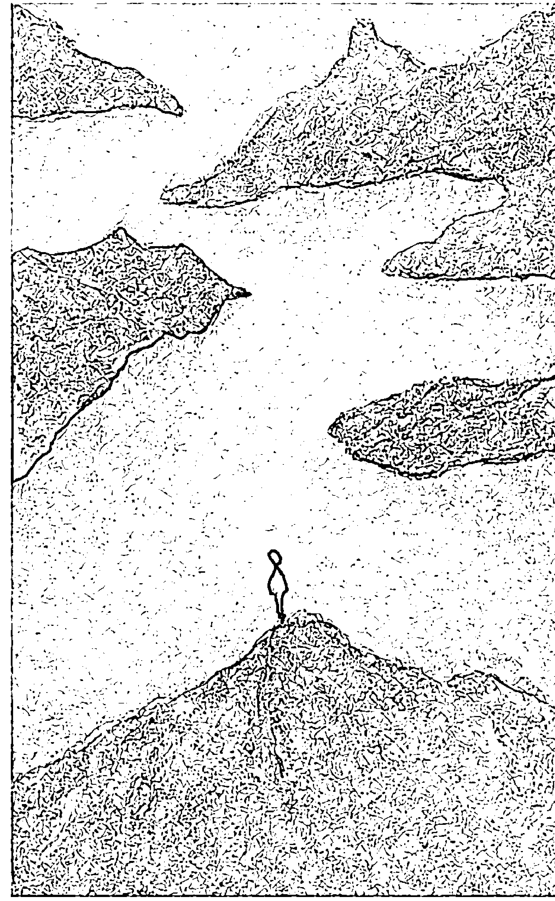

## 一 財運篇

### □ 基本卦解——眼光放遠，財利必豐

求財有大小之分，也有短暫之財與長久之財的分別。抽到這一卦，表示你應把求財眼光放遠，不要只汲汲營營於小財和眼前的短暫獲利。要集中全部精神，放在長久的大財之上，以免浪費時間。

- ◆偏財指數：78分／財運旺度：$$$$

### 一 從占卜時間看終極預測

晚間十一點—凌晨一點、上午十一點—下午一點

行動的有利時機：農曆四到六月

助旺財運的地方：南方、圖書館、燒烤店

助旺財運的顏色：紅色、銀色、黃色

投資的幸運數字：2、3、7、8

終極預測及建議：第四十一卦『山澤損』——宜守忌攻，先損後益。得此卦者，在求財的過程中必定會先賠錢，先有損失才會有獲利機會；但就算獲利也不會太多，只能當做吸收求財經驗。因此建議你下手不要太猛，留點實力等待下一次的機會。

偏財指數：58分／財運旺度：◎◎

凌晨一點—凌晨三點、下午一點—下午三點

行動的有利時機：農曆七到九月、十二月下半月

助旺財運的地方：東北方、西方、山上的咖啡廳、卡拉OK

助旺財運的顏色：白色、米色、金色

投資的幸運數字：1、2、6、7

終極預測及建議：第十四卦『火天大有』——財運興旺，如日中天。你的成功眾人皆知，只要本著利人利己的雙贏原則去求財，必定能得到你周遭友人的高度認同與協助，賺起錢來自然是得心應手了！

偏財指數：95分／財運旺度：$$$$$

凌晨三點—凌晨五點、下午三點—下午五點

行動的有利時機：農曆七到九月、十二月下半月

助旺財運的地方：東北方、西方、山上的休閒小屋、地鐵站

助旺財運的顏色：白色、米色、金色

投資的幸運數字：1、2、6、7

終極預測及建議：第九卦『風天小畜』——就差臨門一腳，繼續努力。凡事都像耕種，有播種期、萌芽期、茁壯期，也有收穫期。抽到這一卦的人，目前的求財狀況就像茁壯期一樣，雖然距離收穫還有一段時間，但只要你堅定求財的方向與目標，多一些耐心等待、不要半途而廢。

偏財指數：62分／財運旺度：$$$

凌晨五點—上午七點、下午五點—下午七點

行動的有利時機：農曆六到九月、十二月下旬

助旺財運的地方：西方、西南方、東北方、露天咖啡館

助旺財運的顏色：白色、金色、銀色、黑色

投資的幸運數字：2、4、7、8

終極預測及建議：第十一卦『地天泰』——時機到，財運開。抽到這一卦，表示大財運、好機會就在眼前了。所以，盡力而為、全力以赴去賺錢，絕對不要猶豫不決、浪費寶貴時間。所謂此時不賺錢，更待何時？

上午七點—上午九點、晚間七點—晚間九點

行動的有利時機：農曆四到六月

助旺財運的地方：南方、藝文展覽會場、圖書館

助旺財運的顏色：紅色、橘色

投資的幸運數字：3、9

終極預測及建議：第十八卦『山風蠱』——小心，三十六計走為上策吧。因為你的對手存心不良，小心上當，因為你的對手存心不良。建議不要透過賭博來求財、或透過不當管道來求取意外之財，小心受騙。俗話說『十賭九騙』，如果你打算透過賭博來求財，小心受騙。

偏財指數：23分／財運旺度：⊗⊗⊗⊗

上午九點—上午十一點、晚間九點—晚間十一點

行動的有利時機：農曆四到六月

助旺財運的地方：南方、燒烤店、藝術展覽活動中心

助旺財運的顏色：紅色、橘色

投資的幸運數字：3、9

終極預測及建議：第二十二卦『山火賁』——表面賺錢，其實不然。大家都以為你賺到不少錢，並投以羨慕的眼光，但你自己心知肚明，這只是表面的風光，並不實惠。不過，賺得美名，獲得經驗也是一件好事。

偏財指數：68分／財運旺度：$$$

## 二 感情篇

### □ 一 基本卦解——門當戶對

你們的學歷、社會地位、家境背景都不錯，有緣成為戀人可能是彼此生來修來的福氣，只要有始有終，除了感情豐收之外，一定還會有其他好的收穫。請你們要好好把握這段難得的緣份。

愛情指數：92分／愛情熱度：♥♥♥♥♥

### □ 從占卜時間看終極預測

晚間十一點—凌晨一點、上午十一點—下午一點

最美好的相處方式：在能力範圍內多費心、多付出

最理想的穿著打扮：熱情如火的打扮

助旺愛情運的顏色：紅色、粉紅色、咖啡色、橘黃色

最理想的約會地點：有文化氣息的地方

終極預測及建議：第四十一卦「山澤損」——默默付出。兩個人談戀愛，難免有一方會多付出一些，你正是這位默默付出的人。有句話說付出就是獲得，這也是在告訴你，眼前看來或許你有點吃虧，但這份看似吃虧的感情，往遠處看，到頭來也許佔便宜的反而是你。

愛情指數：68分／愛情熱度：♥♥

凌晨一點—凌晨三點、下午一點—下午三點

最美好的相處方式：保持快樂輕鬆的心情迎接收穫

最理想的穿著打扮：可愛俏麗的打扮

助旺愛情運的顏色：粉紅色、白色、米黃色

最理想的約會地點：有音樂播放的地方、卡拉OK、歌劇院

終極預測及建議：第十四卦「火天大有」—— 可以合作的愛情夥伴。你們兩人都很有異性緣，特別是女性那方的男性粉絲，比男方的粉絲更多。這是一對恩愛的情侶，彼此互相欣賞、也很匹配。如果兩人能一起合作事業，將比別人更容易成功。

愛情指數：95分／愛情熱度：♥♥♥♥♥

凌晨三點—凌晨五點、下午三點—下午五點

最美好的相處方式：開心愉快的聊天與計畫將來

最理想的穿著打扮：可愛的打扮

助旺愛情運的顏色：紅色、粉紅色、白色

最理想的約會地點：地鐵站附近、地下室的西餐廳、卡拉OK

終極預測及建議：第九卦「風天小畜」——女皇陛下。你們的交往才剛開始，但女方佔盡優勢，追求女方的人不少，所以女方大可慢慢選擇誰才是心中的最愛。如果你是男生，抽到這一卦一定要主動一點，盡可能施展渾身解數來贏得芳心，否則容易被情敵先下手為強，那就來不及了！

愛情指數：98分／愛情熱度：♥♥♥♥♥

上午七點—上午九點、晚間七點—晚間九點

最美好的相處方式：感覺事情有狀況的時候，要先保護自己

最理想的穿著打扮：平易近人的裝扮

助旺愛情運的顏色：橘黃色、紅色、深咖啡色

最理想的約會地點：觀光果園、西餐廳、有音樂播放的地方

終極預測及建議：第十一卦「地天泰」——心心相印。你們在一起談情說愛的時候顯得特別開心，雙方都不擺架子，而是用誠懇的心去愛對方，彼此都能感受到對方的付出，以及替自己設想的心。這是一段難得的戀情，想要談論婚嫁的人若抽到這一卦，可以準備成婚了！

上午九點—上午十一點、晚間九點—晚間十一點

最美好的相處方式：讓對方跟你在一起的時候感到温馨

最理想的穿著打扮：热情大方的打扮

助旺爱情运的颜色：红色、咖啡色、橘黄色

最理想的约会地点：一起下厨做菜、烤肉

终极预测及建议：第十八卦『山风蛊』——金玉其外，败絮其中。这段感情已经不单纯了，不是喜不喜欢的问题，而是对方已彻底从内心产生极大的改变。可能因为经济因素而想离开、也可能是对方已另结新欢，想中止这段感情；另一个原因是，对方发觉你并不是他的真命天女／天子。不管是哪种原因，结果都一样，苦苦纠缠下去对谁都不好。

爱情指数：13分／爱情热度：⊗⊗⊗⊗⊗

最理想的约会地点：光线充足、有文化气息的地方

终极预测及建议：第二十二卦『山火贲』——表面风光。你们的爱情只有风光亮丽的外表，缺乏真挚的内心感受。对于只想把爱情当儿戏的人是无伤大雅，但对于想认真谈恋爱、真心真意追求爱情的人，这段感情到头来却是一场空。

爱情指数：59分／爱情热度：♡

## 第二十七卦 颐卦——山雷颐

> > 卦象的基本性质及吉凶解读

本卦在六十四卦中属于修养身心、自我充实之平和卦。

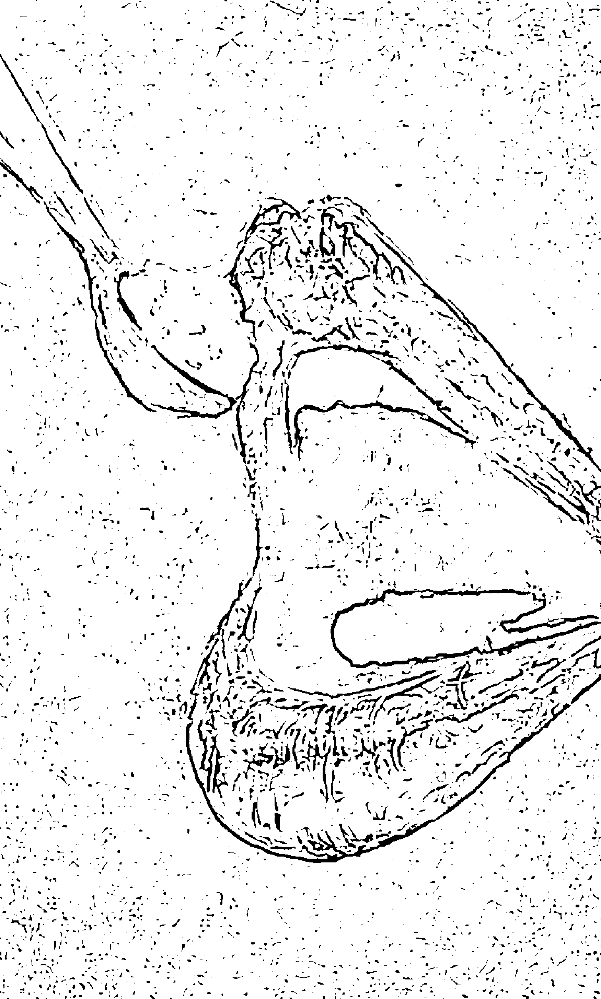

## 一 財運篇

### □ 基本卦解——先充實條件，再談賺錢計畫

以你現在的條件，與你所計畫想求財的目標並不相符，甚至有嚴重不足的地方。建議你，先用心充實好本身的條件，等提升水準之後，再重新訂出求財計畫比較好。

- ◆ 偏財指數：62分／財運旺度：$$

### 一 從占卜時間看終極預測

晚間十一點—凌晨一點、上午十一點—下午一點

行動的有利時機：農曆一到三月

助旺財運的地方：東方、健身房、熱鬧的市場

助旺財運的顏色：綠色

投資的幸運數字：4、5

終極預測及建議：第二十四卦『地雷復』—— 捲土重來必可獲利。如果你在求得此卦前的投資已被套牢並蒙受損失，那要恭喜你了！眼前機會便是解套的好時機，立刻可以連本帶利的賺回來，要好好把握。如果之前沒有做任何投資，那現在就是重新開始的時候了。

偏財指數：72分／財運旺度：$$$

凌晨一點—凌晨三點、下午一點—下午三點

行動的有利時機：農曆六到九月

助旺財運的地方：西南方、南方、百貨公司、藝文中心

助旺財運的顏色：米白色、紅色、黃色、黑色

投資的幸運數字：2、3、8、9

終極預測及建議：第二十三卦『山地剝』—— 得先花錢買經驗。抽到這一卦的人，當你在進行求財行動時，一定是未蒙其利而先受其害的；但若損失的金錢與時間，能換取經驗與教訓的話，那還算是值得的。不過，你得控制一下「學費」，不要繳得太多，因為這次的求財行動是絕對不會獲利的。

偏財指數：30分／財運旺度：⊗⊗⊗

凌晨三點—凌晨五點、下午三點—下午五點

行動的有利時機：農曆四到六月

助旺財運的地方：西南方、南方、大賣場、烤肉BBQ活動

助旺財運的顏色：米白色、紅色、黃色

投資的幸運數字：3、8、9

終極預測及建議：第四十一卦『山澤損』—— 宜守忌攻，先損後益。得此卦者，在求財的過程必定會先賠錢，先有損失才會有獲利機會；但就算獲利也不會太多，只能當做吸收求財經驗。因此建議你下手不要太猛，留點實力等待下一次的機會。

偏財指數：30分／財運旺度：⊗⊗⊗

## 二 财运篇

### 基本卦解——降低投资金额，保守为上

也许在赚钱的过程中因为求好心切而不断追加预算，拼命加码的结果反而让自己倍感压力，快要受不了了！现在你应该想办法在适当的时机减轻资金周转的压力，一旦压力少了，自然可以冷静思考该如何反败为胜。

- 偏财指数：60分／财运旺度：$

### 从占卜时间看终极预测

- 晚间十一点—凌晨一点、上午十一点—下午一点
- 行动的有利时机：农历九月下半月、十二月下半月
- 助旺财运的地方：东北方、西北方、高楼大厦的高楼层场所
- 助旺财运的颜色：米白色、白色
- 投资的幸运数字：5、6、7、8
- 终极预测及建议：第三十一卦『泽山咸』——人财两得，左右逢源。人际关系与运气都好到不得了，要资金有资金，要关系也有关系，只要你肯开口，要什么就有什么。如果你已经有另一半，求财行动最好找对方合作必能成功。还没有另一半的人，抽到此卦不仅可求财获利，过程中还能赢得爱情！

- 偏财指数：95分／财运旺度：$$$$$
- 凌晨一点—凌晨三点、下午一点—下午三点
- 行动的有利时机：农历七到九月
- 助旺财运的地方：西北方、高楼大厦的高楼层场所
- 助旺财运的颜色：白色
- 投资的幸运数字：1、5、6
- 终极预测及建议：第四十七卦『泽水困』——一筹莫展，进退为难。一件事之所以会成功，其实都少不了好的机会与运气，而你目前的处境正缺少了这些成功的的重要因素，导致你在误判情势下贸然投入，以致面临一波又一波的困难，让你进退为难。唯一的解决方式就是快快抽身离开，方为上策。

- 偏财指数：0分／财运旺度：◎◎◎◎◎
- 凌晨三点—凌晨五点、下午三点—下午五点
- 行动的有利时机：农历一到三月、十到十二月
- 助旺财运的地方：北方、水族馆、咖啡厅、靠近有水的地方
- 助旺财运的颜色：蓝色、灰色
- 投资的幸运数字：1、4、6、8
- 终极预测及建议：第四十八卦『水风井』——你求财，别人获利。得此卦者，要有“你种树，别人乘凉”的大无畏付出精神，是一种要先付出、帮助他人，而不去要求任何回报的求财状况。往好的一面想，如果你能真心诚意，没有目的的帮助别人，也许有一天，你会因为之前所做的好事，与先前结下的善缘，而有意外的收获。

- 偏财指数：65分／财运旺度：$
- 凌晨五点—上午七点、下午五点—下午七点
- 行动的有利时机：农历一到三月
- 助旺财运的地方：东方、热闹的夜市
- 助旺财运的颜色：蓝色、浅绿色
- 投资的幸运数字：1、3、4、6、8
- 终极预测及建议：第三十二卦「雷风恒」——有恒为成功之本。有些投资可以走短线，有些则要靠长时间酝酿而获利。抽得此卦的求财状态应属后者的格局。所以，建议不管已下手的股票、债券、基金是否有获利，此时应保持中长期持有的状态。如果你尚未进行投资，则不妨选择好的投资项目，采定期、定量分批购买的方式，进行中长期投资为宜。

- 偏财指数：78分／财运旺度：$$$$
- 上午七点—上午九点、晚间七点—晚间九点
- 行动的有利时机：农历一到三月、十到十二月
- 助旺财运的地方：北方、有钢琴演奏的酒吧、适合聊天的地方
- 助旺财运的颜色：灰色、蓝色
- 投资的幸运数字：1、4、6、8
- 终极预测及建议：第四十四卦「天风姤」——短线获利，见好就收。得此卦者有上司与长辈的贵人缘，他们会对你关爱有加，并提供求财的机会给你，但都属于短期中小型的获利，所以不要贪心，见好就收；也不要有大财或长远的获利发展。若是女性得此卦，则获利会更高。

- 偏财指数：78分／财运旺度：$$$$
- 上午九点—上午十一点、晚间九点—晚间十一点
- 行动的有利时机：农历十到十二月
- 助旺财运的地方：北方、水族馆、适合聊天的咖啡馆
- 助旺财运的颜色：灰色、蓝色
- 投资的幸运数字：1、6
- 终极预测及建议：第四十三卦『泽天夬』——当机立断偏财来。不管你现在的求财状况是赚或赔，想再追加投资金额或是壮士断腕而停损，此时都要赶快当机立断，做出明快决定，以免夜长梦多。倘若当下不做任何决定，采观望态度，只会愈来愈坏。

- 偏财指数：62分／财运旺度：$

## 二 感情篇

### 基本卦解——单方付出的关系

在这段爱情关系里，你总是付出的那一方，时间久了难免会觉得有压力又很委屈，心里充满着不平衡的感受。如果不赶快想办法改善双方的关系，让对方也懂得对你付出，小心这段感情可能就撑不了太久啦！

- 爱情指数：63分／爱情热度：♥

### 从占卜时间看终极预测

- 晚间十一点—凌晨一点、上午十一点—下午一点
- 最美好的相处方式：主动去改善两人相处的方式，别只是单方面付出
- 最理想的穿着打扮：看起来不抢眼，但实际上质感很好的衣着
- 最理想的约会地点：山上的高档西餐厅
- 助旺爱情运的颜色：白色、浅黄色
- 终极预测及建议：第三十一卦『泽山咸』——金童玉女。两人无论在外貌或家境背景、学历条件上都很速配，是朋友眼中的“金童玉女”。相处起来也很投缘，在一起的时候都开开心心，是一份自己感到幸福也受到别人祝福的感情。
- 爱情指数：98分／爱情热度：♥♥♥♥♥

- 凌晨一点—凌晨三点、下午一点—下午三点
- 最美好的相处方式：表现出自己的个性与原则
- 最理想的穿着打扮：不妨用名牌来堆砌自己的成熟风范
- 助旺爱情运的颜色：白色、粉红＋米白色
- 最理想的约会地点：高档的消费场所
- 终极预测及建议：第四十七卦「泽水困」——枯萎的苦恋花。这是一段不可告人的苦恋，对方表面上虽然没有说不爱你，但两人的相爱总是困难重重，对方不懂得替你着想，更不会跟你一起面对难关，所有的压力与困境总是得自己一人去承担，最后落得只剩自己独尝爱情苦果。
- 爱情指数：23分／爱情热度：☒☒☒☒

- 凌晨三点—凌晨五点、下午三点—下午五点
- 最美好的相处方式：用头脑让对方因为需要你而产生依赖
- 最理想的穿着打扮：多变的打扮，最怕一成不变
- 助旺爱情运的颜色：蓝色、灰色、黑色
- 最理想的约会地点：海洋公园，或靠近有水的地方
- 终极预测及建议：第四十八卦「水风井」——爱，是无悔的付出。因为你无怨无悔的付出，打动了对方的心，产生互爱、互助的爱情故事。虽然过程是艰辛的，付出也是辛苦的，但最后得到的回报却是值得的。
- 爱情指数：72分／爱情热度：❤❤❤

- 凌晨五点—上午七点、下午五点—下午七点
- 最美好的相处方式：想到什么就马上行动，该发飙时就不要客气
- 最理想的穿着打扮：令人耳目一新的打扮
- 助旺爱情运的颜色：绿色、蓝＋粉绿色
- 最理想的约会地点：运动场、健身房，或相约去看日出也不错
- 终极预测及建议：第三十二卦「雷风恒」——夫唱妇随。通常女方会顺着男方的节奏起舞，双方配合得很好，彼此都已认定对方是这一生最好的选择，不会再被外界所诱惑而三心两意。这份感情就像童话故事所说的：王子与公主将幸福美满的过一生！
- 爱情指数：92分／爱情热度：❤❤❤❤❤

- 上午七点—上午九点、晚间七点—晚间九点
- 最美好的相处方式：多用脑筋化解彼此之间的压力
- 最理想的穿着打扮：不要华丽，也不要一成不变就好
- 助旺爱情运的颜色：蓝色、灰色
- 最理想的约会地点：哪里都可以，但要常常变
- 终极预测及建议：第四十四卦「天风姤」——一夜情。两人偶然相遇，擦出火花，这种感情并不长久。如果你是女生，将是无往不利的劈腿族，但这种好事维持不久的，劝妳见好就收。如果你是男生，那就很悲哀了，因为你爱的女生有太多情人，你会追得很辛苦。
- 爱情指数：女生86分，男生68分／爱情热度：女生♡♡♡，男生⊗

- 上午九点—上午十一点、晚间九点—晚间十一点
- 最美好的相处方式：愈有个性愈好，对方才会听你的话
- 最理想的穿着打扮：一切都走高规格路线
- 助旺爱情运的颜色：白色、浅黄色
- 最理想的约会地点：高档的消费场所
- 终极预测及建议：第四十三卦「泽天夬」——等他来找你吧！两人的观念不同，对方怕你太过干预他的生活，希望有更多自由空间。所以你愈是采取主动的攻势，对方会愈厌烦，令这段感情产生困扰。建议你，交往速度不妨放慢一点，多听听对方的想法，多尊重对方的自由空间，那么你们的相处自然会渐入佳境。
- 爱情指数：68分／爱情热度：♡

## 第二十八卦 大过卦——泽风大过

### 卦象的基本性质及吉凶解读

本卦在六十四卦中属于超越极限去挑战困难，因压力太大而导致烦恼之凶卦。

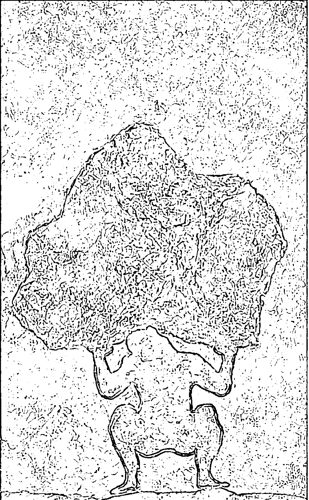

## 一 财运篇

### 基本卦解——降低投资金额，保守为上

也许在赚钱的过程中因为求好心切而不断追加预算，拼命加码的结果反而让自己倍感压力，快要受不了了！现在你应该想办法在适当的时机减轻资金周转的压力，一旦压力少了，自然可以冷静思考该如何反败为胜。

- 偏财指数：60分／财运旺度：$

### 从占卜时间看终极预测

- 晚间十一点—凌晨一点、上午十一点—下午一点
- 行动的有利时机：农历九月下半月、十二月下半月
- 助旺财运的地方：东北方、西北方、高楼大厦的高楼层场所
- 助旺财运的颜色：米白色、白色
- 投资的幸运数字：5、6、7、8
- 终极预测及建议：第三十一卦『泽山咸』——人财两得，左右逢源。人际关系与运气都好到不得了，要资金有资金，要关系也有关系，只要你肯开口，要什么就有什么。如果你已经有另一半，求财行动最好找对方合作必能成功。还没有另一半的人，抽到此卦不仅可求财获利，过程中还能赢得爱情！

- 偏财指数：95分／财运旺度：$$$$$
- 凌晨一点—凌晨三点、下午一点—下午三点
- 行动的有利时机：农历七到九月
- 助旺财运的地方：西北方、高楼大厦的高楼层场所
- 助旺财运的颜色：白色
- 投资的幸运数字：1、5、6
- 终极预测及建议：第四十七卦『泽水困』——一筹莫展，进退为难。一件事之所以会成功，其实都少不了好的机会与运气，而你目前的处境正缺少了这些成功的的重要因素，导致你在误判情势下贸然投入，以致面临一波又一波的困难，让你进退为难。唯一的解决方式就是快快抽身离开，方为上策。

- 偏财指数：0分／财运旺度：◎◎◎◎◎
- 凌晨三点—凌晨五点、下午三点—下午五点
- 行动的有利时机：农历一到三月、十到十二月
- 助旺财运的地方：北方、水族馆、咖啡厅、靠近有水的地方
- 助旺财运的颜色：蓝色、灰色
- 投资的幸运数字：1、4、6、8
- 终极预测及建议：第四十八卦『水风井』——你求财，别人获利。得此卦者，要有“你种树，别人乘凉”的大无畏付出精神，是一种要先付出、帮助他人，而不去要求任何回报的求财状况。往好的一面想，如果你能真心诚意，没有目的的帮助别人，也许有一天，你会因为之前所做的好事，与先前结下的善缘，而有意外的收获。

- 偏财指数：65分／财运旺度：$
- 凌晨五点—上午七点、下午五点—下午七点
- 行动的有利时机：农历一到三月
- 助旺财运的地方：东方、热闹的夜市
- 助旺财运的颜色：蓝色、浅绿色
- 投资的幸运数字：1、3、4、6、8
- 终极预测及建议：第三十二卦「雷风恒」——有恒为成功之本。有些投资可以走短线，有些则要靠长时间酝酿而获利。抽得此卦的求财状态应属后者的格局。所以，建议不管已下手的股票、债券、基金是否有获利，此时应保持中长期持有的状态。如果你尚未进行投资，则不妨选择好的投资项目，采定期、定量分批购买的方式，进行中长期投资为宜。

- 偏财指数：78分／财运旺度：$$$$
- 上午七点—上午九点、晚间七点—晚间九点
- 行动的有利时机：农历一到三月、十到十二月
- 助旺财运的地方：北方、有钢琴演奏的酒吧、适合聊天的地方
- 助旺财运的颜色：灰色、蓝色
- 投资的幸运数字：1、4、6、8
- 终极预测及建议：第四十四卦「天风姤」——短线获利，见好就收。得此卦者有上司与长辈的贵人缘，他们会对你关爱有加，并提供求财的机会给你，但都属于短期中小型的获利，所以不要贪心，见好就收；也不要有大财或长远的获利发展。若是女性得此卦，则获利会更高。

- 偏财指数：78分／财运旺度：$$$$
- 上午九点—上午十一点、晚间九点—晚间十一点
- 行动的有利时机：农历十到十二月
- 助旺财运的地方：北方、水族馆、适合聊天的咖啡馆
- 助旺财运的颜色：灰色、蓝色
- 投资的幸运数字：1、6
- 终极预测及建议：第四十三卦『泽天夬』——当机立断偏财来。不管你现在的求财状况是赚或赔，想再追加投资金额或是壮士断腕而停损，此时都要赶快当机立断，做出明快决定，以免夜长梦多。倘若当下不做任何决定，采观望态度，只会愈来愈坏。

- 偏财指数：62分／财运旺度：$

## 二 感情篇

### 基本卦解——单方付出的关系

在这段爱情关系里，你总是付出的那一方，时间久了难免会觉得有压力又很委屈，心里充满着不平衡的感受。如果不赶快想办法改善双方的关系，让对方也懂得对你付出，小心这段感情可能就撑不了太久啦！

- 爱情指数：63分／爱情热度：♥

### 从占卜时间看终极预测

- 晚间十一点—凌晨一点、上午十一点—下午一点
- 最美好的相处方式：主动去改善两人相处的方式，别只是单方面付出
- 最理想的穿着打扮：看起来不抢眼，但实际上质感很好的衣着
- 最理想的约会地点：山上的高档西餐厅
- 助旺爱情运的颜色：白色、浅黄色
- 终极预测及建议：第三十一卦『泽山咸』——金童玉女。两人无论在外貌或家境背景、学历条件上都很速配，是朋友眼中的“金童玉女”。相处起来也很投缘，在一起的时候都开开心心，是一份自己感到幸福也受到别人祝福的感情。
- 爱情指数：98分／爱情热度：♥♥♥♥♥

- 凌晨一点—凌晨三点、下午一点—下午三点
- 最美好的相处方式：表现出自己的个性与原则
- 最理想的穿着打扮：不妨用名牌来堆砌自己的成熟风范
- 助旺爱情运的颜色：白色、粉红＋米白色
- 最理想的约会地点：高档的消费场所
- 终极预测及建议：第四十七卦「泽水困」——枯萎的苦恋花。这是一段不可告人的苦恋，对方表面上虽然没有说不爱你，但两人的相爱总是困难重重，对方不懂得替你着想，更不会跟你一起面对难关，所有的压力与困境总是得自己一人去承担，最后落得只剩自己独尝爱情苦果。
- 爱情指数：23分／爱情热度：☒☒☒☒

- 凌晨三点—凌晨五点、下午三点—下午五点
- 最美好的相处方式：用头脑让对方因为需要你而产生依赖
- 最理想的穿着打扮：多变的打扮，最怕一成不变
- 助旺爱情运的颜色：蓝色、灰色、黑色
- 最理想的约会地点：海洋公园，或靠近有水的地方
- 终极预测及建议：第四十八卦「水风井」——爱，是无悔的付出。因为你无怨无悔的付出，打动了对方的心，产生互爱、互助的爱情故事。虽然过程是艰辛的，付出也是辛苦的，但最后得到的回报却是值得的。
- 爱情指数：72分／爱情热度：❤❤❤

- 凌晨五点—上午七点、下午五点—下午七点
- 最美好的相处方式：想到什么就马上行动，该发飙时就不要客气
- 最理想的穿着打扮：令人耳目一新的打扮
- 助旺爱情运的颜色：绿色、蓝＋粉绿色
- 最理想的约会地点：运动场、健身房，或相约去看日出也不错
- 终极预测及建议：第三十二卦「雷风恒」——夫唱妇随。通常女方会顺着男方的节奏起舞，双方配合得很好，彼此都已认定对方是这一生最好的选择，不会再被外界所诱惑而三心两意。这份感情就像童话故事所说的：王子与公主将幸福美满的过一生！
- 爱情指数：92分／爱情热度：❤❤❤❤❤

- 上午七点—上午九点、晚间七点—晚间九点
- 最美好的相处方式：多用脑筋化解彼此之间的压力
- 最理想的穿着打扮：不要华丽，也不要一成不变就好
- 助旺爱情运的颜色：蓝色、灰色
- 最理想的约会地点：哪里都可以，但要常常变
- 终极预测及建议：第四十四卦「天风姤」——一夜情。两人偶然相遇，擦出火花，这种感情并不长久。如果你是女生，将是无往不利的劈腿族，但这种好事维持不久的，劝妳见好就收。如果你是男生，那就很悲哀了，因为你爱的女生有太多情人，你会追得很辛苦。
- 爱情指数：女生86分，男生68分／爱情热度：女生♡♡♡，男生⊗

- 上午九点—上午十一点、晚间九点—晚间十一点
- 最美好的相处方式：愈有个性愈好，对方才会听你的话
- 最理想的穿着打扮：一切都走高规格路线
- 助旺爱情运的颜色：白色、浅黄色
- 最理想的约会地点：高档的消费场所
- 终极预测及建议：第四十三卦「泽天夬」——等他来找你吧！两人的观念不同，对方怕你太过干预他的生活，希望有更多自由空间。所以你愈是采取主动的攻势，对方会愈厌烦，令这段感情产生困扰。建议你，交往速度不妨放慢一点，多听听对方的想法，多尊重对方的自由空间，那么你们的相处自然会渐入佳境。
- 爱情指数：68分／爱情热度：♡

## 第二十九卦 坎卦／习坎卦——坎为水

### 卦象的基本性质及吉凶解读

本卦在六十四卦中属于险象横生，灾难不断之大凶卦。

## 一 财运篇

### 基本卦解——惊涛骇浪必失财

这是风险极大的求财卦，如果能大起大落已经算是幸运的了。倒霉的话，一出手便会遇上陷阱，弄得血本无归。建议你，若非做不可，投资金额应减低到本来投资预算的二五％。此外，赚到一点甜头就要立刻收手，否则就中了此卦『久战必败』的魔咒。

- 偏财指数：13分／财运旺度：◎◎◎◎

### 从占卜时间看终极预测

- 晚间十一点—凌晨一点、上午十一点—下午一点
- 行动的有利时机：农历七到十二月
- 助旺财运的地方：西方、北方、有音乐播放的咖啡厅或酒吧
- 助旺财运的颜色：蓝色、金色、银色、粉红色
- 投资的幸运数字：1、2、6、7
- 终极预测及建议：第六十卦「水泽节」——拿捏好求财的分寸。抽到这一卦的人，求财的确需要一点智慧。因为在求财的过程当中，如果使力太猛，会把事情搞砸；如果行动不够积极，又会显得有气无力。所以要了解情况后再做出精准的求财行动，过犹不及都不好，一旦分寸拿捏得当，就有获利机会。

- 偏财指数：68分／财运旺度：$$
- 凌晨一点—凌晨三点、下午一点—下午三点
- 行动的有利时机：农历十到十二月
- 助旺财运的地方：北方、海洋馆
- 助旺财运的颜色：蓝色、银色
- 投资的幸运数字：1、6
- 终极预测及建议：第七卦『地水师』——需要以激烈手段竞争而得财。非常时期要采取非常手段，为了达成赚钱目标，抽到这一卦的人必须进行竞争激烈的求财攻势，以霹雳手段让对手屈服，利益全归你所有。但是这样的过程中，你也必须付出相当的代价。

- 偏财指数：25分／财运旺度：◎
- 凌晨三点—凌晨五点、下午三点—下午五点
- 行动的有利时机：农历十到十二月
- 助旺财运的地方：北方、游泳池、水上活动场所
- 助旺财运的颜色：蓝色、灰色、银色
- 投资的幸运数字：1、6、7
- 终极预测及建议：第五十九卦『风水涣』——意兴阑珊。也许你已经有过很多次的求财行动，同时每次的行动都付出不少努力，但都没有获利，原本的锐气经过多次的挫折后，早已变得有气无力、意兴阑珊，所以在短期内如果没有重大的突破，建议你不如及早放弃为妙。

- 偏财指数：0分／财运旺度：◎◎◎◎◎
- 凌晨五点—上午七点、下午五点—下午七点
- 行动的有利时机：农历十到十二月
- 助旺财运的地方：北方、靠近有水的地方
- 助旺财运的颜色：蓝色、灰色、银色
- 投资的幸运数字：1、6
- 终极预测及建议：第四十七卦『泽水困』——一筹莫展，进退为难。一件事之所以成功，其实都少不了好的机会与运气，而你目前的处境正缺少了这些成功的的重要因素，导致你在误判情势下贸然投入，以致面临一波又一波的困难，让你进退为难。唯一的解决方式就是快快抽身离开，方为上策。

- 偏财指数：65分／财运旺度：$

## 二 感情篇

### 基本卦解——倒霉的爱情遭遇

你们的感情没有人支持，就算一起创业也到处碰壁。一波未平一波又起，是你们的宿命，这段感情就像被诅咒似的，很难安然度过。不如趁早谱下休止符，让厄运赶快结束吧！

- 爱情指数：13分／爱情热度：◎◎◎◎◎

### 从占卜时间看终极预测

- 晚间十一点—凌晨一点、上午十一点—下午一点
- 最理想的相处方式：凡事都要节制，不要过度耗损
- 最理想的穿着打扮：多变的装扮
- 助旺爱情运的颜色：白+蓝色、灰色、紫色
- 最理想的约会地点：有音乐播放的酒吧、咖啡厅、海洋馆
- 终极预测及建议：第六十卦「水泽节」——爱情的刚刚好。凡事都不宜过头，谈爱情就好像烧菜，必须请求火候，有所节制，恰到好处最绝妙。多一分不多、少一分不少，若能把握住其中的要领，就能赢得爱人的心。
- 爱情指数：78分／爱情热度：♥♥♥♥♥

- 凌晨一点—凌晨三点、下午一点—下午三点
- 最美好的相处方式：在一起的时候想办法开开心心就好
- 最理想的穿着打扮：多配戴一些亮片、金属饰品、宝石
- 助旺爱情运的颜色：白+蓝色、紫色、灰色
- 最理想的约会地点：海边、酒吧、咖啡厅
- 终极预测及建议：第八卦「水地比」——他是大众情人。男方条件优秀，异性缘好的不得了，可说是人见人爱的大帅哥。妳如果珍惜这段爱情，只有睁一只眼闭一只眼，凡事包容、凡事信任，才有可能和对方相亲相爱的交往下去。

## 第二十二卦 贲卦——山火贲

- 偏财指数：58分／财运旺度：◎◎
- 凌晨五点—上午七点、下午五点—下午七点
- 行动的有利时机：农历四到六月、十二月下旬
- 助旺财运的地方：西南方、南方、韩式烤肉店、百货公司
- 助旺财运的颜色：红色、黄色、黑色
- 投资的幸运数字：3、7、8、9
- 终极预测及建议：第二十二卦『山火贲』——表面赚钱，其实不然。大家都以为你赚到不少钱，并投以羡慕的眼光，但你自己心知肚明，这只是表面的风光，并不实惠。不过，赚得美名，获得经验也是一件好事。

- 偏财指数：68分／财运旺度：$$
- 上午七点—上午九点、晚间七点—晚间九点
- 行动的有利时机：农历一到三月
- 助旺财运的地方：东方、热闹的夜市、健身房
- 助旺财运的颜色：绿色、白色＋蓝色

## 第二十一卦 噬嗑卦——火雷噬嗑

- 偏财指数：32分／财运旺度：◎◎
- 上午九点—上午十一点、晚间九点—晚间十一点
- 行动的有利时机：农历一到三月
- 助旺财运的地方：东南方、机场、公园
- 助旺财运的颜色：绿色、白色＋蓝色
- 投资的幸运数字：1、4、5、6
- 终极预测及建议：第二十一卦『火雷噬嗑』——排除障碍才能赚钱。抽到这一卦表示你正面临一些困难，而此困难正是妨碍你赚钱的人事物。如果想继续赚这个钱，一定要排除这障碍才能顺利，否则情况就如同一根鱼刺在喉咙、吞不下东西般难受。

## 第四十二卦 益卦——风雷益

- 偏财指数：88分／财运旺度：$$$$
- 上午九点—上午十一点、晚间九点—晚间十一点
- 行动的有利时机：农历一到三月
- 助旺财运的地方：东南方、机场、公园
- 助旺财运的颜色：绿色、白色＋蓝色
- 投资的幸运数字：1、4、5、6
- 终极预测及建议：第四十二卦『风雷益』——偏财机会来了。抽到这一卦，表示天时、地利、人和，事事都畅通，并且在赚钱的过程中还有很多朋友替你高兴，只要妳懂得如何与别人分享，这样的赚钱机会将持续不断。

## 第二十二卦 贲卦——山火贲

### 感情篇

- 爱情指数：59分／爱情热度：♡
- 最美好的相处方式：忘记不开心的事，每次见面都当作是重新开始
- 最理想的穿着打扮：随意
- 助旺爱情运的颜色：白+蓝色、灰色
- 最理想的约会地点：有音乐播放的酒吧、咖啡厅
- 终极预测及建议：第二十四卦「地雷复」——旧情复燃。如果你们是旧情人或是离婚的夫妻，相信这次的相聚与重逢，是上天巧妙的安排，给你们一个可以重温旧情的好机会。说不定能重修旧好、再续前缘，重做恋人或再结夫妻。

- 爱情指数：89分／爱情热度：♡♡♡♡
- 最美好的相处方式：在能力范围内多帮忙对方
- 最理想的穿着打扮：复古宽松的打扮
- 助旺爱情运的颜色：米黄色、白色、橘黄色
- 最理想的约会地点：观光果园、中式餐厅、百货公司
- 终极预测及建议：第二十三卦「山地剥」——爱情指数：59分／爱情热度：⊗。相处模式，你情我愿也无妨！跟你在一起的人，总是表现得兴高采烈。一旦你投入愈多资源，对方的回应就变得活跃；一旦给的好处少了，对方马上降低热情。这段感情的“制作费”都由你独自承担。

## 第四十一卦 损卦——山泽损

- 爱情指数：68分／爱情热度：♡♡
- 最美好的相处方式：温柔的关心对方
- 最理想的穿着打扮：成熟的打扮
- 助旺爱情运的颜色：米白色、红色、橘黄色
- 最理想的约会地点：观光果园、大卖场
- 终极预测及建议：第四十一卦『山泽损』——默默付出。两个人谈恋爱，难免有一方会多付出一些，你正是这位默默付出的人。有句话说付出就是获得，这也是在告诉你，眼前看来或许你有点吃亏，但这分看似吃亏的感情，往远处看，到头来也许占便宜的反而是你。

## 第二十二卦 贲卦——山火贲

- 爱情指数：59分／爱情热度：♡
- 最美好的相处方式：坦白热情的相互对待
- 最理想的穿着打扮：光鲜亮丽的打扮
- 助旺爱情运的颜色：米黄色、红色、黑色、白色
- 最理想的约会地点：装潢漂亮的中式餐厅、百货公司

## 第二十一卦 噬嗑卦——火雷噬嗑

- 最美好的相处方式：对不开心的事不要耿耿于怀
- 最理想的穿着打扮：白色航海风格
- 助旺爱情运的颜色：白＋蓝色、金＋蓝色、银＋蓝色
- 最理想的约会地点：有音乐播放的酒吧、咖啡厅
- 终极预测及建议：第二十二卦『山火贲』——表面风光。你们的爱情只有风光亮丽的外表，缺乏真挚的内心感受。对于只想把爱情当儿戏的人是无伤大雅，但对于想认真谈恋爱、真心真意追求爱情的人，这段感情到头来却是一场空。

- 爱情指数：59分／爱情热度：♡
- 终极预测及建议：第二十一卦『火雷噬嗑』——搬开挡路的大石头。两人在一起本来都没什么大问题，就是莫名其妙的总会出现一个破坏者，从中破坏两个人的感情，不是妨碍这对情人的相处、就是阻挡这对情侣的相爱。除非这个破坏者消失，否则这段感情不容易继续走下去。

- 爱情指数：65分／爱情热度：♡
- 最美好的相处方式：柔顺的配合对方
- 最理想的穿着打扮：情侣休闲装
- 助旺爱情运的颜色：白+蓝色、绿色
- 最理想的约会地点：到国外去玩
- 终极预测及建议：第四十二卦『风雷益』——天作之合。你们彼此配合的相当好，简直是郎才女貌，无论家人或朋友都觉得你们是天造地设的一对，伴随着亲友的祝福声，相信你们的好事也不远了！如果你已婚，夫妻间的感情与婚姻生活将更加甜蜜。
- 爱情指数：96分／爱情热度：♡♡♡♡♡

## 第二十三卦 剥卦——山地剥

- 最美好的相处方式：表现得像天真无邪的孩子
- 最理想的穿着打扮：看起来很年轻的打扮
- 助旺爱情运的颜色：绿色、粉红色
- 最理想的约会地点：野外踏青、风景优美的公园
- 终极预测及建议：第二十三卦「山地剥」——感情的剥落。就像树叶会由绿转黄再凋零，感情也会有逐渐冷淡、疏离的时候。如果你不正视这个问题，不积极想出解决之道，任凭情况恶化，那么这份感情很快就要画上句号了。

- 爱情指数：39分／爱情热度：♡
- 最美好的相处方式：多给对方一些空间
- 最理想的穿着打扮：自然不刻意的打扮
- 助旺爱情运的颜色：米黄色、白色
- 最理想的约会地点：书店、安静的咖啡馆
- 终极预测及建议：第二十四卦「地雷复」——否极泰来。感情走到这个地步，也许是你意料之外的事，但事情的发生总有原因，不妨静下心来想想问题出在哪里。如果这段感情还有挽回的余地，就要好好的跟对方沟通，努力改善彼此的关系。若是真的无法继续下去，也要潇洒的放手，让彼此都能去追求各自的幸福。

- 爱情指数：75分／爱情热度：♡♡♡
- 最美好的相处方式：互相学习对方的优点
- 最理想的穿着打扮：有自信的打扮
- 助旺爱情运的颜色：红色、紫色、粉红色
- 最理想的约会地点：pub、夜市
- 终极预测及建议：第二十五卦「天雷无妄」——无心插柳柳成荫。这段感情的开始，也许只是你无心的举动，或是意外的邂逅，没想到却发展成一段美好的姻缘。所以说，感情的事很难预料，有时候刻意去追求反而得不到，不经意的付出却能获得丰盛的回报。

- 爱情指数：82分／爱情热度：♡♡♡♡

## 第二十四卦 复卦——地雷复

- 最美好的相处方式：多用言语表达爱意
- 最理想的穿着打扮：鲜艳亮眼的打扮
- 助旺爱情运的颜色：黄色、橘黄色、棕色
- 最理想的约会地点：游乐园、热闹的夜市
- 终极预测及建议：第二十四卦「地雷复」——旧情复燃。如果你们是旧情人或是离婚的夫妻，相信这次的相聚与重逢，是上天巧妙的安排，给你们一个可以重温旧情的好机会。说不定能重修旧好、再续前缘，重做恋人或再结夫妻。

- 爱情指数：89分／爱情热度：♡♡♡♡
- 最美好的相处方式：在能力范围内多帮忙对方
- 最理想的穿着打扮：复古宽松的打扮
- 助旺爱情运的颜色：米黄色、白色、橘黄色
- 最理想的约会地点：观光果园、中式餐厅、百货公司
- 终极预测及建议：第二十三卦「山地剥」——爱情指数：59分／爱情热度：⊗。相处模式，你情我愿也无妨！跟你在一起的人，总是表现得兴高采烈。一旦你投入愈多资源，对方的回应就变得活跃；一旦给的好处少了，对方马上降低热情。这段感情的“制作费”都由你独自承担。

## 第二十五卦 无妄卦——天雷无妄

- 最美好的相处方式：多给对方一些自由
- 最理想的穿着打扮：休闲舒服的打扮
- 助旺爱情运的颜色：蓝色、绿色、白色
- 最理想的约会地点：海边、运动场
- 终极预测及建议：第二十五卦「天雷无妄」——无心插柳柳成荫。这段感情的开始，也许只是你无心的举动，或是意外的邂逅，没想到却发展成一段美好的姻缘。所以说，感情的事很难预料，有时候刻意去追求反而得不到，不经意的付出却能获得丰盛的回报。

- 爱情指数：82分／爱情热度：♡♡♡♡
- 最美好的相处方式：互相学习对方的优点
- 最理想的穿着打扮：有自信的打扮
- 助旺爱情运的颜色：红色、紫色、粉红色
- 最理想的约会地点：pub、夜市
- 终极预测及建议：第二十四卦「地雷复」——旧情复燃。如果你们是旧情人或是离婚的夫妻，相信这次的相聚与重逢，是上天巧妙的安排，给你们一个可以重温旧情的好机会。说不定能重修旧好、再续前缘，重做恋人或再结夫妻。

- 爱情指数：89分／爱情热度：♡♡♡♡
- 最美好的相处方式：在能力范围内多帮忙对方
- 最理想的穿着打扮：复古宽松的打扮
- 助旺爱情运的颜色：米黄色、白色、橘黄色
- 最理想的约会地点：观光果园、中式餐厅、百货公司
- 终极预测及建议：第二十三卦「山地剥」——爱情指数：59分／爱情热度：⊗。相处模式，你情我愿也无妨！跟你在一起的人，总是表现得兴高采烈。一旦你投入愈多资源，对方的回应就变得活跃；一旦给的好处少了，对方马上降低热情。这段感情的“制作费”都由你独自承担。

## 第二十六卦 大畜卦——山天大畜

- 最美好的相处方式：给予对方实际的帮助
- 最理想的穿着打扮：看起来很有气质的打扮
- 助旺爱情运的颜色：棕色、黄色、白色
- 最理想的约会地点：图书馆、美术馆、高档餐厅
- 终极预测及建议：第二十六卦「山天大畜」——爱情存款丰厚。你们的感情就像一笔丰厚的存款，是经过长时间的积累与经营而来的。彼此都对这份感情投入了很多，也获得了相当的回报。只要继续保持下去，这份感情必定能细水长流，直至白头偕老。

- 爱情指数：92分／爱情热度：♡♡♡♡♡
- 最美好的相处方式：多体贴对方，为对方着想
- 最理想的穿着打扮：成熟稳重的打扮
- 助旺爱情运的颜色：黑色、深蓝色、灰色
- 最理想的约会地点：家里的客厅、安静的公园
- 终极预测及建议：第二十七卦「山雷颐」——口舌之争。两人在一起，难免会有些意见不合的时候，如果各执己见、不肯退让，那么小争执就会演变成大争吵，甚至会伤害彼此的感情。建议你，在说话之前先三思，避免用尖锐的言语攻击对方，多用温和的语气沟通，才能化解冲突，增进感情。

- 爱情指数：68分／爱情热度：♡♡

## 第二十七卦 颐卦——山雷颐

- 最美好的相处方式：培养共同的兴趣爱好
- 最理想的穿着打扮：有活力的打扮
- 助旺爱情运的颜色：绿色、蓝色、粉红色
- 最理想的约会地点：运动场、健身房、郊外踏青
- 终极预测及建议：第二十七卦「山雷颐」——口舌之争。两人在一起，难免会有些意见不合的时候，如果各执己见、不肯退让，那么小争执就会演变成大争吵，甚至会伤害彼此的感情。建议你，在说话之前先三思，避免用尖锐的言语攻击对方，多用温和的语气沟通，才能化解冲突，增进感情。

- 爱情指数：68分／爱情热度：♡♡
- 最美好的相处方式：多体贴对方，为对方着想
- 最理想的穿着打扮：成熟稳重的打扮
- 助旺爱情运的颜色：黑色、深蓝色、灰色
- 最理想的约会地点：家里的客厅、安静的公园
- 终极预测及建议：第二十六卦「山天大畜」——爱情存款丰厚。你们的感情就像一笔丰厚的存款，是经过长时间的积累与经营而来的。彼此都对这份感情投入了很多，也获得了相当的回报。只要继续保持下去，这份感情必定能细水长流，直至白头偕老。

- 爱情指数：92分／爱情热度：♡♡♡♡♡
- 最美好的相处方式：给予对方实际的帮助
- 最理想的穿着打扮：看起来很有气质的打扮
- 助旺爱情运的颜色：棕色、黄色、白色
- 最理想的约会地点：图书馆、美术馆、高档餐厅
- 终极预测及建议：第二十四卦「地雷复」——旧情复燃。如果你们是旧情人或是离婚的夫妻，相信这次的相聚与重逢，是上天巧妙的安排，给你们一个可以重温旧情的好机会。说不定能重修旧好、再续前缘，重做恋人或再结夫妻。

- 爱情指数：89分／爱情热度：♡♡♡♡
- 最美好的相处方式：在能力范围内多帮忙对方
- 最理想的穿着打扮：复古宽松的打扮
- 助旺爱情运的颜色：米黄色、白色、橘黄色
- 最理想的约会地点：观光果园、中式餐厅、百货公司
- 终极预测及建议：第二十三卦「山地剥」——爱情指数：59分／爱情热度：⊗。相处模式，你情我愿也无妨！跟你在一起的人，总是表现得兴高采烈。一旦你投入愈多资源，对方的回应就变得活跃；一旦给的好处少了，对方马上降低热情。这段感情的“制作费”都由你独自承担。

## 第二十八卦 大过卦——泽风大过

### 感情篇

- 爱情指数：59分／爱情热度：♡
- 最美好的相处方式：忘记不开心的事，每次见面都当作是重新开始
- 最理想的穿着打扮：随意
- 助旺爱情运的颜色：白+蓝色、灰色
- 最理想的约会地点：有音乐播放的酒吧、咖啡厅
- 终极预测及建议：第二十四卦「地雷复」——旧情复燃。如果你们是旧情人或是离婚的夫妻，相信这次的相聚与重逢，是上天巧妙的安排，给你们一个可以重温旧情的好机会。说不定能重修旧好、再续前缘，重做恋人或再结夫妻。

- 爱情指数：89分／爱情热度：♡♡♡♡
- 最美好的相处方式：在能力范围内多帮忙对方
- 最理想的穿着打扮：复古宽松的打扮
- 助旺爱情运的颜色：米黄色、白色、橘黄色
- 最理想的约会地点：观光果园、中式餐厅、百货公司
- 终极预测及建议：第二十三卦「山地剥」——爱情指数：59分／爱情热度：⊗。相处模式，你情我愿也无妨！跟你在一起的人，总是表现得兴高采烈。一旦你投入愈多资源，对方的回应就变得活跃；一旦给的好处少了，对方马上降低热情。这段感情的“制作费”都由你独自承担。

## 第二十九卦 坎卦——坎为水

### 感情篇

- 爱情指数：13分／爱情热度：◎◎◎◎◎
- 最理想的相处方式：凡事都要节制，不要过度耗损
- 最理想的穿着打扮：多变的装扮
- 助旺爱情运的颜色：白+蓝色、灰色、紫色
- 最理想的约会地点：有音乐播放的酒吧、咖啡厅、海洋馆
- 终极预测及建议：第六十卦「水泽节」——爱情的刚刚好。凡事都不宜过头，谈爱情就好像烧菜，必须请求火候，有所节制，恰到好处最绝妙。多一分不多、少一分不少，若能把握住其中的要领，就能赢得爱人的心。

- 爱情指数：78分／爱情热度：♥♥♥♥♥
- 最美好的相处方式：在一起的时候想办法开开心心就好
- 最理想的穿着打扮：多配戴一些亮片、金属饰品、宝石
- 助旺爱情运的颜色：白+蓝色、紫色、灰色
- 最理想的约会地点：海边、酒吧、咖啡厅
- 终极预测及建议：第八卦「水地比」——他是大众情人。男方条件优秀，异性缘好的不得了，可说是人见人爱的大帅哥。妳如果珍惜这段爱情，只有睁一只眼闭一只眼，凡事包容、凡事信任，才有可能和对方相亲相爱的交往下去。

爱情指数：男生76分，女生66分／爱情热度：男生♡♡♡，女生♡♡♡

最美好的相处方式：用彼此互相帮助的方式来培养感情

凌晨三点—凌晨五点、下午三点—下午五点

最理想的穿着打扮：水手航海装扮

助旺爱情运的颜色：蓝色、灰色、黑色、紫色

最理想的约会地点：游轮、酒吧、咖啡厅、喝茶的地方

终极预测及建议：第四十八卦『水风井』——爱，是无悔的付出。因为你无怨无悔的付出，打动了对方的心，产生互爱、互助的爱情故事，虽然过程是艰辛的，付出也是辛苦的，但最后得到的回报却是值得的。

爱情指数：72分／爱情热度：♡♡♡

最美好的相处方式：用智慧来解决困难

凌晨五点—上午七点、下午五点—下午七点

最理想的穿着打扮：多佩戴金属、亮片装饰

助旺爱情运的颜色：白色、紫色、蓝色

最理想的约会地点：有钢琴伴奏的酒吧、卡拉OK、海边

终极预测及建议：第四十七卦『泽水困』——枯萎的苦恋花。这是一段不可告人的苦恋，对方表面上虽然没有说不爱你，但两人的相爱总是困难重重，对方不懂得替你著想，更不会跟你一起面对难关，所有的压力与困境总是得自己一人去承担，最后落得只剩自己独尝爱情苦果。

爱情指数：23分／爱情热度：◎◎◎◎

最美好的相处方式：凡事多想想，不要冲动行事

上午七点—上午九点、晚间七点—晚间九点

最理想的穿着打扮：充满海洋风的打扮

助旺爱情运的颜色：白色、蓝色、灰色、黑色

最理想的约会地点：海边、酒吧、咖啡厅

终极预测及建议：第七卦『地水师』——逼婚才有可能成功。男方颇为潇洒，可说是师奶杀手，异性缘好到不行；女方则属于实力派，条件也不差。但如果要完全消除男方老爱做大众情人的毛病，或想要谈论婚嫁，女方必须要拿出王牌来催促、逼使对方就范才可能成功。

爱情指数：68分／爱情热度：❤❤

上午九点—上午十一点、晚间九点—晚间十一点

最美好的相处方式：多想一些点子，让对方把焦点放在你身上

最理想的穿着打扮：海洋风的休闲装扮

助旺爱情运的颜色：蓝色、黑色、紫色

最理想的约会地点：喝茶的地方、酒吧、咖啡厅、沙滩

终极预测及建议：第五十九卦『风水涣』——彼此都缺乏归属感。可能经过一段无聊的相处，双方都觉得有点腻了不好玩，对彼此的感情与兴趣缺缺，而没有归属感。唯一的方法只有重新找出共同目标，才能改善两人之间的关系，否则会愈来愈不想见面。

爱情指数：58分／爱情热度：❤❤

## 第三十卦 离卦——离为火

> > 卦象的基本性质及吉凶解读
>
> 本卦在六十四卦中属于坦诚相待，相互辉映之吉卦。

### 一 财运篇

### □基本卦解——本着良心赚钱，心安理得

你是一个心地善良，做事光明磊落的人，如果能找到一位个性跟你一样的伙伴一起求财，或者求财的方式与你的个性相符，那获利就会很容易了！

- ◆偏财指数：85分／财运旺度：$$$$$

### □ 从占卜时间看终极预测

◆ 投资的幸运数字：3、4、7、9

◆ 助旺财运的颜色：绿色、红色

◆ 助旺财运的地方：南方、东南方、靠近公园的展览馆

◆ 行动的有利时机：农历一到六月

◆ 晚间十一点—凌晨一点、上午十一点—下午一点

◆ 终极预测及建议：第五十六卦「火山旅」——做最好的准备，最坏的打算。抽到此卦的人在进行求财行动之前，必先做最好的准备与最坏的打算，因为你面对的是困难很多与状况不断的局面，万一求财不顺，也可事先有心理准备，就当它是换取经验的必要过程吧！

◆ 偏财指数：32分／财运旺度：⊗⊗⊗

◆ 投资的幸运数字：3、4、7、9

◆ 终极预测及建议：第十四卦「火天大有」——财运兴旺，如日中天。你的成功众人皆知，只要本着利人利己的双赢原则去求财，必定能得到你周遭友人的高度认同与协助，赚起钱来当然是得心应手了！

◆ 偏财指数：95分／财运旺度：$$$$$

凌晨三点—凌晨五点、下午三点—下午五点

◆ 行动的有利时机：农历一到六月

◆ 助旺财运的地方：东方、南方、东南方、靠近公园的文化中心

◆ 助旺财运的颜色：蓝色、绿色

凌晨五点—上午七点、下午五点—下午七点

- ❖ 行动的有利时机：农历一到六月
❖ 助旺财运的地方：南方、东南方、有文化艺术气息的地方
❖ 助旺财运的颜色：红色、紫色、绿色
❖ 投资的幸运数字：3、4、7、9
❖ 终极预测及建议：第二十二卦『山火贲』——表面赚钱，其实不然。大家都以为你赚到不少钱，并投以羡慕的眼光，但你自己心知肚明，这只是表面的风光，并不实惠。不过，赚得美名，获得经验也是一件好事。
❖ 偏财指数：68分／财运旺度：$$

#### 上午七点—上午九点、晚间七点—晚间九点

- ❖ 行动的有利时机：农历一到六月
❖ 助旺财运的地方：南方、东南方、文化艺术展览会场
❖ 助旺财运的颜色：红色、紫色、绿色
❖ 投资的幸运数字：3、4、7、9
❖ 终极预测及建议：第十三卦『天火同人』——与好朋友互蒙其利。抽到这一卦的人应该与志同道合的朋友一起来进行赚钱的事，这比自己一个人埋头苦干更有赚头。这个合作计划不但大家可以开心赚到钱，同时还能培养出彼此的共识与默契。所选择的投资方向，应该要大家都同意，那才会赚钱！
❖ 偏财指数：86分／财运旺度：$$$$

#### 上午九点—上午十一点、晚间九点—晚间十一点

- ❖ 行动的有利时机：农历一到六月
❖ 助旺财运的地方：南方、东南方、文化艺术展览会场
❖ 助旺财运的颜色：红色、紫色、绿色
❖ 投资的幸运数字：3、4、7、9
❖ 终极预测及建议：第十三卦『天火同人』——与好朋友互蒙其利。抽到这一卦的人应该与志同道合的朋友一起来进行赚钱的事，这比自己一个人埋头苦干更有赚头。这个合作计划不但大家可以开心赚到钱，同时还能培养出彼此的共识与默契。所选择的投资方向，应该要大家都同意，那才会赚钱！
❖ 偏财指数：86分／财运旺度：$$$$

#### 上午十一点—下午一点、晚间十一点—凌晨一点

- ❖ 行动的有利时机：农历一到六月
❖ 助旺财运的地方：东方、东南方、南方、靠近树木的地方
❖ 助旺财运的颜色：绿色、红色
❖ 投资的幸运数字：3、4、7、9
❖ 终极预测及建议：第五十五卦『雷火丰』——丰富的收获，更好的表现。做某些事，得要鸭子划水，于台面下悄悄进行才能成功；有些事则应敲锣打鼓，大肆喧嚷才能成事。抽到这一卦的人，正需要热热闹闹、先声夺人的去赚钱，才有可能事半功倍、大有所获。
❖ 偏财指数：96分／财运旺度：$$$$

◆偏财指数：86分／财运旺度：$$$$$

### 二 感情篇

### □基本卦解——热情、坦白的爱
两个人都很大方、坦白又热情，肚子里绝对没有半点坏水，无论是好事或坏事，都会拿出来跟另一半分享、讨论。两人在一起的时候相当热情，因为坦白与大方是他们感情的基础。

◆爱情指数：88分／爱情热度：❤❤❤❤

### □从占卜时间看终极预测

- ◆晚间十一点—凌晨一点、上午十一点—下午一点
◆最美好的相处方式：柔顺、大方、热情，凡事都要先做好准备
◆最理想的穿着打扮：大方热情的休闲风
◆助旺爱情运的颜色：绿色、红色
◆最理想的约会地点：阳光普照的花园
◆终极预测及建议：第五十六卦「火山旅」——风雨中的感情。这段感情一路走来都不平顺，突发状况是家常便饭，甚至本来没什么事也会闹到不可开交。风风雨雨的感情让两人很没有安全感，如果能分开两地、远距离交往，烦恼可能会少一些。

◆爱情指数：60分／爱情热度：❤❤

- ◆凌晨一点—凌晨三点、下午一点—下午三点
◆最美好的相处方式：柔顺、大方，凡事都要往远处看
◆最理想的穿着打扮：有田园风格的休闲风
◆助旺爱情运的颜色：红色、绿色
◆最理想的约会地点：光线充足，并且靠近有花有草的地方
◆终极预测及建议：第十四卦「火天大有」——可以合作的爱情伙伴。你们两人都很有异性缘，特别是女性那方的男性粉丝，比男方的粉丝更多。这是一对恩爱的情侣，彼此互相欣赏、也很匹配。如果两人能一起合作事业，将比别人更容易成功。

◆爱情指数：95分／爱情热度：❤❤❤❤

凌晨三点—凌晨五点、下午三点—下午五点

- ◆最美好的相处方式：碰到有误会或困难时要立刻去解决
- ◆最理想的穿着打扮：休闲俐落风格
- ◆助旺爱情运的颜色：绿色、粉绿色、红色
- ◆最理想的约会地点：光线充足、靠近花草的运动场所
- ◆终极预测及建议：第二十一卦『火雷噬嗑』—— 搬开挡路的大石头。两人在一起本来都没什么大问题，就是莫名其妙的总会出现一个破坏者，从中破坏两个人的感情，不是妨碍这对情人的相处、就是阻扰这对情侣的相爱。除非这个破坏者消失，否则这段感情不容易继续走下去。

爱情指数：65分／爱情热度：♡

#### 凌晨五点—上午七点、下午五点—下午七点

- ◆最美好的相处方式：温柔、顺从又大方
- ◆最理想的穿着打扮：热情的休闲风
- ◆助旺爱情运的颜色：粉绿＋红色、红色、橘红色

爱情指数：65分／爱情热度：♡

#### 上午七点—上午九点、晚间七点—晚间九点

- ◆最美好的相处方式：像好朋友一样的相互对待
- ◆最理想的穿着打扮：有阳光气息的休闲风格
- ◆助旺爱情运的颜色：绿色、红色、橘红色
- ◆最理想的约会地点：有自然气息的热闹地方
- ◆终极预测及建议：第十三卦『天火同人』—— 同学、同事、好朋友变恋人。彼此有共同的信念与看法，是同一类型的人。双方个性都表里如一，各自有发展天地，都是朋友群中的灵魂人物。凡事只要坦诚以对，没有解决不了的问题。

爱情指数：59分／爱情热度：♡

- ◆最理想的约会地点：阳光充足的花园或公园
- ◆终极预测及建议：第二十二卦『山火贲』—— 表面风光。你们的爱情只有风光亮丽的外表，缺乏真挚的内心感受。对于只想把爱情当儿戏的人是无伤大雅，但对于想认真谈恋爱、真心真意追求爱情的人，这段感情到头来却是一场空。

爱情指数：59分／爱情热度：♡

- ◆ 爱情指数：82分／爱情热度：♥♥♥♥
- ◆ 上午九点—上午十一点、晚间九点—晚间十二点
- ◆ 最美好的相处方式：顺着对方的意思去努力，就会有好结果
- ◆ 最理想的穿着打扮：俐落又带有阳光气息的休闲风格
- ◆ 助旺爱情运的颜色：蓝＋粉绿色、绿色、红色
- ◆ 最理想的约会地点：可以看到大自然风景的户外运动场所
- ◆ 终极预测及建议：第五十五卦「雷火丰」——爱情、财运两亨通。你们的爱情好像丰收的季节般甜蜜，彼此都以欢喜的心情去品尝爱情甜美的果实。无论是爱情上的美满，或在事业、钱财上都有实质的收获，令人羡慕。

- ◆ 爱情指数：86分／爱情热度：♥♥♥♥♥

## 第三十一卦 咸卦——泽山咸

卦象的基本性质及吉凶解读
本卦在六十四卦中属于情投意合，互助双赢之爱情、姻缘大吉卦。

### 一、财运篇

### □ 基本卦解——人财两得，左右逢源
人际关系与运气都好到不得了，要资金有资金，要关系也有关系，只要你肯开口，要什么就有什么。如果你已经有另一半，求财行动最好找对方合作必能成功。还没有另一半的人，抽到此卦不仅可求财获利，过程中还能赢得爱情！

- ◆偏财指数：95分／财运旺度：$$$$$

### 从占卜时间看终极预测

晚间十一点—凌晨一点、上午十一点—下午一点

- 行动的有利时机：农历四到六月
- 助旺财运的地方：南方、光线充足明亮的地方
- 助旺财运的颜色：红色、白色、黄色
- 投资的幸运数字：3、5、9
> 终极预测及建议：第三十九卦「水山蹇」——举步维艰，进退为难。如果你的求财行动还停留在计划的阶段，那要恭喜你了！因为还来得及停止这项求财计划，以免陷入泥沼、进退不得。所以，建议千万不要跳进这个陷阱。万一已经被套牢了，那就必须尽快找出停损点、及早了解，否则只会愈陷愈深，损失惨重。

凌晨一点—凌晨三点、下午一点—下午三点

- 行动的有利时机：农历四到六月
- 助旺财运的地方：南方、有文化气息的场所
- 助旺财运的颜色：红色、米黄色
- 投资的幸运数字：3、5、9

偏财指数：0分／财运旺度：⊗⊗⊗⊗⊗

> 终极预测及建议：第六十二卦「雷山小过」——求财不顺还伤和气。俗话说得好，买卖不成仁义在。千万别为了求财的事与人争执、伤了和气。所谓山不转路转，路不转人转，人不转心转，只要转换一下你的想法，多为对方想想，你就不会为了求财不成的事而生气了。这次不成，还有下一次，不是吗？

凌晨三点—凌晨五点、下午三点—下午五点

- 行动的有利时机：农历四到六月
- 助旺财运的地方：南方、文化艺术展览的场所
- 助旺财运的颜色：红色、米白色
- 投资的幸运数字：3、5、9

> 终极预测及建议：第三十三卦「天山遯」——看得见却赚不到。抽到这一卦的人，有种老是跟财神爷擦身而过的感觉，偏财明明就可以到手，却在临门一脚错失良机，就好像追星族，老是追着财神爷跑，到现在都还停留在玩「躲猫猫」的游戏阶段。

偏财指数：55分／财运旺度：$

- 行动的有利时机：农历六月下旬到九月
- 助旺财运的地方：东北方、西北方、高楼大厦
- 助旺财运的高楼层场所
- 投资的幸运数字：1、6、8
- 助旺财运的颜色：白色、粉红色

终极预测及建议：第四十九卦「泽火革」—— 变则通，当你用某种方法去求财都不灵光的时候，应该要想想还有没有别的方法，改变一下现有的求财方式，绝对不能一味守旧、固执、一成不变，否则财神爷是不会眷顾你的。

偏财指数：71分／财运旺度：$$

上午七点——上午九点、晚间七点——晚间九点

- 行动的有利时机：农历七到九月、十二月下半月
- 助旺财运的地方：西北方、东北方、高大的建筑
- 助旺财运的颜色：白色、米黄色
- 投资的幸运数字：1、5、6、8

终极预测及建议：第二十八卦「泽风大过」—— 降低投资金额，保守为上。也许在赚钱的过程中因为求好心切而不断追加预算，拼命加码的结果反而是自己倍感压力，快要受不了了！现在你应该想办法在适当的时机减轻资金周转的压力，一旦压力少了，自然可以冷静思考该如何反败为胜。

偏财指数：60分／财运旺度：$

上午九点——上午十一点、晚间九点——晚间十一点

- 行动的有利时机：农历六月下半月到九月、十二月下半月
- 助旺财运的地方：东北方、西南方、西北方、热闹的商场
- 助旺财运的颜色：白色、黑色
- 投资的幸运数字：3、5、7、8

终极预测及建议：第四十五卦「泽地萃」—— 名利双收，出类拔萃。得此卦者，你得先有名声后才会获得利益，这次的求财行动叫好又叫座，而且后面的发

展机会很多，只要抱着广结善缘的心态继续努力，长远来看求财获利是大有可为的。

偏财指数：95分／财运旺度：$$$$$

### 二 感情篇

### 一 基本卦解——金童配玉女

两人无论在外貌或家境背景、学历条件上都很速配，是朋友眼中的「金童玉女」。相处起来也很投缘，在一起的时候都开开心心，是一份自己感到幸福也受到别人祝福的感情。

- 爱情指数：98分／爱情热度：♡♡♡♡♡

### 一 从占卜时间看终极预测

- 晚间十一点—凌晨一点、上午十一点—下午一点
最美好的相处方式：遇到困难时要很坦白的说出来
- 最理想的穿着打扮：辣妹、帅哥的打扮
最理想的约会地点：光线充足的地方
最理想的穿着打扮：辣妹、帅哥的打扮
助旺爱情运的颜色：红色、粉红色、紫色、橘红色
最理想的约会地点：有太阳图案或大红色布置的地方

终极预测及建议：第三十九卦「水山蹇」——他的心里没有你。也许对方是被形势所逼，喘不过气来；也许是对方早已移情别恋，不再爱你。不管哪种原因导致这段爱情走不下去，早点说声珍重再见，是唯一从痛苦中解脱的方法。

- 爱情指数：13分／爱情热度：⊗⊗⊗⊗⊗
最美好的相处方式：吵架的时候，你要先放下身段与对方和解
- 凌晨一点—凌晨三点、下午一点—下午三点
- 最理想的穿着打扮：大方热情的风格
助旺爱情运的颜色：橘红色、粉红色、紫色
最理想的约会地点：有太阳图案或大红色布置的地方

终极预测及建议：第六十二卦「雷山小过」——情人变冤家。你们本是一对热恋的情侣，当心物极必反，关心对方太多、替对方着想太多，彼此反而弄得不开心，反目成仇，感情因此由热变冷，甚至有可能渐行渐远。

◆爱情指数：52分／爱情热度：⊗⊗⊗

#### ◆凌晨三点—凌晨五点、下午三点—下午五点

- ◆最美好的相处方式：当对方想躲起来的时候，你要给他空间
- ◆最理想的穿着打扮：让对方有安全感的打扮
- ◆助旺爱情运的颜色：棕色、咖啡色、黄＋红色
- ◆最理想的约会地点：让人感到温馨、舒适的地方

◆终极预测及建议：第三十三卦『天山遯』—躲猫猫。你很想亲近对方，方法虽然已经很温和又低调了，但对方还是觉得有压力，因此故意不理你、不接电话，甚至不愿意碰面，摆明想逃避这段感情。其实对方希望你冷静一段时间再说。建议你不妨暂时放下，等待机缘。也许更好的对象正在前方等待着你，何必苦苦单恋对方呢？

◆爱情指数：58分／爱情热度：⊗

#### ◆凌晨五点—上午七点、下午五点—下午七点

- ◆最美好的相处方式：用很高明的手法诱导对方改进行为
- ◆最理想的穿着打扮：朴素的装扮
- ◆助旺爱情运的颜色：白色、粉红色、米黄色
- ◆最理想的约会地点：爬山、去外面玩

◆终极预测及建议：第四十九卦『泽火革』—旧的不去，新的不来。两人的交往拖得太久又没有什么新花样，你觉得这段感情不好玩了，对对方慢慢失去新鲜感，甚至会有一种厌倦的感觉。这个时候，你会出现想换对象的想法哦！对刚刚失恋，或刚离婚的人来说，抽到这一卦反而是好消息，可能会有一段新感情，悄悄来敲门！

◆爱情指数：有对象者68分，无对象者78分／爱情热度：有对象者♡，无对象者♡♡♡

#### ◆上午七点—上午九点、晚间七点—晚间九点

- ◆最美好的相处方式：被动一点，但不要凡事都听对方的话
- ◆最理想的穿着打扮：朴素的装扮
- ◆助旺爱情运的颜色：米白色、黄色、棕色
- ◆最理想的约会地点：安静的地方
- ◆终极预测及建议：第二十八卦「泽风大过」——单方付出的关系。在这段爱情关系里，你总是付出的那一方，时间久了难免会觉得有压力又很委屈，心里充满着不平衡的感受。如果不赶快想办法改善双方的关系，让对方也懂得对你付出，小心这段感情可能就撑不了太久啦！

- ◆ 爱情指数：63分／爱情热度：♥

#### 上午九点—上午十一点、晚间九点—晚间十一点

- ◆最美好的相处方式：被动等待对方邀约，约会时要多替对方着想
- ◆最理想的穿着打扮：没有束缚感的装扮
- ◆助旺爱情运的颜色：白色、浅黄色
- ◆最理想的约会地点：高档的中餐厅
- ◆终极预测及建议：第四十五卦「泽地萃」——浓情蜜意。你们两人沉浸在爱河里，彼此互相帮助，也很替对方着想，是标准的「你侬我侬」、恩爱缠绵的情侣。抽得此卦者，你与对方的外型与条件不一定是百分之百的速配，但感情却是百分之二百的浓情蜜意。

- 爱情指数：92分／爱情热度：♥♥♥♥♥

## 第三十二卦 恒卦——雷风恒

卦象的基本性质及吉凶解读

本卦在六十四卦中属于阴阳相配，恒久幸福美满之婚姻大吉卦。

### 一 财运篇

#### 基本卦解——有恒为成功之本

有些投资可以走短线，有些则要靠长时间酝酿而获利。抽得此卦的求财状态应属于后者的格局。所以，建议不管已下手的股票、债券、基金是否有获利，此时应保持中长期持有的状态。如果你尚未进行投资，则不妨选择好的投资项目，采取定期、定量分批购买的方式，进行中长期投资为宜。

- ◇ 偏财指数：78分／财运旺度：$$$$

从占卜时间看终极预测

- 行动的有利时机：晚间十一点—凌晨一点、上午十二点—下午二点
- 行动的有利时机：农历一到三月、十到十二月
- 助旺财运的地方：东方、北方、热闹的酒吧
- 助旺财运的颜色：绿色、蓝色、灰色
- 投资的幸运数字：1、4、6

#### 终极预测及建议：第四十六卦「地风升」——

偏财运已萌芽，好好培育吧！你的偏财运已经开始启动了，但要小心观察身边所有不起眼的小财运，因为有些现在看起来不太起眼的小财运，未来会变成大财运。所以千万不要嫌钱少而不赚，以免坐失良机。

- 偏财运指数：72分／财运旺度：$$$$
- 行动的有利时机：凌晨一点—凌晨三点、下午一点—下午三点
- 行动的有利时机：农历一到三月、十到十二月
- 助旺财运的地方：东方、北方、健身房、水上活动
- 助旺财运的颜色：绿色、蓝色、灰色
- 投资的幸运数字：1、4、6

#### 终极预测及建议：第二十八卦「泽风大过」——

降低投资金额，保守为上。也许在赚钱的过程中因为求好心切而不断追加预算，拼命加码的结果反而让自己倍感压力，快要受不了了！现在你应该想办法在适当的时机减轻资金周转的压力，一旦压力少了，自然可以冷静思考该如何反败为胜。

- 偏财运指数：60分／财运旺度：$
- 行动的有利时机：凌晨三点—凌晨五点、下午三点—下午五点
- 行动的有利时机：农历一到三月、十到十二月
- 助旺财运的地方：东方、北方、海边音乐会、热闹的夜店
- 助旺财运的颜色：绿色、蓝色、灰色
- 投资的幸运数字：1、4、6

#### 终极预测及建议：第五十卦「火风鼎」——

三人合作，获利更旺。俗话说得好：「三个臭皮匠，胜过一个诸葛亮。」有时候一个人做不到的事情，大家一起来就没那么困难了。抽到这一卦，不管你的求财目标是什么，找别人一起团队合作，绝对胜过自己一人单打独斗。

- ◇ 偏财指数：88分／财运旺度：$$$$$
- ◇ 行动的有利时机：农历一到三月、十到十二月
- ◇ 助旺财运的地方：东方、北方、靠近有水的地方
- ◇ 助旺财运的颜色：绿色、蓝色、灰色
- ◇ 投资的幸运数字：1、4、6

#### 终极预测及建议：第三十四卦「雷天大壮」——

不要光说不练。做广告是不嫌夸大其词的，但若做人处世的态度经常是画大饼、说大话，就流于不实在了。一个只爱做梦、行为浮夸的人，绝对是不容易赚到钱的。抽到这一卦的人，坐而言不如起而行，应多做少说，不要光说不练。

- ◇ 偏财指数：15分／财运旺度：⊗
- ◇ 行动的有利时机：上午七点—上午九点、晚间七点—晚间九点
- ◇ 行动的有利时机：农历一到三月、十到十二月
- ◇ 助旺财运的地方：东方、花市、机场
- ◇ 助旺财运的颜色：绿色、蓝色、灰色
- ◇ 投资的幸运数字：1、4、6

#### 终极预测及建议：第六十二卦「雷山小过」——

求财不顺还伤和气。俗话说得好，买卖不成仁义在。千万别为了求财的事与人争执、伤了和气。所谓山不转路转，路不转人转，人不转心转，只要转换一下你的想法，多为对方想想，你就不会为了求财不成的事而生气了。这次不成，还有下一次，不是吗？

- ◇ 偏财指数：23分／财运旺度：⊗⊗⊗
- ◇ 行动的有利时机：农历一到三月、十到十二月
- ◇ 助旺财运的地方：东方、北方、靠近有水的公园
- ◇ 助旺财运的颜色：绿色、灰色、蓝色
- ◇ 投资的幸运数字：1、4、6

#### 终极预测及建议：第四十卦「雷水解」——

困难在七天内必可解决。如果你正身陷财务危机，那恭喜了，因为在七天内这个困难一定可以解决。但如果你现在并没有财务上的问题，那么你心中想进行的求财计划则会泡汤、停止进行了！

- 上午九点—上午十一点、晚间九点—晚间十一点

### 二 感情篇

#### 基本卦解——夫唱妇随

通常女方会顺着男方的节奏起舞，双方配合得很好，彼此都已认定对方是这一生最好的选择，不会再被外界所诱惑而三心两意。这份感情就像童话故事所说的：王子与公主将幸福美满地过一生！

- ◆ 爱情指数：92分／爱情热度：♡♡♡♡♡

### 从占卜时间看终极预测

- 最美好的相处方式：配合对方，说做就做
- 最理想的穿着打扮：洒脱、俐落
- 助旺爱情运的颜色：蓝＋秋香绿色、灰＋秋香绿色
- ◆ 最理想的约会地点：跳舞的地方、流行音乐的场地

#### 终极预测及建议：第四十六卦『地风升』——奉子成婚。

你们在一起时都甜甜蜜蜜的，会替对方着想，也会配合对方的想法。正因为感情这么好，很容易先上车、后补票，先有爱情结晶后才谈论婚嫁。

- ◆ 爱情指数：86分／爱情热度：♡♡♡♡
- 最美好的相处方式：不要让自己觉得负担太重
- 最理想的穿着打扮：运动风
- 助旺爱情运的颜色：蓝色、黑＋绿色
- 最理想的约会地点：健身房、运动场所、夜市

#### 终极预测及建议：第二十八卦『泽风大过』——单方付出的关系。

在这段爱情关系里，你总是付出的那一方，时间久了难免会觉得有压力又很委屈，心里充满着不平衡的感受。如果不赶快想办法改善双方的关系，让对方也懂得对你付出，小心这段感情可能就撑不了太久啦！

- ◆ 爱情指数：63分／爱情热度：♡

#### 凌晨三点—凌晨五点、下午三点—下午五点

- 最美好的相处方式：多给彼此自由的空间
- 最理想的穿着打扮：多变的休闲风
- 助旺爱情运的颜色：黑色、蓝色、灰色、紫色
- 最理想的约会地点：热闹的夜市、百货公司

#### 终极预测及建议：第五十卦「火风鼎」——

你们两人可能正在热恋中，但小心对方可能已婚，或在你之前还有一位要好的异性朋友，正在大搞三角关系。站在你的立场，你可能觉得别人是第三者，但换个位置来看，其实你才是那个第三者呢！

- 爱情指数：72分／爱情热度：♥♥♥

#### 凌晨五点—上午七点、下午五点—下午七点

- 最美好的相处方式：扮演忠实听众，不要拆穿另一半的大话
- 最理想的穿着打扮：对方喜欢的休闲装扮
- 助旺爱情运的颜色：蓝十秋香绿色、苹果绿色
- 最理想的约会地点：泡温泉、放风筝

#### 终极预测及建议：第三十四卦「雷天大壮」——光说不练。

说的比做的多，什么都OK、没问题，但到头来不是一直拖延没做，就是忘得一干二净。只听到好听的承诺与计划，却没一件答应下来的事情是真正可以做到的。套句成语，这就是「空口说白话」。

- 爱情指数：60分／爱情热度：♥

#### 上午七点—上午九点、晚间七点—晚间九点

- 最美好的相处方式：不开心的时候少说两句，免得吵架
- 最理想的穿着打扮：休闲风
- 助旺爱情运的颜色：蓝十绿色
- 最理想的约会地点：空气流通的场所

#### 终极预测及建议：第六十二卦「雷山小过」——情人变冤家。

你们本是一对热恋的情侣，当心物极必反，关心对方太多、替对方着想太多，彼此反而弄不开心，反目成仇，感情因此由热变冷，甚至有可能渐行渐远。

- 爱情指数：52分／爱情热度：⊗⊗⊗

#### 上午九点—上午十一点、晚间九点—晚间十一点

- ◆最美好的相处方式：有技巧地顺从对方
- ◆最理想的穿着打扮：水手装扮
- ◆助旺爱情运的颜色：蓝色、灰色、黑色、绿色
- ◆最理想的约会地点：靠近河边的小木屋

#### 终极预测及建议：第四十卦「雷水解」——七天之内见分晓。

得此卦者会遇到两种情况，在七天内就会得到答案。第一种情况：已留不住对方，到了分手互道珍重、说声再见的时候了，也许是无言的结局，淡淡的分手。第二种情况：也许你与对方和好如初的时候快要到了！彼此冷战不讲话，可找个藉口主动打电话给对方，说不定马上就能雨过天晴，喜剧收场。

- ◆爱情指数：第一种情况23分，第二种情况68分
- ◆爱情热度：第一种情况⊗⊗⊗⊗，第二种情况♡♡♡♡♡

## 第三十三卦 遁卦——天山遁

卦象的基本性质及吉凶解读

本卦在六十四卦中属于明哲保身，退隐泉林之避世卦。

### 一 财运篇

#### 基本卦解——看得见却赚不到

抽到这一卦的人，有种老是跟财神爷擦身而过的感觉，偏财明明就可以到手，却在临门一脚错失良机，就好像追星族，老是追着财神爷跑，到现在都还停留在玩「躲猫猫」的游戏阶段。

- ◆偏财指数：55分／财运旺度：$

### 从占卜时间看终极预测

- 行动的有利时机：晚间十一点—凌晨一点、上午十一点—下午一点、下雨的时候
- 助旺财运的地方：北方、有水池的地方
- 助旺财运的颜色：蓝色、灰色、黑色
- 投资的幸运数字：1、6、8

#### 终极预测及建议：第十二卦「天地否」——利空出尽，否极泰来。

如果你最近老是处处碰壁、求财不顺，心情掉到谷底，那么抽到这一卦反而要恭喜你啦！因为坏运气即将快到尽头了，当利空出尽，之后将会渐露曙光。

- 偏财指数：68分／财运旺度：$$

- 行动的有利时机：凌晨三点—凌晨五点、下午三点—下午五点
- 助旺财运的地方：南方、寺庙、碳烤餐厅
- 助旺财运的颜色：红色、橘黄色、咖啡色
- 投资的幸运数字：2、5、7、9、10

#### 终极预测及建议：第五十三卦「风山渐」——财神爷快到了，你准备好了吗？

钱财到手的日子一天比一天接近了，但其中还有不少困难等着你去克服与排除，最重要的是你本身对这次的求财计划究竟有没有做好充分的准备，包括你的专业与资金，准备愈充分，当财神爷来临时才能大有所获。

- 偏财指数：65分／财运旺度：$$

- 偏财指数：32分／财运旺度：◎◎◎
- 行动的有利时机：凌晨五点—上午七点、下午五点—下午七点
- 行动的有利时机：农历四到六月
- 助旺财运的地方：南方、烤鸭店
- 助旺财运的颜色：红色、黄色、咖啡色
- 投资的幸运数字：5、8、9、10

#### 终极预测及建议：第三十一卦「泽山咸」——人财两得，左右逢源。

人际关系与运气都好到不得了，要资金有资金，要关系也有关系，只要你肯开口，要什么就有什么。如果你已经有另一半，求财行动最好找对方合作必能成功，还没有另一半的人，抽到此卦不仅可求财获利，过程中还能赢得爱情！

- 偏财指数：95分／财运旺度：$$$$$
- 行动的有利时机：上午七点—上午九点、晚间七点—晚间九点
- 行动的有利时机：农历四到六月、九月、十二月下半月
- 助旺财运的地方：东北方、西南方、百货公司高楼层的餐厅
- 助旺财运的颜色：白色、米黄色
- 投资的幸运数字：1、6、8

#### 终极预测及建议：第十三卦「天火同人」——与好朋友互蒙其利。

抽到这一卦的人应该与志同道合的朋友一起来进行赚钱的事，这比自己一个人埋头苦干更有赚头。这个合作计划不但大家都可以开心赚到钱，同时还能培养出彼此的共识与默契。所选择的投资方向，应该要大家都同意，那才会赚钱！

- 偏财指数：86分／财运旺度：$$$$$
- 行动的有利时机：上午九点—上午十一点、晚间九点—晚间十一点
- 行动的有利时机：下雨的时候、农历七到十二月
- 助旺财运的地方：东北方、西北方、摩天大楼的高楼层
- 助旺财运的颜色：白色、米黄色
- 投资的幸运数字：6、7、8

#### 终极预测及建议：第四十四卦「天风姤」——短线获利，见好就收。

得此卦者有上司与长辈的贵人缘，他们会对你关爱有加，并提供求财的机会会给你，但都属于短期中小型的获利，所以不要贪心，见好就收；也不要期待会有大财或长远的获利发展。若是女性得此卦，则获利会更高。

### 二 感情篇

#### 基本卦解——躲猫猫

你很想亲近对方，方法虽然已经很温和又低调了，但是对方还是感觉有压力，而故意不理你、不接电话、甚至不愿意碰面，摆明了想逃避这段感情。建议你，不妨暂时放下，等待机缘。也许，更好的对象正在前面等待着你，何必苦苦单恋对方呢？

- 偏财运指数：78分／财运旺度：$$$$$
- 爱情指数：58分／爱情热度：⊗

### 从占卜时间看终极预测

- 晚间十一点—凌晨一点、上午十一点—下午一点
- 最美好的相处方式：该强硬的时候要强硬，该温柔的时候要温柔
- 最理想的穿着打扮：看场合来打扮
- 助旺爱情运的颜色：白色、黄色、棕色
- 最理想的约会地点：登山郊游、美食餐厅、高楼大厦

#### 终极预测及建议：第十二卦『天地否』——要死不活。

双方的想法有很大的不同，既没有相同的地方，也没有在一起的热情，彼此的交往显得有气无力，连约会都懒了。双方都没力气再交往了，感情如一滩死水，摆明了随时都可以分手。

- 爱情指数：55分／爱情热度：⊗

- 凌晨一点—凌晨三点、下午一点—下午三点
- 最美好的相处方式：坦白、热情
- 最理想的穿着打扮：青春活泼的打扮
- 助旺爱情运的颜色：红色、粉红色、紫色

#### 最理想的约会地点：阳光充足、光线明亮的地方

#### 终极预测及建议：第五十三卦『风山渐』——慢慢进步中。

女生比男生的年纪稍大一点没关系，因为不管双方年纪差距如何，女生都会像姐姐一样照顾男生，让男生的事业无后顾之忧。你们的恋情正逐渐在加温中，绝对不会起伏不定，这是令人看好的现象。

- ◆ 爱情指数：68分／爱情热度：♡♡♡

- 凌晨三点—凌晨五点、下午三点—下午五点
- 最美好的相处方式：随时都要做好应变准备
- 最理想的穿着打扮：火辣的穿着与打扮
- 助旺爱情运的颜色：红色、紫色、橘色、橘红色
- 最理想的约会地点：光线明亮、有文化气息的地方

#### 终极预测及建议：第五十六卦『火山旅』——风雨中的感情。

这段感情一路走来都不平顺，突发状况是家常便饭，甚至本来没什么事也会闹到不可开交。风风雨雨的感情让两人很没有安全感，如果能分开两地、远距离交往，烦恼可能会少一些。

- ◆ 爱情指数：60分／爱情热度：♡♡

- 凌晨五点—上午七点、下午五点—下午七点
- 最美好的相处方式：凡事都以感情来打动对方，千万别讲一堆大道理
- 最理想的穿着打扮：热情洋溢的打扮
- 助旺爱情运的颜色：红色、棕色、紫色
- 最理想的约会地点：浪漫而带点文化气息的地方

#### 终极预测及建议：第三十一卦『泽山咸』——金童配玉女。

两人无论在外貌或家境背景、学历条件上都很速配，是朋友眼中的『金童玉女』。两人相处起来也很投缘，在一起的时候都开开心心，是一份自己感到幸福也受到别人祝福的感情。

- ◆ 爱情指数：98分／爱情热度：♡♡♡♡♡

- 最美好的相处方式：该主动的时候主动出击，上午七点—上午九点、晚间七点—晚间九点
- 平时可处于被动
- 最理想的穿着打扮：正式场合要盛装打扮，休闲时轻松打扮就好
- 助旺爱情运的颜色：白色、米黄色
- 最理想的约会地点：爬山郊游或去豪华的场合

#### 终极预测及建议：第十三卦『天火同人』——同学、同事、好朋友变恋人。

彼此有共同的信念与看法，是同一类型的人。双方个性都表里如一，各自有发展天地，都是朋友群中的灵魂人物。凡事只要坦诚以对，没有解决不了的问题。

- ◆ 爱情指数：82分／爱情热度：♡♡♡♡

- 上午九点—上午十一点、晚间九点—晚间十一点
- 最美好的相处方式：稳重而果断
- 最理想的穿着打扮：看场合来打扮
- 助旺爱情运的颜色：白色、米白色、黄色、橘红色
- 最理想的约会地点：户外活动、高规格的约会地点

#### 终极预测及建议：第四十四卦『天风姤』——一夜情。

两人偶然相遇，擦出火花，这种感情并不长久。如果你是女生，将是无敌劈腿族，每个男人都被你耍得团团转，你的要求都能如愿，但这种好事维持不久的，劝你见好就收。如果你是男生，那就很悲哀了，因为你爱的女生有太多情人，你会追得很辛苦。

- ◆ 爱情指数：女生86分，男生68分／爱情热度：女生♡♡♡♡，男生⊗

## 第三十四卦 大壮卦——雷天大壮

卦象的基本性质及吉凶解读

本卦在六十四卦中属于雷鸣天下，场面壮盛，先声夺人之卦。

### 一、财运篇

#### 基本卦解——不要光说不练

做广告是不嫌夸大其词的，但若做人处世的态度经常是画大饼、说大话，就流于不实在了。一个只爱做梦、行为浮夸的人，绝对是不容易赚到钱的。抽到这一卦的人，坐而言不如起而行，应多做少说，不要光说不练。

- ◆偏财指数：15分／财运旺度：⊗

### 从占卜时间看终极预测

- 晚间十一点—凌晨一点、上午十一点—下午一点
- 行动的有利时机：农历七到九月
- 助旺财运的地方：西方、西北方、高水准的音乐酒吧
- 助旺财运的颜色：白色、粉红色、米白色
- 投资的幸运数字：1、6、7、8

#### 终极预测及建议：第十四卦「火天大有」——

财运兴旺，如日中天。你的成功众人皆知，只要本着利人利己的双赢原则去求财，必定能得到你周遭友人的高度认同与协助，赚起钱来自然是得心应手了！

- 偏财指数：95分／财运旺度：$$$$$

- 凌晨一点—凌晨三点、下午一点—下午三点
- 行动的有利时机：农历一到三月、十到十二月
- 助旺财运的地方：东南方、北方、机场、靠近有水的地方
- 助旺财运的颜色：蓝色、绿色
- 投资的幸运数字：1、4、6

#### 终极预测及建议：第三十二卦「雷风恒」——

有恒为成功之本。有些投资可以走短线，有些则要靠长时间酝酿而获利。抽得此卦的求财状态应属后者的格局。所以，建议不管已下手的股票、债券、基金是否有获利，此时应保持中长期持有的状态。如果你尚未进行投资，则不妨选择好的投资项目，采取定期、定量分批购买的方式，进行中长期投资为宜。

- 偏财指数：78分／财运旺度：$$$$

- 凌晨三点—凌晨五点、下午三点—下午五点
- 行动的有利时机：农历十到十二月
- 助旺财运的地方：北方、水族馆、亲水公园
- 助旺财运的颜色：蓝色、灰色
- 投资的幸运数字：1、4、6

#### 终极预测及建议：第五十五卦「雷火丰」——

丰富的收获，更好的表现。做某些事，得要鸭子划水，于台面下悄悄进行才能成功；有些事则应敲锣打鼓，大肆喧嚷才能成事。抽到这一卦的人，正需要热热闹闹、先声夺人地去赚钱，才有可能事半功备、大有所获。

## 財運篇

◆偏財指數：86分／財運旺度：$$$$

- ◆凌晨五點—上午七點、下午五點—下午七點
- ◆行動的有利時機：農曆十到十二月
- ◆助旺財運的地方：北方、喝咖啡聊天的地方
- ◆助旺財運的顏色：藍色、灰色
- ◆投資的幸運數字：1、4、6
- ◆終極預測及建議：第五十四卦「雷澤歸妹」——委曲求全，等待機會東山再起。有句話說，「形勢比人強，不得不低頭。」當你的財運不是那麼好的時候，千萬不要迷信「道理」，更不要賭氣逞強，也不能固執硬拗，因為只有見風轉舵、順著趨勢走，才能保住你的本錢；等財運到了，自然能開開心心賺錢。

- ◆上午七點—上午九點、晚間七點—晚間九點
- ◆行動的有利時機：農曆六到九月
- ◆助旺財運的地方：西方、西南方、百貨公司
- ◆助旺財運的顏色：米黃色、粉紅色、白色

◆偏財指數：45分／財運旺度：⊗

◆偏財指數：98分／財運旺度：$$$$

- ◆上午九點—上午十一點、晚間九點—晚間十一點
- ◆行動的有利時機：農曆十到十二月
- ◆助旺財運的地方：北方、游泳池
- ◆助旺財運的顏色：藍色、灰色

◆偏財指數：62分／財運旺度：$

當機立斷偏財來。不管你現在的求財狀況是賺或賠，想再追加投資金額或是壯士斷腕而停損，此時都要趕快當機立斷，做出明快決定，以免夜長夢多。倘若當下不做任何決定，採觀望態度，度，只會愈來愈壞。

◆終極預測及建議：第四十三卦「澤天夬」——

◆投資的幸運數字：1、6、8

◆終極預測及建議：第十一卦「地天泰」——時機到，財運開。抽到這一卦，表示大財運、好機會就在眼前了。所以，盡力而為、全力以赴去賺錢，絕對不要猶豫不決、浪費寶貴時間。所謂此時不賺錢，更待何時？

## 二 感情篇

### 基本卦解——光說不練

說的比做的多，什麼都說OK、沒問題，但到頭來不是一直拖延沒做，就是忘得一乾二淨。只聽到好聽的承諾與計畫，卻沒有幾件答應下來的事情是真正可以做到的。套句成語，這就是『空口說白話』。

### 從占卜時間看終極預測

- 愛情指數：60分／愛情熱度：♡
- 晚間十一點—凌晨一點、上午十一點—下午一點
- 最美好的相處方式：凡事往遠處看，要把握機會做明快的決定
- 最理想的穿著打扮：可愛又有質感的打扮
- 助旺愛情運的顏色：米黃色、白色、淺黃色、淺咖啡色
- 最理想的約會地點：播放優美音樂的地方

#### 終極預測及建議：第十四卦「火天大有」——

可以合作的愛情夥伴。你們兩人都很有異性緣，特別是女性那方的男性粉絲，比男方的粉絲更多。這是一對恩愛的情侶，彼此互相欣賞、也很匹配。如果兩人能一起合作事業，將比別人更容易成功。

- 愛情指數：95分／愛情熱度：♡♡♡♡
- 凌晨一點—凌晨三點、下午一點—下午三點
- 最美好的相處方式：有耐性的順從對方的意思
- 最理想的穿著打扮：海洋風的休閒裝扮
- 助旺愛情運的顏色：藍色、粉綠色、灰色、綠色
- 最理想的約會地點：有花草樹木的地方

#### 終極預測及建議：第三十二卦「雷風恆」——

夫唱婦隨。通常女方會順著男方的節奏起舞，雙方配合的很好，彼此都已認定對方是這一生最好的選擇，不會再被外界所誘惑而三心兩意。這份感情就像童話故事所說的：王子與公主將幸福美滿的過一生！

- 愛情指數：92分／愛情熱度：♡♡♡♡♡
- 凌晨三點—凌晨五點、下午三點—下午五點
- 最美好的相處方式：用智慧來解決兩人之間的問題
- 最理想的穿著打扮：要經常變換不同的風格
- 助旺愛情運的顏色：灰色、黑色、藍色
- 最理想的約會地點：海邊、水族館
- 終極預測及建議：第五十五卦『雷火豐』— 愛情、財運兩亨通。你們的愛情好像豐收的季節般甜蜜，彼此都以歡喜的心情去品嘗愛情甜美的果實。無論是愛情上的美滿，或在事業、錢財上都有實質的收穫，令人羨慕。

- 愛情指數：86分／愛情熱度：♥♥♥♥
- 凌晨五點—上午七點、下午五點—下午七點
- 最美好的相處方式：感到委屈的事情不要做
- 最理想的穿著打扮：隨心情做打扮
- 助旺愛情運的顏色：藍色、黑色、灰色、粉綠色
- 最理想的約會地點：要常常改變約會地點才好
- 終極預測及建議：第五十四卦『雷澤歸妹』— 命裡有時終須有，命裡無時莫強求。你們的戀情有許多地方都顯得很勉強，由於相遇的時機不對，所以交往時難免會讓你覺得萬分委屈，心裡常常感到不平衡，多少會有偏激的想法；萬一想不開而使用激烈的手段來處理這段感情，後果往往不堪設想。

- 愛情指數：46分／愛情熱度：⊗⊗
- 上午七點—上午九點、晚間七點—晚間九點
- 最美好的相處方式：經常關心對方的一切並陪對方聊天
- 最理想的穿著打扮：寬鬆的風格
- 助旺愛情運的顏色：米白色、粉紅色、黃色
- 最理想的約會地點：環境優美而且有音樂播放的美食餐廳
- 終極預測及建議：第十一卦『地天泰』— 心心相印。你們在一起談情說愛的時候顯得特別開心，雙方都不擺架子，而是用誠懇的心去愛對方，彼此都能感受到對方的付出，以及替自己設想的心。這是一段難得的戀情，想要談論婚嫁的人若抽到這一卦，可以準備成婚了！

- 愛情指數：98分／愛情熱度：❤❤❤❤❤
- 上午九點—上午十一點、晚間九點—晚間十一點
- 最美好的相處方式：聊天可以增進感情，但要保持愉快的氣氛
- 最理想的穿著打扮：有質感的可愛風
- 助旺愛情運的顏色：粉紅色、米白色
- 最理想的約會地點：卡拉OK、歌劇院、在家裡聽音樂
- 終極預測及建議：第四十三卦「澤天夬」——等他來找你吧！兩人的觀念不同，對方怕你太過干預他的生活，希望有更多自由空間。所以你愈是採取主動的攻勢，對方會愈厭煩，令這段感情產生困擾。建議你，交往速度不妨放慢一點，多聽聽對方的想法，多尊重對方的自由空間，那麼你們的相處自然會漸入佳境。

- 愛情指數：68分／愛情熱度：♡

## 第三十五卦 晋卦 火地晋

### 卦象的基本性质及吉凶解读

本卦在六十四卦中属于旭日东升，前途光明之吉卦。

## 一 財運篇

### □ 基本卦解——已見曙光，努力必有所獲

你努力求財的事已逐漸明朗，而且成功在望，只要按部就班、穩紮穩打的進行，求財的時機應該不遠了！只要不計較自己的付出，多幫助別人也等於在幫自己。

- ◆偏財指數：68分／財運旺度：$$

### 【從占卜時間看終極預測】

晚間十一點—凌晨一點、上午十一點—下午一點

- 行動的有利時機：農曆四到六月
- 助旺財運的地方：南方、燒烤店、圖書館
- 助旺財運的顏色：紅色
- 投資的幸運數字：3、9
- 終極預測及建議：第十六卦『雷地豫』—— 順水推舟，Money自然來。所謂無為而治，是看來好像不用什麼大動作、大計畫，事情自然而然就會成功。抽到此卦者，求財過程多少也有這種意味，這表示你不需要冒很大的風險去做激烈的求財競爭，只需要順著形勢做自己該做的事，那麼財利自然會進你的口袋。
- 偏財指數：82分／財運旺度：$$$$

凌晨一點—凌晨三點、下午一點—下午三點

- 行動的有利時機：農曆一到三月
- 助旺財運的地方：東方、運動場、熱鬧的市場
- 助旺財運的顏色：綠色
- 投資的幸運數字：3、4
- 偏財指數：82分／財運旺度：$$$$
- 終極預測及建議：第二十一卦『火雷噬嗑』—— 排除障礙才能賺錢。抽到這一卦表示你正面臨一些困難，而此困難正是妨礙你賺錢的人事物，一定要排除這障礙才能順利，否則情況就如同一根魚刺在喉嚨、吞不下東西般難受。
- 終極預測及建議：第六十四卦『火水未濟』—— 時機尚未成熟，仍需等待。抽到這一卦的人先不要急於求財，因為時機還沒有成熟，你必須耐心等待。等到時機對了，財運自然成熟後，才算是真正打開目前沉悶的局面。
- 偏財指數：45分／財運旺度：⊗

凌晨五點—上午七點、下午五點—下午七點

- 行動的有利時機：農曆一到六月
- 助旺財運的地方：東方、植物園
- 助旺財運的顏色：綠色
- 投資的幸運數字：3、4、5、8
- 終極預測及建議：第五十六卦『火山旅』——做最好的準備，最壞的打算。抽到此卦的人在進行求財行動之前，必先做最好的準備與最壞的打算，因為你面對的是困難很多與狀況不斷的局面，萬一求財不順，也可事先有心理準備，就當它是換取經驗的必要過程吧！

上午七點—上午九點、晚間七點—晚間九點

- 偏財指數：32分／財運旺度：◎◎◎
- 行動的有利時機：農曆四到六月
- 助旺財運的地方：南方、有文化氣息的場所
- 助旺財運的顏色：紅色、橘色
- 投資的幸運數字：2、3、7、9
- 終極預測及建議：第二十三卦『山地剝』——得先花錢買經驗。抽到這一卦的人，當你在進行求財行動時，一定是未蒙其利而先受其害的；但若損失的金錢與時間，能換取經驗與教訓的話，那還算是值得的。不過，你得控制一下「學費」，不要繳得太多，因為這次的求財行動是絕對不會獲利的。

偏財指數：30分／財運旺度：◎◎◎

上午九點—上午十一點、晚間九點—晚間十一點

- 行動的有利時機：農曆四到六月
- 助旺財運的地方：南方、藝文展覽場所、燒烤店
- 助旺財運的顏色：紅色、橘色
- 投資的幸運數字：3、9
- 終極預測及建議：第十二卦『天地否』——利空出盡，否極泰來。如果你最近老是處處碰壁、求財不順，心情掉到谷底，那麼抽到這一卦反而要恭喜你啦！因為壞運氣即將快到盡頭了，當利空出盡，之後將會漸露曙光。

偏財指數：68分／財運旺度：$$

## 一 感情篇

### 基本卦解——是一對溫馨的好伴侶

兩個人在一起會互相照顧，感情也不錯，愛情溫度猶如西下的夕陽，溫和而不刺眼，雖然少了一些激情，卻多了幾分溫馨。兩人在一起時好像老夫老妻或老戀人，祥和又有默契。

愛情指數：76分／愛情熱度：♡♡♡

### 從占卜時間看終極預測

- 晚間十一點—凌晨一點、上午十一點—下午一點
- 最美好的相處方式：用熱情與關懷來化解一切的困難
- 最理想的穿著打扮：明亮醒目的打扮
- 助旺愛情運的顏色：綠色、粉紅色、橘紅色、棕色
- 最理想的約會地點：光線充足的熱鬧場所
- 終極預測及建議：第十六卦『雷地豫』——情投緣合。你們是一對開心的戀人，女生對男生的細心體貼，可說是無微不至，彼此相互了解，也尊重對方，兩人對未來也充滿了希望與夢想，若想談論婚嫁，現在就是開花結果的季節。

愛情指數：92分／愛情熱度：♡♡♡♡♡

- 凌晨一點—凌晨三點、下午一點—下午三點
- 最美好的相處方式：該改善的地方馬上改善，表現出行動的誠意
- 最理想的穿著打扮：灑脫俐落的打扮
- 助旺愛情運的顏色：粉綠色、橘紅色
- 最理想的約會地點：健身房、跳舞的地方、熱鬧的夜市
- 終極預測及建議：第二十一卦『火雷噬嗑』——搬開擋路的大石頭。兩人在一起本來都沒什麼大問題，就是莫名其妙的總會出現一個破壞者，從中破壞兩個人的感情，不是妨礙這對情人的相處、就是阻撓這對情侶的相愛。除非這個破壞者消失，否則這段感情不容易繼續走下去。

愛情指數：65分／愛情熱度：♡

- 凌晨三點—凌晨五點、下午三點—下午五點
- 最美好的相處方式：不要經常約會，不要聊對方沒興趣的話題
- 最理想的穿著打扮：不要做對方不喜歡的打扮
- 助旺愛情運的顏色：綠色、灰色、粉綠色、棕色
- 最理想的約會地點：愈接近大自然愈好
- 終極預測及建議：第六十四卦「火水未濟」——沒有共同想法的空洞感情。你們兩人的想法與喜好完全不一樣，但還不至於到吵架的地步，只不過無法產生愛的火花與共鳴，因為兩人的頻道接不在一起。雖然在一起，卻往往是各忙各的、各玩各的，時間久了，感情自然就變淡了！

愛情指數：58分／愛情熱度：⊗

- 凌晨五點—上午七點、下午五點—下午七點
- 最美好的相處方式：凡事都做最好的準備，但要有最壞結果的打算
- 最理想的穿著打扮：簡單的風格
- 助旺愛情運的顏色：綠色、紅棕色、深咖啡色
- 最理想的約會地點：公園、環境單純的地方
- 終極預測及建議：第五十六卦「火山旅」——風雨中的感情。這段感情一路走來都不平順，突發狀況是家常便飯，甚至本來沒什麼事也會鬧到不可開交。風風雨雨的感情讓兩人很沒有安全感，如果能分開兩地、遠距離交往，煩惱可能會少一些。

愛情指數：60分／愛情熱度：♡♡

- 上午七點—上午九點、晚間七點—晚間九點
- 最美好的相處方式：主動付出就是收穫
- 最理想的穿著打扮：溫馨、樸素的打扮
- 助旺愛情運的顏色：白色、紅色、黃色
- 最理想的約會地點：光線明亮又安靜的地方、山上
- 終極預測及建議：第二十三卦「山地剝」——買來的感情。這段感情的「製作費」都由你獨自承擔，當你投入愈多資源，對方的回應就變得活躍；一旦給的好處少了，對方的回應就降低。如果你碰到的對象喜歡這種相處模式，你情我願也無妨！

愛情指數：59分／愛情熱度：⊗

- 上午九點—上午十一點、晚間九點—晚間十一點
- 最美好的相處方式：表現出熱情但有時被動的風格
- 最理想的穿著打扮：樸素又能顯現熱情大方的裝扮
- 助旺愛情運的顏色：紅色、白色、米黃色
- 最理想的約會地點：山上、光線充足的地方
- 終極預測及建議：第十二卦『天地否』——要死不活。雙方的想法有很大的不同，既沒有相同的地方，也沒有在一起的熱情，彼此的交往顯得有氣無力，連約會都懶了。雙方都沒力氣再交往了，感情如一灘死水，擺明了隨時都可以分手。

愛情指數：55分／愛情熱度：⊗

## 第三十六卦 明夷卦——地火明夷

### 卦象的基本性質及吉凶解讀

本卦在六十四卦中屬於晦暗不明、有志難伸之大凶卦。

## 一 財運篇

### □基本卦解——先好後壞，求財無望

得此卦者好比日落西山，說明好時光不多了，你的求財行動會愈來愈艱困、愈來愈沒有希望，無論你做的是哪一項投資，建議你還是及早了結，方為上策。

- ◆偏財指數：59分／財運旺度：◎

### 從占卜時間看終極預測

晚間十一點—凌晨一點、上午十一點—下午一點

- 行動的有利時機：農曆一到三月
- 助旺財運的地方：東方、公園、花卉市場
- 助旺財運的顏色：綠色
- 投資的幸運數字：4、5、9
- 終極預測及建議：第二十二卦『山火賁』——表面賺錢，其實不然。大家都以為你賺到不少錢，並投以羨慕的眼光，但你自己心知肚明，這只是表面的風光，並不實惠。不過，賺得美名，獲得經驗也是一件好事。
- 偏財指數：68分／財運旺度：$$

凌晨一點—凌晨三點、下午一點—下午三點

- 行動的有利時機：農曆四到六月、十二月下旬
- 助旺財運的地方：南方、東北方、山上的燒烤店
- 助旺財運的顏色：紅色、白色、咖啡色
- 投資的幸運數字：3、7、8、9
- 終極預測及建議：第十五卦『地山謙』——低調求財好處多。所謂「滿招損、謙受益」，抽到此卦者在求財過程中要低調進行，切忌心高氣傲、自以為是，同時也要多聽聽專家的意見，作為求財的參考，如此一來必能賺錢。
- 偏財指數：75分／財運旺度：$$$

凌晨三點—凌晨五點、下午三點—下午五點

- 行動的有利時機：農曆四到六月
- 助旺財運的地方：南方、燒烤店、圖書館
- 助旺財運的顏色：紅色、橘色、黃色
- 投資的幸運數字：3、8、9
- 終極預測及建議：第十一卦『地天泰』——時機到，財運開。抽到這一卦，表示大財運、好機會就在眼前了。所以，盡力而為、全力以赴去賺錢，絕對不要猶豫不決、浪費寶貴時間。所謂此時不賺錢，更待何時？

凌晨五點—上午七點、下午五點—下午七點

- 行動的有利時機：農曆四到六月
- 助旺財運的地方：南方、百貨公司、韓式烤肉店
- 助旺財運的顏色：紅色、黃色、黑色
- 投資的幸運數字：3、8、9
- 終極預測及建議：第二十四卦『地雷復』——捲土重來必可獲利。如果你在求得此卦前的投資已被套牢並蒙受損失，那要恭喜你了！眼前機會便是解套的好時機，立刻可以連本帶利的賺回來，要把握好。如果之前沒有做任何投資，那現在就是重新開始的時候了。
- 偏財指數：72分／財運旺度：$$$

上午七點—上午九點、晚間七點—晚間九點

- 行動的有利時機：農曆一到三月
- 助旺財運的地方：東方、國家公園
- 助旺財運的顏色：綠色
- 投資的幸運數字：4、5
- 終極預測及建議：第五十五卦『雷火豐』——豐富的收穫，更好的表現。做某些事，得要鳴子划水，於檯面下悄悄進行才能成功；有些事則應敲鑼打鼓，大肆喧嘩才能成事。抽到這一卦的人，正需要熱熱鬧鬧、先聲奪人的去賺錢，才有可能事半功倍、大有所獲。

- 偏財指數：86分／財運旺度：$$$$
- 行動的有利時機：農曆一到三月
- 助旺財運的地方：東方、成衣店、公園
- 助旺財運的顏色：綠色
- 投資的幸運數字：4、5
- 終極預測及建議：第六十三卦『水火既濟』——財路已開，多勞多得。你跟財神爺已經搭上線了，表示這次求財的計畫是可行的，而且方向也正確。只要按部就班，穩健的求財，努力付出必定會有收穫。
- 偏財指數：78分／財運旺度：$$$$

## 二 感情篇

### 基本卦解——由熱變冷

你們的蜜月期已經過了，隨之而來的是愈來愈冷的關係，一切都顯得不積極，相處也變得沒樂趣。如果你們交朋友的目的只是為了尋開心，可以不必再等待了，因為愛情的高潮已過去；如果想談論婚嫁，暫時先冷靜下來，但自己要有心理準備，也許會等上一段時間，才有可能春回大地。

- ◆ 愛情指數：48分／愛情熱度：⊗⊗

### ⊟ 從占卜時間看終極預測

- 晚間十一點—凌晨一點、上午十一點—下午一點
- 最美好的相處方式：多用實際行動去幫忙對方，不要只求表面風光
- 最理想的穿著打扮：乾淨俐落的運動風打扮
- 助旺愛情運的顏色：紫紅色、綠色、咖啡色
- 最理想的約會地點：運動場、熱鬧的夜市
- 終極預測及建議：第二十二卦「山火賁」——表面風光。你們的愛情只有風光亮麗的外表，缺乏真摯的內心感受。對於只想把愛情當兒戲的人是無傷大雅，但對於想認真談戀愛、真心真意追求愛情的人，這段感情到頭來卻是一場空。
- 愛情指數：59分／愛情熱度：♡

- 凌晨一點—凌晨三點、下午一點—下午三點
- 最美好的相處方式：默默關心對方，不求回報
- 最理想的穿著打扮：光鮮亮麗的打扮
- 助旺愛情運的顏色：咖啡色、紅色、黃色、白色
- 最理想的約會地點：有文化氣息的地方、光線充足的地方、廟會
- 終極預測及建議：第十五卦「地山謙」——扮豬吃老虎。男方的人生經驗豐富，才會扮成老實人的樣子，行事低調、表現謙卑；但其實在感情上，他不但吃的開，而且異性都會對他千依百順。所以要這麼一位世故的男朋友融入兩人世界裡，恐怕得奉行「同志仍須努力」的總理遺教了！
- 愛情指數：65分／愛情熱度：♡♡

- 凌晨三點—凌晨五點、下午三點—下午五點
- 最美好的相處方式：熱情的關心對方，讓對方感到溫暖

## 第三十七卦 家人卦——風火家人

### 卦象的基本性質及吉凶解讀

本卦在六十四卦中屬於持家有道，家族成就之吉卦。

### 一 財運篇

□基本卦解——求財之前先推銷自己

> 行銷學有句名言：在推銷商品之前，必先推銷你

自己。意思是，如果你表現優越，對方一旦接受你個人的風格與想法後，就等於開啟了求財的大門，後續發展就一切好辦。

- ◆偏財指數：70分／財運旺度：$$

### 從占卜時間看終極預測

晚間十一點—凌晨一點、上午十一點—下午一點
- 行動的有利時機：農曆一到三月、十到十二月
- 助旺財運的地方：東方、北方、健身房、咖啡館
- 助旺財運的顏色：藍色、灰色、綠色
- 投資的幸運數字：1、4、5、6
- 終極預測及建議：第四十二卦『風雷益』——偏財機會來了。抽到這一卦，表示天時、地利、人和，事事都暢通，並且在賺錢的過程中還有很多好朋友替你高興，只要你懂得如何與別人分享，這樣的賺錢機會將持續不斷。
- 偏財指數：88分／財運旺度：$$$$

凌晨一點—凌晨三點、下午一點—下午三點
- 行動的有利時機：農曆一到六月
- 助旺財運的地方：南方、東南方、機場、藝文中心
- 助旺財運的顏色：紅色、綠色
- 投資的幸運數字：3、4、5
- 終極預測及建議：第十三卦『天火同人』——與好朋友互蒙其利。抽到這一卦的人應該與志同道合的朋友一起來進行賺錢的事，這比自己一個人埋頭苦幹更有賺頭。這個合作計劃不但大家可以開心賺到錢，同時還能培養出彼此的共識與默契。所選擇的投資方向，應該要大家都同意，那才會賺錢！
- 偏財指數：86分／財運旺度：$$$$

凌晨三點—凌晨五點、下午三點—下午五點
- 行動的有利時機：農曆一到六月
- 助旺財運的地方：東南方、南方、花市、藝文中心
- 助旺財運的顏色：紅色、綠色
- 投資的幸運數字：3、4、5、9
- 終極預測及建議：第二十二卦『山火賁』——表面賺錢，其實不然。大家都以為你賺到不少錢，並投以羨慕的眼光，但你自己心知肚明，這只是表面的風光，並不實惠。不過，賺得美名，獲得經驗也是一件好事。
- 偏財指數：68分／財運旺度：$$

凌晨五點—上午七點、下午五點—下午七點
- 行動的有利時機：農曆一到六月
- 助旺財運的地方：東南方、南方、圖書館、三溫暖
- 助旺財運的顏色：紅色、綠色
- 投資的幸運數字：2、3、4、5、9
- 終極預測及建議：第六十三卦「水火既濟」——財路已開，多勞多得。你跟財神爺已經搭上線了，表示這次求財的計畫是可行的，而且方向也正確。只要按部就班，穩健的求財，努力付出必定會有收穫。
- 偏財指數：78分／財運旺度：$$$

上午七點—上午九點、晚間七點—晚間九點
- 行動的有利時機：農曆十到十二月
- 助旺財運的地方：北方、海洋公園
- 助旺財運的顏色：藍色、灰色
- 投資的幸運數字：1、6
- 終極預測及建議：第五十三卦「風山漸」——財神爺快到了，你準備好了嗎？錢財到手的日子一天比一天接近了，但其中還有不少困難等著你去克服與排除，最重要的是你本身對這次的求財計畫究竟有沒有做好充分的準備，包括你的專業與資金，準備愈充分，當財神爺來臨時才能大有所獲。
- 偏財指數：65分／財運旺度：$$

上午九點—上午十一點、晚間九點—晚間十一點
- 行動的有利時機：農曆十到十二月
- 助旺財運的地方：北方、靠近有水的公園
- 助旺財運的顏色：藍色、灰色
- 投資的幸運數字：1、6
- 終極預測及建議：第九卦「風天小畜」——就差臨門一腳，繼續努力。凡事都像耕種，有播種期、萌芽期、茁壯期，也有收穫期。抽到這一卦的人，目前的求財狀況就像茁壯期一樣，雖然距離收穫還有一段時間，但只要你堅定求財的方向與目標，多一些耐心等待、不要半途而廢，鎖定的利益早晚會是你的。
- 偏財指數：62分／財運旺度：$$

## 二 感情篇

### ■基本卦解——緣定三生

你們除了一對戀人，還多了兄弟姐妹般的感情，兩人在一起時就像家人般親密，彼此相親相愛、尊重對方。

> 愛情指數：90分／愛情熱度：❤❤❤❤❤

- 最理想的相處方式：會變通、具有行動力，若能配合對方會更好
- 最理想的穿著打扮：航海風格的打扮
- 最旺愛情運的顏色：藍色、綠色、灰色、黑色
- 最理想的約會地點：溜冰場、衝浪的地方、有酒吧的舞廳

### ■從占卜時間看終極預測

晚間十一點—凌晨一點、上午十一點—下午一點
- 終極預測及建議：第四十二卦『風雷益』——天作之合。你們彼此配合的相當好，簡直是郎

才女貌，無論家人或朋友都覺得你們是天造地設的一對，伴隨著親友的祝福聲，相信你們的好事也不遠了！如果你已婚，夫妻間的感情與婚姻生活將更加甜蜜。

> 愛情指數：96分／愛情熱度：❤❤❤❤❤

- 最理想的相處方式：熱情大方又能遷就對方
- 最理想的穿著打扮：熱情大方的休閒裝扮
- 最旺愛情運的顏色：紅色、綠色、橘紅色
- 最理想的約會地點：光線充足的休閒場所、海灘
- 終極預測及建議：第十三卦『天火同人』——同學、同事、好朋友變戀人。彼此有共同的信念與看法，是同一類型的人。雙方個性都表裡如一，各自有發展天地，都是朋友群中的靈魂人物。凡事只要坦誠以對，沒有解決不了的問題。

> 愛情指數：82分／愛情熱度：❤❤❤❤❤

凌晨三點—凌晨五點、下午三點—下午五點
- 最美好的相處方式：不要只追求風光的外表，實際的內涵更重要
- 最理想的穿著打扮：光鮮亮麗的休閒裝扮
- 助旺愛情運的顏色：綠色、紅色、橘紅色
- 最理想的約會地點：有文化氣息的休閒場所
- 終極預測及建議：第二十二卦「山火賁」——表面風光。你們的愛情只有風光亮麗的外表，缺乏真摯的內心感受。對於只想把愛情當兒戲的人是無傷大雅，但對於想認真談戀愛、真心真意追求愛情的人，這段感情到頭來卻是一場空。
- 愛情指數：59分／愛情熱度：♡

凌晨五點—上午七點、下午五點—下午七點
- 最美好的相處方式：自然密切的互動，再加上一些熱情
- 最理想的穿著打扮：陽光的休閒打扮
- 助旺愛情運的顏色：綠色、紅色、紫色
- 最理想的約會地點：陽光普照的椰林海灘

上午七點—上午九點、晚間七點—晚間九點
- 最美好的相處方式：任何事都要運用智慧，以溫和的態度去進行
- 最理想的穿著打扮：航海、水手裝扮
- 助旺愛情運的顏色：白＋藍色、白＋灰色、白＋黑色
- 最理想的約會地點：一起去有漂亮石頭的河邊烤肉
- 終極預測及建議：第五十三卦「風山漸」——慢慢進步中。女生比男生的年紀稍大一點沒關係，因為不管雙方年紀差距如何，女生都會像姐姐一樣照顧男生，讓男生的事業無後顧之憂。你們的戀情正逐漸在加溫中，絕對不會起伏不定，這是令人看好的現象。
- 愛情指數：95分／愛情熱度：♡♡♡♡♡
- 終極預測及建議：第六十三卦「水火既濟」——愛你在心坎。你們已經恩愛纏綿了一段時光，美好的相處過程中，彼此都相當滿意對方的表現，並且下定決心跟對方長相廝守、共度此生。
- 愛情指數：95分／愛情熱度：♡♡♡♡♡

上午九點—上午十一點、晚間九點—晚間十一點
- 最美好的相處方式：盡量表現你的智慧與應變能力
- 最理想的穿著打扮：海洋風的休閒打扮
- 助旺愛情運的顏色：藍色、黑色、灰色、粉綠色
- 最理想的約會地點：海洋館、海灘、酒吧
- 終極預測及建議：第九卦『風天小畜』— 女皇陛下。你們的交往才剛開始，但女方占盡優勢，追求女方的人不少，所以女方大可慢慢選擇誰才是心中的最愛。如果你是男生，抽到這一卦一定要主動一點，盡可能施展渾身解數來贏得芳心，否則容易被情敵先下手為強，那就來不及了！
- 愛情指數：女生80分，男生68分／愛情熱度：女生❤❤❤❤，男生❤❤❤

## 第三十八卦 睽卦——火澤睽

### 卦象的基本性質及吉凶解讀

本卦在六十四卦中屬於意氣相爭，口舌是非之凶卦。

### 一 財運篇

□基本卦解——求財不得，反惹是非

個性急躁的人、或在特種行業工作的人抽到這一卦，要特別小心了。因為得此卦者，容易在求財過程中因與人意見不合、或利益分配不當而不開心，因而跟人吵架、翻臉！俗話說得好，求財不求氣。凡事應退一步來想，讓大事化小、小事化無。

- ◆偏財指數：23分／財運旺度：◎◎◎

### 從占卜時間看終極預測

晚間十一點—凌晨一點、上午十二點—下午一點
- 行動的有利時機：農曆六到九月
- 助旺財運的地方：西南方、百貨公司
- 助旺財運的顏色：米白色、黃色
- 投資的幸運數字：5、6、7
- 終極預測及建議：第五十四卦『雷澤歸妹』

委屈求全，等待機會東山再起。有句話說，『形勢比人強，不得不低頭。』當你的財運還不是那麼好的時候，千萬不要迷信『道理』，更不要賭氣逞強，也不能固執硬拗，因為只有見風轉舵、順著趨勢走，才能保住你的本錢；等財運到了，自然能開開心心賺錢。

- ◆偏財指數：45分／財運旺度：◎
- 投資的幸運數字：2、3、4、9
- 終極預測及建議：第六十四卦『火水未濟』

時機尚未成熟，仍需等待。抽到這一卦的人先不要急於求財，因為時機還沒有成熟，你必須耐心等待。等到時機對了，財運自然成熟後，才算是真正打開目前沉悶的局面。

- ◆偏財指數：45分／財運旺度：◎

凌晨三點—凌晨五點、下午三點—下午五點
- 行動的有利時機：農曆一到六月
- 助旺財運的地方：東方、南方、靠近公園的文化展覽場所
- 助旺財運的顏色：紅色、綠色
- 投資的幸運數字：2、3、4、7、8
- 終極預測及建議：第二十一卦『火雷噬嗑』

排除障礙才能賺錢。抽到這一卦表示你正面臨一些困難，而此困難正是妨礙你賺錢的人事物，如果你想繼續賺這個錢，一定要排除這障礙才能順利，否則情況就如同一根魚刺在喉嚨、吞不下東西般難受。

- ◆偏財指數：32分／財運旺度：◎◎

凌晨五點—上午七點、下午五點—下午七點
- 行動的有利時機：農曆一到六月
- 助旺財運的地方：南方、有文化氣息的地方
- 助旺財運的顏色：紅色、紫色
- 投資的幸運數字：3、9
- 終極預測及建議：第十四卦『火天大有』——財運興旺，如日中天。你的成功眾人皆知，只要本著利人利己的雙贏原則去求財，必定能得到你周遭友人的高度認同與協助，賺起錢來當然是得心應手了！
- ◆偏財指數：95分／財運旺度：$$$$$

上午七點—上午九點、晚間七點—晚間九點
- 行動的有利時機：農曆六到九月
- 助旺財運的地方：東北方、山上安靜的休閒場所
- 助旺財運的顏色：米白色、黃色、白色
- 投資的幸運數字：5、6、7、8、9
- 終極預測及建議：第四十一卦『山澤損』——宜守忌攻，先損後益。得此卦者，在求財的過程必定會先賠錢，先有損失才會有獲利機會；但就算獲利也不會太多，只能當做吸收求財經驗。因此建議你下手不要太猛，留點實力等待下一次的機會。
- ◆偏財指數：58分／財運旺度：◎◎

上午九點—上午十一點、晚間九點—晚間十一點
- 行動的有利時機：農曆六到九月、十二月下旬半月
- 助旺財運的地方：西北方、高大建築物的高樓層場所
- 助旺財運的顏色：白色、米黃色
- 投資的幸運數字：5、6、7、8
- 終極預測及建議：第十卦『天澤履』——富貴險中求。此卦表面上已經獲利，其中卻暗藏著不少危機與風險。如果你想投資的是高風險、高利潤的偏財，很可能賺的錢在一夜之間就血本無歸了！抽到這一卦，理應分散風險，不要把所有投資都集中在同一個方向上。
- ◆偏財指數：77分／財運旺度：$$$

## 二 感情篇

### 基本卦解——前世相欠、吵架冤家

兩人的個性完全不一樣，看事情的角度與想法也不同，根本沒辦法一起聊事情，一聊天就吵架，吵半天也不會有結論與共識。到頭來，愈吵愈是一肚子火，感情也愈來愈淡薄。兩人會兜在一起根本是前世相欠，這是一對標準的吵架冤家。

- ◆愛情指數：13分／愛情熱度：◎◎◎◎
- 晚間十一點—凌晨一點、上午十一點—下午一點
- 最美好的相處方式：感到委屈的事情不要做
- 最理想的穿著打扮：寬鬆樸素風
- 助旺愛情運的顏色：黃色、米白色
- 最理想的約會地點：不想去的地方不要勉強答應
- 終極預測及建議：第五十四卦「雷澤歸妹」——命裡有時終須有，命裡無時莫強求。你們的戀情有許多地方都顯得很勉強，由於相遇的時機不對，所以交往時難免會讓你覺得萬分委屈，心裡常常感到不平衡，多少會有偏激的想法；萬一想不開而使用激烈的手段來處理這段感情，後果往往不堪設想。
- 愛情指數：46分／愛情熱度：◎◎
- 凌晨一點—凌晨三點、下午一點—下午三點
- 最美好的相處方式：坦白說出自己的想法，對方若不喜歡就算了
- 最理想的穿著打扮：充滿陽光氣息的打扮
- 助旺愛情運的顏色：綠＋紅色
- 最理想的約會地點：陽光或光線充足的地方
- 終極預測及建議：第六十四卦「火水未濟」——命裡有時終須有，命裡無時莫強求。你們的戀情有許多地方都顯得很勉強，由於相遇的時機不對，所以交往時難免會讓你覺得萬分委屈，心裡常常感到不平衡，多少會有偏激的想法；萬一想不開而使用激烈的手段來處理這段感情，後果往往不堪設想。
- 愛情指數：58分／愛情熱度：⊗

凌晨三點—凌晨五點、下午三點—下午五點
- 最美好的相處方式：排除萬難，說做就做
- 最理想的穿著打扮：行動俐落的打扮
- 助旺愛情運的顏色：綠色、紅色
- 最理想的約會地點：健身房、跳舞的地方、運動場
- 終極預測及建議：第二十一卦『火雷噬嗑』——搬開擋路的大石頭。兩人在一起本來都沒什麼大問題，就是莫名其妙的總會出現一個破壞者，從中破壞兩個人的感情，不是妨礙這對情人的相處，就是阻撓這對情侶的相愛。除非這個破壞者消失，否則這段感情不容易繼續走下去。
- 愛情指數：65分／愛情熱度：♡

凌晨五點—上午七點、下午五點—下午七點
- 最美好的相處方式：坦白而理性的相處
- 最理想的穿著打扮：充滿陽光活力的打扮
- 助旺愛情運的顏色：綠＋紅色、橘紅色
- 最理想的約會地點：光線充足且地勢較高的地方
- 終極預測及建議：第十四卦『火天大有』——可以合作的愛情夥伴。你們兩人都很有異性緣，特別是女性那方的男性粉絲，比男方的粉絲更多。這是一對恩愛的情侶，彼此互相欣賞、也很匹配。如果兩人能一起合作事業，將比別人更容易成功。
- 愛情指數：95分／愛情熱度：♡♡♡♡♡♡

上午七點—上午九點、晚間七點—晚間九點
- 最美好的相處方式：吃虧其實就是佔便宜
- 最理想的穿著打扮：樸素的風格
- 助旺愛情運的顏色：白色、米黃色
- 最理想的約會地點：安靜的地方，一起去爬山也不錯
- 終極預測及建議：第四十一卦『山澤損』——默默付出。兩個人談戀愛，難免有一方會多付出一些，你正是這位默默付出的人。有句話說...付出就是獲得，這也是在告訴你，眼前看來或許你有點吃虧，但這份看似吃虧的感情，往遠處看，到頭來也許佔便宜的反而是你。
- 愛情指數：68分／愛情熱度：♥♥

上午九點—上午十一點、晚間九點—晚間十一點
- 最美好的相處方式：勇於表現自己的個人風格
- 最理想的穿著打扮：質感很好的打扮
- 助旺愛情運的顏色：米黃色、白色
- 最理想的約會地點：大型公共場所、地勢較高的地方
- 終極預測及建議：第十卦『天澤履』——地位不對等的關係。雙方的身份地位相差太多，條件比較差的那一方若想贏得對方的心，得小心翼翼的讓對方高興，跟對方在一起的時候要小心說錯話或做錯動作、拍錯馬屁，以免惹對方生氣，雙方就玩完了！
- 愛情指數：68分／愛情熱度：♥♥

## 第三十九卦 蹇卦——水山蹇

### 卦象的基本性質及吉凶解讀

本卦在六十四卦中屬於險阻在前，進退為難之大凶卦。

### 一、財運篇

### 一、基本卦解——舉步維艱，進退為難

如果你的求財行動還停留在計畫的階段，那要恭喜你了！因為還來得及停止這項求財計畫，以免陷入泥沼、進退不得。所以，建議千萬不要跳進這個陷阱。萬一已經被套牢了，那就必須盡快找出停損點、及早了結，否則只會愈陷愈深，損失慘重。

- ◆偏財指數：0分／財運旺度：◎◎◎◎◎## 從占卜時間看終極預測

- 晚間十一點—凌晨一點、上午十一點—下午一點
- 行動的有利時機：農曆十到十二月
- 助旺財運的地方：北方、靠近有水的地方
- 助旺財運的顏色：藍色、灰色
- 投資的幸運數字：1、2、6、7
- 終極預測及建議：第四十八卦『水風井』——

你求財，別人獲利。得此卦者，要有『你種樹，別人乘涼』的大無畏付出精神，是一種要先付出、幫助他人，而不去要求任何回報的求財狀況。往好的一面想，如果你能真心誠意，沒有目的的幫助別人，也許有一天，你會因為之前所做的好事，與先前結下的善緣，而有意外的收穫。

偏財指數：5分／財運旺度：$

#### 投資的幸運數字：1、2、6、7

- 行動的有利時機：農曆六月到九月、十二月下旬
- 助旺財運的地方：南方、藝文展覽中心
- 助旺財運的顏色：紅色
- 投資的幸運數字：3、9
- 終極預測及建議：第三十一卦『澤山咸』——

你所努力的求財方向已有明確的目標與架構，如果你是男性，抽到這一卦表示將有很多紅顏知己給你幫助，讓你在和樂愉快的氣氛下賺錢。如果你是女性，得此卦表示求財一切都要靠自己，外來的助力是很少的。

偏財指數：65分／財運旺度：$$

人財兩得，左右逢源。人際關係與運氣都好到不得了，要資金有資金，要關係有關係，只要肯開口，要什麼就有什麼。如果你已經有另一半，求財行動最好找對方合作必能成功。如果抽到此卦不僅可求財獲利，還沒有另一半的人，抽到此卦不僅可求財獲利，過程中還能贏得愛情！

- 偏財指數：95分／財運旺度：$$$$
- 行動的有利時機：農曆四到六月
- 助旺財運的地方：西南方、南方、百貨公司、燒烤店
- 助旺財運的顏色：紅色、黑色、黃色
- 投資的幸運數字：3、8、9

終極預測及建議：第十五卦「地山謙」——低調求財好處多。所謂「滿招損、謙受益」，抽到此卦者在求財過程中要低調進行，切忌心高氣傲、自以為是，同時也要多聽聽專家的意見，作為求財的參考，如此一來必能賺錢。

- 偏財指數：75分／財運旺度：$$$

#### 上午九點——上午十一點、晚間九點——晚間十一點

- 行動的有利時機：農曆十到十二月
- 助旺財運的地方：北方、海洋公園
- 助旺財運的顏色：藍色、灰色
- 投資的幸運數字：1、6

終極預測及建議：第六十三卦「水火既濟」——財路已開，多勞多得。你跟財神爺已經搭上線了，表示這次求財的計畫是可行的，而且方向也正確。只要按部就班，穩健的求財，努力付出必定會有收穫。

- 偏財指數：78分／財運旺度：$$$$

- 偏財指數：65分／財運旺度：$$

終極預測及建議：第五十三卦「風山漸」——財神爺快到了，你準備好了嗎？錢財到手的日子一天比一天接近了，但其中還有不少困難等著你去克服與排除，最重要的是你本身對這次的求財計畫究竟有沒有做充分的準備，包括你的專業與資金，準備愈充分，當財神爺來臨時才能大有所獲。

- 投資的幸運數字：3、9

## 二 感情篇

### 基本卦解——他的心裡沒有你

也許對方是被形勢所逼，喘不過氣來；也許是對方早已移情別戀，不再愛你。不管是哪種原因導致這段愛情走不下去，早點說聲珍重再見，是唯一從痛苦中解脫的方法。

- 愛情指數：13 分／愛情熱度：⊗⊗⊗⊗⊗

### 從占卜時間看終極預測

晚間十一點—凌晨一點、上午十二點—下午一點

- 最美好的相處方式：互相幫助來培養感情
- 最理想的穿著打扮：水手風的裝扮
- 助旺愛情運的顏色：藍色、灰色、黑色、紫色
- 最理想的約會地點：海灘、喝茶的地方、咖啡廳
- 終極預測及建議：第四十八卦「水風井」—— 愛，是無悔的付出。因為你無怨無悔的付出，打動了對方的心，產生互愛、互助的愛情故事。雖然過程是艱辛的，付出也是辛苦的，但最後得到的回報卻是值得的。

- 愛情指數：72 分／愛情熱度：♡♡♡

凌晨一點—凌晨三點、下午一點—下午三點

- 最美好的相處方式：在一起的時候開心就好
- 最理想的穿著打扮：航海風的打扮
- 助旺愛情運的顏色：白＋藍色、白＋灰色、白＋紫色
- 最理想的約會地點：海邊、咖啡廳、海洋公園
- 終極預測及建議：第八卦「水地比」—— 他是大眾情人。男方條件優秀，異性緣好的不得了，可說是人見人愛的大帥哥。妳如果珍惜這段愛情，只有睜一隻眼、閉一隻眼，凡事包容、凡事信任，才有可能和對方相親相愛的交往下去。

- 愛情指數：男生 76 分，女生 66 分／愛情熱度：男生 ♡♡♡♡，女生 ♡♡♡

凌晨三點—凌晨五點、下午三點—下午五點

- 最美好的相處方式：熱情的關心對方
- 最理想的穿著打扮：光鮮亮麗的打扮
- 助旺愛情運的顏色：咖啡色、紅色、棕色、黃色
- 最理想的約會地點：有文化展覽的地方、陽光普照的場所

終極預測及建議：第三十一卦『澤山咸』——金童配玉女。兩人無論在外貌或家境背景、學歷條件上都很速配，是朋友眼中的『金童玉女』。相處起來也很投緣，在一起的時候都開開心心，是一份自己感到幸福也受到別人祝福的感情。

- 愛情指數：98分／愛情熱度：♥♥♥♥♥

#### 凌晨五點—上午七點、下午五點—下午七點

- 最美好的相處方式：多包容並關心對方
- 最理想的穿著打扮：復古風格的裝扮
- 助旺愛情運的顏色：紅色、黃色、咖啡色
- 最理想的約會地點：博物館、光線明亮的中式餐廳

終極預測及建議：第五十三卦『風山漸』——慢慢地進步中。女生比男生的年紀稍大一點沒關係，因為不管雙方年紀差距如何，女生都會像姐姐一樣照顧男生，讓男生的事業無後顧之憂。

#### 上午七點—上午九點、晚間七點—晚間九點

- 最美好的相處方式：熱情大方
- 最理想的穿著打扮：充滿陽光氣息的打扮
- 助旺愛情運的顏色：橘黃色、紅色、咖啡色
- 最理想的約會地點：有文化氣息的地方、光線充足的地方

愛情指數：65分／愛情熱度：♥♥

終極預測及建議：第十五卦『地山謙』——扮豬吃老虎。男方的人生經驗豐富，才會扮成老實人的樣子，行事低調、表現謙卑；但其實在感情上，他不但吃的開，而且異性都會對他千依百順。所以要這麼一位世故的男朋友融入兩人世界裡，恐怕得奉行『同志仍須努力』的總理，總得理當教了！

你們的戀情正逐漸在加溫中，絕對不會起伏不定，這是令人看好的現象。

- 愛情指數：68分／愛情熱度：♥♥♥♥♥

#### 上午九點—上午十一點、晚間九點—晚間十一點

- 最美好的相處方式：用智慧來讓彼此感情更好
- 最理想的穿著打扮：海洋水手風裝扮
- 助旺愛情運的顏色：藍色、紫色、灰色
- 最理想的約會地點：海洋公園、酒吧、海灘

終極預測及建議：第六十三卦「水火既濟」——愛你在心坎。你們已經恩愛纏綿了一段時光，美好的相處過程中，彼此都相當滿意對方的表現，並且下定決心跟對方長相廝守、共度此生。

- 愛情指數：95分／愛情熱度：♥♥♥♥♥♥

## 第四十卦 解卦——雷水解

### 卦象的基本性質及吉凶解讀

> 本卦在六十四卦中屬於消災解難，濁去清來之解脫卦。

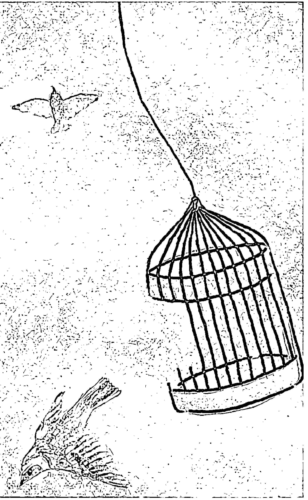

## 一 財運篇

### 基本卦解——困難在七天內必可解決

如果你正身陷於財務危機，那恭喜了，因為在七天內這個困難一定可以解決。但如果你現在並沒有財務上的問題，那麼你心中想進行的求財計畫則會泡湯、停止進行了！

- ❖偏財指數：60分／財運旺度：$

### 從占卜時間看終極預測

晚間十一點—凌晨一點、上午十一點—下午一點

- 行動的有利時機：農曆九到十二月
- 助旺財運的地方：西方、北方、有音樂播放的酒吧或咖啡館
- 助旺財運的顏色：粉紅色、藍色、灰色
- 投資的幸運數字：1、2、6、7
- 終極預測及建議：第四十七卦『澤水困』——一籌莫展，進退為難。一件事之所以會成功，其實都少不了好的機會與運氣，而你目前的處境正缺少了這些成功的重要因素，導致你在誤判情勢下貿然投入，以致面臨一波又一波的困難，讓你進退為難。唯一的解決方式就是快快抽身離開，方為上策。
- 偏財指數：0分／財運旺度：⊗⊗⊗⊗⊗

凌晨一點—凌晨三點、下午一點—下午三點

- 行動的有利時機：農曆十到十二月
- 助旺財運的地方：北方、靠近有水的地方
- 助旺財運的顏色：藍色、灰色
- 偏財指數：0分／財運旺度：⊗⊗⊗⊗⊗

凌晨三點—凌晨五點、下午三點—下午五點

- 行動的有利時機：農曆一到三月、十到十二月
- 助旺財運的地方：東方、北方、靠近公園的咖啡館
- 助旺財運的顏色：藍色、灰色
- 投資的幸運數字：1、4、6
- 終極預測及建議：第五十四卦『雷澤歸妹』——委屈求全，等待機會東山再起。有句話說，「形勢比人強，不得低頭。」當你的財運還不是那麼好的時候，千萬不要迷信「道理」，更不要賭氣逞強，也不能固執硬拗，因為只有見風轉舵、順著趨勢走，才能保住你的本錢；等財運到了，自然能開開心心賺錢。

- 偏財指數：45分／財運旺度：⊗
- 終極預測及建議：第六十四卦『火水未濟』——時機尚未成熟，仍需等待。抽到這一卦的人先不要急於求財，因為時機還沒有成熟，你必須耐心等待。等到時機對了，財運自然成熟後，才算是真正打開目前沉悶的局面。
- 投資的幸運數字：1、6

#### 偏財指數：45分／財運旺度：⊗

- ◆行動的有利時機：農曆九到十二月
- ◆助旺財運的地方：西方、北方、地鐵站的咖啡館
- ◆助旺財運的顏色：粉紅色、藍色、灰色
- ◆投資的幸運數字：1、2、6、7

做的的事，那麼財利自然會進你的口袋。做激烈的求財競爭，只需要順著形勢做自己該有這種意味，這表示你不需要冒很大的風險去而然就會成功。抽到此卦者，求財過程多少也起來好像不用什麼大動作、大計畫，事情自然水推舟，Money自然來。所謂無為而治，是看

#### 終極預測及建議：第十六卦『雷地豫』——順

- ◆偏財指數：82分／財運旺度：$$$$$
- ◆行動的有利時機：農曆一到三月、十到十二月
- ◆助旺財運的地方：東南方、北方、花市、喝茶
- ◆助旺財運的顏色：粉紅色、灰色、藍色
- ◆投資的幸運數字：1、6、7
- ◆終極預測及建議：第七卦『地水師』——需要

#### 偏財指數：78分／財運旺度：$$$$

不妨選擇好的投資項目，採定期、定量分批購買的方式，進行中長期投資為宜。長期持有的狀態。如果你尚未進行投資，則不股票、債券、基金是否有獲利，此時應保持中態應屬後者的格局。所以，建議不管已下手的則要靠長時間醞釀而獲利。抽得此卦的求財狀態有恆為成功之本。有些投資可以走短線，有些

#### 終極預測及建議：第三十二卦『雷風恆』——

- ◆行動的有利時機：農曆九到十二月
- ◆助旺財運的地方：西方、北方、有音樂播放的咖啡館
- ◆助旺財運的顏色：綠色、藍色、灰色
- ◆投資的幸運數字：1、4、6
- ◆終極預測及建議：第七卦『地水師』——需要

以激烈手段競爭而得財。非常時期要採取非常手段，為了達成賺錢目標，抽到這一卦的人必須進行競爭激烈的求財攻勢，以霹靂手段讓對手屈服，利益全歸你所有。但是這樣的過程中，你也必須付出相當的代價。

- 偏財指數：65分／財運旺度：$$

## 二 感情篇

### 基本卦解——七天之內見分曉

得此卦者會遇到兩種情況，在七天內就會得到答案。第一種情況：已留不住對方，到了分手互道珍重、說聲再見的時候了，也許是無言的結局，淡淡的分手。第二種情況：也許你與對方和好如初的時候快要到了！彼此冷戰不講話，可找個藉口主動打電話給對方，說不定馬上就能雨過天晴，喜劇收場。

- 愛情指數：第一種情況23分，第二種情況68分
- 愛情熱度：第一種情況⊗⊗⊗，第二種情況♡♡

### 從占卜時間看終極預測

- 最美好的相處方式：用智慧來解決問題
- 最理想的穿著打扮：多樣化的裝扮
- 助旺愛情運的顏色：藍色、灰色、黑色、紫色

- 終極預測及建議：第四十七卦「澤水困」——枯萎的苦戀花。這是一段不可告人的苦戀，對方表面上雖然沒有說不愛你，但兩人的相愛總是困難重重，對方不懂得替你著想，更不會跟你一起面對難關，所有的壓力與困境總是得自己一人去承擔，最後落得只剩自己獨嘗愛情苦果。

- 愛情指數：23分／愛情熱度：⊗⊗⊗⊗

- 最美好的相處方式：找出對方感興趣的事物，培養雙方共同的興趣
- 最理想的穿著打扮：航海裝扮
- 助旺愛情運的顏色：藍色、灰色、紫色

最理想的約會地點：酒吧、水上活動場所
終極預測及建議：第六十四卦『火水未濟』——沒有共同想法的空洞感情。你們兩人的想法與喜好完全不一樣，但還不至於到吵架的地步，只不過無法產生愛的火花與共鳴，因為兩人的頻道接不在一起。雖然在一起，卻往往是各忙各的、各玩各的，時間久了，感情自然就變淡了！

愛情指數：58分／愛情熱度：⊗

- 凌晨三點—凌晨五點、下午三點—下午五點
- 最美好的相處方式：感覺受委屈的事情不要做
- 最理想的穿著打扮：水手裝扮
- 助旺愛情運的顏色：藍色、灰色、黑色、紫色
- 最理想的約會地點：靠近水邊的娛樂場所
- 終極預測及建議：第五十四卦『雷澤歸妹』——

後果往往不堪設想。

愛情指數：46分／愛情熱度：⊗⊗

你們兩人的想法與喜好完全不一樣，但還不至於到吵架的地步，只不過無法產生愛的火花與共鳴，因為兩人的頻道接不在一起。雖然在一起，卻往往是各忙各的、各玩各的，時間久了，感情自然就變淡了！

- 凌晨五點—上午七點、下午五點—下午七點
- 最美好的相處方式：聰明伶俐、有智慧的幫助對方
- 最理想的穿著打扮：海洋風的裝扮
- 助旺愛情運的顏色：白十藍色、灰色、紫色
- 最理想的約會地點：海洋公園、咖啡廳、酒吧
- 終極預測及建議：第十六卦『雷地豫』——情投意合。你們是一對開心的戀人，女生對男生的細心體貼，可說是無微不至，彼此相互了解，也尊重對方，兩人對未來也充滿了希望與夢想，若想談論婚嫁，現在就是開花結果的季節。

喝咖啡或飲茶

終極預測及建議：第三十二卦『雷風恆』——

夫唱婦隨。通常女方會順著男方的節奏起舞，雙方配合的很好，彼此都已認定對方是這一生最好的選擇，不會再被外界所誘惑而三心兩意。這份感情就像童話故事所說的：王子與公主將幸福美滿的過一生！

愛情指數：92分／愛情熱度：❤️❤️❤️❤️❤️

- 上午九點—上午十一點、晚間九點—晚間十一點
- 最美好的相處方式：要耍小手段，讓事情變得更好
- 最理想的穿著打扮：水手風的打扮
- 助旺愛情運的顏色：白色、金＋藍色、灰色
- 最理想的約會地點：酒吧、咖啡廳、游泳池
- 終極預測及建議：第七卦『地水師』——逼婚才有可能成功。男方頗為瀟灑，可說是師奶殺手，異性緣好到不行；女方則屬於實力派，條件也不差。但如果要完全消除男方老愛做大人情的毛病，或想要談論婚嫁，女方必須要拿出王牌來催促、逼使對方就範才可能成功。

愛情指數：68分／愛情熱度：❤️❤️❤️

## 第四十一卦 搟卦——山澤損

### 卦象的基本性質及吉凶解讀

本卦在六十四卦中屬於先利他人再利己，乃先損後益之卦。

## 一 財運篇

### 基本卦解——宜守忌攻，先損後益

得此卦者，在求財的過程必定會先賠錢，先有損失才會有獲利機會；但就算獲利也不會太多，只能當做吸收求財經驗。因此建議你下手不要太猛，留點實力等待下一次的機會。

- ◆偏財指數：58分／財運旺度：◎◎

### 從占卜時間看終極預測

晚間十一點—凌晨一點、上午十一點—下午一點

- 行動的有利時機：農曆六到九月、十二月下旬月
- 助旺財運的地方：西南方、東北方、露天咖啡館
- 助旺財運的顏色：黑色、白色、黃色
- 投資的幸運數字：2、3、7、8

終極預測及建議：第三十八卦『火澤睽』——求財不得，反惹是非。個性急躁的人、或在特定行業工作的人抽到這一卦，要特別小心了。因為得此卦者，容易在求財過程中因與人意見不合、或利益分配不當而不開心，因而跟人吵架、翻臉！俗話說的好，求財不求氣。凡事應退一步來想，讓大事化小、小事化無。

- ◆偏財指數：23分／財運旺度：◎◎◎

凌晨一點—凌晨三點、下午一點—下午三點

- 行動的有利時機：農曆六到九月、十二月下旬月
- 助旺財運的地方：西南方、東北方、露天咖啡館
- 助旺財運的顏色：黑色、白色、黃色
- 投資的幸運數字：2、3、7、8

終極預測及建議：第六十一卦『風澤中孚』——誠信求財必可獲利。商場如戰場，有時候免不了會耍心機、故佈疑陣；但抽到這一卦的人，建議你在這次的求財過程中千萬別來這一套，買賣雙方都應以誠信為最高原則，這樣的求財方式才是上策。

- ◆偏財指數：68分／財運旺度：$$

曾在你求財的過程中拉你一把。如果能把握住這種千載難逢的機會，則財運亨通。

- ◆偏財指數：85分／財運旺度：$$$$$
- ◆行動的有利時機：農曆六月到九月、下午五點—下午七點
- ◆助旺財運的地方：西南方、大賣場
- ◆助旺財運的顏色：米白色、黃色、黑色
- ◆投資的幸運數字：3、8、9
- ◆終極預測及建議：第四卦「山水蒙」——狀況不明，守財為上。一艘船在海上航行，當四周都起霧時，就要小心行駛了，否則會觸礁、甚至沉船。同樣的，當我們的投資環境處於不利的狀況，或是對投資工具不太了解的時候，千萬不要冒冒失失的出手，否則賠錢的機率相當高。
- ◆偏財指數：20分／財運旺度：⊗⊗⊗
- ◆行動的有利時機：上午七點—上午九點、晚間七點—晚間九點
- ◆行動的有利時機：農曆六到九月

助旺財運的地方：西南方、南方、百貨公司、燒烤店

- ◆助旺財運的顏色：紅色、黑色、黃色
- ◆投資的幸運數字：3、8、9
- ◆終極預測及建議：第二十七卦「山雷頤」——先充實條件，再談賺錢計畫。以你現在的條件，與你所計畫想求財的目標並不相符，甚至有嚴重不足的地方。建議你，先用心充實好本身的條件，等提升水準之後，再重新訂出求財計畫比較好。
- ◆偏財指數：62分／財運旺度：$
- ◆行動的有利時機：上午九點—上午十一點、晚間九點—晚間十一點
- ◆助旺財運的地方：西南方、南方、大賣場、燒烤店
- ◆助旺財運的顏色：紅色、黃色、橘色
- ◆投資的幸運數字：3、8、9
- ◆終極預測及建議：第二十六卦「山天大畜」——眼光放遠，財利必豐。求財有大小之分，也有短暫之財與長久之財的分別。抽到這一卦，表## 二 感情篇

### □ 基本卦解 — 默默付出

两个人谈恋爱，难免有一方会多付出一些，你正是这位默默付出的人。有句话说付出就是获得，这也是在告诉你，眼前看来或许你有点吃亏，但这分看似吃亏的感情，往远处看，到头来也许占便宜的反而是你。

- ◆ 爱情指数：68分／爱情热度：❤❤

### □ 从占卜时间看终极预测

- ◆ 最美好的相处方式：用包容的心来化解暴戾之气
- 晚间十一点—凌晨一点、上午十一点—下午一点
- ◆ 最理想的穿着打扮：复古朴实的装扮
- ◆ 助旺爱情运的颜色：白色、黑色、黄色、棕色
- ◆ 最理想的约会地点：观光果园、百货公司、宁静的山上

### ◆ 终极预测及建议：第三十八卦「火泽睽」——

前世相欠、吵架冤家。两人的个性完全不一样，看事情的角度与想法也不同，根本没办法一起聊事情，一聊天就吵架，吵半天也不会有结论与共识。到头来，愈吵愈是一肚子火，感情也愈来愈淡薄。两人会兜在一起根本是前世相欠，

- ◆ 爱情指数：13分／爱情热度：⊗⊗⊗⊗⊗

这是一对标准的吵架冤家。两人会兜在一起根本是前世相欠，

### ◆ 终极预测及建议：第六十一卦「风泽中孚」——

- ◆ 最理想的约会地点：山上的休闲餐馆、大卖场
- ◆ 助旺爱情运的颜色：白色、黄色、咖啡色
- ◆ 最理想的穿着打扮：复古自在的装扮
- ◆ 最美好的相处方式：被动等待对方约你，但彼此要充分信任
- 凌晨一点—凌晨三点、下午一点—下午三点

天长地久。你们自交往以来，给对方的承诺从未失信过，在彼此心目中，对方是个可以托付终生的人。互相依赖、不分彼此，是这段感情最可贵的地方。如果想谈论婚嫁，随时都可以进行，而且会有圆满的结果。

- ◆ 爱情指数：90分／爱情热度：❤❤❤❤❤
- ◆ 最美好的相处方式：让对方感受到你的关怀，凌晨三点—凌晨五点、下午三点—下午五点
- ◆ 最理想的穿着打扮：自在朴素的装扮
- ◆ 助旺爱情运的颜色：米白色、黄色、咖啡色
- ◆ 最理想的约会地点：山上的休闲农场、大卖场、百货公司

终极预测及建议：第十九卦『地泽临』——爱神降临。爱神丘比特的箭已发射，正中你们的心，机会与幸福在此时已掌握在你们的手里。如果你觉得对方的条件与人品都令你满意，千万不要再三心两意，立即采取行动，不要让幸福悄悄的从你身边溜走了！

- ◆ 爱情指数：88分／爱情热度：❤❤❤❤❤
- ◆ 最美好的相处方式：不了解的事不要去做，凡事多替自己着想，凌晨五点—上午七点、下午五点—下午七点
- ◆ 最理想的穿着打扮：成熟的打扮
- ◆ 助旺爱情运的颜色：橘黄色、红色、黑色、棕色
- ◆ 最理想的约会地点：你熟悉而热闹的地方

终极预测及建议：第四卦『山水蒙』——雾里看花。对方根本没有真正的投入这段恋情，所以才会让你好像站在十字路口，一时之间不知该何去何从，更不知该如何跟对方相处。目前你正面临进退为难、颇为尴尬的时期，其实别想得太多，既然看不清楚，不妨淡淡的放下，等看清楚了再出发还来得及。

- ◆ 爱情指数：48分／爱情热度：⊗⊗⊗
- ◆ 最美好的相处方式：让对方感受到你的关怀，上午七点—上午九点、晚间七点—晚间九点

但要小心不要说错话

- ◆ 最理想的穿着打扮：成熟的打扮
- ◆ 助旺爱情运的颜色：橘黄色、红色、黑色、米白色
- ◆ 最理想的约会地点：人潮多又热闹的地方

◆ 终极预测及建议：第二十七卦「山雷颐」——

贫贱夫妻百事哀。你们这段恋情只有恋爱的冲动，缺乏恋爱的长远计划，更缺少足够的经济条件去支撑日常的开支。如果不赶快务实地去面对经济压力、寻求解决之道，将很难长期交往下去。

- ◆ 爱情指数：59分／爱情热度：♥

上午九点—上午十一点、晚间九点—晚间十一点

- ◆ 最美好的相处方式：让对方感觉你凡事都有为他设想
- ◆ 最理想的穿着打扮：复古成熟的装扮
- ◆ 助旺爱情运的颜色：黄色、白色、黑色
- ◆ 最理想的约会地点：大卖场、百货公司

◆ 终极预测及建议：第二十六卦「山天大畜」——

门当户对。你们的学历、社会地位、家境背景都不错，有缘成为恋人可能是彼此前生修来的福气，只要有始有终，除了感情丰收之外，一定会有其他好的收获。请你们要好好把握这段难得的缘份。

- ◆ 爱情指数：92分／爱情热度：♥♥♥♥♥♥

## 第四十二卦 益卦——风雷益

### 卦象的基本性质及吉凶解读

> 本卦在六十四卦中属于相辅相成，利己利人之吉卦。

## 一 财运篇

### □ 基本卦解——偏财机会来了

抽到这一卦，表示天时、地利、人和，事事都畅通，

并且在赚钱的过程中还有很多好朋友替你高兴，只要你懂得如何与别人分享，这样的赚钱机会将持续不断。

- ◆ 偏财指数：88分／财运旺度：$$$$$

### 从占卜时间看终极预测

晚间十一点—凌晨一点、上午十一点—下午一点

- ◆ 行动的有利时机：农历十到十二月
- ◆ 助旺财运的地方：东方、北方、海洋公园
- ◆ 助旺财运的颜色：蓝色、绿色
- ◆ 投资的幸运数字：1、4、6
- ◆ 终极预测及建议：第二十五卦「天雷无妄」—— 求财变破财，倒霉到家。你总是那个倒霉的「最后一只老鼠」！看到人家赚钱，你去追同样的股票却碰上股市大跌而赔钱；别人投资赚钱的公司，红利分不完，你看了也想跟着插花，无奈一进场就遇到公司老板恶性倒闭，害得你原本想求财却反而破大财！

- ◆ 偏财指数：0分／财运旺度：╳╳╳

凌晨一点—凌晨三点、下午一点—下午三点

- ◆ 行动的有利时机：农历一到三月
- ◆ 助旺财运的地方：东南方、机场
- ◆ 助旺财运的颜色：绿色
- ◆ 投资的幸运数字：4、5

### ◆ 终极预测及建议：第二十七卦「山雷颐」——

先充实条件，再谈赚钱计划。以你现在的条件， 与你所计划求财的目标并不相符，甚至有严重不足的地方。建议你，先用心充实好本身的条件，等提升水准之后，再重新订出求财计划比较好。

- ◆ 偏财指数：62分／财运旺度：＄

凌晨三点—凌晨五点、下午三点—下午五点

- ◆ 行动的有利时机：农历一到三月、十到十二月
- ◆ 助旺财运的地方：东南方、北方、水上乐园
- ◆ 助旺财运的颜色：蓝色、绿色、灰色
- ◆ 投资的幸运数字：1、4、5、6
- ◆ 终极预测及建议：第三卦「水雷屯」—— 小心陷阱，切忌贪多求快。投资股票有所谓的「地雷股」，如果投资太多而且误中「地雷」，就会死的很惨。所以投资前必须多做功课，眼睛放亮一点，才能避开陷阱。不管怎样，抽到这一卦的人在此时此刻是不宜出手的，还是奉劝你等待下一次机会吧！

- ◆ 偏财指数：0分／财运旺度：╳╳╳╳╳

### **凌晨五点—上午七点、下午五点—下午七点**

- ◆ 行动的有利时机：农历一到三月
- ◆ 助旺财运的地方：东方、热闹的市场、健身房
- ◆ 助旺财运的颜色：绿色
- ◆ 投资的幸运数字：4、5
- ◆ 终极预测及建议：第二十卦『风地观』——不可孤注一掷。在情况不明的情形下最忌贸然进行求财，万一在不对的时机出手，只会损失惨重，悔不当初。建议你，多收集资料继续观察。如果在十天之内还是看不清楚求财状况，就放弃吧！

- ◆ 偏财指数：50分／财运旺度：⊗

### **上午七点—上午九点、晚间七点—晚间九点**

- ◆ 行动的有利时机：农历十到十二月
- ◆ 助旺财运的地方：北方、靠近有水的地方
- ◆ 助旺财运的颜色：蓝色、灰色
- ◆ 投资的幸运数字：1、6
- ◆ 终极预测及建议：第六十一卦『风泽中孚』——诚信求财必可获利。商场如战场，有时候免不了会耍心机、故布疑阵；但抽到这一卦的人，建议你在这次的求财过程中千万别来这一套，买卖双方都应以诚信为最高原则，这样的求财方式才是上策。

- ◆ 偏财指数：70分／财运旺度：$$

### **上午九点—上午十一点、晚间九点—晚间十一点**

- ◆ 行动的有利时机：农历一到三月
- ◆ 助旺财运的地方：东方、健身房、热闹的夜市
- ◆ 助旺财运的颜色：绿色
- ◆ 投资的幸运数字：3、4、5、8
- ◆ 终极预测及建议：第三十七卦『风火家人』——求财之前先推销自己。行销学有句名言：在推销商品之前，必先推销你自己。意思是，如果你表现优越，对方一旦接受你个人的风格与想法后，就等于开启了求财的大门，后续发展就一切好办。

- ◆ 偏财指数：68分／财运旺度：$$

## 二 感情篇

### 一 基本卦解——天作之合

你们彼此配合的相当好，简直是郎才女貌，无论家人或朋友都觉得你们是天造地设的一对，伴随着亲友的祝福声，相信你们的好事也不远了！如果你已婚，夫妻间的感情与婚姻生活将更加甜蜜。

- ◆ 爱情指数：96分／爱情热度：❤❤❤❤❤

### 一 从占卜时间看终极预测

- ◆ 晚间十一点—凌晨一点、上午十一点—下午一点
- ◆ 最美好的相处方式：不要做出容易被误解的事，并尽量配合对方
- ◆ 最理想的穿着打扮：与对方搭配的休闲装扮
- ◆ 助旺爱情运的颜色：白＋蓝＋绿色
- ◆ 最理想的约会地点：靠近有水的公园
- ◆ 终极预测及建议：第二十五卦『天雷无妄』——为什么我总是那么倒霉。好事总是没你的份，

本来与你不相干的倒霉事，总算轮到你的头上。少说多听，少做多看，做任何事都要小心，不要误中陷阱。

- ◆ 爱情指数：52分／爱情热度：⊗⊗
- 下午三点—下午五点
- ◆ 最美好的相处方式：多增强自己的条件，柔顺的对待对方
- ◆ 最理想的穿着打扮：休闲情侣装
- ◆ 助旺爱情运的颜色：白＋蓝＋绿色
- ◆ 最理想的约会地点：安静的休闲场所
- ◆ 终极预测及建议：第二十七卦『山雷颐』——贫贱夫妻百事哀。你们这段恋情只有恋爱的冲动，缺乏恋爱的长远计划，更缺少足够的经济条件去支撑日常的开支。如果不赶快务实地去面对经济压力、寻求解决之道，将很难长期交往下去。

- ◆ 爱情指数：59分／爱情热度：❤

#### 终极预测及建议：第二十卦『风地观』——

凌晨三点—凌晨五点、下午三点—下午五点

- ◆ 最美好的相处方式：选择性的顺从对方的想法
- ◆ 最理想的穿着打扮：海洋风的休闲打扮
- ◆ 助旺爱情运的颜色：白＋蓝＋绿色
- ◆ 最理想的约会地点：靠近有水的公园
- ◆ 终极预测及建议：第三卦『水雷屯』——爱情悲剧。你们之间的困难，几乎连老天都没办法帮你们解决。在感情上可能碰到三角关系，或许经济上也会产生困难，成了没有面包的爱情，彼此很难再走下去。

- ◆ 爱情指数：13分／爱情热度：◎◎◎◎◎

- ◆ 爱情指数：46分／爱情热度：◎◎ 好检视一下这份感情的时候了！ 而产生风风雨雨。所以应该是冷静、客观，好 或经济上出现困难等，连带影响彼此的感情，的因素阻碍着你们。例如彼此身份的不速配， 走边看。你们的感情面临瓶颈，因为有些现实 有安全感 最美好的相处方式：凡事都坦诚以对，让对方 上午七点—上午九点、晚间七点—晚间九点 最理想的穿着打扮：情侣运动装 助旺爱情运的颜色：白十蓝十绿色 最理想的约会地点：彼此都喜欢的热闹场所或运动的地方 终极预测及建议：第六十一卦『风泽中孚』——天长地久。你们自交往以来，对方的承诺从未失信过，在彼此心目中，对方是个可以托付终生的人。互相依赖、不分彼此，是这段感情最可贵的地方。如果想谈论婚嫁，随时都可以进行，而且会有圆满的结果。

- ◆ 爱情指数：90分／爱情热度：♡♡♡♡♡

- ◆ 最美好的相处方式：如家人般的彼此对待
- ◆ 最理想的穿着打扮：对方喜欢的运动装扮
- ◆ 助旺爱情运的颜色：白＋蓝＋绿色
- ◆ 最理想的约会地点：风格阳光的运动场所
- ◆ 终极预测及建议：第三十七卦「风火家人」—— 缘定三生。你们除了一对恋人，还多了兄弟姐妹般的感情，两人在一起时就像家人般亲密，彼此相亲相爱、尊重对方。

上午九点—上午十一点、晚间九点—晚间十一点

- ◆ 最美好的相处方式：如家人般的彼此对待
- ◆ 最理想的穿着打扮：对方喜欢的运动装扮
- ◆ 助旺爱情运的颜色：白＋蓝＋绿色
- ◆ 最理想的约会地点：风格阳光的运动场所
- ◆ 终极预测及建议：第三十七卦「风火家人」—— 缘定三生。你们除了一对恋人，还多了兄弟姐妹般的感情，两人在一起时就像家人般亲密，彼此相亲相爱、尊重对方。

## ☱ 第四十三卦 夬卦 澤天夬

> 卦象的基本性质及吉凶解读

本卦在六十四卦中属于坚毅果断之决策卦。

## 一 财运篇

### 基本卦解——当机立断偏财来

不管你现在的求财状况是赚或赔，想再追加投资金额或是壮士断腕而停损，此时都要赶快当机立断，做出明快决定，以免夜长梦多。倘若当下不做任何决定，采观望态度，只会愈来愈坏。

- ◆ 偏财指数：62分／财运旺度：$

### 从占卜时间看终极预测

- 晚间十一点—凌晨一点、上午十一点—下午一点
- 凌晨一点—凌晨三点、下午一点—下午三点
- 行动的有利时机：雨天、农历三月下半月、十到十二月
- 助旺财运的地方：北方、咖啡厅、酒吧
- 助旺财运的颜色：蓝色、灰色、黑色
- 投资的幸运数字：1、6
- 终极预测及建议：第三十四卦「雷天大壮」——不要光说不练。做广告是不嫌夸大其词的，但若做人处世的态度经常是画大饼、说大话，就流于不实在了。一个只爱做梦、行为浮夸的人，绝对是不容易赚到钱的。抽到这一卦的人，坐而言不如起而行，应多做少说，不要光说不练。
- ◆ 偏财指数：15分／财运旺度：⊗

- 凌晨三点—凌晨五点、下午三点—下午五点
- 行动的有利时机：下大雨的时候、农历十到十二月
- 助旺财运的地方：北方、靠近河流的地方、游泳池附近
- 助旺财运的颜色：蓝色、灰色、黑色
- 投资的幸运数字：1、6
- 终极预测及建议：第一卦「乾为天」——旺到最高点。财运好到连自己都不太相信，不论是投资股票、基金，做长线或炒短线都旺到极点，甚至打个小牌也会一家赢三家，统一发票少说也有两百元的安慰奖。不过，凡事都会物极必反，抽到这支大旺卦的你应居安思危，因为获利高峰期即将过去，此时最好先准备稳健的理财方法。

- ◆ 偏财指数：96分／财运旺度：$$$$$

- 凌晨五点—上午七点、下午五点—下午七点
- 行动的有利时机：雨天、农历七到十二月
- 助旺财运的地方：北方、海洋馆或水族馆
- 助旺财运的颜色：蓝色、灰色、黑色
- 投资的幸运数字：1、6
- 终极预测及建议：第二十八卦「泽风大过」——降低投资金额，保守为上。也许在赚钱的过程中因为求好心切而不断追加预算，拼命加码的结果反而让自己备感压力而快受不了了！所以，现在你应该想办法在适当的时机减轻资金周转的压力，一旦压力少了，自然可以冷静思考该如何反败为胜。

- ◆ 偏财指数：60分／财运旺度：$

- 上午七点—上午九点、晚间七点—晚间九点
- 行动的有利时机：雨季、农历十到十二月
- 助旺财运的地方：北方、咖啡厅、酒吧
- 助旺财运的颜色：蓝色、灰色、黑色
- 投资的幸运数字：1、6
- 终极预测及建议：第五十八卦「兑为泽」——健谈又有说服力的人更是公关好手，所以，抽到此卦的人，应多多利用你的口才，经常跟别人聊天来增加求财的机会。当双方聊得很开心的时候，什么事情都好谈，那么你在求财时自然能水到渠成。

- ◆ 偏财指数：82分／财运旺度：$$$$$

## 二 感情篇

### 基本卦解——等他来找你吧！

两个人的观念不同，对方怕你太过干预她的生活，希望有更多的自由空间，所以，你愈是采取主动的攻势，对方会愈厌烦，而对这段感情产生困扰。建议你，交往速度不妨放慢一点，多听听对方的想法，多尊重对方的自由空间，那么你们的相处自然会渐入佳境。

- ◆ 爱情指数：68分／爱情热度：♡

### 二 从占卜时间看终极预测

- ◆ 最美好的相处方式：保持高姿态，但不要忘记多跟对方聊聊天
- ◆ 最理想的穿着打扮：三分可爱、七分高规格的打扮
- ◆ 助旺爱情运的颜色：白色、粉红色
- ◆ 最理想的约会地点：豪华的场合、卡拉OK
- ◆ 终极预测及建议：第五卦「水天需」——戒急用忍。有些事可以急功近利，有些事则应该慢慢培养。你们双方的条件不是很相配，表示缺少了一些谈爱情必须具备的基础，所以要耐心等待，默默的增进自己的条件，当时机成熟的时候，自然会有好的结果。

- ◆ 爱情指数：58分／爱情热度：⊗
- ◆ 最美好的相处方式：有自信的多跟对方聊聊天，但别期望太多
- ◆ 最理想的穿着打扮：三分可爱、七分高规格的## 打扮

- 助旺愛情運的顏色：白色、粉紅色、紅色、米黃色
- 最理想的約會地點：歌劇院、豪華氣派的地方

終極預測及建議：第三十四卦「雷天大壯」——光說不練。說的比做的多，什麼都說OK、沒問題，但到頭來不是一直拖延沒做，就是忘得一乾二淨。只聽到好聽的承諾與計畫，卻沒有幾件答應下來的事情是真正可以做到的。套句成語，這就是「空口說白話」。

- 愛情指數：60分／愛情熱度：❤️

凌晨三點—凌晨五點、下午三點—下午五點

- 最美好的相處方式：灑脫、自信、健談
- 最理想的穿著打扮：八分豪華、兩分可愛
- 助旺愛情運的顏色：白色、粉紅色、紅色
- 最理想的約會地點：高檔的場所、歌劇院

終極預測及建議：第一卦「乾為天」——天王VS天后，互相輝映。雙方都是有自信、傲氣的萬人迷，凡事都自以為是，好處是誰也不依賴誰，相好的時候會互相欣賞對方，甚至以對方為傲；吵架的時候，會以為自己條件那麼好，不怕沒人愛，而擺出高姿態，希望對方聽自己的話，結果愈弄愈糟。

- 愛情指數：72分／愛情熱度：❤️❤️❤️

凌晨五點—上午七點、下午五點—下午七點

- 最美好的相處方式：臭屁一點，但不要打腫臉充胖子
- 最理想的穿著打扮：多用名牌
- 助旺愛情運的顏色：白色、紅色、米色
- 最理想的約會地點：大型的公共場所

終極預測及建議：第二十八卦「澤風大過」——單方付出的關係。在這段愛情關係裡，你總是付出的那一方，時間久了難免會覺得有壓力又很委屈，心裡充滿著不平衡的感受。如果不趕快想辦法改善雙方的關係，讓對方也懂得對你付出，小心這段感情可能就撐不了太久啦！

- 愛情指數：63分／愛情熱度：❤️

上午七點—上午九點、晚間七點—晚間九點

- 最美好的相處方式：知錯能改，但不失自信
- 最理想的穿著打扮：整潔大方
- 助旺愛情運的顏色：米黃＋白色
- 最理想的約會地點：大型的公共場所

### ❖ 終極預測及建議：第四十九卦『澤火革』

舊的不去，新的不來。兩人的交往拖得太久了又沒有什麼新花樣，你覺得這段感情不好玩了，對對方慢慢失去新鮮感，甚至會有一種厭倦的感覺。這個時候，你會出現想換對象的想法哦！對剛剛失戀，或剛離婚的人來說，抽到這一卦反而是好消息，可能會有一段新感情，悄悄來敲門！

- 愛情指數：有對象者♡，無對象者♡♡♡♡
- 最理想的穿著打扮：六分名牌、四分可愛
- 助旺愛情運的顏色：白色、粉紅色、紅色
- 最理想的約會地點：卡拉OK、地鐵站附近

### ❖ 終極預測及建議：第五十八卦『兌為澤』

上午九點—上午十一點、晚間九點—晚間十一點

- 最美好的相處方式：多用豐富的話題來表現自己的優點

聊天高手。兩人都很喜歡聊天，稱得上是聊天高手，拿起手機可以講上三天三夜，在一起的時候都很開心。但小心話說多了難免會說錯話，而讓對方不高興。建議你，把握兩人一起聊天的快樂時刻，但要小心樂極生悲。

- 愛情指數：72分／愛情熱度：♡♡♡♡

## 第四十四卦 姤卦——天风姤

> 卦象的基本性质及吉凶解讀

本卦在六十四卦中屬於男女邂逅，但利女不利男之桃花卦。

## 一 財運篇

### 基本卦解——短線獲利，見好就收

得此卦者有上司與長輩的貴人緣，他們會對你關愛有加，並提供求財的機會給你，但都屬於短期中小型的獲利，所以不要貪心，見好就收；也不要期待會有大財或長遠的獲利發展。若是女性得此卦，則獲利會更高。

- 偏財指數：78分／財運旺度：$$$$

### 从占卜时间看终极预测

- 晚间十一点—凌晨一点、上午十一点—下午一点
- 行动的有利时机：下雨的时候、雨季、农历十到十二月
- 助旺财运的地方：北方、咖啡厅
- 助旺财运的颜色：灰色、黑色、紫色、蓝色
- 投资的幸运数字：1、6

终极预测及建议：第一卦「乾为天」——旺到最高点。财运好到连自己都不太相信，不论是投资股票、基金，做长线或炒短线都旺到极点，甚至打个小牌也会一家赢三家，统一发票少说也有两百元的安慰奖。不过，凡事都会物极必反，抽到这支大旺卦的你，应居安思危，因为获利高峰期即将过去，此时最好先准备稳健的理财方法。

- 偏财指数：96分／财运旺度：$$$$

- 凌晨一点—凌晨三点、下午一点—下午三点
- 行动的有利时机：农历七到十二月
- 助旺财运的地方：北方、水族馆
- 助旺财运的颜色：米白色+蓝色
- 投资的幸运数字：1、2、6、7

终极预测及建议：第六卦「天水讼」——当心因财失义。得此卦者若想求财，最好个别行动，千万不要跟别人有任何牵扯，因为牵扯愈多，到最后会因为误解或交待不清之处与他人产生争执，严重的话可能会闹上法庭成为被告。求财时也要留意文件契约的内容，以免赚不到钱。

- 凌晨三点—凌晨五点、下午三点—下午五点

看得见却赚不到。抽到这一卦的人，有种老是跟财神爷擦身而过的感觉，偏财明明就可以到手，却在临门一脚错失良机，就好像追星族，老是追著财神爷跑，到现在都还停留在玩「躲猫猫」的游戏阶段。

终极预测及建议：第三十三卦「天山遯」——

- 助旺财运的颜色：黑色、蓝色、紫色、灰色
- 投资的幸运数字：1、4、6
- 偏财指数：3分／财运旺度：⊗

- 凌晨五点—上午七点、下午五点—下午七点
- 行动的有利时机：下雨的时候、雨季、农历十到十二月
- 助旺财运的地方：北方、有山有水的地方
- 助旺财运的颜色：蓝色＋绿色
- 投资的幸运数字：1、3、7、8

终极预测及建议：第五十七卦「巽为风」——虚幻多变的偏财运。你选定的求财方向本来就变化多端，而你自己对这件事的信心也不够，经常摇摆不定。所以，在这种里外都不稳定的情况下想要求财，必须要有很好的机会才能稳稳的赚到钱，否则就会变来变去好比过路财神。

- 偏财指数：62分／财运旺度：$

- 上午七点—上午九点、晚间七点—晚间九点
- 行动的有利时机：下雨的时候、农历三月、农历十到十二月
- 又惹上是非、受骗上当。

- 偏财指数：3分／财运旺度：⊗

- 凌晨五点—上午七点、下午五点—下午七点
- 行动的有利时机：下雨的时候、雨季、农历十到十二月
- 助旺财运的地方：北方、有山有水的地方
- 助旺财运的颜色：蓝色＋绿色
- 投资的幸运数字：1、3、7、8

终极预测及建议：第五十卦「火风鼎」——三个臭皮匠，胜过一个诸葛亮。俗语说的好：「有时候一个人做不到的事情，大家一起来就没那么困难了。抽到这一卦，不管你想要的求财目标是什么，找别人一起团队合作，绝对胜过自己一人单打独斗。」

- 偏财指数：88分／财运旺度：$$$$

- 上午九点—上午十一点、晚间九点—晚间十一点
- 行动的有利时机：农历四月、农历十到十二月、下雨的时候
- 助旺财运的地方：东南方、北方、靠近公园的咖啡厅
- 助旺财运的颜色：绿色＋蓝色、灰色＋绿色
- 投资的幸运数字：1、6

终极预测及建议：第二十八卦「泽风大过」——

降低投资金额，保守为上。也许在赚钱的过程中因为求好心切而不断追加预算，拼命加码的结果反而让自己备感压力而快受不了了！所以现在你应该想办法，在适当的时机减轻资金周转的压力，一旦压力少了，自然可以冷静思考该如何反败为胜。

- 偏财指数：60分／财运旺度：$

## 二 感情篇

### 基本卦解——一夜情

两人偶然相遇，擦出火花，这种感情并不长久。如果你是女生，将是无敌劈腿族，每个男人都被妳要得团团转，妳的要求都能如愿，但这种好事维持不久的，劝妳见好就收。如果你是男生，那就很悲哀了，因为你爱的女生有太多情人，你会追得很辛苦。

- 爱情指数：女生86分，男生68分／爱情热度：女生♥♥♥，男生⊗

### 从占卜时间看终极预测

- 晚间十一点—凌晨一点、上午十一点—下午一点
- 最美好的相处方式：用自信、自恋又果断的方式与对方相处
- 最理想的穿着打扮：高档的打扮
- 终极预测及建议：第一卦『乾为天』——天王 VS 天后
- 最理想的约会地点：气派华丽的地方
- 助旺爱情运的颜色：白色
- 最理想的穿着打扮：高档的打扮
- 爱情指数：72分／爱情热度：♥♥♥

不怕没人爱，而摆出高姿态，希望对方听自己的话，结果会弄巧成拙。

- 凌晨一点—凌晨三点、下午一点—下午三点
- 最美好的相处方式：六分被动、四分主动
- 最理想的穿着打扮：平常休闲田园风，晚宴时则做华丽打扮
- 助旺爱情运的颜色：米黄色、白色、棕色
- 最理想的约会地点：政府的大型公共设施或登山旅游

终极预测及建议：第三十三卦「天山遁」—— 躲猫猫。你很想亲近对方，方法虽然已经很温和又低调了，但对方还是觉得有压力，因此故意不理你、不接电话，甚至不愿意碰面，摆明想逃避这段感情。其实对方希望你冷静一段时间再说话。建议你不妨暂时放下，等待机缘。也许更好的对象正在前方等待着你，何必苦苦单恋对方呢？

- 爱情指数：58分／爱情热度：⊗

- 凌晨三点─凌晨五点、下午三点─下午五点
- 最美好的相处方式：要表现出自己很了不起的样子
- 最理想的穿着打扮：华丽的风格
- 助旺爱情运的颜色：白色、米色
- 最理想的约会地点：公共建筑物

终极预测及建议：第六卦「天水讼」—— 你们是一对冤家。相爱的时间点不对，长辈不赞成你们在一起，甚至极力反对，让这段感情压力很大，加上你们彼此间的爱恨情仇不是别人所能了解的，要好好散恐怕不容易。如果你要个性，强要对方顺从你，搞不好还会闹上法庭。

- 爱情指数：68分／爱情热度：♡♡

- 凌晨五点─上午七点、下午五点─下午七点
- 最美好的相处方式：尽量迎合对方的想法，多变换花样
- 最理想的穿着打扮：休闲风
- 助旺爱情运的颜色：蓝色、粉绿色、灰色、黑色
- 最理想的约会地点：靠近花园的地方

终极预测及建议：第五十七卦「巽为风」—— 爱情像月亮，初一、十五不一样。你们的爱情经常吹着不一样的风，无论在情绪上或想法上，都会起伏不定、变化多端。同时你们两人都缺乏定见与定信，在爱情的路上，容易见一个爱一个，对事不够果决，以致于什么事都反反复复，不容易成功。

- 爱情指数：68分／爱情热度：♡♡

#### 上午七点—上午九点、晚间七点—晚间九点

- 最美好的相处方式：用智慧来解决问题，防第三者介入。
- 最理想的穿着打扮：尽量取悦对方
- 助旺爱情运的颜色：黑色、蓝色、灰色
- 最理想的约会地点：靠近有水的地方
- 终极预测及建议：第五十卦『火风鼎』——你就是那个第三者。你们两人可能正在热恋中，但小心对方可能已婚，或在你之前还有一位要好的异性朋友，正在大搞三角关系。站在你的立场，你可能觉得别人是第三者，但换个位置来看，其实你才是那个第三者呢！

- 爱情指数：72分／爱情热度：♥♥♥

#### 上午九点—上午十一点、晚间九点—晚间十一点

- 最美好的相处方式：想办法让对方对你好一点
- 最理想的穿着打扮：变装秀
- 助旺爱情运的颜色：黑色、蓝色、灰色
- 最理想的约会地点：靠近有水的地方
- 终极预测及建议：第二十八卦『泽风大过』——

单方付出的关系。在这段爱情关系里，你总是付出的那一方，时间久了难免会觉得有压力又很委屈，心里充满着不平衡的感受。如果不赶快想办法改善双方的关系，让对方也懂得对你付出，小心这段感情可能就撑不了太久啦！

- 爱情指数：63分／爱情热度：♥

## 第四十五卦 萃卦——澤地萃

### 卦象的基本性質及吉凶解讀

本卦在六十四卦中屬於出類拔萃，名利雙收之大吉卦。

## 一 財運篇

### 基本卦解——名利雙收，出類拔萃

得此卦者，你得先有名聲後才會獲得利益，這次的求財行動叫好又叫座，而且後面的發展機會很多，只要抱著廣結善緣的心態繼續努力，長遠來看求財獲利是大有可為的。

- 偏財指數：95分／財運旺度：$$$$$

### 從占卜時間看終極預測

- 晚間十一點—凌晨一點、上午十一點—下午一點
- 行動的有利時機：農曆四到六月、十二月下半月
- 助旺財運的地方：東北方、南方、山上寧靜的休閒場所
- 助旺財運的顏色：紅色、白色
- 投資的幸運數字：2、3、8
- 終極預測及建議：第十六卦「雷地豫」——順水推舟，Money自然來。所謂無為而治，是看起來好像不用什麼大動作、大計劃，事情自然而然而就會成功。抽到此卦者，求財過程多少也有這種意味，這表示你不需要冒很大的風險去做激烈的求財競爭，只需要順著形勢做自己該做的事，那麼財利自然會進你的口袋。
- 偏財指數：82分／財運旺度：$$$$

- 凌晨一點—凌晨三點、下午一點—下午三點
- 行動的有利時機：農曆四到六月、十二月下半月
- 助旺財運的地方：東北方、南方、有文化氣息的地方
- 助旺財運的顏色：紅色、米黃色
- 投資的幸運數字：3、5、9
- 終極預測及建議：第十二卦「天地否」——利空出盡，否極泰來。如果你最近老是處處碰壁、求財不順，心情掉到谷底，那麼抽到這一卦反而要恭喜你啦！因為壞運氣即將快到盡頭了，當利空出盡，之後將會漸露曙光。
- 偏財指數：68分／財運旺度：$$

- 凌晨三點—凌晨五點、下午三點—下午五點
- 行動的有利時機：農曆七到九月、十二月下半月
- 助旺財運的地方：東北方、南方、文化藝術展覽場所
- 助旺財運的顏色：白色、米白色
- 投資的幸運數字：2、3、7、8
- 終極預測及建議：第十七卦「澤雷隨」——參考專家意見，隨緣穩健理財。回顧過往的經驗，如果你覺得並不理想，此時不妨多參考不同專家的意見。聽完專家的意見後，要仔細分析一下，看哪一種方式適合你現在的狀況，然後確實去執行；其他的就隨緣了。
- 偏財指數：68分／財運旺度：$$

- 凌晨五點—上午七點、下午五點—下午七點
- 行動的有利時機：農曆六月下旬月到九月、十二月下旬月
- 助旺財運的地方：東北方、西南方、熱鬧的賣場、百貨公司
- 助旺財運的顏色：白色、黑色
- 投資的幸運數字：2、5、7、8
- 終極預測及建議：第四十七卦『澤水困』—— 一籌莫展，進退為難。一件事之所以會成功，其實都少不了好的機會與運氣，而你目前的處境正缺少了這些成功的重要因素，導致你在誤判情勢下貿然投入，以致面臨一波又一波的困難，讓你進退為難。唯一的解決方式就是快快抽身離開，方為上策。
- 偏財指數：0分／財運旺度：◎◎◎◎◎

- 上午九點—上午十一點、晚間九點—晚間十一點
- 行動的有利時機：農曆六月下旬月到九月、十二月下旬月
- 助旺財運的地方：西南方、東北方、中式餐廳
- 助旺財運的顏色：白色、黑色、黃色
- 投資的幸運數字：2、3、5、7、8
- 終極預測及建議：第三十一卦『澤山咸』——

人財兩得，左右逢源。人際關係與運氣都好到不得了，要資金有資金，要關係也有關係，只要你肯開口，要什麼就有什麼。如果你已經有另一半，求財行動最好找對方合作必能成功，還沒有另一半的人，抽到此卦不僅可求財獲利，過程中還能贏得愛情！

- 偏財指數：95分／財運旺度：$$$$$

- 上午七點—上午九點、晚間七點—晚間九點
- 行動的有利時機：農曆三月、六月、九月及十二月的下午月
- 助旺財運的地方：東北方、南方、山上有文化氣息的地方
- 助旺財運的顏色：白色、紅色
- 投資的幸運數字：3、5、7、8
- 終極預測及建議：第八卦「水地比」——和氣生財樂融融。你所努力的求財方向已有明確的目標與架構，如果你是男性，抽到這一支卦表示將有很多紅顏知己給你幫助，讓你在和樂愉快的氣氛下賺錢。如果你是女性，得此卦表示求財一切都要靠自己，外來的助力是很少的。
- 偏財指數：65分／財運旺度：$$

## 二 感情篇

### 基本卦解——濃情蜜意

你們兩人沉浸在愛河裡，彼此互相幫助，也很替對方著想，是標準的「你儂我儂」、恩愛纏綿的情侶。抽得此卦者，你與對方的外型與條件不一定是百分之百的速配，但感情卻是百分之二百的濃情蜜意。

### 從占卜時間看終極預測

- 晚間十一點—凌晨一點、上午十一點—下午一點
- 最美好的相處方式：等待對方來約你
- 最理想的穿著打扮：樸素風
- 助旺愛情運的顏色：米色、黃色、紅色
- 最理想的約會地點：靜態的約會，例如相約去喝咖啡、看電影
- 終極預測及建議：第十六卦「雷地豫」——情投意合。你們是一對開心的戀人，女生對男生的細心體貼，可說是無微不至，彼此相互了解，也尊重對方，兩人對未來也充滿了希望與夢想，若想談論婚嫁，現在就是開花結果的季節。
- 愛情指數：92分／愛情熱度：❤❤❤❤❤

- 凌晨一點—凌晨三點、下午一點—下午三點
- 最美好的相處方式：維持自己的風格與立場，但要等待對方邀約
- 最理想的穿著打扮：簡樸的裝扮
- 助旺愛情運的顏色：紅色、白色、黃色
- 最理想的約會地點：打牌、看電影、喝下午茶、一起吃晚飯
- 終極預測及建議：第十二卦「天地否」——要死不活。雙方的想法有很大的不同，既沒有在一起的地方，也沒有在一起的熱情，彼此的交往顯得有氣無力，連約會都懶了。雙方都沒力氣再交往了，感情如一灘死水，擺明了隨時都可以以分手。
- 愛情指數：55分／愛情熱度：⊗

- 凌晨三點——凌晨五點、下午三點——下午五點
- 最美好的相處方式：等對方來約你，但要多關心對方
- 最理想的穿著打扮：寬鬆而樸素的裝扮
- 助旺愛情運的顏色：黃色、米白色、棕色
- 最理想的約會地點：山上的休閒餐廳或咖啡館
- 終極預測及建議：第十七卦「澤雷隨」——愈追愈累。你很認真的看待這段感情，但對方玩心比較重，對感情的事還沒定下心來，所以你只好凡事遷就對方，順著對方的想法與喜好做事。這種不平等關係拖得愈久，你只有愈累而已。
- 愛情指數：65分／愛情熱度：♡

- 凌晨五點——上午七點、下午五點——下午七點
- 最美好的相處方式：遇到困難的時候不要急，用時間來解決問題
- 最理想的穿著打扮：簡樸的休閒裝扮
- 助旺愛情運的顏色：黃色、棕色、米白色、黑色
- 最理想的約會地點：去郊外野餐、烤肉
- 終極預測及建議：第四十七卦「澤水困」——枯萎的苦戀花。這是一段不可告人的苦戀，對方表面上雖然沒有說不愛你，但兩人的相愛總是困難重重，對方不懂得替你著想，更不會跟你一起面對難關，所有的壓力與困境總是你得自己一人去承擔，最後落得只剩自己獨嘗愛情苦果。
- 愛情指數：23分／愛情熱度：⊗⊗⊗⊗## 第四十六卦 升卦——地風升

> 卦象的基本性質及吉凶解讀
本卦在六十四卦中屬於低調順行，穩中求進之提升卦。

## 一、財運篇

### 基本卦解——偏財運已萌芽，好好培育吧！

你的偏財運已經開始啟動了，但要小心觀察身邊所有不起眼的小財運，因為有些現在看起來不太起眼的小財運，未來會變成大財運。所以千萬不要嫌錢少而不賺，以免坐失良機。

- 偏財指數：72分／財運旺度：$$$$

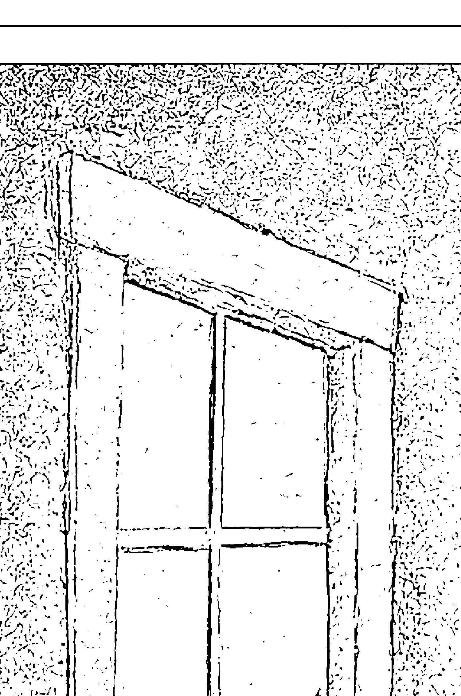

### ◇ 從占卜時間看終極預測

◇ 晚間十一點—凌晨一點、上午十一點—下午一點
- 行動的有利時機：農曆四到六月、十二月下旬
- 助旺財運的地方：東北方、南方、山上的燒烤店
- 終極預測及建議：第十五卦『地山謙』——低調求財好處多。所謂「滿招損、謙受益」，抽到此卦者在求財過程中要低調進行，切忌心高氣傲、自以為是，同時也要多聽聽專家的意見，作為求財的參考，如此一來必能賺錢。
- 偏財指數：75分／財運旺度：＄＄＄＄
- 助旺財運的顏色：紅色、米黃色、橘色
- 投資的幸運數字：3、7、8、9

◇ 凌晨一點—凌晨三點、下午一點—下午三點
- 行動的有利時機：農曆四到六月、十二月下旬
- 助旺財運的地方：南方、東北方、文化藝術中心
- 終極預測及建議：第七卦『地水師』——需要以激烈手段競爭而得財。非常時期要採取非常手段，為了達成賺錢目標，抽到這一卦的人必須進行競爭激烈的求財攻勢，以霹靂手段讓對手屈服，利益全歸你所有。但是這樣的過程中，你也必須付出相當的代價。
- 偏財指數：65分／財運旺度：＄＄
- 助旺財運的顏色：紅色、橘色、米黃色
- 投資的幸運數字：3、7、8、9

◇ 凌晨五點—上午七點、下午五點—下午七點
- 行動的有利時機：農曆一到三月
- 助旺財運的地方：東方、樹木很多的公園
- 助旺財運的顏色：綠色、白色＋藍色
- 投資的幸運數字：4、5
- 終極預測及建議：第三十二卦『雷風恆』——有恆為成功之本。有些投資可以走短線，有些則要靠長時間醞釀而獲利。抽得此卦的求財狀態應屬後者的格局。所以，建議不管已下手的股票、債券、基金是否有獲利，此時應保持中長期持有的狀態。如果你尚未進行投資，則不妨選擇好的投資項目，採定期、定量分批購買的方式，進行中長期投資為宜。
- 偏財指數：78分／財運旺度：$$$
- 助旺財運的地方：東方、北方、海洋公園、成衣店
- 助旺財運的顏色：綠色、藍色、灰色
- 投資的幸運數字：1、4、5、6

◇ 上午七點—上午九點、晚間七點—晚間九點
- 終極預測及建議：第四十八卦「水風井」——你求財，別人獲利。得此卦者，要有「你種樹，別人乘涼」的大無畏付出精神，是一種要先付出、幫助他人，而不要求任何回報的求財狀況。往好的一面想，如果你能真心誠意，沒有目的的幫助別人，也許有一天，你會因為之前所做的好事，與先前結下的善緣，而有意外的收穫。
- 偏財指數：65分／財運旺度：$
- 行動的有利時機：農曆一到三月
- 助旺財運的地方：東方、古董家具店、公園
- 助旺財運的顏色：綠色、藍色
- 投資的幸運數字：1、4、5、6

◇ 上午九點—上午十一點、晚間九點—晚間十一點
- 終極預測及建議：第十八卦「山風蠱」——小心受騙。俗話說「十賭九騙」，如果你打算透過賭博來求財、或透過不當管道來求取意外之財，小心上當，因為你的對手存心不良。建議你，三十六計走為上策吧。
- 偏財指數：23分／財運旺度：◎◎◎◎
- 行動的有利時機：農曆四到六月、九月及十二月的下半月
- 助旺財運的地方：南方、文化藝術中心、燒烤店
- 助旺財運的顏色：紅色、橘色、黃色
- 投資的幸運數字：3、8、9

◇ 凌晨一點—凌晨三點、下午一點—下午三點
- 終極預測及建議：第十一卦「地天泰」——時機到，財運開。抽到這一卦，表示大財運、好機會就在眼前了。所以，盡力而為、全力以赴去賺錢，絕對不要猶豫不決、浪費寶貴時間。所謂此時不賺錢，更待何時？
- 偏財指數：98分／財運旺度：$$$$$

## 二、感情篇

### 基本卦解——奉子成婚

你們在一起時都甜甜蜜蜜的，會替對方著想，也會配合對方的想法。正因為感情這麼好，很容易先上車、後補票，先有愛情結晶後才談論婚嫁。

- 愛情指數：86分／愛情熱度：❤❤❤❤❤

### ◇ 從占卜時間看終極預測

◇ 晚間十一點—凌晨一點、上午十一點—下午一點
- 最美好的相處方式：讓對方感覺到你的熱情與關心
- 最理想的穿著打扮：大方樸素的打扮
- 終極預測及建議：第七卦『地水師』——逼婚才有可能成功。男方頗為瀟灑，可說是師奶殺手，異性緣好到不行；女方則屬於實力派，條理遺教了！在人世界裡，恐怕得奉行『同志仍須努力』的總依百順。所以要這麼一位世故的男朋友融入兩感情上，他不但吃的開，而且異性都會對他千實人的樣子，行事低調、表現謙卑；但其實在豬吃老虎。男方的人生經驗豐富，才會扮成老
- 最理想的約會地點：有文化氣息的地方、展覽場地
- 助旺愛情運的顏色：紅色、紫紅色、橘黃色
- 最理想的穿著打扮：熱情大方的打扮
- 最美好的相處方式：不要讓對方覺得有壓力
- 愛情指數：65分／愛情熱度：❤❤

◇ 凌晨一點—凌晨三點、下午一點—下午三點
- 終極預測及建議：第十五卦『地山謙』——扮。男方條件也不差。但如果要完全消除男方老愛做眾情人的毛病，或想要談論婚嫁，女方必須要拿出王牌來催促、逼使對方就範才可能成功。
- 最理想的約會地點：一起去爬山、安靜的地方
- 助旺愛情運的顏色：深咖啡色、白色、黃色
- 愛情指數：68分／愛情熱度：♡♡♡

◇ 凌晨三點—凌晨五點、下午三點—下午五點
- 最美好的相處方式：開心配合對方，做你們都喜歡的事就好
- 最理想的穿著打扮：勁裝打扮
- 助旺愛情運的顏色：藍+綠色
- 最理想的約會地點：有搖滾樂播放的地方、熱鬧的夜市
- 終極預測及建議：第三十二卦「雷風恆」——夫唱婦隨。通常女方會順著男方的節奏起舞，雙方配合的很好，彼此都已認定對方是這一生最好的選擇，不會再被外界所誘惑而三心兩意。這份感情就像童話故事所說的：王子與公主將幸福美滿的過一生！
- 愛情指數：92分／愛情熱度：♡♡♡♡♡

◇ 凌晨五點—上午七點、下午五點—下午七點
- 最美好的相處方式：多增加彼此的良性互動
- 最理想的穿著打扮：海洋風的休閒裝扮
- 助旺愛情運的顏色：藍色、灰色、綠色
- 最理想的約會地點：海灘音樂會、海洋館、酒吧
- 終極預測及建議：第四十八卦「水風井」——雖然過程是艱辛的，付出也是辛苦的，但最後得到的回報卻是值得的。愛，是無悔的付出。因為你無怨無悔的付出，打動了對方的心，產生互愛、互助的愛情故事。
- 愛情指數：72分／愛情熱度：♡♡♡♡

◇ 上午七點—上午九點、晚間七點—晚間九點
- 最美好的相處方式：不了解的事情不要做，不熟悉的地方不要去
- 最理想的穿著打扮：運動裝扮
- 助旺愛情運的顏色：藍+灰+綠色
- 最理想的約會地點：熱鬧的夜市、運動場所
- 終極預測及建議：第十八卦「山風蠱」——金玉其外，敗絮其中。這段感情已經不單純了，不是喜不喜歡的問題，而是對方已徹底從內心產生極大的改變。可能因為經濟因素而想離開、也可能是對方已另結新歡，想中止這段感情；另一個原因是，對方發覺你並不是他的真命天女／天子。不管哪種原因，結果都一樣，苦糾纏下去對誰都不好。
- 愛情指數：13分／愛情熱度：⊗⊗⊗⊗⊗

◇ 上午九點—上午十一點、晚間九點—晚間十一點
- 最美好的相處方式：相處起來產生共鳴就是幸福
- 最理想的穿著打扮：有質感的裝扮
- 助旺愛情運的顏色：紅色、橘黃色、米白色
- 最理想的約會地點：廟會、文化展覽場所
- 終極預測及建議：第十一卦『地天泰』——心心相印。你們在一起談情說愛的時候顯得特別開心，雙方都不擺架子，而是用誠懇的心去愛對方，彼此都能感受到對方的付出，以及替自己設想的心。這是一段難得的戀情，想要談論婚嫁的人若抽到這一卦，可以準備成婚了！
- 愛情指數：98分／愛情熱度：♡♡♡♡♡

## 第四十七卦 困卦——澤水困

> 卦象的基本性質及吉凶解讀
本卦在六十四卦中屬於窮途末路，艱困險阻之大凶卦。

## 一、財運篇

### 基本卦解——一籌莫展，進退為難

一件事之所以會成功，其實都少不了好的機會與運氣，而你目前的處境正缺少了這些成功的重要因素，導致你在誤判情勢下貿然投入，以致面臨一波又一波的困難，讓你進退為難。唯一的解決方式就是快快抽身離開，方為上策。

- 偏財指數：0分／財運旺度：◎◎◎◎◎

### ◇ 從占卜時間看終極預測

◇ 晚間十一點—凌晨一點、上午十一點—下午一點
- 行動的有利時機：農曆七到九月
- 助旺財運的地方：西方、適合聊天的地方
- 助旺財運的顏色：粉紅色、白色、米黃色
- 投資的幸運數字：2、5、6、7
- 終極預測及建議：第二十八卦『澤風大過』——降低投資金額，保守為上。也許在賺錢的過程中因為求好心切而不斷追加預算，拼命加碼的結果反而讓自己倍感壓力，快要受不了了！現在你應該想辦法在適當的時機減輕資金周轉的壓力，一旦壓力少了，自然可以冷靜思考該如何反敗為勝。
- 偏財指數：60分／財運旺度：$

◇ 凌晨一點—凌晨三點、下午一點—下午三點
- 行動的有利時機：農曆七到十二月
- 助旺財運的地方：西方、北方、卡拉OK、海洋館
- 助旺財運的顏色：藍色、灰色

◇ 晚間十一點—凌晨一點、上午十一點—下午一點
- 行動的有利時機：農曆七到九月
- 助旺財運的地方：西方、適合聊天的地方
- 助旺財運的顏色：粉紅色、白色、米黃色
- 投資的幸運數字：1、6、7
- 終極預測及建議：第二十九卦『坎為水』——驚濤駭浪必失財。這是風險極大的求財卦，如果能大起大落已經算是幸運的了。倒楣的話，一出手便會遇上陷阱，弄得血本無歸。建議你，若非做不可，投資金額應降低到本來投資預算的二五%。此外，賺到一點甜頭就要立刻收手，否則就中了此卦『久戰必敗』的魔咒。
- 偏財指數：13分／財運旺度：××××

◇ 凌晨三點—凌晨五點、下午三點—下午五點
- 行動的有利時機：農曆七到十二月
- 助旺財運的地方：西方、唱歌的地方
- 助旺財運的顏色：粉紅色、藍色、灰色
- 投資的幸運數字：1、6、7
- 終極預測及建議：第四十卦『雷水解』——困難在七天內必可解決。如果你正身陷於財務危機，那恭喜了，因為在七天內這個困難一定可以解決。但如果你現在並沒有財務上的問題，那麼你心中想進行的求財計劃則會泡湯、停止進行了！
- 偏財指數：60分／財運旺度：＄

◇ 凌晨五點—上午七點、下午五點—下午七點
- 行動的有利時機：農曆七到十二月
- 助旺財運的地方：西方、西北方、高樓層的西餐廳
- 助旺財運的顏色：白色、粉紅色、藍色
- 投資的幸運數字：1、2、6、7
- 終極預測及建議：第六卦「天水訟」——當心因財失義。得此卦者若想求財，最好個別行動，千萬不要跟別人有任何牽扯，因為牽扯愈多，到最後會因為誤解或交待不清之處與他人產生爭執，嚴重的話可能會鬧上法庭成為被告。求財時也要留意文件契約的內容，以免賺不到錢又惹上是非、受騙上當。
- 偏財指數：3分／財運旺度：⊗

◇ 上午七點—上午九點、晚間七點—晚間九點
- 行動的有利時機：農曆七到十二月
- 助旺財運的地方：西方、適合聊天的地方
- 助旺財運的顏色：白色、米黃色
- 投資的幸運數字：2、6、7
- 終極預測及建議：第五十八卦「兌為澤」——耍嘴皮，開心賺。公共關係是致富的重要工具，健談又有說服力的人更是公關好手，所以，抽到此卦的人，應多多利用你的口才，經常跟別人聊天來增加求財的機會。當雙方聊得很開心的時候，什麼事情都好談，那麼你在求財時自然能水到渠成。
- 偏財指數：82分／財運旺度：＄＄＄＄

◇ 上午九點—上午十一點、晚間九點—晚間十一點
- 行動的有利時機：農曆六月下旬到九月
- 助旺財運的地方：西南方、熱鬧的賣場、百貨公司
- 助旺財運的顏色：米白色、黑色
- 投資的幸運數字：2、3、5、8
- 終極預測及建議：第四十五卦「澤地萃」——名利雙收，出類拔萃。得此卦者，你得先有名聲後才會獲得利益，這次的求財行動叫好又叫座，而且後面的發展機會很多，只要抱著廣結善緣的心態繼續努力，長遠來看求財獲利是大有可為的。
- 偏財指數：95分／財運旺度：$$$$

## 二、感情篇

### 基本卦解——枯萎的苦戀花

這是一段不可告人的苦戀，對方表面上雖然沒有說不愛你，但兩人的相愛總是困難重重，對方不懂得替你著想，更不會跟你一起面對難關，所有的壓力與困境總是得自己一人去承擔，最後落得只剩自己獨嘗愛情苦果。

- 愛情指數：23分／愛情熱度：⊗⊗⊗⊗

### ◇ 從占卜時間看終極預測

◇ 晚間十一點—凌晨一點、上午十一點—下午一點
- 最美好的相處方式：多為自己設想，不要讓自己受到太多壓力
- 最理想的穿著打扮：寬鬆而舒適的輕便打扮
- 助旺愛情運的顏色：黃色、米白色
- 最理想的約會地點：小吃店、路邊攤
- 終極預測及建議：第二十八卦「澤風大過」——單方付出的關係。在這段愛情關係裡，你總是付出的那一方，時間久了難免會覺得有壓力又很委屈，心裡充滿著不平衡的感受。如果不趕快想辦法改善雙方的關係，讓對方也懂得對你付出，小心這段感情可能就撐不了太久啦！
- 愛情指數：63分／愛情熱度：♡

◇ 凌晨一點—凌晨三點、下午一點—下午三點
- 最美好的相處方式：多聊一些新鮮事，可增加兩人的感情
- 最理想的穿著打扮：有海洋風味的洞洞裝打扮
- 助旺愛情運的顏色：粉紅色、藍色、灰色
- 最理想的約會地點：位於地下室的海產餐廳、酒吧、夜店、水族館
- 終極預測及建議：第二十九卦「坎為水」——倒楣的愛情遭遇。你們的感情沒有人支持，就算一起創業也到處碰壁。一波未平一波又起，是你們的宿命，這段感情就像被詛咒似的，很難安然度過。不如趁早譜下休止符，讓厄運趕快結束吧！
- 愛情指數：13分／愛情熱度：❌❌❌❌❌

◇ 凌晨三點─凌晨五點、下午三點─下午五點
- 最美好的相處方式：裝可愛、說些好聽的話
- 最理想的穿著打扮：有金屬裝飾的打扮，身上可以多戴些金屬項鍊
- 助旺愛情運的顏色：粉紅色＋藍色、紫色
- 最理想的約會地點：地鐵捷運站附近、卡拉OK
- 終極預測及建議：第四十卦「雷水解」——七天之內見分曉。得此卦者會遇到兩種情況，在七天內就會得到答案。第一種情況：已留不住對方，到了分手互道珍重、說聲再見的時候了，也許是無言的結局，淡淡的分手。第二種情況：也許你與對方和好如初的時候快要到了！彼此冷戰不講話，可找個藉口主動打電話給對方，說不定馬上就能雨過天晴，喜劇收場。
- 愛情指數：第一種情況 23分，第二種情況 68分／愛情熱度：第一種情況❌❌❌❌，第二種情況❤️❤️

◇ 凌晨五點─上午七點、下午五點─下午七點
- 最美好的相處方式：多用說話的方式來表現自己的專業
- 最理想的穿著打扮：可愛而有質感的打扮
- 助旺愛情運的顏色：粉紅色、白色、紅色＋米白色
- 最理想的約會地點：豪華氣派的卡拉OK、有歌手演唱的酒店
- 終極預測及建議：第六卦「天水訟」——你們是一對冤家。相愛的時間點不對，長輩不贊成你們在一起，甚至極力反對，讓這段感情壓力很大，加上你們彼此間的愛恨情仇不是別人所能了解的，要好聚好散恐怕不容易。如果你們個性強，要對方順從你，搞不好還會鬧上法庭。
- 愛情指數：13分／愛情熱度：❌❌❌❌❌

◇ 上午七點—上午九點、晚間七點—晚間九點
- 最美好的相處方式：保持快樂的心情，彼此多聊一些開心的事
- 最理想的穿著打扮：可愛風
- 助旺愛情運的顏色：紅色、米黃色、粉紅色
- 最理想的約會地點：地下一樓的小吃店、有音樂播放的地方
- 終極預測及建議：第五十八卦「兌為澤」——聊天高手。兩人都很喜歡聊天，稱得上是聊天高手，拿起手機可以講上三天三夜，在一起的時候都很開心。但小心話說多了難免會說錯話，而讓對方不高興。建議你，把握兩人一起聊天的快樂時刻，但要小心樂極生悲。
- 愛情指數：72分／愛情熱度：♥♥♥

◇ 上午九點—上午十一點、晚間九點—晚間十一點
- 最美好的相處方式：充滿母愛，多關懷對方
- 最理想的穿著打扮：寬鬆的休閒風
- 助旺愛情運的顏色：黃色、米白色、黑色
- 最理想的約會地點：中式的美食餐廳、大賣場
- 終極預測及建議：第四十五卦「澤地萃」——濃情蜜意。你們兩人沉浸在愛河裡，彼此互相幫助，也很替對方著想，是標準的「你儂我儂」、恩愛纏綿的情侶。抽得此卦者，你與對方的外型與條件不一定是百分之百的速配，但感情卻是百分之二百的濃情蜜意。
- 愛情指數：92分／愛情熱度：♥♥♥♥♥

# 第四十八卦 井卦——水風井

卦象的基本性質及吉凶解讀

本卦在六十四卦中屬於相互合作、創造雙贏之互助互利卦。

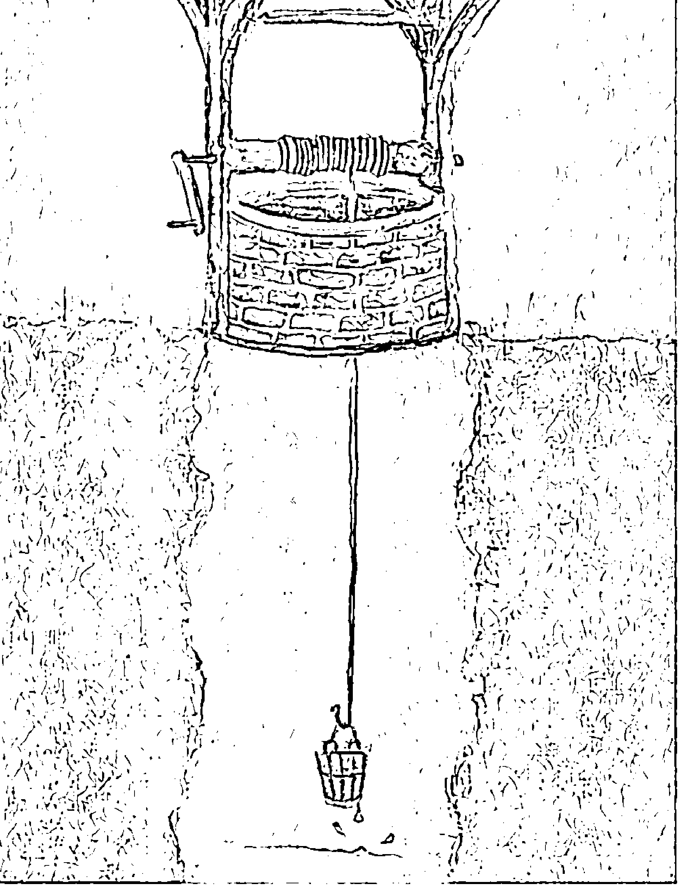

## 一 財運篇

### □基本卦解——你求財，別人獲利

得此卦者，要有「你種樹，別人乘涼」的大無畏付出精神，是一種要先付出、幫助他人，而不去要求任何回報的求財狀況。往好的一面想，如果你能真心誠意，沒有目的的幫助別人，也許有一天，你會因為之前所做的好事，與先前結下的善緣，而有意外的收穫。

- ◆偏財指數：65分／財運旺度：$
- ◆從占卜時間看終極預測
- 晚間十一點—凌晨一點、上午十一點—下午一點
- ◆行動的有利時機：農曆一到三月、十到十二月
- ◆助旺財運的地方：東南方、北方、靠近有水的公園
- ◆助旺財運的顏色：藍色、灰色、綠色
- ◆投資的幸運數字：1、4、5、6

終極預測及建議：第五十七卦『巽為風』——虛幻多變的偏財運。你選定的求財方向本來就變化多端，而你自己對這件事的信心也不夠，經常搖擺不定。所以，在這種裡外都不穩定的情況下想要求財，必須要有很好的機會才能穩穩的賺到錢，否則就會變來變去好比過路財神。

- ◆偏財指數：62分／財運旺度：$
- 凌晨一點—凌晨三點、下午一點—下午三點
- ◆行動的有利時機：農曆七到九月
- ◆助旺財運的地方：西北方、高大的建物或圓形的建物
- ◆助旺財運的顏色：藍色、白色
- ◆投資的幸運數字：1、6

終極預測及建議：第五卦『水天需』——條件還沒成熟，要等待。這次的求財計畫仍有幾項重要條件還沒成熟，例如，某些重要的人際關係尚未打通、需要應用的資金還沒到手，或是出手的時機還沒來臨等，種種條件都要全部到位以後才能放手一搏，否則求財計畫便會落空。

- ◆偏財指數：60分／財運旺度：$
- 凌晨三點—凌晨五點、下午三點—下午五點
- ◆行動的有利時機：農曆七月到九月
- ◆助旺財運的地方：西方、卡拉OK、地鐵站
- ◆助旺財運的顏色：金色、銀色、粉紅色
- ◆投資的幸運數字：1、2、6、7

終極預測及建議：第三十九卦『水山蹇』——舉步維艱，進退為難。如果你的求財行動還停留在計畫的階段，那要恭喜你了！因為還來得及停止這項求財計畫，以免陷入泥沼、進退不得。所以，建議你千萬不要跳進這個陷阱。萬一已經被套牢了，那就必須盡快找出停損點、及早了解，否則只會愈陷愈深，損失慘重。

- 偏財指數：0分／財運旺度：◎◎◎◎◎
- 凌晨五點一上午七點、下午五點一下午七點
- 行動的有利時機：農曆九到十二月
- 助旺財運的地方：西方、北方、有鋼琴演奏的酒吧或咖啡廳
- 助旺財運的顏色：金色、銀色、藍色、粉紅色
- 投資的幸運數字：1、2、6、7

終極預測及建議：第二十九卦『坎為水』——驚濤駭浪必失財。這是風險極大的求財卦，如果能大起大落已經算是幸運的了。倒楣的話，一出手便會遇上陷阱，弄得血本無歸。建議你，若非做不可，投資金額應減低到本來投資預算的25%。此外，賺到一點甜頭就要立刻收手，否則就中了此卦『久戰必敗』的魔咒。

- 偏財指數：13分／財運旺度：◎◎◎◎◎
- 上午七點一上午九點、晚間七點一晚間九點
- 行動的有利時機：農曆十到十二月
- 助旺財運的地方：北方、海洋館
- 助旺財運的顏色：藍色、灰色
- 投資的幸運數字：1、4、5、6

終極預測及建議：第四十六卦『地風升』——偏財運已萌芽，好好培育吧！你的偏財運已經開始啟動了，但要小心觀察身邊所有不起眼的小財運，因為有些現在看起來不太起眼的小財運，未來會變成大財運。所以千萬不要嫌錢少而不賺，以免坐失良機。

- 偏財指數：60分／財運旺度：$
- 上午九點一上午十一點、晚間九點一晚間十一點
- 行動的有利時機：農曆十到十二月
- 助旺財運的地方：北方、水族館、酒吧
- 助旺財運的顏色：藍色、銀色
- 投資的幸運數字：1、6

終極預測及建議：第二十八卦『澤風大過』——降低投資金額，保守為上。也許在賺錢的過程中因為求好心切而不斷追加預算，拼命加碼的結果反而讓自己備感壓力，快要受不了！現在你應該想辦法在適當的時機減輕資金週轉的壓力，一旦壓力少了，自然可以冷靜思考該如何反敗為勝。

- ◆偏財指數：72分／財運旺度：$$$

## 二 感情篇

### □ 基本卦解——愛，是無悔的付出

因為你無怨無悔的付出，打動了對方的心，產生互愛、互助的愛情故事。雖然過程是艱辛的，付出也是辛苦的，但最後得到的回報卻是值得的。

- ◆愛情指數：72分／愛情熱度：♥♥♥

### □ 從占卜時間看終極預測

晚間十一點—凌晨一點、上午十一點—下午一點

- ◆最美好的相處方式：理性的配合對方
- ◆最理想的穿著打扮：海洋風的休閒裝扮
- ◆助旺愛情運的顏色：藍+綠色
- ◆最理想的約會地點：海邊的休閒場所、玩風帆、坐遊艇

終極預測及建議：第五十七卦「巽為風」——

愛情像月亮，初一、十五不一樣。你們的愛情經常吹著不一樣的風，無論在情緒上或想法上，都會起伏不定、變化多端。同時你們兩人都缺乏定見與定信，在愛情的路上，容易見一個愛一個，對事不夠果決，以至於什麼事都反反覆覆，不容易成功。

- ◆愛情指數：68分／愛情熱度：♥♥

凌晨一點—凌晨三點、下午一點—下午三點

- ◆最美好的相處方式：表現自己的風格，能言善道一些無妨
- ◆最理想的穿著打扮：有質感的可愛打扮
- ◆助旺愛情運的顏色：白色、藍色、粉紅色
- ◆最理想的約會地點：高檔的聽音樂場所

終極預測及建議：第五卦「水天需」——戒急用忍。有些事可以急功近利，有些事則應該慢慢培養。你們雙方的條件不是很相配，表示缺少了一些談戀愛必須具備的基礎，所以要耐心等待，默默的增進自己的條件，當時機成熟的時候，自然會有好的結果。

- 愛情指數：58分／愛情熱度：⊗
- 凌晨三點—凌晨五點、下午三點—下午五點
- 最美好的相處方式：碰到不開心的事，不要嘮叨抱怨個不停
- 最理想的穿著打扮：輕鬆可愛的打扮
- 助旺愛情運的顏色：白色、粉紅色、藍色
- 最理想的約會地點：卡拉OK、咖啡廳

終極預測及建議：第三十九卦『水山蹇』—— 他的心裡沒有你。也許對方是被形勢所逼，喘不過氣來；也許是對方早已移情別戀，不再愛你。不管是哪種原因導致這段愛情走不下去，早點說聲珍重再見，是唯一從痛苦中解脫的方法。

- 最理想的穿著打扮：休閒的裝扮
- 最美好的相處方式：小心說話、不要刺激對方，免得鬧情緒
- 凌晨五點—上午七點、下午五點—下午七點
- 愛情指數：13分／愛情熱度：⊗⊗⊗⊗⊗

- 終極預測及建議：第二十九卦『坎為水』—— 倒楣的愛情遭遇。你們的感情沒有人支持，就算一起創業也到處碰壁。一波未平一波又起，是你們的宿命，這段感情就像被詛咒似的，很難安然度過。不如趁早譜下休止符，讓厄運趕快結束吧！
- 助旺愛情運的顏色：白色、粉紅色、紫色
- 最理想的約會地點：海灘音樂會、有音樂播放的酒吧

- 最理想的約會地點：酒吧、咖啡廳、靠近有水的公園
- 助旺愛情運的顏色：藍色、灰色、紫色、綠色
- 最理想的穿著打扮：多多變化，不要一成不變
- 最美好的相處方式：多用一點腦筋來避開沉重的壓力
- 上午七點—上午九點、晚間七點—晚間九點
- 愛情指數：13分／愛情熱度：⊗⊗⊗⊗⊗

終極預測及建議：第二十八卦『澤風大過』—— 單方付出的關係。在這段愛情關係裡，你總是付出的那一方，時間久了難免會覺得有壓力又很委屈，心裡充滿著不平衡的感受。如果不趕快想辦法改善雙方的關係，讓對方也懂得對你付出，小心這段感情可能就撐不了太久啦！

- ◆愛情指數：63分／愛情熱度：♡

#### 上午九點—上午十一點、晚間九點—晚間十一點

- ◆最美好的相處方式：用智慧來相處
- ◆最理想的穿著打扮：多變的打扮
- ◆助旺愛情運的顏色：白＋藍色、白＋紫色、紫＋藍色
- ◆最理想的約會地點：水族館、海邊、遊艇
- ◆終極預測及建議：第四十六卦「地風升」—— 奉子成婚。你們在一起時都甜甜蜜蜜的，會替對方著想，也會配合對方的想法。正因為感情這麼好，很容易先上車、後補票，先有愛情結晶後才談論婚嫁。
- ◆愛情指數：68分／愛情熱度：♡♡

# 第四十九卦 革卦——澤火革

| 卦象的基本性質及吉凶解讀 |
| --- |
| 本卦在六十四卦中屬於謀定而後動之改革卦。 |

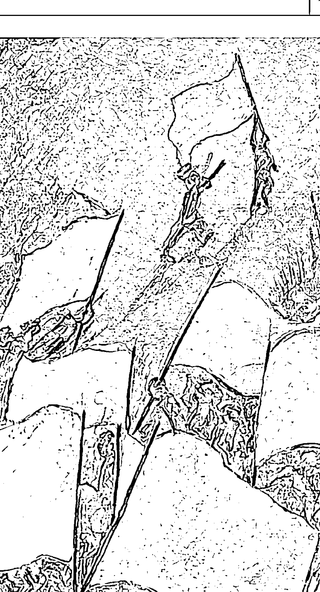

## 一 財運篇

有句話說『窮則變，變則通』，當你用某種方法去求財都不靈光的時候，應該要想想還有沒有別的方法，改變一下現有的求財方式，絕對不能一味守舊、固執、一成不變，否則財神爺是不會眷顧你的。

- ◆偏財指數：71分／財運旺度：$$

### 一 從占卜時間看終極預測

- 晚間十一點—凌晨一點、上午十二點—下午一點
- 行動的有利時機：農曆一到六月
- 助旺財運的地方：東方、東南方、公園附近
- 助旺財運的顏色：綠色、藍色、粉紅色
- 投資的幸運數字：2、3、4、8
- 終極預測及建議：第十三卦「天火同人」— 與好朋友互蒙其利。抽到這一卦的人應該與志同道合的朋友一起來進行賺錢的事，這比自己一個人埋頭苦幹更有賺頭。這個合作計畫不但大家都可以開心賺到錢，同時還能培養出彼此的共識與默契。所選擇的投資方向，應該要大家都同意，那才會賺錢！
- 偏財指數：86分／財運旺度：$$$$

凌晨一點—凌晨三點、下午一點—下午三點

- 行動的有利時機：農曆六月下半月、七到九月、
- 助旺財運的地方：西北方、東北方、西方、地鐵站附近
- 助旺財運的顏色：米黃色、白色
- 投資的幸運數字：5、6、8
- 終極預測及建議：第三十一卦「澤山咸」— 人財兩得，左右逢源。人際關係與運氣都好到不得了，要資金有資金，要關係有關係，只要你肯開口，要什麼就有什麼。如果你已經有另一半，求財行動最好找對方合作必能成功。還沒有另一半的人，抽到此卦不僅可求財獲利，過程中還能贏得愛情！
- 偏財指數：95分／財運旺度：$$$$

凌晨三點—凌晨五點、下午三點—下午五點

- 行動的有利時機：農曆六到九月
- 助旺財運的地方：西北方、西南方、熱鬧的商場
- 助旺財運的顏色：米黃色、白色
- 投資的幸運數字：5、6、7
- 終極預測及建議：第四十三卦「澤天夬」— 當機立斷偏財來。不管你现在求財狀況是賺或賠，想再追加投資金額或是壯士斷腕而停損，此時都要趕快當機立斷，做出明快決定，以免夜長夢多。倘若當下不做任何決定，採觀望態度，只會愈來愈壞。

- ◆偏財指數：62分／財運旺度：$
- ◆行動的有利時機：農曆六到九月、十二月下旬月
- ◆助旺財運的地方：西南方、西北方、高樓大廈的高樓層場所
- ◆助旺財運的顏色：米白色、白色、米黃色
- ◆投資的幸運數字：5、6、7、8
- ◆終極預測及建議：第十七卦「澤雷隨」——考慮專家意見，隨緣穩健理財。回顧過往的經驗，如果你覺得並不理想，此時不妨多參考不同專家的意見。聽完專家的意見後，要仔細分析一下，看哪一種方式適合你現在的狀況，然後確實去執行；其他的就隨緣了。
- ◆偏財指數：68分／財運旺度：$$

上午七點—上午九點、晚間七點—晚間九點

- ◆行動的有利時機：農曆一到六月
- ◆助旺財運的地方：東南方、北方、靠近公園的地方
- ◆助旺財運的顏色：藍色、綠色
- ◆投資的幸運數字：2、3、4、7、8
- ◆終極預測及建議：第六十三卦「水火既濟」——財路已開，多勞多得。你跟財神爺已經搭上線了，表示這次求財的計畫是可行的，而且方向正確。只要按部就班，穩健的求財，努力付出了，表示這次求財的計畫是可行的，而且方向正確。只要按部就班，穩健的求財，努力付
- ◆偏財指數：78分／財運旺度：$$$

上午九點—上午十一點、晚間九點—晚間十一點

- ◆行動的有利時機：農曆一到六月
- ◆助旺財運的地方：東方、東南方、北方、公園、水族館
- ◆助旺財運的顏色：綠色、藍色
- ◆投資的幸運數字：1、3、4、8
- ◆終極預測及建議：第五十五卦「雷火豐」——豐豐富的收穫，更好的表現。做某些事，得要鴨子划水，於檯面下悄悄進行才能成功；有些事則應敲鑼打鼓，大肆喧嚷才能成事。抽到這一卦的人，正需要熱熱鬧鬧、先聲奪人的去賺錢，才有可能事半功備、大有所獲。
- ◆偏財指數：86分／財運旺度：$$$$$

## 二 感情篇

### □基本卦解——舊的不去，新的不來

兩人的交往拖得太久又沒有什麼新花樣，你覺得這段感情不好玩了，對對方慢慢失去新鮮感，甚至會有一種厭倦的感覺。這個時候，你會出現想換對象的想法哦！對剛剛失戀，或剛離婚的人來說，抽到這一卦反而是好消息，可能會有一段新感情，悄悄來敲門！

- ◆愛情指數：有對象者68分，無對象者78分／愛情熱度：有對象者♡，無對象者♡♡♡

### □從占卜時間看終極預測

- ◆晚間十一點—凌晨一點、上午十一點—下午一點
- ◆最美好的相處方式：用好朋友的方式相處，同時要多順著對方
- ◆最理想的穿著打扮：流行的休閒風
- ◆助旺愛情運的顏色：綠紅、藍色、灰色、黑色
- ◆最理想的約會地點：空氣流通又清新的地方、郊外

終極預測及建議：第十三卦「天火同人」——同學、同事、好朋友變戀人。彼此有共同的信念與看法，是同一類型的人。雙方個性都表裡如一，各自有發展天地，都是朋友群中的靈魂人物。凡事只要坦誠以對，沒有解決不了的問題。

- ◆愛情指數：82分／愛情熱度：♡♡♡

- ◆凌晨一點—凌晨三點、下午一點—下午三點
- ◆最美好的相處方式：主動顯露你的專業，被動接受對方的邀請
- 最理想的穿著打扮：平常休閒風，正式場合可以盡量華麗
- 助旺愛情運的顏色：白色、米黃色
- 最理想的約會地點：往高的地方去約會

終極預測及建議：第三十一卦「澤山咸」——金童配玉女。兩人無論在外貌或家境背景、學歷條件上都很速配，是朋友眼中的「金童玉女」。兩人相處起來也很投緣，在一起的時候都開開心心，是一份自己感到幸福也受到別人祝福的感情。

愛情指數：98分／愛情熱度：♥♥♥♥♥

凌晨三點—凌晨五點、下午三點—下午五點

- 最美好的相處方式：用冷酷、果斷的態度相處
- 最理想的穿著打扮：乾淨、俐落
- 助旺愛情運的顏色：白色、黃色、棕色
- 最理想的約會地點：大型的公共場所、金屬很多的建築物

終極預測及建議：第四十三卦「澤天夬」——等他來找你吧！兩人的觀念不同，對方怕你太過干預他的生活，希望有更多自由空間。所以你愈是採取主動的攻勢，對方會愈厭煩，令這段感情產生困擾。建議你，交往速度不妨放慢一點，多聽聽對方的想法，多尊重對方的自由空間，那麼你們的相處自然會漸入佳境。

愛情指數：68分／愛情熱度：♥

凌晨五點—上午七點、下午五點—下午七點

- 最美好的相處方式：不要太在乎對方的看法，保持自己的原則與風格
- 最理想的穿著打扮：有質感同時又能表現自己的風格
- 助旺愛情運的顏色：白色、米黃色
- 最理想的約會地點：百貨公司、量販店、大賣場

終極預測及建議：第十七卦「澤雷隨」——愈追愈累。你很認真的看待這段感情，但對方玩心比較重，對感情的事還沒定下心來，所以你只好凡事遷就對方，順著對方的想法與喜好做事。這種不平等關係拖得愈久，你只有愈累而已。愛情指數：65分／愛情熱度：♡

- 最理想的約會地點：空氣流通又清新的地方、靠近公園的地方
- 最美好的相處方式：溫柔的配合對方
- 最理想的穿著打扮：流行的休閒風
- 助旺愛情運的顏色：綠色、藍色、灰色
- 上午七點—上午九點、晚間七點—晚間九點
- 終極預測及建議：第六十三卦『水火既濟』
愛情指數：95分／愛情熱度：♡♡♡♡♡

- 上午九點—上午十一點、晚間九點—晚間十一點
- 最美好的相處方式：平常柔順但遇到機會時，不妨給對方一個驚喜
- 最理想的穿著打扮：叢林風格的休閒裝
- 助旺愛情運的顏色：綠色、藍＋綠色
- 最理想的約會地點：戶外大自然、有重金屬音樂播放的地方
- 終極預測及建議：第五十五卦『雷火豐』
愛情、財運兩亨通。你們的愛情好像豐收的季節般甜蜜，彼此都以歡喜的心情去品嚐愛情甜美的果實。無論是愛情上的美滿，或在事業、錢財上都有實質的收穫，令人羨慕。

愛情指數：86分／愛情熱度：♡♡♡♡

# 第五十卦 鼎卦——火風鼎

卦象的基本性質及吉凶解讀

本卦在六十四卦中屬於三人同行共商善舉之合作卦。

## 一 財運篇

### □基本卦解——三人合作，獲利更旺

> 俗語說的好：「三個臭皮匠，勝過一個諸葛亮。有時候一個人做不到的事情，大家一起來就沒那麼困難了。抽到這一卦，不管你想要的求財目標是什麼，找別人一起團隊合作，絕對勝過自己一人單打獨鬥。」

- ◆偏財指數：88分／財運旺度：$$$$

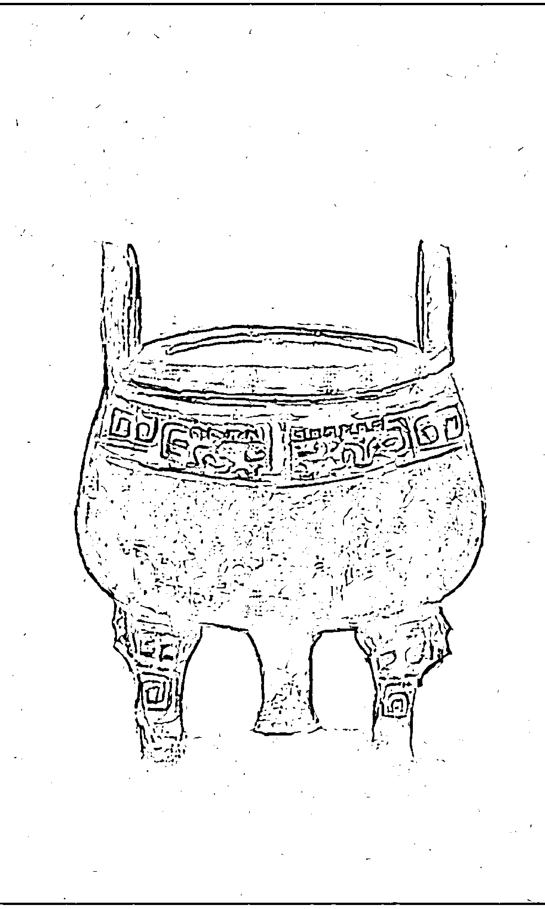

### 從占卜時間看終極預測

晚間十一點—凌晨一點、上午十二點—下午一點

- 行動的有利時機：農曆一到三月
- 助旺財運的地方：東南方、靠近公園的地方
- 助旺財運的顏色：綠色、藍色
- 投資的幸運數字：1、3、4、6
- 終極預測及建議：第五十六卦「火山旅」——做最好的準備，最壞的打算。抽到此卦的人在進行求財行動之前，必先做最好的準備與最壞的打算，因為你面對的是困難很多與狀況不斷的局面，萬一求財不順，也可事先有心理準備，就當它是換取經驗的必要過程吧！
- 偏財指數：32分／財運旺度：⊗⊗⊗

凌晨一點—凌晨三點、下午一點—下午三點

- 行動的有利時機：農曆一到三月、十到十二月
- 助旺財運的地方：東南方、北方、酒吧或咖啡館
- 助旺財運的顏色：綠色、藍色
- 投資的幸運數字：1、3、4、6

凌晨三點—凌晨五點、下午三點—下午五點

- 行動的有利時機：農曆十到十二月
- 助旺財運的地方：北方、靠近有水的地方、酒吧
- 助旺財運的顏色：灰色、藍色
- 投資的幸運數字：1、3、4、6
- 終極預測及建議：第十八卦「山風蠱」——小心受騙。俗話說「十賭九騙」，如果你打算透過賭博來求財、或透過不當管道來求取意外之財，小心上當，因為你的對手存心不良。建議你，三十六計走為上策吧。
- 偏財指數：23分／財運旺度：⊗⊗⊗⊗

時機尚未成熟，仍需等待。抽到這一卦的人先不要急於求財，因為時機還沒有成熟，你必須耐心等待。等到時機對了，財運自然成熟後，才算是真正打開目前沉悶的局面。

- 終極預測及建議：第六十四卦「火水未濟」——
- 投資的幸運數字：1、3、4、6

#### 凌晨五點—上午七點、下午五點—下午七點
- ◆ 行動的有利時機：農曆十到十二月
- ◆ 助旺財運的地方：北方、酒吧、咖啡館
- ◆ 助旺財運的顏色：藍色、灰色
- ◆ 投資的幸運數字：1、4、6
- ◆ 終極預測及建議：第四十四卦「天風姤」——短線獲利，見好就收。得此卦者有上司與長輩的貴人緣，他們會對你關愛有加，並提供求財的機會給你，但都屬於短期中小型的獲利，所以不要貪心，見好就收；也不要期待會有大財或長遠的獲利發展。若是女性得此卦，則獲利會更高。
- ◆ 偏財指數：78分／財運旺度：$$$$

#### 上午七點—上午九點、晚間七點—晚間九點
- ◆ 行動的有利時機：農曆一到三月、十到十二月
- ◆ 助旺財運的地方：北方、東方、有飲料喝且適合聊天的地方
- ◆ 助旺財運的顏色：藍色、灰色、綠色
- ◆ 投資的幸運數字：1、3、4、6
- 終極預測及建議：第三十二卦「雷風恆」——有恆為成功之本。有些投資可以走短線，有些則要靠長時間醞釀而獲利。抽得此卦的求財狀態應屬後者的格局。所以，建議不管已下手的股票、債券、基金是否有獲利，此時應保持中長期持有的狀態。如果你尚未進行投資，則不妨選擇好的投資項目，採定期、定量分批購買的方式，進行中長期投資為宜。
- ◆ 偏財指數：78分／財運旺度：$$$$

#### 上午九點—上午十一點、晚間九點—晚間十一點
- ◆ 行動的有利時機：農曆一到六月
- ◆ 助旺財運的地方：東南方、北方、公園或咖啡館
- ◆ 助旺財運的顏色：綠色、藍色、灰色
- ◆ 投資的幸運數字：1、4、6
- ◆ 終極預測及建議：第十四卦「火天大有」——財運興旺，如日中天。你的成功眾人皆知，只要本著利人利己的雙贏原則去求財，必定能得到你周遭友人的高度認同與協助，賺起錢來當然是得心應手了！
- ◆ 偏財指數：95分／財運旺度：$$$$

## 二 感情篇
### ◆ 基本卦解——你就是那個第三者
你們兩人可能正在熱戀中，但小心對方可能已婚，或在你之前還有一位要好的異性朋友，正在大搞三角關係。站在你的立場，你可能覺得別人是第三者，但換個位置來看，其實你才是那個第三者呢！
- ◆ 愛情指數：72分／愛情熱度：♥♥♥

### 一 從占卜時間看終極預測
- ◆ 最美好的相處方式：順從對方的意思，凡事都做好最佳準備
- ◆ 最理想的穿著打扮：海洋風的休閒裝扮
- ◆ 助旺愛情運的顏色：綠色、橘紅色、藍＋粉綠色
- ◆ 最理想的約會地點：有很多鮮花的地方
- ◆ 終極預測及建議：第五十六卦「火山旅」——風雨中的感情。這段感情一路走來都不平順，突發狀況是家常便飯，甚至本來沒什麼事也會鬧到不可開交。風風雨雨的感情讓兩人很沒有安全感，如果能分開兩地、遠距離交往，煩惱可能會少一些。
- ◆ 愛情指數：60分／愛情熱度：♥♥
- ◆ 最美好的相處方式：不認同對方的想法時也要盡量遷就對方
- ◆ 最理想的穿著打扮：平易近人的休閒風
- ◆ 助旺愛情運的顏色：綠色、橘紅色、粉綠色
- ◆ 最理想的約會地點：公園
- ◆ 終極預測及建議：第六十四卦「火水未濟」——沒有共同想法的空洞感情。你們兩人的想法與喜好完全不一樣，但還不至於到吵架的地步，只不過無法產生愛的火花與共鳴，因為兩人的頻道接不在一起。雖然在一起，卻往往是各忙各的、各玩各的，時間久了，感情自然就變淡了！
- 愛情指數：58分／愛情熱度：⊗

#### 凌晨三點—凌晨五點、下午三點—下午五點
- ◆ 最美好的相處方式：放聰明一點，不要誤中對方的陷阱
- ◆ 最理想的穿著打扮：不同風格的休閒打扮
- ◆ 助旺愛情運的顏色：藍色、灰＋綠色、黑＋綠色
- ◆ 最理想的約會地點：靠近有水的地方
- ◆ 終極預測及建議：第十八卦『山風蛊』——金玉其外，敗絮其中。這段感情已經不單純了，不是喜不喜歡的問題，而是對方已徹底從內心產生極大的改變。可能因為經濟因素而想離開、也可能是對方已另結新歡，想中止這段感情；另一個原因是，對方發覺你並不是他的真命天女／天子。不管是哪種原因，結果都一樣，苦糾纏下去對誰都不好。
- 愛情指數：13分／愛情熱度：⊗⊗⊗⊗⊗

#### 凌晨五點—上午七點、下午五點—下午七點
- ◆ 最美好的相處方式：女生可以多要求對方，男生則要量力而為
- ◆ 最理想的穿著打扮：不同風格的打扮
- ◆ 助旺愛情運的顏色：藍色、灰＋綠色
- ◆ 最理想的約會地點：不要一成不變，盡量變換
- ◆ 終極預測及建議：第四十四卦『天風姤』——一夜情。兩人偶然相遇，擦出火花，這種感情並不長久。如果你是女生，將是無敵劈腿族，每個男人都被妳要得團團轉，妳的要求都能如願，但這種好事維持不久的，勸妳見好就收。如果你是男生，那就很悲哀了，因為你愛的女生有太多情人，你會追得很辛苦。
- 愛情指數：女生86分，男生68分／愛情熱度：女生♡♡♡，男生⊗

#### 上午七點—上午九點、晚間七點—晚間九點
- 最美好的相處方式：保持原有的約會方式並持之以恆
- ◆ 最理想的穿著打扮：乾淨俐落的打扮
- ◆ 助旺愛情運的顏色：藍十粉綠色、綠色
- ◆ 最理想的約會地點：運動場、森林、跳舞的地方
- ◆ 終極預測及建議：第三十二卦「雷風恆」—— 夫唱婦隨。通常女方會順著男方的節奏起舞， 雙方配合的很好，彼此都已認定對方是這一生 最好的選擇，不會再被外界所誘惑而三心兩意。 這份感情就像童話故事所說的：王子與公主將 幸福美滿的過一生！
- ◆ 愛情指數：92分／愛情熱度：♥♥♥♥

#### 上午九點—上午十一點、晚間九點—晚間十一點
- ◆ 最美好的相處方式：支持另一半對未來的想法 與計畫
- ◆ 最理想的穿著打扮：質感不錯的休閒打扮
- ◆ 助旺愛情運的顏色：藍十綠色、橘紅色
- ◆ 最理想的約會地點：靠近有花園的地方或公園
- ◆ 終極預測及建議：第十四卦「火天大有」—— 可以合作的愛情夥伴。你們兩個人都很有異性緣，特別是女性那方的男性粉絲，比男方的粉絲更多。 這是一對恩愛的情侶，彼此互相欣賞、也很匹配。 如果兩人能一起合作事業，將比別人更容易成功。
- ◆ 愛情指數：95分／愛情熱度：♥♥♥♥

## 第五十一卦 震卦——震為雷
卦象的基本性質及吉凶解讀
> 本卦在六十四卦中屬於雷聲隆隆，吉凶未定之變幻卦。

## 一、財運篇
### □ 基本卦解——變數多多，患得患失
如果你這次的求財方式是投資，可以說心中有希望但確實沒把握，因為變數實在太多了，你自己其實也有些起伏不定，不知該如何是好。建議你想辦法先降低風險，當投資的風險控制已做到了，剩下的就是放心去賭賭運氣了！
- ◆ 偏財指數：60分／財運旺度：$

### 從占卜時間看終極預測
#### 晚間十一點—凌晨一點、上午十一點—下午一點
- ◆ 行動的有利時機：農曆一到三月
- ◆ 助旺財運的地方：東方、靠近公園的地方
- ◆ 助旺財運的顏色：綠色
- ◆ 投資的幸運數字：4、5
- ◆ 終極預測及建議：第六十二卦『雷山小過』
求財不順還傷和氣。俗話說的好，買賣不成仁義在。千萬別為了求財的事與人爭執、傷了和氣。所謂山不轉路轉，路不轉人轉，人不轉心轉，只要轉換一下你的想法，多為對方想想，就不會為了求財不成的事而生氣了。這次不成，還有下一次，不是嗎？
- ◆ 偏財指數：23分／財運旺度：⊗⊗⊗

#### 凌晨一點—凌晨三點、下午一點—下午三點
- ◆ 行動的有利時機：農曆一到三月
- ◆ 助旺財運的地方：東方、靠近樹木很多的地方、鬧市
- ◆ 助旺財運的顏色：綠色
- ◆ 投資的幸運數字：4、5
- ◆ 終極預測及建議：第二十四卦『地雷復』
捲土重來必可獲利。如果你在求得此卦前的投資已被套牢並蒙受損失，那要恭喜你了！眼前機會便是解套的好時機，立刻可以連本帶利的賺回來，要好好把握。如果之前沒有做任何投資，那現在就是重新開始的時候了。
- ◆ 偏財指數：72分／財運旺度：$$$

#### 凌晨三點—凌晨五點、下午三點—下午五點
- ◆ 行動的有利時機：農曆一到三月、十到十二月
- ◆ 助旺財運的地方：東方、北方、有音樂播放的咖啡廳或酒吧
- ◆ 助旺財運的顏色：綠色、藍色、灰色
- ◆ 投資的幸運數字：1、4、6
- ◆ 終極預測及建議：第十七卦『澤雷隨』
參考古家意見，隨緣穩健理財。回顧過往的經驗，如果你覺得並不理想，此時不妨多參考不同專家的意見。聽完專家的意見後，要仔細分析一下，看哪一種方式適合你現在的狀況，然後確定確實去執行；其他的就隨緣了。
- ◆ 偏財指數：68分／財運旺度：$$$
- ◆ 行動的有利時機：農曆一到三月、十到十二月
- ◆ 助旺財運的地方：東方、北方、靠近有水的地方
- ◆ 助旺財運的顏色：綠色、藍色、灰色
- ◆ 投資的幸運數字：1、4、6
- ◆ 終極預測及建議：第二十一卦「火雷噬嗑」——排除障礙才能賺錢。抽到這一卦表示你正面臨一些困難，而此困難正是妨礙你賺錢的人事物，如果你想繼續賺這個錢，一定要排除這障礙才能順利，否則情況就如同一根魚刺在喉嚨、吞不下東西般難受。
- ◆ 偏財指數：32分／財運旺度：⊗⊗

#### 上午七點—上午九點、晚間七點—晚間九點
- ◆ 行動的有利時機：農曆一到三月
- ◆ 助旺財運的地方：東方、夜市、健身房
- ◆ 助旺財運的顏色：綠色
- ◆ 投資的幸運數字：4、5
- ◆ 終極預測及建議：第十六卦「雷地豫」——順水推舟，Money自然來。所謂無為而治，是看好起來好像不用什麼大動作、大計畫，事情自然而然就會成功。抽到此卦者，求財過程多少也有這種意味，表示你不需要冒很大的風險去做激烈的求財競爭，只需要順著形勢做自己該做的事，那麼財利自然會進你的口袋。
- ◆ 偏財指數：82分／財運旺度：$$$$
- ◆ 行動的有利時機：農曆一到三月、十到十二月
- ◆ 助旺財運的地方：東方、北方、靠近有水的公園
- ◆ 助旺財運的顏色：綠色、灰色、藍色
- ◆ 投資的幸運數字：1、4、5、6

#### 上午九點—上午十一點、晚間九點—晚間十一點
- ◆ 終極預測及建議：第五十四卦「雷澤歸妹」——委屈求全，等待機會東山再起。有句話說，「形勢比人強，不得不低頭。」當你的財運還不是那麼好的時候，千萬不要迷信「道理」，更不要賭氣逞強，也不能固執硬拗，因為只有見風轉舵、順著趨勢走，才能保住你的本錢；等財運到了，自然能開開心心賺錢。
- ◇ 偏財指數：45分／財運旺度：⊗

## 二 感情篇
### ◇ 基本卦解——晴時多雲偶陣雨
你們都是個性急躁、善變的人，感情好的時候甜蜜蜜，沒一會兒又吵起來了！感情的不確定性與缺乏安全感是這段戀情的最大隱憂。彼此情緒的變化快速，就如變天般讓人難以預測，這種一會兒冷淡、一會兒熱情的感情，讓人好像隨時都在洗一場愛情的三溫暖。
- ◇ 愛情指數：66分／愛情熱度：♡♡

### ◇ 從占卜時間看終極預測
- ◇ 晚間十一點—凌晨一點、上午十一點—下午一點
- ◇ 最美好的相處方式：有不少風風雨雨，必須隨機應變
- ◇ 最理想的穿著打扮：運動風
- ◇ 助旺愛情運的顏色：綠色、藍色、黑色
- ◇ 最理想的約會地點：運動場、動物園
- ◇ 終極預測及建議：第六十二卦『雷山小過』——
- ◇ 最理想的穿著打扮：海洋風格的運動裝扮
- ◇ 最美好的相處方式：要跟得上對方的步調
- ◇ 愛情指數：52分／愛情熱度：⊗⊗⊗

### ◇ 終極預測及建議：第二十四卦『地雷復』——
舊情復燃。如果你們是舊情人或是離婚的夫妻，相信這次的相聚與重逢，是上天巧妙的安排，給你們一個可以重溫舊情的好機會。說不定能重修舊好、再續前緣，重做戀人或再結夫妻。

### ◇ 終極預測及建議：第十七卦『澤雷隨』——
追愈累。你很認真的看待這段感情，但對方玩心比較重，對感情的事還沒定下心來，所以你只好凡事遷就對方，順著對方的想法與喜好做事。這種不平等關係拖得愈久，你只有愈累而已。
- ◆ 愛情指數：89分／愛情熱度：♥♥♥♥
- ◆ 最美好的相處方式：隨著對方的想法來配合
- ◆ 最理想的穿著打扮：乾淨俐落的打扮
- ◆ 助旺愛情運的顏色：白＋綠色、藍色、灰＋綠色
- ◆ 最理想的約會地點：水上活動、跳舞的地方
- ◆ 終極預測及建議：第十七卦『澤雷隨』——
- ◆ 愛情指數：65分／愛情熱度：♥
- ◆ 最美好的相處方式：用行動來排除兩人之間的困難
- ◆ 最理想的穿著打扮：海洋風格的運動裝扮
- ◆ 助旺愛情運的顏色：藍色、灰色、黑＋綠色
- ◆ 最理想的約會地點：靠近海邊有運動場所、有酒可喝的地方
- ◆ 終極預測及建議：第二十一卦『火雷噬嗑』——搬開擋路的大石頭。兩人在一起本來都沒什麼大問題，就是莫名其妙的總會出現一個破壞者，從中破壞兩個人的感情，不是妨礙這對情人的相處、就是阻撓這對情侶的相愛。除非這個破壞者消失，否則這段感情不容易繼續走下去。
- ◆ 愛情指數：92分／愛情熱度：♥♥♥♥♥
- ◆ 最美好的相處方式：有點子、有行動力
- ◆ 最理想的穿著打扮：航海風格的休閒裝扮
- ◆ 助旺愛情運的顏色：藍色、紫＋綠色
- ◆ 最理想的約會地點：游泳池、海灘音樂會、熱門音樂會、Pub
- ◆ 終極預測及建議：第二十一卦『火雷噬嗑』——
若想談論婚嫁，現在就是開花結果的季節。也尊重對方，兩人對未來也充滿了希望與夢想，彼此相互了解，情投意合。你們是一對開心的戀人，女生對男生的細心體貼，可說是無微不至，彼此相互了解，也尊重對方，兩人對未來也充滿了希望與夢想，若想談論婚嫁，現在就是開花結果的季節。

### ◆ 上午九點—上午十一點、晚間九點—晚間十一點
- ◆ 最美好的相處方式：感覺會受委屈的事情就不要做
- ◆ 最理想的穿著打扮：航海風格的打扮
- ◆ 助旺愛情運的顏色：藍色、灰色、黑＋蘋果綠色
- ◆ 最理想的約會地點：靠近山林的運動場所
- ◆ 終極預測及建議：第五十四卦「雷澤歸妹」—— 命裡有時終須有，命裡無時莫強求。你們的戀情有許多地方都顯得很勉強，由於相遇的時機不對，所以交往時難免會讓你覺得萬分委屈，心裡常常感到不平衡，多少會有偏激的想法；萬一想不開而使用激烈的手段來處理這段感情，後果往往不堪設想。
- ◆ 愛情指數：46分／愛情熱度：⊗⊗

## 第五十二卦 艮卦——艮為山
卦象的基本性質及吉凶解讀
本卦在六十四卦中屬於心無雜念，靜思對策之保守卦。

## 一、財運篇
### 基本卦解——姜太公釣魚，願者上鉤
有時主動出擊可以增加求財的機會，但抽到這一卦，你反而應該逆勢操作。當你做好求財布局之後，最好不要有任何大動作，只需要靜靜的等待，該來的財一定少不了，因為急也沒有用。
- ◇ 偏財指數：68分／財運旺度：$$$

### 從占卜時間看終極預測
#### 晚間十一點—凌晨一點、上午十一點—下午一點
- ◆ 行動的有利時機：農曆四到六月、十二月下半月
- ◆ 助旺財運的地方：東北方、西南方、大賣場、山上的小別墅
- ◆ 助旺財運的顏色：紅色、黃色、橘色
- ◆ 投資的幸運數字：7、8、9
- 終極預測及建議：第二十三卦「山地剝」— 得先花錢買經驗。抽到這一卦的人，當你在進行求財行動時，一定是未蒙其利而先受其害的；但若損失的金錢與時間，能換取經驗與教訓的話，那還算是值得的。不過，你得控制一下學費，不要繳得太多，因為這次的求財行動是絕對不會獲利的。
- ◆ 偏財指數：30分／財運旺度：⊗⊗⊗

#### 凌晨一點—凌晨三點、下午一點—下午三點
- ◆ 行動的有利時機：農曆四到六月、十二月下半月
- ◆ 助旺財運的地方：東北方、南方、山上有文藝氣息的地方
- ◆ 助旺財運的顏色：紅色、白色、黃色
- ◆ 投資的幸運數字：2、7、8、9
- 終極預測及建議：第五十六卦「火山旅」— 做最好的準備，最壞的打算。抽到此卦的人在進行求財行動之前，必先做最好的準備與最壞的打算，因為你面對的是困難很多與狀況不斷的局面，萬一求財不順，也可事先有心理準備，就當它是換取經驗的必要過程吧！
- ◆ 偏財指數：32分／財運旺度：⊗⊗⊗

#### 凌晨三點—凌晨五點、下午三點—下午五點
- ◆ 行動的有利時機：農曆四到六月、十二月下半月
- ◆ 助旺財運的地方：南方、東北方、山上有文藝氣息的地方
- ◆ 助旺財運的顏色：紅色、白色、黃色
- ◆ 投資的幸運數字：2、7、8、9
- 終極預測及建議：第五十三卦「風山漸」— 財神爺快到了，你準備好了嗎？錢財到手的日子一天比一天接近了，但其中還不少困難等著你去克服與排除，最重要的是你本身對這次的求財計劃究竟有沒有做好充分的準備，包括你的專業與資金，準備愈充分，當財神爺來臨時才能大有所獲。
- 偏財指數：65分／財運旺度：$$$

#### 凌晨五點—上午七點、下午五點—下午七點
- 行動的有利時機：農曆一到四月、六月及十二月的下半月
- 助旺財運的地方：南方、西南方、東北方、百貨公司
- 助旺財運的顏色：紅色、白色、黃色
- 投資的幸運數字：2、7、8、9
- 終極預測及建議：第十五卦「地山謙」——低調求財好處多。所謂「滿招損、謙受益」，抽到此卦者在求財過程中要低調進行，切忌心高氣傲、自以為是，同時也要多聽專家的意見，作為求財的參考，如此一來必能賺錢。
- 偏財指數：75分／財運旺度：$$$$

#### 上午七點—上午九點、晚間七點—晚間九點
- 行動的有利時機：農曆四到六月、十二月下半月
- 助旺財運的地方：南方、東北方、山上烤肉的地方
- 助旺財運的顏色：白色、黃色、紅色
- 投資的幸運數字：2、7、8、9
- 終極預測及建議：第二十二卦「山火賁」——表面賺錢，其實不然。大家都以為你賺到不少錢，並投以羨慕的眼光，但你自己心知肚明，這只是表面的風光，並不實惠。不過，賺得美名，獲得經驗也是一件好事。
- 偏財指數：68分／財運旺度：$$$

#### 上午九點—上午十一點、晚間九點—晚間十一點
- 行動的有利時機：農曆四到六月、十二月下半月
- 助旺財運的地方：南方、東北方、郊區的藝文中心
- 助旺財運的顏色：黃色、紅色、白色
- 投資的幸運數字：3、7、8、9

## 二 感情篇
### 基本卦解——不動如山
你們的交往一點樂趣都沒有，兩人交往的過程好像在太空上漫步一樣，動作緩慢又失去重心，顯示出雙方都沒有很在意這段感情。與其有氣無力的勉強維持下去，不如灑脫點跟對方說再見，或改變一下彼此的關係，從戀人變朋友。
- ◆ 終極預測及建議：第十八卦「山風蠱」——小心受騙。俗話說「十賭九騙」，如果你打算透過賭博來求財、或透過不當管道來求取意外之財，小心上當，因為你的對手存心不良。建議你，三十六計走為上策吧。
- ◆ 偏財指數：23分／財運旺度：◎◎◎◎
- ◆ 愛情指數：59分／愛情熱度：♥

### 從占卜時間看終極預測
#### ◆ 晚間十一點—凌晨一點、上午十一點—下午一點
- ◆ 最美好的相處方式：量力而為的幫助對方
- ◆ 最理想的穿著打扮：成熟的打扮
- ◆ 助旺愛情運的顏色：黃色、黑色、咖啡色
- ◆ 最理想的約會地點：大賣場、百貨公司
- ◆ 終極預測及建議：第二十三卦「山地剝」——買來的感情。這段感情的「製作費」都由你獨自承擔，當你投入愈多資源，對方的回應就變得活躍；一旦給的好處少了，對方馬上降低跟你在一起的興趣。如果碰到的對象喜歡這種相處模式，你情我願也無妨！
- ◆ 愛情指數：59分／愛情熱度：◎

#### ◆ 凌晨一點—凌晨三點、下午一點—下午三點
- ◆ 最美好的相處方式：凡事都做好最充分的準備與預防
- ◆ 最理想的穿著打扮：樸素的打扮
- ◆ 助旺愛情運的顏色：紅色、橘黃色、白色

## 第五十三卦 漸卦——風山漸

卦象的基本性質及吉凶解讀

本卦在六十四卦中屬於按部就班，逐漸積累能量之漸進卦。

## 一 財運篇

### □基本卦解——財神爺快到了，你準備好了嗎？

錢財到手的日子一天比一天接近了，但其中還有不少困難等著你去克服與排除，最重要的是你本身對這次的求財計畫究竟有沒有做好充分的準備，包括你的專業與資金，準備愈充分，當財神爺來臨時才能大有所獲。

-   ◆偏財指數：65分／財運旺度：$$

### 從占卜時間看終極預測

#### 晚間十一點—凌晨一點、上午十一點—下午一點

-   行動的有利時機：農曆十到十二月
-   助旺財運的地方：北方、海洋館
-   助旺財運的顏色：灰色、銀色、藍色
-   投資的幸運數字：1、6
-   偏財指數：70分／財運旺度：$$
-   終極預測及建議：第三十七卦「風火家人」——求財之前先推銷自己。行銷學有句名言：在推銷商品之前，必先推銷你自己。意思是，如果你表現優越，對方一旦接受你個人的風格與想法後，就等於開啟了求財的大門，後續發展就一切好辦。

#### 凌晨一點—凌晨三點、下午一點—下午三點

-   行動的有利時機：農曆一到三月、十到十二月
-   助旺財運的地方：東方、北方、機場、放風箏的地方
-   助旺財運的顏色：綠色、藍色、灰色
-   投資的幸運數字：1、4、5、6
-   偏財指數：50分／財運旺度：⊗
-   終極預測及建議：第二十卦「風地觀」——不可孤注一擲。在情況不明的情形下最忌貿然進行求財，萬一在不對的時機出手，只會損失慘重，悔不當初。建議你，多收集資料繼續觀察。如果在十天之內還是看不清楚求財狀況，就放棄吧！

#### 凌晨三點—凌晨五點、下午三點—下午五點

-   行動的有利時機：農曆十到十二月
-   助旺財運的地方：北方、靠近有水的地方
-   助旺財運的顏色：銀色、藍色、灰色
-   投資的幸運數字：1、6
-   偏財指數：62分／財運旺度：$
-   終極預測及建議：第五十七卦「巽為風」——虛幻多變的偏財運。你選定的求財方向本來就變化多端，而你自己對這件事的信心也不夠，經常搖擺不定。所以，在這種裡外都不穩定的情況下想要求財，必須要有很好的機會才能穩穩的賺到錢，否則就會變來變去好比過路財神。

#### 上午七點—上午九點、晚間七點—晚間九點

-   最美好的相處方式：被動等待約會，見面時要表現的大方又熱情
-   最理想的穿著打扮：簡單樸素的裝扮
-   助旺愛情運的顏色：白色、紅色、黃色
-   最理想的約會地點：明亮又安靜的地方
-   終極預測及建議：第二十二卦『山火賁』——表面風光。你們的愛情只有風光亮麗的外表，缺乏真摯的內心感受。對於只想把愛情當兒戲的人是無傷大雅，但對於想認真談戀愛、真心真意追求愛情的人，這段感情到頭來卻是一場空。
-   愛情指數：59分／愛情熱度：♥

#### 上午九點——上午十一點、晚間九點——晚間十一點

-   最美好的相處方式：不了解的地方不要去，不明白的事情不要做
-   最理想的穿著打扮：樸素的打扮
-   助旺愛情運的顏色：紅色、白色、橘黃色
-   最理想的約會地點：既熟悉又安全的地方
-   終極預測及建議：第十八卦『山風蠱』——金玉其外，敗絮其中。這段感情已經不單純了，不是喜不喜歡的問題，而是對方已徹底從內心產生極大的改變。可能因為經濟因素而想離開、也可能是對方已另結新歡，想中止這段感情；另一個原因是，對方發覺你並不是他的真命天女／天子。不管是哪種原因，結果都一樣，苦苦糾纏下去對誰都不好。
-   愛情指數：13分／愛情熱度：⊗⊗⊗⊗⊗

> 終極預測及建議：第三十三卦『天山遯』——看得見卻賺不到。抽到這一卦的人，有種老是跟財神爺擦身而過的感覺，偏財明明就可以到手，卻在臨門一腳錯失良機，就好像追星族，老是追著財神爺跑，到現在都還停留在玩『躲貓貓』的遊戲階段。

-   投資的幸運數字：2、3、7、9
-   助旺財運的顏色：紅色、橘色、黃色
-   助旺財運的地方：南方、有文化氣息的地方
-   行動的有利時機：農曆四到六月、十二月下旬
-   上午七點—上午九點、晚間七點—晚間九點
-   偏財指數：55分／財運旺度：$

> 終極預測及建議：第五十二卦『艮為山』——姜太公釣魚，願者上鉤。有時主動出擊可以增加求財的機會，但抽到這一卦，你反而應該逆勢操作。當你做好求財布局之後，最好不要再有任何大動作，只需要靜靜的等待，該來的財一定少不了，因為急也沒有用。

-   偏財指數：68分／財運旺度：$$
-   上午九點—上午十一點、晚間九點—晚間十一點
-   行動的有利時機：農曆四到六月
-   助旺財運的地方：南方、藝術文化中心
-   助旺財運的顏色：紅色
-   投資的幸運數字：2、3、7、9

> 終極預測及建議：第三十九卦『水山蹇』——舉步維艱，進退為難。如果你的求財行動還停留在計畫的階段，那要恭喜你了！因為還來得及停止這項求財計畫，以免陷入泥沼、進退不得。所以，建議千萬不要跳進這個陷阱。萬一已經被套牢了，那就必須盡快找出停損點、及早了解，否則只會愈陷愈深，損失慘重。

-   偏財指數：0分／財運旺度：⊗⊗⊗⊗⊗

## 二、感情篇

### □ 基本卦解——慢慢進步中

女生比男生的年紀稍大一點沒關係，因為不管雙方年紀差距如何，女生都會像姐姐一樣照顧男生，讓男生的事業無後顧之憂。你們的戀情正逐漸在加溫中，絕對不會起伏不定，這是令人看好的現象。

-   ◆ 愛情指數：68 分／愛情熱度：♥♥♥

### 從占卜時間看終極預測

#### 晚間十一點—凌晨一點、上午十一點—下午一點

-   最美好的相處方式：如家人般的相處，用智慧解決問題
-   最理想的穿著打扮：航海水手風裝扮
-   助旺愛情運的顏色：白色、藍色、黑色
-   最理想的約會地點：溫馨的酒吧、靠近海邊野餐的營地
-   終極預測及建議：第三十七卦「風火家人」——緣定三生。你們除了是一對戀人，還多了兄弟姐妹般的感情，兩個人在一起時就像家人般親密，彼此相親相愛、尊重對方。
-   愛情指數：90 分／愛情熱度：♥♥♥♥♥

#### 凌晨一點—凌晨三點、下午一點—下午三點

-   最美好的相處方式：做個有智慧的順從者
-   最理想的穿著打扮：海洋風的穿著
-   助旺愛情運的顏色：藍色、紫色、綠色
-   最理想的約會地點：靠近海邊的度假別墅
-   終極預測及建議：第五十七卦「巽為風」——愛情像月亮，初一、十五不一樣。你們的愛情經常吹著不一樣的風，無論在情緒上或想法上，都會起伏不定、變化多端。同時你們兩個人都缺乏定見與定信，在愛情的路上，容易見一個愛一個，對事不夠果決，以致於什麼事都反反覆覆，不容易成功。
-   愛情指數：68 分／愛情熱度：♥♥♥

#### 凌晨三點—凌晨五點、下午三點—下午五點

-   最美好的相處方式：被動等待對方來約你
-   最理想的穿著打扮：樸素的打扮
-   助旺愛情運的顏色：橘黃色、紅色、咖啡色
-   最理想的約會地點：安靜的地方
-   終極預測及建議：第五十三卦『風山漸』——慢慢進步中。女生比男生的年紀稍大一點沒關係，因為不管雙方年紀差距如何，女生都會像姐姐一樣照顧男生，讓男生的事業無後顧之憂。你們的戀情正逐漸在加溫中，絕對不會起伏不定，這是令人看好的現象。
-   愛情指數：68分／愛情熱度：♡♡♡♡

#### 凌晨五點—上午七點、下午五點—下午七點

-   最美好的相處方式：常常關心對方但要被動等待對方來約你
-   最理想的穿著打扮：成熟樸實的打扮
-   助旺愛情運的顏色：黃色、黑色、白色
-   最理想的約會地點：山上的餐廳、觀光果園
-   終極預測及建議：第十五卦『地山謙』——扮豬吃老虎。男方的人生經驗豐富，才會扮成老實人的樣子，行事低調、表現謙卑；但其實在感情上，他不但吃的開，而且異性都會對他千依百順。所以要這麼一位世故的男朋友融入兩人世界裡，恐怕得奉行『同志仍須努力』的總理遺教了！
-   愛情指數：65分／愛情熱度：♡♡♡

#### 上午七點—上午九點、晚間七點—晚間九點

-   最美好的相處方式：看清楚整個情況，不要少根筋
-   最理想的穿著打扮：經常改變風格
-   助旺愛情運的顏色：白色、藍色、黑色
-   最理想的約會地點：酒吧、游泳池、咖啡廳
-   終極預測及建議：第二十卦「風地觀」—— 邊走邊看。你們的感情面臨瓶頸，因為有些現實的因素阻礙著你們。例如彼此身份的不速配，或經濟上出現困難等，連帶影響彼此的感情，而產生風風雨雨。所以應該是冷靜、客觀，好好檢視一下這份感情的時候了！
-   愛情指數：46分／愛情熱度：◎◎

#### 上午九點—上午十一點、晚間九點—晚間十一點

-   最理想的穿著打扮：陽光又大方的裝扮
-   助旺愛情運的顏色：紅色、橘紅色、咖啡色、棕色
-   最美好的相處方式：多關心對方，但不一定要常常見面
-   最理想的約會地點：太陽充足、光線明亮的地方
-   終極預測及建議：第三十三卦「天山遯」—— 躲貓貓。你很想親近對方，方法雖然已經很溫和又低調了，但對方還是覺得有壓力，因此故意不理你、不接電話，甚至不願意碰面，擺明想逃避這段感情。其實對方希望你冷靜一段時間再說。建議你不妨暫時放下，等待機緣。也許更好的對象正在前方等待著你，何必苦苦單戀對方呢？
-   愛情指數：58分／愛情熱度：◎

#### 上午七點——上午九點、晚間七點——晚間九點

-   最理想的穿著打扮：讓對方感到溫馨的樸素裝扮
-   助旺愛情運的顏色：咖啡色、紅色、黃色、白色
-   最美好的相處方式：多關心對方就好，不一定要常常見面
-   最理想的約會地點：溫馨而安靜的地方
-   終極預測及建議：第五十二卦『艮為山』 —— 你們的交往一點樂趣都沒有，兩人在交往的過程好像在太空上漫步一樣，動作緩慢又失去重心，顯示出雙方都很在意這段感情。與其有氣無力的勉強維持下去，不如灑脫點跟對方說再見，或改變一下彼此的關係，從戀人變朋友。
-   愛情指數：59分／愛情熱度：♡

#### 上午九點——上午十一點、晚間九點——晚間十一點

-   最美好的相處方式：善意的關懷對方，但無法改變的事就不要執著
-   最理想的穿著打扮：有陽光氣息的打扮
-   助旺愛情運的顏色：紅色、粉紅色、橘紅色、咖啡色、黃色
-   最理想的約會地點：陽光充足、光線明亮的地方
-   終極預測及建議：第三十九卦『水山蹇』 —— 他的心裡沒有你。也許對方是被形勢所逼，喘不過氣來；也許是對方早已移情別戀，不再愛你。不管是哪種原因導致這段愛情走不下去，早點說聲珍重再見，是唯一從痛苦中解脫的方法。
-   愛情指數：13分／愛情熱度：⊗⊗⊗⊗⊗

## 第五十四卦 歸妹卦——雷澤歸妹

### 一 財運篇

卦象的基本性質及吉凶解讀

本卦在六十四卦中屬於名不正言不順，受盡委屈、心中鬱結之凶卦。

#### 一 基本卦解——委屈求全，等待機會東山再起

有句話說，「形勢比人強，不得不低頭。」當你的財運還不是那麼好的時候，千萬不要迷信「道理」，更不要賭氣逞強，也不能固執硬拗，因為只有見風轉舵、順著趨勢走，才能保住你的本錢；等財運到了，自然能開開心心賺錢。

-   ◇偏財指數：45分／財運旺度：⊗

### 從占卜時間看終極預測

#### 晚間十一點—凌晨一點、上午十一點—下午一點

-   行動的有利時機：農曆十到十二月
-   助旺財運的地方：北方、靠近水又能喝飲料的地方
-   助旺財運的顏色：藍色、灰色
-   投資的幸運數字：1、4、6
-   終極預測及建議：第四十卦「雷水解」——困難在七天內必可解決。如果你正身陷於財務危機，那恭喜了，因為在七天內這個困難一定可以解決。但如果你現在並沒有財務上的問題，那麼你心中想進行的求財計劃則會泡湯、停止進行了！
-   偏財指數：60分／財運旺度：$

#### 凌晨一點—凌晨三點、下午一點—下午三點

-   行動的有利時機：農曆一到三月、十到十二月
-   助旺財運的地方：東方、北方、鬧哄哄的市場、健身房
-   助旺財運的顏色：藍色、綠色、灰色
-   投資的幸運數字：1、3、4、6
-   偏財指數：60分／財運旺度：$
-   終極預測及建議：第五十一卦「震為雷」——變數多多，患得患失。如果你這次的求財方式是投資，可以說心中有希望但確實沒把握，因為變數實在太多了，你自己其實也有些起伏不定，不知該如何是好。建議你想辦法先降低風險，當投資的風險控制已做到了，剩下的就是放心去賭賭運氣了！

#### 凌晨三點—凌晨五點、下午三點—下午五點

-   行動的有利時機：農曆十到十二月
-   助旺財運的地方：北方、高水準的酒吧餐廳
-   助旺財運的顏色：藍色、灰色
-   投資的幸運數字：1、4、6
-   終極預測及建議：第三十四卦「雷天大壯」——不要光說不練。做廣告是不嫌誇大其詞的，但若做人處世的態度經常是畫大餅、說大話，就流於不實在了。一個只愛做夢、行為浮誇的人，絕對是不容易賺到錢的。抽到這一卦的人，坐而言不如起而行，應多做少說，不要光說不練。

#### 上午七點—上午九點、晚間七點—晚間九點

-   行動的有利時機：農曆六到九月
-   助旺財運的地方：西南方、百貨公司、拍賣場
-   助旺財運的顏色：米黃色、黑色
-   投資的幸運數字：6、7、8
-   終極預測及建議：第十九卦「地澤臨」——貴人指路而獲利。抽到此卦者，會遇到在上位的貴人，包括長輩、上司或位高權重的人，他們會在你求財的過程中拉你一把。如果能把握住這種千載難逢的機會，則財運亨通。
-   偏財指數：85分／財運旺度：$$$$

#### 上午九點—上午十一點、晚間九點—晚間十一點

-   行動的有利時機：農曆七到九月
-   助旺財運的地方：西方、地鐵站、音樂會場
-   助旺財運的顏色：米白色、粉紅色
-   投資的幸運數字：2、6、7、8
-   終極預測及建議：第五十八卦「兌為澤」——要嘴皮，開心賺。公共關係是致富的重要工具，健談又有說服力的人更是公關好手，所以，抽到此卦的人，應多多利用你的口才，經常跟別人聊天來增加求財的機會。當雙方聊得很開心的時候，什麼事情都好談，那麼你在求財時自然能水到渠成。
-   偏財指數：82分／財運旺度：$$$$

#### 下午一點—下午三點、晚間十一點—凌晨一點

-   行動的有利時機：農曆三月、六月及九月的下半月
-   助旺財運的地方：東北方、西南方、觀光果園或農場
-   助旺財運的顏色：白色、黑色
-   投資的幸運數字：6、7、8
-   終極預測及建議：第三十八卦「火澤睽」——求財不得，反惹是非。個性急躁的人、或在特殊行業工作的人抽到這一卦，要特別小心了。因為得此卦者，容易在求財過程中因與人意見不合、或利益分配不當而不開心，因而跟人吵架、翻臉！俗話說的好，求財不求氣。凡事應退一步來想，讓大事化小、小事化無。

## 二 感情篇

### ◇基本卦解——命裡有時終須有，命裡無時莫強求

你們的戀情有許多地方都顯得很勉強，由於相遇的時機不對，所以交往時難免會讓你覺得萬分委屈，心裡常常感到不平衡，多少會有偏激的想法；萬一想不開而使用激烈的手段來處理這段感情，後果往往不堪設想。

-   ◇愛情指數：46分／愛情熱度：◎◎

### ◇從占卜時間看終極預測

#### 晚間十一點——凌晨一點、上午十一點——下午一點

-   最美好的相處方式：運用智慧順著對方的變化來應對
-   最理想的穿著打扮：經常維持新鮮感的打扮
-   助旺愛情運的顏色：灰色、黑色、藍+秋香綠
-   最理想的約會地點：海洋公園、酒吧、游泳池
-   終極預測及建議：第四十卦『雷水解』——七天之內見分曉。得此卦者會遇到兩種情況，在七天內就會得到答案。第一種情況：已留不住對方，到了分手互道珍重、說聲再見的時候了，也許多無言的結局，淡淡的分手。第二種情況：也許你與對方和好如初的時候快到了！彼此冷戰不講話，可找個藉口主動打電話給對方，說不定馬上就能雨過天晴，喜劇收場。
-   愛情指數：第一種情況◎◎◎，第二種情況68分／愛情熱度：第一種情況◎◎◎，第二種情況♡♡

#### 凌晨一點—凌晨三點、下午一點—下午三點

-   最美好的相處方式：有點子也要有行動力
-   最理想的穿著打扮：經常改變且火辣的運動風裝扮
-   助旺愛情運的顏色：灰+綠色、藍+秋香綠色
-   終極預測及建議：第五十一卦『震為雷』——晴時多雲偶陣雨。你們都是個性急躁、善變的人，感情好的時候甜甜蜜蜜，沒一會兒又吵起來了！感情的不確定性與缺乏安全感是這段戀情的最大隱憂。彼此情緒的變化快速，就如變幻莫測的天氣般讓人難以預測，這種一會兒冷淡、一會兒熱情的感情，讓人好像隨時都在洗一場愛情的三溫暖。
-   愛情指數：66分／愛情熱度：♡♡

#### 凌晨三點—凌晨五點、下午三點—下午五點

-   最美好的相處方式：要用腦子去分辨對方說的話，不要全盤相信
-   最理想的穿著打扮：不固定，要經常改變風格
-   助旺愛情運的顏色：藍色、灰色、黑色、淺紫色
-   最理想的約會地點：咖啡廳、酒吧、海邊
-   終極預測及建議：第二十四卦「雷天大壯」——光說不練。說的比做的多，什麼都OK、沒問題，但到頭來不是一直拖延沒做，就是忘得一乾二淨。只聽到好聽的承諾與計劃，卻沒有幾件答應下來的事情是真正可以做到的。套句成語，這就是「空口說白話」。
-   愛情指數：60分／愛情熱度：♡

#### 凌晨五點—上午七點、下午五點—下午七點

-   最美好的相處方式：展現你的母愛，關心對方
-   最理想的穿著打扮：成熟又穩重的打扮
-   助旺愛情運的顏色：黑色、米黃色、棕色
-   最理想的約會地點：餐廳、小吃店、觀光農場
-   終極預測及建議：第十九卦「地澤臨」——愛神降臨。愛神丘比特的箭已發射，正中你們的心，機會與幸福在此時已掌握在你們的手裡。如果你覺得對方的條件與人品都令你滿意，千萬不要再三心兩意，立即採取行動，不要讓幸福悄悄的從你身邊溜走了！
-   愛情指數：88分／愛情熱度：♡♡♡♡

#### 上午七點—上午九點、晚間七點—晚間九點

-   最美好的相處方式：多聊天，可以增進感情
-   最理想的穿著打扮：可愛的打扮
-   助旺愛情運的顏色：粉紅色、橘紅色、米白色最理想的約會地點：咖啡廳、卡拉OK、有人演講的地方
終極預測及建議：第五十八卦「兌為澤」——聊天高手。兩人都很喜歡聊天，稱得上是聊天高手，拿起手機可以講上三天三夜，在一起的時候都很開心。但小心話說多了難免會說錯話，而讓對方不高興。建議你，把握兩人一起聊天的快樂時刻，但要小心樂極生悲。
愛情指數：72分／愛情熱度：♡♡♡♡♡

上午九點—上午十一點、晚間九點—晚間十一點
最美好的相處方式：多聽少說，會讓對方不開心的事不要談
最理想的穿著打扮：不要做對方不喜歡的打扮
助旺愛情運的顏色：米白色、黃色、棕色
最理想的約會地點：讓人心情放鬆的地方
終極預測及建議：第三十八卦「火澤睽」——前世相欠、吵架冤家。兩人的個性完全不一樣，看事情的角度與想法也不同，根本沒辦法一起聊事情，一聊天就吵架，吵半天也不會有結論與共識。到頭來，愈吵愈是一肚子火，感情也愈來愈淡薄。兩人會兜在一起根本是前世相欠，這是一對標準的吵架冤家。
愛情指數：13分／愛情熱度：⊗⊗⊗⊗⊗⊗

# 第五十五卦 豐卦——雷火豐

### 卦象的基本性質及吉凶解讀

本卦在六十四卦中屬於大有所獲，亨通得利之豐收吉卦。

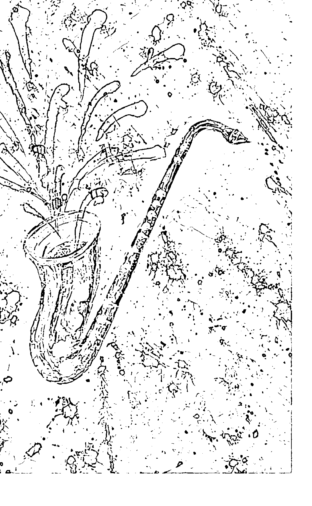

# 一 財運篇

### 一 基本卦解——豐富的收穫，更好的表現

做某些事，得要鴨子划水，於檯面下悄悄進行才能成功；有些事則應敲鑼打鼓，大肆喧嚷才能成事。抽到這一卦的人，正需要熱熱鬧鬧、先聲奪人的去賺錢，才有可能事半功備、大有所獲。

- ◆偏財指數：86分／財運旺度：$$$$

### 從占卜時間看終極預測

晚間十一點—凌晨一點、上午十一點—下午一點

- ◆ 行動的有利時機：農曆一到四月、十到十二月
- ◆ 助旺財運的地方：東方、北方、親水公園、機場
- ◆ 助旺財運的顏色：藍色、灰色、綠色
- ◆ 投資的幸運數字：1、3、4、6

終極預測及建議：第三十四卦「雷天大壯」——不要光說不練。做廣告是不嫌誇大其詞的，但若做人處世的態度經常是畫大餅、說大話，就流於不實在了。一個只愛做夢、行為浮誇的人，絕對是不容易賺到錢的。抽到這一卦的人，坐而言不如起而行，應多做少說，不要光說不練。

偏財指數：15分／財運旺度：⊗

凌晨一點—凌晨三點、下午一點—下午三點

- ◆ 行動的有利時機：農曆一到四月、十到十二月
- ◆ 助旺財運的地方：東方、北方、靠近有水的地方
- ◆ 助旺財運的顏色：藍色、綠色、灰色
- ◆ 投資的幸運數字：1、3、4、6
- ◆ 助旺財運的顏色：綠色、藍色
- ◆ 助旺財運的地方：東方、東南方、國家公園
- ◆ 行動的有利時機：農曆一到四月

凌晨三點—凌晨五點、下午三點—下午五點

偏財指數：60分／財運旺度：＄

終極預測及建議：第五十一卦「震為雷」——變數多多，患得患失。如果你這次的求財方式是投資，可以說心中有希望但確實沒把握，因為變數實在太多了，你自己其實也有些起伏不定，不知該如何是好。建議你想辦法先降低風險，當投資的風險控制已做到了，剩下的就是放心去賭賭運氣了！

- ◆ 投資的幸運數字：1、3、4、6

先好後壞，求財無望。得此卦者好比日落西山，說明好時光不多了，你的求財行動會愈來愈艱困、愈來愈沒有希望，無論你做的是哪一項投資，建議你還是及早了結，方為上策。

終極預測及建議：第三十六卦「地火明夷」——

偏財指數：59分／財運旺度：⊗

#### 凌晨五點—上午七點、下午五點—下午七點

- ◆行動的有利時機：農曆一到四月
- ◆助旺財運的地方：東方、東南方、有很多樹木的地方
- ◆助旺財運的顏色：綠色、藍色
- ◆投資的幸運數字：1、3、4、6

◆終極預測及建議：第四十九卦「澤火革」——改變求財方式才能獲利。有句話說「窮則變，變則通」，當你用某種方法去求財都不靈光的時候，應該要想想還有沒有別的方法，改變一下現有的求財方式，絕對不能一味守舊、固執、一成不變，否則財神爺是不會眷顧你的。

◆偏財指數：71分／財運旺度：$$$

#### 上午七點—上午九點、晚間七點—晚間九點

- ◆行動的有利時機：農曆一到六月
- ◆助旺財運的地方：東方、南方、靠近公園的文化展覽場所
- ◆助旺財運的顏色：綠色、紅色
- ◆投資的幸運數字：2、3、4、6、7

#### 上午九點—上午十一點、晚間九點—晚間十一點

◆終極預測及建議：第三十卦「離為火」——本著良心賺錢，心安理得。你是個心地善良，做事光明磊落的人，如果能找到一位個性跟你一樣的夥伴一起求財，或者求財的方式與你的個性相符，那獲利就會很容易了！

◆偏財指數：85分／財運旺度：$$$$

- ◆行動的有利時機：農曆一到三月、十到十二月
- ◆助旺財運的地方：東方、北方、有樹木又有水的地方
- ◆助旺財運的顏色：綠色、灰色、藍色
- ◆投資的幸運數字：1、3、4、6

◆終極預測及建議：第六十二卦「雷山小過」——求財不順還傷和氣。俗話說的好，買賣不成仁義在。千萬別為了求財的事與人爭執、傷了和氣。所謂山不轉路轉，路不轉人轉，人不轉心轉，只要轉換一下你的想法，多為對方想想，你就不會為了求財不成的事而生氣了。這次不成，還有下一次，不是嗎？

- ◆偏財指數：23分／財運旺度：◎◎◎

# 二 感情篇

### 一 基本卦解——愛情、財運兩亨通

你們的愛情好像豐收的季節般甜蜜，彼此都以歡喜的心情去品嚐愛情甜美的果實。無論是愛情上的美滿，或在事業、錢財上都有實質的收穫，令人羨慕。

- ◆愛情指數：86分／愛情熱度：♡♡♡♡

### 一 從占卜時間看終極預測

- 晚間十一點—凌晨一點、上午十一點—下午一點
- 最美好的相處方式：不管對方說什麼大話，你都要假裝支持一下
- 最理想的穿著打扮：輕鬆的打扮
- 助旺愛情運的顏色：黑色、灰色、藍+蘋果綠
- 最理想的約會地點：小木屋、以木料裝潢的休息場所

#### 終極預測及建議：第二十四卦「雷天大壯」——光說不練。說的比做的多，什麼都說ＯＫ、沒問題，但到頭來不是一直拖延沒做，就是忘得一乾二淨。只聽到好聽的承諾與計畫，卻沒有幾件答應下來的事情是可以做到的。套句成語，這就是「空口說白話」。

- ◆愛情指數：60分／愛情熱度：♡

- 凌晨一點—凌晨三點、下午一點—下午三點
- 最美好的相處方式：打從內心佩服對方，並化做行動來表現
- 最理想的穿著打扮：有運動感的休閒風
- 助旺愛情運的顏色：粉藍+綠色、秋香綠、蘋果綠
- 最理想的約會地點：空氣清新的大自然、健身房、跳舞的地方

#### 終極預測及建議：第五十一卦「震為雷」——晴時多雲偶陣雨。你們都是個性急躁、善變的人，感情好的時候甜甜蜜蜜，沒一會兒又吵起來了！感情的不確定性與缺乏安全感是這段戀情的最大隱憂。彼此情緒的變化快速，就如變天般讓人難以預測，這種一會兒冷淡、一會兒熱情的感情，讓人好像隨時都在洗一場愛情的三溫暖。

- ◆愛情指數：66分／愛情熱度：♡♡

- 凌晨三點—凌晨五點、下午三點—下午五點
- 最美好的相處方式：能配合對方就盡量配合，但若弄不清楚則不要參與
- 最理想的穿著打扮：休閒風
- 助旺愛情運的顏色：黑＋粉綠色、黑＋蘋果綠色
- 最理想的約會地點：植物園、健身房、跳舞的地方

#### 終極預測及建議：第三十六卦「地火明夷」——由熱變冷。你們的蜜月期已經過了，隨之而來的是愈來愈冷的關係，一切都顯得不積極，相處也變得沒樂趣。如果你們交朋友的目的只是為了尋開心，可以不必再等待了，因為愛情的高潮已過去；如果想談論婚嫁，暫時先冷靜下來，但自己要有心理準備，也許會等上一段時間，才有可能春回大地。

- ◆愛情指數：48分／愛情熱度：⊗⊗

- 凌晨五點—上午七點、下午五點—下午七點
- 最美好的相處方式：經常為兩人的相處加入新花樣
- 最理想的穿著打扮：青春有活力的打扮
- 助旺愛情運的顏色：藍＋綠色、橘紅色
- 最理想的約會地點：公園、健身房、有新鮮花樣的運動場所

#### 終極預測及建議：第四十九卦「澤火革」——舊的不去，新的不來。兩人的交往拖得太久又沒有什麼新花樣，你覺得這段感情不好玩了，對對方慢慢失去新鮮感，甚至會有一種厭倦的感覺。這個時候，你會出現想換對象的想法哦！對剛剛失戀，或剛離婚的人來說，抽到這一卦反而是好消息，可能會有一段新感情，悄悄來敲門！

- ◆愛情指數：有對象者68分，無對象者78分／愛情熱度：有對象者♡，無對象者♡♡♡

#### 上午七點—上午九點、晚間七點—晚間九點

- 最美好的相處方式：熱情又有行動力
- 最理想的穿著打扮：情侶裝的休閒打扮
- 助旺愛情運的顏色：綠色、粉紅色、紫色、橘紅色
- 最理想的約會地點：有文化氣息的地方
- 終極預測及建議：第三十卦「離為火」——熱情、坦白的愛。兩個人都很大方、坦白又熱情，肚子裡絕對沒有半點壞水，無論是好事或壞事，都會拿出來跟另一半分享、討論。兩人在一起的時候相當熱情，因為坦白與大方是他們感情的基礎。
- 愛情指數：88分／愛情熱度：❤❤❤❤

#### 上午九點—上午十一點、晚間九點—晚間十一點

- 最美好的相處方式：盡量配合對方，不開心的時候少說兩句
- 最理想的穿著打扮：不要做誇張的打扮
- 助旺愛情運的顏色：藍+綠色、灰+藍色
- 最理想的約會地點：空氣流通的休閒場所
- 終極預測及建議：第六十二卦「雷山小過」——情人變冤家。你們本是一對熱戀的情侶，當心物極必反，關心對方太多、替對方著想太多，彼此反而弄得不開心，反目成仇，感情因此由熱變冷，甚至有可能漸行漸遠。
- 愛情指數：52分／愛情熱度：⊗⊗⊗

# 第五十六卦 旅卦——火山旅

### 卦象的基本性質及吉凶解讀

本卦在六十四卦中屬於獨自在外闖蕩，居無定所的飄泊旅行卦。

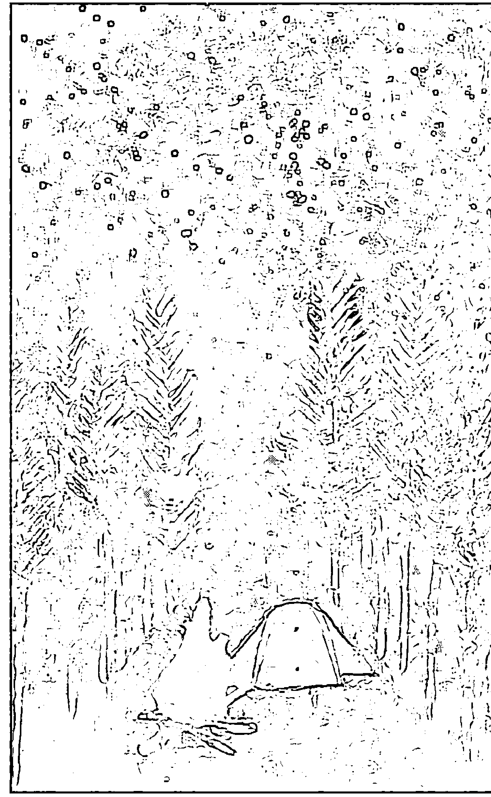

# 一 財運篇

### 基本卦解——做最好的準備，最壞的打算

抽到此卦的人在進行求財行動之前，必先做最好的準備與最壞的打算，因為你面對的是困難很多與狀況不斷的局面，萬一求財不順，也可事先有心理準備，就當它是換取經驗的必要過程吧！

- ◆偏財指數：32分／財運旺度：⊗⊗⊗

### 從占卜時間看終極預測

晚間十一點—凌晨一點、上午十一點—下午一點

- 行動的有利時機：農曆四到六月
- 助旺財運的地方：南方、有文化氣息的地方或圖書館
- 助旺財運的顏色：紅色
- 投資的幸運數字：3、9

終極預測及建議：第三十三卦「天山遯」——看得見卻賺不到。抽到這一卦的人，有種老是跟財神爺擦身而過的感覺，偏財明明就可以到手，卻在臨門一腳錯失良機，就好像追星族，老是追著財神爺跑，到現在都還停留在玩「躲貓貓」的遊戲階段。

- 偏財指數：55分／財運旺度：$

- 行動的有利時機：凌晨一點—凌晨三點、下午一點—下午三點
- 助旺財運的地方：南方、燒烤店或圖書館
- 助旺財運的顏色：紅色、橘色
- 投資的幸運數字：3、9

#### 終極預測及建議：第六十一卦「雷山小過」——求財不順還傷和氣。俗話說的好，買賣不成仁義在。千萬別為了求財的事與人爭執、傷了和氣。所謂山不轉路轉，路不轉人轉，人不轉心轉，只要轉換一下你的想法，多為對方想想，你就不會為了求財不成的事而生氣了。這次不成，還有下一次，不是嗎？

- 偏財指數：23分／財運旺度：◎◎◎

- 行動的有利時機：凌晨三點—凌晨五點、下午三點—下午五點
- 助旺財運的地方：東南方、南方、公園附近、藝文活動場所
- 助旺財運的顏色：綠色、紅色
- 投資的幸運數字：3、4、7、8

#### 終極預測及建議：第三十卦「離為火」——本著良心賺錢，心安理得。你是個心地善良，做事光明磊落的人，如果能找到一位個性跟你一樣的夥伴一起求財，或者求財的方式與你的個性相符，那獲利就會很容易了！

- 偏財指數：85分／財運旺度：$$$$

凌晨五點—上午七點、下午五點—下午七點

- ◆ 行動的有利時機：農曆一到三月
- ◆ 助旺財運的地方：東南方、植物園
- ◆ 助旺財運的顏色：綠色
- ◆ 投資的幸運數字：3、4、5、8
- ◆ 終極預測及建議：第五十卦「火風鼎」—— 三人合作，獲利更旺。俗語說的好：「三個臭皮匠，勝過一個諸葛亮。」有時候一個人做不到的事情，大家一起來就沒那麼困難了。抽到這一卦，不管你的求財目標是什麼，找別人一起團隊合作，絕對勝過自己一人單打獨鬥。

- ◆ 偏財指數：88分／財運旺度：$$$$$

上午七點—上午九點、晚間七點—晚間九點

- ◆ 行動的有利時機：農曆一到四月
- ◆ 助旺財運的地方：東南方、機場
- ◆ 助旺財運的顏色：藍色、綠色
- ◆ 投資的幸運數字：3、4、7、8
- ◆ 終極預測及建議：第三十五卦「火地晉」—— 已見曙光，努力必有所獲。你努力求財的事已逐漸明朗，而且成功在望，只要按部就班、穩紮穩打的進行，求財的時機應該不遠了！只要不計較自己的付出，多幫助別人也等於在幫自己。

- ◆ 偏財指數：68分／財運旺度：$

上午九點—上午十一點、晚間九點—晚間十一點

- ◆ 行動的有利時機：農曆四到六月
- ◆ 助旺財運的地方：南方、藝文展覽場所、燒烤店
- ◆ 助旺財運的顏色：紅色、橘色
- ◆ 投資的幸運數字：3、9
- ◆ 終極預測及建議：第五十二卦「艮為山」—— 姜太公釣魚，願者上鉤。有時主動出擊可以增加求財的機會，但抽到這一卦，你反而應該逆勢操作。當你做好求財布局之後，最好不要再有任何大動作，只需要靜靜的等待，該來的財一定少不了，因為急也沒有用。

- ◆ 偏財指數：68分／財運旺度：$$$

# 二 感情篇

### □ 基本卦解——風雨中的感情

這段感情一路走來都不平順，突發狀況是家常便飯，甚至本來沒什麼事也會鬧到不可開交。風風雨雨的感情讓兩人很沒有安全感，如果能分開兩地、遠距離交往，煩惱可能會少一些。

愛情指數：60分／愛情熱度：♡♡♡

### □ 從占卜時間看終極預測

- 晚間十一點—凌晨一點、上午十一點—下午一點
- 最美好的相處方式：不一定要常見面，但別忘了打電話關心對方
- 最理想的穿著打扮：給對方安全感的打扮
- 助旺愛情運的顏色：紅色、黃色、橘紅色
- 最理想的約會地點：光線充足但安靜的公共場所

#### 終極預測及建議：第三十三卦「天山遯」——躲貓貓。你很想親近對方，方法雖然已經很溫和又低調了，但對方還是覺得有壓力，因此故意不理你、不接電話，甚至不願意碰面，擺明想逃避這段感情。其實對方希望你冷靜一段時間再說。建議你不妨暫時放下，等待機緣。也許更好的對象正在前方等待著你，何必苦苦單戀對方呢？

- 愛情指數：58分／愛情熱度：⊗

- 凌晨一點—凌晨三點、下午一點—下午三點
- 最美好的相處方式：生氣的時候少說兩句，因為解釋再多也沒用
- 最理想的穿著打扮：醒目亮麗的打扮
- 助旺愛情運的顏色：紅色、白色
- 最理想的約會地點：熱鬧的公共場所

#### 終極預測及建議：第六十二卦「雷山小過」——情侶變冤家。你們本是一對熱戀的情侶，當心物極必反，關心對方太多、替對方想太多，彼此反而弄得不開心，反目成仇，感情因此由熱變冷，甚至有可能漸行漸遠。

- ◆愛情指數：52分／愛情熱度：◎◎◎

- 凌晨三點—凌晨五點、下午三點—下午五點
- 最美好的相處方式：柔順又大方
- 最理想的穿著打扮：有陽光氣息的休閒打扮
- 助旺愛情運的顏色：綠色、紅色、藍＋粉綠色
- 最理想的約會地點：熱鬧的休閒場所

#### 終極預測及建議：第三十卦「離為火」——熱情、坦白的愛。兩個人都很大方、坦白又熱情，肚子裡絕對沒有半點壞水，無論是好事或壞事，都會拿出來跟另一半分享、討論。兩人在一起的時候相當熱情，因為坦白與大方是他們感情的基礎。

- 愛情指數：88分／愛情熱度：♡♡♡♡

- 凌晨五點—上午七點、下午五點—下午七點
- 最美好的相處方式：給對方充分的活動空間，不要質疑對方
- 最理想的穿著打扮：飛行風格的休閒打扮
- 助旺愛情運的顏色：粉綠色、秋香綠色、藍＋綠色、深綠色
- 最理想的約會地點：有許多鮮花盛開的地方

#### 終極預測及建議：第五十卦「火風鼎」——你就是那個第三者。你們兩人可能正在熱戀中，但小心對方可能已婚，或在你之前還有一位好的異性朋友，正在大搞三角關係。站在你的立場，你可能覺得別人是第三者，但換個位置來看，其實你才是那個第三者呢！

- 愛情指數：72分／愛情熱度：♡♡♡

- 上午七點—上午九點、晚間七點—晚間九點
- 最美好的相處方式：凡事多包容，身段愈柔軟愈好
- 最理想的穿著打扮：休閒風格
- 助旺愛情運的顏色：綠＋藍色、紅色
- 最理想的約會地點：空氣流通的休閒場所

#### 終極預測及建議：第三十五卦「火地晉」——是一對溫馨的好伴侶。兩人在一起會互相照顧，感情也不錯，愛情溫度猶如西下的夕陽，溫和而不刺眼，雖然少了一些激情，卻多了幾分溫馨。兩人在一起時好像老夫老妻或老戀人，祥和又有默契。

- 愛情指數：76分／愛情熱度：♡♡♡

- 上午九點—上午十一點、晚間九點—晚間十一點
- 最美好的相處方式：多以手機簡訊、電子郵件等方式與對方聯絡
- 最理想的穿著打扮：樸素風
- 助旺愛情運的顏色：紅色、白色、粉紅色
- 最理想的約會地點：山上、安靜的地方

#### 終極預測及建議：第五十二卦「艮為山」——不動如山。你們的交往一點樂趣都沒有，兩人交往的過程好像在太空上漫步一樣，動作緩慢又失去重心，顯示出雙方都沒有很在意這段感情。與其有氣無力的勉強維持下去，不如灑脫點跟對方說再見，或改變一下彼此的關係，從戀人變朋友。

- 愛情指數：59分／愛情熱度：♡

# 第五十七卦 巽卦——巽為風

### 卦象的基本性質及吉凶解讀

本卦在六十四卦中屬於瞬息萬變的機緣卦。

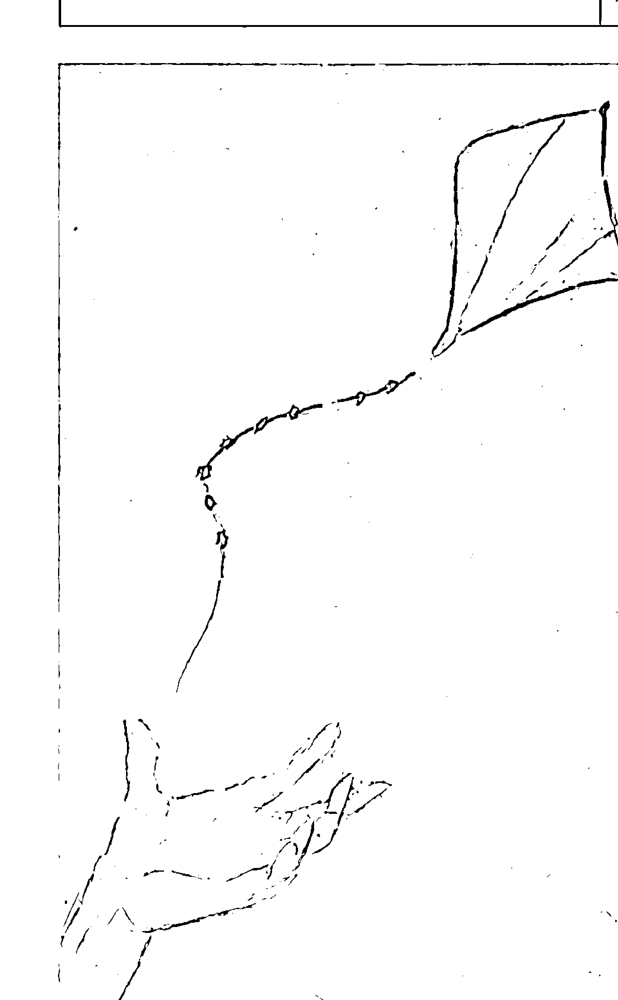

# 一 財運篇

### 一 基本卦解——虛幻多變的偏財運

你選定的求財方向本來就變化多端，而你自己對這件事的信心也不夠，經常搖擺不定。所以，在這種裡外都不穩定的情況下想要求財，必須要有很好的機會才能穩穩的賺到錢，否則就會變來變去好比過路財神。

- ◇偏財指數：62分／財運旺度：$

### 從占卜時間看終極預測

- 晚間十一點—凌晨一點、上午十一點—下午一點
  - 行動的有利時機：農曆一到三月
  - 助旺財運的地方：東南方、鳥園
  - 助旺財運的顏色：綠色
  - 投資的幸運數字：4
  - 終極預測及建議：第十八卦「山風蟲」——小心受騙。俗話說「十賭九騙」，如果你打算透過賭博來求財、或透過不當管道來求取意外之財，小心上當，因為你的對手存心不良。建議你，三十六計走為上策吧。
  - 偏財指數：23分／財運旺度：◎◎◎◎

- 凌晨一點—凌晨三點、下午一點—下午三點
  - 行動的有利時機：農曆一到三月
  - 助旺財運的地方：東南方、北方、靠近公園的咖啡館
  - 助旺財運的顏色：綠色、藍色
  - 投資的幸運數字：1、4、5、6
  - 終極預測及建議：第四十八卦「水風井」——你求財，別人獲利。得此卦者，要有「你種樹，別人乘涼」的大無畏付出精神，是一種要先付出、幫助他人，而不要要求任何回報的求財狀況。往好的一面想，如果你能真心誠意，沒有一目的地幫助別人，也許有一天，你會因為之前所做的好事，與先前結下的善緣，而有意外的收穫。
  - 偏財指數：65分／財運旺度：$

- 凌晨三點—凌晨五點、下午三點—下午五點
  - 行動的有利時機：農曆一到三月
  - 助旺財運的地方：東南方、放風箏的廣場
  - 助旺財運的顏色：綠色
  - 投資的幸運數字：4、5
  - 終極預測及建議：第九卦「風天小畜」——就差臨門一腳，繼續努力。凡事都像耕種，有播種期、萌芽期、茁壯期，也有收穫期。抽到這一卦的人，目前的求財狀況就像茁壯期一樣，雖然距離收穫還有一段時間，但只要你堅定求財的方向與目標，多一些耐心等待、不要半途而廢，鎖定的利益早晚會是你的。

## 財運篇

### 基本卦解——耍嘴皮，開心賺
公共關係是致富的重要工具，健談又有說服力的人更是公關好手，所以，抽到此卦的人，應多多利用你的口才，經常跟別人聊天來增加求財的機會。當雙方聊得很開心的時候，什麼事情都好談，那麼你在求財時自然能水到渠成。

- 偏財指數：82分／財運旺度：$$$$$
- 行動的有利時機：農曆一到三月
- 助旺財運的地方：東南方、雀鳥很多的公園
- 助旺財運的顏色：綠色
- 投資的幸運數字：4、5
- 終極預測及建議：第五十三卦『風山漸』——財神爺快到了，你準備好了嗎？錢財到手的日子一天比一天接近了，但其中還有不少困難等著你去克服與排除，最重要的是你本身對這次的求財計畫究竟有沒有做好充分的準備，包括你的專業與資金，準備愈充分，當財神爺來臨時才能大有所獲。

- 偏財指數：65分／財運旺度：$$
- 行動的有利時機：農曆一到三月、十到十二月
- 助旺財運的地方：東南方、北方、機場的咖啡廳
- 助旺財運的顏色：藍色、灰色、綠色
- 投資的幸運數字：1、4、5、6
- 終極預測及建議：第五十九卦『風水渙』——意興闌珊。也許你已經有過很多次的求財行動，同時每次的行動都付出不少努力，但都沒有獲利，原本的銳氣經過多次的挫折後，早已變得有氣無力、意興闌珊，所以短期內如果沒有重大的突破，建議你不如及早放棄為妙。

- 偏財指數：25分／財運旺度：⊗
- 行動的有利時機：農曆一到三月
- 助旺財運的地方：東南方、鳥園或賣鳥的地方
- 助旺財運的顏色：綠色
- 投資的幸運數字：4、5
- 終極預測及建議：第四十四卦『天風姤』——短線獲利，見好就收。得此卦者有上司與長輩的貴人緣，他們會對你關愛有加，並提供求財的機會給你，但都屬於短期中小型的獲利，所以不要貪心，見好就收；也不要有大財或長遠的獲利發展。若是女性得此卦，則獲利會更高。

## 感情篇

### 基本卦解——愛情像月亮，初一、十五不一樣
你們的愛情經常吹著不一樣的風，無論在情緒上或想法上，都會起伏不定、變化多端。同時你們倆人都缺乏定見與定信，在愛情的路上，容易見一個愛一個，對事不夠果決，以至於什麼事都反反覆覆，不容易成功。

- 偏財指數：78分／財運旺度：$$$$
- 愛情指數：68分／愛情熱度：♡♡

### 從占卜時間看終極預測

- 晚間十一點—凌晨一點、上午十一點—下午一點
- 最美好的相處方式：小事可順從對方，但防人之心不可無
- 最理想的穿著打扮：休閒情侶裝
- 助旺愛情運的顏色：藍+綠色
- 最理想的約會地點：經常做改變
- 終極預測及建議：第十八卦「山風蟲」——金玉其外，敗絮其中。這段感情已經不單純了，不是喜不喜歡的問題，而是對方已徹底從內心產生極大的改變。可能因為經濟因素而想離開，也可能是對方已另結新歡，想中止這段感情；另一個原因是，對方發覺你並不是他的真命天女／天子。不管是哪種原因，結果都一樣，苦苦糾纏下去對誰都不好。

- 愛情指數：13分／愛情熱度：◎◎◎◎◎
- 凌晨一點—凌晨三點、下午一點—下午三點
- 最美好的相處方式：持之以恆的互相幫助對方
- 最理想的穿著打扮：海洋風的休閒打扮
- 助旺愛情運的顏色：藍色、綠色
- 最理想的約會地點：酒吧、咖啡廳
- 終極預測及建議：第四十八卦「水風井」——愛，是無悔的付出。因為你無怨無悔的付出，打動了對方的心，產生互愛、互助的愛情故事。雖然過程是艱辛的，付出也是辛苦的，但最後得到的回報卻是值得的。

- 愛情指數：72分／愛情熱度：♥♥♥
- 凌晨三點—凌晨五點、下午三點—下午五點
- 最美好的相處方式：自由自在的跟對方相處
- 最理想的穿著打扮：情侶休閒裝
- 助旺愛情運的顏色：藍+綠色
- 最理想的約會地點：彼此都喜歡去的休閒場所
- 終極預測及建議：第九卦「風天小畜」——女方佔優勢，追求女方的人不少，所以女方大可慢慢選擇誰才是心中的最愛。如果你是男生，抽到這一卦一定要主動一點，盡可能施展渾身解數來贏得芳心，否則容易被情敵先下手為強，那就來不及了！

- 愛情指數：女生80分，男生68分／愛情熱度：女生 ♥♥♥♥，男生 ♥♥♥
- 愛情指數：68分／愛情熱度：♥♥♥
- 凌晨五點—上午七點、下午五點—下午七點
- 最美好的相處方式：默默的付出、慢慢的進步
- 最理想的穿著打扮：彼此都喜歡的休閒裝扮
- 助旺愛情運的顏色：藍+綠色
- 最理想的約會地點：彼此都喜歡的休閒場所
- 終極預測及建議：第五十三卦「風山漸」——慢慢進步中。女生比男生的年紀稍大一點沒關係，因為不管雙方年紀差距如何，女生都會像姐姐一樣照顧男生，讓男生的事業無後顧之憂。你們的戀情正逐漸在加溫中，絕對不會起伏不定，這是令人看好的現象。

- 最美好的相處方式：想一些點子來喚起對方的注意
- 上午七點—上午九點、晚間七點—晚間九點
- 最理想的穿著打扮：海洋風的休閒裝扮
- 助旺愛情運的顏色：藍+綠色
- 最理想的約會地點：靠近海邊的休閒場所、有酒吧的沙灘
- 終極預測及建議：第五十九卦『風水渙』——彼此都缺乏歸屬感。可能經過一段無聊的相處，雙方都覺得有點膩了不好玩，對彼此的感情興趣缺缺，而沒有歸屬感。唯一的方法只有重新找出共同目標，才能改善兩人之間的關係，否則會愈來愈不想見面。

- 愛情指數：58分／愛情熱度：♡♡
- 最美好的相處方式：目前開心就好，不要想太遠
- 上午九點—上午十一點、晚間九點—晚間十一點
- 最理想的穿著打扮：女方喜歡的休閒裝扮
- 助旺愛情運的顏色：黑色、綠色、灰色
- 最理想的約會地點：空氣流通的休閒場所
- 終極預測及建議：第四十四卦『天風姤』——一夜情。兩人偶然相遇，擦出火花，這種感情並不長久。如果你是女生，將是無敵劈腿族，每個男人都被妳耍得團團轉，妳的要求都能如願，但這種好事維持不久的，勸妳見好就收。如果你是男生，那就很悲哀了，因為你愛的女生有太多情人，你會追得很辛苦。

- 愛情指數：女生86分，男生68分／愛情熱度：女生♡♡♡，男生⊗

## 第五十八卦 兌卦——兌為澤

### 卦象的基本性質及吉凶解讀
本卦在六十四卦中屬於柔和、愉悅氛圍之下的誠懇溝通卦。

## 一、財運篇

### 基本卦解——耍嘴皮，開心賺
公共關係是致富的重要工具，健談又有說服力的人更是公關好手，所以，抽到此卦的人，應多多利用你的口才，經常跟別人聊天來增加求財的機會。當雙方聊得很開心的時候，什麼事情都好談，那麼你在求財時自然能水到渠成。

- 偏財指數：82分／財運旺度：$$$$$

### 從占卜時間看終極預測
晚間十一點—凌晨一點、上午十一點—下午一點

- 行動的有利時機：農曆六月下半月開始到九月
- 助旺財運的地方：西方、西南方、人氣旺的咖啡廳
- 助旺財運的顏色：米白色、黃色、白色
- 投資的幸運數字：4、5、8
- 終極預測及建議：第五十四卦「雷澤歸妹」——委屈求全，等待機會東山再起。有句話說，「形勢比人強，不得不低頭。」當你的財運還不是那麼好的時候，千萬不要迷信「道理」，更不要賭氣逞強，也不能固執硬拗，因為只有見風轉舵、順著趨勢走，才能保住你的本錢；等財運到了，自然能開開心心賺錢。

- 偏財指數：45分／財運旺度：⊗
- 凌晨一點—凌晨三點、下午一點—下午三點
- 行動的有利時機：農曆七到九月、十二月下半月
- 助旺財運的地方：西方、山上的咖啡廳
- 助旺財運的顏色：藍色、灰色、黑色
- 投資的幸運數字：1、6
- 終極預測及建議：第十卦「天澤履」——富貴險中求。此卦表面上已經獲利，其中卻暗藏著不少危機與風險。如果你想投資的是高風險、高利潤的偏財，很可能賺的錢在一夜之間就血本無歸了！抽到這一卦，理應分散風險，不要把所有投資都集中在同一個方向上。

- 偏財指數：77分／財運旺度：$$$$
- 凌晨三點—凌晨五點、下午三點—下午五點
- 行動的有利時機：下大雨的時候、農曆十到十二月
- 助旺財運的地方：北方、靠近河流的地方、游泳池附近
- 助旺財運的顏色：藍色、灰色、黑色
- 投資的幸運數字：1、6
- 終極預測及建議：第四十七卦「澤水困」——一籌莫展，進退為難。一件事之所以會成功，其實都少不了好的機會與運氣，而你目前的處境正缺少了這些成功的重要因素，導致你在誤判情勢下貿然投入，以致面臨一波又一波的困難，讓你進退為難。唯一的解決方式就是快快抽身離開，方為上策。

- 偏財指數：0分／財運旺度：⊗⊗⊗⊗⊗
- 行動的有利時機：雨天、農曆七到十二月
- 助旺財運的地方：北方、海洋館或水族館
- 助旺財運的顏色：藍色、灰色、黑色
- 投資的幸運數字：1、6
- 終極預測及建議：第十七卦『澤雷隨』——參考專家意見，隨緣穩健理財。回顧過往的經驗，如果你覺得並不理想，此時不妨多參考不同專家的意見。聽完專家的意見後，要仔細分析一下，看哪一種方式適合你現在的狀況，然後確實去執行；其他的就隨緣了。

- 偏財指數：68分／財運旺度：$$
- 行動的有利時機：上午七點—上午九點、晚間七點—晚間九點
- 助旺財運的地方：北方、咖啡廳、酒吧
- 助旺財運的顏色：藍色、灰色、黑色
- 投資的幸運數字：1、6
- 終極預測及建議：第四十三卦『澤天夬』——當機立斷偏財來。不管你現在的求財狀況是賺或賠，想再追加投資金額或是壯士斷腕而停損，此時都要趕快當機立斷，做出明快決定，以免夜長夢多。倘若當下不做任何決定，採觀望態度，只會愈來愈壞。

- 偏財指數：62分／財運旺度：$
- 行動的有利時機：上午九點—上午十一點、晚間九點—晚間十一點
- 助旺財運的地方：滂沱大雨時、農曆十到十二月
- 助旺財運的顏色：藍色、灰色、黑色
- 投資的幸運數字：1、6
- 終極預測及建議：第六十卦『水澤節』——拿捏好求財的分寸。抽到這一卦的人，求財的確需要一點智慧。因為在求財的過程當中，如果使力太猛，會把事情搞砸；如果行動不夠積極，又會顯得有氣無力。所以要了解情況後再做出精準的求財行動，過猶不及都不好，一旦分寸拿捏得當，就有獲利機會。

- 偏財指數：68分／財運旺度：$$

## 二 感情篇

### 基本卦解——聊天高手
兩個人都很喜歡聊天，稱得上是聊天高手，拿起手機可以講上三天三夜，在一起的時候都很開心，但是小心話說多了難免會說錯話，而讓對方不高興。建議你，把握兩個人在一起聊天的快樂時刻，但要小心樂極生悲。

- 愛情指數：72分／愛情熱度：♥♥♥

### 從占卜時間看終極預測

- 最美好的相處方式：不要把委屈放心裡，有話說出來
- 最理想的穿著打扮：可愛、輕便風
- 助旺愛情運的顏色：粉紅、紅＋米白色
- 最理想的約會地點：卡拉OK、地鐵站附近
- 終極預測及建議：第五十四卦「雷澤歸妹」——命里有時終須有，命里無時莫強求。你們的戀情有許多地方都顯得很勉強，由於相遇的時機不對，所以交往時難免會讓你覺得萬分委屈，心裡常常感到不平衡，多少會有偏激的想法；萬一想不開而使用激烈的手段來處理這段感情，後果往往不堪設想。

- 愛情指數：46分／愛情熱度：⊗⊗
- 最美好的相處方式：對方在意的事，說話前要先想清楚再說
- 最理想的穿著打扮：看場合做適當的打扮
- 助旺愛情運的顏色：粉紅色、紅+米白色
- 最理想的約會地點：大型公共場所、地鐵站附近
- 終極預測及建議：第十卦「天澤履」——地位不對等的關係。雙方的身份地位相差太多，條件比較差的那一方若想贏得對方的芳心，必須小心翼翼的讓對方高興，跟對方在一起的時候要小心說錯話或做錯動作、拍錯馬屁，以免惹對方生氣，雙方就玩完了！

- 愛情指數：68分／愛情熱度：♡♡♡
- 最美好的相處方式：多聊開心事，避免談論一些難解決的問題
- 凌晨三點—凌晨五點、下午三點—下午五點
- 最理想的穿著打扮：可愛輕鬆的風格
- 助旺愛情運的顏色：粉紅色、紅+米白色
- 最理想的約會地點：卡拉OK、地鐵站附近
- 終極預測及建議：第四十七卦「澤水困」——枯萎的苦戀花。這是一段不可告人的苦戀，對方表面上雖然沒有說不愛你，但兩人的相愛總是一些難解決的問題，是困難重重，對方不懂得替你著想，更不會跟你一起面對難關，所有的壓力與困境總是得自己一人去承擔，最後落得只剩自己獨嘗愛情苦果。

- 愛情指數：23分／愛情熱度：⊗⊗⊗⊗
- 終極預測及建議：第十七卦「澤雷隨」——愈追愈累。你很認真的看待這段感情，但對方玩心比較重，對感情的事還沒定下心來，所以你只好凡事遷就對方，順著對方的想法與喜好做事。這種不平等關係拖得愈久，你只有愈累而已。

- 最理想的約會地點：地下室的餐廳、地鐵站附近
- 助旺愛情運的顏色：粉紅色、紅+米白色
- 最理想的穿著打扮：輕鬆可愛的風格
- 最美好的相處方式：聊好玩的事就好，不要太認真去討論嚴肅的事
- 凌晨五點—上午七點、下午五點—下午七點
- 愛情指數：65分／愛情熱度：♡

#### 上午七點—上午九點、晚間七點—晚間九點

- 最美好的相處方式：用手機聊聊天就好，不要主動邀約對方
- 最理想的穿著打扮：看場合來打扮
- 助旺愛情運的顏色：白色、粉紅色
- 最理想的約會地點：博物館、卡拉OK
- 終極預測及建議：第四十三卦「澤天夬」——等他來找你吧！兩人的觀念不同，對方怕你太過干預他的生活，希望有更多自由空間。所以你愈是採取主動的攻勢，對方會愈厭煩，令這段感情產生困擾。建議你，交往速度不妨放慢一點，多聽聽對方的想法，多尊重對方的自由空間，那麼你們的相處自然會漸入佳境。

- 愛情指數：68分／愛情熱度：♡

#### 上午九點—上午十一點、晚間九點—晚間十一點

- 最美好的相處方式：適當的隱藏自己的情緒，聊一些對方喜歡的事
- 最理想的穿著打扮：輕鬆可愛的風格
- 助旺愛情運的顏色：粉紅色、紅色、橘紅＋米白色、白色
- 最理想的約會地點：有音樂播放的地方、地下室的餐廳
- 終極預測及建議：第六十卦「水澤節」——愛情的剛剛好。凡事都不宜熱過頭，談愛情就好像燒菜，必須講求火候，有所節制，恰到好處最絕妙。多一分不多、少一分不少，若能把握住其中的要領，就能贏得愛人的心。

- 愛情指數：78分／愛情熱度：♡♡♡

## 第五十九卦 渙卦——風水渙

### 卦象的基本性質及吉凶解讀
本卦在六十四卦中屬於意興闌珊，精神渙散之卦。

## 一 財運篇

### 基本卦解——意興闌珊
也許你已經有過很多次的求財行動，同時每次的行動都付出不少努力，但都沒有獲利，原本的銳氣經過多次的挫折後，早已變得有氣無力、意興闌珊，所以在短期內如果沒有重大的突破，建議你不如及早放棄為妙。

- 偏財指數：25分／財運旺度：⊗

### 一 从占卜时间看终极预测

- 晚間十一點—凌晨一點、上午十一點—下午一點
- 行動的有利時機：農曆七到十二月
- 助旺財運的地方：西方、北方、有音樂播放的咖啡館
- 助旺財運的顏色：灰色、金色、銀色、藍色
- 投資的幸運數字：1、6、7
- 終極預測及建議：第二十九卦「坎為水」——橫跨駭浪必失財。這是風險極大的求財卦，若然出手，便會遇上陷阱，弄得血本無歸。建議你，能不大起大落已經算是幸運的了。倒楣的話，投資金額應減低到本來投資預算的二五%。此外，賺到一點甜頭就要立刻收手，否則就中了此卦「久戰必敗」的魔咒。

- 偏財指數：13分／財運旺度：⊗⊗⊗⊗
- 投資的幸運數字：1、4、5、6
- 終極預測及建議：第六十一卦「風澤中孚」——誠信求財必可獲利。商場如戰場，有時候免不了會耍心機、故佈疑陣；但抽到這一卦的人，建議你這次的求財過程中千萬別來這一套，買賣雙方都應以誠信為最高原則，這樣的方式才是上策。

- 偏財指數：68分／財運旺度：$$
- 行動的有利時機：農曆一到三月、十到十二月
- 助旺財運的地方：東方、北方、運動場、咖啡館
- 助旺財運的顏色：綠色、藍色、灰色
- 投資的幸運數字：1、5、6、7
- 終極預測及建議：第二十卦「風地觀」——不可孤注一擲。在情況不明的情形下最忌貿然進行求財，萬一在不對的時機出手，只會損失慘重，悔不當初。建議你，多收集資料繼續觀察。如果在十天之內還是看不清楚求財狀況，就放棄吧！

- 偏財指數：13分／財運旺度：⊗⊗⊗⊗
- 偏財指數：50分／財運旺度：⊗
- 凌晨五點—上午七點、下午五點—下午七點
- 行動的有利時機：農曆一到三月、十到十二月
- 助旺財運的地方：東方、北方、熱鬧的市場、靠近水的地方
- 助旺財運的顏色：綠色、藍色、灰色
- 投資的幸運數字：1、5、6、7
- 終極預測及建議：第五十七卦「巽為風」——虛幻多變的偏財運。你選定的求財方向本來就變化多端，而你自己對這件事的信心也不夠，經常搖擺不定。所以，在這種外在都不穩定的情況下想要求財，必須要有很好的機會才能穩定的賺到錢，否則就會變來變去好比過路財神。

- 偏財指數：62分／財運旺度：$
- 上午七點—上午九點、晚間七點—晚間九點
- 行動的有利時機：農曆七到十二月
- 助旺財運的地方：西方、北方、地鐵站、音樂咖啡廳
- 助旺財運的顏色：藍色、灰色、白色
- 投資的幸運數字：1、6、7
- 終極預測及建議：第六卦「天水訟」——當心因財失義。得此卦者若想求財，最好個別行動，千萬不要跟別人有任何牽扯，因為牽扯愈多，到最後會因為誤解或交待不清之處與他人產生爭執，嚴重的話可能會鬧上法庭成為被告。求財時也要留意文件契約的內容，以免賺不到錢又惹上是非、受騙上當。

- 偏財指數：3分／財運旺度：⊗
- 上午九點—上午十一點、晚間九點—晚間十一點
- 行動的有利時機：農曆七到十二月
- 助旺財運的地方：西方、北方、卡拉OK、賣飲料的地方
- 助旺財運的顏色：粉紅色、藍色、灰色
- 投資的幸運數字：1、6、7
- 終極預測及建議：第四卦「山水蒙」——狀況不明，守財為上。一艘船在海上航行，當四周都起霧時，就要小心行駛了，否則會觸礁、甚至沉船。同樣的，當我們的投資環境處於不利的狀況，或是對投資工具不太了解的時候，千萬不要輕舉妄動，以免賠了夫人又折兵。

## 二 感情篇

### 基本卦解——彼此都缺乏歸屬感

可能經過一段無聊的相處，雙方都覺得有點膩了不好玩，對彼此的感情興趣缺缺，而沒有歸屬感。唯一的方法只有重新找出共同目標，才能改善兩人之間的關係，否則會愈來愈不想見面。

- ◆愛情指數：58分／愛情熱度：♥♥

### 從占卜時間看終極預測

- ◆晚間十一點—凌晨一點、上午十一點—下午一點
- ◆最美好的相處方式：隨時都要有超越障礙、克服困難的準備
- ◆最理想的穿著打扮：要常常變換

#### 凌晨一點—凌晨三點、下午一點—下午三點

- ◆愛情指數：13分／愛情熱度：⊗⊗⊗⊗⊗

快結束吧！難安然度過。不如趁早譜下休止符，讓厄運趕快結束吧！

- ◆助旺愛情運的顏色：藍色、白色、黑色
- ◆最理想的約會地點：海洋公園、酒吧、海邊
- ◆終極預測及建議：第二十九卦「坎為水」—— 倒楣的愛情遭遇。你們的感情沒有人支持，就算一起創業也到處碰壁。一波未平一波又起，是你們的宿命，這段感情就像被詛咒似的，很難安然度過。不如趁早譜下休止符，讓厄運趕快結束吧！
- ◆最美好的相處方式：要多信任對方，相處時要多用點腦筋
- ◆最理想的穿著打扮：大家都喜歡的裝扮
- ◆助旺愛情運的顏色：藍色、黑色、灰色
- ◆最理想的約會地點：海洋公園、酒吧、喝咖啡的地方、游泳池
- ◆終極預測及建議：第六十一卦「風澤中孚」—— 天長地久。你們自交往以來，給對方的承諾從未失信過，在彼此心目中，對方是個可以託付終生的人。互相相信賴、不分彼此，是這段感情最可貴的地方。如果想談談婚嫁，隨時都可以進行，而且會有圓滿的結果。

- ◆愛情指數：90分／愛情熱度：♡♡♡♡♡
- ◆凌晨三點—凌晨五點、下午三點—下午五點 最美好的相處方式：先看清楚局面情勢之後，才做出有智慧的表現
- ◆最理想的穿著打扮：海洋風的運動裝扮
- ◆助旺愛情運的顏色：藍色、綠色、灰色
- ◆最理想的約會地點：沙灘上的流行音樂會、沙灘上的運動
- ◆終極預測及建議：第二十卦『風地觀』——邊走邊看。你們的感情面臨瓶頸，因為有些現實的因素阻礙著你們。例如彼此身份的不速配，或經濟上出現困難等，連帶影響彼此的感情，而產生風風雨雨。所以應該是冷靜、客觀，好好檢視一下這份感情的時候了！

- ◆愛情指數：46分／愛情熱度：♡♡

- ◆愛情像月亮，初一、十五不一樣。你們的愛情經常吹著不一樣的風，無論在情緒上或想法上，都會起伏不定、變化多端。同時你們兩人都缺乏定見與定信，在愛情的路上，容易見一個愛一個，對事不夠果決，以致於什麼事都反反覆覆，不容易成功。

- ◆愛情指數：68分／愛情熱度：♡♡♡

- ◆終極預測及建議：第五十七卦『巽為風』——早上的風、晚上的風都會讓人感覺到舒適，而且愛情也會像風一樣，來得快，去得也快。所以應該把握當下的幸福，不要錯過。

- ◆凌晨五點—上午七點、下午五點—下午七點 最美好的相處方式：有智慧的順從對方
- ◆最理想的穿著打扮：航海風格的裝扮
- ◆助旺愛情運的顏色：藍色、灰色、綠色
- ◆最理想的約會地點：沙灘上的流行音樂會、沙灘上的運動
- ◆終極預測及建議：第五十七卦『巽為風』——早上的風、晚上的風都會讓人感覺到舒適，而且愛情也會像風一樣，來得快，去得也快。所以應該把握當下的幸福，不要錯過。

- ◆愛情指數：68分／愛情熱度：♡♡♡
- ◆上午七點—上午九點、晚間七點—晚間九點 最美好的相處方式：大事化小，小事化無
- ◆最理想的穿著打扮：多一些金屬飾品的裝扮
- ◆助旺愛情運的顏色：白色、藍色
- ◆最理想的約會地點：高檔的消費場所

- ◆終極預測及建議：第四卦「山水蒙」——霧裡看花。你正面面臨進退為難、頗為尷尬的時期，其實別說該何去何從，更不知該如何跟對方相处。目前才会让你好像站在十字路口，一时之间不看花。对方根本没有真正的投入这段恋情，所以...
- ◆最理想的約會地點：你自己熟悉的地方
- ◆助旺愛情運的顏色：藍色、白色
- ◆最理想的穿著打扮：多配戴藍寶石、珍珠、鑽石之類的飾品
- ◆最美好的相處方式：讓你有所質疑的事，就不要去做

#### 上午九點—上午十一點、晚間九點—晚間十一點

- ◆愛情指數：13分／愛情熱度：⊗⊗⊗⊗
- ◆終極預測及建議：第六卦「天水訟」——你們是一對冤家。相愛的時間點不對，長輩不贊成你們在一起，甚至極力反對，讓這段感情壓力很大，加上你們彼此間的愛恨情仇不是別人所能了解的，要好好聚好散恐怕不容易。如果你要個性，強要對方順從你，搞不好還會鬧上法庭。
- ◆愛情指數：48分／愛情熱度：⊗⊗⊗ 想得太多，既然看不清楚，不妨淡淡的放下，等看清楚了再出發還來得及。

## ☰ 第六十卦 節卦——水澤節

### 卦象的基本性質及吉凶解讀

> 本卦在六十四卦中屬於珍惜資源，謹慎守成之節制卦。

## 一 財運篇

### □ 基本卦解——拿捏好求財的分寸

抽到這一卦的人，求財的確需要一點智慧。因為在求財的過程當中，如果使力太猛，會把事情搞砸；如果行動不夠積極，又會顯得有氣無力。所以要了解情況後再做出精準的求財行動，過猶不及都不好，一旦分寸拿捏得當，就有獲利機會。

- ◆ 偏財指數：68分／財運旺度：$$$

### ☐ 從占卜時間看終極預測

- ◆ 晚間十一點—凌晨一點、上午十一點—下午一點
- ◆ 行動的有利時機：農曆七到九月
- ◆ 助旺財運的地方：西方、西北方、高水準的西餐廳
- ◆ 助旺財運的顏色：白色、粉紅色、金色
- ◆ 投資的幸運數字：1、2、6、7
- ◆ 終極預測及建議：第五卦「水天需」——條件還沒成熟，要等待。這次的求財計畫仍有幾項重要條件還沒成熟，例如，某些重要的人際關係尚未打通、需要應用的資金還沒到手，或是出手的時機還沒來臨等，種種條件都要全部到位以後才能放手一搏，否則求財計畫便會落空。
- ◆ 偏財指數：60分／財運旺度：$
- ◆ 行動的有利時機：農曆七到九月、十二月下半月
- ◆ 助旺財運的地方：東北方、西方、山上的休閒度假中心

#### 凌晨一點—凌晨三點、下午一點—下午三點

#### 凌晨三點—凌晨五點、下午三點—下午五點

- ◆ 行動的有利時機：農曆三月、六月、九月及十二月的下半月
- ◆ 助旺財運的地方：東北方、西南方、大賣場、百貨公司
- ◆ 助旺財運的顏色：白色、黃色、黑色
- ◆ 投資的幸運數字：2、7、8
- ◆ 終極預測及建議：第十九卦「地澤臨」——貴人指路而獲利。抽到此卦者，會遇到在上位的貴人，包括長輩、上司或位高權重的人，他們會在你求財的過程中拉你一把。如果能把握住這種千載難逢的機會，則財運亨通。
- ◆ 偏財指數：85分／財運旺度：$$$$
- ◆ 行動的有利時機：農曆九月下半月、十二月下半月
- ◆ 助旺財運的地方：東北方、山上的休閒度假旅館
- ◆ 助旺財運的顏色：白色、米黃色
- ◆ 投資的幸運數字：2、7、8
- ◆ 終極預測及建議：第五十八卦「兌為澤」——要嘴皮，開心賺。公共關係是致富的重要工具，健談又有說服力的人更是公關好手，所以，抽到此卦的人，應多多利用你的口才，經常跟別人聊天來增加求財的機會。當雙方聊得很開心的時候，什麼事情都好談，那麼你在求財時自然能水到渠成。
- ◆ 偏財指數：82分／財運旺度：$$$$
- ◆ 投資的幸運數字：2、7
- ◆ 助旺財運的顏色：白色、粉紅色

#### 上午七點—上午九點、下午五點—下午七點

- ◆ 行動的有利時機：上午七點—上午九點、下午五點—下午七點
- ◆ 助旺財運的地方：東北方、山上的休閒旅館
- ◆ 助旺財運的顏色：白色、米白色
- ◆ 投資的幸運數字：7、8
- ◆ 終極預測及建議：第六十一卦『風澤中孚』— 誠信求財必可獲利。商場如戰場，有時候免不了會耍心機、故佈疑陣；但抽到這一卦的人，建議你在這次的求財過程中千萬別來這一套，買賣雙方都應以誠信為最高原則，這樣的求財方式才是上策。
- ◆ 偏財指數：68分／財運旺度：$$
- ◆ 行動的有利時機：農曆七到十二月
- ◆ 助旺財運的地方：西方、北方、有音樂播放的咖啡廳或酒吧
- ◆ 助旺財運的顏色：金色、銀色、藍色、灰色
- ◆ 投資的幸運數字：1、2、6、7
- ◆ 終極預測及建議：第二十九卦『坎為水』— 驚濤駭浪必失財。這是風險極大的求財卦，如果能大起大落已經算是幸運的了。倒楣的話，一出手便會遇上陷阱，弄得血本無歸。建議你，若非做不可，投資金額應減低到本來投資預算的二五%。此外，賺到一點甜頭就要立刻收手，否則就中了此卦『久戰必敗』的魔咒。
- ◆ 偏財指數：13分／財運旺度：⊗⊗⊗⊗
- ◆ 行動的有利時機：農曆七到九月
- ◆ 助旺財運的地方：西方、地下室的西餐廳、卡拉OK
- ◆ 助旺財運的顏色：金色、銀色、粉紅色
- ◆ 投資的幸運數字：1、2、6、7
- ◆ 終極預測及建議：第三卦『水雷屯』— 小心陷阱，切忌貪多求快。投資股票有所謂的『地雷股』，如果投資太多而且誤中『地雷』，就會死得很慘。所以投資前必須多做功課，眼睛放亮一點，才能避開陷阱。不管怎樣，抽到這一卦的人在此時此刻是不宜出手的，還是奉勸你等待下一次機會吧！
- ◆ 偏財指數：0分／財運旺度：⊗⊗⊗⊗⊗

## 二 感情篇

### 基本卦解——愛的剛剛好

凡事都不宜熱過頭，談愛情就好像燒菜，必須講求火候，有所節制，恰到好處最絕妙。多一分不多、少一分不少，若能把握住其中的要領，就能贏得愛人的心。

- ◆愛情指數：78分／愛情熱度：♡♡♡

### 從占卜時間看終極預測

- ◆晚間十一點—凌晨一點、上午十一點—下午一點
- ◆最美好的相處方式：有時候正經，有時候搞笑
- ◆最理想的穿著打扮：有時候正式，有時候休閒
- ◆助旺愛情運的顏色：粉紅色、白色
- ◆最理想的約會地點：高樓層的地方、地下室的餐廳
- ◆終極預測及建議：第五卦「水天需」——戒急用忍。有些事可以急功近利，有些事則應該慢慢培養。你們雙方的條件不是很相配，表示缺少了一些談愛情必須具備的基礎，所以要耐心等待，默默的增進自己的條件，當時機成熟的時候，自然會有好的結果。
- ◆愛情指數：58分／愛情熱度：⊗

#### 凌晨一點—凌晨三點、下午一點—下午三點

- ◆最美好的相處方式：平常保持被動，見面時則要高興的聊天
- ◆最理想的穿著打扮：樸素又可愛的穿著
- ◆助旺愛情運的顏色：白色、粉紅色
- ◆最理想的約會地點：環境樸實又有現場演唱的地方
- ◆終極預測及建議：第五十八卦『兌為澤』——聊天高手。兩人都很喜歡聊天，稱得上是聊天高手，拿起手機可以講上三天三夜，在一起的時候都很開心。但小心話說多了難免會說錯話，而讓對方不高興。建議你，把握兩人一起聊天的快樂時刻，但要小心樂極生悲。
- ◆愛情指數：72分／愛情熱度：♥♥♥

#### 凌晨三點—凌晨五點、下午三點—下午五點

- ◆最美好的相處方式：用低調又謙虛的方式來相處
- ◆最理想的穿著打扮：復古風的樸素打扮
- ◆助旺愛情運的顏色：黃色、白色、淺咖啡色、黑色
- ◆最理想的約會地點：安靜的中式餐廳
- ◆終極預測及建議：第十九卦『地澤臨』——愛神降臨。愛神丘比特的箭已發射，正中你們的心，機會與幸福在此時已掌握在你們的手裡。如果你覺得對方的條件與人品都令你滿意，千萬不要再三心兩意，立即採取行動，不要讓幸福悄悄的從你身邊溜走了！
- ◆愛情指數：88分／愛情熱度：♥♥♥♥

#### 凌晨五點—上午七點、下午五點—下午七點

- ◆最美好的相處方式：彼此之間是相互信任的，但被動一點比較好
- ◆最理想的穿著打扮：樸素的休閒裝扮
- ◆助旺愛情運的顏色：白色、米黃色
- ◆最理想的約會地點：兩個人都喜歡去的安靜場所
- ◆終極預測及建議：第六十一卦『風澤中孚』——天長地久。你們自交往以來，給對方的承諾從未失信過，在彼此心目中，對方是個可以託付終生的人。互相信賴、不分彼此，是這段感情最可貴的地方。如果想談論婚嫁，隨時都可以進行，而且會有圓滿的結果。
- ◆愛情指數：90分／愛情熱度：♥♥♥♥♥

#### 上午七點—上午九點、晚間七點—晚間九點

- ◆最美好的相處方式：遇到困難時要多多溝通，一起解決問題
- ◆最理想的穿著打扮：經常變換各種可愛風格的穿著
- ◆助旺愛情運的顏色：灰色、藍色、紫色
- ◆最理想的約會地點：有音樂播放的地方
- ◆終極預測及建議：第二十九卦「坎為水」——倒楣的愛情遭遇。你們的感情沒有人支持，就算一起創業也到處碰壁。一波未平一波又起，是你們的宿命，這段感情就像被詛咒似的，很難安然度過。不如趁早譜下休止符，讓厄運趕快結束吧！
- ◆愛情指數：13分／愛情熱度：◎◎◎◎◎

#### 上午九點—上午十一點、晚間九點—晚間十一點

- ◆最美好的相處方式：遇到困難時可以一起討論，找出解決的方法
- ◆最理想的穿著打扮：可愛風
- ◆助旺愛情運的顏色：粉紅色、藍色、白色
- ◆最理想的約會地點：有輕音樂播放的地方
- ◆終極預測及建議：第三卦「水雷屯」——愛情悲劇。你們之間的困難，幾乎連老天都沒辦法幫你們解決。在感情上可能碰到三角關係，或許經濟上也會產生困難，成了沒有麵包的愛情，彼此很難再走下去。
- ◆愛情指數：13分／愛情熱度：◎◎◎◎◎

## 第六十一卦 中孚卦——風澤中孚

### 卦象的基本性質及吉凶解讀

> 本卦在六十四卦中屬於謹守正道，以誠意相交之互信卦。

## 一 財運篇

### □ 基本卦解——誠信求財必可獲利

商場如戰場，有時候免不了會耍心機、故佈疑陣；但抽到這一卦的人，建議你在這次的求財過程中千萬別來這一套，買賣雙方都應以誠信為最高原則，這樣的求財方式才是上策。

- ◆ 偏財指數：68分／財運旺度：$$

### 从占卜时间看终极预测

- ◆ 晚间十一点—凌晨一点、上午十一点—下午一点
- ◆ 行动的有利时机：农历一到三月
- ◆ 助旺财运的地方：东方、北方、靠近有水的公园
- ◆ 助旺财运的颜色：蓝色、灰色、绿色
- ◆ 投资的幸运数字：1、4、5、6
- ◆ 终极预测及建议：第四十二卦“风雷益”——偏财机会来了。抽到这一卦，表示天时、地利、人和，事事都畅通，并且在赚钱的过程中还有很多好朋友替你高兴，只要懂得如何与别人分享，这样的赚钱机会将持续不断。
- ◆ 偏财指数：88分／财运旺度：$$$$

#### 凌晨一点—凌晨三点、下午一点—下午三点

- ◆ 行动的有利时机：农历七到九月、十二月下半月
- ◆ 助旺财运的地方：东北方、西北方、高楼大厦的高楼层场所
- ◆ 助旺财运的颜色：白色、米白色
- ◆ 投资的幸运数字：1、6、7
- ◆ 终极预测及建议：第十卦“天泽履”——富贵险中求。此卦表面上已经获利，其中却暗藏著不少危机与风险。如果你想投资的是高风险、高利润的偏财，很可能赚的钱在一夜之间就血本无归了！抽到这一卦，理应分散风险，不要...
- ◆ 偏财指数：62分／财运旺度：$$
- ◆ 终极预测及建议：第九卦“风天小畜”——就差临门一脚，继续努力。凡事都像耕种，有播种期、萌芽期、茁壮期，也有收穫期。抽到这一卦的人，目前的求财状况就像茁壮期一样，虽然距离收穫还有一段时间，但只要你坚定求财的方向与目标，多一些耐心等待、不要半途而废，锁定的利益早晚是你的。
- ◆ 偏财指数：62分／财运旺度：$$
- ◆ 行动的有利时机：把所有投資都集中在同一個方向上。
- ◆ 偏财指数：77分／财运旺度：$$

#### 凌晨五点—上午七点、下午五点—下午七点

- ◆ 行动的有利时机：农历七到九月、十二月下旬
- ◆ 助旺财运的地方：东北方、山上安静的休闲场所
- ◆ 助旺财运的颜色：白色、米白色
- ◆ 投资的幸运数字：7、8
- ◆ 终极预测及建议：第四十一卦“山泽损”——宜守忌攻，先损后益。得此卦者，在求财的过程必定会先赔钱，先有损失才会有获利机会；但就算获利也不会太多，只能当做吸收求财经验。因此建议你下手不要太猛，留点实力等待下一次的机会。
- ◆ 偏财指数：58分／财运旺度：◎◎

#### 上午七点—上午九点、晚间七点—晚间九点

- ◆ 行动的有利时机：农历七到九月、十二月下旬
- ◆ 终极预测及建议：第五十九卦“风水涣”——
- ◆ 投资的幸运数字：1、4、5、6
- ◆ 助旺财运的颜色：绿色、蓝色、灰色
- ◆ 助旺财运的地方：东方、北方、热闹的酒吧或咖啡馆
- ◆ 行动的有利时机：农历一到三月、十到十二月

#### 上午九点—上午十一点、晚间九点—晚间十一点

- ◆ 偏财指数：68分／财运旺度：$$
- ◆ 终极预测及建议：第六十卦“水泽节”——拿捏得当，就有获利机会。抽到这一卦的人，求财的确需要一点智慧。因为在求财的过程当中，如果使力太猛，会把事情搞砸；如果行动不够积极，又会显得有气无力。所以要了解情况后再做出精准的求财行动，过犹不及都不好，一旦分寸拿捏得当，就有获利机会。
- ◆ 投资的幸运数字：7、8
- ◆ 助旺财运的颜色：白色、米白色
- ◆ 助旺财运的地方：东北方、山上的休闲旅馆

## 二 感情篇

### 一 基本卦解——天長地久

你們自交往以來，給對方的承諾從未失信過，在彼此心目中，對方是個可以託付終生的人。互相信賴、不分彼此，是這段感情最可貴的地方。如果想談論婚嫁，隨時都可以進行，而且會有圓滿的結果。

- ◆ 愛情指數：90分／愛情熱度：♡♡♡♡♡

意興闌珊。也許你已經有過很多次的求財行動，同時每次的行動都付出不少努力，但都沒有獲利，原本的銳氣經過多次的挫折後，早已變得有氣無力、意興闌珊，所以在短期內如果沒有重大的突破，建議你不如及早放棄為妙。

- ◆ 偏財指數：25分／財運旺度：⊗

### 二 從占卜時間看終極預測

- ◆ 晚間十一點—凌晨一點、上午十一點—下午一點
◆ 最美好的相處方式：瀟灑而有行動力
◆ 最理想的穿著打扮：獵裝與運動裝
◆ 助旺愛情運的顏色：藍色、綠色
◆ 最理想的約會地點：跳舞的場所、健身房
◆ 終極預測及建議：第四十二卦「風雷益」——

- ◆ 凌晨一點—凌晨三點、下午一點—下午三點
◆ 最美好的相處方式：有想法、有行動力
◆ 最理想的穿著打扮：運動裝
◆ 助旺愛情運的顏色：藍色、綠色、灰色
◆ 最理想的約會地點：運動場、熱鬧的夜市
◆ 終極預測及建議：第九卦「風天小畜」——女皇陛下。

你們彼此配合的相當好，簡直是郎才女貌，無論家人或朋友都覺得你們是天造地設的一對，伴隨著親友的祝福聲，相信你們的好事也不遠了！如果你已婚，夫妻間的感情與婚姻生活將更加甜蜜。

- ◆ 愛情指數：96分／愛情熱度：♡♡♡♡♡

你們的交往才剛開始，但女方佔盡優勢，追求女方的人不少，所以女方大可慢慢選擇誰才是心中的最愛。如果你是男生，抽到這一卦一定要主動一點，儘可能施展渾身解數來贏得芳心，否則容易被情敵先下手為強，那就來不及了！

愛情指數：女生80分，男生68分／愛情熱度：♡♡♡♡，男生♡♡♡

- ◆ 凌晨三點—凌晨五點、下午三點—下午五點
◆ 最美好的相處方式：保持自己的風格，等待對方邀約，謹言慎行
◆ 最理想的穿著打扮：質感很好且樸素的裝扮
◆ 助旺愛情運的顏色：白色、粉紅色
◆ 最理想的約會地點：山上、高樓層建築物
◆ 終極預測及建議：第十卦「天澤履」——地位不對等的關係。雙方的身份地位相差太多，條件比較差的那一方若想贏得對方的心，得小心翼翼的讓對方高興，跟對方在一起的時候要小心別說錯話或做錯動作、拍錯馬屁，以免惹對方生氣，雙方就玩完了！

愛情指數：68分／愛情熱度：♡♡

- ◆ 凌晨五點—上午七點、下午五點—下午七點
◆ 最美好的相處方式：默默的付出，時間久了會有收穫
◆ 最理想的穿著打扮：低調樸素的裝扮
◆ 助旺愛情運的顏色：白色、粉紅色
◆ 最理想的約會地點：山上、博物館
◆ 終極預測及建議：第四十一卦「山澤損」——默默付出。兩個人談戀愛，難免有一方會多付出一些，你正是這位默默付出的人。有句話說付出就是獲得，這也是在告訴你，眼前看來或許你有點吃虧，但這份看似吃虧的感情，往遠處看，到頭來也許佔便宜的反而是你。

愛情指數：68分／愛情熱度：♡♡

- ◆ 上午七點—上午九點、晚間七點—晚間九點
◆ 最美好的相處方式：低調而被動
◆ 最理想的穿著打扮：簡單的裝扮
◆ 助旺愛情運的顏色：白色、紅色
◆ 最理想的約會地點：圖書館、展覽館
◆ 終極預測及建議：第六十卦「水澤節」——愛的剛剛好。凡事都不宜熱過頭，談愛情就好像燒菜，必須講求火候，有所節制，恰到好處最絕妙。多一分不多、少一分不少，若能把握住其中的要領，就能贏得愛人的心。

- ◆ 愛情指數：78分／愛情熱度：♡♡♡

- ◆ 上午九點—上午十一點、晚間九點—晚間十二點
◆ 最美好的相處方式：動腦去引起對方的興趣
◆ 最理想的穿著打扮：海洋風的裝扮
◆ 助旺愛情運的顏色：藍色、綠色、灰色
◆ 最理想的約會地點：運動場所、夜市
◆ 終極預測及建議：第五十九卦「風水渙」——

彼此都缺乏歸屬感。可能經過一段無聊的相處，雙方都覺得有點膩了不好玩，對彼此的感情興趣缺缺，而沒有歸屬感。唯一的方法只有重新找出共同目標，才能改善兩人之間的關係，否則會愈來愈不想見面。

- ◆ 愛情指數：58分／愛情熱度：♡♡

## 第六十二卦 小過卦——雷山小過

### 卦象的基本性質及吉凶解讀

> 本卦在六十四卦中屬於矯枉過正，有失中庸之道的凶卦。

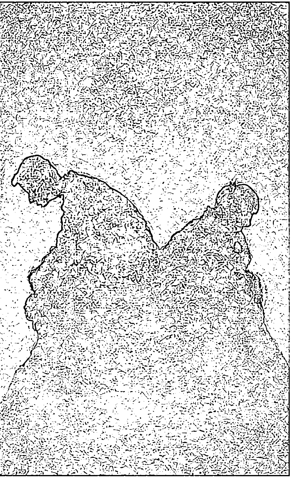

## 一、財運篇

### □基本卦解——求財不順還傷和氣

俗話說的好，買賣不成仁義在。千萬別為了求財的事與人爭執、傷了和氣。所謂山不轉路轉，路不轉人轉，人不轉心轉，只要轉換一下你的想法，多為對方想想，你就不會為了求財不成的事而生氣了。這次不成，還有下一次，不是嗎？

- ◆ 偏財指數：23分／財運旺度：◎◎◎

### 二 從占卜時間看終極預測

- ◆ 晚間十一點—凌晨一點、上午十二點—下午二點
  ◆ 行動的有利時機：農曆四到六月
  ◆ 助旺財運的地方：南方、有文化氣息的地方
  ◆ 助旺財運的顏色：紅色
  ◆ 投資的幸運數字：3、9
  ◆ 終極預測及建議：第五十六卦「火山旅」——做最好的準備，最壞的打算。抽到此卦的人在進行求財行動之前，必先做最好的準備與最壞的打算，因為你面對的是困難很多與狀況不斷的局面，萬一求財不順，也可事先有心理準備，就當它是換取經驗的必要過程吧！

- ◆ 偏財指數：32 分／財運旺度：◎◎◎

- ◆ 凌晨一點—凌晨三點、下午一點—下午三點
  ◆ 行動的有利時機：農曆一到三月、十到十二月
  ◆ 助旺財運的地方：東方、北方、健身房、水族館
  ◆ 助旺財運的顏色：藍色、綠色
  ◆ 投資的幸運數字：1、3、6
  ◆ 終極預測及建議：第五十五卦「雷火豐」——豐富的收穫，更好的表現。做某些事，得要鴨子划水，於檯面下悄悄進行才能成功；有些事則應敲鑼打鼓，大肆喧嚷才能成事。抽到這一卦的人，正需要熱熱鬧鬧、先聲奪人的去賺錢，才有可能事半功備、大有所獲。

- ◆ 偏財指數：86 分／財運旺度：＄＄＄＄

- ◆ 凌晨三點—凌晨五點、下午三點—下午五點
  ◆ 行動的有利時機：農曆一到三月、十到十二月
  ◆ 助旺財運的地方：東方、北方、熱鬧的花市、機場
  ◆ 助旺財運的顏色：藍色、綠色
  ◆ 投資的幸運數字：1、4、5、6
  ◆ 終極預測及建議：第三十二卦「雷風恆」——有恆為成功之本。有些投資可以走短線，有些則要靠長時間醞釀而獲利。抽得此卦的求財狀態應屬後者的格局。所以，建議不管已下手的股票、債券、基金是否有獲利，此時應保持中長期持有的狀態。如果你尚未進行投資，則不妨選擇好的投資項目，採定期、定量分批購買的方式，進行中長期投資為宜。

- ◆ 偏財指數：78分／財運旺度：$$$

- ◆ 凌晨五點—上午七點、下午五點—下午七點
  ◆ 行動的有利時機：農曆一到三月、十到十二月
  ◆ 助旺財運的地方：北方、東南方、海洋公園
  ◆ 助旺財運的顏色：藍色、綠色
  ◆ 投資的幸運數字：1、4、5、6
  ◆ 終極預測及建議：第十六卦「雷地豫」—— 順水推舟，Money自然來。所謂無為而治，是看起來好像不用什麼大動作、大計畫，事情自然而來就會成功。抽到此卦者，求財過程多少也有這種意味，這表示你不需要冒很大的風險去做激烈的求財競爭，只需要順著形勢做自己該做的事，那麼財利自然會進你的口袋。

- ◆ 偏財指數：82分／財運旺度：$$$$$

- ◆ 上午七點—上午九點、晚間七點—晚間九點
  ◆ 行動的有利時機：農曆三月、六月、九月及十二月的下半月
  ◆ 助旺財運的地方：西南方、南方、藝文中心、百貨公司
  ◆ 助旺財運的顏色：紅色、黃色、黑色
  ◆ 投資的幸運數字：2、7、8、9
  ◆ 終極預測及建議：第十五卦「地山謙」—— 低調求財好處多。所謂「滿招損、謙受益」，抽到此卦者在求財過程中要低調進行，切忌心高氣傲、自以為是，同時也要多聽聽專家的意見，作為求財的參考，如此一來必能賺錢。

- ◆ 偏財指數：75分／財運旺度：$$$

- ◆ 上午九點—上午十一點、晚間九點—晚間十一點
  ◆ 行動的有利時機：農曆四到六月
  ◆ 助旺財運的地方：南方、有文化氣息的地方
  ◆ 助旺財運的顏色：紅色
  ◆ 投資的幸運數字：2、7、9
  ◆ 終極預測及建議：第三十一卦「澤山咸」—— 人財兩得，左右逢源。人際關係與運氣都好到不得了，要資金有資金，要關係也有關係，只要你肯開口，要有什麼就有什麼。如果你已經有另一半，求財行動最好找對方合作必能成功。

## 二 感情篇

還沒有另一半的人，抽到此卦不僅可求財獲利，過程中還能贏得愛情！

- ◆ 偏財指數：95分／財運旺度：$$$$$

### □基本卦解——情人變冤家

你們本是一對熱戀的情侶，當心物極必反，關心對方太多、替對方著想太多，彼此反而弄得不開心，反目成仇，感情因此由熱變冷，甚至有可能漸行漸遠。

- ◆ 愛情指數：52分／愛情熱度：⊗⊗⊗

### □ 從占卜時間看終極預測

- ◆ 晚間十一點—凌晨一點、上午十一點—下午一點
  ◆ 最美好的相處方式：帶著微笑，面對無奈
  ◆ 最理想的穿著打扮：熱情的風格
  ◆ 助旺愛情運的顏色：紅色、咖啡色、米黃色
  ◆ 最理想的約會地點：陽光充足的地方
  ◆ 終極預測及建議：第五十六卦「火山旅」——風雨中的感情。這段感情一路走來都不平順，突發狀況是家常便飯，甚至本來沒什麼事也會鬧到不可開交。風風雨雨的感情讓兩人很沒有安全感，如果能分開兩地、遠距離交往，煩惱可能會少一些。

- ◆ 愛情指數：60分／愛情熱度：♡♡

- ◆ 凌晨一點—凌晨三點、下午一點—下午三點
  ◆ 最美好的相處方式：柔順的對待對方
  ◆ 最理想的穿著打扮：有陽光氣息的休閒打扮
  ◆ 助旺愛情運的顏色：藍色、灰+綠色
  ◆ 最理想的約會地點：圖書館、靠近有水的度假場所
  ◆ 終極預測及建議：第五十五卦「雷火豐」——愛情、財運兩亨通。你們的愛情好像豐收的季節般甜蜜，彼此都以歡喜的心情去品嚐愛情甜美的果實。無論是愛情上的美滿，或在事業、錢財上都有實質的收穫，令人羨慕。

- ◆ 愛情指數：92分／愛情熱度：♡♡♡♡♡

- ◆ 凌晨三點—凌晨五點、下午三點—下午五點
  ◆ 最美好的相處方式：順著對方的意思去做
  ◆ 最理想的穿著打扮：寬鬆的休閒風
  ◆ 助旺愛情運的顏色：藍+綠色
  ◆ 最理想的約會地點：百貨公司、好吃的餐廳
  ◆ 終極預測及建議：第三十二卦『雷風恆』——
  這份感情就像童話故事所說的：王子與公主將幸福美滿的過一生！最好的選擇，不會再被外界所誘惑而三心兩意。雙方配合的很好，彼此都已認定對方是這一生最好的伴侶。通常女方會順著男方的節奏起舞，夫唱婦隨。

- ◆ 愛情指數：86分／愛情熱度：♡♡♡♡♡

- ◆ 凌晨五點—上午七點、下午五點—下午七點
  ◆ 最美好的相處方式：配合對方做有規律的活動
  ◆ 最理想的穿著打扮：舒適的休閒風
  ◆ 助旺愛情運的顏色：藍+蘋果綠色、藍+秋香色
  ◆ 最理想的約會地點：空氣流通的休閒場所
  ◆ 終極預測及建議：第十五卦『地山謙』——扮豬吃老虎。男方的人生經驗豐富，才會扮成老實人的樣子，行事低調、表現謙卑；但其实在感情上，他不但吃的開，而且異性都會對他千依百順。所以要這麼一位世故的男朋友融入兩人世界裡，恐怕得奉行「同志仍須努力」的總理遺教了！

- ◆ 愛情指數：65分／愛情熱度：♥♥

- ◆ 上午七點—上午九點、晚間七點—晚間九點
  ◆ 最美好的相處方式：展現你的母愛，包容、照顧對方
  ◆ 最理想的穿著打扮：成熟的打扮
  ◆ 助旺愛情運的顏色：粉紅+米色、黃色、咖啡色
  ◆ 最理想的約會地點：靠近有水的休閒場所
  ◆ 終極預測及建議：第十六卦『雷地豫』——情投意合。
  若想談論婚嫁，現在就是開花結果的季節。也尊重對方，兩人對未來也充滿了希望與夢想，你們是一對開心的戀人，女生對男生的細心體貼，可說是無微不至，彼此相互了解，情投意合。

- ◆ 愛情指數：92分／愛情熱度：♡♡♡♡♡

- ◆ 上午九點—上午十一點、晚間九點—晚間十二點
  ◆ 最美好的相處方式：自然、自在就好
  ◆ 最理想的穿著打扮：自己高興的穿著打扮
  ◆ 助旺愛情運的顏色：紅色、橘黃色、咖啡色
  ◆ 最理想的約會地點：光線充足、熱鬧的地方
  ◆ 終極預測及建議：第三十一卦「澤山咸」——金童配玉女。兩人無論在外貌或家境背景、學歷條件上都很速配，是朋友眼中的「金童玉女」。相處起來也很投緣，在一起的時候都開開心心，是一份自己感到幸福也受到別人祝福的感情。

- ◆ 愛情指數：98分／愛情熱度：♥♥♥♥♥

## 第六十三卦 既濟卦——水火既濟

### 卦象的基本性質及吉凶解讀

本卦在六十四卦中屬於相應相濟，如願以償的成功卦。

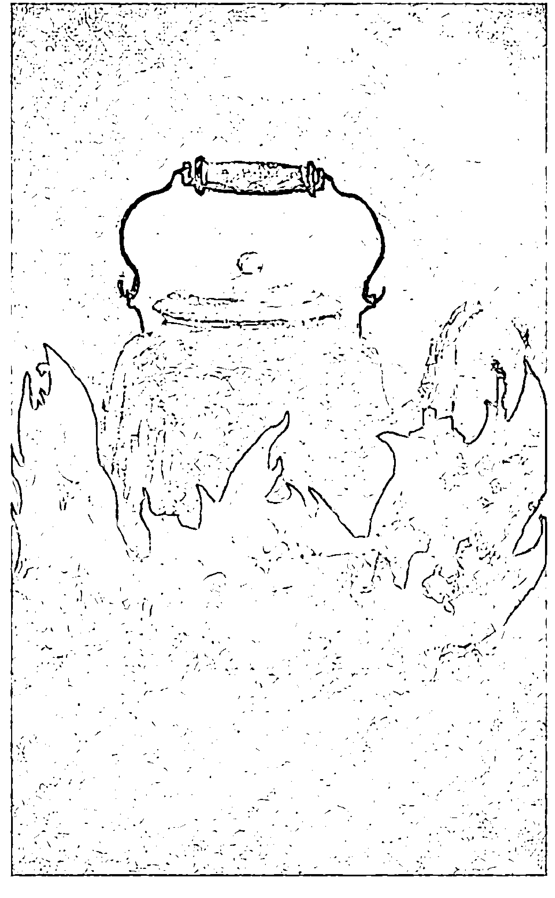

## 一 財運篇

### □基本卦解——財路已開，多勞多得

你跟財神爺已經搭上線了，表示這次求財的計畫是可行的，而且方向也正確。只要按部就班，穩健的求財，努力付出必定會有收穫。

- ◆ 偏財指數：78分／財運旺度：$$$$

### 一 從占卜時間看終極預測

- ◆ 晚間十一點—凌晨一點、上午十一點—下午一點
  ◆ 行動的有利時機：農曆四到六月
  ◆ 助旺財運的地方：南方、燒烤店
  ◆ 助旺財運的顏色：紅色、橘色
  ◆ 投資的幸運數字：3、9
  ◆ 終極預測及建議：第四十九卦「澤火革」——改變求財方式才能獲利。有句話說「窮則變，變則通」，當你用某種方法去求財都不靈光的時候，應該要想想還有沒有別的方法，改變一下現有的求財方式，絕對不能一味守舊、固執、一成不變，否則財神爺是不會眷顧你的。

- ◆ 偏財指數：71分／財運旺度：$$

- ◆ 凌晨一點—凌晨三點、下午一點—下午三點
  ◆ 行動的有利時機：農曆四到六月
  ◆ 助旺財運的地方：南方、藝文活動中心
  ◆ 助旺財運的顏色：紅色、紫色、橘色
  ◆ 投資的幸運數字：3、9
  ◆ 終極預測及建議：第三十六卦「地火明夷」——先好後壞，求財無望。得此卦者好比日落西山，說明好時光不多了，你的求財行動會愈來愈艱困、愈來愈沒有希望，無論你做的是哪一項投資，建議你還是及早了結，方為上策。

- ◆ 偏財指數：59分／財運旺度：⊗

- ◆ 凌晨三點—凌晨五點、下午三點—下午五點
  ◆ 行動的有利時機：農曆一到六月
  ◆ 助旺財運的地方：東南方、南方、靠近公園的藝術中心
  ◆ 助旺財運的顏色：綠色、紅色、紫色
  ◆ 投資的幸運數字：3、4、9
  ◆ 終極預測及建議：第三十七卦「風火家人」——求財之前先推銷自己。行銷學有句名言：在推銷商品之前，必先推銷你自己。意思是，如果你表現優越，對方一旦接受你個人的風格與想法後，就等於開啟了求財的大門，後續發展就一切好辦。

- ◆ 偏財指數：70分／財運旺度：$$

- ◆ 凌晨五點—上午七點、下午五點—下午七點
  ◆ 行動的有利時機：農曆十到十二月
  ◆ 助旺財運的地方：北方、靠近有水的地方
  ◆ 助旺財運的顏色：藍色、金色、銀色
  ◆ 投資的幸運數字：1、6
  ◆ 終極預測及建議：第三十九卦「水山蹇」——舉步維艱，進退為難。如果你的求財行動還停留在計劃的階段，那要恭喜你了！因為還來得及停止這項求財計劃，以免陷入泥沼、進退不得。所以，建議千萬不要跳進這個陷阱。萬一已經被套牢了，那就必須盡快找出停損點、及早了結，否則只會愈陷愈深，損失慘重。

- ◆ 偏財指數：0分／財運旺度：⊗⊗⊗⊗⊗

- ◆ 上午七點—上午九點、晚間七點—晚間九點
  ◆ 行動的有利時機：農曆九到十二月
  ◆ 助旺財運的地方：西北方、北方、海洋公園、高大的建築物
  ◆ 助旺財運的顏色：白色、藍色、灰色
  ◆ 投資的幸運數字：1、6
  ◆ 終極預測及建議：第五卦「水天需」——條件還沒成熟，要等待。這次的求財計画仍有幾項重要條件還沒成熟，例如，某些重要的人際關係尚未打通、需要用到的資金還沒到手，或是出手的時機還沒來臨等，種種條件都要全部到位以後才能放手一搏，否則求財計画便會落空。

- ◆ 偏財指數：60分／財運旺度：＄

- ◆ 上午九點—上午十一點、晚間九點—晚間十一點
  ◆ 行動的有利時機：農曆十到十二月
  ◆ 助旺財運的地方：北方、咖啡廳或酒吧
  ◆ 助旺財運的顏色：藍色、紫色、灰色
  ◆ 投資的幸運數字：1、6
  ◆ 終極預測及建議：第三卦「水雷屯」——小心陷阱，切忌貪多求快。投資股票有所謂的「地雷股」，如果投資太多而且誤中「地雷」，就會死的很慘。所以投資前必須多做功課，眼睛放亮一點，才能避開陷阱。不管怎樣，抽到這一卦的人在此時此刻是不宜出手的，還是奉勸你等待下一次機會吧！

- ◆ 偏財指數：0分／財運旺度：◎◎◎◎◎

## 二 感情篇

### □ 基本卦解——愛你在心坎

你們已經恩愛纏綿了一段時光，美好的相處過程中，彼此都相當滿意對方的表現，並且下定決心跟對方長相廝守、共度此生。

- ◆ 愛情指數：95分／愛情熱度：♡♡♡♡♡

### □ 從占卜時間看終極預測

- ◆ 晚間十一點—凌晨一點、上午十一點—下午一點
  ◆ 最美好的相處方式：經常變換新的約會方式與活動
  ◆ 最理想的穿著打扮：熱情大方的裝扮
  ◆ 助旺愛情運的顏色：紅色、粉綠色
  ◆ 最理想的約會地點：光線充足、有文化氣息的地方
  ◆ 終極預測及建議：第四十九卦『澤火革』——

舊的不去，新的不來。兩人的交往拖得太久又沒有什麼新花樣，你覺得這段感情不好玩了，對對方慢慢失去新鮮感，甚至會有一種厭倦的感覺。這個時候，你會出現想換對象的想法哦！對剛剛失戀，或剛離婚的人來說，抽到這一卦反而是好消息，可能會有一段新感情，悄悄來敲門！

- ◆ 愛情指數：有對象者68分，無對象者78分／愛情熱度：有對象者♡，無對象者♡♡♡♡

- ◆ 凌晨一點—凌晨三點、下午一點—下午三點
  ◆ 最美好的相處方式：表現要大方，但不確定的活動不要貿然參加
  ◆ 最理想的穿著打扮：光鮮明亮的打扮
  ◆ 助旺愛情運的顏色：紅色、棕色、咖啡色
  ◆ 最理想的約會地點：一起參加藝文活動、逛書店
  ◆ 終極預測及建議：第三十六卦『地火明夷』——

由熱變冷。你們的蜜月期已經過了，隨之而來的是愈來愈冷的關係，一切都顯得不積極，相處也變得沒樂趣。如果你們交朋友的目的只是為了尋開心，可以不必再等待了，因為愛情的高潮已過去；如果想談論婚嫁，暫時先冷靜下來，但自己要有心理準備，也許會等上一段時間，才有可能春回大地。

- ◆ 愛情指數：48分／愛情熱度：⊗⊗

- ◆ 凌晨三點—凌晨五點、下午三點—下午五點
  ◆ 最美好的相處方式：像家人般的相處，多體諒、遷就對方
  ◆ 最理想的穿著打扮：有陽光氣息的休閒打扮
  ◆ 助旺愛情運的顏色：綠色、紅色
  ◆ 最理想的約會地點：露營、放風箏、坐摩天輪
  ◆ 終極預測及建議：第三十七卦「風火家人」——緣定三生。你們除了是一對戀人，還多了兄弟姐妹般的感情，兩人在一起時就像家人般親密，彼此相親相愛、尊重對方。

- ◆ 愛情指數：90分／愛情熱度：♡♡♡♡♡

- ◆ 凌晨五點—上午七點、下午五點—下午七點
  ◆ 最美好的相處方式：有困難不要想不開，用智慧來解決問題
  ◆ 最理想的穿著打扮：多變的打扮
  ◆ 助旺愛情運的顏色：白＋藍＋灰色
  ◆ 最理想的約會地點：靠近有水的地方、海洋公園、水族館
  ◆ 終極預測及建議：第三十九卦「水山蹇」——他的心裡沒有你。也許對方是被形勢所逼，喘不過氣來；也許是對方早已移情別戀，不再愛你。不管是哪種原因導致這段愛情走不下去，早點說聲珍重再見，是唯一從痛苦中解脫的方法。

- ◆ 愛情指數：13分／愛情熱度：⊗⊗⊗⊗⊗

- ◆ 上午七點—上午九點、晚間七點—晚間九點
  ◆ 最美好的相處方式：有技巧的表現個人風格
  ◆ 最理想的穿著打扮：質感很好的海洋風裝扮
  ◆ 助旺愛情運的顏色：白色、藍色、灰色
  ◆ 最理想的約會地點：公共游泳池、泡湯場所## 第六十四卦 未濟卦——火水未濟

卦象的基本性質及吉凶解讀
本卦在六十四卦中屬於所託非人，因緣尚未具足之未遂卦。

## 一 財運篇

- 基本卦解——時機尚未成熟，仍需等待
抽到這一卦的人先不要急於求財，因為時機還沒成熟，你必須耐心等待。等到時機對了，財運自然成熟後，才算是真正打開目前沉悶的局面。

- 偏財指數：45分／財運旺度：⊗

### 從占卜時間看終極預測

晚間十一點—凌晨一點、上午十一點—下午一點
- 行動的有利時機：農曆七到十二月
- 助旺財運的地方：北方、西方、靠近有水的地方或酒吧
- 助旺財運的顏色：灰色、藍色、白色
- 投資的幸運數字：1、2、6、7
- 終極預測及建議：第四卦『山水蒙』——狀況不明，守財為上。一艘船在海上航行，當四周都起霧時，就要小心行駛了，否則會觸礁、甚至沉船。同樣的，當我們的投資環境處於不利的狀況，或是對投資工具不太了解的時候，千萬不要冒冒失失的出手，否則賠錢的機率相當高。
- 偏財指數：20分／財運旺度：⊗⊗⊗

凌晨一點—凌晨三點、下午一點—下午三點
- 行動的有利時機：農曆九到十二月
- 助旺財運的地方：西北方、北方、高大的建築物

凌晨三點—凌晨五點、下午三點—下午五點
- 行動的有利時機：農曆十到十二月
- 助旺財運的地方：北方、靠近有水的地方、酒吧
- 助旺財運的顏色：灰色、藍色
- 投資的幸運數字：1、6
- 終極預測及建議：第四十卦『雷水解』——困難在七天內必可解決。如果你正身陷於財務危機，那恭喜了，因為在七天內這個困難一定可以解決。但如果你現在並沒有財務上的問題，那麼你心中想進行的求財計畫則會泡湯、停止進行了！
- 偏財指數：3分／財運旺度：⊗

凌晨五點—上午七點、下午五點—下午七點
- 偏財指數：60分／財運旺度：$
- 行動的有利時機：農曆一到六月
- 助旺財運的地方：東方、南方、公園、有文化氣息的地方
- 助旺財運的顏色：綠色、紅色
- 投資的幸運數字：2、3、4、6
- 終極預測及建議：第三十八卦『火澤睽』——求財不得，反惹是非。個性急躁的人、或在特殊行業工作的人抽到這一卦，要特別小心了。因為得此卦者，容易在求財過程中因與人意見不合、或利益分配不當而不開心，因而跟人吵架、翻臉！俗話說的好，求財不求氣。凡事應退一步來想，讓大事化小、小事化無。
- 偏財指數：23分／財運旺度：◎◎◎

上午七點—上午九點、晚間七點—晚間九點
- 行動的有利時機：農曆一到六月
- 助旺財運的地方：南方、東方、靠近公園的藝文展覽場所
- 助旺財運的顏色：藍色、灰色、綠色
- 投資的幸運數字：1、3、4、6
- 終極預測及建議：第三十五卦『火地晉』——已見曙光，努力必有所獲。你努力求財的事已逐漸明朗，而且成功在望，只要按部就班、穩紮穩打的進行，求財的時機應該不遠了！只要不計較自己的付出，多幫助別人也等於在幫自己。
- 偏財指數：68分／財運旺度：$$

上午九點—上午十一點、晚間九點—晚間十一點
- 行動的有利時機：農曆一到六月
- 助旺財運的地方：東南方、北方、公園或咖啡館
- 助旺財運的顏色：綠色、藍色、灰色
- 投資的幸運數字：1、4、6
- 終極預測及建議：第五十卦『火風鼎』——三人合作，獲利更旺。俗話說的好：『三個臭皮匠，勝過一個諸葛亮。』有時候一個人做不到的事情，大家起來就沒那麼困難了。抽到這一卦，不管你的求財目標是什麼，找別人一起團隊合作，絕對勝過自己一人單打獨鬥。
- 偏財指數：88分／財運旺度：$$$$

## 二 感情篇

### 口 基本卦解——沒有共同想法的空洞感情

你們兩人的想法與喜好完全不一樣，但還不至於到吵架的地步，只不過無法產生愛的火花與共鳴，因為兩人的頻道接不在一起。雖然在一起，卻往往是各忙各的、各玩各的，時間久了，感情自然就變淡了！

- 愛情指數：58分／愛情熱度：⊗

### 口 從占卜時間看終極預測

晚間十一點—凌晨一點、上午十一點—下午一點
- 最美好的相處方式：弄不清楚狀況時，應該冷靜思考再做決定
- 最理想的穿著打扮：多配戴金屬飾品的海洋風裝扮
- 助旺愛情運的顏色：白＋藍色、白＋黑色
- 最理想的約會地點：靠近有水的地方
- 終極預測及建議：第四卦「山水蒙」——霧裡看花。對方根本沒有真正的投入這段戀情，所以才會讓你好像站在十字路口，一時之間不知該何去何從，更不知該如何跟對方相處。目前你正面臨進退為難、頗為尷尬的時期，其實別想得太多，既然看不清楚，不妨淡淡的放下，等看清楚了再出發還來得及。
- 愛情指數：48分／愛情熱度：⊗⊗⊗

凌晨一點—凌晨三點、下午一點—下午三點
- 最美好的相處方式：表現個人的風格，但不要狂妄自大
- 最理想的穿著打扮：有質感的裝扮
- 助旺愛情運的顏色：白色、藍色、灰色、黑色
- 最理想的約會地點：有噴泉的地方
- 終極預測及建議：第六卦「天水訟」——你們是一對冤家。相愛的時間點長輩不贊成你們在一起，甚至極力反對，讓這段感情壓力很大，加上你們彼此間的愛恨情仇不是別人所能了解的，要好好聚好散恐怕不容易。如果你要個性，強要對方順從你，搞不好還會鬧上法庭。
- 愛情指數：13分／愛情熱度：◎◎◎◎◎

凌晨三點—凌晨五點、下午三點—下午五點
- 最美好的相處方式：答案馬上就要知道了，一切隨緣吧
- 最理想的穿著打扮：隨自己高興，愛怎麼打扮都好
- 助旺愛情運的顏色：藍色、灰色、黑色
- 最理想的約會地點：熱鬧、人潮多的地方
- 終極預測及建議：第四十卦「雷水解」——七天之內見分曉。得此卦者會遇到兩種情況，在七天內就會得到答案。第一種情況：已留不住對方，到了分手互道珍重、說聲再見的時候了，也許是無言的結局，淡淡的分手。第二種情況：也許你與對方和好如初的時候快要到了！彼此冷戰不講話，可找個藉口主動打電話給對方，說不定馬上就能雨過天晴，喜劇收場。
- 愛情指數：第一種情況23分，第二種情況68分／愛情熱度：第一種情況◎◎◎，第二種情況♡♡

凌晨五點—上午七點、下午五點—下午七點
- 最美好的相處方式：不開心的時候少講兩句，免得吵架
- 最理想的穿著打扮：明亮耀眼的打扮
- 助旺愛情運的顏色：粉綠色、橘紅色、紅色
- 最理想的約會地點：光線充足、熱鬧的地方
- 終極預測及建議：第三十八卦「火澤睽」——前世相欠、吵架冤家。兩人的個性完全不一樣，看事情的角度與想法也不同，根本沒辦法一起聊事情，一聊天就吵架，吵半天也不會有結論與共識。到頭來，愈吵愈是一肚子火，感情也愈來愈淡薄。兩人會兜在一起根本是前世相欠，這是一對標準的吵架冤家。
- 愛情指數：13分／愛情熱度：◎◎◎◎◎

上午七點—上午九點、晚間七點—晚間九點
- 最美好的相處方式：坦白、熱情、多付出
- 最理想的穿著打扮：光鮮亮麗的風格
- 助旺愛情運的顏色：橘紅色、粉紅＋綠色
- 最理想的約會地點：百貨公司、展覽會場
- 終極預測及建議：第三十五卦『火地晉』——是一對溫馨的好伴侶。兩人在一起會互相照顧，感情也不錯，愛情溫度猶如西下的夕陽，溫和而不刺眼，雖然少了一些激情，卻多了幾分溫馨。兩人在一起時好像老夫老妻或老戀人，祥和又有默契。
- 愛情指數：76分／愛情熱度：♥♥♥

上午九點—上午十一點、晚間九點—晚間十一點
- 最美好的相處方式：多給彼此多一點自由空間
- 最理想的穿著打扮：有陽光氣息的休閒打扮
- 助旺愛情運的顏色：紅色、綠色
- 最理想的約會地點：陽光普照的花園
- 終極預測及建議：第五十卦『火風鼎』——你就是那個第三者。你們兩人可能正在熱戀中，但小心對方可能已婚，或在你之前還有一位要好的異性朋友，正在大搞三角關係。站在你的立場，你可能覺得別人是第三者，但換個位置來看，其實你才是那個第三者呢！
- 愛情指數：72分／愛情熱度：♥♥♥

| 上卦 先天八卦密碼 下卦 | ☰ 1 天 | ☱ 2 澤 | ☲ 3 火 | ☳ 4 雷 | ☴ 5 風 | ☵ 6 水 | ☶ 7 山 | ☷ 8 地 |
| :---: | :---: | :---: | :---: | :---: | :---: | :---: | :---: | :---: |
| ☰ 1 天 | 乾為天 P.14 | 天澤履 P.68 | 天火同人 P.86 | 天雷無妄 P.158 | 天風姤 P.272 | 天水訟 P.44 | 天山遯 P.206 | 天地否 P.80 |
| ☱ 2 澤 | 澤天夬 P.266 | 兌為澤 P.356 | 澤火革 P.302 | 澤雷隨 P.110 | 澤風大過 P.176 | 澤水困 P.290 | 澤山咸 P.194 | 澤地萃 P.278 |
| ☲ 3 火 | 火天大有 P.92 | 火澤睽 P.236 | 離為火 P.188 | 火雷噬嗑 P.134 | 火風鼎 P.308 | 火水未濟 P.392 | 火山旅 P.344 | 火地晉 P.218 |
| ☳ 4 雷 | 雷天大壯 P.212 | 雷澤歸妹 P.332 | 雷火豐 P.338 | 震為雷 P.314 | 雷風恆 P.200 | 雷水解 P.248 | 雷山小過 P.380 | 雷地豫 P.104 |
| ☴ 5 風 | 風天小畜 P.62 | 風澤中孚 P.374 | 風火家人 P.230 | 風雷益 P.260 | 巽為風 P.350 | 風水渙 P.362 | 風山漸 P.326 | 風地觀 P.128 |
| ☵ 6 水 | 水天需 P.38 | 水澤節 P.368 | 水火既濟 P.386 | 水雷屯 P.26 | 水風井 P.296 | 坎為水 P.182 | 水山蹇 P.242 | 水地比 P.56 |
| ☶ 7 山 | 山天大畜 P.164 | 山澤損 P.254 | 山火賁 P.140 | 山雷頤 P.170 | 山風蠱 P.116 | 山水蒙 P.32 | 艮為山 P.320 | 山地剝 P.146 |
| ☷ 8 地 | 地天泰 P.74 | 地澤臨 P.122 | 地火明夷 P.224 | 地雷復 P.152 | 地風升 P.284 | 地水師 P.50 | 地山謙 P.98 | 坤為地 P.20 |

你一定看得懂的易經六十四卦 2——終極解卦手冊 財運、愛情篇 / 劉嶽著；-- 初版．-- 台北市：時報文化, 2018.10；
面： 公分 （人生顧問;326）
ISBN 978-957-13-7498-7 (平裝)

- 1. 易占

292.1

107011884

繪者———Jing 朱朱
熱愛創作、繪畫。深信藝術是 99% 的堅持加 1% 的靈感，堅持的汗水灑在追求的沃土裡，就能孕育出成功的果實。
jing.art.1994@gmail.com

Published in August 2018 by China Times Publishing Company.
All Rights Reserved. Printed in Taiwan.

人生顧問 326

# 你一定看得懂的易經六十四卦 2——終極解卦手冊 財運、愛情篇

作者 劉嶽 | 副主編 劉珈盈 | 特約編輯 陳盈華 | 編輯協力 石瑷寧、黃燕羽 | 美術設計 陳文德 | 執行企劃 黃筱涵 | 發行人 趙政岷 | 出版者 時報文化出版企業股份有限公司 10803 台北市和平西路三段 240 號 3 樓 發行 專線一(02)2306-6842 讀者服務專線一0800-231-705·(02)2304-7103 讀者服務傳真一(02)2304-6858 郵撥一19344724 時 報文化出版公司 信箱一台北郵政 79-99 信箱 時報悅讀網一http://www.readingtimes.com.tw | 法律顧問 理律法律事務所 陳長文律師、李念祖律師 | 印刷 勁達印刷有限公司 | 初版一刷 2018年10月26日 | 定價 新台幣 580元 | 版權所有·翻印必究——時報文化出版公司成立於1975年，並於1999年股票上櫃公開發行，於2008年脫離中時集團非屬旺中，以「尊重智慧與創意的文化事業」為信念（缺頁或破損書，請寄回更換）

你知道嗎？占卜的時辰不同，得出的最終結果各異！

# 《易經》12時辰占卜之財運、愛情終極解卦手冊 讓你財運亨通、愛情幸福、成就璀璨人生

本套是《你一定看得懂的易經六十四卦》的進階版本。第一冊的主題是與讀者分享《易經》六十四卦的基本和解，藉由該書所附的占卜牌卡，便能針對個下面臨的客觀情勢，馬上做出沙盤推演，以利因應。

但基本上，《易經》其實包含了『理、象、數』三大元素。第一冊主要透過圖文並茂來介紹『理』與『象』此兩大單元的基本概念。另一方面，《易經》所談論的萬事萬物都不離『時間』與『空間』，所以不易的易理及卦象，隨著不同時間的變化，雖然卜得同一個卦，最終都會出現截然不同的結果。

子、丑、寅、卯、辰、巳、午、未、申、酉、戌、亥十二個時辰，每天二十四個小時之內，就有六種不同的機率變化。除了上一本書裡提出的『本體卦』之外，其中又產生了『互卦』和『變卦』等。有鑑於卦與卦之間的變化運作頗為複雜，為了讓對《易經》感興趣的讀者，在占卜易卦時能夠輕鬆駕馭，特別就大家最關心的『財運』及『感情桃花運』此兩項發展出此次的『終極解卦手冊』，透過有系統地排列出三百八十四種《易經》牌卡的運作，得出占卜財運或感情時的終極結果，讓大家能進一步更精準地掌握自己的命運，自然做到運籌帷幄、決勝千里。