# 图解周易预测学一

- 零易学基础，零古文起点，手把手教你学会六爻预测法
- 取财有道，谋爱有方，一册在手，生活决策多一个最佳参谋
- 30岁学过，70岁仍能用，小动作换来受益终生的大智慧


# 周易预测学对中国传统生活的影响

周易预测学衍生自《易经》，是中国诸多预测理论之中的王者，千百年来一直是社会各个阶层最为关注、被使用最多、影响最广泛的预测体系。上到帝王将相，下到黎民百姓，从卜问问灾，到测商求财，不论尊卑，事无巨细，都可以通过它进行预测。可以说，其影响已经遍及了古代社会的方方面面。下图即以清院本《清明上河图》阐明周易预测学对中国传统社会生活的影响。

- 求医治病
  古人认为，易与医同源于阴阳的变化，“易具医之理，医得易之用”，所以有“医易同源”之说。因此，人们在治疗疾病时往往会利用周易预测疾病的变化。

- 科举考试
  我国科举制始于隋文帝，终于清光绪帝，共1400年。这期间，那些金榜题名的人往往被称为“文曲星下凡”，而文曲星一词就来自周易预测理论，可见其对科举制的影响。

- 社会统治
  古代帝王统治国家时经常会利用周易预测学，借“天命”促使百姓顺从他们的统治，弱化民众的反抗精神。这种做法也起到了规范人们行为的作用，有利于古代社会的稳定。

- 测问刑灾
  不论贫富尊卑，古人的生活中都难免有七灾八难，而古代科技的落后又使得人们缺乏准确预测灾难的能力。在这样的情况下，古人便把忐忑之心寄托在周易预测上。

- 出门远行
  古代通信极为不便，百姓一旦出门，多则数月，长则几年，大多杳无音信。望穿之蛛、盼夫之妻们常常望眼欲穿。如何知道亲人情况？唯有利用周易预测。

- 兵革争战
  古人的战争决策受周易预测学的影响很大，许多军队都配备有精通易理的军师，很多古代名人都精于周易预测，众所周知的有周公、诸葛亮、刘伯温、曾国藩等。

- 婚姻嫁娶
  洞房花烛是人生四大喜事之一。与现代不同的是，古代婚姻多为父母包办，缺少彼此间的相互了解，所以，利用周易预测学占断与对方是否合适也是古人在婚前的要事。

- 升官赴任
  在“官本位”的中国古代社会，“官运”是古人衡量个人地位和价值的最重要标尺。利用周易预测官运便成了为官者和在野者共同关注的重要话题。

- 自然灾害
  在古代，自然灾害直接决定了百姓的粮食收成，甚至身家性命。旱灾、涝灾、风灾、虫灾……对百姓的安稳生活有颠覆性的影响。被动无助的人们往往借助周易预测获知吉凶。

- 知命尽孝
  古人认为人应该知“三理”：地理、医理、命理。而这三理又与古代的孝文化紧密联系，如利用周易预测父母的寿元，这样就能做到在其有生之年更好地尽孝道，父母在世不出门远行等。

《清明上河图》（清院本局部）
陈枚、孙祜、金昆、戴洪、程志道
清 纵35.6厘米 横1152.8厘米 台北故宫博物院藏
清院本《清明上河图》是乾隆时期五位宫廷画师仿北宋张择端的《清明上河图》而作。画家吸收了张择端原作的写实风格，同时又受到西洋画风的影响，画面中人物形态各异，景物错落有致，色彩鲜亮，线条细腻严谨，立体感很强，十分逼真。此幅长卷一共绘制了超过4000个人物，场面宏大，真实反映了清代盛世时期的风俗民情，成为我们了解传统生活的一扇窗口。

周易预测学最重要的符号体系就是六十四卦及卦中的六爻。六十四卦不仅与万事万物相联系，也反映了宇宙与自然的运行规律。如十二消息卦（又称十二辟卦）就反映了一年十二个月的更替变化。其中“消”指阳爻的消失，“息”指阳爻的生长，十二个卦的卦爻以阴阳消长的次序排列，对古人的农事运作、医理养生、命理推算有重大影响，是进行周易预测时重要的参考。北宋邵雍的《皇极经世》也运用十二消息卦演示天地变化和人类兴衰的过程。

# 易卦与时序的对应

## 少阳·春季

### 泰卦之象
月中桂开，官人登梯，主足蹑云梯以攀月中丹桂；鹿衔书，主天赐禄书；小儿在云中，主少年步青云；一羊回头，表示未年月见喜。天地交通之卦，小往大来之象。

泰寅

三阳息阴

求实避虚，居安思危

本卦对应1月，为上下和睦、天下太平、通泰昌盛之象，忌自大骄傲。

### 大壮卦之象
北斗星，主人命灾；天神执剑，乃凶神恶煞；一官人焚香礼拜，主祈福消灾；一狼一犬，逢申卯酉则吉。为抵羊触藩之卦，先曲后顺之象。

大壮卯

四阳息阴

势力强盛，切勿贪安

本卦对应2月，为光明正大、至刚至健之象，宜保持和平，小心物极必反。

### 夬卦之象
二人同行，前有水后有火，虎蛇当道，主出行多惊恐；竿上有文字，竿下有伐，主经历艰阻可望名利。

夬辰

五阳息阴

亏中益，当断则断

本卦对应3月，为积满刚溢、刚极而败之象，宜柔中和忍耐忌武断莽莽。

## 太阳·夏季

### 乾卦之象
图中的鹿在云中象征天禄，巨石上有一块玉，放射光芒；一匠人在琢玉，去其表可见宝；明月当空，一片光明；有一位读书人登云梯望月，想折月宫丹桂。这是六龙行天之卦，包容万象。

乾巳

六阳息阴

自强不息，谨慎为重

本卦对应4月，为刚健有力、盛运当头之象，宜适时进取，忌过于刚强。

### 姤卦之象
有一官人用箭射鹿；有文书带喜字，有两个伞盖，有绿衣贵人指路。风云相济之卦，或聚或散之象。

姤午

一阴消阳

创造机遇，聚散随缘

本卦对应5月，为难以预料、思虑不定之象，吉凶未知，宜慎谋远虑。

### 遁卦之象
有山有水表明蔽而有阻，酒旗悬挂有一文字，主望外；一官人足踏龟，谐音为归；月亮被浮云遮盖一半，表示隐；头巾挂在树上，说明挂冠；树下有一人独饮，自得其乐。豹隐于南山之卦，守道玄恶之象。

遁未

二阴消阳

洁身隐退，欲扬先抑

本卦对应6月，为小人得势、君子失势之象，冒进会遭到利用或蒙受损失。

## 少阴·秋季

### 否卦之象
有一男子卧病，一明镜破为二，说明明中有损；有一人坐于路上，还未到家；一人张弓箭头落地，未射中；一人拍掌大笑，主极生悲；有口舌两字。天地不交之卦，人口不圆之象。

否申

三阴消阳

闭塞不通，顺势内敛

本卦对应7月，为天地之气不交、内外不合之象，诸事艰难，应韬光养晦。

### 观卦之象
日月当空，普照大地；有官人立于香案边，一鹿在山上，主高官厚禄；全甲神人执印秤，为权柄。云卷晴空之卦，春花竞发之象。

观酉

四阴消阳

正道衰微，待机行事

本卦对应8月，为时运不稳、万物难行之象，宜观望时势，静以待变。

### 剥卦之象
有一妇人坐于床上，需防女人有灾之义；烛在风中摇曳，不定也；有一葫芦，为盛药具；山下有一官人独坐，退居林泉；冠巾挂木上，已无职位；一束乱丝，主难收拾。去旧生新之卦，群英剥尽之象。

剥戌

五阴消阳

退让安守，去旧生新

本卦对应9月，为阴盛阳衰、大势已去之象，忌积极进取，宜重新部署。

## 太阴·冬季

### 坤卦之象
有十一个口字，主吉；一官人坐看一堆钱，指有才贵人；有一马，主禄马；金甲神人在台上，抛文书于官，乃文字得神力获助，生载万物之卦，群臣臣和之象。

坤亥

六阴消阳

以静制动，以柔制刚

本卦对应10月，为纯正柔顺、厚得稳重之象，宜慎言慎行，趋吉避凶。

### 复卦之象
官人乘车，以车上两旗为旗，城墙上有东字，为江东侯职；一将持刀立，是武卒归降；一兔一虎，主寅卯位求官显达。淘沙见金之卦，返复往来之象。

复子

一阳息阴

踏实缓进，螺旋上升

本卦对应11月，为春回岁转、万事苏伸之象，勇往直前可有所作为。

### 临卦之象
一妇人乘风，主风举，得阴才；一车上有使旗，为太守之车；在山顶，主危远；虎在山上坐，可防危；一合，主和合；人射弓，乃得非人牵引之象。凤入鸡群之卦，以上临下之象。

临丑

二阳息阴

循序渐进，宜柔忌刚

本卦对应12月，为上下安合之象，运势渐增，宜柔和缓处，不宜刚健进。

# 史上最经典、最权威的预测学

# 图解

# 周易预测学

# 六爻占断真的很容易

# 第一部 吉凶占断

唐颐/著

## 编者序

# 周易预测学：万术之国的王者

曾经有学者将古代中国比喻成万术之国——古人在术数方面的经典浩如烟海，古代术数的内容十分广泛，阴阳五行、堪舆命理、星学炼丹、养生食疗……几乎无所不包。而在这个异彩纷呈的国度中，有一位至高无上的王者，那就是《易经》，是周易预测学。

千百年来，《易经》一直是人们取之不尽用之不竭的智慧宝库：思想家深挖它的哲理，术数家推演它的预测术，史学家以它考察上古历史，文学家鉴赏它的歌谣言辞，帝王用它统治国家，老百姓用它预测人生百事……它所蕴含的自强不息的进取精神和慎终如始的忧患意识、天人合一的和谐观念和与时俱进的改革精神，对任何时代和社会的人都有借鉴意义。《易经》这种广为人知的重要地位成就了它王者的气质，但它含义深邃而文辞简约、涵盖万物而表达方式特殊，加上时代的隔阂、后人见仁见智莫衷一是的解读，使得经中哲理少有人能洞悉，它的预测功能更是鲜有人能精通。

大体而言，中国古代的所有预测术几乎都与《易经》有关。其中，周易预测学是最重要的一支，是直接从《易经》衍生出来的，也是古代最著名的预测学。周易预测学又称“六爻预测学”，也叫“火珠林预测”、“纳甲预测”等。其方法就是利用钱币得出卦象，进而判断吉凶。预测者只需要将钱币放在手中，双手紧扣，专注地思考所要预测的事情，使意念融贯于钱币之中，然后合掌摇晃掷出钱币，反复六次就能组成一个卦。再结合《易经》的爻辞，以及干支等信息，就能够判断事物的发展过程和结果。

作为民间流传最广的预测方法之一，六爻法看似玄奥，但其理论并不复杂，起卦法也经过千百年的改进而逐渐简化。人们通过摇掷钱币得到卦象以后，可以从其中得到两种互补的信息：

首先，看《易经》中的卦辞爻辞以及后人对此的解读。卦辞是对卦的整体阐释，爻辞则是对卦中每一部分具体情况和详细对策的分析。比如得到“无妄”卦，得知此卦卦辞阐明的“不要鲁莽随性妄动”的道理之后，可以再查卦中爻辞。这种解读虽然粗浅而笼统，没对我们的行为做具体的指引，但可以让人得知主观上应该采取的态度。

其次，摇卦后可以用六爻法分析卦象，预测详细结果。比如预测找工作，可以从中得知不同行业的发展态势，了解自己最适合的职业，预测事情在变化中是先吉后凶，还是先凶后吉，吉凶的结果会在什么时候发生……这种预测的复杂程度远高于仅从《易经》的卦辞爻辞中得到的信息。

因此，在对六爻预测法进行具体应用时可从两方面着手：既以卦辞爻辞中的指导性思路把握全局，也以六爻预测中的详细分析了解细节。将两者结合后的思路更接近于《易经》作者希望我们达到的境界——“天行健，君子以自强不息”。“天行健”阐明了天地的变化不以人的意志为转移，“君子以自强不息”则要求我们在这种客观环境中应该采取积极的态度：事前积极进取，事后积极反思。

秉承了周易预测学上述的思想精髓，我们就能在日常生活中更好地运用易理——不管是求财问灾，还是预测具体问题，都能顺应社会环境与事物发展规律，然后通过积极的心态与行动，在事业、家庭、人际关系等方面顺遂发展。

为了让广大读者能够更好地读懂《易经》，了解周易预测学，《图解周易预测学》综合了历代学者的研究成果，不囿于《易经》原文，而是力争用现代的通俗语言梳理易理，阐明周易预测方法。全书采用了图解这种现代的编辑手法，采用图文对照的形式，加入了大量的精美图片与图表，将原本晦涩的理论变得生动易懂，为读者近距离接触“古代万术之王”提供了机会与范本。

# 目录

- 周易预测学对中国传统生活的影响 .................................................... 1
- 易卦与时序的对应 .................................................................................... 5
- 编者序 周易预测学：万术之国的王者 ........................................................ 10
- 目录 ........................................................................................................ 12
- 本书内容导航 .......................................................................................... 16

# 上篇 预测前的准备

# 第一章 带你认识《易经》

- 1. 《易经》：中国最古老深邃的经典 ...................................................... 20
- 2. 《易经》的两部分：《经》与《传》 .................................................... 22
- 3. 《易经》的产生：年代、作者和“三易” ................................................ 24
- 4. 《易经》的内核：“天人合一”思想 ...................................................... 26
- 5. 《易经》的哲学思想：“一阴一阳之谓道” .............................................. 30
- 6. 《易经》的唯物性：“生生之谓易” ...................................................... 32
- 7. 《易经》四探：象数与义理 .................................................................. 34
- 8. 《易经》遗韵：对中国文化的影响 ........................................................ 36
- 9. 《易经》辩证思想的演绎：五术 ............................................................ 42
- 10. 《易经》与神秘学的结合：术数 .......................................................... 44

# 第二章 周易预测的基本符号

- 1. 太极：宇宙原始而混沌的状态 ............................................................ 46

# 中篇 周易预测方法

# 第三章 《易经》衍生的预测术和起卦法

1. 最经典的预测术：六爻预测……96
2. 最古老的起卦法：揲蓍布卦……102
3. 最简单的起卦法：金钱卦……106
4. 多样化的起卦法：梅花易数……108
5. 简便的“查表”预测法：灵棋经……118
6. 人类的“居住法则”：风水学……122
7. 学易而知天命：四柱学……128

# 第四章 教你用六爻进行预测

1. 六爻预测的基础：学会纳甲……136
2. 六爻基本理论（一）：六亲的应用……144
3. 六爻基本理论（二）：诸神的取用……148
4. 断事的依据：爻位与事物的对应……164
5. 卦的内部环境（一）：爻的动与变……166
6. 卦的内部环境（二）：爻的冲、合、刑、墓……176
7. 卦的外部环境：年、月、日、时……184
8. 预测中的参考（一）：反吟伏吟、游魂归魂……194
9. 预测中的参考（二）：六神……196
10. 预测中的参考（三）：卦身……198
11. 预测中的参考（四）：神煞……200
12. 预测的最后环节：应期……202

# 下篇 六爻预测实战

# 第五章 知天气 测灾害

1. 预测天气：六爻实战的捷径……208
2. 灾害先知：六爻法的宏大应用……220
3. 国运兴衰：庞杂而高难的预测……222

# 第六章 问学业 测事业

1. 预测考试：古代科举的参考……228
2. 工作变动：事业吉凶能先知……234

# 第七章 知财运 明成败

1. 财运详情：长期短期皆可推……240
2. 生意成败：博弈时的照明灯……246

# 第八章 问缘分 看婚配

1. 恋爱婚配：因缘美满早知道……254
2. 男女有别：两性测婚有差异……256

# 第九章 求失物 定官讼

1. 遗失被盗：失物是否能寻回……262
2. 诉讼吉凶：官司纠纷有胜败……268

# 第十章 测出行 知病情

1. 出行情况：行人在外之吉凶……274
2. 疾病伤灾：知《易》方可言医……280
附录一：六爻名词释义……288
附录二：纳甲后的64卦……297
附录三：《六十四卦金钱课》卦象及断语……304
附录四：《灵棋经》卦象及断语……313

# 本书内容导航

本章标题用言简意赅的语言高度概括本章所要探讨的主题。

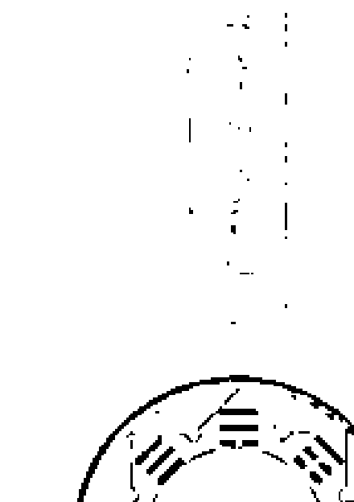

# 第二章 周易预测的基本符号

> 《易传》中说：“易有太极，是生两仪，两仪生四象，四象生八卦，八卦定吉凶，吉凶生大业。”本章从太极开始，向你介绍它如何衍生出阴阳、八卦、六十四卦，以及八卦与河图洛书、干支五行的关系。

## 太极

### 宇宙原始而混沌的状态

古人认为，太极是万物的本源，但在太极前还有无极。太极是有限的，无极是无限的。有限来自于无限，无限演化为有限。

### “太极”的含义

太极也叫太初、太一，它是阴阳相合的统一状态。太有“至”的意思，极有“极限”的意思。所以，太极的意思是：放大可以无限地接近圆周的界限，缩小则可以无限地接近但不等于零。太极是运动不息的，动则产生阳气，动到一定程度就会相对静止，静止则产生阴气。这样一动一静，阴阳之气互为其根，运转至于无穷。

### 太极就是“一”

太极之理涵盖万物。它在天上是天理，在地上是地理，在万物是物理，在医学是医理，在命运是命理，在人伦是伦理……无穷无尽，但其本质是“一”。《老子》中说：“一生二，二生三，三生万物。”一可以形象地把太极比喻为“一”。“一生二，二生三”，二就是阴阳两仪。阴阳之间的对立斗争又相互滋生依存的关系，是事物的纲领和由来，也是事物产生与毁灭的根由。比如八卦中的乾坤，乾为阳，坤为阴，“乾道成男，坤道成女”，阴阳交合导致“二生三”；万物按此规律生生不息，变化无穷，就是“三生万物”。人类作为万物中的一员，可以根据太极的演变规律倒推回去，了解万物的初始。

### 本节主标题

本节所要探讨的主题。

### 正文

通俗易懂的文字，提纲挈领，让你轻松阅读。

**图解标题**概括内文所探讨的图解内容。

### 万物的本源：太极

太极是万物最核心、本质的发源地。阴阳两仪、四象、八卦、六十四卦……都从太极演变而来。

太极演化图：
- 中心：太极（阴阳鱼）
- 第一层：太阴、少阳、少阴、太阳（四象）
- 第二层（八卦）：
  - 乾卦（代表天，刚健有力、运转不息）
  - 兑卦（代表泽，意为喜悦）
  - 离卦（代表火，意为附着）
  - 震卦（代表雷，意为奋人）
  - 巽卦（代表风，意为顺人）
  - 坎卦（代表水，意为险陷）
  - 艮卦（代表山，意为静止）
  - 坤卦（代表地，有藏纳万物之功）

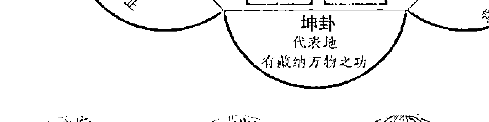

太极如树。当它作为一个种子时，里面有无穷的奥秘。幼苗出土后分出枝干，再分出叶与花……得到成熟的果子，里面又有无穷奥秘，落地生根后又会长出无限个‘太极’。

**图解综述**用简洁明了的语言，概述整页图解的意图。

**图表**将抽象的道理以清楚的图表方式呈现。此方式是本书的精华所在。

**插图**把抽象的概念用具体的图画表示，让读者可以形象直观地理解其内涵。

# 图解周易预测学

## 上篇

### 预测前的准备

虽然《易经》一书只有不到三万字，但从古至今，人们解读它的著作汗牛充栋。本篇化繁为简，将前人对它的认识用两章内容高度概括，让你在最短的时间内对它有一个总体的把握。这些知识是读者了解周易预测学的前提和准备。

## 本篇内容提要

- 第一章 带你认识《易经》
- 第二章 周易预测的基本符号

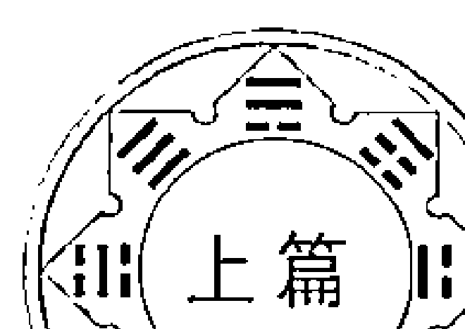

# 第一章 带你认识《易经》

《易经》又称《周易》，它是中国最古老、深邃的经典。本章从“周易”二字的含义开始，向你介绍《易经》核心的哲学思想，以及它对中华文化的深远影响。

## 《易经》 中国最古老深邃的经典

《易经》上通天文，下通地理，中通人事，以无所不包的终极原理来统摄万物。通过对《易经》的研究，不但可以穷究天人之理、通晓古今之变，还可以学到基本的处世法则，对指导人生有重大意义。

### 卜筮之书

从起源上看，作为群经之首、万象之源的《易经》是一本卜筮之书。卜筮可以推知过去，也可以遥测未来，但多被用来预测未来。《易经》之所以被称为经典，在于它具有极其深奥的哲理，有人称之为“人类的少年哲学”：上古时期的农牧渔猎是《易经》的经济基础；浑然一体、尚未分化的自然科学、人文科学、哲学是它的文化背景；漫长的追求权利的奴隶社会是它形成时期的政治状况；用通俗简单的感性知识进行的哲学思辩则是它得以形成的根本。它是人类少年时代的智慧结晶，并非遥不可及、不可卒读的天书。

### “周”与“易”的含义

《易经》一般被称为《周易》。关于《周易》的“周”字，历来有多种说法。有人认为，“周”是“易道周普无所不备”的意思，因为《易经》以“六十四卦三百八十四爻”笼罩万物，卦爻的含义必然具有极其广泛的普适性。也有人认为，“周”特指周朝，是年代的意思。对“易”字的解释则更多，主要包括三种观点：“易”这个字是把“日月”两个字重叠而来的，上面是日，下面是月；易是飞鸟的形象；易是蜥蜴，蜥蜴因环境而改变自身颜色，这就是易——变化。今天的学者们大多认为“易”一词包含三种内容：变易、简易、不易。

### “周易”的含义

“周易”两个字到底是什么意思，古今学者提出多种说法，下面是常见的说法。

易道周普无所不包，六十四卦三百八十四爻笼罩万事万物。

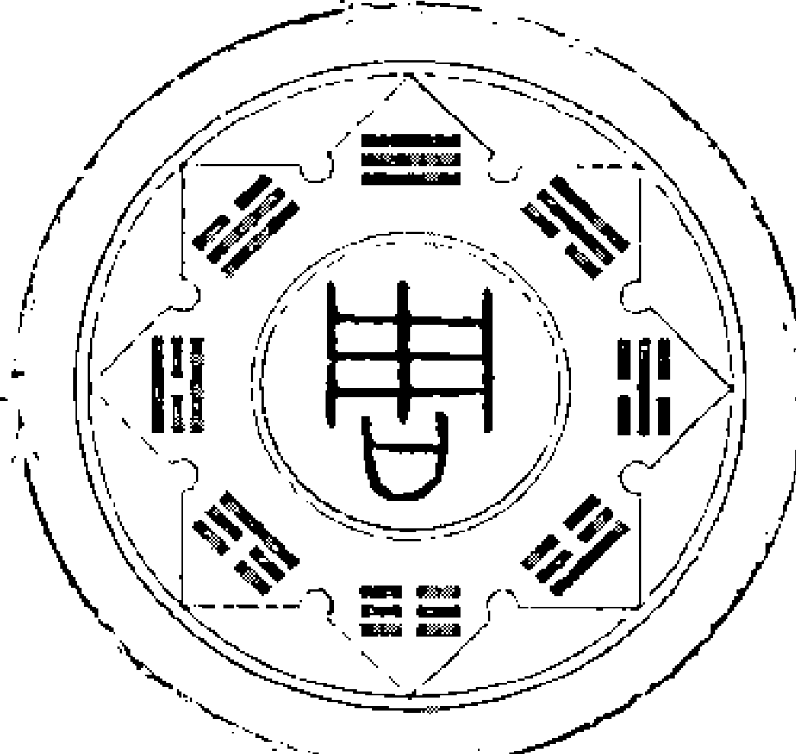

“周”特指周朝。

第一章 带你认识《易经》① 中国最古老深邃的经典

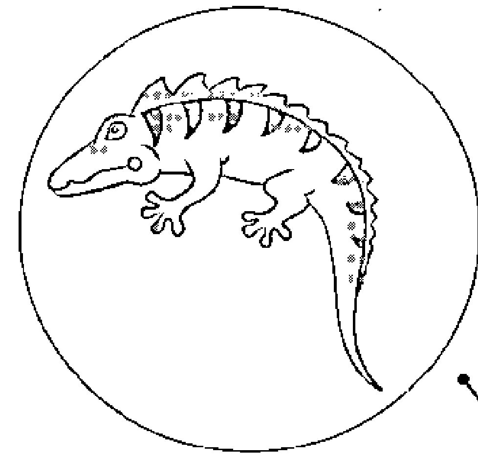

蜥蜴 因环境而改变颜色。

变易：“易”是讲变化之道的，万物都在变化，变化非常复杂但有规律可循，《易经》就是寻找变化中的规律的学问。

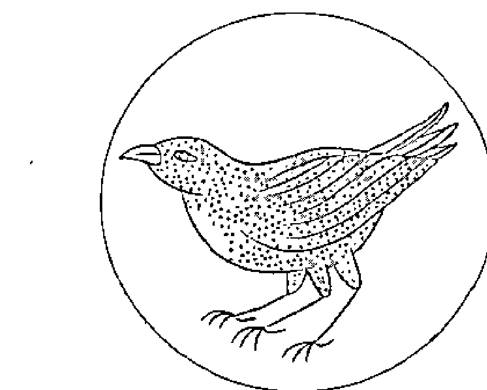

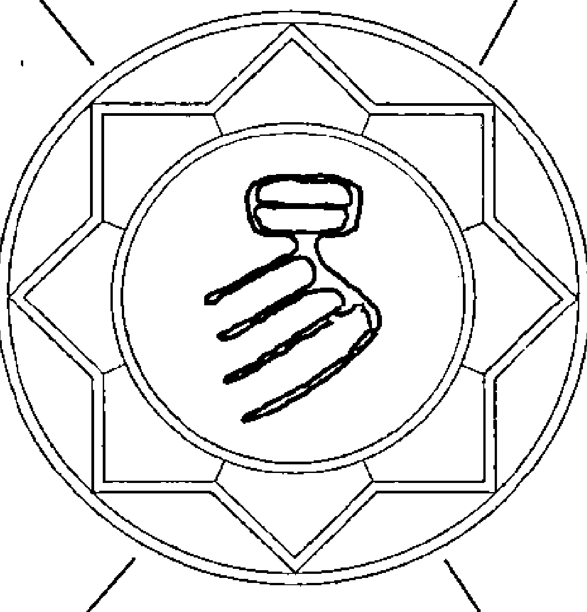

简易：“易”虽然包罗万象，但有一个简化的公式或模式，一切事物和现象都可以装进这个模式里，用这个模式来说明。

飞鸟 古文的“易”字像飞鸟的形象。

日 月

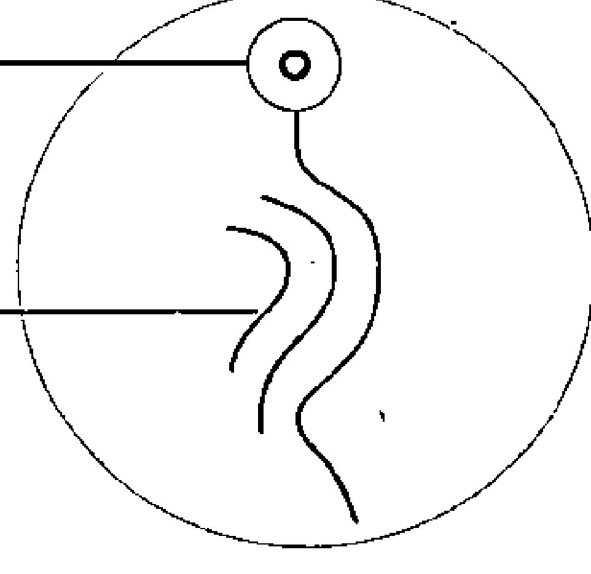

不易：“易”虽讲变化，但大道是永恒的，变化之道是不变的，人们学习《易经》后可以运用规律“以不变应万变”。

“易”字 古文的“易”是“日、月”两字的重叠。

“周易”两个字无论怎么解释，其根本都是在讲阴阳两种势力的相互作用，“刚柔相推，变在其中”。

### 《易经》的两部分

#### 《经》与《传》

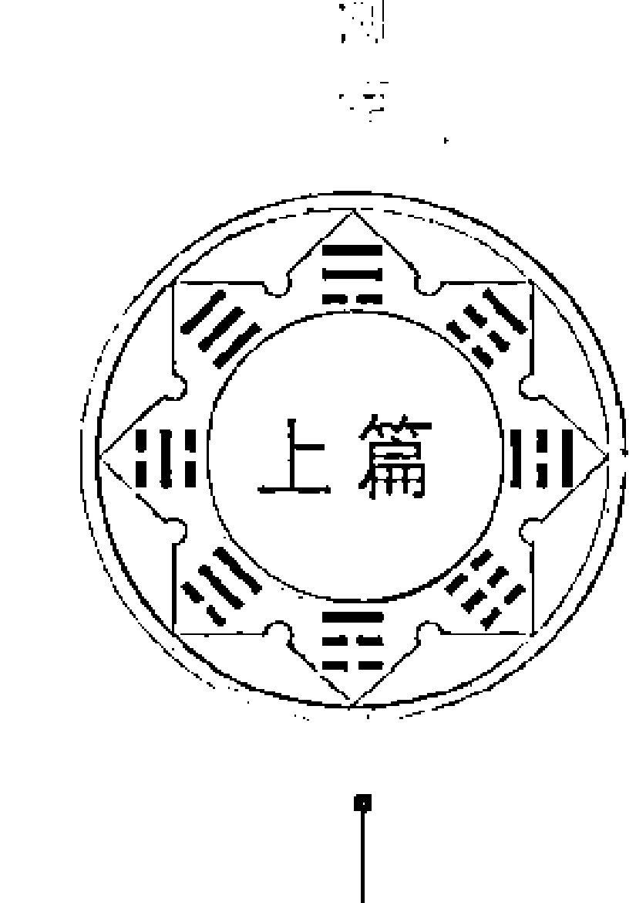

《易经》包括《经》和《传》两部分内容。《经》是全书的核心，《传》则是解释《经》的。一般认为：《经》是周文王和周公共著的，《传》则是后人积累并由孔子整理成的。

《经》分为《上经》和《下经》，《上经》三十卦，《下经》三十四卦，共六十四卦。每一卦由卦画、标题、卦辞、爻辞组成。六十四卦是由“乾坎艮震巽离坤兑”这八卦重叠演变而来的。每个卦画都有六个爻，爻分阴阳，阳性之爻简称为“九”，阴性之爻简称为“六”。卦爻从下向上排列成六行，依次叫做“初、二、三、四、五、上”。六十四卦共有三百八十四爻。每卦的标题与卦辞、爻辞的内容有关。卦辞在爻辞之前，起说明题义的作用。爻辞是每卦内容的主要部分，其内容按六爻的顺序排列。

《传》共有七种十篇，分别是：《彖》（tuàn）上下篇、《象》上下篇、《文言》、《系辞》上下篇、《说卦》、《杂卦》和《序卦》。古人把这十篇叫做“十翼”，意思是：《传》是附属于《经》的羽翼，用来解说《经》的内容。

《彖》是对《易经》卦名和卦辞的注释。

《象》是对《易经》卦名和爻辞的注释。

《文言》对乾坤二卦作了进一步的解释。

《系辞》与《彖》、《象》不同，它不是对卦辞、爻辞的逐项注释，而是对《易经》的整体评释，是《易经》的哲学纲领和必读之篇，是“十翼”中最重要、最有代表性的文字。它也是古代第一部对《易经》的产生、原理、意义及易卦占法的全面系统的说明，阐发了许多《易经》经文中没有的思想。

《说卦》是对八卦卦象的具体说明，是研究术数的理论基础之一。

《杂卦》将六十四卦以相反或相错的形态排成两两相对的综卦和错卦，从卦象中看卦与卦之间的联系。

《序卦》讲述了六十四卦的排列次序。

### 《易经》的内容

《易经》包括《经》和《传》。《经》分为《上经》和《下经》，《传》共七种十篇。古人把这十篇叫做“十翼”。

#### 《易经》内容框架

- 易经
  - 经
    - 上经：三十卦
    - 下经：三十四卦
  - 传
    - 彖上下篇：对易经卦名和卦辞的注释
    - 象上下篇：对易经卦名和爻辞的注释
    - 文言：对乾坤二卦的解释
    - 系辞上下篇：易经的哲学纲领，学易的必读之篇
    - 说卦：对八卦卦象的具体说明
    - 杂卦：从卦形看卦与卦的联系
    - 序卦：六十四卦的排列次序

这六十四卦是由乾、坎、艮、震、巽、离、坤、兑这八卦重叠演变而来，每一卦由卦画、标题、卦辞、爻辞组成。

#### 卦的六爻

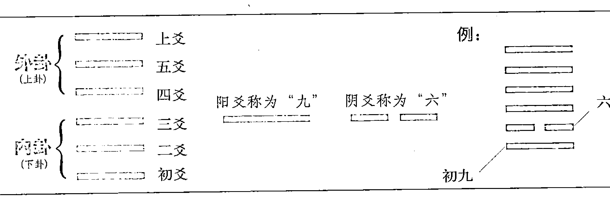

对于学习《易经》的人来说，《系辞》之所以非常重要，在于它对《易经》的产生、原理、意义、占法等方面进行了全面系统的说明，它是《易经》的哲学纲领，阐发了经文中没有的思想。

## 《易经》的产生

### 年代、作者和“三易”

对于《易经》产生的年代，历来说法不一。据学者们考证，它大约产生在5000年前，也有人认为是7000年前。其成书的年代可能在商末周初。对于《易经》的内容，一般认为它源于河图、洛书。

### “人更三圣，世历三古”

对于河图、洛书，有一个古老的传说：在远古时代，黄河中出现了背上画有图形的龙马，洛水中出现了背上有数字的灵龟，圣人伏羲依此而画出了先天八卦。殷商末年，周文王在受到囚禁时又根据伏羲的先天八卦演绎出了后天八卦，也称文王八卦。并进一步推演出了六十四卦，作了卦辞和爻辞。而经文后面的《易传》是春秋时期的孔子所著。

《易经》又有“人更三圣，世历三古”的说法：它的成书经历了上古、中古、下古三个时代，即“三古”；书中内容由伏羲、文王、孔子三个圣人完成，即“三圣”。也有人认为爻辞是周文王的儿子周公写的，三圣之中为什么没有提到周公呢？根据汉儒的解释，因为古代的宗法观念，子从父，所以把周公省略了。

### 三种《易经》

最原始的《易经》有三种，即“三易”。一是神农时代的《连山易》，二是黄帝时代的《归藏易》，三是周文王被囚时所著的《周易》。《周礼》中说：“太卜掌三易之法，一曰《连山》，二曰《归藏》，三曰《周易》，其经卦皆八，其别皆六十有四。”《御览》中记载：“《连山》八万言，《归藏》四千三百言。”和《周易》从乾坤两卦开始，表示天地与“天人之际”的学问不同，《连山易》是从艮卦开始的，象征“山之出云，连绵不绝”；《归藏易》是从坤卦开始的，表示万物皆生于地，终又归藏于其中。也有人对“三易”的产生年代有不同的看法。东汉大儒郑玄认为，夏代的易学是《连山》，商代的易学是《归藏》，周代的易学是《周易》，但目前并无定论。《连山易》和《归藏易》已经失传，只有《周易》流传至今。可以认为，“三易”虽有差别，但其核心内容大同小异。

《易经》的流派不止这三种。孔子诠释的《易经》被称为《周易》，这种“孔氏易”只是《易经》的一小部分。广义的《易经》包括伏羲易、连山易、归藏易、周易、河洛理数、医易、焦氏易、杨雄易、京房易、邵氏易……而“易学”的范围则更广泛，包括术数学的上百种分支，这些分支又可根据内容分为三六九等。

## 《易经》的产生与作者

《易经》的产生有“人更三圣，世历三古”的说法。它的成书经历了上古、中古、下古三个时代，即“三古”；它由伏羲、文王、孔子三个圣人完成，即“三圣”。也有人认为爻辞是周文王的儿子周公写的。

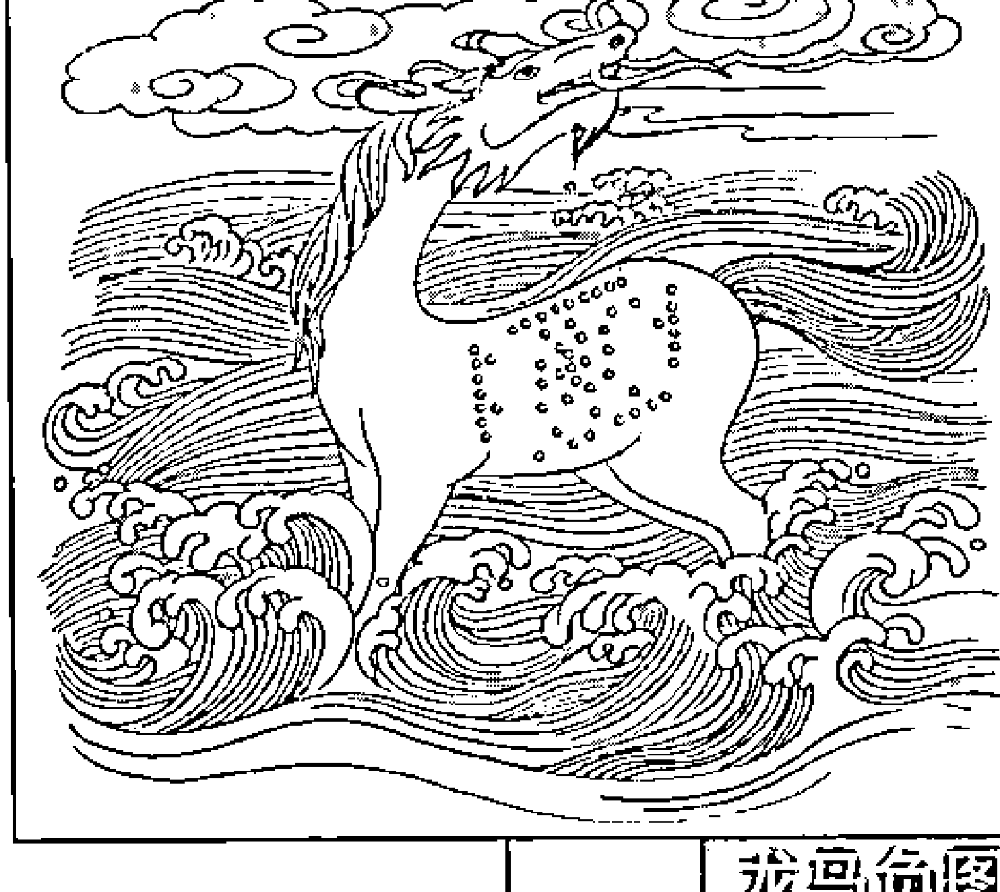

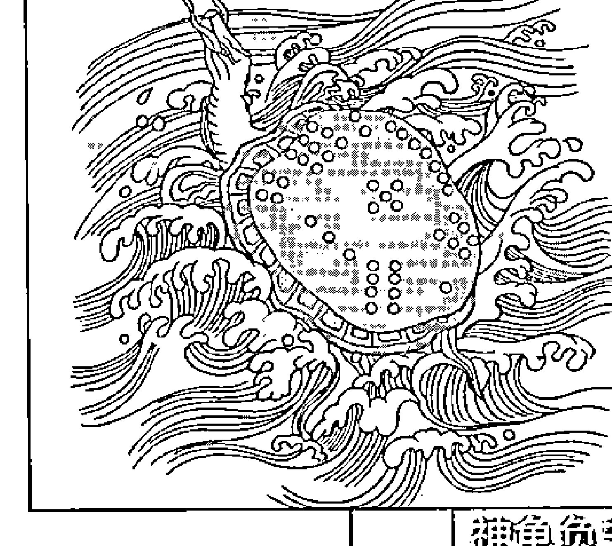

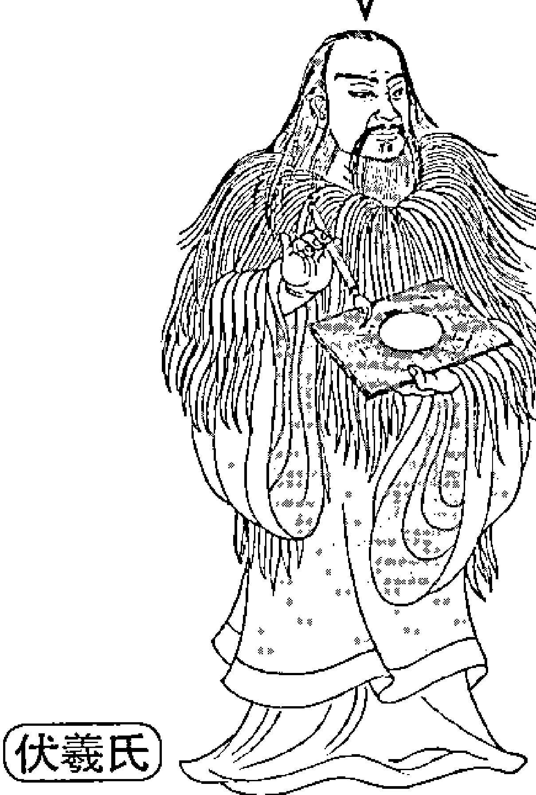

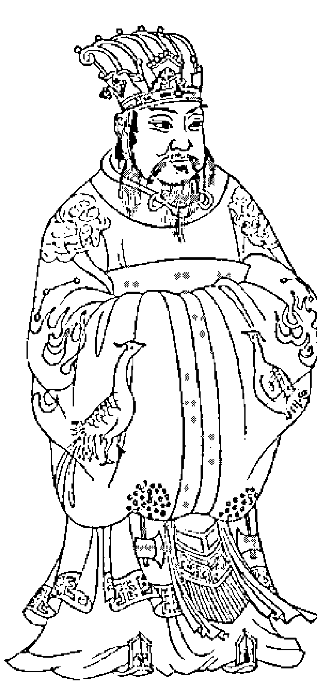

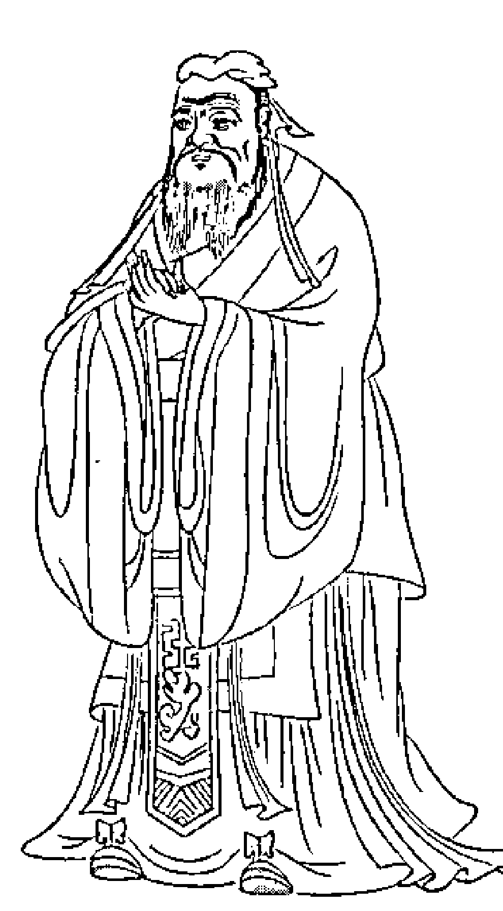

传说在远古时代，黄河中出现了背上画有图形的龙马，洛水中出现了背上有数字的灵龟，圣人伏羲因此而画出了先天八卦。

殷商末年，周文王在受到囚禁时又根据伏羲的先天八卦演绎出了后天八卦，并进一步推演出了六十四卦。

一种观点认为，经文后面的《易传》是孔子的创造。但多数人认为，《易传》是孔子对前人思想的归纳总结。

### 关于“三易”

| 三易 | 《连山易》 | 《归藏易》 | 《周易》 |
| :--- | :--- | :--- | :--- |
| 多数人的观点 | 神农时代 | 黄帝时代 | 殷商末年 |
| 郑玄的观点 | 夏代 | 商代 | 周代 |

## 《易经》的内核

### “天人合一”思想

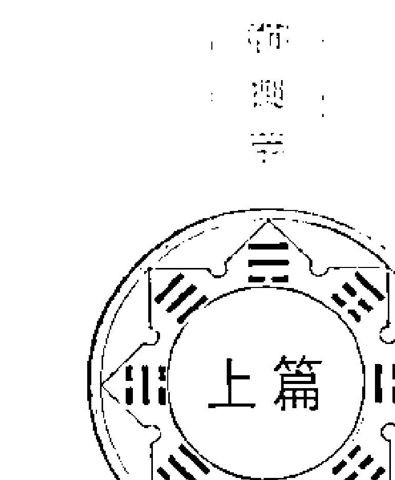

古人将人和自然看成一个有机整体，认为人和宇宙万物都存在着密切的联系，人是万物之“灵”，是宇宙之精华，每个人都是一个小宇宙。“天人合一”是大小“两个宇宙”之间的固有联系和内在统一。

#### 天地与人的关系

《易经》中用乾、坤二卦代表天地，万物“统”于天。地与天相辅相成、对立统一，但它毕竟是“顺承天”的。天为父，是生命之源；地为母，是一切生命得以存在的基础。人在天地间，与它们不可割离。尽管人受天地所生，只是万物中的一员，但人不同于万物，因为人有超越万物的感情和理智，这种灵性被赋予了神圣的使命，用《易经》的话说就是：“裁成天地之道，辅相天地之宜。”天地提供了人类生存所需要的一切，人类在从中汲取能量的同时就要“裁成”、“辅佐”天地顺利地运行，这是“天人合一”思想的宗旨。

#### “天人合一”思想的核心

天地有其运行的规律，人类社会也有其运行的规律，不是哪种规律顺应另一种规律，而是两者相互对应、并行不悖。它们的关系的本质是“映射”，而不是“决定”。所以“人之命，天注定”的说法不正确；“人定胜天”的观念也狭隘。将天与人平等、辩证地结合才符合“自然大道”。也正是因为天道与人道的“映射”关系，我们才可以通过观察天地万物的运行来预测人类社会内的事情。如：衍生於《易经》的星象学认为：天空中某颗星星的明暗发生了变化，人类社会中的某些事物也会发生变化。不是星星的变化决定人的变化，也不是人的变化决定星星的变化，而是两者受一种统一的规律支配，同时变化。

《易经》描绘的这种“映射”的规律把整个宇宙都囊括在内，使所有事物都处于普遍联系的链条中。这种“全息性”或“相互感应”的思维模式构建了一个包罗天、地、人、事、物在内的不可分割的世界。理解这个道理便会用整体、辩证、全息、系统的方法去思考和行动，而不是把事物割裂、孤立、片面化。

## 天人合一：天与人的“映射”

“天人合一”思想的核心是：天地有其运行的规律，人类社会也有其运行的规律，不是哪种规律顺应另一种规律，而是两者相互对应、并行不悖。它们的关系的本质是“映射”，而不是“决定”。

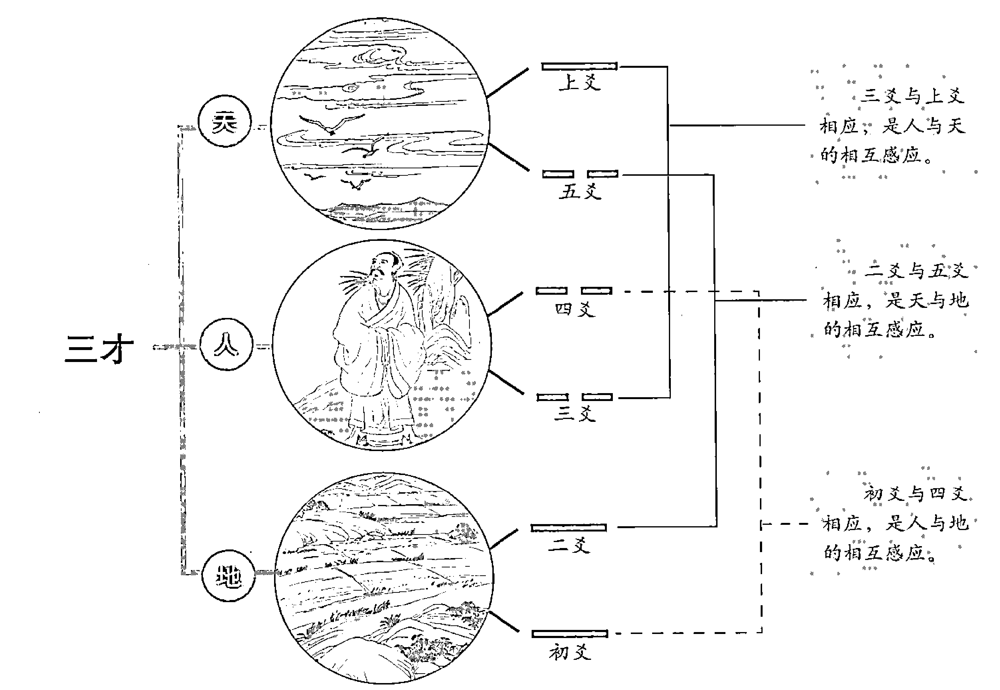

### 万物的“普遍联系”

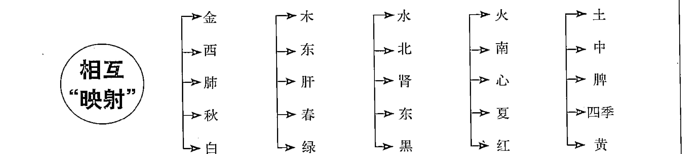

《易经》描绘的这种“映射”的规律把整个世界都囊括在内，使所有事物都处于普遍联系的链条中。这种“全息性”或“相互感应”的宇宙思维模式为人们构建了一个包罗天、地、人、事、物在内的不可分割的世界。

## ⑧ 为何会有“天人合一”

为何会有“天人合一”？遵照这种“合一”的规律，我们应该怎么做？宇宙如同一个巨大的流动漩涡，在特定的时间地点会形成特定的时空场，它与此刻此地诞生的小漩涡（人）的能量场有关联：一方面，小漩涡生于大漩涡中，并追随其运转的大趋势；另一方面，虽然单个的小漩涡对大漩涡的影响极其微小，但作为大漩涡的组成部分，所有小漩涡的能量共同构成了大漩涡的运转动力。

人的这种能量场被佛陀称为“小宇宙”。小宇宙是人天生就有的，产生后一般不会再有大变化。而时空场却随宇宙运行而变化不止。小宇宙的能量虽然难以直接影响时空场的大趋势，但它若能与时空场保持协调，即“顺势”，就会表现出较强的生命力。两者的内在协调、映射、统一，就是“天人合一”。因为时空场玄奥而难以观测，被视为“天意”，其中奥秘被视为“玄机”，总称“天机”。借助神通或各种预测术可以发现、预言“天机”。

俗话说“泄露天机遭天谴”，其实“遭天谴”并不是因为“天”发怒，而是泄露的方法不对。预言天机常会造成人心骚动，这引发的连锁反应也会殃及预言者自身，所以说“天机不可泄露”、“察见渊鱼者不祥”。

古人认为，是否该泄露天机取决于“德”。宇宙运转的根本规律被古人称为“道”，它高度抽象，难以名状；人在宇宙中顺势而为的品性被称为“德”。对“道”的了解和对“德”的把握若达到一定程度，不仅能识破天机，还能在宇宙的大漩涡中顺势借力增强自身小宇宙的能量。

## ⑧ 顺应“天道”与学习术数

古人认为：“天道”有众多侧面，以顺应天道为目的的术数也就有众多分支：要顺应居家环境的天道，可以学风水学；要顺应时空方位的天道，可以学奇门遁甲；要顺应社会和人生的天道，可以研读《易经》原文；要顺应个人命运的天道，可以学四柱学；要顺应生活中具体事态变化的天道，可以学六爻法……

## 天人合一的本质

宇宙演化出人的过程类似于树木结出果实的过程。种子长成树，当树成熟后，结出的果实中又有它的种子，所以树木与其果实的本质是统一的，只是表现形式有异。宇宙与人的关系的本质与此类似。

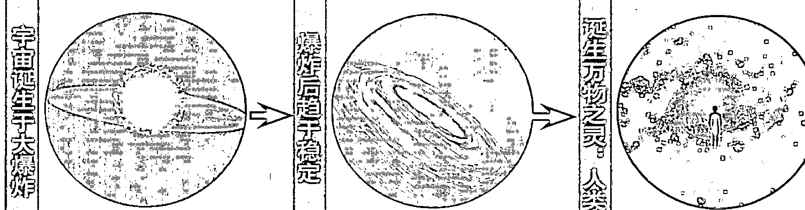

本质相似

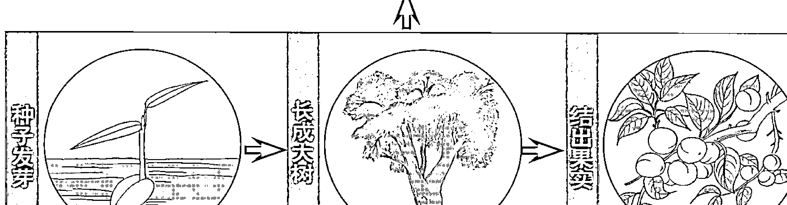

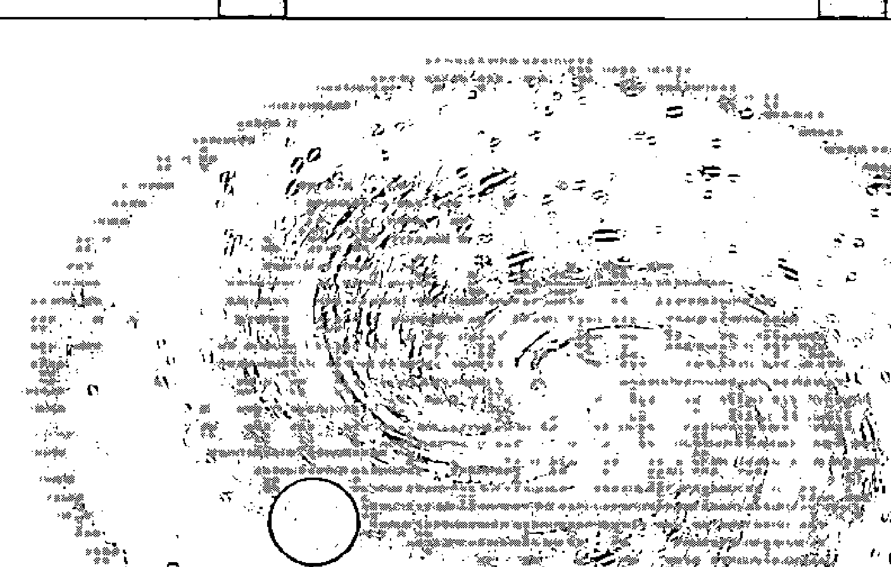

宇宙如同一个巨大的流动漩涡，在惯性的作用下，其内部的小漩涡（人）的运动趋势受它影响，这种内在的一致性就是“天人合一”。

## 《易经》的哲学思想

### “一阴一阳之谓道”

《系辞》中说：“一阴一阳之谓道”，这与马克思主义哲学中的“矛盾对立统一规律”如出一辙。与后者不同的是，在《易经》的庞杂体系之中，阴阳之间的相互作用被演化得极其复杂，万物的变化规律都在阴阳的范围内。

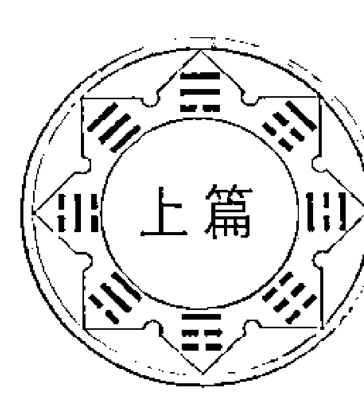

#### 《易经》的核心：阴阳

《易经》认为，整个世界在阴阳两种相反相成的力量的互相作用下不断运动、变化：生成——更新——消亡——再造……《易经》的卦象就建立在阴阳变化的基础上：阴阳符号按阴阳二气消长的规律，经过排列组合而成为八卦。八卦的构成与排列反映了阴阳对立统一的思想。八卦又经过重叠而组合为六十四卦。六十四卦又有错综复杂的变化，可以演化至无穷。但不管卦象如何演变，阴阳爻都是组成卦象的最基本元素。阴阳是《易经》的核心。

#### 自然界和社会的阴阳属性

除了卦象上的一阴一阳，《易经》还将阴阳作为万物的性质及其变化的法则，把具体的事物赋予了阴阳的涵义。从自然现象上看，《易经》以天为阳，以地为阴；日为阳，月为阴；暑为阳，寒为阴；明为阳，暗为阴；昼为阳，夜为阴。《系辞》中说：“天尊地卑，乾坤定矣……日月运行，一寒一暑……广大配天地，变通配四时。阴阳之义配日月，易简之善配至德……乾，阳物也；坤，阴物也。”从社会现象上看，《易经》以男为阳，女为阴；君为阳，民为阴；君子为阳，小人为阴。“乾道成男，坤道成女……阳一君而二民，君子之道也。阴二君而一民，小人之道也。”

此外，《易经》还对自然和人类社会中共有的抽象规律赋予了阴阳的涵义，如：刚柔、进退、开合、伸屈、贵贱、高低……它们都是阴阳思想的反映。

阴阳思想起源于何时已经难以考证，它在秦汉时期得到了发展，并成为当时自然科学的指导思想。如东汉天文学家张衡的理论就体现了阴阳与气化相结合的思想，这一思想代表了当时自然科学思潮的主流。

## 阴阳：矛盾的对立统一

《易经》认为，整个世界在阴阳两种相反相成的力量的互相作用下不断运动、变化。除了卦象上的一阴一阳，《易经》还将阴阳作为事物的性质及其变化的法则，把具体的事物赋予了阴阳的涵义。

### 从自然现象看

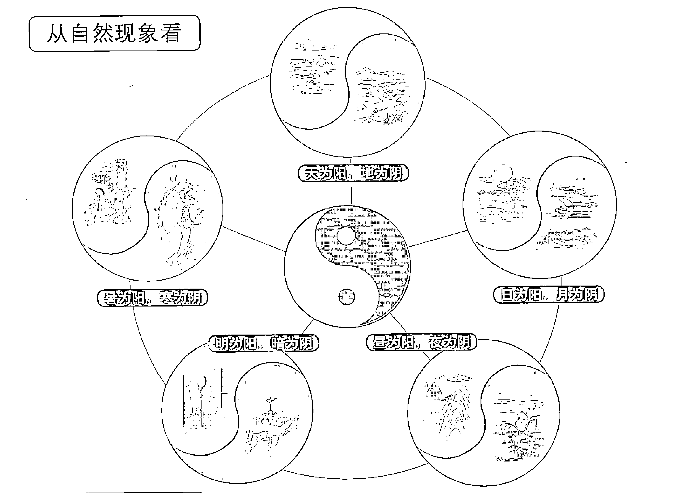

### 从社会现象看

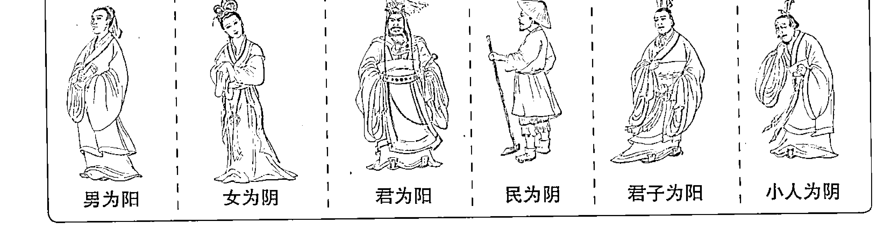

除以上两大类现象外，《易经》也以阴阳来解释自然和社会中共有的现象，如刚柔、顺逆、进退、开合、伸屈、贵贱、高低等。《易经》认为，无论是社会生活，还是自然现象，都存在着对立面，而这个对立面就是阴阳。

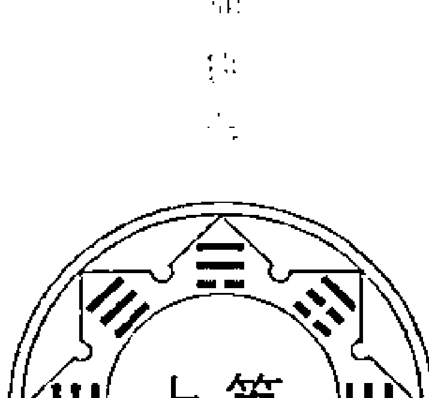

## 《易经》的唯物性

### “生生之谓易”

《系辞》中的“生生之谓易”是对“易是什么”的最好回答，也是对《易经》核心思想的透彻说明。“生生”的观点驳斥了“神创论”，是彻底的唯物主义，常被称为“古代朴素唯物主义”。

### “生生”的两层含义

《易经》认为：世界不是由一个万能的“主宰者”来创造生命，而是万物遵循一定的变化法则使得自身不断地更新，这就是“生生”。详细来说，它包括两方面：

+   一、事物都处在连续不断、时刻不停的变化过程中。由 A 变化为 B，可以称之为 A 生 B；再由 B 变化为 C，可以称之为 B 生 C。无始无终、循环往复以至无穷。这是“生生”规律的体现。

+   二、人类社会的演化规律也在于“生”，生动地把这个过程描述出来，就是言简意赅、意蕴深远的“生生”一词。宇宙从混沌未分的“无极”而来，无极动而生太极，太极分阴阳两仪，再由阴阳分化出太阴、太阳、少阴、少阳这四象，四象分化而为八卦，八卦代表着世界的八种基本属性，可以用“天地风山水火雷泽”来概括。《说卦》认为：“乾，健也；坤，顺也；震，动也；巽，入也；坎，陷也；离，丽也；艮，止也；兑，说也。”八卦又分出六十四卦，但六十四卦并不代表事物演化过程的终结。六十四卦最后两卦为“既济”和“未济”,象征事物发展到最后必然有一个结果,但这个结果作为一个“节点”,以它为开始将展开另一次全新的演变。所以，“物不可穷也，故受之以未济终焉”。这个演化的过程体现在人伦关系中，就是《易经》中说的：“天地氤氲，万物化醇，男女构精，万物化生……有天地，然后有万物；有万物，然后有男女；有男女，然后有夫妇；有夫妇，然后有父子；有父子，然后有君臣；有君臣，然后有上下；有上下，然后礼仪有所错。”

此外，《易经》还认为，天地以“生”为“德”，这就把“生”的客观运动附加了主观意义，把没有智慧和灵性的事物演化融入进了人类有情有智的社会中，这包涵着《易经》作者认为的人类生命的目的，以及人类作为万物之灵的与众不同的本质。

## “生生”的含义

《易经》认为：世界不是由一个万能的“主宰者”来创造生命，而是万物遵循一定的变化法则使得自身不断地更新、变化。

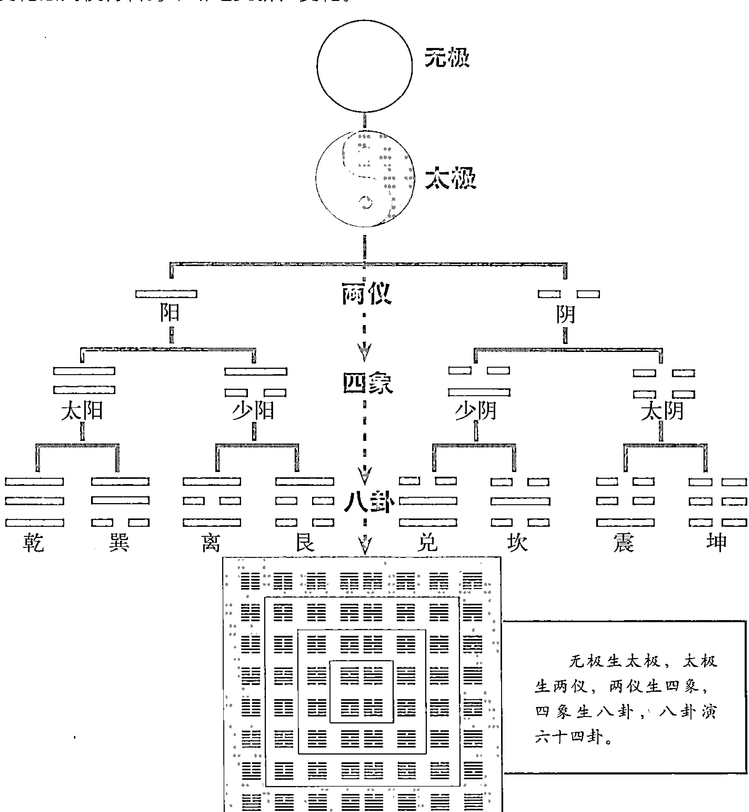

> 无极生太极，太极生两仪，两仪生四象，四象生八卦，八卦演六十四卦。

+   天地 → 万物 → 男女 → 夫妇 → 父子 → 君臣 → 上下 → 礼仪

> 《易经》中说：“有天地，然后有万物；有万物，然后有男女；有男女，然后有夫妇；有夫妇，然后有父子；有父子，然后有君臣；有君臣，然后有上下；有上下，然后礼仪有所错。”

## 《易经》四探

### 象数与义理

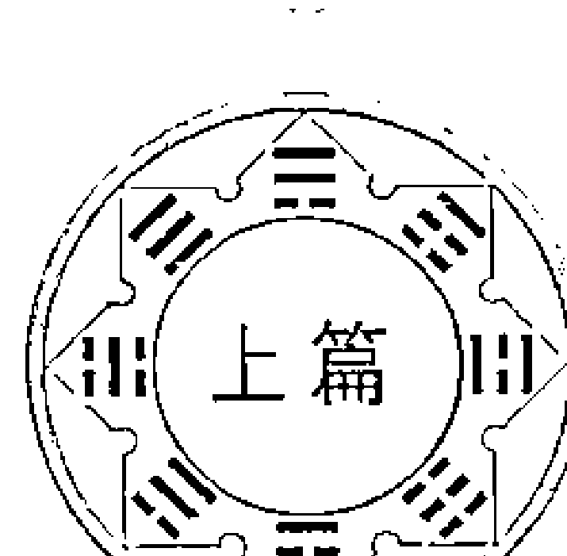

古人将易象、易数、易义、易理称为“易之四德”。简单来说，“象”是卦及其所象征的事物形象；“数”反映了卦象中的数理关系；“义”表达了伦理道义的思想；“理”是对万物的规律所做的探讨。

根据研究思路的不同，《易经》研究者分为四大派：象、数、义、理，而象与数、义与理又可分别归为一类。有人认为，象数派接近自然科学，义理派接近社会科学。象数讲的是事实的“必然”性，义理则着重讲为何会“必然”。

### 象数学派

《易经》中的“象”有三种含义：一是八卦及六十四卦的形状，二是八卦所象征的事物的形象，三是卦辞和爻辞中提到的具体事物的形象。“数”也有三种含义：一是表示卦中各爻属性的数，二是表示爻位顺序的数，三是占卜过程中的一种计算方法。两汉时期，《易经》被尊为儒家五经之首，成为显学。以孟喜、京房为代表的两汉易学家认为，《易经》中最重要的是象，一切卦辞和爻辞都是以象为基础的，所以他们从象数角度解释《易经》。经过一段时间的衰落，北宋时期的华山道士陈抟重新振兴了象数学派。陈抟创制了包括太极图在内的各种图式，用以解说《易经》卦象爻辞。他的继承者邵雍则以“皇极经世”图取代汉朝的“天人感应”说。

### 义理学派

汉末儒生以象数解《易经》，过于追求卦辞、爻辞与卦象的一一对应，这使得他们的易理体系变得非常复杂。与其相对的义理派在孔子写易传时就出现了，但成体系的义理派开始于三国时少年天才王弼。王弼针对当时象数学派的弊病，提出了“一爻为主说”、“爻变说”和“适时说”，驳斥汉儒牵强附会的“按文责卦”的方法，主张着重领会和把握《易经》的根本义理。南宋王安石等人则从历史角度解《易经》，不追究卦象本身的意义，而是引用历史事实证明《易经》理论的正确性。

后来，人们又戏把《易经》研究者分为学者派和江湖派，突出了阳春白雪和下里巴人的差异。江湖派利用《易经》衍生出的众多占卜术谋生，虽然略显低俗，但在群众中影响力很大；学者派则探究《易经》中的高深哲理，对预测生活琐事不感兴趣。

## 易学两大派：象数与义理

《四库全书提要》把《易经》研习流派分为两大类：象数派和义理派。象数派分为占卜、灾祥、图书三宗；义理派分为老庄、儒理、史事三宗。

### 象数派

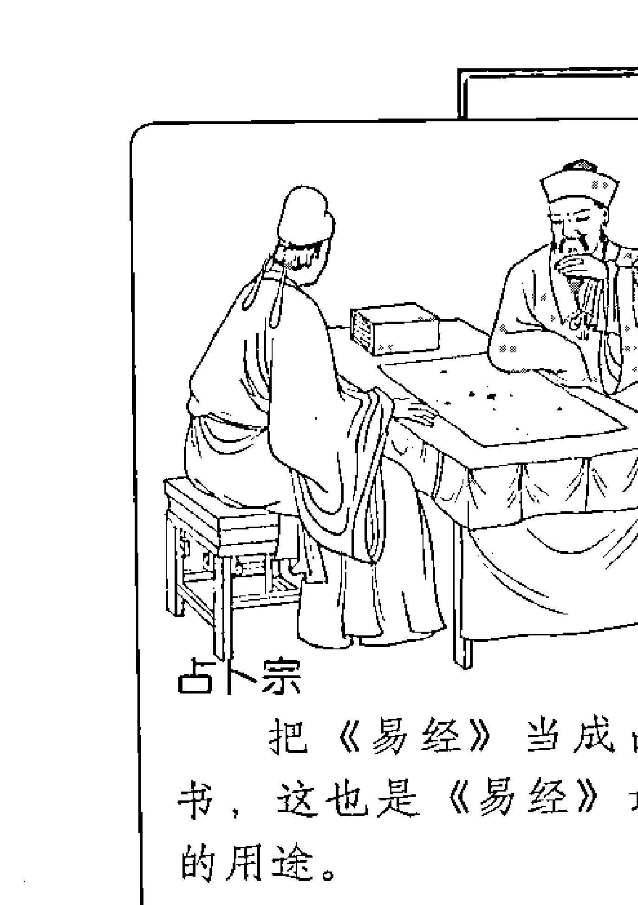

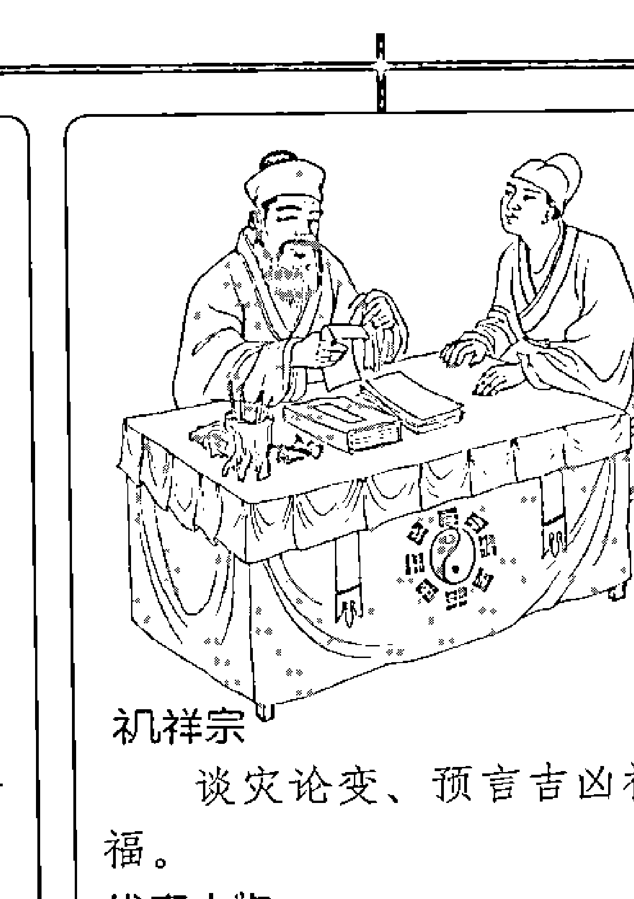

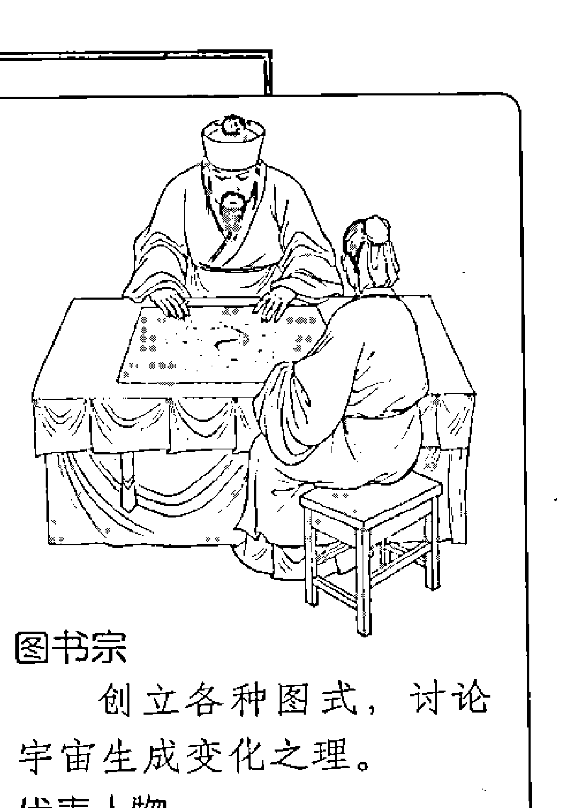

### 义理派

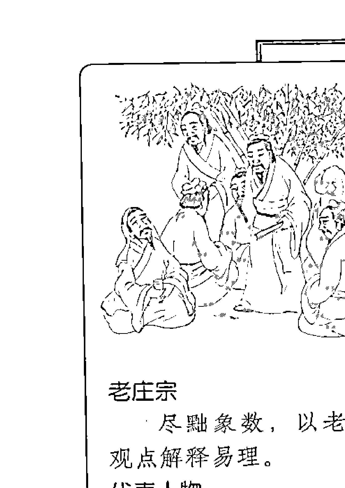

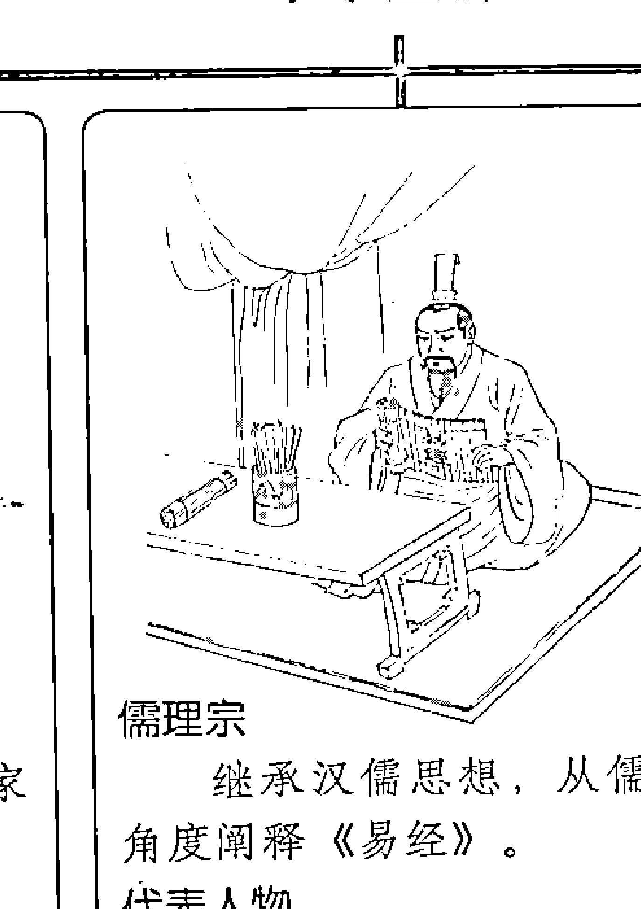

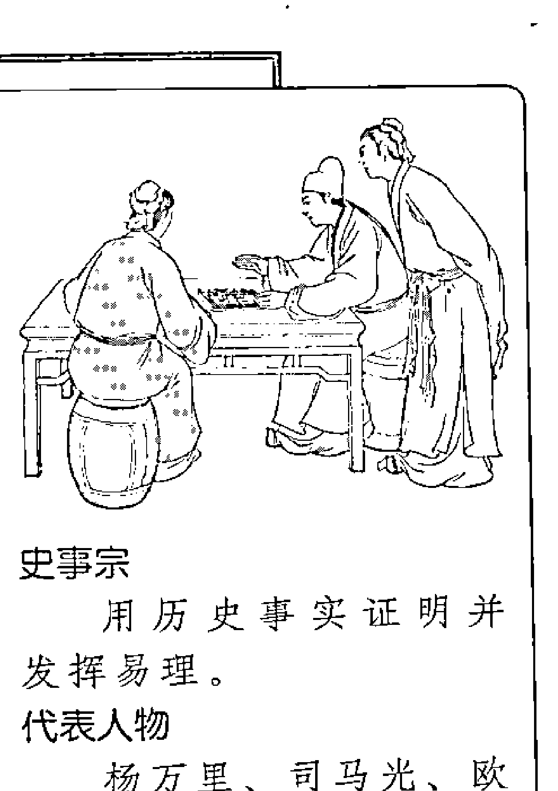

国学大师南怀瑾把易学的“两派六宗”扩充成“两派十宗”。两派包括：道家易学、儒家易学；十宗包括：占卜、灾祥、图书、老庄、儒理、史事、医药、丹道、堪舆、星相。

## 《易经》遗韵

### 对中国文化的影响

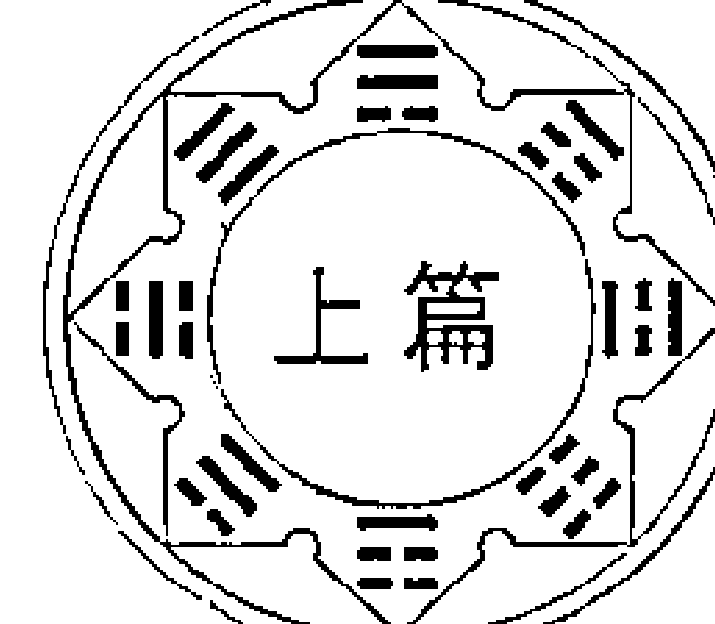

自产生以来，《易经》一直对中国的政治、经济、军事、民俗发挥着巨大的影响。今天，它仍然在众多方面发挥着作用。很多学者将《易经》与中医、建筑、物理学、遗传学等学科联系起来，希望从中获得启发。

### 《易经》与中医

今天的自然科学几乎都有一个国际通行的学术体系，唯独医学不同，分为两大独立的体系:中医和西医。在人类历史上，中医、西医各自独立地前进。中医有着几千年的辉煌，而西医则在近一二百年借助于现代科技迅速占据了主导地位。

西医是在现代自然科学的基础上发展起来的。现代自然科学不仅为西医提供了理论基础，更提供了先进的技术装备。从发现血液循环到心脏手术与器官移植；从合成抗生素到化学药物的出现；从最初使用的显微镜到目前的CT、核磁共振……西医的成就和优势是有目共睹的。

西医的诊断手段是中医望尘莫及的，但这并没导致中医的衰弱。科技的发展和人们生活节奏的改变带来了新的医学难题：疾病谱的不断翻新、人们对生活质量的要求和对健康长寿的向往……这些医学课题使西医显得力不从心。但西医之短恰是中医所长。西医把人体视为孤立的封闭系统，人体在与环境中的致病因子抗衡。中医则把人体看成是与外界沟通的开放系统，人体内各要素之间的不平衡是疾病的根源……

中医的理论基础与中国古代的哲学思想相通，中医的系统思维来自于《易经》天人合一的世界观，后人称之为“医易同源”。

中医的理论经典《黄帝内经》成书于战国至两汉之间，它汲取了《易经》的精华，并把它创造性地和医学相结合，使中医成为了一门具有很高哲理思想的自然科学。其中的阴阳五行学说、气化学说、经络学说、脏象学说、药物归经、药的升降沉浮、四气五味、五运六气学说、子午流注学说等，都与《易经》有着深厚的渊源。特别是阴阳五行学说，直接来源于《易经》，并在医学理论中得到了充分的演绎。

## 中医与《易经》的渊源

中医的理论基础是与《易经》哲学思想相通的，人们称之为“医易同源”。中医理论经典《黄帝内经》充分汲取了《易经》中的精华，特别是其中的阴阳五行学说，直接来源于《易经》。

- 阴阳五行学说
- 气化学说
- 经络学说
- 脏象学说
- 药的升降沉浮
- 四气五味
- 五运六气学说
- 子午流注学说

## 阴阳与五行的结合

心主血脉，推动气血，温暖整个人。

脾主运化，统血，主消化吸收，滋润身体，如大地孕育万物。

上为阳，热为阳，气为阳，主动，气能生血，行血，气为血之帅，没有阴无所谓阳。

下为阴，寒为阴，血为阴主静，血是气的寓守，为气之母，没有阳无所谓阴。

肺主气，主声，肺气宜清，如金属般铿锵有声。

肝主藏血，主统泻，怕郁结，要像树木般得到舒展。

肾主水，主纳气，生命的本源来自水，肾属先天的本源。

当阴阳观念与中医结合后，形成了一种方法论。阴阳之间的各种规律在五行之间同样适用。五行规律是对阴阳规律的一次继承性的发展。中医认为人体疾病的发生、发展超越不了这个规律。

## 《易经》与建筑

《易经》对中国建筑的影响也极为深远。它以其“意”与“象”结合的思维模式，以及阴阳协调的思想，孕育了世界上独一无二的中国古代风水学，同时也使得这一学问在中国建筑领域发挥得淋漓尽致。

以北京城及故宫为例，北京城按《易经》“天地人三才之道”将皇宫称为紫禁城，与天上的紫微垣相应。故宫三大殿“太和殿、中和殿、保和殿”象征天阙三垣。前殿为阳，后寝为阴，后寝三大宫为乾清宫、坤宁宫和交泰宫。三宫名称皆合乎《易经》中乾为天、坤为地；乾为君、坤为臣；乾为父、坤为母的原则。“乾天清轻上扬，坤地重浊下凝，地天交合而成泰，人伦之大吉”。围绕三宫又分左右十二宫，即东六宫与西六宫，以应河洛中轴运枢之妙。东西十二宫，以应十二辰，象征妇道遵从地道，无成有终。

北京城门，外城七门，喻为面南向明而治；内城九门，喻为九五之尊统御四宇。皇城大门南有天安门，北有地安门，东有东安门，西有西安门，象征先天八卦“乾天坤地、离日坎月”的格局。午门、神武门、东华门、西华门又为朱雀、玄武、青龙、白虎等天象二十八宿。内城东南崇文门、西南宣武门，象征左文右武。东北安定门、西北德胜门，象征文治武功，怀柔天下。东直门、西直门，象征日月出没的阴阳大道。中轴线十五里，象征河洛运枢左右逢源的常数。

这是中国古代建筑运用《易经》理念的经典实例，充分反映了《易经》“天人合一”思想对古人生活的影响。

## 《易经》占卜与宗教

在我国古代，占卜是《易经》产生时的主要用途。不过，占卜的历史比《易经》更为久远，且占卜术在任何国家地区的远古时代都曾出现过。

世界各民族都经历了原始社会、奴隶社会等阶段，都有过“神教治理、政教合一”的政治形态，那时的统治者利用人们对神灵的崇拜进行统治。

原始社会时，人类刚从动物中分离出来，仍保留着动物的很多自然属性，可以称之为“野蛮人”。这时的人不畏死，所以只能用“神灵鬼怪”来约束其行为，自然崇拜在此时非常盛行。人们崇拜的对象很杂，包括神仙、祖先、山河大地、花草鸟兽……这时原始宗教盛行，占卜的形式是“巫卜”。巫卜由巫师主持，有时巫师即是部落的酋长。他们是人与神沟通的媒介，具有人和神的双重人格。巫师通过自设程序来完成人与鬼神的对话，暗示吉凶祸福。他们的社会地位很高，由于没有剩余，也就没有私心，他们的所为都是为了部族的生存。

奴隶社会时，中国以外的国家几乎都发展为对单一神灵的崇拜：某一宗教绝对统治某个民族或地区，只有中国不然，因为中国经历了漫长的“以占卜代宗教”时期。占卜在某些方面优于宗教：宗教只能给人心灵的安抚，而占卜的结果能团结群体，提高民族或部落的凝聚力；另外，不同宗教的互斥会导致矛盾和战争，而无神论的占卜术对宗教的容忍力几乎是无限的。但是，占卜在抑制宗教的产生的同时，也抑制了科技在我国的发展。

## 古代建筑与《易经》的渊源

《易经》对中国古代建筑的影响颇为深远。但由于天灾人害，如今保存下来的能反映《易经》思想的完整建筑群已经不多。故宫就是尚存的经典。

### 故宫的建筑布局

后寝为阴。后寝三大宫为乾清宫、坤宁宫和交泰宫，皆合乎《易经》中乾为天，坤为地的思想，地天交合而成泰，人伦之大吉。

前殿为阳。故宫三大殿：太和殿、中和殿、保和殿，象征天阙三垣。

后寝三大宫与东六宫、西六宫，合之十五，应河洛中轴运枢之妙。东西十二宫，又应十二辰，象征妇道遵从地道。

### 北京的城门布局

内城九门喻九五之尊，统御四宇。
日月出没的阴阳大道。
皇城大门天安门，地安门，东安门，西安门，象征先天八卦乾天坤地，离日坎月之格局。
故宫午门、神武门、东华门、西华门又主朱雀、玄武、青龙、白虎等天象二十八宿。
外城七门，喻面南向明而治。

## 占卜术在我国古代政治中的兴衰

我国在周朝就设有卜筮之官，专为统治者占卜。后代王朝也大多设有此职，但未记录于正史。《史记》中记载，我国从三皇五帝到夏商周，统治者都用占卜来决定军国大事。在多数情况下，国家大事是统治阶层商量好的，但在高度垄断、物质匮乏、百姓文化水平低的社会里，要成就大事有赖于“天恩”。占卜术对“天意”的传达便于统一人心，因此成为愚民政策的手段之一。

春秋时期弱肉强食，各国争战不止，迫使诸侯们为了达到富国强兵的目的而广纳贤言，诸子百家应运而生，儒、法、兵、墨等诸家都曾领风骚。各家都在《易经》的基础上有所扬弃和发挥。他们此消彼长，各为一时之“显学”或“隐学”。

这种百家争鸣的局面造就了中国文化的“轴心时代”，为中国文化奠定了雄厚的文化底蕴。诸子百家的学说在社会中的作用逐渐得到了人们的共识，各种思想的竞争丰富了人们的思想库，使人们考虑问题更全面理性，“决疑用卜”变得没有必要了。而后，儒学逐渐成为治国平天下的官方显学，中国开启了“以儒学代替宗教”替代“以占卜代替宗教”的政治局面。“决疑用卜”从此退出了政治舞台，由官方显学变为民间隐学，由主流文化脱变为民俗文化，继续对社会的经济、科技、教育、军事等众多方面发挥着作用。

从伏羲创八卦起到春秋战国，中国经历了几千年的“以占卜代替宗教”、“政占合一”的历史。这为部族的兼并、融合提供了良好的政治环境，对祖国统一和民族和睦起到了积极作用。

到了汉代，作为民俗文化的占卜文化得到了发展，最有代表性的是西汉京房发明的“纳甲筮法”。此法继承了象、数、理、占的八卦易占形式，改进了演数方法，使之简单易行。后来，此法逐渐完善为我们今天常用的六爻法。

## 占卜的五个时期

占卜在我国古代有悠久的历史，它在不同的历史时期有不同的作用和价值。它的兴衰过程从侧面反映了先民们世界观的发展。

| 时期 | 代表插图与标签 | 说明 |
| :--- | :--- | :--- |
| 原始社会时期 | 原始人 | 农业和畜牧业的发展使人类增加了对自然的认识，以鬼神为核心的“巫卜”已不适应需要，八卦占卜应运而生，八卦使“巫卜”变得“有法可依”。它标志着“神人对话”向“天人对话”的过渡。 |
| 民族公社时期 | 伏羲女娲 | 人类刚从动物中分离出来，还保留着动物的很多自然属性，人们不畏死，所以只能用“神灵鬼怪”来约束其行为。此时“巫卜”盛行。巫师是人与神沟通的媒介，有人和神双重人格。 |
| 夏朝商朝时期 | 殷墟甲骨文 | 社会剩余和阶级产生后，统治者为了宣扬统治的合法性和政令的合理性，广泛使用占卜。《连山易》和《归藏易》在此时产生。占卜对国政大事有重大作用，“决疑用卜”达到了鼎盛时期。 |
| 西周战国时期 | 善用卜术的姜子牙 | 周朝时，《周易》问世后随即成为占卜的主要工具书，“政卜合一”达到了鼎盛时期。战国时，诸子百家的争鸣丰富了人们的思想，促进了理性认识，占卜术从显学的地位逐渐退出。 |
| 秦朝汉朝时期 | 秦始皇（图注：秦始皇像） | 秦朝重用法家思想，占卜的地位进一步下降，“政卜合一”退出了历史舞台。汉朝时“罢黜百家，独尊儒术”，开始了“以儒学代替宗教”的局面。《易经》得到了儒家的诠释，走向了新的阶段。 |

## 《易经》辩证思想的演绎

## 五术

五术即“山医命相卜”，源于“一阴一阳之谓道”的思想，“五术”的概念产生于唐朝，它以《易经》为哲学根基，以追求人与自然和谐统一为目的，探窥天道运行的秩序和人生奥秘。

“山”是指通过修道、修炼寻求身心超脱的一种学问，包括玄典、养生、修密三类。

1. 玄典：包括《老子》、《庄子》等修心养性的书；
2. 养生：追求健康长寿的吐纳法、炼丹法等；
3. 修密：咒法、武术等，利用运动以及精神、意念的统一来提高身心境界。

“山”是秘术中的最高境界，修习者极少。而“医命相卜”则流传于江湖，受众很广。

“医”是医术，利用方剂、针灸、灵治等方术来保持健康、治疗疾病，代表作有《黄帝内经》、《伤寒杂病论》、《金匮要略》、《温病条辨》等。

“命”是通过推命的方式来了解人生、穷达自然。其主要分支有两种：

1. 占星：代表作有《果老星宗》、《七政四余》、《紫微斗数》、《五星术》等；
2. 四柱：以人出生的年月日时的干支预测命运，其典籍很多，如：《星平会海》、《渊海子平》、《鬼谷遗文》、《孙膑遗书》、《三命通会》、《穷通宝鉴》、《滴天髓》、《神峰通考》、《河洛理数》、《子平真诠》等。

“相”是指通过观察人、地、物等形象来研究人类命运的方法，主要包括名相、人相、风水（地相）等。其中常用的是人相和风水。人相包括手相、面相、体相、骨相等，代表作有《观人于微》、《相理衡真》、《神相铁关刀》、《水镜神相》、《麻衣神相》、《柳庄相法》、《神相全编》、《金铰剪》等；风水分为看门井灶的阳宅相法和看龙穴砂水向的阴宅相法，代表作有《三元法》、《三合法》、《九星法》等。

“卜”包括占卜、选吉、测局三种，如纳甲筮法、梅花易数、三式（六壬、奇门遁甲、太乙神数）等。还有占梦、测字、签贴等方术，统称为“杂卜”。卜术是最为源远流长的术数，历史上有名的军事家、政治家大多精通此术，如汉朝的诸葛亮、唐朝的李淳风、宋朝的邵康节、明朝的刘伯温、清朝的曾国藩。

## 五术：“山医命相卜”

五术是古人从《易经》中衍生出来的认识世界、认识自我、适应世界、改变人生的思想和方法，被广泛运用于社会生活的各个方面。

| 术类 | 插图描述 | 相关典籍 |
| :--- | :--- | :--- |
| 山 | 坐在山石上打坐修行的人物 | 《老子》<br>《庄子》<br>《淮南子》 |
| 医 | 站立的人体，标有经络穴位 | 《黄帝内经》<br>《伤寒杂病论》<br>《金匮要略》 |
| 命 | 两人在桌前讨论命理，桌上有文书和法器 | 《渊海子平》<br>《三命通会》<br>《滴天髓》 |
| 相 | 手掌图，掌心有纹路 | 《麻衣相法》<br>《柳庄神相》<br>《神相全编》 |
| 卜 | 一位官员模样的人在案前进行占卜，面前摆放着卦签 | 《黄金策》<br>《卜筮正宗》<br>《梅花易数》 |

## 《易经》与神秘学的结合

《易经》从产生之始就与道学相互融合，产生了众多的预测术，统称为“术数”。术数各分支都以《易经》为理论源点，它们和《易经》有相同的哲学内核，只是在演绎时对《易经》进行了不同方向的阐释、发展和变异。

术数学传承了数千年而不衰绝，其目的和《易经》一样，试图揭示“天地人”的演变规律，并以此为人类提供可行的方法，达到趋吉避凶的目的。

## 术数的五个时期

- 先秦时期：远古时期的术数主要是占卜。古人认为占卜是与神灵和祖先的沟通的一个重要手段。传说在三皇五帝时就有占卜方法流传，但没有确切的文字记载。而后，《尚书》、《左传》等典籍中有了很多卜筮、占星、风水等方面的记载。《周易》的出现极大地促进了占卜术的发展。
- 两汉时期：出现了相面术、解梦术，由于人们对自身命运的关注，占卜法更多地运用到个人身上，这不同于先秦时只有天子或诸侯才能占卜的情况。两汉时期的术数著作有2000多卷，分为阴阳、天文、占星、形法、蓍龟、杂占六大类。易学家以孟喜、京房为代表，他们重点发展了象数之学，并以此为出发点创造了飞伏说、卦气说、纳甲说、爻辰说等象数学体系，使象数之学成为《易经》研究的主流学说，其中纳甲法是两汉易学家最重要的创造。
- 魏晋南北朝时期：这是术数学和佛学的全盛时期。社会动荡不安促使人们更多关注自身命运，原来用于立继承人、两国交战、兴修工程、祭祀大典等活动的预测术，被应用到了个人命运的预测上。金钱起卦法也应运而生，并得到了广泛的应用。这个时期出现了“六壬”、“太乙”、“奇门”等术数分支，以及风水学开山宝典——郭璞所著的《葬经》。
- 唐宋时期：《易经》是唐朝的九经之首。唐朝初年，李淳风和袁天罡合著的《推背图》因准确预言武则天当政而名震一时。北宋初期，华山高道“扶摇子”陈抟创建了“紫微斗数”理论，用星象法进行命理预测，成为命理学的重要流派。邵雍的《梅花易数》和《皇极经世》等著作也在此时间世。
- 明清时期：术数著作的最大特点是具有集大成性，如任铁樵的《滴天髓》；刘伯温的《灵棋经注》；袁详的《六壬大全》等。但美中不足的是：术数学者们过于注重总结前人的成就，相对缺乏独创性。

## 术数与科学

术数知识在古代有非常重要的地位，但近代以来，科学的发展让人们逐渐对它产生了排斥。有人认为：术数不是科学。下面探讨一下术数与科学的关系。

在我们受到的社会教育中，科学知识被认为是客观而符合真理的。科学的一个预期功能是预测未来，而术数系统的初衷同样也是发挥知识的预测功能。上至帝王、下至百姓，社会各个阶层都深受其影响。这是术数历经几千年而不衰的一个原因。术数与一般科学的相同点是：其理论都可以被任何人无限次的检验。但两者也有本质区别，一般科学的基层公理是人们可以理解的，被视为“必然”，如：1+1=2；平面内的两条直线最多只能有一个交点……科学之所以被称之为科学的一个重要条件是：其理论可以被证明。而术数知识的基层公理都是玄奥的，无法依据常识来理解，或证明。如：为什么五行只有五种？为什么天干甲乙的五行属木？干支纪年法被发明时，其第一年的干支是如何确定的？……整个术数系统的摩天大厦都建立在这些常人无法探究其“所以然”的基层公理之上。这种神秘性类似于牛顿说的“上帝是第一推动力”。国学大师南怀瑾甚至怀疑这是“一种高级的人类”留给我们的遗产。不过，术数学公理的无法证明性似乎并不重要，因为古人认为他们以此作出准确的预测，就心满意足了。这就是术数被视为“玄”但却没被历史的流沙埋没的根本原因。

玄奥的知识并非不可理解。古人说：游浅水者见鱼虾，游深水者见鱼鳖，游深渊者见蛟龙。人们的根器和造化的不同使得经验范围有层级上的差异。佛陀会有神通，甚至穿越时空。常人难以理解，更无法做到，但不能以此否定神通的客观性。在古人看来，术数学的道理亦然。

## 各有所长的术数分支

在历史的变迁中，术数的很多分支已经淡出了百姓的生活。至今仍备受关注的不超过十种，它们各有所长：想知道自己或他人的命运，可以学四柱学、紫微斗数等；想预测具体事情的结果，可以学六爻法、梅花易数、三式（奇门遁甲、大六壬、太乙神数）等；想识人鉴人，可以学相学；想以环境改运，可以学风水学……

# 第二章 周易预测的基本符号

《易传》中说：“易有太极，是生两仪，两仪生四象，四象生八卦，八卦定吉凶，吉凶生大业。”本章从太极开始，向你介绍它如何衍生出阴阳、八卦、六十四卦，以及八卦与河图洛书、干支五行的关系。

## 太极

### 宇宙原始而混沌的状态

古人认为，太极是万物的本源，但在太极前还有无极。太极是有限的，无极是无限的。有限来自于无限，无限演化为有限。

### “太极”的含义

太极也叫太初、太一，它是阴阳相合的统一状态。太有“至”的意思，极有“极限”的意思。所以，太极的意思是：放大可以无限地接近圆周的界限，缩小则可以无限地接近但不等于零。太极是运动不息的，动则产生阳气，动到一定程度就会相对静止，静止则产生阴气。这样一动一静，阴阳之气互为其根，运转至于无穷。

### 太极就是“一”

太极之理涵盖万物。它在天上是天理，在地上是地理，在万物是物理，在医学是医理，在命运是命理，在人伦是伦理……无穷无尽，但其本质是“一”。
《老子》中说：“一生二，二生三，三生万物。”一可以形象地把太极比喻为“一”。“一生二，二生三”，二就是阴阳两仪。阴阳之间的对立斗争又相互滋生依存的关系，是事物的纲领和由来，也是事物产生与毁灭的根由。比如八卦中的乾坤，乾为阳，坤为阴，“乾道成男，坤道成女”，阴阳交合导致“二生三”；万物按此规律生生不息，变化无穷，就是“三生万物”。人类作为万物中的一员，可以根据太极的演变规律倒推回去，了解万物的初始。

### 万物的本源：太极

太极是万物最核心、本质的发源地。阴阳两仪、四象、八卦、六十四卦……都从太极演变而来。

> 太极如树。当它作为一个种子时，里面有无穷的奥秘。幼苗出土后分出枝干，再分出叶与花……得到成熟的果子，里面又有无穷奥秘，落地生根后又会长出无限个“太极”。

# 第二章 周易预测的基本符号

宇宙原始而混沌的状态

## 两仪

### 矛盾的对立统一

《易经》中把对立统一的事物称为两仪。古人认为：“无阳则阴无以生，无阴则阳无以化。”阴阳两者间存在着相互依靠、相互制约、相互转化等关系。

两仪，是一切可以二分的、相对的事物和规律。如天地、日月、昼夜、寒暑、男女、上下等，概括起来叫“阴阳”。代表阳的事物如：天、父、雄性、热、昼、表面、过去、破坏力、单数；代表阴的事物如：地、母、雌性、寒、夜、里面、未来、包容力、复数。对人来说：意志为阳，躯体为阴；理智为阳，欲望为阴。对社会来说：大众为阳，小我为阴；公益为阳，私利为阴……

### 阴阳的属性

阴阳虽是划分万物对立统一的依据，但对立双方的阴阳属性不是任意的，而是按照一定规律固定下来的。所以，“乾道成男，坤道成女”，而不是“乾道成女，坤道成男”。详细来说，事物的阴阳具有以下属性：

- 相对性：阴阳属性是相对的。如：中原十月份的气候较之七月份的炎夏，属阴；但较之十二月份的严冬，又属阳。
- 相关性：阴阳属性不是孤立的，用阴阳分析的事物应该在同一范畴、层次或交点上。不相关的事物或现象不可分阴阳。如：理智为阳，欲望为阴；炙热为阳，寒冷为阴，而寒冷和理智之间不存在阴阳关系。
- 普遍性：阴阳属性不是特殊的，而是普遍的。凡属于相关的事物或现象，都可以用阴阳对其各自的属性概括分析。如：水与火、动与静。
- 变化性：阴阳属性不是一成不变的，而是相对的，在一定条件下可转化。如：乐极生悲，悲极生乐。
- 可分性：阴阳之中可再分阴阳。如：以天而言，昼为阳，夜为阴；白昼又可再分，上午为阳中之阳，下午为阳中之阴；黑夜也可再分，前半夜为阴中之阴，后半夜为阴中之阳。

### 对阴阳理论的经典诠释：太极图

阴阳理论渗透到了中国传统文化的方方面面，如哲学、宗教、历法、中医、书法、文学、建筑、占卜等。对阴阳思想的最形象的图示就是北宋时出现的太极图。它以一条曲线将圆形分为两半，一半白一半黑，白者为阳，黑者为阴，白中又有一个黑点，黑中又有一个白点，表示阳中有阴，阴中有阳。分开的两半像两条鱼，俗称“阴阳鱼”。

## 两仪：被一分为二的事物

两仪，是一切可以二分的、相对的事物。如天地、日月、昼夜、寒暑、男女、上下等，《易经》中把这种无限的事物和规律概括起来，叫“阴阳”。

## 阴阳的关系

- 阴阳对立
  - 互相对立
  - 互相矛盾

- 阴阳互依
  - 无阴不阳
  - 无阳不阴

- 阴阳消长
  - 阴消阳长
  - 阳消阴长

- 阴阳互含
  - 阴中有阳
  - 阳中有阴

- 阴阳互生
  - 阴极生阳
  - 阳极生阴

- 阴阳互化
  - 化阴为阳
  - 化阳为阴

- 两仪
  - 天：乾、贵、动、刚
  - 地：坤、贱、静、柔

- 人
  - 意志、躯体
  - 理智、欲望

- 社会
  - 大众、小我
  - 公益、私利

> 太极图是研究《易经》的一张重要图像，俗称“阴阳鱼”，它简捷而生动地揭示了阴阳之间的各种关系。

## 四象

### 阴阳消长的四种情况

阴阳两仪对立统一，阴中有阳，阳中有阴，阳极阴生，阴极阳生，此消彼长，相互转化。根据阴阳的成分和程度的轻重，两仪又被分为四象：少阴、少阳、太阳（老阳）、太阴（老阴）。

象是形象、状态、象征和比拟的意思。天体的运行状态被称为天象，地面的地形状态被称为地象，春夏秋冬被称为四象，又叫四时。在《易经》中，卦和爻的状态称为卦象和爻象。

### 后人赋予“四象”的含义

《周易正义》中认为，两仪所生四象为金木水火，震木为春，离火为夏，兑金为秋，坎水为冬，各主一时。而土则分别旺于四季，即每个季节的最后一个月。四象的含义又被后人演化，月亮的四象是：望、朔、上弦、下弦；地支的四象是：子、午、卯、酉；方位的四象是：东、南、西、北；神兽的四象是：青龙、白虎、玄武、朱雀……

四象的概念被现代人搭配以越来越多的事物。比如，现代物理学中有难以融合的四种基本力：电磁力、弱作用力、强作用力、万有引力。物理学家们难以解开其中的谜团，也将之与《易经》的“四象”相联系。有人认为，这四种基本力虽然形式不同，但都是阴阳结合力。

世界上可以一分为四，或四者并列的事物很多，但并不是都可以拿来硬套为“四象”。企图与“四象”挂钩的各种说法大都把《易经》中高度抽象的规律细化、具体化。结果是可以立“一家之言”，却挂一漏万。

### “四象”的本意

在《易经》的本意中，四象特指“少阴、少阳、太阳（老阳）、太阴（老阴）”。少阴和少阳是事物的初始状态，较为稳定。少阳是阳性逐渐增加而达到阴阳平衡的状态，少阴是阴性逐渐增加而达到阴阳平衡的状态。太阳与太阴分别是阳极与阴极的表现，是事物发展的终极状态，不稳定，即将产生变化，向相反的方向运动。这也是常说的“物极必反”的道理。本书中篇将介绍摇卦法，摇卦时三个钱币都是阴面则记为阳；都是阳面则记为阴。这也是太阴和太阳性质的转化在卦象中的一个体现。

## 四象：阴阳的消长

在《易经》的本意中，四象特指“少阴、少阳、太阳（老阳）、太阴（老阴）”。少阴和少阳是事物的初始状态，较为稳定；老阴和老阳是事物发展的终极状态，不稳定。

## 四象的变化

> “少阳——老阳——少阴——老阴”这四象之间的变化关系非常复杂。在图中，少阳和老阴看似一样，实则不同。在少阳时，阳占据主动、积极、上升的状态；而老阴时，阴占据上升状态。少阴和老阳的关系同理。

> 可一分为四的事物不都是《易经》中的“四象”。企图与“四象”挂钩的各种说法大都是把《易经》中高度抽象的规律细化、具体化。结果是可以立“一家之言”，却挂一漏万。

## 阴阳与五行

### 古代哲学的基础

“阴阳家”是春秋战国百家争鸣中的一家，后来逐渐消失了。因为他们的学说被充分融入易学、儒学、道学、医学当中，没有独立存在的必要。但也正是因为这种融入，使得阴阳学说在中国传统文化中随处可见、且举足轻重。

### 阴阳五行学说的深远影响

阴阳五行学说是中国古代朴素的唯物论和辩证法思想，它认为物质世界在阴阳二气作用的推动下滋生、发展和变化。“金木水火土”五种物质是构成世界的基本元素，它们相互生助、制约，处于不断的运动变化中。这种学说对后来的唯物主义哲学有深远影响，如古代的天文学、气象学、化学、算学、音乐、医学以及我们要论及的六爻预测学，都是在阴阳五行学说的基础上发展起来的。

## 阴阳与五行的结合

在易学史上，邹衍最早把阴阳和五行概念结合起来，提出了系统的阴阳五行说——五德终始说，即阴阳五行的象数与天命观相结合的一种哲学。邹衍“深观阴阳消息”，以阴阳、五行概念为核心，以阴阳、五行之气的运动为宇宙的普遍规律，以此讨论极小至无限大的空间，以及从天地生成到现在的时间。他在讨论空间时说：“必先验小物，推而大之，至于无限”；在讨论时间时说：“先序今以上至黄帝，学者所共术，大并世盛衰，因载其机祥度制，推而远之，至天地未生，窈冥不可考而原也。”成书于战国的《吕氏春秋》将当时广为流行的五行说和阴阳说进一步具体化；《十二纪》中则描述了一年五气运行对应的天象、气象、物象，并以此为据制定出一年十二个月的“政令之所行”律令。

至秦汉，阴阳五行学说开始成为统摄万物的哲学体系。西汉时，阴阳五行学说逐渐被世人所公认，其表述体系最终的完成者是《淮南子》和董仲舒，他们分别代表“道”和“儒”两大学派，占据着不同学术领域，但又互通、互补、互融。道、儒在发展中给易学增添了新的元素，儒学、道学、易学的融通共进，促进了中国传统文化的繁盛。

## 阴阳与五行的结合

把阴阳与五行相结合是中国古代人民的一项杰出贡献。此后，阴阳与五行两个词被紧紧联系到了一起，并称‘阴阳五行’，对整个中国文化产生了深远影响。

### 什么是阴阳？

阴阳说认为万物都有阴阳两个对立面，并以阴阳来解释自然界的各种现象，阴阳的对立和统一，是万物发展的根源。

### 什么是五行？

五行即木、火、土、金、水，古人认为这五种元素是构成宇宙的最基本物质，宇宙万物及其发展变化都是由这五种元素不断运动和相互作用的结果。

阴阳五行学说是中国古代朴素的唯物论和辩证法思想，它认为世界在阴阳二气的推动下产生、发展和变化；五行这五种基本物质是构成世界不可缺少的元素，它们与阴阳一同处于不断的运动变化中。

## 五行

### 朴素的辩证法

五行指“金木水火土”。五行学说认为万物的属性及其相互作用都可在这五者的属性和关系中找到对应。和阴阳学说一样，五行学说包含着朴素的唯物主义和辩证法。

五行学说的基本观点是：万物都不是孤立静止的，而是在不断的生克之中相互制衡。五行之间的生克关系是万物关系的对照。具体来说，五行学说包括生克关系、乘侮关系、制化关系，其中以生克关系为基本关系。

### 五行学说的起源

五行学说的起源一直争议颇多。一种观点认为：五行说是古人自发的观念，并无确切的创始人。春秋时期以前就有朴素的五元素说；第二种观点认为：五行说出自中国现存最早的医学典籍《黄帝内经》，该书以五行配五脏，对五行学说的内容有详尽的记载；第三种观点认为：孟子创造了五行学说。《荀子》里记载子思、孟子是五行的创始者。现代学者范文澜认为：“孟子是五行学说的创始者，孟子有‘五百年必有王者兴，由尧舜至于汤五百年有余岁……由汤至于文王五百年有余岁……由文王至孔子五百年有余岁……’等近乎五行推运的说法。比孟子稍后的邹衍扩大了五行学说，成为阴阳五行家。”

### 五行的特征

五行学说将万物的性质与五行的特性类比后，将其分别归属于五行之中，并运用五行规律解说万物的联系及变化。《尚书》里就有关于五行特征的记载：

> “五行，一曰水，二曰火，三曰木，四曰金，五曰土。水曰润下，火曰炎上，木曰曲直，金曰从革，土爱稼穑。”

- 木曰曲直，即“木”具有升发、生长、条达的特征，凡是与此属性类似的事物均归属于“木”；
- 火曰炎上，即“火”具有炎热、升腾的特征，凡与此属性类似的事物均归属于“火”；
- 土曰稼穑，即“土”具有生化、长养、化育的特征，凡与此属性类似的事物均归属于“土”；
- 金曰从革，即“金”具有清洁、收敛的特征，凡与此属性类似的事物均归属于“金”；
- 水曰润下，即“水”具有寒凉、滋润、向下的特征，凡与此属性类似的事物均归属于“水”。

## 五行的生克

### 五行相生

水生木：水养树木。

木生火：钻木取火。

火生土：火烬成泥。

土生金：土蕴矿物。

金生水：金熔成水。

### 五行相克

金克木：金可断木。

木克土：木破土而生。

土克水：土能防水。

水克火：水可灭火。

火克金：火可熔金。

## 五行的生克乘侮

一、五行相生：指五行之间互相滋生、促进、助长。其次序是：木生火，火生土，土生金，金生水，水生木。

1. 木生火：木性温暖，火隐伏其中，钻木可生火。
2. 火生土：火灼热，能焚木，木被焚烧后变成灰土。
3. 土生金：金藏在土石里，所以土生金。
4. 金生水：销锻金可化为水，所以金生水。
5. 水生木：水使木生长，所以水生木。

五行中任何一行的“生”都分为“生我”、“我生”、两种。如，金生水，也可以叫“水泄金”。金为母，水为子。但如果主生一方力量远大于受生一方，或受生一方力量远大于主生一方，则会产生相反的效果：生多为克、泄多为克。

二、五行相克：指五行事物之间的互相制约、克害、抑制。其次序是：木克土，土克水，水克火，火克金，金克木。相克的含义是：“众胜寡，所以水胜火；精胜坚，所以火胜金；刚胜柔，所以金胜木；专胜散，所以木胜土；实胜虚，所以土胜水。”五行中任何一行的克都分为“克我”、“我克”两种。如，水克火，也可以叫“火耗水”。“克”不一定不利，适当的克有好处。

基于五行之间的循环生克关系，如果一种五行受克，此种五行所生的五行可以来解救。古人把这种关系形象地比喻成“子复母仇”，如：

1. 水之太过，火则受伤，火之子土，可以制水。
2. 火之太过，金则受伤，金之子水，可以制火。
3. 金之太过，木则受伤，木之子火，可以制金。
4. 木之太过，土则受伤，土之子金，可以制木。
5. 土之太过，水则受伤，水之子木，可以制土。

三、五行相乘：又称倍克。如果主克方力量远大于受克方，就会将其置于死地，这种关系叫乘。相乘的次序与克相同，即：木乘土，土乘水，水乘火，火乘金，金乘木。

四、五行相侮：又称反克。如果受克方力量远大于主克方，就会反客为主，倒咬一口，这种关系叫侮。相侮的次序与克相反，即：木侮金，金侮火，火侮水，水侮土，土侮木。

## 五行与天、地、人

五行学说把《易经》中的“映射”思想发挥得淋漓尽致。宇宙万物都可以融入五行的范畴内。

### 五行与天的对应

| 五行 | 木 | 火 | 土 | 金 | 水 |
|------|----|----|----|----|----|
| 方位 | 东 | 南 | 中 | 西 | 北 |
| 季节 | 春 | 夏 | 长夏 | 秋 | 冬 |
| 气候 | 风 | 热 | 湿 | 燥 | 寒 |
| 星宿 | 岁 | 荧惑 | 镇 | 太白 | 辰 |
| 生成数* | 八 | 七 | 五 | 九 | 六 |

*注：生成数即生数和成数，生数指生物之数，成数即成物之数。五行之数代表天地之气，天之数为阳，地之数为阴，阳阳化生万物。

### 五行与地的对应

| 五行 | 木 | 火 | 土 | 金 | 水 |
|------|----|----|----|----|----|
| 畜 | 鸡 | 羊 | 牛 | 马 | 猪 |
| 谷 | 麦 | 黍 | 稷 | 稻 | 豆 |
| 音 | 角 | 徵 | 宫 | 商 | 羽 |
| 色 | 苍 | 赤 | 黄 | 白 | 黑 |
| 味 | 酸 | 苦 | 甘 | 辛 | 咸 |
| 嗅 | 腥 | 焦 | 香 | 腥 | 腐 |

### 五行与人的对应

| 五行 | 木 | 火 | 土 | 金 | 水 |
|------|----|----|----|----|----|
| 脏 | 肝 | 心 | 脾 | 肺 | 肾 |
| 窍 | 目 | 舌 | 口 | 鼻 | 耳 |
| 体 | 筋 | 脉 | 肉 | 皮毛 | 骨 |
| 声 | 呼 | 笑 | 歌 | 哭 | 呻 |
| 志 | 怒 | 喜 | 思 | 忧 | 恐 |
| 变动 | 握 | 扰 | 哕 | 咳 | 栗 |
| 病位 | 颈项 | 胸肋 | 脊 | 肩背 | 腰股 |

## ◎ 五行关系，过度则凶

五行生克关系的吉凶在于是否适度。不论生克泄耗，在适度的时候都为吉；在过量的时候都为凶。

1. 生多为克：金赖土生，土多金埋。土赖火生，火多土焦。火赖木生，木多火塞。木赖水生，水多木漂。水赖金生，金多水浊。
土多金埋之时，得木疏土，金赖以显。火多土焦之时，得水制火，土赖以润。木多火塞之时，得金制木，火赖以融。水多木漂之时，得土制水；木赖以生。金多水浊之时，得火制金，水赖以清。

2. 泄多为克：金能生水，水多金沉。水能生木，木盛水缩。木能生火，火多木焚。火能生土，土多火晦。土能生金，金多土虚。
水多金沉，取金为助，不取土制。木盛水缩，得金制木，兼可生水。火多木焚，用水制火，兼以生木。土多火晦，专取木制，兼以生火。金多土虚，用火制金，兼以生土。

3. 五行相乘：金衰遇火，必见销熔。火弱逢水，必为熄灭。水弱逢土，必为淤塞。土弱逢木，必遭倾陷。木弱逢金，必为砍折。
金衰遇火，见土泄火，以生扶金。火弱逢水，见木生火，泄水之气。水弱逢土，见金泄土，以生扶水。土弱逢木，见火泄木，以生扶土。木弱逢金，见水泄金，以生扶木。

4. 五行相侮：金能克木，木坚金缺。木能克土，土重木折。土能克水，水多土流。水能克火，火炎水蒸。火能克金，金多火熄。
木坚金缺，取金削木。土重木折，取木疏土。水多土流，取土挡水。火炎水蒸，取水熄火。金多火熄，取火熔金。

## ◎ 五行关系，适度则吉

1. 多者宜泄：强金得水，方挫其锋。强水得木，方泄其势。强木得火，方化其顽。强火得土，方止其焰。强土得金，方制其壅。
2. 强者宜克：金旺得火，方成器皿。火旺得水，方成相济。水旺得土，方成池沼。土旺得木，方能疏通。木旺得金，方成栋梁。

生多为克、泄多为克、相乘、相侮都是五行关系走极端的情况，相似于四象中的老阴和老阳。五行的生与克是互相依存、互相制约的。没有生，则没有事物的发生与成长；没有克则没有在协调稳定下的变化。只有生中有克、克中有生，相反相成、协调平衡，事物才能健康发展。

## 过度则凶，解救则吉

五行生克关系的吉凶在于是否适度。不论生克泄耗，在适度的范围内都为吉；在过度的时候都为凶。不过，即使过度，也有解救办法，根据生克关系的不同，解救办法也有差异。

| | | 金 | 木 | 水 | 火 | 土 |
|---|---|---|---|---|---|---|
| 生之过度 | 过度则凶 | 金赖土生<br>土多金埋 | 木赖水生<br>水多木漂 | 水赖金生<br>金多水浊 | 火赖木生<br>木多火塞 | 土赖火生<br>火多土焦 |
| | 解救则吉 | 得木疏土<br>金赖以显 | 得土制水<br>木赖以生 | 得火制金<br>水赖以清 | 得金制木<br>火赖以融 | 得水制火<br>土赖以润 |
| 泄之过度 | 过度则凶 | 金能生水<br>水多金沉 | 木能生火<br>火多木焚 | 水能生木<br>木盛水缩 | 火能生土<br>土多火晦 | 土能生金<br>金多土虚 |
| | 解救则吉 | 取金为助<br>不取土制 | 用水制火<br>兼以生木 | 得金制木<br>兼可生水 | 专取木制<br>兼以生火 | 用火制金<br>兼以生土 |
| 克之过度 | 过度则凶 | 金衰遇火<br>必见销熔 | 木弱逢金<br>必为砍折 | 水弱逢土<br>必为淤塞 | 火弱逢水<br>必为熄灭 | 土弱逢木<br>必遭倾陷 |
| | 解救则吉 | 见土泄火<br>以生扶金 | 见水泄金<br>以生扶木 | 见金泄土<br>以生扶水 | 见木生火<br>泄水之气 | 见火泄木<br>以生扶土 |
| 耗之过度 | 过度则凶 | 金能克木<br>木坚金缺 | 木能克土<br>土重木折 | 水能克火<br>火炎水蒸 | 火能克金<br>金多火熄 | 土能克水<br>水多土流 |
| | 解救则吉 | 取金削木 | 取木疏土 | 取水熄火 | 取火熔金 | 取土挡水 |

> 五行的生与克是互相依存和制约的。没有生，则没有事物的发生与成长；没有克，则没有在协调稳定下的变化。只有生中有克、克中有生，相反相成、协调平衡，事物才能健康发展。

## 天干地支

### 经天纬地的符号体系

天干地支简称干支，是中国古人计算历法的符号，也是古人研究自然界和社会关系的符号。干支系统为《易经》的预测体系奠定了数理基础，在沟通易学各个分支时发挥了重要的桥梁作用。

### 十天干

天干有十个:甲乙丙丁戊己庚辛壬癸。“甲丙戊庚壬”为阳干，“乙丁己辛癸”为阴干。古人认为，十天干与太阳出没有关，太阳的循环往复，对万物产生着直接的影响。

> 战国末年的史书《世本》中说：“容成作历，大桡作甲子。二人皆黄帝之臣，自黄帝以来，始用甲子纪日，每六十日而甲子一周。”大桡“采五行之情，占斗机所建，始作甲乙以名日，谓之干；作子丑以名月，谓之枝，有事于天则用日，有事于地则用月，阴阳之别，故有枝干名也。”

天干排序中孕育着万物从萌生到成长、兴旺、衰退、消亡的全过程。这十个字的原本含义是：

1. “甲”即“铠甲”，万物冲破其外壳而萌发。
2. “乙”即“轧”，万物柔软而生长。
3. “丙”即“炳”，万物得到光明。
4. “丁”即“壮”，万物力量开始壮大。
5. “戊”即“茂”，万物已经繁茂。
6. “己”即“起”，万物奋然而起，欣欣向荣。
7. “庚”即“更”，万物的更替。
8. “辛”即“新”，万物变化更新。
9. “壬”即“妊”，万物被孕育。
10. “癸”即“揆”，万物潜藏。

### 天干的属性

| 天干 | 甲 | 乙 | 丙 | 丁 | 戊 | 己 | 庚 | 辛 | 壬 | 癸 |
| 五行 | 木 | 木 | 火 | 火 | 土 | 土 | 金 | 金 | 水 | 水 |
| 阴阳 | ○ | ● | ○ | ● | ○ | ● | ○ | ● | ○ | ● |
| 方位 | 东方 | 东方 | 南方 | 南方 | 中央 | 中央 | 西方 | 西方 | 北方 | 北方 |
| 颜色 | 绿色 | 绿色 | 红色 | 红色 | 黄色 | 黄色 | 白色 | 白色 | 黑色 | 黑色 |
| 脏腑 | 肝胆 | 肝胆 | 心 | 心 | 脾胃 | 脾胃 | 肺 | 肺 | 肾 | 肾 |## 天干释义

天干为甲、乙、丙、丁、戊、己、庚、辛、壬、癸，按此顺序蕴涵着万物从萌芽到成长、兴旺，直至衰退、消失的全过程。

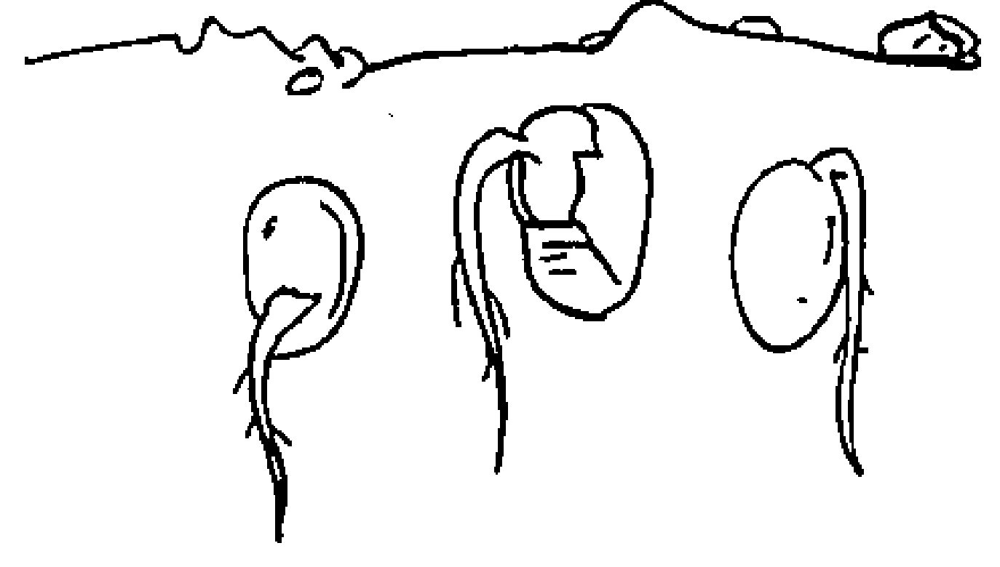

## 甲

草木开始破甲而出。

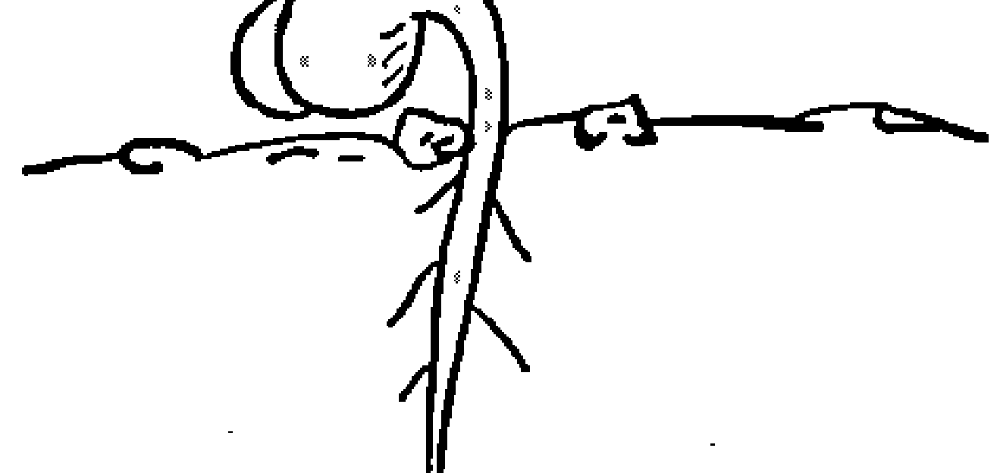

## 乙

虽已出壳，但未茁壮。

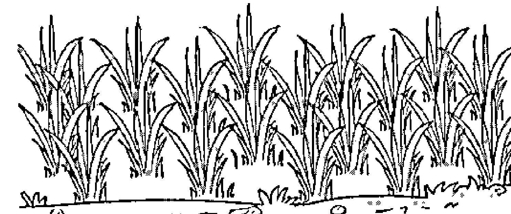

## 丙

万物炳然逐渐强大。

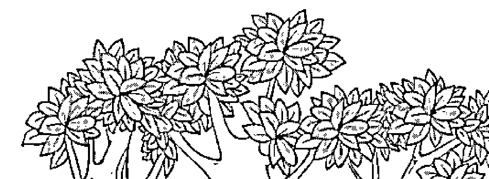

## 丁

万物茁壮之时。

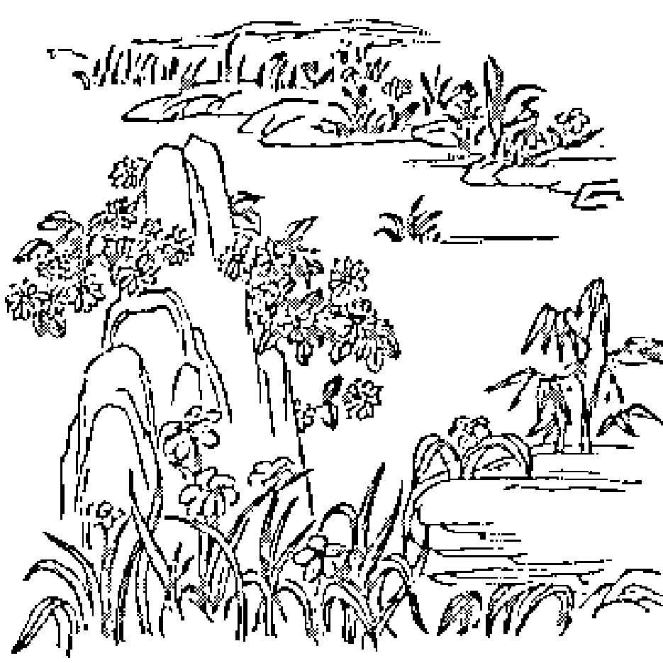

## 戊

万物茂盛。

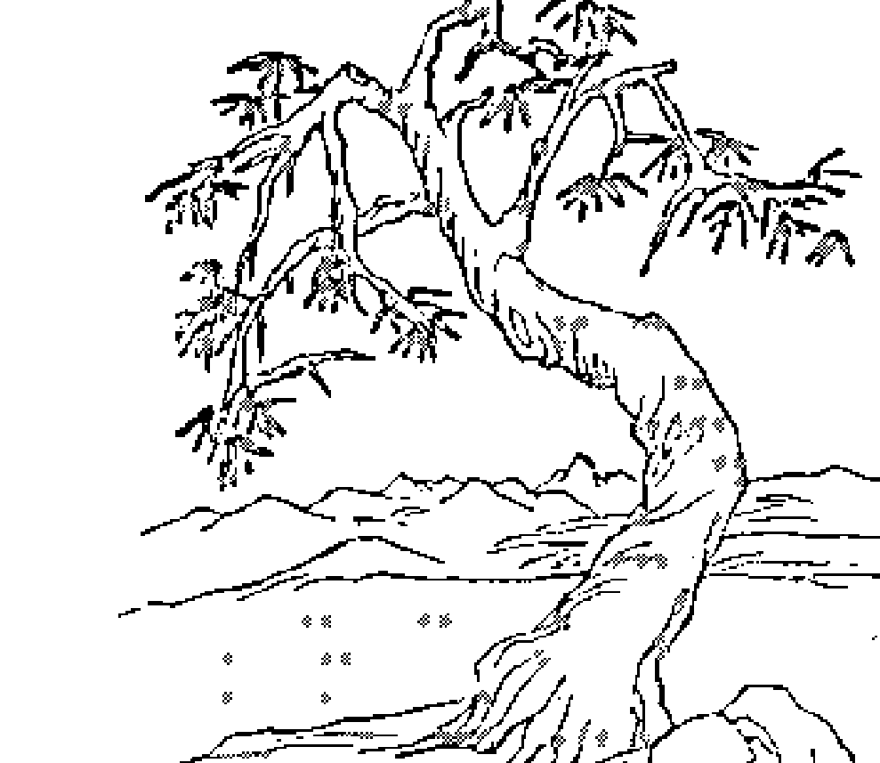

## 己

万物已成长起来。

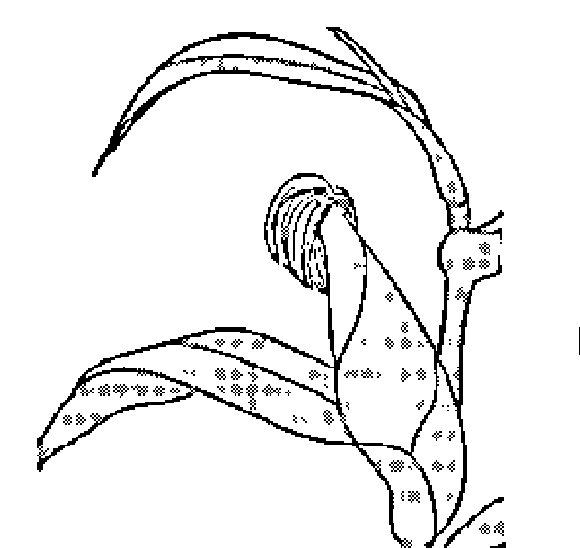

## 庚

果实开始被包覆。

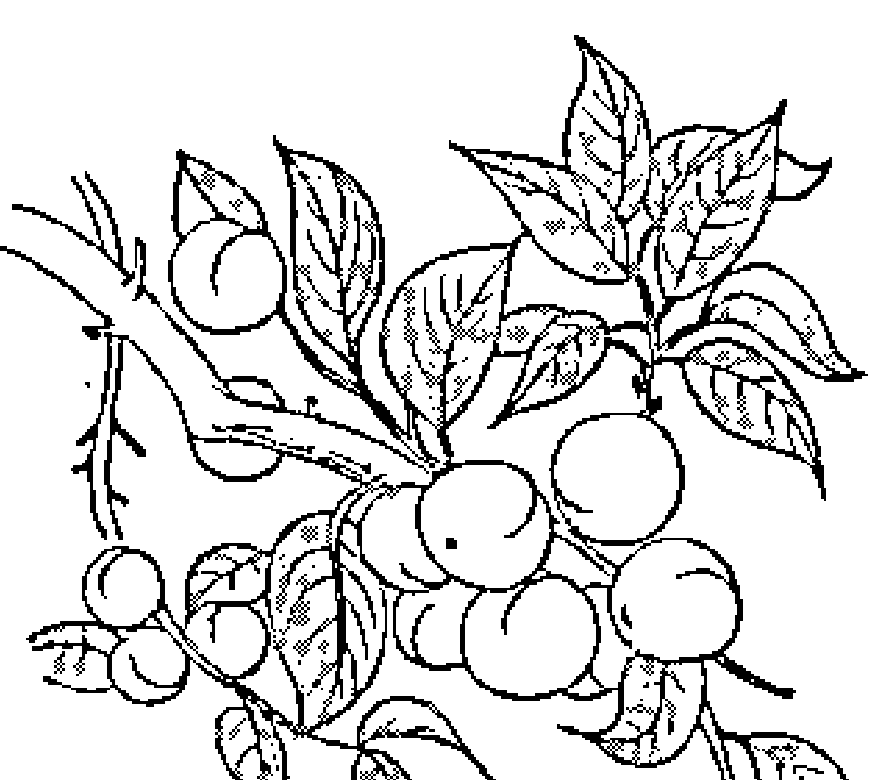

## 辛

万物果实新成。

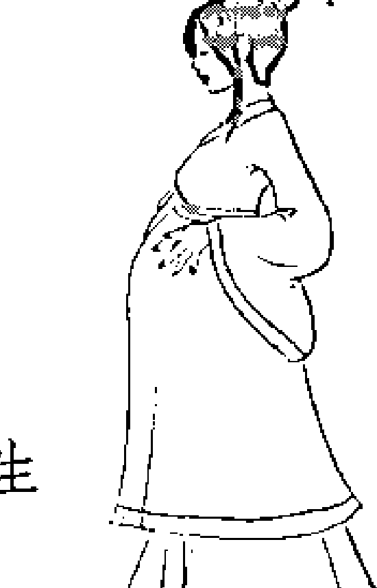

## 壬

种子成熟，生命开始孕育。

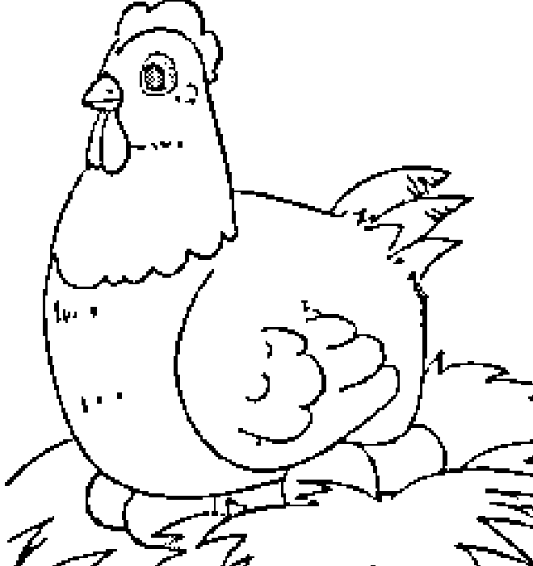

## 癸

幼胎经过蕴藏、掌理后，可以萌芽。

## ☯ 十二地支

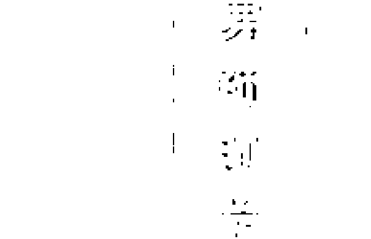

地支有十二个：子丑寅卯辰巳午未申酉戌亥。“子寅辰午申戌”为阳支，“丑卯巳未酉亥”为阴支。地支与地球的运动有关。地支的顺序也蕴含着事物的发展变化过程：

- 1. “子”就是“孳”，阳气萌发，万物滋生。
- 2. “丑”就是“纽”，万物扭曲而将要壮大。
- 3. “寅”就是“演”，万物开始生长。
- 4. “卯”就是“冒”，万物暂露头角。
- 5. “辰”就是“伸”，万物得以舒展延伸。
- 6. “巳”就是“已”，万物已成。
- 7. “午”就是“仵”，万物达到极盛，阳极阴生。
- 8. “未”就是“味”，阳气开始衰退。
- 9. “申”就是“身”，万物的果实开始成形。
- 10. “酉”就是“秀”，果实成熟。
- 11. “戌”就是“灭”，果实掉落入土。
- 12. “亥”就是“核”，果实的种子被收藏于土中。

## ☯ 地支的属性

| 地支 | 子 | 丑 | 寅 | 卯 | 辰 | 巳 | 午 | 未 | 申 | 酉 | 戌 | 亥 |
|---|---|---|---|---|---|---|---|---|---|---|---|---|
| 五行 | 水 | 土 | 木 | 木 | 土 | 火 | 火 | 土 | 金 | 金 | 土 | 水 |
| 阴阳 | ○ | ● | ○ | ● | ○ | ● | ○ | ● | ○ | ● | ○ | ● |
| 方位 | 北方 | 东北 | 东北 | 东方 | 东南 | 东南 | 南方 | 西南 | 西南 | 西方 | 西北 | 西北 |
| 四季 | 冬季 | | 春季 | | | 夏季 | | | 秋季 | | | 冬季 |
| 月份 | 11 | 12 | 1 | 2 | 3 | 4 | 5 | 6 | 7 | 8 | 9 | 10 |
| 属相 | 鼠 | 牛 | 虎 | 兔 | 龙 | 蛇 | 马 | 羊 | 猴 | 鸡 | 狗 | 猪 |
| 时辰 | 23点-1点 | 1点-3点 | 3点-5点 | 5点-7点 | 7点-9点 | 9点-11点 | 11点-13点 | 13点-15点 | 15点-17点 | 17点-19点 | 19点-21点 | 21点-23点 |

## ☯ 天干的特性

- 1. 甲为阳木，为东，纯阳之木，体本坚固，参天之势，又极雄壮；
- 2. 乙为阴木，为东，花草灌木，春如桃李、夏如禾稼、秋如桐桂、冬如奇葩，乃甲之质，而承甲之生气；
- 3. 丙为阳火，为南，纯阳之火，其势猛烈，欺霜侮雪，有解寒除冻之功，如太阳之火；
- 4. 丁为阴火，为南，火性属阴，较丙火而柔中，类似于灯烛之火；
- 5. 戊为阳土，为中，为高亢之土，比己土高厚刚燥，乃己土发源地，得中气而且正大；
- 6. 己为阴土，为中，田园之土，阴湿之地，中正蓄藏，贯八方而旺于四季，有滋生不息之妙用；
- 7. 庚为阳金，为西，为天上之太白，带煞而刚健，似秋天肃杀之气，如刀斧之金；
- 8. 辛为阴金，为西，人间五金之质，清润可观，似珠玉之金；
- 9. 壬为阳水，为北，癸水之发源地，如江河之水；
- 10. 癸为阴水，为北，纯阴之水，壬水之归宿，纯而至弱，其性柔势静，似雨露之水。

## 地支释义

地支为子、丑、寅、卯、辰、巳、午、未、申、酉、戌、亥，和天干一样，地支依顺序包含了万物从孕育、生长到繁盛、衰亡的过程。

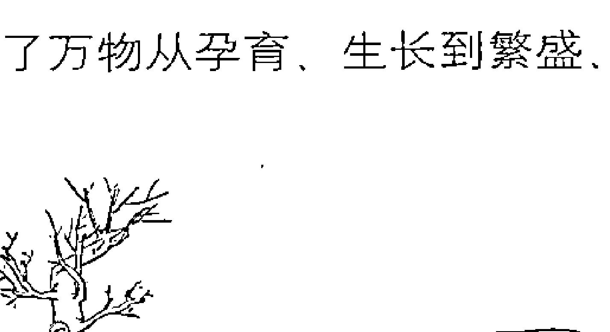

万物滋生。

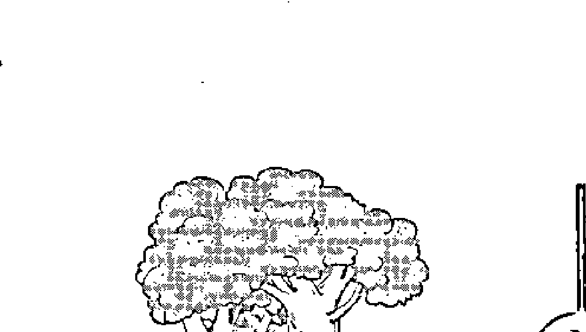

丰满壮大。

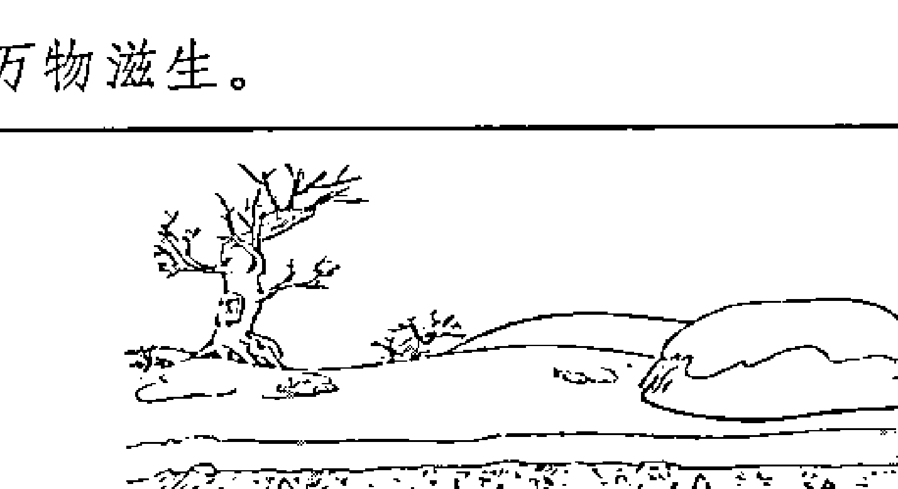

萌而系长。

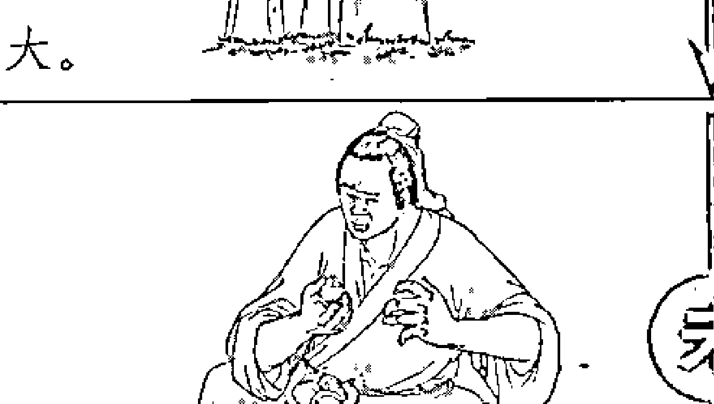

开始成熟有滋味。

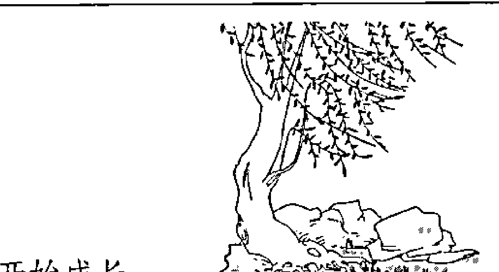

开始成长。


全部长成。


冒地而出。


老极而成熟。


万物欣欣向荣。


衰落灭亡。


万物已成。


万物收藏。


## 六十甲子

历法上用天干地支组合编排年号或日期，如：甲子、乙丑、丙寅……阳干配阳支，阴干配阴支，共有六十种组合，六十组轮回一次，称为“六十甲子”，这被用来循环纪年、纪月、纪日、纪时。

| 五行 | 组合1 | 组合2 | 组合3 | 组合4 | 组合5 | 组合6 |
| :---: | :---: | :---: | :---: | :---: | :---: | :---: |
| 金 | 甲子 乙丑<br>海中金 | 甲午 乙未<br>沙中金 | 壬寅 癸卯<br>金箔金 | 壬申 癸酉<br>剑锋金 | 庚辰 辛巳<br>白蜡金 | 庚戌 辛亥<br>钗钏金 |
| 木 | 壬子 癸丑<br>桑柘木 | 壬午 癸未<br>杨柳木 | 庚寅 辛卯<br>松柏木 | 庚申 辛酉<br>石榴木 | 戊辰 己巳<br>大林木 | 戊戌 己亥<br>平地木 |
| 水 | 丙子 丁丑<br>涧下水 | 丙午 丁未<br>天河水 | 甲寅 乙卯<br>大溪水 | 甲申 乙酉<br>井泉水 | 壬辰 癸巳<br>长流水 | 壬戌 癸亥<br>大海水 |
| 火 | 戊子 己丑<br>霹雳火 | 戊午 己未<br>天上火 | 丙寅 丁卯<br>炉中火 | 丙申 丁酉<br>山下火 | 甲辰 乙巳<br>覆灯火 | 甲戌 乙亥<br>山头火 |
| 土 | 庚子 辛丑<br>壁上土 | 庚午 辛未<br>路旁土 | 戊寅 己卯<br>城头土 | 戊申 己酉<br>大驿土 | 丙辰 丁巳<br>沙中土 | 丙戌 丁亥<br>屋上土 |

## 干支与阴阳五行的对应

干支最初是记录时间的符号，但在与五行、阴阳、时空等众多要素联系起来以后，就具有了表达万物运动规律的作用。

### 天干与阴阳五行


### 地支与阴阳五行


## 河图洛书

### 千古难解的“宇宙魔方”


河图与洛书是中国古代流传下来的两幅神秘图像，历来被认为是《易经》、阴阳五行乃至中华文明之源。太极、八卦、九星等术数学基本概念皆可追源至此。它被誉为“宇宙魔方”。

### “破译”河图洛书

河图洛书的来历被公认为中华民族文化之源的千古之谜。河图与洛书两个词最早记录在《尚书》中，在《易传》和诸子百家的著述中也多有记述。最有名的出处来自于《易传》中的“河出图，洛出书，圣人则之”一句话。但它们是什么样子，宋朝以前古籍文献一直未载，宋朝陈抟首次将失传两千多年的河图洛书及先天图、太极图传于后世，对此历代均有争议。陈抟画了《龙图易》，讲到“龙图三变”：一变为天地未合之数，二变为天地已合之数，三变为龙马负图之形，最后形成了河图洛书两个图。宋代象数学家认为八卦就是由这两个图推演而来的，从而在易学史上形成了用河图洛书解释八卦起源的“图书派”。

古往今来，人们“破译”河图洛书的观点众多，各执一词，如：它们是游牧时代的气候图、方位图；是天文星象图；是甲骨文；是易数矩阵；是史前文明遗留下来的遗物；是星外来客馈赠地球人的礼物……

1987年在河南出土了形意墓，它距今约6500年。此墓的星象图中便有河图。据考证，此图内容可上溯至25000年前，可以认为，那时的人们已精通河图洛书之数。这证明了邵雍认为的“河图乃上古星图”的结论。

### 河图

河图用十个黑白圆点表示阴阳、五行、四象。

- 北方：一个白点在内，六个黑点在外，表示玄武星象，五行为水。
- 东方：三个白点在内，八个黑点在外，表示青龙星象，五行为木。
- 南方：二个黑点在内，七个白点在外，表示朱雀星象，五行为火。
- 西方：四个黑点在内，九个白点在外，表示白虎星象，五行为金。
- 中央：五个白点在内，十个黑点在外，表示时空奇点，五行为土。

## 河图、洛书的各种图式

传说中，河图与洛书都是源自上古时期，在几千年的历史中，人们对它们的理解并不完全一致，各时代的古籍中所记载的河图洛书的图式也有很大的差别。这里选取三种图式供读者参考。

### 1. 刘氏河图、洛书

北宋刘牧称九宫图为河图，称十数图即五行生成图为洛书。见于刘牧的《易数钩隐图》及南宋朱震的《易卦图说》。


### 2. 蔡氏河图、洛书

南宋蔡元定称十数图为河图，称九数图为洛书，与刘牧刚好相反。蔡元定与朱熹合著的《易学启蒙》中对此作了详尽的解释。


### 3. 万氏河图、洛书

清代万年淳画出了一个外方内圆的河图图式和外圆内方的洛书图式，记载在他的著作《易拇》之中。


### 洛书

将河图四方的八个数旋转排成八方而为八卦，每方一个数纳地支十二气象，就是洛书。只是将火的2、7数与金的4、9数变换了位置，同时土5为中显用而寄八方，土10则不显而藏于用。变化之后为：载9履1；左3右7；4、2为肩；8、6为足。九个数纵横交叉，其和皆为15。

## 河图洛书起源之谜

古书对河图洛书的来历有七种不同观点：1.伏羲得河图，画八卦；2.黄帝得河图，作《归藏易》；3.尧帝得龙马图；4.舜帝得黄龙负河图，大禹得洛书；5.商汤至洛得洛书；6.文王受洛书、应河图；7.成王观河、洛，得龙图、龟书。围绕其来源，后世还有以下观点：河图洛书来源于道家炼丹养生术；来源于对天河即银河星象的观测；来源于对古气候、方位的观测；来源于北斗斗柄指向及由此而产生的古代历法；洛书起源于彗星的气体尾巴轨迹；河图源于《周易》“天地之数”，洛书源于《周易》。这些说法都是一家之言，未得到公认。

## 河图中的数理关系

- 1. 在河图中，除中间一组数（5，10）之外，纵向或横向的四个数字，其偶数之和等于奇数之和。纵向数字：7 + 1 = 2 + 6；横向数字：8 + 4 = 3 + 9。
- 2. 四侧或居中的两数之差相等。上（7 - 2）；下（6 - 1）；左（8 - 3）；右（9 - 4）；中（10 - 5），其差均为5。

## 洛书中的数理关系

- 1. 在洛书中，各个纵向、横向和对角线上的三数之和都为15。
- 2. 洛书四边每侧的三个数中，某两数之差为5：上（4 - 9 - 2），9 - 4 = 5；下（8 - 1 - 6），6 - 1 = 5；左（4 - 3 - 8），8 - 3 = 5；右（2 - 7 - 6），7 - 2 = 5。这反映出洛书与河图有着内在联系。

河图洛书是远古先人创造的一项数学成果。数理关系和对称性是河图洛书的基本特点。它构成了《易经》象数学派的数理基础。

## 河图与洛书

河图与洛书之间是有联系的，如果将河图四方的八个数旋转而排成八方，每方一个数纳地支十二象，就是洛书。


河图洛书历来被公认为是中华民族文化之源的千古之谜。河图与洛书两个词最有名的出处来自于《易传》中的“河出图，洛出书，圣人则之”一句话。但它们是什么样子，直到宋朝才被陈抟公之于世。


### 洛书方位


古往今来，人们“破译”河图洛书的观点众多，各执一词，如：它们是游牧时代的气候图、方位图；是天文星象图；是甲骨龟文；是易数矩阵；是史前文明遗留下来的遗物；是星外来客馈赠地球人的礼物……

### 河图方位


## 卦与爻

### 《易经》的基本单位

卦是为《易经》特定的占卜目的而排列成的符号，是《易经》的基本组成单位。而爻则是组成卦的元素，每卦六个爻，分为阳爻和阴爻，它们是构建《易经》理论大厦的砖瓦。


### 卦

学《易经》时，最先出现于面前的是卦的符号。“卦者，挂也”，卦是一种挂在我们眼前的现象，即：将物象悬出来以示人。卦以一符号代表万物，是“万象”之源。卦这个字本身有八画，代表的就是卦的八种基本表象。它由阳爻和阴爻按照一定规律分别组合，来说明自然界和人类社会变化规律的一切现象。

在《易经》中，三个爻可组成八卦，也叫经卦，象征天地间八种基本事物及其阴阳刚柔属性。八卦相互组合重叠组成六十四卦，也叫别卦，象征事物间更复杂的属性。

### 爻

爻可解释成“交”，代表万物时时都在变化、交流、交错。

卦爻由下向上数，共有六个。六个爻分为三部分：初爻、二爻为地；三爻、四爻为人；五爻、上爻为天。这三者称为“三才”。天之道说的是阴和阳，地之道说的是柔和刚，人之道说的是仁和义。

爻有两种，即阳爻和阴爻，阳爻以“——”表示，阴爻以“— —”表示。阴阳二爻象征由太极衍生的阴阳两仪。两个爻组合在一起，即象征两仪和合产生的四象。三个爻组合即构成八卦，八卦两两组合，即构成有六个爻的六十四卦。

虽然爻只有六个，但其变化无穷。六十四卦共有三百八十四爻，《易经》对每个爻都有不同的注释，而六十四卦又变化无穷，爻可以代表的意义就更为复杂。

## 卦与爻

《易经》共有六十四卦，每卦六个爻。六十四卦共有三百八十四爻，《易经》对每爻都有不同的注释。六十四卦变化无穷，爻可以代表的意义就更为复杂。


阴阳


六爻


## 八卦

### 构成世界的八种元素


八卦源于古人对宇宙生成、日月与地球的关系、农业社会和人生哲学的认识。它们代表了构成天地万物的八种元素。

古人在长期的生产实践中发现，用语言文字来表达思想是有局限的，于是圣人设计出卦象来表达自己对世界的认识，最后附以文字说明，形成一个完整的系统，目的是用有限的卦对应无限的世界和对世界的认识。他们把世界归纳为八种事物，分别由“乾、坎、艮、震、巽、离、坤、兑”八个卦来表示，它们也叫经卦或单卦。

宋代朱熹写了一首歌诀帮助人们记住八卦符号的模样：乾三连，坤六断，震仰盂，艮覆碗，离中虚，坎中满，兑上缺，巽下断。

八个卦中，乾卦代表天；坤卦代表地；离卦代表太阳，坎卦代表月亮，它们像球一样，不停运转，代表了时间、空间，时空不停地运转，于是又有四个卦产生了：震卦代表雷，雷震动以后，有了气流，就是风；巽卦代表风，气流震动得太厉害，一摩擦又会产生电，这就是“雷风相薄”；艮卦代表高山陆地；兑卦代表海洋河流。

### 乾坤为众卦父母

在八卦中，由乾坤二卦推出其余六卦，又由这八卦衍生出六十四卦，所以乾坤是阴阳的门户，众卦的父母。

## 八卦释义（1）

宇宙的现象可总结出八种，分别由“乾、坤、震、巽、坎、离、艮、兑”八个卦来表示。

| 卦 | 卦象 | 结构 | 代表 | 作用 |
|----|------|------|------|------|
| 乾 | 乾三连 | 全阳之卦 | 代表天 | 刚健起主导作用。 |
| 坤 | 坤六断 | 全阴之卦 | 代表地 | 顺应天，吸收一切能量而产生万物。 |
| 震 | 震仰盂 | 两阴爻在上一阳爻在下 | 象为雷 | 震万物而萌发。 |
| 巽 | 巽下断 | 一阴爻潜于二阳爻之下 | 象为风 | 无孔不入，能运载各种能量。 |
| 坎 | 坎中满 | 二阴爻在外一阳爻在中 | 象为水 | 险陷，水存低洼之处，有险。 |
| 离 | 离中虚 | 两阳爻在外一阳爻在中 | 象为火 | 明亮，美丽，如日照万物。 |
| 艮 | 艮覆碗 | 一阳爻在上二阴爻在下 | 象为山 | 为静止，事物发展到顶点必须谨慎。 |
| 兑 | 兑上缺 | 二阳爻在下一阴爻在上 | 象为泽 | 外虚内实，有喜悦之感。 |

### 卦象

### 万物皆可归入卦中

八个卦看似简单，但对应宇宙万物。《系辞》中的《说卦》将一些常见的事物纳入了八卦之中，这个归纳可以让人们“查表”获取答案，也为人们提供了一个参考模式和演绎思路。

乾，健也。坤，顺也。震，动也。巽，入也。坎，陷也。离，丽也。艮，止也。兑，说也。

乾为马，坤为牛，震为龙，巽为鸡，坎为猪，离为雉，艮为狗，兑为羊。

乾为首，坤为腹，震为足，巽为股，坎为耳，离为目，艮为手，兑为口。

乾，天也，故称乎父。坤，地也，故称乎母。

乾为天，为圆，为君，为父，为玉，为金，为寒，为冰，为大赤，为良马，为老马，为瘠马，为驳马，为木果。

坤为地，为母，为布，为釜，为吝啬，为均，为子母牛，为大舆，为文，为众，为柄，其于地也为黑。

震为雷，为龙，为玄黄，为施舍，为大道，为长子，为决断，为小青竹，其于马也，为善鸣，为左腿白色的马，为脚步快速的马，其于豕也，为反生。其究为健，为蕃鲜。

巽为木，为风，为长女，为绳直，为工，为白，为长，为高，为进退，为不果为臭，其于人也，为寡发，为多白眼，为近利市二倍，其究为躁卦。

坎为水，为沟渎，为隐伏，为弓轮，其于人也，为加忧，为心病，为耳痛，为血卦，为赤，其于马也，为美脊，为亟心，为下首，为薄蹄，为曳，其于舆也，为多凶，为通，为月，为盗，其于木也，为多坚心（坎卦阳爻在中间，相当木心坚硬）。

离为火，为日，为电，为中女，为甲胄，为兵戈，其于人也，为大腹，为鳖，为蟹，为蚌，为龟，其于木也，为科上槁（枝干枯的树木）。

艮为山，为路径，为小石，为瓜类果实，为看门人，为指，为狗，为鼠，为黔喙之属，其于木也，为坚多节。

兑为泽，为少女，为巫（多指占卜者或巫医），为口舌，为毁折，为附决（附在树枝上的果实），其于地也，为刚卤（水泽干枯后的坚硬的盐碱地），为妾，为羊。

## 八卦释义（2）

**乾**
乾卦代表天空、父亲、刚健有力

**坤**
坤卦代表大地、母亲、宽厚包容

**兑**
兑卦代表沼泽、少女、柔弱活泼

**艮**
艮卦代表山、少男、沉着稳重

**坎**
坎卦代表水、中男、阴险卑下

**离**
离卦代表火、中女、聪明好学

**巽**
巽卦代表风、长女、进退不决

**震**
震卦代表雷、长男、多动易怒

## 两种八卦

### 先天后天有差别

先天八卦是伏羲所创，揭示了宏观世界的规律，反映了宇宙、地球诞生初期的万物状态。后天八卦是文王创制的，反映的是自然界和人类社会的具体状况。

### 先天八卦

古人认为：宇宙万物没有形成以前是先天，有了万物就是后天。先天之气是万物生发之源，先天八卦包含的是天地生成之理、宇宙形成的大现象。由先天八卦演变而来的伏羲六十四卦也主要用于占卜世界的演变，这种演变是不以人的意志为转移的。如用于占卜国运的《皇极经世》，用的就是先天八卦。如果要占卜人事，推测一般事情的吉凶，则需依据后天八卦。

先天八卦是矛盾对立与统一的结合体，先天八卦图从乾到坤形成“天——地”的经线；从坎到离形成“水——火”的纬线，相对的两个卦的阴阳爻恰好相反，如：

-   天地定位：乾卦纯阳，坤卦纯阴，它们一南一北、一上一下，相互对峙。
-   山泽通气：艮为山居西北，兑为泽居东南。山与泽是相对立的两种事物。
-   雷风相薄：巽为风居西南，震为雷居东北，它们处于“相薄”的状态。
-   水火不相射：离为日居东，坎为月居西。水火不容，故一东一西。

### 后天八卦

后天八卦又称文王八卦，是周文王改造先天八卦而创制的。周文王在研究先天八卦的过程中发现它与实际有不符的地方，于是改变了方位，使其符合自然万物的变化规律。他还在卦中增加了数字九，同时多出了中土的位置。后人在实际应用中，大多以先天八卦为“体”，后天八卦为“用”。天干、地支、五行等要素都以后天八卦为依据。后天八卦图对应于洛书九宫图。

后天八卦表明的是万物在宇宙的大环境中的运动变化，描述的是日、月、地三者之间的联系规律，是以人、地作为中心来观察、描述宇宙的。它是从四时的推移、万物的生长收藏中得出的规律。从《说卦传》中可以看出，万物春生、夏长、秋收、冬藏，每周天360日，八卦各主45日，其转换点在四正四隅的八节上。每卦有三爻，八卦共二十四爻，即一年二十四个节气。

## 先天八卦和后天八卦

八卦分为先天八卦和后天八卦两种，先天八卦与后天八卦相辅相成，是古人演绎天地造化的完美符号。

### 伏羲与先天八卦

**伏羲** 传说他是上古三皇之一，受河图洛书的启发而画出先天八卦，又称伏羲八卦。

**先天八卦** 此图反映了宇宙诞生初期的万物，其中乾坤相对，称为天地定位；坎离相对，称为水火不相射；震巽相对，称为雷风相薄；艮兑相对，称为山泽通气。

### 周文王与后天八卦

**周文王** 他是商朝末年的西方诸侯王，相传他被囚羑里时，据先天八卦而演绎出后天八卦，又称文王八卦。

**后天八卦** 此图是从四时的推移、万物的生长收藏中得出的规律。

## 易的美学

## 六十四卦的多种排序

由八卦以不同的次序两两重合、就产生了六十四卦，也叫别卦或重卦。其中由八卦自身相叠所成的卦叫纯卦或单卦。历代学者对六十四卦有不同的阐发，六十四卦的排序也就有很多种。

## 六十四卦

太极生两仪，两仪生四象，四象生八卦，这在数学上是加一倍法；但从八卦重叠成六十四卦，是乘方法。周文王所著的卦辞就是解释这六十四卦的。朱熹在《周易本义》中作了《卦名次序歌》，有助于我们记忆六十四卦：

> 乾坤屯蒙需讼师，比小畜兮履泰否；
> 同人大有谦豫随，蛊临观兮噬嗑贲；
> 剥复无妄大畜颐，大过坎离三十备；
> 咸恒遁兮及大壮，晋与明夷家人睽；
> 蹇解损益夬姤萃，升困井革鼎震继；
> 艮渐归妹丰旅巽，兑涣节兮中孚至；
> 小过既济兼未济，是为下经三十四。

六十四卦起于乾坤两卦，是在“乾为天、坤为地，有天地然后有万物”思想指导下排列的。其他六十二卦的次序是以卦象相错的方法排列的，如第三卦的“水雷屯”与第四卦的“山水蒙”两个卦。此外，还有的卦按由小到大、由大到小的规律排列，这在《序卦》中有详细的论述。如“盈天地之间者唯万物，故受之以屯。屯者，物之始生也。”由于屯卦是万物开始生长的时期，所以排在第三位。“物生必蒙，故受之以蒙”：万物开始生长时期，先必有个萌芽的阶段，所以屯卦后为蒙卦。

六十四卦除了《易经》中起于“乾坤”终于“未济”的排序外，还有圆图排列，方阵排列，圆中布方的排列，以及八宫法的排列等。

## 六十四卦方圆图

《易经》有很多图，其中最重要的一幅就是六十四卦方圆图。按照排列的原则不同，六十四卦图有先天后天之分，先天图反映了事物的总体变化规律，后天图则反映了事物变化的具体规律。常用的先天图又称“伏羲六十四卦方圆图”，简称“六十四卦方圆图”。它包含了六十四卦的变化之妙，蕴涵了天地方位的变化之理。该图包含了先天八卦、六十四卦方位、河图、洛书等内容，以及日月五星的运行规律，十二纲纪、二十八宿也暗藏其中，它几乎囊括了《易经》的所有内容。

在方图中，西北至东南这条斜线被称为“子午线”，西南至东北这条斜线被称为“卯酉线”。方图从外向内由四层组成，每层沿子午线方向的对角两卦数字之和都是九，且卦象相反。一般认为，第一层乾坤相对，表示“天地定位”；第二层兑艮相对，表示“山泽通气”；第三层离坎相对，表示“水火不相射”；第四层震巽相对，表示“雷风相薄”。

圆图是一个天体运行图，也可以说是八卦的“历法”，它精确地说明了年月日和四季的运行规律。此图按照伏羲六十四卦大横图的次序排列，左半圆从午位以乾卦开始，复卦结束，逆时针排列到子位；右半圆从午位以姤卦开始，坤卦结束，顺时针排列到子位。以八纯卦为间隔共分八宫，正好形成先天八卦方位图。“金木水火土”五行依次运行而成春夏秋冬四季，配地支和二十四节气，便是一幅完整的天体运行图。易学大师陈抟极力推崇伏羲六十四卦方圆图，认为《易经》只有这一张图。

## 文王六十四卦卦序图

后天六十四卦图有很多种，其中以文王创造的图为重点。文王的六十四卦卦序包含着事物发生发展的顺序，可以用来预测人事。有学者认为，其中还包含着殷周时代的历史。文王六十四卦有一张圆图，但不载于《周易》中，该图载于道教典籍《周易参同契》中，“乾、坤、坎、离”四卦不计爻象。

## 八宫卦序

在古人对六十四卦的众多排序中，汉代京房的“八宫学说”独树一帜。八宫卦，又称“京房六十四卦”，与伏羲六十四卦、文王六十四卦都不同。它以八卦为八宫，八卦自身重复、逐爻变化而变出本宫的其他七卦。每宫八卦，八宫共六十四卦。这种排法属于后天八卦系统。依据八宫卦序可推知各爻的世爻和应爻，这是六爻预测的理论元素之一。八宫的各宫变化规律都相同，以乾宫为例来说明：六爻纯阳的乾卦，世爻在上九爻。其初爻变为阴爻后就便成了姤卦，因为初爻为变，所以姤卦的世爻为初爻，简称姤卦为“一世卦”，或“一世”。姤卦的二爻变为阴爻时，便形成了遁卦，因为此卦的变爻是根据姤卦变来的，变爻为二爻，所以世爻为二爻，简称“二世卦”，或“二世”。遁卦三爻变为阴爻时，便变成了否卦，其世爻为三爻，简称“三世卦”，或“三世”。变至四爻时，便变成了观卦，其世爻为四爻，简称“四世卦”，或“四世”。五爻及以下全是阴爻时便变成了剥卦，其世爻为五爻，简称“五世卦”，或“五世”。接下来若再往上变就变成了坤卦，不属于乾宫了。所以接下来返回而变第四爻，变成了晋卦。此时并没有变完，晋卦就好像正走在回家的途中一样，所以又叫“游魂卦”，此卦四爻为世爻。晋卦继续往回变第三爻，变成了大有卦，其世爻为三爻。至此已经变到了乾宫的结尾，大有卦也称“归魂卦”。

其他七宫的变化规律同理。这样，变化每宫首卦的初爻至五爻，再返变四爻，最后变三爻，就形成了京氏六十四卦的卦序。明白此规律后，熟记卦在各宫的排列顺序便可推算出每一卦的几爻为世爻，与世爻上隔两位的为应爻。世爻与应爻是断卦的重要因素，在后面的篇章中将介绍它们在六爻预测中的作用。

## 六十四卦方圆图

伏羲六十四卦方圆图实际上就是先天六十四卦卦序。古人以六十四卦卦序反映一年的阴阳二气变化。冬至一阳来，夏至一阴至。先天六十四卦主要反映事物总体的变化规律。

### 方图的卦序

六十四卦方图是先天六十四卦次序的倒图。图中，西北角至东南角是条斜线，以先天八卦的次序排列着八纯卦，这样就将六十四卦分成了两半，四层对角的卦象相反。

### 圆图的卦序

圆图的卦序就是先天六十四卦的排列次序，从乾卦开始逆时针排列一周而成圆形。乾一兑二离三震四逆行，巽五坎六艮七坤八顺行，将六十四卦分成了八宫。

此图简称方圆图或先天图。圆图为天为时间，方图为地为空间。事物总是由阴（坤）到阳（乾），由阳（乾）到阴（坤）周而复始地变化。事物的阴阳既对立（在圆图中以上下示之）又统一（统一在一圆内）。

## 囊括天人的宇宙图式

> 京房纳天干地支于六十四卦，并进一步配以贵贱、世应之说，将五行说落实到爻位，通过这些设置，京房将八宫六十四卦编织成为一种网状结构，从而与《序卦》的单向式线性思维结构相区别。

## 八宫六十四卦卦序

八卦根据用途不同，可以组成多种卦序。汉代京房发明的八宫卦序是重要的一种。其卦序与先天八卦和《易经》正文的卦序不同，列表如下：

| 首卦/卦变 | 八宫 | ☰乾 | ☳震 | ☵坎 | ☶艮 | ☷坤 | ☴巽 | ☲离 | ☱兑 |
| :--- | :--- | :--- | :--- | :--- | :--- | :--- | :--- | :--- | :--- |
| 一世卦 | 初爻变 | ☰上乾下巽<br>姤 | ☳上震下坤<br>豫 | ☵上坎下兑<br>节 | ☶上艮下离<br>贲 | ☷上坤下震<br>复 | ☴上巽下乾<br>小畜 | ☲上离下艮<br>旅 | ☱上兑下坎<br>困 |
| 二世卦 | 初、二爻变 | ☰上乾下艮<br>遁 | ☳上震下坎<br>解 | ☵上坎下震<br>屯 | ☶上艮下乾<br>大畜 | ☷上坤下兑<br>临 | ☴上巽下离<br>家人 | ☲上离下巽<br>鼎 | ☱上兑下坤<br>萃 |
| 三世卦 | 初至三爻变 | ☰上乾下坤<br>否 | ☳上震下巽<br>恒 | ☵上坎下离<br>既济 | ☶上艮下兑<br>损 | ☷上坤下乾<br>泰 | ☴上巽下震<br>益 | ☲上离下坎<br>未济 | ☱上兑下艮<br>咸 |
| 四世卦 | 初至四爻变 | ☰上巽下坤<br>观 | ☳上坤下巽<br>升 | ☵上兑下离<br>革 | ☶上离下兑<br>睽 | ☷上乾下震<br>大壮 | ☴上乾下巽<br>无妄 | ☲上艮下坎<br>蒙 | ☱上坎下艮<br>蹇 |
| 五世卦 | 初至五爻变 | ☰上艮下坤<br>剥 | ☳上水下木<br>井 | ☵上雷下火<br>丰 | ☶上风下泽<br>履 | ☷上泽下天<br>夬 | ☴上火下雷<br>噬嗑 | ☲上水下风<br>涣 | ☱上山下地<br>谦 |
| 游魂卦 | 上、四爻不变，其他爻变 | ☰上离下乾<br>晋 | ☳上兑下巽<br>大过 | ☵上坤下离<br>明夷 | ☶上巽下兑<br>中孚 | ☷上坎下乾<br>需 | ☴上艮下震<br>颐 | ☲上乾下坎<br>讼 | ☱上震下艮<br>小过 |
| 归魂卦 | 五爻变 | ☰上离下乾<br>大有 | ☳上兑下震<br>随 | ☵上坤下坎<br>师 | ☶上巽下艮<br>渐 | ☷上坎下坤<br>比 | ☴上艮下巽<br>蛊 | ☲上乾下离<br>同人 | ☱上震下兑<br>归妹 |

## 十二消息卦

在六十四卦中，有十二个卦较为特殊，人们称之为“十二消息卦”，它们的卦爻变化完美地体现了阴阳消长的规律。

## 十二消息卦

此图简明地画出了一年十二个月与十二地支、二十四节气的关系，并且与六十四卦对应起来。自复卦一阳生，至乾卦达到极盛而生出阴性，阴性又至坤卦达到极盛。

## 十二消息卦表

十二消息卦是用复、临、泰、大壮、夬、乾、姤、遁、否、观、剥、坤十二卦，分别依次代表一年的十二个月。

| 卦名 | 复 | 临 | 泰 | 大壮 | 夬 | 乾 | 姤 | 遁 | 否 | 观 | 剥 | 坤 |
| :--- | :--- | :--- | :--- | :--- | :--- | :--- | :--- | :--- | :--- | :--- | :--- | :--- |
| 卦象 | （阴爻阳爻图示） | （阴爻阳爻图示） | （阴爻阳爻图示） | （阴爻阳爻图示） | （阴爻阳爻图示） | （阴爻阳爻图示） | （阴爻阳爻图示） | （阴爻阳爻图示） | （阴爻阳爻图示） | （阴爻阳爻图示） | （阴爻阳爻图示） | （阴爻阳爻图示） |
| 月份 | 十一 | 十二 | 一 | 二 | 三 | 四 | 五 | 六 | 七 | 八 | 九 | 十 |
| 季节 | 冬 | 春 | 夏 | 秋 | 冬 |
| 阴阳变化 | 阴 → 阳<br>阳息阴消 | 阳 → 阴<br>阴息阳消 |

## 文王六十四卦圆图

文王六十四卦圆图又称“六十四卦火候图”，它是一个阴历牌，此图循环十二次便正好是一个阴历年，它载于道教典籍《周易参同契》中。

此图为阴历月的具体天数，是炼丹家择日修炼的依据。

此图三十卦表示白天的“火候”（丹道中的概念）。

此图三十卦表示夜间的“火候”。

此图最外面是“乾坤坎离”四卦，代表天地日月，其中“乾坤”为体，“坎离”为用。图中最内圈为月象的经纬。

## 爻位

## 卦的内在秩序

卦中六爻所处的位置称为爻位。在组成卦时，因为阴爻和阳爻处于不同的位置，命名和排列也有差异。这种差异体现了万物的多样性和变化性。

卦中的爻位表现出事物不断生长变化的规律。六个爻在卦中处在不同位置，其所象征的内容也不相同，以下是六爻的基本特征：

-   初爻代表事物的萌芽阶段，此时应以养精蓄锐为主；
-   二爻代表事物开始有了变化，此时要伺机而动；
-   三爻代表事物已经得到发展，但仍需小心谨慎；
-   四爻代表事物的发展又向前推进了一步，应审时度势、积极进取；
-   五爻代表事物已经达到了圆满成功的阶段，应该戒骄戒躁；
-   上爻代表事物发展到了尽头，小心物极必反。

1.  **天位、人位、地位**：《说卦》中有：“立天之道曰阴与阳，立地之道曰柔与刚，立人之道曰仁与义。兼三才而两之，《易》六画而成卦，分阴分阳，选用刚柔，故《易》六位而成章。”意思是：五爻六爻为天位，天之道说的是阴和阳；三爻四爻为人位，人之道说的是仁和义；初爻二爻为地位，地之道说的是柔和刚。另外，初、三、五爻分别为天、人、地之正位。
2.  **上位、中位、下位**：一卦之中的上爻为上位；上卦之中爻和下卦之中爻为中位；初爻为下位。
3.  **阴阳之位**：初爻、三爻、五爻为阳位，二爻、四爻、上爻为阴位。如果阳爻处在阳位上，阴爻处在阴位上，这样的情况叫“当位”，就像人所处的地位非常有利，是吉之象；反之则称为“不当位”，如阳爻居阴位、阴爻居阳位等，是不吉之象。
4.  **同位**：每一卦又都分成上下两个部分，称为外卦和内卦，或上卦和下卦。内外卦都有上、中、下的爻位。初爻居内卦之下位，四爻居外卦之下位，为同位。同理，二爻与五爻、三爻与上爻也为同位。如果同位爻以一阴一阳刚柔相配，比如二爻是阴爻、五爻是阳爻，或二爻是阳爻、五爻是阴爻，这样的搭配为吉，象征天地的阴阳协调、国家的君臣相应、家庭的夫妻和睦等。如果同位爻都是阳爻，或都是阴爻，则表示刚与刚对立，柔与柔对立，象征着上下不能和谐，为不吉。
5.  **贵贱之位**：唐朝李鼎祚在《周易集解》中说：“乾高贵五，坤卑贱二。”五爻是贵位，即天子之贵；二爻是贱位，即小人之贱。

### 爻的“中正”

所谓“中”，是指六爻卦中内卦的二爻与外卦的五爻，因为在中间，称为“中”，又称得中。所谓“正”，是指爻的奇数位为“阳”，偶数位为“阴”。如果在奇数位为阳爻，或在偶数位为阴爻，这时称做“正”、“得正”或“当位”。反之则为“失正”或“不当位”。

### “中”的内涵

### “正”的内涵

| 爻位 | 爻象 | 备注 |
| :--- | :--- | :--- |
| 上 | ▅▅ ▅▅ | 阴爻 |
| 五 | ▅▅▅▅▅ | 阳爻 |
| 四 | ▅▅ ▅▅ | 阴爻 |
| 三 | ▅▅▅▅▅ | 阳爻 |
| 二 | ▅▅ ▅▅ | 阴爻 |
| 初 | ▅▅▅▅▅ | 阳爻 |

右侧说明文字：“在卦爻中，奇数为阳，偶数为阴，阳爻居阳位，阴爻居阴位，为得正或当位。”

| 爻位 | 爻象 | 备注 |
| :--- | :--- | :--- |
| 上 | ▅▅▅▅▅ | 阳爻 |
| 五 | ▅▅ ▅▅ | 阴爻 |
| 四 | ▅▅▅▅▅ | 阳爻 |
| 三 | ▅▅ ▅▅ | 阴爻 |
| 二 | ▅▅▅▅▅ | 阳爻 |
| 初 | ▅▅ ▅▅ | 阴爻 |

右侧说明文字：“如果阳爻在阴位，阴爻在阳位，就为“失正”或“不当位”。”

### 六、刚柔之位：

1.  刚柔与尊位：每卦的第五爻是天位，是君王的位置，代表尊贵。阳爻处在第五爻的位置上，意味着阳居尊位。阴爻处在第五爻的位置上，则意味着阴居尊位。

2.  刚柔相争与相应：阴爻在阳爻之下，是柔者顺从刚者之象。如臣民顺从君王，妇女顺从男人等。阴爻在阳爻之上，是柔者欺刚之象，如臣欺君，女欺男等。卦中六爻，中间一爻为阳爻，上下五爻为阴，表示五柔维护一刚之态。

### 七、爻位的吉与凶：

《系辞》中说：“二与四，同功而异位，其善不同；二多誉，四多惧，近也……三与五，同功而异位，三多凶，五多功，贵贱之等也。”意思是：二爻与四爻虽然都为偶数并且都属阴柔，但它们在卦中的位置不同，即一个在内卦，一个在外卦，所以表现出不同的意义。“二爻”多赞誉，“四爻”多恐惧，因为“二爻”在下卦的中位，所以多赞誉；而“四爻”则在尊贵的五爻之下，时常会处在恐惧之中。“三爻”与“五爻”都为奇数且为阳刚，但位置不同。三爻在下卦的上位，是卑贱的位置，所以多凶险；而“五爻”在上卦的中位，是尊位，所以多吉利。

以上是卦爻的基本关系，爻位的详细性质在而后的章节中会有介绍。

### 卦爻吉凶的九个等级

《易经》六十四卦三百八十四爻各有不同，但经文对它们的吉凶做了概括性的判断，其断语按好坏程度分为九个等级，按顺序依次为：吉、亨、利、无咎、悔、吝、厉、咎、凶。

1.  “吉”是吉祥。
2.  “亨”是畅通、顺利。
3.  “利”是有益，适宜。
4.  介于吉凶之间的是“无咎”，咎是过错，无咎是平平常常，没有过错和咎害。“悔”与“吝”是“小疵”，都是小偏失、小凶害。但两者发展方向不同。朱熹说：“吉凶是两头，悔吝在中间。悔自凶而趋吉，吝自吉而趋凶。”
5.  “悔”是有过失而悔恨，能接受教训，可走向“无咎”。
6.  “吝”是羞辱，虽然不是凶，但不知羞辱会走向咎害。
7.  “厉”是危险，但吉凶未定，按卦爻辞的指示去做会化险为夷，反之则会由厉而致凶。
8.  “咎”是出了过失，要承担责任，比凶的后果要好一些，但免不了灾害。
9.  “凶”是凶恶，凶险，是最坏的结果。

《系辞》中认为，吉凶说明的是得或失；悔吝说明稍有弊病；无咎说明善于补救过失。《易经》卦辞中的吉、凶等预测未来结果的判断，大多是有条件的。只有注意到所限定的条件，才能得出正确的断语。

## 爻位中的秩序

在一个六爻卦中，爻所处的位置的不同造成六个爻之间有一些固定的秩序。

| 爻位 | 符号 | 含义 |
| :--- | :--- | :--- |
| 变之终 | ▬▬ | 功成身退，处虚无为 |
| 变之成 | ▬▬ | 大展宏图，处盛戒盈 |
| 变之动 | ▬▬ | 慎行审时，可试身手 |
| 变之通 | ▬▬ | 稳步前进，慎行防凶 |
| 变之显 | ▬▬ | 初步显现，适当进取 |
| 变之始 | ▬▬ | 潜藏勿用，静待时机 |

| 社会地位 | 官阶对应 |
| :--- | :--- |
| 宗庙位 | 太上皇 |
| 天子位 | 国君 |
| 诸侯位 | 一至三品 |
| 三公位 | 四至六品 |
| 大夫位 | 七至九品 |
| 元士位 | 百姓 |

> 爻位中的秩序反映了《易经》中“天尊地卑、男尊女卑、君尊民卑”的传统思想和严格的社会等级秩序。古人认为，没有秩序的社会将天下大乱，没有秩序的卦象也就不成为卦象。

### 承乘比应

### 卦的内部关系

“承、乘、比、应”反映的是卦爻之间的关系，承为承上、烘托；乘为乘凌、临下；比为比邻、比肩；应为对应、呼应。这四种关系会影响到吉凶的推断。

“承、乘、比、应”的关系是卦爻之间的基本规律，它在周易预测的一个分支《梅花易数》中应用较多。本书只作简单介绍。

### 承

“承”是承上、烘托之意。下爻紧承上爻叫“承”，多指阴爻上承阳爻，象征柔弱者顺承刚强者，或贤臣辅佐明君之意。“承”有三种情况：在六爻卦中，若一个阳爻在一个阴爻之上，则此阴爻对于上面的阳爻来说，称为“承”，以旅卦为例，卦中阴爻六五在阳爻上九之下，六五爻承上九爻，称“五承上”，所以《象》中说：“旅小亭，柔得中乎外而顺乎刚”；如果一个阳爻在上，几个阴爻在下，则下边几个阴爻对于这个阳爻来说，可称为“承”。以谦卦为例，阴爻初六、六二都在阳爻九三之下，初六、六二爻对九三爻来说，都称“承”，即初承三、二承三。有时，阴阳相同的两爻也可称“承”。

### 乘

“乘”是乘凌、居高临下之意。上爻乘凌下爻就叫“乘”。多指阴爻乘阳爻，称“乘刚”，象征臣下欺辱君主，小人乘凌君子，大多不吉善。但阳爻居阳爻之上则不为乘，而称“据”，认为此为正常现象。这反映出了《易经》的“扶阳抑阴”的思想。

“乘”有两种情况：一个阴爻在一个阳爻之上，则此阴爻对于下面的阳爻来说称为“乘”。以屯卦为例，六二、上六爻辞皆为“乘马班如”，震初爻，坎五爻皆为马，六二乘初九，上六乘九五，故有“乘马”之说。古人称之为“二乘初”，“上乘五”。另一种情况：几个阴爻都在一个阳爻之上，则这几个阴爻对于这一阳爻来说，称为“乘”。以震卦为例，初九阳爻之上有六二、六三两个阴爻，九四阳爻之上有六五、上六两个阴爻，叫“二乘初”、“三乘初”、“五乘四”、“上乘四”。由于爻位远近不同，乘的程度也不同，二爻、五爻乘近，三爻、上爻乘远。

### 承乘比应（1）

承、乘、比、应反映的是卦象内部相关两爻之间的关系。

### 什么是承

#### 承为承上、烘托之意

旅卦：
上九 ━━━━ 阳爻
六五 ━ ━ ━ 阴爻
……
一个阳爻在一个阴爻之上，此阴爻对上面的阳爻为“承”。

谦卦：
……
九三 ━━━━ 阳爻
六二 ━ ━ ━ 阴爻
初六 ━ ━ ━ 阴爻
一个阳爻在上，几个阴爻在下，下边的阴爻对于上面这个阳爻来说为“承”。

蒙卦：
六四 ━ ━ ━ 阴爻
六三 ━ ━ ━ 阴爻
……
有时，阴阳相同的两爻也可称“承”。

### 什么是乘

#### 乘为乘凌、居高临下之意

屯卦：
上六 ━ ━ ━ 阴爻
九五 ━━━━ 阳爻
……
六二 ━ ━ ━ 阴爻
初九 ━━━━ 阳爻
一个阴爻在一个阳爻之上，此阴爻对下面的阳爻称为“乘”。

震卦：
上六 ━ ━ ━ 阴爻
六五 ━ ━ ━ 阴爻
九四 ━━━━ 阳爻
六三 ━ ━ ━ 阴爻
六二 ━ ━ ━ 阴爻
初九 ━━━━ 阳爻
几个阴爻在一个阳爻之上，这几个阴爻对这一阳爻为“乘”。

“乘刚”也就是“乘”，指阴爻乘阳爻，象征臣下欺辱君主，小人乘凌君子，多不吉善。但阳爻居阳爻之上却不言乘，古人认为这是常理，可见《易经》的思想是扶阳抑阴的。

## 上篇

### 比

“比”指比邻，有亲近之意。相邻两爻有一种密切的关系，称为“比”。如初爻与二爻，二爻与三爻，三爻与四爻，四爻与五爻，五爻与上爻，都可称为“比”。若相邻两爻，一爻为阴爻，一爻为阳爻，则“比”而有情。反之，如果两爻都是阴或都是阳，则无相求相得之情。如中孚卦，六三爻“得敌”，三不当位，三四皆阴，失比，所以叫“得敌”。总之，阴阳相遇类似朋友，阳遇阳或阴遇阴，则容易为敌。

### 应

“应”是指上下卦爻对应的呼应关系。初爻与四爻，二爻与五爻，三爻与上爻之间，有一种同志联盟的关系，故称之为“应”。与“比”一样，“应”也强调阴阳相“应”。同性相斥，异性相感。若以柔应柔或刚应刚，则无相求相得之情。以既济卦为例，初九爻应六四爻，六二爻应九五爻，九三爻应上六爻，都为阴阳相应。而在艮卦中，初六爻与六四爻，六二爻与六五爻，九三爻与上九爻，皆柔应柔，刚应刚，被称为“无应”或“敌应”。多数卦都是以刚柔两爻相应，但也有的卦中的一爻与数爻有呼应关系。如“比”卦，九五为刚，其余五爻都为柔，是五柔应一刚之象，象征四方诸侯对王臣服。

### 错综复杂

卦爻之间有“承乘比应”的关系，而卦象之间则有“错综复杂”的变化。如果两卦各个位置上的爻的阴阳相反，就称它们互为“错卦”。把某卦旋转180度得到的卦就叫“综卦”。复杂就是“交互卦”，交卦是由一卦的“三四五”爻组成的卦，互卦是“二三四”爻组成的卦，互卦在下，交卦在上，它们又组成一个新的六爻卦。交互卦常被简称为“互卦”。六十四卦中的每卦都有错卦，但有八个卦没有综卦，它们是:乾、坤、坎、离、大过、小过、颐、中孚。乾坤两卦没有交互卦。

### 承乘比应（2）

### 什么是比

比为比邻、比肩之意

比卦
九五、六四：相比。
解释：相邻两爻，一爻为阴爻，一爻为阳爻，则“比”而友善。

中孚卦
六四、六三：失比，得敌。
解释：以刚比刚，或以柔比柔，则无相求相得之情，失比，故称“得敌”。

### 什么是应

应为相互对应

既济卦
上六、九五：相应。
六四、九三：相应。
六二、初九：相应。
解释：初爻与四爻，二爻与五爻，三爻与上爻之间，有一种同志联盟的关系，称之为“应”。“应”也强调阴阳相“应”。

艮卦
上九、六五：无应。
六四、九三：无应。
六二、初六：无应。
解释：若以柔应柔或刚应刚，则无相求相得之情，是为“无应”或“敌应”。

大多数卦都以刚柔两爻相应。但也有卦中的一爻与数爻有呼应关系的状况。如比卦，九五为刚，其余五爻皆为柔，是上下五柔应一刚之象，象征四方诸侯对王的臣服。

# 图解周易预测学

## 中篇

## 周易预测方法

《易经》衍生了众多预测术，但初学者往往不知哪种更适合自己。本篇第三章向你简单介绍其中常用的几种。第四章是本书的核心，重点介绍六爻法——周易预测学的核心理论与预测方法。

## 本篇内容提要

第三章 《易经》衍生的预测术和起卦法

第四章 六爻预测基础知识

## 第三章

## 《易经》衍生的预测术和起卦法

《易经》阐述的规律高度抽象，它衍生出的预测法众多，且互相之间纵横交错，渊源甚深。本篇向你介绍最常用的几种：六爻法、灵棋经、风水学、四柱学等，以及六爻法的三种起卦法。

## 最经典的预测术

### 六爻预测

古人对《易经》占卜非常重视，根据《易经》理论，后人衍生出了多种占卜方法。六爻预测是其中一个分支，但它以体系之完备、占法之便捷而深受人们重视，在民间广泛流传。

### 六爻法简介

六爻法的理论源于《易经》，但其方法最早产生于公元前50年的京房。京房是汉代著名的易学家，他以《易经》为基础，巧妙地将阴阳五行和天干地支纳入八卦，并根据十二地支与卦宫之间的相生相克关系，配上六亲，创立了六爻法的最初思路，其后经过历朝易学家的发挥，六爻法逐渐走向成熟。

六爻法需要将干支纳入八卦，所以最初又叫“纳甲筮法”。早期的六爻法主要在少数预测师中流传。到了宋代，署名为“麻衣道人”的《火珠林》问世之后，六爻法开始在民间传播。所以古人有时也将六爻法称为“火珠林法”。明清时期，六爻法发展到高峰，相关著作层出不穷。六爻法的名著有《黄金策》、《卜筮正宗》、《增删卜易》、《火珠林》、《断易天机》、《断易全书》、《海底眼》、《天玄断易》、《易隐》等。

六爻法的基本预测过程是：首先起卦，然后对所得之卦装配干支、六亲、六神、世应等元素，再结合所占之事取用神，然后观察当月、当日干支属性和其他五爻与用神的关系，以此做出吉凶和应期的判断。

### 六爻法简介

六爻法产生于两千年前的西汉，为京房所创，而后又被不断阐发、继承、发展，流传至今而长盛不衰。

#### 六爻法发展历程

-   #### 汉代
    -   创立理论
    京房以《易经》为基础，把阴阳五行和干支纳入八卦，并根据十二地支与卦官之间的生克关系配上六亲，创立了六爻预测的原始思路与方法。

-   #### 两晋
    -   走入迷途
    受到道教以及其他预测法的影响，人们在六爻法中加进了许多神煞，这使预测理论出现了混乱。

-   #### 宋代
    -   广泛传播
    一本署名为“麻衣道人”的《火珠林》问世之后，六爻预测法在民间得以广泛传播。因此，这种预测方法也被称为“火珠林法”。

-   #### 明清
    -   高峰时期
    六爻法达到高峰时期，这也是六爻专著创作的旺盛时期。神煞从六爻法中被删去。

#### 六爻预测的过程


```mermaid
flowchart LR
    起卦 --> 画卦 --> 装卦
    装卦 --> 静卦
    装卦 --> 动卦
```

-   装配项目：
    -   装配干支
    -   装配六亲
    -   装配世应
    -   装配六神
    -   装配卦身

-   分析步骤：
    1.  确定用神、忌神、元神
    2.  结合日月年进行判断
    3.  分析卦爻的相互关系

-   预测结果：
    -   预测吉凶
    -   判断应期

## 2.8亿种卦象

预测时，每一卦都只有六个爻，有人觉得从这样简单的表象中预测复杂的现实是无稽之谈。其实，稍作了解后，利用高中数学就可以依据以下关系算得惊人的数字：

-   1. 静卦共 64 种，每卦的变卦共 64 种。这两者是卦象的种类。
-   2. 年支和月支的组合共 144 种，日干支的组合共 60 种。这两者随摇卦的时间而变。
-   3. 六亲有 5 种，加上卦身和世应爻，共 8 种。这是断卦者选取用神的依据。

根据排列组合的运算法则，把以上要素相乘：64×64×144×60×8=283115520，约 2.8 亿种，这还没算入起卦的时辰这一因素。很多时候，年份也可以忽略，用此数除以 12，还有 2300 万种。用六爻法中仅有的几类要素解读这么庞大的种类，复杂程度可想而知。但这也从侧面反映出《易经》“化繁为简、以简驭繁”的神奇。

## “铁口直断”

古人是如何将卦象化繁为简的呢？——使用断语。在传统六爻理论中，有一些从社会伦理和民俗江湖中演化而来的分门别类的断语：“铁口直断”，它们会使某些卦断得非常准确，也会使某些卦断得毫不沾边。这严重干扰了预测的准确性，阻碍了后人的学习。其实，如果能熟练运用六爻法，每个人都可以作出新的断语。

“兄弟持世莫求财”“官鬼持世身不安”“财爻克世求必得”“久病逢冲必死”……这些断语言简意赅，它们的目的是使预测过程简便，但对它们的使用是有条件的。在古代常见的歌诀体著作中，条件都被隐藏了起来。细化条件是复杂的工作，那会使歌诀变为散文或论文，不符合古人追求形式美的思维方式和行文风格，也不符合他们保守的价值观。这样，后人学习歌诀时就容易误入歧途。如“久病逢冲必死”，若不考虑用神的旺衰、逢冲的是原神用神还是忌神仇神、逢冲的用神有无解救、久病是重病还是轻病……而一概按“久病逢冲必死”来论，被“断”死的人就太多了。再如“卦逢六合婚必成”，六合卦是测婚姻时的吉象，但它并不能代表此婚必然能成。是否可成还要看世应爻的旺衰、相合是生合还是克合、是否有合处逢冲……

### 2.8亿种卦象与“铁口直断”

根据排列组合的运算法则，卦象的组合共约2.8亿种。古人分析如此多卦象的经验大都用断语的方式流传下来，对今人来说，断语的价值要辩证性地取舍。

64 × 64 × 144 × 60 × 5 × 3 = 约2.8亿

### 断语及其使用条件

### 断语的利弊

追求隐晦、含蓄、形式美的歌诀是阻碍科学理论产生的重要因素，也是本书力求避免和超越的。

## 9 卦象何来？

动物靠本能预知外物的变化，趋吉避凶，如“洪前鼠慌”“震前蛄躁”。人类因为智慧和理性的发展而使这种能力退化了，但人类发明的预测术却弥补了这种不足。卦象，就是我国古人的独特发明。

为何思考一事时摇卦就可以得到与之对应的卦象呢？这涉及意念对物质的作用关系。意念包括人们固有的观念、短暂的想法、转瞬即逝的情绪、平稳少变的心境……因为情绪剧烈而短暂，以它为例更容易说明问题。当面对同一件事时，有的人会激动万分，有的人则会心静如水。激动会导致血液的流速和流向的变化，如：面红耳赤、脸色惨白，还可以导致肌肉筋骨的反射，如：失禁、抽搐……这些生理的变化是物质性的，而产生这些变化的原因则是意识性的。

与某些特异功能不同的是：造成这些变化的因和果都在人体之内，所以我们习以为常，不以之为奇；如果体内的意识造成的结果在体外，人们就会觉得有“神奇”的力量在主宰，比如仅凭意念就将茶杯移动位置的“冥想力”。所以，意识是否可以影响物质这个问题可以转化为：意识是否可以影响人体之外的物质？答案无疑是肯定的。在摇卦时，我们的意念直接决定了钱币呈现的正反状态，且这种能力是所有人都具备的。它相似于佛陀认为的“人人都具有佛性”。

## 9 卦象不准的原因

尽管人人都可以凭借摇卦预测事物，但不一定摇得的每卦都与实情完全对应。造成“错位”的原因主要有：

- 1. 卦象种类多：两亿多种卦象组合是断卦难以准确的根本原因；
- 2. 断卦者的能力和经验总会有局限，而前人的断语众多，让学习者无所适从；
- 3. 卦象不准确：这是由于问卦者“心不诚”造成的，它包括三种情况：问卦者对预测术持有怀疑态度；问卦者精神状态不佳、思绪杂乱；问卦者心中有几件不同的事要预测。

> > 古人认为：“卦不妄成，爻不乱发；一卦藏万机”

无论求测者的意念如何模糊混乱，他所摇卦中总会有可用的信息。如果断卦者功底扎实、经验丰富，仍可从复杂的关系中排除假象，提取真实信息。

### 卦象与意念的关系

为何思考一事时摇卦就可以得到与之对应的卦象呢？因为意念不仅可以影响体内的物质，同样可以影响体外的物质。

> 古人认为：“卦不妄成，爻不乱发；一卦藏万机”，无论求测者的意念如何模糊混乱，他所摇卦中总会有可用的信息。如果断卦者功底扎实、经验丰富，仍可从复杂的关系中排除假象，提取真实信息。

## 最古老的起卦法

### 揲蓍布卦

六爻预测的起卦法很多，最古老的是“揲蓍法”：用五十根蓍草来摆演出卦象。古人选取“蓍草”起卦，是取其久远而生生不老之意。

朱熹在《周易本义》对此法有详细描述：
从五十根蓍草中先抽出一根，停放一边，始终不用，以象征天地未开之前的太极。把余下的四十九根随意分开，分握于两手之中，左手象征天，右手象征地。从右手中抽出一根，夹在左手小指与无名指之间，象征人。放下右手中的蓍草，用右手数左手中的蓍草，每四根一数，象征四季，最后余下四根或四根以内，夹在无名指之间，象征闰月。再用左手数右手放下的蓍草，也是四根一数，最后剩下四根或四根以内，夹在中指与食指之间。小指中的一根与左右手数余下的蓍草，合起来肯定是九或五，这是第一变。
把第一次余下的九或五根除去，再把四十或四十四根蓍草，分握两手，从右手中取出一根，夹在左手的小指，然后分别每四根一数，左右手余下的加上小指的一根，一共是八或四，这是第二变。再把余下的三十二或三十六根蓍草，以同样方法数，余下的合计一定是八或四，这是第三变。
经过以上三变，得到一卦的第一爻。三变中，九和八为多数，五或四为少数。
三变中如果两多一少，即是九、四、八，九、八、四或九、四、四时为“少阳”符号为“——”。如果三变中两少一多，即五、四、八，五、八、四或九、四、四为“少阴”，符号为“— —”。三变都是少数，即五、四、四时，为“老阳”，符号为“O”，三变都是多数，即九、八、八为“老阴”，符号为“X”。摇卦时用上面的方法重复六次，便可得到六爻。
古人对待预测术很虔诚，特别是对神灵的膜拜和祈求更是如此。用揲蓍法获得的卦象非常准确，这来自于诚心诚意的祈求。它以繁琐的细节来拖延时间，换取内心的平静，使不存杂念的心灵能充分与天地交感，获得摇卦时最需要的“天人感应”。这种繁琐就是卦象准确的代价。

### 最古老的起卦法——揲蓍布卦

揲蓍布卦虽然不深奥，但摇卦过程太繁琐，古人以此进行预测的频率并不高。

事先准备好五十根蓍草。卜之前默念要问卦的事情。

在布卦之前，先要取出一根，只用其余四十九根。

把剩下的四十九根蓍草随意分成两堆，这叫做“分二”。

从其中一堆中取出一根夹在手指间，这叫做“挂一”。

将剩下的蓍草四个一组地数，这叫做“揲四”。

将每一堆余下的草放在一起，这叫做“归奇”。至此就完成了一变。

将在一变中挂一和归奇的蓍草除去，然后再把前面的步骤重复一遍。

按以上方法完成二变与三变。

画出完整的卦象，至此揲蓍布卦法全部完成。

### 以诚心取卦

古人在用揲蓍法布卦时，对占卜前的状态有复杂的、近似宗教仪式般的‘规矩’：

- 1. 占卜前一晚早睡，不做任何事。清晨早起头脑清醒，体力充沛是布卦的好时机。
- 2. 如厕后要洗手，饭后要漱口。
- 3. 晚上11点后不卜，因在两日交接之时，天地混沌未明，且精神疲倦。
- 4. 不可以玩笑或嬉戏的态度占卜。
- 5. 心未定不卜，心不诚不卜，赌博之事不卜。奸秽盗淫之事更不可卜。
- 6. 一事只一卜，不可反复请示。
- 7. 无事不要试卦。
- 8. 心意已决之事不卜，可凭借智慧做判断之事不卜。
- 9. 占卜的地方最好在干净整洁的书桌上。占卜时的思维不要受到外物的影响，所以不宜在闹市或卧室、厕所等环境中。

### “诚心”的真正含义

古人认为按以上规矩来做是尊重神灵。实际上，真正起作用的不是神灵，而是求卦者的潜意识。只要意念集中、真心诚意，钱币就会与摇卦者的心灵接通，并把信息准确地显示在卦象中。这种‘诚’包括如下含义：

- 一、摇卦者在预测之前必须确定有此事，不能假设或无中生有；
- 二、摇卦者不要对断卦者的能力或预测术本身持有成见、偏见或怀疑；
- 三、心诚才能意念集中，不受外界因素干扰。

### 有疑则卜，无疑则不卜

《易经》最根本的占筮原则是：有疑则卜，无疑则不卜。占筮原则直接影响到卜卦结果是否灵验，但怎样做才能灵验呢？这里有几条自古流传下来的注意事项。

占筮前一晚早睡，不做任何事。

如厕后要洗手，即净身（净口、净手）。

晚上11点后不卜，因在两日交接之时，天地混沌未明。

心未定或心不诚不卜、奸秽盗淫之事不卜。

一事只一占，今日占明日又占，如此即不灵。

惟挚诚可以感动神明，所以无事不要试卦。

心意已决、可以智慧判断之事不卜，借占卜术赌博，坐吃山空者不卜。

最好在神案或无杂物的书桌上进行，占卜之事，以简捷之词写在红纸上。

占卦须客观，且要心定，不受外物影响。

## 最简单的起卦法

### 金钱卦

用蓍草来布卦，通过三演十八变才得到一卦，不但浪费时间，还不易掌握。后来，人们化繁为简，以摇掷铜钱代替了蓍草布卦。这种“金钱起卦法”传说是战国奇人鬼谷子发明的。

### 金钱起卦法

取三枚相同的钱币合于双手中，上下摇动数下使钱币翻滚摩擦，再随意抛撒钱币到桌面或平盘等硬物上，这时会出现四种情况：

- 1. 三枚铜钱中有两枚正面向上，这是少阳之象，记做“——”，为阳爻；
- 2. 三枚铜钱中只有一枚正面向上，这是少阴之象，记做“- -”，为阴爻；
- 3. 三枚铜钱都是正面向上，这是老阴之象，记做“×”，为变爻，在主卦中是阴爻，在变卦中是阳爻；
- 4. 三枚铜钱都是反面向上，这是老阳之象，记做“○”，为变爻，在主卦中是阳爻，在变卦中是阴爻。

如此连续六次就得到了六个爻，可以构成一个完整的卦象。画爻时按从下到上的顺序排列。老阳和老阴被称为“动爻”，意为：变动之爻。动爻变化后得到的卦称为“变卦”或“之卦”，而开始摇出的卦称为“主卦”。“主卦”对应所测之事的开始，“变卦”对应所测之事的结局。因为动爻和变卦的存在，卦象变得更复杂。

### 六十四卦金钱课

还有一种用钱币摇卦的预测法：六十四卦金钱课。它的起卦法更简单，预测时也不需要学习，可直接查表得知吉凶。后人称之为“文王八卦”或“金钱课”。用这种方法只能获得笼统的初级信息，但因为过于简单，此法流传很广。

具体做法是：取六个相同的钱币，有数字的一面代表阳，记为“——”，另一面代表阴，记为“- -”。然后合掌将六个钱币摇摆数次，依次自右向左排开，再从本书附录中找出对应的卦象，以及断语。

《易经》演化的预测法众多，根据难度、复杂度、准确性的差异，古人将它们分为“上、中、下”三个层次，本书的核心内容“六爻法”属于中层，而“六十四卦金钱课”以及后面介绍的“灵棋经”属于下层。

### 化繁为简的金钱卦

用蓍草布卦浪费时间且不利于掌握。后人化繁为简，用摇钱币的方法取而代之，俗称“金钱卦”。另外，还有一种“金钱课”更简便，摇卦后可直接查表预测吉凶。

按顺序完成以上四步之后，便得到了一爻，记录方法如下。用同样的方法再摇五次，把结果从下到上排列开来，就得到了一个六爻卦。

### 六十四卦金钱课

“金钱卦”是众多起卦法中的一种，而“六十四卦金钱课”不仅是起卦法，还包括卦象断语。两者有很大区别。

## 多样化的起卦法

### 梅花易数

《易经》产生后，起卦方法与时俱进。继蓍草布卦和金钱卦之后，北宋的邵雍发明了灵活多样的起卦法：梅花易数，只要有数就可起卦，因此《梅花易数》也被称为“易经中的数学”。

《梅花易数》认为，数字、汉字、声音、方位、时间、地理、天时、人物、颜色、动植物等一切可感知的事物都可作为预测其发展趋势的依据，其理论核心是：任何事物都可以化为数，然后再以数起卦。

### 数字起卦法

数字起卦，可分为单位数和多位数两种起卦法，单位数起卦要加时辰作内卦。多位数一般一分为二，即分二段各除以八，并分别取余数作上下卦。逢奇位数时，数位少的一组作外卦，数位多的一组作内卦，以对应天清地浊、天轻地重、阳少阴多的自然法则。具体方法如下：

- 1. 单位数：单位数为外卦也就是上卦，加当时的时辰为内卦，也就是下卦，两数相加除以六为动爻（后文介绍）。
- 2. 两位数：十位数为上卦，个位数为下卦，十位数与个位数之和除以六求动爻。
- 3. 三位数：百位数为上卦，十位数为下卦，个位数除以六求动爻。
- 4. 多位数：位数为奇数时，少一位的前段各数之和求上卦，多一位的后段各数之和求下卦，总数之和除以六求动爻。位数为偶数时，前后段均分，前段各数之和求上卦，后段各数之和求下卦，总数之和求动爻。
- 5. 特殊数：如910，把910变成9+10，用9求上卦，用10求下卦，用9+10=19求动爻。如103，用10得上卦和下卦（为上下重卦），用3求动爻。

生活中所见的数字均可以用来起卦，如扑克牌、电话号码、车牌号码、书页号码等等，其起卦方法同数字起卦法。如扑克牌，可任意先取一张牌为上卦，以其数除以八，除不尽者取本数，有余数者按余数起卦；然后取一张牌为下卦，方法同前；两数相加除以六的余数为动爻。如电话号码：8523697，七位数，取前三位相加为上卦，取后四位相加为下卦，上卦为15，除以8余7，为艮卦；下卦为25，除以8余1，为乾卦，即得山天大畜卦。起卦时，凡得单数以上少下多，凡得双数为均分，均除以8取余数为卦；两数相加除以6的余数即为动爻。

### 数字起卦的方法

梅花易数，又名梅花心易。相传是北宋大儒邵康节先生观梅时，偶然看见麻雀在梅枝上争吵，以易理推衍成卦而得名。

> 数字起卦，大致可分为单位数和多位数两种起卦法，单位数起卦要加时辰作内卦。多位数一般一分为二，即分二段各除八，并分别取余数作上下卦。逢奇位数时数位少的一组作外卦，数位多的一组作内卦，以对应天清地浊，天轻地重，阳少阴多的自然法则。

### 数字起卦

- ① 单位数：单位数为外卦（上卦），加当时的时辰为内卦（下卦），两数相加除以六为动爻。
- ② 两位数：十位数为上卦，个位数为下卦，十位数与个位数之和除以六求动爻。
- ③ 三位数：百位数为上卦，十位数为下卦，个位数除以六求动爻。
- ④ 多位数：位数为奇数时，少一位的前段各数之和求上卦，多一位的后段各数之和求下卦，总数之和除以六求动爻。位数为偶数时，前后段均分，前段各数之和求上卦，后段各数之和求下卦，总数之和求动爻。
- ⑤ 特殊数：如910，用9求上卦，用10求下卦，用9+10=19求动爻。如103，用10得上下卦（重卦），用3求动爻。

我们在日常生活中凡所见数字均可以用来起卦，如扑克牌、电话号码、车牌号码、书页号码等等，其起卦方法类似于数字起卦法。

### 时间起卦法

时间起卦法也是梅花易数起卦法中的一种，它以某一偶发事件的年月日时作为起卦的依据。具体步骤如下：

1. 将偶发事件的年、月、日、时记下来（传统预测学的时间以农历为准，要对照公历与农历的时间，可参阅万年历）。
2. 将年支化成数字（查阅万年历找出该年的地支，如：午年起卦，午数为七；亥年起卦，亥数为十二，详见下表），再与月数、日数相加得到总数，将总数除以八，以所得余数为上卦。如果总数不满八，则直接以此数为上卦。
3. 将年、月、日所得总数加上时辰数（时辰数求法与年数相同，例如辰时为五、戌时为十一），再将所得总数除以八，余数为下卦。
4. 再以年、月、日、时的总数相加除以六，以余数为动爻。如此即得到本卦与变卦。
5. 求互卦：互卦的求法是将本卦的上下二爻去掉，以三爻、四爻、五爻为互卦的上卦：二爻、三爻、四爻为互卦的下卦。

金钱卦中可能没有动爻，也可能不止一个动爻，梅花易数起卦法中却固定只有一个动爻，因此动爻只可能单独出现在上卦或下卦。一般是以无动爻的三爻卦为体卦，有动爻的三爻卦为用卦。体卦代表预测者自己或所测事情的主体，用卦代表对方或对应的事情。

| 地支 | 子 | 丑 | 寅 | 卯 | 辰 | 巳 | 午 | 未 | 申 | 酉 | 戌 | 亥 |
|------|----|----|----|----|----|----|----|----|----|----|----|----|
| 数   | 1  | 2  | 3  | 4  | 5  | 6  | 7  | 8  | 9  | 10 | 11 | 12 |# 时间起卦的方法

时间起卦法，也是梅花易数起卦法中的一种，顾名思义，是以自己想测的事件配合年月日与时辰起卦的方法。

## 具体的起卦过程

将偶发事件的年、月、日、时辰记下来（传统命理学的时间皆以农历为准）。

将年支化成数字（可查阅万年历，找出该年的地支），再与月数、日数相加得到总数，除以八，所得余数为上卦。如果总数不满八，则直接以此数为上卦。

将年、月、日所得总数加上时辰数（时辰数求法与年数相同，例如辰时为五；戌时为十一），再将所得总数除以八，余数为下卦。

再以年、月、日、时的总数相加除以六，以余数为动爻。如此即得到本卦与变卦。

互卦的求法则是将本卦的上下二爻去掉，以三爻、四爻、五爻为互卦的上卦；二爻、三爻、四爻为互卦的下卦。

因为梅花易数起卦法中固定只有一个动爻，所以时间起卦法中的动爻只可能单独出现在上卦或下卦，一般断卦方法以不动者为体卦，有动爻者为用卦。

尽管以时间起卦简便迅速，但是断卦却需要多积累经验。也就是所谓的“运用之妙，存乎一心”。

## 方位起卦法

方位起卦法也是《梅花易数》中的起卦法，即直接根据人或物及其所在的方位起卦。方法是：“以物为上卦，方位为下卦，合物之数与方位之数，加时数取动爻。”

八卦配方位，均用后天八卦方位。比如某人从东方来，则配以震卦，因震在东方；从南方来则配以离卦，因离在南方。兑对应西方、坎对应北方、乾对应西北、艮对应东北、坤对应西南、巽对应东南。

《梅花易数》中有一个“老人有忧色占”的卦例：在乙丑日的卯时，即早上5点至7点，邵康节在路上行走，看见一位老人由巽方（东南方）来，且面带忧愁，问他因为什么事情而忧愁，老人回答说：“没什么忧愁。”邵康节感到很奇怪，于是起卦预测。老人为乾卦的卦象，便用乾卦作上卦，以巽卦作下卦，乾为天，巽为风，得天风姤卦。乾卦数一，巽卦数五，再加上卯时数四，共得十数，用十除以六，余四，九四爻动。《易经》天风姤卦的爻辞说：“包无鱼，起凶。”此条爻辞很不吉利，从卦象来看，天风姤卦巽木为体，乾卦金克木，互卦中又出现了两个乾卦，全都是金克木，体卦又无生助之气，况且被占测的人在路上行走，其应验是很快的。使用成数的十数，均分后取其一半，即是五。他对老人说：“你在五天之内，要谨慎小心，恐怕有重大灾祸。”果然在第五天，老人赴喜宴，因为鱼骨鲠喉而死。

方位起卦法中，依据人的情况是处于动中还是静中来决断事情的快慢。行走的人应验的时间快，用成卦的数除以二，取其半数作为应验的日期。坐着的人应验的时间慢，用成卦的数乘以二，作为应验的日期，站立的人应验的时间不快不慢。直接用成卦的数来定应验的日期。这种对时间的看法与爱因斯坦的相对论有相通之处。

## 测字起卦法

在梅花易数中，只要有数就可以起卦，汉字也可用来起卦。一个字至十个字皆可。

一字占：汉字可分为有偏旁的合体字与不可分割的独体字。对于独体字，以其笔画总数平均分之，若笔画为偶数，则各分一半，若为奇数，则以笔画少者为上卦，笔画多者为下卦。若属有偏旁的合体字，可大致分为左右型、上下型、内外型三类。

### 方位起卦的方法

方位起卦法，也属于梅花易数起卦法，即直接根据人或物及其所在的方位来起卦。其方法是：“以物为上卦，方位为下卦，合物之数与方位之数，加时数取动爻。”

| 物 | + 时辰数 |
| 方位 | ÷ 6 → 动爻 |

方位起卦法中的方位均是用后天八卦方位。

### 特别提示

方位起卦法的应验时间以人的状态来决断。行走的人时间短，用成卦的数除以二；坐着的人时间慢，用成卦的数乘以二；站立的人直接用成卦的数来定应期。

### 《梅花易数》中的卦例

乙丑日卯时（早上的5点至7点），邵康节在路上看见一位老人由巽方（东南方）来，且面带忧愁。

```
老人 上卦为乾
东南方 下卦为巽
(乾1 + 巽5 + 卯4) ÷ 6 = 4
九四爻动
天风姤卦
用卦 乾为金
体卦 巽为木
金克木
互卦 上乾 下乾
金克木
```

老人为乾，作上卦，东南为巽作下卦。得天风姤卦，乾一巽五卯四，除六余四，九四爻辞为“包无鱼，起凶”。巽木为体，乾卦金克木，互卦两个乾卦，全是金克木。老人在路上行走，把成卦的十均分，得五。在第五天，老人因鱼骨鲠喉而死。

如“判”、“搭”、“伴”等字，以左边的笔画数为上卦，右边的笔画数为下卦，再以总笔画数除以六，以余数为动爻数。如“雷”、“些”、“奇”等字，以上字笔画为上卦，下字笔画为下卦。如“国”、“因”、“问”等字，以外笔画为上卦，内笔画为下卦，总笔画数除以六的余数为动爻数。

## 二字占：

以第一字的笔画除以八，余数为上卦；以第二字的笔画除以八，余数为下卦。再以二字的总笔画除以六，以余数为动爻。如以“发财”二字占问财运，“发”字十二划，除以八余四，震木为上卦，“财”字十划，除以八余二，兑金为下卦。得本卦雷泽归妹，“发财”二字总笔画为二十二，除以六余四，四爻动，得变卦地泽临。上卦互卦坎水，下卦互卦离火。

## 姓名占：

以姓的笔画数除以八，余数为上卦；名的总笔画除以八，余数为下卦。再以姓名总笔画数除以六，得余数为动爻。如“江小海”，“江”字七划，不满八划，不必除以八，直接以七为上卦，故艮七为上卦。“小海”总共十四划，除以八余六，坎六为下卦。姓名总笔画二十一，除以六余三，三爻动，故可得本卦山水蒙，变卦山风蛊。上互卦坤地，下互卦为震雷。

## 四字占：

四字为四象，平分二字为上下卦，四字笔画相加除以六的余数为动爻。

## 五字占：

五字为五行，以前二字为上卦，以后三字为下卦，以五字相加除以六，除不尽之数仍取五为动爻，即五爻动。

## 六字占：

平分三字为上下卦，以六字为动爻，即六爻动。

## 七字占：

以前三字为上卦，后四字为下卦，以七数除以六的余数为动爻，即初爻动。

## 八字占：

平分四字为上下卦，以八数除以六的余数为动爻，即二爻动。

## 九字占：

以前四字为上卦，后五字为下卦，以九数除以六的余数为动爻，即三爻动。

## 十字占：

平分五字为上下卦，以十数除以六的余数为动爻，即四爻动。

## 十一字占：

十一字以上至于百字，皆均分其数以起卦，或以少一字者为上卦，多一字者为下卦，以两数相加除以六的余数为动爻。

## 测字起卦的方法

梅花易数起卦法的最大特色是只要有数就可起卦。因此，汉字也可用来起卦。一字二字三字，甚至多字皆可。

### 一字占

汉字可分为有偏旁的合体字与不可分割的独体字，所以测字起卦时必须先判断是独体字还是有偏旁的字。

### 二字占

测两个字的方法，是以第一字的笔画除以八，余数为上卦；以第二字的笔画除以八，余数为下卦。再以二字的总笔画除以六，以余数为动爻。下面以发财二字为例：

| | 计算过程 | 卦象 |
|---|---|---|
| 发 | 12 ÷ 8 = 4 余 0 -> 4为震卦 (上卦) | 震为雷 |
| 财 | 10 ÷ 8 = 2 余 2 -> 2为兑卦 (下卦) | 兑为泽 |
| 总 | (12+10) ÷ 6 = 3 余 4 -> 四爻动 | 雷泽归妹 (本卦) |
| 变卦 | 四爻动，归妹变临 | 地泽临 (变卦) |
| 互卦 | 取二三四爻为下互卦(离)，三四五爻为上互卦(坎) | 水火既济 (互卦) |

## 应该谨慎面对的“外应”

《梅花易数》中除了众多的起卦法外，还阐释了一组重要概念：三要十应。“三要”即耳、目、心；“十应”是十种可感应的外物，简称外应，包括：天时之应、地理之应、人品之应、行为之应、方位之应、生物之应、器物之应、言语之应、声色之应、文字之应。十应出于三要，但灵于三要。

外应是经验丰富的断卦者可走的捷径。可以把外应理解为“预兆”，它是未来的吉凶结果的“现在显像”。《梅花易数》中认为：事事相关，物物相应，如：“云开见日，事必增辉；烟雾障光，物当失色；二男二女，重婚之义；一僧一道，独处之端；乌鸦报灾，花鹊报喜；犬争恐招盗贼，鸡斗主有喧争……”

外应法在六爻预测中有很高的地位，被认为是“八卦悬象以示人”或“善易者不占”。后者常被认为是“高手不起卦也能准确预测”。这样的人确实存在，他们要么具有神通，要么在预测术上熟能生巧，可在心中快速起卦断卦，并准确利用外应。

### 外应的条件

1. 必须是正在摇卦时发生的事，而不是摇卦前或卦成之后；
2. 必须是无法预料的突发事件，如：正在摇卦时，突然打了一个雷；或突然有人破门而入；
3. 所发生的事件不论大小，必须引起了摇卦者或旁人的特别注意。

同时满足这三个条件的事件，可以认为是外应。外应具有客观性，但不是所有人都能驾驭。初学者对它的解读往往有很大的臆断性，过多地学习和使用外应会导致盲目和迷信。自从《梅花易数》问世后，历朝百姓对“外应”的重新定义和庸俗演绎让它成了封建迷信的重要来源。

六爻法经过千年的传承，不断得到完善和发展，成为术数王国的大宗之法，其内在机理有系统而严密的运算法则，使人有法可循。而《梅花易数》的机理远不如六爻法严密，只有第六感很强的人才能把握。对他们来说，《梅花易数》是易懂易学、操作简便的预测法，它也更能体现“大道至简”的规律。但正因为它“简”到了“法无定法”的程度，非常人能把握。我们应谨慎面对。

### 三要与十应

《梅花易数》中提出了“三要十应”的概念。“三要”即耳、目、心；“十应”是十种可感应的外物，简称外应。但对外应的使用非常人能把握，我们应谨慎面对。

### 三要与断卦

- **耳**：用耳朵听外界的声音，可依据其音色、音量、方向来断卦。
- **目**：用眼睛看外界的事物，可依据所观察之物的性状、位置、速度、方向来断卦。
- **心**：心不仅可以分析眼观耳闻之物，还可以凭借直觉进行第六感的判断。

### 外应的种类及其条件

- 必须是正在摇卦时发生的事。
- 必须是无法预料的突发事件。
- 此事必须引起摇卦者或旁人的特别注意。

外应具有客观性，但不是所有人都能驾驭。初学者对它的解读往往有很大的臆断性，过多地学习和使用外应会导致盲目和迷信。

## 简便的“查表”预测法

### 灵棋经

灵棋占法是易学各流派中较简单的一个支派，其著作《灵棋经》是中国唯一一部完整、系统地介绍古代杂卜的著作，内容涉及个人的身心健康、仕途官运、婚姻家庭、社会交往等。

### 《灵棋经》的始祖

黄石公是秦汉时期的思想家、军事家、文学家、政治家、神学家，被称为秦末汉初的五大隐士之一，排名第五，后来他被道教纳入神谱。他为了避秦世之乱而隐居东海下邳，并把一生的知识与理想倾注在笔墨上，著述颇丰。传说黄石公将灵棋占法传授给张良，后来由东方朔著《灵棋经》传承于世。在此之前，中国的卜筮工具都是带有灵气的自然物，如龟甲、蓍草、竹枝等，而灵棋占法所用之棋则是人工制造的。

### 简便而笼统的预测术

灵棋占法非常简单，卜具是单面刻有“上中下”不同字样的棋子，共十二枚，“上”四枚，“中”四枚，“下”四枚，不刻字的一面为镘。占卜时只需将十二枚棋子随意一掷，根据棋子的正反面和所刻之字即可成卦，再根据书中卦辞和注解判断吉凶。《灵棋经》卦象及概括性断语见附录。

占卜法大多很复杂，《灵棋经》则独辟新径，把具有无穷变化的预测结果简化为125卦。这些卦是固定和静止的，不像其他预测术有成千上万种变化。所以《灵棋经》的预测难度与六爻、四柱、六壬、太乙、奇门等术数相差甚远。但也正是因为它的卦象数量太少且没有变化，每一卦都具有很广的普适性，都可以对应众多事情。卦象对规律的高度概括使得它必须用含糊、抽象、类比、象征的语句来预测，诗歌也自然是其常用的表述方法。所以，灵棋占法只能预测到“吉、凶、适宜、不适宜”的程度，无法再深入下去。尽管如此，其断语的清晰和精细程度也远高于《易经》的卦辞爻辞。另外，后人还不断给其增加注释，使预测方向与结果更直接、浅显易懂。

对于生活中的很多事情，人们往往只需要知道其吉凶、成败、利弊、难易，而不需要知道过于复杂的细节。此外，很多人也没有时间或兴趣埋头研究复杂的预测术。灵棋占法的出现大大方便了人们对简单的占卜的需要。因此，它的受众面很广。这也是它历经千年却被完整地保留了下来的重要原因。

### 《灵棋经》卦例

占卜法大多很复杂，《灵棋经》独辟新径，把具有无穷变化的预测结论简化为125卦。大大满足了人们对简单的占卜的需要。

### 《灵棋经》正文体例

- 序号：第一
- 卦名：大通卦
- 系词：纯阳得令，乾天西北
- 棋型：一上一中一下
- 象名：升腾之象
- 象词：（象曰以下一段）
- 各家注解：（颜曰、何曰、陈曰、刘曰）
- 卦末断语：此课三位俱阳……
- 释卦歌诀：（诗曰以下诗歌）

1. 象名与卦名间有密切联系，如“升腾”和“大通”内涵近似；
2. 象词是经文原有的释词，以象作喻，说明事物变化的趋势，卜者可据此推测吉凶；
3. 注解主要是承接象词，阐发卦理，说明事物发展状况，及其依据何在；
4. 卦末断语，带有总释的意蕴，是对前人各注的总结升华。

### 《灵棋经》第一卦：大通卦

> 《易经》乾卦的卦评为：“纯阳刚正，万物始生”

潜龙飞升
本卦象喻示刚正君子走正道，将会像潜龙一样飞升上天，奋发作为，能得遇好时机，获得大成功。

### 以三为经，以四为纬

灵棋卜法一共十二颗棋子，有正反两面，模仿易经卦象的体系而做成。三在古代是天数，代表天；四指四方，代表地。十二棋子排列布阵，有经天纬地之意。

- 以三为经（主导）
  - 三种等级
    - 上为君
    - 中为臣
    - 下为民
  - 三才：天地人
  - 八卦之三爻
- 灵棋卦与易卦互为表里，它以棋上同一字的字数之奇、偶来分别代表卦爻的阳、阴。

- 以四为纬（辅佐）
  - 四象，四种象征四时、四方的动物
    - 青龙（东）
    - 白虎（西）
    - 朱雀（南）
    - 玄武（北）
  - 《易经》中的四象
    - 少阳（一）
    - 少阴（二）
    - 太阳（三）
    - 太阴（四）
  - 少与少为偶（吉象）
  - 太阴与太阳为敌（凶象）

### 灵棋占卜前的仪式

占仪就是占卜的礼仪、形式，它通过占卜前后的行为，表达卜者的虔诚的心态，也能帮助他们进入与“神灵”交流的状态，使占卜的结果更灵验。

### 占仪的程序

- 一、准备阶段：穿戴整齐，敬焚香烛；静坐排除杂念
- 二、前奏阶段：邀请“神灵”来听卜者祝祷之词
- 三、祝祷阶段：招集诸神，道出欲卜之事

- 将十二棋子一齐掷出，看上、中、下各出现几个，以此定卦象。
- 从卦象来看，三经为上中下，四纬为：少阳、少阴、老阳、老阴。以三为经，组成八卦图像。

- √ 诚则灵
- × 再卜无妨

## 人类的“居住法则”
### 风水学

“风水”是人们选择居住地点时对气候、地质、地形、生态、景色等环境因素的综合评价，以及对建筑技术和禁忌的总括。风水学是讨论“居住法则”的学科，它能教会人们如何寻找好的生存环境。

### 九、“风水”的基本含义

“风水”又称堪舆、卜宅、相宅、图宅、青乌、青囊、形法、地理等，最早的“卜宅”一词出现于《诗经》中。风水一词最早见于东晋郭璞所著的《葬书》，此书提出居住要选“藏风聚气”之地。后人尊郭璞为风水学鼻祖。

“风”指气流，“水”指水流。“气”是中国古代哲学的重要概念，也是风水学的重要组成部分。风水理论和方法都是围绕“聚气”这个问题而展开的。“藏风聚气”的基本要求是：地势北高南低、背阴向阳，北面要有高山，南面远处要有低伏的小山，左右两侧有砂山环抱，明堂要宽敞，并且要有曲水环抱。这是最理想的环境模式，而在实际应用时，后面的地势或建筑比前面的高，左边的地势或建筑比右方高，并且明堂开阔，就具备了“藏风聚气”的条件。

### 九、风水学的起源与流派

考古学家发现，人类最初的选址多发生在盆地、冲积扇平原、河阶台地、两河交汇处、湖中砂地、海滨等地区。这些地方大多向阳、避风、近水，物产丰富，能提供充足的粮食和饮水，适宜人类的生存和发展。这些对人类生活有利的地形被概括为“穴”，即“内敛型盆地”，它们是古人自发运用风水规律的典范。

后来，人们逐渐更理性地面对选址定居的问题，选址营建的经验日积月累慢慢变成了一门学问——风水学。风水学中有两大派：“峦头”派和“理气”派。简单来说，峦头指建筑物和家中器物的方向、位置等，即对“空间方位”的运用；理气指则与此相对，是对“时间”的运用。比如一间房屋出现了“尖角暗射”，这在空间（峦头）上不吉，但还要计算在时间（理气）上在哪段时间不好。所以，没有一个方位永远吉，或永远凶；在某个时间点上，也不会所有方位都吉或都凶。风水的吉凶是“轮流转”的。在实际操作时要先看峦头，后看理气。看理气时，划分吉凶的最基本时间单位是年，此外还有“元”“运”等。

理气派的可操作性强，它的分支众多，飞星派是理气派的重要分支，下面简单介绍一下飞星派的基本知识。

## 藏风得水的宝地

### 九大风水宝地

适合人类定居的地方，风水学称之为“龙穴”。在对不同的适合人类居住的地方进行考察之后，人们归纳出九种不同的风水宝地。

| 1. 冲积扇平原 | 2. 盆地 |
| 3. 高地之旁 | 4. 水源之滨 |
| 5. 绿洲 | 6. 河边肥沃的土地 |
| 7. 水中小岛 | 8. 河流交汇处 |
| 9. 海滨住地 | |


九宫飞星是风水学理气派中与八卦联系最紧密的理论。要了解飞星理论，首先要知道风水学中的时间单位：三元九运。

### ⊙ 三元九运

黄帝时用六十甲子为一个周期来推演历法，至今已轮回78次。古人将一个60年称为一元。元分上元、中元、下元，又叫三元。一元60年分3运，一运20年，所以三元180年共有9运，称为“三元九运”。当今的三元九运的年份为：

- 上元：一运1864—1883年；二运1884—1903年；三运1904—1923年；四运1924—1943年。
- 中元：五运1944—1963年；六运1964—1983年；七运1984—2003年。
- 下元：八运2004—2023年；九运2024—2043年。

### ⊙ 九宫飞星

每个运的数字都对应一个星，如“五运”对应“五黄土星”。共有九个星，称为“紫白九星”，包括：一白水星，二黑土星，三碧木星，四绿木星，五黄土星，六白金星，七赤金星，八白土星，九紫火星。其中，紫白为吉，碧绿黄黑为凶。

九星对应着洛书数字、后天八卦及其方位，其轨迹由洛书的中宫作起点，然后按照洛书的数字顺序“5 → 6 → 7 → 8 → 9 → 1 → 2 → 3 → 4 → 5”飞移，也就是按后天八卦的“中→乾→兑→艮→离→坎→坤→震→巽”顺序飞移。

### ⊙ 九星的吉凶属性

九星有别称、吉凶和五行属性，且每个星在得令和失令时都有相反的吉凶表现：

- 一白：贪狼星，吉星，五行属水，是官星和财星。得令时升官发财，失令时破财损家。
- 二黑：巨门星，凶星，五行属土，是病符星。得令时地位尊崇，失令时横祸破财，与五黄星并列为最凶之星。
- 三碧：禄存星，凶星，五行属木，是官讼星。得令时口才过人，失令时因官司破财招刑。
- 四绿：文昌星，吉星，五行属木，是才华星。得令时才华横溢，失令时有酒色之祸。
- 五黄：廉贞星，凶星，五行属土，得令时最为尊贵，失令时家破人亡。
- 六白：武曲星，吉星，五行属金，是偏财星。得令时人财两旺，失令时倾家荡产。
- 七赤：破军星，凶星，五行属金，得令时口才过人，利于通讯，失令时有血光之灾或口舌是非。
- 八白：左辅星，吉星，五行属土，得令时可得功名富贵，失令时失财丧命。
- 九紫：右弼星，吉星，五行属火，是喜庆星和爱情星。得令时利于建设，失令时损财有灾。


### ## 得令与失令

九星的吉凶首先取决于它们的本质属性，也就是上面的解释：四个星为吉，五个星为凶。而九星是否“得令”则是对这种本质属性的抑制和发挥，是变化性的因素。

是否得令是九星的旺衰的依据：九星按时间的变化先后飞入中宫，进入中宫之星既是“当运之星”，它执掌号令统管全局，又称“当令之星”。在整个星盘中，它居中为正，气势最强，可对整个星盘发生生克作用，也影响各个方位的气运。与它最接近的是即将成为旺星的“未来之星”，它即将入中当令，所以星气稍次于当令之星，也为吉星。如：当“七”为“当令之星”时，“八”就为“未来之星”；而从“一”到“六”的星都为“失令星”或“退运星”，它们的吉凶程度可分三类：一是刚从中宫退出之星，虽失去旺气但也未产生凶气，如同“虎死余威在”，处于不凶不吉状态。二是离中宫较远之星，这种星恢复了凶残的本性，又称为煞星。三是离中宫最远之星，这种星到了不受管制的边缘地带，可以为所欲为，从而带来灾祸。概括来说，就是：当运者旺，将来者相，已过者衰，过久者死。

根据九星在宫中的位置及其五行属性，以及它们的得令情况，便可以知道一间屋子在哪个卦象方位和时间上时会出现哪些特征，以及这个方位对应的家中之人的情况等。时间有年月日等众多单位，其中年和运是最重要的，可根据某运某年的星位来做家中器物的调整。

### ## 近年的星运

2004至2023年行的是“八白土星”运，在这20年内，八白星飞到的方位称为得令，处在这些方位的人或物为吉。在2004年之前的“七运”中，由于七赤星得令，所以歌唱、演艺、传媒等行业蓬勃发展。随着七运的退下，2004年以后，歌唱事业开始走下坡路，歌星不再像以前那样叱咤风云。七赤星本是凶星，但由于在七运中得令，所以凶险的部分隐藏了起来，但在转入第八运的时候，七赤星中的刀光剑影、瘟疫疾病等凶险成分就要爆发出来，也就是2003年的世界战争和非典疫情。

### 八卦在理气派中的运用（1）

九宫飞星是风水学理气派中与八卦联系最紧密的理论。下图是后天八卦与洛书九宫、方位、五行、脏腑、家人的对应关系图，以及洛书数字固定的飞转循环方向。

### 九宫八卦


在此图中，举例来说：震卦代表长子，所以家中东面的摆设会对长子造成影响；如果九星中的“一白星”在东方，受影响的也是长子，此星得令则长子吉，失令则长男凶。

### 九宫飞星方向


> 在九宫中，每个数字都不是固定不变的，它们会随着运、年、月、日、时等时间单位的变化而变化。这种变化的轨迹是固定的，即按照此图中箭头的方向流动。

### 八卦在理气派中的运用（2）

九星共有六种星盘：60年大运盘、20年小运盘、年运盘、月运盘、日运盘、时运盘。本页中所列的是2004至2023年的“八白土星”小运，也就是通常所说的“八运星盘”。

### 2004至2023年的小运盘


八白星属土，土是财星，所以在这20年中要有所作为需要财力的支持。如果有雄厚的经济基础，可以像滚雪球一样吸纳丰厚的回报。另外，土对应地产、美容等行业，所以此运中这些行业会兴旺起来。

## 学易而知天命

### 四柱学


四柱学又称八字学、四柱命理学，它从唐朝产生至今，已有1400年的历史。作为术数中的重要一种，四柱学也与九宫八卦有联系。将八字纳入九宫中，与八卦方位对应起来，便可以此作为时空点的数理模型来预测万物。

四柱学将人出生的“年月日时”的干支分列为“四柱”，共八个字，结合阴阳五行、十神、神煞、纳音五行等元素，分析命局八字与大运、流年、流月之间的作用关系，以此推测人的生老病死、吉凶祸福、贫富贵贱、婚姻家庭……

四柱学和六爻法使用的基本元素大体相同，但在测人生命运时，四柱学更详细准确；在测短期而具体的事情时，六爻法更快捷准确。两者所用的阴阳五行的根本理论是相同的，但四柱学兼顾干支的作用，六爻法则只以地支论事。两者中的一些概念是各自独有的，在方法的运用上也有差异，不能混淆。

### 四柱学的发展过程

汉朝以前，人们只依据年来算命，比如甲子或乙丑年出生的人为金命。这种粗浅方法是四柱学的萌芽。汉朝时出现了以阴阳五行、天干地支为基础配合年月日推断命理的方法，但不成体系。唐朝的李虚中是四柱学的里程碑式人物，他的《李虚中命书》以人出生的年月日的干支配成三柱推测命运，他也被后人尊称为四柱学鼻祖。宋初的徐子平在年月日后加了时辰，将三柱变为四柱，他的《渊海子平》是四柱学的划时代著作。明朝出现了张神峰的《神峰通考》、万民英的《三命通会》等。清朝沈孝瞻的《子平真诠》、任铁樵所注的《滴天髓》也为经典著作。

### 四柱组合的总数量

四柱学中，年月两柱的组合共有720种，日时两柱的组合也共有720种，大运有顺排和逆排2种，所以四柱命局有

```
720×720×2=1036800
```

，约100万种，这是人的先天命运、内在品质，是人在完全不受外因作用的情况下的命运总数。流年和流月的组合也有720种，所以“命局大运+流年流月”的组合共有

```
1036800×720=746496000
```

，约7.5亿种。命运是内外因相结合的产物，这个数字是先天命运与后天环境作用后得到的。但这个量还不包括流日在内，因为流日相对次要，可以忽略。用几个字来解读如此庞大的种类，其复杂度可想而知。

### # 四柱学的发展历程

四柱学是哲学与自然科学融贯而成的一门学科，从唐朝发展至今，它经过不断发展，已经形成了完善的理论体系，对中国人的生活产生了重大影响。

### ## 四柱学的五个时期

| 发展阶段 | 种子期 | 萌芽期 | 始创期 | 完善期 | 繁盛期 |
| --- | --- | --- | --- | --- | --- |
| 朝代 | 汉朝之前 | 汉朝 | 唐朝 | 宋朝 | 明清 |
| 代表人物和著作 | 无 | 无 | 李虚中《李虚中命书》 | 徐子平《渊海子平》 | 张神峰《神峰通考》<br>万民英《三命通会》<br>余春台《穷通宝鉴》<br>沈孝瞻《子平真诠》<br>任铁樵《滴天髓》 |
| 核心内容 | 以年来推命，如甲子或乙丑年出生的人为金命，丙寅或丁卯年出生的人为火命。 | 以阴阳五行、天干地支为基础配合年月日推断命理，但不成体系。 | 以人出生的年月日的干支配成三柱推测命运，李虚中以此成为四柱学鼻祖。 | 在年月日之后又加上了时辰，将三柱变为四柱，使命理学发生了一次飞跃。 | 四柱学在明代发展到鼎盛时期，理论著作如雨后春笋般涌现，清代时又得到进一步发展。 |

### ## 四柱组合的总数量


命运是内外因相结合的产物。内因是八字与其衍生出来的每十年一变的大运共同构成的；外因是由流年流月，以及相对次要的流日构成的。这与人们常说的先天遗传因素和后天环境因素有相似之处，但不完全一样。


### 四柱排盘简介

用四柱学进行预测，首先要“排盘”。得知一个人出生的“年月日时”，将其对应的理论元素排列出来，叫“排盘”。排盘前需要获知三种信息：一、出生的具体时间，最好精确到分钟；二、出生地点的经度；三、当事人的性别。古人计算时间用地方时间，而如今中国则用统一的北京时间。地方时间是根据太阳在一天中的位置来确定的，而北京时间则是人造的，这就导致两种时间的换算，知道当事人的出生地经度，就可以进行这种换算。换算后的时间被称为“真太阳时间”。如果不进行这种转换，时辰这一“柱”可能会排错。如：某人在北京时间11：10分出生于内蒙古包头市，此时包头的地方时间是10：27。11：20是午时，而10：27是巳时，四柱学取后者。古人学习排盘时要记忆很多知识，个别信息还需要查表。而今天，我们只需要把上面三类信息输入到排盘的网站上就可以立即完成排盘。

### 预测的重点：十神

每个人的生辰包括“年月日时”四个部分，称为：年柱、月柱、日柱、时柱，每一柱又分为天干和地支，所以共有八个字。每个字都有固定的阴阳和五行属性，它们之间的作用关系可以分为十种：正印、偏印（枭神）、正财、偏财、食神、伤官、比肩、劫财（羊刃）、正官、七杀（偏官），统称“十神”。四柱预测以它们为根本。

四柱中，日柱的天干（简称日干）较特殊，可以把它理解为“核心”，代表“我”，其他所有干支都是与它作用后得到的“十神”属性。

天干的阴阳属性：“甲丙戊庚壬”为阳干；“乙丁己辛癸”为阴干。天干的五行属性：甲乙为木，丙丁为火，戊己为土，庚辛为金，壬癸为水。

- 1. 生我者为印枭：异性相生为正印，同性相生为枭神；
- 2. 我生者为食伤：异性相生为伤官，同性相生为食神；
- 3. 同我者为比劫：同性相助为比肩，异性相助为劫财；
- 4. 克我者为官杀：异性相克为正官，同性相克为七杀；
- 5. 我克者为财：异性相克为正财，同性相克为偏财。

如：某人四柱排盘中，其日干戊土是阳土，月干己土是阴土，它们五行相同，阴阳相反，所以己土是戊土的“劫财”；年干的戊土和日干的戊土相同，所以为“比肩”；时干的丙火为阳火，所以为日干戊土的枭神。

### 十神与地支藏干

十神是四柱学中的重点，也是难点。它体现了天干之间的十种关系。地支的十神属性要从其所藏的天干中来判断，藏干以本气为主，中气和余气为辅。

### 十神与“我”的关系


### 天干的属性

| 天干 | 甲 | 乙 | 丙 | 丁 | 戊 | 己 | 庚 | 辛 | 壬 | 癸 |
| :--- | :--- | :--- | :--- | :--- | :--- | :--- | :--- | :--- | :--- | :--- |
| 五行属性 | 木 | 木 | 火 | 火 | 土 | 土 | 金 | 金 | 水 | 水 |
| 阴阳属性 | ○ | ● | ○ | ● | ○ | ● | ○ | ● | ○ | ● |

### 地支藏干及其力量

| 地支 | 子 | 丑 | 寅 | 卯 | 辰 | 巳 |
| :--- | :--- | :--- | :--- | :--- | :--- | :--- |
| 地支藏干 | 癸 | 己 癸 辛 | 甲 丙 戊 | 乙 | 戊 乙 癸 | 丙 戊 庚 |
| 力量百分比 | 100 | 60 30 10 | 60 30 10 | 100 | 60 30 10 | 60 30 10 |

| 地支 | 午 | 未 | 申 | 酉 | 戌 | 亥 |
| :--- | :--- | :--- | :--- | :--- | :--- | :--- |
| 地支藏干 | 丁 己 | 己 丁 乙 | 庚 壬 戊 | 辛 | 戊 辛 丁 | 壬 甲 |
| 力量百分比 | 70 30 | 60 30 10 | 60 30 10 | 100 | 60 30 10 | 70 30 |

### ⑨ 地支藏干

以上是日干与其他天干的十神关系，而日干与地支的十神关系则较复杂。因为每个地支中都藏着一个到三个天干，其十神属性要根据这些藏着的天干来确定。如果某地支中只藏一个天干，称其为本气，藏两个则分为本气和中气，藏三个则分为本气、中气和余气。如果一个地支中兼有本气、中气和余气，本气的力量占六成，中气占三成，余气占一成；如果一个地支只有本气和中气，本气占七成，中气占三成；如果只有本气，则本气占十成。四柱学的复杂与地支藏干有重大关系。

### ⑨ 排大运和流年

排完八字后，就可以排“大运”了。大运以月柱为起点，分为顺排或逆排。年干为阳干的男性顺排、女性逆排；年干为阴干的女性顺排、男性逆排。大运十年一变，人的第一步大运有一个起始的年龄，在一岁到十岁之间。其排法从略。

每个大运包括十年。大运排完后，就要排它们包括的“流年”了。流年又称太岁，是纯客观的因素，查万年历可知，每一年的流年是固定的，所有人共用，这是它与八字和大运的重要差异。如果说八字是纯粹的内因，大运兼有内因和外因的性质，流年则是纯粹的外因。

流年排完后，可以把日干在八字和大运中的旺衰推断出来，也就是日干五行寄生的“长生十二宫”。其方法在第四章会介绍。依据日干在十二宫的旺衰可以进行辅助性预测。古人预测四柱时还会用到“纳音五行”和“神煞”。纳音五行的数量是五行的六倍，其作用关系更为复杂；神煞只是简单的符号，且偏离了五行生克制化的大道，往往被今人弃用。

将以上元素都纳入“盘”中，四柱排盘就基本完成了。而后，根据干支五行之间的生、克、合、冲、刑、墓等作用关系，可以作出详细的预测。

八字终生不变，是一个人的内因和固定性的属性；大运每十年一变，是变化性的属性。八字就是常说的“命”，大运就是常说的“运”，“命运”就是不变性和变化性的统一。

### 八字排盘举例

排盘是四柱预测的前提，它相对简单，四柱学之难就在于排盘后的分析。因为参考因素过于繁杂，各种关系交错纵横，预测越细致的事情的难度就越大。下面以某人的排盘举例：

性别：男  出生地：内蒙古包头市  经度：东经110度0分
公历：1900年1月1日11时10分  真太阳时间：1900年1月1日10时27分

| 十神 | 天干 | 地支 | 本气 | 中气 | 余气 | 旺衰 | 纳音五行 |
|---|---|---|---|---|---|---|---|
| 正财 | 己 | 亥 | 壬 枭神 | 甲 比肩 | | 长生 | 平地木 |
| 食神 | 丙 | 子 | 癸 正印 | | | 沐浴 | 涧下水 |
| | 甲 | 戌 | 戊 偏财 | 辛 正官 | 丁 伤官 | 养 | 山头火 |
| 正财 | 己 | 巳 | 丙 食神 | 戊 偏财 | 庚 七杀 | 病 | 大林木 |

| 大运 | 乙亥 | 甲戌 | 癸酉 | 壬申 | 辛未 | 庚午 | 己巳 | 戊辰 |
|---|---|---|---|---|---|---|---|---|
| 旺衰 | 长生 | 养 | 胎 | 绝 | 墓 | 死 | 病 | 衰 |
| 纳音 | 山头火 | 山头火 | 剑锋金 | 剑锋金 | 路旁土 | 路旁土 | 大林木 | 大林木 |
| 始于 | 9岁 | 19岁 | 29岁 | 39岁 | 49岁 | 59岁 | 69岁 | 79岁 |
| 始于 | 1908 | 1918 | 1928 | 1938 | 1948 | 1958 | 1968 | 1978 |
| 流年 | 戊申 | 戊午 | 戊辰 | 戊寅 | 戊子 | 戊戌 | 戊申 | 戊午 |
| | 己酉 | 己未 | 己巳 | 己卯 | 己丑 | 己亥 | 己酉 | 己未 |
| | 庚戌 | 庚申 | 庚午 | 庚辰 | 庚寅 | 庚子 | 庚戌 | 庚申 |
| | 辛亥 | 辛酉 | 辛未 | 辛巳 | 辛卯 | 辛丑 | 辛亥 | 辛酉 |
| | 壬子 | 壬戌 | 壬申 | 壬午 | 壬辰 | 壬寅 | 壬子 | 壬戌 |
| | 癸丑 | 癸亥 | 癸酉 | 癸未 | 癸巳 | 癸卯 | 癸丑 | 癸亥 |
| | 甲寅 | 甲子 | 甲戌 | 甲申 | 甲午 | 甲辰 | 甲寅 | 甲子 |
| | 乙卯 | 乙丑 | 乙亥 | 乙酉 | 乙未 | 乙巳 | 乙卯 | 乙丑 |
| | 丙辰 | 丙寅 | 丙子 | 丙戌 | 丙申 | 丙午 | 丙辰 | 丙寅 |
| | 丁巳 | 丁卯 | 丁丑 | 丁亥 | 丁酉 | 丁未 | 丁巳 | 丁卯 |
| 止于 | 1917 | 1927 | 1937 | 1947 | 1957 | 1967 | 1977 | 1987 |

四柱学衍生于《易经》，它追求阴阳平衡、五行中和、有生有泄、有助有克的“制衡”状态，这体现了儒家的中庸思想。四柱学是易学与社会伦理结合最紧密的一门预测术。

## 八字与洛书九宫

八字是一个人出生的时间点，只是凭借“干支纪年”法被记录为“八字”的形式而已。将这个时间点纳入九宫八卦，便可以反映出那一时空状态下的其他事物。

### 八字与洛书的关联：太极点

#### 太极点=干支序号总和

将八字纳入洛书九宫需要增加一个元素——太极点，它对应于洛书的“中宫”。求法如：将“己丑 癸酉 甲子 己巳”这个八字干支的数字相加：6+2+10+10+1+1+6+6=42，再用此数加1，就得到了太极点的数字43。在六十甲子周期表中，43对应丙午。“丙午”就是这个八字的太极点。

| 天干 | 甲 | 乙 | 丙 | 丁 | 戊 | 己 | 庚 | 辛 | 壬 | 癸 |
|------|----|----|----|----|----|----|----|----|----|----|
| 序号 | 1  | 2  | 3  | 4  | 5  | 6  | 7  | 8  | 9  | 10 |

| 地支 | 子 | 丑 | 寅 | 卯 | 辰 | 巳 | 午 | 未 | 申 | 酉 | 戌 | 亥 |
|------|----|----|----|----|----|----|----|----|----|----|----|----|
| 序号 | 1  | 2  | 3  | 4  | 5  | 6  | 7  | 7  | 8  | 9  | 10 | 11 | 12 |

### 六十甲子周期表

| 01 甲子 | 11 甲戌 | 21 甲申 | 31 甲午 | 41 甲辰 | 51 甲寅 |
|---------|---------|---------|---------|---------|---------|
| 02 乙丑 | 12 乙亥 | 22 乙酉 | 32 乙未 | 42 乙巳 | 52 乙卯 |
| 03 丙寅 | 13 丙子 | 23 丙戌 | 33 丙申 | 43 丙午 | 53 丙辰 |
| 04 丁卯 | 14 丁丑 | 24 丁亥 | 34 丁酉 | 44 丁未 | 54 丁巳 |
| 05 戊辰 | 15 戊寅 | 25 戊子 | 35 戊戌 | 45 戊申 | 55 戊午 |
| 06 己巳 | 16 己卯 | 26 己丑 | 36 己亥 | 46 己酉 | 56 己未 |
| 07 庚午 | 17 庚辰 | 27 庚寅 | 37 庚子 | 47 庚戌 | 57 庚申 |
| 08 辛未 | 18 辛巳 | 28 辛卯 | 38 辛丑 | 48 辛亥 | 58 辛酉 |
| 09 壬申 | 19 壬午 | 29 壬辰 | 39 壬寅 | 49 壬子 | 59 壬戌 |
| 10 癸酉 | 20 癸未 | 30 癸巳 | 40 癸卯 | 50 癸丑 | 60 癸亥 |

找到太极点的干支后，将其安装在洛书的中宫位置，再根据后天八卦安装八字，其法则为：乾宫＝年干；坤宫＝年支；震宫＝月干；巽宫＝月支；坎宫＝日干；离宫＝日支；艮宫＝时干；兑宫＝时支。

## 八字与先天、后天八卦

先天八卦与后天八卦可以用来预测不同的事情。将八字纳入洛书九宫可以预测微观的人事情况，纳入河图则可以预测宏观的宇宙演化。

### 后天八卦与洛书相配

### 先天八卦与河图相配

### 洛书对应的后天八卦方位

| 巽 | 离 | 坤 |
| :---: | :---: | :---: |
| 震 | 中央 皇极 | 兑 |
| 艮 | 坎 | 乾 |

### 河图对应的先天八卦方位

| 兑 | 乾 | 巽 |
| :---: | :---: | :---: |
| 离 | 中央 太极 | 坎 |
| 震 | 坤 | 艮 |

### 洛书对应的八字方位

| 月支 | 日支 | 年支 |
| :---: | :---: | :---: |
| 月干 | 太极点 | 时支 |
| 时干 | 日干 | 年干 |

### 河图对应的八字方位

| 时支 | 年干 | 月支 |
| :---: | :---: | :---: |
| 日支 | 太极点 | 日干 |
| 月干 | 年支 | 时干 |

八字与九宫八卦搭配的易学模型是今人的创新。可将它当做气象模型来推算天气；当做风水模型来推算风水；当做国家模型来推算国运；当做一个事件模型来推算其状况；当做人的出生时间推算其命运……

## 第四章

### 教你用六爻进行预测

六爻法中的常用名词有70多个（见附录），它们是判断2000万到2.5亿种卦象的原件。卦象虽多，但解读它们的理论却容易掌握。作为本书的核心，本章将分别阐释这些理论。

## 六爻预测的基础

### 学会纳甲

纳甲分为纳干与纳支。将十个天干与八卦中的爻对应起来，就是纳干；将十二地支与八卦中的爻对应起来，就是纳支。

### 悠久的纳甲法

纳甲法将八卦、六十四卦、五行、天干地支等结合，利用它们之间微妙的关系进行预测。简言之，就是在六十四卦的六爻上配以天干地支、五行，使每卦每爻都有了干支五行属性。五行之间的关联因此而更密切，干支具备的比阴阳更广泛的属性也转移到了卦与爻上，大大丰富了卦与爻的内涵。

纳甲法从汉代一直延续到现在，除了京房、虞翻、魏伯阳之外，扬雄、葛洪等人也对它作了重大改进，使此法成为古代最著名的占卜法之一。纳甲法虽然名目繁多，但最主要的只有两派，即京房纳甲法和虞翻纳甲法。京房纳甲法将六十四卦分为八宫，配上五行和天干地支。虞翻纳甲法则根据月亮在一个月之内的圆缺变化得出的纳甲规则。我们常用的是京房纳甲法。

### 京房纳甲法

京房将八卦划分为八宫。“乾震坎艮坤巽离兑”称为“八纯卦”，并以乾坤为“父母”，各统领三男三女。其中，“乾震坎艮”四卦为阳卦，“坤巽离兑”四卦为阴卦，每一卦统领六十四卦中的七个卦，除了以自己为每宫的本卦外，还有“一世”至“五世”、“游魂”、“归魂”卦。

## 两种纳甲法

我们现在用的纳甲法是西汉易学家京房根据《易经》创造的，虞翻等人的纳甲法则不多用。纳甲法是《周易参同契》中的内丹修炼法和《火珠林法》的重要依据。

### 京房纳甲法

|       | 本卦 | 一世 | 二世 | 三世 | 四世 | 五世 | 游魂 | 归魂 |
| ----- | ---- | ---- | ---- | ---- | ---- | ---- | ---- | ---- |
| 乾宫 | 乾   | 姤   | 遁   | 否   | 观   | 剥   | 晋   | 大有 |
| 震宫 | 震   | 豫   | 解   | 恒   | 升   | 井   | 大过 | 随   |
| 坎宫 | 坎   | 节   | 屯   | 既济 | 革   | 丰   | 明夷 | 师   |
| 艮宫 | 艮   | 贲   | 大畜 | 损   | 睽   | 履   | 中孚 | 渐   |
| 坤宫 | 坤   | 复   | 临   | 泰   | 大壮 | 夬   | 需   | 比   |
| 巽宫 | 巽   | 小畜 | 家人 | 益   | 无妄 | 噬嗑 | 颐   | 蛊   |
| 离宫 | 离   | 旅   | 鼎   | 未济 | 蒙   | 涣   | 讼   | 同人 |
| 兑宫 | 兑   | 困   | 萃   | 咸   | 蹇   | 谦   | 小过 | 归妹 |

将六十四卦分宫后，再与五行相结合，配以天干地支，得出父母、兄弟、子孙、妻财、官鬼等“六亲”和青龙、白虎、朱雀、玄武、勾陈、螣蛇等“六神”，然后就可以结合六十四卦原理推测人的命运了。

### 虞翻纳甲法

> 这三个卦象为“望后三候”阳消阴息的月相。

> 这三个卦象为“望前三候”阳息（升）阴消（降）的月相。

虞翻纳甲法已经不常用，我们常用的为京房纳甲法。

为方便读者查询，本书附录中有六十四卦纳甲的列表。但作为六爻法中的常识性知识，下面仍对纳甲的具体方法做简单介绍。

### 纳干与纳支

纳甲分为纳干与纳支。纳干是把十天干与八卦以阴阳对应的方式相配。天干中奇数位的“甲丙戊庚壬”为阳干，偶数位的“乙丁己辛癸”为阴干，乾坤是阴阳的始终，因此以代表奇数始终的“甲壬”配乾，代表偶数始终的“乙癸”配坤，庚阳配震，辛阴配巽，戊阳配坎，己阴配离，丙阳配艮，丁阴配兑。

八卦配以十二支，称为纳支。把乾坤两卦的十二个爻对应一年的十二个月，即十二地支。八卦纳支由此而来。

其配法也是把十二支分为阴阳两组，“子寅辰午申戌”为阳支，“丑卯巳未酉亥”为阴支。“乾震坎艮”四阳卦按不同的顺序分别配以阳支，“坤巽离兑”四阴卦也按不同的顺序分别配以阴支。

举例来说：乾卦从初爻到六爻的地支依次为：子寅辰午申戌，这六个地支是顺次间隔排列的。巽卦初爻到六爻的地支依次为：丑亥酉未巳卯，这六个地支是逆次间隔排列的。八卦中，乾坤为父母，其余的六卦称为“子卦”。所以，子卦中的三个阳卦和乾卦一样，顺次间隔排列地支；三个阴卦和坤卦一样，逆次间隔排列地支。规则为：乾卦初爻是子，坤卦初爻是未，坎卦初爻是寅，艮卦初爻是辰，震卦初爻是子，巽卦初爻是丑，离卦初爻是卯，兑卦初爻是巳。

### 八卦配五行

在纳干、纳支的基础上，再给卦配以五行，这就是“八卦所属五行”。既然五行之间有生克关系，八卦之间也便存在生克关系。如：乾兑为金，克震巽之木；震巽为木，生离火；离又反过来克乾兑。

纳甲之前的八卦、五行、天干地支都是独立的。八卦不具备生克的性质，而五行也没有阴阳属性。纳甲的意义在于把它们结合在一起，使八卦具备了五行、天干和方位等特性，这样推演出的六十四卦便具有更广泛的对应物和更大的预测力。

## 八卦纳甲

纳甲包括纳干与纳支。纳干是把十天干与八卦相配。纳支是把十二支与八卦相配。下面是八卦纳甲表：

| 阳卦 | 乾卦 | 艮卦 | 坎卦 | 震卦 |
|------|------|------|------|------|
| 纳干 | 甲壬 | 丙   | 戊   | 庚   |
| 纳支 | 子、寅、辰、午、申、戌 |      |      |      |
| 外卦 | 壬戌、壬申、壬午 | 丙寅、丙子、丙戌 | 戊子、戊戌、戊申 | 庚戌、庚申、庚午 |
| 内卦 | 甲辰、甲寅、甲子 | 丙申、丙午、丙辰 | 戊午、戊辰、戊寅 | 庚辰、庚寅、庚子 |

| 阴卦 | 坤卦 | 兑卦 | 离卦 | 巽卦 |
|------|------|------|------|------|
| 纳干 | 乙癸 | 丁   | 己   | 辛   |
| 纳支 | 丑、卯、巳、未、酉、亥 |      |      |      |
| 外卦 | 癸酉、癸亥、癸丑 | 丁未、丁酉、丁亥 | 己巳、己未、己酉 | 辛卯、辛巳、辛未 |
| 内卦 | 乙卯、乙巳、乙未 | 丁丑、丁卯、丁巳 | 己亥、己丑、己卯 | 辛酉、辛亥、辛丑 |

例： 如果某卦的内卦是兑卦，外卦是艮卦，依据上表中的排列，可得知此卦的纳甲为：

|      |      | 纳甲          | 卦名 |
|------|------|---------------|------|
| 外卦 | ☶    | 丙寅、丙子、丙戌 | 艮卦 |
| 内卦 | ☱    | 丁丑、丁卯、丁巳 | 兑卦 |

### 八卦卦象

| 八卦 | 乾 | 坤 | 震 | 巽 | 坎 | 离 | 艮 | 兑 |
|------|----|----|----|----|----|----|----|----|
| 卦象 | ☰  | ☷  | ☳  | ☴  | ☵  | ☲  | ☶  | ☱  |

## 把握卦象的核心：世爻和应爻

六十四卦中的每一卦都有世爻和应爻。世爻是一卦六爻的主爻，应爻是世爻的辅爻。世爻和应爻，尤其是世爻，代表着在天地万物生生不息的大格局或者此格局的某一部分之中居于主导地位的物象。世爻是信息的聚点，直接关系到事态发展的本质。

应爻和世爻相互呼应，它们之间永远隔两个爻，如一爻与四爻呼应，二爻与五爻呼应，三爻与上爻呼应。预测自己的事情，一般是以世爻为中心来展开判断的。应爻代表所测之事或他人，如顾客、朋友、对手、仇人、敌人、地点等。

## 安装世应的两种方法

确定卦的世爻有两种方法，第一种需参照卦在八宫中的位置，古人对此有歌诀：“八卦之首世六当，以下初爻轮上扬；游魂八卦四爻六，归魂八位三爻详。”意思是：位居八宫之首的本卦，均以上爻为世爻。其后的初世卦则转到最底下的初爻，然后二世卦、三世卦、四世卦的世爻依次上扬，即二世卦在二爻，三世卦在三爻，四世卦在四爻。五世卦为游魂卦，以四爻为世爻。后面的归魂卦以三爻为世爻。

1.  从一卦的初爻往上变，遇到阳爻变为阴爻，遇到阴爻变为阳爻，直到此卦的内卦与外卦相同时，最后变化的一个爻就是世爻。
2.  如果变到第五爻，内外两卦仍然不一样，就转过头来往回变第四爻。因为上爻为宗庙，不可以变。
3.  归魂卦（八宫卦中每宫的第八卦）以第三爻为世爻，游魂卦（每宫第七卦）以第四爻为世爻。对于归魂卦还有个简便判断方法：首先改变所摇卦的第五爻的阴阳，如果变完后内外卦相同，此卦就是归魂卦。
4.  如果上下两卦本来就不需要变了，它就是本宫卦（八宫卦的首卦），世爻定在第六爻。

### 装“世应”的方法

世爻是一卦六爻的主爻，应爻是世爻的辅爻。世爻和应爻，尤其是世爻，代表着在所测之事的大格局中居于主导地位的物象。找世爻有两种方法：

#### 方法一：查寻卦所在宫位

| 乾卦（本卦） | 姤卦（一世卦） | 遁卦（二世卦） | 否卦（三世卦） |
|---|---|---|---|
| 上爻 ━━━━ 世 | 上爻 ━━━━ | 上爻 ━━━━ | 上爻 ━━━━ 应 |
| 五爻 ━━━━ | 五爻 ━━━━ | 五爻 ━━━━ 应 | 五爻 ━━━━ |
| 四爻 ━━━━ | 四爻 ━━━━ 应 | 四爻 ━━━━ | 四爻 ━━━━ |
| 三爻 ━━━━ 应 | 三爻 ━━━━ | 三爻 ━━━━ | 三爻 ━━━━ 世 |
| 二爻 ━━━━ | 二爻 ━━━━ | 二爻 ━━━━ 世 | 二爻 ━━━━ |
| 初爻 ━━━━ | 初爻 ━━━━ 世 | 初爻 ━━━━ | 初爻 ━━━━ |
| 八宫本卦皆以上爻为世爻 | 一世卦以初爻为世爻 | 二世卦以二爻为世爻 | 三世卦以三爻为世爻 |
| 观卦（四世卦） | 剥卦（五世卦） | 晋卦（游魂卦） | 大有卦（归魂卦） |
| 上爻 ━━━━ | 上爻 ━━━━ | 上爻 ━━━━ | 上爻 ━━━━ 应 |
| 五爻 ━━━━ | 五爻 ━━━━ 世 | 五爻 ━━━━ | 五爻 ━━━━ |
| 四爻 ━━━━ 世 | 四爻 ━━━━ | 四爻 ━━━━ 世 | 四爻 ━━━━ |
| 三爻 ━━━━ | 三爻 ━━━━ | 三爻 ━━━━ | 三爻 ━━━━ 世 |
| 二爻 ━━━━ | 二爻 ━━━━ 应 | 二爻 ━━━━ | 二爻 ━━━━ |
| 初爻 ━━━━ 应 | 初爻 ━━━━ | 初爻 ━━━━ 应 | 初爻 ━━━━ |
| 四世卦以四爻为世爻 | 五世卦以五爻为世爻 | 游魂卦以四爻为世爻 | 归魂卦以三爻为世爻 |

#### 方法二：爻变法

| 一世卦至五世卦爻变法 | 游魂卦爻变法 | 归魂卦爻变法 |
|---|---|---|
| 图示：从初爻向上逐爻变化 | 图示：变至第五爻后返回变第四爻 | 图示：改变第五爻阴阳 |
| 从卦的初爻往上变，遇到阳爻变为阴爻，遇到阴爻变为阳爻，直到此卦的内卦与外卦相同时，最后变化的一个爻就是世爻。 | 如果变到第五爻，内外两卦仍然不一样，就转过头来往回变第四爻。因为上爻为宗庙，不可以变。 | 改变所摇卦的第五爻的阴阳，如果变完后内外卦相同，此卦就是归魂卦。 |

如果上下两卦本来就相同，它就是本宫卦（八宫卦的首卦），世爻定在上爻。

### 空亡——旬空

把天干地支纳入八卦中之后，干支原有的一些属性也跟着纳了进去，比如空亡。空亡也叫旬空，来源于天干和地支的数量不等。六十甲子表中有六个以甲开头的干支组合，甲为首，每甲称做一旬，共六旬。天干与地支从第一对搭配“甲子”至第十对“癸酉”，十干配完，而地支还有戌、亥两个，所以称戌、亥为甲子旬的旬空地支：“甲子旬中戌亥空”；此后，甲戌相配，乙亥相配……申酉在第二旬中旬空；以此类推。

| 甲 | 乙 | 丙 | 丁 | 戊 | 己 | 庚 | 辛 | 壬 | 癸 | 空亡 |
|---|---|---|---|---|---|---|---|---|---|----|
| 子 | 丑 | 寅 | 卯 | 辰 | 巳 | 午 | 未 | 申 | 酉 | 戌亥 |

从字面意思上看，空亡好像是不吉利的。古人对空亡的吉凶有如下分析可供参考：

> 子落空亡忧远行，病值空亡宜作福。
> 久病空亡身下亡，财落空亡难把捉。
> 鬼遇空亡官事停，妻值空亡妻有厄。
> 室女空亡外有情，宅值空亡急作福。

实际上，空亡本身没有吉凶之分，它的作用要联系其他众多参考因素来确定。
空亡的地支在本旬内为空亡，一旦出旬就不再空亡。比如，在甲子旬的戌辰日中，戌亥为空亡，戌辰日是甲子旬中的第五日，再过五日后就出甲子旬了。所以，第六日之后，戌亥不再空亡，这叫“出空”，意为“出了空亡之旬”。第六日的地支为戌，对于戌来说，此日叫“填实”“出空值日”。亥同理。在而后这五十天内，戌和亥会各遇到五次被“填实”的情况。

#### 形形色色的空亡

> 古人对于旬空的说法有很多，如：真空、假空、动空、冲空、填空、无故自空、墓空、绝空、害空、破空等，以致后人难以掌握。清朝易学家、八卦师圣野鹤老人对旬空有精辟论述：“旺不为空，动不为空，有日建动爻生扶者不空，动而化空，伏而旺相皆不为空。月破为空，有气无动为空，伏而受克为空，真空为空。真空者，春土，夏金，秋木，三冬遇火是真空。”

上面这些概念会在而后的内容中介绍。它们的存在使得六爻预测变得复杂，但也正是如此，六爻法才能预测万事万物。

## 六甲空亡

十天干分别与十二地支结合，每一轮结合中，就有两个地支不能与天干相配，这两个被排挤在本组之外的地支，就称为空亡。它们一共六组，称为“六甲空亡”或“旬空”。如下表所示：

### 六甲空亡表

| 旬 | 六十甲子 | 空亡地支 |
|---|---|---|
| 甲子旬 | 甲子、乙丑、丙寅、丁卯、戊辰、己巳、庚午、辛未、壬申、癸酉 | 戌、亥 |
| 甲戌旬 | 甲戌、乙亥、丙子、丁丑、戊寅、己卯、庚辰、辛巳、壬午、癸未 | 申、酉 |
| 甲申旬 | 甲申、乙酉、丙戌、丁亥、戊子、己丑、庚寅、辛卯、壬辰、癸巳 | 午、未 |
| 甲午旬 | 甲午、乙未、丙申、丁酉、戊戌、己亥、庚子、辛丑、壬寅、癸卯 | 辰、巳 |
| 甲辰旬 | 甲辰、乙巳、丙午、丁未、戊申、己酉、庚戌、辛亥、壬子、癸丑 | 寅、卯 |
| 甲寅旬 | 甲寅、乙卯、丙辰、丁巳、戊午、己未、庚申、辛酉、壬戌、癸亥 | 子、丑 |

### 查找空亡的方法

六甲空亡在六爻预测中十分重要，它关系到事物的吉凶与应期，每卦都需要查清。那么，如何查找“空亡”呢？以下介绍一种简便的方法。
根据天干地支所在位置的序号进行运算，可得到空亡数：地支数-天干数=空亡数（如果不够减，加12再减，得数一定是双数）

| 得数 | 空亡 | 举例 |
|---|---|---|
| 2 | 子、丑空 | ① “丙辰”日，辰5－丙3=2，所以子、丑空。 |
| 4 | 寅、卯空 | ② “壬申”日，壬9－申9=0，所以戌、亥空。 |
| 6 | 辰、巳空 | ③ “辛丑”日，丑2－辛8不够减，2加12再减，即2＋12－8=6，所以辰、巳空。 |
| 8 | 午、未空 | |
| 10 | 申、酉空 | |
| 12或0 | 戌、亥空 | |

## 六爻基本理论（一）

### 六亲的应用

五行之间的关系共有五种，六爻法中借用了这些关系，名为“六亲”，包括五大类：父母、妻财、兄弟、官鬼、子孙。六亲把人伦关系纳入卦中，可以把它们当做预测事物的代号。

### ⑤ 给卦安装六亲

六亲是根据卦宫五行“我”与卦爻的地支五行“他”的生克关系来确定的。六亲由五行生克演化而来，因此他们之间和五行一样也存在着生克关系。

六亲包括“我”，生“我”的“父母”，“我”生的“子孙”，辖制“我”的“官鬼”，“我”辖制的“妻财”，以及与“我”相比扶的“兄弟”。如：天风姤卦，它所在的乾宫的五行属金，这个金就是“我”，姤卦初爻为丑土，土生金，所以丑土为父母爻；二爻为亥水，金生水，所以亥水为子孙爻；依此类推。六亲的关系如下：

- 子孙生妻财，妻财生官鬼，官鬼生父母，父母生兄弟，兄弟生子孙。
- 子孙克官鬼，官鬼克兄弟，兄弟克妻财，妻财克父母，父母克子孙。

如果一个卦既有主卦又有变卦，变卦中的六亲和主卦中的六亲的五行属性是一样的。无论变卦变入了哪个宫，在装配六亲时，其宫的属性都按照主卦来确定。

六十四卦的六亲装配可以查阅附录。

| 卦宫五行 | 兄弟 | 父母 | 妻财 | 官鬼 | 子孙 |
| :--- | :--- | :--- | :--- | :--- | :--- |
| 乾、兑宫属金 | 金爻 | 土爻 | 木爻 | 火爻 | 水爻 |
| 震、巽宫属木 | 木爻 | 水爻 | 土爻 | 金爻 | 火爻 |
| 坤、艮宫属土 | 土爻 | 火爻 | 水爻 | 木爻 | 金爻 |
| 离宫属火 | 火爻 | 木爻 | 金爻 | 水爻 | 土爻 |
| 坎宫属水 | 水爻 | 金爻 | 火爻 | 土爻 | 木爻 |

### 六爻配六亲

六亲是根据卦宫五行“我”与卦爻的地支五行“他”的生克关系来确定的。卦中六亲代表表面的人、事、物信息，而卦爻的实质关系应以各爻与“我”的生克关系来论。

### 六爻配六亲

六爻配六亲的方法是以本宫首卦的五行为“我”，根据“我”与每一爻的五行生克关系来装配六亲。以火天大有卦为例，大有卦是乾宫八卦之一，乾属金，因此卦中的“我”五行为金。

#### 火天大有卦（金）

| 爻位 | 爻象 | 地支 | 六亲关系 |
| :--- | :--- | :--- | :--- |
| 上爻 | —— | 巳火 | 巳火是克我者，为官鬼爻 |
| 五爻 | -- -- | 未土 | 未土是生我者，为父母爻 |
| 四爻 | —— | 酉金 | 酉金是我同类，为兄弟爻 |
| 三爻 | —— | 辰土 | 辰土是生我者，为父母爻 |
| 二爻 | —— | 寅木 | 寅木是我克者，为妻财爻 |
| 初爻 | —— | 子水 | 子水是我生者，为子孙爻 |

### 六亲与五行


如果一个卦既有主卦又有变卦，变卦中的六亲和主卦中的六亲的五行属性是一样的。无论变卦变入了哪个宫，在装配六亲时，其宫的属性都按照主卦来确定。

### 六亲持世

预测自己的事情，一般以世爻为中心做判断。在一卦中，世爻位置上的六亲叫“六亲持世”。下面是六亲持世常代表的含义：

1.  父母持世：预测升学考试、信件、文书、契约等为吉，表现为：捷报频传、获奖、财来追我；预测孩子疾病、生育为不吉，表现为：辛苦、劳碌、心情郁闷。
    歌诀：父母持世主身劳，求嗣妾众也难招。官动财旺宜赴试，财摇谋利莫心焦。占身财动无贤妇，又恐区区寿不高。

2.  官鬼持世：预测官位升降、工作变化、女子婚姻、考试升学等为吉，表现为：得官、得名、前程似锦；预测疾病、兄弟安危等则不吉，表现为：疾病缠身、苦恼非常、灾难临身。
    歌诀：官鬼持世事难安，占身不病也遭官。财物时时忧失脱，功名最喜世当权。入墓愁疑无散日，逢神转祸变为欢。

3.  子孙持世：预测买卖、出行、烦恼为吉，表现为：无忧无虑、少病少灾，快乐；预测升学、考试、官职、女子婚姻、丈夫疾病等则不吉，表现为：郁闷、无精打采、情绪低落。
    歌诀：子孙持世事无忧，求名切忌坐当头。避乱问安失可得，官论从此了罢休。有生无克诸般吉，有克无生反见愁。

4.  兄弟持世：预测买房、获奖、文书、信件等事为吉，表现为：讲义气、朋友众多；预测买卖、财运、男子婚姻、灾难等则不吉，表现为：破财、花钱、没有女人缘。
    歌诀：兄弟持世莫求财，官兴须虑祸将来。朱雀并临防口舌，交重必定损妻财。父母相生身有寿，化官化鬼有奇灾。

5.  妻财持世：预测买卖、男子婚姻、财运、失物等为吉，表现为：财运亨通、失物可觅；预测父母、长辈、买房、买地等则不吉，表现为：契约不成，与父母缘分薄。
    歌诀：财爻持世益财荣，兄若交重不可逢。更喜子孙明暗动，利身克父丧文风。求官问讼宜财托，动变兄鬼万事凶。

### 六亲持世的吉凶

在一卦中，世爻位置上的六亲叫“六亲持世”。根据世爻的六亲属性可以做出不同程度的预测。

-   世爻 = 父母爻 → 父母持世
-   世爻 = 子孙爻 → 子孙持世
-   世爻 = 妻财爻 → 妻财持世
-   世爻 = 官鬼爻 → 官鬼持世
-   世爻 = 兄弟爻 → 兄弟持世

世爻是卦中的重点，所以它的六亲属性意义重大。

| 六亲 | 所测事件 | 表现 | 吉凶 |
| :--- | :--- | :--- | :--- |
| 父母持世 | 田产房宅、耕种收成、升学考试、信件文书等 | 捷报频传、获奖、财来追我 | 吉 |
| 父母持世 | 孩子、疾病、生育等 | 辛苦、劳碌、心情郁闷 | 凶 |
| 官鬼持世 | 工作变动、女测婚姻、考试升学等 | 得官、得名、前程似锦 | 吉 |
| 官鬼持世 | 房宅、疾病、兄弟安危等 | 疾病缠身、苦恼非常、灾难临身 | 凶 |
| 子孙持世 | 生育、疾病、买卖、出行等 | 无忧无虑、少病少灾、快乐 | 吉 |
| 子孙持世 | 升学考试、官职、女测婚姻、丈夫疾病等 | 烦闷、无精打采、情绪低落 | 凶 |
| 兄弟持世 | 买房、获奖、文书、信件等 | 讲义气、朋友众多 | 吉 |
| 兄弟持世 | 买卖、财运、男测婚姻、灾难等 | 破财、花钱、没有女人缘 | 凶 |
| 妻财持世 | 买卖、男测婚姻、财运、失物等 | 财运亨通、失物可觅 | 吉 |
| 妻财持世 | 父母、长辈、买房、买地等 | 契约不成、与父母缘分薄 | 凶 |

以上分析只是从一个侧面作出的判断，要获得全面的信息还要联系日月对世爻的影响、卦中其他爻对用神的生克等。

## 六爻基本理论（二）

### 诸神的取用

纳甲、装六亲之后，便要取用神。古人说：“用神取错，一错百错。”用神是根据所测的人与事选取的六亲中的一种，或直接从世爻应爻中选取。用神是预测的重点，也是难点。


预测伙伴、仇人、邻居、对手的情况以应爻为用神；预测自己的身体、出行，以及我方的比赛结果等事情时以世爻为用神。在很多情况下，要按六亲的属性来选用神。比如预测自己工作单位的事，要取父母爻为用神；预测妻子的疾病，取妻财爻为用神。六亲包含多种事物，若所测事物在某一亲的范围内，就可以取它为用神。选取时可参照以下分类：

1.  父母爻：取用的核心原则是“扶养我、庇护我”，如：
    师长、父母、与父母同辈或在父母之上的一切亲人；
    城市、土地、坟墓、房屋、舟车、工作单位；
    衣服、雨具、口罩、帽子等劳动保护用品；
    文书、文件、信件、合同、契约等。
2.  官鬼爻：取用的核心原则是“约束我、克制我”，如：
    工作、升迁调动、升学；
    官府、公安、主人、丈夫、上司、官司；
    疑惑、忧虑、疾病、罪犯、天灾人祸等。
3.  兄弟爻：取用的核心原则是“帮助我、破我财”，如：
    兄弟、姐妹、同事、朋友；
    胳膊、腿脚、厕所、门户、牙、胃、肩膀、膀胱等。
4.  妻财爻：取用的核心原则是“为我所掌握、控制”，如：
    妻子、朋友的妻子、女性、恋人、保姆、佣人、雇员；
    财产、金银、粮食、货物、工资、嫁妆、俸禄、收入、费用；
    珠宝、首饰、日用品、饮食、血液、呼吸、眼泪、毛发等。
5.  子孙爻：取用的核心原则是“被我生养、为我排忧”，如：
    儿女、子孙、小孩、晚辈、后代、徒弟、学生；
    医生、医药、僧道尼等出家人；
    家禽家畜、忠臣良将、气功师、巫婆神汉；
    日月星辰、晴天、娱乐、五官、呼吸道、生殖器、毛孔等。

### 六亲与用神

六亲来源于五行的生克泄耗的作用关系。因此，在六亲的取用原则中也能看到五行关系的影子。


取用的核心原则是“扶养我、庇护我”


取用的核心原则是“约束我、克制我”


取用的核心原则是“帮助我、破我财”


取用的核心原则是“为我所掌握、控制”


取用的核心原则是“被我所养、为我排忧”

预测人物时，可以较容易地按照上面的原则取出用神；而预测事物时往往没有太多规律可遵循，需要强记或查表。


### 取用神的原则

很多时候，取用神较复杂。如果某人的弟弟是他的公司员工，又为他开车，测弟弟的事情时，如果把弟弟作为亲人，应以兄弟爻为用神；当做职员，应以子孙爻为用神；当做司机或随从，应以财爻为用神。这三种用神的选择与起卦时的意念、所测的事有关。下面归纳了四种选取用神的原则：

一、自占事：预测与自己有关的事情，除了用神，还要参看世爻，因为世爻代表自己。

二、主动代占：如果摇卦者主动、自愿地想占问他人之事，以下面的原则取用神：1. 占他人：如测岳母疾病或父亲官讼，以父母爻为用神；测子女疾病，以子孙爻为用神；测兄弟吉凶，以兄弟爻为用神。2. 占他人的亲朋：对于“他人的他事”，应以“他事”为用神。如：测丈夫的兄弟吉凶，以兄弟爻为用神，而不是官鬼爻为用神；测子女仕途，取官爻为用神，但卦中的重点还包括财爻。

三、被动代占：摇卦者没有主动、自愿的想法，而是因受别人指使或遵循别人的思路而问占。不管是代问别人事还是别人操心自己的事，虽然自己是摇卦者但意念还是别人的意念，只是借你的手摇卦，此时取用神应以提议者为中心，而把自己这个“被借用的手”忽略掉。比如：张某没时间摇卦，让王某代替他摇卦，预测他的仕途，此时可视为张某自己摇卦，以官鬼爻为用神。

四、因事制宜：根据预测的目的或性质来取用神。

### 用神两现时的取法

很多卦中会出现两个爻的六亲相同的情况，如果此六亲被取为用神，就叫“用神两现”。比如测子女，卦中有两个子孙爻，这两者都是用神的一部分，相互补充。可以其中一个为判断的重点，另一个不看或作参考。取用方法为：如果卦中只有一个动爻则取动爻；如果两个都是动爻或都是静爻，则取旬空或月破之爻；如果都不旬空月破，则取逢冲或逢合之爻；如果都不逢冲逢合，则取临世爻或临应爻之爻；如果不是世应爻，则两个爻都取为用神，互相参考。但也不必拘泥以上方法，如果卦中用神一个空亡一个月破，或一个是动爻一个是空亡，则可以两爻都做用神。

上面的个别概念在后文中将有介绍。

### 选取用神的技巧

人们所测之事众多，求测者与所测之事的关系也有简单与复杂之分。这就使用神的选取更复杂，下面的原则可以帮助我们更准确地选择用神。

### 取用神的四种技巧

-   **自占事** — 占自己的事。
    -   **用神**：如：男问婚姻情况以妻财爻为用神。
    -   **世爻**：要参考世爻的作用。

-   **主动代占** — 主动占他人的事。
    -   **占他人**：如：问岳母疾病或父亲官讼，以父母爻为用神。
    -   **占他人的亲朋**：如：问丈夫的兄弟吉凶，以兄弟爻为用神。

-   **被动代占** — 被别人借用自己的手摇卦。
    -   **占他人他事**：如：一个朋友没时间摇卦，让某人代替他摇卦，预测他的仕途，可视为他自己预测仕途，以官鬼爻为用神。

-   **因事制宜** — 根据预测的目的或性质来定用神。
    -   **举例**：置业时预测质量和是否该置业，以父母爻为用神；若问置业是否能带来财运，以财爻为用神。

### “用神两现”时的选取方法

子孙  一一  酉金（应）
妻财  一一  亥水
兄弟  一一  丑土
兄弟  一  辰土（世）
官鬼  一  寅木
妻财  一  子水

如果预测朋友的事情，取兄弟爻为用神，此卦中有两个兄弟爻，取世爻所在的三爻为用神。

**选取流程**：
1.  取动爻 → 都是动爻或静爻 → 取旬空月破之爻。
2.  都不旬空月破 → 取逢冲合之爻。
3.  都不逢冲合 → 取临世应爻之爻。

如果按以上方法仍选不出用神，则两个爻都取为用神，互相参考。

### 分析用神

用神取出后，首先根据月日的五行属性来判断它的“旺相休囚”和“生旺墓绝”（后文介绍）。用神旺相受生则吉，休囚受克则不吉。但用神如果过旺也不为吉。日月都与用神五行相同或生扶用神，卦中又有两个爻生助用神，或用神多现而没有忌神（克用神的爻）克制等，就是过旺。

其次，看用神是否是动爻，如果是动爻则看其变爻对它的生克作用，如果动化回头生（后文介绍）则吉，回头克则不吉。

再次，看卦中其他爻对用神的作用。其中，冲与合相对更为重要。（后文介绍）

1.  如果用神为动爻，卦中还有其他动爻，则其他动爻会作用于用神。
2.  如果没有其他动爻，为用神独发，一般为吉。
3.  如果用神为静爻，卦中还有其他动爻，则其他动爻对用神的作用关系至关重要。
4.  如果摇得的是静卦，就要看卦中旺相之爻对用神的作用。

最后，看用神是否空亡，空亡对于用神的判断和应期的预测都非常重要。如果用神旺相而空亡，则出旬后会发生作用。如果用神是动爻，即使空亡也不按空来论。

对于没有用神的卦，要查其伏神。如果卦中有动爻，它化出的变爻是用神，则以此为用神，并参考伏神。有伏神的卦共有44个，可查看附录。

用神分析完毕后，就可以更准确地判断卦中的忌神、元神、仇神之间的作用关系了。

### 元神

生用神的爻称为元神。因为元神是对用神有帮助的力量，所以它处于旺相有力状态为吉，如：元神与日或月的五行相同，或受到日、月、动爻生扶，或动化回头生、化进神（后文介绍）……而不宜休囚、空、破、动化空绝、化退。

一、元神在这五种情况时，有力量生用神。

1.  元神被月合，为合旺。
2.  元神发动，被变爻生，即动化回头生，或动化进神。
3.  元神虽然空亡，或发动而化空，但元神旺。
4.  元神和日或月的五行属性相同，或得日或月生扶。
5.  元神和忌神同时发动，为连续相生，此时的忌神生元神，忌神反而起好作用。

### 分析用神的步骤

选出用神后，可按以下步骤分析。了解了用神的旺衰，才能更准确地把握所测之事的核心。

-   卦中无用神
    -   有变爻为用神则取变爻
    -   兼看伏神
-   确定了用神
    -   查看用神的“旺相休囚”
    -   查看用神的“生旺墓绝”
    -   吉：用神旺相受生
    -   凶：用神休囚受克、用神“过旺”
-   用神是否发动
    -   不是动爻
    -   是动爻
        -   吉：动化回头生
        -   凶：动化回头克
-   用神与卦爻的关系
    -   用神独发
    -   用神独静
    -   用神为动爻之一
    -   用神为静爻之一
    -   冲合最重要
-   用神有空
    -   用神旺相而旬空
    -   用神发动而旬空
    -   出空后发挥作用
    -   不按空亡来论
-   变爻用神和伏神相互参考

有伏神的卦共有44个，可查看附录。

用神分析完毕后，就可以更准确地判断卦中的忌神、元神、仇神之间的作用关系了。

到了好作用。


### 二、元神在以下六种情况时，没有力量生用神。

1.  元神休囚，入墓。
2.  元神休囚，又不发动。
3.  元神月破、日破，且为静爻。
4.  元神休囚而遇绝，动而化绝。
5.  元神休囚，动而化合，或被日、其他动爻合住。
6.  元神虽然发动，但动而化退神，或休囚无力，或被他爻克制。

### ⑧ 忌神

克用神的爻称为忌神。所以，忌神最好处于休囚空破等无力状态，或动而化空、化破、化绝、化退。如果忌神有力，得日、月、动爻生扶，或为动爻，则为凶。如果卦中有元神同时发动，凶象可解，因为忌神会首先先生元神，而元神又生用神，这样可使忌神的力量发生转移。不过，用神自身的衰旺为前提，不宜休囚空破，如果用神自身毫无力量，便受不起元神的生助。

### 一、在以下情况时，忌神可以克用神。

1.  忌神受日月生。
2.  忌神发动而化进神。
3.  忌神和仇神同时发动。
4.  日月为忌神的长生之地。
5.  忌神和日月的五行相同。
6.  忌神发动化回头生。

### 二、在以下情况时，忌神难以克用神。

1.  忌神休囚，入墓。
2.  忌神同时被日月克制。
3.  忌神和元神同时发动。
4.  忌神休囚，并为静爻。
5.  忌神休囚，并月破或空亡。
6.  忌神休囚，并动而化退神。
7.  忌神休囚，遇绝或动而化绝。

### 诸神的“五行”关系

用神与忌神、元神、仇神之间的相互作用，其本质是五行之间的生克泄耗。其中，生与泄是同一事情的两面，克与耗是同一事情的两面。


如果A生B，则也可以说B泄A；如果C克D，则也可以说D耗C。

> 在六爻预测中，最核心的是用神，对用神影响最大的是元神和忌神，因为它们主动生克用神；较次要的是仇神，常常被忽略的是泄神，因为它们被动接受用神的生克。


### ## 仇神

生忌神、克元神的爻称为仇神。如果说忌神是主犯，那么仇神就是帮凶。仇神也是不利于用神的爻，因此它处于安静不动、休囚空破的状态为吉。它对用神的作用关系可以参考对忌神的分析。

### ## “三神”歌诀

对于用神、元神、忌神，古人总结了简单的歌诀：

一、用神歌诀
用神发动在宫中，即使休囚亦不凶，更得生扶兼旺相，管教做事永亨通。
二、元神歌诀
元神发动志扬扬，用神伏藏也不妨，须要生扶兼旺相，最嫌化克及逢伤。
三、忌神歌诀
看卦先须看忌神，忌神宜静不宜兴，忌神急要逢冲克，若遇生扶则遭殃。

### ## 用神的三种状态

孤立地看，用神应该是力量越大越好。但在实际应用中，用神必然要与其他爻相互作用，这些千变万化的作用使得用神的实际价值产生了差别，主要有以下三种情况：

一、用神强有力地发挥好作用，如：
1.  用神旺相有力，受生助多、受克制少，并对世爻有利。
2.  用神能转化忌神，化敌为友地使忌神顺从，并为用神所用。比如未土为用神，卯木为忌神，但在它们之间有巳火，卯木生巳火，巳火生未土，经过这种转化，忌神卯木实际上起到了好作用。
二、用神发挥了不好的作用，如：
1.  无力的用神被强大的忌神克制住了，顺从了忌神。
2.  用神克世爻，比如世爻为未土，卯木为用神。
三、用神的作用喜忧各半，此时的对错、吉凶、成败需要具体分析；用神力量越大，需要付出的代价也就会越大，事情的发展往往是曲折的。

## 元神、忌神、仇神的判断

用神是一卦中的核心，能强有力地直接影响用神的是元神和忌神，能间接影响用神的是仇神。它们三者与用神的相互作用是影响卦象吉凶的重要因素。

## 测病卦例

巳月乙卯日，某男测妻子疾病，摇得泽天夬卦。

| 世应 | 卦爻 | 六亲 | 地支五行 | 变爻 | 伏神 |
| :--- | :--- | :--- | :--- | :--- | :--- |
| | | 兄弟 | 未土 | | |
| 世 | | 子孙 | 酉金 | | |
| | | 妻财 | 亥水 | 子孙申金 | |
| | | 兄弟 | 辰土 | | |
| 应 | | 官鬼 | 寅木 | | 父母巳火 |
| | | 妻财 | 子水 | | |

### 卦例解析

此卦中的诸神关系为：


以妻财爻为用神。用神两现：亥水、子水，取动爻亥水为用。亥水发动化申金。申金与卦中酉金生水，是元神。克亥水的辰未土是忌神；生助辰未土的巳火是仇神；但巳火没出现在卦中，为伏神。寅木泄亥水，为泄神。


## 诸神的持世

一卦之中，用神为重点，用神的吉凶就是所测事物的吉凶，这取决于日月以及生克用神的爻对用神的作用。而世爻也是卦中的重点，世爻可以是用神，或被用神生、生用神、克用神、被用神克，人们把这五种关系概括为：用神持世、泄神持世、元神持世、忌神持世、仇神持世。

- 1. 用神持世
世爻是用神：求财测婚得妻财持世，求官求名得官鬼持世，求名考试得父母持世，占兄弟姐妹得兄弟持世，出门游玩享乐得子孙持世，以上均是用神持世。用神持世说明所测的事情与求测人比较贴近，求测人有近水楼台的好处。

- 2. 泄神持世
用神生世爻：求财测婚得官鬼持世，求官求名得父母持世，求名考试得兄弟持世，占兄弟姐妹朋友帮忙得子孙持世，出门游玩享乐得妻财持世，以上均是泄神持世。泄神持世说明所测的事情能够帮助求测人，求测人有先天有利的环境与条件，容易在其中得到好处，甚至唾手可得。

- 3. 元神持世
世爻生用神：求财测婚得子孙持世，求官求名得妻财持世，求名考试得官鬼持世，占兄弟姐妹朋友得父母持世，出门游玩享乐得兄弟持世，以上均是元神持世。元神持世时，因为世爻代表自己，是生着用神的，所以求测人会较为费心，要投入时间、金钱、体力等。

- 4. 忌神持世
世爻克用神：求财测婚得兄弟持世，求官求名得子孙持世，求名考试得妻财持世，占兄弟姐妹朋友得官鬼持世，出门游玩享乐得父母持世，以上均是忌神持世。忌神持世时，求测人大多没能力办成想做的事。

- 5. 仇神持世
用神克世爻：求财测婚得父母持世，求官求名得兄弟持世，考试求文书得子孙持世，占兄弟姐妹朋友得妻财持世，出门游玩享乐得官鬼持世，以上均是仇神持世。仇神持世时，求财求物、求子、出门游玩享乐者为吉象，其他大都是不利之象。因为求测人的能力与环境不适应，而使所测之事对求测人造成压力，阻力重重，求测人有独木难支之感。

### 用神与世爻的五种关系

用神和世爻都是卦中的重点，它们之间的五种关系是判断求测人自己状态的依据。


| 关系 | 产生条件 | 吉凶 |
|------|----------|------|
| 用神持世 | 世爻是用神 | 求财测婚得妻财持世，求官求名得官鬼持世，求名考试得父母持世，占兄弟姐妹得兄弟持世，出门游玩享乐得子孙持世。 | 所测的事情与求测人比较贴近，求测人有近水楼台的好处。 |
| 泄神持世 | 用神生世爻 | 求财测婚得官鬼持世，求官求名得父母持世，求名考试得兄弟持世，占兄弟姐妹朋友帮忙得子孙持世，出门游玩享乐得妻财持世。 | 所测的事情能够帮助求测人，求测人有先天有利的环境与条件，容易在其中得到好处。 |
| 元神持世 | 世爻生用神 | 求财测婚得子孙持世，求官求名得妻财持世，求名考试得官鬼持世，占兄弟姐妹朋友得父母持世，出门游玩享乐得兄弟持世。 | 求测人会较为费心，要投入时间、金钱、体力等。 |
| 忌神持世 | 世爻克用神 | 求财测婚得兄弟持世，求官求名得子孙持世，求名考试得妻财持世，占兄弟姐妹朋友得官鬼持世，出门游玩享乐得父母持世。 | 求测人大多没能力办成想做的事。 |
| 仇神持世 | 用神克世爻 | 求财测婚得父母持世，求官求名得兄弟持世，考试求文书得子孙持世，占兄弟姐妹朋友得妻财持世，出门游玩享乐得官鬼持世。 | 求子、求财、求物、出门游玩享乐者为吉象，其他大多不吉。 |


### 飞神与伏神

有时卦中没有可取为用神的爻，比如确定了父母爻为用神，但卦中没有父母爻，叫“用神不现”，这时要找“伏神”。如果此时卦中有变爻为用神，则参看伏神和变爻用神。因为本宫卦的六亲俱全，该宫中所有的卦都是从本宫演变而来，因此没有用神可以到本宫卦中去找（参阅第二章“八宫卦序”）。如此所得的用神称为“伏神”或“伏爻”。本宫卦中的用神在第几爻，主卦的用神就“潜伏”在第几爻下。伏神对应的主卦中的那一爻称之为“飞神”或“飞爻”。“飞”是显现，“伏”是隐藏，意为在显现出来的卦象中隐藏着某种事物或人物。伏神像个寄人篱下的落魄者，他日后能否显现，首先取决于收养他的小环境——飞神，其次才是社会的大气候——年月日。

- 1. 伏神旺相，得日月、动爻、飞神生扶则吉；
- 2. 如果飞神生伏神，飞神受到日月、动爻的冲克，或休囚、空破、墓绝，不吉；
- 3. 如果飞神不生伏神，飞神受到日月、动爻的冲克，或休囚、空破、墓绝，则吉；
- 4. 伏神休囚无气，受日月、动爻、飞神冲克，月破旬空，没有元神救助，为凶。此时，求财难得，求官难成，求病难愈。

伏神与飞神的关系是判断吉凶的依据之一。它们之间会出现以下四种关系：

- 1. 伏去生飞：伏神生飞神，也称为伏神泄气，对伏神不利，小凶。
- 2. 飞来生伏：飞神生伏神，也称为伏得长生，对伏神有利，大吉。
- 3. 伏来克飞：伏神克飞神，也称为伏神出暴，对伏神有利，小吉。
- 4. 飞来克伏：飞神克伏神，也称为伏神受伤，对伏神不利，大凶。

另外，飞神与伏神之间也有“生旺墓绝”的关系：一、伏绝于飞：伏神绝于飞神，对伏神不利；二、伏下长生：伏神长生于飞神，对伏神有利；三、伏神入墓：伏神入墓于飞神，吉凶待定。另外，如果飞神空亡，则伏神容易发挥作用。

虽然飞神对伏神的影响力巨大，但日月、动爻或旺相的静爻都可以作用于伏神。总的来看，伏神分为有用和无用两种，有用的情况有：一、伏神受日月生助；二、伏神受飞神生助；三、伏神受动爻生助；四、飞神被日月动爻冲克；五、飞神空破休囚墓绝。无用的情况有：一、伏神休囚于月并受日月克。

### 用神不现找“伏神”

卦中没有用神，就要找“伏神”。如果此时卦中有变爻为用神，则参看伏神和变爻用神。

#### 预测疾病

某人测儿子病情，摇得泽风大过卦。

查附录可知，震卦的纳支为：

| 爻位 | 六亲 | 纳支 | 变爻 |
| :--- | :--- | :--- | :--- |
| ━ ━ | 兄弟 | 未土 | |
| ━━━ | 子孙 | 酉金 | |
| ━━━○ | 妻财 | 亥水 | 官鬼申金 |
| ━━━ | 兄弟 | 酉金 | |
| ━━━ | 官鬼 | 亥水 | |
| ━ ━× | 妻财 | 丑土 | 父母子水 |

飞神 伏神

| 纳支 | 伏神六亲 |
| :--- | :--- |
| 戌土 | |
| 申金 | |
| 午火 | 子孙 |
| 辰土 | |
| 寅木 | 兄弟 |
| 子水 | |

#### 伏神与飞神的生克

| 四种关系 | 生克情况 | 伏神情况 | 吉凶 |
| :--- | :--- | :--- | :--- |
| 伏去生飞 | 伏神生飞神 | 伏神泄气 | 对伏神不利，小凶 |
| 飞来生伏 | 飞神生伏神 | 伏神暗旺 | 对伏神有利，大吉 |
| 伏来克飞 | 伏神克飞神 | 伏神出暴 | 对伏神有利，小吉 |
| 飞来克伏 | 飞神克伏神 | 伏神受伤 | 对伏神不利，大凶 |

#### 飞伏的三种关系

| 三种关系 | 具体情况 | 吉凶 |
| :--- | :--- | :--- |
| 伏绝于飞 | 伏神“绝”于飞神 | 对伏神不利 |
| 伏下长生 | 伏神“长生”于飞神 | 对伏神有利 |
| 伏神入墓 | 飞神的地支是“辰戌丑未” | 伏神吉凶待定 |

第四章
教你用六爻进行预测
③
诸神的取用


## 用神的“过旺”

影响用神旺度的因素分为两大类：

- 1. 外部环境，包括：年、月、日、时。
- 2. 内部环境，包括：动爻、本位变爻、暗动之爻、静旺之爻、飞神、三合局。

这内外两股大的势力共同作用于用神，有生助之力，有克损之力，它们的合力造成了用神的旺衰差异。旺衰按程度可分为六个层次：过旺、旺、相、休、囚、死。用神旺则大吉，相则小吉，休则小凶，囚则大凶，死则极凶。而过旺作为旺的一种，主体为吉，但物极必反，它里面也隐含着不吉的因素。

对于过旺，《黄金策》中有所论述。刘伯温所著的《黄金策》是六爻预测学的集大成之作，后人都奉之为经典。在民间流传甚广的六爻法名著《卜筮全书》、《增删卜易》、《卜筮正宗》都引用此书内容，可见其地位。书中有一段对于用神过旺的论述：

> “动静阴阳，反复迁变。虽万象之纷纭，须一理而融贯。夫人有贤，不肖之殊；卦有过，不及之异。太过者，损之斯成；不及者，益之则利。生扶拱合，时雨滋苗；刑冲克害，秋霜杀草。”

其大意为：卦象是由动爻静爻，或阴爻阳爻组成的，动静阴阳的变化很复杂，解析卦象必须以一个总的理论为指导，即：五行的生克制化、刑冲合害。卦以中和为上，太过或不及都不吉。所以要抑其太过，补其不及。

### 衡量用神状态的条件

用神在什么时候为过旺？衡量卦爻的状态有如下几个条件：

- 卦爻临日或月
- 受日或月生扶
- 明动或暗动
- 动而化进神或回头生
- 得动爻生扶
- 在三合局内受生或受三合局之生
- 虽休囚但比扶众多

用神占以上任何一条，就可按旺相论。用神如果同时满足临日临月、受动爻生扶、动而化进神或回头生，就为过旺。（如果是测长期之事或大事还要考虑临太岁，测当日之事还要考虑临时辰。）

用神过旺是一种病，需要药救治，这种药包括使其受克、入墓、入绝等，或使生助用神的元神或变爻受克、入墓、入绝。

### 用神状态的判断

用神是卦中的核心，本页图表概括了对用神有影响的主要因素。

- 日、月
- 年、时
- 明动之爻
- 本位变爻
- 暗动之爻
- 静旺之爻
- 飞神
- 三合局


| 状态 | 过旺 | 旺 | 相 | 休 | 囚 | 死 |
| :--- | :--- | :--- | :--- | :--- | :--- | :--- |
| 吉凶 | 吉含凶 | 大吉 | 小吉 | 小凶 | 大凶 | 极凶 |

### 影响用神状态的因素

- 临日
- 临月
- 受日或月生扶
- 明动或暗动
- 动化进神或回头生
- 受动爻生扶
- 在三合局内受生，或受三合局生
- 休囚但比扶者众多


用神符合上面八种情况中的任何一种，就可论为旺相。

## 断事的依据

### 爻位与事物的对应

爻位是判断事物性质、方位、部位等因素的依据之一。如果应用得好，再配以六神，往往会有身临其境般的效果。不过，六爻预测以用神为中心，其他因素都是为用神服务的，爻位的作用也不例外。

| 爻位 | 人物 | 人体 | 场所 | 服饰 |
| :--- | :--- | :--- | :--- | :--- |
| 上爻 | 退休人员，老人，祖先，神，佛，天使等 | 头，头发，面部，手，大脑等 | 国外，边境，远方，宗庙，墙，屋顶，邻居，祖坟等 | 头巾，帽子，头饰，发卡等 |
| 五爻 | 领导，家长，帝王，人口等 | 五官，脖子，臂，胸，背手，肺，喉，心脏，食道，气管等 | 道路，首都，府，中心，旅店等 | 外衣，文胸，围巾，眼镜，口罩，项链等 |
| 四爻 | 领导，母亲，叔叔，婶母，舅舅等 | 胸，背，乳房，心口，心脏，脾胃，肺，肾，肩膀等 | 大门，窗户，厕所，大城市 | 上衣，内衣，服装，胸饰等 |
| 三爻 | 学生，兄弟，姐妹等 | 腰，肚脐，腹，臀，脾胃，肝胆，肾，膀胱，子宫等 | 城市，门床，卧室，过厅等 | 内裤，裙子，围裙等 |
| 二爻 | 夫妻，胎儿等 | 腿，膝，肛门，生殖器，膀胱，大肠，直肠，子宫，肝胆等 | 镇子，社区，家，房子，厨房，院子，房间，娘家等 | 裤子，护膝，裤头等 |
| 初爻 | 民众，孩子，奴隶，老百姓，雇员等 | 脚，脚气，脚后跟，脚脖子，脚趾等 | 农村，幼儿园，水井，地基，河流，桥，邻居等 | 鞋，袜子等 |

仅从爻位上孤立判断，五爻的作用最大。在具体断卦时要以月日、动变爻的旺衰为主要依据，如果五爻是静爻，即使旺相也不会比月日和动爻的作用大。另外，要看它是忌神仇神还是用神元神，是前者则好处更多，是后者则更不吉。一般情况下，求财求官求名时如果五爻是用神元神，更吉。用好五爻可使卦断得更为灵活准确、具体形象、深入透彻。

爻位是预测中的参考，不可以舍弃用神而只用爻位来判断。


### 爻位的指代作用

一卦六个爻，每个爻都可以代表一些事物，这在预测时可作为参考，使用熟练后可以使判断的结果更详细。

初爻：可代表脚、百姓、孩子、地基、沟渠、桥等。


二爻：可代表腿、膝、夫妻、房子等。


三爻：可代表腰腹、脾胃、城市、门、床等。


四爻：可代表肩背、心肺、窗、厕所等。


五爻：可代表脖子、手臂、领导者、家长、旅店、道路等。


上爻：可代表祖先、老人、神佛、头部、国外、边境、屋顶等。


> 仅从爻位上孤立判断，五爻的作用最大。一般情况下，求财求官求名时如果五爻是用神元神，更吉。

## 卦的内部环境（一）

### 爻的动与变


摇卦时会产生老阳、老阴。物极必反，老阳、老阴的状态并不稳定，会发生变动，因此称其为动爻。卦爻不动则不变，动则必变。如果卦中只有一个动爻，则事情的头绪清晰；多爻动甚至六个爻乱动，则事多、不顺或反复。

### 动爻、静爻、变爻

三个全正或全反的钱币对应的爻就是动爻；一正二反或一反二正对应的爻就是静爻。动爻发动后所变之爻叫变爻。动爻可以生克静爻，而静爻只能被动接受这种生克。动爻只能被动受其自身的变爻的作用，此变爻称为此动爻的“本位变爻”，此动爻称为此变爻的“本位动爻”，本位变爻只能作用它的本位动爻。动爻和变爻只能被动接受日月的作用。

卦爻旺衰的力量受三方面势力的作用：日月的生克为其一；卦爻本身发动或得动爻作用为其二；变爻对其本位动爻的生克冲合为其三。

动爻是事情的主要参与者，有积极的行动力。“动”的是已经觉察到的、变化明显的事情。卦中动爻越多，事就越杂越乱。而静爻是事情的被动参与者。静有安静不动、静观事态发展之意。静爻多，变化就少或小，往往需要持之以恒、保持现状、稳中求发展。如果有变化大都不是自己发起的，而多为外界原因所致。比如测合伙生意，如果应爻静、世爻动，代表自己主动去找对方。如果世爻静、应爻动，代表对方积极找自己。

卦中若只有一个爻发动，其余五爻都静，此动爻通常代表事情的关键，称为“独发”。一卦若只有一个静爻，此爻通常也代表事情的关键，称为“独静”。没有动爻的卦叫“静卦”，有动爻的卦叫“动卦”。静卦与动卦的判断思路大相径庭，一般情况下：静卦中旺相的静爻与动爻类似，具备动爻的部分功能，它可以生克其他静爻。若多个静爻都旺，彼此可以连环作用，就如动卦中的多爻同时发动一样。静卦中的旺相爻旬空时，到下一旬出空就可以产生作用。人们常利用这些关系来判断事情的应期。

对于工作调动：世爻若为动爻，代表自己主动积极要求变动。如果世爻为静爻，工作变动大多是被动的。

对于个人心态：动爻对应的六亲往往不安于现状，积极主动，喜欢变化，想法较多。

### 爻的动与变（1）

三个全正或全反的钱币对应的爻就是动爻；一正二反或一反二正对应的爻就是静爻。动爻发动后所变之爻叫变爻。动爻的力量很大，是卦中的关键。


#### 卦象的态势


#### 动爻的吉凶

- **吉**
  - 用神、元神动化回头生、化长生、化帝旺、化比扶、化日月。
  - 忌神、仇神动化回头克、化墓、化绝、化空、化退。
- **凶**
  - 用神、元神动化回头克、化墓、化绝、化空、化退。
  - 忌神、仇神动化回头生、化长生、化帝旺、化比扶、化日月。

对于婚姻恋爱：动爻如果在世爻，则代表自己对婚恋采取主动进攻或主动退出的态度。如果应爻发动生世爻，说明对方主动来追自己；应爻发动克世爻，则对方有主动退出之意。

### 变爻与变卦

动爻发动之后，其阴阳属性将改变，称为“变爻”。变爻与其他静爻组成的新卦叫“变卦”或“之卦”，变化之前的卦叫“主卦”。如：主卦是否卦，变卦是讼卦，称为：“天地否之天水讼”，或“天地否变天水讼”。一般认为：主卦为事之初，互卦为事之中，变卦为事之终。摇出一卦后，以主卦的二三四爻做下卦，以三四五爻做上卦，此上下卦组成的卦叫“互卦”。互卦所示之象，为预测开始后到应期这段时间中的人、事、物所处的状态。互卦之法在《梅花易数》中应用较多。

动爻是产生卦变的根源。变爻的状态分为两大类：

- 1. 变爻逢“空、破、墓、绝”
   - 变爻旬空，不按旬空论。
   - 变爻受日月冲，按日破月破论，成为无用之爻。
   - 动爻入变爻之墓，以动爻入墓论。
   - 动爻绝于变爻，动爻力量大减。

- 2. 动爻化回头生、回头克。变爻生动爻称为“回头生”，变爻克动爻称为“回头克”。
   回头生、回头克，以生克论。变爻是否能回头生克动爻，要看它受日月的生克情况而定。
   动爻不能生克变爻，如：兄弟爻化妻财爻，不克妻财爻；父母爻化子孙爻，不克子孙爻；官鬼爻化兄弟爻，不克兄弟爻；妻财爻化父母爻，不克父母爻；子孙爻化官鬼爻，不克官鬼爻。
   动爻与本位变爻是卦中最近的组合，变爻的回头生、克、合，是此动爻遇到的最直接的问题。对动爻来说，回头生是大力支持，回头克是严重破坏，回头合也要细分生合、克合。
   六爻预测的核心是用神，如果用神是静爻，则日月、动爻对它的作用最重要；如果用神是动爻，则日月、本位变爻、其他动爻对它的作用最为重要。

### 爻的动与变（2）

变爻和暗动之爻是卦中的重要因素，因为变爻最先作用于明动之爻，而暗动之爻也具有明动之爻的一些性质。

变爻和暗动之爻：
- 使本位动爻增加力量
- 使本位动爻减少力量

变爻：
- 旬空，不按旬空论。
- 受日月冲，按日破月破论，成为无用之爻。
- 动化墓，以动爻入墓来论。
- 动化绝，动爻将衰弱。

#### 构成“暗动”的条件

- 临月或受月生
- 有动爻生助
- 与月相合
- 长生于月

如果满足此四个条件中的一个，再受到日冲，静爻就会“暗动”。如果四个条件都不满足，再受日冲就为“日破”。

> 暗动之爻不是完整的动爻，只能在条件适当时才能发生作用，这与明动之爻有区别。如果暗动之爻力量够大，可以写出它的变爻和变卦，但要注意的是：此爻具有“暗”的性质：藏而不现、难以预料。所以古人说：“暗动，祸来不知，福来不觉。”

用神、元神、忌神、仇神如果是动爻，会因其与变爻的关系而产生吉凶的差异：

> 吉：用神、元神动化回头生、化长生、化帝旺、化比扶、化日月。忌神、仇神动化回头克、化墓、化绝、化空、化退。凶：用神、元神动化回头克、化墓、化绝、化空、化退。忌神、仇神动化回头生、化长生、化帝旺、化比扶、化日月。

## 爻的暗动

“暗”是悄悄、不知不觉、藏而不现、事前无征兆、难以预料之意。静爻在以下情况时逢日冲，称之为“暗动”：临月或得月生扶；卦中有动爻生助；与月相合；长生于月。“暗动”有表面一套背后一套、表面不显山露水而背后偷偷努力，或表面无所谓而内心动荡不已等含意。

如果静爻休囚、被月克伤时，再受到日冲，就不为暗动，而叫“日破”，即被冲破之意。概括来说，静爻在有力量的情况下受到日的冲击，就会“动”；如果本身无力再受到冲击，就会“破”。这其中的分寸把握略有难度。

> 古人说：“暗动，祸来不知，福来不觉。”

暗动之爻有吉凶之分，有利于用神则吉，有害于用神则凶。这对于一卦的吉凶判断起着关键的作用。意为：当暗动之爻克世爻或用神时，有危险或不利事情要临头但当事人并不知道。同样，暗动之爻生世爻，会有人在暗地里帮助当事人，或有好运悄悄降临。哪个爻暗动，就意味着哪个爻代表的人、事、物要产生变化。对于谈判等事情，如果应爻暗动，对方就有表面一套背地一套的可能。如果应爻暗动化为退神，可能表面合作，而实际暗暗打算退出。

暗动之爻不是完整的动爻，只能在条件适当时才能发生作用，这与明动之爻有区别。如果暗动之爻力量够大，可以根据规则写出它的变爻和变卦，并借此进行更多的分析。不过，此时的预测结果都有“暗”的性质：藏而不现、难以预料。

### 六亲与动爻

在一般情况下，六亲发动会有吉凶的征兆，下面的分类判断可供参考。

卦例 | 吉 | 凶
--- | --- | ---
父母 酉金 × | 测官司诉讼、考试、
兄弟 亥水 ▅▅ ▅▅ | 官司诉讼会在私下言和。
官鬼 丑土 ▅▅ ▅▅ |
妻财 午火 ▅▅ ▅▅ |
官鬼 辰土 ▅▅▅▅▅ |
子孙 寅木 ▅▅ ▅▅ |
 | 测婚姻、子女、买卖。

卦例 | 吉 | 凶
--- | --- | ---
妻财 戌土 ▅▅ ▅▅ | 测疾病、出行、买卖、
官鬼 申金 ▅▅ ▅▅ | 产妇易生、生子易养；
子孙 午火 ○ | 官司诉讼会在私下言和。
子孙 午火 × |
妻财 辰土 ▅▅▅▅▅ |
兄弟 寅木 ▅▅ ▅▅ |
 | 测求名、求官；女人占卜时不利于丈夫。

卦例 | 吉 | 凶
--- | --- | ---
兄弟 卯木 ▅▅▅▅▅ | 测婚姻、生意、
子孙 巳火 ▅▅▅▅▅ | 求财、失物。
妻财 未土 × |
官鬼 酉金 ▅▅▅▅▅ |
父母 亥水 ▅▅▅▅▅ |
妻财 丑土 ▅▅ ▅▅ |
 | 测文书、应试、求名。

卦例 | 吉 | 凶
--- | --- | ---
兄弟 未土 ▅▅ ▅▅ | 多数情况为不吉。
子孙 酉金 ○ |
妻财 亥水 ○ |
兄弟 辰土 ○ |
官鬼 寅木 ○ |
妻财 子水 ○ |
 | 测疾病、求财、求婚、应试、夺标。

卦例 | 吉 | 凶
--- | --- | ---
官鬼 寅木 ▅▅▅▅▅ | 测父母、考学。
妻财 子水 ▅▅ ▅▅ |
兄弟 戌土 ▅▅ ▅▅ |
妻财 亥水 ○ |
兄弟 丑土 ▅▅ ▅▅ |
官鬼 卯木 ○ |
 | 测婚姻、疾病。常表现为耕种难获、外出见灾、买卖赔本、走失难寻、招惹是非。


### 六亲发动诀

父动当头克子孙，病人无药主昏沉。姻亲子息应难得，买卖劳心利不存。观望行人书信动，论官下状理先分。士人科举登金榜，失物逃亡要诉讼。子孙发动伤官鬼，占病求医身便痊。行人买卖身康泰，婚姻喜美是前缘。产妇当生子易养，词讼私和不到官。谒贵求名休进用，劝君守分听乎天。官鬼从来克兄弟，婚姻未就生滞疑。病因门庭祸祟来，耕种蚕桑皆不利。出外逃亡定见灾，词讼官非有囚系。买卖财轻赌博输，失脱难寻多暗昧。财爻发动克文书，应举求名总是虚。将本经营为大吉，亲姻如意乐无虞。行人在外身将动，产妇求神易脱除。失物静安家未出，病人伤胃更伤脾。兄弟爻重克了财，病人难愈未离灾。应举雷同为大忌，官非阴贼耗钱财。若带吉神为有助，出路行人尚未来。货物经商消折本，买婢求事事不谐。

### 六亲持世歌

父母持世及身宫，旺相文书喜信逢。田宅禾苗皆遂意，占胎问病却成凶。子孙持世为福神，事成忧散谷财盈。占胎问病重重喜，谒贵求官反不亨。官鬼持世必得官，文书印信两相看。占婚问病俱凶兆，破宅伤财身不安。阴为妻妾阳为财，持世持身总称怀。商贾田蚕收百倍，若占病产鬼为胎。阳为兄弟阴姊妹，所问所谋皆退悔。又使凶神同位临，到头不遂空劳费。

### 六亲变化歌

父母化父母，文书定不许。化子进人丁，化鬼身遂举。化财宅长忧，兄弟本身取。子孙化子孙，人财两称情。化父田蚕旺，化财加倍荣。化鬼忧病产，兄弟必相争。官化官为禄，求官宜疾速。化财占病凶，化父文书逐。化子必伤官，化兄家不睦。妻财化妻财，钱龙入宅来。化官忧戚戚，化子笑哈哈。化父宜家宅，化兄当破财。兄弟化兄弟，凡占无所利。化父父忧惊，化财财未遂。化官身有灾，化子却如意。

### 进神和退神

如果动爻与本位变爻是同一五行，就会产生进神或退神。依十二地支排列顺序，相同五行顺向变化为“动而化进神”，逆向变化为“动而化退神”。寅化卯、巳化午、申化酉、亥化子、丑化辰、辰化未、未化戌、戌化丑，为动而化进神。表示事物向前发展，如同春天的草木欣欣向荣，有源之水源远流长，一片生机。

卯化寅、午化巳、酉化申、子化亥、辰化丑、未化辰、戌化未、丑化戌，为动而化退神。表示事物衰败倒退，如秋天花残叶凋。

动爻化进化退到底是吉是凶，要看所占的是何事。如果预测的是凶事祸事，化退表明凶象减退，化进则表明危机更大。如果预测的是吉事喜事，化退表明喜中有忧，化进则表明锦上添花。所以，用神、元神化进神为吉，忌神、仇神化退神为吉。如果用神无力却化进神，意味着事物慢慢转吉。如果忌神强旺有力却化退神，只要用神有生机，说明危机和不利的局面只是暂时的。如果预测丢失物品、家人走失、与恋人分手之后等事情时出现用神化退神，意为失而复得，若化进神则难有希望。如果用神得日月生助而化退神，为“当令不退”，短期内不会有“退”的征兆。

用神旺相化退，对近期的事没有大影响，对中长期的事才能有大影响；用神衰而化退，不论长短期的事都要受影响。卦爻休囚而化进，需要时间慢慢转旺，所以多在测中长期事时才有转旺的应验。卦爻休囚而化退，则必然立刻丧失力量。进神和退神发挥作用的具体情况如下：

- 一、动爻化进神的四种情况
  动爻旺相且变爻旺相，立刻化进；
  动爻休囚且变爻休囚，待时而进；
  动爻或变爻有一个休囚，待休囚之爻旺相之日可进；
  动爻或变爻有一个旬空或月破，待填实或出月后可进。

- 二、动爻化退神的四种情况
  动爻旺相且变爻旺相，暂时不退；
  动爻休囚且变爻休囚，立刻化退；
  动爻或变爻有一个旺相，待休囚之时可退；
  动爻或变爻有一个旬空或月破，待填实或出月后可退。

#### 化进神的四种情况

| 动爻状态 | 变爻状态 | 结果 |
| :--- | :--- | :--- |
| 旺相 | 旺相 | 立刻化进 |
| 休囚 | 休囚 | 待时而进 |
| 一个旺相 | 一个休囚 | 待休囚之爻旺相之日可进 |
| 一个旺相 | 一个旬空或月破 | 待填实或出月后可进 |
| 一个休囚 | 一个旬空或月破 | 待填实或出月后可进 |


#### 化退神的四种情况

| 动爻状态 | 变爻状态 | 结果 |
| :--- | :--- | :--- |
| 旺相 | 旺相 | 暂时不退 |
| 休囚 | 休囚 | 立刻化退 |
| 一个旺相 | 一个休囚 | 待休囚之时而退 |
| 一个旺相 | 一个旬空或月破 | 待填实或出月后可退 |
| 一个休囚 | 一个旬空或月破 | 待填实或出月后可退 |


### 拱扶

五行相同的两个地支之间的关系叫“拱扶”，也称为“比和”“比扶”。扶是五行属性相同的地支的顺向关系：亥扶子、丑扶辰、寅扶卯、辰扶未、巳扶午、未扶戌、申扶酉。

拱是五行属性相同的地支的逆向关系：子拱亥、辰拱丑、卯拱寅、未拱辰、午拱巳、戌拱未、酉拱申。

> 拱：子→亥、辰→丑、卯→寅、未→辰、午→巳、戌→未、酉→申。扶：亥→子、丑→辰、寅→卯、辰→未、巳→午、未→戌、申→酉。地支间的“拱扶”好像和“进神退神”相似，实际上两者没有太多关系。“拱扶”只是五行相同的地支之间的互助关系。

## 卦的内部环境（二）

### 爻的冲、合、刑、墓


爻之间除了用神、六亲、世应等关系外，还有一些特殊的作用关系：地支之间的冲、合、刑、墓，合又分为六合与三合。这些关系的存在给预测添加了更多的参考因素，利用好它们可以作出更详细、深入的判断。

### 六合

十二地支两两相合：子与丑合，寅与亥合，卯与戌合，辰与酉合，巳与申合，午与未合。可以这样理解合的含义：把十二地支按南北方向以圆环状依次排列在地球周围，子在正北，午在正南，从北偏东到南偏西的直线相当于地轴，此轴两侧两两相对的地支就为六合。地球自转时会产生离心力，所以在以地轴为中心而相对的方向上的事物有互补的作用，表现为相绊、制约、互补、会合、纠缠、留住、停留、愈合、相见、相好等关系。

### 卦的合与爻的合

合，分为爻的合与卦的合，卦的合分为三类情况：一、六合卦，或变卦为六合卦；二、六冲卦变六合卦；三、六合卦变六合卦。六合卦就是初爻与四爻相合，二爻与五爻相合，三爻与上爻相合。预测生育，六合为难产；预测近病，六合为难治愈。其余事遇六合大多为吉。

爻的合也分为三类情况：日月与爻的合、主卦中两爻的合、动爻与其变爻的合。

静爻逢日、月、动爻合叫“合起”或“合旺”。动爻的合有四种：月合动爻，要细分是生合还是克合；日合动爻为“日绊”；动爻与另一动爻合为“动绊”；动爻与其变爻合为“化绊”。用神逢合是否为“绊”，要细看其情况：用神是否发动、用神与日月合还是动爻合、是否合处逢冲、合用神之爻是否空破墓绝，如果用神临日月则无法被“绊”。

合分为生合与克合。相合两爻的五行相生叫“生合”，包括：寅亥合、辰酉合、巳申合、午未合；两爻相克叫“克合”，包括：子丑合、卯戌合。卦爻逢月建生合，必然旺相。如被月建克合，受月建克之力会因合而减小，同时合的性质会使爻躲避日、动爻、变爻之克，间接起到了“转旺”的作用；但这种合也使爻不再接受其他爻的生助。

### 地支六合

十二地支两两相合。相合的地支表现为相绊、制约、互补、会合、纠缠、留住、停留、愈合、相见、相好等关系。


> 可以这样理解六合：把十二地支按南北方向以圆环状依次排列在地球周围，地轴两侧相对的地支两两相合。地球自转时产生离心力，在以地轴为中心而相对的方向上的事物有互补的作用。


### 六冲

地支中与“合”的性质相反的特殊关系是“冲”：子午相冲，丑未相冲，寅申相冲，卯酉相冲，辰戌相冲，巳亥相冲，共六组，所以叫“六冲”。冲有冲散、冲开、冲动之意。可以这样理解冲：地球按经度可分为十二个时区，时间相隔六个时辰的时区相距最远。受地球自转、日月引力等因素影响，相对的时区的事物是排斥、冲突、对立、远离的关系。

### 卦的冲与爻的冲

六冲可分为卦的六冲和爻的六冲。卦的六冲有三种情况：一、六冲卦，或变卦为六冲卦：乾为天，坤为地，巽为风，震为雷，坎为水，离为火，艮为山，兑为泽，雷天大壮，天雷无妄。在这十卦中，初爻与四爻相冲，二爻与五爻相冲，三爻与上爻相冲；二、六合卦变六冲卦；三、六冲卦变六冲卦。爻的冲也有三种情况：一、日月冲爻；二、主卦中的爻与爻冲；三、动爻与其变爻相冲。

六冲对于预测多数事情都不吉，如爻与爻冲、日冲爻、六合变六冲、动爻与其变爻相冲、月冲爻，而变卦六冲或六冲卦变六冲卦则最不吉。爻受月冲为月破，动爻与其变爻相冲为反吟，日冲则需分辨暗动与日破。一般情况下，用神逢月破或反吟都为大凶。而预测官司、生孩子则喜六冲卦。预测疾病，如果是近病，逢冲可把病冲散；如果是久病，遇冲可把病人冲垮。

### 六冲卦与六合卦

| 卦与变卦 | 反映情况 | 吉凶 |
|----------|----------|------|
| 六冲卦变六合卦 | 常代表事情先难后易，先败后成 | 小吉 |
| 六合卦变六冲卦 | 常代表事情先易后难，先成后败 | 小凶 |
| 六冲卦变六冲卦 | 常代表事情始终不吉，多谋少成 | 大凶 |
| 六合卦变六合卦 | 常代表事情越来越好，非常圆满 | 大吉 |

> 总的来说，测忧患凶事，卦遇六合多不吉，测喜事逢六冲多不吉。有时虽然变卦为六冲，但变爻对主卦的用神有益。所以，变爻不吉、整体卦象又凶时，才可将“六冲”断为大凶。

### 地支六冲

十二地支两两相冲。相冲的地支表现为对立、冲散、冲开、冲动、冲突等关系。

**六冲**


> 可以这样理解冲：地球按经度可分为十二个时区，时间相隔六个时辰的时区相距最远。受地球自转、日月引力等因素影响，相对时区的事物是排斥的关系。


### 三合

与六合不同的是，地支中还有四组三合：申子辰合水局、巳酉丑合金局、寅午戌合火局、亥卯未合木局。三合局各取五行的长生、帝旺、墓库三者会合而成局，以局中间地支的五行为合局的五行属性，比如申子辰三合，中间的子的五行属性是水，所以此三合合成的是水局。

三合局的力量要远远大于五行单独的力量，也大于六合的力量。三合局是群体力量的集结，是不同兵种自带给养、自备防护、自成体系的协同作战，战斗力很强，对卦爻的生克力度甚至可超过日月。

日月、动爻、暗动爻、变爻可以合成三合局，而静爻、伏神、衰爻等不能合入局内。合局中的三个地支都应该旺相，没有空破墓绝。

合局不论是三合还是六合，经常与生克、刑冲等关系同时产生，并相互矛盾。比如同时出现合、冲、刑，到底以哪个为主、哪个为辅，哪个可以弃而不论？古人对此有“贪合忘克、贪合忘生、贪生忘克”等论断，可供参考。

### 相刑

除了六合、六冲、三合外，地支中还有一组特殊关系：相刑，但这种关系的重要程度要比前几者轻。它包括：寅刑巳、巳刑申、申刑寅、子刑卯、卯刑子、丑刑戌、戌刑未、未刑丑、辰午酉亥自相刑。其中，“寅巳申”三刑称为无恩之刑；“子卯”相刑称为无礼之刑；“丑戌未”三刑称为恃势之刑。

刑有相克、痛苦、犯刑、受害等含义。六爻预测以用神的生克冲合为重，三刑为轻。三刑是一种参考，一般情况下不可仅凭三刑下结论。

### 墓库

十二地支中的四个土是墓库。其中，丑为金之墓，辰为水之墓，未为木之墓，戌为火之墓。入墓库就是卦爻遇到地支为“辰戌丑未”的日月或动爻变爻，此爻就被称为入墓库。入墓库有约束、收藏、禁锢、躲避、保护、养精蓄锐以待时日的含义。墓库对应现实中的事物有：房子、盒子、箱柜、寺院、医院、仓库、坟墓、牢房、银行等。凡是有封闭性的有容积的物体都可以是墓库。

具体来说，“墓”的含义是限制、埋葬，好像把一个苹果放入棺材，任其腐烂，是一种不利因素；“库”的含义是收藏、保护，好像把金银放进盒子，躲开盗窃，所以是一种有利的因素。爻入库后不受生克，也不能生克其他爻。虽然被保护了起来，但自由也受到限制。一般情况下，如果某爻旺相受生再入墓库就## 地支三合与相刑

三合与刑也是卦中的重要作用关系，其中刑的地位相对次要。构成三合的条件比较多，所以三合不如六合常用。


## 地支三合

可以构成三合的要素：日，月，动爻、暗动爻、变爻。
不能构成三合的要素：静爻、伏神、衰爻。
三合的条件：合局中的三个地支都应该旺相，没有空破墓绝。

## 地支相刑

注意：相刑的顺序不能颠倒
无礼之刑：子刑卯、卯刑子
无恩之刑：寅刑巳、巳刑申、申刑寅
恃势之刑：未刑丑、丑刑戌、戌刑未
自刑：辰刑辰、午刑午、酉刑酉、亥刑亥

刑有相克、痛苦、犯刑、受害等含义。六爻预测以用神的生克冲合为重，刑为轻，不能仅凭刑做判断。


叫“入库”；反之，如果休囚受克再入墓库就叫“入墓”。卦爻自身的旺衰是决定它入库还是入墓的根本原因。入库之爻出库时可以发挥作用，如同人韬光养晦后重见天日；入墓之爻则一定不吉。但在习惯上，入墓与入库统称“入墓”。

卦中之爻可以入墓库分三种情况：一、无论动爻、变爻或静爻，如果日月五行为土，它们都为入墓库，但其中有入墓库的力量大小的分别，比如：辰为水库，主要收藏卦中的亥子两爻；戌为火库，主要收藏丙丁两爻；未为木库，主要收藏寅卯两爻；丑为金库，主要收藏申酉两爻；二、动爻可入本位变爻之墓，但不入其他爻的变爻之墓。变爻不入动爻之墓；三、静爻可以入动爻之墓，因为动爻力量大，可以收藏或埋葬静爻，但动爻不入静爻或其他动爻之墓。

## **墓库的开闭**

墓库之门可开可闭，比如：丑未两爻都发动，它们就暂时起不到墓库的作用。只有在受合后才能重新论之为墓。再如：卦中巳爻发动化戌，为入墓。如果日辰为卯，与戌合，巳火不入戌墓。到了辰日冲开卯戌合，巳火就可以入戌墓。

以下是墓库开闭的几种情况：

1.  墓爻受月冲，为墓门打开，而不为月破。两个墓爻相冲也为墓库之门打开。
2.  墓爻逢合则闭。比如：卦中卯木发动，与戌土合，则戌墓关闭，即使有火爻也不再入戌墓。
3.  墓爻逢空亡，受冲或出空填实才可以起到墓库的作用。
4.  入墓之爻受到冲合，可以出墓。如果动爻变爻入日月之墓，只有此爻受冲时才论出墓，如果日月受冲则不论。但有例外：为墓的日月入卦，冲此卦爻可以论出墓。
5.  发动或受冲之爻不入卦中其他爻之墓。比如：亥水发动，则不入辰土之墓。
6.  日月如果为墓，卦爻论入墓。比如：日为丑，卦中申酉金便入墓，即使午火发动也克不到申酉金。
7.  如果飞神为墓，则伏神论为入墓。比如：未土是飞神，申金是它的伏神，则申金入墓于未土。申逢冲合或临日月，或未逢冲合时，申金才可以出墓。
8.  如果日、月、静爻、动爻、变爻中出现“辰戌丑未”四者齐全的时候，有“四库相冲”之意，大多为冲开、冲脱之象。用神被冲脱则凶，忌神被冲脱则吉。

## 地支中的“墓库”

在十二地支中，属性为土的比其他四种属性的多出两个，土本身也有一些较特殊的性质，如约束、收藏、禁锢、躲避、保护等。“墓库”包括十二地支中的四个属土的地支：辰戌丑未，它的存在为预测增添了参考因素。


入库：旺相、受生、发动
入墓：休囚、受克、静止
卦爻入墓库的三种情况：
1.  日月的五行为土时，动爻、变爻或静爻都为入墓。
2.  动爻可入本位变爻之墓，而不入其他爻的变爻之墓。变爻不入动爻之墓。
3.  静爻可以入动爻之墓，但动爻不入静爻或其他动爻之墓。

## 卦的外部环境

### 年、月、日、时


年月日时构成了卦的外部环境。它们可以主动生克泄耗卦中所有爻，而自身不改变力量。从力量的层级上看年月日时的力量在第一层，动爻和静卦中的旺相之爻处于第二层，静爻处于第三层。

### ① 不常用的太岁和时辰

太岁是摇卦当年的地支，在一般情况下可以忽略。而在预测较远之事时，太岁比日月重要。若预测重大事件，不论其涉及时间长短，太岁都不可忽略。太岁的用法与月建相似，具有时效性。

除了太岁外，有一个更次要的外部因素：时辰，也就是起卦的具体时间。六爻预测以月、日对爻的生克冲合为主，以此判断爻的旺衰，时辰在一般情况下可以忽略。但若占问急事或一天中的事时，可以参考时辰，它的用法与日、月相同。

### ① 掌管时令的月建

爻的休囚、旺相决定着所测之事的吉凶程度。爻的衰旺主要取决于日、月、动爻等因素的影响。其中日月的影响最大，日月能生克卦中的任何静爻、动爻、变爻、伏爻，而所有爻都只能被动接受日月的生克。

古人用十二地支表示月份，摇卦时的月份称为月建，简称为月，它不是阴历的月，而是以节气为分界线的月份。二十四节气中，每个节都是一个月的开始。这个时间可从万年历上查到。

> 古人认为：‘月建乃万卦之提纲’，但‘只司一月之权’，意为：月建只在当月内有效。这种观点并不严谨。如果把卦爻比作种子，年月日比作外界环境，月建相似于种子萌发时的天气，种子长大后天气就变了，但种子萌发当天的环境对它而后的影响是永久性的。将月建的这种作用加入断卦中，会使预测更深入。

月建能生助衰弱的爻，使之增加力量；也能冲、克、刑强旺的爻，使它们丧失大部分力量。变爻回头克动爻时，月建能制服变爻。动爻克制静爻时，月建能制服动爻。用神伏藏被飞神压制时，月建能克制飞神、生助伏神。某爻若和月建为相同的地支，叫‘值月’，此爻会非常有力，即使逢空也不算空，受克也无碍，若发动而作元神则更吉，若发动而作忌神则更凶。

## 平等而有差异的“年月日时”

月是一卦的提纲，年和时的时效性与月相似，但多数时候可以忽略。日没有时效性，它对卦爻的作用是永恒的。年月日时可以作用于卦中任何爻，却不受任何卦爻的作用。

## 卦中各要素的作用方向

年月日时共同构成一卦的外部环境，它们四者之间的关系是平等的，互相间不发生生克作用。


> > 在此图中，圆圈以外的四个因素“年月日时”是卦的外部环境，它们可以作用于卦中所有爻，而不受卦爻作用。圆圈之内是卦的内部环境，共有三类爻：静爻、动爻、变爻，它们三者的作用方向也是有规律的：静爻只能接受动爻的作用，动爻可以作用于静爻和其他动爻，变爻只能作用于本位动爻。

## 六爻预测中的月

-   立春：寅月的开始
-   惊蛰：卯月的开始
-   清明：辰月的开始
-   立夏：巳月的开始
-   芒种：午月的开始
-   小暑：未月的开始
-   立秋：申月的开始
-   白露：酉月的开始
-   寒露：戌月的开始
-   立冬：亥月的开始
-   大雪：子月的开始
-   小寒：丑月的开始


### 9 月破

月建合某个爻称为“合旺”，此爻的力量会大幅度提高。受月建冲之爻称为“月破”，会呈现休囚无力的状态。例如卦中某爻地支为午，月为子，子午相冲，这个爻就为月破。一般情况下，月破之爻“极倒霉”，它如枯根朽木，逢生不起，受克则更伤。动爻逢月破，难以生克其他爻；变爻逢月破，不能回头作用于动爻。月破之爻休囚不动、空而遇绝或入墓时，虽有若无。

月破有破与不破的区别：合日、值日或填实（旬空的爻出空后）之爻不为月破。由于月有时效性，所以月破之爻在本月为破，出月则不破。

爻逢月破，若日后遇到与此爻相同的日、月、年时，叫“实破”。比如申月，某爻地支是寅，为月破，再过六个月到了寅月，这个寅爻就为“实破”；与月破之爻相合的日、月、年到来时，叫“合破”。实破与合破到来时，月破之爻不按破来论，这常被用来判断吉凶的应期。

如果月破之爻无生助，又旬空、休囚无气时，再遭到日或动爻、变爻的冲克，叫“真破”，此时此爻虽有若无。爻的真破有如下情况：

1.  静爻真破：月破之静爻受日冲；月破之静爻旬空；月破之静爻受动爻克。
2.  动爻真破：月破之动爻受日冲；月破之动爻受变爻克；月破之动爻旬空（且无日、变爻、动爻生扶）；月破之动爻受其他动爻克（且无日、变爻、动爻生扶）。
3.  变爻真破：月破之变爻受日冲；月破之变爻旬空（且无日生扶）。

### 9 四时俱旺的日辰

> 古人说：“月建乃万卦卜筮之提纲，日辰为六爻之主宰。”

日辰，简称日。它与月建同功，可以作用于卦中的任何一爻。但月建只能在本月内起作用，而日辰则四时俱旺，不受时间影响，操控永恒的生杀之权，对卦的影响贯彻始终。它也是衡量卦爻长生、帝旺、墓绝的标志之一。月建和日辰有许多相同之处，它们是卦爻旺衰的两个各自独立的力量来源，且同权同功，对爻的生克之力是相等的。如果卦爻受日生月克，或受月生日克，则此爻在外环境中处于不旺不衰的中和状态，其实际旺衰要看卦中其他爻对它的生克。内部条件有利的卦爻为有力，内部条件不利的卦爻为无力。但从发展角度分析，日辰生扶的一方有前途。如果预测之事月内解决不了，出月后，日辰生扶的一方便会得势。

日和月之间并不发生生克冲合等关系，它们谁也干预不了谁，日不会因月冲而破，月也不会因日而空亡。它们之间的差异主要表现为：

### 爻的月破

受月建冲之爻叫“月破”。一般情况下，月破之爻“极倒霉”，它如枯根朽木，逢生不起，受克则更伤。

### 月破与不破

某人在卯月摇得此卦，如果在辰日或酉日，则卦中酉金“不破”，如果在其他日则都为“月破”。

| 六亲 | 五行 | 爻象 |
| :--- | :--- | :--- |
| 父母 | 酉金 | ── |
| 兄弟 | 亥水 | ── |
| 官鬼 | 丑土 | ── |
| 妻财 | 午火 | ── |
| 官鬼 | 辰土 | ── |
| 子孙 | 寅木 | ── |


### 实破与合破

某人在卯月亥日摇得此卦，如果日后到了酉年、酉月、酉日，或辰年、辰月、辰日，就会造成“实破”与“合破”。

| 六亲 | 五行 | 爻象 |
| :--- | :--- | :--- |
| 父母 | 酉金 | ── |
| 兄弟 | 亥水 | ── |
| 官鬼 | 丑土 | ── |
| 妻财 | 午火 | ── |
| 官鬼 | 辰土 | ── |
| 子孙 | 寅木 | ── |


### 卦爻“真破”

如果月破之爻没受到日、动爻生助，又旬空、休囚无气，叫“真破”，此时此爻虽有若无。

| 静爻真破 | 动爻真破 | 变爻真破 |
| :--- | :--- | :--- |
| 1.月破之静爻受日冲 | 1.月破之动爻受日冲 | 1.月破之变爻受日冲 |
| 2.月破之静爻旬空 | 2.月破之动爻受变爻克 | 2.月破之变爻旬空（且无日生扶） |
| 3.月破之静爻变动爻克 | 3.月破之动爻旬空（且无日、变爻、动爻生扶） | |
| | 4.月破之动爻受其他动爻克（且无日、变爻、动爻生扶） | |

一、日辰能决定爻的空亡、六神的排法，而月不能；二、月建不能使爻暗动，而日能；三、月建不能冲起旺空之爻，冲动空之爻，冲散衰动之爻，而日能；四、爻临日辰变坏，吉凶应于本日。如：子日占卦，卦中用神恰好是子水，子水临日辰但休囚于月建，若此爻动化墓、绝、回头克，为“日辰变坏”。此时，凶事会见于当日。如果子水是忌神则反断为吉事见于当日。
日辰能生克卦内所有爻。动爻旺爻受日生更旺，受日克则伤；静爻衰爻受日生不以衰论，受日克为无用之爻。日辰还可以在卦中动爻不够的情况下补位，与两个动爻共同构成三合局。

### 日破

与月破类似，受日辰冲击之爻也会“日破”，但并不是所有爻都会日破。
1.  旺相的动爻受日冲，其动更烈。
2.  休囚的动爻受日冲，动力减小。
3.  旺相的静爻受日冲为“暗动”。
4.  休囚的静爻受日冲为“日破”。
5.  旬空的爻受日冲为“冲实”，不再旬空。
6.  相合的两爻遇日冲为“合处逢冲”。卦爻之间的合在先，与日辰的冲在后，所以“合处逢冲”也可以解释为“先合后冲”，常预示着先聚后散、先成后败。
7.  相冲的两爻遇日合为“冲中逢合”，卦爻之间的冲在先，与日辰的合在后。所以，“冲中逢合”也可以解释为“先冲后合”，常预示着先散后聚、先败后成。

日辰能生合衰弱之爻，能冲克强旺之爻。强旺之爻得日辰生合如锦上添花，衰弱之爻被日辰冲克如雪上加霜。所以，用神元神受日辰生合为吉，忌神仇神受日辰冲克为吉。

如果卦爻与日相同，叫“临日”。如果不考虑其他因素，一个爻临日，则其力量最大；其次是受日生或拱扶；再次的是受日合（合分为生合与克合，在此不细论）；又次的是克日；再次的是受日克，最次的是受日冲。这种划分比较笼统，在实践中仅供参考。

### 临日

如果卦爻与日相同，叫“临日”。如果不考虑其他因素，一个爻临日，则其力量最大；其次是受日生或拱扶；再次的是受日合（合分为生合与克合，在此不细论）；又次的是克日；再次的是受日克，最次的是受日冲。这种划分比较笼统，在实践中仅供参考。

如果卦爻受日生月冲，则按衰论。因为冲对卦爻的减力程度大于生对卦爻的增力程度。如果卦爻受月冲而临日，则损益程度可以扯平，也叫“爻临日辰，月冲不破”。

## 爻与日辰的关系

日辰与月建同功，可以作用于卦中的任何一爻。日辰四时俱旺，操控永恒的生杀之权，对卦的影响贯彻始终。


### 日对卦爻的生克冲合

| 力量描述 | 临日 | 受日生助 | 受日合 | 克日辰 | 受日克 | 受日冲 |
| :--- | :--- | :--- | :--- | :--- | :--- | :--- |
| 举例说明 | 如：日为酉，爻为酉 | 如：日为辰，爻为酉；日为申，爻为酉 | 如：卦爻逢生合的力量大于克合 | 如：日为寅，爻为酉 | 如：日为午，爻为酉 | 如：日为卯，爻为酉 |

> 除了时效性上的差异，日月对卦爻的作用力在多数方面都相同。两者最重要的差异在于“冲”。受月冲的爻必然减力，受日冲则有减力与暗动之分。


### 卦爻的“旺相休囚”

五行周游于四时，由于四时变迁、寒暖燥湿的不同，五行也发生着旺衰起伏周期变化。旺者会转衰，衰者会转旺，循环无穷。在同一时期中，各行衰旺的程度不同，每一时段只有一行是最旺的，也只有一行是最衰的。五行的旺衰可以分为五种情况。

“旺”指处于旺盛状态；“相”指处于次旺状态；“休”指不旺不衰，将要退休；“囚”指衰落被囚；“死”指气力全无。在一卦中，卦爻的“旺相休囚”根据摇卦时的月份来确定。与月建地支五行属性相同的爻为旺，月建所生之爻为相，生月建的爻为休，克月建的爻为囚，受月建克的爻为死。在实际应用中，一般只分为两大类：旺相为一类，代表爻有力，如同一个人天生体格强健；休囚死为一类，一般简称为“休囚”，代表爻无力，如同一个人天生体弱多病。如：寅月，木当令，所以木旺；火是木生出来的，所以火相；水生木，木已长成旺盛之势，水便可退居一旁，所以水休；春天木旺，金无力克伐，所以被囚；土是木所克的，木势强旺，所以土死。

五行在一年中都有旺相休囚死的阶段，这些阶段随月份而变化，没有谁会长盛不衰或长衰不盛。卦中旺相之爻受到日辰、动爻、变爻的克制会减损力量，降低作用。反之，休囚之爻受生也会发挥作用。

### 卦爻的“生旺墓绝”

万物都对应着五行，万物也都有生死的轮回。古人把万物从生到灭划分为十二种状态，对应十二地支，称为“十二长生”。这十二种状态反映了事物从产生、发展、死亡，再到新生命开始的规律，被广泛应用于易学各个分支。

在六爻法中，根据卦爻五行与日辰的关系来判断此爻的旺衰，其中最常用的是：长生、帝旺、墓、绝，简称“生旺墓绝”。如：某爻为申金，摇卦当日地支为巳，查表可知：申金长生于日辰。除此之外，卦爻的生旺墓绝还有两种情况：卦爻生旺墓绝于变爻；伏神生旺墓绝于飞神。这是判断卦爻力量的重要依据。

### 爻的“旺相休囚”与“生旺墓绝”

月和日共同决定了卦爻的“先天”力量，具体表现为“旺相休囚”与“生旺墓绝”。本页中，“生旺墓绝”表来自于“寄生十二宫”表，前者是对后者的简化。

### 五行“旺相休囚”表

| | 木 | 火 | 土 | 金 | 水 |
| :--- | :--- | :--- | :--- | :--- | :--- |
| 寅卯月 | 旺 | 相 | 死 | 囚 | 休 |
| 巳午月 | 休 | 旺 | 相 | 死 | 囚 |
| 申酉月 | 死 | 囚 | 休 | 旺 | 相 |
| 亥子月 | 相 | 死 | 囚 | 休 | 旺 |
| 辰戌丑未月 | 囚 | 休 | 旺 | 相 | 死 |

### 五行“寄生十二宫”表

| | 长生 | 沐浴 | 冠带 | 临官 | 帝旺 | 衰 | 病 | 死 | 墓 | 绝 | 胎 | 养 |
| :--- | :--- | :--- | :--- | :--- | :--- | :--- | :--- | :--- | :--- | :--- | :--- | :--- |
| 金 | 巳 | 午 | 未 | 申 | 酉 | 戌 | 亥 | 子 | 丑 | 寅 | 卯 | 辰 |
| 木 | 亥 | 子 | 丑 | 寅 | 卯 | 辰 | 巳 | 午 | 未 | 申 | 酉 | 戌 |
| 水 | 申 | 酉 | 戌 | 亥 | 子 | 丑 | 寅 | 卯 | 辰 | 巳 | 午 | 未 |
| 火 | 寅 | 卯 | 辰 | 巳 | 午 | 未 | 申 | 酉 | 戌 | 亥 | 子 | 丑 |
| 土 | 申 | 酉 | 戌 | 亥 | 子 | 丑 | 寅 | 卯 | 辰 | 巳 | 午 | 未 |

### 五行“生旺墓绝”表

| | 金 | 木 | 火 | 水、土 |
| :--- | :--- | :--- | :--- | :--- |
| 长生 | 巳 | 亥 | 寅 | 申 |
| 旺 | 酉 | 卯 | 午 | 子 |
| 墓 | 丑 | 未 | 戌 | 辰 |
| 绝 | 寅 | 申 | 亥 | 巳 |

### 五行寄生十二宫

在六爻预测中，判断某个卦爻在目的旺衰，只用到五行在十二宫中的“生旺墓绝”四宫，了解十二宫的性质有助于更全面地理解这四宫的内涵。


养
即成形，万物在地上初具模型，就好像母亲腹中的胚胎逐渐长成人形。

长生
万物欣欣向荣，就好像人刚刚出生，生命力旺盛。

冠带
万物逐渐繁荣茂盛，如同人刚刚成年，达到成婚的年龄，衣冠楚楚。

沐浴
又称“败”，万物开始生长，但形体柔脆，容易折损。如同人沐浴时容易受伤一样。

死
万物死亡，了无生气，就如同人死一样。

墓
又叫“库”，即万物功成，收藏入库，如同人死而归墓。归墓之后，万物又受气而生，开始新一轮循环。

预测中的参考（一）
反吟伏吟、游魂归魂

六爻预测中有很多可供参考的要素，如反吟伏吟、游魂卦和归魂卦等。它们不能主宰事情的大方向，但如果运用得当，可以使判断更精细透彻。

反吟与伏吟

反吟分为两种情况：卦变反吟、爻变反吟。动爻和其变爻相冲，叫“爻变反吟”；主卦和变卦的六爻两两相冲，叫“卦变反吟”。如果主卦的外卦与变卦的外卦两两相冲，叫外卦反吟，内卦相冲叫内卦反吟。内卦反吟则“内”不安，外卦反吟则“外”不宁。

伏吟也分为两种情况：卦变伏吟、爻变伏吟。卦中的动爻与本位变爻的地支相同叫“爻变伏吟”；主卦和变卦的六爻两两相同，叫“卦变伏吟”。如果主卦的外卦与变卦的外卦两两相同，叫外卦伏吟，反之叫内卦伏吟。

反吟有事情不顺，反复无常、时好时坏，徘徊犹豫、病难去根、波动起伏、出尔反尔等含义。伏吟多表示忧虑呻吟、停滞不前、内部变动、悲伤痛心、自言自语等。反吟和伏吟在预测只作为参考，吉凶的判断要以用神为主。一般情况下，卦变反吟伏吟没有爻变反吟伏吟的应验率高。

游魂卦、归魂卦

游魂卦是指八宫卦中每宫的第七卦，归魂卦是指每宫的第八卦。

游魂的特点是游移不定，处处体现出“动”，常常代表事物处于不稳定的状态，如心绪不宁、发呆萎靡、魂不守舍、见异思迁、外出逃跑、犹豫不决、精神状态不佳。归魂的特点则是稳定不移，处处表现出静，如安定保守、激情回落、情绪转好、回心转意、回家或在家、出不去、苏醒等。

如果摇得游魂卦，测离婚则表示对方去意已定，难以挽留；测性情则表示此人意志不定、言行不一、难以捉摸；测疾病则表示神志迷糊或病情恍惚不定；测失物则表示所失之物已经被转移到他处，不易找寻；测任职则表示不会在此岗位长留，不久便会变动；测行踪则表示此人的状态是动态的，行踪不定；测乔迁则表示不宜在原处居住，改迁有利。

如果摇得归魂卦，所作判断与游魂卦相反。一般认为摇得这两卦都不吉，且游魂卦比归魂卦更凶。实际上，这两卦不能决定吉凶，只是作为参考。但若运用得当，往往能得出惊人的断语。

反吟与伏吟

反吟可以分为卦变反吟和爻变反吟两种。其中卦变反吟又分为全卦反吟、上卦反吟、下卦反吟三种。伏吟同理。

卦变反吟

外卦反吟、内卦伏吟

卦变伏吟

外卦伏吟

爻变反吟

爻变伏吟

预测中的参考（二）
六神

六爻预测的详细程度可高可低。六神是细化预测的一个重要参数，它也叫六兽，虽有五行属性，但互相之间没有生克关系。六神虽不能主宰吉凶，但可辅助吉凶的预测，它们关系到预测的深度和准确性。

## ⓪ 六神歌诀

六神的装配根据预测当日的天干而定，从初爻自下往上依顺序配以六神。其歌诀是：“甲乙起青龙，丙丁起朱雀；戊日起勾陈，己日起螣蛇；庚辛起白虎，壬癸起玄武。”即：如果在甲乙日占卜，卦的初爻为青龙，二爻为朱雀，三爻为勾陈，四爻为螣蛇，五爻为白虎，六爻为玄武。丙丁日则初爻从朱雀开始……以此类推。由下至上的排列顺序是：青龙、朱雀、勾陈、螣蛇、白虎、玄武，循环往复。

古人认为：“青龙主喜事，朱雀起官非，勾陈田土事，螣蛇怪梦疑，白虎主孝服，玄武盗贼欺。”但在实践中，简单地以青龙为吉、白虎为凶……而把用神忌神、世爻应爻、六亲五行、日月进退等作用关系放到了次要位置，便是本末倒置了。

### ⓪ 六神所主

- 青龙：名贵，富有，吉祥，仁义，财物，走访，美丽，左侧，生育，色情，痛痒等。
- 朱雀：奖状，文件，书籍，说话，唱歌，生气，呻吟，炎症，前方，学习，教育等。
- 勾陈：公安，衙门，牢狱，公务员，办公室，迟钝，突出，浮肿，癌症等。
- 螣蛇：啰唆，难缠，惊吓，不多，臃肿，绳索，细长，侧面，不爽快，虚伪，贪婪，暗算，依附，惊恐等。
- 白虎：果断，心狠，威武，血，生育，右侧，哭泣，手术，伤亡，医药，车祸等。
- 玄武：暗中，暗昧，偷盗，骗子，难言，淫乱，郁闷，阴谋，赌徒，投机，奸诈，黑色，风湿，潮湿，狡猾等。

六神的使用
六神也叫六兽，它们虽有五行属性，但互相之间没有生克关系。六神虽不能主宰吉凶，但可辅助吉凶的预测，它们关系到预测的深度和准确性。

### 六神所属五行

古人把六神配以五行属性，并根据这个属性将其与干支相配，纳入卦爻中。

| 六神 | 青龙 | 朱雀 | 勾陈 | 螣蛇 | 白虎 | 玄武 |
|---|---|---|---|---|---|---|
| 五行所属 | 木 | 火 | 土 | 金 | 水 | 土 |

### 六神的排法

六神在卦中的排列规律非常明显，这从下表中可以看出。

| | 甲乙日 | 丙丁日 | 戊日 | 己日 | 庚辛日 | 壬癸日 |
|---|---|---|---|---|---|---|
| 上爻 | 6玄武 | 1青龙 | 2朱雀 | 3勾陈 | 4螣蛇 | 5白虎 |
| 五爻 | 5白虎 | 6玄武 | 1青龙 | 2朱雀 | 3勾陈 | 4螣蛇 |
| 四爻 | 4螣蛇 | 5白虎 | 6玄武 | 1青龙 | 2朱雀 | 3勾陈 |
| 三爻 | 3勾陈 | 4螣蛇 | 5白虎 | 6玄武 | 1青龙 | 2朱雀 |
| 二爻 | 2朱雀 | 3勾陈 | 4螣蛇 | 5白虎 | 6玄武 | 1青龙 |
| 初爻 | 1青龙 | 2朱雀 | 3勾陈 | 4螣蛇 | 5白虎 | 6玄武 |

### 六神入五行

卦中用神都有其五行和六神的属性。当五行和六神相遇时，它们对应的事物或状态也有规律可循。下表以点带面，简单举例。

| 用神 | 金 | 木 | 水 | 火 | 土 |
|---|---|---|---|---|---|
| 青龙 | 可能悲凄 | 将有喜事 | 求官有望 | 多有不利 | 行事受阻 |
| 朱雀 | 利于求财 | 比较顺利 | 可能有灾 | 官事缠身 | 诉讼不利 |
| 勾陈 | 服孝之忧 | 家事不宁 | 可能染病 | 妇女不利 | 家事不宁 |
| 螣蛇 | 服孝之忧 | 迁移不定 | 家事不宁 | 家事不宁 | 梦见怪事 |
| 白虎 | 服孝之忧 | 祸不单行 | 官司缠身 | 血光之灾 | 家事不宁 |
| 玄武 | 横财入手 | 不利孕妇 | 盗贼侵扰 | 丈夫得财 | 可能染病 |

预测中的参考（三）
卦身

古人认为卦身是六爻预测中的重要理论元素，但今人大多只注重用神和世爻，而将卦身舍弃。因为“用神不吉，卦身吉；或卦身不吉，用神吉，以谁为主？难以定论。”其实，卦身可作为预测时的参考。

卦身的推法

卦身是多功能的爻，可以喻为六亲之外的“第七亲”、“万能百搭”。当难以确定卦中用神时，可以看卦身；占来意而卦象信息不明显时，可以看卦身；难以判断应期时，可参看卦身在何年、月、日出现。

卦身的推导法：对于阳爻持世的卦，把初爻对应子，二爻对应丑，三爻对应寅，四爻对应卯，五爻对应辰，六爻对应巳。初爻持世，子水就是卦身；二爻持世，丑土就是卦身；三爻持世，寅木就是卦身；四爻持世，卯木就是卦身；五爻持世，辰土就是卦身；六爻持世，巳火就是卦身。对于阴爻持世的卦，初爻对应午，二爻对应未……六爻对应亥。初爻持世，午火就是卦身，依此类推。卦身的吉凶判断方法和用神一样，以干支五行的生克制化为准。

卦身的用途

卦身是所测事物的主体、实质。卦中若有卦身，表示事情已在运作；若没有卦身，事情可能只是一种意向，还没落实。另外，问卦者测何类事可从卦身中判断，卦身在初爻为心事，在二爻为身事，在三爻为家事，在四爻为人事，在五爻为公事，在六爻为国事。卦身生合的爻代表事情的实质；卦身冲克的爻代表发展的趋势；冲克卦身之爻代表事情会因何种因素造成不利。卦身生合世爻、用神则对我方有利；生合应爻则对他方有利；冲克世爻、用神则对我方不利；冲克应爻则对他方不利。

一个卦只会出现四种情况：有一个卦身，有两个卦身，以伏神为卦身，没卦身。没卦身时，可从各宫首卦中去查，和查伏神一样。如果还查不到卦身，事情多无着落，或无头绪，或困难很多。使用卦身是六爻预测的高层方法，对于初学者来说，仅供参考。

卦身——六亲之外的“第七亲”

卦身是多功能的爻，可以喻为“万能百搭”。当难以确定用神，或用神空破墓绝时，都可以参看卦身。其使用方法和用神相同。

阳爻持世的身

| 世爻位置 | 卦身 |
|----------|------|
| 上爻 | 巳火 |
| 五爻 | 辰土 |
| 四爻 | 卯木 |
| 三爻 | 寅木 |
| 二爻 | 丑土 |
| 初爻 | 子水 |

阴爻持世的身

| 世爻位置 | 卦身 |
|----------|------|
| 上爻 | 亥水 |
| 五爻 | 戌土 |
| 四爻 | 酉金 |
| 三爻 | 申金 |
| 二爻 | 未土 |
| 初爻 | 午火 |

卦身查法 举例一

离卦，阳爻持世，世爻在上爻，所以上爻巳火是卦身。

```
离为火
───── 巳火 世
──── 未土
──── 酉金
───── 亥水 应
──── 丑土
──── 卯木
```

测来意

依据卦身可以判断问卦者的来意

| 卦身位置 | 来意 |
|----------|------|
| 上爻 | 国事 |
| 五爻 | 公事 |
| 四爻 | 人事 |
| 三爻 | 家事 |
| 二爻 | 身事 |
| 初爻 | 心事 |

无卦身卦的查法 举例

```
水山蹇
──── 子水
───── 戌土
───── 申金 世
──── 申金
──── 午火
───── 辰土 应
```

```
兑为泽
──── 未土
───── 酉金
───── 亥水
──── 丑土
───── 卯木
───── 巳火
```

蹇卦中，酉金为卦身，但卦中没有，所以从蹇卦的本宫卦兑卦中查，酉金在第五爻，所以卦身酉金伏在蹇卦戌土旁边。其用法与伏神相同。

预测中的参考（四）
神煞

神煞与六神、卦身等元素一样，是辅助性的参考工具。它的种类繁多，六爻法中可以用到的有三种：天乙贵人、驿马、桃花。

许多术数分支中都有神煞体系，它们通常是对干支等不同元素相互组合关系的形象化。神煞有吉凶之分，作用也各不相同。吉神可以简称为“星”或“神”；凶神可以简称为“杀”或“煞”。吉神要发挥作用，需要备“吉”的条件，否则显示不出吉的征兆，凶神也一样。

神煞可以运用到六爻预测中，但只能仅供参考。如果本末倒置地将神煞与干支五行的作用搀杂在一起，会造成理论上的混乱。阴阳五行的生克制化是艰深的理论，属于哲学范畴，不但可以占卜，而且会增强人的哲学素养。而神煞只是符号，其中没有复杂的作用关系，相对简单易学。多数情况下，可以忽略神煞的作用。

### 天乙贵人

天乙贵人简称贵人。它是个吉神，能逢凶化吉，或吉上加吉。贵人所在的地支只要不冲克用神世爻，就可以按贵人来论。查天乙贵人的歌诀是：“甲戊兼牛羊，乙己鼠猴乡，丙丁猪鸡位，壬癸兔蛇藏，庚辛逢虎马，此是贵人方。”意思是：日干是甲戊的卦中，丑未（牛羊）是贵人。依此类推。

### 驿马

在古代，以马代步可较快传递信息，官方为此设有“驿站”，驿中的马叫“驿马”。六爻法中，驿马可代表四处奔走、交通工具、外出、公开、移动、速度快、距离远、经商等含义。查驿马的歌诀是：“申子辰马在寅；寅午戌马在申，巳酉丑马在亥，亥卯未马在巳。”意思是：日支是寅午戌的卦中，申是驿马。依此类推。

### 桃花

桃花多用来分析爱情方面的事。它可代表风流多情、漂亮性感、人缘好、朋友多等含义。查桃花的歌诀是：“寅午戌见卯，亥卯未见子，申子辰见酉，巳酉丑见午。”意思是：日支是寅午戌的卦中，卯是桃花。依此类推。

天乙贵人、驿马、桃花

神煞是六爻预测的参考之一，它有吉凶之分，六爻法中常用的有三个：天乙贵人、驿马、桃花。

天乙贵人

> 天乙贵人是吉神，能逢凶化吉，或吉上加吉。它所在的地支只要不冲克用神世爻，就可以按贵人来论。

| 日干 | 甲戊 | 乙己 | 丙丁 | 壬癸 | 庚辛 |
|------|------|------|------|------|------|
| 天乙贵人 | 丑未 | 子申 | 酉亥 | 巳卯 | 寅午 |

驿马

> 驿马可代表：四处奔走、交通工具、外出、公开、移动、速度快、距离远、经商等含义。

| 日支 | 寅午戌 | 巳酉丑 | 亥卯未 | 申子辰 |
|------|--------|--------|--------|--------|
| 驿马 | 申 | 亥 | 巳 | 寅 |

桃花

> 桃花多用来分析爱情方面的事。它可代表风流多情、漂亮性感、人缘好、朋友多等含义。

| 日支 | 寅午戌 | 巳酉丑 | 亥卯未 | 申子辰 |
|------|--------|--------|--------|--------|
| 桃花 | 卯 | 午 | 子 | 酉 |

预测的最后环节
应期

应期指被测事情发生吉凶的时间。判断应期是六爻预测的最后一个环节，也是关键的一环。它关系到预测结果的成败。如果事情预测对了但应期没有断准，整体的判断便大打折扣。

按照时间划分，应期可分为两类：过去应期、未来应期。如预测疾病，判断病人得病的时间，就为过去应期；判断病人何时病愈，就为未来应期。按照所测事情的性质，应期可分为三种：一、可以推断出具体年月日时的应期；二、不可以用年月日时来确定断事结果的应期；三、预测中不需要应期。

影响应期的因素很多，但有规律可遵循。简单来说，应期主要以用神受作用的情况来定：用神被合，受冲时应验；用神被冲，受合时应验；用神发动，值日时应验；用神安静，逢冲时应验；用神旬空入墓，出空逢冲时应验；用神休囚，生旺时应验；用神过旺，入墓受克时应验；用神不现，出现时应验；用神临日、月，本日、月内应验；等等。详细来说，对应期的判断可以归为以下几类：

定应期的九种方法

1. 元神来助：用神如果休囚衰弱，得日月、元神生助时才能为用。
    元神遇旬空入墓，到元神出空冲墓之日为应期。
    元神被合，到元神逢冲之日为应期。
    元神被冲破，到元神填实逢合之日为应期。
2. 忌神发力：用神被克便有吉凶之分，吉凶的应期要细看忌神所受的作用。
    忌神有力，值日或得生扶之日为应期。
    如忌神旺而旬空、入墓，出空、逢冲之日为应期。
    忌神被合，逢冲之日为应期。
    忌神被冲破，逢合之日为应期。
3. 用神逢合：用神与日、月、动爻、变爻构成六合或三合均为用神被合。
    用神动而被合又临旺相时，合用神之爻受冲时为应期。
    用神静而被合，冲动用神之日为应期。
    用神动而遇合，而合用神之爻又旬空，入墓或月破时，用神值日为应期。
    用神安静遇合，而合用神之爻空破或入墓时，冲用神之爻值日为应期。
4. 用神逢冲：测喜事时用神逢冲则凶，测凶事时用神逢冲则吉。
    用神动而逢冲，冲用神之爻被合之日、月为应期。
    用神静而逢冲，用神值日为应期。
    用神旬空、入墓被冲，生合用神之爻值日或用神值日为应期。
    用神月破、日破，出月填实、逢合之日为应期。
5. 用神入墓：用神入日月墓，动而化墓，入动爻墓，匀为用神入墓。
    - 用神入动爻墓，冲墓之日为应期。
    - 用神动而化墓，墓爻逢死绝或受克之日为应期。
    - 用神入日、月动爻墓，冲墓之日、月为应期。
6. 用神受刑：用神遇刑为灾祸，灾祸的应期要细看与用神相刑之爻而论。
    - 用神动而遇刑，值日为应期。
    - 与用神相刑之爻或用神有一者旬空、入墓，出空逢冲之日为应期。
    - 与用神相刑之爻休囚死绝，旺相之日为应期。
    - 与用神相刑之爻被合，逢冲之日为应期。
    - 与用神相刑之爻受日月或动爻冲克，生合之日为应期。
7. 用神旬空：用神旬空有吉凶之分，吉事旬空则不吉，凶事旬空则不凶。
    - 用神动而旬空，出空值日时为应期。
    - 用神空而逢合或安静遇空，出空后冲用神之日为应期。
    - 用神空而入墓，出空冲墓之日为应期。
    - 用神空而受克，出空后克用神之爻受制之日或用神得生扶之日为应期。
    - 用神空而逢六合或三合，出空逢冲之日为应期。
    - 用神空而逢冲，逢合之日为应期。
8. 用神发动：
    - 用神旺相发动而无伤克，用神值日时为应期。
    - 用神休囚发动，生扶用神之日为应期。
    - 用神动而被日月、动爻、变爻合，逢冲之日为应期。
    - 用神动而与其他爻相冲，逢合填实之日为应期。
9. 卦中有三合局：卦中的三合局有吉凶之分，合成元神、用神局为吉，合成忌神、仇神局则凶。
    - 三合局中有一爻被冲破，此爻填实、逢合之日为应期。
    - 三合局中有一爻被合，此爻逢冲之日为应期。
    - 三合局中有一爻旬空入墓，此爻出空或逢冲之日为应期。
    - 三合局中有一爻化退、化回头克、化绝，此爻生旺之日为应期。
    - 三合局中无一爻受伤克空破，又都旺相有气，则当日为应期或引出合化五行的日月为应期。如合成金局，遇申酉之日月即为引出合化五行。

## 断卦的重点与难点：应期（2）

定应期是六爻预测中的“老大难”，被喻为“最难攻克的堡垒”。预测中的其他环节发生偏差，问卦者并不在意，但应期错了则一错百错。预测应期的“硬功夫”需要日积月累，本书只略作探讨。

从上图中可以看出：六爻预测中最关键、特殊的关系有五种：冲、合、空、墓、值日月。元神和忌神通过用神决定应期，所以只用这五种关系。用神直接决定应期，可加入生克和刑这两种相对次要的关系。

要断应期，首先判断所测事情的轻重缓急，确定是以年做断应期的单位，还是以月、日、时；然后依据卦中信息，沿着不同的思路分别推断，寻找各条思路的交会点；如果两三种以上的思路都交会于一点，便可以下结论。

# 图解周易预测学

### 下篇

## 六爻预测实战

上一章介绍了六爻预测的基础知识，本篇将其和实例相结合，分类讲解生活中的常见问题，包括测天气、灾害、升学、工作、财运、婚姻、失物、诉讼、出行、疾病等。

## 本篇内容提要

第五章 知天气 测灾害
第六章 问学业 测事业
第七章 知财运 明成败
第八章 问缘分 看婚配
第九章 求失物 定官讼
第十章 测出行 知病情

# 第五章 知天气 测灾害

古人在最初使用占卜术时，并不是把它们应用在日常生活上，而是更多地针对自然和社会大环境来做预测，比如天气、灾害以及国运等。本章就向你介绍这三方面的内容。

### 预测天气

### 六爻实战的捷径

古人“仰以观于天文，俯以察于地理”，使《易经》概括的范围“其大无外，其小无内”。所以，衍生于《易经》的六爻预测学同样能上测天空，下测大地，中测人事。它对天气的预测就是生活中常用的一种。

#### 预测天气的好处

- 通过六爻预测天气有两个好处：
  一、虽然天气预报已经很准确，但预报的范围大都以城市为单位，难以精确到个人生活的小圈子内；预测的时间大多以天为单位，难以精确到小时。而人们最需要的是更小范围和更短时间内的预报，通过六爻预测就可以达到这个目的。
  二、学六爻法要反复验证摸索，如果只从人事预测中积累经验，其结果要在几天、几个月甚至几年后才能获得，过程漫长，收效较慢。而天气的预测则可以每天都进行。
  天气变化万千，且每个地方都不同，摇卦前要确定精确的地理区域和时间。比如某人某日的下午三点至五点要到郊区某个公园，他想知道是否会遇到雨，可以针对这个时间地点摇卦，这种预测的精细程度是天气预报达不到的。

### 卦爻与天气

利用六爻法预测天气是初学者迅速积累经验的一个捷径。在测天气时，六亲对应五种天气，并可粗略分为三类，它们之间的相互作用关系是预测天气的重点。

### 六爻测天气

#### 测天气的特色

##### 预测精准

- 在时间上可以精确到小时，甚至时刻。
- 在空间上可以精确到自己的生活圈子。

##### 随测随验

- 每天都可以利用六爻法进行预测。
- 预测后可以迅速验证，总结经验。

### 六亲与天气

#### 阴雨

（图片）

#### 晴朗

（图片）

#### 风云

（图片）

### 六亲与天气

1.  父母爻——阴雨
2.  官鬼爻——雷电
3.  子孙爻——晴天
4.  妻财爻——晴天
5.  兄弟爻——风云

从这五种关系中可以看出，父母爻与生它的官鬼爻同为阴雨天的类型；妻财爻和生它的子孙爻同为晴天的类型；兄弟爻处于其间。在实际预测中，这三个类型，尤其是前两种卦爻之间的作用是预测天气的重点。

### 父母爻为阴雨

乾为天为父，坤为地为母，天地是万物之母。天地阴阳相合才能滋养万物，所以父母爻为雨。霜雪冰雹为雨的凝结物，也属于父母爻。

1.  父母爻为静爻，或休囚不动时为晴。
2.  父母爻入墓，受冲时有雨。
3.  父母爻、官爻静而逢空又受日冲，有雨。

### 用神独发受生，雨大

酉月丁未日，预测是否下雨，摇得革变丰卦。用神父母爻受日月生助，又为独发，必然有大雨。但动化退神，所以历时不长。

| 世应 | 卦爻 | 六亲 | 地支五行 | 变爻 |
| :--- | :--- | :--- | :--- | :--- |
| 世 | 〇 | 父母 | 酉金 | 父母申金 |
| | □ | 兄弟 | 子水 | |
| | □ | 兄弟 | 子水 | |
| | □ | 官鬼 | 丑土 | |
| 应 | □ | 子孙 | 卯木 | |

| 用神 | 父母爻酉金 |
| :--- | :--- |
| 月建 | 用神临月，受日生 |
| 动爻 | 用神发动化退神 |
| → | 雨大而短暂 |

### 天气预测（1）

#### 用神入墓，雨将停

午月丙辰日，已经下雨，预测雨是否会停，摇得旅变姤卦。用神不得日月生扶，又入墓于动爻子孙未土；子孙未土旺相发动，两者都是转晴之象，所以雨很快会停止。

| 世应 | 卦爻 | 六亲 | 地支五行 | 变爻 | 伏神 |
| :--- | :--- | :--- | :--- | :--- | :--- |
| | — | 兄弟 | 巳火 | | |
| 应 | × | 子孙 | 未土 | 妻财申金 | |
| | — | 妻财 | 酉金 | | |
| | — | 妻财 | 申金 | | |
| | × | 兄弟 | 午火 | 官鬼亥水 | |
| 世 | — — | 子孙 | 辰土 | | 父母卯木 |

| 用神 | 父母爻伏藏在初爻下 | → 雨将停 |
| :--- | :--- | :--- |
| 月日 | 用神不得日月生扶 | → 雨将停 |
| 卦爻 | 用神入墓于动爻子孙未土 | → 雨将停 |

#### 父母旺相，大雨将至

未月甲辰日，预测何时有雨，摇得小过变革卦。用神动化回头克，冲克化神卯木时才能有雨。虽然五爻申金动化进神酉金可以冲卯木，但变爻之间无生克关系。所以，到了申月辛酉日才下了一场大雨。

| 世应 | 卦爻 | 六亲 | 地支五行 | 变爻 |
| :--- | :--- | :--- | :--- | :--- |
| | — — | 父母 | 戌土 | |
| | × | 兄弟 | 申金 | 兄弟酉金 |
| 世 | — | 官鬼 | 午火 | |
| | — | 兄弟 | 申金 | |
| | — — | 官鬼 | 午火 | |
| 应 | × | 父母 | 辰土 | 妻财卯木 |

| 用神 | 用神两现，取应爻为用神 | → 大雨将至 |
| :--- | :--- | :--- |
| 月日 | 用神受日月帮扶，非常旺 | → 大雨将至 |
| 卦爻 | 用神动化回头克 | → 大雨将至 |

4.  父母爻发动并受日月动爻生扶，有大雨。
5.  父母爻发动则有雨，且不论明动还是暗动。若发动逢合，逢冲时有雨。
6.  父母爻休囚空破又被克时，无雨。
7.  父母爻发动逢月破，月破的地支和日相同，当日有雨。
8.  父母爻临月，动化进神，日又为父母爻长生之地，近期会连续下雨。
9.  父母爻旬空，出空、受日冲、值日时有雨。
10. 父母爻为动爻或与其他爻构成三合局，有雨。
11. 父母爻旺相则雨大，休囚则雨小，动化进神则雨逐渐增大，化退神则雨逐渐减小。

### 子孙爻为晴

子孙爻为日月星辰，象征光明，代表晴。

1.  父母爻发动化子孙爻，为阴转晴。
2.  子孙爻发动化进神，为晴；化退神，为晴转阴。
3.  子孙爻旺相，晴空万里。
4.  子孙爻持世发动，或动化进神，则万里无云。

> 用神化进，即将转晴

卯月甲午日，预测天是否会晴，摇得大壮变夬卦。子孙申金发动化进神酉金，但酉金受月冲，申酉金受日克，当天不会转晴。几天后的申酉日万里晴空。

| 世应 | 卦爻 | 六亲 | 地支五行 | 变爻 |
| :--- | :--- | :--- | :--- | :--- |
| | 〇〇 | 兄弟 | 戌土 | |
| | × | 子孙 | 申金 | 子孙酉金 |
| 世 | —— | 父母 | 午火 | |
| | —— | 兄弟 | 辰土 | |
| | —— | 官鬼 | 寅木 | |
| 应 | —— | 妻财 | 子水 | |

| 用神 | 子孙爻申金 | → | 晴天将至 |
| :--- | :--- | :--- | :--- |
| 月日 | 用神受日克，其化神逢月破 | | |
| 卦爻 | 用神独发化进神 | | |

### 天气预测（2）

#### 子孙爻化官，阴雨将至

午月乙卯日，预测何时晴天，摇得明夷变艮卦。父母爻化子孙爻，当天是酉时出太阳。子孙爻临日动化官爻辰土，所以次日是阴雨天。

| 世应 | 卦爻 | 六亲 | 地支五行 | 变爻 |
| :--- | :--- | :--- | :--- | :--- |
| | ╳ | 父母 | 酉金 | 子孙寅木 |
| | ▅▅ ▅▅ | 兄弟 | 亥水 | |
| 世 | ▅▅ ▅▅ | 官鬼 | 丑土 | |
| | ▅▅ ▅▅ | 兄弟 | 亥水 | |
| | ▅▅▅▅▅ | 官鬼 | 丑土 | |
| 应 | ○ | 子孙 | 卯木 | 官鬼辰土 |

| 用神 | 子孙爻卯木 | → | 阴雨将至 |
| :--- | :--- | :--- | :--- |
| 月日 | 用神临日 | | |
| 卦爻 | 用神动化官爻 | | |

#### 用神为变爻，值日为应期

子月己亥日，预测何日天晴，摇得观变比卦。卦中官鬼巳火两现，受独发的卯木生助，再受日冲为暗动，动而生父母未土，所以当日仍然阴雨。次日为子日，子孙临日，天会转晴。

| 世应 | 卦爻 | 六亲 | 地支五行 | 变爻 |
| :--- | :--- | :--- | :--- | :--- |
| | ○ | 妻财 | 卯木 | 子孙子水 |
| | ▅▅▅▅▅ | 官鬼 | 巳火 | |
| 世 | ▅▅ ▅▅ | 父母 | 未土 | |
| | ▅▅ ▅▅ | 妻财 | 卯木 | |
| | ▅▅ ▅▅ | 官鬼 | 巳火 | |
| 应 | ▅▅ ▅▅ | 父母 | 未土 | |

| 用神 | 上爻的变爻子水 | → | 天将转晴 |
| :--- | :--- | :--- | :--- |
| 月日 | 用神受日月比扶，非常有力 | | |
| 卦爻 | 官爻暗动，生父母爻 | | |

5.  子孙爻静而逢空，并受日冲，或在三合局中，也为晴。
6.  子孙爻休囚空破或为静爻，不晴。
7.  子孙爻发动但逢月破、旬空，出月或出空后会转晴。

（图片）

### 财爻为晴

财爻克父母爻，父母爻主雨，所以财爻主晴，财爻暗动也主晴。如果财爻发动而克父母爻、生世爻或子孙爻则更晴。如果财爻旺相又受日月动爻生，则晴得太过，为旱。财爻发动属乾宫或变入乾宫，又逢日月动爻生扶，多为大旱。

1.  财爻发动化子孙爻，为晴。
2.  财爻发动化官爻，晴转阴。
3.  财爻发动化兄弟爻，为晴转多云。
4.  财爻发动一般为晴，如果被合，逢冲时转晴。
5.  财爻发动构成三合局，为晴。
6.  财爻逢月破旬空，则实空、冲空、实破、合破时天晴。
7.  财爻发动化进神，为晴；发动化退神，乌云会逐渐增加。
8.  财爻伏藏受冲或飞神受冲，为晴。

### 变爻代表未来的趋势

辰月己卯日，预测何时天晴，摇得屯变临卦。子孙持世发动而化进神，天气大晴，五爻官爻发动化兄弟亥水，亥时有乌云。

| 世应 | 卦爻 | 六亲 | 地支五行 | 变爻 |
| :--- | :--- | :--- | :--- | :--- |
| 应 | 〇 | 官鬼 | 戌土 | 兄弟亥水 |
| | | 父母 | 申金 | |
| | | 官鬼 | 辰土 | |
| 世 | × | 子孙 | 寅木 → 化进神 | 子孙卯木 |
| | | 兄弟 | 子水 | |

（图片）

| 用神 | 子孙爻寅木，动化进神 |
| :--- | :--- |
| 月日 | 用神受日比扶 |
| 卦爻 | 用神动化进神，官爻动化兄弟爻 |
| 结果 | 天气大晴 |

### 用神化元神，大晴

酉月乙巳日，预测天气，摇得升之恒卦。财爻发动化子孙爻，两者都为晴，子孙爻午火为正午，正午之后会晴空万里。

| 世应 | 卦爻 | 六亲 | 地支五行 | 变爻 |
| :--- | :--- | :--- | :--- | :--- |
| | ━ ━ | 官鬼 | 酉金 | |
| | ━ ━ | 父母 | 女水 | |
| 世 | X | 妻财 | 丑土 ←— 生 —→ 子孙午火 | |
| | — | 官鬼 | 酉金 | |
| | — | 父母 | 亥水 | |
| 应 | ━ ━ | 妻财 | 丑土 | |

| 用神 | 妻财爻丑土 | | → | 天气大晴 |
| :--- | :--- | :--- | :--- | :--- |
| 月日 | 用神受日生 | | | |
| 卦爻 | 用神独发，动化回头生 | | | |

### 财化父母，晴转阴雨

戌月甲戌日，预测次日天气，摇得蛊变大畜卦。妻财动而化出父母子水，父母主雨，也可以理解为晴转阴而有雨。但父母子水被日月克制，休囚无气，日后父母爻值日时会下雨。

| 世应 | 卦爻 | 六亲 | 地支五行 | 变爻 |
| :--- | :--- | :--- | :--- | :--- |
| | — | 兄弟 | 寅木 | |
| | ━ ━ | 父母 | 子水 | |
| 世 | ━ ━ | 妻财 | 戌土 | |
| | — | 官鬼 | 酉金 | |
| | — | 父母 | 亥水 | |
| 应 | X | 妻财 | 丑土 | 父母子水 |

| 用神 | 妻财爻丑土 | | → | 晴转阴雨 |
| :--- | :--- | :--- | :--- | :--- |
| 月日 | 用神受日月比扶 | | | |
| 卦爻 | 用神动化父母爻 | | | |

### 兄弟爻为风云

> 古人说：“若论风云，全凭兄弟”，兄弟爻为何是风云？兄弟爻会让自己破财，是争斗之源，争斗为动，动会生风，所以兄弟爻主风云。

1.  兄弟爻旺相时风大，休囚时风小。
2.  兄弟爻旺相或化进神则风大，休囚或化退神则风小。
3.  兄弟爻旬空，又受日冲，为轻风薄雾。
4.  卦中三合局合为兄弟局，有风。
5.  兄弟爻动化父母爻，则先风后雨，反之则先雨后风。
6.  兄弟爻发动，为有风；兄弟爻和父母爻都动，则风雨交加，甚至有暴风雨。
7.  兄弟爻发动化进神，风云逐渐变大；化退神则风云逐渐减小。

### 元神空亡，等待变化

未月戊戌日，天久旱，问何时有雨，摇得观卦。巳火元神旬空，出空受冲时会有大雨。十几天后的辛亥日，巳火出旬，日辰冲动元神巳火，下了大雨。

| 世应 | 卦爻 | 六亲 | 地支五行 | 变爻 |
| :--- | :--- | :--- | :--- | :--- |
| 世 | | 妻财 | 卯木 | |
| | | 官鬼 | 巳火 | 兄弟亥水 |
| | | 父母 | 未土 | |
| | | 妻财 | 卯木 | |
| | | 官鬼 | 巳火 | 子孙卯木 |
| 应 | | 父母 | 未土 | |

| 用神 | 持世的父母爻未土 |
| :--- | :--- |
| 月日 | 用神临月，又受日比扶 | → 等待下雨 |
| 断灾 | 元神旬空，近期无雨 |

### 天气预测（四）

#### 财爻为变爻，等待转晴

午月丁亥日，当日阴天，问何时天晴，摇得遁变否卦。兄弟申金发动化财爻卯木，兄弟为风云，申时见太阳，第二天卯时大晴。

（图片）

| 用神 | 三爻的变爻卯木 |
| :--- | :--- |
| 月日 | 用神受日生 |
| 卦爻 | 用神为独发之爻的变爻，不受卦爻作用 |
| | → 天将转晴 |

#### 用神旬空，出空受克

巳月甲辰日，已经下雨，问何时天晴，摇得鼎变睽卦。用神父母爻伏藏又旬空，不受巳酉丑三合局之克。用神出空被引拔时，雨才能停止。乙卯日，卯木出空值日，遭受三合局之克，天转晴。

（图片）

| 用神 | 父母爻伏藏且旬空 |
| :--- | :--- |
| 月日 | 用神不受月日生克 |
| 卦爻 | 巳酉丑合金局，克用神 |
| | → 天将转晴 |

（图片）

### 官爻为雷电

古人说：“要知雷电看官爻”。官爻代表上级，有立法和发号施令的权力，它们号令天下类似于天空的震耳雷霆。因为雷雨相伴，所以看官爻时需要联系父母爻。

1.  官爻动而逢空又受日冲，有雷。
2.  官爻独发，为下雨、打雷或阴天。
3.  官爻与财爻同时发动，晴转阴。
4.  官爻和父母爻同时发动，为雷雨交加。
5.  官爻发动化子孙爻为阴转晴，化父母爻为阴转雨。
6.  财爻和官爻都发动，为雷雨天气。
7.  官爻和父母爻都发动，官爻生父母爻，先雷后雨。如果官爻化退神则雨将止。

### 官爻化克，天将转晴

申月戊戌日，预测何时天晴，摇得同人变无妄卦。官爻独发，动化回头克，又入墓于变爻，所以天将变晴。官爻亥水是次日地支，次日天气大晴。

（图片）

| 世应 | 卦爻 | 六亲 | 地支五行 | 变爻 |
| :--- | :--- | :--- | :--- | :--- |
| 应 | ━━ | 子孙 | 戊土 | |
| | ━━ | 妻财 | 申金 | |
| | ━━ | 兄弟 | 午火 | |
| 世 | ○ | 官鬼 | 亥水 | 入墓 → 子孙辰土 |
| | ━ ━ | 子孙 | 丑土 | |
| | ━━ | 父母 | 卯木 | |

| 用神 | 官爻亥水 | → | 天将转晴 |
| :--- | :--- | :--- | :--- |
| 月日 | 用神受月生，但被日克 | | |
| 变爻 | 用神独发，动化回头克，入墓于变爻 | | |## 天气预测（5）

### 用神两现，相互参考

戌月丁卯日，问何时下雨，摇得恒变大过卦。用神两现，一个明动，一个暗动，官爻申金明动化进神，酉金持世暗动，所以申时有雷雨。

| 世应 | 卦爻 | 六亲 | 地支五行 | 变爻 |
| :--- | :--- | :--- | :--- | :--- |
| 应 | 阳爻 | 妻财 | 戌土 | |
| | 动爻 | 官鬼 | 申金 | 化进 → 官鬼酉金 |
| 世 | 阳爻 | 子孙 | 午火 | |
| | 阳爻 | 官鬼 | 酉金 | |
| | 阳爻 | 父母 | 亥水 | |
| | 阳爻 | 妻财 | 丑土 | |

*（注：月日“戌月，卯日”对卦爻有“生”、“冲”的影响关系。）*

| 用神 | 官爻申金，参考酉金 | → | 雷雨将至 |
| :--- | :--- | :--- | :--- |
| 月日 | 用神受月生 | → | |
| 卦爻 | 用神动化进神 | → | |

## 父母化进，大雨将至

巳月甲戌日，久旱无雨，卯时间何时有雨，摇得小过变旅卦。卦中初爻辰土受日冲为暗动，辰时起风云，巳时下雨。上爻父母独发，又化官爻，所以巳时下雨。

| 世应 | 卦爻 | 六亲 | 地支五行 | 变爻 |
| :--- | :--- | :--- | :--- | :--- |
| | 动爻 | 父母 | 戌土 | 化生 → 官鬼巳火 |
| 世 | 阳爻 | 兄弟 | 申金 | |
| | 阳爻 | 官鬼 | 午火 | |
| | 阳爻 | 兄弟 | 申金 | |
| 应 | 阳爻 | 官鬼 | 午火 | |
| | 阳爻 | 父母 | 辰土 | |

*（注：月日“巳月，戌日”对卦爻有“临”、“冲”、“生”的影响关系。）*

| 用神 | 父母爻戌土，参考辰土 | → | 大雨将至 |
| :--- | :--- | :--- | :--- |
| 月日 | 用神受月生，受日比扶 | → | |
| 卦爻 | 上爻戌土动化回头生，初爻辰土暗动 | → | |

## 灾害先知

### 六爻法的宏大应用

对于多数灾害，古人的预测能力都很有限，如地震、泥石流、虫灾等，他们常以简便的方法——六爻法来预测。他们相信六爻法在灾害面前能够发挥其功用。

### 自然灾害的预测

| 自然灾害 | 卦象 |
| :--- | :--- |
| 泥石流 | 螣蛇临官爻在艮宫发动，会有泥石流。 |
| 地震 | 螣蛇临官爻在坤宫发动，会有地震。如果带刑，地面会崩裂。 |
| 虫灾 | 官爻临朱雀，动而刑克世爻，会有虫灾。 |
| 风灾 | 兄弟爻临太岁或克世爻，会有大风或风灾。 |
| 旱灾 | 发动的财爻临太岁，父母爻休囚无力而受克，会有旱灾。 |
| 水灾 | 发动的父母爻临太岁，子孙爻休囚无力，会有水灾。父母爻在外卦，别处遭灾；在内卦，则近处遭灾。父母爻克世爻，则会有人员伤亡。 |
| 粮灾 | 官爻持世而临勾陈，或财爻化兄弟爻或与官爻同时发动，会有粮灾。 |
| 火灾 | 属火的官爻发动，会有火灾。如果官爻不与世爻相作用，而与应爻发生生克，则为周边或邻处有火灾。 |
| 瘟疫 | 属土的官爻发动或临白虎，会有瘟疾。如果此官爻克世爻，则会有一些人丧命。 |
| 凉热 | 水爻空亡，冬天暖；水爻临死，夏天凉。水爻旺动克世爻，夏天热、冬天寒。 |

### 战争的预测

作为人祸，战争也可以从卦象中得到预测：

官爻代表战争的指挥者，或战争的伤亡损失情况；妻财爻代表武器装备和战略资源、物资储备；子孙爻代表部队和老百姓；父母爻代表战争的理由或谈判文件；兄弟爻代表兄弟国家或争斗，兄弟爻也是预测是否有战争的六神。

如果属金的官爻发动则会有战争，如果此爻冲克应爻或生合五爻，是政府对外发动征服战争；如在外卦克太岁或克内卦，则是外国进犯。外卦生内卦则有好事。如果是两个官爻都发动，则不止一处有战争。

## 灾害预测

### 财爻受克，会有损失

子年巳月癸丑日，预测某地是否地震，摇得贲变颐卦。主卦六合、世爻空亡，都代表不会有大灾。财爻亥水独发，被月建冲动，所以月内应有感觉。财爻动化兄弟爻，会有物质损失。

| 世应 | 卦爻 | 六亲 | 地支五行 | 变爻 |
|------|------|------|----------|------|
|      | 一一 | 官鬼 | 寅木     |      |
|      | -- -- | 妻财 | 子水     |      |
| 应   | -- -- | 兄弟 | 戌土     |      |
|      | ○    | 妻财 | 亥水     | 兄弟辰土 |
|      | -- -- | 兄弟 | 丑土     |      |
| 世   | 一一 | 官鬼 | 卯木     |      |

| 用神 | 妻财爻亥水 |          | 灾害不大 |
| 月日 | 用神受年比扶、月冲、日克 |          |          |
| 卦爻 | 主卦六合、世爻空亡。用神独发，化回头克 |          |          |

### 用神受生助，吉

丑年午月癸卯日，预测某国是否会有战争，摇得未济卦变履卦。五爻子孙爻发动化妻财，朝鲜只是示威。太岁丑土克伏藏的官爻亥水，所以国际社会反对其敌国军队的行为。初爻寅木发动生应爻，形势对该国有利，难以有战争。

| 世应 | 卦爻 | 六亲 | 地支五行 | 变爻 | 伏神 |
|------|------|------|----------|------|------|
| 应   | 一一 | 兄弟 | 已火     |      |      |
|      | ×    | 子孙 | 未土     | 妻财申金 |      |
|      | 一一 | 妻财 | 酉金     |      |      |
| 世   | -- -- | 兄弟 | 午火     |      | 官鬼亥水 |
|      | 一一 | 子孙 | 辰土     |      |      |
|      | ×    | 父母 | 寅木     | 兄弟巳火 |      |

| 用神 | 预测外国的事情，以应爻为用神 |          | 难有战争 |
| 月日 | 用神受日生、月比扶 |          |          |
| 卦爻 | 寅木动化巳火，又发动生用神巳火 |          |          |

## 国运兴衰

### 庞杂而高难的预测


古人常用《易经》预测国运，但国运的内容宏大庞杂，难度系数和话题敏感度很高。因此，古人多把对国运的预测写成隐语歌谣，如“中国七大预言书”，它们在民间流传甚广。

### 爻位与国家内部因素

- 初爻，代表农业和土地，旺相有力、为财爻则吉，为官爻则凶。
- 二爻，代表人民，为子孙爻则吉，为官爻则凶。
- 三爻，代表郡县，为子孙爻则政府执政清廉；为官爻则贪污腐败；如果生合世爻则爱护子民。
- 四爻，代表朝廷，为子孙爻生合世爻，则治国有方。
- 五爻，代表皇帝，动而刑克世爻，国家或人民会有麻烦；若为财爻生合世爻，为爱民富民；逢空则有名无实；五爻和太岁同为官爻则国有难或人民有灾。
- 上爻，代表宗庙等，静则吉，空亡则不吉。

古人认为，预测国运时，卦中之爻尤其是世爻应爻，如果相生相合则风调雨顺、人民安居乐业；相冲相克则多灾多难。看祖国与别国的关系时，以内卦为祖国，外卦为别国。内卦旺相有力是祖国强盛，休囚无力则意味衰退。“兄官皆空亡,必民安国泰”。兄弟爻克财爻,官爻为灾祸,它们如果被克制、处于休囚状态,或空亡墓绝则为吉,如果生旺乱动则会有灾。财爻为粮食等物质保障,旺相则国家物质基础雄厚。子孙爻生财救人,旺相为吉。父母爻生兄弟爻并克子孙爻,旺相发动则不吉。

前文介绍了各个爻位可以代表的事物。在预测国运时，爻位也有着重要的作用。


初爻代表土地


二爻代表人民


三爻代表郡县


四爻代表朝廷


五爻代表皇帝


上爻代表宗庙

## ◎ 经天纬地的《皇极经世》

《皇极经世》和“太乙神数”是中国古代用来预测国运的术数学，前者所测事情宏大，推演过程艰深，历来少有人能读懂；后者则一直被统治阶层秘藏，鲜为人知。

《皇极经世》是宋代易学大师邵雍自创的国运预测术，他用了30年时间才完成这部总结性的巨著，并自嘲为“安乐窝中一部书，号云皇极意如何”。“皇极”一词出于《尚书》，说的是皇帝统治中国的法则；《皇极经世》中有“以元经会”“以会经运”“以运经世”三张详略不同的历史年表，而“经世”说的就是“以运经世”的3600年历史大事，它始于公元前2577年，止于公元1023年。此书“本诸天道，质于人事”，根据河洛数理、阴阳五行、天干地支，创立了以“元会运世”为单位的国运乃至人类命运的预测法。将129600年定为一元，这是人类的一个发展周期；每元12会，一会10800年；每会30运，一运360年；每运12世，一世30年。“元会运世”和每年都有卦象表示其天文、地理、人事的发展变化。在作者的推导中，天地万物的生命运程皆了然于心，人类历史、朝代兴亡、世界分合、地球变迁……都可以未卜先知。

大儒朱熹和二程（程颢、程颐）认为《皇极经世》是易学书籍中最优秀的著作。但此书过于艰深，后世很少有人可以真正理解它的深意。

## ◎ 三式绝学之首：太乙神数

太乙，又称太乙数、太乙神数，是术数的一种，为三式绝学（太乙、奇门、六壬）之首，是古代最高层次的预测术。其来源较有神话色彩：黄帝战蚩尤时出现大雾，黄帝命风后取太乙之法造指南车打败蚩尤。《奇门五总龟》曰：“黄帝命风后作太乙，雷公或九宫法，以灵龟洛书之数……” 此后三千年来，太乙神数长盛不衰，但因涉及政治而为统治者所忌，在民间应用极少，历来只被掌握在贵族之手，主要用于预测国运、历史变迁、自然灾害、战争胜负等，也可以预测人的命运。著作有唐朝王希明著的《太乙金镜式经》、明朝术数家们所著的《太乙数统宗》等。

《易经》的卦序有多种，其中之一就是太乙的“十二运六十四卦卦序”，太乙六十四卦卦序的独特来自于其八卦中的数的变化。太乙的八卦宫位与文王八卦相同，但其数的位置则是把文王八卦的数逆时针旋转了45度：以乾宫为一、离宫为二、艮宫为三、震宫为四、五为中宫、兑宫为六、坤宫为七、坎宫为八、巽宫为九。

## 太乙神数

“太乙神数”是预测国运的方法。因为难度太高，能理解它的人历来甚少。

### 后天八卦与太乙

**后天八卦之数**

| 巽4 | 离9 | 坤2 |
| :---: | :---: | :---: |
| 震3 | 5 | 兑7 |
| 艮8 | 坎1 | 乾6 |

数字逆时针旋转45度

**太乙八卦之数**

| 巽9 | 离2 | 坤7 |
| :---: | :---: | :---: |
| 震4 | 5 | 兑6 |
| 艮3 | 坎8 | 乾1 |

### 太乙式盘

太乙神数是“三式”（太乙、奇门、六壬）之首，之所以叫“式”，是因为这三种预测术都需要用到“式盘”。


## 中国最早的预言书：《万年歌》

《万年歌》《推背图》《烧饼歌》《马前课》《梅花诗》《藏头诗》《黄蘖禅师诗》并称为“中国七大预言书”，其中最有名的三本是：西周姜子牙的《万年歌》；唐朝李淳风、袁天罡的《推背图》；明朝刘伯温的《烧饼歌》。这些书言出必应，在民间流传很广，影响极大。

《万年歌》全名是《乾坤万年歌》，共 880 字，是中国最早的预言书，传言为姜子牙所著。其内容从周朝开始预言到未来大同世界，跨度近万年。书中通过拆字解字，预言了历代王朝动乱兴替的年份及帝王姓氏，并一一应验。

## 只有60象的《推背图》

《推背图》相传是唐朝的李淳风和袁天罡合著。此书共有 60 象，代表周而复始之意。除去第一象引言和最后一象结言不是预言外，共有 58 象预言，从大唐气数（第 2 象）预言到世界大同（第 59 象），每象相接，次序井然。李淳风推算到了 2000 多年后，直到袁天罡推他的背，说：“天机不可再泄，回去休息吧。”书中最后一象说：“万万千千说不尽，不如推背去归休。”“推背图”因此而得名。清朝才子金圣叹对此书做了评注，他在世时已应验到第 33 象。历史漫长，推背图仅以 60 象来预测，可见其预测的事情是如何重大。

对于这些著名的预言书，在其所测事情没发生时，人们绞尽脑汁也难得其要领；而事情发生后，预言与真相的契合又会让人震惊。千百年来，它们引起了无数人的猜想、推测、解读。

## 《皇极经世》中的“元会运世”

“元会运世”是邵雍所创的一种虚构的计算宇宙历史的时间单位，它与年、月、日、时的换算关系如下表所示：

|   | 元 | 会 | 运 | 世 | 年 | 月 | 日 |
| --- | --- | --- | --- | --- | --- | --- | --- |
| 会 | 12 |   |   |   |   |   |   |
| 运 | 360 | 30 |   |   |   |   |   |
| 世 | 4320 | 360 | 12 |   |   |   |   |
| 年 | 129600 | 10800 | 360 | 30 |   |   |   |
| 月 |   | 129600 | 4320 | 360 | 12 |   |   |
| 日 |   |   | 129600 | 10800 | 360 | 30 |   |
| 时 |   |   |   | 129600 | 4320 | 360 | 12 |


## 第六章
### 问学业 测事业

学业、事业、婚姻是人生的三大要事。学业和事业在预测中有重要的共同之处，比如它们主要以官爻为用神，本篇将两者放在一起，方便读者对比分析。

## 预测考试

### 古代科举的参考

古人认为，考试结果不仅与学习成绩有关，也与运气有关，能否顺利考中有偶然性。六爻法的预测结果，对古人的科举考试有参考作用。

父母爻为考试成绩，官爻为父母爻的元神，为名。预测考试以官爻和父母爻为用神。但在实际预测中会有差异：

对于朝廷选拔官员的考试，只以官爻为用神。对于低等级的教学考试，以父母爻为用神，官爻为元神，财爻为忌神。父母爻和世爻旺而得日月动爻生扶，动而化吉，为大吉；父母爻世爻都旺而无刑冲克，为次吉；父母爻世爻都旺而遇刑冲，为小吉；父母爻世爻不旺不衰不被冲克，一般；父母爻世爻都休囚受克，会落榜。父母爻与世爻都旺而相冲，考学往往不顺；父母爻动化进神，或化回头生，生合世爻，世爻不休囚空破，升学的结果会如意；父母爻旺相发动化退神，世爻也不休囚空破，虽然能升学但结果可能不如意；父母爻动而化回头克、化空破、化墓绝、化反吟伏吟，都不吉，升学的可能性很小。如果世爻再逢空破，可以断定会落榜。

对于高等级的进士举人等考试，考中后除了得到知识上的增长外，还会得到名誉上的提升，所以要同时以父母爻和官爻为用神。如果父母爻和官爻同时出现，以官爻为第一用神，父母爻为第二用神。官爻旺相会泄财爻之力，作为忌神的财爻便无力克父母爻，官爻在这个过程中起到了“直接生父母爻”和“间接保护父母爻”的作用。如果官爻、父母爻和世爻都旺相不受伤害，必然会考中；其中一者受伤，会有些许不如意，其中两者受伤，考中的可能性很小。

预测考试以官爻和父母爻为用神。父母爻为成绩，官爻为父母爻的元神，也为名誉。但预测不同的考试时，取用神有所不同。

### 初等级的考试

对于类似古代乡试等初等级的考试，以父母爻为用神，官爻为元神，财爻为忌神。

| 初等级的考试 | 卦爻情况 | 吉凶 |
| :--- | :--- | :--- |
| | 父母爻和世爻旺而得日月动爻生扶，动而化吉 | 吉 |
| | 父母爻世爻都旺而无刑冲克 | 吉 |
| | 父母爻世爻都旺而遇刑冲 | 吉 |
| | 父母爻世爻不旺不衰不被冲克 | 吉 |
| | 父母爻动化进神，或化回头生，生合世爻 | 吉 |
| | 父母爻与世爻都旺而相冲 | 凶 |
| | 父母爻世爻都休囚受克 | 凶 |
| | 父母爻旺相发动化退神 | 凶 |
| | 父母爻动而化回头克、化空破、化墓绝、化反吟伏吟 | 凶 |
| | 世爻逢空破墓绝 | 凶 |

### 高等级的考试

以父母爻和官爻为用神，互相参照，不可偏废。如果父母爻和官爻同时出现，以官爻为第一用神，父母爻的作用相对次要。

> **官爻** 作为核心：
- 直接生父母爻
- 间接保护父母爻

> **父母爻、官爻、世爻三者关系与升学情况**：
1. **三者都旺相受生**：升学情况大吉
2. **其中两者旺相受生**：升学情况小吉
3. **只有一者旺相受生**：升学情况不吉

大大降低，三者都受伤或休囚无力，可以断定会落榜。世爻代表自己，这两个用神要与世爻结合，互相参照。

预测考中以摇得六合卦为最吉，一般情况下，六合卦预示着可以考中。但考中的具体情况要结合用神和世爻来看。如果是六冲卦变六合卦，也可以考中。遇到六冲卦或六冲变六冲，则几乎可以确定是落榜。如果卦中官爻与父母爻构成三合局，也为吉；父母爻、官爻、世爻合成官局或父局，又无日月冲破则为大吉。

### 考试顺畅

1. 世爻应爻相生相合。
2. 官爻临太岁，持世或动而生世爻。
3. 父母持世，动而化出官爻回头生。
4. 父母爻休囚，官爻旺而发动。
5. 青龙临官爻，发动后生合世爻。
6. 官爻旺，能生助休囚的父母爻和世爻，或官爻持世。

### 用神相生，大吉

申月乙巳日，预测考试结果，摇得大过变鼎卦。官爻两现，取动爻五爻为用神。世爻父母受月生，受日冲为暗动，又化回头生。财爻动生官爻，官爻动生世爻，连环生相，最终金榜题名。

申月，巳日

| 世应 | 卦爻 | 六亲 | 地支五行 | 变爻 |
|---|---|---|---|---|
|  | ╳ | 妻财 | 未土 | ←------ 子孙巳火 |
|  | ○ | 官鬼 | 酉金 | ←------ 妻财未土 |
| 世 | ▅▅ ▅▅ | 父母 | 亥水 | ←------ 官鬼酉金 |
|  | ▅▅▅▅▅ | 官鬼 | 酉金 |  |
|  | ▅▅▅▅▅ | 父母 | 亥水 |  |
| 应 | ▅▅ ▅▅ | 妻财 | 丑土 |  |

| 用神 | 官爻酉金，父母爻亥水 | |
|---|---|---|
| 月日 | 官爻受月比扶，父母爻暗动 | → 大吉，金榜题名 |
| 动爻 | 五爻明动、世爻暗动，都化回头生。<br>五爻受动爻财爻相生。 | |

考试预测（1）

三合局生用神，大吉

卯月甲申日，预测考试结果，得艮变益卦。官爻寅木持世，临月受日冲为暗动，化进神，三个动爻申子辰合成水局，来生世爻，最终金榜题名。


| 世应 | 卦爻 | 六亲 | 地支五行 | 变爻 |
| :--- | :--- | :--- | :--- | :--- |
| 世 | —— | 官鬼 | 寅木 ——化进→ | 官鬼卯木 |
| | × | 妻财 | 子水 | 父母巳火 |
| | ▅▅ ▅▅ | 兄弟 | 戌土 | |
| 应 | ○ | 子孙 | 申金 ——合———→ | 兄弟辰土 |
| | ▅▅ ▅▅ | 父母 | 午火 | |
| | × | 兄弟 | 辰土 ——→ | 妻财子水 |

| 用神 | 世爻官鬼寅木 | | |
| :--- | :--- | :--- | :--- |
| 月日 | 用神受月比扶，受日克 | → | 大吉，金榜题名 |
| 动爻 | 用神暗动化进神，三个动爻合成水局生用神 | | |

月破逢合，忧中有喜

未月戊子日，预测考学结果，摇得节卦。用神官爻两现，以月破之丑土为用神。父母申金得月生扶，又合世，为吉。丑土月破，但日辰合破，忧中有喜。


| 世应 | 卦爻 | 六亲 | 地支五行 | 变爻 |
| :--- | :--- | :--- | :--- | :--- |
| | ▅▅ ▅▅ | 兄弟 | 子水 | 官鬼巳火 |
| | —— | 官鬼 | 戌土 | |
| 世 | ▅▅ ▅▅ | 父母 | 申金 | |
| | ▅▅ ▅▅ | 官鬼 | 丑土 | |
| | —— | 子孙 | 卯木 | |
| 应 | —— | 妻财 | 巳火 | |

| 用神 | 用神官鬼两现，取月破的丑土为用，并参考父母申金 | | |
| :--- | :--- | :--- | :--- |
| 月日 | 丑土月破，又受日合；申金受月生 | → | 小吉，成功升学 |
| 动爻 | 世爻应爻相合，官爻生父母爻 | | |

7. 世爻、父母爻、官爻都旺，其中有一个动化进神。
8. 父母爻、官爻、世爻被动爻所克或化回头克时，日月克忌神。
9. 世爻旺相或受日月生扶，父母爻或官爻伏藏，伏神旺，又得日月冲飞神。
10. 父母爻和官爻动而相生，或临日月，或受日月动爻生扶，或动而变回头生。
11. 青龙和白虎同时发动，可能会名列前茅。
12. 官爻发动化进神，成绩越考越好。

⑨ 考试不顺

13. 官爻生应爻。
14. 动爻或相冲之爻过多。
15. 官爻、父母爻、世爻月破旬空。
16. 财爻、子孙爻旺而持世克世，常为落榜。
17. 财爻发动，多为自费或勉强升学。财爻和子孙爻同时发动则难以升学。

日月同助用神，大吉

巳月庚午日，预测考试结果，摇得观变否卦。父母爻持世，独发化官爻临日，又回头生父母爻；世爻与日相合；五爻官爻临月，又受日比扶。

| 世应 | 卦爻 | 六亲 | 地支五行 | 变爻 |
| :--- | :--- | :--- | :--- | :--- |
| | — | 妻财 | 卯木 | |
| | — | 官鬼 | 巳火 | |
| 世 | × | 父母 | 未土 | 官鬼午火 |
| | — — | 妻财 | 卯木 | |
| | — — | 官爻 | 巳火 | |
| 应 | — — | 父母 | 未土 | |

| 用神 | 独发的父母爻未土，并参看官爻 |
| :--- | :--- |
| 月日 | 父母爻受月生日合，官爻受日月比扶 |
| 卦爻 | 用神持世，独发化进神 |
| | → 大吉，金榜题名 |

卦身持世发动，为重点

卯月戊辰日，预测考试能否考中，摇得离变既济卦。卦逢六冲，冲则事散。世爻又是卦身，动而变官爻回头克，不但考学难成，还要防不测之事。此人最终落榜，还大病一场。


| 世应 | 卦爻 | 六亲 | 地支五行 | 变爻 |
| :--- | :--- | :--- | :--- | :--- |
| 世 | O | 兄弟 | 巳火 | 官鬼子水 |
| | X | 子孙 | 未土 | 子孙戌土 |
| | O | 妻财 | 酉金 | 妻财申金 |
| 应 | | 官鬼 | 亥水 | |
| | | 子孙 | 丑土 | |
| | | 父母 | 卯木 | |

| 用神 | 官爻亥水，参看世爻 | |
| :--- | :--- | :--- |
| 月日 | 官爻受日克，世爻受月生 | → 凶，落榜并得病 |
| 卦爻 | 卦逢六冲，世爻动化回头克，世爻发动与官爻相冲 | |

用神独发化进，大吉

申月乙卯日，预测考试能否过关，摇得恒变大过卦。官爻持世，旺相受日冲为暗动。五爻官爻动化进神，比扶世爻，大吉。父母爻亥水受月生，又受动爻相生。此人成绩优秀，成功升学。


| 世应 | 卦爻 | 六亲 | 地支五行 | 变爻 |
| :--- | :--- | :--- | :--- | :--- |
| 应 | | 妻财 | 戌土 | |
| | X | 官鬼 | 申金 | 官爻酉金 |
| | | 子孙 | 午火 | |
| 世 | | 官鬼 | 酉金 | |
| | | 父母 | 亥水 | |
| | | 妻财 | 丑土 | |

| 用神 | 独发的官爻申金，暗动的官爻酉金，参看父母爻亥水 | |
| :--- | :--- | :--- |
| 月日 | 申金临月，酉金受日冲为暗动 | → 大吉，成绩优秀 |
| 卦爻 | 申金动化进神，酉金比扶申金 | |

工作变动

事业吉凶能先知


工作是生活的保障，其成败可分为两方面：职务和名誉的变化，古人把这两者都对应官爻。预测自己的工作以官爻为用神，兼顾世爻的旺衰。

预测工作变动，官爻为用神，财爻为元神。官爻临子午卯酉为正职，临寅申巳亥为偏职，临辰戌丑未为杂职，临日月为掌权之官。月临官爻，工作会一帆风顺；太岁临父母，同时官爻旺相有力，会得到上级的赏识或提拔。官爻旺而持世，财爻发动生官爻，或财旺动而生合世爻，或财爻、官爻和日月生合世爻，或官爻持世动而化财，或财爻持世发动化官，或官爻发动来合财爻，或日月为官生合世爻，都为官运顺畅。官爻在五爻，所做工作重要或是被测者是领导。五爻生合世爻意味着受领导提拔，有越级升官的可能。世爻、财爻、官爻都有力，则官运大吉。

官爻动化回头克，职务可能要被别人取代。官爻动化退神，是降职的征兆。官爻伏藏在世爻下，即使工作不顺利，也大多只是眼前的，不会被撤职或闯祸。官爻动而克世爻或世爻随官入墓，工作往往被动而坎坷。兄弟爻动化官爻，又冲克世爻，大多是同事间不友好，对方主动来欺负我；世爻克兄弟爻则为我去欺负对方。如果财官都旺，但世爻休囚无力或受克，即使得官也不顺利。子孙爻持世，或临日月动来克世爻或官爻，求官难成。如果有官也可能被摘乌纱帽。

如果是没有工作的人预测何时找到工作，以父母爻为用神。预测换工作以世爻为现在的单位，应爻为要去的单位。预测所去单位的规模，父母爻旺相则单位大，休囚则单位小或不如意，受克则单位不景气。卦中有两个父母爻或两个官爻，是兼职两处。财爻为收入，旺而生世爻为收入高，如果受兄弟爻相克则收入低。

官爻持世或生合世爻，或临青龙朱雀，为吉。官爻临青龙，为令人羡慕的工作；临朱雀为以说话为职业的工作等；临勾陈为室内工作；临螣蛇为技术工作；临白虎为司法工作；临玄武为经商的工作。

预测工作吉凶（1）

预测工作变动，以官爻为用神，财爻为元神。没工作者预测何时找到工作，以父母爻为用神。

官爻所临

- 官爻
  - 临
    - 子午卯酉：正职
    - 寅申巳亥：偏职
    - 辰戌丑未：杂职
    - 日月：掌权之官
  - 临
    - 青龙：令人羡慕的工作
    - 朱雀：以说话为职业的工作
    - 勾陈：室内工作
    - 螣蛇：技术工作
    - 白虎：司法工作
    - 玄武：经商做买卖

预测换工作

- 换工作
  - 世爻：代表现在的工作单位
  - 应爻：代表将要去的工作单位
  - 妻财爻：代表要去单位的待遇
  - 父母爻（用神）：
    - 旺相则工作单位大
    - 休囚则工作单位小或不如意
    - 受克则单位不景气
    - 两现则是兼职两处


## 工作顺畅

1. 官爻动来生助世爻，有进取心。官爻持世或发动生合世爻，日月动爻无冲克，为足智多谋，或声誉高。
2. 世爻临日月，官爻动来生世爻，有官职。
3. 官爻旺又受生扶，或动而化吉；世爻财爻旺，或财爻发动生世爻，工作会受称赞。
4. 官爻兄弟爻都旺，两袖清风。兄弟爻动虽代表耗财，但配以旺相的官爻，为官清正、不贪不赂。
5. 官爻旺则官大，官爻休囚死绝则官小。官爻旺相时找工作会容易。
6. 官爻发动合世爻，又有日月帮扶，会被人举荐。
7. 卦逢六合为工作稳定。游魂卦、六冲卦、官爻和父母爻发动，常代表工作有变动。

## 工作不顺

8. 财爻世爻都旺，但官爻旬空月破，或被日月动爻冲克及动而化回头克，求官难成。
9. 世爻空破，或官爻空破，即使有官也难长久。
10. 旺相的世爻化出官爻刑克世爻，会受官名之害，或被权力连累。
11. 月冲克世爻，会遭处罚。临太岁之爻克世爻，会被降级。
12. 静卦的世爻空亡，多为退休。
13. 子孙爻克制官爻，如果子孙爻旺相有力或发动，工作会不顺或丢工作。
14. 官爻持世或生合世爻，有利于升迁；官爻克世爻或月破旬空则不利。

预测工作吉凶（2）

预测工作变动，官爻为用神，财爻为元神，兼顾世爻的旺衰。

| 卦爻情况 | 详细结果 | 吉凶 |
| :--- | :--- | :--- |
| 五爻生合世爻 | 受上级赏识提拔 | 吉 |
| 官爻动来生助世爻 | 有进取心 | |
| 官爻发动来生合世爻，日月动爻无冲克 | 官升誉高 | |
| 官爻兄弟爻都旺 | 两袖清风 | |
| 官爻发动合世爻，又有日月生扶 | 会被举荐 | |
| 官爻持世或动来生世爻，没有日月冲克 | 足智多谋 | |
| 官爻动而化进神 | 会升职 | |
| 静卦的世爻空亡 | 多为退休 | |
| 官爻动化回头克 | 职位可能被取代 | |
| 官爻动化退神，或临太岁之爻克世爻 | 有降级的可能 | |
| 官爻伏藏于世爻下 | 眼前工作不顺 | |
| 官爻动而克世爻或世爻随官入墓 | 工作被动而坎坷 | |
| 兄弟爻动化官爻，又冲克世爻 | 同事来欺负自己 | |
| 世爻克兄弟爻 | 自己去欺负同事 | |
| 财官都旺，但世爻休囚无力或受克 | 如果得官也不顺 | |
| 子孙爻持世，或临日月动来克世爻或官爻 | 求官难成或被降级 | 凶 |
| 官爻旬空月破，或被日月、动爻、变爻冲克 | 求官难成 | |
| 世爻空破，或官爻空破 | 有官也难长久 | |
| 旺相的世爻化出官爻来刑克世爻 | 被权力连累 | |
| 月冲克世爻 | 会遭处罚 | |
| 子孙爻旺相有力或发动 | 工作不顺或丢工作 | |
| 官爻克世爻 | 领导要求严格 | |
| 游魂卦、六冲卦、官爻和父母爻发动 | 工作有变动 | |


世官相冲，与官无缘

戌月丁卯日，预测一生官运。摇得需卦。世爻代表自己，预测官运最忌子孙持世。此卦子孙持世，并与官爻相冲；卦象又是静卦，变化少。此人终身没当成官。

戌月，卯日

| 世应 | 卦爻 | 六亲 | 地支五行 | 变爻 |
| :--- | :--- | :--- | :--- | :--- |
| | -- | 妻财 | 子水 | |
| | — | 兄弟 | 戌土 | |
| 世 | -- | 子孙 | 申金 | |
| | — | 兄弟 | 辰土 | |
| | — | 官鬼 | 寅木 | |
| 应 | — | 妻财 | 子水 | |

| 用神 | 官爻寅木，世爻申金 |
| :--- | :--- |
| 月日 | 官爻受日比扶，世爻受月生 |
| 卦爻 | 静卦，官爻与世爻相冲 |
| 结果 | 不吉，终生无官 |

卦逢六合，不一定吉

巳月乙卯日，预测终生官运，摇得旅卦。六合卦有利于预测功名利禄之事，但子孙持世，官爻藏伏而逢月破。此人一生碌碌无为。

巳月，卯日

| 世应 | 卦爻 | 六亲 | 地支五行 | 变爻 | 伏神 |
| :--- | :--- | :--- | :--- | :--- | :--- |
| | — | 兄弟 | 巳火 | | |
| | -- | 子孙 | 未土 | | |
| 应 | — | 妻财 | 酉金 | | |
| | — | 妻财 | 申金 | | 官鬼亥水 |
| | -- | 兄弟 | 午火 | | |
| 世 | -- | 子孙 | 辰土 | | |

| 用神 | 伏神官爻亥水，世爻辰土 |
| :--- | :--- |
| 月日 | 世爻受月生日克 |
| 卦爻 | 子孙持世，官爻伏藏 |
| 结果 | 不吉，一生无为 |

预测工作吉凶（4）

用神化回头克，凶

子月辛巳日，预测工作情况。摇得丰变夬卦。用神丑土动化回头克，有被炒鱿鱼的可能。父母持世而被日克，父母爻空亡，动而化空亡，父母代表工作的场所，所以他有离开单位的可能。最终，此人在丑月被辞退。

子月，巳日

| 世应 | 卦爻 | 六亲 | 地支五行 | 变爻 |
| :--- | :--- | :--- | :--- | :--- |
| | ▅▅ ▅▅ | 官鬼 | 戌土 | |
| 世 | ▅▅▅▅▅ | 父母 | 申金 | 父母酉金 |
| | ▅▅ ▅▅ | 妻财 | 午火 | |
| | ▅▅▅▅▅ | 兄弟 | 亥水 | |
| 应 | ▅▅▅▅▅ | 官鬼 | 丑土 | 子孙寅木 |
| | ▅▅▅▅▅ | 子孙 | 卯木 | |

| 用神 | 用神官鬼两现，取动爻丑土 | |
| :--- | :--- | :--- |
| 月日 | 用神受月合日生 | → 不吉，即将离职 |
| 卦爻 | 用神动化回头克，父母爻及其变爻皆空亡 | |

忌神化退，日后转吉

丑年酉月辛亥日，预测官运，摇得夬变大壮卦。用神官爻得日生合，但被月克，力量适中。测官运，子孙持世不吉，但子孙动而化退，以后可能有升官的机会。此人在而后的寅年升官。寅年时，申金受冲，用神寅木空亡也被填实。

丑年，酉月，亥日 -----> 寅年

| 世应 | 卦爻 | 六亲 | 地支五行 | 变爻 |
| :--- | :--- | :--- | :--- | :--- |
| | ▅▅ ▅▅ | 兄弟 | 未土 | |
| 世 | ▅▅▅▅▅ | 子孙 | 酉金 | 子孙申金 |
| | ▅▅ ▅▅ | 妻财 | 亥水 | |
| | ▅▅ ▅▅ | 兄弟 | 辰土 | |
| 应 | ▅▅▅▅▅ | 官鬼 | 寅木 | |
| | ▅▅ ▅▅ | 妻财 | 子水 | |

| 用神 | 官爻寅木 | |
| :--- | :--- | :--- |
| 月日 | 用神受日生月克 | → 小吉，日后会升官 |
| 卦爻 | 用神受独发的忌神酉金克，但酉金动化退神 | |

第七章

## 知财运 明成败


广义的“财运”包括收入的变化、生意的情况。前者只判断求测人自己的情况即可，而后者因为涉及生意的博弈对象，所以要从两方面做判断。本章将这两种情况分开讨论。

## 财运详情

长期短期皆可推

财是养命之源。俗话说：“官问刑，富问灾，平民百姓问发财”。对于大多数人来说，对财运的关注是终身性的。预测求财也会比预测其他事情的频率高。

预测财运时以财爻为用神，兄弟爻为忌神，并参看财爻和世爻的关系。世爻为求测之人，不宜空破，也不宜兄弟爻持世。子孙爻是财爻的元神，如果旺相或动而生合财爻，则财源不断。兄弟爻克制财爻，或父母爻与兄弟爻都发动时的财运最差。但如果兄弟爻发动而先来生子孙爻，则财的根基更重，可以变害为利。在财多财旺的卦中，世爻旺相受生才能担财。如果世爻本身无力，会如体弱多病者难挑财之重担。

财爻持世、生世、合世、克世，是财来找我，求之易得。耗世、泄世为我去寻财，求之难得。如果财爻发动临绝，在受生、旺相之日或逢冲合之日可得财；财爻安静则逢冲之日可得财；财爻发动而入库或发动而受合，受冲之日可得财；财爻发动遭月破，逢合之日可得财；财爻旬空，出空之日可得。财爻伏藏，出现之日可得。财爻临日月又受动爻生助，为财太旺；动爻、变爻、日月都是财，为财太多。遇此两种情况，财爻入墓库之时才可得财。比如：金为财爻，丑为金的墓库，所以丑日或丑月、丑年可得财。如果兄弟爻较多，到兄弟爻入库时便可得财。

如果卦中财爻伏藏，在以下三种情况时可以得财：

1. 财爻临月，月内就会得财。

### 财运预测的用神与应期

预测财运时以财爻为用神，兄弟爻为忌神，子孙爻为元神，并参看财爻和世爻的关系。


- 求财应期
  - 财爻出现
    - 财爻发动临绝 —— 受生、旺相之日或逢冲合之日可得财
    - 财爻安静 —— 逢冲之日可得财
    - 财爻发动而入库或受合 —— 受冲之日可得财
    - 财爻发动遭月破 —— 逢合之日可得财
    - 财爻旬空 —— 出空之日可得财
    - 财爻临日月又受动爻生助，为财太旺 —— 入墓库之时才可得财
    - 动爻、变爻、日月都是财，为财太多 —— 入墓库之时才可得财
  - 财爻伏藏
    - 财爻临月 —— 月内就会得财
    - 世爻应爻不空，兄弟爻不现或出现但没发动 —— 财爻临日时可得财
    - 世爻应爻不空，子孙爻和兄弟爻同时发动 —— 财爻临日时可以得财2. 世爻应爻不空，兄弟爻不现或出现但没发动，财爻临日时可得财。
3. 世爻应爻不空，子孙爻和兄弟爻同时发动，兄弟爻贪生忘克，转而生助财爻，财爻临日时可以得财。

预测财运时，对时间的区分很重要。财运可以分为一生的、近几年的、一年内的、几个月内的或几天内的。在摇卦之前要注意区别预测的时间范围。如果测一个月内的财运，卦象不吉并不代表一个月后的财运不好。预测近期财运，财爻旺相即可；如果预测长期财运，必须参看生助财爻的子孙爻。

### 财运顺畅

- 1. 子孙爻发动生财爻、化财爻，或财爻动化子孙，求财容易或财源广进。
- 2. 官爻化财爻而生世爻最有利于官方求财。
- 3. 六合卦中财爻旺相，或世爻与财爻相合。
- 4. 财爻化进神而生世爻，为财上加财。
- 5. 财爻合日、世爻、应爻、子孙爻，求财指日可待，或逢库之时得财。
- 6. 卦中无财，但月为财，财爻值日时可得财。
- 7. 财爻旺相生合世爻或持世，求财必得。
- 8. 财爻旺而世爻空破，则世爻出空时可进财。

### 财运不顺

- 9. 官爻发动化财爻而克世爻，可以得财；财爻化官爻而克世爻，会失财。
- 10. 财爻持世被兄弟爻动而来克，不仅无财反而会破财。
- 11. 主卦有财而变卦无财，日后财会减少。主卦无财而变卦有财，眼前艰难。
- 12. 子孙爻发动化进神会不断进财，化退神则财源会慢慢衰落。
- 13. 财爻持世但逢空破，钱财会慢慢耗净。
- 14. 求财遇六冲卦、反吟伏吟，不吉。

## 财运预测的范围与方法

财是养命之源。生活中的求财之事众多，凡是涉及经济基础的事情，大都可以归入其中。


| 吉凶 | 卦爻情况 | 预测结果 |
|------|----------|----------|
| 吉 | 子孙爻发动生财爻、化财爻，或财爻动化子孙爻 | 求财容易 |
| | 官爻化财爻而生世爻 | 有利于官方求财 |
| | 六合卦中财爻旺相，或世爻与财爻相合 | 求财可得 |
| | 六冲卦，或反吟伏吟 | 财易散，或财难得 |
| | 财爻化进神而生世爻 | 财上加财 |
| | 财爻与日、世爻、应爻、子孙爻相合 | 求财指日可待 |
| | 卦中无财，但月为财 | 财爻值日时可得财 |
| | 财爻旺而世爻空破 | 世爻出空时可进财 |
| | 官爻化财爻而克世爻 | 可以得财 |
| | 子孙爻发动化进神 | 不断进财 |
| 凶 | 财爻化官爻而克世爻 | 会失财 |
| | 财爻持世被兄弟爻动而来克 | 会破财 |
| | 主卦有财而变卦无财 | 日后财会减少 |
| | 主卦无财而变卦有财 | 眼前艰难 |
| | 子孙爻发动化退 | 财源慢慢衰落 |
| | 财爻持世但逢空破 | 财会慢慢耗尽 |
| | 卦中财多或过旺 | 世爻休囚不能担财 |

## 破财预测


### 财爻受泄，破财

卯月丙子日，测近期财运，摇得坎变蹇卦。主卦六冲，兄弟持世，有破财的可能。妻财爻虽得月生，但受日冲，动而化空，官爻辰土发动泄其气，二爻为宅，官鬼临之发动，最后有小偷进家。

| 世应 | 卦爻 | 六亲 | 地支五行 | 变爻 |
|------|------|------|----------|------|
| 世 | -- | 兄弟 | 子水 |  |
|  | 官鬼 | 戌土 |  |  |
| -- | 父母 | 申金 |  |  |
| 应 | × | 妻财 | 午火 | 父母申金 |
| ○ | 官鬼 | 辰土 | 妻财午火 |  |
| -- | 子孙 | 寅木 |  |  |

| 用神 | 财爻午火 |  |
| 月日 | 用神受月生日冲 |  |
| 断爻 | 兄弟爻持世；用神动而化空；官爻发动化进神，泄用神之气 | → 凶，将破财 |

### 飞神受冲，伏神显现

卯月丁酉日，预测某项费用是否可以申请到，摇得遁变需卦。子月冲开飞神，钱可要到手。四爻为间爻，动而化兄弟。官爻在间爻为中间人，动化兄弟会破财，又临白虎，白虎为衙门等。结果，一官员在子月帮忙要到钱，但索取了好处。

| 六神 | 世应 | 卦爻 | 六亲 | 地支五行 | 变爻 | 伏神 |
|------|------|------|------|----------|------|------|
| 青龙 |  | ○ | 父母 | 戌土 | 子孙子水 |  |
| 玄武 | 应 | -- | 兄弟 | 申金 |  |  |
| 白虎 |  | ○ | 官鬼 | 午火 | 兄弟申金 |  |
| 螣蛇 |  | -- | 兄弟 | 申金 |  |  |
| 勾陈 | 世 | × | 官鬼 | 午火 | 妻财寅木 | 妻财寅木 |
| 朱雀 |  | × | 父母 | 辰土 | 子孙子水 |  |

| 用神 | 二爻的变爻、二爻的伏神 |  |
| 月日 | 用神受月比扶，受日克 |  |
| 断爻 | 用神发动化财爻，间爻发动化兄弟爻 | → 小吉，吉中有忧 |

## 得财预测

### 忌神独发入墓，凶而不凶

已月戊寅日，测何时发财，摇得离变丰卦。兄弟爻持世独发，会破财，但动而入墓，所以没有破财。财爻酉金安静，逢冲之日可得财。最终此人在卯日得财。

| 世应 | 卦爻 | 六亲 | 地支五行 | 变爻 |
|------|------|------|----------|------|
| 世 | ○ | 兄弟 | 已火 | 子孙戌土 |
|  | -- -- | 子孙 | 未土 |  |
|  | —— | 妻财 | 酉金 |  |
| 应 | —— | 官鬼 | 亥水 |  |
|  | -- -- | 子孙 | 丑土 |  |
|  | —— | 父母 | 卯木 |  |

| | | |
|---|---|---|
| 用神 | 财爻酉金 | → 凶转吉，日后得财 |
| 月日 | 用神受月克 | |
| 卦爻 | 忌神已火独发，但动而入墓 | |

### 财爻旺相旬空，出空得财

未月庚子日，预测财运，摇得小畜卦。以旬空的财爻辰土为用神。四爻与三爻比扶，未土临月，月内会有财。待甲辰日，用神出空值日可得财。

| 世应 | 卦爻 | 六亲 | 地支五行 | 变爻 |
|------|------|------|----------|------|
|  | —— | 兄弟 | 卯木 |  |
|  | —— | 子孙 | 已火 |  |
| 应 | -- -- | 妻财 | 未土 |  |
|  | —— | 妻财 | 辰土 |  |
|  | —— | 兄弟 | 寅木 |  |
| 世 | —— | 父母 | 子水 |  |

| | | |
|---|---|---|
| 用神 | 用神两现，取旬空之爻辰土 | → 吉，日后得财 |
| 月日 | 用神旬空，受月比扶 | |
| 卦爻 | 未土临月，比扶用神 | |

## 生意成败

### 博弈时的照明灯


测生意的基本规律和上一节相同，不同之处在于应爻有了更丰富的内涵。预测时，世爻为我方或卖方，应爻为雇员、买方、合作伙伴等。世爻与应爻之间的关系是卦中的重点。

预测生意时，先看财爻自身的旺衰、其他爻对财爻的生克、财爻与世爻的关系、世爻与应爻的关系，判断出是自己之财还是别人之财、世爻和应爻哪一个更有力，再后看日月对财爻的生克关系。

世爻应爻相助相合为双方同心协力，越干越兴旺，交易也容易成功。应爻生世爻，则对方更利于我方；世爻生应爻，则我方更利于对方。世爻克应爻代表对方顺从我方，应爻克世爻代表我方会受对方欺骗、陷害或顺从对方。应爻生合世爻则交易顺利，冲克世爻则不顺。如果世爻应爻相冲相刑则会有变，老朋友也会反目。

世爻旬空时，我方举棋不定或容易出现差错。应爻旬空为顾客少、雇员对自己不忠诚、合作方有欺诈行为。世爻应爻都为旬空，交易可能半途而废。如果世爻旬空或日破月破，财爻休囚受克，则生意不佳。如果财爻旺相，应爻生世爻，则生意景气。

财爻和子孙爻旺相发动为吉，财爻为财源，子孙爻为顾客，两者都旺则顾客众多、生意兴隆。兄弟爻和父母爻为忌神，旺相发动则会劳民伤财。

兄弟爻为破财或阻碍得财的势力，它旺相发动或多现，做生意时会有经济损失，货物难卖或遭劫。如果兄弟爻休囚空破、动化回头克，则为吉。兄弟爻临朱雀而发动，会有口舌之争，兄弟爻临玄武要谨防小偷。世爻应爻临兄弟爻发动不吉，如果此时日月为财星来冲克世爻，反而为吉。

针对以技能求财的职业，如工匠、厨师等，预测他们自己的工作收入，要把官爻与财爻相结合，以官爻为主、财爻为辅。官爻冲克世爻，或日月冲克官爻最不吉。如果官爻旺又生世合世，财爻又生官爻，对工作和收入有利。如果子孙爻发动来克官爻，则不利。

### 世爻、应爻和财爻的关系

预测做生意，世爻与应爻的关系是卦中的重点。此时的应爻有较丰富的内涵，它可代表雇员、买方、合作伙伴等。


财爻与世爻的关系、世爻与应爻的关系、财爻与应爻的关系是预测生意的重点。从中可以判断出是自己得财还是别人得财。对这三者来说，日月和其他卦爻是外在的环境，是影响世爻应爻得财或失财的重要因素。

| 预测生意 | 卦爻情况 | 预测结果 |
| :--- | :--- | :--- |
| | 世爻应爻相互比扶 | 双方同心协力 |
| | 应爻生世爻 | 对方更利于我方 |
| | 世爻生应爻 | 我方更利于对方 |
| | 应爻合世爻 | 交易顺利 |
| | 世爻应爻相冲相刑 | 老友也会反目 |
| | 世爻克应爻 | 对方会受我方欺骗、陷害，或顺从我方 |
| | 应爻克世爻 | 我方会受对方欺骗、陷害，或顺从对方 |
| | 世爻旬空 | 我方举棋不定或容易出现差错 |
| | 应爻旬空 | 顾客少、雇员不忠诚、合作方有欺诈行为 |
| | 世爻应爻都旬空 | 交易可能半途而废 |
| | 世爻日破月破 | 生意不佳 |


### 生意顺畅

- 1. 财爻旺相，最好抓紧时间卖出；财爻衰弱，可以暂缓卖出。
- 2. 内卦中财爻衰弱或财爻发动化进神，外卦财爻旺，生合世爻或持世，适宜于到外地出售。
- 3. 财爻持世旺相或财爻发动化退神，适宜于在原地出售。
- 4. 财爻得日月生扶又无空破，生意兴隆。
- 5. 财爻发动化进神或回头生，生意会越来越好。
- 6. 财爻与月建相合，适合卖货。如果是积货，则财爻宜静不宜动，动则有变。
- 7. 世爻与财爻、子孙爻合成局，生意兴隆。如果三个动爻合成财局，则财源广进。

### 生意不顺

- 8. 财爻化退神或化回头克，则生意会渐渐萧条；财爻逢空破或被兄弟爻克伤，会破财或无利可图。
- 9. 六合卦代表生意长久或兴盛，六冲卦代表生意短暂或不顺。六合卦变六冲卦，眼前兴隆但最终会不景气。
- 10. 反吟伏吟常代表生意起落不定不如意。卦遇反吟，事情反复多变，开业则会关门，关门又会开业。
- 11. 官爻多或发动容易招惹是非，如果克世爻则灾祸更大。官爻临玄武来克世爻，会遭勒索或有盗贼来犯。
- 12. 六爻都安静，开业大吉；六爻乱动，须防不测。
- 13. 财爻衰弱空破，或发动而化凶，或遭到日月之克，难以开业。

## 生意吉凶

预测生意以财爻为断卦的重点，参看财爻与世爻的关系。官爻多为不利的因素，旺相发动不吉。

预测生意

| 卦爻情况 | 详细结果 | 吉凶 |
|----------|----------|------|
| 财爻旺相 | 抓紧时间卖出 | 吉 |
| 财爻衰弱 | 暂缓买出 | 吉 |
| 内卦财爻衰弱或财爻动化进神 | 适宜于到外地出售 | 吉 |
| 外卦财爻旺，生合世爻或持世 | 适宜于到外地出售 | 吉 |
| 财爻持世旺相或财爻动化退神 | 适宜在原地出售 | 吉 |
| 财爻得日月生扶又无空破 | 生意兴隆 | 吉 |
| 财爻发动化进神或回头生 | 生意会越来越好 | 吉 |
| 财爻与月建相合 | 适合卖货 | 吉 |
| 对于积货，财爻发动 | 会有变化 | 吉 |
| 世爻与财爻、子孙爻合成局 | 生意兴隆 | 吉 |
| 三个动爻合出财局 | 财源广进 | 吉 |
| 六合卦 | 生意长久或兴盛 | 吉 |
| 六爻安静 | 变故少 | 吉 |
| 财爻化退神或化回头克 | 生意会渐渐萧条 | 凶 |
| 六爻乱动 | 须防不测 | 凶 |
| 财爻逢空破或被兄弟爻克伤 | 破财或无利可图 | 凶 |
| 财爻衰弱空破，或发动而化凶，或遭到日月之克 | 难以开业 | 凶 |
| 六冲卦 | 生意短暂或不顺 | 凶 |
| 六合卦变六冲卦 | 眼前兴隆但最终会不景气 | 凶 |
| 反吟伏吟 | 生意起落不定 | 凶 |
| 官爻多或发动 | 易招惹是非 | 凶 |
| 官爻发动克世爻 | 灾祸很大 | 凶 |
| 官爻临玄武来克世爻 | 会遭勒索或有盗贼来犯 | 凶 |

## 生意失败的预测 (1)

### 元神不现，不吉

辰月辛丑日，预测开饭店是否可行，摇得井卦。此卦虽然日月都是妻财，但用神月破，元神不现，难赢利。午月元神临月，店面被拆，生意破产。


| 世应 | 卦爻 | 六亲 | 地支五行 | 变爻 |
| :--- | :--- | :--- | :--- | :--- |
| 世 | ——— | 父母 | 子水 | |
| 世 | ——— | 妻财 | 戌土 | |
| | — — | 官鬼 | 申金 | |
| | ——— | 官鬼 | 酉金 | |
| 应 | — — | 父母 | 亥水 | |
| 应 | — — | 妻财 | 丑土 | |

| 用神 | 用神两现，取月破持世的戌土 | |
| :--- | :--- | :--- |
| 月日 | 用神受月冲，受日比扶 | —> 不吉，生意破产 |
| 卦爻 | 元神不现 | |

### 用神动而化克，不吉

戌月壬午日，预测合伙做生意，摇得随变益卦。世爻为求测人，应爻为合伙人。用神旺相，但动化回头克；财爻持世，受日生，但逢月破，所以财运不吉。最后生意因经营不善而关门。


| 世应 | 卦爻 | 六亲 | 地支五行 | 变爻 |
| :--- | :--- | :--- | :--- | :--- |
| 应 | × | 妻财 | 未土 | ← 克 ——— 兄弟卯木 |
| | ——— | 官鬼 | 酉金 | |
| | ○ | 父母 | 亥水 | ← 克 ——— 妻财未土 |
| 世 | — — | 妻财 | 辰土 | |
| | — — | 兄弟 | 寅木 | |
| | ——— | 父母 | 子水 | |

| 用神 | 用神妻财两现，取动爻未土 | |
| :--- | :--- | :--- |
| 月日 | 用神受日生月冲 | —> 凶，经营不善 |
| 卦爻 | 用神动化回头克 | |

## 生意失败的预测 (2)

### 六冲变六冲，事败

未月乙亥日，某人想做生意，摇得兑变震卦。世爻临月，所以决意要做，财爻用神发动，又受日生，但受到动爻酉金相冲；卦逢六冲变六冲，大凶。买卖最终没做成。

| 世应 | 卦爻 | 六亲 | 地支五行 | 变爻 |
| :--- | :--- | :--- | :--- | :--- |
| 世 | ─ ─ | 父母 | 未土 | 父母戌土 |
| | ○ | 兄弟 | 酉金 | 兄弟申金 |
| | ─── | 子孙 | 亥水 | 官鬼午火 |
| 应 | ─ ─ | 父母 | 丑土 | 父母辰土 |
| | ○ | 妻财 | 卯木 | 妻财寅木 |
| | ─── | 官鬼 | 巳火 | 子孙子水 |

*（注：图中“未月，亥日”指向世爻父母未土，标注“临”；指向妻财卯木，标注“冲”；动爻酉金冲妻财卯木，标注“六冲”）*

| 用神 | 财爻卯木 |
| :--- | :--- |
| 月日 | 用神受日生 |
| 卦爻 | 用神受动爻酉金冲克；卦逢六冲变六冲 |

→ 大凶，必然失败

### 合处逢冲，先成后败

卯月乙卯日，某人谈生意成功，问是否会有变化，摇得旅卦。世应爻相生，卦逢六合，吉，可以得财。但日月冲克应爻，对方会反悔。卦逢六合但又受日月相冲，为“合处逢冲”。最终对方毁约，生意失败。

| 世应 | 卦爻 | 六亲 | 地支五行 | 变爻 |
| :--- | :--- | :--- | :--- | :--- |
| | ─── | 兄弟 | 已火 | |
| | ─ ─ | 子孙 | 未土 | |
| 应 | ─── | 妻财 | 酉金 | |
| | ─── | 妻财 | 申金 | |
| | ─ ─ | 兄弟 | 午火 | |
| 世 | ─ ─ | 子孙 | 辰土 | |

*（注：图中“卯月，卯日”冲应爻酉金，标注“冲”；卦中地支酉-申-午-辰构成六合，标注“六合”；从“卯月，卯日”和“六合”分别画箭头指向同一处，标注“合处逢冲”）*

| 用神 | 应爻财爻酉金 |
| :--- | :--- |
| 月日 | 用神受日月相冲 |
| 卦爻 | 世应相生；卦逢六合 |

→ 凶，生意失败

## 生意顺遂的预测

### 飞神受冲，利于伏神

巳月丁巳日，预测生意，摇得既济变涣卦。兄弟爻持世，但受日月相冲为日破、月破，无力克制伏神。应爻旬空，次日为午日，伏神值日，日辰与应爻相冲，应爻被冲实，所以午日得财。


| 世应 | 卦爻 | 六亲 | 地支五行 | 变爻 | 伏神 |
|---|---|---|---|---|---|
| 应 | × | 兄弟 | 子水 | 子孙卯木 | |
| | ━ | 官鬼 | 戌土 | | |
| | ━ ━ | 父母 | 申金 | | |
| 世 | ○ | 兄弟 | 亥水 | 妻财午火 | 妻财午火 |
| | × | 官鬼 | 丑土 | 官鬼辰土 | |
| | ○ | 子孙 | 卯木 | 子孙寅木 | |

|| 原神 | 三爻的变爻，三爻的伏神 ||
|---|---|---|
| 月日 | 伏神受日月比扶 | |
| 卦爻 | 伏神受飞神克，但飞神受日月冲，无力克伏神 | → 吉，次日得财 |

### 飞生伏，伏得“长生”

午月辛亥日，某人预测是否可以要回借出的钱，摇得蒙卦。财爻酉金伏藏在世爻下，又受飞神生，得“长生”，是得财之象。但应爻旬空，所以对方还钱心不诚。五天后的丙辰日，应爻出空，日辰冲去飞神戌土，钱得以要回。


| 世应 | 卦爻 | 六亲 | 地支五行 | 变爻 | 伏神 |
|---|---|---|---|---|---|
| 世 | ━ | 父母 | 寅木 | | |
| | ━ ━ | 官鬼 | 子水 | | |
| | ━ ━ | 子孙 | 戌土 | | 妻财酉金 |
| | ━ ━ | 兄弟 | 午火 | | |
| | ━ | 子孙 | 辰土 | | |
| 应 | ━ ━ | 父母 | 寅木 | | |

|| 原神 | 伏神妻财酉金 ||
|---|---|---|
| 月日 | 伏神受月克 | |
| 卦爻 | 伏神受飞神生，应爻旬空 | → 吉，日后得财 |生意化凶为吉的预测

忌神旬空受冲，反而为吉

未月丁卯日，某人向人借钱，问是否可得，摇得晋卦。财爻临日，与世爻相冲，其财可得。世爻受月生日冲为暗动，次日丙辰日，世爻逢合，借钱能成功。兄弟持世对求财不利，但兄弟旬空，又受日冲，反而能得财。

| 世应 | 卦爻 | 六亲 | 地支五行 | 变爻 |
| :--- | :--- | :--- | :--- | :--- |
| 世 | ━━ | 官鬼 | 巳火 | |
| | ━ ━ | 父母 | 未土 | |
| | ━━━ | 兄弟 | 酉金 | |
| | ━ ━ | 妻财 | 卯木 | |
| | ━ ━ | 官鬼 | 巳火 | |
| 应 | ━ ━ | 父母 | 未土 | |

| 用神 | 财爻卯木 | → | 吉，次日得财 |
| :--- | :--- | :--- | :--- |
| 月日 | 用神值日 | | |
| 卦爻 | 世爻暗动，冲克用神 | | |

忌神元神都发动，化凶为吉

酉月壬子日，某人要做生意，问合作方是否会来谈判，摇得震变临卦。世应爻都不旬空，双方都有诚意。卦逢六冲，事易散。但应爻与月合，元神午火的变爻与日合，为“冲中逢合”，会先散后成。忌神发动生元神，也为吉兆。虽有波折但谈成了生意。

| 世应 | 卦爻 | 六亲 | 地支五行 | 变爻 |
| :--- | :--- | :--- | :--- | :--- |
| 世 | ━ ━ | 妻财 | 戌土 | |
| | ━ ━ | 官鬼 | 申金 | |
| | ○ | 子孙 | 午火 | 妻财丑土 |
| 应 | ━ ━ | 妻财 | 辰土 | |
| | × | 兄弟 | 寅木 | 兄弟卯木 |
| | ━━━ | 父母 | 子孙 | |

| 用神 | 应爻为用神 | → | 小吉，先败后成 |
| :--- | :--- | :--- | :--- |
| 月日 | 用神不受日月生助 | | |
| 卦爻 | 忌神发动生元神，元神发动生用神；卦逢六冲，但冲中逢合 | | |

# 第八章 问缘分 看婚配

婚姻是人们预测的重点。有的异性相见如仇、很不顺眼；有的恋人先热后冷、先合后分；有的夫妻情深似海、白头到老……男女之间的感情复杂而微妙，六爻法可以测出婚配是否可成的原因和结果。

## 恋爱婚配

### 因缘美满早知道

不论单相思、恋爱还是婚后，本章统称为预测婚姻，预测时的原则也大致相同。预测时，应爻与用神之间的关系较为特殊，它们都是婚配对象的反映，要相互参考来看。

已婚或有恋人的女性以官爻为用神，应爻为夫位；已婚或有恋人的男性以财爻为用神，应爻为妻位。尚无目标的人测婚姻以应爻为用神。世爻也可视为问卦者的家庭，应爻可视为对方的家庭。世爻应爻相生相合则吉，相冲相克不吉。

空亡在测婚姻时有重要作用。用神旬空会有四种结果：配偶尚无着落；对方心不实；婚姻暂时不成；关系终将破裂。具体是哪种，要看用神是真空还是假空、动空还是静空、自空还是化空、旺相逢空还是休囚逢空、得生逢空还是受克逢空等。

测婚姻时，摇得静卦代表双方和睦，不起事端。如果有动爻，动爻越多事情越乱，如果六个爻都动，最后难有好结果。用神或应爻动而化进神，对方对待这个婚姻很有诚心；动而化退神，对方可能会变心或有退出之意。动爻都有其克制的爻，这会带来相应结果：财爻动与公婆不和，官爻动与妯娌不和，父母爻动与子孙不和，兄弟爻动与夫妻不和。古人解决这个问题时采用分溯法，权衡六亲生克关系。其实，父母爻衰弱并不对应现实中的父母状况不好，妻财爻克父母爻也不对应现实中妻子对长辈不好。测婚姻只是针对婚姻一件事，预测时不宜辐射过大。

预测婚姻的方法

女人测婚姻以官爻为用神，应爻为夫位；男人预测婚姻以财爻为用神，以应爻为妻位。世爻也可以对应问卦者的家庭，应爻为对方的家庭。

两个不吉之卦

测婚姻得到乾坤两卦都不吉。纯阴不生，纯阳不长，都是难以结合之象。另外，这两卦都是六冲卦，对测婚姻更不吉。

两类吉卦

男测婚姻时世爻为阳、应爻为阴为吉；女测婚姻时世爻为阴、应爻为阳为吉。这叫“阴阳得位”。

### 男女有别

### 两性测婚有差异

男女预测婚姻的大原则是一致的，但由于用神的不同，在判断细节上会有出入。比如，女测婚姻时的官爻又可代表疾病，可借此进行“一卦多断”。

男测婚姻，用神财爻代表女方个人。财爻旺相不动为吉，如果财爻持世、生世、合世则更吉。财爻旺相而发动，化进神或回头生为吉，化退神或回头克则不吉。如果财爻旬空，对方往往心意不诚，或暂时心意不诚。如果财爻休囚、月破，或动而化破、化空、化墓绝，或反吟伏吟，都不吉。如果卦中有两个旺相的官爻而无财爻，如果结婚，婚后不吉。如果应爻旺而生世、合世，代表女方家庭支持这个婚姻。如果应爻冲克世爻，则女方家庭反对、嫌弃男方。

女测婚姻，用神官爻代表男方个人。如果官爻旬空，往往为近期没有男朋友，如果有也代表对方没诚意，难以持续交往。官爻如果发动，动化回头克、化破、化空、化墓绝都不吉。官爻化官爻代表事情多变，翻来覆去，不论化进神和退神都不吉。另外，由于官爻也可以代表疾病，如果官爻化官爻，代表疾病的官爻和代表男方的官爻混杂，可能是对方有伤病的征兆。如果官爻两现或三现，可能是同时有几个男人争抢女方，也可能预示着伤病灾。

女测婚姻，应爻化官爻或子孙爻持世不吉；男测婚姻，应爻化财爻或兄弟爻持世不吉。世爻旺而克应爻，为自己嫌对方家庭条件差；应爻旺而克世爻，为对方嫌自己家庭条件差。

不论何人测婚姻，用神旺相，又生世、持世或合世，都代表相处融洽、感情稳定，婚姻易成。摇得六合卦都为大吉，婚姻易成；摇得六冲卦则难成。六冲变六冲为毫无希望，最凶；六合变六合为铁板钉钉，最吉；六合变六冲为先聚后散，不吉；六冲变六合为先散后聚，也为吉。用神若与世爻以外的爻相合，且旺相有力，代表对方可能还在惦记他人。

男女预测婚姻的异同

测婚姻时，主要判断用神和世爻的关系，并参考世爻应爻的关系。六合与六冲不是确定最终能否结合的依据，但可以它们判断将要发生的事情。

预测婚姻 | 男测婚姻 | 卦爻情况 | 详细结果 | 吉凶
--- | --- | --- | --- | ---
男测婚姻 | | 静卦，财爻旺相受生 | 感情稳定上升 | 吉
| | 财爻持世、生世、合世 | | 
| | 财爻旺相发动，化进神或回头生 | 女方家庭支持这个婚姻 | 
| | 应爻旺而生世、合世 | 近期没有女友，或对方没诚意 | 
| | 财爻空破墓绝，或动化空破墓绝 | 如果结婚可能会生离死别 | 不吉
| | 有两个旺相的官爻而无财爻 | 关系出现障碍 | 
| | 财爻动化退神或回头克 | 女方家庭反对、嫌弃男方 | 
| | 应爻冲克世爻 | | 
女测婚姻 | | 静卦，官爻旺相受生 | 感情稳定上升 | 吉
| | 官爻持世、生世、合世 | 对方同时与多个人相处 | 
| | 官爻旺相发动，化进神或回头生 | 关系出现障碍 | 
| | 应爻化财爻，或兄弟爻持世 | 近期没有男朋友，或对方没诚意 | 不吉
| | 官爻动化退神或回头克 | 对方有伤病 | 
| | 财爻空破墓绝，或动化空破墓绝 | 有几个男人争抢自己，或有伤病灾 | 
| | 官爻化官爻 | 对方状态不佳或有伤病 | 
| | 官爻两现或三现 | | 
| | 应爻化官爻，或子孙爻持世 | | 
男女皆可用的六冲六合 | | 静卦六合 | 大吉，婚姻易成 | 吉
| | 六合变六合 | 最吉，铁板钉钉 | 
| | 六冲变六合 | 小吉，先散后聚 | 
| | 静卦六冲 | 不吉，婚姻难成 | 不吉
| | 六合变六冲 | 不吉，先聚后散 | 
| | 六冲变六冲 | 最凶，毫无希望 |

## 婚姻不顺的预测

### 忌神发动，用神不利

丑月丁卯日，某男预测婚姻，摇得蛊变归妹卦。用神发动生世爻，女方喜欢男方；用神旬空，女方犹豫不定。用神与日相合，日为兄弟，忌神临应爻旺而发动，有男人与他竞争。结果：此人女友的原男友回心转意，此人与女友分手。

丑月，卯日

| 世应 | 卦爻 | 六亲 | 地支五行 | 变爻 |
|------|------|------|----------|------|
| 应   | ○    | 兄弟 | 寅木     | 妻财戌土 |
|      | □□   | 父母 | 子水     |        |
|      | ×    | 妻财 | 戌土     | 子孙午火 |
| 世   | ○    | 官鬼 | 酉金     | 妻财丑土 |
|      | □□   | 父母 | 亥水     |        |
|      | ×    | 妻财 | 丑土     | 子孙巳火 |

| 类别 | 描述 | 结论 |
|------|------|------|
| 用神 | 用神两现，取空亡的戌土 | 不吉，最终分手 |
| 月日 | 用神受日合克，受月比扶 |  |
| 卦爻 | 用神旬空；世爻发动克忌神寅木，寅木发动克用神 |  |

### 世应相冲，不睦

午月甲寅日，某女测婚姻，摇得泽变夬卦。用神旺而生世，父母持世，父母爻为结婚证书，说明已婚。世应相冲，夫妻不和睦。世在六爻，官在初爻，两人常分居。月建为官爻合世，世爻临玄武，玄武为暧昧，此女与其他男人同居。

午月，寅日

| 世应 | 世应 | 卦爻 | 六亲 | 地支五行 | 变爻 |
|------|------|------|------|----------|------|
| 玄武 | 世   | □□   | 父母 | 未土     |      |
| 白虎 |      | □□   | 兄弟 | 酉金     |      |
| 螣蛇 |      | □□   | 子孙 | 亥水     |      |
| 勾陈 | 应   | ×    | 父母 | 丑土     | 父母辰土 |
| 朱雀 |      | □□   | 妻财 | 卯木     |      |
| 青龙 |      | □□   | 官鬼 | 巳火     |      |

| 类别 | 描述 | 结论 |
|------|------|------|
| 用神 | 世爻为用神 | 不吉，离婚之兆 |
| 月日 | 用神受月合，受日克 |  |
| 卦爻 | 应爻独发冲世爻 |  |

夫妻恩爱的预测

变卦六合，再婚可成

亥月癸酉日，某女测婚姻，摇得履变困卦。父母爻巳火为结婚证，逢月破说明已离婚。官临应爻，为前夫，受月生日冲为暗动，并与兄弟爻戌土相合。兄弟为同性，即女性，所以前夫有外遇。初爻的变爻官鬼与月合，她又有意中人。变卦为六合，二人可成，最终在子月结婚。

| 世应 | 卦爻 | 六亲 | 地支五行 | 变爻 |
|------|------|------|----------|------|
| 世   | ○    | 兄弟 | 戌土     | 兄弟未土 |
|      | —    | 子孙 | 申金     |      |
|      | —    | 父母 | 午火     |      |
| 应   | —    | 兄弟 | 丑土     |      |
|      | —    | 官鬼 | 卯木     |      |
|      | ○    | 父母 | 已火     | 官鬼寅木 |

| 项目 | 内容 |
|------|------|
| 用神 | 初爻的变爻寅木 |
| 月日 | 用神受月合日克 |
| 卦爻 | 变卦六合 |
| 结论 | 大吉，再婚可成 |

财爻合世，夫妻恩爱

巳月丁卯日，某男测婚姻，摇得无妄变观卦。世爻与其变爻妻财爻相合，为夫妻恩爱。主卦妻财两现，且两个动爻都变出妻财，为身边女人多的迹象。世应相冲，但应爻动化回头克，无力冲克世爻。最终夫妻白头偕老。

| 世应 | 卦爻 | 六亲 | 地支五行 | 变爻 |
|------|------|------|----------|------|
|      | —    | 妻财 | 戌土     |      |
|      | —    | 官鬼 | 申金     |      |
| 世   | ○    | 子孙 | 午火     | 妻财未土 |
|      | —    | 妻财 | 辰土     |      |
|      | —    | 兄弟 | 寅木     |      |
| 应   | ○    | 父母 | 子水     | 妻财未土 |

| 项目 | 内容 |
|------|------|
| 用神 | 世爻午火 |
| 月日 | 用神受月比扶，受日生 |
| 卦爻 | 用神与变爻财爻相合 |
| 结论 | 吉，白头偕老 |

用神化元神，吉

子月癸酉日，某男想向女友求婚，问是否能成，摇得恒变鼎卦。财爻为用神，财爻持应爻，为吉。卦中应爻独发，动化回头生。应爻又来生世爻，大吉。应爻旬空，动则不空。次日甲戌日求婚可成。

| 世应 | 卦爻 | 六亲 | 地支五行 | 变爻 |
| :--- | :--- | :--- | :--- | :--- |
| 应 | × | 妻财 | 戌土 ←(生)--- | 子孙巳火 |
| | ▅▅ ▅▅ | 官鬼 | 申金 | |
| | ▅▅ ▅▅ | 子孙 | 午火 | |
| 世 | ▅▅▅▅▅ | 官鬼 | 酉金 | |
| | ▅▅▅▅▅ | 父母 | 亥水 | |
| | ▅▅ ▅▅ | 妻财 | 丑土 | |

| 用神 | 应爻财爻戌土 | → | 大吉，求婚可成 |
| :--- | :--- | :--- | :--- |
| 月日 | 用神不受日月生助 | | |
| 卦爻 | 用神独发，化元神回头生；用神生世爻 | | |

元神化克，冲化神则吉

卯月乙丑日，某男预测求婚是否可成，摇得噬嗑变比卦。财爻持世，动化进神，大吉。元神巳火发动生世爻，但元神化回头克，不吉。几日后的午日，变爻子水受日冲，元神巳火受日比扶，求婚成功。间爻酉金发动不吉，但逢月破又化退神，所以无碍。

| 世应 | 卦爻 | 六亲 | 地支五行 | 变爻 |
| :--- | :--- | :--- | :--- | :--- |
| 世 | ○ | 子孙 | 巳火 ←(克)--- | 父母子水 |
| | × | 妻财 | 未土 ---(化进)→ | 妻财戌土 |
| | ○ | 官鬼 | 酉金 ---(化退)→ | 官鬼申金 |
| | ▅▅ ▅▅ | 妻财 | 辰土 | |
| 应 | ▅▅ ▅▅ | 兄弟 | 寅木 | |
| | ○ | 父母 | 子水 ←(克)--- | 妻财未土 |

| 用神 | 发动持世的财爻未土 | → | 吉，求婚可成 |
| :--- | :--- | :--- | :--- |
| 月日 | 用神受月克，受日比扶 | | |
| 卦爻 | 元神发动生用神，元神动化回头克 | | |

变爻预示发展方向

未月丁巳日，某男预测和女友的关系，摇得离变旅卦。主卦六冲，变卦六合，预示先散后合。独发的卯木动化辰土，辰土与用神相合。应爻亥水日破，逢寅相合则为暗动。这两人在寅年辰月结婚。

| 世应 | 卦爻 | 六亲 | 地支五行 | 变爻 |
|:---|:---|:---|:---|:---|
| 世 | ─── | 兄弟 | 巳火 | |
| | ─ ─ | 子孙 | 未土 | |
| | ─── | 妻财 | 酉金 | |
| 应 | ─── | 官鬼 | 亥水 | |
| | ─ ─ | 子孙 | 丑土 | |
| | ○ | 父母 | 卯木 | 子孙辰土 |

*注：图中虚线标注了关系：
- 未月，巳日 冲 酉金、亥水、卯木
- 寅年，辰月 合 酉金、亥水
- 寅年，辰月 临 子孙辰土*

| 原神 | 财爻酉金 | |
| 月日 | 用神受月生日克 | 吉，先散后合 |
| 卦爻 | 用神受独发的忌神冲，但与忌神的变爻相合；主卦六冲，变卦六合 | |

世爻克用神，不吉

酉月辛巳日，某男要离婚，问是否能离，摇得泰卦。静卦逢六合，所以夫妻矛盾少。财爻两现，取暗动的亥水为用神，巳日驿马在亥，所以女方有离异之心；应爻生用神，女方家支持女方。最终两人离婚。

| 世应 | 卦爻 | 六亲 | 地支五行 | 变爻 |
|:---|:---|:---|:---|:---|
| 应 | ─ ─ | 子孙 | 酉金 | |
| | ─ ─ | 妻财 | 亥水 | |
| | ─ ─ | 兄弟 | 丑土 | |
| 世 | ─── | 兄弟 | 辰土 | |
| | ─── | 官鬼 | 寅木 | |
| | ─── | 妻财 | 子水 | |

*注：图中虚线标注了关系：
- 酉月，巳日 合 酉金、亥水、丑土
- 酉月，巳日 临 酉金
- 酉月，巳日 冲 辰土、寅木、子水
- 虚线圆圈标注了 六合 关系*

| 原神 | 用神两现，取暗动的亥水 | |
| 月日 | 用神受月生日冲 | 不吉，最终离婚 |
| 卦爻 | 世爻受月合日生，旺相而克用神 | |## 第九章 求失物 定官讼

失物和官讼虽不常出现，但如果发生，便对人们的心情影响很大。在没有法制的古代，官讼的结果往往只在判案者一念之间。百姓们无所依据，对预测官讼就更加重视。

## 遗失被盗

### 失物是否能寻回

失物有两种情况：自己不慎遗失、被盗。不论是遗失还是被偷，要按丢失之物的种类选取用神。根据失物的不同，可以选为用神的卦爻有三种：财爻、父母爻、子孙爻。

预测失物时，世爻是失物的主人。用神分为三类：
1. 失物为车船、衣帽、文件、书籍、证书、字画等，以父母爻为用神，
2. 失物为动物或孩子，以子孙爻为用神，
3. 失物为金钱和大多数财物，以财爻为用神。
不过，选前两者为用神时也要参看财爻的旺衰。

### 遗失之物

很多情况下，遗失之物并没有真正丢失，而是被遗忘或被放到了其他地方。世爻与应爻相生，失物大多没丢；用神伏藏且被日冲，或子孙爻持世，失物是被自己忘在哪里了；官爻为盗贼，如果不出现，或旬空死绝，或不发动，大多是失物没被盗；官爻旺相发动才是被盗，玄武临官爻是明显的被盗之象；官爻逢空伏或死绝，而财爻临应爻或伏于应爻下，是借给别人但忘记了，应爻的六亲就是所借之人；摇出的是游魂卦，大多也是自己忘记了；财爻伏于卦中，遇日辰动爻冲，官爻安静，失物只是被人移动了位置；官爻临日月而用神不空，或官爻与世爻相生，或官爻持世，大多是亲戚朋友拿走了；静卦中的子孙爻持世，或世爻发动，或子孙爻发动，失物往往是被自己遗失；用神为静爻时，失物往往没动或容易找回，如果用神不空并生合世爻，也容易找回；用神发动则有变，不是转移了就是分散了。用神伏藏或入墓表明遗失之物不在明处；用神伏藏在父母爻下，失物多在衣服、车内，或被长辈收藏起来了；用神伏藏在子孙爻下，失物多被小孩收藏起来了；用神伏藏在兄弟爻下，失物多被兄弟朋友收藏起来了；用神逢合，失物多在地下室、仓库、器物内。用神发动被日合，失物深藏。用神旬空或化空，兄弟爻发动，世爻克用神，失物难找。用神克世爻则易找回。用神旺相生世爻或克世爻、用神伏藏且飞神旬空或逢冲，失物都可找回。用神在内卦则丢失在家里了，在外卦则丢失于外面。用神入库、化库、伏库，失物藏在仓库、墓穴、地下室、器物之中，库逢冲之日可找回。

## 预测失物的基本方法

预测失物是被否被盗，可以从世爻和其他卦爻两个角度来判断。对于卦爻，着重判断官爻和财爻的情况。

| 卦爻情况 | 详细结果 |
|----------|----------|
| 世爻与应爻相生 | 失物大多没被盗 |
| 官爻不现，或旬空死绝，或不发动 | 失物大多没被盗 |
| 官爻逢空伏，而财爻临应爻或伏于应爻下 | 借给别人但忘记了 |
| 游魂卦 | 失物被自己遗忘 |
| 财爻伏于卦中，遇日辰动爻冲，官爻安静 | 失物只是被移动了位置 |
| 官爻临日月而用神不空，或官爻与世爻相生，或官爻持世 | 失物被亲戚朋友拿走 |
| 静卦中子孙持世，或世爻发动，或子孙爻发动 | 失物是被自己遗忘了 |
| 兄弟爻发动 | 失物难找 |
| 用神为静爻 | 失物没动或容易找回 |
| 用神伏藏或入墓 | 失物不在明处 |
| 用神伏藏在父母爻下 | 失物多在衣、车内，或被长辈收起来 |
| 用神伏藏在子孙爻下 | 失物多被小孩收藏起来 |
| 用神伏藏在兄弟爻下 | 失物多被兄弟朋友收藏起来 |
| 用神伏藏且被日冲 | 失物被自己遗忘 |
| 用神逢合 | 失物多在地下室、仓库、器物内 |
| 用神发动被日合 | 失物深藏 |
| 用神旬空或化空，或世爻克用神 | 失物难找 |
| 用神旺相生世爻或克世爻、用神伏藏且飞神旬空或逢冲 | 失物可找回 |
| 用神入库、化库、伏库 | 失物在仓库、墓穴、地下室中 |

### 预测遗失之物（1）

#### 用神月破，失物难寻

丑月丁亥日，预测丢失的信件能否找回，摇得观变涣卦。预测文件以父母爻为用神。用神两现，以世爻为用神。用神空亡又受月冲，休囚无力。元神巳火发动，但逢日破，无力生用神。最终没找回。

丑月，亥日

| 世应 | 卦爻 | 六亲 | 地支五行 | 变爻 |
| :--- | :--- | :--- | :--- | :--- |
| | —— | 妻财 | 卯木 | |
| | —— | 官鬼 | 巳火 | |
| 世 | —— —— | 父母 | 未土 | |
| | —— —— | 妻财 | 卯木 | |
| | ╳ | 官鬼 | 巳火 | 父母辰土 |
| 应 | —— —— | 父母 | 未土 | |

| 用神 | 世爻父母未土 | → | 不吉，失物不可寻回 |
| :--- | :--- | :--- | :--- |
| 月日 | 用神受月冲 | | |
| 卦爻 | 官爻独发变用神，用神空亡不受生 | | |

#### 用神暗动伏藏，失而后得

卯月壬子日，预测遗失的衣服可否找回，摇得贲变丰卦。以父母爻为用神。发动的官爻空亡，不是被盗。二爻的父母伏在兄弟下，四爻的变爻午火入墓于兄弟戌土，所以是被朋友藏起来了。日辰冲伏神合飞神，衣服当天就被好友送回。

卯月，子日

| 世应 | 卦爻 | 六亲 | 地支五行 | 变爻 | 伏神 |
| :--- | :--- | :--- | :--- | :--- | :--- |
| | ○ | 官鬼 | 寅木 | 兄弟戌土 | |
| | —— —— | 妻财 | 子水 | | |
| 应 | ╳ | 兄弟 | 戌土 | 父母午火 | |
| | —— | 妻财 | 亥水 | | |
| | —— —— | 兄弟 | 丑土 | | 父母午火 |
| 世 | —— | 官鬼 | 卯木 | | |

| 用神 | 伏神父母午火，参考四爻的变爻午火 | → | 吉，当日可寻回 |
| :--- | :--- | :--- | :--- |
| 月日 | 伏神暗动，飞神受日合 | | |
| 卦爻 | 用神入墓于兄弟爻 | | |

### 预测遗失之物（2）

#### 用神旬空入墓，必然破财

丑月丙子日，预测丢失的轿车能否找回，摇得既济变屯卦。用神父母爻空亡，失物难找。兄弟爻持世爻应爻，并得日相助，旺相有力。世爻兄弟独发泄用神，所以破财之事无法挽回。

| 世应 | 卦爻 | 六亲 | 地支五行 | 变爻 |
| :--- | :--- | :--- | :--- | :--- |
| 应 | ☷ | 兄弟 | 子水 | |
| | ☱ | 官鬼 | 戌土 | |
| | ☴ | 父母 | 申金 | |
| 世 | ☳ | 兄弟 | 亥水 | 官鬼辰土 |
| | ☵ | 官鬼 | 丑土 | |
| | ☶ | 子孙 | 卯木 | |

| 用神 | 父母爻申金 | | |
| :--- | :--- | :--- | :--- |
| 月日 | 用神入墓于月 | → | 大凶，必然破财 |
| 卦变 | 用神空亡；兄弟爻旺相独发，泄用神 | | |

#### 空下伏神，易于引拔

卯月戊戌日，银行卡丢失，摇得中孚变履卦。用神妻财子水伏藏在五爻，飞神巳火空亡，“空下伏神易于引拔”，伏神值日时可寻回。世爻兄弟发动，但与其变爻相合，贪合忘克，难以克财。失主在子日发现卡落在外衣兜里。

| 世应 | 卦爻 | 六亲 | 地支五行 | 变爻 | 伏神 |
| :--- | :--- | :--- | :--- | :--- | :--- |
| | ☱ | 官鬼 | 卯木 | | |
| | ☴ | 父母 | 巳火 | | 妻财子水 |
| 世 | ☲ | 兄弟 | 未土 | 父母午火 | |
| | ☷ | 兄弟 | 丑土 | | |
| | ☵ | 官鬼 | 卯木 | | |
| 应 | ☶ | 父母 | 巳火 | | |

| 用神 | 伏神妻财子水 | | |
| :--- | :--- | :--- | :--- |
| 月日 | 伏神受日克 | → | 大吉，失物可寻回 |
| 卦变 | 飞神空亡，忌神受合 | | |

## 被盗之物

预测失物时，官爻为盗贼。官爻旺相发动，用神休囚受克，多为被盗；官爻两现，不是一个人作案；官爻是阳爻，盗贼可能是男人；官爻是阴爻，盗贼可能是女人；官爻与世爻相冲，盗贼是仇人；官爻旺相，盗贼多为青壮年人；官爻墓绝，盗贼多为老年人；官爻动而生合应爻或化进神，说明盗贼已经走远，化退神代表还会回来；官爻逢冲，盗贼行窃时被人撞见；世爻冲官爻，盗贼偷窃时失主有察觉；应爻冲官爻，其他人对盗窃之事有察觉；官爻安静或受克则易捕，旺相、发动或伏藏则难捉；官爻生合世爻则盗贼会投案自首或主动送回，官爻克世爻则容易狗急跳墙。官爻持世或临月建，失物是被亲近之人或邻居所偷。

子孙爻为办案人员，子孙爻旺相而持世、发动、临日月，或日月、动爻克官爻，破案迅速或贼易捉。日合官爻，窝藏的盗贼不易被发现，冲开合爻时可以捕到。

按官爻地支的五行可以判断盗贼的方向：“金木水火土”五行分别对应“西东北南中”五方。如：官爻地支为火，盗贼在失物地点的南方。另外，利用八卦对应的方位也可以判断盗贼所处的方向。这里的八卦不是重卦，而是单卦，不论内卦外卦，都可以按以下方位判断：官爻在乾卦，盗贼来自西北方；在坤卦则来自西南方；在巽卦则来自东南方；在离卦则来自南方；在兑卦则来自西方；在坎卦则来自正北方；在艮卦则来自东北方；在震卦则来自东方。

## 预测被盗之物

### 伏神不受伤，失物可回

巳月壬子日，预测丢失的钱包是否能找回，摇得天山遁卦。官爻暗动，所以钱包被盗。官爻泄伏神为破财。官爻持世并临月，盗贼是认识的人。伏神虽空亡但得日生扶，并生世爻，钱包在寅日被寻回。

| 用神 | 伏神妻财寅木 |
| :--- | :--- |
| 月日 | 伏神受日生 |
| 卦爻 | 应爻冲伏神，伏神生世爻 |
| 结果 | 小吉，失物可回 |

### 伏神暗动受生，大吉

巳月乙亥日，预测丢失的帽子能否找回，摇得需变节卦。伏神临月受日冲为暗动、飞神生伏神、子孙持世，皆为吉象。兄弟爻虽克财爻，但生世爻，而且化退神，不为祸。后来果然寻回。

| 用神 | 伏神父母巳火 |
| :--- | :--- |
| 月日 | 伏神临月，受日冲 |
| 卦爻 | 伏神暗动，飞神生伏神，独发的兄弟爻生世爻 |
| 结果 | 大吉，失物可回 |

## 诉讼吉凶

### 官司纠纷有胜败

古往今来，诉讼是人们解决纠纷、维护自身合法权益的手段。诉讼双方都会认为自己有理，但对于诉讼的成败都没有绝对的把握。六爻法可以预测诉讼案能否被受理，以及诉讼双方的胜败。

### 世应与官爻的关系

诉讼中，世爻代表自己，应爻代表对方。世爻旺相，则我方胜诉可能性大；应爻旺相，我方败诉可能性大。世爻克应爻，对我方有利。应爻克世爻时如果世爻旺相有力而应爻无力，则对方虽有兴风作浪的动机，但难以成功。世爻应爻相冲，则必然要成讼，而且哪一方力量大，哪一方可能会占优势。世爻旬空为自己要和解，应爻旬空为对方要和解。世爻应爻都空，则官司很快平息，或没打起来。应爻生合世爻，对方主动求和，反之则是我方主动求和。如果世爻或应爻旬空发动，或动化旬空，则为假和。世爻应爻相比扶，虽然矛盾大，但双方都有和解的意向。世爻发动代表我方会有计谋，如果化回头克，为计谋失败。应爻发动也如此。世爻应爻都动，则双方都在谋划。

官爻代表官府，官爻旬空则难以成讼。官爻发动则和解难成。卦中如果没有官爻，则司法部门可能不受理案件。如果内外卦都有官爻，则官府内部权力不统一，易反复多变。世爻动而化官爻，容易因诉讼引起祸端。官爻持世为我方失理，官爻持应爻为对方失理。官爻生应爻而克世爻，我方忧对方喜，反之则对方忧我方喜。世爻下伏藏官爻，案情多纠缠，不易了结。尽管当前平息，但藏伏的官爻临旺相或被引拔后，又会起事端。在世应自身力量大体相等的情况下，官爻克谁谁就败诉。如果官爻克世爻，官爻化子孙爻回头克，则先凶后吉。如果世爻应爻都有力，则双方僵持不下，日月生扶的一方胜。如果日月的生克力量基本相等，最后可能不了了之或官司没分出胜负。如果官爻克世爻，日辰冲官爻，虽然判决对自己不利，但最后有解救，比如减免刑罚。如果日辰生官爻，则诉讼时间很长，难以下判决。

世应之间的两爻为间爻，间爻生合世爻对我方有利，生合应爻对对方有利；冲克世爻与我方为敌，冲克应爻与对方为敌。间爻为兄弟爻时，官司中会牵连较多的人，若动而冲克世爻，则有人向我方索取，冲克应爻为向对方索取。

卦身是诉讼的缘由，卦身旺则事大、衰则事小，动则事急，静则事缓。卦身旬空，则事情是被捏造的。

## 预测诉讼的基本方法

预测诉讼时，世应爻的关系和官爻的情况是两大重点。和解、成讼、败诉、胜诉等情况都可以从中得到判断。

| | 卦爻情况 | 详细结果 |
|---|---|---|
| 世应关系 | 世爻旺相 | 我方胜诉可能性大 |
| | 应爻旺相 | 我方败诉可能性大 |
| | 世爻应爻相冲 | 必然要成讼 |
| | 世爻克应爻 | 对我方有利 |
| | 世爻旬空 | 我方要和解 |
| | 应爻旬空 | 对方要和解 |
| | 世爻应爻都旬空 | 官司很快平息，或没打起来 |
| | 应爻生合世爻 | 对方主动求和 |
| | 世应旬空发动，或动化旬空 | 假和 |
| | 世爻应爻比扶 | 矛盾大，但双方都想和解 |
| | 世爻发动 | 我方会有计谋 |
| | 世爻应爻都动 | 双方都在谋划 |
| 官爻的作用 | 官爻旬空 | 难以成讼 |
| | 官爻发动 | 难以和解 |
| | 没有官爻 | 案件不被受理 |
| | 内外卦都有官爻 | 官府权力不统一 |
| | 世爻动而化官爻 | 易因诉讼引起祸端 |
| | 官爻持世 | 我方失理 |
| | 官爻生应爻而克世爻 | 我方忧对方喜 |
| | 世爻下伏藏官爻 | 案情多纠缠，不易了结 |
| | 日辰生官爻 | 诉讼时间很长，难下判决 |
| | 官爻克世爻，日辰冲官爻 | 判决对自己不利，但有解救 |

## 诉讼方的利弊

判断诉讼中我方的吉凶，以世应关系为主，官爻为辅，并参看日月年对卦爻的作用。

| | 卦爻情况 | 预测结果 |
|---|---|---|
| 我方有利 | 衰弱的世爻受日月动爻生合 | 我方会得贵人帮助 |
| | 财爻持世 | 我方有理 |
| | 财爻临应爻 | 对方有理 |
| | 应爻旺相却不受生合 | 对方表面强势但孤立无助 |
| | 父母爻持世 | 我方是原告 |
| | 预测犯人遇子孙持世或发动 | 犯人赴刑场前会受到赦免 |
| | 卦中有动爻合成官局 | 官局克应爻则对方败诉 |
| | 世爻临月 | 我方有靠山 |
| | 日月生合世爻 | 我方有贵人相助 |
| 我方不利 | 官爻持世临墓 | 对方有利 |
| | 太岁为官爻 | 官司要升级 |
| | 太岁冲世爻 | 我方会入狱 |
| | 世爻动化官爻，官爻旺相 | 我方可能有人会丧生 |
| | 世爻入库、化库、临库 | 对方有利 |
| | 父母爻受刑又临死绝 | 诉讼书多破绽 |
| | 父母爻动而化兄弟爻 | 诉讼会遭到驳斥 |
| | 兄弟持世，动而化官或兄弟 | 会耗财、甚至破产 |
| | 官爻旺相 | 判决罪行重 |
| | 摇得六冲卦 | 难以立案 |
| | 摇得六合卦 | 必然立案 |

### 诉讼失败的预测

#### 世爻气绝，官讼无望

戌月丁卯日，预测自己打官司的结果，摇得泰卦。卦遇六合，必然立案。世爻月破，又受日克；应爻受月生助，受日冲为暗动，虽然世应相合，但应爻泄世爻辰土之力。此人最终败诉。

| 世应 | 卦爻 | 六亲 | 地支五行 | 变爻 |
|------|------|------|----------|------|
| 应   | ▅▅ ▅▅ | 子孙 | 酉金     |      |
|      | ▅▅ ▅▅ | 妻财 | 亥水     |      |
|      | ▅▅ ▅▅ | 兄弟 | 丑土     |      |
| 世   | ▅▅▅▅▅ | 兄弟 | 辰土     |      |
|      | ▅▅▅▅▅ | 官鬼 | 寅木     |      |
|      | ▅▅▅▅▅ | 妻财 | 子水     |      |

| 用神 | 世爻辰土 | 大凶，必然败诉 |
| 月日 | 用神月破，受日克 |                |
| 卦爻 | 六合卦，应爻暗动泄用神 |                |

#### 兄弟爻独发，破财

辰月己亥日，预测赔款的官司，摇得损变睽卦。兄弟爻两现，一个持世，一个独发，都去克财，此事要破财。两个官爻都安静，官司诉讼到两处，反复不断。内卦伏吟，事情进展不顺。结果：这个官司在两处游动，未果。

| 世应 | 卦爻 | 六亲 | 地支五行 | 变爻 |
|------|------|------|----------|------|
| 应   | ▅▅▅▅▅ | 官鬼 | 寅木     |      |
|      | ▅▅ ▅▅ | 妻财 | 子水     |      |
|      | ×    | 兄弟 | 戌土     | 子孙酉金 |
| 世   | ▅▅ ▅▅ | 兄弟 | 丑土     |      |
|      | ▅▅▅▅▅ | 官鬼 | 卯木     |      |
|      | ▅▅▅▅▅ | 父母 | 巳火     |      |

| 用神 | 世爻丑土，参考戌土 | 不吉，没被立案 |
| 月日 | 用神受月比扶 |                |
| 卦爻 | 兄弟爻独发克财爻；官爻两现克用神 |                |

### 诉讼和解与入狱的预测

#### 应生世克官，纠纷和解

午月甲寅日，预测诉讼，摇得困变坎卦。世爻临日，又得独发的应爻生合，应爻动化回头生，有力量克制旺相的官爻。最终纠纷和解。

| 世应 | 卦爻 | 六亲 | 地支五行 | 变爻 |
|------|------|------|----------|------|
|      | -- -- | 父母 | 未土     |      |
|      | ---- | 兄弟 | 酉金     |      |
| 应   | ○    | 子孙 | 亥水     | 兄弟申金 |
|      | -- -- | 官鬼 | 午火     |      |
|      | ---- | 父母 | 辰土     |      |
| 世   | -- -- | 妻财 | 寅木     |      |

| 用神 | 世爻寅木 |
|------|----------|
| 月日 | 用神临日 |
| 卦爻 | 应爻动化回头生，独发生用神并克官爻 |

#### 六冲+反吟，灾祸必至

申月乙卯日，某人犯法，预测结果如何，摇得巽变坤卦。六冲卦是把事情冲散的迹象。卦逢六冲变六冲，内外卦变反吟，世爻和五爻都动化回头克，这些都是不吉的征兆。最终，此人被捕入狱。

| 世应 | 卦爻 | 六亲 | 地支五行 | 变爻 |
|------|------|------|----------|------|
| 世   | ○    | 兄弟 | 卯木     | 官鬼酉金 |
|      | ○    | 子孙 | 巳火     | 父母亥水 |
|      | -- -- | 妻财 | 未土     |      |
| 应   | ○    | 官鬼 | 酉金     | 兄弟卯木 |
|      | ○    | 父母 | 亥水     | 子孙巳火 |
|      | -- -- | 妻财 | 丑土     |      |

| 用神 | 世爻卯木 |
|------|----------|
| 月日 | 用神临日，受月克 |
| 卦爻 | 卦逢六冲变六冲，变卦反吟 |

## 诉讼星凶象的预测

## 年月日皆冲克用神，凶

巳年巳月丁卯日，某人想要揭发上级，摇得旅卦。应爻酉金受年月克、日冲，此人上级的权势必然日渐衰落。卦逢六合，必然立案。最终，此人揭发成功，其上级受到革职处分。

巳年，巳月，卯日（克，冲）

| 世应 | 卦爻 | 六亲 | 地支五行 | 变爻 |
| :--- | :--- | :--- | :--- | :--- |
| 应 | ───── | 兄弟 | 巳火 | |
| | ─　　─ | 子孙 | 未土 | |
| | ───── | 妻财 | 酉金 | |
| | ───── | 妻财 | 申金 | |
| 世 | ─　　─ | 兄弟 | 午火 | |
| | ─　　─ | 子孙 | 辰土 | |

| 用神 | 应爻酉金 | → | 大凶，将受处分 |
| :--- | :--- | :--- | :--- |
| 月日 | 用神受年月合克，受日冲 | | |
| 卦变 | 卦逢六合；兄弟爻受年月比扶，克用神 | | |

## 三合局为忌神，凶

卯月戊辰日，某人的父亲犯罪受审，问刑罚轻重，摇得萃变同人卦。用神父母爻受月克，下卦中的动爻及其变爻构成了“亥卯未”三合木局，克用神。其他卦爻无解救，其父被判以重罪。

卯月，辰日（克，比扶）

| 世应 | 卦爻 | 六亲 | 地支五行 | 变爻 |
| :--- | :--- | :--- | :--- | :--- |
| | X | 父母 | 未土 | 父母戌土 |
| 应 | ───── | 兄弟 | 酉金 | |
| | ───── | 子孙 | 亥水 | |
| | X | 妻财 | 卯木 | 子孙亥水 |
| 世 | ─　　─ | 官鬼 | 巳火 | |
| | X | 父母 | 未土 | 妻财卯木 |

| 用神 | 用神父母两现，互相参看 | → | 大凶，判以重罪 |
| :--- | :--- | :--- | :--- |
| 月日 | 用神受月克，受日比扶 | | |
| 卦变 | 下卦亥卯未三合木局，克上爻未土 | | |

# 第十章 测出行 知病情

“生死有命，富贵在天”，由于通信和医疗手段的落后，古人的死亡率很高，出行之人常常多年杳无音信，而得病者也难以得到有效的治疗，生死吉凶自然是其家人关注的头等大事。本章就向你介绍对出行和疾病的预测。

## 出行情况

### 行人在外之吉凶

旅行、公差、考察、访友、购物、锻炼……出行是人们生活的一大重要内容。出行的人都希望一帆风顺，亲朋也都想知道出行者在外面是否顺畅。出行的消息对于电信不发达的古人非常重要，占卜往往是他们得知情况的唯一途径。

### ⑨ 测自己出行

预测自己外出以世爻为用神，世爻代表自己，应爻为目的或要见的人。世爻临青龙、旺相或化进神、动化回头生，为大吉。官爻代表波折、不顺利的事或灾祸。官爻持世或世爻发动化官都不吉，若官爻克世爻则更凶。官爻旺相受生又临白虎、朱雀、螣蛇、勾陈、玄武不吉。白虎为病灾打斗，朱雀为官司诉讼，螣蛇为烦恼缠身，勾陈为有事绊住，玄武为盗贼出没。子孙爻克官爻，可消除灾祸。如果子孙爻持世、旺相发动，大吉。

世爻旬空，则外出寂寞。应爻旬空，到了目的地后心情寂寞，或要见之人难以见面，要办之事不易办成。世爻发动克应爻，则外出吉利。世爻如果是动爻，说明出行日期已定，或心意已决。如果世爻应爻都动，应速速出行，否则可能见不到要见的人。如果世爻安静又受日和动爻相冲，大多是被别人派遣出门。如果世爻发动但受日或动爻相合，往往会取消出行计划，或待被日冲开时可以出行。财爻动来刑克世爻，会因财而有灾。世爻与财爻相合，或财爻变官爻克世爻，可能是贪财贪色。财爻旬空或不现，在外会有经济困难。若财爻被兄弟爻发动克制，可能被人偷钱。

## 出行平安的预测

### 用神受合，吉

酉月壬寅日，预测出门的妻子何时回家，摇得归妹变睽卦。用神财爻得日比扶，但逢月破，父母戌土独发合用神，月破可解。兄弟爻暗动克用神，乙巳日合住忌神申金，用神不受克，妻子可回。另外，父母戌土动而化巳火回头生，但巳火空亡，待乙巳日巳火出空时，合用神的力量增加，妻子可回。

| 世应 | 卦爻 | 六亲 | 地支五行 | 变爻 |
| --- | --- | --- | --- | --- |
| 应 | ╳ | 父母 | 戌土 | 官鬼巳火 |
|  |  | 兄弟 | 申金 |  |
|  |  | 官鬼 | 午火 |  |
| 世 |  | 父母 | 丑土 |  |
|  |  | 妻财 | 卯木 |  |
|  |  | 官鬼 | 巳火 |  |

| 用神 | 财爻卯木 | → | 小吉，可安全回家 |
| --- | --- | --- | --- |
| 月日 | 用神受日比扶；受月冲 | → | 小吉，可安全回家 |
| 卦爻 | 父母爻独发合用神，兄弟爻暗动克用神 | → | 小吉，可安全回家 |

### 忌神生元神，转危为安

寅月辛酉日，某人的女儿离家出走，预测可否找到，摇得讼变大有卦。用神辰土静而合日，当日可回。父母寅木动而克用神，但先去生三爻兄弟，兄弟爻发动生用神，所以女儿在外面很安全。最后在夜里子时找到了女儿。

| 世应 | 卦爻 | 六亲 | 地支五行 | 变爻 |
| --- | --- | --- | --- | --- |
|  |  | 子孙 | 戌土 |  |
|  | ○ | 妻财 | 申金 | 子孙未土 |
| 世 |  | 兄弟 | 午火 |  |
|  | ╳ | 兄弟 | 午火 | 子孙辰土 |
|  |  | 子孙 | 辰土 |  |
| 应 | ╳ | 父母 | 寅木 | 官鬼子水 |

| 用神 | 用神子孙爻两现，取合日的辰土 | → | 吉，出行者安全 |
| --- | --- | --- | --- |
| 月日 | 用神受月克日合 | → | 吉，出行者安全 |
| 卦爻 | 忌神发动生元神，元神发动生用神 | → | 吉，出行者安全 |


驿马是预测外出时一个较重要的参考因素。如果卦中有驿马，出行的可能性较大。如果驿马发动克世爻，则必然要出行。驿马旬空、受合或不现，往往难以出门。

### 5 测他人出行

预测他人出行的吉凶，按照六亲对应的人物，以出行者与占卜者的关系取用神。用神生世爻，但没有发动，人回来得晚。用神克世爻则回来得快，发动而克世爻则更快。日克用神则近日不会回来。用神暗动，是有人催促而回或相邀而回。用神动而化退则很快回来，化进神则越走越远。用神动而逢合，代表有事情绊住：与父母爻合，因忙碌或书、手续、车房等事去不成；与官爻合，因工作、疾病、官司等去不成；与财爻合，因钱财、女人、妻子等去不成；与子孙爻合，因小孩、动物、饮酒等去不成；与兄弟爻合，因兄弟朋友或破财之事去不成。如果一定要去，冲开被合的用神时便可。用神被日月、动爻、世爻合住，冲开之日可回；用神日破月破，如果当日不回，则填合之日可回；用神入库，冲开之日可回；用神休囚，受生助之日可回。

用神安静临应爻，人还在他乡，没有回家的打算。用神临日，或静而合日，或临日之爻动而化出用神，或用神动而化出临日之爻，则当日回家。用神在五爻发动生世、克世、合世，人已经在回家的路上。用神被五爻合住，是耽搁在路上了。用神伏藏，如果遇到飞神旬空或日月动爻冲克飞神，则会很快回来。用神动而生合世爻，为要回来，若被应爻、日合住，或动而化合，是被人挽留或有事不能回来，需要冲开用神或合爻后才能回来。用神动而克世爻代表速回，动而生世爻则缓回。用神安静且不受冲，则不愿意回来。用神生世合世，会晚些回来。用神化进神，会很快回来。用神化退神，会延迟归期，或回来后又出去。用神动而化退，代表中途而返或无法出门。

用神伏于子孙爻下，可能因为喝酒不能回来，或被晚辈挽留而不能立刻回来。用神伏在父母爻下，则人在长辈那里，或在旅馆，或因文书、手续而滞留。用神伏在财爻下，因钱财或女人而不能马上回家。用神空而临死绝，或休囚被克，凶多吉少。

- 用神的五行可代表行人的方向。如：用神是子水发动化申金，行人先往北而后转向西南。
- 间爻为出行的伴侣，间爻动而克世爻，将受伴侣连累；动而生世爻，将得其照应。
- 归魂卦代表因事不能出去或出门不远；如果已出去则想回家。游魂卦代表外出心切，或不想回家。
- 财爻逢空破受克为破财。财爻发动生合世爻为有利可图，临玄武、青龙为艳遇。
- 反吟、伏吟代表人在外奔波不安。
- 六冲卦代表旅行不安或四处游走不定，六合卦则代表事事顺遂。
- 兄弟爻临朱雀而发动，外出时有口舌之事，如果不克世爻或世爻空则与自己无关。
- 飞神为官爻临白虎，可能生病或被人打。飞神为兄弟爻临玄武，可能失物、恋色或在赌博。

## 用神无空破墓绝，行人安全

申月癸卯日，某人预测出走的儿子何时回家，摇得蹇卦。用神子孙爻受月生，又无空破墓绝，所以儿子很安全。外卦为坎，为北方；子水也为北方，所以儿子向北方去了。至亥月戊子日，儿子回家。

| 世应 | 卦爻 | 六亲 | 地支五行 | 变爻 |
| :---: | :---: | :--- | :--- | :--- |
|  |  ▅▅ ▅▅  | 子孙 | 子水 | |
|  |  ▅▅▅▅▅  | 父母 | 戌土 | |
| 世 |  ▅▅ ▅▅  | 兄弟 | 申金 | |
|  |  ▅▅▅▅▅  | 兄弟 | 申金 | |
|  |  ▅▅ ▅▅  | 官鬼 | 午火 | |
| 应 |  ▅▅ ▅▅  | 父母 | 辰土 | |

| 用神 | 子孙爻子水 |
| :--- | :--- |
| 月日 | 用神受月生 |
| 卦爻 | 父母爻生兄弟爻，兄弟爻生用神 |
|  | $\longrightarrow$ 吉，出行者可回 |

## 出行凶险的预测

### 元神气绝，凶

申月癸丑日，某人儿子外出旅行，预测何时回家，摇得无妄变颐卦。用神不受生助，又动而化墓；元神月破，又逢空遇绝。官爻旺相发动，冲克元神。最终，此人的儿子死在河里。

| 世应 | 卦爻 | 六亲 | 地支五行 | 变爻 |
| :--- | :--- | :--- | :--- | :--- |
| 世 | ▅▅▅▅▅ | 妻财 | 戌土 | |
| 世 | ○ | 官鬼 | 申金 | 父母子水 |
| 世 | ○ | 子孙 | 午火 | 妻财戌土 |
| 世 | ▅▅ ▅▅ | 妻财 | 辰土 | |
| 应 | ▅▅ ▅▅ | 兄弟 | 寅木 | |
| 应 | ▅▅▅▅▅ | 父母 | 子水 | |

| 用神 | 子孙爻午火 | |
| :--- | :--- | :--- |
| 月日 | 用神不受日月生助 | → |
| 卦爻 | 用神动而入变爻之墓；元神月破；逢空遇绝，又受动爻申金冲克 | 凶，有不测之灾 |

### 用神受克并化伏吟，凶

寅月乙卯日，某人外出时问在家的妻子状况，摇得豫变否卦。用神戌土受日月克，又动化伏吟，其妻子有重病。日辰卯合克用神，虽凶但无大碍。至辰月，用神月破，其妻子大病一场。

| 世应 | 卦爻 | 六亲 | 地支五行 | 变爻 |
| :--- | :--- | :--- | :--- | :--- |
| 世 | ╳ | 妻财 | 戌土 | 妻财戌土 |
| 世 | ╳ | 官鬼 | 申金 | 官鬼申金 |
| 应 | ▅▅▅▅▅ | 子孙 | 午火 | |
| 应 | ▅▅ ▅▅ | 兄弟 | 卯木 | |
| 应 | ▅▅ ▅▅ | 子孙 | 已火 | |
| 世 | ▅▅ ▅▅ | 妻财 | 未土 | |

| 用神 | 用神两现，取动爻戌土 | |
| :--- | :--- | :--- |
| 月日 | 用神受月克，受日合克 | → |
| 卦爻 | 用神动化伏吟 | 凶，因病住院 |

## 出行不利的预测

### 伏神与变爻同位，小吉

戌月丙子日，预测丢失的猫可否回来，摇得颐变小畜卦。五爻子水临日，发动化出用神子孙，当日可回。伏神巳火伏在五爻下，受日和飞神克，不吉。内卦伏吟，猫较痛苦。当日巳时，猫被从黑暗的仓库里放出来。

| 世应 | 卦爻 | 六亲 | 地支五行 | 变爻 | 伏神 |
| :--- | :--- | :--- | :--- | :--- | :--- |
| | ━━ | 父母 | 寅木 | | |
| | ⚊ | 兄弟 | 子水 | 子孙巳火 | 子孙巳火 |
| 世 | ⚋ | 官鬼 | 戌土 | | |
| | ⚊ | 父母 | 辰土 | 妻财辰土 | |
| | ⚊ | 妻财 | 寅木 | 兄弟寅木 | |
| 应 | ━━ | 官鬼 | 子水 | | |

> 用神：伏神子孙爻巳火，参看五爻变爻巳火
月日：伏神受日克，入月之墓
卦爻：飞神临日，动化用神；伏神受飞神克，内卦伏吟
-> 小吉，可以寻回

### 用神无气，灾祸将至

巳月丁亥日，保姆出门办事，预测何时能回，摇得夬变履卦。保姆为佣人，以妻财为用神。亥水逢月破，又受两个动爻夹克，气数已尽。后至午月，忌神未土受月生合，佣人遇害。

| 世应 | 卦爻 | 六亲 | 地支五行 | 变爻 |
| :--- | :--- | :--- | :--- | :--- |
| | ⚊ | 兄弟 | 未土 | 化退 -> 兄弟戌土 |
| 世 | ━━ | 子孙 | 酉金 | |
| | ━━ | 妻财 | 亥水 | |
| | ⚶ | 兄弟 | 辰土 | 化退 -> 兄弟丑土 |
| 应 | ━━ | 官鬼 | 寅木 | |
| | ━━ | 妻财 | 子水 | |

> 用神：用神两现，取临日的亥水
月日：用神月破临日
卦爻：动爻皆克用神
-> 大凶，终将遇害


## 疾病伤灾

### 知《易》方可言医

古人认为，世界是大宇宙，它由阴阳五行之气构成；人体是小宇宙，它和大宇宙一样在不停地运动，并受到大宇宙的影响。人的疾病因体内阴阳五行之气不协调而产生。六爻法就是依据阴阳五行的规律预测疾病的。

### 预测疾病的重点：官爻

预测疾病，按照六亲所代表的人物取用神。预测父母的病以父母爻为用神；预测兄弟朋友的病以兄弟爻为用神；预测子女或小孩的病以子孙爻为用神；预测妻子的病以妻财爻为用神，预测丈夫的病以官爻为用神。在一般情况下，官爻代表疾病本身，休囚无力或受克制为吉，官爻持世则最凶。

- 预测自己的病以世爻为用神。世爻旺相或受日月动爻生合，病会很快治愈。
- 子孙为医药，如果旺相则医生医术高或用药立刻见效。子孙爻克官爻，子孙爻持世或发动为吉，甚至有起死回生的可能。子孙爻旬空月破，则出空实破时病愈。父母爻发动克子孙爻则不利，如果父母爻受冲克则无大碍。子孙爻临日而生扶用神，可不治而愈。子孙爻动而克官爻，病将愈。子孙爻动化父母爻回头克，即使病好也会反复。

官爻持世往往代表病难治愈或为原本就有病根。用神化官爻或官爻化用神都不吉。官爻动而变出官爻，是新病加在旧病上。官爻发动则有变，化进神则病会变重，化退则病会变轻。若官爻受日月动爻冲，为大吉。用神发动化官爻回头克，而无日月动爻解救，有性命之忧。官爻持世，并墓于日或动而入墓为凶；两个官爻夹用神或世爻则更凶。

用神临官爻往往代表重病难医、时好时坏、反复多变、不易除根。如果用神再入墓，则为大凶。用神动而化官爻或回头克，官爻动而化进神或回头生，都为病重之象。若官爻发动化长生，病情一日日加重，难以治愈。在父母、丈夫病重时，官爻伏藏又空亡，可能有不测之灾。


### 用神气绝或过旺，大凶

#### 用神气绝，大凶

子月壬午日，某人预测久病的父亲，摇得既济变益卦。用神父母爻死于月，受日克，休囚至极，又受两个动爻之泄。用神空亡，久病逢空则死。后到子年巳月，用神死于年，合于月，其父因病去世。

| 世应 | 卦爻 | 六亲 | 地支五行 | 变爻 |
| --- | --- | --- | --- | --- |
| 应 | × | 兄弟 | 子水 | 子孙卯木 |
|  | — | 官鬼 | 戌土 |  |
|  | — — | 父母 | 申金 |  |
| 世 | ○ | 兄弟 | 亥水 | 官鬼辰土 |
|  | — — | 官鬼 | 丑土 |  |
|  | — | 子孙 | 卯木 |  |

| 项目 | 详情 | 结论 |
| --- | --- | --- |
| 用神 | 父母爻申金 | 大凶，即将有灾 |
| 月日 | 用神死于月，受日克 |  |
| 卦爻 | 用神旬空，又受两个动爻之泄 |  |

#### 用神过旺，同样大凶

卯月乙卯日，预测父亲病情，摇得需变复卦。用神巳火伏于二爻下，得日月、飞神生，为过旺。内卦伏吟，病人痛苦。主卦为游魂卦，病人生垂危，病人于丁卯日去世。

| 世应 | 卦爻 | 六亲 | 地支五行 | 变爻 | 伏神 |
| --- | --- | --- | --- | --- | --- |
|  | — — | 妻财 | 子水 |  |  |
|  | ○ | 兄弟 | 戌土 | 妻财亥水 |  |
| 世 | — — | 子孙 | 申金 |  |  |
|  | ○ | 兄弟 | 辰土 | 兄弟辰土 |  |
|  | ○ | 官鬼 | 寅木 | 官鬼寅木 | 父母巳火 |
| 应 | — | 妻财 | 子水 |  |  |

| 项目 | 详情 | 结论 |
| --- | --- | --- |
| 用神 | 伏神父母爻巳火 | 大凶，即将有灾 |
| 月日 | 用神受日月生 |  |
| 卦爻 | 用神受飞神生为过旺；内卦伏吟；主卦游魂 |  |

## 预测亲朋疾病

预测子孙的病时，子孙爻动化回头生为大吉，病很容易治愈。财爻可泄子孙爻之力，为忌神。如果是久病再逢官爻发动，可能有性命之忧。

预测兄弟朋友的病时，父母爻若发动来生兄弟爻，则容易治愈。子孙爻虽然克制忌神官爻，但也可以泄兄弟爻，有利有弊，具体情况根据不同卦象而分析。

预测父母长辈的病时，官爻为父母爻的元神，病轻时官爻旺相为吉，而久病重病时官爻旺相为凶。兄弟爻可泄父母爻之力，如果发动则病难愈。如果子孙爻旺，财爻发动克父母爻，则病难以治愈甚至性命不保。

预测妻子的病时，官爻可泄财爻之力，不动为吉。父母爻和兄弟爻旺相则不吉。

预测丈夫的病时，子孙爻不动、财爻动为吉。父母爻发动入库化库为凶。

### 六爻五行与人体器官

地支五行对应器官：亥子五行属水，水为肾、耳、膀胱；寅卯五行属木，木为肝、胆、神经；巳午五行属火，火为心脏、血液、眼睛、小肠等；申酉五行属金，金为肺、骨骼、大肠等；辰戌丑未五行属土，土为脾、胃、皮肤等。

官爻是预测疾病中的重点，官爻配以五行可以判断病症类别：官爻为水是肾经有病，为木是肝经有病，为火是心经有病，为土是脾经有病，为金是肺经有病。

八卦对应体表器官：乾为首，兑为口，离为目，震为足，巽为股，坎为耳，艮为手，坤为腹。

八卦对应脏腑：乾兑为肺，离为心，震为肝，巽为胆，艮为脾，坤为胃，坎为肾。

以上是五行与人体器官的匹配。另外，不同爻位也对应人体的不同部位：二爻代表脚，三爻代表腰背，四爻代表腹肠，五爻代表肾，上爻代表头。六亲也各有其对应的事物：官爻为疾病，子孙爻为医药，财爻为饮食，父母爻为寿命，兄弟爻为阻力。这是古人的用法，可以做参考。

预测中，最重要的是病人的吉凶程度，其次是应期。病期在三个月以内用神受助吉，元神空破凶

用神受助，大吉

戊月丁丑日，某人父亲的一个朋友得病，让此人代测一卦预测病情，摇得蒙变坤卦。因为是代测，以世爻为用神。子孙持世，得日月相助，十分有力。忌神寅木发动克世爻，但动化回头克，病人很快痊愈。

戊月，丑日

| 世应 | 卦爻 | 六亲 | 地支五行 | 变爻 |
|------|------|------|----------|------|
|      | ○    | 父母 | 寅木     | 妻财酉金 |
| 世   | -- --| 官鬼 | 子水     |      |
|      | -- --| 子孙 | 戌土     |      |
|      | -- --| 兄弟 | 午火     |      |
|      | ○    | 子孙 | 辰土     | 兄弟巳火 |
| 应   | -- --| 父母 | 寅木     |      |

| 用神 | 世爻戌土 |
| 月日 | 用神临月，受日比扶 |
| 卦爻 | 子孙持世，忌神动化回头克 |
| 结果 | 大吉，即将痊愈 |

元神空破，有害无利

丑月戊子日，某人预测自己的病情，摇得同人变旅卦。元神申金动化回头生，但其变爻未土月破又旬空，用神的根基被伤，不但无助反而有害。至寅日，元神申金受冲，病人病故。

丑月，子日，寅日

| 世应 | 卦爻 | 六亲 | 地支五行 | 变爻 |
|------|------|------|----------|------|
| 应   | -- --| 子孙 | 戌土     |      |
|      | ○    | 妻财 | 申金     | 子孙未土 |
|      | -- --| 兄弟 | 午火     |      |
| 世   | -- --| 官鬼 | 亥水     |      |
|      | -- --| 子孙 | 丑土     |      |
|      | ○    | 父母 | 卯木     | 子孙辰土 |

| 用神 | 世爻亥水 |
| 月日 | 用神受月克，受日比扶 |
| 卦爻 | 元神申金动而化空化破，无法生用神 |
| 结果 | 凶，即将有灾 |


为近病，在三个月以上为久病。古人认为：“久病逢冲则死、逢合则愈，近病逢冲则愈、缝合则死。”预测久病时，用神旬空月破，或动而化空、化破、化回头之克，或遇日月动爻克，或用神化官、官化用神，或六冲卦变六冲卦，难以治愈甚至有性命之忧。但久病逢六合则为吉，此时用神空或动而化空更吉。若逢三合六合，最终可能发展为久病。不论近病久病，如果用神月破，往往代表病重难治，或治疗过程不顺，或损失很大等。

测病吉凶

-   1. 卦中有反吟伏吟不吉。
-   2. 忌神动而化用神，用神动而化忌神，病会难治或反复变化。
-   3. 上爻为头，如果官爻刑克上爻，会头痛或头部受伤。
-   4. 用神与日月动爻构成三刑，性命难保，如果日月动爻中的一支被合则还有救。
-   5. 应爻临官爻或刑、克、合用神，是探亲访友时染的病。
-   6. 老年人测病，如果世爻旺相，动而化吉，又受日月动爻生扶，可能无病而终。
-   7. 财为饮食，如遇空亡，饮食难进，如无财而茶饭不思。财爻临外卦为呕吐，发动而临内卦为腹泻，内外卦都有财爻发动则上吐下泻。如果财爻受合，则吐泻较快结束。
-   8. 间爻为胸部，官爻在间爻的位置则胸部气滞。属金的官爻代表胸骨痛，属土的官爻代表胀闷，属木的官爻代表瘙痒，属水的官爻代表咳痰，属火的官爻代表心痛。

循序渐进的学习

在本书的中篇和下篇中，六爻法的基础知识和断卦技巧已经初步介绍给读者了。但是，六爻法博大精深，不能速成。本书对六爻法的介绍既有初阶的知识，又有高阶的内容，众多概念需要同时掌握，而我们在介绍这些知识时却难免要有先有后，在先介绍的概念中会涉及到后面的概念，这导致读者在第一次阅读时会感到杂乱和吃力。这是难以避免的，只能以重复阅读、循序渐进的方式来逐渐深入理解所有概念。当完全掌握这些知识后，可以回头看看古人的名著：借《卜筮正宗》和《黄金策》夯实基础；以《增删卜易》深入学习；最后研读《易隐》精进升华。

近病逢合为凶

近病逢合，大凶

酉月庚辰日，预测父亲近病的病情，摇得师变升卦。近病怕合，日辰与用神酉金相合，不吉。忌神独发，但用神旬空，暂时不受克；忌神动而化空，也暂时无力克用神。至乙酉日，用神出空受克，此人父亲去世。

| 世应 | 卦爻 | 六亲 | 地支五行 | 变爻 |
| :--- | :--- | :--- | :--- | :--- |
| 应 | ━━ 　━ | 父母 | 酉金 | |
|  | ━━ 　━ | 兄弟 | 亥水 | |
|  | ━━ 　━ | 官鬼 | 丑土 | |
| 世 | ╳ | 妻财 | 午火 | 父母酉金 |
|  | ━━━━━ | 官鬼 | 辰土 | |
|  | ━━ 　━ | 子孙 | 寅木 | |

| 用神 | 应爻父母爻酉金 |
| :--- | :--- |
| 月日 | 用神临月，受日合 |
| 卦爻 | 忌神独发，动化空亡 |

→ 大凶，即将有灾

三合局为仇神，凶

丑月甲午日，预测父亲近病，摇得复变噬嗑卦。伏神巳火旬空又得日辰比扶，受飞神生，为吉。但测近病遇六合卦则凶。世爻忌神子水暗动，外卦巳酉丑合成金局生忌神，不吉的力量大于吉的力量。其父病情加重。

| 世应 | 卦爻 | 六亲 | 地支五行 | 变爻 | 伏神 |
| :--- | :--- | :--- | :--- | :--- | :--- |
|  | ╳ | 子孙 | 酉金 | 父母巳火 | |
|  | ━━ 　━ | 妻财 | 亥水 | 三合金局 | |
| 应 | ╳ | 兄弟 | 丑土 | 子孙酉金 | |
|  | ━━ 　━ | 兄弟 | 辰土 | 生 | |
|  | ━━ 　━ | 官鬼 | 寅木 | 生 | 父母巳火 |
| 世 | ━━━━━ | 妻财 | 子水 | 克 | |

| 用神 | 伏神父母巳火 |
| :--- | :--- |
| 月日 | 伏神受日比扶 |
| 卦爻 | 卦逢六合；伏神受飞神生；忌神子水暗动克伏神，外卦巳酉丑合金局生忌神 |

→ 小凶，病情转重


用神气绝，大凶

伏神气绝，大凶

酉月壬辰日，预测儿子病情，摇得大过卦。月建入卦生飞神，飞神克伏神，伏神空亡不受克，待甲午日伏神出空将受克。卦中没有生助伏神的卦爻，凶多吉少。最终其子因病夭折。

| 世应 | 卦爻 | 六亲 | 地支五行 | 变爻 | 伏神 |
|------|------|------|----------|------|------|
|      | ⚊    | 妻财 | 未土     |      |      |
|      | ⚊    | 官鬼 | 酉金     |      |      |
| 世   | ⚊    | 父母 | 亥水     |      | 子孙午火 |
|      | ⚊    | 官鬼 | 酉金     |      |      |
|      | ⚊    | 父母 | 亥水     |      |      |
| 应   | ⚊    | 妻财 | 丑土     |      |      |

| 标签 | 描述 | 结论 |
|------|------|------|
| 原神 | 伏神子孙爻午火 |  |
| 月日 | 伏神不受日月生助 |  |
| 卦爻 | 仇神临月生飞神，飞神克伏神，伏神空亡 | → 大凶，即将有灾 |

用神气绝，大凶

寅月甲午日，预测儿子病情，摇得艮变蒙卦。用神子孙爻月破又受日克，二爻发动克用神，用神动化回头克，无救。最终其子因病死亡。

| 世应 | 卦爻 | 六亲 | 地支五行 | 变爻 |
|------|------|------|----------|------|
| 世   | ⚊    | 官鬼 | 寅木     |      |
|      | ⚋    | 妻财 | 子孙     |      |
|      | ⚋    | 兄弟 | 戌土     |      |
| 应   | ○    | 子孙 | 申金     | 父母午火 |
|      | ×    | 父母 | 午火     | 兄弟辰土 |
|      | ⚋    | 兄弟 | 辰土     |      |

| 标签 | 描述 | 结论 |
|------|------|------|
| 原神 | 子孙爻申金 |  |
| 月日 | 用神受月冲日克 |  |
| 卦爻 | 忌神午火发动克用神；用神动化回头克 | → 大凶，即将有灾 |

用神气旺吉，卦逢三刑凶

用神气旺，大吉

卯月丙辰日，预测父亲疾病，摇得复卦。飞神生伏神，月建生伏神，大吉。次日丁巳日，其父病痊愈。

| 世应 | 卦爻 | 六亲 | 地支五行 | 变爻 | 伏神 |
|------|------|------|----------|------|------|
|      | -- -- | 子孙 | 酉金 |      |      |
|      | -- -- | 妻财 | 亥水 |      |      |
| 应   | -- -- | 兄弟 | 丑土 |      |      |
|      | -- -- | 兄弟 | 辰土 |      |      |
|      | -- -- | 官鬼 | 寅木 |      |      |
| 世   | — —   | 妻财 | 子水 |      |      |

| 用神 | 伏神父母巳火 | → | 大吉，病将痊愈 |
| 月日 | 伏神受月生 |   |                |
| 卦爻 | 飞神生伏神 |   |                |

卦逢三刑，凶

寅月庚申日，预测孙女病情，摇得家人变离卦。用神子孙爻受月生日合，为吉。但月、日、用神构成“寅巳申”三刑，卦中动爻未土和用神的变爻又泄用神，病情加重。

| 世应 | 卦爻 | 六亲 | 地支五行 | 变爻 |
|------|------|------|----------|------|
|      | — —   | 兄弟 | 卵木 |      |
| 应   | ○    | 子孙 | 巳火 | 妻财未土 |
|      | ×    | 妻财 | 未土 | 官鬼酉金 |
|      | — —   | 父母 | 亥水 |      |
| 世   | -- -- | 妻财 | 丑土 |      |
|      | -- -- | 兄弟 | 卵木 |      |

| 用神 | 子孙爻巳火 | → | 凶，病情加重 |
| 月日 | 用神受月生日合 |   |              |
| 卦爻 | 月日与用神构成三刑；动爻及用神的变爻泄用神 |   |              |

## 附录一


## 六爻名词释义

### 1. 生克泄耗

在天干地支的作用关系中，如果 A 生 B，则也可以说 B 泄 A；如果 C 克 D，则也可以说 D 耗 C。

### 2. 相合

十二地支两两相合，如：子与丑合，寅与亥合，卯与戌合，辰与酉合，巳与申合，午与未合。合有会合、相见、纠缠、绊住、留住、停留、愈合、相好等含义。

### 3. 六合

本指上面所说“相合”的六对地支。但在六爻法中，六合常被特指卦中六个爻两两相合：初爻与四爻合、二爻与五爻合、三爻与上爻合，“六合”也就成了“六合卦”的简称。

### 4. 三合

十二地支中有四组三合：申子辰合水局，巳酉丑合金局、寅午戌合火局、亥卯未合木局。三合局各取五行的长生、帝旺、墓库三者会合而成局，以局中中间地支的五行为合局的五行属性，比如申子辰三合，中间的子的属性是水，所以此三合合成的是水局。三合局的力量要远远大于五行单支的力量，也大于六合的力量。

### 5. 相冲

地支中与“合”的性质相反的特殊搭配就是“冲”：子午相冲，丑未相冲，寅申相冲，卯酉相冲，辰戌相冲，巳亥相冲。冲有冲散、冲开、冲动之意。

### 6. 六冲

本指上面所说的“相冲”的六对地支。但在六爻法中，六冲常被特指卦中六个爻两两相冲：初爻与四爻冲、二爻与五爻冲、三爻与上爻冲。“六冲”也就成了“六冲卦”的简称。

### 7. 三刑

日月年与卦爻，或卦爻之间形成如下组合为三刑：子卯子、丑戌未、寅巳申。三刑大多为不吉之象。刑的作用比冲合相对次要。

### 8. 墓库

丑为金墓，辰为水墓，未为木墓，戌为火墓。入墓库就是卦爻遇到地支为“辰戌丑未”的日月或动爻变爻，此爻就被称为入墓库。入墓库有约束、收藏、禁锢、躲避、保护、养精蓄锐以待时日的含义。爻入墓后不受生克，也不能生克其他爻。入墓后虽然被保护了起来，但自由也受到限制。一般情况下，如果某爻旺相受生再入墓库就叫“入库”；反之，如果休囚受克再入墓库就叫“入墓”。但人们习惯上统称为入墓。

### 9. 随鬼入墓

用神为官爻又发动，其变爻又是辰戌丑未，在多数情况下不吉。如果预测疾病，遇此多为大凶。

### 10. 旺相休囚

与月建地支五行属性相同的爻为旺，月建所生的爻为相，生月建的爻为衰，月建克或克月建的爻为休囚。一般情况下，旺相两词连用，代表爻有力；休囚两词连用，代表爻无力。

### 11. 生旺墓绝

五行从生到灭划分为十二种状态，对应十二地支，称为“十二长生”。可以根据各爻五行与日辰的关系来判断此爻的旺衰，其中最常用的是：长生、帝旺、墓、绝，简称“生旺墓绝”。比如某爻为申金，摇卦当日地支为巳，申金长生于日辰。除了卦爻与日辰有此关系外，还有两种情况：卦爻生旺墓绝于变爻；卦爻生旺墓绝于飞爻。卦爻与其帝旺的五行相同，所以在预测中，“帝旺”一词常被“比扶”代替。

### 12. 主卦

在静卦中，所摇之卦就是主卦；在有动爻的卦中，动爻化为变爻之前的卦就是主卦，也叫飞卦、前卦。

### 13. 变卦

在有动爻的卦中，动爻变化之后形成的卦就是变卦，也叫之卦、后卦。

### 14. 卦身

对于阳爻持世的卦，把初爻对应子，二爻对应丑，三爻对应寅，四爻对应卯，五爻对应辰，上爻对应巳。初爻持世，子水就是卦身；二爻持世，丑土就是卦身；三爻持世，寅木就是卦身；四爻持世，卯木就是卦身；五爻持世，辰土就是卦身；上爻持世，巳火就是卦身。对于阴爻持世的卦，初爻对应午，二爻对应未……上爻对应亥。初爻持世，午火就是卦身，依此类推。卦中如果无卦身，事情往往没有头绪。

### 15. 静爻

如果用三枚钱币摇卦，一阴两阳或一阳两阴的爻就是静爻。卦中静爻多，变化就少或小，往往需要持之以恒、保持现状、稳中求发展。

### 16. 静卦

一个卦中的六爻全是静爻，此卦就为静卦。

### 17. 动爻

如果用三枚钱币摇卦，三个全阴或全阳的爻就是动爻。卦中动爻越多，事就越杂越乱。为了区别“暗动之爻”，有时动爻又被称为“明动之爻”。

### 18. 变爻

动爻所变出的爻就是变爻，也称化爻。比如：申金发动变出未土，简称“申金动化未土”。有变爻的卦会产生变卦。

### 19. 回头克

动爻的五行被其变爻的五行所克，称为动化回头克，简称回头克。受到回头克的爻的力量大减。

### 20. 回头生

动爻的五行被其变爻的五行所生，称为动化回头生，简称回头生。受到回头生的爻的力量大增。

### 21. 反吟

可分为两种情况：卦变反吟、爻变反吟。动爻与其变爻相冲，称为爻变反吟。以下四组卦互为卦变反吟：天风姤卦与风天小畜卦；水火既济卦与水火未济；雷泽归妹与泽雷随；地山谦与山地剥。反吟表示不好的情况居多，常常意味着事情反复，不安、不顺，不能一步到位等。即使最后事成，也常常不顺。一般情况下，卦变反吟没有爻变反吟应验率高。

### 22. 伏吟

动爻与其变爻的地支相同，称为伏吟。伏吟多表示忧虑、呻吟，事物停滞不前，内心痛苦，事情进展缓慢等。

### 23. 世爻

代表求测者本人。

### 24. 应爻

代表与世爻相对的人或事物，比如对手、他人、敌人等。

### 25. 间爻

世爻和应爻之间的两个爻就是间爻。

### 26. 伏神

也叫伏爻。卦中如果没有用神，所缺的六亲就为伏神。伏神要从本宫卦中找，因为每宫的首卦的六亲皆全。比如预测妻子的事情以妻财爻为用神，如果摇得革卦，里面没有妻财爻，要向革卦的本宫卦——坎卦来借用。在坎卦中，财爻处于三爻午火的位置。而在革卦中，三爻为兄弟亥水。此时称：财爻午火为伏神，兄弟亥水为飞神，财爻伏藏在兄弟爻之下。

### 27. 飞神

也叫飞爻。伏神藏在哪爻下，此爻就为飞神。

### 28. 引拔

古人认为，“飞爻旬空，伏爻宜于引拔”，意为：如果飞神旬空，那么伏神就容易发挥它的作用，比如伏爻与日月的五行相同，或受日月生合，就叫做“被引拔”。预测近事，主要由日辰来引拔，预测远事，主要由年月来引拔。

### 29. 伏去生飞

伏神生飞神，也称为伏神泄气，对伏神不利，小凶。

### 30. 飞来生伏

飞神生伏神，也称为伏得长生，对伏神有利，大吉。

### 31. 伏来克飞

伏神克飞神，也称为伏神出暴，对伏神有利，小吉。

### 32. 飞来克伏

飞神克伏神，也称为伏神受伤，对伏神不利，大凶。

### 33. 伏绝于飞

伏神绝于飞神，对伏神不利。


### 34. 伏下长生

伏神长生于飞神，称为伏神暗旺，对伏神有利。

### 35. 伏神入墓

飞神的地支为辰戌丑未，一般以伏神入墓库来论。如果飞神空亡，则伏神容易发挥作用。

### 36. 进神

动爻的五行与其变爻的五行相同，在地支上以顺向排序。如寅变卯。这种变化有进步、发展之象，称为“动化进神”。

### 37. 退神

动爻的五行与其变爻的五行相同，在地支上以逆向排序。如卯变寅。这种变化有退步、堕落之象，称为“动化退神”。

### 38. 扶

五行属性相同的地支的顺向排列,有: 亥扶子、丑扶辰、寅扶卯、辰扶未、巳扶午、未扶戌、申扶酉。

### 39. 拱

五行属性相同的地支的逆向排列,有: 子拱亥、辰拱丑、卯拱寅、未拱辰、午拱巳、戌拱未、酉拱申。

### 40. 用神

要预测事情的关键因素，针对预测之事，从六亲和世爻应爻中选出。比如预测师长的病情，以父母爻为用神。

### 41. 元神

也称原神。根据五行的规律，生用神的五行就是元神。它是卦中对用神最有利的因素，是用神的根基，没有元神生助的用神如同无根之木，虚浮飘荡。比如预测妻子情况，以妻财爻为用神，生妻财爻的子孙爻就为元神。

### 42. 忌神

根据五行的规律，克用神的五行就是忌神。它对用神不利，是用神的克星。比如卦中子水为用神，如果有未土出现，它就是子水的忌神。

### 43. 仇神

根据五行的规律，克元神、生忌神的五行就是仇神。可以把它比喻成敌人的帮凶或朋友的敌人。对元神起到直接克制的作用，对用神起到间接损害的作用。比如卦中寅木为用神，生寅木的子水为元神，克寅木的申金为忌神，生申金、克子水的戌土为仇神。但仇神也会被用神克制。

### 44. 日辰

起卦当天的干支，简称日。在做判断时大多以地支为主，天干只在判断六神上有用。它是一卦的主宰，它不像月建一样只在一个月内有生杀大权，而是四时俱旺，对卦中各个爻的作用贯穿始终。它能生、克、冲、合、比临卦中所有动爻、静爻、变爻、伏神、飞神。日辰地支如果在卦中出现，此爻的力量更显强大，发动而作元神则大吉，发动而作忌神则大凶。以月建可以判断卦爻的旺相休囚，而以日辰可以判断卦爻的生旺墓绝。这两种因素共同构成了一个卦爻在外部环境中的力量来源。另外，卦爻是否旬空也取决于日辰。

### 45. 月建

起卦当月的地支，也称月令，简称月。月建主管本月内的生杀大权，有很强的时效性。以它为尺度可以衡量卦中各个爻的旺相休囚。它能生、克、冲、合、比临卦中所有动爻、静爻、变爻、伏神、飞神。月建地支如果在卦中出现，此爻的力量更显强大，发动而作元神则大吉，发动而作忌神则大凶。

### 46. 太岁

起卦当年的地支，在测近事时，太岁可以忽略不用。测远事时，太岁与月建、日辰共同构成了一卦的外部环境，是不可忽视的重要力量。

### 47. 时辰

起卦的钟点时间。时辰在多数预测中都可以忽略。但若占问急事，或当天中的应期时，可以参考时辰，它的用法与日、月相同。

### 48. 临

如果卦内某个爻的地支与日相同，为“临日”；与月相同，为“临月”；与年相同，为“临太岁”。

### 49. 旬空

也叫空亡，以日辰干支来查卦中各爻是否空亡。六十甲子表中有六个以甲开头的干支组合，甲为首，每甲称做一旬，所以叫六甲。六甲包括甲子、甲戌、甲申、甲午、甲辰、甲寅。各旬的空亡为：甲子旬中戌亥空、甲戌旬中申酉空、甲申旬中午未空、甲午旬中辰巳空、甲辰旬中寅卯空、甲寅旬中子丑空。旬空之爻不能生克其他爻，也不接受其他爻的生克。

### 50. 出空

空亡之爻出旬后称为出空。如果某爻空亡但受日月动爻生，出空后就可以发挥作用；若空亡并休囚受克，一旦出空就会遇到克制。

### 51. 日破

休囚的静爻如果受到日辰冲，为日破。日破之爻力量大减，无法参与卦中各爻的生克作用。

### 52. 月破

卦中之爻不论旺相休囚，只要受到月建相冲，就为月破。月破之爻“极倒霉”，它如枯根朽木，逢生不起，逢伤更伤。如月破之爻受日、动爻生或自化回头生，为凶中有救。尽管如此，月破之爻也难以再参与卦中各爻的生克作用，但出月后可以发挥作用。

### 53. 生合

相合两爻的五行相生，包括：寅亥合、辰酉合、午未合。

### 54. 克合

相合两爻的五行相克，包括：巳申合、子丑合、卯戌合。

### 55. 合旺

日月与静爻相合，此爻会呈现旺相的状态。如遇月建克合某爻，此爻受月建克之力会因合而减小，同时合的性质会使爻躲避日、动爻、变爻之克，间接起到了“转旺”的作用；但这种合也使爻不再接受其他爻的生助。

### 56. 合绊

动爻如果受日、月、其他动爻、本位变爻相合，其动力会减弱，相当于被“绊住”，叫合绊。

### 57. 填实

卦中某爻受月建冲，如果此爻地支又与日辰相同，此爻就叫被填实。此时，这个爻不按月破来论。

### 58. 冲实

旬空之爻受到日辰相冲，为冲实。如果卦爻旺相，被冲实则不按空亡来论。

### 59. 值日

旬空之爻在出旬后，遇到与其地支相同的一日，就为值日。如：甲子旬中，卦爻成为旬空，占卦当天为壬申日，两天后是甲戌日，戌爻在甲戌日就为“值日”。与此相同的概念还有“值月”，但不多用。

### 60. 独发

一个卦中只有一个爻发动，这个动爻就称为独发。独发之爻代表事的关键。

### 61. 独静

一个卦中只有一个爻没发动，这个静爻就称为独静。独静之爻代表事的关键。

### 62. 暗动

如果静爻受月生助，又受到日辰相冲，为暗动。暗动之爻的力量小于动爻但大于其他静爻。暗动之爻不是完整的动爻，与明动之爻有区别，只能在条件适当时才能发挥作用，但也可以根据它产生变爻和变卦。

### 63. 游魂卦

八宫卦中每宫的第七卦，包括：火地晋、水天需、泽风大过、山雷颐、地火明夷、天水讼、风泽中孚、雷山小过。游魂的特点是游移不定，处处体现出“动”，常常代表事物处于不稳定的状态，如心绪不宁、发呆萎靡、魂不守舍等。

### 64. 归魂卦

八宫卦中每宫的第八卦，即最后一卦，包括：火天大有、水地比、泽雷随、山风蛊、地水师、天火同人、风山渐、雷泽归妹。归魂的特点则是稳定不移，处处表现出静，如安定保守、回家或在家、出不去、苏醒等。

### 65. 用神两现

卦中出现了两个用神。比如测子女，卦中有两个子孙爻。要选其中的一个作为判断的重点，另一个可以不看或作为参考。如果其中只有一个是动爻则取动爻；如果两个都是动爻或都是静爻，则取旬空或月破之爻；如果都不旬空月破，则取逢冲或逢合之爻；如果都不逢冲逢合，则取临世爻或临应爻之爻；如果不是世应爻，则两个都取为用神。

### 66. 合处逢冲

分为三种情况：一、卦中两个静爻相合，其中一个爻又受到日或月冲；二、两个动爻相合，但它们的变爻相冲；三、两个爻相合，其中至少一个是动爻，此动爻或变爻与日或月冲。不管对于哪种情况，合在先，冲在后，所以又可以叫“先合后冲”，遇事多为先聚后散、先成后败，不吉。

### 67. 冲中逢合

也分为三种情况，与“合处逢冲”相反。不管对于哪种情况，冲在先，合在后，所以又可以叫“先冲后合”，遇事多为先散后聚、先败后成，为吉。

### 68. 绝处逢生

卦爻绝于日辰，又受到动爻或本位变爻生助；或动爻绝于变爻，又得到日月或动爻生助。这两种情况都叫绝处逢生。比如日辰为巳，亥爻绝于巳，但受到动爻申金相生。绝处逢生往往代表事情有救，不会一败涂地。

### 69. 克处逢生

卦爻被动爻、变爻克制，但又受到日月生助，为克处逢生。因为卦内六爻是一个卦的内部整体，作为内因，它们之间先相互作用；而日月年是一个卦的外因，它们在时间上后作用于卦爻。所以克处逢生也代表事情先凶后吉、反败为胜，或有解救。

### 70. 合中带克

动爻与其变爻为合克的关系。先判断本爻的旺衰，如果旺相受生，大多以合来论；如果休囚受克，大多以克来论。即使是克，也比一般的克力量小。古人认为“合中带克，三分合七分克”。这种情况共有三组：子动化丑、戌动化卯、申动化巳。其中巳申合比较特殊，因为申金长生在巳，所以克的力量较小。

### 71. 日辰变坏

卦中之爻临日辰，会使衰者转旺、空不为空、破不为破。但有一种情况另当别论。例如子日占卦，卦中用神恰好是子水，子水临日辰，如果它动化墓、绝、回头克，为“日辰变坏”。此时，凶事会见于当日。如果它是忌神则反断为吉事见于当日。

### 72. 乘权得势

卦爻受日月生扶。

### 73. 空破墓绝

空指旬空；破指日破或月破；墓指入墓；绝指卦爻绝于日，或动爻绝于其变爻。之所以把这四个概念连在一起，因为它们在多数情况下是对爻不利的因素。所以，用神元神空破墓绝为凶，忌神仇神空破墓绝为吉。

### 74. 三刑临世用

世爻、用神与动爻、日或月构成三刑，最不吉。常表现为求事不成，求婚则散，测病则危，占讼有害。

# 纳甲后的64卦

## 乾宫八卦（五行属金）

### 天风姤
| 伏神 | 卦象 | 六亲 |
|------|------|------|
| 妻财寅木 |      | 父母戌土 |
|        |      | 兄弟申金 |
|        |  应  | 官鬼午火 |
|        |      | 兄弟酉金 |
|        |      | 子孙亥水 |
|        |  世  | 父母丑土 |

### 天山遁
| 伏神 | 卦象 | 六亲 |
|------|------|------|
| 妻财寅木 |      | 父母戌土 |
|        |  应  | 兄弟申金 |
|        |      | 官鬼午火 |
|        |      | 兄弟申金 |
|        |  世  | 官鬼午火 |
| 子孙子水 |      | 父母辰土 |

### 天地否
| 伏神 | 卦象 | 六亲 |
|------|------|------|
|      |  应  | 父母戌土 |
|      |      | 兄弟申金 |
|      |      | 官鬼午火 |
|      |  世  | 妻财卯木 |
|      |      | 官鬼巳火 |
| 子孙子水 |      | 官鬼巳火 |

### 山地剥
| 伏神 | 卦象 | 六亲 |
|------|------|------|
| 兄弟申金 |      | 妻财寅木 |
|        |  世  | 子孙子水 |
|        |      | 父母戌土 |
|        |      | 妻财卯木 |
|        |  应  | 官鬼巳火 |
|        |      | 父母未土 |

### 火地晋
| 伏神 | 卦象 | 六亲 |
|------|------|------|
|      |      | 官鬼巳火 |
|      |      | 父母未土 |
|      |  世  | 兄弟酉金 |
|      |      | 妻财卯木 |
|      |      | 官鬼巳火 |
| 子孙子水 |  应  | 父母未土 |

### 风地观
| 伏神 | 卦象 | 六亲 |
|------|------|------|
| 兄弟申金 |      | 妻财卯木 |
|        |      | 官鬼巳火 |
|        |  世  | 父母未土 |
|        |      | 妻财卯木 |
|        |      | 官鬼巳火 |
| 子孙子水 |  应  | 父母未土 |

### 火天大有
| 伏神 | 卦象 | 六亲 |
|------|------|------|
|      |  应  | 官鬼巳火 |
|      |      | 父母未土 |
|      |      | 兄弟酉金 |
|      |  世  | 父母辰土 |
|      |      | 妻财寅木 |
|      |      | 子孙子水 |

### 乾为天
| 伏神 | 卦象 | 六亲 |
|------|------|------|
|      |  世  | 父母戌土 |
|      |      | 兄弟申金 |
|      |      | 官鬼午火 |
|      |  应  | 父母辰土 |
|      |      | 妻财寅木 |
|      |      | 子孙子水 |

周易预测学

## 兑宫八卦（五行属金）

### 地山谦
| 伏神 | 卦象 | 六亲 |
| :--- | :--- | :--- |
| 妻财卯木 | ▅▅ ▅▅ ▅▅ ▅▅ ▅▅▅▅▅▅▅ ▅▅ ▅▅ ▅▅ 世<br>▅▅ ▅▅ ▅▅ ▅▅ ▅▅▅▅▅▅▅ ▅▅ ▅▅ ▅▅<br>▅▅ ▅▅ ▅▅ ▅▅ ▅▅▅▅▅▅▅ ▅▅ ▅▅ ▅▅<br>▅▅ ▅▅ ▅▅ ▅▅ ▅▅▅▅▅▅▅ ▅▅ ▅▅ ▅▅<br>▅▅ ▅▅ ▅▅ ▅▅ ▅▅▅▅▅▅▅ ▅▅ ▅▅ ▅▅ 应<br>▅▅ ▅▅ ▅▅ ▅▅ ▅▅▅▅▅▅▅ ▅▅ ▅▅ ▅▅ | 兄弟酉金<br>子孙亥水<br>父母丑土<br>兄弟申金<br>官鬼午火<br>父母辰土 |

### 泽山咸
| 伏神 | 卦象 | 六亲 |
| :--- | :--- | :--- |
| 妻财卯木 | ▅▅ ▅▅ ▅▅ ▅▅ ▅▅▅▅▅▅▅ ▅▅ ▅▅ ▅▅ 应<br>▅▅ ▅▅ ▅▅ ▅▅ ▅▅▅▅▅▅▅ ▅▅ ▅▅ ▅▅<br>▅▅ ▅▅ ▅▅ ▅▅ ▅▅▅▅▅▅▅ ▅▅ ▅▅ ▅▅<br>▅▅ ▅▅ ▅▅ ▅▅ ▅▅▅▅▅▅▅ ▅▅ ▅▅ ▅▅ 世<br>▅▅ ▅▅ ▅▅ ▅▅ ▅▅▅▅▅▅▅ ▅▅ ▅▅ ▅▅<br>▅▅ ▅▅ ▅▅ ▅▅ ▅▅▅▅▅▅▅ ▅▅ ▅▅ ▅▅ | 父母未土<br>兄弟酉金<br>子孙亥水<br>兄弟申金<br>官鬼午火<br>父母辰土 |

### 水山蹇
| 伏神 | 卦象 | 六亲 |
| :--- | :--- | :--- |
| 妻财卯木 | ▅▅ ▅▅ ▅▅ ▅▅ ▅▅▅▅▅▅▅ ▅▅ ▅▅ ▅▅<br>▅▅ ▅▅ ▅▅ ▅▅ ▅▅▅▅▅▅▅ ▅▅ ▅▅ ▅▅<br>▅▅ ▅▅ ▅▅ ▅▅ ▅▅▅▅▅▅▅ ▅▅ ▅▅ ▅▅ 世<br>▅▅ ▅▅ ▅▅ ▅▅ ▅▅▅▅▅▅▅ ▅▅ ▅▅ ▅▅<br>▅▅ ▅▅ ▅▅ ▅▅ ▅▅▅▅▅▅▅ ▅▅ ▅▅ ▅▅<br>▅▅ ▅▅ ▅▅ ▅▅ ▅▅▅▅▅▅▅ ▅▅ ▅▅ ▅▅ 应 | 子孙子水<br>父母戌土<br>兄弟申金<br>兄弟申金<br>官鬼午火<br>父母辰土 |

### 雷山小过
| 伏神 | 卦象 | 六亲 |
| :--- | :--- | :--- |
| 子孙亥水<br>妻财卯木 | ▅▅ ▅▅ ▅▅ ▅▅ ▅▅▅▅▅▅▅ ▅▅ ▅▅ ▅▅<br>▅▅ ▅▅ ▅▅ ▅▅ ▅▅▅▅▅▅▅ ▅▅ ▅▅ ▅▅ 世<br>▅▅ ▅▅ ▅▅ ▅▅ ▅▅▅▅▅▅▅ ▅▅ ▅▅ ▅▅<br>▅▅ ▅▅ ▅▅ ▅▅ ▅▅▅▅▅▅▅ ▅▅ ▅▅ ▅▅<br>▅▅ ▅▅ ▅▅ ▅▅ ▅▅▅▅▅▅▅ ▅▅ ▅▅ ▅▅<br>▅▅ ▅▅ ▅▅ ▅▅ ▅▅▅▅▅▅▅ ▅▅ ▅▅ ▅▅ 应 | 父母戌土<br>兄弟申金<br>官鬼午火<br>兄弟申金<br>官鬼午火<br>父母辰土 |

### 泽雷随
| 伏神 | 卦象 | 六亲 |
| :--- | :--- | :--- |
| | ▅▅ ▅▅ ▅▅ ▅▅ ▅▅▅▅▅▅▅ ▅▅ ▅▅ ▅▅<br>▅▅ ▅▅ ▅▅ ▅▅ ▅▅▅▅▅▅▅ ▅▅ ▅▅ ▅▅ 应<br>▅▅ ▅▅ ▅▅ ▅▅ ▅▅▅▅▅▅▅ ▅▅ ▅▅ ▅▅<br>▅▅ ▅▅ ▅▅ ▅▅ ▅▅▅▅▅▅▅ ▅▅ ▅▅ ▅▅<br>▅▅ ▅▅ ▅▅ ▅▅ ▅▅▅▅▅▅▅ ▅▅ ▅▅ ▅▅ 世<br>▅▅ ▅▅ ▅▅ ▅▅ ▅▅▅▅▅▅▅ ▅▅ ▅▅ ▅▅ | 父母未土<br>兄弟酉金<br>子孙亥水<br>妻财卯木<br>官鬼巳火<br>父母未土 |

### 雷泽归妹
| 伏神 | 卦象 | 六亲 |
| :--- | :--- | :--- |
| | ▅▅ ▅▅ ▅▅ ▅▅ ▅▅▅▅▅▅▅ ▅▅ ▅▅ ▅▅ 世<br>▅▅ ▅▅ ▅▅ ▅▅ ▅▅▅▅▅▅▅ ▅▅ ▅▅ ▅▅<br>▅▅ ▅▅ ▅▅ ▅▅ ▅▅▅▅▅▅▅ ▅▅ ▅▅ ▅▅ 应<br>▅▅ ▅▅ ▅▅ ▅▅ ▅▅▅▅▅▅▅ ▅▅ ▅▅ ▅▅<br>▅▅ ▅▅ ▅▅ ▅▅ ▅▅▅▅▅▅▅ ▅▅ ▅▅ ▅▅<br>▅▅ ▅▅ ▅▅ ▅▅ ▅▅▅▅▅▅▅ ▅▅ ▅▅ ▅▅ | 父母未土<br>兄弟酉金<br>子孙亥水<br>父母丑土<br>妻财卯木<br>官鬼巳火 |

## 坤宫八卦（五行属土）

### 地天泰
| 伏神 | 卦象 | 六亲 |
| :--- | :--- | :--- |
| 父母巳火 | ▅▅ ▅▅ ▅▅ ▅▅ ▅▅▅▅▅▅▅ ▅▅ ▅▅ ▅▅<br>▅▅ ▅▅ ▅▅ ▅▅ ▅▅▅▅▅▅▅ ▅▅ ▅▅ ▅▅ 世<br>▅▅ ▅▅ ▅▅ ▅▅ ▅▅▅▅▅▅▅ ▅▅ ▅▅ ▅▅<br>▅▅ ▅▅ ▅▅ ▅▅ ▅▅▅▅▅▅▅ ▅▅ ▅▅ ▅▅<br>▅▅ ▅▅ ▅▅ ▅▅ ▅▅▅▅▅▅▅ ▅▅ ▅▅ ▅▅ 应<br>▅▅ ▅▅ ▅▅ ▅▅ ▅▅▅▅▅▅▅ ▅▅ ▅▅ ▅▅ | 兄弟未土<br>子孙酉金<br>妻财亥水<br>兄弟辰土<br>官鬼寅木<br>妻财子水 |

### 地泽临
| 伏神 | 卦象 | 六亲 |
| :--- | :--- | :--- |
| 父母巳火 | ▅▅ ▅▅ ▅▅ ▅▅ ▅▅▅▅▅▅▅ ▅▅ ▅▅ ▅▅ 应<br>▅▅ ▅▅ ▅▅ ▅▅ ▅▅▅▅▅▅▅ ▅▅ ▅▅ ▅▅<br>▅▅ ▅▅ ▅▅ ▅▅ ▅▅▅▅▅▅▅ ▅▅ ▅▅ ▅▅<br>▅▅ ▅▅ ▅▅ ▅▅ ▅▅▅▅▅▅▅ ▅▅ ▅▅ ▅▅ 世<br>▅▅ ▅▅ ▅▅ ▅▅ ▅▅▅▅▅▅▅ ▅▅ ▅▅ ▅▅<br>▅▅ ▅▅ ▅▅ ▅▅ ▅▅▅▅▅▅▅ ▅▅ ▅▅ ▅▅ | 子孙酉金<br>妻财亥水<br>兄弟丑土<br>兄弟辰土<br>官鬼寅木<br>妻财子水 |

### 地天泰（续表）
| 伏神 | 卦象 | 六亲 |
|---|---|---|
| | ▅▅ ▅▅ | 妻财子水 |
| | ▅▅▅▅▅ | 兄弟戌土 |
| | ▅▅ ▅▅ 世 | 子孙申金 |
| | ▅▅▅▅▅ | 兄弟辰土 |
| 父母巳火 | ▅▅ ▅▅ | 官鬼寅木 |
| | ▅▅▅▅▅ 应 | 妻财子水 |

### 地泽临（续表）
| 伏神 | 卦象 | 六亲 |
|---|---|---|
| | ▅▅ ▅▅ | 子孙酉金 |
| | ▅▅ ▅▅ | 妻财亥水 |
| | ▅▅▅▅▅ 应 | 兄弟丑土 |
| | ▅▅▅▅▅ | 兄弟辰土 |
| 父母巳火 | ▅▅ ▅▅ | 官鬼寅木 |
| | ▅▅ ▅▅ 世 | 妻财子水 |

### 水地比
| 伏神 | 卦象 | 六亲 |
|---|---|---|
| | ▅▅ ▅▅ 世 | 子孙酉金 |
| | ▅▅ ▅▅ | 妻财亥水 |
| | ▅▅▅▅▅ | 兄弟丑土 |
| | ▅▅ ▅▅ | 官鬼卯木 |
| | ▅▅▅▅▅ 应 | 父母巳火 |
| | ▅▅ ▅▅ | 兄弟未土 |

### 山地剥（坤宫）
| 伏神 | 卦象 | 六亲 |
|---|---|---|
| | ▅▅ ▅▅ 应 | 妻财子水 |
| | ▅▅▅▅▅ | 兄弟戌土 |
| | ▅▅ ▅▅ | 子孙申金 |
| | ▅▅▅▅▅ 世 | 官鬼卯木 |
| | ▅▅ ▅▅ | 父母巳火 |
| | ▅▅ ▅▅ | 兄弟未土 |

### 地雷复
| 伏神 | 卦象 | 六亲 |
|---|---|---|
| | ▅▅ ▅▅ | 子孙酉金 |
| | ▅▅ ▅▅ 应 | 妻财亥水 |
| | ▅▅▅▅▅ | 兄弟丑土 |
| | ▅▅▅▅▅ | 兄弟辰土 |
| | ▅▅ ▅▅ 世 | 官鬼卯木 |
| | ▅▅ ▅▅ | 父母巳火 |

### 火地晋（坤宫）
| 伏神 | 卦象 | 六亲 |
|---|---|---|
| | ▅▅ ▅▅ | 兄弟戌土 |
| | ▅▅ ▅▅ | 子孙申金 |
| | ▅▅▅▅▅ 世 | 父母午火 |
| | ▅▅▅▅▅ | 兄弟辰土 |
| | ▅▅ ▅▅ | 官鬼寅木 |
| | ▅▅ ▅▅ 应 | 妻财子水 |

## 艮宫八卦（五行属土）

### 艮为山
| 伏神 | 卦象 | 六亲 |
|---|---|---|
| 妻财子水 | ▅▅▅▅▅ 应 | 官鬼卯木 |
| | ▅▅ ▅▅ | 父母巳火 |
| | ▅▅ ▅▅ | 兄弟未土 |
| | ▅▅▅▅▅ 世 | 子孙申金 |
| | ▅▅ ▅▅ | 父母午火 |
| | ▅▅▅▅▅ | 兄弟辰土 |

### 山火贲
| 伏神 | 卦象 | 六亲 |
|---|---|---|
| 妻财子水 | ▅▅▅▅▅ | 父母巳火 |
| | ▅▅ ▅▅ | 兄弟未土 |
| | ▅▅ ▅▅ | 子孙酉金 |
| | ▅▅▅▅▅ 世 | 兄弟丑土 |
| | ▅▅ ▅▅ | 官鬼卯木 |
| | ▅▅▅▅▅ 应 | 父母巳火 |

### 山天大畜
| 伏神 | 卦象 | 六亲 |
|---|---|---|
| 子孙申金 | ▅▅▅▅▅ 应 | 官鬼寅木 |
| | ▅▅ ▅▅ | 妻财子水 |
| | ▅▅▅▅▅ | 兄弟戌土 |
| | ▅▅ ▅▅ | 兄弟丑土 |
| | ▅▅▅▅▅ 世 | 官鬼卯木 |
| | ▅▅ ▅▅ | 父母巳火 |

### 山泽损
| 伏神 | 卦象 | 六亲 |
|---|---|---|
| 妻财子水 | ▅▅ ▅▅ | 官鬼卯木 |
| | ▅▅▅▅▅ | 父母巳火 |
| 子孙申金 | ▅▅ ▅▅ 世 | 兄弟未土 |
| | ▅▅ ▅▅ | 兄弟丑土 |
| | ▅▅ ▅▅ | 官鬼卯木 |
| | ▅▅▅▅▅ 应 | 父母巳火 |# 天泽履

| 伏神 | 卦象 | 六亲 |
|------|------|------|
| 妻财子水 | ━━━━ 世 | 兄弟戌土 |
| | ━ ━ ━ | 子孙申金 |
| | ━━━━ | 父母午火 |
| | ━━━━ | 兄弟丑土 |
| | ━ ━ ━ 应 | 官鬼卯木 |
| | ━━━━ | 父母巳火 |

### 山火贲

| 伏神 | 卦象 | 六亲 |
|------|------|------|
| 子孙申金 | ━━━━ | 官鬼寅木 |
| 父母午火 | ━ ━ ━ | 妻财子水 |
| | ━ ━ ━ 应 | 兄弟戌土 |
| | ━━━━ | 妻财亥水 |
| | ━ ━ ━ | 兄弟丑土 |
| | ━━━━ 世 | 官鬼卯木 |

### 风天小畜

| 伏神 | 卦象 | 六亲 |
|------|------|------|
| 子孙申金 | ━━━━ | 官鬼寅木 |
| 父母午火 | ━ ━ ━ 应 | 妻财子水 |
| | ━━━━ | 兄弟戌土 |
| | ━━━━ | 兄弟辰土 |
| | ━━━━ 世 | 官鬼寅木 |
| | ━ ━ ━ | 妻财子水 |

### 艮为山

| 伏神 | 卦象 | 六亲 |
|------|------|------|
| | ━━━━ 世 | 官鬼寅木 |
| | ━ ━ ━ | 妻财子水 |
| | ━ ━ ━ | 兄弟戌土 |
| | ━━━━ 应 | 子孙申金 |
| | ━ ━ ━ | 父母午火 |
| | ━ ━ ━ | 兄弟辰土 |

## 巽宫八卦（五行属木）

### 风天小畜

| 伏神 | 卦象 | 六亲 |
|------|------|------|
| 官鬼酉金 | ━━━━ | 兄弟卯木 |
| | ━ ━ ━ | 子孙巳火 |
| | ━ ━ ━ 应 | 妻财未土 |
| | ━━━━ | 妻财辰土 |
| | ━━━━ | 兄弟寅木 |
| | ━━━━ 世 | 父母子水 |

### 山风蛊

| 伏神 | 卦象 | 六亲 |
|------|------|------|
| 子孙巳火 | ━━━━ 应 | 兄弟寅木 |
| | ━ ━ ━ | 父母子水 |
| | ━━━━ | 妻财戌土 |
| | ━ ━ ━ 世 | 官鬼酉金 |
| | ━━━━ | 父母亥水 |
| | ━ ━ ━ | 妻财丑土 |

### 山雷颐

| 伏神 | 卦象 | 六亲 |
|------|------|------|
| 子孙巳火 | ━━━━ | 兄弟寅木 |
| 官鬼酉金 | ━ ━ ━ | 父母子水 |
| | ━ ━ ━ 世 | 妻财戌土 |
| | ━ ━ ━ | 妻财辰土 |
| | ━ ━ ━ | 兄弟寅木 |
| | ━━━━ 应 | 父母子水 |

### 风雷益

| 伏神 | 卦象 | 六亲 |
|------|------|------|
| 官鬼酉金 | ━━━━ 应 | 兄弟卯木 |
| | ━ ━ ━ | 子孙巳火 |
| | ━ ━ ━ | 妻财未土 |
| | ━ ━ ━ 世 | 妻财辰土 |
| | ━ ━ ━ | 兄弟寅木 |
| | ━━━━ | 父母子水 |

### 风火家人

| 伏神 | 卦象 | 六亲 |
|------|------|------|
| 官鬼酉金 | ━━━━ | 兄弟卯木 |
| | ━ ━ ━ 应 | 子孙巳火 |
| | ━━━━ | 妻财未土 |
| | ━━━━ | 父母亥水 |
| | ━ ━ ━ 世 | 妻财丑土 |
| | ━━━━ | 兄弟卯木 |

### 巽为风

| 伏神 | 卦象 | 六亲 |
|------|------|------|
| | ━━━━ 世 | 兄弟卯木 |
| | ━━━━ | 子孙巳火 |
| | ━ ━ ━ | 妻财未土 |
| | ━━━━ 应 | 官鬼酉金 |
| | ━━━━ | 父母亥水 |
| | ━ ━ ━ | 妻财丑土 |

## 震宫八卦（五行属木）

### 火雷噬嗑

| 伏神 | 卦象 | 六亲 |
|------|------|------|
| | ▅▅ ▅▅ 世 | 子孙巳火 |
| | ▅▅▅▅▅ | 妻财未土 |
| | ▅▅ ▅▅ | 官鬼酉金 |
| | ▅▅▅▅▅ 应 | 妻财辰土 |
| | ▅▅ ▅▅ | 兄弟寅木 |
| | ▅▅▅▅▅ | 父母子水 |

### 天雷无妄

| 伏神 | 卦象 | 六亲 |
|------|------|------|
| | ▅▅▅▅▅ | 妻财戌土 |
| | ▅▅ ▅▅ | 官鬼申金 |
| | ▅▅▅▅▅ 世 | 子孙午火 |
| | ▅▅ ▅▅ | 妻财辰土 |
| | ▅▅ ▅▅ | 兄弟寅木 |
| | ▅▅▅▅▅ 应 | 父母子水 |

### 地风升

| 伏神 | 卦象 | 六亲 |
|------|------|------|
| 子孙午火 | ▅▅ ▅▅ | 官鬼酉金 |
| 兄弟寅木 | ▅▅ ▅▅ | 父母亥水 |
| | ▅▅▅▅▅ 世 | 妻财丑土 |
| | ▅▅ ▅▅ | 官鬼酉金 |
| | ▅▅ ▅▅ | 父母亥水 |
| | ▅▅▅▅▅ 应 | 妻财丑土 |

### 雷水解

| 伏神 | 卦象 | 六亲 |
|------|------|------|
| | ▅▅ ▅▅ | 妻财戌土 |
| | ▅▅ ▅▅ 应 | 官鬼申金 |
| | ▅▅▅▅▅ | 子孙午火 |
| | ▅▅ ▅▅ | 子孙午火 |
| 父母子水 | ▅▅▅▅▅ 世 | 妻财辰土 |
| | ▅▅ ▅▅ | 兄弟寅木 |

### 水风井

| 伏神 | 卦象 | 六亲 |
|------|------|------|
| 子孙午火 | ▅▅ ▅▅ | 父母子水 |
| 兄弟寅木 | ▅▅▅▅▅ 世 | 妻财戌土 |
| | ▅▅ ▅▅ | 官鬼申金 |
| | ▅▅ ▅▅ | 官鬼酉金 |
| | ▅▅ ▅▅ 应 | 父母亥水 |
| | ▅▅▅▅▅ | 妻财丑土 |

### 泽风大过

| 伏神 | 卦象 | 六亲 |
|------|------|------|
| 子孙午火 | ▅▅ ▅▅ | 妻财未土 |
| 兄弟寅木 | ▅▅▅▅▅ | 官鬼酉金 |
| | ▅▅ ▅▅ 世 | 父母亥水 |
| | ▅▅ ▅▅ | 官鬼酉金 |
| | ▅▅ ▅▅ | 父母亥水 |
| | ▅▅▅▅▅ 应 | 妻财丑土 |

### 泽雷随

| 伏神 | 卦象 | 六亲 |
|------|------|------|
| 子孙午火 | ▅▅ ▅▅ 应 | 妻财未土 |
| | ▅▅▅▅▅ | 官鬼酉金 |
| | ▅▅ ▅▅ | 父母亥水 |
| | ▅▅ ▅▅ | 妻财辰土 |
| | ▅▅ ▅▅ 世 | 兄弟寅木 |
| | ▅▅▅▅▅ | 父母子水 |

### 雷风恒

| 伏神 | 卦象 | 六亲 |
|------|------|------|
| | ▅▅ ▅▅ 应 | 妻财戌土 |
| | ▅▅ ▅▅ | 官鬼申金 |
| | ▅▅▅▅▅ | 子孙午火 |
| | ▅▅ ▅▅ 世 | 官鬼酉金 |
| 兄弟寅木 | ▅▅ ▅▅ | 父母亥水 |
| | ▅▅▅▅▅ | 妻财丑土 |

### 雷地豫

| 伏神 | 卦象 | 六亲 |
|------|------|------|
| | ▅▅ ▅▅ | 妻财戌土 |
| | ▅▅ ▅▅ | 官鬼申金 |
| 父母子水 | ▅▅▅▅▅ 应 | 子孙午火 |
| | ▅▅ ▅▅ | 兄弟卯木 |
| | ▅▅ ▅▅ | 子孙巳火 |
| | ▅▅▅▅▅ 世 | 妻财未土 |

### 雷山小过

| 伏神 | 卦象 | 六亲 |
|------|------|------|
| | ▅▅ ▅▅ 世 | 妻财戌土 |
| | ▅▅ ▅▅ | 官鬼申金 |
| | ▅▅▅▅▅ | 子孙午火 |
| | ▅▅ ▅▅ 应 | 妻财辰土 |
| | ▅▅ ▅▅ | 兄弟寅木 |
| | ▅▅▅▅▅ | 父母子水 |

附录

纳甲后的64卦

## 离宫八卦（五行属火）

| 伏神 | 卦象 | 六亲 |
|------|------|------|
| 官鬼亥水 | 世在二爻，卦象为离上坤下 | 兄弟巳火 |
| 父母卯木 | | 子孙未土 |
| | | 妻财酉金 |
| | | 妻财申金 |
| | | 兄弟午火 |
| | | 子孙辰土 |

| 伏神 | 卦象 | 六亲 |
|------|------|------|
| 妻财酉金 | 世在四爻，卦象为艮上坎下 | 父母寅木 |
| | | 官鬼子水 |
| | | 子孙戌土 |
| | | 兄弟午火 |
| | | 子孙辰土 |
| | | 父母寅木 |

| 伏神 | 卦象 | 六亲 |
|------|------|------|
| 妻财酉金 | 世在二爻，卦象为巽上坎下 | 父母卯木 |
| 官鬼亥水 | | 兄弟巳火 |
| | | 子孙未土 |
| | | 兄弟午火 |
| | | 子孙辰土 |
| | | 父母寅木 |

| 伏神 | 卦象 | 六亲 |
|------|------|------|
| 官鬼亥水 | 世在二爻，卦象为离上坎下 | 兄弟巳火 |
| | | 子孙未土 |
| | | 妻财酉金 |
| | | 兄弟午火 |
| | | 子孙辰土 |
| | | 父母寅木 |

| 伏神 | 卦象 | 六亲 |
|------|------|------|
| 官鬼亥水 | 世在三爻，卦象为乾上坎下 | 子孙戌土 |
| | | 妻财申金 |
| | | 兄弟午火 |
| | | 兄弟午火 |
| | | 子孙辰土 |
| | | 父母寅木 |

| 伏神 | 卦象 | 六亲 |
|------|------|------|
| 父母卯木 | 世在二爻，卦象为离上巽下 | 兄弟巳火 |
| | | 子孙未土 |
| | | 妻财酉金 |
| | | 妻财申金 |
| | | 官鬼亥水 |
| | | 子孙丑土 |

| 伏神 | 卦象 | 六亲 |
|------|------|------|
| | 世在二爻，卦象为震上离下 | 兄弟巳火 |
| | | 子孙未土 |
| | | 妻财酉金 |
| | | 官鬼亥水 |
| | | 子孙丑土 |
| | | 父母卯木 |

| 伏神 | 卦象 | 六亲 |
|------|------|------|
| | 世在四爻，卦象为乾上离下 | 子孙戌土 |
| | | 妻财申金 |
| | | 兄弟午火 |
| | | 官鬼亥水 |
| | | 子孙丑土 |
| | | 父母卯木 |

## 坎宫八卦（五行属水）

| 伏神 | 卦象 | 六亲 |
|------|------|------|
| 妻财午火 | 世在二爻，卦象为坎上震下 | 兄弟子水 |
| | | 官鬼戌土 |
| | | 父母申金 |
| | | 官鬼辰土 |
| | | 子孙寅木 |
| | | 兄弟子水 |

| 伏神 | 卦象 | 六亲 |
|------|------|------|
| 妻财午火 | 世在三爻，卦象为坤上离下 | 父母酉金 |
| | | 兄弟亥水 |
| | | 官鬼丑土 |
| | | 兄弟亥水 |
| | | 官鬼丑土 |
| | | 子孙卯木 |

### 水火既济

| 伏神 | 卦象 | 六亲 |
|------|------|------|
| 妻财午火 | 应 | 兄弟子水 |
| | | 官鬼戌土 |
| | | 父母申金 |
| | 世 | 兄弟亥水 |
| | | 官鬼丑土 |
| | | 子孙卯木 |

### 泽火革

| 伏神 | 卦象 | 六亲 |
|------|------|------|
| 妻财午火 | | 官鬼未土 |
| | | 父母酉金 |
| | 世 | 兄弟亥水 |
| | | 兄弟亥水 |
| | | 官鬼丑土 |
| | 应 | 子孙卯木 |

### 地水师

| 伏神 | 卦象 | 六亲 |
|------|------|------|
| | 应 | 父母酉金 |
| | | 兄弟亥水 |
| | | 官鬼丑土 |
| | 世 | 妻财午火 |
| | | 官鬼辰土 |
| | | 子孙寅木 |

### 坎为水

| 伏神 | 卦象 | 六亲 |
|------|------|------|
| | 世 | 兄弟子水 |
| | | 官鬼戌土 |
| | | 父母申金 |
| | 应 | 妻财午火 |
| | | 官鬼辰土 |
| | | 子孙寅木 |

### 雷火丰

| 伏神 | 卦象 | 六亲 |
|------|------|------|
| | | 官鬼戌土 |
| | 世 | 父母申金 |
| | | 妻财午火 |
| | | 兄弟亥水 |
| | 应 | 官鬼丑土 |
| | | 子孙卯木 |

### 水泽节

| 伏神 | 卦象 | 六亲 |
|------|------|------|
| | | 兄弟子水 |
| | | 官鬼戌土 |
| | 应 | 父母申金 |
| | | 官鬼丑土 |
| | | 子孙卯木 |
| | 世 | 妻财巳火 |

附录

纳甲后的64卦

# 附录三

# 《六十四卦金钱课》卦象及断语

### 一、乾为天卦

卦辞：困龙得水好运交，不由喜气上眉梢。一切谋望皆如意，向后时运渐渐高。

推断：词讼和顺，病人痊愈，功名有成，求财大吉。

### 二、天风姤卦

卦辞：他乡遇友喜气欢，须知运气福重添。自今交了顺当运，向后保 管不相干。

推断：功名有成，家宅平安，失物得见，占病无妨。

### 三、天山遁卦

卦辞：浓云遮日不光明，劝君切莫远出行。婚姻求财皆不吉，须防口 舌到门庭。

推断：占病不安，讼事见官，功名不成，事不遂心。

### 四、天地否卦

卦辞：虎落陷坑不堪言，前进容易退后难。谋望不遂自己便，疾病口 舌有牵连。

推断：占财可成，贵人远行，出行不宜，事事晚成。

### 五、风地观卦

卦辞：鹊遇天晚宿林中，不知林内先有鹳。虽然同处心生恶，卦外逢 之事非轻。

推断：先难后易，谋事不易，交过节令，忧愁变喜。

### 六、山地剥卦

卦辞：花遇甘露旱逢河，生意买卖利息多。婚姻自有人来助，出门永 不受折磨。

推断：占讼得利，占病即愈，占信见得，谋事得意。

### 七、火地晋卦

卦辞：锄地锄去苗里草，谁想财帛将人找，谋望求财皆如意，这个运气也算好。

推断：进退两难，不敢强辩，拨云见日，该你出现。

### 八、火天大有卦

卦辞：砍树摸雀做事牢，是非口舌自然消。婚姻合伙不费力，若问走失未脱逃。

推断：恍惚不做，拿稳下手，若求名利，到处自有。

### 九、兑为泽卦

卦辞：这个卦象真有趣，觉着做事不费力。休要错过这机会，事事就觉遂心意。

推断：口舌消散，疾病痊愈，求财到手，谋事遂心。

### 十、泽水困卦

卦辞：时运不来有人欺，千方百计费商议。明明与你说好话，撮上杆去抽了梯。

推断：当交君子，莫听小人，凡事谨慎，永不受穷。

### 十一、泽地萃卦

卦辞：鲤鱼化龙喜气来，口舌疾病永无灾。愁疑从此都消散，祸门闭来福门开。

推断：鲤鱼化龙，喜气重重，求财到手，做事有功。

### 十二、泽山咸卦

卦辞：脚踏棒槌转悠悠，时运不来莫强求。幸喜今日时运转，自有好事在后头。

推断：谋望有成，出门可行，走失来信，疾病安宁。

### 十三、水山蹇卦

卦辞：大雨倾地雪满天，路上行人苦又难，拖泥带水费尽力，事不遂心且耐烦。

推断：行人未至，投向无门，好事难成，求名不准。

### 十四、地山谦卦

卦辞：天赐贫人一封金，不用争来二人分。彼此分得金到手，一切谋望皆遂心。

推断：婚姻遂意，出外得地，交易合伙，无不吉利。

### 十五、雷山小过卦

卦辞：行人路过独木桥，心内惶恐眼里跳。爽利保保过得去，慢行一步不安牢。

推断：求财到手，官事平常，目下不吉，交节自强。

### 十六、雷泽归妹卦

卦辞：求鱼须当向水中，树上求之不顺情。受尽爬揭难遂意，劳而无功事不成。

推断：月令不好，做事颠倒，打算到手，遂心的少。

### 十七、离为火卦

卦辞：占此卦者遇天宫，富禄必然降人间。一切谋望皆吉庆，愁闲消散主平安。

推断：月令皆善，诸事方便，出门见喜，灾消病散。

### 十八、火山旅卦

卦辞：飞鸟树上筑高巢，小人使计用火烧。如占此卦大不利，一切谋望枉徒劳。

推断：求财费力，行人未还，走失无信，找事也难。

### 十九、火风鼎卦

卦辞：若占此卦喜自然，求名求利两周全。婚姻合伙皆如意，生意兴隆乐自然。

推断：出门有益，交易可成，官事无妨，诸事安宁。

### 二十、火水未济卦

卦辞：太岁入运事多愁，婚姻财帛莫强求。交易出门走见吉，走失行人不露头。

推断：官讼不吉，口舌有灾，目下忍耐，过月无妨。

### 二十一、山水蒙卦

卦辞：卦中气象犯小耗，谋望求财枉徒劳。婚姻合伙有人破，交易出行犯唠叨。

推断：为人仔细，挣钱费力，有心学好，小鬼偷去。

### 二十二、风水涣卦

卦辞：隔河望见一锭金，欲取河宽水又深。指望钱财难到手，日夜思想枉费心。

推断：婚姻不济，合伙无利，交易出行，总不如意。

### 二十三、天水讼卦

卦辞：二人争路未肯降，占着此卦费主张。交易出行有阻隔，生意合伙有平常。

推断：月令不济，光生闲气，好事难成，求财费力。

### 二十四、天火同人卦

卦辞：仙人指路过路通，劝君任意走西东。交易求财不费力，生意合伙也相通。

推断：婚姻有成，行人归来，走失可见，做事无差。

### 二十五、震为雷卦

卦辞：占者逢之撞金钟，时来运转响一声。谋事求财不费力，交易合伙大亨通。

推断：求名遂意，做事遂心，走失行人，自然有音。

### 二十六、雷地豫卦

卦辞：青龙得意喜气生，谋望求财事有成。婚姻出行无阻隔，是非口舌得安宁。

推断：交易即成，行人即归，头绪有准，合伙有利。

### 二十七、雷水解卦

卦辞：五关脱难运抬头，劝君须当把财求。交易出行有人助，疾病口舌不用愁。

推断：疾病大好，行人来早，谋望成全，诸般凑巧。

### 二十八、雷风恒卦

卦辞：鱼来撞网乐自然，卦占行人不久还。交易婚姻两成就，谋望求财不费难。

推断：出行凑巧，有病就好，虽有口舌，自然消了。

### 二十九、地风升卦

卦辞：指日离升气象新，走失行人有音信。功名出行遂心好，疾病口舌皆除根。

推断：求财到手，谋事可成，寻人得见，家宅安宁。

### 三十、水风井卦

卦辞：枯井破了已多年，一朝涌泉出水新。资生济渴人称羡，时来运转乐自然。

推断：精神渐爽，富禄日增，出入皆吉，百事亨通。

### 三十一、泽风大过卦

卦辞：夜梦金银醒来空，求名求利大不通。婚姻难成交易散，走失行人不见踪。

推断：月令不和，好事难谋，凡事忍耐，休要琢磨。

### 三十二、泽雷随卦

卦辞：推车拉磨道路干，谋望求财不费难。婚姻出行无阻隔，疾病口舌保平安。

推断：苦极生荣，喜气盈盈，一切做事，大运亨通。

### 三十三、巽为风卦

卦辞：泛舟得水离沙滩，出外行人早回家。是非口舌皆无碍，婚姻合伙更不差。

推断：功名称意，求财得利，交易可成，疾病痊愈。

### 三十四、风天小畜卦

卦辞：浓云密排下雨难，盼望行人不见还。交易出行空费力，婚姻求谋是枉然。

推断：月令中平，忍耐从容，疾病口舌，交节安宁。

### 三十五、风火家人卦

卦辞：镜里观花休认真，谋望求财不遂心。交易慢成婚姻散，走失行人无音信。

推断：找人不遇，疾病未愈，求名不准，官事不宜。

### 三十六、风雷益卦

卦辞：时来运转喜气发，多年枯木又开花。枝叶重生多茂盛，几人见了几人夸。

推断：交易有成，见官有理，走失得见，出门见喜。

### 三十七、天雷无妄卦

卦辞：鸟如笼中难出头，占着此卦不自由。谋望求财不定准，疾病忧犯口舌愁。

推断：出门不遇，求财不利，婚姻走失，疾病不宜。

## 三十九、山雷颐卦

卦辞：文王访贤在渭滨，谋望求财事遂心。交易出行方如意，疾病口舌可离身。

推断：渭水访贤，大吉大利，占着此卦，好了运气。

## 四十、山风蛊卦

卦辞：卦中之象如推磨，顺当为福反为祸。心中有数事改变，凡事尽从忙里错。

推断：出行无益，行人未回，走失难见，诸事莫为。

## 四十一、坎为水卦

卦辞：一路明月照水中，只见影儿不见踪。愚人当财下去取，摸来摸去一场空。

推断：求名不遂，疾病未愈，婚姻未成，合伙不利。

## 四十二、水泽节卦

卦辞：时来运转喜气生，登台封神姜太公。到此诸神皆退位，纵然有祸不成凶。

推断：月令高强，声名大扬，走失有信，官事不妨。

## 四十三、水雷屯卦

卦辞：凤刮乱丝不见头，颠三倒四犯忧愁。慢行缓来头有绪，急促反惹不自由。

推断：疾病未好，婚姻不巧，口舌琐碎，做事颠倒。

## 四十四、水火既济卦

卦辞：金榜之上题姓名，不负当年苦用功。人逢此卦多吉庆，一切谋望大亨通。

推断：月令吉善，找人寻见，走失能找，口舌消散。

## 四十五、泽火革卦

卦辞：苗逢旱天渐渐衰，幸得天恩降雨来。忧去喜来能变化，求谋诸事遂心怀。

推断：出行大吉，走失能找，行人来信，百般凑巧。

## 四十六、雷火丰卦

卦辞：古镜昏暗好几年，一朝磨明似月圆。君子谋事占此卦，时来运转乐自然。

推断：出行有益，交易得利，疾病见好，求名遂意。

## 四十七、地火明夷卦

卦辞：时乖运拙走不着，急忙过河拆了桥。恩人无义反为怨，凡事无功枉受劳。

推断：行人未至，头绪不清，口舌紧避，凡事小心。

## 四十八、地水师卦

卦辞：将帅领旨去出征，骑着烈马拉硬弓。百步穿杨去的准，箭射金钱喜气生。

推断：疾病大好，走失能找，行人有信，百事凑巧。

## 四十九、艮为山卦

卦辞：财帛常打心中走，可惜眼前难到手。不如一时且忍耐，遇着闲事休开口。

推断：好事难成，走失难寻，凡事谨慎，交节安宁。

## 五十、山火贲卦

卦辞：时来运转锐气周，窈窕淑女君子求。钟古乐之大吉庆，占着此卦喜临头。

推断：出门吉祥，诸事顺当，失物见得，月令高强。

## 五十一、山天大畜卦

卦辞：忧愁常锁两眉间，千头万绪挂心间。从今以后打开阵，任意而行不相干。

推断：交节行人，出门大吉，好运有信，百事和顺。

## 五十二、山泽损卦

卦辞：时运不至费心多，比作推车受折磨。山路崎岖掉了耳，左插右安安不着。

推断：时运不遂，不可胡为，交节换月，自然夺魁。

## 五十三、火泽睽卦

卦辞：路上行人色匆匆，过河无桥遇薄冰。小心谨慎过得去，一步错了落水中。

推断：薄冰甚险，行人难禁，若占此卦，凡事小心。

## 五十四、天泽履卦

卦辞：俊鸟幸得出笼中，脱离灾难显威风。一朝得志凌云去，东南西北任意行。

推断：合伙如意，迁移如心，买卖兴旺，求财十分。

## 五十五、风泽中孚卦

卦辞：此卦占之运气歹，如同太公做买卖。贩猪羊快贩牛迟，猪羊齐贩断了宰。

推断：占名不利，占利不全，疾病不愈，做事更难。

## 五十六、风山渐卦

卦辞：凤凰落在西岐山，长鸣几声出圣贤。天降文王开基业，富贵荣华八百年。

推断：出门有益，求财必准，疾病皆除，诸事平稳。

## 五十七、坤为地卦

卦辞：俄虎得食喜气欢，求名应事主高迁。出门吉利行人到，是非口舌不相干。

推断：找人得见，走失有信，疾病见好，凡事皆顺。

## 五十八、地雷复卦

卦辞：若占此卦不相和，忧疑愁闲无定夺。恩人无义反成怨，是非平地起风波。

推断：寻人不见，心事不定，交节换月，自然安宁。

## 五十九、地泽临卦

卦辞：发政施仁志量高，出外求财任逍遥。交易婚姻大有意，走失行人有信托。

推断：口舌消散，疾病即痊，求名称意，家宅平安。

## 六十、地天泰卦

卦辞：喜报三元运气强，谋望求财大吉祥。交易出行多得意，是非口舌总无妨。

推断：婚姻有成，行人即至，失物可寻，诸般凑巧。

## 六十一、雷天大壮卦

卦辞：卦占工师得大木，眼前该着走上路。时来运转多顺当，有事自管放心做。

推断：出门吉利，口舌远避，疾病皆除，行人即至。

## 六十二、泽天夬卦

卦辞：游蜂脱网喜无边，添财进口福禄连。外则通达内则顺，富贵荣华胜以前。

推断：词讼了结，疾病除根，求财到手，任意遂心。

## 六十三、水天需卦

卦辞：明珠土埋日久深，无光无毫到如今。忽然大风吹去土，自然显露又重新。

推断：谋望有成，婚姻最合，求财如意，也喜动挪。

## 六十四、水地比卦

卦辞：顺风行船撒起棚，上天又助一篷风。不用费力逍遥去，任意而行大亨通。

推断：走失可寻，见官有理，婚姻求名，保管恭喜。

## 附录四

## 《灵棋经》卦象及断语

《灵棋经》是棋占的重要著作，其方法是抛撒十二颗棋子获得卦象，然后查询断词论断吉凶。作为《易经》发展出的一种重要的预测术，《灵棋经》与周易预测学有着千丝万缕的联系，下面简单陈列其卦象和吉凶断语，以供参考。

## 第一类 少阳在天

掷棋后，在十二个棋子中，如果“上中下”三字都出现，并只有一个“上”，其爻象为“少阳”。少阳在天位，阳气兴盛，这样的卦多为吉卦。

| 卦次 | 卦名 | 卦象 | 简断 |
| :--- | :--- | :--- | :--- |
| 第一卦 | 大通卦 | 一上一中一下 | 前途光明 |
| 第二卦 | 渐泰卦 | 一上一中二下 | 伺机发迹 |
| 第三卦 | 吉庆卦 | 一上一中三下 | 富裕昌盛 |
| 第四卦 | 富盛卦 | 一上一中四下 | 富贵盛极 |
| 第五卦 | 乐道卦 | 一上二中一下 | 怀柔养性 |
| 第六卦 | 惊怖卦 | 一上二中二下 | 小有危难 |
| 第七卦 | 年丰卦 | 一上二中三下 | 宜田宜桑 |
| 第八卦 | 小戒卦 | 一上二中四下 | 提防小人 |
| 第九卦 | 得志卦 | 一上三中一下 | 恰逢其时 |
| 第十卦 | 事遂卦 | 一上三中二下 | 运与时合 |
| 第十一卦 | 材达卦 | 一上三中三下 | 藏用相宜 |
| 第十二卦 | 恣游卦 | 一上三中四下 | 肆意行乐 |
| 第十三卦 | 忧患卦 | 一上四中一下 | 正道不通 |
| 第十四卦 | 慎德卦 | 一上四中二下 | 防范贼寇 |
| 第十五卦 | 行令卦 | 一上四中三下 | 铲凶除逆 |
| 第十六卦 | 将损卦 | 一上四中四下 | 作战溃败 |

## 第二类 少阴在天

掷棋后，在十二个棋子中，如果“上中下”三字都出现，并只有两个“上”，其爻象为“少阴”。少阴在天位，如乌云暂聚，但终要散开，这样的卦多为先忧后喜。

| 卦次 | 卦名 | 卦象 | 简断 |
| :--- | :--- | :--- | :--- |
| 第十七卦 | 神护卦 | 二上一中一下 | 神灵附体 |
| 第十八卦 | 将败卦 | 二上一中二下 | 淫乐伤身 |
| 第十九卦 | 理乱卦 | 二上一中三下 | 惩奸除恶 |
| 第二十卦 | 未还卦 | 二上一中四下 | 静以待时 |
| 第二十一卦 | 戒贪卦 | 二上二中一下 | 神灵不佑 |
| 第二十二卦 | 安泰卦 | 二上二中二下 | 中和正当 |
| 第二十三卦 | 昌吉卦 | 二上二中三下 | 官运正旺 |
| 第二十四卦 | 亨通卦 | 二上二中四下 | 富有财物 |
| 第二十五卦 | 忧喜卦 | 二上三中一下 | 先忧后吉 |
| 第二十六卦 | 平安卦 | 二上三中二下 | 勿信流言 |
| 第二十七卦 | 辟恶卦 | 二上三中三下 | 威德凛凛 |
| 第二十八卦 | 大获卦 | 二上三中四下 | 趁名逐利 |
| 第二十九卦 | 衰微卦 | 二上四中一下 | 天佑善人 |
| 第三十卦 | 避灾卦 | 二上四中二下 | 适时潜藏 |
| 第三十一卦 | 发蒙卦 | 二上四中三下 | 天降恩泽 |
| 第三十二卦 | 病患卦 | 二上四中四下 | 陷入困境 |

## 第三类 老阳在天

掷棋后，在十二个棋子中，如果“上中下”三字都出现，并只有三个“上”，其爻象为“老阳”。老阳在天位，阳气极盛，这样的卦多为财利双收。

| 卦次 | 卦名 | 卦象 | 简断 |
| :--- | :--- | :--- | :--- |
| 第三十三卦 | 明阳卦 | 三上一中一下 | 仕宦及时 |
| 第三十四卦 | 天佑卦 | 三上一中二下 | 神女赐福 |
| 第三十五卦 | 尊贵卦 | 三上一中三下 | 富贵长寿 |
| 第三十六卦 | 宜祷卦 | 三上一中四下 | 倚仗神力 |
| 第三十七卦 | 送货卦 | 三上二中一下 | 贵客遗财 |
| 第三十八卦 | 无难卦 | 三上二中二下 | 土地平安 |
| 第三十九卦 | 恭和卦 | 三上二中三下 | 和睦相处 |
| 第四十卦 | 违克卦 | 三上二中四下 | 败坏纲纪 |
| 第四十一卦 | 贞寿卦 | 三上三中一下 | 隐士美德 |
| 第四十二卦 | 刚长卦 | 三上三中二下 | 同心同力 |
| 第四十三卦 | 强盛卦 | 三上三中三下 | 众人辅佐 |
| 第四十四卦 | 佳丽卦 | 三上三中四下 | 女子相助 |
| 第四十五卦 | 得禄卦 | 三上四中一下 | 兴起旺运 |
| 第四十六卦 | 凝滞卦 | 三上四中二下 | 进退犹豫 |
| 第四十七卦 | 恶消卦 | 三上四中三下 | 先危后吉 |
| 第四十八卦 | 上正卦 | 三上四中四下 | 君王圣明 |

## 第四类 老阴在天

掷棋后，在十二个棋子中，如果“上中下”三字都出现，有四个“上”，其爻象为“老阴”。老阴在天位，阴气极盛，所以这样的卦多为非常凶险。

| 卦次 | 卦名 | 卦象 | 简断 |
| :--- | :--- | :--- | :--- |
| 第四十九卦 | 孤贫卦 | 四上一中一下 | 遭逢磨难 |
| 第五十卦 | 潜龙卦 | 四上一中二下 | 必有作为 |
| 第五十一卦 | 益友卦 | 四上一中三下 | 宜于交往 |
| 第五十二卦 | 奸长卦 | 四上一中四下 | 契阔离居 |
| 第五十三卦 | 神助卦 | 四上二中一下 | 天神降福 |
| 第五十四卦 | 解祀卦 | 四上二中二下 | 祭祀祈福 |
| 第五十五卦 | 抑灾卦 | 四上二中三下 | 贵人相助 |
| 第五十六卦 | 祈享卦 | 四上二中四下 | 鬼神护佑 |
| 第五十七卦 | 从心卦 | 四上三中一下 | 百事亨通 |
| 第五十八卦 | 得失卦 | 四上三中二下 | 吉凶难卜 |
| 第五十九卦 | 救助卦 | 四上三中三下 | 无辜被困 |
| 第六十卦 | 大同卦 | 四上三中四下 | 安泰通达 |
| 第六十一卦 | 沉医卦 | 四上四中一下 | 静以待势 |
| 第六十二卦 | 阴长卦 | 四上四中二下 | 凶险衰危 |
| 第六十三卦 | 遁世卦 | 四上四中三下 | 困窘至极 |
| 第六十四卦 | 众凶卦 | 四上四中四下 | 坏到极点 |

## 第五类 地位无爻

掷棋后，在十二个棋子中，如果“上中”两字都出现，但没有一个正面为“下”，即地位没有爻象，意味着地道孤危。此时，天位和人位的爻象互相应和或克制。

| 卦次 | 卦名 | 卦象 | 简断 |
| :--- | :--- | :--- | :--- |
| 第六十五卦 | 苦节卦 | 一上一中 | 无处立足 |
| 第六十六卦 | 欢悦卦 | 一上二中 | 相敬如宾 |
| 第六十七卦 | 方遂卦 | 一上三中 | 福禄双全 |
| 第六十八卦 | 鬼伺卦 | 一上四中 | 忧烦患病 |
| 第六十九卦 | 迟吉卦 | 二上一中 | 好事晚成 |
| 第七十卦 | 戒慎卦 | 二上二中 | 离愁别苦 |
| 第七十一卦 | 大成卦 | 二上三中 | 和顺无忧 |
| 第七十二卦 | 扶危卦 | 二上四中 | 坚守节操 |
| 第七十三卦 | 福流卦 | 三上一中 | 先悔后喜 |
| 第七十四卦 | 晚就卦 | 三上二中 | 大器晚成 |

| 卦次 | 卦名 | 卦象 | 简断 |
| :--- | :--- | :--- | :--- |
| 第七十五卦 | 事君卦 | 三上三中 | 君臣相合 |
| 第七十六卦 | 必得卦 | 三上四中 | 凿璞成玉 |
| 第七十七卦 | 雪耻卦 | 四上一中 | 除奸却邪 |
| 第七十八卦 | 戒进卦 | 四上二中 | 不利进取 |
| 第七十九卦 | 戒逢卦 | 四上三中 | 及时自保 |
| 第八卦 | 被绞卦 | 四上四中 | 办事求速 |

## 第六类 天位无爻

掷棋后，在十二个棋子中，如果“中下”两字都出现，但没有一个正面为“上”，即天位没有爻象，意味着天道孤危。此时，地位和人位的爻象互相应和或克制。

| 卦次 | 卦名 | 卦象 | 简断 |
| :--- | :--- | :--- | :--- |
| 第八十一卦 | 敬慎卦 | 一中一下 | 慎始防微 |
| 第八十二卦 | 帝道卦 | 一中二下 | 功德无边 |
| 第八十三卦 | 不定卦 | 一中三下 | 狐疑不决 |
| 第八十四卦 | 邪佞卦 | 一中四下 | 奸佞得志 |
| 第八十五卦 | 慎悔卦 | 二中一下 | 颠倒错位 |
| 第八十六卦 | 宜初卦 | 二中二下 | 深思远虑 |
| 第八十七卦 | 福会卦 | 二中三下 | 敬天慎事 |
| 第八十八卦 | 阴贼卦 | 二中四下 | 危及后代 |
| 第八十九卦 | 福利卦 | 三中一下 | 大吉大利 |
| 第九十卦 | 福祥卦 | 三中二下 | 安宁通泰 |
| 第九十一卦 | 攸叙卦 | 三中三下 | 蒙受奖励 |
| 第九十二卦 | 否倾卦 | 三中四下 | 任人唯贤 |
| 第九十三卦 | 未形卦 | 四中一下 | 龙将飞升 |
| 第九十四卦 | 荡覆卦 | 四中二下 | 天降灾患 |
| 第九十五卦 | 避世卦 | 四中三下 | 贤人隐退 |
| 第九十六卦 | 鬼动卦 | 四中四下 | 神符驱鬼 |

| 卦次 | 卦名 | 卦象 | 简断 |
| :--- | :--- | :--- | :--- |
| 第九十七卦 | 微损卦 | 一上一下 | 小有不吉 |
| 第九十八卦 | 粗谐卦 | 一上二下 | 终得好报 |
| 第九十九卦 | 不耕卦 | 一上三下 | 天降旱灾 |
| 第一〇〇卦 | 鬼灾卦 | 一上四下 | 虚耗无救 |
| 第一〇一卦 | 空亡卦 | 二上一下 | 劳而无功 |
| 第一〇二卦 | 不谐卦 | 二上二下 | 志趣不合 |
| 第一〇三卦 | 习坎卦 | 二上三下 | 无法施力 |
| 第一〇四卦 | 来革卦 | 二上四下 | 无所依托 |
| 第一〇五卦 | 无功卦 | 三上一下 | 空手而归 |
| 第一〇六卦 | 雨灾卦 | 三上二下 | 天降洪涝 |
| 第一〇七卦 | 旱灾卦 | 三上三下 | 赤旱千里 |
| 第一〇八卦 | 远袭卦 | 三上四下 | 失而复得 |
| 第一〇九卦 | 盗窃卦 | 四上一下 | 防止行盗 |
| 第一一〇卦 | 失律卦 | 四上二下 | 逆天悖理 |
| 第一一一卦 | 奸党卦 | 四上三下 | 抑制贤才 |
| 第一一二卦 | 口舌卦 | 四上四下 | 祸福相倚 |

## 第七类 人位无爻

掷棋后，在十二个棋子中，如果“上下”两字都出现，但没有一个正面为“中”，即人位没有爻象，意味着人道孤危。此时，天位和地位的爻象互相应和或克制。

| 卦次 | 卦名 | 卦象 | 简断 |
| :--- | :--- | :--- | :--- |
| 第一一三卦 | 未明卦 | 一上 | 前途难料 |
| 第一一四卦 | 迁流卦 | 二上 | 人事未定 |
| 第一一五卦 | 未宁卦 | 三上 | 居无定所 |
| 第一一六卦 | 死象卦 | 四上 | 凶险非常 |
| 第一一七卦 | 发阳卦 | 一中 | 凡事光明 |
| 第一一八卦 | 岁登卦 | 二中 | 年终丰收 |
| 第一一九卦 | 人事卦 | 三中 | 人心大快 |
| 第一二〇卦 | 保身卦 | 四中 | 慎重自保 |
| 第一二一卦 | 化育卦 | 一下 | 始危后安 |
| 第一二二卦 | 地利卦 | 二下 | 安静厚重 |
| 第一二三卦 | 建侯卦 | 三下 | 建功立业 |
| 第一二四卦 | 送终卦 | 四下 | 养生送死 |
| 第一二五卦 | 纯阴镘卦 | 全覆 | 退而保真 |

## 第八类 独阳孤阴

掷棋后，在十二个棋子中，如果“上中下”三字中只出现了一个字，形成了单一的阳爻或阴爻。另外，最后一卦全部是负面，没有爻象。

| 卦次 | 卦名 | 卦象 | 简断 |
| :--- | :--- | :--- | :--- |
| 第一一三卦 | 未明卦 | 一上 | 前途难料 |
| 第一一四卦 | 迁流卦 | 二上 | 人事未定 |
| 第一一五卦 | 未宁卦 | 三上 | 居无定所 |
| 第一一六卦 | 死象卦 | 四上 | 凶险非常 |
| 第一一七卦 | 发阳卦 | 一中 | 凡事光明 |
| 第一一八卦 | 岁登卦 | 二中 | 年终丰收 |
| 第一一九卦 | 人事卦 | 三中 | 人心大快 |
| 第一二〇卦 | 保身卦 | 四中 | 慎重自保 |
| 第一二一卦 | 化育卦 | 一下 | 始危后安 |
| 第一二二卦 | 地利卦 | 二下 | 安静厚重 |
| 第一二三卦 | 建侯卦 | 三下 | 建功立业 |
| 第一二四卦 | 送终卦 | 四下 | 养生送死 |
| 第一二五卦 | 纯阴镘卦 | 全覆 | 退而保真 |

# 关于本书

在中国古代汗牛充栋的典籍中，最著名的是《易经》，最难懂的是《易经》，被阅读最多的还是《易经》。作为经典中的经典、哲学中的哲学、智慧中的智慧，《易经》被誉为“群经之首，万象之源”。中国所有预测学几乎都以《易经》为源头，包括最著名的“六爻法”，也就是“周易预测学”，但两千年来，真正能够精通周易预测学的人并不多，许多读者都无法驾驭其古奥晦涩的文字、变幻莫测的卦爻、言简意赅的论断，无法真正将易理与古人的智慧融会贯通。本书综合历代研究成果，利用现代白话生动阐释周易预测的方法、步骤，并配以大量实例与图片，深入浅出，为您打开六爻法的大门。翻开本书，你会发现六爻预测真的很容易。

## 本书特色

- 如果你不懂古文，没关系。本书全部采用浅显易懂的白话进行阐释。
- 如果你没有易学基础，不要紧。本书深入浅出，零基础也可以学会。
- 如果你不喜欢太复杂的推算，没问题。本书化繁为简，步骤鲜明。
- 如果你想要预知官运、财运、姻缘，本书同样可以给你大惊喜！

