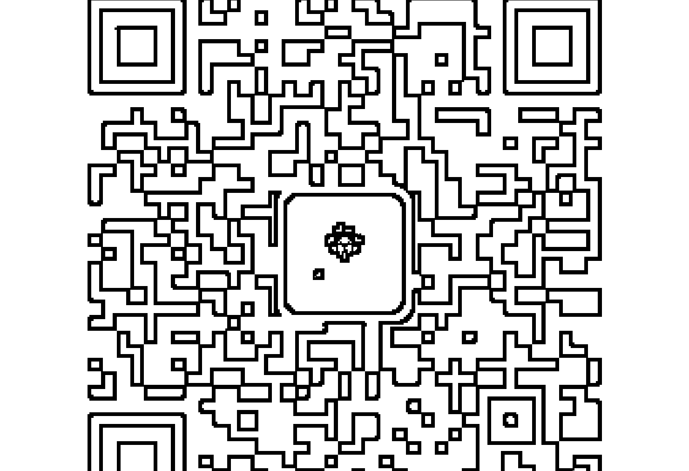
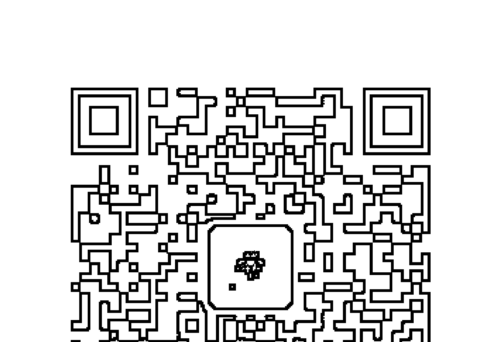
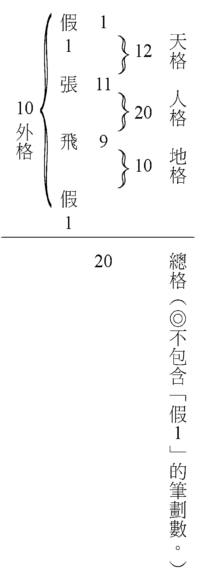
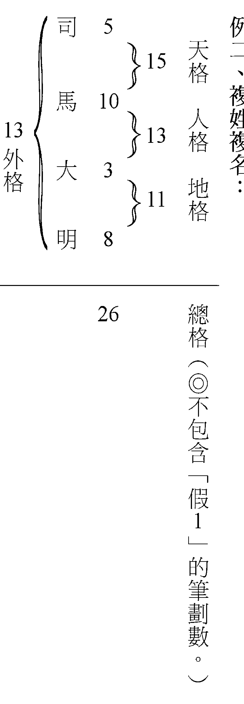
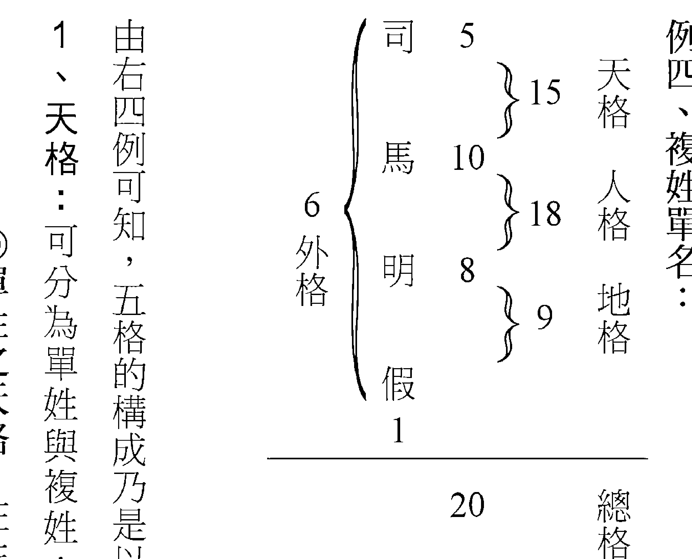
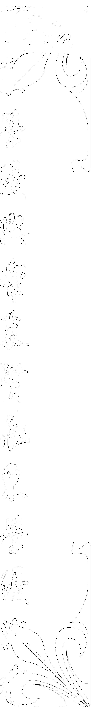
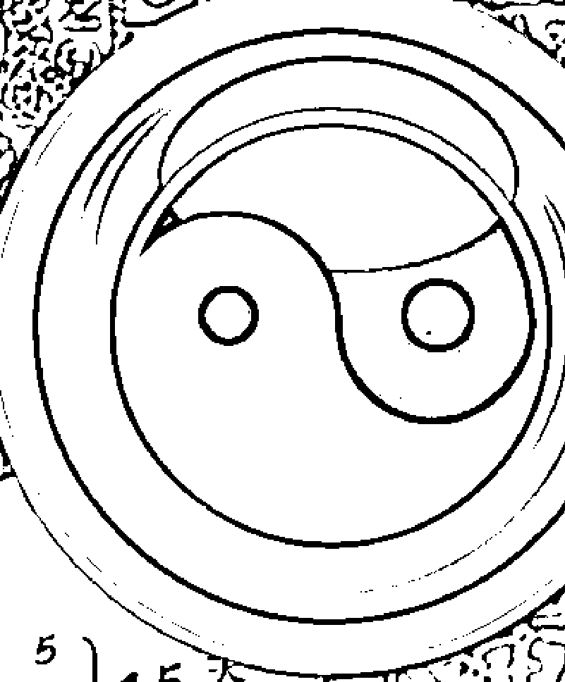

# 姓名学入门

### 每个人都该懂一点姓名学

## 即学即用

不管是为新生儿命名，自己要改名，还是为新公司定名，分析他人姓名吉凶，这本书都能满足你的需求。

林燁能◎著

| 姓名 | 司马大明 |
| :--- | :--- |
| 天格 | 15 |
| 人格 | 13 |
| 地格 | 11 |
| 外格 | 13 |
| 单字笔画 | 司(5) 马(10) 大(3) 明(8) |

- 由浅入深带领你进入姓名学领域
- 精准掌握个人五行五格命理吉凶
- 轻松推算姓名吉凶取好名真容易
- 好学好用一次完整学会姓名精髓

H. Royal College
天使神秘学院

- 专业占卜预测机构
- 神秘学培训机构
- 水晶能量研究中心
- 神秘学资料库
- 官方微信：strcdts
- 微信公众平台：strc2011
- 读书交流QQ群：
  - 占星塔罗占卜师交流群：814594478（加入密码：PDF）
  - 神秘学其他综合群：659338717（加入密码：PDF）



微信号：strcdts
天使神秘学院

天使神秘学院 院长QQ：715104687



微信公众平台：strc2011

## 制作说明：

本书由《天使神秘学院》出重金从台湾购入的原版书籍扫描制作完成。为达到最好阅读效果，特地把原版书全部切开后，再经由专业扫描设备高精度扫描完成，并经过一张张的PS后期处理最终成书，其间花费大量的人力、物力以及时间，只为能给大家提供经济并优质的神秘学学习资料而努力。

本学院强力谴责某些机构和个人，把本学院花心血制作完成的电子书籍，包装后直接放在自家淘宝网上低价倾销的行为，以谋取不劳而获的经济利益。如果长此以往最终将无人愿意再为大家花心思制作电子书，那以后可能大家再无新书可读。

为让大家以后能够读到更多的好书，也为了本学院的良性发展。本学院恳请大家尽量做到如下几点：

- 一、尽量在本学院的网站购买电子书籍。
- 二、请勿用技术手段把电子书内的水印及加密去掉。
- 三、在收到电子书后小范围传阅即可，千万不要公开传播，更别挂到淘宝网上低价销售。

同时为答谢广大支持者，学院电子书将做如下调整：

- 一、学院会把一些早已收回制作成本的电子书折价销售。
- 二、最新制作的电子书籍会开放打印功能，大家购买后有条件的可自行打印成书。

天使神秘学院
2019 年 1 月

### 序文

人类与地球上的所有生物共存于这个星球上，只因人类的外型与脑部的独特构造，而得以发展成一个具有高度智慧的物种，也因此而演化成一个具有高度社会共存性的生活。人类为了维持这个共存社会的延续性与发展性，而创造出了语言与文字，并将周遭生活上的任何事物都赋予一个名称，人类当然也是不例外，以便于个别物体性的辨别、使用及其代表性。

人类既将地球上所有的物种都赋予一个名称，故严格说来一个名称对一个物种而言，仅是具有能够辨别其称谓而已，并不具有任何其它的意义与影响力，而这种通则的适用对人类而言，应该也是一体适用而不分轩轾。

现今我们仅就人类这个物种来论述。人类同地球上的所有生物一样，都是逐步演化而来，也因此演变成目前的亚、欧、非、澳等四大区块的人种，而这四大区块上的人种又因居住地上的区隔再次细分为不同的种族，每一个种族因其彼此间居住环境的不一样而独自发展出属于自己的语言与文字。这其中因各种族的不同，因此对人类自己个别的身份与称谓，也各有其不同的表达方式；然而表达方式虽不同，但一样都是以文字书写之方式来代表一个人的身份与称谓，而这种以文字表示一个人的身份与称谓，我们就称之为“姓名”。人类因种族的不一样，因此各自发展出来的文字也是不一样的，所以各个种族之间的“姓名”也会呈现出截然不同的表现方式，因此这个代表个人符号的“姓名”，它的作用应该只是在做为一个人身份的辨别之用而已，不应该再有其它的影响力才对。然而曾几何时，人类却将这个人类身份辨别符号的“姓名”，无限扩展到会影响到一个人一生的事业、金钱、生命、婚姻……等各方面的吉凶好坏情形，并且引用一些人的姓名及其发生的事情来做为佐证，甚至将此“姓名”会影响人一生吉凶好坏的情形归纳为一门学问，这就是我们目前所说的“姓名学”。

有关“姓名学”的论述，我们不谈其它国家的情形，单就台湾目前的情形来分析与论述。目前台湾有关“姓名学”的起源大都是在民国二十五年的时候由一位留学日本的留学生白惠文（原名白玉光），从日本引进其师熊崎健翁所著之“熊崎氏姓名学之神秘”、“姓名学之奥秘”、“姓名之命运学”等书为根基，随后在民国80年代逐渐在台湾风行起来。“姓名学”所论述的内容大抵为：笔划数与五行之关系、笔划八十一数之灵动数、天地人三才配置之吉凶、名字各个字之五行属性等的项目。

本书将就目前市面上所有有关“姓名学”之著作，为一综合性的收集与分析，并以浅显易懂的文字叙述，有系统的编写成册，以期能给予读者对“姓名学”有一个客观且理性的认知，而不致产生人云亦云的情形。

写于笔者高雄工作室

### 序文 002

### 一、五行之基本概念 009

### 二、姓名学五格之构成 013

### 三、姓名学五格的涵义 023

### 四、五格数理之五行 029

### 五、笔划八十一划灵动数之吉凶含意 035

### 六、姓名笔划数之分析 069

### 七、姓名五格的生剋关系 077

### 八、姓名五格与身体疾病 085

### 九、姓名三才配置的吉凶关系 089

### 十、姓名三才之五行概论 123

### 十一、姓名三才之五行阴阳分论 125

## 目录

- 十二、公司及工廠、商店、行號、營業場所之命名 129
- 十三、公司行號與筆劃數之歸屬 149
- 十四、公司行號所屬五行之分類 151
- 十五、姓名學的字音五行 161
- 十六、姓名筆劃數之算法 167
- 十七、筆劃數的部首索引 173
- 十八、百家姓的筆劃數 181
- 十九、名字的筆劃數與五行歸屬 192
- 二十、公司及行號、營業場所筆劃數之算法 213
- 二十一、姓名登記的法源依據 234
- 後記 334

## 一、五行之基本概念

火曰炎上，炎上作苦；水曰润下，润下作咸；木曰曲直，曲直作酸；金曰从革，从革作辛；土爰稼穑，稼穑作甘。

所谓五行者，乃是指春夏秋冬之气候，流行于天地之间、循环不断的一种气场，因此称之为五行，也就是我们常说的金、木、水、火、土（其实学理上正确的念法应该为木、火、土、金、水）。

北方阴极而生寒冻，寒冻则生水；南方阳极而生高热，高热则生火；东方阳气散泄而生风，风动则生木；西方阴气止息内敛而乾燥，乾燥则生金；中央之地阴阳交媾而温润，温润则生土。五行彼此之间，其相生也所以相维繫、其相剋也所以相制衡，以维持循环不息的关系，因此：

**五行的方位**：东方属木、南方属火、西方属金、北方属水、中央属土。

**五行的颜色**：东方木为绿色、南方火为红色、西方金为白色、北方水为黑色及蓝色、中央土为黄色。

**五行的相生**：木生火、火生土、土生金、金生水、水生木（理解技巧：木材经引燃就生火；木材经火烧光而成灰烬、土壤；土壤中含有金属矿物；以金属器具挖掘水源，以水去灌溉花木，使其生长）。

**五行的相剋**：木剋土、土剋水、水剋火、火剋金、金剋木。（理解技巧：花木之根能够穿透土壤；土壤、堤防可以阻挡水的流势；水能够浇熄燃烧之火；燃烧火可以熔化金属器物；刀斧能够砍伐花木。）

## 一、姓名学五格之构成

姓名学五格乃是在姓氏上面加一个数字“1”的笔划数（又称为假1），若为单名的话，则又在名字下面增加一个“1”的笔划数，并以此“1”的笔划数与姓氏、名字本身的笔划数相加后而区分为五个部分，也就是所称的五格，这五格则分别是天格、人格、地格、外格、总格，而构成这五格的姓名类型则又可分为单姓复名、复姓单名、单姓单名，详后例：

例一、单姓复名：

```
假 1
王 4
大 3
明 8

9 外格
5 天格
7 人格
11 地格
15
总格（◎不包含“假1”的笔划数。）
```





例四、复姓单名：



由右四例可知，五格的构成乃是以笔划数相加而得出，今分述如后：

1、天格：可分为单姓与复姓：
◎单姓之天格：在姓氏上面加上数字1（又称为假1），然后将此1数与姓氏的笔划数相加后所得之数即为天格之数，如例一“王”姓之笔划数为4，加上假1之后所得之数为5，则“5”即为天格之数。

◎复姓之天格：则是直接将复姓二字的笔划数相加后所得之数即为天格之数，如例二“司”之笔划数为5、“马”之笔划数为10，将司马复姓两个笔划数相加所得之数为15，则“15”即为天格之数。

2、人格：同样分为单姓与复姓：
◎单姓之人格：将姓氏的笔划数与名字第一个字的笔划数相加后所得之数即为人格之数，如例一“王”姓之笔划数为4、第一个名字“大”之笔划数为3，此时将这两个字的笔划数相加后所得之数为7，则“7”即为人格之数。

◎复姓之人格：将复姓第二个字的笔划数与名字第一个字的笔划数相加后所得之数即为人格之数，如例二“马”之笔划数为10、“大”之笔划数为3，将这两个字的笔划数相加后所得之数为13，则“13”即为人格之数。

3、地格：分为复名与单名：
◎复名之地格：将两个名字的笔划数相加后，所得之数即为地格之数，如例二的名字为“大明”之复名，其中第一个“大”之笔划数为3、第二个名字“明”之笔划数为8，则两这个字笔划数相加后所得之数为11，则“11”即为地格之数。

◎单名之地格：此时先要在名字的下面再加上假1之数，然后将名字的笔划数与假1的笔划数相加，所得之数即为地格之数，如例三“飞”之笔划数为9，与假1的笔划数相加后所得之数为10，则“10”即为地格之数；同理，例四“明”之笔划数为8，与假1的笔划数相加后所得之数为13，则“13”即为人格之数。

4、外格：分为单姓与复姓：
◎单姓之外格：有复名与单名之分。
1.  复名之外格：在姓氏上面加上假1，将假1与名字最后一个字的笔划数相加后，所得之数即为外格之数，如例一最后一个名字“明”之笔划数为8，与假1相加后所得之数为9，则“9”即为外格之数。
2.  单名之外格：此时分别要在姓氏上面与名字的下面各自加上假1之数，然后将此两个假1的笔划数相加后，所得之数即为外格之数，如例三两个假1的笔划数相加后，所得之数为2，则“2”即为外格之数。

◎复姓之外格：有复名与单名之分。
1.  复名之外格：将姓氏第一个字与名字最后一个字的笔划数相加后，所得之数即为外格之数，如例二“司”之笔划数为5、“明”之笔划数为8，将这两个字的笔划数相加后所得之数为13，则“13”即为外格之数。
2.  单名之外格：此时先要在名字的下面再加假1之数，然后将姓氏第一个字与假1的笔划数相加后，所得之数即为外格之数，如例四“司”之笔划数为5，与假1的笔划数相加后所得之数为6，则“6”即为外格之数。

5、总格：此时不管姓氏为单姓或复姓，也不管名字为单名或复名，只要将所有姓、名的笔划数相加后所得之数，即为总格之数，唯总格之数则是不包括“假１”之数在内。如例一总格之数为15、例二总格之数为26、例三总格之数为20、例四总格之数为23等，即是。又以前的习俗乃是女孩子出嫁后，大抵都会冠上夫姓，因此若为冠上夫姓的姓氏，则一律以复姓之姓氏论之，并依复姓之方法去求得五格的构成要件。

## 三、姓名学五格的涵义

由前述可知，任何的姓名，不管其为单姓、复姓，或是单名、复名，不管其为男性、女性，一个人的名字都可以产生姓名学之五格。

例：五格之年限管辖运：
- （前运、基础运）1岁～17岁
- （主运、成功运）18～36岁
- （副运、中年运、社交运）管辖37岁～54岁
- （总运、晚年运）55岁以后到终老

天格：12（假 1 + 张 11）
人格：20（张 11 + 怡 9）
地格：24（怡 9 + 萱 15）
外格：16
总格：35（湿土）

姓名学之五格由于其构成要件的不同，而有其不同的所在位置，也因此自有其意义、功能与作用，也就是说五格因其所在位置的不同、管辖年限的不同、代表一生运势时期的不同，对人一生的影响时期也会有其不同的差异性及重要性，详后述。

1、天格：
- 其主体性乃是一个人的姓氏，而这个姓氏则是由父亲、祖父、祖先……等血脉流传而来，其所代表的仅是祖先血缘关系的一脉传承而已，因此这个天格笔划数的数理对一个人并不会产生任何的吉凶好坏之影响。
- 天格代表着祖先、父母、长辈、伯叔辈、上司、公司主管、服务之机关：等为己身之长辈、上司等之意。
- 天格本身虽不具有任何吉凶之力，但因它紧临人格之上，因此它对人格之影响一个人成功与否，具有绝对的密切关系与影响力。

2、人格：
- 其主体性是由姓氏与名字第一个字所构成，乃是姓名学的中心点、灵魂、精华之所在，所以又称之为“主运”、“成功运”。是判断一个人一生命运最重要的关键所在，也是推算五格吉凶的核心，其影响力贯穿一生，对个人命运影响甚大。
- 人格代表着本人、自己、我的个性、脾气、内在思想、精神层面、处事能力、人格特质等，也代表着一生之运势、健康、疾病、寿命等，可说是个人一生运势强弱与吉凶祸福的总枢纽。

3、地格：
- 其主体性乃是所有名字笔划数的总合，位在人格之下方，又称之为“前运”、“基础运”，是判断一个人出生或家庭状况的根据处，关系着一个人一生的命运甚大，管限期为出生的1岁到17岁之间运势的吉凶否泰。
- 地格除了代表着一个人的出生及家庭状况外，也代表着早年的求学运、晚辈、后进、子女、子孙、部属、财物、所拥有的东西等。

4、外格：
- 其主体性乃是假1与名字最后一个字笔划的相加之数，亦或是上下两个假1相加的笔划数，又称之为“副运”、“中年运”、“社交运”，管辖期间为37岁到54岁之间运势的吉凶否泰。
- 外格代表着中年以后的家族亲密关系与否、家人间的和谐关系与否、人际关系、社交活动、朋友、兄弟姐妹，以及事业上的同事、竞争对手、合夥人等。

5、总格：
- 其主体性乃是姓与名字笔划数相加总合之数，但不包括假1之数，又称之为“总运”、“晚年运”、“成果运”，管限期为55岁以后至终老之时的吉凶否泰。
- 总格代表着中晚运以后人生、事业的成功、失败及守成与否等，故可说是一生成就及享受与否的验收期。
- 总格既然又称为总运，因此对人一生之运势必然具有绝对性、总结性的影响力，因此在论断地格、人格及外格之笔划数理吉凶后，乃须以总格之笔划数为一生运势吉凶与否之依据，如此不仅能反应出中晚运运势之吉凶与否，也能对一生运势吉凶与否产生出绝对性的影响力。

## 四、五格数理之五行

五行在本书的开宗明义章已说过，就是木、火、土、金、水之意，其中生剋关系乃是：

### 五行的相生

木生火、火生土、土生金、金生水、水生木（理解技巧：木材经引燃就生火；木材经火烧光而成灰烬、土壤；土壤中含有金属矿物；以金属器具挖掘水源；以水去灌溉花木，使其生长）。

### 五行的相剋

木剋土、土剋水、水剋火、火剋金、金剋木。（理解技巧：花木之根能够穿透土壤；土壤、堤防可以阻挡水的流势；水能够浇熄燃烧之火；燃烧之火可以熔化金属器物；刀斧能够砍伐花木。）

至于所谓的五格数理，乃是五格之笔划数的意思。由于姓名学乃是将五格之笔划数赋予金、木、水、火、土之五行，并以此五格笔划数所代表之五行，其彼此间的生剋制化之情形，以及与此人八字命局五行之喜、忌用神为何，而综合来论断此五格对此人八字命局吉凶好坏的影响。

五格笔划数的取用则是以个位数之笔划数为主，也就是说不管笔划数仅为1～9的单位数，或是10、11、12……等以上的双位数，均取其个位数之数字做为五行取用之标准。其对应关系如下：

- 1、2 属木
- 3、4 属火
- 5、6 属土
- 7、8 属金
- 9、0 属水

例如：天格之数为15，则取其个位数之“5”做为五行，则“5”属土。人格之数为23，则取其个位数之“3”做为五行，则“3”属火。地格之数为16，则取其个位数之“6”做为五行，则“6”属土。外格之数为9，则取其个位数之“9”做为五行，则“9”属水。总格之数为35，则取其个位数之“5”做为五行，则“5”属土。

知道了各格数理的五行属性后，接下来就是根据五行的生剋关系来论断其吉凶。五行相生为吉，相剋为凶。但须注意，生剋关系并非绝对，还需考虑整体格局的强弱、平衡与流通。例如，若某格数理五行属木，而另一格数理五行属火，木生火，则对此格数理而言为吉。反之，若某格数理五行属木，而另一格数理五行属金，金剋木，则对此格数理而言为凶。

此外，还需将各格数理之五行与本人八字命局的五行喜忌相结合。若某格数理之五行恰好是八字命局所喜用的五行，则为吉；若为八字命局所忌讳的五行，则为凶。因此，五格数理之五行的论断，必须综合考量各格之间的生剋关系，以及与八字命局的配合，方能做出准确的判断。

## 四、五格數理之五行

準，例如筆劃數為8數的話，就以8數做為五行取用的標準；同理，筆劃數為50數的話，就以個位數的0數做為五行取用之標準。

個位數的筆劃數計有1、2、3、4、5、6、7、8、9、0等十個數，而五行則為木、火、土、金、水等五個數，因此筆劃數與五行彼此間的代表關係則為：

- 1. 以筆劃數個位數的1、2為五行「木」的代表。木屬東方，季節為春天，顏色為綠色。
- 2. 以筆劃數個位數的3、4為五行「火」的代表。火屬南方，季節為夏天，顏色為紅色。
- 3. 以筆劃數個位數的5、6為五行「土」的代表。土屬中央，季節為立春、立夏、立秋、立冬前約18日之內，顏色為黃色。
- 4. 以筆劃數個位數的7、8為五行「金」的代表。金屬西方，季節為秋天，顏色為白色。
- 5. 以筆劃數個位數的9、0為五行「水」的代表。水屬北方，季節為冬天，顏色為黑色、藍色。

其中木、火為溫暖性的象徵，金、水為寒冷性的象徵，而土之五行又分為濕土與燥土。至於濕土或燥土的分別，則看人、地、總格三格（不包含天格及外格）中的五行是金、水較多，還是木、火較多而為濕土或燥土之分。例如人格為7、8劃的金，地格為9、0劃的水，而總格為5、6劃的土，則總格五行之土即為濕土的屬性；同理，人格為1、2劃的木，地格為3、4劃的火，而總格為5、6劃的土，則總格五行之土即為燥土的屬性。

又此人、地、總格之五行，只要見金、水、土之五行的話，則土之五行即以濕土論之；見木、火、土之五行的話，則土之五行即以燥土論之；並不須限於總格須為土之五行，才有濕土或燥土之分。

例一、濕土：

周 珮 臻
8 } 19: 水 人格
   11 }
         16 } 27: 金 地格

35: 濕土     總格（不包含天格及外格筆劃數。）

## 例二、燥土：

| 劉 | 15 | } | 24 : 火 | 人格 |
| 炳 | 9 | } | 16 : 燥土 | 地格 |
| 宏 | 7 | | | |
| --- | --- | --- | --- | --- |
| | 35 : 燥土 | | 總格（不包含天格及外格筆劃數。） | |

◎就筆者而言，姓名學上所增加的「假一」之數，是頗為荒謬的一件事，因此筆者在幫客戶的「新生嬰兒」或「新成立之公司」取名字時，都不會將「假一」這個數字列上，也就是說取消外格這個用法，並將地格的管轄年限從初生一歲延伸到27歲，將人格的管轄年限從28歲延伸到54歲，至於總格則一樣管轄55歲以後到終老之運。

◎總格雖說是管終老之運，但對一生的生活否泰、事業成敗等，也具有決定性的影響力。

◎因筆者完全不認為姓名學對人的一生運勢會產生任何吉凶否泰之影響力，因此筆者常會告知已出社會之客戶，除非是本身的名字真的難聽、不雅，否則不要再花冤枉錢去改甚麼名字，因為那是花錢又消不了災的行為。最重要的是認清自身八字命局的架構，然後再從平時行善積德、為陽宅堪輿、方位取用、顏色選用、物品擇用等，日積月累的為後天人為之改造，這才是根本「改造」命運之方式。

## 五、筆劃八十一靈動數之吉凶含意

天地玄黃宇宙洪荒日月盈昃辰宿列張寒來暑往秋收冬藏...

騰蛟起鳳孟學士之詞宗紫電青霜王將軍之武庫家君作宰...

時維九月序屬三秋潦水盡而寒潭清煙光凝而暮山紫...

層巒聳翠上出重霄飛閣流丹下臨無地鶴汀鳧渚窮島嶼之縈迴...

披繡闥俯雕甍山原曠其盈視川澤紆其駭矚閭閻撲地鐘鳴鼎食之家...

姓名學的論述重點除了人格、地格、總格之五行與八字命理五行喜、忌用神須相符之外，最重要的則是在於總格筆劃數所蘊含的吉凶象意，而這筆劃數的吉凶象意就是姓名學所稱的「靈動數」之意。由於易經卦理的數字是從1到9，因此姓名學的筆劃數即以此為依據而為倍數相乘的延伸，因而得出總數為81的筆劃數，也就是說81的筆劃數是姓名學筆劃數的極限，而第81劃又為還原之數，故筆劃數若是超過81的話，則將此筆劃數減去80後的數，例如筆劃數為93，將93減去80後剩下的13的筆劃數，則13即為此姓名的靈動數代表。靈動數既是姓名學筆劃數吉凶象意的表徵，而1到81的筆劃數也各有其吉凶象意的代表，今就各筆劃數的吉凶象意分述如後，其中筆劃數上的符號：○，主吉；△，主平；X，主凶。

## ○ 筆劃一劃之靈動數：

- 一元開泰、萬物復始之象，為天清地明、萬物創始與開基的吉象，代表著富貴、長壽及繁榮、昌盛的大吉數。宜靜不宜動，宜以溫和、平穩的方式，在安定中求發展與進步，如此才可喜獲機運而得以如旭日東昇般的開創出一番傲人的成功事業，並得

## X 筆劃二劃之靈動數：

為大凶之數，乃是天地混沌未開、天地人三才未分之象。常見內外波瀾橫出、枝節叢生之事生，有如浮萍之飄流不定而無獨立、穩固之象。凡事進退失據、欠缺決斷力與魄力，遇事常見阻擾而導致有志難伸、焦躁不安的困境。為一多遭苦難、破敗、變動、遷徙、體弱、病痛、短命、夭折、徒勞無功的大凶數。

## ○ 筆劃三劃之靈動數：

為一樂觀、積極進取之吉數。有著陰陽調合、天地人之萬事萬物成形確定之象，乃福祿壽俱全、富貴名利俱備、凡事進取如意的表徵。與生具有天資聰明、智慧，憑藉其實闊的心胸、過人的領導能力，而得以建立一個名揚四海、成功發達的大事業。為一多子多孫、心寬體胖、諸事順遂如意、富貴併享的大吉數。

## X 筆劃四劃之靈動數：

為萬物枯萎、衰竭之象，係一精神黯淡不明、凶變的大凶數。遇事困難、阻礙多見，常見凶禍、危機四伏，以致常引發人禍、凶災等自我滅亡之事生。為一破敗、滅絕、殘缺、困頓、蹇滯、病弱、發狂、放蕩、夭折的大凶數。本人唯有奮發圖強、積極努力向上，才得以造就出一個孝子、烈士、貞婦、怪傑、大英雄、大人物之機運。

## ○ 筆劃五劃之靈動數：

有著陰陽交泰、萬事和合之象。為一象徵著家庭和順、事業榮昌、諸事如意及身體健康之大吉數。為人溫文儒雅、行善積德、樂善好施，多得長輩的關愛與照顧，也能獲得一般大眾的敬仰與欽佩。不管是光宗耀祖的發揚家業，亦或是外出獨力的開創事業，都能夠有富貴榮達、一舉成名的收穫，為福德至吉、安康長壽的極致表現。

## ○ 筆劃六劃之靈動數：

洪福齊天、福若天賜，有萬寶吉祥同聚一處、福自天上來的喜慶，因而得以興家立業，一生安享富裕、家門吉慶之福。唯宜戒慎恐懼，以免因過盈而溢出、意志不堅而樂極生悲，以致無法享受到這大富大貴的吉福。因此應多為修身養性、謙虛為懷，多培養柔德懷人之性，如此一生的福德才得穩固與深遠，本人終身也得安享餘慶。

## ○ 筆劃七劃之靈動數：

## 五、筆劃八十一劃靈動數之吉凶含意

## ○ 筆劃八劃之靈動數：

具有天賦的聰明與智慧，遇事時能夠展現出剛毅、果決的魄力與決斷力，常在無意之中表現出領袖的威權與勝利的態勢。但也因此而容易陷於剛愎自用、情緒性行為、獨斷獨行、頑固不化，其結果是缺乏包容性與協調性，以致招惹阻逆與挫敗。所以宜多培養謙虛為懷、剛柔並濟的德行，如此方可展現出一個真正領袖的風範。女性多半不適合使用此數，以免有流於男性化的傾向。

## × 筆劃九劃之靈動數：

意志堅定、剛強穩健、耐力強韌，凡事能秉持其堅忍不拔、克盡職守的精神，去完成使命、達成目標，到最後終因能貫徹意志、排除萬難的成就一番豐功偉業。就事情之處理，則應以循序漸進的方式去實行，切忌操之過急、患得患失，以免因而招致挫折、破敗的窘境。

為物極必反、由興盛轉衰敗之象。雖具有天賦的才華與智慧，但常因不得志、不逢時運，以致心生不平、不滿，就事情之處理常陷於不穩定、多成多敗的處境，到最後終而走上災厄困頓、凶禍橫生、阻逆不順、官司損財、病痛夭折、喪偶、無子嗣、親人失怙等窮途末路之絕地。唯此數若是三才配置得宜的話，也能造就出一代英雄、怪傑、烈士、貞婦、富豪之人物。

## X 筆劃十劃之靈動數：

乃萬事、萬物收藏、歸結之象，大地呈現出一片瑟縮、凋殘之情景。此數的凶惡更甚於其他之數，多產生敗家、破業、蕩產、貧困、病痛、夭折的情形。一生嘗盡人生的苦楚辛酸，毫無前途事業可言，摆在人生路途前面的盡是一片灰濛、黯淡的景象，很難尋覓出光明前途之路線，終而導致五窮六途之絕境。為一凶災不斷、孤獨無依、短命夭壽、境遇淒涼的大凶數。若是能夠加倍努力、積極奮鬥的進取，也可能會有一、二人能脫離此凶數之詛咒而得以絕處逢生，成就一番事業。

## ○ 筆劃十一劃之靈動數：

陰陽復始、萬物甦泰，一片欣欣向榮之象，故有得天獨厚的優越稟賦及博才多能的條件，以穩健踏實的處事方式而循序漸進的去開創事業，其結果必定能廣獲眾人之助力而得以建立廣厚的事業，進而而享受富貴、榮昌之福份，為一得以重建家運、家業的大吉數。

## X 筆劃十二劃之靈動數：

為屈而不能伸之凶象。處事常有三心二意、意志薄弱而無法堅定信心、下定魄力的情形，一生無法安守本份，常想要插手、經營與本身不相干、或力有未逮的事情，以致遭逢失敗、一事無成。在中年以後則須更為謹慎行事，否則容易陷於沉淪困逆之境、孤苦貧窮之狀，也容易有多病體弱、早夭不壽、家族稀薄之凶象。因此凡事務宜安守本份、心性節制，如此也有可能發生絕處逢生之吉象。

## ○ 筆劃十三劃之靈動數：

博學多才、多藝多能。為人富智謀奇略、反應靈巧，行事常見以柔克剛、以退為進，外表不會顯現出喜怒哀樂之情，內在也多能堅定意志、強於忍耐，憑藉著過人的智慧與才能，一心一意將事情處理得盡善盡美，到最後終能得到人望、獲大功的成就一番大事業，也能夠享受榮華富貴之福份。唯在事業成就之後，絕對要多為內斂心性之修為，不可表現出負、任性的行事作為，如此才得以永久享受榮貴之福。

## X 筆劃十四劃之靈動數：

破敗沉淪之象。主家族、六親緣薄，幼小失怙、失恃，孤獨無子、兄弟姐妹離散且不得天倫之樂。事事不如意、遭受挫敗，有如沉下水底而不見天日之石頭，一生多見困厄、災難、凶死、天折、辛酸、艱難、退敗、勞而無功等灰暗、無色的人生境遇。唯若能秉持堅忍不拔、堅毅不屈的精神，積極奮力的突破萬難，也有可能造就出一代怪傑、英雄之大功大業的機運。

## ○ 筆劃十五劃之靈動數：

為福祿壽俱全、無上榮幸、幸福圓滿的大吉數。為人處事溫和、謙恭有禮、慈善仁愛、有德有信，一生多見貴人、長輩之助力及上司的提拔，也多受眾人的敬仰與愛戴，因而得以安身立命的成就大功勞、大事業，並得以享受富貴榮顯及子孫昌榮之福。在事業成就之後，應多為積德行善之舉，以免晚年因福氣享盡、得意忘形，反成不利之象。

## ○ 筆劃十六劃之靈動數：

天生具有領袖、首領的風範，為人領導能力好，處事講義理、重原則，故而多得眾人的欽佩、服從與愛載。集名望於一身，有雅量、一生多見貴人之助力，凡事多見逢凶化吉，並進而化危機為轉機的開創一番大事業、建立大功勞、獲得大勝利，而得

## ○ 筆劃十七劃之靈動數：

具有倔強不屈、擇善固執的脾氣，凡事都能憑其堅毅剛強、突破萬難的精神而得以建功立業。唯因威權在望、固執己見，因而容易顯現出燥怒的脾氣，且缺乏包容性與協調性，所以比較容易樹敵且招惹是非而失敗。因此若能多為修身養性、培植謙沖為懷之柔德，則到最後必可獲至事業上的大成就。此數因偏於剛強之特性，故女性不適宜使用，易流於男性的剛毅性情；若真使用的話，一樣需要多培養女性之柔德，方為有福。

## ○ 筆劃十八劃之靈動數：

為有權謀、威望與勢力之吉數。一生為人處事有守有節，事事計畫周詳並且秉持著其堅毅不撓、克服萬難的精神，所有摆在眼前之難事無一不是無堅不摧，到最後終於是皇天不負苦心人的有志者事竟成的成大功、立大業。唯本人恐因過於重視面子、過於剛毅逞強，以致欠缺包容性、協調性，無法接受忠言逆耳之建言，故反而容易招致挫敗。所以凡事宜三思而後行、謹慎從事，並宜多培養謙沖為懷的柔德。

## X 筆劃十九劃之靈動數：

為良馬不得伯樂知遇之凶數。雖說天生賦予聰穎的資質與智慧，也有著多才華、技藝的本能，在事業上也具有成就大功、大業的能力，然而一生卻是生不逢時、不得運助，在人生創業的過程中多逢阻滯困頓、災禍橫生，內在人事上不僅內外不和，外在事業上也不得貴人、長輩的助力，到結果常見功敗垂成、徒勞無功的以破財敗業收場。此外，在創業的過程中也常伴隨著刑罰、傷害、鰥寡、孤獨、夭折、不壽、妻離子散等的厄運發生。

## X 筆劃二十劃之靈動數：

為破敗、天壽之凶數。一生常見折磨受苦、事事難以順遂如意，災難常見一波未平、一波又起，前途可說是困難重重、災禍頻臨。不僅事業難成，也多見家族沒落、衰敗、親屬緣薄、婚姻破敗、喪偶、子女不幸、妻離子散、生計難繼等衰亡滅絕的困境。此數唯有不屈不撓、剛毅堅忍，並努力奮鬥不懈的去克服萬難，如此方有絕處逢生的機運。

## ○ 筆劃二十一劃之靈動數：

為含苞待放、富貴榮顯之首領數。大地呈現欣欣向榮、朝氣蓬勃之象，具有獨立之威權、超群的領導才能，凡事多能堅忍不拔、按部就班的去克盡職守、開創業業，到最後終能廣獲眾望與敬仰，而得以興家立業及建立一番成功發達的事業，並得安享福祿壽綿的榮顯之福。此數為首領數，女性較不宜使用，以免會有夫妻不和，或對先生產生負面的影響。（以今日之社會觀之，使用此數之女性，也可以女強人視之。）

## X 筆劃二十二劃之靈動數：

凡事多見阻滯困厄、難以順遂如意，前途橫互著困難重重、多災多難的困境，以致求助無門、進退不得，到最後終而以破財、敗業收場。晚景常見體弱多病、衰敗凋零，猶如秋草逢霜、屋漏偏逢連夜雨般的淒涼無助。

## ○ 筆劃二十三劃之靈動數：

為富貴沖天之首領數。其勢壯麗、其情豪邁，縱使出身於貧窮之家，也能憑一己之力的去克服萬難而逐步漸進的功成名就，宛如旭日東昇、壯麗輝煌，大地一片光明燦爛、欣欣向榮之象。主開闊明朗、豪爽積極、樂觀進取、生機蓬勃、敏捷銳利，為一榮昌顯達之大吉數。此數同二十一劃都為首領之數，因此女性較不宜使用此數，以免有夫妻不和、對先生事業或身體產生不利的影響。以今日之社會觀之，使用此數之女性，同樣也可以女強人視之。

- - ○ 筆劃二十四劃之靈動數：
溫和馴良，才略智謀超群。縱使偶而碰到艱辛困難的境遇，也是人生之常態而在所難免；一生只要能秉持勤儉持家、白手立業之精神，也必能在事業上克服困難的達成願望，並而獲得功成名就的非凡事業。為一優越的幕僚、企劃與參謀之人才，擅於提出新創意、新企劃，也擅於開源節流而賺大錢，故能得榮華富貴、財源廣進及家門喜慶多吉昌的福報。

- - ○ 筆劃二十五劃之靈動數：
聰明、機伶、辯才無礙、天資敏銳，有奇特才能且行事充滿自信與自負的行為表現，故而能成就大功勞、大事業。唯言語較為尖銳，易失於恃才傲物之性及欠缺協調性，以至於會有欠人和而易招惹是非、挫敗之情形；所以要多為修身養性、講信修睦、謙沖為懷等德行的培養，如此必定會因口才之辯捷而更為獲得眾人的讚賞。

## X 筆劃二十六劃之靈動數：

雖然天賦稟性聰穎智慧、反應機靈敏捷，天生也有著行俠仗義、慷慨豪爽的個性，但一生卻是起伏不定、變化多端，擺在眼前的盡是重重的艱難困苦之事、複雜萬端的剝削之事，可說是一波未停、一波又起的風波不斷，前途處處充滿著動盪不安、波滔洶湧的危險之景況。這是一個易導致家破人亡、失業敗財、孤苦無依、短命不壽、妻離子散、家族凋零、男盜女娼、淫蕪沉淪的大凶數。雖說只要能克服萬難、積極進取的努力奮鬥，也能造就出一代偉人、英雄或豪傑等人物，但還是以勿嘗試、勿使用為宜。

## △ 筆劃二十七劃之靈動數：

為一吉凶參半、中吉之數。主一生多成多敗、吉凶起伏不定、興盛衰敗難測之象。雖然中、早運之前全憑己力去開創事業而得以有著早發跡、早成功的事業；但在功成名就之後，會因過於自信、固執剛強，欠缺圓融性與協調性，而遭受誹謗攻擊、非難挫敗，以致辛苦創建起來的事業無法維持到終老，容易在中晚年之後即遭受失敗、結束營運的厄運。因此其不管在事業創建過程中，或是已經功成名就後，都一定要多培養人和之性情，凡事採取圓融的中庸之道，不急進、不傲慢及溫和的待人接物，如此必能化險為夷、化凶為吉、趨吉避凶的成功之事業長久、永續的經營下去。

## X 筆劃二十八劃之靈動數：

人生一切幻滅、破敗。雖有滿腦子的創意與點子，與旺盛、積極的行動力，但卻多見事與願違的阻礙、災禍不斷，到結果終而走上破敗、官訟、家人生離死別、鰥寡、遭仇殺、意外橫死、亡命他鄉等的滅絕之途。女性使用此數者，容易陷於夫妻離異、孤寡等凶災之中。

## ○ 筆劃二十九劃之靈動數：

乃龍得風雲、虎得雙翼般的吉慶之象。本人智謀俱全、志向遠大，在生活或工作上乃是精力旺盛、活動力強，有著無窮的遠大希望，在事業的開創上將是如龍得雲、如虎添翼般的披荊斬棘、勢如破竹，一生之運勢可說是扶搖直上、諸事順利而得以成就一番傲人的事業。唯須防有過多的貪取、過多的慾望與要求而自阻運勢、弄巧成拙。婦女使用此數，宜防容易流於男性化，及產生猜疑、嫉妒之心。（參考即可，必

## 五、筆劃八十一劃靈動數之吉凶含意

△筆劃二十劃之靈動數：吉凶成敗未定，時成時敗、勝敗難分之象。一生中不管生活、求學、就業中，都會出現利弊互見、褒貶並存等半喜半憂、半吉半凶的情形。在行事過程中，若過於大意、欠缺深思熟慮、不見細膩之行為，則很容易的會導致破業敗財、貧困潦倒、孤獨無依、喪偶離異等絕境。然而若積極的進取，則一生中也會有絕處逢生而成就大事業的機運。

○筆劃二十一劃之靈動數：為人中之龍、智仁勇俱全、高名富貴、如龍昇天的大吉數。一生的聲譽極佳、有威有望，具有強韌的意志力、堅強的信心，行事能深明大義、深體大局，而得以克服困難的建立一番傲人的事業與成就，並得以享受榮華富貴之福。一生中切忌好逸惡勞、得意而忘形。為女性可使用之首領數。

○筆劃二十二之靈動數：為龍困淺灘、虎落平陽般的時運未濟之象，他日一旦逢遇相助之運，必可際一旦

## ○ 筆劃二十三劃之靈動數：

家門榮昌、富貴沖天之首領數。具有文才與武德，行事勇斷與果決，也有著堅定不屈的意志，不管任何的艱辛萬難、險阻困逆，都能逐步的去克服而功成名就，進而獲得名利雙收的吉慶，並得以享榮華富貴之福。此數為較為剛硬、強烈之首領數，為女性不宜使用之數，用之恐易有孤寡的情形。（以今日之社會觀之，使用此數之女性，也可以女強人視之。）

## X 筆劃二十四劃之靈動數：

為災禍、劫難層出不窮之大凶數。自小即不得疼愛、失去依怙，終生困苦、艱難與災禍不斷，生活中常見孤苦無依、貧賤窮困、親人疏離、妻亡子絕、殺戮刑傷、精神錯亂、瘋癲發狂、夭壽等的情形；在事業上則是敗業破產、官司纏身、險阻橫梗等的情形。一生可說是處於凶災不斷、孤苦貧賤的窮絕滅途之中。

## ○筆劃二十五劃之靈動數：

為和平、溫和、安祥、和善、恭良之吉數。具有才智、文華與一技之長才。有著內斂、保守的個性，行事嚴謹而有規律，富正義感與同情心，因不忍見到周遭之人的困苦，而常會表現出博愛、慈悲的心性與行為。為女性最為喜用之大吉數；男性雖有消極的傾向，但也不失為富貴之吉數。

## X 筆劃三十六劃之靈動數：

前途茫茫、波瀾重重，人生遭遇之困境如波浪疊捲而來、浮沉不定且變化萬端，一波未平一波又起，找不到人生真正的目標在哪裡。為人雖然富有俠義的心腸、英雄的氣概，也有著捨己為人、助人為樂的精神，平常也多見為人排解困難、解決紛爭，然而卻因此而常陷自己於事件的風暴、紛爭之中，此時自己反而無法解決該紛爭的事件而不得安寧，對外也是求助無門，以致一生常見招惹無端之凶災上身。因此務要養成保守、內斂之心性，平時不要強出頭，如此才得以有安寧且平順的人生。

# ○ 筆劃二十七劃之靈動數：
天生具有温厚、忠实、权威、不畏不惧、不屈不挠的个性，为人处事诚恳、正直、有始有终，逢遇艰困之事也都能克服万难、排除艰困般的去完成使命、达成目标，故一生运势顺畅通达，纵使身处困境，也总能吉人天相、逢凶化吉。事业上若更能步步为营、按部就班而为，且多注重人和、人际关系的培养，避免有孤僻的倾向，则必可成就一番威权赫赫、富贵显达的事业而享福。

# △ 筆劃二十八劃之靈動數：
具有艺术创作、才华创意之天分，但常因意志不坚、缺乏耐心，在事情的处理上也因信心不足、恒心与毅力不够，到最后都见半途而废的情形，以致无法贯彻在先前所拟定的目标与意志，因此一生难有成就可言，仅为一平常、庸俗之人而已。所以

# ○ 筆劃二十九劃之靈動數：
為云开月现、苦尽甘来之象。在早年之幼运必定历经劳碌、清苦、波澜、艰辛的生活，但凡事只要能堅定意志、努力向上進取，黑暗過後必得見光明之大道，最後必可克服萬難，在歷盡一番先苦後甘的滋味後，如倒吃甘蔗般的享受榮華富貴、福祿壽喜之吉慶。為一子孫昌榮、事業繁榮發達的富貴吉數。此數女性勿用為宜。

# X 筆劃四十劃之靈動數：
智勇雙全、謀略超群、膽識過人，然而因有傲慢的態度、高傲的行為，以致欠缺圓融個性與人和的德望，因而容易遭受非議與攻擊；另外，在事情的處理、事業的創業中，也有著喜好投機取巧、冒險患難的心性與行為，以期求能達到成功的地步，然而結果卻事與願違，反而會因此而遭受挫折、失敗的後果，且陷自己及周邊之人於苦難、破產、敗業、窮困、家人分離、不壽等的絕境。因此在平常即宜培養謹言慎行、按部就班的行事態度，及謙沖為懷的處世待人之道，如此方可長久的為創業、保身之道。

# ○ 筆劃四十一劃之靈動數：
膽識、智慧、才氣、能力、德望兼備，為一可得高大聲譽的大吉數。凡事只要一心努力向上、積極進取、不中途而廢，到最後必可開創出一番前途無限、洋洋得意、名揚四海的人生與事業。

# △筆劃四十二劃之靈動數：
資賦聰明，有著很好的才華、藝術之學習能力，具有藝術創作的能力，為人也有甚為豐富的感情，但因意志較為薄弱、缺乏耐心與信心，在學識的專研與才藝的學習上，因沒有專注研究的精神，也無法有恆心與堅持毅力的學習態度，因此一生難以有令人稱羨的成就可言，只是空具有學習能力而已。基此之故，只要能知道自己的缺點所在及改進之，就才藝的學習能夠專心一致、全力以赴、不中途而廢，並秉持堅持到底的信心與毅力，到最後必能在藝術創作上成就出一番傲人的事業。

# X 筆劃四十三劃之靈動數：
為虛飾之數、雨夜之花的景象。本人雖具有才華與能力，也能夠因此而獲致短暫的成功，但因過於好玩弄權謀策術，且也無堅定的意志與信念，也太過於注重外在的驕飾，為一外實內虛的情形，以致遇事必定會粉飾太平，到最後終究會因紙包不住火而東窗事發、自露短處，陷自己於失業、敗財、身家與名譽破敗等的困苦之窘境。因此為人行事絕對要秉持穩重踏實、堅持意志、貫徹信念的心性與行為，而不虛華、不好高驚遠，如此才會有絕處逢生、轉凶為吉的機運。

# X 筆劃四十四劃之靈動數：
為一傾家蕩產的凶象，一生多逢挫折、失業、敗財、阻逆、困頓、家族衰微、家庭崩離、人口刑傷、悽慘晦暗等的境遇。在中年雖也可能有發跡、得意之機運，而僅是如曇花一現而已，在中年末期時事業就會一洩千里般的傾蕩破敗，到晚年的時候，境遇會因此而顯得更為蒼涼、悽慘、愁苦。此數雖凶，但若能多謹言慎行、多為行善積德之舉，也會有造就出一世英雄、豪傑、偉人的機運。

# ○ 筆劃四十五劃之靈動數：
順風揚帆而有沖天、名震天下之勢。一生聲名遠播、名震天下，為人智慮深遠、深讀經綸，在事業或工作上若更能貫徹意志，則必可成就一番傲人的事業。然一生中恐有一次的挫敗之阻逆，此阻逆若能因勢利導的衝破難關、克服萬難，則往後必能享富貴之福而得以名揚四海。

# X 筆劃四十六劃之靈動數：
為天羅地網、困厄終生之凶象。一生多見困苦災難、身衰體弱、病痛纏身、孤苦無依、遭受刑傷、受人凌辱、處境艱辛、意志薄弱等的人事際遇，以致走入歧途、終而銀鐺入獄，而無法獲得成功的事業與幸福的人生。此數若能自立自強、意志堅定，行事多見圓融、多從善如流，平常多為善積德之行舉，到最後也會有轉凶為吉、絕處逢生等獲至成功的幸運之機會。

# ○筆劃四十七劃之靈動數：
為衣食豐足之吉象。一生衣祿豐隆、福壽綿長，凡事多見進可取、退可守，可自由自在的游刃於人際事物上而毫無阻礙，在事業上也可與人為合夥事業之經營，並也因此得以成就大事業。為一全家圓滿幸福、子孫富貴滿堂，家運吉祥隆昌、永享天倫之樂的大吉數。

# ○筆劃四十八劃之靈動數：
智謀、德望俱足，為一軍師、顧問之人才。與生具有才能超群、足智多謀，德高望重、功名富貴的天賦，在事業上多見威權榮顯、聲名顯赫，為一絕佳的軍師、顧問參謀、幕僚、輔佐、企劃人才，及為人師表的富貴雙享的大吉數。唯須防因過於信任他人，以致會有吃虧、上當、受騙損財的情形。

# 五、筆劃八十一劃靈動數之吉凶含意

# X 筆劃四十九劃之靈動數：
吉中藏凶、凶中藏吉，為一吉凶難分之象。處於吉凶交會點、分歧點之上，行事做為趨於吉利處則吉上加吉、偏於凶禍處則凶上加凶。此吉凶與否、是否遭受災難、幸福或不幸，雖說尚須視天、人、地格三才之配置及一生大運之吉凶而定，但大多難逃失敗、災禍的厄運。

# X 筆劃五十劃之靈動數：
速成速敗，為曇花一現之跡象。雖曾一度能攀至榮達之境地，但這僅是一時、短暫的成功與發達，在運過後，又轉瞬間的跌落至破財、敗業、滅亡的困境之中，到最後陷於孤獨、鰥寡、刑傷、淒慘、悲愁、生離死別等瀕於絕處的境遇地。

# X 筆劃五十一劃之靈動數：
為盛衰交替之象，為先盛後衰、先成後敗的大凶數。中晚運之前，雖能得天獨厚的享受榮華富貴、名利俱全的生活，但在中晚運以後，則是會遭逢落魄困苦、災厄危難、破家敗業等的窘境。因此在中早運處於順遂之生活時，即應多培養勤儉、謙虛為懷、謹言慎行、溫和待人等的為人處世（事）之道。

# ○ 筆劃五十二劃之靈動數：
有先見之明、能洞悉時局而一躍成功之吉象。為人處事精明幹練、意志堅定而能貫徹大志，能洞察時事，勇於嘗試他人所不敢做之事，故而能夠有一番大作為的表現，並進而獲得一舉成功、名利雙收、富貴雙得的大事業。

# X 筆劃五十三劃之靈動數：
為禎祥已盡尾聲、家運全盛時期將過去之兆。由外表觀之儼然福祿盈門，然而內部卻多衰敗、疲弱、困苦之情，為一外華內虛、泰極否來之景象，隨之而來的就是破家、敗業、家族沒落、人口刑傷、凶災橫禍、官司非難、阻逆困厄…等絕境。此時務宜打開胸襟的去坦然面對接踵而來的災難，並穩重踏實的按步前進，如此方可平靜安順的度過難關。

# X 筆劃五十四劃之靈動數：
一生多見災難不斷、辛酸悲慘、憂悶燥鬱、寡歡不樂、敗業刑傷、妻離子散、體弱多病、猝死不壽、人事不和、生活不安、耗損多磨等的絕處境遇。此數也有少部分為前運吉昌、後運衰敗之人。

## △ 筆劃五十五劃之靈動數：
五為中央集權之表徵，故為大吉之兆，而五上加五，乃為吉之重疊，猶如錦上添花之象徵，然而物極必反、吉之至極者必反為凶，為凶之始的徵兆。由表面觀之，乃是外觀華麗、氣勢昌盛，然而內在卻已隱伏災難困苦、辛酸淒涼、有志難伸、有苦難言的凶兆。為一表裡不一、外華內虛，諸事不順遂、不如意之情景；唯有具備不屈不撓、堅定意志的信念與行為，能夠忍受一切之災難與不幸，如此才得以安度中晚年之機運。

## X 筆劃五十六劃之靈動數：
意志薄弱、事與願違，難以成就一番事業。缺乏積極的進取心，也沒有克服困難的勇氣，不具備恆心、毅力與堅忍的精神，逢遇困難、阻逆之事時，總以逃避、畏縮的心態去處之，到最後必定是挫敗不斷、災禍重重、阻逆頻來，終而導致敗業、破產、孤苦無依、家破人離、窮困多病、晚景淒涼等的絕境。

## ○ 筆劃五十七劃之靈動數：
如寒中梅花、雪中青松之景。有著剛毅穩健、堅忍不拔、魄力與信心超群的任事精神，猶如嚴寒中之松柏，能克服萬難如長青樹般的屹立不搖、如冰雪中的梅花盛開繁簇，最終必能開創一番大事業。為一榮華富貴、繁榮幸福的大吉數。

## △ 筆劃五十八劃之靈動數：
中早運之前必定多遭逢挫折、波瀾、阻滯、災厄、橫禍、敗業、破家等不幸之事，然而秉持著堅忍不拔、克服萬難的信心與行為，如此在中晚運之後，必定能如願的興家立業，開創出一番興盛的事業，也得以享受晚年遲來的富貴之福。

## X 筆劃五十九劃之靈動數：
無中心思想、失去核心信念之象。沒有堅毅的信心與意念，缺乏主宰事物的勇氣與信念，做事多見猶豫不決、六神無主，以致一旦遭逢挫折、困難時，其事業之失敗必定會產生兵敗如山倒的骨牌效應，一生事業也因此潰敗而無法東山再起，到最後也有可能會死於非命。

## X 筆劃六十劃之靈動數：
做事心神不定、搖擺不決之兆。就事情之決策方針、執行目標常因己身毫無主見、不具魄力，以致多見出爾反爾、朝令夕改的情形，到最後必定會產生前途一片黯淡、茫無所從的恐慌，以致事事勞無所獲、多勞無功等一事無成的結果，也會因此而陷於困苦煩悶、災難刑傷、貧窮低賤、體弱多病、夭折橫死等的絕境。

## ○ 筆劃六十一劃之靈動數：
名利雙收、富貴雙全之榮華與顯達的大吉數。然而因富貴與榮華是這麼容易的獲得，也因而會很容易的產生高傲、負的心性與行為，以致會造成內外失和、家庭風波不斷、自身行為不檢的違逆倫常行為之出現，而自阻榮華富貴之運勢。所以在富貴榮華獲得之後，必須要多培養柔德、多修身養性、多謙虛待人、多謹言慎行，如此事業才可經營的長長久久，也得長長久久的享受與生帶來的榮貴福份。

## X 筆劃六十二劃之靈動數：
行事圓融性不足、欠缺人和，不注重信用、信用破產，以致讓人對其產生信心危機、採取退避的行為，終而陷自己於艱辛困苦、災難不斷的困境，以及失意落魄、信心崩潰、家運逐漸衰敗與頹廢的絕境。

## ○ 筆劃六十三劃之靈動數：
萬物化育、諸事順利如意之象。凡事多見進展順暢、事事如意，不須多費勞心、努力，容易達成目標、容易獲致成功，而得以榮顯通達、子孫繁昌、自身富貴與長壽，乃福、祿、壽、喜俱全的大吉數。

## X 筆劃六十四劃之靈動數：
一生浮沉不定、進退難據之凶象。人生與事業常見多敗少成、多遇阻逆與困厄，嚐盡辛酸與窮絕的滋味，歷經家破人離、骨肉失散之苦痛。一生雖要擔負著敗落家族而等待興盛的重責大任，然而人生的生涯卻不見如意、難如所願，常處於起伏不定、沉淪不起等難得順暢、平穩的際遇。

## ○ 筆劃六十五劃之靈動數：
高名富貴、吉祥如意，人生事業與生活上多見諸事順利成功、子孫繁榮、家運榮昌、福祿滿堂，乃富裕、幸福、幸運、健康、長壽之大吉數。

## X 筆劃六十六劃之靈動數：
一生信用喪失、諸事進退不得，人際關係上則是內外不和、眾叛親離，終而導致破敗、損財、刑傷、災禍接踵而至，為一慘敗、滅絕的大凶數。

## ○筆劃六十七劃之靈動數：
具有獨立自主的氣魄、毅力和精神，能突破萬難、克服障礙，最終得以事事順遂、萬事如意。為一白手起家、財祿亨通、萬商雲集之吉象，能建立繁榮、家業昌盛的大吉數。

## ○筆劃六十八劃之靈動數：
智慧聰明、善判是非、忠厚穩重、善良篤實，行事意志堅強、人緣廣獲、信譽絕佳，所以能步步發達、興盛繁榮的興家立業，並得以享受功名富貴之福。

## X筆劃六十九劃之靈動數：
心性不定、精神不安之凶象。行事常常顯現出心浮氣躁、坐立不安的情緒行為，也因過於急躁、欠缺三思而後行之謀慮，到最後常有徒勞無功、有志難伸、動則得咎的感慨，終而導致事業不安穩、危機四伏、窮困潦倒、體弱多病、災禍橫生的情景。

## X筆劃七十劃之靈動數：
為一貧窮困苦、積勞成疾、妻離子散、家族敗亡、子孫忤逆、久病不癒、斷肢殘障、喑啞盲聾之極端的大凶數。

## △筆劃七十一劃之靈動數：
天生具有自然的吉運，可以獲得幸福、安泰的生活，然而卻因過於安樂，而有徒增精神上困擾的麻煩以及缺乏應變之能力與處事的魄力，以致陷於艱難、困窘的境地，為一吉凶參半之數。因此在阻逆之運時，則宜多堅忍耐苦、培養實力，凡事戒慎恐懼、刻苦耐勞，如此必能順時的掌握到發達之機運，而得以建立一番大事業；在人生吉運之時，宜多加謹言慎行、勤儉持家，凡事按部就班、步步為營，才得以長長久久的享受富貴榮華。

## △筆劃七十二劃之靈動數：
陰雲密佈、晴雨不定之象，為從辛苦中得安逸、幸福中藏破敗的情形。人生中早運之前，一切順遂如意、事業風光，可獲得成功的事業、可享受安逸的生活；然而在中晚運之後，泰極否來、甘盡苦到，有著吉中逢凶的事業與生活，會遭逢阻逆、困頓、艱難、災禍、病痛等的橫禍。因此在前運順利之時，即宜事事多為未雨綢繆的防範災害於未來的準備，如此在遭逢阻滯之晚運時，才得以安然的度過，而有平靜、安穩的生活。

## △ 筆劃七十三劃之靈動數：
為平靜、安逸、舒暢之數。徒具有遠大的志向，卻沒有實行到底、貫徹決策的意志力與魄力，到結果僅是勞多獲少、徒勞無功的白忙一場。因此凡事以務實、守成、安於本份的一步一腳印去達成目標，才得以平順與安穩的享受人生。

## X 筆劃七十四劃之靈動數：
才能、智慧均嫌不足、有欠缺，本身又不具積極的行事態度，貫徹事情的意志力也不夠，只會坐吃山空、坐享其成，最後是一生庸碌無成、無能為用，一再的迷戀、沉淪於不勞而獲、不事生產的虛幻、逆境之中，終而導致衰敗、破產、滅絕的困境。

## X 筆劃七十五劃之靈動數：
事情說做就做，欠缺周詳之計畫、也不見三思而後行的妥善規劃，容易陷於盲目衝動之行事，以致遭人利用、受騙、上當，終而走上慘敗、窮絕的下場。因此，凡事務宜謹言慎行、深謀遠慮，應多培養人際之關係，如此方可獲得他人的助力，而得以在穩定中求發展的開創出平穩的事業。

## X 筆劃七十六劃之靈動數：
一生的信用如破巢之卵，全无完好之处，容易发生破灭、败亡与倾覆之危机。为一家财败亡、骨肉离散、家族衰颓、妻离夫亡、鳏寡孤独、子女刑伤、夭折短命、五穷六绝之大凶数。

## △ 筆劃七十七劃之靈動數：
为吉凶参半之半世运。乃是前半世若为吉利、幸福、悠游、顺畅、富贵之运的话，那后半世必定是凶灾、破败、阻滞、贫贱之运；反之则然。也就是说一生的吉运与凶运各占一半。

## △ 筆劃七十八劃之靈動數：
一样是吉凶参半之数。然而此数原则上是前半世多为吉祥如意、顺利成功，并且得以拥有与获得富贵、荣华之生活；但到后半世时，则渐渐的尝到困顿惨败、阻逆失败，并进而走上贫穷、凄凉、穷绝的灭亡之路。

## X 筆劃七十九劃之靈動數：
做事多见有勇无谋、思虑欠详、莽撞行事，完全显现出急燥冲动、能伸不能屈、知进不知退的莽夫之行为，到最後終而導致眾叛親離、四面楚歌的困境，此時一旦遭逢挫折、失敗時，必定是兵敗如山倒般的一瀉千里、潰不成軍，終無挽回、絕處逢生的機運，其結果乃是走上家破人亡、破財敗業的際遇。

# X 筆劃八十劃之靈動數：
一生的艱難辛苦、困厄阻逆如波浪千捲、排山倒海般的一波不絕的湧至，讓人完全無招架、應變與解決之能力，也因而容易導致破敗、損財、失業、刑傷、夫離、妻亡、子散、夭折、不壽等滅絕之路。基此之故，一生中宜及早、積極的為行善積德之行舉，如此人生尚有轉凶為吉、絕處逢生的一線生機與希望。

# ○ 筆劃八十一劃之靈動數：
為還元之數，乃是最為吉祥、幸運之數。代表著名揚四海、富貴吉祥、福祿壽俱備，榮顯大尊大貴的大吉數。

永和九年，岁在癸丑，暮春之初，会于会稽山阴之兰亭，修禊事也。群贤毕至，少长咸集。此地有崇山峻岭，茂林修竹；又有清流激湍，映带左右，引以为流觞曲水，列坐其次。虽无丝竹管弦之盛，一觞一咏，亦足以畅叙幽情。是日也，天朗气清，惠风和畅。仰观宇宙之大，俯察品类之盛，所以游目骋怀，足以极视听之娱，信可乐也。夫人之相与，俯仰一世，或取诸怀抱，悟言一室之内；或因寄所托，放浪形骸之外。虽趣舍万殊，静躁不同，当其欣于所遇，暂得于己，快然自足，不知老之将至。及其所之既倦，情随事迁，感慨系之矣。向之所欣，俯仰之间，已为陈迹，犹不能不以之兴怀。况修短随化，终期于尽。古人云：“死生亦大矣。”岂不痛哉！每览昔人兴感之由，若合一契，未尝不临文嗟悼，不能喻之于怀。固知一死生为虚诞，齐彭殇为妄作。后之视今，亦犹今之视昔。悲夫！故列叙时人，录其所述，虽世殊事异，所以兴怀，其致一也。后之览者，亦将有感于斯文。

由前述姓名筆劃八十一數得知，每一個筆劃數都有其不同吉凶、作用和內容等的靈動數之表示，唯此八十一個靈動數雖各自有其不同的含意，但就其各自所表示之含意，乃可總結的分為左列數項大體性的分類：

一、代表富貴、榮華、幸福、美滿、福祿壽全之吉數為：
- 1、3、5、6、7、8、11、15、16、17、18、21、23、24、25、29、31、32、33、35、37、39、41、45、47、48、52、57、61、63、65、67、68、81等數。

二、代表吉人天相、福貴吉祥之數為：
- 1、15、31、33、37、41、48、52、67、68、81等數。此為一生運勢旺盛、事業通達，凡事皆可逢凶化吉，得享富貴、福壽之喜慶。

三、代表首領、領導人、權威之數為：
- 3、16、21、23、31、33、39等數。
這些首領數乃是智、仁、勇三達德兼備之數，為具有居於上位、統馭眾人之能力。在農村社會時代以這些數理較為剛硬，因此認為女性不宜使用這些筆劃數，但以現代的高度競爭社會而言，已可將這些數理視為女強人使用之數。

四、代表剛強、倔強之數：
- 7、17、18、27等數。此為外表剛強，但內心卻有著心神緊繃、神經過敏的情形，易罹患呼吸系統疾病，也容易有舟車跌撲以致四肢、筋骨受傷的情形。女性使用這些數理者，比較會有男性的傾向。

五、代表溫和、斯文、俊秀、貌美之數：
- 5、6、11、15、16、24、31、32、35、37等數。具有性情溫和、敦厚、善良、順從之特性，能夠獲得長輩、下屬等人的照顧與敬愛。

六、代表財富豐厚、獲得意外偏財之數：
- 由白手起家而獲得豐富的財帛。15、16、24、32、33、41、52、63、67、68等數。乃是憑藉著自己的能力，

七、代表機靈多謀、具才華、有藝術能力之數為：
- 13、26、29、33、36、38、42等數。與生具有天賦的藝術才華與智謀，對於藝術創作之審美能力，有著洞燭先機的能力；此外，也有機關靈巧、足智多謀的心思，然而有時卻會因此而造成聰明反被聰明誤的遺憾。

八、代表女性可使用最吉利之數為：
- 5、6、15、31、35、37、45、48等數。其中31數為具有首領、領袖之特質外，其餘之數皆為具備婦德、性情溫和、有雅量，並有著慈善的心性。

九、代表困苦、阻逆、災難、離散、破敗、鰥寡、死傷、刑禍、夭折、窮絕之數為：
- 2、4、9、10、12、14、19、20、22、26、28、30、34、40、42、43、44、46、50、53、54、55、56、58、59、60、62、64、69、70、72、74等數

十、代表凶災、橫死、夭折之數為：
- 4、9、10、12、14、19、20、22、28、30、34、44、50、56、59、60、70等數
此為一生多逢凶惡橫災之事，容易遭受外來的衝擊、不測之外事故而導致禍劫臨身、災病橫死之凶事。

十一、代表女性容易傷害到先生、子女之數為：## 六、姓名筆劃數之分析

## 十二、代表風流、好酒色、喜投機之數為：
4、12、14、15、16、17、23、24、26、27、28、33、35、37、43、45、52、62等數。表示著男女喜歡沉淪男喜歡女愛的色慾之中，男性不僅風流好色、性慾特強，也有著投機取巧的行事作為；女性則易有紅杏出牆的情形。

21、23、33等數。這些都是為具有領袖、首領、威權之數。在農村時代都認為女性要三從四德、具有柔和之個性，不宜有太過強勢、能力太強之表現，因此都視這些數理較不宜女性使用；然而以今日的社會觀之，使用這些數理之女性，已可將她們視為是女強人的代表。

## 十三、代表容易獲得嬌寵、耍機謀之數為：
15、19、24、25數及總格為32之數等。一生中不是多獲長輩的寵愛，就是具有天賦的藝術才藝、或是足智多謀的心性。

## 十四、代表破家敗業、破壞力強之數為：
2、4、9、10、12、14、19、20、22、26、36、50、80等數。天生就具有反骨、叛逆、不守法、品性不良、失心敗德等的劣根性，因此一旦逢遇阻逆之運時，必定會遭致失業敗財、破家敗業、棄祖離宗、敗壞門風等的惡行惡為。

## 十五、易有自殺、精神分裂之數為：
4、34、44、46、50、54、60等數。一生運勢甚為凶惡，經常遭逢災難之厄運，難以有順暢如意的際遇，歷經一次又一次的挫折後，最後因對人感到失望、無意義，而產生精神錯亂，或走上自我結束生命的絕境。

## 十六、代表容易遭逢意外事故、受傷流血之數為：
8、17、18、19、23、27、33、34、40、44、50、60、64等數。較具有剛硬與固執的脾氣，行事上也富有衝勁，所以容易因一時的失神、過於急性子而遭致外力的衝擊，而受傷流血。

## 十七、代表官訟、劫害之數為：
27、28等數。容易遭受誹謗、劫難、官司、刑罰、傷害，甚或會有夫妻生離死別的災厄事情發生。

## 十八、代表吉凶參半之數為：
27、36、38、49、51、55、58、71、73等數。因此只要堅定意志、積極努力的去奮發向上，到最後必能收趨吉避凶、逢凶化吉的效果，並進而步向成功的運途。

## 十九、代表柔弱之數為：
12、14、22、32等數。外在之行事作上雖是身段柔軟、行事圓融，但內在之心性及意志，卻是非常的剛硬與堅強，有時候甚至會有極端行為的事件產生。

## 二十、代表最為凶惡之數為：
34數。這是所有筆劃數81數裡面，最為凶惡、最容易發生災難之數，因此絕對要避免使用此數，以免招致不必要的凶災橫禍。

## 澄海县象山中学历史沿革
象山中学创办于1949年，位于澄海县澄城镇象山南麓。学校前身为澄海县立师范学校，1952年更名为澄海县第一初级中学，1958年改名为澄海县象山中学。文化大革命期间学校曾一度停办，1970年复办并更名为澄海县向阳中学，1978年恢复原名澄海县象山中学。1994年澄海撤县设市，学校随之更名为澄海市象山中学。2003年澄海撤市设区，学校又更名为汕头市澄海区象山中学。学校历经多次变迁，但始终坚持办学，为地方培养了大量人才。

## 七、姓名五格的生剋關係
姓名五格的生剋关系是命理学中用于分析姓名吉凶的方法，基于五格剖象法，包括天格、人格、地格、外格、总格的计算和相互关系。此方法通过姓名笔画数推算五格数理，进而评估个人运势。

姓名五格已知有天格、人格、地格、總格與外格，而每一格因其筆劃的不同，又另行賦予其不同之五行，也就是說筆劃之個位數為1、2者，其五行為「木」；為3、4者，其五行為「火」；為5、6者，其五行為「土」；為7、8者，其五行為「金」；為9、0者，其五行為「水」。

五行彼此間會產生生剋制化的變化，而姓名五格因筆劃數之不同而賦予不同之五行，則五格彼此間也當然的會產生生剋制化的關係。又五格中以人格居於中心之位置，也就是說人格乃是姓名學的靈魂、中心、主宰之所在，因此五格彼此間的生剋制化之關係，應以人格為主、為重點之處、為當事人的代表。

姓名學五格中以「人格」為中心、主宰之所在，而與其它四格彼此間所產生的生剋制化的關係，可分為如下之20種：

### 1、天格人格
表示著周遭生活或事業中的長輩、雙親、師長、主管、長官、上司：等人，對當事人有著非常大的助力、幫助力。當事人能獲得他們的幫忙、照顧、關愛、賞識。

### 2、人格生天格：
表示著周遭生活或事業中的長輩、雙親、師長、主管、長官、上司…等人，可以獲得當事人的尊敬、孝順、敬愛、服從、忠誠、欽佩、仰慕、支持、擁護等，而得以有更為順暢、如意與溫暖的事業與生活。

### 3、地格生人格：
表示著晚輩、子女、兒孫、後學、後進、部屬、臣子、學生、傭人等人，對當事人會表現出尊敬、孝順、照顧、敬仰、欽佩、順從、擁護、支持、忠誠等行為，他們對當事人一生中直接或間接的會產生很大的助力，當事人也會因而創建起相當成功的事業與豐厚的獲利。

### 4、人格生地格：
表示著當事人對晚輩、子女、兒孫、後學、後進、部屬、臣子、學生、傭人等人，會給予直接或間接的幫忙、照顧、關愛、賞識、推薦與提拔等，並使他們得以一路平步青雲、順風揚帆的踏上成功的路途，且建立一番豐功偉業。

### 5、外格生人格：
表示著同儕、兄弟姐妹、朋友、同事、同學、平輩、合夥人、股東...等人，對當事人會有直接與間接的幫助，當事人也會獲得他們的協助、幫忙、支援、合作、擁護、推舉等行為，而得以在事業與生活上獲致非常大的成就與幸福。

### 6、人格生外格：
表示著當事人對同儕、兄弟姐妹、朋友、同事、同學、平輩、合夥人、股東...等人，會給予直接與間接的協助、幫忙、支援、合作、擁護、推舉等行為，並使他們得以在事業與生活上獲致非常大的成就與幸福。

### 7、人格生總格：
表示著人格所代表之主運、成功運對於總格之晚年運、成果運會產生非常大的助力；也就是說人格之五行對總格之五行，可產生強化、增益、補強等加分的效果，並使晚年的生活與事業能臻於成功及更為永久與美滿。

### 8、總格生人格：
表示著總格代表之晚年運、成果運對人格之主運、成功運會產生非常大的助益與強化力，並使當事人在中年時期的創業能夠更為順暢，獲得的成就也更為輝煌與興盛。

### 9、天格剋人格：
表示著周遭生活或事業中的長輩、雙親、師長、主管、長官、上司……等人，對當事人一生的生活與事業，不僅毫無助益之力，甚至於會產生令人生厭、無理取鬧、扯後腿、苛薄、冷漠、拖累、迫害、拋棄、牽制、阻滯、困逆……等的負面傷害行為。

### 10、人格剋天格：
表示著當事人對長輩、雙親、師長、主管、長官、上司……等人，一生的生活與事業不僅毫無任何助益之力，甚至於會產生不尊敬、不孝順、不敬愛、不服從、抗逆、反叛、不服氣、唾棄、出賣、背離、欺騙、拖累、阻逆、牽制……等的負面傷害行為。

### 11、地格剋人格：
表示著周遭生活或事業中的晚輩、子女、兒孫、後學、後進、部屬、臣子、學生、僕人等人，對當事人的生活與事業，不僅毫無助益之力，甚至於會有不尊敬、不孝順、不敬愛、不服從、抗逆、反叛、不服氣、唾棄、出賣、背離、欺騙、拖累、阻逆、牽制等的負面傷害行為。

### 12、人格剋地格：
表示著當事人對晚輩、子女、兒孫、後學、後進、部屬、臣子、學生、僕人等人的生活與事業，不僅毫無助益之力，甚至於會產生令人生厭、無理取鬧、扯後腿、苛薄、冷漠、拖累、迫害、拋棄、牽制、阻滯、困逆等的負面傷害行為。

### 13、外格剋人格：
表示著同儕、兄弟姐妹、朋友、同事、同學、平輩、合夥人、股東等人，對當事人的生活與事業，不僅毫無助益之力，甚至於會產生破壞、訛陷、設計、排擠、詐騙、欺敵、隱瞞、拆夥、背叛、牽制、拖累、扯後腿、不支援、不合、不擁護、不合群等的傷害行為，而使當事人的事業瀕臨於破產、倒閉之狀態。

### 14、人格剋外格：
表示著當事人對同儕、兄弟姐妹、朋友、同事、同學、平輩、合夥人、股東…等人，對他們的生活與事業，不僅毫無助益之力，甚至於會產生破壞、誣陷、設計、排擠、詐騙、欺敵、隱瞞、拆夥、背叛、牽制、拖累、扯後腿、不支援、不合作、不擁護、不合群等的傷害行為，而使他們的事業瀕臨破產、倒閉之狀態。

### 15、人格剋總格：
表示著人格所代表之主運、成功運對於總格之晚年運、成果運會產生非常大的破壞、傷害、磁吸、耗損、橫阻等不利的影響。

### 16、總格剋人格：
表示著總格代表之晚年運、成果運對人格之主運、成功運會產生非常大的阻礙、困逆、牽制、扯後腿等不利的影響。

### 17、天格比和人格、人格比和天格：
表示著當事人與長輩、雙親、師長、主管、長官、上司…等人，彼此間都存在著相互幫助之力 量，並也能因彼此的互助而共得利益與收穫。

### 18、地格比和人格、人格比和地格：
表示著當事人與晚輩、子女、兒孫、後學、後進、部屬、臣子、學生、傭人等，彼此間都存在著相互幫助之力 量，並也能因彼此的互助而共得利益與收穫。

### 19、外格比和人格、人格比和外格：
表示著當事人與同儕、兄弟姐妹、朋友、同事、同學、平輩、合夥人、股東⋯等 人，彼此間都存在著相互幫助之力 量，並也能因彼此的互助而共得利益與收穫。

### 20、總格比和人格、人格比和總格：
表示著總格代表之晚年運、成果運與代表人格之主運、成功運，彼此間都存在著 相互幫助之力 量，也就是說成功運有助益於晚年運的安享天年、晚年運可推進成功運達於更臻美的事業成就，因彼此的互助而獲得加倍的利益與收穫。

### 八、姓名五格与身体疾病
11木：容易患肝脏、胆囊、头部、神经系统等方面的疾病。
12木：容易患肝脏、胆囊、脾脏、胰脏等方面的疾病。
13火：容易患心脏、小肠、血液循环、眼睛等方面的疾病。
14火：容易患心脏、小肠、血液循环、牙齿等方面的疾病。
15土：容易患脾、胃、消化系统、腹部等方面的疾病。
16土：容易患脾、胃、消化系统、皮肤等方面的疾病。
17金：容易患肺、大肠、呼吸系统、鼻子、骨骼等方面的疾病。
18金：容易患肺、大肠、呼吸系统、喉咙、声带等方面的疾病。
19水：容易患肾、膀胱、泌尿系统、耳朵、生殖器等方面的疾病。
20水：容易患肾、膀胱、泌尿系统、足部、淋巴系统等方面的疾病。
21木：容易患肝脏、胆囊、头部、精神衰弱等方面的疾病。
22木：容易患肝脏、胆囊、脾脏、胰脏、神经痛等方面的疾病。
23火：容易患心脏、小肠、血液循环、高血压等方面的疾病。
24火：容易患心脏、小肠、血液循环、眼睛疲劳等方面的疾病。
25土：容易患脾、胃、消化系统、腹部胀满等方面的疾病。
26土：容易患脾、胃、消化系统、皮肤病、湿疹等方面的疾病。
27金：容易患肺、大肠、呼吸系统、皮肤过敏等方面的疾病。
28金：容易患肺、大肠、呼吸系统、骨折、关节痛等方面的疾病。
29水：容易患肾、膀胱、泌尿系统、妇科病、耳鸣等方面的疾病。
30水：容易患肾、膀胱、泌尿系统、糖尿病、水肿等方面的疾病。
31木：容易患肝脏、胆囊、头部、头痛、神经衰弱等方面的疾病。
32木：容易患肝脏、胆囊、脾脏、胰脏、胃病等方面的疾病。

注：以上内容为姓名学五格数理与健康关联的一种说法，仅供参考，不构成医学建议。具体健康问题请咨询专业医师。

人格為姓名學的中心、樞紐之所在，因此人格的五行除了本身有其代表身體五臟的病源之外，其與天格、地格間的五行產生生剋制化的關係後，對身體也會產生各重不同的疾病，今敘述如後：

### 一、人格五行所代表的五臟及病源：
1、五行屬木：一數為膽、二數為肝，病源在「肝臟」。
2、五行屬火：三數為心、四數為小腸，病源在「心臟」。
3、五行屬土：五數為胃、六數為脾，病源在「脾臟」。
4、五行屬金：七數為大腸、八數為肺，病源在「肺臟」。
5、五行屬水：九數為膀胱或子宮、十數為腎，病源在「腎臟」。

### 二、人格五行受剋所產生的疾病：
1、金剋木：易罹患肝疾、膽結石、筋骨疼痛、偏頭痛、高血壓、腦中風、關節炎、風濕痛、腦神經衰弱、坐骨神經等疾病。
2、水剋火：易罹患心悸、心肌梗塞、高血壓、胃潰瘍、白內障、腦性麻痺、下痢等疾病。
3、木剋土：易罹患腰背酸痛無力、皮膚病、癌症、消化不良、紅斑狼瘡、腸胃炎。
4、火剋金：耳鳴、乾咳、肩背酸痛、支氣管炎、咽喉痛、痛風、肝硬化等疾病。
5、土剋水：易罹患泌尿系統疾病、婦疾、攝護腺腫大、便秘、扁桃腺炎、尿毒症等疾病。

遊懷瀟灑名物，水亭一望春雲山最高。高溫台却眺眼，是念熟心静游情。游情念熟心静，眼眺却台溫高。高最高山春望一亭水，物名灑瀟懷遊。

## 九、姓名三才配置的吉凶關係
目前市面上所有有關姓名學的著作，都將姓名中的「天格、人格、地格」等三格視為對姓名學會產生最直接、最明顯的吉凶、好壞之影響力，因此就將此三格剝離出姓名學的五格中，讓此三格獨立存在，並稱此三格另外再給予一個名稱，稱為天、人、地之「三才」。

由於三才中的人格位居中心位置、靈魂主宰處，以其上接天格、下臨地格，因此姓名學即以人格為最重要的論述重點，並就人格、天格、地格之筆劃數所賦予之五行，看其彼此間的生剋制化關係如何，而為當事人姓名之吉凶、好壞的分析與判斷之述。

姓名學中天格與外格的構成，乃是在姓氏與名字的最後一個字下，各自加一個「假1」之數而產生。然而筆者在前面已經說過，並不贊成這種增加「假1」之數的用法，因此筆者並不認為姓名學中的天格與外格具有任何意義可言，反而是總格才具有吉凶、好壞的影響力。

因此筆者在此所要論述的「三才」之格，則是將天格改換成總格，也就是說以「人、地、總」三格視為「三才」之構成要件，且其彼此間的影響力都可說是均等，並沒有說那一格的影響力較重、那一格的影響力較輕，並以此三才彼此間五行的生剋制化關係，而為一組姓名之吉凶、好壞的判斷與分析。有關三才因其位置之配置，而產生五行生剋制化的吉凶、好壞關係，今以表格將各種不同的吉凶、好壞關係列示及說明於後：

| 人地總格 | 三才配置筆劃數之五行 | 生剋吉凶關係說明 |
| :--- | :--- | :--- |
| 一 一 一 | 木 木 木 | 三格成相輔相成之象，故代表著祖先有德、蔭庇子孫，子孫家門隆昌、事業繁榮盛與穩固，多出英雄、豪傑之人物。家人身心健康、長壽，人人有奮發向上之心、內心充滿無限的希望，凡事多能圓滿順利的達到成功之地步。 |
| 一 一 三 | 木 木 火 | 成木火相生之象，主一生多得貴人、長輩的照顧，本人心性善良、機智靈敏，行事做為圓融、善解人意、多得人和、人緣佳，事業上之基礎穩固，故而能成就一番繁盛的事業，並得以享受富貴與康壽的人生。 |
| 一 五 | 木 土 | 中早運之前的事業在穩定中求發展，雖在順境中會遭遇阻逆與堅困，但都能憑藉自己的毅力而得以一一的克服，並完成自己建功立業的大志。具有寬己嚴人的缺點，宜多為修身養性的行舉，在晚運時亦宜多為行善積德之作為。 |
| 一 七 | 木 金 | 為基礎不穩固之象。人生遭逢多變、不穩定的境遇，雖可獲得短暫的成功之機會，但卻因一路多得罪人、不得人和、不得眾人的愛戴與支持，最後反會因受到他人的背叛、拖累而致失業敗財。有呼吸系統及肝臟之疾病。 |
| 一 九 | 木 水 | 中早運之前雖得長輩及他人的助力而得以創業有成，但在創業的過程中卻多見競爭與排擠。在晚運之時，則以修身養性且多為精神、宗教之修持，不要太過貪圖享受物慾之生活，如此才可以有一個平穩與安逸的晚年生活。 |
| 一 三 | 火 木 | 一生多得眾人的助力而得以在課業成績、事業創建上，有著順遂如意的表現與成就。在晚運之時，一樣以修身養性且多為精神、宗教之修持，不要太過貪圖享受物慾之生活，如此方可有一個平穩與安逸的晚年生活。 |
| 二 四 | 木 火 | 在中早運之前，雖可獲得成功的事業；但在中晚運之後，因心性暴躁、反覆不定、意志力不夠，到最後會因自己的莽撞、衝動、自大、反覆無常的決策，而導致失業敗財、家破人亡的慘況。 |
| 二 四 | 木 火 | 中早運前雖然會有一番的成就事業，但因基礎不穩、過於貪圖享樂，以致在進入晚運之後，會發生事業挫敗、家運衰退的災厄。會有呼吸系統、腸胃疾、皮膚病等症狀。 |
| 二 四 | 木 火 | 中早運之前多見長輩、貴人等的助力，而得以一帆風順。但在進入晚運之前，凡事宜守成、放慢腳步，不要再有激燥的行爲，以免會有發生挫敗、損財、失業之情形。會有泌尿系統、中耳炎之疾病。 |
| 二 四 | 木 火 | 不管在求學或就業，亦或經商創業，多得貴人的助力，而得以有令人稱羨的作爲、表現與成就。唯此為火旺之象，因此凡事務以冷靜、沉著的去行事作爲，不要有過於衝動、急躁的行為，也不要有過於自信、自負的表現。 |
| 一 五 | 木 土 | 為基礎不穩固之象。人生遭逢多變、不穩定的境遇，在中晚運之後，慎防因過度耽溺於理想的烏托邦世界，迷失於成功的喜悅之中，而逐漸的喪失奮鬥之意志與人生的目標，到最後終而瀕臨破敗、窮絕、災患、橫死的境遇。 |
| 一 五 | 木 土 | 前運不理想，會有大起大落、自相矛盾的情形，但從中運後，即得以漸漸的創建起穩固的事業；但在晚運時，除了要修身養性、多為精神與宗教修持，也應注意腰骨、泌尿系統調養，如此方可有一個平穩與安逸的晚年生活。 |
| 一 五 | 木 土 | 前運不理想，會有波濤起伏、自相矛盾的情形，但從中運以後，多得貴人助力而入佳境，事業也漸漸的平穩；唯此為土燥之象，因此凡事多參考他人之意見，不要過於固執與墨守成規，如此必可有長久穩固的事業與美滿生活。 |
| 一 五 | 木 土 | 前運不理想，會有大起大落、自相矛盾情形；在中晚運後，事業創建上，雖有順遂如意的表現與成就；但相對的也承受過多的壓力，以至於造成身心方面的過多操勞，到最後會因抑鬱寡歡的而走上失業敗財、妻離子散的窘境。 |

### 九、姓名三才配置的吉凶关系

| 二八六<br>木金土<br>一七五 | 二八四<br>木金火<br>一七三 | 二八二<br>木金木<br>一七一 | 二六○<br>木土水<br>一五九 |
|---|---|---|---|
| 前運不理想，會有波濤起伏、自相矛盾的情形，但從中運以後，多得貴人之助力，而得以有令人稱羨的作為、表現與成就。在事業成就之後，要再多培養圓融處事的個性，如此必定會再獲得更為堅固、久遠的事業與生活。 | 為基礎不穩固之象。人生遭逢多變、不穩定的境遇，在中晚運之後，更會因外在人、事、物的影響，發生突如其來的災變，而導致失業敗財、家破人亡的絕境。易得肝炎之疾病。 | 一生充滿矛盾境遇，不僅課業成績不理想，也可能成為叛逆之少年：出社會後，除了得不到貴人的助力外，也是多逢蹇塞、困頓、阻礙之事情，不僅無法成就一番事業，甚至會有多災多難、體弱多病、災禍橫死等凶厄事發生。 | 為基礎不穩固之象。人生遭逢多變、不穩定的境遇，雖可獲得短暫的成功之機會，但在中晚運之後，會因外在人、事、物的影響，或是自己固執的脾氣、不懂得隨機應變的去抓住機會，而導致失業敗財、家破人亡的絕境。 |

| 二木一〇水四火三 | 二木一〇水二木一 | 二木一〇金火九 | 二木一〇金金七 |
|---|---|---|---|
| 在中早運之前，雖可獲得成功的事業；但在中晚運之後，慎防因過於耽溺於物質的享樂世界、迷失於成功的喜悅之中，而逐漸的喪失奮鬥之意志與人生的目標，到最後終而頻臨破敗、窮絕、災患、橫死之境遇。 | 多得眾人的助力且廣獲人緣，彼此同心協力、志同道合，可以獲得很好的創業成功之機運，也能夠開創出一番非常成功的事業。唯因過於投入於事業之中，以致會產生家庭的危機，這一點務要多加注意。 | 一生充滿矛盾境遇，不僅課業成績不理想，也可能成為叛逆之少年：出社會後，除了得不到貴人的助力外，也是多逢蹇塞、困頓、阻礙之事情，不僅無法成就一番事業，而且會有多災多難、體弱多病、災禍橫死等凶厄事發生。 | 前運不理想，會有大起大落、自相矛盾情形；但從中運以後，卻有時來運轉、驟發富貴的機運，憑其剛毅不屈的精神、努力不懈的鬥志，終而建立起一個令人稱羨、穩固的事業與豐厚的獲利，也有一個幸福的晚年。 |

## 九、姓名三才配置的吉凶關係

| 三一 一 火木木 四二二 | 一九九 木水水 二〇〇 | 一九七 木水金 二〇八 | 一九五 木水土 二〇六 |
|---|---|---|---|
| 多得兄、長輩的助力，在他們全心全力的幫助下，可以開創出一番非常成功的事業。但在事業成就之後，除了要回報這些有幫助之人外，本人也應多為修身養性、沉潛心性之修為，如此事業才能永久與穩固，生活也才得美滿。 | 多得兄、長輩的助力，在他們全心全力的幫助下，可以有很好的創業成功之機運，也能夠開創出一番非常成功的事業。然而在事業成就之後，要多回報這些有幫助之人，以免會產生事業與家族的危機，這一點務要多為注意。 | 在中早運之前，雖可獲得成功的事業，但因根基不固、信心不足、意志力不夠，以至在中晚運之後，會因外在人、事、物之影響，或是自己已缺乏鬥志的心性，而將事業、家產變賣、出讓，並過著平淡、安穩的人生。 | 在中早運之前，雖可獲得成功的事業；但在中晚運之後，須慎防會遭逢突然的、不可預測的災變，以致於家破人亡、破業敗財、不測橫死之絕境。易有腸胃潰瘍、腰背酸痛之疾病。 |

| 標題 | 描述 |
|---|---|
| 三一三 火木火 四二四 | 多得兄、長輩的助力，而得以開創出一番非常成功的事业。但在事业成就之後，本人除了要回報这些人及應多為修身養性、沉潛心性之修為外，也要多堅... |
| 三一五 火木土 四二六 | 有著很好的進取心、旺盛的奮鬥意志，在眾人的協助之下而得以有甚為成功的事業與人生。但在達到成功的途中，會有一些逢凶化險的波折，尤其是在進入晚運之時，雖會有遭受挫折的事件，但也都能克服危機而安然的度過。 |
| 三一七 火木金 四二八 | 事業上雖可獲得一時的成就與獲利，但因基礎不穩，以及個性過於剛硬而導致他人的反彈，因而對事業發生衝擊與阻撓，故事業在中運以後即兵敗如山倒的一蹶不振。有筋骨、肝炎之疾病。 |
| 三一九 火木水 四二〇 | 在中早運之前，雖可獲得成功的事業，但在中晚運之後，慎防因過度溺於物質的享樂世界、迷失於成功的喜悦之中，而逐漸的喪失奮鬥之意志與人生的目的，到最後終而瀕臨破敗、窮絕、災患、橫死之境遇。 |

## 九、姓名三才配置的吉凶關係

| 三四二 火木一 | 多得眾人的助力且廣獲人緣，彼此同心協力、志同道合，可以獲得很好的創業成功之機運，也能夠開創出一番非常成功的事業。唯因過於投入事業之中而會多用腦力，故應多注意高血壓、腦血管疾病的調養。 |
|---|---|
| 四四三 火火三 | 多得眾人的助力，而可以獲得很好的創業成功之機運，也能夠開創出一番非常成功的事業。唯不管在創業過程中或事業已成就，務要內斂心性、勿急躁，凡事多三思而後行，如此不僅得眾人之信服且事業也可永久與穩固。 |
| 三四五 火火土三 | 多得眾人的助力，而可以獲得很好的創業成功之機運，也能夠開創出一番非常成功的事業。事業成就之後，除了多內斂心性及三思而後行之外，也應多為宗教心靈的修為，在身體上並要多為腰背、泌尿系統的調養。 |
| 四四八 火火三七 | 在中早運之前，雖可獲得成功的事業，但在中晚運之後，慎防因心性過於急躁、脾氣過於火爆，而得罪人於不知不觉之中，以致事業兵敗如山倒般的一蹶不振。容易罹患中耳炎、膿瘡、呼吸系統、肩背酸痛之疾病。 |

| 三三九 火火水 四四○ | 三五一 火土木 四六二 | 三五三 火土火 四六四 | 三五五 火土土 四六六 |
|---|---|---|---|
| 為基礎不穩固之象。人生遭逢多變、不穩定的境遇，雖可獲得短暫的成功之機運，但卻因心性暴躁、反覆不定、意志力不夠，到最後會因自己的莽撞、衝動、自大、反覆無常的決策，而導致失業敗財、家破人亡的慘況。 | 在中早運之前，雖可獲得成功的事業；但在中晚運之後，慎防因過度耽溺於理想的烏托邦世界、迷失於成功的喜悅之中，而逐漸的喪失奮鬥之意志與人生的目標，到最後終而瀕臨破敗、窮絕、災患、橫死的境遇。 | 一生多得眾人的助力而得以在課業成績、事業創建上，有著順遂如意的表現與成就。在晚運之時，除了要修身養性、多為精神與宗教之修持，也應注意腰骨、泌尿系統之調養，如此方可有一個平穩與安逸的晚年生活。 | 不管在求學或就業、亦或經商創業，多得貴人之助力，而得以有令人稱羨的作為、表現與成就。唯此為土燥之象，因此凡事多參考他人之意見，不要過於固執與墨守成規，如此必可有長久穩固的事業與美滿的生活。 |

## 九、姓名三才配置的吉凶關係

| 三七 火金 四八 火火 三三 | 三七 火木 四八 二 | 三五九 火土水 四六〇 | 三五七 火土金 四六八 |
|---|---|---|---|
| 一生多成多敗，內心多見矛盾、自我衝擊的心境。事業難有成就可言、境遇也是多變不定，志向多逢阻撓、心志無法展現，常有盲目衝動、暴躁的脾氣，以致眾叛親離，晚年時多見孤苦無依之情景。 | 一生充滿矛盾境遇，不僅課業成績不理想，也可能成為叛逆之少年：出社會後，除了得不到貴人的助力外，也是多逢蹇塞、困頓、阻礙之事情，不僅無法成就一番事業，甚至會有多災多難、體弱多病、災禍橫死等凶厄事發生。 | 為基礎不穩固之象。人生遭逢多變、不穩定的境遇，雖可獲得短暫的成功之機運，但卻因心性暴躁、過於固執、冥頑不靈，到最後會因自己的固執、自大、不知掌握社會的脈絡，而導致失業敗財、家破人亡的慘況。 | 一生雖多得眾人的助力而得以在課業成績、事業創建上，有著順遂如意的表現與成就；但相對的也承受過多的壓力，以至於造成身心方面的過多操勞，到最後會因抑鬱寡歡的心情而走上失業敗財、妻離子散的窘境。 |

| 三七五 火金土 四八六 | 三七七 火金金 四八八 | 三七九 火金水 四八〇 | 三九一 火水木 四〇二 |
|---|---|---|---|
| 前運不理想，會有波濤起伏、自相矛盾的情形，但從中運以後，即已漸漸的進入佳境，事業也漸漸的平穩；此時唯有按部就班、努力不懈的去奮發，必可有一個安穩且平順的事業的生活。易有肩背、筋骨酸痛的疾病。 | 前運不理想，會有九死一生、自相矛盾的情形，但從中運以後，卻有時來運轉、驟發富貴的機運，憑其剛毅不屈的精神、努力不懈的鬥志，終而建立起一個令人稱羨、穩固的事業與豐厚的獲利，也有一個幸福的晚年。 | 前運不理想，會有大起大落、自相矛盾的情形，但從中運以後，由於承受以前奮發不懈的果實與基礎，故而得以漸漸的創建起一個令人稱羨、穩固的事業與豐厚的獲利，也有一個幸福的晚年。 | 前運不理想，會有起伏不定、自相矛盾的情形，但從中運以後，由於承受以前奮發不懈的果實與基礎，故而得以漸漸的創建起一個令人稱羨、穩固的事業與豐厚的獲利，也有一個幸福的晚年。 |

## 九、姓名三才配置的吉凶關係

| 四○○ 火水水 三九九 | 四○八 火水金 三九七 | 四○六 火水土 三九五 | 四○四 火水火 三九三 |
|---|---|---|---|
| 個令人稱羨、穩固的事業與豐厚的獲利，也有一個幸福的晚年。 | 多善用他人之力，以期能有更為良好的事業成就與獲利。 | 致眾叛親離，嚴重時會有意外橫死、不壽的情形。 | 致眾叛親離，晚年時多見孤苦無依之情境。易有青光眼、心悸之疾病。 |

| 五一 六土 六二八 | 五一 六土 六二六 | 五一 六土 六二四 | 五一 六土 六二二 |
|---|---|---|---|
| 一生充滿矛盾境遇，不僅課業成績不理想，也可能成為叛逆之少年：出社會後，除了得不到貴人的助力外，也是多逢蹇塞、困頓、阻礙之事情，不僅無法成就一番事業，甚且會有多災多難、體弱多病、災禍橫死等凶厄事發生。 | 一生多成多敗，內心多見矛盾、自我衝擊的心境。事業難有成就可言、境遇也是多變不定，志向多逢阻撓、心志無法展現，常因過於固執、冥頑不靈的脾氣，以致眾叛親離，晚年時多見孤苦無依的情景。易有跌倒骨折的情形。 | 前運不理想，會有大起大落、自相矛盾的情形，但從中運以後，由於承受以前堅持理想與崇高人格的基礎，故而得以漸漸的創建起一個令人稱羨、穩固的事業與豐厚的獲利，也有一個幸福的晚年。易有消化不良的疾病。 | 前運不理想，會有體弱多病、坐骨神經痛、自相矛盾的情形，但從中運以後，卻有時來運轉、驟發富貴的機運，憑其人格高尚的行為、堅持理想的精神，終而建立起一個令人稱羨、穩固的事業與豐厚的獲利，也有一個幸福的晚年。 |

## 九、姓名三才配置的吉凶關係

| 六 土 五<br>四 火 三<br>六 土 五 | 六 土 五<br>四 火 三<br>四 火 三 | 六 土 五<br>四 火 木<br>二 木 一 | 六 土 五<br>二 木 一<br>○ 水 九 |
|---|---|---|---|
| 一生多得眾人的助力而得以在課業成績、事業創建上，有著順遂如意的表現與成就。唯此為土燥之象，因此凡事多參考他人之意見，不要過於固執與墨守成規，如此必可有長久穩固的事業與美滿的生活。易有口乾舌燥的情形。 | 一生多得眾人的助力而得以在課業成績、事業創建上，有著順遂如意的表現與成就。唯此為火旺之象，因此凡事務以冷靜、沈著的去行事作為，不要有過於自信、自負的表現。容易失眠。 | 一生多得眾人的助力而得以在課業成績、事業創建上，有著順遂如意的表現與成就。在晚運之時，除了要修身養性、多為精神與宗教之修持，也更應要為理想的堅持與實行，如此必可有一個平穩與安逸的晚年生活。 | 前運不理想，會有體弱多病、腰背酸軟、自相矛盾的情形，但從中運以後，才得以漸漸的進入順境，事業也漸漸的平穩；此時唯有按部就班、努力不懈的去奮發，必可有一個安穩且平順的事業的生活。 |

| 列1 | 列2 | 列3 | 列4 |
|---|---|---|---|
| 五五三<br>土火土<br>六六四<br><br>不管求學或就業、亦或經商創業，多得貴人的助力，而得以有令人稱羡的作為、表現與成就。唯此為土燥之象，因此凡事應多參考他人的意見，不要過於固執與墨守成規，如此必可有長久穩固的事業與美滿的生活。 | 五五一<br>土土木<br>六六二<br><br>在中早運之前，雖可獲得成功的事業，但因根基不固、過於固執、冥頑不靈，以致在中晚運之後，會因外在人、事、物的影響，或是自己固執的脾氣、無法堅持先前的理想而喪失機會，導致失業敗財、家破人亡的絕境。 | 五三九<br>土火水<br>六四〇<br><br>在中早運之前，雖可獲得成功的事業，但因根基不固、過於暴躁、冥頑不靈，以致在中晚運之後，會因外在人、事、物的影響，或是自己火爆、固執的脾氣而喪失機會，導致失業敗財、家破人亡的絕境。 | 五三七<br>土火金<br>六四八<br><br>在中早運之前，雖可獲得成功的事業，但因根基不固、過於暴躁，以致在中晚運之後，會因外在人、事、物之影響，或是自己火爆、固執的脾氣，而喪失機會，並過著平淡、安穩的人生。 |

## 九、姓名三才配置的吉凶關係

| 六八二<br>土金木<br>五一 | 六六○<br>土土水<br>五五九 | 六六八<br>土土金<br>五五七 | 六六六<br>土土土<br>五五五 |
|---|---|---|---|
| 在早運之前，雖可獲得成功的事業，但因根基不固、過於固執、剛硬的牛脾氣，以致在中晚運之後，會因外在人、事、物的影響，或是自己固執、不的懂得圓融處事的個性，而導致失業敗財、家破人亡的絕境。 | 在早運之前，雖可獲得成功的事業，但因根基不固、過於固執、冥頑不靈，以致在中晚運之後，會因外在人、事、物的影響，或是自己固執的脾氣、不懂得隨機應變的去抓住機會，而導致失業敗財、家破人亡的絕境。 | 不管求學或就業、亦或經商創業，多得貴人之助力，而得以有令人稱羨的作為、表現與成就。但因會承受過多的壓力，因此在平常時即應多培養抒解壓力的健身運動與均衡的飲食調理。易有精神壓抑、腦神經痛的疾病。 | 不管求學或就業、亦或經商創業，多得貴人的助力，而得以有令人稱羨的表現與成就。唯此為土燥之象，因此凡事應多參考他人之意見，不要過於固執與墨守成規，如此必可有長久穩固的事業與美滿的生活。女性不宜此數。 |

| 五九六 | 五八五 | 五七四 | 五六三 |
|---|---|---|---|
| 土金木 | 土金水 | 土金土 | 土金火 |
| 一生雖多得眾人的助力而得以在課業成績、事業創建上，有著順遂如意的表現與成就；但相對的也承受過多的壓力，以致力造成身心方面的苦悶、壓抑，因此務要養成圓融處事的個性，如此必可有幸福與美滿的晚年生活。 | 不管求學或就業、亦或經商創業，多得貴人之助力，而得以有令人稱羡的作為、表現與成就。在事業成就之後，要再多培養謙虛為懷的個性，如此必定會再獲得更為堅固、久遠的事業與生活。 | 不管求學或就業、亦或經商創業，多得貴人之助力，而得以有令人稱羡的作為、表現與成就。在事業成就之後，要再多培養圓融處事的個性，如此必定會再獲得更為堅固、久遠的事業與生活。 | 在中早運之前，雖可獲得成功的事業，但因根基不固、過於固執、剛硬的牛脾氣，以致在中晚運之後，會因外在人、事、物之影響，發生突如其來的災變，而導致失業敗財、家破人亡的絕境。易得肝炎之疾病。 |

## 九、姓名三才配置的吉凶關係

| 六○八 土水金 五九七 |
|---|
| 前運不理想，會有體弱多病、腸胃潰瘍、自相矛盾的情形，但從中運以後，才得以漸漸的進入順境，事業也漸漸的平穩；此時唯有按部就班、堅定意志的去奮發，才可有一個安穩且平順的事業與生活。 |

| 六○六 土水土 五九五 |
|---|
| 一生多成多敗，內心多見矛盾、自我衝擊的心境。事業難有成就可言、境遇也多變不定，志向多逢阻撓、心志無法展現，常因固執、冥頑不靈的脾氣，以導致眾叛親離，晚年時多見孤苦無依的情景。 |

| 六○四 土水火 五九三 |
|---|
| 一生充滿矛盾境遇，不僅課業成績不理想，也可能成為叛逆的少年：出社會後，除了得不到貴人的助力外，也是多逢蹇塞、困頓、阻礙的事情，不僅無法發揮才華，甚至會有多災多難、體弱多病、災禍橫死等凶厄事發生。 |

| 六○二 土水木 五九一 |
|---|
| 一生充滿矛盾境遇，不僅課業成績不理想，也可能成為叛逆的少年：出社會後，除了得不到貴人的助力外，也是多逢蹇塞、困頓、阻礙的事情，不僅無法實現理想，甚至會有多災多難、體弱多病、災禍橫死等凶厄事發生。 |

| 七一一 金木木 | 七一三 金木火 | 七一一 金木木 | 五九九 土水水 |
|---|---|---|---|
| 一生充滿矛盾境遇，不僅課業成績不理想，也可能成為叛逆的少年：出社會後，除了得不到貴人的助力外，也是多逢蹇塞、困頓、阻礙之事情，不僅不得人和、眾叛親離，而且會有多災多難、體弱多病、災禍橫死等凶事發生。 | 一生充滿矛盾境遇，不僅課業成績不理想，也可能成為叛逆的少年：出社會後，除了得不到貴人的助力外，也是多逢蹇塞、困頓、阻礙之事情，不僅無法發揮才華，而且會有多災多難、體弱多病、災禍橫死等凶事發生。 | 前運不理想，會有體弱多病、自相矛盾的情形，但從中運以後，卻有時來運轉、驟發富貴的機運，憑其人格高尚的行為、堅持理想的精神，終而建立起一個令人稱羨、穩固的事業與豐厚的獲利，也有一個幸福的晚年。 | 前運不理想，會有體弱多病、自相矛盾的情形，但從中運以後，卻有時來運轉、驟發富貴的機運，憑其處事圓融的個性、能屈能伸的精神，終而建立起一個令人稱羨、穩固的事業與豐厚的獲利，也有一個幸福的晚年。 |

## 九、姓名三才配置的吉凶關係

| 七三三 金火火 八四四 | 七三一 金火木 八四二 | 七一九 金木水 八二○ | 七一七 金木金 八二八 |
|---|---|---|---|
| 令人稱羡、穩固的事業與豐厚的獲利，也有一個幸福的晚年。 | 前運不理想，會有體弱多病、呼吸系統疾病、自相矛盾的情形，但從中運以後，才得以漸漸的進入順境，事業也漸漸平穩；此時唯有按部就班、三思後行的去奮發，才可有一個安穩平順的事業與生活。易有乾咳、鼻蓄膿之狀。 | 前運不理想，會有體弱多病、筋骨酸痛、自相矛盾的情形，但從中運以後，才得以漸漸的進入順境，事業也漸漸的平穩；此時唯有按部就班、堅持理想的去奮發，才可有一個安穩且平順的事業與生活。 | 一生多成多敗，內心多見矛盾、自我衝擊的心境。事業難有成就可言、境遇也是多變不定，志向多逢阻撓、心志無法展現，因剛硬、不肯認輸的脾氣，以致眾叛親離，晚年時多見孤苦無依的情景。筋骨容易受到傷害。 |

## 九、姓名三才配置的吉凶關係

| 七五一 金土木 | 七三九 金火水 | 七三七 金火金 | 七三五 金火土 |
|---|---|---|---|
| 在中早運之前，雖可獲得成功的事業，但因根基不固、過於固執、冥頑不靈，以致在中晚運之後，會因外在人、事、物之影響，或是自己過於剛硬的脾氣，不懂得能屈能伸的處事行為，而導致失業敗財、家破人亡的絕境。 | 一生多成多敗，內心多見矛盾、自我衝擊的心境。事業難有成就可言，境遇也是多變不定，志向多逢阻撓，心志無法展現，常因懦弱、缺乏自信心，以致眾叛親離，晚年時多見孤苦無依的情景。易有腦神經衰弱、腦溢血之疾病。 | 一生多成多敗，內心多見矛盾、自我衝擊的心境。事業難有成就可言，境遇也是多變不定，志向多逢阻撓，心志無法展現，常因暴躁、易衝動的脾氣，以致眾叛親離，晚年時多見孤苦無依的情景。易有皮膚或呼吸系統的疾病。 | 前運不理想，會有體弱多病、膿瘡、皮膚病、自相矛盾的情形，但從中運以後，才得以漸漸的進入順境，事業也漸漸平穩；此時唯有按部就班、安穩本份的去奮發，才可有一個安穩且平順的事業與生活。易生紅斑狼瘡的疾病。 |

| 八 六 ○ | 金 土 水 | 七 五 九 | 八 金 七 |
|---------|---------|---------|---------|
| 在中早運之前，雖可獲得成功的事業，但因根基不固、過於固執、脾氣剛硬，以致在中晚運之後，會因外在人、事、物的影響，或是自己過於剛硬的脾氣、不懂得圓融的處事行為，而導致失業敗財、家破人亡的絕境。 | 一生多得眾人的助力而得以在課業成績、事業創建上，有著順遂如意的表現與成就。又此為金旺剛硬之象，因此宜多培養懷柔之身段，不要有過於尖銳的言詞，如此必可有長久穩固的事業與美滿的生活。 | 一生多得眾人的助力而得以在課業成績、事業創建上，有著順遂如意的表現與成就。又此為土重穩固之象，因此凡事多堅持自己之理想與見解，不要隨意採信他人的意見與說帖，如此必可有長久穩固的事業與美滿的生活。 | 不管求學或就業，亦或經商創業，多得貴人的助力，而得以有令人稱羨的作為、表現與成就。在事業成就之後，要多為身體健康的調養，以免因飲食過於豐盛，以致會有高血壓、腦溢血之疾病。 |

| 七七一 金木 八八二 | 七七三 金火 八八四 | 七七五 金土 八八六 | 七七七 金金 八八八 |
| --- | --- | --- | --- |
| 在中早運之前，雖可獲得成功的事業，但因根基不固、言詞尖銳，以致在中晚運之後，會因外在人、事、物的影響，或是自己過於的剛硬脾氣、不懂得圓融的處事行為，而導致失業敗財、家破人亡的絕境。易有腦溢血的疾病。 | 在中早運之前，雖可獲得成功的事業，但因根基不固、過於固執、脾氣剛硬，以致在中晚運之後，會因外在人、事、物的影響，或是自己過於暴躁的脾氣、不懂得三思而後行的處事行為，而導致失業敗財、家破人亡的絕境。 | 多得眾人的助力且廣獲人緣，彼此同心協力、志同道合，可以獲得很好的創業成功之機運，也終而能夠開創出一番非常成功的事業。唯須防因過於剛硬、剛愎自用的個性，而招致他人的反彈。易有腦溢血、風濕方面的疾病。 | 多得眾人的助力且廣獲人緣，彼此同心協力、志同道合，可以獲得很好的創業成功之機運，也終而能夠開創出一番非常成功的事業。須防因非常剛硬、剛愎自用的個性，而招致他人的反彈。易有腦溢血、風濕方面的疾病。 |

| 七九五 金水土 八〇六 | 七九三 金水火 八〇四 | 七九一 金水木 八〇二 | 七七九 金金水 八八〇 |
|---|---|---|---|
| 在中早運之前，雖可獲得成功的事業，但因根基不固、心性懦弱、內心矛盾，以致在中晚運之後，會因外在人、事、物的影響，或是自己過於懦弱的脾氣、行事作為的反覆不定，而導致失業敗財、家破人亡的絕境。 | 在中早運之前，雖可獲得成功的事業，但因根基不固、心性懦弱、意志不堅，以致在中晚運之後，會因外在人、事、物的影響，或是自己過於懦弱的脾氣、無法堅持與貫徹自己的理想，而導致失業敗財、家破人亡的絕境。 | 一生雖多得眾人的助力而得以在課業成績、事業創建上，有著順遂如意的表現與成就；但相對的也承受過多的壓力，以至於造成身心方面的苦悶、壓抑，因務要堅持自己的理想與原則，如此必可有幸福與美滿的晚年生活。 | 多得眾人的助力且廣獲人緣，彼此同心協力、志同道合，可以獲得很好的創業成功的機運，也能夠開創出一番非常成功的事業。可再多培養謙沖為懷的柔德，如此事業必定是長久與穩固，生活也得以更見幸福與美滿。 |

九一三 〇二四 水木火

不管求學或就業、亦或經商創業，多得貴人的助力，而得以有令人稱羨的作為、表現與成就。在事業成就之後，除了要多熱心的參與公益活動外，也應多養成心性內斂的脾氣，不要有易怒、暴躁的言行舉動。

九一一 〇二二 水木木

多得眾人的助力且廣獲人緣，彼此同心協力、志同道合，可以獲得很好的創業成功的機運，也能夠開創出一番非常成功的事業。易有腰背受傷或酸軟無力的症狀。

七九九 八〇〇 金水水

多得眾人的助力且廣獲人緣，彼此同心協力、志同道合，可以獲得很好的創業成功的機運，也能夠開創出一番非常成功的事業。宜多為心臟、腸胃潰瘍、呼吸系統等身體疾病的調養。

七九七 八〇八 金水金

多得眾人的助力且廣獲人緣，彼此同心協力、志同道合，可以獲得很好的創業成功的機運，也能夠開創出一番非常成功的事業。宜多為心臟、風濕、呼吸系統等身體疾病的調養。

| 九 一五 水木土 ○二六 | 九 一七 水木金 ○二八 | 九 一九 水木水 ○二〇 | 九 三一 水火木 ○四二 |
| --- | --- | --- | --- |
| 在中早運之前，雖可獲得成功的事業，但因根基不固、脫離現實，以致在中晚運之後，會因外在人、事、物的影響，或是自己過於堅持完美的理想、無法與現實社會接軌，而導致失業敗財、家破人亡的絕境。 | 在中早運之前，雖可獲得成功的事業，但因根基不固、脫離現實，以致在中晚運之後，會因外在人、事、物的影響，或是自己過於堅持完美的理想、行為處事的反覆不定，而導致失業敗財、家破人亡的絕境。 | 多得眾人的助力且廣獲人緣，彼此同心協力、志同道合，可以獲得很好的創業成功的機運，也能夠開創出一番非常成功的事業。易有腸胃潰瘍、心臟衰竭、腦神經衰弱的疾病。 | 雖會獲得長輩、貴人的助力，但卻也充滿很多阻礙、變數與矛盾的情形，故一生的事業難有令人滿意的成就與獲利，家庭間也有家人爭吵、不和的情形。宜多善用他人的助力，以期能有更為良好的事業成就與獲利。 |

| Column 1 | Column 2 | Column 3 | Column 4 |
|----------|----------|----------|----------|
| ○ 水 九<br>四 火 三<br>○ 水 九 | ○ 水 九<br>四 火 八<br>○ 金 七 | ○ 水 九<br>四 火 六<br>○ 土 五 | ○ 水 九<br>四 火 四<br>○ 火 三 |
| 一生多成多敗，內心多見矛盾、自我衝擊的心境。事業難有成就可言，境遇也是多變不定，志向多逢阻撓，心志無法展現，常因懦弱、缺乏自信心，以致眾叛親離，晚年時多見孤苦無依的情景。易有精神病、心臟衰竭的疾病。 | 一生多成多敗，內心多見矛盾、自我衝擊的心境。事業難有成就可言，境遇也是多變不定，志向多逢阻撓，心志無法展現，常因懦弱、缺乏自信心，以致眾叛親離，晚年時多見孤苦無依的情景。易有內障、腦溢血的疾病。 | 一生多成多敗，內心多見矛盾、自我衝擊的心境。事業難有成就可言，境遇也是多變不定，志向多逢阻撓，心志無法展現，常因懦弱、缺乏自信心，以致眾叛親離，晚年時多見孤苦無依的情景。易有口吃、泌尿系統的疾病。 | 前運不理想，會有體弱多病、膿瘡、皮膚病、自相矛盾的情形，但從中運以後，才得以漸漸的進入順境，事業也漸漸的平穩；此時唯有內斂心性、三思而後行的去奮發，才可以有一個安穩且平順的事業與生活。 |

| 九五六八 水土金 | 九五五六 水土土 | 九五三四 水土火 | 九五二一 水土木 |
|-----------------|-----------------|-----------------|-----------------|
| 前運不理想，會有體弱多病、自相矛盾的情形，但從中運以後，卻有時來運轉、驟發富貴的機運，憑其忠厚待人的精神、意志堅強的個性，終而建立起一個令人稱羨、穩固的事業與豐厚的獲利，也有一個幸福的晚年。 | 前運不理想，會有體弱多病、自相矛盾的情形，但從中運以後，卻有時來運轉、驟發富貴的機運，憑其忠厚待人的精神、意志堅強的個性，終而建立起一個令人稱羨、穩固的事業與豐厚的獲利，也有一個幸福的晚年。 | 一生多成多敗，內心多見矛盾、自我衝擊的心境。事業難有成就可言，境遇也是多變不定，志向多逢阻撓，心志無法展現，常因懦弱、缺乏自信心，以致眾叛親離，晚年時多見孤苦無依的情景。易有老年痴呆、心神喪失的疾病。 | 一生多成多敗，內心多見矛盾、自我衝擊的心境。事業難有成就可言，境遇也是多變不定，志向多逢阻撓，心志無法展現，常因懦弱、缺乏自信心，以致眾叛親離，晚年時多見孤苦無依的情景。易有腸胃炎、車禍受傷之災。 |

| 九五九 水土水 ○六○ | 九七三 水金火 ○八四 | 九七一 金木木 ○八二 | 九七五 水金土 ○八六 |
| :--- | :--- | :--- | :--- |
| 一生多成多敗，內心多見矛盾、自我衝擊的心境。事業難有成就可言，境遇也多變不定，志向多逢阻撓，心志無法展現，常因懦弱、冥頑不靈，以致眾叛親離，晚年時多見孤苦無依之情景。易有腸胃潰瘍的疾病。 | 在中早運之前，雖可獲得成功的事業，但因根基不固、心性多變，以致在中晚運之後，會因外在人、事、物的影響，或是自己善變、無法堅持與貫徹既定的目標，而導致失業敗財、家破人亡的絕境。 | 在中早運之前，雖可獲得成功的事業，但因根基不固、心思多慮，以致在中晚運之後，會因外在人、事、物的影響，或是自己多猜忌、無法完全的信任他人，而導致失業敗財、家破人亡的絕境。 | 多得眾人的助力且廣獲人緣，彼此同心協力、志同道合，可以獲得很好的創業成功的機運，也能夠開創出一番非常成功的事業。易有腰背受傷或坐骨神經痛的疾病。 |

| 九 三 水 火 四 ○ | 九 一 水 木 二 ○ | 九 九 水 金 八 ○ | 九 七 水 金 八 八 |
|---|---|---|---|
| 在中早運之前，雖可獲得成功的事業，但因根基不固、喜怒無常，以致在中晚運之後，會因外在人、事、物的影響，或是自己個性多變、好投機取巧、用陰險狡詐的行事作為，而導致失業敗財、家破人亡的絕境。 | 多得眾人的助力且廣獲人緣，彼此同心協力、志同道合，可以獲得很好的創業成功的機運，也終而能夠開創出一番非常成功的事業。在事業成就後，要多惕勵自己，不要耽溺、迷失於事業成功的喜悅當中。 | 多得眾人的助力且廣獲人緣，彼此同心協力、志同道合，可以獲得很好的創業成功的機運，也終而能夠開創出一番非常成功的事業。易有心臟衰竭、攝護腺、腎臟病的疾病。宜多培養謙沖為懷的柔軟身段。 | 多得眾人的助力且廣獲人緣，彼此同心協力、志同道合，可以獲得很好的創業成功的機運，也終而能夠開創出一番非常成功的事業。易有坐骨神經痛、風濕、偏頭痛的疾病。宜多培養謙沖為懷的柔軟身段。 |

|  |  |  |
| ---- | ---- | ---- |
| 九水○<br>九水○<br>九水○ | 九水○<br>九水○<br>七金八 | 五六土<br>九水○<br>九水○ |
| 多得眾人的助力且廣獲人緣，彼此同心協力、志同道合，可以獲得很好的創業成功之機運，也能夠開創出一番非常成功的事業。唯須防因過去耽溺在淫慾的色、食生活中，而招致他人的反彈，導致失業、敗財的境遇。 | 多得眾人的助力且廣獲人緣，彼此同心協力、志同道合，可以獲得很好的創業成功之機運，也能夠開創出一番非常成功的事業。唯須防因過於陰險、狡許多謀的個性，而招致他人的反彈，導致失業、敗財的境遇。 | 在中早運之前，雖可獲得成功的事業，但因根基不固、生性懦弱，以致在中晚運之後，會因外在人、事、物的影響，或是自己個性軟弱、聽信小人言、用陰險狡詐的行事作為，而導致失業敗財、家破人亡的絕境。 |

## 十、姓名二才之五行概论

他命東心無美向免生
半微將胡元孫家京
財道長水堂元京機
財事身卻是家地風
終加勝寶是水清常
終能若足是堂河宜
終道是時行堂河常
終他難萬是行堂元
終身能富是堂河常

他命東心無美向免生
半微將胡元孫家京
財道長水堂元京機
財事身卻是家地風
終加勝寶是水清常
終能若足是堂河宜
終道是時行堂河常
終他難萬是行堂元
終身能富是堂河常

終加勝寶是水清常
終能若足是堂河宜
終道是時行堂河常
終他難萬是行堂元
終身能富是堂河常

| 人格 | 水 | 金 | 土 | 火 | 木 |
|------|----|----|----|----|----|
| 地格 | 水 | 金 | 土 | 火 | 木 |
| 總格 | 水 | 金 | 土 | 火 | 木 |
| 五行影響力之行為表現 | 個性柔弱、心思細密，處事考慮周圓，但容易受到外在因素影響。 | 個性甚為剛硬，有著一付臭脾氣；易遭受刀傷、舟車皮肉傷。 | 擇善固執，缺乏通融性，對社會脈動的掌握，也缺乏敏感性。 | 脾氣較為急躁且沉不住氣，行事較衝動、又缺乏耐心與毅力。 | 性格溫和、平順，行事穩健且富有耐心與行動力。 |

### 五行影響力之行為表現

由於五行各自屬性的不同，其發生的影響力也會有不一樣的表現行為。 姓名學的人、地、總格之三才，經常會出現相同的五行，而此種因相同五行同時出現的情形，對一個人的性格、行事作為等方面，會產生特別明顯的影響力，並且也

## 十一、姓名二才之五行陰陽分論

性分陰陽，論姓名之二才五行，涉及相生相剋之理，以姓名筆劃、音韻等分析個人命理。

由於五行有著陰、陽之分，其個位數為單數者，如1、3、5、7、9等，即為陽數；為偶數者，如2、4、6、8、0等，即為陰數。

前章所述，僅是就五行對一個人所產生之影響力，為概略性的論述。本章乃是就三才相同的五行，就其陰、陽屬性之不同，對一個人的行事作為，所產生更為明顯的影響力，再進一步的分析與論述。

人格

1

2

地格

1

2

總格

1

2

五行陰陽影響力之行為表現

為木本植物、大森林之象。可獲得茂盛之容、長存之機，內含豐富的寶藏。有成功發達的機運，能獲眾人的助力而得以欣欣向榮的向上發展。心志高昂。

為草本植物，可得同儕的輔助而成功。處事身段柔軟，能夠掌握機會，會順著時代的脈絡乘勢而起。屬於風向型之特性。

## 十一、姓名三才之五行陰陽分論

| 人格 | 7 | 6 | 5 | 4 | 3 |
|------|---|---|---|---|---|
| 地格 | 7 | 6 | 5 | 4 | 3 |
| 總格 | 7 | 6 | 5 | 4 | 3 |
| 五行陰陽影響力之行為表現 | 有著剛硬的個性，行事講義氣、重然諾。凡事說做就做，不拖泥帶水，終而能夠克服重重阻礙而獲致成功的事業。女性不宜，恐對婚姻、子女不利。 | 屬田園、泥土之象。地大廣袤無邊，可容納及培育萬事、萬物，故有著開闊、坦蕩的心胸。一生多能獲得他人的回饋之恩而得以揚名立萬。女性不宜。 | 為高山、城牆之象。行事如泰山之穩重、高峰之聳立，一生的志向高昂與遠大，多受他人的敬仰，可獲得平順、安穩的事業與生活。 | 太陰光照之象、如燈火之姿。由於禀賦之天性，故可用如母愛般之光輝、柔德去處世，必可獲得盛名與榮譽。為女性最適宜之數。 | 有著如太陽般光芒的熱情，能秉持開朗、樂觀的心情去開創事業，故而得以早日達到成功、立業的成就。好與人競爭、具有技藝的才能。 |

### 五行陰陽影響力之行為表現

| | | 人格 | 地格 | 總格 |
|---|---|---|---|---|
| 0 | 9 | 8 |
| 如珠玉、寶石之質。行事秀氣、文雅，心性思考細密，有著剛中帶柔、不屈不撓的精神，也會考慮到他人的立場，故而能獲得他人的助力。 | | |
| 心性奔騰如大海之勢，朝著自己既定的目的地前進，一路勢如破竹般的克服萬難，終而獲致成功事業。心胸寬大，如大海之能容萬物。 | | |
| 富智慧、重謀略。行事柔中帶剛，縱使成功之路的前途遙遠，也都能憑其涓滴之水、滴水穿石的堅強毅力而成大功、立大業。 | | |

## 十一、公司及工廠、商店、行號、營業場所之命名

在人類的生活之中，我們對任何的人、事、物都會給予一個名稱，以做為各別身份、代表、項目的辨别。這其中有關「人」的依姓取名之方式，已論述於前面，現在要再來談論的則是有關「事」方面中的公司、工廠…等營業場所的命名。就姓名學而言，一個人姓名的好壞，既會影響到一個人的運勢；同樣道理，代表一間公司、工廠…等營業場所之名稱的好壞，也一樣會對該公司、工廠…等營業場所產生吉凶否泰的影響。至於公司、工廠…等營業場所，其名稱的取用標準，跟「人」的姓名取用之標準，雖然一樣都是以金、木、水、火、土之五行及八十一筆劃數的靈動數為準則，但因「人」與「事」的本質上還是有其極大的差異性，因此就公司、工廠…等營業場所等名稱的取用，也跟「人」之姓名的取用，有著不同的標準。公司、工廠…等營業場所，其名稱的取用，一樣是以八十一筆劃數之靈動數及五行行為準則，但其整個名稱的架構，只須區分為主格、從格及總格，即可；不必像「人」之姓名的取用，要區分為天格、人格、地格、外格及總格等五個部分。不管是為有限公司、股份有限公司、企業有限公司、貿易股份有限公司…等，亦

或是商店、行號、工廠、店鋪、作坊、大賣場...等，任何一種營業事業，只須將要選取的名稱列在最上面，並以主格論之，其次再將公司、工廠、作坊、大賣場...等營業場所以從格論之，最後則將主格與從格的筆劃數相加後所得的總筆劃數，就以總格論之。

主格乃是該公司、工廠...等營業場所要選取的主名，因此具有姓名學上文字的含意、內容與變化，可表現出該公司、工廠...等營業場所的興盛、衰敗、強勢、疲弱、虛實、盈虧、目標、動機、方向...等的象徵；從格則是公司、工廠...等營業場所之類型的代表，這是屬於固定式之類型，雖然說較不影響性、為被動性的型態，但因為姓名學乃是以筆劃數為吉凶之判斷，因此不同的公司、工廠...等營業場所之型態，也是會對主格名稱之選取，產生一定的影響力。

總格既為主格與從格之筆劃數的總合，因此一家公司、工廠...等營業場所的興盛、衰敗、強勢、疲弱、虛實、盈虧、目標、動機、方向...等情形，乃是以總格為重要心、樞紐處。因此總格筆劃靈動數的吉凶好壞，乃是決定一家公司、工廠...等營業之營運興盛、衰敗、獲利、虧損、成功、失敗...等的關鍵處。

至於公司、工廠……等營業場所，其名稱的取用，原則上有下列幾項須具備之要件：

1.  總格筆劃靈動數所代表之五行，必須是負責人八字命局之主要喜用神的五行。
2.  總格之五行必須能夠生扶、幫比該所要經營的事業。
3.  主格筆劃數之五行若也是負責人八字命局喜用神之五行的話，則又更有錦上添花的效果。
4.  總格之靈動數須為吉利筆劃數的數字。
5.  選用之名字須文雅、不俗氣、不生澀，且必須符合經營事業的項目。
6.  選用之名字須不具有暗諷之意，且必須不違反社會風俗、不違背公共道德。

公司、工廠……等營業場所，其名稱的取用，則可分為下述的數個類型：

### 一、公司之取用：

#### ◎例一：

| 字 | 笔画 |
|---|---|
| 泓 | 9 |
| 森 | 12 |
| 主格小计 | 21 |
| 實業股份有限公司 | 14、13、10、6、6、14、4、5 |
| 從格小计 | 72 |
| 總格 | 93 |

總格93劃減去80劃，剩餘13劃，其靈動數為：『博學多才、多藝多能。為人富智謀奇略、反應靈巧，行事常見以柔克剛、以退為進，外表不會顯現出喜怒哀樂之情，內在也多能堅定意志、強於忍耐，憑藉著過人的智慧與才能，一心一意將事情處理得盡善盡美，到最後終能得人望、獲大功的成就大事業，也因而能夠享受榮華富貴之福份。唯在事業成就之後，絕對要多為內斂心性之修為，不可表現出驕負、任性之行事作為，如此才得永久享受榮貴之福。』故知，這是一個吉利的公司名稱。

#### ◎例二：

| 字 | 笔画 |
|---|---|
| 傑 | 12 |
| 宏 | 7 |
| 主格合计 | 19 |
| 貿易股份有限公司 | 12、8、10、6 |
| 從格合计 | 65 |
| 總格 | 84 |

總格84劃減去80劃，剩餘4劃，其靈動數為：「為萬物枯萎、衰竭之象，係一精神暗淡不明、凶變的大凶數。遇事困難、阻礙多見，常見凶禍、危機四伏，以致常引發人禍、凶災等自我滅亡之事生。為一破敗、滅絕、殘缺、困頓、蹇滯、病弱、發狂、放蕩、夭折之大凶數。本人唯有奮發圖強、積極努力向上，才得以造就出一個孝子、烈士、貞婦、怪傑、大英雄、大人物之機運。」故知，這是一個不吉利的公司名稱。

#### ◎例三：

| 字 | 笔画 |
|---|---|
| 高 | 10 |
| 昌 | 8 |
| 主格合计 | 18 |
| 股份有限公司 | 10、6、6、14、4、5 |
| 從格合计 | 45 |
| 總格 | 63 |

總格63劃，其靈動數為：『萬物化育、諸事順利如意之象。凡事多見進展順暢、事如意，不須多費勞心、努力，容易達成目標、容易獲致成功，而得以榮顯通達、子孫繁昌、自身富貴與長壽，乃福、祿、壽、喜俱全的大吉數。』故知，這是個吉利的公司名稱。

#### ◎例四：

| 字符 | 笔画数 | 格类型 |
|------|--------|--------|
| 欣   | 8      | 主格 (20) |
| 喬   | 12     | 主格 (20) |
| 壽   | 14     | 從格 (80) |
| 險   | 21     | 從格 (80) |
| 股   | 10     | 從格 (80) |
| 份   | 6      | 從格 (80) |
| 有   | 6      | 從格 (80) |
| 限   | 14     | 從格 (80) |
| 公   | 4      | 從格 (80) |
| 司   | 5      | 從格 (80) |
| 總格 |        | 100    |

見折磨受苦、事事難以順遂如意，災難常見一波未平、一波又起，前途可說是困難重重、災禍頻臨。不僅事業難成，也多見家族沒落、衰敗、親屬緣薄、婚姻破敗、喪偶、子女不幸、妻離子散、生計難繼等衰亡滅絕的困境。此數唯有不屈不撓、剛毅堅忍，並努力奮鬥不懈的去克服萬難，如此方有絕處逢生的機運。故知，這是一個不吉利的公司名稱。

### 十二、公司及工廠、商店、行號、營業場所之命名

#### ◎例五：

| 项目       | 数值 |
|------------|------|
| 主格       | 29   |
| 從格       | 98   |
| 總格       | 127  |
| 曜（18）   | 18   |
| 國（11）   | 11   |
| 投（8）    | 8    |
| 資（13）   | 13   |
| 顧（21）   | 21   |
| 問（11）   | 11   |
| 股（10）   | 10   |
| 份（6）    | 6    |
| 有（6）    | 6    |
| 限（14）   | 14   |
| 公（4）    | 4    |
| 司（5）    | 5    |

隆、福壽綿長，凡事多見進可取、退可守，可自由自在的游刃於人際事物上而毫無阻礙，在事業上也可與人為合夥事業的經營，並也因而得以成就大事業。為一全家圓滿幸福、子孫富貴滿堂，家運吉祥隆昌、永享天倫之樂的大吉數。「故知，這是一個吉利的公司名稱。」

#### ◎例六：

| 字 | 笔画 | 小计 | 格位 |
|---|---|---|---|
| 勵 | 17 | | 34：主格 |
| 陽 | 17 | | |
| 興 | 16 | | |
| 業 | 13 | | 58：從格 |
| 有 | 6 | | |
| 限 | 14 | | |
| 公 | 4 | | |
| 司 | 5 | | |
| | | 92 | 總格 |

總格92劃減去80劃，剩餘12劃，其靈動數為：「為屈而不能伸之凶象。處事常有三心二意、意志薄弱而無法堅定信心、下定魄力的情形，一生無法安守本份，常想要插手、經營與本身不相干、或力有未逮之事，以致遭逢失敗、一事無成。在中年以後則須更為謹慎行事，否則容易陷於沉淪困逆之境、孤苦貧窮之狀，也容易有多病體弱、早夭不壽、家族稀薄之凶象。因此凡事務宜安守本份、心性節制，如此也有可能發生絕處逢生的吉象。」故知，這是一個不吉利的公司名稱。

#### ◎例七：

| 字 | 笔画 | 小计 | 格位 |
|---|---|---|---|
| 威 | 9 | | 19：主格 |
| 洲 | 10 | | |
| 航 | 10 | | |
| 海 | 11 | | |
| 運 | 16 | | 98：從格 |
| 輸 | 16 | | |
| 股 | 10 | | |
| 份 | 6 | | |
| 有 | 6 | | |
| 限 | 14 | | |
| 公 | 4 | | |
| 司 | 5 | | |
| 總格 | | 117 | |

總格117劃減去80劃，剩餘37劃，其靈動數為：「天生具有溫厚、忠實、權威、不畏不懼、不屈不撓的個性，為人處事誠懇、正直、有始有終，逢遇艱困之事也都能克服萬難、排除艱困般的去完成使命、達成目標，故一生運勢順暢通達，縱使身處困境，也總能吉人天相助、逢凶化吉。事業上若更能步步為營、按部就班而為，且多注重人和、人際關係之培養，避免有孤僻之傾向，則必可成就一番威權赫赫、富貴顯達的事業而享福。」故知，這是一個吉利的公司名稱。

### 二、行號、商店、店舖、工廠之取用：

#### ◎例一：

| 名稱 | 數字 | 分類 |
| :--- | :--- | :--- |
| 中、輝 | 4、15 | 19：主格 |
| 鐵、工、廠 | 21、3、15 | 39：從格 |
| 總格 | 58 | 58——總格 |

總格58劃，其靈動數為：「中早運之前必定多遭逢挫折、波瀾、阻滯、災厄、橫禍、敗業、破家等不幸之事，然而秉持著堅忍不拔、克服萬難的信心與行為，如此在中晚運之後，必定能如願的興家立業，開創出一番興盛的事業，也得以享受晚年遲來的富貴之福。」故知，這是一個吉凶參半的工廠名稱。

#### ◎例二：

| 字 | 笔画 | 小计 | 格位 |
|---|---|---|---|
| 久 | 3 | | 12：主格 |
| 信 | 9 | | |
| 文 | 4 | | 17：從格 |
| 具 | 7 | | |
| 行 | 6 | | |
| | | 29 | 總格 |

總格29劃，其靈動數為：「乃龍得風雲、虎得雙翼般的吉慶之象。本人智謀俱全、志向遠大，在生活或工作上乃是精力旺盛、活動力強，有著無窮的遠大希望，在事業的開創上將是如龍得雲、如虎添翼般的披荊斬棘、勢如破竹，一生的運勢可說是扶搖直上、諸事順利而得以成就一番傲人的事業。唯須防有過多的貪取、過多的慾望與要求而自阻運勢、弄巧成拙。」故知，這是一個吉利的行號名稱。

#### ◎例三：

| 字 | 笔画 |
|---|---|
| 嘉 | 14 |
| 晟 | 11 |
| 主格小计 | 25 |
| 出版社（出、版、社） | 5、8、8 |
| 從格小计 | 21 |
| 總格 | 46 |

總格46劃，其靈動數為：「為天羅地網、困厄終生之凶象。一生多見困苦災難、身衰體弱、病痛纏身、孤苦無依、遭受刑傷、受人凌辱、處境艱辛、意志薄弱等的人事際遇，以致走入歧途、終而鋃鐺入獄，而無法獲得成功的事業與幸福的人生。此數若能自立自強、意志堅定，行事多見圓融、多從善如流，平常多為行善積德的行舉，到最後也會有轉凶為吉、絕處逢生等獲至成功的幸運機會。」故知，這是一個不吉利的行號名稱。

#### ◎例四：

| 名稱 | 笔画 | 小计 | 格位 |
|---|---|---|---|
| 玄德堂 | 5、15、11 | 31 | 主格 |
| 命理、堪輿教學及研究中心 | 8、12、12、17、11、16、4、11、7、4、4 | 106 | 從格 |
| 總格 | | 137 | |

如寒中梅花、雪中青松之景。有著剛毅穩健、堅忍不拔、魄力與信心超群的任事精神，猶如嚴寒中的松柏，能克服萬難如長青樹般的屹立不搖、如冰雪中的梅花盛開繁簇，最終必能開創一番大事業。為一榮華富貴、繁榮幸福的大吉數。」故知，這是一個吉利的營業場所名稱。

#### ◎例五：

- 大亨熊
  - 笔画：3, 7, 14
  - 主格：24
- 才艺安亲班
  - 笔画：3, 21, 6, 16, 11
  - 从格：57
- 总格：81

總格81畫，其靈動數為：「為還原之數，乃是最為吉祥、幸運之數。代表著名揚四海、富貴吉祥、福祿壽俱備，榮顯大尊大貴的大吉數。」故知，這是一個吉利的營業場所名稱。

#### ◎例六：

因富貴與榮華這麼容易的獲得，也會很容易產生高傲、自負的心性與行為，以致造成內外失和、家庭風波不斷、自身行為不檢的違逆倫常行為之出現，而自阻榮華富貴的運勢。所以在富貴榮華獲得之後，必須要多培養柔德、多修身養性、多謙虛待人、多謹言慎行，如此事業才可經營的長長久久，也得長長久久的享受與生帶來的榮貴福份。故知，這是一個吉利的營業場所名稱。

| 名稱 | 數值 | 格 |
|------|------|----|
| 十全 | 2, 6 | 8：主格 |
| 綜合醫院 | 14, 6, 18, 15 | 53：從格 |
| 總格 | 61 | - |

#### ◎例七：

| 字 | 笔画 | 小计 | 格位 |
|---|---|---|---|
| 大 | 3 | | 7：主格 |
| 友 | 4 | | |
| 網 | 14 | | 48：從格 |
| 咖 | 8 | | |
| 休 | 6 | | |
| 閒 | 12 | | |
| 中 | 4 | | |
| 心 | 4 | | |
| | | 55 | 總格 |

總格55劃，其靈動數為：「五為中央集權之表徵，故為大吉之兆，而五上加五，乃為吉之重疊，猶如錦上添花的象徵，然而物極必反、吉之至極者必反為凶，為凶之始的徵兆。由表面觀之，乃是外觀華麗、氣勢昌盛，然而內在卻已隱伏災難困苦、辛酸淒涼、有志難伸、有苦難言的凶兆。為一表裡不一、外華內虛，諸事不順遂、不如意的情景；唯有具備不屈不撓、堅定意志的信念與行為，能夠忍受一切之災難與不幸，如此才得以安度中晚年之後的困苦與災厄，也才得以再有否極泰來的機運。」故知，這是一個吉凶參半的營業場所名稱。

#### ◎例八：

| 名称 | 笔画 | 类型 | 计算结果 |
| :--- | :--- | :--- | :--- |
| 喜客來 | 12, 9, 8 | 主格 | 29 |
| 觀光大飯店 | 27, 6, 3, 13, 8 | 從格 | 57 |
| 總格 | 86 | — | — |

吉祥同聚一處、福自天上來的喜慶，因而得以興家立業，一生安享富裕、家門吉慶之福。唯宜戒慎恐懼，以免因過盈而溢出、意志不堅而樂極生悲，以致無法享受到這大富大貴的吉福。因此應多為修身養性、謙虛為懷，多培養柔德懷人之性，如此一生的福德得以穩固與深遠，本人終身也得安享餘慶。「故知，這是一個吉利的營業場所名稱。

#### ◎例九：

| 字 | 笔画 | 小计 | 格位 |
|---|---|---|---|
| 青 | 8 | | 21：主格 |
| 楠 | 13 | | |
| 園 | 13 | | 42：從格 |
| 藝 | 21 | | |
| 所 | 8 | | |
| | | 63 | 總格 |

總格63劃，其靈動數為：「萬物化育、諸事順利如意之象。凡事多見進展順暢、事事如意，不須多費勞心、努力，容易達成目標、容易獲致成功，而得以榮顯通達、子孫繁昌、自身富貴與長壽，乃福、祿、壽、喜俱全之大吉數。」故知，這是一個吉利的營業場所名稱。

### 二二、公司行號規章筆劃數之歸屬

各省市縣市鎮鄉里鄰各級及中央政府

省市縣市鎮鄉里鄰各級及中央政府

各省市縣市鎮鄉里鄰各級及中央政府

省市縣市鎮鄉里鄰各級及中央政府

各省市縣市鎮鄉里鄰各級及中央政府

省市縣市鎮鄉里鄰各級及中央政府

各省市縣市鎮鄉里鄰各級及中央政府

省市縣市鎮鄉里鄰各級及中央政府

各省市縣市鎮鄉里鄰各級及中央政府

省市縣市鎮鄉里鄰各級及中央政府

各省市縣市鎮鄉里鄰各級及中央政府

省市縣市鎮鄉里鄰各級及中央政府

各省市縣市鎮鄉里鄰各級及中央政府

省市縣市鎮鄉里鄰各級及中央政府

各省市縣市鎮鄉里鄰各級及中央政府

省市縣市鎮鄉里鄰各級及中央政府

在現今社會上營運事業的類型，雖可說是千種百樣，且具有多樣性與差異性，然而這些事業的本質也是脫離不了金、木、水、火、土的五行，因此將其屬性類似、材質相同的行業，總結的分門別類，也是可以歸納出如醫藥業、食品業、藝術業、服飾業、加工業：等等十來種的類型。同樣的，在筆劃八十一靈動數中，雖每一個筆劃數各自都有其自己的含意與五行之屬性，但依其屬性與營運事業的搭配，其彼此間也是可以互通且具有關聯性的，而其彼此間的互屬關係，則可為如後的分類：

### 一、型態之分類：

1.  武市性型態之流動數：7、8、17、18、23、25、31、33、37、39、47、52、67、68、81。
2.  文職性型態之固定數：5、6、11、13、15、16、21、24、32、35、41、45、48、57、61、63、65、73。

### 二、性質之分類：

1.  公司：52、63、65、67、68
2.  行：18、21、24、37、45、47
3.  號：24、31、37、45、47、52、61
4.  店：15、16、21、24、32、33、35
5.  廠：47、52、61、63、67、68
6.  飯店：24、31、41、52、63
7.  珠寶：31、35、37、47、48、52、57、65
8.  銀樓：37、39、47、52、54

### 三、職業別之分類：

1.  醫藥業：47、48、52、61、63、15、16、21、24、31、32、35、37、41
2.  文教業：11、15、16、21、23、24、25、31、32、33、35、37、39、41、45、47、48、52
3.  園藝業：52、61、63、68、23、24、31、32、33、35、39、41、45、48
4.  食品業：39、41、45、47、48、52、16、21、23、24、31、32、33、37、39
5.  餐飲業：45、52、61、63、65、68、24、25、31、32、33、37、41
6.  美容業：45、52、61、63、65、68、24、25、31、32、33、35、39、41
7.  服飾業：48、52、61、63、65、68、24、25、31、32、33、35、41、45
8.  化學業：57、63、67、68、21、23、31、33、37、39、41、45、47、52
9.  加工業：52、57、61、63、65、67、68、21、23、24、25、29、31、32、41、45、48、52、57
10. 製造業：52、57、65、67、68、18、21、23、24、31、33、37、41、45、48
11. 古玩業：45、47、48、52、57、65、68、21、23、24、25、31、32、33、35、37、41
12. 技術業：61、65、17、18、21、23、31、33、37、41、47、48、52、57
13. 金屬業：57、63、67、68、21、23、25、31、33、37、45、47、48、52
14. 珠寶業：52、57、63、65、67、68、21、23、24、25、31、37、39、41、47、48
15. 旅遊業：61、63、65、68、21、23、24、25、29、31、32、41、45、48、52、57

### 十三、公司行號與筆劃數之歸屬

### 十四、公司行號所屬五行之分類

金生水，水生木，木生火，火生土，土生金，此乃五行相生之順序也。金剋木，木剋土，土剋水，水剋火，火剋金，此乃五行相剋之順序也。凡論公司行號之五行，亦不外乎此相生相剋之理。

其分類之法，當先審其公司行號名稱之字形、字音、字義，而後歸納其五行所屬。例如：名稱中帶有「金、銀、鑫」等字者，屬金；帶有「木、林、森」等字者，屬木；帶有「水、泉、海」等字者，屬水；帶有「火、炎、焱」等字者，屬火；帶有「土、地、城」等字者，屬土。此乃最直觀之分類法。

然有諸多名稱，並無明顯五行部首。此時則須兼顧其總筆劃數，依河圖洛書之數理五行來判定。一六為水，二七為火，三八為木，四九為金，五十為土。例如：總筆劃數為十六劃，則五行屬水；總筆劃數為二十七劃，則五行屬火。

另有一法，乃依公司行號負責人之生辰八字，取其日主天干為用。日干為甲乙，屬木；日干為丙丁，屬火；日干為戊己，屬土；日干為庚辛，屬金；日干為壬癸，屬水。而後觀公司行號五行與日干五行之生剋關係，以斷吉凶。

復有納音五行之法，更為精微。例如：甲子乙丑海中金，丙寅丁卯爐中火。此法需將公司行號成立之年干支納入推算，較為繁複，非專業命理師難以準確運用。

總之，公司行號之五行分類，首重名稱之直接意象，次參筆劃數理，再輔以負責人八字與成立時間。諸法互參，方能得其真髓，進而推演其經營運勢之盛衰，行業競爭之利弊，以及與合作夥伴、客戶間之生剋關係。

## 歸類：

公司、行號、商店、工廠、服務業……等行業，就其所屬五行之屬性，可為如下的

## 1、五行屬「木」之行業：

與木、植物、花材等有關的行業，如家具、合板、木材、裝潢、園藝、盆栽、花草種植、插花花藝、牧草種植、竹器製品、茶葉、纖維加工、藤器製品、油漆、模板業、文具、書店、出版社、文化事業、補習班、才藝安親班、幼稚園、作家、教師、公務人員、政治人物、軍警司法人員、五術教學事業、宗教器物、書籍販賣、紙業、素食品加工、香料加工、木質布業、釀酒業、膠採集與製造、漢藥、中醫、西醫、護士、醫療事業、木產農作物。

## 2、五行屬「火」之行業：

與能量、能源、塑化性、發熱性等有關的行業，如爆破人員、電力人員、火山探勘、金屬熔冶、煉鋼、燃料業、瓦斯業、電器用品、燈飾照明、眼鏡、拍卖、拍卖行業、軍火、煙火製造、食品加工、餐飲業、餐館、熟食、烤肉、理燙髮業、照相館、化妝品製造銷售、塑膠業、石油相關行業、核能業、太陽能業、化學工業、加工修理業、歌唱、演藝、戲劇、舞蹈、音樂、美術、作家、律師、心理學家、傳教士、服務業。

## 3、五行屬「土」之行業：

與土地利用、土石產品等有關的行業，如土木工程承包或製造業、營建業、採礦業、地質探勘、土地開發、石器加工、石板製造、陶瓷業、大理石產業、磚瓦製造、畜牧業、西藥製造、傳統味素製造、水泥業、柏油製造、道路鋪設、橋樑工程、防水業、皮革業、雨具。

## 4、五行屬「金」之行業：

與金融、金屬、銳利性等有關之行業，如財政、銀行、郵局、保險、信託、農會、合作社、證券、當鋪、期貨買賣等數金融性業務的內勤人員。另外如金屬工業、五金器材、機械工業、運輸工具製造、電器製造、模具製造、銀樓珠寶業、鐘錶業、寶石鑑定、金飾加工、珠寶加工、金屬切割、鋸木業、鋼製家具、鋼製廚具、刀具。

## 5、五行屬「水」之行業：

與水、液體、流動性、自由性、變化性、防火業等有關的行業，如大眾傳播、廣播人員、記者、演藝事業、服務業、自由業、外交人員、業務人員、進出口貿易事業、郵差、司機、攤販、運動選手、民俗事業、清潔業、樂器、音響器材、電影、錄影帶、VCD、DVD租售、量販店、流通業、物流業、水族館、航海路空運輸業、航空工業、船運公司、路運、事業、貨櫃公司、搬家業、鐵路公司、客運公司、遊覽公司、旅行業、導遊、大飯店、旅社、服務生、百貨公司、水產養殖業、水產加工、農產品販售、水產店、咖啡SHOP、PUB、舞廳、酒店、護膚業、冷凍與冷藏業、酒類販售、冷飲冰品業、飲料製造與販售、飲水業、洗衣店、消防事業、自來水業、排水工程、游泳事業、賞鯨豚、浮潛、水療SPA、下水道、水電安裝、電梯與電扶梯工程。

※以上為五行喜用行業的列舉代表，事實上以現今社會的高度發達，及事業體彼此間高度的互相依賴性，要將一個行業單純的劃分為單一種五行，有時候是很困難的。通常是一個行業會涵蓋數種五行的性質，這時候就須以相關的五行做為行業選擇的依據。例如以保險從業人員而言，公司的本質五行為金，若本人從事的是保險業務的拓展與承保時，則又屬於水的服務業性質，所以這時候就以金、水的五行合併做參考之選用。

## 十五、姓名學的字音五行

中文文字的念法乃是注音符號中的母音與子音拼起來，所得出的一個注音字，並根據此注音字而為一個字、一個字的唸法，例如，「書」字是由母音的「尸」與子音「ㄨ」合併而得出的一個注音字，我們就依此注音字而為「書」的這個字的唸法。至於中文文字的母音與子音的注音符號則是共有37個，但依照各個注音發音法的不同，可將其歸類為唇音、牙音、舌音、喉音、齒音等五種，又此五種不同的發音法也各有其分屬不同的五行，這就是姓名學上字音五行的由來。

屬木之五行者為「牙音」：ㄍ、ㄎ、ㄏ。其特性為音質的硬度與柔軟度，乃適中、巧妙且溫柔親切，對於人類的感情很含蓄，不會有過於刺激或鬆懈的感覺，因此自然而然生出了更多的親暱及寬厚仁慈的氣質。此外，又富有應變的機智能力、縱橫的才氣及慈愛和諧的態度，不會有冷酷、剛硬、無情的表現與行事作為。天生具有熱情、喜積極奮鬥開創前途，有如二月春天般的百花漸開、萬物甦醒，具有著雄心壯志，縱使是女性也必是胸懷大志。此音在遠大的志向中暗藏著強烈的消極之觀念，因此在積極任事過程中，若遇到困難、阻礙時，會有灰心或退避的心態，到最後因心志的動搖而致有始無終、虎頭鼠尾般的收場。這是此音的缺點、致命傷，因此在創業過程中，若遭逢挫折時，絕對要堅定意志、積極的去克服困難，到最後必會有收穫到成功的豐盛之果實。

屬火之五行者為「舌音」：ㄉ、ㄊ、ㄋ、ㄌ。其特性為音質強烈且頑固、又好強，有如炎熱或爆炸般的赤爍，因而很自然的生出了更多的豪放性格與熱情的態度。

積極躁進、勇猛剛強之氣質，又富有強烈的自尊心、重視面子，因此凡事都愛打腫臉充胖子般的裝飾門面；在行事作為上則是敢愛敢恨而不在意於世俗的眼光，所表現出來的積極行為與態度，有如五月仲夏般的那麼熱情。

為人識大體、有著豐富與敏銳的感情，喜歡交友、熱情且人緣好，這是其行為處事的一大優點；然而卻因過於重視友誼的關係，以致在做事情時，常因人情義理之牽制，而無法盡情的去發揮能力、去將事情處理完美，也因此而吃虧之損失。

此外，愛逞強、喜出風頭，不見有堅持到底的耐性，尤其是在青年時期更顯現出血氣方剛的個性，乃是其行為處事的缺點，這是絕對要改進的地方。

屬土之五行者為「喉音」：ㄚ、ㄧ、ㄨ、ㄩ、ㄜ、ㄝ、ㄡ、ㄞ、ㄟ、ㄠ、ㄡ、ㄤ、ㄥ、ㄦ。其特性為音韻與發聲的變化較少，也較遲鈍與厚實；對於人類之性情而言，一如原始大地廣袤般的率直與呆板，所以很自然的就培養出更多淳實厚重的質感。優點乃是為人守信正直、和藹可親，具雅量、行事又忠實正直，凡事都要求依照規矩行事，討厭偷雞摸狗、混水摸魚之行舉；缺點則是因過於堅守原則，以致顯現出呆板、不懂得進退應對之道，長久以來也因此養成消極又無強烈的進取心，對於人生觀略帶幾分悲觀或感傷的氣氛，喜歡守舊而排斥變化，貪圖物質之享受而厭惡體力的勞累，有如夏末、日落之景象。一生在三十歲到四十歲之間，若沒有奠下事業成功的基礎的話，往後就可能會一蹶不振。

屬金之五行者為「齒音」：ㄐ、ㄑ、ㄒ、ㄓ、ㄔ、ㄕ、ㄖ、ㄗ、ㄘ、ㄙ。其特性剛硬、激烈，殘酷且爭戰不息之聲調也。由於其音韻猶如猛烈又迅速磨擦金屬物般、或是鋼鐵金屬器物相擊打，亦或是鋼鋸斷鐵之聲，就像其軋轔而發出震懾之聲響一樣的刺耳，因此產生了急迫、爭戰好鬥、激烈貪進、勇猛力爭、堅決果斷等特性的表現。與生具有著威嚴、剛強、好爭戰的特質，在行事上則是勤奮迫擊而又賞罰分明、勇猛善戰，平時雖沉默寡言，但卻有著優秀而異於常人般敏銳的觀察力與洞析事理之能力，在事理的分析上則是理智又冷靜，與人交往則是重情重義、有恩必答、有仇必報般的愛恨極端分明。
在事業上若是經營武市，亦或為武職之軍警人員、司法官、檢察官等職業，都能夠有獲致成功的機會；然而因其個性過於剛硬、強勢，在事業的創建、開拓過程中，也容易得罪人於無形之中，因此他日一旦遭逢失敗之時，其下場也是甚為悲慘。優點是重情重義且恩怨分明，逢遇困難的事情時，則會剛毅果決、勇往直前的置生死於度外；缺點則是性情過於刻薄、愛恨過於極端分明，有恨必定回報，行事專橫好鬥又不通人情，經常得罪人、樹敵於無形之中等。

屬水之五行者為「唇音」：ㄚ、ㄨ、ㄩ、ㄛ。其特性為爽朗淡薄有如水聲般的清涼透徹，屬於含有極為強烈的清新感及活躍的氣息，兼又包含著含蓄之美的音調。
在行為處事時，有著溫柔似水、輕鬆愉快的行為表現，在自然中又包含有爽朗暢達、大智大慧、多才多能的特性。為人忠厚勤勉、奮鬥不懈、堅持到底，在平居生活上則是喜歡欣賞屬於藝術精神領域上的休閒活動，也因此在無形中散發著沉靜、謙讓、內斂及喜怒不形於色的外在表情。

其優點乃是有如冬天之象，萬物瑟縮深藏而胸懷玄機，處於靜如處子、動如脫兔般的狀態，一旦發動即有如江河之傾洩、萬馬之奔騰、黃河之浪濤，其勢如狂濤巨浪般的莫能抵禦，因而會對社會造成大變動、大是非的情況；其缺點則是因為過於信任別人、缺乏警戒心，而導致上當受騙、財物損失、失業敗產的結果。

## ◎姓名五音配屬五行速查表：

| 水：唇音 | 金：齒音 | 土：喉音 | 火：舌音 | 木：牙音 |
|----------|----------|----------|----------|----------|
| ㄅ、ㄆ、ㄇ、ㄈ。 | ㄐ、ㄑ、ㄒ、ㄓ、ㄔ、ㄕ、ㄖ、ㄗ、ㄘ、ㄙ。 | ㄧ、ㄨ、ㄩ、ㄟ、ㄠ、ㄡ、ㄢ、ㄣ、ㄤ、ㄥ。 | ㄉ、ㄊ、ㄋ、ㄌ。 | ㄍ、ㄎ、ㄏ。 |

## 十六、姓名筆劃數之算法

姓名學所注重的是姓氏與名字之筆劃數總和的靈動數，由於不同的筆劃數會產生不一樣吉凶否泰的靈動數，因此姓氏與名字各個字本身筆劃數的計算，就顯得相當的重要。故知筆劃數如果計算錯誤的話，則所產生靈動數之吉凶否泰就完全不一樣，同時也會影響到所要選取命名的結果。

就中文文字的架構而言，可說是非常複雜的一種字體，字體部首的寫法有刀型、水型、勾型、寶蓋型、拖型、撇型、甩拉型、月肉型、走字型、耳朵型……等等，不一而足。就是因為存在著這麼多複雜的字型寫法，也因此有不少的字體，對其筆劃數之算法會讓人產生錯誤的計算結果。

至於普遍上大家比較會計算錯誤的文字部首及字體筆劃數，大概有如下的數種：

## 一、字體部首之筆劃數：

1.  氵：水，四劃數。
2.  忄：心，四劃數。
3.  扌：手，四劃數。
4.  犭：犬，四劃數。
5.  火：火，四劃數。
6.  王：玉，五劃數。
7.  礻：示，五劃數。
8.  衤：衣，六劃數。
9.  艹：艸，六劃數。
10. 月：肉，六劃數。
11. 辶：走，七劃數。
12. 阝：在右旁為邑，七劃數。
13. 阝：在左旁為阜，八劃數。

右述字體部首的筆劃數，都可以從每一本字典的「部首索引」篇中查出。

## 二、單字字體的筆劃數：

1.  四劃數：丐、万、互、切、弔、片、及、卜。
2.  五劃數：世、册、凹、凸、卯、孕、卡、奔、回、弘、出、勿、巧。
3.  六劃數：虫、亥、印、臣、夷、考、瓦。
4.  七劃數：亜、卯、采、系、我、成、延、弟、步、孚、孜、妝、初。
5.  八劃數：垂、冒、函、協、卦、兒、直、所、狀、孤、門、肋。
6.  九劃數：韋、革、亮、美、奔、奎、咸、飛、幽、歪、拜、風、卻、軍。
7.  十劃數：乘、哥、真、能、馬、鬥、高、荆、茲、釜、泰、秦、班、差、兼、骨、夏。
8.  十一劃數：偉、啟、麥、焉、畢、眾、爽、望、率、參、問、壺、區、專、術、兜、修。
9.  十二劃數：黃、視、象、報、傘、博、勝、黑、幾、尊、曾、壹、最。
10. 十三劃數：會、肅、鼎、聖、愛、歲、斡、禽、舀、亂、載、奧、微、農。
11. 十四劃數：華、壽、蒙、鳳、鼻、辣、與、慈、競、夢、膏、爾、舞、疑、聚、睿。
12. 十五劃數：慮、齒、膚、靠、養、獎、樂、蝕、鋪、褒、郵、滕。
13. 十六劃數：龍、達、敘、器、學、縣、興、辦、翰、融、奮、鄂、動、禦。
14. 十七劃數：幫、隆、臨、隸、舉、輿、聯、陽、營、雖、懇、鴻、應。
15. 十八劃數：雙、豐、爵、叢、環、戴、歸、題、馥、襖、繡。
16. 十九劃數：麗、繩、蟹、寶、贊、攀、疆、廬、鄉、辭、韻、蘭、靡。
17. 二十劃數：瀚、贏、馨、辯、黨、競、嚴、騰、臙、釋、耀。
18. 二十一劃數：譽、魔、譽、辯。
19. 二十二劃數：聽、響、龔、襲、懿。
20. 二十三劃數：變、歷、徵。
21. 二十四劃數：矗、鹽、蠹。

## 十七、筆劃數的部首索引

中文文字雖說是由象形文字演變而成，但歷經數千年的演變，大體上而言，已經脫離原來構成字體的形狀，目前所使用的文字已經是由一橫、一豎、一鉤、一撇等筆劃數所構成。因此就現今文字的歸類，則是以每一個字的「部首」為主，而「部首」又因其種類的不同，也有不同的筆劃數，至於其筆劃數大抵可分為十七種筆劃數。筆者今就「部首」的筆劃數詳列於後，以便讀者查詢單字時之參考依據：

1.  一劃數：一、丨、丿、乙、亅。
2.  二劃數：二、亠、人、儿、入、八、冂、冖、冫、几、凵、刀、刂、力、勹、匕、匚、匸、十、卜、卩、厂、厶、又。
3.  三劃數：口、囗、土、士、夂、夊、大、宀、寸、小、尢、尸、中、山、巛、工、己、巾、干、幺、广、廴、廾、弋、弓、彐、彡、彳。
4.  四劃數：心、忄、戈、戶、手、扌、支、攴、攵、文、斗、斤、方、无、日、曰、月、木、欠、止、歹、殳、母、毋、毌、比、毛、氏、气、水、氵、氺、火、灬、爪、爫、父、爻、爿、片、牙、牛、犬、犭、玄、玉、王、瓜、瓦、甘、生、用、田、疋、疒、癶、白、皮、皿、目、矛、矢、石、示、礻、禸、禾、穴、立。
5.  五劃數：
    *   氵、火、灬、爪、父、爻、片、牙、牛、牜、犬、犭。
    *   玄、玉、王、瓜、瓦、甘、生、用、田、疋、疒、癶、臼、皿。
    *   目、矛、矢、石、示、肉、禾、穴、立、罒。
6.  六劃數：
    *   竹、米、糸、缶、网、羊、羽、老、而、耒、耳、聿、肉（月）、臣。
    *   自、至、臼、舌、舛、舟、艮、色、艸（艹）、虍、虫、血、行、衣、衤、西、酉。
7.  七劃數：
    *   見、角、言、谷、豆、豕、豸、貝、赤、走、足、身、車、辛、辰、辵、辶、邑（右阝）、酉、采、里。
8.  八劃數：
    *   金、長、門、阜（左阝）、隶、隹、雨、青、非。
9.  九劃數：
    *   面、革、韋、韭、音、頁、風、飛、食、首、香。
10. 十劃數：
    *   馬、骨、高、髟、鬥、鬯、鬲、鬼。
11. 十一劃數：
    *   魚、鳥、鹵、鹿、麥、麻。
12. 十二劃數：
    *   黃、黍、黑、黹。
13. 十三劃數：
    *   黽、鼎、鼓、鼠。
14. 十四劃數：鼻、齊。
15. 十五劃數：齒。
16. 十六劃數：龍、龜。
17. 十七劃數：龠。

## 十八、百家姓的筆劃數

姓氏是姓名學的根基、選取名字的依據點，這是因為每一個姓氏各有自己的筆劃數，由於姓氏筆劃數的不同，名字的選取就會有不一樣的結果。至於百家姓中普遍常用的姓氏，其筆劃數則是從二劃數到二十三劃數，可為如後述之歸類：

1.  二劃數：丁、卜、刀、七、乃。
2.  三劃數：千、于、干、山、上。
3.  四劃數：王、方、尤、孔、文、牛、尹、毛、卞、元、亢、支、水、井、巴、仇、公、戈。
4.  五劃數：古、甘、史、白、田、申、包、石、丘、皮、平、左、冉、巧、右、央、丙、令。
5.  六劃數：朱、任、伊、安、米、伏、全、戎、牟、百、仲、再、同、危、吉、年、向、伍、后、朴。
6.  七劃數：宋、江、李、吳、何、杜、呂、貝、佘、余、車、巫、成、谷、池、利、岑、赤、辛、伸、甫、汝、杞。
7.  八劃數：林、金、官、孟、周、汪、岳、易、宗、卓、宓、沈、屈、杭、牧、…
8.  九劃數：武、幸、居、艾、孟、狄、季、柯、段、柳、封、紀、姚、查、侯、施、俞、柏、翠、秋、章、狐、姬、紅、禹、皇、咸、風、姜、柴。
9.  十劃數：唐、袁、翁、夏、秦、倪、徐、高、孫、洪、花、席、凌、烏、班、宮、耿、貢、殷、桂、馬、家、祝、芳、晉、祖、君、豹。
10. 十一劃數：張、許、康、商、范、曹、苗、胡、崔、寇、梅、邢、麥、章、尉、宮、耿、貢、殷、桂、馬、家、祝、芳、晉、祖、君、豹。
11. 十二劃數：黃、彭、曾、邵、邱、阮、傅、閔、荊、堵、荀、富、舒、費、馮、那、粘、從、崖、強、常、戚、麻、茅、茆、婁、紫、涂。
12. 十三劃數：游、湯、溫、楊、詹、賈、楚、路、雍、雷、虞、莫、農、莊、齊、焦、喻、賀、童、喬、項、程、超、邗、幸、景、雲、盛。
13. 十四劃數：廖、連、熊、華、赫、閻、管、榮、郝、趙、臧、褚、郤、郗、鄲、裘、郁、甄、廉、甯、雋、解、湛、塗。
14. 十五劃數：郭、劉、歐、葉、董、魯、葛、萬、談、黎、樊、樂、厲、滿、院。
15. 十六劃數：陳、賴、潘、駱、陸、陶、盧、鮑、閻、錢、龍、霍、穆、鄂、諸、衛、蒙、蓋、蒲。
16. 十七劃數：謝、蔡、鄒、蔣、陽、蔚、韓、鍾、館、隆、應、糠。
17. 十八劃數：顏、魏、簡、戴、聶、闕、儲、薄、鄺、豐。
18. 十九劃數：蕭、鄭、鄧、譚、薛、羅、龐、關。
19. 二十劃數：嚴、鍾、藍、釋、竇。
20. 二十一劃數：巍、顧、饒、瓏。
21. 二十二劃數：龔、蘇、權、蘭。
22. 二十三劃數：欒。

## 十九、名字的筆畫數與五行歸屬

名字的筆畫數與五行歸屬是姓名學中的重要內容。通過分析名字的筆畫數，可以確定其五行屬性，進而影響個人的運勢。例如，筆畫數為1、2的屬木，3、4的屬火，5、6的屬土，7、8的屬金，9、0的屬水。這種方法在傳統文化中被廣泛應用。

### 一劃數：
- 一 土
- 乙 土

### 二劃數：
- 二 火
- 七 金
- 丁 火
- 八 水
- 人 金
- 刀 火
- 了 火
- 力 火
- 卜 水
- 十 金
- 入 金
- 九 木
- 又 土
- 乃 火
- 几 水

### 三劃數：
- 三 金
- 下 金
- 上 金
- 丈 金
- 万 土
- 个 木
- 丸 土
- 久 金
- 乞 金
- 么 土
- 毛 金
- 也 土
- 于 土
- 亡 土
- 兀 土
- 凡 水
- 刃 金
- 勺 金
- 千 金
- 叉 金
- 口 木
- 土 火
- 土 金
- 夕 金
- 大 火
- 女 火
- 子 金
- 子 金
- 孑 金
- 寸 金
- 小 金
- 山 金
- 川 金
- 工 木
- 己 金
- 己 土
- 巳 金
- 巾 金
- 干 金
- 弋 土
- 弓 金
- 才 金

### 四劃數：
- 丐 木
- 丑 火
- 不 水
- 丐 水
- 中 火
- 天 火
- 丰 水
- 丹 火
- 之 火
- 予 水
- 云 土
- 五 土
- 互 木
- 冗 金
- 凶 金
- 刈 土
- 切 金
- 分 水
- 办 水
- 匀 土
- 化 木
- 区 金
- 匹 水
- 午 土
- 升 金
- 卞 水
- 厄 土
- 双 金
- 反 水
- 友 土
- 及 金
- 收 金
- 壬 金
- 夬 木
- 太 火
- 天 火
- 夫 水
- 天 土
- 矢 金
- 孔 木
- 少 金
- 尤 土
- 尹 土
- 尺 金
- 屯 火
- 巴 水
- 市 金
- 幻 木
- 式 土
- 引 土
- 弔 火
- 心 金
- 戈 木
- 户 木
- 手 金
- 支 金
- 文 土
- 斗 火
- 斤 金
- 方 水
- 无 土
- 无 金
- 日 金
- 日 土
- 月 土
- 木 水
- 欠 金
- 止 金
- 歹 火
- 母 土
- 比 水
- 毛 水
- 氏 金
- 水 金
- 火 木
- 爪 金
- 父 水
- 爻 火## 十九、名字的筆劃數與五行歸屬

### 五劃數：

示金、禾木、穴金、立火。
甲金、申金、由土、疋水、白水、皮水、皿水、目水、矛水、矢金、石金、永土、氷水、玄金、玉土、瓜木、瓦土、甘木、生金、用土、甩金、田火、扎金、斥金、旦火、札金、尣金、未水、未土、正金、母水、氐火、民水、市金、布水、平水、幼土、弁水、式土、弘木、弗水、必水、忉火、戊土、奶火、奴火、孕土、它火、宁金、宄金、尔土、尼火、巧金、左金、巨金、叫金、四金、囚金、曰土、处金、外土、央土、夯木、失金、本水、头火、史金、只金、叱金、召金、台火、叮火、咧火、叵水、叭水、右土、另火、占金、卡木、厄金、可木、叶金、句金、古母、叩木、号木、司金、刊木、加金、功木、勿金、包水、匈金、北水、匝土、匝金、卉木、半水、仪土、兄金、充金、册金、冉金、回木、冬火、江金、凹土、出金、凸火、乞土、仔金、仕金、仗金、仍金、仙金、仟金、他火、代火、付水、令火、丘金、且金、世金、丕水、丙水、主金、井金、乎水、乍金、乏水、以土、土、片水、牙土、牛火、犬金、王土。

### 六劃數：

| 灰木 | 朵火 | 昉火 | 扔金 | 妃水 | 在金 | 吏火 | 吁金 | 汜土 | 刑金 | 光木 | 仲金 | 伊土 | 承金 |
| :--- | :--- | :--- | :--- | :--- | :--- | :--- | :--- | :--- | :--- | :--- | :--- | :--- | :--- |
| 灯火 | 次金 | 曳土 | 打火 | 妾土 | 地火 | 吓金 | 向金 | 缶土 | 划木 | 充金 | 任金 | 价金 | 丢火 |
| 牝水 | 此金 | 曲金 | 扒水 | 她火 | 圳金 | 因土 | 后木 | 奔水 | 刖土 | 先金 | 伐水 | 会木 | 丘水 |
| 牟水 | 死金 | 有土 | 扑水 | 字金 | 夙金 | 回木 | 合木 | 印土 | 列火 | 兆金 | 仳水 | 企金 | 乒水 |
| 狁金 | 氖火 | 机金 | 收金 | 式金 | 多火 | 囟金 | 吒金 | 危土 | 劣火 | 全金 | 伏水 | 伎金 | 乩金 |
| 犯水 | 氛火 | 朽金 | 齐金 | 弛金 | 夷土 | 囚火 | 吊火 | 各木 | 再金 | 共木 | 份水 | 休金 | 爭金 |
| 百水 | 求金 | 机金 | 旭金 | 忉火 | 夸木 | 囚火 | 吐火 | 匈金 | 匠木 | 冱木 | 仯金 | 伋金 | 瓦木 |
| 礼火 | 沈木 | 朱金 | 旨金 | 戌金 | 奸金 | 圹水 | 吋金 | 匠金 | 凨木 | 冲金 | 伙木 | 仵土 | 亘金 |
| 宀土 | 汁金 | 朵火 | 旬金 | 戌金 | 好木 | 圹土 | 吋土 | 冰水 | 兇金 | 佚水 | 件金 | 亦土 | 亥木 |
| 竹金 | 汀火 | 朻水 | 早金 | 如金 | 如金 | 圭木 | 名水 | 兇金 | 亢木 | 兇金 | 件金 | 亥木 | 交金 |
| 米水 | 汜水 | 朴水 | 晢木 | 妁金 | 圭木 | 圭木 | 吋土 | 仇木 | 仇木 | 仇木 | 仇木 | 仇木 | 仇木 |

### 七劃數：

缶水、羊土、羽土、老火、考木、而土、未火、耳土、聿土、肉金、臣金、自金、至金、白金、舌金、艮木、舟金、舛金、色金、虫金、血金、行金、衣土、西金。兩火、串金、乱火、亜土、些金、亨木、瓯土、位土、佚土、何木、伽金、攸土、估木、佝木、佐金、作金、伺金、仳水、似金、你火、住金、伸金、侂火、但火、仵金、低火、佔金、佃火、伯金、佞火、伴水、佈水、佑土、余土、伶火、佛水、彼水、侣金、任水、佣土、佘金、佟火、徍金、侃火、克木、兌火、免水、兵水、冷火、况木、刪金、初金、判水、別水、利火、刨水、劫金、却金、划金、劤金、助金、邵金、努火、匣金、医土、却金、邵金、即金、卵火、呀土、吡土、含木、吟土、听火、君金、吾土、吳土、吭木、吼木、咔木、吿木、吵金、吹金、吮金、呈金、呐火、吞火、吠水、否水、吧金、吩水、吻土、呃土、呆火、吱金、吕火、吝火、吧水、吸金、吖金、困木、国火、囚木、囱金、园土、坎木、圻金、坂金、均金、坑木、坐金、址木、坴火、坏水、坂水、坌水、坌水、坊水、坚金。
| 究金 | 町火 | 灶金 | 江金 | 每水 | 杏金 | 扞金 | 忍金 | 彤火 | 帚金 | 尾土 | 孚水 | 妨水 | 块木 |
| :--- | :--- | :--- | :--- | :--- | :--- | :--- | :--- | :--- | :--- | :--- | :--- | :--- | :--- |
| 系金 | 甸火 | 牡水 | 氾金 | 氰金 | 杠木 | 改木 | 忖金 | 彧土 | 杷水 | 岿金 | 孛金 | 妙水 | 坟水 |
| 罕木 | 疗火 | 牢火 | 汕金 | 污土 | 材金 | 攻木 | 忙水 | 役土 | 序金 | 岐金 | 完土 | 好土 | 声金 |
| 耴土 | 皂金 | 切金 | 汍金 | 汉金 | 杉金 | 攸土 | 忉木 | 佥金 | 床金 | 发金 | 宏木 | 妖土 | 肚金 |
| 臣金 | 盯火 | 牠火 | 汗土 | 池金 | 构金 | 孛金 | 我土 | 仿水 | 庑水 | 岑金 | 宋金 | 妞火 | 奉水 |
| 良火 | 矣土 | 犷金 | 坐火 | 汎水 | 杖金 | 旱木 | 戒金 | 忌金 | 延土 | 岔金 | 寿金 | 妣火 | 爽金 |
| 虬金 | 矿火 | 玎火 | 灸金 | 汐金 | 条火 | 盱木 | 成金 | 志金 | 廷火 | 岨金 | 垚土 | 妒火 | 妓金 |
| 見金 | 初金 | 功火 | 灾金 | 汗木 | 村金 | 盱金 | 扞木 | 忒火 | 弄火 | 巡金 | 彤水 | 姈金 | 妆金 |
| 角金 | 私金 | 甫水 | 灼金 | 汝金 | 杜火 | 杠土 | 扛木 | 志火 | 弃金 | 巫土 | 局金 | 孝金 | 妥火 |
| 言土 | 秀金 | 甬土 | 灾金 | 汞木 | 李火 | 杆木 | 扣木 | 忲火 | 弟火 | 亟金 | 尿火 | 孜金 | 姙金 |
| 谷木 | 秃火 | 男火 | 灵火 | 汜金 | 步水 | 杞金 | 托火 | 忘土 | 形金 | 希金 | 屁水 | 孝水 | 妣水 |

### 八劃數：

> （註：胇土一「肉」部首。）

豆火、貝水、赤金、走金、足金、身金、車金、辛金、辰金、邑土、酉土、里火、併水、俫金、佩水、並水、丽火、乖木、乳金、事金、亞土、享金、京金、依土、俏土、佳金、侍金、例火、侔水、佬火、佰水、侈金、侔水、來火、佼金、侖火、兒土、制金、刷金、刺金、卓金、協金、卒金、到火、刱火、券金、効木、効金、刻木、卑水、卦木、叩金、卷金、卸金、厓土、參金、取金、受金、叔金、呢火、呀木、和木、咎金、咂金、咀金、咈水、咋金、咖木、吩水、咕木、咚火、呷金、咏土、吡水、呷金、困金、囹火、固木、坡水、坤木、坦火、垌金、坫火、坷木、坳土、坼金、垂金、坪水、坏水、垃火、块土、坮金、坨火、夜土。
| 昔金 | 晏水 | 找金 | 扶金 | 辰火 | 忡金 | 彼水 | 枻水 | 岨金 | 冈木 | 宗金 | 妮火 | 姆水 | 奄土 |
| :--- | :--- | :--- | :--- | :--- | :--- | :--- | :--- | :--- | :--- | :--- | :--- | :--- | :--- |
| 昕金 | 昂土 | 抄金 | 把水 | 屒木 | 忤土 | 征金 | 幸金 | 岂火 | 峋木 | 宙金 | 妒火 | 姊金 | 奇金 |
| 昀土 | 晟金 | 扯金 | 抑土 | 承金 | 忭金 | 徂金 | 庚木 | 坁金 | 岫金 | 定火 | 娉金 | 始金 | 奈火 |
| 服水 | 昆木 | 抵金 | 抒金 | 拧水 | 忱金 | 佛水 | 底火 | 岫土 | 岱火 | 岩火 | 季金 | 姗金 | 奉水 |
| 朋水 | 昇金 | 抚土 | 抓金 | 扭火 | 忸火 | 忽木 | 店火 | 帑火 | 岳土 | 宥水 | 孥火 | 妳火 | 奔水 |
| 杭木 | 昉水 | 放水 | 抔水 | 报金 | 忻金 | 忠金 | 庖水 | 帖水 | 岷水 | 宝水 | 孟水 | 姐金 | 妲金 |
| 杬水 | 昊木 | 政金 | 投火 | 扶水 | 戠金 | 忝火 | 延土 | 帖火 | 岸土 | 尚金 | 孤木 | 姑木 | 妲火 |
| 杯水 | 昌金 | 改水 | 抖火 | 批水 | 戋金 | 念火 | 弦金 | 帘火 | 岬金 | 屈金 | 孢水 | 姒金 | 妹水 |
| 東火 | 明火 | 斧水 | 抗木 | 批水 | 或木 | 忘水 | 弧木 | 帚金 | 岩土 | 居金 | 宛土 | 姓金 | 妻金 |
| 杏土 | 昏木 | 於土 | 折金 | 扼土 | 所金 | 忿水 | 弩火 | 帛水 | 岩土 | 屈金 | 官木 | 委土 | 妾金 |
| 杵金 | 易土 | 旺土 | 扮水 | 攷土 | 房水 | 快木 | 往土 | 帕水 | 岩土 | 屐火 | 宜土 | 姞金 | 妁金 |

### 九劃數：

（註：服水、朋水—「月」部首，肌金、肋火—「肉」部首。）

係金、促金、俄火、俬金、俊金、俎金、俘水、俚火、保水、俟金、俠金、並水、亟金、亭火、亮火、恆土、京金、侮土、侯木、侵金、侶火、便水、虎木、虹火、虱金、軋木、阜水、金金、長金、鬥水、雨土、青金、非水。岡土、羌金、者金、盯火、肌金、肋火、臥土、臾土、舍金、艾土、芳火、祁金、祀金、社金、祈金、秉水、季金、和金、穹金、空木、竺金、糾金、圮金、昇水、疙木、疟金、的火、旰金、直金、盲水、知金、矻木、砦金、爸水、牀金、版水、物土、牧水、狀金、狂木、狄火、玖金、玕木、妁火、炒金、炔木、炕木、炙金、炅金、炖火、忻金、坟土、采金、爬水、爭金、汕金、汴水、沆木、沅土、沏金、汽金、湯土、沔木、汕金、炊金、炎土、沂土、沃土、沇土、沈金、沌火、沐水、沒水、沖金、沙金、沛水、沚金、毒火、岷水、杳火、汨水、汪土、決金、汶土、汾水、沁金。枝金、枇水、枋水、杻金、抖火、耙水、杰金、欣金、岐金、武土、殍水、松金、杼金、板水、枉土、析金、枋土、枕金、林火、柄金、枚水、果木。
+   弇土、彍水、彖火、彥土、形金、待火、徇金、很木、佯土、徊木、律火、帥金、哈金、梠金、柦金、彡土、戾金、度火、建金、奌土、奕土、屎金、屏水、屛火、峋金、峒火、峙金、岞火、峪火、巷金、帝火、姫金、孩木、孤木、客木、宦木、室金、宣金、宥土、封水、屋土、屍金、姪金、妍土、妣金、姻土、姿金、威土、娃土、娉木、妲木、姢木、姧水、奕土、奀金、姹金、姚土、姜金、姝金、姣金、姶木、姥火、姦金、姨土、垩木、垚土、垍金、垟土、城金、复水、奎木、奏金、奂木、契金、奔水、皆金、型金、垓木、垅木、垢木、垣土、垤火、垜金、垈水、垮木、垛火、咤金、啉金、哄木、咪水、咱金、哈木、咭金、咹土、哞水、咩水、哓木、咏金、咸金、咽土、呷土、品水、哂金、哆水、咾土、咯火、啧火、咳木、叙金、叚金、叛水、哀土、哇土、哏木、吒金、唏金、咨金、咬火、哉金、勉水、勃水、勇土、葡水、圄土、南火、卑水、却金、厚木、庖水、厘火、洊水、則金、削金、剋木、刺火、前金、剃火、到金、到金、効金、敕金、信金、俐火、倜金、俞土、偁水、诞火、俾金、克土、胄金、冒水、冠木。
沽木、沽金、沿土、況金、洞金、泄金、泅金、泊水、泓木、渺火、沺木。泉金、泉水、沫水、泚金、沱火、河木、渗火、沸水、油土、治金、沼金。殞土、殓火、殂金、殆火、段火、毖水、玭水、昆水、毡金、氢水、氜火。柴金、栱金、柜木、柵金、柚土、柤火、柜金、柙水、柧土、柦金、柤土。柘金、柤金、柤木、柧水、柧水、柧木、柧火、柧金、柧水、柧火、柧木。枷金、枸木、枸水、柫水、柫木、柫金、柫水、柫木、柫火、柫金、柫水。昱土、眩金、昜木、柺土、柺木、柺金、柺木、柺金、柺水、柺金、柺木。施水、既金、星金、映土、春金、昧水、昨金、昭金、是金、昂水、昶金。拼水、招金、拵水、拆金、抵水、抬火、掺金、故木、政金、斫金、施金。抛水、拌水、拍水、拐金、拒金、拓火、拔水、拖火、拗土、拘金、拙金。抵火、抹水、押土、拎火、抽金、拂水、拄金、拇水、拈火、拉火、拊水。忱金、怜火、怊金、愠金、愠金、扁水、拜水、拏火、披水、抱水、挾金。怖水、怙火、怙木、怛火、怡土、怦水、性金、怪木、怩火、怫水、怯金。候木、怨土、急金、思金、怎金、忽金、息金、怒火、怍金、快土、怕水。
| 泗金 | 泰火 | 炯金 | 炮水 | 熠金 | 狙金 | 珇金 | 眈火 | 阪木 | 省金 | 看木 | 禾金 | 种金 | 秏金 |
| :--- | :--- | :--- | :--- | :--- | :--- | :--- | :--- | :--- | :--- | :--- | :--- | :--- | :--- |
| 汨金 | 泱土 | 決火 | 炷金 | 狷金 | 狗木 | 玫土 | 畏土 | 界金 | 盼水 | 直金 | 秈金 | 秀木 | 省金 |
| 泯水 | 泳土 | 泌水 | 波水 | 泣金 | 泥火 | 注金 | 泫金 | 泮水 | 泮金 | 泡水 | 泛水 | 泛水 | 泛水 |
| 法水 | 泗金 | 泗金 | 泗金 | 泗金 | 泗金 | 泗金 | 泗金 | 泗金 | 泗金 | 泗金 | 泗金 | 泗金 | 泗金 |

### 十划數：

> （注：胭水—『月』部首，肝木、肛木、盲水……『肉』部首。）

清金、凉火、淞金、剔火、剖水、划金、剿金、刚木、剜土、剥水、削金、兼金、冤土、冢金、冥水、冠木、淮金、凄金、淒金、凄水、凋火、凌火、冻火、惊金、倡金、倥木、倬金、俫水、们水、倌木、丧金、俫火、做水、僚金、倜火、借金、值金、倦金、倔金、倩金、倪火、伦火、倭土、倏火、倘火、倂金、倂水、俩火、倉金、倍水、个木、倒火、倔金、健金、倖金、候木、乘金、毫水、倚土、俺火、修金、俯水、俱金、徘水、俸水、俾水、偎金、香金、釦木、鬥金、面水、革木、韋土、音土、頁土、風水、飛水、食金、首金、訒金、貞金、赴金、赴水、趴水、軌木、軍金、酉金、酊火、重金、鈺土、表水、衫金、衩金、衪土、要土、魴金、訂金、訂火、訂水、訇木、訓金、芊金、芊土、虐火、虹木、廰木、虾木、虻水、盱金、虵火、皿木、衍土、致金、臾土、衄金、芃水、芃土、芍火、芍金、芎金、芒水、芎金、耶土、养育、肝木、肛木、盲水、肖金、育土、肘金、肚火、肜木、彤金。
慌火、恬火、怨金、殉金、岷金、恷火、宰金、娜火、夏金、囧木、哩火、哲金、厝金、剡火、戚火、恭木、恙土、徐金、岛火、屐金、害火、娟金、奚金、埃土、哼木、哺水、叟金、割金、扇金、息金、憇木、徒火、坎木、屑金、宴土、娠金、癸金、埋水、嗯金、哽木、员土、刿土、屦土、恰金、怼金、径金、峭水、展金、宵金、娣火、套火、埒火、哪火、哿木、哥木、荆水、屐土、匡金、恢木、恂金、师金、峨土、家金、娥土、姬金、埂木、唱土、唔土、哦土、劦金、括木、恍木、怂金、恃金、峭金、峭金、宸金、娓金、娉水、埔水、咲金、哏水、哨金、勠金、拭金、悯金、恤金、怛木、席金、峰水、容金、娩水、婆金、埔水、哇火、咹金、哭牧、劦水、括金、恒木、恨木、佻火、座金、峯水、宬金、婺金、娓土、埕金、唇金、唉土、咩水、劦水、拯金、悯木、恩土、恤金、库木、峻金、窘金、孙金、娘火、堀土、啃土、唏金、咹金、匿火、拱木、惨金、恪木、恐木、庭火、峡金、射金、舜火、娌火、埼土、囿土、唐火、唔土、卿金、拳金、式金、恫火、悛金、弱金、峪土、剋木、宫木、娱土、埠火、圄土、唏火、原土。
+   弒金、独火、兹金、玲火、玳火、珀水、珂木、珈金、珉水。烟火、烟土、爹火、胖金、特火、柱金、狰金、狩金、猪火。冼水、泾金、烈火、焦金、乌土、烘木、烙火、烝金、烊土。冽火、洗金、洒金、洩金、洮火、洱土、迦金、洼土、洁金。洲金、泃金、洸木、洹木、活木、治金、派水、洿土、浔金。氬土、泗木、洋土、泊金、洙金、漆金、洛火、洞火、洫金。桦金、欤木、殊金、殉金、殷土、戬金、毯金、氯金、氮木。柳火、框木、桌金、秆金、拱木、桉土、梳金、桕水、枻金。桄木、桅土、案土、桎金、桐火、桑金、桓木、桔金、朽水。栝木、栩金、株金、核木、根木、格木、栽金、桀金、桎木。晒金、骇木、书金、朔金、朕金、朐火、胱火、柴金、栓金。旂金、旌水、旅火、既金、晏土、晉金、晁木、晁金、晌金。挖土、拿火、掣火、栝木、按金、挖金、挩金、效金、敉水。拾金、持金、挂木、指金、掣金、按土、挑火、授金、拷木。
| 羔木 | 素金 | 紓金 | 笈金 | 窈土 | 租金 | 袐水 | 砧金 | 昭金 | 盃水 | 疸金 | 瘳火 | 嬰金 | 珊金 |
| :--- | :--- | :--- | :--- | :--- | :--- | :--- | :--- | :--- | :--- | :--- | :--- | :--- | :--- |
| 杷水 | 紡水 | 純金 | 笑金 | 窄金 | 秣水 | 祖金 | 砢木 | 畛金 | 胎土 | 沸水 | 疽金 | 畛金 | 珍金 |
| 翁土 | 索金 | 衿金 | 筓金 | 宑水 | 抔水 | 祚金 | 砸金 | 矩金 | 眥金 | 疱水 | 疾金 | 畜金 | 珅金 |
| 翅金 | 紞火 | 紕水 | 粉水 | 窒土 | 秤金 | 祜水 | 砲水 | 砷金 | 真金 | 疟火 | 痫金 | 歃水 | 玠金 |
| 耆金 | 綦金 | 絃木 | 耙水 | 站金 | 秦金 | 祝金 | 砾水 | 砥火 | 眠水 | 皋木 | 病水 | 留火 | 珏金 |
| 耄水 | 紒金 | 紗金 | 杭木 | 竚金 | 秩金 | 祇金 | 砞金 | 砪水 | 智土 | 匏水 | 痃金 | 畐水 | 跌火 |
| 耘土 | 缺金 | 紙金 | 枇水 | 硌水 | 秧土 | 神金 | 砼火 | 砡水 | 眩金 | 益土 | 症金 | 疲水 | 匏水 |
| 耕木 | 罘水 | 級金 | 紊土 | 琵水 | 秪金 | 崇金 | 砳火 | 弩火 | 眨金 | 盍木 | 疰金 | 疴土 | 瓠木 |
| 粑水 | 罡木 | 紒水 | 紊土 | 笆水 | 秬金 | 祠金 | 秘水 | 砯水 | 眛水 | 盉木 | 疰金 | 疵金 | 瓴火 |
| 耗木 | 罟木 | 紻土 | 紉火 | 笏木 | 秘水 | 祐金 | 祐土 | 砞水 | 皆金 | 盋土 | 疴金 | 痘火 | 甡金 |
| 耿木 | 罖木 | 紉金 | 紐火 | 笏木 | 脣土 | 祛金 | 祐土 | 砦金 | 看木 | 盋土 | 疳木 | 疹金 | 畔水 |## 十九、名字的筆劃數與五行歸屬

（註：朔金、朕金、朐火、眺火、朗火一一「月」部首；股木、肢金、肥水、眈火、眈木、眈金、股木、肢金、肥水、肩金、肫金、肯木、肴土、肺水、肱木、朊木、胖金、致金、舀土、芝金、芥金、芹金、芺水、芳水、花水、茅金、芻火、紈火、衲火、衭土、記金、趕木、迢土、酒金、肌金、馬水、釞木、鈊金、針金、釦火、釷水、釧火、閃金、隼金、隻金（后续文字按图中竖排顺序提取，此处省略部分内容）

## 十一划数「肉」部首

- 乾木、傑土、俓金、倏金、偃土、假金、偈金、偉土、偏水、偕金、停火
- 健金、偰金、偲金、側金、偵金、偶土、偷火、偕金、偎土、偃土、個水
- 俠土、偌金、做金、偃木、偶土、保水、兜火、冕水、減金、湊金、鳳木
- 剪金、劇土、副水、剔金、勅木、勒火、動火、勘木、勛金、務土、匍水、匏水
- 匙金、甄金、區金、匿火、廁金、參金、售金、唯土、唱金、唳火、嗲金
- 啤金、啄金、商金、啤水、唅火、啥金、哼火、問土、啋金、啟金、啜金
- 啞土、哢水、唵土、略火、呵火、啡水、曉木、嗟金、啦火、啃木、啃金、喈金
- 啪水、喇金、圈金、圍土、國木、圂火、域土、埏土、埠水、埭火、執金
- 培火、基金、堂火、堅金、堆火、堇金、埜土、場土、埡火、埵金、埠水
- 塊火、埝火、堋金、堃土、堀金、堊土、堠火、堙木、堖木、夠木
- 夠木、娶金、雯火、婆水、婉土、婕金、婢水、婦水、婺火、姬土、妍水
- 婀土、娟金、婚木、婊水、斌土、媲火、婢金、婷金、嫩金、執金、寅土、寄金
- 寇木、寂金、宿金、密水、窠金、尉土、將金、專金、屏水、屓火、犀水

## 十九、名字的筆劃數與五行歸屬

梢金、棃金、梧土、梯火、械金、梲金、梃金、梵水、栧木、桿木、桶火、棳火、梃火、梅水、榔水、秸木、梓金、梔金、梗木、條火、臬金、皓木、晨金、睍金、晢金、昴木、晗木、曹金、曼水、望土、朗火、桴水、旆水、旋火、族金、旂金、既金、晚土、晝金、晞金、晡水、晤土、晦木、敝土、赦金、敖土、敗水、斂火、斜木、斜金、斷火、敘金、旋金、旌金、挪火、捅火、抄金、捽金、捂土、按金、擗金、敎金、敏水、救金、捆木、捉金、捌水、捏火、捐金、捕水、揭金、挽土、捂金、捍木、捎金、患木、慟金、戛金、戚金、廄木、挨土、挫金、振金、挹土、梃火、掖金、悅土、悉金、悌火、悍木、悔木、悖水、悚金、悛金、悝木、悟土、悠土、彫火、得火、徘水、徙金、徜金、從金、徠火、御土、悧火、恨火、悄金、庾水、鹿火、庾火、強金、張金、弼水、彫金、瑟木、彩金、彪水、彬水、巢金、旊水、帳金、帶火、帷土、常金、腕土、奄土、庶金、康木、庸土、崛金、崞木、崤土、崍土、崛木、岡木、崟土、崒金、崐金、崙火、崇金、崎金、崔金、崕土、崚火、崢金、崧金、崩水、崑木、崝木、崥木、崨火

- 笙金、 笙火、 笛火、 笨水、 第金、 答金、 笠火、 笛火、 笙金、 笠火、 笛火、 笨水、 第金、 答金、 笠火、 笛火、 笙金、 笠火、 笛火、 笨水、 第金、 答金、 笠火、 笛火、 笙金、 笠火、 笛火、 笨水、 第金、 答金、 笠火、 笛火、 笙金、 笠火、 笛火、 笨水、 第金、 答金、 笠火、 笛火、 笙金、 笠火、 笛火、 笨水、 第金、 答金、 笠火、 笛火
- 碌火、 罕金、 砭土、 硫火、 祧火、 祥金、 禀水、 祭金、 袷金、 移土、 秸金、 碍火、 硫火、 祧火、 祥金、 禀水、 祭金、 袷金、 移土、 秸金、 碍火、 硫火、 祧火、 祥金、 禀水、 祭金、 袷金、 移土、 秸金、 碍火、 硫火、 祧火、 祥金、 禀水、 祭金、 袷金、 移土、 秸金、 碍火、 硫火、 祧火、 祥金、 禀水、 祭金、 袷金、 移土、 秸金、 碍火
- 眭金、 胸金、 脩金、 脉水、 联金、 砾金、 研土、 硅木、 碓火、 硐火、 胸金、 脩金、 脉水、 联金、 砾金、 研土、 硅木、 碓火、 硐火、 胸金、 脩金、 脉水、 联金、 砾金、 研土、 硅木、 碓火、 硐火、 胸金、 脩金、 脉水、 联金、 砾金、 研土、 硅木、 碓火、 硐火、 胸金、 脩金、 脉水、 联金、 砾金、 研土、 硅木、 碓火、 硐火、 胸金、 脩金、 脉水、 联金
- 皎金、 皋金、 盒木、 盔木、 盖木、 眯水、 眶木、 眷金、 眸水、 眼土、 皋金、 盒木、 盔木、 盖木、 眯水、 眶木、 眷金、 眸水、 眼土、 皋金、 盒木、 盔木、 盖木、 眯水、 眶木、 眷金、 眸水、 眼土、 皋金、 盒木、 盔木、 盖木、 眯水、 眶木、 眷金、 眸水、 眼土、 皋金、 盒木、 盔木、 盖木、 眯水、 眶木、 眷金、 眸水、 眼土、 皋金、 盒木、 盔木、 盖木、 眯水
- 产金、 时金、 略火、 异土、 痤金、 痔金、 痕木、 病火、 痰土、 痒土、 时金、 略火、 异土、 痤金、 痔金、 痕木、 病火、 痰土、 痒土、 时金、 略火、 异土、 痤金、 痔金、 痕木、 病火、 痰土、 痒土、 时金、 略火、 异土、 痤金、 痔金、 痕木、 病火、 痰土、 痒土、 时金、 略火、 异土、 痤金、 痔金、 痕木、 病火、 痰土、 痒土、 时金、 略火、 异土、 痤金、 痔金
- 珂金、 珅木、 珈水、 琇木、 珪木、 珣金、 琄土、 瓷金、 瓶水、 甜火、 珅木、 珈水、 琇木、 珪木、 珣金、 琄土、 瓷金、 瓶水、 甜火、 珅木、 珈水、 琇木、 珪木、 珣金、 琄土、 瓷金、 瓶水、 甜火、 珅木、 珈水、 琇木、 珪木、 珣金、 琄土、 瓷金、 瓶水、 甜火、 珅木、 珈水、 琇木、 珪木、 珣金、 琄土、 瓷金、 瓶水、 甜火、 珅木、 珈水、 琇木、 珪木、 珣金
- 狼火、 狎水、 徐土、 率金、 珕金、 珞火、 珠金、 珥土、 班水、 玟金、 珙木、 狎水、 徐土、 率金、 珕金、 珞火、 珠金、 珥土、 班水、 玟金、 珙木、 狎水、 徐土、 率金、 珕金、 珞火、 珠金、 珥土、 班水、 玟金、 珙木、 狎水、 徐土、 率金、 珕金、 珞火、 珠金、 珥土、 班水、 玟金、 珙木、 狎水、 徐土、 率金、 珕金、 珞火、 珠金、 珥土、 班水、 玟金、 珙木、 狎水
- 爽金、 牽金、 悰木、 悟土、 悟土、 犁火、 猬金、 猁金、 狸火、 狭金、 猗土、 牽金、 悰木、 悟土、 悟土、 犁火、 猬金、 猁金、 狸火、 狭金、 猗土、 牽金、 悰木、 悟土、 悟土、 犁火、 猬金、 猁金、 狸火、 狭金、 猗土、 牽金、 悰木、 悟土、 悟土、 犁火、 猬金、 猁金、 狸火、 狭金、 猗土、 牽金、 悰木、 悟土、 悟土、 犁火、 猬金、 猁金、 狸火、 狭金、 猗土、 牽金、 悰木、 悟土、 悟土、 犁火
- 烽水、 爝火、 焉土、 焐土、 烷土、 烃金、 烯金、 烸金、 焊木、 焗金、 焰木、 爝火、 焉土、 焐土、 烷土、 烃金、 烯金、 烸金、 焊木、 焗金、 焰木、 爝火、 焉土、 焐土、 烷土、 烃金、 烯金、 烸金、 焊木、 焗金、 焰木、 爝火、 焉土、 焐土、 烷土、 烃金、 烯金、 烸金、 焊木、 焗金、 焰木、 爝火、 焉土、 焐土、 烷土、 烃金、 烯金、 烸金、 焊木、 焗金、 焰木、 爝火、 焉土、 焐土、 烷土、 烃金
- 泠金、 涕火、 涣金、 淏金、 淧火、 泯火、 渭火、 渙火、 渟水、 烹水、 君金、 涕火、 涣金、 淏金、 淧火、 泯火、 渭火、 渙火、 渟水、 烹水、 君金、 涕火、 涣金、 淏金、 淧火、 泯火、 渭火、 渙火、 渟水、 烹水、 君金、 涕火、 涣金、 淏金、 淧火、 泯火、 渭火、 渙火、 渟水、 烹水、 君金、 涕火、 涣金、 淏金、 淧火、 泯火、 渭火、 渙火、 渟水、 烹水、 君金、 涕火、 涣金、 淏金、 淧火、 泯火
- 浸金、 汏金、 涊水、 涂火、 涅火、 涇金、 淫火、 滑金、 涎金、 涣金、 涓金、 汏金、 涊水、 涂火、 涅火、 涇金、 淫火、 滑金、 涎金、 涣金、 涓金、 汏金、 涊水、 涂火、 涅火、 涇金、 淫火、 滑金、 涎金、 涣金、 涓金、 汏金、 涊水、 涂火、 涅火、 涇金、 淫火、 滑金、 涎金、 涣金、 涓金、 汏金、 涊水、 涂火、 涅火、 涇金、 淫火、 滑金、 涎金、 涣金、 涓金、 汏金、 涊水、 涂火、 涅火、 涇金
- 泼金、 泚水、 泽水、 泥土、 泯土、 浦水、 浩木、 浪火、 浮水、 浴土、 海木、 泚水、 泽水、 泥土、 泯土、 浦水、 浩木、 浪火、 浮水、 浴土、 海木、 泚水、 泽水、 泥土、 泯土、 浦水、 浩木、 浪火、 浮水、 浴土、 海木、 泚水、 泽水、 泥土、 泯土、 浦水、 浩木、 浪火、 浮水、 浴土、 海木、 泚水、 泽水、 泥土、 泯土、 浦水、 浩木、 浪火、 浮水、 浴土、 海木、 泚水、 泽水、 泥土、 泯土、 浦水
- 欲土、 欣金、 欹土、 殍水、 殍金、 殺金、 毳金、 毫木、 氢金、 氙木、 浙金、 欣金、 欹土、 殍水、 殍金、 殺金、 毳金、 毫木、 氢金、 氙木、 浙金、 欣金、 欹土、 殍水、 殍金、 殺金、 毳金、 毫木、 氢金、 氙木、 浙金、 欣金、 欹土、 殍水、 殍金、 殺金、 毳金、 毫木、 氢金、 氙木、 浙金、 欣金、 欹土、 殍水、 殍金、 殺金、 毳金、 毫木、 氢金、 氙木、 浙金、 欣金、 欹土、 殍水、 殍金、 殺金
- 根火、 柤水、 柷火、 秒金、 梓金、 梓水、 楖木、 楖金、 梨火、 楞水、 楨水、 柤水、 柷火、 秒金、 梓金、 梓水、 楖木、 楖金、 梨火、 楞水、 楨水、 柤水、 柷火、 秒金、 梓金、 梓水、 楖木、 楖金、 梨火、 楞水、 楨水、 柤水、 柷火、 秒金、 梓金、 梓水、 楖木、 楖金、 梨火、 楞水、 楨水、 柤水、 柷火、 秒金、 梓金、 梓水、 楖木、 楖金、 梨火、 楞水、 楨水、 柤水、 柷火、 秒金、 梓金、 梓水、 楖木

## 十九、名字的筆劃數與五行歸屬

| 術金 | 蚨火 | 甘木 | 范水 | 苦木 | 冉金 | 舂金 | 肱金 | 聆火 | 罡木 | 紺金 | 絏金 | 筊金 | 筌火 | 笞火 |
|------|------|------|------|------|------|------|------|------|------|------|------|------|------|------|
| 銜金 | 蛉火 | 莨水 | 茄金 | 芋金 | 苓火 | 般火 | 胤土 | 聊火 | 祇火 | 終金 | 絀金 | 笘水 | 筍金 | 筊金 |
| 架金 | 蛞火 | 苓金 | 茅水 | 苦金 | 苔火 | 舳金 | 胙金 | 胥金 | 羚火 | 組金 | 累火 | 筠火 | 筠火 | 筠火 |
| 袋火 | 蛆金 | 處金 | 茀水 | 英土 | 笻火 | 舨金 | 胚水 | 胃金 | 羞金 | 綢金 | 細金 | 笂木 | 箦水 | 箦水 |
| 袍水 | 蚱金 | 蚳金 | 茉水 | 茈金 | 苗水 | 舵火 | 胗金 | 背水 | 翎火 | 絆水 | 紳金 | 筍水 | 筍水 | 筍水 |
| 祙火 | 蛀金 | 蚳土 | 芣金 | 茶火 | 苟木 | 舨水 | 膽火 | 胎火 | 翊土 | 絎金 | 絎金 | 筍金 | 筍金 | 筍金 |
| 袖金 | 蛋火 | 蚳金 | 芄火 | 苹水 | 苜水 | 舡金 | 脉水 | 肺金 | 翌土 | 絁金 | 紹金 | 粗金 | 筍金 | 筍金 |
| 袘金 | 蛄金 | 蜒木 | 芷金 | 苟水 | 苞水 | 舨木 | 肝金 | 胖水 | 習金 | 絜金 | 絯木 | 粒火 | 筍金 | 筍金 |
| 襪土 | 蚵木 | 蛄木 | 芘火 | 芯水 | 苟木 | 船金 | 胍木 | 胙金 | 壹火 | 絃金 | 絯水 | 粗金 | 筍金 | 筍金 |
| 襲水 | 蚪水 | 蛇金 | 芾水 | 茁金 | 苡土 | 艷水 | 胆水 | 脾金 | 耨金 | 絙水 | 絙火 | 粕水 | 筍金 | 筍金 |
| 被水 | 蚧水 | 眩金 | 苯水 | 茂水 | 若金 | 苑土 | 胱水 | 胞水 | 耕金 | 鈢水 | 絙火 | 粘火 | 筍金 | 筍金 |

## 十二劃數

「肉」部首。

（註：望土、朗火—「月」部首；胥金、胃金、背水、胎火...）

- 祛金
- 杓木
- 衼金
- 衸土
- 規木
- 覓水
- 缺金
- 訛土
- 訝土
- 訴金
- 訕金
- 設金
- 許金
- 訥金
- 詠金
- 訶木
- 訶金
- 訛金
- 訛土
- 訛金
- 訪水
- 設金
- 許金
- 訥金
- 詠金
- 訶木
- 訶金
- 訛金
- 訛土
- 訛金
- 貫木
- 責金
- 赦金
- 赧火
- 趾金
- 跋金
- 跨金
- 跌金
- 軶土
- 軛土
- 軛火
- 軛土
- 軛火

## 十九、名字的筆劃數與五行歸屬

| 扉水 | 慘金 | 惘土 | 悵金 | 斾金 | 麾土 | 嵇金 | 寐水 | 媚水 | 堝木 | 圑金 | 喂土 | 喜金 | 嗌金 |
|------|------|------|------|------|------|------|------|------|------|------|------|------|------|
| 屢土 | 倓火 | 悠木 | 閑水 | 弱水 | 帽水 | 嵯金 | 寒木 | 媛土 | 埒金 | 喑土 | 喇火 | 喝木 | 喉木 |
| 捧金 | 僂金 | 惜金 | 悼火 | 強金 | 幛土 | 嵋水 | 寓土 | 娟土 | 培木 | 埃火 | 喳金 | 唱木 | 喊木 |
| 捨金 | 惆金 | 惜金 | 悼火 | 戩金 | 幅水 | 嵌金 | 病水 | 娼金 | 壺木 | 埃木 | 喵水 | 喳木 | 喋火 |
| 挨火 | 悄火 | 惟土 | 怒火 | 彭水 | 帧金 | 嵐火 | 寢金 | 媸土 | 壹土 | 保水 | 喲土 | 喧金 | 喏金 |
| 掫水 | 惊金 | 惠木 | 情金 | 偏水 | 幄土 | 嵲土 | 寔金 | 媒金 | 婿金 | 堪木 | 喆金 | 喪金 | 喑土 |
| 擀木 | 俱金 | 惡土 | 悼火 | 徊木 | 幾金 | 嵴土 | 尊金 | 媯土 | 奠火 | 堯土 | 喫金 | 喬金 | 嗄土 |
| 捲金 | 傀金 | 恬火 | 愧土 | 復水 | 庚土 | 嵩金 | 尋金 | 媽水 | 奢金 | 堰土 | 喞火 | 單火 | 喔土 |
| 捷金 | 愉火 | 悲水 | 慕金 | 循金 | 廁金 | 嵵火 | 對金 | 媻金 | 婷火 | 報水 | 喱火 | 喻土 | 喘金 |
| 捺火 | 戟金 | 慘金 | 惑木 | 悲水 | 庑金 | 嵽木 | 就金 | 媻金 | 媽土 | 場金 | 喞土 | 唧金 | 喙木 |
| 捻火 | 憂金 | 悝木 | 惕火 | 悴金 | 庙水 | 嵿金 | 屠火 | 富水 | 媽水 | 堵火 | 圕土 | 喏土 | 喚木 |

淞金、氯火、殁金、槭金、棱火、榛水、唑土、景金、鼓火、捐金、揪金、排水、摔金、淑金、涯土、殑木、梦金、楸金、槻金、琅金、曾金、晰金、赋水、挹木、掏金、掘金、揪金、凄金、液土、殒金、棟火、梃火、森金、棗金、替火、晴金、斐水、掰水、捶金、掛金、揙金、淼水、涵木、殻金、梭土、棕金、棲金、棘金、最金、晶金、斑水、撦火、掏火、撩火、撦火、淖火、涸木、殽土、桦水、棊金、棺金、棚水、朝金、晷木、斠土、掖土、捋金、探火、掇火、淇金、凉火、毓土、欺金、樟金、葵水、棟火、期金、智金、斯金、拼水、揆金、掣金、授金、淘火、涿金、毯火、歆土、榈木、棼水、棠火、黎火、奄土、斸金、攣金、採金、接金、掉火、泪火、淯土、毯水、款木、栉水、椅土、棣火、棉水、晾火、旂金、挽土、捱土、控木、掊水、淏水、淄金、氮火、欽金、椋火、植金、棧金、棋金、畹土、旓火、拊水、擁水、推火、掌金、溟火、淅金、氩土、歙木、栝水、椎金、棨金、棍木、啉火、晬金、捯火、振金、掩土、掎金、淡火、淋火、氤金、殖金、桎金、植金、椒金、斐水、普水、敦火、捺火、措金、掐金

## 十九、名字的筆劃數與五行歸屬

- 栗金
- 粵土
- 弼金
- 桀金
- 棲金
- 耜金
- 結金
- 經金
- 絕金
- 筍金
- 等火
- 筑金
- 筐木
- 筒火
- 筋金
- 笞火
- 箸金
- 筏水
- 秤水
- 粳金
- 弩金
- 甯金
- 童火
- 稅金
- 程火
- 筝水
- 筌金
- 硯土
- 硤金
- 碑金
- 硪土
- 稀金
- 糧火
- 程金
- 梯火
- 稍金
- 眀金
- 困木
- 着金
- 瞯金
- 裔土
- 短火
- 鋋金
- 硝金
- 硬土
- 痤金
- 登火
- 發水
- 皓水
- 皖土
- 皴金
- 盜火
- 皖木
- 晞火
- 疎金
- 癒水
- 痤金
- 痛火
- 痠土
- 疮水
- 痢火
- 痣金
- 痧金
- 痘火
- 痍金
- 琇金
- 璇金
- 甦金
- 甥金
- 甯火
- 番水
- 畫木
- 峻金
- 異土
- 奮土
- 疏金
- 猝金
- 猗土
- 猊火
- 淼水
- 現金
- 球金
- 琅火
- 理木
- 珹金
- 斑火
- 為土
- 脾水
- 踐金
- 犁火
- 犀金
- 猗金
- 彝水
- 猖金
- 猙金
- 猜金
- 焙水
- 焚水
- 焜木
- 無土
- 焦金
- 愀金
- 然金
- 燁金
- 焱土
- 焯金
- 焰土
- 淙金
- 涮金
- 忽木
- 減土
- 得火
- 滔木
- 淵土
- 洧土
- 滔火
- 涩木
- 溯水
- 混木
- 清金
- 淹土
- 淺金
- 添火
- 淦木
- 涪水
- 淀火
- 泔水
- 淌火
- 浣土
- 淤土
- 漆火
- 淨金
- 淩火
- 淪火
- 涇土
- 淬金
- 淮木
- 深金
- 淳金
- 淶火

跋水、贻土、貂火、诈金、贲金、秸金、蛞木、茼火、荇金、苟水、胺土、能火、绗木、絜金、跌火、贸水、贮金、诏金、瓶火、裉木、蛔木、芼火、荑火、茵土、皋金、脂金、絯金、綯金、跎火、贺木、贳金、评水、诉金、衱水、衆金、茆土、荒木、荼金、烏金、脅金、翕金、絡火、跏金、赉水、贰土、黜金、訶木、悃土、衞火、虚金、茛木、茸金、舒金、脉水、翔金、絇金、踣金、賫金、貴木、衄金、诊金、袼火、街金、蛙土、茜金、茹金、茗水、脊金、臺火、給木、跗水、趁金、贬水、词金、註金、袜金、衞火、蛛金、荵火、荀火、荔火、胸金、枱木、絨金、跚金、趄金、买水、訰火、証金、衽金、袴木、蛟金、茭金、芰木、茨金、胴火、眳金、絜金、跂水、越火、贷火、咏土、訾金、覃火、袷金、蛤木、荃金、苔火、茫水、脆金、胐土、統火、距木、超金、贶木、訏木、泚火、視金、衼金、蛭金、蕤金、荆金、茯水、脽金、胯木、絲金、龃土、越土、費水、詁金、詈火、觊金、裁金、蛩金、莪金、草金、茱金、脇木、胰土、綷金、跆火、趋金、贴火、象金、詎金、觚木、裂火、蚰金、茂水、荏金、茲金、朓火、胱木、紺金

## 十三劃數

部首。（註：朝金、期金—「月」部首；胭土、胯木、胰土、胱木……「肉」肝金、獸土、髦木、魴土、鯀木、黑木。）

軌木、鞫金、辜木、沼火、迦土、述金、迦金、迨火、迦火、迫水、迦金、軻木、軼土、軱金、軫火、戟水、貂土、軴金、毗金、跑水、殉金、軡金、軸金、軲木、軷土、軹金、軹金、迭火、迶金、邶木、邰火、邰水、邶土、邶水、邵金、邶火、邶水、酖金、酣木、酤木、酥金、酡火、釉土、量火、鈦火、鈍火、鈔金、鈕火、鈞金、鈀水、鈴金、鈦木、鈩金、鈧木、鈮水、鈽火、鈹金、鈷木、鈺木、鉏金、開木、閔木、阪水、阮金、防水、陀土、阱金、阨水、陰土、陽土、雄金、雅土、集金、雁土、雇木、雯土、霧水、雱水、雲土、鞁土、靬金、靳火、軒金、勒金、靳金、項金、順金、頂木、須金、飴火、鯀水、馱土、馮水、軒金、獸土、髦木、魴土、黑木、貲金、傷金、僚金、傾金、傻火、僅金、僉金、傻金、偲金、働火、侵水、黽水、鼎火、鼓木、鼠金、亂火、亶火、催金、僑土、傲土、傳金、匾土、債金、傷金、僚金、傾金、傻火、僅金、僉金、傻金、偲金、働火、侵水## 十九、名字的筆劃數與五行歸屬

- 僄金
- 僇火
- 僯金
- 僄水
- 剽水
- 剿金
- 劇金
- 剿金
- 劇火
- 剿火
- 募水
- 勢金
- 勤金
- 勤火
- 勤金
- 勤金
- 匯木
- 剿金
- 厥土
- 殷金
- 疊火
- 啻金
- 嗇金
- 嘔土
- 噫土
- 嗑木
- 嗒火
- 嗔金
- 啫金
- 嗲火
- 嗟金
- 嗤金
- 嗆金
- 嗣金
- 嘎金
- 嗅金
- 唯金
- 嗦金
- 嗡土
- 嗚土
- 滂水
- 喳木
- 嗄金
- 嗟金
- 喟木
- 喝木
- 嗎水
- 咧金
- 嗓金
- 唉金
- 嘥木
- 嘀木
- 嗯土
- 喧土
- 圓土
- 圓土
- 塊木
- 嘸金
- 噴金
- 嗩金
- 滕金
- 埯木
- 塑金
- 塔火
- 淦火
- 塘火
- 塞金
- 填火
- 塢土
- 埡水
- 塏土
- 墶木
- 塚金
- 堀木
- 塙金
- 塌土
- 堝金
- 垵火
- 垮水
- 奥土
- 塬水
- 媵土
- 墟金
- 墠金
- 媯水
- 嫣土
- 娜火
- 孽金
- 淈金
- 嫂金
- 嫄土
- 姨金
- 嫡火
- 嫩水
- 嫣金
- 媲金
- 兔土
- 塔土
- 嘌火
- 幌木
- 慎水
- 豁金
- 鬄金
- 皴火
- 峨金
- 嵩金
- 嵫金
- 嬨金
- 度金
- 骰金
- 窠木
- 微土
- 奚金
- 傍水
- 僜土
- 惰火
- 幹金
- 厦金
- 廉火
- 廓火
- 懰金
- 悝木
- 悍金
- 惹金
- 惺金
- 側金
- 愀金
- 愁金
- 愆金
- 愈土
- 想金
- 愉土
- 惢水
- 憋水
- 愎水
- 意土
- 憎土
- 愣土
- 愚土
- 愛土
- 怄金
- 感木
- 恤水
- 惛水
- 愣火
- 惘木
- 慈金
- 惘土
- 褊水
- 傻金
- 懦火
- 惕火
- 戲木
- 戡金
- 幾木
- 懰木

渲金、淘木、渭金、湮木、溜水、湧土、潛水、活火、濕土、渲金、淶火、湘金、湛金、湜金、湫金、湮土、湯火、淩土、湃水、澡金、渭土、潯土、港木、渦土、渴木、游土、渺水、渾木、潦金、湍火、溢水、湔金、湖木、渙木、減金、渚金、渝土、淳火、渠金、渡火、渣金、渤水、渥土、測金、欸土、歙土、歇金、歲金、堙金、殗金、殿火、毀木、毽金、毸水、諭金、檸火、煅火、檎金、棊水、楠火、稷金、楗金、榛金、歆金、歇金、歇金、椰土、槭金、黎水、梏木、棟火、楞火、植金、梗水、棖土、棲土、椏木、榆土、楣水、棋金、楫金、楊土、業土、椏金、極金、楷金、楸金、楹土、櫻金、槌土、棋金、橡金、椿金、楂金、榻水、楊土、楓水、楔金、楚金、暉木、喝木、暑金、暗土、旸土、暖火、暎土、暌木、暝土、曉金、會木、捤火、敬金、歇土、数金、敘火、煸水、斟金、新金、暄金、暇金、暈土、撲金、揪金、楂金、揍金、掏木、揖水、搭木、捻金、捏火、捺土、捱水、揖土、揚土、換木、揠土、握土、揣金、指木、揮木、援土、擅金、揕金、殲火、殲金、撩土、擤金、揶土、揄土、揆木、揉金、描水、提火、插金、潛金、燍土、燁土、煊金、猶土、琛金、琳火、琡金、痼金、痼土、蹄金、碓火、碁金、穩金、潛木、溏土、煤金、煨水、猢木、猫水、琪金、當火、痸水、癭金、眈金、硠火、碗土、稗水、稙金、燄金、煤水、煥木、猢水、猫火、琪水、當水、痳土、癭土、眈土、硠水、碚水、稙水、禀水、煜土、煒金、照金、猾土、狁土、琪木、當土、痵金、癭金、眈金、硠木、碚火、稙火、稠金、煜土、煤金、照金、猾土、狁土、琪金、當金、痵金、癭金、眈金、硠木、碚木、稙木、稚金、煜土、煤金、照金、猾土、狁土、琪金、當金、痵金、癭金、眈金、硠木、碚木、稙木、穉火、煜土、煤金、照金、猾土、狁土、琪金、當金、痵金、癭金、眈金、硠木、碚木、稙木、稜火、煜土、煤金、照金、猾土、狁土、琪金、當金、痵金、癭金、眈金、硠木、碚木、稙木、裸木、煜土、煤金、照金、猾土、狁土、琪金、當金、痵金、癭金、眈金、硠木、碚木、稙木、稈土、煜土、煤金、照金、猾土、狁土、琪金、當金、痵金、癭金、眈金、硠木、碚木、稙木、祺金、煜土、煤金、照金、猾土、狁土、琪金、當金、痵金、癭金、眈金、硠木、碚木、稙木、萬土、煜土、煤金、照金、猾土、狁土、琪金、當金、痵金、癭金、眈金、硠木、碚木、稙木

| Col1 | Col2 | Col3 | Col4 | Col5 | Col6 | Col7 | Col8 | Col9 | Col10 | Col11 | Col12 | Col13 | Col14 |
| --- | --- | --- | --- | --- | --- | --- | --- | --- | --- | --- | --- | --- | --- |
| 袁水 | 蝸土 | 虞土 | 苓金 | 莘金 | 艷金 | 舔土 | 胫金 | 羣金 | 緹木 | 緜火 | 筱金 | 篪金 | 稻水 |
| 裔土 | 蜉水 | 號木 | 莎金 | 莞木 | 荷木 | 腳金 | 唇金 | 羨金 | 綻土 | 締金 | 策金 | 箍水 | 窖木 |
| 裕土 | 蜥火 | 蛸金 | 莫火 | 莠土 | 茬火 | 腥金 | 倏金 | 義土 | 罷土 | 給金 | 梁火 | 筍金 | 窨金 |
| 裘金 | 蜓火 | 蛹土 | 莘水 | 菱金 | 荻火 | 腑水 | 脫火 | 僖金 | 罪金 | 綏金 | 粢金 | 箅金 | 窨木 |
| 裙金 | 蜆金 | 蛾金 | 芯土 | 莧金 | 茶火 | 舅金 | 腑水 | 糶金 | 罷金 | 經金 | 粹水 | 筍金 | 窨火 |
| 補水 | 蜓土 | 蜿金 | 芍土 | 莘水 | 荻金 | 與土 | 脯水 | 聖金 | 罪金 | 練金 | 糙火 | 笪金 | 豎金 |
| 裝金 | 蠆火 | 蛾土 | 莖金 | 莪土 | 莊金 | 艇火 | 脘土 | 聘水 | 罵木 | 絨金 | 條火 | 筵火 | 峥金 |
| 裟金 | 衙土 | 蜀金 | 荳火 | 莫水 | 菖金 | 艄金 | 脥金 | 肄土 | 置金 | 綬金 | 絹金 | 節金 | 筠土 |
| 裩火 | 裡金 | 蜂水 | 莞火 | 莆水 | 桔金 | 艙水 | 脹金 | 肄金 | 罷土 | 網木 | 綁水 | 筋金 | 萮火 |
| 裻金 | 裡火 | 蜩金 | 莽水 | 莉火 | 莓水 | 舯土 | 身金 | 肅金 | 罷金 | 綉金 | 絕水 | 筧木 | 筵土 |
| 褪木 | 裡火 | 蜩金 | 莽火 | 莎金 | 莹金 | 艀土 | 脖水 | 脘木 | 羣金 | 繼金 | 絹金 | 筹金 | 篾木 |

| 1 | 2 | 3 | 4 | 5 | 6 | 7 | 8 | 9 | 10 | 11 | 12 | 13 | 14 |
|---|---|---|---|---|---|---|---|---|----|----|----|----|----|
| 閘水 | 鋸火 | 鈣木 | 鈴火 | 邱木 | 遂土 | 農火 | 躲火 | 跋金 | 賊金 | 研金 | 訁木 | 訛金 | 袂金 |
| 火 | 水 | 土 | 火 | 金 | 金 | 木 | 金 | 金 | 金 | 火 | 木 | 木 | 火 |
| 金 | 火 | 木 | 水 | 金 | 火 | 水 | 金 | 木 | 金 | 木 | 金 | 木 | 金 |
| 金 | 水 | 木 | 火 | 木 | 水 | 火 | 金 | 火 | 金 | 水 | 土 | 木 | 木 |
| 火 | 金 | 金 | 金 | 金 | 火 | 金 | 金 | 火 | 金 | 水 | 木 | 木 | 木 |
| 土 | 水 | 水 | 水 | 金 | 土 | 金 | 金 | 木 | 火 | 木 | 金 | 金 | 金 |
| 水 | 火 | 金 | 金 | 火 | 金 | 火 | 金 | 金 | 金 | 木 | 金 | 金 | 木 |
| 水 | 火 | 木 | 金 | 金 | 金 | 火 | 金 | 金 | 木 | 火 | 火 | 木 | 金 |
| 火 | 火 | 土 | 土 | 金 | 金 | 水 | 水 | 金 | 木 | 木 | 金 | 金 | 土 |
| 金 | 水 | 水 | 金 | 土 | 金 | 水 | 金 | 金 | 火 | 火 | 火 | 金 | 金 |
| 金 | 水 | 土 | 水 | 金 | 木 | 水 | 金 | 金 | 火 | 木 | 金 | 金 | 金 |

## 十四划数：

（註此十四划數無「月」部首，脘木、脛金、脣金、脩金……「肉」部

- 雍：土
- 雌：金
- 雎：金
- 雛：木
- 零：火
- 雷：火
- 雹：水
- 電：火
- 靖：金
- 靳：金
- 斟：火
- 刱：金
- 韻：土
- 頌：金
- 頊：金
- 頑：木
- 頒：水
- 預：土
- 頃：火
- 頎：木
- 鈍：火
- 鉎：金
- 鉜：土
- 飮：土
- 飯：水
- 馱：火
- 馳：金
- 馴：金
- 舞：金
- 酌：火
- 肝：木
- 肌：土
- 髮：木
- 髟：火
- 彪：水
- 鈓：火
- 鳧：水
- 鷤：金
- 髠：金
- 鼎：火
- 鼓：木
- 鼠：金
- 斸：金
- 墊：金
- 墥：火
- 境：金
- 墅：金
- 塘：土
- 坳：木
- 塾：火
- 墓：水
- 墁：水
- 堅：金
- 噠：火
- 嘀：火
- 嘸：木
- 嘍：水
- 嘌：水
- 嗆：火
- 圎：火
- 團：火
- 圔：土
- 團：火
- 鏖：火
- 塵：金
- 嘢：木
- 嘔：土
- 嘖：金
- 嘞：火
- 營：金
- 嘔：木
- 嘍：火
- 嘎：木
- 嘥：木
- 嘛：水
- 喊：金
- 厮：金
- 廠：金
- 嘆：火
- 嘩：水
- 嗽：土
- 嗽：金
- 嘳：金
- 嘉：金
- 嘏：木
- 嗦：金
- 嘧：金
- 斷：金
- 凳：火
- 劃：木
- 劃：土
- 暨：木
- 匯：火
- 歷：火
- 厭：土
- 焦：金
- 焚：水
- 傍：火
- 僱：木
- 僕：金
- 僕：火
- 僻：火
- 億：木
- 僨：金
- 僑：金
- 毓：金
- 憑：水
- 像：金
- 僑：金
- 僕：水
- 僚：火
- 僞：金
- 僞：土
- 偕：金
- 儆：金
- 僧：金
- 價：水
- 僔：金
- 首：

塏金、塸金、塲金、塼金、塿金、塽金、塿金、塿金、塿金、塿金
奪火、燮金、奩火、奩土、奩水、奩火、奩金、奩木、奩土、奩水
奩火、奩金、奩土、奩水、奩火、奩金、奩木、奩土、奩水、奩火
奩金、奩木、奩土、奩水、奩火、奩金、奩木、奩土、奩水、奩火
奩木、奩土、奩水、奩火、奩金、奩木、奩土、奩水、奩火、奩金
奩土、奩水、奩火、奩金、奩木、奩土、奩水、奩火、奩金、奩木
奩水、奩火、奩金、奩木、奩土、奩水、奩火、奩金、奩木、奩土
奩火、奩金、奩木、奩土、奩水、奩火、奩金、奩木、奩土、奩水
奩金、奩木、奩土、奩水、奩火、奩金、奩木、奩土、奩水、奩火
奩木、奩土、奩水、奩火、奩金、奩木、奩土、奩水、奩火、奩金

楊火、樺金、樺木、欽金、溝木、渢木、熒土、滾木、熊金、爾土、搜索、瑙火、甯金、瘉木、樑金、樑金、榕土、翌金、溟水、溺火、滑木、漾土、熏金、膀水、塲土、瑛土、癆土、瘉金、構木、槽木、稟火、頃土、溢土、淫金、淬金、懈金、焚土、槁木、瑁水、瑄金、瘓金、瘃土、槍金、槁木、樟金、殯金、瀟火、潺水、滔火、混木、煸金、肇火、瑋土、瑀土、瘖火、痠土、搓金、槃水、稷金、穀金、溥水、潚火、滕火、澂土、熔金、拗金、瑕金、瑾木、瘧土、癭木、槐木、槁木、模水、敲金、溧火、滂水、塘火、溺火、煬木、臻金、瑚木、瑲火、璟木、瘩土、榴火、槌金、椇木、氳土、溪金、滃土、溢木、溶火、煜土、獅金、瑜土、珵木、甄金、瘋木、幹木、檳木、槁水、溫土、溯金、滄金、澄土、滘火、燴金、獸火、瑞金、甄金、甄金、瘕金、櫃水、穀木、楹金、源土、漆金、滅水、濁土、漓木、燭金、猾木、瑟金、夔金、燮火、痫火、檻金、楮金、歌木、濰金、浚金、滇火、澄水、熙金、煐木、猿土、璟金、瓖金、疑土、癮火、檻木、榨金、欽金、淄火、溶金、滋金、溴金、熄金、煨土、猿土、瑗土、瓖土、

| 1 | 2 | 3 | 4 | 5 | 6 | 7 | 8 | 9 | 10 | 11 | 12 | 13 |
|---|---|---|---|---|---|---|---|---|----|----|----|----|
| 華木 | 菇木 | 艹木 | 菲水 | 菸土 | 苴金 | 菽金 | 萇金 | 萃金 | 荀火 | 萇金 | 督水 | 睹火 |
| 菇木 | 莞土 | 脸金 | 腴火 | 愚金 | 绪金 | 綻金 | 綬金 | 箇木 | 箍木 | 梗火 | 祸木 | 磂火 |
| 艹木 | 莠金 | 脐金 | 腋土 | 翟火 | 湯土 | 綾火 | 維土 | 劐火 | 箔水 | 稻水 | 福水 | 碣火 |
| 菲水 | 管金 | 脉金 | 腌土 | 翠金 | 綫金 | 縓金 | 縶金 | 箒金 | 箕金 | 窎土 | 禎金 | 碟火 |
| 菸土 | 菊金 | 脢金 | 腎金 | 璖金 | 絨火 | 縓金 | 絢火 | 粹金 | 算金 | 窪土 | 褪火 | 碍火 |
| 苴金 | 茵金 | 臧金 | 腐水 | 翡水 | 絣水 | 縶金 | 絯土 | 粽金 | 算水 | 窨土 | 禪土 | 碳火 |
| 菽金 | 葭水 | 薹火 | 腑水 | 耨火 | 縺水 | 給水 | 網木 | 粮金 | 箅水 | 窨土 | 票水 | 碱金 |
| 萇金 | 菖金 | 舔火 | 腔金 | 穊金 | 綫金 | 絯火 | 網土 | 綜金 | 笙木 | 竭金 | 禘火 | 碓金 |
| 萃金 | 菘金 | 摄金 | 腕土 | 聚金 | 綫金 | 縢火 | 綴金 | 綠火 | 箱金 | 端火 | 楊土 | 碥水 |
| 荀火 | 菀火 | 舞土 | 脾水 | 聞土 | 絣水 | 綿水 | 綵金 | 綢金 | 管木 | 笺金 | 楷金 | 磁金 |

郊金、邰金、邰土、邰水、醒金、酴火、酢金、酷木、酸金、酹火、脯水、迳金、這金、逛木、逅土、郎火、郭水、郃木、郝木、郡金、郢土、郃金、途火、逖火、逗火、通火、逝金、逞金、速金、造金、逡金、逢水、連火、貂木、輒金、輓土、輔水、輕金、辣火、通水、道金、透火、逐金、逑金、赊金、赫木、趙金、趕木、趁金、蹋金、跟火、踅金、暫金、踴土、踐水、說金、詩水、豌土、堅金、稀金、豪木、貌水、貍火、脈金、賓水、賦金、誕火、誘土、銷金、語土、誠金、誠金、訛土、誤土、誥木、誦金、誨木、禍火、裾金、硯金、覯土、鰌金、鯨金、誌金、認金、誑木、誒土、誓金、裨水、禍金、裱水、裳金、斐水、裸火、裹木、裼金、製金、裰火、衞木、蛻火、蜡金、蜷金、蜆金、蚓火、蜴土、蜻金、蟒水、蟬水、蚩水、蜜水、蟻水、蟻金、蚩土、蟻水、蜻金、蜾木、蜿土、荆金、菓木、劉火、蔡火、喆火、莉金、菥金、祓水、虞金、蚳金、菴土、葷水、蕈水、蒐金、蓑火、葩水、菫金、菳火、萵火、菳火、萊火、萋金、萌水、萍水、婁土、萑木、菽金、菡木、蒣火、菩水、菱火

## 十五划数：

> （註：墮土——『月』部首；脈金、肝水、腆火、腋土……『肉』部

- 壓水
- 麼木
- 鼻水
- 齊金
- 髮火
- 髮水
- 魁木
- 魂水
- 魷金
- 紅木
- 鴨金
- 鳳水
- 鳴水
- 鳥土
- 鵝木
- 飾金
- 餂火
- 醜水
- 馴金
- 駁水
- 駁金
- 魷土
- 骰金
- 鬣金
- 鬣水
- 鬅水
- 韶金
- 頒水
- 領火
- 頷火
- 颯金
- 颱金
- 颱火
- 颱水
- 餂土
- 飼金
- 飽水
- 匏水
- 鞅土
- 鞅水
- 鞅木
- 鞝火
- 鞝水
- 鞠土
- 鞦水
- 鞭火
- 鞭土
- 鞭水
- 鞽水
- 閨水
- 閤木
- 陌火
- 陌水
- 降金
- 限金
- 陝木
- 陰火
- 陌火
- 離火
- 雜火
- 需金
- 霏金
- 鉍土
- 鉸金
- 銨土
- 銩火
- 鑒金
- 銑木
- 閤木
- 閻木
- 閻木
- 閶木
- 閹木
- 閾木
- 閻木
- 鉻木
- 鈺金
- 銑金
- 銩火
- 錼金
- 鈐木
- 鉎火
- 鑄木
- 鉎土
- 鋼土
- 銬土
- 酶水
- 銀土
- 銃金
- 銅火
- 鈐金
- 銖金
- 銘水
- 銜金
- 鉀金
- 鉸金
- 鉤土

摸水、摹水、掺金、標水、摺木、拆水、徹金、摔金、摺火、損木、撧金  
戮火、摘金、恩木、摘金、揆火、摧金、摩水、摳金、擊金、樞木、撐火  
感金、愜土、慼水、愜火、慘金、慫金、憖水、憖火、憖土、愴木  
愩木、愬金、慮火、慫金、慫金、憖水、憖火、憖土、愴木  
德火、慕水、慘金、慫金、憖水、憖火、憖土、愴木  
厮金、廟水、厥金、廣土、廢水、營水、彈火、彆水、影土、徹金  
歙金、噍金、崂火、崴木、幗金、懂水、憧金、懂木、懂金  
熾火、層金、層火、層金、嶒火、嶒火、嶒水、嶒木  
嬉金、嬋金、嬌金、嬌火、嬌金、嬌火  
墀金、墀水、墀火、墀土  
噴水、墜金、增金、墟金  
噘金、嘟火、噴水、噶木  
嚆木、嘘金、嗤木、噶金  
翕火、厲火、啜金、嘲金  
曉金、唏火  
噌金

| 列1 | 列2 | 列3 | 列4 | 列5 | 列6 | 列7 | 列8 | 列9 | 列10 | 列11 | 列12 | 列13 | 列14 | 列15 |
| --- | --- | --- | --- | --- | --- | --- | --- | --- | --- | --- | --- | --- | --- | --- |
| 瑰木 | 聲火 | 熬土 | 澌金 | 溧火 | 漪土 | 既木 | 滌火 | 歐土 | 槐火 | 楓金 | 概木 | 戛金 | 撥木 |  |
| 瑏火 | 墾土 | 熱金 | 淑金 | 漳金 | 漫水 | 漓火 | 滴火 | 塵金 | 樑火 | 樟金 | 槳金 | 鼓金 | 榔木 |  |
| 瑩金 | 獄土 | 燁木 | 淮金 | 濾木 | 潰金 | 滨土 | 溉木 | 礒火 | 椰木 | 模水 | 槽金 | 斸金 | 擗火 |  |
| 瑢金 | 墳土 | 煩金 | 演金 | 澇水 | 濕金 | 灌金 | 滹木 | 殤金 | 樹火 | 樣土 | 槼金 | 暫金 | 擎土 |  |
| 瑪水 | 攬金 | 熸水 | 滲火 | 漕土 | 漱金 | 漲金 | 滾木 | 毅土 | 橙火 | 槪木 | 樁金 | 暮水 | 撇金 |  |
| 璃木 | 獎金 | 燔木 | 漶木 | 漪金 | 沁水 | 溥火 | 滿水 | 翦土 | 橆金 | 橐金 | 樂火 | 暫金 | 撥金 |  |
| 瑚金 | 獠水 | 熄金 | 潏金 | 漏水 | 漸金 | 滬土 | 漁土 | 鰲火 | 橈火 | 橑木 | 樓火 | 暴火 | 撞金 |  |
| 瑙火 | 獸金 | 燼火 | 潤金 | 漪土 | 漾土 | 漠水 | 漂水 | 麤金 | 檄火 | 檐金 | 樊水 | 暴水 | 敗火 |  |
| 璋火 | 璣金 | 燬水 | 熟金 | 漼金 | 漿金 | 漢木 | 漆金 | 滷木 | 檁木 | 楠火 | 標金 | 暝木 | 敷水 |  |
| 璠金 | 瑤土 | 燉火 | 熠土 | 漹火 | 頹土 | 漣火 | 潔金 | 滯金 | 檨金 | 橖金 | 標水 | 橛木 | 數金 |  |
| 璜火 | 瑩土 | 燖土 | 熨土 | 漷土 | 滷火 | 漩金 | 灑火 | 滲金 | 歛火 | 橐木 | 橛金 | 斸金 | 敦火 |  |

## 十九、名字的筆劃數與五行歸屬

| 瘳火 | 瘗金 | 瘫金 | 瘸土 | 瘦金 | 瘤火 |
| 瞎金 | 瞑水 | 瞪木 | 碣火 | 磬水 | 盤水 |
| 碾火 | 礫金 | 磕木 | 碲金 | 磊火 | 碌金 |
| 禊金 | 禎金 | 稷金 | 稭金 | 稿木 | 穡金 |
| 筵土 | 筠金 | 筷金 | 筝金 | 箸金 | 節金 |
| 篁木 | 箬金 | 箍金 | 箝金 | 篆金 | 糊木 |
| 榻金 | 糀木 | 糈金 | 糓木 | 糜火 | 糯水 |
| 綴火 | 綱木 | 網水 | 緊金 | 緙金 | 練火 |
| 繖金 | 繙木 | 繹金 | 繼水 | 繼木 | 繼木 |
| 緩木 | 縷土 | 縷水 | 縷木 | 縷水 | 縷木 |## 十九、名字的筆劃數與五行歸屬

| 踏火、踐金 | 賣水、賤金 | 響金、說木 | 諉土、請金 | 硯火、鯈金 | 福水、禴土 | 蜓水、蜊火 | 螅金、蝶火 | 號木、蝌木 | 帝火、蓋木 | 葬金、萬水 | 施金、葭金 | 落火、葉土 | 鯉木、蔥金 |
| --- | --- | --- | --- | --- | --- | --- | --- | --- | --- | --- | --- | --- | --- |
| 蹉金、貶水 | 賤金、賦水 | 說木、議金 | 請金、靜金 | 鯈金、誰金 | 禪木、裨水 | 蜥火、煊金 | 蝶火、蝸木 | 蝌木、蝕金 | 蓋木、菱金 | 萬水、葶火 | 葭金、药土 | 葉土、葑水 | 蔥金、派水 |
| 踏金、賦水 | 賦水、賒金 | 議金、謀木 | 靜金、課木 | 誰金、課木 | 裨水、禕木 | 煊金、螓土 | 蝸木、蝎金 | 蝕金、蝗木 | 菱金、葭金 | 葶火、萵水 | 药土、葳土 | 葑水、著金 | 派水、萬土 |
| 踞金、賒金 | 賒金、賙金 | 謀木、課木 | 課木、辭金 | 課木、辭金 | 禕木、禮木 | 螓土、蟀土 | 蝎金、蝎金 | 蝗木、蝦土 | 葭金、蔆金 | 萵水、萴水 | 葳土、葵土 | 著金、葛金 | 萬土、俊金 |
| 跼金、質金 | 賙金、賠水 | 課木、諒木 | 辭金、諒木 | 辭金、諒木 | 禮木、袤土 | 蟀土、術木 | 蝎金、蝸土 | 蝦土、蝨土 | 蔆金、萴木 | 萴水、萴水 | 葵木、董金 | 葛木、葡水 | 俊金、勤金 |
| 踢火、賙金 | 賠水、賬金 | 諒木、論木 | 諒木、論金 | 諒木、論金 | 袤土、袤土 | 術木、衛木 | 蝸土、蝸水 | 蝨土、蝨水 | 萴木、萴木 | 萴水、萴水 | 董金、董金 | 葡水、葡水 | 勤金、勤金 |
| 躪木、賠水 | 賬金、趣金 | 論木、諮金 | 論金、諮金 | 論金、諮金 | 袤金、袤金 | 衛木、衛土 | 蝸水、蝸木 | 蝨水、蝠水 | 萴木、萴金 | 萴水、萴金 | 董金、董金 | 葡水、葡金 | 勤金、勤金 |
| 蹮金、賬金 | 趣金、趙火 | 諮金、調土 | 諮金、調土 | 諮金、調土 | 袤金、袤金 | 衛土、複土 | 蝸木、蝠木 | 蝠水、蝠金 | 萴金、萴金 | 萴金、萴金 | 董金、董金 | 葡金、葡金 | 勤金、勤金 |
| 跹水、趣金 | 趙火、趕金 | 調土、談火 | 調土、談火 | 調土、談火 | 褒水、褒水 | 複土、複土 | 蝠木、螓木 | 蝠金、螓金 | 萴金、萴金 | 萴金、萴金 | 董金、董金 | 葡金、葡金 | 勤金、勤金 |
| 跹金、趕金 | 趕金、賢金 | 談火、談火 | 談火、談火 | 談火、談火 | 褒水、褒水 | 複土、複土 | 螓木、螓木 | 螓金、螓金 | 萴金、萴金 | 萴金、萴金 | 董金、董金 | 葡金、葡金 | 勤金、勤金 |
| 躆金、賢金 | 賢金、調土 | 談火、談火 | 談火、談火 | 談火、談火 | 褒水、褒水 | 複土、複土 | 螓木、螓木 | 螓金、螓金 | 萴金、萴金 | 萴金、萴金 | 董金、董金 | 葡金、葡金 | 勤金、勤金 |

## 十九、名字的筆劃數與五行歸屬

| 駟金 | 蝕金 | 頹水 | 霉水 | 阸金 | 鏽金 | 鋆土 | 鋁金 | 醉金 | 郊火 | 遂木 | 輌木 | 裸木 | 踧金 |
|------|------|------|------|------|------|------|------|------|------|------|------|------|------|
| 駄水 | 駟金 | 頷土 | 靚金 | 陟火 | 錧水 | 鋅金 | 鋻金 | 醋金 | 邢水 | 逮火 | 較木 | 躺火 | 踑金 |
| 駆水 | 駐金 | 颿木 | 靠木 | 院土 | 鏊水 | 鋒火 | 鍃土 | 醱金 | 邾火 | 週金 | 輻木 | 輐火 | 踡金 |
| 駁水 | 鵞火 | 詥火 | 鞋金 | 陣金 | 錮金 | 鍠水 | 鍼火 | 醍木 | 郴金 | 迸水 | 輥木 | 輜金 | 豌土 |
| 駞金 | 駒金 | 餇金 | 輩木 | 除金 | 闔木 | 鍇木 | 鍆金 | 銳金 | 郵土 | 趕金 | 輵火 | 輝木 | 踩金 |
| 駜木 | 駔金 | 養土 | 鞍土 | 陝金 | 閤火 | 鍾火 | 鈸水 | 銷金 | 聊金 | 遏火 | 辭金 | 輟金 | 踪金 |
| 駛水 | 駑金 | 餌土 | 鞢火 | 陵金 | 閂火 | 鍥木 | 鋪水 | 鍑金 | 醃土 | 部水 | 迯木 | 輦火 | 躬金 |
| 駙火 | 駘火 | 餃金 | 鞈木 | 霖水 | 閦土 | 鍛土 | 錫火 | 鋒水 | 酷水 | 鄞金 | 進金 | 輩水 | 踂土 |
| 駞水 | 駙水 | 養金 | 頰土 | 霄金 | 陞金 | 鍼金 | 銼金 | 鍼火 | 酌火 | 郭木 | 逵木 | 輸火 | 踮火 |
| 髯金 | 駛金 | 餅水 | 頲金 | 霆火 | 陞水 | 鍼金 | 鋃木 | 鋌火 | 酸金 | 卿火 | 逸土 | 輞土 | 踑金 |
| 髪水 | 駝火 | 餯金 | 頮木 | 震金 | 陛金 | 録木 | 鎏土 | 鍋金 | 醇金 | 郢水 | 逸土 | 輾木 | 踧金 |

## 十六劃數

（註：此十五劃數無「月」部首；膝火、腥金、腦火、腫金……「肉」部首。

- 彡水、彡火、彡金、鬧火、魄水、魅水、魅水、魅金、魯火、舫水、鈍火
- 鈧土、鈧土、鈧水、鴇金、鵝水、鵝土、鵝金、鵝金、鹿水、麓金
- 燮金、燮水、燮水、燮水、麾木、獸土、霽水、霽火、齧金
- 償水、儒金、僮火、僑金、儘金、儕火、僊金、僊金、儗土、億金、冀金、冪水、凝火
- 劚金、剶土、劍金、勳金、竊金、敧金、噢土、嘬金、器金、噯土
- 霾土、噶火、噶木、噁金、噶土、噫土、嗑金、噌木、噬火、噮火
- 鼐木、嚆木、噁金、噶土、噫土、嗑金、噌木、噬火、噮火
- 噉金、噓土、噸火、喝金、噦土、罵水、喚土、噼水、墾木、壁水、壅土
- 壇火、壤火、壑金、奧土、牆金、奮水、贏土、嬖水、嬙金、嬛土、暄金
- 燬火、嫮木、學金、寢木、甯金、窠土、導火、崥土、懈金、嘧土、壑土
- 噶木、辟土、悚金、幀水、幣水、解金、糜火、壓金、彊金、彆木、彝土
- 徽金、憯金、憐火、憑水、惟金、懌火、憨火、憨木、憩金、惘水
- 憬金、憯土、憲金、憟水、憍金、愴木、懋土、憖金、懂金、慷火、慟火

## 十九、名字的筆劃數與五行歸屬

| 燿金 | 燾金 | 濼水 | 漸金 | 潦火 | 糟水 | 燊金 | 樽金 | 橋金 | 晞金 | 整金 | 捍火 | 撟木 | 忨金 |
| 爁水 | 爆金 | 澍金 | 澍金 | 潭火 | 耗金 | 歎金 | 樺金 | 稟火 | 睫火 | 遑金 | 捋金 | 撞金 | 憎金 |
| 燙火 | 鍬土 | 濁金 | 澎水 | 潮金 | 潑水 | 歛金 | 樟火 | 橘金 | 瞳火 | 噭火 | 撲水 | 撟金 | 憚火 |
| 燣土 | 燈火 | 澂金 | 漚木 | 漬木 | 潔金 | 歃水 | 標金 | 橙金 | 栻土 | 瞌土 | 撈火 | 撒金 | 憤水 |
| 燦金 | 燎火 | 潴金 | 潯金 | 灣金 | 頹木 | 曆火 | 檻金 | 橛金 | 樵金 | 曆火 | 撒金 | 撥水 | 戰金 |
| 燀金 | 燐火 | 澔木 | 澈木 | 潺金 | 潘水 | 彈火 | 橼火 | 機金 | 樸水 | 曇火 | 擂金 | 撩火 | 戲金 |
| 燁土 | 燒金 | 麈金 | 濠土 | 潼火 | 潛金 | 殗土 | 撩火 | 橡金 | 樹金 | 曉金 | 捥金 | 撫水 | 撐金 |
| 撞火 | 燔水 | 瀚金 | 濯金 | 澄金 | 潞火 | 煅火 | 簌金 | 桶火 | 檞土 | 睟土 | 捍火 | 播水 | 撤水 |
| 獠火 | 燕土 | 澈金 | 潦火 | 澆金 | 濱木 | 殻木 | 燊金 | 槽金 | 橄木 | 嘹火 | 揪金 | 撮金 | 撓火 |
| 猾金 | 燡金 | 熹金 | 漓金 | 滂火 | 潤金 | 鏊金 | 樹金 | 橫土 | 櫸金 | 瞳火 | 捲金 | 撰金 | 擔金 |
| 獺金 | 燃金 | 熿木 | 濮金 | 澈金 | 潤金 | 韜火 | 無水 | 樺木 | 橇金 | 豎金 | 擻金 | 撳金 | 撚火 |

| 蒿木 | 艏金 | 膈木 | 源土 | 繫水 | 綷土 | 簠金 | 篝木 | 稼金 | 礒木 | 瞳金 | 癒土 | 璃火 | 楂火 |
| 蓁金 | 艄金 | 膏木 | 剛木 | 縓金 | 縰金 | 簇金 | 筐水 | 穆金 | 磣金 | 膮水 | 瘉水 | 瓢水 | 猗土 |
| 葵水 | 艑金 | 膝金 | 翰木 | 縴金 | 縪金 | 箝金 | 篁金 | 穆火 | 磹土 | 睥水 | 瘺火 | 葸水 | 瑾金 |
| 蓄金 | 蒙水 | 脯水 | 翫土 | 緍土 | 縺水 | 糙水 | 篙火 | 糠木 | 磚金 | 腹土 | 瘯水 | 甄土 | 琿金 |
| 藩金 | 蒜金 | 腦土 | 高木 | 緒火 | 緟金 | 糕木 | 箕土 | 概金 | 礫水 | 嗉火 | 瘗金 | 甄金 | 璀金 |
| 蓠金 | 蒴金 | 膜水 | 耦火 | 練金 | 緜木 | 糖火 | 箕木 | 窕金 | 硝水 | 噸金 | 痨火 | 瘁火 | 璇金 |
| 蓉金 | 剪木 | 營火 | 榜水 | 塏土 | 縞金 | 糠金 | 篙木 | 窺木 | 穆水 | 礎金 | 甌木 | 廖金 | 璗金 |
| 蓋木 | 補水 | 熝金 | 腿金 | 燿火 | 穀木 | 糍金 | 篩金 | 駑火 | 糜水 | 磨木 | 盒土 | 廢金 | 璐火 |
| 藠金 | 蒸金 | 舉金 | 腿火 | 熰土 | 熸火 | 繢土 | 篓火 | 鸞金 | 積金 | 磨水 | 廬火 | 瘁金 | 璋金 |
| 藷金 | 蒹金 | 館木 | 膀水 | 燾金 | 縣金 | 繫土 | 藺水 | 窻金 | 鯈金 | 磬金 | 瞒水 | 瘗金 | 璁金 |
| 藹金 | 蒼金 | 艙土 | 膝火 | 義金 | 縺金 | 繙金 | 篛水 | 築金 | 頴土 | 磴火 | 瞽土 | 癘金 | 璨金 |

## 十九、名字的筆劃數與五行歸屬

| 違土 | 遂金 | 輾水 | 躁火 | 賚金 | 諭火 | 諾火 | 諦火 | 裏木 | 褥金 | 蝮金 | 螐土 | 漆火 | 蓊土 |
|------|------|------|------|------|------|------|------|------|------|------|------|------|------|
| 達火 | 遄金 | 轅木 | 騙水 | 稹金 | 豫土 | 謀水 | 諧金 | 覷土 | 覮金 | 螤水 | 融金 | 蕣金 | 蒔金 |
| 遍水 | 遇土 | 輶金 | 蹄火 | 潁金 | 獰火 | 謁土 | 諫金 | 親金 | 褰金 | 螉木 | 螘金 | 滾火 | 蓍金 |
| 邏土 | 遊土 | 輯金 | 跬金 | 赭金 | 豬金 | 謂土 | 諭土 | 覬火 | 雜火 | 螔木 | 蟛火 | 蓳金 | 蔀金 |
| 遷火 | 運土 | 輵金 | 踢火 | 跰火 | 狻金 | 騙水 | 諱木 | 鏆水 | 裟金 | 螐金 | 螒水 | 莅火 | 蔴火 |
| 遯火 | 過木 | 辦水 | 輟金 | 踵金 | 貔金 | 諰金 | 諢土 | 謚金 | 禡金 | 螘土 | 螕土 | 蒽土 | 蓋土 |
| 鄙土 | 過土 | 辦水 | 輮土 | 踊土 | 貓水 | 諴金 | 諶金 | 謕火 | 褫火 | 螘土 | 螖火 | 萬火 | 葫金 |
| 鄱土 | 遐金 | 薛金 | 輪金 | 踹金 | 猶土 | 諶金 | 諷水 | 誼金 | 褡火 | 螔水 | 螒金 | 葟火 | 蒡水 |
| 鄙水 | 遑木 | 遍水 | 輻水 | 跚金 | 賴火 | 譸金 | 諸金 | 謑水 | 褐火 | 衡土 | 螈土 | 虧金 | 菁木 |
| 鄂土 | 遒金 | 逾土 | 輵金 | 躁金 | 賭火 | 諤金 | 諶土 | 謔木 | 褉木 | 衡木 | 螡水 | 貔金 | 蔲水 |
| 鄞土 | 道火 | 迺火 | 輾金 | 腿火 | 賙水 | 諟金 | 諼金 | 諤土 | 褰火 | 衡金 | 螂火 | 號水 | 蔖土 |

> （註：瞳火—「月」部首；腿金、腿火、膀水、脅火：…—「肉」部

- 郁金、鄄金、鄯土、醍火、醐木、醒金、醋金、醯火、鹹木、錠金、鋸金、
鋼木、錄火、錐金、鎷木、錞金、錳水、録火、錫土、録火、録金、録火、
鋼木、錯金、錞金、錳水、録火、錫土、録火、録金、録火、
鋼水、鍇木、銀金、録土、鍾金、録火、錫土、
閨金、闘土、閱土、陪水、阪金、陳金、陣水、陵火、陶火、陷金、
陸火、雕火、禽金、霍木、雯金、霖火、霏水、霽金、霓火、靛火、靜金、
覲火、鞠金、鞔水、鞚火、鞢金、頤土、頰金、頷木、頸金、頻水、
頴木、頴火、頴木、頴火、頴金、頤土、頰金、頷木、頸金、頻水、
餘土、鍍金、鍊金、靜水、駭金、駭木、駙土、駱火、駮水、餓土、餉水、餠火、
髒木、骸木、骼木、骸金、髗金、髫金、鬆金、鬛木、鬛火、鮑水、
鮐火、鮒水、鮓金、鮠火、鮨水、鮪土、鮩木、鮨火、鮩金、鮓火、駕金、
鳶土、鵯金、鵯火、鵯土、鵯火、鵯金、鵯火、鵯金、鵯火、鵯金、鵯火、
金、糜金、黔金、默水、鼎金、鼽金、齒金、龍火、龜木。

## 十九、名字的筆劃數與五行歸屬

## 十七劃數：

激火、澳土、澹火、激金、濁金、濃火、滅木、澹金、游水、濂火、
毳金、氈金、檀土、機金、槃水、檢金、欄金、樑火、樒火、櫃火、
澹土、機金、槃金、檢金、欄金、樑火、樒火、櫃火、
澹土、機金、槃金、檢金、欄金、樑火、樒火、櫃火、
澹土、機金、槃金、檢金、欄金、樑火、樒火、櫃火、
澹土、機金、槃金、檢金、欄金、樑火、樒火、櫃火、
澹土、機金、槃金、檢金、欄金、樑火、樒火、櫃火、
澹土、機金、槃金、檢金、欄金、樑火、樒火、櫃火、
澹土、機金、槃金、檢金、欄金、樑火、樒火、櫃火、
澹土、機金、槃金、檢金、欄金、樑火、樒火、櫃火、
澹土、機金、槃金、檢金、欄金、樑火、樒火、櫃火、
澹土、機金、槃金、檢金、欄金、樑火、樒火、櫃火、
澹土、機金、槃金、檢金、欄金、樑火、樒火、櫃火、
澹土、機金、槃金、檢金、欄金、樑火、樒火、櫃火、

```

綖金、綖金、綖火、綖水、鑄金、冒金、罰金、署火、置火、騭土、冀土、糶火
綖金、綖火、綖水、綖火、綖水、綖火、綖水、綖火、綖水、綖火、綖水
綖金、綖火、綖水、綖火、綖水、綖火、綖水、綖火、綖水、綖火、綖水
綖金、綖火、綖水、綖火、綖水、綖火、綖水、綖火、綖水、綖火、綖水
綖金、綖火、綖水、綖火、綖水、綖火、綖水、綖火、綖水、綖火、綖水
綖金、綖火、綖水、綖火、綖水、綖火、綖水、綖火、綖水、綖火、綖水
綖金、綖火、綖水、綖火、綖水、綖火、綖水、綖火、綖水、綖火、綖水
綖金、綖火、綖水、綖火、綖水、綖火、綖水、綖火、綖水、綖火、綖水
綖金、綖火、綖水、綖火、綖水、綖火、綖水、綖火、綖水、綖火、綖水
綖金、綖火、綖水、綖火、綖水、綖火、綖水、綖火、綖水、綖火、綖水
綖金、綖火、綖水、綖火、綖水、綖火、綖水、綖火、綖水、綖火、綖水
綖金、綖火、綖水、綖火、綖水、綖火、綖水、綖火、綖水、綖火、綖水
綖金、綖火、綖水、綖火、綖水、綖火、綖水、綖火、綖水、綖火、綖水
綖金、綖火、綖水、綖火、綖水、綖火、綖水、綖火、綖水、綖火、綖水

```

## 十九、名字的筆劃數與五行歸屬

| 蹉金 | 蹊金 | 踢火 | 蹌金 | 踏金 | 跟火 | 溜火 | 跪火 | 跟金 | 舆土 | 獮水 | 貌水 | 獫金 | 聯火 |
| 蹊金 | 貌水 | 調金 | 勝金 | 購木 | 賺金 | 賽金 | 糖火 | 趙金 | 蹇金 | 貌水 | 獫金 | 聯金 | 聰金 |
| 踢火 | 獫金 | 謔金 | 聲土 | 購木 | 賺金 | 賽金 | 糖火 | 趙金 | 蹇金 | 獫金 | 聯金 | 聰金 | 聲土 |
| 蹌金 | 勝金 | 響水 | 聳金 | 購木 | 賺金 | 賽金 | 糖火 | 趙金 | 蹇金 | 聯金 | 聰金 | 聲土 | 聳金 |
| 踏金 | 購木 | 認火 | 聽火 | 購木 | 賺金 | 賽金 | 糖火 | 趙金 | 蹇金 | 聰金 | 聲土 | 聳金 | 聽火 |
| 跟火 | 賺金 | 認木 | 膺水 | 購木 | 賺金 | 賽金 | 糖火 | 趙金 | 蹇金 | 聲土 | 聳金 | 聽火 | 膺水 |
| 溜火 | 賽金 | 豁木 | 膜水 | 購木 | 賺金 | 賽金 | 糖火 | 趙金 | 蹇金 | 聳金 | 聽火 | 膺水 | 膜水 |
| 跪火 | 糖火 | 豁金 | 膝金 | 購木 | 賺金 | 賽金 | 糖火 | 趙金 | 蹇金 | 聽火 | 膺水 | 膜水 | 膝金 |
| 跟金 | 趙金 | 稷金 | 膠金 | 購木 | 賺金 | 賽金 | 糖火 | 趙金 | 蹇金 | 膺水 | 膜水 | 膝金 | 膠金 |
| 舆土 | 蹇金 | 謀木 | 膘水 | 購木 | 賺金 | 賽金 | 糖火 | 趙金 | 蹇金 | 膜水 | 膝金 | 膠金 | 膘水 |

- 鴻水（水）
- 鳩木（木）
- 鶻木（木）
- 鶉金（金）
- 鶴金（金）
- 鵲土（土）
- 鶩金（金）
- 鵡木（木）
- 鴇火（火）
- 黃金（金）
- 鮒土（土）
- 鮫金（金）
- 鮭木（木）
- 鮮金（金）
- 鮚土（土）
- 鮜金（金）
- 鮑土（土）
- 鯈土（土）
- 鯝火（火）
- 駿土（土）
- 駁火（火）
- 駘火（火）
- 髏木（木）
- 髒火（火）
- 髯金（金）
- 髱金（金）
- 髵火（火）
- 髹金（金）
- 髴金（金）
- 錄金（金）
- 飾土（土）
- 餼土（土）
- 餽木（木）
- 餿水（水）
- 饅金（金）
- 饑金（金）
- 餼水（水）
- 餾木（木）
- 餽金（金）
- 餽金（金）
- 餵金（金）
- 頲木（木）
- 頰金（金）
- 頤木（木）
- 頡金（金）
- 頫木（木）
- 餞金（金）
- 餠水（水）
- 館木（木）
- 餬金（金）
- 餒金（金）
- 霞金（金）
- 霖土（土）
- 霖火（火）
- 鞠金（金）
- 輸金（金）
- 輕木（木）
- 輸火（火）
- 輦水（水）
- 輯木（木）
- 轄金（金）
- 轅土（土）
- 隋金（金）
- 障木（木）
- 階金（金）
- 陜金（金）
- 陰土（土）
- 隋金（金）
- 陾土（土）
- 陞土（土）
- 陜金（金）
- 雖金（金）
- 霜金（金）
- 閻火（火）
- 闔金（金）
- 闊木（木）
- 隄金（金）
- 隄火（火）
- 陽土（土）
- 隈土（土）
- 隰火（火）
- 陽土（土）
- 隆火（火）
- 隊火（火）
- 錢土（土）
- 鏐土（土）
- 鏃金（金）
- 錄金（金）
- 鑄木（木）
- 鎗土（土）
- 鑰水（水）
- 閻土（土）
- 國土（土）
- 國火（火）
- 錯木（木）
- 鍔土（土）
- 錫土（土）
- 鎩木（木）
- 鉸木（木）
- 鉬金（金）
- 錙水（水）
- 鎂水（水）
- 鍶金（金）
- 鍵金（金）
- 錘金（金）
- 鈐金（金）
- 鍺金（金）
- 鍍火（火）
- 鍜火（火）
- 鎔金（金）
- 鍩金（金）
- 鈴金（金）
- 鉸金（金）
- 鑿水（水）
- 鍛金（金）
- 鏊金（金）
- 醜金（金）
- 醑土（土）
- 醑木（木）
- 醪土（土）
- 醅金（金）
- 醪火（火）
- 醑水（水）
- 醑金（金）
- 醧金（金）
- 鍊火（火）
- 鏧金（金）
- 洧金（金）
- 鄒金（金）
- 鄔土（土）
- 鄉金（金）
- 鄢木（木）
- 鄢土（土）
- 鄂金（金）
- 鄢金（金）
- 鄥金（金）
- 鄙金（金）
- 鄱火（火）
- 載木（木）
- 輯金（金）
- 輻土（土）
- 轅土（土）
- 邁木（木）
- 遥土（土）
- 遜金（金）
- 遲火（火）
- 遠土（土）
- 遣金（金）
- 逐火（火）

## 十八划数：

（注：此十七划数无“月”部首；滕火、膚水、膜水、滕金……“肉”部首。）

猓火、獲木、獱水、珞火、璧水、環木、璞金、璨金、璠火、瑗土、渦木、渦水、灱金、燧火、爨火、燿土、燿金、燥木、爵金、獬金、獾金、濰火、濫火、濬金、濯金、濕金、濩水、濫火、濡火、濯金、濡水、橡金、歟土、歸木、殯水、釐土、耗水、藻水、濛水、濡金、濤火、曜土、膠水、櫃木、橐火、橐土、檬木、櫃木、橄金、檻金、橑火、攜金、攫木、攴土、攴金、攴火、攴金、攴火、攴金、攴金、攴火、穆金、攬金、擁金、攬火、攬金、攬金、攬火、攬金、攬金、攬火、穆水、攜水、攜金、攜火、攜金、攜金、攜火、攜金、攜金、攜火、覆水、觀金、觀金、觴金、警金、謨水、諠金、謬水、譴土、警土、謹金、瞻金、螇水、螇金、蟜金、蟜火、螡金、螡火、螢金、螢火、螯金、螯火、蠡金、蠡木、螺水、螺火、蟋金、蟋木、蟶金、蟶水、蟶金、蟶火、蟹金、蟹土、蟹木、蟹金、蟹火、蟹金、蟹木、蟹金、蟹火、瞻金、螇水、螇金、蟜金、蟜火、螡金、螡火、螢金、螢火、螯金、螯火、蠡金、蠡木、螺水、螺火、蟋金、蟋木、蟶金、蟶水、蟶金、蟶火、蟹金、蟹土、蟹木、蟹金、蟹火、蟹金、蟹木、蟹金、蟹火、螇水、螇金、蟜金、蟜火、螡金、螡火、螢金、螢火、螯金、螯火、蠡金、蠡木、螺水、螺火、蟋金、蟋木、蟶金、蟶水、蟶金、蟶火、蟹金、蟹土、蟹木、蟹金、蟹火、蟹金、蟹木、蟹金、蟹火、螇金、蟜金、蟜火、螡金、螡火、螢金、螢火、螯金、螯火、蠡金、蠡木、螺水、螺火、蟋金、蟋木、蟶金、蟶水、蟶金、蟶火、蟹金、蟹土、蟹木、蟹金、蟹火、蟹金、蟹木、蟹金、蟹火、蟜金、蟜火、螡金、螡火、螢金、螢火、螯金、螯火、蠡金、蠡木、螺水、螺火、蟋金、蟋木、蟶金、蟶水、蟶金、蟶火、蟹金、蟹土、蟹木、蟹金、蟹火、蟹金、蟹木、蟹金、蟹火、螡金、螡火、螢金、螢火、螯金、螯火、蠡金、蠡木、螺水、螺火、蟋金、蟋木、蟶金、蟶水、蟶金、蟶火、蟹金、蟹土、蟹木、蟹金、蟹火、蟹金、蟹木、蟹金、蟹火、螢金、螢火、螯金、螯火、蠡金、蠡木、螺水、螺火、蟋金、蟋木、蟶金、蟶水、蟶金、蟶火、蟹金、蟹土、蟹木、蟹金、蟹火、蟹金、蟹木、蟹金、蟹火、螯金、螯火、蠡金、蠡木、螺水、螺火、蟋金、蟋木、蟶金、蟶水、蟶金、蟶火、蟹金、蟹土、蟹木、蟹金、蟹火、蟹金、蟹木、蟹金、蟹火、蠡金、蠡木、螺水、螺火、蟋金、蟋木、蟶金、蟶水、蟶金、蟶火、蟹金、蟹土、蟹木、蟹金、蟹火、蟹金、蟹木、蟹金、蟹火、螺水、螺火、蟋金、蟋木、蟶金、蟶水、蟶金、蟶火、蟹金、蟹土、蟹木、蟹金、蟹火、蟹金、蟹木、蟹金、蟹火、蟋金、蟋木、蟶金、蟶水、蟶金、蟶火、蟹金、蟹土、蟹木、蟹金、蟹火、蟹金、蟹木、蟹金、蟹火、蟶金、蟶水、蟶金、蟶火、蟹金、蟹土、蟹木、蟹金、蟹火、蟹金、蟹木、蟹金、蟹火、蟹金、蟹土、蟹木、蟹金、蟹火、蟹金、蟹木、蟹金、蟹火、蟹土、蟹木、蟹金、蟹火、蟹金、蟹木、蟹金、蟹火

## 十九、名字的笔划数与五行归属

| 驗土 | 馀木 | 顓土 | 靼金 | 雖土 | 關火 | 鐫火 | 磅水 | 醑水 | 鄂木 | 適金 | 踭金 | 礩金 | 謲土 |
| --- | --- | --- | --- | --- | --- | --- | --- | --- | --- | --- | --- | --- | --- |
| 駒火 | 鍰木 | 頑木 | 鞣金 | 藿木 | 隔木 | 鎯金 | 鎰土 | 鰲火 | 鄧土 | 遭金 | 踰金 | 贅金 | 谺土 |
| 踝木 | 覆水 | 鳺土 | 靸火 | 霡土 | 隕土 | 鍄水 | 鐮火 | 錯金 | 鄭水 | 遮金 | 暨金 | 輝水 | 譲水 |
| 駢火 | 騄火 | 颿金 | 鼻土 | 霖水 | 險土 | 鏨金 | 鎬土 | 鎖金 | 鄺水 | 迯火 | 賟金 | 贐金 | 讌火 |
| 駢水 | 騅金 | 餲火 | 鼓金 | 霶火 | 隘土 | 鍍金 | 鎳火 | 鍾金 | 郸金 | 邀土 | 跿金 | 驍金 | 謂木 |
| 踝木 | 騈水 | 餬木 | 鬚金 | 鞦金 | 復木 | 閧火 | 鎂金 | 鎧木 | 鄞金 | 遼金 | 贇金 | 蹴水 | 謲火 |
| 跈金 | 騎金 | 餮火 | 頲火 | 鞠金 | 雙金 | 閾火 | 鎞水 | 鎬木 | 鄮金 | 遷金 | 驅金 | 蹙金 | 繆火 |
| 髻金 | 騏金 | 餽木 | 頡土 | 鞮金 | 雛金 | 閻木 | 鋭火 | 鎭金 | 醮火 | 鄢土 | 轉火 | 蹦水 | 豐水 |
| 鬈水 | 騷火 | 餬木 | 顏土 | 鞭水 | 雜金 | 闥木 | 鋯火 | 鑄水 | 繆火 | 鄣水 | 轉金 | 蹭金 | 獒金 |
| 鬖金 | 騈水 | 餫金 | 顯土 | 韆土 | 雞金 | 闘金 | 鎗火 | 鋪木 | 醫土 | 鄞金 | 轉金 | 鰲水 | 獒金 |
| 鬔金 | 騍金 | 餧土 | 額金 | 韁木 | 雞金 | 闘金 | 鎗金 | 鎬火 | 醫金 | 鄭土 | 轉金 | 蹬火 | 謨水 |
| 鬛金 | 騅水 | 餫金 | 顯土 | 韆土 | 雜金 | 闘金 | 鎗火 | 鋪木 | 醫土 | 鄞金 | 轉金 | 蹴水 | 獒金 |

### 十九划数

- 爆水、蒸金、爍金、燁火、燻土、燮金、熿火、攢火、慣火、曝水、耀水
- 濬金、瀑水、灄火、擻火、擴木、嬾火、曜火、僊金
- 樑火、樋水、槨金、樬火、樶金、樑木、慄金、懷木
- 攬火、擼火、擹金、擴金、攑水、攔火、攏火、攏土
- 攴金、攪金、攬金、攬土、攬水、攬木、攬火、攬金
- 爆火、蒸水、爍火、燁金、燻土、燮水、熿火、攢火
- 慣火、曝水、耀水、濬金、瀑水、灄火、擻火、擴木
- 嬾火、曜火、僊金、部首、黝土、鮑金、鰨水、鰨火
- 鰨金、鮨火、齎金、鮷木、黝火、齎金、齎木、齎水
- 齎金、齎木、齎水、齎火、齎土、齎金、齎木、齎水

部首

> （注：朦水—“月”部首；膨水、膩火、膳金、膳木、膊金：—“肉”部首。）

- 黝土、鮑金、鰨水、鰨火、鰨金、鮨火、齎金、鮷木
- 黝火、齎金、齎木、齎水、齎火、齎土、齎金、齎木
- 齎水、齎火、齎土、齎金、齎木、齎水、齎火、齎土
- 齎金、齎木、齎水、齎火、齎土、齎金、齎木、齎水
- 齎火、齎土、齎金、齎木、齎水、齎火、齎土、齎金
- 齎木、齎水、齎火、齎土、齎金、齎木、齎水、齎火
- 齎土、齎金、齎木、齎水、齎火、齎土、齎金、齎木
- 齎水、齎火、齎土、齎金、齎木、齎水、齎火、齎土

## 十九、名字的笔划数与五行归属

讙金、讙金、讙火、讙水、讙火、讙土、讙金、讙水、讙土、讙土、讙金、讙火、讙火、讙土、讙金、讙水、讙土、讙土、讙金、讙火

覦金、覦金、覦金、覦木、覦火、覦土、覦金、覦金、覦火、覦火、覦金、覦水、覦木、覦水、覦水、覦水、覦火、覦金、覦水、覦金

襲水、襲金、襲火、襲金、襲金、襲火、襲金、襲金、襲金、襲火、襲水、襲金、襲木、襲水、襲水、襲水、襲金、襲金、襲木、襲水

蟾金、蟾金、蟾土、蟾金、蟾火、蟾金、蟾火、蟾金、蟾火、蟾水、蟾金、蟾火、蟾金、蟾土、蟾金、蟾火、蟾金、蟾土、蟾金、蟾火

鹏水、鶉金、鶴土、鷄金、鷓火、鷹木、鵐土、鷓火、鷓木、鴒金、鯡水、鯪火、鯞金、鯸火、蕭金、鯛火、鯫金、鯰火、鯕金、鯈木、鷓土、鬅火、髮金、鬄金、鬇木、鬄火、鬄金、鯤木、鯨金、鯭金、鯤火、鯇火、騁水、騣金、騕木、騕土、騕火、騕木、騶木、騶金、騸木、駱木、驅木、驖金、驖木、驖土、馜金、馜火、馴土、馸火、馼火、驚土、韻土、韻土、韻金、韻火、韻火、韻火、韻金、韻土、韻火、韻土、霹土、霹木、霹水、霹木、霹水、轄火、韜土、韜土、韜水、轄水、鍊金、鍽金、闥木、闥木、際金、際金、障金、離火、難火、霧土、霏土、鏊土、鎏火、鎬火、鎬水、鑿金、鏈火、鍑金、鍱金、鍳土、鍆金、鍍火、鍍火、鍠土、鍥水、鍛金、酸水、鎦金、鏇金、鏖土、鏗木、鏞金、鏞土、鏞金、鏞火、鑌金、鏡金、鎪土、鎪金、鄰火、鄫火、鄫金、鄶金、鄲土、鄲水、鄲金、鄲土、鄲金、鄲火、醪火、迭火、遲金、遵金、選金、遺土、遺火、遼火、遼金、邈金、鄭金、鄭金、鄭金、蹈水、蹴金、蹙金、躪金、蹉金、輜金、轔火、轜水、轡金、辭金、驟金、贊金、贊土、賙火、趙金、蹬火、蹲火、蹻金、蹶金、蹼金、蹲金、蹭金

## 十九、名字的笔划数与五行归属

## 二十划数：

部首。

> （注：此十九划数无“月”部首；膽火、膽木、膿火、臀火……“肉”）

騰金、膠金、牖金、腹木、脹金、艦金、膠水、薩金、薰金、臺火、薺金、縫金、辨水、纂金、纖金、績水、嬰土、耀土、翱火、獲木、聘火、膠水、寶火、競金、籃火、篆木、籌金、籍金、雀火、糯火、糰火、繕金、繼金、鬻金、磧木、礫火、礬水、罄火、礎火、礱火、磷金、穰水、稻火、獺火、獻金、瓊金、璨火、璽土、璨火、獺金、嗦火、熬火、灑火、潦土、濺金、濤金、爐火、燜土、燧金、熾金、熾火、爁金、燮火、爨火、爐火、楮金、頹水、瀛土、灝土、濼火、濁金、瀾火、瀝木、擢木、攏火、敻金、旗土、曦金、曨火、曦火、攤火、灦金、攏金、孽火、寶水、嶨金、嶨金、厱金、懨金、懷木、懶火、懾金、攖金、勸金、匱金、嚮木、嚴土、嚶土、譁火、譫金、譱金、譴金、譴火、纖金、藉金、藍火、藏金、藐水、遠土、薯金、蒿金、蓁金、藻水、藕水、蓋金、藻金、蘊水、薺金、藥水、殮火、蟻金、蟻水、蟻木、蟠水、蟠金、螢金、電金、鐵金、糯金、礆火、覺金、觀金、醫金、觸金、警水、蟠水、譯土、議土、譖金、膺土、謀金、警金、議金、贈金、贏土、蹉金、磐水、躁金、薹火、躅金、甓水、輒木、轅金、蹙木、轆木、轉火、蹉金、避水、邀土、邁水、避金、還木、遁金、郢水、鄴土、鄴木、醴火、邃金、驗土、醪金、釋土、釋金、鐃火、鎂水、鎂水、鎂金、鐸火、鋼金、釀火、鎧水、鍬火、鑄金、鏵木、鍛金、鍛水、錫火、鎖金、鎖金、鑲水、鑄火、鑲金、鬥木、闘金、隕火、隣火、霰金、雷火、轉火、轉火、鄴水、鄴火、韓水、顛水、願金、瓢水、饅水、筐金、鎏金、罄金、鏖金、驩水、騰火、驥土、驥金、騷金、騮火、騙金、膀水、髗水、鬚金、彆火、鬢金、鲫金、編水、鰓金、鰈火、鳅金、鯽金、鯉木、鯖金、鯿木、鷁金、鷁土、鵞土、鵙木、鶻木、鷎火、鵝土、鵪木、鵞金、鶻火、鹹金、覆金、麪水、鯨金、黨火、黥土、鰲火、黜土、鼙水、齡火、韶火、黜金、黙金、黏金

## 十九、名字的笔划数与五行归属

## 二十一数：

龔土。

（注：龔火——“月”部首；賾水、賙金、臅金、臞金……“肉”部）

轟木、聾土、讙水、邈水、邈金、鄹金、醃金、醱金、鐲金、鑲火、諏金、讎金、護木、謫金、磬土、馱金、熲水、瞌金、騏金、躍土、噦金、蠢金、螻火、蟹水、礒土、裸水、褫火、衤金、襯金、覧火、鬱土、賫金、虧金、藤火、蔞金、礒水、藕土、羹金、葛水、蕘土、膩水、臘木、臘火、艦金、藕土、藝土、葛火、葛火、藥土、藩水、敭金、頹火、續金、纏金、綬土、纏金、纏水、纏木、纏土、纏金、纏土、纏土、顱火、礎水、礎火、礎火、礎火、礎水、礎土、礎火、礎金、礎火、礎火、灨水、濘金、濘火、濘火、濘火、濘水、濘土、濘金、濘火、濘火、濘火、樺金、檮水、檮金、檮土、檮火、檮火、檮土、檮火、檮土、檮火、靡土、儻金、攥土、攥金、攜金、攬金、攬火、攬火、攬火、攬土、攬火、壴土、儸火、儸火、儸水、嚼金、嚼火、嚼金、嚼火、嚼木、嚼土

## 二十二数：

- 攔金、擂金、攝金、櫻金、權金、檔金、耀金、歡木、颿金、澧水、灌木
- 彎火、繆火、嶸金、顛火、彎土、彫金、懿土、惵金、憤木、戩金
- 僗土、僶土、僸火、囈土、曩火、曬火、曩金、纊火、變火、嬝火

（注：此二十一数无“月”部首；膤水、膫木、膫火……“肉”部首。）

- 鍇金、鐵火、鑷木、鐸火、鎧火、鐐金、鏡土、鐷火、鑠金、璧水
- 關木、關火、隧金、隨金、險金、隩土、露火、霸水、霹水、礩木
- 贛木、鞏金、鞏土、顥木、顧木、顓金、顫水、顴水、顳木、鎖土
- 鐵金、饒金、饘金、餤金、餲金、餵水、餷水、餽水、饆金、饉金
- 驟火、蔞水、驃水、駛金、驔火、驖火、驖水、驖金、驖金、驖金
- 鱐金、鱔金、鱑土、鱖火、鱑金、鱙金、鱖火、鱚金、鱣金、鱦金
- 鷫火、鷬金、殼木、鷇金、鷏金、鷙土、鷙金、鷜金、鷝金、鷞金
- 黯土、鷼火、鼙水、磬木、襲金、馪金、馩土、齌金、齍金、齋金
- 歙金。

## 十九、名字的笔划数与五行归属

驚水、鵝金、鵪火、彆金、膁火、馱火、颿木、颿土、齷土、齷金、翕木、鯀火、鯀金、鱒土、鰒金、鰲土、鰲水、鰉金、鵰金、鵰土、鵝金、鵞金、鯳金、鯳金、鱒土、鯪金、鯪土、鯪火、鯮金、鯮金、鯮水、鯮金、鯮金、鬚金、鬪木、鬪土、鬪金、鬪火、鬪金、鬪火、鬪金、鬪火、鬪火、鬪金、舘金、驌木、驌金、驌火、驌土、驌火、驌火、驌火、驌火、驌火、驌金、驌火、靄金、靄水、靄火、靄金、靄土、靄金、靄金、靄木、靄火、靄水、靄金、轢火、邁水、邁火、鄭木、鄭金、鄭土、鄭金、鄭木、鄭火、鄭水、鄭金、譜金、譜金、贈金、贈火、贈金、贈土、贈金、贈火、贈金、贈金、贈火、龍火、蠹火、蠹火、蠹金、蠹金、蠹火、蠹金、蠹火、蠹金、蠹火、蠹金、蘋水、擇火、擇火、擇土、擇火、擇火、擇金、擇火、擇金、擇火、擇金、罷木、罷土、罷火、罷金、罷火、罷火、罷金、罷火、罷金、罷火、罷金、纏金、繾金、繾火、繾火、繾火、繾火、繾火、繾火、繾火、繾火、繾火、穰金、穰金、穰土、穰金、穰火、穰火、穰金、穰火、穰金、穰火、穰金、環金、環土、環火、環金、環火、環火、環金、環火、環金、環火、環金、濤金、濤土、濤木、濤金、濤火、濤金、濤金、濤火、濤金、濤火、濤土

## 二十三数：

龔木、鰱木。

> (注: 此二十三划数无“月”部首, 臚火、臚木、臚土:“肉”部首。)

| 列1 | 列2 | 列3 | 列4 | 列5 | 列6 | 列7 | 列8 | 列9 | 列10 | 列11 |
| --- | --- | --- | --- | --- | --- | --- | --- | --- | --- | --- |
| 徵水、鬭金、螯金、釐金、釐金、鹻土、觀火。 | 鷲金、鵽金、鷯火、鷙金、鵽土、鷿金、鷯金。 | 體火、鬟木、鱠金、鰥金、鱷金、鱗火、鰥金、鱒金、鰭金、鰭木。 | 顯金、歷土、驤水、驗土、鷙金、驥金、驥火、驥金、驥金、顯金。 | 邊土、醯土、鑠金、鑠水、鎖金、鑢火、鑢木、曆土、驌金、顯金。 | 織火、羈金、變水、響金、響土、儔金、響金、蹷火、輒火、爐火。 | 奮土、蔽火、藥火、薺火、鞠金、邁水、蠹木、觸金、蠕土、蟻金。 | 織金、纏金、贏火、藥水、遠金、蘭火、薺土、襲金、薺金、薺金。 | 瓏木、灘土、爟金、瞷金、稱金、簡火、箋金、籥土、邃金、纏金。 | 攤火、擡金、攢火、擺火、曦金、樂火、燿火、權火、礫水、擢火。 | 翹火、翹金、厥火、噦金、厭土、嚴土、彶金、戀火、懇火、攢金、攀火。 |

## 二十四数：

囑金、囑火、囑火、壩水、屬金、櫻金、懦火、攬金、攬金、擦金、攥金、攥火、職金、職火、職金、獵金、獵火、獵金、獵火、獵水、獵木、獵火、獵土、獵水、臘金、臘金、臘金、雙金、雙金、雙土、雙水、雙木、雙火、雙土、雙金、雙木、讓金、讓火、讓金、識金、識土、識木、識火、識水、識金、識火、識水、識金、鑪火、鑪水、鑪土、霧火、霧土、霧木、霧火、霧水、霧金、霧火、霧土、霧水、驟金、驟火、驟水、髮水、髮火、髮木、髮土、髮水、髮金、髮火、髮水、髮金、驚火、驚土、驚金、鷹土、鷹金、鷹火、鷹木、鷹水、鷹金、鷹火、鷹水、鷹金、離土、離火、離金、鵝土、鵝金、鵝火、鵝木、鵝水、鵝金、鵝火、鵝水、鵝金

（注：此二十三划数无“月”部首，贏火—“肉”部首。）

## 二十五数：

聽火、聽金、攬金、斷金、攬火、欄水、爵土、爵火、欄火、爵土、爵火、欄火、顒木、顒火、顒金、瞯木、瞯火、瞯水、瞯金、瞯火、瞯木、瞯水、瞯金、瞯火、灝火、灝金、灝木、爛金、爛木、爛火、爛水、爛金、爛火、爛木、爛水、爛金、蘋火、蘋金、蘋火、離火、離金、離火、離水、離金、離火、離木、離水、離金、臘金、臘火、臘金、蘗火、蘗金、蘗火、蘗水、蘗金、蘗火、蘗木、蘗水、蘗金、纜金、纜火、纜金、攬水、攬火、攬水、攬金、攬火、攬水、攬金、攬火、攬水、講金、講火、講金、濯木、濯火、濯水、濯金、濯火、濯木、濯水、濯金、濯火、觀木、觀金、觀木、纜木、纜火、纜水、纜金、纜火、纜木、纜水、纜金、纜火

（注：此二十四划数无“月”部首，職金、職金—“肉”部首。）

## 二十六数：

- 鏡金
- 鋼火
- 彆土
- 顫火
- 鬳水
- 鬳木
- 鬳火
- 鰲金
- 鰭金
- 鱗金
- 鱷土
- 鸞土
- 鱸金
- 鱺木
- 鱺土
- 鱺火
- 鱸金

> （注：此二十五剂数无“月”部首，无“肉”部首。）

## 二十七数：

- 灂火
- 籋金
- 纖火
- 纂火
- 蘭金
- 讖土
- 譲火
- 豔土
- 蹵火
- 纓金

> （注：此二十六剂数无“月”部首，无“肉”部首。）

## 二十八数：

- 悫金
- 櫺火
- 濱木
- 濏土
- 豔土
- 鏊金
- 鑢火
- 鑺金
- 鑾木
- 鶴土
- 鶴金

## 二十九数：

- 彆金
- 譫火
- 麗火
- 彆土
- 鶴金
- 鶴木

## 十九、名字的笔划数与五行归属

- 三十划数：驤火、騮水、驥火、驫火、鸞火、鷯火。
- 三十一数：彆水。
- 三十二数：灊土、籟土。
- 三十三数：鱻金、麗金。
- 三十五数：麤土。

以上的“部首索引”、“百家姓笔划数”及“名字的笔划数与五行归属”等三部分，笔者几乎将一整本字典内所记载的文字依照部首、笔划顺序等书写上去，如此不仅提供了读者对照每一单字的五行属性之外，读者也可以很方便的根据部首之分类而查出各个单字的笔划数，以便做为取名字或了解自己个人、所属公司行号名字属性与笔划的依据。

如是我闻，一时薄伽梵住王舍城鹫峰山中，与大苾刍众千二百五十人俱。尔时世尊，食时，著衣持钵，入舍卫大城乞食。于其城中，次第乞已，还至本处。饭食讫，收衣钵，洗足已，敷座而坐。



## 二十、公司及行号、营业场所笔划数之算法

凡公司行号、营业场所名称之笔划数，不论中英文，均按其名称之笔划数加总计算。例如：

“○○有限公司”
“○○贸易行”
“○○餐厅”
“○○百货公司”
“○○超级市场”
“○○建设公司”
“○○证券公司”
“○○银行”
“○○保险公司”
“○○航空公司”
“○○船务公司”
“○○报关行”
“○○旅行社”
“○○航空公司”
“○○货运公司”
“○○仓储公司”
“○○货运承揽业”
“○○报关股份有限公司”
“○○船务代理公司”
“○○航空货运承揽业”
“○○货运承揽业”
“○○报关股份有限公司”
“○○船务代理公司”
“○○航空货运承揽业”

其计算方式如下：

一、先将公司行号、营业场所名称之笔划数，分别加总。
二、再将加总后之笔划数，相加即得。
三、例如：○○有限公司
“○○”
“有”
“限”
“公”
“司”

其笔划数分别为：

○○：假设为 20 划
有：6 划
限：8 划
公：4 划
司：5 划

加总为：20+6+8+4+5 = 43 划

即该名称之笔划数为 43 划。

四、又如：○○贸易行
“○○”
“贸”
“易”
“行”

其笔划数分别为：

○○：假设为 20 划
贸：12 划
易：8 划
行：6 划

加总为：20+12+8+6 = 46 划

即该名称之笔划数为 46 划。

五、其他营业场所名称之计算方式，以此类推。

六、注意事项：

1. 公司行号、营业场所名称之中英文笔划数，均分别计算。
2. 英文名称之笔划数，以字母为单位计算。
3. 例如：“ABC Company”
A：1 划
B：1 划
C：1 划
o：1 划
m：1 划
p：1 划
a：1 划
n：1 划
y：1 划

加总为：1+1+1+1+1+1+1+1+1 = 10 划

即该英文名称之笔划数为 10 划。

4. 若公司行号、营业场所名称包含符号、数字，亦需计算其笔划数。
5. 例如：“○○123公司”
“○○”
“1”
“2”
“3”
“公”
“司”

其笔划数分别为：

○○：假设为 20 划
1：1 划
2：1 划
3：1 划
公：4 划
司：5 划

加总为：20+1+1+1+4+5 = 32 划

即该名称之笔划数为 32 划。

七、总结：

公司行号、营业场所名称之笔划数计算，乃将名称中所有中英文字、符号、数字之笔划数，分别加总后再总计，所得之总数即为该名称之笔划数。此笔划数可用于相关商业命理、名称吉凶判断等用途。

在我们的日常生活上，有关名字的取用，除了个人依姓而取名之外，会再使用到姓名学并且认为是非常重要的场合，大概就是自己独资或合伙事业的成立时，要取用一个最适合这个营利事业所需用的公司、行号等营业的名字。由于在现今社会上所存在的营业型态可说是千种百样，因此所衍生出公司、行号等营业场所之名称、笔划详列于后，以做为读者使用上的参考依据。

1. 实业有限公司
15
13
6
14
4
5
总和：57

1. 有限公司
6
14
4
5
总和：29

1. 贸易有限公司
12
8
6
14
4
5
总和：49

1. 股份有限公司
10
6
6
14
4
5
总和：45

小吃部
3
6
15
24

化学工业
〇〇
分公司
4
16
3
13
4
4
5
49

产业有限公司
11
13
6
14
4
5
53

兴业股份有限公司
16
13
10
6
6
14
4
5
74

企业有限公司
6
13
6
14
4
5
48

国际实业股份有限公司
11
19
14
13
10
6
6
14
4
5
102
－ 80
= 22

有限公司第〇营业处
6
14
4
5
11
17
13
11
81

台式料理餐厅
5
6
10
12
16
25
74

泡沫红茶店
9
9
9
12
8
47

土鸡城美食餐饮馆
3
18
9
9
9
16
13
17
94
－ 80
= 14

联合开发有限公司
17
6
12
12
6
14
4
5
76

板鸭店
8
16
8
32

冰糖酱鸭庄
6
16
18
16
10
66

啥锅美食铺
11
17
9
9
15
61

牛肉面馆
4
6
20
17
47

排骨大王〇〇分店
12
10
3
4
4
8
41

香串烤肉用品企业社
9
7
10
6
5
9
6
13
8
73

馄饨大王饮食行
17
13
3
4
13
9
6
65

冰品热食店
6
9
14
9
8
46

食品制造有限公司
9
9
14
14
6
14
4
5
75

洋 10
烟 13
酒 11
进 15
口 3
批 8
发 12
商 11
社 8

91 - 80 = 11

冰 6
淇 12
淋 12
冷 7
冻 10
食 9
品 9
行 6

71

冰 6
品 9
企 6
业 13
社 8

42

迷 13
你 7
火 4
锅 17
城 9

50

川 3
式 6
风 9
味 8
楼 15

41

咖 8
啡 11
豆 7
专 11
卖 15
店 8

60

庭 10
园 13
咖 8
啡 11
休 6
闲 12
广 15
场 12

87 - 80 = 7

肉 6
脯 13
酥 12
商 11
号 13

55

涮 12
涮 12
锅 17
堡 12

53

民 5
生 5
用 5
品 9
物 8
流 11
通 11
运 16
行 6

76

枝 8
仔 5
冰 3
城 9
25

无 12
烟 13
烧 16
烤 10
美 9
食 9
城 15
84

超 12
级 10
市 5
场 12
39

咖 8
啡 11
茶 12
语 14
馆 17
62

肉 6
品 9
供 8
应 14
处 11
48

84 - 80 = 4

干 11
货 11
馅 17
料 10
销 15
售 11
商 11
行 6
92

海 11
洋 10
生 5
态 14
博 12
物 8
馆 17
77

冰 6
果 8
美 9
食 9
中 4
心 4
40

冷 7
冻 10
制 14
冰 6
厂 15
52

筵 13
席 10
包 5
办 16
实 15
业 13
行 6
78

92 - 80 = 12

| 字 | 划 |
|---|---|
| 茶 | 12 |
| 艺 | 21 |
| 品 | 9 |
| 茗 | 15 |
| 轩 | 10 |
| 合计 | 57 |

| 字 | 划 |
|---|---|
| 饲 | 14 |
| 料 | 11 |
| 生 | 5 |
| 产 | 11 |
| 加 | 5 |
| 工 | 3 |
| 厂 | 15 |
| 合计 | 64 |

| 字 | 划 |
|---|---|
| 茶 | 12 |
| 叶 | 15 |
| 行 | 6 |
| 合计 | 33 |

| 字 | 划 |
|---|---|
| 琴 | 13 |
| 棋 | 12 |
| 书 | 10 |
| 画 | 12 |
| 茗 | 11 |
| 茶 | 12 |
| 轩 | 10 |
| 合计 | 80 |

| 字 | 划 |
|---|---|
| 瓜 | 5 |
| 子 | 3 |
| 葱 | 17 |
| 蒜 | 16 |
| 买 | 12 |
| 易 | 8 |
| 行 | 6 |
| 合计 | 67 |

| 字 | 划 |
|---|---|
| 水 | 4 |
| 产 | 11 |
| 养 | 15 |
| 殖 | 12 |
| 改 | 7 |
| 良 | 7 |
| 场 | 12 |
| 合计 | 68 |

| 字 | 划 |
|---|---|
| 素 | 9 |
| 食 | 9 |
| 材 | 7 |
| 料 | 10 |
| 量 | 12 |
| 贩 | 11 |
| 店 | 8 |
| 合计 | 66 |

| 字 | 划 |
|---|---|
| 海 | 11 |
| 鲜 | 17 |
| 食 | 9 |
| 品 | 9 |
| 制 | 14 |
| 造 | 14 |
| 批 | 8 |
| 发 | 12 |
| 厂 | 15 |
| 合计 | 107 |

| 字 | 划 |
|---|---|
| 远 | 17 |
| 洋 | 10 |
| 渔 | 15 |
| 业 | 13 |
| 有 | 6 |
| 限 | 14 |
| 公 | 4 |
| 司 | 5 |
| 合计 | 84 |

| 字 | 划 |
|---|---|
| 食 | 9 |
| 用 | 5 |
| 油 | 9 |
| 脂 | 12 |
| 制 | 14 |
| 造 | 14 |
| 厂 | 15 |
| 合计 | 78 |

107 − 80 = 27

84 − 80 = 4

- 啤 11
- 酒 11
- 畅 14
- 饮 13
- 屋 9
- 总计 58

- 烟 13
- 酒 11
- 公 4
- 卖 15
- 局 7
- 总计 50

- 网 14
- 路 13
- 咖 8
- 啡 11
- 育 9
- 乐 15
- 生 5
- 活 10
- 馆 17
- 总计 102

102 — 80 = 22

- 南 9
- 北 5
- 货 11
- 直 8
- 销 15
- 门 8
- 市 5
- 部 15
- 总计 76

- 碾 15
- 米 6
- 厂 15
- 总计 36

- 日 4
- 式 6
- 便 9
- 当 13
- 专 11
- 卖 15
- 店 8
- 总计 66

- 清 12
- 粥 12
- 小 3
- 菜 14
- 馆 17
- 总计 58

- 自 6
- 助 7
- 餐 16
- 店 8
- 总计 37

- 金 8
- 纸 10
- 香 9
- 料 10
- 批 8
- 售 11
- 商 11
- 场 12
- 总计 79

- 生 5
- 鲜 17
- 海 11
- 产 11
- 食 9
- 堂 11
- 总计 64

| 披 9<br>萨 20<br>炸 9<br>鸡 18<br>连 14<br>锁 15<br>店 8<br>---<br>93 — 80<br>= 13 | 豆 7<br>浆 15<br>油 9<br>条 11<br>早 6<br>餐 16<br>店 8<br>---<br>72 | 高 10<br>级 10<br>茶 12<br>叶 15<br>茶 12<br>庄 13<br>---<br>72 | 矿 20<br>泉 9<br>水 4<br>工 3<br>厂 15<br>---<br>51 | 果 8<br>菜 14<br>肉 6<br>品 9<br>市 5<br>场 12<br>---<br>56 |
|---|---|---|---|---|

| 中 4<br>西 6<br>式 6<br>自 6<br>助 7<br>餐 16<br>厅 25<br>---<br>70 | 汉 15<br>堡 12<br>速 14<br>食 9<br>专 11<br>门 8<br>店 8<br>---<br>77 | 饮 13<br>料 10<br>企 6<br>业 13<br>有 6<br>限 14<br>公 4<br>司 5<br>---<br>71 | 冷 7<br>冻 10<br>肉 6<br>品 9<br>生 5<br>产 11<br>有 6<br>限 14<br>公 4<br>司 5<br>---<br>77 | 日 4<br>式 6<br>料 10<br>理 12<br>寿 14<br>司 5<br>屋 9<br>---<br>60 |
|---|---|---|---|---|

- 物 8
- 产 11
- 企 6
- 业 13
- 社 8
- 46

- 蒸 16
- 馏 19
- 水 4
- 加 5
- 工 3
- 厂 15
- 62

- 餐 16
- 饮 13
- 冷 7
- 冻 9
- 设 11
- 备 12
- 制 14
- 造 14
- 厂 15
- 111

111 - 80 = 31

- 居 8
- 酒 11
- 雅 12
- 酌 10
- 坊 7
- 48

- 日 4
- 式 6
- 鳗 22
- 鱼 11
- 盖 16
- 饭 13
- 亭 9
- 81

- 服 8
- 务 14
- 百 6
- 货 11
- 专 11
- 门 8
- 店 8
- 66

- 鲜 17
- 奶 5
- 蛋 11
- 糕 16
- 供 8
- 应 17
- 中 4
- 心 4
- 82
- 82 - 80 = 2

- 囍 24
- 饼 15
- 蛋 11
- 糕 16
- 店 8
- 74

- 农 13
- 牧 8
- 食 9
- 品 9
- 工 3
- 业 13
- 区 11
- 66

- 糖 16
- 果 8
- 玩 9
- 具 8
- 生 5
- 产 11
- 批 8
- 发 12
- 行 6
- 83
- 83 - 80 = 3

| 罐 24 | 面 20 | 乳 8 | 畜 10 | 水 4 |
| 头 15 | 包 5 | 品 9 | 牧 8 | 果 8 |
| 食 9 | 糕 16 | 生 5 | 养 15 | 店 8 |
| 品 9 | 饼 15 | 产 11 | 殖 12 |  |
| 制 14 | 馅 17 | 事 8 | 农 13 |  |
| 造 14 | 料 10 | 业 13 | 场 12 |  |
| 有 6 | 工 3 | 业 3 |  |  |
| 限 14 | 厂 15 | 工 15 |  |  |
| 公 4 | 厂 15 |  |  |  |
| 司 5 |  |  |  |  |
| 114 - 80 = 34 | 101 - 80 = 21 | 72 | 70 | 20 |

| 精 14 | 百 6 | 青 8 | 农 13 | ○ |
| 缉 15 | 货 11 | 果 8 | 特 10 | ○ |
| 西 6 | 批 8 | 批 8 | 产 11 | 百 6 |
| 点 17 | 发 12 | 发 12 | 品 9 | 货 11 |
| 面 20 | 量 12 | 商 11 | 直 8 | ○ |
| 包 5 | 贩 11 | 行 6 | 销 15 | ○ |
| 屋 9 | 广 15 |  | 中 4 | 精 14 |
|  | 场 12 |  | 心 4 | 品 9 |
| 86 - 80 = 6 | 87 - 80 = 7 | 53 | 74 | 专 11 柜 18 |
|  |  |  |  | 69 |

皮 5
饰 14
开 12
发 12
国 11
际 19
有 6
限 14
公 4
司 5
102 - 80 = 22

食 9
用 5
油 9
面 20
粉 10
商 11
社 8
72

百 6
货 11
股 10
份 6
有 6
限 14
公 4
司 5
62

服 8
装 13
企 6
业 13
社 8
48

马 10
口 3
铁 21
罐 24
制 14
造 14
厂 15
101 - 80 = 21

服 8
饰 14
精 14
品 9
设 11
计 9
工 3
作 7
室 9
84 - 80 = 4

成 6
衣 6
纺 10
织 18
厂 15
55

土 3
木 4
承 8
包 5
工 3
程 12
行 6
41

洋 10
伞 12
制 14
造 14
批 8
发 12
商 11
场 12
93 - 80 = 13

自 6
助 7
洗 10
衣 6
中 4
心 4
37

| 汉字 | 笔划数 |
|------|--------|
| 儿   | 8      |
| 童   | 12     |
| 服   | 8      |
| 饰   | 14     |
| 亲   | 16     |
| 子   | 3      |
| 城   | 9      |
| **总和** | **70** |

| 汉字 | 笔划数 |
|------|--------|
| 水   | 4      |
| 泥   | 9      |
| 制   | 14     |
| 品   | 9      |
| 加   | 5      |
| 工   | 3      |
| 厂   | 15     |
| **总和** | **59** |

| 汉字 | 笔划数 |
|------|--------|
| 机   | 16     |
| 器   | 16     |
| 工   | 3      |
| 程   | 12     |
| 有   | 6      |
| 限   | 14     |
| 公   | 4      |
| 司   | 5      |
| **总和** | **76** |

| 汉字 | 笔划数 |
|------|--------|
| 高   | 10     |
| 级   | 10     |
| 礼   | 18     |
| 服   | 8      |
| 租   | 10     |
| 售   | 11     |
| 店   | 8      |
| **总和** | **75** |

| 汉字 | 笔划数 |
|------|--------|
| 制   | 14     |
| 衣   | 6      |
| 兴   | 16     |
| 业   | 13     |
| 股   | 10     |
| 份   | 6      |
| 有   | 6      |
| 限   | 14     |
| 公   | 4      |
| 司   | 5      |
| **总和** | **94** |

94 - 80 = 14

| 汉字 | 笔划数 |
|------|--------|
| 水   | 4      |
| 泥   | 9      |
| 公   | 4      |
| 司   | 5      |
| ○    |        |
| ○    |        |
| 港   | 12     |
| 发   | 12     |
| 货   | 11     |
| 站   | 10     |
| **总和** | **67** |

| 汉字 | 笔划数 |
|------|--------|
| 营   | 17     |
| 建   | 9      |
| 土   | 3      |
| 木   | 4      |
| 包   | 5      |
| 工   | 3      |
| 业   | 13     |
| **总和** | **54** |

| 汉字 | 笔划数 |
|------|--------|
| 婚   | 11     |
| 纱   | 10     |
| 礼   | 18     |
| 服   | 8      |
| 摄   | 22     |
| 影   | 15     |
| 馆   | 17     |
| **总和** | **101** |

101 - 80 = 21

| 汉字 | 笔划数 |
|------|--------|
| 自   | 6      |
| 动   | 11     |
| 化   | 4      |
| 机   | 16     |
| 械   | 11     |
| 干   | 11     |
| 洗   | 10     |
| 商   | 11     |
| 号   | 13     |
| **总和** | **93** |

93 - 80 = 13

| 汉字 | 笔划数 |
|------|--------|
| 皮   | 5      |
| 格   | 10     |
| 鞋   | 15     |
| 料   | 10     |
| 工   | 3      |
| 业   | 13     |
| 社   | 8      |
| **总和** | **64** |

## 二十、公司及行號、營業場所筆劃數之算法

- 客貨電梯製造有限公司
  9, 11, 13, 11, 14, 14, 6, 14, 4, 5
  9 - 80 = 21

- 技術監護顧問有限公司
  8, 11, 14, 21, 21, 11, 6, 14, 4, 5
  35

- 冷凍空調機電工業社
  7, 10, 8, 15, 16, 13, 3, 13, 8
  13

- 水塔企業行
  4, 13, 6, 13, 6
  42

- 水泥公司○○配銷處
  4, 9, 4, 5, 10, 15, 11
  58

- 建築物公共安全檢查所
  9, 16, 8, 4, 6, 6, 6, 17, 9, 8
  9

- 非破壞工程檢驗所
  8, 10, 19, 3, 12, 17, 23, 8
  20

- 扶手地板實業社
  8, 4, 6, 8, 15, 13, 8
  62

- 水電工程行
  4, 13, 3, 12, 6
  38

- 衛浴器材生活館
  15, 11, 16, 7, 5, 10, 17
  81

| 土木建材裝潢行 | 58 |
| :--- | :--- |
| 太陽能熱源有限公司 | 8 |
| 儲水桶股份有限公司 | 78 |
| 建材工藝有限公司 | 71 |
| 水質處理工程有限公司 | 6 |
| 混凝土工業有限公司 | 76 |
| 石材興業有限公司 | 70 |
| 漆料油漆工程行 | 62 |
| 電機器機械工業廠 | 7 |
| 建築物管理維護中心 | 22 |

| 项目 | 数字 |
| :--- | :--- |
| 电动捲門企業行 | 13, 11, 12, 8, 6, 13, 6 |
| 合计 | 69 |

| 项目 | 数字 |
| :--- | :--- |
| 汽車貨運有限公司 | 8, 7, 11, 16, 6, 14, 4, 5 |
| 合计 | 71 |

| 项目 | 数字 |
| :--- | :--- |
| 橡膠工業股份有限公司 | 16, 17, 3, 13, 10, 6, 6, 14, 4, 5 |
| 合计 | 94 |
| 差值 | 14 |

| 项目 | 数字 |
| :--- | :--- |
| 砂石場 | 9, 5, 12 |
| 合计 | 26 |

| 项目 | 数字 |
| :--- | :--- |
| 土木建築公司 | 3, 4, 9, 16, 4, 5 |
| 合计 | 41 |

| 项目 | 数字 |
| :--- | :--- |
| 汽車拆解回收廠 | 8, 7, 9, 13, 6, 6, 15 |
| 合计 | 55 |

| 项目 | 数字 |
| :--- | :--- |
| 冷氣冷凍機械有限公司 | 7, 10, 7, 10, 16, 11, 6, 14, 4, 5 |
| 合计 | 90 |
| 差值 | 10 |

| 项目 | 数字 |
| :--- | :--- |
| 防水防熱工業維修中心 | 12, 15, 12, 4, 3, 13, 14, 10, 4, 4 |
| 合计 | 91 |
| 差值 | 11 |

| 项目 | 数字 |
| :--- | :--- |
| 建設開發股份有限公司 | 9, 11, 12, 12, 10, 6, 6, 14, 4, 5 |
| 合计 | 89 |
| 差值 | 9 |

| 项目 | 数字 |
| :--- | :--- |
| 不鏽鋼藝術門窗行 | 4, 20, 16, 23, 11, 8, 12, 6 |
| 合计 | 100 |
| 差值 | 20 |

| 金 屬 五 金 材 料 批 發 店 | 8, 21, 4, 8, 7, 10, 8, 10, 8 |
| :--- | :--- |
| 總和 | 84 |
| 計算 | 4 |

| 建 築 師 事 務 所 | 9, 16, 10, 8, 11, 8 |
| :--- | :--- |
| 總和 | 62 |

| 設 計 師 事 務 所 | 11, 9, 10, 8, 11, 8 |
| :--- | :--- |
| 總和 | 57 |

| 室 內 設 計 裝 潢 公 司 | 9, 4, 11, 9, 13, 16, 4, 5 |
| :--- | :--- |
| 總和 | 71 |

| 自 動 門 升 降 梯 工 業 行 | 6, 11, 8, 4, 13, 14, 3, 13, 6 |
| :--- | :--- |
| 總和 | 78 |
| 計算 | 4 |

| 汽 車 銷 售 股 份 有 限 公 司 | 8, 7, 15, 11, 10, 6, 6, 14, 4, 5 |
| :--- | :--- |
| 總和 | 86 |
| 計算 | 6 |

| 汽 車 維 修 保 養 廠 | 8, 7, 14, 10, 9, 15, 15 |
| :--- | :--- |
| 總和 | 74 |

| 車 體 打 造 股 份 有 限 公 司 | 7, 23, 6, 13, 10, 6, 6, 14, 4, 5 |
| :--- | :--- |
| 總和 | 94 |
| 計算 | 14 |

| 機 械 起 重 吊 車 行 | 16, 11, 10, 9, 6, 7, 6 |
| :--- | :--- |
| 總和 | 65 |

| 中 古 汽 車 商 行 | 4, 5, 8, 7, 11, 6 |
| :--- | :--- |
| 總和 | 41 |
| 計算 | 6 |

- 屋飾花園景觀創意館
  9, 14, 8, 13, 12, 25, 12, 13, 17
  43

- 防盜器材科技有限公司
  12, 12, 16, 7, 9, 8, 6, 14, 4, 5
  13

- 計程車運輸合作社
  9, 12, 7, 16, 16, 6, 7, 8
  93

- 腳踏車商行
  15, 15, 7, 11, 6
  6

- 小客車租質企業行
  3, 9, 7, 10, 13, 6, 13, 6
  86

- 鋁門窗製造安裝行
  15, 8, 12, 14, 12, 6, 13, 6
  86

- 灰板實業工程行
  7, 8, 15, 13, 3, 12, 6
  64

- 計程車交通行
  9, 12, 7, 6, 14
  48

- 國際快捷通運有限公司
  11, 19, 8, 12, 14, 16, 6, 14, 5
  109

- 生活空間規劃工作坊
  5, 10, 8, 12, 11, 14, 3, 7, 7
  77

| 汉字 | 笔画 |
| :--- | :--- |
| 汽 | 8 |
| 車 | 7 |
| 百 | 6 |
| 貨 | 11 |
| 材 | 7 |
| 料 | 10 |
| 行 | 6 |
| 合计 | 55 |

| 汉字 | 笔画 |
| :--- | :--- |
| 地 | 6 |
| 磅 | 15 |
| 處 | 11 |
| 合计 | 32 |

| 汉字 | 笔画 |
| :--- | :--- |
| 交 | 6 |
| 通 | 14 |
| 號 | 13 |
| 誌 | 14 |
| 器 | 16 |
| 材 | 7 |
| 工 | 3 |
| 程 | 12 |
| 行 | 6 |
| 合计 | 94 |
| 差值 | 14 |

| 汉字 | 笔画 |
| :--- | :--- |
| 消 | 11 |
| 防 | 12 |
| 安 | 6 |
| 全 | 6 |
| 設 | 11 |
| 備 | 12 |
| 實 | 15 |
| 業 | 13 |
| 社 | 8 |
| 合计 | 94 |
| 差值 | 14 |

| 汉字 | 笔画 |
| :--- | :--- |
| 營 | 17 |
| 造 | 12 |
| 廠 | 15 |
| 合计 | 44 |

| 汉字 | 笔画 |
| :--- | :--- |
| 保 | 9 |
| 全 | 6 |
| 股 | 10 |
| 份 | 6 |
| 有 | 6 |
| 限 | 14 |
| 公 | 4 |
| 司 | 5 |
| 合计 | 60 |

| 汉字 | 笔画 |
| :--- | :--- |
| 機 | 16 |
| 車 | 7 |
| 工 | 3 |
| 業 | 13 |
| 行 | 6 |
| 合计 | 45 |

| 汉字 | 笔画 |
| :--- | :--- |
| 輪 | 15 |
| 胎 | 11 |
| 企 | 6 |
| 業 | 13 |
| 行 | 6 |
| 合计 | 51 |

| 汉字 | 笔画 |
| :--- | :--- |
| 汽 | 8 |
| 車 | 7 |
| 音 | 9 |
| 響 | 22 |
| 電 | 13 |
| 機 | 16 |
| 裝 | 13 |
| 配 | 10 |
| 行 | 6 |
| 合计 | 104 |
| 差值 | 24 |

| 汉字 | 笔画 |
| :--- | :--- |
| 汽 | 8 |
| 車 | 7 |
| 裝 | 13 |
| 潢 | 16 |
| 冷 | 7 |
| 氣 | 10 |
| 行 | 6 |
| 合计 | 67 |

停車場設備控制工業行
95 - 80 = 15

停車場收費管理中心
82 - 80 = 2

巴士遊覽車有限公司
90 - 80 = 10

鐵路貨物裝卸承攬公司
112 - 80 = 32

機車百貨材料行
63

船舶貨物裝卸承攬公司
100 - 80 = 20

豪華郵輪股份有限公司
103 - 80 = 23

海事打撈工程有限公司
85 - 80 = 5

船務代理有限公司
68

報關行
37

| 公司名稱 | 筆劃數 |
| :--- | :--- |
| 海運承攬運輸有限公司 | 121 - 80 = 41 |

| 公司名稱 | 筆劃數 |
| :--- | :--- |
| 倉儲流通設備有限公司 | 105 - 80 = 25 |

| 公司名稱 | 筆劃數 |
| :--- | :--- |
| 搬家托運中心 | 59 |

| 公司名稱 | 筆劃數 |
| :--- | :--- |
| 高速鐵路工程局 | 80 |

| 公司名稱 | 筆劃數 |
| :--- | :--- |
| 堆高機出租買賣企業社 | 104 - 80 = 24 |

| 公司名稱 | 筆劃數 |
| :--- | :--- |
| 汽車客運股份有限公司 | 85 - 80 = 5 |

| 公司名稱 | 筆劃數 |
| :--- | :--- |
| 潛水工程實業行 | 69 |

| 公司名稱 | 筆劃數 |
| :--- | :--- |
| 加油站 | 24 |

| 公司名稱 | 筆劃數 |
| :--- | :--- |
| 貨櫃運輸實業有限公司 | 119 - 80 = 39 |

| 公司名稱 | 筆劃數 |
| :--- | :--- |
| 船舶機械製造廠 | 92 - 80 = 12 |

+   氣象中心○○氣象台
    10, 12, 4, 4, 10, 12, 5
    57

+   航空人員發展協會
    10, 8, 2, 10, 12, 10, 8, 14
    74

+   航空客運股份有限公司
    10, 8, 9, 16, 10, 6, 6, 14, 4, 5
    88 - 80 = 8

+   港灣船舶工程行
    13, 26, 11, 11, 3, 12, 6
    82 - 80 = 2

+   道路安全器材興業社
    16, 13, 6, 6, 16, 7, 16, 13, 8
    101 - 80 = 21

+   市立社會教育館
    5, 5, 8, 14, 14, 15, 15
    76

+   勞工安全衛生管理學會
    12, 3, 6, 6, 15, 5, 14, 12, 16, 14
    103 - 80 = 23

+   留學服務諮詢中心
    10, 16, 8, 11, 16, 13, 4, 4
    82 - 80 = 2

+   縣立婦女協會
    16, 5, 11, 3, 8, 14
    57

+   市立文化中心
    5, 5, 4, 4, 4, 4
    26

| 机构名称 | 笔画详情 | 总计 |
| :--- | :--- | :--- |
| **外語短期補習班** | 外 5, 語 12, 短 12, 期 12, 補 13, 習 11, 班 11 | **76** |
| **基督教書院** | 基 11, 督 13, 教 11, 書 10, 院 15 | **60** |
| **縣立歷史博物館** | 縣 16, 立 5, 歷 16, 史 5, 博 12, 物 8, 館 17 | **76** |
| **市立美術館** | 市 5, 立 5, 美 9, 術 11, 館 17 | **47** |
| **國父紀念館** | 國 11, 父 4, 紀 9, 念 8, 館 17 | **49** |

| 机构名称 | 笔画详情 | 总计 |
| :--- | :--- | :--- |
| **舞蹈韻律研究班** | 舞 14, 蹈 17, 韻 19, 律 9, 研 11, 究 7, 班 11 | **88 - 80 = 8** |
| **打擊樂教學中心** | 打 6, 擊 17, 樂 15, 教 11, 學 16, 中 4, 心 4 | **73** |
| **音樂才藝補習班** | 音 9, 樂 15, 才 3, 藝 21, 補 13, 習 11, 班 11 | **83 - 80 = 3** |
| **文教翻譯社** | 文 4, 教 11, 翻 12, 譯 20, 社 8 | **55** |
| **私立○○幼兒才藝學苑** | 私 7, 立 5, 幼 5, 兒 8, 才 3, 藝 21, 學 16, 苑 11 | **76** |

美容美髮職業補習班
9, 10, 9, 15, 18, 13, 13, 11, 11, 11
109 - 80 = 29

珠算心算技藝研習班
11, 14, 4, 14, 8, 21, 11, 11, 11
105 - 80 = 25

升學文理補習班
4, 16, 4, 12, 13, 11, 11
71

健身美容綜合中心
11, 7, 9, 10, 16, 6, 4, 4
67

電腦教育事業補習班
13, 15, 11, 9, 8, 13, 13, 11, 11
104 - 80 = 24

太極拳學術研究館
4, 13, 10, 16, 11, 11, 7, 17
89 - 80 = 9

歌劇合唱團
14, 14, 6, 12, 14
60

瑜珈生活健身中心
14, 10, 5, 10, 11, 11, 4, 4
69

爵士芭蕾舞蹈團
18, 3, 10, 19, 14, 17, 14
95 - 80 = 15

插花花藝進修班
13, 10, 10, 21, 15, 10, 11
90 - 80 = 10

## 二十、公司及行号、营业场所笔划数之算法

+   烹飪教室補習班
    11, 13, 11, 9, 13, 11, 11
    总和: 79

+   空手道訓練中心
    8, 4, 16, 10, 15, 4, 4
    总和: 61

+   三溫暖養生休閒館
    3, 13, 13, 15, 5, 6, 12, 17
    计算: 84 - 80 = 4

+   兒童安親才藝補習班
    8, 12, 6, 16, 3, 21, 13, 11, 11
    计算: 101 - 80 = 21

+   美術工藝設計研習中心
    9, 11, 3, 21, 11, 9, 11, 11, 4, 4
    计算: 94 - 80 = 14

+   私立○○幼稚園
    7, 5, 13, 13
    总和: 43

+   私立○○嬰幼兒托兒所
    7, 5, 17, 5, 8, 7, 8, 8
    总和: 65

+   功夫武術道館
    5, 4, 8, 11, 16, 17
    总和: 61

+   醒獅表演團
    16, 14, 9, 15, 14
    总和: 68

+   汽車駕駛訓練班
    8, 7, 15, 15, 10, 15, 11
    总和: 81## 二十、公司及行號、營業場所筆劃數之算法

| 國立○○大學 | 市立○○國民中學 | 市立○○高級中學 | 市立○○國民小學 | 市立○○高級女子中學 |
|------------|----------------|----------------|----------------|--------------------|
| 3          | 11             | 10             | 11             | 10                 |
| 16         | 5              | 10             | 5              | 10                 |
|            | 4              | 4              | 3              | 3                  |
|            | 16             | 16             | 16             | 3                  |
|            |                |                |                | 4                  |
|            |                |                |                | 16                 |
| **33**     | **46**         | **50**         | **45**         | **56**             |

| 私立○○高級家事商業學校 | 私立○○高級工商職業學校 | 私立○○技術學院 | 私立○○外語學院 | 私立○○醫學大學 |
|------------------------|------------------------|----------------|----------------|----------------|
| 7                      | 7                      | 7              | 7              | 7              |
| 5                      | 5                      | 5              | 5              | 5              |
| 10                     | 10                     | 8              | 5              | 18             |
| 10                     | 10                     | 11             | 14             | 16             |
| 10                     | 3                      | 16             | 16             | 3              |
| 8                      | 11                     | 15             | 15             | 16             |
| 11                     | 18                     |                |                |                |
| 13                     | 13                     |                |                |                |
| 16                     | 16                     |                |                |                |
| 10                     | 10                     |                |                |                |
| **106 - 80 = 26**      | **103 - 80 = 23**      | **62**         | **62**         | **65**         |

106 - 80 = 26
103 - 80 = 23

| 列1 | 列2 | 列3 | 列4 | 列5 |
|-----|-----|-----|-----|-----|
| 臺 14 | 國 11 | 學 16 | 水 4 | 私 7 |
| 灣 26 | 際 16 | 術 11 | 產 11 | 立 5 |
| 經 13 | 生 5 | 基 11 | 科 9 | ○ |
| 濟 18 | 物 8 | 金 8 | 技 8 | ○ |
| 金 8 | 科 9 | 會 13 | 研 11 | 商 11 |
| 融 16 | 技 8 |  | 發 12 | 業 13 |
| 研 11 | 學 16 | 59 | 中 4 | 專 11 |
| 究 7 | 會 11 |  | 心 4 | 科 9 |
| 所 8 |  |  |  | 學 16 |
|  |  |  |  | 校 10 |
| 121 - 80 = 41 | 84 - 80 = 4 |  | 63 | 82 - 80 = 2 |

| 列1 | 列2 | 列3 | 列4 | 列5 |
|-----|-----|-----|-----|-----|
| 運 16 | 藝 21 | 水 4 | 高 10 | 藝 21 |
| 動 11 | 品 9 | 族 11 | 爾 14 | 術 11 |
| 休 6 | 古 5 | 器 16 | 夫 4 | 文 4 |
| 閒 12 | 玩 9 | 材 7 | 球 12 | 化 4 |
| 用 5 | 骨 10 | 量 12 | 聯 17 | 事 8 |
| 品 9 | 董 15 | 販 11 | 誼 15 | 業 13 |
| 社 8 | 店 8 | 館 17 | 俱 10 | 有 6 |
|  |  |  | 樂 15 | 限 14 |
| 67 | 77 | 78 | 部 15 | 公 4 |
|  |  |  | 112 - 80 = 32 | 司 5 |
|  |  |  |  | 90 - 80 = 10 |

- 海水浴場 11 4 11 12 38

- 魚蝦海釣場 11 15 11 11 12 60

- 歡樂世界遊藝場 22 15 5 9 16 21 12 100 - 80 = 20

- 保齡球館 9 20 12 17 58

- 健身器材專賣店 11 15 16 7 11 15 8 83 - 80 = 3

- 室內溫水游泳池 9 4 13 4 9 7 59

- 育樂事業開發有限公司 9 15 8 13 12 12 6 14 4 5 98 - 80 = 18

- 魚獲釣具材料行 11 18 11 8 7 10 6 71

- 魚網繩索製造廠 11 14 19 10 14 14 15 97 - 80 = 17

- 遊樂設施系統製造廠 16 15 11 9 7 12 14 14 15 113 - 80 = 33

## 二十、公司及行號、營業場所筆劃數之算法

- 溫 13
- 泉 9
- 休 6
- 閒 10
- 渡 13
- 假 11
- 村 7
- 總數 69

- 樂 15
- 器 16
- 行 6
- 總數 37

- 露 21
- 營 17
- 登 12
- 山 3
- 體 23
- 育 9
- 用 5
- 品 9
- 社 8
- 總數 107
- 107 － 80 ＝ 27

- 相 9
- 框 10
- 設 11
- 計 9
- 製 14
- 造 14
- 行 6
- 總數 73

- 愛 13
- 犬 4
- 寵 19
- 物 8
- 美 9
- 容 10
- 屋 9
- 總數 72

- 視 12
- 聽 22
- 伴 7
- 唱 11
- 歡 22
- 樂 15
- 城 9
- 總數 98
- 98 － 80 ＝ 18

- 國 11
- 際 19
- 藝 21
- 術 11
- 畫 12
- 廊 13
- 總數 87
- 87 － 80 ＝ 7

- 康 11
- 樂 15
- 隊 17
- 總數 43

- 布 5
- 偶 11
- 戲 17
- 劇 14
- 掌 12
- 中 4
- 閣 14
- 總數 77

- 國 11
- 際 19
- 大 3
- 飯 13
- 店 8
- 總數 54

| 汉字 | 数字 |
|------|------|
| 高   | 10   |
| 級   | 10   |
| 彈   | 15   |
| 簧   | 18   |
| 床   | 7    |
| 製   | 14   |
| 造   | 14   |
| 廠   | 15   |

| 汉字 | 数字 |
|------|------|
| 彩   | 11   |
| 券   | 8    |
| 行   | 6    |

| 汉字 | 数字 |
|------|------|
| 大   | 3    |
| 酒   | 11   |
| 家   | 10   |

| 汉字 | 数字 |
|------|------|
| 汽   | 8    |
| 車   | 7    |
| 旅   | 10   |
| 館   | 17   |

| 汉字 | 数字 |
|------|------|
| 旅   | 10   |
| 行   | 6    |
| 社   | 8    |
| 103 - 80 = 23 | |

| 汉字 | 数字 |
|------|------|
| 廚   | 15   |
| 房   | 8    |
| 器   | 16   |
| 具   | 8    |
| 批   | 8    |
| 發   | 12   |
| 安   | 6    |
| 裝   | 13   |
| 行   | 6    |

| 汉字 | 数字 |
|------|------|
| 瓦   | 5    |
| 斯   | 12   |
| 器   | 16   |
| 具   | 8    |
| 材   | 7    |
| 料   | 10   |
| 行   | 6    |

| 汉字 | 数字 |
|------|------|
| 專   | 11   |
| 業   | 13   |
| 鎖   | 18   |
| 匙   | 11   |
| 刻   | 8    |
| 印   | 6    |
| 店   | 8    |

| 汉字 | 数字 |
|------|------|
| 免   | 8    |
| 洗   | 10   |
| 餐   | 16   |
| 具   | 8    |
| 企   | 6    |
| 業   | 13   |
| 商   | 11   |
| 行   | 6    |

| 汉字 | 数字 |
|------|------|
| 模   | 12   |
| 型   | 9    |
| 玩   | 9    |
| 具   | 8    |
| 城   | 9    |
| 92 - 80 = 12 | |

## 二十、公司及行號、營業場所筆劃數之算法

大 3
理 12
石 5
雕 16
藝 21
工 3
坊 7
—————
67

手 4
工 3
藝 21
材 7
料 10
行 6
—————
51

珠 11
寶 20
鑑 22
定 8
顧 21
問 11
有 6
限 14
公 4
司 5
———————————
122 － 80 = 42

藝 21
術 11
玻 10
璃 16
實 15
業 13
社 8
———————
94 － 80 = 14

清 12
潔 16
用 5
品 9
工 3
業 13
有 6
限 14
公 4
司 5
———————————
87 － 80 = 7

佛 7
具 8
批 8
發 12
專 11
門 8
店 8
—————
62

珊 10
瑚 14
寶 20
石 5
鐘 20
錶 16
眼 11
鏡 19
行 6
—————————
121 － 80 = 41

金 8
飾 14
珠 11
寶 20
銀 14
樓 15
———————
82 － 80 = 2

藝 21
術 11
燈 16
飾 14
精 14
品 9
商 11
城 9
———————————
105 － 80 = 25

陶 16
瓷 11
藝 21
術 11
創 12
作 7
工 3
坊 7
—————————
88 － 80 = 8

| 项目 | 编号 |
|------|------|
| 婦幼商品服飾生活館 | 11, 5, 11, 9, 8, 14, 4, 10, 17 |
| 沙發家具量販廣場 | 8, 12, 12, 10, 12, 11, 15, 12 |
| 檀香香料企業社 | 17, 9, 9, 10, 6, 13, 8 |
| 佛像雕塑藝苑 | 7, 14, 16, 13, 21, 11 |
| 佛俱雕刻專業店 | 7, 10, 16, 8, 11, 13, 8 |
| 89 - 80 = 9 | |
| 92 - 80 = 12 | |
| 72 | |
| 82 - 80 = 2 | |
| 73 | |

| 项目 | 编号 |
|------|------|
| 精品百貨商行 | 14, 8, 6, 11, 11, 6 |
| 購物中心 | 17, 8, 4, 4 |
| 榻榻米紙門疊蓆店 | 14, 14, 6, 10, 8, 22, 16, 8 |
| 贈品工藝企業社 | 19, 9, 3, 21, 6, 13, 8 |
| 嬰兒用品專賣行 | 17, 8, 5, 9, 11, 15, 6 |
| 56 | |
| 33 | |
| 98 - 80 = 18 | |
| 79 | |
| 71 | |
| 280 | |

## 二十、公司及行號、營業場所筆劃數之算法

- 內 4
- 外 5
- 兒 8
- 科 9
- 醫 18
- 院 15
- 59

- 中 4
- 醫 18
- 醫 18
- 院 15
- 55

- 二 2
- 手 4
- 貨 11
- 買 12
- 賣 15
- 商 11
- 行 6
- 61

- 便 9
- 利 7
- 商 11
- 店 8
- 35

- 糖 16
- 果 8
- 玩 9
- 具 8
- 專 11
- 賣 15
- 店 8
- 75

- 骨 10
- 科 9
- 醫 18
- 院 15
- 52

- 耳 6
- 鼻 14
- 喉 12
- 科 9
- 診 12
- 所 8
- 61

- 綜 14
- 合 6
- 醫 18
- 院 15
- 53

- 醫 18
- 學 16
- 院 15
- 49

- 婦 11
- 產 11
- 科 9
- 診 12
- 所 8
- 51

| 描述 | 值 |
|------|----|
| 中 藥 行 | 4 |
| | 21 |
| | 6 |
| 总计 | 31 |

| 描述 | 值 |
|------|----|
| 醫 事 檢 驗 所 | 18 |
| | 8 |
| | 17 |
| | 23 |
| | 8 |
| 总计 | 74 |

| 描述 | 值 |
|------|----|
| 愛 犬 寵 物 醫 院 | 13 |
| | 4 |
| | 19 |
| | 8 |
| | 18 |
| | 15 |
| 总计 | 77 |

| 描述 | 值 |
|------|----|
| 牙 科 診 所 | 4 |
| | 9 |
| | 12 |
| | 8 |
| 总计 | 33 |

| 描述 | 值 |
|------|----|
| 整 型 外 科 診 所 | 16 |
| | 9 |
| | 5 |
| | 9 |
| | 12 |
| | 8 |
| 总计 | 59 |

| 描述 | 值 |
|------|----|
| 青 草 店 | 8 |
| | 12 |
| | 8 |
| 总计 | 31 |

| 描述 | 值 |
|------|----|
| 醫 療 儀 器 設 備 有 限 公 司 | 15 |
| | 17 |
| | 15 |
| | 16 |
| | 11 |
| | 12 |
| | 6 |
| | 14 |
| | 4 |
| | 5 |
| 计算 | 115 - 80 = 35 |

| 描述 | 值 |
|------|----|
| 藥 師 調 配 西 藥 局 | 21 |
| | 10 |
| | 15 |
| | 10 |
| | 6 |
| | 21 |
| | 7 |
| 计算 | 90 - 80 = 10 |

| 描述 | 值 |
|------|----|
| 製 藥 廠 | 14 |
| | 21 |
| | 15 |
| 总计 | 50 |

| 描述 | 值 |
|------|----|
| 西 藥 行 | 6 |
| | 21 |
| | 6 |
| 总计 | 33 |

## 二十、公司及行號、營業場所筆劃數之算法

| 漢字 | 筆劃數 |
|------|--------|
| 寵   | 19     |
| 物   | 8      |
| 美   | 9      |
| 容   | 10     |
| 食   | 9      |
| 用   | 5      |
| 品   | 9      |
| 供   | 9      |
| 應   | 17     |
| 行   | 6      |
| 101 - 80 = 21 | |

| 漢字 | 筆劃數 |
|------|--------|
| 義   | 13     |
| 肢   | 10     |
| 復   | 12     |
| 健   | 12     |
| 器   | 16     |
| 材   | 7      |
| 企   | 6      |
| 業   | 13     |
| 社   | 8      |
| 97 - 80 = 17 | |

| 漢字 | 筆劃數 |
|------|--------|
| 老   | 6      |
| 人   | 2      |
| 健   | 11     |
| 康   | 11     |
| 護   | 21     |
| 理   | 12     |
| 安   | 6      |
| 養   | 15     |
| 中   | 4      |
| 心   | 4      |
| 92 - 80 = 12 | |

| 漢字 | 筆劃數 |
|------|--------|
| 中   | 4      |
| 途   | 14     |
| 收   | 6      |
| 容   | 10     |
| 之   | 3      |
| 家   | 10     |
| 47 | |

| 漢字 | 筆劃數 |
|------|--------|
| 國   | 11     |
| 術   | 11     |
| 接   | 12     |
| 骨   | 10     |
| 院   | 15     |
| 59 | |

| 漢字 | 筆劃數 |
|------|--------|
| 專   | 11     |
| 業   | 13     |
| 造   | 14     |
| 型   | 9      |
| 設   | 11     |
| 計   | 9      |
| 髮   | 15     |
| 廊   | 13     |
| 95 - 80 = 15 | |

| 漢字 | 筆劃數 |
|------|--------|
| 理   | 12     |
| 電   | 13     |
| 髮   | 15     |
| 美   | 9      |
| 容   | 10     |
| 材   | 7      |
| 料   | 10     |
| 行   | 6      |
| 82 - 80 = 2 | |

| 漢字 | 筆劃數 |
|------|--------|
| 髮   | 15     |
| 型   | 9      |
| 創   | 12     |
| 意   | 13     |
| 工   | 3      |
| 作   | 7      |
| 室   | 9      |
| 68 | |

| 漢字 | 筆劃數 |
|------|--------|
| 女   | 3      |
| 子   | 3      |
| 美   | 9      |
| 容   | 10     |
| 美   | 9      |
| 髮   | 15     |
| 院   | 15     |
| 64 | |

| 漢字 | 筆劃數 |
|------|--------|
| 坐   | 7      |
| 月   | 4      |
| 子   | 3      |
| 養   | 15     |
| 護   | 21     |
| 中   | 4      |
| 心   | 4      |
| 58 | |## 二十、公司及行號、營業場所筆劃數之算法

護膚美容養身坊
86 - 80 = 6

美容美髮造型流行館
100 - 80 = 20

香水化妝品有限公司
62

按摩理容中心
55

瘦身美容中心
49

噪音防治技術服務社
93 - 80 = 13

下水道衛生工程行
73

化工儀器原料廠
73

化學香料製造工廠
85 - 80 = 5

美容國際事業有限公司
99 - 80 = 19

| 字 | 畫數 |
|----|------|
| 環 | 18 |
| 保 | 9 |
| 工 | 3 |
| 程 | 12 |
| 有 | 6 |
| 限 | 14 |
| 公 | 4 |
| 司 | 5 |
| **合計** | **71** |

| 字 | 畫數 |
|----|------|
| 農 | 13 |
| 藥 | 21 |
| 行 | 6 |
| **合計** | **40** |

| 字 | 畫數 |
|----|------|
| 害 | 10 |
| 蟲 | 18 |
| 驅 | 21 |
| 除 | 15 |
| 消 | 11 |
| 毒 | 8 |
| 有 | 6 |
| 限 | 14 |
| 公 | 4 |
| 司 | 5 |
| **合計** | **112** |
| **計算** | **112 - 80 = 32** |

| 字 | 畫數 |
|----|------|
| 公 | 4 |
| 害 | 10 |
| 處 | 11 |
| 理 | 12 |
| 環 | 18 |
| 保 | 9 |
| 實 | 15 |
| 業 | 13 |
| 社 | 8 |
| **合計** | **100** |
| **計算** | **100 - 80 = 20** |

| 字 | 畫數 |
|----|------|
| 環 | 18 |
| 境 | 14 |
| 清 | 12 |
| 潔 | 16 |
| 股 | 10 |
| 份 | 6 |
| 有 | 6 |
| 限 | 14 |
| 公 | 4 |
| 司 | 5 |
| **合計** | **105** |
| **計算** | **105 - 80 = 25** |

| 字 | 畫數 |
|----|------|
| 天 | 4 |
| 主 | 5 |
| 教 | 11 |
| 耶 | 12 |
| 穌 | 16 |
| 會 | 13 |
| **合計** | **61** |

| 字 | 畫數 |
|----|------|
| ○ | 17 |
| 禪 | 6 |
| 寺 | 23 |
| **合計** | **23** |

| 字 | 畫數 |
|----|------|
| 社 | 8 |
| 會 | 13 |
| 慈 | 13 |
| 善 | 12 |
| 福 | 14 |
| 利 | 7 |
| 基 | 11 |
| 金 | 8 |
| 會 | 13 |
| **合計** | **99** |
| **計算** | **99 - 80 = 19** |

| 字 | 畫數 |
|----|------|
| 環 | 18 |
| 保 | 9 |
| 機 | 16 |
| 械 | 11 |
| 器 | 16 |
| 材 | 8 |
| 製 | 14 |
| 造 | 14 |
| 廠 | 15 |
| **合計** | **121** |
| **計算** | **121 - 80 = 41** |

| 字 | 畫數 |
|----|------|
| 空 | 8 |
| 氣 | 10 |
| 污 | 7 |
| 染 | 9 |
| 防 | 12 |
| 治 | 9 |
| 設 | 11 |
| 備 | 12 |
| 公 | 4 |
| 司 | 5 |
| **合計** | **87** |
| **計算** | **87 - 80 = 7** |

| 聖母堂 | 北極殿 | 觀音佛堂 | 耶穌會○○文教院 | 媽祖宮 |
|--------|--------|----------|----------------|--------|
| 13     | 5      | 25       | 12             | 13     |
| 4      | 13     | 9        | 16             | 10     |
| 11     | 13     | 7        | 13             | 10     |
|        |        | 11       | 4              |        |
|        |        |          | 11             |        |
|        |        |          | 12             |        |
| **总和 28** | **总和 31** | **总和 52** | **总和 68** | **总和 33** |

| 農田水利會○○工作站 | 民眾服務社 | 宗教文物用品專賣店 | 關帝廟 | ○○精舍 |
|---------------------|------------|--------------------|--------|---------|
| 13                  | 5          | 8                  | 19     |         |
| 5                   | 11         | 11                 | 9      |         |
| 4                   | 8          | 4                  | 15     | 14      |
| 7                   | 11         | 8                  |        | 8       |
| 13                  | 8          | 5                  |        |         |
| 3                   |            | 9                  |        |         |
| 7                   |            | 11                 |        |         |
| 10                  |            | 15                 |        |         |
|                     |            | 8                  |        |         |
| **总和 62** | **总和 43** | **总和 79** | **总和 43** | **总和 22** |

生命關懷協會
73

宗親會
32

同鄉會
36

身心障礙人協會
13

工商業同業公會
63

圖書實業股份有限公司
96 - 80 = 16

書局
17

出版社
21

週刊雜誌社
60

育幼院
29

| 廣播節目製作社 |  |
|---|---|
| 廣 | 15 |
| 播 | 16 |
| 節 | 13 |
| 目 | 5 |
| 製 | 14 |
| 作 | 7 |
| 社 | 8 |
| **總計** | **78** |

| 新聞通訊社 |  |
|---|---|
| 新 | 13 |
| 聞 | 14 |
| 通 | 14 |
| 訊 | 10 |
| 社 | 8 |
| **總計** | **59** |

| 影視傳播事業有限公司 |  |
|---|---|
| 影 | 15 |
| 視 | 12 |
| 傳 | 13 |
| 播 | 16 |
| 事 | 8 |
| 業 | 13 |
| 有 | 6 |
| 限 | 14 |
| 公 | 4 |
| 司 | 5 |
| **總計** | **106** |
| **計算** | **106 - 80 = 26** |

| 文具行 |  |
|---|---|
| 文 | 4 |
| 具 | 8 |
| 行 | 6 |
| **總計** | **18** |

| 時報社 |  |
|---|---|
| 時 | 9 |
| 報 | 12 |
| 社 | 8 |
| **總計** | **29** |

| 土地代書事務所 |  |
|---|---|
| 土 | 3 |
| 地 | 6 |
| 代 | 5 |
| 書 | 10 |
| 事 | 8 |
| 務 | 11 |
| 所 | 8 |
| **總計** | **51** |

| 人力資源管理顧問公司 |  |
|---|---|
| 人 | 2 |
| 力 | 2 |
| 資 | 13 |
| 源 | 14 |
| 管 | 14 |
| 理 | 12 |
| 顧 | 21 |
| 問 | 11 |
| 公 | 4 |
| 司 | 5 |
| **總計** | **98** |
| **計算** | **98 - 80 = 18** |

| 土地投資顧問有限公司 |  |
|---|---|
| 土 | 3 |
| 地 | 6 |
| 投 | 8 |
| 資 | 13 |
| 顧 | 10 |
| 問 | 11 |
| 有 | 6 |
| 限 | 14 |
| 公 | 4 |
| 司 | 5 |
| **總計** | **80** |

| 土地代書事務所 |  |
|---|---|
| 土 | 3 |
| 地 | 6 |
| 代 | 5 |
| 書 | 10 |
| 事 | 8 |
| 務 | 11 |
| 所 | 8 |
| **總計** | **51** |

| 有線電視股份有限公司 |  |
|---|---|
| 有 | 6 |
| 線 | 15 |
| 電 | 13 |
| 視 | 12 |
| 股 | 10 |
| 份 | 6 |
| 有 | 6 |
| 限 | 14 |
| 公 | 4 |
| 司 | 5 |
| **總計** | **91** |
| **計算** | **91 - 80 = 11** |

不動產房屋仲介商行
總和：70

不動產鑑定中心
總和：64

土地登記專業代理人事務所
總和：101
計算：101 - 80 = 21

國際人力仲介有限公司
總和：73

土地投資顧問有限公司
總和：80

國際機場免稅煙酒供應處
總和：138
計算：138 - 80 = 58

機械技師事務所
總和：72

律師事務所
總和：46

海事檢定事務所
總和：71

土木工程技師事務所
總和：67

國際商標專利事務所
101 - 80 = 21

產物保險股份有限公司
94 - 80 = 14

員工消費合作社
91 - 80 = 11

派報企業社

文書編輯電腦打字行

智慧財產權事務所

會計師事務所

保險經紀人

產業投資開發股份有限公司
97 - 80 = 17

期貨經濟股份有限公司
98 - 80 = 18

土地銀行
總计：29

命相館
總计：33

地理學擇日堂
總计：66

命學堪輿教學及研究中心
計算：110 - 80 = 30

稅務會計記帳事務所
計算：92 - 80 = 12

公證行
總计：29

合作金庫
總计：31

信託商業銀行
總计：63

○○銀行信用卡發卡中心
總计：64

信託投資顧問有限公司
計算：101 - 80 = 21

租賃實業股份有限公司
95 - 80 = 15

人壽保險股份有限公司
91 - 80 = 11

綜合證券股份有限公司
92 - 80 = 12

國際商務徵信有限公司
105 - 80 = 25

信用合作社
35

移民服務商業有限公司
88 - 80 = 8

外國語文翻譯社
80

刻印社
22

當舖
28

徵信社
32## 二十、公司及行號、營業場所筆劃數之算法

- 1. 胎毛毛筆莊
- 胎 11
- 毛 4
- 毛 4
- 筆 12
- 莊 13
- 合計 44

- 2. 彩色網版印刷企業行
- 彩 11
- 色 6
- 網 14
- 版 12
- 印 6
- 刷 8
- 企 6
- 業 13
- 行 6
- 合計 85

- 3. 影印曬圖企業行
- 影 15
- 印 6
- 晒 10
- 圖 14
- 企 6
- 業 13
- 行 6
- 合計 70

- 4. 旗幟印染廠
- 旗 14
- 幟 15
- 印 6
- 染 9
- 廠 15
- 合計 59

- 5. 公寓大廈管理委員會
- 公 4
- 寓 12
- 大 3
- 廈 13
- 管 14
- 理 12
- 委 12
- 員 10
- 會 11
- 合計 91

85 - 80 = 8

91 - 80 = 11

- 1. 黑板教育用品商業社
- 黑 12
- 板 8
- 教 11
- 育 8
- 用 5
- 品 9
- 商 11
- 業 13
- 社 8
- 合計 85

- 2. 電腦繪圖工作室
- 電 13
- 腦 15
- 繪 19
- 圖 14
- 工 3
- 作 7
- 室 9
- 合計 80

- 3. 文書相簿裝訂所
- 文 4
- 書 10
- 相 9
- 簿 19
- 裝 14
- 訂 9
- 所 8
- 合計 73

- 4. 美術繪畫廣告材料社
- 美 9
- 術 11
- 繪 19
- 畫 12
- 廣 15
- 告 7
- 材 7
- 料 10
- 社 8
- 合計 98

- 5. 廣告設計企業社
- 廣 15
- 告 7
- 設 11
- 計 9
- 企 6
- 業 13
- 社 8
- 合計 69

85 - 80 = 5

98 - 80 = 18

| 名称 | 数值 |
|------|------|
| 度 | 9 |
| 量 | 12 |
| 衡 | 16 |
| 器 | 16 |
| 工 | 3 |
| 廠 | 15 |
| 总和 | 71 |

| 名称 | 数值 |
|------|------|
| 辦 | 16 |
| 公 | 4 |
| 室 | 9 |
| 用 | 5 |
| 品 | 9 |
| 實 | 15 |
| 業 | 13 |
| 行 | 6 |
| 总和 | 77 |
| 计算 | 97 - 80 = 17 |

| 名称 | 数值 |
|------|------|
| 鐵 | 21 |
| 櫃 | 18 |
| 鋼 | 16 |
| 製 | 14 |
| 像 | 12 |
| 俱 | 10 |
| 行 | 6 |
| 计算 | 97 - 80 = 17 |

| 名称 | 数值 |
|------|------|
| 辦 | 16 |
| 公 | 4 |
| 家 | 10 |
| 具 | 8 |
| 股 | 10 |
| 份 | 6 |
| 有 | 6 |
| 限 | 14 |
| 公 | 4 |
| 司 | 5 |
| 总和 | 83 |
| 计算 | 83 - 80 = 3 |

| 名称 | 数值 |
|------|------|
| 商 | 11 |
| 品 | 9 |
| 櫥 | 19 |
| 櫃 | 18 |
| 器 | 16 |
| 材 | 7 |
| 行 | 6 |
| 总和 | 86 |
| 计算 | 86 - 80 = 6 |

| 名称 | 数值 |
|------|------|
| 快 | 8 |
| 速 | 14 |
| 沖 | 8 |
| 印 | 6 |
| 照 | 13 |
| 相 | 9 |
| 館 | 17 |
| 总和 | 75 |

| 名称 | 数值 |
|------|------|
| 彩 | 11 |
| 色 | 6 |
| 攝 | 22 |
| 影 | 15 |
| 沖 | 8 |
| 印 | 6 |
| 行 | 6 |
| 总和 | 74 |

| 名称 | 数值 |
|------|------|
| 電 | 13 |
| 子 | 3 |
| 磅 | 15 |
| 秤 | 10 |
| 地 | 6 |
| 磅 | 15 |
| 有 | 6 |
| 限 | 14 |
| 公 | 4 |
| 司 | 5 |
| 计算 | 91 - 80 = 11 |

| 名称 | 数值 |
|------|------|
| 金 | 8 |
| 庫 | 10 |
| 保 | 9 |
| 險 | 21 |
| 箱 | 15 |
| 製 | 14 |
| 造 | 14 |
| 工 | 3 |
| 廠 | 15 |
| 计算 | 109 - 80 = 29 |

| 名称 | 数值 |
|------|------|
| 商 | 11 |
| 業 | 13 |
| 事 | 8 |
| 務 | 11 |
| 機 | 16 |
| 器 | 16 |
| 有 | 6 |
| 限 | 14 |
| 公 | 4 |
| 司 | 5 |
| 计算 | 94 - 80 = 14 |

- 電 13
- 訊 10
- 網 14
- 路 13
- 科 9
- 技 8
- 有 6
- 限 14
- 公 4
- 司 5
- 96 - 80 = 16

- 雷 13
- 射 10
- 音 9
- 響 22
- 器 16
- 材 7
- 工 3
- 程 12
- 行 6
- 98 - 80 = 18

- 影 15
- 音 9
- 工 3
- 程 12
- 規 11
- 劃 14
- 有 6
- 限 14
- 公 4
- 司 5
- 93 - 80 = 13

- 多 6
- 媒 12
- 體 23
- 視 12
- 聽 22
- 企 6
- 業 13
- 社 8
- 102 - 80 = 22

- 有 6
- 聲 17
- 唱 11
- 片 4
- 出 5
- 版 8
- 社 8
- 59

- 電 13
- 線 15
- 電 13
- 纜 13
- 製 14
- 造 14
- 股 10
- 份 6
- 有 6
- 限 14
- 公 4
- 司 5
- 127 - 80 = 47

- 電 13
- 子 3
- 半 5
- 導 16
- 體 23
- 工 3
- 業 13
- 有 6
- 限 14
- 公 4
- 司 5
- 105 - 80 = 25

- 家 10
- 電 13
- 電 13
- 器 16
- 專 11
- 賣 15
- 店 8
- 86 - 80 = 6

- 電 13
- 話 13
- 通 14
- 訊 10
- 企 6
- 業 13
- 社 8
- 77

- 通 14
- 信 9
- 器 14
- 材 7
- 工 3
- 程 12
- 行 6
- 65

电脑周边耗材批发行 13 15 15 22 10 7 8 12 6
108 - 80 = 28

电脑器材百货量贩店 13 15 16 7 6 11 12 11 8
99 - 80 = 19

电脑资讯用品社 13 15 13 10 5 9 8
73

科技资讯有限公司 9 8 13 10 6 14 4 5
69

积体电路制造有限公司 16 23 13 13 14 14 6 14 4 5
122 - 80 = 42

缝纫机器股份有限公司 17 9 16 16 10 6 6 14 4 5
103 - 80 = 23

缝纫针车专业店 17 9 10 7 11 13 8
75

蓄电池工厂 16 13 7 3 13 15
67

灯具照明配件量贩广场 16 8 13 8 10 6 12 10 15 12
110 - 80 = 30

电脑条码系统实业行 13 15 11 15 7 10 15 13 6
105 - 80 = 25

| 名称 | 数值 |
|------|------|
| 油 9 | |
| 漆 15 | |
| 漆 15 | |
| 料 10 | |
| 行 6 | |
| 总和 | 55 |

| 名称 | 数值 |
|------|------|
| 焊 11 | |
| 切 4 | |
| 器 16 | |
| 具 10 | |
| 工 3 | |
| 業 13 | |
| 社 8 | |
| 总和 | 65 |

| 名称 | 数值 |
|------|------|
| 純 10 | |
| 水 4 | |
| 淨 12 | |
| 水 4 | |
| 器 16 | |
| 國 11 | |
| 際 19 | |
| 工 3 | |
| 業 13 | |
| 行 6 | |
| 计算 | 98 - 80 = 18 |

| 名称 | 数值 |
|------|------|
| 飲 13 | |
| 水 4 | |
| 機 16 | |
| 興 16 | |
| 業 13 | |
| 有 6 | |
| 限 14 | |
| 公 4 | |
| 司 5 | |
| 计算 | 91 - 80 = 11 |

| 名称 | 数值 |
|------|------|
| 馬 10 | |
| 達 16 | |
| 電 13 | |
| 機 16 | |
| 五 4 | |
| 金 8 | |
| 工 3 | |
| 程 12 | |
| 行 6 | |
| 计算 | 88 - 80 = 8 |

| 名称 | 数值 |
|------|------|
| 油 9 | |
| 脂 12 | |
| 礦 20 | |
| 油 9 | |
| 企 6 | |
| 業 13 | |
| 行 6 | |
| 总和 | 75 |

| 名称 | 数值 |
|------|------|
| 塗 13 | |
| 料 10 | |
| 造 14 | |
| 漆 15 | |
| 工 3 | |
| 業 13 | |
| 有 6 | |
| 限 14 | |
| 公 4 | |
| 司 5 | |
| 计算 | 97 - 80 = 17 |

| 名称 | 数值 |
|------|------|
| 保 9 | |
| 利 7 | |
| 龍 16 | |
| 泡 9 | |
| 棉 12 | |
| 實 15 | |
| 業 13 | |
| 行 6 | |
| 计算 | 87 - 80 = 7 |

| 名称 | 数值 |
|------|------|
| 油 9 | |
| 漆 15 | |
| 興 16 | |
| 業 13 | |
| 製 14 | |
| 造 15 | |
| 廠 15 | |
| 计算 | 96 - 80 = 16 |

| 名称 | 数值 |
|------|------|
| 塑 13 | |
| 化 4 | |
| 原 10 | |
| 料 10 | |
| 國 11 | |
| 際 19 | |
| 有 6 | |
| 限 14 | |
| 公 4 | |
| 司 5 | |
| 计算 | 96 - 80 = 16 |

| 项目 | 数值 | 项目 | 数值 | 项目 | 数值 | 项目 | 数值 | 项目 | 数值 |
|------|------|------|------|------|------|------|------|------|------|
| 工 | 3 | 化 | 4 | 橡 | 16 | 石 | 5 | 塑 | 13 |
| 業 | 13 | 學 | 16 | 膠 | 17 | 油 | 9 | 膠 | 17 |
| 氣 | 10 | 原 | 10 | 實 | 15 | 製 | 14 | 企 | 6 |
| 體 | 23 | 料 | 10 | 業 | 13 | 品 | 9 | 業 | 13 |
| 實 | 15 | 工 | 3 | 有 | 6 | 股 | 10 | 社 | 8 |
| 業 | 13 | 業 | 13 | 限 | 14 | 份 | 6 | | |
| 有 | 6 | 有 | 6 | 公 | 4 | 有 | 6 | 小計 | 57 |
| 限 | 14 | 限 | 14 | 司 | 5 | 限 | 14 | | |
| 公 | 4 | 公 | 4 | | | 公 | 4 | | |
| 司 | 5 | 司 | 5 | 小計 | 90 | 司 | 5 | | |
| | | | | 差值 | 10 | | | | |
| 合計 | 106 | 合計 | 95 | | | 合計 | 82 | | |
| 差值 | 26 | 差值 | 15 | | | 差值 | 2 | | |

| 项目 | 数值 | 项目 | 数值 | 项目 | 数值 | 项目 | 数值 | 项目 | 数值 |
|------|------|------|------|------|------|------|------|------|------|
| 飼 | 14 | 玻 | 10 | 強 | 11 | 玻 | 10 | 橡 | 16 |
| 料 | 10 | 璃 | 16 | 化 | 4 | 璃 | 16 | 膠 | 17 |
| 行 | 6 | 繊 | 23 | 玻 | 10 | 行 | 6 | 化 | 4 |
| | | 維 | 14 | 璃 | 16 | | | 學 | 16 |
| 小計 | 30 | 製 | 14 | 股 | 10 | 小計 | 32 | 加 | 5 |
| | | 造 | 14 | 份 | 6 | | | 工 | 3 |
| | | 有 | 6 | 有 | 6 | | | 廠 | 15 |
| | | 限 | 14 | 限 | 14 | | | | |
| | | 公 | 4 | 公 | 4 | | | 小計 | 76 |
| | | 司 | 5 | 司 | 5 | | | | |
| | | | | | | | | | |
| | | 合計 | 120 | 合計 | 86 | | | | |
| | | 差值 | 40 | 差值 | 6 | | | | |

- 帆 6
- 布 5
- 裝 14
- 潢 16
- 工 3
- 程 12
- 行 6

62

- 綢 14
- 布 5
- 莊 13

32

- 養 15
- 蜂 13
- 場 12

40

- 農 13
- 產 11
- 飼 14
- 料 10
- 加 5
- 工 2
- 廠 15

70

- 農 13
- 機 16
- 器 16
- 材 7
- 加 5
- 工 3
- 商 11
- 業 13
- 行 6

90 - 80 = 10

- 園 13
- 藝 21
- 景 12
- 觀 25
- 造 14
- 景 12
- 工 3
- 程 12
- 行 6

118 - 80 = 38

- 鮮 17
- 花 10
- 禮 18
- 品 9
- 專 11
- 門 8
- 店 8

81

- 紙 10
- 器 16
- 店 8

34

- 造 14
- 紙 10
- 工 3
- 業 13
- 股 10
- 份 6
- 有 6
- 限 14
- 公 4
- 司 5

85 - 80 = 5

- 鋸 16
- 木 3
- 廠 15

34

| | |
|---|---|
|家用百貨|10|
|五金量販場|11|
|**小計**|**79**|

| | |
|---|---|
|軟木企業社|14|
||45|

| | |
|---|---|
|種子種苗園|14|
||52|

| | |
|---|---|
|插花花藝工作坊|13|
||71|

| | |
|---|---|
|花藝設計生活館|10|
|**差異值計算**|**83 - 80 = 3**|

| | |
|---|---|
|模具工業行|15|
||45|

| | |
|---|---|
|真空成型包裝廠|10|
||67|

| | |
|---|---|
|裝訂包裝機器材料行|14|
|**差異值計算**|**97 - 80 = 17**|

| | |
|---|---|
|紙罐容器實業行|10|
|**差異值計算**|**94 - 80 = 14**|

| | |
|---|---|
|紙盒紙箱製造有限公司|10|
|**差異值計算**|**103 - 80 = 23**|

| 鋼鐵工業股份有限公司 | 不鏽鋼電解研磨廠 | 鋼業鐵材製造鐵工廠 | 機械五金製造工業廠 | 五金工具行 |
|----------------------|------------------|--------------------|--------------------|------------|
| 鋼 16<br>鐵 21<br>工 3<br>業 13<br>股 10<br>份 6<br>有 6<br>限 14<br>公 4<br>司 5<br>98 - 80<br>= 18 | 不 4<br>鏞 20<br>鋼 16<br>電 13<br>解 12<br>研 11<br>磨 16<br>廠 15<br>107 - 80<br>= 27 | 鋼 16<br>業 13<br>鐵 21<br>材 7<br>製 14<br>造 14<br>鐵 21<br>工 3<br>廠 15<br>124 - 80<br>= 44 | 機 16<br>械 12<br>五 4<br>金 8<br>製 14<br>造 14<br>工 3<br>業 13<br>廠 15<br>99 - 80<br>= 19 | 五 4<br>金 8<br>工 3<br>具 8<br>行 6<br>29 |
| 高壓伸縮軟管工業廠 | 氣動研磨材料工具行 | 鋁品工業股份有限公司 | 鋁材行 | 不鏽鋼五金材料行 |
| 高 10<br>壓 17<br>伸 7<br>縮 17<br>軟 11<br>管 14<br>工 3<br>業 13<br>廠 15<br>107 - 80<br>= 27 | 氣 10<br>動 11<br>研 11<br>磨 16<br>材 7<br>料 10<br>工 3<br>具 8<br>行 6<br>82 - 80<br>= 2 | 鋁 15<br>品 9<br>工 3<br>業 13<br>股 10<br>份 6<br>有 6<br>限 14<br>公 4<br>司 5<br>85 - 80<br>= 5 | 鋁 15<br>材 7<br>行 6<br>28 | 不 4<br>鏞 20<br>鋼 16<br>五 4<br>金 8<br>材 7<br>料 10<br>行 6<br>75 |

| 齒輪精機製造廠 | 15 |
|---|---|
| 齒輪 | 15 |
| 精機 | 14 |
| 製造 | 14 |
| 廠 | 15 |
| 小計 | 103 |
| 減去 80 | 80 |
| 差額 | 23 |

| 金屬工業壓鑄廠 | 8 |
|---|---|
| 金屬 | 21 |
| 工業 | 13 |
| 壓 | 17 |
| 鑄 | 20 |
| 廠 | 15 |
| 小計 | 97 |
| 減去 80 | 80 |
| 差額 | 17 |

| 螺絲工廠 | 17 |
|---|---|
| 螺絲 | 12 |
| 工業 | 13 |
| 廠 | 15 |
| 小計 | 60 |
| 減去 80 | - |
| 差額 | - |

| 油封實業社 | 9 |
|---|---|
| 油封 | 9 |
| 實業 | 15 |
| 社 | 8 |
| 小計 | 54 |
| 減去 80 | - |
| 差額 | - |

| 油壓自動控制企業社 | 9 |
|---|---|
| 油壓 | 17 |
| 自動 | 6 |
| 控制 | 12 |
| 企業 | 13 |
| 社 | 8 |
| 小計 | 90 |
| 減去 80 | 80 |
| 差額 | 10 |

| 吊車挖土機出租企業行 | 6 |
|---|---|
| 吊車 | 7 |
| 挖土機 | 16 |
| 出租 | 5 |
| 企業 | 13 |
| 行 | 6 |
| 小計 | 82 |
| 減去 80 | 80 |
| 差額 | 2 |

| 重型機械實業社 | 9 |
|---|---|
| 重機 | 16 |
| 機械 | 12 |
| 實業 | 15 |
| 社 | 8 |
| 小計 | 73 |
| 減去 80 | - |
| 差額 | - |

| 電鍍鐵工廠 | 13 |
|---|---|
| 電鍍 | 17 |
| 鐵 | 21 |
| 工廠 | 15 |
| 小計 | 69 |
| 減去 80 | - |
| 差額 | - |

| 銑床精密工業有限公司 | 14 |
|---|---|
| 銑床 | 7 |
| 精密 | 14 |
| 工業 | 13 |
| 有限公司 | 4 |
| 司 | 5 |
| 小計 | 91 |
| 減去 80 | 80 |
| 差額 | 11 |

| 軸承展業股份有限公司 | 12 |
|---|---|
| 軸承 | 8 |
| 展業 | 13 |
| 股份 | 6 |
| 有限公司 | 4 |
| 司 | 5 |
| 小計 | 88 |
| 減去 80 | 80 |
| 差額 | 8 |

## 二十、公司及行號、營業場所筆劃數之算法

| 字符 | 笔画数 |
|------|--------|
| 保 | 9 |
| 溫 | 13 |
| 耐 | 9 |
| 火 | 4 |
| 工 | 3 |
| 程 | 12 |
| 行 | 6 |
| 总计 | 56 |

| 字符 | 笔画数 |
|------|--------|
| 錳 | 16 |
| 鉛 | 13 |
| 行 | 6 |
| 总计 | 35 |

| 字符 | 笔画数 |
|------|--------|
| 自 | 6 |
| 動 | 11 |
| 化 | 4 |
| 倉 | 10 |
| 儲 | 18 |
| 設 | 11 |
| 備 | 12 |
| 廠 | 15 |
| 总计 | 87 |
| 计算 | 87 - 80 = 7 |

| 字符 | 笔画数 |
|------|--------|
| 自 | 6 |
| 動 | 11 |
| 販 | 11 |
| 賣 | 15 |
| 機 | 16 |
| 製 | 14 |
| 造 | 14 |
| 廠 | 15 |
| 总计 | 102 |
| 计算 | 102 - 80 = 22 |

| 字符 | 笔画数 |
|------|--------|
| 自 | 6 |
| 動 | 11 |
| 化 | 4 |
| 機 | 16 |
| 器 | 16 |
| 控 | 12 |
| 制 | 8 |
| 工 | 3 |
| 程 | 12 |
| 行 | 6 |
| 总计 | 94 |
| 计算 | 94 - 80 = 14 |

| 字符 | 笔画数 |
|------|--------|
| 製 | 10 |
| 香 | 9 |
| 鋪 | 15 |
| 总计 | 34 |

| 字符 | 笔画数 |
|------|--------|
| 金 | 8 |
| 香 | 9 |
| 鋪 | 15 |
| 总计 | 32 |

| 字符 | 笔画数 |
|------|--------|
| 金 | 8 |
| 紙 | 10 |
| 行 | 6 |
| 总计 | 24 |

| 字符 | 笔画数 |
|------|--------|
| 刀 | 2 |
| 剪 | 11 |
| 五 | 4 |
| 金 | 8 |
| 材 | 7 |
| 料 | 10 |
| 專 | 11 |
| 門 | 8 |
| 店 | 8 |
| 总计 | 69 |

| 字符 | 笔画数 |
|------|--------|
| 鍋 | 17 |
| 爐 | 20 |
| 熱 | 15 |
| 能 | 12 |
| 股 | 10 |
| 份 | 6 |
| 有 | 6 |
| 限 | 14 |
| 公 | 4 |
| 司 | 5 |
| 总计 | 109 |
| 计算 | 109 - 80 = 29 |

| 项目 | 数值 |
|------|------|
| 葬 | 15 |
| 儀 | 15 |
| 社 | 8 |
| **合计** | **38** |

| 项目 | 数值 |
|------|------|
| 殯 | 18 |
| 葬 | 15 |
| 管 | 14 |
| 理 | 12 |
| 所 | 8 |
| **合计** | **67** |

| 项目 | 数值 |
|------|------|
| 教 | 11 |
| 會 | 13 |
| 墓 | 14 |
| 園 | 13 |
| 管 | 14 |
| 理 | 12 |
| 委 | 8 |
| 員 | 10 |
| 會 | 13 |
| **小计** | **108** |
| 减项 | **80** |
| **最终结果** | **28** |

| 项目 | 数值 |
|------|------|
| 殯 | 18 |
| 儀 | 15 |
| 館 | 17 |
| **合计** | **50** |

| 项目 | 数值 |
|------|------|
| 銀 | 14 |
| 紙 | 10 |
| 店 | 8 |
| **合计** | **32** |

| 项目 | 数值 |
|------|------|
| 花 | 10 |
| 園 | 13 |
| 公 | 4 |
| 墓 | 14 |
| **合计** | **41** |

| 项目 | 数值 |
|------|------|
| 葬 | 15 |
| 儀 | 15 |
| 用 | 5 |
| 品 | 9 |
| 壽 | 14 |
| 衣 | 6 |
| 店 | 8 |
| **合计** | **42** |

| 项目 | 数值 |
|------|------|
| 墓 | 14 |
| 碑 | 13 |
| 石 | 5 |
| 材 | 7 |
| 店 | 8 |
| **合计** | **47** |

| 项目 | 数值 |
|------|------|
| 棺 | 12 |
| 木 | 4 |
| 店 | 8 |
| **合计** | **24** |

| 项目 | 数值 |
|------|------|
| 禮 | 18 |
| 儀 | 15 |
| 社 | 8 |
| **合计** | **41** |

右述公司、行號、營業場所的項目、種類，筆者參考電話簿所記載的內容列出五百四十六項，以便讀者使用參考的依據。至於右述所列的公司、行號、營業場所之營業型態只是一個原則性的列舉，讀者可以依照自己的實際營業項目的需要而為變更，例如所列舉的「琴棋書畫茗茶軒」，讀者也可以改為「琴棋書畫品茗館」；又例如所列舉的「文具行」，讀者也可以改為「文具用品專賣店」，或者改為「文具圖書股份有限公司」；又例如所列舉的「重機械實業社」，讀者也可以改為「重機械工程行」，或者改為「重機械有限公司」；等等，皆可。

- 安葬禮儀有限公司: 6, 15, 18, 15, 6, 14, 4, 5
- 生前契約股份有限公司: 5, 9, 9, 10, 6, 6, 14, 4, 5
- 83 - 80 = 3
- 77

就公司、行號、營業場所之命名所要注意的，乃是所選取名稱的筆劃數與營業型態的筆劃數，所加起來總筆劃數的靈動數要屬於吉利的含意即可。例如「琴棋書畫茗茶軒」的筆劃數為80劃，這時候讀者可參考筆劃八十一劃靈動數所記載的內容，選取一個吉利筆劃數的名稱，譬如營業名稱總筆劃數可選取16、17、18的筆劃數；又例如「文具行」的筆劃數為18劃，此時讀者的營業名稱可以選取總筆劃為5的名稱，如「一心文具行」、「九川文具行」：：等。

除了靈動數之含意要吉利之外，另外還有一點要注意的，就是所取名稱總筆劃之金、木、水、火、土五行屬性，也是要為負責人本人八字命局所喜用的五行。由於筆劃數之五行乃是以尾數為根據，也就是說尾數為「1、2」數的話，則五行之屬性為「火」；尾數為「3、4」數的話，則五行之屬性為「木」；尾數為「5、6」數的話，則五行之屬性為「土」；尾數為「7、8」數的話，則五行之屬性為「金」；尾數為「9、0」數的話，則五行之屬性為「水」。

因此右例的「一心文具行」、「九川文具行」之總筆劃數為23劃，其筆劃數的尾數為「3」，故知五行之屬性為「火」，所以如果負責人八字命局的五行以「火」為喜用神的話，則可以此做為營業場所的名稱；此外總筆劃數除23劃之外，也可以33劃之數來取用營業場所的名稱；餘此類推。
還有一個人八字命局就五行之喜用，會有一、二種，或二、三種，譬如一個人八字命局五行的喜用神為「土、金、水」，此時他（她）就可以總筆劃尾數為「5、6、7、8、9、0」的吉利靈動數做為選取營業場所名稱的基準。

## 例一：

◎男：民國48年農曆5月13日早子時生。八字命局五行以「水、木、濕土」為喜用神。

◎經營「投顧公司」之行業。

| 姓名/公司名 | 劃數 |
|---|---|
| 投資顧問股份有限公司 | 8、13、21、11、10、6、6、14、4、5 |
| 總劃數 | 109 |
| 減去80 | 29 (水) |
| 或減去80 | 39 (水) |
| 吉利劃數 | 11、21 (木) |
| 總劃數(另一計算) | 119 |
| 減去80 | 39 (水) |
| 喜用神 | 98：金 |

## 例二：

◎女：民國50年農曆3月18日申時生。八字命局五行以「木、火、土」為喜用神。

◎經營「工程承包商」之行業。

- 泰力、建力、威力、力冠、政大、友力、全弘、世全、全台、益強、冠博、振洋、捷信、冠富、國展、凱南、泓景、哲晟、信淵、柏盛、振益、昱竣、韋智、啟航、泓舜、博泓、晨洋、南威、泓智、偉洲、富柏、凱昱、億利、全吉泰、金百利、冠百利、好泰多、吉信安。

投資顧問股份有限公司

## 二十、公司及行号、营业场所笔划数之算法

- 如慶
- 德州
- 德安
- 漢光
- 漢全
- 正樺
- 吉輝
- 永達

- 利通
- 勝利
- 利勝
- 嘉邑
- 嘉良
- 伸僑
- 百漢
- 永筠

- 政義
- 華志
- 華宏
- 宏華
- 宏誠
- 佑誠
- 東暉
- 正龍

- 新昌
- 新楠
- 東詮
- 東義
- 東煌
- 東聖
- 政新
- 世達

- 富信
- 富俊
- 順泰
- 明暉
- 明揚
- 燊坤
- 坤詮
- 吉興

- 博泰
- 峻威
- 凱信
- 建泰
- 義欣
- 泓傑
- 建發
- 安興

- 詠信
- 南傑
- 喬城
- 國晉
- 國洋
- 信雄
- 冠雄
- 全億

- 國益
- 國洲
- 高彬
- 高斌
- 高祥
- 高偉
- 詠泰
- 全慶

| 项目 | 笔划数 | 五行 |
|------|--------|------|
| ○ ○ | 21 | 木 |
| 工程有限公司 | 3,12,6,14,4,5 (44) | 火 |
| | 65 | 土 |

工程有限公司

## 例三：

◎ 男：民國89年農曆11月24日酉時生。八字命局五行以「木、火、燥土」為喜用神。

◎ 初生嬰兒之命名。家長姓「丁」。

|   | 1、2 | 2、2 |   |
|---|---|---|---|
| 13：火 | 2 丁 2 | 12：木 | 11 ○ 10 |
| 22：木 | 11 ○ 12 | 22：木 |   |
|   |   | 24：火 |   |

|   | 3、2 | 4、2 |   |
|---|---|---|---|
| 12：木 | 2 丁 2 | 11：木 | 10 ○ 9 |
| 21：木 | 11 ○ 12 | 21：木 |   |
|   |   | 23：火 |   |

- 1、育傑、家翔、晉凱、修詠、哲舜、育竣、修博。
- 2、偉彬、翛翊、國晟、國章、翊松、浤斌、培崙。

## 二十、公司及行號、營業場所筆劃數之算法

◎女：民國91年農曆1月26日午時生。八字命局五行以「濕土、金」為喜用神。

◎初生嬰兒之命名。家長姓「鄭」。

- 丁3、俊詠、冠傑、彥凱、建森、奎富、奕博、泰翔、柏竣、柏智、炳舜。
- 4、家彬、家斌、晉偉、哲筌、修侖、書偉、修翊、耿修、育祥。

```
27：金
16：濕土
{
  19 鄭 19
  8 ○ 9
  8 ○ 7
}
28：金
16：濕土
35：濕土
```

```
25：濕土
18：金
{
  19 鄭 19
  6 ○ 7
  12 ○ 11
}
26：濕土
18：金
37：金
```

## 鄭

- 1、怡君、怡汝、玟伶。
- 2、佩欣、佳欣、佳旻、佳亞、宛青、佩青、佳宛、佳弦、采妮、亞欣。
- 3、邑翎、邑雪、君梅、好婕。
- 4、安茹、聿祺、聿惠、如婷、卉茹、羽絜、如惠。
- 5、霈茹、霈棋、蓓茹、曉婷。

| | |
|---|---|
| 35：濕土 | 5、19 鄭 |
| 28：金 | 16 ○ |
| | 12 ○ |
| 47：金 | |

註：由於可以使用在女孩子名稱上的字體不多，因此所能命名的組別數就無法像男孩般的多。

## 十一、姓名登记的法律依据

是民法和民法通则规定，是姓名登记的法律依据。民法通则规定，公民享有姓名权，有权决定、使用和依照规定改变自己的姓名，禁止他人干涉、盗用、假冒。

是民法和民法通则规定，是姓名登记的法律依据。民法通则规定，公民享有姓名权，有权决定、使用和依照规定改变自己的姓名，禁止他人干涉、盗用、假冒。

是民法和民法通则规定，是姓名登记的法律依据。民法通则规定，公民享有姓名权，有权决定、使用和依照规定改变自己的姓名，禁止他人干涉、盗用、假冒。

是民法和民法通则规定，是姓名登记的法律依据。民法通则规定，公民享有姓名权，有权决定、使用和依照规定改变自己的姓名，禁止他人干涉、盗用、假冒。

是民法和民法通则规定，是姓名登记的法律依据。民法通则规定，公民享有姓名权，有权决定、使用和依照规定改变自己的姓名，禁止他人干涉、盗用、假冒。

是民法和民法通则规定，是姓名登记的法律依据。民法通则规定，公民享有姓名权，有权决定、使用和依照规定改变自己的姓名，禁止他人干涉、盗用、假冒。

是民法和民法通则规定，是姓名登记的法律依据。民法通则规定，公民享有姓名权，有权决定、使用和依照规定改变自己的姓名，禁止他人干涉、盗用、假冒。

我國有關姓名的登記乃是歸類於「行政法規」的內政條文，所管轄的機關為「內政部」，至於有關姓名登記的法律條文則可分為「姓名條例」、「姓名條例施行細則」、「台灣原住民族回復傳統姓名及更正姓名作業要點」等三種。法律條文如後述：

## 姓名條例

- 中華民國四十二年三月七日總統令公布施行
- 中華民國五十四年十二月一日總統令修正第六條條文
- 中華民國七十二年十一月十八日總統令修正第六條條文
- 中華民國八十四年一月二十日總統令修正第一條條文
- 中華民國九十年六月二十日總統令華總一義字第第九○○○二一八九五○號修正公布

## 布

## 二十一、姓名登記的法源依據

第一條（本名唯一主義。原住民、外國人或無國籍人姓名之登記）
中華民國國民之本名，以一個為限，並以戶籍登記之姓名為本名臺灣原住民之姓名登記，依其文化慣俗為之；其已依漢人姓名登記者，得申請回復其傳統姓名；回復傳統姓名者，得申請回復原有漢人姓名。但以一次為限。
有戶籍國民與外國人、無國籍人結婚，於辦理登記時，其配偶之中文姓氏，應符合我國國民使用姓名之習慣。
無戶籍國民與外國人、無國籍人結婚，其在臺灣地區出生子女之中文姓氏，或外國人、無國籍人申請歸化我國國籍者，其中文姓氏，準用前項之規定。

第二條（姓名登記之限制）
戶籍登記之姓名，應使用教育部編訂之國語辭典或辭源、辭海、康熙等通用字典中所列有之文字。但原住民之傳統姓名得以羅馬拼音並列登記，不受前條第一項之限制。

### 第三條（應用本名事項一）

姓名文字未使用前項通用字典所列有之文字者，不予登記。

### 第四條（應用本名事項二）

國民依法令之行為，有使用姓名之必要者，均應使用本名。

### 第五條（應用本名事項三）

學歷、資歷、執照及其他證件應使用本名，未使用本名者，無效。

### 第六條（改姓）

有下列情事之一者，得申請改姓：

- 一、被認領者。
- 二、被收養或終止收養者。
- 三、其他依法改姓者。

夫妻之一方得申請以其本姓冠以配偶之姓或回復其本姓，其回復本姓者，於同一婚姻關係存續中，以一次為限。

### 第七條（改名）

有下列情事之一者，得申請改名：

- 一、同時在一機關、機構、團體或學校服務或肄業，姓名完全相同者。
- 二、與三親等以內直系親屬名字完全相同者。
- 三、同時在一直轄市、縣（市）居住六個月以上，姓名完全相同者。
- 四、銓敘時發現姓名完全相同，經銓敘機關通知者。
- 五、與經通緝有案之人犯姓名完全相同者。
- 六、命名文字字義粗俗不雅或有特殊原因者。

依前項第六款申請改名者，以一次為限。但未成年人第二次改名，應於成年後始得為之。

### 第八條（更改姓名）

有下列情事之一者，得申請更改姓名：

- 一、名譯音過長或不正確者。
- 二、出世為僧尼者或僧尼而還俗者。
- 三、因執行公務之必要，應更改姓名者。

### 第九條（本名之更正）

在本條例施行前，有第四條、第五條所定未使用本名情事者，應於本條例施行後，向原權責機關（構）、學校、團體申請更正為本名；有第四條所定未使用本名情事者，得以學歷、資歷、執照、其他證件或其他足以證明文件之名字為準，向戶政事務所申請更正本名。
前項之申請，以一次為限。

### 第十條（申請人）

依前四條規定申請改姓、冠姓、回復本姓、改名、更改姓名或更正本名者，以當事人或法定代理人為申請人。

### 第十一条（生效日期）

依本條例申請改姓、冠姓、回復本姓、改名、更改姓名或更正本名者，除法律另有規定外，自戶籍登記之日起，發生效力。

### 第十二條（更改姓名之限制）

有下列情事之一者，不得申請更改姓名：

- 一、通緝或羈押者。
- 二、受宣告強制工作之判決確定或交付感訓處分之裁定確定者。
- 三、有期徒刑以上刑之判決確定而未經宣告緩刑或未執行易科罰金者。
但過失犯罪者，不在此限。

### 第十三條（施行細則之訂定）

本條例施行細則，由內政部定之。

### 第十四條（施行日期）

本條例施行日期，由行政院定之。

## 姓名條例施行細則

- 中華民國四十二年六月二十日內政部臺內戶字第三三四九二號令公布同日施行
- 中華民國四十四年六月二十八日內政部臺內戶字第七一七四八號令修正發布
- 中華民國四十七年五月十日內政部臺內戶字第八三七八號令修正發布
- 中華民國五十年十月十九日內政部臺內戶字第六七六九三三號令修正發布
- 中華民國七十四年三月十一日內政部臺內戶字第二九八一四六號令修正發布
- 中華民國八十一年二月十二日內政部臺內戶字第八一七四五三五號令修正發布
- 中華民國八十六年二月五日內政部臺內戶字第八六八二七四號令修正發布
- 中華民國八十九年十月十八日內政部臺內戶字第八九六五八六三號令修正發布
- 中華民國九十年十月十一日內政部台（九十）內戶字第九○○八八三八號令修正發布

## 二十一、姓名登記的法源依據

本細則依姓名條例（以下簡稱本條例）第十三條規定訂定之。

國內有戶籍國民本名之證明為國民身分證，未滿十四歲者，得用戶口名簿或戶籍謄本代替之。

申請歸化、回復國籍者，於設戶籍前，本名之證明為歸化、回復國籍許可證書。

- 一、護照。
- 二、華僑登記證。
- 三、國籍證明書。
- 四、載有中文姓名，且經我國駐外使領館、代表處、辦事處或其他外交
- （一）我國政府核發之身分證明或其他證明文件。

### ## 第三條

國民於初次設定戶籍時，應確定其本名依法登記。

臺灣原住民之姓名，以漢人姓名或傳統姓名登記。但依本條例第二條第一項但書規定，其傳統姓名得以羅馬拼音並列登記，不受本條例第一條第一項規定之限制。

外國人、無國籍人與有戶籍國民結婚，於辦理結婚登記時，應以書面確定其中文姓氏；其子女之中文姓氏，依相關法律規定辦理。

外國人、無國籍人申請歸化我國國籍者，於申請歸化時，應確定其中文姓氏。回復國籍者，其中文姓名，以喪失國籍時之姓名為準。

- (二) 經政府機關立（備）案之華僑（文）學校製發之證書。
- (三) 經主管機關登記有案之僑團、僑社核發之證明書。
- (四) 其他經駐外館處審查屬實之文件。

### ## 第四條

依本條例規定申請改姓、冠姓、回復本姓、改名、更改姓名、回復傳統...## 第五條

前條第一項所稱之證明文件如下：

- 一、依本條例第七條第一項第一款規定申請者，為機關、構、團體、學校之證明文件。
- 二、依本條例第七條第一項第二款規定申請者，為同名直系尊親屬國民身分證、戶口名簿、戶籍謄本或其他身分證明文件。

僑居國外國民辦理第一項之申請，依下列規定為之：

- 一、國內設有戶籍者，由駐外館處核轉其戶籍地戶政事務所核定。
- 二、在國內未設戶籍者，由駐外館處核定。

原住民傳統姓名之羅馬拼音，以當事人申報者為準。羅馬拼音之符號系統，由行政院原住民委員會提供。

## 第六條

- 三、本條例第七條第一項第三款規定申請者，為同姓名者之戶籍謄本。
- 四、條例第七條第一項第四款規定申請者，為銓敘機關通知書。
- 五、本條例第七條第一項第五款規定申請者，為載有通緝書之公文或公報。
- 六、依本條例第七條第一項第六款規定申請者，為初次設戶籍謄本。但第二次改名者，應併提第一次改名之戶籍謄本。
- 七、依本條例第八條第一款規定申請者，為載有原姓名之證件。
- 八、依本條例第八條第二款規定申請者，為出世或還俗之證明。
- 九、依本條例第八條第三款規定申請者，為服務機關證明書。
- 十、其他依法改姓之證明文件。

## 第七條

依第四條規定申請之各類案件，經核准後，其有證件者，得向原發證機關或其主管機關為變更姓名之登記及改註證件。

## 第八條

依本條例第九條第一項規定申請更正學歷、資歷、執照、財產及其他證件上之姓名者，應填具申請書，敘明證件上姓名與本姓名不符原因，並檢附戶籍謄本或足資證明二名同屬一人之文件及應更正姓名之學歷、資歷、執照、財產及其他證件，分別申請原發證機關或其主管機關改註或換發。

## 第九條

依本條例第九條第一項規定申請更正本名者，應填具申請書，檢附有關戶籍謄本及本條例施行前之學歷、資歷、執照、其他證件或其他足資證明文件，向戶籍地戶政事務所申請更正。

## 第十條

申請改姓、冠姓、回復本姓、改名、更改姓名、更正本名、回復傳統姓名、回復原有漢人姓名、傳統姓名羅馬拼音並列登記經核准者，戶政事務所應於登記後，於相關機關依規定申請查詢時，提供資料。

## 第十一條

本細則所定各類申請事項，不符規定者，核定機關應以書面駁回。

## 第十二條

戶政事務所受理十四歲以上國民申請改姓、改名或更改姓名者，應向相關機關查詢有無本條例第十二條所列各款情事。
本細則自本條例施行之日施行。

## 台灣原住民族回復傳統姓名及更正姓名作業要點

中華民國八十四年一月十七日台（84）內戶字第八四七三六三八號函訂定
中華民國八十七年四月一日台（87）內戶字第八七七七〇一二號函修正
中華民國八十九年五月九日台（89）內戶字第八九六〇七七五號函修正

- 一、為辦理台灣原住民族（以下簡稱原住民族）回復傳統姓名、更正姓名及父母姓名，特訂定本要點。
- 二、申請回復傳統姓名，應填具回復傳統姓名申請書，向戶籍地戶政事務所為之，由戶政事務所核定。
- 三、回復傳統姓名者，其配偶及子女之戶籍相關資料，應隨同變更；如不在同一戶籍管轄區域者，應提憑回復傳統姓名後之戶籍謄本，向其配偶及子女之戶籍所在地戶政事務所申請變更。
- 四、已回復傳統姓名者，其子女之出生登記如以漢人姓氏命姓名時，應依民法相關規定辦理。從生父姓之子女之戶籍登記事欄，應註記生父之原有漢人姓名。

## 第五條

回復之傳統姓名確有錯誤者，得申請更正。

## 第六條

已回復傳統姓名者，得申請回復原有漢人姓名，以一次為限。

## 第七條

回復傳統姓名者，其戶籍登記事項欄應註記「原姓名○○○民國×年×月×日回復傳統姓名」；如回復原有漢人姓名者，其戶籍登記事項欄應註記「原傳統姓名○○○民國×年×月×日回復原有漢人姓名」，並均隨戶籍轉載於個人記事欄。

## 第八條

未申請回復傳統姓名之原住民，在台灣省光復初次設戶籍時，自定之姓氏及父母姓名有左列情事之一者，應申請更正：

- （一）父母或同胞兄弟姐妹，或有血親關係之伯叔，因分居各自定姓氏，至現用姓氏不同者。（兄弟姐妹姓氏，以生父之姓氏為準，如生父已死亡，未經更改為漢人姓氏者，以兄弟姐妹中年齡較長者為準，如年齡較長之兄弟姐妹因身分變更而改為他姓者，以較次長者為準；堂兄弟姐妹姓氏，以祖父之姓氏為準，如祖父已死亡者，以伯父中年齡較長者之姓氏為準，如無伯父者，以叔父中年齡較長者為準。）
- （二）本人或其父母之姓氏，非我國所習見者。
- （三）同胞兄弟姐妹因分居，致民國四十三年譯註之父母姓名不符者。（兄弟姐妹以年齡較長者所譯註之父母姓名為準。）
- （四）民國四十三年譯註之父母姓名，與實際上仍生存或已死亡父母姓名不符者。依前項各款規定申請更正姓氏或父母姓名者，以一次為限。

## 第九條

依第八點規定申請更正者，應提出左列證明文件，向本人之現戶籍地戶政事務所申請，由戶政事務所核定。

- （一）依第八點第一項第（一）（二）款規定申請更正姓氏者，應提出日據時期戶籍謄本及光復初次設籍自定姓名時之戶籍謄本或其他足資證明之文件各一份。但如無法提出憑據時期戶籍謄本者，得以有關年長親族二人以上證明為之。
- （二）依第八點第一項第（三）、（四）款規定申請更正父母姓名者，應提出左列證明文件：
  - 1、日據時期戶籍謄本及譯註姓名時之戶籍謄本或其他足資證明之文件各一份。但如無法提憑日據時期戶籍謄本者，得以有關年長親族二人以上證明為之。
  - 2、父母之現在戶籍謄本一份。

## 第十條

依第八點規定申請更正姓氏經核准者，從其姓之子女如未回復傳統姓名，應隨同更正姓氏。

## 第十一條

直轄市、縣（市）政府應以鄉、鎮、市、區別，每三個月將戶政事務所辦理回復傳統姓名及回復原有漢人姓名之人數統計表，層報內政部備查。

### 二十一、姓名登記的法源依據

| 中華民國年月日 | 戶籍地址 | 同戶內回復傳統姓名之未成年子女 | 現用姓名 | 擬回復之傳統姓名 | 現用姓名 | 傳統姓名 |
|---|---|---|---|---|---|---|
|  |  |  |  |  |  |  |

## 附件一 台灣原住民族回復傳統姓名申請書

申請人：簽章

## 附件二 核准原住民族回復傳統姓名人數統計表（1）

### ○○縣（市） 年 月 至 月核准原住民族回復傳統姓名人數統計表

| 鄉鎮市區別 | 核准人數 | 備註 |
|---|---|---|
|  |  |  |
|  |  |  |
|  |  |  |

### 二十一、姓名登記的法源依據

|  |  |  |  |  |  |  |  | 鄉鎮市區別 |
|---|---|---|---|---|---|---|---|---|
|  |  |  |  |  |  |  |  | 核准人數 |
|  |  |  |  |  |  |  |  | 備註 |

## 附件三 核准原住民族回復傳統姓名人數統計表（2）

○○縣（市） 年 月至 月核准原住民族回復傳統姓名人數統計表

## 後記

當讀者您讀完本書及市面上其它有關「姓名學」的書本後，您一定會發現「姓名學」竟然是這麼的簡單、這麼的容易就可以學得起來，不用花費多久的時間與腦力就可將「姓名學」學起來。

因此，讀者若要替自己或家人、公司選取名字的話，只要先了解自己或家人八字命理的喜用神是金、木、水、火、土中的那些五行，然後再選取人格、地格、總格之筆劃數的五行符合命局之喜用神，以及總格之筆劃數為吉利之靈動數即可，至於「姓名學」中的其它論述就可以不用再去理會，因為若是要再考慮到「姓名學」中所有論述的話，那是永遠都無法選取到所謂吉利、好聽又文雅的名字。

最後筆者也願各位讀者在需要的時候，能依自己八字命局之喜用神而選取到自己滿意的名字。

寫於筆者高雄工作室

## 姓名學入門
### 每個人都該懂一點姓名學

藉由姓名學的分析，可以知道一個人的身體健康（器官）、人格特質（喜好、特徵）、婚姻狀況（可否因夫而貴、夫妻相處、生男生女等）、職場表現（工作表現、潛力）、財富（賺錢慾望、不動產、現金、賺錢得否入庫）等等，懂姓名學可以讓自己更了解自己，進而發揮所長。



```
司馬大明
5 15 天格
10 13 人格
3 11 地格
8 13 外格
```