延生易

## 张延生象数易学系列丛书

## 谁说《传》前无易学

## 《传》前易学及象数易学

张延生 张震 著

上

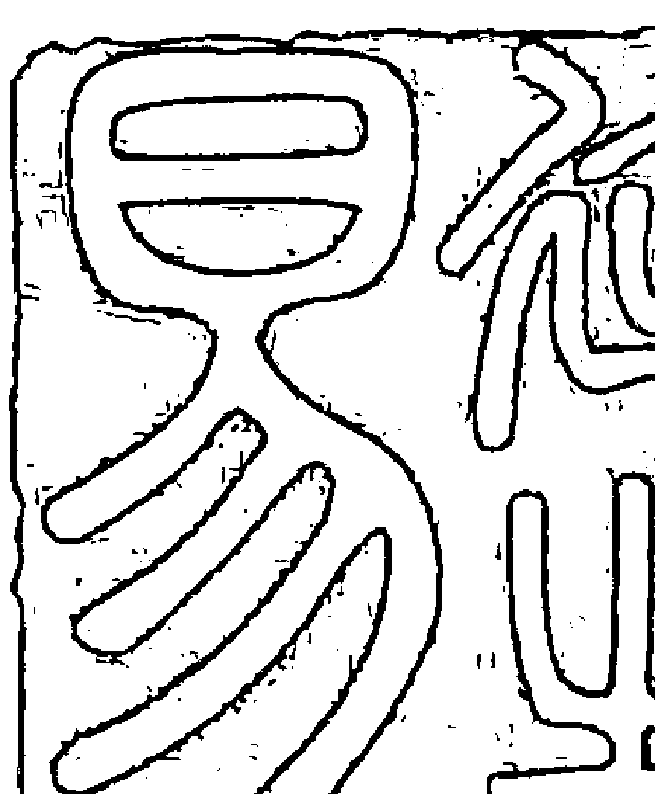

中央编译出版社
Central Compilation & Translation Press

传统文化往往是本民族或国家所固有的，也是最具凝聚力的。

优秀传统文化与高科技精华结合产生的文化，是更先进的。

## 《传》前易学及象数易学 (上)

张延生 张震 著

## 图书在版编目(CIP)数据

《传》前易学及象数易学：谁说《传》前无易学 / 张延生，张震著. —北京：中央编译出版社，2017.10
ISBN 978-7-5117-3378-8
I. ①传… II. ①张… ②张… III. ①《周易》-研究
IV. ①B221.5
中国版本图书馆 CIP 数据核字(2017)第 207097 号

## 《传》前易学及象数易学：谁说《传》前无易学

- 出版人: 葛海彦
- 责任编辑: 杜永明
- 责任印制: 刘 慧
- 出版发行: 中央编译出版社
- 地 址: 北京西城区车公庄大街乙5号鸿儒大厦B座 (100044)
- 电 话: (010) 52612345 (总编室) (010) 52612342 (编辑室) (010) 52612316 (发行部) (010) 52612346 (馆配部)
- 传 真: (010) 66515838
- 经 销: 全国新华书店
- 印 刷: 北京紫瑞利印刷有限公司
- 开 本: 787毫米×1092毫米 1/16
- 字 数: 826千字
- 印 张: 55
- 版 次: 2017年10月第1版
- 印 次: 2017年10月第1次印刷
- 印 数: 1—3000册
- 定 价: 190.00元

- 网 址: www.cctphome.com
- 邮 箱: cctp@cctphome.com
- 新浪微博: @ 中央编译出版社
- 微 信: 中央编译出版社 (ID: cctphome)
- 淘宝店铺: 中央编译出版社直销店 (http://shop108367160.taobao.com) (010) 55626985

本社常年法律顾问: 北京市吴奕赵阎律师事务所律师 闫军 梁勤
凡有印装质量问题，本社负责调换。电话: (010) 55626985

### 作者简介

张延生，教授、工程师。男，汉族，1943 年 3 月出生于陕西省延安市瓦窑堡，山东省滕县人，1969 年毕业于北京航空学院发动机工艺系工艺专业。曾任北京航空学院机械厂机加车间钳工班钳工、厂部技术室数控及光电跟踪加工技术与设备的助理工程师、工程师，光明中医函授大学易学教研室主任、教授。曾兼任中国周易研究会副会长、中华名人协会理事、中国医学气功研究会理事、北京中医学院大学生手诊研究协会顾问等职。现任中华易学大会主席、中华周易协会会长兼学术委员会主任，并被数十家企事业单位聘为决策或指导顾问。

## 作者易学特长：
（以“象数符号学”为认识与表述基础）

- 象数易学、易理、应用、易医、易学象数学、义理。

作者在北京航空学院上学期间，常负父亲首创的“经络测定仪”予人测试诊断，以求经络实质再探。1976 年开始触研气功养生。1979 年研发人体“特异”现象，继接国家任务。其后合作发表《弯曲的多维空间及超空间作用力》等论文，引起学术界注重。1981 年始研《易》。1987 年入选中国科技馆在香港举办的“中国古代科技展暨现场表演团”，代表中国大陆中医、养生界现场演示（包括“手诊气色形态诊断法”）及学术讲演三个月有余，受到新华社表扬。其事迹为多国与地区电视台、广播电台以及近百种书刊杂志主动专题推介。1988 年出任电视连续剧《师魂》的制片总顾问。与剧组人员共同努力，使该片达到预定目标——1989 年荣获“金鸡奖”的头等奖。

## 主要研究与应用业绩：

在研制无人高空侦察机关键部件、6000 吨橡胶压力机、舞台及室内拍摄灯光数控一体化以及光电跟踪、数控等加工工艺技术等方面，均取得重要成果。特别是在研《易》过程中，屡经困惑之忧、顿悟之喜，终于弃传统之法暂不用，自拓学经。即不从训诂、经文辞句入门，而自“象数”开窍、实践中寻理；汇现代科学、技术，反馈研探实践。累 30 多载心血，精聚体验，汇论己见，不仅探索出学《易》捷径——一套科学的易简学习方法和思维方式，并在领悟中医药、经络、人体科学、传统文化并哲学思想及“象数”易学及其相应“易学”真谛方面，更具独特见地、成果和创新体系。1983 年，参与创办“光明中医函授大学”（李德生、崔月犁任名誉校长，吕炳奎任校长），并于该校任教。同年，在国内率先开始义务传授推广以“气血、颜色、形态”为基础的“望手诊断”的方法。1985 年起，于国内外开始开展办学、讲演、学术交流活动，至今已教授学员三万有余、听众近 50 多万人次，期望易理再探，易华重现。1988 年经北京市教育局核准，率先于国内创办起全国性的光明中医函授大学“易经函授班”，学员 3000 人。自编、统筹易学教材 17 种、13 册、300 多万字，既有古《易》原经、原文、原著，又有当今现代科学相应易学论文及论著。率先添补了我国“社会办学”在相应易学教育方面的空白。为了回报与支持“山东大学周易研究中心”的工作，将其提供的所有教材及参考文章（包括版本的复印件），均按当时（1985 年）每千字 30 元的最高稿酬的方式，予以支付，并且由《周易研究》杂志首期发行始，执意作为“易经班”的辅助教材，每期固定订阅 3000 册（保本）的方式，予以支持。

其后，本人相继出版并发行了：

- 《易学思想概说——张延生演讲录》
- 《心易》
- 《炁易》
- 《气功与手诊（珍藏版）》
- 《易学入门》
- 《易学应用》
- 《易与和谐》
- 《易象及其延伸——易象延》（上中下三册）
- 《易理数理（一）》
- 《易理数理（二）》
- 《易理数理（三）》
- 《象数易学与应用》（上下两册）
- 《象数易学与逻辑》
- 《象数易学与逻辑（续）》
- 《易象及其延伸——易象延》（修订版共五册）等 15 部（22 本）著作与《易经与气功》录音带一套（上下集两盘）。

在国际国内的学术会议上，发表了：

1. “易学象数理论是卦象象爻辞的依据”
2. “易学象数理论在医学临床中的应用”
3. “研学易学的方法和途径”
4. “传统文化中相对平衡相对稳定系统的寻求”
5. “是否重视考虑使用繁体象形文字表述系统”
6. “‘文王重卦说’是又一次确定六十四卦的表述功能”
7. “现今研习易学存在的思路问题”
8. “由《周易》‘病’‘疾’之爻辞看其象数概念的一斑”
9. “‘易学’与‘数术学’促进了中国数学的发展”
10. “应重视‘数字筮符’到‘几何卦形’的确立与发展”
11. “应重视‘易理’及传统分类学的研究与发展”
12. “应重视‘易理’（非‘义理’）的研究与发展”
13. “对‘叁伍以变’的某些认识”
14. “八卦卦象与疾病的对应关系”
15. “对‘错综其数’之‘错’的某些认识”
16. “对‘错综其数’之‘综’的某些认识”
17. “简论‘儒’‘老’之‘道’内涵的一些认识”
18. “分析‘大衍筮法’判断的准确性和可能性”
19. “对《易》中‘和’与‘合’之义的某些认识”
20. “对‘象数易学’中象、数、理、实践之间关系的某些认识”
21. “对《易》中‘合’‘和’之义是创新基础的某些认识”
22. “由《二三子》篇中的‘其占曰’所想到的”
23. “对孔子及其思想需要重新认识”
24. “由数或数字起卦的某些方法”
25. “某些应用实例的象数与判断结果的分析”
26. “由非《易林》排序4096卦各卦所对应的‘函象’及其位置所想到的‘复合时空论’思想”
27. “写作《象数易学与逻辑》一书的出发点与目的”
28. “‘象数易学’是如何解决寻找不同事物间的同一性问题的”
29. “对三至六爻同类型易卦相互作用时，在‘象数’计算中表现出的准确率的认识”
30. “度量衡与卦、数及其本质性质状态的对应关系”（含六十四卦各卦的具体对应结构模式和具体数据值）
31. “‘象数易学’数理表述方法的‘合’‘和’‘以变’特点”
32. “‘象数易学’与‘十八届三中全会’某些对应内容的本质关系”
33. “写作《象数易学与逻辑》及《象数易学与逻辑（续）》集的某些缘由与目的”
34. “‘象数易学工程学’对‘社会主义核心价值观’的某些认识”等数十篇易学功底深厚，揭“象数易学”“象数易学工程学”“易理学”（含某些正确的“义理学”内容）“易医学”“易学象数学”“科学易”“易科学”“现代易”精髓，且影响深远的论文。由于“发古人之未发，言今人之未尽之意”，故引致同仁们高度的好评，并统称其是“象数易学”的“延生易”的独特独创体系和新兴的一门易学学科与领域。

张延生教授，1997年在“东方网景”网络“传统与现代”栏目中，率先开设“延生学苑”专栏，重点宣扬“中国传统文化中相对稳定、相对平衡系统的寻求”以及相应易学及其“象数”方面的基础知识和思想方法。1999年与学员在加拿大多伦多市创立“多成易学会”，并于次年1月在多伦多市举办“多成易学会首届国际易学研讨会”；同年创办“多成易学会网站”(www.duosuccess.com)，用中英文宣扬中华传统文化及中医、养生等方面的精华。2001年在“太极易”(www.taichie.com)网站，再次开设“延生学苑”专栏，专门宣扬中华文化的根基——“象数易学”的以“象数”为根本、为主的相应“易学”文化。2004年春节前，在该网站公开发表了，对2004年至2023年期间，世界主要大“运气”的走向与发展大趋势的预测，并强调地指出了：在此其间，中国的东北及其周边所形成的东北亚地区（包括朝鲜、韩国、日本、俄罗斯东部），将形成对未来20年世界政治、经济、军事等起着一定决定性作用的很重要的地区等的宏观预测；此外，还运用自己独创的“象数易学场效应”理论，指导“首钢”香港合资公司徽标（logo）的造型设计；协助策划确定“tom.com”网络公司名称及上市（含退市）时机等。在2006年出版的《易与和谐》一书的前言与内文中，一再告诫人们：世界众多发达国家的经济衰退即将到来；2009年“要提防出现类似于2003年的‘非典’疫情”等先期性预报等。

此外，张延生教授，对相应易学探讨、研究与应用，作出了破除迷信的“象数易学”“象数易学工程学”“易理学”“科学易”“易科学”“现代易”等方面的诸多重要的贡献，并将该成果与体系演化成了一种当今新兴的“象数易学”学科及其“工程学”学科和领域，为今后在中国科学院成立“象数易学工程院”做好“象数易”“科学易”“现代易”诸方面前期的铺垫和准备。

其间：

- （1）论证了中国古代“象数易学”的科学性及其某些发展脉络，以及恢复与发展中国古代“象数易学”原貌的必要性和现实意义；
- （2）指出了历史上儒家对“易学象数学”特别是对“象数易学”的部分认识误区和基本缺陷——只要是把儒家“形而上”的“义理”“易传”等理论与思想，与大量的自然科学规律相结合、相对比或相印证时，往往就会发现其相应的必然性认识与表述方面的诸多缺陷。因为自然事物及其自然科学、技术都有其自己的发展变化和相应而确定的自适应规律（是事物自身与时间对应的变化规律、生物体内生物钟与客观时间相应而自然产生的自适性结果），它不会是仅会按照封建统治者意识形态的“形而上”需要而相应地发展、变化自己的适应性规律的；
- （3）经过30多年的研究与实践，探索出了一套学习、研究、应用“象数易学”及其相应易学“易理”的独特而简易、有效且与现代科学、技术、工程、政治、经济、军工、生活、工作、文教、外交、党建等许多领域相结合的“延伸易”的认识与表述的很多成套及系统性方法，并在长期的客观实践中，取得一系列成果，而且在易学界破除迷信的工作中，作出了“易理易”（不仅是“义理易”）“科学易”“易科学”“工程易”“现代易”诸方面的贡献；
- （4）论证了“象数易学”思维模式与方法及其相应易学思想，对于构建和谐社会与和谐世界的重要意义，以及“象数易学”及其相应易学思想中，易卦、易爻的“以变”“合”“和”“统一”“融和”（不是“融合”）、“同一性”等发展观，是如何对应与指导我们“科学发展”“马克思主义中国化”“中国特色的社会主义”以及“有机辩证统一思想为主，形式与无机辩证统一思想相辅”的“世界观”“方法论”“认识论”等方面的创新思路及结果获取的诸多模式和一些系统性的成套的解决方法和方案；
- （5）在以上研发的基础上，建立了以易卦自身“符号学”（含数字型、阴阳爻卦型、方位结构分布型、多层型、组合型、集合型、复合型、类集集合型等）为基本根据的“象数易学”自身所自然具有的一系列“易理学”理论、方法及思想的“延伸易”的认识与表述体系（仍含有某些正确的相应《周易》“义理学”和“易学象数学”的“象数学”内容）。而且在“易理学”的内涵方面，在继承与发扬了传统“象数易学”“易理学”“易学象数学”“义理学”等原有正确的表述特点及功能外，更是具备了能广泛深入地继承、学习、研发、弘扬及表述过去、现在及未来等，对各种事物进行“公式”性认识与表述的“卦变”“爻变”“象变”“数变”“象数变”“符变”“位变”“性变”“质变”等的发展变化状态、关系及其相应规律，以及在“自然科学”“社会科学”“人文学术”等诸多学科、领域方面的与“时间逻辑学”紧密相关联的“类集集合论”（含“历史集合”）在“分类本质定性学”基础上的认识与表述的“组合学”在“系统论”“整体论”方面的认述功能（含“过程学”“比较学”“时间逻辑学”等）和作用——其中，并不仅仅仍是保持了“象数易学”及相应易学其原有的“命运关怀”的功能与作用，以及运用这些“象”“数”“理”“实践”等学问的基本知识和经验，仍然还可以专门用来理解及解释《易经》《周易》《周易大传》及其儒家在此基础上的各种衍生作品的卦、象、象、爻、辞、传、句、章等的解释学方面的功能和作用；
- （6）在以上认识的基础上，“延生易”又创立了：在“一阴一阳之谓道”的“对应统一”世界观启导下的“本体论”思想方法论的：“阴”＝“阳”或“阳”＝“阴”（即A＝A）的与“形式逻辑”直接对应的易卦、易爻、易象、易数、易符等对应性的认识与表述功能及体系，以及“阴”≠“阳”或“阳”≠“阴”（即A≠A）的与“有机辩证逻辑”直接对应的易卦、易爻、易象、易数、易符等的各自及其组合的认识与表述功能及体系。其中，卦爻组构的“几何”空间状态及其“过程学”与“时间逻辑学”和“时间易学”的“时空统一”的“延生易”的对应认识与表述体系及方法，使“象数易学”及其“易理学”（不仅是“义理学”），形成了以“形式逻辑”与“辩证逻辑”统而为一的“有机辩证统一逻辑”的“天地生合一”（含人）的认识与表述的“系统论”“整体论”体系和方法。即是说，形成了【数、卦、象、场、信息、能量、结构、状态、本质】的“大一统”的系统性认识与表述的模式和体系。也就是说，【数即是卦；卦即是场、态；场、态即是能量与状态；状态即是象；象即是信息；信息即是数与卦；信息即是数与卦都有其各自相同或不同的本质】——该九者之间的关系，是相互联系着的，是不可也不可能完全分开的“统一场论”的相互作用（情感）关系——知道其中任何一项的信息、数据或结果，都能相应地推导出其他任何一项所直接或间接相对应的信息、数据与结果。从而为我国及世界今后社会、政治、经济、军事、外交、文化、科学、教育、生态、党建等全方位的进步与发展，将会提供“中国特色”的本土文化基础上的创造及创新在思维及思想方法方面，许多的新思路与新的思考方式和方法——不会再仅仅还是以：有认识与表述上不可避免的必然缺陷的“形式逻辑”（又称“数理逻辑”“抽象逻辑”“理性逻辑”“科学逻辑”“现代逻辑”“逻辑斯蒂”“符号逻辑”）仍然作为我们思维、思考、思想的唯一绝对而不可逾越的思维、思想及思考方法的基本根据了——使我们思考的思路，会更加全面、完整、正确，且针对性更加的具体和实在。

故而，张延生教授进一步倡导并提出了：我们当前研发“延生易”及其“象数易学”的主要目的，是期望在中国传统文化推导方法的精华与西方现代科学推演（演绎）及归纳方法的精华组合中，构建起某些互通性的以有机辩证思想为主体并辅以与无机辩证思想和形式思想相结合的归纳、统一、“合和”与推演（演绎）、分解、“以变”的认识与表述的（比较、对比）平台和模式——使有自然科学背景的广大读者和好研玩易者，了解、接近、接受“象数易学”及其相应的易学思想；使有传统文化背景的读者和好研玩易者，在尽量不违背正确传统表述内涵、意义、方法的基础上，能科学化地掌握与运用“象数易学”及其相应易学的思想与方法——借以启发大家如何在优秀传统文化精华的“中国特色”前提下，来解决“科学发展”“中国特色社会主义道路”“马克思主义中国化”等的一些文化、思维、精神、价值及哲理等许多方面的世界观、方法论、认识论等诸多方面认识、表述与实践的一些“时间集合”（含“历史集合”）、“类集集合”、“象数集合”“复合空间集合”“复合时空集合”“多宇宙集合”“时空统一集合”等等的系统性、整体性思想和理论的一些具体、针对与抽象的对应结构模型、数理及其相对应的种种“理性与形象思维必须对应结合且相互印证”的根据等问题。

同时，张延生教授依然希望：我们应当在这个举世文化，似乎正在披靡于西方文化的（盲从）时代，仍能为我们中华民族的优秀文化及其传统思想和方法的精华，留下正常思维、理性及批判性思维的种子和弘扬的机会——

绝不能再让那些打着“反伪科学”幌子和旗号的自身确实又是“伪科学”者的各类人物，仍以违反“科学探索”认识与表述精神和思想的胡搅蛮缠的“违科学”的言行，继续再猖獗和狂自尊大了！

只有“文化创新乃至革命”，才是“科学随文化的发展而发展”的“科学发展观”“开放”“创新”思路及思想的根本的理性与实践的基础——也是我们“象数易学强中华，象数易学化天下”的最终且标，所以能达到的“有机辩证对应统一”哲理思想和认识与表述方法一贯得以支撑与实现的根基。

### 前言

由于当今人们已经认识到“象数易学”及“易学象数学”的“易理”（非仅是“义理”）以及其认识与表述方法的内涵，是非常容易与现代的科学知识及各种人类相应的实践活动相结合，所以出现了大量的“周易象数学”中关于“象”“数”研究及其运用方法的著作与文章，尤其是关于“易象”与当今科学知识相结合、相印证方面的著作与文章更甚（这些论著往往被称作是“科学易”或“现代易”）。即使如此，有关“易数”及“象数易学数学”等“易理”数理机制方面的研究与规律，虽然大家都很感兴趣，社会上也有许多人有很多的想法，可是由于对“象数易学”认识与表述的“象数”表述方法及其作用和功能的了解、认识、感受、体会及理解的根本性缺失，故而针对该方面的著作、论文与文章等，由于从大的思路与数理方法上讲，并没有在尊重继承古代“传统数理”（包括“象数”方面的数理）理论方法，或者是脱离了现在人们的一般认识的常态思维，故而有“古”或“新”的“易理”数理思路与方法方面的成体系的论述，更是寥寥无几。

由于在较古老的“象数易学”“易学象数学”及其相应的易学中，对“象”与“数”二者之间的作用与关系，起码在春秋及“三晋”时期，相应易界诸多的人们，就已经认识到它们是不可分的统一体了，而事物的“形”“象”又是具有相应针对性而是很具体的，很容易被人们重视并易于分类、综合、归纳、提升、找到其真相所对应的规律等，所以有关研学“易象”方面的文章与著作较广泛且较深入，而相对抽象的“易数”及其数理、哲理、## 《传》前易学及象数易学

逻辑规律等方面的研究与探讨，如果脱离了与具体实物或者实际事物的具体实践相结合与针对性的运用，是难以寻找到与被发现的。因此说“周易象数学”相应《周易》的“义理”中，“易数”以及其相应数理方面的规律，广大的人们往往不能够像对“易象”的研究那么受重视且成果又那么的丰富与充实。由此造成我们对更古老（春秋时期甚至以前）的“象数易学”的“易学象数学”及其相应易学的“易理”（含数理与逻辑哲理）以及后来汉朝“经学易”时期衍生出来的“周易象数学”及其相应《周易》“义理”真正的内涵与异同，也不可能了解、认识、掌握、区分得很充分、很真切。即使如此，可是“象数易学”的“易学象数学”与其后的“周易象数学”的“象数”思想及思维方式、方法的“象表意”“象数表意”“象形表意”自古及今的传承发展与广泛传播，它仍然促使并带动了中国古代自然科学领域中的天文学、历法、数学、律吕、医学、环境、生态、养生、建筑、美艺、军事及兵器技术等众多方面的系统性发展，以及使中国古代数学在世界数学的发展史中，在上千年内处于了遥遥领先的地位。

实际“象数易学数学”（不是《周易》象数学数学）在数理理论及实践上，像其他各类、各门、各科、各领域的传统文化、“国学”（不应该仅包括儒学，还包括“诸子百家”的学问）、哲学、理论与实践一样，特别是在我国，至今还缺乏真真切切地继承后再去相应地发扬的环节（尤其是继承环节中缺失存在的问题更大、更多）。由于没有真真切切地继承与弘扬优秀的原创思想及其方法，所以就更谈不上在继承传统基础上去发展或创新了（也包括“易理”“义理”、易数、律吕、中医、养生、修持、武术、军事、战阵、天文、历法、释、道、儒、名、墨、法、农、阴阳、纵横、五行等众多学派理论与实践方面的内容及活动）。假若，我们对中国传统甚至优秀部分持否定态度的话，这又是一种妄自菲薄的卖国主义和虚无主义的行径，那将是更不可取的！中华民族古时候的先进思维、思想、理论、方式方法、实践及其相应的世界观、认识论、方法论，造就了中华民族科学与文化在世界历史发展的许多领域中，曾遥遥领先于其他民族与国家的地位（尤其是在春秋战国时期，即某些学人认为的与西方“轴心时代” 相对应的时期）。也就是说，中华民族与中国古代时期的各个方面的发展，基本上都是靠自己的传统优秀文化与科学、技艺的发展而发展的，并不是完全依靠其他民族或国家的文化与科学、技术的引进弘扬而进行发展的（虽然在中国传统文化与科学、技艺地发展过程中，也曾吸取过其他国家与民族的某些文明及近现代文明的部分）。

受历史、地域、环境、生产、经济状态、生活、传统思维及文明、文化等条件的影响，人类社会各民族与国家的科学、文明、文化及其发展途径等，一直是处于多元化而不是单一发展的状况下，并且还继续会以多样性的变化为其发展的主流。同时，各国、各民族的文化也呈现出共生且互补的趋势，在继续发展着；文化间的差异、冲突甚至激烈的更替、消长、取代、同化、异化等，只是文化发展中一些暂时的现象与过程。中华传统文化体系相对于西方现有文化体系来说，它是另外的一种思想与认识及表述体系，而且这两大思想体系还存在着本质性区别，故而又造成在科学及其方法、技术等方面，二者也存有很大的差异，甚至在一些问题认识与解决的根本思路上，是完全不一样甚至是完全相反的（虽然在西方的某些古文化中，也曾出现过类似或相同的文化及思路，可是现在已被其后人们，由于个人最大利益的盲目卑鄙无耻性追求及其欲望的不知足，早已远远地被他们抛在了脑后）。在人类发展的历史进程中，此二者都曾先后各领过风骚，今后还将会各自或共同大放异彩。因此中国的传统及传统文化，再也不能像原先那样受制于 “西方文化中心论” 的制约了！为了中国在世界上各方面都能迅速发展与壮大，就必须坚持实行 “以中国传统文化为主 ‘体’，西方文化的精华为辅 ‘用’ ” 的以 “辩证思想” 为主 “体” 并辅以 “形式思想” 和 “无机辩证思想” 为辅 “用” 的 “有机辩证对应统一思想” 的科学原则，彻底改变某些人心目中的那种 “以西方科学、文化为中心、为标准”，甚至想根本上剔除某些优秀 “象数易学” “易理”（不仅是 “义理”）、“中医学” “国学” “诸子百家” 思想等传统及文化的理论、观念与认识及标准等。

## 前言

写作本书的另一个目的，也是为了让我们能进一步地从 “象数易学” 及其 “象数易学数学” 以及 “象数易学” 及其 “易学象数学”（不是《周易》及“周易象数学”）发展史这些角度，了解、认识中国古代“易理”里“象数易学”及“易学象数学”中的“数”与“易数”的一些古代传统中的抽象与形象思维的变化思想及其变换规律，借以丰富、充实或简化现代数理模式构成与计算方式，继承并发扬中国古代“象数易学数学”及“象数易学”的“易学象数学”认识与表述的优秀部分。

同时，通过以下我们对“象数易学”及“象数易学数学”的一些分析、研究与再发现，我们会非常惊奇地发现，“象”“数”对应统一不可分的思想，可以使我们无论在什么复杂变化的环境条件下，都能很快地发现任何相对应存在的事物之间所形成的总体本质规律、信息及状态等。故而我们就能够把相同或非相同事物之间的任何相应的相互作用关系的本质必然性规律、信息、状态等，都能分析、研究、区别、归纳、综合得非常清楚和明白。这是迄今世界上无论其他什么学科、什么领域等，都还无法想象甚至无法根本做到的一门学问。也就是说，我们这里的“象数易学”及其“象数易学数学”的数理规律，可以用来分析、研究、区别、归纳、综合与总结任何学科及领域的任何类型事物之间（甚至是跨时空）的相遇、搭配、产生、形成、混合、对应、统一、融和等的总体规律、构成、状态、信息、能量、量化、数、卦、象、场，以及其间的“场效应”状态与规律等。也就是说，我们“象数易学”认识与表述的整体与系统性体系，是一个[数、卦、象、场、信息、能量、结构、状态、本质]的“大一统”的统一性的认识与表述的系统模式和体系。即：[数即是卦；卦即是场、态；场、态即是能量与状态；状态即是象；象即是信息；信息即是数与卦；信息即是数与卦都有其各自相对应的相同或不同的本质]。该九者之间的关系，是相互联系着的，是不可也不能分开的“统一场论”的相互发生作用的关系——只要知道其中任何一项的信息、数据或结果，都能相应地推导出其他任何一项所相对应的信息、数据与结果。

而现代科学与现代科技手段，在分析、研究、区别、归纳、综合同类或同属性事物在一定限度内（线性）的规律与状态时，还是有些方法的（特别是依靠数学手段），可是在分析、研究、区别、归纳、综合非同类或非同属性、非同领域或非同时空等不同类型事物间的规律与状态时，除了现代数学还有点限定的极个别（线性）的思路外，其他（非线性的复合时空）各学科的认识与表述方面，更显得是无能为力了。比如，物理学与生物学中各类事物的状态、规律相搭配、相遇、相对应时，会形成什么样的规律与状态？具体说，比如，宇航飞行舱返回地球时，它所形成的（重）力［指物理学中的“力（F）等于事物的质量（m）乘以它的加速度（a）”］与生物学中的黑龙江地区大面积的冬小麦苗相遇或相对应时，会形成什么样的规律与状态？西方至今也没有任何学科与领域的“科学”，能想到或找到与之相对应的分析思路和结果。而我们的“象数易学”学科领域及其中的一些“象数易学数学”方法，靠“象”“数”关系的相应和“时间”与“空间”统一在一起的规律，就能相对容易地找到与其相应的思路和判断结果。

又比如，西方有哪种学科是研究“柿子掉下来砸到树下的人腰上”的“柿子”的运行规律，就能反映出该人所在学校的领导人下台及其学校变化、合并、变迁之事呢？只要通过我们“象数易学”学科“易理”中的“象数易学数学”方面的“穷则变”“物极则变”“变则通”“通则久”的“极其数”的“极化”“类化”“概化”“约化”等“易简”系统性的对事物数理本质方面的处理及数理分析，就很容易地能找到与其运动、静止等状态相对应的各种系统性答案及结果。这也是中国古代数理传统在解决复杂的非线性事物及其事物规律时，一般所采用的非常重要的思路与处理方法。

读完我所专著的《易象及其延伸——易象延》（五册）、《易理数理》（三册）、《象数易学与逻辑》《象数易学与逻辑（续）》相关著作以后，就会很自然地感受体会到我们“象数易学”新学科、新领域在其相应易学的“易理”及其“象数易学数学”和“易学象数学”为我们跨学科、跨领域、跨行业、跨时空等找出事物的共性、共通性、普遍性的共识认知与表述基础，以及了解、认识并掌握各学科、各领域及各行业间各事物的相遇、相应、搭配、混合、组合、汇合、叠加、生化、变化、发展、转化、以变、统一、融和、合和、生生、更替、取代等所形成的规律、状态等。特别是能明了它们之间所形成的统一、融和、“合和”的总体、总体场态及其必然形成的本质性之间相互作用所共同形成的大趋势、大方向等方面的必然性规律。当然，在不同或相同的时空、领域、学科、行业等一定相对应的先决条件下，这些具体规律相应地都会有其针对性极强而准确的各自的规律、答案与相对应的结果——这也是我们必然提出“象数易学强中华，象数易学化天下”的根本性依据。

按照我们“象数易学”新学科、新领域的“易理”认识论、方法论认为，越是所谓的“偶然”“随机”性的事物，越是对客观存在的实际事物的具体针对性实在与事实的表述。也就是说，一切事物的发生变化都是客观存在的现实。不能说，你了解、认识、掌握到或想到、意识到它及其相应规律的存在，事物就是“必然”性的存在，你不了解、没有认识、未能掌握或没能想到、意识到它及其相应规律的存在，事物就会是“偶然”“随机”地存在着。事物既然已经发生了，这就是一种“必然”而“客观”的实在性事实，你了解或不了解、认识或不认识、想到或没能想或者是意识到及没意识到它的存在及其规律，它都已经成为了客观存在的必然的现实了。所以在我们的“象数易学”新的学科看来，任何事物以任何的形式发生、出现在任何的时空条件下，都是客观必然的结果——不存在人为及其假设的偶然、随机性。由“象数易学数学”可以把所谓的任何时空条件下的任何“随机数”，都能处理成相对应的“必然”“必定”相应之数的规律来看，也反映的是这种客观规律所内涵的科学规律和道理。而我们这里的“数”，所对应的是与该数值相对应的任何（类型的）事物，所以“象数易学数学”可以把任何事物都变成数与数之间的“合”“和”“以变”关系；再根据各“数”之间的“五行”本质属性定性的“生克制化合”等数的本质关系和标准，以及与其“易数”的数理规律及处理法术（方法、技术），就能找到与其数值相对应的事物本质之间的明确必定的相关作用关系、规律与趋势。

可是，受传统汉代儒家“经学易”确立后相应《周易》“义理”思想的误识性的误导影响，大家往往仅注重到数的“阴”“阳”“奇”“偶”等方面的属性，可是忽略或轻视了“易理”对数的更重要的“五行”本质属性与质、量、现象与本质分布统一互补性的认识与表述。对数的性质、属性等如此的重视，这是由于我们的“象数易学”新学科、新领域对“数”的内涵本质的认识，远远超过了其他民族、国家和民众的认识。“西方科学”虽然现在已经认识到“数及数理规律”在任何空间中都是能够通行使用的，可是他们却并没能从数本身的时空内涵意义、属性和概念上感受、体会到，“数”本身就能直接表述时间或时间过程以及其相对应空间与空间结构状态等规律。也就是说，“数”本身同时就具有既能表述时间又能同时对应表述相应空间的特性。只要找到时间之“数”所对应的空间之“数”（“数”就是“象”；“象”包括其几何型构成；卦、爻就是几何型空间表述的构成），说明此刻就已经找到了该事物在此对应时空统一前提下的“有机辩证对应统一”的规律（结果）了。

由于文字与语言的表述功能与作用，无论是古今中外，往往会是处于“书不尽言，言不尽意”的状况下，所以“圣人”们才发明了比语言文字的表达功能与意义内涵更加丰富、更深刻，可以充分表达人们内心心念的“设卦以尽情伪，立象以尽意”的易卦（包括“数字及数位”筮符；几何卦形符号、易卦与易爻分布结构等的集合型表述等结构状态）、易爻表述方法。又根据卦数、卦符、卦象、爻符、爻象等符号，往往是表述某类型事物及其发展变化过程的象征，其内涵有诸多事物及其特征，人们可以不受文字及概念等的限制与束缚（这也是“象数易学”及其相应易学“易理”与“周易象数学”及其相应《周易》“义理”在认识与表述一切事物方面的根本性差异），从中领悟到更多、更丰富的“易理”（不仅是“义理”）内涵。

虽然通行本《周易》相对应的卦、象、象、爻辞及其《十传》中的文辞，能反映当时在占筮过程里某些相对应事物的一些规律、结果及论断，可是仅凭其搜集与记述的这寥寥事物（64 个卦的卦辞及其相对应的 386 个爻的爻辞）的因果关系，是无法根本表述清楚宇宙万事万物的各种关系、作用与相应规律的。这是因为通行本《周易》中《易经》部分所搜集及记述中的实践内容，真是太贫乏了（只有 64 种卦的卦辞和能反映事物因果关系的 386 个爻的爻辞），很多事物，特别是与“自然科学”及其因果有关的事物及其规律，除了“卦气说”“律吕”“纳甲”“纳辰”等说而外，其他更多的学科和领域，基本上它都很少能更全面系统地涉及，故而它不足以也不可能像后来仅根据通行本《周易》内容发展来的“义理”派们所想象“发挥”的那样——从哲学及科学的角度上，它能表述千变万化的宇宙构成的“道”的真实面貌。何况古代当时人们的思想与概念，还没能形成后来和现在人们的某些哲学与科学中的认识与概念；“义理”到底是不是能真切全面客观地反映其相应易学的“易理”的内涵，如果没有在“易理”指导下与实践能结合的“象数易学”“易学象数学”“周易象数学”“图书学”“数学”“理学”“数术学”“心学”“功利学”等学派学科与实践的印证，是很难提升成所谓正确的哲学性意义的“义理”的。

故而“象数易学”“易学象数学”所相应产生的易学“易理”及“周易象数学”所相应产生的《周易》的“义理”，都应有与其自身“符号学”相适应的“易理”“易数”“易象”“象数数理”“卦理”“爻理”“位理”“性理”“质理”以及其形象思维和象数思维等“象表意”“象数表意”“象形表意”（并非仅是“象表义”“象数表义”“象形表义”的内涵）的理学与实践。这些理学与实践等，也不单单是专门为了解释通行本《周易》的卦、爻、传、辞、字、词、句、章的，其中除了可认识、掌握其富有深厚的“易理”及“义理”哲理内涵而外，我们还可以将它们概念化、逻辑化（包括形式逻辑、辩证逻辑、数理逻辑、抽象逻辑、科学逻辑、直觉逻辑、形象逻辑、感性逻辑、无机辩证对立统一逻辑、有机辩证对应统一逻辑等）、公理化、数理化、公式化、数字化、程序化、标准化等，借以指导与联系过去、现今及将来的各种实践与具体针对性活动（包括自然科学、社会科学、人体科学、生命科学等边缘学科及跨学科的科学和领域），锻炼与提高我们的思维与想象能力，而不只是想使其仅存有由《易传》旁及出来的以社科、人文学术为主要对象的所谓“对立统一”的以“对立”“排他性”为主的“形而上”的（儒学）“义理”。

虽然大家都说，是伏羲创造发明了以“卦”的形式来认识与表述一切事物的状态与规律的认识与表述方法，可是到如今，我们并没有发现充分的证据可以证明他所发明创制的“卦”，到底是个什么样子的结构状态？可在“伏羲画卦由数起”以及后来“殷墟”及“周原”以及其历史事实之前的许多新旧石器时代的考古实际中，还有夏、商、周三个朝代至春秋和战国初期的史实记述与考古中，却发现了相当数量的用数字来进行对应排列表述的三位、六位及少量的四位、五位的“数字排列符号”“数字（信息）筮符”（有人称其是“数字卦”）、“数字型组合文字”“数字排列识别符号”等。这充分地证明了《汉书·律历志》中所述“自伏羲画八卦，由数起”这一说法的正确性。而在所谓“文王重卦”的周朝以后，特别是到了战国中后期，社会上出现了大量的以三个或六个“阴”“阳”爻画所组成的“几何（空间）结构形式”的卦符。当然按《古三坟》之说，在夏、商、周三朝都已经存在有各朝时期相应的“八卦”与“六十四卦”的既完整又具体的“几何（空间）形卦符”结构了，可是我们也并没有充分的历史证据及考古实物予以充分佐证。到底“数字（信息）筮符”（数字排列符号）是根据什么数理规律或其他什么依据发展及转化成对应的“几何（空间）结构形式”的卦爻符号的？至今还是个迷我们认为，最迟也是在“百家争鸣”昌盛的战国中期（公元前300年前后“爻题”开始普遍流行），就已经被普遍认可是这种卦爻结构进行对应认识与表述的形式了。即使是在出现所谓“文王重卦”说之后，儒家所推崇的通行本《周易》与《周易大传》的“经”“传”中，对“重卦”的概念与思想在认定方面，也看不出这种思维模式被重视或强调其在相应易学思想发展里所处的重要性及重要地位。所以说，“文王重卦”说，只是后人不确切的甚至是附会性之说而已（有另文详说）。

从我国古代“卜”到“占”“筮”的发展过程中，我们可以看到，古人是首先注重甲、骨上对应的纹理变化（即“象”变，“龟，象也”），后来又改变成首先重视“占”“筮”中“数”的对应变化（“筮，数也”）。起码在西周时期，人们还是以“卜”为主、“筮”为辅的原则来对待“卜”“筮”方法的。直至发展到春秋战国及其以后乃至今日，人们才慢慢地产生与认识到“象”与“数”二者，是紧密相联而不可分离的概念。实际上，我们只要知道了“易数”的变化规律与思想方法，就能直接认识并掌握“易象”的变化思想及其相对应的数理等变化规律了。这种“数”与“物”（象）统一在一起的“象数”数理认识与表述的思想与方法，正是现在“机械式”或“电子式”计算机算法语言所缺少且目前还无法实现的思维与方法。只有，当“有机式”或“生物式”计算机出现后，我想才有可能会全面完整地步入该必由之路。

如果我们不知道“象数易学”中的“数”向“象”是如何转化、发展的规律，就不能深刻地把“象”的变化，简化成简单的“数理”变化模式来进行对应或直接性的表述。由“卜”得到的“象”向由“筮”得到的“数”进行转化、发展；再由“筮数”向“象”进行转化发展；直至我们现在再由“象”向“数”的表述模式转化、发展，这么做就充分地说明了，中国古代“卜筮”文化及其相应易学思想方法，是由繁到简，由简再到繁，直至现在我们再由繁到简的发展过程。这也是我们“象数易学”相应易学的“易简”“极化”“类化”思想的具体体现与表现。因为“象”是一切事物的抽象与具体形象、状态、结构、信息等的对应性表述，再根据“象”就是“数”的思想，只要我们对事物的“象”进行“易理”数理方面的简单统一的标准化处理，就能迅速、准确地掌握相应事物本质间因相互作用而变化的必然性规律——达到的并不是对占筮认知无能无奈下的所谓“善易者不占”为借口的，而是“善易者实践（占）”的“实践是检验真理的惟一标准”的判定境地！

通行本《易传》中曰：“极其数，遂定天下之象”；我们平时所说的“在数难逃”；毕达哥拉斯所说的“万物皆有数”；老子《道德经》中说：“大道无形……善数者不用筹策”；以及宋朝的沈作吉所著《寓简》一书的卷二中说：“物之成败皆寓乎数。知数者以数知之，知道者以‘道’知之，物不能离乎数，数不能离乎‘道’。以数知之则通矣，以‘道’知之则玄矣。”其意思是说，数是不能脱离开它所直接对应的事物来说的，数同样也是离不开‘道’而存在的。“数”和“道”是相通的，如果以数理运算、推衍得知事物不变或相对应的道理，说明通了了事物的规律；假如通过体悟感知（此乃王弼“扫象说”的原因）明白了“道”，说明知道了事物不变的“玄”（妙）的本质。我认为，在他们看来，“数”除了有“量”的表述功能之外，它还有表述事物“质性”“本质”“属性”及形象构造的功能及能力。同样是宋朝的张成行，在其所著的《皇极经世·观物外篇衍义》中说：‘气’不丽乎数，特人不见耳！故曰，非数之不行也，有数而不见也。”以上论述都说明了“数”及其“数理”是万物不可分离的自然属性，它是被人们自然感觉和感知到的客观存在，而并不是完全靠抽象想象所能想象出来的——特别是在人类原始时代的伏羲时期（当时人们还不太可能将数与实物分开来进行思考）。“易数”从上古以来，一直承袭了当时的原始思维方式，数始终是依物的存在而对应存在着，而不会独立地去（孤立地）存在着。这与西方或现代数学的认知不同。就是因为西方数学在发展过程中，那种主要以人为的抽象性为主，往往脱离或忽视了其相对应事物的存在与演化，才造成了近两千多年来的“三次数学危机”的发生。如果其思路不来个彻底的改变，恐怕新的数学危机的发生，也还是在所难免的。

在“象”“数”的关系中，虽然易“象”是“象数”理论中最基本、最重要的根基内容，可是根据中国古人对“象”“数”的认识与实践，我认为“数”本身就是“象”（形、物）的一种属性；“数”和“象”之间是可以互相转化、渗透、更替与融合的——二者间也是不可随意分开的统一体。恩格斯在“关于现实世界中数学的无限的原型”一文中，也从逻辑上肯定了“象”是“数”的根源，他认为真正的数学，都发源于（自然物象）自然原型。在中国古算与古代数学中的“数”，主要表述的是数的量，而古“易数”中的“数”，则主要表述的是“数”的象和“数”的素质（本质性质）。正如通行本《周易·系辞上传》中所曰：“参伍以变，错综其数，通其变，遂成天地之文；极其数，遂定天下之象”，“极数知来之谓占”。《说卦传》中还曰：“参天两地而倚数”。依靠与“象”[“天3”（包括天1）及“地2”]所对应的“数”，是作为设卦、立卦的基本根据，就是“倚数”的涵义。把《河图》《洛书》及爻、卦数或卦序数等最基本的基础数1、2、3及其“和数”3、5，进行“错综”（“对”“反”）之间的不同或相同的排列、组合变化，并且搞明白其排列、组合变化中的内涵，才能知道天地间相应事物及其间的各种规律。而且，只有计算与归纳到最终极（“绝对”“内数”“基数”）之数后，才能找到或确立与其数相对应的卦、爻的变化之“象”（标准统一的空间与几何结构状态），这就是“极其数”最终的目的——找到事物的本质规律以及与其直接对应的结构状态、信息等。

## 《传》前易学及象数易学

由此看来，“象”与“数”二者之间，在古代圣贤及我们的“象数易学”思想的认识中，形成的是：“数”更带有根本的性质，数与数值的最终的相同或者不同，可以决定“象”之间的差异性或共同性的本质间相互作用时的性质。也就是说，数与数值大小的不同或相同，也都各自有其相对应的相同或不同的本质性质（包括“阴”“阳”“奇”“偶”性质，“五行”本质属性性质，类型、类别性质等）、状态、结构、信息等规律与特点。

除此之外，我们的“象数易学”新学科、新领域相应易学的“易理”及传统“周易象数学”相应《周易》的“义理”，都认为：

> “象”还有“内象”“外象”之说，其相应的“数”也有“内数”“外数”以及“内算”“外算”之分。

这里不仅是指六爻卦体中的上（外）下（内）两卦间的“象”与“象”、“数”与“数”、“象”与“数”和“数”与“象”的相互组成的关系。

其中——

### 内象

表述的是，不变的“天健也、坤顺也、离丽也、震动也、巽人也、坎险也、艮止也、兑说也”等三爻（卦）的抽象意义之类的总体概括（不变）的本质之“象”；

### 外象

表述的是，变化的“乾为天、坤为地、离为火、震为雷、巽为风、坎为水、艮为山、兑为泽”或“乾为圆、坤为方、离中虚、震为高、巽为绳直、坎中满、艮为石、兑为少女”等三爻（卦）的“大象”及其具体意义和重卦（别卦）之类的（变化）现象、表象之“象”。

### 内数

指我们《易理数理》著述中，所研讨的那些各种“分类”“进制”中，不变的（最内层）基础数（包括“卦序数”）或方位分布数及“类”数：《河图》的分布数与（“同根数”）“生”及“成”数；《洛书》与《后天八卦》的分布（“根数”）数与序数；《先天八卦》《连山》《归藏》中的分布数和卦序数等“基数”（本质数）。即类似我们现在所说事物对应的“不变量”“常数”“常量”“等量”“静参量”“不动量”“静态指数”“不变数”“等价”“基础量”“根本量”“初始量”“恒量”“基态量”“固定指数”“底数”“确定量”“限量”“定量”等概念。

### 外数

指我们《易理数理》著述中，所研讨的那些各种“分类”“进制”中，变化的并超过本“进制”中最大的基础（根数）数的（二层及其以外）数。即《河图》中10以上的数（不含10数）；《洛书》与《后天八卦分布》9以上的数（不含9数）；《先天八卦》《连山卦》《归藏卦》中，8以上的数（不含8数）；还有它们与其他重卦、变卦、“互卦”“多爻卦”“杂卦”“序卦”之类所构成、组成的相应之数（表象、现象之数）等。即类似于我们现在所说事物所对应的“变量”“可变量”“非常量”“动量”“多变量”“变数”“不等量”“不等价”“非基本量”“非恒量”“变态量”“指数”“自变量”“因变量”“随机数”“非限量”“不定量”等概念。

单就“先”“后”天八卦及其各自分布结构所形成的诸数来说，“先天八卦”的基数，对应的是“内数”，而“后天八卦”的基数，所对应的则是“外数”。这也是邵雍以“先天数”为“体”、“后天数”为“用”，以及我们以“先天”的“一”数（太极）为“体”、相应的“后天”的“九”数为“用”的处理方法的数理根据的来源之一。又由于中国古代的传统思想及数理，都离不开与相应实际应用相结合，故而导致了古代从周朝开始的人们，对“九”数（大数据）格外重视。

中国古代在一般的易数、“易理”“数理”“义理”、数学、数术等计算方法上，又分成“内算”与“外算”两大类型。比如，在中国古代的数学家秦九韶所著的《数术九章》一书的序言中，他说：“今‘数术’之书，尚三十余家，‘天象’‘历度’谓之‘缀术’，‘太乙’‘壬’‘甲’谓之三式，皆曰‘内算’，言其秘也；《九章》所载，即周官‘九数’，系于方圆者为‘胄术’（即测量方法），皆曰‘外算’，对内而言也。其用相同，不可岐二。”他把“天文”“历度”“历法”的计算同“数术”中“太乙”“六壬”“遁甲”的计算，统称作是“内算”。“内算”法中包含着事物根本而不变的本质规律和法则。而把数学中与“勾股”“方”“圆”“测量”等有关的《数术九章》内的应用数学，则称作是“外算”。“外算”法包含有根据人们的不同或相同需求和事物间各种现象及变化的规律与法则。虽然“外算”相对“内算”来说，从方法论来说，都有相同的功能和作用，可是二者间各自所得到的计算结果，却是不能同日而语的。也就是说，在古人的眼里，把研究那些事物的大内涵及不变性与本质性规律的计算、推演、推导、推理等方法，才认为是最终认识事物的根本的大法——能找到事物的大方向、大趋势、本质（必定性）规律，而把研究那些事物的一般内涵及其变化性与现象性规律的计算、推演、推导、推理等方法，则认为是认识事物的表面、临时与暂时性的规律的一般方法——找到一定时间条件对应下的事物的变化及变化中的具体针对性规律。通过对事物本质的推导，能知道与明确不同或相同时间对应下的事物确定（固定）性规律与状态，而通过对事物一般性、变化规律与状态的推算，可以知道不同或相同时间条件下事物临时、短期或暂时性的对应规律与状态。也就是说，“外算”是相对“内算”的不变的本质规律来说的变化及变化过程中的相对应的现象性规律。因此，中国古代的统治者们与圣贤之士们，往往都是首先重视事物的“内算”规律，其次才重视事物的“外算”规律。而西方数学中与“内算”意义相似的内涵，应该就是描述不变道理者的“拓扑学”及其方法等。

从“数”的基本数学概念上来说，大家一般都知道它是表述一切事物的量的概念。由“数”的起源与发展来看，它是被我们感觉和感知到的与实际事物联系在一起的一种观念，而不是我们完全靠想象才抽象出来的脱离对应实际事物的那些概念。无论是东方还是西方的原始人类，都是把“数”的观念与实际事物混在一起来认识的，故当时还不可能将“数”与物（的存在）分开来进行思考——离开与物相对应的数，就失去（具体针对性的）数的根据。而“数学”在大家的眼里是一门研究现实世界的空间形式和数量关系的科学。从数学的角度看，空间形式与结构状态等，也是一种数量关系。也就是说，任何空间都表现成一定数量的线、角、面、体等不同形式的组合、构成关系。特别是《易》卦、《易》爻、《易》象中的各自本身或与其他二者及二者间的单一或二者共同组合及结构构成的集合或方位分布状态，更能反映出这种数量关系。再说了，希腊“重虚”的抽象纯数学，源自于“充满空间特性的几何学”；而中国古代的传统数学，也出自于“方圆的几何图形”。也就是说，西洋数学与中国古代数学的产生与发展，都出自于几何图形作为依据。有关这方面的论述，可见我所著的《易理数理》（三册）与《易与和谐》等书中有关对各易卦、易象的集合、构成，以及各方位分布结构构成的分析与讨论，还有其他人所著的与“象数易学”有关的“工程易”“科学易”“现代易”及“数理易”方面的论述与著作。

由于我们的“象数易学”及中国传统相应的“周易象数学”文化，始终是把“数”及数的理论，寓于实物及其“象”之中，所以使其不会单纯地制造出一套纯数学的理论。既使在处理复杂的大系统（包括天文、历算、中医学等）中的难题时，也是采用这类“数”与物不至于分离的处理方法。由于数物、形数、象数本身二者的统一，就形成了事物间最好的“易简”式的认识、对待、表述及处理方法之一。再加之“极其数”“类化”“合和”“以变”以及“穷则变”“唯几、唯深、唯神”等的“逼近”“微积分”等之类的思路及思维方式等，形成了一整套处理复杂问题及事物的数理理论、标准和方法。特别是现在西方所面临的众多的复杂事物及非线性的物理等问题，是很难用“微积分”方法顺利处理的，因此它们很需要向中国的“象数易学”的“易理数理学”“易数学”“数术学”“易学象数学”与“数学”等方法学习，利用现今的“自然算法”和“研几”“几化”“细化”“微化”“极化”“至化”“穷化”“尽化”“类化”“群化”“集化”（含“集合”、组合、复合等）、“幻方”“矩阵”“分化”“和化”“合化”“生化”“广化”“概化”“约化”“变化”乃至《太玄》等（“化”法），与“易数”处理思路结合所提供的“集合学”“组合学”以及“类集集合学”与“组合数学”等系统论、整体论思路，将能较完美、直观地解决此等复杂性或非线性的认识与表述问题。

物的规律之后，中国传统文化受相应“易学”文化特别是受“数位筮符”[有人称为“数字（信息）卦”]、“蓍草成卦法”等表述模式的启迪的《易》理、哲理与实践的影响，引发和造成了中国人对数的高度重视。数在中国传统思想构成、民族文化心理的积淀、实际生活、工作及社会、科学的实践当中的运用，不但占有重要的地位，而且还起着重大的实际与推动作用。况且中国人还以科学的实际精神来看待与对待数，认为数存在于一切具体事物之中，离开了相应事物的实际存在，数就失去了其实际存在的相应的根本依据。在这种思想的指导与推动下，造成了“中国算术”“中国代数学”与“中国几何代数化”等数学成果，在世界古代数学发展的历史进程中遥遥领先的地位。

我国传统文化中的数的概念，一类是，存在于现实生活中的已知的数，而另一类是，难以认知的未知的数。其中，前者促进了科学务实精神与实践的发展，而后者则促进了未来学与预测及预防科学的发展。由于中国古代传统历来都对数文化中的实际应用非常重视，故而往往忽略了对纯数理、纯理论、纯数、纯符号学等抽象方面的研讨与归纳，结果造成了14世纪以后，我国“抽象演绎推导体系”相对不足的状态。可是，由于历来统治者受相应易学知变、适变、应变、通变要求的影响与传统各行各业对“卜筮”活动的相对重视，以及“天下一统”社会稳定、环境状况与人体健康、养生、修持等平衡、稳定与和谐的需求，故而“防患于未然”“预测学”“预防学”“防治学”等“预防为主”的学科与学问，在我国古代得以充分的发展，并成为各种“治理学”“系统学”“整体学”“信息学”“控制学”“调控学”“平衡稳定学”“和谐稳定学”“生态和谐学”等学说或领域的依据和基础。

我国传统计数的出现和算术的萌芽，有人认为是在远古时期的“结绳记事”时期。“结绳记事”的方法，除了能用来计数传递约定俗成的信息之外，它还可以以结的绳扣的数量，来对应表述和记录原始集体生活中，必须记住的有关事物的某些重要的数量及其与之相关的诸多关系——“数”能反映出现实事物的数量关系（这从《河图》《洛书》里串起来的黑白（阴阳）数的具体结构分布图示中，就能得到明显的体现）。而“数学”的产生，在我国古代也如世界上其他民族和国家一样，开始于对实用性的各种计算、测量、统计、归纳、分布、分类、分配等活动。可是对数的认识作为某种文化现象的反映，那又不仅仅被简单地看成关乎数量、计算和测量等领域的事了。由于中国传统文化底蕴的深刻且广泛，就从我们汉语的日常语用学方面来看，很多内涵深邃的词语，都与中国古代“中算”、算术、数学、“象数学”“数学”中的术语“数”“算”“筹”“策”等概念紧密地关联着。

受相应“易学”“周易象数学”等时空观的连续与关联性论理与实践的影响，在中国古人的眼里，其一，认为没有任何可以孤立且纯粹抽象的“数”的存在；“数”不仅总是作为与客观反映的主观或客观的事相关联的普遍性而存在，而且存在于事物之中。离开了对应事物的存在，就无法谈及事物所对应反映出的“数”与数量之间的必然性关系和规律。“数”是由现实事物中抽象出来的一种事物的属性与关系，而不是可以脱离具体事物而存在的不为人所感知与把握的实实在在物件。这是思维始终不脱离实际进行观察、分析、思考、处理、对待问题的唯物主义认识论的体现。其二，认为“凡是有‘数’都是确定的”——即“定数”是确定的；即使是“不定数”，它也会存在于一个大概的确定范围；不能对比、没有分化、未加估测、没有界限条件、浑浑沌沌、模模糊糊无法分辨与区分的事物，是无法进行对应性言“数”（含无限∞概念及不存在的0的概念）的。尽管有时所指之物只存在于唯心想象的头脑之中——实际存在之物的虚幻化与虚拟化，可是它也不会形成古希腊毕达哥拉斯学派，以及亚里士多德与第欧根尼·拉尔修等所说的“万物本源”之“数”那么的抽象、纯粹及虚无空洞到了极点的概念。故而在中国的语言中，会有对应某些确定的看法、情况、道理、对策、素材等的“招数”“礼数”“路数”“胸中无数”“哑吧吃扁食，心中有数”“套数”“在数”“定数”“基数”“类数”“理数”“策数”“根数”“同根数”等词汇。

受相应“易学”“周易象数学”“数术学”（又名“术数学”）、传统数学等影响，中国古人，往往把一些与某些时间与时间段有关的“数”，与该对应事物的不以人们意志为转移的、不可抗拒的事物规律与趋势相联系，于是就产生了“天数”“气数”“运数”“命数”“在数难逃”“寿数”“岁数”“数奇”“尽数”“绝数”“定数”“终数”“极数”“极其数”“类数”“穷数”“吉数”“凶数”“吝数”“死数”等与“天气”“时气”“运气”“命运”“时运”等对应的一些必然性数词。其中，“寿数”是指一个人的终其“天年”的“岁数”，它是把人的“寿数”与“命数”相联系在一起的不可分的“寿命”之数。可能又由于受“佛教”的“劫”“难”说法的影响，汉语中还有“劫数”“在数难逃”“灾数”“难数”“凶数”等必然性词汇。虽然在一些数学家眼里，认为“数”与“数学”是人类一种认识世界一切事物的重要工具，人类只有理性地利用它们，才能有效地发现事物的条理性与规律性。但是他（她）们把以上述与事物、人类自身命运有关的这些数理规律，则认为是“迷信的宿命论”。我认为，他（她）们这种看法是一种糊涂观念。难道说，我们的数学规律只能运用到一般的自然科学领域，而不适用于社会科学、人文学术与医学及其心理学等领域与人类自身有关的学问之中吗？数学与数学规律只适用于与人类无关的领域及条件下吗？知道与人无关的其他事物的规律就是（理性的）科学，知道了人类及人类自身相关的规律就是“迷信”“封建迷信”吗？因此说，这种迷信赖论是对人类及生命科学认识的一种片面观。

在古代“数术”与“术数”一词，基本上是相同的“数术者，皆明堂羲和史卜之职也”（包括有近两百种书籍）、“数术穷天地，制造侔造化”的意义。后来“数术”该词汇，基本被“术数”一词所取代。“术数”之义是指：“政治上的‘权术’‘策略’‘治国’之术”与“运用‘阴阳’‘五行’间生克制化的数理规律，来推断人事的吉凶”。现在的人们主要认为，它应是后面的这种意义。又由于“术数”学是包括哲学、神学、科学、天文学、历法学、七政、飞星、数学、气象学、医学、化学、物理学、社会、军事、物候、博物、方术、谶谣、相术、星命、房中、八字、风水、堪舆、建除、择吉、利忌、易学、六爻、干支、五行、壬、甲、太乙、卜、筮（占）、天人、元气、望气、风角、运气、须臾、律吕等太多学科汇集成的相当复杂的复合、集合以及综合性的认识与表述体系，所以很难以给出它一个明确与确定的定义。由于以上的方法，都是运用数的处理技术对数量的推算、测算、推导、推演、演绎、归纳、类比等方法和手段来预测事物的结果、规律，借以获得适时事物相应的答案及预卜事物的前因、后果等，故屈原在《卜居》中说：“数（方术）有所不逮，神有所不通。”《汉书·律历志》中说：“数者，一、十、百、千、万也，所以算数事物，顺性命之理也。”《易·说卦传》曰：“昔者圣人之作《易》也，幽赞于神明而生蓍，参天两地而倚数……和顺于道德而理于义，穷理尽性以至于命。”《系辞传》还曰：“凡天地之数，五十又五，此所以成变化而行鬼神也”，“极数知来之谓占”等词语。这些充满周期性、排序性、对称性、严密性等的数系关系与规律，很容易引起人们对“数”与“数学”的重视及崇拜。这也是“象数易学”相应易学的“易理”中的“易数”“数理”“数术”与“术数学”，在中国古代数学发展史中，所起到的不可磨灭的重要的启迪与促进作用。

> 《卜居》中说：“数（方术）有所不逮，神有所不通。”

> 《汉书·律历志》中说：“数者，一、十、百、千、万也，所以算数事物，顺性命之理也。”

> 《易·说卦传》曰：“昔者圣人之作《易》也，幽赞于神明而生蓍，参天两地而倚数……和顺于道德而理于义，穷理尽性以至于命。”

> 《系辞传》还曰：“凡天地之数，五十又五，此所以成变化而行鬼神也”，“极数知来之谓占”

另外，“计算”“算计”“神机妙算”“庙算”等算法的思路与思想，渗透于中国古代与现代的各个领域之中。其中“庙算”在《易》卦中的某些卦爻辞及卦爻象的意义里，也是有所反映与相应表述的。它是指古代用兵、征讨、讨伐前，需到自己的祖庙（又称“太庙”）里，举行一定的祭祀与授权仪式，以及与宗祖们讨论决定作战的计谋与策略等。这在通行本《周易》的“旅”（☰）卦的四爻“得其资斧”与“巽”（☴）卦的上爻“丧其资斧”的爻辞中，都有所提及的“资斧”之“斧”，就是这种“庙算”形式与仪式里的授权以“灵符”“虎符”“齋斧”“资斧”等信物的某些写照与表述。待征伐、战争战罢回师时，还需举行“告庙”还“斧”（授权信物）于君王的仪式——对宗祖、君王与宗亲们得有所交代。这在《孙子·计篇》中也有所体现。比如，其中曰：“夫未战而‘庙算’胜者，得算多也；未战而‘庙算’不胜者，‘得算’少也。多算胜，少算不胜，而况无算乎！我以此观之，胜负见矣。”也就是说，如果想在与某种、某类竞争或战争中取得胜利，我们就必须得善于思考，善于筹谋，善于动脑筋，善于算计及策划才行。

> 《周易》的“旅”（☰）卦的四爻“得其资斧”与“巽”（☴）卦的上爻“丧其资斧”的爻辞中

> 《孙子·计篇》中也有所体现。比如，其中曰：“夫未战而‘庙算’胜者，得算多也；未战而‘庙算’不胜者，‘得算’少也。多算胜，少算不胜，而况无算乎！我以此观之，胜负见矣。”

- 庙算
- 盘算
- 计算
- 谋算
- 胜算
- 失算
- 打算
- 划算
- 妙算
- 测算
- 推算
- 铁算
- 算计# 《传》前易学及象数易学

“合算”“合计”“上算”“暗算”“老谋深算”“神机妙算”“如意算盘”“算而无遗策”等提醒人们动脑筋思考谋划的术语。

受“象数易学”相应“易学”“数术学”“术数学”“周易象数学”等卜筮、预卜、预测、预料、预见等理论与实践的长期影响，造就了人们能达到神秘的未卜先知或卜而后知的境地。这种做法的结果，使人们对事物的认知与判断，被引向并促使对未来进行大胆的猜测和科学的推导等方法的发展。所以在中国的汉语词汇中出现了许多如“卜算”“推算”“测算”“预算”“算卦”“盘算”“筮算”“算命”“掐算”“掐指一算”“算定”“料算如神”“能掐会算”“批算”“神算”“天算”“算术”等提醒人们利用传统文化中的某些推导、预测等算法和法术，去认知事物变化规律的术语。

又由于受“象数易学”相应“易卦”“周易象数学”中卦的“体”“用”“卦德”以及数学中重视大数准确确定等意义的影响，在人们计算与算计的过程中，往往首先注重主要、重要、首要与重大事物的计算与算计，其次才重视其次与次要事物变化的有确定或有相似结果事物的计算与算计。故而在汉语中产生出了“总算”“秋后算账”“算总账”“算得”“就算”“算数”“算定”“确算”“算了”“硬算”“生算”“强算”“算是”“可算”“算得上”“算得是”“算得了”“差不得算”“能算上”“算不了”“算不上”“算账”“反攻倒算”“不算数”“算罢”“糊算”“乱算”“瞎算”“瞎糊算”等，提醒人们对不同类型的事物及事物过程，采取不同的对待方式和方法。必须认真地首先重视总体、全局或大局规律的确定，其次再注重局部甚至宗派或个体的规律。无论如何，都要局部服从全局及整体利益的要求。不能不顾事物环境条件的要求，采取不负责任、盲目甚至执意对事物妄下定论和判断。

中国传统文化由于受相应“易学”“数术学”“中算学”“中国传统数学”“周易象数学”等学科中，“蓍草法”“算筹法”“筮盘”“算盘”“枚占”等计算用具、计算技术与方法的长期影响，因此在中国的汉语词汇中，出现了许多与算学、数学有关的词汇。比如，“筹策”“筹算”“筹谋”“筹划”“运筹”“运筹帷幄”“运筹学”“统筹”“统筹兼顾”“统筹兼备”“筹思”“筹谋”“筹略”“筹虑”“筹办”“筹建”“筹拍”“筹措”“筹集”“筹备”“筹借”“筹募”“筹粮”“筹饷”“筹款”“筹资”“筹运”“筹组”“筹码”“筹实”“略逊一筹”“略胜一筹”“一筹莫展”等，借以提醒人们重视对事物及事物的发展、变化、取代、更替等过程的思考、谋划与决策。其中充满了计划学、计算学、统计学、运筹学、策划学、谋略学等诸多与数学有关的知识。并告诫人们，无论干什么事情，都要做到“心中有数”才行。

由以上这些传统的术语里，我们可以看到在我国传统的文化与文明中，对数与数学知识是何等的重视。而这些知识与相应“易学”（包括《周易》）、“象数易学”“数术学”“中国传统数学”“周易象数学”等领域的推广与发展是分不开的。故而我想在继承的基础上，来讨论与发现相应“易学”“易理”（不只是“义理”）“易卦”“易数”“卦变”“象变”“爻变”“位变”“数变”“符变”“性变”“质变”“类化”“集化”“概化”“分化”等方面的一般性和特殊性的“象数易学”的数理规律，借以丰富、充实、完善与发展当今的数理理论及数理逻辑等关系，使其更容易与更具体的事物相联系、相结合，打破传统儒家易学史上相应“易学”基本上是与哲学、人文、思想、道德等社会科学、人文学术相联系的“德性”传统，使人们能进一步了解、认识并体会感受到“象数易学”及其相应的“易学象数学”“易理”与自然科学领域有更密切的关联关系，从而促使“象数易学”及其相应易学能与现代科学及西方自然科学之间，建立起互通性、互补性的架构模式，藉此启示、推动、提高及发挥人类自然科学领域中的科学成果与科技效益等水平。同时，可以由我们的“易学象数学”所总结出的“象数”统一且不可分的“易理”数理规律，去观察、分析、归纳、总结、综合各种跨时空、跨行业、跨领域、各类边缘学科以及不同类型、不同系统、不同空间、不同结构状态等之中，事物间的相遇、叠加、搭配、组合、汇聚、混合、分解、相合、相异、碰撞、运行、相应、变化、更替、取代等状态下，所形成或构成的总体“数场”的“场态”，通过“场态”间的“五行”生、克、制、化、合的“场效应”的事物本质性（相互作用）关系，找到事物间各自或总体的本质（非现象）性规律，借以尽量解决至今为止人类还没有专门解决这类事物规律与问题的尴尬局面，为认识、把握、处理各类事物，提供更加重要的和谐与判断以及推导依据和思路。

因为在目前中国学术界具有话语权的人，已经以压倒性的优势将《易经》定成是“占卜之书”“朴素的哲学著作”“儒家的经典学说”了。由于产生这种现象和结论的原因及历史进程（时间逻辑学）是非常复杂的，但是究其根本的原因，就是由于中国科学落后的帽子戴得真是太久了，可是中国知识界却还没有从对它认识的阴影下真正地走出来！虽然大家都清楚，自古以来对《易经》的认识与理解，至今尚存争议，而且通过考古发现已经证实，这是一本历史可能是近万年以上的神秘之书了。对它的起源、来源、原创和针对性内容，都需要认真地探索而不能轻易地就能（敢、妄）下结论。但是一些人站在自汉朝“经学易”确立以来的“形而上”学的观点和立场上，不仅没有勇气对《易经》进行大胆深入的探索与研究，反而是盲目地去迎合“西方科学中心论”和“科学主义”的认识，不顾自己祖先原创性的真实情况，狂妄地自己否定自己的“象数易学”及其相应的易学“易理”系统、体系、作用、功能和效果，借以试图证明他们自己的认识与表述理论与观点的“科学与先进”性。然而，这些人这样做的后果，非但不会赢得国内外大多数科学家的青睐，反而会被科学界视之为是一帮“易学知识方面的白痴”，一帮“怀里揣着宝，心中不识宝，嘴中曲解宝”的一群民族虚无主义的愚笨者；还是对中华民族妄自菲薄的一帮糊涂人。实际上他们从有良心的外国人那里，也不会得到什么相应的赞许，但是却对中华民族文化基础基因构成的凝聚力和作用，却不自主地构成了极大的伤害、歪曲和盲目的否定！难怪国内近代著名学者尚秉和先生有感于这一现状后，慨而叹之道：“最多者《易》解……最难者《易》解……苟非真知灼见之士，为扬榷其是非，厘订其得失，后学将胡所适从哉？”（《易学群书评议》）可见，这方面的问题是当今时代相应易学界最突出的问题，同时也是必须尽快得以解决的非常关键且重要的问题。因为它涉及时代相应易学的研究方向、目的、动机和出发点。正如通行本《周易·系辞传》中所说，要相信“极天下之赜者存乎卦，鼓天下之动者存乎辞”所说，这也应是个“象数易学”认识与表述方面伟大的科学宣言，而并非是不负责任心态下的瞎“忽悠”。由此，本人对《易经》认识方面的态度，开始发生重大的“象数”认识、理解与表述方面的重要转变，尤其是受到国内历史上“三晋”及春秋时期，广为流传的“以卦之卦”的极个别少数先知先觉的“象数易学”相应易学及“易理”者的启迪之后，坚定了本人非得重点上从自然科学角度来研究发扬“象数易学”和相应《易经》（含《周易》）的决心。

此外，国内著名学者徐道一、潘雨廷、商宏宽、刘蔚华、赵治平等几位先生早就指出：一些研究《周易》多年的学者亦意识到，仅仅沿着几千年来研究《周易》的方向是不够的。要有新的突破，不应（仅）局限于哲学和社会科学（及人文学术）范围（和领域）之内，而应与现代自然科学（和科学技术、工程技术）密切地结合起来（共同研究发扬与实践）。潘雨廷先生（1986年）指出：“两千多年来注易者极多，能深合卦（象、意）者，如王弼与程颐之注卦爻辞，至少有一半以上，与卦爻辞的内容，是风马牛不相及，遑论他家之注。”所以本书定能够从传统的《易经》和“象数易学”中找到与之更广泛、更深刻、更具体的自然科学方面相对应的诸多内容和方法，为“科学易”“易科学”“工程易”“现代易”的组建和形成的历史，提供优秀传统时代相应易学文化方面的铺垫和构建过程。

我们想，“象数易学”及其相应易学“易理学”与“周易象数学”及其相应《周易》的“义理学”，都应像现代科学一样，有其各自本身或共同的理学及其体系。该书定能为“易理学”（不仅是“周易象数”学、“图书”学、“义理”学、“数理”学、“心学”“理”学、“功利”学等）研究、应用的恢复、建立、充实、完善与提高，打开一扇别开生面、充满生机、独树一帜的大门。让我们大家共同努力，使我们在以“象数易学”新学科及其相应领域的认识与方法论基础上发展而来的相应易学（不仅是《周易》学说）的“易理”学说，在人类需要的各个学科领域中，都能充分地发挥其毫无任何借口可凭借的“善易者实践（占）”的作用。比如，我们需要构建“和谐社会”及“和谐世界”，从“象数易学”的“易学象数学”及其相应易学的角度，将是如何地来借鉴，不通过其相应的易学中的“易理”及“易理学”的具体的“象数”“象理”“数理”“符理”等理论、逻辑、方法、规律及其分析研究探讨与实践检验，是很难寻找到与其相适应的“天地生”（含人）共生存的理论和具体实施及操作方法或方案的。故而当今易学界建立以“象数易学”的“易学象数学”及其相应易学的“易理”及“易理学”“工程学”研究与认识及表述的“科学易”“工程易”“现代易”的方法，应是当前最首要的迫切任务！

期望值也许大了点，但人一辈子总得为社会干点什么才会是不枉此生的！

一个人的能力太小，如果大家都能齐心合力且在共识基础上一起来干这件事，这种能力就会使我们的期望值，相对容易地被实现了。

张延生  张震

2015年11月7日于草昧书屋

## 目 录

-   绪 论 ………………………………………………………………………………………… 1
-   第一章 中国古代易学与数学发展概论 ……………………………………………… 9
-   第二章 先秦之前的易学与数学的发展概说 ……………………………………… 28
    -   第一节 记数的发展 ……………………………………………………………………… 29
    -   第二节 历法的发展 ……………………………………………………………………… 37
    -   第三节 “数字（信息）筮符”与“几何卦爻符”的特点及发展 ……………………… 41
    -   第四节 关注卜筮与刻辞方法的特点 ………………………………………………… 52
    -   第五节 易符与几何形的汉字字的发展关系 ………………………………………… 64
    -   第六节 春秋战国时期易数、易卦与数学的发展 …………………………………… 74
-   结束语 …………………………………………………………………………………… 256
-   第三章 《左传》《国语》中的筮例分析 …………………………………………… 263
    -   第一节 筮例分析 ………………………………………………………………………… 263
    -   第二节 《之》卦之象 …………………………………………………………………… 365
    -   第三节 参 象 …………………………………………………………………………… 372
    -   第四节 对“参象”在“象数易学”认识与表述方面应用方法的某些归纳与总结 ………………………………………………………… 379
    -   第五节 《之》卦之象在中医诊治学方面的具体运用 ……………………… 385
-   第四章 先秦、汉代易学及《传》前易学
    -   ——由马王堆《帛书易》说开去 ……………………………………… 391
    -   第一节 由马王堆《帛书易》中“象”之“马”所想到的 ………… 391
    -   第二节 先秦以及汉代对“象”与“马”字的认识 …………………… 393
    -   第三节 荀子思想对“象”之“马”概念的影响 …………………… 403
    -   第四节 “象”之“马”的时代原因 ………………………………… 409
    -   第五节 传统（信息）“类化”思想对“象”之“马”概念的影响 ………………………………………………………… 412
-   第五章 马王堆《帛书易》与《易》的某些关系 ……………………… 418
    -   第一节 马王堆《帛书易》的发现以及产生时的时代背景与特点 ………………………………………………………… 418
    -   第二节 《帛书易》各“传”类文字的编排、内容及其与通行本《周易》的异同 ……………………………………………………… 454
    -   第三节 对人们特别关注的一些与《帛书易》及其文本有关问题的看法 ………………………………………………………… 495
-   第六章 对其他《传》前易学文献的新阐释和新认识 ………………… 500
    -   第一节 《二三子》篇中的“其占曰” …………………………… 500
    -   第二节 对孔子及其思想需要重新认识 ………………………… 511
    -   第三节 “文王重卦” 说是又一次确定六十四卦的表述功能 ……… 569
    -   第四节 《老子》及其思想对中国历史、文化发展的作用 ………… 577
    -   第五节 应重视“数位筮符”到“几何空间卦符”的确立与发展 ………… 591
    -   第六节 “易学”与“数术学”促进了中国“数学”的发展 …… 607
    -   第七节 应重视“易理”及传统分类学的研究与发展 ………… 618
-   第七章 易学杂论 ……………………………………………… 633
    -   第一节 “鼎”理论 ……………………………………………… 633
    -   第二节 “叁伍以变，错综其数” ……………………………… 634
    -   第三节 “错卦”中的“阳爻”用“一”及“叁”表述 ………… 637
    -   第四节 “综卦”之间的数“阳爻”用“1”和“3”进行表述 … 642
    -   第五节 “太极图”的启示 …………………………………… 646
-   第八章 叁伍以变，错综其数 ………………………………… 648
    -   第一节 “阴”“阳”爻相互之间的“和数”规律 …………… 649
    -   第二节 “错卦”中的“阳爻”用“一”及“叁”表述 ………… 659
    -   第三节 “综卦”之间的数“阳爻”用“1”和“3”进行表述 … 670
-   第九章 对称与互补 ………………………………………… 681
    -   第一节 对 称 ……………………………………………… 681
    -   第二节 互 补 ……………………………………………… 696
-   第十章 一至六种卦爻集合体各自“互补”的数理关系 ……… 727
-   第十一章 对《易》中“和”与“合”之义的某些认识 …… 738
-   第十二章 太极及其衍生的某些概念
    -   ——试论“无极”“太极”“两仪”概念的内涵 …………… 751
    -   第一节 无 极 ……………………………………………… 752
    -   第二节 太极 ………………………………………………… 766
    -   第三节 两仪 ………………………………………………… 779
-   第十三章 受易学思想的影响汉文字得以发展 …… 785
-   第十四章 由非《易林》排序4096卦各卦所对应的“函象”及其位置所想到的 …… 802
    -   第一节 “函象”排序4096卦与《易林》4096卦的区别及其表述特点 …… 803
    -   第二节 如何理解、运用和解读该十二爻组成一卦的内涵内容 …… 811
    -   第三节 由《序卦传》和《杂卦传》排序的新理解和新认识所想到的 …… 814
    -   第四节 “形式逻辑” 的弊病和缺陷以及“象数易学”的某些解决方案 …… 820
-   本书参考资料 …………………………………………………… 828

## 绪论

到过北京天坛公园的人都应看到，古代王朝祭天时的“天坛”的圜丘是呈圆形的。它内外上下总共分为三层。上面中间的第一层的中心，砌有一块圆石，象征“太极”；“太极石”的周围，铺砌的石料均呈扇形，它一共有9块——这是内里第一圈的结构状态；随后逐圈扩展，所用的石料的数量，都是9或9的倍数。第一层，共铺砌石料9圈，并构成一个以9为基数的排序，即9、18、27、36、45、54、63、72、81；第二层，铺砌石料的数序是90、99、108、117、126、135、144、153、162；第三层，铺砌石料的数序，又是171、180、189、198、207、216、225、234、243。内外一共是27圈。这充分地反映出我国古人在建造天坛圜丘时，特别强烈的一种对“9”数崇敬的文化底蕴。它表述了我国传统汉文化等民族文化对天与“天道”的无限向往和虔诚的追求之心。

以上这三层（27圈数）数，我们一般人，仅认为它们是9的倍数或是某自然数与9的乘积；要么认为这些数都能被9所整除。可是，我们仔细观察并分析一下就会发现，这些数除了9数本身以外的其他各数，它们各自本身各位数自行相加或连续自行相加的最终结果，也全是等于数9的。如果任选以上各层中的某些数来分析，就会发现27=2+7=9；54=5+4=9；99=9+9=18=1+8=9；117=1+1+7=9；234=2+3+4=9等。这就是我们“象数易学”及其相应易学“易理”中《洛书数分布》与《后天八卦序数分布》内涵的（“九进制”）数学的计算特点之一。这也是《河图结构分布》《先天八卦分布》《连山卦结构分布》《归藏卦结构分布》《元包卦结构分布》等“十进制”与“八进制”分类标准中，都内含有“九进制”分类内涵的特点的写照。因此，在我国历史上春秋战国时期（此处区别于日本历史上也有的“春秋战国”时期，究其历史年代上来说，其晚于中国历史上的春秋战国时期），甚至更早的周朝或之前时期，才会流行或崇尚以9数为基础的表述、推导与计算、归纳的某些方式方法。详细内容与具体分析、讨论，请见我所著的《易理数理（一）》一书中相关的章节。

由此我们自然就会联想到，我国文化发展的根基与依据的“象数易学”及其相应易学以及“周易象数学”及其相应《周易》的一些感性（形象）为基础的实践与理性（抽象）为基础的理论内容与思想相结合时，所产生的“以有机辩证逻辑思想为主体，无机辩证逻辑思想与形式逻辑思想为辅用”的世界观、方法论和认识论的不断推促及奠基性影响。特别是《周易》一书，由于自汉代“经学易”地位确立之后，历来其内容述丛乱杂，统治管理者以“易学”（“义学”更适合）为其命名之，若大家能得到其实质性的认识与表述的话，那都是些求之不得的愿望和目的。自汉朝以来，先据《汉书·艺文志》及《隋书·经籍志》之说，已可见其相应的“易理”（不仅是“义理”）有其整体而散可深入涉及各门学科领域的可能。比如，《七略》《四部》以及《道藏》《佛藏》等典籍中，都有其相应的一些易理的宗旨。得其主旨的人，更加能感受体会到相应易理（并非仅是“义理”）的确是可兼及各科领域诸多方面的知识。时至今日，由于“象数易学”的“象数”为基础发展来的“科学易”“易科学”“现代易”的需要、出现与发展，又不得不认识到，相应的易理也更适宜于与西方各种学科——自然科学与社会科学、人文学术、跨学科、边缘科学、生命科学等领域的知识相通融。可是那些未得到相应易理真旨的人们，势必又会不断地对这些出现与发展，进行误识性的责难而非之。即便是不论其是或非的人，由于其并未理解和认识到（时代、时期）相应易学真正的宗旨，也往往会有自己固执己见方面的判断失误，这在历代的相应易著中，都不乏其人。也有仅按传统易的理解与解释的执著的人，也往往会执著于（春秋战国）后世之人的某些思想和说法，误当作是原来“象数易学”“易卦符号学”相应易理的一些思想。怎奈由于后## 绪论

世历代之人的思想，随历史背景的变革需要，会层出不穷地变化着，因此与适应时代需要时，其相应的易理的思想，也会呈作是层出不穷相应地变化的状态——历史年代越长久，则相应时代需要的思想和种类，也会越丛杂。自汉代至今，《周易》的易著应已不下三四千种，若去掉佚失的书目，也应超过了两千余种：如果单就其数量和版本上来看，在古代的典籍中，再没有能比它相应的文本数量更多的著作了。进而若究其内容的区别或差异来说，是既多有所创见，也存在诸多更加相似的内容和版本，而就其大的区别认识上来说，就应是指上述的该二者，即：其一，贵在能说明相应易学的宗旨，是得其旨而被采用或运用时，都是恰好适用于当时著者所处于时代背景的需要（离开了时代背景的需要，来评论相应易学及其史学的内容和价值，基本都是脱离实际的臆说），故此类易著就显得是特别有价值了。研读这些著作，是可以看到我国思想文化发展的史迹的，而且就是对于全人类思想文化的发展来说，也是有会促进作用的——虽然是现在研读起来，仍又能给人以启发。其二，根本就没能说清楚相应易学相应的道理，仍然以自己想象误认之意妄加臆测，其间免不了种种附会，还有执着于历代以误传误的一些说法及说教，来进行所谓的增益之说——就如此而做的结果，是既无补于阐明相应易学客观存在的相应史迹，反而又会导致阻碍人类思想文化历史的相应发展。在以上提及的大量易著中，这后者约占十分之六七的比例。虽然，二者间未必可以进行截然的分割。比如，属于后者的一些文献中，也可能会发现一些与相应易学宗旨方面有关的言论；而属于前者的某些文献中，也难免会有所失实、失言或误言之处。要而言之，必须得去了解认识相应易学的原创、源头之原由，才能见到相应易学的宗旨。得其旨而能继承它的人，自然是可以明白其相应发展的史迹的。也就是说，当历史处于转变或大变革的时期——人类认识自然与社会变化深入的时候，同时也可以看到易旨某些相应的变化。所以说，由于相应易学发展变化的易学史，也决非是一书一人一时之力所能全部完成的，同时，时代背景思潮及其需要，也是导致适宜其完成的时代原因，故而可以说，我们并不是用易学的道理去附会其时代的特点，而是相应易学的本身，就有其相对应的时代性史实所相应而产生的道理，而这些相应时代的易学道理，也会是等待历代有识者所取则而认识并发挥的。

## 《传》前易学及象数易学

其间，虽然也会有一些违背时代的认识和说法，同样的，也会更多地渗入到相应的（时代）易学之中来，使得适宜相应的易学论说丛杂而难辨其间的是非。这也是迄今为止，我们尚未见到能客观介绍易旨发展的易学史、易学思想史、象数易学史、易学哲学史等史籍的出现与著述，当然这也绝非是偶然的一种结果。

即使是以考证训诂为“朴学”基础的清朝时期的乾嘉学派，在治易时，主要也是着眼于恢复汉代时期的“经学易”。详究清代所谓的“汉易”，其内容也确实仅涉及东汉时期的“经学易”。至今，也只有郑玄（127 年~200 年在世）、荀爽（128 年~190 年在世）、虞翻（170 年~239 年在世）三家之易，还存有其整体面目，它们也确实可以代表当时的“经学易”的普遍面目，然而相应的易学却不仅就是如此的《周易》而已的。清代的人，虽然严格地分出了汉易、宋易，但也并未得到当时相应易学的本质。民国在北大蔡元培先生的倡导下，自从易学界广为废除了“读经”之后，相应的易学才开始能脱离开“经学”的依赖而存在了。“经学”现已成为历史上的陈迹，我们却不可忽视它，应视之为两千年来我国历史上已起的文化的基础作用。可是像清朝末年学术界的今古文的争论，也绝不可不加以废弃的。因为只有《易》书未经秦火焚毁（应不存在古今文本的不同的存在文本），所以其不应当参与今古文之间的争辩，其《易》书之理，更不应随“经学”的废读而废弃。在“古为今用”的现实意义中，《易》文、《易》书都应该还会有其相应巨大的启迪和推促作用。若时代易学尚能够出现高水平的像汉代“经学易”的人物，就是应适宜详玩《古史辨》学派的各篇论文的人。此派基本上能明辨古史及其发展变化的历程，并能清晰地辨别所谓“三圣作易”之误说，说明他们考据的功夫还未可没。然而执着于所谓“传统正宗”而未在观察认识、分析表述上，得以提高——时代的进步及近些年来考古所得的许多史实，这些古史的事实，对于治古史者来说，怎可能是视而不见的史实呢！如果他日考古再有更多所得的话，当然更会有所充实和丰富。故而说，对传统文献的整理、研究与发掘，尤宜慎重。用今天的说法，我们已得到先期相应易学的许多具体资料，具有较大影响的有两类：首先，是发现于殷周之际的所谓的“数字（信息）卦”（“数字排序符号”“数字（信息）筮符”“数字识别符号”“数字排列文字符号”等），这应该说，它们应是到目前为止，所认识与理解的卦象之源才是。其次，是汉代初期（公元前168年）马王堆出土的“帛书易”，这是除晋代发现“汲冢”本的记录外，为今日所能见到的最早的原《易》文的文本了——内里已经有450节《易经》卦爻辞的全文以及六种不同的“传”类类型的文本了。可知，在汉代初期，连长沙地区都还没有出现过“易经”分上下两篇的文本形式，以及相应确立的《十传》文本的基本面貌。这都是些不可怀疑的考古认识方面的确实的史实。若想知道所谓“数字（信息）卦”以前的相应易学的情况的话，仍须凭我们的推理和联想才行。善于推理者，莫贵于战国晚期至全汉时期《周易·系辞下·伏羲章》作者及宋初所谓陈抟排列成的“先天图”了。若不能明确地分辨出，此间哪些是推理的结果，而哪些又是史实的实际真实的表现和体现，这才是相应易学史迹所以两千多年来，始终混淆不清的根本原因。我们而今于卦象部分，在认识上需要分成推理与史实这么两个不同的方面和概念，这才可以称作是全面完整的历史认知成果。再由马王堆本《易》来进一步认识《易传》，可知，它是与传统观点具有殊多不同的。即是说《易传》是成于西汉时期的话，那非但是与孔子无关，与战国时期的相应易学也是毫无关系的。如果说“易传”是成于战国时期的话，其仍然还是与孔子无关。因为孔子是春秋末战国初期（公元前551年~前479年在世）的人物。况且，《易传》当时也绝非是一时一地一人所能完成得了的。就是以东汉时期郑学之徒所教的“十翼”来论，虽最后完成于西汉汉武帝之后到东汉（175年）“熹平石经”刻立之时，其确实有得于当时相应易学的某些宗旨，但是《十翼》的真实的思想及其内涵，也未必就是与《汉志》所谓“孔氏为之《彖》《象》《系辞》《文言》《序卦传》之属十篇”相同。怎奈汉末以来对《易传》认知的大势，基本执意地误认为《十翼》就是孔子的思想和说教，且对其精邃的内容，又碍于是（孔）“圣人”的言说，即不敢再作正面深入的分析研究和探讨。况且，还有许多《十翼》以外的“易传”及其内容的存在，这些认识与想法，受到历代统治管理者及儒学者们的严厉斥责和否定，这都是些“经学易”及其认识与表述方面的重大的失误与误识。故而再以当今考古的所得来说，加之读《汉志》所谓“人更三圣，世历三古”的说法，并视其是划分三古时代的标准，应是“三圣”与相应易学的划代所对应的关键关系时，这些传统相应“易学”所伪造的时代误导关系，必须得彻底改变和纠正才行。其中，“伏羲易”者，我们可当作是“数字（信息）卦”之前的相应易学的某些情况。而“文王易”者，其所谓“数字排列符号”及其所调相应的“数字（信息）卦”，应当是与之相应易学的一些真实的实际情况。所谓“孔子易”者，约当其时于“三晋”地区编成450节的《易经》（《周易》）文本。孔子本人晚年确已知学易很晚了。在某些史迹中所说的“入太庙每事问”中，已说明他已有问易之事的可能了（只是不知道，当时是不是已确实是有了“‘太庙’问‘中’”的史实）。庆幸的是近数十年来，大量考古方面的所得，除上述二者（《经》《传》）外，其他古物和文字方面的证据已有很多（见本人后面“由《二三子》篇中的‘其占曰’所想到的”论文），仍都初步具备了叙述当时易学史的客观根据和条件。

再者，虽相应易学的宗旨并不限于其发展变化的史学方面的意义，但是“六经”却都具有其各自或共同的史学理论和历史变迁的史实地位，故而可知这是一种说法，而未必就是一种绝对正确的说法和认识的表述。如果因以史为鉴来说，而认为以史鉴就得是成为“经”（学）意义的话，其也未必就一定是合于汉代逐步形成的“经学易”及“经学”的地位的。“经学”之名，起自于战国时期，然而《七略》中还是用《六艺略》来命名的，只有能根据本于“六艺”的思想和内容，才有可能论及当时“经学”的全部实质和内容的。

再由《六艺略》来看，其言曰：

> > 六艺之文，仁之表也：《乐》以和神，《诗》以正言，义之用也；《礼》以明体，明者著见，故无训也；《书》以广听，知之术也；《春秋》以断事，信之符也。五者盖‘五常’之道相须而备，而《易》为之原。故曰《易》不可见，则乾坤或几乎息矣，言与天地为终始也。

至于‘五学’，世有变改，犹‘五行’之更用事焉。古之学者耕且养，三年而通一艺，存其大体，玩‘经’文而已，是故用日少而畜德多，三十而‘五经’立也。后世‘经’‘传’既已乖离，博学者又不思多闻阙疑之义，而务碎义逃难，便辞巧说。破坏形体，说五字之文，至于二三万言。后进弥以驰逐，故幼童而守一艺，白首而后能言。安其所习，毁所不见，终以自蔽，此学者之大患也。”

今根据刘向、刘歆对“六艺”的认识，才好讨论汉代“易为之原”的实质和内涵。当时已经是用“五经”对应于“五行”（现象与本质）的规律，而且也已经把易道的“阴阳”作为“五行”的纲领来看待与处理了。故《易经》中的乾坤与天地相对应成事物的终始状态，仍然把其作为是“五经”的根源和基础，也就是说，“五经”没有不是来源于与易有关的认识与表述的。至于作为“五经”与“五行”的关系来说，可用以下的对应关系来表述：

| 五行 | 属性 | 方位 | 季节 | 对应经典 | 对应德行 |
| :--- | :--- | :--- | :--- | :--- | :--- |
| 木 | 木性 | 东方 | 春季 | 《乐经》 | 仁德 |
| 火 | 火性 | 南方 | 夏季 | 《礼经》 | 礼德 |
| 金 | 金性 | 西方 | 秋季 | 《诗经》 | 义德 |
| 水 | 水性 | 北方 | 冬季 | 《书经》 | 智德 |
| 土 | 土性 | 中央 | 四季土 | 《春秋经》 | 信德 |

由于“易”的阴阳性质，是不会仅受到“五行”规律的限制而发生作用和影响的，因此也是不会妨碍“春夏秋冬”“东南西北”时空之间的周期变化，而成为时空的主导权的。由此可知，由于天地阴阳所相应的易学知识，是能相对应兼及一切事物及其规律与变化的，所以说，其易理（不仅是“义理”）是可以遍及“五经”的思想和内容的。当然，这也是汉代刘向、刘歆两父子著《六艺略》时，所说的“易为之原”思想的体现——这非但是与孔子及战国时期相应的诸易学无关，即使是与《史记》思想及其一些记述，也是不相同的。而且，汉朝当时的相应易学的整体思想发展，又进入了一个新的阶段——即两千年前所形成的“经学易”，确实是由此时期才产生的。怎奈其间并没有认识到“阴阳”“五行”“象数”“理占”的诸多宗旨，而仅以所谓文王的那两篇（经文），以及孔子十篇凡《易经》十二篇的文字，欲以来穷尽“五经”的道理，势必会形成穿凿附会式的“形而上”的文字意义的解释学的“义理”——几乎都会与相应历史事实有所不符。历代的相应易著，自认为是正统的“经学易”，没有不是因为仅附会于该文字解释学而失其真的。今既然从史实考得到《易经》十二篇与文王、孔子基本无关（请见该书中本人的“对孔子及其思想需要重新认识”一章的内容与分析），然而此“六艺”的真实内容和思想，仍然还是不可忽视的，只有用“阴阳”“五行”相对应进行理解与解释的人，才能明白它们的结构。而且这种结构，也并不是仅限于《六艺略》中的结构，而确实是还得遍及各个“六略”才行。

若要想知道中国古代传统的相应易学文化的全部发展历史，就得首先从当时自然科学发展的角度来认识与表述才是。比如说，为了弄清自然科学中的哲学与逻辑学等密切有关的数学的发展与变革，就必须要了解中国传统数学发展的历史与进程才行。下面我们就这方面的知识粗略地对传统数学、“中算”及其数学理论、思想、思路、技术、技巧、“法”“术”以及“象数易学”“周易象数学”等，做一些简单的概述。不完全、不全面的地方肯定会存在的，望知者毫不留情地予以斧正！

## 第一章 中国古代易学与数学发展概论

在数学的发展历史中，一般把希腊式的以论证几何为主的逻辑演绎体系的数学，称作“西方”或“西方式”的数学，而把以算术、代数和直观几何为基本内容的“象数”统一的算法体系的数学，称作是“东方数学”或“东方（数学的）起源”。这个“东方”，我认为应该主要指的就是以“中算”为主的中国数学，而不像大家通常所认为的是指或仅是指巴比伦或印度数学而言的。

中国传统的数学是“东方式”数学的典型。由于受“象数易学”相应易学的“易理”以及“周易象数学”相应《周易》的“义理”理论与方法论的持续不断的影响，这种数学是“形”（物）与“数”结合在一起的数学（形象、结构、状态、信息等与数理、数学、逻辑处理技术结合在一起）。它是一种以“算”为主并且还得使用算具、算器的与直观形象思维相结合的数学方式。以前面这些要求为依据，它建立起了一套具有中国传统数学显著特点的算法体系。中国传统数学的实用性，导致并决定了它的发展，是以“解决实际应用问题和提高计算技术”为其主要的目的。这种数学，首先得是掌握古算技术，具体说就是掌握“筹算”技术。其次是掌握“造术”的技术。中国传统数学的定理和演算程序，都是以“术”的形式表现出来的，并按照“术”的步骤进行解题。这与古时的统治者推崇、注重《连山》《归藏》《周易》“易术”等“数术”与其技术以及其“象数”理学有关。我们因此而知，中国古代传统数学的发展，是与“象数易学”及“周易象数学”相应的“易学”及“数术学”的发展有着不解之缘的。

由于受相应“易学”“易象”“易数”“易图”“易卦”“易符”（含数字型、阴阳几何卦爻型、方位分布型、集合型、复合型、组合型等）等“易理”理论、“义理”与思维方式的影响，中国的传统数学体系，走上了“以算法化的内容，模式化的方法，开放的归纳体系（含类集集合论、系统论、整体论、信息论）为特色”的，以《九章算术》为代表的“东方数学”思想体系这么一条发展的道路，而没有走上像“以抽象化的内容，公理化的方法，封闭式的演绎体系为特色”的，并以欧几里得的《几何原本》为代表的“西方数学”思想体系的道路。

从中国早期数学的发展及其成为数学学术的角度来考量，可以说，认为卜、筮与“数术学”完全是封建迷信及其产物的说法，以及“易学”研究中往往一般人轻视“算卦”与“数术”学的“类集集合论”及“信息论”推导分析的思想、理论及方法的探讨，从自然科学（数学、几何学、物理学、天文学、历法学、律吕学、博弈学、测量学、医学、预防学、预测预报学等）发展的角度来看，这都是一些糊涂观念。因为相应的“易学”，其一，它造成了“象数”（物数、形数统一）观念的流行，其二，是推动了数的处理（含“集合”及“信息”性处理）及“组合”数学的创立与开发。其中，“一”者是属于“数术学”范畴（在中医学的经典《内经》理论中，就有“上古其知道者，法于阴阳，和于数术”的诊治论点及其相对应的实践方法），“二”者是属于“数学”范畴。在秦九韶所著的《数术九章》一书的序中，他说：“爱自‘河图’‘洛书’，闿发秘奥，八卦九畴，错综精微，极而至于‘大衍’‘皇极’之用，而人事之变无不该，鬼神之情莫能隐矣……后世学者自高，鄙之不讲，此学殆绝……上之人亦委而听焉，持算者惟若人，则鄙之也宜也……今‘数术’之书，尚三十余家，‘天象’‘历度’谓之‘缀术’，‘太乙’（太乙神数）、‘壬’（六壬）、‘甲’（奇门遁甲）谓之三式，皆曰‘内算’，言其秘也；《九章》所载，即周官‘九数’，系于方圆者为‘重术’（即测量方法），皆曰‘外算’，对内而言也。其用相同，不可岐二。”由此可见，在当时这位大数学家的眼里，我们现今所理解的这个“数学”，不仅是得益于“易学”“易理”“易数”“易象”“易符”“易筮”等的理学、方法与规律，又被当时的统治者所鄙视——几乎失传成为绝学，而且他还将此“数学”概念归类于只不过是“数术学”中的一类“外算”。

> 爱自‘河图’‘洛书’，闿发秘奥，八卦九畴，错综精微，极而至于‘大衍’‘皇极’之用，而人事之变无不该，鬼神之情莫能隐矣……后世学者自高，鄙之不讲，此学殆绝……上之人亦委而听焉，持算者惟若人，则鄙之也宜也……今‘数术’之书，尚三十余家，‘天象’‘历度’谓之‘缀术’，‘太乙’（太乙神数）、‘壬’（六壬）、‘甲’（奇门遁甲）谓之三式，皆曰‘内算’，言其秘也；《九章》所载，即周官‘九数’，系于方圆者为‘重术’（即测量方法），皆曰‘外算’，对内而言也。其用相同，不可岐二。

形式。这也充分地说明了，中国古代的“数术”与“数学”的发展，二者是很难截然分开的。比如，从某种程度和意义上讲，中国古代时期的“数术学”的地位比“数学”的地位还要高，还要受到统治者与广大人民的重视。再比如，中国古代的数学家们，基本都认为《周易》是中国古代传统数学的源泉。

> 著名大数学家刘徽在为《九章算术》一书作注时的序言中说：“昔在庖羲氏始画八卦，以通神明之德，以类万物之情，作‘九九’之术以合六交之变。”

同样，著名古代数学家秦九韶也认为数学的产生

> “爱自‘河图’‘洛书’”与“合六交之变”

又比如，《汉书·艺文志》中，记载有“数术”类内容，可并没有收录《九章算术》的内容，这就是一个相当有利的例证。而在《上缉古算术表》一书中，王孝通称：

> “六艺成功，‘数术’参与道化。”

这是在说，如果中国古代没有“造术”技术（如在中国古代的“算学”中，就有术、开方术、方程术、齐同术、增乘开方术、割圆术、更相减损术、大衍求一术、调日法、拓差术、天元术、四元术等法术）与“数术”技术的发展、普及与评说（如刘徽所著的《九章算术》注等论证了“术”的正确性与某些“术”所存在的问题，以及各种对易筮、易数等数理和衍变技术的评说），就不可能有中国古代数学与算法在世界数学领域遥遥领先的地位。我们对我国传统数学的认识，也只能停留在表面的“知其然”的水平上，而不知其内涵的“所以然”的根基的水平之上——反而失去了我国传统数学科学技术的本质性依据。由此我们还可以看到“易学”（包括《周易》）、“数术学”及其“方法学”“理学”等，在中国古代传统数学的发展过程中，都起到了不可忽视的重要作用。

以上所涉及的一些“法”“术”，各自都有自己繁简的不同或相同，虽然如此，它们却都有一套机械式的“集合性”“系统性”“信息性”“整体性”“类集集合逻辑”的计算程序，这些计算程式，差不多都能直接照搬到现代的计算机中来使用（在各种“易学”“数术学”等网站中，到处都能看到或下载到各类延用古代传统“数术学”的推导程序与方式方法的具体内容）。这说明“程序化”及“机械化”的普适性思想，在“中算家”（即中国算家，包括“数术家”）们的思想（包括著作）中是相当的突出。中国古代数学中的一些重要概念，也往往是从算法、筮法中得到定义，或者是由算法、筮法中被推导出来的。比如，负数、互素、虚根、无理方根、最大公## 《传》前易学及象数易学

约数、最小公倍数、率等精髓的概念，基本都是通过相应的算法、筮法才推导出来的。比如在商殷时期的殷墟甲骨（卜甲）中，就已经有健全圆满排序的“六十甲子”的（干支相互搭配成的）排列图了——相对应含有“天干”的“十进制”“地支”的“十二进制”“五行”的“五进制”、六数“六气”的“六进制”以及“干支组合”的“六十进制”的“最大公约数”“最小公倍数”等的数理概念和理论。而该干支组合成的“六十甲子”体系，成为中国数千年天文历法的基本表述基础和元素，直至运用到今日。这种数理认识与表述的理性概念及方法，在后来汉代成文的《易传》的所谓的“义理”中，有哪一种数理理论，能超过其对该筮数理性的数理理性认识的水平？！谁还好再武断地说：“《传》前无易学（理学），只有易说！”

从西汉初直至清朝末年，“中算家”们通过自己不同的数学著作，不但在中国传统的数学中准备了统一的辞典、语汇和著作体例，而且还提供了多种多样、丰富多彩的具有启发意义的思维模式。其著作中大多数都是以分成章节性的“问题集”的形式进行推述的。每个典型问题，基本又会分为“问”“答”“术”“注”等不同的一些条目。

其中，

- “问”会提出含有具体数值的问题；
- “答”则给出具体的答数（包括答案）；
- “术”说的是解答这类问题的算法（相当于是一个定理或者是一个公式）；
- “注”是解说（证明）造这个“术”的根据或依据是什么。

由于印刷技术的发展与发达，自宋元以后的一些数学著作中，往往又增加了个“草”这么一种条目，借以记述依“术”求“答”时的详细程序与过程。

在先秦的一些典籍中，记载有“隶首作数”“结绳记事”“刻木记事”等与数学知识有关的针对数与数字、数值等方面的史事。传说是伏羲创造出了能画圆形的“规”与能画方形的“矩”；也有传说是黄帝臣子倕才是“规”“矩”与“准”“绳”的创始人；在《史记·禹本纪》中有，大禹在治水的时候，禹便“左准绳”“右规矩”（左手拿着“准绳”，右手手持“规矩”）之说。由于历史发展到了商周时期，社会由牧业为主已经转变成为以大量的农耕为主的经济生产模式，因此丈量土地及其面积、测算山高谷深（《周髀算经》就载有“用‘矩’测望高深远”的商高答周公问之事）、计算各种物产及产量、粟米交换、制定天文历法的需要等，这四大需要所必须运用的工具，就成为了当时数学知识所无法离开的必备性标准性工具。

## 第一章 中国古代易学与数学的发展概论

中国传统数学在记数制度与计算工具方面，还具有自己得天独厚的优势。比如，中国古代的代数学被称作是“算术”，其根本的原始意义是来源于运用“算筹”的技术。也可以在某种意义上，用“算筹”这两个字来代表中国古代的数学及其处理过程。我国古代一直没有出现过像西方数学中那样的笔算的方式与方法，其中即使包括后来“算经”中的演草，也只是些“筹算”及其过程中的简要记录。受到“易学”中“数字（信息）筮符”（又名“数字（信息）卦”）、“蓍草”成数与成卦法的“象”（形）“数”的影响（1993年3月湖北江陵荆州王家台出土秦墓竹简《归藏》时，同时出土了60支制作精美的“笄筹”，并放置于一个竹筒之内。李学勤先生在《论战国简的卦画》一文中认为，该墓应是先秦战国晚期之墓），我国传统数学的计算，大都是通过具有算具与算器作用的“算筹”来进行并完成的。“算筹”，又名“笄筹”，有人认为，它是在计算机发明之前，我国所独创且最有效的计算工具。最早可能它是由“象数易学”的“易筮”“易数”的“数理理论”以及后来汉朝儒家《周易》推崇的“蓍草”的演化方法演化而来的。由于夏商周时期，大量推广普及“筮法”和“数字”符号的大量发现及数学计算的需要与发展，所以“算筹”应是在我国西周时期就已经成为了成熟的计算工具技术。同时，由老子《道德经》中有“善数者不用筹策”一语中，我们也可以知道，在老子处于的春秋末时期“筹算”“策算”等计算技术，就已经被多种学术流派广泛应用了。

我国历史上早期使用过“木筹”，汉代时使用过“骨筹”，晋至宋代还使用过“象牙筹”“铁筹”，有些朝代的人还使用过“玉筹”等，其中使用最广泛的应是《汉志》与《隋志》所记载的“竹筹”。战国之前的“筹”具，应是无一定规格尺寸而信手拈来的，如《逸周书》说是以细树枝为“策”，《离骚》注曰“筮，小折竹也。”此处的“筮”（筹）是指占卜用的被折断的“小竹棍儿”。而《礼记》载有“箭筹八十，长尺有握”，此处是用弓箭中的“箭”，当作“筹”来使用的；可是《汉书·律历志》有曰：“径一分，长六寸，二百一十一枚而成六觚，为‘一握’。”说明此时的“算筹”算具有了一定的尺寸要求，并且271根“筹”竖直排成一个截面呈“六角”形的“一握”之数［此处应与“易卦”中“萃”（䷬）卦初爻的爻辞“一握为笑”中的“一握”的爻辞，有某些“吉数”的对应解释的关系。

> >《隋书·律历志》曰：“广二分，长三寸。正策三廉，积二百一十六枚，成六觚，乾之策也。负策四廉，积一百四十四枚，坤之策也。”

其中，“廉”指的就是“棱”（或者是计算及推断过程中的三种或四种区分方式或状态），此处之意是指分别取正、负“算筹”的截面为正三角形与正方形；乾之216策竖直排成正三角形（六角形），坤之144策竖直排成正方形；“正策”之“正”（正数）应为“三廉（正三角形或者是三种区分类型及状态）”的红色，而“负策”之“负”（负数）应为“四廉（正四边形或者是四种区分类型或状态）”的黑色（这可能会对上海博物馆所藏的“战国楚竹简《周易》中特征符号”中，红、黑等记号标识的真正内含意义，给以启示性的解决）。它也可以说是一种在阴阳学说统摄下，包含“三段论”“四段论”以至“七段论”为一体的内涵丰富而又独特的事物发展表述系统的阶段论。另外，由古代天文中日影的观察经验来看，这些黑红的方块（□、□），可能表述的是观测台上的日影特殊状态，而“匚”形的黑红表述的是日影在观测台下面或地穴中的位置状态；而以上二者不同颜色与形状的搭配，表述的是这些特殊状态间的过渡状态。所以我认为，这可能是早期（至少是“战国”时期）人们对《周易》六十四卦的“天象对应”说——“卦气说”的前身；“卦气”说或“阴阳”说的一些易卦对应的认识、表述与探索。

由以上的例子我们也能体会到，“算筹”由容易滚动的长圆形向易稳定的方形（包括扁形）短形演变的趋势。由于“筹”的方形与短小化，可以缩小筹算过程中所占用的面积，借以适宜更大数值或更加复杂的运算。后来又因为“负数”概念的出现，人们把“算筹”分成了黑、红两种颜色——用“红筹”表示正数，用“黑筹”表示负数，并且能在一个方形的“布算框”中，进行各种演算。中国古代代数学的成就，比如分数、小数、负数概念及表达、比率算法、天元术与四元术的表达、开方与解高次方程、线性方程组的表述与求解、同余式解法、两两互素算法、最大公约数与最小公倍数的算法等，没有一项不与使用便捷的记术制度及使用计算工具有关。

### 《传》前易学及象数易学

由于需要“算筹”的携带与使用方便，所以人们又发明使用了“算袋”与“算子筒”。根据西汉初期湖北江陵张家山墓葬出土的遗册上有“算橐一”的记录，我们可知西汉时期人们已经普遍具备使用“算袋”来盛装“算筹”佩带于身的习惯了。况且周代以及后来的唐、宋等许多朝代都有达到一定级别的文武官员，都必须佩带手巾（有的为胯巾）、“算袋”、刀子、砺石等物。佩带“算袋”也成为了政治地位的一种显示。所以可以看出《周易》中“坤”（䷁）卦六四爻的爻辞“括囊，无咎，无誉”对社会的影响。它说的是，束紧用以装“筹”的“算袋”（算筹全存于里面），什么事都能做到心中有数，自然就不会招来灾难，而且也不会失掉自己的荣誉地位与名分。并不是仅像某些儒家“义理”说所说的那样，仅是指“心中再有想法，也要闭上自己的嘴巴，决不能说出那些与君王意志不一样的话来，虽然你得不到声誉或奖赏，可是也不会有什么过失或过错而遭惩罚”。这里即是在说“儒家为臣者‘装蒜’消极的处世哲学”。我想这种“臣子”如何能积极主动地为君王分忧解难、为民做主负责，继而达到和谐的创新呢？！又由于官员们除佩带“算囊”外，还要佩带“胯巾”、砺石（有绳带拴于腰上）等原因，因此“既济”（䷾）与“未济”（䷿）两卦表述后面、后端之意的初爻爻辞，才会有“濡其尾”一说（说的是将这些身后的“巾、带弄湿了”的意思）。
在“筹算”的时候，往往“盖古者，席地而坐，布算于地……后世施于几案。”“每算历，布算满按。”此处之“按”字与“案”字通假，按《说文解字》公元前100年成书中说：“案，几属。”所以这里的“几案”，指的就是布算时所使用的专用计算器具。由此概念之中，也可以从数学的角度来看通行本《易传》中所述的“研几”之“几”的内涵。这个“几”字之意，还应该包含有研究“不定数”、未知数、分数（几分之几）、小数与各种变数的意思，而不仅是《周易·系辞传》中所仅指的“研究事物细微的动向”，还应包括“研究事物细微的变化（包括象、数细微的变化）”的意思。在宋代黄伯思所著的《燕几图》中，有长七尺、宽五尺二寸五分的桌面 [自己“找饭吃”、自己靠自己解决问题的山雷颐（䷚）卦] 自用的“布算桌”；还有长与宽都是五尺二寸五分，高二尺八寸 [受一定限制和制约使用

## 第一章 中国古代易学与数学的发展概论

的水泽节（䷼）卦］的“小布算桌”。当然，我想如果数学计算受到环境条件的限制，许多数据是无法达到最精确的答案与要求的，即便如此，它还可以计算出一个大约的“约数”的大概数值与范围来。因此说，通行本《易传》中的这个“研几”的“几”字，还应该包括有“观察、分析、研究受一定条件限制下的事物及其规律”的概念与方法。

宋朝的沈括描述当时的天文学家卫朴在使用“算筹”进行计算时，卫朴“运筹如飞，人眼不能逐”。说明他在运用“筹算”技术时，计算的速度是非常的快。因为我国人民在很早的商殷年代（起码在商殷时期“十干”出现之后），就已经使用了“十进制”的计数方法，而且还与“筹”具的使用密切相关，在当时这些先进的记数方法与计算器具的使用，使我国在古代的计算技术方面居于世界遥遥领先的地位。在计述“算筹”的规则时，有“一纵十横，百立千僵，千十相望，万百相当，满六以上，五在上方，六不积聚，五不单张”等法则。由此也可以看到，中国传统的“珠算”方法的产生，也是根据“筹算”的原则与方法而发展来的计算工具。由于“筹算”后来发展成了“珠算”，故自明朝之后，这种新发展来的依赖算器的计算技术，得到了大量的实际运用，其功用得以充分地施展和发挥。

当然，在中国的历史上算具也是在不断地改革着着。我们可以《数术记遗》中所记载的多种记数工具作为重要的依据。这是因为在《数术记遗》中记述了14种计算方法：即“积算”（即通常所言的“筹算”法）、“太一算”“两仪算”“三才算”“五行算”“八卦算”“九宫算”“运筹算”“了知算”“成数算”“把头算”“龟算”“珠算”“计数”（“心算”法）。书中不仅详细地注释了每种算法，而且还指出了与这种方法相适配的算具。除了“积算”法与“计数”法以外，其余的12种算法，都需要通过配合一定的算具才能进行计算。这中间多数算法由于历史上实践的检验与需要的不同，而逐渐被淘汰，可是还是有个别的算法，却改头换面或被充实后，仍然保留了下来。比如，《算法统宗》中所记述的“一掌金”算法，其基本来源于《数术记遗》中记载的“运筹算”法的遗绪。直至现在在民间（如农村集市交易中及“袖中乾坤法”）还有人能继续掌握及传授这种推算方法。此外，还有一些“指算”与速算方法，也是由此类方法发展或衍生而来的。

纯数学以现实中的数量关系与空间状态、形式为其研究对象。中国这种（受春秋时期普遍流行的“象数”统一筮法、筮理“直观形象与抽象”相结合且互相印证的历代不断的影响）以“形”“数”、“物”“数”、“象”“数”相结合的古代数学及“象数易学”，包含了丰富的几何内容（也包括“象形文字”中的那些几何型构成）。“中算家”们在面积、体积与勾股理论及实际和应用等诸多方面，都取得了卓越的成就。中国古代数学对图形的研究，也表现在对数量的计算上，它会以长度、面积及体积等度量为其主要研究对象，而往往不注重图形性质与位置关系的研究，甚至就连几何学也不去研究和讨论诸如角的性质与度量等关系。虽然如此，几何对象的度量化，使“中算”中的“以算为主”的特点，仍然得以充分地体现与发挥。而这种“形数结合”的数学方式，突出地表现为几何方法与代数方法的相互渗透——直观（形象）与抽象的结合，并使得中国古代数学在理论与应用方面，都获得了很大的成就。比如，比率算法、高次方程数值解法等，古算术与代数中的许多理论与方法，都在几何领域中得到广泛运用。除此而外，中国古代数学中的几何的原理与方法，还被成功地运用到勾股数的一般公式、开方术等数论、代数等领域。

受“象数易学”相应“易理”中“易卦”方位分布、“河图”“洛书”数位分布及“易卦”爻、位分布思想的影响，“中算家”们发展出了一套内容极其丰富的“筹式”，它不仅运用筹码不同的“位”来表示不同的（数）“值”（“位”用于表示数的位级——左边的位级等于与其相邻的右边位级十倍的量，同时也表示本位上的数量值），还发明了“十进位值制记数”的方法（早在距现在3000多年前的殷墟甲骨上就刻记有“八日辛亥允戈伐二千六百五十六人”的“十进制”的4位数的数字方面的刻辞记载；还有大量的6位或更多种数位的“数字排列组成的符号”“数字（信息）筮符”“筮数”“数字排列文字符号”等）。此外，还利用“筹”在算板上各种相对“位”“值”关系，排列成特定的数学模式，用以表述某种类型的实际应用问题。这样做的结果，必然会将演算对象由“数”（数量）发展到“式”（数量关系）——使数量关系具有了更一般的代数关系——在筹式中不同的“位”（位置）表示的是不同的（数）“量”；又以不同的位置关系表示特定的数量关系。因此可以说，我国古代的“筹式”本身，就如同几何形的卦、爻符号那样，具有特殊的代数符号性质与（复合时空）符号系统的作用。

### 《传》前易学及象数易学

由于中国传统数学主要是“以算为主”的模式，所以这种数学的成果一般都表现成“算法”的形式而存在。数学问题的模式化和以“筹”为算具的方式，必然会带来计算方法程序化的特点——即形成方法的模式化与内容的算法化。受“象数易学”及“周易象数学”成卦、卦变、象变、本卦、之卦、变卦等结果与思想及方法的影响，我国在“筹算”的过程中，不用运算符号，故而也无须保留中间的运算过程，只是要求通过“筹式”的逐步变换来达到或获得最终问题的答案和结果就行了，所以各种不同的“筹式”都有它基本的变换法则和固定的演算程序（过程）。又受天文周期与“象数易学”中“易理”“易简”“极化”“类化”“易图分布”及“对卦”“反卦”“交易卦”、各种相应的“半卦”“类卦”“干支”“五行”“体用”等分类哲理的“象变、数变等‘象数’”思想的影响，中国古代的数学家非常善于运用演算中的对称性、循环性（包括重复性）、排序性、周期性等特点，并把演算与演算过程的程序设计得相当简捷而巧妙。特别是受“易学”（包括《周易大传》）“蓍草成卦法”启发所设计出的“大衍求一术”筹算程序，当时已达到了很高的水平。古希腊的数学家是“以发现数学的定理”为自己的责任，而我国传统的“中算家”们却是“以创造出精湛的算法”为自己的基本目的。故而，有些人就因此而认为抽象性、逻辑性仅仅是希腊“论证几何”所具有的特征，并将数学的理论与逻辑等同起来看待。由于中国式数学与“象数易学”“周易象数学”“数术学”均注重于具体对应针对性的“复合时空”关系的“组合学”的应用，故而有些人故意只把“中算”“象数”与“数术”中的算法，简单地看作是处理“技术”，借此想从根本上来否定我国传统数学及“象数易学”“周易象数学”“数术学”的“组合数学”“类集集合学”“复合时空学”“多宇宙学”等时空统一认识与表述理论方面的真实和实际意义。

由于我国古代传统数学发展的另一个目的，是不断地提高“中算”的计算技术与技巧，因此提高数字计算的速度与准确性，就成了其重中之重的目标。这中间自然也包含了对算具和算法的不断改进。比如：自明朝以后，珠算方法普遍地得以推广与普及，又使以数值计算为主的“实用算术”，受到了后来历代数学家的重视，曾一度成为了我国数学发展中的主流。

古代的数学分为“长与逻辑推理”和“发展计算方法”两种不同的类型。这也大体上可以代表西方与东方数学的不同特点。有人认为，“没有达到严格演绎的知识，就不算是科学”。但是，即使是公理化了的严格的演绎已经达到了，可是该体系也有可能不能包罗一切或者能确切地认识与表达一切。这同样也是近代“形式数理逻辑”在数学哲学中最深刻的命题之一。我国的古代数学，一贯是从实际需要的实际问题出发，经过一定的分析、归纳与提升，将其概括出一般的原则、原理与方法，最终能使它形成我们解决一大类型问题的一种体系。比如，使用“无穷分割求和”“出入相补”“斜解堑堵”“截面比较”等原理来处理几何中的求积问题的做法，就体现出了“中算家”们对公理方法的一些认识。虽然，在刘徽的《九章算术注》中，由于受到他本人所作注释的形式的限制，未能将其中的逻辑结构作出充分的扩展与说明，却也强烈地显示出了他的演绎推理倾向。在《测圆海镜》中的“识别杂记”《方圆阐幽》中的那十条“当知”里，也都体现出了一定的演绎特色。可是在中国古数学中，往往更多见到的是，推理及其过程，是通过直观、形象、观察、类比、旁通、综合、归纳等非演绎的具体之“象”（形象直观模型）的具体针对性方式来实现的。“中算”对算具的依赖及形成的整套程序化算法的突出特点，远远超过了一般人们认为的古印度数学和中世纪阿拉伯数学才具有的“以算为主”的特点。我国在计算过程中，一直长期使用“算筹”和算盘，只不过古印度和中世纪的阿拉伯数学所使用的“土盘”等算具，只是辅助性的工具而已，它们主要的还是“以笔算为主”。因此它们也没能形成像我国传统数学这样：“一贯是与‘硬件’（工具）相对应的整套的‘软件’（思路、方法）与（思路、方法）‘软件系统’”——总是形成一整套的“软硬件同时配套”的计算方法与处理过程。这种方法与实现过程，更容易被当今机械式或电子式的计算机所接受而得以具体地实现。

受传统“象数易学”相应易学的“易理学”及“周易象数学”相应《周易》的“义理学”派的影响，“寓理于算”和理论高度的精炼，是中国传统数学理论的又一个重要特征。这不等于说，中国的古代数学没有自身的理论体系和没有使用逻辑的论证。只不过是，我国的传统数学，是以追求实际与实用性为其主要目的而已。也就是说，由于事物是在不停发展与变化着的，故与事物相对应的“理”也不可能是完全固定而不变的，即相应道理的正确与否，也是相对和有一定的先决条件下的正确与否的。为了能把握住事物发展变化的规律与大方向，所以其找到了与事物的发展变化紧密相连的各种归纳、综合、分类、集群等的表述功能相适应的技术和处理及解决方法及方案，借以随时随地都能对应性地把握住事物发展变化的相应规律，故而在此推导、认识与表述的过程中，它相对来说是重“法”而轻“理”的。可是，轻“理”不等于是没有“理”，否则中国的古代数学成果怎么可能在世界的数学发展史上能遥遥领先呢？只不过是“中算家”们经常把其依据的算理蕴涵在运算过程的步骤之中，只是“不说自明”“不证自明”和“不言而喻”就是了。比如，刘徽所著的《九章算术注》中主张“析理以辞，解体用图”。这里所说的“辞”，就是指逻辑与逻辑理性的推理过程及表述；“图”是指图形及其直观性（形象思维）分析。他同时告诉我们，在数学的推导过程中，要把逻辑推理与直观的（形象、对应性）分析方法有机地结合起来，藉以论证数学结论的真实与确切性。在该书之中，含有丰富的逻辑内容、数学概念和明确的一些定义。它所涉及的推理方法，既有归纳，又有演绎；不但有综合与分析法，还兼用了反证法。同时还促进与推广了“图论”的分析方法。那些认为“在古代中国的数学思想中，最大的缺点是缺少严格求证的思想”的人，是缺少根据却忘自非薄才造成的这些误解和误识。同时，也可以说明，中国的传统数学是具有自己独特的理论体系的，并且受“象数易学”及其相应易学中“易理”的“易简”“极化”“类化”“集化”“群化”“几化”“概化”“约化”等思想的影响，由于是以理论的高度概括、精炼为其特征，其理又是为了建立在实际或实践中有直接应用价值的数学和“象数”认识与表述方法上，因此才组合架构出了这些最简单、最精巧的理论构成——虽然它们还没有形成像欧几里得《几何原本》那样公理化的完整的演绎体系。尽管如此，我们不能就此盲目地认为，中国古代数学没有逻辑思维与证明。恰恰相反，中国古代数学与数学家的推理方式与方法，是极其丰富多彩的。同时，观察、综合、归纳与简捷，也是“中算家”们所具备的另一套推理方法与技术擅长，而“形”“数”（物数、象数）结合与“寓理于算”，又是他们必定会自觉自愿且严格遵守的理论联系实际（不脱离实际应用）的职责。

计算与逻辑，从来就是构成数学方法缺一不可的两个方面，而计算方## 第一章 中国古代易学与数学的发展概论

数学，照样还是以它的抽象性为其表述特征的。数学计算中对对象抽象性的表述，远远超过了几何图形的表述。考察数学发生和发展中值得注意的历史史实，就是在人类文明的初建时期，图与形（象）的研究，也应比数与数的计算产生得要早，并且进展的速度也快。比如，由“象数易学”中的爻、卦之形的组合（集合）结构状态（含数字式、阴阳卦爻式、方位分布式、集合式、组合式、复合混合式等形式）来看，就是对各种事物及其所对应时空、结构、状态等的一种归纳；而“河图”“洛书”数与卦、爻数及（方位）序数等的出现和分布，也是一种了不起的对“数”的抽象与归纳；直到近些年由于李申、郭彧编纂，华东师范大学出版社出版的《周易图说总汇》一书中的各种易卦及其图形的分布、结构与变化，也都是归纳并抽象出了许多事物之间的结构、分布、状态与其变化规律，而与各时期相应“易学”图形构造模式相对应的序数、数与数字、数值、数制等的出现，较之图形的出现晚且进展也缓慢（由于在相应《易》的卜筮发展过程中，先出现的是占卜所对应的几何型的纹理形式，而后来才出现的是占筮的筮数）。从古代的数学发展史中也可以看到，无论东方还是西方的算术或代数的发展，都“落后”于几何学的发展。几何的直观形象特性应当是其早期成熟的一个非常重要的基础与因素。我们在东西方早期的代数学中，都能看到“代数几何化”的共同特征。我国古代传统数学中习惯使用的用“图形分合移补”（即后来所谓的“演段术”）来推导数量关系的方法，也是代数借助于几何直观性来求解的表现。其中，宋元“中算家”推崇的“演段法”，就如前面所述一样，其本质上与古代的“图验法”是一致的，可是他们更侧重于阐明算法的合理性，而不是为了直接阐明其间的种种几何关系。在“易学”相应的各种结构、分布、变化的图形中，都可以看到它们各卦间“五行”的“生、克、制、化、合”、序数的传递（传导、延续、历史及时间逻辑）发展等组成的许多几何图形及其相互之间众多的互相作用关系、功能及作用（请见我所著的《易与和谐》一书中的各章节的图形分布结构及其探讨分析的内容）。还有从我国汉文字的甲骨文、篆书、隶书、章草、楷书、草书等抽象、发展、充实、完善及运用过程中，我们还会发现，这些文字（尤其是“几何方块型字”）的构成，除了具有某些具体针对性象形外，往往都是由相应的种种几何图形所组构成的，其中的每一笔、每一划，甚至每一个点、钩、撇、捺等，无论其长短、大小、方向、位置等，都有其几何象形及矢量类型成群论的相应意义，其内涵的数理意义，更是远远超过了其他文字（尤其是“拼音”文字）的数理内涵的。故而它才形成了“形、声（含‘调’）、数、意、义”统一的，甚至成为了一字多音、一字多义、众多内涵的复杂性文字综合性的认识及表述方式、方法和体系——在公元前1200年的殷商时期，已经具有了4000多近5000个单字的表述体系。可惜的是，到目前为止，我们所能完全识别的文字及其内涵意义，才只不过是1700个单字而已。

由于受到古代传统相应“易学”中的“先天八卦方位结构分布”“连山八卦方位结构分布”“归藏八卦方位结构分布”“后天八卦方位结构分布”“元包易卦方位结构分布”“河图数方位结构分布”“洛书数方位结构分布”“六十四卦构成［方（矩阵）、圆］图”“后天八卦三阶幻方图”“洛书幻方图”等结构分布图与“易卦”的相应结构、卦变、爻变、卦序与排列组合等结构状态变化的不断影响。假如说，希腊数学的抽象性表现在对一般几何定理的推求上的话，那么中国“象数易学”“易学”“易理”“周易象数学”《周易》“义理”“数术学”与数学的抽象性，则体现在计算对象的构造上。《易》中“八卦”各种方位分布及“六十四卦方图”等与“中算”中的“方程”，近似于是“现代线性方程组”的“增广矩阵”，也就是说，它的运算程序相当于是“矩阵的初等变换”。所以也可以说，“构造性”也是中国传统数学在方法论中的一大特征及创造性的突出表现。比如，在一些汉简的记述之中，不仅有“负数”的概念，还包括了一些“负数”加减运算的例子。因“负”的原本意思，是“亏欠”“亏负”“亏损”“失去”“缺少”（与兑卦相关）之意，故“负数”出现的初期，正是与计算结果出现亏欠或是不足，乃至因为某种过失而受到处罚、损失等实际生活中的事例有关，它常与“少”“负”“缺”“损”“失”等词（兑卦内涵）相联系。在《九章算术》“方程”的运算过程中，以“正算赤，负算黑”的方法，首先“构造”出了“正数”与“负数”，使得“方程”运算程序通行无阻；在开方不能开尽的情况下，“中算家”们运用“求微数法”，以“十进分数的无穷序列”来逼近“无理根”，这样做的结果，从本质上来看，已经是现代实数系构造性理论的雏形了。事实上，“中算家”们在数系理论方面，创造与发展了从记数、分数、小数、正数、负数以及无限逼近任何一个实数的方法，达到了使整个实数体系的完成却并没有像希腊人证明了“无理数”的存在但无法进行表述、处理和运用而抛弃了它，结果造成了希腊数学史上很长一段时间“数学危机”的发生。

如果说，希腊式的数学是以它的系统性、严格的逻辑性优于中国式数学的话，那么中国式数学又以自己的实用性、计算性和构造性，胜过希腊式的数学。“西方数学史家往往以希腊式的严格推理相标榜，并以中国数学从来没有达到演绎科学的形式相指责”，他们用中国数学的实用性来否定其抽象性与理论性；以计算性来否定其逻辑性与系统性。他们这样做的目的，就是像否定“象数易学”相应“易学”及“周易象数学”相应《周易》理论方法中的各种“连互”“半象”“连半象”“类卦”“之变”“卦变”“爻变”“象变”“数变”“象数变”“符变”“互补”“反象”“对称”“交象”（换位思考）等的演绎性一样，要从根本上来否定我国的“象数易学”相应易学“易理”科学理论与成果以及相应的中国数学的理论成就与创造性，从而排除“象数易学”科学在中国自然和社会发展史中重要的积极推动作用以及以我国数学为代表的“东方数学”在世界数学发展史中应有的地位。同时说明，注重应用的“东方数学”在古代发展的持续性方面，大大超过了“西方数学”。由于古希腊几何学在其盛极一时之后，差不多在此以后的1000年中，几乎处于完全停滞的状态，而中国古数学经汉朝形成了自己的体系以后，在相当长的一段历史时期，相对处于持续平稳的发展状态之中。这主要是因为，中国的传统数学扎根于实践，是我国社会实践和社会生产力发展的需要对我国数学的发展起到了推动和促进作用。在古今中外数学的发展过程中，逻辑与算法二者，虽然曾各领风骚，但必定此二者是需要互相补充才能健全地共同发展和进步的。由近代数学发展的事实也可以看到，近代数学就是融合了这两种古代传统，才发展起来的。

中国自古以来，就是一个数学先进的国家，自春秋战国以及秦汉至宋元时代，数学人才与数学创世之作，一直是层出不穷的，到了十三四世纪达到了鼎盛时期——在数学的许多领域中，我国当时都处于世界遥遥领先的地位。可是到了16世纪元代中期之后，我国的传统数学开始逐渐衰落，到了清代初期，我国数学的发展，几乎快成了无法前进的“断绝”之学了。中国近代数学落后的原因，一般人通常归结为社会因素和数学传统自身的弱点这么两个方面。就数学传统本身的原因来说：首先，是传统数学“缺少严格的求证的思想”与记录过程，使数学的“抽象化”“系统学”的普及、推广和发展，受到了阻碍与限制。其次，是传统数学没有像用易卦（数字型、几何型、象型、方位结构分布型、复合型、集合型、组合型等）符号推导的“类集集合”方法那样，“从未自发地发明过任何（推演）公式的（用）符号（表述的）方法”，束缚了数学的发展——而我们在“象数易学”的认识与表述中，认为这是由于我国后来数学的发展，逐渐脱离了“象数易学”认识与表述方法的有机辩证对应统一逻辑的“象数”本质的指导所造成的。实际上“象数易学”中的“卦变”“爻变”“象变”“数变”“象数变”“卦符变”“五行性变、质变”等观察分析对应的这些认识与表述方法，就是我们对应于时空组合结构、状态、性质等的一种公式性的变化与取代的可以直观看到的一种认识与表述的相对应的形象思维与理性印证的结果——它不会也不可能使我们的认识与表述，受到任何的束缚和约束。再次，是我国传统数学偏重于计算并依赖于算具的参与，导致了不易于记述、参考和汇论探讨，故而限制了数学方法的继承、普及、推广、流传与改进。应该看到，我国古代数学结论的证明，也是相当完整和严谨的，可更多的情况是由于“寓理于算”的实用思想，导致经文中多是些只讲算法，那些更为重要的算理，只能依靠师传口授或通过注释才能了解和掌握。这种记述、流传的方式与方法，是不便于数学理论的流传、普及、推广与发展的，同时大家或个人各自的研究成果，也极易被埋没或湮灭，故而造成了我国古代数学时断时续、曲曲折折地发展着。再者，阻碍我国近代数学发展的社会因素，多数人认为，主要是“八股取士”的危害，程朱理学的束缚，盲目排外与长时期封建文化的压抑，以及统治者对知识分子的歧视和对科学技术（包括自然科学技术）的鄙薄与不重视等原因所造成的。毫无疑问，这些方面都会影响到近代科学技术（也包括数学）在中国的发展。除此之外，我还认为，缺乏生产力发展的需求与缺乏先进科学技术发展的社会推动力，还有受传统一贯儒学“形而上”思想的束缚与影响所导致的学术界“理论脱离实际”的“空谈”学风，以及重视高高在上的“形而上”的理论，忽视、轻视甚至排斥打击“卑微低下”的“形而下”的应用技术、实践与作用，才是中国近代数学和自然科学落后的真正原因！而绝不能认为是“由于易学及其思想成为中华文化及文明的根基，才使得现代的科学及其技术（包括近代数学）没能在中国首先得以发展”的主要原因。由于早在商殷及春秋战国至宋元时期，“象数易学”“周易象数学”及其思想一直是作为历代统治管理者治国理政、诸子百家学科发展的主导思想，可是它的治理思想，并没有阻碍我国科技史上“四大发明”的出现以及中国数学在世界数学发展史中，遥遥领先的地位。

## 《传》前易学及象数易学

中国的“筹式”符号系统，由于受“河图”“洛书”、先后天八卦的分布图以及“数字（信息）筮符”不同“位”置之值，所表示的同样数的数值的大小不同，还有受“易理”中卦、爻之位的状态和卦、爻、“五行”“干支”等符号内涵相同或不同的影响，所以特意采用“位”来区别不同的量，并用上下、左右、前后、外内的各种相对位置关系，来表示各特殊点的位置关系——即同样的一个数符，因其所处的位置不同，可表示不同的数值。由于各种表述系统的符号系统不统一（尤其从各种数术的表述系统的数理及方法的多样性，更能说明这一规律），以及对各种传统表述符号系统间的继承与发扬得不够充分（包括易卦、爻、数、象、干、支、五行等符号系统），故而表面上看起来，它远不如欧洲后来发明且统一运用的“字母”代数与运算符号应用的更方便和更广泛。再加之，它们这些符号的代数系统，是由于其适应于计算数据面积占有量小的笔算的特点与优势，故而才更容易被人们接受并得以迅速地推广与发展的。

正如当今电子计算机广泛地被应用，其改变了数学及整个科学技术的面貌一样，使用算具、重视计算，不能算是一种数学体系的弱点。即使是在电子计算机高度发展的今天，像一些传统的心算、速算、指算等方法那样，中国的珠算，仍没有失去它广泛的应用价值。“十进制”的兴起和推广，决定了算盘统治数学时代的结束。利用新的数制方法，在纸上进行数学计算，比用算盘来得更为方便。长期以来由于中国“筹算”的优越性，在客观上抑制了笔算与笔算技术的发展，故而造成了不便于数学的符号化和数学理论的深入，这可以说是“中算”过于依赖算器才产生了如此的副作用。可是，毕竟“十进制”在表述事物的根本性结构时，存在有无法克服的准确与确切性方面的缺点。由于不可能存在有 0.5、0.75 或 2.5 个粒子或实体物质单元和元素的客观实在地实际存在等。这是因为“一阴一阳之谓道”的“本体论”道理认为，粒子和任何事物，都是以其成双成对（往往得是等价、平权）的完整的整体性出现与存在着，不会依半个或 0.75 个等的不完善或有缺陷的形式出现或实际存在的。只是由于当今科学技术设备的落后，还无法准确地测量或看出来这些高速运动与变化的粒子或相对应事物的真实结构，所以还认识清楚这种表述系统与方法的缺陷就是了。可是，1930 年秋到 1931 年前后，哥德尔已经对“形式数理逻辑”（又称“科学逻辑”“抽象逻辑”“理性逻辑”等）在认识与表述上的不可避免的“不完全”和“不完备”性，进行了肯定性的证明——说明运用“（形式）数理逻辑”在对事物的认知与判断中，不可能保证其所判断得到的结果，都会是正确和确切的——即判断结果中，不产生矛盾性结果和结论，也是不可能的。

“中算家”们在实际“开方术”运算中，早已认识到“不尽方根”是“不能用分数精确表示”的，只能“以面命之”。而且意识到，还存在着“不能用分数精确表示的数”。可是，由于满足于“求微数”之法能用分数无限逼近不尽根的做法，于是“苟合时用”而未能进一步去建立一套无理数的理论与精确的处理方法。这种现象的发生，应当说是“中算”理论与实践局限性的表现。就像西方的“文艺复兴”，才是促使了近代欧洲各民族文明的兴起与发展，而并不是由于古希腊、罗马文明的恢复所致那样，欧洲的近代数学，也绝不是希腊数学的延续。它是由于在东西方数学融通的基础上，再加之欧洲数学家们理论及实践的再创造，才最终形成的。

近代科学的主要特征之一，是“对自然现象采取定量描述的观点”，也可以说“各种科学假说的数学化”是其特点。这也充分地标志了，数学在科学中的基础作用与其重要地位的被确立，也说明了，近代数学本身的兴起。如果说近代数学的产生取决于“希腊几何”，这是既不符合历史事实，又缺乏理论根据的判断。大家都知道，16 世纪之后，在欧洲发展起来的代数学、解析几何和微积分，也主要是表现在其演算的符号化、几何的代数化、变量间函数概念的相依关系的广泛讨论及构造性方法的普遍应用等方面——这些内容的内涵，都与希腊几何学传统的内涵相差甚远。因此怀特海在其著作中写到：“如果认为希腊人发现了数学的基础，而我们给它增加了高深的部分，这是错误的……希腊人对数学的高深部分感兴趣，但从未发现它的基础。”卡尔·B.波耶在其所著的《微积分学概念史》中评论说：“从微积分的发展观点来看，欧几里得的《几何原本》表现出一种枯燥无味的讲究严格的顽固性，阻碍了那些新的思想和发展的生长……代表了一切数学思想的最终综合形式——对一组前提的逻辑关系作演绎推理的结晶……微积分的概念主要是从这类探研而不是欧几里得的严密思想中，进一步发展起来的（注：这里指的是在经验观察、直观与先验思辨的基础上）。”而李约瑟先生从16世纪后一系列的欧洲数学成果（包括代数符号、十进小数、解析几何、对数、计算尺、计算机、微积分的发明）里，他认识到，这些数学成果，“它们更多地包含着东方式数学的基因”。

数学的发展从来就是计算与逻辑两种方法结合起来使用的。联系实际、注重计算，是我国古代“象数易学”及后来发展起来的“周易象数学”与传统数学的优良传统，这也是“象数易学数学”必须遵循和发扬的传统。中国传统数学理论在系统性、一般性与严谨性方面，存在有某些不足之处，这同样是“象数易学数学”及其“易理学”（不仅是“义理学”）应认真总结和吸取的教训。所以我们必须按“象数易学”注重“象”“数”规律的开发与研究，继承并继续发扬“形”（象、物、结构、状态）与“数”（理性逻辑）相结合的中国古代传统数理理论与方法，重新回到“象数易学”及其相应易学的传统的以“几何代数化”或“代数几何化”这种交互使用的“象数”“卦数”“物数”与“形数”结合型的“类集集合”“组合学”等“数理辩证逻辑”的数学模式与方法上来，并进一步地促进、深化及丰富逻辑演绎与计算机算法语言和相应软件的开发与应用。这也是当前必须重视继承、探究、研发、充实与发扬“象数易学”相应易学“易理”的重要原因——为“中国特色的社会主义”的健康顺利发展以及“马克思主义中国化”思想、理论，提供“中国式”的优秀传统文化、理论、方法、认识论与实践等方面确实可靠的种种相对应的根据。

# 第二章 先秦之前的易学与数学的发展概说

著名的当代历史学家田昌五先生，在文化艺术出版社 1991 年 2 月出版的《大易集成》一书的 “从《周易》看中国古代的思想和文化” 一文中说：

过去我们研究中国古代的思想文化，多从西周或春秋始，并仅以孔子和儒家为正宗，这是不够全面的，也可以说是不正确的。实际上，中国古代的思想文化较此要早得多，内容也丰富得多，这就是卜筮文化，或曰宗教文化。后来的诸子百家、三教九流，都是从这里演化发展而来的。中国的卜人和筮人，相当于西方所说的先知。它们应是最早的圣人。

夏朝之前的颛顼时期，经过两次“绝地天通”的原始卜筮改革及其以后历史时期，专职或半专职的卜筮人员的出现，意味着中国文明的起源。这种宗教文化脱胎于原始文化，又构成后来中国文化之大源。不了解这一点，就不可能真正理解中国传统文化的要领。《周易》历来被认为是中国传统文化的源头，而《周易》却是来源于龟卜与占筮文化，所以说卜筮文化是中国传统文化的源头。可是，卜筮文化又是以其“象数”及其“象数”认识与表述系统的规律为基础的，所以说，如果不了解或掌握卜筮文化中的“象数文化”的最古老的源头，则无法真正确切地认识与掌握古代中国传统文化精粹的内涵，与“创卦表意”的真实原因与目的。

为了了解与认识“象数易学”“易学象数学”与“象数易学数学”和我国数学的发展历程，我们不得不去了解与认识先秦以前，我们祖先与“中算家”们对相应“易学”“数术学”、数学各领域的发展所给予的贡献以及数学的发展过程，下面逐步地进行一些概述。

## 第一节 记数的发展

原始时期的人，先认识到事物的形象及立体形象，对事物的平面形象的认识，要晚于对事物立体形象的认识。而对数目的认识，也是在长期大量实践的基础上逐渐认识到的。对数与数目概念的认识，也仍然是晚于对某些事物立体形状、状态的认识。况且，这种最初在人们头脑中建立起来的数与数值的概念，无疑应当是“基数”的概念，而不是“序数”的概念。由此可见：“河图”“洛书”与其或其他的一些“基数”，可能是在先产生并形成的概念，而“爻数”“卦数”“爻位数”“卦序数”与“卦位数”等，是在其后产生并形成的概念。此外，由我国新石器时代晚期的“松泽文化”时期（约公元7000年前，即约公元前5000年前），江苏淮安墩遗址中的骨匕上，刻有“三五三三六四四六二三五三一”这么13位的（大数据）数字符号，以及陕西扶风齐家村西周遗址采集的108号卜骨的正面有“一六一六六八”一组数字，其反面的左边是“一八六八五五 六八一一一”，右边是“六九八一八六 九一一一六五”的这么分开的两组6位数字排列符号的分别表述特点来看，证明了在很古（西周）以前，我们的祖先已经具备了对复杂数字及复杂数字变化进行处理所对应的概念。而这些数与数字的存在和变幻，必然会形成“数卜”与“占”“筮”行为及方法产生和发展的（数理、理性、逻辑）基础——导致“伏羲画卦由数起”的信息数据时代的发生与出现。

由甲骨文中的40数目以前的符号和表达方式可知，它们是从石器时代沿袭与发展来的。50、60等以上的其他数，现在还未能见到它们出现在石器时代的陶土瓦器等器物之上。可是在商代时期，就已继承并形成了完整的“十进制”系统；已能完整、准确地以多种形式叙述与表述“个”“十”“百”“千”“万”这么5个“十进制”等级的数名系统（《汉书·律历志》中说：“数者，一、十、百、千、万也。”用这五个表示位级的数词来解释数的概念）；即使是自50起的10的倍数的写法等，也都是商代人根据实际需要而形成的表述方法。这些表述的符号虽然也是商代的人们创造的，但是由# 《传》前易学及象数易学

于当时人们的信仰与知识同后来的人们相比，其思想还是比较单纯和简单的，因此也不太可能会像代表春秋战国或汉代时期对数名和字符，进行各种解释的许慎所著《说文解字》（成文于公元前 100 年）中那样，用一些社会现象，去解释甚至编造数字符号及字语符号。

在大量的商代甲骨记述（约公元前 1200 年前）中，我们会发现，商代人（公元前 1551 年~前 1066 年或公元前 1046 年）对自然数已经是相当的熟悉了，并且还掌握了一些数及数的变化规律。到目前为止，在甲骨卜辞中见到的最小的数是“一”，最大的数是“三万”。此外，在很多甲骨上，都有左右对称排列的两列自然数，这说明商代人对数学排列的对称性、平衡稳定性是有一定的偏好的，同时甲骨上数字的奇偶分列，也是商代人特别重视的。这应该是受到《连山》《归藏》卦分布的平衡与稳定性的结构影响，而特意进行符合的数学方法。（详见我所著的《易与和谐》一书中的“连山的结构分布”与“归藏的结构分布”两个章节的分析内容，以及我所著的《易理数理》三册等书中有关《连山》《归藏》排列和数理分析的章节）

受《归藏》《连山》卦结构分布的影响，虽然商代人在数字方面的认识，多是些属于“基数”的范围，可是他们也具有了一些序数的概念（包括《归藏》《连山》卦中的八卦与六十四卦的排序；十天干与十二地支等排序；60 甲子排序和全套完整的 60 甲子的排序表述等）。很多自然数，都是普遍地采用由小到大或由大到小的次序，进行排列；在一些甲骨记述中，也可以看到，用数字把一些文字进行分段的排列方式，但是还没有出现，以连续数字的自然顺次作为分段排列的方法。可是受到夏代发明“十天干”顺序的影响，商代人又根据天文学、历算及数序的需要，又发明了“十二地支”对应表述顺序的方法，并且完善了“干”“支”相互搭配成“60 对一循环”的顺序排列方法。因此商代人用“干支”表示顺序，已成为了很普遍的形式和习惯。比如，对日子的表述，几乎全都是用“干支”进行记载与表述的。与此同时，殷商时期还发明了“十日一句，一月三旬”的用“十进制”的“旬”的概念，来进行对应纪日的方法。甚至在商代的早期，连帝王的名字与其世袭的排序中，往往都用到了“十干”的文字与排序，可见商代时期的人们对排序的序数概念的格外重视。

# 第二章 先秦之前的易学与数学的发展概说

我国早期古人类，就已经具有了计算与记数的方法。比如“结绳记数”方法，在三国时期的虞嗣（虞翻）在其所著的《易九家义》中，就曾经引东汉时期郑玄的话说：“事大，大结其绳；事小，小结其绳。结之多少，随物众寡。”他把“结绳”的方法与其对应表示数目的意思，都说得比较清楚了。除此之外，还有“刻契记数”等方法。商代甲骨中就其“卜辞”中的内容来说，不能说全都是“卜辞”而没有“刻契记数”的内容（其中，有“数”与许多“数字排序符号”“数字符号”“数字识别符号”“数字（信息）筮符”“数字（信息）卦”“数字文字表述符号”的存在）。

在我国“数”字的出现，不能简单地认为，仅是计数的需要才形成的，它的形成还与古代人们的原始思维方式方法、巫术、占卜等哲理的注重及生存的密切需求和崇拜有关。由古代“娄”（婁）与“文”以及“束”（结绳之丝）通“娄”（婁）偏旁而发展来的“数”（數）这个字，也可以看出，“数”（數）是由“结绳记数”的原义发展来的。这从“数”字的古体“數”的写法，我们可以看出：“數”字的左半部为“婁”，表示“结绳计数”时的一串绳结；右半部是“支”（數），它是由上边一个“卜算”的“卜”字与下边一个表示“右手”的“又”字组成，借以表示人们用右手摆弄物件进行占卜的行为。即使在大篆字的写法中，“數”的构成也是指“计算”的意义的。

由于商代人对占卜的形式非常崇尚和迷信，所以后来受相应“易学”成卦的“蓍草成卦法”的影响，我国早期的计算工具，主要是棍儿状的“筹”，又叫“算筹”。开始时，多用竹、木棍儿或草棍儿。可是甲骨文中到目前为止，还没有见到“算”（算）与“筹”（籌）这两个字，可是确有“册”字。后来通过同音通借而来的“策”字，有时与“算筹”有同样的意思（“策”字乃《易传》中所说的用“蓍草法”所得到的计算结果——“策”数）。甲骨文中还有“畤”字。它的意思是指沟洫之间田地的众多，所以说“畤”（畤）字也是有一定的数学含义的字。而“筹”与“籌”字在篆字中，虽然写法不同，但是都是指计数用的竹制“筹”的意思。

除此而外，我们以上的观点还可以通过“算”字的字形架构，得到有力的支持。“算”字除了写作成“算”形，说明其中间的“目”字表示与视觉观察对数数、计数的作用之外，还有“筹”和“祢”的构形。“筹”字说明人们的双手在用许多的小竹棍或“筹”摆成不同的形状来计数；“祢”是由两个并列的“示”字组成，“示”字是专门用于占卜问神的“神事”的表述，其字形的构成，是表述天上的日、月、星、辰，它预示了早期人们计算的目的主要是为了推算日、月、星、辰的运行规律，通过它们的分布、构成状态与规律，借以寻找人或其他事物与天体运行相对应的变化及规律。

甲骨文中还有“中”字，它是指商代史官所持之“中”的特制的一种放置计算工具“筹算”棍儿的“算中”。在进行占卜或进行（卜、筮）记、算时，将其“算中”的“筹”棍儿取下，由持笔的“尹”，将这些占卜、计算结果，记录或刻于甲骨之上——即后来我们一般见到的甲骨卜辞。

综合以上的观点与分析，我们可以发现：中国古代的数、计数、数制、计算与数学的产生、确立及发展，都是与远古时期以及后来人们对卜筮活动的（数理信息的）重视分不开的。

在几何学的知识方面，商代人（公元前1551年~前1066年或公元前1046年）已经具备了使用画图与作图的“规”和“矩”这两种工具。其甲骨文中，也包含有像手执“规”画圆的“规”字与像曲尺形及直角三角形的甲骨“矩”字。可是甲骨文至今还未发现文字以外的几何图形，许多文字的本身就具有（几何）图形的性质，并且绝大多数的文字都具有对称性。由于商代人已能进行水平与垂直的测量。比如，车辐的均匀排列；青铜器的造型、形状与图案；城墙、宫室、宫殿等建筑工程的测绘、计算、作图、建造；兵器、战车、战服的制造与各种战阵的阵形布局、构成，等等；还有许多画成各种类型方格的甲骨文字（可能与表示田地、田、亩的状况与状态有关）；在许多甲骨文字中，都内含有平行、交叉、垂直、直角、直角三角形、等腰三角形、正三角形、矩形、正方形、长方形、叠形、台形、梯形等几何形状的知识（见本章第63~73页甲骨文字图例）。这也是中国方块“象形”汉文字产生的一些数学、几何学及具体与抽象形象方面的依据。所以方形的“象形”汉文字，像“易卦”由“数字”形向“几何”形发展转化一样，在易卦“象数”的象表意、象数表意、象形表意的启发与长期不断的影响下，虽然最后成为几何形文字，可是它确是一种以部首偏旁为主的笔画数、多声（含调）发音数与几何状态（形、声、调、数、意、义）统一在一起，进行共同内涵组合表述的一种文字。而这正是其他任何拼音文字所无法与其比拟的更加完善的象形文字表述的优势。

再从青铜器上的“钟鼎文”或“彝铭”的“金文”的记述中，来了解一下金文中的数学与文字知识。这种“金文”是由商代开始的，到了西周时期，已达到了鼎盛时期，往下一直延续到东周列国时期。为了能与产生《周易》时代的数学知识相挂钩，这里所讨论的数学知识，主要是来源于西周时期（公元前1066年或公元前1046年~前771年）的“金文”。

公元前1066年（或公元前1046年），周武王灭商以后，农业已成为社会经济中最重要的产业，那些曾以采集和狩猎活动为主的经济模式，也已变成了农业活动的补充形式。当时农业的规模很大，奴隶主们的高大粮仓“像岛屿和山峰一样比比皆是”。周公旦继位之后，为了镇压殷人及部分周朝贵族的叛乱，发起了“周公东征”的攻势。东征胜利后，周公采取了营建东都洛阳，并把兄弟、子侄、姻亲、功臣等，都分封于外的政策。这样做的结果，既巩固了周朝的统治，又建立起了大批能垦殖与进能攻、退能守的诸侯邦国。此外，周人不但吸取了殷人的青铜制造技术和农业技术，而且还让周人学习殷人的文化艺术，为周代与后世文化的发展，奠立了殷周两族文化相互亲和交融的良好基础。

商代中期（约公元前1300年前后）到西周前期（约公元前900年前后），是青铜冶铸的鼎盛时期。由于西周时期，无论是农业生产的全过程、手工工具的使用，还是各种兵器、战具、战器等青铜器具，都大量地被使用到。可以说青铜器，是这个时代的标志及当时文化和科技的典型成果及其表述。同时，根据金文中记载的周代的数学知识来看，它也比商代时期有了进一步的发展与进步。

由于周王朝时期分封政策的需要，各种的赏赐与机会特别多，各种赏赐都有一定的数量，所以数字与数字信息，就广泛地出现在了赏赐的铭文之中。其中，有因战功、战绩而受赏赐的；因祭祀而受奖赏的等，并且还记述了赏赐的时间、地点、内容、物质品种、数量等。还有些铭文，是专门为记载战绩而作的。其中，记录了杀敌的人数，俘敌的多少，缴获物资的数量等。比如，“多友鼎”铭曰：“多友西追，甲申之晨，搏于祁，折（不应是简体汉字的‘折’字）首二百又五人，执讯二十又三人，俘戎车百乘一十又七乘。”这充分反映了当时数学知识的另类记述及统计与认识和表述作用。由此我们可以看到，《周易》中的“折首”一词，应是“杀死”“斩首”“砍头”之意的“折首”才是正解。如若，是按简体汉字的“折首”之辞来理解或解释的话，该词的意思，就成了“折服”“屈服”“对换”（交换战俘）之意。这两种解释意义的不同，是由于繁简体字“通假”时的差异所造成的混乱！所以在通过训诂文字来进行对应理解或解释易学卦、彖、象、爻辞及“系”“传”等本意时，一定要使用其当时的古文字或相应的繁体字的本意进行译释，才有可能得到正确的正解。

周代的历法，也比商代时期更加完善。在纪年、纪月、纪日的过程中，不仅是运用到“基数”辞，而且“序数”辞也得到了进一步的发展和应用。随着农业生产的发展，数字被用于统计收获物的数量；交易、借贷与经济纠纷等都需要整数的四则运算；再加上，西周占筮活动的普遍与盛行，而这种需要在“其大无外，其小无内”的时空中，都能找到与时间相对应的空间及空间中某相对应事物的位置、状态、结果等，故而这么做的结果，又促进了记时与数序之间关系的格外重视与确定。而这些方法及社会的需求，则都对当时的数学“四则运算”的普及与发展，起到了促进、推动与确立的作用。

西周“金文”中的数字，应是根据商代的甲骨文演化而来的。同时，西周时期的陶文中的数字与其金文中的数字及表述方式方法，也都是相近的。它不仅有了10以下的数字、几十的数字、几百的数字、几千的数字表数与记数方法，而且还有万数以上的表数与记数方法。这可能是受相应“易学”的“易卦”中“11520的总策数”的“当万物之数”“类万物之情”的“大数值”的崇尚与推崇所造成的相应结果。其间，在“金文”字中“万”字出现的最多，其字形形状与结构状态，也是最为丰富而多姿的。由此也说明了，我们的祖先当时对得众多而大之义的“万”字，是非常的重视与崇尚。西周时期的记数方法，主要表现在对大数值的精确记载上（也是对大局、大数据的关心与重视）。比如，西周的周康王时期，孟曾受命征伐西方的“鬼方族”，讨伐获得胜利后，为了纪念此次征伐，便铸造了“小盂鼎”。其鼎铭曰：“伐鬼方……孚（俘）万三千八十一人……孚牛三百五十五牛，羊卅八羊。”可见当时的战役规模，已是相当大了。西周金文中的大数单位除“万”之外，还有十万为“亿”和“秭”的单位。“亿”“秭”之间的关系，又有后人称为：十亿为“兆”，十兆为“京”，十京为“垓”，十垓为“秭”的说法与做法。可见，从数理理性数据关系的“体”“用”关系中侧重于（主）“体”的角度来认识，我国古代从商周时期的人们，就已经是非常重视“大数据”（体）的统计学和决策学方面的重要意义了——这比当今电子信息时代才对“大数据”的统计学意义开始重视，要早了三四千年的时间。

在金文中，记述多位数时，常在不同的位数之间加个“又”字。比如，“多友鼎”铭文曰：“执讯二十又三人”，“折首百又十又五人”，以及“子仲姜傅”铭文曰：“侯纸锡（赐）之邑二百又九十又九邑”等。其中也有不加“又”字的。如“万三千八十一”等。这两种记数的书写方式，会交叉出现于西周与东周时期的铭文之中，直至延续到了汉代，才采用了不用“又”字隔开的记数的记述方法。

金文中的文字除了作为卦符之外，一般是不单独使用的，它们总是与实物或时间单位连在一起，共同进行表述的。西周多是“先物后数”进行具体表述，间或还有“物、数、物”的记述方式。我想这应是受夏商代及周初时期相应“易学”占卜（龟卜、骨卜）“先得有象而后有卦数及卦”的影响，而设作的记述方式。到了东周时期，这种记述方式演变成了“先（得）数后（对应）物”的记述方式。我想这可能是受相应《周易》中的筮及筮法“先得到数而后有对应的卦及卦象”的影响，而设作的记述方式。比如，《周易》“经文”中的“百里”“三日”“三人”“一人”“三狐”“三品”“三驱”“三就”“三褫”“一握”“九陵”“十朋”“三百户”等记述方式。可是，无论是西周还是东周时期，这些记述方式，总是把数字放在时间单位的前面，这与现今人们的表述方式又是一致的。如，三日、七日、八月、三岁、三年、十年、万年等。

周朝明确地有了“方里”“方尺”的“平方”“乘方”“方”的范围和范畴的概念。其中“田”“里”“邑”“晦”字，都是用来表示土地面积的度量衡单位。所以，在《周易》“坤”（☷）卦六二爻中会有“直、方、大，不习，无不利”的爻辞概念和判断结果的记述。从这里也可以说明“坤”（☷）卦有“直”的、“直线”概念；“平”的“平面”“平方”“乘方”“方”的空间、面积、范围概念；“大”有一望无际、无限、无穷（∞）、直与方的延伸——即“太”的概念。以此根据作为理解的基础，那么该卦爻之意应是说：只要做事是按照一定的“直”达之途，或不超过顺利的一定的界限与范围，即使你不熟习、不习惯或没有完全掌握这中间的规律，也不会有什么出格并对你不利的因素与结果产生（因为太顺直与太平坦了），所以它才有“不用再重复”“不必再反复”“不必再占筮”等的相应做法。这是在说，即便是采取如此“不习”的做法去做，也不会有什么不利的因素或事情发生。

在《逸周书》中记载周武王在定制时，有：“辟开修道，五里有郊，十里有井，二十里有舍”一说。由其前后各数辞来看，显然这是用到了乘法的计算表述方式。同时还可以看到周代时期人们对“道”（包括“路”“途”“衢”）、“郊”（“郊”“野”）、“井”“舍”等概念的确定，可能在《周易》中许多与这些字有关的辞的解释，是否应该参考这些“周代”时期“礼”制中所规定的界定字辞的数理内涵内容，来重新推敲与确定呢？我想应当是如此地去做，才会产生更准确的针对性词语与答案。否则，按现在人们的认识与想法，可能会认为“郊”是很远的郊区、郊外之意，而“井”“舍”则应当是居住区内的近处之物。可是当时的“郊”才有5里地之远（当时的一里地约是300米左右），而“井”“舍”倒是其2倍到4倍的距离那么远，所以易卦中的水风井（☴）卦才会有“改邑不改井，无丧无得。往来井井，汔至亦未繘井。羸其瓶，凶”之说［意思是说：即便是你改变了居住地，井仍然还是处于住处的十里之地（按定制的规定与构成，在取水的过程中，仍然还都是那么远），即便几乎是往来于井与井之间，也不会出现（距离及体力负出）得失上的合算不合算的想法与做法，即使是有的井干枯而未加修凿的话，去别处的井里取水，也无妨（仍是如此）。只是别忘了带上或不要缺损了汲水用的器具，否则将无法取得井水（往来于那么多的井之间，都不能汲得水，自然是“凶”险而不吉利的事）］。而其初六爻辞所说的“井泥不食，旧井无禽”，《象传》解释其原因时曰：“时舍也”。这是说，由于20里外，当时几乎干枯仍未修凿的旧井，无法使用，才被当时人们所舍（捨）弃的。由此也可以看到，古易中的初爻，往往被当作是远处事物的某些表述意义来使用的。

另外，在《逸周书·武顺解》中还有“五五二十五”的整数乘法运算的口诀；从西周的筮法（不一定就是后来汉朝儒家《易传》推崇的“蓍草法”）中的分析（其相应的“数字（信息）卦”会由一、五、六、七、八5个数字排列组成，并没有九这个数字），也会发现当时已经有减法与除法的运算。而由传统数学的概念认为，我国古代数学的“加减法”之源，是源于“河图”；“乘除法”之源，是源于“洛书”。由此也可以说明，“河图”“洛书”的出现，应在西周及其之前“干”“支”表述系统的出现与发展时期才是。

## 第二节 历法的发展

从我国商周时期的天文历法中的数学知识与方法里，也能看到周代人对数学的认识与发展。周文化是从殷商文化继承与发展来的，所以历法除了有周代自己的特征外，还兼有与殷商时期的历法有密切的关系。在殷代时期，是以“干”“支”搭配成的60种组合的顺序与方法进行纪日的，自商昭王武丁（公元前1285年迁殷之后的人物）之后，殷人在纪日方法上，分成了以“干支”纪日并与年月之间是无关联的以及将“干支”系于月名之内的“旧”“新”两派。又由于殷代历法方法是“阴阳合历”的方法，所以其月指的是“太阴月”，而其年呢？则指的是“太阳年”。这种方法推演所得到的结果，是一年有12个月有余，因此其还配套有置闰月的方法。“旧派”保持由夏代延续而来的到年终置闰月的方法，故而其结果认为，一年有13个月，而这个第13个“闰”月，还有“十三月”的称谓。“新派”则是把闰月，置于“不含中气之月”的当闰之月。比如，六月有闰，则在六月之后，再加一个闰月，仍以“六月”来命名，然后才是七月……到了年底仍然还是十二月。同时他们还把第一个月称作是“正月”而不是“一月”。这种置“闰”的“阴历”历法方法，一直延续使用到了如今。

西周时期采取的纪年法，是以“王”或“后”加年的方法。如“隹王十又二年”，是指“某王即位后的12年”之意。其中，常常也会把“王”字省略，如“克壶”铭曰：“隹十又六年七月”，即指“某王即位后的16年7个月”。在少数铭文中，还会出现“隹王三祀四月”，即指“某王即位三年四个月”之意。这又是把“三祀”中的“祀”，当作“王年”中的“年”来使用的方法。这可能是，由于周朝之王，每年都必须举行一次盛大的“国祭”，才延伸出来的这种以“祭”（年）来对应记述年号的一种方法。

周代人纪月的方法，是沿用了商代“新派”的纪月的方法，其称“一月”为“正月”。月的顺序，是由正、二、三、四……直至十二月为止，而且还兼用了以十二地支的表示方法。在周朝初年，因受商代历法“旧派”的影响，少数铭文如“南宫中鼎”铭曰：“隹十又三月庚寅”还有“十三月”的称谓，但是到了西周中期以后，就再也没有“十三月”的记述内容了。可是西周的月份比商代的月份提前了一个月。商代以建“丑”月是一月，而周人却以建“子”月是正月（即一月），并且还采取了类似于现今的“星期”分法一样的做法，由每月的四种主要“月相”（即朔、上弦月、望、下弦月）把一个月，分成了四段的对应记述做法——即把一个月，对应分成“初吉”“既生霸”“既望”“既死霸”四个“月相”变化阶段。

其中：

-   “初吉”，指的是月初一至七、八日（基本是每月的第一个星期）；
-   “既生霸”，指的是八、九日至十四、十五日（基本是每月的第两个星期）；
-   “既望”，指的是十五、十六日至二十二、二十三日（基本是每月的第三个星期）；
-   “既死霸”，是指二十三日直至月底月晦时（基本是每月的最后一个星期，即第四个星期）。

这种纪日的方法，不仅知道月、日，还能知道是一个月的第几个星期（虽然当时还没有我们现在将一个月分成4个整七天的这么明确的“星期”的概念）。这种七天（日）是一循环小周期的现象，却受到了古“易学”家## 第二章 先秦之前的易学与数学的发展概说

们的极度重视。所以说，它也是《周易》中卦爻辞中的“七日来复”（周期）的依据之一。故此通行本《周易·彖辞》中才强调地说：“反复其道，七日来复，天行也。”说明这种“七日来复”的（周期）规律，是依据天体（月亮）运行的周期规律来对应确定的。当然，还有可能是与受夏《易》中以艮（䷳）卦作为起止（界限）所对应的“七”数遗续的继续影响有关。再就是，我还认为，除以上的“天道”规律外，从数与易卦的结构变化的角度来分析，由于“七”是“十进制”中最大的一个能被1和自身7数所除得开的极其稳定的数（素数）值；从“爻位之象”来看，它又是六个爻组成的六十四卦中，既表示旧卦终结而又表示新的一卦的起始（初爻位置）的数；同时，它也是“十二消息”卦，变化方法的来源之一（在每前一卦变化顺延一爻的第七爻变化为顺序的基础上所形成的）。

由现在所掌握的周代赏赐的铭文记载中，我们可以看到：
- 用“初吉”之日进行赏赐的占55%；
- 用“既生霸”之日进行赏赐者占22%；
- 以“既望”日赏赐者占15%；
- 用“既死霸”日进行赏赐的只占8%。

以上这种比例关系的出现，应该是因为受相应“易学”（连、归、周三《易》）占筮影响及当时人们盛行的选择吉日、吉时等“吉兆”行事的社会风气所致。所以使用“初吉”之日进行赏赐的最多（希望使赏赐及事情，像卜纹吉兆的纹理所指示的那样，从一开头就有一个吉“兆”——好的征兆、好兆头、好的开端、好的开始、有个好的意头等）。

另外，在运用“干支”纪日的金文中，“丁亥”出现的次数最多，其次是“庚寅”。由于“丁亥”日，在周人心目中是最吉善的日子，所以用此日进行祭祖、赏赐、周王视察、任命、铸器及大型庆典活动记述的相应内容也最多。这可以从《周易》中“后甲三日”与“先庚三日”（均指的是“丁”日）的爻辞中体现出来。也可以说，选择“丁”日办事，也是受《周易》“择吉”思想的影响，才如此去做的。而选择“亥”日进行，又是因为“亥”是十二“地支”最后圆满结束的时间。“丁亥”日，会是“后天八卦结构分布”中“水”“火”北南定位时相对应的事物相互间“既济”的日子。

## 《传》前易学及象数易学

同时，由通行本《周易》的爻辞：“先甲三日，后甲三日”“先庚三日，后庚三日”的记述，再加上当天的日子，共是“七日”的时间，也可以看出，当时人们对“七日”“七日来复”的时机等（包括“月相”）时间周期性的重视。也可能与周代人对夏朝《连山》“七”数注重的遗续有关 [详见我所著《易象及其延伸——易象延》一书 “八卦之象”一章中的“艮（艮）卦之象”内涵一节]。此外，还可能与六爻卦的时位位置有关——“七”数正好遇到的是六爻卦自下往上排序的新一轮（第二轮）的初爻的初始的“初吉”之位（希望得到一个新的、好的起始状态，借以改变原先的不顺利的末流状态）。

由西周时期的金文来看，周人仍是继续延用 60 干支的纪日方法，不同的只是它把“干”“支”附属于了“月相”之下。比如，“吕鼎”铭曰：“隹五月，既死霸，辰在壬戌”。说的是“在五月的最后七天中的壬戌这一天”。在金文纪日中“初吉”的“月相”名用得最多，大概相当于是其他三种“月相”记述的总和。西周把一个月四分法的这种历法形式并没有继续流传下来，到了东周时期，“月相”的名称就不再出现于历法及铭文之中了。周人“以月初为吉”的“初吉”一词也演变成了“吉祥”的用语，同时也失去了它原有的“月相”本义。这与相应“易学”占筮时，人们希望最初能有一个好兆头、好数字、好的象征等的对事物发展变化的好的先决条件因素的追求有关。再者，由于事物的初始阶段，相对会幼小无力，较容易被控制、疏导、引导并按人们心理需求的结果发展，也有一定的关系。

总括前面的叙述可知，西周纪日的完整次序应是：年（祀）；月名，“月相”名；“干支”日为序。按此记述的顺序，相应的一些比如铭文中，会记述曰：“隹三年五月（最后一个星期的）既死霸，甲戌（日），王在周康邵宫。”“隹四年二月（第两个星期的）既生霸，戊戌（日），王在周师录宫各大室即位”等。

由于历法的需要，周代的顺序词，比商代时期更加丰富，这也说明了，当时的数学又向前迈进了一步。总结周代时期相应的“序数词”，实际上它有三套系统存在。其表述的方式方法，分别对应表述如下：

一套是，由商代继承来的“干支顺序”词。其中，“十干”可表述由 1

# 第二章 先秦之前的易学与数学的发展概说

到 10 的顺序；“十二支”可表述由 1 到 12 的顺序；“干支”搭配可以表述由 1 到 60 的顺序。这是西周人常用的顺序表述方法，只不过是在西周“干支纪日”时，还没有形成连续性的记述顺序和规律罢了。我国形成连续性的“干支纪日”方法，是从“春秋”时的鲁隐公三年（公元前 720 年）二月起，才开始启用的，这种纪日的方法一直延续到清朝末年才截止。

周代的另一套顺序词，是表示某年或某月的数词——它是由“基数”词借鉴来用的。

还有一套是，周代人自己发明的，其以“孟”“仲”“季”为顺序，借以表示第一、第二、第三的顺序词。这种表示时间顺序的顺序词，广泛地出现在东周时期的金文之中。如“五月初吉孟庚”，就是指五月初的第一个吉日的庚日。再如“隹正月孟春吉日丁亥”。由于周代比商代进步的另一个方面，是将一年分成了四季，一到三月是春季，四到六月是夏季，七到九月是秋季，十到十二月是冬季，所以“孟、仲、季”这三个顺序数词，常用作表示一个季度中的前后三个月的顺序，因此前面这里的这句话说的就是：“春天第一个月正月的吉日丁亥日”。这种按“孟、仲、季”为顺序和时序的认识与表述的思想，以至于影响到后来时代的《元包易》卦的生成与排序、分布的确定。

## 第三节 “数字（信息）筮符”与“几何卦爻符”的特点及发展

在周代还出现了与卜、筮、“数术”和数学表达有关的特殊符号，那就是《连山》《归藏》与《周易》中的数字型与后来战国中期相应发展成的几何型的阴阳爻卦符的符号系统。它们基本上，是以“八卦”符号系统为“体”，而以“六十四卦”符号系统为“用”。实际在西周《周易》出现以前，社会上就已经风靡占卜、算卦的活动了。由山东平阳出土的商代末期人们日常家用的陶罐上，出现刻有“一八八六一一”的数字组成的 6 个数位组成的“筮数符号”（也是“标识符号”），就是个显明的例证。可见当时社

## 《传》前易学及象数易学

会中占卜活动的盛行——渗透到了家庭的日常生活之中。

由于周代继续遵循商代的礼数，因此周代卜筮活动在商代的基础上，得到了进一步的发展。在《周礼》中记录有“凡国之大事，先筮而后卜”的记述。在周公制礼时，就已指定由春官“太卜”和“筮人”分别掌握夏、商、周时期流行并遗存下来的“三易”的方法。其中曰：“三易之法，一曰‘连山’，二曰‘归藏’，三曰‘周易’。其‘经卦（又名八卦、基本卦、三爻卦）’皆八。其‘别卦（又名重卦、六爻卦）’皆六十四。”也就是说，在周朝时期，是靠“太卜”负责“三易”的占卜之法，而“筮人”则是负责“三易”的占筮之法的。其间，在占卜时，烧灼龟（腹）甲与兽（牛胛、羊胛、鹿胛等）骨后，所得到的纹理，是几何图形（后来对应以“卦象”），而运用蓍草、算筹、石子儿或小竹木棍儿成卦的占筮之法，所得到的是数（相应的“卦数”）。在这些卜筮的活动中蕴涵及孕育着丰富而深刻的数学方法及其相应的逻辑及其数理内容。

由以上记述的历史事实，也可以看出，在夏朝时期所使用的易卦及其产生、排序以及形成“八卦”及“六十四卦”时，都有其相应的数学及数理基础与规律作为根据的；而殷商时期所使用的易卦及其产生、排序以及形成“八卦”及“六十四卦”，也都有其相应的数学及数理基础与规律的；同理，周朝时期所使用的易卦及其产生、排序以及形成“八卦”及“六十四卦”，也都有其相应的数学及数理基础与规律——其间，绝大多数所谓易卦的组合分布形式，基本都是以所谓的数字组合或数字排列符号及“数字（信息）卦”的形式，进行相对应的认识与表述的。我们也可以想象到，其前面那两种易卦规律的产生、排序与形成的方法，都曾有人进行过整理或完善。到了周文王统治时期的周朝，根据占筮的规律与需要，很有可能根据当时人们的需要，又对《连山》《归藏》以及《周易》“八卦”及“六十四卦”的产生、形成与使用方法，再次着令手下的专职司理卜筮的“大卜”及“筮人”，又一次进行了归纳、总结与确定，且认可并通过了以《周易》中六十四卦具体的六爻卦的构成，作为事物进行对应表述的主要（基本）表述方法——即重新肯定了“六位数字筮符”及相对应的六爻卦的认识与表述方法（在《周易》六十四卦出现之前或之后，在周原甲骨卜辞中，依然记述存在

# 第二章 先秦之前的易学与数学的发展概说

有以大量的六位的“数字（信息）筮符”“数字（信息）卦”作为根据的对应筮符及占卜内容）。所以等相应易卦发展到了东周的战国中前期，相应《周易》的“易经”部分，64 个卦，每卦除了继承《连山》或《归藏》均有本卦的卦名、卦辞外，其六个爻都各自配有各自的爻辞，于是历史上相应才有了所谓的“文王重卦”的误说。从以下所谓的“数字（信息）卦”（我认为应是“数字（信息）筮符”或“识别符号”或“数字排列符号”“数字排列文意符号”才更确切）的出现与发展，可看出，由文王时期将单卦“经卦”进行重叠形成了 6 个爻的重卦的“文王重卦”之说，是不确切甚至是无任何历史事实为根据的儒家“经学易”执意编造的误导性说法。这里的“文王重卦”应该说的是，文王及周朝时期，曾对《易》卦的六位数字生成、排列（并非是“几何型”构成）等，进行了再一次重新归纳、总结与确定的可能。由殷墟甲骨文与周原甲骨文的卜筮刻辞的记述方法中，虽然前后二者在刻辞方法及内容流程形式上，基本是一致的，但是其在各自数字成卦获取的方法上，却存在有很大的不同。即使是在刻辞的记述方法上，也存在有不同的表述方式——殷商的刻辞记述是字的刻画深刻而清楚；周代刻辞记述是字的刻画轻巧而相应的文字细小（甚至某些字划的清晰度，是很难辨认的）。就是在对甲骨的钻凿的处理上，也存在有某些不同或相同的处理方法。详情请见王宇信先生所著，由中国社会出版社出版的《西周甲骨探论》一书。

由以下的论述中，我们也会发现，在秦汉之前到商周时期，并没有强有力的证据证明，当时存在有将三位筮数或三爻卦“重”而为六位筮数或六爻卦的案例，反而是早期的甲骨、铭文中的筮数与《左传》《国语》中的筮例，恰恰是以六位的筮数或六爻卦为组合结构的基本状态。就连西汉时期汉武帝（公元前 140 年～前 89 年在位）之后成定本的通行本《周易》经文或《周易大传》的“经学易”主要思想的本身中，也对“重卦”及其内涵思想，都未大加涉及，只是在通行本的《系辞传》里的“八卦成列，象在其中矣，因而重之，爻在其中矣”一处中，提到了“八卦”及“重卦”的目的，也只是为了突出“爻”的表述功能与作用，而并不是突出“重卦”的表述功能与思想。这与比其更早一些时间成文的《帛书易》

## 《传》前易学及象数易学

（公元前 168 年）的版本“系辞”里，却不是“因而重之”而是“因而动之”一句的意思，是相一致的，可仍并未有重叠的意思 [这正与通行本《易传·系辞》中“爻者，言乎变（变化、变动）者也”的语义相一致]。即使是在非常重要的通行本《周易》本身六十四卦卦序“两两相耦，非覆即变”的排列规律里，或者八卦“成列”“相荡”“相错”等的“八卦”自身的变化方法及形式里，所看到的往往也都是些六十四卦与“八卦”单卦的变化，可并未看到六十四卦或单卦变化中任何“重卦”的概念或思想。就连通行本《周易·系辞传》中的“大衍筮法”的“易六画而成卦”的成卦方法中，所能见到的，也仅是作《易》的当时，已是六画卦的表述形式了。其中，也未涉及“单卦”（八卦）或“重卦”的方法及思想。而真正能见到或反应“重卦”思想表述形式的论述，却是出现在通行本《周易大传》中《象传》的记述中。比如，“山下出泉”“火在天上”“山上有泽”“天下有山”“泽下有火”“风行水上”“水在火上”等之列。它是由“八卦”各卦所对应的乾为天、坤为地、震为雷、巽为风、坎为水、离为火、艮为山、兑为泽的“大象”之义的上下重叠，来定义六十四卦的“大象”构成和内含的某些被儒家所锁定的意义的。按一般人们的认识，认为“象传”的编撰，应是在战国时期完成的。而《周易》本经之中，只有坎为水（䷜）卦的卦辞里有“习坎”一词之说，而在其“象传”解释其全卦之义时，还有“习坎，重险也”的“重险”的重卦之说。但“习坎”一词，到底是何时出现的说法，也无以佐证。故由此看来，这种易卦中阴阳爻组合成几何卦形的“重卦”的思想和方法，在商周时期，可能是并不也无法存在的，而是其后（春秋后期到战国中前期及其以后）人们的发挥与创造。由于商周时期存有多种形式组成的以六位为多的“数字排序（识别）符号”“数位筮符”等“数符排列符号”的存在，故而人们靠联想象象到复杂事物是由简单事物组成的，这是一般人们很自然会产生的想法，所以产生六爻卦是由两个三爻卦重叠而成的想法，也是符合通常一般人们的逻辑思维的进步与提升的。可是，当时实际上到底是怎么一回事（“数字（信息）卦”的排序是如何与卦爻数理关系相直接对应而确立的）？还需要在进一步的发掘、收集、整理资料及证据的基础上，加以判定。

# 第二章 先秦之前的易学与数学的发展概说

当然，这种把六十四卦综合归纳成“八卦”的将复杂问题简单化的思想与做法，是相应易学“易简”“极化”“类化”“集化”“群化”“概化”“约化”“几化”等思想的具体体现。这种抓主流、抓共性、抓普遍性、抓主要矛盾的思想与方法，只有当人们具有了对复杂性事物有认识或掌握了对付复杂事物的本领时，才会产生这种抽象归纳的思想及方法。这种思想与方法，在我所著的《易理数理》等许多著作的数理关系（包括几何空间结构关系）的分析中，都起到了，把复杂事物简约化、概约化的作用和效果。

在用如今我们熟悉的“八卦”与“六十四卦”卦爻组成的表述卦的符号之前，我们的祖先已经在使用另外一种异形同构的占卦形式，也就是后来我们大家才认识到的，用奇偶数字排列在一起的“数字（信息）筮符”（有人称其是“数字（信息）卦”）的占卜形式。

比如，在晚商时期就有“上甲六六六”[相当于后来的单卦坤（䷁）卦]（详见《殷墟文字外偏》448与《商周金文录遗》235）。

在西周甲骨文与金文内的筮符中，往往是采用3个相连的数字以“单卦”的形式或6个相连的数字以“重卦”的形式进行表述的方式。例如，周代的原甲骨文中有“六六十”[相当于后来的单卦坤（䷁）卦]、“六六七”[相当于后来的单卦震（䷳）卦]、“八七八七八五”[相当于后来的重卦水火既济（䷾）卦]；安阳小屯南地甲骨上刻有“七七六七六六贞吉”[相当于后来的重卦风山渐（䷴）卦贞吉]、“六七八九六八”[相当于后来的重卦水山蹇（䷦）卦]、“六七一六七九”[相当于后来的重卦兑为泽（䷹）卦]等一些“数字（信息）筮符”的组合。

再比如，西周时期有“六六六”[相当于后来的单卦坤（䷁）卦]、“一一八”[相当于后来的单卦巽（䷸）卦]、“一六六”[相当于后来的单卦艮（䷳）卦]等“数字（信息）筮符”。在该历史时期的“单卦”生成中，至今都没有发现当时还有“九”这个数字的出现。西周时期的“史游父鼎”铭曰：“史游父作宝尊彝，贞七五八”。意思是说，在制铸“史游父鼎”这个鼎时，曾筮得过“七五八”这么一个“筮数”[相当于后来产生的巽（䷸）卦]。又如，“召仲卣”上有“七五六六六七”一组“筮数”符号[相当于是对应后来组成的风雷益（䷩）卦]的一组数。还有周初青铜器铭

## 《传》前易学及象数易学

文中的“六二三五三一”[类似于后来的重卦雷天大壮（䷡）卦]、“三五三三六四”[类似于后来的重卦天山遁（䷠）卦]等。在西周时期到目前为止，还没有发现像商晚期时期所出现的那种以4位数字所形成的“数字（信息）筮符”。

到了战国时期的“江陵天星观一号墓”竹简上记有8组16例六位数的“数字（信息）筮符”，以及“荆门包山二号墓”竹简上记有6组12例六位数组成的“数字（信息）筮符”（这种“筮符”“筮卦”并列或个别是前后成对、成双同时出现的筮例，在其他的一些卜骨、筮符、卜辞等记述过程中，也屡见不鲜。这种现象不断出现的结果，可能也为通行本《周易》“两两相耦，非覆即变”的卦序排序规律，以及后来《易林》中一个六爻卦“之”变成其他六十四卦的方法，提供了实践依据和其思想的思路）。在这期间的“数字（信息）筮符”或“数字识别符号”中，到目前为止，还并未见到“七”这个数字。这可能与此段历史时期，全世界的人们都讨厌“7”这个数字的流行有关；对我国来说，更是与“七”数内涵具有的“为阻”“为止”“受限制”“被管制”“不能再变”“变向反面”“背道而驰”“倒退”“被终止”“被禁止”等内涵以及与其对应的“八卦”中的艮（䷳）卦的某些不良性的对应表述意义有关。

直至到了秦汉时期的“四川理番县秦墓”中的陶罐上，刻有“一八七一八九”这么个6位数的“数字符号”（“数字标识符号”“数字（信息）筮符”“数列文字字符”等）符号，这又能说明，这些“数字符号”与相应的筮法，是在不同历史时期的不同地域内，在不断地延续和使用着。

李学勤先生所著《周易溯源》一书中说，“数字符号”最早一次，是见于湖北孝感出土的安州六器中的北宋徽宗重和元年（公元1118年）的一件中方鼎铭文的最后，其曰：“惟臣尚中臣七八六六六六  八七六六六六。”如把后面两组“六位”筮符对应成相对应的几何卦形的话，那么前组应对应的是山地剥（䷖）卦，而后组所对应的应是水地比（䷇）卦。按照《左传》《国语》中的筮例规律，有可能此处指的就是“剥”之“比”的内涵卦变意义。由于此表述方法与包山楚简、新蔡楚简筮卦书写文例中，“本”“之”两卦是左右并列排列的“之变”的表述（习惯）方式不同，又因为此处的

# 第二章 先秦之前的易学与数学的发展概说

“剥”与“比”两组“数字符号”（卦）是前后在同一竖行之内，这应该是不能简单地以“之”卦间的改变关系来理解它们的关系的。我认为，很有可能这两个“数字排列符号”（或“数字（信息）筮符”）前后顺次进行排列的形式，前者的“剥”卦之意在阜阳汉简中，其卦名是“仆”卦（《帛书易》中“臣”字都以“仆”字来表述。如“臣妾”是“仆妾”；“王臣”是“王仆”等），后者“数字排列符号”（或“数字（信息）筮符”）是“比”卦所对应表述的意思。“比之自内”“心田”（坎心，坤田）、“高兴”“乐义”（内心愿意之意），说明是发自内心的情感，故二者前后应读作是“仆比”一词。其主要是想通过人们普遍较熟悉的易卦内涵深刻的表述意义，来强调“臣仆们应该甘心情愿的仆从（效忠）于帝王”——表示誓死效忠、决不违背的情感与意志。由该句子的全句来看，其应读作“惟臣尚中臣仆比”才是。由此我们可以清楚地看到，此处的“仆”“比”两个“数字排列符号”（或“数字（信息）筮符”）相应“数字（信息）卦”的内涵，是被当成文字之意来使用的。由此我们也会感受与体会到，在中国传统的易学文化及语言文字中，由于其本质上是处于“书不尽言，言不尽意”的，故而圣人才创用“设卦以尽情伪，立象以尽意”的认识与表述方法，来表述自己内心更深层的一些想法，所以才会运用内涵更加广泛、更加丰富、更加充实深刻的“卦”（象数）的（表述）形式，来表示自己无法完全用语言文字所能清楚表达和完善的思想与情感。这同样还说明了，在中国传统文化的语言文字的发展过程中，相应易学中的“象数易学”及“易学象数学”的“象表意”“象数表意”“象形表意”对其发展所直接形成的促进与推动作用。在本章稍后论及文字的发展时，有不少例子都可以说明在甲骨、金文等古文字里，“数字排列符号”或“数字（信息）筮符”（“数符卦”）经常会出现在文字之中，被人们当作文字或表意符号来使用的。可是这种将易卦内涵当作文字来使用的认识与表述方法，到目前为止，一直未曾得到当今学术各界的重视与关注（包括历次文字“改革”中）。甚是遗憾！

以上这些例子足以说明，“数字排列符号”或“数字（信息）筮符”的记述与表述方法，是几何形“爻画”“卦画”表述方法出现之前，非常重要的某些“筮法”的认识与表述方法和模式。

## 《传》前易学及象数易学

令人意想不到的是，在晚商时期还有4个数字组成的“筮数”符号，以及在周代的甲骨文中还发现有5个数字组成的“数字符号”（有人称作是“数字（信息）卦”）符号。比如，“吉六七七六”[相当于是后来4个爻的大过（䷛）卦]、“八七六五”[相当是后来4个爻的既济（䷾）卦]、“八八六八”[相当是后来4个爻的坤（䷁）卦]，以及“六六七七六”[相当于是后来5个爻的恒（䷟）卦]与“七六六七六”[相当于是后来5个爻的蒙（䷃）卦]。由此我们也会发现，4个筮数（爻）或5个筮数（爻）组成的（类似后来人们运用的4个爻或5个爻组成的“互卦”）“筮数”（卦形）形式的思路、结构与来源，自晚商与周代就已经出现了，而不是此后的汉代及其以后人们在“几何卦形”表述方式确立后的相应创举。

当然这种四位与五位的筮符的出现，也有人认为是“六位数字（信息）卦”的缺毁造成的。可是，在《续殷文存》卷上7页鼎铭中的“八八六八”数位符号，应该不是“初、二两爻被剔出”所造成的认识结果。还有《吴愙斋尺牍》第七册吴清卿学使金文考误古陶文记收录的东周玺印文中的4个“几何”卦爻所反映的剥（䷖）卦形玺文图形，至少可以说明，在周朝时期，的确存在有非6个爻组成的“卦符”进行表述的（几何型）组构形式。

在近些年出土的商代器物上的筮数（或标识）符号，多见于殷墟出土的陶簋、陶爵范，以及平阴朱家桥出土的陶罐，还有西周的陶器（日用品之一）上，其中包括发现了用数字“一六六”[相当于三爻单卦艮（䷳）卦]和“八一六一七七”[相当于重卦水天需（䷄）卦]表示“数字（信息）卦”（或识别符号）的现象。可知，周代的筮法活动，是相当的广泛与普及，以至于它都深入到每个家庭的日常生活之中了。

特别是1987年在陕西淳化县城东南的石桥镇北，出土的一个西周陶罐的肩上一圈的10个格子里面，都有六位组成的数字符号，甚至在一格中同时还刻有两组六位的数字符号。若任由其“一一一一一一”开始顺时针方向往后排序，形成是“六一五一—一”“一六一一一—”“一一一六八八”“一一六一一一”“一一六一九五”“一八一六一一”“八一一八一六”“六八五六一八”“一九八一一一”“一一六八八一”这么11个六位的数字的连续排序。其中，此排序的第8、9两组数在同一个格子中，由其每数的奇偶数所对应的阴阳爻的几何卦形来看，制作者可能是想给人一种卦变与卦序排列的思想，可是其变化之序及变卦之法，又与我们通常知道的传统《周易·序卦传》之法的规则不同。徐锡台先生1994年在《考古与文物》的第一期撰写《淳化出土西周陶罐刻画奇偶数图形画研讨》一文中，认为“若将数字（信息）卦序以乾为首，末尾为夬卦，则与《杂卦传》中六十四卦排序次序基本相同。由此说明《杂卦传》本身就是西周易卦筮占的古体系之一。”而朱兴国先生在《三易通义》中研究认为：“若以小畜卦起向右读，则十一个卦的卦名，恰好构成一句祈求富贵的吉语：‘小畜否，大有夬（官），乾（钱）益大畜，解困，睽（贵）家人。’这句吉祥之语构思巧妙，对仗工整，前后呼应，反复表达了求富贵的愿望。我们认为，这才是古人把这十一个卦组合在一起的真正用意。”我却要从数字的出现次数与分布规律这个角度，来认识这些“数位筮符”的组成。其间，“一”是41次，“五”是3次，“六”是10次、“八”也是10次，“九”只2次。其中，以“一”出现的次数最多，其次是“六”“八”，而“五”“九”出现的次数最少，完全没有出现“七”数。

由此我们不由地又想到了陕西扶风齐家村西周卜骨，其由1980年采集的108号同1982年采集的46号两块残片缀合而成。其正面数符是六位1组，即“一六一六六八”；背面六位数符共6组。即“六九八一八六”“九一一六五”“一八六八五五”“六八一一一一”“六八一一一八”“八八六六六六”。在此7组六位数符中，出现“一”是14次，“五”是3次，“六”是13次，“八”是10次，“九”是2次。依然以“一”数出现的次数最多，“六”“八”次之，而“五”“九”出现次数最少，也是没有出现“七”字。其与前面西周的淳化陶罐，显然是来源于相同的筮法与记述原则。甚至就连其中出现的“九”字，都与常见的金文“九”字的“运笔草率的变体”相近（图形详见李学勤著《周易溯源》第228页上端）。

与此相近的还有沣西张家坡出土的卜骨上，各有“一一六一一一”；“六六八一一六”“六一六六六一”；“一一六一一一”等数符。其中，也是“一”多见，共15次；“六”次之，共10次；“八”又次之，共3次；“五”最少，才2次。其间，没有出现“九”与“七”这两个数字。

# 第二章 先秦之前的易学与数学的发展概说

在湖北江陵的天星观，荆门包山出土的战国楚简中，也有类似以上所论述到的成组数字的出现。有筮，就有筮数，有筮数就有相对应的筮理、筮法与（筮）卦出现。它们之间有类似的数字组成出现规律，说明有可能它们的筮法、筮理是同出于一辙或极其雷同的。

可是在商末周初，陕西岐山凤雏出土的卜甲、西周前期的金文筮数符以及殷墟出土的甲骨与陶器上的筮数为例，它们前后分别包括：“八七八八五”“七六六七六六”“七六六七一八”“七六六六七六”，以及可能是残缺不完整的六位数字符号“……六六七”“六六七七……”“…六一六十（？）…”“…七八八六（？）…”等[带（？）号者，李学勤先生认为译读得不一定准确]；中方鼎“七八六六六六”“八七六六六六”，召卣“六一八六一”，召仲卣“七五六六六七”，父乙盉“七六七六七六”，㚤“六六一六六一”等；卜甲“七七六七六六”“六七八九六八”“六七一九七九”，卜骨“七八七六七六”“八六六五八七”“七五七六六六”（四盘磨出土），陶簋“七八八六七七”，陶簋“六六七六一八”“六六七六七一”，陶爵范“五七六八七七”“一七六七八六”等。其间，都是以“六”的出现最多见，“七”次之，“八”更次之，“一”“五”“九”数更少见。其中，每每多见有“七”字。显然这种六位的数字符号的出现，与前面所论及的筮理、筮法与设卦的方法，是不一样的方法。这也可以说明，在秦汉之前，至少有两种同时或几乎同时存在并流行的筮法存在着。也就是说，在西周时期集筮例成《周易》经文之前，已存在有大量相对应的六位的“数字排列符号”“数字（信息）筮符”及其变化规律了。从这种以六位“筮符”作为卦符的集合型表述方法的大量出现，也明确地说明了，“文王”并非是六爻“重卦”的发明者和具体确立者。

有没有“七”的出现，是以上前后两种筮法所得到结果的最大差异。有可能，前面这种无法出现“七”，或不准或忽略“七”的出现的筮法，以及以“一”“六”“八”是主要成（卦）“数位筮符”的方法与后面以“六”“七”“八”是主要成（卦）“数位筮符”的方法相比，是晚于后种筮法的年代才出现的一种认识与表述方法。由于《连山》《归藏》是用“七”“八”，以“不变者为占”，而《周易》用“九”“六”，以“变者为占”的，所以这种多用“六”“七”“八”成筮符的方法，至少也应是属于殷商及周初的筮法才是。也就是说，在周文王及周朝时期集筮例成《周易》经文之前，已存在有大量的六位的“数字排列符号”“数字（信息）筮符”及其相应排列的变化规律了。从这种以六位“数符”及“筮符”作为卦符的对应表述方法的大量出现来看，充分说明了，“文王”并非是六爻“重卦”方法的发明者和具体确立者。同时，也肯定地说，他也更不会是六爻几何卦符的具体整理及确定者（目前整个的周朝时期，并未见到过任何的几何阴阳爻组合卦形的出现）。由于，从夏朝之前的颛顼时期，经过颛顼帝两次“绝地天通”的改革之后，为了保证占筮的权威与正确性，这些与卜筮和祭祀有关的事宜，一直是由专职的司理人员来进行与完成的。根本就轮不到统治管理者本人来具体进行操持和完成的。根据周朝时期“周礼”的记述来说，也应是由专职的“大卜”及“筮人”们来具体操作、进行和完成的。

商朝与西周时期，以数字表示的“筮（卦）符”，是如何地变化与获取的，到如今为止，还未发现它的记载与叙述，故无以知晓。由我现在掌握的资料来看，早在商代以前的新石器时代晚期的“淞泽文化”中（公元前3800年~前2900年间。即约6000年~5000年前），已有了简单的一、二、三、≡（用4个一样长短的画表示“四”数）、×、∧，即“一二三四五六”这么6个由一到六连续的自然数，进行排列组合后在骨器上刻数了。如“六二三五三一”“三五三三六四”等数字组成的“数字式”刻符。由于在竖直方向连续刻画一、二、三、≡（四）之数时，很容易将这些数字混淆而分看不清楚，故而到了商朝时期的“数字（信息）筮符”，一般多改用由一、五、六、七、八这5个数来进行相对应的表述。根据大量“数位筮符”数字的构成与分布统计，此时的“一”与“六”数出现的次数最多，尤其是“六”数，几乎是“一”“七”或“八”“五”数出现次数的两倍或两至三倍以上。这可能是，在筮的过程中，除了前面我们所提及的原因外，为了记刻的方便，可能会把“三”数并于“一”数之内，再把“二”“四”两数并入“六”数之内，才造成了如此的统计结果。等到了周朝（初）时期的“数字（信息）筮符”，在此商朝时期的一、五、六、七、八的基础上，又添加了个“九”数并行于其占筮之中。

显然以上是与通行本《周易·系辞传》中“蓍筮法”最后用六、七、八、九的不同爻序数来确定各爻与卦符的“大衍蓍法”，是不一样的认识、表述与数理形成方法。而在商周期间的“数字（信息）筮符”中，也基本没有出现二、三、四这3个数字符号。由此我们还可以看到，后世“易卦”是用不同或相同的“阴爻”（--）和“阳爻”（—）搭配形成的卦形（几何空间结构图形），也是由西周时期的“数字排列符号”“数字（信息）筮符”对应演化而来的几何空间结构形状的“卦象”符号。当然，在秦汉以前的春秋战国时期，有些卦的生成表述，往往被简化成了具有“阳”“阴”代表性意义的数，主要是用一、八（“⊤ ⊥”马王堆“阴爻”符号）或一、六等数进行卦爻所对应的组成表示。比如，上海博物馆收藏的战国楚竹书《周易》中，就有此等数字的表述方法。甚至以上这些“数字”及“数字（信息）筮符”变化的奇偶性质，还导致了阴阳卦画的出现与几何空间卦符的组合形成。其中包括长沙马王堆《帛书易》与阜阳双古堆汉简《易》阴阳卦画的出现。其简中的“筮符”里所谓的“一”，本身可能就含有“阳爻”的几何形爻符的表述，并不只是古数“一”字的表述；“筮符”中“八”“⊤ ⊥”（马王堆“阴爻”符号）、“∧”符号，其本身就含有“阴爻”的几何形爻符，而不仅是“八”“六”的古数字的表述。也有可能，古文字中的“八”或“六”本身，就具有“阴爻”的表述功能和作用。

## 第四节　关注卜筮与刻辞方法的特点

通过以上论述与分析，我们可以清楚地看到，占筮及占筮方法在远古时代就已存在。由商周至春秋战国时期大量的甲骨、铭文、陶器的“卜辞”及“数字（信息）筮符”的出土，也可看出，占卜与占筮的算卦方法，来源于先民对“神”与“数”的注重与崇拜。这正好佐证了通行本《周易·系辞传》中的“大衍筮法”的求卦方法，不会是早于商殷时期，而正如《易传·系辞下》中所说：“易之兴也，其于中古乎？作易者，其有忧患乎？易之兴也，其当殷之末世，周之盛德邪？当文王与纣之事邪？”之语的相应和对应性可能的表述。

据《周礼·春官·宗伯》记载说：“太卜掌三兆之法。一曰‘玉兆’，二曰‘瓦兆’，三曰‘原兆’。其经兆之体，皆百有二十，其颂皆千有二百。”说明当时的卜兆有玉纹、瓦纹及田纹三大类型的纹路，其基本形态有120种，对应其断定吉凶的辞语有3600条之多。这说明周代的人，也像商殷的人一样，也是迷信龟卜的。由于龟、甲骨之卜的纹兆，完全是靠自然规律自行产生的结果，其在烧灼变化的过程中，没有人为的因素直接参与（虽然有时会对甲骨在卜之前，进行某些人为的钻凿与修整，可在烧灼甲骨时，是一种纯自然的烧灼过程），故而认为它是“鬼”“神”所谋而成（是客观的自然性规律）。因此对这类卜兆比对有人为因素直接参与的“大衍蓍草法”成卦法，更为重视[在“大衍蓍草法”成卦的过程中，会产生人在分揲时的失误或人为的有意识的作弊（人谋）行为，为了防止这些人为因素的干扰]，认为龟卜比占筮会更灵验，故《周礼·春官》中才说：“凡国之大事，先筮而后卜。”并对人筮（人为）的结果，进行再次的自然“神谋”的（“卜”的）印证与确定。

大家知道，占筮中的数字符号，都是通过各自的不同或相同的筮法得到的筮数。我们常用的“八卦”的筮数在周朝之后，按通行本《周易大传》的说法，应对应于六、七、八、九这4个筮数。到春秋后的战国时期，多以对应于一、八或一、六两组筮数为主的“数位筮符”进行对应性认识与表述。可是从“数字（信息）筮符”排列与形成来看，可以由一到九这么9个数的三位、四位、五位或六位的排列来构成，这些“数字（信息）筮符”形成及排列的筮法，显然与周朝及其之后通行本《周易》中成卦的筮法，是有所不同的。特别是西周之后东周的春秋时期之后的战国中期前后，形成了直至今日还在流行的一般常用的卦符，基本是三个爻与六个爻的阴阳爻组成的集合型的卦画符号，而同时舍弃了四（画）位与五（画）位的“数字（信息）筮符”们的对应性表述系统。只是到了汉朝时期，由于“以爻解卦”的方法大量出现并风靡之后，要求解卦的结果更细致、更确切、对应性更强，这才又出现（或恢复）了四个爻与五个爻的“互卦”（包括“连互”）、“半象”（含“连半象”）、“类象”等认识与表述形式，进行组卦与解卦的方法。因此说，“数字排列符号”就是“数字（信息）筮符”及“数字（信息）卦”或“八卦”或六爻卦的数字所对应的表述符号，应是一种不确切的结论和认识。实际上“数字排列符号”及所谓“数字（信息）筮符”及各种数字组成的符号里，肯定还包含了，其他某些已经遗忘或失传的占筮方法的与数字相对应的认知与表述方法、符号、功能与作用。比如，作为“识别、区别性符号”；作为“文字之意来进行对应表达”；作为“各种对应顺序的表达”；等等。

从以上的资料与分析中，我们会总结出，在殷商及周初时期的陶器、甲骨与钟鼎或青铜器上，基本上是记录“数位筮符”（数字符号、数位识别符号、文字表意符号等）；而早期的《易经》两篇中，也只是记录了一些卦爻辞；《左传》《国语》中，却只记录了春秋及战国时期有限的一些筮例（约有当时相应时期的37个卜筮筮例）；即使是在现有的更早期的马王堆《帛书易》里（公元前168年成文），也没提及到后来孔子及其门生们《易传》中所大肆宣扬的“大衍筮法”等，这可能也是因为，相应易学早期的占卜方式与方法较多，当时还没有形成社会共识基础上的统一且较固定的卜筮模式。因此，我们必须更加重视对“象数易学”及其相应易学的早期或其他卜筮方法及“数术法”在“组合学”方面的发掘与整理，才有可能找到易数占筮时与其相对应的数理及理学方法和各筮法的筮理根据及结果等关系——这是历届儒家“周易象数学”及其相应《周易》“义理”，都未曾注意和总结到的学问和领域（包括《传》前、《传》后产生的各个历史时期）。

由古代大量的甲骨之卜中，我们会看到，甲骨上刻有的卜辞，往往都是有其相对应的一定的刻辞程式或程序的。特别是在刻辞中，都会有“前辞”（又称“序辞”“叙辞”）——专门记录占卜的时间和卜者的姓名，以及“命辞”（又称“问辞”“贞辞”）——专门记录卜问内容与卜问目的的。这些辞语对于我们这些后人研究“数字（信息）筮符”与“几何空间卦符”的具体针对性内涵的具体意义来说，是非常重要的对应性（时空、环境、前提、条件等）结果的根据。同时，由其相对应的“问辞”（问卜之辞、问卜的目的之辞）中，我们能看出其问卜的内容，所牵扯的相关领域也是相当广泛。比如，《尚书·洪范》中，记述周朝初期箕子在向周武王讲述治国的道理时，说：“稽疑，择建立卜筮人，乃命卜筮。曰‘雨’、曰‘霁’、曰‘蒙’、曰‘驿’、曰‘克’、曰‘贞’、曰‘悔’。凡七。卜五，占用二，衍忒。”箕子是把卜筮过程中的龟兆，喻有这么五种相对应的现象和两类相对应的判断结果。意思是说，在考正疑惑之事时，要选择和确定专职的卜人及筮人，来专门负责该方面的“卜”“筮”的工作。在“卜”的过程中，应首先注意裂纹的那些相对应的五种“先兆”类型。即：下雨般“水”状的“雨”形（有人认为此是指“裂纹之声像下雨般的”）；分开的“火”状的“霁”形（有人认为是指“裂纹之声像雨刚停止时那样”）；有无朦胧不清晰的“木”状的“蒙”形（有人认为是指“裂纹之声闷蒙低沉”）；纹路不相连的“金”状的“驿”形（有人认为是指“裂纹之声是断断续续的”）；指纹理相交的“土”状的“克”形（有人认为是指“裂纹形状是纵横交错的状态”）。而在“筮”的过程中，首先要判断与确定“筮数”所对应的卦（含数字型、几何卦爻型）的“贞”“悔”结果（有人认为是重视“内卦贞，外卦悔”的规则）。由《国语·晋语四》有“公子亲筮之。曰：‘尚有晋国？’得贞‘屯’悔‘豫’……”之语来分析，其中的“贞”，应指的是“本卦”的内涵意义，而“悔”呢？应指的是“变卦”（又名“之”卦）的内涵意义。也就是说，它指的是“占用二”的一些内涵和相对应的针对性意义——应重视“本”（贞）“之”（悔）两卦间的变化及其相对应的逻辑关系和“以变”结果为当——这样做的最终结果，才能获得正确的判断结果。

在《周礼·春官·筮人》中曰：“凡国之大事，先筮而后卜。”而在《周礼·春官·太卜》的记述中说：“以邦事作龟之八命，一曰‘征’（征伐），二曰‘象’（灾变与物类），三曰‘与’（与人以物），四曰‘谋’（谋议），五曰‘果’（成否的结果），六曰‘至’（到达否），七曰‘雨’（有雨否），八曰‘瘳’（病愈否）。以‘八命’者赞‘三兆’‘三易’‘三梦’之占。以观国家之吉凶，以诏救政。凡国大贞，卜立君，卜大封，则视高‘命龟’。凡小事，莅卜。国大迁、大师，则‘贞龟’。凡旅，‘陈龟’。”这里所说的“八命问卜”的内容和领域，牵扯到征战、天象、人事交往的赠与、谋略、事物成败与结果、人员的到达与否、下雨否、病情的好坏等。其中含有国家存亡、政治、社会休憩的大事，自然灾害、人事及身体的成败与好坏等内容。可以看到，商代的甲骨“命辞”内容，比周代的还要广泛得多。比如，就“卜问祭祀”这一项内容的记叙来看，其中的卜问对象，就有先王、帝、先妣、西母、东母、旧臣，又有日、月、星、河流、土地、山川，还有天文气象、战争的成败、农业的丰歉、宴会、生育、病患、游幸、田猎，以及问卜旬夕时日等数十项方面的众多内容。

由此可见，“命辞”是甲骨卜法刻辞中，绝对不能省略或忽略的记述核心和内容。这种记刻方式、方法对研究及揭示“象”与“数”的具体针对性的对应性具体内涵和相对应的意义，提供了直接、准确的对应性感性形象与理性抽象相合并相互得以印证的认知结果。这正是大家一直崇尚的通行本《周易》各卦、爻之辞，所缺失的不知其所以然的不可或缺的具体针对与对应性的内涵内容——也是必然造成由“仁者见仁，知者见知，百姓日用而不知”的没有一定针对性前提所（限制）制约，借以达到统一认知与表述结果的根本原因。

在《周礼》一书中，还记述有“凡卜筮，君占体，大夫占色，史占墨，卜人占坼”的记载。指的是社会上君主、士大夫、史官、卜人等不同的阶层，在烧灼龟甲时，其相应在龟甲上所对应表现出来的纹理的整体、颜色、广延分布以及裂痕状态与其走向等的表现（现象），也会是不同的。在这种经验与思想方法的启发下，为后来汉朝时期孟喜的“爵位”说及京房较完整的“爵位”说的形成与创立，提供了相当有利的思路和实践性的支持与印证。

根据目前我们所掌握的占筮资料看，从“数字（信息）筮符”（数字符号、数位识别符号）的表述方法（有人称作“筮数卦”“数字（信息）卦”）发展到“爻画卦”（几何空间型卦爻组合的筮符）的表述方法，是经过了一个很漫长的历史衍化过程。从前面的论述中，我们可以知道，“数字（信息）筮符”至少在商朝晚期就已出现，而当时相应“爻画卦”的出现，要到商朝末期才出现。可是当时的“爻画卦”却基本都是5个爻组成的“五画卦”，而“数字（信息）筮符”中，当时却并没有充足的五位数组成的与其对应的“数字（信息）筮符”，故而说，这不可能是以“数字（信息）筮符”对应译成的这种爻画组成的“五画卦”。可是，近数十年的考古中，却## 第二章 先秦之前的易学与数学的发展概说

发现了自商晚期到周原时期，已有少量的3个数符组成的三位“数字排列符号”和大量的六位数字组成的六位“数字排列符号”的存在。由此也可说明，“八卦及六十四卦”的数字型筮符的表述系统，在商晚期及周初期，就已经存在并流传于世了。到底“八卦”与“六十四卦”通过阴阳爻画组合进行“几何卦画筮符”的表述，是根据什么道（筮）理？具体是什么时候出现的？由于西周之后的“数字（信息）筮符”，基本简化成都是由三位或六位“数字排列筮符”组成的了，这样人们很容易地就把它与三爻卦与六爻卦的几何结构状态联系起来进行考虑。于是就有人认为，与其相对应的“数字（信息）筮符”，就是“八卦”或“六十四卦”的筮数符号，并且应该可以对应表示这些卦的“卦画”与组合结构状态。我想，这可能就是现在某些人的“数字（信息）卦”概念产生的依据性缘由。至于，“八卦”与“六十四卦”普遍的阴阳爻共同组合成的几何型结构状态的认识与表述体系被确立的时间，应是战国中期（公元前300年前后）诸子“百家争鸣”昌隆时期的诸子们共同创制确立的结果。

西周以后的“包山”“天星观”竹简上的“数字（信息）筮符”，有可能就是相应阴阳“卦画”的表述。由前面的论述可知，这是因为，它们都属于同一系统的占筮方法，并与商周时期的“数字（信息）筮符”是一脉相承的延续关系，其间看不出它们在筮法上曾发生过什么巨大的变化，因此也很难说，战国时期的这些“数字（信息）筮符”就是用来对应表述阴阳“卦画”用的。虽然“数字（信息）筮符”中的奇偶数字，也相应会对应有阳阴性质的不同，而且它与阴阳爻画的阴阳性质，可以相互直接地对应认识与表述，可是这种阴阳爻画的出现，绝不可能是早于西周晚期时“阴”“阳”性质概念的形成时期（虽然“阴”“阳”的概念产生，据英国历史学家汤恩比先生认为，距现在“已有两万年之久”了，可是当时在我国广大的民众思想及概念中，还并没有广为接受并形成这种普遍认识的概念）。当然我们可以把“数字（信息）筮符”中的“筮数”，按其相对的奇偶性质，对应画作阴阳爻所组成的“爻画卦”，而这种对应的“爻画卦”，又未必就是当时所得到的数字型“易卦”的确切内涵的（直接）表述方式。因为在秦汉以前，除了有通行本《周易》成卦筮法的存在之外，还有比它更早的《传》前易学及象数易学《连山》卦、《归藏》（又有人认为是《龟藏》）卦、《坤乾易》卦等筮法的“数字（信息）筮符”的存在。当然还有人认为，这些《易》卦还与《古三坟》上所说的“连、归、周”三易的“几何空间卦符”（爻画卦）相对应。不过当前还没有特别有利的证据，足以证明它的确是如此的。

再说，由当前公布的楚地出土的简帛易的易筮资料来看，上海博物馆所藏的“战国楚竹书《周易》”、湖北江陵王家台秦简《归藏》、安徽阜阳双古堆汉简周易、马王堆《帛书易》、湖北江陵望山楚简易筮、湖北荆门包山楚简易经和河南新蔡楚简易经等，这些公元前340年到公元前165年期间的这些出土实物所提供的线索，在陈仁仁所著的“试论《周易》文本早期形态的一些问题——从楚地出土易类文献来分析”一文中，将以上这些“简帛易”分成了三类。由此可知，当时在这战国中后期的175年间，至少存在有三种以上的卜筮与记述程式。

比如：

-   (一) 一种是，只用易卦的卦画或卦画、卦名并用求占，不用卦辞或另用繇词。
    -   其中包括：
    -   ①以某时○某人（占卜者）○用某种卜筮用具○为某人（求占者）贞某事“尚毋有咎？”○左右并列的一组两个无卦名的（数字信息组成的）卦画○占之○恒贞如何？短期如何？○以其故敛（或其他祭名）排解之○具体排解的祭祷之事○为顺序的“包山楚简”及战国时期的“竹简易筮”。
    -   ②以卦画○卦名○曰○昔者○某人（求占者）卜某事而枚占某人（占卜者）○某人（占卜者）占之曰吉或不吉等○繇辞○为顺序的“王家台秦简《归藏》”。
-   (二) 另一种是，把《周易》当作实用的卜筮之书的范本，在其卦爻辞之后，系之以具体的卜事之辞，以便翻检断筮。
    -   其中包括：
    -   ①以卦画○卦名○卦辞○卜某事吉或不吉○另外一事的吉或不吉○为顺序的“阜阳汉简《周易》”的卦辞卜筮格式。
    -   ②以、○爻题○爻辞○卜某事吉或不吉，另外一事吉或不吉等事○为顺序的“阜阳汉简《周易》”的爻辞卜筮格式。
-   (三) 还有一种，是把《周易》作为可以引以说理的经典文本进行编撰。
    -   其中包括：
    -   ①上海博物馆藏“战国初竹书《周易》”。
    -   ②马王堆“帛书易”。

由以上筮辞的记述方式，我们可知，在东周、秦汉甚至更长的时间中，“周易”在其成为通行经典文本之前或之后，甚至直到今日，其仍然是与它作为“卜筮之书”的面目同时并存着。相应易学的这种以不同形式及作用的同时并存，为“象数易学”“周易象数学”“易理”“义理”或数理、数学、天文、气象、物候、历算、中医、养生、军事等领域的进步与发展，提供了持续不断的推促和指导作用。

再者，在古筮法中，大家往往都忽视了一种叫做“枚占”的占筮方法。在大量有关“枚占”的记载与叙述中，我们可以知道，自“昔者河伯筮与洛战而枚占”“昔夏后启筮享神于大陵，而上钓台枚占”“武王伐商，枚占”《上古三代秦汉三国六朝文·占古三代文·龟藏》等开始，到《尚书·大禹谟》《左传》《乙巳占》《灵宪》等著作与记述里，“枚占”（又名作“枚筮”“枚卜”）方法是很重要的一种（占）“筮”法（不是“卜”法）。孔颖达在解释“枚”字时说：“今人数物曰一枚两枚，则‘枚’是‘筹’之名也。”古人认为“枚”有“树的枝条”之意，这些“枝条”可以对应应用来数物，有类似“筹算”中的“筹”的作用。现代人袁珂认为：“枚占”中的“枚”字，应是指的“筹算”中的“筹”，而“枚占”则是指用“算筹”的“筹”进行推算的占筮方法。从以上文献对“枚占”的有关记载中，我们可以知道，它是与《龟藏》之类“筮法”有关的“数卜”占筮方法，所以与此时期相对应的商、周及春秋或战国以前时期，才有了大量的“数字（信息）筮符”的出现。汉朝有人认为以上的《龟藏》占卜之法，是“商人之易”，如果真是如此，那么我们就有理由说，“枚卜”之法也是《易》筮方法很重要的起源之一。由以上王家台秦简《归藏》中的记述方式及记述的内容来看，其与“枚占”中的许多内容与记述方式，有着非常重要的相关性或某些一致性。

从以上文献所记述的“枚占”之中，我们只能分析出，它是一种以“数枚”数为主的占筮方法。到底如何数数、确定对应数，到目前为止，还是无以知晓的。但可喜的是，以上记述的各条内容中，几乎都有“枚占”的繇辞与其相对应。由此可知，它所得到的数的结果，并不是对应于“吉”或“凶”这么简单的与“奇”“偶”或“阴”“阳”数对应的筮法，而是运用多个“阴阳”“奇偶”数之间的关系与其对应的数筮方法。否则，它就没必要用“繇辞”的方式，来对应表述其数值各自的对应内涵内容了。通过这些“繇辞”（不是《易经》的“爻辞”）我们可以知道，“枚占”主要是用来问卜战争成败的。其次还有占问选官、出行之类的内容。其中有些“繇辞”的记述方法及内容，与王家台秦墓竹简《归藏》《周易》《易林》等书中的一些卦、爻辞相当近似或个别的一致。可见这些不同时期的占卜形式、经验与结果，是在互相影响甚至是互相借鉴中使用的。

比如，昔者桀筮伐唐，而“枚占”于“荧惑”曰：“不吉。不利出征，惟立安处。彼为狸，我为鼠，勿用作事，恐伤其父。”
再如，张衡《灵宪》曰：“枚筮之于有黄，有黄占之曰：‘吉。翩翩归妹，独将西行，逢天晦芒，毋惊毋恐，后且大昌。’”
又如，昔穆王天子筮出于西征，不吉。曰：“龙降于天，而道理修远，飞而冲天，苍苍其羽。”

由以上的这些“繇辞”中，我们可以看到，在“枚占”中“有黄（吉）……翩翩归妹”“‘枚占’于‘荧惑’”“枚占‘耆老’”等辞语，在《左传·昭公十二年》（公元前530年战国早期）中，还记述有“南蒯之将叛也……‘枚筮’之，遇《坤》之《比》。”由此可见，在“枚占”的发展过程中，可能不仅仅存有“数字（信息）筮符”的占筮结果，还有空间结构组成的“爻画卦”的对应占筮变化状态，以及其他数与物、数与人、数与星辰、数与颜色、数与位、数与卦等的对应认识与表述概念。如果，能对“枚占”方法进行更深入细致的分析与研究的话，我们就有可能进一步的了解、掌握及解决“数字（信息）筮符”向“爻画卦”（几何空间组合型易卦）符转化的某些“易理”（不仅是“义理”）指导下的“象数”“数术学”“卜理”“筮理”“数学”“数理”“符理”“性理”“质理”等方面的相关规律、逻辑和内容了。

在我们传统常用的说明某一确定性理论、原则及规律时，为了证明该说的正确与确定性，我们会举证相关的一些事实、依据或证据，当举证还有很多证据可依时，我们又会用“不胜枚举”一词，作为肯定该说法的结束语。此处的“枚”字，不应是仅指“一个”或（单）“个”之意，应当是指“卜筮”中的“枚卜”及其结果之意。否则，就不必用“胜”“举”之辞来强调其重要性了。由此也可以看到，“枚筮”“枚卜”方法在古代战国时期认识论中的重要性和地位。说明古代我们的祖先在一定的历史时期，是通过大量的“枚卜”“枚筮”的事实来统计、总结与归纳及提升各种事物的规律的。也就是说，我国古代的祖先们，对周围的事物以及“道”的深刻认识，像《易》筮及其他一些卜筮方法那样，作为人们调查、分析、归纳事物对应规律的统计学理论与实践的主要思路的重要的依据之一。此处就是通过大量统计、分析、研究“枚筮”的结果，才得以完成的。说明“枚筮”中的客观因果及其相对应的关系，是被圣人们作为对事物认识的立论的根据来看待的。谁还能轻易地就会说“卜”“筮”及其因果是不重要的，甚至是“唯心”与没有根据及规律的盲目认识事物的方法？大家是否看到？“儒家”及其“儒学”，就是根据周朝时期相应《易经》中那寥寥可数的卜筮记录的分析、研究与归纳提升，才使自己在中国历史的发展中，高高在上地盛霸了数千年的时间，直至今日。

在《中国术数概观》一书中，谈及《周易》之前的“筮”法时，认为我们能见到的最早的几何爻符是“---”与“—”两种。它们所组成的几何形卦图，见于商末周初刻于铜觚上的“| | | |”“| | | |”符号；周初刻于铜罍上的“| | | |”符号，以及刻于铜卣上的“---”--- ---符号。在商卣的盖上刻有：“---”           “---”
---
---
---“---”           “---”
---
---
---—（南宋赵彦卫所著《云麓漫钞》中记成是一）。在李申、郭彧所编纂的《周易图说总汇》下册第1607页及1608页中，也有此等图形（见图1、图2）。

## 图1

| 器 | 盖 |
|---|---|
| 音释同 | 卦象 |

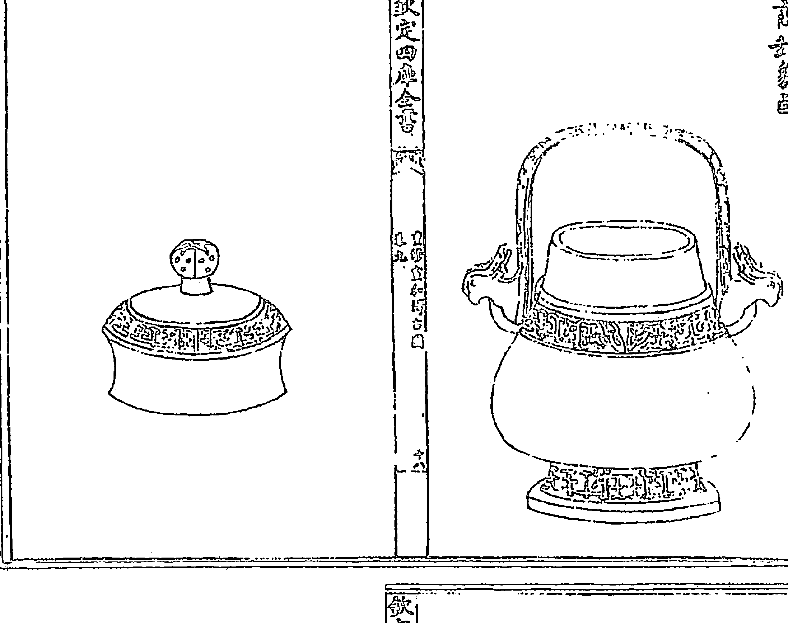

## 图2

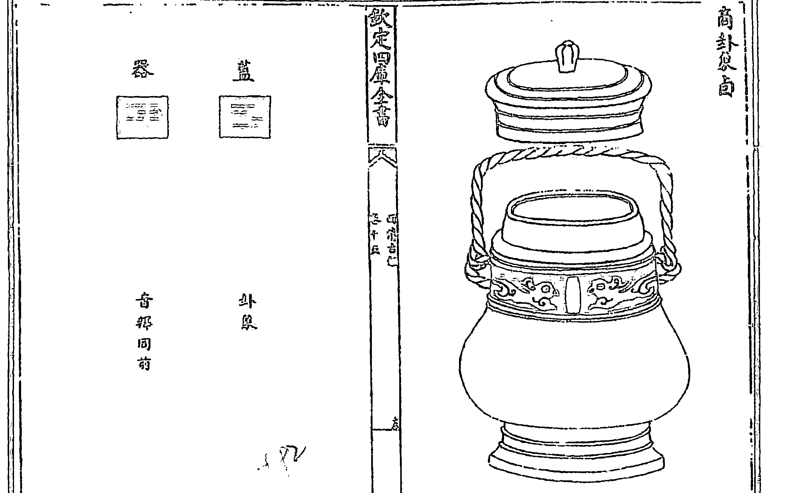

宋代王俅认为，这就是“卦象”，因此称其是“商卦象卣”。而现在有人称此是“画卦”。假如如此说成立，那么《太玄经》中所使用的81首卦符符号的几何表述类型，就其表述的几何“卦形”的组成，也应是受此商末周初“卦”符的影响与启发，可能才产生了它的表述思维雏形。由于有卦，就应有与其相对应的筮、数及其变化相对应，因此说，也有可能“太玄筮法”曾与《易》筮法，都是同时并行的“同是蓍筮；同样得通过挂一、分二、过揲、归扐等过程求数来定卦及其吉凶；同样占筮类型”的商周古筮法。可是就其当时卦画（四画、四层、四个位置等）与卦数（“三进制”、三的倍数为基础）是如何对应、推导与变化的？至今又是个不知之谜（虽然《太玄经》揲蓍方法在“玄数”以及唐·王涯、宋·苏洵、元·胡一桂、明·季本、清·黄宗羲、胡煦等蓍著、蓍法中，都有所记载与评说，但其筮法有可能也与商周时期的原筮法有所不同。因为人们一般都认为，现行的扬雄所著的《太玄经》，是汉朝人仿照通行本《周易》结构的附会之作）。

如果我们不知道中华文化中，“象数易学”相应易学“易理”中“易学象数学”的“数”向“象”是如何转化的规律，就不能深刻地把“象”的变化简化成简单的“数理”变化模式来进行认识与表述。由“卜”得到的“象”向由“筮”得到的“数”进行转化、发展；再由“筮数”向“象”进行转化、发展；直至我们现在再由“象”向“数”的表述模式转化、发展，这么做就充分地说明了，中国古代“卜筮”文化及相应易学思想是由繁到简，由简再到繁，直至现在我们再由繁到简的发展过程。这也是相应易学“易理”及相应《周易》“义理”中“易简”“极数”“类化”“集化”等思想的具体体现。因为“象”是一切事物的抽象与具体形象、结构、状态、信息等的针对对应性的认识与表述，再根据我们“象”就是“数”的思想，只要我们对事物的“象”进行“数理”方面的简单处理与归纳，就能迅速、准确地掌握相对应事物的变化规律——达到“善易者数占”的判定境地。同时，通过对“象”的“数化”，把“易数”的许多规律拓展到“象变”“卦变”“爻变”“数变”（含量变）、“象数变”“符变”“位变”“性变”“质变”等的时空及空间规律之中，这对《易》及“易理”（不仅是“义理”）在复杂事物中应用时的概念化、严格化、构造化、合理化、物性的广义量化、计算简单化、数理逻辑化与数理本质定性化等，会提供非常重要的数学模式与一系列的衍算方法。

## 第五节 易符与几何形的汉文字的发展关系

在甲骨文的文字中，到现在为止，还未发现不是文字的几何图形，可是不少甲骨文字的本身，往往就具有图形的性质。比如：这些文字中绝大多数都具有一定的对称性，由几何学的角度来看，其包含有正三角形、直角三角形、等腰三角形、平行、垂直、矩形、正方形、四边形、台形、梯形、菱形、点状、直角、直线段、斜线段、线段交叉等非独立的几何图形与几何知识（见以下甲骨文字举例图3，详见《中国数学史大系》第166页）。
因此可知，后来我国古人所创造的方块形式的“象形文字”，是我们的祖先对周围客观事物的一种几何形象与结构（包括数学、力学、矢量学、框架、场论、群论、熵论等以及天文、气象、物候、物理学等诸多方面的内涵)的表述，它的每一笔、每一画、每一点、每一勾等，都有其科学的对应性含义。所以由东汉时期许慎专著的《说文解字》(公元100年成文)中的9353个汉文单字，发展到清朝康熙时期的《康熙字典》中，就已经收集到47035个汉文单字(这后来又成为1915年中华书局所编的《中华大字典》的基础蓝本)，直到如今，我国在计算机上能找到或用得到的单个汉文字，也已有近三万(两万七千多)个繁简体象形汉字了。可见其文字内含的各种组合数学、几何、物理、时间、空间等学科结构与形象的深邃与广泛。这也充分地显示出，中华民族文化对“形而上者为之道”的重视，其格外注重精神、道德、思想、价值观、世界观、方法论、认识论的充实与改造。仅靠当代现有的那三四千个简体汉字，来作为我们对一切事物认识与表述的(含考古与古文化文明)基础，由于其认识与表述系统内涵的缺失、不健全与不完整，因此它怎么能对应准确地表达与表述千变万化的复杂的宇世中的各种变化、形象与结构和状态呢?!这也是造成20世纪初、中期，中国在世界上许多学科、领域、方面等相对落后的原因及其因素之一。以当前该三四千个简化汉字，作为中华文化的全部汉文字体系的认知与表述基础，主要应是为了普及汉文字的需要，才这么去做的。可是普及的目的，应该是为了提高才是，如果仅以这少部分的简化汉字来为中华文化交际的基础文字系统，而不去促使更广大的人民群众进一步地了解、认识和掌握内涵极其丰富且表述又是相当准确的，简繁体统而为一的汉字综合的认识与表述体系，那将是中华文化及其基础文字表述体系的一种倒退与悲哀(现在所收集到的殷商时期的甲骨文字，据统计，当时就已具有了近五千个单字的表述体系，而当前我们能明确识辨的文字，也仅有一千七百字左右。当然在很古的年代，我国就存在有许多通假文字与地方方言间的通假借鉴字，尤其是我国较早的“春秋战国”时期）。

由于简体汉字表述系统，受拼音文字表面上看来的简单表述形式的影响，故而造成其文字表述内涵的减少、缺失、不全面、不完整与不准确，人们所想到的事物形象、状态、质地，发音的韵律、笔画与书写出文字的形象、笔画数以及其对应表述的意、义等，与我们大脑中字义之间，不能协调统一地在人的大脑中，达到认知的一致而产生共振与共鸣，故而造成了人们在交流上的障碍与沟通上的困难（不易产生与达到心心相应的共振或谐振效果）。又由于在此表达过程中，不得已相应所产生的猜量、猜度因素的发生、干扰和影响，进而使人们之间，更加不容易互相理解及难以达到某些对应性的共识，这自然还会造成，大家不容易和谐的猜忌因素。希望这种表述系统内涵丰富完善，计算机录入、处理迅速且准确，以及很快就会成为主要世界语的中华民族的象形汉文字（并不仅是拼音式的汉文字），能尽快地回复其原有的丰富、充分、准确的繁简统一的表述功能与作用上来。

从考古中的甲骨、钟鼎（又名金文）等文字中，我们也能看到，在中国传统的“象形文字”的发展过程中，是受到了“易理”“易象”“易数”“易卦”“易爻”“易符”“易位”“易性”“易质”等“象数易学”及其相应易学的“象表意”“象数表意”“象形表意”（并非仅是“经学易”认为的“象表义”“象数表义”的文字解释学方面的意义）的“象数思维”表述系统与概念的不断影响而相应地进化着。

比如，在李申、郭或编纂的《周易图说总汇》下册1609页（图4）。该图（十一）的甲骨上，左边有一个单独的“田”字，字的右侧并排着由上向下刻有“……六六六”一组与三爻坤（☷）卦内含相对应的数字符号。说明该“田”字，是由三爻坤（☷）卦所反映的田地的“田”与坤（☷）卦的“兽”义的“田猎”之意，所对应而产生的概念。可是，在当时的甲骨文中，还有“日在地下”表示“微”意的字形同时存在，与其非常相近，其字形也是“口”字中间有个小“十”字。为了明确此处的文字（田字）到底是个什么字的意思，因此采取了以当时人们所熟知的“卦”（数字信息符号）意解意的标注方式，以示区别与肯定。由此也可看到，在我国古代历史上，用“数符（信息）组合”（卦）表意的方法，要比用“象形”（文字）及“象形组合”表义的方法，出现的要早，并且使用的也更广泛与普及。另外，在甲骨文中，还有许多画成方格的文字。很显然，这与以小方块作为计算面积的单位有关。为了表示该处不是指面积关系而言，才以“卦”意（数字信息符号）进行标注。请见以下刘钝著书的《大哉言数》中166页甲骨文字图。

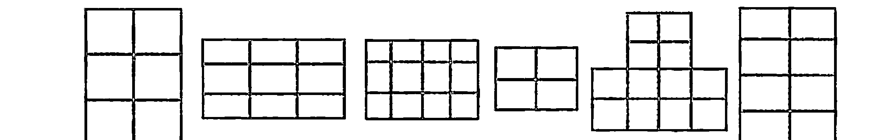

## 图5 田亩文字图

该图（十二）字的上（下）方向不同有“一一六八一六”（或六一八六一一）六个与风水涣（䷺）卦 [或水泽节（䷻）卦] 相对的意思。图（十三）左边一行字的最下边（整个图像文字的左下方），有“五六六”一组与三爻艮（䷳）卦之意相对应的数。这可能是，以此数的卦意来表示某个字的字义，当然也不排除，此处全部的文字与筮得的艮（䷳）卦内涵之意相对应。这要等该处所有文字之意都弄清楚后，才能下断语。图（十四）左行的最下面与右侧七个文字对仗的两个字，用“七八六六六六” [相当于后来的山地剥（䷖）卦的“臣”“仆”之意] 与“八七六六六六” [相当于后来的水地比（䷇）卦的“比自之内”的“甘心情愿”之意] 这么两组数，来对应表述该处更加深刻的文字之意。此两卦前后排序应组成的是“仆比”两个字组成的意思。即全句话的意思，应是“臣仆发自内心地甘愿效忠”的意思。图（十五）左边一行字的最下边（整个图像文字的左下方），有“八五一”一组与三爻兑（䷵）卦的意思相对应的数。这可能是，以此数的卦意来对应表示某个字的字义，当然也不排除，此处全部的文字与筮得的兑（䷵）卦内涵的意义有关或相对应。这要等该处所有文字的字意都搞清楚后，才能下断语。

又比如，在《周易图说总汇》下册1610页（见图6）。

## 图6

该图（十六）左边一行字的最下边（整个图像文字的左下方），有“七五八”一组与三爻巽（☴）卦之意相对应的数。这可能是，以此数的卦义来表示某个相对应字的字义，当然也不排除，此处全部的文字与筮得的巽（☴）卦内涵的意义相对应有关。这也要等该处所有的文字之意都弄清楚后，才能下断语。

图（十七）上下两字（图）之间是”……六六六“一组与后来的三爻坤（☷）卦内涵相对应的数字符号。它与其上图形组合，有“勿坤方”的意义。也可能是指上面的黑方体“不是‘田’形及方形”的意思。

图（二十）的“周招仲卣”之盖的“招中”二字之上，有“七五六六六七”一组与后来相对应的风雷益（䷩）卦内涵相对应的数字符号。其被当作是“有盖的容器”或“能封口的容器”之意的字义。又由于其卣器上刻有“招中”二字，其盖上的“招中”二字之上，又有“七五六六六七”一组数符，其意思是指出，此盖是“招中”卣器（容器）上面的东西（盖子）。

以上诸例有关“数字（信息）筮符”与文字间的全面分析，将有另文详述。此处就不多议了。

由此可见，至少在商周期间开始，人们往往用大家较熟悉的“数位信息组合表述符号”或“数字（信息）筮符”之意，作为文字或代表文字之义来使用了。这与当时人们用声符、字符或声字相合之符作为基本文字，以及为了更明确地表述自己的意图，时常在所作文字的上方冠之以图绘的做法，是一脉相承的表意方式。只不过，我们这里的例图中的表意（图绘）符号，是被表意更加丰富、内涵更加广泛深刻的“数位信息组合表述符号”或“数字（信息）筮符”所取代就是了。由此看来，我们必须得特别重视研究“数字信息符号的组和”“数字（信息）筮符”“数字信息识别符号”等“数”符，与甲骨或钟鼎文字的对应关系以及表述意义才对。这么做的结果，有可能又会为我们找到了一条中国“象形文字”产生、发展、充实及完善的重要途径。这种做法正好说明了，《周易·系辞上传》十三章中的“书不尽言，言不尽意”，“圣人立象以尽意，设卦以尽情伪”的“易理”及“义理”思想、目的与实践例证的正确性。这有可能也能证明，中国古代文字的产生、丰富、充实及发展，是与“象数易学”及其相应易学的“易理”以及“周易象数学”及其相应《周易》的“义理”，还有与其对应的“卦符”“卦数”“卦象”等的表意方式和归类、归属方式、方法，作为其一定的推动基础，是有不解之缘的。还可能直接或间接地说明，这就是“测字”、拆字、用文字起卦、算卦等，利用语言、文字方法来判断事物及其相对应规律的“象数统一”的根本来源与根据。

# 第二章 先秦之前的易学与数学的发展概说

周代的金文中，虽然尚未发现有专门几何学方面的记载，但是我们发现的当时各种各样造型的青铜器、陶器、布帛及其上的纹饰等，可知周人，已经掌握了相当丰富的几何知识。由形状、造型来说，有三足顶立的等边三角形、等腰三角形、长方形、圆形、球、椭圆形、圆台、圆柱、梯形、棱柱、拟台体（又名“刍童”）、弓形等。这些器物之上，还有许多规则或不规则的几何形图案。比如，以连续螺旋形形成的“云纹”；方角云纹形成的“雷纹”；由有圆心或无圆心小圆圈列行形成的“圆圈纹”；三角形纹；方形纹；菱形纹；三角形交角成为弧形的“波纹”；由波线扭结成的“绳纹”等（详见以下图7来自吴文俊先生主编的《中国数学史大系》第一卷“上古到西汉”中191页及192页的附图）。虽然当时并未对这些几何图形与构造进行系统研究、总结与分类，但是这些几何知识的积累，像“算术”一样，是形成初等数学与几何学体系的必要的前提条件。

以上这些几何学与数、字学的发展，由于其中，存有大量的逻辑学及形式逻辑、无机辩证对应统一逻辑、“有机辩证对应统一逻辑”方面的知识与内容，因此为其后春秋战国时期儒、道、法、阴阳、纵横、五行、名、兵、农、管、墨等“诸子百家”的产生、发展及延续，提供了大量的哲理、哲学、“易理”及“义理”思维、思想与方法的组建及构成的基础。也就是说，没有周文王及周朝时期对卦（八卦、六十四卦）的数字排列构形结构的确立及其后来相应几何结构卦符的对应成立，就没有其后管子、老子、孔子、墨子等“诸子百家”学术及其思想方法的根据及其确立。这是因为，这些数与几何构成的卦的变化体系，为我们提供了各种、各样、各类事物间变化、转化、取代、更替等全方位、多方面、多层次的诸多关系，以及逻辑及逻辑形式与过程体系。而恰恰这些关系及逻辑体系，为我国早期的哲理及其诸子们的“理学”“易理学”“义理学”等，提供了坚实的“象数”逻辑思维及逻辑推理的理性认知——相应形成了春秋时期广为普传的“象数易学”的“易学象数学”及其相应易学的“易理学”，以及后来汉朝“周易象数学”及其相应《周易》“经学易”的“义理学”。又因为，从这些卦的构成及内涵来说，它不仅仅只是反映几何（空间、结构、状态）学方面的知识，故而它比欧几里得《几何原本》的哲学内涵，还要广泛、还要丰富、还要深刻得多。

“象数易学”及其相应易学中，所创造的这些卦、爻组成的几何型与数字型乃至“象数统一”型的表述符号与数字信息型认知与表述体系，其中存在的往往都是些具有表述事物异同的数理、形象、状态、信息等的形式逻辑、辩证逻辑，以及有机辩证对应统一、无机辩证对立统一的宇宙事物间的（相互作用）关系的整体组合系统和体系。这些相互作用的关系组成的整个系统，是我们认识事物及表达清楚事物规律，并且达到共识的逻辑基础，或者说是先决条件。由于“儒家”历来主要是重视，按人为的意愿去对待、处理与控制并满足统治者们在“王”道（“霸”道）下的社会管理的“形而上”的教化问题和作用，轻视、放弃及不尊重事物原本的自然发展变化规律的所谓“形而下”的自然法则（含自然哲学）的教化，因此对于“易学”“易卦”“易数”“易象”“易爻”“易位”“易符”“易性”“易卦象的本质”等的理论与方法中，自然及自然哲学的逻辑分析、研究及运用，得不到相应应有的关注与尊重。因为严格的逻辑方式方法及其过程，是我们讲明并达到共识的事物道理的最基本的基础条件，又由于儒家及其相应的易学的“周易象数学”“义理”“数学”“理学”“心学”“功利学”“朴学”等派别，没有对其相应易学中的逻辑关系及过程，引起重视并积极地发掘、整理和重用，故而导致了，自汉朝“经学易”确立以来相应易学界“仁者见仁，智者见智，百姓日用而不知”的各执己见的混乱局面——失去了相应易学中许多普适性道理及方法的被肯定与确立及其机会——尤其是对“象数易学”自身的“易理”（不仅是“义理”）理论、方法、定理、定律等所对应的“卦变”“象变”“数变”“象数变”“符变”“位变”“性变”“质变”等被肯定与确立的机会。比如，在通行本《序卦传》中，“两两相耦，非覆即对”里的“反”和“对”卦，各自的逻辑关系及其内涵，都能归纳出各自的理性规律与变化，可是二者综合组构起来的“反对”状态下的集合性《序卦传》的连排方式，却没能形成其自身应有的“卦序”的完整的理性规律与方法——无法用一个统用的标准型的理性公式，对其理性的认识及其相对应的变化、规律、过程等的表达，进行全部卦序完整性、统一性的表述。在通行的《说卦传》及《杂卦传》中，卦、爻说理的逻辑关系及其规律，更是杂乱失序。其中完整的理性思想，并未能被清晰地表达出来等。

## 图7 几何图形

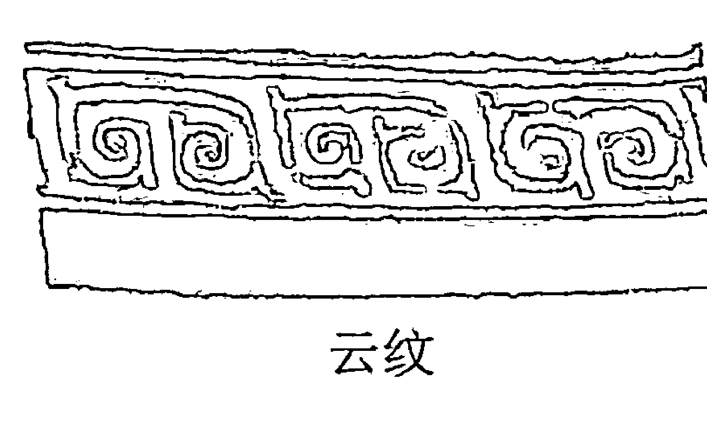

云纹

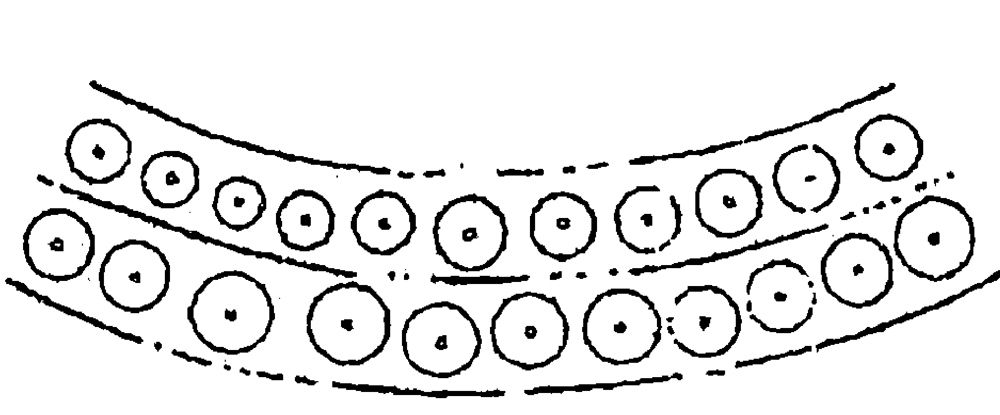

圆圈纹 (1)

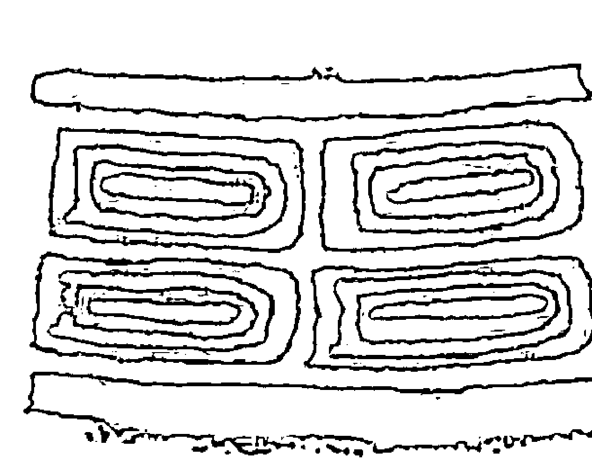

方形纹


圆圈纹 (2)

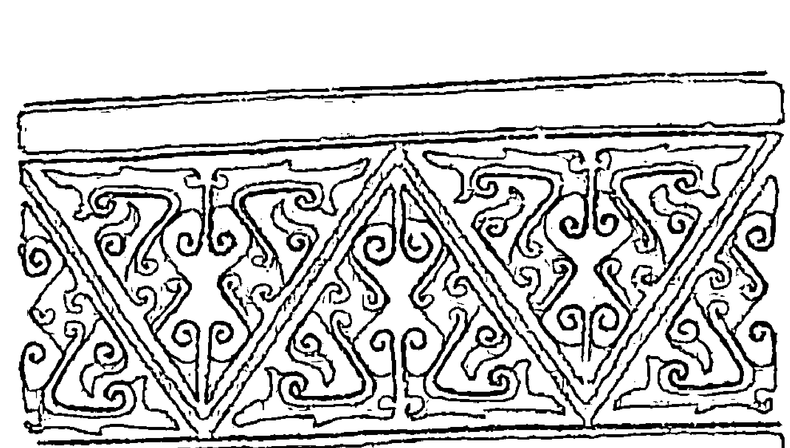

三角纹

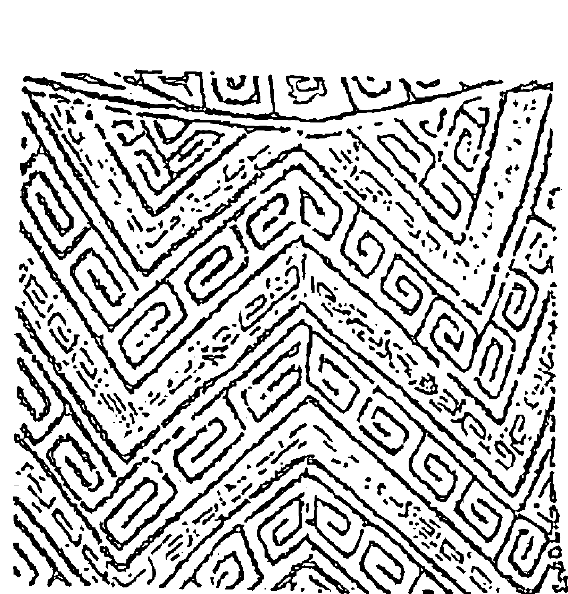

雷纹

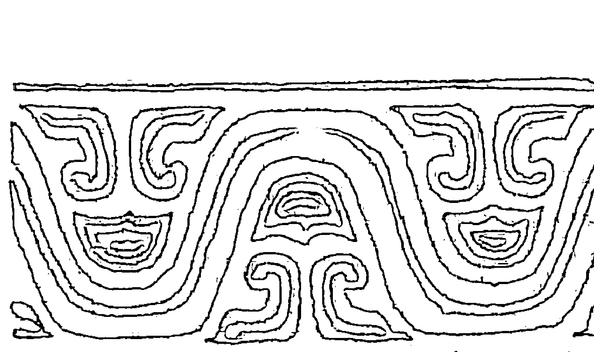

波纹

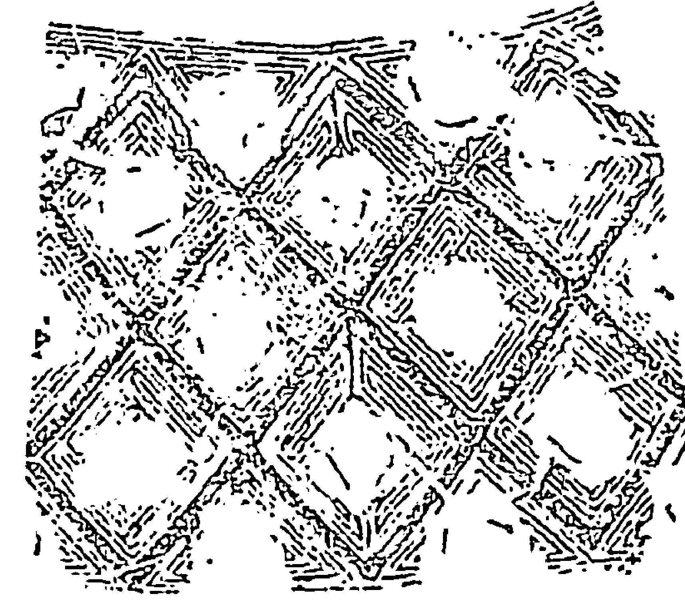

菱云纹

## 第六节 春秋战国时期易数、易卦与数学的发展

在春秋战国前后的 500 多年的时间内，中国古代的先哲们对相应易学和数学的认识，散见于诸子百家的典籍之中（特别是在公元前 300 年前后的战国中后期，诸子百家争鸣的鼎盛时期），他们对早期相应易学及数学的发展，从不同角度与程度上，起到了不同的启迪与促进作用。特别是《周易》、孔子的《论语》、（墨翟、墨家）《墨子》与《墨经》《考工记》以及管仲的重数思想及政策、《管子》中的经济数学、惠施与公孙龙关于数学的悖论、兵家孙膑的早期博弈论（又叫“对策论”）、春秋战国时期的农业与工程的测量与制图，以及测绘工具与测量、工程技术建造方法的发展等，都对我国当时或其后相应易学及数学的发展，起到了重要促进作用。

“易学”的起源，可以追溯到上古原始游牧社会的伏羲时期；后经考古与古文字学证明，以及司马迁《史记·周本纪》据《荀子》的记载，是“文王演《周易》”与“文王重卦”。虽然存在如此之说，但我相信“易经”与《周易》并不是一人一时一地的作为，而且它的充实与完善，是经历了漫长的历史年代，通过大量的实践、归纳、总结与提升，“易经”大约编纂成文于西周后到战国中期的这段时间（公元前 600 年～前 513 年间）。其中还可能会保存有殷周时期的一些占筮记录及历史史实。而通行本《周易》中的《易传》部分的内容，主要应是出自于孔子之后后世的弟子们与儒生们之手。大概在战国末期至汉代的整个历史时期（直至“熹平石经”刻立之时），才基本全部完成成文的。通行本《周易》中所涉及的内容十分丰富，既含有政治、军事、哲学、逻辑、历史、文学、道德、法律、祭祀、神道等社会科学的内容，又含有天文、历算、气象、农业、数学、医学、生物学、律吕、制作与使用器物（尚象制器）等自然科学的内容。相应时代之《易》的精神，渗透到了中国古代包括数学在内的各个领域之中。就相应《易》的数理方面的具体研讨内容来讲，一般古代多数人的注意力，基本主要还是集中在了讨论“义理”（不是“易理”）、“河图”“洛书”、八卦数理、揲蓍方法与“太极数学”等诸多方面。

在与“河”“洛”并提的典籍《春秋纬》中言道：“‘河’以通乾出天苞，‘洛’以流坤吐地符；‘河’龙图发，‘洛’龟书感；‘河图’有九篇，‘洛书’有六篇也。”这里的乾坤“九”“六”之说，也应是与“八卦”及易卦的筮数成卦之数和规律有关。在《周髀》以“数之法出于圆方”；《周髀经解》注为“河图者，方之象也；洛书者，圆之象也；太极者，圆之体，奇也；四象者，方之体，偶也。”这里的“河方洛圆”之说，后人却改成是“河圆洛方”之说。不过也有人认为，“河”与“洛”都可以有其相对应的可圆可方的理论与表述方法。根据大量的实践经验与“河”“洛”组合结构的大量实践与数理分析，我们认为，这最后一种说法，是符合“易理”的“易与天地准，故能弥纶天地之道”的比较全面和准确的说法和观点。

在先秦的古代的典籍中，单独提到与“河图”有关内容的，有《论语·子罕》《墨子·非功》《尸子》卷末、《尚书·顾命篇》《礼运·疏》引自《中候握河纪》《史记》《汉书》等。而单独提到“洛书”的史籍，则比较少，可是对“洛书”的解释和探讨的论说却比较多。比如，“洛书即九宫”说，“洛书即洪范九畴”说，等等。我所著的《易理数理》三册书中，对“河图”“洛书”在数学、数理及其数字分布结构等诸多方面，都有新的述及与一般人们的理解不一样的数理分析。敬请读者予以关注！同时，还可以参阅台湾原中华民国易经学会出版的《中华易学月刊》杂志的许多封面或封底的插图，以及该杂志内的“易图研究”“易经数理”中的“模图解易”等文章（由于内容太多，故而不能一一介绍，希望大家自行去参阅、习研与探究。这里只是为了给大家提供一些渠道和思路而已）。另外，还可以参阅1985年6月科学普及出版社出版，由唐侠编著的《幻方与数阵趣谈（趣味数学小丛书）》一书。还有田合禄总主编、商宏宽著、山西出版集团山西科学技术出版社出版的《周易自然观》一书和商宏宽著、海天出版社出版《〈周易〉的科学理念》，以及地震出版社出版由商桂著的《易索》一书。

由《汉书·律历志》的记述中，我们可以知道，“自伏羲画八卦，由数起。”也就是说，伏羲画（或设、作）“八卦”及“八卦”卦符号的根据，应是来源于“数”的对应变化。即卦、爻符号的确定，是与数及数学信息符号的变化紧密相连的（由战国时期大量“几何空间组合卦符”的出现，是晚于殷商时期之前大量的“数字（信息）筮符”出现的事实，可以佐证），二者缺一不可。由早期易卦的结构形成都是由“数字排列符号”的组成与形成来看，易卦对应形成的是“以数字信息源”（数）为基础的象征性的认识论，而并非仅是专门为了卜筮的目的而创制的！这由当时或之前普遍存在与流传的“结绳记事”“契刻记事”的传统认识与表达的方法可以佐证。

再根据《周书·武顺解》所说：“人有中曰参，无中曰两……男生而成三，女生而成两，五以成室，室成以生民。”我们又可知，如果一个《易》“爻”的中间是连续不断的，此乃是表示“男生”的“阳爻”（一），该爻所表示的就是“三”数；而一个《易》“爻”中间是有空缺的，此乃是表示“女生”的“阴爻”（--），那么该爻所表示的就是“二”数。男“三”加上女“二”而成家（室）“五”；成家（室）“五”之后，就又会产生其他的“数”（民、后代等）。“三”“二”相加若生的是“男生”，即得五加三等于“八”；若生的是“女生”，则得五加二等于“七”。其间，由于三加二加二（七为单数）显“阳”性，而少了“阴”性，不能达到平衡稳定，故而后人称其数曰：“少阴”。而三加二加三（八为双数）显“阴”性，而少了“阳”性，也不能达到平衡稳定，故而后人称其数曰：“少阳”。这应该也是，后来《内经》中是以男以“八”，女以“七”为各自自身变化周期基数的依据。如果是三个“男生”同居一室，即成为三加三加三等于纯“阳”性的“九”数；而三个“女生”同居于一室，则形成了二加二加二等于纯“阴”性的“六”数。后来“重卦”（包括“爻题”）中的数学的对应变化，往往都建立在这“九”“六”之说的基础上了。

除由《周易大传》“大衍蓍草法”筮数得到“九”“八”“七”“六”是成卦爻的“基本数”外，这种靠爻自己的属性与基数变化来的“九”“八”“七”“六”这四个数，也应是作为爻数成卦的基本基础数。我想这应该与我所理解的卦、爻中的“叁伍以变，错综其数”“道生一，一生二，二生三，三生万物”的卦爻的基数“一”“二”“三”与其和数“叁”“伍”数及其变化、规律的表述，都是一致的认识。在我所著的《易理数理（一）》一书中，最后的“对象的延伸”与“反象的延伸”两节及其他许多章节中，以及最近中央编译出版社出版我所著的《易象及其延伸——易象延》第五册中“对象的延伸”与“反象的延伸”两节的内容，对这些数及其变化规律，往往均有一般或较详细的论述。敬请关注！

无论是“先天八卦分布结构”，还是“连山八卦分布结构”“归藏八卦分布结构”“后天八卦分布结构”“孔子八卦分布结构”“中天八卦分布结构”“元包八卦分布结构”“白阳八卦分布结构”等分布结构（包括数、图、方位、分布结构等），这都是中国古代各时期或各地区运用的某些坐标系的表述及其“类化”分类的对应表述模（式）型。由于它们各卦所处的方位、形象、结构、状态与序数排列分布等的不同或相同，所以它们构成了很多不同的“组合数学”的认识与表述系统及体系。而“组合数学”的表述系统，是非常重视数字配备的均衡性与几何构造的对称性、互补性、循环性、复归性、周期性等构造性的特点的。如要满足这些先决条件的要求而达到某种均衡稳定的话，是需要较高超的数学处理技术与技巧的。同时从数学的角度来看，也可以将一个爻、两个爻、三个爻的“八卦”、四个爻的“互卦”、五个爻的“互卦”、六个爻的“六十四卦”、七个爻、八个爻……十二个爻等的“复合卦”“集合卦”“类集集合卦”形组合与构成，都可以看作是其元素的“穷”“极”“尽”“类”“群”“熵”“集”等集合体或组合体及其组成的基础单元及因素。这其中，我们也可以把宋代邵雍所构思的“先天六十四卦方圆图”，看作是“二元”哲理的一种模式和数学符号的一种表述体系，这样我们又会发现“八卦”“六十四卦”等“易理”数理本身的抽象性，带来了与“二进制”数学系统相应的普适性。就“六十四卦”中出现的“对卦”（包括上半对、下半对、全卦对）、“反卦”（包括上半反、下半反、上下反、全卦反）、“交易卦”“半象”“连互”（包括三爻、四爻、五爻……多爻）等，象变与卦变、爻变方法组成的各种组合性体系，以及每种或每个卦中一个爻、两个爻、三个爻、四个爻、五个爻、六个爻等同时变化或都不变化的各种象变与卦变图等，都会表现出“象数易学”特别是其相应的“象数易学数学”的各种“易理”数理与法术规律及其“极化”“类化”“集化”“约化”“概化”等与“五行”本质定性相结合的本质性“生克化合”诸多方面的特征和局面。

由于自古至今，以上这些变化较复杂的数理过程，一直没有受到我国传统古代数学与现代数学以及相应《周易》“周易象数学”“义理学”“数术学”等学术应有的重视，本作者只是在该类书中对某些“易理”“易卦”（易象）、“易数”“易符”的结构、变化等，作了初步的数学分析与归纳的探讨式尝试，即《易理数理（二）》一书中的“十七、六爻卦体及其各种‘象变’后的总体数场的变化规律”“十八、六爻卦中一至六个爻各自同时变化的规律”“十九、六十四卦矩阵生成图及其数序分布规律”“二十、由《周易》六十四卦序排列看各卦的总体‘场’数”“二十一、‘京房易卦’的生成及其数场分布规律”“二十八、爻与卦的‘函象’（函数象）”等章节里，对以上规律及特点进行了某些探讨与论述，更广泛和深入的数理与其应用的研究，还得靠广大相应“易学”研究者、爱好者、数学界与各科技界的同仁们共同探讨与研发，才能完成。

在“象数易学”的相应易学的“易理”以及“周易象数学”的相应《周易》的“义理”的数理内涵中，“太极图”本身就是很重要的一个对应性的图形。在此图中，蕴涵着大量的有关圆、圆周率、弦、弧、波、正、负与互补、对称、平衡、面积、体积、同心圆、log2、渐近（逼近）等数学内容。受其构造的“波粒二象性”的对称与互补性的启发，使物理学家玻尔在量子物理学研究方面，产生了突破性的思路与实践。为了说明自己的物理成果是受“太极图”分布思想的“对立物是互补的”启迪，故而他将“太极图”作为自己家的家族之徽，以示永久性的纪念。

古人通过大量的卜筮实践，了解并认识到事情的吉凶、祸福等利害关系之中，存在着一定的因果关系 [先兆与结果、开始（因为什么）状况与最后（所以的）结果等]。这样吉、凶、悔、吝四大关系就构成了一个四段式的辩证推理的过程，有人还把这些关系画成圆形或菱形的关联关系，故而有些人发现并认为，从几何学的角度来看，太极曲线与等角螺线、“河图”曲线与“丽都”螺线，是有共同之处的。

除此之外，还有人对《周易》中的日常现实生活方面“随机”出现的这些卜筮结果或结果词，进行了概率方面的统计。他们发现，其中：

- “大吉”与“元吉”占 4%；“有利”占19%，吉祥占24%；
- “无咎”与“无悔”占24%；
- “悔”“吝”“咎”与“不利”占12%；
- “凶”占11%；
- “厉”占6%。

从全部卦爻辞所对应反映的结果内容来看，反映“吉”“利”与“无咎害”等结果的断语，共占71%，而反映“凶”“厉”“悔”与“不利”等结果的断语，仅占29%。也就是说，吉与不利、好与坏之间，在通行本《周易》“经文”中，出现机会的概率比例，基本是7比3的比率。这也是我们在一般的情况下，对某事物与人的认识等方面，基本认定是“三七开”来源的依据吧。当然，这只是通行本《周易》经文记录中，所相对应反映的好坏的概率与几率关系，在其他筮例的记述与统计中，出现概率或几率等的情况，应是又当别论的。可以说“三晋”及春秋时期或者之前的“象数易学”及其相应易学方面的卜筮活动，为我国数学的归纳、综合分析及多年来的概率统计规律，也提供了某些有利的启示与依据。

无独有偶，通行本《周易》统计的事物的好坏比例，与现在人们对地球上大陆与海洋之间面积的百分比，是大陆占29.2%，而海洋占70.8%（四舍五入后，是29%比71%）的认识，是何等的相似。这也与《轻重十一·揆度》中记述的春秋初期的管子所说的，在共工（人名）时代，天下的“水处计之七，陆处计之三”，是基本一致的结论。而人体血液中水分所占的比例，也是70%左右。看来，古人在自然环境条件下对水的认识与需求，是放在至关重要的地位上。比如，“河图”“洛书”及“后天八卦分布”，都把“水”作为排序的起始首位，放置于起始首位的位置上——水是生命体产生的基本根源。

由于我国古人认为，卜筮的结果与事物的实际存在，是一致而肯定且不可分的；记述的大量结果也证明，这些事件已纯属于是客观存在的现实实际及根据实际的统计归纳出来的规律，其间不会再存在有与之相对应而出现的所谓的可能性问题；更不会像西方数学和实验科学所认为的那样，是人的某种假设前提下的“猜度术”或事物出现的可能性等概率概念。因此“概率论”在古代数学的早期，并不会被以“中算”为主的中国数学家与“易学家”“数术家”们所关注而被受重视——因为它主要是以人为的主观需求，而不是以当时纯客观的现实实在为基础所得到的实际认识结果，而是用以前事物规律的结果，去套用于此后事物规律的结果上。由于《易》曰：“六爻相杂，唯其时物也。”所以这说明，离开时间所对应的“时间逻辑学”的对应准确的“时间易学”规律的确定，就无法找到与此时间所直接对应的确切的空间结构状态关系与作用；找不到事物间的准确的空间结构状态关系与作用，就无法找到事物间相对应的实在真切的规律及规律关系了。何况，更不能用以前某些事物的规律关系（包括概率关系），照套此后那些“同样”事物的发展变化规律。后人这种用概率统计方法得出来的只是通行本《周易》这部卜筮记录中的那些事物出现的概率的可能性，它并不能说明对其他一切事物的卜筮过程与结果，也是符合该种概率关系的分布的（由于时空对应的“时间逻辑”关系的相同或不同，恰恰会是对应于不同的概率结果的很多可能性）。又由于我们的“象数易学”相应的易学“易理”认为，一切事物都是互相对应与相互作用联系着的，没有任何一个事物是可以脱离开其他事物的存在与变化，而能孤立地存在和变化的，所以事物间的关系与规律，在一定（瞬间时间Δt）时空对应条件下，基本是确定（相对有固定、确定、实在性）的客观关系与客观规律——都是一些客观规律的调查、统计与归纳的实际的实在性结果，并不存在其可能出现的概率性 [事物事件已经客观地实实在在地发生了，它已经（同时性）不再存在有其他相对应发生变化的可能性概率了]。我国古代的管理者，如果是用可能性来直接对应表述相应事物的规律来对付（应付）统治者的话，由于万一可能性与事实不相符的话，那将会招来“杀头”或“灭门九族”的“欺君”之大罪的，所以我国传统的认识与方法论中，一般是不可能采用可能性结果来取代“实事求是”的客观现实的实在性判断的。在这个意义上说，中国不太可能出现概率论之类或然性理论或学科。另外，更详细的分析，请见我所著的《易与和谐》一书里“问题与解答”一章中有关相应易学概率方面的具体阐述内容。

对于当今相应易学的传统所谓“正宗”研讨方面的事实，以及对中国文化不可不更弦易辙而再加研究，此处以相应易学论，既属于是对“六经”之原的探究，故其研究与认识的原则，尤其更宜重视。最近数十年来，对《易》的研究，社会上又引起了广泛的兴趣，当然我们也不可不注意到其对国际上的一些影响。然而进一步考察现代人的研究方法及方向，目前尚处于探索阶段，对时代相应易学的史实的认识，仍尤多恍惚之处。以继承传统来论，仍未能明确《汉志》所记述的史实及当时学者的思想，也就是说，对西汉的相应易学我们尚且不知，何能推究至先秦相应易学的变化呢？！以今日而论，尚且也未能在继承近百年来的“甲骨文的发现，为中国文化的重新认识”；“蔡元培先生1912年提出废除读‘经’，结束了今古文之争，并纠正了不合史实的尊孔回复了孔子的本来面目”；“顾颉刚先生等能继承甲骨文的发现与废读经的原则，形成‘古史辨’派的学风，对中国古代文化具有了现代相应的认识”三种思潮而进一步地加以了发展，何况事实是上百年的该三种思潮早已发现有所相应的变化了。关于第一点，今天考古的发掘，已远远超过殷墟甲骨文的发现——发现了许多殷墟和周原时期的“数字排列符号”对应性认识与表述体系。关于第二点，形同水火的今古文“经学”之争，的确是不可不废除。然而相应的“经学史”也应是不可不知的，形成经学前的学术思想和史实背景，更应是不可不知的。且自废“经”之后，早期的北京大学对中国哲学史，分成为先秦诸子、两汉经学、魏晋玄学、隋唐佛学、宋明理学、清代朴学诸阶段，这在当初时期是有进步作用的。然而数十年来仍按此分段研究而不知中国哲理思想的整体，则东方文明的核心究竟在何处？虽知相应易学是“六经”之原的重要性，可是仍未能深入研究时代相应易学可当作是东方文明核心的历史史实，且知相应易学绝不可为汉代以来的“经学易”所局限和左右。于最后的第三点，“古史辨派”的探究方法，今仍有可取之处，而其结论大部分已被近年来的科学成就及考古事实的所得而被否定。以相应易学而论，仅知文字解释学的考古意义而不知卦象及“象数”的“象表意”“象数表意”的真切法则与认识及表述的考古意义，于相应易学的针对性内容，早已成了仅是隔靴搔痒的结果及效果了。也就是说，仅知史学而不知史鉴及其哲理（即经），绝不可能了解认识并理解相应易学“经”“传”的具体意义。且最近于先周及殷墟都已发现“数字（信息）卦”，则对相应易学的客观世代史实，与传统认识已完全是不同的认识了。

由是对时代相应易学必须得更进一步结合“阴阳”“五行”的认知与表述功能和作用，加以研究，而重点是在“象数”的认识与表述功能与效果上。再由“象数易学”的“象数”所对应的“设卦”“观象系辞”的表述功能及原则而合诸相应《周易》“观象玩辞”的“义理”理论，进而相应获得“象数易学”相应易学的“易理”时，方可成为我们所处时代相应易学的整体及其全貌。

一般读《易》者，往往仅习惯读某一时代的注解，比如一说到“象数易学”时，立刻就想到或者误认为汉代的“周易象数学”及其相应的“纳甲法”“纳支法”（爻辰法）、“火珠林”等这些“以爻对应解卦”的方法，才是“正宗”儒家“经学易”的认述与解释方法。以为易义就在于这一些方法的注解与运用之中。然而注解迄今留存的就有两千余种《易》书，或仅执其中的一类若干种，以为易义就是如此，或又执著于另一类若干种，认为易义即是如此，则易义的“象数易学”的“以卦之卦”的根本性认识及表述的具体针对性的内容，还是难以说清楚的，其实就是由于不了解卦爻辞的更原始“象数易学”的“易学象数学”的具体针对性的“以卦解卦”的“象数”内涵意义是什么，才造成了如此的误识结果，故而必须了解及认识最早成此卦爻辞时代的具体事实背景和当时相对应的“象数”事实与结构状态的相互对应的认识与表述作用关系，才能找到其相对应的“象数”所对应表达的具体针对性的实际表述意义。这一问题，直至最近数十年来认识“数字（信息）卦”后，才有可能有决定性的条件认识编定卦爻辞的时间及地点等历史事实。传统所谓“文王系辞”，及汉马融等发现史辞中记述有文王以后的事，故又相应地产生了所谓“文王系卦辞”“周公系爻辞”之说，这也已流传了近两千年的时间，直至清朝末年起，才知对卦爻辞的作者须要有进一步认识的必要。然而迄今，仍有保存两千年来古义的一些学者，也有认为是西周中期成文的，又有认为是西周晚期成文的，更有认为是东周时期成文的，等等，但是他们都没有确切的史实及实物证据，很难肯定其成文的是非如何。幸而今于殷墟、周原皆已出土了大量甲骨及钟鼎上的“数字（信息）卦”象，则对卦爻辞的编成时代，可以相对应会有较明确的认识了。自清末发现殷墟甲骨，对中国文化的起源，有一个比较可靠的认识后，说明东周文化的光辉灿烂，并不是偶然而兴起的。试想距今三千多年前，已具有十万块左右的甲骨文字刻辞的记述为证，则在殷周之际的文化文字的记载方面，确实已具有相当高的认识层次了。有这些文字的相应认识为基础，才能产生东周的文化及其相应出现的种种因素。可惜自打秦汉以后，尤其是汉代董仲舒提倡独尊儒术斥百家以后，对孔子思想的相应认识，却提升得又太过于高，故对孔子真正的划时代的精神也认识得是不够深入和清楚。故而由此开始，总认为中国的文化是起于孔子及其思想，而且把后于孔子的许多思想也推至于孔子的身上，由此又导致了对所谓孔子的许多所谓的史迹，既而也不可信以为真了，更遑论孔子以前。这样，就造成了对中国古代文化及其相应的发展，对应出现了很多的误解或误识。幸而又殷墟甲骨文的发现，可得知殷商时期的一些概貌，近些年又得周原的甲骨文，则更知周朝尚未灭殷时的先周的许多文字记载的实际情况，可证殷周文化同样信仰“阴阳”的蓍（筮）与“五行”的龟（卜）。况且，因当时的卦象就是数字排列成的卦象，所以说，对“数字（信息）卦”的早期创始与运用的深入研究，定能为相应易学早期“创卦表意”的原创目的，找到更加合理的认识、理解与表述方面的功能、作用与效果。

由于中国古代的相应易学、“象数易学”“易学象数学”“数术学”及数学，都是与实实在在的具体事物的应用结合在一起的，故而它不会产生像西方某些纯抽象的脱离实际的概念及做法，因此也不会产生，相对靠想象或猜度数为基础的概率方面的思想与概念，更不可能去运用这些寄希望于可能性的概念上，去对事物的规律或结果作出实在性的判定与认证，否则一失误，就可能掉入“欺君之罪”“灭门九族”“当斩”的永世不得翻身的深渊之地中。

下面概括地谈谈相应数学以及相应易学发展的历程与部分史实。

# 第二章 先秦之前的易学与数学的发展概说

### 一、《九章算术》对数学发展的影响

在战国时期，思想界、学术界曾呈显出“诸子林立，百家争鸣”局面，其相应产生的思想、境界，是非常的活跃，尽管至今还没有发现一部先秦以前的数学著作留传至今，可是当时的先人们，通过对田地以及国土、地域面积的测量，粟米粮食的交换、收获、收缴以及战利品的分配，城池、宫殿的修建，水利工程的设计，赋税的合理负担，各种物产的产量计算，乃至测高望远及生产、生活等实践，积累了大量的数学知识和经验。据东汉初期（约公元100年时）郑众的记载，当时的数学知识已分成为方田、粟米、差分、少广、商功、均输、方程、赢不足、旁要九个部分。后来被人们称作是“九数”。“九数”的确立，为其后《算数书》［含有：“相乘”“合分”“增减分”“分乘”“经分”“约分”“石衡”“少广”“方田”“税田”“出金”“铜耗”“贾盐”“息钱”“负炭”“程禾”“金价”等小标题组成］以及《九章算术》的基本结构模式的形成与实践，提供了依据，奠定了基础。

在公元100年（东汉初期）《九章算术》中，九部分具体的内容，分别如下：

- “方田”章。来自于田亩丈量与分配的需要。它提出了完整的分数运算法则，以及多种多边形、圆、弓形等的面积公式。
- “粟米”章。来自以易物与交换的需要。以谷物交换为例，提供了各类比例及其关系的算法。
- “衰分”章。来自于不同等级的分配需要。它提供了比例分配的法则和等差数列问题的处理方法。
- “少广”章。来自于田、地的计算需要。它提出了分数与完整的开平方、开立方的程序。
- “商功”章。来自于土木工程与水利建设的需要。故它讨论了多种立体体积公式与工程分配问题。
- “均输”章。来自于官方摊派劳役和税收的需要。它提供了解决赋役中的合理负担及“加权”比例分配等问题，以及结合西汉当时社会实际的一些算术杂题。
- “赢不足”章。来自于两预设答案求解二元问题的特殊需要。它给出的是解决盈亏问题，可以利用“盈不足术”之类的特殊算法，来解决一般的算术和分配问题。
- “方程”章。讲的是线性方程组的解法，以及给出了正负数的加减法则。
- “勾股”章。提出了勾股定理、解勾股形及若干测高望远等问题的方法。

以上这些章节之中，既有抽象性的算法，又有以算法统率应用问题的形式，进行具体解题的方法。其中许多数学成就，居于世界当时领先的地位，并且奠定了中国数学居于世界数学前列千余年的基础和地位。

### 二、管仲对数学发展的影响

春秋初期的政治家管仲（公元前723年~前645年在世），当他担任齐国齐桓公时期的“上卿”时，在治理方面，提出了“重数”的政策与思想。他认为，“数”具有：术、技、知识、理论、方法、规律、数量、计算、数学等基本概念。他认为，“舍数而任说，故民舍实而好言”，“数”是对应有其实质的内容的，它与人们一般的说教或议论，有着根本的不同（就如同我们现代的经济、军事、科研等领域的统计规律一样），如果失去了“数”方面的实在性依据，就失去了说话的根本根据。我想，这种重“数”的思想，不可避免的应是来源于天文、历度、“测高望远”、筮数等“天人合一”的大量实践，以及东周以后，普遍流行的“筮法”的“先得数，而后对应事物形象与状态”的大量的实践经验的基础积累。管仲非常重视客观事物的数量关系，他提出了七条具有哲理原则的法则：即“则、象、法、化、决塞、心术、计数”七项。
其中：

- “则”是指法则、规则与规律；
- “象”是指物象、形象、现象；
- “法”是指标准、制度、法规；
- “化”是指教化、感化、化育；
- “决塞”是指疏导、疏通、疏解堵塞；
- “心术”是指思想方法、技术方法、推演方法。
- “计数”当时除了已是数学专用的“计数”名称外，还是指“义也、名也、时也、似也、类也、比也、状也，谓之象”（各类相对应的结构、状态等形式、形象等）；“刚柔也，轻重也，大小也，虚实也，远近也，多少也，谓之计数。” 由此看来，“计数”的关键，是与“易象”对应指导下的分类、“类化”方法及其相互作用的辩证比较，是分不开的。同时，也可真切地看到，中国古代数学的“计数”方法，也是“象数合一”“形数合一”“物数合一”“时空合一”“对应统一”（不仅是“对立统一”）而不可分的认识与表述方法。

由以上“计数”的概念，我们可知，管仲的重“数”思想，是受“象数易学”及其相应易学“易理”“易卦”“易数”“易符”“易爻”“易位”“易性”“易质”中“象数合一”的“象数统一思维”的“物数不可分”思想的影响，是何等的深刻。同时，在他强调提出的“七法”之中，数量与空间及其结构状态统一的观念，是兼而有之的。实际上，这里的“计数”指的就是计算数学及其算法与计算结果。由此也可以看出，他对不同性质的事物量化（包括比例关系）的重视，以及强调数学是成事必备的工具的思想。在他与齐桓公的对话中，管仲还着重地强调说：“权也，衡也，规也，矩也，准也，此谓正名五。”说明他把校准规矩与度量衡器的标准化，是作为治理国家的头等大事来看待、对待与处理的，并认为，只有坚持重视“七法”的数学政策原则（不仅涵盖了政治、经济、社会科学的内容，更重要的是还包括了对自然科学发展的重视），才能使齐国振兴并昌盛与强大，进而促成齐国“王”“霸”之业的早日成功。这些法家的思想以至于影响到了秦始皇统一中国后的文字的统一、度量衡器的标准统一等的国策的实施与确立。

另外，春秋初期的政治家管仲（公元前723年~前645年在世）时期，还没有出现战国时期（公元前300年左右）诸子百家“百家争鸣”的广泛著书、著说的鼎盛形势和局面。而到了战国时期（可能是公元前356年~前301年间，齐威王、齐宣王时期，齐国的田齐进行变法时期），齐国人所著的有关齐国“稷下学宫”等各学派思想作品汇集的《管子》一书中，也保存着不少有关“儒”“道”“法”“阴阳”“名”“农”“轻重”等诸家学派的讲学记录与作品，并把这些诸家之言的杂汇，托之于春秋初期具有政务要职的管仲一人身上（距管仲去世的时间，已有三百余年的历史了）。其中的内容，涉及社会科学的政治、经济、军事、哲学、法律等，以及自然科学的地理、医理、农学、生物、数学、乐理等众多领域，可以说《管子》一书，是战国时期的一部百科全书。由此看来，《管子》一书，并非是管仲本人的遗作，而是后来春秋末及战国时期，崇尚管仲及其法家思想为主的“稷下学宫”派人员作品的一种汇集（但并非是稷下学者们著作的总汇）。这个“稷下学宫”一直延续到了西汉时期，后来经过东汉时期刘向的整理与校编，而成为定本。其中，很重要的是，还收集了以《心术》上下，《白心》《内业》为代表的有关哲理、哲学方面的著作。

按张岱年先生的总结，《管子》一书，虽然包容甚广，“但实以齐法家政治思想为主导。齐法家以‘法、术’思想为主，兼综‘道、儒’等家学说，内容非常丰富”。“多年以来，许多哲学史著作讲述先秦法家思想，以商鞅、申不害、韩非子为代表人物，事实上这是片面的观点。商、申、韩非，可称为‘三晋’法家（商鞅在秦国实行变法，但他本人来自魏国）。在‘三晋’法家之外，还有推崇管仲的齐国法家。”“古代常以‘管、商’并称。”“《管子》是法家的大宗，这是历史事实。”“三晋法家，严酷而有违于人道；惟齐法家阐扬了比较全面的治国之道，既倡导务于实际，又重视道德理想。《管子》实为先秦时代留下来的一部宝书。”（详见胡家聪著《管子新探》序一）。可见，《管子》一书对先秦春秋战国时代“法家”的理性思想的巨大影响。同时，李学勤先生在《管子新探》序三中说：“如所论田齐变法与‘法、道、儒’三家融合，以道家哲学论证法家政治，阴阳五行说的家数与对各家学说的渗透，以及政治、法律、经济等问题，皆有新意，不落窠臼。”

《管子》一书中，在讨论经济问题时，当时的学者们比较多地使用了，开“经济数学”先河的数学方法。在《轻重十一·揆度》中，管子说，在共工（人名）时代，天下的“水处计之七，陆处计之三”。此句中，既有数学中比例的概念，又有分数的概念，并且还从水陆各自的数量、比例等关系来看待事物的“轻”“重”关系。由于受到事物“五行”本质定性思想的影响，故而他将一年的周期，分为“木、火、土、金、水”五个相对应的时段，即“甲子、丙子、戊子、庚子、壬子”这样五个记时阶段，每个时段管时72天。受这种传统周期方法的影响，在后来的“物候说”“卦气说”、中医及其理论中，都有所继延。比如，《黄帝内经·素问》“五运六气”等著。

### 三、孔子对数学发展的影响

春秋末期的孔子，是我国历史上产生过重大影响的思想家、教育家、政治家以及“儒家”的创始人。

> > 据《史记·孔子世家》记载：“孔子贫且贱。及长，尝为季氏吏，料量平。尝为司职吏而畜蕃息。”

可知，当时孔子在干会计工作时，账目清楚；管饲养牲畜时，懂得饲养方式与配料要用量适当；管仓库时，能正确使用量具达到准确地称量粮食等。这些能力中，都包括着某些数学计算的知识与方法。司马迁通过大量的文献记述与实地考查，总结出当时的孔子是用“礼、乐、射、御、书、数”的“六艺”来教育他的学子们的。“六艺”中间最后面的这个“数”字，主要是指数学之数，而不仅仅是指“筮数”“数术”之数。就当时年代的这个“数”来讲，主要应该是指《周管九数》而言的。它包含了我们前面曾提及到的方田、粟米、差分、少广、商功、均输、方程、赢不足、旁要这么九个方面的数学内容，这与《九章算术》中的内容，基本上是大同小异的。

孔子按“有教无类”的原则，把数学及其知识作为教育里必要的一部分内容，向社会各阶层进行普及。在《论语》中，有 220 个字，涉及与数及数字有关的内容，既包括有一到十、百、千、万等的普通整数的“基数”；“三分天下有其二”等的“分数”；还有“季文子三思而后行”“闻一知十”“九合诸侯，一匡天下”等表述概略数的“约数”等概念。这些数的概念，不仅有数词的意义，还增添了语言文字、文学上的修辞因素，也补充和发展了数的内涵内容。就如前面我们所看到的那样，《论语》中把数字与其他的词类连用之后，有的词组就变成了后世的某些相对应的专用名词。比如“四体不勤，五谷不分”“二三子”“百官”“百姓”“万方”“三家”“八佾”等，不但扩大了数字原有的内涵概念，而且往往形成了某些对应确定的语言文字的内容；有的还变成了副词，如“一朝之忿忘其身”“一日克己复礼”等，其中的“一朝”是指“一时”，而“一日”则是指“一旦”，这些词都成为语句中的副词而被运用了。

孔子（公元前551年~前479年在世）所处的春秋（末期）时代，比如在《秦伯》《史记·孔子世家》《孔子家语》《国语·鲁语》《诗经》《子路》《论语·雍也》《庄子·寓言》等，以及汉人戴德的《大戴礼记》中，都有关于与长度、面积、容量、重量、人口、产量、赋税等有关数学方面的记录与叙述。

由以上内容我们可以看到，孔子对数学的认识，仅在实际的应用方面，借以服务于农业社会的各种实际需要。孔子的教育主要是注重人的德行的教化［这从《周易大传》的《易传》与“义理”中的思想内容，也可以看出来。当然这中间的许多思想和内容，并非是孔子自己的思想和内容，而往往是后儒们把自己的思想和想法，强加给前人中有名望的孔子身上的结果——尤其是与《周易》（不是相应“易学”）有关的思想和内容。请大家注意区分］，只是把自然科学内容之一的数学教育放在了“六艺”之末，而且也并没有把数学作为精益求精的自然科学的学问，来加以对待、重视与追求。这种儒家的思路、思想与前面曾提到的法家管仲高度重视数学和数理在行政、政治、经济、管理等中的作用，是有所不同的认识。虽然法家代表人物之一的管仲（公元前725年~前645年在世）的重数思想，是早于孔子（公元前551年~前479年在世）思想出现的，可是由于孔子所代表的儒家思想，一直在汉代及其之后中国封建社会的历史中，占据着官方“正宗”的统治地位，所以管仲的重数思想并未能得到其后各朝代应有的继承、推广、充实、发展与弘扬。即便如此，由于春秋战国及汉代之后的统治者们，在黄老道家以及墨学与孔子及儒学思想的影响下，也使中国古代的数学，遥遥领先于其他国家或民族上千年的时间与历史地位。

再说说春秋及春秋末期“时圣孔子不占而已矣”（即公元前770年~前479年）的相应易学的一些发展概况。

> 《论语·子罕》曰：“子在川上曰，逝者如斯夫，不舍昼夜。”

> 《论语·为政》又曰：“为政以德，譬如北辰，居其所而众星拱之。”

“北辰”可指的是“北斗七星”，精细论之，实际是指北极（星）的这个相应坐标的不动点。故此两种说法合而为一成动静兼备之意，故孔子之德十有八九是已含于其中了。孟子（公元前390年~前308年）特别赞誉孔子，誉之曰是“圣之时者也”，乃与伯夷之清、伊尹之任、柳下惠之和，虽是不同时期的人却都可成为能集大成的人物。而战国时期的儒者，似仅有孟子能独传其“时”之学。《孟子》全书结论曰：“由孔子而来至于今，百有余岁，去圣人之世，若此未远也，近圣人之居，若此其甚也，然而无有乎尔！则亦无有乎尔！”可见孟子当时其自负的情绪，应见之于该言表之中。孟子也曾引用子贡的话，以喻孔子贵在以“礼乐治天下”上，其言道：“见其‘礼’而知其政，闻其‘乐’而知其德，由百世之后，等百世之王，莫之能违也。自生民以来，未有夫子也。”这可见孟子深知孔子是重视“礼”“乐”及其相应功能和作用的。认为：“礼”以节制人的行动与欲望，“乐”以畅和人的思想与思维，更合诸孟子的文献，四端犹“礼”，于“乐”尤能会通先王之乐与世俗之乐，故孟子讲学时，常与弟子论《诗》以见其情志。而其言之于古则时，则“言必称尧舜”，特别重视《书》（经）的创始及其功能。其对《春秋》的认识中相应能重视一字之褒贬，应知其理早已有得于心了。然而汉武帝之后独尊孔子的“六艺”，而孟子却仅尊“五艺”，其间对于“六艺”之源的《易》，《孟子》全书中竟然一字都未提及，真是一件怪事。若孔子晚年确有好《易》之事的话，同时读之勤而使之又成“韦编三绝”之状，并相应作了“十篇”以明其义理的话，那么近圣人（孔子）居，去圣人（孔子）并不远的孟子其人，怎么会未能所闻而只字不提呢？！此证明，孔子确实是未作过“十篇”《易传》以辅文王“二篇”《易经》的事。至于《易经》十二篇的文献，有极精粹的思想内容及其相应内涵的，然而“经”却并非是文王所“演”，“传”更非孔子所能“作”的——此不可再信“经学易”两千年来所编传的误识与误解了。因孔子在世之时（公元前551年~前479年），《易经》十二篇确实是还未编成，大部分的内容和文字确实也是成于孔子（时期）之后。虽然孟子这里并未提及孔子与《易》的关系之事，但也不可误认为孔子未曾读过或见过《易》及其某些文字、文本。因为当时的《易》尚属于是《礼》中的一部分内容，并且还是以下筮为主。虽在“三晋”地区当时已有人能玩《易》，并且也能以哲理编成包括卦爻的450节有整体意义的文献了，可是这些文献对于孔子当时来说却并未被其所能重视，仍以筮书观之。《论语·子路》：“子曰：南人有言曰：人而无恒，不可以作巫医，善夫。不恒其德，或承之羞，子曰：不占而已矣。”可喻是孔子自能明辨吉凶悔吝、承乘应比的相应关系，根本可以上不待卜筮“象数”结果出现就可知其相对应的结果了。此为孔子认识相应易学的基本原则，故孟子既知孔子知《礼》，乃尚可不提《易》。然孔子对于卜筮之道并不会全行废除，乃有“加我数年，五十以学《易》，可以无大过矣”（《论语·述而》）之言，又此言《史记》记作是“假我数年，若是我于《易》则彬彬矣”，该二处的引言，似异而大义却是可通的。加年学《易》者，绝非说孔子是个贪生怕死的人，而说明他实际是愿意见到当时实际事物适时的变化的，即今所谓打破宿命论的一些认识。唯只有不信宿命论的人，才有可能开始就足以说出相应的卜筮之理的。若观《周易》“大过”卦，有人可认为是个“死”象的卦，而加年学《易》以知“时”应是“无死”（无尽）的，即是说其犹如“朝闻道，夕死可矣”之义。所以，孔子实际上是深知相应易学的这些内涵和道理的，而他人所著的“十篇”（十传）文献，何必非要加之于孔子之身呢？!

# 第二章 先秦之前的易学与数学的发展概说

### 四、惠施、孙子、孙膑对数学发展的影响

战国时期宋国的惠施（公元前370年~前310年在世），“是先秦诸子中的一位巨匠”。在他的“悖论”中有：“至大无外，谓之‘大一’；至小无内，谓之‘小一’。”此处他所说的具体内容应是说，最大的而没有东西能够包含它的，才叫作是“大一”（包括“太一”）；最小的而任何东西也不能包含在它之内的，就叫作是“小一”（包括“太虚”）。大而无界，自然无外；小而无界，自然无内；大而无上限，小而无下限，这就应该指的是数学中的“无穷大”与“无穷小”的概念了。当时提出类似观点的人还有：子思、庄子、墨子与《管子》。在《管子·心术上》中，干脆就直接提出了：“其大无外，其小无内”的命题和论点。惠施曰：“一尺之棰，日取其半，万世不竭。”这个命题是说，由一定长度的尺子，延伸到对应的是一条线段，在特定的二分法的条件下，可以无穷地对半式地分割下去。这种思路与思想，是建立在“递归推理”的基础上的。它强调过程的无限性与线段无限可分的可能性及可行性。因此这里的无穷，是指“潜无穷大”。由于此问题中并未强调过程的终结和无穷分割的界限，所以上面提及的作为“无穷小”的“小一”，并不是指“无”（没有、不存在）的意义的，故而它也不会是完全会等于零的内涵的——只能是形成“无限小”的“小得几乎可以是零，但并不会是零的概念”的意义。

> 惠施曰：“轮不碾地”。

圆与直线的关系，是数学史上研究的重要课题之一。也就是说，如果圆周上任意两点间的线段，都会处在该同一个圆周上，那么证明，该相对应于圆的轮子，必然是碾地的。这是由于几何学中的圆与直线（即轮子与地面）相切时，才能联想到的命题。

除以上论点之外，他还有：

建立在时间与运动曲线的无限可分性基础上的“箭矢极快的飞行中，也有既没有前进也没有静止的时刻”。

也就是说，在惠施看来，事物的运动是相对于时间的运行而运行的，二者间是一种既相互对应又无法可分的同时存在的时空对应的关系，不是一种固定或永恒不变的关系。也即是说，只有相对应的某一确定的瞬间的时间条件下，箭矢是处于即没有前进又没有静止的时空对应状态下；时间变了，箭矢相对的周围事物相对应而所处于的空间位置，也相应地改变了，故而人们就能看到箭矢在某对应空间中的飞行状态的存在与变化了。也就是说，事物的运行及其相对应的动态变化与过程，应是连续时间或某个相对应的时间段，乃至不同时间组合条件所对应的空间组合结构状态、方位、角度、层次等的积累、叠加与集合的过程。

建立在无穷“大一”概念思想上的观念，是对应于没有“中央”位置的概念。有“中央”，它一定是建立在有边界、有界限、有限基础上的事物及概念。继而惠施对应产生并提出了“南方是无穷的，它却有穷，我知道天下的中央在燕国的北方、越国的南方”的论点。

由此我们可以联想到，若空间是无边界或是无界限的，那么就不可能有它所相应或对应的中心、中央及其核心位置。就如现今的宇宙来说，由于时间的无限，则与其相对应的宇宙结构，也是无限的，故而宇宙的中心之说，就是个错误判断下的概念之说。若事物与时空是有中心、中央时，它就一定是有边界与界限的区域；也可以说，中心、中央及其位置，是相对边界与界限的区域来说的。可是“天下的中央”的观念，一直是中国传统统治和管理者们追求的政治、军事、文化、地理、天文等观念的核心；也是“象数易学”及其相应易学与卜筮中，判断事物规律时“以某事物”“以某时刻”或“以我为核心”等定位的基本思想观念与思路；它还是“太极”“无处不太极”“各种参照系核心（原点）”思想、思维的基础根据。

惠施还有建立在以反“没有规矩不成方圆”思想基础上的，“纵有规矩也不成方圆”的“矩尺不可以画出方形来，圆规不可以画出圆形来”的相应论点。

这也是说，实际中存在着，既使是我们使用了规、矩画出来的圆形与方形，与标准或绝对的圆和方来说，还是会有所相应差异不同的因素存在的，况且这些圆和方，也并不一定就是我们每一个人观念中所定义的那个圆和方的概念。

另外，当时有一种名叫“九连环”的古代“连环套”式的玩具。其构造与规则，是具有拓扑性质的，需要用极为复杂的程序方法，才有可能把“九连环”套在一起或者分开来，而一般人认为，就是进行无穷次的分解，也不可能把这九个环分离开的。可是惠施认为：“连环可解也”。虽然他的书中并没有记述他是如何解的，因为他是个既具有科学头脑，又是一个心思缜密的学者，而且从逻辑学的角度来理解，只要是能用逻辑程序把“九连环”套在一起，就应该会对应有解开“九连环”相对应的逻辑方法与之对应，所以他有可能做得到这一点。同时也说明，当时人们一般认为，既是“进行无穷次的分解，也不可能把这九个环分离开”的经验与认识，当然这也不等于“九连环”就是根本分不开的——如果能把它们套到一起去的话，就一定能找到把它们分开（解套、逻辑）的方法——至少可以运用，迫使圆环产生九个连环都被破损或遭毁坏的方法，就能达到最终将其圆环分离开的目的。

就连英国的自然科学史的研究者李约瑟博士也认为，先秦时期的学者，

> “有一些关于无穷小、穷竭法和积分的概念的基础”，“从中国哲学的萌芽时代起……连续概念和无限分割概念，也已为‘名家’——惠施的朋友们，清楚地表达出来了。”

运筹学中的“对策论”（又名“博弈论”），是近几十年世界数学界才发展起来的一个数学分支。可是在春秋末期，吴国军事家孙武（公元前 545 年~前 470 年）的《孙子兵法》（公元前？年成文）和孙武的后代——战国中期齐国军事家孙膑（约活动于公元前 4 世纪下半叶）的《孙膑兵法》（公元前？年成文），就提出了：对敌我、众寡、强弱、虚实、攻守、进退等状况全面地辩证分析，是作出最佳战略战术对策的前提，以及“兵无常势，水无常形，能因敌变化而取胜者，谓之神”的对策中的基本原则。还通过其中“十问”篇的问答方式，阐明了根据敌我力量对比的不同及敌人布设的不同的圆阵、方阵、数阵、疏阵等“十阵”阵式，运用不同的战略战术针对性地予以对待。并且还强调地提出了“不战而屈人之兵”的战略战术的最高境界的战争结果。在《孙膑兵法》之中，我们还能够看到“二人有限对策”的最佳、最优秀的对策方案及制胜方法。没想到，发明“对策论”的鼻祖，查阅了中外所有“运筹学”方面的历史资料，竟然是我们中国古代战国中期著名的军事家孙膑。可见孙膑在中国古代数学和军事方面的贡献之大。

### 五、墨子对哲学、数学和自然科学发展的影响

提到先秦时期数学的发展，不能不提及春秋末期战国初期的鲁国人墨子，墨翟（公元前 480 年~前 390 年在世）。他是一个伟大的政治家和思想家。加上他对运动学、力学、光学、数学、几何学、天文学等自然科学方面独到的观察与研究，他也不愧是中国历史上的第一位科学家和逻辑学家。

墨子是“墨家学派”的创始人。在《韩非子·显学》中说：“世之显学，儒墨也。儒之所至，孔丘也。墨之所至，墨翟也。”直到秦始皇统一中国前，墨家是作为“显学”，与老子、孔子的哲理一样，一直保持着它的社会影响。同时“墨家”学派独具坚强的组织和严格的纪律，还有非世袭的领导者——“巨子”（矩子）相传的制度等。也可以说，“墨家学派”所形成的墨家学团，是集“从事”“说书”“谈辩”三派为一体的政治一体化、经济一体化的准军事化的学术结社组织。墨子在教授弟子时，非常注重因材施教。使学子们，能“谈辩”者，专攻谈辩能力与提高谈辩水平，借以出仕为官、游说诸侯等；能“说书”者，强调不断地向书本学习，并专门以传播墨子的学说与思想为己任；能“从事”者，以当时的五种工匠的技艺及“学射”等军事技艺为基础，从事劳作与守城护邑。其间，无论是从事什么派别的工作，都要能“揣曲直”——强调并提高本人自身分析与感悟能力，是他们的主要学习目的之一。他们与儒家的学者相比，具有完全不同的作风与风格。

#### （一）逻辑

充当古代世界三大逻辑流派之一的中国的逻辑流派，首先当属墨家，其次是老子“道德经”中的思想。也可以说，只有墨家创立了中国的逻辑系统。这就是《墨经》中的六篇文章，即《经上》《经上说》《经下》《经下说》《小取》《大取》篇中所表述的内容。这些内容是值得中国人为之骄傲和自豪的。我们应该为中国古代独有墨子这样的科学家与思想家，而感到光荣和自信。比如，墨子的“所谓言有三表”的“本之者”“原之者”“用之者”的“本、原、用”，是检验人们的言论是否正确并且切合客观事物的实际情况的“三表法”逻辑原则。这是说：“于何为本？上本之古者圣王之事。”从逻辑学的角度，这是说，我们首先要注意言论，上（“本”）是否符合历史的经验；“于何原之？下原察百姓耳目之实。”其次我们要注意言论，下（“原”）是不是能为人民群众所接受和喜欢；“于何用之？废以为刑政，观其中国家百姓人民之利。”也就是说，我们还得注意其（“用”）言论起到的实际效果如何。这也是他认为判断一个人的言论是否正确与是否符合客观实际的基本标准。这种认识论，充满着逻辑思想。

那么什么是逻辑呢？逻辑就是我们思考及讲话的根据、工具、规律；是我们怎么思考、如何讲话，我们运用一种什么样的理性方法去思考、去讲话，怎么能够使我们的思考与讲话可以准确地符合实际、真实，符合真理及表述的有效、可靠等，这就是逻辑。概括地说，逻辑就是讲道理的方法与过程。没有严密通畅的逻辑支持，是无法说清楚道理及其内涵的。中华民族在公元前400年前后，就出现了有如此“墨辩”逻辑智慧的人物及方法，比西方至今都崇拜的亚里士多德的形式逻辑思想的出现，还要早上一百多年。而亚里士多德形式逻辑相对应所思考的内容，也根本没有《墨子》思考涵盖的内容那么的广泛和全面。故而说，认为“逻辑仅出现于希腊、印度，未曾出现于中国”的说法和论点，是违背人类思维发展的规律和事实的。由此，我们还可以看到，假如没有秦始皇“焚书”及汉代“罢黜百家”“独尊儒术”的“王道”及“独尊”的国策及其延续，所导致的诸多传统思想及学术流派著说的佚失与禁毁的话，中国文化的发展又将会是个何等活跃精彩的面貌！当然历史不会是假如的，我们只是希望这种历史惨痛的教训，今后最好不再发生。再者，希望我们当今这些炎黄的子孙们，能认认真真地挖掘、整理、承继、发扬、充实我们祖先为我们留下来的诸多思想、方法及文化的优秀部分，并且为我们的创新及创新过程，提供坚实、可靠、有利的启示与指导作用。

#### (二) 数学

《墨经》一书是墨子与其弟子们的集体著作。成书年代约在公元前400年~公元前240年之间（先秦战国的中后期）。《墨经》中涉及政治、政法、经济、军事、人口、教育、人才、审美、管理、科学、哲学、逻辑、辩学、物理、数学等许多社会、自然等科学领域的很多道理。即使是现在西方的民主、平等、博爱的思想；力学、光学、数学、几何学、天文学等科学理论，西方思想家倡导的逻辑推理等内容，都能在墨学中，找到相互吻合的原始论说。此外，该书还有与各名家相互争鸣的见解，以及后来诸多学者们的考订注疏、广征博引等内容。 比如，梁启超先生就曾经列举了十二条墨家有关几何学的“特别用语”，反映出他对墨学中的几何学的关注。并且在《墨子学案》中，梁先生还说到：“墨子年代在欧几里得之前，《经》中论形学各条，虽不如‘几何原理’精密，但已发明许多定理。”梁先生还列举了《墨经》中有关算术、数学和几何知识的内容：

- （1）阐明 “筹算” 中的 “十进位值制”；
- （2）说明乘法与加减法的关系；
- （3）“两直线相平，就是两线间的高都相等” 的两平面平行的条件；
- （4）两物同长，就是两物之长正好重合；
- （5）“线段的中点，就是两端长度相同的那个点” 的对称中心思想；
- （6）“圆，就是到惟一的中心距离都相等的图形”，即到定点距离是定值的点的轨迹（或集合）等价，“它是始终两点都相交的图形”，还指出用圆规作出的是这种特定的封闭曲线；圆径无论其大小，所作出的大圆或小圆，均满足前面的条件，或者它们都是相似的；
- （7）方，是边和角都是四正之形，它始终是两点相交的图形；
- （8）在体积问题上，谈到厚度时，一定有相应的大面积与其对应存在（将物体的厚或高抽象出来，论述了厚或高在体积中与面积相依存而又相独立的关系），把几何由 “二维” 平面的认识扩大到了 “三维” 的立体认识上来；
- （9）物体的容积；充满了该物内涵的空间（由物体内容的空间状况阐明了容积与体积的关系）；
- （10）提出了 “樱” 这个互相吻合为一、逼近、接触、相交、重合、复合、包含等点、线、体等相互位置关系的一些规律。比如：直线与直线相交，彼此都不能包含；点与点重叠，彼此恰能合一；点与直线相接，点合于线，可是直线不能被占满；石质的坚硬能与石头的白颜色相合于一体之中，而两个（石头性质的）质体却不能复合为一；
- （11）阐述了两形全等、不全等及相比的条件。比如，同类图形相比，有的会互相重合，有的却不能重合，只能在同类有限的、有起止端的图形中才能相比，不同类形与无限大或无限小的无界限的图形，是无法相比较的。这与汉代以后 “周易象数学” 及其相应 《周易》 易卦、易爻间的相 “比” 关系的内涵与概念，是有共同的认知与表述之处的。这可能是“古易学”与古传统数学间的一种互相渗透后的杰作。同时还阐明了，这种利用“叠合”比大小的方法，必须在平面上才能进行，等等。这种墨学里几何学中“叠合”比较的方法，有可能与易卦的几何型的“重叠”组合与构成的“重卦”方法，有着一定的相互启示作用。

墨家学派在数学方面的成就，远远不止于平面几何方面的成果，还涉及了数学方面的许多领域。并且许多数学成果，也超过了当时的世界水平，并成为当时世界数学的先进水平。

另外，在《墨经》中还提出了“集合”与“区间”的一些概念。比如，两个中的任何一个；比如，直线中的任意点等的作为部分的体，是由作为集合的“兼”中划分出来的“体，分于兼也”的论点。这个命题所解决的，是部分与整体的关系问题。由于当时还没有出现，把无穷多个点积分成线段的概念，其中的点或一些点作为部分来说，是不能凑成线段的，因此可以得出“部分不能合成整体”的结论——即“体分于兼而不能合于兼”。所以此处的“兼”，是不能解释成是“整体”的意思，而指的是“集”的意思。又由于“兼”原意是指具有合、并、拼凑、累积等的概念，可并没有完整、整体的意思；所以“集”的“群鸟在木上”，就被引伸成了聚、合、会的意思和概念。这也是数学中“集合”名词的来意。同时，在我国的古文字中，“集合”与“兼”也是具有相通的表述意义和内涵的。

> > 在《墨经》书中的《经说上》篇曰：“体；若二之一，尺之端也。”

这里的“二”与“尺”，指的是“有限集合”与“无限集合”的问题。其中的“一”和“端”，指的就是元素或子集。因为“二之一”并没有确定指的是二中的哪一个“一”；“尺之端”也没有确定指的是线中的哪一点及不确定的只是一个点。由于点并无长度，所以如果将线看成是整体的话，点或一些点作为其中的部分来看，就变得特殊、可疑而无根据了。

集合中有缺损，是因为集合中去掉了“偏”的部分而形成的。所谓的“偏”，指的就是集合中的部分，也就是被叫作“去体”的子集。集合中的部分，被去掉或者被存留，对于存留的部分，就叫作是“损”。也就是指被称作是“存体”的差集，它表示的是，减去以后所剩下来的子集。这样就形成了“兼（体）E/去体A=存体B”，即：“全集E/（被减去的）子集A=差集B”的重要的集合运算的“集合论”及其计算公式。

> 《墨子·经上》曰：“端，体之无厚而最前者也。”

> 又曰：“端，是无间也。”

学者们多认定这是指几何学中的“点”的概念。因此把原文中的“无序”改订成是“无厚”（王念孙校改）。“无同”改成“无间”（梁启超校改）。英国的李约瑟先生也是这样认为的，他称之“端”是“几何原子”。也就是说，“端”是指物体被分割后那些部分的最前面部分。“端”已经没有厚度和间隙可言了，因此也不能再进行分割而成两半，这也讲的是事物质点的极限，是不可能再分的原理。

> 《墨子·经下》曰：“非半弗斫则不动，说在端。”

> 《墨子·经说下》曰：“非，斫半，进前取也，前则中无为半，犹端也。前后取，则端中也。斫必半，毋与非半，不可斫也。”

这里讲的是，“非”，把一个物体斫成两半，取前一半，将前一半再斫成两半，仍取其前半，一直取到不能再分，犹如质点。在斫成两半时，前半和后半的分取点，一定是处在物体的中间，使所分必以半分，如果不能平均地半分，是不可以继续分割下去的。这是从几何学原理的角度来理解的。其针对的是反驳“一尺之捶，日取其半，万世不竭”论点。墨子认为，这样不断地分割下去，总会出现不能再分割的时候，那就是达到了“端”的状态，即成为了“非半”的质点。这个质点是没有厚度、没有间隙的，只具有一个存在的“点”的位置。有了这样的点，点的运动的轨迹就是线，线的运动轨迹就是面，面的运动轨迹就是体，从而建立起了几何学中的点、线、面、体的构建体系。当真是成为了某个“几何原子”。从时空观上考察，墨子对“端”的这种认识的思想，包含着“端”的不可穷尽，“端”外有“端”，并且还是与时间和空间的无限性的观点相联系的。这要进一步和墨子所讲的“间”“有间”“垆”等概念一并加以研究，才会认识与表述得更加准确。

> 《墨子》中还提出：“有间，中也。”

> > “谓夹之者也。”

这里的“有间”，应指的是被限定的“中域”，而且“域”是指，包括边界在内的“夹之者”。此处的“中”，并不是指“中点”的中，而是指，线上的区间或面所占有的区域，而此处的“中域”兼有中段、中区两种意义。这里的“有间”“夹之者”，应是指“集合论”中的“闭集”，当然它也应该是指“真集”。

接着他又提出：

> > “间，不及旁也。”

> > “间，谓夹者也。”

这里的“间”，应是指不涉及边界的“中域”。它并不包括边界的“夹者”本身。其中的“夹者”，则是指所夹之者或被夹者而言的。“夹”是指限定，且并不一定只是指从两个方面来限定的意思。其上所说的“不及”，是指达到了，但是并没有包含在内的“非齐之及。”此处的“齐”呢？应该是指与边对齐并包含边界在内的意思，而前面所说的“不及旁也”，是指能够达到边界，可是并不包括边界在内。这里针对“开集”的“间”的内涵的阐述，是相当全面的。在这里“间”与“夹者”，正好构成了“集合论”中的“开集”。由此我们就可以推知出“点动成线，线动成面，面动成体；集点成线，集线成面，集面成体”的道理与规律。

随后文中又提出了：

> > “纑间虚也。”

> > “纑，虚也者，两木之间，谓其无木者也。”

这里的“纑”，实际指的就是空虚出来的“中域”。而“空虚”指的又是，两木中间没有木的区域（区间）。这个无木的区域就是“间虚”。这里的“间虚”，我们又可将其引申成“集合论”中的“空集”，与“间虚”相对应的“间”所对应的就是“集合论”中的无元的“真集”。这里无元“真集”之意的“间”，不是指空隙（间隙）而是指的是相应的区域，当这个区域有物的时候，就称作是“间”，当这个区域没有物时，就被叫作是“间虚”——即“纑”。

西方数学的“集论”，是19世纪后期，才被康托尔方发现的，而我国古人在他两千年以前，就具备了这种思维、思路方法和思想。

除此之外，墨家学派还首先发现了0，并且理解了变数理论及极限概念。在欧洲，法国的笛卡儿使数学提高到变数数学的高度。由于“极限”概念是变数研究的基础，它能使我们从“量”的发展变化的角度，借以达到研究客观事物的“质”的变化规律，因此恩格斯在《反杜林论》一书中，曾指出变数的意义。他说：“数学本身由于研究变数而进入辩证法的领域，而且很明显，正是辩证哲学家笛卡儿使数学有了这种进步。辩证思维对形而上学思维的关系，同变数数学对常数数学的关系是一样的。”这说明变数数学思想，还能促进充实辩证法思想的变化与发展。而相应易学中的易卦、易爻、易象、易符、易数等的变化方式及方法，真正体现并表述了这种变数思想的数学规律及辩证思想。还有，传统文化中的各种“极化”“类化”“集化”“群化”“概化”“约化”等辩证思想，也是如此。中国“象数易学”的古老卜筮方法，是与数的变化及其规律相对应［商朝至战国时期“数字（信息）筮符”“数字排列（标述）符号”“数字（信息）卦”等的大量出现，可以佐证］的。这些变数思想的存在与出现，说明我们的祖先早在商朝前后，已具有了初步的自然辩证哲理方面的思想——所以我们怎能武断地说“秦汉以前，没有相应易学方面的哲理（易学哲学之理）思想，只有‘易’说”以及“汉代‘经学易’确立之前，只有‘易’说而无‘易’理”之说呢?!

下面再来看看《墨经》中，有关无穷与极限的概念及其论述。

在《墨经》的属于自然哲学、理论、数学等类条目中，还有有关穷、无穷、无穷大、无穷分割和极限的早期数学的某些概念。

> > 《墨子·经上》曰：“穷，或有前不容尺也。”

> > 《墨子·经说上》曰：“穷，或不容尺，有穷；莫不容尺，无穷也。”

以上的论述应当理解成是：“穷”指的是极限（《说文解字》中说：“穷，极也。”），即当用尺子去度量相应区域的时候，遇到了“前不容尺”的情况；也就是说，如果连一尺都容不下了，那就是“有穷”（有限）的概念与认识结果；如果无论怎么去度量，总是遇不到这种“前不容尺”的情况，那就是“无穷”（无限）的概念和相应的认识结果。而这里“穷，或有前不容尺也”观点中的“或”字的意义，在此应当是作为“域”来看待和理解才是，而“尺”，只是作为长度（线）来看。由于直线是长度无穷而截面积是零的度量特点与性质，所以这里不能把有立体结构状态的“尺”子，当作仅是线（直线）或线段来理解和认识。这里所说的应是，在我们度量空间时，所以遇到了“前不容尺”的情况，这是因为遇到了空间的边界（或界限）。也就是说，该（空间）“域”是有边界和界限的（空间），当然它也相应处于“有穷”的状态下。如果反过来说，遇到的（空间）“域”是无边界且任何方向上也是无边界（空间）的话，自然它就是处于“无穷”（无限）的状态之下了。也就是说，判定“有穷”或“无穷”的标准是：“以能否进行无限次的度量为标准”来确定之。从以上分析的总体来看，他应当是在讲，空间的“有穷”与“无穷”的认识与相应的概念问题（因为“尺子”应是立体形空间结构的构成状态，而不仅只是点、线间的“有限”及“无限”的集合构成）。

杨向奎先生从《哲学与科学的关系》的角度来分析墨子以上的论述。他认为：“这主要是针对‘空间无限’来立界说的。‘穷’即指的是‘极限’的概念。‘或前不容尺也’（指‘无限小’的特殊变量），即指空间是可以（进行）无限分（割却永远是）达不到极限。”从数学分析来看，线段 L 小于任意小的正数 ε（即 L<ε），这就是“或有前不容尺也”所指的这个“无限小” L<ε 的极限“穷”（其中 ε=尺）。而“莫不容尺”，则指的是变量的绝对值可以大于任意正数 M。其间仍以 L 表示变量，即得 L>M。由于 L 是变量，相应另有 f(N)，于是“无限小”即 |f(N)|<ε，而“无限大”相应就是 |f(N)|>M。由此可知，“有穷”是指“无限小”，“无穷”是指“无限大”。说明他相应所指的空间特性是“其大无限，其小无限，上下无限”的——即大小、上下都是无边界的。这也是世界历史上用数学概念与方法来证明空间无限的最早尝试。

墨子用这样简洁的话语所表达出的“有穷”和“无穷”的观点，在先秦的战国初期的当时，是很伟大的时空无限性认识的思想。他把这样的思想观点只放在数学和几何学中去了解与认识，应是不够的，这更应是时空观和宇宙观的认识与表述的问题。这比其数百年后汉朝时期儒家“经学易”的《十传》中“义理”对宇世观的理性认识与表述，要深刻而全面得多。

《墨经》中的“尽：俱止动”的界限，正好说明了，时间、空间与物体运动，是不可分离的统一的整体性关系。如果时空中物质运动“俱（全部）止动”之后，那么一切事物的运动皆“尽”了。也就是说，物质运动、变化是物质存在的必然属性。“运动不止，于是时间无尽，空间无穷”，构成了墨学“无限宇宙”的世界观。

《墨子·经上》又有：

> > “始，当时也。”

> > “始，时，或有久，或无久。始当无久。”

这是在说：“尽”是指事物不外静止和运动两种状态。“始”，是说时间可以分为有限、无限两类，而此处的“始”，应当是属于无限概念中的一类。它论及的是时间或是永恒的延续，或是没有延续的一瞬间。这里的“始”，实际对应的是时间没有延续的某一瞬间。“始”是计算时间的起始点，它本身并不占有时间。可是“久”在这里却是在表示时间的延续了。由于时间的延续，包括了各种不同的时间状况，所以“久”在这里，应被看作是永恒的时间延续——即时间的无穷。而在时间的延续过程中，时间既可以是有界限的，又可以是无界限的。这里主要论述的是时间的短暂与永恒的认识、理解、判断及其相互的关系问题。时间的瞬间有限，对应于瞬间的可确定的空间、构成及其相对应的具体事物的位置与规律；时间的延续无限，对应于无穷尽的空间、构成及其对应于全部一切事物的位置与规律。这也可能是受“象数易学”及其相应易学“易理”中“六爻相杂，唯其时物也”“时中”“趋时者也”“查时变”“与时偕行”“时之义大矣哉”“时用大矣哉”等重视时间与空间及其事物状态、规律的影响，认为时间是绝对无返的，而相对的具体时间是有限有界的，时间的界限性会使我们认识到，时间的瞬间有限与空间及其事物间趋近于完全对应的相对固定（静止）性的稳定关系，所以对于某事物它才能找到准确的（一定时间条件下的）对应性具体针对性的答案。同时它也可能是得以由“易理”及早期“易传”的“穷则变、变则通、通则久”思想的相互启发，可以采用一定的循环、往复、重复、阶段性等周期及采取环形重复式的对应表述方法，借以将事物时间的延续无限，转换成相对短暂的永恒，从而使事物达到“恒”“久”或相对“恒”“久”（存在）的目的。如果时间是无限的延续的，则对应的将是无穷尽的空间、构成及其全部一切或整体事物的全部位置及规律等，那将很难或者说是根本无法找到具体准确的对应（针对性）表述答案的。此处墨子对事物总体规律的认识，与老子对“道”的“无中生有”“无为而治”“无为而不为”等的“无穷”内涵之“无”的开放性认识，是一致的。也就是说，他们认为作为“道”的本质的“时间”及“空间”构成与内涵，应是无穷的。这与孔子及其儒生们“一阴一阳之谓道”“天道”“地道”“人道”“君子之道”“小人之道”“井道”“木道”“中道”“中庸”等对“道”的“局限”“有限”性条件下的封闭性的认识，是有重大区别的。因为只有是有限、有边界的事物，才能找到其中心与核心的相应位置。

“墨家”还认为“无穷可尽”。他们认为“尽”，对空间来说，就是无所不至；对数目来说，凡是数都能够数到。可是他们并没有提及，应该如何去数尽这些无穷多的数目。于是提出了“不知其数而知其尽也，说在明者”的解决方法。其意思是说，虽然不知道人类的确切数目，可是由于采取了“问一个人，数一个”的方法，当所有的人都被数（问）到之后，既使具体人的确切的数目还是不知道，可是已经知道是数到所有的人了。由此我们可以知道，无穷多的数目，不可能像有限数那样可以确切地知道，只要将其排成序列并按一定的顺逆方法依次去数，既使是无穷多，也是可以尽数的——达到无穷大或无穷小。当我们从今天的“集合论”的观点来看，它所假设的无穷多人的集合，是属于“可数集”或“可列集”的概念。这正是最基本的自然数集的内涵——“能否排序，是能否可数的充分且必要的条件。”也就是说，只要有了相对应的排序，我们就能在“其大无外，其小无内”的无限时空中，找到或判断出事物相对应的准确或唯一的结果（这也是“卜”“筮”的目的）。这很有可能是受“象数易学”及其相应易学中“连、归、周”三《易》的“易卦”“序卦”“卦序”“爻序”“符序”等与自然数的排序有关的影响，所选取的思路。更有可能是受“墨学”该观点的影响，后来战国时期及其之后，“周易象数学”及其相应《周易》中的“易卦”“序卦”“卦序”“杂卦”“变卦”“卦数”“卦象”等，才采取了某些有序和方位次序的排列方式（虽然有可能他们并不是“墨家”学派的人）。

在我所著的《易理数理（一）》一书的后面及《易理数理（三）》中，我们会专门谈及“先天”卦与“后天”卦的某些排序问题。“先天六十四卦”的排序，是有一个明显的理性排序公式，可以直接对应地推导出来的。这说明“先天易”卦、数及其产生与排列，是有一定数理理论指导的系统性（科学）学说。而《周易·序卦传》中的六十四卦的排序，基本上是以“两两相隅，非覆即变”的原则进行排序的，它是不能应用同一个理性公式进行全部涵盖与推导它的排序、结构与次序的，更不用说它中间的六十四卦的生成规律了。说明《周易》六十四卦的产生与排列，不是一个有确定性数理理论指导下的经验性之说。要说它是有理论指导的话，那至少要包括“反”与“对”这两种甚至以上的不能统一成一体的不同的理论才对。虽然近些年来有许多易学专家，对其相对应六十四卦的排序，根据各派“义理”之说，进行了某些所谓“理论”上的论证与“修正”性排序，终就因为论证及修正者本人，理论脱离实际及实践的泛泛性空谈，虽然绞尽了脑汁，可是仍未摸到其排序的实质。如果，大家真是是按通行本《周易》中的学问与实践相结合时，就会真切地感受或体会到，我们“象数易学”的实践，如果是按照《序卦传》中的顺序进行对待及处理时，往往就会取得顺利的成果，若是违背其“卦序传”的规律，往往就会失败。这说明，《序卦传》的编排，是根据大量实践经验、教训、成功、失败等的规律和教训，长年修正、组合、编纂而成的。不信，大家可以联系联系国际、国内或周围所发生的人人皆知的大事，看看《序卦传》是不是有这些对应表述的规律与道理。而且《杂卦传》的编撰，也是如此。若想借助《杂卦传》的编排“道理”来修订《序卦传》的排序，可以说，这更是异想天开了。否则，《周易大传》就没有必要将其专为指导占筮的这两个“传”，分别进行排列叙述了。其中，专门解释《周易》六十四卦各个六爻卦的总体（卦）象义的《杂卦传》的排序，有可能是早于《序卦传》排序的一种过渡性排序及其尝试性排序的摸索。

在排序的排列中，《墨经》又提出了：

> > “端，体之无序而最前者也。”

# 第二章 先秦之前的易学与数学的发展概说

“端，是无同也。”
他认为物体中不能排列成序列的点中，最前面的那个点，就是“端”（起点）。物体中的任何一点与此点都不相同。从“集合论”的观点来看，包含有点的“体”，是指体积、面积或是线段，它们都是属于“不可数集”或“不可列集”的范畴。虽然这些点不能排列成序列，可是“体”中，一定会有这么一个点存在。比如，就像线段的端点，处于起始、最前面或边界的位置上，而且线段上任何一个点的位置都不能与它相重合。

除以上的集合方法外，《墨经》还提出了如何达到极限点的方法。提出了“取中法”使“线段无穷半分终极时，则达到确定位置的‘端点’”的方法。其方法要求，每次都一定要取到该线段真正的中点处，不断连续地向一个方向前进着取中，定能达到无法再进行取中的端点。另外一种方法是，不断地前后取中，定能达到无法再取到中间的中点位置。这种无穷分割，在严格规定的“取中法”条件下，同时也是对无穷的一种逼近法。这说明极限是存在的，而且也是能达到的。当然这种极限的概念是属于早期的极限概念，它并没有建立在“无穷小”分析的基础上。现在数学发展出了任意多种形式来达到极限点，而不仅仅是靠“取半法”即“取中法”来逼近极限点。即便如此，西方数学对极限概念的正确理解与解释，却已是落后于我国1100多年之后的事了。

总结《墨经·经说上》所列举的有：

- (1) 几何形状：圆、方的概念；
- (2) 几何性质：平、直、同长、厚（高）、端的概念与性质；
- (3) 空间几何关系有：中、有间、间、纑、盈、撄、仳、次、穷的立体连续、间断、无穷、极限、逼近等概念与解决方案及方法。

总之，《墨经·经上》中包含有：点、线、面、体；整体与部分；有限与无限；方与圆；间隙与虚空；相交、相切、相叠及进位制等概念、范畴及其规律与解决方法。

除此而外，《墨经·经下》与《墨经·经上》篇中还有几何光学方面的知识。比如，小孔成像、光的直线传播、平面镜与球面镜的成像道理等。其中的《小取》篇里还是一篇完整的关于逻辑学的论著。它提出了：“以名举实，以辞抒意，以说出故”的观点。这句话中间的“名”，说的就是概念；“辞”说的是判断；“说”指的就是推理。“墨家”逻辑的这三个手段，就如同是“演绎学”中的定义、定理与证明这三个步骤的要点。此外，此书《小取》篇中还提到“效、譬、侔、援、推”五种推理方法。这五种方法中的“譬”“侔”，讲的是比喻法；“援”，说的是类推的方法；“推”，指的就是“墨学”中的归纳法；“效”，指的就是“墨家”后学的演绎法。由此可知“墨家”的传统学术是以几何学、物理学与逻辑学传统作为其核心的。换句话说，它的学术思想是偏向于自然科学方面的。因为它以《墨经》的逻辑学作为自己的论述工具，所以它具有一定程度上的思辨与抽象性。可是“儒家”先秦数学以传统的“九数”为核心，还以《周易》象数学模式为哲理与论理的依托，故而它具有非常明显的政治、社会与人文的“天人合一”及“大一统”社会科学和人文学术的色彩。此两家学派的思想、风格、理论、技术、实践、应用、对象等方面，都形成了鲜明的对比，并且都具有各自对应与指向的不同或某些相同。

## 《传》前易学及象数易学

#### （三）社会科学

此外，总结《墨子》一书可知：

- 1. 第一，中国民主政治制度首倡者是墨子。墨子认为社会经济的发展依靠广大劳动者生产物质财富来推动，统治者必须关注劳动者的需求，为他们创造安宁的生活环境。“仁人之事者，必务求天下之利，除天下之害。”（《兼爱》篇）。到了近代，伴随着民主意识的觉醒，梁启超先生发出疾呼说：“墨学精神深人人心，至今不坠，固以形成吾民族特性之一者，盖有之矣！假使中国今日有墨子，则中国可救！”。
- 2. 第二，墨子认为，解除民众的“三患”，是国家的第一要务。墨子倡导生产，反对奢侈，厉行节约，提倡“诸加费不加于民利者，圣王弗为”，“必量其力所能至而从事焉”（《公孟》篇），“各从事所能”。（《节用》篇）。
- 3. 第三，一定要建立起人们正确的义利观。墨子认为，国家要富强昌盛的话，百姓就得要安居乐业，并且还应该是利义相兼才行，即墨子所说的“义，利也”（《经上》篇）以及“义，利；不义，害。志功为辩”（《大取》篇），还有“兴天下之利，除天下之害”（《非攻》篇）之说。

- 第四，国家要想顺利稳妥地发展，就必须得倡扬法治，令行禁止才行。由于墨子是在中国历史上，第一个提出了“利他”精神的思想家，他站在“民本”思想的立场上，故而强烈地主张人人都要“兼爱”。也就是说，若要“兼爱”的话，我们都得尊重“视人如己”的原则和标准；不应有“别”的标准，否则就会形成“不相爱”的思想和行为。究其原因，墨子认为“凡天下祸篡怨恨其所以起者，以不相爱生也”（《兼爱》篇）。“以德就列，以劳殿赏，量功分禄。”“发以为刑政，观其中国家百姓之利。”（《非命》篇）。故而孙中山先生认为：“古时最讲‘爱’字的莫过于墨子。”

- 第五，社会的治理需要贤能的管理和实践人才。墨子认为，如果没有或实行“贤者上、庸者下的尊贤、用贤”的政治制度、体制和机制，就可能会使奸佞之徒占据要职，以权谋私，给国家、社会带来严重的危害。也就是说，“国有贤良之士众，则国家之治厚”，“官无常贵而民无终贱”，“虽在农与工肆之人，有能则举之”（《尚贤》篇）。

- 第六，高扬人的墨子道德前提下的自觉的能动性，而并非仅是法制强制前提下的不得已而为之的被动性。墨子主张人的生存与命运，必须要与自然规律和谐同在才行，但并非人的命由天定。墨子反对“有命”论，主张“执有命者之言曰：命富则富，命贫则贫，命众则众，命寡则寡，命乱则乱，命寿则寿，命夭则夭，虽强劲何益哉？以上说王公大人，下以阻百姓之事，故执有命者不仁”（《非命》篇）。此外，墨子确实主张“尊天事鬼”，不可不察，其用意在于警告统治者：“天子为善，天能赏之；天子为暴，天能罚之”（《天志》篇）。故章太炎先生赞誉道：“墨子之道德，非孔、老所敢窥视。”

- 第七，国家对外（外交、军事）得维护和平，反对霸权，推行积极防御，区分正义战争和非正义战争才好。墨子批判了“强凌弱、富侮贫、诈欺愚”的强权政治、外交、军事等主张与政策，主张天下各国及其人民大众，应相爱互利，“唯以其能一同天下之义，是以天下治”（《尚同》篇）。应保证庶民“饥者得食，寒者得衣，劳者得息”（《非命篇》）。

- 第八，历史上各学派中，最早提出来，执政者检验决策正确与否的三条鉴别（逻辑学）标准。这指的是墨子哲理思想中的“本、原、用”的“三表”法。即“上本之于古者圣王之事”——借鉴前人的历史经验；“下原察百姓耳目之实”——考察民间是否适合的实际情况；“发以为刑政，观其中国家百姓人民之利”——由实践中观察分析其效果，是否符合国家、人民之利（《非命》篇）。

- 第九，《墨子》所留下的逻辑体系，与印度因明学、希腊亚里士多德（形式）逻辑学相映生辉。墨子提出了许多接近现代认识论的范畴和演绎、归纳推理的论说，极具与当前时代理论与实践需要的深入研究、阐发和弘扬的实际价值。

- 第十，《墨子》一书中，包含有丰富的力学、光学、几何学和物理学、数学、工程技术知识的基本要素和认识与表述的许多方法。《墨子》中关于物质结构、形态、运动形式的分类；关于杠杆、滑轮、斜面的力学阐述；关于点、线、面、方、圆、垂直、相切的定义和推理体系；关于有穷、无穷的数学概念与认识；关于力、反力、合力、运动、时间、空间等物理学概念和定义；关于光的直线传播、反射，影子的生成，凸凹透镜的正、虚像生成原理，等等。同样有待当今深入地研究、阐发和弘扬。

> 孙中山先生说：“古时最讲‘爱’字的莫过于墨子。”鲁迅先生赞誉说：“墨子是中国的脊梁。”在现代，人们更是高度评价墨子在哲学社会科学和自然科学方面的成就。

下面全方位地对墨子思想精华的各论分别概述。

##### 1. 社会政治学方面

提出“行天下之利，除天下之害”的原则；“尚贤”“尚同”“兼爱”“非攻”“节用”“节葬”“天志”“明鬼”“非乐”“非命”“十论”的“五项”“十事”政治思想的方法论。

- （1）“尚同”“尚贤”是对国家昏乱时的治理方法。因墨子认为，“尚贤”是“政之本”，“尚同”是“为政之本”，故两者是不可分割的。此间包括了，国家起源学的萌发之说、君权与民主的尴尬、君主集权与贤人治国的方略、是否要建立特别的信息情报搜集与执行特别任务的组织与机构等内容。
- （2）“兼爱”“非攻”是治理国家务夺侵凌的基本方略，由于“兼爱”是墨子思想的根本观念，是核心，可以说是墨学的纲领，其他的命题都是由此推展而来的。英国历史哲学家汤恩比向人说起墨子的“兼爱”思想时，他说：“把普遍的爱作为义务的墨子学说，对现代世界来说，更是恰当的主张，因为现代世界在技术上已经统一，但在感情方面还没有统一起来。只有普遍的爱，才是人类拯救自己的唯一希望。墨子的爱比孔子的爱更为现代人所需要。”（转自秦彦士：《墨学的当代价值》，中国书店1997年版，第58页）。其中在治理国家务夺侵凌的基本方略一节中，包括：社会阶级分析的初步应用、国家关系中的和平相处原则以及人际关系中“兼爱”的可能性。
- （3）“节用”“节葬”的治理国家贫困的方法和政策，包括有：富足是在积极从事劳动生产、“节葬”是“节用”思想的应用与体现等内容。
- （4）“天志”“明鬼”的治理国家淫僻无礼的方法和思想，其中“天志”是墨子“天人合一”思想的扩展与确立、“明鬼”是墨子“天道观”的独特表述与体现。
- （5）“非乐”“非命”是治理国家意音湛湎的方法与思想，其中“非命”是墨子“天道观”的核心、墨子所说的“非乐”是尽量“不去乐”的文化政策。墨子所提出的“兼爱天下”的思想和认识，并没有失去当前的现实意义。我们应该使它发扬光大，成为全人类的共同财富和价值认识。

##### 2. 经济学方面

- (1) 重视物质财富生产的生产观，包括“不赖其力者不生”“国有七患，民有三患”“强力从事，毋废一时”“官府实而财不散”的思想和观念。
- (2) “强本”“节用”的社会消费观，包括有：使民得以修养生息才能最终达到“强本”“节用”“非乐”“节葬”的根本目的。又有，“志功合观”的社会交换观。
- (3) 倡导推行“非命”的经济伦理观，包括有：执“有命”者覆天下之义的处世准则：“诚”和“信”都“兼爱”的经济伦理观。

这些都是出自于墨家思想而非儒家的思想。比如既是在儒家的思想中，也有“大道之行也，天下为公，选贤与能，讲信修睦。故人不独亲其亲，不独子其子；使老有所终，壮有所用，幼有所长，鳏寡孤独废疾者，皆有所养。男有分，女有归。货恶其弃于地也，不必藏于己；力恶其不出于身也，不必为己。是故谋闭而不兴，盗窃乱贼而不作，故外户而不闭，是谓大同”之说，这简直就是墨子“兼爱”说的翻版。这里墨子提出的“尚利贵义，赖其力者生，主张交相利”的可能性，社会财富合理分配的可能性，是其经济思想的重要组成部分，有着很重要的现实意义和实际意义。

##### 3. 军事学方面

墨子提出的“备战安国”之道，已历经两千多年，至今仍可以从中获取教益。

- （1）主张并提出了“非攻”“不非守”、救守则有道的思想。他对战争的定义认为：第一，战争带给百姓的是灾难，带给国家的是仇恨。第二，战争会使双方的经济发展都蒙受巨大的损失，胜利只是君主一时的胜利。第三，战争是不符合“兴天下之利，除天下之害”的，故其绝非是义战。第四，对于那些好战的君主，得不到天赏之、鬼富之、人誉之的结果，只会受到“天诛”。墨子所谓的“天诛”，在春秋战国的各诸侯国相互兼并的时代，是无法严格地区别其“义”与“不义”的，即使墨子是借用了鬼神的旗号，实际上还是主张“以战争来反对战争”的，这才是他的积极防御军事思想的出发点。因为他所列出的“天诛”之例，也只是列举出了“大禹征讨有苗”“商汤放逐夏桀”“武王翦伐殷纣”，这样的反对暴君的战争。
- （2）墨子“非攻”“不非守”的战争思想，其包括有：组织严密（提出：全民皆兵，士皆有职；赏明可信，罚以足畏；坚固城防，墨守成规；器械先进，信息灵通；纪律严明，伤敌为上）、技术精到［重视藉车（投石机）、连弩车、转射机、渠、答在战术上的具体运用］、积极防御的政策与方法。
- （3）墨子对战争性质的“义”与“不义”的确定，是有着他自己的特定含意的，是不能等同于今天的侵略战争与反侵略战争的。
- （4）“兵为国之爪，以义征不义”的军事思想，其中包括：必须要有明确的国防战略意识（平时：非攻止战、加强三备，杜绝七患；战时：以勇为本、扶弱击强、全民皆兵）、最重视军事装备和设施的建造与运用的思想（包括：声学原理的应用、化学武器的应用、冷兵器的多样化、守城器械的创造等）。
- （5）重视守城的军事工程设施的思想，其中应重视：壕沟和吊桥；屏障和柞格；“悬门、闺门、郭门、突门”；各种楼和栊枞；以及亭和井等设施的分布与布局及其相互的军事协同作用。
- （6）有关墨子的国际关系理论，包括有：“兼相爱，交相利”，建立平等的国家关系；“重备防患”，维护国家主权和统一；“有义征不义”，同霸权主义作斗争；注重科技、善制作，实施科技强军的战略战术与军事思想。墨子提出的“备战安国”的道理，虽距今已历经两千多年的历史过程，但是至今仍可以从中获取教益并指导我们当下的军事实践。

##### 4. 伦理学（含价值、道德、人性、社会性等）方面

- （1）墨子认为，人的本质是赖其力者生的思想和观念，包括有：人的本性要生产劳动；人能够主宰自己的命运的“非命”观；人的自觉能动性是强、力；人际关系：是功利的“义利”观（含“仁义”一体的思想，是墨子最先建立起来的，把“仁、爱、利”一体化的思想，也是墨子最先建立起来的，而并非是孔子时期的孔子首先建立的）。
- （2）“兴利除害”是道德的根本原则的思想，其包括有：“兼爱”是道德诸范畴的核心；孝、悌、惠、忠、友、慈、信；道德修养的途径（其中有：“有道者劝以教人”“以人为镜”“教以先王之道”“士之学，行为本”“劝子于学”“不只教以书”“教学相长，唱和同患”等诸多的途径）。
- （3）“志功”合观的道德评价原则和思想，其包括：“权”与“合志功”而观（含权衡，必须做到兼两面而勿偏；只有动机和效果结合，才是真正的“义利”合一的“志功”之道；并不是好的动机在任何时候一定会产生好的效果或者是预期的效果，只有把动机和效果结合起来思考，才能得到正确的判断，从而承认动机的正确性）。
- （4）墨子的道德评价原则（只有兼爱、非攻、尚贤、尚同、节用、节葬、非命、非乐、尊天、事鬼，才能国泰民安，国强民富）。
- （5）异端性质的“天命”“鬼神”观，是其特有的“鬼神政治”，而不仅仅是迷信，也还是应坚决予以否定的部分。不能列入对其道德评价之中，这里提出，表明我们并不是想为墨子作任何辩解。即便是如此，墨子关于人的本质的认知观点，完整且独树一帜，是中国伦理思想史中的光辉篇章。

##### 5. 法治学方面

- （1）墨子认为，犯罪的主因是饥寒，经济上重视生产、节约、利民；刑法上“赏当贤，罚当暴，不杀无辜，不失有罪”，故而有执法要严明公平的思想和理念。具体有：“一同天下之义”的法律起源的思想和理念，包括有：法、法度、法仪（它包括的内容很广泛，有法律，也有道德。有各种规矩，也有度量卫的仪器。法是可以衡量一切方面是非、善恶的客观依据和标准）；以天为法（以父母、师长和国君三者，都不能作为治国的法度。那么，什么可以作为治国的法度呢？最好是法天）；兼相爱，交相利，乃为天志（“兼相爱，交相利”乃是天下之义、天下之志）。还有：“劝善、止暴”的“法”与“道德”相动的思想和原则，包括有：“劝善、止暴”重在“明赏罚”（墨子提出的惩罚和赏赐并重，法制和德治并重的思想是很可贵的）；赏当贤，罚当暴（在《尚同中》篇中主张“是以赏当贤，罚当暴，不杀不辜，不失有罪，则此尚同之功也”）；杀盗人，非杀人（“不杀不辜，不失有罪”更是今天的“不冤枉一个好人，不放过一个坏人”的同义语）。
- （2）刑法中的按照法律办事的原则与思想，包括有：听狱治政（认为动乱、盗贼，都是起于“饥寒并至”，“富贵者奢侈，孤寡者冻馁，虽欲无乱，不可得也”。若一个国家里，饥者不得食，寒者不得衣，劳者不得息，怎么可能不出现动乱呢？一个国家治理的好坏，与能不能刑法正、听狱正，有着直接的关系。即是说：“贤者之治国也，蚤朝晏退，听狱治政，是以国家治而刑法正。”把能不能正确处理案件、诉讼公正，看成是对刑法掌握分寸是否得当的关键。它关系到社会的稳定与百姓能否勤奋劳动生产以及国家的富余和强盛）；鼓励揭发检举（认为要发动群众荐贤，也要发动群众揭发检举奸邪。对揭发检举者应该有奖励）。
- （3）“利民”是经济立法的根本思想和原则，其间包括有：“三患”与“三务”的思想（认为，“民有‘三患’，饥者不得食，寒者不得衣，劳者不得息。三者，民之巨患也。”与之相对应的是民有“三务”：“曰：天下贫，则从事乎富之；人民寡，则从事乎众之；众而乱，则从事乎治之。”“三务”，就是指的“国家富之”“人民众之”“乱得治之”）。
- （4）生产、节约、利民的思想和原则（圣明的君主，应该把利民作为立法的根本原则，赏罚公平而严明，国家才会稳定和发展。首先是要能做到“君子不强听治”。其次是要能做到“节用”。再次是要能做到“非乐”）。

##### 6. 教育学方面

墨子所处的时代，正是社会教育的方向从“官学”到“私学”的“官学下行”的发展时期。在墨子处于的春秋战国时期，是封建制度形成和发展的初期，生产力由于广泛使用铁器而向前大大地进了一步，其间，由于自耕农民、手工业者的出现，使得社会的经济基础发生了相应的变化，很自然地，由于社会经济成分增多，自主权向下转移和移动，政治作为经济的集中表现，也随之出现了向下转移和移动，致使诸侯各国，尽管发展程度不同，却都打出了"尊王攘夷"的口号，进行着无休止的兼并战争。在这样的社会生活中，一个最明显的特点，是社会上出现了"士"的阶层。正是由于"土"阶层的出现，"官学"也就随之不再具有吸引力，"私学"开始出现并不断地兴盛起来——形成"天子失官，学在四夷"的局势。这就是社会经济下移、政治下移，必然带来的学术下移的相应结果。又由于私学兴旺发达了起来，在这样的热潮中，墨学和儒学就都形成了自己"显学"的地位。墨子本来是学儒术的，他不满足于儒家的说教，故而走出了"非儒"思想和方法的另外一条治世的道路。

- （1）主张并提出了有道者劝以教人的思想和方法，其中包括：反对儒家的"君子必古言服，然后仁"，"君子循而不作"，只知道复古，没有创新精神；反对儒家的"'亲亲有术，尊贤有等'言亲疏尊卑之异也"；反对儒家的执"有命"论，这样的认识只会导致"贼天下之人，从而成为社会发展大患"；反对儒家的"繁饰礼乐以淫人，久丧伪哀以谩亲，立命缓贫而高浩居，倍本弃事而安怠傲，贪于饮食，惰于作务，陷于饥寒，危于冻馁，无以违之"（以上四段文字，可见《非儒下》篇）。关于社会政治思想的基本原则，墨子提出"兴天下之利，除天之害"的"十论"的方法，即"尚贤"
- （2）提出了“有道者疾以分人，有道者疾以教人”。而对于那些认为学习只是为了做官的人，要善于引导，要使他懂得“行义”才是做人的根本。由于教育者担当的是一种崇高的社会责任，因此就是要使社会上更多的人被培养成为是“兼士”，使“兼相爱，交相利”的社会能成为可能或现实。
- （3）强调了教育的作用和目的，其中包括有：“举贤”；学以致用是教育的重要原则；“求义”：以行（义）为本的思想和原则，并且举例说明了什么是贤人（就是为了行义不怕牺牲的仁人志士）；在物质享受方面不应要求过高，不应该把这件事看得太重；要“背禄而求义”，不应是“背义而求禄”；强调并提出“志功”合观的评价原则，要求把动机和实际效果的辩证关系统一起来作出判断，为此就要获得真知，因此他特别强调把科学的认识方法教给学生，“墨辩”中的思想与方法，就是他在教学中作出的最重要的、创造性的贡献。
- （4）还总结出了前面已提到过的治理国家具体的“五项”“十事”思想和方法，这更是当时与其后学，提供给学习者们的宝贵思想财富。其核心就是要求我们在调查研究的基础上对症下药，要把他们的行为和动机结合起来，全面地评价一个人。
- （5）对教育方法的论述与主张，其中包括有：量其力所能至而教之的原则。此间，墨子在教学方法和内容上，批评了老子的“学而无益”说和“绝学无忧”说的观点和认识。认为教学是要求有功效的，既要适当，又要抓紧。这就是说：教学时，教者不能过分，所教的东西如果没有用处，就如同是些稗草而不是粮食。学者也不能过分，不能不听教者的话，自作主张。教者有所教而不去应和，这就是不学。智慧少而不学的人，功力必定不会多。学者学而教者不教，就是不教。教者即使智慧多却不教，教学的功效也会消失。好勇是可贵的，不是说敢于杀人便是勇士，而是说，通过教育使好勇之人成为行义的勇士。这是说，墨子的教学方法是有着强大的说服、动员的优势和长处的。
- （6）主张并提出了：教人为义，强学强教的“兼士”标准。墨子说，我听说要做一个心系天下的“兼士”，必须将所有的人，都当成就是自己，把别人的双亲当作自己的双亲一样对待。看见饥饿的人就给他饭吃，看见寒冷无衣的人就给他衣服穿，看到得病的人就去服侍，有人死了就去埋葬。“兼士”的言论是这样的，行为也是这样的。他认为圣人的标准就是：一个人必须除掉“六僻”，即喜、怒、哀、乐、爱、恶，因为过分重## 第二章 先秦之前的易学与数学的发展概说

情感就容易出偏差，静默时能深思其义，言谈时能劝导其义，办事时能实践其义，有了这些方面的作为，必定能成为圣人。一定要防止轻信和过分喜、怒、乐、悲、爱、恶，要用仁义使自己的手、足、口、鼻、耳、目，都能忠于义，有这些方面的作为，是必定能成为圣人的。既然已具备了成为圣人的标准，那就要实行“强学强教”才行，而要想达到“言行一致”的关键，就在于努力践行诺言。并认为，“君子之道也，贫则见廉，富则见义，生则见爱，死则见哀；四行者不可虚假，反之身者也。藏于心者无以竭爱；动于身者无以竭恭；出于口者无以竭驯。畅之四支，接之肌肤，华发隳颠而犹弗舍者，其唯圣人乎！志不强者智不达；言不信者行不果”（《修身》篇）。

（7）主张及提出了士虽有学而行为本的思想和标准，包括有墨子在社会经济发展方面特别强调强本节用，在教学方法上也是强调一定要强本。一个兼士的本，就是指他的行为。强调指出了环境与人的行为的关系、周围的人对人的行为的影响。强调用人、交友选贤的重要性。墨子用历史上那些真人真事，向学生讲明应该怎样做人及成为贤士。举例说明了许多贤士，都在成就圣王明主的作为上，起到了很好的作用。

（8）主张并提出教育纪律、制度必须遵守与执行的思想，其中包括：遵从巨子制的制度，它反映出墨学是实行（准）军事化的管理体制的“学团”组织。从中可以看到，“服从”，是墨学教育纪律的首要要求。由史料中可知，首先，后任巨子是由前任巨子指定的。其次，人人都得无条件地服从巨子的命令；再者，巨子是终身制的，同时巨子更要模范地遵守墨学教育纪律。

（9）“循法”，是墨学教育纪律的不可更改的信条，“理财”，是墨学教育体系中保证墨学得以延续的物质基础与支撑。

（10）“死不还踵”的思想和主张。墨子不怕自己被杀死而事业就失败，而是满怀信心地把成功的希望寄托在弟子们的身上。墨子主张和提出的教育、学习，应勤于思考、重于行动，要体现于人们的行为之中，该种对教育的认识与表达，是值得我们永远注意和记取的事项。

##### 7. 管理学方面

（1）提出管理是“为人”还是以“人为”为其目的的思想。其中包括有：管理的二重性问题，首先，墨子认为，人的本质是劳动，社会生活应该以人为本。其次，墨子认识到，人类在自然界面前的弱小无力，决定了人们在物质生产的过程中，要结合成一定的生产联合体，即生产关系。同时，也认识到，人的需求的多样性决定了人的价值观的多样性，这都需要集中统一管理，这即是“尚同”的表现。由于人们价值观的相同或不同，则社会上会相应出现：有好传说谗言的人、有好助人为乐的人、有专干坏事的人、有专门行善的人、有才华出众的人、有善长计谋的谋士、有勇猛的武士、有会专门技术的巧匠、有可以奉使的人、有能容纳人的人、有排斥异己的人、有善于待人的人、有善于守成的人等。作为管理者，一定要观察其之所以能得到这样的称呼，是否名副其实，然后再决定如何去使用他们。墨子对管理的二重性，是有一定的认识的。他承认对个人的利益和要求，应该给以尊重，同时，每个人都应该以义和不义来约束自己的言行和行为。社会是以义和不义来评价人的行为并进行相应管理的。于是他相应地提出了：管理是“为人”还是“人为”的思想和命题。其间包括有：

1.  管理原则要具有平等性。
2.  管理原则要具有相互性和互补性。
3.  管理原则要具有公正性。
4.  管理原则要具有普遍性。

（2）强调并指出了“爱人”就是对“自爱”的满足的思想，其中包括：管理之道是“兼爱”；管理之本是“尚贤”；管理之法是“尚同”；管理之魂是“节用”的思想和观点。

（3）提出“见我从事不见我亦从事”的思想和观念，其中包括：听其言，迹其行［含从言、行一致各方面考察人；从长时期所从事的工作业绩上考察人，即见我从事，不见我亦从事，这是对在所任岗位上的人有无自觉性和主动性的最基本的要求。而现代管理学提出的“管理绩效”指标主要是针对：目标与手段（动机）、时间、任务指标（效果）、价值判断。从墨子对人在任前、任中的考察要求来看，可以说也是抓住了这些项目的特点］；使之各从事其所能（含强调劳动分工，应该是因人之才的相同或不同，进行合理分工）；合其志功而观之（从动机和效果一致性上考察人。其中的“志”，是指行为的动机，“功”，则是指行为的效果。应在取得一定业绩之后考察人）。

（4）“两害相权取其小”“两利相权取其大”等与管理绩效相关的工作方式方法和指导思想。墨子的管理思想体现了“以人本，以德为先”“人为”“为人”的主张与思想理念。墨子朴素无华的辩证的管理思想，至今还放射着光辉，对促进我们管理科学的发展具有现实意义和理论价值。

##### 8. 人口学方面

-   （1）从春秋、战国时期的人口概况来看 [墨子生活于战国早中期的年代，由于诸侯国之间、各国贵族内部接连不断地进行着兼并的战争，社会生产力受到严重的破坏，人口数量也由于死亡量甚大而增长缓慢。当时的孔子说：“地有余而民不足，君子耻之。”（《礼记·緇衣》）]。
-   （2）墨子人口思想的要点，包括有倡导早婚、节制蓄私、非攻反战、减轻民负、节葬节丧等方面的措施和策略。吴申元在其《中国人口思想史稿》中说：“墨子是中国历史上第一个重视人口自然增殖的思想家。”古代思想家中，能察觉劳动人民饥寒交迫的穷困生活者不乏其人，但是把“不得息”与“饥寒”并列（进行）思考，并作为民之“三患”的，（当时）也只有墨子一人是如此地认识，看待和对待。”这里说的“不得息”“三患”，就是墨子所说的：“民有三患，饥者不得食，寒者不得衣，劳者不得息。三者，民之巨患也。然即当为之撞巨钟、击鸣鼓、弹琴瑟、吹竽笙而扬干戚，民衣食之财，将安可得乎？即我以为未必然也。”（《非乐上》篇）

墨子的人口思想在当时是杰出的，人口观是历史唯物主义者的重要观点之一。因为没有一定数量的人口及其繁衍增殖，不可能形成生产力而获得任何的社会物质生活和相应适宜的社会生产关系。在一个社会经济遭到严重破坏的社会里，最重要的是拯救劳动者和使之能进行劳动生产。虽然墨子的观点很朴实也很实在，可是，在当时是不会被统治者所全部接受的。拿节制蓄私说，尽管墨子要求君王们都应该像“上世至圣”那样，可是有几个会听从呢！更不要说好战的君主，一定要征伐他国了。可以说，墨子人口思想的实践障碍，正是封建统治者本身。正如马克思所说的那句名言：“批判的武器是代替不了武器的批判的。”墨子毕竟还是一个当时要维护封建等级制度的思想家，只是他的思想在很多方面是出自“以人为本”的人本主义就是了。

##### 9. 人才学方面

-   （1）墨子人才思想的三原则，包括有：“重才”（讲明了“人才”及“贤良之士”对治理国家的重要意义，“尚贤”“尚同”是治理国家的根本，因此选择贤德之人辅佐君主，就是一个国家能否兴旺发达的要事。最可贵之处在于，他打破了出身等级的界限：“以德就列，以官服事，以劳殿赏，量功而分禄”；“有能则举之，无能则下之，举公义，辟私怨。”“官无常贵，民无终贱。”能说这不是最朴实无华的平等思想和民主思想吗）；“用才”（把人才当作国宝对待是很必要的，要使全民了解人才的重要，国家要提高人才的物质生活条件、社会地位和工作权限）；“选才”（要真正明白，只有贤才能够办成大事、治理好国政）。
-   （2）主张并提出了：人才应具备哪些品德思想和观念（君子的准则应该是：贫穷的时候显示出廉政，富有的时候显示其仁义，生时被人爱戴，死时被人哀痛，“廉、义、爱、哀”这四项是不能有虚假的，是自己的一言一行所造成的。人才是人中的精英之才。人才不是天生的，是后天培养而成的），其中包括有：
    -   “言行一致、言而有信”（一个人如果只知而不行，等于不知。行为不可信的人，他的名誉必然会受损伤。一个人的名声，不是凭空得来的名誉，也是不可以靠虚假的作为而得来的，应该是功成名就的结果，这都要靠自身的修养历练才会得到。只讲不做，口才虽好，只会让人难以接受。他所制定的言行标准就是他的“三表法”。其间，因能温故而知新、彰往以察来，故而对于未来的事情，有知识和经验的人，也是可以有预见性的。这要以知识、经验、决心、毅力作为前提才行）；
    -   “力事日强，行为贤之道”（把别人的国家看作是自己的国家，把别人的家看作是自己的家，把别人的身体看作是自己的身体，即诸侯相爱就不会发动征战，家主相爱就不会互相争夺，人人相爱就不会互相伤害，君臣相爱必上惠而下忠，父子相爱就会上慈下孝，兄弟相爱必定和睦相处。天下的人都相爱，以强凌弱、以众欺小、以富侮贫、以贵傲贱、以诈欺愚的事情就会没有了，天下的祸害也都可以不发生了。就是由于相爱的缘故，所以仁者才会称赞它。故而，有力量的人要尽力帮助别人，有财富的人要分一些给贫困的人，有学问的人要尽心劝导别人。一个君子、仁人，是不会把自己做过的善事挂在自己嘴边的，是不会把自己做过的善事，当作图报的资本的。因为他不是为了私利而去帮助别人，而是在于服务于人）；
    -   “节葬节丧，非命非乐”[作为君子、仁人来说，墨子认为在处世方面一定要遵守：“凡足以奉给民用则止。”“诸加费不加利于民者弗为”（《节用中》篇）这两个原则。因此，“节用”的方面应该有：节衣服、节饮食、节宫室、节舟车、节蓄私。当然还有“节葬”。墨子强调说：凡是仁人君子，都应该懂得厚葬久丧，是不能使国家富足，不能使人口增多，不能使社会安定，不能使大国不去进攻小国，不能使上帝鬼神赐福于百姓的。而“礼乐”呢？应该与社会生产水平、生活水平相适应、相协调地发展，这比起民之“三患”来说，“非乐”，就应该是坚持不懈地去执行。不如此，就无法贯彻“兴天下之利，除天下之害”的治理目的]；
    -   “忠君直谏，尊天事鬼”（“忠君直谏”，有时是会招来杀身之祸的。也即是说：大家听到“善”和“不善”的事情，要向上面报告。上面认为对的，大家要赞同，上面认为错的，大家要反对。上面有过错，大家要规劝进谏；下面有善行，要去查访，然后加以推广提倡。“尊天事鬼”，这是墨子对仁人君子提出来的独特性要求。因为贤君必须“上中天之利，中中鬼之利，下中人之利”。作为仁人君子在辅佐君主时，理应做到这一点才对。现在天下所赞美的贤人，凭什么得到赞美呢？因为他“上能利天，中能利鬼，下能利人”，大家才赞美他的）。
-   （3）主张并提出：人才应具备这样一些能力和标准：辩乎言谈（墨学是讲求实用性的学派。其在学习科目中，首先就是能“谈辩”，要能够做宣传。首先要宣传一切宝物都不能利民，只有义才能真正利民。其次，对认为行义是多事的人，要向他们讲清道理。再者，对行义不分时间、地点、条件，都要宣传好）；博乎道术（要求学生得有处理各种实际问题的才干和能力。墨子对弟子们的学习，要求是十分严格的。要求他们的学习，不能轻易地就感到满足，更不能浅尝辄止，因为学习是没有止境的。墨子的很多弟子，后来都成了知名的人物，靠的是什么？就是他们博学的知识和良好的道德品格。墨子把科学知识和品德养成结合起来进行培养人才，这不就是与现代人才思想在追溯的德智体全面发展、德才兼备相一致的目的吗）。此间墨子所提出的“贤”的标准，全在于“厚乎德行、辩乎言谈和博乎道术”，这些都是不取决于人的出身和地位的高低的。

##### 10. 审美学方面

墨子为什么要主张并提出“为乐非也”之说的思想和观念呢？

-   （1）承认美客观存在于人类社会 [一是，承认美是客观存在的。二是，指出了人具有审美能力，能够认识美与不美，通过自身的感官对审美对象，能够做出美与不美的判断。这种判断的能力源于人自身的感觉器官眼、耳、舌、身。特别值得提出的是，墨子在这里提出了味觉的美感问题，这可是一个到现在还在探讨的问题。三是，即使如此，也还是要“非乐”的，因为标准只有一个，就是“利人乎即为，不利人乎即止”（墨子是承认音乐、文学、饮食、建筑的审美功能，而且仔细地分出了这些经验的来源，是通过人的视觉、听觉、触觉、味觉所获得的审美对象），是关乎“兴天下之利，除天下之害”的效果。而“乐”能达到“亏夺民衣食之财，仁者勿为也”的目的。四是，由于从历史和现实中都找出了相应时期的根据，“上考之不中圣王之事；下度之不中万民之利”，所以墨子“非乐”的思想是有根据的，还是正确的，也应是“非乐”思想的总纲]。
-   （2）“乐”是“礼治”实现的重要工具[因为墨子是把“乐”作为进行礼治统治的重要工具来认识的，作为统治者追求享乐的重要形式来认识的，作为人民群众难以承受的重要经济负担来认识的，所以墨子的这个认识是没有错的，这样的“乐”就应该“非”（否定、禁止）才是。这也是春秋战国及古代圣王是把“礼”和“乐”看作是同一作用和功能的事物（尤其是孔子与儒家，一直是这样认为的）。至打周成王同样依据先王的乐曲，创造了《驺虞》后，从制乐的角度分析，一代比一代都是有所发展的。而要从治国兴邦的角度来说，国家的发展进步则根本是一代不如一代的。因此可以说，“乐”是根本不能用来治国兴邦的]。
-   （3）艺术活动与物质生活条件的关系[墨子认为，历史上留给后代的不朽的艺术珍品，往往是经历了一个从民间到宫廷，又从宫廷到民间，最终，由贵族和平民共同享有的过程。这些艺术珍品就代表着那个时代及其文化背景情况，后代的人们，正是通过这些艺术珍品去认识那个时代的。艺术是源于生活又高于生活的，艺术因而对人民大众会有着巨大的感染力量。艺术是自然人性的需求，是人性的物质生活以外的另一个精神生活的方面。这是不可缺少的，否则人性就不完整了，就失去了认识自我的能力]。
-   （4）主张并提出了艺术活动应有社会约束限度的思想和观念，其中包括有：
    -   制作要花费的代价（墨子反对音乐的第一个原因，就是认为既要花费大量钱财加重百姓的经济负担，又不能给百姓带来实际上的好处）；
    -   演奏要花费的代价（墨子反对音乐的第二个原因，就是认为王公大人们，只是为了自己的享乐，使得百姓的日子苦不堪言，这样的事情就必须反对）；
    -   欣赏要花费的代价（墨子反对音乐的第三个原因，就是认为演奏已经花费了很多人人力、物力、财力，欣赏还会影响到更多的人，使得政事疏漏、生产荒废，这样的活动就应该反对）；
    -   艺术活动的社会效应（主张内在的美就是善，是伦理之美，外在的美是形式美。虽然他认识到了，美是“质”与“文”的统一，可是在他观察分析问题的时候，明显是“重质轻文”的，甚至于达到了否定形式美的程度，这样就使他对形式美的态度，走向了极端。这当然又是他的重物质利益的功利主义的必然反映与表现。故其理直气壮地把音乐和艺术活动与人们的生产劳动、物质需求对立了起来，也就从根本上把劳动者也是音乐和艺术活动的参与者和欣赏者的资格，给剥夺了。他还自以为是自己是在做好事。他得出的结论，不容他自己有任何的怀疑：认为制作、演奏、欣赏这三个方面都是不利于百姓的，不利于国家的。再者，历史也向他证实，一个国君在音乐上有大制作，音乐繁荣发展的同时，政绩却不一定是呈上升而是呈下降的趋势，这更是应该警惕的历史发展结果。又加之，与墨子主张的“节用”“节葬”“节丧”的思想相结合，音乐和艺术活动自然地就从墨子的治政思想中被排除了]。
-   （5）主张并提出对立的墨、儒的“礼乐”观的思想，其中包括：儒家倡导的是什么“乐”

    ［墨子的“非儒”思想认为：“且夫繁饰礼乐以淫人”，“盛容修饰以蛊世，弦歌鼓舞以聚徒，繁登降之礼以示仪，务趋翔之节以观众”，“其道不可以期世，其学不可以导众”（《非儒下》篇）。

    由于孔子首先懂得继承前人的认识，他总结了“五味”“五色”“五声”的美及美与善的关系，提出用“仁”的思想加以概括，提出了“质”与“文”即“善”与“美”的内在统一关系，这就把艺术活动与社会生活的关系建立在了辩证统一的关系之上。审美与艺术的社会作用，都得到了合乎情理的、恰如其分的逻辑解释。其次，是孔子以对艺术作用的细致分析，提出了“兴、观、群、怨”四个方面的区别，同时指出“兴、怨”，主要是指艺术的情感感染力量，“群、观”主要是指艺术活动的伦理凝聚力量。再次，是孔子把音乐和艺术活动与礼制结合在了一起，这虽然使得艺术活动的社会作用的发挥受到限制，却为统治阶级找到了一个有力的统治手段。两相比较，孔子的美学思想受到封建统治阶级的青睐，墨子的美学思想被评价为是“蔽于用而不知文”（《荀子·解蔽》篇）。这里的“文”，所指的就是形式美]。
-   （6）“非乐”的正义性（墨子非乐的正义性一面，是所有的研究者都承认的。他通过对当时王公大人们衣、食、住、行方面的侈靡生活的揭示，加之还要大搞“礼乐”活动，这哪里会是兴利除害的治国明主？这说明墨子“非乐”的合理性是不容轻视的）；
-   （7）“非乐”的偏颇性［恩格斯说过：“人们首先必须吃、喝、住、穿，然后才能从事政治、科学、艺术、宗教等等。”① 恩格斯还说过：“没有古代的奴隶制，就没有现代社会主义。”也就是说，审美和艺术活动自身的发展规律，要求少数统治阶级以剥夺大多数劳动者的利益为代价，借以促使艺术活动得到发展，对艺术形成和发展的复杂性的理解，是在人类社会的发展中逐步深入认识的成果。墨子认识到审美和生活条件的关系，认识到艺术这种精神产品与物质生活条件是不可分割的，这种认识是正确的。继而认识到，在任何时候都不应漠视和拘束审美教育和美学研究，使人能够在德、智、体、美各方面得到全面的发展，才符合社会全面进步的要求，这是永远不能动摇的促使社会全面进步的方针和政策］。
-   （8）墨子指出音乐、艺术不是不美，更迫切需要解决的是人民饥寒交迫面前的生计问题。贵族奢侈的享乐生活，是建筑在人民的饥寒痛苦之上的。

    ① 《在马克思墓前的讲话》，见《马克思恩格斯选集》第三卷，人民出版社1995年版，第574页。

##### 11. 逻辑学方面

名学、辩学、伦理学、刑名之学、理学，都曾是对中国古代逻辑思想的称谓。到了20世纪，中国才较普遍地使用“逻辑”这一译名。“逻辑”一词，最初表示议论、论证的意思，经演变后就成了辩证法和修辞学，现在则表示一门以推理形式为主要研究对象的科学。现在，学术界还公认：《墨辩》建构了中国古代逻辑理论体系，但是它是以怎样的逻辑范畴、逻辑类型和逻辑结构建构的逻辑理论体系，至今认识不一，且均无定论。于是在对其理性的认识与表述上，就出现了两种倾向。一种，是用今天人们已经掌握了的“形式逻辑学”的逻辑范畴、逻辑类型、逻辑形式、逻辑规律等来套装在“墨辩”之上，或是用印度与佛学相关的“因明学”的一套逻辑框架来套装“墨辩”的逻辑体系。其结果，确实对“墨辩”作了解释，而实际上，却是消融了“墨辩”逻辑的重大内涵，只是证明中国古代逻辑思维的确是有所存在，并不亚于他人逻辑成果罢了。什么是“墨辩”的特色?什么是“墨辩”自己特有的逻辑理论体系呢?大家反倒说不清楚了。另一种，是从根本上来否定“墨辩”是逻辑学的根本属性，而认为“墨辩”本来就是“辩论之学”，是对辩论方法的总结，是“对话艺术”，为了能辩胜，其中自然蕴涵了多元的逻辑思想，但是由于论辩的根本意旨所在，“墨辩”就不可能在原有的基础上向着建构逻辑范畴、逻辑类型、逻辑形式、逻辑规律等一整套逻辑体系理论的方向发展，因而不能成为科学思想的工具，也无法阻挡其在历史发展的长河中，必然会消佚的命运。这样就提出了一个新问题，“墨辩”是逻辑体系还是辩论学体系呢?作为研究对象的“墨辩”，其本质属性应是:逻辑体系和论辩体系是融和同一（统一）的认识与表述体系才对。这就是我们在讲述墨子逻辑思维的出发点。

-   1. 明辩的目的和意义的思想观念，包括有: 何以要辩（含要明是非之分别、要审治乱之纪、要明“同”“异”之处、要查“名”“实”之理、要处理好“利”“害”关系、要决嫌疑——在两可之间作出明确抉择等方法和原则）;如何立辩的同时还要把握住事物所以然的结果之“故”，要能“以名举实，以辞抒意，以说出故，以类取，以类予”地“以说出故”的原则与方法); 辩有什么规则 (含有辩中的许多必须注意的事项) 等概念和方法。
-   2. 有关“名”是概念论的思想，其包括: 名的实质（含“名:达、类、私”的达名、类名、私名;“名:实、合、为”的要做到名与实相符，模拟、反映、复写，达到“名实耦”，名誉实为“合”，才是真知;合分为“正合”“或合”“必合”三种情况，要正名，就要使“名”与其所代表的“实”结合起来，“实”是“名”的根本，实至则名荣;强调了人的“五官”在“墨辩”认知中的作用和价值:眼见、耳闻、鼻嗅、舌味、身触，“闻，耳之聪也”“言，口之利也”“火热，说在炖”等命题，其中“以名举实”，这就是“墨辩”里“名”的实质之所在)。
-   3. 名的种类（含达名、类名、私名）;名的辨析（含故、理、类的辩证逻辑的内容）。
-   4. 判断论的“辩”的思想观念，包括有: 辞的本质、辞的种类、同与异（含“同”有四种，“异”也有四种，即:“同: 重、体、合、类”的重同、体同、合同、类同内含的具体针对性的对应解释）。

## 《传》前易学及象数易学

释，此外还列举出了丘同、鲋同、同名之同、同根之同、同类之同的一些概念。“异：二、不体、不合、不类”都是质类方面的判断。此外，还讲了“同而有异，异而有同”，“异类不比”，用以达到“以辞抒意”的目的。

- （5）推理论的“说”的思想与观念，其中包括：说的本质（以说出故）、说的范畴（含“或”相当于是形式逻辑中的选言判断；“假”相当于是形式逻辑中的假言判断；“效”相当于是形式逻辑中的定言判断；“辟”相当于举例说明；“侔”是用相同意义的辞使讨论中的辞之旨更加明确；“援”是引对方的话作类比推论的前提；“推”是归谬式类比推理；“止”也是墨子说过的一种推理方式。把这七个范畴与现代逻辑学的演绎、归纳、类比相比较时，则“或”“假”“效”，都应是关系判断，即“或、假、效”，应属于演绎推理。“推”，应属于归纳推理。“援”，应属于类比推理。“辟”“侔”，则是墨辩特有的“说”的论式。此外，推理的方法还有“止”。“止，类以行之，说在同。”“止”，是用反面的例证来推翻一个全称判断。“擢”，是以典型事例的分析来强化自己的论点。而且推论是要有“故、理、类”的规则的）、说的论式（含除“说”的范畴中的七项外，还有在两个判断之间类比时，得注意“或乃是而然”“或是而不然”“或不是而然”“或一周而不周”“或一是而一非”等为防止使用不当而使之流于诡辩的问题）、墨辩的论式的构成［即立辞（辞）、论据（故）、权衡（理）、推理（类）。

- （6）应防止出现的逻辑错误的观点和思想，其中包括：诐（防止出现自相矛盾的逻辑语言）、过（是指“名”与“实”关系的不明确或表述得不清楚）、非（反对以批评来抵制批评）、不辩（指在同一事物的两个名称之间的辩论，在两个不同对象之间的辩论，这两种辩论都属于“不辩”的逻辑错误）。

- （7）古代三种论辩之学的比较。墨子逻辑思想的提出，是人类思维发展的必然，认为逻辑历史仅出现于印度、希腊，不曾出现于中国的认识，是违反人类思维发展规律的。

##### 12. 科学哲学和自然科学方面

杨向奎先生称“墨子是科学之圣”。墨子（墨家）的科学思想是十分丰富的，涉及许多科学学科的领域，在先秦诸子中，墨子重视物质资料的生产实践是最为突出，这是由他的出身和社会地位所决定的。同时英国的科学史家李约瑟先生认为：“中国在 15 世纪以前，保持了一个西方所望尘莫及的科学知识水平。”① 有趣的是，由于许多墨学的研探者往往因为其自然科学知识和学科领域的单一、缺乏以及非复合型结构者多，故而《墨经》中的某一个字，会被这位学者改过去，又被另位学者改回来，由此可见墨学研究的缺乏及其及时的交流。但愿这种现象，今后较少或不再发生，并早日出现或见到墨学的再度繁荣。

首先来认识墨子的运动学思想和理念。（1）“久”与“宇”的“时间和空间”概念、相互关系 [“始”与“久”，是墨子表达时间的概念，并与“宇”表达空间相对应（“久，弥异时也。”“宇，弥异所也。”）。认为在时空中物体的运动，是通过位移来体现的，这个位置的移动，叫做“徙”；“动，或徙也。”并提出“时间”先后的逻辑关系，就是事物所对应的“历史集合”的“时间逻辑”关系，时间与路程的远近相匹配而统一。同时认识到了，时间的延续性和空间的广延性，时间和空间的有限与无限的辩证统一，时间和空间与物体运动的不可分割性]；（2）主张并提出“动”与“止”的运动和静止的思想与概念（认为，运动的形式是多样的，从某处到某处的位置移动，就是运动，虽不移位置而发生的“振动”也是运动。还承认有静止，人们是“由止以见动”，“动，或徙也”，“止，以久也”。《经上》篇的这两句话一并来理解，就使我们感受到了墨子的运动学的思想是很深刻的，开始蕴涵着人们在运动中观察事物时，要有参照系的相对论的认识设想。首先承认一切事物都处在运动（变化）之中；其次，认为运动是事物相对应而发生的“相对性运动”；认为我们在观察事物时，在没有开始计算时间之前，就叫作“无久”的时间阶段，我们开始注意观察这一事物了，就进入了“有久”的时间阶段。“有久”，才可以计算出相对应的结果来。而“无久之不止”，说的是观察事物的运动之前，因相应所观察到的事物，我们是可以把它们看得很清楚的，而且所需要的（“异同”辨别的）时间很短。“有久之不止”，是说当观察事物的运动开始之后，事物处在运动之中，并用了“过楹”和“过梁”这样两个动作所需要的时间，就是为了讲明观察者所用时间长短的不同，目的是强调时间与事物的运动之间的相对性原则，这与庄子《庄子·天下》篇中，把墨子的时间“无久”“有久”之义绝对化了的“镞矢之疾而有不行不止之时”的诡辩者的命题，是何等的不同；

- （3）主张并提出“尽”：运动是物质的存在形式的思想和理念 [认为“尽：莫不然也”（《经上》篇），“尽：但止、动”（《经说上》篇），即事物不外是静止和运动这样两种“莫不然也”的存在状态。其中，静止是相对的，运动是绝对的——二者都是有其相对针对性前提的结论，并非仅仅是如此的判断结果]；

- （4）更应该引起注意的，就是墨子关于“物质不灭”认识的萌芽思想，就是对“偏”的论说。“偏去莫加少，说在故。”（《经下》篇）墨子说：整体中一部分被移去，但总量并没有减少，因为原来的总量没有变化。“偏，俱一无变。”（《经说下》篇）墨子进一步解释说：偏，不管物体是不是被分为部分，或是否有部分被移去，其原有物体的总量不会改变，只是改变了它所存在的位置。墨子有其整体、全面的范畴，叫做“兼”“俱”“尽”等。这里所说的“偏”，讲的是部分的和，就是整体，只要不发生变化，分开的部分之和并不会使它的总量减少。这个思想确实已经接近于“物质不灭”的理解与认识的水平，即在封闭的系统中，质量和能量是守恒的。如果没有对物体运动的认识，没有事物运动的思想，是不会产生相对的认识论的。肯定的事物的运动，也就意味着接近了把握事物本质属性的可能，接近了事物的变化发展观，这是一切“辩证法”思想的最根本的出发点]；

- （5）主张并提出了力学思想和理念，其中包括有：
  ① “奋”对力的定义 [认为，力是物体运动的根源。改变物体运动形态的力，有好几种，如重力、引力、拉力、推力等，而造成物体运动具有这些形态的都是力。力是原因、根据、条件。物体静止、下落或上举，是由于力即重（量）在起决定性的作用，故而曰：“下，举，重奋也。”用一个“奋”字来定义“力”，他是不是想到了物质的力以外还有精神的力？何况“精神所胜任皆曰力”的提法，出现是很早的，管子提出的“人定胜天”的思想，就已经有了精神力的因素]；
  ② “衡”：平衡原理的研究思想（含“贞”乃“负”、“挠”乃“翘”之意；“衡”乃衡量、称量、对称、平衡之意；“校”乃校量、调整、移动之意；“胜”乃胜任、担当之意；“极”“权”乃固定在标端的重物的意思——即“衡木”（杠杆、称、支点等），“衡而必正，说在得。”讲了杠杆的支撑点与两边物的重量变化的关系，又讲了用秤秤东西时物重与秤砣的移动关系，还讲了桔槔如何确定支撑点的方法。徐希燕先生是一位学习过理论物理学的墨学研究者，他的结论是：“墨子的确是用简练的文字阐述了‘杠杆平衡原理’。”他还把墨子的杠杆平衡原理的思想与希腊力学家阿基米德提出的“杠杆平衡理论”作了比较，并总结出：若杠杆的两臂与其上物体的重量成反比，则此二物必处于平衡状态中①。可是，阿基米德的年代是在公元前287年~前212年，这与墨子时代相比，却已晚出一百多年的时间了；

  ③ 主张“挈”，即作用力与反作用力思想方法的研究 ［含，对向上提升物体的力学关系，墨子有论说，即“挈”。并指出“挈”，是向上的力。“收”，是向下的拉力（含重力）。向上提升与向下拉力方向相反，因为两种力同时起作用，绳子被拉得紧紧的。虽然墨子在这里没有明说向上的力和向下的力是相等的，但是他肯定了作用力与反作用力大小相等、方向相反，是作用在同一条直线上的力态。我们今天知道，这是“万有引力”的作用、地面支持力的作用、重心位置的作用、物体势能的作用等。正是这些作用，构成了作用力与反作用力的作用］；
  ④ 主张“梯”：斜面和受重的研究（认为，绳子是提升力的传导者，绳子有时会断，这是因为地心引力的作用。绳子对石头的力是“挈”，而石头对绳子的力则是“收”。这是说，改变的只是从不同方面来说的力的名称，事实却没有改变。这里，仍然是在说明，作用力与反作用力的辩证关系，并且进一步说明受力和承重要求均衡、全面）；
  ⑤ 主张并提出了“均”：对应力现象研究的思想和概念（指出，均衡是能保持不变的根本，就在于使其各部分受力均匀。由现代科学的角度来论说，任何一种材料受力时，总是会具有其相对应的应力的发生，但也有其强度的极限。只要受力均匀，可能使头发承受较大的重物，但也是有其极限限度的制约的。墨子的这一论说已经蕴涵着应力的思想了）；
  ⑥ 主张并提出“沉”：对浮力现象研究的思想和理念［已经认识到了，水可以行舟，水可以检测出物质的质量是否均衡，可以检验物体的密封程度，还可以测出物质的比重。这些在《考工记》（成书于先秦时期）一书中都是有记载的。并认为：物体大，在水中下沉就较浅。因为物体本身的重量与受到的水的浮力相平衡。物体在水中下沉的深浅与物体的体积相关，当达到平衡的时候，就是物体在水中所受到的浮力和物体本身重量相平衡的时候。如果是木材，沉在水中的大约是体积的五分之一左右。墨子的这一思想已经接近当今的“浮力定律”，只是墨子还没有认识到浮力与排出的水的重量之间的关系，因为墨子不是在一个特定的仪器中试验得出的结果（不是实验科学下近似性结果的必然性产物）］；

- （6）主张并提出了光学思想和理念（其中包括有：影子的生成，光与影的关系，光的直线性和针孔成像的原理，光、物、阴影的关系，光源与影子大小的关系，平面镜的物、像关系，凹面镜的物、像关系，凸面镜的物、像关系）；

- （7） 主张并提出数学思想和理念（其中包括有：点、线、面、体的概念和关系，整体和部分，有限和无限，方与圆，间隙和虚空，相交、相切、相叠，进位制方面的内容）；

- （8） 科学思想的形成条件（墨子科学思想的形成条件，依靠的是中国古代雄厚的科学基础，集大成的文字载体是《考工记》一书。这部集工艺技术的总汇，学者们认为应该是周朝时期的遗文，因为其中确实有着周天子颁布的关于各种器具制作的法定规范和条件。墨子曾接触到它当不是什么问题，我们从其《法仪》篇中，还可以找到很直接的论据。因此，我们可以断定《考工记》一书，确实是墨子科学思想形成的重要条件及启迪作用。在研究了大量工艺流程之后，墨子首先提出了，对物体各种基本属性的认识——物体与运动、物体与静止、物体与时空，以此作为论说的起点。这么众多概念和范畴的界定及其有机联系，完成在距今2300多年前的墨家手里，从而对世界的统一性在于它的物质性和世界的可认识性，进行了科学上的证明，这是值得我们后人为之感到振奋和夸示的）。

墨子的科学思想不是无源之水、无本之木，而是扎根于中国大地之上，在当时条件下的发展。如果能在肯定墨子科学思想的同时，认真地思考墨子科学思想中断的原因，探索中国古代科学思想独具的“中国特色”、中国古代科学实践和科学理论的关系，一定会有所发现和有所收获的。梁启超先生感叹地说：“在吾国古籍中欲求与今世所谓科学精神相悬契者，《墨经》而已，《墨经》而已矣。”

# 第二章 先秦之前的易学与数学的发展概说

##### 13. 哲学范畴体系方面

（1）主张并提出哲学范畴和分类的思想，其中包括：
① 墨子的“以名举实”的思想 [墨子哲学思想的概念范畴体系，正是墨子从名实关系的探索，区分了名词、概念、范畴三者之间的同一与差别，进而使极大丰富哲学思想的范畴体系成为了可能。提出“名，达、类、私”（《墨子·经上》篇）的思想，以及“名，物，达也”的有“实”必待之“名”的思想和标准。在墨子之前的《尚书》《国语》《春秋左氏传》中的哲学范畴，孔子著述中的哲学范畴，都是很少的，而且多为伦理学范围内的概念。比如，西周至春秋时代的概念范畴有：天命、德、五行（《尚书·周书》）；气、阴阳、和同（《国语·周语》）；天道人道、仁、礼、不朽（《春秋左氏传》）。而孔子哲学范畴有：道、天道、德、仁、礼、忠、恕、孝、悌、智、勇、美、善、中庸、两端、性、习、学、思、一贯（《论语》）① ]；
② 墨子哲学范畴的分类 [墨子提出的哲学范畴是极为丰富的，并且对哲学范畴具有了清晰的分类。墨子的哲学范畴体系确实达到了中国古代哲学独创性的高度。他的十六对哲学范畴是：“1. 天命，2. 有无，3. 体用，4. 道器，5. 阴阳，6. 动静，7. 常变，8. 理气，9. 形神，10. 心物，11. 力命，12. 仁义，13. 性习，14. 诚明，15. 能所，16. 知行。”② ]；

（2）主张并提出了自然观哲学范畴的概念与思想（其中包括：“天志”、“非命”、“法仪”、“五行”、“三表”、“宇”、“久”、“端”、“穷”、“尽”等界定的十个自然观的哲理范畴。把它们联系起来，可以认识到墨子关于世界的统一性和可认识性的基本观点。这使得墨子的时空观和宇宙观有着鲜明的唯物主义倾向）；

（3）主张并提出了认识论哲学范畴的思想和概念（其中包括：“物”、“名”、“实”、“类”、“景”、“知”、“虑”、“智”、“辩”、“说”、“散”、“彼”、“异”、“同”、“谓”、“因”、“梦”、“学”的思想和概念。在认识论中，墨子提出的哲学范畴，较之他以前的哲学家要丰富广泛得多，而且有着自己的独创性和体系）；

（4）主张并提出价值论哲学范畴的思想和理念（中国古代哲学中的“物”，总是指具体的、个体的实物，与万物相对而言，并非物质的“物”，因此不具备世界本原的意义，而仅是认识论的范畴。墨子肯定了物皆有名，名是虚的，是代表着某种实物的。这样就提出了由物而引出的在对事物的认识过程中的“名”与“实”的关系问题。其中包括：“兼”、“兼爱”、“别”、“仁义”、“利、害”、“志、功”、“患、过”、“攻、诛”、“贵”、“损、益”、“信”的价值哲理思想的范畴与认识论概念。墨子的哲学范畴“以名举实”作为出发点）。

总之，墨子区分自然观哲学范畴、认识论哲学范畴、价值论哲学范畴，从而构成具有独创性的哲理思想体系。

##### 14. 《经》《经说》《取》方面

（1）墨子为何以篇名是“经”？其中包括：“经”的起源 [认为：“经”，《说文解字》曰：“经，织从纵丝也。从系，巠声。”《释名》曰：“经，径也。如径路无所不通，可常用也。”就如同是织布，“经”为竖（直）线，“纬”为横线。古代的书，是用竹简写好后编缀成册的，编缀时要用丝韦把竹简纂在一起，即是“韦编”，如同织布时的“经”线一样，所以古书也叫“经书”（直说之书），而把横向延展之说，叫作“纬书”。墨子把自己的书名命名为《经》，也就不奇怪了。《管子》中也有《经言》九篇。可知，“经”的起源是在春秋战国之际。“墨经”，这个称呼，最早是见于《庄子·天下》篇：“俱诵‘墨经’，而谲倍不同，相谓别墨。”等到了汉武帝“独尊儒术”之后，关于“经”的身价，儒家学者皮锡瑞在《经学历史》的开头，就肯定地说：“孔子以前，不得有经。”“孔子有帝王之德而无帝王之位，晚年知道不行，退而删定六经，以教万世。”“经学开辟时代，断自孔子删定六经为始。”① 就儒家“经学”的“经”与墨子的“经”，自汉代“经学”地位被确立始的儒家学者，由于“形而上”空对空的自然科学水平的缺失与“形而下”的制器技艺被蔑视，一直就盲目错误地认为，当是不可同日而语的，于是“经”就成了儒家著述的专利了。其初，秦始皇“焚书坑儒”之前，只用于《诗经》《书经》《礼经》《乐经》《易经》《春秋》，谓之“六经”，也叫“六艺”。秦始皇“焚书坑儒”之后，由于“乐经”的焚失，固此西汉时期的汉武帝将其“六经”改成为没有“乐经”的“五经”，并为之设立了相应的高高在上的“五经博士”。后来《论语》《春秋经》（含《穀梁春秋》）《孝经》《孟子》《大学》《中庸》等，相继被确立了它们的“经学”地位]；

墨子何以有的篇名称之为“经”（墨子把他自己的文章叫做“经”，是有着自己的想法的，“经、说上下”四篇是墨子亲自著定或口授的微言真谛，它们的内容构成了墨子思想体系的基本构架。其中，《经上》关于对“知”“义”“礼”“忠”“孝”“任”“勇”“利”“害”“功”等概念的定义，不仅与《墨子》各篇的思想与论点一致，并且受儒家思想的影响，还被进一步地阐发了）。

（2）《经上》与《经下》不同的立论思想和理念。
① 《经上》篇的立论思想和特点 [包括，全经的总纲，讲述了存在、原因、部分、整体的概念与关系；知（感知）、虑（思考）、知（认知）及智（理知）的认识论范畴；仁、义、礼、行、实、忠、孝、信、佴、猾、廉、令、任、勇的道德范畴；力、生、卧、梦、平、利、害、治、誉、诽、举、言、且的行为与心理诸范畴；君、功、赏、罪、罚的政治观念；久、宇、穷、尽、始、化、损、益、儇、库、动、止、必的自然观；平、同长、中、厚、日中、直、圆、方、倍、端、有间、间、缝、盈、撄、仳、次的几何学、数学的基本定义；若第39条“同，异而俱于之一也”一句可与第88条“同：重、体、合、类”相连接，则余下的是：法、佴、说、彼、辩、为、已、使、名、谓、知、名、闻、见、合、权、为、同、异、同异交得、闻、循所闻、言、执、诺、服、巧转、法同、法异，正是逻辑学概念]。

② 《经下》篇的立论思想和特点 [全文共82段，每段都是在列出某种现象之后用“说在××”来结束，只有第3段的“物，尽同名。二与斗，子与爱，食与招，白与视，丽与暴，夫与履”和第4段的“所存与者，于存与孰存”这两段没有用“说在××”结尾。其用意多是首先把同类的事物和现象进行归类，然后，明确地指出事物和现象的质的规定性。说明这一事物和现象只有如此，才是这一事物和现象，否则，就不再是这一事物和现象，而成了他事物和他现象了。墨子这样严格地指出了事物和现象的名与实的关系，就能在论辩中，做到使对方无懈可击，论辩得胜，不出现“荡口”，从而使要宣讲的事理得以张扬。应该说，《经下》篇的行文是“纬”，是归纳。恰好与《经上》篇形成了交织，为的是使人们对事物和现象的认识，能够做到从“名”与“实”两个方面去同时把握]；

③ 《经下》篇，可以分成两个部分：第一部分是1~31条。其中第一大段是1~17条。这一部分都是与逻辑思想有关的内容，虽有的是与“经上”篇相同的范畴，但是立意在于与不同观点进行辩论。第二大段是18~29条。其中有物理学（光学和力学）的知识，讲了影的定义与生成，光与影的关系，光的直线运行，小孔成像的原理，光与阴影的关系，光、无、影三者间的复杂关系，物与像的关系，凸面镜与物像的关系。第三大段是第30~31条。“买无贵，说在反其贾。”“贾宜则仇，说在尽。”讲的是买进、卖出与供求、价格的关系的经济学知识。第二部分是32~82条。可猜测是在与辩方论辩时所作的各方面的理论准备，涉及的方面很多，提出的问题有的很具体，有的则较笼统。要像《经上》篇那样地做出分类是十分困难的。有待于更加深入细致地研究]。

（3）“经说”的由来和立意 [其包括了：
① “经说”的由来（墨子的《经说上》篇和《经说下》篇，为什么称为是《经说》，它要说些什么呢？“说”，在墨子的认识论中，是认识真理的重要途径和手段。“说”的方法，依据《小取》篇中列出的可以分成或、假、效、辟、侔、援、推七种具体方式。墨子还特别强调地提出了“三表法”的思想与观念，并指出了“说”一定要有本、有原、有用才行）；
② 《经说》是对经的“本、原、用”原则的对应性阐释（当我们能够把《经说》上、下篇的论说，用其“七法”和“三表法”加以归纳的话，则“或”，是属于选言推理；“假”，是属于假言推理；“效”，是属于直言推理。这三者是从普遍到特殊的演绎推理。而“辟”，是个例说明个例。“侔”，是个例说明个例。“援”，是由特殊到特殊。“推”，是由特殊到普遍。这四者的共同特点是，以个别事物作为推论的出发点。我们由此才会真正地明白经说的立意和指向。詹剑峰先生在《墨家的形式逻辑》一书中分析和论证时，

① 转引自徐希燕：《墨学研究——墨子学说的现代诠》，商务印书馆 2001 年版，第 151 页。
① 徐希燕：《墨学研究》，商务印书馆 2001 年版，第 161 页。
① 张岱年：《中国古典哲学概念范畴要论》，中国社会科学出版社 1989 年版，第 7 页。
② 张岱年：《中国古典哲学概念范畴要论》，中国社会科学出版社 1989 年版，第 14 页。
① 皮锡瑞：《经学历史》，上海古籍出版社1996年版，第1—2页。

# 第二章 先秦之前的易学与数学的发展概说

为之定名是“类同的推证”）。（4）关于“大取”“小取”的“取”的思想与理念 [其中包括：《大取》篇讲“故”“理”“类”称为是“三物”，从“辨析爱、利、仁、义”入手，讲明“知”与“智”的区别，同时还区别了“同、异”的关系与概念。其中，“同”，可以分为：重同、具同、连同、同类之同、同名之同、丘同、鲋同、是之同、然之之同、同根之同。而“异”可以分为：非之异、不然之异。并且要求在论辩中，还应避免“狂举”“过”“罔”“谆”“不可”的现象出现）；《小取》篇讲“说”中的那“七法”（先讲“摹略万物之然，论求群言之比，以名举实，以辞抒意，以说出故，以类取，以类予。有逐己不非逐人，无逐己不求逐人”，然后讲的才是“或”“假”“效”“辟”“侔”“援”“推”的“说”的七种方法。何以为“取”？“以类取，以类予”也。就是说，在“辩”“说”的过程中，演绎推理和归纳推理，都是不可缺少的。只有正确恰当的“取”，才有立意的正确和可能。按现在人的说法，“取”所对应的就是“实践”。人的主观认识有失真的可能，事物的复杂性有可能使人们的认识达不到全面，这是认识的相对性的必然结果。由于经过“取”，就能使人们的认识更加地全面和准确，因此一定要用实践来检验认识的正确与否才行，这就是墨子“大取”与“小取”的本意。

一般经学史家认为：“孔子以前，不得有经”，这仅是指孔氏经学而言的，“经”的起源并不神秘，管子有《经言》，墨子有《经》和《经说》篇，还创立了《大取》和《小取》的学说。也就是说，“经学”的出现与确立，并非仅是战国之后的汉朝时期统治者的官学所提倡和推崇的经典学术学问的一种称谓，早在春秋乃至战国时期就已有《诗经》《书经》《礼经》《乐经》《春秋经》《易经》等“六经”的相应著作流传于世了。

##### 15. “实先名后”（唯物主义认识论）的世界可知论方面

（1）主张并提出物与概念、语词的思想和观念（其中包括有：确立了认识主体是人的原则和理念。在哲学思想中，能不能把外部世界的客观实在性肯定下来，是区别唯物主义和唯心主义的分界线。进而能不能把外部世界认定是可认识的，则又是哲学思想和宗教思想的分界线。孔子从来没有想对自然现象进行分析和探求，《论语》一书中谈到自然现象的地方，据邢兆良先生的统计，竟达 54 处之多，但只是用作比喻、论证的“取辩之物”而已。现在学术界认为，哲学思想的主体性问题：“主体是人，客体是自然。”如果，这个观念树立不起来，就不会承认世界的客观实在性和世界的主观可认识性）；

（2）墨子指明了“名”“实”关系是人们的认识成果 [他讲：“物，达也。有实必待之名也命之”（《墨子·经说上》篇）]。由于有了这个物，才有了与这个物相对应的名。于是，墨子就提出了在对事物的认识过程中由物而引出的“名实关系”问题。首先，得“以名举实”，“名”不仅是对“实”的摹拟和反映，还是对其本质的认识。因此，可以是“以名示人”，也可以是“以实示人”。这种行为及其结果，就叫做“指”。其次，注意概念是否妥当的问题。我们更多的时候，会“所知而弗能指”，于是就有了事物相对应的妥帖与否的概念。因为一个概念，指的是一类事物和对象，而不仅是在指某一件具体针对性的事物和对象，因此“名”，可以有“形貌之名”与“非形貌之名”的区别。最后，还要注意“过名”的“名”，要随着相对应之“实”的变化而变化）。

（3）主张并提出“名”的种类有“达、类、私”三种不同的定义与概念。墨子《经上》篇中说：“名：达、类、私。”而在“达、类、私”的划分之外，还有重同、兼名、别名、狂举等概念和定义的提出。其中包括：

- ①达名（“名”，可以是指语词，也可以是指概念。“实”，才是客观存在的事物或认识的对象。“达名”是名的外延最大的概念，一切客观存在的事物都可以有“名”）；
- ②类名 [要把“类名”定好，就一定要把握住两条原则：一是，一个重要特征，一方有，而另一方没有；二是，这个特征，必须是本质的特征和属性，而不是表面的外在的（现象）特点]；
- ③私名 [“以名举实”，是定名的原则，这时若说的是虎的话，这就是“出举”，是语词，是人们之间共同的对某事物名称的（共同）约定]；
- ④重同 [“同，二名一实，重同也”（《墨子·经说上》篇）。比如说，狗与犬是同一类动物的“类”名。“异名同实”，叫作是“重同”名]；
- ⑤兼名、非兼名（别名）[这是关系到整体与部分的关系时的名的区分问题。牛马是两类动物，当我们说道“牛马”时，这个“牛马”，就是一个“兼名”。牛、马各是一类动物，我们称其为牛、称其为马时，就不是“兼名”，而是“类”名了。此时“牛马”这个“兼名”，既不等于是牛，也不等于是马（牛不非牛，马不非马，而牛马非牛非马），因为牛是牛、马是马（牛不二，马不二，而牛马二）。这说明了，部分不能等同于整体。牛、马，都只能是“牛马”这个“兼名”的一个部分]。

（4）主张并提出事物的运动、变化与时空的关系思想和理念 [其中包括：事物的存、亡、易、荡、治、化的概念与关系。墨子把事物看作是处在永不停息的自身运动和相互影响、转化之中，他把事物的这种复杂的运动形式，概括称之是“为”。“‘为’：存、亡、易、荡、治、化”（《墨子·经上》篇），这说的就是事物的多种存在和运动状态。其中，“存”，指存在，事物总是要以一定的“量”与“质”作为客观存在使人们能认识。这个存在中会有量的增减和质的改变。“亡”，指消亡，有的消亡是一事物转化成了他事物，有的消亡是指使一事物成为此事物的本质规定性的消失。“易”，是指移动、变易。位置的移动是“易”，内部构造的变易也是“易”。“荡”，是指消减，是事物在时空中的形态变动。再说“治”，“治：求、得也”，是指探求、所得到的方法，它不仅是“量”的扩张，而且是在时空中的变化。而“化”呢？“化，征易也”（《墨子·经上》篇），是指“质”变，即事物的本质特征发生了改变]；

（5）主张并提出事物的“始、环、库、动、止”的变化关系与概念 [墨子认识到，对某些事物的区分，除描述了事物在时间演进运动中的变化状态，还必须得描述出事物在空间运动中的变化状态，这样事物才更容易被理解与认识。于是，他指出了“始、环、库、动、止”的运动关系与规律。其中，“始”，指起始。运动的初始，正值其时，事物是相对稳定的。“环”，指位置。说明事物发生的位置移动是渐进式的，或转意为行事要有规则和谨慎。“库”，指移动。库藏有利于保管，可是库房和所藏物品只是外表不变而已。“动”，指运动。使物体从原在位置做移动，于是物体所在的位置就相应地发生了变化。“止”，指“尽动”而“止”。也是说，物体状态和位置经久保持不动]。

以上墨子的“实先名后”“以名举实”的思想和理念，确认了世界是可认识的，人们对事物经由立名而确知，并在事物变化和不断的实践中，才能进一步得到确认和发展。

# 《传》前易学及象数易学

##### 16. “取名予实”的（唯物主义）认识来源论方面

（1）主张并提出“所以谓”和“所谓”的思想和理念 [与墨子同时代（公元前 480 年～前 390 年）的希腊哲学家苏格拉底（公元前 470 年～前 399 年），断言：“只有神才是真正有智慧的。”他又说：“知识即是美德。”这是说他承认了知识、智慧是可以被世人所拥有的。而墨子的知识论，则认为世俗的知识，是完全可以被人所拥有的，其途径就是从“知”到“智”的过程]。其中包括，“名”是“所以谓”，“实”是“所谓”的观念和定义（人们认识事物总是要从实物的客观存在开始，然后给它起一个相应的名称，故而墨子观察和注意到了事物的客观存在性，由于事物是在时空中运动着的，事物在不断地变化，而相应事物还是“量”和“质”两方面的统一，故事物是可以被认识的。这里的事物指的就是“所谓”，给事物对应起出来的名称，就是“所以谓”。而“所以谓”也指的是“吾谓”——也就是大家都共同认同的“称谓”。假如，“离吾谓”，是自己随便起的名称，这是不能通行认可的说法，因为大家不会认同的）。

（2）提出“谓者”毋离乎其所“谓”的思想和认识方法（墨子认为，这是认识事物的一条根本原则。虽然，事物总会有一个对应共识的名称，它表示着事物不同的状态，这多是指“非实物”概念的语词概念。比如“且”，虽是用来说明事物的状态的，但是它可以表达事物将要发生的状态，比如“且出门”。也可以表达事物已经发生的状态，比如“病且不起”。还可以表示事物正在发生的两种状态，如“且说且走”等。此外，事物也是可以有两个或两个以上更多的名称的。比如，狗和犬，是可以表示同一种动物的，这就是“二名一实”的“重同”概念。对事物的认识能分析到如此的程度，应该说墨子的认识来源论是唯物主义的才是）。

（3）主张并提出“以名举实”和“名实合一”的思想和理念，其中包括：“名买相合”谓之“相耦”的“合也”的认识论的思想与概念 [认为，如果“名”不能反映认识对象的真实状况，“名”就没有认识论上的真实和实际对应的意义了。“名实耦，合也”（《墨子·经说上》篇），其中的“耦”，同“偶”，与双数、成对的意义相同而一致；由于墨子这里专指的是“相合”的概念，故不能将其改成是“偶”字之义的“偶”。此外，为了真正做到“名实合一”的结果，就要用“实”对“名”的真实性进行相应性的检验。这就是“正名”的原则]。

（4）主张并提出“名实不符”谓之“荡口”的“谬也”的思想和理念（本来“名”是应该随“实”的变化而变化，但由于人们认识的滞后性，往往会出现“名实不符”的现象，这就是“荡口”或“谬也”。变动的，这是正常的认识方法。假若说，“名”不随“实”的变化而变动的话，就是不正常的认识方法了。人们反而把“名”不随“实”的变化而变动当作是正常的认识来说的话，就会产生相对应的谬论，也就是我们所说的“荡口”的概念。并指出“名实合一”的要求应该是“以名举实，名实相耦”“名随实变，是所知也”“名有实亡，实亡名迁”的原则）。

（5）主张并提出“名实不耦”和“言行合一”的思想与理念（其中包括：接受“名实不一”的结果，就是主张“言行不一”的思想与否定诚信的道德原则，这将是社会经济和政治生活中的大患。可是，又必须承认“名”是有其相对性概念之别的，“名”也是落后于事物的真实变化的。于是墨子提出了：“言行之合犹合符节”的观点。还指出了“名实相耦”，应该做到“所以谓”与“所谓”的相合统一。也就是说，打着什么旗号，就应该按照该旗号相应地去办什么事，并做到“表里如一”，“言行一致”，绝不能“挂羊头卖狗肉”）；

（6）“知小不知大”，也是主张“言行不一”的思想和方法（认为“知小不知大”的现象，这也是“名实不相耦”“言行不一”的表现，也应在反对之列。“言行合一”，是指“名实相耦”，也就是说，得依靠实践的检验才行，经由检验取得的认识，要再付诸实践才可。因为认识有时是会出现偏差和失误的”）。

> 由此可知，墨子的“名实论”及其思想、方法，是严谨的和较为全面的唯物主义的认识论。墨子的“取名予实”中的“名”，是指“所以谓”，“实”，是指“所谓”来说的，其认为：“名随实变”，“变亡名迁”，“名实合一”才行。墨子在此基础上，进一步提出了认识事物应做到“名实相耦”“言行合一”的主张，他的“名实论”是从“物”到“知”的唯物主义的认识论。

##### 17. “知”与“智”的认识阶段论方面

（1）主张并提出“知”（是）惟以五路而得的思想与原则 ［其中包括：认知开端的见、闻、嗅、味、触的直觉与形象思维的概念与关系，认为“五路”是指人的五种感觉器官即眼、耳、鼻、舌、身的五种功能——眼见、耳闻、鼻嗅、舌味、身触（体感、意悟）等，是人的认识的第一个阶段（认知的阶段、感性认识阶段），这是指感觉来源于对客观事物的接触与反应，而知觉又是来源于感觉。人具有认识的本能，这固然是认识的最根本的条件，但是接触客观事物则是更为重要的条件，两相结合才会产生感觉，在感觉的基础上，才会形成知觉。人的感觉，是在感官和事物接触以后才相应而得到的结果。比如，有了热的感觉，是因为人看到了火才产生的概念，要是仅有热的感觉而没有见到火时，所形成的就是“智”了。这已是有了经验之后，推理而得出的热的感觉。同时又指出，感觉器官感知的事物是有局限的。

（2）提出了认知的途径是“闻知”“说知”“亲知”的结果和规律 [“闻知”是“传受之，闻也”（《墨子·经说上》篇）。“闻，耳之聪也。”（《墨子·经上》篇）“告之”，也是“闻知”的一种。“告之，使智（知）也。”（《墨子·经说上》篇）“物之所以然，与所以知之，与所以使人知之，不必同，说在病。”（《墨子·经下》篇）这是说，“告之”的内容，可不一定都是事物的全貌。而“说知”呢？是要求能详详细细地讲明事物的全貌、原委、始末、因果联系等各个方面有关的内容。尽管是如此，“说知”也还是“闻知”的另一种方式的体现。此外，“亲知”是对认识对象的亲历、亲见、亲闻，即“身观焉，亲也”（《墨子·经上》篇）]。

（3）主张并提出“虑”的“心之察”与“心之辩”的思想和理念[其中包括“虑”（逢、循、遇、过）的“疑”的概念及其间的区别。这里墨子讲的“虑”，是对“知”的重要补充。要做到“擢虑不疑，说在所谓”。使其所思确的内容“不疑”，达于“所谓”，即“实”也，也就是做到或达到“名实相耦”的地步。“擢”，在此处可读成是“确”义，即“确虑”，是表明对认识的对象已经没有任何怀疑了。要做到“确虑不疑”，就要破除可能存在的“疑”（惑）。故在《墨子·经下》篇中有：“疑，说在逢、循、遇、过。”这四种疑是指：一是“逢疑”，指事物的变化尚未完全出现，我们要有所预知，思想上要有所思考和考虑。二是“循疑”，说的是事物的变化已经显现，对其未来发展所做的思虑。三是“遇疑”，是指对事物变化发展过程中有关人的思虑。四是“过疑”，事情已经过去，更需对其对相应所发生的一切，应需再思虑一番才好。只有“确虑不疑”，才能获取“真知”）]；

（4）提出“体见”和“尽见”的思想和观念[认为，人们已经获得的直接经验，在“虑”的过程中，也是可以发挥作用的。“虑”中，包含了经验所得、实践所得、思考所得和认识与表述的所得，使认识向着理性认识阶段升华。墨子把“见”分成“体见”和“尽见”两种形式和概念。其中，“体见”是说，事物总是由部分来构成整体的；“体见”，要求见到事物的整体，即全面整体地见到其相应的各个部分或方面，这样做就可以防止片面性的认知。而“尽见”是说，事物总是有着对应（含“对立”）的两个方面；“尽见”，就是要求对事物得作出两点论的更全面的观察与分析。比如对上与下、今与古、善与恶、是与非、利与害、正与邪等作出区分与分辨等）]；

（5）主张并提出“智”的“知之也著”的“若明”的思想与理念 [其中包括：“知者著”而“达于明”的概念与方法（《墨子·经说上》篇有 “智：知也者，以其知论物，而其知之也著，若明”的理念。墨子在这里用了“过物”和“论物”两个概念。这是在以“知”（对应来）论“物”，不再是仅以“五路所得、思虑所求”来作为相应认识的根据，而是对认识对象可以直接作出鉴别、审察、评论了。这就使当时认识从感性认识、知性认识，上升到了用理性来认识的阶段——谁说《传》前无“理学”（含“易理”）；有智慧的人明辨事物之后，并不夸夸其谈，并且办起事来，总是要量力而行，对事物的认识得很公正，没有个人的好恶及其作为认识相应的出发点）]；

（6）提出并认为“志不强者智不达” [墨子提出了一个“意志和求智”的问题。认为，没有坚强的意志力量支撑，要想在实践中对认识对象细致深入地观察、独立思考、明析辨别，是难以达到对认识对象的真知的。并向一切求智慧的人提出了重视“意志修炼”的告诫。提出了作为君子，应勤于劳作身体日益强壮，所立志愿日益宏大，品德修养日益完美，这样的男子方可是“智”者。有了智慧能明辨事物，而不去夸夸其谈，一心去为国家百姓人民之利办事和谋福利，才是真正的“智者”。墨子认识所改变的出发点和归宿点，明确地放在了“国家百姓的治乱”上面]。

以上墨子指出，人认知的开端是靠“五路”（见、闻、嗅、味、触“五官”）来感知。而认知的途径，又有“闻知”“说知”“亲知”之分和联系。为了获取确切的认识，还要经历“虑”（逢、循、遇、过）的“非疑”确定之后，方可知之著而达于明。这与孔儒的“忧患意识”及黑格尔的“怀疑一切”的思想与认识，何其相似尔。

# 《传》前易学及象数易学

##### 18. “三表”的认识检验论方面

主张并提出了“三表”（“本、原、用”）的逻辑思想和观念。在讲到墨子的哲学思想时，关于方法论的探讨，大多数人是放在了讲墨子的“逻辑思想”部分之中，这是有它一定的道理的。因为墨子的“三表法”逻辑理论较希腊的亚里士多德建立起的“形式逻辑”体系，还要早一百多年的时间，就开始了人类认识过程与方法方面的研究。在先秦诸子中，只有《吕氏春秋·离谓》篇记载着邓析是一位好“刑名之学”“操两可之说”的学者。他也是重视“名”“实”之辩的学者。即邓析能站在不同的角度上，对同一事物进行观察与思考，并没有把思维内容与思维形式进行分离式研究，从而寻找出思维形式及其普遍的适用性法则。而孔子与邓析差不多同时提出了“正名”的理论。孔子所谓的“正名”，实质上是要“实”随“名”变（在“易”中，后儒受此影响，提出了“得意而忘象”“象随心生”的以主观认识论为先导的认知思想及观点——他仅是在要求“名号”的建立和权威性就是了。只有墨子是把方法论放在了重要的地位，并且向弟子们普遍地传授。传授的主要有两种法：即“三表法”和“察类明故法”。其中包括：

（1）何谓“三表”的思想和认识论理念（“三表”，又被称之为“三表法”，是偏重于经验的证实、证伪的方法。墨子提出“三表法”的目的，是要用这三条标准来检验人们的言论是否正确，是否切合客观事物的实际状况。也就是说，首先得重视历史上的间接经验，虽然这存在有是否这些圣王之事都是真实可信的一个审定确判的问题。其次是重视人民群众是不是喜欢和接受，这里本来是要尊重百姓的首创精神，可是耳目之实依然是感性体验，还是属于感性知识的范畴。他又以百姓的耳闻目见，来论证鬼神的存在，自己就陷入了与该思想的矛盾之中。再者是重视实际效果，即由实际效果来看言论与行动的结局。反对“荡口”，主张动机和效果的统一和一致性。张岱年先生针对此说：“这是中国古代哲学中关于真理标准的精粹观点。”在这一点上，与各位学者的认识又达成一致了）；

（2）“三表”的价值理论、概念和思想（“三表法”，本是为立义而定的，可是墨子却在承认知识的客观标准的前提下，偏向了经验主义，这与他过分地尊重下层民众生活体验关系很大，他就是要“以国家百姓人民之利为最高标准”，“因此，这个言表，他叫做‘革思’言第二章 先秦之前的易学与数学的发展概说

表”，“其本身是具有科学性的”①；（3）主张并提出了“察类明故”与“言必立仪”的思想和理念 [其中包括：何谓“察类明故”？（墨子知道仅靠“三表法”的逻辑认知是不够的，最重要的还是要回到客观事物那里去找答案才行。这就是他提出的“察类明故”的观点。“察类明故法”，是偏重理性方面的分析、推导的方法。“类”这个概念，如果承认《邓析子》是早于《墨子》的话，邓析便是对“类”最先下定义的人：“谈辩者别殊类使不相害，序异端使不相乱，谕志通意，非务相乖。”“初之于其类”（《邓析子·无厚》篇）。邓析强调“别殊类”，把握住事物的同类、异类，就具有了认识事物的秩序。在这里，墨子把“类”的概念给发展了，把“故”“类”结合。其在“别殊类”的同时，又提出了“明类同”，要依“故”名“类”的观念。即是说，明“故”是达到名“类”的根据和前提。正是在“三表”和“察故明类”相结合的基础上，墨子才有可能把重经验和重理性的矛盾协调了起来，并在《大取》篇中提出了“故、理、类”的“三物”思想，使墨子对鬼神的存在、“非命”的真谛，有了进一步的审视与思考，从而在《经》上，下篇、《经说》上，下篇、大小《取》篇中，并没有给鬼神留下一定的位置]；（4）主张并提出“言必立仪”的思想和要求 [墨子以其“三表”为认识的出发点，肯定了认识是来源于实践，他要“言必立仪”，是为了树立起检验认识是否正确的实践标准。对事物的认识正确与否，如果没有一个确定的检验标准，那就如同在制陶的转动的盘上放置一个测量时间的仪器，靠这样的测量想求得准确的时间，那是根本不可能的。故而他又回到了他提出的“三表”（“本之，原之，用之”）的方法上来。其间引证历史上的治政经验、重视群众的生活体验，这还都是些没能超越经验的范畴，只有“发以为刑政，观其中国家百姓人民之利”这一要求，才涉及了“实践是检验真理的唯一标准”的思想和命题。可见，墨子的“言必立仪”的要求，应是侧重于在经验方面的立意，可是在当时的诸家学说中，他又是更为接近实践作为检验认识的标准的思想和理念的]。

在该“三表法”的思想中，墨子提出了对知、智检验的方法，虽然往往

① 见侯外庐等：《中国思想通史》第一卷，人民出版社1957年版，第235页。

##### 19. 理想主义的唯心历史观方面

+   (1) 主张并提出了对抗性阶级社会中的 “爱无差等” 的思想和观念。其中包括：① “爱无差等” 理想的虚幻性 ［在墨子历史观中，“第一个矛盾是既为劳动者利益呼吁，又讲全社会同利，即思想的特定的阶级内容与普遍性形式之间的矛盾。”“第二个矛盾是，平等互助观念与等级观念同时并存。”“第三个矛盾是，一方面讲究实际、注重实行，另一方面又富于幻想、迷信说教”①。“兼相爱，交相利”是墨子崇高的社会理想。但并不能真正触动当时现实社会（封建设会）的根本制度和社会秩序。“同”和“异”是在事物的相互比较、相互联系中才能显示出来的，可见万物的差别是基于万物的 “一同” 基础上的，即便 “差异” 也是由 “一同” 所产生的，故其曰：“不外于 ‘兼’，‘体’ 同也。”因此说，“同”比 “异”会更趋于根本，也是说，“同一比差异”会更接近于根本。由于墨子认为，事物在发展的过程中，是可以 “用 ‘同’ 来包容 ‘异’ 的”，故而墨子反倒从 “别、异” 推导出来 “兼、同” 的概念和思想，因此提出 “兼”与 “同”，确认可以有仁、贤、万能的天子，社会上有等级差别等。正是有了这个差别，才要提出 “同”和 “兼” 的概念和思想。由 “多”到 “一”，这是 “求同” 的必然，故而要求 “尚同”。而在对抗性阶级社会（奴隶社会、封建社会、资本主义社会）中，真的可以实现 “爱无差等” 吗？历史的事实告诉我们，这是根本不可能的］；② “墨学” 里的内在矛盾问题 ［荀子说得很对，墨子的社会历史观，最大的不足是 “侵差等。曾不足以容辨异，县君臣”， “有见于市，无见于畸，有齐而无畸，则政令不使”。（《荀子·非十二子》）墨学深层次的内在矛盾，应该说是古代社会民主思想与封建统治阶级 “君权神授” 的矛盾，是理性认识与社会实践的矛盾。墨子以及后来的墨者，都坚定地确信自

> ① 任继愈主编：《中国哲学发展史》，人民出版社 1983 年版，第 211—222 页。

自己的观点和信念是正确的，可在当时的社会现实生活中，这往往又是行不通的道路。其不仅面对着儒学的反对，还面对着统治者的漠视、排斥和打击，这更注定了墨学在对抗性阶级社会中传播的必然衰落]；(3) 主张并提出了：关于“强力、非命与天志、明鬼的背反”的思想和观念。其中包括：“强力、非命与天志、明鬼的背反”（墨子是一位民本主义者，他总是关注社会中人们的生活。认为，是“赖其力者生”，生产劳动是人的本分。又认为是“不可谓有命”，“执有命者之言，不可不非，此天下之大害。”学术界把这种认识，归结为是“强力、非命”的人生价值观。虽然墨子并不是把鬼神当作万事万物的主宰，但是墨子的“非命论”和“天道观”，确实有着明显的“非命说”与“明鬼说”之间的矛盾。这被研究者们称之为“强力、非命与天志、明鬼的反背”①。这里的“背反”，它是指，当理性试图把客观世界作为整体来思考，并借以揭示其本质时，其所必然出现的矛盾和对立。其中包含着辩证法的性质和积极意义。比如像亚里士多德提出的“二律背反”，或者是康德提出的“二律背反”等)；(4) 提出：墨子的唯心主义历史观的认识思想（墨子的自然观领域，在唯物主义认识论上走的是很坚定的，即使他有着经验主义的倾向性，这在古代当时，也已经是很可贵的了。可是在历史观领域，墨子的理论就和实践脱节了，他的社会理念，在当时的历史时期，却只能是个乌托邦式的幻想，他在现实生活中只能是失败的政治实践者。“杰出的思想家也不能超越现实社会经济、政治、传统和阶级所构成的文化环境。”这是邢兆良先生在《墨子评传》中为墨子下的结论，因为假如总是没有超越，那么又是从哪里来的创新和发展呢？墨子在唯物历史观的门口停下了脚步，这是由于当时所处历史背景环境的局限性所致。但是，墨子还是提出了，人是最主要的认识和改造客观世界的物质力量，对这一点，墨子是没有任何的含糊的，所以，墨子才能在认识领域为我们展现出这样多彩的思想成果。这绝对是对前人的超越，是创新的思想及其相应的成果。离开人的社会性，离开人的历史发展，去观察认识事物或问题，就不能真正了解认识对社会实践的依赖关系，认识对生产斗争、阶级斗争的依赖关系，墨子的社

> ① 邢兆良：《墨子评传》，南京大学出版社1993年版，第293—298页。

会历史观，在当时封建社会的历史时期，必然陷于（理想的）唯心主义之中。可是，在当下的“中国式的社会主义”的“社会性为主”的历史时期，墨子的许多包括唯物主义及辩证法思想与认识的内容和相应提倡与推促的理性与观念，都将具有指导我们当前社会现实和实际的意义。

总之，墨子在以上众多方面的成就，都是基于中华民族历史文化积淀的原创性成果，足以与古希腊时期的文明成果相映生辉。墨子的人格魅力更是感人，为实现人类“兼相爱”“交相利”的仁义信念，“非攻”“非命”的社会理想，“节用”“节葬”的生活方式，“尚贤”“尚同”的政治体制，不辞劳苦、不畏艰险、不怕牺牲、矢志不渝、锲而不舍地推行与呐喊，以“扬天下之理，叙万物之情，究世事之变”。因此，《墨子》一书是中华民族优秀的文化遗产。墨子当时所思考的许多问题，直到今天仍然有着强烈的现实意义和指导意义。

> 章太炎先生认为：“墨子之道德，非孔、老所敢窥视。”

> 繁饰礼乐以淫人，久丧伪哀以谩亲，立命缓贫而高浩居，倍本弃事而安怠傲

墨子在学习了孔子的思想主张之后，对儒学思想的某些否定，主要是体现在下面的这四句话上：（《墨子·非儒》篇）。墨子认为总是这样做下去的话，是“足以丧天下”的。墨子从自己的阶级地位与立场出发，以相应的“役夫之道”进行了反思，于是才下定决心走“非儒”之道的。由于墨子所思考的是他周围所面对的百姓众生的现实的实际问题，正是从这个基点上，确定了墨子思想的历史地位，因此我们在通读了墨子“非儒”的主要理论与思想之后，应该承认墨子所思考的这些问题，一直到今天仍然有着其强烈指导我们的现实意义。

也就是说，因为社会经济的发展，是要靠广大劳动者生产物质财富来推动的，所以统治阶级必须关注百工、商贾、宾朋、役夫等这些所谓身份微贱的基层的直接劳动及参与者的需求，给他们创造和平的生活环境、提供生产资料和劳动的机会。由于自汉朝以来的统治者和管理者，总是以儒家及其所谓的孔子的主张“君君、臣臣、父父、子子”（《论语·颜渊》篇），《周易》及其“经学易”中宣扬的“乾尊坤卑”“君贵民贱”“乾天坤地”等不公平、不平等的思想及认识，来强调上层统治管理阶层利益的需求和满足。而墨子却站在平民的立场上主张：“已有善，傍荐之；上有过，规谏之”（《墨子·尚同》篇），“仁人之事者，必务求天下之利，除天下之害”（《墨子·兼爱》篇）。

当人类处于社会生产低水平的历史条件下，维护和平，倡导生产，反对奢侈，厉行节约，这是国家和民族最重要的头等大事情。而孔子及其儒生们，对待战争的态度是暧昧的，只是说：“俎豆之事，则尝闻之矣。军旅之事，未之学也。”墨子则在对其说分析之后，认定：“攻”，是非正义的战争；“诛”，是正义的反征伐的战争。战争的结局，总是以百姓饥寒交迫、死伤无数为代价。征伐者如此，被征伐者也是如此，维护和平才是百姓的根本愿望。如果统治阶级的生活糜烂、无功富贵、好战喜功、横征暴敛、豪葬富殉、大兴万乐等行为，这都是与百姓的利益相违背而对立的作为，如若不能制定出各种相应的法规纪律并严加遵守的话，是得不到百姓的真诚拥护和支持的。故而墨子为提倡全社会都需要“节用”的原则时说道：“诸加费不加于民利者，圣王弗为。”“必量其力所能至而从事焉”（《墨子·公孟》篇），“各从事所能”（《墨子·节用》篇）。提出了统治者尽量不要加重百姓的负担，量力而实现各尽所能的事情——而不是去搞政绩工程，进行楼堂馆所的奢靡建设与享受。

由于国家、社会的治理，需要贤能之士来打理才行，如果没有制定出一套完善的选人用人的机制，没有能使贤者上、庸者下的尊贤、用贤的制度和政策，就可能使奸佞之徒占据要职，掌握权力，实施暴政，贪污腐化，以权谋私，结党营私，致使国势衰败、社会风气败坏，并会给国家、社会直接带来严重的危害。孔子及其儒家管理者认为并主张“民可使由之，不可使知之”的愚民政策。而墨子却更加主张国家、民族得实行法治管理才行，并提倡“发以为刑政，观其中国家百姓之利”（《墨子·非命》篇），“法，所若而然也”（《墨子·经上》篇）的主张。

墨子主张，国家要有统一的意志，并且要做到令行禁止。孔子及其儒家统治管理者，主张“爱有差等”，认为：“唯女子与小人为难养也”（《论语·阳货》篇）。墨子却积极地主张并推行兼爱的思想与原则：要“兼爱”，即“视人如己”；不应“别”，即“不相爱”；“凡天下祸篡怨恨其所起者，以不相爱生也”（《墨子·兼爱》篇）。这是在中国历史上第一个提出利他精神的思想家。同时墨子还提出并主张国家得以法治的思想，并言倡道：“以德就列，以劳殿赏，量功分禄。”“官无常贵而民无终贱”，“虽在农与工肆之人，有能则举之”。（《墨子·尚贤》篇）

又由于国家要强盛，百姓要安居乐业，因此人们和社会上，重要的是建立起与国家和社会相适应而需要的正确的“义利观”。孔子及其儒家统管者们，主张并推行“重义轻利”的观念和思想，并强调说：“君子喻于义，小人喻于利”（《论语·里仁》篇）。而墨子认为，这种“义利观”是不对的、不全面的。应该“利义相兼”“利害两全”才对，并倡言道：“义，利也”（《墨子·经上》篇），“义，利；不义，害。志功为辩”（《墨子·大取》篇），“兴天下之利，除天下之害”（《墨子·非攻》篇）。

在认识人与自然的“天道观”方面，墨子坚决反对孔子及其儒家们主张的“命定论”，并且高扬人的（主观）自觉能动性。孔子及儒生们认为，人有“天命”的存在，并强调：“死生由命，富贵在天”（《论语·为政》篇）的论调。墨子却相应地认定并提出了“非命”的思想，并倡言道：“执有命者之言曰：命富则富，命贫则贫，命众则众，命寡则寡，命乱则乱，命寿则寿，命夭则夭，虽强劲何益哉？以上说王公大人，下以阻百姓之事，故执有命者不仁。”（《墨子·非命》篇）。可是在对待鬼神方面，墨子却主张需“明鬼”，并倡言道：“尊天事鬼”（《墨子·尚贤》篇）。“以若书之说观之，则鬼神之有，岂可疑哉。”（《墨子·明鬼》篇）这比起孔子主张的“远鬼”之说［“子不语怪、力、乱、神。”“务民之义，敬鬼神而远之，可谓知矣”（《论语·述而》篇、《雍也》篇）］，应该说是一种退步。但是，一定要考虑到，墨子当时的用意，全在于警告统治阶级，这是说“天子为善，天能赏之；天子为暴，天能罚之”（《墨子·天志》篇）的道理，因此，不加分析地把墨子思想中的“天志”和“明鬼”思想，统统视之为迷信思想、糟粕的观点，未必是正确总结不同历史时期产生的社会政治思想的科学态度和结论。

在重视物质文明建设的同时，轻视满足人们文化生活的需要，是墨子在“非儒”过程中形成的重要缺陷。谁也不会否认墨子提倡节用、崇尚俭朴是正确的，但是墨子却从根本上忽视了人们的文化和艺术需求，完全不考虑如何满足人们文化生活的需要，甚至于认为音乐是“亏夺民衣食之财”（《墨子·非乐》篇）的行径，直到其要求取消音乐，实在是与人们文化生活的需要，走得太远了。本来是为了把孩子洗干净，结果却把孩子和污水一起都泼掉了。这样的“非儒”之说，只会给人以口实，难以使人信服。正如墨子自己总结出的观点认为：“凡入国，必择务而从事焉。国家昏乱，则语之尚贤、尚同；国家贫，则语之节用、节葬；国家喜音湛湎，则语之非乐、非命；国家淫辟无礼，则语之尊天、事鬼；国务夺侵凌，则语之兼爱、非攻，故曰择务而从事焉。”兼爱、非攻、尚贤、尚同、节用、节葬、非乐、非命、天志、明鬼，再加上非儒，构成了墨子社会政治思想的完整体系。从上面的分析中不难看出，墨子是一位重物质、重认知、重科学的思想者。

对墨子的评价，最早就有孟子斥其“兼爱”（攻其本体），荀子斥其“尚俭”（攻其办法）。近代又有郭沫若等对墨子作出过完全否定的评价，试图证明墨子思想的反动性。而我们应该以墨子一生的行事，还其历史的本来面目，明确地“像很多站在正面指导时代潮流的伟大历史人物大都有他们的缺点一样”，“这是要从历史条件加以说明，使人理解，不可以苛求于前人的”①。

由儒家发展的历史来看，儒家基本是站在维护统治管理者利益的角度来立说的，而墨家则主要是站在被统治和被管理者的角度来立说的。故而毛泽东先生赞誉墨子是“平民圣人”。“墨子是个劳动者，他是比孔子高明的圣人”②。自古整个封建王朝到中华人民共和国建立之前，所有的统治者，基本都是延续运用在儒家维护统治管理者利益为主的基础上来管治国家，只是到了中华人民共和国建立之后，直至而今改革开放的当下，共产党开始站在被统治管理者的角度上，提出“以民为本”（2020年实现“全民奔小康道路”）、“不称霸”（反对霸权，反对以强凌弱）、“走法制管理”“兼爱”“尚同”“交相利”“共享”“共赢”“维护和平”“和平发展”“反对战争”等的国策思想，这正与墨子一贯的“以民为本”“不称霸”“法制管理”“共同发展”且“共同富裕”（兼同）；“兼爱”“交相利”“维护和平”“反对战争”等的思想相契合。我想，我国今后国家的治理，应从已被广大人民遗忘掉的“墨家学派”的诸多思想中，吸取更多“中国式的”传统优秀文化的理性营养，进而在“马克思主义中国化”的发展道路上，使共产党组织领导的内部更加纯洁，使“中国特色的社会主义道路”走得更加顺利、更加成功、更加完善美好！

### 六、易学及传统文化中诸多分类模式对易学与数学发展的影响

由于中国古代数学的发展，受“象数易学”及其相应易学、“五行”“干支”“甲子”“六壬”“纳甲”“爻辰”（纳支）、“太乙”等分类方法与理学的影响，以及墨子《大取》中“夫辞以类行者也，立辞而不明其类，则必困也”、《小取》中“推也者，以其所不取者同于其所取者喻之也”，还有后来刘徽的“令出入相补，各从其类”，赵爽“言不能通类，是情志有所不及而神思有所穷滞”等理论思想的影响与指导，形成了以“类”为其逻辑科学的基本概念——形成了事物间是按异同反映及形成的思想及概念，来进行判断、进行推理从而作出结论的根本原则与规定；也是通过靠事物间普遍联系着的这种“类”的表述形式，进行相对应的理性逻辑推导的。

“象数易学”及其相应的“易学”“易道”“易理”（不仅是“义理”）认为：世间的任何事物，都是按“盖取诸离”的网络结构形式，进行互相作用的“一阴一阳之谓道”的同时“对应统一”地联系而存在着，并且共同处于其组构成的一个整体作用关系之中，没有任何一个是固定不变的事物和事物的孤体存在。那种“周易象数学”及其相应《周易》的“义理”中的那些所谓“孤阴不生，独阳不长”的思想与论点，应是错误的认识，也是违背“象数易学”及其相应易学“易理”及易卦产生、生成、生生、变化等普遍规律的。把事物分成各种各样的基本群、类，是我们“象数易学”“类集集合学”“复合时空”“多宇宙论”等认识和把握事物及其规律的很重要的一种基本认识与表述的方法。由这些基本的“类”型出发，分析、归纳、提升、确立出各种“类”型相对应的基本概念、定义、内涵或内容等“以变”“合和”的本质性质；再由这些概念、定义、内涵或内容等性质出发，寻找对事物在理性方面的认识与表述；由这些理性认识的表述与把握，可以建立起事物各自或统一的事物认识与表述的模式或体系，从而达到我们对事物及其规律在整体上予以系统性地认识与把握。于是，我们的传统文化里，就产生了如下的一些认识、分析、排序与（基数）分类的思想和方法，借此对各种事物及其作用、关系等进行反映、认识与表述。

比如：

+   - 在“阴阳”与“五行”学说的代表作《易经》《洪范》中，已具有对世界事物间的最基本、最初的分类了：
- 《易经》中有每一个爻或每一个卦（一、二、三、四、五、六爻）就是一种事物的类型的相应的集合型表述；
- “阴”“阳”、“两仪”将事物分成两大类型；
- “四象”将事物分成四大类型；
- “八卦”把事物分成八个类型；“八卦”（即 24 爻类型）相互间搭配成 64 种（即 386 爻的类型及 11520 策种类型）乃至 4096 种变化类型（即 49152 爻类型）；每个由两个爻、三个爻、四个爻、五个爻及六个爻组成的卦体，实际上又对应的是两至六类事物的另类的类型的认识与表述等；
- “先天八卦”将事物分成八大类基本型；
- “后天八卦”将事物分成九大类基本型；
- “五行”将事物分成五大类本质基本型；
- 五日一“候”，一年 72 候的周期性类型；
- 天有“五运”，地有“六气”；
- “河图”将事物分成五大类型及十类数型；
- “洛书”将事物分成九大类基本类型；
- “天干”把事物分成十个类型；
- “地支”又将事物分成为是 12 个类型；
- “干支”还将事物分成 60 个类型；“干支花甲”的年月日时的四位搭配，又将事物分成51.84万个类型（“八字”类型的总数——即同一个“八字”按序排列所能经过或得以再次出现的过程数或个数）；

加之“五行”“干支”“纳甲”“爻辰”（又名“纳支”）相互搭配出的各种类型；

还有以月球运行周期为对应状态的28宿分布关系类型；

地理上的24山的分布关系类型；

《紫微斗数》《卜筮正宗》《奇门遁甲》《六壬》《太乙神数》《铁板神数》《梅花易数》《南极仙数》等众多表述系统及分类类型；

以及宋朝邵雍所提出来的“元”“会”“运”“世”各自或相互间的周期变化类型，还有它们共同组成的“‘大有’之百为物用之始；‘小过’万万极为物用之终”的17024年周期类型（“水火土石”的化数及“日月星辰”的变数）、129600年周期类型（《皇极经世》的“一元之数”）及289816576年的周期类型 [“动植之通数”（《易》所谓“万物之数”）或曰《经世》之数] 等。

除它们各自有各自的周期及回归或反复认识与表述类型外，其各自都还内含有多种类型的数学函数“递归”思路与规律，以及系统论、整体论、控制论、信息论、场态论、混沌理论、分维分形理论、复合空间、复合时空、多角度、多层次、多宇宙、集合论、类集集合论、组合学等理论中的同源、同构物等，以及能与李树菁先生所提出的分形“函象”概念相对应认识与表述的线型或非线型的种种模型。这其间的排序、基数、周期及其类型分类、本质定性等，作为相应易学“易理”数理的集合理论（包括公理集合论）、群类理论、“极化”理论、分形与形式理论、卦爻符号理论、演算与数理逻辑理论、卦爻结构直觉性理论、公理化理论（几何卦爻公理化、数及其算术的公理化、象数对象与方法的公理化、决定性公理、基数公理、可构成性公理等）、递归理论、基础与基础模型化理论等，都为“易理数理”的原始基础及（类集）集合论的建立、数理逻辑的拓扑学、泛函分析、测度论等发展，以及“象数易学数学”及其数理和哲理的充实与完善，提供了大量的依据及可行性。

当然，传统文化中的分类系统，远远不只是以上这些分类系统，但是仅此就足以使我们能进一步了解、认识、掌握、感受、体会到“象数易学”及其相应易学、“易道”“易理”的“天地生”（古称“天人地”）的“三才”合一表述系统及模式的充分内涵，以及在此相应“易学”思想指导下，发展出来的这种完整统一的世界观与方法论的共性、共通性、普遍性、共融性、非孤立性、连续性、对应性、对称性、互补性、和谐性、相关性、群类性、集合性（含“类集集合”）、聚纳性、广延性、归纳性、分解性、开放性、复合性、合和性、化生性、生生性、变化性、以变性、系统性、整体性、规律性、调控性、逻辑性、数字性、数理性、内涵性、信息性、包容性、“时间为主空间为辅”性以及组合性等性质的优越性。通过这种【数、卦、象、场、信息、能量、结构、状态、本质】“大一统”的系统模式，即【数即是卦；卦即是场、态；场、态即是能量与状态；状态即是象；象即是信息；信息即是数与卦；信息即是数与卦都有其各自相同或不同的本质】，该九者之间的关系，是相互联系着的，是不可也不能分开的“大一统”的“统一场论”的相互作用着的关系——知道其中任何一项的信息、数据或结果，都能相应地推导出其他任何一项所相对应的信息、数据与结果。其间，无论我们从中发现事物中的任何一个因素或细节的细微变化，马上就能联想、联系、推导出其他某些与之相对应、相关事物在此“时间逻辑学”所直接对应的时间、状态条件下，是一种什么样的具体针对性状态、规律与结果。这将使我们的思路与眼界更加地开阔，判断更加准确、更加具有系统性，并且还会使我们能尽量跟得上事物发展变化的规律，不至于被互相联系着且又无时无刻不在发展变化着的复杂的客观事物及其规律所抛弃。

中国古代传统文化中存在有许多的“群”“类”“组”“分”“兼”“合”“同”“异”等的分布与归纳方法。通过这些不同、相通或相同的“群”“类”“组”“分”“兼”“合”“同”“异”等的分布方法，可以把大量的事物间的分布与相互（作用）关系，通过这些方法统一地归纳与分配，再由事物这些“群”“类”“组”“分”“兼”“合”“同”“异”之间的异同关系，找出事物之间的共性或差异性的规律，并尽快地抓住事物发展变化的大方向及事物中的主要矛盾和矛盾的主要方面，从而指导我们对各事物之间的观察、分析、研究、认识、把握、对待、处理等实际活动。这也是一种我们“延生易”的“象数易学”将复杂问题简单化，并且随时都能掌握事物发展变化的主流及大方向的认识论及方法论。这些对事物的本质与现象的不同或相同的归纳、分类、提升等方法，是我们“象数易学”及其相应易学“易简”思想与“易理”中“极其数”“极化”“类化”“集化”“几化”“概化”“约化”等思想的具体及最高体现，也是该思想在当今各领域中不断延续与发展的体现。

以上这些分类方法，也是中国古代借以寻找或达到使事物能平衡稳定的“长久”“永恒”“恒久”“能久”“致久”“求久”“通久”等存在的周期规律与分类方式和方法。其中，不同的分类方式方法中，往往还含有各自或各自循环的小周期、中周期、大周期、平均周期、阶段周期、突变周期等的不同周期性规律。通过这些不同周期表述的各种周期区别，实际也是我们相应易学“易理”中“类化”原理与方法的集中反映与表现。表面上看来，以上基本都是整数性或环性周期，可是在实际或实际应用与操作的过程中，这里所表述的周期变化，往往有不少情况是围绕于一定的数值及其界限，在上下浮动或变化的。其浮动、变化量值的大小数值（比如，“岁差”“置闰”、各种卦爻象或数之变等）的具体确定，就要看我们在分类时所对应的分类类型的内涵，是针对什么事物的周期变化来说，或者是针对什么事物变化周期所进行推导计算的了。同时，这些分类周期及其变化，还反映出它们是不断地循环往复的开放式的自组织性规律周期。这种靠“象数易学”及其相应易学“易理”指导下的易卦、易数、易象、易符的认识与表述，由于受事物及事物间随时都能自我调整的自组织之“道”的规律的影响，使事物的认识与表述规律及方法，不断地产生跳跃式或大的飞跃，甚至导致多种表述及形式同时并存。也就是说，虽说应从根本上用某种表述方法与思路，取代诸多的表述方法与思路，若不能取代时，我们的祖先，往往也不采取轻易否定的态度，而是采取“同时并存”的方式。就“易学”及《周易》自身的发展来说，即是如此。比如，由周朝或战国后期的所谓的“大衍筮法”，取代殷商时期的“甲骨卜法”；《归藏》取代《连山》；《周易》取代《归藏》；“几何筮符”（卦符、爻符）表述系统取代“数位筮符”表述系统；在“太极”系统前面再加上个“无极”“皇极”“元极”之类的表述体系，进行共同统一的表述，等等。当无法确定哪种表述方法及系统更加优劣的时候，会像周朝时期一样，采取“连、归、周三易”及“以卜为主”“卜筮并举”的方式来对待。虽然《周易》在春秋战国之后的汉朝，就已经发展成为儒学“义理”派及统治者们所推崇的经典通行本的“经学”地位，但是其《周易》仍然与其处于“卜筮之书”的“数术”地位，同时并行于至今（虽然与实际实践相联系的“卜筮”之道，不断地受到历代儒家统治者强烈的排斥与打击）。从“易学”历史发展的表面形式来看，它应当就是如此发展着。当没有充分的“易理”指导下的大量实践结果的证明下，是不能仅仅通过寥寥简单的《易经》之文及其所旁及出来的所谓“义理”（含《十传》），对某些相应的“周易”中的表述方式、方法及思路、思想的正确与否，妄加判断和定义的！没有“易理”指导下的大量实践结果的证明，仅靠“形而上”的逻辑想象，是无法确定旁及出的“义理”是否是正确的。千万不能忘记“实践是检验真理的唯一标准”！没有实践的检验，哪来的正确与否以及统一认识与思想的标准的产生呢？！

上面所谈到的各表述系统与方法的分布、分类，都是根据“象数易学”相应易学“易理”及“周易象数学”相应《周易》“义理”的《系辞传》中“以类万物之情”“方以类聚，物以群分”（其中所说的“群”就含有当今数学中的某些“群”的概念；它也是依靠“象”“数”规律中那些建立在“群”“类”基础上的差异与相同性，对古代许多事物进行分类后，然后再作出其相对应的本质定性的。在《周易》通行本、《帛书易》《京房易》等众多的卦序排列中，都存在有“合群”的例子）、“其称名也小，其取类也大”“引而伸之，触类而长之，天下之能事毕矣”等“类”说，以及“易理”和“义理”的《文言传》中的“圣人作而万物觏。本乎天者亲上，本乎地者亲下，则各从其类”之“类”说的思想，对一切事物进行本质性分类来认识与表述的。

还有依照《墨经》中将“同”分为“重、体、合、类”四种分类方法。其间，又将“异”分而为“二”，即构成“不体、不合、不类”的思想。其中，把同类事物的相同点，称为是“类同”，无相同点的两事物，称之为是“不类”。由于绝大多数人认为，“异类”事物间的量，是不能相互比较的（按我们“象数易学数学”的方法，则认为“异类”事物间的量，也是可以相比较的，这是因为，按“河图数”“五行”本质的相应的定性法则来说，一定的数是与该数的量的本质，是对应而一致地存在着），所以又会想到“异类不呲”的原则。并且把事物的同一类型选取已知的部分来作为例证，称之为是“以类取”法，又以事物同一类型去推断它的未知部分，称之为是“以类予”法。因此可以说“以类取，以类予”的计算与推导方法，其实就是演绎与归纳的方法同时并用的一种方法。

荀子在继承与发扬“墨家”这种“类”（化）概念的基础上，他认为“类”是事物的本质，于是又提出了“辨异而不过，推类而不悖”“类不悖，虽久同理”的原则。依照此原则处理事物时，只要是在事物的分类、归类与推类不出现错误的情况下，或者其数及数理在变化中，不会出现“悖论”的情况下，那么从中得出的一般性原理，就一定适合该类中的一切的个别事物。这也是“象数易学数学”在对待处理事物“象”或“数”、“数”与“数”、“象”与“象”、“数”与“象”等的“易理”的分类（相互作用）关系时，很重要的思想方法之一。其实，按“象”或“数”以及“象数统一”的分类方法进行“类化”的话，都是各相应易学认识论认识一切事物本质的最基础、最根本的方法。

早在秦汉之前的春秋战国时期，这种相应“易学”中的“类”的概念，就已经开始运用到数学中去了。比如，《周髀》中记载了陈子教诲荣方说：“夫道术，言约而用博者，智类之明。问一类而万事达者，谓之知道……是故能以类合类，此贤者业精习智之质也。”这里是指“类”的概念，不仅包括在同一类事物间能相互推广，而且还包括了由某类到它类乃至到多类再到“合类”，最后达到把握高一级“类”的“道”的本质的归纳过程。而后来魏晋时期的大数学家刘徽，正是此基础上，继承与发展了前人丰富的“类”概念的思想。他认为：“方以类聚，物以群分。数同类者无远；数异类者无近。远而通体者，虽异位而相从也；近而殊形者，虽同列而相违也。然则‘齐同之术’要矣。”“约而言之，其分粗；繁而言之者，其分细。虽则粗细有殊，然其实一也。众分错杂，非细不会。乘而散之，所以通之。通之则可并也。”故而，他将其“类”的概念，广泛地应用于数学的研究之中，形成了《九章算术》中按应用对象或数学方法进行分类。其中，每类分为一章，每章中又按不同方法分为更细的分类等。因为受相应易学“易理”的“极化”“类化”和“五行”属性本质定性思想的影响，他认识到，事物是按其本质及现象所对应的“五行”本质属性加以分类的，因此“类”的概念，是我国古代人们认识事物的重要的出发点。虽然本质在他看来，“异类”是不能相互进行“比较”的，但是他又用“把异类的事物转化成同类事物”的方法，使“异类可比”了。由于他把概念间的关系及其运算规则，置于了概念分类的基础上，就使得我们对这些概念的判断、推理，纳入了（理性）逻辑的轨道，因此他取得了许多创造性的数学成果。

由于自古以来，中国人受相应易学传统的“类”“群”“组合”“集合”“类集集合”“极其数”等“类化”思想的巨大影响，导致了中国相应易学及传统文化，对一切事物的“类化”性细化及综合“归类”性概化、统一化的处理方法的产生与发展。这种传统的“极化”“类化”及“比类”等方法，将会解决某些至今为止，包括西方现代科学思维中，一直未能解决的对复杂性事物束手无策的非线性问题。而我们的解决方案之一是：其一，单就同类或一类问题，可通过线性“集群”“概化”“集合”“集约”等方法，解决其内部的复杂性问题；其二，不同类或类与类之间的更加复杂的问题，也可以通过数学对“类型”的线性“集群”“概化”“集合”“集约”等相应本质归纳分析的方式，予以解决。这是因为，我们的“易理”及“象数”思想、方法认为，由总体同类型事物在数场的对应条件下，其量化本身所对应的本质的场态数，被认定是具有同等（一定、固定）本质性质的“大小”。这本质性质的同等（固定、本质）的“大小”，并不会影响其类型内部各不同事物间的对应类型的本质场态的性质及变化——不管其间事物如何的变化及发生差异，必定它还是对应于该类本质性质场态之数的事物①。事物与事物的相遇、混合、相对对应、组合、集合等，就都可以转化成它们所对应的本质性质的类型之数；并将这些类型数进行相加，所得到的和数，再根据“易理”的数理“极化”“类化”“至化”“穷化”等原理，进行再次的“简化”、归纳，来确定事物与事物的相遇、相对应、组合、集合等的新构成的本质性质类型的对应场态之数；最后再与其他所要进行对比、比较的事物的本质性质类型的场态数，进行“生克制化合”等“类化”本质方面的分析、对比；最后判断出事物间、本质间的必然性规律，从而确定我们的对策。这种处理方法，可称之为是对复杂的“系统论”中的“系统总体”的一种把握法，即在“易理”的数理“极化”“类化”“五行”本质定性的本质理论及思想指导下，形成系统迅速“易简”，从而达到抓住事物间的主要矛盾及矛盾的主要方面的目的。抓住主要矛盾及矛盾的主要方面，就等于把握住了整个系统相互作用的核心力态和相互关系，从而也就顺利地解决了，钱学森先生提出来的“系统论”中，所担忧的对“整个系统的把握”问题。

“象数易学”及“周易象数学”及其相应易学的“易理”及相应《周易》的“义理”和中国传统文化“极化”“类化”的博大精深，是简单地靠所谓的西方哲学的逻辑、推理、假设与“猜度”等法术，无法根本理解、认识和把握的。没有大量实践中“极化”“类化”“时间逻辑学”“时间易学”的亲身地感受与体会，其深邃的内涵及意义，往往也是想象、意识及掌握不到的。

以上这种思路及方法，在我所著中央编译出版社出版的“张延生象数易学系列丛书》的许多章节的分析、归纳等方法中，都发挥着非常重要的认识、表述的指导作用。

### 七、天文历算对数学发展的影响

中国历史上各学派的人们，常常会把天文历法与数学合在一起来进行相应的推算，这被统称为是“历算”。由此奠定了中国传统文化思想，是“以自然时间层面为主，为基础”，并且重视事物现象层面的“象”的规律变化，以及“以空间为辅”的世界观。天文历法的研究不仅需要运用现成的数学知识作为工具，而且由于计算上的需要，往往还必须在数学内容上有所创造与发展才能得以充实与满足。秦、汉时期在这方面的表现尤为突出。比如，“周髀”中对数学的来源、特点、作用以及学习方法等方面，都进行了精辟的论述。它认为数学的来源是：“数之法出于圆方，圆出于方，方出于矩……故禹之所以治天下者，此数之所生也。”可见，数学在天文学方面的特点和作用，不外乎“此亦望远起高之术……夫道术，言约而用博……”短短数语，就把数学的抽象性及数学应用的广泛性，这两大特点和作用都阐述明确了。并强调学习数学必须要掌握归纳与推理（演绎）的方法，才能做到触类旁通、举一反三的“问一类而以万事达者”，才能算是真正的“知道”。要想突破学习数学的难关，就必须博览群书，扩大知识面；必须对所学的知识进行反复的研习，以达其精深；必须善于总结、归纳、分类，使其知识系统化与条理化。即达到“能以类合类，此贤者业精习知之质也”。除此之外，在学习态度上，要求人们必须专心致志，那种意不入神、不能专注地心游神荡的学习态度，是绝对不可取的。

夏、商、周朝的具体历法及其方法，到目前为止，多无留传下来。只是在通行本《周易》中的某些卦、爻的《彖》《象》辞中，略能看到一些“时乘六龙以御天”“‘先甲三日，后甲三日’，终则有始，天行也”“‘反复其道，七日来复’，天行也”“先王以至日闭关，商旅不行，后不省方”等的年底“闭关”、休假的“六龙历”的余迹。而战国时期，各国历法的具体资料留传至今的也很少。所谓先秦的“古六历”留传至今的，也只是一些片断资料。载于《汉书·律历志》中的《三统历谱》，是我国古代留传下来最早的一部完整的天文著作，也是全世界最早的天文年历的雏形。它所选择的天文起算点的位置，是在同一个冬至、朔旦、夜半、七曜同复于甲子日，即“二千三百六十三万九千四十，而复于太极上元”的这一点。这里的23639040年，是日、月、五星（金木水火土“五星”）与甲子的共同会合周期。也就是说，古人是取冬至朔旦夜半甲子日、日月合壁、五星连珠，作为历法的起始点，并称其是“太极上元”。这里的23639040年，也是“七政”与甲子的共同会合周期（最小公倍数）。由此也可以看出古历算家们，追求理想（尽量准确）的“上元”起始点的学者风范及风气。而前汉（西汉）时期的士大夫们，往往都会用“经”术来分饰各种社会制度。刘歆 (约公元前 50 年~公元 23 年在世)为了支持王莽的“托古”制度，也特意运用《易经·系辞传》中的内容，来解释“太初历”的天文数据，使得“阴阳五行”及“八卦”诸说，都渗入到了天文学的“太初历”之中。这种做法的结果，也为当时的“卦气说”乃至后来宋朝时期邵雍的“元、会、运、世”的相应易学“易理”理论与实践等，提供了某些《易》与天文学、气象学相结合的思路、思想及方法。

《三统历》追求的是理想上的“上元”，力求使日月五星有其最小的共同周期。木、火、土、金、水“五星”的大循环周期，都是其小周期的 216（乾策之数）倍或 144 倍（坤策之数）。“五星”的大循环周期是由“一见日数”（或称“一终日数”）而定。即“五星”会合周期=一见日数/回归年长度。由此“一终日数”之语，我们会很自然地联想到“易经”中“乾”卦三爻的爻辞“君子终日乾乾”中的“终日”一词。由天文学的角度来看，此“终日”一词，不应该仅是指“全天”“整天”“这一天”的意思，还应包括指更长的相应的时间与时间段才是，甚至是对某种活动周期的充分表述（包括一定的天文周期）：比如，木星 398.70 日/见；金星 584.12 日/复；土星 377.93 日/见；火星 780.52 日/见；水星 115.91 日/复等的这么长的相应周期性回归时间或时间段。在这《三统历》“五步”记载五星“一终日数”（“终日”之数）与现今的实测数值相差甚微。这么精密的测试结果，必定是由实际的观测与相当先进的测天技术才能达到的。这种“五步”所载“五星”会合周期，可能得自于实测的结果。早在先秦时期，已有“五星”各自或共同周期的测定。西汉时期（公元前 168 年下葬的）马王堆帛书《五星占》中的星行度部分，记有木星、土星及金星的会合周期；唐朝的《开元占经》记载有甘德也曾测得木星、金星与水星的会合周期等。这充分可以说明，汉代中国古天文学，已具有五星会合的实测技术条件。由此我们也能想象到，汉朝时期我们中国的祖先们，为什么能准确地知道地球上的一年就是 365 又四分之一天了。《三统历》有关“五星”运行的“顺、逆、留、伏”的记述，与地球内、外行星的视运动的实际观测，大致相符。甚至其还影响并导致了，后汉（东汉）与魏晋时期的历算家的推算方法，也是来自于《三统历》的方法。

# 第二章 先秦之前的易学与数学的发展概说

（注：根据上下文语义及结构，此标题应在“七、天文历算对数学发展的影响”之前，作为上一章或节的标题。原文中“# 第二章 先秦之前的易学与数学的发展概说”在192页末尾出现，但结合191页末尾“观”字断句及193页开头标题，此处应为章节标题，故置于192页内容之后，193页内容之前。）

察、分析、研究、认识、把握、对待、处理等实际活动。这也是一种我们“延生易”的“象数易学”将复杂问题简单化，并且随时都能掌握事物发展变化的主流及大方向的认识论及方法论。这些对事物的本质与现象的不同或相同的归纳、分类、提升等方法，是我们“象数易学”及其相应易学“易简”思想与“易理”中“极其数”“极化”“类化”“集化”“几化”“概化”“约化”等思想的具体及最高体现，也是该思想在当今各领域中不断延续与发展的体现。

以上这些分类方法，也是中国古代借以寻找或达到使事物能平衡稳定的“长久”“永恒”“恒久”“能久”“致久”“求久”“通久”等存在的周期规律与分类方式和方法。其中，不同的分类方式方法中，往往还含有各自或各自循环的小周期、中周期、大周期、平均周期、阶段周期、突变周期等的不同周期性规律。通过这些不同周期表述的各种周期区别，实际也是我们相应易学“易理”中“类化”原理与方法的集中反映与表现。表面上看来，以上基本都是整数性或环性周期，可是在实际或实际应用与操作的过程中，这里所表述的周期变化，往往有不少情况是围绕于一定的数值及其界限，在上下浮动或变化的。其浮动、变化量值的大小数值（比如，“岁差”“置闰”、各种卦爻象或数之变等）的具体确定，就要看我们在分类时所对应的分类类型的内涵，是针对什么事物的周期变化来说，或者是针对什么事物变化周期所进行推导计算的了。同时，这些分类周期及其变化，还反映出它们是不断地循环往复的开放式的自组织性规律周期。这种靠“象数易学”及其相应易学“易理”指导下的易卦、易数、易象、易符的认识与表述，由于受事物及事物间随时都能自我调整的自组织之“道”的规律的影响，使事物的认识与表述规律及方法，不断地产生跳跃式或大的飞跃，甚至导致多种表述及形式同时并存。也就是说，虽说应从根本上用某种表述方法与思路，取代诸多的表述方法与思路，若不能取代时，我们的祖先，往往也不采取轻易否定的态度，而是采取“同时并存”的方式。就“易学”及《周易》自身的发展来说，即是如此。比如，由周朝或战国后期的所谓的“大衍筮法”，取代殷商时期的“甲骨卜法”；《归藏》取代《连山》；《周易》取代《归藏》；“几何筮符”（卦符、爻符）表述系统取代“数位筮符”表述系统；在“太极”系统前面再加上个“无极”“皇极”“元极”之类的表述体系，进行共同统一的表述，等等。当无法确定哪种表述方法及系统更加优劣的时候，会像周朝时期一样，采取“连、归、周三易”及“以卜为主”“卜筮并举”的方式来对待。虽然《周易》在春秋战国之后的汉朝，就已经发展成为儒学“义理”派及统治者们所推崇的经典通行本的“经学”地位，但是其《周易》仍然与其处于“卜筮之书”的“数术”地位，同时并行于至今（虽然与实际实践相联系的“卜筮”之道，不断地受到历代儒家统治者强烈的排斥与打击）。从“易学”历史发展的表面形式来看，它应当就是如此发展着。当没有充分的“易理”指导下的大量实践结果的证明下，是不能仅仅通过寥寥简单的《易经》之文及其所旁及出来的所谓“义理”（含《十传》），对某些相应的“周易”中的表述方式、方法及思路、思想的正确与否，妄加判断和定义的！没有“易理”指导下的大量实践结果的证明，仅靠“形而上”的逻辑想象，是无法确定旁及出的“义理”是否是正确的。千万不能忘记“实践是检验真理的唯一标准”！没有实践的检验，哪来的正确与否以及统一认识与思想的标准的产生呢？！

上面所谈到的各表述系统与方法的分布、分类，都是根据“象数易学”相应易学“易理”及“周易象数学”相应《周易》“义理”的《系辞传》中“以类万物之情”“方以类聚，物以群分”（其中所说的“群”就含有当今数学中的某些“群”的概念；它也是依靠“象”“数”规律中那些建立在“群”“类”基础上的差异与相同性，对古代许多事物进行分类后，然后再作出其相对应的本质定性的。在《周易》通行本、《帛书易》《京房易》等众多的卦序排列中，都存在有“合群”的例子）、“其称名也小，其取类也大”“引而伸之，触类而长之，天下之能事毕矣”等“类”说，以及“易理”和“义理”的《文言传》中的“圣人作而万物觏。本乎天者亲上，本乎地者亲下，则各从其类”之“类”说的思想，对一切事物进行本质性分类来认识与表述的。

还有依照《墨经》中将“同”分为“重、体、合、类”四种分类方法。其间，又将“异”分而为“二”，即构成“不体、不合、不类”的思想。其中，把同类事物的相同点，称为是“类同”，无相同点的两事物，称之为是“不类”。由于绝大多数人认为，“异类”事物间的量，是不能相互比较的（按我们“象数易学数学”的方法，则认为“异类”事物间的量，也是可以相比较的，这是因为，按“河图数”“五行”本质的相应的定性法则来说，一定的数是与该数的量的本质，是对应而一致地存在着），所以又会想到“异类不呲”的原则。并且把事物的同一类型选取已知的部分来作为例证，称之为是“以类取”法，又以事物同一类型去推断它的未知部分，称之为是“以类予”法。因此可以说“以类取，以类予”的计算与推导方法，其实就是演绎与归纳的方法同时并用的一种方法。

荀子在继承与发扬“墨家”这种“类”（化）概念的基础上，他认为“类”是事物的本质，于是又提出了“辨异而不过，推类而不悖”“类不悖，虽久同理”的原则。依照此原则处理事物时，只要是在事物的分类、归类与推类不出现错误的情况下，或者其数及数理在变化中，不会出现“悖论”的情况下，那么从中得出的一般性原理，就一定适合该类中的一切的个别事物。这也是“象数易学数学”在对待处理事物“象”或“数”、“数”与“数”、“象”与“象”、“数”与“象”等的“易理”的分类（相互作用）关系时，很重要的思想方法之一。其实，按“象”或“数”以及“象数统一”的分类方法进行“类化”的话，都是各相应易学认识论认识一切事物本质的最基础、最根本的方法。

早在秦汉之前的春秋战国时期，这种相应“易学”中的“类”的概念，就已经开始运用到数学中去了。比如，《周髀》中记载了陈子教诲荣方说：“夫道术，言约而用博者，智类之明。问一类而万事达者，谓之知道……是故能以类合类，此贤者业精习智之质也。”这里是指“类”的概念，不仅包括在同一类事物间能相互推广，而且还包括了由某类到它类乃至到多类再到“合类”，最后达到把握高一级“类”的“道”的本质的归纳过程。而后来魏晋时期的大数学家刘徽，正是此基础上，继承与发展了前人丰富的“类”概念的思想。他认为：“方以类聚，物以群分。数同类者无远；数异类者无近。远而通体者，虽异位而相从也；近而殊形者，虽同列而相违也。然则‘齐同之术’要矣。”“约而言之，其分粗；繁而言之者，其分细。虽则粗细有殊，然其实一也。众分错杂，非细不会。乘而散之，所以通之。通之则可并也。”故而，他将其“类”的概念，广泛地应用于数学的研究之中，形成了《九章算术》中按应用对象或数学方法进行分类。其中，每类分为一章，每章中又按不同方法分为更细的分类等。因为受相应易学“易理”的“极化”“类化”和“五行”属性本质定性思想的影响，他认识到，事物是按其本质及现象所对应的“五行”本质属性加以分类的，因此“类”的概念，是我国古代人们认识事物的重要的出发点。虽然本质在他看来，“异类”是不能相互进行“比较”的，但是他又用“把异类的事物转化成同类事物”的方法，使“异类可比”了。由于他把概念间的关系及其运算规则，置于了概念分类的基础上，就使得我们对这些概念的判断、推理，纳入了（理性）逻辑的轨道，因此他取得了许多创造性的数学成果。

由于自古以来，中国人受相应易学传统的“类”“群”“组合”“集合”“类集集合”“极其数”等“类化”思想的巨大影响，导致了中国相应易学及传统文化，对一切事物的“类化”性细化及综合“归类”性概化、统一化的处理方法的产生与发展。这种传统的“极化”“类化”及“比类”等方法，将会解决某些至今为止，包括西方现代科学思维中，一直未能解决的对复杂性事物束手无策的非线性问题。而我们的解决方案之一是：其一，单就同类或一类问题，可通过线性“集群”“概化”“集合”“集约”等方法，解决其内部的复杂性问题；其二，不同类或类与类之间的更加复杂的问题，也可以通过数学对“类型”的线性“集群”“概化”“集合”“集约”等相应本质归纳分析的方式，予以解决。这是因为，我们的“易理”及“象数”思想、方法认为，由总体同类型事物在数场的对应条件下，其量化本身所对应的本质的场态数，被认定是具有同等（一定、固定）本质性质的“大小”。这本质性质的同等（固定、本质）的“大小”，并不会影响其类型内部各不同事物间的对应类型的本质场态的性质及变化——不管其间事物如何的变化及发生差异，必定它还是对应于该类本质性质场态之数的事物①。事物与事物的相遇、混合、相对对应、组合、集合等，就都可以转化成它们所对应的本质性质的类型之数；并将这些类型数进行相加，所得到的和数，再根据“易理”的数理“极化”“类化”“至化”“穷化”等原理，进行再次的“简化”、归纳，来确定事物与事物的相遇、相对应、组合、集合等的新构成的本质性质类型的对应场态之数；最后再与其他所要进行对比、比较的事物的本质性质类型的场态数，进行“生克制化合”等“类化”本质方面的分析、对比；最后判断出事物间、本质间的必然性规律，从而确定我们的对策。这种处理方法，可称之为是对复杂的“系统论”中的“系统总体”的一种把握法，即在“易理”的数理“极化”“类化”“五行”本质定性的本质理论及思想指导下，形成系统迅速“易简”，从而达到抓住事物间的主要矛盾及矛盾的主要方面的目的。抓住主要矛盾及矛盾的主要方面，就等于把握住了整个系统相互作用的核心力态和相互关系，从而也就顺利地解决了，钱学森先生提出来的“系统论”中，所担忧的对“整个系统的把握”问题。

“象数易学”及“周易象数学”及其相应易学的“易理”及相应《周易》的“义理”和中国传统文化“极化”“类化”的博大精深，是简单地靠所谓的西方哲学的逻辑、推理、假设与“猜度”等法术，无法根本理解、认识和把握的。没有大量实践中“极化”“类化”“时间逻辑学”“时间易学”的亲身地感受与体会，其深邃的内涵及意义，往往也是想象、意识及掌握不到的。

以上这种思路及方法，在我所著中央编译出版社出版的“张延生象数易学系列丛书》的许多章节的分析、归纳等方法中，都发挥着非常重要的认识、表述的指导作用。

# 第二章 先秦之前的易学与数学的发展概说

汉代的历算家已经掌握了分数的约简及近似的算法。比如，“通其率”，就是指分数的约化演算及其方法，但是它与一般算术中的“约分术”不同，它是以其率的换算来替代“等除法实”——用“乘法”与“加法”来替代“除法”的效果与结果，所以它既是“约分术”又是“分数”的处理与表述的近似法。传统数学中的“中算家”，由于自己分数算法的早期发达，其领先于欧洲达1600年。“通其率”算法，在我国古代历法的演算中，起着非常重要的作用，它可以用来求最小公倍数（周期及周期率）。由理论方面的分析表明，南北朝时期，何承天所创而被唐宋“历家”所习惯运用的分数表述的近似法——即“调日法”，就是由“通其率”算法发展而来的。“通其率”算法，也是秦九韶“求一术”的理论之源。这种算法也是历法中推算“上元”积年的基础。汉代时期的历算家在治历时，就已经无法回避地使用到了这些计算方法。

进行历法的推算，必须确定一个历法的起算点。这个起算点，在我国古历法上叫做是“历元”或“上元”。由“上元”到某个给定的年份之间，累计的年数，叫做是“上元积年”。古代治历，以“夜半”为一日的开始，“朔旦”为一个月的开始，“冬至”为一年的开始，所以规定由冬至再到冬至为一岁（一年），朔旦再到朔旦为一个月，夜半再到夜半为一日。因此规定成：要以甲子那天恰好是在“夜半朔旦冬至”作为“历算”起算的开始点。虽然西汉以前历法“上元积年”的推算，当今已经无从详考了，但是从以上的年、月、日的天文意义的规定来看，可对“汉易”中人们对年、月、日的卦爻辞与卦象对应关系，有较清晰的相应思路 [有人认为，“年”（岁）、“日”，是与坎（坎）卦相对应；“月”与坤（坤）卦相对应]。汉代历算家在两三百年的“历元”计算中，创造出了处理一次同余问题的数学方法，这同时也已构成了后世“大衍求一术”的前身。又由于“通其率”算法的深入探讨，很自然地给出了一次同余数问题的可解性条件，并在计算中通过对余数的调整，保证了所获得的是问题所需要的正整数的解。

### 八、上古易的时代背景

《汉书·艺文志》分易学史为三古，其都是根据《周易·系辞下传》中的文字内容而来的。以伏羲时期为“上古易”的断代史，应由原始父系公社的伏羲时期至奴隶社会的周朝的文王时期，其发展的时间极长（约公元前2500年~前1100年间）。今按通行本《系辞下传》所确定的史迹，分段阐明其内容。通行《系辞下传》曰：“古者庖羲氏之王天下也，仰则观象于天，俯则观法于地，观鸟兽之文，与地之宜，近取诸身，远取诸物。于是始作八卦，以通神明之德，以类万物之情。作结绳而为网罟，以佃以渔，盖取诸离。”该节内容所说，应是“卦象始作于庖羲氏”的唯一的原始（文字）根据。因在《十翼》中庖羲氏的名字，仅此一见。至于讨论庖羲氏的情况，首先，须了解该节文字的作者及其时代背景。儒家两千多年来以为该节文字应是孔子所作，实际上并非如此。因为孔子在取我国古代历史发展的源头时，仅断代认为是由尧舜时期才开始的。可是孔子所代表的儒家至其孙子思（公元前483年~前402年在世）等辈，从其认识内容上虽已有所发展变化，然而却并未听说在此尧舜时期源头之上，还再需要推之更古的古史源头。更有甚者，从子思（公元前483年~前402年）到孟子（公元前385年~前304年在世），仍然还是“言必称尧舜”作为其（时代）思想和来源的源头。若以此《系辞下传》作者的认识来说，若从其对古代文化发展史的角度来认识，已是由尧舜时期上推至黄帝、神农时期，更推之原出于庖羲氏时期始作（又称画、设）的八卦——以卦象的变化来对应认识与表述一切事物及其规律的方法，故而可知该作者在文化发展史上的认知观点，与孔孟观点已有明显的不同了。还知作该段文字的时间，应基本上可视为是约与孟子（公元前385年~前304年）的认识是同时代的人，可是对古代文化史却有着作者自己更新认识的观点。这种新观点，今于文献中，还可见赵武灵王主张胡服，人或非之，即以古史来说服不认从者。武灵王所认识的古史，已同该通行本《系辞下传》作者的认识相同了。下录《战国策》原文：

> “（赵武灵）王曰：古今不同俗，何古之法。帝王不相袭，何礼之循？
> > 宓戏、神农，教而不诛。黄帝、尧、舜，诛而不怒。及至三王，观时而制法，因事而制礼。法度制令，各顺其宜。衣服器械，各便其用，故礼世不必一其道，便国不必法古。圣人之兴也，不相袭而王。夏殷之衰也，不易礼而灭礼。然则反古未可非，而循礼未足多也。”（《战国策·赵二》）

按赵武灵王在位二十七年（公元前 325 年~前 299 年）来说，其间于十九年（公元前 307 年）改用胡服。其对古史的认识必应是早于该若干年才是。其还能用宓戏、神农、黄帝、尧、舜进行史实发展的断代划分，当然，这已是与时代略早的孟子（公元前 385 年~前 304 年）不同的认识了。况且，武灵王所知此古史，绝非是自己杜撰的，当时早已应有这些时代的传说在广为流传了（公元前 300 年~前 290 年前后，已进入诸子百家“百花齐放，百家争鸣”最昌盛的时期，各家理论认知已进入了相互借鉴、相互补充、相互完善的历史时期）。对于即位时还年少而未能听政的赵武灵王来说，以阳文君赵豹为相，博闻师三人，左右司过三人。这里可以见到赵武灵王对古史的认识，应当是闻诸该师们的认识才是，可惜并未详述该三师的姓名。到赵武灵王亲政时，重用肥义和楼缓二人，这于古史记述的史实观点和认识应是相同的。凡是不符合这里所说的认识观点的人物，基本上是执于邹鲁儒家学说的一些人。此处我们不论其他，仅是对古史发展的认识来说，赵武灵王与邹鲁的学者的认识，确实已是不同的了。赵国学者尚且都能继承认可该古说，故而从认识上也能与古史及其发展比较符合。由于孟子“言必称尧舜”，不辨更古历史史实时代更替取代发展的变化，于是人们相应地只得认为，人类漫长的进化史中，一切都得归功于尧舜时期了；此实在是个对中国更古的古代历史史实认识上的大错误。故而引原文如下以证明之：

> > 《孟子·滕文公上》：“当尧之时，天下犹未平，洪水横流，泛滥于天下，草木畅茂，禽兽繁殖。五谷不登；禽兽逼人，兽蹄鸟迹之道交于中国。尧独忧之，举舜而敷治焉。舜使益掌火，益烈山泽而焚之，禽兽逃匿。禹疏九河，瀹济漯而注诸海，决汝汉，排淮泗而注之江，然后中国可得而食也。当是时也，禹八年于外，三过其门而不入，虽欲耕得乎?!”

由此可见孟子对我国历史发展的认识，是主张尧舜禹时期才是中国人类发展史迹之源，不辨更早时期与其先后时代，却一切托始于尧舜禹时期，其仅私淑于孔子之说，实未得我国古史史实其要哉。下面以录孔子对尧舜的认识，以见孔孟对史实认识的异同与继承：

> 《论语，尧曰》：“尧曰：咨，尔舜，天之历数在尔躬，允执其中。四海困穷，天禄永终。舜亦以命禹。”

《论语》中，此章的文字极其重要，也应是孔子删《书》时的标准。所以说，划时代认为是始于尧舜禹的人，孔子是已得到了足够的资料，可信尧舜禹时期已完全能掌握一年四季变化的历法象数了。既得此客观世界的时间逻辑周期，才可管理相对应的许多世事。《论语·为政》：“子曰：为政以德，譬如‘北辰’，居其所而众星共（拱）之。”这是说，为政者须明白地掌握客观的时间变化及其相对应的种种相应周期。且孔子在此也并没有肯定地说历数就是始于尧时期，仅是说尧能通识此历数，并能重视它的作用和功能而已，而且是作为第一等大事传给了舜。故而说，孔子之《书》是“始尧舜”而未可认为是不完全正确的一种认识，我们也未尝不可以更去追究尧舜时期以前的历史史迹。怎奈孔子之后学却仅执此认识而不舍，其间孟子尤为突出。故对我国古发展史的认识，因自汉代起，儒家学说一直被官方进行强制性推行，每每或往往都会被尧舜始史的时代（含文化）背景所局限。如魏范雎入秦（公元前271年）献书昭王时，这虽已是在赵武灵王之后三十余年的事了，可是仍然还在说：“虽尧舜禹汤复生，弗能改已。”此可证明古史始于尧舜的儒家之说，在战国时期（公元前290年前后，“百家争鸣”的昌旺时期）已盛行了。而《易》始史于庖羲时期的新观点，至迟在孟子时期（公元前385年~前304年在世）也已经成立或被确认了。今以中国客观历史史迹对应考之，尧舜时期之前的史实，我们决不可忽视，此有据于中国古史，更可纠正因儒家美化尧舜之弊的发生而使“经学易”及其思想发展史失实，且受儒家思想和信仰的束缚，而不可避免地产生相应的一些误识和误判。

这是通行《系辞下传》作者对我国古史认识的新观点。两千多年来一直误认为《十翼》是孔子所作的“经学”思想，迄今仍受到该正反两方面认识的干扰、冲击和影响。坚信者认为：《十翼》并非是孔子的学识，他是不能也不会作此《系辞》的。而不信者则以为：伏羲氏始作八卦的所谓史实，全属子虚乌有的传说，况且就春秋末时的孔子（公元前551年~前479年在世）尚且都不知有此史实，那么战国后期时《系辞下》的作者，又如何能知呢？这一观点的立论基础，因为是还未能详考春秋战国时的时代史迹和历史文化背景，还是受儒家“经学”（含“经学易”）发展史思想的束缚，把一切学问，全归结于孔子一人之身的结果所造成的误识——仍不知划时代的标准，应当是属于自然科学（领域）的进展！由于自然科学的认识论有所发展，因而势必扩大对时空认识的涵盖范围。由春秋至战国，我国的学者对客观世界的认识有了飞跃性进步，且认知的空间及其内涵也相应地已经扩大，认识的时间也相应地有所延长。这说明《系辞下》的作者，当时确实具有了与其相适应而敏锐的人类进化的思想，或者是昧乎此理而忽视了我国文化时代的进步及其历程，否则，这也实在是大误性的错识了。

考核我国的古代历史，在尧舜禹之前，确实已有伏羲、神农、黄帝各个不同历史时期考古、挖掘、整理基础上存在的史迹、实物和事实。而且这些史实，都必须得以自然科学的认识方法加以证实才行。当春秋发展至战国时期，因生产方式的发展，既提高了生产力，也增加、提高了人的智慧，故《系辞下》的作者，可由推理得到许多与之时代相适应的历史结果和结论。可是自秦汉之后，受大一统的整体稳定思想束缚，仍未能发展利用其相应自然科学领域的认识论，既使是仍取则于“阴阳理论”基础上的相应易学，在认识、理解与表述上，也没有什么更大的发展与进步。其间或有人强行而为之的话，也仅如凤毛麟角，极难引起同时代人的注意或关注，故两千余年来，始终未能揭去时代相应易学神秘感的面纱。今按历史唯物主义原理来看，“伏羲易”之名确实是在战国时代所兴起的提法，可是其八卦卦象所指的事实和内涵意义等，确实也是在尧舜禹时期之前，就已经存在了，且已被广为流行的事实所认识。故《系辞下》该节所说的内容，应视其为是记录古史史实的一部分内容，绝非仅是空论的神话和传说。以下详述“伏羲易”起源和内容及其继承发展的一些史迹。

众所周知，凡是在写历史史实时，首先须要注意当时时间所对应的确切标准及所处于的地域。在我国的史学中，编年体的记述方式，是其中非常重要的一类记述方式。而宋朝司马光的《资治通鉴》，却是继承了鲁史《春秋》的风格和体例，又属于另外一种重要的记述形式。其中司马光所重视的汉朝扬雄的《太玄经》，就是对应取得的就是汉代的时间标准。而扬雄《太玄》所对应的历法，取则于汉代时期孟氏（孟喜，公元前90年~前40年前后在世）的“卦气”说。再推究“卦气图”的渊源，若以对应于今日所存的相应文献考查的话，都是出自于先秦时期早已理解的《易纬稽览图》的“六日八十分之七”的表述规律，即指“365日又四分日之一”的岁实。《吕氏春秋》（公元前239年成书）的哲理逻辑是根据当时诸“十二纪”的规律和思想对应认识与表述而来的，这与《礼记·月令》是同样的内涵意义。吕不韦（？~公元前235年在世）还名之曰是“颛顼历”，因为它们都是“秦之先，帝颛顼之苗裔”（《史记·秦本纪》）。这也是“十二纪”与“十二辟卦”相联系的认知结果。从该两篇文字中，已相对应有“大小、往来”，“利、不利”的概念可以作为其佐证。今根据“卦气图”中“辟卦”先后对应变化次序的相应文字所记录的“卦象”“卦辞”分析归纳可知：“十二辟卦”之象的依次变化，正好直觉客观地可以见到“阴阳对称”的“阴长阳消”与“阳长阴息”的对应性变化规律。其中还可见：《泰》卦卦象的“小往大来”，《否》卦卦象的“大往小来”，正好是根据卦爻的“阴阳”的“消息”变化而对应来说的。由于通行本《周易》的排序，是以《乾》卦作为起始的，其相应有“扶阳抑阴”的原则，宜《泰》为“吉亨”，《否》有“不利”，且“自《坤》而息”成为是“君子有攸往”，由《复》卦的“利有攸往”可直至《夬》卦的“利有攸往”。若“自《乾》而消”的话，则由《姤》卦的“勿用取女”也可直至《剥》卦的“不利有攸往”。这都是以卦象直接对应表述“阴阳”的周流变化及其（空间）结构状态的相应变化关系，当然这也是直接对应认识与表述相应时间的往复循环的周期规律了。故《复》卦才会说成是“七日来复”，《临》卦会说成是“八月有凶”的。由此也可见到系写卦辞者，也有以“卦象”的相应空间结构状态的逻辑变化，对应表述时间及其相应的具体针对性事物的意义。今知周代初期（含周原）的“卦象”都是用数字的“排列符号”所对应组成的，然而用数字的“排列符号”来直观对应表述事物相应的阴阳变化，也应该包括有其相对应的周期变化才是。此以“十二辟卦”相对应的卦辞合而观之，初步可以印证，“卦气图”中的“辟卦”的“消息”及其相对应变化的功能和运用等，其来源应是相当古的古代时期，其内涵的认识与表述概念、思想和方法，本来也是可以与“十二纪”相通的。通行本《系辞上传》曰“阴阳之义配日月”，还曰“日月运行，一寒一暑”，就是指当时卦象所对应天文、日月、天象、气象、昼夜、物候、季节等所表述的一些基本现象，当然也是当时人们对应制作天文历法所依据的一些客观事实。故“阴”“阳”的基本概念和对应表述意义，我们应该可视其是逐步形成天文历法的基础根据之一。

推究历法的形成，与农业社会的生产方式相关。虽然回归年的原理，人们当时未必能广泛性地认识并理解，而回归年的客观直觉的事实，则人们是早已渐积经验而可以认识了。而且一月的变化，可比一年的变化先认识。一日的昼夜变化，更会比一个月的变化先认识。凡一日、一月、一年的周期变化，同是表述时间的相应单位，故“阴阳学说”相对应的基本作用，就是记录且表述时间。时间的对应表述，会对应有两种表述状况：一是客观世界的时间，一是主观生物体的时间，后者今名又叫作是“生物钟”。因生物对客观世界的适应，必须有自适应性的生物钟，方能生存并相应地适时地进行发展。该两种时间之间，有其自适性的生物钟与自然客观世界时间的主动性配合相关，由此产生了史前人类最基本、最简单的认识时间的方法，这就是“阴”“阳”的概念（中国的“阴”“阳”的概念，据英国远古历史学家汤恩比先生认为，“已有两万年之久了”）。这些阴阳的周期虽然有种种的不同表述与认识，最重要的是可以对应认识与表述而今所谓的宏观与微观世界，也就是庄子所说的“大年”与“小年”。至于大小之辨的认知，当知识越发展时，其间的差异或差距就会越大。春秋战国间，子思（公元前 483 年~前 402 年）的《中庸》有言：“故君子语大，天下莫能载焉。语小，天下莫能破焉。”说明他已经认识到此间大小的实质了。然而在“莫能载莫能破”之间，这已属于是“能载能破”的范畴了——因为会有相对应数量及其能基的存在，此数量及其能基都会与生物钟有相应的对应性变化的关系。生物钟周期长的，相应客观世界的时间周期也长，庄子（公元前 365 年~前 290 年在世）所谓“八千岁为春，八千岁为秋”就是指这个意思。生物钟周期短的呢？相应客观世界的时间周期也会短，庄子所谓“朝菌不知晦朔，蟪蛄不知春秋”指的就是这个意思。然而生物钟虽有其相应周期的不同，但是其与相对应的客观世界的关系，仍然还会是相同的关系，这就形成了各种不同或相同的相对应的时间和时间段或周期。仅以人类而言，也会由知识的积累能认识并理解种种的周期及其过程。比如，从大的历史阶段来说，能了解、认识并理解各个时代的历史时期，从各个具体对应的历史阶段来说，必然对应有其各自所相应时期的改革与变化，该理念在战国时期早已被更多的世人所认识。比如，上面所引文战国中后期的赵武灵王（公元前 325 年~前 299 年），就已能分清楚古史成三个大的历史时期了。

- 即：
- 一、伏羲神农时期——教而不诛；
- 二、黄帝尧舜时期——诛而不怒；
- 三、三王时期——观时而制法，因事而制礼。

可是，其后《系辞下传》（汉武帝时公元前 140 年之后定本）的作者，却又分伏羲、神农是两个不同的历史时代，却并论“三王”“三代”时期的史实和过程。这是由于“三代”（夏商周）的情况，儒家所言早已广为大家详知了，此处正好补充了儒家所述未及史实的那部分内容。大家知道，每一个历史时期的形成，必有较大的改革或变革与之相适应，借以发展生产力而提高人们智慧的认识水平，人们方能掌握当时时代的精神。比如，《革》卦《大象》曰“治历明时”就是其义。今据《系辞下传》叙述伏羲时代的主要成就是“作结绳而为网罟，以佃以渔，盖取诸离”，藉此使人们认识到，所有的事物通过相互间作用形成的网络相互作用关系而组成的事物整体——即“天人地”共同组成的整体，而共同同时地存在着——成为相互依存、相互促进、相互制约的一个“谁也离不开谁”的整体。再从伏羲以下的神农时代来看，其实说明，伏羲时代当时还未进入农业社会时期，还可以推而知道，当时还没有完整历法的事实出现。然而作为时代相应易学发展的第一个历史时期，可以说当时已知“阴阳”，已知“时空”（上下、左右、前后、外内、圆方、三角、多边、昼夜、阴晴、寒暑、冷暖、早晚、辰夕、春夏秋冬等概念）。于伏羲之前虽已有客观的时空及人类的生物钟，可是当时的人类还未能全部加以认识，伏羲氏的“始作八卦”，可视为人类首次能掌握时空概念与关系的表现。自《系辞下》作者创此“伏羲易”的时代，经过至今两千余年的流传，还未能有比较普遍的正确认识。从今正式视其是一个相应易学发展的历史阶段，当应有其时空相应的范围，更应了解其知识及其继承与发展的相应情况与事实。可是，应该先有相应“阴阳时空”的客观标准，方可理解所谓伏羲氏王天下的实质。

认识伏羲氏的时间，两三千年来始终未见有更多的学者加以研究与推断。直至现代学者薛学潜先生于 1946 年著《超相对论》，才开始以岁差的道理，认定伏羲氏造六峜当角宿第一星适在夏至点为标准，距今约 7500 余年了。这一推测在 40 余年前，以今日考古的发现来看，尚属于比较保守的判断结果。若以我国万年的山顶洞人为例来说的话，可认为当时确实早已有较高的史前文化，也早已有原始的宗教了。而伏羲氏的时代，人们的认识已能由天地而归诸人类自身了，同时也可认为他是以“象数制器”的第一人，就是说，人类逐步已能利用“象数”认识与表述的功能与作用，借以进入科学的范畴，而不必再全部以天地为主、以人为天地为特色。故今日认识伏羲距今的年代，我们仍可认从其判断的相应结果，仅有 7500 余年（约当公元前 5500 年）的历史史实，然而绝非指中国的史前文化。据战国当时人的推想，伏羲氏已知制造网罟以佃以渔了。今以考古事实核实时，知半坡文化时期早有佃渔的史实，其约当是公元前 4800 年~前 3600 年（据今有 6800 年~5600 年）间所发生的事情，该情况尚可与当时的史实相符合。且因北方畜牧社会开始后，既需要计数及其功能，又必须得控制牛马鱼类等食物的数量和分配，且当时自当有其相应的诸多智慧，故人类能“结绳作网罟以佃渔”的行为，虽然正属于是初步进入了科学范畴和领域的事实，但是当时还没有以离（☲）卦几何空间结构状态之象，以助其开阔思路和眼界的可能。事实上经过历代人类制器的经验积累与归纳后，才能总结提升出相应之“象”的变化，况且抽象的（易）象，应当是来源于抽象所对应的数。今人每想推本八卦作为中国文化之源时，怎奈当时相应出土的文物中，还没有相对应的八卦图的出现，而自先周殷墟发现“数字（信息）卦”后，才知道“数字（信息）卦”确实是属于东周时期所流行应用的“阴阳符号卦”的源头。而数字之原以及曲线直线方圆等方面的象，皆有其相应极长的发展变化的历史史实。

# 第二章 先秦之前的易学与数学的发展概说

### 《易》前易学及象数易学

实相对应，这才属于伏羲氏当时所能理解和掌握的相应象数，且已在渔猎畜牧时期，起到了划时代的作用。校法离象者，犹如同是崇尚几何图形中一圈一圈、一方一方、一孔一孔相连结的意义。

继西安半坡文化之后，于郑州大河村又发掘得到许多文物，它们处于公元前4800年~前3000年之间。其间，内有一所住房，还保存有较高的墙壁，而于墙壁的中间，还发现夹有结绳所做成的网状结构。可想象其作用与今日墙壁中当布以钢筋龙骨同义。这也是“制器尚象”方面的又一个应用技术的体现。因“制器尚象”是“易有圣人之道四焉”的重要的一项应用技术和内容，并且直接可为科技所应用，可惜自秦汉以后，尤其是汉武帝之后，这些认识与相应的内容，基本上已不为后学易者所关注并得以重视了，此为易学及其内涵的最大损失。因西汉只有《淮南子》中还保留有“制器尚象”的一些记录，故刘安自杀八公离散后，易内相应在“制器尚象”运用方面，业已失去大半的内涵内容。今日研易者，必须纠正那些以儒术读易的缺点，所谓“伏羲”绝非仅限于陈抟所发明“二进制”的排列次序。在距今七千五百余前，绝对难以想象当时是已有“先天图”的，可是却已能进入“制器尚象”的科学思维时期，这绝非是在美化古人。于“象数”的实质及其内涵，必宜先有所了解之后，才可以去合乎其相对应的历史史实及其时代背景。

以下按当今的认识水平，先记录几个主要的时空数量及其相对应的变化。潘雨廷先生认为：

用现代天文光学望远镜能观察及测量到的时空范围，正在逐年地增加。今可达136亿光年，内有几十亿个和银河系相似或更大的星云。

以我们所处的太阳系的银河系而论，其是一个具有直径8万~9万光年的扁平型旋转的结构，该中心部位的厚度是1.6万光年，内含有10亿~1000亿个恒星。太阳就是其中的一个恒星。银河系由中心向外有两个相对称的漩涡臂，太阳位于其中的一个漩涡臂上，离银河系中心距离约2.7万光年，太阳所处的银河系（旋臂）的厚度是5千光年，并在向武仙座的方向运行着。

再者，以太阳系自身而论，是以太阳为中心，已知绕着它运行的共有九个大行星。由内向外的次序是：水星、金星、地球、火星、木星、土星、天王星、海王星、冥王星。此外，还有约2000颗小行星及几百颗彗星绕太阳运行。其中绕大行星运行的卫星，已发现36颗，包括地球唯一的卫星月亮。以距离而言，日地之间是14950万公里（误差约20万公里），视之是一个天文单位。又太阳直径是140万公里，地球直径是12755.94公里。

至于时间的标准，自公元1972年1月1日起，已经采用原子时变率，作为所有计时单位之用了。定义原子时AT（或t_A），使它与公元1958.0时刻的世界时一致。故今已进入原子时代，是取化学元素铯（Cs）最外层一个电子的旋转周期为标准的时间间隔，其数值如下：

```
原子秒 S_A =9192631770 铯周期
```

授时工作提供协调世界时的方法，可置闰秒，以保持精密度在0.9秒之内。此标明原子时代已进入微观空间的计时标准，则自1969年起人类登上月球，仍可有相同的计时法。然此原子时，仍须与以地绕日的宏观时间相对应才行。当1972年前，全人类莫不取回归年的时间为其一年的基本单位。有此时间基本单位，才可推测出太阳系的形成时间，今知约有60亿年。地球或者与此同时形成，或者略迟。当地球已凝固而以地质年代观进行对应表述时，约有46亿年。近年得月球岩石测定，其成形年代与地球相近，然而还未可定论。概而言之，所谓客观时间，就是说，地球绕日已转了五六十亿圈了，月球绕地则同时转了六七百亿圈。以客观原子时间观之，铯外层一电子的旋转圈数，当太阳系还未形成之前，早已可能是存在的了，到太阳系已毁灭后，它仍可能存在，则其旋转圈数可说应是会无穷大的。而铯元素本身仍有衰变，仅按今日人类的认识水平，为今日客观发展所需要，特取作原子时代时间间隔的标准。能具有该二端的客观时间，才可进一步地理解生物钟及其存在和相对应的规律。

至于生命起源的时代，今得最古老的生物化石，约在34亿年前。此据生物已由大分子结构而能遵循遗传密码的规律得以遗传。当时的环境，形成蛋白质、核酸、碳水化合物所必须的有机分子，已充斥着地球上的整个海洋与湖泊。其间所谓生命起源于海水深处的海水，实际上是充满氨基酸、嘌呤、嘧啶、葡萄糖等化合物分子的有机浆液。此类有机浆液，正好为第一个形成的“细胞”准备了现成的食料与组构基础。今根据分子生物学的原理，方能理解在 34 亿年前有此客观的条件，乃倏尔有了生命。按此遗传密码以遗传的原则，凡是生物莫不与之相同，故而可知在地球上的生命，仅须一次生命的起源就可以了。

生命起源之初，还未 能形成广泛变异的细胞类型。约经过 20 亿年，方 才遇到物种加速繁衍的时刻，也就是达尔文式所说的物种进化过程。当时动 植物种类约在 1 亿种以上，其中 100 多万种存活至今。自有生命起源后，即 有不同的时间标准，其中生物具有生物钟的功能和作用，尤其重要。下述地 质年代与生物进化对照表，以清眉目（见潘雨廷先生所著《易学史丛论》 第 9 页图）。

| 地质年代 | 时间范围（约） | 生物进化阶段 |
| :--- | :--- | :--- |
| 太古代 | 46亿 - 25亿年前 | 生命起源（原始细菌） |
| 元古代 | 25亿 - 5.41亿年前 | 真核生物、藻类 |
| 古生代 | 5.41亿 - 2.52亿年前 | 无脊椎动物、鱼类、两栖类、蕨类 |
| 中生代 | 2.52亿 - 6600万年前 | 爬行动物（恐龙）、裸子植物 |
| 新生代 | 6600万年前 - 至今 | 哺乳动物、被子植物、人类 |

可见太古代与元古代的分界线，即当生命起源的时刻。然此时刻，虽然 实际是由天文年代与地质年代的条件所决定，但是产生生命的标准条件还未 了解，以分子生物学水平论，是否以 H、O、N、C、P 五元素，结合成 DNA 与 RNA 的大分子是形成生命的唯一形式，也未能得以确切证明。可见宇宙 人的存在与否，以今日人类的智慧，殊难以作出正确的回答。然而必须注意 的一点，就是生命起源后，自会具有其相应进化的本能，该本能就是物质变 化的多样性，并且会有化学进化而形成生物进化。以时空角度来看，又增加 了与生命共存的生物钟，而生物钟的种种周期，正随着人类智慧的进化而增 加，故周期数会向该两端扩展，正好我们可以见到生物对客观世界了解的深 人。其中，当生物进化时，相对应的天文地质仍在不断地变化着。由于其间 各历史时期背景状况的不同，对应会产生各种不同的相互影响。当震旦纪晚 期，有适合天文地质的变化条件，乃产生了达尔文式所说的生物进化时期。 主要的事实可见，生物约于 12 亿年前分化；动物和植物分化，约在 9 亿年 前，同时生殖也相应地产生了两性的分化。其后志留纪时起，又产生了有脊 椎的鱼类。由于脊椎骨对保存生命有其重要的作用，因此迄今仍是人类身体 的主要（支撑）结构。再者，石炭纪时期产生了两栖动物，生物开始由水中 上出于陆地，迄今仍是人类身体主要结构和行为状态。又于三叠纪时期产生 了爬行动物，而爬行动物又能进化而定居于陆地。同时第三纪时期又产生了 哺乳动物，于是可见动物世世继承上的种种密切关系。所以说，对于认识人类本身的能力来说，能重视遗传方面的知识与变革，说明人类已经具有了飞跃的进步与发展。按此客观世世继承的体外时间延续，才相对应地可以产生动物自身自觉的生物钟及其相应的功能、作用和效果。既然已有了本身自觉的生物钟，仍须及时地保存生命的延续，由此还须继续逐步去认识相对应的客观的时间和关系。故而可以说，该两种客观与生物钟时间的结合，可上推至哺乳动物的产生，距今时间已是 7000 万年之久了。

再者，从地质年代来考察，地球上距今最近的一次造地运动，发生在第三纪时期的中新世，距今约 1900 万年，相应地域在亚洲，造成喜马拉雅地区成为世界屋脊的地位。该变迁会对东方生物，尤其是哺乳动物，产生明显的影响。恰好西藏的“类人猿”约出现在该时期。其性好动，或还会接受特殊的生物信息流。故推究东方文明之根时，还得注意结合这一次地球上的重大变迁，才好作出相对应的实际判断。

迨第三纪而第四纪，上新世至更新世，当生物进化步入了现代阶段时，即由古猿的进化而产生了人类。距今的时间，原定是 300 万年。今据考古所得，分辨古猿与原始人类的标准应有所不同，故而会有向前推移的趋势。为了深入地了解原始人类进化的情况，于更新世需再分早中晚三期为好。

- 1. 早期仍托始于 300 万年前以至 100 万年前。
- 2. 中期是 100 万年前至 20 万年前。
- 3. 晚期是 20 万年前至 1 万年前。

当更新世早期时，人类与类人猿的差别还不算大。基本都能逐步直立，这是形态上的最大进化。凡研究古人类的学者，莫不愿见到该种客观事实的发生与出现。然而若是据此事实以联想其作用时，都认为这种直立形态是可以解放双手，这也属于客观事实。更进一步推究，双手的作用在于其能利用或使用外物，而以人身整体来看，双手所起的作用仍需经过大脑指挥才能完成。而大脑的进化与直立体态有着密切的联系。也就是说，宜考察整个生物进化的历程，才可认识到人类直立体态的重要性。

再以“分子生物学”的角度来看，虽根本就不存在动植物的区别，可是这必然是经过了约 20 余亿年的进化过程，才具有了各自不同或相同的进化路径。况且，宜以遗传后代的明显的不同，略可推导出其原始状态上分辨的微小差异的不同。而今考察动植物的分道之处，主要是在于其各自或共同定向的问题。我们知道，凡是生命生存的基本定义，是能不断对体外有一定的反馈及自适应能力，若具有了该生命起源的能力，就能继续遗传之、扩展之，借以使生物本身进化繁衍。当由单细胞而成为更多细胞进行组合的时候，该生物仍具有能整体控制自身各种细胞，借以起分工协作的功能和作用。而该整体的进化，全在于逐步深入地对体内与体外的了解与相适应。其间，其对体内的分工越精细，越能容纳更多的细胞来被整体所控制。其对体外的环境条件越了解，越能吸取体外的能力转而用以成为本身的生命力。若观察动植物发展变化的不同途径时，全在于它们对外界认识反应出的不同。当生物整体发展成具有与其相适应的体积时，（神经及其相应的细胞）才能具有认识到地心吸力的功能和能力。即使能感觉到有地心吸引力时，自然也会具有顺逆两种不同的自然表现与反应。虽然凡是植物自然的进化方向，对地心引力都是有所顺从而发展的，可是动物的进化方向，却始终在对抗着地心引力的约束而发展着。经过亿万年时间流程的积累，千百次的地理形态相应地改变与变化，即形成我国谚语中所说的“沧海桑田”之说。然而动物的生存都是流动于水中或地面上。植物的生存，莫不定向于地心。只有定向功能的有无，才能使动植物的生存方式与内部结构各不相同或相同。有定向功能的植物，可以吸取外界的营养并可源源不绝。无定向功能的动物，必须付出对抗地心引力的种种能力和努力，故而在体内细胞分工时，是有着若干种氨基酸不能在体内自行合成而产生的。可是，从整个生物发展变化的历程来看动物的进化方式时，好像是较优于植物的进化方式。而植物有定向能力的进化，仍然能成为动物进化所采取的方法之一。这一进化形式，约于300万年前的生物进化成人类时，就已经做到了。人类的直立形态的本身，就显示出了其定向的作用和能力。且人类直立的定向能力，正好是与植物的定向功能呈现出颠倒的适宜能力。由此可见，生物的进化，宜逆地心引力而上出，这也是合乎整个生物的进化历程的事实的。由于生命起源于海底，因此其会自然逐渐地向上升展，由水中而至陆地，再由陆地而飞向天空。也就是说，当令人类的太空飞行，已经能够上出而完全摆脱地心引力的束缚了，故而我们又不可不去了解、认识并理解生命力的伟大。

以300万年与46亿年相比，人类与整个生物进化历程中的时间，虽然约仅当是一万五千分之一，但是后来居上却成了是万物之灵的生物之主。这与人类宏观外形的直立，以脊椎骨定向而具备了合于进化目的的方向，应有密切的关系。再观察生物进化的历程中，从中生代侏罗纪起，目前已知只有“始祖鸟”一种，而且还是脊椎动物进化的一个特殊分支——由爬行动物朝向飞翔进化，前肢转化成翅，成为鸟类的标志，这又是由于定向进化功能促使其如此成形的。然而其后来的发展，其体力还不足以支撑其克服地心引力的能力，故部分鸟类的翅又出现了退化。而今能见到的企鹅等动物基本也能直立如人的状态，可惜它的前肢已形成为翼，故其翼何以能起到人类双手的作用呢？其虽能直立而仍不足以与人类形象相媲美。可见人类进化的方向，是由直立用以定向，同时也解放了双手。双手的作用，不再仅是利用其作为上升的工具。其可贵之处，在于能起到利用或运用外物功能的大作用。又为保证直立行动的稳健，骨盆的形状也由类人猿的细窄，逐步进化成人类当前的短宽形状，这当然又会是与人类生殖的进化有关。凡是诸如此此外形的改变，莫不是根据人体内部微观结构的进化而相应改变的。这些微观结构的外形就是指大脑的结构，其进化的标志在于其脑量的增加。今知现代类人猿的脑量平均在400~450毫升之间，现代人类的脑量平均在1400~1500毫升之间。可是300万年前的类人猿，其脑量还未达到400毫升。最初由猿人进化成人类时，脑量的差别可以说不会太大。由于脑量的增大，又与整个体形的结构变化相关，因此以整个生物体而论，微观与宏观间的进化与改变，实际上形成的是相互成为一种因果的关系。若进一步研究的话，须了解脑中所储存的大量信息及其来源、传输、存取等因素及功能，今名之，又叫作是“信息流”（information flow），还可译作是“信息传递”。此信息流与人的进化相互作用，才能使人类认识到其主观认识的重要性，故而有意识地扩大脑的储存量，这才导致并造成了脑量（空间）的相应增加。

其后，经中新世直至上新世初期，化生出了各种的古猿，分布在亚洲、非洲和欧洲的广大地区。由此可见，由猴猿进化成人类时，我们是不可不考虑有地区、地域之间的差别的。在1900万年前的地球造地运动时，当时亚洲古猿所感受的信息流应是最复杂的，至少是成为了促进向人类进化的动力之一，该动力就是促使增加脑量（空间）以储存更多的信息和信息流。也就是说，我们得反复观察生物进化的主客观条件，才可理解更新世以来人类相应发展的情况，尤其需要研究的是，脑量增加所储存大量信息流的实质是什么？然而以上已提及到的是，古猿的进化，与地域性有着极大的关系，时间约在中新世中期，约于 2000 万年前，从此人类祖先已得由直立以增加脑量而不增加体重的信息，而且还能一直遗传到现在。

按当今人们的认识水平，我们符合诸黄种人的遗传信息，反观当时将进化成猿人的思想，约可分成以下三点来进行明确的区分：

- 1. 体内结构基本已完全适合于直立行动，其思想已能明确手足的分工。双足既能完成支撑全身与行动的任务，双手相应地能起到利用外物的新功能。
- 2. 因直立而有上下概念的思想，这是一切走兽所不能具备的能力。况且，上能结合禽类的飞，下能结合鱼类的潜。也就是说，直立人的思想，已能超过其他各种动物的思想，其后循此还会得以相对应地进化，故人类才能成为当今的万物之灵。这一思想在黄种人中最能继承与发展，而且该思想还是作为认识客观世界的一种认知方向，其后就形成了“天地”的概念与自身的认识基础。因而脊椎骨对于人体来讲，就认为是贯通天地的枢机了（于是道家才相应提出了“河车搬运”“守中抱一”“大小周天运行”等思想和理念）。若是探索“顶天立地”的概念时，应是起源于人类有史之前，而其信息流遗传方面的变化，理应归属于诸突变成直立人之后的思想（这也是“伏羲易”的“天人地统一”认知体系形成的根本来源）。
- 3. 发展感官（形象思维）的灵敏度，所得到的大量信息存储于脑中，故而人类的脑量激增，这才形成始为万物之灵的特征。而其实质，除与其他动物相同地保持了生存遗传及其功能外，又能进一步地理解自身与客观世界。以人类的进化论，进一步理解自身与客观世界本属于同一件事，而与其他动物相同的保持生存与遗传及其功能也属于同一件事。只有能进一步理解自身，才能相应地改进自身的结构与状态。比如说，由于感官（眼、耳、鼻、舌、身、肢、体、意、直觉及形象思维等）的发展，自然能进一步了解、认识并理解与其对应的客观世界，故该二者实际是一种互为因果关系的双方。另一方面，增进对客观世界及自身的理解，又能增加保持生存与遗传的能力和作用，这两方面也还是属于互为因果的关系。得到这些有目的的进化方向的驱使，才能最终形成万物之灵的我们人类。

进而，我们再观察其大量存储的信息实质，与其他动物仍然相同的是人类仍能保持生存与遗传的功能，这都是属于生物的本能。究其目的，无非是保存本身的（结构、状态）空间，又须经遗传而保存本种（相应生物钟）的时间。然而，由于其他动物也会具有该种信息流的功能，而其脑容量（空间）却远不及人类的多，因此说，可证明人类脑容量中所具有信息流的实质，是超过保持生存与遗传的信息量的——内有大量信息的实质，是需要理解自身与客观世界相互作用的一些关系的。综观有史以后的人类文化，没有不属于这两方面的知识的，只有这两方面的知识是与其他的动物有很大的不同，而且生物的本能也未尝会是完全不同的。况且说，自人种托始于二三千万年之前，难免已存在有相应地域上的差别了。故人种的不同，信息量的实质自然是相对应环境前提与历史背景会有其差异的，其中，除含有自身结构的不同外，对理解自身与客观世界，也会是各有所侧重的。东方黄种人的文化，像是以理解自身为主而再去涉及客观世界的。而西方白种人的文化，似以理解客观世界为主而再涉及自身的。虽然该二者实际上应是不可分的，可是各有自己侧重的史实也是不可忽视的。也就是说，凡是要理解相对应客观世界的话，还应该知道与其相对应的客观时空的结构状态（象、形、物、数等）。若要理解自身的话，应该知道自身当时所处的时空状态，即生物钟的时间规律。该“时间为主，空间为辅”两种时间和空间的统一的“时空”认识论（含西方“空间为主，时间为辅”的“空时”认识论），才是构成人类的文化的根本性基础，且是其他动物所没有或不曾具备的。

根据源自信息之几（细微及其不可确定性等变化）的认识，由来实在是很古的功能和效果，猿人因直立而已有条件可逐渐相应地具有了该思想。以时间论，自古新世期已有哺乳动物了，经整个第三纪的自7000万年~300万年，其中生物的世世相传，约于6300万年间，积累了上千万代的哺乳动物的遗传，才具有了形成各种生物钟的事实。等到了更新世期的直立猿人出现后，人类的生物钟才基本固定形成，其周期的平均数，就是我国古传的“三十年为一世”的经验。这也是我们必须理解“世”的认识与表述的事实，其绝非是起于有文字表意之后，完全取决于生物体—人的相应的发育周期，故而可推至300万年之前。凡人类直立至今，约已不止经历了10万代。初能理解该两种时间和空间的合一，也会是非常简单的事情。由于地球上的生物，根据地球的自转而有昼夜的不同，故而促使生物具有了趋光性与逆光性。又依据地球的公转而有寒暑区分的不同，动物为保持本身的热量，有些还需冬眠，而且自然又可分成热带动植物与寒带动植物等。凡是生物有昼夜寒暑的反应与表现，就说明其已经初步能了解并适应了客观的时空。即使是进化成哺乳动物，也会有其明确相应的生物钟及随之而来的功能。生物钟，与客观的昼夜寒暑仍然是具有相同的节律，而生物体本身却各有其种种相适应的发育过程，而且还各有其相对应的周期。能以生物自体中的种种相应周期，符合于客观的诸寒暑昼夜的自然周期，即可成为两种时间和空间的合一，这确实是人类思想形成的基础和条件。记述更新世的史实，我们会发现，凡是当时的猿人，似乎已经理解了客观时空与生物钟的关系，当然这也可理解成是人类的生物本能及其反映。

就我国人类发展史而言，迨第三纪到第四纪，上新世到更新世，于生物进化步入到了现代阶段。也就是说，即由古猿的进化而产生人类，距今的时间，原定为300万年。今据我国考古证据的所得，知分辨古猿与原始人类的标准，也是有所不同的，故而应有向前推移的趋势。为深入了解原始人类进化的情况，于更新世来说，须再分成早中晚三期为好。

- 即：
  - 早期仍托始于300万年前~100万年前。
    - 我国历史上有：泥河湾文化（约公元前200万~约前8000年）、西侯渡文化（约公元前180万年）等的考古实际历史文物资料可参考、了解、认识与理解。
  - 中期是100万年前~20万年前。
    - 我国历史上有：蓝田文化（约公元前100万~约前60万年）、周口店文化（约公元前70万~约前1.6万年）、大窑文化（约公元前70万~约前8000年）、杏花山文化等。
  - 晚期是20万年前~1万年前。
    - 我国历史上有：山顶洞人文化（约公元前3万~约前1万年）、灵井文化等。

# 第二章 先秦之前的易学与数学的发展概说

化（60万年）、庙后山文化（约公元前40万年～约前33万年）、金牛山文化（约公元前20万年）、黄龙洞文化（约公元前10万年）等的考古实际历史文物资料可参考、了解、认识与理解。

晚期是20万年前～1万年前。

我国历史上有：

- 万寿岩文化（约公元前18万年）
- 丁村文化（约公元前15万年～约前10万年）
- 竹山园文化（约公元前4.8万年～约前2300年）
- 富源大河文化（约公元前3.8万年）
- 白莲洞文化（约公元前3.5万年～约前5000年）
- 萨拉乌苏文化（约公元前3.3万年）
- 水洞沟文化（约公元前2.8万年）
- 峙峪文化（约公元前2.6万年）
- 小南海文化（约公元前2.3万年～约前1.1万年）
- 下川文化（约公元前2.2万年～约前1.4万年）
- 阎家岗文化（约公元前2万年）
- 柿子滩文化（约公元前1.8万年～约前5000年）
- 打耳窝崖厦文化（约公元前1.3万年）
- 仙人洞文化（约公元前1.2万年～约前7000年）
- 老汤河文化（约公元前1.2万年）
- 小南山文化（约公元前1.1万年）
- 甑皮岩文化（约公元前1万年～约前5000年）
- 十八站文化（约公元前1万年）

此外，由直立猿人进化成早期智人，在我国今日地域中也大致可分为南北二支属于进化的区域，仍与直立猿人的进化情况略同。这与七万年前华北黄土层形成的因素对智人的进化有着明显的影响。由于信息流的存储，可导致人大脑中思想的形成，所以这也可认作为是形成我国文化的一些客观的外界条件。

下面就我国不同历史时期，相应易学文化的历史和时代背景以及其文化的形成等，做一些相应的分析与归纳，借以为我国古代相应易学的产生、发展与确立，提供某些参考、了解、认识、表述等方面理解与解释的根据。

#### （一） 伏羲易（含阴阳易、天人地整体易、自然之易、信息易）——畜牧时代所认识的文化

“伏羲”是我国古代母系氏族后期、父系氏族开始时期，氏族社会时期“泰族”部落的首领。“泰族”是我国历史上早期新旧石器时代，当时文化程度很高的氏族之一。其分布在海岱之间（岱：即泰山，在今山东省泰安一带。古称为“岱宗”）。即而今山东一带。先期时，其主要是以渔猎为生。古代史书上称其酋长为“伏羲”，又称作“庖牺”（考“庖牺”之义，表示其是“出渔猎社会而进入牧畜时期”）。相传中国历史上是这位伏羲“画卦由数起”（有人认为是“设卦”“立卦”“创卦”“画卦”等概念，这在当时还是人类不可能具备的一些认识结果）的——即创造了以“象数”为基础——卦的形式来认识、描述、表达宇宙间一切事物及其规律的方法。其中，卦象之“象”，就是事物象形、结构、状态等的几何结构之“像”内涵表述的那些部分和内容。这种“象法”的表达是符合客观认识论的表述方法的。因为只有先看见、感触、感悟、感知、触及、了解、认识、意识到事物的“形、像”及其组合、结构、状态、数量等，才能够区分出相应事物之间的异同来；然后，才可以通过数理统计等抽象提升的规律和方法，将其上升成卦理、易理、数理；最后，又通过相应的易理、卦理、数理来指导我们的“象数易学”各种相应的具体实践和应用。因此说，相应的易学，实际上就是“象数易学”及其形象思维方法和抽象理性对应的认识与表述的表达体系。

由原始氏族社会体现与表明的，是以“公有制”的“人人为公”的“公天下”的道德、价值观为基础的社会，故而其时代相应易学的原本的根本的创始性思想，是充满了集体主义、无我、为他人、天下为公、顾大局、以整体利益和共享利益为重的理念和观点——按现在语言来讲就是“执政为民”“以民为本”等公平思想为主旨——以寻求“公有制”前提下“全体人们”的公平的公共的共同需要和分享为目的。这在春秋后期《老子》的著作及其《道德经》中，就有所提倡与弘扬（其中强调“知雄守雌”“知白守黑”“反者道之动”等思想，可知其思想的真正来源与根据，是以母系社会时期认识的宇宙现象为基础的文化与价值思想）。可是，由于《易经》的真正发展与充实的时期，其正是处于由商周到汉朝的“奴隶社会”到“封建社会”确立的“私有制”社会时期，因此通行本《周易》中充满了“私有制”前提下的不公平的等级差异思想。比如，“乾尊坤卑”“男尊女卑”“卑高以陈，贵贱位矣”“括囊，无咎无誉”“君君、臣臣、父父、子子”等级差异不同的认识与思想。这在老子之后的孔子及其后儒们的著作中，得以提倡与弘扬——它以维护“少数有地位”的封建统治者与管理者的意识形态的需要，以及保障其利益的“合理”获取为前提的基础思想和目的相一致。

又由于“上古”原始时期，“人民无别，群物未殊，未有衣食器物之利”，以及在伏羲之前的“母系”社会时期，人们只知道自己的母亲是谁，并不知道自己的父亲是谁。而当社会进入到伏羲的以父系为主的“父系”社会的转制变革时期后，伏羲“仰观象于天，俯察法于地，中观万物之宜，于是始作八卦——以通神明之德，以类万物之情”，并且形成了以父系姓氏为主的家族（部落）社会，而且明确了“父主、母辅遂、子从”的家庭和生产关系。这也正好符合了“儒家”作《易》垂教成不平等、不公平的“君君、臣臣、父父、子子”，以及“继天地理人伦而明王道，是以画‘八卦’，建‘五气’，以‘五常’之行法，以正君臣、父子、夫妇之义”的封建社会意识形态的统治要求，所以儒家就从为了维护封建统治与管理者的需求的角度上，借以把伏羲尊崇成了当时相应易学发创的鼻祖——当然这种“儒家”的意识形态与伏羲时代“天下为公”“上德无德”的意识形态的真实共享的需求，早已是根本不相符的目的和时代了。

我们的汉文字在我国历史上，其产生，至今最早的龟甲刻画符号是在河南舞阳贾湖遗址发现的，年代距今7500年～8500年（公元前6500年～前5500年）。刻划着符号的龟腹甲和龟骨残片出土于裴李岗文化的墓葬中。另一类刻划符号是在陶器上发现的。西安半坡遗址是中国新石器时代仰韶文化的重要遗址，考古工作者首次在这个遗址出土的陶器上发现了113个刻划符号，此后又在仰韶文化半坡类型的其他遗址，如陕西长安、临潼、郃阳、铜川、宝鸡等地都发现了类似的刻划符号。这类符号绝大多数刻在陶钵外口沿的黑宽带纹或黑色倒三角纹上。每钵一个符号，极少有两个符号刻在一处的现象出现。① 特别是殷代的青铜器上有一些表示族徽的刻划文字，和这些符号极其类似。“由后以例之前，也就如黄河下游以溯源于星宿海，彩陶上的那些刻划记号，可以肯定地说就是中国文字的起源，或者中国原始文字的子遗。”①

① 王志俊：《关中地区仰韶文化刻划符号综述》，载《考古与文物》，1980年第3期。

## 《传》前易学及象数易学

在与以上相近的时代，考古工作者在甘肃秦安大地湾一期文化中，也发现了一些。而1986年在安徽蚌埠吴郢双墩村发现的陶器刻符，除了动物纹、植物纹外，还有146例59种刻划符号。据整理者研究，这些符号“包括了狩猎、捕鱼、网鸟、种植、养蚕、编织、饲养家畜、记事与记数”等内容，“尽管仍是符号，却具备了文字的某些特征”。② 这表明“至少在距今六七千年前，黄河和长江流域的许多地方的先民，已具有一定水平的用符号记事或表现某些概念的能力”③。此外，在晚于甘肃青海马家窑文化的半山、马厂类型，长江中游的大溪文化中，都曾发现过陶器上的刻划符号，这些符号的性质应与半坡符号的性质类似，都还不能确认为是真正的文字。而那些在多个文化中都相似的符号，研究者认为，“由于构成几何形符号的要素比较简单，不同地区的人很容易造出相同的符号来。这种同形的符号，其意义往往并不相同”④。因此，我们并不能因这些简单的几何形符号的相似，就相应地认定不同地区之间已经使用相同的文字了。

同时，如果说类似仰韶文化半坡类型的刻划符号还更多地属于是“几何形符号”，对于汉字的贡献可能还局限于某些与数字有关的“记号”的话，20世纪60年代，考古工作者在大汶口文化的一些陶器上也发现了一些刻划符号，现已发表的大汶口文化刻写的象形符号，共有17例9种，用笔绘写的有1例1种，共达18例10种。⑤ 关于这些符号的性质，仍有人认为“大汶口文化的刻符还不是文字的看法。”大汶口文化所处的历史阶段，很可能因此，我们并不能因这些简单的几何形符号的相似，就相应地认定不同地区之间已经使用相同的文字了。

② 《安徽蚌埠双墩新石器时代遗址发掘报告》，载《考古学报》，1992年第3期。
③ 中国社会科学院考古研究所编：《中国考古学·新石器时代卷》，中国社会科学出版社，2010年，第290页。
④ 裘锡圭：《古文字学概要》，商务印书馆，1988年，第25页。
⑤ 山东省文物考古研究所：《大汶口续集》，科学出版社，1997年，第157页。

# 第二章 先秦之前的易学与数学的发展概说

是记录语言的要求已经出现。不过，现在在尚未发现用这种符号记录语言的实例之前，还无法确定这些符号是不是真正的文字。由此，裘先生提出了自己的看法：“如果说大汶口文化象形符号可能曾与原始汉字同时存在，相互影响，或曾对原始汉字的产生起过一定的作用，距离事实大概不会太远。”①

另一方面，20世纪70年代之后，陆续发现了多个符号并刻在同一陶器上的情况。这为证明陶器上的刻划符号与语言的关系，提供了非常珍贵的资料。例如，在一件江苏吴县澄湖出土的黑陶罐的腹部，发现了四个并列的符号，它们“在结构和书写特征上都十分接近古汉字的风格”②。而80年代，余杭南湖出土的黑陶罐上，发现连续相刻多个符号。③ 此外，在1940年由收藏家弗利茨·比勒芬格在杭州附近收购后藏于美国哈佛大学沙可乐博物馆的一件灰黑陶贯耳壶上，也有多个符号并列而刻。④ 多个符号在同一件陶器上的并列，使得文字的可能性大大增加了。这表明在当时太湖流域的某些地区，符号已经进化到了可能记录简单语句的程度。山东大学历史系考古实习队在山东邹平县丁公村龙山时代遗址的出土物中，意外地发现了一件刻有11个书写符号的陶片。该陶片属“泥质磨光灰陶，是近直壁大平底盆的底部残片，陶片宽3~3.4、长7.7~4.6、厚0.35厘米。于内面刻有5行（竖行）11字，右起第一行是3个字，其余4行每行2个字。另外，在左上角有一刻划极浅的符号，疑是一字，左下角有一刻划短线伸出陶片之外”。发掘报告认为，陶文是“烧后刻写，并且最大可能是刻写在陶片之上”的，其书体的显著特征是“多为连笔字”。⑤ 龙山文化丁公陶文的发现，是继良渚文化多字陶文之后的又一大发现，学者们大多同意这些符号是文字。丁公陶文的性质到底如何，还有待更多新资料的证明和进一步研究讨论来定。

① 裘锡圭：《古文字学概要》，商务印书馆，1988年，第25页。
② 王震中：《中国文明的起源与早期国家形成途径的思考》，见李学勤主编：《中国古代文明与国家形成研究》第一篇，第157页。张明华、王惠菊：《太湖地区新石器时代的陶文》，载《考古》，1990年第10期。
③ 余杭县文管会：《余杭县出土的良渚文化和马桥文化的陶器刻划符号》，载《东南文化》，1991年第5期。
④ 李学勤：《海外访古记（一）》，载《文物天地》，1993年第2期。
⑤ 《专家笔谈丁公遗址出土陶文》，载《考古》，1993年第4期。

## 《传》前易学及象数易学

最早的汉字是怎么样的？古汉字是怎样形成的？尽管我们已经发现了仰韶文化、大汶口文化、良渚文化、龙山文化这些不同考古学时代若干刻划符号的资料，也相应进行了大量的讨论，但距离汉字起源问题的真正解答及答案，还有很大的差距。这不仅需要等待更多新资料的出土，也许还需要从研究方法上有一些新的突破。但综观现已发现的资料，不难看出：仰韶时代各地众多的几何符号出现，其意义在认识上虽然不一定能得到统一，却有可能即为汉字中的诸如数字之类的记号性文字的识别，奠定了相应的一些基础。此外，各种刻划符号在各地各考古学文化中被发现，这一现象说明：古所继承，有些相对应的认识，随着相应时代的变化与发展，甚至可能已被淘汰或佚失了。这一点，从另一个角度也暗示出中国远古文明的多元性起源，而中国文字生成到定形的时期，虽然较早（在公元前1300年殷商时期的“殷墟”卜辞中，就有了近5000个单字的比较完善的表述雏形）。可在五六千年或更前的伏羲时期，用“象表意”“象数表意”“象形表义”的文字表达意思的方法，还没有产生与出现。由此说明，中华民族汉文字的产生，要比易数、易卦“象数表意”表述系统和体系的产生，晚了近3000年以上的时间。

大家都知道，汉字是“象形”文字，它是由卦象的“象表意”及“象数表意”的“象形表意”的内涵意义，加之参考万物的具体或抽象的（几何结构）形象等，才相对应创造出来的表意符号。再加上“书不尽言，言不尽意”，有些事物完全仅用语言和文字的表述方法来表达时，是不能全面、完整、准确地表达清楚的。故而后来儒、道、医、释等学术，还是将“立象以尽意，设卦以尽情伪”的易卦、易爻及易数、易位等的对应表述方法，继承和发扬了下来。还有一个原因，汉字往往是一字多音、一字多意进行对应性表述。完全用训诂考证的方法来研究时代相应易学的思想方法（特别是仅用文字训诂的方法），等考证到“坟墓”中的甲骨文之前时，就会发现，无法再从文字意义上去对应了解、认识与理解远古创造相应易学、易卦、易象、易数、易符认识与表述的目的、思想和方法了（也只能了解到殷商时期人们对相应易学思想方法理解及运用的一些只言片语）。也就是说，无法正确、全面、整体地了解与理解伏羲当时创卦表意的真实意义了。故而仅此以训诂考证文字之义来研究相应《周易》及其“周易象数学”，将是很难全面了解、认识并理解其相应易学的原创性的真实面目和目的的。

由于相应易学早期，往往是来源于卜筮及其过程和结果的，同时通行本《易传》中有《说卦传》与《杂卦传》两个直接针对指导卜筮来说的“象”“数”“卦义”“卦名”等的传文和内容；还有通行本《系辞传》中说“观象系辞，圣人则之”的相应易学认识与表述的根本原则和认知基础。它着重强调了易卦的表述与认识论的根基原则及特点，就是说，连圣人都是先观察、分析、研究了卦、爻组合结构的“象”“数”相对应的变化（含逻辑理性）及其内涵之后，才确定了与之相对应的卦、彖、象、爻、“传”“义”、理等辞语的记述结果的；相应易学的发展史中，又有《汲冢书》中记述的“其《易经》二篇，与《周易》上、下经同。《易繇阴阳卦》二篇，与《周易》略同、繇辞则异。卦下《易经》一篇，似《说卦》而异。《公孙段》二篇，公孙段与邵陟论《易》……《师春》一篇，书《左传》诸卜筮，‘师春’似是造书者姓名也”。以及“数字（信息）卦”［数字筮符、数字排列（识别）符号等］的大量发掘的出现；另外还有《左传》（成书于公元前403年～前386年）、《国语》（成书于公元前556年～前451年）等著作中数十个筮例的探讨与分析，可知春秋及战国中期之前，易筮应是以“以卦之（变）卦”的“象数”之学，作为其判断相应结论得出的根本性依据的。因此，为了感受、体会与理解相应易学发展中更早期（春秋及“三晋”时期）的原创性表述方法和根据，我们提倡，暂弃通常传统学研易学首先以“义”“理”的方法入手而先不用（几千年了，方法真是太多，太现成了），自拓学径，即不从训诂、经文辞句入门，而由“象数”及传说、筮例中开窍，于实践中寻理，反窥经文领悟，反复如是，且结合现代科技、哲学及工作、生活等实际，反复研探、实践、统计、归纳、总结、提高——期望易理再探，易华重现。

此外，还要重视远古伏羲时期，受当时人类不得已必须得尊重自然规律、顺从自然规律与适应自然规律发展的传统的从微观到宏观，长远的整体观方面的认识与表述的“阴阳对应统一”的思想及其内涵的通变性实现的要求。正因为伏羲氏创卦表意时，是在“原始公社之社会”的“原始共产主义”时期。他们是生活在原始公有制社会时期。由于当时人们所关心的主要是个本氏族人群，如何在认识并顺应大自然的规律前提下，整体和谐的得以“天地人”共生存的问题，故而他们对人与大自然的共性、共通、共同性、普遍性的规律，感受体会得最为地清楚及深刻——从相应易学的认识论、方法论的角度，才导致了“伏羲易”及其之后，相应易学表述系统的天、地、人（包括生物）“三才”统一在一起共同进行认识与表述的“整体性”“系统性”“统一性”的认识论方式。自然这也是他们创卦表意的主要原因——寻找、认识与把握事物的共性、共通与共同性、普遍性的规律（这样才能真正做到简单明了的“易简”式的共识与顺应一切事物及其规律的根本性需要）。

经过国内外长时期相应易学及“象数易学”和“周易象数学”指导下的大量实践的证明，相应易学理论及其实践是各行各业、各个领域都能通用的一种理论、方法和实践方式。也就是说，易学理论及其“象数易学”和“周易象数学”表述的“象数”功能，是适用于宇宙间“其大无外，其小无内”的任何范畴、范围、空间、时空、界限、学科、领域等前提、环境条件下的认知及表达思想和方法。

从20世纪早中期以来，自汉森堡、玻尔、杨振宁、李政道等物理学的“诺贝尔奖金”获得者，多自称是受到了相应易学思想的启示，而建立的数理、几何、物理模型，并且付诸试验得以印证其正确性的。所以，“易学是封建迷信”或“易学只适用于宏观与归纳性判断”等的说法，可以说是一种糊涂观念。虽然相应易学经历了夏、商、周朝、春秋战国的孔子及其后世儒生们等近三千年的封建社会的“加工”“制作”“故意”，可是在创造相应易学“象数表意”的伏羲时期，却还是没有发展到封建社会，乃是带有原始共产主义因素的（原始）社会时期。因此，时代相应易学的原创中，应该是包含了更多人类较早时期的共产主义、唯物辩证、集体主义、顾大局及“人人为公”的思想因素才是。也就是说，“象数易学”及其相应易学易理，是为“天下人及他人服务”的一种认识与表述的相应方法，若仅是用以为了个人及其私利服务的话，很可能形成的会是与之格格不入的局面、形势和结果的！

# 第二章 先秦之前的易学与数学的发展概说

随着人类社会的发展，出现了以满足自我性需要为主的私有制（包括奴隶社会、封建社会、资本主义社会等少数、个人所有制为主成为社会普遍的形势）。与之相应，人们关心的也多是一些集团、宗派、地方、个人等的局部利益或个体利益的获取与满足。那种人类与大自然必须遵守的共性的规律，很少有人再去考虑、关心、思考及研究了。科学理论与实践，大多是门类分割得非常细杂而独立地发展，因此，各门、各科、各类等领域的共性、共通性、普遍性问题与课题，多无从下手且无法进行研究（否则往往会形成一些侵权的行为），与其相应的是大量的专家（非复合性的专门、单项、单科性的专家）的出现，所以造成了现代科学的每科、每门等局部都是所谓的“很科学”“很先进”的学科，但从大局、整体、长远、宏观等方面来说，又造成了“生态平衡”的破坏、大气污染、“臭氧层”的破坏、“温室效应”、人类“整体免疫的低下”、“厄尔尼诺”现象、空调病、艾滋病、寨卡等恶性病的大量产生、发生或流行，等等。究其原因来说，就是因为现今缺少了一个各门各科都能通用的、普遍性的、共同遵守的理论体系作为主体指导思想所致。可是，不仅在中国的古文化中，即使是在古希腊文化、古埃及文化、古印度文化、古玛雅文化、古巴比伦文化等古文化中，都能找到这些文化的共通共识性的认识与规律。可是这些“有机辩证对应统一逻辑”的“一阴一阳之谓道”的本体论的“对应统一”的共识性的认识、规律与表述，由于私有制和其相应“形式逻辑”与“无机对立统一逻辑”思想的昌盛，所对应产生的对“个性”“个体”利益最大化获取的片面倾向性的强调、满足与广为推行，早已被他们的后代子孙们统统抛到了脑后。真是太可惜了！

不少现代科学家，在研究大自然及其各种事物的规律时，往往只相信他们现在所掌握的知识及其仪器设备的能力和作用。只要他们不理解、又得不到他们的仪器设备印证的，或者他们监测不到的，他们一概以“非科学”“伪科学”之名否定！他们没有想到，他们这么做也是一种迷信！只不过是迷信他自己掌握的片面的“死”知识及片面的“死”手段就是了。说到底，# 《传》前易学及象数易学

充其量他们也只不过是一种“拜物教”的延伸罢了。若按相应易学学说理性认识的首要之一的“变易”思想来说：一切事物都是发展变化的，没有任何一个一成不变而能脱离其他事物存在发展变化为前提的孤立的事物存在（易曰：“盖取诸离”——事物间是相互以网络联系的相互发生着作用的组构成一体的形式和状态，共同同时地存在着）。所以通行本《易传》中才讲：“仁者见之谓之仁，智者见之谓之智，百姓日用而不知，故君子之道鲜矣。”这是要求人们的认识，也要不断地跟上客观事物发展变化的时代需要；各个领域的知识要互相取长补短；知识也要不断地充实与完善或者更新。因此，要求我们思想中要建立起一种从微观到宏观、长远认知的整体观。这也是我们祖先区别于其他一些国家、民族，在姓氏文化中，将“姓”放到前面或上面，“名字”放在后面或下面；“加减乘除”法要由高位向低位进行顺次运算的根本原因——每个人的一切言行作为，都是为了支撑和维护这个家族及大家的共同利益需要为目的；计算过程中，首先保证“大数值”（大局）的正确与获得——这都是“顾大局”“个人服从集体”思想的体现。也是顾全大局（体）、局部（用）服从全局（体）的集体主义、“人人为公”思想的具体体现与表现。这自然也是造成周朝及周朝以后，人们对“万”字格外崇拜的根本原因的所在。相应易学及“象数易学”中这种首先保证把事物间的主导、主体、起决定作用的“体”卦，作为主体的突出性看待、对待与处理，而把其他与之相关、相对应的一切事物的辅助、顺应、顺遂作用，作为“用”卦的次要因素来看待、对待与处理的根本原因——即“象数易学”中这种以“体用”主次思想作为判断与表述一切事物本质定性性质关系的体现，它所认识与表述的事物间的本质性规律，应当也是最为广泛与深刻的。它所导致我们的判断结果，能保证我们始终都能把握住事物发展变化的大方向、主流和解决主要矛盾和矛盾主要方面的目的。故而导致并形成了中华民族一直对“时间”“空间”及其相应“位置”的格外重视，并认为这是人们做出任何认识、行为和反映的前提与出发点。

譬如说：

六十四卦（六爻卦）就其整“体”来讲，是表示一个“大的周期（系统）性”规律；其每一个卦（六爻卦）就是这个“大周期”规律中的一个“局部”（用）规律（也包括六爻卦中的每一个二爻、三爻、四爻、五爻的卦）；每一爻又是这个“局部”（用）规律中的一个“个体”规律。

据英国历史学家汤恩比博士推测，在有“两万年之久”的中华“阴阳文化”的代表之一的“太极图”中：

既有“整体”的“粒子性”与“波动性”的“波粒二象性”特性，还有“局部”的“阴”“鱼”和“阳”“鱼”各自方面的特性，又有“阴中有阳、阳中有阴”的“鱼眼”的“个体”性特性。

假如，将“鱼眼”看作是一个整体的话，其中还有“阴”“阳”方面可分的特性，等等。

这也是量子物理学家玻尔认为的“对立物是互补的”（contraia sunt complementa）关系规律——说明某些对应（不仅是“对立”）事物中存在“互补性”概念和规律产生的根据。

平时我们说“站得高，看得远”“旁观者清”的思想，也是由相应易学中的“太极”及“爻位”“卦位”等思维方式的“层次”“位置”“角度”等概念启示而来的。我们说：“无处不太极！”这是说，我们不管看什么问题，观察什么事物，总是要与其周围的其他事物进行比较，才能产生分别性的针对性认识。这就要求我们要根据具体情况、范畴、范围、层次、角度、方位、学科、领域等来选择与其能相对应表达的参照系（坐标系）。不同的具体情况、范畴、范围、层次、角度、方位、学科、领域等，其坐标系及坐标原点（即比较，对称中心）的选择，往往也会是不一样的。也可能你的全部坐标系，包含在我的坐标系中（只是我坐标系中的一个部分）；也可能你坐标系的整体，被看作是我坐标系中的一个点、起始点或原点（站在更大范围、更高层次上去看问题，将你的系统的整体规律，看作为一个新的起点、基准性规律——其思想方法与物理学中的“黑箱理论”相似）——观察、分析、了解、认识、判断不同的事物，选择不同而与之相适宜的坐标系及坐标原点。

比如：

西方用 A、B、C、D 等作为表意符号。而我们的祖先却创造了用乾（☰）、兑（☱）、离（☲）、震（☳）、巽（☴）、坎（☵）、艮（☶）、坤（☷）——“卦”（含数字排列式、阴阳爻卦式、方位结构分布式、集合式、复合式、多元、多层次、多宇宙式等）的形式作为表意符号。我们这八种“象数”符号，始终是以“象”（数字及其相应空间组合结构、状态等的几何结构型式）与“数”（数、数学、数理）统一在一起的“时空统一”的抽象与具体形象相结合而统一且直观地共同来认识与表述一切事物，故而它就可以系统、全面、完整、准确、有规律地认识与表述、类比、统计、归纳一切事物及其规律和相关的作用关系等——既可以从抽象的总体高度，又可以从具体针对性的实际状况进行认识与表述。这种表述方法有别于其他表述符号的方法。它在任何系统、环境、前提中，所对应认识与表述的规律及其结果，都是通用的。通行本《易传》中讲：“仰则观象于天，俯则观法于地，观鸟兽之纹与地之宜，近取诸身，远取诸物，于是始作八卦——以通神明之德，以类万物之情。”这话充分说明了伏羲及其后嗣们创卦表意的原因及目的——用它对应认识并表述一切事物及其相应的适时性规律。

我们下面举个例子来说明卦的全面整体性的表述特点。

譬如：一个三个阳爻组成的乾（☰）卦：

| 项目 | 描述 |
| :--- | :--- |
| **从【抽象意义上】** | 它可表示健全的、完美的、圆满的、纯粹的、有很强自我性规律的、稳定的、大的、循环往复不息、基本、根源、原始等事物状态。 |
| **【具体讲】** | 可以表示天、西北方、寒冷、立冬时节（阴历九十月之交），每天晚上7到11点钟等；还可表示任何事物的右后方、右下方等方位。 |
| **从【具体针对意义上讲】** | 它可以表示由抽象意义延伸或延伸而来的任何事物。 |
| 比如，可以表示【动物中】的马；【马中】的良马，瘦马或者跛腿的马。 |  |
| 就【人类社会】而言：可以表示社会各阶层的【上层及上层人物】。如：王、君王、国家、政府、企事业等的各种各级领导人物与阶层的最高领导者等；也可表示一个【局部】社会、团体、团伙、组织等的头领和领导人物。 |  |
| 如：乞丐的头子或山大王之类、社会团体、共产党、青年团、少先队的领导者等。 |  |
| 在一个【家庭成员构成】中：可以表示家庭中【岁数大】的或最大的【老人】。如：通常表示男性的祖父、曾祖父、叔叔、伯伯、舅舅、父亲等前辈人物。从“古”与“老”的含义来讲，也可以表示女性的祖母、曾祖母、外祖母、姑、姨、女性老祖宗等人物。 |  |
| 就【一个人个体】来讲：可以表示其【身体外部】的头部、所带的帽子、右足、右下腹、右下颔，眼鼻嘴等器官和肢体的右下侧、右后侧等；就【人的身体内部】讲：可以表示骨骼、圆关节、大肠等，以及任何一个脏腑器官与部位的右下侧、右后部等； |  |
| 就其【人的整体体形】来说：可以表示是瘦型人（骨瘦如柴）。 |  |
| 就【自然形状】来说：因为“乾之大始”，其既可以表示一个起始点（原点），又可表示二维平面的圆形，还可表示三维立体形状中的球形、圆环形。 |  |
| 【颜色上讲】：可以表示橘红色（大赤色）、橘黄色、金色。 |  |
| 【物态讲】：可以表示化学及物理性质稳定的金、玉、钻石、宝石、水晶、玻璃等纯净结晶体之类。 |  |
| 【从数上讲】：可表示是1（先天八卦序数）；6（后天八卦序数、洛书数）；4和9（河图数）。在不同的表意系统中，其具体数意又会是大不一样的； |  |

……

非常有规律性——虽然所处的层次不一样，但在同一层次的同一（类化）指向中，其表意内涵的意义与规律，是不会也不允许发生变化的。

其他“八经卦”的相应易象的内涵意义就不多议了。我所著的《象数易学与应用》上册中的第四课的第二节 “八卦之象”，以及我的专著“光明中医函大” 易学教材之一的《周易卦象》和团结出版社以及中央编译出版社出版的《易象及其延伸——易象延》一书中 “八卦之象” 一章，有较详细的论述，请参阅。

那么，我们的祖先为何能创造出至今仍让全世界人类（包括科技界）都感到震惊的相应易学及其“象数易学”认识与表述学问来的呢？

不是说我们老祖宗时期的科学技术是如何地发达所致，是因为一种“结绳记事”及“契刻记事”的记事方法以及各种卜筮方法等的统计方法，使他们很容易地发现并统计归纳出，这类、这类事物跟1有关系；那类、那类事物与2有关系等。与之相应，很容易地就建立起了按层次分门别类地把事物“极化”与“类化”分成2个、4个、5个、6个、8个、9个、10个、12个……60个类型，等等。再经过长期的实践修正、充实等综合归纳与提升，才确定“八卦”组合结构分布、《河图》及《洛书》组合结构分布、“干支”组合结构分布、“五行”组合结构分布，以及它们各自之间的相互搭配、组合等“场效应”统一地认识与表述类型。然后再通过数理关系将它们一一对应起来，并建立起以各种数理、几何（线、平面、立体）、时空、线性、非线性等表述模式，来对应认识与表述一切事物的组合、结构、分布及其相互作用的场态（效应）组构模型。再通过其中数理之间的简单运算，就能寻找到事物之间的共同的“以变”及“合和”特性、结果及主要矛盾等的本质作用关系。抓住解决事物的共性特点问题及结果和其主要矛盾（因为没有孤立存在的任何一个事物，一切事物都是互相联系并相互发生着作用地组成一个相互作用的整体），其他矛盾在其连带作用下，得以迎刃而解。故“抓主要矛盾”、抓事物的“共性”、抓事物的“极化”与“类化”等“组合”“以变”及“合和”的根本本质性关系、特性与结果，是我们相应易学中“易简”思想的最终也是最高思维方法的体现。

用数理（信息）模型来对应表述一切事物及其规律、状态等，一般人认为是当今计算机时代才逐渐出现的方法。可是，这比起我们祖先通过“易经”“八卦”《河图》《洛书》“干支”“五行”“花甲”等数理及其（信息）组合模型来对应认识与表述一切事物的数理方法，要晚了数千年之久的时间。大家都知道，我国民间流传的很多进行简单“四则运算”时的方法，比当今计算机计算速度还要快的速算、手算、珠算等方法 [ 一个 99 阶的“双幻方”，用珠算方式，用 3 天的时间就能够组构完成。而美国用大型计算机把一个 107 阶的“双幻方”组构完成，则用了一年多的时间（注：这是 20 世纪 90 年代初中期的事了。当今世界计算机的计算速度已较前快多了 ]。我们所运用的计算的基础理论，基本都来源于《河图》《洛书》的数理关系与模型；也来源于相应易学及“象数易学数学”中“易简”的思想——将千变万化的复杂的事物的变化简单化——按层次，按其（信息）场态相应的“极数”“类化”量化现象及本质性质特点，分门别类地分成八个大类型。比较这八个大类型之间的“场态效应”（生克制化合）作用关系，就能很快地抓住事物间相互作用的本质规律了。可是，我们当今现代科学的某些主流科学与学科领域，却往往把简单的事物和问题，分门别类地复杂化了。而且还会积极主动地割裂事物之间不可分离的相互作用的（因果）联系性，孤立（绝对）地来看问题，因此，也就很难以找到事物之间的总体性的共同和共通性“合和”本质的共识基础上的规律和特点了。

通行本《系辞下传》第二章曰：“古者庖羲氏之王天下也，仰则观象于天，俯则观法于地，观鸟兽之文，与地之宜，近取诸身，远取诸物。于是始作八卦，以通神明之德，以类万物之情。作结绳而为网罟，以佃以渔，盖取诸离。”此章该段文字所言，是卦象“始作于庖羲氏”的唯一的（先秦战国中期的）原始根据。

此章文字约作于战国中期公元前 300 年前后，作者可能是当时的赵（国、地）人。当时的实际情况，是齐稷下学派已编成了《周礼》，《周易》的卦象也已由“数字（信息）卦”变成了“阴阳符号”卦的时期。再者，是认识“阴”“阳”的同时三次（卦爻）地组合搭配后，其数对应形成了八种不同的几何空间组合结构的状态。这段文字中只强调了该“始作八卦”的文字，其间还应包括有重卦成六十四卦的一些问题的存在。据当今的考古所得，可知，当时三代（伏羲、神农、黄帝）时期的易象，还都同是“数字排列符号”所组成的“数字（信息）卦”的结构形式，自打战国中期后，基本才形成了出于鲁、齐、燕、赵（国、域、地区）的“阴阳符号卦”的卦象的组合结构形式。实际上这应属于是公元前 300 年前后，“百花齐放，百家争鸣”（含儒、道、阴阳、法、名、墨、纵横、杂、兵等家）昌旺时期“诸子百象”所认定并确立的后起时代的卦象结构形式。然而迄今普遍存在的八卦及六十四卦的卦象，虽仅才产生了 2300 年左右的时间，可是对中国思想文化及历史的影响和发展，却起到了无出其右的涵盖作用。所以，有这些（卦象）观象的存在，就在于当时的人们深信八卦是伏羲氏所创作的原因，并且还认为是在神农氏之前就已经存在了，因此自古以来，每每才会有视易象、易卦、易爻、易数、易符就是中国文化之源的观点和看法的出现与认识。本人 30 多年来一直久为“伏羲氏始作八卦”寻找具体事实借以支持，可是至今尚未能有其全部所得，直至近年来认识“数字（信息）卦”（数字信息排列符号）之后，才能明确八卦形象的根本来源是（相对应的）数。故今得出相应的结论是：凡是八卦及六十四的“阴阳符号卦”的形象，不论以何种方式、何种次序，出现于何种地域，或者何人所提倡与推崇等，都是当时的文王、孔子所未曾见到过的表述形式或样子。孔子所见到的易卦（形象）应都是“数字排列符号”所组成的大家所说的“数字（信息）卦”的表述形式。而“阴阳符号卦”也是由“数字（信息）卦”（数与算数几何化的数理规则）对应变化而来的。也就是说，文王、孔子时期尚且不知“阴阳符号卦”及其组合构成状态是个什么样子，何况远在他们数千年前的伏羲氏时期呢！这一结论，与 2000 年来大家所认识的相应《周易》易学是有着原则上的不同的。最早认识伏羲氏始作八卦的人，约在距今 2300 年之前，也是能认识到伏羲氏的时代是处在尚未进入农业社会前的畜牧（渔猎）时代的人。可惜的是，推究约 2300 年前的史实遗迹中，迄今还未得到八卦及六十四卦的几何卦爻组合的符号形象，故知，这仅是通行本《系辞下传》第二章作者的思想意识和当时（战国中期）相应的一些人的认识，可并非是说畜牧（渔猎）时代确实存在着该八卦及六十四卦的几何结构形式所对应产生的具体或抽象的那些卦象。

今据该章这段文字而言，所谓“王天下”的“王”字，在战国时早有“一贯三曰王”的概念和认识了，也就是说，这已具有了贯通“天地人”为整体认识的一种概念。且已知人属于生物，其间必须有能清楚并区分植物与动物的差别的能力。比如，当进化成人时，人就开始特别重视“近取诸身”与“远取诸物”的“物以类聚，人以群分”的（分类学方面的）一些问题，这也已是人类极其正确的认识论和方法论了，这应与其后以及现在自然科学和自然哲理的分类是相似的概念和认识了。该处文字的重要观念，是应了解作者当时所认识的伏羲氏时代的基本形象来作为根据的。这一形象就是伏羲氏已能“取诸离卦”（其实是作者所认识的离卦网络关系所形成的整形象）形象，借以作成网罟。用网罟“以佃以渔”，就是说，此时期已能利用结网的网络，以网入水可以捕鱼，以网入山可以捕捉禽兽等，这一情况可以认知并表述出伏羲氏当时所能掌握的生产力和生产方式，故知伏羲氏时代实属于是畜牧（渔猎）时代。进而可研究当时的畜牧（渔猎）时代，是否能理解八卦这一问题所涉及对八卦、对相应易学应如何认识和理解的问题。在中国传统哲理中最可贵的思想，就是能认识并理解到整体这个概念，这一整体的认识观念，绝不是形成于战国时代，其间春秋末期的老子、孔子等（诸子），当时是没有不知道有这么一个整体观念的。或者分析这一整体，就是“天地人”这三个方面所组构而成的一个全面完整的整体。这在《左传》记述刘康公已理解“民受天地之中以生，所谓命也”（时间应是成公十三年，公元前578年，春秋中期）的实际意义了。也就是说，一切事物必然会包括“天地人”这三个方面（天人地相对应）的整体（系统性）内容。该三个方面，又可以合“天地”这个更大的方面而成“自然界”，而人应当是另一个方面属于是“生物界”。而这两个更大的方面又共同构成的就是“阴阳”互构的组合体系。而“阴阳”呢？对应认识与表述的就是“易”道。由于后来（战国中期前后，易卦表述阴阳的方法，是用阴阳爻所直接对应组构的“阴”“阳”符号来进行对应性表述的，而“阴”“阳”的符号同时共同来对应于天地人三方面的变化，从数理理性的角度来认识，就只能对应有该八种（类型）情况了，这种对应的情况，就是大家一般所说的八卦。故八卦的阴阳爻卦的具体针对性的（几何型）符号，是在2300年之前方才最终形成的，而八种以“天地人”整体分阴阳而得到种种对应结构与形象，在（渔猎）畜牧时代的人，何尝又会是不可以理解与认识到的呢？！

比如——

与“天”相关的“阴”“阳”。

-   比如，白天阳、晚上阴
-   阴天阴、晴天阳
-   冷阴暖阳
-   雨阴雪阳
-   冰雹阴，雷电阳
-   风阴雷阳
-   春夏阳，秋冬阴
-   明阳暗阴
-   天阳地阴
-   上阳下阴
-   大阳小阴
-   多阳少阴
-   高阳低阴
-   深阴浅阳
-   远阳近阴
-   往阳来阴
-   日阳月阴
-   星阳辰阴
-   月亮圆时为阳，缺无时为阴
-   黑暗为阴，明亮为阳
-   有为阳，无为阴
-   得为阳，失为阴等

与“地”“方位”相关的“阴”“阳”。

-   例如，高山阳、平地阴
-   平地为阳，河水为阴
-   草原面南（向阳）者阳，面北（背阳）者阴
-   上阳下阴
-   左阳右阴
-   前阳后阴
-   高阳低阴
-   内阴外阳
-   远阳近阴
-   东阳西阴
-   南阳北阴
-   阳升阴降
-   泽阴山阳
-   浅阳深阴
-   水上阳，水下阴
-   方阴圆阳
-   生阳死阴
-   生长为阳、收获得阴
-   地上为阳，地下为阴
-   人为阳，影子为阴
-   等等

与“生物”相关的“阴”“阳”。

-   植物为阴，动物为阳
-   动物中的雌（母）性为阴，雄（公）性为阳
-   动植物为阴，人为阳
-   于人则男子为阳，女人为阴
-   无论男女之人，均以腹为阴、背为阳
-   前为阳，后为阴
-   动植物本身也各有其相对应的阴阳分部
-   比如，动者为阳，静者为阴
-   立为阳，卧倒为阴
-   旺盛为阳，衰败为阴
-   向上为阳，向下为阴
-   物为阳，影子为阴
-   生为阳，死为阴等

由于“结绳记事”与“契刻分类记事”，还有分配物资时的足欠，使人们对数与数的分配分类方面，逐渐对事物进行“极数”“类化”分类（数）的概念以及统计、归纳等概念，业已会逐渐产生并认识和运用。

下面我们举一个我国历史上与伏羲（父系代表）、女娲（母系代表）差不多同时期的考古发掘的实例，来分析归纳当时人类认识方面的一些特点。

比如说，我们以磁山文化——以“世界之最”著称的文化（约公元前 6000 年~约前 5600 年）为例。

从 1976 年到 1986 年，考古工作者曾对磁山文化遗址，进行过三次正式发掘，主要发现有房基、粮窖 400 多个，出土各种文物、遗物 5000 余件，出土遗物有陶器、石器、骨角器、蚌器、动物骨骸、植物标本等 6000 余种。遗物中以陶支架（座）和石磨盘最具特点。石器中有打制石器、打磨兼制石器等。

# 第二章 先秦之前的易学与数学的发展概说

器和磨制石器三种，主要器形有磨盘和石磨棒。陶器都是由手工制作，用泥条盘筑法和捏塑法制成，以素面（无色）为主，主要器形有陶盂和陶支架（座）等。还出土了一批植物炭化物和动物骨骼标本，其中植物有栗、榛子、胡桃、小叶松等；动物有兽、鸟、龟、鱼、蚌5大类23种。这些文物证明：早在7600多年前（公元前5600年），我国的先民们已经居于半地穴式的房子之中，过着以原始农业为主，辅以渔猎、采集而定居的生活。它不仅从年代上突破了已知仰韶时期诸文化距今不过7000年的大关，从文化面貌上来说，已跨出了所谓“彩色陶器”或黑、灰等“单色陶器”的界限，而且为新石器时代早期文化的起源、内涵、区系类型的研究及社会经济、文化艺术、宗教祭祀等领域的探索，提供了新的资料。

另外，迄今为止，考古学家已经在甘肃秦安大地湾、兰州白道沟坪、甘肃临夏马家湾、青海乐都柳湾、宝鸡北首岭、西安半坡、临潼姜寨、华县泉护村、彬县下孟村、河南洛阳王湾、新郑沙窝李、河北武安磁山、山东滕县北辛等文化遗址中，先后发现或存放窖穴之中、或随葬于墓地之内的诸如粟粒、粟壳、炭化粟粒等史前粟作文化遗存。从地域分布来看，这些早期粟作遗存，大都位于山丘与平原的过渡地带，从而既利于农业生产，又便于渔猎和采集；从形成时间先后来看，上述遗址以河北磁山遗址的历史最为悠久（距今约8000年）。磁山文化遗址出土有大量动植物标本和器物，为寻找中国农业、畜牧业、制陶业（手工制造）的文明起源，提供了可贵的线索。其间据有三项“世界之最”：一是粟的发现，证明我国黄河流域是世界上由人工培植粟类最早的地方；二是许多家鸡骨的发现，证明我国是世界上最早饲养家鸡的国家（粟米可以直接喂养鸡禽之类）；三是出土的炭化核桃，纠正了核桃是由汉代张骞从西域带入中原的错误说法——将中国产核桃的记载往前推了5000多年。

虽然中国原始农业起源，至今仍有一些未解之谜，但磁山文化遗址中出土粟、黍、核桃证明它绝不是由于外来的影响才产生并发展的。至少粟、黍一类的耐旱作物，一万年左右至七八千年前，已栽培于华北黄土地带，成为新石器时代有史记载以来的传统作物。磁山先民在长期采集活动中，将野生植物狗尾草驯化成栽培作物粟，他们将山林砍倒烧光，从“焚而不耕”的“火耕农业”阶段，进入到“翻土耕种”的锄耕农业阶段。磁山文化向世人宣告，中国磁山才是粟的发源地。这说明在 7600 多年前的磁山文化时期，生活在今河北省武安市磁山村一带的人类，已经结束了“逐水草而居”的游牧生活，开始从事农业生产，并渐渐创造了比较发达的农业。他们还饲养家畜、家禽，过着定居的生活，这对研究中华民族起源与发展都是有力的证据。此外，还发现了 88 个圆角长方形粮食窖穴，库存粟谷竟达近 14 万斤（13.82 万斤），这说明当时使用粮食窖藏粟谷，已是很普遍的事情，也可见当时农业是相当得发达，已达到连年有余必须得储存的地步了。

而南方以稻作为农业的起源，有云南起源说、长江下游起源说、长江中游起源说、长江中下游起源说、长江中游—淮河上游起源说、华南腹心地带起源说、多中心起源说等认识，并以当时的考古发现为其立论的依据，其研究成果既然在很大程度上受制于考古材料，也必将随着考古进展的不断深入和历史更悠久的稻作遗存的逐渐发现及出土，而日益丧失其存在的认定理由。比如，正因为云南及华南地区一万年前野生稻遗存的发现，中南半岛起源说就成了不攻自破的一种说法。有关稻作起源地的研究并非是单纯的生物学问题，只有具备独立、完整的稻作文化遗存的地方，才有可能在史前时期的某一时段，才会形成并发展为中国原始的稻作文明。如同黄土高原粟作为农业的缘起，中国的稻作农业也大致出现于更新世晚期。再从长江中游洞庭湖畔的澧县大坪乡彭头山文化遗址中，考古学家发现了大量的距今约 8500 年（公元前 6500 年）前的稻作遗存，该遗址不仅残留着被认为是目前世界上历史最悠久的人工栽培稻的稻壳、谷粒的炭化痕迹，而且出土了直接或间接用于农耕的石器、骨器和木器工具；而与之相距仅 20 公里的八十挡遗址，更以其丰富的文化内涵（包括稻粒遗存、食物构成、日用品及环壕村落）①，昭示着稻作农业经济在 8000 年前后的长江中游地区的主导地位。又如在长江下游的距今约 7100 年的桐乡罗家角马家浜文化遗址，该遗址的发现表明在 7000 年前的长江下游地区，从事稻作农业的并非仅仅是河姆渡人。尽管从当前的考古发现来看，长江中游的稻作遗存明显早于长江下游地区，然而，“无论从长江下游自然条件的优越性来看，还是从河姆渡稻作农业已很发达，而河姆渡文化又没有明显的外来因素来看，都有理由相信，长江下游稻作农业还有更早发展历史”②。最近发掘出土的跨湖桥遗址（距今 8000~7000 年，即公元前 6000 年~前 5000 年），作为一个自成体系的文化遗存，既开启了浙江考古史的崭新篇章，也是上述论断的最新实例。出土于其中的稻谷颗粒、由大型哺乳动物肩胛骨制成的骨耜，以及陶器的器形、纹饰和工艺，均反映出：尽管狩猎经济在当时的经济生活中仍占有较大的比重，然而，耜耕农业与农耕文化模式，业已成为跨湖桥先民主要的谋生手段和生存方式。目前，我们仅知长江中游及其下游地区曾经分别诞育过两个不同类型而又自成系统的稻作文化起源中心，即洞庭湖畔的玉蟾岩文化—彭头山文化—城背溪文化—汤家岗文化—大溪文化—屈家岭文化—石家河文化，以及杭州湾的河姆渡文化—马家浜文化—崧泽文化—良渚文化等。随着考古发掘的不断深入，在北纬 29 度 31 分的纬度带内，必将发现接近万年甚至更早时期的稻作遗存，这种潜在的发现，在时段上更切近于中国稻作起源问题的本身，也将在学理上佐证并支持该纬度带作为稻作文化发祥地的论断。

西藏山地是青稞作为农业的起源。实际上，西藏山地的原始农业较之黄河流域、长江中下游地区，有着不同的起源方式，即该地的原始农业始于以重植、移植无性繁殖根茎作物为特征的点播式园圃或家庭农艺。大约在距今 4000 年前，生息在一江三河和藏东三江流域的藏民受干冷气候的影响，在根茎作物、瓜果、蔬菜及牲畜饲草急剧减少的情况下，被迫以野生青稞为主要食物来源，并进行了大面积栽培，从而逐渐转向以种植青稞为主、畜牧和渔猎并举的青作农耕方式。换言之，青作农业是特定的地理环境与气候条件交互作用的结果，并很可能发端于喜马拉雅山地。尤其需要指出的是，它的文化内涵不仅迥异于内地的粟作农业和稻作农业，而且与中亚、西亚、中东、北非的麦作文化有着本质上的区别，而更倾向于欧洲大陆的农业发展模式。从卡诺、曲贡等遗址的考古发掘来看，青稞在藏民的食物构成中无疑占据着很大的比重。无不认定青稞的本土生成青作农业的出现，源自因人口增殖而导致的食物资源的短缺，而食物资源短缺的现状迫使先民另觅他物进行补充。据此而论，所谓的阿初王子，就如中原地区的神农氏，实际上代表着藏区最早从事青作农耕的人群。始于 20 世纪 50 年代的西藏史前考古研究，虽然已为我们提供一个关于高原早期人类活动的轮廓，也使我们认识到据今 5000 年至 4000 年（公元前 3000 年~前 2000 年）的新石器晚期，活动于喜马拉雅山地的先民业已开始了农耕劳作，但是，迄今为止的考古发掘（包括昌都卡诺、拉萨曲贡和山南贡嘎遗存），仍不足以全面考证青作农业的起源问题。因此，对于青作农业起源问题的解答，期待着新的考古发现以及其他学科的学理论证。

通过以上阐述，似可得出如下初步结论：一、广泛分布于我国古代各地的原始文化遗存，表明了中国农耕文化的“本土起源”观点，是经得起实践检验和理论推敲的。二、粟作农业、稻作农业及青作农业不仅有其各自独立的起源、各有特点的农耕方式，即便在各种农耕方式内部，同样存在着多元起源可能的问题。该三种农耕方式的起源，实际上源自不同地域的华夏先民对于本地野生植物的认知和利用，这种认知、利用由于自然环境条件的不同、生存环境的差异以及其他诸多因素，相应产生出了不同的结果。三、华夏先民在从事原始农业劳作的同时，不断驯化其他动植物，进而开拓出养蚕、织布等家庭手工业，这对后世自给自足的农业社会自然经济的形成，具有极其深远的影响。四、对于中华农耕文化起源这一漫长而又不可度量过程的考察，在某种意义上可以说是从人文角度探讨华夏先民在驯化野生植物（包括粟、稻、青稞）活动中的积极主动作用，以及该一进程中华夏先民走出蒙昧、开创文明的历史轨迹。五、定居的农耕生活既是华夏先民应对自然以求生存的产物，又激发了他们的聪明才智，故有房屋的修建、农具的制作与改进、草药的研制与开发使用、天象的观测、日用品的日趋丰富（具体表现为酒、酱、布、陶器等），进而推进了天文学、地理学、化学、数学、物理学、中医学等自然科学与自然哲理方面的诸多萌芽。

# 第二章 先秦之前的易学与数学的发展概说

虽然有可能中国早期的农业生产方式及其普及（女娲、伏羲时期），并非仅是由神农氏（又名“炎帝”）时代才开始的，但是我国进入广泛的农业社会的时代，可能是在神农氏时期才最终形成的。看来中国相应易学文化早期的出现与发展，是无法离开农业及其社会形成的这条发展主线为根据的。

更需要注意的是：在磁山文化（约公元前6000年~约前5600年）遗址中，还出土有陶蓍草器和圭盘。有专家认为，这可能是制订历法和二十四节气的器物。磁山文化与伏羲（父系文化代表）、女娲（母系文化代表）差不多正好处于同一（原始）时代。圭盘和陶蓍草器同时在磁山文化遗址出土，说明伏羲时代的“作甲历、定四时”在磁山文化时期已初步形成，说明二十四节气是由此而来的。这说明磁山也是我国农业历法的最早发源地之一，当然也是我们“伏羲易”内涵内容及其意义的重要依据地之一。二十四节气告诉人们太阳在黄道上划分的二十四个具有季节转折意义位置的日期，用以指导农业粮食作物的播种、种植和收获，几千年来它对我国农牧业的发展，起到了重要作用。从这点上讲，磁山文化遗址出土的文物遗迹与伏羲文化——即“伏羲易”（含阴阳易、天人地整体易、自然之易）文化内涵意义等也是相应且一致的。

再由通行本《系辞下传·第二章》“古者庖羲氏之王天下也，仰则观象于天，俯则观法于地，观鸟兽之文，与地之宜，近取诸身，远取诸物。于是始作八卦，以通神明之德，以类万物之情。作结绳而为网罟，以佃以渔，盖取诸离”一段文字内容中的分析归纳，我们可知：

在战国中后期至汉朝整个历史时期成文的《系辞下传·第二章》作者的认知里，认为：

- 1. 在伏羲时代，已具有一定的天文、气象、物象、物候、时间等方面的时空关系的知识；
- 2. 对地理环境方位、空间结构等也有一定的相应知识；
- 3. 对动物已具有了分类、区别性的培育、驯养知识；
- 4. 对植物及其适应环境方位分布、四时季节、寒暑及其相适应的认识；
- 5. 对事物进行“近取诸身”的具体针对性认识，以及“远取诸物”的初步的抽象性归纳认识；
- 6. 在“结绳记事”与“契刻记事”对信息及信息流分类“类化”的长期实践中，对事物进行了不断类化、比类、类比统计的归纳性认识与表述，才产生了“八卦由数起”这一理性认识；
- 7. 故而，能够在“类化”分类的基础上，再通过“类万物之情”的事物（类型）相互发生作用形成的统一整体的相互作用基础上，对事物间的相互作用及其关系，作出相应准确的判断、认识与表述的可能；
- 8. 再加之，由于对客观大自然各种图腾和事物的崇拜与“天地人”三才统一体认识的适应性、顺应性和谐生存的整体认识与实践，故而对“天地生”之间的共性的认识，是比较清楚的——只有人们尊重并顺应、适应这些大自然共性原则的规范，人们才能具有与大自然和谐共生的可能。

以上此类认识，畜牧（渔猎）时代的人在其生存斗争中自然会根据其经验而逐渐形成，这里把“三才”分阴阳而得到八种分别，在我国畜牧（渔猎）时代的历史上，这种类比式的认识与对应表述方法极有可能是存在的，可也不必直接附会式地认为，“当时就已经具有阴阳爻组成的易卦卦象的表述形式”了。此外，比如在对时间、方向（方位）相对应的分辨“阴”“阳”方面，也是会逐步加以更明确地认识到的。

# 第二章 先秦之前的易学与数学的发展概说

生存——即我国境内的人类还是处于还没有进入农业社会前的畜牧（渔猎）为主的时期。而伏羲时代正是处于母系社会（公元前6400年～前4000年）的后期与父系社会的初期时期（公元前4500年～前3000年）。

这在我国考古文化史中，母系社会时期相应的历史文化背景有：

北辛文化——彩陶文化的始祖（约公元前6400年～约前5300年）、后李文化——中国新石器文化的典型（约公元前6200年～约前5800年）、郭村文化——关中一带的文化常青树（约公元前6000年～约公元前？年前后）、小客龙山文化——内涵丰富的文化（约公元前6000年）、磁山文化——以“世界之最”著称的文化（约公元前6000年～约前5600年）、北福地文化——制作面具的史前文化（约公元前6000年～约前5000年）、青蓬岗文化——黄淮地区的新石器文化（约公元前5400年～约前4400年）、仰韶文化——彩陶文化的代表（约公元前4950年～约前2950年）、半坡文化——中华文明曙光的初现（约公元前4800年～约前4300年）、姜寨文化——母系社会的生活画卷（约公元前4600年）、跨湖桥文化——浙江地区的最古老文明（约公元前6000年）、罗家角文化——世界最早的水稻栽植地（约公元前5100年）、马家浜文化——太湖地区文化的摇篮（约公元前5000年～约前4000年）、河姆渡文化——长江流域农业文明的摇篮（约公元前5000年～约前4000年）、下汤文化——石磨的生产和使用者（约公元前5000年～约前4000年）、骆驼墩文化——太湖地区的文化先锋（约公元前5000年～约公元前？年前后）、双墩文化——淮河流域的文明曙光（约公元前5000年）、彭祖墩文化——太湖流域新石器文化的代表（约公元前5000年～约公元前？年前后）、长岗子文化——东北地区的青铜文化（约公元前8000年～约公元1300年）、兴隆洼文化——“华夏第一村”（约公元前6000年～约前5500年）、昂昂溪文化——有显著特点的区域性文化（约公元前5500年）、新乐文化——辽河地区的新石器文化（约公元前5200年）、赵宝沟文化——陶器形制丰富的文化（约公元前5000年）、红山文化——农业文明与游牧文明的结合体（约公元前4000年～约前3000年）、柴窝堡文化——戈壁滩上的石器文化（约公元前6000年～约前1000年）、乌帕尔文化——我国最西部的石器文化（约公元前5000年）、甑皮岩文化——时间跨度最长的石器文化（约公元前 1 万年~约前 5000 年）、玉水坪文化——洞穴中的新石器文化典型（约公元前 8000 年）、大理巍山文化——西南地区的文明发祥地（约公元前 5000 年~约前 2000 年）等文化资料可以参考，并作为了解、认识和理解当时时代及其相应文化、思想的一些依据。

而在我国考古文化史中，父系社会成形初期相应的历史文化背景有：

大汶口文化——新石器时期的典型文化（约公元前 4300 年~约前 2500 年）、米家崖文化——骨器制作发达的文化（约公元前 4000 年~约前 3000 年）、三里河文化——图画上发现的文化（约公元前 4000 年~约前 2000 年）、康家文化——房屋独具特色的文化（约公元前 4000 年~约前 2000 年）、后冈文化——人殉现象的见证（约公元前 4000 年~约前 1000 年）、庙底沟文化——有独特内容的文化（约公元前 4000 年）、西水坡文化——有神秘图案的文化（约公元前 4000 年~约前 500 年）、雪山文化——以红陶为主的文化（约公元前 4000 年~约前 2000 年）、北阳平文化——有“十里长街”美誉的文化（约公元前 3000 年）、大溪文化——长江流域古文明的发祥地（约公元前 4400 年~约前 3300 年）、城头山文化——有“中国第一古城”之称的文化（约公元前 4000 年~约前 2800 年）、马岙文化——海岱文明的发祥地（约公元前 4000 年）、杨汛桥文化——有大型遗址群的文化（约公元前 4000 年~约前 1000 年）、薛家岗文化——南方地区文化发展的见证（约公元前 4000 年~约前 1000 年）、辽瓦店子文化——人类文明的通史（约公元前 4000 年~约前 1000 年）、三合潭文化——多层文化的集中地（约公元前 4000 年~约公元 800 年）、崧泽文化——玉器文化的开创者（约公元前 3800 年~约前 2900 年）、昙石山文化——拥有六项“中华之最”的文化（约公元前 3500 年~约前 2000 年）、良渚文化——拥有“良渚精神”的文化（约公元前 3300 年~约前 2000 年）、青龙泉文化——黄河与长江文明的融合地（约公元前 3200 年~约前 2400 年）、红山文化——农业文明与游牧文明的结合体（约公元前 4000 年~约前 3000 年）、磨嘴子文化——丰富的地下文物宝库（约公元前 4000 年~约公元 200 年）、马家窑文化——中国绘画艺术的根源（约公元前 3000 年~约前 2000 年）、大理巍山文化——西南地区的文明发祥地（约公元前 5000 年~约前 2000 年）、卡若文化——高原石器文化的代表（约公元前3000年~约前2000年）、苍山文化——新石器时代文化（约公元前3000年）等文化资料可以参考，并作为了解、认识和理解当时时代及其相应文化、思想的一些依据。

除了以上考古文化资料外，还可以参考许多本省、市、地区、本地域、本方向上在当时时代背景下的更多史迹，从而来对应了解、认识并理解当时人类思想、文化等诸方面的一些言行和信息流（思维逻辑、思想、认识）的可能性与实际性。这就是对“伏羲易”及其理解的当时时代背景的一些实证性根据的体现与印证——没有这些时代背景依据的印证，怎可认识并理解“伏羲易”（含“阴阳易”“天人地整体易”“自然之易”“信息易”）思想文化及其信息及信息流（思想、认识）产生的可能与确立呢？！

### 九、中古易的时代背景

当时中国正处于原始社会的末期，正在由原始社会向阶级社会和文明社会过渡的时期，但当时普遍实行的仍然是军事民主制。公元前3500年（5500年前），我国的远古文化时期的铜器，在当时的生活中已经占据一定的地位，故而生产技术、社会生产力得到了长足的发展。更为重要的是，在当时私有制、社会分层、国家起源的发展变革过程中，在我国中原及周边地区的一些人群，逐渐先后进入了一个比原始氏族部落社会更高一级的社会组织形式，在分配制度、人群组织结构等方面都出现了新的特点。一是，在一个统一的社会组织内部，家庭形态已有所改变，这一点可从当时聚落房址组成的考古遗址中得到证明。这时的聚落房址，出现了两间甚至三四间的套房，表明此时居住其中的不再仅是对偶式家庭组成的形式，而很可能已是核心家庭甚至是扩大家庭的同居形式了。二是，社会组织内部，出现较明显的贫富分化，这可视其是当时私有制已经出现。三是，生产专业化（分工）所产生的某些人在社会上获得了较高的地位。这一现象也同样会发生在其他地区。而巫师在社会中受重视的情况，恐怕发生的时间还要会更早一些。在史前时代，通过军事和宗教活动，很容易建立起属于某个个人或集团的权威。战争中军事首领有绝对的指挥权力，战胜后通过战利品的分配，他更是有可

① 湖南省文物考古研究所：《湖南澧县梦溪八十挡新石器时代早期遗址发掘简报》，载《文物》，1996 年第 12 期。
② 严文明：《河姆渡野生稻发现的意义》，载《河姆渡文化研究》，杭州大学出版社 1998 年版。

## 《传》前易学及象数易学

能将自己的权威扩延到整个的社会上，从而稳固其个人的地位以及使其权力更加集中。而远古人们对神的信仰，决定了宗教祭祀活动逐渐适应了更为复杂的环境与条件，故而专职的巫师（或巫师集团）也随之相应地出现了。他们在沟通天地人神、充当人与神灵交流的桥梁的同时，也沾附了“神气”，获得其他人的敬畏，从而形成为社会中地位较高的个人或集团。可见在原始社会后期，社会分工所造成社会分化，已使某些个人和集团在社会中占据了较高或特殊的地位。四是，出现一些较大规模的宗教中心，甚至在某些地区的某一考古学文化分布区域内，出现了规模大、等级高的中心地区。这一方面显示出社会组织的规模较从前有了很大的扩展；另一方面也表明，社会组织的层次分化正日趋复杂。

综上所述，从公元前3500年以前开始，在各地考古学文化中逐渐萌生出了诸多新的现象和特点。这些新的现象和特点表明，这一时期各地人群组织在内部的分配制度和地位分化上，已经发生重大变化：社会贫富分化严重，已具有了相适应的私有制度和观念，社会日益分化成了诸多等级，同时权势显贵阶层也相应而生，并且出现了拥有军、政、财、神权于一身的最高首领。对于这一阶段社会的性质，研究者提出了多种看法。考古学上的这一阶段，应与传世文献中“五帝”时代相吻合，并出现了传说中“五帝”时代各种人群共处并存的一些状态，这正与当时“酋邦”式的（部落）特征有惊人的相似。这一时期中国史前社会已突破氏族部落社会的平等原则，正在形成国家、步入文明社会的进程之中。这一点，无论各派学术认述观点分歧如何，都是无所置疑的共同性认识和认识结果。

此外，大约在距今4500多年之前（或约公元前3500年前后），即父系社会部落联盟的时代，在我国北方黄河上游的陕西岐山姜水地带，活动着一支具有先进农业生产技术的氏族部落，其首领是炎帝，姓姜。相传炎帝教导人们种植五谷，并带动人们不断地总结农业生产经验，改进生产工具，使粮食获得连年丰收。炎帝也因此深受人们的爱戴，被尊之为是“神农氏”。当时，人们生病后得不到及时的治疗，只能痛苦地等待至死。炎帝为了解救部落成员的疾病之苦，尝遍百草，总结百草的不同功效，从而发明了医药——古称“神农尝百草”即是。又由于部落之间的战争和生存需要，炎帝部落逐步顺黄河向东迁移，最后定居在中原地区。

这时，在中原一带，还有一个部落逐渐强大起来，他们的首领就是黄帝。据我国最早的一部通史——《史记》记载，黄帝姓姬，号“轩辕氏”。神话中，他是个具有无上尊严的中央天帝。他与炎帝二人合称是“炎黄二帝”，因此，我国这些与之有关的后来人类，一般常被称作是“炎黄子孙”。因为当时部落间的利益冲突，炎帝和黄帝之间展开了一场大战，最终炎帝因力量不足而失败。这个时期，在我国历史上，被视作为是“炎黄大同”的历史时期。

黄帝打败了炎帝之后，居住在东方的九黎族的首领蚩尤，将南方的游牧为主的苗民联合起来，企图推翻黄帝的统治，并且与黄帝的军队进行了著名的“涿鹿大战”。因黄帝率领军威大振的军队进行冲杀，最后将蚩尤杀死，故取得了该次战役的重大胜利。从此，黄帝统治了中原，中原各民族从而得到进一步的大融合，并共同步入了农业社会的发展时期。

再从“中古易”形成的历程来讲，应包括炎帝（神农）、黄帝（轩辕）、颛顼、帝喾、尧帝、舜帝时期的易学及其相应易学成果，还有夏朝与商朝时期的易学及其相应易学成果。即“神农易”“黄帝易”“颛顼易”“帝喾易”“尧帝易”“舜帝易”以及“夏易”“商易”的发生、发展与确立。下面分别进行探讨与叙述。

#### （一）神农易——农业社会开始

> > 《周易·系辞下传》第二章继之曰：“庖羲氏没，神农氏作，断木为耜，揉木为耒，耒耨之利以教天下，盖取诸益。日中为市，致天下之民，聚天下之货，交易而退，各得其所，盖取诸噬嗑。”

由庖羲氏没到神农氏作，已经过很长的历史过程了。二人可视其是两个历史时代的划时代的代表性人物。可知这种划代的思想依据，确实是符合于我国古史的史实的。当人类的进化，当时确实是进入了火食已久的时代，究其主食，应有动植物的荤素食两种变化的不同。当初即伏羲氏时代时，已知佃渔猎兽，这是畜牧游牧时代人们的主要食物。也就是说，是以食动物为主。而在伏羲氏到神农氏之间，人类的生活主食逐步地有了变化，逐渐由食动物为主变成了以食植物为主。当时（约公元前3500年~前2500年间，即5500年前父系社会部落进入联盟时期），我国人类初食自然繁殖的植物及其果实，又食一年生长周期的谷类（种子）食物。植物由自然生长，逐渐演变成了人类有意识地进行相应的种植、驯养、饲养——这是人类智慧发展的一大进步。由此人类进入了（自给自足）农业社会阶段。当时代的代表人物（盟主）就是神农氏（又名“炎帝”）。以生存的地域而言，我国北方多草原，自然形成了可广泛畜牧和耕种粟的条件，而南方气象，则适宜于稻农作物的生产，故而南北均能几乎同时全部进入农业社会。这一时代，以人类的认识来说，已能掌握地球绕日一周的回归（周期）年。春秋末期的孔子已认为并理解尧的时代，就已能明了天的历数了，这应是有其一定的正确性的认识，但是在尧（约公元前2000年夏朝）之前的神农氏（公元前4500年前）时代，还未必能知历数之闰的规律。若以一日一月的运行周期，知其可结合于寒暑气温、春夏秋冬的更替往来，就相应地会产生回归年的概念，只要能知道春夏秋冬寒暑的循环周期，就应是人类相应进入农业社会的必须性前提。

故而，由伏羲氏到神农氏，对象数表述方面在概念及其内涵的认识上，相应的也会有很大的进步与提高。现由考古所得可知，简单的数字，在七八千年前业已存在。人类只要具有了一定的记数及方法的基础，才会有推知回归年及其种种相对应周期及其相对应变化的能力。再由生产工具而言，在当时除具有石器外，还有木制工具，这正符合南方地域的实际情况和农业种植的需要。又由于人能制作出耜、耒，所以才便于大面积地掘土进行种植。现在在许多考古发掘中，已得到古代使用的许多农具和工具——可证实约在2300年前的《易传下》的作者，所推想到数千年前的耕种工具，应是基本属实的历史史实——除已知当时战国时期，已在使用金属农具或工具外，应推知出在其之前的农业发展中，应当是曾使用过木制农具或工具的史实和过程。至于相应时代取适宜的易象的问题，则已是该作者自己的一些思想了，绝非是神农氏的一些思想。

随同农业社会私有制的发展，又产生了商品物物交换的方式，其出现的时间起源应当是很早的。由于当时仅是以物换物的交换形式，人们只是为了满足当时自己实际生活的基本需要，才来进行相应适宜地交换的，故而还想不到以物换币的必要性。随着交易量的增大和远距离交易的需要，继之在中国也有了货币。最早时是用贝壳等作为货币中介进行的（《易经》通行本中就有“十朋”及“十朋之龟”的记述）。然而该段文字中，却只字未提及货币一事，看来作者当时处于的战国时期，还未出现较统一的通过货币进行交换的普遍形式。以上这些主要的变化，都是属于古代社会进入私有制社会后，必然经历的一些社会历程。该段文字明示了其变化的过程，就像对应易道认知的阴阳变化那样。以相应易学符合诸社会时期的变化，其象数自然相应地会具有其认识与表述的一些作用和功能。合观“结网以佃渔”及“为耒以耕种”来说，又取日中之时使物物进行交易活动，由于其目的都是用以为了教民以改善生活，搞好生产关系，以提高生产力，故而赵武灵王才会说“教而不诛”的，当然也应是不必诛的。

以时代的相应易学来说，宜理解成已进入农业社会及部分商业社会所需要的与之相适应的象数知识。以上已提及当时须知回归年的相应的象数了——当知数所相应的某些周期与诸多变化，也就是认识并理解相对应的“进制”与“进位制”的问题。相应易学所能推而得知的方法和内涵产生的时期很早，因为最后根据的是诸阴阳及其相应概念，也就是说，古人已掌握了进位制中最简单的“二进制”（辩证认知）系统。若把“三才”对应分成八卦时，好像是已经把系统给搞复杂化了。而通常最普遍的适用的使用者，则一般会认为就是“十进制”系统和体系。这是由于人类本身的肢体结构分布等总体形象成为直立人之后，十个手指和脚趾，可对应表述各种相应精细的工作，而其十数的内涵就形成了基本的“十进制”的表述体系。只要是在计日数时，就应当使用累积十数的方法来进行对应，那么若是对应出现三次十数的话，就可理解或对应表述相当于是一个月的月亮圆缺对应的时间。在中国更重要的数，就是能知道把两手对称而分化对应成两个五数而相对对应形成“阴阳五行”的辩证道理。其中，“五”的象数会对应产生“中”的（周期、位置、核心）概念。比如，对于（《河图》）位置来说，有东南西北（三二四一）兼“五”而成“中”间的位置；对于时间来说，对应有春夏秋冬（三二四一）四时，而贵在知其时之“中”（辰丑未戌“四季土”或戊己士）。主要农作物的生长过程，相应会有春生、夏长、秋收、冬藏的现象。当然，这也是根据“四方”“四时”的概念而对应符合于诸农业生产的规律，也就是形成相应于“一纵一横”合“中”为“五”的概念。由以上议论可知，我国名“中”重“五”的思想和观念，其来甚久。这些对“阴阳五行”的认识，确实是以手（或脚）指计数的方便才造成的。以“五行”产生的“生克制化合”的问题以及后代理性认识的形成等，在当时的神农时期未必是能够知道的。

由“十进制”更推广成“十二进位制”，又是一个重要的大脑智慧拓展的问题。这与一年初步认识有十二个月的认识，有着明显的相关关系。现在知道在巴比伦的楔形文字中，也含有“十二进制”及“六十进位制”的系统，直至其流传至英语文化系统时，相应的就具有了十一（eleven）、十二（twelve）这些特殊的对应表述的文字，以及“十二进制”的“一打”（dozen）等专门对应的这些名字可以证明。此与中国传统的“天干”“地支”的认识与表述功能，不可忽视其会有相同的思路和认识。然而，这些进制到底是由巴比伦传至中国的，还是由中国传至巴比伦的，或是两国各自发现的？虽然，这一问题已有学者在加以论述，可是还没有达成一致的共识。但是其间有一个可以肯定的答案，那就是：巴比伦的文化早已断绝，仅有在中国仍在重视“十二进位制”及与“十进制”组合成“六十进位制”进行统一表述的体系，迄今仍在民间和学术界广泛流传并使用着。且组合成“六十进位制”后，与“二进制”六次方成六十四卦的二数之间，始终重视其间相互联系的变化关系，这对中国纯数学思维有着极重要的影响，也有其重要的认识与表述的价值。

当今在考虑文化的流传问题时，只有畜牧时代的人，才会根据生繁的目的与需要，会随水草的分布而移动，说明当时很多人的居处并不是处于完全固定的状态下，则“十二进位制”所对应的春夏秋冬及“十二个月”“十二个时辰”等对应的表述意义和概念，就已经具有流传针对性的条件和作用。到进入农业社会时，因邑土与居住环境有陌生与熟悉及适应性的不同，故当时的人自然相应会有“重定居而轻迁徙”的感情、想法和愿望，因而中国与巴比伦的文化交流，当时也会是相当困难且难以进行的时期。故“十二进位制”与“十进位制”（因十本诸于人的手指数，故为全人类基本所能共同使用，而十二是特殊之数）组合成“六十进位制”的建立与交流，在我国基本是在伏羲氏与神农氏之间才能更好地进行交流。且“进位制”是当时相应易学象数的重要内涵意义与内容——“伏羲设卦由数起”（有人认为是创卦、画卦、作卦等，这些认识与表述，在伏羲的当时是不可能做到或认识到的）！

而今的人，每每视易学象数有神秘感时，其实就在于未能客观地认识到种种周期及其相互变化、取代之间的关系。若能重视伏羲至神农时代各方面的发展与变化，应当是中国南北这两大文化系统（即黄河流域文化与长江流域文化）的文化交流，方能认识它是起着把畜牧时代发展成农业时代的重要作用。而同时埃及、巴比伦与中国东西文化的交流，也正逢其时，这应当是与发展成“六十进位制”才能有条件认识回归年、重复周期等有着密切的关系。当时相适宜的象数及其相应意义的实际状况和可能性已有，即使没有八卦及六十四卦的（几何空间结构型）卦图的存在，在当时中国人的思想意识结构中，早已具有“阴阳”概念和“天地人”三才的整体统一不可分的概念了，同时，还可知这些概念和思想，并不是战国时期的人强加给古人的认识结果。这一问题的解决，就是应认识到易学象数的具体内容及其认识与表述的基本且最重要的认识论法则才行。并且还要认识到这个法则与内涵，随着时代的变迁而相应适时适宜地不断地在发展变化着。因而该章的这段文字中增添了对伏羲、神农（时代）的认识。由此我们应当知道，这是战国时代的思想文化得以又一次的提升的反映。而相应易学有其独立性和概括性的特点，就在于它体现出除了尧舜至孔子的儒家思想、黄帝至老子道家思想而外，还有伏羲、神农至“阴阳家”易家的科学思想。况且，相应易学总结“阴阳家”的思想，应是产生在战国的后期，其也最能汇通所有春秋战国时期诸子百家的学说，这主要体现在两个方面，那就是在于能综合尧、舜、孔子及与黄帝、老子的思想和学说于一身。由于自汉武帝后，就认定孔子与老子及其思想的不同，绝不会再见其有所相同的认识了，所以说，相应易学属儒还是属道？都是又不是相应易学全部的宗旨！凡有志于研易宗旨的人，首当明辨老子、孔子所谓对“道”在认识方面的异同，由其同而见其异，由其异再见其同，这才可以说是否得到了相应易学的真正宗旨。或仍然坚执“经学易”，或必尽废“经学易”，或对“黄老易”（含“岐黄易”，包括易与医药、养生、修持、道教等关系）一无所知者，其何以能见“伏羲神农易”之蕴呢？！也就是说，还未能会通战国以前的相应易学的思想文化，则何以能遍见中国文化的整体结构呢？！《庄子·天下篇》有曰：“道术将为天下裂”，真是令人追有同感啊！

与伏羲时代比较，神农时代约是4500年前父系部落社会联盟时期。有人认为，南方进入农业社会的时间（约公元前4500年），就相近于是北方进入渔猎社会（约公元前8000年~前6000年）时期。这种判断由考古文化史的角度来分析，虽然都是处于新旧石器时代中，可知这应是不确切的断代判断（但在某个别或少数的地域，有可能会存在这类情况，但它却并不是全部社会整个变革的总体情况的认识与表述）。

#### （二）黄帝易——建立农业社会的上层建筑

《周易·系传下》第二章继之又曰：“神农氏没，黄帝、尧、舜氏作，通其变使民不倦，神而化之使民宜之。易穷则变，变则通，通则久，是以自天祐之，吉无不利，黄帝尧舜垂衣裳而天下治，盖取诸乾坤。”以下总述了与“制器尚象”有关的事例八个，却未加分辨其相应时代与相对应地区的内容。我认为，这基本是在伏羲氏至尧、舜氏之间所完成的。凡是该八事对人类生活的变化与改进、思想文化的进化，都属于是关键性的认识与表达。以下分别先录该相应八事的原文于下：

- （1）“刳木为舟，剡木为楫，舟楫之利，以济不通，致远以利天下，盖取诸‘涣’。”
- （2）“服牛乘马，引重致远，以利天下，盖取诸‘随’。”
- （3）“重门击柝，以待暴客，盖取诸‘豫’。”
- （4）“断木为杵，掘地为臼，臼杵之利，万民以济，盖取诸‘小过’。”
- （5）“弦木为弧，剡木为矢，弧矢之利，以威天下，盖取诸‘睽’。”
- （6）“上古穴居而野处，后世圣人易之以宫室，上栋下宇，以待风雨，盖取诸‘大壮’。”
- （7）“古之葬者，厚衣之以薪，葬之中野，不封不树，丧期无数，后世圣人易之以棺椁，盖取诸‘大过’。”
- （8）“上古结绳而治，后世圣人易之以书契，百官以治，万民以察，盖取诸‘夬’。”

这八段文字中，首先我们应该注意的是，由神农氏至黄帝时代的变化，其间应当是与伏羲氏到神农氏之间的变化不同。可见该段文字的作者，早已见到战国时期对古史的一些更早时期的认识了。主要体系有二：其一是尧舜到孔孟的儒家体系。其二是黄帝到老子的道家体系。前一体系，东周初（春秋初）已完成，孔子乃是“述而不作”，关键是在三代前早已存在传贤不传子（王天下、公天下、禅让）的政治制度了，也就是说，自三代（黄帝、尧、舜）开始莫不以“家天下”为主。而当战国时期，已多有分裂灭国之事了，相应也会有传子与传贤的一些变化，这对儒家及墨家体系的“禅让”主张，有着重大冲突的影响。当时在燕国有这样一件事情发生：因燕王哙三年（公元前318年）把君位禅让给了相国子之，从此开始，燕国大乱了六年之久，直至燕昭王即位（公元前311年）后，才恢复了稳定的国家秩序。故《庄子·秋水篇》才会说：“昔者尧舜让而帝，之哙让而绝，汤武争而王，白公争而灭。由此观之，争让之礼，尧桀之行，贵贱有时，未可以为长也。”这个事件的发生，是很不利于儒家和墨家宣扬的“禅让”观点的。而与此同时，后一体系即“稷下学派”取用的黄帝到老庄的道家思想体系，当时却正在大兴。随着道家体系的大兴，这两种对古史不同的认识，也有其相同点，即对传子传贤的认识，却同属于是“上层建筑”的事情，“贵贱有时，未可以为长也”。故该段文字的作者兼及黄帝尧舜，视他们都是“垂衣裳而天下治”的思想认识与策略，也就是当今我们所说的要重视生产关系方面的改进与变化。这与黄帝之前时期的认识已是不同的了。在其之前还得需要分清楚畜牧、农业这么两个大时代的历史背景，当时统治管理者主要的精力是重视发展（农业）社会生产力的变化与改进上。可见由神农氏至黄帝时代的变化，是在完成以农业社会生产力为主的上层建筑的确立问题上。故须由尧、舜、孔子及黄帝、老子两种对古史的认识体系，而更需涉及神农，才能了解认识并理解该段文字作者所建立的相应易学的结构，其实质就在于已经注意到了不同历史时期相应上层建筑的建立，是必须根据生产力的发展及对客观世界的认识程度的提高才行。而这一方面的学问，乃属于是“形而下者之谓器”的范畴，故这段文字的重要性，全在于“明制器而尚象”的相应实践上了。

况且，我们得由“形而下者”必须认识到“形而上者”的抽象理性的意义，而且还得由“形而上者”必须认识到其指导“形而下者”的具体针对性的实际意义。也就是说，相应易学的思想结构，绝不会执一于“形而上”或“形而下”的任何一方，而是在于能知其二者而加以变通会通才行。《系辞上》末章里说：“形而上者谓之道，形而下者谓之器，化而裁之谓之变，推而行之谓之通，举而措之天下之民谓之事业。”由于这也是“道器变通”所指大义的真谛所在，故而相应易学阴阳的变通，也已包含在其中了。进而，我们还必须得以当时所了解的古史证实它，即黄帝、尧、舜时期的上层建筑，须以具体认识“制器尚象”的方法和发展生产力的客观事实来说明，所以这就必然得涉及黄帝、尧、舜之前伏羲、神农时代的一些史实背景了。而且认识自然界存在的知识，也是无穷的。如果“尚象”是无穷的话，则相应的“制器”及其结果，也就相应会是无穷的。因为时代相应易学所贵之处，就是在于“穷则变，变则通，通则久”上，所以在变通形而的上下、由神农再追溯到黄帝的变化时，就可见到“道器变通”的一些端倪了。也是说，凡是想认识时代相应易学的话，就得辨见伏羲与神农（时代）的同异。伏羲时代乃原始社会及新石器时代父系部落社会及畜牧社会文化的代表，而神农却是新石器时代父系部落联盟社会及进入农业社会文化的代表。尤其特别值得注意的一点，那就是得能明辨并见到伏羲、神农与黄帝、尧、舜时代之间史实及其背景的同异，若能知其上下时代变通的诸多道理的话，对于其时代相应的易学来说，将会是使其达到“其思过半矣”的认知效果。

由以上此处该八例文字之意可知，这是作者有意在举例说明“制器尚象”与易象相应关系的某些方法的对应认识与表述原则等问题。今推究其文的作用，有关“与交通”相关的例子，有二，即“舟楫之利”与“服牛乘马”，也即是指实现水陆两路的交通所使用的器物和方法。这在更原始的伏羲时期，也已能用到及认识到了。有关“与生前死后居处”相关的例子，也## 第二章 先秦之前的易学与数学的发展概说

有二，其一是“生前造宫室”，其二是“死后营葬地”。有关“与具体应用”相关的例子，同样有二，即“文字”与“臼杵之利”。有关“与防卫”相关的例子，也有二，其一“守当重门击柝”，其二“攻为弧矢之利”。只要是与该八种事情有关的事，在黄帝时代就已能有所实现并完成了，因为这都属于黄帝时代普遍流行的一些“制器尚象”典型的事物类型与实例。

有关黄帝的一切传说，从“稷下学派”即齐威王元年（公元前356年）开始，至汉武帝元年（公元前140年）时，这已经经历了200余年的时间，事实上有可能还会是比这更早一些的时间。而且黄帝确实是可担当历史上某一民族或时代的始祖，故司马迁作《史记》时，即托始于黄帝，他当是在尧、舜时期之前，这是毫不可疑的史实。可是由于从汉朝及其后尊儒的影响，宋朝后又受孟子思想认识的一再影响，故而黄帝时期的史迹，基本上广被认为是些不真实的传说。只有到了近些年来的考古事实证明，只要是新石器时代的遗迹，其遍布于全国各地，所以可以说，认为有黄河流域的始祖存在也未尝不是不真实的历史史实。比其更古的伏羲与神农且都有史迹可查，何况黄帝呢？！故于战国末至汉朝初期，当时出现了大量托名于黄帝的著作，也绝非是偶然的事情。当时长沙马王堆汉墓考古中，就有“西汉易”（即《帛书易》中已有相应“传”类的某些文本及“爻题”的对应表述功能，并含有“秦易”“齐鲁易”的一些内容）、《黄帝四经》“岐黄医书”、养生修炼及其与老子道学等有关的诸多图书与资料。在《史记·五帝本纪》中也有：“太史公曰：‘学者多称五帝尚矣。然《尚书》独载尧以来，而百家言黄帝，其言不雅驯，荐绅先生难言之。’” 其中所谓的不雅驯，是由于当时有可能还存在有大片地区还是母系社会的状态，现在来看，有河南仰韶遗址、庙儿沟遗址，陕西半坡遗址、姜寨遗址等可以证明。当时的文化已达到了相当高的水平，尚象所制的器物必然会是很多的。与其相应会有以下四件事也是我们应当注意的：其一“伶伦明乐律”，其二“大挠造甲子”，其三已“利用磁石造指南车”，其四已喻“五行”生克之理。这四件大事对中国后世史实的发展，有着很大的作用和影响，其所由来与确定必须得有千百年时期的事实、实践与经验的积累才行。再如殷墟甲骨文（公元前1200年）中，已有完备的“六十花甲”（文字）表，则初定“天干”十、“地支”十二的进位制，为何就不能相信黄帝时期已有了这些规律？乐律之理，吕律、五音与“五行”的关系等，应可理解成在黄帝时就已有之了（公元前7000年前的考古实物中，就已有七音准准确的鹤骨之笛了）。像“半坡”之类这样的文化遗址（虽不是用“棺椁”，但已是用陶罐进行埋葬的事实），和其时代相近的据点、部落当时仍有很多，黄帝是后人想象有代表性的各据点或部落的领导者，这有何不妥？！其间，黄帝必然也会积极地逐灭蚩尤的根本原因，就是因为该部族，当时还是处于游牧社会不稳定的生产力和生产关系中，还未进入相对安定的农业社会上层建筑所致。以后在考古中再有发现与所得，则黄帝时代或可显示出其更多的真相。

由以上“神农易”“黄帝易”时期的分析与归纳，可知这两个时代几乎是前后同时存在的时代，即约公元前3000年~前2500年其间（距今5000年~4500年间）。这在我国考古文化史上与之有关的历史及文化背景有：

- 大汶口文化——新石器时期的典型文化（约公元前4300年~约前2500年）
- 三里河文化——图画上发现的文化（约公元前4000年~约前2000年）
- 康家文化——房屋独具特色的文化（约公元前4000年~约前2000年）
- 后冈文化——人殉现象的见证（约公元前4000年~约前1000年）
- 西水坡文化——有神秘图案的文化（约公元前4000年~约前500年）
- 雪山文化——以红陶为主的文化（约公元前4000年~约前2000年）
- 北阳平文化——有“十里长街”美誉的文化（约公元前3000年）
- 龙山文化——黑陶文化的代表（约公元前2900年~约前2100年）
- 彭祖墩文化——太湖流域新石器文化的代表（约公元前5000年~约公元？年前后）
- 城头山文化——有“中国第一古城”之称的文化（约公元前4000年~约前2800年）
- 杨汛桥文化——有大型遗址群的文化（约公元前4000年~约前1000年）
- 薛家岗文化——南方地区文化发展的见证（约公元前4000年~约前1000年）
- 辽瓦店子文化——人类文明的通史（约公元前4000年~约前1000年）
- 三合潭文化——多层文化的集中地（约公元前4000年~约公元800年）
- 崧泽文化——玉器文化的开创者（约公元前3800年~约前2900年）
- 昙石山文化——拥有六项“中华之最”的文化（约公元前3500年~约前2000年）
- 良渚文化——拥有“良渚精神”的文化（约公元前3300年~约前2000年）
- 青龙泉文化——黄河与长江文明的融合地（约公元前3200年~约前2400年）
- 广富林文化——上海远古文化发展的锁链（约公元前3000年~约前500年）
- 屈家岭文化——有浓厚地方色彩的文化（约公元前3000年）
- 福泉山文化——上海远古时代的历史年表（约公元前3000年~约公元？年前后）
- 凌滩文化——器形奇特的生活用品（约公元前3000年）
- 山背文化——以段石锛和红砂陶为特征的文化（约公元前2800年）
- 石家河文化——冶铜业出现的标志（约公元前2600年~约公元？年前后）
- 红山文化——农业文明与游牧文明的结合体（约公元前4000年~约前3000年）
- 柴窝堡文化——戈壁滩上的石器文化（约公元前6000年~约前1000年）
- 磨嘴子文化——丰富的地下文物宝库（约公元前4000年~约公元200年）
- 马家窑文化——中国绘画艺术的根源（约公元前3000年~约前2000年）
- 居延文化——有“草原丝绸之路”之称的文化（约公元前3000年~约前1000年）
- 哈巴湖文化——沿湖而生的石器文化（约公元前2500年）
- 齐家文化——多元文化的集合地（约公元前2200年）
- 大理巍山文化——西南地区的文明发祥地（约公元前5000年~约前2000年）
- 卡若文化——高原石器文化的代表（约公元前3000年~约前2000年）
- 苍山文化——新石器时代文化（约公元前3000年）
- 三星堆文化——长江文明之源（约公元前2800年~约前800年）
- 罗家坝文化——古巴蜀文化的璀璨明珠（约公元前2500年~约公元？年前后）等文化资料可以参考，并作为了解、认识和理解当时时代及其相应文化、思想的一些依据。

除了以上的考古文化资料外，还可以参考许多本省、市、地区、本地域、本方向上的考古资料的更多史迹，从而来对应了解、认识并理解当时人类思想、文化等诸方面的一些言行、思想、观念和信息流产生和确定的可能性与实际性。这就是对“神农易”“黄帝易”及其理解的当时时代背景的一些实证性根据的体现与印证——没有这些时代背景依据的印证，怎可认识并理解“神农易”“黄帝易”思想文化及其信息及信息流（思想、认识、意识）产生的可能与确立呢！

#### （三）尧舜易——确立父系社会

秦汉以来，总观中国的思想文化，不外黄帝、老子与尧舜、孔子之辨，乃有是儒是道或更有儒道互补等观点和说法，其实这都是起源于汉武帝（公元前140年～前87年在位）之后。在秦始皇统一六国前后，比如像《周易·系辞下》第二章的作者等的认识那样，都会等同重视黄帝与尧、舜在历史文化发展中的作用，因为这都是些确立上层建筑的人物。其间，黄帝在先是确立农业社会的人物，尧、舜在后是最终确立父系部落社会的人物，这在老子与孔子认知的同异里，可找到其相应的一些道理。其中，孔子删《书》托始于《尧典》，也是有其精深的认识作为基础的。比如像其200余年后的相应易学观点，既知晓黄帝之道，又知黄帝、尧、舜同属于是“垂衣裳而天下治”的人物和时代，而他们当时的超然的思想和想法，殊非秦汉之后的人所能理解的。故而又于黄帝之前又增入了伏羲、神农两个相对应的时代，这才是属于时代相应易学最宝贵的思想结构及其发展的一些内容。今所谓相应易学的内容，在研究上层建筑与下层建筑的关系以及如何根据诸认识客观世界的规律，借以来发展生产力，然后使生产关系能促进生产力发展诸问题，都是该章作者本诸《周易》发展史迹认识的必须而设作的，这也是易说中增加了“伏羲氏始作八卦”的大义所在之处。

可惜的是，自汉武帝以来，相应《周易》固执于所谓孔子的“尧舜易”以兴“经学易”的认知，则相应易学的思想和认识更加地大受束缚。虽然，西汉后期之后“经学易”的思想，仍然还是不可不知其与“五经”的关系的，其中与《书》（经）的关系，就属于是与“尧舜易”密切有关的问题。但是，若是仅知“经学易”，则先秦相应易学中可贵的思想结构与发展变化就此而被湮灭了。其间由于“经学易”只对“形而上”空对空（没有任何形象针对模型可根据）的“义理”有兴趣，故此“象数易学”及其相应有直观认识为基础的“象数”表述意义及其内涵支持下的“制器尚象”的实践宗旨，相应地又会是更加乏人继承与发扬了。至于孔子时期上推已距尧、舜的时间，《史记》中基本已有所记述，可是其间仍然难免有彼此认知考证判断依据的一些出入。宋朝邵雍的《皇极经世》一书中，选取了《史记》等古籍中较可信的史实和说法，为之依次进行了相应史迹前后编年式的排列。也可以说，其中只要是《史记》中较可信的纪年，已用干支纪年的方式，一直排列到了“周召共和”那年了。今推知当时的那年，应是公元前841年，而《皇极经世》即照此上推，于己未（公元前842年）曰：“周厉王为国人所逐，出奔彘。周召二伯行政，谓之共和。太子静匿于召公家，文武之德，自此尽矣。”这已是己未年当“经世之酉二千二百六”，邵雍上推至尧帝的元年，是当“经世之末二千一百五十六中之甲辰”。还特别解释说：“唐帝尧肇位于平阳，号陶唐氏，命羲和钦若昊天历象，日月星辰，敬授人时，期三百六旬有六日，以闰月定四时成岁曰载。建寅月为始，允釐百工，庶绩咸熙。”我们若与诸公元纪年的方法及推导结果相对照时，该一甲辰年，实际是公元前2357年，这都是属于《史记》中已有的记述，我们只是为了选择其形成较为固定共识的一种说法，才如此地推导就是了。可见由尧至周召共和那年，仅仅经历了1516年。假如与孔子的生年（公元前551年）进行对照的话，也仅是相差了1806年。试想“信而好古，述而不作”的孔子，有据于当时的文献传说，由时代上来说，还并未超过2000年的时间跨度。对于作为民族文化的确立、社会组织的形成来说，经历2000年左右的时间，何足以会认为是太长的时间了呢？至于2000年前，当然也还会有与之略异的其他一些文化思想，可惜其后儒家的中国文化（迄今犹然）唯一知道古史中只有尧、舜时期，并且仍然还会对尧、舜时期的史实进行需要性人为的美化，故而又使其完全不能等同于尧、舜时代的客观史实，根据已是追求经过美化的尧舜史实为唯一根据作出认识与判断的话，当然是不可得其史实的真旨的。于是就相应地会产生与出现不信会有尧、舜的人，同样也会有并不信有三代（伏羲、神农、黄帝）的人，甚至就连当时东周时期的史实且都会不敢相信了，那怎么大家还能理解、联想并说及“伏羲古易”呢！究其失实的根本原因，全在于以美化儒家所记述制作的某些所谓的史实为根据，反而使“述而不作，信而好古”的文献记录，变成了字字有褒贬的（作者个人不真实判断与认识）之义的“春秋笔法”，况且由于褒贬之情感并未离开以“形而上”的臆想进行推测的基本方法，所以如何还能更见真实的历史史迹呢？！请研探“易学史”“易学思想发展史”“易学哲学史”者得特别注意才是！

## 《传》前易学及象数易学

以当今考古史迹的事实来看，距今万年的史迹已遍于全国各地，从旧石器到新石器时代，也就是说，在距今四千数百年（4500年）之前，出现具有能掌握天的历数以确立父系社会的唐尧，又以二女配虞舜的所谓“禅让”政治史实的出现，这都是没有什么可奇怪的。而且当时全国的情况，各部族的继承法，未必全部都会是相同的（禅让制），也只有经过孔子所宣扬的尧舜，才仅执之于这方面而不究其他各种情况而适应的认识，这也是儒家理论误识流弊的很重要的一个方面。故而可说，知道战国时期对古史的步步上推的史实，全属于中国思想文化认识进步的一个方面，怎奈迄今为止，受儒学历史认识与表述局限性的影响，仍有一些不信真有黄帝时代的人，何况更不信有伏羲氏与神农氏时代的人呢！至于相信各历史时期相应的史实及其时代的代表性人物与文化，又何必以后代人的思想去强加给在此之前的古人呢！比如说，八卦及六十四卦的几何空间型结构的卦爻图形及其排列、分布图形等，严格地说，这些图形结构在文王和孔子时期尚且还都没见到过，也不知道，如何可能是更早时期的伏羲氏所能始作的呢！然而伏羲能辨明“阴阳”而知“天地人”三才的不同，则畜牧时代的人类文化，应当是可认识并理解这些概念的。前面“伏羲易”一节中已议论过，在此就不再重复议论了。

以尧舜时代相应易学而言，则闰月定岁，利用“干”“支”及其搭配以对应计数的知识，当时已极为成熟。当时的观天象、识地势、知人情的理论，绝非都是一些空说。若肯定地说其已能明辨“九族”了的话，当然也未必当时能达到这种水平和程度。今天再读《尚书》时，我们应当以史实证明它才对，何必更会以明辨今古文之作来作为是唯一的判断鉴别方法和标准呢？读《书》（书经）也是如此，何况读《易》时，若得其要的话，得特别注意对文字产生前的（易卦爻、数字排列等）符号的认识与表述功能和作用。今存的（卦、爻）符号似乎是对应起始于战国时期鲁、齐、燕、赵国或地域，时间应是在战国初中期。在此以前的易符都应是“数字（信息）排列符号”而成的所谓的“数字（信息）卦”符——即以抽象数字对应表述阴阳的变化。这在殷墟先周（周原）时期的甲骨及钟鼎铭文中都已有所发现，况且南方地区也有所发现。究其源，还是会与三代（羲、炎、黄）时期相同，故可归诸“尧舜易”，与天之历数及乐理等也都有关系，可惜相对应的古物，当前尚未更多地发现。可是以数表述象的体系，当时确已形成并被确立，《易》的可贵之处，全在于能以结合“象数”为其根本宗旨，这才能相对应说出文字相应的具体针对性表述意义和相对应之理来的。至于《尧典》的义理，其要在于它含有“天之历数在尔躬”的象数内涵，这也是其相对应的所谓“尧舜易”的内容部分。而“垂衣裳而天下治”的认识，又是确立父系社会以及取乾天、坤地，又取乾父、坤母，或乾衣、坤裳为根据，则同是著述此章文字的作者，所理解的“尧舜易”的“象数”内含认识与表述根据。这已与“黄帝易”是不完全相同的一些认识了。虽然黄帝时代也是取乾天、坤地，乾衣、坤裳为“象数”根据，然而其相应的义理，则对应的却是乾是农业社会的上层建筑的表述，所以也相应会是使坤效法农业社会的生产、生活方式了。这也是黄帝必然会积极地逐灭蚩尤的根本原因，就是因为该部族当时还未进入农业社会上层建筑时期所导致的必然结果。

尧实际是我国古代传说中一位著名的贤君。据说他当上帝王后，处处想着人民，对荣华富贵十分淡薄，住的是简陋的茅屋，过着粗茶淡饭、勤俭朴素的生活。尧为了人民尽心尽责，但他的儿子丹朱却是个不肖之子。尧不愿意传位给儿子，就时常留心天下贤人，准备将帝位禅让给他。经过努力探访，尧得知舜是位贤孝而又有才华的年轻人，这才决定让位给舜。舜是黄帝的七世孙，名重华，也是颛顼的五世孙（可见黄帝应在颛顼帝之前）。因为原先舜被封在虞，故而又称他是虞舜。舜天性笃厚，对父母又十分孝顺。同样，舜在位长达几十年，深受人民的爱戴。舜也没有把王位传给整天只知吃喝玩乐的儿子商均，而禅让给了治洪水有功的禹。禹治水八年，三过家门而不入。而且他倡导的“以疏导”为主的治水经验，也成为后世解决社会该类问题的典范。这在我国历史上被称誉为是“三贤禅位”。

再由舜是黄帝七世孙，即颛顼帝的第五世孙来说，我们又会想到的是：在颛顼时期，卜筮活动已深入到了每个家庭之中 [在许多当时考古的家庭陶沙用具上，往往会刻有六位“数字排列组成的识别”符号，有人却统统认为应是“数字（信息）筮符”，故称之为是“数字（信息）卦”，这可能也未必就是完全正确无误的唯一判断]，为了保证卜筮的正确及权威性，经过颛顼帝两次“绝地天通”的改革后，从此以后，所有与卜筮、祭祀有关的活动及其结果的认定，都是由当时专门从事卜筮、祭祀职业的专业人才来进行司理并完成，根本就不会轮到帝王们亲自操持的。这在后来的《周礼》中，也有所记载与规定。也就是说，到了周朝时期的卜筮、祭祀及其活动，也都是由专职的卜人和筮人来进行的，根本就形不成“文王拘羑里而演《周易》”的可能！这是我们必须注意的历史史实。绝不能再让儒家某些“经学易”的固执者的胡编乱造的胡搅蛮缠的臆说观念所忽悠，而产生误失性的认识、判断与理解了！

该尧舜禹的时代，应是处于我国公元前2500年~前2000年左右的历史文化背景之间。

按潘雨廷先生的研究，认为：“今据考古所得，以碳-14及经树轮校正，西安半坡类型的年代在公元前4860年~前3600年之间。而郑州大河文化的时间，上下限在公元前4000年~前3000年之间，而龙山文化，由早期始于公元前4300年的大汶口文化，约在公元前2400年前后转化而成。可见公元前5000年左右在黄河流域各有居民点，然而还存在有从黄河上游发展到下游地区的（顺次）情况。这就形成了半坡、大河村、龙山、良渚文化的体系，实际上这都是对应于黄帝到尧舜时期的一些情况。其中《皇极经世》所整理的年代，也应是不可忽视的……又长江流域早期文化如大溪文化，今尚存有矛盾之处，其中晚期约当公元前4000年~前2400年间，河姆渡文化在公元前5000年，崧泽文化时间与其相近。绝对年代用碳-14测得者，还相差较大，有待进一步研究。”

由以上“尧舜易”的分析与归纳，可知该时代是前后两个不同存在的时代，即公元前约2500年~前2000年其间（距今4500年~4000年间）。这在我国考古文化史上与之有关的历史及文化背景有：

大汶口文化——新石器时期的典型文化（约公元前4300年~约前2500年）、三里河文化——图画上发现的文化（约公元前4000年~约前2000年）、康家文化——房屋独具特色的文化（约公元前4000年~约前2000年）、后冈文化——人殉现象的见证（约公元前4000年~约前1000年）、西水坡文化——有神秘图案的文化（约公元前4000年~约前500年）、雪山文化——以红陶为主的文化（约公元前4000年~约前2000年）、龙山文化——黑陶文化的代表（约公元前2900年～约前2100年）、二里头文化——独具特色的青铜文化（约公元前2100年～约前1700年）、客省庄文化——以“鬲”著称的文化（约公元前2000年）、彭祖墩文化——太湖流域新石器文化的代表（约公元前5000年～约公元？年前后）、杨汛桥文化——有大型遗址群的文化（约公元前4000年～约前1000年）、薛家岗文化——南方地区文化发展的见证（约公元前4000年～约前1000年）、辽瓦店子文化——人类文明的通史（约公元前4000年～约前1000年）、三合潭文化——多层文化的集中地（约公元前4000年～约公元800年）、昙石山文化——拥有六项“中华之最”的文化（约公元前3500年～约前2000年）、良渚文化——拥有“良渚精神”的文化（约公元前3300年～约前2000年）、青龙泉文化——黄河与长江文明的融合地（约公元前3200年～约前2400年）、广富林文化——上海远古文化发展的锁链（约公元前3000年～约前500年）、福泉山文化——上海远古时代的历史年表（约公元前3000年～约公元？年前后）、石家河文化——冶铜业出现的标志（约公元前2600年～约公元？年前后）、好川文化——农牧兼营的史前文化（约公元前2200年～约前1700年）、圆山文化——持续两千年的文化（约公元前2000年～约前1500年）、柴窝堡文化——戈壁滩上的石器文化（约公元前6000年～约前1000年）、磨嘴子文化——丰富的地下文物宝库（约公元前4000年～约公元200年）、马家窑文化——中国绘画艺术的根源（约公元前3000年～约前2000年）、居延文化——有“草原丝绸之路”之称的文化（约公元前3000年～约前1000年）、哈巴湖文化——沿湖而生的石器文化（约公元前2500年）、齐家文化——多元文化的集合地（约公元前2200年）、火烧沟文化——出土精细陶器的文化（约公元前2000年）、马厂文化——风格粗犷的彩陶文化（约公元前2000年）、尼雅文化——东方的“庞贝城”（约公元前2000年～约公元300年）、大理巍山文化——西南地区的文明发祥地（约公元前5000年～约前2000年）、卡若文化——高原石器文化的代表（约公元前3000年～约前2000年）、三星堆文化——长江文明之源（约公元前2800年～约前800年）、罗家坝文化——古巴蜀文化的璀璨明珠（约公元前2500年～约公元？年前后）、金沙文化——出土文物丰富的文化（约公元前2000年## 《传》前易学及象数易学

约公元前400年）、曲贡文化——西藏新石器时代的独特文化（约公元前2000年）、昭通文化——石器时代的人类活动场所（约公元前2000年）等文化资料可以参考，并作为了解、认识和理解当时时代及其相应文化、思想的一些背景依据。

除了以上的考古历史、文化资料外，还可以参考许多本省、市、地区、本地域、本方向上的考古资料的更多史迹，从而来对应了解、认识并理解当时人类思想、文化等诸方面的一些言行、思想、观念和信息流（思维、思想、意识）产生和确定的可能性与实际性。这就是对“尧舜易”及其理解的当时时代背景的一些实证性根据的体现与印证——没有这些时代背景依据的印证，怎可认识并理解“尧舜易”思想文化及其信息及信息流（思想、意识）产生的可能与确立呢！

#### （四）夏商易——确立“家天下”

《周易·系辞下》第二章的作者，增入“伏羲氏始作八卦”的内容后，下及尧舜而止。因为该三代时期的文化，战国时期的学者应是没有不知道的，何况是在三代之前就已知并懂得了人类“制器尚象”的思想和道理，故自三代时期起这种认识就更是风行了。事实上，今考古成果中已得到很多宫室、城垣、作坊等的模型及其分布构造等，的确这也可以属于是当时人类“制器尚象”的一些成果，也是当时相应易学最具体的实践与应用。传说天赐大禹的“洪范九畴”，正符合当时诸象数的相应需要与发展，当时是否已有“洛书”这一问题，也始终未经学者慎重地考核过。其与“河图”是否同时出现，“龙马负图，洛龟呈书”的情况究竟如何？也都未作深入的研究与探讨。到了宋代相应《周易》大兴时，已可见到“伏羲易”（“先天易”）的大发展，至少可以证实战国时期已有该二图了，绝非是宋代人所伪造的。该二图确实是与易数及其“类化”分类之本有关，也是“数字（信息）卦”相对应解释产生的的依据之一，其所形成的数字组合排列（“八进制”“类化”本质定性分类）的符号形成，绝不可小视。今可证实其肯定与《洪范》相对应的“五行”数有关。稷下学派所编成的《管子》一书，也不可视为与管仲（齐桓公时期，公元前685年~前653年在位）无关，更不可视其为是管仲本人的著作。其间《幼官第八》与《幼官图第九》实际是属于“象数”之本，不但是根据于管仲之旨，管仲且具有根据于三代之治的经验与认识，其确实是与“五行”本质属性的“生克制化合”的规则有关，故而可以通过对《洪范》的认识来作为“河图”“洛书”的象来看待，凡是与《内经》一书有关的“象数”内容，基本上都出自于该书。更重要的是在《管子·轻重戊第八十四》篇中，这些规则，都已经全部地加以论述了，只不过是全都托之于管子与齐桓公的对话就是了。

比如，

> 桓公问于管子曰：‘轻重安施？’管子对曰：‘自理国虑戏以来，未有不以轻重而能成其王者也。’公曰：‘何谓？’管子对曰：‘虑戏作造六巟以迎阴阳；作九九之数以合天道而天下化之。神农作树五谷淇山之阳，九州之民乃知谷食而天下化之。黄帝作钻燧生火以熟荤臊，民食之无兹膸之病而天下化之。黄帝之王，童山竭泽，有虞之王，烧曾薮，斩群害，以为民利。封土为社，置木为闾，始民知礼也。当是其时，民无愠恶不服而天下化之。夏人之王，外凿二十螙，蝾十七湛，疏三江，凿五湖，道四泾之水，以商九州之高，以治九数，民乃知城郭门闾室屋之筑而天下化之。殷人之王，立皁牢，服牛马，以为民利而天下化之。周人之王，循六巟，合阴阳而天下化之。’公曰：‘然则当世之王者，何行而可？’管子对曰：‘并用而毋俱尽也。’公曰：‘何谓？’管子对曰：‘帝王之道备矣，不可加也，公行其义而已矣。’公曰：‘其行义奈何？’管子对曰：‘天子幼弱，诸侯亢强，聘享不上，公其强弱继绝，率诸侯以起周室之祀。’公曰：‘善’。

按该节中所述，其对“象”的认识，确实是能对应于稷下派（受黄帝、老子主要思想影响）的理论内涵，然而也由黄老而增入了一些与伏羲、神农时期有关的内容，可能这已是邹衍（约公元前350年～前270年）之后的认识了。其间以为黄帝才是始火化时期的人物，可是传说中的燧人氏创播火化，似乎更应是在伏羲时代之前才对。又据考古所得，知民之用火其来源已久。虽然知一切须熟食，但是三代之时难免还有部分人类还是生食者或半生食者，即使如此，也不可认为人类当时是不知火化及其作用的。前文所述种种发现，说的就是相应易学中对“制器尚象”的认识及其效用。所谓伏羲氏作造六巟以迎“阴阳”，巟音法，所以分阳巟以迎“阳”，阴巟以迎“阴”，

# 第二章 先秦之前的易学与数学的发展概说

工工具和各种武器，还发现了一些我国古老的青铜器。尤其让人惊喜的是，在遗址的中部发现了一处大面积的夯土台基，台基上是一座宏伟的宫殿遗址。这是迄今为止发现的最早的一处大型宫殿建筑。在它的周围分布着许多正方形的、长方形的房基，而且还有各种水井、窑穴和铸铜、制骨等一些手工业作坊遗址。后来，在豫西、晋南地区又发现了和二里头遗址的文化面貌一样的遗址，多达几十处。在这些相同类型的文化遗址中，偃师二里头遗址最具典型性，它的遗址面积最大，堆积最厚，文化遗留物最为可观，地层叠压关系也最清楚，因此，人们便把这样类型的文化遗存统称“二里头文化”了。经考古工作者研究证实，二里头文化确实可能是人们所要寻找的夏文化的源头。

在稷下学派的理论中，又撰成了《周礼》一书，这是由孔子学说经子贡之手而化入齐国文化的作品，所谓“天何言哉，四时行焉，百物生焉”。此间，构成了天地春夏秋冬“六官”的《周礼》，若以为其真是周公所作的话，则全属于是假托之名的误识。其间于“春官太卜”之职设有“三易”，即《连山》《归藏》《周易》，其经卦皆八，其别卦六十有四，虽此时已知分辨八卦与六十四卦的次序了，可是乃与“数字（信息）卦”是截然不同的组合结构的认识与表述形式和状态。至于说到“三易”的实质的话，既是指文字意义也是指其相应卦次的排列，还需要知道其是相应于何时易的结构形式，这在《周礼》中却并没有明说。后人的注解，比如西汉时期的杜子春，虽尚且知道以伏羲与《连山》、黄帝与《归藏》、周文王当《周易》与之相对应，可是在东汉之后，则基本上是取郑玄之（经）说为根据，而他却认为，仅是以“夏易”首艮为《连山》、“商易”首坤为《归藏》、周代首乾为《周易》了。其实这全属于是各作者本人的一些猜想。为什么会这么说呢？因为三代时期相应的易学，今已知其全是以“数字（信息）卦”的形式存在着，故《管子》中的《幼官图》更显得极其的重要。若能达到排列成“阴阳符号”卦时，各地域也会在不同时期中，还会各有所不同或相同的认识、理解与表述。然而，不管怎么说，其全都是起于战国时期。其中，齐国或是最早应用“阴阳符号”卦的地域之一。

另外，还得重视“夏桀亡国”的史实。夏桀是夏朝第十六位君主，也是中国历史上著名的暴君之一。他继承王位后，觉得宫室过于简陋，就下令在洛阳建造一座倾宫。这座倾宫历经七年才完工，动用了成千上万的奴隶，花费了大量的财力物力，劳民伤财，害得老百姓怨声载道。夏桀还贪恋女色，后宫美女众多。夏桀又十分讲究饮食，为了供应他一个人的饭菜，需要成百上千人替他种菜、运输、捕鱼、烹调等。夏桀又特别喜欢喝酒，是一个十足的酒鬼。夏桀酒醉以后，还要拿人当马骑着玩耍。谁要是不肯让他骑，就要挨一顿痛打，甚至被杀头。此外，夏桀还喜欢说自己好话的人，讨厌耿直规劝他的人。大臣关龙逢看到夏桀胡作非为，便劝他关心老百姓的疾苦。夏桀根本就听不进去，最后还把关龙逢杀了。从此，忠臣都远离夏桀，而奸臣则成群地围着夏桀转。于是，夏朝的政治变得是日益的腐败。

正当夏朝走下坡路的时候，黄河下游的商部落势力却强大了起来。商部落的首领商汤看到夏桀遭到众多老百姓的怨恨，便利用老百姓这种心态，积极地准备消灭夏朝。商汤对夏桀的对策了如指掌，他先派兵灭亡了韦国和顾国，又将昆吾国打败，大军向夏朝的重要城市挺进。夏桀亲自带兵与商汤交战，但是士兵全部不听他的指挥，有的投降，有的逃散。夏桀觉得大势已去，不敢再回首都斟郡（今伊洛地区），带了一些残兵败将去投靠昆吾国。商汤乘胜追击，顺便把昆吾国也消灭了。约公元前1551年，汤的军队占领了夏朝的首都斟郡（今伊洛地区），就在这时候夏王朝灭亡，汤建立了商王朝。

“汤”，又叫作是“成汤”或“成唐”，有时候，后人也有叫他“商汤”的。甲骨文记载他名叫“大乙”，就是这个人把夏桀消灭掉的。灭夏的战斗胜利后，成汤在三千诸侯的拥立下称帝，宣告商王朝的成立。成汤从残暴的夏桀身上吸取了教训，总结出夏桀是因为老百姓的反对才灭亡的。于是，他便以身作则，为老百姓做好事，整饬朝纲，将阿谀奉承的奸臣赶走，重用忠心为国的大臣。商汤这一系列的举动，深受各地诸侯的欢迎。商朝的建立和兴旺，有力地促进了生产力的发展，使古代文明的进步获得转机，使中国成为伟大的文明古国之一。

其后，伊尹（约公元前1541年，成汤的嫡长孙太甲，在商朝老臣伊尹的帮助下继位）是商王朝开国功臣，曾辅佐商汤推翻夏桀，建立商政权（约公元前1551年），又辅佐外丙、仲壬、太甲三王，立下汗马功劳。伊尹于沃丁八年病死，相传他活了一百多岁。沃丁以天子之礼隆重地安葬伊尹，用牛羊豕三大牲祭祀他，并亲自为伊尹戴孝三年，报答他对商王朝的贡献。伊尹名字见于甲骨文，记载他历享后代商王的隆重祭祀。伊尹树立了中国历史上第一位名臣的形象。在商王朝的建立和巩固中，他起了不可估量的作用，特别是他的政治主张对整个商代都起了关键性的作用。

商代的贵族们都很迷信，认为神在主宰世间的一切。他们一般是用占卜的方法征询神意，和神灵沟通，并把占问的事情和结果、占问后事情发展的经过，用文字记录，刻在龟甲和兽骨上——主要是刻在龟腹甲和牛肩胛骨上。后人把这种文字称作甲骨文，也叫作“卜辞”。最早于河南省安阳县西北的小屯村发现甲骨文。1899年开始有人搜集、鉴定，后来又有一些新的发现。据初步统计，甲骨文所用的单字约在4500个左右，目前已经被识读的约1700字。其中，甲骨文的结构已经具备了象形、指事、会意、形声等四种形式。值得注意的是，甲骨文还用了假借的方法，就是用义近和音近的字去表示另外一个意思。比如“来”，像大麦形，后来假借作是往来的“来”使用了。商朝时的甲骨文的记录比较简单，一块甲骨上少的刻有几个字，多的刻有一百几十个字。“卜辞”的内容，涉及当时王朝活动的许多方面，比如在殷墟卜辞中，罗振玉先生在考释中分了贞卜事类为八项：祭、告、辜、出入、田猎、征伐、年、风雨，又有杂卜一项。其中所谓辜的，只有六条，按其内容来说应属于征伐。王襄的《簠室殷契征文》则分为十二项：天象、地望、帝系、人名、岁时、干支、贞类、典礼、征伐、游田、杂事、文字。董作宾先生最初采用罗氏说，后来在《殷历谱》中则分为二十项：祭祀、征伐、田狩、游、辜、行止、旬、夕、告、勾、求年、受年、日月食、有子、娩、梦、疾、死、求雨、求启。胡厚宣先生在发表南北和京津的摹本或拓本时，分为二十四项：来源、气象、农产、祭祀、神明、征伐、田猎、羣鱼、行止、卜占、营建、梦幻、疾病、死亡、吉凶、灾害、诸妇、多子、家族、臣庶、命唤、成语、纪数、杂项。由于董、胡二氏的分类太繁琐，而且还有不必要分的。郭沫若先生的《卜辞通纂》除干支数字外，分为五类：世系、天象、食货、征伐、畋游。这种分法比较简括，我们稍加改变，分成六类：

一，祭祝，对祖先与自然神祇的祭祀与求告等。

二，天时、风、雨、暋、水及天变等。

三，年成、年成与农事等。

四、征伐、与方国的战争、交涉等。

五、王事、田猎、遊止、疾病、生子等。

六、旬夕，对今夕来旬的卜问。

因为卜辞是商王室的卜辞，所以占卜的内容是以当时的时王为中心的。从其对某些事类占卜的频繁，可以反映时王的愿望是：国境的安全，年成的丰足，王的逸乐，对于祖先和自然的崇拜。因此，从中可以看到当时的一些历史情况。虽然甲骨文只是些占卜吉凶的记录，但它从另一个侧面却反映了当时商朝历史的许多情况。

商朝从成汤建国到盘庚执政，历经了四次迁都。公元前1312年~前1285年，阳甲去世，他的弟弟盘庚即位。为了抑制当时奢侈恶习，缓和阶级矛盾，避免自然灾害，盘庚决定从奄（今山东曲阜）迁都至殷（今河南安阳西北），但遭到很多商民的反对。盘庚利用宗教对商民们进行规劝，说先王们都按照天帝的意志迁了五次都了，他也经过了占卜，“卜稽曰：其如台”，所以迁都的计划是得到天帝的允许的。商民们不敢违背天帝的旨意，跟着盘庚迁都到殷地。从此商朝安定下来，直至商纣灭亡，共历八代十二王，计273年。殷从公元前14世纪末至公元前11世纪作为商代后期的都城，也是中国历史上可以肯定确切位置的最早的一个都城。虽然盘庚迁殷利用了迷信手段，但却是历史发展上的一大进步。商迁殷后，政治有所作为，社会比较稳定，经济、文化都有很大发展和变化。盘庚迁殷是商代的一个重要的转折点。自盘庚迁殷到帝辛（纣）亡国共历时273年，国号也称作是“殷”，一般人们也将商代称作是殷代，整个商代时期也称“商殷”或“殷商”。约公元前11世纪周武王灭殷后，殷城开始荒芜，时间久了，就变成了荒芜的废墟，慢慢地被埋在了地下，后人称之为是“殷墟”。“殷墟”被发掘以来，已从遗址和墓内挖掘出大量珍贵文物，其中大部分是青铜器和陶器。而其中的“司母戊大方鼎”是商代青铜器的珍品，可以称作是世界之最，是世界上最大的青铜器重器（875公斤）。殷墟还出土了1.5万片以上的甲骨卜辞，也是中国目前发现最早的一部分文字，由此也反映了殷商文化高度进步的很多史实。

中国古代青铜技术在商代晚期，已进入了鼎盛阶段，商代是人类青铜文化史上最为光辉灿烂的时期。商代青铜器可分为早、中、晚三期。早期年代上限，相当于是成汤时期，器物较少，器形有爵、斝、刀、戈、镞、锛、锥、凿等。其间的礼器胎质薄，铸造粗糙，没有花纹和装饰纹，也无铭文，但有的铜牌饰是用绿松石镶嵌的纹饰，有很高的工艺水平。中期，年代大致在仲乙至盘庚迁殷之前。青铜器所出较多，其中礼器种类有鼎、簋、鬲、觚、斝、爵、罍、卣、盘等，比其早期增加了很多。晚期年代从盘庚迁殷至商末。这个时候青铜器发展到鼎盛阶段，数量很多，年代也颇可靠。这个阶段的中期最具有自己的特点，以“妇好墓”所出青铜器为代表，有很多新的器类，器形也更绚丽多姿，礼器通常都较厚重，花纹繁缛，并开始出现铭文。同时，商代的各门类美术作品中，以青铜器为主的工艺美术居于主导地位，青铜器艺术的装饰手法和造型，对其他工艺美术门类有很大影响。商代后期，青铜器造型逐渐定型，并发展成为多种造型系列。商代艺术家所创造的鼎、觚、尊、爵等青铜礼器，高度完美的造型在中国工艺美术史上具有永久性的典范意义。一些代表性作品如“司母戊鼎”“四羊方尊”“犀尊”“龙虎尊”“象尊”“豕尊”和多种样式的“鸮尊”等，代表了商代美术创作的最高成就。商代的青铜器铭文和甲骨文字，也是中国书法艺术的最早代表之作。

纣本来是帝乙少子，而此时以嫡庶为中心的宗法制度已初步形成，即“立嫡不立长”，纣是帝乙正妻所生，得立为太子。纣天资聪敏，身体魁伟，勇力超人，能赤手与猛兽搏斗，能说会道，恃才傲物。帝乙死后，纣即位为帝王。纣王喜淫乐，好酒色，修建了许多苑囿台榭。纣王宠爱美女妲己，妲己让他干什么他就干什么：高筑“鹿台”，命乐师师涓作“兆里之舞”“靡靡之乐’等淫声怪舞；又“以酒为池，悬肉为林”，不分昼夜地饮酒作乐，不理朝政，不祭祖宗与鬼神，成为一个罕见的无道昏君。纣王昏淫无道，引起百姓怨恨，诸侯离异。为重振自己天子威风，纣王作“炮烙之法”，用青铜制成空心铜柱，中间燃烧木炭，将铜柱烧红，但凡是有人敢于议论他的是非的人，全部绑在铜柱上，活活烙死。当时，纣王的叔父比干劝谏纣王，被处以挖心酷刑。诸侯梅伯劝谏纣王废“炮烙”酷刑，纣十分生气，将他剁成肉酱，强迫其他诸侯食用，借以杀一儆百。后纣王又因九侯之女对宫中生活产生厌恶之情而肉醢九侯。此举使朝中的大臣非常气愤，但大家敢怒不敢言。鄂侯仗着自己是王朝三公的身份，与纣王激烈争辩，指责纣王的恶行，纣当即将他处死，并制成干尸将其示众。西伯姬昌仅仅是暗地里表示对纣王的不满，不料被纣王得知，纣王命人将其囚禁于羑里（以作人质）。

再由商殷时的生产关系来看，商代已进入奴隶社会。商代有臣、妾、奚、仆、畜民等各类不同名称的奴隶，甲骨文中也有把战俘投入到畜牧业和农业生产里的记载。商王朝本身的建立和文字构造及语法构造所达到的水平，都充分地证明了这一点。但是商朝奴隶制的详细情况，还缺乏足以说明的直接材料。对于甲骨文里的“象”字，一种比较流行的解释，认为这是“日下三人”的象形，是农民在太阳下面辛勤劳作的形象，指的可能是农业生产中的奴隶。在安阳武官村一座经过两次盗掘的商代大墓里，殉葬人数竟多达79人。在殷墟发掘的很多其他墓葬里，也有杀殉、生殉和杀祭的残骸。通常的解释认为，用以杀祭和殉葬的人全是奴隶。这些解释都有很多推测的成分在里面，而且这些解释也还不足以说明奴隶在商殷社会生产中的地位和进行生产的情况。但是有一点可以肯定的是，商代确实存在着奴隶殉葬的现象。

纣王昏乱暴虐的行为越来越厉害：杀比干，囚箕子，使人民的愤怒已到极致，连太师、少师都抱着乐器投了周。纣王已众叛亲离，彻底孤立。周武王认为伐纣时机已经来到，于是，便遍告诸侯：殷有重罪，不可不征伐！武王亲领大军，与各地赶来的诸侯会合。武王声讨纣王罪行，表示自己要“恭行天罚”。武王十一年二月甲子日早晨（公元前1066年），周武王率众诸侯之师来到距朝歌只有70里之遥的商郊牧野。战前，周武王又一次宣告了纣王的罪行，周军士气大振，斗志昂扬。纣王闻讯，匆忙调集大军，开赴牧野，与武王对阵。纣王的军队远远多于武王，但是因纣王暴虐至极，遗弃骨肉兄弟，残害百姓，任用奸人，失去民心，军队无心恋战，只盼望武王尽快打败纣王。双方一交战，纣军士兵就掉转戈头，向纣军杀去。武王乘势指挥军队冲入敌阵，纣军彻底崩溃。纣王逃回殷都，登上鹿台。用四千多块宝玉环绕周身，自焚身亡。武王率大军进入朝歌，百姓们列队欢迎仁义之师。武王在纣王的尸体上射了三箭后下车，用剑击之，再用黄铖砍下纣王首级，民众拍手称快。从汤到纣，商王朝历17代30王（不包括汤长子太丁），共496年，武王灭了商纣王，商王朝到此告亡。

至于夏商时代，《史记》等古籍都有记载，且已知帝王相继时的名号，这在当时确有记录而被司马迁所得，可惜难免其间的参差矛盾而会启人产生疑虑。其间最重要的是：我们不应忽视其所处的大体对应的时间。宋朝邵雍所著的《皇极经世》一书，是取其比较可信者进行了按年代前后次序的史实进行编年史迹的排列，这一工作虽然不能视其是全部的正确，可是也绝非全部都是空穴来风的空说。其所排列的纪年中，可知，夏朝应当是公元前2224（禹元年）年～前1766（汤放桀）年，而商朝应当是公元前1765（汤元年）年～前1122（武王杀纣）年。有这些年作依据，就可略知其相对应时代的历史史实了。当然了，事实上当时的诸侯（国）还有很多，故不仅限于是夏商时期的“夏易”“商易”的“夏商易”就是了。

由以上“夏商易”的分析与归纳，可知该时代是前后两个不同存在的时代，前后约经历了276年加496年，共869年的时间，即约在公元前1935年～前1066（或公元前1046年）年间（距今3935年～3066年或3046年年间）。这在我国考古文化史上与之有关的历史及文化背景有：

- 骆驼墩文化——太湖地区的文化先锋（约公元前5000年～约公元？年前后）
- 彭祖墩文化——太湖流域新石器文化的代表（约公元前5000年～约公元？年前后）
- 磨嘴子文化——丰富的地下文物宝库（约公元前4000年～约公元200年）
- 杨汛桥文化——有大型遗址群的文化（约公元前4000年～约前1000年）
- 薛家岗文化——南方地文化发展的见证（约公元前4000年～约前1000年）
- 辽瓦店子文化——人类文明的通史（约公元前4000年～约前1000年）
- 后冈文化——人殉现象的见证（约公元前4000～约前1000年）
- 三合潭文化——多层文化的集中地（约公元前4000年～约公元800年）
- 西水坡文化——有神秘图案的文化（约公元前4000年～约前500年）
- 广富林文化——上海文化发展的锁链（约公元前3000年～约前500年）
- 二里头文化——独具特色的铜文化（约公元前2100年～约前1700年）
- 客省庄文化——以“鬲”著称的文化（约公元前2000年）
- 殷墟文化——青铜时代的伟大见证（约公元前1200年）
- 杜辛庄文化——出土文物丰富的文化

# 《传》前易学及象数易学

（约公元前1200年）、高官庄文化——燕文化的开创者（约公元前1200年~约前400年）、福泉山文化——上海远古时代的历史年表（约公元前3000年~约公元？年前后）、石家河文化——冶铜业出现的标志（约公元前2600年~约公元？年前后）、好川文化——农牧兼营的史前文化（约公元前2200年~约前1700年）、圆山文化——持续两千年的文化（约公元前2000年~约前1500年）、屋背岭文化——“一夜城”的远古文化（约公元前1000年）、船形山文化——以石器和陶器为主的文化（约公元前1000年）、火烧沟文化——出土精细陶器的文化（约公元前2000年）、马厂文化——风格粗犷的彩陶文化（约公元前2000年）、辛店文化——西北地区青铜文化的代表（约公元前1400年~约前800年）、卡约文化——古代羌族的文化遗存（约公元前1000年）、尼雅文化——东方的“庞贝城”（约公元前2000年~约公元300年）、三星堆文化——长江文明之源（约公元前2800年~约前800年）、罗家坝文化——古巴蜀文化的璀璨明珠（约公元前2500年~约公元？年前后）、金沙文化——出土文物丰富的文化（约公元前2000年~约前400年）、曲贡文化——西藏新石器时代的独特文化（约公元前2000年）、昭通文化——石器时代的人类活动场（约公元前2000年）、昌果沟文化——夹砂陶的制造厂（约公元前1000年）、中坝文化（重庆市忠县，约公元前3000年~约公元？年前后）、洱海沿岸文化（云南省苍山县，约公元前3000年~约前1000年）、擂鼓寨文化（四川省通江县，约公元前3000~约前1000年）、宝墩文化（四川省新津县，约公元前3000年~约公元？年前后）、中水文化（贵州省威宁县，约公元前4000年~约公元？年前后）、五坝山文化（甘肃省武威市，约公元前3000年~约公元800年）、郭家山文化（甘肃省凉州市，约公元前3000年~约前200年）、汗诺依古城文化（新疆维吾尔自治区喀什市，约公元前2000年~约前1000年）、白崖子沟文化（青海省民和县，约公元前3500年~约前1800年）、拱北台文化（青海省民和县，约公元前3500年~约前1600年）、羊曲文化（青海省兴海县，约公元前3500年~约前1300年）、宗日文化（青海省同德县，约公元前3500年~约前2000年）、尕马台文化（青海省贵南县，约公元前2200年）、核桃庄文化（青海省民和县，约公元前1600年~约前800年）、柳湾文化（青海省乐都县，约公元前1500年~约前800年）、五女山文化（辽宁省桓仁县，约公元前2000年~约公元500年）、西堡子文化（辽宁省营口市，约公元前2500年~约前500年）、万发拨子文化（吉林省通化市，约公元前4000年~约前1000年）、红石砬子文化（吉林省松源市，约公元前1600年~约公元？年前后）、莺歌岭文化（黑龙江省宁安市，约公元前1000年）、西团山文化（吉林省吉林市，约公元前1000年）、南澳岛文化（广东省汕头市，约公元前6000年~约前1500年）、东坑仔文化（广东省汕头市，约公元前1500年）、浮滨文化（广东省饶平县，约公元前2000年~约前500年）、横岭山文化（广东省博罗县，约公元前2000年~约前200年）、卑南文化（台湾省台东县，约公元前1000年）、塔山文化（浙江省宁波市，约公元前4700年~约前500年）、老人桥文化（江西省武昌市，约公元前2000年~约前1500年）、大墩子文化（江苏省南京市，约公元前1600年~约前500年）、陵阳河文化（山东省莒南县，约公元前3000年~约前2000年）、龙坡文化（北京市平谷区，约公元前1600年~约前300年）、大河村文化（河南省郑州市，约公元前4800年~约前1600年）、王湾文化（河南省洛阳市，约公元前4000年~公元600年）、古城寨文化（河南省新密市，约公元前3000~公元前后）、尸乡沟古城文化（河南省偃师县，约公元前1600年）、二里冈文化（河南省郑州市，约公元前1600年）、孟庄文化（河南省柘城县，约公元前1600年）、戚城文化（河南省濮阳市，约公元前2000年~约前300年）、畤老官台文化（陕西省华县，约公元前4000年~约前1000年）、东先贤文化（河北省邢台市，约公元前1200年）、夏家店文化（内蒙古自治区翁牛特旗，约公元前2000年~约前1500年）等文化资料可以参考，并作为了解、认识和理解当时时代及其相应文化、思想的一些依据。

除了以上的考古历史、文化资料外，还可以参考许多本省、市、地区、本地域、本方向上的考古资料的思想、文化在当时时代背景下的更多史迹，从而来对应了解、认识并理解当时人类思想、文化等诸方面的一些言行、思想、观念和信息流（思维、思想、意识）产生和确定的可能性与实际性。这就是对“夏易”“商易”“夏商易”及其理解的当时时代背景的一些实证性根据的体现与印证——没有这些时代背景依据的印证，怎么可认识并理解“夏商易”思想文化及其“象数”、易卦内涵、信息及信息流等（思想、意识、思维）产生的可能与确立呢！

### 十、下古易（西周与东周易）的时代背景

“下古易”的时代，应是指西周与东周共同形成的周朝的全部时代。其中包括“西周易”、东周时期的“管子易”（法家易）、“春秋易”（含后来战国初的以“数字（信息）卦”的“以卦之（变）卦”的“象数易学”为主的“三晋易”）、“战国易”（含战国中后期以“阴阳符号组成易卦”为基础的“义理”为主的“齐国易”），此外还包括战国整个其间的“三晋易”“齐国易”“鲁国易”“秦国易”“赵国易”“孟子易”“荀子易”“儒家易”“道家易”“墨家易”“阴阳家易”“阴阳符号对应表述的易”“法家易”“稷下易”“子思易”“曾子易”等。

此外，还得特别注意西周及东周这两个历史年代各个方面的发展与进步，尤其是思想、思维、意识及文化方面的发展与进步。

其中：

西周时期：

+ 1. 公元前1070年~约前1055年的西周时期，这是周初大规模分封诸侯，并以“井田制”为特征的奴隶制经济走向繁荣的时期；
+ 2. 约公元前1054年~约前859年的西周时期，这是西周奴隶制政权的鼎盛时期，其经济发达，文化繁荣；
+ 3. 约公元前858年~前771年的西周时期，是西周逐步走向灭亡的时期；

由这前后三大时期的历史和文化史实所共同形成。

其间，还必须得弄明白“易之兴也，当文王与纣之事邪”（公元前1066或公元前1046年~前771年）的一些历史和文化史迹。

> 《周易·系辞下》第十一章曰：“《易》之兴也，其当殷之末世，周之盛德邪？当文王与纣之事邪？是故其辞危。危者使平，易者使倾，其道甚大，百物不废，惧以始终，其要无咎，此之谓易之道也”（据宋朱熹《周易本义》）。

# 第二章 先秦之前的易学与数学的发展概说

义》的分章）。

在传统通行本的《周易》十二篇文献中，只有该一处提及有关通行本《易经》450节文字的制作者是（周）文王。然而该两句都同用了一个“邪”字，说明该通行本的《周易》《系辞下传》当时的作者，对此处的结论，是有所疑问之义和想法的——由于该段文字中本来对“当文王与纣之事”就是一种未加以形成肯定的历史史实，所以才会怀疑这就“应当是文王与纣时期的事情”的认知史实，关键是其要点在于“其辞危”上，且虽危而能使其平，虽易而能使其倾（有所侧重及倾向），故其道（内涵意义与认识的表述范畴）甚大，（使人）始终（会有所）以惧（担心发生误识），方能使百物不废（其说），乃可（使其）有答（误、错）而归诸无答（误、错的认识与判断），这就是该450节文字的易道及其内涵。由于此德的成始结果就像当时认为只有文王的能力才能得以完成一样，故此章作者就以为这两篇文献是文王所兴时才能成文的。且该通行本《系辞下》的该十一章之文的作者与儒生们普遍传说是孔子所作的，故上述内容在汉朝“经学易”的地位确立以后，绝大多数的人不再敢怀疑了。

> 《史记·周本纪》说：“崇侯虎谮西伯于殷纣曰：‘西伯积善累德，诸侯皆向之，将不利于帝。’帝纣乃囚西伯于羑里。闳夭之徒患之，乃求有莘氏美女，骊戎之文马，有熊九驷，他奇怪物，因殷嬖臣费仲而献之纣。纣大悦曰：‘此一物足以释西伯，况其多乎！’乃释西伯，赐之弓矢斧钺，使西伯得征伐，曰：‘谮西伯者，崇侯虎也。’”

> 《史记·太史公自序》曰：“太史公遭李陵之祸，幽于缧绁，乃喟然而叹曰：是余之罪也夫！身毁不用矣。退而深惟曰：夫《诗》《书》隐约者，欲遂其志之思也。昔西伯拘羑里，演《周易》；孔子厄陈蔡，作《春秋》；屈原放逐，著《离骚》；左丘失明，厥有《国语》；孙子膑脚，而论《兵法》；不韦迁蜀，世传《吕览》；韩非囚秦，《说难》《孤愤》；《诗三百篇》，大抵贤圣发愤之所为作也。此人皆意有所郁结，不得通其道也。故述往事思来者，于是卒述陶唐以来至于麟止。自黄帝始。”

按传统儒学的“经学易”的“西伯拘羑里，而演《周易》”之（误）说，司马迁却不敢写于《周本纪》正史中，而写于《自序》中。《自序》确实也是《史记》中必须阅读的文字内容，然而难免会有先秦民间传说的一些不确切的成分，且从上下文字内容的对应结构来看，作者是执意在缀文，故周文王演《易》于羑里一事，合诸其他一些事情，其间已成为是非混杂的状态，未必这些事情都是全部可信的。可是自汉朝至清朝末年，此一文献所记述的内容，竟然广被认为是不可以改变的事实，若推之到刘向父子的《七略》更明确地说：“至于殷周之际，纣在上位，逆天暴物，文王以诸侯顺命而行道，天人之占，可得而效，于是重《易》六爻（文王时期只有‘数字（信息）卦’的整体变化的表述形式，六交易卦的对应表述形式，是文王死后600多年以后战国时期才对应产生的表述形式，可见这是违背历史史实产生错误或故意执著认为的判断结果），作上下篇。”由此《周易》两篇450节的文字，从此就开始被官方认定是文王所作，后代学易者更是深信不疑了。

根据《皇极经世》排定的时间，文王拘羑里一共是三年的时间，应当按周武王建周朝于公元前1046（或公元前1066）年来说，再按周文王在位50年来说，向前推导的话，当时至少应是在文王在位之前的公元前1096（或公元前1116）年之前的时间，即至少是在公元前1100（或1116）年～前1097年之间的事，其下已距孔子（公元前551年～前479年在世）晚年读《易》时，约至少已有560至540数年以上的时间了。东汉时期的马融（78年～139年）已发现爻辞中，记述有：如“箕子之明夷”“王用亨于岐山”等之语和史实的记述，由于这些内容又都是属于文王囚羑里，武王已平定天下之后的事情了，故而原来的文王演《周易》两篇的说法，又不得不变成是“文王演《周易》仅是系了卦辞，文王次子周公系爻辞”的说法了。事实上，编制此有关“易经”450节文字的人，绝不止是一时一代人的差误性认识——当今我们已能根据考古的事实加以澄清了。因为在殷周之际，“易卦”的认识与表述形式，还是属于“数字（信息）卦”的对应表达方法，虽然或者有说《周易》是文王在羑里有演《易》的事情发生，这应是在说文王是在推演数字的变化了，但是当时还是没有“阴阳符号卦”的认识与表述的卦爻形象出现，故而也绝不可能推演出如此阴阳符号卦爻相直接对应变化的通行本《易经》或《周易》的450节如此对应形式的文字文本内容和构造表述形式来的。

至于按《序卦传》的次序分成两篇文本，当下根据长沙马王堆（下葬于西汉公元前168年）墓葬中出土的《帛书易》中，尚且还都没有分成是上下两篇，若愣说在周文王时就已经有了《易经》两篇之分的史实的话，那就更是无稽之谈了！进而正式考察450节文字的作者，应知绝非是一人一时一地的作品，时间较早者基本会体现在爻辞中，少则十节左右，多则二三十节，它们可能确实与先周及殷墟的甲骨文的记述或编制有关。可是确切考得其具体的原文与作用时，当下仅靠训诂、文字考辨的方法，已是极其困难的事情了。况且有些记述内容虽似事实（属史料），却也已并非是编成450节《周易》文字后的实际意义（已属哲理思想）了。故自东周起，正在逐步改变“数字（信息）卦”以对应成“阴阳符号卦”，又在逐步增加卜筮的文字及其发挥似乎是为了对应表述其（义）理。此间，文字的内容既有取诸具体的史实，也有有意去附和诸若干同类事实之类的原则，更有制作者对若干原则的评论及记录其当时相应各种不同的思潮，到底是是还是非的认定，各自又会对应加之以吉凶悔吝的断辞以明示其间同异与相应的关系等。

由此可见，当时历代编纂者的种种思想和想法，已具备了“三晋易”“鲁国易”的“设卦”“观象系辞”的整体的认识与表述的原则，而在其文本结构编纂的初期，根本就没有与之相直接对应的“卦名”与“爻名”（有“卦名”“爻名”的卦的出现，应该是“齐国易”出现“观象玩辞”的原则后，进而对应发展成都是阴阳爻几何空间结构形式的卦的表述形式的结果），相应当时卦爻辞的具体针对性内容，也大有差别。读《左传》《国语》等古籍时，我们可见当时逐步编成《周易》450节文字的不同时期、不同地域、不同学者其相对应认识与表述的一些史实的痕迹。直至《左传》昭公二十九年“蔡墨论龙时”（公元前513年），已有“乾之坤”（以卦变卦、以卦解卦）的“见群龙无首，吉”的六个爻同时变化所对应的卦爻之辞了。这可以被看作是已具备了450节的“易经”结构的纲领，故而基本上可以肯定此时应是成为《易经》两篇成文时的下限时间，地点是在战国的“三晋地区”（韩、赵、魏国地域），然而当时“爻名”及其表述意义或概念，尚且还未曾出现。由于全部《左传》中的筮例与易有关的记述中，都未曾出现有称“爻名”对应的内容与表述意义。即使是在后来出现的通行本的上下《系辞》中的各爻玩辞者，比如在西汉中期公元前168年下葬的马王堆《帛书易》的“传”类之文中，也都是被称作是“《易》曰”“卦曰”“今周易曰”之类的对应表述内容，而却并未见到明显有提及“爻名”的记述（只是在“经文”及抄写者后期抄汇的“缪和”篇中，已有“爻名”及“爻题”的对应性提法，其他五篇早期抄录的“传”类之文中全无此种表述与方式）。这足以证明当时（战国早期），还没有“初九”“九二”“六三”“六四”……“用九”“用六”等“爻名”（爻题）的对应表述方法与概念。考最早能见到“爻名”的著述是在《文言》的内容里，而《文言》的内容，与子思（公元前492年～前431年）的《中庸》极其相似，故初步可以考证“爻题”及“爻名”者，已经是子思（公元前492年～前431年）之后的人物了。出现的时间，已是迟于蔡墨（蔡墨论龙是公元前513年）近百年的时间了。可见即便不论“易经”上下两篇之分的结构与内涵如何，仅是考定完成450节文字整体结构的时间，这已比汉代“经学易”误认为是文王周公时期所系著的结论，实际上还应向后推迟700年左右的时间。本文概述殷周之际及西周时盛行“数字（信息）卦”的史实及对卜筮表述的认识，还未论及成此通行本《易经》（《周易》）450节的具体（针对性）情况。按照对《左传》中筮例的分析与归纳，潘雨廷先生认为，编成《周易》的时代，初步定为公元前600年左右已完成卦爻辞，继之于公元前514年～前415年间才完成《周易》的整体结构。这一二百年的时间也可能经历了数代人，不仅是父作子述，不管如何判断，然而绝非是文王周公时期所能创作而成的。该编成者们应是春秋战国之际的一些学者，地点似乎应是在魏国，极可能与毕万的后裔有关。时间应当是“魏献子兴于六卿分公”之时（公元前514年），约是蔡墨言龙之时（约公元前513年），就已经可以编成《周易》的整体了；继而在魏文侯师卜子夏、田子方、段干木之辈时，“爻名”已可完成。以《左传》（约公元前403年～前386年成文）、《国语》（公元前556年～前451年成文）记述的筮卜之例的整体分析与归纳，初步窥得成书的时间及地域，以及相继的编辑者必定是属于当时的有识之士。详见紧接该文之后的“从《左传》《国语》中筮例分析所想到的”一章的内容。

按本人对战国中后期至西汉时期（约公元前340年~前165年间）的“战国易”及“西汉易”的考古实际资料的顺序分析与归纳，可知“爻题”对应表述对应爻内容的具体表述方式和方法，在战国中期（约公元前300年）前后，“百家争鸣”昌盛时期，才得以最终确立的。具体时间应是战国中晚期，比如，上海博物馆藏战国楚“竹书《周易》”约公元前322年~前192年之间成文，“九”“六”爻题的标注方法已存在。等到了西汉时期长沙“马王堆”中的《帛书易》（公元前168年之前成文），阜阳“双古堆”的《汉简周易》（公元前165年前成文），均已具有“九”“六”“爻题”的对应表述的具体内容的方法，可见当时“爻题”对应于爻辞的表达方法，已成为战国中后期直至西汉时期，当时易界普遍认可与通用的表述方法了。由于“爻题”对应表述爻辞的出现，才使后来通行本《易经》版本卦爻辞与“爻题”对应表述的出现与成文定本，奠定了坚实可行的成文结构的基础。按潘雨廷先生的考证，最早能见到“爻名”的著述是在《文言》的内容里，而《文言》的内容，与子思（公元前492年~前431年）的《中庸》极其相似，故初步可以考证“爻题”及“爻名”的确定者，已经是子思之后的人物了。出现的时间，已是迟于蔡墨（公元前513年论的龙）近百年的时间了。

此外，我们还要特别注意：武王周公开国时期相应易学的历史史实和时代文化背景的一些相应情况。也就是说，还必须得了解知道西周开国时期，即穆王前后的一些易学及其“象数”发展相应的历史史迹和文化史迹。当时，以龟卜得到的是“五行”之象，以蓍筮得到的是“阴阳”之数，应当是属于三代（夏、商、周）相继之所谓的一些“象数”内容。今从殷墟甲骨文之的卜辞中可见其相应之象（甲骨文字就是“象形表意”的象形文字），而“数字（信息）卦”的本身就是数及数字符号的排列与组合。且象呢？是属于“五行”对应的不同或相同的结构状态与本质性质，数是属于奇偶对应的“阴阳”性质，合诸于“数字（信息）卦”来说，应当说的是：观其数的奇偶为其直接相对应的“阴阳”作用和关系。凡易之成为道时，已均是综合“象数”而共同来言说的，上节叙述的也是当时西周开国时的一些相应易学的情况。一言以蔽之，并存卜、筮而有人以合之而通其二法，若《洪范》视卜、筮是两种不同的方法及其内涵，似乎在认识上，此间已略有改变。可是，考穆王前后约距而今有三千年了，于穆王之后的三百余年，当是《左传》僖公十五年（公元前645年）时期，记述有“韩简子论象数”一事，其事可信，且属于当时总结卜象蓍数而发表的相应言论。然而根据《左传》的记录，知韩简子于筮数时，已知用最初相对应的卦爻辞，此与西周时期正在使用“数字（信息）卦”时的情况，应是有所不同的认知。故在穆王约百年前后的象数，还是属于雨、霁、蒙、驿、克之象与贞、悔之数，其当时的象数将也会有以合之共同解释者，并以筮数为主兼及龟象的方法。

今传下来的《穆天子传》是得自于汲冢，应是战国时期人的作品，其间对穆王的一些宣扬，有些部分当属于真实的史实。其中有一处利用易学象数的地方，故特录之于下，以作参考。

> 《穆天子传》卷五：“天子筮猎菽泽，其卦遇‘讼’。逢公占之曰：‘讼之繇，菽泽苍苍，其中口宜其正，公戎事则从，祭祀则憙，畋猎则获。口饮逢公酒，赐之骏马十六，缔丝三十篚。逢公再拜稽首，赐筮史狐口有阴雨，梦神有事，是谓重阴。天子乃休，日中大寒，北风雨雪有冻人，天子作诗三章以哀民……”

此筮例中是仅用了筮法而未用卜法，且其卦遇“讼”卦，应是在用“阴阳符号卦”而未用“数字（信息）卦”进行的筮占（因为有“卦名”称谓的易卦，已都是“阴阳符号”组合成的“阴阳符号卦”了，“数字（信息）卦”当时春秋战国时期，都是既没有卦名又没有爻名所对应的卦），故可肯定《穆天子传》的文字，已是在当时战国时期写作而成的。至于“讼”卦占其繇时，当然是与通行本《易经》“讼”卦的卦辞“有孚，窒惕。中吉，终凶。利见大人。不剥涉大川”是不相同的了，可见该卦繇还是在编成《周易》卦爻辞之前，就成文了的文本内容。所谓“繇辞”者，是处于当时卜辞与筮辞还是可以相互通用时期的相应情况。此繇曰：“菽泽苍苍，其中口宜其正。”以下“公戎事则从，祭祀则憙，畋猎则获”，好像是在为注解此繇辞而作的，这与《左传》僖公四年（公元前656年）卜人之繇曰“专之渝，攘公之羭。一薰一莸，十年尚犹有臭”的文义及其结构基本相似。可证明在完成《周易》卦爻辞之前，已经具有通贯“阴阳五行”的一些繇辞。

# 第二章 先秦之前的易学与数学的发展概说

了。因“阴阳五行”可合于龟卜所得的“雨、霁、蒙、驿、克”的“五行”之象，蓍筮所得到的“阴阳之数”，因其各可对应分析其得失，并以文字表示其恍惚之理，故这里繇辞根据这些根据才成立的。《晋书·束皙传》所记载“《易》繇阴阳卦二篇，与《周易》略同，繇辞则异”指的就应该是这个意思。即使是“与《周易》略同”者，在战国中期时，也已不用“数字（信息）卦”而用“阴阳符号卦”了，对于“繇辞则异”者，即是说其相应的文字及其内容，已是不同于《周易》的卦爻之辞了。有此史实背景作为依据，可推知西周穆王时期的象数，确实是在结合“阴阳五行”，且初步加繇辞以说明其象数的根据和来源了。更以西周的史实来论之，文王早在殷纣时，因“经学易”者，误认为其演易时被囚之于羑里，假若合诸当时的情况，“六十甲子”盛行，“数字（信息）卦”已重叠成六个数字来组成，故认为是其相应的在“演易”了。实在应是说，他只能是在演绎“阴阳五行”与“阴阳六虚”的变化。至于是如何变化、如何推演、如何进行系辞、如何得以正确地判断，实在是需要大家加以深刻研究与探讨，而其基础仍然还是会在于“阴阳五行”与“六十甲子”之间的众多因果及相互作用的（情感）关系之中。

自打史实发展到了清朝的末期，由于在殷墟甲骨文字中已经得到了殷墟的“六十甲子表”，最近又发现并认识了先周及殷墟时期的“数字（信息）卦”，因此对西周开国时期相应的一些易学情况，有了一个与传统“经学易”的认识完全不同的事实和根据。因当时的卦象符号是直接用“数字的不同或相同的排列”来组成，所以有人就将该类符号组成形式与状态，（完全）都定名为是“数字（信息）卦”了——仍属于三个数字及六个数字组成一个（基本）单元，故相对应可认识它们的组成应与“地支数”有联系。至于所用的数字中，“九”字却极个别乃至甚少，最近于殷墟已出土的甲骨文字中，仅得到一片有“九”字的“数字（信息）卦”符号。“九”字从八字变化而成八。此外还常见有，八（八）、十（七）、六（六）、五五也可作（五）、一（一）等五个数字，再合“九”字，计共有六个数字，至于二、三、七数则并未见到，则具体变化的情况尚切还难以全部理解，可知者

## 《传》前易学及象数易学

已见《易学史丛论》一书中“西周与东周易学”一章“二、先周殷墟数字（信息）卦及天干地支表”一节的内容。然而周室开国时与殷代的卜筮原理，似乎是没有什么大的变化。后世之人认为，殷代尚卜（重五行），周代尚筮（重阴阳），这一事实起于春秋中后期，而在西周初期基本仍是卜与筮两种方法并重的。即凡是卜会用龟、筮会用蓍，《大诰》中有“宁王遗我大宝龟”的记录，《召诰》也记有“太保朝至于洛，卜宅，厥既得卜，则经营”，这都可以说明周初仍是继续重视卜法的。而“数字（信息）卦”既得自“周原”地区，又于殷墟中也屡有发现，故知殷周之际仍然还是同时并重卜筮二法的，其相应的卜筮方法也是相似的，并不是误传中所错说的是文王作的《周易》，而就相应会认为周代是不用卜法的。况且当我们认识到“数字（信息）卦”以后，应知《周易》有关450节的卦爻辞，绝非是文王或周公当时“数字（信息）卦”时期所能对应而系得了的。

> 《洪范》有曰：“七稽疑，择建立卜筮人，乃命卜筮。曰雨、曰霁、曰蒙、曰驿、曰克、曰贞、曰悔。凡七，卜五，占用二，衍忒。立时人作卜筮，三人占，则从二人之言。汝则有大疑，谋及乃心，谋及卿士，谋及庶人，谋及卜筮。汝则从，龟从，筮从，卿士从，庶民从，是之谓大同，身其康疆，子孙其逢，吉。汝则从，龟从，筮从，卿士逆，庶民逆，吉。卿士从，龟从，筮从，汝则逆，庶民逆，吉。庶民从，龟从，筮从，汝则逆，卿士逆，吉。汝则从，龟从，筮逆，卿士逆，庶民逆，作内吉，作外凶。龟筮共违于人，用静吉，用作凶。”可见该节文献，具有相对对应一定的决定性意义。所谓的“惟十有三祀，王访于箕子”说法，绝非全属于是子虚乌有的状况。虽然其文字是后人所补记的内容，这又何足为奇呢。最重要的就在于认识到“稽疑”的方法应是并重卜筮的，该事实正合于殷周之际的史实情况和背景的。也就是说，凡立三人卜，三人筮，故能从二人之言。这于卜法尚龟，先于龟甲上钻制小孔，然后再以火薰灼小孔之处，经过一段不长时间的加热，于小孔周旁，势必出现不同而一定的一些裂纹。这种裂纹的变化万千，卜人以长期的经验加以记录、分类与总结，知凡出现雨、霁、蒙、驿、克五种裂纹时，就相对应于“五行”本质的变化。其中，曰雨者，其裂纹仅见断裂的点，且聚点很多，一如细雨，故名是“雨”，其性质归属于“五行”之“水”性本质。日霁者，其裂纹清晰，且条条有层次的排列形象，一如晴天的霁云，故名霁，对应于“五行”的本质属“火”性。日蒙者，其裂纹模糊，形成整个有混蒙的形象，一如春气初临，草木甲坼，故名蒙，对应于“五行”本质是属于“木”性。日驿者，其裂纹相互连接，会发生由此纹连接至彼纹去的小孔很远，一如旅途中的驿站，故名驿。还必须得注意其相连的接点，犹以金属器物所钻制的小孔，宜对应于“五行”本质是属于“金”性者而论。日克者，其裂纹以相互的变化为主，大半以上的裂纹是不属于两端能互相接连的，而多在中间位置相交，该交点之处名之是克，对应于“五行”本质属于“土”性，就犹如水火与木金的交会状态一样。凡龟甲裂纹之象，对应类化以“五行”的方法，正属于是殷周之际所运用的龟卜法。龟卜具体所能掌握和相对应的方法，必定较该方法会更加复杂或多变，然而经其“类化”分“雨霁蒙驿克”以对应于“水火木金土”五类，则幸而还有《洪范》的古文献的指导与参考文本的存在，这又有什么是不可信的呢？“卜”法在战国后逐步被淘汰，主要原因是由于其相应的裂纹之象，不易明辨、区分和记录，况且“五行”之理也可包括在蓍筮之中。然而自从《周易》卦爻辞出现，乃分而为二（上下两经）。或仅知其属于“阴阳”而不再注意其内含还有“五行”的不同本质的性质，则相应易学之理及其内涵日以窄隘，即认为仅存筮而亡其卜，并非再是以筮而兼其卜了。故此龟卜之法自然会被淘汰，这一重要被淘汰的关键因素，就是起于具有《周易》相对应可参照的卦爻之辞的文本。再加之，自误认为卦爻辞是作于文王、周公时期，则继而误导并认为周初时期，即是不用卜法了，此是两千余年来“经学易”的误解误失的结果，而今必须得予以纠正才行。至于殷周之际的筮法，《洪范》中专用“贞悔”二字，指的就是筮人所使用的普遍方法。要而言之，若“贞”犹如是表示“不变”的意思的话，则“悔”就犹如是在表示“变”（化）的意思。可是对应符合诸“阴阳”论之理时，当知还会有“阴阳”所对应的相同或不同的“贞”“悔”认识。凡是“阴阳”各具“贞悔”意义时，即会对应有“阴悔变”“阴贞不变”，“阳悔变”“阳贞不变”这么四种情况的出现。《周易·系辞上》有言：

> 夫易广矣大矣，以言乎远则不御，以言乎迩则静而正，以言于天地之间则备矣。夫乾其静也专，其动也

## 《传》前易学及象数易学

直，是以大生焉。夫坤其静也翕，其动也辟，是以广生焉。广大配天地，变通配四时，阴阳之义配日月，易简之善配至德。”该节文字的意义，全是在说明“贞悔”之象的。凡是“阳贞”名专，其“悔”名则直，合曰“大生”而属“天”则。若“阴贞”名翕，其“悔”名则辟，合曰“广生”而属“地”州。又因“贞则迩”故“静而正”，“悔则远”故“不可御”。该“阴阳贞悔”犹如是“专、直、翕、辟”四象，也犹如是“春、夏、秋、冬”变通之四时。况且，由于天地交通的形象，可由日月运行而见，故以“阳日”“阴月”相应而对应之。再者，由二而四必有其纵横交叉的交点，此也是即“易简之善配至德”的表述，也就是说，由“阴阳四时”之别而相对应地归诸各自的“五行”本质属性。所以说，仅知“阴阳”性质而不知“五行”的本质属性，即是不知“阴阳”的核心意义的宗旨（所指）。

进一步考察知“五行”而不知“阴阳”者，则知“五行”更将是会发生茫然无所归的。以上所说，龟卜之所以自然被淘汰，是由于其理已化成“五行”本质间的“生克”关系了。凡“生”犹如“大生”之“阳”，“克”犹如“广生”之“阴”。由“五行”本质的量化状态而化成“生克”的相互作用关系，才属于是中国具体史实的抽象方面的总结，且才会具有重要的哲理和思想内涵，可惜迄今尚且还是处于乏人加以整理研究的状况中。若合之于我国古代史实时，自殷周之际至东西周之际，正逢是在混合“阴阳”“五行”之理的时期。东周的灿烂文化的基础，正为有识者具体实验并推行其理，其关键在于从律、历两方面的运用以显出其更大的作用。此“阴阳”“五行”之理，孔子知之而将其归诸“礼”“乐”的律历。其孙子思始以“阴阳”“五行”之理归诸人事，孟子继承之，于儒家则形成“思孟学”派而遭荀子的否定，更有邹衍推广“阴阳”“五行”之理而涉及自然界，这是战国时期相应学术的最大进步，也为会通“阴阳”“五行”而深入相应易学中会产生相对应的划时代的变化。以下将逐步说明之，此处先述“五行生克”之理。

首先，说说“相生”的关系：

即“木生火”者，“木生火”者，“火生土”者，“土生金”者，“金生水”者，“水生木”者。

其次，更加尤妙者，是“五行”除有“相生”关系外，还有“相克”的关系与次序。

即“木克土”者（见于木之生长，其根可推开坚硬的土，又可冒出地面。此见生物所内含的生气有无比的力量，于“五行”中唯“木”是属生物说），“土克水”者，“水克火”者，“火克金”者，“金克木”者。

以上“生”“克”两种周期的相应变化，可包含于一个周期中而具有两种不同的对应形象与相互作用关系。合观“生”“克”二图的次序与相互作用关系，实质上是可以相合而为一的认识与表述体系。根据该体系来推究其相对应“五行生克”的变化，其关键的要点，是在结合相互（本质）作用间生克关系上。即如“水火木金土”的次序，是非生非克的关系，为什么“五行”数必须得以《洪范》为准呢？需要说明其中的道理，即全在于九、十两数的组合图。依理推之，在殷周之际，早已了解五数的次序与排列组合关系了。依今日的组合排列来看，于“五数”排列组合变化的全部次序的总数，以及其计算公式也极简单，就是5！ =5×4 ×3 ×2 ×1=120，故总共其各种内含的变化及其可能性，就具有一百二十种。然而合于“五数”的循环与顺逆变化之数时，即以上所说的“生与克”的简单的直接关系，可合而已具有二十种了。故此外仅须有“纯生”“纯克”的这五种本质基本存在形式，则已具备“五数”之间的所有的相互作用关系了。

此外，东周其间，除了知道共和元年（公元前841年）是我国现存史料中有确切纪年的开始纪年外，还要知道，作为东周时期，还要注意其包括了春秋和战国两个前后不同的历史阶段。

首先，得知道春秋时期，是前770年~前476年的东周前期，被称作是春秋时期，是周平王迁都洛邑，开始了大动荡的东周时代。这一时期最大的特点是政治上开始由集权向分权转化。

其次，得知道公元前475年~前221年的后东周时期，被称作是战国时期。而在这一时期，最大的特征是封建社会的君主专制中央集权制度开始形成，时代的巨大变革导致了思想的极大繁荣，出现了（公元前290年前后）诸子百家的“百家争鸣”的昌旺局面。

这些周朝时期历史变革阶段的各个时期相应出现的客观史实背景，必然

## 《传》前易学及象数易学

对当时时期及时代相应的易学发展与认识，提供极其重要的意识、思维、信息及信息流、概念、思想、方法、认识论等改变、变化与发展的客观根据。
比如，在《易经》成文的历史年代中，按过去儒家“义理”及“经学易”的说法，认为其是西周晚期所成文的，可是当时时代易卦的认识与表述方法，都是以“数字排列符号”组成的所谓“数字（信息）卦”的形式存在并普遍地流行着，所以根本就不可能出现并形成像战国中期出现的阴阳爻组合成的几何卦爻结构形式的易卦对应于“九”“六”爻题的对应表述卦爻辞的实践意义及对应文本出现的可能性。
> ［以爻对应解卦的爻辞对应表述方法，是东汉及其当时“爻辰法”“纳甲法”“纳支法”等普遍出现的《火珠林》《六爻课》筮法时期，才相应出现的一些筮法。这早已与春秋时期普遍流行的“以卦之（变）卦”的认识与表述方法，是根本不同的认知及表达方法了］。
按我们对《左传》（成文于公元前 403 年~前 386 年）、《国语》（成文于公元前 546 年~前 406 年）两书筮例的分析与归纳，认为：当前通行本《易经》的认述文本，应是在公元前 600 年~前 300 年间，才逐渐由数字对应表述型式的对应表述的卦形最终转化成为以阴阳爻组合成（几何空间结构形态）易卦的对应爻卦的表述文本——其最终的成文确立，前后约经历了 300 年左右的时间（潘雨廷先生和我们认为，即使是如此，可是也证明了当今通行本《易经》的成文，绝不是儒家“经学易”者认为的是西周晚期最终成文的历史）。除此之外，还有迄今为止大量考古实物及文字资料的印证。请见后面本人“由《二三子》篇中‘其占曰’所想到”的论文。

在战国时期相应易学的发展变化中，要特别注意各种学说的峰起与“百家争鸣”的热烈背景与各派学说对它的影响。其中，比如在各种风起云涌的学者和学说进行争鸣的过程中，自然会形成有传承系统或职业特色的各种家学和学派。西汉初期司马谈曾把战国时期的各种学说总括成了：阴阳、儒、墨、名、法、道六家大的学派，并作文成《论六家之要指》（《史记·太史公自序》）。
> 西汉末年及晚年的司马迁（公元前 145 年~前 86 年）于《史记·孔子世家》曰：“孔子晚而喜易，序《彖》、系《象》《说卦》《文言》……若是我于《易》则彬彬者。”
其中也并未言及儒家所说的十篇之数。迨刘向校书（公元前 77 年~前 6 年）始著录“易经”十二篇，

# 第二章 先秦之前的易学与数学的发展概说

刘向卒而其子刘歆（公元前 50 年~公元 23 年）承父业又综览群书而著成《七略》，其中《诸子略》中把各种学说分成儒、道、阴阳、法、名、墨、纵横、杂、农、小说等十家，而另有《兵书略》论述兵家学说（见《汉书·艺文志》班固，公元 32 年~92 年）。今在刘歆分类的基础上，把战国时代各家学说的主要代表人物及其著作、宗旨等简述概括于下：

## 道家。

代表人物有春秋时的老子（与孔子同时期，略大于孔子 20 岁），战国时的庄子（公元前 365 年~前 290 年）、列子、环渊、田骈、接子等。他们继承春秋末年老子的思想，著作的宗旨主张“清静无为”。另有假托黄帝及其大臣所著的多种书籍，齐隐士所著《黔娄子》，楚人所著《长卢子》《鹖冠子》，以及《管子》书（管子是公元前 725 年~前 645 年春秋初期的人，该书成于齐国在战国中期，是公元前 356 年~前 301 年间齐威王、齐宣王变法时期著作的汇集）中的部分作品，按其思想倾向，也属道家（含法家思想）一类。

## 儒家。

代表人物有春秋末的孔子（公元前 551 年~前 479 年），战国时的子思（公元前 492 年~前 431 年）、曾子（公元前 505 年~前 435 年）、李克、公孙尼子、孟子（公元前 385 年~前 304 年）、荀子（公元前 340 年~前 245 年）等。他们大都是孔子的弟子或后学，其著作的宗旨主张仁义礼乐。另有魏文侯、鲁仲连的著作及虞卿的《虞氏春秋》等，按其思想倾向，刘歆（公元前？年~公元 23 年）也把它们归入了儒家。

## 法家。

代表人物有李悝（公元前 445 年魏文侯任用进行改革）、商鞅（公元前 350 年对秦国进行第一次变法）、申不害（公元前 351 年对韩国进行改革）、慎到、韩非（公元前 280 年~前 233 年）等。他们的著作强调进行变法改革，健全法制，赏罚严明；主张国君用“术”统治，并重“势位”。另有赵人处子的著作，其思想倾向与法家同类。

## 阴阳家。

代表人物有邹衍（约公元前 350 年~前 270 年）、邹奭子，以及公孙发、乘丘子、杜文公、南公、容成子、闾丘子等。他们的著作宣扬怪诞的迷信思

## 《传》前易学及象数易学

想，拘泥于“禁忌”等说教，“舍人事而任鬼神”。由于被儒家认为是背离儒理需要的（科学）实际，因而很少能被统治管理者认可推广而流传下来。

## 墨家。

代表人物有墨翟（公元前480年~前390年）及其弟子随巢子、胡非子等。墨翟在其著作《墨子》（其“帛书”成文于刘向整书时的公元前26年~前6年间）中提出“兼爱”“非攻”“尚贤”“尚同”“节用”“节葬”“非命”“明鬼”等主张。另有田俅子、我子等人，其著作思想倾向与墨家类似。

章太炎先生认为：“墨子之道德，非孔、老所敢窥视。”墨子是一位重物质、重认知、重科学的思想者。毛泽东先生赞誉墨子是“平民圣人”，“墨子是个劳动者，他是比孔子高明的圣人”①。墨子所思考的许多问题，直到今天仍然有着强烈的现实意义、实际意义和指导意义。

## 名家。

代表人物有惠施（公元前370年~前310年）、公孙龙（公元前320年~前250年）、尹文子、毛公等。他们的著作以辩论“名”“实”关系为主。由于他们夸大事物的相对性或特殊性意义，往往背离客观事实，而成为一种诡辩术。公孙龙的著名的命题“白马非马”，惠施的“箭矢极快的飞行中，有既没有前进也没有静止的时刻”（又称“飞矢不动”悖论）以及“山与泽平”等的认识，就是显著的例子之一。

## 纵横家。

代表人物有苏秦（与张仪是同学，公元前287年曾“合纵五国攻秦”）、苏厉、苏代、张仪（公元前328年推行“连横策略”，公元前312年破齐楚之盟）、庞煖等。他们的著作都是为适应战国时期外交活动的需要而向各诸侯国君建议实行合纵、连横等策略的游说之辞。《战国策》《史记》和马王堆汉墓帛书《战国纵横家书》中都保存有他们著作的思想和内容。

## 杂家。

代表人物有尉缭、尸佼、吕不韦（公元前？年~前235年）等。他们

> ① 《毛泽东书信选集》，人民出版社1983年版，第140—142页。

## 《传》前易学及象数易学

“兼儒墨，合名法”，吸取各家学说中的精粹与合理部分，形成综合性的学说。吕不韦邀集宾客所著《吕氏春秋》（公元前239年成书），可谓杂家之集大成者。

## 兵家。

代表人物有孙膑、商鞅（公元前350年对秦国进行第一次变法）、吴起、庞媛、儿良、尉缭、魏无忌、景阳等。在他们的著作中，阐述如何对待战争以及作战如何取胜的技巧和方法。由于兵家学说内容丰富，因此汉代又将其分为：兵权谋家、兵形势家、兵阴阳家和兵技巧家等门类。

## 农家。

代表人物有许行、野老以及伪托神农而著书者。据说有个宣传“神农之言”的人许行，主张人人参加生产劳动，“贤者（包括君主）与民并耕而食”。他有“徒数十人”，还有不少人在学习与宣传这种学说（《孟子·滕文公上》）。

由以上如此众多的学说、学者和著作，形成空前热烈的“百家争鸣”的学术局面。这里值得注意的有以下三种情况：

一是，各家学说间的互相抨击和诘难。如墨子抨击儒家，孟子责杨朱和墨翟，荀子非难十二子，商鞅、韩非等法家对儒家进行贬斥，如此等等，都是大家应熟知的史实。
二是，各家学说间互相吸取、借鉴和转变。比如，作为儒家的荀子提出“法后”“人之性恶”“正法以齐官”（《荀子·富国》）等论题，明显具有法家的倾向。他的学生韩非，便转变成法家的杰出代表。韩非还著有《解老》《喻老》等篇，说明他的学术思想又吸收了道家《老子》中的精华部分。
三是，综合评论各家学说的文献和汇集各家学说著作的诞生。前者如《庄子·天下》《荀子·解蔽》《韩非子，显学》《吕氏春秋·不二》等著作，后者如《管子》《吕氏春秋》等著作。

以上三种情况的出现，充分说明战国时代学术文化的繁荣，并取得了丰硕的成果。春秋以前，各种学术文化都掌握在有关的官府中。春秋战国时期，由于“学术下移”，“士”阶层和平民百姓才得以学习这些文化知识与## 《传》前易学及象数易学

宣扬他们的学术观点。然而，把各家学说都与各种官吏挂起钩来，就难免会形成牵强附会的认识与判断了。比如说，法家是出于“理官”（即法官），名家是出于“礼官”，墨家是出于“清庙之守”等说法、认识与理解。由于这些认识与理解往往都与他们的学说和来源是不相符合的，因此，必须剔除其不合事实的那些部分，还各家学说以历史的本来面目。

此间还必须注意，儒家各派思想及其演变，还有演变成各种派别的原因。儒家学派自春秋末年的孔子创建以来，到战国时期已分化成许多派别。究其原因，可以说是多种多样的。第一，由于传承主旨的不同。第二，思想学说的不同。第三，时代变迁和需要的影响。第四，每人个性、爱好、志向等想法的不同。第五，局限于派别之间的门户之见，等等。由于上述种种原因，使战国时代的儒家分化成了许多派别。在《韩非子·显学》篇所述的“儒学八派”中，子张、颜氏、漆雕氏、乐正氏都只有其德行和发问的零星记载，而并无相应的著作传世，其中的仲良氏更无法可考之，郭沫若先生疑即《孟子·滕文公上》所述的陈良，恐怕史实中也未必有之。因史料缺乏，以上这些儒学派别的评述，我们只好从略了。

此外，还须格外重视：

-   一、子夏之儒及其《诗论》；公孙尼子《乐记》的音乐思想；曾子的《孝经》《大学》等著述；子思的《中庸》等著作及其思想；孟子的“仁政”和“性善”学说；荀子这位战国晚期适应时代变迁主张“人性恶”的儒学大师，以及《易传》作者及其思想的影响，对“周易象数学”及其相应《周易》“义理”对汉代形成的“经学易”学说的作用与影响。
-   二、道、墨、名、法等诸家的理论学说，对“春秋易”“三晋易”“战国易”“齐鲁易”等产生、发展与确立的影响，包括：道家老子、庄子、列子、杨朱的思想主张；黄老学派的形成及其治国理论；道家鹖冠子的“大同”理想；墨家“兼相爱，交相利”的政治学说；名家惠施、公孙龙、尹文的名辩理论；法家商鞅的“农战”和“厚赏重刑”思想；稷下法家重视经济和教育的主张；申不害、慎到、韩非提倡讲“法术势”的学说；纵横家鬼谷子的从政和外交策略；阴阳家邹衍的“五行生胜”和“五德终始”说；农家许行的“君民并耕”主张；杂家吕不韦兼容而创造的理论体系等。

# 第二章 先秦之前的易学与数学的发展概说

-   三、重视并关注兵家遗产的丰富内容，比如“孙膑兵法”的重新发现及其军事理论的卓越成就；吴起的建军思想和作战谋略；《六韬》的成书年代及其博大精深的军事理论体系 [今存《六韬》分《文韬》《武韬》《龙韬》《虎韬》《豹韬》《犬韬》六卷，共六十篇，其相应的旧题是“周吕望（即姜太公）撰”。可知，在西汉初年其书已广泛流传。而《六韬》正是太公问答之辞，其中并有《阴符》一篇。因此，《六韬》当是战国中后期的人所作，很可能是《汉书·艺文志》道家类所载《太公》一书中“《兵》八十五篇”的一部分①]；尉缭的战争观、用兵之道和治军主张；稷下学兵家“慎谋保国”的军事思想；黄老学派“先弱后发”的战争谋略；鬼谷子在军事上的诡诈之计；商鞅与后期墨家的攻守战法；魏公子、景阳的兵法著作及其他思想，对“春秋易”“战国易”产生、发展与确立的影响。
-   四、重视当时科学技术与科学思想（含自然哲学）的发展，比如说，天文观测的细致与精确度提高；历法在实践中逐渐完善；地理学知识的丰富和著作的多样；地图的广泛应用及绘制技术的进步；数学的发展与运算的精确；物理学知识的积累和应用；医学理论的提高与治疗实践的进步；道家对天地万物生成本源的探求；后期墨家对物质结构和运动方式的研究；惠施、邹衍的科学探索及其他等思想对“春秋易”“战国易”产生、发展与确立的影响。
-   五、重视当时文学、艺术与史学的繁荣，比如，文字的演变和书法的产生；诸子散文与历史纪实文学的艺术成就；爱国诗人屈原及宋玉创作的楚辞；民歌创作与荀子的诗赋作品；小说家和历史小说的产生；声律知识与音乐舞蹈的进步；绘画和雕刻艺术的发展；史官制度与《左传》《国语》的编纂；《诗经》《尚书》的流传和礼书的撰述；《世本》《竹书纪年》和《穆天子传》的成书等思想对“春秋易”“战国易”产生、发展与确立的影响。
-   六、重视当时宗教、礼俗与社会生活的变迁，诸如，方士求神仙和以巫术治病等迷信活动；术士占星、望气、听音、诅咒等助战之法；对天帝、鬼神的崇拜和驱鬼术的应用；列国朝见、盟会等礼仪与谥法的演进；婚姻观念、习俗、制度、礼仪的变化；丧葬礼仪、制度的继承与发展；衣着服饰的多样和饮食调味的技能；居住的宫室楼舍与出行乘车马舟船；民间和贵族的娱乐活动；以习武、比赛为目的的体育锻炼等思想对“春秋易”“战国易”产生、发展与确立的影响。
-   七、西周（公元前1066年或公元前1046年~前771年）时，已有周公旦的测景台（今河南登封）；“周礼”是周代最完备的政典，在当时，它的作用相当于现代的宪法、行政法、刑事诉讼法和民法等法典，并且还规定了人们的日常生活的伦理法则；“周易”的本经已初步形成；中国宗庙祭祀体制在周代建立；周人始行新型土地制度——“井田制”普及；青铜器上开始出现大量记述的铭刻文字；西周出现大量的铜战车；“雅乐”成为官方（正宗）的礼乐形式；周王室或诸侯住宅及其相应平面图的出现（门前设影壁，门两侧设塾，前庭北正中为前堂，两侧厢房，以廊相连，堂后为后院，院落围绕回廊，与前庭整合为一）；西周人制作并食用饴糖；“六艺”教育已形成；膳食的法律铭文；“明堂制”的形成；男子的“冠礼”与女子的“笄礼”等史实的出现与对历史发展的影响。西周当时适时的发展与变化，对后来孔子认为并推行的“以德制国”“礼、乐治国”的理念，起着极重要的指导和推促作用。

还有：

-   首先，注意周王朝的东迁；
-   东周前期（春秋时期，公元前770年~前476年）开始诸侯国兴起；
-   春秋车战极其盛行；
-   鲁国编《春秋》；
-   秦国开始有“诛三族”之刑；
-   楚国始称王；
-   南方文化融入中原；
-   青铜农具大量使用；
-   “民本思想”的孕育；
-   诸侯助齐国；
-   抵御北戎诸侯相残杀；
-   中国开始使用算筹；
-   南宫万之乱；
-   “布币”产生；
-   伯乐相马；
-   中国首次记载哈雷彗星；
-   鲁国实行“初税亩”制度；
-   历史上黄河第一次大改道；
-   《左传》首次记载星岁纪年法；
-   耦耕逐渐消失；
-   神医扁鹊医学的出现；
-   春秋兴盛的赋诗；
-   晏婴论齐国季世；
-   老子著书出关及《道德经》代表中国纯粹哲学的出现；
-   中国音乐十二律体系的完成；
-   孙武与《孙子兵法》；
-   以及早年孔子，孔子赴齐，三月不知肉味，孔子仕鲁，周游列国，孔子归鲁，开始著述，孔子逝世 [由此可看到，孔子 50 岁以后周游列国的主要目的，是为了搜集周朝东迁后散失于社会及民间的各种周朝内部典籍与资料，完成自己“信而好古，述而不（必）作”的正宗传承周室管治策略和方法的理想和愿望。当然也会包括儒家认为的孔子为什么会以周朝初期文王周公昌盛时期的“以德制理”，以“周礼”规范外部社会治理，以“乐经”进行人们内心修为规范的根本原因] 等史迹的出现与对当时历史和“春秋易”及后来“战国易”发展的影响。

其次，注意东周后期（战国时期，公元前 475 年~前 221 年），战国七雄争霸的历史；公元前 453 年韩赵魏三家分晋；曾侯乙墓地挖掘；战国青铜工具高度普及；发明家公输般（“鲁班经”）的出现；楚国帛画的出现；公元前 406 年李悝改革；赵烈侯开始改革；战国铁器得到高度普及（铁双镰范、铁犁铧等）；墨子创建墨子学派；战国蚕桑业发展；“甘石星经”的出现；三晋“布币”的发行；公元前 350 年商鞅变法（废除“井田制”）；公元前 361 年魏国开挖运河（含战国时期水利工程图）；《楚帛书》（《楚帛书》是记录楚国神话、历史、宗教、天文和占星术的楚文化经典作品）的形成；《尚书》的形成（《禹贡图式》是《尚书》中的一篇）；毛笔及笔筒的发明与运用；“士”阶层的崛起（“士”在殷商、西周是指贵族的最低等阶层的通称，而公卿贵族竞相养士，以壮大自己的软实力。“士”逐渐成为中国悠久绵长的人文传统的主要承载者）；《孙膑兵法》成书；儒法之争；《韩非子》面世；《离骚》与《天问》问世；战国酿酒技术的成熟与发展；庄周的《庄子》面世；《吕氏春秋》于公元前 239 年编成；公元前 251 年李冰父子修建都江堰水利工程；秦建郑国渠；《黄帝内经》问世；秦统一全国等史迹的出现，所有这些对当时历史、“三晋易”“战国易”“齐国易”“鲁国易”等发展的影响。

此外，还可参见本人后面“由《二三子》篇中‘其占曰’所想到”一章的论文内容，以及“先秦、汉代易学及《传》前易学——由马王堆《帛书易》说开去”一章的内容。

## 结束语

看来我国历史上，自汉朝及其以后各朝统治者“独尊儒术”（儒学是以“礼、乐、射、御、书、数”进行设科予以教化的。其前五科，一般人们认为与自然科学无关，只有最后的这个第六科的“数”，是与自然科学相关），轻视或割断了儒学以外的其他众多传统理学和科学对实际和实践的指导作用，以及儒家往往“高高在上”地注重“形而上”泛泛空谈“义理”而不是以“卦爻数符号学”为基础的相应易学本身具有的“易理”的学风；还由于儒家对“形而上者谓之道”的“上层人物”思想的崇尚与追求，故而对思想、哲学、道德、精神、世界观、人文、社会、管理等方面的“形而上”的教化很重视；可是又因为对“形而下者谓之器”的所谓“下层人物”在理学指导下的具体技艺、技巧等自然科学及其实践技术与方法的“形而下”地教化的轻视与蔑视，故而忽视排斥“易理”“象数”与自然科学实践相接合的成果，造成了大量的其他学派（包括墨子、管子、老子、庄子、惠施、孙子、韩非、孙膑、公孙龙等）及相应“易学”（包括《周易》）在统计、综合、归纳、推衍、分析、演绎、演算、形式逻辑、辩证逻辑、无机或有机辩证统一逻辑宇世、复合时空、多宇宙论等方面的好思想、好方法、好技术的流失与失传。客观上，为我们现今的炎黄子孙在健承、研发、了解、认识、掌握、发扬自己老祖宗的辉煌思想与科技文明方面，有意无意地对中华文明的顺利传承，设置了许多意想不到的观念、障碍、误识及断层地带和学科、领域等。因此我不希望当代相应的“易学”界并非仅是《周易》界的同仁们，今后还是以如此空谈“义理”，忽略“易理”及忽视“象”“数”与实践的“国学”之风地再度猖獗！否则，将会再次更多地造成今后研扬相应“易学”及“国学”的新的“断代”及误导误识地区、领域与障碍。我们应牢记：“实践是检验真理的唯一标准”！中国传统文化的博大精深，是简单地靠逻辑、推理和假设与“猜度”“概率”等方法，是无法根本理解与认识的。没有大量实践中亲身的感受与体会，其深邃的内涵及意义，往往也是想象、意识及掌握不到的。故而形成了，自春秋战国之后的汉朝时期起，《周易》成为经典“通行”文本之前及之后，以至于至今，它在各代社会中，依然与它作为“卜筮之书”的数术活动，是同时并行而存在的——虽然这些活动会被不明真谛的人们不断地压制、打击、排斥，甚至被蔑视成是“下九流”之类。

实际上，相应《易》的各种表述系统，都有各自对应的认识与表述范畴以及事物及其相对应的（前提）规律的——即是说，各表述系统都对应于一定的“易理”（不仅是“义理”）道理。而各表述系统中更细腻、更具体的基础“象数”直觉（直观）形象的表述思路与方式，往往不太被人们及相应易学界所广泛重视。比如，在通行的《周易大传》中，对相应《周易》表述系统的世界观、方法论、认识论的论述，即《系辞》《彖传》《象传》《文言》等所谓“大”法，往往被放在《传》序的前面，并进行大篇幅的强调，而对其具有指导实践意义进行具体针对性表述的所谓“末流小术”——《说卦》《序卦传》《杂卦传》等具体方法之《传》，则置于其《传》序的末后，并用很少的篇幅进行简单叙述。一方面，这是由于自古以来的统治者、管理者及圣贤们，都注重把握事物发展变化的（固定）不变的简单的大规律、大方向的（本质性）结果——重视“内数”“内象”“内算”（所谓“本质”）“高高在上”的“形而上者”的结果；另一方面，较少重视、忽略或不重视把握事物发展变化中更加复杂的暂时、临时、短期性的具体针对性的变化——不重视“外数”“外象”“外算”（所谓“现象”）“卑贱低微”的“形而下者”的成果（认为这是一般人或“下人们”关心及所做的事情）。这也是历史上通行本《周易》使人们主要注重“形而上”的“义理”（不是“易理”），是理性空对空方面的理解与表述，而往往忽视“易理”、定理、定律（象数规律等）等“形而上”指导“形而下”客观实践之所在的根本原因。因此也就造成了16世纪中期之后，历代相应的易学界重“义理”性“形而上”的空谈，而轻实际实践，以违“卦者挂也，言玄挂物象，以示于人”的理论联系实际的普及、推广、弘扬相应易学的优良学风，而儒门独自形成的是“理论脱离实际”的恶劣的学术风气。特别是清朝“乾嘉学派”产生之后，受其某些不良影响，更是如此。这种情况直至今日仍在漫延及扩展着其影响。

在王弼提出“得意而忘象”的“扫象”观念后，我国传统易学界的“象数派”“义理派”“数学派”“图书派”“理学派”“功利派”“心学派”等学派，被历届统治管理者肯定为是易学界所谓“正统”“正宗”的主要流派及门派。尤以“义理派”最受统治管理者与所谓“圣贤”们的推崇。其间除了见到对通行本《周易》《易传》及其各种文字意义解释学方面的“义理”哲理外，并没见到针对性极强的有关对易学、易经、象数、易卦、易爻、易符（含“数字”排序表述方式及“几何空间”结构表述方式）等规律较完整系统的“象数易学”及其相应易学“易理派”的什么著作及著说[只是在通行本《易传》或某些易著中，还能见到一些类似像点“易理”的“义理”方面支离破碎且不完整（未成系统性）的某些论述]。假若没有针对相应“易学”的“易理派”的“易理”作为理性与感性认识的根据，哪来的哲理“义理派”与靠其《周易》“经传合一”“以传解径”指导下的儒家推崇的“周易象数派”“图书派”“数学派”“理学派”“功利派”“心学派”等学派的继续存在的可能！所以我们应像中医界重视（《内经》）“医理”研究与开发一样，重视有关“易理”的研究与开发，这才是易学界当前急需要做和解决的问题！否则，无法去评断“易”说而不是“义”说的正确与否！只有“象数易学”及其相应易学的“易理”学说及其理论、方法，才是相应易学指导我们实践的真正的理论与思想基础。就像现代的“科学”领域一样，它除了具有自己的科学理论、方法与实际技术外，也有哲学领域的“科学哲学”以及“哲学科学”。可是这些针对“科学”方面的哲学学说，并不能完全涵盖及反映“科学”及其哲学以外的科学技术领域的全部内容及内涵。也就是说，“易理学”中，不仅是只含有它所旁及出来的自己的“易学哲学”和“哲学易学”的哲学领域中所谓针对文字“解释学”方面的“义理”，而且还包含有其他众多领域、范畴、学科等原理、定律、规律等相适应的抽象“易理”与具体的“象数易学”的众多原则、道理及实践等方法。这后部分内容，是传统儒家“义理”往往所忽视或者是很难认识到的内容，否则“义理”派们也不会轻易地就会轻视、忽略或否定“易理学”说向各个学科、领域［包括术数、坎舆、天文（否定邵雍“元会运世”说数理机制的天文表述功能与价值）］渗透与与发展的具体的实践活动了。故而，在一定意义上来说，易学界现在首要的任务，是重新恢复和确立“易理学”而不是其旁及出来的“义理学”研究与实践的学派及其地位，使“纯”易学理论的道理与规律，能为更广大的人民群众所了解和认识。这将为中国传统文化的丰富、发展与充实以及“科学发展观”“马克思主义中国化”“中国特色社会主义道路”等思想与内涵，提供说理与讲明道理的强有力的认识论及逻辑学方面的基础方法、技术和思想。

由于语言文字从“形式逻辑学”角度来认识，往往得到的又会是“书不尽言，言不尽意”的认识及表述的结果，也是说，它对所有认知结果的认识、描述与表述的最终结果，由于其对应逻辑表述内涵的片面性及不全面，故都不能保证其全都是正确无误的实在性结果，所以圣人们才发明了比语言文字的表达功能和内涵更丰富、更广泛、更深刻，可以充分表达本人内心心念的“设卦以尽情伪，立象以尽意”的易卦（包括“数字及数位”筮符；几何形卦符；方位结构分布；组合集合结构分布；多层次、多角度、复合型、多宇宙等表述类型）、易爻及其分类、分布等认识与表述方法。又根据卦数、卦符、卦象、爻符、爻象等符号，往往是某类事物及其发展变化过程所相对应的诸多象征的表述，其内涵里具有诸多事物及其特征，人们可以不受具体文字语言及概念等表述内涵的限制与束缚，从中领悟到更多、更丰富、更广泛的“易理”（不仅是“义理”）内涵。虽然通行本《周易》的卦、彖、象、爻辞及其“十传”中的文辞，能反映当时在占筮过程里的某些具体针对性事物的一些规律、结果及结论，可是仅凭其记述的这寥寥事物的因果关系，是无法全面地反映并表述清楚宇宙间万事万物的各种关系、作用和规律的。这是因为通行本《周易》搜集与记述中的实践及实际内容，真是太贫乏了（共有 64 个卦辞，386 个爻辞），很多事物，特别是与“自然科学”及其因果有关的事物，除了“纳甲说”“纳辰说”（纳支法）、“卦气说”“律吕说”等而外，基本上都很少或者根本就不会涉及的，故而它不足以也不可能像后来所谓的“义理”派们盲目“发挥”的那样——从哲学及科学的角度上，它能充分认识与表述宇宙构成的一切真实面貌。何况当时人们的思想与概念，还没能形成后来和现在人们的某些哲学与科学中的一些思想、概念与想法。可是就通行本《易经》这寥寥信息的卜筮记述（共 64 个卦辞，386 个爻辞）的研究与发挥，竟使儒学的“义理”派的地位，高高在上地风光了两千多年，直至现在。如果周王朝及其以后的诸多历史时期，当时能搜集到更多的卜筮实际记录的话，而后来历代统治者又不仅是以为该通行本《周易》的思想来专门培养统治需要的管理人才为主要目的的话，那么“象数易学”及其相应易学的“易理”派，将会像“义理”派那样，早已成为推动我国社会和科学技术文明进步的中流砥柱了。这也是我们专门提出：“象数易学强中华，象数易学化天下”的根本原因。再说了，通行本《周易》相应的“义理”，到底是不是能真切地反映“象数易学”及其相应易学的“易理”的内涵，如果没有在“易理”指导下与实践能结合的“易学象易学”及其相应易学的“易理学”以及“周易象数学”及其相应《周易》的“义理学”“图书学”“数理学”“功利学”“理学”“心学”，还有“数术学”“坎舆学”“风水学”“中医学”“养生学”“修持学”等学科与实践的印证，是很难提高至所谓的哲学性的“易理”（不仅是“义理”）高度的。故而相应易学及相应《周易》应有其自己相适应的“易理”“易数”“易象”“象数数理”“义理”“易卦”“易爻”“易符”“易位”“易性”“易质”以及其形象思维和象思维、象数思维、象形思维等理学及方法。这些易学的理学与方法，也不单单是为了解释通行本《周易》和《易经》的卦、爻、传、辞、文、字、句、章等的字句的，其中，除了可以了解、认识、掌握相应易学所富有深厚的“易理”哲理内涵外，我们还可以将它们概念化、逻辑化（包括形式逻辑、无机辩证对立统一逻辑、辩证逻辑、有机辩证对应统一逻辑）、公理化、数理化、公式化、数字化、程序化、标准化等，借以指导与联系过去、现今以及将来的各种实际与实践活动（包括自然科学、社会科学、人体科学、生命科学、人文学科等边缘学科与科学以及相对应的种种工程学等），锻炼与提高我们的思维与想象能力，而不仅是想使其仅存有由它旁及出来的以社科、人文为主要对象“形而上”的“文字解释学”为基础的“义理”层面。

因为中国传统的认识论，是与西方的“以空间为主，时间为辅”的“空时”认识论，即“空时”二者强烈对立、排斥、弃他性为主，并以人为## 第二章 先秦之前的易学与数学的发展概说

（需要）地排除一切自然干扰，在实验室及一定人为假设的先决条件的范畴中能得以重复，但在纯自然时空条件中较难以重复有效的理性科学方法，而且还尽量地以现象抽象理性为主的用“实体物质”科学观来寻找、思考、分析、对待、处理一切事物及其规律。而世界上唯一还保留下来的比较系统和完善的中国的传统思想的“象数易学”相应易学“易理”的思维方式，则是“以时间为主，空间为辅”的“时空”认识论，即“时空”二者统一的“象数”辩证对应统一观为基础，并以研究事物的功能、运动、过程、时间逻辑、相互作用、关系等本质层面为主，同时还与自然时空相对应的“一阴一阳之谓道”的“对应统一”的本体论的物质与精神、客观与主观、整体与局部、本质与现象、空间与时间、主体与客体、认识与表述等的“有机对应统一”的世界观去认识、了解、分析、研究、对待、掌握、处理及表述一切事物及其规律，并且以“空、无统领一切”的“无中生有”的顺应自然的“天道观”“自然观”，为其认识一切事物及其本质规律的基础。由此可知，中西方“时空”及“空时”两种观察、研究、分析、对待、处理及表述事物的思想、方法的着眼点与思路，是根本不同甚至是完全相反的，是不能用某种认知方法去完全代替另一种认识方法的。由于中西方二者的世界观、方法论与科学观、价值观在一定的意义上，是处于相互互补、（有机）辩证对应统一的状态下的，因此也是不能随意地就否定或抛弃任何一方的。故而“象数易学”及其相应易学的“易理”，主张以“有机辩证对应统一逻辑”思想为主，“无机对立统一逻辑”以及“形式逻辑”思想为辅的“有机辩证对应统一”的世界观与方法论和认识论。

“象数易学”相应易学的“易理”及中国传统文化“极化”“类化”“群化”“集化”“化生”“生生”等理论与方法的博大精深，是简单地靠所谓的西方哲学的逻辑、推理、假设与“猜测”及概率统计等方法，是无法根本感受、体会、理解、认识、意识和把握的。没有大量实践中“极化”“类化”“集化”“化生”“合和”“生生”“以变”等的亲身感受与体会，其深邃的内涵，往往也是想象、意识和掌握不到的。

当今随着电子计算机与人工智能的大量普及与应用，为解决复杂事物及其规律的组合数学、组合学、复合学与集合学、类集集合学的“整体论”“系统论”的思想与方法，日益显示出它的重要作用及需求，故而当今组合数学、组合学、复合学与集合学、类集集合学已经成为当代数学非常重要与非常急需的一门学问。而在相应“易学”的“易理”指导下的象、数（包括“二进制”、数序、排列等）、方位、分布等，乃至《太玄经》的组合、分布、数序排列（包括“三进制”），还有各种各样的卜筮方法与“数术”组合学的方法，再加上受太极、阴阳、两仪、四象、五行、五色、五音、五运、六气、六亲、六兽、八卦、“八字”、十干、十二地支、十二律吕、二十八宿、二十四山、“纳音”、六十花甲、六十四卦、太乙、六壬、遁甲、纳甲、紫微等组合认识与表述思想的启发下，归纳、演变、衍化、推演及发展起来的中国古代数学中的运筹学（包括博弈论）、策划学、集合学、类集集合学、组合学、“群学”“极学”“类学”“类比学”“多角度”“多层次”“多元化”“复合时空”“复合空间”“多宇宙论”等思想和相应的学说，将会给我们提供非常丰富的思想与方式方法的解决方案。它们的共同特点，基本是通过事物的不同或相同的排列与组合，来寻找事物间的共性或差异性规律（包括数理、数学方面的规律及其所内涵的各种理学思想，以及主要是掌握事物间共同、共通、共性、普遍、统一、大方向、大趋势等规律）。这种规律性，又由于往往是通过卜筮之辞或判断的断辞、断语及其“象数”等实践、认识与表述的方法来具体体现与实现的，故而各种“象数易学”及其相应易学的“易理学”“数术学”“周易象数学”及其相应《周易》的“义理学”方面软件的不断出现与完善，必将为中国今后数学、计算学、计算机语言学、计算机逻辑设计、复合材料、生物基因工程、有机生物、基因存储法、基因转接模型技术及其相应结构状态和方法、生物左右手对应组构生成规律等的发展、充实、丰富与提高，提供大量值得珍惜的方式、方法、思路、思想、理论、实践等诸多方面的启示与指导实际的意义。请大家在高科技领域中要格外地重视“象数易学”实际的运用才好！

# 第三章 《左传》《国语》中的筮例分析

## 第一节 筮例分析

于潘雨廷先生所著的“论《左传》与易学”一文中，已遍及《左传》所论及有关易学方面的文献达三十四节。今逐节按其事例发生时间的先后及其所发生的地点、特点与内涵等，乃可基本了解卦爻辞及其易筮时一些相应的原始意义以及当时人们相应的一些时代性认识。虽然《左传》成书，约是“三家分晋”及“田何为齐侯”之间（约公元前403年~前386年）的时期，即春秋之后的战国初前期的时间段，可是记录的却都是发生在春秋时期的一些事情。

比如：

- 桓公六年（公元前706年）《春秋》：“九月丁卯，子同生。”

《左传》：“九月丁卯，子同生。以太子生之礼举之：接以太牢，卜士负之，士妻食之，公与文姜、宗妇命之。”

其意是：“桓公六年的九月二十四日，公子同出生。当时沿用了太子出生的礼仪来对待他：父亲接见儿子时用太牢，让占卜选择的吉人背着他，让吉人的妻子来喂养他，桓公与文姜以及宗妇替他取了名字。”

此记述，可见当时人们对“卜士”的“士”的地位的崇仰和重视。若是不能首先知道这种历史事实的话，怎么能理解卜筮及其行为和结果，在当时社会中所起到的重要作用和效果呢？

据该记述，应知此事是发生在鲁（域）国的事情。虽然由此可知，当时（公元前706年）鲁（域）国人对卜筮及其行为的重视，可是此例中还未提及到《周易》及其有无卦爻辞的事情［由考古发掘的实物证据可知，当时“易卦”的组合结构形式与状态，基本是以“数字排列组合成”的符号，进行表述和认知的，阴阳爻所组成的几何空间结构状态的卦爻认识与表述的形式，当时（公元前706年）还未出现，故而可知通行本《周易》及其相对应的卦爻之辞的对应表述形式、状态与结果，当时还未形成流行的版本或广为确定认可的认识与表述形式］。

- 桓公十一年（公元前701年）《左传》：“楚屈瑕将盟贰，轸。” “郧人军于蒲骚。……鬥廉曰：……我以锐师宵加于郧。……莫敖曰：卜之？对曰：卜以决疑，不疑何卜？遂败郧师于蒲骚，卒盟而还。”

其意思是：桓公十一年时，楚国的莫敖屈瑕打算跟贰国、轸国结盟。郧人却在蒲骚布置军队，将要会同随、绞、州、蓼四国共同攻打楚军，莫敖为此行动而担心害怕。鬥廉说：“郧军驻扎在本国的郊区，一定不会严加防备，而且他们天天都指望着四国军队会马上就前来增援他。您可以领兵驻扎在郊郢，以便抵挡四国的援军；我带精锐部队夜间去偷袭郧军。由于郧军一心盼望着立刻就会有四国的军队来救援自己，又自认为可依仗着自己还有城邑作为相应的防护，因此他们定会放松警惕甚至缺乏强劲的战斗意志。如果（我们）打败了郧军，那么四国的联军就一定会撤离回去的。”莫敖说：“为什么不向楚王请求增派军队呢？”鬥廉回答说：“军队打胜仗在于齐心合力、团结一致的精神意志，而不仅在于是否人多。当时商朝和周国力量相差是很悬殊的，这您是知道的。只要我们的军队同仇敌忾地出战，又何必要仅靠增加兵力呢？”莫敖说：“不如占卜一下吧？”鬥廉回答说：“占卜是用来决定对疑虑结果的判断的，如果没有了疑虑的话，又为何而占卜呢？”故莫敖屈瑕下定了决心，遂在蒲骚打败了郧军，终于跟贰、轸两国结成了盟国关系后，才返回了楚国。

这里记述的是屈瑕与鬭廉之间的一段有关对卜筮目的及缘由的对话，以及他们对“卜以决疑，不疑何卜”的意义的一些认识。此对话，足以说明，当时卜筮的原则——可见当时的《尚书·洪范》“七稽疑”，才是其卜筮的主要的内涵之义。若是没有“稽疑”却还要进行卜筮的人，是不可能想到或论及卜筮所起到的任何作用和效果的。可知，当初解决“稽疑”的方法，还都是以“龟”卜兼及“蓍”筮，或者是舍“卜”而仅取“筮”的方法，来对应进行的。但是在此记述中，并不能使我们直接想到或推得出《周易》卦、爻辞的一些根源和依据——着重强调的是“卜”而不是“筮”的方法和作用——说明以筮为根据的《周易》及其卦爻辞，当时（公元前701年）在楚国还未形成流行的版本或广为确定的流行形式及文本。

该事例，是发生在楚（域）国的事情。使我们可以赖以此例而懂得“不疑何卜”的“卜”“筮”的重要意义。其间，应该是能明确地体会到，内含有《左传》作者有意强调并宣传的《周易》“卦爻”辞与“卜”辞的不同之处。由此事实可见，当时（公元前701年）在楚国是极其重视卜、筮及其行为和作用的。

- 庄公二十二年（公元前 672 年）《春秋》：“陈人杀其公子御寇。”

《左传》：“陈人杀其大子御寇。陈公子完与颛孙奔齐。齐侯使敬仲为卿。辞曰：‘羁旅之臣，幸若获宥，及于宽政，赦其不闲于教训而免于罪戾，弛于负担，君之惠也，所获多矣。敢辱高位，以速官谤。请以死告。《诗》云：‘翘翘车乘，招我以弓，岂不欲往，畏我友朋。’’使为工正。饮桓公酒，乐。公曰：‘以火继之。’辞曰：‘臣卜其昼，未卜其夜，不敢。’君子曰：‘酒以成礼，不继以淫，义也。以君成礼，弗纳于淫，仁也。’初，懿氏卜妻敬仲，其妻占之，曰：‘吉，是谓‘凤凰于飞，和鸣锵锵，有妫之后，将育于姜。五世其昌，并于正卿。八世之后，莫之与京！’’陈厉公，蔡出也。故蔡人杀五父而立之，生敬仲。”① 《左传》曰：“其少也，

| 时间 | 说明 |
| --- | --- |
| 陈厉公立之年（公元前706年） | 敬仲（陈公子完）出生 |
| 庄公二十二年（公元前672年） | 敬仲奔齐时，年龄为35岁 |

周史有以《周易》见陈侯者，陈侯使筮之，遇《观》之《否》。曰：是谓‘观国之光，利用宾于王’。此其代陈有国乎？不在此，其在异国；非此其身，在其子孙。光，远而自他有耀者也。坤，土；巽，风也；乾，天也。风为天于土上，山也。有山之材，而照之以天光，于是乎居土上，故曰‘观国之光，利用宾于王’。庭实旅百，奉之以玉帛，天地之美具焉，故曰‘利用宾于王’。犹有观焉，故曰‘其在后乎！’风行而著于土，故曰‘其在异国乎！’若在异国，必姜姓也。姜，大岳之后也。山岳则配天。物莫能两大。陈衰，此其昌乎！”

其意为：庄公二十二年春天，陈人杀了他们的太子（借以缓解敌方的情绪）以御寇。陈国公子敬仲和颛孙逃到了齐国去。而颛孙又从齐国逃到了鲁国。齐桓公让敬仲做卿。敬仲推辞说：“我这个客居贵国的小臣幸运地获得了您的原谅，碰上（您）宽厚的政治胸怀，免去了我闭门思过的教训，也赦免了我的罪过，使我放下了心理负担，这些都是（您的）君惠啊！我得到的已经够多的了，岂敢再接受高位的聘任而招来官员们的议论呢？斗胆冒死相告。《诗》说：‘高高的车子上，有人用弓招呼我。我哪里是不想去呢？我是害怕我的朋友。’”于是齐桓公只让他当了个工正。其后敬仲招待齐桓公饮酒，饮得很高兴。直到天黑了，齐桓公说：“点上灯火继续饮酒。”敬仲回绝说：“因我只占卜了白天的结果，没有占卜夜晚的结果，所以不敢在夜晚留君饮酒。”君子评论说：“用饮酒来完成礼仪过程，却不过头过分，这就是义。让君侯成就礼仪，却不让他陷于无度，这就是仁。”当初，陈国一个懿姓大夫占卜把女儿嫁给敬仲的吉凶。他的妻子亲自占卜，说：“吉利。这叫做‘凤凰将飞翔，鸣叫声响亮。陈国的后代，将在姜姓国度繁衍生长。第五代开始昌盛，职位跟正卿同行。第八代以后，就没有谁比他更强的人了。’”陈厉公，是蔡国女儿所生，所以蔡人杀死五父而立陈厉公为君。陈厉公即位后，生下敬仲。敬仲年轻的时候，有个周朝史官拿着《周易》拜见陈侯，陈侯让他用蓍草为自己占筮，遇到“观”卦变成“否”卦。于是说：“这叫做‘观赏他国的光辉形象，对于作为君王的宾客是有利的’。这个人恐怕要代替陈氏享有国家了吧?！不是在本国，而是在别的国家。不是他本人，而是他的子孙。这个光，是远远地从别的地方照射（吸引）来的；坤，是国土；巽，是风；乾，是上天；风生在天上却履行于地上，这就是山（风）的特点。有山上的各种物材（巽为材、木），又以天上的光芒来照耀它们，因此呢就处在土地上面，所以说‘观赏他国光辉，对做他国君王的宾客有利’。庭内摆满了各种礼品，再献上束帛玉璧，天上地下美好的东西都汇聚在那里，所以才说‘对做君王的宾客有利’。但还要在那里欣赏，所以说恐怕要到他后人身上才可应验。风行而落于土地上，所以说恐怕他的昌盛是在别的国家。如果是在别的国家的话，那一定是姜姓的齐国喽。姜姓，是太岳的后代，山岳正好与天相配。同一事物不能够同时在两地强大，恐怕要陈国衰亡后，这个氏族才能够强大。”果然，到了陈国初次灭亡的时候，陈桓子开始在齐国强盛起来；陈国再次灭亡后，陈成子就取得了齐国的王位和政权。

由以上记述可知，判断此事的易卦的卦象对应的内涵根据，已有：坤 (☷) 土、巽 (☴) 风、乾 (☰) 天等象的针对性意义。

此外，我认为：“观之否”两卦的“上卦”之变时的“巽风变乾天”时，其“巽之乾”有“风变成天”的“风成天”之象。而且该“观之否”两卦的“上卦”（表示上面的事物及事物的上部）巽 (☴) 乾 (☰) 两卦，它们都在其各自六爻卦的“下卦” （表示下面的事物及事物的下部）坤 (☷) 卦的位置之上。坤，又为土、为土地，故而曰“风为天于土上”。这里后面的“山也”，是指二至四爻艮 (☶) 卦的“山”“国”之象而言的，而艮又在初至三爻坤 (☷) 卦之“土”“邑”“域”“地域”之上，二者上下组成了四个爻的剥 (☷☶) 卦，剥卦有剥离、剥落、脱离“（小）国土”之象。再者，乾为天、为王、为玉、为完美、为光、为圆满，巽为利（利市三倍）、为材（木）、风行、流动，坤为地、为布帛，艮为用、为石（为实）、为臣仆、为宾（客）、为居舍，而同时《观》 (☴☷) 卦又有欣赏、观看、观望、朝见、“有所求”之象，《否》 (☰☷) 卦有阻塞不通、大往小来（花大的气力，只有小的收益）之象等。所以，巽“木”克艮“土”，二者上下互成四个爻的渐 (☴☶) 卦，渐卦有“山之材”和“利用宾”之象；上乾与其下艮坤卦相互，即成“否”（☰☷）卦，其“否”有“天光居于土上”之象；又上乾“金”克下巽“木”之象，又有巽“木”克其下艮坤两卦之“土”之象，而乾“金”又被其下艮坤两卦之“土”所积极主动地促生、拥戴着，故“观之否”有“观国之光，利用宾于王”之象；其间巽“利”之变成乾“王”之象，其“巽之乾”有“利于朝见（照之）大王（天光）”之象，故曰“照之于天光”；坤（☷）的布帛之（地）“土”，主动促生（奉）着“上卦”乾（☰）卦之玉、天、美满之“金”，二者相“互”组成“否”（☰☷）卦，故才曰“奉之以玉帛”及“天地之美具焉”的；再者，“观”（☴☷）卦中的巽（☴）卦在东南之（国土）地，“之”变到“否”（☰☷）卦的乾（☰）在西北之地（国土），故而才会曰“其在异国乎”——也是因为巽“风”在流动后，又着落于地“土”之上所致；又由于六爻卦中间二至五爻的“互”卦，是表示对应事物将来（后来）该相对应事物发展的结果，那么“观之否”后，“观”（☴☷）卦中间四个爻的剥（☶☷）卦就变成了“否”（☰☷）卦中间四个爻的渐（☴☶）卦。剥卦中“上卦”有艮“东北”之象，“下卦”坤有“地域、国土”之象，故二者相“互”，其有“东北地域”之象；观卦中“上卦”巽有“东南”之象，“下卦”坤有“国、域”之象，故二者上下相“互”成“观”（☴☷）卦，故观卦有“东南之国”之象，因此可知（将来）其后代（中间四爻及其中所有的艮卦，因艮有“子、孙、后代”之象），“剥之渐”后，肯定会在与原东北地域不同的地方定居——即“在异国”。由于“观之否”是“观”（☴☷）卦的第四爻发生变化，以四爻为中心相应的是三至五爻的艮（☶）卦，当“观”（☴☷）卦变成“否”（☰☷）卦的时候，其相对应的三至五爻的艮（☶）卦，已向下变成“否”（☰☷）卦二至四爻的更下一层地位的艮（☶）卦的同时，其相对应的“观”（☴☷）卦四至上爻的“上卦”巽（☴）卦，已变成了“否”（☰☷）卦中更下一层的五至三爻的巽（☴）卦了——说明自己所处的社会地位，已经是又下降了一个层次（等级）。又由于艮（☶）卦与陈姓的“陈”字相对应，故知“陈衰”（陈姓的地位是处于下降的位置上）。当然，由《观》卦可知，陈公子完是“有所求”助的目的的，因此才进行的这次占筮。变卦《否》卦有“到此为止”的象意。也就是说，这应是筮其今后仕途方面最后的归宿问题。“之”变后的今后的结果《否》（☷☰）卦，其“上卦”乾（☰）卦有“齐”字、大、“岳”字之象。可知，公子完是会主动投奔到齐国去的，其间乾（☰）卦之下与二至四爻的艮（☶）卦相“互”，成五个爻的遁（☰☶）卦，遁卦有隐遁、躲藏、逃避之意，说明公子完是不得已才投奔（躲避到）齐国去的。该乾（☰）卦下又与巽（☴）卦相“互”，成四个爻的姤（☰☴）卦，姤有善解人意、理解沟通内心世界之象，所以乾（☰）卦对应表述的“大岳”之后，是会接纳其来投奔的。再者，该遁（☰☶）卦的“上卦”（有先、前象）乾（☰）卦有大、岳之象，其“下卦”（后来）艮（☶）卦有少儿、子孙的后代之象，乾艮上下互成遁（☰☶）卦，故遁卦有“大岳之后”之象。由于其变化是在四爻的位置上，“四爻”按“爻位之象”是公卿、侯所应处于的位置，故而才曰“齐侯使敬仲（公子完）为卿”的。

至于说，“若在异国，必姜姓也”之说，由于不知当时“姜”姓及“大岳之后”，是处于什么方向的什么地域和环境的历史背景下，故不好在卦象中与以直接明确的方式来作出判断，所以，我们只能运用“否”（☷☰）卦的“互补”卦“泰”（☰☷）卦，来直接进行易卦“象数”内涵内容的补充，以解决该“否”卦卦象的“象数”内涵表述的那些不足的方面——即“否”卦没能完全表达出来的那些必然缺失的“泰”卦里的那些相对应内涵意义和针对性的具体内容。

“泰”（☰☷）卦有“小往大来”“由小的付出，来获取大的收益”之象——即“上卦”坤（☷）卦有“往”“小”（相对“天大”来说的“地小”）之象，“下卦”乾（☰）卦有来、大之象，故而，其“否之泰”的“上卦”，由乾（☰）“大”变成了坤（☷）“小”，说明其陈姓，会由“本卦”（观）的巽“木”，先变成“变卦”（否）的乾“金”，将来再变成“对卦”（泰）的坤“土”这么一个历史进程——也就是说，“观”卦“木克土”的主动把握世态的陈姓，先变成“否”卦的“土生金”的被人主动拥戴的陈姓，最后变成“泰”卦是“土生金”的陈姓被动衰落却必须去服务于他人的局面——故而才会曰其“陈衰”的。而“泰”（☰☷）卦中间表示将来发展趋势的那四个爻，是“互”成归妹（☱☳）卦，归妹（☱☳）卦的内涵，说明这应是“在寻找出路、找归宿”的一个卦。同时，归妹（☱☳）卦，又是下兑（☱）“金”克上震（☳）“木”的一对“互”卦，说明陈姓子孙的（将来）最终归宿，是由（震）东方投奔于（兑）西方，并且被西方所控制与制约（兑“金”克震“木”）的一个衰退过程。而这中间后来（下卦）出现的兑（☱）“金”之姓，相对应的就是“姜”姓，所谓“大岳”之后的“大岳”，相对应的就是先前（上卦）出现的震（☳）卦之象（因为震有大、龙之象）。其中，“上卦”有“先”之象，而“下卦”有“后”之象，则震兑上下“互”成归妹（䷵）卦，归妹卦有“姜姓”是“大岳之后”之象的意义。

由以上按春秋时期通行的“以卦成卦”“以卦解卦”“以卦重卦”“以卦组卦”“以卦内涵对应分析卦”等“以卦之卦”的普遍方法来看，说明“说卦”“杂卦”及其相应的某些“传”类的文本，在春秋时期及其之前，就早已有其较为通行的文本了。否则，这些以卦象组合变化，来进行解说易卦内涵的针对性的具体方法，不就成了无任何根据可依的无源之水了吗？

此事例还说明，周史为陈侯筮公子完的时候（公元前672年），公子完尚是处于投奔齐国之前的二三十年前的时候（还没有投奔去齐国之前的时候）。而依其卦象之辞所进行推断的那些人物，都是与二百多年后的一些事物有关，况且每每皆被其筮得的结果所言中了。按一般人们的认识与理解，是如何能相信的呢？！《左传》里又曰：“及陈之初亡也（昭八年楚灭陈），陈桓子始大于齐；其后亡也（哀十七年楚再灭陈），成子得政。”由此语可以反证，当哀公十七年后，再去做这些事情，那怎么还会有机会和可能呢？当时正是处于春秋与战国之际，“象数易学”诸多“象”元素，应该是已经形成了部分传统性体系。特别是到了《左传》成书时的战国中前期（公元前403年~前386年）时，可能个别及部分的卦爻辞，也相应地形成了，就其卜筮的方法来讲，也应与汉代以后流传的“周易象数学”的一些取象方法，是有所许多基本相似的内容的。

从思想上来论，孔子认为并非是“陈恒弑君”，可是《左传》作者为了能为田氏取代齐国而制造“天命”之说，同时，又因为明显可见，战国时期的思想，是不同于《春秋》时期的一些思想的，故我们认为，绝不可能有周史以《周易》为陈侯进行占筮的事情发生的。当然，也不可相信，当时已具## 第三章 《左传》《国语》中的筮例分析

备了有完整成文的《周易》的卦爻之辞的文本。此外，还有在记述其“筮”的同时，也记述了一些“卜”的内容。例如《左传》：“初懿氏卜妻敬仲，其妻占之，曰：吉。是谓凤凰于飞，和鸣锵锵。有妫之后，将育于姜。五世其昌，并于正卿。八世之后，莫之与京。”知其《诗经》之义是与筮的目的是相同的——都是制作《左传》的人，所故意增加于内文中的一些内容。也可从侧面看到，在公元前 672 年前后的易筮判断结果中，会引用《诗经》的内容，予以对应性解说的流行方法的存在。假如，是以该卜辞而言，前面两句“凤凰于飞，和鸣锵锵”，可能当时已是确有其辞了，而其后的那六句内容，很可能就是当时卜筮者，因事情判断及目的的需要的不同或相同，而增加于其文中的那部分内容之辞。前后组合成的这八句辞，它又怎么可能被我们同时当作是同一次的卜辞来看待呢？

该卜筮之例，是发生在陈国的事情。此可能全部是属于《左传》作者，神乎其事的一些说辞。其事应当是发生在哀公十七年（公元前 479 年）之后的事，这时的确已经有了《易经》（《周易》）较确定的一些版本及其“观”（䷓）卦第四爻相应的“观国之光，利用宾于王”的对应性爻辞的内容。当时的筮者们，已经能够认识并理解“观之否”的“之”卦（变卦）的方法、作用和意义了。说明在春秋时期，普遍流行运用的“以卦之卦”这一变卦认识与解述的方法，至少在战国（公元前 403 年至前 386 年）很早时期以前，已被《左传》的作者及当时的卜筮者，广泛地了解、继承和运用了——这种以六个爻为基础的卦变方法，一定会有类似“杂卦”及其相应“传”类规律的作品，作为“之”变的六交易卦总体意义的根据和基础。看来“说卦”“杂卦”及其相应的某些“传”类作品，应是春秋（公元前 672 年）及其之前更早时期，就已经有其较普遍成文的文本了。否则，春秋时期流行的“以卦之卦”的普遍的释卦方法和结论，将会成为无源之水的。

-   四、闵公元年（公元前 661 年）《左传》曰：“初，毕万筮仕於晋，辛，遇《屯》之《比》。”

> > “辛廖占之，曰：吉。《屯》固、《比》入，吉孰大焉？其必蕃昌。震为土，车从马，足居之，兄长之，母覆之，众归之，六体不易，合而能固，安而能杀，公侯之卦也。公侯之子孙，必复其始。”

其意是：当初，毕万占筮在晋国做官时的吉凶，遇到“屯”卦变成“比”卦。辛廖解释说：“吉利。‘屯’卦坚固，‘比’卦宜入，还有比这更大的吉利状态吗？他今后一定会繁荣昌盛。因震变为土，车处于马后，脚踏实地，兄长抚养，母亲护佑，众人归附。这六种卦象是不可变易的，故群合而能坚固，安适却又能肃杀，这是公侯所具有的卦象。由于他本来就是公侯的（后代）子孙，因此一定会回复到他祖先当初所处于的地位。”

此筮例中，由“遇《屯》之《比》”一说，可知春秋（公元前661年）当时，已有六个阴阳爻组成的六交易卦的标准结构状态及其对应的“卦名”概念，以及表达易卦六爻变化的“之”卦（以卦变卦、以卦分析卦）变化概念、作用及其意义了。由“《屯》固、《比》入，吉孰大焉？其必蕃昌”的文风及其表述特点可知，当时已有直接可以表述六爻卦总体象义概念的，不同于当今通行本《杂卦传》（是“《屯》见而不失其居”、《比》乐）的“杂卦传”式的版本存在着——这为当时“以卦‘之’卦”“以卦解卦”的普遍方式，提供了相对共识性的易卦卜筮时的具体的针对性的理解与解说。《屯》卦在通行本《杂卦传》中曰：“屯见而不失其居”，故曰“固”也。再者，由于其不断地反复进行屯集与积累 [初至五爻形成来回（震来艮复）的反复状态]，故而形成了稳固性的“自求口食”的仅靠自己就能解决各种困难的自食其力的基本（基础）能力，故而曰“《屯》固”。又者，其初至五爻的基础卦是颐（䷚）卦，其卦的正反两向，都是由对称性的艮（䷳）卦所组合而成的空间结构状态，而艮又有石（为实）、为坚之象，所以才相应而曰“《屯》固”的。而《比》卦在通行本《杂卦传》中曰“比乐”，说明它对应表述的是一类高兴、乐意、愉快而亲近的状态和关系，故而能获得其加入该状态和关系之中的可能。再者，由于《比》（䷇）卦的“上卦”是具有凝聚本性的坎（☵） “水”，其“下卦”是具有“松散”本性的坤（☷）卦之“土”，而坎水会积极主动地渗入到其下（顺利）的坤（☷）“土”之中去，故而才会曰“《比》入”的。既然是“《屯》固、《比》入”地能稳稳当当、高高兴兴、顺顺利利地进入晋国的仕途之列，当然其势会是“吉孰大焉？其必蕃昌”的状态。“本”卦的《屯》（☳）卦，是“上卦”坎“水”的“用”卦，主动来促生着“下卦”的“体”卦的震（☳）“木”，说明毕万原来所处的环境状态，就是一种“用生体”的被他人主动积极支持拥戴的一种仕途状态。而筮得的“之”卦的《比》（☵）卦的“下卦”，由原来《屯》卦的震（☳）卦，变成了现在的坤（☷）“土”。而在《比》（☵）卦中，毕万却成了“下卦”的“体”卦坤（☷）“土”克制着“上卦”坎（☵）“水”之“用”卦的“体克用”的，具有主动操控能力和说了算数的一种主动积极可控性出击的状态。这种变化，当然应是一种“吉孰大焉？其必蕃昌”的一种势态。由代表自己的震动之“体”变成是坤顺静观其变的“体”卦之势，而且原来《屯》《比》两卦的“上卦”坎“水”与其呼应的“用”卦状态，仍然均保持着没有变化的状态，说明毕万无论是“仕于晋”还是“不仕于晋”，其外部的本质仕途环境，都是对自己的仕途有利——由他人主动积极支持拥戴，到自己能说了算数的权威性发展过程，故而才会曰“吉孰大焉？其必蕃昌”的。

由于其“下卦”震（☳）卦（之）变成坤（☷）卦，因“震之坤”，坤有“土”象，故曰“震为土”。因震有马、坤有舆（车）之象，“震（有‘前’象）之坤（有‘后’象）”，有“马前车从后”的“车从马”之象。又因震有足、坤有居之象，故而“震之坤”有“足居之”之象。由于震有兄、有长子之象，故有“兄长之”之象。因坤有母、有众之象，其又处在“下卦”（有“归”“来”“返回”象）位置上，其正反覆之之象，都有坤（☷）母之象，故曰“母覆之”。又因为震和坤，都在“下卦”的往来之“来”的位置上，故而震坤均有回来、回归的“归（来）”之象，而因坤又有“众”之象，所以才曰“众归之”的。

其“六体不易，合而能固，安而能杀，公侯之卦也”之说，应是对没有变化的“本卦”《屯》卦的内涵来说的。由该文中的“六体不易”的说法，说明《左传》成文时的战国初中期（公元前403年~前386年）的当时，作者们已有六个阴阳爻组合成一个六爻几何卦型的概念和表述方法的意义和认识了（并非是公元前661年春秋时期普遍流行的认识）——说明指的是六个爻，都没有变化的“本卦”《屯》卦。当然也是指《屯》《比》两卦没有变化的“上卦”坎（☵）卦来说的内涵。由于坎卦有向心（中满）、旋转（弓轮）、凝聚、集中之象，故而其有聚合、凝聚的“合”之象，所以才曰其“合而能固”的。再说《屯》（䷂）卦中，五至初爻是艮（☶）坤（☷）震（☳）三卦共同组合而成的颐（䷚）卦。该五爻卦，无论是正反的组合，都是一样固定而无变化的组合结构形式和状态，说明并强调了其“合而能固”的易卦性质。其中，二至四爻的坤（☷）卦有安、定静、弑之象，故曰“安而能弑”。而初至三爻的震（☳）卦，有公、诸侯及征伐之象，再加之有“震之坤”的“震征伐而得其坤国之域”之象，故而才曰“公侯之卦也”。三至五爻的艮（☶）卦有小儿、子孙之象，其下初至四爻由坤（☷）上来却下“互”震（☳）卦成复（䷗）卦的“（复）归”之象，又因震有“公侯”之象，且“震之坤”是初始之爻的初爻变化，故有“其始”之象。各卦相“互”并组合，故而才有“公侯之子孙，必复其始”的判断。

因为毕万是毕公高的后人，当时“三家分晋”的时候，毕还是魏氏的祖辈。这里《左传》的作者继田齐之后，又来为魏侯制作“天命”之说了。虽然其中还能详细地来推导的史迹是可取的，可是以《周易》附会其历史进程的法则，应该是不可完全取的。辛廖这个人，可能是当时流传的一名古代的周史，或者是《左传》的作者伪撰虚托的一个人名。此外，有时在记述筮的同时，也记述了一些卜的内容。比如，《左传》：“卜偃曰：毕万之后必大。万，盈数也；魏，大名也。以是始赏，天启之矣。天子曰兆民，诸侯曰万民，今名之大，以从盈数（万），其必有众。”此明显地是在为魏侯张本，而制造并扩大他的民意影响（这当然应是《左传》作者的一种故意而为之的做法）。其中，卜偃确实是真有其人，他在辅佐晋文公时，是有功劳的，详见以下文意。

由（四）闵公元年（公元前661年）可知，这是发生在当时晋国的事情。按上面（三）例（公元前672年）可知，是在为田齐造“天命”的，该（四）例（公元前661年）中，又是在为魏侯制造“天命”之说了，而这两例事情发生的时代，同样都得是提前向前推述了许多年的时间，其目的是借此来神化其说。辛廖这个人，当前还是未可考证实该人的真实性，而卜偃者，当时确实实有其人，其应当是晋文公时期辅佐晋文公的人物，同时可知，当时卦爻系辞正是略有发展的时候。此例中，辛廖提及的“遇《屯》之《比》”，占之曰“《屯》固《比》入”（已与通行本《杂卦传》的成文及其论述特点相似或者一致，说明当时“杂卦传”已可能有不同的版本同时存在并传播着）。该例所发生的时间，应是与（三）例（公元前672）发生时间很近的时间。因为该例已经知道“之”卦的变卦方法、作用和意义，并且能用一个字来概括六爻卦的总体表述内含意义，来针对性地说明全卦及其“之”变的大义和意思了。也可以说，当时也已经能够见到一些相应时期的“卦名”“卦辞”或是“杂卦传”了。潘雨廷先生认为，由曰“《屯》固”之说，说明筮者已经能理解其“利建侯”的意义了，而曰“《比》入”，也说明他们已经能够理解“一阳入于五阴”之卦的卦象的针对性表述意义了。传统易说有人会盲目地认为，西汉中期，已有《杂卦传》较通行的版本了，其实应是仿照《序卦传》的排序原则，来反映其《杂卦传》的变化次序的。若是以“数字（卦）”来说明六爻全卦的大义时，也应该是根据该规律相对应来具体针对性地确定“数字（信息）卦”总体的内涵意义才是。

五、闵公二年（公元前660年）《左传》：“成季之將生也，桓公使卜：卜楚、丘之父卜之。”

> “曰：男也。其名曰友，在公之右；間於兩社，爲公室輔。季氏亡，則魯不昌。又筮之，遇《大有》之《乾》，曰：同復於父，敬如君所。及生，有文在其手，曰友，遂以命之。”

其意是说：闵公二年时，季友快要出生的时候，桓公让卜楚丘的父亲替他占卜了出生的结果。结果说：“是个男孩，名字叫友，常处于君王您的左右，还会身居两社之间，是朝廷的得力大臣。季氏如果灭亡，鲁国就不会繁昌。”此后，又替他做了进一步的占筮，得到“大有”卦变成“乾”卦，相应卦辞是说：“其尊贵程度与父亲等同，人们对他的敬爱能赶上君王。”到（成季）生下来时，果然有字在他手上，是个“友”字，于是就用“友”字替他命了名字。

“大有之乾”，是“本卦”《大有》（䷍）卦的“上卦”离（☲）卦，变成《乾》（䷀）的“上卦”乾（☰）卦。因为离（☲）卦在“后天八卦”分布的南（上、前）位，而乾（☰）卦处于“先天八卦”的南（上、前）位，二者都是处于各自对应事物分布结构表述系统的同样的最上方的位置上。其间，因乾（☰）又有君、有父、为南、有敬之象，离（☲）有分离、南之象，故“离之乾”说明二者都是同时处于由分离复归到自己应该处于的上（南方）位上。也就是说，离乾两卦共同复归于父亲及君王所应处于的上位的位置上——故才曰“同复于父，敬如君所”的。

由“大有”之“乾”可知，其“上卦”由离（☲）卦变成乾（☰）卦，因离有孕、为妇、为季氏之“季”字之象，乾有阳、为男之象，故“离之乾”有“孕生男”的断辞。“大有”卦的四至上爻的离（☲）之下“互”五至三爻的兑（☱）卦，因兑有朋、为友、有两、为右、为辅作、为右手之象，而离（☲）卦有宫室、为分、为离、在“上卦”为左，又有“五爻”的“王公”之位象，故曰“其名曰友，在公之右”；离与兑上下互成睽（䷥）卦，睽有“间于两社，为公室辅”之象；又因离为季氏、为“鲁”字，而“离之乾”后，离卦变成乾卦，故而知离卦的“季氏亡”而不见，“鲁”字也不再见而得“鲁之不见”的“则鲁不昌”的判断。“离之乾”有“孕生男”的“及生”之象。又因离有文、为命名之象，其下“互”兑（☱）而成四爻的睽（䷥）卦，因兑有右手、朋友以及曰、说之象，故而睽卦中，上离“火”克下兑“金”，所以必然会出现“有文在（右）手，曰友”，且命名其为“友”的事情发生——即得“遂命以之”的断语。

此筮例亦兼用了所谓的卜筮之法，此是再次为鲁国的季氏制造“天命”。当然我们是不可以轻易就会相信的。这其中的一些话，很可能是史墨的一些说法（昭公三十二年），甚至可以认为就是他所说的话。这里提及的卜楚丘，或者当时历史上，真有此人物，并且还记述有他于文公十八年（公元前609年）曾占过“齐侯不及期”的记述。当时发生的此例之筮，可能会是发生在更早之前的事情，由于时间过去得太久，无从真切地进行考辨，于是《左传》的编撰者，不得不假托是“卜楚丘之父”时期的事了。

这是发生在鲁国的事情。应该是又在为鲁季氏，制造“天命”方面的事了。按发生于公元前672年（三）、公元前661年（四）、公元前660年（五）三例的事情，我们可以明确地知道，写作《左传》时的根本宗旨——由卜筮的角度，是在为某些历史事件或人物等的产生与发生，制作历史可鉴的卜筮方面的（必然性）样本及其思路 [这在后来的马王堆《帛书易》的以史鉴行的“传”类形成的编制及实践中，均得到了明确继承。发生在此（三）（四）（五）筮例时（公元前672年~前660年间），孔子还没有出生（孔子生于公元前551年），所以以史鉴行的思想，有可能并不是孔子的发明和创造。这说明，在孔子去世之后的公元前403年~前389年《左传》成书时的战国早中期，以史鉴行的思想和实践，早已形成为当时战国社会上的主流思潮之一了]。所以这里事件所发生的相应时间，均应是发生在蔡墨在世的前后时期才是。此例中引入了，遇“大有”之“乾”的“之”（变卦）的卦变思想、认识和表述作用，其文中还总结解释说：“同复于父，敬如君所”，这些说法与判断结果之辞，是与今本通行本《周易》卦爻辞的“厥孚交如威如吉”的归纳与总结，是完全不同的卦爻之辞及其相应针对性的内涵内容了，可见历史上在刊定“易经”经文450节卦爻辞的历程中，必然是有着反复推敲的过程，或者曾形成过诸种“易经”的组合性版本或文本形式。

六、僖公四年（公元前656年）《左传》：“初，晋献公欲以骊姬为夫人，卜之，不吉；筮之，吉。”

> “公曰：从筮。卜人曰：筮短龟长，不如从长。且其繇曰：专之渝，攘公之羭。一薰一莸，十年尚犹有臭。必不可！弗听，立之。生奚齐，其娣生卓子。”

其意是：僖公四年间，起初，晋献公想立骊姬为夫人，通过针对性的占卜，知道这么做是不吉利的；故而又进行了相应的占筮，得到了吉利的结果。献公说：“依从占筮的结果。”占卜者却提醒说：“占筮的效果会差一些，占卜的效果会更好一些，不如依从效果好的占卜结果。而且与它相应的占辞也说：‘专宠会使人变坏，将要夺走您的所爱。香草和臭草放在一起，多年之后（时间长久了）香草也还会有臭气的。’一定不可以这样做。”献公不听，立之。生奚齐，她的妹妹生卓子。

我认为，上文的意思是说；僖公四年间，“开始时，晋献公想以骊姬作为自己的夫人”，于是对此事进行了相应的卜筮判断。结果是，卜到的结果，是不吉利的，而筮占得到的结果，却是吉利的。而晋献公却只相信筮占的结果（欲遵照占筮的结果办理）。卜人提醒并强调说：“占筮的结果不灵验，存在有缺陷和局限，而龟骨之卜，所适应的结果，较全面而灵验，不如接受卜的灵验的判断结果为好。况且，其相应的兆辞说：‘专注宠爱（骊姬）太过分的话，相应会引发变乱，将夺去您的羊（指后世太子申生的地位）。把香草与臭草混杂地放在一起，即便是过了十个年头，还会有臭味。一定不能这么做！’”可是晋献公就是不听卜人的警告，执意立骊姬为夫人。后来骊姬生了奚齐，她随嫁的妹妹生了卓子。于是，晋献公这样做的结果，就为骊姬与中大夫预谋为骊姬的儿子奚齐立为太子，并诬陷逼死太子申生，埋下了隐患。接着又诬陷重耳和夷吾两位公子，致使重耳逃到了蒲城，夷吾逃到了屈城——这一切史实，都为“晋国骊姬之乱”，埋下了隐患。

此事例可见，当时（公元前656年）卜者和筮者在对同一件“以骊姬为夫人”的卜、筮决断中，卜筮二者判断的观点和结果，是不同的结果（因并非是同时对同一事件作出的判断，而是前后不同时间对同一事件的判断。这样做就难以达到统一明确的答案。因为《易·蒙卦》曰：“初筮告。再三渎，渎者不告，终吉”），可知，其间的筮者，会更能迎合献公的想法和目的——更能被献公认可而采纳。可见在晋国，当时的占筮方法、技术及其作用，正在进入被统治者更加重视的地步——可以说，占筮方法在该地域，正是处于走向更加兴旺的时期。当然，同时也可以见到，当时的卜者，已经具有相对一定的繇辞的参阅性版本，来针对自己对卜得到的结果，作出具体对应性的参考，指导得出相应的判断。

这是发生在春秋当时晋国的事情。可见在《左传》作者认为，当时（公元前656年）进行卜术的人，已是早先就有了一定的繇辞文本，可以作为卜时的指导与参考所用，而占筮方法，却是处于初期或者是将要兴起及兴旺的阶段。该例中，仅得到了“筮之，吉”的筮的判断结果，而并未指出其根据或引文是来之于何处的文字——由“筮之，吉”可知，它应是来源于较简单而初期的筮的结果的相应文本（还未形成固定统一的普遍认可而流行的版本）。

七、僖公十五年（公元前645年）《春秋》：“十有一月壬戌，晋侯及秦伯战于韩，获晋侯。”

> 《左传》：“晋饥，秦输之粟；秦饥，晋闭之糴，故秦伯伐晋。卜徒父筮之，吉：涉河，侯车败。诘之，对曰：乃大吉也。三败，必获晋君。其卦遇《蛊》，曰：千乘三去，三去之馀，获其雄狐。夫狐《蛊》，必其君也。《蛊》之贞，风也；其悔，山也。岁云秋矣，我落其实，而取其材，所以克也。实落、材亡，不败何待？”

其意思是：僖公十五年的十一月十四日，晋侯同秦伯在韩作战，秦伯俘虏了晋侯。到了晋侯回国即位的时候，秦穆姬把贾君嘱托给他，并且对他说：“让公子们全部回国。”晋侯与贾君淫乱，又不接纳群公子回国，因此秦穆姬很怨恨他。晋侯曾答应要给中大夫赠送财礼，不久却背弃了诺言。答应送给秦伯黄河以西和以南的五座城，东边到虢略，南边到华山，黄河之内到解梁城，后来又不肯给了。由于晋国发生饥荒，秦国输送粮食给晋国，可是秦国发生了饥荒时，晋国却拒绝买粮给秦国与以救济，所以秦伯就开始攻打晋国。对此，徒父占筮说：“吉利。渡过黄河，晋侯的战车会毁坏。”秦伯追问，回答说：“这是大吉的事啊！会打败他们三次，必定还会俘虏晋国的国君。这一卦占得了一个‘蛊’卦，其占辞说：‘千辆兵车三次被驱逐，三次驱逐之后，就一定能俘虏他们的雄狐。’这个雄狐，一定就是他们的国君。‘蛊’的内卦是巽（☴）风；‘蛊’的外卦是艮（☶）山。（而今）时节已到了秋天，我们的风吹到他们的山上，吹落他们的果实，而且取得他们的木材（巽），因此能够取胜。果实落了，木材损失了，他们不失败还等待什么呢？”

我认为：《蛊》（䷑）卦中，由于四至上爻的“上卦”成艮（䷳）卦。“上卦”有往、去之象。其下三至五爻“互”震（䷲）卦，震有“先天数”三、车、乘、千数之象。二者上下互成四个爻的颐（䷚）卦，而颐卦有“千乘（车）三去”之象。又由于颐（䷚）卦中，下震（䷲）“木”克上艮（䷳）“土”，艮7减震3数，艮仍有其“余”之4数，故应有“三去之余”之象，这应是指艮（䷳）卦而言的。再者，艮有硕果、取得（获）、为少男## 《传》前易学及象数易学

（雄性）及“狐”具有“能坐”的艮象，故曰“三去之余，必获雄狐”。“蛊”者败也、烂也、坏也、腐败也，得必须整治（饬也）之象。《左传·昭公元？年》有“女惑男，风落山”，谓之《蛊》。再者，“女惑男”使男病，“风落山”使山败，二者都有“败坏”的意义。今狐既被获而败坏了，故而可曰其有“狐《蛊》”的“狐惑”“蛊惑”之象。可是若说“必其君者”又是为何呢？由于其三至四爻组成震（☳）卦，震卦有“君”象。而上艮（☶）又是该下震（☳）卦的覆（反）象。也就是说，由上下、左右、前后、外内来看的话，它们都是震卦之“君”象的（反）覆象，故而可知所获者，必然都是其该君者（这是对震“君”之覆象内涵之意失传的补充）——故曰“必其君也”。

至于“《蛊》之贞，风也；其悔，山也”，指整个《蛊》卦的易卦结构特点及认识与表述作用。它说的是：“贞”（好）指的是其“下卦”巽（☴）卦的特性，因为巽卦对应的“大象”内涵是“风”之象，而“悔”（坏、败）指的是“上卦”艮（☶）卦的特性，由于艮卦对应的“大象”内涵才是“山”之象，故知《蛊》卦有“无缘无故发生坏败”之象。

而“岁云秋矣，我落其实，而取其材，所以克也。实落、材亡，不败何待”之说，是因为“上卦”是艮（☶）卦，艮有“岁始、岁终”之“岁”和获、取之象，其下互着二至四爻的兑（☱）卦之象，兑有说（云、曰）、秋之象，艮兑上下“互”成五个爻的损（䷨）卦，损卦有“岁云秋矣”之象。“上卦”艮（☶）有硕果、果蓏（实）、我之象，其下（落）互三至五爻的覆（反）艮（☶）卦之震（☳）象，二者互成四个爻的颐（䷚）卦，颐有“我落其实”之象。再者，震（☳）卦及“下卦”巽（☴）卦，均有材、木之象，而震（☳）下又互二至四爻的兑（☱）“金”的毁、败、残折、失、亡之象。其中，兑“金”会克震巽之“木”象，所以《蛊》（䷑）卦才有“而取其材，所以克也”的断语。全卦是“下卦”巽“木”之“贞”去克制“上卦”艮“土”之“悔”（好克坏、成克败）的性质，故曰“所以克也”的。再由二至上爻的损（䷨）卦来分析，上艮“土”生下兑“金”，而“实落”；兑“金”会克上震下巽之“木”，而“材亡”；再加之《蛊》卦的“无缘无故发生坏败”之象的总结，其“不败”还等待“何这里所提及的“蛊”卦之辞，是不同于通行本《周易》中的《蛊》卦的卦爻辞的版本的。其中，可知对卦及其总的（六爻）卦象，已有了明确的几何空间结构状态相对应的定名（《蛊》卦卦名）——《蛊》卦，并且内、外（下、上）两卦，也有了各自对应确定的“贞、悔”（好、坏；成、败）区分意义对应的专用（表述）名称。虽然，这里已经懂得了（六个爻）“本卦”里的外、内（下、上）两卦，各自对应会有“贞、悔”（好、坏；利、凶）的作用与意义，但是，其还并没有指出“本卦”与“之卦”之间，也会对应有“贞、悔”各自不同认识与表述意义和作用方面的表述区别。虽然据记载，知《尚书·洪范》中，已记述有“贞、悔”不同意义和作用的专用称谓了，可是这应是比该事例发生时更早时期的一种卜筮概念、思想与认知方法。至于八卦的“大象”会有“天、地、水、火、雷、泽、风、山”的八大易象所指，这里却仅提及并运用了“风、山”两象的“大象”内涵的所指，其他那六个“大象”的确立，我想，当时也可能早已得到了确定——至于这里的运用内涵，应是会受到卜筮者，当时判断对应事物时的对应针对性的具体需要所限，不过未能涉及就是了。

### 八、僖公十五年（公元前645年）《左传》：“初，晉獻公筮嫁伯姬於秦，遇《歸妹》之《睽》。”

> “史蘇占之，曰：不吉。其繇曰：士刲羊，亦无盍也；女承筐，亦无贶也。西鄰責言，不可償也。《歸妹》之《睽》，猶無相也。《震》之《離》，亦《離》之《震》。為雷為火，為贏敗姬。車說其輹，火焚其旗，不利行师，败于宗丘。《归妹》《睽》孤，寇张之弧，侄从其姑，六年其逋，逃归其国，而弃其家，明年其死于高梁之虚。及惠公在秦，曰：先君若从史苏之占，吾不及此夫！韩简侍，曰：龟，象也；筮，数也。物生而后有象，象而后有滋，滋而后有数。先君之败德，及可数乎？史苏是占，勿从何益？《诗》曰：下民之孽，匪降自天。噂沓背憎，职竞由人 [可见马王堆《帛书易》“传”类的《衷》文中的“子曰”后，以“诗曰”形式地进一步解释易卦内涵的方法，早在春秋（公元前645年）之时，就已流行。并非是该“帛书易”抄集者在《衷》篇中的创造或发明。由此更可看到，儒家在春秋、战国至西汉初期，当时对以《诗》《书》来指导“君子”作事、教化方面的格外重视]。”

该文其意是：僖公十五年间，起初，晋献公为嫁伯姬给秦国而占筮。得到《归妹》卦变成《睽》卦，于是史苏预测说：“不吉利。卦辞说：士人宰羊，没有流血。女人盛嫁妆的筐中，空无一物，会得到西邻秦国的责备，是不可弥补的。再者，《归妹》变《睽》，意思是说，这是没人能相助的。而其中的《震》卦变成《离》卦，也或是《离》卦变成《震》卦。其间，又是雷又是火的，胜利者姓嬴，败者姓姬。车箱与轴钩脱离，大火烧焚了军旗，不利于出师征战，以及连宗丘都会被败绩所笼罩。《归妹》嫁女，《睽》离则孤，以至敌人张开弓弧进犯，致使侄女跟随姑姑逃亡，六年之后，才能逃回到自己的国家，可是却失去了先前的家园，而且次年就会死在高梁山丘。”等到惠公被囚于秦国时，说：“先君如果能听从史苏占卜结果的话，我不会到如此的地步！”韩简随侍在旁边，回应说：“卜龟，是依靠裂纹的兆象相应来预测吉凶的；占筮，是依靠数相应的排列组合的变化来预测吉凶的。事物主体被确定后，都会有其相对应的结构之象，而象有以后，才会有其繁衍变化的种种对应的衍生状态（结构），这些衍生变化的结构状态，都会对应或归纳提升到相对应的数理模型上来。可是先君道德的败坏，难道仅是数就可以表述得了的吗？史苏占筮的结果，不听从顺遂而得以解述的话，又能有什么不好的结果呢？《诗》说：‘百姓的孽障和灾祸，并不是从天而降的，人们聚在一起议论好像是已经达到了共认知，转过身去却以憎恨的面目予以否定这些共识，都是因为世人的好胜争强所造成的。’”

其筮例中的《归妹》（䷵）卦，其“上卦”是震（☳）卦，震有土、筐（竹、苇编制而成）、竖向高之象；其下互二至四爻的离（☲）卦，离有女、中空虚之象；离上又互三至五爻的坎（☵）卦，坎有血象；初至三爻是兑（☱）卦，兑有羊、为刺杀、为斧折之象。则震兑上下“互”，即《归妹》（䷵）卦有“士刲羊”之象。而震坎离三者“互”成五个爻的丰（䷶）卦，丰卦有“多变故”之象，其间坎虽有血的“盍血”之血象，但因其与下方离（☲）卦相互，而形成既济（䷾）卦气化成“无”的状态，再加之，离卦有“中空虚”之象，故而才会曰“血没有了”的“无血”之辞。“下卦”兑有（少）女之象，其上的离（☲）卦有（中）女之象，她们向上所“互”的“上卦”震（☳）卦有“筐”之象，全卦有“筐在女上”之象，故曰“女乘筐”。再者，《归妹》之《睽》时的“上卦”，由震（☳）卦变成离（☲）卦，“震之离”也有“筐是虚空的”“亦无”之象。既然“女承筐”的筐里是空空如也而没有任何东西，明显可知筐中并不会有赠予的任何东西，故曰“无贶也”。同时《归妹》中的“下卦”兑“金”，是处于克制（指责）着“上卦”震“木”的关系，因兑又有西（邻）、说、责言、缺乏、没有之象，震有积极、主动、奖赏、行动之象，说明兑女子是会主动拒绝或不会接受震士的赠予的，故震“士”何能赠予其礼物呢？故曰“西邻责言，不可赏也”。由它们的“上卦”的“震之离”的震“木”生离“火”的关系可知，这也只能是震“士”主动送给离女一个“空筐”而已了——其中并无任何礼物在内（也可以说，是以话来添补人了），其怎会不受到责怪呢？！

“震之离”或者“离之震”的意思，其应是“雷变火”与“火变雷”的过程与结果。由于离（☲）卦有“秦”字、“周”字、脱离、火焚之象。震（☳）卦有东（周）、车、征伐（行师）、旗飘扬之象。因为先是“震之离”有“东面得到（周）姬”之象，而“离之震”有“（秦）嬴不见而失去（周）姬”之象，再者《归妹》（䷵）卦中，“下卦”兑（☱）卦有西（秦域）、毁败、失去之象，而“上卦”震（☳）卦有东（周）姬氏之象，又由于兑“金”克震“木”，所以才说“为嬴败姬”的。再者，“震之离”有“车轴（钩）与车轮脱离”之象，故曰“车说其輹”。“震之离”后，震为旗，旗变成火，即其离火焚而震旗不再复见，故曰“火焚其旗”。因震有“征伐”之象，故有“行师”之意。“震之离”后，震毁而不见，再者，《归妹》（䷵）卦中兑“金”克震“木”，有“（西秦）不可主动征伐（行师）”之象。又者，在《睽》（䷥）卦中，“上卦”离（☲）“火”克制着“下卦”（基础）兑（☱）“金”，离有甲胄、兵戈、战火之象，兑有毁败、失去、残败之象，故离兑上下互，即《睽》卦有“不可以以战火导致失败”之象，故曰“不利行师”的。反过来进行思考与分析时，那么《归妹》（䷵）卦的“反象”就是《渐》（䷴）卦了。《渐》卦中，“下卦”（宗祖、基础）是艮（☶）卦，艮卦有山、宗庙、丘、陵寝、到此为止之象，《归妹》卦中的“下卦”兑（☱）卦有毁败、失去、夭折之象，则“兑之艮”有“失去了祖宗的宗丘”之象，故曰“败于宗丘”（知此时是不利于晋国征伐的，仍应处于“赢败姬”为好）。

《归妹》卦有找出路、找归宿之意，而其《归妹》之《睽》的结果，由于《睽》卦有“说得好听，实际是另外一码子事儿”的结果之象，也就是说，“《归妹》之《睽》”有“辜背离（负）原来想法之意”的“辜孤”之象，故而才曰“《归妹》之《睽》孤”的。而《睽》（䷥）卦的表述结果中，三至五爻的坎（☵）卦有寇、弓轮（弧、栋隆）之象，其下各“互”二至四爻的离（☲）卦，离有火光（延展成是照耀）、屋舍、家园之象，其坎离上下“互”成四爻的既济（䷾）卦，既济卦有“寇张之弧”之象，故曰“寇张之弧”。《睽》（䷥）卦中，有“上（前）辈和前面”意义的“上卦”，是离（☲）卦，离有中女、姑嫂之象，而其有“下（晚）辈和后面、跟随”意义的“下卦”，是兑（☱）卦，兑有小女、姪女之象，所以离兑上下互，即《睽》卦有“姪其从姑”之象，故曰之“姪其从姑”的。又由于中间二至五爻“互”成既济（䷾）卦，其中，“上卦”坎（☵）卦有（先天数）六、隐伏（遁逃）之象，“下卦”离（☲）卦有归（来）、城邑、有限地域（城池、国、区域）之象，两卦相“互”，有“六年其逋，逃归其国”之象，故曰“六年其逋，逃归其国”。因《睽》（䷥）卦中，“上卦”离有有限空间的屋舍、居所的家园之象，其“下卦”兑有遗弃、失去、毁弃之象，该两卦上下“互”，即《睽》卦有“居所及家舍被遗弃”之象，故曰“而弃其家”。因《归妹》之《睽》的“上卦”是“震之离”，震有岁、高之象，震（☳）互补“伏”（旁通）巽（☴）卦，因巽有“梁”之象，离有明、中虚的空虚之象，故“震变离”（震之离）而后，震木本身不复存在，故知其（震）死、虚、无、没有了，所以说，“震之离”会有“来年（明年）”及“明年其死于高梁之虚”的判断结论。

本来晋献公是公元前686年~前651年在位的人，其后惠公当是公元前650年~前637年在位的人物。而史苏在筮此事的时候，正逢献公在位的时候。筮中提及的所谓“繇辞”，可知当时卜与筮方面的辞，是可以相互借鉴并通用的，所以此例中，就借用了部分《周易》早期的一些卦爻之辞，来指导对占筮结果的对应性判断与解述。其相应的筮法，基本上已经是在运用对应爻变的方法了，并且还会与“爻名”之义的内涵相同。当然还可以肯定，当时尚未完成卦爻辞及（卜、筮）“二用”的《周易》（参考）文本。这里史苏所取《震》雷、《离》火两象，与卜徒父所取的《巽》风、《艮》山两象的根据，是可以合起来进行考察与分析的。其可以证明易象的根本，是必然先取决于诸自然现象的对应表现与反映，同时也会为筮数的所以能够兼及龟（卜）象而有发展前途，提供了认知的机会和方法。再者，据考，韩简子所说的部分内容，直至今日还可以说明其言应是正确的。例中所涉及的“龟象”“筮数”的概念，其“象”，是指（烧）炙裂龟甲时，所见到的裂纹形象，而“数”呢？是指随机手分蓍草时，所得到的分筮后的蓍草的相应数目［当然，这是按传统儒家一贯推崇的“大衍蓍草法”的说法来理解，应是如此。也可能，当时运用的并非就一定是后来儒家《十传》中推崇的“蓍草法”，来得到的那些筮数，很可能还有其他诸多的一些数字、数位的成卦方法——春秋时期流行的应是“数字排序符号”（有人称作是“数字（信息）卦”）卦符形式的“以卦之（变）卦”“以卦解卦”的解述方法。而“以爻解释”与以阴阳爻组合成的几何空间结构形式的易卦，当时还未出现］。当时，若从一般的表面上来看，就此而相信“象数”的表述作用与能力，从认识论的统计方法上来说，当是属于（一定时间段中事物发展变化的可能性）偶然性之列，其间有概率［可是，对于每一次的具体时间条件下的筮卜来说，却都是对应于瞬间确定时间的“时空统一”下的必然唯一的筮占（因果）结果，而并非是对应于许多的时间积累所形成的时间段条件对应下的种种时空混合后的“概率”可能性之下的，复合或混合后的复杂环境条件下的对应（可能）性结果］，若是能以“象数”之理返归对应于各种事物的认识与表述的话，则说明该理是有其本质方面的内涵的；故而中国历史上，历代的人们对“象数”方面的认识与表述，势必会有其各自的是或者不是的不同或相同的观点和认识。像韩简子的一些可取之处，就是他已经能够对应联系到具体的某些事物了，说明他并非是一个空谈龟象、筮数的人。再从对“象数”的不同或相同对应意义上来分辨时，若以当今的科学概念来进行相对应的比喻，“象”应该是“空间结构”的对应形象、结构、状态等对应针对性的现象定性方法与原则，“数”应该是更加深刻地对该时空统一对应下，相应事物信息的“定量和本质定性”的准则与标准。虽然有可能该事例的全部“象数”内涵，据其记述，并非能全部吻合于全部的客观事实，但是略加捉摸、归纳、总结与提升，也是可认知晓及理解韩简子所说的一些象数及其相对应内涵的针对性意义的。

潘雨廷先生认为，“‘象数’由定性而深入之，必须定量，此乃筮数之所以能兼及龟象，而迄今二三千年还不衰的原因”。实际上“象数”及其内涵的本质，当是与“阴阳”“五行”的对应合一，以及“五行”内涵的本质原则与相应的本质定性标准。说明韩简子所理解的卜筮之义，已是有据于对《洪范》中“稽疑”的较深刻认识了。若再引《诗·小雅·十月之交》的认知，就更能看到“人参天地”的重要性了。由于其唯“取竟由人”，所以虽然这里并没有顺从史苏之占的结果行事，那也不能说其就没有任何的好处和意义了。也就是说，只有我们认识到其间的这些宗旨，才可能知道“象数”能被人直接或间接地进行判断而运用时，才会有其真正的具体针对性价值和意义；假若，我们如仅被“象数”及《易传》“经学易”内容所束缚和制约的话，就可能成为宿命论者，或者是“义理”《易传》地位的绝对不可逾越者。为了能对“象数易学”进行开放式的探讨与发扬，故而我们不可不吸取，其中固定死板的那些说教所揭示给我们的教训和影响。此筮例，可以算是重要的文献之一了，其中所提及的事，也应该是可以相信或作为一定相对应的依据的。

此事例，是发生在春秋当时（公元前645年）晋（域、国）的事情。此筮例中，提及到得《归妹》之《睽》，其繇曰“士刲羊亦无盍也，女承筐亦无贶也”，这个繇辞与通行今本《周易》的相应爻辞“女承筐无实，士刲羊无血，无攸利”的文字意义，已是相当的接近了。当然，也会为其后，在该文义的基础上，发展以《小象》来解释与理解各《周易》的爻辞，提供了坚实思路及文字（文本）根据的可能。

### 九、僖公廿五年（公元前635年）《左传》：

> 秦伯師於河上，將納王。狐偃言於晉侯曰：求諸侯，莫如勤王，諸侯信之，且大義也。繼文之業，而信宣於諸侯，今爲可矣。

> “使卜偃卜之，曰：吉。遇黃帝戰於阪泉之兆。公曰：吾不堪也。對曰：周禮未改，今之王，古之帝也。公曰：筮之！遇《大有》之《睽》，曰：吉，遇‘公用享於天子’之卦。戰克而王饗，吉孰大焉？且是卦也，天爲澤以當日，天子降心以逆公，不亦可乎？《大有》去《睽》而復，亦其所也。晋侯辭秦師而下。”

此文其意曰：僖公廿五年期间，秦伯驻军在黄河边上，准备护送周天子回国继承王位。狐偃对晋侯说：“您若想得到诸侯拥护的话，没有比为（周）王事尽力更有效的方法了。不但能使诸侯信任我们，而且也符合社会大义的要求。继续晋文侯的事业，同时将自己的信誉展扬于众诸侯之中，当下如果这样去做，正是大好的时机。”随即让卜偃占卜了这件事的结果。卜偃说：“吉利，得到了黄帝在阪泉作战前占得的兆文。”晋侯说：“我可承担不起啊！”卜偃回答说：“周室的礼制没有改变，当今的王，就是古代所说的帝。”晋侯说：“占筮，看看如何？”故又占筮了该事，得到了《大有》卦变成《睽》卦，说：“吉利。得到的是‘公被天子设宴招待’的卦象。战斗胜利后，天子会设宴招待您，还有比这更吉利的结果吗？！而且这一卦，天（天子）的恩泽就像被天上的太阳所照耀，天子打心眼里会主动降低自己的身份来迎接您，这不是很好吗？再说了，《大有》卦变成《睽》卦，然后再复归到《大有》卦去，也就是说，这应该就是周天子的所作所为的写照。”
于是晋侯辞别了秦军，顺黄河而下。

我认为：由以上记述可知，鲁僖公二十四年（公元前636年），周臣颓叔桃子拥戴周襄王之弟王子带，勾引狄兵伐周，大败周师，周襄王逃往郑国，住在汜地。僖公二十五年（公元前635年），秦穆公率军驻扎在黄河岸边，准备迎接周襄王回朝继位。这时，晋国大臣狐偃对晋文公说：“您如果想号令诸侯的话，最好的办法就是效命于周天子麾下。这样做（拉大旗做虎皮）不仅诸侯能信服，而且做起事来也会名正言顺一些。继承先君晋文侯辅佐周王室的大业，并在诸侯中建立威信，现在正是个好机会。”于是晋文公令卜偃对此事进行了占卜判断。占卜之后，卜偃说：“吉利。遇到的是黄帝战于阪泉之兆。”晋文公赶忙说：“我实在配不上这种兆辞。”卜偃说：“周礼还未有改变。今天的王就相当于是古时候的帝。”为了解决自己的疑惑，晋文公接着又说：“再占筮一次看看。”于是卜偃又进行了相应的占筮，遇到《大有》卦，第三爻由阳变阴，变成《睽》卦。卜偃说：“吉利。遇到的爻辞是‘公侯受到天子的礼宴款待’。既能战胜敌人，又能接受天子的礼宴招待，还有比这更加吉利的结果吗？而且从这一卦的卦象看，是‘上天降位为泽泊以反射出日光的温暖，预示着天子将要屈尊降位来迎接您，这不是很划算吗？《大有》卦变是《睽》卦，等再变回到‘大有’卦去，也是这个意思。”于是晋文公辞谢了秦军使其返回，并率领晋军沿着黄河顺流而下。此后，晋文公出兵把周襄王护送回了周王朝，果然周襄王宴请了晋文公，晋国由此拥有了号令诸侯的权力而开始称霸。

该筮例中，卜偃用“卜”的方法，得到了可能是对应来自于“龟卜”记述的繇辞，其繇曰：“吉。遇黄帝战于阪泉之兆”的兆辞。晋文公谦虚地说：“我实在是配不上这种兆辞所说的可能。”卜偃说：“周礼至今仍未变，而今所说的你们这些大王，实际相当于就是古时候所说的帝王。”（言外之意是不必再谦虚）晋文公又说：“再占筮一下看看。”于是卜偃又用“筮”法进行了占筮，结果遇到的是《大有》（䷍）卦之《睽》（䷥）卦（有人认为，具体是对应于《大有》卦的第三爻的变化）。故而才有如下解释：卜偃说：“吉利，其三爻的爻辞是‘公用享于天子’（即公侯将受到天子的礼宴# 第三章 《左传》《国语》中的筮例分析

款待）之卦。”“我们不但能战胜敌人，而且还会受到天子以礼宴进行款待的地位，还有比这更加吉利的结果吗？”由于当时（公元前635年）还不可能出现当今通行本《易经》爻变对应文本的可能（全都是“数字（信息）卦”的表述形式，数与爻还是无法直接分开来进行对应表述的）。按春秋当时流行的“以卦之卦”的解述方法，我认为：由《大有》之《睽》卦的卦象结构与变化来看，二者的“下卦”由乾（☰）“之”变成了兑（☱）卦，因乾有“天”象，兑有“泽”象，那么“乾之兑”有“天变成泽”之象。而《大有》（☲）卦二至四爻的乾（☰）卦变成离（☲）卦，因乾有“天、天子”之象，离有“日、心、公侯”之象，故“乾之离”有“天变日”的“当日”之象，以及“天子降心”之象；再加之，离（☲）“火”反克乾（☰）“金”，故而才曰“以逆公”的。所以，最后卜偃才会说：“这预示着天子会屈尊其地位，设国宴来款待您，这不是很合算吗！”又由于《睽》（☲）卦的内涵有“原来想的、说的与实际情况，会是完全不一样的”之象，所以卜偃又补充说：“假如《大有》卦不去变成《睽》，或者由《睽》卦再变回成《大有》卦的话，也会是如此的结局。”于是晋文公听取了卜偃的断语，率领着晋军沿着黄河顺流而下，并出兵把周襄王护送回到了周王朝。

按照此例所说的，卜偃是个能够以卜、筮同时兼顾使用的人物，可见当时的“象”与“数”，在本质上也是应该能够相互（统一）变通而通用的。当《左传·闵公元？年》（公元前661年）中，与毕万有关的事情，已经引及卜偃对此事的一些议论了，这应该还是不可相信的事情。根据《国语·晋语》的记述，知道卜偃应姓郭才是。在《韩非子·南面篇》中记有：“管仲毋易齐，郭偃毋更晋，则桓、文不霸矣”一说。而《吕氏春秋·当染篇》又述及道：“文公染于咎犯、郄偃。”看来郄偃所指的就应是郭偃这个人才是。还有其他的如《墨子》《商君书》等著作中，都也曾经提及此人。可见，郭偃应是晋文公时期的一个得力的助手或干将才是。比如，该例中“纳王事”的事情，也是尊重并采用了郭偃的主张——借卜筮者的判断之语，来对应行事的，而这可并非是迷信于卜筮的人所可以相媲美的事情。其间，是存在有可以辨别、比较的玄机和机会的，故而不可以将此两种不同的对待与处理态度，混为一谈的。

## 《传》前易学及象数易学

再者，此例中，《大有》卦九三爻的爻辞，可见是与今通行本《周易》中，《大有》卦九三爻的爻辞“公用享于天子”是相同的［虽然，当时还未见到“爻题”及其作用的出现，可是《易》筮者们，有可能已经开始懂得是以对应变化的爻的爻辞，来作为寻找对变动动态所对应的事物结果，进行对应性的判断了。这应是公元前403年～前386年间（战国中期）《左传》作者所见到的《易经》的成文文本了］。而卜偃“卜”得的断语，却是“遇黄帝战于阪泉之兆”，这里应该是以龟象之卜，所得到的对应性“卜辞”（并非是与《周易》有关的卦爻对应之辞。可能是“归藏”或“枚筮”之类的繇辞）。在《周礼·春官》中记述有：“太卜掌三兆之法……掌三《易》之法……掌三梦之法……”的说法。也就是说，这些记述都是当时太卜掌三法并作出明确判断时，可取得的最基本的依据；当然，也应同属于《洪范》中所提出“稽疑”对应的一些判断之辞；由此“三兆”“三易”“三梦”统一归纳，可知当时，已经是把“象数”二者的含义，合而为一地来认识与理解了。再者，《左传》中引及与卜偃有关的事情，还有许多。其说明，凡是与卜筮相关的理论、观点及方法，能得以与一切事物的信息着实地相结合、相联系，说明他本人，已经是得到了对“象数”实质性理解与认识了——而该卜偃者，是已经能够应用这种方法的人了。

这个筮例，是发生在春秋当时晋（域）国的事情。此筮例中，筮得的是《大有》之《睽》，曰“吉，遇公用亨于天子之卦”，此正与通行今本《周易》《大有》卦，九三爻的爻辞“公用亨于天子，小人弗克”之辞，已是基本相同的了。说明书中记述的该筮例，当时（公元前635年）较完善的《易经》（《周易》）的文本，有可能已经在初步编作了［在《左传》成书的公元前403年～前386年间的战国中期，《易经》（《周易》）的文本，在某些相对应的卦爻辞中，应该是已编定成文了的。同时，这些文本的内容与结构，早已被《左传》的作者们所熟知了］。

从以上（六）至（九）的四个事例之中，可以看到并证明通行本《周易》类的卦爻辞，正在当时的秦、晋（域、国）之间形成。故而估记，当时最初略具规模的卦爻辞的《易经》文本，大约在公元前600年前后，始编于秦、晋（域、国）地区。当时较普遍的卜筮方法，都是属于以取“卦象”为依据的“以卦解卦”“以卦之卦”的普遍方法——也就是春秋时期，与我们现在所提倡的，“设卦”以后再来“观象系辞”，应该指的就是这种解卦、释卦、分析卦的方法的本义（虽然事例中，引用了一些相应的爻辞内容，但明显见到的却是“以卦解卦”“以卦之卦”的解述方法为其主旨，反而是“以爻解卦”的对应方法，当时还未出现有它的记述证据）。也可能是：《左传》成书（公元前403年~前386年）时，当时的记述者，已是普遍见到或知道《易经》（《周易》）的成文版本了，故而引用该版本卦爻之辞来对应说事，也是很自然的事情。可是在公元前600年前后时期的易卦、易符的表述形式，据近数十年的考古实物的发掘整理可知，基本都是“数字排列符号”[有人称“数字（信息）卦”]。多是三位数字和六位数字组合而成）的形式进行对应表述的方法，根本就不可能出现像通行本《易经》这样的卦或爻对应分立的编排形式与方法。真正用阴阳爻对应几何结构状态进行表述的通行本《易经》的成文，应是在公元前300年前后“百家争鸣，百花齐放”诸子百家昌旺的战国中期及“爻题”对应表述方法普遍被认可的认述方法出现后，最终的定本作品。因所谓的“数字（信息）卦”的认述方法，都是“以卦之卦”“以卦解卦”的对应表述方法，当时的主要理性表述意义的根据是“说卦”“杂卦”的“以卦对应解卦”文本，根本就不可能出现对应爻直接对应爻辞的表述方法。这也是马王堆《帛书易》中早期的抄述内容，即其前五种“传”类之文中，多是以笼统的“卦曰”“易曰”“周易曰”的形式进行对应性认识与表述的根本原因。

> 十、宣公六年（公元前603年）《左传》：“郑公子曼滿與王子伯廖語，欲為卿。”
“伯廖告人曰：無德而貪，其在《周易》《豐》之《離》，弗過之矣。間一歲，鄭人殺之。”

其意为：郑国公子曼满对王子伯廖说，他想做卿。伯廖告诉别人，并说：“没有德行而又贪婪，那正好应在《周易》由丰卦变成离卦这一卦象上，不过三年，他必然灭亡。”隔了一年，郑国人杀了公子曼满。

我认为该文也是说：郑国大夫公子曼满对其王子伯廖说，他想做上卿。伯廖告诉别人说：“没有德行而又贪婪，这在《周易》中，应是不会超越由《丰》（䷶）之《离》（䷝）卦的变化而相对应的结果的。结果是，才相隔了一年，郑人就把公子曼满给杀了。”通行本《杂卦传》中，《丰》（䷶）卦有“多变故”“多事故”之意，而《离》（䷝）卦有“炎上”“上部离散（失去）”之意，则《丰》之《离》有“在变故中，失去（身体）上部”（砍头）之意。而且该两卦的“上卦”由震（☳）卦变成离（☲）卦。因震有“四”“公侯”之象，离有“三”“明年”“劈杀”“空无（中虚）”及“郑”字之象，故“震之离”，有“四变成三”（隔一年）的“公侯明年失去”之象，即有“间（隔）一岁，郑人杀之”之象。

虽然，《丰》（䷶）之《离》（䷝）卦所对应的，是《丰》卦的上六爻（表示事物向相反方向转化、没落以及终结的位置）的变化，其爻辞是：“丰其屋，蔀其家，窥其户，閴其无人，三岁不觌，凶。”表面上看起来，并没有直接运用该爻变化时相对应的爻辞意义，予以相对应的判断，但是很有可能，它是在“观象玩辞”的基础上，运用了其辞义在概括提升成理性（凶险）的基础上，直接进行了推理和判断。这说明“义”理已经开始脱离开“象数”的具体针对性依据，而是仅根据《周易》对应的卦爻辞相对应的概括性含义的延伸，进行了一定的综合与提升，成为具有“形而上”的理性解释学方面的学问的可能。

此筮例，是首先见到的利用《周易》对应的卦爻辞的概括性内涵（凶），直接以其六爻卦变意义取之作出的判断，而没有等到获有了筮得到的“象数”“卦爻象”的结果后，再来进行“观象”而后“系辞”的对应性的分析，就直接作出了判断结论。再者说，当时卜筮流行的大趋势，在楚（域、国）人们重视的是筮占结论，而在晋（域、国）人们重视的却是以“象数”为基本认知作出具体针对性判断的方法。其间，也可以看到，这些释卦的方法，已经影响到了郑（域）国的人，也是如此去进行筮占——独能用《易》，基本上与“晋”易郭偃等人所运用的是相近的方法了——已是属于善“玩（卦）辞”了。可见，当时已知《周易》已基本成文，并具有六十四卦各自的卦名及其“之”（变）卦的概念和每个六爻卦的几何（空间）结构状态和表述功能及意义与效果了（否则，是不可能以“《周易》里的《丰》之《离》”的专用概念的文辞，来进行对应性记述的）。

该筮例，是发生在春秋当时（公元前 603 年）郑（域）国的事情。可见，这应该就是，当时（《左传》的作者认为）系了卦爻辞之后的综合作用以及其具体运用——可以不再直接运用“象数”筮占的方法，而仅靠直接运用过去编组成的“易经”卦爻辞的总括之象及其变化的概括性含义，就可以对应推导作出相对应事物的概括性判断结论了。我想，这也应该是属于初期“观象玩辞”范畴的一个例子。同时，为了推动该“卦之”方面的运用与发展，当时对整体“六个数排列符号”（对应于六个爻组成的卦体）总体表述意义的“杂卦传”（《丰》多变故；《离》炎上、脱离、散失上部）之类的文本，定是已经成文并且广为流行了。

十一、宣公十二年（公元前 597 年）　《左传》：“夏六月，晋師救鄭。……及河，聞鄭既及楚平，桓子欲還。”

“……彘子曰：不可。晋所以霸，師武、臣力也。今失諸侯，不可謂力；有敵而不從，不可謂武。由我失霸，不如死。且成師以出，聞敵強而退，非夫也。命焉軍帥，而卒以非夫，唯羣子能，我弗焉也。以中軍佐濟。知莊子曰：此師殆哉！《周易》有之，在《師》之《臨》，曰：師出以律，否臧，兇。執事順成爲臧，逆爲否。眾散爲弱，川壅為澤。有律以如己也，故曰律。否臧，且律竭也。盈而以竭，夭且不整，所以兇也。不行之謂《臨》，有帥而不從，臨孰甚焉？此之謂矣。果遇，必敗。彘子尸之，雖免而歸，必有大咎。”

有人认为其意是说：宣公十二年，（夏天）六月，晋军救援郑国。荀林父率领中军，先谷辅佐他；士会率领上军，郤克辅佐他；赵朔率领下军，栾书辅佐他。赵括、赵婴齐任中军大夫，巩朔、韩穿任上军大夫，荀首、赵同任下军大夫，韩厥任司马。先谷说：“不行。晋国之所以能称霸诸侯，是由于军队勇敢、臣子尽力。现在眼看会失去诸侯，不能说是尽力了；有了敌人而不去迎战，不能说是勇敢。在我们身上失去晋国的霸主地位，还不如死了好。况且兴兵出战，听说敌人强大就退却，这不是大丈夫的所为。受命担任军队统帅，却以有辱大丈夫的结果而告终，只有诸位能做到，可我是不会干的。”于是率领中军副帅所属部队渡过了黄河。知庄子说：“这支军队危险了。《周易》有这样的卦象，从《师》卦变成了《临》卦，爻辞说：军队出击要以法制号令约束，不然，就有危险。行事顺其道而有所成就是臧，反之就叫否。士兵士气离散就是柔弱，流水壅塞就成了沼泽。有法度律令指挥军队就如同指挥自己一样，所以叫做律。如果行事不善，法度律令就形同虚设。从充满到枯竭，阻塞而不齐整，所以就是凶象了。水不流动为《临》（此与通行本《杂卦传》中的《临》卦的‘给予’‘无私奉献’的象义不同），有统帅而不服从，还有比这更严重而不能顺势利导结果的《临》卦吗？其所说的就是这个道理。若是，果真和楚军相遇的话，肯定会失败，彘子要承担罪责。即使他侥幸不死而逃回国去时，也一定有大灾祸在等着他。”

我认为其意应是：春秋宣公十二年（公元前597年），夏天的六月份，晋军出兵借以救助郑国……晋军到了黄河边上的时候，听消息说，郑国已经与楚国议和了，晋军的主帅恒子（荀林父）听说后，决定要撤军回本国……但是中军的副帅彘子（先毂）却说：“不可以回师。我们晋国所以能称霸于诸侯，靠的是我们的君臣合力、武力强盛及诸侯们的拥戴与信任。而今若是发生与郑国的误会，使我们失去郑国的拥戴和信任，再不可以说是还能得到诸侯的信任而归顺了；大敌当前而不敢去与之作战，不可说我们的武力是强大的。如果因为我们的过失而失去了晋国的霸主地位，还不如让我去死好了！况且，率军出师征战，听说敌人强大就退缩，此非大丈夫所为！受命为晋军的统帅，怕死就不应是大丈夫的所为。现在看来，只有你们这群人才会是如此，我才不会是这样的人呢！”于是，随即就要率领所属中军渡河。此时，下军大夫知庄子（荀首）就说：“现在这支军队所处的环境，是太凶险了！《周易》相对应有《师》之《临》卦的变化与其相呼应［也就是说，是《师》（䷆）卦初爻的变化与之相呼应。初爻爻辞是‘师出以律。否臧，凶’］，这是说：‘军队出征要以韵律、军纪予以调配和约束才行，假如没有或违背了严明的纪律和韵律进行管束和调配，那将是处于凶险的境地中。’做事顺应其规律时，就称作是‘臧’，违背其事物的规律而作为时，就叫做是“否”。当然也是行不通的做法。若（我们）强行渡河时，众人是分散才易于渡涉的，这会使其作战能力分散而减弱，（此时）河川中人员若成壅塞之状时，又使其成为陷溺于泽沼迟缓的处境中，此二者都不利于我们的涉河作战。军队若有严格的军纪、韵律的约束与调动，就会使军队像一个人那样整齐地进退自如，这就是军纪与韵律所能达到的战力效果。做事不按或者逆着军队及其军纪、韵律的要求来做，那么军纪、韵律所产生的整齐步调统一的约束力，就会消失殆尽，而充盈的战斗力和必胜的信心，也会因为军心天矫的不整，而散乱不集中并导致枯竭，所以说，这是很凶险的处境。因此，我们是不能主动地行动和出击的，这叫做是〈临〉，有主帅而不能听从其命令而行动，真孰成是〈临〉卦无以复加的意义，说的就是这些情况和道理。如果此时，我们再与楚军遭遇，肯定是会失败的。这确实是因为彘子（先縠）的主意所导致的。即使我们侥幸不死而能逃回国去的话，也都会获有战败的罪咎之名。”后来，果如知庄子（荀首）所料，此支晋军被楚军打败，其晋军将领们回国后，也因此而获罪。

其间的《师》（䷆）之《临》（䷒）卦中，其“下卦”由坎（䷜）卦变成兑（䷹）卦，坎有河、川、险、陷、律、罚、罪、中（军）之象，兑有泽、失去、败、残毁、西、韵律之象，故“坎之兑”（兑“金”生坎“水”）有“危险发生在西边”“失去纪律韵律约束，在河川之中的残败”以及“受罚的中军是因残败而获罪”之象。

据此可知，是当时有关晋、楚争霸的事情，当然也可知道与彘子（先縠）有关的一些事情。从中我们发现，知庄子已能用《师》之《临》的“之”卦的变化，进行对应性的“之”变方面的对应针对性判断了——其实，其用《易》指导对事物进行判断的方法，已经是与王子伯廖相同了。由此我们也可以体会到，当时的“说卦传”“杂卦传”之类的文本，应是早已具有了相应的版本。否则，这些“以卦之卦”的“象数易学”的认识与表述方法，就成为无源无据之水了。然而，伯廖能做到的是仅知一个人的变化及其过程，可是，知庄子（荀首）却能知道一国或两军的变迁、过程与后果了，可知其判断的结果的内涵，是更加的难能可贵——还能更进一步地论及百余年后“三家分晋”的一些事情，可知其易筮的玄机——不知道当时，彘子（先縠）是否已知道了会有这么会儿子事情的发生？

此事例是发生在春秋当时（公元前597年）晋（域、国）的事情。可见当时晋国流行的用《易》方法，是与第（十）例的记述相同的，也都是属于在“观象系辞”之后所起到的“观象玩辞”的作用和运用。若不是个能知“观象”才能“系辞”的人，其绝不可能达到“观象玩辞”的地步和可能的——若是没有具备熟练的“观象系辞”的能力和根本性基础，那怎么可能会具有“观象玩辞”的能力和可能性呢？我想，自打有了较全面完整的卦爻辞的《易》文本后，它的最大的作用，就是能够进行并做到“观象玩辞”了。当今的读易者们，由此应该感受及体会到，其最重要的宗旨，是在知“观象系辞”的“象数”基础上，方可能达到“观象玩辞”那不言而喻的“神而明之”的（“形而上”“空对空”）理性能力的地步。这样一来，那些卜筮的诸多方法，在一般的儒家易说的认知中，有人就自然地会误认为，相应《周易》之学可能仅仅只会存在有占筮的形式了（从此就会进一步地误认为，“预测、预判及其预断方法，只是一种认知的前期表述形式，并无其相对应的实质性的理性表述内涵”）——盲目地仅强调所谓的《十传》及“义理”理性，才是《周易》的本质功能与作用，而“象数易学”的“易学象数学”及“周易象数学”的统计学、调查学、普查学、实践学等方面的理论联系并指导实际的“实践是检验真理的唯一方法”的“理论来源于实践并能接受指导实践检验而进一步得以提升”的最终目的，将受到相应传统儒家与而今所谓相应《周易》界、“经学易”“义理易”者们的蔑视而被排斥并否决——成为仅是相应《周易》“文字解释学”的“义理”，而并非是相应《易》学“符号学”（含数字型、几何型、方位分布、排序型、多元型、集合型、复合型等）自身所具有的“易理”（并非是“义理”）的无源的依据了。

> 十二、成公十三年（公元前578年）《左传》：“公及諸侯朝王，遂從劉康公、成肅公會晉侯伐秦。成子受脤於社，不敬。”

“劉子曰：吾聞之，民受天地之中以生，所謂命也。是以有動作禮義威儀之則，以定命也。能者養以之福，不能者敗以取禍，是故君子勤禮，小人盡力。勤禮莫如致敬，盡力莫如敦篤。敬在養神，篤在守業：國之大事，在祀与戎。祀有执膰，戎有受脤，神之大节也。今成子惰，弃其命矣，其不反乎！”

上文其意为：成公十三年三月，成公到京城朝见天子。宣伯想以此行得到赏赐，请求先行出发。周简王只用对待普通外交人员的礼节接待他。孟献子跟随成公一起到了京城，周简王认为他是成公的副手，就重加赏赐。成公和诸侯朝见了周简王，就随同刘康公、成肃公会同晋厉公共同攻打秦国。成肃公在举行祭祀、分发社肉时，不够恭敬。刘康公说：“我听说，百姓得到天地的中和之气而降生，这就是天命。因此就有了动作、礼义、威仪的法则，用来安定一个人的命运。贤能的人遵循这些法则而得到福佑，无能的人败坏这些法则就招致祸患。因此君子勤礼法，小人竭尽全力。勤于礼没有比恭敬再好的了，尽力没有比敦厚笃实再好的品行了。恭敬在于供奉神明，笃实在于安分守业。国家的大事，就是祭祀和战争。祭祀有分享祭肉之礼，战争有分发社肉之礼，这都是侍奉神明的重大礼节。现在成肃公这么懈怠无礼，是抛弃了天命，恐怕他再也回不来了吧！”

由以上可想到：凡是论及《左传》与《周易》关系的人，可以说，应该是由《师春》开始的，绝不仅仅是我们该节的内容就能全部涵盖得了的。况且，该节内容中，也未言及有关《周易》的具体内容。而今更进一步地观察与分析，知道《周易》的作用，是能贵在运用《易》的指导方法，以推知其事物的未来和结果。就像伯廖与知庄子之类的人物那样，他们已经开始能不用等待筮数、筮卦的得出，就能知道其象所对应的判断结果了。然而，其仍须借助于《周易》的文本，予以明确提示与推导。分析研究其刘子“民受天地之中以生，所谓命也”一说，说明他已能知道《易》理“三才”之道所普遍存在的分布结构规律了——凡是各种卦爻辞的象，莫不出自于这种认识与理解——“祀以相生，戎以相剋，是谓阴阳”。若以此为标准、为出发点的话，藉以观致敬、敦笃的各种《易》象，若是失去了能敬观《易》象的本事和能力，其不就像人没有眼珠子（瞳仁）是一样的了吗？刘康公于宣公十年（公元前599年）就曾被鲁（国）自周国聘任到鲁国去做事。当时，鲁国的“易象”及其传承，远则当推之于是“周公之德”的结晶，近## 《传》前易学及象数易学

则当会直接受到当时刘康公之人的影响。所以说，论易学者，应当首先认识天地之“中”的概念才是。就像《复·彖》曰：“复其见天地之心乎”的认识与理解那样——其理也确实是出自于此。

该事例，是发生在春秋当时周（域、国）的事情。这里仅是刘康公的说法，应该说这是对“易理”之本的一种认识——此义，应是其之前数百千年积累而成的大家认知结果的总结，只不过到该筮例发生时，才有所相应文字的整理记载与表述就是了。

- 十三、成公十六年（公元前575年）《左传》：“晋、楚遇於鄢陵。”

> “……甲午晦，楚晨壓晉軍而陳，軍吏患之。……苗賁皇言於晉侯曰：楚之良，在其中軍王族而已。請分良以擊其左右，而三軍萃於王卒，必大敗之。公筮之，史曰：吉。其卦遇《復》，曰：南國蹙，射其元王，中厥目。國蹙、王傷，不敗何待？公從之。”

以上其意曰：成公十六年六月，晋、楚两军在鄢陵相遇。士燮还是不想作战。郤至说：“韩地之战，我们惠公未能扬威而归；箕地之战，先轸阵亡；邲地用兵，荀伯一战即败。这都是晋国的耻辱。您也看见了先君的成败。现在如果我们再逃避楚国的进攻，又会增加晋国的耻辱。”又说：“我们先君屡次作战，是有原因的。当时秦、狄、齐、楚都很强大，如果再不尽力争斗，那么子孙的势力就会被进一步削弱。现在秦、狄、齐三国均已屈服，能和我们相匹敌的只有一个楚国了，只有圣人才能做到内外无忧患。如果不是圣人，外部安宁就必定有内忧，我们何不放过楚国，仍然对外有所戒备呢？”这时苗贲皇也站在晋厉公的身旁，也把楚王兵力的情况告诉给晋厉公。厉公左右的人都说：“有伯州犁在楚国，而且他们的军力阵容强大，是不可抵挡的。”苗贲皇对晋厉公说：“楚军的精良，只是集中在中军王族的军队而已。请用我们的精锐部队去攻击晋军的左右军，而三军集中攻击楚王的亲兵，一定能大败楚军。”厉公为此事进行了占筮，太史说：“吉利。占卦得到的是《复》卦，其卦辞说：‘南方之国日益缩小衰弱，用箭射它的君王时，射中了君王的眼睛。’国家衰萎，君王受伤，还有不失败的吗？”于是厉公听从了苗贲皇的建议。

# 第三章 《左传》《国语》中的筮例分析

总之，这是《左传》中对晋楚“鄢陵之战”的一小段记载。事情应是发生在晋国伐郑时，而楚国前来救郑的时候。临战之前，伯州犁向楚王报告了晋侯亲兵的位置。早先投降过来的楚人苗贲皇，此时，正处于晋侯的身旁，他也向晋侯报告了楚王亲兵的位置。晋侯左右的人都说：“楚国勇武之士全在，而且军阵厚实，是不可抵敌的。”苗贲皇对晋侯又进言道：“楚国的精锐，仅仅是其中军的王族部队而已。请您分出部分精锐部队，牵制住其左右二军，而三军集中兵力去攻击楚王的亲兵，一定会大败楚军的。”因此，晋侯为此进行了相应的占筮，筮后史官说：“吉利。占筮遇到《复》（☳）卦，其卦辞是：‘南方国家受挫，射杀其大王时，却射中了他的眼睛。’（楚国在南边）国家受挫、国王受伤，这种场面和结果，除了说明是失败，还能是什么呢？”晋侯于是听从采取了苗贲皇的建议。在这次战争中，晋国将军吕锜果然射中了楚王的眼睛，楚军失去楚王的统帅和指挥而大败。

按照该筮例记述的结果，可知其并非是运用《周易》占筮所得到的结果，因为当时还有《汲冢》中所得到的另外的《易》的文本存在，所以说，当时其本来就有两种或两种以上的不同之辞的记述文本存在并流行着。同时，《周礼》中也记述有三《易》之法，该例中的文字的文义根据，应是来源于《连山》或《归藏》或“枚筮”之辞才是，这里与《周易》的卦象、卦名略同，辞却不同，而且也无变卦乃至卦爻的出现。由此可以证明，该筮法，与卜徒父的筮占方法有些相同，或者说，已与史苏之占当时《周易》前身的繇辞，有所不同了。所谓传统传说中的“《连山》《归藏》以不变为占，《周易》以变为占”，由此看来，确实应是属于《春秋》时代共同并存的一些筮法。再者说，“以变为占”的《周易》与“数字（信息）卦”之间，应是有着密切的联系的。由于逐步演变“数字（信息）卦”的数字，按儒家传统所强调的“大衍筮法”，可使其能仅存七、八、九、六这四个数字——当然，这是与《连山》《归藏》“枚筮”不同的《周易》筮法的一种法则方面的要求。

该筮例，是发生在春秋当时（公元前575年）晋（域、国）的事情。可见，当时在晋国，已有数种不同的卦爻辞记述文本，在社会上流行了。此筮例遇《复》卦而曰：“南国蹙，射其元王，中厥目”一辞，应当是借助于

## 《传》前易学及象数易学

《连山》或《归藏》“枚筮”之类的其他筮法所得到的繇辞才是。可见，战国前期成文的《左传》的作者已知，当时战国以及春秋公元前575年（约公元前600年）前后，社会上并非只是仅流行着《周易》这一种卦爻辞的记述文本。

> 十四、襄公七年（公元前566年）《春秋》：“夏四月，三卜郊，不从，乃免牲。”

> 《左传》：“夏四月，三卜郊，不从，乃免牲。孟献子曰：吾乃今而后知有卜筮。夫郊祀后稷以祈农事也。是故启蛰而郊，郊而后耕。今既耕而卜郊，宜其不从也。”

上文其意是：鲁襄公七年春天，郯子来鲁国进行朝见。夏天，四月，为举行郊祭进行了三次占卜，都不吉利，于是释放了那些备用的（大型牲口）祭牛。孟献子说：“我现在才知道占卜和占筮的作用。郊祭，是祭祀后稷，祈求农业丰收的祭祀。因此在启蛰（惊蛰）这一天才举行郊祭，郊祭后才能开始耕种。如今已经开始耕种了，这才为郊祭进行了占卜，难怪会是不吉利的结果。”（说明占筮的最佳时机已过，已与启蛰这天必须进行郊祭的实际活动机会，无法同步实现了，所以才会出现这些不合时宜不吉利的判断结果。）

由此例可知，“卜郊”就像借“王正月”之名，以对应报告时间那样，可见当时（公元前566年）的卜士，应当普遍具有历数方面的一些知识。其中，这里所谓相应的“经”，仅能说明其卜的同时兼以筮了，而相应所谓“传”文的部分，已分开来另说了——可见，当时鲁国的筮法，将要会出现并发生独立的生存形式或方法了。

由于在周朝时期，就已经实行了建宗立庙的礼制，因此周代的宗庙祭礼是国家政治生活的一项主要内容，并且相应地修建了专供祭祀使用的建筑群，而且同时建立并规范了祭祀活动的礼仪制度，形成了一套完备的宗庙祭祀体制，以后历代封建王朝都在沿用和发展着这种礼制。这些礼制建筑依照祭祀内容分为几类：一类是建在皇城之前作为帝王祭祀祖先的“太庙”和祭祀社稷的“社稷坛”，一类是建在都城附近供帝王祭祀天地的“天地坛”，还有分布在全国各地由帝王派出官吏主持祭祀的岳庙、镇庙和渎庙；另外一

# 第三章 《左传》《国语》中的筮例分析

类是为巩固王权而建的祠和庙，如后来的孔庙、武侯祠等。周代礼制建筑十分严谨，帝王的祭祀活动都有其严格规定。祭祀天地是王朝政治活动的重大内容，周代规定祭天是帝王的特权，诸侯只能祭土。祭天地要在都城的郊外举行，而方位得与阴阳相配，祭天于阳位的南郊，祭地于阴位的北郊。帝王祭祀祖先在宗庙建筑——太庙进行，太庙按周制在都城宫殿建筑群的左前侧修建。祭祀社稷反映了我国古代以农业立国的社会性质。因“社”代表土地，“稷”代表五谷，故“社稷”成为国家的代名称。

由这些礼制的制约，我们也会意识到为什么通行本《同人》卦上六爻的爻辞“同人于郊，无悔”的原因。那是因为志同道合者聚集在邑郊，全心全意地进行崇仰的郊祭，因夙愿祈求的是农业生产的丰收，所以这种行为，导致心里也相应会产生没有什么后悔的事情能发生的结论。当然，也是卦辞“同人（同心同德同志向的人聚集）于野（野外的南郊），亨（祭天）。利涉大川（离之坎）。利君子（乾）贞（巽之兑）”的根据及来源的原因。假如，不知道或不懂得当时社会礼制相应的那些规定下的活动及其规律的话，对《易经》中的许多卦爻辞与礼制、礼仪等“礼”有关的内容的鉴别与判断，往往会产生许多“形而上”（臆想）的判断失误。请大家要提高辨别能力！

该筮例，是发生在春秋当时（公元前566年）鲁（域、国）的事情。可见，当时鲁国已经受到晋国的影响，将要把卜、筮分成两种不同等级的卜筮认述方法了，其中的“卜郊”，就如同具有“王正月定岁首之义”的重要地位。

- 十五、襄公九年（公元前564年）《左传》：“穆姜薨於東宫。始往而筮之，遇《艮》之八。”

> “史曰：是謂《艮》之《隨》。《隨》，其出也，君必速出！姜曰：亡！是於《周易》曰：《隨》，元、亨、利、貞，無咎。元，體之長也；亨，嘉之會也；利，義之和也；貞，事之幹也。體仁足以長人，嘉德足以合禮，利物足以和義，貞固足以幹事。然，故不可誣也，是以雖《隨》無咎。今我婦人而與於亂，固在下位，而有不仁，不可謂元；不靖國家，不可謂亨；作而

## 《传》前易学及象数易学

> 害身，不可谓利；弃位而姣，不可谓贞。有四德者，《随》而无咎。我皆无之，岂《随》也哉？我则取恶，能无咎乎？必死于此，弗得出矣。

其意为：襄公九年，穆姜在东宫去世。当初她搬到东宫时曾占筮过，得到《艮》卦变成是八。太史说：“这是说《艮》卦变成《随》卦。《随》表示出走，您一定会尽快地搬出去的。”穆姜说：“不用了。这卦象在《周易》中的解释是：‘随，元、亨、利、贞，没有灾祸。’元，是身体的最高处；亨，表示主宾相会；利，是道义的总和；贞，是事物的根本。以仁为本体就能左高于常人，使德行美好就能合乎礼仪，对别人有利就能总括道义，为人忠诚守信就能成就事业。做到这些做人的原则，当是不可受欺辱的，因此即使遇到‘随’卦也不会有灾祸的。而现在是我作为一个妇人却参与了动乱，本来妇人地位低下却又具有了不仁义的作为，这不能说是元；使国家动乱不安，不能说是亨；兴风作浪而害及自身，不能说是利；忘记未亡人的身份却爱好姣美，不能说是贞。具有元、亨、利、贞四德的人，即使遇到‘随’卦也不会有灾祸。我是哪一种德行也不具备，又怎么能符合‘随’卦的卦辞意义呢？我自取邪恶，能没有灾祸会主动上身吗？我肯定会死在这里，再也不能出去了！”

这个筮例也是说：穆姜是鲁宣公的妻子，即鲁成公的母亲。她先是与大夫叔孙侨如私通，又在成公十六年的时候，与叔孙侨如合谋，想要废掉鲁成公，兼并孟孙氏与季孙氏，结果失败了。叔孙侨如逃奔到齐国，穆姜被迁于东宫之中，结果最后就死在了那里。当初，穆姜初迁于东宫的时候，为此还专门用《周易》占了一卦，遇到的是《艮》之八。史官说：“这叫做《艮》之《随》。‘随’，是‘出’的意思。君上（指穆姜）一定很快就能够出来的。”穆姜说：“不对。在《周易》里《随》卦的卦辞是‘元，亨，利，贞，无咎。’元，是体之长。亨，是嘉之会。利，是义之和。贞，是事之干。体仁才能够‘长人’，嘉德才能够‘合礼’，利物才能够‘和义’，贞固才能够‘干事’。然而因为卦辞是不会骗人的，所以虽然是‘随’卦，但是也没有什么灾祸。现今我作为是宣公的妇人却参与了作乱，我本该在下位却又不仁，不可谓是‘元’。不安定国家，不可谓是‘亨’。作乱而危害自身，不可谓是‘利’；弃位而姣，不可谓贞。有四德者，《随》而无咎。我皆无之，岂《随》也哉？我则取恶，能无咎乎？必死于此，弗得出矣。”

# 第三章 《左传》《国语》中的筮例分析

可谓是‘利’。抛弃尊位而妎容私通，不可谓是‘贞’。有‘元、亨、利、贞’四德的人，遇到‘随’卦才会是没有灾祸的。四德我全都不具备，怎么能配得上是‘随’卦卦辞所对应表述的意义呢？我自取罪恶，怎么能没有灾祸上身呢？我一定会死在这里的，不会再出去了！”穆姜只是讲“随”卦卦辞的总体意义，并没有涉及“象数”与卦象所对应的具体内含意义。卦象也仅是如史官的表述那样，仅仅是根据“随”卦的卦的总体概括意义“顺其自然进行应对”上来讲，无疑会是有失偏颇的。

再者，我认为，从春秋时期普遍流行的“以卦之卦”的“设卦、观象、系辞”的“象数易学”认识与表述的卦象结构状态的内涵上来分析，“本卦”《艮》（䷳）卦中，上下卦都是艮（䷳）卦，艮有止，阻止、停止、终止、禁止、无动向，其内涵的“艮其背”的意义，是表述与原来的想法和意图（出）是相反而背道而驰的结果和意象，也是“不得出”之象；而“变卦”的“之”卦，应表述的是该事物的结果才是。其“之”卦《随》卦，是震下兑上的一个卦。其“上卦”（有“往”“出”象）兑（☱）卦有“金”“失去”“丧失”“没有”“刺杀”“损毁”之象，而“下卦”（有“来”“入”象）震（☳）卦有“木”“动”“行”“进”“居”“东”“东宫”之象，故而兑震上下“互”成《随》卦的内涵，只有“进入东宫的动向”，又因“上卦”兑“金”克（阻止）“下卦”震“木”的“不可出东宫的失去出东宫”的“往而难行”的“不得出”之象，所以该《随》卦的卦象之中，实际已经蕴含了穆姜是再也不可能走出东宫的结果的。

此一文献中“《艮》之八”及“《艮》之《随》”的意义的揭示，不知枉费了历代多少文人、学者的心血。都是因为受到儒家传统“经学易”及“义理易”等“形而上”文义（空对空）解释学的拘执，根本就不了解和认识《春秋》时代相应易学发展变化的具体或实际“设卦”“观象”“系辞”的“以卦之（变）卦”的根基认知、表述与发展状况。凡是历史上以七、八之数为阴阳的不变原则，九、六之数为阴阳的变化的原则，的确着实是由“数字（信息）卦”逐渐变成“阴阳符号卦”时，所必须经过的一些先期发展的步骤。况且，就是以筮法来讲，该“七、八、九、六”这四个数的变化，也是极其自然的——自汉朝迄今的与之有关的文献，依然还都存在着。

## 《传》前易学及象数易学

怎奈执著于“经学易”的“义理”者们，对《易》数的认识、表述与变化，根本就毫无所知，仅限于《周易》上下经“二篇”及《十翼》中的“书不尽言，言不尽意”的“微言大义”式的文字之义，来思考、分辨“《艮》之八”及“《艮》之《随》”的所谓“义理”（并非是“易理”）的“真正”内涵意义，那又将以如何的原型模式才可得之呢？今以其相应的筮法而论，其“象数”关系示于如下：

| 左列 | 右列 |
| :--- | :--- |
| — 上九 | -- 上八 |
| -- 六五 | — 七五 |
| -- 六四 | — 七四 |
| — 九三 | -- 八三 |
| -- 八二 | -- 六二 |
| -- 初六 | — 初七 |
| | 《艮》之《随》 |

上述筮法的“象数”及其内涵，应是完备于整个的汉朝时期。然而其理论方面的形成，应是在决定“爻名”（爻题）之前（公元前322年~前192年间）。而当今马王堆出土的《帛书易》的“爻名”（爻题），在“经文”以及《缪和》“传”类之文中，已有所具备，既是是“汲冢本”中，也应该会有“爻名”才是。《左传》以及《国语》里所记述的诸筮法，基本注重的都是些爻（一个爻为主）变所对应的“之”卦关系，其中必然得有阴、阳、变与不变的四种（个）相对应的数字，与之相对应而变化。而该四种（个）对应之数，应该是由古代所谓的“数字（信息）卦”的变化而对应形成的，并且还在西周末期或东周初期，早已在当时各国各地域普遍地流行了。然而齐鲁地域（国家），由于“数字（信息）卦”所对应变成七、八、九、六数时，由于已与“三晋”地域当时的“象数”的“卦象”而不是“爻象”的变化，已经是相当的不同了，因此才有了“《艮》之八”与“《艮》之《随》”的筮例记载。如果不说或不了解“《艮》之《随》”的“以卦之卦”的内涵表述意义的话，那么，我们肯定不可能了解“《艮》之八”所指的“之卦”的内涵及其实际针对性意义的。再者，这里既说明了“《艮》之

# 第三章 《左传》《国语》中的筮例分析

《随》”与“《艮》之八”之“八”字（对应的是不变爻）的意义，又说明了，有指卦中“阴爻”所对应的爻或爻辞来说的（不变爻的二爻阴爻的）针对性意义。至于其真正的意义，也绝不是仅以穆姜之语所说的那样来作为它的唯一根据——由于此乃是她死后，为了为穆姜打抱不平的人，所作的一些追记文本而已。其实实际上，很可能这是那些作《文言》的某些人，所采纳的一些说法。凡“卦”数是“七、八”（如：以“不变数”为占的“连山”“归藏”筮法），“爻”数是“九、六”（如：以“变数”为占的“周易”及其相对应的“蓍草筮法”）的一些规则与应用，当时已经有《洪范》一书可依据参照了。而七、八、九、六所直接对应的这四个数，应该是“阴”“阳”“变”与“不变”（大衍蓍草法）所对应事物相对应的内涵之数，这是使用其数作为定“爻”名的人，所采取的一种判定原则（应是战国中期公元前300年前后共识流行的“爻题”研发弘扬者的一些认识）。研究分析《左传》中所记述的有关与《易》及易筮内容相关的认识与表述，以及当时在“三晋”地区的传承者的认识，基本上认为全与“爻”名是同意义的了；而于“齐鲁”地区的传承者的认识，则存在着大同而小异的不同认识。等到编成了《象辞》与《小象》之后，“齐鲁”地区流行的相应《周易》的解述形式，开始形成了另外一种整体体系。可知，记述这个筮例的目的，也是为了借鲁史记述者的手，假托穆姜之言，来推介当时开始形成的“齐鲁易”（义理易）的一些情况——当然，这也与刘康公的理论与认知有关——其原则，已在继承了“三晋”地区“象数”为主的伯廖、知庄子等人的“设卦”“观象系辞”的基础上，走上了另外成用相应《周易》的一条“观象玩辞”的“义理”认知思路和表述方法的道路。

该筮例，是发生在春秋当时（公元前564年）鲁（域、国）的事情。可见《左传》作者认为当时鲁国的筮法的是，除了主要采用的是一个爻进行对应变化而外，还采用了没有任何一个爻对应变化的方法。这说明当时的筮者，已开始能从两种相反或不同的角度，用以对应解释卦爻及其辞义的变化了。这样做的结果，致使筮法有可能就被人们误会成是留于形式的一种认知与表述做法。同时，也为认识并理解先秦春秋时期普遍流行的“以卦之卦”的先期“象数易学”及其相应易学和“易理”的发展与应用，走上了一条

## 《传》前易学及象数易学

脱离实际认识与表述宇世（天人地合一）中，一切事物规律“形而上”的“空对空”为前提并以假设、想象式的“书不尽言，言不尽意”的“见仁、见知，百姓日用而不知”的“公说公有理，婆说婆有理”的无任何时空（空间、几何、结构）形象原型可依靠的，所谓的“文字意义”解释学的无一定统一性定论的“义理”性而不是“易理”性的僵尸般的死路。当年孔子还未出生。

- 十六、襄公廿五年（公元前548年）《左传》：“齊棠公之妻，東郭偃之姊也。東郭偃臣崔武子。棠公死，使偃取之。偃曰：男女辨姓，今君出自丁，臣出自桓，不可。”

“武子筮之，遇《困》之《大過》。史皆曰：吉。示陳文子，文子曰：夫從風，風隕妻，不可娶也。且其繇曰：困於石，據於蒺藜，入於其宮，不見其妻，凶。困於石，往不濟也；據於蒺藜，所恃傷也；入於其宮，不見其妻，凶，無所歸也。崔子曰：嫠也，何害？先夫當之矣。遂取之。”

上文意思是说：襄公廿五年，偃为崔武子驾车去吊丧。崔杼一见棠姜，便觉得她长得很美，就想让左东郭偃为自己说媒，把她娶过来。东郭偃说：“男女婚配要辨别姓氏，您是丁公的后代，她是桓公的后代，是不可以通婚的。”为此崔武子进行了占筮，得到《困》卦变成了《大过》卦。太史都说：“吉利。”并拿给陈文子看，文子说：“丈夫跟从风，风坠落妻子，不可以娶。而且它的繇辞说：‘为乱石所困，居守在蒺藜中，走进自己的家舍，却不见了妻子，凶。’此为乱石所困，意味着前去到处都是阻力而不能成功。居守在周围缠绕的都是蒺藜的环境中，意味着依靠的会是使人受伤而受牵累的处事环境中。走进自家的屋子里却见不到自己的妻子，这是凶兆，意味着最终还是不能回归于家中。”崔武子说：“她是寡妇有什么妨碍？先夫已经承担过这凶兆了。”于是就娶了她。

我还认为上筮例之意应是：齐国棠邑大夫齐棠公的妻子棠姜，是东郭偃的姐姐。而东郭偃是齐国卿大夫崔武子崔杼的家臣。齐棠公死了，东郭偃为崔武子驾车前去吊唁。崔武子见到了棠姜，觉得她长得很漂亮，指使东郭偃去告诉她，说自己要娶她为妻。东郭偃却回答说：“男女辨姓婚配，现今君# 第三章 《左传》《国语》中的筮例分析

君的祖先是齐太公之子丁公，臣下的祖先是齐桓公，我们是同姓一族的人，是不可以通婚的！”此时，崔武子专门为此事用《周易》占了一卦，结果是遇到了《困》之《大过》卦。史官得知后说：“吉利。”并把这个之变结果拿给陈文子看，陈文子看了后，却认为不吉，故陈文子说：“夫变成了风 [《困》卦的‘下卦’坎（䷜）卦变成了《大过》卦的‘下卦’巽（䷸）卦。其中，坎有中年丈夫、夫、危、险、陷、凶之象，巽有风、吹、妻子、夫人象，故而，‘坎之巽’有‘夫成风’之象]，风吹掉了妻 [《大过》卦中，‘下卦’是巽（䷸）卦，‘上卦’是兑（䷹）卦，其间，巽有风、吹、妻子、木性、刺之象，兑有失去、丢掉、没有、金性、杀掉之象，故兑巽上下‘互’，即《大过》卦有“（‘金’克‘木’的）妻子被风吹失掉的风吹掉妻子”之意]，是不可以娶她的。而且其所对应的爻辞是：‘受困于乱石之中，据于周围都是蒺藜缠绕的环境中，进入其家，又不能见到自己的妻子，凶险哪！’所谓‘受困于乱石丛’（‘石’是艮卦有阻止、停止之象），是指此所行受阻而不能够成功。‘据于周围都是蒺藜缠绕的环境中’（蒺藜是坎卦的险、盗、抢掠之象），是指所依靠的是会受到残害牵累的状况。至于‘进入己家，不见己妻，凶’，是指最终会是处于无所归依的状态与环境下。”崔武子回答说：“寡妇能有什么祸害？如果说有的话，她死去的丈夫已经替她承当了。”于是崔武子就执意娶了棠姜为妻。后来，齐国国君齐庄公与棠姜私通，崔武子杀了齐庄公，于是齐国开始发生动乱。再后来，因崔武子众叛亲离，逃回家来时，见到自己的家园又被毁，妻子棠姜已经自杀身亡，于是他也自杀了。

这里所提及到的“繇辞”，已与通行本《周易》所对应的爻辞，基本是相同的了。说明《周易》的《易经》文本，当时可能已经是在成文中了。陈文子所说的话，实际上，已经是根据《系辞》来作出“玩辞”及《小象》“断辞”的依据了——这些内容已是《十传》（特别是《系辞》及《小象》）已成文后的文本了。由《艮》之《随》及《困》之《大过》两个筮例的分析与比较，可见到，当时“齐鲁易”的一些基本（义理易）面目了。

该筮例，是发生在春秋当时（公元前548年）鲁（域、国）的事情。

# 《传》前易学及象数易学

筮得的《困》之《大过》，并且选取《困》卦六三爻的爻辞，作为对应指导判断的依据，其间所采用的“之卦”法与爻辞，都已经是与后世（特别是汉朝“经学易”昌旺后，儒家“义理”普遍采用）的用法，完全相同了。

故知，当时在这大约前后50年的时间里，易已由“三晋”之易，遍及整个“齐鲁”地区了，而且所采用的筮法与解释卦的方法，已与先秦春秋时期流行的有明显的不同之处了——晋郑地区在用易时，已可以不用等待卜筮的易卦直接对应的“象数”结果出现，就可以直接应用《易经》卦爻辞概括出的相应总体“义理”概念或意义，借以比喻并说明其结果了（以“义理”解卦爻之义）。可见“义理易”的出现与发展，应是在（约公元前550年）前后发生的。而“齐鲁易”，仍然还可以借助卜筮之法以得其相应的卦爻辞，然而在解释卦爻辞的内涵时，可根据诸卜筮者及其具体情况的需要，作出相应判断，绝不会再为具体卦爻辞内涵的吉凶所局限了。按这样的理解与解读卦爻辞的方法，可以弥补卦爻辞不全面时，所导致的理解与判断性过错，而且后来汉朝的“经学易”确实也是由此启示而逐渐发展形成的。由该筮例中，也会看到《小象》的一些体例，应该是产生于陈文子的一些说法和言论之中时的前后。当年，孔子才4岁。

十七、襄公廿八年（公元前545年）《经》：“二十有八年春，無冰。”

《左傳》：“二十有八年春，無冰。梓慎曰：今兹宋、鄭其飢乎！歲在星紀，而淫於玄枵。以有時菑，陰不堪陽。蛇乘龍，龍，宋、鄭之星也。宋、鄭必飢。玄枵，虚中也。枵，耗名也。土虚而民耗，不飢何為？”

上文其意说：鲁襄公二十八年春，天气趋暖没有结冰。鲁国大夫梓慎说：“今年宋国、郑国大概要发生饥荒吧？岁星应当在星纪，但却已超越到了玄枵。这是因为要发生天时不正的灾荒，阴不能胜阳。蛇乘坐在龙的上面，龙是宋国、郑国的星宿，宋国、郑国必定发生饥荒。玄枵，虚宿在中间。枵，是消耗的名称。土地虚而百姓耗，怎么能不发生饥荒呢？”

再说了，当蔡景公到晋国的时候，郑简公也派游吉到了楚国。可是当游吉走到汉水时，楚国国君就派人叫他回去，说：“‘宋之盟’应该由郑国国君亲自参加才好。现在却派你游吉来。因此我国国君请你暂且回去再说。我们会派一辆车到晋国去问明情况再告诉你。”……游吉（子太叔）回到郑国复命，他对子展说：“楚王就要死了。他不重视政治德行，只是一心妄想号令诸侯来满足他的愿望和形象需要，他还想要一直霸道下去，这可能吗？《周易》里有相关的话，是在《复》之《颐》，说：‘迷途而返，必生凶险。’这不是在说楚王吗？想要达到愿望和形象的需要，却放弃了道德德行修养的根本，从不想到要来改正这些不良的想法与做法，这就叫做‘迷而返’（迷复，凶，有灾眚），这能是不凶险吗？我认为君上（您）大可以去楚国会盟。到楚国参加完楚王的葬礼，马上就回来，这不就满足了楚国的虚荣心了吗！由于楚国没有个十年八年的修整，是不会再让诸侯们担忧了，因此我们郑国相应地也应该让国民休养生息了。”郑国大夫裨灶说：“今年周天子和楚王都会死去。因为岁星超过了它今年应该在的位置而走到了明年的位置上，为害于鹑火、鹑尾。这些都是周天子和楚王的凶兆。”由于“复”卦上六爻的爻辞是：“迷复，凶，有灾眚。用行师，终有大败，以其国君凶，至于十年不克征。”于是游吉说“楚子将死矣”。这是暗引了爻辞中的“以其国君凶”的喻义，其最后所说的“楚不几十年，未能恤诸侯也”之中，则暗引了爻辞的“至于十年不克征”的喻义。

该筮例中，明确地说，这是当时有名的鲁大夫梓慎所说的话，并且以“天象”及其变化来论及相应的灾荒和事件的发生，当然其间不可能全部都会是准确的。因为有可能究其所观察到的天象，确实会有一些不可忽视的因素（这些因素可能被当时者所忽略）。可是当时在鲁国，已经知道用“岁星”（太岁、木星）的活动变化来对应纪年了。而且梓慎已经发现了其记岁时的错误——当时，不知其错误而用“岁星”进行纪年的方法，其由来已久。详以右上图示之。

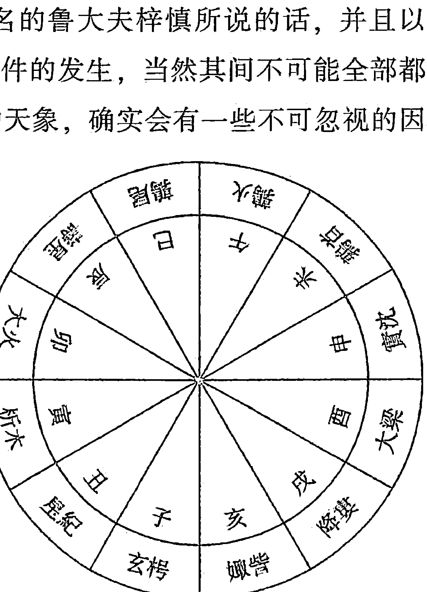

由每年的周期发展而能推知十二年为一个重复性周期，而且可推知行星（木星）与恒星（二十八宿）间相对应的客观变化，在当时，此乃极其可贵的天文知识和认识领域。况且，梓慎已能发现其间的推导错误之处，并且对十二纪的正确坐标，已经具有明确清楚的概念。其后因为岁星有“超辰”现象发生而不再使用。如果把十二纪对应于十二地支，未尝会出现对应上的失误。汉代郑玄的“爻辰”法（纳支法），就是根据这个思路来实现的。故而若论及《左传》与易学的关系，是不可不知当时在春秋时（公元前545年），已经具有像梓慎所掌握的这些天文和律历知识的人物。

该筮例，是发生在春秋当时（公元前545年）鲁（域、国）的事情。从该例中所记述的梓慎的言论，可知当时人们已经知道天文“超辰法”的规律。我想，利用十二辰次进行对应性纪年，当时一定已有数百年的时间了。联想到合诸“十二辟卦”的运用，到《吕氏春秋》成书的时候（公元前239年），却还未发现其相应的运用。当然，也不可不知“数字（信息）卦”的来源，是更加极早的（新石器时代的晚期）时期。按照潘雨廷先生的说法，若想要说明后来由“数字（信息）卦”转变成“阴阳符号卦”，应是在战国的中后期基本完成，而达到全国的普遍性应用时，很可能是由汉朝时的杜田生所传播出来的。当年孔子7岁。

> 十八、襄公廿八年（公元前545年）《左传》：“子大叔歸，復命。告子展曰：楚子將死矣。不修其政德，而貪昧於諸侯，以逞其願，欲久，得乎？”
“《周易》有之，在《復》之《頤》，曰：迷復，凶。其楚子之謂乎！欲復其願，而棄其本，復歸無所，是謂迷復，能無凶乎？君其往也，送葬而歸，以快楚心。楚不幾十年，未能恤諸侯也，吾乃休吾民矣。裨竈曰：今兹周王及楚子皆將死，歲棄其次，而旅於明年之次，以害鳥帑，周、楚惡之。”

上文其意为：襄公廿八年，游吉回国复命。告诉子展说：“楚王将要死了。不注重修为自己的政事和德行，反而是更贪图诸侯的进奉，以满足自己的愿望，想要维持长久的统治，这么做能够办得到吗？与此相应的《周易》记载，就是《复》卦变成《颐》卦，意思是说：‘迷离马虎地来回折腾，是凶险的。’这应该说的就是楚王吧！想要实现他的愿望，却忘掉了原来的基本的途径，想回复其本来路径，却又找不到什么才是正径和地方，这就叫做是迷复，这样做的结果还能没有凶险吗？君王（您）就直接去吧，送葬回来，也让楚国的人心痛快痛快。楚国没有个十年八年的时间，是不能再争夺霸业而让诸侯们普遍担忧害怕了。当前，我们就可以让百姓们休养生息了。裨灶说：‘今闻周王和楚王都将死去。岁星也占据了其次要的位置，而现在却运行到了明年才能处于的位置上，并危害了鸟尾星，于是与其相应的周朝和楚国，都要遭受到灾祸。”

这里所说明子大叔，就是大家所说的郑游吉（公元前？一前507年），他用《易》理进行指导，借以判断到楚康王将死。也正是其符合了《周易》的《复》之《颐》卦的道理，与其直接对应的上爻的爻辞是：“迷复，凶，有灾眚，用行师，终有大败，以其国君凶，至于十年不克征。”所以他才断言道：“楚不几十年，未能恤诸侯也。”这就是游吉当时对《易》的一种运用方法，已与五十多年前的伯廖、荀首的运用方法，是相同的了——这正好可见证晋、郑地区，当时相应易学的一些面貌。这一年孔子只有七岁（公元前551年生），可是当游吉去世时，孔子却已是四十五岁的人了，孔子对此等用《易》的方法，可能会有所了解。再者说了，且裨灶的认知根据，与鲁国当时的梓慎，已是相同的了——这与《易》理应是有密切相关的关系统。否则的话，仅限《易经》于上下两篇，还有《十翼》的文本，绝不可能能相应于《春秋》时代的相应易学面貌与水平。再者，就是游吉在论《礼》（见昭公廿五年）时，也全是按照义理的标准来进行的，所以大家才认为，他是个能够较全面用《易》的人。同时，也可知道晏婴的许多说法和观念（见昭公廿二年），也是与他的说法可以相通的。

该筮例，是发生在春秋当时（公元前545年）郑（域、国）的事情。它与（十）、（十一）两筮例，是有一些相同道理的认识与表述。

十九、昭公元年（公元前541年）《左传》：“晋侯求醫於秦，秦伯使醫和視之，曰：疾不可為也。是謂近女室，疾如蠱，非鬼非食，惑以喪志。良臣將死，天命不佑。”
“公曰：女不可近乎？對曰：節之。先王之樂，所以節百事也，故有五節；遲速本末以相及，中聲已降。五降之後，不容彈矣。於是有煩手淫聲，慆堙心耳，乃忘平和，君子弗聽也。物亦如之。至於煩，乃舍也已，無以生疾。君子之近琴瑟，以儀節也，非以慆心也。天有六氣，降生五味，發為五色，徵為五聲。淫生六疾。六氣曰陰、陽、風、雨、晦、明也，分為四時，序為五節，過則為蓄：陰淫寒疾，陽淫熱疾，風淫末疾，雨淫腹疾，晦淫惑疾，明淫心疾。女，陽物而晦時，淫則生內熱惑蠱之疾，今君不節、不時，能無及此乎？出，告趙孟。趙孟曰：誰當良臣？對曰：主是謂矣。主相晉國，於今八年，晉國無亂，諸侯無闕，可謂良矣。和聞之，國之大臣，榮其寵祿，任其大節。有蓄禍興，而無改焉，必受其咎。今君至於淫以生疾，將不能圖恤社稷，禍孰大焉？主不能禦，吾是以雲也。趙孟曰：何謂蠱？對曰：淫溺惑亂之所生也。於文，皿蟲為蠱，穀之飛亦為蠱。在《周易》，女惑男、風落山謂之《蠱》。皆同物也。趙孟曰：良醫也。厚其禮而歸之。"

其文意是说：昭公元年，晋平公向秦国求医，秦景公派医和去为他看病。看后医和说：“病无法治了。这是因为亲近女人太多，才得的蛊症。不是由于鬼神，也不是由于饮食，而是因为惑乱丧失了意志才得的病患。良臣将要死去，而天命还不能保佑他。”晋平公问：“女人不可亲近吗？”医和回答说：“要节制。先王的音乐，是用来节制调制百事的，所以有五音的节奏，快和慢、开头和结尾互相顾及，声音中和然后才能降低下来。五声降低停止之后，不应当再进行弹奏了。在这时若再行弹奏时，则会出现烦琐的手法和靡靡之音，使人心壅蔽，听觉阻塞，就会使人失去了平正和谐的乐声的感受，因此君是不可以听的。一切事物也像音乐的演奏一样，一旦到了烦琐的状态，就得要放手，不要因此而患得相应的疾病。君子所以接近琴瑟，是用来调适礼仪的，不是用来使人心胸壅蔽的。天有六种气象，降到地上产生五种味道，生发出五种颜色，表现成五种声音。如果致使其过度了，就会产生相淫的六种疾病。所谓六气，是指阴、阳、风、雨、晦、明。对应划分成四季的时间，排序成为五声的不同节律。六气过度就会发生灾祸，阴过度会发生寒病，阳过度会产生热病，风过度会使手脚及末端产生病患，雨过度会导致肠胃生病，昏暗过度会产生生惑乱的病症，光明过度会使人产生心神方面的疾病。女人，是属于阳性之事而对应于晚上的时间，这时若过度地淫乱，就会产生内热惑乱而不好判断治疗的蛊病。现在您不加节制不守时间限制，能不达到这些病症出现的地步吗？” 医和出来，告诉赵孟晋平公的病情。赵孟问：“良臣这是对谁而言的？” 医和回答说：“指的就是您。您辅佐晋国，到现在八年了，晋国没有动乱，诸侯朝聘没有缺失，可说是良臣了吧。我听说，国家的大臣，以君王的宠信爵禄为荣，以国家的大节为重任。如果有灾难发生而不改变自己的做法，必定受到它的祸害。如今国君由于没有节制淫荡而生病，将不能再为国家社稷进行思考，还有什么灾祸比这更大的事情发生呢？您不能加以抵御和节制，所以我才这么说的。” 赵孟问：“什么才是蛊？” 医和回答说：“蛊是过度沉迷于淫荡和惑乱所产生的根源。就其文字上来说，（器）皿上有虫叫做蛊。谷物中的飞虫也叫做蛊。在《周易》中，女人迷惑男人，大风吹倒山中的木材，都叫做是蛊。这都是属于同类的事物。” 赵孟说：“你是个好医生！” 赠送给他重重的厚礼，然后送他回国。

也可这样认为：晋平公久病不愈，派人到秦国寻求名医。秦景公派名医医和为晋平公诊断。医和诊视之后说：“阁下的病已经没有办法医治了。这就叫‘亲近女色太多，所得的病就是蛊病。这既不是鬼神所致，也不是因饮食不当，而是由于贪恋女色而丧失心志所致。君主的良臣将会死去，上天也不再会保佑他了。’” 晋平公问：“难道女色不可以亲近吗？” 医和回答说：“一定要有节制。例如古代圣王使用的音乐，就是为了节制各种事情及其欲望。因此才有了‘五声’的相应节奏，虽有快慢但始终要有节奏，中声以后的音调就逐渐降低，五次降低后，就再也不能够弹奏了。圣王之后就有烦于淫声的出现，淫塞心耳，使人忘记平和是音乐的本旨，君子不去听它。不止音乐如此，事物也是如此，到了使人心烦的时候，就应该舍弃，这样身体才不会生病。君子之所以弹琴鼓瑟，是为了对仪礼的节制，不是用以纵情乱性的。天有六种气，降到地上产生‘五味’，演变成‘五色’，对应成‘五声’，‘六气’过度就会患六种疾病。‘六气’就是指阴、阳、风、雨、晦、明这六种气。“六气”还对应分成为‘四时’，顺序对应变成‘五节’，超过对应的节度就是灾祸。 ‘阴’ 过度就会生寒病， ‘阳’ 过度就会生热病，‘风’过度就会生麻痹病，‘雨’过度就会生肠胃病，‘晦’过度就会生神经疾病，‘明’过度就会生心脏病。女色属于‘阳物晦时’，过度就会生内热惑蛊的病。现在阁下接近女色不守节度不守时节，怎么能不得这种病呢？”结束诊断并退出来，医和把病情转告诉给晋国宰相赵孟。赵孟却问：“谁是你所说的良臣？”医和回答说：“就是主上您呀！主上您做晋国宰相，至今已经八年，晋国没有出现动乱，诸侯也没有阙失，可谓是良臣。我听说，国家重臣，荣华宠禄，手握大权，有灾祸兴起，却没有办法改变，必然会有罪责。现在君主到了淫溺生疾的地步，将不再能顾惜国家，还有比这更大的灾祸吗？主上您好像是不能制止这些事情发生的，所以我才会这么说的。”赵孟又问：“什么是蛊？”医和回答说：“蛊是淫溺惑乱所产生的根源。从文字意义上来讲，器皿中盛满了虫子（合起来）就是蛊字。谷子里产生的飞虫也是蛊。在《周易》中，‘女惑男’，‘风落山（下）’，就叫做（山风）《蛊》卦。这些说法指的都是一回事。”赵孟说：“你可真是个良医呀！”于是赵孟以重礼相谢，还派人送医和回国。此间医和所言，后来一一应验。

以上该“医和”的言说，说的实际上应是中医学基本典籍《内经》里的一些主要要旨。说明疾病是滋生于不知道需要节制“五节”而淫乱于“六气”之中时，才会发生的。这也是传统中医理论的“五运六气”的根源和依据。综合分析参考《周易·蛊卦》诸多的解述，这里所说的“女惑男，风落山”，所以其成为千古的名言和概念。从数上来说，是由“五音”的“宫”数八十一，五（次）降（阶）之后而穷（达到）之于“角”数的六十四。实际上说的是“三分损益”法各声音位置实际对应确定的道理。由秦汉及其之前多种编钟的出土文物可证，在《春秋》时代，肯定已知道这些与音律有关的道理了（否则，孔子也没有必要，特别强调以《礼》《乐》来进行感受、体会与治理了），该征的特征，是其对应于“五声”，当然了，它还应是“五行”“五味”“五色”等现象与本质来源的基本原则与标准的根据。也就是说，凡是气味声色等，所有事物及其各自都能用数来把它们的本质，进行“极化”“类化”“概化”“约化”“几化”等的分别与（生克制化合的）沟通，可见我国在思想文化上的整体性思维方式——《内经》的理论与实践，运用于我们个体的身体之上，可见生命的“天、人、地”三才的整体性认识与表述的完整性、可行性与正确性。同时也说明我们的中医学，也宜于与“象数易学”及其相应易学，可合而为一成“易医学”体系。至少在以上“医和”的言论中，已包括有该种观点了。而且，还能将其推广的治病道理，延伸致用以来治理国家——这自然就会逐步发展成为，儒家所推崇的“内圣外王”的整体全面的相对应的思想体系了。

该筮例，是发生在春秋当时（公元前541年）秦、晋（域、国）的事情。可见，在春秋时代，中医与易理的一些紧密关系——即上承运用“天干”“地支”与天文气象相对应的道理，借以推导并产生相对应的“五运六气”的“天人合一”的认识与表述的方法和道理。凡是探究《内经》的理论，应当由该节作为其出发点才好。可惜的是，虽然当年的孔子仅有11岁——对这些“天人合一”观念的认识与理解，还是未曾有可能的时期，但是易与医相互推动、借鉴、影响、融和等的“易医学”的现实与实现，其间由于“象数”与“易理”的融会贯通，在当时秦晋地域已具有了成为医、吏学界和而成“易医学”现实的情景和可能。当年孔子11岁。

### 二十、昭公二年（公元前540年） 《春秋》：“二年春，晋侯使韩起（? —前514年）來聘。”

> > 《左传》：“二年春，晋侯使韩宣子來聘，且告為政，而來見，禮也。觀書於大史氏，見《易》象與《魯春秋》，曰：周禮在魯矣。吾乃今知周公之德與周之所以王也。公享之，季武子賦《繇》之卒章。韓子賦《角弓》。季武子拜，曰：‘敢拜子之彌縫敞邑，寡君有望矣。’武子賦《節》之卒章。既享，宴於季氏，有嘉樹焉，宣子譽之。武子曰：‘宿敢不封殖此樹，以無忘《角弓》。’遂賦《甘棠》。宣子曰：‘起不堪也，無以及召公。’”

上文其意是说：昭公二年春天，晋平公派韩宣子来鲁国聘问，并且通告他掌握了国政，因此前来进见，自然也是合乎礼仪的。韩宣子在太史那里参观藏书，看到了《易象》和《鲁春秋》两书，于是说：“周礼全在鲁国了，我今天才知道周公的盛德以及周朝之所以能称王天下的原因了。”鲁昭公设宴款待他，席间季武子吟了《繇》诗的末章。韩宣子吟了《角弓》。季武子叩拜，说：“谨拜谢您光临敝邑，看来我这个国君是有希望了。”随后又吟了《节南山》的末章。待该宴享结束，又在季武子的家里宴饮，在那里看到了## 《传》前易学及象数易学

一棵好树，韩宣子赞誉了此树。季武子回应说：“我怎敢不培植好这棵树，来表示不忘记您赋《角弓》的意义呢！”于是随即吟了《甘棠》诗以作回应。韩宣子急忙说：“我担当不起，没法赶得上召公您。”

发生该事例时，可知，当时的韩起，已经见到鲁国有《易象》这个文本了。当然这里所说的《易象》一文，我们应宜用以“数字（信息）卦”的形式与之相对应来认识，才是更正确的思路。因为数在对应取象时，才会发现其内含有“阴阳”“五行”之类的相同或不同的本质道理，而在早先的《洪范》中，也应当可以反映出这些规律和道理来了。也有可能，当时已具有像通行今本《说卦传》《杂卦传》中的若干卦象及其相对应的内涵的文本了。若是公亨之而各言其志的话，自然还须引致《诗经》的一些内容，与以补充充实才行。这里所说的“周礼尽在鲁”者，应该包括《易象》与《鲁春秋》的文本文意才是。由《易象》的存在与传播，可证明周朝是继承了夏商两朝的衣钵而称王的。再从《鲁春秋》的存在与传播，可明确地知道周公所推行和提倡的德性，在此铺陈敷用了十年后，孔子才继承并且编定了《诗》《书》传承的文本。其中的《诗》呢？其言“乐”。《书》呢？其使人明“礼”——使人能处于“制礼作乐”之中。当时《易象》与《鲁春秋》本应该是属于“礼”的范畴。由该例可看到，当时鲁大史所收藏的《易象》，尚还不可视其就是指的是（《易经》）卦爻辞及包括“用九”“用六”在内的共450节的《周易》文本的确定文本。

该筮例，是发生在春秋当时（公元前540年）晋与鲁（域、国）的事情。这里所提及的所谓《易象》，还是不可以直接就把它看成或当作是指的《周易》的卦爻辞及其体系（含结构、分布等）。这年孔子12岁。

二十一、昭公五年（公元前537年）《左传》：“初，穆子之生也，庄叔以《周易》筮之，遇《明夷》之《谦》，以示卜楚丘。”
“楚丘曰：是将行，而归为子祀。以谗人人，其名曰牛，卒以馁死。《明夷》，日也。日之数十，故有十时，亦当十位。自王已下，其二为公，其三为卿。日上其中，食日为二，旦日为三。《明夷》之《谦》，明而未融，其当旦乎，故曰日为子祀。日之《谦》，当鸟，故曰‘明夷于飞’。明而未融，故曰‘垂其翼’。象日之动，故曰‘君子于行’。当三在旦，故曰‘三日不食’。离，火也；艮，山也。离为火，火焚山，山败。于人为言，败言为谗，故曰‘有攸往’，‘主人有言’。言必谗也。纯离为牛，世乱谗胜，胜将适离，故曰‘其名曰牛’。谦不足，飞不翔；垂不峻，翼不广；故曰‘其为子后’乎。吾子，亚卿也，抑少不终。”

其文意是说：昭公五年期间，当初，叔孙豹出生的时候，他父亲庄叔用《周易》为他占卜，遇到《明夷》卦变成了《谦》卦，并拿给卜楚丘看。卜楚丘看后说：“这说明叔孙豹是要离开自己的国家，但是还能回来为您祭祀。还会带回来一个说别人坏话的人回国，他的名字应叫牛，最后将会因为饥饿而死。《明夷》，按通常儒家们的认识，认为是与太阳有关的卦。旬日的数目是十，所以有十时与之对应，也与十日的位次与之相当。从王以下，第二位是公，第三位是卿。太阳上升到中天位置时，就相当于是王，在食位时相当于是公，在清早（旦）位时相当于是卿。‘《明夷》卦变成《谦》卦，由于是初爻变，当是对应于天已明的时候，但是太阳的位置还很低，相当于是清晨的时段，所以才说‘能为您祭祀’。太阳（《明夷》）变成《谦》卦时，因太阳（离卦）有鸟之象，初至五爻的小过（䷽）卦，有“飞翔的鸟”之象，所以说‘明夷于飞’。天已明亮可是由于太阳的位置很低，“下卦”有下、低、垂之象，所以说‘鸟是垂下了翅膀’，象征太阳的运行。“下卦”离（☲）变艮（☶）卦，艮“反”成震（☳）卦，其中离有太阳、明夷鸟、金乌之象，艮有君子之象，震有行、运行、出行、行动之象，故艮“之”震，有“君子出行”之象，所以才说‘君子于行’的。“三爻”相当于是太阳处于第三位的清早时候，又由于离（☲）有“三（先天数）”“日（子）”之象，艮（☶）“旁通”成兑（☱）卦，艮有停止、禁止、阻止之象，兑有食、失去、没有之象，故离“之”艮“之”兑，有“三天停止而没有进食”之象，所以才说‘三日不食’的。离是火，艮是山。离为火，火烧山，山败坏。艮（☶）“反”成兑（☱）卦，兑有人、言语、说坏话之象，说坏话就是谗言，加之，艮“反”成震（☳）卦，艮有利于、获得、吉之象，震有主人、前往、斥责之象，故艮“之”震“之”兑，有“利于前去，可是会受到主人的责备”之象，所以才说‘有攸往，主人有言’的。这个言一定会是谗言。与离卦相对应的动物会是牛，世道混乱谗言取胜，取胜就将变成离卦，所以说‘他的名字就是牛’。谦而不足，飞而不能翱翔；翅膀下垂而不能高举，两翼低垂无法伸展而不能宽广，所以说：我想这就是您的继承人吧。您虽居次卿之位，但是（您的）继承人将会是不得善终的。”

我还认为这是：鲁国叔孙庄叔（名得臣）在他的次子叔孙穆子（名豹）初生的时候，用《周易》占了一卦，遇到《明夷》卦（初爻由阳变阴）变成《谦》卦。他把这个结果拿给卜楚丘看。于是卜楚丘根据卦象断定说：“他这是将要远行了，而归来时为嗣子奉祭祀；并与谗人一起回来，这个人的名字是牛；最终会饿死。”这是卜楚丘对《明夷》之《谦》的卦象所进行的解说，以其作为该占筮的断语。接着他详细地作出了相应的的解释，并解说《明夷》之《谦》所对应的《明夷》卦“下卦”的内涵意义。由于《明夷》卦是“离上坤下”，即“日在地下”（《说卦》有离为日、坤为地之说），其“下卦”离（☲）卦有日（阳光）之象，所以卜楚丘说：“《明夷》，日也。”古代纪日的方法，是十日为一旬，用甲、乙、丙、丁、戊、己、庚、辛、壬、癸来分别进行对应性的标记，所以说：“日之数十”。古代又把一日分为十时，所以卜楚丘又说：“故有十时”。春秋时期，按照社会地位的相同或不同，把人们对应分成十个不同的等级，即王、公、大夫、士、皂、舆、隶、僚、仆、台（见《左传·昭公七年》），其中王是最高级，公是第二级，大夫（卿）是第三级，等等，所以卜楚丘说：“自王以下，其二为公，其三为卿。”卜楚丘把人的十等和日的十时相对应地通配了起来，所以说十时“亦当十位”。对于这一点的理解与表述，杜预的注解是比较详细的，他说：“日中当王，食时当公，平旦为卿，鸡鸣为士，夜半为皂，人定为舆，黄昏为隶，日入为僚，晡时为仆，日跌（孔疏曰：‘谓蹉跌而下也’）为台。隅中（孔疏曰：‘隅谓东南隅也’）日出，阙不在等，尊王公，旷其位。”“日中”是太阳位置正当中天最高位的时候，因此是以最高级别的“王”来与之配比是“日中”。上午的太阳位置是逐步进行上升的过程，其位置会是越来越高的，因此以人的地位较高的“公、大夫、士”来分别对应配比上午的各时。由于“食日”（吃早饭时）的太阳位置要比“日中”时稍低，故居第二高的位置，因此应用第二级的“公”来进行与之对应配比“食日”。而因“旦日”（日初出时）的太阳的位置，又会比“食日”时的位置更低，故居第三个低位的位置，因此要以第三级的“大夫”来进行与之相应配比“旦日”。所以说：“日上其中。食日为二。旦日为三”（日中、食日、旦日是十时中所对应的三个时名。上、二、三是指太阳由高到低的高度位置排序等次）。至于第四级的“士”，应当与东方刚刚发亮时的鸡鸣时分与之匹配。此后所对应的“天、人、地”的“阳气”，是逐步的减弱，而“阴气”却会逐步的增强，所以会是以皂、舆、隶、僚、仆、台与之配比下午和夜晚的各时。卜楚丘根据他的配比方法，认为《明夷》卦变成《谦》卦，《明夷》的“下卦”离“日”变成是《谦》的“下卦”艮“山”，而其“上卦”坤卦之“地”却都未变。这象征着太阳初升时，其光芒被大地所遮住，又转而被大山所遮住，这都是太阳还未大放光明的时候，其所对应的应是“旦日”时的现象，所以说：“《明夷》之《谦》，明而未融，其当旦乎！”又由于按规定是“旦日”与“大夫”职位相匹配，从而认为穆子将会继承庄叔的爵位成为大夫，并奉叔孙氏的祭祀，故而卜楚丘才说：“故曰为子祀”。卜楚丘又从卦象上来对应讲解其相应的意义。其认为，《明夷》卦“下卦”的离（☲）日，变成了《谦》卦“下卦”的艮（☶）卦之山象，因《说卦传》中有“离为雉”（为禽、为鸟）之象，所以离（☲）变成艮（☶），即离“之”艮，就有“雉鸡向山间（飞）去”之象，因此，卜楚丘说：“日之《谦》当鸟，故曰：‘明夷于飞。’”由于《明夷》卦中的日，是指初升时的日（太阳），其还未大放光明，所以此时《明夷》卦所对应的“明夷鸟”，也就不能大展羽翅而高飞远举，应该是低垂着翅膀的飞行状态，所以他解释爻辞说：“明而未融，故曰：‘垂其翼’。”故而他延伸性地把日（太阳）比作是“君子”，把日的运行比作是“君子的出行”，因而才会说：“象日之动，故曰：‘君子于行’。”《明夷》卦中的日，若是指“旦日”的话，应居于相应的第三位，这是没有升到“食日”状态时的日（太阳）头，即还没有到吃饭的时候的日（太阳）的位置与状态，所以又会有“不食”（没食）之象。进而卜楚丘又解释说：“当三在旦，故曰：‘三日不食’。”同时，离为火，艮为山，《明夷》卦的“下卦”的离（三）卦变成《谦》卦的“下卦”艮（䷳）卦，离“之”艮，有“火焚山”“山败”之象。对于人来说，因艮（䷳）“旁通”成兑（䷹）卦，艮有“山”“获得”“说谎话”“说反话”“艮其背”（背道而驰）之象，兑有“毁”“败”“缺德”“言语”“说”“话”“说坏话”“谗言”之象，故艮“之”兑，有“山败”“说瞎话”“说不中听的话”及“得以谗言”“说坏话”之象，因而他解释说：“离，火也。艮，山也。离为火，火焚山，山败。于人为言，败言为谗，故曰：‘有攸往，主人有言。’言必谗也。”这里的“主人”，是由“谦”卦的“下卦”艮（䷳）“反卦”成震（䷲）卦，震有“主人”“祭主”之象而来，再者，震“之”艮“之”兑，有“主人有言，言必谗”之象；又因艮（䷳）“土”与其“上卦”（有“往”象）坤（䷁）“土”，成“土土相合”（容易合作融合）之势，故而才曰“有攸往”的。卜楚丘又从卦象内容讲到这个谗人的名叫作“牛”。他所说的“纯离为牛”是说离上离下的“离”（䷝）卦中的上下离（䷝）卦都有“牛”（母牛、母子孕牛）之象［《离》卦辞有“畜牝（母）牛吉”］。离为火，为恶人之象，在人事则为“说恶话，进谗言”，而且进谗言的这个人，应该就是叫做“牛”的这个人。他所谓“世乱谗胜，胜将适离”是说，当此乱世的时候，则社会上的谗言盛旺；所以胜利者往往会归于谗人。他由此论断了相应的谗人“其名为牛”。结果后来的事实证明，史实与占辞所说的一致的结果：穆子果然先是出游他国，后来回国继承了父业，成为鲁国的亚卿，并带回来一个叫作“竖牛”的小人，最后在这个小人的挑拨离间之下，穆子受困，悲惨地饿死了。

> > 他解释说：“离，火也。艮，山也。离为火，火焚山，山败。于人为言，败言为谗，故曰：‘有攸往，主人有言。’言必谗也。”

此筮例明显可见，当时鲁国的筮《易》的一些具体情况。然而，必须得严格地核实其具体的对应时间才行。也就是说，当穆子初生的时候，其父庄叔以《周易》对其以后的发展，进行了筮占性的判断，其筮得的结果是“遇《明夷》之《谦》”，之后以该筮得的结果示于卜楚丘看。当知，虽然该例中的筮者和断者，并非是同一个人，也不知是何年何月示之于卜楚丘的，可是，我们知道，庄叔死于宣公五年（公元前606年），就以其卒年而论的话，也上距昭公五年（公元前537年）已是七十年的时间了。说明这里记述的应是七八十年以前所发生的事情，当时卜楚丘肯定是已经去世多年了。经过辗转之传的记述过程，往往很容易导致事情的失实。再说了，当季友（公元前？—前644年）还未出生时，已有托名“卜楚丘之父之卜”的说法和事例了。所以用这样的手法来神乎其说，这都是《左传》作者为了共同为季氏制造舆论环境与条件，才这样来相应记述的，这怎么能让人轻易地就会相信其真实性呢？这里所说的“卜楚丘之断”，也应不是卜楚丘本人的一些言论与说法。我们当下可以相信的与卜楚丘所说有关的事例，也仅是在文公十八年（公元前609年）所记述的那个占卜的事例。若想考证《周易》编辑成卦爻辞的时间的话，起初应当是公元前600年前后，地域是在三晋地区，因传播到齐鲁地区时，大约是公元前550年前后。该例托名是“卜楚丘之断”的事例中，正逢鲁国处于新用《周易》的筮占方法（义理易）来对应解述卦爻之义的时候，其中定有相当可贵的易筮资料可参考。

其一，已能运用“旬”日的周期及其相对应的变化来分类，以社会等级制度以应人事，而且还知对应于每日的具体时间，也是以十分法与之相对应：可知当时的一时，转换成（合成）当今一日的时间，是144分。《内经》《灵枢经》的计时方法，都是以“一日一夜，水下百刻”为准，正好符合了“十刻当一时”的进位制，其中依然保存着《春秋》时代的计时方法。假如我们以周天度数来论的话，那么在进行“十分法”时，则每份是36度；“十二分法”时，则每份是30度。其间的变化，却能与“五运六气”所反映的规律相融通。

其二，用于对应社会及其组织来说，也可以运用“十位”的对应分配方法进行对应性分辨。可惜的是，这里仅是对应言及“王、公、卿”三位的具体等级对应情况，而并未详及其以下的那另外七位级的具体所指的等级对应情况。可是，在《左传·昭公七年》记有楚无宇之言说道：“人有十等，下所以事上，上所以共神也。故王臣公，公臣大夫，大夫臣士，士臣皂，皂臣舆，舆臣隶，隶臣僚，僚臣仆，仆臣台。马有圉，牛有牧，以待百事。”这里所说到的应是当时楚国（春秋时期）的礼制，它未必会与鲁国的礼制是相同的——鲁国十等人而外，另外还有有圉、牧两等人物，其实一共是分成了十二等人次。鲁制中的其三定为是卿，这已与无宇所言，已是不同的对应关系了。其后的《卦气图》，凡是分为辟、公、卿、大夫、候者，即是由十等变化具体对应而形成的，甚至连《乾凿度》《京氏易》受其渊源的影响，都同样是以对应于取天子、诸侯、公、大夫、士五等人物（这也为后来东汉时期“周易象数学”相应《周易》的“经学易”的卦爻相对应的“爵位说”的确立，提供了相应的史实依据）。这是由于客观历史环境的不同，早已对应形成了阶级社会，若能依社会地位的等级，来对应分辨的话，并依其对应的类型的不同，而论及他们的得失，这虽然并非是研究社会科学的唯一方法，然而也并非不可不认为也是一种有效的对应认识与表述的方法。由于人在社会上的地位的不同或相同，其所担负的责任也会有所不同或相同，若论及其各自的得失来说的话，当然也是不能忽视此类事物的客观相对应存在的事实和史实的。

其三，若以“十位”对应符合于诸“十时”的话，这也是一种很形象且重要的“比喻”方法。假使，没有弄清楚人位天时之间对应的具体事实而妄加比喻的话，再加之，还没能探究明白比喻的适用范围而妄加推论时，势必会形成不可究诘的穿凿附会的学风和认知结果。就像“象数”认识与表述的长处，是它能以抽象的筮理，借以达到明事物之间的必然的逻辑联系——其间，确实对应并具有种种事物对应的具体结构状态（从战国中期之后，一切卦、爻的组合结构状态，都是对应于阴阳爻的几何空间组合结构的对应状态）。而今的信息社会，大家所推崇的那些所谓的“数学语言”，正在起着巨大的认识与表达的作用。可是，处于两千多年前的“象数”思维的“象表意”“象数表意”“象形表意”的方法，大家普遍会认为，它未必是可以与当今的数学方法相提并论的。而它所反映、认识与表达的原则与方法，用以了解天人之际的各种相互作用的本质关系和标准，若以自然界、生物界的时间数量级来对应观察与分析的话，两千多年的变化也不过是“不啻一瞬”而已，所以说，对当时的历史及其各种事物所表现反映出来的事实，也都是不可以忽视的。况且，当时战国时代的易理，也并不是用这种简单类比的“十位合十时法”，就可以全部说清楚的。若是能够进一步地认识“象数易学”及其“时位”“方位”“层次”“角度”“分布”“结构”等的对应表述功能的时候，才可以说，这是属于相应整体易学的全面完结之一。

其四，还可以运用相对应的“取象法”进行认识与表达。这是“象数易学”的“易学象数学”及“周易象数学”及其相应易学及《周易》研究的根本大法，在对《易》的研探中，其将会发挥出无可比量的巨大作用。这种“取象法”传承到汉朝末年的虞翻（170年～239年）时，也只是仅存“告朔之饩羊”了；到了王弼（226年～249年）相应易学（义理、《十传》）出现而提出“扫象”之前，取象的方法与道理，更是不绝如缕了；再到了唐朝的李鼎祚于宝应元年（762年）集《周易集解》时，该书又起到了保存诸多“取象法”文献的大作用；直至到了乾隆后，提出了恢复汉易的目标，由于文献资料的所限，也只不过是仅恢复到了东汉时期相应“经学易”的易学认知与表述的水平——更早的西汉时期及春秋战国时期《易》的“以卦之卦”的总面目，绝大多数的易界人物，基本上还是不知道（这也是当今某些所谓的相应易学“权威”学者认为“汉代以前没有易学，仅有‘易说’”的根本原因——其不知道或不了解，先秦以前的相应易学及其真正的“象数易学”及其相应易学的发展和发展史，以及当时“象数易学”及易筮、易卜之类的客观现实与史实）；若是逞论春秋战国的易象时，如果是不经过对东汉时期易象（含通行本《说卦传》《杂卦传》）的探讨，也是很难以向前推及的，所以说，清朝乾嘉学派对汉易的重视，其所能达到的效果，也应是功不可没的。而如今仍是仅用“朴学”方法来研究各种相应的易学，那将难以了解、理解、认识先秦及其之前的《易》貌及其认识与表述内涵的。比如，《左传》《国语》中所用及所取之象，都是对应有其针对性的具体实指的。假如，还不知其象和数的直接或间接的对应性实指内涵意义以及我们所创设的“象数易学”新领域及新学科内涵和思想的话，我们何必再去针对性地“取象知数”呢（“象”是各种客观事物所直接对应的空间组合结构状态的针对性认识与表述和模型，“数”是这些空间组合结构状态相对应的理性逻辑的抽象表述与基础和标准）？！

以上的这四点针对性的探讨，可以作为孔子出生前后，在“齐鲁”地区流行的有关易学方面的一些情况的概括，对后世的各种相应易学及其发展，有着极大的影响。可是，孔子与《易》之间的真正关系，绝不是像传统儒家及其相应《周易》“义理”所说或编造的那些所谓传统正宗的一些不可逾越的僵死性关系和内容。我另有专文详之（详见本书中“对孔子及其思想的重新认识”一文以及《易象及其延伸——易象延》一书）。该筮例，是发生在春秋当时（公元前537年）鲁（域、国）的事情。由该例我们可以明显地看到，当时鲁国新用《周易》解卦筮法的（义理易）的一些面貌，其中遇《明夷》之《谦》的“之”变中，是内含有当时极其可贵的一些相应易学方面的资料①。

这年孔子15岁，不过他已意识到要努力学习做人与生活的本领，故（后来才会）曰：“吾十有五而志于学。”（《论语·为政》）

> > 二十二、昭公七年（公元前535年）《左传》：“十一月，季武子卒。晋侯问伯瑕曰：吾所问日食，从矣。可常乎？”
“对曰：不可。六物不同，民心不壹，事序不类，官职不则，同始异终，故可常也？诗曰，或燕燕居息，或憔悴事国，其异终也如是。公曰：何谓六物？对曰：岁、时、日、月、星、辰，是谓也。公曰：多语寡人辰而莫同，何谓辰？对曰：日月之会是谓辰，故以配日。”

上文之意为：昭公七年十一月，季武子死了。晋平公对士文伯说：“我所询问的日食的事，应验了。可以经常像这样得到占验吗？”士文伯回答说：“不行。六种事物不相同，百姓的心思不一致，事情的顺序不相类，官位职务不相等，开始相同而结果又会不同，怎么可能是经常的呢？《诗》中说：‘有的舒服地安居休息，有的尽心尽力为国服务。’它的结果不同就是这个样子。”晋平公问：“什么叫做六物？”士文伯回答说：“说的是岁、时、日、月、星、辰。”晋平公说：“很多人对我谈起辰，但没有人的说法会是相同的。什么叫做辰？”士文伯回答说：“日月相会就叫作辰，所以又会用来配用以日的运行规律。”

这一节的内容之义，应该说是极其重要的，可以说，它是当时在“三晋”地区，对天文“象数”对应方面的一个总结——其中，不仅含有当今仍可以体会感知到的天体“干”“支”“纬”“经”之间对应的坐标（定位）。

① 可参阅本人所著中央编译出版社2016年出版的《易象及其延伸——易象延》一书的第二、第三两册书的具体内容。

# 第三章 《左传》《国语》中的筮例分析

关系，还有包括天体及时间这些具体的周期及其循环规律。也包括当时已知，用木星的周期回归年，来进行对应的计岁（计年）——知其十二（11.8）年的对应周期的回归规律。虽然当时已能够知道“太岁”（木星）的超辰变化，可是依然认为这是正常的天变规律。这里提到的“时”，是指一年对应的“四季”；“日”对应所指的就是对应于“天干”的“十日”为一个重复周期——基本上是三旬对应于约一个月；“月”对应所指的就是对应于“地支”“十二月”为一个重复周期——基本上约为一年的时间。而其中的“星”，对应所指的应是“二十八宿”为一周天的周期——以“七宿”连续组成，对应成是一时；“辰”呢？是用以计日来用的，即以“六十花甲子”——大约是两个月的时间，为一个重复性周期。这里提到的这六项事物，是既有其正常普遍常态的变化，又有其各自相对应的不同的实际变化，所以说，它们是具有某些相同和不同规律的（天文）事物。而今，我们已经能够运用将其抽象而得到的数学语言和数理及其相应的逻辑规律，精确的对应认识与表述了。比如，将天体运行一周，对应于360度，那么，一句的话，则对应于10度，一个月对应于30度，一个“时辰”对应于60度，一“季”或一“时”对应于90度，还可以符合于“七宿”的空间度数。合计三十旬，十二月，六辰，四时，二十八宿，共同组成一年的时间——即“木星”在天空移动一个“辰”次位置，对应的时间，就是一岁（一年）。假如，把这些周期规律与诸人事规律一一相对应，势必也会发现一些同始异终的一些对应性作用、关系及其规律。可惜2500年前，人们已能知道这些常规变化的道理了，而迄今仍有许多的执迷不悟者，还不如该士文伯思考得深远，或者还不及此人的认知呢。如果是这样的话，那是绝不可也绝不能够通了《周易》之象的。由于该节中，特别论及了《左传》与易学者，所不可不知的天文易象及“象数”的对应关系与变化规律，所以我们必须注意对这些“象数”规律的探讨、研究、开发与弘扬。

该筮例，是发生在春秋当时（公元前535年）晋（域、国）的事情。可见当时对“岁首”及需要确定或判定的问题，可以不用等到“卜郊”（春天在惊蛰这一天，在郊外进行五谷丰登的祭祀活动）之后，才来确定了。我想，孔子提出“行夏之时”的主张，可能也是受到该种判定方法的启发、影响。

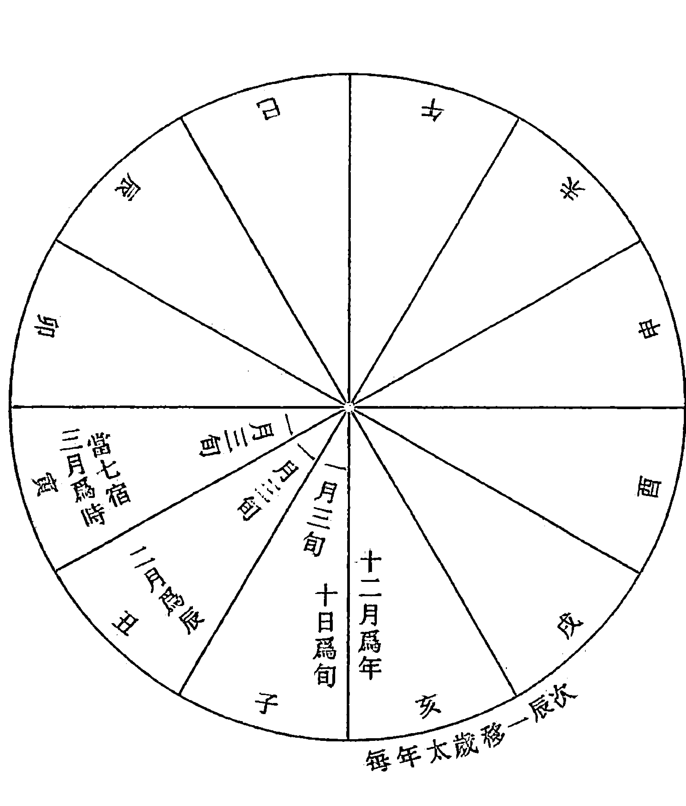

响或实践，才会想到并提出来的（当然不是时年 17 岁所能认识并提出来的，应是后来他办学讲学之后才相应认识、理解并提出来的主张）。

这年孔子 17 岁。孔母颜征在卒。是年，季氏宴请士一级贵族，孔子赴宴，被季氏家臣阳虎拒之于门外。

### 二十三、昭公七年（公元前 535 年）

> 《左传》：“衞襄公夫人姜氏無子，嬖人婤始生孟絷。孔成子夢康叔謂己：立元。余使羈之孫圉與史苟相之。史朝亦夢康叔謂己：余將命而子苟與孔烝鉏之曾孫圉相元。史朝見成子，告之夢，夢協。晉韓宣子為政聘於諸侯之歲，婤始生子，名之為元。孟絷之足不良能行。”

“孔成子以《周易》筮之，曰：元尚享衛國，主其社稷。遇《屯》。又曰：余尚立絷，尚克嘉之。遇《屯》之《比》。以示史朝。史朝曰：元亨，又何疑焉？成子曰；非長之謂乎？對曰：康叔名之，可謂長矣。孟非人也，將不列於宗，不可謂長。且其繇曰：利建侯。嗣吉，何建？建非嗣也。二卦皆雲，子其建之。康叔命之，二卦告之，筮襲於夢，武王所用也，弗從何為？弱足者居。侯主社稷，臨祭祀，奉民人，事鬼神，從會朝，又焉得居？

该文之意是：昭公七年间，卫襄公夫人姜氏没有了儿子，宠姬婤姶生了孟絷。孔成子梦见康叔对自己说：“立元为国君，我派羁的孙子圉和史苟辅佐他。”同时，史朝也梦见康叔对自己说：“我将命令你的儿子史苟和孔成子的曾孙圉辅佐元。”史朝见到孔成子时，告诉了他梦见的事，知两人的梦境相吻合。晋国的韩宣子执政时向诸侯聘问的那一年，婤姶生了儿子，取名叫作元。因孟絷的腿脚有残疾，不便于行走，故孔成子用《周易》为他占筮后说：“元希望享有卫国，主祭它的是土神和谷神。”遇到的是《屯》卦。又说：“我希望立孟絷为君，但愿神能认许他。”遇到的是《屯》卦变成了《比》卦的卦象，于是又拿给了史朝看。史朝看后说：“卦辞为‘元亨’，还疑虑什么呢？”孔成子说：“‘元’不是说的应是其为大（长子）吗？”史朝回答说：“康叔为他取名，可以说这就是为大的吧。孟絷不是个体魄功能健全的人，将不会被列入到宗主的名序里的，不能说这还是仍为大吧（立长子为储君）。况且那繇辞说‘利建侯’，若是说嫡子嗣位才吉利的话，还用建立什么侯呢？何况建立又不是继承。因两次筮得的卦辞都这么说，您还是立元吧。康叔命令他，把两卦筮得的结果都告诉说：就立元为侯吧。况且占筮的结果和梦境的内容又相互契合，该方法武王也曾用过，我们有什么理由不顺从卦意呢？而且腿脚残疾的不强健者只能待在家里才好，而君侯主持的是国事，亲临祭祀，奉养人民，侍奉鬼神，参加会盟朝觐，这里哪一件事情是待在家里就能完成的事呢？！各自按照对自己有利的目的或方式来行动做事，不也是很好很适宜的吗！”所以孔成子才确立了公子元为卫灵公。

我也认为：昭公七年间，卫襄公死了，他的夫人姜氏没能给他生下个儿子，他的嬖人（妾）婤姶却生了孟絷。卫大夫孔成子，晚上梦见卫康叔（卫国始封之君）对自己说：“立公子‘元’（孟絷之弟，当时‘元’还未出生）为国君，我会让你的儿子羁的孙子圉和史苟二人辅佐他。”史朝也梦到康叔对自己说：“我会让孔成子的曾孙圉和史苟二人辅佐‘元’的。”史朝见到成子时，告诉他梦里公子执掌国政的事，知自己的梦境与成子的吻合。后来，晋国的韩宣子执政与诸侯会盟（聘问）的那一年，嬖人婤姶又生了个儿子，取名叫‘元’，而长子孟絷双足残疾却不能随意行走。虽然在梦中听见了卫襄公的嘱咐，孔成子对立公子‘元’或公子‘絷’为卫君一事，还是有所忧郁和疑虑，因而又用《周易》进行了占筮。占筮事前他祝祷说：“希望公子‘元’能辅卫国家，主持国家政事。”占筮时得到了《屯》卦。孔成子又说：“我想要立公子絷，但愿神灵能保佑他。”此时，（初爻由“阳爻”变成了“阴爻”）《屯》卦变成了《比》卦。于是就把卦变情况拿给史朝看。史朝看后说：“公子‘元亨’获有国家，这还有什么好怀疑的吗？！”孔成子却说：“这里的‘元’是不是指长子公子絷呢？”史朝回答说：“公子‘元’的‘元’字，是先王给起的名字，就是（元）长子的意思。按道理讲，因长子孟絷是个跛子，不是个体魄具有健全功能的人，他是不能被列于宗庙里面的，所以不应算是长子。况且《屯》卦的卦辞、爻辞里，都有‘利建侯’的结论。如果立嫡长子吉利的话，那还用再提到立吗？所谓立，当然不是仅指是立嫡长子啦。《屯》《比》两卦都说‘元亨’，都说应该拥立公子‘元’，阁下赶快拥立公子‘元’吧。再说了，先王康叔也是这样的嘱托。再者，《屯》《比》两卦中也是这样说的，占筮和梦境都相互呼应并符合，这也是周武王曾经经历过的事情，阁下为什么还不能马上依从呢？跛子只能够闲居于家中，国君却要执掌社稷，主持祭祀，治理百姓，侍奉鬼神，出国会盟，他怎么能够闲居于家中就能完成这些事呢？人尽其才，不是很好吗？”于是他们就确定拥立公子元为卫灵公。并于十二月癸亥日，埋葬了卫襄公。

> “屯”卦卦辞是：“元亨，利贞。勿用有攸往，利建侯。”
“屯”初九爻辞是：“磐桓，利居贞，利建侯。”
“比”卦卦辞是：“吉。原筮，元 [亨]，永贞，无咎。不宁方来，后夫凶。”

该筮例中，可见孔成子与史朝二人间的故弄玄虚，当时《易》筮的重要作用由此可见。这里所用的《易》筮，还是属于传统的卜筮方法，绝不会是当时“三晋”地区所编成《周易》文本后的占筮思想和方法，也并非是其传至齐鲁地区后的“齐鲁易”的解释方法。可知当时，传统的卜筮及其方法，必然仍在春秋当时的各国流行着。后来易学免于秦火之灾，也是依赖其卜筮的作用及需要才如此的，这个历史的史实，我们不可轻视——它关系并决定着，《易传》（十翼）应该是什么时间（含朝代）、在什么地域、是由什么人、以什么形式和方式来编制完成的。

该筮例，是发生在春秋当时（公元前535年）卫（域、国）的事情。虽然可见《周易》之筮，在春秋当时用于立嗣时，所起的重要作用，但是该筮例中，《左传》作者仅涉及《屯》《比》两卦通行本《易经》中相对应的“利建侯”和“元亨”的具体内容的判断，却并未进一步涉及系卦爻辞后的哲理内容，仍是属于春秋时期普遍流行的传统的“之”变的“以卦之卦”的卜筮原理和解释方法。

> > 二十四、昭公十二年（公元前530年）《左传》：“南蒯枚筮之，遇《坤》之《比》，曰：黄裳元吉。以为大吉也。”

> > “示子服惠伯，曰：即欲有事，何如？惠伯曰：吾尝学此矣，忠信之事则可，不然，必败。外强内温，忠也；和以率贞，信也。故曰黄裳元吉。黄，中之色也；裳，下之饰也；元，善之长也。中不忠，不得其色；下不共，不得其饰；事不善，不得其极。外内倡和为忠，率事以信为共，供养三德为善，非此三者弗当。且夫《易》不可以占险，将何事也？且可饰乎？中美能黄，上美为元，下美则裳，参成可筮。犹有阙也，筮虽吉，未也。”

上文其意是说：昭公十二年间，南蒯泛泛地占卜吉凶，得到了《坤》卦变成《比》卦，卦辞说“黄裳元吉”，并认为当是大吉大利的事情。南蒯把卦变拿给子服惠伯看，问：“如果想要干事情，那会是怎么样的结果？”惠伯说：“我曾学过这个占筮方法，如果是预测忠信的事就可以，不然的话肯定失败。比如，外表坚强内心温顺，这是忠诚；用和顺的心态来占卜，这是信用。所以说，（见到或穿着）‘黄色裙裳就是大吉大利的兆头’。黄，是核心、中心的颜色；裳，是下身的服饰；元，是善德的首位。若内心不忠，则是不符合那中心、核心相对应的黄颜色的要求；若居于下位而不能恭敬，则是不符合那服饰相应的需要；若办事不以善德为出发点，这又是不符合那相对应的准则。总之，外表内心一致就是忠，凭信用办事就是恭，培养三种德行就是善，不是这三种德行就不符合这个卦筮需要的原则、意义和要求。况

且，《易经》是不能用来占卜冒险的事情的，您打算干什么事呢？而且是否可以符合那服饰相对应的要求？中间美就得是黄色，上边美就需要是元，下边美则需要是裳，这三者的需要都完全具备后，就可以进行占卜了。如果有缺失不能全面健全地具备，占卜即使说是吉利的，也会是不足为凭的。”

我还以为其意是：南蒯是鲁国大夫季平子属下的费邑这一地方的行政长官，他想要凭借手中控制的费邑，来背叛鲁国，投靠齐国。他事先并没明确地指明为何事而占筮，就用“枚筮”的方法，泛泛地占了一卦。结果遇到《坤》卦（第五爻由“阴爻”变“阳爻”）变成了《比》卦。根据后来东汉时期“以爻对应解卦”的“周易象数学”的占筮规则，这时候应该看《坤》卦六五爻的爻辞：“黄裳，元吉。”看此爻辞后，南蒯自认为应是个“大吉”的结果，意味着自己的反叛作乱，会一帆风顺而成功的。于是就把这个占筮结果，拿给他的朋友子服惠伯看，并问道：“如果要去做这件事，结果会怎么样？”子服惠伯回答说：“我曾经学过用《周易》进行占筮，若是占问忠信的事情才可以准确，否则就会失败。譬如，外表坚强内心温和的就是‘忠’，谦和地保持操守的就是‘信’，所以才叫作‘黄裳，元吉。’‘黄’是上衣的颜色，‘裳’是下身的服饰，‘元’是善的首位。如果占者的内心没有忠的美德，就承担不起黄色。如果占者为人臣吏而没有恭敬的美行，就承当不起裳这种服饰。因此所占问的事情若是出于不善良的目的，就不符合‘元’字‘长’的含义。也就是说，外表和内心一致就是‘忠’，做事讲求信义就是‘信’，恪守这三种德行就是‘善’，不恪守这三种德行就是不应当的。而且用《周易》不能占问危险冒险的事情，你要做什么事情呢？身处下位是不是能做到恭敬呢？中美是‘黄’，上美是‘元’，下美是‘裳’，三者同时具备，才可以筮问吉凶。如果作为诸事之基的这三条对应原则均没有，虽然筮问结果可能是吉利的，也未必能保证最终的结果是吉利的。”

南蒯最后还是因妄自尊大而误解卦义并进行了反叛，当然他也没有得到什么好的下场。

由此筮例可知，该例与前面四十多年前的穆姜之占的意义应是相同的。也就是说，该例解易的方法，应是属于“齐鲁易”的认知方法——认为《易》是不可以占险的，说明其已开始掌握易的某些宗旨——这已与纯粹的卜筮之理，是大相径庭的不同认识了。可是，我却认为：任何事物不论好坏，都会有其相对应的时空确定性的自然规律。不可能坏的或不完美的事物，就一定是不存在和不成功的！没有好，哪来的坏？没有不完美，哪来完美的概念和结果？！“一阴一阳之谓道”任何事物只有在本体论意义上相互互补，才能客观自然地共同存在着！所以说，无论什么样的事物，从春秋时期流行的“象数易学”方法论的思想和角度来认识，都是有其相对应且确定性规律可循的！并不会存在该筮例中所认为的《易》是不可以占险的情况存在，如果存在，那也只是因为没有认识并掌握当时象数易学的“以卦变卦”“以卦解卦”的普遍方法罢了（当然也是为了避免给自己招来不必要的麻烦或祸害，解述者才如此来解说的）。

比如说，还是以上面“枚筮”（不是与《周易》有关的筮法）的《坤》之《比》卦的变化为例。其中，“本卦”《坤》（䷁）卦的“上卦”是坤（䷁）卦，坤有弑、鬼、丧、死、亡、尸、灾害、顺、得众、富裕、资材之象。表面上看，会认为是顺利、得众、得资材的结果，由于目的是出于反叛，故其已暗含有与顺利、得众、得资材等象意相反的内含内容了，即含有被弑、鬼、丧、死、亡、尸之象的结果。说明南蒯本人筮算的出发点本身，就内含着危险灾祸的内涵。而“之卦”《比》（䷇）卦的“上卦”是坎（䷜）卦，坎有危、险、陷、匪、盗、罪、罚、牢、狱、冒险、绞杀、抢掠之象。又因“本卦”《坤》（有“表面”“前往”“出规行动”之象）卦与“之卦”坎（有“内里”“来”“招至”之象）卦，形成了坤“之”坎卦之象，故其具有“表面上看（南蒯）出规的反叛行动，会是得众而顺利的，可是必然会招至内部对其罪恶行径进行惩罚的结果”之象。也就是说，按春秋时期流行的“以卦之卦”的“以卦解卦”的认识与表述方法来推导，可得知南蒯的反叛行动，本来就是一种内含危险而找死的行动，他怎么可能会得众而顺利地得以完成呢？失算应是其必然的结果。

该筮例，是发生在春秋当时（公元前 530 年）鲁（域、国）的事情。已可见当时“齐鲁易”（义理解义）的基本原则，认为《易》是不可以用于占险来用的——说明鲁国当时，特别重视对读易者思想的基本认识的教化。

是年孔子22岁。

### 二十五、昭公十二年（公元前530年）《左传》：“（王出，復語。）左史倚相趨過。王曰：是良史也，子善視之！是能讀《三墳》《五典》《八索》《九丘》。”
“對曰（指子革）：臣嘗問焉，昔穆王欲肆其心，周行天下，將皆必有車轍馬跡焉。祭公謀父作《祈招》之詩以止王心，王以是獲沒於祇宮。臣問其詩而不知也。若問遠焉，其焉能知之？”（王曰：‘子能乎，’對曰：“能。其詩曰：‘祈招之倍倍，式昭德音。思我王度，式如玉，式加金。形民之力，而無醉飽之心。’）

上文之意是说：昭公十二年间，楚灵王出来又开始谈话。左史倚相快步走过，楚灵王看到后说：“这是个好史官，你要好好对待他。这个人能通读《三坟》《五典》《八索》《九丘》。”子革回答说：“我曾经向他询问过，过去周穆王想要放纵自己的欲望，周游天下，打算在天下都留下自己的车印马迹。祭公谋父就相应地作了《祈招》一首诗，来劝止穆王的这一欲望，因此穆王能在祇宫得到善终。我问他这首诗的内容时，他却不知道，如果要问与他有关更远的事情时，他又哪能都会知道呢？”（楚灵王说：“您知道吗？”子革回答说：“能知道。那首诗是说：‘祈求明德安详和悦，以宣扬美好的声誉。想念我们君王的仪度，好像美玉，如同金子。虽然是想表现人民的力量，但是没有纵欲的私心。’”楚灵王向子革作揖谢礼，之后进入内室，送给他食物也不吃，可本人却总是睡不着觉，一连几天，心思烦乱不能控制自己，因而后来遭到祸难。）

我还认为是：（楚灵王出来，子革又和他谈话）左史倚相快步走过去，楚灵王对子革说：“这人是个好史官，你要好好地对待他！这个人能读《三坟》《五典》《八索》《九丘》。”子革回答说：“我曾问过他，从前周穆王想放纵自己的野心，欲周游天下，想到处都能留有自己的车辙马迹。祭公谋父（周公的孙子）写下《祈招》一诗，用来劝阻穆王的这一野心，穆王因此才得以在祇宫终老一生。臣问及这首诗时，而他却说不知道。这是因为问及到他年代久远以前的一些事情了，他怎么能全部知道呢？”（楚灵王说：“你能知道吗？”子革回答说：“能。那首诗是说：‘祈求得到安静和悦，应该是显明有德者的声音。想我们君王的仪表，就如同玉一样的温润，金子一样的坚强。他保全着百姓的力量，而自己却没有纵欲之心。’”）

按此例所说，我们必须重视的问题，就可以将其理解成是民族文化的不同。子革仅是以周史为主，若按文中左史依相对应表示的读者，应是属于当时有楚国文化的人。可惜，文中提到的这四种典籍，至今已全部佚失了。若以其书名《三坟》《五典》《八索》《九丘》而论，可以看出其颇重视“象数”及其相应内涵的思想。由此再想到汉代时期的扬雄的《太玄经》，应说是有所继承长江流域的巴蜀、荆楚文化的传统，或者说，若以三才、五行、八卦、九畴与之相对应的话，仅从它们的数理表述方法上来论，也不能说明这就是穿凿附会的行径和作为吧（因为数理理论，都有其与之相对应的自然科学的自然哲学理性规律，来作为自己理性逻辑的坚实的理论基础的）。

该筮例，是发生在春秋当时（公元前 530 年）楚（域、国）的事情。事例中的倚相，是能读“三坟”“五典”“八索”“九丘”的人，实际上是指，当时既知古史而又知数及数理和“象数”的人才是。同时，也说明“三才”“五行”“八卦”“九畴”等典籍中的一些基本知识，当时已在楚国的地域广为流行了。

### 二十六、昭公十三年（公元前 529 年）

> 《春秋》：“夏四月，楚公子比自晉歸於楚，弒其君虔於乾谿。”
《左傳》：“……平王……召觀從，王曰：唯爾所欲。對曰：臣之先佐開卜。乃使爲卜尹。……初，靈王卜曰：余尚得天下！不吉。投龜，詬天而呼曰：是區區者而不余畀，余必自取之。民患王之無厭也，故從亂如歸。”

上文的意思是：昭公十三年，夏四月，楚国的公子比从晋国回到楚国，在乾溪杀了他们的君主楚灵王。接着楚公子弃疾杀了公子比。秋天，昭公在平丘会见了刘献公、晋昭公、齐景公、宋元公、卫灵公、郑定公、曹伯、莒子、邾子、滕子、薛伯、杞伯、小邾子等人。八月初七日，在平丘大家共同盟誓。昭公却没有参加盟誓。晋国人拘捕了季平子，并将其带回国。昭公从盟会回到鲁国。蔡平公回到蔡国，陈惠公回到陈国。冬十月，安葬了蔡灵公。

公。昭公前往晋国，到达黄河后就回国去了。吴国灭亡州来。楚平王重建陈国、蔡国，让迁走的邑人复返回来，把诸侯贡献的财货颁赐给有功人员，广泛施舍，减轻了人民负担，赦免罪人，举拔被废弃的官员。在召见观从时，平王说：“只要你所希望做到的，我都听从你的决定。”观从回答说：“我的先人辅佐卜师。”就让他做了卜尹。当初，楚灵王卜问说：“我希望得到天下。”因占卦的结果是不吉利的，故他就把龟甲扔掉，责骂上天而喊道：“这么一个小小的东西都不给我，我一定要自己争取得到它！”老百姓担忧楚灵王的贪得无厌，不得已，跟随祸乱的人就像找到了自己的归宿一样地跟于其后。

由该记述，可见当时对卜筮及其方法的格外重视。比如，这里可看到灵王一意孤行，竟然会因为其所卜得的是不吉利的结果，而另投之以龟卜来寻找答案，可见其罪莫大焉。同时我们也可以知道，当时卜筮者地位的崇高，岂是后世普通的卜筮者所能相比的。根据大量历史文件及资料的分析、研究与考训，可知先秦及其之前的相应易学领域，必定应是为卜筮者所掌握，而如果我们轻易地就敢讳言于卜筮（否定卜筮及其真实意义和作用），又如何能见到先秦及其之前的相应易学的真面目呢？假如，我们非要强调卜与筮的分别和差异的话，也未必就是符合了先秦时期相应易学方面的一些真正史实。该例中，虽然没有言及与筮有关的言论，但是也可知当时人们对待卜或筮的态度与目的、作用，应该还是具有相同认知的。

该筮例，是发生在春秋当时（公元前529年）楚（域、国）的事情。该例中可见，当时在楚国已有不信“龟卜”的君王了，由此也可以知道，当时（公元前529年）龟卜者的地位和可信度，在楚国已是有所降低而不太被看得起了。是年孔子23岁。

### 二十七、昭公十七年（公元前525年）《春秋》：“冬，有星孛於大辰。”

> 《左傳》：“冬，有星孛於大辰，西及漢。申須曰：彗所以除舊布新也。天事恆象。今除於火，火出必布焉。諸侯其有火災乎！梓慎曰：往年吾見之，是其徵也。火出而見，今茲火出而章，必火人而伏，其居火也久矣，其與不然乎？火出於夏為三月，於商為四月，於周為五月。夏數得天。若火# 第三章 《左传》《国语》中的筮例分析

> 作，其四国当之，在宋、卫、郑、陈乎！宋，大辰之虚也；陈，大皞之虚也；郑，祝融之虚也。皆火房也。星孛及汉，汉，水祥也。卫，颛顼之虚也，故为帝丘，其星为大水，水，火之牡也。其以丙子若壬午作乎！水火所以合也。若火入而伏，必以壬午，不过其见之月。郑裨灶言于子产曰：宋、卫、陈、郑将同日火。若我用瓘斝玉瓒，郑必不火。子产弗与。”

上文其意是：昭公十七年冬天，有彗星出现在大火星旁，光芒向西延伸到银河。申须说：“扫帚是用来除旧布新的。天上的事情常常会有相应出现的象征与反映，现在对大火星进行扫除，大火星再出现时必定会布散成灾，诸侯恐怕会发生火灾吧！”梓慎说：“去年我见到它，这就已是它的征兆了。去年大火星出现而见到彗星，今年大火星出现而彗星更加明亮。一定是在大火星消失时相应地潜伏了起来，它已与大火星处在一起很久了，难道不是这样吗？大火星出现，在夏历是三月，在商历是四月，在周历是五月。夏代的历数符合天时，如果发生火灾，恐怕得是四个国家来承当，也就是宋、卫、陈、郑四国吧。宋国，是大火星的分野，陈国，是太皞的分野；郑国，是祝融的分野。这四国都是大火星居处的地方。彗星的光芒到达银河，银河是水的征象。卫国，是颛顼的分野，所以称为帝丘。和卫国相配的星是大水，水是火的雄性配偶。大概会在丙子日或者壬午日发生火灾。因那是水火相会合的日子。如果大火星消失而彗星潜伏，一定是在壬午日，不会超过它出现的那个月。郑国的裨灶对子产说：“宋、卫、陈、郑四国将同一天发生火灾，如果我们用瓘斝、玉瓒祭祀，郑国一定不会发生火灾。”可是子产却并未同意如此去做。

此事例，是根据当时天上有“星孛”，而论其与之相应的国事及其规律，而子产却并没有认可该说法——说明当时已有人知道，这是些不可轻信的说法了。当然，同时也可以说明申须、梓慎、裨灶等人，已能掌握当时所能理解的许多天文知识了。其间有认识与表述方面的一些正确者，迄今我们仍在应用这些规律，何必要当今就非要全部否定它们的规律和作用不可呢！特取其以下两点来说明，同时也可认为它们应是当时相应易学的源头知识之一才是。

## 《传》前易学及象数易学

其一，此文中的“火出于夏为三月，于商为四月，于周为五月。夏数得天。”这说明的是不同时代的“三正”（三种不同“正”月所对应的时间）问题——涉及的是夏商周三个朝代天文律历的“岁首”的起始问题。可见东周的时候，各国规定的历数的“岁首”，不一定都是相同的。这年孔子仅有27岁，若干年后的“颜渊问为邦，子曰行夏之时……”，确实是由于“夏数得天”的原因。其后秦以代周，却自异于以上三个朝代的历制，而以取建“亥”为首。汉武帝太初三年（公元前104年）起，又恢复为夏时的历数规律，之后的两千多年，都未再改变过这个规律。就是由于整个封建王朝的时代，都是应用历数与农业生产相结合，故而其“农历”已经影响到了我国的民族性。至于而今世界上通行的“公历”，实际上是同于周正的规律，所以说亥、子、丑、寅的“岁首”问题，我国于两千多年前，早已有确切地认识、理解与表述了——其中，并无丝毫的迷信成分在内，这是不可不明辨的历史事实。

其二，有关“天干”“地支”的应用方面的问题。当今已于（公元前1200年前）殷墟甲骨的挖掘整理中，得知“六十甲子”的全部排列次序，这一思想的来源与完成，应是有一段相当长的时间。况且，自殷周以来，该“甲子”体系，除了能用作记日、记时而外，它主要已能作为是与时空坐标相对应的时空关系了。比如说，“十天干”为中央、四方各分阴阳的话，实际对应的就是“阴阳”“五行”的空间坐标体系，而“十二地支”则对应成为周流于四方的时间坐标系统；重要的是如何来观察分析认识它们时空之间的统一性的结合问题，这就是该事例中提及的所谓的丙子、壬午的要义问题。详见以下图示其义。

以上该时空结合的坐标体系，殷代时（公元前1300年）可能早就在运用了。其后春秋时代（公元前770年~前476年），逐渐再由“数字（信息）卦”转变成是“阴阳符号卦”，自然是可以直接代入这种时空的坐标体系中的。因为该甲子排列组合中，既有“十进制”“十二进制”及其组合成的“六十甲子”（六十进制）的表述体系，还内涵有“五进制”（五行、五运体系）与“六进制”（六气、六爻等）的“最小公倍数”及“最大公约数”的数学及数理的周期与循环往复的对应认识与表述知识及体系。这是汉朝“经学易”形成后，在自然科学与自然哲学及其理性认识与表述领域的“形而上”的《十传》中，都无法与其相比的理性认知史实——一直延续运用到今日，与“六十甲子”的认识与表述的“农历”历时的重复性体制，依然还在影响和指导着我国广大地区的农业生产和对气象、物候、人类社会等和谐共识方面的很多认知与实践。

除此之外，还必须得得到该历史文献并以其为标准才好，其中梓慎所说及的内容，就应该是根据此图的表达而得来的，这应是无可置疑的。假若，其中的“天人之应”先不采纳的话，而其所应用的时空坐标的相互作用关系的认识与对应表述系统，应有其体系的主要特色，故而也应宜于充分阐明。

该事例，是发生在春秋当时（公元前525年）郑（域、国）的事情。其中，可见到郑子产的“天人相应”的一些见识。当然正确的天文知识与认识，绝不可与迷信的一些作为相混杂。该例中的“三正”与“时空”（“经”“纬”坐标组合定位）相结合的坐标认识与表述系统，迄今仍有其一定的合理性与实际应用的价值。

是年孔子27岁。郯子朝鲁，孔子向郯子询问郯国古代官制。孔子开办私人学校。

> 二十八、昭公十七年（公元前525年）《春秋》：“楚人及吴戰於長岸。”《左传》：“吴伐楚，阳匄为令尹，卜战，不吉。司马子鱼曰：我得上流，何故不吉？且楚故，司馬令龜，我請改卜。今曰：舫也以其屬死之，楚師繼之，尚大克之！吉。戰於長岸，子魚先死，楚師繼之，大敗吳師，取其乘舟餘皇。使隨人與后至者守之，環而塹之，及泉，盈其隧炭，陳以待命。”

该文意是说：昭公十七年间，楚人与吴国战于长岸。因吴国攻打楚国，阳匄做令尹，并卜问战争的胜负，而卜得的结果是不吉利的。司马子鱼说：“我们处在上游，怎么会不吉利呢？而且按楚国旧例，是由古卜前报告所要卜问的事情，我要重新占卜。”令尹报告说：“我率领我的部属拼死一战，楚国的大军随即跟上去，可大败吴军，其结果当必胜！两军可在长岸决战，其间子鱼先会战死，楚军随即跟上出击，吴军定会大败，还能缴获他们一艘叫余皇的乘船。我们可派随国人和后到的部队来阵守它，围绕着船挖一道堑壕，深及泉水的位置，里面填满木炭，摆好阵势等待命令。”

此例中可以见到，卜筮的吉与不吉的判定，是以人的主观认为为主的——并不是卜筮者怎么说，就怎么被他人所认可的。司马以死令龟，怎么会是不吉利的呢？为了维持卜筮的正确性，所以子鱼不可不死。事实上也是由于子鱼是真的死了，所以才这样对应地来进行记述的。“子鱼令龟而卜”，当然也可能会真有其事。总之，可看出此时（公元前525年）卜筮的作用，已经在发生变化了。再者说，楚国是以重视卜为主的国家，而郑国的事情，每每都会是以卜筮并称的（于昭公十八年有言“卜筮走望”）。它们两国若仅是从其卜、筮形式的表面上来看，还应是有所不同和区别的，可是由其实质上来说，全应该都属于是相同的认知。

该筮例，是发生在春秋当时（公元前525年）楚（域、国）的事情。此例子中，已经能够直接看到，相信卜筮的人，已开始发生变化了——这里指的就是将要“以筮代卜”了。并且相应而出现有用卦爻辞进行对应判断的新方法了。

二十九、昭公二十年（公元前522年）《左传》：“齊侯至自田，晏子侍於遄臺。……曰：‘……“和與同異乎？”’”

> “對曰：‘異。和如羹焉，水、火、醯、醢、鹽、梅以烹魚肉，燀之以薪，宰夫和之，齊之以味，濟其不及，以泄其過。君子食之，以平其心。君臣亦然。君所謂可而有否焉，臣獻其否以成其可。君所謂否而有可焉，臣獻其可以去其否。是以政平而不干，民無争心’。故《詩》曰：‘亦有和羹，既戒既平。鬷嘏無言，時靡有争。’先王之濟五味、和五聲也，以平其心，成其政也。聲亦如味，一氣、二體、三類、四物、五聲、六律、七音、八風、九歌以相成也，清濁、小大、短長、疾徐、哀樂、剛柔、遲速、高下、出入、周疏以相濟也。君子聽之，以平其心，心平，德和。故《詩》曰：‘德音不瑕’。今據不然。君所謂可，據亦曰可；君所謂否，據亦曰否。若以水濟水，誰能食之？若琴瑟之專壹，誰能聽之？同之不可也如是。”

上文其意思是：昭公二十年间，齐景公从打猎的地方回宫，晏子在遄台陪侍，梁丘据也按规制驱车赶到。景公说：“只有梁丘据与我和谐啊！”晏子回答说：“梁丘据只是趋同罢了，怎么能算是和谐呢？”景公回问道：“和谐与趋同不一样吗？”晏子回答说：“不一样。和谐就好像做羹汤，用水、火、醋、酱、盐、梅来烹调鱼和肉，用柴加热来烧煮，厨工加以调料调和时，得用各种调味品加以调剂，味道不足的添加调料，味道过重的用水稀释来冲淡。君子食用美味的羹汤，能使内心和畅。君臣之间的关系也是这样的。君王所认为可行的事，而其中又可能会含有不可行的因素，臣下指其不可行的因素来促成可行的事；君王所认为不可行的事，而其中还可能有可行的因素，臣下的责任是指出其可行的因素来并且去掉不可行的因素，所以政事得平允而不违犯礼仪，老百姓才能没有争夺之心。所以《诗（经）》中说：‘也有调和好的汤羹，说明厨师既防止戒掉了不该有的滋味，又使汤羹达到了调理适中的味道。进献这种汤羹给神灵，神灵默默来享用，因此朝野也会无所争忿。’先王调配汇集五味，调和五声，是用来平静内心，而完成政教的。声音也和味道一样，是用一种声气、两种体式、三类体裁、四方之物、五种声音、六种乐律、七种音阶、八面之风、九种赞歌等相辅相成地来完成的，是用清浊、大小、长短、缓急、哀乐、刚柔、快慢、高低、出入、疏密等互相调剂其节奏的。君子听了，内心平静。内心平静，德行就和柔。所以《诗》中说：‘道德品行没有瑕疵和缺陷。’如今的梁丘据却不是这样。君说可行的，他也说可行；君说不可行的，他也说不可行。就好像用水来调配水的味道，谁还愿意喝它呢？就好像琴瑟专弹一种声音，谁还愿意去听它？完全趋同的方法是不可取的，就像这个调配音乐和汤羹味道的道理一样。”

总之该段之意是：通过……先王使“五味”相辅相成，使“五声”和谐动听，用来平和人们的心性，而成就政事。音乐的道理也如同味道一样，由一气、二体、三类、四物、五声、六律、七音、八风、九歌各方面的因素相匹配而成，再由清浊、小大、短长、疾徐、哀乐、刚柔、迟速、高下、出入、周疏各方面的节奏相配合调节而成。君子听了这样的音乐，可以平和心性，心性平和，德行就能与行动和谐。所以《诗经·豳风·狼跋》才以“美好的音乐是没有缺陷的”，来说明如何才能真正达到和谐的共存效果——此认识正好与孔子所强调的要靠“礼”“乐”治理国家的效果和目的是一致的。

此节事例中，我们应该特别重视的是，表面上看是在明分九数的作用与功能，实际上，又是在以阴阳两端共同相济的相互依存中，进行相对应的认识与表述，这应是与《洪范》的“九畴”有关的一些概念和规律。以“九数”分阴阳对应的“奇偶”以及“明堂”位对应的数，最迟也应是在此时（公元前522年），就已经可以确定和完成了。

该事例，是发生在春秋当时（公元前522年）齐（域、国）的事情。由此例可见当时某些“象数易”的发展情况，也可想到，齐国的（理性）文化发展将会超过鲁国的文化的发展。

是年孔子30岁。孔子经过努力在社会上已站住脚，故云“三十而立”（《论语·为政》）。是年，齐景公与晏婴来鲁国访问。齐景公会见孔子，与孔子讨论秦穆公何以称霸的问题。

三十、昭公二十九年（公元前513年）《左传》：“秋，龍見於絳郊：魏獻子問於蔡墨。”

> > ……對曰……龍，水物也，水官棄矣，故龍不生得。不然，《周易》有之，在《乾》之《姤》曰：潛龍勿用，其《同人》曰：見龍在田，其《大有》曰：飛龍在天，其《夬》曰：亢龍有悔，其《坤》曰：群龍無首，吉，《坤》之《剝》曰：龍戰於野。若不朝夕見，誰能物之？

> （秋，龙见于绛郊。魏献子问于蔡墨曰：“吾闻之，虫莫知于龙，以其不生得也。谓之知，信乎？”对曰：“人实不知，非龙实知。古者畜龙，故国有豢龙氏，有御龙氏。”献子曰：“是二氏者，吾亦闻之，而知其故，是何谓也？”对曰：“昔有飂叔安，有裔子曰董父，实甚好龙，能求其耆欲以饮食之，龙多归之。乃扰畜龙，以服事帝舜。帝赐之姓曰董，氏曰豢龙。封诸鬷川，鬷夷氏其后也。故帝舜氏世有畜龙。及有夏孔甲，扰于有帝，帝赐之乘龙，河、汉各二，各有雌雄，孔甲不能食，而未获豢龙氏。有陶唐氏既衰，其后有刘累，学扰龙于豢龙氏，以事孔甲，能饮食之。夏后嘉之，赐氏曰御龙，以更豕韦之后。龙一雌死，潜醯以食夏后。夏后飨之，既而使求之。惧而迁于鲁县，范氏其后也。”献子曰：“今何故无之？”对曰：“夫物，物有其官，官修其方，朝夕思之。一日失职，则死及之。失官不食。官宿其业，其物乃至。若泯弃之，物乃坻伏，郁湮不育。故有五行之官，是谓五官。实列受氏姓，封为上公，祀为贵神。社稷五祀，是尊是奉。木正曰句芒，火正曰祝融，金正曰蓐收，水正曰玄冥，土正曰后土。龙，水物也。水官弃矣，故龙不生得。不然，《周易》有之，在《乾》之《姤》，曰：‘潜龙勿用。’其《同人》曰：‘见龙在田。’其《大有》曰：‘飞龙在天。’其《夬》曰：‘亢龙有悔。’其《坤》曰：‘见群龙无首，吉。’《坤》之《剥》曰：‘龙战于野。’若不朝夕见，谁能物之？”献子曰：“社稷五祀，谁氏之五官也？”对曰：“少皞氏有四叔，曰重、曰该、曰修、曰熙，实能金、木及水。使重为句芒，该为蓐收，修及熙为玄冥，世不失职，遂济穷桑，此其三祀也。颛顼氏有子曰犁，为祝融；共工氏有子曰句龙，为后土，此其二祀也。后土为社；稷，田正也。有烈山氏之子曰柱为稷，自夏以上祀之。周弃亦为稷，自商以来祀之。）

上文意思是说：昭公二十九年秋季，龙出现在绛地郊外，魏献子问蔡墨说：“我听说，虫类没有比龙更聪明的了，因此它不能被人活捉，这是认为它聪明，是这样吗？”蔡墨说：“实在是因为人不聪明，不是因为龙聪明的缘故。古代畜养龙者，我国国内有豢龙氏、御龙氏。”献子说：“这两家，我也听说过，但不知道他们的来历，这是在说什么呢？”蔡墨回答说：“过去有飂国的国君叔安，有一个后代叫董父，实在是很喜欢龙，能够根据龙的习性来喂养它们，于是龙聚集到他那里的很多，故而就驯服饲养起龙来了，用以伺候帝舜。帝舜赐他姓叫董，氏叫豢龙，封他在鬷川，鬷夷氏就是他的后代。所以帝舜氏世世代代都有养龙的人。到了夏代国君孔甲时，顺服天帝，天帝赐给他能驾车的龙，在黄河、汉水上各有两条，各有一雌一雄。孔甲不会饲养，而又没有找到豢龙氏。虽有陶唐氏，可是该氏已经衰落了，后来又有刘累，向豢龙氏学习驯养龙，以此事来侍奉孔甲，并能够同时饲养好几条龙。孔甲嘉奖了他，赐其氏叫御龙，用他来代替豕韦的后代。龙中的一条雌龙死了，刘累偷偷地剁成肉酱给孔甲吃，孔甲吃了，后来又让刘累再找些来吃。刘累因害怕败露而逃移到了鲁县，而范氏就是他的后代。”献子说：“现在为什么没有龙了呢？”蔡墨回答说：“事物都有能管理它的官吏，官吏修治他的管理方法，早晚都得思考这方面的事。一旦失职，就得丢掉自己性命。丢了官就不能再食公家的俸禄了。官员世代从事这方面的工作，相应的生物才会来到。如果泯灭而失去了它们，生物只有潜伏起来，郁闷结抑而不能生长。因此才有了职掌‘五行’的官员，叫做‘五官’，一代一代继承姓氏，封爵为上公，祭祀为贵神。在‘土地’神、‘五谷’神和‘五行’之神等的‘社稷五祀’的祭祀中，对他们尊敬崇奉。‘木’官之长叫做‘句芒’，‘火’官之长叫‘祝融’，‘金’官之长叫‘蓐收’，‘水’官之长叫‘玄冥’，‘土’官之长叫‘后土’。龙，是属于水生的生物，若‘水’官废弃了，所以龙就不能被人活捉。不然的话，《周易》怎么能有《乾》卦初九《爻辞》说：‘潜伏的龙不可使用’；九二《爻辞》说，‘现活着的龙在田地里’；九五《爻辞》说，‘飞的龙在天上’；上九《爻辞》说，‘品行过分的龙会有所悔恨’；用九《爻辞》说：‘见到群龙无首领带领，吉利’；《坤》卦变成《剥》卦说：‘龙在野外交战。’如果不是早晚都能见到龙的这些情景与表现的话，谁能够想象得出它们的这些形象与状态来呢？”献子说：“‘土地’神、‘五谷’神等有关与社稷的五种祭祀中，是哪一代帝王时封为‘五官’的呢？”蔡墨回答说：“少皞氏有四个叔父，分别叫作重、该、修、熙，能够管理‘金’‘木’和‘水’功能。派重作为‘句芒’，作蓐收方面的工作与管理，派修和熙作为‘玄冥’。世世代代不应失去该方面的职守，并帮助穷桑氏得以成功，这仅是其中的三种祭祀活动。颛顼氏有个儿子叫‘犁’，做了‘祝融’，共工氏有个儿子叫作‘句龙’，做了‘后土’，这又是其中两种的祭祀活动。‘后土’做了‘土地’神；‘五谷’神，是管理土田的官员之长。有烈山氏的儿子叫‘柱’，做了‘谷神’，从夏朝以上都会祭祀他。后染周朝的‘弃’也做了‘五谷’神，从商朝以来都在祭祀他。”

也有人概括地认为，其意应是：在鲁昭公二十九年（公元前513年）的秋天，龙出现在晋国都城绛的郊外。魏献子对此感到迷惑，去请教蔡墨说：“我听说，龙是各种动物中最有智慧的，因而没有人能捕捉到过活的（龙）。如果这样就说它是最聪明的动物，可信吗？”蔡墨回答道：“不是因为龙有智慧，其实是人们不知道（龙的）实际情况。古代是有人能饲养龙的，古代的氏族有由此而得名的，比如有豢龙氏，有御龙氏。”……魏献子又问：“现在为什么没有龙了呢？”蔡墨答道：“本来每种动物都有专职官吏负责，官吏学习了对它们的管理方法，他们从早到晚都得要关心照顾它们。一旦失职，就会死罪临头，不但丢失了官职而且也失去了官方的食禄。官吏长期照顾这些动物，这样很多动物才会存活并出现。如果无人照料它们，动物往往就会潜藏起来，由于潜藏的郁塞而不能继续生长。因此就相应地设有了掌管‘五行’的官员，这些人叫做‘五官’，他们都有专门的姓氏，并被封爵为上公，（五行）被当作贵神来崇奉和祭祀。其中的‘土神’‘谷神’和‘大神’，是国家或民族最为隆重尊奉的神。管理‘木’部的官职叫‘句芒’，管理‘火’部的官职叫‘祝融’，管理‘金’部的官职叫‘蓐收’，管理‘水’部的官职叫‘玄冥’，管理‘土’部的官职叫‘后土’。龙，是水中的动物。现在已经废弃了“水官”这一职务，所以不能够见到活的龙了。要不然，这在《周易》中就相应的所例证，比如说，《乾》之《姤》（即乾卦初九爻爻辞，以下分别是乾卦九二爻爻辞、乾卦九五爻爻辞、乾卦上九爻爻辞、乾卦用九爻爻辞）曰：‘潜龙勿用。’《乾》之《同人》曰：‘见龙在田。’《乾》之《大有》曰：‘飞龙在天。’《乾》之《夬》曰：‘亢龙有悔。’《乾》之《坤》曰：‘见群龙无首，吉。’《坤》之《剥》（坤卦上六爻爻辞）曰：‘龙战于野。’如果不是早晚都能见到龙的话，谁又能够记述并表述、区别清楚龙的各种不同表现状态和形象呢？”

由此例中，已经可见卦爻连续相续而变的与“爻名”“爻题”九、六## 《传》前易学及象数易学

之间相对应的变化及其内涵的不同了；也知道，当时已经是“《周易》具有了‘之’变卦爻辞直接对应”的更完整的卦爻辞所直接对应文本的事实——已具有明确地进行对应性判定的爻辞；由其全部以“之”卦传统卦变的对应方式地表述来看，它所表现的，应是“三晋易”的整体变化时的一种相应的层次性变化。由此可见，自春秋（公元前513年）中期，《易》卦及其爻辞，已逐渐走向完备，直至到了该文中提及蔡墨的时候，已经应该具有了“用九”（当然，相应地也应具有了“用六”）爻辞，那么相应地也能总结出64卦及384爻，还有“用九”“用六”爻辞的对应变化结构与规律了，故而可知，编辑成450条的卦爻辞的成文文本，也不会是晚于该（公元前513年）时期才是，并且应该也是在“三晋”的相应地区来逐渐形成和完成的。

该事例，是发生在春秋当时（公元前513年）晋（域、国）的事情。此例中，能看到最初“六个爻全变”的六爻卦变化的卦例，可见《周易》450节的卦爻辞的编撰及编定，这时候才有可能会顺利地完成其体例的编录（是年孔子才38岁，离其所谓“五十而学易才会无大过”的感慨和认识，还差着12个年头呢！可见“易经”450条的成文，当与孔子的所作，应该是无缘的）。

是年孔子39岁。晋冬铸刑鼎，孔子曰“晋其亡平，失其度矣。”

### 三十一、昭公三十二年（公元前510年）《左传》：“趙簡子問於史墨曰：季氏出其君而民服焉，諸侯與之；君死於外而莫之或罪，何也？”

> “對曰：物生有兩，有三，有五，有陪貳。故天有三辰，地有五行，體有左右，各有妃耦。王有公，諸侯有卿，皆有貳也。貳也。天生季氏，以貳魯侯，為日久矣。民之服焉，不亦宜乎！魯君世從其失，季氏世修其勤，民忘君矣。雖死於外，其誰矜之？社稷無常奉，君臣無常位，自古已然。故詩曰：高岸為谷，深谷為陵。三后之姓，於今為庶，主所知也。在《易》卦，雷乘《乾》曰《大壯》，天之道也。昔成季友，桓之季也，文姜之愛子也。始震而卜，卜人謁之，曰：生有嘉問，其名曰友，為公室輔。及生，如卜人之言，有文在其手曰友，遂以名之。既而有大功於魯，受費以為上卿。至於文子、武子，世增其業，不廢舊績。魯文公薨，而東門遂殺適立庶，魯君於是乎失國，政在季氏，於此君也四公矣。民不知君，何以得國？是以為君慎器與名，不可以假人。”

上文其意思是：昭公三十二年间，赵简子问史墨说：“季氏赶走他的国君而百姓顺服他，诸侯亲附他，国君死在外边而没有人去惩罚他，这是为什么？”史墨回答说：“事物的存在形式是有的会成双、有的会成三、有的会成五、有的还会有人辅佐的，所以天有‘三辰’（日月星），地有‘五行’（金木水火土），身体有‘左右’，各有配偶，王有公，诸侯有卿，都是有其各自的辅助条件和因素的。上天生了季氏，让他辅佐鲁侯，时间已经很久了。百姓顺服他，不也是很适宜吗！鲁国的国君世世代代放纵而不安逸，季氏世世代代勤勤恳恳，百姓已经习惯并忘记他们的国君了。即使国君是死在国外，有谁还能想到去怜惜他呢？社稷没有固定的祭祀人，君臣没有固定不变的地位，自古以来就是这样。所以诗中说：‘高高的堤岸变成深谷，深深的谷地变成山陵。’三王的子孙，在今天都已成为平民，这是主人（您）所知道的。在《易》的卦象上，代表雷的震（☳）卦在乾（☰）卦之上，这叫做是《大壮》（䷡）卦，卦意说的是上天的常道。以前的成季友，是桓公的小儿子，也是文姜所宠爱的儿子。在刚刚怀孕时，就为其进行了相应的占卜。卜人报告说：‘生下来时，就会有好的名声，他的名字叫友，会成为公室的辅佐。’等到生出来时，和卜人所说的一样，在其左手掌上有个‘友’字，就以此字为其命名了。后来在鲁国立下大功，受封在费地而做了上卿的官职。一直到文子、武子，世世代代都在扩大着自己的家业，并且一直延续着过去的功业。鲁文公去世后，东门遂杀死其嫡传之子，立了庶子为君。鲁国国君在这时就失掉了国政，政权落到了季氏的手中。到了这一位国君主事时，已经是第四代了。百姓不知道有该国君，凭什么得知道与他有关的国政呢？因此做国君的要谨慎地对待事物和名位，不可以随便借别人的名谓来说事。”

其意还有：鲁昭公与臣子季孙氏不和，进而不得已离开了鲁国，并且住在了齐国的乾侯这个地方，后来就死在了那里。对于这件事情及其历程和结果，鲁国的国民反应平淡，诸侯也没有作出应有的外交以至于军事上的讨伐或问罪之举。赵简子看不明白为什么会是这样的，就去请教史墨。史墨认为这件事很正常，并引用《周易》的内涵评论了这件事。赵简子赵鞅向史墨问道：“季孙氏把他的国君赶出去，但是国民却认从了他的做法，诸侯也认可了这个事实，最后该国君死在了外国，却没有人怪罪季孙氏。”史墨回答说：“事物一产生就会有两、有三、有五、有辅贰等形式。所以天有日、月、星‘三辰’，地有金、木、水、火、土‘五行’，身体有左、右，各有所配偶。王有公，诸侯有卿，这都是有辅贰的状态与形式。上天使季氏产生，以辅贰鲁侯，这已经是很久之前的事情了。国民认从了他的做法，这不是很正常的吗！鲁国国君一代代地失德失政，季氏一代代地修德勤政，国民早就忘记了这个鲁国的国君。鲁国国君虽然死在外国，又有谁会想到并可怜他呢？奉守社稷的人，没有人是会恒常不变的，君臣的地位也不是恒常不变的，自古以来就是这样。所以诗中有：‘高岸为谷，深谷为陵。’三代圣王的子孙后代，现在都已经成为庶民了，这是主上您所知道的。在《易》卦里面，雷（上）乘乾（下）这一卦就是《大壮》卦，这是对应于天之道的一个卦。昔日的季友，是鲁桓公的第三个儿子，也是文姜夫人的爱子。文姜夫人开始妊娠时就命人为其占卜过。卜人占卜后觐见她，回禀说：‘出生时就会有好名声，他的名字叫作友，还会成为公室的辅佐。’等到孩子出生后，果然如卜人所言，在孩子手上有一个‘友’状的纹路，于是就以‘友’字来命名。季友后来扶立鲁僖公、平定动乱时，为鲁国立下了大功，被封与费地并被赐命为鲁国的上卿。季友的子孙文子、武子，世世代代都在扩展着自己的功业，一直没有荒废往日的成就。鲁文公薨毙的时候，东门氏杀掉公子适而立了庶子为君，鲁国国君于是失掉了国政，政事都归季氏管辖，到了这一代鲁国国君鲁昭公的时候，已经是第四代了。国民并不知道原来还有鲁国这么一个国君，那么该国君又如何能够得到国家呢？所以作为国君，一定要谨慎器与名，不可以假借于他人。”赵简子素被称作是贤明之君，史墨的这番话，很可能对他教育、启发和影响很大。后来在“三家分晋”之时，赵氏就是其中的一家。

- “事物一产生就会有两、有三、有五、有辅贰等形式。所以天有日、月、星‘三辰’，地有金、木、水、火、土‘五行’，身体有左、右，各有所配偶。王有公，诸侯有卿，这都是有辅贰的状态与形式。上天使季氏产生，以辅贰鲁侯，这已经是很久之前的事情了。国民认从了他的做法，这不是很正常的吗！鲁国国君一代代地失德失政，季氏一代代地修德勤政，国民早就忘记了这个鲁国的国君。鲁国国君虽然死在外国，又有谁会想到并可怜他呢？奉守社稷的人，没有人是会恒常不变的，君臣的地位也不是恒常不变的，自古以来就是这样。所以诗中有：‘高岸为谷，深谷为陵。’三代圣王的子孙后代，现在都已经成为庶民了，这是主上您所知道的。在《易》卦里面，雷（上）乘乾（下）这一卦就是《大壮》卦，这是对应于天之道的一个卦。昔日的季友，是鲁桓公的第三个儿子，也是文姜夫人的爱子。文姜夫人开始妊娠时就命人为其占卜过。卜人占卜后觐见她，回禀说：‘出生时就会有好名声，他的名字叫作友，还会成为公室的辅佐。’等到孩子出生后，果然如卜人所言，在孩子手上有一个‘友’状的纹路，于是就以‘友’字来命名。季友后来扶立鲁僖公、平定动乱时，为鲁国立下了大功，被封与费地并被赐命为鲁国的上卿。季友的子孙文子、武子，世世代代都在扩展着自己的功业，一直没有荒废往日的成就。鲁文公薨毙的时候，东门氏杀掉公子适而立了庶子为君，鲁国国君于是失掉了国政，政事都归季氏管辖，到了这一代鲁国国君鲁昭公的时候，已经是第四代了。国民并不知道原来还有鲁国这么一个国君，那么该国君又如何能够得到国家呢？所以作为国君，一定要谨慎器与名，不可以假借于他人。”
- “高岸为谷，深谷为陵。”

此事例也是为了为季氏立言所设作的内容。其中，虽然提及有关季友的事，可是并未提到卜楚丘之父的事情。其中记述的内容，我们是不可能都相信的。必定当时，在时间上来说，已是相隔了约二百年前的事情了，这都是记述者故意在为季氏制造舆论——这里是借史墨之口的说法，来更向前逆推，而利于插入卜楚丘及其父的事情，想使人认为，这并不是《左传》作者有意安排的记述。文中所说的“三后之姓，于今为庶”，确实是有如此的历史史实和过程。而观《春秋》时代的层层失权时，见到的是具体掌握生产力的人，都是处于社会下层的人。“失权于下”，说明当时生产力是不断发展的。《左传》作者所见到的这些变化，处处都是为了维护大夫们的利益和地位来说话的，由此我们可以想象到他们生前的处境，也是会相对于相应易学与诸多时空变化相适应的认识与表述的。

该事例，是发生在春秋当时（公元前510年）晋（域、国）的事情。此例中，又是借史墨之口在为季氏历史地位制造舆论的。虽然如此，但是也不可以忽视史墨及其学派对“作成卦爻辞”方面的某些影响和作用。

是年孔子42岁。昭公卒，定公立。

### 三十二、哀公六年（公元前489年）《春秋》：“秋七月庚寅，楚子轸卒。”

> > 《左傅》：“是歲也，有雲如眾赤烏，夾日以飛三日。楚子使問諸周大史。周大史曰：其當王身乎！若禁之，可移於令尹、司馬。王曰：除腹心之疾，而寘諸股肱，何益？不穀不有大過，天其夭諸？有罪受罰，又焉移之？遂弗祭。初，昭王有疾，卜曰：河為祟。王弗祭。大夫請祭諸郊。王曰：三代命祀，祭不越望。江、漢、雎、漳，楚之望也。禍福之至，不是過也。不穀雖不德，河非所獲罪也。遂弗祭。孔子曰：楚昭王知大道矣。其不失國也，宜哉！《夏書》曰：惟彼陶唐，帥彼天常，有此冀方。今失其行，亂其紀綱，乃滅而亡。又曰：允出茲在茲。由己率常，可矣。”

上文之意为：哀公六年秋天，七月十六日，楚王轸死了。齐国的阳生回到齐国。齐国陈乞杀了他的国君茶。冬天，懿子率军队攻打邾国。宋国的向巢领兵攻打曹国。这一年，有云彩好像一群红色的鸟一样，夹在太阳两边飞翔了三天。楚昭王派人询问成周的太史。成周的太史说：“恐怕要应在君王的身上了吧！如果禳祭，可以转移到令尹、司马身上。”楚昭王说：“若把腹心的疾病去掉，是放在大腿胳臂上，会有什么益处呢？我没有重大的过错，上天能让我天折吗？有罪受到处罚，又能转移到哪里去呢？”于是就不去禳祭。当初，楚昭王有病，占卜的人说：“黄河之神在作怪。”楚昭王不去祭祀。大夫们请求在郊外祭祀。楚昭王说：“三代时规定的祭祀制度，祭祀不能超越本国的山川内涵。长江、汉水、睢水、漳水，是楚国的大川。祸福的来到，不会超过这些地域的限制。我即使没有好德行，也不会去得罪黄河之神。”于是就不去祭祀。孔子说：“楚昭王理解大道理了。他不失去国家，就是理所当然的了。《夏书》说：‘那位古代的君王陶唐，遵循天道纲常，据有这中国地方。现在走到邪道上，搅乱了治国的大纲，于是就被灭亡。’又说：‘付出了什么，就会收获什么。’由自己来服从天道，这就可以了。”

考孔子这年已是63岁，正是处于楚国迨昭王卒而返回卫国的时候。故《左传》记述了这段事情（而《左传》成书于前403年~前386年间的战国中期），由于时间才相隔了约百年的事情，应该说还是有事实根据的。可是文中或者有美化昭王的意思，而这些美化的说辞与道理，正好又与孔子述《春秋》之义相吻合。其后出现的“齐鲁易”，却是不同于“三晋易”的相应易学解述与理解的方法。正是由于该“齐鲁易”将其《易》的名分正明，故而《周易》已经是成为并非仅是卜筮的书（然而，绝不可忽视《周易》《易经》的原文，确实是为卜筮而集作的）。比如，此文中“谓楚子使问诸周大夫”一事，以周大夫所说的内容来看，纯属于（春秋）传统的卜筮方法——并没有运用（义）理来直接进行断筮。由此也可以看到，卜筮在社会上的地位和重视程度，由《春秋》到战国时期，又将会下降了一个等级。而事实确实如此，我们又何必再为周室的变革而悲鸣呢——处处可见《左传》作者的那些（战国时期的）基本观点。

该事例，是发生在春秋当时（公元前489年）楚（域、国）的事情。该例中，可见卦爻辞的记述与成文，已经基本完成，已由卜筮之书开始转化成为哲理之书了，可是其仍然保存了，确实具有巨大基本价值的“卜筮之象数”的学术本真。

是年孔子63岁。孔子与弟子在陈蔡之间被困绝粮，许多弟子因困饿而病，后被楚人相救。由楚返卫，途中又遇隐者。

### 三十三、哀公九年（公元前486年）《左传》：“晋赵鞅卜救郑，遇水适火，占诸史赵、史墨、史龟。”

> > “史龟曰：是谓滱陽，可以興兵，利以伐姜，不利子商。伐齊則可，敵宋不吉。史墨曰：盈，水名也；子，水位也。名位敵，不可幹也。炎帝為火師，姜姓其後也。水勝火，伐姜則可，史趙曰：是謂如川之滿，不可游也。鄭方有罪，不可救也。救鄭則不吉，不知其他。陽虎以《周易》筮之，遇《泰》之《需》，曰：宋方吉，不可與也。微子啟，帝乙之元子也。宋、鄭，甥舅也。祿，祉也。若帝乙之元子歸妹而有吉祿，我安得吉焉？乃止。”

上文其意为：哀公九年间，晋国的赵鞅为救援郑国而占卜，得到水流向火的卦象，遂向史赵、史墨、史龟询问卦象的吉凶。史龟说：“这叫做阳气下沉，可以发兵，利于攻打姜氏，不利于攻打子商。攻打齐国就可以，攻打宋国就不吉利。”史墨说：“盈，是水泊名称。子，是水的方位。名称与方位相当，不能触犯。炎帝是火师，姜姓是他的后代。水胜火，攻打姜姓就可以。”史赵说：“这卦像河水涨满，不能游泳一样；郑国有罪，不能救，救援郑国就不吉利，其他的就不知道了。”阳虎用《周易》占筮，得到“泰”卦变成了“需”卦，说：“宋国正在吉利的时候，不能以他为敌。微子启，是帝乙的大儿子。宋国和郑国，是舅舅和外甥的关系。福祉，是爵禄。如果帝乙的大儿子嫁女儿而又有吉利的爵禄，我们哪里能够具有吉象呢？”于是晋国就不去救援郑国了。

再者，其文意还有：鲁哀公九年（公元前486年），郑国首先攻打宋国，宋国反攻，把入侵的郑国军队消灭了。这时，齐景公又趁机发兵攻打郑国……为此晋国的赵鞅占卜了援救郑国的吉凶，得到的卦象是“水适火”（既济卦），并请史赵、史墨、史龟三位太史解释卦象所反映的征兆。史龟说：“这叫做沈阳，可以发兵。有利于讨伐姜（兑‘金’）姓的国家，不利于讨伐商（坎‘水’）姓的国家。当然讨伐齐（乾‘金’）也是可以的，攻打抵御宋（乾‘金’‘恒’卦）国就不吉利了。”史墨说：“盈是水的相应名称的本质特性。子呢？又是指水应处于的（正北）正常位置。名称和位置对立而不匹配，故不可进行讨伐。又因炎帝是‘火’神，姜姓是他的后代（也属‘火’），当下我们是正处于‘水胜火’（水克火）的前提和环境中，所以讨伐姜姓的国家是可以的。”史赵说：“这就像河川在泛滥时，是不可以仅靠游泳来渡过它一样。郑（‘火’）国是有罪于（削弱）我们（晋‘木’）的，是不可以援救的。救援郑国对我们将是不吉利（‘木’生‘火’而‘木’衰）的事情与结果，别的我就看不出来了。”接下来，阳虎又用《周易》的占筮方法，占筮了这件事，结果遇到了《泰》之《需》卦的变化。由于《泰》之《需》卦时，从卦变整体上来看，是由渠道通畅、关系路子众多、由小的付出能获得大的利益的《泰》（☷☰）卦变成了，由于处于危险在前头不可立即出击需要等待时机再做行动的《需》（☵☰）卦状态。再者，它们各自的“上卦”，由坤（☷）顺得众的卦变成了坎（☵）险危难的卦，故其解释说：“宋（乾‘金’）国正处于吉星高照的时期，是不可以与之交战的（因宋‘金’克晋‘木’会失利的）。又因作为宋国祖先的微子启，又是帝乙的长子，因此宋国和郑国是甥舅（乾‘金’与离‘火’共同组合成的同心同德、共同奋斗的‘同人’卦以及‘大有’卦的得众支持的状态）姻亲的亲戚关系。‘祉’是福禄（‘土’性）的意思。如果帝乙的长子出嫁他的妹妹（兑‘金’）而有（联姻）吉禄（坤‘土’生兑‘金’，金更强）的话，那么对于我国（晋‘木’）怎么能够说是得到吉利的结局呢？”（其中，宋‘金’克晋‘木’；晋‘木’生郑‘火’而自衰；‘帝乙归妹’的兑‘金’又克制着晋‘木’）于是就取消了晋国发兵救援郑国的想法和行动（由于晋国的巽“木”，会主动积极地去对郑国的离“火”示好与支持，故而才会主动打算去救郑的）。

由于《泰》卦六五爻爻辞是：“帝乙归妹，以祉，元吉。”这里阳虎所提到的“帝乙”“以祉”，实际上是暗引了该爻辞所对应的内涵和结果。

此筮例中，是筮、龟并用的重要资料的记述。而在《洪范》一书中，仅知会出现：雨、霁、蒙、驿、克五种卜得的结果。若按照此例所记述的内容来说，除了引用《泰》卦六五爻爻辞相应筮得的判断而外，更应该知道，还有另外五种（卜得）不同性质的结果，会与之相遇的象变情况存在。也就是说，若是再以《内经》《灵枢》等中医典籍为根据的话，还会产生五五二十五种不同的变化情况。只有掌握了这些知识，才能知道“五行”生克制化合所对应生成的各种道理及其事物本质性能之间关系及其形成的诸多体系。这里阳虎是运用《周易》来进行相应的占筮，可以证明，当时“三晋”地区辑成的《周易》文本，早就是通行于齐鲁地区了，只是在使用方法上，已逐渐有所不同就是了。若是想形成齐鲁地区通行的《周易》文本的话，必须得等到其完成了《彖》与《小象》的“传”类文本后，才有可能形成——这应该已是战国中晚期，乃至其以后汉武帝掌权到东汉“熹平石经”刻立成的事情了。

该筮例，是发生在春秋当时（公元前486年）晋（域、国）的事情。此筮例可见：当时卜与筮之间的同异，还可见道“齐鲁易”的成熟，必定得等待到《彖》与《小象》“传”类文本完成时，才有可能。同时也可见到“五行”生克制化合的本质对应的思维方式，在相应易卦对应判断中的重要功能、作用及不可替代的地位。

是年孔子66岁。在卫国。

### 三十四、哀公十七年（公元前478年）《左传》：“衛侯夢於北宫，見人登昆吾之觀，被髮北面而讙曰：登此昆吾之墟，縣縣生之瓜。余為渾良夫，叫天無辜。”

> > “公親筮之，胥彌赦占之，曰：不害：與之邑，寘之而逃，奔宋。衛侯貞卜，其繇曰：如魚窺尾，衡流而方羊。裔為大國，滅之將亡。閫門塞竇，乃自後踰。”

上文其意是说：哀公十七年间，卫庄公在北宫做梦，梦见一个人登上昆吾之观，披头散发脸朝着北面叫嚷说：“登上这昆吾之墟，有绵延不断地生长的大瓜小瓜。我是浑良夫，向上天呼诉无辜。”为此卫庄公亲自占筮，胥弥赦占筮说：“没有妨碍。”于是封给胥弥赦城邑，他不敢接受而逃亡到宋国。卫庄公又占卜之，繇辞说：“像一条浅色的红尾鱼，穿过急流而犹豫不安。出生于大国，消灭它，将会灭亡。关门塞洞，就能自己越过后墙的阻拦。”

等到此筮例记述的时候，《春秋》一书已出现，《左传》中也已提及，魏侯因为做梦而预想得到预示的结果而兼取卜筮判断的方法了——这种传统，确实是与《周礼》中太卜所掌（三易）者的记述相合，确实是属于当时用以决疑的一种普遍流行的类比推测方法。再由“胥弥赦占之而与之邑”来看，虽然可知当时这些卜筮者，仍有一定的社会地位，但是也不得不逃奔到（他国）宋国，以再谋出入。可见这时的一些国家的国君，对卜筮者的尊重，已是大不如以前了。卜筮者的这种受崇的社会地位，至战国之世结束时的二百数十年间，都不曾变化过。由于结束战国时期而统一中国的秦始皇，特别相信卜筮与易说，因此在其不得已而焚书时，也未曾伤及《周易》（若当时如果会有《十传》方面的“传”的文本的话，也是会完整保留和传承下来的——根本就不会等到西汉王朝的汉武帝掌权之后，即《周易》成为“经学易”的地位后，直至“熹平石经”刻立，才逐渐成文并完成全部文本确立的）——幸赖《易经》是属于卜筮之书，虽秦始皇坑儒生460多人（犹胥弥赦之类的人物）。可见，出于一般大家认为源自于卜筮的《周易》文本，在秦始皇当政的时候，仍以下筮之书被看待，何况在春秋之末时？！而卜筮者的地位，由受尊重的太史，逐渐变成了春秋晚期到战国时期各诸侯手中的弄臣。

该筮例，是发生在春秋末当时（公元前478年）卫（域、国）的事情。可见卜筮者的社会地位，已由受尊重的太史，逐渐成为了后来春秋晚期至战国时期各诸侯手中的弄臣地位。

是年孔子已去世一年了。

由以上三十四节，记述春秋时期《左传》事例中筮例的具体情况，可见卦爻辞的原始意义及其逐步发展变化的历史地域、时间（年代）、人物及其相应的许多历史痕迹。

总结以上略加选择的三十四节的历史文献，我们可以概括地看到《春秋》时代《易经》（《周易》）发展的一些情况。其间，也有的是经过《左传》作者进一步地加工制作，事情的发生及其相对应的时间，宜向其后推移一些时间为好。由于有些对卦筮方法的理解与认识，作者在认识与理解《易》筮方法的程度上，是会以违背春秋普遍流行的“以卦之卦”“以卦解卦”的思路，而受到《左传》成书的战国中前期（公元前403年～前386年）的社会环境所影响，而有所变化与发展的。

# 第三章 《左传》《国语》中的筮例分析

年）之后流行的阴阳爻卦组成的“几何空间结构卦”型的《易》筮方法和思维方式的制约。比如，以爻或“义理”解释的方法，就已不是春秋及“三晋”时期普遍流行的“以卦成卦”“以卦之卦”“以卦组卦”“以卦解卦”“以卦断卦”“以卦分析卦”的方法了。因为这些以爻或“义理”解释的方法，已是战国中后期乃至东汉“经学易”成为官方正统之后，才出现于齐鲁地区释解《易》卦（义理易）之意的方法。相应地也是指《左传》成书于公元前403年~公元前386年之间这段历史背景环境影响下，作者对相应《易》学认识与表述方法变化上的一些认识。

经过以上排序整理，可知最早且可以相信的事例，按潘雨廷先生认为的，应是晋秦时期那些诸筮的例子。由此例可知，当时还没有编定《易经》（含《周易》）文本及内容，然而虽已经能知道当时取卦象的一些方法与内涵了，可是也已知这是以取卦象的对应变化来对应相应事物的变化——由于其取象方法应是西周“数字（信息）卦”本身所具备的那些对应关系，所以说，易学之本，确实是在“象数易学”本真“易学象数学”的“象数”基础和方法（含象表意、象数表意、象形表意）上。故而易学原本真实的思想表达方法与内涵意义的表述，应是在“易学象数学”“象数”之学这个“设卦”“观象系辞”方面，而并不会也不可能仅是在“周易象数学”相应的《周易》的“观象玩辞”的“义理”方面——没有“象数易学”的“象数”（抽象与形象二者确实的相互印证）基础，哪来与之“义理”相对应的理性认知的依据和可能（有设卦、观象、系辞的深厚根本的基础和功夫，才能对应产生“设卦”后“观象玩辞”的可能）？！何况，在春秋及其之前流行的又都是些所谓“数字（信息）卦”的表述定式。没有对“数字（信息）卦”的全面深刻认识与表述的数及数理，几何与相应几何空间结构状态间的“象数”统一转换的相应知识，根本上是不可能理解、认识与掌握解读（春秋）更古时代相应易学及现代相应易学的真实内涵，更不用说获得真正入《易》之门的方法的。再者说，以而今通行本《易传》的“十翼”思想而论，《说卦传》与《杂卦传》的内容及文本，应是相应易学相当古也是最重要的基础认识与表述部分（起码在春秋以前以及殷商及周原的“数字（信息）卦”时期，相对许多概念、对应内涵与知识业已存在了）。

## 《传》前易学及象数易学

另外，“汲冢”中号称存有“卦下《易经》一篇，似《说卦》而异”的部分，就应是属于此类文本内容之一（知当时公元前299年~前257年间，类似于通行《说卦传》的版本，还不只是仅有该种唯一版本的）。假如，以一般传统的“义理”的认识，以为《易》的基础不是来源于卜筮而轻视《说卦传》及《杂卦传》的实际功能和作用——也就是说，仅重视于“义理”或“卜筮”，而轻视《说卦传》及《杂卦传》的根本性基础认知与表述作用和功能，说明自己并未知道、理解特别是认识到，整体相应易学的规律及思想，其实是孕育在卜筮里，而发展于“象数”（象数易学）之中——据此才可能会成理于“易理”（不仅是“义理”）之中的。

再比如，“卜徒父为秦伯占”中，已经知道易卦之间的“贞”“悔”所直接对应的认识与表述意义，应是指“内外”（下上）卦之间的“卦象”及其变化与表述方面的结构分布所直接对应表述的不同功能（此例还并未涉及“本之”卦之间的“贞”“悔”功能与关系）和作用。其间应该是先具有一定相对应的卦辞，但是这些卦辞内涵却又可能是不相同及不相通的。从而可以看到，当时流行于秦国地域的“秦易”的一些特点（还可参考秦《日书》的表述特点以及湖北荆门王家台出土的约公元前278年前的《秦简周易》）。

至于“史苏之占”，是发生在晋献公时期的事。其中的“繇辞”部分与内容，与通行本《易经》《周易》的爻辞内容，有相同的也有不同的地方，故而我们也可将其看作是《易经》或《周易》成书之前的某些初稿、编选部分、不同的编录部分或文本。当然，也有可能是来源于“归藏”或“枚占”的汇集部分。

由“筮短龟长而有韩简子之言”里的韩简子的“筮短龟长”之说，我们可以认为，他初步明确地指出了卜、筮中一些道理的异同。大约与其同时代的郭偃，也兼能具备卜筮同作的原则，并且对认识其中的筮理，又往前推进了一步。由于卜筮确实有其不可替代的诸多的实际成果与作用，所以人们才能逐步将其辑编成450条的以备对应查用的对应《周易》文本的可能。

而“晋文公之于郭偃”里的晋文公与郭偃的关系，就如同齐桓公与管仲间的相互关系和作用。可是郭偃当时所起到的重要作用，秦汉之后，多被大家所忽视。今天我们通过郭偃对卜筮结果的分析判断来看，都能知道以“象数”的普适性对事物进行对应认识与表述的一些道理，并且这些道理，是可以通过其对应深入于事物及其内涵的方法，来进行分辨性的认识、表述与判断的。谁还能武断地就敢妄说：“汉朝之前是没有‘易理’及易学道理的——而只有‘易说’”以及“《传》前无易学！”呢?! 也就是说，我们现在既不能废除“象数”及其相应易学基础的根本认识与表述方法及功能，又不能被当时“象数”认识内涵与可能性所全部左右，这才是我们的相应易学所以能摆脱“迷信”状态的关键所在。而这些道理，当时的郭偃确实已能认识到了。继承这种理性认识的人，还有王子伯廖、荀首，他们都是不必等到卜筮相对应的卦象结果出来，就能够灵活使用《易经》文本文字的概括性理念，作出相应概括判断的“易”断结果来了。

至于“刘康公之言”中刘康公所说的内容，就好像是真正具备了西周时期卜筮与表述的遗续之风似的。历史上的易筮，会因时代及其时代背景需要的发展变化而作出相应的变化与发展，而适时相对应地发生、发展与变化。可是，代表当时相应易学的传道者们，受聘于鲁而传其“易道”的人，又不能不认为这直接会影响到了齐、鲁地区相应易学方面的发展变化，以及其数十年后才出生的孔子及其后世儒生们相应易学学术思想。

又比如“鄢陵之战”中的那个小插曲，实际上是在运用另外一种占卜方式的书来进行推导和相应的占筮记述。它是当时确实已存在的一种用爻，但又不使用对应“爻辞”的内容来进行对应分辨判断的一种认知方法。至于在用爻的判断与表达中，还有用一个爻与用数个爻进行对应判断与表达的不同，当时这些方式方法，确实也是在同时并存着，可是这又与《左传》与《国语》中所记述的筮例的春秋时期普遍流行“以卦之卦”的判断方法，是有所不同的。而记录成《左传》形式的作者，却是基本上是仅注重一个爻变化及其相对应的解释，这又应是与辑编成《周易》对照认知文本的人的思想结构的初衷，较相近乃至是一致思想的人的做法。

再由“三晋”地区而涉及“齐鲁”地区的筮例分析，才相应记有了“穆姜之自知”“陈文子之玩辞”及“子服惠伯之论《易》不可占验”等事例不同的判断与理解思路了，但这已经可以说明相应易学的哲理性理解与解释，已开始逐渐地具备了可能性。由此渐近的逐渐发展过程中，我们会发现相应易学的哲理在逐渐地完备。若再从自然科学领域对应来论的话，鲁国的梓慎、郑裨灶当时都已经知道“太岁（木星）超辰”的天文规律了——说明这已是具备了对重要的天文变化现象与知识能认识的人物。同时可以证明，当时我国的古人，早已知道用十二（11.8）年为一个“木”星重复周期的回归方法，用以对应性的进行纪年（岁）了——这也是用“六十花甲”纪年的黄道“地支”（分经度）表述相应时间或时间段的基本基础。同时也可以看到，当时人们对事物所处的“时间”“坐标”“方向”“位置”“角度”“层次”“结构”“分布”等“时空”对应方面种种因素的格外重视。

其中“郑游吉之断”里，应属于是再发展用《易》的卦象方法的一个例子。

而秦代“医和”之例中的把《易》与医相合并而通论，是得益于当时的人们，已能广泛认识到，卦象及其对应表述的普遍性认识与表述功能和相对应的具体针对性意义了。特别是“韩宣子被聘于鲁而见《易》象与鲁《春秋》一事”，说明鲁（国、域）当时，确实已存在有“巫”与“史”这两大学术及其领域。这也为后来相应的“易医学”的出现、可能与推广，打下了良好的学术基础。

另外，周公之德记述于鲁《春秋》史书之中，已成为历史的事实。周之所以王还能继之于三代之巫，就是因为这前后两者，都是因为该二者同属于“礼”的范畴。观察分析《左传》作者的思想与目的，基本是在偏护晋国的魏、齐国的田（田何）氏、鲁国的季氏，而且还把发生于后来时代的一些事情，故意编入到前人的说法之中去，这样做会快速神化相应易学及其指导性作用，借此以实现误导愚民的更大作用。同时还可以使毕氏、田氏、季氏的相应易学的判断结果，能在历史上夺位时获得的地位，被合理地合法化。当然这也是为了配合《春秋》转入战国时代形势的需要，才这样对应着来记述的。这一点由晋郑地区学者的用《易》及“蔡墨论易”筮例的言论中，可以得到证明。

再者，450条的《周易》文本的确立，确实是编成于“三晋”地区。若是观察分析相应易学哲理的发展，的确存在由“三晋”到“齐鲁”这么一个明显的发展转变过程后，才具有了明显的发展——也就是说，《周易》的“义理学”认为，卜筮所得到的“象”，是没有不可转化成用其辞的“义”（义理）加以作出判断结果的可能。而在这种误失认知的长期笼罩下，结果用于调查、统计、归纳、提升客观事物规律的卜筮方法，逐渐成为了一种表面的表述形式，而卜筮的真正精义，却全在于判断者如何来解释与理解了。这也是为什么有人会误认为，《周易》只能是一种解释学方面的解释问题的根本原因。于是卜筮及其相应的实践，就逐渐变成了一种演示形式及过程，其精义全在于判断者本人学术水平把握的如何来对应理解和解说了。再其后，相应易学的发展，主要表现在《文言传》的成文上，它是与子思的《中庸》相互呼应的作品。若论《彖》与《小象》成文的可贵之处，就是在于它不必再去询问卦爻辞具体针对性的“象数”本义及内容，基本上主要的是表现在（观象）“玩辞”上了。可是这些作品，更应该是属于继承了子思、孟子学派们的学说与思想的“思孟”学派的一些作品。

最后可说，凡是《史记》里所记述的传《易》者，基本都是“齐鲁易”的“义理”传播者。他们都是以“义”或以“理”为主的说易（解释学）方法，这已与更加早期重视“象数”为认识与表述法则基本内涵的“春秋易”“三晋易”，早已是完全不同的认识与表述的方法了。由上面的这些例子可知，春秋时代的相应易学，基本上，是以相应易学基本功底基础的“象数易学”的“易学象数学”的“象数”根据为主旨。不知道“象数”的表述方法与内涵，“义理”就成了无任何（几何空间结构状态）原型根据支撑的无源的空理了。我们认为，这才是真正能在“设卦”“观象”“系辞”前提下，继而达到“观象玩辞”的宗旨的所在，以及进行认识、理解、表述相应易学及其相应《周易》的根本内涵的最主要的宗旨之所在。尤其是理解与解释《左传》中所述及的那些相应易学之变的实际及其知识，更得是如此的了。

遗憾的是，在这些筮例里，也没能明显反映出当时易筮里的“数字符号”[有人称为“数字（信息）卦”]与“几何筮符”在对应成卦、分析卦、断卦的过程中，相同与不同的转化方法或概念、逻辑和理论等。从中我们仍然无法明确地归纳与判断出，所谓的“数字（信息）卦”（数列符号）与阴阳爻卦画组成的“几何卦形”易卦之间的转化、转换的特点与（理性）根据——好像两种易卦象的组合结构的表述方法及其内涵上，并不存在表述上的差异似的。那么，这种表面上看来不存在表述及内涵差异的现象，是根据什么数理逻辑关系的统一来完成的呢？这很可能又是一个古人给我们留下来的千古之谜——虽然表面上看来，许多人认为它应与“大衍筮法”成卦的方法有关，可是当时的“数字符号”的组成里，并不是仅依“六”“七”“八”“九”这四个数字来对应组合形成的卦，而是春秋战国时期的“数字（信息）卦”，多是以对应于“阴”“阳”爻的简化后的“八”“一”或“六”“一”的数字搭配来组成。如果再由商周时期的“数字（信息）卦”的组合结构来看，却是以“一、×（五）、∧（六）、十（七）、ㄨ（八）”这五个数对应组合搭配而成的（数字）卦。说明这些“数字”排列组成的“数字（信息）筮符”，是与“大衍筮法”完全不同的数字对应成卦的方法（其中许多“数字（信息）卦”中，并没有“七”“九”这两个数字，却多有“一”“五”之数）。详细分析，请见我所著的《易理数理（一）》一书中第32~42页“二”章“3.‘数字筮符’与‘几何卦爻符’的特点与发展”一节的全部分析，以及本书后面“应重视‘数字筮符’到‘几何卦形’的确立与发展”的论文。

除此而外，还有先秦（春秋末战国早期约公元前556年~前451年）时期成书的《国语》中的三个筮例可参考。即：

- 三十五、《国语·晋语》（公元前637年）中的“贞《屯》（䷂）悔《豫》（䷏）”一例。

> > 公子親筮之，曰：“尚有晉國？”得贞《屯》（䷂）悔《豫》（䷏），皆八也。筮史占之，皆曰：“不吉。閉而不通，爻無為也。”司空季子曰：“吉是在《周易》皆‘利建侯’，不有晉國以輔王室，安能建侯？我命筮曰：‘尚有晉國！’筮告我曰：‘利建侯，得國之務也。吉孰大焉！震，車也。坎，水也。坤，土也。屯，厚也。豫，樂也，車班外内，順以訓之。泉源以資之，土厚而樂其實。不有晉國何以當之？震，雷也，車也。坎，勞也，水也，眾也。主雷與車，而尚水與眾。車有震武，眾順文也。文武具，厚之至也，故曰‘屯’。其繇曰：‘元，亨，利貞。勿用有攸往，利建侯。’主震雷，長也，故曰‘元’。衆而順，嘉也，故曰‘亨’。内有震雷，故曰‘利貞’。車上水下，必伯。小事不濟，壅也。故曰‘勿用有攸往’，一夫之行也，衆順而有武威，故曰‘利建侯’。坤，母也。震，長男也。母老子强，故曰‘豫’。其繇曰：‘利建侯行師’，居樂出威之謂也。二者都是得國之卦也。”

以上意思是：公元前 637 年，晋公子重耳想要借助秦国的力量来取得晋国的领导权，所以亲自用《周易》为此占了一卦。他在占卦前乞求说：“我还能拥有晋国吗？”结果遇到《屯》（䷂）卦“之”变成了《豫》（䷏）卦。此时筮史根据卦象的变化推断说：“不吉利。被封锁而不能渠道通畅，爻没有作为（因阴爻‘之八’而无变化）。”这是说，变化的“阳爻”被封闭在了“阴爻”（不变的之八）之中，说明这些“阳”性的动爻，都不会与之有所呼应的（动态性）作为。可是，一直跟随重耳的大臣司空季子却说：“吉利。这两卦在《周易》的‘卦’辞里，都共同解释有‘有利于建立公侯’地位和基业的意义。如若不能拥有晋国以辅弼周王室的话，怎么还能够说能建立公侯地位呢？我们占卦前不是问：‘我还能拥有晋国吗？’卦象告诉我们，‘有利于建立公侯（诸侯、王侯）的地位和基业’，这预示着（您）必然能获得晋国的领导权。没有比这是更大的吉利结果了！其中，震（☳）卦，卦象是‘车’。坎（☵）卦，卦象是‘水’。坤（☷）卦，卦象是‘土’。〈屯〉（䷂）卦有‘厚重’的意思，〈豫〉（䷏）卦有‘高兴愉快地享受’的意思。因此下震上坎的‘下动而前有艰险’的〈屯〉卦与下坤上震的‘侯王领导众顺民’的〈豫〉卦间的‘之’变结果，若以前后、上下、内外等综合起来分析和判断的话，就有‘车往来内外，顺应训乐地享受收获。若不能拥有晋国的领导地位的话，还有什么配得上与这种卦象及其‘之’变规律相对应的行为结果呢？再说了，〈屯〉（䷂）卦中，震（☳）卦有‘雷’‘车’，而坎（☵）卦有‘劳力’‘流水’‘民众’之象。其‘下卦’是‘雷和车’，而‘上卦’是尚（上、提倡），是‘水和民众’之象。兵车雷震四方，说明具有武装实力，民众顺从效劳，说明具有文德及才华的领导权力。文武兼备，敦厚到极致，所以才说是〈屯〉（实）之意。又〈屯〉（䷂）卦的卦辞说：‘长而嘉，利于贞问。不利于有所前去，利于建立公侯。’若以‘内卦’作为解释方法的基础时，就会认为，〈屯〉卦的‘内卦’（主卦）是震（☳）卦，它象征着是‘雷霆’，是‘长’之象，所以说它是‘元’。因〈屯〉卦的‘上卦’是坎（☵）卦，是指群众顺命效劳，这就是‘嘉’，所以才说是‘亨’。又因〈屯〉卦的‘内卦’（下卦）震（☳）卦象征是‘雷霆’（动态实力），故而才说是‘利贞’的。同时震有‘向上’、坎有‘向下’之象，又上坎水相生促进着其下面震木的“诸侯王”之象，故而其必然会获得并成为伯爵之类的爵位的。其间，可能小事情会有些不顺利，这是因为（渠道、关系）壅阻不通的缘故——这只是指处于个体行为的情况和结果下是如此，若得以民众顺从而且军队威武地支持的话，则必然是‘利于建立公侯’的基业和地位。再加之，表示变化结果的“变卦”〈豫〉（䷏）卦中，其‘下卦’坤（☷）卦，是‘母亲’；‘上卦’震（☳）卦，是‘长男’之象。由于‘母亲衰老而长子强壮’，所以才会对应得到卦名是〈豫〉的‘愉快而享乐’的卦。《豫》卦的卦辞说：‘利于建立侯国、行军作战’，这就是说，处于本国时，则会安乐享受，出国征伐时，则会威武争胜。由此看来，〈屯〉卦和〈豫〉卦都是预示着能获得国家领导权的吉卦呀！”

在通行本的《易经》与《周易》中：

- “屯”卦的“卦辞”是：“元亨，利贞。勿用有攸往，利建侯。”
- “豫”卦的“卦辞”是：“利建侯、行师。”

我们认为：《屯》之《豫》时，按“象数易学”的“易学象数学”的“以卦之卦”的认识与表述方法，认为：它们的“上卦”（有“往”“外”）由坎（☵）卦的“险”“危”之“难”而“之”变成震（☳）卦的“侯王”“诸侯”的“前行险难变成诸侯”之象；而“下卦”（有“来”“内”象）由震（☳）卦的“诸侯”“侯爵”来“之”变成坤（☷）卦的“顺利”“得众”“获得”的“侯王顺利获得民众拥戴”之象。故知《屯》之《豫》，有“得到晋国侯王基业”之象。再由，《屯》卦的第四爻由“阴爻”变成《豫》中的“阳爻”来说，因“四爻”的位置按传统“周易象数学”中“爻位之象”的对应层次来说，它也应指的是“得到诸侯王位位置”之象的对应性结论才是。

再者，《屯》（䷂）卦是坎（有“外”象）“包”坤（有“内”象）的一个卦，因坎有“险”“危”“难”之象，坤有“得众”“顺利”“吉利”“国”之象，故其有“表面看来是外面环境艰险，实际是内部得众顺利的吉利”之象，所以才说：“是得国之卦也”。而《豫》（䷏）卦是坤（有“外”“表面”象）“包”艮（有“内”“本质”象）的一个卦。又因坤有“得众”“顺利”“吉利”“国家”之象，艮有“获得”“君子”“贤人”“子孙”“后代”之象，故有“获得国家并处于本国时，则会安乐享受，出国征伐时，则也会是威武成功‘利建侯’”的结果（以及惠及到其子孙也会成为贤君）。看来“包卦之象”的认知与表述方法，虽然是在记述春秋时期公元前637年的事情，可是对于当时记述本筮例的春秋末战国早期约公元前556年～前451年汇集成《国语》一书的作者来说，可能已是并不陌生而运用熟练的解卦方法了。

由该《国语·晋语》（公元前637年）中的“贞《屯》（䷂）悔《豫》（䷏）”一例的解述中，我们可以清楚地看到先秦春秋至战国（约公元前556年～前451年）初前时期的《国语·晋语》成文时，虽然说记述的是公元前637年春秋时期的事情，但是在解述占筮原文时，引用的已经是通行本《易经》成文后的卦辞（虽原文称之是“其繇曰”的“亓卦曰”“卦曰”“易曰”“周易曰”的传统叙述方式的）内容了。说明该筮例的解述方式，已是完全受通行本《易经》卦爻辞的影响下的解述方式（也与马王堆《帛书易》的“传”类之文的记述中的解述方式已相同）。由此解释方法的出现，可知这应是战国中晚期时期流行的解释方法——虽然还保留了一些春秋时期广为流传的“以卦解卦”“以卦之卦”的更古老的解说方法。由此可知，从该《国语·晋语》（公元前637年）中的“贞《屯》（䷂）悔《豫》（䷏）”一例的解述与记述方法来看，可能最早会是战国中后期（约战国前300年前后“百家争鸣，百花齐放”盛世时期，“爻题”出现前后）成文的作品，绝不像是春秋末战国初的左氏丘明时期的《春秋外传》之类的作品。

### 三十六、《国语·晋语》（公元前637年）“得《泰》（䷊）之八”一例

十月，惠公卒。十二月，秦伯纳公子……董因迎公於河。公問焉，曰：“吾其濟乎？”對曰：“必有晉國。臣筮之，得《泰》（䷊）之八，曰：是謂天地配亨，小往大來。今及之矣，可不濟之有？……濟且秉成，必霸諸侯，子孫賴之，君無懼矣！”

上文意思是说：晋惠公十四年（公元前637年）十月，惠公病死。同年十二月，秦穆公派兵帮助晋公子重耳（即后来春秋五霸之一的晋文公），回国来夺取晋国君王之位。晋国的史官董因在黄河边迎接了公子重耳。重耳问他说：“我能够达到夺位的目的吗？”董因回答说：“您一定能够拥有晋国。为此事，我为您占了一卦，遇到《泰》（䷊）卦，其‘阴爻’所对应的数字，都是八（对应于不会变化的‘少阴’爻），其所对应的‘阴爻’都未发生变动。按卦象（《彖辞》）来讲就是：天地阴阳二气相交而万物通泰，付出少而得到的却是大的收获。现在正是到了这个时候，怎么会有不成功的可能呢……您成功后，晋国就会兴盛，还会称霸于诸侯之间，子孙也会仰仗依随您的功业，您还有什么可担忧的呢？！”

由此例可知，当时《泰》（䷊）卦的《彖辞》“小往大来……天地交而万物通”的成文，是已经存在了——虽记述中仍然试图延续采用“《泰》之八”的（公元前637年）春秋时期“以卦之卦”的解卦方法。又由于《泰》（䷊）卦的“上卦”（有“前”“往”象）坤（䷁）卦的“得众顺、得民意”之象后续的前景发展结果并不会改变“泰”卦所表述的“关系路子多”“渠道通畅”等的国内外处境，故而可知晋公子重耳，一定会得到晋国君王之位的。得到王位后，“泰”卦的“上卦”由坤（䷁）卦变成乾（䷀）卦，乾有“兴盛”“圆满”“完美”“王道”“霸道”“金性”之象，因其有乾“王道”“霸道”之“金”克震“木”的“诸侯”之象，故曰“必霸诸侯”。《泰》卦二至五爻是有表述“子孙后代”的归妹（䷵）卦，变成纯乾（䷀）卦的“依赖性功业”之象，又乾“君王”之“金”克制着震“木”的“恐惧”“害怕”之“惧”象，故而才曰：“子孙赖之，君无惧矣！”

由该例的解述中，我们会看到，起码可以说，当时［《国语》该例成文时（春秋末战国早期约公元前556年~前451年）］，该书中这个筮例的作者，可能已见到过相应的“彖辞”已具有成文的基础和可能的文本了；更可能是后（汉代）人，在重新编辑《国语》一书时，有意编人的部分内容，借以强调“彖辞”的重要性（在秦焚书前后并未曾见有与《十传》有关的各类“传”类文本）。同时，也会感受到，重编《国语》一书时，“周易”“易传”的文本，当时已具了一定的成文的规模，故而该筮例已是“经学易”地位确立后的“以传解经”（或“经传合一”）的（汉代）文本及作品了。虽然，该筮例是论述当时春秋（公元前637年）时期的筮例，但是，《国语》的成书年代，应是春秋晚期到战国初期（约公元前556年~前451年）一部历史文献的汇编，可是由该筮例的解述方法与思路来说，更应是汉武帝（公元前140年~前87年在位）之后，相应易学已成为具有“经学易”地位以及“易传”（特别是“彖传”）已成基本定本后的作品。而其作者呢？应是春秋战国之际一些熟悉各国史料的人。而目前《国语》现存最早的注本，是“三国”（后汉）时期韦昭的《国语解》（难懂该筮例中，会出现汉代“经学易”“彖传”中的一些认知与解卦的方法和内容），此书保留了一部分今已亡佚的汉代郑众、贾逵，三国虞翻、唐固等人的旧注。现存宋明道二年重刊天圣七年印本，简称“明道本”，宋代宋庠（宇公序）《国语补音》本，简称“公序本”。清代洪亮吉有《国语韦昭注疏》，汪远孙有《国语校注本三种》，董增龄有《国语正义》，近人徐元诰有《国语集解》，均可资以参考用之——可是，由于这都是汉代“经学易”的通行本《周易》《易传》已经成为官方认定并以“正宗”名义进行传承的“以传解经”或“经传合一”的解述文本，因此对其中易卦内涵的解述方法，早已不同甚至违背了“三晋”及春秋时期通行的“以卦之卦”的“象数易学”的解述方法了。

### 三十七、《国语·周语》（公元前574年）中的“遇《乾》（☰）之《否》（☷）”一例

> 襄公有疾，召顷公而告之，曰：“必善晋周，将得晋国……成公之歸也，吾聞晋之筮之也，遇《乾》（☰）之《否》（☷），曰：‘配而不終，君三出’

# 《传》前易学及象数易学

> '一既往矣，后之不见，其次必此……'

该文其意是：当初，晋成公客居在周王室，后来赵穿杀死了晋国在位的晋灵公，所以晋国人派人到周王室，来迎接成公回国去继任晋国的国君之位（公元前607年）。该事例说的是，周国的单襄公病重时，为了预防万一，他特意把儿子单顷公叫到自己身边，嘱咐他一定要善待晋公子周，由于他认为这时候客居在周王室的晋公子周，将来一定会继任成为晋国的国君的，故向单顷公转述了这样一件事情：当晋成公由周国回晋国的时候，晋国人为此专门用《周易》占筮了与其相应的结果，先遇到“乾”卦，后来“乾”卦的初爻、二爻、三爻都由“阳”爻变成了“阴”爻，故《乾》（☰）卦就变成了《否》（☷）卦［即会由初爻向上，按顺序变化而得到《乾》（☰）之《姤》（☴）卦，《乾》（☰）之《遯》（☶），《乾》（☰）之《否》（☷）三种卦象“之”变的过程］。根据这种卦象及其变化，晋国人相应地得出了以下推断：“配位不会长久，将要有三位国君回国相继即位。”单襄公认为：“第一位是晋成公，已经成为了过去的现实，第三位国君，还不知道将会是谁，但是第二位国君呢？一定就是当下的这个公子周！这一卦象的变化说明：一定会有三次从周王室迎取国君回国执政的事情发生。”后来果然如单襄公所预言的那样，在公元前574年晋厉公被弑之后，晋公子周回国即位，成为晋国的国君，即晋悼公（公元前572~前558年在位）。

由此例由“爻变”所对应的“周易象数学”中“爻卦之象”的变化之象，所对应的（一般多是“下卦”）连续三个爻都相继变化的卦爻之象，所对应表述的三次连续发生的“三次”同类事物的“爻卦之象”所对应的表述方法，应是战国《国语》中该段文字成文时期，或者后来重新编辑《国语》的汉代时期，就已出现并成为相对成熟的对应表述方法了。其具体相对应表述的内容应会是“三次”“三时”“三日”“三月”“三年”“三层”“三个”“三会”等同类或同个意义。

实际所谓的“《乾》（☰）之《否》（☷）”的具体含义，就是指的是《乾》卦的“下卦”（有“来”象）由乾（☰）卦变成了坤（☷）卦。因乾有“国君”“君王”“王道”“统帅”之象，坤有“顺利”“国家”“得众”“获民众拥戴”之象，故“乾之坤”有“国君顺利（来）得到民众拥戴的国家领导权”之象，故而才会预知其必然继承君王之位。

为了进一步使更广大的读者、爱好及研究者，能知道、了解并理解掌握《左传》《国语》以及春秋与“三晋”时期普遍流行的“以卦之卦”的“象数易学”中“易学象数学”的“象数”所对应的解述方法，下面我就具体概括地解说一些春秋与“三晋”时期“以卦之卦”“以卦变卦”“以卦设卦”“以卦解卦”等的“以卦变卦”的《之》卦之象的变化，以及在易卦认识与表述方法的内涵、特点还有其相应的具体针对性意义等，借以使大家能尽量地知道并理解什么才是先秦时期真正的“象数易学”及其相应易学的“易理”认识与表述方法，而不是仅停留在汉朝“经学易”确立后所认为的“周易象数学”及其相应《周易》的“义理”认识与表述方法上——此乃大家真正能够进入相应易学之门的最重要也是最根本的要旨所在之一！

## 第二节 《之》卦之象

在“象数易学”及其相应易学的研究中，由“正（固定）”“之（变化）”的概念在相应易卦的分析、研究、应用中，所延伸出来的一种卦象变化的认识与表述规则——“《之》卦之象”。这种“卦象”，在一般学研传统“周易象数学”及相应《周易》的过程中，基本上是被大家忽视或忘却的。虽然往往是研究、探讨、弘扬“象数易学”基本功以及“好研玩用易”者与学研“数术学”和相应易学的实践者们，才较为有所“重视”，但是并非是已被更广泛的“象数易学”的“易学象数学”“周易象数学”及其相应易学、《周易》、国学及传统文化各界、各领域，应有所普遍认知的。

“《之》卦之象”在一些传统的易学者看来，它是与我们所讲到的“爻象”中“正”的意义有相同之处。往往这些人就把“《之》卦之象”，盲目地当作了“当位”“不当位”的“爻象”规律的认识与表述方法来理解、对待和处理了。

# 《传》前易学及象数易学

通行本的《系辞传》中说：“辞也者，各指其所之，之，往也，由此往彼也。”

《春秋传》（又名《左传》）中，蔡墨说：“坤之乾，亦乾之坤。”这说明当时人们重视的是“八卦阴阳相交，奇偶相异”的（卦）变化思想，而并不是仅指阴阳爻的变化思想。

可是到了汉朝易学家虞翻时，他根据当时流行的“以爻解释”的方法，还专门把“以卦之卦”的解释方法，演变成了专门以论述“爻之”的变化意义了。他认为，这应该就是“之”“之正”及“正”的“爻位之象”对应的内涵及其认识与表述的意思。这个“正”，在他本人来看，认为有两重意思。一种意思，是指原“本卦”中的这个爻，就是个“当位”的爻。另一种意思，是指将卦中的“不当位”的爻，变成了“当位”的爻的意思。

比如：

虽乾为天（☰）卦的二、四、上爻是“不当位”的爻，但是“之”（这里我们讲到的“之”与虞翻对“之”的认识相同。即“之”就是“变”的意思）在坤为地（☷）卦的初、三、五爻上时，这些爻就变成了是“当位”的爻。

虽坤为地（☷）卦的初、三、五爻是“不当位”的爻，可是如果（“之”）变到乾为天（☰）卦的二、四、上爻位置上时，它们就成了“当位”的爻了。

以上这个例子说明了，虽然他们这些易学者们，把这叫做是“之正”。其实就是在说：“之（变）而得其正”（变化后，才能判定或取得“当位”“不当位”）的确定性概念。

即：

乾为天（☰）卦二、四、上爻“之”坤（“阳爻”变成“阴爻”），乾为天（☰）卦就成了水火既济（既济）卦。

坤为地（☷）卦初、三、五爻“之”乾（“阴爻”变成“阳爻”），坤为地（☷）卦就变成了水火既济（既济）卦。

这只是“乾”“坤”两卦的“之正”过程及其相应的结果。

又例：风水涣（涣）卦。

“涣”（䷺）卦中，初、二、三、上爻，都“不当位”。可是，将其变成是水火既济（䷾）卦时，则以上四个爻，就全都变成是“当位”的爻了。即形成是“涣之既济”的状态。

如果，《涣》（䷺）卦中，

- 初“之”乾，则得《中孚》（䷼）卦。即成为“涣之中孚”的状态；
- 二“之”坤，则得《观》（䷓）卦。即成为“涣之观”的状态；
- 三“之”乾，则得《巽》（䷸）卦。即成为“涣之巽”的状态；
- 上“之”坤，则得《坎》（䷜）卦。即成为“涣之坎”的状态；
- 初与三“之”乾，则得《小畜》（䷈）卦。即成是“涣之小畜”的状态；
- 二与上“之”坤，则得《比》（䷇）卦。即成是“涣之比”的状态；
- 初“之”乾、二“之”坤，则得《益》（䷩）卦。即成是“涣之益”的状态；
- 二“之”坤、三“之”乾，则得《渐》（䷴）卦。即成是“涣之渐”的状态；
- 三“之”乾、上“之”坤，则得《井》（䷩）卦。即成是“涣之井”的状态；
- 初“之”乾、上“之”坤，则得《节》（䷻）卦。即成是“涣之节”的状态；
- 初“之”乾、二“之”坤、三“之”乾，则得《家人》（䷤）卦。即成是“涣之家人”的状态；
- 二“之”坤、三“之”乾、上“之”坤，则得《蹇》（䷦）卦。即成是“涣之蹇”的状态。

由以上例子可以看出，由于同一卦中“不当位”的爻，在不同的“爻位”上，同时变成“当位”爻时不同的搭配关系，会出现许多不同的“之正”（爻变卦就变）卦变的关系与相应的结构状态，即出现许多种的“之”的变化状态和相对应的结果。当然，以上只是指一个六爻卦体中，“不当位”的爻变成“当位”爻时的对应情况，如果是指六爻卦体中应当变的爻的意思的话，也是可以的。这样我们就可以，不去管它们这些爻，是不是“当位”爻了，只管它们是由什么卦变（“之”）成为是什么卦就行了——因为爻“之”的变化及其内涵内容，已经全部包含在了卦“之”的变化及其内涵内容之中了。

其他卦的“之”变的关系与对应状态，可以以此方法类推。

以上这多是些后世易学家们认为的“《之》卦之象”的概念。

可是，我们一般人都知道，这个“之卦”的概念，应该是指“变化”“变卦”或东汉之后推广的“变爻”之间“象数”变化的相对的应针对性关系及相对应的内涵意义。这个概念，当然也是从上面的“之”变的概念，发挥到应用（占筮）中去的“卦变”的针对性意义。在这里，“之”往往已经不是仅指一个爻的变化了［在春秋时期通行的是“以卦之（变）卦”又叫做是以“数字排序符号”总体进行对应变化的释义方法，而当时以对应卦“爻”解释的方法，还是不曾出现的认识与表述方法］，而可以是指一个、两个乃至六个爻同时都变化，以及没有任何一个爻变化时，所对应形成的种种相对应的必然组合结构状态了。“爻变，卦就变”，“卦变，定有对应的爻变相应”，而这些卦爻变化所引起的卦的变化结果，形成的就是“之卦”公式型的相应认识与表述的必然因果关系。换句话说，“之”也就是指的是：“本卦”变化后所对应出现的那个“变卦”及其相应内含的“象数”针对性判断结果就是了。

当得到“变卦”后，我们可以根据“变卦”，来判定现在可见的及下面可能会出现的事物状态及其相对应的结果或规律。而“变卦”中的每一个爻或卦（三、四、五、六个爻组成），都还内含有了一些，现在我们还不能直接看到以及其未来的一些相应变化的因果关系、过程与状态。这些隐含及未来的所有情况，全都内含在“旁通爻”（伏爻）或“旁通卦”（伏卦）中了。其中，还内含有现在及未来，都会与当前相反乃至相同或不同的那些因果关系、过程与状况——即卦（三、四、五、六个爻组成）与爻的“反覆”（反象）之象所内含的那些象变意义与内含的因果规律。因此，卦中的动、静、变、化、现、见、显、隐、伏等状态，全都显示在了卦、爻及其之间的变化过程及其针对性卦爻组合结构状态的内涵及其因果之中了。

# 第三章 《左传》《国语》中的筮例分析

比如：在《春秋·左传》《战国·国语》中，我们经常能见到的“乾之坤”“家人之解”“中孚之复”等提法与说法，以及《周易》六十四卦中的每一个卦，又变成了六十四卦（《易林》之法），还有那些“六十四卦生成图”“伏羲六十四卦方位图”“虞仲翔卦变图”“李挺之卦变反对图”“李挺之六十四卦相生图”“朱子卦变图”“易别传先天六十四卦直图”以及我们所提及和没提及到的各种“六十四卦变化图”等，这些变化的结果，就是我们这里所说的所谓的“《之》卦之象”的变化及其相互的作用和因果关系。这种“之”（变）的概念，已经是不仅仅是限于东汉后世易学界所指爻的“正”“不正”位的概念了——表面上看，好像是爻“之”的变化，由于个体的爻是存在于易卦爻组合所形成的易卦的总体结构的状态之中，因此说，（实际上）这已是卦与卦之间的“之”变及其相应的过程了。当然，这也是我们“象数易学”，在我国历史上，春秋及“三晋”时期易筮及“象数易学”方面普遍流行的“设卦”“观象”“系辞”的“以卦设卦”“以卦之（变）卦”“以卦解卦”“以卦分析卦”“以卦断卦”的根本基础方法和思想的表现与反映（当时，还未出现普遍的“以爻解释卦”的方法、思想与理念）。

下面举一些《左传》一书中记述的筮卦的例子，以示“《之》卦之象”的规律及其应用，予以证明。至于《左传》的成书年代，今人杨伯峻先生等人，以筮事之应验等加以严格的考证，认为约是在韩、赵、魏初为侯至田和为齐侯之间的时间（约是在公元前403年~前386年间）。书中的筮例，虽然基本是属于春秋时期（公元前706年~前478年间）发生的一些事情，可是其成书的年代，却约是在公元前403年~前386年间，即战国中前期。

一般传统易学界的人认为，《左传》里：

- “陈宣公筮公子完之生”为“观之否”；《观》四（爻）变而成《否》。
- “毕万筮仕于晋”为“屯之比”；《屯》初（爻）变而成《比》。
- “鲁桓公筮成季之将生”为“大有之乾”；《大有》五（爻）变而成《乾》。
- “晋献公筮嫁伯姬于秦”为“归妹之睽”；《归妹》上（爻）变而成《睽》。
- “晋文公筮勤王”为“大有之睽”；《大有》三（爻）变而成《睽》。
- “晋知庄子引易论先縠之败”为“师之临”；《师》初（爻）变而成《临》。
- “鲁穆姜筮往东宫”为“艮之随”；《艮》六个爻（覆反而五变）全变而成《随》。
- “郑太叔引易论楚子”为“复之颐”；《复》上（爻）变而成《颐》。
- “崔武子筮娶齐棠公妻”为“困之大过”；《困》三（爻）变而成《大过》。
- “鲁庄公筮叔孙穆子之生”为“明夷之谦”；《明夷》初（爻）变而成《谦》。
- “卫孔成子是立君”为“屯之比”；《屯》初（爻）变而成《比》。
- “鲁南蒯筮以费叛”为“坤之比”；《坤》五（爻）变而成《比》。
- “晋蔡墨引易对魏献子问”认为：
    - “乾之姤”曰：“潜龙勿用”。《乾》初（爻）变而成《姤》。
    - “乾之同人”曰：“见龙在田”。《乾》二（爻）变而成《同人》。
    - “乾之大有”曰：“飞龙在天”。《乾》五（爻）变而成《大有》。
    - “乾之夬”曰：“亢龙有悔”。《乾》上（爻）变而成《夬》。
    - “乾之坤”曰：“见群龙无首，吉”。《乾》六个爻全变而成《坤》。
    - “坤之剥”曰：“龙战于野”。《坤》上（爻）变而成《剥》。
- “鲁阳虎筮救郑”为“泰之需”；《泰》五（爻）变而成《需》。
- “晋筮立成公”为“乾之否”；《乾》初二三爻全变而成《否》。
- “晋公子重耳筮得国”为“屯之豫”；《屯》初四五（爻）变而成《豫》。
- “宋太祖召陈抟筮”为“离之明夷”；《离》四上（爻）变而成《明夷》。
- “晋顾士群筮母病”为“归妹之随”；《归妹》二五（上下象易）变而成《随》。
- “晋郭璞岁首为朝廷筮”为“解之既济”；《解》六个爻（上变而覆）全变而成《既济》。
- “回纥筮出师”为“乾之同人”；《乾》二（爻）变而成《同人》。
- “北齐神武筮室中无火而有光”为“乾之大有”；《乾》五（爻）变而成《大有》。

在以上的筮例中，我们可以发现，在卦的“之”变过程中，往往不只是一个爻的变化（虽然，其间所收集的卦的“之”变生成规律，表面上看来，好像是以一个爻变化的情形为多，可见在春秋时期，当时想以针对某一爻的变化，而得出其相对应的“数字型排序易卦”的对应爻的明确对应判断的结果，在当时流行的各种筮法中，是何等的困难和不可能——在公元前706年~前478年的二百多年间，那么长的春秋历史时间，那么多的国家、地域之间，当时总共才搜集到了三十七个相应的具体筮例），而有时还是不可避免或回避数个爻同时进行对应变化的状态。当然，在筮的过程中，还会遇到没有“变爻”发生或出现的情况。如“史墨举易对赵简子”是《大壮》卦六个爻均未变；“孔子筮得贲”是《贲》卦的六个爻无变爻等。这里为了强调卦“之”“变”的规律、特点与概念，故没有再多举此类“无变化爻”发生的例子。以上这也是按汉代通行本《周易》的“经学易”官方推崇的地位确立后，所相应运用的“周易象数学”的“爻位之象”，而并不是春秋时期流行的“象数易学”的由“卦位之象”进行对应理解与解述的方法。这也是与汉代及其“周易象数学”以爻对应解述《周易》相呼应的解述方法的表现或体现。又由于这里主要是为了引起大家对（数字）卦与（数字）卦之间的“卦与卦”之间的“之”变规律的重视，故而这些筮例我们并没有给以“象数易学”的“以卦之卦”的具体分析及判定其结果。又由于这些筮例中，多已经是以卦名“之”卦名的方式出现，可知这些作品，已是些有确定性对应卦名意义的几何空间结构类型易卦结构的对应变化和因果关系了（应是战国中期前后的几何易卦结构形式得以确立的对应表述状态了，这正与《左传》成书于公元前403年~前386年战国中前期人们对相应易学的认识、理解与表述，是有所一致的），它们已不是春秋时期流行的没有专有“卦名”的“数字（信息）卦”的表述形式，请大家要格外注意这些时代背景所造成的一切误识！大家也可自己去参阅《左传》《国语》等书中的筮例，以及尚秉和先生研究《左传》《国语》筮例所著的专论《左传国语易象## 《传》前易学及象数易学

释》一卷对这些筮例的剖析——其中，对先秦之前春秋战国时期筮法的了解与认识，特别是对“象数易学”易筮以“以卦之（变）卦”“以卦解卦”“以卦断卦”的早期春秋时的原创的认识，有着极大的推促作用。另外，还可见本人前面“由《左传》《国语》中筮例分析所想到的”一文的具体内容与分析归纳。

下面重点介绍分析一下，由“《之》卦之象”所启发而发挥来的“参象”的规律与其某些相对应的具体针对性内含的表述意义。

## 第三节 参象

因为“《之》卦之象”往往是参（参考）合（合并）两卦之象，而会通其双方相互（作用、因果、逻辑）关系时的组合表述意义的方法，故明·顺德郑氏《易谱》，将此类易象的认识及表述方法引申，并称之为“参象”。而且还以此类象意的认识与表述，来佐证历史上的某些占验之辞的（因果、逻辑）根据和来源。有些易说，还将这种象变的规律，称之为“卦变”“卦变说”“象变”等。

下面我们就举例说明，以供大家参阅并了解，甚至理解这种“象变”的原则与表述规律的具体针对性的（因果、逻辑）意义。

“乾之坤”。

其意是：“君王降为臣子”。也是说“不能最终保持君位及其地位”之象。这是因为“乾”为“天子”。其三个“阳爻”同时变成三个“阴爻”，而成为“坤”卦。由于此三爻皆出自于“乾”卦本身，故此三个爻，是可以被看作是出自于“天子”之象的。还因为“乾为君王、为天子”，“坤为小人、为庶民、为臣下。”两卦前后“之”变，有由前卦内涵变成后卦的内涵之象，即“乾之坤”，有“君王变（降）成臣民”之象。

“乾之兑”。

其意是：“乾为天、为天子”，“兑为泽、为少小”，二者前后相“之”变，有前卦变成后卦之象，既有“天”降为“泽”之象，也是“天子降心“逆公”（犯小心眼儿）之象。

“乾之离”。

其意为：“乾为天”，“离为日、为光”，二者前后相“之”变，有“天光普照”“日当中天”“光明显显”之象。

“乾之离”。

其意是：“乾为圆”（前卦有“外”象），“离为炉灶”（后卦有“内”象），二者前后“之”变，有“圆形器物在炉灶外（旁）边”（圆在外）之象。

“兑之艮”。

其意为：“兑为口舌、为讲习、为和悦”，艮有“止”“阻”“停止”之象，二者前后变化，有“说和受阻停止”的“欲和却不能达成和”之象。

“离之乾”。

其意是：“离为离散”（前卦有“外”“去”象），“乾为天、为父、为宗祖”（后卦有“内”“归”“来”象），二者前后之变，有在“乾宫同复于父”之象，也有“先离散而后又归宗（回归）”之象。

还有：因“离为日”，其变成“乾天”之卦象。前后之变，故有“中天之日”（日当中天）之象。

“离之震”。

其意为：“离为日（太阳）”，其变成震（☳）卦，震有“一阳出生”“升”与早上“卯时”之时象，故“离之震”，有“太阳初升”的“初出（升）的太阳”之象。

“离之巽”。

其意是：“离为日（太阳）”，其变成巽（☴）卦，巽有“东南”“左前”“左上”方之象，故此“之”变，有“斜上方（不正或东南、左前、左上方）之日（太阳）”之象。

“离之坎”。

其意为：“离为日”，“坎为月”，且坎有“来乘物”（“负且乘”）之象，离“之”坎，有“月来掩（遮）日”之象。

郭景纯曰：“变坎加离，厥象不足。必有欺蔽（遮挡）之象。”

“离之坎”。

还有：“离为兵戈、为甲胄”，即离有“用兵操戈”之象。而由于其“之”变成“坎险”之象，故知道其有“（遇到）危险就在前面，可是又不能形成出兵之势”（即出兵有危险、出兵艰难）之象。

“离之艮”。

其意是：“离为日”，其变成艮（☶）卦，“艮为山、为止”，故二者前后“之”变，有“落山之日”（日落山）之象。由于艮卦在“先天八卦方位分布”的“西北方”及“山”之象。故而，又有人认为有“日落西山”之象。当然，若按“后天八卦方位”艮有东北、山之象来说，“离之艮”有“日落东北（左后、左下方）”“日照东北（左后、左下方）”之象。

“离之艮”。

其意为：“离为火、为文言”，“艮为山、为败”，则二者前后相“之”变，有“火焚山，而山败”之象。又对于人来说，离有“为言”“为恶”之象，且又因“败言”“恶言”为“谗”，艮有“说谎话”“说假话”“说反话”之象，所以，“离之艮”还有“谗言”之象。

“离之坤”。

其意有：因为离有“为日”之象，变成坤（☷）卦之后，由于“坤为地”“为休息”、为阴伏、为暗，故二者前后相“之”变，有“日入地下”之象，即成“明夷”（☷离）之象，故而相应还有“（离）退休”“伤夷”“遭暗算”之象。

“震之离”。

其意为：“震为木”“离为火”，因“前卦”有“上”象，“后卦”有“下”象，故“震之离”有“木在火上被烧”之象。由于“木”是“火”之“母”，且离又为“女”、为“嫁”，故而，其又有“女嫁反而损害其母”之象。震有送、筐之象，离有中虚、空之象，故“震之离”有“送空筐”的“筐中无实”之象。

“震之离”。

其意有：因为“离为弧矢”，况且离“火”是会烧毁震“木”的，故而其有“张弓反（而）射（到自己）”之象。

“震之坎”。

其意是：其“震为龙”，在春季得水，即处于春木壮旺的龙德之时。同时也是废水之气乘虚相“乘”加的时候，而升阳（震乃“一阳初生”）之气还并未广布，是众多（隆）“阴气”仍积聚之时。再者，震有“诸侯”“侯王”之象，而坎有“刑狱”“为滥”“囚”之象，故二者前后相“之”变，有“龙遭刑狱、壅滥”及“侯王被囚，受刑狱”之象。

“震之艮”。

其意有：“震为木、林”，“艮为山”，则二者前后相“之”，有“木入山”之象，也有“林山”或“山林”之象。

“震之坤”。

其意为：“震为足、为动”，“坤为静而不动”，则二者前后相“之”变，有“足居静而不动”之象。又因为“震为马”，“坤为车”，故“震之坤”又有“车先马后”的“（车）从（跟随）马”之象。还由于，“震为长子、长兄”，“坤为老母、为众、为万物归”之象，故“震之坤”有“兄长之母覆归”（即震子“见”坤母）之象。同时还有“众归”（众人相见）之象。

“巽之乾”。

其意是：“乾为天、为光”，“巽为照射（射线）”，故二者前后相“之”，有“照之以天光”（被天光所照射）之象。

“巽见乾之兑”。

其意为：由于“巽为草木、为花木”，“乾为马”，“兑为毁折”之象，因此三者前后相“之”变，有“花木被马所（踏）毁折”之象。

“巽之艮”。

其意有：由于“巽为风、为随以”，“艮为虎”，故二者前后相“之”变，其有“风从虎”之象。

“巽见艮”。（此应为二者相“互”之“渐”象）。

其意为：“巽为（木）材、反复”，“艮为山、为获得”之象，则二者前后相（“互”）遇（见），有“山材”“山木”“木材反复被得到”之象。

“坎之乾”。

其意是：由于“坎为月”，“乾为圆”，月圆之时，应是“阴历十五时夜”“月”之象。又由于，“坎为云”，“乾为龙”，故二者前后相“之”变，有“云从（随）龙”之象。

“坎之兑”。其意为：由于“坎为月”，“兑为上缺”之象，故二者前后相“之”（变），有“上弦之月”之象。又因为，“坎为水、为耳、为聪”，“兑为缺少、为没有、为毁折”，所以二者前后相“之”变后，还有“水（缺）竭”“耳（毁）聋”“臣壅主聪”之象。

“坎之离”。其意是：“坎为月”，“离为日”，则二者前后相“之”变，“前卦”有“往”象，“后卦”有“来”象，故“坎之离”有“月往日来”之象。

“坎之震”。其意为：“坎为月”，“震为‘一阳初生’”，故二者前后相“之”，有“月初（三）时，月亮才生明”之象。

“坎之震，兑之震”。由于“坎为水”，“震为木”，“兑为泽（水）”，三者前后相“之”变，有“水泽中的木”象。如果，再遇上坎离两卦处于同位时，此“木”就成了“汤药煎煮”之象了。

“坎之巽”。其意有：“坎为月”，“巽下断（缺）”，其初爻有“虚亏”之象，则二者前后相“之”变，有“阴历十八夜晚初亏之（下弦的月下缺的）月”之象。

“坎之巽”。其意为：“坎为夫”，“巽为风、为妻”，又由于风是会陨落之物，所以，二者前后相“之”变，有“夫从风”“妻陨夫”（“水”生“木”而消失）之象。

“坎之巽”。其意是：“坎为水、为波涛”，“巽为风”，则二者前后相“之”，有“（巽）风返（反）吹（坎）水”及其“形成的波涛”（坎水被风所吹，掀起波涛）之象。

“坎之艮”。

其意有：“坎为刑狱、险、陷”，“艮为止、为阻、为相反”，故二者前后相“之”变，有“官司、刑狱终止”（或受阻）及“不能反诉”之象。

“坎之艮”。

其意：“坎为月、为轮”，“艮有覆碗形”，艮下是二“阴爻”，有“下缺空”之象。故“坎之艮”，有“圆月变成下弦月”之象。

“坎之艮”。

其意为：“坎为大川、深谷”，“艮为高陵、为丘（陵）墓”，则两卦前后相“之”变，有“深谷设陵（陵墓）”之象。

“坎之坤”。

其意是：“坎为月”，“坤为地、为阴、为黑暗”，则此“坎之坤”之象，有“阴历月底月晦”（月人地中无光）之象。

“艮之离”。

其意有：“艮为山、为东北”，“离为日”，则两卦前后相“之”变，有“山下有日”（日落西山）或“初日刚刚升起（于东北方）”（东北方向上的太阳）之象。

“艮之巽”。

其意为：“艮为居舍、为自身”，“巽为风、为号令”，故二者前后“之”变，有“居其所，而被风自吹拂”及“时令自行”之象。

“艮之坎”。

其意：“艮为山岳”，“坎为海、为水”，则二者前后相“之”变，有“山岳被海水所淹没”。由于“前卦”有“前”象，“后卦”有“后”象，故“艮之坎”还有“山后有（水）海”之象。

“艮之坤”。

其意有：“艮为高、为崎岖”，“坤为卑（低）、为平坦”，故二者前后“之”变，有“舍高就低（卑）”“弃崎岖而从平坦”之象。

“坤之乾，又见艮”。

其意是：“坤为帛”，“乾为玉、为奉（献）”，“艮为庭实旅百”，则三者相“之”遇，有“庭实旅百，奉之以玉帛”之象。

“坤之乾”。

其意为：“坤为地”，“乾为天、为高升”，则“坤之乾”有“由地升天”之象。

“坤之震”。

其意是：“坤为安、为庶民”，“震为公侯、为征伐”，故二者前后“之”，有“安而能杀伐”及“庶民成为公侯”之象。

“坤之坎”。

其意为：“坤为贞、为厚德、为包容”，“坎为中和、为诚”，则二者前后相“之”变，有“率贞”“厚德中和”“包容且诚信”之象。

“坤之坎”。

其意是：“坤为平、地”，“坎为通”，故二者前后相“之”变，有“平地开通”“平地通畅”之象。

当然，这些卦的“之”变内涵，远远不止是以上这些具体针对性的内涵内容。可根据这些卦“之”变的不同指向方面的种种内涵，得出非常多的对应针对性的具体结论来。这在今后分析卦及其具体针对性内涵时，是我们的“象数易学”经常要使用到的概念与思维、认识与表述方法。

这里使用的都是各“经卦”（三爻卦）之间的“之”变规律，实际在分析各种集合或复合卦体所构成的卦爻之间的（因果、逻辑、过程等）关系时，往往都会遇到此类的“之”变过程与状态变化，故而这种“参象”的分析及研究“象数易学”与相应易学的方法，应该是不仅限于三个爻的“经卦”范畴之内的各卦间的对应表述关系的，还应该存在于任何个卦爻组合结构状态之间的变化及表述关系中。

以上粗略介绍了部分的“之”“正”及其延化、延伸的“参象”象意，为我们“象数易学”中“易学象数学”及“周易象数学”在分析卦象、爻象（事物及事物间的转化、更替、定性、定量的规律和结果）的具体针对性含意，又提供了一些好的思路和思想方法。

这类分析卦象的具体针对性的方法，在我们的“象数易学”判断方法中，是经常会运用到的。它也是“以卦之卦”解述方法的一种非常好用并能相互对应印证的思维判定方式。只要熟练掌握了三个爻“经卦”的卦象内涵的种种指向及意义，就能灵活地对卦及其“体”“用”的组合、变化状态，做出明确且准确的对应性具体针对性地判断和效果。

## 第四节 对“参象”在“象数易学”认识与表述方面应用方法的某些归纳与总结

根据三十多年来，我对“参象”在使用运用方面经验的总结，我将前后“之”变两卦之间的关系与内涵，归纳出了以下主要的几种认识与表述方面的针对性含义。

比如，乾“之”坤。

- （1）首先，此处“之”变的前后两卦，有“由前卦之象，向后卦之象转变、转化、变化、过渡、被迫变为”等的“变”化之象——即“变卦”之象，相应具有替代或更替“本卦”之象的功能和作用；也是说，“变卦”是结果，“本卦”是先决根由（原因）。故而前后两卦像下上（内外）两卦一样，还会有因果之间的对应变化关系。

比如，乾有“君王”、1之象，坤有“庶民”、8之象。

乾“之”坤，就会对应有：

- “由君王变成庶民”；
- “由君王变为庶民”；
- “君王被贬为庶民”；
- “庶民替代君王”；
- “君王换成（更替）为庶民”；
- “由君王成为庶民”；
- “由君王转变成庶民”；
- “由君王转化为庶民”；
- “由君王过渡成庶民”；
- “由君王降为庶民”；
- “因为是君王，所以才得庶民拥护”；
- “由于乾为老，故而坤为老庶民”；
- “因为乾为天，所以坤为地”；
- “因为乾是圆的，所以坤才是方的”；
- 由 1 变成 8；
- 由 1 改成 8；
- 1 后面是 8；
- 1 过渡成 8；
- 1 随后是 8；
- 1 被迫代用成 8；
- 8 来替换 1（1 被 8 所替代）；
- 因为先是 1，所以后来才成了 8；
- 由 1 增大成 8；
- 等等之象。

（2）其次，“之”变的前后两卦间，会像上下卦之间的对应作用关系那样，具有相对应的“先后”（过去与现在或现在与将来）、“前后”“左右”“上下”“往来”“出入”“初终”“内外”“得失”“进退”“来之（来去）”“尔（你）我”等之象。

比如，乾有“君王”、1 之象，坤有“庶民”、8 之象。

乾“之”坤，相应就会有：

- “先是君王，后是庶民”；
- “前是君王，后是庶民”；
- “过去是君王，现在是庶民”；
- “现在是君王，将来是庶民”；
- “左是君王，右是庶民”；
- “上是君王，下是庶民”；
- “去的是君王，来的是庶民”；
- “往是君王，来是庶民”；
- “出去的是君王，进入的是庶民”；
- “初起是君王，最终是庶民”；
- “内是君王，外是庶民”；
- “得到君王，失去庶民”；
- “进是君王，退成庶民”；
- “尔（你）是君王，我是庶民”；
- 先是1，后是8；
- 原是1，当下是8；
- 曾是1，现是8；
- 现是1，将来是8；
- 1后是8；
- 得1，失8；
- 前1，后8；
- 左1右8；
- 上1下8；
- 去1来8；
- 去是1，得到的是8；
- 出1入8；
- 初1终8；
- 外1内8；
- 进1退8；
- 你1我8；
- 等等之象。

（3）“之”变的前后两卦，会像上下卦之间的对应作用关系那样，具有相对应的“跟随”“随”“从”“顺从”“服从”之象。

比如，乾有“君王”、1之象，坤有“庶民”、8之象。乾“之”坤，相应会有：

- “君王之后跟随着庶民”；
- “庶民跟随于君王之后”；
- “庶民随君王的变化而变化”；
- “庶民从君王”；
- “庶民顺从君王”；
- “庶民服从君王”；
- “庶民跟随君王”；
- 1后跟着是8；
- 1跟随其后是8；
- 8从1；
- 8跟于1之后（8在1之后）；
- 等等之象。

（4）“之”变的前后两卦的关系，会像上下卦之间的对应作用关系那样，相对应而具有“再”“又”“还是”“一再”“更”等“强调（意义）”之象。

比如，乾有“君王”、1之象，坤有“庶民”、8之象。
乾“之”坤，相对应会有：

- “君王再变成庶民”；
- “君王又成了庶民”；
- “君王还是成了庶民”；
- “君王一再地成为庶民”；
- “君王更会成为庶民”；
- 1又变成8；
- 1后还是8；
- 1后又是8；
- 1一再地成为8；
- 1后更会是8；
- 1后一再是8；
- 等等之象。

（5）“之”变的前后两卦，有类似于“互卦”的内涵象意。往往后面的“变卦”有确定前面“本卦”“定义”的意义。

乾“之”坤，相对应会有：

- “金于地上”；
- “金地”；
- “有金子的地方”；
- “金子是散金”；
- “金是散金”；
- “散的金子”；
- “金子被散发”；
- “散发的金子”；
- “金是粉状的”；
- “金粉”；
- “金是土里的金”；
- “金子在土中”；
- “金子是母亲的”；
- “金归母亲”；
- “母亲的金子”；
- 等等之象。

（6）“之”变的前后两卦之间，会像上下卦之间的对应作用关系那样，具有相对应的前卦（先）“贞”、后卦（后）“悔”的“好坏”“优劣”“强弱”等表述关系与意义。

比如：乾有“君王”、1之象，坤有“庶民”、8之象。

乾“之”坤，相对应会有：

- “君王贞，庶民悔”；
- “君王好，庶民坏”；
- “君王优，庶民劣”；
- “君王强，庶民弱”；
- “先君王贞，后庶民悔”；
- “1 贞，8 悔”；
- “1 好，8 坏”；
- “1 优，8 劣（差）”；
- “1 强，8 弱”；
- 等等之象。

至于对“互卦”内涵表述意义的认识、功能、效果与表述的认知，还可参阅本人所著的《象数易学与应用》一书的上册第285～352页“第六节 卦位之象”以及“第七节 互体之象”的内容，还有团结出版社出版的《易象及其延伸——易象延》下册第1186～1454页“三、六爻卦的卦象变化”一章和第1280～1289页“3、小结”的全部内容。定会取得意想不到的收获与启发。

以上这些“之”“正”的变化规律，在我们的“象数易学”及相应易学的研习和分析中，往往被自古以来广大的易学研究和学习者所忽略，或者根本就没有注意到——也并没有得到现在易学界，像春秋及“三晋”时期的“象数易学”那样应有的普遍重视。可是，在春秋较古老的古筮法及《左传》《国语》记述的筮例中，则往往是非常重要的“以卦之卦”的卦变解释与判断的方法，并得到当时人们的普遍强调、重视和运用。

在“之”变过程中“与时俱进”的概念和应用，并不能说明，随着时间、空间的变化或转移更替等，人们在其“知变”“应变”“适变”，最后达到“通变”过程中的一切地所作所为，都是正确和合理的。就像我们现在在相应易学研究和学习过程中，往往根据现在人们对事物的某些认识，轻易地就将“象数易学”传统中的那些自古就具有的深刻的内涵和思想，以及在这些思想、内涵指导下所发现、发明的各种“象变”认识与表述方法（即转换公式、变化规律、公式型表述模型等），不负责任地轻易否定一样。既然，“象数易学”及其相应易学以及“周易象数学”及其相应《周易》，都是“类万物之情，通神明之德”的认识与表述的学问，那么，易学界及其繁荣，也应该是“百花齐放、百家争鸣”的形势才是。虽然，“象数易学”及相应易学和“周易象数学”及其相应《周易》，讲的都是“趋时者也”“唯其时物也”“与时皆行”等时空对应统一性的认识与表述一切事物的关系与概念，故而它就必然会要求我们每个人的思想认识，都要跟得上时空环境的转变化才行。可是，我们如果不能获得正确的“知变”“应变”“适变”与“通变”的能力，那也做不到取得“与时俱进”的“通变”性效果——即具体问题，具体分析，得出准确的对应性的具体、正确的针对性处理和决断的方法或方案的。

更多的相应内容，还可见本人团结出版社出版的《易象及其延伸——易象延》上册一书第 14~32 页“正”“之卦之象”及“参象”的全部内容。

## 第五节 《之》卦之象在中医诊治学方面的具体运用

在“象数易学”针对的“易医学”的相应易学诊治技术的应用中，一般传统《易》说中有人会认为，有“身（即艮卦），则必有疾”。然而，卦中的这个艮卦的“身”之象，却不是专门用来指“疾病”而言的卦；也有人，取其爻意有“害”之象，作为“病”“疾”的。可是大多数人，则往往是仅依坎（☵）卦的有“疾”“疑疾”“呕心”及“疾病”之象而论的。还有少数人，则是以兑（☱）卦的“介疾”（小病、疥癣）之象来论的。

我们则认为：任何卦及其相对应的结构状态，都能对应于一定的疾病及其构成。只是不同的疾病对应于不同或相同的卦及卦象的组合、搭配、结构、状态就是了。

其中：

两卦前后相“之”变，有“前卦所表述的疾病（状态）向后卦所表述的疾病（状态）转化或被替代”之象。同时也有，“前卦所表述的疾病发生后，跟着（‘之’除有‘前后之间的变化’外，还有‘随着’‘跟’‘从’之意）就会出现或发生后卦所表述的疾病”。也就是说，前后两卦所“之”的变化，反映了疾病的变化与转化及其相对应的过程。

除“之”变方法外，疾病的分析主要是靠“经卦”“互”卦、“爻位”之象、“卦位”之象、“结构分布”之象等的卦、爻象来对应认识与表述的，故而各种“互”卦的集合体（四个爻、五个爻乃至六个爻或更多爻的组合状态）的表述规则与概念，一定要对应掌握得非常清楚才行。

从我所著的《易理数理（三）》一书后面“三十、补遗”一章中，“（三）卦象与疾病的对应关系”一节，“（2）举例解释《周易》中与疾病有关的卦爻辞”之例中，所举《周易》爻辞与疾病有关记述来源的易学象数根据、分析与判定中，我们会发现，许多诊断的术语及结论，都是很有针对性又很具体的，也非常符合当今中西医学的诊断概念和结论或术语的。其间，每个诊断词语，基本都是有“象数易学”“易理学”的“象”“数”作为其针对性依据的——基本都是在“设卦”“观象系辞”（圣人则之）的基本指导思想和方法的法则指导下，来相应进行的。大家可以尽情地去玩味，其中，可以发现许多易卦“象数”认识与表述系统和方法的规律及其相互对应的必然关系与逻辑程序等。不过，其前提条件就是，必须熟练、灵活、扎实地掌握各种卦变、卦形、卦象、卦数、卦位、卦符等的组合与搭配的（公式型的象数以变的）理性及感性（形象）表述规律与实际表达意义才行。这对大家在“易医学”规律的理性思维逻辑的认识与把握方面，将会提供一些有针对性意义的具体参考性事例、依据及启发。当然，若要详细了解各卦（主要是三爻卦为基础）与疾病的对应关系，除了前面我们的论述之外，主要还可以参考由我所著的《易象及其延伸——易象延》一书，“八卦之象”一章中的“延伸的八卦象意”一节里，各“八经卦”的第五部分“人体”与第六部分“病象”，以及本文后面有关“八经卦”里还需要参考的其他一些内容等。这里要突出强调的是，要特别重视各种“互”卦的表述功能与作用。这往往是自古以来，大多数易学家与数术家，一直未能予以注意的“象数易学”极其重要的表述功能与方法。这里“互”卦对“疾病”的表述内容，无非是这些四爻卦、五爻卦、六爻卦及三爻卦等卦之间互相搭配后，所共同表述或反映出的整合及组合成的共同表述内容。也就是说，根据每个卦爻或各个三爻卦所对应内涵、意义及位置，与所直接对应的实际事物的位置、形态、内涵等，作出对它们综合在一起时的共同表述的综合性内涵意义的表述——即形成这些爻和卦组合在一起时，各卦、爻内涵意义的共同组合性所相对应统一内涵的相应解说。当然，在分析具体卦爻搭配的针对内容时，除了依靠卦或爻与人体、疾病的对应关系外，还要考虑各卦的其他内涵内容。比如，颜色（大赤、白、银、红、花色、杂色、绿、蓝、黑、棕、纯黄等）、状态（平行、垂直、相交、三角形、四边形、梯形、台形、多边形、弧形、直线、回旋、凝聚、发散、扩大、缩小、静、动、停止等）、形式（圆、上缺、中空、上大下小、下缺、中实、中、正、上小下大、方形、横、竖、斜等）、位置（上下、左右、前后、外内等）、方向（东、西、南、北、中；左右上下中；左右前后中等）、功用、质地（软、硬、刚、柔等）、属性［主要是“五行”（木、火、土、金、水）、“四诊”（望、闻、问、切）、“八纲”（阴阳、寒热、里表、虚实）等］、数序、类型、信息、场、态、能量、结构、环境、前提、条件等卦、爻象的必然及可能性的对应内涵信息。

在分析卦爻辞的象变过程中，我们除了采用大量的“互卦”关系分析外，还运用了许多的“之”变分析规律。而在这些“之”变的过程里，本篇里主要包括三个爻、四个爻及五个爻的卦之间的“旁通”“反”“对”“交易”等类型。因为篇幅内涵所限，我们这里只不过是为大家提供一些“易医诊断学”的某些思路而已，更多、更广泛的思路，还需要靠大家不断地去对应摸索与探索充实才行！又由于自古至今易学界对卦之间的“之”“正”“参象”等变化分析方法的忽视和不重视，因此导致了至今广泛好易的人们，都对其没有足够的认识与把握。下面我就简单地对这种表述方法及其规律，做一些基本简要的概述性介绍。

根据多年来我对“参象”的使用经验，我将前后“之”变两卦之间的关系与内涵，归纳出了以下主要的几种认知与表述特点、含义与规律以及针对性表述意义。

- (1) “之”变的前后两卦，有“由前卦之象向后卦之象转变、转化、替代、变化、过渡、被迫变为”等的“变”之象，即用“变卦”之象的意义来替代或更替“本卦”之象的意义；犹如“变卦”是结果，“本卦”是先决根由（原因），故而前后两卦会像下上（内外）两卦一样，还有相对应的因果关系。

比如：巽“之”兑。

巽（䷟）有“胆疾”“受风”之象。兑（䷹）有“肺疾”“咳嗽”之象。

巽“之”兑，有“胆病转变成肺病”之象；“先是胆病，后来又出现了肺病”。

巽“之”兑，有“因为受风，所以才引起了咳嗽”之象。

- (2) “之”变的前后两卦间，会像上下卦之间的对应作用关系那样，相对应而具有“先后”（过去与现在或现在与将来）、“前后”“左右”“上下”“往来”“出入”“初终”“外内”“得失”“进退”“来之”（来去）、“尔我”（你我）等之象。

比如：乾“之”巽。

乾（☰）有“寒”“头”“脑”“梗阻”之象。巽（☴）有“风”“胀气”“神经敏感”“股”“酸”之象。

乾“之”巽，有“先有的寒症，后有的风症”“过去有寒症，现在是风症”“现在受了寒，将来可能会受风”“头的前面受寒，后面受风”“身体的左面受寒，右边受风”“上面的头冰凉，下面的胯股受风酸楚”“寒往风来”“排出去的是寒气，进入的是风气”“开始是脑梗塞，最终是中风”“外受寒导致的腹内胀气”“得了寒症，却丧失了神经的敏感”“进而受寒，退则受风”“寒来风去”“你得的是寒症，我得的是风症”等病症之象。

- (3) “之”变的前后两卦，会像上下卦之间的对应作用关系那样，相对应而具有“跟随”“随”“从”“顺从”“服从”等之象。

比如：巽“之”坤。

巽（☴）有“中风”“风”“体宽”之象。坤（☷）有“湿重”“肥胖”“卧床”“中气虚”“无”“消失”之象。

巽“之”坤，有“中风后随之就得卧床不起”“肥胖是随着体宽而来的”“湿气重、中气虚是顺着风症的发展而消失”“卧床是由于服从中风的要求，不得已而为之的”等病症之象。

- (4) “之”变的前后两卦的关系，会像上下卦之间的对应作用关系那样，相对应而具有“再”“又”“还是”“一再”“更”等强调性的意义之象。

比如：艮“之”兑。

艮（☶）有“脚趾”“脚背”“良性肿瘤”“结节”“结石”之象。兑（☱）有“伤”“手术”“切除”之象。

艮“之”兑，有“结节又得再次做手术切除”“虽然是良性肿瘤，还是得手术切除”“脚趾受伤未愈，却一再导致脚背受伤”“结石当然更应该以手术消除”等病症与处置之象。

- (5) “之”变的前后两卦，有类似于“互卦”的内涵象义。往往后面的“变卦”有确定前面“本卦”的“定义”的作用和意义。

比如：离“之”坎。

离（☲）有“热”“虚”“幻想”“幻视”“心脏病”之象。坎（☵）有“水”“凝滞”“疑心症”“肾”“危重”之象。

离“之”坎，有“心脏病是危重的”“虚的是肾”（肾虚）、“幻想、幻视症的出现，其根源在于疑心症”“虚热是因为肾水凝滞所导致的”等病症之象。

- (6) “之”变的前后两卦之间，会像上下卦之间的对应作用关系那样，具有相对应的前卦（先）“贞”、后卦（后）“悔”的“好坏”“优劣”“强弱”等表述关系。

比如：离“之”坎。

离（☲）有“热”“虚”“幻想”“幻视”“心脏”之象。坎（☵）有“水”“凝滞”“疑心症”“肾脏”“危重”之象。

离“之”坎，“心脏好，肾脏坏”“幻想幻视好过于疑心症的危重”“虚热好过于肾水凝滞”“心脏功能强，肾脏功能弱”“心功能优良，肾功能差劣”等病症之象。

更多、更广泛、更具体的“之”“正”“参象”的内涵，请大家参阅我所著的《易象及其延伸——易象延》一书，上册中“一、爻象”一章的“六画之象及其特点”里的“正”“之卦之象”“参象”三节的内容，以及《易理数理（三）》一书后面“三十、补遗”一章中“（三）卦象与疾病的对应关系”一节的“（2）举例解释《周易》中与疾病有关的卦爻辞”之例中，两卦间相“之”变的具体“病症”的内涵及分析。

以上这些“之”“正”“参象”的变化规律，在相应易学的研习和分析中，往往被广大的易学研究和学习爱好者们所忽略，并没有得到过去和现在易学界应有的广泛重视。可是，在较古老的（春秋）古筮法及《左传》《国语》等春秋战国时期记述的筮例中，则往往是非常重要且最基本的判断方法与分析要素。看来“易筮”中的这些哲理思想与方法，是得到当时人们的普遍关注与重视的。因为它们必定还是古筮法思想与方法组成与发展的无法缺少的必要因素，若想完整全面地继承与发扬“象数易学”及其相应易学传统的主要的原创哲理思想和认识与表述方式，这些环节中的辩证思想与方法，是不可也不能缺失及忽略的。

具体的应用、探讨、研究与分析，还请参阅本人所著的《易理数理（三）》一书第344~411页“三十、补遗”一章中的“（三）卦象与疾病的对应关系”一节的全部内容。①

只有『文化创新乃至革命』，才是『科学随文化的发展而发展』的『科学发展观』『开放』『创新』思路及思想的根本的理性与实践的基础——也是我们『象数易学强中华，象数易学化天下』的最终目标，所以能达到的『有机辩证对应统一』哲理思想和认识与表述方法一贯得以支撑与实现的根基。


## 张延生象数易学系列丛书

## 谁说《传》前无易学

## 《传》前易学及象数易学 下

张延生
张震
著

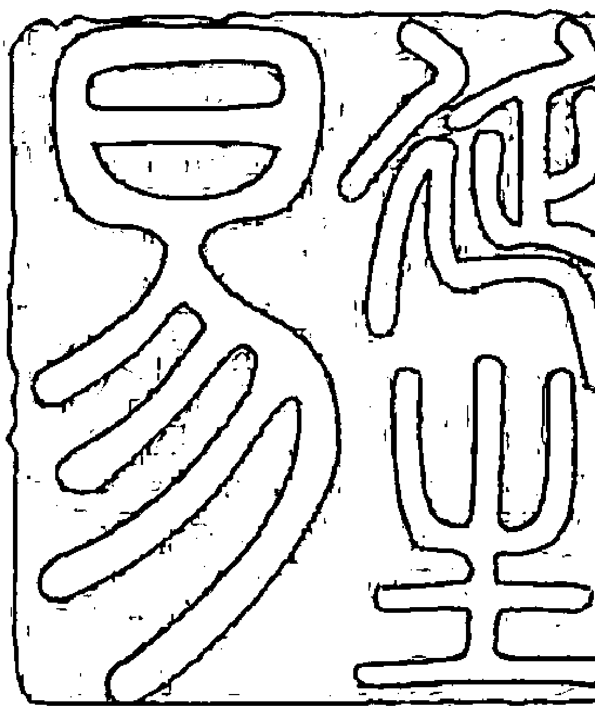

张延生

中央编译出版社
Central Compilation & Translation Press

传统文化往往是本民族或国家所固有的，也是最具凝聚力的。

优秀传统文化与高科技精华结合产生的文化，是更先进的。

## 《传》前易学及象数易学
### （下）

张延生　张震　著

# 第四章 先秦、汉代易学及《传》前易学
## ——由马王堆《帛书易》说开去

## 第一节 由马王堆《帛书易》中 “象” 之 “马” 所想到的

本文主要是探讨马王堆《帛书易》中 “系辞” 类 “传” 类文与通行今本《系辞》相关的 “象” 与 “马” 之间重要的异文关系及其内涵的。今本《系辞》中的 “象”，在帛本中均写作成了 “马” 字。而先秦之前的 “马” 义又会同于 “数” “(计) 算” “(筹) 策” “谋 (算)” “示” 等义。比如，《庄子》中就说过 “天地一指也，万物一马也。” 此处的 “马” 字，应与《帛书易》“传” 类的 “系辞” 中的 “马” 义相同才是。再比如，《帛书易》“传” 类的 “系辞” 中曰：“天地之大思曰生。”该处的 “思”，应是同 “司” 之义。汉代中医《内经》学说的 “五运六气” 之学中有 “司天在泉” 的概念，其中的 “司” 有掌管、统辖、司理、管理等意思与作用。今本中该句却是 “天地之大德曰生。”除此之外，《帛书易》的 “经” 与 “传” 类之文中，还有许多与通行今本《周易》的《经》《传》之文存在有诸多的不同。这会为我们对汉初之前《易》文本内容及其内涵等的了解、认识、理解并做出正确理性地判断，提供了非常有利的实物性文本根据。为了进一步地弄清楚《帛书易》中 “传” 类文本中的 “象” 字，为什么都是会由 “马”

字来取代？这对我们能对当时相应易学及其认识论、方法论方面的正确了解与认识，提供了一些有一定确实指向意义的思路和根据。

关键词字是：帛书易 象 马 数 名 实 共 别 同 异 类化极化的内涵与相对应实际意义

《帛书易》“传”类的“系辞”中，最引人注目的文字现象，就是通行今本中的“象”字，在帛本中，几乎都写作成了“马”字，故而造成学术界对此认识产生了很大的争议。

> 比如，张岱年先生针对此等现象的出现，就曾说：“《左传·昭公二年》：晋侯使韩宣子来聘……观书于太史氏，见《易象》与《鲁春秋》，曰：‘周礼尽在鲁矣。’（杜注：《易象》，上下经之‘象辞’）是‘易’‘象’相连并称由来已久……由此可见，《系辞》中的‘象’字应是正字，而帛书‘马’字应是异文。”

另有学者则认为，该“马”字是错字。比如，李学勤先生就曾说：

> “错讹的例子，在帛书‘系辞’上篇中也有很多，最突出的是‘象’字都抄成‘马’，绝无道理可言！”

我们认为，《帛书易》中的这个“马”字应是同本质类型的异文方面的表述，而不是错讹之文。理由有三：其一，马王堆三号墓同时出土的帛书中的《老子》乙本、《五星占》《相马经》《刑德》乙本［虽然在秦汉其间，存在有“察举制度”的至少有“甲”“乙”两种类似抽签考试的“射策”之科。《后汉书·顺帝纪》注引《前书音义》时，释“射策”曰：“作简策难问，列置案上，任试者意投射，取而答之，谓之‘射策’。上者为‘甲’（等、级答案），次者为‘乙’（等、级答案）。”这可能也是秦汉时期的诸多学术传本与抄本，都存在有“甲”“乙”“丙”等诸多同义文本及版本的原因），其字迹都与《帛书易》字相同，这应该是出自于同一时期或同一个抄写者的手笔才是。其他各抄本的抄写质量，也都很精准，错讹之文却极少。也就是说，《帛书易》的“传”类之文（包括所谓的“系辞”部分）在抄录中，也不应该例外才是］。其二，《周易》是古代重要的经典著作，连秦代“焚书”之时都没有被焚毁——其文字、版本及其结构内容等，都应该是被

完整而健全地留存并传承下来的——若曾真是有《易传》部分内容的话，也是会被完整地留存和流传下来，并且始终在社会与民间中广泛流传着。当时，凡是具有一定文化知识水平的人，都应该读过或曾研读过该书。他们肯定都清楚地知道、什么是“马”，什么是“象”的概念和内涵的具体或真实的针对性意义。而《帛书易》“传”类之文的抄写者，很显然应是个职业性的抄书手——应该起码具备了这些经典文化知识方面的人物。他们应该不会在抄写中出现这类一般人都不应具有的文字方面的常识性错误。在通行今本《周易》的《系辞》文本中的“象”字，是有很多的，可是在《帛书易》中，与通行本《系辞》有关的文字中，却一概把“象”字抄成了“马”字，可见这并不是抄者偶然的笔误差错所致。其三，帛本的收藏者，乃是与汉初集权统治者步调一致的长沙国丞相之类的人物（利仓），其应具有较高的思想文化（含当时流传盛行的《易》文化）水平的人，其家里的藏书，也应是当时大家都崇兴的高质量的一些文本才是。很难想象《帛书易》的收藏者，在经常阅读一份满篇是错讹文字的《帛书易》文本时，竟会是处于毫无察觉的状态下。

## 第二节 先秦以及汉代对“象”与“马”字的认识

“象”，是先秦思想认识论中，很常见的一个基本概念。比如《楚辞·天问》（战国时期公元前？年成文）中说：“冥昭瞢暗，谁能极之，冯翼惟象，何以识之。”又如此后一百多年的《淮南子·精神》（公元前？年~约前140年左右成文）中曰：“古未有天地之时，惟象无形，窈窈冥冥。”并且在《老子》中，也有诸多次说到了“象”的概念的一些文句。比如，其十四章说：“无物之象”；二十一章又说：“其中有象”；三十五章又曰：“执大象，天下往。”而四十一章还曰：“天象无形”等语。再如《韩非子·解老》（公元前280年~前233年）中对“象”的认识曰：“人生希见生象也，而得死象之骨，案其图以想其生也，故诸人之所意想者，皆谓之象也。”

再考查先秦典籍之文中的“象”，大多数指的是“天象”的概念。比如《左传·昭公十七年》（公元前525年）中曰：“天事恒象。”在《荀子·天论》（公元前340年~前245年）中也说：“所志于天者，已见其象之可以期者矣，所志于地者，已见其宜之可以息者矣。”而在《周礼·大司乐》（公元前？年西周后期成文）中就直接说道：“六变而致象物及天神。”并且郑注又解释其义说：“象物，有象在天，所谓四灵者。”就连《鹖冠子·天权》（公元前？年战国末年成文）里也说道：“取法于天，四时求象，春用‘苍龙’，夏用‘赤鸟’，秋用‘白虎’，冬用‘玄武’。”

由上所述可知，当时认为“天象”的变化，是有“四季”的概念与其相对应的，“故《易》有‘四象’，春‘少阳’，夏‘老阳’，秋‘少阴’，冬‘老阴’。”而“四象”，往往又对应的是“四个数字”。如《新语·思务》（公元前？年汉高祖初成文）中说：“天地之数，斯命之象也。”即是说，由于“四数”的变化与确定，可以用来判定“八卦”是哪一卦与其相对应或者直接进行表述才好，因此通行今本的《系辞》里才说：“是故法象莫大乎天地，变通莫大乎四时，悬象著明莫大乎日月，是故天生神物，圣人则之，天地变化，圣人效之，天垂象，见吉凶，圣人象之。”又由于“天象”是在不断地发展变化着，并且会通过对应于日月星辰的一些周期运行，来揭示出它们活动所对应的那些相对重复性的规律，所以今本的《系辞》（公元前140年后成文）中才会说：“易有‘四象’，所以示也。”故而东汉许慎在《说文解字》（公元100年成文）中才进一步地解释说：“示，天垂象，见吉凶，所以示人也。从二三，垂日月星也，观乎天文以察时变，示神事也。”由此思路及概念的提出，我们可从某种推导意义上来理解，这个“天象”应指的是“历象”——又可以被称作是“历数”。比如，《尔雅·释诂》（公元前？年战国时间成文）中就说：“历，数也。”又《尚书·尧典》（公元前？年战国时期成文）还说：“历象日月星辰。”可是，在《史记·五帝本纪》（公元前90年前成文）中，“天象”却是当作“数法（数的对应表述方法）日月星辰”来理解的。而《大戴礼记·曾子天圆》（公元前？年成## 第四章 先秦、汉代易学及《传》前易学

文）也认为：“圣人慎守日月之数，以察星辰之行，以序四时之顺逆，谓之‘历’。‘历’，居阳而治阴。”

此外，还应指出的是，“四象”当时并不是绝对专指某个事物的概念，除了有“四马”之义外，文献中还有“四序”的称谓。比如，在隋萧吉《五行大义》卷一（公元前594年成书）中就说过：“凡万物之始，莫不始于无而复有，是故易有太极，是生两仪，两仪生四序，四序生之所生也。”由此又可知，“四序”对应的就是当时人们常说的“四时之序”的概念。再比如《盐铁论·论灾》（?年成文）中也说：“文学曰：始江都相董生推言阴阳四时相继，父生之，子养之，母成之，子藏之，故春生‘仁’，夏长‘德’，秋成‘义’，冬藏‘礼’，此‘四时之序’，圣人之所则也。”由此我们还能知道，当时“四序”相应法则的具体针对性意义，就相当于是指“四马”之义时的内涵。

《帛书易》“传”类的“系辞”（约公元前197年前成文）中说：“是故易有大恒，是生两仪，两仪生四马，四马生八卦，八卦生吉凶，吉凶生大业。”该语中的“四马”，也应象征性认识与表述的就是“四时”的概念。比如《文子·道原》（?年西汉后期成文）中说：“以天为盖，以地为车，以‘四时’为‘马’（‘天马行空’以喻四季天时），以阴阳为御……以天为盖，则无为不覆也；以地为车，则无所不载也；‘四时’为‘马’，则无所不使也；阴阳御之，则无所不备也。”除此之外，其中的“四时”之“马”的概念，又会相应地对应于十二个月的时间段。也就是说，此处的“马”，代表的也是“天数”的概念。比如《大戴礼记·本命》（公元前?年成文）里就说：“八九七十二，偶以承奇，奇主辰，辰主月，月主‘马’，故‘马’十二月而生。”再者说，“十二”之数，在当时古人的眼里，是个“天之大数”。比如《国语·晋语四》（公元前556年~前451年成文）中就说道：“天事必象，十又二年，必获此土。”《汉书·律历志上》（班彪公元53年卒，即32年~92年在世，班固公元92年后成文）中进一步地解释说：“斗纲之端连贯营室，织女之纪指牵牛之初，以纪日月，故曰星纪。五星起其初，日月起其中，凡十二次。月至其初为节，至其中斗建下为十二辰，视其建而知其次，故曰：制礼上物，不过十二，天之大数也。”由于当时相应

## 《传》前易学及象数易学

《易》学象数内涵中，又有：乾为天、为大、为马、主大始、为“天马行空”的周期运行规律；“天数五，地数五，五位相得而各有和”等的对应概念。由以上内容的总结可知，这些内容论及的都是我们所关切的“马”与“天数”概念的相关对应性关系问题。

此外，古代及先秦、汉代时期的人们，往往会有从律吕的角度，来推断历法及其天体运行周期的方法、行为和习惯。也就是说，运用“六律”“六吕”的对应关系，来对应配合于十二时、辰之数的认识与表述方法。比如，《国语·周语上》（公元前556年~前451年成文）中就说道：“律，所以立，均出度也，古之神瞽考中声而量以制，度律均钟，百官轨仪，纪之以三，平之以六，成于十二，天之道也。”当然，这也应是，所谓孔子及其儒士们极力主张以“乐经”（秦朝时公元前213年焚书后失传）所体现出的“协合”“合和”“和谐”（像“侗族大歌”体现出来的谐和声音，不是突出个人的声音和调门，而是将个人的声音或调门曲就而融和于众人的声音之中，形成和谐的和声才会更好听）方法及效果，来理解、体会并推行其步调统一一致的治理方法和概念的主要原因。由于春秋战国时期的诸侯争霸，导致各邦、国都不希望能有统一一致的步调行为的束缚，故而对“乐经”的社会治理作用，反而会不重视，甚至是不断地排斥并毁及其书籍等，直至秦朝统一之后，“乐经”却遭秦火焚毁而失传了。

在我国古代数学及筮数用来确定数或对应于卦时的“算筹”及其“策数”，又会被称作是“马”。如《礼记·投壶》（公元前？年西汉时期成文）就曰：“请为胜者立马，一马从二马，三马既立，请庆多马。”郑玄注释该话之义时强调地说道：“马，胜算也”（易筮也得保证其是胜算下的必然结果才是）。即使是在特别“重数”思想的《管子》一书中（公元前356年~前301年成文），屡屡也会提到“乘马”一词。而“四马”所对应的，就是“乘马”（驾驭四时）的意思。又如，在《管子·乘马数》篇（公元前356年~前301年成文）中曰：“乘马之准，与天下齐准。”马非百先生也说：“‘乘马’即‘计算’。”他的这个说法，应是对“乘马”一词，非常恰当而确切的理解与认识［春秋及战国初期的卦，都是靠数字计算所获得而对应于“数字排列符号”（与当今计算机“条码”的表述思想相同）所表述出来的

“数字（信息）卦”的形式，作为认识与表述的根本基础］。还有后汉时期许慎的《说文解字》（公元100年成书）中却说：“算，长六寸[六对应的是‘先天’的坎（䷜）卦之数，坎有计算、算计、逻辑思维等象意]，计历数者。”由以上诸说中，我们也可以看到，“算”，指的就是“马”（数、数码、算码、条码）的意思。“马”又被统称作是“策”。比如，在《管子·山权数》（公元前356年~前301年成文）中有“桓公问管子曰：‘请问币乘马’。”这里所谓的“币乘马”，应该指的就是“货币方面的筹策（计算）”来说的意思。所以对通行本《易经》（公元前600年后~前300年前战国中前期成文）里，“屯”卦内二、四、上爻中对“乘马班如”的理解与解释，应是反复“算计”“策算”“思考”“盘算”（当时虽然可能还没有出现算盘之类的计算方法，可是早已出现了各种筮盘的筮算方法）或推敲及琢磨不定的意思才是，而不应像儒家普遍认为的应是仅理解成是“骑着马（犹豫不决）旋转不进的样子”的意思。

在《庄子·齐物论》（公元前365年~前290年间成文）就直接明确地说出：“天地一指也，万物一马也。”可知过去许多人对这一句里的“马”字的理解与解释，可能都是错误的。否则，哪会有“天地万物乃是一象”及“天马行空”的认识与概念的出现呢！可是，在《尔雅·释言》（公元前？年成文成书上限不早于战国）中，却明确地说：“马”是“指，示也”。从通行本《易传》（公元前140年后才能全部成文）中的“天垂象，见吉凶”一说可知，它所说的就是展“示”、昭“示”、显“示”、表“示”、显现的意思。所以“天地一指也”一句，与通行今本《系辞》中所说的“法象莫大乎天地”一语，是一致的含义。由于万物有形（象），又可以用数字、数理来表述、计算或推导，故而才说是“万物一马（算、筹算、胜算、示、形象）”的。

另外，在“象”与“法”的关系中，战国及秦汉时期，还存在着“象”“法”之义可以相互通用的概念。比如《楚辞·怀沙》（公元前？年战国时期成文）中曰：“愿志之有象。”而王逸注释该语之义时，则说：“象，法也。”可是，马王堆帛书《黄帝·观》（公元前168年前成文）中却说：“［黄帝］令力黑浸行伏匿，周留四国，以观无恒善之法则。力黑视象，见

黑则黑，见白则白。”该话的意思之中，还反映出作者认为“无恒善之法则”，就是指“天道”来说的一种认识论。就像《管子·白心》（公元前356年~前301年成文）中所说的：“君亲六合，以考内身，以此知象，乃知行情，既知行情，乃知养生，左右前后，周而复所，执仪服象，敬迎来者，今夫来者，必道其道，无迁无衍，命乃长久”那样，由此我们可知“象”的表达作用、能力及效果，在一定方法、周期与法则的指导下，其涵盖的内容、领域与针对性指向等，是相当的丰富与广阔的。

先秦时期，还存在有“策”“谋”之义，也会出现相互通用的概念。比如《管子·白心》（公元前356年~前301年成文）中说：“愕愕者，不以天下为忧，刺刺者，不以万物为策。”这就是以“策”来被当作是“谋”义来使用的一个例子。再比如《礼记·仲尼燕居》（公元前？年前西汉时期成文）中曰：“田猎戎事失其策。”郑玄注释该句时，清楚地说道：“策，谋也。”除此而外，如《史记·五帝本纪》（公元前145年~前90年前成文）又曰：“迎日推策。”而《周易集解》（虞翻，164年~233年在世）中说：“策，数也。”可是《诗经·氓》（公元前？年成文）中却说：“来即我谋”。其中的这个“谋”字，应指的就是占筮及其行为和过程。也就是说，其意义与（占、筮同意而并非是卜意）“算”“推算”、筮算、算卦是相同的。所以，其下文才会对应地说道：“尔卜尔筮，体无咎言。”

由以上的引证，可知先秦及秦汉时期，“象”“马”“策”“谋”“算”“数”等字义，多是些会互通所用的文字，所以《帛书易》（公元前179年前成文）的《要》篇中，才会说：“《易》，我后亓祝卜矣！我观亓德义耳也。幽赞而达乎‘数’，明‘数’而达乎德，又［仁］者而义行之耳。赞而不达于‘数’，则亓为之巫；‘数’而不达于德，则亓为之史。史巫之筮，乡之而未也，好之而非也。后世之士疑丘者，或以《易》乎？吾求亓德而已，吾与史巫同涂而殊归者也。君子德行焉求福，故祭祀而寡也；仁义焉求吉，故卜筮而希也。祝巫卜筮亓后乎！”由此文可以看出，该篇编录了所谓孔子及其《帛书易》的抄录者的论述，这些作者对占筮及其方法中“数”的认识的重要性，以及他们对占筮行为的明确态度，还有所谓儒家及楚地帛本《易》学“正统”的研究方法论。这些论述对后人治《易》，将会产生极

其重要的推促作用和深刻影响。

另外，《文选·赭白马赋》（？年，南朝时期成文）李注在引用《春秋考异邮》之语时说：“地生月精为马。”这是因为“八卦”中的三个爻的坤（䷁）卦，有“是地”之象。而隋朝肖吉所著的《五行大义》（公元594年成书）又引《姜太公兵书》（公元前？年商周之交时期成文）中的说法，以“八卦”对应来配“八风”的关系。这又是得益于“坤为谋风”的象义所产生的结果与思路。这也可以说明，当时的“马”字，是可以代之以“谋算”“谋划”的象义来使用的。通行本《周易》整个的《说卦传》（春秋前“数字（信息）卦”流行时已产生）中，“八卦”的对应表述内涵里，提到最多的卦象内涵，就是“马”了。可见相应易学、《易传》与“马”义的密切关系。依照通行本《说卦传》文中（公元前140年后成文）所说：“乾为良马，为老马，为瘠马，为驳马”；震“其于马也，为善鸣，为馵足，为作足，为的颡”；坎“其于马也，为美脊，为亟心，为下首，为薄蹄”，此外，在通行本《周易》《坤》卦的卦辞里（公元前600年~前300成文），还有“利牝马之贞”一说。干宝（公元前？年~前336年在世）在注释该说时，强调道：“行天者莫若龙，行地者莫若马，故乾以龙彖，坤以马象也。”

前面曾提及：一般秦汉时期所说的“四马”，当时还应当指的是“四数”才是。也就是说，是指“大衍筮法”在筮数设卦时，所获得的七、八、九、六这“四数”。正如《汉书·律历志上》（班彪，公元92年前成文）中所说：“自伏羲画八卦，由数起。”所以从商代到先秦的春秋战国时期，存在有大量的三位、六位及少量的四位、五位的“数字排列符号”[有人认为是“数字（信息）筮符”，并称作是“数字（信息）卦”]的考古资料。由于相传那时的“河图”中，也对应地绘有“八卦”的图象，因此诸多的典籍中，才会有“马负河图”“龙马负河图”等的说法。比如《礼记·礼运》（公元前？年西汉时期成文）中就有“故天降膏露，地出醴泉，山出器车，河出马图”之说。而《文心雕龙·正纬》（公元前？年成文）也有“马龙出而大易兴，神龟见而洪范耀”的说法。

由于先秦及秦汉时期的人们认为，筮法所以会通于神明的根本原因，就是因为它有（抽象、理性之）“数”的参与及表达。比如《鹖冠子·世兵》

## 《传》前易学及象数易学

（公元501~502年成文）中就说道：“道有度数，故神明可交也。” 人类往往最终是依靠数、数字及数理变化规律来对应把握一切自然法则的。比如《孟子·离娄下》（公元前385年~前304年间成文）中就说过：“天之高也，星辰之远也，苟求其故，千岁之日至，可坐而致也。” 可是，帛书“传”类的“系辞”（公元前179年前成文）中却说道：“见乃谓之马，刑谓之器。” 可知（《易》）数，是以一种特殊的存在形式存在着，它虽然是我们可以想到或感知到的概念，但它又是“无形”“无方”“无体”“无固定意义和指向”的存在状态，因此帛书“传”类“系辞”（公元前179年前成文）中才会说：“是［故］夫马，圣人具以见天下之请，而不疑（拟）者形容，以马其物义，是故谓之马。” 可是，此段文字中的“而不疑（拟）者形容”一句，在通行今本的《系辞》（公元前140年后成文）中，却被认定是“而拟诸其形容”一句了。其句中仅删去了一个“不”字，可是它所表达的意义，却形成了前后二者之间大相径庭的谬误之辞——成为：一个是不要拟诸事物具体的形容，而另一个却是必须拟诸其事物的具体形容的含义的决然不同。

帛书“传”类的“系辞”中有的“马”字，在通行的今本《系辞》中，也不全都是对应于“象”字的。我们应可借此种分析与对比的结果，来判断本文前面论述的一些确定性意义和问题。在《帛书易》“传”类之文（公元前179年前成文）中，有“生之谓马”一句，该句在通行今本《易传》（公元前140年后成文）中，却定作是“生生之谓易”。该处的“马”字，仍然应当指所确定的对应之“数”的对应内涵才是。比如，在《汉书·律历志上》（公元92年后成文）就曾说道：“数者……所以算数事物，顺性命之理也。”而通行本《周易》的《说卦传》（商周时期或公元前140年后成文）中也说道：“昔者圣人之作易也，将以顺性命之理。”前后两句相对照，可知汉代人在对“性命之理”的认知思想中，是可以把“易”理解成为是“数”和数的确定［这是由于易卦、易符、易爻的组成、确定与结果的判断等，当时全赖于（易）数字的实际是如何获得到的方法与理念］。此外，在通行本的《系辞》（公元前140年后成文）中说：“是故，君子所居而安者，易之序也。”而在其《释文》中则解释说：“序，虞本作象。陆注：序，象也。京注：序，次也。”故而可知，汉代“经学易”被确立时，“四象”当时又可

# 第四章 先秦、汉代易学及《传》前易学

以当作“四序”来认识与理解。也就是说，通行今本《系辞》中的“易之序”，实质指的就是“易之数”（数序）。比如，正如《礼记·月令》（公元前？年西汉时期成文）中所说：“其数八。”而郑玄（127年~200年）在注解此话之意时说：“数者，‘五行’佐天地，生物成物之次（序）也。”不过这已是马王堆《帛书易》下葬二百多年以后的说法了。

在通行今本《系辞》中的“易之序”这一段文字，在《帛书易》中，基本上都是残损不存的了。其中，有可能许多的内容，应是当作“易之马”来理解与认识才对。比如，在《左传·僖公十五年》（公元前645年成文）中说道：“龟，象也，筮，数也，物生而后有象，象而后有滋，滋而后有数。”杜预注解此话的根据时说：“言龟以象示，筮以数告，象数相因而生，然后有占，占可以知吉凶。”由此可见，《帛书易》“传”类的“系辞”（公元前179年前成文）中，以“马”字的含义来取代了“象”字的含义，这应是更符合当时筮法的要求的。同时，又可见，虽然《帛书易》“传”类的《要》篇中，反映了其抄存者是受荀子（公元前340年~前245年在世）及汉初“今文”义理派否定筮法的影响，想否定易筮方法的作用，并借以改变现实实际的“筮解”成为脱离实际的想象性的“义解”方式。又由于当时处于战国末期、汉朝初期的人们，对易筮方法还是相当崇尚的时期，故而无奈，有人就认为，还是应以“观象系辞”改成“筮马（算、数）系辞”，来对应处理相应《易》学中的断语及其判断结果的问题。所以可以说，在西汉马王堆《帛书易》的抄录时期，还不大可能有仅以单纯的“义理”来解读《易经》的方法的存在——真正的“经学易”，确立于汉武帝（公元前140年）在位之后，直至（公元175年）“熹平石经”刻立时。

《帛书易》的“传”类文中还说：“天地设马，圣人成能，人谋鬼谋，百姓与能。”这里的“天地设马”，在通行的今本之中，却写定成“天地设位”一句。此处的“马”类似是指易卦（象）分布结构所处的方位的度数区间——每卦对应于45°的立体空间区域，而“位”所指的，就应是事物对应的具体位置或某方位上的层次位置（不但含有方向、位置的概念，还含有层次、角度的概念），二者的表述内涵，虽有差异，可是从易卦（象）的总体统一的卦爻几何型组合结构的表述内涵来说，二者仍然是有相通之处的。

## 《传》前易学及象数易学

这由通行本《周易》《节》卦的《象》辞所说“君子以制度数，议德行”一语就可以证明。又如帛书《二三子》（公元前213年~前179年间或更早之前）成文中还说道：“成马之谓键，教法之谓川。”这里的“键”字，指的是乾卦，其中若将“成马”理解成“成位”的话，就像是通行本《周易》《乾》卦的《象》辞所说的“大明终始，六位时成，时乘六龙以御天”（与“六龙历”有关）的意思了。除此之外，通行的今本《系辞》中的“太极”概念，在《帛书易》的“传”类文中，却作为是“大恒”的概念。“恒”与“常”之义是有相同之处的。如《仪礼》（公元前？年约东周时期成文）中说：“假尔大筮有常。”这个“常”字，就与《帛书易》“传”类“系辞”中所说的“大恒”之义相同。也就是《吕氏春秋·大乐》（公元前241年或公元前239年成文）中所说的“天常”之义。像在《帛书易》的“系辞”的“传”类之文中“圣者仁，壮者勇”一行文字，可是在通行的今本《系辞》（公元前140年后最终成文）中却成了“显诸仁，藏诸用”一句了。由儒家学说的早期之说可知，其是相当重视人“勇”的行为的。比如战国初年成文的《论语·宪问》（公元前？年战国初年成书）中就说：“仁者必有勇。”在《帛书易》的“传”类“系辞”（公元前179年前成文）里还说：“夫易古物定命。”它的意思与“乾知大始，坤作成物”的认识，是有所相同的意思。当《帛书易》的“传”类之文中说“圣人以此佚心”时，而在通行今本的《系辞》中，却成了“圣人以此洗心”一句了。又由于“佚”与“乐”可以同义，故马王堆帛书《五行》中才说“不安则不乐，不乐则无德”，等等。

总之，该节中所引用的文字、文本、文义证据的出现，应该以公元前195年前或其前后不久的（普遍性）证据为准，才会更合理、更好，或更贴近当时社会上流行的一些认识。因为《帛书易》文本抄录的年代，应是在这个时期之前。若是以公元前168年及其之后的文字、文本、文义为依据来考证说明其文义时，虽然表面上看来，其仍可以是作为汉代初期或汉代流行文字意义的旁证性依据，但是必定这些所谓的依据，早已是马王堆内发现的《帛书易》下葬于马王堆及其之后的事了，因此，它不可能也不会再去抄写、运用自己身后的文字、文本之义的内涵，来作为值得抄录的文字意义的依

据。所以说，我们搞“象数易学”及其相应易学以及“周易象数学”及其相应《周易》，还有编写易学史研究及探讨的人，必须警惕及主动摒弃那种违背历史唯物主义认识论的干扰、影响和相应的做法，严格地按照在肯定了当时以及其之前的原始文献资料文字、文本、文义客观事实的真实实际依据可靠性的基础上，来作出该时代背景对应下，更加全面完整的对应性正确的易学及易学史真正确切的判断。同时，在《易传》“怀疑一切”的“忧患意识”的启示下，也不必要轻信某些所谓的“权威”人士直接给我们划定的一些所谓的“书不尽言，言不尽意”的文字“考证学”“解释学”以及脱离其相应易卦、易象原型与相应内涵性更为广深的“立象以尽意，设卦以尽情伪”“类万物之情，通神明之德”并“与天地准”的“设卦”“观象”“系辞”的以“象数”（直观、形象、结构、状态）模型论为基础认知方法的“象数易学”，并且不仅仅以“周易象数学”的认识与表述为唯一具体或抽象根据的、所谓的那些“易学哲学史”“易学思想发展史”“汉以前没有易学，仅有易说”“《传》前无易学”等狭隘性认知“框框”和臆想、臆说等界限与规定——当然，也得包括本“非权威”性作者在内的那些可能的妄说性限制与束缚，使真正的“象数易学”为基础的相应易学的易理，得以认识、完善、充实、发展且真正广泛地弘扬。

## 第三节 荀子思想对“象”之“马”概念的影响

由于马王堆《帛书易》的抄写年代，是在汉初刘邦到汉文帝前期乃至之前的年代，再加之其文中所反映的许多思想和认识，又与先秦时期的荀子的思想与认识相同甚至一致。说明该《帛书易》，很可能是受“荀子易”思想影响较深的流派之一。由此不得不使我们联想到了战国后期，荀子（公元前340年~前245年在世）与“名家”进行的“制名以举实”的一场辩论。

荀子针对当时因“名”与“实”产生认识方面思想的混乱，提出了自己的“正名”观点。他说：“今圣王没，名守慢，奇辞起，名实乱，是非之形不明，则虽守法之吏，诵数之儒，亦皆乱也”（《荀子·正名》）。

# 第四章 先秦、汉代易学及《传》前易学

### 《传》前易学及象数易学

荀子提出这个问题与概念，主要是针对以惠施（公元前370年~前310年在世）、公孙龙子（公元前320年~前250年在世）为代表的“名家”的某些“名”与“实”观点与概念在思想认识上的一些错误。他指出这些“名家”在“名实”关系上的错误，不外乎有以下三类。

其一，“用名以乱名”。

利用概念、名词之间的差别，来歪曲或搞乱它们之间的真实含义。如后期墨家说“杀盗非杀人”，就是利用“盗”与“人”这两个名词含义的不同，抹杀了“盗”与“人”在道德行为上相应的从属关系，把“盗”与“人”看成是完全不相干的两个名词。这就是“用名以乱名”的结果的表现。

其二，“用实以乱名”。

利用现象之间差别的相对性，来否定概念的确定性的含义。如惠施说“山渊平”，就是说，高山高原上的“渊”的海拔高度，有时可能会与低处的“山”的海拔高度一样高。可是，这样的事实，是不能借以用来否定人们思想认识上“山高渊低”的普遍且根本性认识与判断的概念的。所以说，“山渊平”的概念，就是“用实以乱名”的以“个别性”之实来掩盖“普遍性”的一种认识论的结果。

其三，“用名以乱实”。

利用名词的差别或不同内涵或具体针对性，来歪曲事实。如公孙龙所说的“白马非马”，就是利用“白马”与“马”这两个概念的具体差别性，来否定“白马”同样也是“马”的普遍性事实。

针对以上这些说法，荀子（公元前340年~前245年间在世）概括地说道：“凡邪说辟言之离正道而擅作者，无不类于三惑者矣”（《荀子·正名》）。

荀子同时还提出了制定名称时，应遵循的原则。他说，要在认识事物同异的基础上，“然后随而命之：同则同之，异则异之，单足以喻则单，单不足以喻则兼。单与兼，无所相避则共，虽共，不为害矣。”（《荀子·正名》）也就是说，他主张相同的事物用相同的名称、不同的事物用不同的名称来加以具体针对性地区分和强调。用单名可以说明白的，就用“单名”，用单名不能说明清楚的，就用“复名”（兼名）。比如，“马”是“单名”，但是“马”不能说明“马”的颜色，就需要有“复名”来加以表述。如“白马”“黄马”“黄黑马”等。即使“单名”与“复名”之间，也会存在“不可相避”的时候，就是说，它们的内涵有共同之处的，就可以共用其名。比如，“白马”与“马”二者，若共同用“马”的名称时，也应是正确而无碍的。

他还进一步地说明道：“故万物虽众，有时而欲偏举之，故谓之物。物也者，‘大共名’也。推而共之，共则有共，至于无共然后止。有时而欲偏（偏）举之，故谓之鸟兽。鸟兽也者，‘大别名’也。推而别之，别则有别，至于无别然后止。”（《荀子·正名》）

又说：“物有同状而异所者，有异状而同所者，可别也。状同而为异所者，虽可合，谓之二实。状变而实无别而为异者，谓之化。有化而无别，谓之一实。”（《荀子·正名》）

荀子的这些分析，既是他对“正名”和事物“同异”的认识，也是他自己认识论思想的理论基础之一。他对“性伪之分”的说明，他对“人与禽兽和万物的区分”的说明，都体现出了他对事物“同异”的认识论，这应当就是他关乎能否“正名”的思想原则和根据。

荀子对事物的“复”与“单”、“共”与“别”、“同”与“异”的分析，反映了他对“一般”（普遍）与“个别”（特殊）的关系的普遍性认识。“一般”（普遍）与“个别”（特殊）的关系问题，是人们在认识过程中的一个基本问题，也是先秦时期“名家”们讨论的基本问题之一。在这种思想认识的影响下，不可能不影响到荀子对《易》象、“天象”乃至“万物之象”等在认识与表述方面的思考与辨别。

以惠施为代表的“合同异”的一派，认为“万物一体”，他着重强调事物之间“同”（本质）的一方面以及事物（现象）相“异”一面的相对性——轻视乃至忽视了“异”的一面的不同性。这同样是与孔子及其儒生们的“和而不同”与“同而不和”的思想方法的认识与表述，都是对事物片面进行侧重认识所必然产生的结果。实际上事物间相互作用关系，从理性与形象思维相结合的认识论上理解与认识，应是“合而不同”“同而必和”“和而必同”的实在性结果——虽然自然界是不可能存在有“和而不同”及“同而不和”的客观事实的，但是“合而不同”与“同而不合”的事物关系与结构状态等，却是比比皆是的客观事实。可知，混合、组合、集合、汇合、以变等状态下的事物，会处于“合而不同”与“同而不合”的客观现实中，而融和、统一、合和、本质处于同一或共同的前提下时，绝不会是处于“合而不同”与“同而不合”的状态中，而仅仅是能存在于“同而必和”“和而必同”的客观实在情况下。

而以公孙龙为代表的“离坚白”的一派，则提出“此此止于此，彼彼止于彼”的认知观点。其在对“白马非马”的认识中，仅强调了事物（马）之间（现象）差别的“异”的一方面，而忽视了“马”的共同或同一性的（本质）一面。也就是说，他强调的是，概念的绝对和唯一的极端性认知的一个（现象）侧面，却忽略了概念（本质上）的根本性一方面。

以上惠施与公孙龙子二者，分别阐发了对“一般”与“个别”、“共性”与“差异”、“普遍性”与“特殊性”关系这个问题的两个不同（现象上）的认知侧面，但是他们自己，却都陷入了片面性认识的某个方面去了。

代表后期墨家思想的《墨经》（公元前480年~前390年后成文）里，在思想认识上，更是前进了一步，提出了“达名”“类名”“私名”的区别。说“达名”，是“有实必待之名也”是适用于一切事物的概念，如“物”；“类名”是“若实也者，必以是名也”。这是指对某一类事物的名称概念，比如“马”“象”“坎”“艮”等；“私名”则是“是名也止于是实也”，它是专门用于某一事物的针对性概念，比如，人名、地名、物名等。

荀子较墨子更进一步地认识到，他所说的“共名”和“别名”，是分别反映了事物的“同”和“异”、“共”和“别”、“一般”和“个别”的“本质”与“现象”的概念。他所说的“别名”与《墨经》所说的“类名”之意相近。同时，荀子还提出了“推而共之，共则有共，至于无共然后止”，“推而别之，别则有别，至于无别然后止”的对“共”与“别”的认识原则。从中说明了“共”与“别”，在认识上的相对及对应性概念（其中应包括“现象”或“本质”各自方面的“共”与“别”的概念）。其间，虽然“共名”“别名”的各自名称的表述层次性，表面看来要比“类名”的表述层次性，要更加深入、细致和复杂，但是从事物类型的本质认识与表述来说，“类名”的同一性本质的表述，却是更加深刻与简单了。于是在“推而共之”“推而别之”到最后，“至于无共然后止”的“大共合”，就相当于是《墨经》中所说的“达名”了；“至于无别而后止”的“大别名”，就是《墨经》中所说的“私名”。这就不仅仅是指出了“个别”和“一般”的区别、事物存在的“异”和“同”的差异性关系，而且也指出了“个别”与“一般”、“异”与“同”、“别”与“共”之间的相互联系而不可分的相互依存关系。

《帛书易》中，按荀子的“一般”与“共性”及“类化”“类名”“万物类象”等概念的共性与共通性的特点，来认识相应易学及其相应易卦之象的归纳和概括性认知标准。也就是说，事物再有差异，在“象数易学”及相应易卦内涵的易“象”的“类化”“极化”“至化”等的表述的认知过程中，都会具有“设卦”“观象”（马）之后，再去“系辞”以及作出判断结论表述的普遍针对性意义。其意思是说，不论是什么样的“马”（普遍、一般、虚实、动静等之象），即使是“天马行空”的马（个别、特殊、虚性、动态等之象），它也是“马”（象）概念中的一种。说明易“象”（马）表述概念的普遍性及适应性，以及其易“象”（马）在表述过程中的普遍与个别、一般与特殊、整体与局部、体与用、全局与个体等对应、融合、统一性的辩证对应统一的表述功能与作用。这也是马王堆《帛书易》中的作者和抄录者，在对荀子与“名（辩）家”“墨家”等的析辨中，有关“正名”“共名”“别名”“同异”“名”与“实”等课题概念正确且深刻理解与体会后，而执意将《帛书易》“传”类（含“系辞”）之文等诸篇中的所谓“理性”论述中的“象”字，以“马”字来取代之的原因之一。由于“易者象也”，故而《帛书易》中则曰“易者马之”；而“生生之谓易”在《帛书易》文中却说成是“生之谓马”等。因为易卦的组合结构状态的产生，是由易卦获取时的直接对应的具体客观事物结构关系来具体针对性地确定的，所以《帛书易》文中的“易”字，也有被“马”字取而代之的现象出现。

由此看来，《帛书易》的作者与抄录者，在对易“象”的认识中，是受到了荀子“名实”“正名”等思想的思路及概念影响，来组“作”易“传”之文的，而不是仅受“思孟学派”的影响来组作易“传”类之文的。当然，其间受“黄帝”“老”“庄”思想的影响，更应是重大的。因抄写《帛书易》的年代，正值公元前195年至公元前141年，“黄帝”与“老”“庄”之学相结合后，汉初在中央集权政治统治上推行“无为而治”“与民休息”的政治体制改革时期，所以当时的统治者，也会像我们现在“经济改革”前期一样，实行的就是“不管是黑猫还是白猫，只要能抓到耗子就是好猫”的实用主义政策。而汉初时期的历史背景，也与我们当今的历史背景相似，实行的是“不管是白马还是黑马，只要是能管理治理好国家的（这个）‘马’（思想、理论、概念、政策、做法等）就好”的政治体制策略。在此时代急切需要的前提下，所以当时的儒家学术中，必然也要吸取其中这些被社会需要而能被公共认可的“黄”“老”及“阴阳”思想等的内涵或内容，来充实到自己的学术体系中，借以提高自己的社会政治地位和扩大儒学能被共识认可的可能性影响。这也是为什么会有诸多学者认为《帛书易》是道家作品的主要原因。这中间，孔子所主要主张的做人的“仁”“义”之“德”学的人文精神，与老、庄“阴阳”“道法自然”、尊重“自然”之学的思想、思路境界，当会是何等的不同（将有另文解析）。从全部抄录的各种帛书内容及其墓葬的全部文本及其思想内涵的总体上来看，根本就不能肯定《帛书易》的内容、就完全是儒家本门自己的全部作品。除非当时该丞相及其家人，就是儒家思想的支持者——这又是与当时长沙管理者与中央集权统治保持一致的治理思想，所违背的想法与判断。由以上简单的分析，我们可以想到，《帛书易》作者及抄录者的一些思想，在认知过程中，是受荀子批判了惠施及公孙龙子等“名（辩）家”、“名”与“实”、“单”与“兼”（个别与一般）、“现象”与“本质”等认识论的绝对、极端、片面的思想基础上的产物。它产生的年代，应是该三人思想时代的同期，或稍晚些的时候（约为战国中后期，公元前300年之后～前245年间的事）。因为惠施乃是公元前370（或公元前380）年～前310年的人物，荀子是公元前340年～前245年之人，而公孙龙子是公元前320年～前250年之人。其《帛书易》内容成篇，应是该三人同时期或之后的事。其中，大部分内容是抄写于西汉初年（约公元前206年～前175年之

## 第四节 “象”之“马”的时代原因

汉初为了巩固政权统治的稳定，故在西汉政权诞生后到高帝去世（公元前195年）的六七年的时间里，中央政权同异性诸侯王之间的斗争，构成了当时历史的主要内容。在刘邦统治时期（包括楚汉战争时期），为了争取同盟、笼络有实力的将领、共同消灭项羽等的敌对势力，曾被迫或自愿地分封过几个王。在刘邦称帝以后，正式定封爵、序二等，大者为王，小者为侯。其中封功臣为侯的有百余人，被封为王的，在刘邦统治时代共有七个。其后所导致的西汉中央集权王朝与各异性王之间的斗争，逐渐加剧。这一斗争的实质，乃是统一的中央集权的封建国家同地方割据势力之间的斗争。逼得西汉王朝，有时又不得不灭杀这些有篡权野心的异性王。到刘邦公元前195年去世时，他先后分封的八个异姓王中，有七个已被他所除灭，仅剩下来了一个地处南方的小国——以吴芮为王的长沙（国）王了。

对异姓诸侯王的削除，乃是封建统一的大势所趋，这是我们应当给以肯定的。不过，由于在消除异姓王势力的同时，刘邦又大封起同姓子弟为王来了，因此加强中央集权的历史任务，在刘邦统治年代，还并没有彻底地解决和完成。又由于在消灭异姓王的过程中，刘邦错误地总结了教训，认为分封刘氏子弟为王“能屏藩皇室，也无离心背德之虞”，所以他曾“杀白马”为盟，立誓说：“非刘氏而王者，天下共击之”（《史记·吕太后本纪》）。这样，他一面消灭异姓诸侯王，一面又要分封刘氏宗室子弟为诸侯王。至刘邦死时，被封为诸侯王的刘氏子弟已有九个。这样，当异姓诸侯王一个个被消灭的同时，同姓诸侯王，又被一个个地树立了起来。因此中央集权同地方割据势力之间的矛盾，并未得到根本性的解决。高帝十二年（公元前195年）十月，刘邦以重病之身率兵征伐英布，作战中又被流矢所中，并且病情恶化。至当年四月甲辰，53岁的刘邦死在长安的长乐宫中。开西汉一代基业的汉高祖，就这么匆匆地离开了人间。还没有来得及完成的加强中央集权的使命，只好待他的后继者们去完成了。

由西汉初年的这段历史可知，当时汉高祖刘邦去世时，仅剩下长沙国吴芮一个异姓王了，因此可以断定，长沙国王吴芮，一直是一个服从汉朝统治者刘邦监管的异姓王。那么，在其长沙国丞相及其后代和家人的墓葬中，发现与汉初统治时期需要相符的文本文字等，也是理所当然的事——提醒后人与中央集权势力的需要保持一致。否则是无法存在下去的。这是其一。

惠帝的继位，与张良和“商山四皓”的策划与支持，是有着密切的关系的。又因为张良晚年时“学辟谷、辟引、轻身”，这些都是道家修炼的功夫。“辟谷”就是说，若干时日内不食或减食，“辟引”和“轻身”，也是健身除病之术。当时修炼有素的道家“商山四皓”，不愿为官“逃匿山中”（《史记·留侯世家》），其行径也符合道家的主张。这也反映出在吕后、惠帝身边，有一批鼓吹和信仰道家学说的近臣，所以当惠帝、吕后当政后，“无为而治”的道家思想，就顺理成章地被奉为了统治者们的指导思想。这就是马王堆汉墓中帛本文字、绘画与抄写前后的时代背景。从一号墓主人未腐软尸的肠胃中，发现有香瓜之籽，可知墓主人曾经历过辟谷、导引而轻身的修炼。在其棺椁中，还存有不少种类的粮食，说明其饮食很清淡——此正符合修道者需要。在三号墓中，还收集有“导引图”、医书、方剂、“黄帝四经”、彗星图等与道学有关的图文资料。说明墓主人对“天道”“天数”“天运”及其作用的重视与尊重。这是其二。

下面最主要的第三个原因，就是：刘邦为了维护汉室的独裁统治，曾警示天下的人并“杀白马”为盟，立誓说道“非刘氏而王者，天下共击之！”而《帛书易》的“传”类之文中，把“象”全改作是“马”字，就是为了表明与提示家人、后人及其周围的人，千万不要忘掉西汉统治者们的这个誓言，否则将会遭到“天下共击之”的灭顶（天命）命运的。这应该就是把“象”“易”“位”字基本改写成“马”字的根本原因——以警示“天道”“天命”“天运”“天象”“天数”“天朝”是不可轻易地就能像“万物类象”概念的指向那样，被“易”（改）变的。同时，也说明抄存者对当时统治王朝的这些统治思想和做法，是认可而肯定的。

综上所述，我们可知有关《帛书易》这方面的抄写及其完成的年代，应是汉高祖“杀白马”盟誓之后到吕后专权封诸吕为王的时期——以示赞同并支持“非刘氏而王者，天下共击之”的约定。直至吕后去世，诸吕氏王族的势力被铲除后，汉高祖所封的刘氏或非刘姓的诸侯国，也仅剩下五个了，其中仍然还有长沙王吴芮。至汉文帝七年（公元前173年）时，长沙国王因绝后嗣，其国号才被消除（史称“国除”）。

此间，又有洛阳的贾谊，18岁就能以“能诵诗书属文”而闻名郡中。汉文帝初年立诏“以为博士”，20余岁就超迁成为大中大夫，可知汉文帝对他的器重。此外还准备授予他公卿之位，但是由于老臣周勃、灌婴等对少年得志、才华横溢的贾谊很是看不惯，说他“洛阳之人年少初学，专欲擅权，复，纷乱诸事”（《汉书·贾谊传》），使得汉文帝，既不敢对他十分重用，而又不得不对他“疏之”。于是贾谊被贬为长沙王太傅，后又为梁王太傅。

汉文帝六年（公元前174年）当刘兴居、刘长先后叛乱并被平息之后，正在梁王太傅任上的贾谊，仍然上疏。在这篇后来名为《治安策》的著名上疏中，贾谊向皇帝痛陈天下形势。他认为：当时西汉政权并非“已安已治矣”，而是危机四伏，“可为痛哭者一，可为流涕者二，可为长太息者六，若其他背理而伤道者，难遍以疏举”（《汉书·贾谊传》）。而这里首举之所谓的“可为痛哭者一”，指的就是愈来愈大的诸侯王国势力的扩张，他形象地比喻道：“天下之势，方病大瘇，一胫之大几如要，一指之大几如股，平居不可屈信（伸），一二指搐，身虑亡聊，失今不治，必为痼疾，后虽有扁鹊，不能为已。”为此，他提出必须立即削弱诸侯势力的措施。办法就是，“众建诸侯而少其力”，即令诸侯王之子孙，依次分割其父辈封地，直到“地尽而止”。这样诸侯王愈分愈多，而各诸侯国封地则愈来愈少。“力少则易使以义，国小则无邪心”，这就使诸侯国，再无力与中央政府对抗，不至于形成对中央政权的威胁，从而不得不接受朝廷的统辖，借以达到“诸侯之君不敢有异心，辐辏并进而归命天子”（《汉书·贾谊传》）的效果。

贾谊的意见得到文帝的重视，不久就把齐国分为六，把淮南分为三，显然就是在“众建诸侯而少其力”的思想指导下，作出的决定。但是以当时诸侯王的势力，仅仅采取这么一点措施，是远远不能抑制其发展的。反而引起诸侯王更大更多的猜忌，同时还促成割据势力不断地进行叛乱。

由上面的引证可看出，汉文帝时期的贾谊，在被贬为长沙王太傅时，就早已发现诸侯王们对中央集权势力的威胁，为了提醒其长沙王乃至其家人或臣子们，必须与中央的权力和利益保持一致，为了引导长沙王能与汉王朝的政治统治需要保持一致，所以才故意将《帛书易》中的“象”和“易”字，统统改作“马”字，借以不断地提示违反（易改）“杀白马”而盟誓之约的后果。

再考，贾谊约是公元前200年~前168年间的人物。西汉洛阳（今河南洛阳东）人，为西汉著名政论家与文学家。所著政论有《过秦论》《陈政事疏》等，均为西汉鸿文。有名赋数篇传世。关于《易》学著述，史无著录。清朝人王仁俊《玉函山房辑佚书续编》辑有《周易贾氏义》一卷。另有《十三经汉注》本的《易贾氏义》一卷。题作“汉贾谊撰”。真伪未详。而《汉书·儒林传》中说：“至成帝时，刘向校书。考《易》说，以为诸《易》说皆祖田何、杨叔（杨何），丁将军（丁宽），大谊略同，惟京（京房）为异党。”可知田何与杨何当为西汉后期官方（今文）《易》学的代表人物。其中，丁将军作《易说》三万言，“训故举大谊而已”，说明该说与他们所传述的（今文）内容略同。由《帛书易》（今文）文本的内容来看，确实与通行的今本《周易》的内容，有所不同（略同）。可能该汉初早期《帛书易》文本的抄写，确实可能受到过被贬为长沙王太傅的贾谊及其思想的影响。

## 第五节 传统（信息）“类化”思想对“象”之“马”概念的影响

中国古代传统文化中，不仅只是相应易学及“象数易学”存在有许多的“群”“类”“组”等的（信息）分布与归纳方法。通过这些不同、相通或相第四章 先秦、汉代易学及《传》前易学

同的“群”“类”“组”的（信息）分布方法，可以把大量的事物间（信息）的分布与关系，通过这些方法，进行统一归纳与分配，再由事物这些“群”“类”“组”之间（信息）的异同关系，找出事物之间的共性或差异性的规律，抓住事物（信息）发展变化的大方向及事物中的主要矛盾和矛盾的主要方面，从而指导我们对各事物之间（信息）的观察、分析、研究、认识、把握、对待、处理等实际活动。这也是一种将复杂（信息）问题简单化，并且随时都能掌握事物发展变化的主流及大方向的认识论及方法论。这些对事物的本质与现象（信息）的不同或相同的归纳、分类等方法，是相应易学和相应《周易》的“易简”思想与“易理”中“极其数”“极化”“类化”“集约化”“类集集合论”“复合时空论”“多宇宙论”等（信息）思想的具体与最高体现，也是该思想在各领域中不断延续致用的体现。又由于相应易学的“象数易学”中，是依靠对应数值的变化来直接进行（信息）“类化”型分类的，同时“象”“数”二者组成的表述系统（二者均含有各自或共同相对应且准确的信息），还是统一而不可分离的，而“马”（有数、示、策、筹、谋、算、序等义，应具有具体针对性的信息）又是与其所对应的“数”（抽象理性所对应的信息），来具体对应于“象”（几何空间结构状态的信息）的分类的，所以我们又可以认为，《易》及易卦中的“万物类象”的“象”的信息概念，是可以用“马”（数、码、量化、极其数、类化、集化、几化、概化、约化、至化、尽化等）的信息的概念来取而代之的。

我们经常所谈及的易学、易符、易卦、易爻、易象、易数、易符、易爻、易位、易性、易质等各认识与表述系统和方法的分布、分类，往往都是依据“象数易学”及其相应易学的“易理”（含某些“周易象数学”及其相应《周易》的正确“义理”）的《系辞传》中“以类万物之情”“方以类聚，物以群分”[其中所说的“群”就含有当今数学中的某些“群”的概念；它也是依靠“象”“数”规律中，那些建立在“群”（信息类化类型）的基础上的差异与相同性，对古今许多事物（信息）进行综合性归纳与分类的。在《周易》通行本、《帛书易》《京房易》等众多的卦序排列中，都存在有信息“合群”的例子]、“其称名也小，其取类也大”“引而伸之，触类而长之，天下之能事毕矣”等“类”（信息）说，以及按“易理”及“义理”的《文言传》中的“圣人作而万物睹。本乎天者亲上，本乎地者亲下，则各从其类”之（信息）“类”说的思想，对一切事物（信息）进行分类及归纳的认识与表述。

再有，依照《墨经》中，将“同”分为“重、体、合、类”四种（信息）分类方法。其间又将“异”分而为“二”，即构成“不体、不合、不类”（信息）的思想。其中，把同类事物的相同点，称为“类同”（共性），无相同点的两事物，称之为“不类”（共性不同）。由于绝大多数人认为，“异类”事物间的（信息）量是不能相互比较的［按我们“象数易学数学”的“类化”“极化”等（信息）“类集集合论”的方法，则认为，“异类”事物间的（信息）量，也是可以相互比较的。因为我们有“类化”后（信息）量化本质定性区分的法则与标准］，所以又会想到，“异类不比”的原则。并且把事物的同一类型选取已知部分来作为例证，并称之为“以类取”法，又以事物同一类型去推断它的未知部分，称之为“以类予”法。因此可以说，“以类取，以类予”的方法，其实就是把数学中“演绎—归纳”方法同时并用的一种方法。

荀子在继承与发扬“墨家”这种（信息）“类”概念的基础上，他认为“类”是同类型事物的本质，于是又提出了“辨异而不过，推类而不悖”“类不悖，虽久同理”的原则。依照该原则处理事物，只要是在事物的分类、归类与推类不出现错误的情况下，或者其数及数理在变化中，相互之间不会出现“悖论”的情况下，那么从中得出的一般性规律和原理，就一定适合该类（类型信息）中的一切的个别事物。这也是我们“象数易学数学”，在对待处理事物“象”或“数”、“数”与“数”、“象”与“象”、“数”与“象”等的“易理”分类关系时，特别重要的思想方法之一。其实，按“象”或“数”以及“象数统一”的分类方法进行“类化”“类比”事物等，都是我们“象数易学”认识论中，认识与表述一切事物本质的最基础、最根本的“设卦”“观象”而“系辞”的根本方法和判断结论获取的本质依据的基础。

早在秦汉时期，这种相应“易学”中的（信息）“类”的概念，就已经开始运用到数学中来了。比如，《周髀》中记载了，陈子教诲荣方说：“夫道术，言约而用博者，智类之明。同一类而万事达者，谓之知道……是故能以类合类，此贤者业精习智之质也。”这里是在指“类”的概念，不仅包括在同一类事物间能相互推广，而且还包括了，由某类到他类，乃至到多类，再到“合类”，最后达到把握高一级（信息）“类”的“道”的本质的归纳过程。而魏晋时期的大数学家刘徽，正是此基础上，继承与发展了前人关于丰富的（信息）“类”概念的思想。他认为：“方以类聚，物以群分。数同类者无远；数异类者无近。远而通体者，虽异位而相从者；近而殊形者，虽同列而相违也。然则‘齐同之术’要矣。”“约而言之，其分粗；繁而言之者，其分细。虽则粗细有殊，然其实一也。众分错杂，非细不会。乘而散之，所以通之。通之则可并也。”故而他将其（信息）“类”的概念，广泛地应用于数学的研究之中，形成了《九章算术》中按应用对象或数学方法，进行了（信息）分类，每类分为一章，每章中又按不同方法，分为更细的分类等。因为受相应易学及“象数易学”中“易理”的“极化”“类化”与“五行”本质属性定性的“生、克、制、化、合”思想的各种（信息）“类型”组合、组构的影响，他认识到，由于事物是按其（本质）属性，来加以对应性分类的，因此（信息）“类”的概念，是人们认识事物的重要的出发点。虽然在他看来，“异类”（信息）是不能相互进行“比较”的，但是他又用“把异类的事物转化成同类事物”的方法，使“异类（信息）也可以相比”了。由于他把（信息）概念间的关系及其运算规则置于了（信息）概念本质分类的基础上，就使得我们对这些（信息）概念的判断、推理，纳入了逻辑的轨道，因此他取得了许多创造性的数学成果。

由于自古以来，中国人受易学中“象数易学”传统的“类”“群”“组合”“集合”“类集集合”等“类化”（信息）系统思想的巨大影响，导致了中国相应易学及“象数易学”以及传统文化，对一切事物的（信息）“类化”性细化及综合“归类”性概化、统一化的处理方法的产生与发展。这种传统的（信息）“类化”及“比类”等方法，并非仅是建立在“形式”逻辑守恒基础上的（信息）“类化”，故而它将会解决某些至今为止，包括西方现代科学思维中，一直未能解决的如何来对待复杂性事物束手无策的“非线性”问题。它的解决方案之一是：其一，单就同类或一类问题，可通过（信息）线性地“集群”“概化”“集约化”“类化”等方法，解决其内部的复杂性的（信息）同一性问题。其二，不同类或类与类之间更加复杂的（信息）问题，也可以通过数学对（信息）“类型”的线性“集群”“概化”“集约化”“类集集合”等归纳的“五行”本质定性的分析方式，予以解决。这是因为我们“象数易学”的“易理”及“象数”认识与表述的思想、方法认为，由总体同类型事物（信息）在量化数场、卦象的对应条件下，其（信息）量化本身所直接对应的场态数，从本质性质上，就被认为是同等的同样（大小）的（信息）类型本质属性。这种类型属性，并不会影响其（信息）类型内部各个不同事物间的对应类型的（信息）场态的不同（变化）——不管其间事物（信息）如何变化及发生什么差异，它必定还是对应于该（信息）类型场态之数所直接对应的卦象所表述的事物（信息）本质（不变的本性）。事物与事物的相遇、相对应、组合、集合、混合、汇合等信息，就都可以转化成它们所直接对应的（信息）本质（属性）类型之数；并且再把这些本质（信息）类型的数，进行各自内部的相加；所得到的和数，再根据“易理”的数理“极化”“至化”等原理，进行再次的（信息）“简化”归纳，来确定事物与事物的相遇、相对应、组合、集合等的新构成的（信息）本质（本性）类型的对应场态之数；其后再与其他所要进行对比、比较的事物直接对应的（信息）类型的场态数，进行“生克制化”等（信息）“类化”定性方面相互作用和联系地分析、对比等；最后判断出事物间的（信息）本质指向规律以及确定我们的“心中有数且明确”的对策和方案。这种对待及处理的方法，可称之为：是对复杂（信息）“系统论”中的“系统总体”的把握法——即在“易理”的数理（信息）“极化”“类化”理论及“类集集合系统论”思想指导下，使系统迅速地（信息）“易简”化，从而达到抓住事物（信息）间的主要矛盾及矛盾的主要方面的共通与共同性的目的。抓住主要矛盾及矛盾的主要方面及事物间的（信息）共性特点，就等于是把握住了整个（信息）系统的本质性的核心及重点，从而也就解决了钱学森先生所担心并提出来的“系统论”中“对整个（信息）系统地把握”问题。

此外，还可参阅本人所著的《象数易学与逻辑》一书第301～306页“三‘盖取诸离’事物相互作用关系的整体性网络构成及规律的‘系统论’思想与特点”一章，还有《象数易学与逻辑（续）》一书第209~246页“第五篇‘先天八卦’数的分布结构及其某些数理逻辑规律”以及第247~281页“第六篇‘后天八卦’数分布结构及其某些数理逻辑规律”的内容与分析归纳。

所以，从“象数易学”认识与表述的更深刻的认识与表述意义和角度来说，将“象”的变化，转变成（相应）“马”（数、数理、信息）的变化，来进行“极化”“类化”（信息）定性性的探讨，从数学进步发展的历史过程来看，我们“象数易学”对事物在平衡或未平衡前提下，进行“量变到质变”的“量化”“量变”的（信息）本质定性功能及作用的确定，应是一种更加符合（信息）归纳、抽象、演绎、理性和（感性）形象思维相统一、相互结合、相互印证且适应性更加广泛，（信息）更加具有普遍意义的认识与表述的进步和提升。

此外，还可参阅本人所著的《象数易学与逻辑（续）》一书第175~208页“第四篇‘象数易学’是如何解决寻找不同事物间的同一性问题的”的内容。

- 吕绍纲主编：《周易辞典》，金景芳顾问，吉林大学出版社1992年版。
- 丁四新：《楚竹书与汉帛书周易校注》，上海古籍出版社2011年版。
- 张延生：《易理数理》（一），团结出版社2010年版。
- 张延生：《易理数理》（二），团结出版社2010年版。
- 张延生：《易理数理》（三），团结出版社2010年版。
- 张延生：《象数易学与逻辑》，中央编译出版社2014年版。
- 张延生：《象数易学与逻辑（续）》，中央编译出版社2015年版。

第五章 马王堆《帛书易》与《易》的某些关系

## 第一节 马王堆《帛书易》的发现以及产生时的时代背景与特点

### 一、马王堆《帛书易》的发现

长沙马王堆《帛书易》“经”“传”的发现，是在1973年。很多人应记得，当时马王堆一号汉墓中，发现了还未腐烂的一具女尸①。经过分析与考证，证明这具女尸，就是汉朝初期，当时长沙国丞相利仓的夫人辛追。

公元前195年四月甲辰，刘邦死于长乐宫。从公元前206年至刘邦去世时，刘邦生前曾直封的八个异姓王中，已有七个被除灭了，仅剩下处于南方的这个小国——以吴芮为王的长沙国。可见，由于长沙王国，一直是拥护汉王朝的中央集权政治统治，所以在其国丞相及其家人的墓葬中，发现与当时国策及其各种学术思想相一致的文本、文章、文物等，应是合理且正常的事情。

> ① 由于尸体用酒液浸泡着，又用朱砂（氧化汞）调“大漆”刷于棺木之内，再加之棺木、外棺椁以及其外用吸水的木炭和防水能力极强的白膏泥，进行了严密的封闭，所以虽经历了两千多年的埋葬，其尸体却并未完全腐朽，

更使人惊喜的是，在对“马王堆”三号墓的发掘中，还发现了漆盒中所保存的一批帛书。后经故宫博物院揭裱专家的技术处理，学者们发现，除与黄老道学、养生等有关的文本文字外，里面竟然还有《易》文。这是考古工作中，首次发现公元前的与《易》有关的较全面的文本资料。因为这是一批未经后人任何改动的汉初隶写“今文”的资料，尤其是它的经文六十四卦卦爻辞，基本还是完整的，这又为我们研究《易》学“古”经的一些本旨，以及汉代经学、经史学及其中的今古文之学，提供了极其宝贵的一批公元前的实际资料及判断依据。

马王堆《帛本易》的最可贵之处，就是在于它深封深埋于地下两千余年，却原封未动地保留了汉初隶写“今文”《易》的一些原貌。经过学界个别权威人士的考辨认定，“此隶字《易》本，很可能是汉初田何所传的今文《易》的文本”①。

> ① 这仅是个别人在单单受《史记》《汉书》记述影响下的冲动性猜想或联想的结果而已。当前还缺少田何所传的汉代“今文”或“古文”文本的确切时间及具体文本资料的真实面目的证据，以及它们与《帛书易》文之间紧密关系的印证与支撑的实证性物证等确实性考古资料方面的根据。

为了进一步通过对当时西汉时期的历史背景的印证和影响，来确定《帛书易》产生环境的可能性，我们应该大概地了解一下西汉初期，当时的基本历史背景及其相对应的时代文化背景等状况。

### 二、马王堆《帛书易》形成与抄录时的时代大背景

公元前202年（汉高帝五年），“楚汉战争”结束后，中国广袤的国土，又复归统一于一个新的封建政权手中——汉朝。这个以刘邦为首的地主集团创建的（西）汉王朝，从公元前202年开始，至公元8年被“新莽”政权代替为止，统共经历了二百余年的历史。为了能与公元25年由刘秀又建立并定都洛阳的（东）汉王朝相区别，历史上将前者，史称是“前汉”或“西汉”王朝，而后者，被称作是“后汉”或“东汉”王朝。

汉代相应易学（含《周易》）及其发展的基础积淀，应是起源并取决于于该汉朝的西汉王朝的这段历史时期。在这西汉（前汉）王朝的二百余年的历史进程中，我们很明显地可以看出其经济、政治、文化、教育等诸多方面的发展，应是经历了三个比较大的变化阶段：

- 一，从刘邦称帝（公元前206年~前195年在位）开始，经惠帝（公元前194年~前188年在位）、高后（公元前187年~前180年在位）、文帝（公元前179年~前157年在位）、景帝（公元前156年~前141年在位）这五代，共约60余年（史称“汉兴七十余年”）的时间，是为“汉初”阶段，也是西汉王朝的初创和实行“无为而治，与民休息”的经济恢复时期。
- 二，自汉武帝（公元前140年~前87年在位）经昭帝（公元前86年~前74年在位）至宣帝（公元前73年~前49年在位）的近百年时间，是西汉王朝发展的相对“鼎盛”的阶段。
- 三，从元帝（公元前48年~前33年在位）以后，经成帝（公元前32年~前7年在位）、哀帝（公元前6年~公元1年在位）、平帝（公元1年~公元8年）时期，这是西汉王朝逐渐“衰落”的阶段。

而该马王堆《帛书易》的发端（公元前168年之前），应是西汉初——文帝（公元前179年~前157年）在位或之前的时间才是。

### 三、《帛书易》抄录成文、成篇的年代问题

#### （一）“汉兴，田何唯一传易”说及其误

假如，我们以版本所处的时间来考证，帛本《易》是抄定于汉初时期。而据古代传下来的某些文献资料的记述，田何（公元前？年~前？年在世）为“汉兴”唯一传《易》的人（注：史称“汉兴七十余年”的“汉兴”时期是指：从刘邦公元前206年称高帝开始，经惠帝、高后、文帝到汉景帝公元前141年去世之前，这五代西汉初创及经济恢复时期的帝王的约60余年的统治时期）。《汉书·艺文志》（公元92年前成文）中说：

> > 及秦燔书，而《易》为筮卜之事，传者不绝。汉兴，田何传之。

特别是《汉书·儒林传》也称：“汉兴，言《易》自淄川田生。”“要言《易》者本之田何。”所以，才会有人认为：依《汉书·儒林传》的说法来看，田何真应该是“汉兴”时期传《易》的唯一的第一人或同时也是《帛书易》的传承者（注：可是田何具体的生卒年限，当前本人还没能考证清楚，故不知其确切可能传《易》的可能性所对应的时间、版本内容和地点等依据。由于《帛书易》的抄写，应是在公元前206年～前195年间的事，而田何是否是该年代或之前在世的人物，也没有最后确定，故知该结论似乎是下得有些唐突）。此外，《汉书·儒林传》中还有一条重要的线索是：“汉兴，田何以齐田徙杜陵，号杜田生，授东武王同子中、洛阳周王孙、丁宽、齐服生，皆著《易传》数篇。”根据颜师古注的“高祖用娄敬之言徙关东大族，故何以旧齐田氏见徙也。初徙时未为杜陵，盖史家本其地追言之也”的说法，我们可知，此所谓“汉兴”，应是指田何是于汉高祖（公元前206年～前195年在位）时“徙杜陵”的（潘雨廷先生认为：这应是“高祖九年，约公元前198年”的事），而“汉兴，田何传之”的“汉”朝“兴旺”的时期，更应该是指汉朝的汉武帝（公元前140年～前87年在位）及其之后的近百年的一段历史时期。当然，也应是指田何授《易》于王同（公元前？年～前？年在世）、周王孙（公元前？年～前？年在世。知其是汉景帝时期即公元前156年～前141年间的儒生。假如，田何20岁已经是刘邦时期的传经人物，到该段时间时，他应该已是70岁左右）、丁宽（公元前？年～前？年在世，潘雨廷先生认为：该人“又名‘丁将军’，约公元前154年～前153年”的人物）、服生（公元前？年～前？年在世）四人之前一些的时间，或应是指在汉高祖（公元前206年～前195年）在位的时期 [注：当时汉初还并不是“汉兴”的兴旺时期，却是自公元前195年～前141年，正是不得已推行“无为而治”“与民休息”的恢复生息的“黄老思想”（应包含先秦及战国时期的“黄老”易学的一些内容）进行政治统治的时期，更不会是以像田何这样的儒家或儒士思想占统治管理地位的时期]。可是，这些《汉书·儒林传》（班彪，公元92年成文），还有《史记》（公元前145年～前90年成文）中所提及的与《易》有关的有名人物或名单，基本上都是找不到或难以准确判定他们的具体生卒年限和传“经”的具体时间、地点和具体内容的。真是咄咄怪事！看来这些说法，倒像是有意在回避着什么历史事实的印证性根据似的——在汉兴“官学”为主的“经学”及“经学易”时期，著名的官方的史学界人物司马迁（公元前145年~前90年）和班彪（班固之父，续《史记》或《后传》，公元54年卒）、班固（？年~92年在世）等，怎么可能会忘记或搞不清楚，汉初官方明确推崇的自己学界里著名学者的生卒年代和传“经”的大概情况与时间、地点呢？！如果说，班固离汉初（西汉初）的时间较远（于公元92年卒），还可以谅解，可是司马迁（公元前145年~前90年在此）就不然了，他恰恰是正处于汉初及汉武帝（公元前140年~前87年在位）“独尊儒术”、设“五经”博士、办大学的年代之中——他怎么也可能记述不清楚当时的历史事实呢？故而，我们的解释也只能是：当时有可能这些人的“经学”和“易学”方面的水平和地位，还未得以确立，甚至其中有些人，并非是这个时期或时代的《易经》界的著名或影响力很大的人物。

由此我们应想到，司马迁（公元前145年~前90年）笔下所记述的汉朝官方认可承继的相应易学的有名人物，都应该是汉武帝当政（公元前140年~前87年在位）推行“尊儒术”（公元前104年颁行“太初历”，以寅正为岁首，可视为“尊儒术”完成的时间）、设“五经”博士时，乃至其后的人物。因为，在公元前140年之前，是实行“黄老”政治与道家思想的统治管理时期，儒家、儒术及其思想与学说等，在中央集权的汉初统治中，是处于没有什么重要政治及其影响地位的学派，所以就更不可能会大张旗鼓地推崇“儒术”，并且还加以推行设立儒学的“五经”博士了。再者，在推行“黄老”思想进行政治统治管理时期，朝廷怎么还可能会，公开允许并鼓励儒家相应易学的代表人物田何，来广泛推行儒家相应易学思想而并非是“黄老”思想的教化作用呢？所以“田何”之学及其人，也不会是太早于汉武帝在位期间，或者太早于公元前168年，马王堆《帛书易》下葬之前，就因《易》学或传承《易》而成名的“唯一”的著名人物。否则，田何也不应是汉武帝时期，司马迁笔下的儒家易学的首位代表人物了。此间，我们还应该注意到，在全部《帛书易》所抄述的全部经师及人物和内容中，并没有任何一处，提到或涉及过田何的名字或他的“易”文内容——可见，田何并不是编抄《帛书易》时期，当时传易的“唯一”人物！看来，在《帛书易》的## 第五章 马王堆《帛书易》与《易》的某些关系

抄录时，抄录者并未接触和听说过田何及其与《易》有关的传说与述说——否则，帛本“传”类的文本中，为何就未曾提及并不曾引用到该人的名号与文字、文本以及有关“易”的其他内容呢？

可是，由司马迁所说的田何，是“汉兴唯一传易的人物”来看，通行今本的《周易》及其《易传》的部分内容，倒很可能是（应该）与田何一脉的“传承”有关。否则，他也不会成为汉朝官方“确立”的“传易的唯一人物”了——这样做，当必然会确定了汉朝传“易”的唯一的版本地位。这有可能是，汉初的当时有关与“易”相关的传承性版本，有太多的不完整的传承指向和卜筮体系了，官方为了确立并树立自己所认可并推行版本（唯一）的权威性及其确立统治者意识形态的根本需要，故而后来才选择了，以田何的版本来作为强化成其后易学发展基础及启动时的唯一的版本——通过突出该强调，来确保汉代易学“经学易”传承时的（官方）唯一共识基础的（唯一版本的）依据和标志性文本作用。

#### （二）《帛书易》的抄录时间

##### 1. 抄于至少是公元前194~公元前141年期间

如果，以学术归属来考查，依据传统的所谓某些说法，通行的今本《十翼》诸篇，应是所谓的孔子所传授的，故而导致了，有人就轻易地认为：“帛书”经文的卦名，又多是依据“十翼”的《传》文所训读的，这说明“帛书”经文，也应属于“孔子所传的文本”才是的判断和认识，而田何正是当时汉初孔门易学的唯一传人。由于马王堆《帛书易》“经”和“传”类之文，是书写精良的两卷帛书；又是汉文帝（公元前179年~前157年在位）之前的抄本，而这座墓的下葬年代也是清楚的——是在汉文帝前元十二年，也就是公元前168年；同时，大家知道，当时公元前188年~公元前179年期间，正是汉高后吕雉专权听政的时期；还是，由汉高祖刘邦死之后的公元前194年到汉武帝继位前的公元前141年期间，当时，西汉王朝实行的又是“无为而治”“与民休息”“顺民之情，与之休息”“休息无为”的“黄老”政治“休养生息”的统治治理的国策时期，因此这也是历史上，汉初王朝统治时期，以黄老道家的思想作为在政治统治上来运用时，很精彩的一段历史史实。只不过当时该“黄老”之学的内涵，也已是不同于原先一般“黄帝”和“道家”的思想了，而是“老”“庄”之学与“黄帝”之学紧密结合的共同运用了；故而在历史上，又将此时的政治，称之为是“黄老政治”——这也是该马王堆汉墓中，为什么还抄录有诸多的“黄帝四经”“导引图”“养生”“中医”“方剂”“彗星图”等“道书”的原因。同时，这也是马王堆《帛书易》的“传”类之文中，为什么充满了道家思想的根本原因——这也是必须与汉初中央集权政府的政治统治保持步调一致的历史背景，所必然导致的结果。而当时的儒学、儒术的政治地位，普遍应该还是被官方，基本排斥于集权制统治之外的时期。至少在这公元前的“无为而治”“与民休息”的54年内，西汉以“自给自足”的农业社会经济得到较快的恢复与发展，并为后来汉武帝刘彻（公元前140年~前87年在位）“罢黜百家，独尊儒术”时期后的相对强盛与奢华，奠定了坚实的政治、经济、上层建筑的基础。

当然，该两卷帛书抄写的时间，应比该帛本下葬的时间（公元前168年），还要早些才对。而该《易》文本，又是马王堆《帛书易》中，抄写时间上看来，可能也是最晚的那一部分内容才是（注：因为其“经文”与《缪和》篇中，已是在运用“九”“六”“爻题”的方式来直接对应表达爻辞了，这至多应该是《易》爻公元前257±65年间，才出现的一种卦的爻辞直接对应于某爻辞表述的方法与概念——离《帛书易》抄录的时间，并不会太远），因此我们才说，它是汉文帝（公元前179年~前157年在位）前期之前的抄本。《帛书易》中，虽然也抄录有“经”“传”类的部分，但它们与通行今本的《经》特别是《传》的内容与结构，是大不一样的。从以下大量之文的探讨中，我们将会具体看到，它的一些“经”文和“传”类之文的成文、成篇的时间、特点与内涵内容等存在诸多的异同。

##### 2. 抄于公元前206年~公元前179年说

刘大钧先生在《周易概论》（增补本）中认为，假如帛书“经”文与“传”文为同时抄成的话，则其抄写的年代，基本可界定在汉高祖（公元前206年~前195年在位）时期①。首先，这批帛书出土于“马王堆”三号汉墓。“马王堆”三号汉墓下葬年代是汉文帝十二年，即公元前168年。故《帛书易》的抄写年代，应该也不会晚于这个时间。其次，通行的今本《师》卦上六爻的“大君有命，开国承家，小人勿用”一句中，其“开国承家”一句，在帛本中，抄成是“启国承家”。可是，比此版本抄写时间还早的《上海博物馆藏战国楚竹书》（三）之《周易》经文（以下简称“竹书”，注：抄于在公元前257±65年间）中，却是“启邦丞家”一句。在今本、帛本中，是该“开国”“启国”的意思，而在“竹书”中，却是“启邦”二字了。由其后来《熹平石经》的《周易·象上》之辞称：“‘大君有命’，以正功也，‘小人勿用’，必乱邦也”的记述，可证明该通行今本《象传上》的作者所见到和抄写的《易》文本中，应是“邦”字，而不应是作“国”字。鉴于帛本又改“邦”为“国”字，应认为，这是有意回避汉高祖刘邦（公元前206年~前195年在位）的名讳所致。据此，帛书《易》的抄写年代，应是在汉高祖时期（注：应是其在位之后）。而上海博物馆馆藏“竹书”中的“象传”内容（注：该楚竹书本中，根本就没有收集有关像“象传”这种“传”类的文本内容！该文本约是战国晚期的公元前257±65年之间，即公元前322年~前192年间的的作品），应是刘邦（公元前206年~前195年在位）或之前的文本。第三，通行的今本《系辞》里“易有太极”一句，在帛本中，却是“易有大恒”一句（注：此概念及其认识与表述，当与同葬于该墓中的道家的帛书《老子》中，对“恒”道、“恒”名、“恒”德、“恒”心、“恒”无欲等“持之以恒”，并坚持不变地去对待与处理一切事物的根本的出发点的认识与表述思想，是完全一致的）。帛本“传”类的“系辞”的“易有大恒”，是不避讳汉文帝刘恒（公元前179年~前157年在位）的名讳的，故帛《易》中该“系辞”类文字（包括帛书《老子》），应当是抄写于汉文帝在位（公元前179年）之前才是——至少也应是公元前206年~公元前179年的20余年间的事。

① 我们还认为：应加上“至吕后（公元前188年~前179年）专权的时间”，前后共20余年的时间内。

刘先生同时还认为，今本《系辞》及《彖》《象》等今本《易传》其他的主要篇章，当基本修订完备于汉武帝（公元前140年～前87年在位）立“五经”博士时或其后①。因为由帛本“传”类的“系辞”与今通行本《系辞》进行对比考辨时，知今本《系辞》较帛本该“系辞”类文本，在文字上作了一些补充与修订。但若是仔细考察这些修订文字，很显然是在帛本原文的基础上所作出的②。此外，从上述避讳的角度来分析，也可得出这样的结论。通行的今本《系辞》中改“大恒”为“太极”，改“启国”为“开国”以避文帝、景帝二帝之名讳，显然通行今本《系辞》的编排、著述或最终定本的时间，应是在汉文帝（公元前179年～前157年在位）及汉景帝（公元前156年～前141年在位）之后才是。

若再结合帛本“传”类“系辞”文中的“易有大恒”与上海博物馆馆藏战国楚竹书《恒先》篇中“恒先”之义进行对照考辨，应当以帛本作“大恒”，才更为确切 [注：其中的《恒先》及“大恒”，乃是战国“道家”的佚书部分；“恒先”是“道”的别名；“恒先”是指先天地而生，独立不改，周行不殆，作为永恒创造力的“道” ]。其作者认为，天下的矛盾概念，皆有先后，如“中为外先”，“小为大先”，“柔为刚先”，“圆为方先”，“晦为明先”，“短为长先”——与老子的“知雄守雌”“知白守黑”“反者道之动”“生前死后”“结合在先，分离在后”“失以得为前提”“名以身为前提”“厚亡以多藏为前提”“悲剧以喜剧为前提”等的思想和认识，何其一致尔。但是溯源作为终极的“先”，那就只能是“恒先”了。也就是说，“太极”应当是由“大恒”（基础、出发点等）概念延伸而来的概念。所以，我们认为，今本《周易》的“十翼”之文，是在《帛书易》乃至其他众多《易》文、《易》“传”类之文及其他与《易》有关资料的基础上③，编排、修订、充实①而成的［注：其编制而成的时间，大致应是在文帝、景帝之后，汉武帝时期或其更后的时间。即汉武帝立“五经”博士及其更往后的时间组编而成的，甚至可直推延续到东汉后期，我国最早的一部官定“经”本“熹平石经”（注：是否完全与现行的《熹平石经》的文字、内容等完全一致？当进一步核定）刻定（公元175年）及其之前时，才最终编定而完成的。虽然，当时的《易》博士，按《汉书·艺文志》中所说：“讫于宣、元，有施、孟、梁丘、京氏列于学官”，但是，他们基本都是公元前90年~公元前37年间的人物——几乎都是汉武帝死后的人物——已都是落后于《帛书易》抄录的时间近百年乃至更久时间之后的人物了］。于是，有人就认为：我们是否可以这样来设想：因为汉武帝设置了《易》学博士，那么博士所用的《周易》文本的“经”“传”，即应是代表汉朝官方认同的正宗文本，因此汉武帝时对田何当时所传的“今文”文本的“经”“传”［注：怎知是田何所传的“今文”文本？既然是孔子直系所传的文本，为了保证孔子对《易》认知思想的全面可靠性的完整传承，怎会不以孔子的“古义”的“古文”（“古学”）文本，而以秦朝之后人们散记、散佚组编的汉初隶书“今文”文本，来相传于世呢？（注：连毁坏孔子旧宅壁中发现的文本，也全部都是“古文”文本）真是咄咄怪事！除非是缺乏严格的考训，就被盲目地误导而以为，“今文”抄录的《帛书易》的文本，误当就是田何所真传的“今文”文本时，才会如此进行肯定性判断的。再者，由于史传田何是汉初官方认定的“唯一”的一个传易的人，可是至今我们也不曾知道或能了解到，该“田何易”文本到底是个什么样子，乃至其文字、内容等又是如何的］，必须在文字上，作统一的修正与增订。这一工作，大概应是在敕丞相公孙弘［注：其生卒年代？为什么不是刘向（约公元前77年~前6年在世）或其子刘歆（约公元前50年~公元23年在世）编书之时呢？还有西汉宣帝（公元前73年~前49年在位）博征群儒，并论“五经”于“石渠阁”时；东汉公元79年章帝诏诸儒会于“白虎观”，共同商讨评议“五经”之义的异同时，而作定的呢？］，广开献书之路，建藏书之策，正置其居写书之官的时期（注：公元前26年，才实行“隶书于天下”，命刘向等予以整理，故形成中国第一部《七略》型书目开始或之后？并出现“经”学的今古文之争时？但是，这早已是《帛书易》下葬一百多年之后的事了）。《汉书·楚元王传》记载有刘歆（约公元前50年~公元23年在世）“移书让太常博士”一说：“先师皆起于建元（公元前140年~前135年，即汉武帝在位时。可是，也已离帛本下葬已是三十多年后的事了，离其抄写帛本的时间，就更是晚了五十来年）之间。当此之时，一人不能独尽其经，或为《雅》，或为《颂》，相合而成”，“博士集而读之。故诏书称曰：‘礼坏乐崩，书缺简脱，朕甚闵焉’”等。恐怕就是在“博士集而读之”时（注：需考定具体这是什么时间或时间段所发生的事，以及是否会与帛本内容及其变化有关的内容），对“传”文作了统一的编制、删削、补充与修饰。这就是通行的今本《系辞》所以与帛本“传”类之文中的“系辞”，有差别的原因——帛本比通行今本更早（注：因其“系辞”中含有许多春秋战国期间普遍重视流行的易筮的“其占曰”的占卜与判断及解说的内容，以及记有推崇“五行”的定性法则的内容。可是，偏偏没有了汉代《系辞传》里普遍推崇的只有在西汉以后才流行的“大衍筮法”的占筮方法和内容）。特别是帛本所谓“系辞”的抄录，比今本《系辞》修订的时间，至少要早了38年之久（注：由于《系辞》避讳文、景二帝之讳，故指的是公元前179年汉文帝在位之前到汉景帝公元前141年去世时的这段时间）。

#### （三）《帛书易》成文，至少是公元前213年～前179年期间或之前的时间

除此之外，还应该考虑到《帛书易》的成文及抄录更深一层的年代问题。《帛书易》的“传”类之文，总共才有六篇。而大家知道，传世今本《易传》却有十篇，又称《十翼》，其包括《彖传》上下、《象传》上下、《文言》《系辞》上下、《说卦》《序卦传》《杂卦传》十个《传》。可是，比“十传”公元前更早期的《帛书易》“传”类之文的篇目与文字、文本内容，却并不是如此。它的所谓六篇“传”类之文中，包括现在考辨确立成的《二三子》《系辞》《衷》《要》《缪和》《昭力》该六篇——故而可知，公元前168年之前，通行本的《十传》的版本，应该是还没有形成广泛普适的共识性版本、篇章及文字内容的。因为秦王朝“焚书坑儒”时，《易》的版本内容，由于是属“卜筮之书”，故得以完整全面地流存下来。《帛书易》怎会不按流存正宗的“十翼”版本进行抄录，反而以六篇的“传”类的散编形式，自行汇编而存在呢？并且它与《十传》的文字内容及其思想，还相差甚远呢！看来，当时十《传》的完全成文与定本，并非是当时的历史事实——仅是儒家或某些学者的编造或执意想象的结果而已。再者，由于该六篇中，均以秦隶书文字所抄录。可知它们都应是秦后西汉初期人们的“今文”重新编著或汇编性抄写的版本和内容。又因为在其编排汇集中，并未说明引自于何年、何月、何文、何说、何者等，故现在大多数的学者认为，《帛书易》“传”类之文，不会是一人一时之所作，其制作成的时间，“大约至少是在战国中后期至汉初时期”。可是，我们则认为，帛书本的六篇“传”类之文，至少都应是秦代至汉初时期的汇抄性的作品——即秦始皇（公元前213年~前212年）“焚书坑儒”之后，到汉文帝（公元前179年）在位之前，这三十三四年间的作品。由于秦、汉毕竟离战国时期还并不远，而该时期的许多学子里，为了能使人们较容易接受自己的思想和观点，有许多人是倾向于借“托古”的方式来说事儿的，故而他们弄出些带有战国或更古时代色彩样子的作品来，也是不奇怪的。当然，有时他们还可能会直接或间接地引用一些先秦的文字材料，来充斥自己所推崇或宣扬的各种学说和观点，所以仅仅以对当时文本的文句、语法等时代性特点的研究，来对照进行肯定的断代性判断，这应该也是很不健全又不完善的寻找史实依据的方式与做法。

#### （四）汉代“经学”与《易传》的发展（含“今”“古”文之辨）

##### 1. “章句”内学的产生

实际上，“经学”在汉朝公元26年后的东汉以前，朝廷为了对其推行的“经”学内容，能得到进一步的充实与完善，故而推行了“求书于天下”的广泛收集图书的政策，在此运作的过程中，发生了我们应当不可不知的，当时还曾经出现过“今学”与“古学”之辨的一些不同——此乃形成了西汉晚期（离马王堆《帛书易》下葬，已是一百多年后的时间）至东汉“经学”界（含很少的《易经》部分）的一个很大的分野。《儒林·孔僖传》中说：“孔僖，鲁国人。自（孔）安国以下，世传《古文尚书》，《毛诗》（注：应是《鲁诗》才是）。二子，长彦、季彦。长彦好‘章句’学，季彦守其家业。”而在《连丛子》中又说：“长彦颇随时为‘今学’，季彦壹其家业，孔大夫昱谓季彦曰：‘今朝廷以下，四海之内，皆为章句内学；而君独治古义。’‘治古义，则不能不非章句；非章句内学，则危身之道也。’”由此可见，当时以“治章句”者为“今学”——即立“官学”博士的各家学说，都应是有“师说”为根据或依托的学问。后来，由于东汉的光武帝时（25年~57年在位），“方好图谶”，因此官学博士，也不得不大言“图谶”。“图谶”与“章句”本来就不是相同的行业与专业，可在东汉的初期，却都成了人们随时干禄所必须具备的“营生”。故当时就被统称为是“章句内学”了。其间，“不治章句者”，则称其为“古义”。“古义”实际指的就是“古学”来说的学问。

##### 2. “章句”学与“古学”的特点与传承

有“章句”，就得有“师法”。凡是当时所谓遵“师法”的人，在传承中，都是实实在在地恪守某家内容的“章句”的——弟子谁都不敢轻易改动其中的任何一个字辞。比如，在《徐防传》中就说：徐防认为“五经”已离现在（当时的年代）很久远了，许多古圣贤的意思，已是难以搞明白了，假若能以“章句”的形式来记述、传承“经学”的话，则更利于后世的学子们来感悟其学说的真实之义。比如，在汉和帝永元十四年（103年），他曾上疏说：“臣闻《诗》《书》《礼》《乐》，定自孔子，发明‘章句’，始于子夏（注：此说，虽为无据之谈，由于其言出自于学者的文中，可见当时‘章句’的崇行及盛兴，是确有其事的）。汉承乱秦，经典废绝，本文略存，或无章句。孔圣既远，微旨将绝，故立博士十有四家。伏见太学试博士弟子，皆以意说，不修家法。私相容隐，开生奸路，不依‘章句’，妄生穿凿，以遵师为非义，意说为得理。臣以为博士及甲乙策试，宜从其家‘章句’，开五十难以试之，解释多者为上第，引文明者为高说。若不依先师，义有相伐，皆正以为非。”随后，皇帝的诏书，便下达到了公卿一级的人员里。其中，诏书所言及的内容，都顺从徐防之言。虽然东汉（又称"后汉"）时期，"章句"说也曾盛极一时，可是其后世，仍然还是处于了绝灭性的无其传承者的状态之中。汉朝时期的"章句"，至今也仅有赵岐的《孟子章指》一书，还能存留于（当今）世间。

本来应该各家的"章句"，都有各自的家传方法的。其目的：是使身为为师者，既易于进行教授，而身为弟子的，也容易进行学习、理解与授受（传授），所以对于当时所有的各家老师或弟子来说，也没有必要要求他们都非得不厌其烦地掌握并兼通数家说学的必要。当然，其中也会有不乐于死守"章句"和"师法"的一些人，它们当时，往往被称之为"古学"者。而研学"古学"，的确是必须得提倡兼通诸学内容和思想的。而好"古学"的人，当时却会是善于治训诂，而又不会受其"章句"的形式与内容所制约的那些人。比如，谢曼卿为《毛诗训》；卫宏为《诗序》以及从学杜林，又为《尚书》作《训旨》；《袁宏纪》称马融"学不师受，皆为之训诂"——这些都是在指"古学"方面的一些内容。然而，东京所说的"古学"者的特点，其实仍然还是西汉初期，经师们的一些遗风。我们可以看到，当宣帝（公元前73年~前49年）在位之后，所立诸"经"的博士，仍然还都是"今文"经学的博士。故而才导致并形成了社会上有"古""今"文之分的争辩现象；他们也仅仅是在其治"经"的思路上，是以"章句"或"训诂"等寻找依据方法上，是有所不同的而已，而并不是说，他们所治理的"经文"（含个别《易经》部分）内容的本身就存在或形成了"古""今"不同思想的理解与解读的纷争。

##### 3. 汉代"今""古"文之辩及其对后世的影响

到了东汉初期，诸"经"之间，也仅存在有"立官"与"不立官"的区别。其间仍然还是不存在所谓的"今文"与"古文"界定性的划分和标准。后来贾逵又争立《左氏》博士位，其言曰："三代异物，损益随时，故先帝博观异家，各有所采。《易》有施、孟，复立梁丘；《尚书》欧阳，复有大、小夏侯。今三传之异，亦犹是也。"其实，贾逵的意思，表面上是在说《公羊传》是不同于《左传》《穀梁传》的文本（比如，欧阳《尚书》与大、小夏侯的《尚书》，还有施、孟《易》与梁丘《易》之分的不同），## 《传》前易学及象数易学

其实从各自的根本性理解与认识上来讲，还都是些共识性的认知。由此事实可知，虽然立“官学”在时间上，会有各自先后的不同，而在“经”说中，也会有其各自所谓的异性理解与解释，可是贾逵又并不是为了专门来指说：当时的十四博士们，会共同形成一个整体的体系，并且统称他们这个体系是“今文”学，而其他诸“经”则称其为“古文”学的可能性的。

就像后世一般人们所说和理解的“今”“古”文之分那样，其实当时真正争端的所在，按钱穆先生的考证，就是指前汉（西汉）时期的《公羊传》《穀梁传》，及后汉（东汉）时期的《左传》《公羊传》之间，才存在有真正的“今”“古”文的分别，而并没有遍及其他所有诸“经”的区别与区分之中。凡是后世认为，遍及其他全部诸“经”（包括《易经》）并且为之分立“今古”文划界来区别的人，那都是把汉代“经”学中的“今”“古”文之别的影响，看得是太过于普遍和严重了的缘故。对于我们研究易学的人来说，《易经》与《周易》在汉代时期的“今”“古”文义认识上的争辩，到目前为止，还看不出有什么重大思想认识上的差别和不同。因为汉代时，对“经”学认读的流行习惯，从孔安国（注：为汉武帝公元前140年~公元前87年在位时期的《尚书》博士）开始之后，基本都是开创把“古文”经（包括《易经》），都按对“今文”经（包括《易》）的内涵理解，来解读的先河。包括伏生在孔宅壁中所藏的书，也是“古文”版本抄录的，而他的徒弟欧阳、夏侯二人，却以“今文”的理解进行解读，并且还把这种解读方式和方法，传播到了诸博士对诸“经”解读的方法之中。继而造成了汉及其之后的儒生们，以“今文”及其理解，来代替“古文”及其理解的解读方式与习惯。

> ［注：这种理解与解读方式及习惯，一直沿袭到了当前我国“国学”“易学”及传统文化的各学界中——都是按现今时代人们的理解，去解读古时或过去久远以前（汉初及汉之前）当时时代人们的著作及文本内容。包括只用现在通行今本的《系辞传》（最终成文于公元前140年之后），去对照、理解、解读并专门去“修正”比它成文成书更早年代（公元前168年之前）的帛本“传”类的“系辞”文本的文字及其内涵（注：包括仅用“书不尽言，言不尽意”的“微言大义”式文字训诂解释学的方法，来猜度、想象或推想“形而上”的“义说”方法，所获得的判断与认识结果）等，而并不是根据当时西汉初期帛本的原字、原文、原构、原时代背景等原实际思想的文字、文本特点，来理解或解读其文本的内容及与之相对应的适合当时时代背景需要的真实思想——这都是违背了历史唯物主义思想的认识论以及做学问所必须具备的、最起码的“实事求是”的精神]。也就是说，即使在传统儒家的儒学及“义理”派的眼里，至今大多数的人，都会认为，已不存在有“古文易”的可能了（注：其中多含有许多“其占曰”的占筮方法来判断结果的内容和运用“五行”本质定性原则和标准，对事物作出本质上的必然的倾向性及趋势性的判断结果和内容）。

可是近数十年来的众多的考古发掘与整理，已经使我们知道了不步先秦及西汉时期的一些真实的《易》貌了。从这些更加古老的《易》的实际版本和内容中，能为我们正确地了解、认识与理解先秦前后或更前期的战国中后期时代，当时的“象数易学”及其相应之《易》及“传前易学”的诸多面貌——我们已经清楚地知道了：秦汉之前并不是没有“易学”而仅有“易说”的历史事实。此外，还可以参阅本文“（四）《帛书易》与所谓的孔子的关系”一节以及“1. 《二三子》这篇文字的内容与特点”一节中的“（4）”的全部内容，乃至本人后面的拙文“由《二三子》篇中的‘其占曰’所想到的”一文，还有本人所著《象数易学与应用》上册及本书中后面“对孔子及其思想需要重新认识”一章的内容。

##### 4. 田何“易”、孔子“十传”对《帛书易》文的影响

有些有影响的人物还认为：依据传统的某些说法，《彖》《象》《系辞》《说卦》《文言》等专门解说《周易》古经的《传》文，均系孔子所作。因为《史记·孔子世家》中曰：“孔子晚而喜《易》，序《彖》《系》《象》《说卦》《文言》。”同时，从《史记》与《汉书》中（注：该两部著作的出现，已是马王堆《帛书易》下葬以后的事了。由时间上来论，已是《帛书易》下葬较久以后时期的作品了。它们文中所说的内容，是否能真正地反映西汉初年、马王堆《帛书易》之前的《易》学的真正面目，还需进一步的考定才是），各列出了一份，由所谓孔子传《易》直至西汉田何时期的师承关系传授名单。虽然，该二书之间，在孔子传《易》名单中，各有其相同与不同的师承人员，可是由此也可以知道，田何《易》确实是师承于孔子。

> ［注：只是司马迁与班固等人的一些想象或推论乃至执意编订的结果，当下还缺乏该具体人物生卒的历史年代与其真实文本文字（含年代及出处）的印证性根据］。

而这正也是田何《易》，在汉武帝（公元前140年~前87年在位）时能立为《易经》博士的根本原因之一。因此，考察《帛书易》的“经”文及“传”类文与孔子的关系，当是确定它是否就是田何传本的重要依据。

以上的这种想法、说法及思路，应与当时汉朝传统主要传《易》者“以施（公元前？年~前？年在世）、孟（公元前90年~前40年在世）、梁丘［公元前？年~前？年在世（宣帝时公元前49年死前后的人物）］立《易》博士而传”的说法不同，并且还是相违背的，可是却与《汉书·艺文志》中“汉兴，田何（公元前？年~前？年在世）传之，讫于宣（公元前73年~前49年在位）、元（公元前48年~前33年在位），有施、孟（公元前90年~前40年）、梁丘、京氏（公元前77年~前37年在世）列于学官”说法的第一句记述文字的内容，却是相符合的。可惜的是，这些人物，都已经是汉武帝（公元前140年~前87年）在位立《易》博士之后，以及《帛书易》抄录并下葬近百年之后的人物了。他们对“今文”《易》说的思想与理解，只有可能会受到《帛书易》“经”“传”之类文字内容、思想及成篇的影响，而他们是不可能影响到《帛书易》“经”“传”类之文的内容和思想的成篇及抄录的。况且，更可惜的是，当时该《帛书易》深埋于楚地地下，还没有被发掘出来而面世呢！虽然如此，可是传抄该帛本前的底本文本等，应该在社会上，还是有可能是被散见得到的——虽然有可能，它们都是些不同时期、不同学派、不同地域等没能形成统一共识前提下的传抄性、汇集性、散撰性等的文本，但是我们又怎么能确切地知道，这些文本及其内容，就一定是与所谓孔子有关的“经”文及“传”类之文呢？就说这些文本“真”是与孔子有关的话，也不能肯定地就能说，它就一定是与田何有关的传本吧？！

##### 5. 《帛书易》是怎么受到了《十传》成文后的影响的

由于《帛书易》“传”类之文的各篇中，大量记载了所谓孔子及其弟子与《易》有关的言论与对话。故而有些人就会轻易地认为：由此可知，《帛书易》的“传”类文字，应是孔子及其弟子们《易》学思想及思路的反映。再者，有些权威人士认为，《帛书易》的“经”“传”文中的卦名，多是根据《序卦传》《说卦》《系辞》等《传》文来训释而确定的，说明《帛书易》的“传”类文、“经”文等，都应当是孔门所传的与《易》有关的文本内容。

比如：通行的今本《易》中的“睽”卦，上海博物馆楚“竹书”中，叫作“樓”卦。“樓”字很明显是与今本“睽”字之意相通或相同。而帛本中此卦却名之为“乖”卦。《帛本易》卦名作“乖”，显然是来之《序卦传》的“家道穷必乖，故受之以睽。睽者，乖也”的影响。可证明，帛本中的这个卦名称作“乖”，应是以《序卦传》中的这句训释为根据的［注：需要找到《序卦传》及其该句内容，是否是在公元前206年~公元前179年前成篇、成句的证据，而且要考定该“乖”卦之卦名，的确是抄自于《序卦传》内的定义的。而我们认为，更有可能《序卦传》中的这句话，是受帛本或同期其他《易》（含“归藏”易）文本中，“乖”卦的象数表意思想影响，最终才产生或后承者执意编定的。可惜的是，在该帛本“传”类之文中，却偏偏并未见到与“序卦传”类之文有关的任何痕迹］。

再比如，通行今本中的“履”卦，在帛本中却称作是“礼”卦。这也是得之于《序卦传》中：“物畜然后有礼，故受之以履”的训释［注：这同样需要找到该成文、成句的年代和对应文字的文本依据才好比对——《序卦传》成文是否在《帛书易》文本成篇之前（通行《序卦传》成文定本却是在公元前140年之后）？而在该帛本“传”类之文中，却偏偏并未见到与“序卦传”类之文有关的任何痕迹］。

此外还可知：通行今本中的“乾”卦，在帛本中称作是“键”卦，今本中的“坤”卦，在帛本中，又称作是“川”卦，它们卦名名称的确定，也应得之于《说卦》中的“乾，健也……坤，顺也”卦象的内涵。过去在读《象传》中的“天行健，君子以自强不息”，“地势坤，君子以厚德载物”时，往往总不解其先儒们为什么会以“天行健”对应于“地势坤”，见到帛本后才知，此“天行健”者，乃“天行键”也。因“键”“健”两字互假，故而“天行健”就成了“天行键”了，而“天行键”也就是指“天行乾”了。通行本《象传》中的文字是以“天行乾”对应于“地势坤”。由此可知，该《象传》中的这些文字内容，应当是经过“今文”经师的整理，才形成的（注：同样需要找到这些成文、成句时《说卦》《象传》的年代依据才好肯定——不能轻易地就认为今本的《象传》，早在《帛书易》“传”类文本之前，就已经成文定本了，否则会直接影响到我们对《帛书易》文本内涵的正确解读与判断；而恰恰《帛书易》“传”类文本中，却并没有专门抄录或记述有与今本《象传》有关的任何内容。可见抄写该段帛本《易》文的当时，《象传》及其思想，可能还并没有成文或定本，甚至影响到对帛本“传”类之文抄录的可能的）。

就是今本中的“离”卦，在帛本中则称作是“罗”卦，其也应是来源于《系辞》中：“作结绳而为网罟，以佃以渔，盖取诸离”的概念（注：同样也需要《系辞》中这些成文、成句时的年代依据，才好对比判定）。此外，据本人20世纪80年代考查所知，由古代甲骨文中的“离”卦之“离”义的象形文字，就知，它是“张纲罗兽”的象及其对应于网罗、网子的“罗”的概念和意思。实际该“罗”字所直接反映的，是人类“渔猎之始”的一种渔猎方法与其状态——这种“罗”的概念，在殷商及其卜筮甲骨文之意义中，早有其“象数”定论，而并不是殷商千年之后，汉代前后时期的人们才产生或创制的概念。由甲骨“象形文字”的“张纲罗兽”之象可知，该“罗”字，实际反映的是人类进入游牧社会时代“渔猎之始”的一种生活及工作状况，也是我国远古社会生产向前迈出的第一步。由于“网罟佃猎”取象于离（☲）卦，故《易》曰：“离，亨。畜牝牛化成天下。”又曰：“明两作。离，君子以继明照四方。”这是说，我们要为社会的需要广谋生路，并且发展生产的意思。请见本人拙著《易象延》第4册“八卦象意”一章中，“延伸的八卦之象”一节中“离卦”内涵开头的那部分解说内容。

由此看来，通行本《序卦传》《说卦》《系辞》等《传》文的最终形成与定型，是经过了很长（数百年）的一段历史发展时期。当然，它们也并非是一人一家一世，在秦汉之前的春秋战国不断更替君臣国度的以称霸为主的你死我活的战乱时期，所能直接或间接全部组织人员所能编辑完成的。

##### 6. 通行《系辞传》的定本与最终形成，应是在公元前140年之后

前面已论述过：通行的今本《系辞》中，改“大恒”为“太极”、改“启国”为“开国”以避文、景二帝之名讳，显然《系辞》部分的编排、著述或定本的时间，应是在汉文帝（公元前179年~前157年在位）、汉景帝（公元前156年~前141年在位）之后才是。又由于通行本《易传》的最后成形与定本，应主要是在汉武帝（公元前140年~前87年在位）立“五经”博士后到“熹平石经”（公元175年）刻定之时。其间，曾有汉武帝（公元前140年~前87年在位）设“五经”博士及“博士集而读之”时；西汉宣帝（公元前73年~前49年在位）博微群儒，并论“五经”于“石渠阁”时；后来还有公元79年汉章帝召集儒士在“白虎观”讨论过“五经”的异同问题，并且班固奉命将这些讨论的结果，汇编成了《白虎通义》一书。但这都已经是公元前168年《帛书易》下葬之后很久以后的事了。再者说，《帛书易》的“传”类文本中，怎有可能去抄录及判定其下葬之后，才产生和定本的《系辞传》的文字文本内容呢？！所以用《帛书易》下葬后的后来定文定本的今本《系辞传》的内容，来考定马王堆《帛书易》“系辞”类文本的文字和内容，是本末倒置的、违背历史唯物主义认识论的唯心主义的作法——缺乏做学问最起码的实事求是的历史唯物主义的科学精神。

##### 7. 《帛书易》“传”类之文，应与其他文本作具体文句的比较，才能得到比较与更合理的判断、理解与答案

若进一步考察《帛书易》“传”类之文（注：并非仅是“经文”）中所原引卦爻辞的情况来看，可知其文中，共抄引了四十五个卦的卦爻之辞及其解释内容（注：并未引用全部六十四卦的卦辞或爻辞内容，而且除了“经”文外，这些卦爻辞的内容，又是分布在不同年代传抄的并不是同一个“传”类的文本之中）。由于这只是一些零散卦爻辞所对应的内涵意思的局部性表达的汇集，所以其不可能全面完整地反映与表述六十四卦卦辞与386个爻辞的实践与理性内涵的全部内涵意义及内容。当我们对其中“传”类引文与通行今本的《传》文中的异文，进行比较后：可知帛书“传”类的文字内容及引文，有不少是胜过今本和其他各本的内容的含义的，当然也有是不如今本或其他文本的，还会存在有难以确定其胜负之如的（注：我们还需要做更具体一些的对比与分析，才有可能地予以认定。绝不能只是停留在这“形而上”泛泛而谈的判断上。特别是我们当今的人们与当时人们在对各自或全部相应易学思想的认识上，是存在有很大不同的时代背景认知条件的差异的）。这些异文的相同或不同，对于我们重新来理解与解读《易》的“传”类经文的（先秦）先期的真实面貌，有着不可低估的实物性依据或侧重性的判断意义的——可知，当时时代，人们的思想及认识水平，是受到当时“诸子百家争鸣”“各家相互借鉴完善”的历史背景、客观环境的影响而在发展变化的。为了能保证我们对历史文物资料内容的正确认识与判断，我们是绝不能先入为主地就认为：当今通行本《易传》及其全部或主要内容，是在《帛书易》抄编之前，就肯定已经是成为了孔儒们，（先秦）先前就已成为普遍共识性定本的文本的，而且《帛书易》“传”类文本的内容，就是这些“易传”可见文本的编抄结果之一。这种认识与判断过程，是不符合甚至是违背了，“象数易学”的“设卦、观象、系辞”的相应易学的根本性“易理”（不仅是“形而上”没有任何象数直观模型可依据的文字解释学方面的“义理”）的认知与表述法则，以及对客观事物认识与表述的历史唯物主义的认识论及方法论方面，认识与表述结论所作出的过程及规律和结果的——否则，《帛书易》的文本，怎会是以六“类”而不是以通行的十“类”的统一（共识）性的“传文”的抄编形式而存在，并且还会是，以西汉时期才流行的“今文”隶书的文本形式，而不是以秦汉之前篆书等的“古文”的形式与状态，来流传于世的呢？！

##### 8. 《帛书易》“经”“传”类之文，是田何将古文古字训解成的“今文”文本吗？

据少数有影响的易学界人物的考训后，认为：从帛本的卦名许多似是以通行本《序卦传》《说卦》《系辞》等“传”文的内容，为根据进行考辨时，会发现帛本已对原古文本中的古字古义，本着“诂者，古也，古今异言，通之使人知也”的精神，作了训诂方面的解读。因而流传并留下了田何以及汉代当时传《易》时人的踪迹。可是我们却认为：从孔子的第十一代孙孔安国（注：该人乃生死于《帛书易》抄录之后，当时是汉武帝在位时的《尚书》博士位的人物）开始，多数人都是“传通其义”，“以今文读之”的明显印记。以至于导致了汉朝后来诸多“经学”的“古文”之义，都是按“今文”之义来理解与解读的特点和习惯（注：这种传统、特点与习惯，一直影响到现代易学界的众多学人，仍然还是以当今或汉代后来的“今文”文本的内容及其内涵，来训读、训解包括马王堆《帛书易》在内的众多的历史“古文”文本的字文之义、文本内容及其各种内涵等）。特别是孔安国以及伏生的徒弟欧阳、夏侯等人，还把这种解读方式方法，又传播到了汉朝当时“经学”及“经学易”的众博士之中（注：其解读与理解方法，就类似于当今的“义理”派，完全以“十传”的“以传解经”“经传合一”的“形而上”想象式的推论方法，来针对理解与解读春秋及“三晋”时期的“象数易学”的“设卦”“观象”“系辞”前提下的卦爻辞的判断结果那样的失根而荒诞）。故有些人就明确肯定地认为：帛本当为汉初田何所传的“今文”文本是无疑的（注：田何会不会是《帛书易》抄录之后乃至孔安国之后的人物呢？需近一步寻找其生卒与传《易》及其内容和年代等证据，此处缺乏明确的交代）。同时，也知《汉书·儒林传》称丁宽“作《易说》三万言，训诂举大谊而已，今《小章句》是也”（注：“章句”学普遍流行盛行的时间，应是西汉末到东汉初的时间，这已离汉初《帛书易》“传”类之文的抄录，已是百年以后的事了）。颜师在此古注的解释里说：“故谓经之旨趣也。它皆类此。”今观夫帛本卦名及“传”类文中对“经”义的简约解说后，才知此说不谬！我们则认为，此说仍谬！丁宽虽然可能就是田何所传的弟子之一（注：是什么时期？年代？在哪里传？是怎样的版本及内容？），可是怎知《帛书易》“今文”文本就一定是田何所传《易》的孔子原来就具备的“古文”文本的原创文本呢？（注：可是《帛书易》偏偏是以“今文”的文本形式来出现的），丁宽又会是什么年代“作的《易说》三万言”呢？其“三万言”与《帛书易》“传”类之文等有何异同？等等，茫然、疑惑多多，证据乏乏。

由此看来，易学界的训诂、考证以及文字解释学方面的根据，到如今，一直没有一个真正客观共识性的易学发展历史、年代、作品、文本、相应人物及其过程等课题的充分正确的依据。也就是说，传统易学界缺少了一部，各个相应历史时期出现的主要或影响重大的易学人物及其相应的共识性作品与文本——特别是“三晋”时期之前以及春秋及其以上时期的“象数易学”方面的“以卦之卦”“以卦释卦”的作品、文本及其实践内容的搜集和总结提升。说直白一点，古今（尤其是当下）相应的易学领域，特别是“义理派”及其训诂考证的“形而上”的文字解释学方面，出现的各种历史认知颠倒导致的误识性的判断和结论，都是因为，缺少了一部，按照历史年代先后的严格次序进行记述的，适时出现的相应易学人物及其作品内容和相应具体的历史年代的编年史。有了这么一部相应易学编年史作为明确的根据和证据，我们可能就不再会把不同年代的相应易学人物及其作品内容文本的内容和出现的年代，给盲目地搞颠倒了，使许多议论、叙述、引证、判断、结论、义理内涵等，往往会在违背历史唯物主义和实事求是的相应易学历史发展基础上，得出前后颠倒、相互影响的荒唐的易学史及其判断结论来。比如，殷商、周原及春秋时期的易卦表述形式，基本上是以“数字排列符号”（有人称是“数字（信息）卦”）的表达形式和状态存在着，当时，还没有可能出现卦名、卦爻、“爻题”、爻名等表述形式与概念——只能出现“数字排列筮符”[有人称“数字（信息）卦”]符号[“以卦之（变）卦”“以卦解卦”的方法]，故而不可能出现像后来汉朝时期“经学易”《易传》中那些主要是“以爻解卦”的解述理论和方法——而以阴阳爻组成对应卦的解述方法，普遍定型并普遍流行的的认知与表述方法，应是在公元前300年前后的“百家争鸣”“百花齐放”战国时期学术思想空前繁荣的时期。故而认为文王与孔子[当时仅有“数字（信息）卦”和“数字（信息）筮符”的“数”及“数字”的对应（信息的）存在，并未出现阴阳爻组合成的卦爻组合而成集合型几何结构状态相对应的卦爻组合体，故而如何才能对应统一地进行相对应的卦辞、爻辞等的对应性编辑]作卦爻辞之类的论断，就是一种无稽之谈的臆想、臆断、臆说。就如本节及本书中，可以看到的，许多违背历史事实并以想象、假设等（空对空的“形而上”）为前提的判断和结论那样的荒谬。希望大家能引以特别的关注，以防在此判断基础上，谬误结果继续扩散与流传！

希望有志想根本解决易学领域训诂考证，在文字解释学及其相应的“义理”方面，正确论证相关疑难问题并得出正确性认知与表述的人们（特别是## 第五章 马王堆《帛书易》与《易》的某些关系

大学或社科院的专业研探者），能主动地组织各种学员、研究生、博士生、老师及导师等，为了根本解决自古以来相应易学考证解释学方面的根据的可靠性，应在解决个人易学及有关易学史论文的基础上，共同及早地来解决这些不可缺少的根本性依据问题——由于本人已近古稀，今后重点是为我所开创的新领域的“象数易学”新学科，在相应易学基础知识方面认识与表述上的经验和教训，做一些归纳与总结方面的著说，以留于后人参阅和批判，本人实在是无力来解决该课题的著述（没有任何学员因空闲而可被使用）！在此也是为了给大家提个醒，盼望有志者，能尽快地解决这个不可回避且必须得尽快解决相应易学及其真正易学发展史的这个基础课题！

#### （五）关于帛本“分宫法卦序”及其今本《序卦传》形成的年代、关系等问题

##### 1. 为什么《帛书易》中与通行本的《序卦传》的卦序存有异同

我们也可以看到，在帛本与通行本“经文”或其“传”类之文中，都会有些反映周朝或周朝以后史事的卦辞，这是不奇怪的。由于古代不同历史时期、环境条件下所组编与记述的“数术”类的书中，均可看到，其中都会有不断改写与补充内容的习惯。比如，相应不同历史时期的《周易》就是如此，存在着诸多明显地被修改、组合、重新编排及执意的痕迹与地方（注：详见本人《象数易学与应用》一书第32~58页“第四节《易经》的形成与构成”一节的内容）。假如，我们比较马王堆《帛书易》与今本《周易》时，就能发现，无论是卦序、卦辞、卦名及文字等方面，都存有一定的差异。其间，帛本“系辞”和今本《系辞》的差别，就更明显了。除了通假字外，帛本比今本缺少了若干个章节。比如，帛书“系辞”缺今本《系辞》上的第九章；《系辞》下的第五章的一部分；第六、七、八、九章的一部分，以及帛本“系辞”中的第十、十一章，又不曾见于今本《系辞》之中。此外，今本中的“易有太极”“显诸仁，藏诸用”“开物成务”的文字，在帛本文字中，分别却是作为“易有大恒”“圣者仁，壮者勇”“古物定命”之文。另外，在出土的“阜阳双古堆”汉简《周易》里，也存在着与各种版本间的不同的记述——除了文字歧异外，在卦爻辞之后，还会记有卜辞等内容，这是其他秦汉之前的有关与《易》或《易》筮版本，所并不少有的现象。这充分说明，《周易》“经”“传”在汉及其秦之前时，的确曾被不同时期的不同人，根据当时或不同的环境与背景等卜筮的需要和目的的制约，曾被改写过［具体分析，请见后面“二、（一）、1.(4)《二三子》篇与《易传》内容最大的不同，是记述有许多‘其占曰’的占筮结果的具体针对性内容”，以及与“五行”定性性质有关的一些内容］。

（1）《帛书易》“传”类之文中，与通行本的《序卦传》的卦序，为何会有一定程度的相同？

大家知道，该《帛书易》中的“经文”的卦序，与传世的今本《周易》的“经文”，也有所不同。传世今本是依六爻卦的乾、坤、屯、蒙起始至既济、未济而终止，而《帛书易》中的“经文”，虽仍是以六爻卦的“乾”卦开始，却终止于“益”卦。可见，它应不是一般传统大家习惯且公认卦序的通行的《周易》文本。经过释读，发现其中有大量的异字和通假字。对于汉初当时文字改朝换代间的运用方式来说，这也是并不奇怪的事，可是《帛书易》卦序，为什么与通行的传世本《周易》卦序不同呢？有许多人，很容易就想到的是：传世今本是经过改编过的——很多学者也认为，这就是《周易》原来的卦序。可是，经过仔细的比较研究，一些界内较有影响的人物，发现这个说法也不对。理由是：因为在帛书“传”类之文同样“系辞”中，所显示的卦序，却多是传世通行今本《序卦传》中的卦序。在考察帛书“系辞”类引《易》文与今本《系辞》引《易》文的次序对比时，可看到帛书“系辞”之文所依据文本的卦序，是类同于今本的卦序的，并不是根据帛书本它自己原“经文”的秩序进行排序的（注：由帛本“经”和“传”类之文的内容分布来看，它们往往都是一些不同时期或不同版本内容的汇集或编抄，故其所表达和反映的，也都是些不同时期的未经共识确定统一的文本内容——当然也会包含一些相同或不同的卦序排序）。如果《帛书易》中抄录的经文卦序是更古远的话，那么在其“传”类之文中的卦序，就不应该是按传世本《周易》的卦序进行排列叙述。假如，是由古的卦序变成传世今本《周易》的卦序，帛书就不应该保留古的卦序论述序列次序了［注：《周易·经文》成书文本及其编制的排列次序，是在孔子（公元前551年）出生之前（至少约公元前 600 年前的春秋到公元前 300 年之前的战国中前期的时间），就已经编定了的。否则，想说孔子“五十而学易”的文本根据，就成了“无源之水”的无根据的空话了。可是，这未必又会是当时真实历史史实的写照]。当然在其成文、成序约 500 多年之后的汉初的人，按其历来影响很大的传统通行认可的《周易·经文》编定本的卦序次序进行排序，按通常人们都已经习惯了的顺序进行前后叙述，以利于他人与后人的理解与比较，虽然也应该说，这是顺理成章而无可厚非的正常的表达方式，但是请注意，这种按原定顺序的论述与表达方式，并不会必定就形成我们作为是否符合通行本《序卦传》次序，就一定是“晚于《序卦传》排序定本后的文本”结论的必然性结果。因为《序卦传》的形成，也应是《周易·经文》编定本确立后很久时间以后的作品。我们还认为，这种更进一步的进行重复性比对性的表达与提示的方式，反而使人们更容易发现并看到：《帛书易》序与传世今本《易》序其各自产生与变化的规律，以及注意到它们在（理性）思想认识上的差异，还应是存在着根本性思路和思想的不同的——否则，就没必要运用两种完全不同的六十四卦的排列次序，来表述对不同历史时空组合结构状态关系的“合和”“以变”的相应发展过程了。

###### （2）“分宫法”排序与《易经》《序卦传》的排序及其合理性。

有些权威人士的意见是：帛书“经文”的卦序，是后来改编的，传世今本《周易》的卦序，反而应是更古的（注：这种卦序的排列状态与次序，应是从西周末期之后到整个春秋及战国中前期《易经》编定版本之后，就一直应该是这种排序了。最迟也是编定于战国的中前期，而并不是按今本《序卦传》编定后，才又形成的六十四卦的排列顺序）。一般来讲，先有比较乱的次序，而后才有比较有规律的次序，改编后的应是更合乎某种逻辑需要的次序。并且他还举了香港的饶宗颐先生，根据当时发掘简报刊出的“帛书易”前几卦的照片，便推出了六十四卦的卦序是和帛本“经文”的卦序完全一致的例子，以此来说明自己观点的正确性。继而他又认为，帛书“经文”的卦序的排列方法，也是一以贯之的做法，它用的是“分宫法”，即分八个宫，把六十四卦按一定的变化规则而有序排列起来。传世本的卦序，是不能用一个简单理性公式的方法推导出来的。现有很多学者，在做这个排序理性方面的推导工作。李学勤先生认为，迄今为止有两个最好的推导方法：一个是已故的沈有鼎先生的推法，另一个是山东大学李尚信先生的推法。可是，我们经过排比方法的对比分析，轻易地就会发现，李学勤先生认为的该二者“最好”的推导方法，虽然他们也能所谓勉强地附会出今本《序卦传》中的卦序的某些“理”来，但是用的方法，可并不简单，而是相当复杂的，他们所得到的却又不是一定会完全合乎易理数理和相应的“象数”哲理的必然的逻辑结果——六十四卦的卦数、结构、生成、排序及位置等，是无法用一个合乎统一逻辑的数理公式，就可以进行准确的对应性推导表达的。而前述的该沈、李二位人士所附会形成的“卦序”结果，都是符合传统通行今本《周易》的《卦序传》的想象性伦理排序要求的，可它所形成的排序结果，却又并不是“分宫法”所形成的卦序排序结果。前后所述的两种卦序的排序理论与思想，根本就不是一样的形成思路和思想！而“分宫法”，却更符合“道法自然”的自然事物的变化规律①，而通行本《周易》中的六十四卦的卦序，却勉勉强强突显的是“人文”意义上的“既不健全，又不完整和不连贯”的牵强附会的伦理性变化的思路及其基本思想所反映的（有些混乱的发展）思想意识。

###### （3）《帛书易》中“分宫法”产生的依据。

关于《易》卦生成的“分宫法”，过去有人认为，在我国相应的易学史上，是很晚才出现的易卦生成的排序方法。现在看来，这种排卦方法，实际上在西汉（公元前 168 年之前）时期的马王堆《帛书易》的抄述中，就已经存在了。这证明，至少在汉代初期时，这种“分宫”生成卦的排卦、变卦方法，就已经存在了。甚至我们还可以设想，在先秦时期，就已经有了《易》卦“分宫”的理论和卦变对应的分析与判断方法（注：从其文字与卦爻辞的记述形式与特点来看，它的成卦与解释方法，应与《归藏》或《枚筮》的方法有关）。因为我们知道，汉惠帝四年（公元前 191 年）才废除

> ① 该思路导致了《火珠林》《卜筮正宗》“六爻课”《纳甲法》《纳支法》（又名爻辰法）等，靠对自然事物的具体分析的调查及普查方法，来统计、归纳、综合、提升并形成理性的“易理”及“义理”的哲理的产生。

“挟书律”，《帛书易》的下葬，是在汉文帝前期（公元前 168 年），那么，该本子的形成和“分宫法”的出现，可能比这个时间，还要更早一些时间才对。因为在“挟书律”废除以后的这段时间的间隔里至《帛书易》抄汇成篇，其时间实在也是太短暂了些，故而根本不可能匆匆地就能形成这种“分宫”成卦、排卦、变卦、解卦的方法；若在秦汉之际“挟书律”的实施期间，儒家就更不可能能编定该种成卦的方法了——何况，至少还需要一段较长时间的实践、印证、充实与修正呢。

由于这种“分宫”的方法，表面上看来，是和通行的今本《说卦传》中的“天地定位，山泽通气，雷风相搏，水火不相射”的“先天八卦分布结构”相呼应的作品，所以有些权威人士就误认为：“帛书《周易》经文卦序是按《说卦传》把六十四卦重新组织起来的，这便是易学。”实际上，该“分宫”之法，至少是受到相应 64 种易卦及“十二消息”卦变化的启发，还有“乾之大始”的“万物复本”的理念、《归藏易》（游而归）的思想、“爻辰”（纳支）、“纳甲”干支组合表述方法，以及“五行”本质定性及“万物归土，土生万物”等思想的深刻影响，才发明创造出了这种可能是更加合乎一切事物发展变化规律及其对应表达的六交易卦的一种认识统一的表述、分析、组合及复合系统和体系。

此外，也可能是为了表示，《帛书易》所推行的这种《易》卦生成变化方法，并不能引起当时人们“避讳”心态的儒学所推崇的《易》卦生成学说，故而才采用了受《归藏》（含“枚筮”）卦变（注：历史上，许多人都认为，“归藏”应是“道”学思想的来源与基础）的启示，才来运用“分宫成卦”的方法，以示此两种成卦方法的区别。由于其在此成卦、排卦变化的过程中，充分体现了“阴阳”学说在推导与变化方法中的思想及作用，因此可推认，作这个“分宫”卦序的人，应是些与“道”学有关或熟知“道”学的易学者才是。他们用一种新的更加复杂却更加完善的“阴阳”变化的思想，重新组织、改造了当时人们一般会认可的通行的卦序排列的方法——说明当时人们对六交易卦的表述功能与作用，已经有了更加复杂而深刻的认识，以及对易卦的表述功能效果和作用，人们具备了更新的进一步地认识、表述、弘扬与发挥。

##### 2. 《帛书易》“传”类之文中，为什么会充斥那么多的“道”家思想？

###### （1）当时所处的时代大背景。

与此汉初实行“黄、老、刑、名”政治统治的同时，又可知，孔、孟及其儒学，此时也以违背了先秦时代孔、孟传统的以“礼”“乐”为核心的“仁”德之学，而接受并主张以“黄老”的“阴阳”为本体的学说，来进行自我标榜性的支撑了。由于《帛书易》抄写的时代特点是，正逢汉初（公元前195年~前141年间）推行“无为而治”的“黄老政治”的治理期间，其集权统治的汉朝统治者和管理者，主要突出的是“黄帝”及“老子”“庄子”等的道家之学的政治治理理念和作用的时期，根本还轮不上，会以儒家思想作为政治中的主要治理作用，所以在《帛书易》的“传”类之文中，充满着“道”学的学术思想，那是不得已却是很自然的事情。这自然又是汉初“黄老”思想占统治地位时，各家学说在实行“无为而治”的环境前提下，各学派被放任自流地自行发展所导致的必然结果。而儒家当时的一些学说与思想，为了能进一步跟上当时统治及管理者思想意识形态的需求，也不得不吸取其他各家（特别是道家）的诸多思想因素及内容，以充实到自己的学说里来。虽然，当时他们业已在许多方面改进乃至改变了先秦时代的孔、孟、荀的儒学思想及其内涵，但是根据当时汉初时代的需要，还必须借用当时盛行的“道”学、“阴阳”学说、“五行”学说等学问，来解说及理解其中的很多内容和思想，使其更能符合乃至适应西汉统一以后，其政权统治和管理，仍能加强中央集权专制稳定的需要，在这些思想影响下的《帛书易》的“传”类之文中，很自然就会体现出当时这些学术思想的一些面貌和特点来的。

###### （2）《帛书易》“传”类之文中，为何充满了“道”学的思想和内容？

从战国中后期“百家争鸣”的“百子”著作与思想里，我们会明确地看到，当时（公元前300年前后）的诸子百家盛旺时的普遍思想中，往往多是受到《老子》及其“道德经”思想影响下的作品——可见在混乱复杂充满着变数的战国的后期，受黄帝及《老子》辩证思维的时代性历史背景和环境影响的迫切需要，故而形成了全社会以及诸学界普遍“思静”“思安定”“统一”“稳定”的理性主张的思潮——当时，并非是仅以儒家的思想作为公共需要的普遍性主体思想的时期。这也是汉朝建立的初期，为什么会特别强调以黄老思想为政治统治管理策略的主导意识的基本原因。再加之，“秦火”以后，直至到“汉兴”期间，儒生们基本上是没能够抬起头来的。特别是在汉初（公元前197年～前141年间），汉朝统治和管理者们，实行的是“休养生息”“无为而治”的政治统治，这时所应时得势的是“黄”“老”“刑”“名”之学和“阴阳”“五行”之学（汉高祖刘邦受秦朝的影响，对儒生们，也是十分看不起和反感的），儒生们一直是处在忍受排斥、打击环境的挣扎之中，故而会采取一切手段和措施，希望能争得一席政治地位和学术之地。李镜池先生就当时的形势曾写道：“儒生跟别派斗争的方法大概有两种：一方面极力抬高自己、宣扬自己；另一方面汲取别家的学说加进自己的学说里去。”① 特别是汉初，儒家的主要对手是“黄老”道家，他们对道家的思想及内容，就是融会性地进行了许多的汲取。尤其是在对解《易》方面（阴阳概括）认识的变化，更能充分地体现出这些融会性的特点及其效果。

从孔儒之学的发展历史进程中，我们可以看到：首先，大家可知儒家学派历来都未曾重视过《易》学及其指导实践的作用（注：先秦之前的儒家著作及作品中，除《左传》与《国语》的史学类作品里，极少会有有关与《易》相关的积极主动地实践与论述的重要性作品），故而在这些方面，可以说，他们没有前学可以借鉴与承袭。其次，由于儒家学派的“仁义道德”的“人文伦理”性学说与《易》学原理的“阴阳”“五行”的“道法自然”的“尊重自然法则”的学说，从学说认识论的侧重与方法上来说，二者研探的根本就不是一种指向和内涵的课题（“道学”侧重探讨的是客观“自然”及“自然科学”的“自然哲学”方面的自然法则、原因和道理，“儒学”侧重探究的主要是主观“社会”及“人文”方面的伦理思想的“德”性价值理性及其结果）。若想把该儒家早期学派的内容及思想与易学的该方面内涵相融和，可知汉初的当时，对于儒生们来说，是何等困难的一件事情。可是，又因为道家学派的思想及内容，却更适合用来阐发《易》理及其种种自然

> ① 李镜池：《周易探源》，中华书局1978年版。

然法则的内涵，所以当时儒家诸多学派，就都借此将自己所能接受的道学思想，用来充实自己的学说，故而在后来《易传》中组构的内容，便很自然地呈现出了儒家与道家思想及其内容混合相杂、融会变通的现象，而且在《易传》的有些篇章里，道家的思想内容与认识，还占了相当大的比重和篇幅。由于马王堆《帛书易》的抄汇与下葬的时间，是正处于西汉初期，即公元前197年~公元前141年的以黄老政治策略进行统治管理时期，这在当时西汉初期浓重的道家思想影响下，在汉儒学子们的论说中，会出现一些与“道”学思想有关的言论和想法，那也是些不足为怪的事了——这也更应是有些人认为“《易传》是道家作品”的根本原因。

#### （六）《帛书易》文中抄录的与所谓孔子有关系的叙述

为何《帛书易》“传”类之文中，会认为其中的“子”，就是指孔子来说的呢？

- 1. “子曰”又会成“夫子曰”，其行文特点与《论语》中的称呼相同

由于《帛书易》“传”类之文中，基本上都是假托孔子之言来说理和说事儿的。比如，其中《二三子》《衷》（易之义）、《要》诸篇中与所谓孔子有关的（假托）文字、内容及思想。如果，我们先不涉及这方面内容的真实性的话——也就是说，我们把《帛书易》的“系辞”中的“子曰”后的文字，若直接理解成是“经师”的说法，而并不真指的是所谓孔子之言，那么，由于按当时针对该帛书“传”类之文的著者及抄录者的理解来说，他们仍然应该还是会认为，“这真的就是孔子所说”的话语。比如说，像通行今本《系辞下》第五章中说道：“子曰：德薄而位尊，知小而谋大，力小而任重，鲜不及矣。《易》曰：‘鼎折足，覆公餗，其形渥。凶。’言不胜任也。”由该通行今本《系辞下》的内容为根据，王宁先生就认为，这段文字，却又不见于《帛书易》“传”类“系辞”的内容之中，而是见于《要》篇之中。其文中的“子曰”又被称作是“夫子曰”（注：在《要》篇中，称孔子为“夫子”，这与《论语》中的称谓，是相同的。为了提高该文的共识性认可，有可能编、抄者是执意模仿孔子及其弟子们的口气，来附会对易文的认知的）。这种现象与表述方式，还在《二三子》篇中，也有所体现——虽然，其中的具体文字内容与《要》篇会有所不同，但是“子曰”却还是被抄写成了“孔子曰”。由此可见，《帛书易》的“传”类之文的作者或抄录者，受儒家一贯传统思维定法（定式）的影响，都以为《帛书易》“系辞”中的“子”，就是针对所谓孔子本人来说的一种专用名字（称谓）的概念。

- 2. “子曰”的后面，往往会源引“故《易》曰”“今《周易》曰”“故《诗》曰”等的内容，来进一步地加以解释或说明

《缪和》和《昭力》篇中，从其内容和文体形式上看，本来这两篇应该是一篇文章才是，可能因为，抄录时的来源不同或共同组构成篇的篇幅太长等缘故，才被分成了两篇①。否则，其表示该文结束的文字数目时，在《缪和》篇后，并没有像除了《二三子》篇那样多数“传”类篇的结束文，会在其最后部位才出现，反而是在《昭力》篇的最后才出现“◇◇《昭力》◇六千◇……”了。而该两篇里的“子曰”的言论，也的确不仅指的就是孔子的言论。文中该“子曰”又被称作为“先生”“大人”，所以该“子曰”，大多应是指传《易》的易学经师才对。但文中他们在解《易》时，很明显地引用了所谓孔子的话。比如，“孔子曰：夫无实而承之，无血而卦（划）之，不亦不知（智）乎”之类的话（见丁四新著《楚竹书与汉帛书周易浅注》一书《缪和》第536页倒数第9行）。除此之外，还往往都会援引“故《易》曰”“今《周易》曰”“故《诗》曰”等的内容，来进一步加以印证与说明。可是，其他“老子”“墨子”“管子”“庄子”“孟子”“荀子”等有影响的人物或圣贤们有关的话语，却一概没有指名道姓地被明确引用。可见这些经师，也应是倾向或者就是儒家学派的人物才是——这是由于他们对于所谓孔子言论的重要性，是格外地重视的，所以才会非常尊重并且还会单独的予以突出性的进行叙述与表达。可知，当时的编抄者，应是一些会倾向于崇尚“孔夫子”的言行与作为的人物。通过《帛书易》中这两篇突出的内容还可知，它们应是与儒家有关《易》方面论述的编抄者们的文本。

> ① 就类似通行今本《系辞传》被分成上下篇那样。

##### 3. 受战国时期“托古”思潮的影响，借古代的圣贤之口，来宣扬经师们自己的思想

其实，在《帛书易》的“传”类之文中，无论是“子曰”“夫子曰”，还是“孔子曰”之类的用语，应该都是孔儒或孔儒以外的后学之人的一些假托性文字——是一些经师们发挥的想法或认知内容。虽然《帛书易》“传”类之文中，充满着许多道家学派的思想，表面看来应是道家学派的作品，可是在战国时代“百家争鸣”的环境下，由于在较广泛领域里，又出现了一些“厚古薄今”的“托古”性思潮——认为对于圣贤人物来说，越古越受推崇，越有影响和号召力的人的言行，才越具有说服力，故而导致出现并形成了社会上一些人的以古说古的“复古性”思潮。按理道家的作品中，应该引证的是比孔子还要早，影响还要大的祖师“黄帝”及孔子的老师“老子”的话语，来扩大自己的影响与说服力才对，那么，《帛书易》中，又何必运用一些“数典忘祖”式的做法，反而却引证起儒家学派的祖师爷“孔子”的言行来进行造势呢？只能有一种解释：那就是说，《帛书易》“传”类之文的作者与抄录者，应该就是属于儒家门派里的人士才对。只不过，这些儒家的门生，是受到汉初朝廷实行“无为而治”国策治理时代的“黄老”道家思想的影响和制约，借用了许多他们所熟悉并且又是社会主流文化中流行的道家思想，来充实了本门儒学的许多思路、思想、道理和内涵就是了。

##### 4. 孔子及其儒生们，缺乏先期学研“易学”真正传承的历史和真实（实践）依据

此外，我们应该注意到，即使是在先秦及其之前的各种典籍里，我们是很难找到所谓孔子研《易》、作《传》的确切性证据的。就是由所谓孔子较直接的门生们组编的《论语》——对孔子的教学言行记载得还是比较翔实、丰富的文本中，我们主要看到的，也还是些孔子谈论《诗》《书》《礼》《乐》的一些内容——基本上可以说，其中并没有提及到《易》和《易传》的内容。就是在各文中与《易》有关的唯一一句有关的话，即《子路》篇中的那句“不恒其德，或承之羞”中，它仍然还是没有提及到《易》或者《周易》的名字——最多也只能证明，孔子曾经看到过《易》，但是并不是很重视《易》的。就连《史记·孔子世家》中，也只是说：“孔子以《诗》《书》《礼》《乐》教，弟子盖三千焉，身通‘六艺’者七十二人”。其中，也并未提及到孔子与《易》有关的文字。甚至连孔子主要教习的“六艺”当中的“礼、乐、射、御、书、数”里，也未包括教习与《易》有关的内容。当然，这些记述当中，也不会记述孔子为《易》作《传》的更深层次的一些事儿了。就是在所谓孔子之后，对儒学及其相应易学影响最大的孟子与荀子的著作与作品里，我们直到今天，也并未见到二者对所谓孔子与《易》或《易传》方面有关的强调、记述与著说。这是因为，在孔子所处的春秋末期的时代里，这些统治者“内部掌握的”文本及资料内容，多是以原来官方掌握与控制的文字作品形式存在着——当时，社会上还没有形成个人著书立说的习惯和社会风气。即使孔子给学生们所传授的内容，也仅是诸如《诗》《书》《礼》《乐》《春秋》之类的前人的作品。孔子最多也只不过是把这些内容，汇编成教本并提供给自己的弟子们学习使用而已。由于这些教本作品及内容，又都不是能够自己形成孔子个人的作品的，所以孔子颇有自知之明地说道，自己是个“述而不作，信而好古”（《论语·述而》）的人——也仅是讲解传授前人或古人的一些思想、说法和历史内容罢了——说明自己是不会发挥，也不会制作出什么个人的作品来进行推广和普及的。这也是孔子老年开始周游列国的主要原因——由于受教于老子时所看到的周室中存在有许多治国理政的好作品。东周东迁时，由于受社会教化下行的趋势影响，使许多的好作品都散失到了民间，所以孔子周游列国的根本目的之一，就是为了寻找并收集这些散失的好作品，借以教化自己的门生与后儒们。所以他也会主动有意地强调自己是个“述而不作，信而好古”的人，借以运用这些史书的记述或典籍，来指导今后社会的统治和管理。同时，也会根据自己的这些言行，使人们对自己能做出公正明确的判断和认识。

##### 5. 汉时编造在《缁衣》中的“孔子与《易》相关”的假证据被揭穿

既使在所谓孔子之后的儒家门生们研《易》的真实性资料——先秦典籍中，也丝毫未见到对此有所记述或评说的内容。就连孔子去世后不太远，却对后来儒学及儒家相应易学思想起决定性作用的孟子及荀子的著文中，也未明显地看到孔子与《易》及《易传》必然有关的文字内容。即使是在其他文中有一些所谓关系的表述中，也已经被古人或今人证实为，基本都是些后人们所编入或篡改的不可靠的说法。比如，自汉至今，一贯坚持说孔子曾传《易》的一些人们，他们最喜欢也是最常引用的所谓的“铁证”之一，就是在《礼记·缁衣》的最后有这么一段话：“子曰：南人有言曰：‘人而无恒，不可以为卜筮。’古之遗言，与龟筮犹不能知也，而况于人乎？《诗》云：‘我龟既厌，不我告犹。’《兑命》曰：‘爵无及恶德民，立而正事，纯而祭祀，是为不敬。事烦则乱，事神则难。’《易》曰：‘不恒其德，或承之羞。恒其德，贞，妇人吉，夫子凶。’” 我们大家知道，不可否认《缁衣》的确是一篇先秦时期的文献资料，而该文中，还记载有所谓孔子谈论及引用《周易》的一些话语——这应当是很确凿无疑的证据了吧？没想到的是：虽然它表面看来，是足以证明先秦时期，就有有关孔子讲《易》的说法了，但很不幸的是，在近年来发掘的考古资料中，比如，在郭店楚墓出土的“竹简”和上海博物馆（以下简称“上博”）藏“楚简”里，都收录有《缁衣》这一篇文章。而且这些“竹简”，的确都是战国时期的文本。也可以说，这两批“竹简”中的同样的《缁衣》篇，应是战国两个相差时间不太远的不同时期、不同地域，所抄写的同样的文本内容。

郭店简本“缁衣”（约公元前300年之前）的该段文字是：

“子曰：宋人有言曰：‘人而无恒，不可为卜筮也’，其古之遗言与？龟筮犹弗知，而况于人乎？《诗》云：‘我龟既厌，不我告犹。’”

上海博物馆简本“缁衣”（约公元前257±65年间）中的该段文字是：

“子曰：宋人有言曰：‘人而亡恒，［不可为卜筮也’，其古之遗言与？龟筮犹弗知，而况于人乎？《诗》］云：‘我龟既厌，不我告猷。’”

大家看到没有，虽然在“上海博物馆简本《缁衣》”篇该段中间有些佚文，可是在该两段文字最后的“犹”字的后面，都有“竹简”通例中表示这篇文章到此就该结束了的方块形的墨丁。可是，比《礼记·缁衣》记述更早的两个文本中，却恰恰都没有前文中，最后面的“《兑命》曰：‘爵无及恶德民，立而正事，纯而祭祀，是为不敬。事烦则乱，事神则难。’《易》曰：‘不恒其德，或承之羞。恒其德，贞，妇人吉，夫子凶’”这一段文字的内容与说法。在这些比该段文字更早的考古实物的实证面前，我们也只能认为，这些话语中的文字，应是汉朝人编辑《礼记》时，故意编造到《缁衣》中的一些所谓孔子与《易》有关的内容。因为是临时加进去的这些文字内容，为了保证该篇文章仍然叙述得完整与通畅，又知这些文字是不好往正文的里面直接插入的，故而只好将其放在了该段文本最后的位置上。

由前面我们的这些分析与论证，可知通行本《礼记》中所载入的最后的这段对所谓孔子曾专论过《易》的文字，自然就失去了它应具有的说服力——也就是说，《缁衣》文本中，原本根本就没有记载过所谓孔子谈论或引用过《周易》的这些内容，而是汉儒们故意附会性的伪造！当然，编造这段文字的目的，当是汉儒想以此文与《论语》中孔子“不恒其德，或承之羞”一句遥相呼应，借以为孔子在过去先秦之前的春秋末战国初的时期，就已经重视并广为传播过《易》，来进行造势。继而想进一步地表明，孔儒们从儒学创生起，就一直都具有习学研用《易》的光荣传承与传统。

由于该纂入于《缁衣》中的文字内容，甚至导致了当今的研易者中，有人竟误以“兑命”的名义，来强调并掀起回归所谓孔子对易学贡献性认知的涓流。再者，又由于李镜池、郭沫若、钱穆（注：请见《先秦诸子系年》第16页“九 孔子五十学易辨”及第86页“三〇 孔门传经辨”）等人对“《易》与孔子无关”的课题，早已有过许多的论证及论述，所以说，孔子及其儒家儒生们在先秦时期，本来就应与《易》是没有什么特别的紧密关系的学派——多是汉儒及其后人们的伪作与附会之说而已。我们不能盲目地就可轻信的！

（6）孔子及儒家与《易》的关系，还请见本人近期所著《象数易学与应用》上册中及本书后面的“对孔子及其思想需要重新认识”一章的内容。

## 第二节 《帛书易》各“传”类文字的编排、内容及其与通行本《周易》的异同

### 一、《帛书易》中各“传”类之文的内容及其特点

#### （一）《二三子》这篇文字的内容与特点

##### 1. 《二三子》一文的编辑、抄写时代与特点

(1)《二三子》记录的像是与所谓孔子和学生们交流时的一些问答，其中的很多内容，都不曾见于通行今本《周易》文本之中。其中，诸多文中，先是“《易》曰”或后是“《卦》曰”的《易》文之后，都记述有所谓“孔子曰”的解说之文，但其中并无“爻题”与“爻辞”之间直接的对应性表述关系。可知《帛书易》的《二三子》“传”类之文中，所涉及该学派或抄录者对“易经”的卦、爻辞的认识中，还并未受到“爻题”时代对应“卦爻”表述的影响。仍属是“爻题”出现之前，或者还仍未受到“爻题”表述思想影响的较原始的，与“以卦成卦”“以卦变卦”“以卦断卦”“以卦解卦”有关的解说“易经”方面汇集性散文抄本。①

(2) 编抄时，存有“爻辞”对应于“《易》曰”，“卦辞”对应于“卦曰”的记述与表达特点。

这是因为，由该文前后论述次序的编排可知：其前部分，除论“龙”之文后，是接“《易》曰”所对应的“乾”“坤”等卦的个别卦爻的“爻辞”以及“孔子曰”的解说内容。再其后“二三子问曰”中的“卦曰”的内容，都是一些卦的“卦辞”部分及其“孔子曰”的解说内容。文中的确看不出一丁点儿“爻题”的对应表述的痕迹来。由该篇前后的编排方式及内容来看，编抄者应是并不完全同意仅用“爻辞”对其事物内涵进行理解与解释的人，认为还需要再加上“卦辞”的内涵进行综合性的理解与解释，才会是更好地得以印证与判断的学派风气。由此可知，当时抄录者所抄人的，并非已是有具体卦爻针对性的卦爻之辞的文本内容。

##### 2. 《二三子》篇，应是通行本《易传》统一编定前还没出现“爻题”前的文本

由其开始问“龙”问题的叙述，以及与其文中“卦曰”开始论“乾”卦及“坤”卦爻辞的表达，可看出该文中包含有，后来今本《文言传》所能吸取的一些论六爻“乾”卦的“爻辞”内容。也可看出，该文是“易经”某些卦辞、爻辞的解说内容的汇抄或汇编内容。由其“传”类文的具体文字内容可看到，汉初的当时（至少在公元前168年前或更早的公元前179年前），还未形成社会统一流行的通行的今本《传》类的表述形式和完整的文本内容（注：其文中，前有“易曰”而后有“卦曰”之间的不同）。也可能更早期时，它会是两位或两派，对卦、爻及其作用认识并不相同人士的抄文组合而成的汇集性内容。同时，我们也可明显地看到，编排或抄录者是想用该篇中后面其他版本的“卦曰”的零散的收集内容，来完善或补充前面零散“爻辞”的“易曰”失脱或缺失的“卦辞”及其所谓“孔子曰”的解说内容。从中也看到，在汉初以前，虽然可看到是以对应爻的“爻辞”，在对爻意进行对应性的解说，但是由于其还不是纯粹“以爻解卦”的形式和方法，也就是说，其间还没有“九”“六”“爻题”进行具体几何卦爻结构对应的针对性表述方法及概念的出现，所以它的表述特点，仍然还是以尊重春秋或“三晋”时期《易》筮“数字排序符号”[又称“数字（信息）卦”]通行的“以卦成卦”“以卦（之）变卦”“以卦解卦”“以卦断卦”的普遍流行运用的表达形式及方法，来进行推导并完成判断记述的，因此该文本是较早期的文本形式。

##### 3. 《二三子》篇与通行《易传》表述功能的最重要不同，就是它肯定并运用了“五行”学说来进行推导与判断的方法及学说特点

当通读《帛书易》“传”类文的诸篇时，我们应会发现一些极其重要的记述《易》的内容。如《二三子》中有“必尊天而敬众，理顺五行……甘露时雨聚降，颷风苦雨不至”，“故《易》又‘天道’焉，而不可以日、月、生、辰尽称也，故为之以‘阴’‘阳’；又‘地道焉，不可以水、火、金、土、木尽称也，故律之以‘柔’‘刚’”等的说法。这类所谓孔子谈及“天道阴阳”和“必顺五行”“理顺五行”的话语，在通行的今本《传》文中，是完全见不到的内容与思想。可知，这些话语，都不可能是孔子时代背景下的孔子所能认识与理解的思想和内容。否则，孔子逝世后近二百年左右时的荀子，在当时的时代背景下，他也不会认为并指出：“儒家中的比如子张、子夏、子游为‘贱’儒，子思、孟子‘造说五行’”等——这都已经不是原来孔子的思想和学说了。由于荀子的相应易学思想，从客观上影响了两汉时代的整个《易》在“经学易”发展方面的全部时期，为了标明官学推行的“今文”《易》所传承的是所谓孔子正宗的思想，故而在后来成定本的《十传》的成文中，一直在回避“五行”学说对相应“易学”思想的影响——只是在论述《河图》的“天一生水，地六成之；地二生火，天七成之……”一段“数的‘五行’性质及其生成比例关系定律”时，进行了惟一的一则，羞羞答答、遮遮掩掩地对“五性”定性性质的法则与标准的表述。虽然汉初的《帛书易》的《二三子》中，存在着“阴阳”“五行”对事物进行定性理解和判断内容的影响，但从其汉《易》“经学”发展的总体上来看，这种《易传》定型后所推行的官学解释、解读《易》的所谓“正宗”方法里，还是没能抵挡得住，汉代“经”说中流行的“五行灾异”说的普遍性渗透与冲击——受此说的广泛深刻的影响，后来几乎官方认可的所有与《易》有关的儒学权威与名家的《易》著、《易》说中，基本上，都曾继留有以“五行灾异”说解《易》的习惯、特征及过程。

##### 4. 《二三子》篇与通行本《易传》内容最大的不同，是记述有许多“其占曰”的占筮结果的具体内容

我们很清楚地看到，在《二三子》一篇中，出现讲解卦爻辞“经文”的“其占曰”的内容。而在通行的今本《易传》中，这都是些没有明确记述的内容。可知，在先秦或汉初传承或成文的《易》“传”类的文本中，往往都应是会记有一些具体“占筮”与判断结果的内容。这从20世纪的七八十年代，我国发掘出土了不少很有价值的西汉及其之前（战国中晚期）的一些相应易学方面的文献资料中，可以得到印证。

比如：

- （1）“马王堆”中的《帛书易》（公元前168年之前，全部成文。可知，当时今本《易传》的内容，还没有基本形成——只是个别的“传”类之文中，已有较普遍完整的“系辞”方面的一些雏形。在其《二三子》卦爻辞的“经文”中，还抄有“其占曰”的占断内容和与“五行”定性有关的文字内容；不少卦爻辞文字及其字义、卦名等，与通行本《周易》文字及其字义、卦名等，也有所不同。在《缪和》与帛书“经文”篇中，已有“爻题”对应于“爻辞”的表述方法与概念，可知这应是些收集抄录者较后期的一些抄录内容。因为“爻题”的形成与普及，根据当前所能收集到的《易》文本构成的实际资料为依托，其最晚，也应是公元前257±65年间的事情；该文的卦、爻辞的编排与“传”类之文的文本，应是想把《周易》作为可以引以说理的经典文本来进行编撰的）；
- （2）阜阳“双古堆”的《汉简周易》[公元前165年前成文；有竹简残片700多个，无一完整之简；其中属与《易》“经文”有关的部分，共有1110个字。包含五个卦画、卦名、爻题、卦辞、爻辞等内容（其卦画是以“一”与“八”之数的形式组合而成，与“包山楚简”及“马王堆《帛书易》”卦的组构状态，基本相似——可见汉初时期，易卦卦型的表述方面，已具有较统一共识的几何型的结构形式了[已经不是仅以“数字（信息）筮符”“数字（信息）卦”的组构形式，而是以“阴阳”爻组合的几何卦爻的空间组合结构形式和状态，普遍存在]。可惜，其间仅存“大有”“林”（临）、“贲”“大过”“离”卦五卦的卦画组合结构状态）；可知已有“爻题”与爻辞相对应进行表述；其简中的断占之辞，与通行本《周易》《易经》中的卦、爻之辞，有特别大的不同，按宋立林、崔冠华、李燕根据录音整理的李学勤先生2004年10月21日在曲阜师范大学“孔子文化学院”所作的“出土文物与《周易》研究”学术报告中认为：它只有《周易》的经文部分，而且是每简对应抄写一条卦爻之辞。“虽然我们不能确知其卦序，但也没有理由认为与帛书经文卦序一样。它有一个特点，在卦爻辞之后，是卜事之辞。这些卜事之辞可与西汉中期褚少孙所补《史记·龟策列传》中的龟卜之辞比较，而《龟策列传》的内容，是抄录当时太卜占卜的占辞。卜事之辞每卦都有，因而可以肯定应该有六十四条卜事之辞。例如：《同人》卦，爻辞‘九三：伏戎于莽，升其高陵，三岁不兴’。（而与之对应的）卜事之辞（又）说：‘卜有罪者，凶；卜战斗，敌强不得志；卜病者，不死乃瘥。’又如《大过》爻辞‘九二：枯杨生梯，老夫得其女妻，无不利’。（而与之对应的）卜事之辞（又）说：‘卜病者，不死；卜战斗，敌强有胜；有罪而迁徙。’当然，占卜不只是卜病、战斗、有罪，还可以卜贵贱、贫富、君子、小人等。我们可以看出，当时对应卜事之辞所给出的判断，是与卦爻辞有关系的，如：《蒙》卦卦辞：‘蒙，亨。匪我求童蒙，童蒙求我，初筮告，再三渎，渎则不告。利贞。’‘告’在出土文献中作‘吉’，应该是‘吉’［这应与周朝时期人们对占卜过程中‘初筮吉’的普遍认识，是一致的承继）。卜事之辞说：‘有求者，得，不喜；罪人，不吉。’为什么呢？这是从卦辞里来的。你初筮本来是吉的，结果你老麻烦神，神不得不说是不吉了！可见判断和卦辞本身是直接联系的。再如《否》卦爻辞‘六二：苞承，小人吉，大人否，亨’，卜事之辞说：‘以卜大人不吉，小人吉。’这等于是在照抄《否》卦爻辞的表述意思。”并且会以卦画○卦名○卦辞○卜某事吉或不吉○另外一事的吉或不吉○为顺序，或者以·○爻题○爻辞○卜某事吉或不吉，另外一事吉或不吉等事○为顺序进行记述；其中并没有发现“传”类之文的内容；
- （3）战国晚期上海博物馆藏战国楚“竹书《周易》”［成文约在公元前322年~前192年间；是当前见到的最早的与《易经》有关的文本；其中58枝竹简涉及三四个卦的完整或者非常不完整的“经文”内容；是以先抄画画结构，后抄写卦名、卦辞（有些“权威”人物将其误认作是“象”辞某些内容，应是不对的判断）、爻题及爻辞；卦名及其卦、爻辞的用字，与其他《易》和通行今本的《周易》文本，也多有不同；可知“九”“六”爻题的标注方法已存在；发现了一组到马王堆《帛书易》下葬时，就已佚失并均无所见过的红黑颜色构成的方形或方框形组合的符号表述方法系统；虽然其中“经文”不全并有所佚失，但是仍然可知，当时《易》还是无“传”类之文内容的；有人误认为，该“竹书”是想把《周易》卦、爻辞作为可以引以说理的经典文本进行编撰的，这应是缺乏实证性证物的想象性地臆造的判断；
- （4）湖北荆州“王家台”秦代前的“秦简《周易》”［成文不早于公元前278年；知“枚筮”方法已存在；以卦画○卦名○曰○昔者○某人（求占者）卜某事而枚占某人（占卜者）○某人（占卜者）占之曰吉或不吉等○繇辞○为顺序进行记述；其中，并无“爻题”以及“传”类之文的内容；说明《归藏》并不是汉朝以后人为编造的伪书——秦代时的确就已有之。按林忠军先生的观点，则认为：再由数量可观的“数字符号”［有人称为“数字（信息）卦”］的发现，我们则可以把“重卦”概念与方法推定到了商周以前的时期。据文献记载，在商周以前，筮书只有《连山》《归藏》。那么，这些所谓的“数字（信息）卦”，很可能是与《连山》《归藏》之法有所相关的对应表述方法。该秦“简”的出土，重新印证了这个说法。再从该“归藏”与通行《周易》文本相比较时，我们会明显地发现它们二者之间的诸多卦名和卦画（注：商周时期，基本是数字排序形式组成的易卦形式，当时的卦名和卦画的对应结构形式与状态，还是不可能出现的），应是首先来自于“归藏”的编定方式才是。有的甚至是直接继承了“归藏”的卦名和卦画的概念及其内涵，比如，“屯”“讼”“师”“比”“同人”“明夷”等卦；而有的是改造了“归藏”的卦名名称，例如，“家人”“恒”“坎”“离”“无妄”等卦。可是，以上这些卦，都是以六个爻的格式组成的。既然，出土的该“归藏”中的这些“重卦”卦画和卦名，是早于通行本《周易》的卦画和卦名，那么，流传太久且又像是被定论的“文王重卦说”，的确就是执意编造的一种错误的说法了］；
- （5）湖北江陵“望山”战国中期的“望山楚简易筮”［成文于公元前300年前，以某时○某人（占卜者）○用某种卜筮用具○为某人（求占者）贞某事“尚毋有咎？”○左右并列的一组两个无卦名的六画的卦画○占之○恒贞如何？短期如何？○以其故欮（或其他祭名）排解之○具体排解的祭祷之事○为顺序进行记述；其中，也并无“爻题”及“传”类之文的内容］；
- （6）湖北荆门战国中期的“包山楚简易筮”及“数字（信息）卦”简六组［公元前316年前成文；“以卦解卦”的方式，并未仅用爻辞内容进行# 《传》前易学及象数易学

对应解说；并以某时○某人（占卜者）○用某种卜筮用具○为某人（求占者）贞某事“尚毋有咎？”○左右并列的一组两个无卦名的六画的卦画○占之○恒贞如何？短期如何？○以其故敝（或其他祭名）排解之○具体排解的祭祷之事○为顺序进行记述（即：以“前辞”“命辞”“占辞”“祷辞”和“第二次占辞”等部分组成。内容包括：卜筮祭祷时间、人物、事由、卜筮结论等）；其中，也并无“爻题”以及类似“传”类文本的内容］；

- （7）湖北荆州“天星观一号墓”的卦画八组［约公元前350年左右成文；有八组16个六位的“数字（信息）卦”，其中有三组所谓的“数字（信息）卦”，未见原图形（其数字常见者是“一”和“六”，还有个别“七”“八”“九”不到十分之一的数字的出现）；“以卦之卦”的变卦方式，仅用爻辞予以解说；卜筮内容有三类：①为墓主贞问“侍王”是否顺利。②贞问忧患、疾病的吉凶。③贞问迁居新室是否“长居之”以及前途如何等；卜筮之辞的记录格式有两种：①先记年月日，再记卜人所用占卜工具和所问事项及占卜结果。②不记年月日，只记占卜人名、占卜工具及“验辞”。“验辞”的通常格式，是“占之吉”“占之恒贞吉”“自利训”。有的简文在句末或句中，还记录有卜筮的卦象。“卜筮记录”部分所出现的“贞人名”，与“江陵望山一号墓”中“贞人名”是相一致的，可知该两墓的年代相差时间和地点并不远；其中，也并无“爻题”及“传”类之文的内容］；

- （8）河南新蔡县战国中期楚悼王末后的“新蔡楚简易筮”及“数字形”卦画15组［约公元前340年左右（楚宣王时期人物平夜君成的墓葬）成文；12组24卦完整；总共1571枚竹简，内容分，“卜筮祭祷记录”占绝大多数，就是在余下的“遗策文书”的20枚中，涉及与易卦有关的竹简，也有14支；知其是“以卦之卦”的方式进行解卦；所牵涉的祭祷对象有：楚文王、平王、昭王、惠王、简王、声王、平夜文君、子西等人；其中，还是并无“爻题”与“传”类之文的内容］；

- （9）湖北云梦睡虎地战国末期的11号秦墓中的秦简“日书”（成文约公元前217年或公元前278年~前246年之间；文本分甲、乙两种版本；以人们日常生活、工作等的具体针对性需要为前提；文中并未看到以“道德”“仁义”为主及“义理”中对“鬼神”崇拜到不可超越的地步的内容；其中，也并无“爻题”与“传”类之文本的内容）；

# 第五章 马王堆《帛书易》与《易》的某些关系

- （10）2008年夏，清华大学校友捐赠给“清华大学”的战国中期偏晚的楚国时期的“清华简”[至少约在公元前335年~前275年前后成文，即其时代是战国中期偏晚（碳-14年代测定数据，为公元前305±30年），即便其中存在有非常重要的考古及其历史资料价值，但是由于其挖掘时间及出处，具体拍卖地点、人物、价钱、时间等，均无更明确的说明，故而易使人们会误认为，这是缺乏明确确定性的文本依据；至今仍无“爻题”与传类之文的报道]；

- （11）此外，还有湖北荆门市沙洋区四方乡一组战国中期偏晚（约公元前300年之前成文）“郭店楚墓竹简”804枚；约10余篇竹书；都是以明显的楚国文字抄写的多篇古籍——以“道”“儒”两家学说为主；中间的“缁衣”“六德”“语丛一”等文书中，涉及有与《周易》有关的内容[“缁衣”前面论述汉代“孔子与《易》的关系被揭穿”时，已进行了具体文字与内容的否定性分析，这里就不再重复其文字内容了。“六德”简文中曰：“（观）者（诸）（诗）、箸（书）则亦才（在）（矣），（观）者（诸）（礼）、乐则亦才（在）（矣），（观）者（诸）易、春秋则亦才（在）（矣）。”可知，战国中期以前，社会上已流行“诗、书、礼、乐、易、春秋”的教化了。而在“语丛一”简文中曰：“《易》所以会天道人道也。《诗》所以会古今之志也者。《春秋》所以会古今之事也。《礼》，交之行述也。《乐》，或生或教者也……者也。”其中对《易》的认识是排在第一位的。而廖名春先生却给改排成：“《诗》所以会古今之志也者……者也……《易》所以会天道人道也。《春秋》所以会古今之事也。”其中与易有关的这段文字，其原文具体是：“《易》所以会天（念道）人（念道）也。”可见该“语丛一”对《易》的认识与定意，已是相当深刻了；其间也并无“爻题”及“传”类之文的内容］；

以上的易筮、易文、易著里，可知在汉初之前以及先秦战国时期的这些与《易》有关的考古实物及资料中，往往都会记述有与占筮有关的“命运关怀”的“其占曰”的内容。可是，除上述公元前168年下葬的马王堆《帛书易》而外，其他诸多考古挖掘中，基本都没有发现像通行今本《周易》的《传》类之文的内容（注：这也是我们现今认为，后来的“今文”《易》的《易传》内容，是在汉朝时期该类“今文”《帛书易》“传”类内容或其他《易》文“传”类之文的启指或基础上，才一步步走向完善的）。由此我们能有幸看到并知道了，西汉或其之前先秦和战国中晚期，不少的易学知识及其表达方法和许多真实的具体文字、文本等一些与“易”文有关的以违反传统儒易造说的真实内容和证据。

正是《二三子》篇文中的这个“其占曰”的特点，导致了有些专家人物会误认为：“它却证实了人们所说的田何所传承的《易》中，也应当包括有以‘经文解占’的内容才是”的想法和看法（注：此帛本是否是汉初田何所传的《易》文本？当下还缺少更有利的实证性证据。但是的确可以说明，在汉初公元前165年以前的很多《易》文本中，往往的确会多有记述一些占筮、占筮结果及其解说的内容。可是从以上考古、挖掘、整理基础上的这些文本中却可知，在公元前257年前后及其之前的文本中，至今见到的都是无“传”类之文的内容的文本）。受其“其占曰”的长远及深刻的影响，直至通行的今本易《传》中，也仍然保持并充满了大量的对《彖》《象》《文言》《说卦》《杂卦传》、数、卦、爻等辞和如何来理解和解释它们的具体（所谓“理性”）解说的大量篇幅及内容。

此外，更详细的分析、判断与内容，请另见后面本人的“由《二三子》篇中的‘其占曰’所想到的”论文。此处就不再多说了。

5. 在《二三子》“问曰”之后的、前面带有黑点“·”符号以后的那些内容，应是编抄者非常看重的内容和观点

从它们在前后六篇“传”类文所处的位置和作用来分析，其中有些语句，更有可能是编抄者现场听经师或某子讲学时的实录性记述，或者是其追记的自己认为是“很重要”的一些文字内容。其中，也会存在有对卦辞、爻辞及其内容的作用和意义，在其理解与认识上，也会存在有不同的理解与认识的。本篇倒更像是：想用后面“卦辞”的内涵，来补充前面单用“爻辞”进行表达时的不足，以综合统一地来理解与解释的早期易学学派的一些作品或文本。

# 第五章 马王堆《帛书易》与《易》的某些关系

由此我们也可看到，西汉初在对易卦辞、爻辞的解说与作用的认识上，是存在有，“不能仅以（局部、个体）爻辞的对应内涵，作为对对应事物进行解读的唯一方法的认识，并认为还应该再加上该卦（整体、大局）卦辞的涵盖内容，进行统一的对应性分析与表达，才会是更完善与更加全面的判断结果”的更新更深刻的认识——这也是我们“延生易”的“象数易学”中，为什么特别强调《说卦传》及《杂卦传》的应用（解释学）意义和价值的主要原因之所在——仍然使用创易更早时期（春秋及其之前）时期的“象数易学”的“以卦之卦”的基本方法、功能与效果，来对应认识与表述一切事物的状态及其相应的规律等。

### 二、《帛书易》“传”类的“系辞”内容与特点，以及与通行本《系辞传》的异同

《帛书易》“传”类的“系辞”（注：以示与通行今本《系辞》的不同。本篇中都是以这种带引号的表达形式，来对应表示帛本“系辞”的统称的）篇中的文字，虽与通行的今本有所不同，但其中的大多数内容，基本上，还是与通行的今本是相同的。也是说，在《帛书易》“传”类之文中的该篇“系辞”的内容部分里，只包括了通行今本《系辞》上和《系辞》下的多数部分的内容（并不是其全文和全部内容）。其中所谓“子曰”部分，表面看来应是记述了所谓孔子的一些话语，当然也不可避免，有些是他的弟子们和其他经师们的一些语意上的发挥。有些权威人士，还会盲目地带有片面倾向性的思想认为：“这是《帛书易》‘传’文中最有哲学深度的一部分内容”（好像别的那5篇“传”类文字中，都没有什么特别的哲学深度似的）。

特别应该引起大家注意的是：绝大多数人的理解与解说，都是以今本《系辞传》的内容，来训解与解读帛本“系辞”的内容与文本特点的。这倒是很像，先肯定了今本《系辞传》就是早于帛本“系辞”的作品为前提的做法。也就是说，帛本应是在对照并参照今本《系辞》定本的基础及其影响下的作品。那么，帛本的“系辞”篇中的《系辞》内容，怎么还会不能全部按照社会共识而通行文本的《系辞》内容，被抄写齐全呢？既然具有共识的通行版本作为确定的抄录依据了，甚至该《传》中有些内容和章节，怎么还会抄写到别的“传”类的文篇里去了呢？此外，该“系辞”中怎么还会抄有类似其他“易传”文篇的内容呢？其中还包括今本《系辞》中所从来没有的内容！既然该“系辞”内容与通行的今本《系辞》内容，是有所不同的文本，我们就将其肯定性地直接确定成是《系辞》的篇名，是否会起到诱导误识结果的作用呢？既然都已经肯定了它是与今本《系辞》相同的内容了，还研究帛本“系辞”与通行及今本的同与不同的内容，又有什么作用和意义呢？只研究今本《系辞》内部不就得了吗？！从客观的历史唯物主义的认识论来讲，这样的做法，是一种脱离实际状况及不能甚至是不愿意尊重客观事实的做法——还没搞清历史史实的真实面目、背景、实际情况，某些所谓的“权威”，就敢盲目独断专行地妄下判断定论，这将是会影响到其他人的研析思路并作出正确性判断的。这是当今绝大多数所谓“权威”们的最大且共同性的（超前武断）“意识”性弊病——先定调子（而不是仅以先承认现实实际的客观存在为前提条件），再围绕这个“调子”来喧噪——这样做的结果，会使我们难以发现《帛书易》文本它自己原创性的思想和内涵的真实性。请大家要特别注意警惕才好！

- 1. 为什么帛《易》的“系辞”中，会以“马”字代替“象”字以及某些“易”或“位”字的现象呢？

由于考证了当时时代文字间所流行的象、数、马、策、筹、算、谋、示、序、月、辰等（信息）文义通假及相互通用等原因，又由于编写与抄写时代的历史环境及背景等所迫（不得已）的不同，故而《帛书易》的“传”类文本中，才会以“马”字，来统“代”其后来才被定本的《系辞传》里的“象”字或部分取代“易”字和“位”字的现象出现（注；这是由于误认为《系辞》在秦以前，就具有确定统一文本的那些人的一些看法与说法，可是当前仍然缺乏更有力的确凿的事实与实物证据，来印证这种肯定性判断的正确性。若是想说帛书“系辞”中的“马”字是“统代”后来才出现定本的“十翼”性《系辞》中的“象”字以及其部分的“易”字和“位”字的话，又当是一种很不合乎事物发展变化逻辑和过程的想法和说法。而我们认为，通行本《系辞》的全面完整性定本的出现，应是在公元前140年之后的事情）——这种统代性的做法，是具有很明显的时代性的特点的——由通行定本《系辞》中的“象”字，怎能胡乱地全被抄成了“马”字的可能性发生呢！而且这些抄汇者，应是对《易》非常了解和熟悉的文人墨客才是。可见，当时通行本的《系辞传》，还是没有能够进行定形、定本的——还没有出现标准共识性的参照文字的统一完整的固定性版本才是。

另外，请详见本人前篇“由马王堆《帛书易》中‘象’之‘马’所想到的”一节内容。

- 2. 《帛书易》中与今本《易传》《系辞》有关的一些可能性及说法

有些权威人士说：“帛书‘系辞’比今本《系辞》早，也应是不对的判断”。因为他们认为：在通行今本《系辞》中是整段的内容，有的在帛书本中，却被割裂成了两段，甚至一句被割裂成两句，造成了该文句的不通畅。这一点，很简单的解释是，秦火之后，编订的学者得到的所谓《系辞》文本，已经是散乱无章的了，在治《易》的重新编排的过程中，并没有连接恰当，把一些简板编错位置或地方所致，因此说通行今本《系辞》的编定，实际有可能会更早。而我们却认为：因为传统通行本《易传》的形成与定本，是战国后期至整个汉朝时期。它前后经历了数百年的时间，才编制完成的（注：起码自公元前179年到175年“熹平石经”刻立成定本之时，前后约经历了354年以上的时间）。其中，不同门派乃至同门派的人，往往都会借助其他门派的学说与资料，来丰富和充实自己门派的学说与内容。前面文中有人所说的以文句的通与不通畅，为唯一认知与裁定文本成文时限的做法，并不应是最重要及不可或缺的判定因素。最重要的，应是在理解前人文本、语句的前提下，把文句整理通顺成自己及他人均能认可、理解和解释的符合原文原创的意思和内容，这才是最重要的。某一语句的通不通顺，并不能作为判断成文先后的绝对唯一的依据，还要看对该语句具体表达的思想与内容，是不是与原文的原意而不仅是后人发挥的原“义”相符、相应才对。实际上，这其间最大的可能，就是通行本的《系辞》，是总结、归纳了整个汉朝各种及各门派前期流行散乱的“今文”《易》文本及“古文”《易》文本，均按官方“今文”《易》文本来理解与解释的基础上，在统治者统一组织、编制、支持与鼓励下，长年编纂才完成的。其真正全部编定的时间，应是在汉武帝（公元前140年~前87年在位）设“五经博士”以后，到“熹平石经”刻定之时这段时间。而不会是在帛本“系辞”抄写之前就能确定的文本——否则，《帛书易》的“传”类文本中，也没必要违背正统《十传》的定本，而进行自己的“六篇”不同地点、不同时间、不同文本等的混编式的编抄了。除非能拿出《帛书易》之前“系辞传”的统一认可的共识性版本来——起码从目前来说，舍弃靠推猜想而不是实证之物的确定性判断结果，还是根本做不到的。再者，“易为卜筮”之书，而免遭秦火所焚，它应该是被全面完整健全地留存下来的文本内容，《帛书易》文本的抄录者，怎会不按儒家传统学风“述而不作，信而好古”的做法，来完整全部地抄录有关“古义”《易》文本，而是“今文”《易》文本的内容和格式呢？疑惑多多！除非当时真的是“古文”易都按“今文”易的理解与解释，才不得已会统一地这样来抄做的。

《易》的“传”类性文本，到目前为止，西汉初期以前到战国中后期，我们能搜集到的实物性文本资料，当前也仅有《帛书易》的文本中才有这公元前唯一的一本类似“传”类性文字的文本内容——别无他本！就该《帛书易》版本中的各“传”类文与传世通行今本《传》文的不同可知，在公元前168年之前，当时《易传》的内容与版本，还根本没有形成社会统一认可的文本形式和内容呢——否则，也不会抄写并形成长沙国丞相家里，像《帛书易》这样的六种不同“传”类版本的组合、混合性文本了 [注：因为《周易》是卜筮之书，而并不是儒家、儒生所必须研读的“诗、书、礼、乐、春秋”之类的书，故而并不会被秦火所焚毁，一般情况下，它仍应会是完整健全地被留存下来的，并会在社会上完整全面地进行流行和传播（注：若真有“书不尽言，言不尽意”的十《传》在先秦时期，早已成文的“传”类文本基本完成的话，肯定也会在当时社会上，全部完整地被广为流传下来的——不应该会被混合抄录成像《帛书易》该六类的组合形式的内容）。否则，儒家在汉初乏人、乏书、乏思想的状态下，也不会借用《易》所内含的“道”学和“儒术”《周易》及其“义理”来说事儿了]。

再说了，像汉朝官方统一认可的《易传》文本，只有是处在国家统一稳定持续地发展之中时，统治和管理者在集权统一调配、组织、鼓励和支持的前提条件下，才有可能产生并形成的。而在战火纷飞、生存难保、邦国不断改朝换代的春秋战国，不断杀戮的生死不保的形势下，哪个学者、学派或统治及管理者，哪会有可能、有心思和充裕的时间和经济实力，静下心来一代接一代地全身心投入，以组织完成这种思想深邃并可不断传世的《易传》的经典之作呢！再者，没有全社会统一稳定地发展的意识形态的需要，所谓孔子所推崇的以“礼”“乐”“仁”“义”“信”“德”等为基础的治理思想和策略，怎会在孔子去世数百年之后的统一稳定的汉朝这一历史时期，才被封建统治阶级出于意识形态统治管理的需要，所推崇，并得以由此之后，长期不断地被历代统治管理者，用于指导各种社会管理和各项实践的活动中。

#### 3. 帛本“系辞”类文中，为何无“大衍筮法”的内容？

另外，今本《系辞》中有一章“大衍之数五十，其用四十有九”的有关其“大衍筮法”的内容及其成卦过程的章节，可是，在《帛书易》“传”类文本中，却并没有抄录它。故而导致了个别权威人士认为，“很可能是当时抄脱失了”。我们认为，并非是抄脱失了。

理由有三：

- 第一，由《帛书易》在“分宫法”指导成卦排序下的六交易卦的变化、排序以及其派生方法等，可知《帛书易》卦的产生，并不是利用“大衍筮法”的筮法及数理理论为根据，来对应形成或排列其卦及卦序的，所以应是该收藏及抄录者们，并无意再去收录该种难以把握准确判断和答案的“大衍筮法”本身不可克服的局限及缺陷所致。
- 第二，更有可能，是因为当时还没有出现“大衍筮法”乃至其流行的传播，故而所谓“古系辞”类之文中，根本就没有“大衍筮法”该段的内容，而是后儒们故意编入的他们自己所熟悉的所谓的“筮法”内容中，所以抄录者，也不可能抄录这些当时还并不存在的一些文字及内容。
- 第三，最大的可能性，由《要》篇中，作者对所谓孔子研《易》方法的认同性看法可知，该《帛书易》学派，是“观其德义耳”而排斥“祝巫卜筮行为”的一个易学派别，故他们这些抄录者，对“筮法”本来就不感兴趣，又需防备在其后传承的过程中，所导致或产生的误导作用，没有抄录该“筮法”方面的内容，也是理所当然的正常事情。

当然，没有抄录“大衍筮法”这一章，也并不能完全武断肯定地就能说明：该《帛书易》的一派，就一定是主张“以理解义”，并且是完全否定占筮行为的一个门派。否则，其《二三子》“传”类等文中，也不会记述有“其占曰”的诸多占筮内容与解述的文字；还有《衷》篇中在类似于今本《杂卦传》之类序的内容中，我们明显地会发现，它所记述与表达的，都是些六爻卦“得之”后的“判断结果”之辞，或者是“判断内容”的内涵，以及“是故占曰”的语句等推导性的判断性结论之语了。可见，汉初及其之前的先秦时期，当时人们及儒家，对易筮判断结果，是何等的重视。再者，也可看到《帛书易》的抄录者，对《易》筮普遍结果在解释学方面作用的重视——当时，怎么可能又会产生儒生统一意志的“善为易者不占”的共识和可能性呢？！说明当时的许多儒生和《易》界的人物，在对以《易》筮为主、以《易》说为辅的社会流行的对《易》的认识、表述与选择中，正是处于以文字的“义”来解说《易》文的初期的尝试阶段——可见，当时的《易》，正处于还未形成广泛的以“义理”解《易》、“以传解经”及“经传合一”的“传前易学”的选择或转型的初级阶段。

### 三、《衷》篇里的内容与特点

1. 某些权威人士认为：该篇“主要包括了通行今本《系辞》下的一部分内容。另外还有一部分是传世通行今本《系辞》中，所没有的内容”。其中诸多的“子曰”解释的文义内容，并未曾见于所谓孔子其他“易”文中的记述与解述。

（1）《衷》篇中已有“阴”“阳”、“刚”“柔”与“天”“地”相对应的思想。

《衷》篇文本一开头，就是“子曰：‘易之義，譿陰與陽，六畫而成章。第五章 马王堆《帛书易》与《易》的某些关系

彖曰：“曲句者，柔；正直者，刚。”紧接其后，并运用“乾”“坤”等“易曰”所对应的“爻辞”内含，来予以对应性地解说。

(2) 从其文中的内容结构来看：
由其开始的论六十四卦各卦的总体象义的顺序与内容来看，像是与通行今本《序卦传》与《杂卦传》类似的“行文”特点（并非仅是在“排序”上的特点）。

(3) 其文中论述时的“卦序”：
该“卦序”，又与通行《序卦传》“上经”前部的12个卦的排序完全一致，由第13卦的其“‘益’者上下交矣”之语可知，显然这里是与通行今本《彖传》解释《泰》卦时的“上下交而其志同”一语相合并是相对应的，所以我们认为，该处“泰”卦被错抄成了“益”卦；其后，又是断断续续地按《序卦传》的一些不完全的次序，进行解述——在类似于今本《杂卦传》之类序的内容中，我们明显地会发现，它所记述与表达的，都是些六爻卦“得之”后的“判断结果”之辞，或者是“判断内容”的内涵（注：可见当时，人们及儒家，对易筮判断结果的重视。当时，怎么可能又会产生统一意志的“善为易者不占”的共识呢？此外，由含有大量“其占曰”内容的《二三子》篇，被放在《帛易》首篇的位置上来看，说明该《帛书易》的“传”类之文中，对“其占”筮的行为和结果，也是相当被看重的）；

(4) 紧接其后，又是类似通行今本《系辞》类型的一部分内容：
其后部分的多数文字，是今本《系辞》中所没有的内容——其最后还记有“‘屦校’则吉，此之谓也。”子曰：“五行者……用，不可学者也，唯斥人而已矣”有关“五行”与《易》的关系的论述；

(5) 紧接着是类似于今本《说卦》前三节的内容；

(6) 之后，紧接着，是类似于今本《象传》的一些文字内容；

(7) 紧跟其后，又是类似今本《文言》的一些内容，据此可知，当时对“坤”卦的解述内容，比今本《文言》中的内容，要多很多；

(8) 接下来，又是一段与今本《系辞下》中（六）（七）（八）（九）四节类似的文字内容。
由该《衷》篇全部文字所抄述的内容来看，远远不像前面某些权威人士所断定的那样：“易之要”仅含有“《系辞下》”的某些内容。它除了含有类似今本《系辞下》中的某些内容外，还有通行本中的某些类似于《序卦传》《杂卦传》《说卦》《象传》《文言》之类的内容——可见当时（公元前168年之前）通行的《易传》部分的篇幅与文字内容，应该还是并未统一成形并定本的。也是因为西汉初年的统治者，正忙于“恢复生息”，处于没有时间来统一组织并完成《易传》这个文化提升大业的时候——我国历史上各朝代在完成本朝主要文化大业时，往往都是在各朝建业的政治稳定、经济兴盛后的六七十年到百八十年的时间，才进行的。西汉时期，也不应是属于该例外的历史时期才是。

#### 2.《衷》篇中已有有关“先天”卦位的论述。
由该文中类似于今本《说卦传》前三节的内容抄述来看，有人就认为，比如邵雍言道：“先天卦位”本于《说卦》的说法，应是有所来源和根据的。只是邵雍他们照样也没有觉察到，通行今本《说卦》中的记载，也存在有错讹的个别地方（注：也不排除邵雍所见的版本，并不存在有该错讹之处。这只是马王堆《帛书易》“传”类文字中，才有的该所谓“错讹”），其中“天地定位……”的这段文字，应以帛书《衷》篇中所抄载的这段文字为是才好。由此又可见，传统《易》说认为“唐以前无言‘先天’象者”的说法，也是不足为据的。从帛书《衷》篇中“天地定位……”这一段文字的考察，说明“先天卦位结构分布”，很有可能是起源于先秦乃至更早的时间才是。

#### 3.《衷》篇对易筮判断结果以及“重时”“卦气”思想的重视。
刘大钧先生认为，通行今本《系辞》中，并没有《衷》篇里的“赞以德而占以义者也”的这一内容，而仅仅吸取了“是故履，德之基也；谦，德之柄也”等的说法。其中却不见了《衷》篇中“是故占曰”的语句，只保留了：“履，和而至；谦，尊而光；复，小而辨于物；恒，久而弗厌；损，先难而后易；益，长裕而不设；困，穷而通；井，居其所而迁；涣，躬而救”等推导性、判断性结论之语——可见，当时儒家对易筮判断结果的格外重视。也可看到《帛书易》的抄录者，对《易》筮普遍结果，在解释学方面作用的重视。此外，通行今本的《系辞》中，还不见了《衷》篇里的“无德而占，则《易》亦不当”的说法（该说法，在前面分析有关《左传》的筮例中，昭公十二年（公元前530年）《左传》“南蒯‘枚筮’之，遇《坤》之《比》，曰：黄裳元吉。以为大吉也”之例时，也有此“易不可占险”的说法），而只保留了“原始要终，以为质也，六爻相杂，唯其时物也”的“重时”思想的句子。刘先生还认为，就是在《衷》篇中，突出体现到的“卦气说”思想的“岁之义，始于东北，成于西南”等内容，在通行今本《易传》中，也是未曾见到过的文字记述内容。

#### 4.《衷》篇的编抄年代。
由该篇中，有“易有大恒”“恒易以知险”“恒动而弗中则亡”“保功而恒死”“保安而恒曳曳”“恒动则凶”“德行恒暗以知[阻]”等文句中，可知，由于该文并没有回避汉文帝刘恒（公元前179年~前157年在位）的名讳，故应是其在位之前的文本才是，而《帛书易》又是汉文帝十二年（公元前168年）下葬的文本，可知该《衷》篇，应是编抄于至少是公元前179年之前的文本才是。

#### 5.《衷》篇主要是通过早期“易曰”所对应的“爻辞”，对各卦爻的内涵配以“子曰”的内容，予以理解及解释的。由此可知，该篇最早，也应是公元前257±65年间“爻题”出现（公元前322年）之前的编抄文本。

#### 6.由该篇中的“缘辞”可知，其不是指当时已经定本或未定本的《彖》辞而言的说法。
文中最后部分中的“子曰：‘知者观其缘辞，而说过半矣。’”以及“《涣》之缘辞，贰而知安矣”等“缘辞”，在此应理解与解释成是与卦、爻辞有关、相关或相关联的辞语和易卦的“象数”关系及其内涵才是。而并非指的就是先入为主前提下，认为当时就已经成文定本的所谓通行今本的《彖辞》而言的。由其全部《帛书易》六篇“传”类之文中，并未见到与通行今文《彖》辞有关的任何内容来看，说明在编或抄录该篇时，《彖传》还是处于并未成文、成篇、成形或发挥其教化的主导作用和地位的时期。

#### 7.文中带墨点的“·子曰”的内容，应是编抄者认为是很重要的内容。
也有可能是编抄者在听经师或士子讲学时的记述，或是追忆的认为很重要的听讲内容。因为，其中有编抄者亲身的感受与体会，故而对分析当时的相应易学的认知面貌，应具有当时时代性认知的可能性及重要作用才是。

四、《要》篇内容与特点

- 1. 为何帛本《要》篇中，要编造孔子与《易》相关的内容？
《要》篇里编记了孔子“老而好易，居则在席，行则在橐”的内容。孔子所处的历史时代是春秋末战国初，一般的人们还是不曾具有以布帛或纸张进行文字记述的可能性的时代。那么，孔子是如何能把写有《易》文的大量的“韦编三绝”的牛皮绳穿起来的竹、木型的简板，“居则在席，行则在橐”的呢？所以我们从良好的“括囊，无咎无誉”的愿望出发，我们也只能想象与理解成：只有常带着装有筹算的“算袋”进行占筮、占算和计算时，才有可能是如此的状况。但是这种行为，又是与孔门“一贯”反对占筮行为的观念又是不符合的。很明显，这是“今文”后儒们，编造的缺乏历史事实及常识支持的内容）。当然，该处的说法，表面上看，似乎是与后来的《史记·孔子世家》中，“孔子晚而喜易”的记载，是有所吻合而呼应的[注：孔子时代，可还是个以竹木“简”而不会像汉初马王堆《帛书易》是以（布）“帛”进行书记的形式，来作为记述文字文本的主要载体的时代]。由此，这又足以证实了，汉初的前期，儒家仍然还是一直在《易》说中，编造所谓孔子和《周易》的密切关系的内容，借此以古代就有名望的“圣人”之语，来抬高自己的政治与社会地位——因为当时汉初时代，突出的是“黄”“老”的道学和“刑”“名”之学的“无为而治”的“黄老”政治统治的思想，而并不是突显当时还在处于失势并被排斥和受打击时期的儒家思想占统治地位的时期。可是，在其后，通行今本的所有《易传》中，却均未曾见到过，该《要》篇中所记述的“子贡曰：‘夫子亦信其筮乎？’”及“子曰：‘吾百占而七十当，唯周梁山之占也，亦必从其多者而已矣’”的与所谓孔子占筮及其成功率有关的记述内容。可见，后来编制解释学《易传》的后儒们，与帛书《要》篇中，对占筮与祝卜认识和态度，处于有所相同和不同的矛盾性认识的转型时期。

西汉初中期的儒学，为了能争得汉朝中央集权统治者的支持，不得已在自己的“易传”思想中，借用了许多“道家”的思想，充斥并丰富了自己的“儒家”的思想。可是，当时儒生们这样做的结果，又会导致后世的人们，往往会误认为，《易传》就是道家学派的作品。在这一点认识的解释上，当时编抄《要》篇的儒生们，其实是早就想到了的问题，并且还进一步地想出了，如何来解释及解决该认知矛盾问题方面的方法。其最好的解述方法，就是把《易传》里的话语，全部都托付到孔子的嘴里就行了。因为孔子是儒家学派的始祖，从他的嘴里说出来的话，肯定不会有人怀疑是其他学派的内容。但是，这又可能会引起新的疑问来：那就是；上面我们曾经提到过的，孔子根本就没有主传过什么《周易》及其方法，充其量，他也只不过是曾经知道、读过或者看过《易经》罢了——这是推崇“孔《易》”的儒生们，必须解释并解决清楚的一个大问题。要解决这个难题，那就需要制作或编造一些孔子与《周易》有关的“历史”和“事实”——至少要说法或论及所谓孔子曾读过《易》，讨论过《易》，乃至曾用过《易》和传播过《易》等内容和故事才行。于是该《要》篇就应运而产生了。

《要》篇表面上是在说，“《易》之要”的学研《易》学的重要的“要”点，其实质上，说的却是该篇所以重“要”，就是因为其中编制了，所谓孔子读过《易》，并谈论过《易》，用过《易》及传播过《易》的内容——即编造成：“夫子老而好《易》，居则在席，行则在囊”的行为和过程。同时，又编造了孔子笃信卜筮，“子贡曰：‘夫子亦信其筮乎？’子曰：‘吾百占而七十当，唯周梁山之占也，亦必从其多者而已矣。’”又说“孔子籀《易》，至于《损》《益》两卦，未尝不废书而叹，戒门弟子曰”之类的一些所谓孔子与《易》有关的说法。这些编造的说法，前后之间衔接得还是相当紧凑的：它既可以解释，孔子为什么早先并没有传《易》——是因为孔子“老年才好的《易》”，所以他从前教授的“五经”“六艺”等课程里当然是不可能有《易》的内容了；同时又可以证明，孔子不但读过、用过《易》，而且还论过《易》。与此同时，还可以交代清楚：现在（汉初、汉兴时期）的儒生们，仍然是在记录和发展着孔子原先的（《易》的）理论和思想——就像孔子直接或间接的弟子们在修《论语》时那样。于是，由于这么合情合理性地一编造，因此就可以有理由说明，儒家学派现在还在研究《周易》，也就成了名正言顺、顺理成章的一贯传承的正事了。因此，他们在为《易》作“传”时，也会故意模仿《论语》的口吻，称起“子曰”“夫子曰”来了。至于《帛书易》“传”类之文中的那些称之为“孔子曰”的内容，应该是该儒家传抄者们里更后时期的那些门生们的假托之言才是。这些假托的言语，自然就会导致了后人，（误）把《周易》奉为是孔子以及儒家思想和经典来看待、来认识，由此打下了前期舆论及造势的“既成事实”的理由与基础。

其中，为什么还要专门制作子贡（子赣）曰：“夫子它日教此弟子曰：‘德行亡者，神灵之趋；智谋远者，卜筮之繁。’赐以此为然矣。以此言诹之，赐惛之为也。夫子何以老而好之乎？”及其以下，与所谓的孔子有关问《易》方面的对话这段内容呢？因为在传统孔儒的名家《易》说中，子贡是孔子得力的大弟子之一，与孔子的关系，应当是很亲密的，对孔子及其学术思想，也应是最了解和理解的弟子之一。再者，社会上并不曾广泛地流传过他与孔子之间的对话、交流，以及其《易》学方面著作或作品的内容与认知等［注：只是在《汉书·艺文志》（已是《帛书易》下葬之后的作品了）所记载的“凡《易》十三家，二百九十四篇”中，却并无子贡先生的一席之地。只是在“杂占十八家”中，才记有“《子赣杂子候岁》二十六卷”的内容。然而，当时为什么《古杂》《杂灾异》等文，可以收入于《易经》之列的内容里，并且还位居于《艺文志》的最前面的位置上，而作为孔子重要弟子的子贡，他在《子赣杂子候岁》里，却被放到了地位大大降低了的“杂占”之类的类目里了呢？说明子贡，在当时《易》界里的地位，并未受到社会的广为重视与关注］，故而（先期）制作一些他与孔子问《易》的事情与故事，社会上如饥似渴地与《易》有关系的学人，特别是孔儒中的弟子们，是会轻易地相信并会自觉地就口口相传这些内容和故事的。这样就会为所谓的孔子论《易》、传《易》等说法与做法，进行更广泛性的造势了。

#### 2.《要》篇中，对《易》及易筮、祝卜的认识，应是受到了“荀子易”学派思想的影响。
统观《帛书易》“传”类文字的诸篇内容，我们更为清楚明白地看到了，《帛书易》与所谓孔子及孔子诸弟子的某些关系：这是由于其《二三子》《系辞》《衷》《要》《缪和》及《昭力》诸篇中，仍含着很多与通行今本《彖》《象》《文言》《说卦》《序卦传》等文字内容，基本类同的某些内容。更有在帛本“传”类之文“系辞”基础上以及帛本“传”文其他各篇的文字补充、修订而成的通行今本《系辞》的一些抄述内容的丰富与补充。同时，各篇里记录了大量所谓孔子向子贡（子赣）等弟子传《易》、讲《易》的内容。尤其重要的是，《要》篇中，还记录了，所谓孔子对占筮的态度及其对《易》学研究方法方面的认知态度的论述。这对后人治《易》，将会产生极其重大的影响。比如，其中的

> “《易》，我后其祝卜矣！我观其德义耳也。幽赞而达乎数，明数而达乎德，又仁者而义行之耳。赞而不达于数，则其为之巫；数而不达于德，则其为之史。史巫之筮，乡之而未也，好之而非也。后世之士疑丘者（注：该处有些‘此地无银三百两’的意味。好像是在说，孔子并不是传统儒生们基本共识的一个‘述而不作，信而好古’的圣人，而是个患得患失的沽名钓誉的小人——可知，该句文字的违悖性的所在），或以《易》乎？吾求其德而已，吾与史巫同涂而殊归也。君子德行焉求福，故祭祀而寡也；仁义焉求吉，故卜筮而希也。祝巫卜筮其后乎！”

该段文语中，所表达的思想意识与荀子“善为易者不占”的思想，是一致的。可见，这楚国境内的《帛书易》流派的传承，应是受到荀子相应易学思想流派影响很深的一脉——当然也应该是汉朝后来官学极为推崇的今文“经学易”流派中的一部分。由该观点与思想看来，《帛书易》“传”类之《要》文的成篇，应是与楚地儒生们有关的一些作品才是。又因为，汉朝官方推行的“今文”《易》的“经学”，从总体上判断，还是推崇荀子的治《易》思想和解述方法的，所以我们说，通行的今文《易传》的形成与编定，也必定会是受到该楚人儒学思想影响为主的作品才是。否则，在公元100 年前后成书的许慎组编的《说文解字》中，与《易》有关的文义，就不会以荀子的解述之“义”为基本根据了。郭沫若先生也认为，“《易传》多出自荀门”①，这种认识与说法，应当是很有道理的。荀子有可能会是“儒家八派”之一的“孙（荀）氏之儒”的创始人之一。他既是儒学大师，也是《易》学大师。而他首先提倡的“善为《易》者不占”（见《荀子·大略》）的思想，应该就是为了能通过“经学易”及《易经》，来讲述理性的“义理”内涵的，而不仅是以《易经》来进行及完成占筮的。这和帛书《要》篇中，以上这段文字的表述及通行今本《易传》里的认识思想，是相一致的。我们还认为，作帛书“传”类和后来流行的《易传》文本的人，都应该会有楚地的这些儒生的参与才是，而且还应当是些受到“暴秦迫害”，为了“讳而避咎”“防患于未然”，才来研《易》作《传》的那些人。这些人的境遇，更有可能是与荀子当年的处境及境遇相类似的一些学士。当年荀子“逃谗于楚”，并在兰陵进行讲学，致使其门下的弟子众多，其中自然也会包括了许多楚地的这些学子们。其后学之人，曾在《荀子·尧问》中，评价荀子时，也说道：

> 孙（荀）卿迫于乱世，遁于严刑，上无贤主，下遇暴秦，礼义不行，教化不成，仁者绌约，天下冥冥，行全刺之，诸侯大倾。当是时也，知者不得虑，能者不得治，贤者不得使。故君上蔽而无睹，贤人拒而不受。然则孙卿怀将圣之心，蒙佯狂之色，视天下以愚。《诗》曰：‘既明且哲，以保其身。’此之谓也。是其所以名声不白，徒与不众，光辉不博也。

可见，荀子当年的处境，是与《要》篇记述年代的儒生们的处境（时代背景），是极其相似的。由于整个汉朝时期的《周易》的（今文）“经学”，一直受到荀子《易》学思想的影响而积淀与发展的，直至许慎的《说文解字》一书所收入的与《易》文有关的文字之义的内容部分（含《易传》），也基本多是以荀子的文义理解与解说，作为根据的文字。由于荀《易》对汉朝“今本”《周易》的深刻影响，故郭沫若先生说“《易传》出自于荀门”，应该是相对可信的一种判断。

> ① 《郭沫若全集》，人民出版社 1982 年版，第 402 页。

#### 3.《要》篇中对《易》道的认识。
受《老子》“损”“益”思想的影响，该《要》篇中，还抄录有，所谓孔子籀《易》，对该两卦内涵认识的解说：
> “二三子！夫《损》《益》之道，不可不审察也，吉凶之门也。”“《损》《益》之道，足以观天地变化，而君者之事矣。是以察于《损》《益》之变者，不可动以忧患。故明君不时不宿，不日不月，不卜不筮，而知吉与凶，顺于天地之心，此谓《易》道。故《易》又‘天道’焉，而不可以日、月、星、辰尽称也，故为之以‘阴’‘阳’；又‘地道’焉，不可以水、火、金、土、木尽称也，故律之以‘柔’‘刚’；又‘人道’焉，不可以父子、君臣、夫妇、先后尽称也，故要之以上下；又四时之变焉，不可以万物尽称也，故为之以‘八卦’。故《易》之为书也，一类不足以亟之，变以备其情者也。故谓之《易》……《损》《益》之道，足以观得失矣。”
该段文字，充分反映出了收集与抄录该文者，对《损》《益》两卦所讲述的《易》道及其内涵、作用的一些理解、认识与主要看法。由该段对《易》道的认识与看法来说，这也应是受到汉初（公元前195年~前141年间）实行“黄老”思想推行“无为而治”“与民休息”政治治理时的影响，全社会的人们，所必须接受的道家思想的一些写照。

#### 4.《帛书易》“传”类之文中的“卦气说”思想。
《帛书易》“传”类之文中，至少还有三种不同的说法：“卦气说”

- 其一，是本《要》篇中，“损”“益”两卦的“卦气说”。其中，以“益”卦对应于“春夏”两季，而又以“损”卦对应于“秋冬”两季——这可能是一种原始或早期的朴素的“卦气说”的来源与根据。
- 其二，是上面《衷》篇中，述及的“八卦”所对应的“卦气说”，并且《衷》篇里还以“先天八卦”所对应的“说卦”类的“卦气”关系，直解了坤卦的卦辞。从中我们也应该重视并以此确定，与该两种“卦气说”和“说卦”有关的成文年代才是。
- 其三，就是在《衷》篇中，突出体现的“卦气说”思想的“岁之义，始于东北，成于西南”等内容。

由此可知，“卦气说”，绝不是汉朝人孟喜（公元前90年~前40年）、京房# 《传》前易学及象数易学

（公元前77年~前37年）所发明创造的学说，而更应是在《帛书易》抄录之前（公元前179年前）的先秦时期，就早已存在了。比如，在上海博物馆保存的楚简《易经》（公元前257±65年间，即公元前322年~前192年间）的简板上的黑红符号搭配变化的数种符号组成，可能就是以与“日影圭测”有关的早期的（阴阳）“卦气说”的雏形。

- 5. 《要》篇中对《君》道的认识。

其《要》篇里，还有“《易》又‘君道’焉，五官六府不足尽称之，五正之事不足以产之，而《诗》《书》《礼》《乐》，不读百遍，难以致之。不问于古法，不可顺命以辩令，不可求以志善”的一段重要文字。① 由此可看到，该《要》篇收集与抄录者，对《易》在指导人文“君道”实践过程中的指导作用。也可看到，该派人物对孔子所反复倡导的，以《诗》《书》《礼》《乐》诸经作为“君道”实践的基本指导思想格外重视——“不读百遍，难以致之”。可见“君道”中，不但其中蕴涵着诸多深刻的哲理之外，而且还有诸多的“古之遗言”可鉴。同时，还看到战国末期与汉朝初期，人们往往以各自收集或汇录的可能已经走了样的所谓“今文”的“经文”文本之义，来理解与解读各家先秦之前的诸“经”文的原创、原义及其原来文本的内涵。这样做的最终结果，将会是“不问于古法，不可顺命以辩令，不可求以志善”。到头来，我们所得到也只能是些当时丧失或违背“古经”之学的内涵，却是适合后人“今”学需要的内容——借以强调并认识到，历史上前车之鉴和先导思想基础的重要作用和意义——与孔子推行的“信而好古”的思想，也是一致。

> ①

紧接其后，又曰：“能者繇一求之，所谓得一而君毕者，此之谓也。”② 也就是说，能从繇《易》中，哪怕是真正理解并做到了，对某一卦爻内涵的深刻认识，我们也就应该知足了。由此又可看到，汉初乃至其之前，当时儒家的各大学派对《易》学思想及其指导实践作用的认识，都是相当积极而深刻的。当时，怎么又会出现“不占而已矣”的普遍的共同性认识呢?! 借此还可看到，当时《易》儒们在大变革的“汉兴”时期，对《易》学在理性与实践认识上的一些矛盾性心理与分歧状态。当然，有人将这最后的一句内容，理解成：“《诗》《书》《礼》《乐》的精华都浓缩在《周易》的‘损’‘益’之道里”了，也是个无可厚非的“精道”之说的一部分。

再者，由其文的“一求之”“得一而君（群）毕”的“此之谓也”之语里，我们从中，又可以想到，从《周易》的《损》《益》之道里，我们是可以尽量努力体验并获得，《诗》《书》《礼》《乐》所凝聚的实际精湛之义的内涵的。也就是说，“不必皓首穷经，把精力耗费在卷帙繁多的《诗》《书》《礼》《乐》的繁文末节上”，只要得到《易》说《损》《益》两卦中的，哪怕是繇意的一个真意的内涵思想，就足够我们享用得了。这充分地说明了：《帛书易》的《要》篇的作者以及收集与抄录者，认为《易》学及易卦对事物的内涵的认识与表述，远远超过孔门儒家所一贯推行的《诗》《书》《礼》《乐》（注：按传统儒家的说法，应当还有《春秋》才是，可是为什么在全部《帛书易》的“传”类之文中，该文均未得以提及呢？只能认为，在汉初“经学”还未最后形成体系时，儒学及其儒生们还没有认识到，《春秋经》对儒学及其“义理”进行充实时的重要性及其重要地位，故而可知，这是西汉初汉武帝公元前140年之前，还未形成“经学”体系时的表现）思想内涵及其实际作用的。这种对《易》经内涵的更加深刻的认识，对于今后研究所谓的孔子及其思想，还有先秦时期各学派的学术、思想及其体系等意义，都应是非常重要的。这也就为汉朝及其之后“五经”中《周易》的必然置于首“经”的排序与认知的地位，奠定了舆论及理论上的官方认定基础。

另外，在《衷》篇的文中，还引用了“易曰：‘或从事，无成，有终。’子曰：‘言《诗》《书》之谓也。君子苟得其终，可必、可赍也。君子言于无罪之外，不言于有罪之内，是谓重福。’” 由此更可看到，西汉及其之前不太远时期的儒家当时对以《诗》《书》来指导“君子”做事、教化方面的格外重视。

> ① 见丁四新：《楚竹书与汉帛书周易校注》，上海古籍出版社2011年版，第529页倒数第二行至第530页上第一行。

> ② 详见丁四新：《楚竹书与汉帛书周易校注》，上海古籍出版社2011年版，第530页上第一行。

# 第五章 马王堆《帛书易》与《易》的某些关系

- 6. 本篇前面“祝巫卜筮”的掌握，以及与人的德性修持基础关系的很重要的论述文字部分，恰巧全部被损毁了。真是太可惜了！

- 7. 《要》篇中，由于其前部文中，是以秦汉之前通行“易曰”对应“爻辞”的内容，并配合以“夫子曰”的方式（模仿《论语》中的“夫子曰”的口吻），进行解说和理解其爻意的内涵，故该文编抄的时间，也应是“爻题”（公元前 257±65 年间，即公元前 322 年~前 192 年）产生之前或当时还未受到“爻题”表述思想影响的文本。

- 8. 其后文中，带有墨点“。”之后的文字，是编辑或抄录者，为了强调并解说其后面文字的重要性，才这样来着重标注的。由于它是被放在了该篇文字最后的位置上，倒很像汉代编造或篡入者的一贯性行文手法——更有可能，是编抄者插于该文中（并非是指孔子，而是指经师讲述的编抄者自认为的非常精要）的内容。

- 9. 《要》篇中对“数”与“德”“巫”“史”关系的某些认识。

尤其重要的是，《要》篇中还编录了，所谓孔子对占筮的态度及其对《易》学研究方法方面认识的论述。这对后人治《易》，将会产生极其重要的影响：“《易》，我后其祝卜矣！我观其德义耳也。幽赞而达乎数，明数而达乎德，又仁［守］者而义行之耳。赞而不达于数，则其为之巫；数而不达于德，则其为之史。史巫之筮，乡之而未也，好之而非也。后世之士疑丘者（注：‘此地无银三百两’，这是在说孔子并不是‘述而不作’而是个患得患失的人，可知该句文字之违悖性），或以《易》乎？吾求其德而已，吾与史巫同涂而殊归者也。君子德行焉求福，故祭祀而寡也；仁义焉求吉，故卜筮而希也。祝巫、卜筮其后乎！”

从该段文字的内容可知，抄录者已认识到战国及其之前诸多“数字（信息）卦”的形成与“数字（信息）卦”所直接对应的卦德的本质针对性内涵，以及只认识到数的内涵对应关系，仅是达到了筮巫的水平与标准，若是不但认识到数的对应成筮的“数字（信息）卦”中数的相应组合关系与相互认识与表述的作用，而且还能认识与表达出该相应“数字（信息）卦”的本质的卦德及其内涵，说明已达到了史的认知水平。而史巫筮得的结果再怎么准确，也都应是以追求其“数字（信息）卦”本质的德行内涵才对。所以说，作为君子来说，应该以自己的德行修为以求得福祉，所以就用不着更多地去进行祭祀以达福祉。若以君子的仁义作为得以求得吉顺，所以他们的卜筮行为与做法，就相应地会越来越少，甚至是不再以卜筮方法以求得达到顺利吉祥的目的了。所以说，祝巫与卜筮等的认识与做法，都应是些思想觉悟还不曾入孔儒思想之流的人物。这仅是当时西汉时期《要》篇作者与抄写者的一些认识与看法，而这种认识与看法是否符合春秋时期流行的“以卦之卦”的真正“象数易学”其相应易学的本质与宗旨，还应当是有所别论的（本人将有专文进行析述）。请大家注意研讨与区分！

- 10. 对孔子与《易》《易传》关系的另一些人的看法。

从以上之文中，我们可以看到所谓孔子对《易》的态度，自己也曾有过相当大的变化。比如，廖名春先生就曾说过（大意）：“夫子老而好《易》”时，却遭到弟子子贡的强烈反对。所谓孔子晚年以前视《周易》为卜筮之书，并不会予以重视。这种不屑一顾的认识与态度，对子贡等弟子的影响，应当还是很深刻的，所以当孔子一反常态地“老而好《易》”时，子贡就以原先所谓孔子的“他日之教”来反诘孔子的“好《易》”行为。由于《易》在汉朝“今文”家的“六经”次序中，被排到了当时第五位的位置上，而在“古文”家的认识中，却是排居于首位的位置上。由这两种认识上先后不同的排列思想可知，可能这与孔子所谓对《周易》认识及态度的变化有关——又应视其为，孔子不同时期或不同的弟子间，对《周易》及其作用，在不同认识前提下的不同的传承方法与态度才是。此外，廖先生还认为（大意）：先秦还存在着一些更原始、更详细地记载了所谓孔子论《易》言行的文献。这种文献是出于（注：所谓）孔子后学传《易》的一派人之手。即是指帛书《要》（公元前 195 年~前 168 年之前）和《淮南子》（公元前 120 年成文）、《说苑》（？年）等［注：这些作品是《帛书易》之前还是之后或者同时期的《帛》系作品，有待考定。由于《要》篇应是早于其他两文在公元前 168 年之前到公元前 195 年间或之前的作品（其中并未抄有“爻题”，知其应是公元前 257±65 年之前的作品。即，多则是公元前 322 年前，至少也是公元前192年之前差不多与《帛书易》抄汇同时期的作品)，因此该篇成文的汇抄内容，并不会受到那些至少数十年之后才成文的《淮南子》（公元前120年成文）、《说苑》（?年成文）文本的影响的］关于（注：所谓）孔子《易》说记载的那些来源。其中，也有许多具体内容，也未见于通行的今本《易传》之中。

另有，刘大钧先生认为：由于《要》篇以上内容的出土，才使我们明白了秦朝时尚还定位是“卜筮之书”的《周易》，而到了汉初之后，因为学者们在大量推崇和引用所谓《彖》《象》《系辞》《文言》《说卦》等《易》《传》文内容的影响下，致使占筮的功能（注：和地位），会出现明显的下降，从而促使汉初之后的时期，将《易》重新定位成“洁静精微”的书，最终竟使《易》成为“众经之首”的“大道之源”。这样做，就又会人为地为人们指出了一条“德行焉求福”、“仁义焉求吉”的学研《易》学的新思路。由于具有“德行”“仁义”修养的要求，故而才导致了“积善之家必有余庆”的《易》断结果（“积善之家必有余庆”“积不善之家必有余殃”的断辞，是否是早于通行本《易经》成文时期的文本?）。从而使儒家想从根本上来淡化人们对祝巫、卜筮的研《易》需求，借以截断“后世之士疑丘”的思想线索和来源。恐怕这就是班固在《汉书》中，总是竭力回避田何弟子及其再传弟子们与高相、京房《易》有传承关系的根本原因吧。因为直至班固的时期，汉朝的传《易》者们，恐怕都知道并仍习惯于遵循着这么一条“为长者讳”的原则。班氏的做法，也应当是如此遵照才是！可是，我们认为，更可能的原因，是班固对司马迁所记述的《史记》中，有关对田何是汉初时唯一的传《易》之人，以及其传承弟子的人物的传承表和名单，还有田何弟子及其再传弟子们与高相、京房《易》有传承关系等方面，有着自己确实而非常不同的看法和认识，但他又不可能去违背有权威影响的以官方面貌出现的前辈编制的《史记》，以及汉易“官方”崇信的传承人物表和名单的需要，才有可能这样去避讳的。

再者，由于汉代的“经”“义”之说，冲击并排挤掉了相应易学“三晋”时真正的“象数易学”及后来汉朝出现的“周易象数学”的“以卦成卦”“以卦之（变）卦”“以卦解卦”“以卦断卦”的实际实用性和实践的具体效果，故而使后来相应《周易》易学的总体发展，走上了一条“形而上”的空对空地仅靠想象、假设等前提的，又是仅以“书不尽言，言不尽意”的文字之“义”性解释学方面推论的结果，来替代客观实际实践的经验性归纳结果的“经学易”的道路。使我国先进于世界其他民族和国家上千年的天文学、数学、科学、数术学及其辩证统一的“一阴一阳之谓道”的本体理论等，到了公元16世纪中叶之后，开始走向了没落。直至20世纪初，又走上了一个更加落后的半资本主义、半封建、半殖民地的道路。等到我国20世纪中叶，重新走上了社会主义的道路直到改革开放的今日，才又走上了“中国特色”的，以中国传统文化精髓与当今高科技文化精华相结合的社会主义的康庄大道。所以，当今成为能与“象数易学”和科学技术直接相结合的“工程易”“科学易”“现代易”的“象数”思维的“有机辩证对应统一逻辑”思维方法和思想所形成的新学科和新领域，而且终将会成为“中国特色社会主义”的“中国特色”的文化核心构成的思想基础——以改自汉朝以来，封建社会儒学及统治者对相应《周易》“义理”性的许多误识性认知和不可超越的所谓理性“经学”与文化的地位，使“象数易学”理性和感性形象相结合的实践能力，能回归到它自己原先应有的指导自然科学与社会实践、前进和发展的自然而正常的哲理地位上来。

### 五、《缪和》《昭力》

这两篇，主要是记述“昭力”和“缪和”等许多人向“子”来问《易》的情况和内容。

- 1. 有关对该两篇文中“子”的指向性的认识。

该两类所谓的“传”文中向“子”来问《易》的文本里，其中，记述的许多人，并非就是孔子门下的所谓“七十二子”中的门生。在这两篇中，“子”有时又被称作是“先生”和“大人”。从人名和事迹间的分析来看，这里的“子”并不仅是就指所谓孔子而言的，而基本上是指传《易》经师们的称谓了。显然，文中越往前排列的向“子”问《易》的内容，越和所谓的孔子言行或“大人”有所接近（有关），越到文中往后面的问“子”内容里，越变成了是在问传《易》的经师了。由此可见，在汉初以前的传易、传经、传学的过程中，各学派（不仅是儒家）及其著说文中的“子”及“子曰”，并非仅仅都是指孔子一人来说的概念和说法。可以说，“子”及“子曰”，并非仅是孔子一人，才会有这样的“专”有称谓。特别是战国时期，几乎所有做学问的人，都可能会称其为是“子”的。否则，哪能形成在“百家争鸣”时的“百子全书”的系列性文本和“诸子百家”的思想内容呢？!

可是，我们又可以清楚地看到，在通行今本《周易》的《易传》文本里，却并没有《缪和》篇中有关“梦兆”的“物未梦颇而先知之者”，“其始梦兆而亟见之者也”等话语和内容。由此可以说，凡是牵扯到所谓孔子所谈及的“阴阳五行”“占筮”“梦兆”等方面的内容，在今本的《十传》中，已成为不可能再见得到的早已被后儒执意删除掉的文字内容了——这已是后来《易传》编定后，儒生们对《易》内涵的重新认识了。可是“阴阳”“五行”及其“灾异”等说，却一直影响了后来整个汉朝时期的几乎各家众《易》之说的解说方法及其相应理解形式。

- 2. 《缪和》篇中，已有“爻题”的表述方法与概念。

还应该更加重视的是，在《缪和》篇中，弟子在问于先生时，基本都会以“易·涣之九二曰”“今周易困之六三曰”“今易·丰之九四曰”等（以《易》·某“卦”·某带有“爻题”的·某个爻辞的具体内容的形式进行记述），向先生提出与卦爻辞有关的疑问和问题；其后紧接着的是“子曰”的解答——其中，还会引用一些“今周易曰”“故其在《诗》也曰”“故易曰”“《书》《春秋》《诗》《语》盖曰”“孔子曰”等其他诸说的内容，予以补充性地解说。从中我们不难发现，在《帛书易》“传”类的《缪和》之文中，所抄录的《易》文里，已是具有“爻题”的《易》文版本了。也可以说，在汉朝初年的公元前168年之前，已有通过“爻题”来对应表述“爻辞”内容的方式与概念了——这也是《帛书易》的“传”类之文中，唯一一篇标有“爻题”方式及概念的“传”类文章。可是，其间还未包括“经文”中的那些“爻题”内容。而我们认为，以“爻题”对应爻辞内容的标注方法及其出现，应是公元前257±65年间产生的概念与表述方法。到了汉初公元前168年及公元前165年前后，有可能是，由于汉《易》前期“经学”的“以爻解卦”的“义”性对应性解读与理解受“齐鲁易”的“义理”解释学影响的普遍风气的需要，“爻题”已呈为《易》界较普遍接受并推行的直接与爻辞对应的表述形式了。

- 3. 《缪和》篇中，已有以历史事件来鉴《易》的思路。

除以上特点而外，该《缪和》篇中，主要是缪和记录了“子曰”说“《易》之要”点的一些内容。在该篇中，还有六个以历史事实或故事的形式，来解释《易经》卦爻辞内涵的对应性例子。按照郭或先生的分析：

> “汤之德及禽兽鱼鳖”的故事，是用以对应解说《比》卦九五爻辞的含义的；

> “文侯过段干木之间而式”的故事，是用以对应解说《益》卦九五爻辞的含义的；

> “吴王夫差攻荆”的故事，又是用以对应解说《谦》卦上六爻辞的含义的；

> “越王勾践欲均荆方城之外”的故事，是用以对应解说《睽》卦上九爻辞的含义的；

> “荆庄王欲伐陈”的故事，则是用以对应解说《明夷》卦六四爻辞的含义的；

> “赵简子欲伐卫”的故事，却是用以对应解说《观》卦六四爻辞的含义的。

在这些具体对话的过程中，这些故事，不但通过回答，会解决一些学生有关“易经”经文中的某些具体疑问和问题，而且还为我们做人、做事、对待及处理种种事物，提供了一些与历史有关的经验、教训和史鉴的事实及传闻故事的印证与启发，借以来具体针对性地说明，其与《易经》经文（卦爻辞）有关内容所对应反映出来的一些事物及事物间的相互作用的道理。通过我们对其中内容及修辞等方面进行的对应性对比，我们可知，《缪和》篇所记述的故事，都是在《吕氏春秋》（公元前241年，又有称公元前239年成文）、《韩非子》（公元前260年后~前233年前）成书之前的一些故事。由此又可推知，《帛书易》所抄录的这几则故事，至少是在汉初之前的战国末期（秦国晚期），就已经在社会上广为流传了。同时还可知，至少在汉初之前的战国末期时，社会上就已经流传有以历史事件来鉴《易》的思路和方法了——而并不是起源于后来宋朝时的李光、杨万里等人（详见郭或先生所著“《帛书周易》以史解经刍议”一文）。

- 4. 由《帛书易》“传”类之文中记述的人物所想到的。

刘大钧先生认为：尤其应引起我们注意与重视的是，《缪和》等篇中，所引用的向孔子问《易》的人物，共计有：《缪和》篇中的“缪和”“先生”（又被称作“大人”）、“吴孟”（又被称之为“吴子”）、“吕昌”“庄但”“张射”“李羊”“文侯”等，以及《昭力》篇中的“昭力”，还有《要》篇里所谓孔子在谈及到自己卜筮准确率竟达“七十当”时，他特别提及到的“周梁山”（注：该诸多的名字中，可并无涉及田何的名字及其与之有关的《易》文等内容）。由这些人各自所探究的《易》学问题来看，我们认为，这些人的《易经》及其“经”学水平，当时应都是些相当有水平的人物（注：其中有被称作“子”“大人”等有影响的人物）。但所有这些人在《史记》《汉书》等所列的自孔子至田何的传《易》者名单中，都不曾见到过；即使在该两书所列汉代各家的《易》及传《易》名单中，也都未曾见过这些名字。就像子贡这样在孔子门生里当时已是赫赫有名的“大弟子”，并在帛本《要》篇里，用众多篇幅记录了他与所谓孔子多次讨论《易》中的一些重要问题的人，可是在《汉书·艺文志》所记载的“凡《易》十三家，二百九十四篇”中，却并无子贡先生的一席之地。只是在“杂占十八家”中，才记有“《子赣杂子候岁》二十六卷”的内容。然而“凡《易》十三家”中却收入有“《古杂》八十篇、《杂灾异》三十五篇”的内容。可是，当时为什么《古杂》《杂灾异》等文可收入于《易经》之列的内容里，并且还位居《艺文志》的最前面的位置上，而作为孔子重要弟子的子贡，他在《子赣杂子候岁》里，却被放到了地位大大降低了的“杂占”之类里了呢？这只能是，由于当时《易》学界的某或某些派别得势，而某或某些派别失势所导致的后果（注：说明此处所述与子贡之学有关的内容，并未得到当时战国中前期各学界应有的重视）。可是，我们还认为，更重要的原因，应该就是：“汉兴”及汉初时，朝廷重视的是“黄老”之学及汉武帝在位时的“儒## 第五章 马王堆《帛书易》与《易》的某些关系

“术”，却还不是重视“儒学”及其“经学”的必然结果。同时，也反映出，《帛书易》的编辑与抄录者认为，对秦末汉初的传《易》者影响较大的人物，当是孔子的大弟子之一的子贡才是，而并不是后来《史记》和《汉书》中所说及的田何。假如，《帛书易》真是田何所传承的文本，为何各篇“传”类之文中，都未曾提及或涉及田何有关的任何信息内容呢？所以，可知《帛书易》文本及其内容的组编与抄录，可能会与子贡学派的文本有关，而更应当是与田何及其文本无关才是！

依据以上帛《易》资料的考证，由于所谓儒《易》的师祖孔子对祝卜史巫“乡之而末也，好之而非也”所持有的否定性态度，故而有人就认为，汉时当初田何传《易》时，将“古义”只传给了个别的弟子，因而可知“古义”在田何传《易》时，已将其纳入到了另类个别单独传授的门槛里了。当汉武帝“独尊儒术”而立《易》博士时，田何所传王同“今义”的一派，被得立。可能他们凭借“官学”的权势，在整理《周易》传文资料时，将一些“古义”的内容全部删去【注：因为当时许多学者，已看不懂甚至不认识“古义”文本中的大小篆及（大篆）籀文了，这些文字，与秦始皇统一文字后的普适性隶书文字相比，已是很不好相通译的字体了】，顺便也把田何之前传“古义”的人，从传《易》者的名单中删除了。过去往往有些人不明白，依《史记·仲尼弟子列传》与《汉书·儒林传》所记录的传《易》的名单，所谓从孔子到田何，才只有六代相传，可是其时间跨度，竟然跨越了长达三百数十年之多的时间，可见此传《易》的名单中，肯定是有所缺失的【注：当时根本就不可能存在这种仅依老师至少由五十多岁就得开始传“易”，到其本人七十岁，就必须得结束的传承时间段——绝无（七十年）才能传承或师承一代的历史事实的可能性的】。

再者，《帛书易》“传”类之文诸篇提及的所谓孔子与之论《易》的人，《史记》《汉书》及其他汉人典籍所记述的《易》学资料中，当前还都未曾见到过他们的名字【注：这可能也是因为汉初（公元前168年后）的研传《易》的主要人物们，对类似于《帛书易》文本及其编写中的内容，并非很重视；也可能他们见都未见到过该文本及其抄编形式与具体内容。由此还可以看到，《十传》的最后定本与形成，也会是在帛本抄录之后的事了】。

## 《传》前易学及象数易学

《史记》《汉书》所列所谓孔子传《易》的人物，在该《帛书易》的诸篇“传”类之文中，也未见到他们的名字（注：可见这些人物，都应可能是《帛书易》下葬之后而不是之前的著名人物）。

又比如，孔子传《易》的所谓第一位弟子商瞿，竟然在帛本“传”类之文所记述的与孔子问《易》的诸人中，都从未见到过他的名字（注：帛本的编辑与抄录者，当时并未收集或见到过，有关《易》与商瞿有关的文字或文本。同时，又可看到，到底《易》与商瞿的关系，是不是像儒《易》文本中所说的那种与“孔子易”的紧密关系，还是很难说的）。真令人奇怪！由此也可以证明，凡是当时得势一派所不感兴趣的《易》学资料、文本、人物和内容，只能允许其在民间中自行流传了——这自然就不可能是属于“官学”自己直接师承的传《易》人物之列了，故而也不会列入官方史书的直系传《易》的名单之中的——我们现在认可的各种传易的人物，基本仍然多是在效仿并延续，自古以来的这种所谓“官方”（统治者、管理者）、“学院”“义理”（并不是“易理”）、“象数”等政府部门某些“上层”管理部门所（盲目）认可的帮派与人物，来进行所谓“人文”性唯一传《易》的（肯定性）形式与模式（注：而今“官方”认可的无论是“国际易联”还是“山东大学易学与传统哲学研究中心”，以及“北大”“清华”“师大”“社科院”等的《易》界派系人物，都是如此推崇的结果——仍以违背“卦者挂也。言玄挂物象，以示于人”的更加民主普及监督促进的形式，进行相应易学的交流与普遍提高的“设卦”“观象”“系辞”的根本依靠“象数”的“象表意”“象数表意”“象形表意”，而不仅仅是靠“文字表义”的“解释学”方式，继续在进行各种所谓“形而上”的脱离实际“空对空”的“书不尽言，言不尽意”的“微言大义”式的交流与传播）——将传《易》的形式与方法，人为地划分成“官学”与“民间”之学的本身，就是一种非常不公平、不平等、不认真且妄自尊大的恶劣的“官学”传统的学术风气，所以他们也像历史上的儒家老祖宗的“正宗”“正统”传统那样，基本上，也不会顺遂地制作出，对当前及未来社会、政治、经济、军事、文教、医保、党建等具有良性正能量指导意义的好的时代性思想著作与作品的——由于其所鼓励和形成的，并非是追求真理的学术气氛，而是争夺名利、出人头地的地位及其无耻性个人或帮派性价值的既保守又守旧性利益的获取，因此仍然还是不能在传统“象数”“易理”“义理”等相应易学的指导下，在结合实际实践印证的基础上，作出发展及创新型的优秀的“易理”“易术”“科学易”“易科学”“工程易”“现代易”等思想理论与认识及表述方法来的。

而今，再从其所不曾立的弟子——子贡来说，当时尚且还有其著作在传世①。孔子的另一位重要的弟子，子夏的命运，也与他相同——后世之人，多会引用他所著的《子夏易传》的内容。该书被唐代的虞翻收入到《周易集解》一书中之后，对后世治《易》者，产生了相当大的影响。然而，其所列的所谓孔子传授的第一位大弟子商瞿等人，后人都未曾见到过他有何《易》著传留于世，岂不怪哉②！同时，刘大钧先生还认为：太史公曾学《易》于汉武帝时的第一位《易》学博士杨何门下，故《史记》中所列的所谓由孔子至田何的传《易》名单，应该是太史公得之于其师杨何所提供的名单才是。而我们认为，因为对比《汉书·儒林传》与《史记·儒林传》所记田何传《易》的史事，我们不难从中发现问题：《汉书·儒林传》言及田何“授东武王同子中、洛阳周王孙③、丁宽、齐服生”，皆著“易传”数篇。同授淄川杨何，字叔元，元光中（公元前134年~前129年间）征为太中大夫。④ 更加奇怪的是，凡是《史记》《汉书·儒林传》所推崇及西汉早期与《易》或传《易》有关的“有名”人物，基本都是“今文”《易》的“义理”者，而且绝大多数人物的生卒年代、作品及著作，基本都是难以明确考证和准确定的。对这种“官方”记述方法与内容的唯一的理解与解释，就是其编记者所编写的这些文字内容，是在有意无意地回避或逃避某些历史事实来混淆视听的。

5. 由《缪和》与《昭力》二文中，可知黑墨“.”点后的文字内容，应是编抄者很重视的内容。当然，更有可能，是他们听士子或经师们讲学时的具体内容的记述或追忆性的文字①。可看出该《帛书易》的学派，是在有意或仿作《论语》的做法，借以进行传“经”并教化的。由此，又可看到，该两篇文字内容，应是属于儒家学派的作品才是。

#### （1）《昭力》篇的成书年代。

又由于《昭力》篇中，采用的是“易曰”对应“爻辞”的方式进行表述，故该篇应是无“爻题”思想之前（公元前322年～前192年以前的作品），或者还未曾受到“爻题”思想影响的文本才是。

#### （2）《缪和》篇的成书年代。

> 由《缪和》篇“。”缪和问于先生曰：“凡生于天下者，无愚知、贤不宵，莫不四行下愿利达显荣。今《周易》曰‘困，亨。贞大人吉，无咎。又言[不]信’，敢问大人何吉于此乎？”子曰：“此职人之五行上所重言也，曰‘又言不信’。凡天之道，一阴一阳，一短一长，一晦一明，夫人道参赞之。是故五行下汤口口王，文王拘于羑里，[秦缪公困]于[殽，齐桓公]辱于长渚，越王勾践困于[会稽]，晋文君困六行上[于]骊氏。古古至今，柏王之君未尝忧因而能口口口口口口口也。夫困之为达也，亦献六行下口口口口口口卉口口口口口口口口口口口口。故《易》曰‘困，亨。贞大人吉，无[咎。又言不信’，此]七行上之胃也。”② 由该段文中，可知：

①被提问中的“先生”，又被称作是“大人”。“大人”在当时应是指有一定政治地位且具有一定社会影响力的人物。也就是说，该“先生”还不仅是一般的“经师”之类的人物，还是个具有社会或政治影响力的人物。

据《汉书·贾谊传》中记述有：又有洛阳的贾谊，十八岁就能以“能诵诗书属文”而闻名郡中。汉文帝初年立“召以为博士”，二十余岁就超迁成为大中大夫，可知汉文帝对他的器重。此外，还准备授予他公卿之位，但是由于老臣周勃、灌婴等对少年得志、才华横溢的贾谊很是看不惯，说他：“洛阳之人年少初学，专欲擅权，复，纷乱诸事”（《汉书·贾谊传》），使得汉文帝，既不敢对他十分重用，而又不得不对他“疏之”。于是贾谊被贬之为“长沙王太傅”，后又为“梁王太傅”。汉文帝六年（公元前174年），当刘兴居、刘长先后叛乱并被平息之后，正在梁王太傅任上的贾谊乃上疏。在这篇后来名之为《治安策》的著名的上疏中，贾谊向皇帝痛陈天下形势。他认为：当时西汉政权并非“已安已治矣”，而是危机四伏，“可为痛哭者一，可为流涕者二，可为长太息者六，若其他背理而伤道者，难遍以疏举”（《汉书·贾谊传》）。而这里首举之所谓的“可为痛哭者一”，指的就是愈来愈大的诸侯王国势力，他形象地比喻道：“天下之势，方病大瘇，一胫之大几如要，一指之大几如股，平居不可屈信（伸），一二指搐，身虑亡聊，失今不治，必为锢疾，后虽有扁鹊，不能为已。”为此，他提出必须立即削弱诸侯势力。其办法就是，“众建诸侯而少其力”，即今诸侯王之子孙，依次分割其父辈的封地“地尽而止”。这样，诸侯王愈分愈多，而各诸侯国封地却愈来愈少。“力少则易使以义，国小则无邪心”，这就使诸侯国再也无力与中央政府对抗，不致成为中央政权的威胁，而不得不接受朝廷的统辖，从而达到“诸侯之君不敢有异心，辐凑并进而归命天子”（《汉书·贾谊传》）的治理效果。贾谊的这个意见得到了文帝的重视，并被批复下御到卿一级的人物中。其后，不久就把齐国分为六，把淮南分为三，显然这就是在“众建诸侯而少其力”的思想指导下作出的削弱诸侯国势力决定的效果。

由上面的引证可看出，汉文帝时期的贾谊，在被贬为长沙王太傅时，就早已发现诸侯王们对中央集权势力所造成的巨大的威胁。当其被贬之为长沙王太傅时，为了提醒其长沙王，乃至其家人及臣子们，必须与中央的利益、需要保持一致，为了引导长沙王及其臣民能与汉王朝的政治统治需要保持一致，所以才故意将《帛书易》中的“象”和“易”“位”之字，统统改作“马”字进行传授，借以不断地提醒大家，记住刘邦“杀白马”立盟誓之约的誓言与违背誓言的恶性后果。

由于贾谊约是公元前200年~公元前168年间的人物，又是二十岁就有地位和影响的人物了。其被贬之为长沙王太傅时，是二十岁之后的事（约公元前180年后~前174年前）。而《缪和》篇的该段问《易》的问答，很可能应是汉文帝在位时，他被贬为长沙王太傅时期讲《易》时的记述或追忆的部分内容。由此，可能该汉初早期《帛书易》文本的抄写，确实曾受到过被贬为长沙王太傅的贾谊思想的影响。有可能，其中六篇“传”类之文的编抄内容，也并非全是公元前179年前就已全部编抄完成的文本内容。

另一方面，也可以看到，《缪和》篇中，以上②中所提及的该段文字，有可能应是公元前180年后~公元前174年前，这个时期的记述内容。说明“缪和”该人及与其有关的《缪和》篇，也应是这个时期及之前的人物及其作品——公元前168年，该篇就被下葬于“马王堆”的“三号墓”中了。

②在战国末期，正是由于秦始皇用暴力和杀戮，吞并了已有高水平文化和经济发展的东方六国，并且实行了“焚书坑儒”“书同文”“废私学”“以吏为师”等一系列暴政政策，把一个快速发展的经济和“百花齐放、百家争鸣”的文化局面，给以毁籍。而秦朝当时通用的文字，是籀文。即篆文（先为“大篆”，后有“小篆”）。《尚书·多士》记载了周公旦在平定武庚之乱后，对殷商后人们的一次讲话，他说：“惟尔知，惟殷先人有册有典，殷革夏命。”这些册、典，原先是掌握在殷商的王公大臣的主要家族手里，并且是不准传于外人及俗人的。后来，当周灭殷之后，可能有一些册、典落于姜子牙之手；再后来，周公旦平定“武庚之乱”的过程中，又有更多的册、典落入了周公旦的手中。其间，由于姜子牙被封于齐，周公旦则被封于鲁，故而导致了大部分的典籍散落于齐鲁地域；另外，还有一部分典籍，则随微子及其他殷代后人，带到了宋域【注：由此殷典籍的散落与传布过程，我们应注意到，春秋末期，孔子周游列国时的前三个地方，正是“先为鲁，后为齐，再后为宋”的历史事实。所以说，孔子周游列国的最终目的，可能并不是为了要做官当权，而是为了搜集古文典籍，借此来对后人，进行有历史经验依据的教化（正如其自己所说的，仅是“述而不作，信而好古”而已）。孔子当时教学时所用的文字，应当是“古文”，而并非是后来秦时的“篆文”或汉时通行的“隶书”。就是连汉代后，鲁恭王“破孔子旧宅”时，在其宅壁中，所得到的大量古书籍文本，也都是些“古文字”书写的文本】，但因“秦始皇帝初兼天下，承相李斯乃奏同文字，罢其不与秦文合者”（王国维《战国时秦用籀文六国用古文论》），于是“秦铲灭古文”；“古文由秦绝”。又云：“六艺之书行于齐鲁，爰及赵魏，而罕流布于秦……其书皆以东方文字书之，汉人以其用以书六艺。”焚“古文”之书，坑读“古文”之儒，等于是毁灭了当时的一些文化及其传统——确实是秦始皇的一大罪过。

由上面本（2）节里“1”中的分析，我们应该想到，该《缪和》上面引文中，既称为“先生”又称作“大人”的人，是否是在指秦始皇时“焚书坑儒”“书同文”“废私学”“以吏为师”时期的人物呢？但是，仔细地又一想，秦当时文本的文字，至少应是在“书同文”前提下的“篆文”或是比其更早的“古文”字才是。而《缪和》篇，恰恰却是以汉朝通用的“隶书”今文文字，进行编辑并抄写的。所以，我们可以判定，该篇文字，应是抄于西汉初年的文本。但也不能完全否定缪和本人，有可能会是秦晚末时或汉初时期的人物。

③再有，就该段文字及通篇所举的所有的历史故事的例子来看，该篇文字，最早编抄及其出现的年代，也应是，这些历史事例及其故事所发生时，其最晚历史事件的时间之后的时间才是。比如，像“晋文君困［于］骊氏”之后、“赵閵子欲伐卫”等之后的一些时间。

6. 《缪和》篇，最后一个：“‘·子’曰：‘《川》之六二曰：……’其后，紧接着是“·”汤出輙守，东北又火，曰：“彼何火也？”又司对曰：“渔者也。”汤遂至［之］，曰：“子之祝五行上［可]？”曰：“古蛛蝥作罔，今之人缘序。左者、右者、尚者、下者、衞突出乎土者，皆来乎吾罔。” 汤五五行下曰：“不可。我教子祝之曰：‘古者蛛蝥作罔，今之缘序。左者使左，右者使右，尚（上）者使尚（上），下者使下，［吾取兀五六行上犯命］者以祭口口口。’”诸侯闻之，曰：“汤之德及禽兽鱼鳖矣。”故共皮币以进者 世又五六行下余国。《易·卦》兀义曰“显比，王用参殴，失前禽，邑不戒，吉。此之胃也”① 的一段文字。

（1）其间，既可以看到“爻题”与“爻辞”的对应关系，又可以看到“《易·卦》亓义曰”的“卦辞”的总结性结论的意义。可知，其应是“爻题”（公元前322年~前192年间）产生之后的文本。与《二三子》篇的结构有些相似，也属编抄者，也是想把“爻辞”所表述的内容与“卦辞”的概括性内容相结合、相统一，进行综合性理解与解说的一个门派的作品。

（2）此文中，前后出现“今之人缘序”和“今之缘序”的两次“缘序”的文字。再由该两个“缘序”之后的解说文字来看，这个“缘”字，应指的是大家必须注重“上、下，左、右”的具体针对性有关、相关的（事物）关系，以及其关系间的排列、指向等方位、次序的问题。可知此“缘”字，是表述事物间相关关系下的“因缘”“缘由”“因果”等联系性的字意，而并不是指《彖传》中的“彖辞”的意思——虽然后来“彖辞”中，在解说卦的组成结构时，运用到了其中“上、下”之“缘序”的概念及其组构关系方面的思想和方法。同时，我们也可以想到，当时“彖传”及其“彖辞”的思想和内容，可能还没有形成一定形式和内容的文字型的定本呢。否则，也不会用这种解述“缘序”的方法，来直接解述“缘”字内含的意思了。

（3）“缪和”篇里，原文中的“易卦亓义曰”或有人改为“《易·卦》亓义曰”之后的文字，在该篇中，并不是指“卦曰”所对应的“卦辞”的内容的，而是像“易曰”所对应的“爻辞”内容那样，也对应指的是某个没有“爻题”所指明的“爻辞”才是。这种“爻辞”内容的确定，由于全都是见于在某个历史故事例子的举例最后，在总结该例子的经验教训与内涵时，才会使用到这种总结性的形式来进行表述的，因此我们又可知，《缪和》篇与《二三子》篇，不会是同一时期的作品——《二三子》篇，应是公元前257±65年前或还未受到“爻题”思想影响的作品。就是其后来，并未用“爻题”而是运用了“《易·卦》亓义曰”后面的那些内容时，也应是“爻题”产生之后的文本。与《二三子》篇的结构有些相似，也属编抄者，也是想把“爻辞”所表述的内容与“卦辞”的概括性内容相结合、相统一，进行综合性理解与解说的一个门派的作品。

> ① 见丁四新：《楚竹书与汉帛书周易校注》，上海古籍出版社2011年版，537页下四行至538页上四行。

题”出现之前或之后的一些习惯性的传统称谓方法。由此，我们又可以知道，即便是《帛书易》“传”类的同一篇目下的文本内容，也是由不同历史时期的不同内容和不同的人物，编撰而成的——并非仅是一人一时一地的汇集性作品。

### 六、认定

由上面诸《帛书易》“传”类内容的分析，我们比较同意有些权威人士的认定：这六篇文字，基本是按内容抄写时间的先后，进行前后顺序的编排的。而其中编抄时所使用的文字，是以汉初通行的“汉隶”（今文）文字抄写的（既不是“篆隶”，也不是“古隶”文字）。

## 第三节 对人们特别关注的一些与《帛书易》及其文本有关问题的看法

下面就大家特别关注的一些与《帛书易》及其文本有关的问题，谈谈个人的某些看法。

### 一、为何《帛书易》应是儒家的作品，而不是“道家”的作品

综上所述，无论是《帛书易》“传”类文本，还是通行今本的《易传》文本，应该都是些与所谓的孔子，没有多少直接关系的作品。其中，帛本“传”类之文产生出现的时间，离孔子去世的时间，已是很晚了（注：约近300年左右的时间），基本上是秦始皇三十四五年（公元前213年~前212年）“焚书坑儒”之后，到汉文帝在位前（公元前179年之前）的这三十四、五年间或者是这之前的作品。其作者，应是些受秦朝所迫害的儒士、儒生（包括楚地的儒生）；虽然《易传》中汲取了许多道家的学说和内容，但是其中儒家学说和思想，毕竟还是占据了一定的地位（注：六篇中，必定还是记录了许多推崇孔子学说和言论的内容）。所以说，《帛书易》“传”类

---
**注释说明：**
① 帛本中记述有大量子贡向“子”问易的内容。
② 可见商瞿，也并非是“孔子易”的传人，同时也说明，孔子并未向商瞿传授过《易》，只是因为商瞿在当时人们的心目中，相当有影响和地位罢了。
③ 是汉景帝公元前156年~前141年在位时的儒生，可他已是《帛书易》抄录至少是三五十年之后的人物了，当然他又是该《帛书易》下葬后十到二十年之后的与《易》有关的人物。
④ 假如，田何是刘邦公元前206年~前195年在位时，已是20岁的人物了，“同授”到杨何“征为太中大夫”时，已是近百岁的人物了。这时还是否能传“经”？

## 《传》前易学及象数易学

的作品，仍然应该主要是属于儒家的经典，而并非仅是道家的作品才对 [注：帛本抄于公元前179年之前，当时政治统治思想在统治者内部，应该是以“黄老”道学为主才是。而长沙王吴芮手下的丞相，为了反对分裂并与西汉王朝中央统治保持一致（这是帛本中，把“象”字及某些“易”字、“位”字，都用“马”字来替代的根本原因——永远记住与刘邦“杀白马盟誓”的自己决不能搞“易”“位”分裂的誓言），他们怎么可能仅以违“黄老”道家治理思想的儒学内容，来与中央集权者保持一致呢？那不是找死吗]。而通行的今本《易传》的全部定本与形成（特别是通行的《系辞传》部分），当会是更晚于《帛书易》“传”类“系辞”的成文才是——应是汉武帝时期（公元前140年~前87年在位）“独尊儒术”“办大学”及设立《易》博士位后，甚至于最晚会到“熹平石经”（175年）刻立之时的这段时间，才全部确立并完成的。

再由马王堆《帛书易》文中，主要抄录的都是些医、道、养生、导引、彗星等道书及帛画内容，还有诸多“谷食”为主的粮食、药材，以及并未腐烂的尸体及其肠子中的（因辟谷）存在的少量的甜瓜籽等现象及物证看来，很难准确地确定性地说，《帛书易》的作者或抄存者，就一定完全是儒家及儒家的作品——这应与抄录当时“焚书坑儒”到西汉“无为而治”的公元前179年间儒家失势时的时代背景及统治、管理者意识形态的需要，是基本不相符合的认知——马王堆《帛书易》的“儒子”们，又怎么能去抄录下葬近30年之后（公元前168年~前140年之后，汉武帝在位）的“独尊儒术”时期的儒家作品的可能呢？！

### 二、《帛书易》应是楚国及其地域里的另一种传《易》学派的代表作之一

当然，我们一般只知道《史记》记载了，所谓由孔子到汉代田何的传《易》系统，以及其汉代的传《易》者，却都是以（今文）“义理”进行传承的人物 [注：这早已经是违背了春秋及“三晋”时期，以“设卦”“观象”“系辞”的“象数”指导下，“以卦设卦”“以卦之（变）卦”“以卦解卦”“以卦断卦”的“易学象数易”解《易》的相对较早时期传承宗旨的人物了]。实际上，我们也应该由此看到，在楚国，还有另一个传《易》的门派与系统，这就是马王堆《帛书易》文本所体现出的传《易》系统与方法及其学派（注：其总体思想，更应是受荀子思想深刻影响的一个学派，而并不仅仅是受“思孟学派”某些影响的一个学派）。

### 三、帛《易》研究中的一个误会

编订马王堆《帛书易》的易学家，在当时不仅搜集、流传了《易经》，也流传了一些与《易经》有关的“传”类之文的文本。今天流传的《周易》，多数人认为，是汉初时齐田何所传下来的本子（实际应是东汉时期“经学易”确立之后，儒家基本是取郑玄之说的文本为根据来传易的）。甚至个别权威人士还认为，所谓该传世通行本《易传》里，还含有“十翼”的内容（注：只是到目前为止，我们还未见到该“田何易”文本，到底是个“今”“古”“古今”的什么实际及具体的样子和文字内容）。现在我们所见到的帛书中，楚国马王堆的《易》“传”类性文本，与通行今本《易传》文本相比较，不只是在文字的本身上有所不同，而且在一些思想、学术上，也是有所不同的。某权威人士认为：“因为该南方的本子不仅经文‘分宫’，而且还有几个地方抄记有数术方面的内容。比如，在讲解‘先甲三日，后甲三日’的内容时，则完全是用‘数术’的方法来进行推导的。当时汉初时期的南方仍有‘数术’方法流行，也是不足为怪的。”（见李学勤先生“出土文物与《周易》研究”一文）可是，我们查遍了现在许多专家所考定的各个《帛书易》及其“传”类的文本中，即使是在《衷》篇对《故》（蛊）卦具体解释的缺失文字之意及“经”文里《箇》（下面是个“固”字的“蛊”卦）卦卦辞的解说里，都未找到对“先甲三日，后甲三日”该句的具体解说方面的“数术”内容。看来是该文的作者及其说法，可能是把一些易学考古资料搞混淆了的缘故，才造成了如此的误说。除非他们的真实目的，是为了否定或掩盖某些《帛书易》文本内的真实内容及其含义，才故意这么来说的。我想，这种可能性，是不应该也是不会发生的。那也可能是，其他人在编纂该“出土文物与《周易》研究”一文时，把其他方面的内容编组错了地方，所造成的误读。

### 四、写作本文的目的

本来是想通过引用《易》学界比较有影响的一些人物对《帛书易》的一些看法和论述，来佐证并说明《帛书易》及其“传”类之文与传统《周易》及其《十传》成文之间的一些互补、借鉴等文字、思想、关系间等的异同的，可是未曾想到，其中有些人，在自己所认定的观点和思路的论述上，其间往往存在有许多不尽如人意的模糊的想象性的附会性的说法，故而不得已，又经过我们进一步的分析与考辨，来予以补充性的说明后，才略感该文，应该还是具有一定的述证性力度——虽然我们并不敢确定自己观点的判断根据及结果，就一定是完全正确的——由于参考资料的有限，以及实证性根据的不充分，因此难免得出了一些不够正确或不太确切的结论，但是该文，必定还是用心提出了许多大家可以直接或间接作为参考的思路、思想、方法和历史事实的相互对应等的一些印证性关系，以及予以对照与比较印证的可能。所以我们由研讨、探求的角度，才斗胆予以亮相此文。热烈地欢迎广大读者及学者的批评与指正，以免谬误的流通！①

## 本文参考资料：

- 周绍贤：《汉代哲学》，台湾中华书局1983年版。
- (汉)许慎：《说文解字》(附检字)，中华书局1987年版。
- 荆门市博物馆：《郭店楚墓竹简》，文物出版社1988年版，第188、194—195页。
- 林剑鸣：《秦汉史》，上海人民出版社1989年版。
- 中国社会科学院历史研究所编制：《中国历史年表》，中国社会科学出版社2002年版。
- 崔珞达：《量子力学与分子生物学的时空结构》，天津科技翻译出版公司2005年版。
- 濮茅左：《楚竹书〈周易〉研究：兼述先秦两汉出土与传世易学文献资料》，上海古籍出版社2006年版。
- 丁四新主编：《楚地简帛思想研究》（三），湖北教育出版社2007年版。
- 陈仁仁：“试论《周易》文本早期形态的一些问题——从楚地出土易类文献来分析”，见丁四新主编：《楚地简帛思想研究》（四），湖北教育出版社2007年版。
- 张延生：《易理数理》（一），团结出版社2009年版。
- 刘大钧：《周易概论》（增补本），巴蜀书社2010年版。
- 钱穆：“两汉经学今古文平议”，见《钱穆先生全集》[新校本]，九州出版社2011年版。
- 钱穆：“先秦诸子系年”，见《钱穆先生全集》（新校本），九州出版社2011年版。
- 丁四新：《楚竹书与汉帛书周易校注》，上海古籍出版社2011年版。
- 廖名春：《荆门郭店楚简与先秦儒学》，载《中国哲学》第20辑，辽宁教育出版社1999年版。
- 李学勤：“出土文物与《周易》研究”，载《齐鲁学刊》，2005年第2期。
- 刘大钧：“帛《易》源流蠡测”，载《文史哲》，2005年第4期。
- 张立文：《帛书〈易传〉的时代和人文精神》，载《国际易学研究》，第1期（1996年）。
- 刘彬：“论帛书《易经》卦序早于今本《易经》卦序”，载《学灯》，第11期。
- 郭彧：《帛书周易》以史解经刍议”，http://blog.sina.com.cn/s/blog_4e2e3c1a01000bsi.html。
- 王宁：“帛书《易传》的学派与写作时代”，http://blog.sina.com.cn/s/blog_57c4f8f10100gorr.html)。

① 本文写于2011年11月22日。

# 第五章 马王堆《帛书易》与《易》的某些关系

## 第一节 《二三子》篇中的“其占曰”①

通过对20世纪80年代到21世纪初，我国考古、发掘、整理及收集到的与《易》、易筮方法、易“传”类之文等有关的文献资料间的对比、分析与归纳，我们可以得出以下的判断：易筮、“义理”类的“其占曰”的内容，应是在先秦时期及战国中后期——在相应易学发展的较早时期中，是呈现成为主流的形式与地位；而“易传”类的“义理”之文，最终成文，应是在西汉及其之后的可能性。这些资料的出现，更加证明了，秦汉以前易学“疑古派”们某些判断的正确性——至公元前168年前，首次出现在西汉初期的《十传》类型的成文，仍然还未得到共识性的确立——竟是以六“类”而并非十“类”的不同时期、不同地方、不同组合的内容等组编、汇抄而成文，并且还是以汉初当时流行的隶书文字的“今文”的面目，来出现的——可知，这并非是先秦以前的“古文”文本，但不排除其中也汇编、汇抄了某些“古文”文本的内容。同时，这些古代的文字资料，对于当今我们对“爻题”产生的历史年代；《易传》（含“系辞”部分）成形定本的可能时间；战国中晚期的易学、易筮特点；“象数易学”相应易学的“易理”理论方法以及“周易象数学”相应《周易》的“义理”理论方法的认识与误导作用等的判断，提供了有利的实证性的实际根据的支持——并非都是靠想象、假设、微言大义之类推想式的“形而上”（看不到真实实物，空对空）的根据。

要明确本文的具体内容所必须知道的关键性词汇是：其占曰、爻题、无“爻题”、无“传”类之文、易传、象数易学、易理、义理。

在 1973 年长沙马王堆三号汉墓的发掘中，发现了其漆盒中所保存的一批帛书。后经故宫博物院的揭裱专家的技术处理，学者们发现，竟然还有与《易》有关的一些《易》类之文。这是考古工作中，首次发现公元前的与《易》较全面有关的文本资料。因为这是一批未经后人任何改动的汉初隶写“今文”的资料，尤其是它的经文六十四卦卦爻辞，基本还是完整的，这又为我们研究《易》学“古”经的一些本旨，以及汉代“经学易”“经学史”及其中的今、古文之学，提供了极其宝贵的一批公元前的真实资料及判断依据。

在该马王堆《帛书易》的“传”类文本中，我们发现《二三子》篇与通行本《易传》（含《系辞》）内容最大的不同，是其中记述了许多“其占曰”的占筮结果的具体针对性内容与对应性分析。同时，我们还会清楚地看到，在《二三子》篇中，出现讲解卦爻辞“经文”的“其占曰”的内容，可是在通行今本的《易传》（含《系辞》）中，这都是些没有记述和看得到的内容。于是可知，在先秦或汉初传承或成文的《易》或未成共识定本的《易》“传”类的文本中，往往普遍地都会记有一些具体“占筮”与判断的结果内容的。二十世纪的七八十年代到如今，我国发掘、整理、出土了不少很有价值的西汉及其先秦（战国中后期）的一些易学、易筮方面宝贵的文献资料。从中我们可以直接看到：

比如——

1.  “马王堆”中的《帛书易》 [公元前 168 年之前全部成文。可知当时，今本《易传》的内容，还没有基本成形或确立——只是个别的“传”类之文中，已有较普遍的“系辞”内容方面的一些雏形。帛书抄写的全部内容，总共涉及二十余个不同的方面；其字体，除个别为篆书外，绝大部分是以汉代早期流行的隶书文字抄录；在其《二三子》篇卦爻辞的“经文”中，还抄有“其占曰”的占断及与“五行”性质定性有关的内容。不少卦爻辞文字及其字义、卦名等，与通行本《周易》文字及其字义、卦名等，也会不尽相同。在《缪和》与帛书“经文”篇中，已有“爻题”对应于“爻辞”的表述方法与概念，可知，这应是收集者较后期的一些抄录内容。因为“爻题”的形成与普及，根据当前所能收集到的《易》文本构成的资料为依托，其最早，也应是公元前 257±65 年间（公元前 322 年之后）的事情了；从该《帛书易》文的卦、爻辞的编排与“传”类之文文本的分析来判断，它应是想把《周易》作为可以引以说理的经典文本，来进行汇抄及编撰的]；
2.  阜阳“双古堆”的《汉简周易》[公元前 165 年前成文；有竹简残片 700 多个，无一完整之简；其中属与《易》“经文”有关的部分，共有 1110 个字。包含卦画五个、卦名、爻题、卦辞、爻辞等内容（其卦画是以“一”与“八”的左右竖向并排排列祖合的形式组合而成，与“包山楚简”及“马王堆《帛书易》”卦的组构状态，基本相似（可知当时已有较普遍统一的易卦卦形表述方法了）]。可惜的是，仅存“大有”“林”（临）、“贲”“大过”“离”五个卦的卦画的具体组合结构状态；可知，已有“爻题”与爻辞对应的共同性表述关系；其简中的断占之辞，与通行的《周易》《易经》中的卦、爻之辞，有特别大的不同，并且会以：卦画○卦名○卦辞○卜某事吉或不吉○另外一事的吉或不吉○为顺序，或者以“·”○爻题○爻辞○卜某事吉或不吉，另外一事吉或不吉等事○为顺序进行记述；其中并无“传”类之文的内容]；
3.  战国晚期上海博物馆藏战国楚“竹书《周易》”[约公元前 322 年～前 192 年间成文的作品，其中，58 枝竹简，涉及 34 个（六爻卦）卦的完整或者非常不完整的“经文”内容；是以先抄画卦画结构，后抄写卦名、卦辞（有些“权威”人物将其误认作是“彖”辞内容，应是不对的）、爻题及爻辞；卦名及其卦、爻辞的用字，与其他《易》和通行今本《周易》文本，也多有诸多的不同；“九”“六”爻题的标注方法已存在；其中也并无“传”类文字内容；多数人（误）认为，该“竹书易”像是想把《周易》卦、爻辞，作为可引以说理的经典文本来进行编撰的]；
4.  湖北荆州“王家台”秦代前的“秦简《（周）易》” [不早于公元前278年成文；知“枚筮”方法已存在；易占体例，均以易卦开头，其后是卦名及解说之辞。卦画都是用“一”表示“阳爻”及用“六”或“八”表示“阴爻”。可辨别出不同的卦画组构状态约有54种，其中有的部分是重复的卦画组构状态（在共70组中，有16组相同，实有54种的不同）和卦名（共有76个，重复者23个，实有53个卦名的不同），所见卦名，大多与今本《周易》相同，也有部分不同者，如“离”作“丽”、“颐”作“臣”等；解说之辞与今《易》象、卦、爻辞均不同——只有卦画、卦名、卦辞，而无“爻辞”；多采用古史中的占筮之例解惑，所涉及的古人物有：黄帝、炎帝、穆天子、共王、武王、夸王、羿等，以及还记述有“羿射日”“武王伐殷”之事；其标准性体例，是以：卦画○卦名○曰○昔者○某人（求占者）卜某事而枚占某人（占卜者）○某人（占卜者）占之曰吉或不吉等○繇辞○为顺序进行记述；其中，并无“爻题”及“传”类之文的内容；这说明《归藏》并不是汉朝以后人为编造的伪书——秦代及其之前时的确就已有之。按林忠军先生的观点，则认为：再由数量可观的“数字排列符号”[有人称为“数字（信息）卦”]的发现，我们可以把“重卦”概念与方法，推定到了商周以前的时期。据文献记载，在商周以前，筮书只有《连山》《归藏》。那么，这些所谓的“数字排列符号”[有人称“数字（信息）卦”]，很可能是与《连山》《归藏》之法，有所相关的对应表述方法。该秦“简”的出土，重新印证了这个说法。再从该“归藏”与通行《周易》文本相比较时，我们会明显地发现，它们二者之间的诸多卦名和卦画，应是首先来自于“归藏”的编定方式才是。有的甚至是直接继承了“归藏”的卦名和卦画的概念及其内涵。比如，“屯”“讼”“师”“比”“同人”“明夷”等卦；而有的是改造了“归藏”的卦名名称，例如，“家人”“恒”“坎”“离”“无妄”等卦。可是，以上这些卦，都是以六个爻的格式组成的。既然，出土的该“归藏”中的这些“重卦”卦画和卦名，是早于通行本《周易》的卦画和卦名，那么（如此看来），流传太久且又像是被定论的“文王重卦说”，的确就是执意编造的一种错误的说法了]；
5.  湖北江陵“望山”战国中期的“望山楚简易筮”[公元前300年以前成文，以：某时○某人（占卜者）○用某种卜筮用具○为某人（求占者）贞某事“尚毋有咎？”○左右并列的一组两个无卦名的六画的卦画○占之○恒贞如何？短期如何？○以其故欥（或其他祭名）排解之○具体排解的祭祷之事○为顺序进行记述；该筮法是“以卦之卦”的变卦方式；其中，卜筮祭祷的格式、内容及用语，与“包山楚简易筮”非常相似；但未见筮例的卦画具体组构状态；并无“爻题”及“传”类之文的内容]；
6.  湖北荆门战国中期的“包山楚简易筮”及所谓的“数字（信息）卦”简六组[公元前316年前定文；“以卦变卦”的方式进行表述，并不曾用“爻辞”内容进行解说；还以某时○某人（占卜者）○用某种卜筮用具○为某人（求占者）贞某事“尚毋有咎？”○左右并列的一组两个无卦名的六画的卦画○占之○恒贞如何？短期如何？○以其故欥（或其他祭名）排解之○具体排解的祭祷之事○为顺序进行记述（即：以“前辞”“命辞”“占辞”“祷辞”和“第二次占辞”等部分组成。其内容包括：卜筮祭祷时间、人物、事由、卜筮结论等）；其中，并无“爻题”及似“传”类文本的内容]；
7.  湖北荆州“天星观一号墓”的卦画八组[约公元前350年左右成文；有8组16个六位的所谓的“数字排列符号” [有人称“数字（信息）卦”]，其中有3组所谓的“数字排列符号” [有人称“数字（信息）卦”]，未见原图形（其数字常见者为“一”和“六”，还有个别“七”“八”“九”不到十分之一的数字的出现）；“以卦之卦”的变卦方式，未用“爻辞”予以解说；卜筮内容有三类：1）为墓主贞问：“侍王”是否顺利；2）贞问忧患、疾病的吉凶；3）贞问迁居新室是否“长居之”以及前途如何等。卜筮之辞的记录格式，有两种：1）先记年月日，再记卜人所用占卜工具和所问事项及占卜结果；2）不记年月日，只记占卜人名、占卜工具及“验辞”。该“验辞”的通常格式是，“占之吉”“占之恒贞吉”“自利训”。有的简文在句末或句中，还记录有卜筮的卦象。“卜筮记录”部分所出现的“贞人名”，与“江陵望山一号墓”中“贞人名”是一致的，可知该两墓的年代相差时间并不远（可能是同时代的人物）；其中，也并无“爻题”及“传”类之文的内容]；
8.  河南新蔡县，战国中期楚悼王末后的“新蔡楚简易筮”及所谓“数字排列形”卦画15组 [最晚时限，约公元前340年左右成文（是楚宣王时期人物平夜君成的墓葬）；12组24卦完整；卦画由“一”“∧”（六）和“×”（五）所组成；总共1571枚竹简，内容分：“卜筮祭祷记录”占绝大多数，就是在余下的“遗策文书”的20枚竹简中，涉及与易卦有关的竹简，也有14支；知其是“以卦之卦”的方式进行解卦，并无以“爻辞”解卦的现象——记录形式，当与“包山楚简易筮”卜筮祭祷类的简，极为相似；所牵涉的祭祷对象有：楚文王、平王、昭王、惠王、简王、声王、平夜文君、子西等人；其中，也是并无“爻题”及“传”类之文的内容]；
9.  湖北云梦睡虎地战国末期的11号秦墓中的秦简“日书” [约公元前278年~前246年之间成文；文本分甲、乙两种版本；以人们日常生活、工作等的具体针对性需要为前提，进行对应性解述；文中并未见到以“道德”“仁义”为主及“义理”中对“鬼神”崇拜到不可超越的地步的（理性）内容；其中，也并无“爻题”及“传”类之文的内容]；
10. 2008年夏，清华大学校友捐赠给“清华大学”的，战国中期偏晚的楚国时期的“清华简” [至少约在公元前335年~前275年前后成文，即其时代为战国中期偏晚（碳-14年代测定数据为公元前305±30年）；据王国维先生讲：“今天，有幸在‘清华简’中看到了真正原本的古文《尚书》和近似《纪年》的史籍，给我们研究古代历史和文化带来了新的希望，有关《尚书》《纪年》中悬疑不决的问题，很可能由新发现而解决。”（简中的《系年》体例与《竹书纪年》近似，而且彼此有若干共同内容，这是个重要发现）；其中多是些“经、史”之类的书文；首批整理报告的九个篇目，已经基本确定，依次为：《尹至》《尹诰》《程寤》《保训》《耆夜》《金縢》《皇门》《祭公》《楚居》。前八篇是与“尚书”或类似“尚书”有关的内容；文中的文字，都是以战国时期“楚国”的文字书写的，具有特殊的结构风格。其中《金縢》《皇门》《祭公》等，与传世本可相互对照，会为推进“楚”文字的进一步研究，提供了很大的便利，可以新识别出一系列的“楚”文字；此外，还含有与《诗》《礼》《乐》有关的篇文；其简里，有较## 《传》前易学及象数易学

系统的记述战国时期“楚国”使用《易》占方法的文献，对探索久悬未决的《周易》疑谜，该简中的《筮法》，有可能会成为解决近年有关学术界关于商周以来出现的所谓“数字排列符号”[有人称“数字（信息）卦”]谜团的钥匙，还会对探索《易》的起源问题，可能会有重大意义；可是，至今仍无与易“传”类之文有关的报导；即便其中存在有非常重要的考古及其历史资料价值，但是由于其挖掘时间及出处，具体收集地点、人物、价钱、时间等前提条件，缺少明确清楚的交代，故而容易使人们误认为，这是缺乏明确意义的文本依据的文本。其间，并无该“筮法”“数字排列符号”[有人称“数字（信息）卦”]之类的具体文字内容的报导，故而无法证实其有无“爻题”和“传”类之文的内容。

湖北荆门市沙洋区四方乡一组战国中期偏晚（约公元前300年之前成文）“郭店楚墓竹简”804枚；约10余篇的竹书；都是以明显的“楚国”文字抄写的多篇古籍——以“道”“儒”两家学说为主；中间的“缁衣”“六德”“语丛一”等书中，涉及有与《周易》有关的内容。该“缁衣”篇伙同“上海博物馆藏战国楚竹书”（约公元前257±65年间成文）中的“缁衣”篇与汉朝之后的通行本的《缁衣》篇相对比时，虽然“上海博物馆简本”中间有些文字出现了部分的缺失，但还是发现了，通行本其中具体文字与内容中，这最末一段被汉儒作为“孔子与《易》有关”的重要证据的“《兑命》曰：‘爵无及恶德民，立而正事，纯而祭祀，是为不敬。事烦则乱，事神则难。’《易》曰：‘不恒其德，或承之羞。恒其德，贞，妇人吉，夫子凶’ ”的这一段汉朝后通行本《缁衣》的内容，竟然是汉儒故意编造而纂入的内容——在其之前的战国“缁衣”篇中，至今还没有发现有该段文字，所以说，这应是一种不可相信的说法。由于我们曾在前面论述汉代“编造孔子与《易》的关系的假证据被揭穿”一文中，进行了批判性的分析，这里就不再重复其文字内容。其在“六德”简文中曰：“藿（观）者（诸）畤（为诗艺）、箸（书）则亦才（在）壹（矣），藿（观）者（诸）豊（礼）、乐则亦才（在）壹（矣），藿（观）者（诸）易、春秋则亦才（在）壹（矣）。”而在“语丛一”简文中曰：“《易》所以会天衍人行（念作‘道’字，念‘道’）也。”所有的简中，并无“爻题”及“传”类之文的内容。

# 第六章 对其他《传》前易学文献的新阐释和新认识

由以上先秦战国中后期到西汉中前期的易筮、易文、易著的考古资料里，我们可得出以下的判断：

1.  在西汉初期之前，以及先秦的战国中晚期的这些与《易》有关的考古实物及资料中，往往多会记述有一些与占筮有关的“命运关怀”的“其占曰”的卜筮与卜筮结果及其相应解述性的内容。

    正是《二三子》篇文中的这个“其占曰”的特点，导致了个别专家人物会误认为“它却证实了人们所说的田何所传承的《易》中，也应当包括有以‘经文解占’的内容才是”的猜度想法和看法。此《帛书易》是否是汉初田何所传的《易》文本？到目前为止，仍缺少更有利的实际和实物证据。但的确可以说明，在汉初公元前165年前的《易》文本中，往往的确会多有记述一些占筮及其占筮结果和解说的内容。可是，这些具有实证性意义的“其占曰”的内容与文字，在当今通行本《周易》的《易传》中，都是不可能见得到的内容——可见，受汉儒当时“义理”的某些对易学、易筮、易文的“经学易”不正确、不全面的理解、认识与误读性解释，才导致了后来易学界的许多著名人物，对易学特别是早期发端的“象数易学”前提下“设卦”“观象”“系辞”原则下的认识论，久远失真性的认知与表述。没有“象数易学”的“象数”作为实际且根本认识与表述的根据，哪来的相应易学“易理”而不是相应《周易》的“义理”（形而上）的“观象玩辞”（由形而下到形而上相结合的认识）前提下的“理性”全面“有机辩证对应统一”的认识与表述的可能？

    受其“其占曰”的长远及深刻的影响，直至通行的今本易《传》中，还仍然保持并充满了大量的对易经《经文》《彖》《象》《文言》《说卦》《杂卦传》、数、卦、爻等辞和如何来理解与解释它们的具体（所谓“理性”）解说的大量篇幅及其文字和内容——更早期春秋与“三晋”时期的“象数易学”及其相应易学思想，怎么可能离开其实际的应用和价值的实践根据或提升来盲目地进行无“象数”根据的妄说之理呢！

2.  除上述公元前 168 年下葬的马王堆《帛书易》而外，该文中所涉及的考古资料里，基本都没有记述有像通行今本的《易传》类之文的内容。同时，还说明，到了公元前 168 年前的西汉初期，《十传》的成文以及“易经”经文上下两篇的组构形式与方法，仍然还未得到共识性的确立——竟然还是以六“类”而非十“类”的不同时期、不同地方、不同组合的不同内容等组编、汇抄而成文的，以及“易经”经文进行统编的形式存在着。况且，还是以汉初流行的隶书文字的“今文”文本的面目来出现的。这也是我们现今认为，后来的“今文”《易》的《易传》内容，是在汉朝时期，该类“今文”《帛书易》“传”类内容或其他《易》文“传”类之文的启示与基础上，以及汉武帝（公元前 140 年~前 87 年在位）“独尊儒术”“办大学”“设五经博士”之后，直至《熹平石经》（175 年）刻立时，在“经学易”倍受统治者重视提倡的前提下，才一步步走向完善的——并非一般多数人认为的：“是先秦之前甚至是西周晚期，就已经完成了其成文、成篇、成《传》、定文的过程。”

    即使是在以上考古、挖掘、整理基础上的这些文本中，虽然都经历过秦始皇“焚书”“坑儒”的文化灾难时期，但由于有关与《易》的文本和内容，并非仅是儒家为主导的一门学问——而是各学界广泛运用的“卜筮”之书，故而它应是被全面完整地得以保全而留存下来的书籍——若曾有《易传》或《十翼》的内容，也应是被完整地保留和流传了下来的，可是，直到公元前 168 年前的马王堆《帛书易》文本及其之前与《易》有关的考古文本中，这里均未见到与《易传》或与“传”类有关的内容、文本和文字。故而，从上面这些部分的证据里，我们起码可以看到，在公元前 195 年左右乃至（刘邦在位）之前的“易”文本中，都是无“传”类之文，却基本是均有占筮内容所组成的文本。这进一步证明了，易学发展研究中的所谓“疑古派”们，对“十翼”最后成文于战国晚期年代的怀疑，是有一定的历史事实和考古实物为根据的。

3.  “爻题”产生并与“爻辞”对应的表述方法，在这些资料中，得以反映的最早者，应是在公元前 257±65 年其间（即公元前 322 年~前 192 年间）的上海博物馆收藏的“楚竹书《周易》”中得以体现，以及其后（公元前 168 年之前）的马王堆《帛书易》的“经文”及“缪和”篇和“阜阳汉简《周易》”（约公元前 165 年前）两种《易》文中所体现。由这些资料来分析，我们可知：“爻题”的产生与运用，最早应是公元前 275 年前后（即约前 322 年后）的事情，到了公元前 165 年前的西汉早期，已开始得到较普遍或更广泛的认识和运用了，也为《易经》文本的最终成文提供了“九”“六”爻题对应于爻辞的文本依据。

4.  由以上汉秦及其之前的与“易”或易卦、易筮、易断有关的考古资料中，我们可看到：在先秦及战国中后期的易筮及其方法和过程中，主要是以“设卦”基础上的“以卦成卦”“以卦之（变）卦”“以卦解卦”“以卦断卦”的“象数易学”的“设卦”“观象”“系辞”的根本方式，来广为具体地进行的——并非是以汉朝及其之后的“以爻解卦”及“以传解经”“经传合一”的“义理”解读方式进行的。同时，在此易筮过程中，往往还会兼要性地配合一些“卜筮”后的“祭祷”等活动，来予以排解或更全面彻底地结束并完成这些“命运关怀”的过程。再由《左传》（约公元前 403 年~前 386 年成文）、《国语》（约公元前 556 年~前 451 年成文）中和其他春秋或战国时期的易筮散记里，也可看到，当时流行的，多是从占筮的角度来说解“易经”及《周易》的时代性特点。由此可知，先秦及其之前的易学、易筮等，多是以“象数”为基础的“象数易学”实践现实事实，所统计提升为理论的统计学思想，而并非是后来以“义理”的“形而上”的仅靠“空对空”地想象、推猜式的说理的思想，最终来实现和完成的。否则，也不会产生“不胜枚举”之类，来源于“枚筮”实践的统计、总结、概括与提升性的哲理思想和辩证性思维所体现的那些语义（意）内涵了。

5.  在以上先秦与战国中后期的易筮及其方法和过程中，受“易经”编制体例的基础影响，当时与“易”及易术有关的人们，往往会养成，将其用“易”过程中的具体实践、内容及经验教训等，较系统地对应记述或编辑下来，以供他人及后人们在“玩研易”的过程中参考、对照和学习的习惯——这也是当时流行的“挂者，卦也。言玄挂物象，以示于人”的普及、推广、交流并提高的学术风气的延续的体现——也是“人能用易，是为知易者”“知易者，不必引用讲解，是为知易”的体现（邵雍语）。这是值得当今的人们，必须继续继承和发扬的优秀的相应易学及“象数易学”学术传统和学术风气。

总之，我们有幸地看到并知晓，西汉初及其之前，先秦战国中后期时代背景下，不少与相应易学知识及其理论与认识及表达方法和许多具体文本的实际内容。这会为我们对当时相应“象数易学”“易学象数学”“易学”“易理学”“周易象数学”《周易》“义理学”“数术学”等，以及其他学术领域继续发展的判断与思考，提供了第一手的实物及实证性证据——不必再去仅以所谓“发微”性想象及猜测性的“形而上”（空对空，见不到真实实物印证）的方式来推导及判断了。

更多、更详细地对“传前易学”的分析与判断，请见本书前面“马王堆《帛书易》与《易》的关系”一章的内容。

## 本文参考资料：

-   杨宽：《战国史》，上海人民出版社2003年版。
-   林剑鸣：《秦汉史》，上海人民出版社1989年版。
-   中国社会科学院历史研究所编制：《中国历史年表》，中国社会科学出版社2002年版。
-   濮茅左：《楚竹书《周易》研究：兼述先秦两汉出土与传世易学文献资料》，上海古籍出版社2006年版。
-   丁四新主编：《楚地简帛思想研究》（三），湖北教育出版社2007年版。
-   陈仁仁：“试论《周易》文本早期形态的一些问题——从楚地出土易类文献来分析”，见丁四新主编：《楚地简帛思想研究》（四），湖北教育出版社2007年版。
-   张延生：《易理数理》（一），团结出版社2009年版。
-   刘大钧：《周易概论》（增补本），巴蜀书社2010年版。
-   丁四新：《楚竹书与汉帛书周易校注》，上海古籍出版社2011年版。
-   张延生：《象数易学与应用》，中央编译出版社2012年版。

（本文写于2012年4月9日。）

## 第二节 对孔子及其思想需要重新认识

先秦儒学，是儒学发展的第一个阶段。这一时期的儒学，还没有像汉朝时期那样占得统治地位，而只是当时“百家争鸣”中“百子”里的一家。春秋末年，受老子道德思想影响的孔子，创立了儒家学说，标志着先秦百家争鸣的开始，以后各家并起，形成了“百家争鸣”“百花齐放”的局面，儒学也就在与各家的争鸣中得以充实与发展。所以先秦儒学的产生和发展，是先秦“百家争鸣”的一个组成部分。该“百家争鸣”的历程，经历了数百年的思想积淀与发展，到了公元前290年前后，达到鼎盛时期，并形成了中国传统文化、国学与思想的主流系统。而“儒家”思想，最后在西汉的汉武大帝之后，受到当时封建统治者意识形态的需要而极力地被推崇，成为了这些思想中（人为）的主干。

过去以及而今，在探讨与研究孔子及其思想的过程中，我们受封建时期某些传统“儒家”与“义理”学派研究孔学的一些不正确的认识与表述的影响与忽悠，会产生许多错误的理解、认识、判断与概念。为了提醒初学、提高者与爱好者少走弯路，下面我就把我和我的同道们当前对孔子及其儒学的某些认识与经验教训，提供给大家参考。当然，其中可能也会存有错误或者不健全的认识，请广大读者、学者予以斧正！不胜感激之致！

一、关注孔子思想的真实性探讨

在我国历史上，对后世影响最大的学者，也就是孔子了。孔子生于东周灵王21年，卒于敬王41年，即公元前551年~前479年在世，享年72岁。可是，根据《公羊传》《穀梁传》或《史记》的记载，当中却记述有一年时间的差异。然而这一年，竟造成两千余年来学术界的不断争论。以现在我们的观念来看，我们认为不必再争议下去了。其间，我们最需要关切的应是，对《春秋》历史文献所面世的时代及其产生的历史背景的认识。这是绝不能轻视及忽略的时代认知（背景）基础。回想起来，我国历代对孔子的研究，基本都失之于这一年的争辩上。他们反而恰恰忘记了对孔子当时所处的时代环境与状况的了解与认识。这将决定着孔子思想的客观来源与存在的可能性。当孔子去世之后，他生前的那些弟子、再传弟子与子孙们的性格、思想、思路等之间，原本就应该会存在一些不同的认知与认识倾向。又加上这些弟子、徒子、徒孙，有在鲁国工作的，但更多人却是散见或受聘于其他各国进行服务的，即使是在各自所处的历史环境条件下，广为推广其老师孔子的认知理论或实践方法，由于各自处于的时空（含时代）、素质、知识结构与人事、国事等环境条件的相同或不同，他们所继沿与发挥的孔子思想、理论、观点及认知趋向等，也往往是不可能完全一样的。比如，生于孔子去世二百余年后的韩非子（公元前 280 年~前 233 年在世）于《显学》中就曾说过：“孔墨之后，儒分为八，墨离为三，取舍相反不同，而皆自谓真孔、墨。孔、墨不可复生，将谁使定世之学乎？”连离孔逝还不算太远的韩非子，都有了如此的认识与看法，何况是在 2500 余年后的我们呢？如今我们已具备了历史唯物主义的认识论与方法论，又有了许多新的考古资料和实物证据，应该是可较宜于对孔子生前的情况及当时的时代背景、特点等，有尽可能准确一些的判断与认识了。若借以探究当时孔子与“六经”的某些必然性的联系，或许反而能较韩非子时期更有利——可以直接认定孔子及其逝世后一、二代弟子的实际思想状况，并以此为依据，而不会被其私淑弟子及后代子孙们个人的言行所迷惑，反而误导了我们对孔子当时真正思想的确切认识（包括主动能区别他与后儒们“义理”《易传》等理性作品的异同）。

因此，我们必须根据《春秋》所记述的客观史实，才可以相对正确地论及孔子处于他所能见到的世界的事迹及其当时思想界的发展情况。至于孔子本人的一生及其思想状况，其资料的来源，基本当以《论语》（成书于战国时公元前 400 年之前的初期）为准为好。《论语》实际上是孔子的弟子们，记述老师的思想言行的汇集性资料，尤其它又是以孔子的教学为主线，并且对各位弟子在“因材施教”的区别性教导思想的指导下进行的教学，故而教学及其思想引导等诸多方面，均记录得较为详细。其中，明显可以看到孔子的思想及其弟子对他的敬畏，同时也说明了，各个弟子在“传道解惑”的过程中，当是各有其心得与体会的。所以，我们认为儒家及其思想的后续发展，应当基于该时期的教学资料。其后世各家传播内容的不同甚至相反等，也应是由此作为其各自基础出发点发展而来的。所以我们切不可执著、执意地将其相传数代或数十代之后的“儒家”思想，误认为都是孔子的思想。比如，孔子逝世后一百数十年的孟子（公元前385年~前304年）思想，以及其逝世后近二百年时的荀子（公元前340年~前245年）思想，就可看出，他们三者之间，在思想及认识上的重要差别或相同部分，以及其由于时代及环境的不同，所决定的他们各自对某些问题和思想认识上侧重点的不同——必定历史及环境背景的发展，前后已经经历了两百多年的历程和时间。

考核《论语》所记录的内容，从时间记述上来说，最迟也已经涉及了曾子（公元前505年~前436年）逝世的时候。这说明该书的成书年代，已到了曾子之子或其弟子的时代了。因为《论语》中的大部分内容，应是孔子第一代弟子听孔子讲学时的记录性文字，所以中间所记述的内容，基本上应是可信的。而其中各个弟子的不同性格及其发挥等，也粲然显现于其中。他们经过多少代相传之后，自然也会反映出他们弟子之间不同学风、学识以及“四书”——即《论语》（成文于战国初年）、《孟子》（孟子于公元前385年~前304年在世）、《大学》（曾子于公元前505年~前435年在世）、《中庸》（子思于公元前483年~前402年在世）之中，也能反映出他们各有各的所长。所以说，这些弟子是不可能都会具有完全一样的见地、观念、思想或特点的。然而，从对孔子思想的整体认可与继承来看，这应当也是各弟子难能可贵的品德。而且从当时各弟子的言行与传播中，虽然已经可以看到他们之间，已存在相互批评各自见解的情况发生，但是尚未形成相互对立相悖于孔子整体思想的局面，因此孔子的形象恰恰正好也能在其中得以完好地表露与体现。

此外，我们还应当特别注意的是，在《论语》《大学》《中庸》这些孔子的一、二代学子及子孙的实际记述中，均难见到有关孔子对《易经》与《周易》的一些针对性与具体的论述与观点。由这些实际或尽可能实际的记录内容中，可以说，我们很难肯定地就说，《易经》与《周易》的成书与《易传》的创生，都与孔子的首创与整理有关。因为在孔子出生之前一百二十余年前的公元前 672 年，《左传》筮例中，已记载有“以《周易》见陈侯者”了。由此可知，《周易》的早期成文与成书，应是与孔子无缘的。

今天我们如果想直接一些地理解与认识孔子，必须得首先认识与理解孔子所处的历史时代的背景情况及特点才行。我们现在所掌握的与孔子当时时代密切相关的文献资料，主要就是“六经”之一的《春秋》了（又称《春秋经》）。既然如此，那我们就得首先需要探明《春秋》的真伪及其实际作者等的一些问题。由于《春秋》是一部当时与鲁（国、域）有关的通史，其中记录了自鲁隐公元年起（公元前 722 年）二百四十余年的历史史实。除记录了一些国事、人事、战事等而外，还有错杂夹带于其文中的一些自然现象的记述。比如，文中记述有与日食有关的记录。以今天我们的天文学知识，足可以倒推而知道当时日食所发生的时间与影响的地域——假如，与《春秋》所记录的时间相对比核实的话，该记录确实又是真实而正确的，因此我们可以认为，这一定是当时目击者的真实记述，绝不可能是后人的伪作。因为当时或其数百年后（汉朝之前）的天文学水平，还未必具备了能倒推出某次日食的时间和影响地域位置的方法和技术。有此强有力的证据的支持，故而我们可以知道，《春秋》确实是当时鲁国的史官对实际事物及其过程等进行的记述。由于其中记述的是二百四十余年的事迹，因此说，这绝不可能是一个人的作为所能直接完成的，至少一定是当时数代史官的延续性实际情况的记录。由于《春秋》并非是一个人所能完成的，故而也可知，它也绝不会是孔子一人所能制作而完成得了的。因此我们就联想到孔子逝世后一百几十余年（公元前 385 年～前 304 年）的孟子所说：“孔子惧，作《春秋》。《春秋》，天子之事也。是故孔子曰：‘知我者其唯《春秋》乎，罪我者其唯《春秋》乎。’” 我们认为，该说法也是不可相信的偏执之言。就当时孔子所处的实际环境状况来说，他是不可能或有机会去作《春秋》的。即便是说“孔子曾笔削”，也未必确有其事。如果说“《公羊》分《春秋》成为所传闻世、所闻世、所见世”的“三世”来说，而“三世”中还会有所谓“所见异辞，所闻异辞，所传闻异辞”的说法，这恰恰说明了，鲁国当时## 第六章 对其他《传》前易学文献的新阐释和新认识

不同历史时期进行记录的史官，是由不同时期的人来具体完成的。所以其中记录内容的文风，当然也应是有所不同的。因此《春秋》的全书，不仅是“三世”之间确实存在有异辞，就是同一世中，也有其异辞的发生。究其原因，就是因为它是诸人而并非一人所记述的事实才造成如此结果的产生。同时，从中也可以看出，这些异辞，很像是这些记录者各自的一些想法或看法。比如，其文中还会出现“《春秋》为尊者讳（见闵公元年）、为贤者讳（见庄公四年）以及贤者不名（见襄公二十九年）”等现象。又比如，其中有些地域的称谓，早些时候被称作是“荆”，后来却称它是“楚”了。这正好说明了，这些史官随着当时通行的地域名称的演变或变更，进行了对应性的记录，其中也并没有夹杂着史官个人好恶的褒贬之意。当孔子选取《春秋》来对弟子进行教化时，也应该对该书是有很好的评价的。否则，他也不会以该书作为他的儒家弟子们的必读之书了。而“孟子引孔子所谓知我罪我，或以不当评论而评论之为有罪”之说，尚且还可能说得过去，可是“或以作《春秋》或笔削《春秋》为有罪”的说法，可就是在说，孔子是可以任意地来篡改历史了，这却又与孔子一再强调教导的“述而不作，信而好古”的尊重历史事实的认识原则，是根本不相符的。所以说，作为想了解孔子一生的时代背景的人，就得读通《春秋》（及《左传》）所述。至于想知道《春秋》与孔子的关系的人，就必须是并观“三传”（《谷梁传》《公羊传》《春秋》）的内容，才有可能作出尽量更加正确、合理地判断。

### 二、历代认识孔子应注意其有汉、宋、清三种学术表达方式方法的相应演变

想了解孔子的真实思想，从孔子本身来讲，根据历史传统的思路来讲，应当首先得知道孔子与《易经》的关系。可是直到清朝时期，对于重视史实并具严格考据学风的朴学家来说，对该问题与说法，在《四库全书》里，尚且未敢正视——并未认定《周易》（含《易经》）及其“十传”的成文，都与孔子有关，或者就是孔子必然的作品（若敢不负责任地胡乱说，而又没有充足的史实理由和证据的话，会导致“灭门九族”的“欺君之罪”，所以谁也不敢无确凿证据地乱说）。这可能也是因为当时时代所获有的史实资料以及人们思想与思路的局限所导致的必然结果。所以我们也没有必要苛刻地去责备清朝儒士们的这些认知结果。可是我们及今后继承与研探该“孔子与《易经》关系”问题的人们，无论如何也再不能步汉代之后儒士们的后尘、重蹈他们的覆辙了——仍以《易传》为中心来研究孔子真实思想的出处与思想基础。因为“十传”其中的许多经验、思想与理性等内容，从我国古代认识论发展的角度来看，在孔子时期（公元前551年~前479年间）的历史背景下，是不可能发生、出现、想到和认识到的。

实际上，从秦汉之后，对于《易经》的研究，大多数者，都受到了汉朝以后，特别是受到了东汉以后儒学及“义理”的“经学易”的影响，以脱离了春秋及“三晋”时期“古易”由“象数”与实践结合的“以卦设卦”“以卦之（变）卦”“以卦解卦”的表述基础，来统计归纳提升《易》辞、《易》“理”的根本性认知方法。再加上，该《易经》的基本认识与表述方法，被魏晋后期的王弼（226年~249年）“得意”而“忘象”导致的误识性的影响所废除，以及当时所谓“今古文易之争”后确立的“以传解经”及“经传合一”的《周易》的“经学易”的表达方法，被官方所肯定并认可，而强行推崇，故而这种传播方法，一直成为汉朝之后封建社会统治管理者们对《周易》进行传播的传统性（所谓“正宗”的）定式——使相应易学思想逐渐走向“义”说解释学不可逾越的僵化道路。不但如此，还直接违背了相应易学最重要、最基础、最根本的以“设卦、观象、系辞”的“象数”“以变”“合和”所对应反映与表述的“变易”的思想指导我们认识与表述一切事物的根本宗旨。

虽然清朝时期的朴学家的考定，使相应易学“象数”的表述方法能有一定的“恢复”，并且在中国文化史上具有特殊的地位，但是就其主要的依据来源，仍然还是唐朝时期李鼎祚所编辑的《周易集解》一书【其中，收集了该《集解》之前的由两汉至唐代的40家相应《周易》（并非是全部的易学）的“象数”思想与具体针对性的表述方法】。可是该书编写成的时间，应当是唐代宗即位的时候（762年），该时间已与清朝重新来恢复汉易对“周易象数学”及其相应《周易》“义理学”（含《十传》）的“认识”的时间，已经相差了近千年的时间了。虽然，其间也会有许多人读过该类“经学易”方面的书，但是却并没人能深入地去研究其中内涵的那些真正的“象数易学”及其相应易学的“易理”（不仅是“义理”）。至达到了惠士奇（1672年~1741年）、惠栋（1697年~1758年）开始，人们才开始能够读懂与明白这种王弼以前的“东汉易”了。虽然，乾隆时期的《周易述义》又掀起了提倡“汉易”在相应《周易》传播中的作用，但是许多人受传统儒家及“经学易”的《周易》“义理”传统传播定式影响，往往认为其学术价值并不高，结果还是难以进行推行与普及。后来经过张惠言（1761年~1802年）等人进一步的阐述之后，《周易》的“汉易”（经学易）的基本面貌，才得以给人们一个“易学”大概及轮廓性的分明与认识。可是，终因文献资料所限，清朝时期的所谓“汉易”者们，实际上只能懂得东汉时期相应的一些《周易》（含章句、经传等），而西汉及其之前先秦时期相应的易学，仍然不详，更不用说对先秦春秋战国时期（特别是更早春秋时期流行的“象数易学”）相应易学的认识了。因为《周易》的“汉易”及西汉时期的读《易》及传播《易》的方法，即“周易象数学”才更接近于先秦春秋及“三晋”时期普遍流行的“象数易学”的“易学系数学”“设卦”“观象”“系辞”的以“象数”为根据认识与表述的基本原则与方法，可是这又与王弼“扫象”“得意”的说《易》之理的“义理”（文字解释学的）方法，是截然不同的认识与表述方法了。当然，这只是清朝朴学者们，对《易经》的读法与传播方法的体会、感受与心得，有志于学《易》、研《易》、用《易》、玩《易》、好《易》的人们，应当注意这些不同历史时期研究成果的启示与提倡，但是最重要的还是必须去追溯《易》的真正原创、来源、根源及其本来的宗旨与思想——认识并理解创卦来对应表述一切事物及其规律的根本目的和方法。

宋朝之后的宋易之《周易》的传播与解读，应是结束于清朝康熙年间李光地编纂了《周易折中》一书之后。因为该书，是总结了从宋朝时期陈抟（890年~989年）开始之后的相应易学的延扬成果。又由于当时宋易时期的这些《周易》文献，还都基本存在，其间既能以朱熹之“义”为主干，又能兼顾程朱们的“理”学，而且举例、立论又选辑得是那么的适当，并且还能顾及并符合数百部宋易认读的共通的（理学）认识或论说，可以说，研究宋易“理学”的人们，正好可以借助解读该《周易折中》一书的过程，综合归纳出各家的共同性理解与解释，来了解、解读与总结当时宋朝时期相应《周易》的总体（理学）概貌。

以上我们概略地叙述了清代“治经学易”的主要的《周易》成绩，可以说，这几乎能与当时（东）汉人学研诸经的成绩并驾齐驱了，而且还有些后来者居上的味道及趋势。无奈，这仍是后徒们执著地延续传统寻踪探讨的方法，难免又会因为文字表意的实质会由其内涵意义所制约，故而朴学家也只能由治“经”来达到治“子”的目的了。虽说，他们是由春秋研探考察到了战国时期，可是实际上，也只能是由西汉而研探到战国后期（至多到公元前221年）。因此真正的孔子（公元前551年~前479年在世）的形象与思想，因为大家并未能正视“六经”与孔子的关系的研探，所以根本也不会达到对他及其思想的确切认识。也即是《汉志》中所说的：

> > 后世经传既已乖离，博学者又不思多闻阙疑之义，而务碎义逃难，便辞巧说，破坏形体，说五字之义，至殷二三万言，后进弥以驰逐。故幼童而守一艺，白首而后能言，安其所习，毁所不见，终以自蔽，此学者之大患也。

可是这些经验教训，仍未引起清代及其之后朴学家足够的重视与关注，甚至还出现了一些更加过分的举措与理解。真是让人不得不惋惜和遗憾！

我们比古人所庆幸和可喜的是，由于20世纪的七八十年代，我国发掘出土了不少很有价值的西汉及其之前战国中后期的一些相关易学（含《易经》《周易》）方面的文献资料。比如，“马王堆”中的《帛书易》（公元前168年之前成文，可知当时《易传》的文本内容还没有基本成形、成文，不少卦爻辞文字及其字义与通行本《周易》文字及其字义有异；知“九”“六”爻题的对应表述方法业已存在）、阜阳“双古堆”的《汉简周易》（公元前165年前成文，已有“爻题”并无“传”之文）、战国晚期“上海博物馆藏”战国楚“竹书《周易》”（约公元前322~前192年成文，可知无“传”类内容；用字与他易多相异；“九”“六”爻题的标注方法已存在）、湖北荆州“王家台”秦代前的“秦简《周易》”（不早于公元前278年成文）、湖北江陵“望山”战国中期的“望山楚简易筮”（公元前300年前成文）、湖北荆门战国中期的“包山楚简易筮”及卦画六组（公元前316年前成文）以及河南新蔡县战国中期楚悼王末后的“新蔡楚简易筮”及卦画15组（公元前340年左右成文），还有湖北云梦睡虎地战国末期的11号秦墓（公元前278年～前246年之间成文）中的秦简“日书”（分甲、乙两种版本）也好，以及2008年夏清华大学校友捐赠给“清华大学”的战国中前期（经过“碳-14”测定）楚国时期的“清华简”（至少在公元前335年～前275年前后，即公元前305±30年成文）等易文、易著，由此我们能有幸看到并知道，西汉或其之前先秦或战国中后时期不少的相应易学知识及其认识与表达方法和许多具体针对性的内容。从其文辞记述的文字、结构与分布中，我们又可以看到，西汉及其之前一些《易》与通行本《周易》的某些异同和理性及实践思想认识上的差异（包括卜筮方式方法、卦爻辞表述方法及特点、卦序排列、应用方法及其理性或非理性指向等，还有理性《易传》及“传前易学”内容部分间的一些差异等）。具体分析，还可见本人所著《易理数理（二）》一书中第167～176页“十三”章“（二）”节里“（2）”中的内容。

#### （一）第一变，是汉代后期的“经学易”及其理解与解读学的形成

考察“六经”的传播，主要是出自于荀子（公元前340年～前245年）的手笔。然而从荀子往前推，已距孔子时期长达二百余年了。虽然他与韩非子（公元前280年～前233年）仅有一辈儿之差，但是我们仍然可以认为，韩非子的学说与思想，是得益于其尊师荀子的心传身受，当然这也应该是不属于当时“儒家八家”（八门派）之中的任何一家。因为荀子确实认为，儒家中比如子张、子夏、子游为“贱”儒，子思、孟子“造说五行”等，都不是原来孔子的学说。这种同门异见的现象，古来已久。我们怎么可能简单地认定说，由子弓传给荀子的就是真的正宗的孔子思想，而由子张、子夏、子游及子思、孟子相传的，就不是真的正宗的孔子思想呢？所以说，如果只专心于“经学易”的内容而不去分辨诸“六经”经学“经义”的人，未必能真正地认识并传播孔子思想的真实宗旨。就说是汉朝时期的“经学易”，也由于受到“今”“古”文影响，不可避免地引起了争论。即使郑玄（127年~200年）有综合归纳的志向，并且也有了与之相关的更多的一些《周易》心得与收获，可是无奈，也断送于曹丕之禅（220年）之时。虽然，汉武帝也推行唯独尊崇于孔学，并且“罢黜百家”以专治“经学”。这中间，即使是由董仲舒（公元前179年~前104年）以及后来东汉中期的许慎（58年~147年）那里，人们都没能得到对孔子及其思想的真谛的认识（公元100年，许慎所著的《说文解字》一书中，主要收集的是荀子对《周易》易文文字之义及其思想的解说内容）。可是，到了魏晋南北朝以后，又有了玄学、佛学的思想影响在社会上不断地发展与流传。这都可以通过《汉书·艺文志》与《隋书·经籍志》记述的内容中看到。同时我们从中还可以看到，这些书中已经增加了“道经”与“佛经”的记述及内容，由此可见，各历史时期文献记述内容的不同，所以才导致了“唐兴而三教并存”的社会局面。这是积累了自魏至隋（220年~581年）近四百年的时间才形成的时代思潮，这不可能是一个人所能做到的。由“三教并行不悖”，我们可以看到唐代文化的盛行。一直到安史之乱（755年~763年）、唐室的势力逐渐衰败的时期，“三教”（佛、道、儒）之间势必又会形成争悖。当然，其间也不乏会有人将其三家的共通的认知意义合而为一者的出现。

为了进一步全面地了解汉朝时期“经”学的发展及历程，我们不得不来了解当时某些“经”学的传承与发展过程。

公元前213年，秦始皇焚书之后，《诗》《书》等书籍被列为是违禁物。同时，公元前212年秦皇“坑儒”后，社会中的儒生们，差不多已经销声匿迹了。刘邦（公元前206年~前195年）灭秦立汉之后，为了广开言路，并借助各学派的理论与思想的指导以达巩固统治政权的稳定与发展，又加之后来公元前191年废除了“挟书令”，故而“汉兴改秦之败，大收篇籍，广开献书之路”。比如，萧何收集秦朝时的图籍，并收藏于“石渠阁”中。“楚元王”（高帝之少弟），也爱书好学，并接受了浮丘伯的赠书。其后，公元前191年，汉惠帝（公元前194年~前188年在位）废除秦朝时的“挟书令”，文帝（公元前179年~前157年在位）差使晁错寻找《尚书》，推行博士制度并为他制作“王制”，还专门设置了《论语》《孝经》《尔雅》《孟子》等学说的博士（见《汉书·艺文志》序及注）。于是，促使儒生们公开出来传播他们各自所传承或掌握的专业知识。由于当时的“经”书，运用的都是些秦汉通行的隶书文字进行传写的，故而被普遍称之为是“今文”经书；而当时其他古传的许多版本的书籍，是以先秦之前的文字抄录或书写的，故而被称之为是“古文”经书。

当时书籍虽然众多，可是“简札错乱，传说纰缪，遂使《书》分为二，《诗》分为三，《论语》有齐鲁之殊，《春秋》有数家之传，其余互有踏驳，不可胜言”（《隋史·经籍志》）。再加上，当时社会“阴阳之说”盛行，大多数的学者们又以此说作为依据，来引以解说诸经，并以为古代时期就已经有了《经书》，于是又以托古制的方式，造出了《纬书》及《谶》文等书籍。其中，制作并编造了“多非常异义可怪之论”的内容（《公羊传·何休序》）。又由于西汉末年时期的一些头脑清晰的学者，他们会主动排除当时的那些异端邪说的干扰，从而借以甚至能追本溯源地探究与较准确地解读原书及抄写中的诸多疑问和问题的根本目的，于是相继出现了偏向于以探索“古文”经书内容及其解读的风气，并借此以质疑并回复和补充“今文”经书中解读的不足之处，因此引起了学界之间的争辩——后世的人们称之为“今古文之争”。

汉朝当时“官学”的传授特点是以“今文”的经书为主干，而“古文”经书，则多是在“私学”（民间）中流传。后来虽然“私学”逐渐盛行于“官学”之中，可是学界中的纷争，仍然未能停止。到了东汉的末期，郑玄郑康成（127年~200年）出来，其学通古今、博兼诸家，融合了“今古之学”，并加以折中后的基础遍注诸经后，今古文的壁垒，才开始泯灭，其间的争端也开始逐渐地平息了下来。

总之，我们可知，所谓“孔子时已有‘六经’，皆传之子夏，各有系统”之说，这应该不是历史事实。连韩非子也只是说“儒分八家”，而并没有说“分‘六经’之传统”。儒家的“六经”之说，是从汉初时期的刘安、董仲舒、司马迁等人，才开始这么说的。然而，《史记》中也只是说“汉儒传经”，而并没有形成“孔门传经”一说。说到“孔门传经系统”时，也只是见于《史记》中有关针对“周易”方面的记述。而这些记述，恰恰又是“易”与孔门最为疏远的关系及判断的结果。可知其间的伪说，是尤其容易辨别的。其他诸经的传统之说，往往都是出自于《史记》之后。若我们略加分析、推导与琢磨，也就能知道其伪误之处应是昭然若揭的了。

为了能使大家多了解一些汉朝时期较全面的“经”书及其“经”学的传授情况，借以认识“经”学更多的发展历程，下面我们就着重概括地予以介绍。

先秦时期“经”书的传授，在《庄子·天下篇》中是这样说的：“《诗》以道志，《书》以道事，《礼》以道行，《乐》以道和，《易》以道阴阳，《春秋》以道名分。”（庄子于公元前365年~前290年在世）他在《天道篇》里还直接就说：“孔子谓老聃曰：丘治‘诗、书、礼、乐、易、春秋’六经。”这足以证明“六经”这个名目和说法，在战国中期以前的先秦时期，就已经是被确定了的（但在孔子及其之前时期，至今并无充足的证据证明，当时已有“六经”之目的说法与专称。这种称谓，应是孔子之后的儒生们对儒学主要思想与概念总结后的一种概称。其中，并不是主要为了强调孔子及其思想而设作的）。陶渊明在《圣贤群辅录》中认为：“颜氏传《诗》，为讽诤之儒。孟氏传《书》，为疏通知远之儒。漆雕氏传《礼》，为恭俭庄敬之儒。中梁氏传《乐》，为移风易俗之儒。乐正氏传《春秋》，为属辞比事之儒。公孙氏传《易》，为洁静精微之儒。”就是在韩非子的《显学篇》中，他所涉及到的“经”学，也仅是该六家。只是当时其所涉及的有关人员及其名字，我们现在是不容易再去考证核实了。

在孔子的弟子中，首先进行传“经”的著名人物，应该是子夏（孔子常会称其为“商”“卜商”。他比孔子小44岁，是鲁定公二年所生，即公元前507年生人）。比如，《毛诗》《春秋公羊》《穀梁》等“经”，都是由“子夏居西河教授，为魏文侯师”（《史记·仲尼弟子列传》）及“‘毛诗’子夏五传而至小毛公”所传承来的。《仪礼》《丧服》所传，也是由子夏传承下来的。这有《子夏传》可以证明；郑康成又有“《论语》为仲弓子夏等所撰”（《汉志·论语注》）的说法。还有后汉时期的徐方也说：“‘诗书礼乐’，定自于孔子，发明章句始于子夏。”由这些话语，我们还可以体会到，子夏才是孔子之后传“经”的最主要、最著名的人物之一。再者，诸多传统《周易》易文中认为，《易经》是由“孔子的弟子商瞿六传之后，才传到了汉初时期田何手中”。而战国时期，却有人认为，荀子才是传“经”的大师。比如，《毛诗》《鲁诗》《左传》《穀梁春秋》诸经，都是由荀子传承下来的。而汉朝当时的刘向，则称荀子是个“善为《易》”者。由此看来，战国时期传“经”的功劳，应是荀子的贡献为最大才是①。

当然，在以上记述的一些传承过程中，比如《史记》中说：“自鲁商翟受易孔子，孔子卒，商翟传易六世，至齐人田何”之说，以及“‘毛诗’子夏五传而至小毛公，为河间献王博士”等说法，都是些不可轻信的说法。

假如，上面的前一句所说的商翟，是《易纬乾坤凿度》中“仲尼不知‘易’本，偶筮其命，得‘旅’，请益于商翟氏”所说的那个人，则该商翟应是孔子的前辈或至少也是比孔子岁数大的人才是，这怎么可能形成经过“六传”就到了汉朝的田何时期呢？就说是由比孔子小29岁的弟子“商瞿六传于齐人田何氏”的话，其间是从商瞿“生于鲁昭公十九年到汉高祖九年”的时间——前后总共经历了326年的时间。其中，每次师传弟子之年，至少都得在老师五十四五岁的时候就得进行，而老师必在年逾七十时，方可能传经。可是，此时的弟子才十余岁时就得受业。这种师承的过程及状况，能让人信服吗？

再者，“‘毛诗’子夏五传而至小毛公，为河间献王博士”一说，应是说，子夏比孔子小44岁，等到了传之“小毛公”的汉景帝二年时，其间共经历了358年的时间。也就是说，“子夏五传至小毛公”一说，每传也得是七十多岁时才能进行或完成。这自然也是不准确和不可轻信的说法。

当然，咱们这里只是举个别的例子来说明，我们对古代的某些记述与过程，必须经过重新的分析、考证、推导，才可作出尽可能较准确一些的判断。千万不要轻易地就相信某些被儒学为满足统治者需要而编纂、编造的“儒学史”中所记述的内容及发展变化过程——包括《史记》《汉书》《尚## 《传》前易学及象数易学

《书》《春秋》《左传》《公羊传》《穀梁传》等中的内容与记述。这是研究一切历史及其演变过程中，最重要的追本溯源的历史过程与时代背景重要且基本的根据。

汉朝时，由于“经”书在传授中，《乐经》在秦朝末期时被秦火所焚亡，到了汉朝时期开始，实际上只存留有《诗》《书》《礼》《春秋》《易》这“五经”的书了。

下面分别概述一下当时汉代这些“经”书流传的基本情况。

- 1. 《易经》

它在汉代的传承过程中，应注意以下三个非常主要的组成部分。

首先，据《史记》记述，汉代初传“易”的始祖性人物，应是齐人田何。田何授予丁宽，丁宽又授予田王孙，田王孙续授予施雠（公元前？年~前？年，汉宣帝时被立为博士）、孟喜（公元前90年~前40年）、梁丘贺（宣帝于公元前73年~前49年在位时人）三者。而该三者中，孟喜氏之传，当时最为盛行。这是因为，当时他是最受“官学”所推崇而普及的“今文”易学者。到了费直氏（汉成帝公元前32年~前7年在位时人）的“古文”易学兴起而盛行的时候，“田”学才逐渐地寝衰下来。

其次，《京氏易学》，是汉代时的京房（公元前77年~前37年）所创立。其特点是创立了“纳甲”“纳支”和“八宫”的学说，将它们和“五行”说相结合并用于《周易》的解释与应用中。其中有许多是侧重于讲灾变之说的倾向，故而他的学说与应用，多为后世“易学象数”派及“术数”家所推崇的相应《周易》学之一。当然该相应的《周易》学说，也应属于“今文”派《孟喜氏易学》（公元前90年~前40年）的支脉之一。

再者，《费氏易学》，是汉代时期的费直（汉成帝公元前32年~前7年在位时人）所创立的。其专重以《彖》《象》《文言》等“以传解经”的方法予以参解相应的《周易》易文。这也是当时的“古文”易学组成的一个重要部分。起初，它并没有被立为“学官”之学，等到了东汉时期的马融、郑玄等人一起进行传承并推广之后，该学才逐渐盛传于世。

其中，我们特别需要注意的历史事实是，由于《孔子世家》说：“孔子四十七不仕而修‘诗书礼乐’。”其中并未涉及有关“易”的内容与关系。

# 第六章 对其他《传》前易学文献的新阐释和新认识

说明孔子当是以“诗”“书”“礼”“乐”对弟子和人们进行教化的，而该“四科”又是与“易”并不是同科的学问，加上《孔子世家》说“孔子晚而喜‘易’”虽有可能，可是说他“‘序易传’”及《周易正义》言其学“易”之年等说法，都应该是一些编造来造势的误说，皆不可信。

春秋战国及后世时期儒学中的相应易学，多是以孔子后世的孟子和荀子的相应易学、易文及其思想，作为儒家相应《周易》（易学）的支柱和基本的根据。可是在该二者的著作及作品中，始终都未见到他们对孔子与“易经”“周易”，特别是“易传”关系或联系的必要性述及与强调。由此也可以看到，他们当时对“易经”“周易”“易传”及与孔子关系的认识，是并不以为然的。也就是说，这些学问的主要传承，与孔子并无重要与必然的联系——而孟荀二人对该学问的深入探讨、充实与传承，才是后世儒家《周易》传承发展中“理学”及“经学”的主要且基本的发端【其中还应包括“百家”中曾子（公元前505年~前435年）、子思（公元前483年~前402年）等的一些著说】。实际汉代及其之后，传统儒家传承的“经学易”文本，应是后来与郑玄有关的易文本及其相应的理说为根据的版本。

除此之外，孔子诸多的弟子及其本人的著说中，很少有人论及《易经》《周易》《易传》与孔子必须联系的人——往往都是其他后人们，所附加的一些附会性议论。可看出，孔子当时对这些与《易》有关学问的认识与关系，并不像后世儒家及其“义理”所推崇的是那么高深与密不可分的关系和作用。

##### 2.《尚书》

在汉代传承过程中，应注意以下两个重要的发展过程。

首先，需要知道“今文”《尚书》，是由伏生传给张生及欧阳生的。张生所传承的部分，应是当时以大小“夏侯”为最著名的代表者。他们所传承的都是“今文”《尚书》的内容。在两汉期间的“今文”《尚书》的主要传播者，可分为三派，即“欧阳氏”学、“大夏侯氏”学（鲁人，名胜）、“小夏侯氏”学（胜之族人，名建）。

其次，两汉时期“古文”《尚书》传承及其博识“古文”《尚书》者，也只有孔安国的孔氏一家而已。其间，孔安国为之作传，专门传授给自己的子孙们来学习与研探。自然他也是当时仅藏于“私家”内进行传承与延续的门派。到了王莽时期，它才开始被确立为“学官”之学的博士地位。

##### 3. 《诗经》

在汉代的传承过程中，应注意以下鲁、齐、韩的“今文”《诗经》和“古文”《毛诗》四个非常主要的组成部分。

汉朝初期，著名的说“诗”者，共有四家。其中，鲁、齐、韩三家是“今文”《诗经》的传承者。当时所传承的《毛诗》，则是以“古文”《诗经》的方式在传承着。

也就是说：

- 鲁《诗》是由浮丘伯的弟子鲁人申公培所传承；
- 齐《诗》是由当时的齐人辕固生所传承；
- 韩《诗》则是由燕人韩婴所传承。

《毛诗》却是由子夏开始传承的，其“五传”之后，才到了荀卿（荀子）这一代；荀卿又传给了鲁国的毛亨；毛亨接下来传授给了赵国的毛苌。所以人们才会很自然地称呼该“二毛”所接续相传的《诗经》，是《毛诗》。

##### 4. 《三礼》

《礼》在汉代的传承过程中，应注意《周礼》《仪礼》和《礼记》这三个非常主要的组成部分。

首先，来说说《周礼》。

据《王制篇》中所记载的内容，其中有“荀子多引《周礼》”之语的说法。这足以证明，荀子曾经治学过《周礼》。同时，也能使我们想象及体会到，他必然会将此“经”学的内容，传授给自己的学生和弟子们。汉朝初期，社会上就曾流传“有李氏者，得周官上诸河间献王”的“古文”所书写的《周礼》。

其次，来说说《仪礼》。

汉朝初年，有鲁国人高唐生所传的《士礼》17篇，它是用“今文”所书写的。鲁恭王时期，孔子住宅的墙壁毁塌，发现并得到了古时传承下来的《仪礼》56篇，是用先秦小篆“古文”文字书写的。虽然如此，其中有17篇的文字内容，还是与“今文”本的《仪礼》文字内容是相同的。

再者，我们谈谈《礼记》。

汉初时期，河间献王得到了《礼记》131篇，当时还没有发现有其传习者。到了戴德、戴圣重新删定该书后，才以他们所删定的新书，进行了广泛的教授。

##### 5.《春秋》三传

《春秋传》在汉代的传承过程中，应注意以下《公羊传》《穀梁传》和《左传》这三个非常重要的组成部分。

首先，说说《公羊传》。

公羊高之后的人公羊寿，与汉景帝（公元前156年~前141年在位）时期的齐人胡母生，开始把《公羊》学著录到自己的书作中。而胡母生的三传之后，传到了鲁人眭孟手中；眭孟又将该书传授给了严彭祖与颜安乐。后来的世人一般会称他们是“严颜之学”。汉代时期的董仲舒，也曾治学于《公羊》学。

其次，谈谈《穀梁传》。

鲁瑕丘江公从申公培那里得到了《穀梁传》一书，当时他已是汉武帝（公元前140年~前87年在位）时期的博士。同时，董仲舒也治学于《公羊》学，并得益于江公的口授与概括，并通过江公的论辩，搞清楚了其中的每一个问题与论点的曲直缘由。以此根据为基础，故而汉武帝特别尊崇《公羊》学。到了汉宣帝（公元前73年~前49年在位）时期，《穀梁》学才开始与《公羊》学并驾齐驱而得以盛行。

再者，看看《左传》的出现。

有三种说法：

- 1. 汉代时期，《左传》被藏于国家的秘府之中，后来被刘歆（公元前50年~前23年）所发现而公之于世；
- 2. 左丘明六传才传承到了荀子手中，荀子又传给了张苍；
- 3. 鲁恭王时期，在孔子家宅的被毁的墙壁中，发现的众古书中，就有《左传》。

由于当时《公羊传》《穀梁传》都是以“今文”版本进行传播，所以也就最先设置了它们的（今文）博士地位。而《左传》到了汉平帝（公元1年~公元5年）时期，才开始被列为官方的“学官”之学。

西汉时期，被列立“五经”博士的人物：

- 《易》方面，有施、孟、梁丘三家。而他们都同出于所谓的“田何”的传承；
- 《书》方面，是有欧阳、大小“夏侯”三家。可是他们却又同出于伏生的传承。
- 《诗》方面，当有齐、鲁、韩三家为最著名。
- 《春秋公羊》方面，有严、颜两家。他们同出于胡母生的传承。
- 《穀梁》方面，则只有鲁瑕丘江公一家在传承。
- 《礼》方面，又有大小“戴”两家。却同是出于殷高堂生学的传承。

以上就是西汉时期所说的十四博士及其主要的传承项目和学问。只不过他们偏偏又都是些“今文”家及其传承者。

或者我们还可以这么来扩展地分析一下：

除这14名博士外，还有《京氏易》，而无《穀梁》学。可是《穀梁》学在汉宣帝（公元前73年~前49年）的时候，就已经立了博士，而《京氏易》则是从汉元帝（公元前48年~前33年）的时候，才开始立博士。以它们立博士时间的先后而论，应当是《京氏易》是在《穀梁》学立博士之后才发生的事情，因此这些博士中，不应当不包括《穀梁》学的博士在内才对。假如，也包括“京氏”易学的博士在内的话，则当时应称他们是16博士才对。但是《京氏易》立博士后，却又遭到了废止的命运（见《后汉书·范升传》）。甚憾！

除以上汉朝时期主要的“经”学流行外，还需要知道的是：当时还存在着“经”学的“今古文之争”的历史事实。

汉初时期的“经”书中，基本都是以秦汉当时流行的隶书传写的——这就是后来汉朝所说的“今文”版本。当初还不存在“今”“古”文之名的区别。而“古文”名称的称谓，最早可见于以下两个历史事实的记述中。

汉景帝时，当时的河间献王“修学好古，实事求是，从民间得善书，必为好写与之，留其真，加金帛赐以招之。由是四方道术之人，不远千里，或有先祖旧书，多奉以秦献王者，故得书多与汉朝等。是时淮南王（刘）安，亦好书，所招致率多浮辩。献王所得书皆‘古文’先秦旧书，《周官》《尚书》《礼》《礼记》《孟子》《老子》之属，皆经传说记，‘七十子’之徒所论。其学举‘六艺’，立《毛氏诗》《左氏春秋》博士”（《汉书·河间献王传》）。这是一则历史事实根据。

汉武帝末（公元前87年之前），“鲁恭王坏孔子宅，欲以广其宫，而得‘古文’《尚书》及《礼记》《论语》《孝经》，凡数十篇，皆‘古字’也”（《艺文志》）。这是另一则历史事实根据。

由上述二事的历史记述中，我们可以知道，当时“古文”版本的“经”书，早已经在民间出现。同时，也能说明民间必然也会有这些“经”书的传授之人的存在。比如，史料记载说，河间献王所得到的书“多与汉朝等”。这里的“汉朝”二字，是针对当时汉朝的朝廷而说的。由此说也可以看到，河间献王所得的书籍的数量与品位，应是与当时国家政府所收藏、收集的（几乎）相等。既然相等，那么我们也可以推测和想到，当时国府中的书里，也会收藏有许多“古文”版本的书籍。而且当汉惠帝公元前191年“除挟书”之禁以后，北平侯张苍，马上就献上了《春秋左氏传》（见许慎《说文解字》序）。这些历史事实，又都是发生在孔子宅壁“古文”书籍出现之前，所发生的事情；同时《艺文志》中记述有《易经》部分，在刘向（公元前77年~前6年）校经期间，也都有“古文”《易经》版本的存在了。又由汉文帝（公元前179年~前157年在位）立博士（申公培、韩婴、贾谊等），汉武帝立“五经”博士，并设置了写书的官爵，还规定用当时统一流行的隶书文字来进行各种书写及抄录。由于当时社会上先秦的“古文”字，很多人已经不认识而不能通行使用，因此当时众多的“古文”版本的书籍，往往都被束之高阁，而很少有人能再去研读了。

因为西汉“经”学的学术风气，特别重视“师法”，同时各自都以自家的方法进行着教授。所以我们起码可知，当时老师所传承的文字内容，都会是非常严格的——弟子们是不敢任意改动一个字的。当然，在前面曾提及的西汉时期所分立的那14个博士，也会留存有一些无重要认识差别意义的“经”说（比如，《易》分施、孟、梁丘三家，而他们又都是同出自于田何的传承），其间仅是些门户之间的见解上的差别而已。当到了汉武帝（公元前140年~前87年在位）时，他共设置了博士弟子50人，而到了汉成帝时（公元前32年~前7年在位），博士及其弟子却增加到3000人。而且根据当时的规定，他们都可以免除徭役。由于以此“博士”地位，还可以作为自己仕途进阶的重要的依据之一，因此各类学者，争相趋之。又因为当时对“经学”认识、理解与教授方法的不同，所以异说颇多。再加之诸多人用“阴阳五行”之说及灾异“谶”“纬”之学附会于诸经的解说之中，故而导致“多非常异义可怪之论”。尤甚者，甚至由玄虚而衍化成了荒诞之说。至于他们推行的那些所谓的“通经致用”之说，造成了“经”学更加固滞的发展。比如，“以禹贡治河”“以《洪范》察变”“以《春秋》决狱”“以《诗》当谏书”等的认识与运用，导致了诸“经”学在理解与解释上的牵强附会，以及迂疏寡当的后果。于是到了汉哀帝时（公元前6年~前1年在位），刘歆被逼无奈，开始由“古文”经书中去追寻“经”学原本的经义，故而掀起了他与“今文”博士们的抗辩。

《刘歆传》中说：歆少以通诗书，能属文，为成帝（公元前32年~前7年在位）黄门侍郎，旋受诏与父（刘）向领校秘书，“六艺”传记、诸子诗赋、数术方技，无所不究。“歆及向始皆治《易》。宣帝时（公元前73年~前49年在位）诏（刘）向受《穀梁春秋》，十余年，大明习。及（刘）歆校秘书，见‘古文’《春秋左氏传》，大好之。”“初《左氏传》多古字古言，学者传训而已。及歆治《左氏》，引‘传’文以解‘经’，转相发明，由是章句义理备焉。”“左丘明好恶与圣人同，亲见孔子，而《公谷》在七十子后，传闻之与亲见之，其详略不同。歆数以难向，向不能非问也；然犹自持其《穀梁》义”。在汉哀帝当权之时（公元前6年~前1年在位），刘歆建议设立《左氏春秋》及《毛诗》《逸礼》“古文”《尚书》、列入“学官”。哀帝却指令刘歆与“五经”博士们论述他所理解的经义，但是诸多博士，都不同意设置此博士，甚至许多博士，还不与刘歆进行对述，使他不得已离开京师去官而“移书为太常博士”来避让之，并告诫说：“‘今文’‘经’书乃学官信口号而背传记，是末师而非往古，抱残守缺，挟恐见破之私意，而无以善服义之公心。对‘古文’深闭固拒，欲灭绝‘微’学。夫礼失，求之于野，‘古文’不犹愈于野乎？”大司空师丹听说后，大怒，并“奏歆改乱旧章，非毁先帝所立”。帝驳斥道：“歆意欲广道术，亦何以为非毁哉？”由于刘歆所倡导的学术，不仅是从文字方面根据旧本原来的内容为依托，而从义训的意义上来说，也别开了一个探训的新途径。这就成为汉朝“今”“古”文相争的首个实例。

从此之后，在平帝、章帝初年、恒灵（何休十七年）等时期，汉代又有几次比较重大的今古文相争的事态发生。由于当时各“经”都有今古文的资料作为依据，其中独《周礼》没有“今文”资料为据。今古文字体态虽然不一定相同，然而究其具体表述的总体内容及意义来看，传统的儒家与“义理”仍认为应是无太大的差别。《汉志》曰：“刘向以中‘古文’《易经》（‘中’者天子之书——‘箄中’，书中以别于外也）校施、孟、梁丘经，或脱去‘无咎’‘悔亡’等（断语），惟费氏《易经》与‘古文’同。”可知，当时汉代朝廷中，也有“古文”版本的许多资料。而“今”“古”文的一些资料，在当时人们的认识中，认为总体内容上不会也不应有太多或太大的区别。《汉志》中又说：“秦燔书禁学，济南伏生独壁藏之。汉兴亡失，求得二十九篇，以教齐鲁之间。”又曰：“孔氏有古文《尚书》，孔安国以今文读之，因以起家。”伏生在壁中所藏的书，也是“古文”版本（由此可以看，为了对抗秦始皇焚书，民间有许多人，还是伏藏了不少的先秦典籍，其中也包括了儒家及孔子收藏的某些作品），而他的徒弟欧阳、夏侯等人，却以“今文”的理解进行读解，并把这种解读方式还传播到了诸博士之中。后世，人们因此便以为伏生就是“今文家”之祖了。而孔子藏于宅壁中的书，也都是些“古文”文本，而孔安国却以“今文”的理解来解读这些古文本内容，故而也会导致后来的人们，以为他就是“古文家”之祖的判断结果。由此可知，读者的读法与理解方式方法的同或不同，其“义”说，也会是有所相同或不同的。随后形成了以今古文为名目，而逐渐分出了一些流派的支流及其派系。

今古文“经”书，从总体表述上来看，表面上乍看应该是无太大的差异的，只是《左传》与《公羊传》两经的内容，相差的太悬殊了。究其争端，肇自于刘歆请立《左传》博士，并且又认为《左传》为古史之一，并非是专门为解释《春秋》所作的作品。比如，“隐公二年”“桓公元年”等篇中，都具有与“经”中不同内容的记述；还有人，又以左丘明不主动传《春秋》为借口，来诋毁他的历史功绩。随即导致了《公羊传》《左传》，便成了今古两派相争的焦点。当然“古文派”所坚持的说法，也不是没有它自己一定的道理的。他们还要竭力地去排除“今文家”们的“异议可怪之论”的一些干扰，才可能更准确地理解与解释诸“经”的真义。

## 《传》前易学及象数易学

就像后世一般人们所说和所理解的“今”“古”文之分那样，其实当时真正争端的所在，按钱穆先生的考证，就是指前汉（西汉）时期的《公羊传》《穀梁传》，及后汉（东汉）时期的《左传》《公羊传》之间，才存在有“今”“古”文的分别，而并没有遍及其它所有诸“经”的区别之中。凡是后世认为遍及其它诸“经”（包括《易经》）并且为之分立“今古”文划界来区别的人，那都是把汉代“经”学的“今”“古”文之别的影响，看得是太过于普遍和严重了的缘故。对于我们来说，《易经》与《周易》在汉代时期的“今”“古”文义认识的争辩，到目前为止，还看不出有什么重大思想认识上的差别。因为自汉代初期，对“经”学的认读的流行习惯，从孔安国（为汉武帝于公元前140年~前87年在位时期的《尚书》博士）开始之后，基本都是把“古文”经（包括《易经》），开都按“今文”经（包括《易》）的内涵理解来解读的先河。包括伏生在孔宅壁中所藏的书，也都是“古文”版本抄录的，而他的徒弟欧阳、夏侯，却以“今文”的理解进行解读，并且还把这种解读方式，传播到了诸博士之中。继而造成了汉代及其之后的儒生们，往往以“今文”及其理解来代替“古文”及其理解的解读方式与习惯 [这种理解与解读方式及习惯，一直沿袭到了当前我国“国学”“易学”及传统文化各界——都是按现今人们的理解，去解读过去很久远以前（汉初及汉之前），当时人们的著作及文本内容。包括只用现在通行今本的《系辞传》（最终成文于公元前140年之后）去对照、理解、解读并专门去“修正”比它成本更早年代（公元前168年之前）的帛本“传”类的“系辞”文本的文字及其内涵（包括仅用文字训诂方法，来猜度与想象的“义说”方法，所获得的判断与结果）等那样，而并不是根据当时西汉初期帛本的原字、原文、原构、原意、原时代背景等实际的文本及历史特点，来理解或解读其文本的内容及与之相对应的适合当时时代需要的真实思想和意义——这都是违背了历史唯物主义思想的认识论，以及做学问必须具备的最起码的实事求是的精神]。也就是说，即使在传统儒家的儒学及“义理”派的眼里，至今大多数的人都会认为，已不存在有“古文易”的可能了（其中多含有许多“其占曰”的占筮方法的判断结果性内容和运用“五行”定性原则和标准，来对事物作出本质上的倾向性及趋势性的判断内容）。

# 第六章 对其他《传》前易学文献的新阐释和新认识

总结“今”“古”文两派的主要主张，我们可知：“今古文之争”不仅是书写与解读方法的问题，而且更重要的是对其文义如何理解和解释的问题。“今文”经学主张对儒家的经典可以任意地去发挥，同时引用大量的“阴阳五行”等的灾异之说。这已经是去古甚远了，遂愿并形成了篡改古经的作品，借以来迎合及附会西汉统治者意识形态的需要。故而得到统治者“官学”推崇的地位。而“古文”经学，多包含其经的原汁原味，原创性多。其主张，把儒家经典看作是古代的历史资料，反对并否定凭空想象式的臆造及其解读方法。当然，其间的分歧，也包含着儒家内部的“利禄”之争——二者并无绝对的承认或受重视与否的明显界限。当王莽以“古文”《周礼》为据改制而掌权时，《左传》《古文尚书》《逸礼》《毛诗》等被立为“官学”；每经博士立为5人；每博士领弟子360人。但到了东汉初期时，“今文”经学重新抬头，并依然成为官方支持传授的学术主体，而“古文”经学，一直未能得到再立博士的机会及地位。到了东汉末年，才出现了今古经文相融合的趋势。“今古文之争”除了对学术的发展有一定推促作用外，双方并无本质性理解与解述的矛盾。

下面根据台湾学者周绍贤所著《汉代哲学》里的启发，由今古文《易》经认识特点的对比中，让我们来了解其各自见地的某些异同。

- “今文派”认为：
(1) 崇奉孔子。
(2) 尊孔子为“受命之素王”。
(3) 孔子思想“为托古以改制”的依据。
(4) “六经”是孔子所作。
(5) 其学以《公羊传》为主，言制度则宗《礼记》而治“王制”。
(6) 是“经学派”。

## 《传》前易学及象数易学

- (7) 西汉多为“官学”，而设博士位。
- (8) 盛于西汉时期。
- (9) 斥“古文经传”是伪造之学。
- (10) 信《纬书》，认为孔子思想的“微言大义”存之于其间。

“古文派”认为：

- (1) 崇奉周公、孔子。
- (2) 尊孔子为“先师”。
- (3) 孔子为“信而好古，述而不作”尊重史实的典范。
- (4) “六经”是古代的经典史料。
- (5) 讲学以《左传》为主，言制度则宗《周礼》为据。
- (6) 是“史学派”。
- (7) 西汉多流行于“民间”。西汉未及东汉，才受“官学”重视。均未设博士位。
- (8) 盛于东汉时期。
- (9) 斥“今文经传”是秦时残缺不全的编纂之学。
- (10) 斥《纬书》是诞妄之说。

比较以上今古文“经”学的差异与侧重，虽可能不够全面，但可知秦火之后，先秦的经典著作，多是些残缺晦昧，几乎都是些不可能进行全面恢复性解读的作品了。西汉时期的诸儒，尽力搜罗整理，使其体系逐渐具备，可说诸儒当是厥功甚伟了。虽然当时的“官学”博士，用其当势时机遂而形成了“经”学的文字，除了能借以来传“经”之外，还能由然适宜方便人们的行事。但是当时对于“古文”的原本、原义、原构、原创等内涵意义，却并没有更加重视。可是，它们在民间中的传授，却仍有其人。今古文的基本主体内容，多应是无很大的差别的，可是也存在有不同的异点，除字体不同而外，篇数及其文章结构等，也会是有所不同的。比如《尚书》，伏生所传的“今文”中，有29篇文章，而孔壁中的“古文”《尚书》，则是46篇文章。《礼》，由高堂生所传的“今文”，共有17篇文字，而孔壁中所获得的“古文”《礼》，却是56篇文字。周朝的典章制度载于《周礼》一书中。当北宫锜问周室“班爵禄”的制度时，孟子回答曰：“其详不可得闻也，诸侯恶其害己也，而皆去其籍。然而轲也尝闻其略也……‘天子’之制，地方千里，‘公’‘侯’皆方百里，‘伯’七十里，‘子’‘男’五十里”（《万章篇》）。由于春秋战国时期的诸侯，每个都欲扩展自己所占有的领地，并不想受这些法规界限的限制，故而会有意地毁灭含有此类规定的一些典籍。这里所提及的孟子回答之事，应该是传闻之说而已。因为在汉初求书期间，发现了不少的古籍出现，即马融所谓“出自山崖屋壁”者，而且河间献王自民间还获得了“古文”《周礼》。《周礼》之制对该规定的实际定制，却是“‘公’五百里，‘侯’四百里，‘伯’三百里，‘子’二百里，‘男’一百里”（《夏官》）。这与孟子所说的规定，并不一致。因为汉文帝在掌权期间，还没有见到《周礼》，当汉文帝下令让博士们撰定“王制”时，当时的博士们竟没有主动地去采纳“古文”《周礼》定制的规定，反而先入为主地就盲目相信并采用了（权威性人物）孟子的说法确定了该制度。然而，“今”“古”文文献、资料、书籍等方面的斗争，并不仅仅限于此类问题上的推崇性纷争，而更主要的是在于“今”“古”文中讲“经”的宗旨与义理方面认识的确定性问题。

# 第六章 对其他《传》前易学文献的新阐释和新认识

西汉及当时的“今文家”，往往多会用“阴阳之学”来解读“经”义，故而造成或导致“多异义可怪之论”的产生。例如，《诗》虽属乐章文艺之类，而齐、鲁、韩三家，却也都运用了“阴阳”“天人”之学来予以解读。当时董仲舒作《春秋治狱》16篇，并且引用《春秋》中的一些意义借以“决狱”。今天我们已经见不到该书了，可是他所作的《春秋繁露》《同类相动》《五行》等篇文章，其中往往有一些必须重新认识的奇怪的言语。何休在注释《公羊传》时，文中也是怪语奇多，其中甚至言到由于孔子预知汉室将兴，于是才作了《春秋》一事，故而导致后人误会孔子有“《春秋》为汉制作”之语的想法及认识，借以吹捧孔子是个能预知未来的神人。“今文家”为了进一步神化孔子及其形象，故而制造出了《纬书》。《春秋纬》中妄言道：“孔子著《春秋》《孝经》告成，跪告天，天生彩云下赐一玉。”借以为孔子是神人而造势。由此可知，孔子怎么可能去制作，他死后数百年后人们才制作出来的《纬书》呢？再加之，当时学界及统治者中，流行着除了“儒术”而外的诸多的谶、录、图、书、符、候、表等“术”的影响，因此在其所讲的“五经”之义中，充满着诸多神秘性语言与色彩。比如，《桓谭新论》中说“秦近君能将尧典篇目两字之说，至十余万言”，故“幼童守一艺，白首而后能言”（《艺文志》）。因此，这才导致了刘歆的出现并且提倡“古文”经义，借以追寻经书本来的真正面目，提倡并推行：“据实详论章句训诂，考证典章文物，不空讲微言大义，不取‘阴阳家’及《纬书》之言，抨击‘今文家’的‘可怪之论’，而归于平易实际”的学术风气——他确实是当时革命性的学派。

然而，当时的朝廷，始终是支持“今文”“经学”派。依刘歆建议好不容易设立的“古文博士”，到了光武帝（25年~57年在位）时期，却又全被罢免了。由于光武帝爱好“谶”术，故在中元元年，他宣布推行“图”“谶”于天下。汉朝时期，到明帝（58年~79年在位）之后的统治者们，都相信“谶”术。就连东平王苍（光武帝子）受诏而来修正“五经”章句时，往往也是以“谶”的形式进行讨论。这也可以看到，当时的俗儒们根据当时的需要，多受益于该“谶”学。即“言‘五经’者皆凭‘谶’以为说”（《隋书·经籍志》）。西汉宣帝（公元前73年~前49年在位）博微群儒，并论“五经”于“石渠阁”时，章帝诏诸儒会于“白虎观”，共同商讨评议“五经”之义的同异时，虽都是以“今文”经书为其主要根据，可是“古文”之学及学术终究又是不可能泯没的。这在汉代经历了数次大的争论之后，又逢桓谭、马融、贾逵、许慎等学人相继脱颖而出，而且发现及明白了“古文义理”之所在，并且以其“古文”义理广为传播，以至其弟子竟达万人以上之众。自此以后，“今文”派，才开始势屈而逐渐衰微，并与“古文”之学相互发生了融通。

## 《传》前易学及象数易学

清末的“今文”经学家康南海认为：“汉代之‘古文’经典，乃刘歆所伪造”。此话并不确切。至达从汉初时期的张苍、河间献王时，就已经有了诸多的“古文”经书；刘歆在校理国府的书籍时，其中也包括有“古文”经书；而且当时的“古文”经典及经说之多，绝不是一人一时所能伪造得了的。如果说，其书中有后增益的某些文句的话，那么《公羊传》是汉景帝时才整写出来的，其他的“今文”经典，也都不是孔子的原著，而《纬书》的怪异之说及其出现，更是孔子活着的当时所始料未及和未曾想到的事情。

# 第六章 对其他《传》前易学文献的新阐释和新认识

总之“经”书里的整个道体之义，基本大致还是相同的。其中存在的都是人们理解与解读方面的一些枝节之争而已，并不妨碍其对儒学“经”学整体内涵、大义的认识与表述。

《郑玄传》中说：“中兴之后，范升、陈元、李育、贾逵之徒，争论古今，后马融答北地太守刘环，及郑玄答何休，义据通深，由是古学遂明。”到了郑康成（127 年~200 年）时期，他“囊括大典，网罗众家之长，集古今文说之大成，不墨守任何师承之言，删裁繁诬，刊改漏失，至各学的学者都略知其所归时，他们的争端才开始平息下来。”刘歆是汉朝首先提倡“古学”的大师级人物，而郑康成乃是“古学”推行的功臣性人物。然而，因为“阴阳家”的“阴阳”之说，又是两汉时期流行的一种学术风尚，也是当时的学者所必谈、必涉及的学说，所以刘歆解释《左传》时，也涉及了一些灾异之说（《汉书·五行志》）。郑康成在综合归纳今古文的经义时，也未能完全避免灾变之说及其影响。由于“今文家”借灾异对照来讲读经义，因此在论及今文义理时，自然就不可能完全脱离开当时学界普遍流行的“阴阳家”的说法与影响。

两汉“经学”及其指导应用，不是仅指运用所谓孔子的《易经》《周易》及其《周易大传》的“经学易”道理来指导统治、管理者及其人们的言行的，而更重要的是指运用《诗》《书》《礼》《春秋》《易》这五种“经书”内涵的理性意义及其道理，来指导我们的一切言行。只有当我们基本把握了这“五经”的理性内涵之后，才有可能通了孔子及其当时的思想和探讨性的指向范畴。所以说，汉朝时期相应《周易》中的“经学易”的创立与传播的过程，只是当时“经学”学术发展需要的一种状态与情况而已，并不能全部代表它就是孔子自己的全部思想。因此，仅以研讨相应《周易》《易传》中的思想，来作为孔子思想的认识，应当是不全面，也是不完全正确的思路。若不去精通孔子当时传教解惑时的“六经”（含“六艺”）的内容和内涵及其意义的话，当是不会真正认识到孔子及其真正的思想和想法的。

这就是汉朝时期相应《周易》及儒学历史的“经”学基本发展的大概过程和特点。

#### （二）在经历了唐末五代的动乱之后，宋朝开始兴盛。孔子的形象及其思想等，进入到了孔子第二变的状态——即进入了宋明理学的理解与解释阶段。

通观“理学家”所尊崇的孔子，基本是来源于孟子（公元前 385 年—前 304 年）的学说与传扬。孟子虽然早于荀子五十余年，可是他也离孔子去世时期，已有一百余年的时间了（孔孟两者的思想，都自认为是来源于较古时期的尧舜。当时还未认识到更古时期，还有炎帝、黄帝以及伏羲时期等的历史事实）。因此必须由孟子向前推及到子思的《中庸》、曾子的《大学》，才有可能看到孔子《论语》的真正的宗旨。而且即便是“理学”，若仅是以探求孔颜所乐道而以此为孔子的基本思想时，可是仍然不能忘记，还有子思、曾子二氏之学也曾存在于其间。孔子是绝对不可能只教颜子一个学生的。读颜子时，我们还能看到他“仰之弥高，钻之弥坚。瞻之在前，忽焉在后。夫子循循然善诱人，博我以文，约我以礼。欲罢不能，既竭吾才，如有所立卓尔。虽欲从之，末由也已”（《子罕》）发自内心的感叹，可见他专心致志学习的情状。故而我们更需要进一步去探求颜子的所学与孔子的所教了。在此探求的过程中，必须要搞清楚两个重要的事实。一个就是说：“颜渊问仁。子曰：‘克己复礼为仁。一日克己复礼，天下归仁焉。为仁由己，而由人乎哉。’颜渊曰：‘请问其目。’子曰：‘非礼勿视，非礼勿听，非礼勿言，非礼勿动。’颜渊曰：‘回虽不敏，请事斯语矣。’”（《颜渊》）这里关切的是属于“内圣”之理的范畴。二是说：“颜渊问为邦。子曰：‘行夏之时，乘殷之辂，服周之冕。乐则《韶》舞，放郑声，远佞人，郑声淫，佞人殆。’”（《卫灵公》）这又是属于关切“外王”之事的范畴。可惜颜渊先于孔子而去世，故其“外王”之事他还未来得及实际操作与运用，“内圣”之理还尚“末由也已”的运用与实践呢！虽然，我们也可以赞誉这是“具体而微”，可是由于当时孔子本人还没有去世，他仍然可以通过观察当时实际的“具体”情况，对事物作出直接地具体表达与判断，何必大家再去通过观其“微”者来进行思想内涵的表述与判断呢？所以说，理学的处境，即使认为已经涉及了与颜渊有关的史实，可是它还是未能直接涉及孔子本人。

间相同或不同的历史事实，我们怎么可以不去区分清楚后，再对应性地下结论呢？何况“礼”“乐”的真实含义，又是指的是什么呢？该含义对我们来讲，尤其是更加模糊了。我们仔细用心地去想一想，真正能从总体观念上来看孔子的一生，并且还有能力去传播他的道理的人，一定是孔子去世之后的人。这么简单的认识与道理，作为“理学家”，却不知这是孔子之后的人才有可能做得到的事情。也就是说，与颜渊同学时，除了他本人之外，起码我们还应该重视曾子之“孝”及其所著的《大学》才对。而《大学》中讲明了“内圣外王”的顺序与过程。况且由汉代编辑的《礼记》，重点提出了以上这些说法，这已经触及春秋战国之际的儒家思想了。当然其中的编辑内容，不可能全部都是没有根据的。又由于《大学》的基础，必须与诸“所见世”的历史史实相符合才行，所以朱熹（1130年~1200年）在为《大学》一书编次时，明明他增补了“格物章”一篇的内容，可是他却缺乏自信心地硬说这是孔子传给曾子的内容。这又怎么可能成为真实的历史史实呢？！

由元朝到明朝，随着历史时空条件的发展与变化，出现了王守仁（1477年~1528年），他是继承了陆九渊（1139年~1192年）而从大的（宇宙）方面来纠正朱熹理学错识的人，并且他还恢复了古本《大学》的地位。在历史上，这确实是有其事的。进而我们又会得知陆九渊所说的“大者”，应该是指他本人22岁（1151年）时，为了寻求“宇宙之义”而笃志于圣学的事——即指“往古来今谓之宙，四方上下谓之宇”（见《淮南子·齐俗训》）对“宇宙”的理性学方面的认识论。由于先秦时《庄子·庚桑楚》中，已有“有实而无乎处者，宇也；有长而无本剽者，宙也”的说法，并且这种说法，还更早于《淮南子》（公元前120年成文）的说法，但是它的内涵意义，却比《淮南子》的说法更精深。由于陆九渊感悟到这个问题的重要性，故而他说，“元来无穷，人与天地万物，皆在无穷之中者也”，“宇宙内事，乃己分内事；己分内事，乃宇宙内事”，“宇宙便是吾心，吾心即是宇宙。东海有圣人出焉，此心同也，此理同也；西海有圣人出焉，此心同也，此理同也；南海、北海有圣人出焉，此心同也，此理同也。千百世之上至千百世之下，有圣人出焉，此心此理亦莫不同也”。这些话语确实是阐明了《中庸》的主旨。就如象山（陆九渊）之学，只有得之于此，所以他一生治学与诲人，大部分都涉及了对“宇宙”二字认识的精义。如果说是“宇宙不曾限隔人，人自限隔宇宙”的话，那么我们怎么还能得出“天地人”三才结构的（整体系统性）理性结论来呢？实际上，这种认识，已经是深深地体会到了孟子“易地则皆然”的道理了。等到了明朝王守仁悟于龙场（1528年）时，此心此理确实已是与三百数十年前的陆九渊认识相同了，而且更符合孟子的“求放心”与“致良知”之说。然而理学经过陆九渊、王守仁与朱熹、二程阐发后发生的变化，人们才意识并看到了他们超过常人的认知水平。所以说，他们所认识到的孔子与董仲舒的“《春秋》断狱”的认知水平，怎么可能会是同日而语的水平呢！怎奈董仲舒却自认为得到了孔子之理，可是他却并未弄明白其史实的背景，仍没有谈及已认知到的孔子是处于《春秋》所见到的世事中的事实真相。而且王阳明尊经，虽然倡导“心学”，可是他又不是通贯“六经”主旨的人，所以他又凭什么能知道孔子及其思想到底会是个什么样子的呢？！由于《论语》《孟子》《大学》《中庸》等著作，已经是经过了一两代弟子传承之后的著说及事情了，它已经是作者各自的一些理解与认识的思想指向的汇集，并难免形成了诸多流弊的作品——并不能正确地全面反映孔子的真切思想了。然而，当时又得益于麦哲伦于嘉靖元年（1522年），已能环绕地球一周旅行的警示，可见当时世界知识认知水平的提高。也可看到“欧风渐来而世变日亟”的“西学东进”的形势与趋势，必将对清朝政府“闭关锁国”妄自尊大的思潮和思想，毫不留情地予以影响与冲击。即便是说，明朝的灭亡被归罪于姚江的学风的话，也未必这就是唯一的原因，但是也不可否认，这也是可能的原因之一。

## 《传》前易学及象数易学

至于“宋明理学”，其形成、发展与构成，我们应该有所了解才好。下面我们就概括地介绍一下理学的形成与发展。

[注：下文中不带引号的理学，是指广义的理学；带引号的理学（“理学”），则是狭义地专指“程朱学派”而言的“理学”。其中，也包括不带引号的道学，是指广义的理学之前的道学；而带引号的道学（“道学”），则是专指“道家”而言的“道学”。]

# 第六章 对其他《传》前易学文献的新阐释和新认识

“宋明理学”，有人又称其为“宋明道学”①。其实，道学之名虽然早出于北宋理学之名，但是道学的内涵范围，比理学的内涵要相对来得窄小一些（当然，它与当时“道家”所说的“道学”，并非是完全一致的一个概念）。北宋的理学，当时就被称之为是道学，而南宋时期理学的分化，使得道学的称谓，只适用于南宋理学中的一派了。到了明朝时期，道学的名称，被使用得就更少了。所以从总体上来说，道学是儒家理学起源时期的名称，也是整个宋代时期儒家理学主流派的特称。可是，它是不足以囊括儒家理学的全部的内容的。根据明清以来，特别是现代学术划分的方法，我们在本文中仍然还是采用“宋明理学”这一称谓。

> “道学之名，起于元祐，盛于淳熙……其所读者止四书。《近思录》《通书》《太极图》《东西铭》、语录之类。”②

这只是个大概而言的说法，并不是经过详细地考证后的一个历史性的判断结果。事实上，在元祐之前，

> “朝廷以道学、政术为二事，此正自古之可优者。”③

> “家兄学术才行为世所重……其功业不得施于时，道学不及传之书。”④

当然，在张载、程颐这里，“道学”二字虽是连用，然而其实际上是指“道”与“学”两个方面及其关系的概念，并不是专指某一学术系统或学派而言的。也就是说，元祐（1171年）前后的道学，还不是用以专指当时或之前的某一学术系统的特定的称谓，而且这种称呼的用法，也广泛见于程氏门人的作品之中。

但在程颐后来的说法中，渐渐赋予了道学以较为确定而针对性明确的含义。他说：“自予兄弟倡明道学；世方惊疑。”在这种说法的启示下，使道学这一概念，已经具有“传圣人之道的学问”的意义了。而在二程去世之后，道学却成了二程所倡导的学问的总括性的名称。从北宋后期到南宋前期的这个历史时期，程氏之学，受到了当时执政者及管理者的压制，其影响力并未能得以充分地发挥而得到扩展。到了南宋乾道淳熙年（1174年）间，因朱熹等具有官方推崇而影响力大的人的不断地推促与提倡，二程之学，才开始得以盛行。朱熹在乾道中所作的《程氏遗书后序》中说：“二先生倡明道学于孔孟既没千载不传之后，可谓盛矣。”① 由此，我们可以清楚地看到，在朱熹的思想里，道学已经是一个有确定含义并以指特定学术体系的一个专有名词了。

朱熹所用及所涉及的道学的指向，当是具有广狭二义的不同的。广义上，道学是指他们所理解的孔子开创的儒家传统。比如，朱熹说：“子思忧道学之失传而作也。”② 就是以道学来指孔孟的精神传统的。狭义上，则指继承了孔孟道统的以“洛学”为主干的思想体系。“洛学”是专指二程之学的称谓之一。由于他们的传承老师是周敦颐以及他们的表叔及讲友张载，都与“洛学”这个学派，有着密切的关系，所以朱熹所说的道学，多是指“周张二程”之学。此外，还认为，他们都代表了儒学道统发展的一个新的阶段。由于道学强调了程氏之学是真正继承了孔孟的道统，无形之中带有了一些排他性的特点，这对于当时掌握或具有其他思想体系的传统儒学者，当是个难以接受的道统。同时，这种排他性，使得道学学者在复杂的社会、政治、人事等的矛盾中，受到了他们的对立面的激烈批评与抨击。就是在受到宋朝统治者推崇的朱熹的一生中，也曾三次遇到过道学的危机。即淳熙十年（1183年）郑丙上疏攻道学，称“近世士大夫有所谓道学者，欺世盗名”③；陈贾也说“近世士大夫有所谓道学者，其说以谨独为能，以践履为高，以正心诚意、克己复礼为事”④；淳熙十五年（1188年）林栗上疏，攻击朱熹“本无学术，徒窃张载、程颐之绪余，谓之道学，私自推尊”⑤ 三次“危机”。同时，这又牵扯并说明了，道学在当时是一个以张载、程颐学说为主，## 第六章 对其他《传》前易学文献的新阐释和新认识

并且注重“正心诚意”等修行的学术派别。后来的人，在作《宋史》时，特别设定了“道学传”这么一个派系的学问，并以那个时代的周敦颐、程颢、程颐、张载、朱熹为主流构成——其着眼点，也仅是着眼于“程朱学派”而已。由此可知，宋代道学之名，是专指“伊洛”传统而言的，并不包括“心学”“数学”及其他当时的学派儒家学者的认知与表述体系。

“理学”一名，始称于南宋时期。朱熹曾说“理学最难”①。陆九渊也说“惟本朝理学，远过汉唐”②。黄震说“自本朝讲明理学，脱出训诂”③。但是，在这些说法中的理学，应均是指“义理”之学而言的，并与辞章考据、训诂等方法互补或相互渗透与参照着。到了明朝时期，理学成为专指宋代以来形成的学术体系的概念。其中，既包括了周程张朱的道学，也包括了陆九渊等人的“心学”。明末黄宗羲就说道：“有明文章事，功皆不及前代，独于理学，前代之所不及也。”他所说的理学，就是既包括程朱派的“理学”，又包括了陆王派的“心学”，这种认识下的做法及具体针对性的用法，一直沿袭到了今天。

由以上所述，我们可以有以下的结论得出，今天我们称之为理学的学术体系，当是指宋明（包括元及清）时代占主导地位的学术体系。按传统的理学分类，这个体系中，主要有两大学派：一派是宋代占统治地位的道学，其中以“洛”学为主干，到了南宋时期，其发展到了高峰阶段。就是到了后来的明代，它仍具有很大的影响，并维持其正统的地位（包括传承地位）。因其主要是代表了二程、朱熹的思想体系，故常常又被人们称之为“程朱理学”“程朱学派”或“程朱派”。由于二程与朱熹都是以“理”为其最高的理性范畴，所以后来的人，仍然习惯性地采用“理学”一词来指称他们的“程朱理学”思想体系；另一派，则是在宋代产生，而在明朝中期后占主导地位的，以“心”为最高理性认识范畴的思想体系。其当时的代表人物，是陆九渊、王守仁，故而人们又称其为“陆王派”或“陆王心学”。所以，广义的理学应包括“道学”与“心学”两个方面的思想体系。本文中不带引号的理学，为广义的理学；带引号的理学（“理学”），则为狭义地专指“程朱学派”而言的“理学”。

传统上对“宋明理学”流派的说法，是有其确定的合理性的。比如，把“宋代理学”按地域分野，化分成“濂”（周敦颐）、“洛”（二程）、“关”（张载）、“闽”（朱熹）四派，应是基本上反映了“宋代理学”主流发展与分布的实际情况。又比如，若把整个理学分为“理学”和“心学”来构成的话，也是符合“宋明理学”的主要矛盾冲突的实际情况的。按照现代学术界的通常做法，我们可以把“宋明理学”体系区分成四大派：“气学”（张载为代表）、“数学”（邵雍为代表）、“理学”（程颐、朱熹为代表）、“心学”（陆九渊、王守仁为代表）四派。实际上“气学”——“数学”——“理学”——“心学”的区分，却是历史地、逻辑地展现了“宋明理学”的逐步深入广泛的发展及其过程。

其间——

“气学”派，其针对隋唐时期盛行的佛教与道教崇尚“虚空”学说，而提出来的“虚空即‘气’”的概念与学说，并提出以“气”作为宇宙的终极实在，借以从根本上回驳了“佛”“老”倡“虚”“空”的概念及学说，虽然儒家的“气学”派的思想体系与“老”“佛”等思想的思维层次、角度与范畴等的指向不同，可是其必定为儒家学说建立起了一种对“宇宙论”认识的基础以及其论证方面的可能性（不一定是现实性与实在性）。

“数学”派，从理性上较“气学”派更进了一步，并以研究实在的宇宙过程和历史过程的规律性，作为其主要的目的。可是“数学”派致力寻找宇宙、社会演进规律的努力，不可能摆脱当时道统易学根本“设卦”“观象”“系辞”的“周易象数学”（并非是“象数易学”“以卦解卦”的根本性法则与方法）的被人们误认为的所谓“神秘色彩”，以及受当时人们对“数”表述认识的局限性影响，最多只能反映宇宙历史演化（时间逻辑学、时间易学、过程学、比较学等）中的一些兴衰的周期，却根本无法真正揭示宇世界的“一阴一阳之谓道”根本的本体论规律性。

“气学”与“数学”的另一个未能解决的问题是，他们在对“宇宙实体”与“宇宙规律”方面认识与表述的学说，都未能也不可能完全与儒家“形而上”的片面强调的“核心伦理”原则的上层建筑意识形态的需要，完整紧密地结合起来。这是因为这些学问的认识与表述的深刻内涵，不仅是需要“形而上”的理性支撑，更重要的，还是需要在“形而上”指导“形而下”的自然科学的具体针对性的实践中，得以感性形象思维的印证，才能达到理性与感性的统一而成立或被支撑的。这恰恰又是儒学仅注重“形而上”的空对空的“理性”推猜而相应得出“书不尽言，言不尽意”的“微言大义”式的（文字解释学）结论的最大的认识论方面的无法根本克服的弊病和短板。故而对“气学”与“数学”理性与实践方面更加深入的认识与运用，则当时与后来的儒家“理学”方面认识，相应的既不会也不可能是更加深刻的。再加之，儒学自古以来都不像老子与墨子学派那样重视理性逻辑的认识与作用，故而对怎么才能真正地讲清楚道理的方法并不重视——只要能被统治管理者“形而上”（空对空）地接受认可就行了，并不一定非得让所有的人都明白。只有到了“宋明理学”时期，儒学为了讲清楚道理不得已开始相对重视某些逻辑理性的作用了，但是也并没有出现像《墨子》一书中的“三表法”等有关对逻辑学认识与提倡的作品，也未出现像老子《道德经》那样的辩证哲理的逻辑作品。甚憾！

“理学”派，正是把这些片面的“伦理”原则，从理性的需求上，人为地上升到“宇宙本体”和“普遍规律”来认识。其中，其又吸收并结合了“气学”“数学”的一些人为需求的片面的所谓“重要”成分，使儒家思想有了其自认为更为“坚实”的“本体论”基础。然而，“理学”把“伦理”原则提高成为“宇宙本体”和“普遍规律”的说法与做法，虽然表面上看来，其使古典儒学获得了强有力的“本体论”基础，但在“道德”实践上，却把这些所谓的“伦理”原则，更多的是作为外在的权威概念，来看待与对待了，从而忽视甚至忘却了人是作为“道德实践”主体的本体与能动性。

因此，“心学”派会反对“理学”中所涉及的实践论。其认为，人的“本心”是作为道德主体的话，其自身就能决定其“道德”法则及其运用了。也就是说，“心学”突出了道德及其实践中的“主体性”原则。

“气学”“数学”“理学”“心学”在宋代历史时期的展开与发展，显示出了理学发展的内在逻辑和过程。到了元、明时期，这四大学派，仍具有各自的发展及其相互斗争、相互融合及相互吸纳等过程。当然，“理学”和“心学”同时地注重与发展，则被历来为统治者需要服务的儒家管理者所认同，并且还是其中占主导地位的理学中的主流学派。

宋明理学的代表人物，北宋有周敦颐、张载、程颢、程颐及邵雍——传统上称其为“北宋五子”。到了南宋时期，主要是以朱熹、陆九渊为代表；明代时期，最有影响力的当是王守仁。由于“理学”“心学”最终是“宋明理学”的主导思潮与理性代表的体系及学术，所以也有不少人习惯上把理学的代表人物，概括性地称为是“程朱陆王”的。

“宋明理学”，虽然可以分为理论及实践的几个不同的派别，可是这些不同派别的学者们，基本都会被人们统称为“宋明理学”者。这是由于他们具有一些共同的理性性质和特点，并且共同承担及体现了这一时代的理学涵盖下的民族精神和理性的某些逻辑思想。

再者，理学所讨论的问题，随着不同历史时期不同流派的认识，会有所不同。它与唐代以前儒学不同的一个重要的特点是，其以《论语》《孟子》《大学》《中庸》这“四书”，为其理学尊信的主要经典及其思想的来源与基本依据——与汉代“经学”依据的不同，并不是以孔子时期的经典“六经”或“诗”“书”“礼”“乐”的“四科”为据。当然，这同样也是理学价值系统与功夫系统的主要根据。也就是说，理学的讨论及探讨，常常会与这些经典作品中的思想直接或者间接的联系有关。从大的理性概念上，历来理学讨论的主要问题或课题，有“理气”“心性”“格物”“致知”“知行”“主敬”“涵养”“主静”“道心人心”“天理人欲”“天命之性”“气质之性”“已发未发”等概念与内涵。其中，还可以衍生出其他的许多问题或课题。比如“理气”问题，又可衍生出“理气动静”“理气先后”“理气同异”“理气强弱”“理气轻重”等问题或课题。这些问题及课题中，“格物致知”出自于《大学》；“心性”见之于《孟子》；“知行”出自于《论语》；“人心道心”出于《尚书》；“天理人欲”又出自于《礼记》；“已发未发”却出自于《中庸》等。这些经典的问题及课题，经过新的不同的诠释与发挥后，又都获得了更新的意义。理学道德实践中的各种“修养”功夫，例如“勿忘勿助”“戒慎恐惧”“存心养气”“必有事焉”等概念与理解，也都联系着不同的经典及其来源。此外，理学中的一些问题和课题，往往直接出自北宋以下所述的道学传统本身。比如，“主静”“主一”“主敬”及“天命”气质等概念及其理解。

理学讨论的问题或课题，是通过概念范畴来表达的，如“理气”问题是通过对“理”和“气”及其相互关系的讨论与探讨，来沟通及表达的。再如，“理数”问题，也是通过对“理”和“数”及其关系的讨论与探讨，来沟通与表达的。因此构成上述主要问题的概念范畴，也就是“宋明理学”的主要范畴。在“宋明理学”中，最重要而又比较容易引起理解上混乱的概念，是“理”“气”“心”“性”这四个概念。这不仅是由于不同的思想家的思想体系内，在想法和用法上会有所不同，即便是同一思想家，也常常会在不同意义的涵盖下来使用其间的同一个概念，因此从总体上来看，理学中的这些概念，还都包含着一些不同的内涵意义。比如，一般而笼统地理解，我们可以说其间的“理”，是指事物的法则，“气”是指构成事物的物质（场、态）材料，“心”是指认知意识，而“性”呢？应是指事物的本性本质才是（其间忽视并忘却了“象数易学”根本的“象”“数”对应表述中，“数”的本质定性的“五行”属性的对应表述功能、标准与作用，故而难以从事物各自相应所属的“性”的相互作用的本质区分上，来认识事物间的必然性作用、结果）。若进一步更细致地分析与探讨，其各自或相互间组构成的内涵，就会越来越复杂了。比如，理学家讲的“性”，有时或在有的地方，会是指“本然之性”，有时或在有的地方则又会是指“气质之性”。而“心”呢？有时或在有些地方“心”既是指“意识主体”，又是指“意识活动”。可是“心学”，则以“心”作为先验的“道德理性”；“气”虽然在多数场合是指事物连续性物质的材料，但是也会用以指某种“生理”及“心理”状态。比如“浩然之气”“一身正气”“心身相系”“一丝两气”“一气呵成”等。

总结以上“理”的概念及其意义，还可以分成以下五种：

- 宇宙普遍法则的这个意义的理，可称之是“天理”；
- 作为人性的这个理，又可称之是“性理”；
- 作为伦理与道德规范的理，可称之是“伦理”；
- 作为事物本质与规律的理，又可称之是“物理”；
- 即使是作为“理性”的理，例如，理学讨论的“理气相胜”问题所表现的理，又可称之是“理性”。

理学家在使用诸如此类的理的这些概念时，并不预先说明其使用的特定的立场，虽然，在理学的范畴结构中，理的这五种概念的涵盖意义，可以在某种方式下具有其统一性，但是对具体针对性内涵意义的讨论来说，这些不同意义的理，是不能随便相互更替而被替代的。所以对于具体针对性讨论中的理，我们须要按其具体的上下文中的论述关系，作出具体的理解及内涵意义的判断。对其他的这些概念的理解与判断，我们也应该如此进行对待才是。

最后，关于“宋明理学”的下限的历史终止年代，还须略略地加以说明才是。严格地说，理学在清代虽仍有所延续，但在传统习惯的理学认识上，由于清初有成就的理学家，基本大多是由明代时期的“遗”民所构成的，而康熙、嘉庆之后的理学家，又没有什么创造性的新发现和新进展，再加之“考据之学”的“朴学”，已成为清代时期占主导地位的学术形态与主体。又由于为了寻找理学发展的根源及其依据，故而由相应易学的“宋明理学”，可向前追溯到东汉时代的“经学易”的基础及其发展和过程。可是西汉以前战国至“三晋”及春秋时期的“传前易学”及“象数易学”，又因为资料及其证据的缺乏与不足，仍然还没能涉及。所以，学术界习惯上还是接受了“宋明理学”的这个提法。至于写理学历史的人，基本上对康嘉之后的理学，也往往就不会再提及什么了。值得注意的是，明清之际的学术思潮和思想家群体，如黄宗羲、王夫之、陆世仪等，都是明末清初带有总结性的理学思想家，这些思想家分别从“心学”“气学”“理学”的不同立场与角度上，对11世纪以来的理学，进行了批判性的反思与总结。他们以及这一时期其他活跃于学术思想领域并具有重要影响力的孙奇逢、顾炎武、李颙等，构成了中国学术思想史发展中的一个特定的阶段。由于《国学丛书》中另设有明清之际学术思潮的专目，故本文对这些思想家，就不再一一论述了。所以我们认为，到了刘宗周时期，可作为理学最后的终结阶段。虽然这个判断与断代的做法，有可能并不见得是十分合理的，但就传统习惯来看，它还是可以成立的。明代理学史的经典之作《明儒学案》，其中最后就是以到了刘宗周，才作为理学发展的终止点的。这应算是给本文理学时期终止的最下限时期的判断与处理，提供了一个可资以实际凭借的依据。

这就是相应《周易》及儒学历史的理学发展的基本事实、情况与过程。

（三）以上的分析与归纳，也可以说，至清朝入主中原后，仍能重视我国固有的历史文化及其传统，在对孔子及其思想的认识上，又形成了另外一种面貌——这就是形成前面所说对孔子认识的“三变”中的，第三变，即清代的“朴学”（考证）认知与理解阶段。

通观清代的学术，也都存有诸多方面的价值，然而自从乾隆及嘉庆以来，就特别重视以考据为基础的“朴学”及其方法，并且在此基础上还都能有所成就。所以说，“乾嘉”学派的“朴学”，足以作为这一个时代学术风气的代表。它所研究的对象，更加重视对孔子的考察与认知。起初有黄宗羲（1610年~1695年）、顾炎武（1613年~1682年）、王夫之（1619年~1692年）等学者，他们正好是居于明清之际的人物，而且他们还深具民族自尊的意识。他们的学风，又务实却是不言玄虚的。其中最主要的是，他们仍然具有“理学”之长指导下的所得。其仍然以宋代而不是明朝的“理学”为主，并且依然是坚持由王守仁、陆九渊发展到朱熹、二程时期的理学为基础。而承继这些理学的人，由于既“能行以践己之形”，又知道与客观历史变迁的具体情况相联系来作出判断，因此像颜习斋（1635年~1704年）、李恕谷（1657年~1733年）的作品与行为，都能够摆脱或纠正理学对他们的束缚与局限，借以畅达人类对相近与共通性理性的整合与归纳；胡渭（1633年~1714年）、阎若璩（1636年~1704年）等人，已能知道从考据的角度来启发人们的思考、思想和思路，这样做的结果，就可以尽量地避免受《易图》以及伪古文《尚书》的欺骗。所谓起自于不是明朝时期的姚江，并非是宋朝时期的理学。既然不是宋代的理学，那么它也并非具有晋代时期的点滴痕迹。我们这样一步步推导研讨上去，才能真切地探源出先秦时期的真切孔子的实际。比如说，从戴震（1723年~1777年）所作出的《孟子字义疏证》一文，就能够直接认识并通达理学的来源，借以证实其流派的真实流传的实际情况。总观当时相应易学发展的整个历史，在清朝时期，它应当是先由康熙（1662年~1722年在位）经过雍正（1723年~1735年在位）再到乾隆（1736年—1795年在位）时期，逐渐地由宋代研讨到汉代时期，并确立许慎《说文解字》（成书于100年）为我们治学的某些（文字）基础之一［其中主要是收录了荀子对《易》文文字的一些理解与解释。当然，也不完全排除东汉之后，像刘大钧先生所说的那样，在后来不断再版过程中，又汇入了少量东汉后期“经”学家荀爽（128年~190年）对《易》的一些理解与解释］。所以康熙四十五年（1706年），陈梦雷纂集成了《古今图书集成》，并刊行于雍正时期。其目的不仅仅是为了总结宋代的学说；乾隆四十六年（1781年）；清朝政府又编集成了《四库全书》——这确实形成了专志“朴学”者的重要工具和根据。纪晓岚（1724年~1805年）总管这件事情的编集。可是他的思想，却是重“汉学”（经学）而轻“宋理”的。由此也可以看到，在当时的学界（包括《周易》）已经形成的主流的“汉学”（经学易）学风。

然而，由宋学探研到汉学，其中尚有大量丰富的资料与文献可参考；既是由汉代再探寻到战国期间，我们还能有诸子们的资料与作品可据、可参考；最后由战国再探讨到春秋时期，也只有以“六经”可以作为根据了。故而朴学家若想以重视孔子思想作为中心主流思想的话，必然会深入地考实《诗》《书》《礼》《乐》《易》《春秋》六经的主旨。然而“六经”之中非常重要的内容，却是在于《礼》《乐》二经。由于当时是仅限于以文字根据入手来考证，其间缺少了《乐经》的资料与依据，当然这就会导致对孔子“在齐闻《韶》三月不知肉味”的情况，茫然不知其所说的是什么意思及其所指了。况且，清朝时期的“乐”律，所运用的又是十四律，故而当时怎么能对“三分损益”“隔八相生”的先秦“乐理”，能有深刻的感受、体会与认识呢？就是由《礼经》来说，当时汉满的民族隔阂，还始终未能得以消除。若以扩展知识的角度来认知，可以用“朴学”的方法进行探源；而若以指导人们的行为规范来看，那么坚持执用“宋礼”的礼治，人们当是仍然可以自觉地进行自我约束的。这种“宋礼”的礼治及其延续，正好符合了清室用它来解决对汉民的治理问题。当然，当时的汉民也习惯且愿意自豪地接受这种传统汉人以宋代的礼治来治理的策略，并且也会认可这种礼仪的教化与结果的产生，还会认为，这是与满族相比出现的不同的教化与治理方式。就是因为当时的上下相欺满的政治原因，直到清朝的末世，满汉也未能根本性地相互融洽。其中颜习斋、李恕谷的言行，不但未得到进一步发扬，反而导致了人们受到理学思想的更多的束缚。这是与孔子主张“以礼乐治天下”的基本思想，以及正确认识“礼”“乐”的实质的观念，已是完全不同的思想与观念了。通过“朴学”有益的所得，我们也仅能得到一些与孔子有关的踪迹，可是却不能从得到的这些点点滴滴的踪迹中，看到较完整而准确的孔子思想与理论。当然，只有先弄明白这些发展与变化的轨迹，才有可能正确地去分观诸“经”并再去评论“朴学”的所长。

潘雨廷先生在谈到对“六经”的认识时，要求我们必须将六个“经”的经意，都得搞明白，弄清楚才行。并且作者对该“六经”各经，进行了主旨性的归纳与点拨。这样做的结果，使我们能一目了然地认识到“六经”各经的主旨。当谈到孔子与《易经》的关系时，他是这样说的：

> 以上略述清代治经的成绩，可云已能与汉人并驾，且后来居上有过之之势。奈徒执其迹者，难免又为文字所围，故朴学家之由治经以治子，虽曰由春秋而战国，实仅能由西汉而战国。故于孔子的形象，因未能正视‘六经’与孔子之关系，则何能有确切的认识。《汉志》所谓：‘后世经传既已乖离，博学者又不思多闻阙疑之义，而务碎义逃难，便辞巧说，破坏形体，说五字之文，至于二三万言，后进弥以驰逐。故幼童而守一艺，白首而后能言，安其所习，毁所不见，终以自蔽，此学者之大患也。’然清之朴学家仍有失于此，且更过之，令人浩叹。

再者，由《左传》中的内容来考核《周易》发展历程时，更须特别注意《汲冢书》内容的参考价值。

> 《晋书·束皙传》中说：“初，太康二年（公元前 281 年），汲郡人不准盗发魏襄王墓，或言安釐王冢，得竹书数十车。其纪年十三篇，记夏以来至周幽王为犬戎所灭，以事接之。三家分，仍述魏事至安釐王之二十年。盖魏国之史书，大略与《春秋》皆多相应……其《易经》二篇，与《周易》上、下经同（有‘经’文，无‘传’文）。

### 《传》前易学及象数易学

义的理学应包括“道学”与“心学”两个方面的思想体系。本文中不带引号的理学，为广义的理学；带引号的理学（“理学”），则为狭义地专指“程朱学派”而言的“理学”。

传统上对“宋明理学”流派的说法，是有其确定的合理性的。比如，把“宋代理学”按地域分野，化分成“濂”（周敦颐）、“洛”（二程）、“关”（张载）、“闽”（朱熹）四派，应是基本上反映了“宋代理学”主流发展与分布的实际情况。又比如，若把整个理学分为“理学”和“心学”来构成的话，也是符合“宋明理学”的主要矛盾冲突的实际情况的。按照现代学术界的通常做法，我们可以把“宋明理学”体系区分成四大派：“气学”（张载为代表）、“数学”（邵雍为代表）、“理学”（程颐、朱熹为代表）、“心学”（陆九渊、王守仁为代表）四派。实际上“气学”——“数学”——“理学”——“心学”的区分，却是历史地、逻辑地展现了“宋明理学”的逐步深入广泛的发展及其过程。

其间——

“气学”派，其针对隋唐时期盛行的佛教与道教崇尚“虚空”学说，而提出来的“虚空即‘气’”的概念与学说，并提出以“气”作为宇宙的终极实在，借以从根本上回驳了“佛”“老”倡“虚”“空”的概念及学说，虽然儒家的“气学”派的思想体系与“老”“佛”等思想的思维层次、角度与范畴等的指向不同，可是其必定为儒家学说建立起了一种对“宇宙论”认识的基础以及其论证方面的可能性（不一定是现实性与实在性）。

“数学”派，从理性上较“气学”派更进了一步，并以研究实在的宇宙过程和历史过程的规律性，作为其主要的目的。可是“数学”派致力寻找宇宙、社会演进规律的努力，不可能摆脱当时道统易学根本“设卦”“观象”“系辞”的“周易象数学”（并非是“象数易学”“以卦解卦”的根本性法则与方法）的被人们误认为的所谓“神秘色彩”，以及受当时人们对“数”表述认识的局限性影响，最多只能反映宇宙历史演化（时间逻辑学、时间易学、过程学、比较学等）中的一些兴衰的周期，却根本无法真正揭示宇世界的“一阴一阳之谓道”根本的本体论规律性。

“气学”与“数学”的另一个未能解决的问题是，他们在对“宇宙实体”与“宇宙规律”方面认识与表述的学说，都未能也不可能完全与儒家“形而上”的片面强调的“核心伦理”原则的上层建筑意识形态的需要，完整紧密地结合起来。这是因为这些学问的认识与表述的深刻内涵，不仅是需要“形而上”的理性支撑，更重要的，还是需要在“形而上”指导“形而下”的自然科学的具体针对性的实践中，得以感性形象思维的印证，才能达到理性与感性的统一而成立或被支撑的。这恰恰又是儒学仅注重“形而上”的空对空的“理性”推猜而相应得出“书不尽言，言不尽意”的“微言大义”式的（文字解释学）结论的最大的认识论方面的无法根本克服的弊病和短板。故而对“气学”与“数学”理性与实践方面更加深入的认识与运用，则当时与后来的儒家“理学”方面认识，相应的既不会也不可能是更加深刻的。再加之，儒学自古以来都不像老子与墨子学派那样重视理性逻辑的认识与作用，故而对怎么才能真正地讲清楚道理的方法并不重视——只要能被统治管理者“形而上”（空对空）地接受认可就行了，并不一定非得让所有的人都明白。只有到了“宋明理学”时期，儒学为了讲清楚道理不得已开始相对重视某些逻辑理性的作用了，但是也并没有出现像《墨子》一书中的“三表法”等有关对逻辑学认识与提倡的作品，也未出现像老子《道德经》那样的辩证哲理的逻辑作品。甚憾！

“理学”派，正是把这些片面的“伦理”原则，从理性的需求上，人为地上升到“宇宙本体”和“普遍规律”来认识。其中，其又吸收并结合了“气学”“数学”的一些人为需求的片面的所谓“重要”成分，使儒家思想有了其自认为更为“坚实”的“本体论”基础。然而，“理学”把“伦理”原则提高成为“宇宙本体”和“普遍规律”的说法与做法，虽然表面上看来，其使古典儒学获得了强有力的“本体论”基础，但在“道德”实践上，却把这些所谓的“伦理”原则，更多的是作为外在的权威概念，来看待与对待了，从而忽视甚至忘却了人是作为“道德实践”主体的本体与能动性。

因此，“心学”派会反对“理学”中所涉及的实践论。其认为，人的“本心”是作为道德主体的话，其自身就能决定其“道德”法则及其运用了。也就是说，“心学”突出了道德及其实践中的“主体性”原则。

“气学”“数学”“理学”“心学”在宋代历史时期的展开与发展，显示出了理学发展的内在逻辑和过程。到了元、明时期，这四大学派，仍具有各自的发展及其相互斗争、相互融合及相互吸纳等过程。当然，“理学”和“心学”同时地注重与发展，则被历来为统治者需要服务的儒家管理者所认同，并且还是其中占主导地位的理学中的主流学派。

宋明理学的代表人物，北宋有周敦颐、张载、程颢、程颐及邵雍——传统上称其为“北宋五子”。到了南宋时期，主要是以朱熹、陆九渊为代表；明代时期，最有影响力的当是王守仁。由于“理学”“心学”最终是“宋明理学”的主导思潮与理性代表的体系及学术，所以也有不少人习惯上把理学的代表人物，概括性地称为是“程朱陆王”的。

“宋明理学”，虽然可以分为理论及实践的几个不同的派别，可是这些不同派别的学者们，基本都会被人们统称为“宋明理学”者。这是由于他们具有一些共同的理性性质和特点，并且共同承担及体现了这一时代的理学涵盖下的民族精神和理性的某些逻辑思想。

再者，理学所讨论的问题，随着不同历史时期不同流派的认识，会有所不同。它与唐代以前儒学不同的一个重要的特点是，其以《论语》《孟子》《大学》《中庸》这“四书”，为其理学尊信的主要经典及其思想的来源与基本依据——与汉代“经学”依据的不同，并不是以孔子时期的经典“六经”或“诗”“书”“礼”“乐”的“四科”为据。当然，这同样也是理学价值系统与功夫系统的主要根据。也就是说，理学的讨论及探讨，常常会与这些经典作品中的思想直接或者间接的联系有关。从大的理性概念上，历来理学讨论的主要问题或课题，有“理气”“心性”“格物”“致知”“知行”“主敬”“涵养”“主静”“道心人心”“天理人欲”“天命之性”“气质之性”“已发未发”等概念与内涵。其中，还可以衍生出其他的许多问题或课题。比如“理气”问题，又可衍生出“理气动静”“理气先后”“理气同异”“理气强弱”“理气轻重”等问题或课题。这些问题及课题中，“格物致知”出自于《大学》；“心性”见之于《孟子》；“知行”出自于《论语》；“人心道心”出于《尚书》；“天理人欲”又出自于《礼记》；“已发未发”却出自于《中庸》等。这些经典的问题及课题，经过新的不同的诠释与发挥后，又都获得了更新的意义。理学道德实践中的各种“修养”功夫，例如“勿忘勿助”“戒慎恐惧”“存心养气”“必有事焉”等概念与理解，也都联系着不同的经典及其来源。此外，理学中的一些问题和课题，往往直接出自北宋以下所述的道学传统本身。比如，“主静”“主一”“主敬”及“天命”气质等概念及其理解。

理学讨论的问题或课题，是通过概念范畴来表达的，如“理气”问题是通过对“理”和“气”及其相互关系的讨论与探讨，来沟通及表达的。再如，“理数”问题，也是通过对“理”和“数”及其关系的讨论与探讨，来沟通与表达的。因此构成上述主要问题的概念范畴，也就是“宋明理学”的主要范畴。在“宋明理学”中，最重要而又比较容易引起理解上混乱的概念，是“理”“气”“心”“性”这四个概念。这不仅是由于不同的思想家的思想体系内，在想法和用法上会有所不同，即便是同一思想家，也常常会在不同意义的涵盖下来使用其间的同一个概念，因此从总体上来看，理学中的这些概念，还都包含着一些不同的内涵意义。比如，一般而笼统地理解，我们可以说其间的“理”，是指事物的法则，“气”是指构成事物的物质（场、态）材料，“心”是指认知意识，而“性”呢？应是指事物的本性本质才是（其间忽视并忘却了“象数易学”根本的“象”“数”对应表述中，“数”的本质定性的“五行”属性的对应表述功能、标准与作用，故而难以从事物各自相应所属的“性”的相互作用的本质区分上，来认识事物间的必然性作用、结果）。若进一步更细致地分析与探讨，其各自或相互间组构成的内涵，就会越来越复杂了。比如，理学家讲的“性”，有时或在有的地方，会是指“本然之性”，有时或在有的地方则又会是指“气质之性”。而“心”呢？有时或在有些地方“心”既是指“意识主体”，又是指“意识活动”。可是“心学”，则以“心”作为先验的“道德理性”；“气”虽然在多数场合是指事物连续性物质的材料，但是也会用以指某种“生理”及“心理”状态。比如“浩然之气”“一身正气”“心身相系”“一丝两气”“一气呵成”等。

总结以上“理”的概念及其意义，还可以分成以下五种：

- 宇宙普遍法则的这个意义的理，可称之是“天理”；
- 作为人性的这个理，又可称之是“性理”；
- 作为伦理与道德规范的理，可称之是“伦理”；
- 作为事物本质与规律的理，又可称之是“物理”；
- 即使是作为“理性”的理，例如，理学讨论的“理气相胜”问题所表现的理，又可称之是“理性”。

理学家在使用诸如此类的理的这些概念时，并不预先说明其使用的特定的立场，虽然，在理学的范畴结构中，理的这五种概念的涵盖意义，可以在某种方式下具有其统一性，但是对具体针对性内涵意义的讨论来说，这些不同意义的理，是不能随便相互更替而被替代的。所以对于具体针对性讨论中的理，我们须要按其具体的上下文中的论述关系，作出具体的理解及内涵意义的判断。对其他的这些概念的理解与判断，我们也应该如此进行对待才是。

最后，关于“宋明理学”的下限的历史终止年代，还须略略地加以说明才是。严格地说，理学在清代虽仍有所延续，但在传统习惯的理学认识上，由于清初有成就的理学家，基本大多是由明代时期的“遗”民所构成的，而康熙、嘉庆之后的理学家，又没有什么创造性的新发现和新进展，再加之“考据之学”的“朴学”，已成为清代时期占主导地位的学术形态与主体。又由于为了寻找理学发展的根源及其依据，故而由相应易学的“宋明理学”，可向前追溯到东汉时代的“经学易”的基础及其发展和过程。可是西汉以前战国至“三晋”及春秋时期的“传前易学”及“象数易学”，又因为资料及其证据的缺乏与不足，仍然还没能涉及。所以，学术界习惯上还是接受了“宋明理学”的这个提法。至于写理学历史的人，基本上对康嘉之后的理学，也往往就不会再提及什么了。值得注意的是，明清之际的学术思潮和思想家群体，如黄宗羲、王夫之、陆世仪等，都是明末清初带有总结性的理学思想家，这些思想家分别从“心学”“气学”“理学”的不同立场与角度上，对11世纪以来的理学，进行了批判性的反思与总结。他们以及这一时期其他活跃于学术思想领域并具有重要影响力的孙奇逢、顾炎武、李颙等，构成了中国学术思想史发展中的一个特定的阶段。由于《国学丛书》中另设有明清之际学术思潮的专目，故本文对这些思想家，就不再一一论述了。所以我们认为，到了刘宗周时期，可作为理学最后的终结阶段。虽然这个判断与断代的做法，有可能并不见得是十分合理的，但就传统习惯来看，它还是可以成立的。明代理学史的经典之作《明儒学案》，其中最后就是以到了刘宗周，才作为理学发展的终止点的。这应算是给本文理学时期终止的最下限时期的判断与处理，提供了一个可资以实际凭借的依据。

这就是相应《周易》及儒学历史的理学发展的基本事实、情况与过程。

（三）以上的分析与归纳，也可以说，至清朝入主中原后，仍能重视我国固有的历史文化及其传统，在对孔子及其思想的认识上，又形成了另外一种面貌——这就是形成前面所说对孔子认识的“三变”中的，第三变，即清代的“朴学”（考证）认知与理解阶段。

通观清代的学术，也都存有诸多方面的价值，然而自从乾隆及嘉庆以来，就特别重视以考据为基础的“朴学”及其方法，并且在此基础上还都能有所成就。所以说，“乾嘉”学派的“朴学”，足以作为这一个时代学术风气的代表。它所研究的对象，更加重视对孔子的考察与认知。起初有黄宗羲（1610年~1695年）、顾炎武（1613年~1682年）、王夫之（1619年~1692年）等学者，他们正好是居于明清之际的人物，而且他们还深具民族自尊的意识。他们的学风，又务实却是不言玄虚的。其中最主要的是，他们仍然具有“理学”之长指导下的所得。其仍然以宋代而不是明朝的“理学”为主，并且依然是坚持由王守仁、陆九渊发展到朱熹、二程时期的理学为基础。而承继这些理学的人，由于既“能行以践己之形”，又知道与客观历史变迁的具体情况相联系来作出判断，因此像颜习斋（1635年~1704年）、李恕谷（1657年~1733年）的作品与行为，都能够摆脱或纠正理学对他们的束缚与局限，借以畅达人类对相近与共通性理性的整合与归纳；胡渭（1633年~1714年）、阎若璩（1636年~1704年）等人，已能知道从考据的角度来启发人们的思考、思想和思路，这样做的结果，就可以尽量地避免受《易图》以及伪古文《尚书》的欺骗。所谓起自于不是明朝时期的姚江，并非是宋朝时期的理学。既然不是宋代的理学，那么它也并非具有晋代时期的点滴痕迹。我们这样一步步推导研讨上去，才能真切地探源出先秦时期的真切孔子的实际。比如说，从戴震（1723年~1777年）所作出的《孟子字义疏证》一文，就能够直接认识并通达理学的来源，借以证实其流派的真实流传的实际情况。总观当时相应易学发展的整个历史，在清朝时期，它应当是先由康熙（1662年~1722年在位）经过雍正（1723年~1735年在位）再到乾隆（1736年—1795年在位）时期，逐渐地由宋代研讨到汉代时期，并确立许慎《说文解字》（成书于100年）为我们治学的某些（文字）基础之一［其中主要是收录了荀子对《易》文文字的一些理解与解释。当然，也不完全排除东汉之后，像刘大钧先生所说的那样，在后来不断再版过程中，又汇入了少量东汉后期“经”学家荀爽（128年~190年）对《易》的一些理解与解释］。所以康熙四十五年（1706年），陈梦雷纂集成了《古今图书集成》，并刊行于雍正时期。其目的不仅仅是为了总结宋代的学说；乾隆四十六年（1781年）；清朝政府又编集成了《四库全书》——这确实形成了专志“朴学”者的重要工具和根据。纪晓岚（1724年~1805年）总管这件事情的编集。可是他的思想，却是重“汉学”（经学）而轻“宋理”的。由此也可以看到，在当时的学界（包括《周易》）已经形成的主流的“汉学”（经学易）学风。

然而，由宋学探研到汉学，其中尚有大量丰富的资料与文献可参考；既是由汉代再探寻到战国期间，我们还能有诸子们的资料与作品可据、可参考；最后由战国再探讨到春秋时期，也只有以“六经”可以作为根据了。故而朴学家若想以重视孔子思想作为中心主流思想的话，必然会深入地考实《诗》《书》《礼》《乐》《易》《春秋》六经的主旨。然而“六经”之中非常重要的内容，却是在于《礼》《乐》二经。由于当时是仅限于以文字根据入手来考证，其间缺少了《乐经》的资料与依据，当然这就会导致对孔子“在齐闻《韶》三月不知肉味”的情况，茫然不知其所说的是什么意思及其所指了。况且，清朝时期的“乐”律，所运用的又是十四律，故而当时怎么能对“三分损益”“隔八相生”的先秦“乐理”，能有深刻的感受、体会与认识呢？就是由《礼经》来说，当时汉满的民族隔阂，还始终未能得以消除。若以扩展知识的角度来认知，可以用“朴学”的方法进行探源；而若以指导人们的行为规范来看，那么坚持执用“宋礼”的礼治，人们当是仍然可以自觉地进行自我约束的。这种“宋礼”的礼治及其延续，正好符合了清室用它来解决对汉民的治理问题。当然，当时的汉民也习惯且愿意自豪地接受这种传统汉人以宋代的礼治来治理的策略，并且也会认可这种礼仪的教化与结果的产生，还会认为，这是与满族相比出现的不同的教化与治理方式。就是因为当时的上下相欺满的政治原因，直到清朝的末世，满汉也未能根本性地相互融洽。其中颜习斋、李恕谷的言行，不但未得到进一步发扬，反而导致了人们受到理学思想的更多的束缚。这是与孔子主张“以礼乐治天下”的基本思想，以及正确认识“礼”“乐”的实质的观念，已是完全不同的思想与观念了。通过“朴学”有益的所得，我们也仅能得到一些与孔子有关的踪迹，可是却不能从得到的这些点点滴滴的踪迹中，看到较完整而准确的孔子思想与理论。当然，只有先弄明白这些发展与变化的轨迹，才有可能正确地去分观诸“经”并再去评论“朴学”的所长。

潘雨廷先生在谈到对“六经”的认识时，要求我们必须将六个“经”的经意，都得搞明白，弄清楚才行。并且作者对该“六经”各经，进行了主旨性的归纳与点拨。这样做的结果，使我们能一目了然地认识到“六经”各经的主旨。当谈到孔子与《易经》的关系时，他是这样说的：

> 以上略述清代治经的成绩，可云已能与汉人并驾，且后来居上有过之之势。奈徒执其迹者，难免又为文字所围，故朴学家之由治经以治子，虽曰由春秋而战国，实仅能由西汉而战国。故于孔子的形象，因未能正视‘六经’与孔子之关系，则何能有确切的认识。《汉志》所谓：‘后世经传既已乖离，博学者又不思多闻阙疑之义，而务碎义逃难，便辞巧说，破坏形体，说五字之文，至于二三万言，后进弥以驰逐。故幼童而守一艺，白首而后能言，安其所习，毁所不见，终以自蔽，此学者之大患也。’然清之朴学家仍有失于此，且更过之，令人浩叹。

再者，由《左传》中的内容来考核《周易》发展历程时，更须特别注意《汲冢书》内容的参考价值。

> 《晋书·束皙传》中说：“初，太康二年（公元前 281 年），汲郡人不准盗发魏襄王墓，或言安釐王冢，得竹书数十车。其纪年十三篇，记夏以来至周幽王为犬戎所灭，以事接之。三家分，仍述魏事至安釐王之二十年。盖魏国之史书，大略与《春秋》皆多相应……其《易经》二篇，与《周易》上、下经同（有‘经’文，无‘传’文）。

## 《左传》前易学及象数易学

《繇阴阳卦》二篇，与《周易》略同，繇辞则异。卦下《易经》一篇，似《说卦》而异。《公孙段》二篇，公孙段与邵陟论《易》……《师春》一篇，书《左传》诸卜筮，‘师春’似是造书者姓名也。”按理，魏“安釐王二十年”，应是公元前257年，“魏襄王二十年”，应是公元前299年，其间有43年的时间差。以辑本《竹书纪年》考定，它是终止于“襄王二十年”（公元前299年）。今查与《左传》有关的事例，要特别注意《周易》（《易经》）卦爻辞与“繇”辞之间，本来就是有所区别和不同的（不是同样的编排与记述版本的表达与记述形式），而且还有“师春”一篇可以参阅。“师春”应是当时的习学《易》者所作，其上限，已距《左传》的成书年代（公元前403年~前386年）是近百年之后的事了。然而《左传》中有关卜筮的记录，也仅仅是以《左传》为准来书记的。可见《左传》对卜筮及卜筮行为重视的现象，早已被战国晚期的人们所了解和认识了。“师春”之书虽早已成篇，可是它的作用却何在呢？我想，不外乎是想作为大家学习与研究卜筮的具体实例，借以来引导人们对卜筮的重新认识与启发罢了。

难怪自秦汉以来，有志于学、研、用、玩《周易》的人，没有不关心研探《左传》中所记录的筮例的，而且很多的人，都在反复陈陈相因地进行着注释和解说，客观上却更增加了《周易》的神秘感。今天我们经过对诸史事的核析，确定其筮例的先后、次序、事实真相及时代背景，试图恢复卜筮发展的本来面目及其作用，以免被《左传》作者的想法与目的所忽悠，而上当和受欺骗。庆幸当今由考古发掘的新发现中，我们已经知道殷周之际卜筮时所遗存的“数字（信息）卦”（数字排列符号、数字筮符、数字形识别符号与数字语言表述符号等），它们的发现，使我们对相应易学的认识，已有了新的意义和概念。可是处于《春秋》期间的相应易学的研讨，我们仍然不可不重视《左传》《国语》中所保存的卜筮记录与数据（至于如何进一步正确地来认识它们，当然很多人很可能是与《左传》《国语》作者的企图是不太相同的）的作用。而且从中我们又可发现，由“数字（信息）卦”（数字排列符号）转化成“阴阳符号卦”（几何空间结构状态）的痕迹。下面我们按发生时间的先后，来概论《左传》中各历史时期的相应易学及其逻辑思路（以下潘先生选取了《左传》时期的34个具体筮例，并且逐个进行了分析与评说）。此外，还可以参阅本书前面“《左传》《国语》中筮例分析所想到的”一章的分析与评说。

## 第六章 对其他《左传》前易学文献的新阐释和新认识

司马谈在论及儒家的失误时所说的“矢儒者以‘六艺’为法，‘六艺’经传以千万数，累世不能通其学，当年不能究其礼，故曰博而寡要，劳，劳而少功”。也就是说，历来儒家研究孔子及其思想的失实与失误，往往都是因为，是由“六艺”（礼、乐、射、御、书、数）而不是“六经”（《诗》《书》《礼》《乐》《易》《春秋》）为主干人手所导致的，所以这些教训必须引起我们大家足够的重视才是。而孔子本人及其思想，到底是不是就是我们现在所说的那个样子呢？我们大家都不可不知。在他隔绝于世2500余年后的今天，对孔子的认识，虽然经过了汉、宋、清三次不同的大的转变，但是我们仍然有必要直接再去探讨孟、荀以前的孔子的真实情况。我们这么做的目的，也是旨在阐明孔子本人的史实以及他与“六经”的关系。其间，尤其必须要着重强调的是，必须重视《春秋》中他所能见世的时代背景，并以此来作为是他立论时代可能性的依托和根据。

### 三、直接考察孔子一生与时代的关系

《春秋》是我国现存较早的一部编年体史书。“春秋”原本应是春秋时代各国史书的统称，而且各诸侯国，都有各自按年代记录的国史。由于春秋直到战国末代时期，在各国称王、称霸的更替取代过程中，许多国的国史，随着自己国家的灭亡或被更替取代，而失传或消失了，当时只有鲁国的《春秋》流传了下来。它虽然使用的仍是鲁国的纪年方式和方法，可记录的是当时许多（有人称是“各国”）国家和地域的历史、人物与变迁等史事。可以说，它是当时时代的一部（编年）通史。其中的取材范围，多为王室档案、鲁史策书、诸侯国史等旧闻。经儒家学者的加工制作后，成为儒家早期必读的“经”书的“五经”（“诗”“书”“礼”“乐”“春秋”是“五经”。也有加《易经》称之是“六经”者）之一的《春秋经》。

《春秋》实际记述的是，一部在鲁国（域、地区）历史基础上的通史。到目前为止，它共有三个“传”同时传到了今天。即《公羊传》《穀梁传》与《左传》。朱熹认为，《公》《谷》两传是“经”学部分，《左传》是“史”学部分。所以说，“以‘史’事明其‘理’，因为《春秋》之大义，故传可偏于经史，而读《春秋》者何可执于一端”①。可是，怎奈西汉时期，却是《公》《谷》先被发现，其又是用当时汉代流行的“今文”隶书所书写，被后儒定作是“今文”文本。而《左传》则是在其后才被发现的，并以秦以前的“古文”来书写，并被后儒们定之是“古文”文本。故而导致了后来一些人，却视其“今”“古”之文，为水火不相容的矛盾性作品与判断标准。由于这些文中不同侧重方面的强调，虽然可以阐明“三传”各自的具体说法与内容，但是都没能认识到《春秋》记述内容的最根本的宗旨。而且董仲舒首先又“以《春秋》断狱”，故使人们明确了《公》《谷》所反映的道理。当然，这也正是他想通过这种做法，来发挥及体现他对孔子“外王”概念的某种理解与认识。然而，后来又发现了《左传》这本书，并借助该书的历史记述部分的史事内容，使得《春秋》所记述的历史事实，更加详尽。当然，仅以《公》《谷》为据来解释其微言大义时，往往其中难免会有一些逻辑与时间之间的某些不能相互印证的破绽。这是由于文中是以逐事论其好坏与褒贬，而并不是以去寻求它们的根本经义为目的所必然导致的穿凿附会。比如，“三世之分、绝笔之穷，固有其情，当然未可忽视。”清朝儒家“朴学”在恢复所谓“汉易”之时，它并不是以宋易为基础来复归成汉朝之易的。而宋理的精微之处，恰恰是它必定会消化吸收与借鉴各种《公》（公羊传）、《谷》（谷梁传）的《春秋》内涵的大义的。比如，最初庄存与（1719年~1788年）所作的《春秋正辞》中，对《春秋》的作用与认识，应该还是比较适当的。其中，还能以《春秋》的经义为主，虽然还能选取涉及《周礼》的一些内容，来进行补充与纠正，但是他仍未能严格区分“今”“古”之文表述上的异同。到了洪亮吉（1746年~1809年）时期，他已是能够兼通以上“三传”，并且又能深入地去考证《春秋》时期所发生的历史事实了。等到了庄存与的外孙刘逢禄（1776年~1829年）时期，由于当时已经必须要严格地区分“今”“古”之文内涵的异同与指向了，所以仅发挥彰显“三世”之说，就如同是进一步地重蹈董仲舒的“以《公》断狱”的覆辙了——“狱以一事，三世以改制”。这当然应是得益于孔子的“外王”原则的一个例子。因此，历来以《公》为切入点来符会于（当时的）时政要言者，也有不少人。比如，由龚自珍（1792年~1841年）、魏源（1794年~1857年）到王闾运（1833年~1916年）、廖平（1852年~1932年）再到康有为（1858年~1927年）等，终因他们距离孔子所处的时代太久了。他们将又会以什么面貌，来展现《春秋》时代的实际的孔子及其思想呢？而以上这些人的评说与论述，恰恰都是脱离了以“六经”文中的实际根据为解读孔子思想的基础作品，故而他们对孔子真实的形象与思想的认识及传播，并没有什么有别于他人的创建。也可以说，如果脱离了“六经”（《诗》《书》《礼》《乐》《易》《春秋》）的经学内容的分析与归纳，是根本无法了解、认识与知道当时真正的孔子及其思想的。

《春秋》于襄公二十一年（公元前551年）及《公羊传》《穀梁传》中，都记述有“孔子生”的文字，可是在《左传》中，却未记述有此事。还有《公羊传》《穀梁传》的记述，都终止于鲁哀公十四年（公元前481年）“西狩获麟”。可是《左传》却是在“西狩获麟”之后，仍延续地记述了两年的史实。并于哀公十六年（公元前479年）记有“‘孔丘卒’而《春秋》止”的文句。由此可见“三传”所传的《春秋》，应是与孔子有关的内容，所记述的生卒年代，也都是“三传”的作者们所“增”于（增加）的内容。由于《左传》中“西狩获麟”之后，还有《春秋》历史时期的一些记述，因此《公羊传》《穀梁传》在补入人生之年时，并未由于“孔子卒”而终止。这足以说明，孔子早已融合到了当时的历史时代之中了——确实当时的一些史事，也是有得于孔子的微言大义的。这同时又正好可以看出，孔子生前对当时世事的认识。所以“《春秋》之始于鲁隐公元年，止于‘西狩获麟’”的历史事实，不可能不被我们认为并看作，应该是指孔子来说的时代背景。在其后的两年之中，记述者，不再会去重视或关心孔子具体的世事背景了。同时，还说明孔子本人，还是有其他更多的认知与思想所得的。而这些认知与所得，也并非是《公羊传》《穀梁传》的作者所能获知的，但是这些内容，恰恰在《左传》的记述中才有所涉及——有利的证据是《左传》中必定涉及了“孔丘生卒”的年代。

当孔子去世后，所庆幸的是，鲁史仍然还继续存在并被继续记述着，并且一直记录到鲁哀公二十七年（公元前468年）。可是该传的作者们，却不再将这些记述继续记录于《春秋》之中了。同时，也可以看出所传《左传》者的思想。又由于这是孔子已去世（逝于公元前479年）之后的记述，人们已不再受鲁史《春秋》中传统记录特点的约束与限制了。如果说，孔子本人曾离开过，而晚年复归于鲁国，这应是真正的客观史实。就因为他曾周游过列国，而且一生学习的心得、认知及其所获，绝不会被他七十余年经历世事的情况所局限，而我们还应当想到，他是有他自己更高的理想的。所以若能致思于“西狩获麟”之后的孔子及其思想，方可通贯“三传”，而得到《春秋》真正的宗旨。同时，还可知道，孔子与其所在时代的具体联系及其时代背景。这样我们才能够真正认识到，当时孔子所以才是孔子的真谛和根据。

《左传》之传《春秋》，是从广泛地吸取当时正在流传于世的历史及实事入手，经过各时期作者们的加工，才充实了《春秋》的内容的。因为《春秋》是以鲁史的原文为主，故而孔子选取并推荐它作为对弟子们当时进行教化的近现代史的教本，这应是历史上真有其事的事实。而《公羊传》《穀梁传》二书中，又特别重视事物的起止年份及“三世”的分期等环节，如若我们去探究或追溯其内容的真实性时，也是符合当时客观世事发展的情况的。以“绝笔于获麟言”来看，应该说，孔子当时确是有，不忍见“齐田恒执其君真于舒州”及“齐人弑其君壬于舒州”的心思的。这也是《公羊传》《穀梁传》的作者，根据当时口传的事情来推测孔子本人的想法，也应该是确有其关系的，未必都可以认为是“纯属后人附会”的内容。然而“孔子绝笔”后的心情，即“予欲无言”以达“从心所欲”的境界，我们更应该是不能忽视，并且应该是大家能够接受的认知观念才是。比如，《左传》之传的《春秋》，基本是借《春秋》时代人物的嘴巴，来预见历史时代地发展的。其中最难能可贵的是，已经认识到“鲁之分三家”“陈恒之代齐”“毕万之分晋”等重要的历史事件，都是有其发生的原因的，故而大家不必为鲁、齐、晋国的君王“旧”礼制、“擅自征伐”“犯上”“弑君”“残民”“困民”等思想和作为所惋惜而悲鸣，更不必要去为当时所处时代的“尊王”“勤王”“君义、臣行、父慈、子孝、兄爱、弟敬”或“恤民”“用民”等“民本”思想和行为所赞叹。按当时通行（标准）之理来传《春秋》，我们会发现《左传》作者对时代性的认识，确实已经超过了《公羊传》《穀梁传》观点的认识。而且也不受宗教色彩的鬼神思想的束缚，认为一切怪力乱神的事件，都应该必须符合当时的客观现实。这一观点，一直影响到了其后两千余年人们的思想认识，而且还导致并形成了中华民族的民族性，是具有重视现实主义思想的思维特点。而该现实主义思维的缺点，是在于其具有极严重的“宿命论”思想的趋向，同时也对传统的卜筮行为与方法，进行了进一步的神化，并且还导致了由“兼重卜、筮”，发展成了“重筮”的行为。现在我们已经由考古发掘所证实，殷、周时期是同时兼用卜筮的，或者有人会认为“殷尚卜、周尚筮”的。这主要也是由于受到《左传》记录筮例的迷惑，所造成的不同的误识和理解。当然，这与作为筮书《周易》的形成与流传，以及与《左传》作者的巧为安排，也有着密切的关系的。《周易》能从筮中脱颖而出，也不可忽视《左传》中的若干记录的作用。

至于《左传》的成书年代，今人杨伯峻等人，以筮事的应验判断的结果等方法进行分析及考核后，认为应该大约是，发生在韩、赵、魏初为侯到田和为齐侯之间（公元前403年~前386年）的事情。这个说法应该是基本可信的。再一个就是作者的问题，自清代的姚鼐起，认为其作者是与吴起有关系，而且相信这种认识的人很多。从出书的时间上来看，也是与之相吻合的。

以下，若我们都能直接研究《左传》中所记录的有关卜筮的具体事实的话，就更能够看到《左传》的作者，在有意地增入《周易》的一些筮例，借以神化其中的一些筮验。然而任何事物都是事出有因的，我们也应该在此判断过程中，逐一地把它们都加以具体分析才是。又由于在筮的“天人感应”的过程中，还会有不乏可取的科学内涵及科学的思维方式方法的存在，在这里我们也将会一并略为阐明。

以下潘先生选取了34个《左传》时期的筮例，并逐个地加以分析与评说。其中——

比如，对“三、庄公二十二年（公元前672年）”，是这么分析与评说的：

《春秋》：“陈人杀其公子御寇。”《左传》：“陈人杀其太子御寇。陈公子完与颛孙奔齐。齐侯使敬仲为卿。”

“敬仲”指的就是陈公子完，他是陈氏人首先奔（投奔）于齐（国、域）的人。按陈公子完是生于陈厉公立那年（公元前706年）来说，可推知其到达齐时，应是35岁。《左传》曰：

“其少也，周史有以《周易》见陈侯者，陈侯使筮之，遇《观》之《否》。曰：是谓观国之光，利用宾于王。此其代陈有国乎？不在此，其在异国；非此其身，在其子孙。光，远而自他有耀者也。坤，土也；巽，风也；乾，天也。风为天于土上，山也。有山之材，而照之以天光，于是乎居土上，故曰观国之光，利用宾于王。庭实旅百，奉之以玉帛，天地之美具焉，故曰利用宾于王。犹有观焉，故曰其在后乎！风行而着于土，故曰其在异国乎！若在异国，必姜姓也。姜，大岳之后也。山岳则配天。物莫能两大。陈衰，此其昌乎！”

由上面筮例的分析可知：当周史为陈侯筮公子完时，当时正是其在奔（投奔）齐之前二三十年之前的事。而根据其卦象辞所推断的结果所说，却又是二百余年后的事，况且都被筮者所言中了。这种结果对一般人来说，是很难让人相信的。《左传》又说：“及陈之初亡也（昭八年楚灭陈），陈桓子始大于齐；其后亡也（哀公十七年楚复灭陈），成子得政。”由此还可以反证，这应是哀公十七年之后才会做的事情。这种筮断，真是太神奇了。同时，我们也应该想到，当时正是处于春秋战国之际，“易经”的卦爻辞，在战国中期（公元前300年前后）应该是已经基本形成了；其卜筮之法，也与汉以后所流传的取象方法相似。从当时人们的思想而论，孔子并非是陈恒的弑君者，而《左传》又是田氏代齐来制造“天命”之说的文本。当时战国时期人们的思想，又不同于《春秋》时期人们的思想，这应当是明确可见的事实。所以许多人会认为，春秋时期，绝没有周史以《周易》为陈侯进行占筮的事情发生。当然也不可完全相信当时（公元前672年）《周易》（都是“数字排列符号”来构成，没有阴阳爻易卦、爻符号的对应出现）已具备了健全的卦爻辞体系（健全定本的卦爻辞“易经”体系，应成书于公元前600年后~前513年蔡墨论龙前后，最晚是公元前300年之前）。而且其中在记录“筮”的同时，还记述了一些“卜”的内容。比如，《左传》：“初懿氏卜妻敬仲。其妻占之，曰：吉。是谓凤凰于飞，和鸣锵锵。有妫之后，将育于姜。五世其昌，并于正卿。八世之后，莫之与京。”其中分析该言之义时，是与筮得的断言相同，这都应是作为作《左传》者所增人《左传》筮例中的内容。以“卜辞”而言，前两句“凤凰于飞，和鸣锵锵”之语，可能当时已经记述有之了，可是其后六句的内容，应是卜者根据事情发展的需要，而增人的辞语内容。虽然它们前后组合成该八句文辞，可是我们又怎么可能把它们都当成是“卜辞”来看待了呢——已违背或与当时流行卜辞的记述方式方法，已是完全不同的记述形式和过程了。

再比如，对“四、闵公元年（公元前661年）”又是这么分析与评说的：

《左传》曰：“初，毕万筮仕于晋，遇《屯》之《比》。辛廖占之，曰：吉。《屯》固、《比》人，吉孰大焉？其必蕃昌。震为土，车从马，足居之，兄长之，母覆之，众归之，六体不易，合而能固，安而能杀，公侯之卦也。公侯之子孙，必复其始。”

因为毕万是毕公高的后人，当“三家分晋”时，毕当时是魏之祖。《左传》的作者，继续沿袭对田齐的记述方法，又来为魏侯进行造“天命”之说了。虽从其能详推史迹来看，应是可取的，但是却是以《周易》的内涵来附会某些说法，这应是不对的。辛廖可能是当时所流传的古代的周史，也可能是《左传》作者伪撰的人名。从中我们还可看到，记述者在记述筮的过程的同时，还记述了卜辞。

《左传》中还说：“卜偃曰：毕万之后必大。万，盈数也；魏，大名也。以是始赏，天启之矣。天子曰兆民，诸侯曰万民，今名之大，以从盈数，其必有众。”

借此之说，来达到为魏侯们张本的目的，这种意图，文中表现得是特别清楚与明确。然而，卜偃确实是真有其人的，并且在辅佐晋文公时，还是有所功绩的人物。

以上例子与评说，可直接参阅潘雨廷先生所著的《易学史发微》一书的第75页至97页的具体内容，以及本书前面对“《左传》《国语》中筮例分析所想到的”一章。这里就不再多说了。

当然，真正孔子所处时代及社会的发展与需要，并不是当时孔子所倡导的以“德”（含“仁”“义”）、“礼”“乐”治理或管理朝政及社会的稳定时期，却恰恰是处于社会动荡不定的不断地在改朝换代的称王、称霸的“称雄”的历史动荡的大变革时期。这场社会变革，涉及了当时经济、政治、文化等一切方面。经济上，一个最重要的变化，是土地私有制的出现。在此之前，土地全归（周）王室所有。公元前594年（较孔子于公元前551年出生在先），鲁国出现了“初税亩”政策，开始按田亩的占有量来收税，这正好反映了土地制度的一种变化——正式承认了，“土地私有”是合法的。既然土地已经可以私有了，那么人们就可以用各种手段，来扩大自己对土地的占有了。于是出现了“诸侯富过周天子”“私家富于公室”的情形；原有的经济秩序，遭到了重大的破坏；导致政治上，王室衰微，诸侯争霸。原来周天子统一天下时，如孔子所说的“礼乐征伐自天子出”的局面，这时已经根本行不通了。各王、国、邦等势力，所主要关心的是成王、成霸的最终目的的获取，所以任何能达到该目的的哪怕是最卑鄙龌龊无耻的手段与方法，都会使用。这种“王天下”的事实，是与孔子理想的“德治天下”思路及重“礼”“乐”治理的思想，是很不相融的。故而他的思想与作为，并不会受到当时社会各王、邦、国的重视。无奈之下，他只有靠办教育并到处周游各国，借以收集东周王朝散落于民间的那些“信而好古，述而不作”的诸多典籍，借以教化并宣扬这些主张，扩大自己思想的影响。当然，在这种战乱不断的年代中，他又会看到或发现，各邦、国、王在各自争霸过程中治理及管理上的优劣态势，这又会为孔子的思想的充实与进一步完善，提供了大量的社会实证性依据。

经过“春秋”242年的战争，到了“战国”时期，逐渐形成了“七雄”并立，却仍在相互吞并的局面。由于文化上的“学在官府”的“官学”的衰败，使掌管文化的官员，许多人流散到了民间，并且把自己所掌握的学问与知识，主动传授给社会上的人，故而形成了“私学”兴起的状况。这种“文化下移”的形势，逐渐形成了当时“士”的阶层——成为“百家争鸣”局面重要而深刻的生力军与社会基础。所以说，我们不能脱离当时的时代环境的特点与历史背景，来认识与评价一个人的作为。虽然孔子非常向往与推崇西周初期开国时期的文王和周公盛世时期的政治、思想、文化与作为等。他曾说过“周监于二代（夏、商），郁郁乎文哉！吾从周”。故他把收集到的代表西周政治文化主导思想的“诗”“书”“礼”“乐”及“易”作为儒学的经典加以传扬。可是，由他推荐给弟子们必读的《春秋》史实中可以看到，在孔子所处于的当时的时代中，他的这些想法、目的及其思想，是根本无法实现的。也就是说，孔子的真正思想，应该是坚持他的主导思想的后人，在其去世后，当时代环境具备了平和与安定的社会需要时，才会得以传扬与发挥作用的——这都应该是孔子去世后，其弟子与儒生们的责任与作为了。其中，最应值得重视的是，继承了儒家思想的孟子及其后的荀子的影响——因为后儒们的儒学承袭与发挥，特别是在相应易学方面，基本是来源于该二者对孔子思想的理解与发挥。可是该二者，也是处于战国中前期的动荡的各国相互倾轧吞占的动乱时期。为了保存自己与消灭对方，故而什么残忍的手段与方法，都会不得已而运用的，往往这又是个“礼”“乐”丧失的“无礼”“无乐” 的凶恶时代。

因此，总结先秦儒学的发展，至少应有以下几大特点：

首先，从孔子创立儒学起到战国末年，儒学经历了一个不断发展的过程。在这几百年间，从孔子的“人性”及“命”与“仁”，到孟子提出“性善”论，并使之达到了“天人合一”思想的提出，其后，荀子又主“性恶”和“天人相分”，再到《易传》阐述“阴阳变化之道”等，其间发展的每一步，都为儒学增添了新的内容——虽然儒学者互相间会有所不同或矛盾方面的认识。比如，孟荀之间，一主“性善”，一主“性恶”；一主“天人合一”，一主“天人相分”，似乎他们的认识，完全是对立和矛盾的。然而，孟子和荀子，都是从“人性”的延伸来认识“天道”的，可是《易传》，却是从“天道”来引申出“人道”的。以上这些不同时期的不同思想和认识，又都是从不同角度或方面，阐发了孔子奠定的儒学的基本思想。正是这些相同基础上的不同，才丰富及深化了当时儒学的基本精神，使儒学能够作为一个有别于其他学派的独立的学派，在“百家争鸣”的时代中能实际存在并得以充实与发展。

其次，先秦儒学的发展，既是这一时期思想的发展，也是“百家争鸣”无法缺少的组成部分。通过争鸣，不同学派间除相互排斥、相互斗争而外，又会相互吸取、相互融合。春秋末年至战国中期，各派并起，自立门户，互相辩难，互相否定，并且显明地以相互排斥与斗争是其主要的表现。各自几乎都是“私其所积，唯恐闻其恶也。倚其所私以观异术，唯恐闻其美也”，并以各自的成见，为判断是非的标准，认为自己的一切认识都对，他人的认识都是错的。从这些相互“批评”与“抨击”间可以看出，当时学术“争鸣”，主要是以相互排斥与斗争的学术风气为主。战国中晚期的“百家争鸣”的昌旺时期中，开始出现各家互相吸取、相互融合、相互借鉴、“相互认知共识”的趋势，并且逐渐成为了争鸣的主流。这种学派间学说、思想发展趋势的出现，说明社会需求，也正在向着“稳定统一”的客观要求发展。比如，荀子和《易传》的思想，就明显地表现出对异说的吸取和融合。其间，不仅在自己的思想中吸取了大量道家、法家和其他各家的思想，而且从理论上还论证了这样做的必要性。同时，荀子还肯定了“百家异说”只不过是“同归而殊途”而已。说明当时各学派及其思想的目标是一致的，只不过是大家所论述的途径和方法不同就是了。这就为儒学后来道统的发展，奠定了前期的社会认知的融合性基础，也为秦国的最终实现国家的统一，奠定了认知思想一致的基础。

再者，儒学对法家、道家以及其他学派思想的吸取，并不是简单地照搬，而是吸取其中的某些思想，并且在吸取时又按照儒学的基本精神对它们加以改造，使之与儒学思想相融合。比如，荀子吸取了法家关于“人性是好利恶害”的思想，提出了自己的“性恶论”；并以此来论证儒家实行“礼义教化”的必要性。再比如，《易传》吸取了道家从“天道”引申出“人道”的思想，建立了自己“一阴一阳之谓道”的本体性体系。同时，也是为儒家主要伦理的“人道”思想与观念的提出，寻找到了一个“天道”的依据。这种吸取、融合的结果，不但丰富了儒学的内容及内涵，而且也在一定程度上，改变着儒学的形象和意识形态。另一方面，法家、道家等其他一些思想和学术被儒学吸取以后，一经融入儒学的思想体系里，也就成为了儒学内容的一个组成部分，而这个组成部分与原来的内涵与表述，往往就会是大不相同的了。故而就国学中各种流派的思想地位来讲，是不能仅以儒学一家的思想方法作为指导一切事物发展变化及人类社会进化的唯一的认识与表述体系，而应是众“国学”思想方法优秀部分的统一才是。

又者，先秦儒学，在战国时期，虽是如韩非子所说的具有“显学”的地位，但是其学说，却没有被当时的当政者所采用——孔子、孟子、荀子都没有受到过当政者的备加信用或重用。当时儒学只是作为一个民间的学派存在和发展着。当时的实际情况是，“秦用商君，富国强兵。楚、魏用吴起，战胜弱敌。齐威王、宣王用孙子、田忌之徒，而诸侯东面朝齐。天下方务于合纵连横，以攻伐为贤”，而儒家当时却推行的是“唐虞三代之德”，因此被认为是“迂远而阔于事情”（《史记・孟子荀卿列传》）。甚至连荀子的学生韩非子、李斯，也都不去继承其老师荀子的（儒家）思想，反而成为著名的与“儒家”思想不同的“法家”的代表性人物。然而，到了汉代汉武帝（公元前140年~前87年在位）之后，儒学才被统治者，推崇为治国的根本指导思想，并确定了它封建时期“独尊”的地位——直至到清朝灭亡。从儒学发展的历史中，我们又会感受与体会到，变革时期的政治需要与社会的长治久安的稳定发展，以及实际的政治需要与理论、学理的要求之间，会存在着某种程度的差异和矛盾。有时这些差异和矛盾，是根本无法调和或是完全相悖的。也就是说，当时不合时宜的思想与理论，不一定在今后或其他历史时期的社会或实践中，就没有价值或发挥不了什么作用。所以说，我们的思想与理论，都是相对一定的前提、条件、环境来说的思想方法和道理。离开了前提的范畴，是无法来评议这些思想、方法及理论的正确与否的。这也是要认识真正的孔子，我们为什么要重视《春秋》及《左传》的时代及其背景的原因。请切记！

由以上该矛盾及其过程的提醒，使我们又想到了，孔子与儒学发展的某些值得我们注意的一些过程。

孔子与儒学思想的发挥与传扬，还应该重视秦始皇统一中国的过程，他主要是以“法家”思想为主的治理指导的思想。由于他对当时儒家思想所宣扬的“以诗书礼乐治理”的思想及其干扰，是非常反感和震怒的，故而在统一中国（公元前221年）后不久（公元前213年~前212年），为了达到人们思想认识上的步调统一，分别进行了“焚书”与“坑儒”的强制性治理政策和措施。因此，导致儒学的学说与儒生们的政治势力及其社会影响，迅速衰落。再加上，汉朝统一中国的西汉初期（公元前194年~前140年，共54年），实行的是“黄老无为而治”的“约法省禁”的“顺民之情，与之休息”的政治治理策略，所以从公元前212年~公元前140年的这72年间，儒学及儒家的书籍及文章等流传下来的思想，应是处于极为缺乏的社会环境之下。还好，由于“易经”与“周易”是作为卜筮之书，免遭秦火之焚。所以，汉朝时期的儒生们，只有开始在“易经”和“周易”的基础上来做文章，借以宣扬及扩大汉朝时期儒家的一些思想（并非都是孔子的思想）意识的影响。这在马王堆《帛书易》（公元前168年之前）的记述中，可看到当时儒学接受了汉初“与之休息”策略时，大量的“黄老”及“道”学的思想，并且借前古“圣人”孔子的名义，来编撰与抬高当时儒学及其思想的社会地位。由于在先秦以前的经典著作中，均未见到过孔子与《易经》《周易》关系及论述的充足性证据，故《帛书易》的“传”类的《要》等诸篇内容中，为了解决这个儒学要害的疑点，不但制作强调了孔子“五十而好易”之外，还编入了孔子的卜筮水平“吾百占而七十当”，以及与其弟子们对《易》的一些认识和对《易》思想的某些对话及各自的见地之文语。可是，由于当时以孔子为代表的儒家的“诗”“书”“礼”“春秋”等思想，与《易经》（《周易》）中的“阴阳”等思想，在对事物本体上的认识与表述上，均有着很大的差异，所以可知，汉朝当时儒学《易传》的最终形成，当是何等曲折与艰难。其中，必然借助了孟子与荀子的“天人合一”或“天人相分”的由“人性”导入到“天道”的思想，同时还借用了许多其他学派当时能被儒家所接受的思想，来充填与丰富了汉代儒学的思想。因此很难说《易传》就是儒家一家的思想与认识——它应是各个学派思想被儒学认可的思想的汇集（此间也是为什么会有人认为《易传》及马王堆《帛书易》等，是道家思想影响下的作品的原因之一）。此后正好，汉武大帝（公元前140年~前87年在位）为了进一步稳定与发展汉朝的统治制度，故董仲舒借推行所谓孔子“儒术”的思想，促使封建统治者的汉武帝，实行了“罢黜百家，独尊儒术” 的“独尊”性国策——“儒术”由“民间”学说，转变成为占统治地位的“官方”学说。实际“罢黜百家，独尊儒术”与秦始皇的“焚书坑儒”的目的，都是一样的——都是为了统一人们的思想意识的认知。从此在以“经”学为主并由朝廷批准专设“五经”（《诗》《书》《礼》《易》《春秋》）博士与“兴大学”的基础上，使儒学所推崇的“经”学，获得了自汉朝起，历代封建王朝统治与管理者们的格外重视与推崇。当然，这种国策影响下的《易经》及《周易》，也走向了其“经学”中首经的地位。因此也使汉朝时期《周易》的“义理”性的《传》学（其中，并非都是完整的哲学理论与思想内容），走上了更加完善和相对稳定认识的崇高地位。这种《易传》的思想及思维方法，一直影响了其后的整个封建王朝及近代和现今一些人们的哲学思想与认识上的改变及变化——一直保持着它的传统文化及思想中的首要的“经学易”及重要意识形态的不可逾越的地位。

总结秦汉以前儒学思想的基本精神，会有以下几个特点：首先，重视做人的原则与道德价值的精神及其作用。孔子受老子“道德”思想的影响，讲“德政”“仁”学。“仁学”是讲做人的学问。具体说，是讲个人修养及建立理想的人格的问题。也就是说，社会上要讲究在道德教化的前提下，建立理想的社会秩序。孟子、荀子认为，从“礼义”行为的角度上，就可以看出某人是如何做人的。无道德与无道德的教化，人们就会沦落成禽兽。先秦儒学重视做人与道德修养的基本精神，形成了中国传统文化中的基本文化精神之一。

其次，虽然“道”学探讨的是天地万物、自然与人的关系——由“天”道知“人”道，而“儒”学讨论的却是人性、人事与天命的关系——由尽“心”知“性”而知“天”的过程。二者探讨的渠道和思路方向虽不同，可是对“天人合一”的看法，却是相同的。这种世界观，不但渗透到中国文化的各个领域或方面，而且成为中国文化中最重要的精神以及对人类最大的贡献。

再者，由孔子“中庸”“和为贵”“允执其中”、倡“中”“和”“同”，以及儒学《易传》中的“保合太和，乃利贞”“盖取诸离”等思想，可知先秦儒学是重视人与人、人与社会、人与自然、社会与自然、自然与自然等宇宙间一切事物之间的和谐共存的根本性关系与认识的。由此又可以看到，先秦儒学是以群体为主，个人要服从社会，为社会作贡献等，重视社会价值的价值观。同时，还在人类社会与自然实践中，提倡符合“天”道变化要求的“自强不息”的积极进取的奋斗精神和“厚德载物”的勇于承担责任的包容精神。

再有，从春秋末的孔子开始，就把教育作为治国的重要组成部分来对待了。由孟子引《尚书》“天降下民，作之君，作之师”之语中，把“君”与“师”并提，以及荀子说：“礼有三本：天地者，生之本也；先祖者，类之本也；君师者，治之本也……故礼，上事天，下事地，尊先祖而隆君师，是礼至三本也。”他把天、地、君、亲、师并提，而且还作为是“礼”的根本，可知儒学是尊师重教精神的一种学派。我们民族的“尊师重教”的传统精神，由此开始传承、延续与发扬。

同时，我们还应知，先秦儒学的主要思想，应是由孔子、孟子、荀子和一个与孔子几乎是同时期的晏子（历经济灵公、庄公、景公时期）的思想所组成。

晏子（约公元前557年～前494年）的主要思想，应注意是在《晏子》八篇中体现。

孔子（公元前551年～前479年）的主要思想，应注意是在《论语》《中庸》《大学》中体现。其次，是与“六经”及“六艺”的思想有关。

孟子（公元前385年～前304年）的主要思想，应注意是在《孟子》七篇中体现。

荀子（公元前340年～前245年）的主要思想，应注意是在《荀子》三十二篇中体现。

以上，我们主要是为了进一步研究先秦之前及汉朝以后时期的儒学、相应易学（而并非仅是《周易》）等发展史，所提出来的一些分期、分段、思路、方法与经验教训。借以指导我们在这些学问的寻根溯源的过程中，能有个比较明确清晰的主干性思路，而不被一些所谓的“易学史”“易学哲学史”“易学思想史”“易学发展史”等的某些所谓的“权威”的忽悠所迷惑，而迷失了儒学、相应易学（而并非仅是《周易》）及孔子思想的发展主干与方向。请注意！ 由以上对孔子、孟子、荀子等儒家之学中，某些思想在中国历史发展中的功能与作用的分析与研究，我们会发现并认识到：其中许多理论、观点、概念及结论等的认识与运用，不一定是在本人当时处于的时代中，就能被当时人们正确地认识到并且加以运用与推广的，而是随着历史进程的不断发展，才有可能被不同时代环境条件下的人们，为了满足当时不同历史时代背景下的社会需求，才能被重新更深刻地认识并加以推广与应用的。所以，在探讨相应易学的“易理”与相应《周易》的“义理”以及“象数易学”与“周易象数学”，甚至各种“数术学”“国学”内涵的思想与发展、弘扬的过程中，离开了对当时时代背景及其时代发展需求的前提，是无法对这些理论或思想和实践的正确与否，以及其指导地位的确立等，作出正确合理的判断的。因此，对“象数易学”及其相应易学、“数术学”“坎舆学”“风水学”[现称“环境生物学”“环境生理学”“环境心理学”“环境生态学”“环境和谐学”“环境平衡（稳定）学”等] 之类的传统学术方面的理论、观点、概念、结论及实践、方法等其正确与否的判断，是不能轻易地脱离开，当时时代需要及其时代发展的需要为前提，才有可能作出正确且合理的判断的——有些思想，在某个或某些时代，是被排斥或不可广为推行和运用的，可在另外或其他一些时代条件下，却是非常适宜且必须弘扬与发挥积极作用的——特别是对那些超前意识认知下理论与观点等方面正确与否的判断，（“权威”们）更须慎重！ 这也是“象数易学”及其相应易学及“数术学”“坎舆学”“风水学”等思想中，“同时并存”“不戴帽子”“不打棍子”“可持续发展”“合和”“以变”、融和、“统一”“和谐”“和兑，吉”等方面的“厚德载物”前提下的“包容性”“均衡性”与“负责任”的具体体现。

> > 【注】本章的成文，主要是受潘雨廷先生所著的《易学史发微》一书中，某些有关对孔子及其思想认识的过程中，通常传统的认知里，多数人所未能重视到的认知与考辨方法和内容，以及人们经常会对孔子及其思想发生误导、失误性判断的原因——主要是得把握住对孔子及其真实思想追本溯源的一条历史事实与时代学术背景的主线的启发，才会强烈地意识到对孔子及其思想，我们不能仅以一般社会上大家曾经流行的所谓某些传统“儒学”、儒家、“儒史”“经学易”及其“义理”中人云亦云的一些说法，作为唯一不可逾越的认识、表述与判断的根据。只因本人数读该书之后，对孔子及其真实思想与看法上，有些心明眼亮的感觉，故将该书中本人感受体会较深刻的一些内容和近些年来我们掌握的与《易》有关的考古证据，以及自己对“易学史”（主要是被人们忽略的“象数易学史”）的一些粗浅了解，在根据潘先生等诸人某些观点、文章的启发及本人针对性论述的基础上，以更加白话的形式，重新编辑、编排、节录、组合成了该文，以供大家参考与评判。其中不正确或错误的方面的产生，并非与潘先生和其他人的责任有关，而是本作者对其文错误性理解与解读所导致的。请大家尽力地予以斧正，以免导致本人的谬误及误导性认知的谬传！

本文参考资料：

- 周绍贤：《汉代哲学》，台湾中华书局1983年版。
- 林剑鸣：《秦汉史》，上海人民出版社1989年版。
- 钱逊：《先秦儒学》（国学丛书3），辽宁教育出版社1991年版。
- 刘玉建：《两汉象数易学研究》，广西教育出版社1996年版。
- 潘雨廷：《易学史发微》，复旦大学出版社2001年版。
- 中国社会科学院历史研究所编制：《中国历史年表》，中国社会科学出版社2002年版。
- 濮茅左：《楚竹书《周易》研究：兼述先秦两汉出土与传世易学文献资料》，上海古籍出版社2006年版。
- 陈柱：《诸子概论》，中国书籍出版社2006年版。
- 《左传》（中华经典藏书），刘利、纪凌云译注，中华书局2007年版。
- 《国语》（中华经典藏书），尚学锋、夏德靠译注，中华书局2007年版。
- 《史记》（中华经典藏书），韩兆奇译注，中华书局2007年版。
- 潘雨廷：《易学史丛论》，上海古籍出版社2007年版。
- 刘大钧：《周易概论》（增补本），巴蜀书社2010年版。
- 钱穆：“先秦诸子系年”，见《钱穆先生全集》（新校本），九州出版社 2011 年版。
- 钱穆：“两汉经学今古文平议”，见《钱穆先生全集》[新校本]，九州出版社 2011 年版。
- 钱穆：“宋明理学概述”，见《钱穆先生全集》（新校本），九州出版社 2011 年版。
- 张延生：《象数易学与应用》，中央编译出版社 2012 年版。

## 第三节 “文王重卦”说是又一次确定六十四卦的表述功能

在周代或之前，出现了与卜、筮、“数术”和数学表达有关的特殊符号，那就是《连山》《归藏》与《周易》中的数字型与几何（空间）型的卦符符号表述系统。它们基本上是以“八卦”符号为“体”，而以“六十四卦”符号系统为“用”。实际在《周易》出现以前，社会上就已经风靡占卜、算卦活动了。由山东平阳出土的商代末期人们日常家用的陶罐上，出现刻有“一八八六一一”的六个数字或数位组成的“筮数”或“标示（区别）符号”，就是显明的例证。可见当时占卜活动的盛行——渗透到了家庭的日常生活之中。

由于周代继续遵循商代的礼数，因此周代卜筮活动在商代的基础上，得到了进一步的发展。在《周礼》中有“凡国之大事，先筮而后卜”的记述。在周公制礼时，就已指定由春官“太卜”和“筮人”分别掌握夏、商、周时期“三易”的卜筮方法。其中曰：“三易之法，一曰‘连山’，二曰‘归藏’，三曰‘周易’。其‘经卦（又名八卦、基本卦、三爻卦）’皆八。其‘别卦（又名重卦、六爻卦）’皆六十四。”即“太卜”负责“三易”的占卜之法，而“筮人”负责“三易”的占筮之法及其具体实施（实践）。占卜时，烧灼龟（腹）甲与兽（牛胛、羊胛、鹿胛等）骨后所得到的纹理，是## 《传》前易学及象数易学

几何图形（卦象），而运用蓍草或小竹木棍儿成卦的占筮之法，所得到的是数（卦数）。在这些卜筮的活动中蕴涵及孕育着丰富的数学逻辑及其理性内容。

在用现在我们熟悉的“八卦”与“六十四卦”卦爻组成的表述卦的符号之前，我们的祖先，已经在使用着另外一种异形同构的占卦形式，也就是后来我们大家才认识到的，用奇偶数字排列在一起的“数字（信息）筮符”[有人称之是“数字（信息）卦”“数字识别符号”“数字排列筮符”“数字排列的文义符号”] 的占卜符号形式和体系。

在西周甲骨文与金文内的卦符中，往往是采用三个相连的数字——以“单卦”形式或者六个相连的数字——以后来才出现的几何型“重卦”的形式，进行对应性表述的。比如，周代的原甲骨文中有“六六十” [单卦坤（☷）卦]、“六六七” [单卦震（☳）卦]、“八七八七八五” [重卦水火既济（䷾）卦] 等组数字组合。再比如，西周史游父鼎铭曰：“史游父作宝尊彝，贞七五八”。意思是说，在制铸这个鼎时，曾筮得过七五八这么一个巽（☴）卦。又如，召仲卣上有“七五六六六七” 一组对应组成风雷益（䷩）卦的一组数字组合。

令人没想到的是，在周代的甲骨文中，还曾发现有五个数字组成的卦符符号。比如相应有，“六六七七六” [五个爻的恒（䷟）卦] 与 “七六六七六” [五个爻的蒙（䷃）卦]。由此我们也会发现，五个爻组成的（“互卦”）卦型形式的结构与来源，自周代就已经出现了，而不是此后的汉代及其以后人们的“象数”或数字表意时的创举。

近些年出土的商代器物上的筮数符号，多见于殷墟出土的陶簋、陶爵范，以及平阴朱家桥出土的陶罐，还有西周的陶器（日用品之一）上，也发现了用数字“一六六” [相当于三爻单卦艮（☶）卦] 和 “八一六一七七” [相当于重卦风天小畜（䷈）卦] 表示卦爻组合的现象。可知，周代的筮法活动，已是相当的广泛与普及了，以至于它普及深入到了每个家庭的日常生活之中 [当然，更有可能，这些受“数字（信息）筮符”影响的数字组合的结果，是作为各家器物的“识别（区别）符号”或器物隶属根据来使用的]。

# 第六章 对其他《传》前易学文献的新阐释和新认识

特别是1987年，在陕西淳化县城东南的石桥镇北出土的一个西周陶罐的肩上一圈的十个格子里面，都会有六位组成的数字排列符号，甚至在一格中，同时还刻有两组六位的数字排列符号。任由其“一一一一一”开始顺时针方向往后排序，形成了“六一一五一一”“一六一一一”“一一六八八”“一一六一一”“一一六一九五”“一八一六一”“八一一八一六”“六八五六一八”“一九八一一”“一一六八八一”这么11个六位的数字的连续排序。其中，此排序的第八、九两组数在同一个格子中。由其每数的奇偶数所对应的“阳”“阴”爻的几何（空间结构）卦形来看，制作者，可能是想给人一种卦变变化与卦序排列次序的想法或思想，可是其变化之序及变卦之法，又与我们通常知道的儒家推行之法的规则不同。徐锡台先生1994年在《考古与文物》的第一期撰写《淳化出土西周陶罐刻画奇偶数图形画研讨》一文里，认为：“若将数字（信息）卦序以乾为首，末尾是夬卦（即由‘一一一一一’逆时针排序到‘六一一五一一’），则与《杂卦传》中六十四卦排序次序，基本相同。由此说明‘杂卦’本身就是西周易卦筮占的古体系之一。”而朱兴国先生在《三易通义》中研究认为：“若以小畜卦起向右读，则11个卦的卦名恰好构成一句祈求富贵的吉语：‘小畜否，大有夬（官），乾（钱）益大畜，解困，暌（贵）家人。’这句吉语构思巧妙，对仗工整，前后呼应，反复表达了求富贵的愿望。我们认为，这才是古人把这十一个卦组合在一起的真正用意。”而现在我们却从数字的出现次数与分布规律这个角度，来认识这些“数位筮符”的组成及其相应的数字组成规律。其间，“一”是41次，“五”是3次，“六”是10次、“八”也是10次，“九”只两次。其中，以“一”出现的次数最多，其次，是“六”“八”，“五”“九”出现的次数较少。完全没有出现“七”数——可见这是与儒家一贯鼓吹的“大衍筮法”不同甚至是无关的数理筮法内涵及其结果。

由此我们不由地又想到了陕西扶风齐家村西周卜骨，系由1980年采集的108号同1982年采集的46号两块残片缀合而成。其正面的数符是六位一组，即“一六一六六八”；背面六位的数符共六组。即“六九八一八六”“九一一六五”“一八六八五五”“六八一一一一”“六八一一一八”“八八六六六六”。在此七组六位数符中，出现“一”14次，“五”3次，“六”13次，“八”10次，“九”是两次。依然以“一”数出现的次数最多，“六”“八”次之，“五”“九”出现次数最少。也是没有出现“七”字。看来它与前面西周的淳化陶罐上的数字符号，显然是来源于相同的筮法与原理。甚至就连其中出现的“九”字，都与常见的金文“九”字的“运笔草率的变体”相近①。

与此相近的还有沣西张家坡出土的卜骨上，各有“一一六一一一”；“六六八一一六”“一六六六一”；“一一六一一一”等数符。其中，也是“一”多见，共15次；“六”次之，共10次；“八”又次之，共3次；“五”最少，才两次。其间，没有出现过“九”与“七”这两个（数）字。

在湖北江陵的天星观、荆门包山出土的战国楚简中，也有类似以上所论述到的成组数字的出现。有筮就有筮数，有筮数就有对应的筮法、筮理与筮卦的出现。它们之间有类似的数字组成规律地出现，说明有可能它们的筮法是同出于一辙或是相当雷同的（数理）理性指导下的相应方法。

以商末周初陕西岐山凤雏出土卜甲上的西周前期的金文筮数符，以及殷墟出土的甲骨与陶器上的筮数为例，它们前后分别包括：“八七八七八五”“七六六七六六”“七六六七一八”“七六六六七六”，以及可能是残缺不完整的六位数字符号“……六六七”“六六七七……”“…六一十六（？）…”“…七八八六（？）…”等；中方鼎“七八六六六六”“八七六六六六”，召卣“六一八六一一”，召仲卣“七五六六六七”，父乙盉“七六七六七六”，甗“六六一六六一”等；卜甲“七七六七六六”“六七八九六八”“六七一九七九”，卜骨“七八七六七六”“八六六五八七”“七五七六六六”（四盘磨出土），陶簋“七八八六七七”，陶簋“六六七六一八”“六六七六七一”，陶爵范“五七六八七七”“一七六七八六”等。其间，都是以“六”的出现最多见，“七”次之，“八”更次之，“一”“五”“九”数更少见。其中，每每多见有“七”字。显然这种六位数字符号的出现与获取，与前面所论及的筮法与设卦的数理方法，是不完全一样的方法。这也可以说明，在秦汉之前的商末周初之后，社会上至少有两种同时或几乎同时存在并流行的不完全相同的筮法存在。

有没有“七”的出现，是以上前后两种筮法所得到结果的最大差异。有可能前面这种无法出现“七”，或不准及忽略“七”的出现的筮理统导下的筮法，以及以“一”“六”“八”为主要成（卦）“数位筮符”的方法，与后面以“六”“七”“八”为主要成（卦）“数位筮符”的方法相比，是晚于后种筮法的年代，才出现的表述方法。由于《连山》《归藏》是用“七”“八”，以不变者为占，而《周易》用“九”“六”，以变者为占，所以这种多用“六”“七”“八”成筮符的方法，至少也应是属于殷商及周初时期的筮法才是。

近些年出土的西周日用陶器上，也发现了用数字“一六六” [三爻单卦艮（☶）卦] 和“八一六一七七” [重卦风天小畜（䷈）卦] 对应表示卦爻符号的现象。可知，周代的筮法活动，是相当的广泛与普及，以至于它已深入到每个家庭的日常生活之中了。

以上这些例子足以说明问题，在此就不再更多地举例分析了。

西周时的以数字表示的卦符，是如何地变化与获取的，到如今为止，还未发现它的记载与叙述的任何踪迹，故无以知晓。由现在掌握的资料来看，西周时期的所谓“数字（信息）卦”符（数字排列符号）一般是由一、五、六、七、八这五个数来直接对应组合表述的。这与《周易·系传》中“蓍草法”最后用六、七、八、九的不同爻序数来确定各爻与卦符的对应性构成，是不一样的理性认识与表述方法。而在商周期间的“数字（信息）筮符”中，也基本没有出现二、三、四这三个数字符号。由此还可以看到，后世“易卦”是用不同或相同的“阴爻”（--）和“阳爻”（—）搭配形成的卦形（几何空间图形），也应是由西周时期的“数字（信息）筮符”对应演化而来的几何空间形状的“卦象”结构符号。当然，在秦汉以前的春秋战国时期，有些卦的生成表述，往往被简化成了具有“阳”“阴”对应代表意义的数，主要是用一、八（“∟ ㄣ”马王堆“阴爻”符号）或一、六等数进行卦爻的组成表示。比如，上海博物馆收藏的战国楚竹书《周易》中，就有此等数字的对应表述方法。甚至以上这些“数字”及“数字（信息）筮符”变化的奇偶性质，还导致了阴阳卦画的出现与几何空间结构卦符及其组合结构状态的形成。其中还包括长沙马王堆《帛书易》与阜阳双古堆汉简《周易》“阴”“阳”卦画的出现。其简里的“筮符”中，所谓的“一”，本身可能就是“阳爻”所直接对应的几何形爻符的表述，并不仅是古数“一”字的表述；“筮符”中的“八”“Ｊ Ｌ”（马王堆“阴爻”符号）、“∧”符号，其本身就是“阴爻”直接相对应的几何形爻符符号，而不仅是“八”“六”的古数字的表述（也有可能，甲骨、古字中的“八”“六”，原本就直接具有对应于“阴爻”符号的表述意义）。

虽然大家都说是伏羲创造发明了以“卦”的形式来表述一切事物的状态与规律的认识与对应表述的方法，可是到如今，我们并没有发现充分的证据可以证明他所发明创制的“卦”，到底是个什么样子的结构状态？可是在夏、商、周三个朝代至春秋战国时期的记述与考古中，我们却发现了相当数量的用数字来直接进行对应表述的三位、六位及少量的四位、五位的“数字（信息）筮符”[“数字排列符号”，有人称其是“数字（信息）卦”]。这充分证明了《汉书·律历志》中所述“自伏羲画八卦，由数起”这一记述说法的正确性和真实性。而在所谓“文王重卦”的周朝及其之后，出现了大量的以三个或六个“阴”“阳”爻画所组成的“几何结构形式”的卦符。当然，按《古三坟》之说，在夏、商、周三朝都已经存在有各朝时期的“八卦”与“六十四卦”的既完整又具体的“几何结构形式卦符号”结构了，可是我们也并没有充分的证据及考古实物可以进行充分的佐证，到底这些所谓的“数字（信息）筮符”是根据什么“易理”、数理或其他什么相应的依据发展及转化对应成该“几何形”（空间）卦爻符号的？至今仍然是个谜！即使是在出现所谓“文王重卦”说之后，儒家推崇的《周易》与《周易大传》的“经”“传”中，对“重卦”的概念与思想在认定方面，也看不出这种思维模式被重视或强调其在相应《周易》思想里所处的重要性及重要地位。可以说，“文王重卦”说，是后人不确切的甚至是故意编造的附会之说而已。

由以上记述事实也可以看出，在夏朝时期所使用的易卦及其产生、排序以及形成“八卦”及“六十四卦”，都有其相应的数学及数理理论基础与规律的；而殷商时期所相应使用的易卦及其产生、排序以及形成“八卦”及“六十四卦”组合结构状态，也都有其相应的数学及数理理论基础与规律的；同理，周朝时期所相应使用的易卦及其产生、排序以及形成“八卦”及“六十四卦”组合结构状态，也都有其相应的数学及数理理论基础与规律才是。前面那两种易卦规律的产生、排序与形成的方法等，都曾有人进行过整理与认定。到了周文王及其统治时期的周朝，根据占筮的规律与需要，很有可能他又对《连山》《归藏》以及《周易》的数字排列的“八卦”及“六十四卦”的产生、形成与使用方法等，再次进行了归纳、总结与确定，并且通过数字排列的六十四卦具体的“三位或六位（数字）筮符”的构成，作为事物进行对应表述的主要（基本）表述方法——即重新肯定了“三位或六位（数字）筮符”直接的对应认识与表述方法［在《周易》六十四卦“阴阳爻组合成相应易卦符号”的出现之前或之后，依然存在有以大量的三位及六位的“数字（信息）筮符”作为根据的对应筮符及占卜内容的存在］，所以，该直接对应的表述方法与形式，导致到了春秋至战国的中期（战国中期公元前 257±65 年，社会上出现并流行了“爻题”的对应表述概念、方法与功能）前后，《周易》的“易经”组构部分的 64 个卦，每卦除了有本卦的卦辞外，其六个爻都各自对应配有其各自的相应爻辞和卦名的可能，于是历史上才有了儒家传统认为的“文王重卦”之（误）说。从以上所谓的“数字（信息）卦”［我认为应是“数字（信息）筮符”或“数字排列识别符号”会更确切］的出现与发展，当时还是无法明确划分上下卦的不同结构时期，可看出由文王将单卦“经卦”进行重叠形成六爻的重卦的“文王重卦”之说，是一种非常不确切的误说。这里的“文王重卦”应该说的是：该文王统治时期，对《易》卦的“三位或六位（数字）筮符”生成、排列与对应表述内涵等，进行了一次重新归纳、总结、确定与推广才是——因《周礼》中规定，这些卜筮方面的事情，都是由专职的卜人或筮人以及大卜们来完成的，根本就轮不到统治者的大王们亲自来操作和完成的。

由以下的论述中，我们也会发现，在秦汉之前到商周时期，并没有强有力的证据证明，当时存在有将三位筮数或三爻卦“重”而成六位筮数或六爻卦的案例，反而是早期的甲骨、铭文中的筮数与《左传》《国语》中的筮例，恰恰以六位的筮数与六爻卦为基本对应表述的构造。就连《周易》经文或《周易大传》的主要思想本身中，对“重卦”及其内涵思想等，也未大加涉及，只是在通行本《系辞传》里的“八卦成列，象在其中矣，因而重之，爻在其中矣”一处中，提到了“八卦”及“重卦”的目的，也只是为了突出“爻”的表述功能与意义，而并不是突出“重卦”的表述功能、思想与意义。这与比其更早一些时间的《帛书易》的版本“系辞”里，却不是“因而重之”而是“因而动之”的“爻者动乎内”一句之意相一致，可仍并未有重叠之意［这正与通行《易传·系辞》中“爻者，言乎变（变化、变动）者也”之语义相一致］。即使是在非常重要的《周易》本身六十四卦的卦序的几乎是“二二相耦，非覆即变”的排列规律里，或者八卦“成列”“相荡”“相错”等的“八卦”体系自身的变化方法里，所看到的也仅是六十四卦或“八卦”单卦的变化，可并未看到六十四卦或单卦变化中任何“重卦”的概念或组合的思想。就连通行本《周易·系辞传》中的“大衍筮法”的“易六画而成卦”的成卦方法中，所能见到的也只是作《易》的当时，已经就是六画卦的表述形式了。其中，也未涉及“单卦”（八卦）或“重卦”的方法及其思想。而真正能见到或反应“重卦”思想表述形式的记述，是在通行《周易大传》中《象传》的记述中。比如，“山下出泉”“火在天上”“山上有泽”“天下有山”“泽下有火”“风行水上”“水在火上”等之列。虽然表面上看，其六爻卦体含有上下相重的表述意义，但是通行《象传》文字中却并没有看到着重突出“重卦”思想的论述与强调，看到的仅是由“八卦”各卦所对应的乾为天、坤为地、震为雷、巽为风、坎为水、离为火、艮为山、兑为泽的“大象”之义的上下重叠，来定义六十四卦某卦的“大象”构成和内含的某些针对性意义。按一般人们的认识，认为《象传》的编撰，应是在战国晚期以后到汉朝末期才完成的（应是文王以后，很久远之后时间的作品）。而通行的《周易》本经之中，只有坎为水（☵）卦的卦辞里，有“习坎”一辞之说，而在其《象传》解释其全卦之义时，还有“习坎，重险也”的相应于“重险”的重卦之说。但《象传》及“习坎”一词到底是何时出现的说法，也无以佐证［至少也应是文王之后很久的作品了——即汉朝汉武帝（公元前140年~前87年在位）之后到（175年）“熹平石经”刻立时《易传》成文完成时］。故由此看来，这种易卦中的“重卦”的思想和方法，在商周时期以“数字（信息）卦”作为对应表述基础和基本形式的时期，是并可能存在的，而是其后（春秋战国时期之后，甚至是汉朝）人们的发挥与创造。由于商周时期存有多种形式组成的以六位为多的“数位筮符”的存在，故而人们靠联联想像到复杂事物是由简单事物组成的，这是一般人们很自然就会产生的想法，所以产生六爻卦是由两个三爻卦重叠而成的想法，也是符合逻辑的。可是当时实际上到底是怎么回事？还需要在进一步的在发掘、收集、整理资料及证据的基础上，再加以判定。

当然，这种把六十四卦综合归纳成“八卦”的将复杂问题简单化的思想与做法，是相应易学“易简”思想与“易理”中“极其数，遂定天下之象”的“极化”“类化”“几化”“概化”“约化”等思想的具体体现及表现。这种抓主流、抓共性、抓普遍性、抓主要矛盾的思想与方法，只有当人们具有对复杂性事物有认识或掌握了对付复杂事物的本领时，才会产生这种抽象归纳的思维及思想。这种思想与思维方法，在我所著的《易与数理》一书的多数理关系（包括空间几何结构关系）的分析中，都起到了把复杂事物简约化的归纳提升作用。①

## 第四节 《老子》及其思想对中国历史、文化发展的作用

在吕思勉所著《先秦学术概论》的第27页中曰：“今《老子》书辞义甚古，又全书之义，女权（母系社会）皆优于男权（父系社会），俱足证其时代（原始社会）之早。”也就是说，在《老子》思想中，有很多中国人类早期原始母系社会时期“知雄守雌”“知白守黑”“反者道之动”等许多思想及其内涵。

晚清时期的魏源在他的《老子本义·论老子·二》的第二页中，曰：

> “老子道，太古道；书，太古书也。曷征乎？征为柱下史也。国史掌三皇五帝之书，故左史在楚，能读《坟》《索》；尼山适周，亦问老聃。”还曰：“然删《书》断自唐虞，而老子专述《皇坟》以上。夫相去太远者，则势常若相反，故论常过高，乃其学固然，非故激而出于此也。”

由以上的论述，我们会感觉体会到，老子的思想起源是相当的早，并且其思想中，着实还内涵有许多丰富的原始及原始社会时代的观念，以及黄帝父系部落统一时期的许多思想。我想，如果关心原始社会的规律及研究成果和黄帝父系部落统一时期的许多历史文化及思想，在此基础上再重新来研究《老子》及其思想内涵的真谛，当是一种非常重要的思路与过程。这样做的结果，有可能会从根本上解决《老子》书中古今诸多注释家无法通解，尤其只能曲说的某些部分内容，会得以更合理的理解与解释。当然，这就必须得把《老子》放到它当时的历史环境里去通盘考量，并且还得从文化与人类学的角度及其成果方面，来进行理解和解释才好。请参阅前面“伏羲易”“神农易”“黄帝易”方面的论述与分析。

通过对《老子》中“原始观念”的研究与分析，我们会发现，从某些中国历史发展进程的认识与观点等意义上来说，可能会使我们了解或认识到，中国几乎没有或没有长期明显地经过像欧洲那样的奴隶社会的发展阶段（请参阅本书前面“商周易”奴隶社会确立发展时期的内容）。也就是说，在中国古代社会发展的历史中，没有明确的经过奴隶社会的阶级矛盾激烈冲突到了你死我活的发展阶段——很早（约8000年前）就进入了自给自足、定居及稳定的农耕为主的社会生产方式。这在研究中国传统文化及其文化发展中，是个非常重要的历史事实和过程。这对中国思想史中突出追求“道”“德”“无为”“对称”“互补”“平衡”“稳定”“中”“中和”“合和”“和谐”“整体”“系统”等概念及其根源，将提供新的时代性理解与解释的空间和余地。由于“公”“私”程度不同或相同的所有制的基本社会体制，会导致人们世界观、方法论、道德观、价值观、人生观等的确立、变化与改造。这恰恰正是文化发展变化的基础根源。而老子思想的出现与确立，它正是这种由原始公有制社会向奴隶以及封建私有制社会过渡时期——其间，道德礼制的破坏、原始淳朴的风俗及禁忌的消衰、更替等，导致了各种思想激## 第六章 对其他《传》前易学文献的新阐释和新认识

剧烈的碰撞及变化、改革的反映和结果。
老子是春秋时期的思想家。由于其长期生活、实践在周朝统治中心的社会经历，以及社会职能与地位和本民族历史及传统的影响，他广泛接受了周朝时期的各种思想及影响。因为《老子》中既有原始人们的观念[说明周朝及春秋后期时期，仍然有众多的公有制为前提的原始氏族部落的流动及存在（包括“上德无德”的道德原形）。当然，这也是“小邦寡民”思想的来源与依据]，又有从周人那里承袭来的传统仁爱善德治理思想和“井田制”所导致的生产力和谐共赢平衡稳定发展的思想，再加之春秋时代各诸侯、邦国的“霸”业导致的剧烈社会变革，以及在此激烈地“下德不失德而无德”的变革中，不得不引起人们诸多新的思考，就是在这种时代背景的基础之上，老子才建立起了他的辩证哲理思想基础，并且还将其思想达到了当时直至现在人类思辨的突出高度。老子哲理里产生的一切原则，都是来源于感觉和经验所得到的总结、归纳与记取，其中除了具有鲜明的原始性、原创性、概括性和自然性之外，还为后人留下了充分必要的理解与解释的余地。
从老子开始，直至清朝末年的近代农业生产方式，一直都没有根本性的转变。不但如此，就某些近代哲学而言，往往还都没能突破老子的哲理框架。
老子哲理的另一个被历代学者（特别是西汉以后）继承的特点，就是它关注并偏重于社会矛盾运动的论述，并且同时还与其本身的学术或价值判断，结合在了一起，进行通盘的考查。以至于后来这也导致并成为中国诸多哲理的（价值、伦理趋向等）特点。
老子的哲学思想，除了影响到春秋末期、战国及秦汉以前的诸子百家的思想外，还首先直接表现在了孔子的思想中。也可以说，在《老子》书中以最重要的“道”“德”概念构建起来的哲理思维模式和结构——即“道”是世界一切事物的本体，也是“德”的本体，而“德”又是“道”的体现的思想，把哲学的本体论与社会的政治观念，有机地结合了起来。它不仅是商周以来的传统思想的产物，还从整个中国思想及哲学史的发展中，影响了诸子百家的思想，以及其后两千多年的中国各类“经学”“国学”中的思想。特别是它对“礼制”的批评与评议，成为对中国一切社会问题批评与评议的契机。孔子在这一点的认识上，以及“一阴一阳之谓道”的本体论思想，还有以“仁”“义”是“德”的基础等思想，是深深地受到老子思想的影响的。老子的这种“道德”思维模式，不仅影响了古代先秦以前春秋末及战国诸子百家的思想与发展，而且对秦汉及其之后直至今日的诸多“经学”“国学”（包括易学的易理、义理、理学及“易传”等）思想——特别是社会各阶级、阶层等矛盾突出与激化的时候，往往都受到了这种思维模式的影响后，而得以缓解、处理与解决。比如，汉朝取代秦的统治后，实行的就是黄、老主张的“约法省禁”“顺民之情，与之休息”的休养生息的“无为而治”的国策思想，为汉武帝之后，汉朝政治、经济、文化等的进一步发展与强大，铺垫好了基础。

再比如：
《文心雕龙·诸子》中曰：“乃伯阳识礼，而仲尼访问，爰序道德，以冠百氏。”可见《老子》思想对先秦诸子的著作，在不断地起到推动发展的作用。
钱基博《中国文学史·上古文字》的第31页中曰：“独《老子》冠时独出，为诸子之祖。”
章太炎《訄书·儒道》曰：“老聃为柱下史，多识故事，约《金版》《六弢》之旨，著五千言。”并在《诸子学略说》中指出：“‘孔’学本出于‘老’。”
郭沫若在《先秦天道观之进展》一文中曰：“老聃是百家中的元祖。”以及《青铜时代·〈周易之制作年代〉》第393页指出：《易传》其“思想的来源明白地是受着了老子和孔子的影响”。
《史记·老子韩非列传》指出：《庄子》的思想“其学无所不窥，然其要本归于老子之言”，以及《韩非子》的思想“喜刑名法术之学，而其归本于黄老”。
《韩非子》中除了有两篇专门论述和引申老子学说的《解老》《喻老》外，还在《六反》《难三》及《内储说》中直接引用：“老聃有言曰：‘知足不辱，知止不殆。’”“老子曰：‘以智治国，国之贼’，其子产之谓也。”“其说在老聃之言，‘失鱼也’。”等老子的哲理与思想论述。
李定生、徐慧君在《文子要诠·论文子》的第13页中指出：《文子》

## 《传》前易学及象数易学

《太平御览》卷322兵部53条所辑《墨子》的佚文曰：“墨子曰：墨子为守，使公输盘服，而不肯以兵知，善持胜者，以强为弱。故老子曰：‘道冲而用之，有弗盈也。’”由此也可见，墨子思想不但受到《老子》的影响，同时也说明《老子》在墨子之前。
刘向在《列子目录》中指出：《列子》的思想“其学本于黄帝老子，号曰‘道家’”。
董仲舒《春秋繁露·离合根》中曰：“故为人主者，以无为为道，以不私为宝。”
高诱《淮南子·叙目》指出：《淮南子》（公元前120年成文）的思想是“其旨近《老子》，淡泊无为，蹈虚守静，出入经道”。
《吕氏春秋·高诱序》中指出：《吕氏春秋》（公元前239年成书）的思想是“以道德为标准，以无为为纲纪。”此外，在此书中提到老子有五处。“老聃闻之曰：‘去其人而可矣’，故老聃则至公矣。”“孔子学于老聃……”“老聃则得之矣，若植木而立。”“老聃贵柔”“圣人听于无声，视于无形，詹何、田子方、老聃。”另外，还有三处直接引用了《老子》的原文。
在《战国策》的《齐策》宣王条目下，颜斶与齐宣王对话时，引用老子的话说：“老子曰：虽贵，必以贱为本；虽高，必以下为基。是以侯王称孤寡不谷，是其贱之本与，非也？……斶愿得归晚食以当肉，安步以当车，无罪以当贵，清静贞正以自虞。制言者王也，尽忠直言者斶也；言要道以备矣，愿得赐归，安行而反臣之邑屋，则再拜而辞去也。斶知足矣，归反朴则终身不辱也。”由此可知，这是发生在庄子述《老》之前的事。
在《战国策》的《魏策》惠王条目下，曰：“故老子曰：‘圣人无积，尽以为人，已愈有；既以为人，已愈多。’公叔当之矣。”
《论语·述而篇》中“述而不作，信而好古，窃比于我老彭”，其中之“老彭”指的就是老聃。此外，在《述而》《卫灵公》《宪问》《泰伯》等篇中的“以德报怨，何如”“仁者必有勇，勇者不必有仁”“无为而治者其舜也与？夫何为哉？恭以正南面而已矣”“巍巍乎，舜禹之有天下也而不与焉”等语，均与《老子》有关。以此可证明老子早于孔子。
荀子在其《天论》篇中言到：“老子有见于诎，无见于信。”可见《老子》在荀子之前。
除以上诸文献的记述外，在《管子》《墨子》《孟子》《庄子》《荀子》中，也能找到老子思想的影响。即使是在以上《战国策》的《齐策》之四颜斶和《魏策》之一的两段记事中，也能看到，战国时期《老子》一书及其思想，在社会上广为流传的事实。可想，当时儒家之书也有很多，可是它们都无法与这些系统发挥老子思想的专著相媲美。可见老子的辩证思想在战国及先秦时期，随着文化的普及和文献载体的不断进步与完善，而流传并笼罩于整个的社会与思想界。在诸多的先秦以前的文献中，都记述到孔子不但多次“师从”于老子学习“周礼”，而且在思想上受到老子极深刻的影响。从思维模式上，正如前文所述，以有到“无为”“道生一”“得一者”“道”“德”“善”“小国寡民”“报怨以德”“天之道”“地之道”“执古之道”“道之为物”“见天道”“道生之”“朴虽小，天下莫能臣也”“朴散则为器”“故几于道”“万物负阴而抱阳，冲气以为和”“对立两分而统一”（一阴一阳之谓道）、阴阳、高下、前后、祸福、刚柔、损益、大小、生死、进退、开阖、天地、亏盈、得失、吉凶、牝牡、贵贱、弥远、终始、正反等一系列的重要的（哲理）观点与概念，都在承袭老子的思想基础上，得以承袭、发扬与发挥。

由于秦始皇在统一中国时连年战争带来的争霸与杀戮，使得秦统一中国后，他为了巩固自己的统治地位，实行了非常多的残暴的政治手段和许多的“苛法”。如“挟书者族”的“族刑”，“除三族罪妖言令”“连坐法”“焚书坑儒”等，还有残酷的黥、劓、刖等诸多的肉刑，又有各种高额的苛捐杂税等。等到了秦二世继位后，实行了更加残酷的统治手段，“诛大臣及诸公子”“法令诛罪日益深刻”“始皇后宫凡无子者，均须为秦始皇殉葬”等，借以巩固自己的皇位。对劳动人民实行更加残酷的剥削、压榨，并且实行更加苛刻的苛捐杂税、徭役和刑法等。秦朝这样的执政，既限制了诸子百家思想和意识形态的活跃，又打击和压制并束缚了社会各个阶层的劳动生产的积极性，导致了民不聊生，甚至断绝了他们的生路——这就是秦末农民起义以及

# 第六章 对其他《传》前易学文献的新阐释和新认识

其后所导致的楚汉战争的根本原因。
汉初刘邦统一中国时，由于看到貌似强大的秦王朝在农民起义的洪流中顷刻间就土崩瓦解，这一事实不可能不给刚刚建立起来西汉王朝的统治者们，留下极其深刻的印象，因此汉初的许多政治家、思想家，都看到由于统治者的贪鄙、暴虐、严刑酷罚和苛捐杂税等所带来的可怕后果。从这些事实与经验教训的总结出发（陆贾、张良、叔孙通、“商山四皓”、刘邦、吕雉、陈平、曹参等，都是从秦末的战火中过来的有决策能力的重要人物），加上汉初社会经济凋敝的现实，又加上在重要的决策人物及近臣中，有一大批鼓吹道家学说的臣子的影响，虽然在刘邦统治时期（公元前202年~前195年，共7年），没有特别宣称推行“黄老政治”，可是汉初的客观形势使他不得不“约法省禁”，奉行“与民休息”的政治策略。从汉惠帝开始的公元前194年直到前140年（共54年）间，西汉王朝的统治者们，一直是把“黄老政治”的“无为而治”“顺民之情，与之休息”作为统治阶级有意识且自觉地推行的统治法术及施政原则，而且形成了该时代精神和趋势的主要表现与特点。这是“道家”思想在政治统治上的运用，但是它已不是单纯的《老子》《庄子》之学了，而是在该学基础上，已构成该学与“黄老”之学结合所形成的“黄老政治”的思想和策略了。
其中，刘邦时期的政治主张与治国的原则、理论、方针、政策等，多来源于陆贾的策划。在其专为刘邦所写的《新语》一书中，提出：“夫道莫大于无为，行莫大于谨敬。”（“无为”篇）“君子之为治也，块然若无事，寂然若无声，官府若无吏，亭落若无民。”（“至德”篇）这里已经明确地给刘邦提出了，西汉王朝需要“无为而治”的治理原则。这种后来作为汉初“顺民之情，与之休息”统治方法的理论根据与政治上的实际意义，是什么呢？其理论根据就是当时“道家”的“因应”“因循”“因任”“顺应”等具有普遍的方法论意义的“因”。这也是当时流行中的“黄老”学说的很重要的“因者，君之纲也。群臣并立，使各自明也”（司马谈《论六家之要指》）的思想与概念的体现。
1973年挖掘的“长沙马王堆”的汉墓中，除发现了《帛书易》《帛书老子》等文外，还发现了一部《黄帝四经》与“黄老”学说等有关的著作。

# 第六章 对其他《传》前易学文献的新阐释和新认识

据专家们考证，它应是早于《管子》，但不晚于战国中期，至少也应是与《孟子》《庄子》两篇同时期的作品。它也应是与记述“黄帝”“老子”思想和史实有关的著作。其中所谈及到的“因”，应有“（顺）应天时”的意义。还有“生有害，曰欲”“心欲是行，身危有央（殃）”的观点。并且把“纵三欲”视之为是“三凶”。此外，该《黄帝四经》延用老子的“虚”“静”等概念，曰：“虚静谨听，以法为符”“故唯执道者能虚静公正”。其间虽然还没有把“心”与人们的认识论联系起来认识与理解，可是却与“法”和“君王”的行为及统治需要联系在了一起。《管子·心术上》曰：“礼者，因人之情”。“因也者，无益无损”；“因也者，舍己而以物为法者也”，并提出了“静因之道”的思想。从而把“因”的原则提高到认识论的范畴来思考。《韩非子》对“因”的认识是：“凡治天下，必因人情。人情者，有好恶，故赏罚可用。”它不仅讲求“因天道”“因事理”“因人情”的原则，而且还讲究“因法数”的具体做法，并提出“因道全法”的“法制”思想的命题。
大家知道，道家崇尚自然、无为，对人心纯真的自然状态与法则，特别重视。而其始祖《老子》曰：“圣人之在天下也，歙歙焉为天下浑心。”其认为天下世风的衰薄，首先会表现为这种淳朴的自然之心的被破坏和泯灭。于是《老子》主张，万物都会自生、自实、自定、自化。对于人来说，提出“名与身孰亲？身与货孰多？得与亡孰病？”的论点。而其后的《庄子》又发挥其认为，万物都会自得、自成、自适、自善，故而提出了：以无己、无功、无名为人生最高理想的境界。而“黄老学说”，就是在“黄帝”与“老子”之学说的基础上，又将《慎子》所认为的融合进来。《慎子》认为，人与人之间的关系，从本质上来讲，就是一种利害关系——这就是“赏罚之为用”的内在根据。他明确地把“人之情”同“因”的原则，与“天之道”和管理之“法”，联系在了一起。这正与“黄老”之学将“因”的原则，应用于人性方面，并且提出“因人情”的主张相吻合。“黄老”学说据此，还把“因”的原则这种学说，应用到了政治上。这么做的结果可达到：既因故事成法，对过去的制度不加改动，又可根据当时客观形势的需要，在原有的基础上稍加变化。在这种理念与思想的指导下，完成了汉朝初期的一切制度与政策的制定和实行。

# 第六章 对其他《传》前易学文献的新阐释和新认识

这些“休息无为”的要领及“无为而治”理念的典型代表人物，应是当时的曹参。他在为齐国之相时，“闻胶西有盖公，善治黄老言，使人厚币请之。既见盖公，盖公为言道贵清静而民自定，推此类具言之”。曹参接受了盖公的建议，以“黄老术”治齐。结果是“相齐九年，齐国安集”。曹参继任汉朝相国后，仍以其治理齐国的方法来治国。《史记·曹相国世家》中说：“出入三年”“天下具称其美”。他具体的做法是：
由于当时社会是以分散的自给自足的农业经济生产模式为主。国家没有必要去过多地干预，靠其各自生产方式的自然需求，自行调节即可。故而其遵照旧制，举事无所变更的“遵而无失”“擩摭秦法，取其宜于时者”的做法，把秦朝时“因民之疾秦法，顺流与之更始”的被人们深恶痛绝的制度及法律内容去掉。这也是适合战乱后，汉初刚刚安定时，人民需要安定、需要休养生息，不希望继续不断地动荡的“守其勿失，载其清净，民以宁一”形势要求的“安民”做法。
再根据《道德经》主张的“我无为而民自化，我好静而民自正”的思想，将其发挥成“少干预属下事”及“勿扰民”的治理制度。这样做的结果，在官吏中造成了“不苛求细务，宽宏大度的政风”。造成官吏“见人之有细过，专掩匿覆盖之”的大事化小、小事化了的不激化矛盾的做法。当然这也是对秦朝“专任刑罚”做法的一种矫枉过正的措施。可是，在老百姓中却形成了“百姓新免毒蠚，人欲长幼养老”的社会风气。在选择官吏的选拔上，采取“厚重长者”为标准的原则。提出“木讷于文辞，厚重长者”方可录用的原则。
除此之外，还实行了“招抚流亡”“轻刑慎罚”“轻徭薄赋”“奖励农耕”“夷三族”（废除“族刑”与“连坐法”“除参夷”“三族罪妖言令”等）、“除肉刑”等政策与法令。这当然又是在《道德经》“法令滋章，盗贼多有”思想与学说影响下，力图通过减轻刑罚制度来缓解与减少对立矛盾发生的一种做法。
特别是到了“文景之治”时，以反秦代皇室穷奢极欲的奢华风气，汉初的皇帝们，带头注意节俭，反对铺张奢华。以汉文帝时尤甚。他在位的23年期间，史称“宫室苑囿车骑服御无所增益”。他所最宠爱的慎夫人，也是

## 《传》前易学及象数易学

“衣不曳地，帷帐无文绣”。前些年（1980 年《考古与文物》创刊号，“西汉诸陵位置考”一文）对陕西西安市东狄寨公社鲍旗寨村西北方的文帝的“霸陵”考古挖掘时，发现其墓“无封土可觅”，并且其陵墓周围的诸多陵墓中，出土的文物器具，只有瓦器而无金银珠宝等器物。这充分证明了，当时的统治管理者们，的确是相当的节俭。同时也证明了《汉书·文帝纪》中“治霸陵，皆瓦器，不得以金银铜锡为饰，因其山，不起坟”记述的真实性。
与此同时，西汉初期在民族政策方面，也采取的是“黄老”“无为”的宽松性政治策略，借以缓和西汉王朝与他们的矛盾。
这种“填以无为，从民之欲，而不扰乱”，“参以休息无为，故天下俱称其美”的政治风气，成为汉初时代最显明的特点，它对缓和阶级矛盾、休养生息与发展提高劳动生产力和调动人们的积极性，起到了决定性的作用，并且也为后来汉武帝时期西汉王朝的进一步昌盛繁荣，打下了良好的基础。
由于汉初“无为而治”国策顺利地贯彻与实行，使西汉之初的农民阶级与地主阶级，以及社会各阶层、各民族之间的矛盾，得以缓和。可是，却使统治阶级内部争权夺利的矛盾与斗争，日趋激烈。这些矛盾斗争的结果，都是以中央政权战胜地方势力的结果而告终，从而就不断地加强了西汉王朝封建主义的中央集权的权力。而这种结果，以致影响到中国未来的封建王朝以及其后的各个朝代，基本都实行的是中央集权下的统治管理方法。这说明在“无为而治”的政治统治下，为了能顺利地贯彻“黄老政治”，其最重要的前提条件是加强中央集权及其领导核心的能力。更重要的一点，就是集权者内部思想认识的一致及统一，以及全社会人们的思想意识尽量也统一到该意识形态的需要上来。也就是说，只有全社会人们对诸多事物在思想认识中，特别是在道德观与价值观上，有同样的认识、认可时，才有可能实现“无为而治”。这也是后来汉武帝“卓然罢黜百家”“独尊儒术”，由朝廷批准专设“五经博士”与“兴大学”教育，使人们的思想，都被统一在官方认可的唯一的儒家学说（即《诗》《书》《礼》《易》《春秋》）上的根本原因（后来历代封建儒家统治管理者，一直以贯彻《四书五经》的思想内容，来作为统一统治管理者们的意识形态思想的共识基础）。当然，这时的“儒学”“儒术”，已与孔子时代及孔子所提倡的儒学、儒术等[由于为了充分满足西汉

# 第六章 对其他《传》前易学文献的新阐释和新认识

封建统治者统治的意识形态的需要（并不仅是为争“霸”、成“王”的需要及西汉社会的长治久安］，已发生了非常大的修改、编辑、编撰与变革。这种表面上来看是“黄老”学说退出西汉王朝统治地位而让位于“儒术”为统治地位的表现，实际上仍然是“无为而治”思想的继承与延续——只不过它是把人们的思想、意识等，都统一在封建中央集权者们的意识形态的需要之下罢了。
当然，这也是受《老子》中对人的“欲望”与对事物关系的辩证认识，所必然选取的根本性治理方法。《老子》认为：
> 罪莫大于可欲，祸莫大于不知足，咎莫大于欲得，故知足之足，恒足也。
他认为，人的一切罪恶与不良思想指导下的言行，都来源于自私自利的个人、集团、民众欲望的不受控制及不知足（包括不满足）。也就是说，人所以会犯罪，就是因为不合情理的欲望，也是可以满足并达到的；祸患的产生，都是来源于欲望的不知足；错失后悔的发生，都是来自于想得到的目的和出发点。这当然也是人类社会不安定、不和谐的最根本的原因。比如，当今市场经济条件下，通过法律、政策等各种方式，刺激及鼓励人们追求物欲消费享受，鼓励人们去追求或保护各种利润最大化的榨取，以及（个人）利益、金钱、货币、资本、资产、欺诈性经营方式和不公平的分配与利益最大化地获取等的做法，最终都是鼓励人们丧失道德良知，以至于导致各种罪恶行径的肆虐。鼓励这样追求的私利及物欲的做法，会使人们在丧失道德良知的前提下，不择手段地相互倾轧、榨取与卑鄙无耻地掠夺，这岂能形成市场经济的公平与诚信体系?! 于是不得已又得采取以“法治”的形式，对这种罪恶现象和行径加以强迫性地限制与制约。可是，法律只能限制、强迫和规范人们的行为，但不能从根本上改变人们思想中的欲望目的之所求。如果，不能把人们的思想意识尽量都统一到当时统治者们的意识形态的需要上来，又不重视道德与社会主义公有制为前提的社会性（天下为公、为他人）价值观的教育与完善，以及不断推崇与强调以对立、排斥、打击为前提的“对立统一”的突出作用，不但不能缓解解决矛盾，反而可能还会激化矛盾，那么“和谐社会”与“和谐世界”的理想，终究还是不能得以实现的。因此，人们只有在头脑与思想中，对欲望不知足的危害，通过各种教育与引导手段，得以充分明确的认识，并且能从思想理性上进行正确的认识与对待，这种思想认识与对待的统一和一致，才会使人们从思想意识的总体上，达到了“无”“无为”的可能与境界，这样才能从根本上控制与调理由欲望的不同或相同，所导致的罪恶行径的出现与发生。

这也是因为，人们的一切言行与处事方法，都是受大脑中的思想、思维认识的世界观、方法论及道德精神价值观所指挥的，因此只要管住了人们大脑中的“形而上”的世界观、方法论，以及对精神、道德、价值、人生等的正确的思想及认识，就管住了人们的一切言行以及对事物的共同与共识性认知。这自然是能达到以无过多差异认识为前提的“无”“无为”的境地，进一步达到“无为而无不为”“无为而治”及“和谐”的最好也是最简单的途径。也就是说，我们祖祖代代都根据社会、自然的需要，对人们自幼就开始进行世界观、方法论、道德观、人生观与价值观等的连续一致的正确教育和引导，就能从根本上达到“无为而治”“无为而不为”的社会、政治、经济、军事、科学技术、文化、教育、党建等的治理效果。这也是汉朝以后，历来的统治者们，一直未完全放弃《老子》学说对儒家学说进行补充性治理的重要原因——使人心胸更加开阔，对事物认识更加深刻，思维层次更加高尚、更加全面真切地贴近自然。因此，在对全社会的思想教育方面，我们决不能主动地放弃依靠群众、发动群众、宣传群众、组织群众、教育群众、运动群众的优良传统及作风，尽量使社会上每一个人，都能得到和参与到在共识基础上的正确的思想教育中来。

也就是说，对人们的思想教育的好坏及正确与否，是全面实行法制的最根本的社会与意识基础。假使，法制如果脱离了人们的共识性的认识，那也是无法自觉顺利地贯彻与执行的。管理人，说到底，就是管理人们的思想及其思想认识，使其尽量地达到一致（因为统一而无根本性的差异，是达到“无”“无为”境界的充分且必要的前提）。这也是中国共产党、中国人民解放军、中华人民共和国政府机构等，始终自觉地把解决政治思想问题的政工部门、支部等，建立在基层和连队上的优良传统的原因。它也是“政治（思想）是灵魂”的理论与实践的依据和体现。抓住人民军队简简单单的“三大纪律，八项注意”的“人民军队为人民”的军魂教育，在短短的三四年的时间内，就打垮了装备精良，技术、管理条例众多的国民党政府的数百万军队，最终夺取了解放战争的根本性胜利，为中华人民共和国的建立、稳固及发展，奠定了牢固的政权基础。

再比如，中华人民共和国成立初期、“三年自然灾害”直至“文化大革命”期间，虽然国家的经济状况非常艰难，“反复辟”的阶级矛盾又很突出。于是国家在突出强调阶级斗争的同时，利用“全民所有制”及“集体所有制”（包括“公私合营”后的所有）的所有制方面的优越性，在加强中央集权“民主集中”领导的同时，党和国家、政府从各个方面宣扬、刺激、鼓励社会上的每一个人，都应具备“爱党、爱祖国、爱人民、爱护公共财物”“艰苦朴素”“勤俭建国”“艰苦奋斗”“自力更生”“发奋图强”“吃苦在前，享受在后”“一不怕苦，二不怕死”“毫不利己，专门利人”“公而忘私”等的“全心全意为人民服务”的思想和精神；同时要求每个人都要向张思德、刘胡兰、董存瑞、黄继光、邱少云、向秀丽、雷锋、欧阳海、焦裕禄等“无私奉献”的优秀人物以及全国人民向解放军学习，学习他们“舍己为人”“毫不利己，专门利人”的高贵品质，做一个“高尚的人”“纯粹的人”“有道德的人”“脱离了低级趣味的人”“有益于人民的人”。在法律方面主要是以“宪法”“婚姻法”“社会治安管理条例”等，并不是很多的法律形式，对人们的言行进行法制性的制约与管理。即使在缺吃少穿的严峻的所谓的“三年自然灾害”期间，人们往往宁可把自己饿死，他（她）们也不会去偷、不会去抢——以破坏他人的生存为前提，来达到自己的生存。并且国家的领导者们，带头束紧自己的裤腰带，主动参与吃糠咽菜，自己动手“饲养”“小球藻”，与全国人民共同渡过难关。而后，又用三年多的时间，在“调整、巩固、充实、提高”的方针指引下，继续发扬我国以先进的军工科技带领国民经济各种科学技术发展的国策，很快就解决了当时我国急需解决的“两弹一星”的需要问题（这一阶段国民经济在某些方面与领域飞速发展的经验，是值得当今时代的我们来总结和继续汲取和发扬的），并且为其后“文革”（革命）的顺利进行，铺垫好了政治、思想、物质等众多方面的基础。此后，又在以“不破不立”为前提的十年缺乏严格的社会管理制约的“文化大革命”期间，人们凭着对党、对国家、对人民“全心全意”“一不怕苦，二不怕死”“公而忘私”的负责的自律精神与思想，为后来邓小平同志能顺利地进行“改革开放，发展经济”的实施，创造了国际国内“既无内债又无外债”，“国际、国内稳定的政治、外交形势”，以及扫除了各种可能产生（封建）干扰的平稳的起步环境。在此其间，毛主席又积极主动地提出了“深挖洞，广积粮，不称霸”的战略发展思想，并且实施了全国性的“批林批孔”运动——消除儒家、儒学封建意识形态的“中庸”“执中”“中道”等不偏不倚的“骑墙”和消极对付思想作风对“文革”后中国共产党内外、中国国内外重大的大是大非问题上保守思想的干扰与影响，确保对外开放的资本经济与生产力的顺利发展，防止封建意识形态和思想的死灰复燃、干扰与破坏。这一切结果和效果的产生，都是在为解决思想统一认识条件下的“无为而治”所达到的自觉的“无不为”的结果。

直至现在的“易学”“国学”“中医学”“养生”“数术”“戏剧”“文学艺术”等传统各学界，也像这三十多年来“经济开放”原则仍然继续开放那样，也是处于继续解放思想的更加开放式的“无为而无不为”的“无为而治”的形势之中。也可以说，从社会政治、经济、文化、教育、军事、医药、社保、管理、治理、党建等的需要来说，人们（包括统治者与被统治者）思想意识（世界观、方法论、道德观、价值观等）的尽量地统一或一致，是达到“无为而治”“无为而无不为”的必要且充分的先决条件。可见，对某些有利于国家、民族、世界和大自然稳定与发展的理论、思想、观念与意识，能做到使其人人根深蒂固皆知地宣传与认识，是多么的必须和重要！

当然，老子思想不仅影响到西汉初期的发展，而且在宋朝、元朝、明朝、清朝、民国直至而今的各个朝代的历史发展中，都曾起到过重要的促进作用，这里就不多议了。大家可以自己找找相关的书与历史书看看。它会给我们这样一个印象，即凡是我国历史上，道家与儒家思想均得到社会的普遍认可而流行的时代，往往都是我国历史上发展比较昌盛的时代。这种“无为而治”的思想，能对统治者与被统治者的矛盾、贫富差异巨大的矛盾、公有与私有制度的矛盾等差异性，进行合理而自觉的调整。只是当前我们还必须得再加上墨家所提倡的《墨子》的“尚贤”“尚同”“兼爱”“非攻”“节用”“节葬”“天志”“明鬼”“非乐”“非命”等“以民为本”的“平民圣人”（毛泽东语）的思想，加以充分地补充才更为全面，以及以“市场经济”即是“服务经济”的商品属性的“社会性”意识，所需要的“天下为公”的公共利益共同享受为主的思想（也包括道德、价值思想）为基础——即以“人人为社会，社会为人人”作为道德价值底线，以及每个人的一切言行，都是对全社会负责的责任心为包容性前提的话，而不是以“自我性”或“个性”为基础，才有可能步入这一必由之路。①

# 第六章 对其他《传》前易学文献的新阐释和新认识

## 第五节 应重视“数位筮符”到“几何空间卦符”的确立与发展②

虽然大家都说是伏羲创造发明了以“卦”的形式来表述一切事物的状态与规律的认识与表述方法，可是到如今我们并没有发现充分的证据可以证明他所发明创制的“卦”，到底是个什么样子的结构状态？在夏、商、周三代朝代至春秋战国时期的记述与考古中，我们发现了相当数量的用数字的排列组合来表述的三位、六位及少量的四位、五位的“数字（信息）筮符”（有人称其为“数字（信息）卦”）。这充分地证明了《汉书·律历志》中所述“自伏羲画八卦，由数起”这一说法的正确性和真实性。而在所谓“文王重卦”的周朝及其之后的战国中后期，出现了大量的以三个或六个“阴”“阳”爻画所组成的“几何形（空间）”组构成的卦符。当然按《古三坟》之说，在夏、商、周三朝都已经存在有各朝时期相应的“八卦”与“六十四卦”的既完整又具体的“几何形卦符”结构了，可是我们仍然没有足够的证据及考古实物可以进行充分佐证。到底“数字（信息）筮符”是根据什么“易理”、数理或其他什么理性依据发展及转化成如此对应的“几何形（空间）”卦爻符的？至今仍然还是个谜。即使是在出现所谓“文王重卦”说之后，儒家推崇的《周易》与《周易大传》的“经”“传”中，对“重卦”的概念与思想在认定方面，也看不出这种思维模式的被重视或强调其在相应易学思想里的重要性及所处的重要地位。可以说“文王重卦”说，只能是后人不确切的甚至是附会之（误）说（有另文详说）。

从我国古代“卜”到“占”“筮”的发展过程中，我们可以看到，古人是首先注重甲骨上对应的纹理变化（即“象”变，“龟，象也”），后来又改变成首先重视“占”“筮”中“数”的对应变化（“筮，数也”）。起码在周朝时期，人们还是以“卜”为主、“筮”为辅的原则来对待“卜”“筮”及其方法的。直至发展到汉朝及其以后乃至今日，人们才慢慢产生与认识到“象”与“数”二者是不可分离的“易理”（含“义理”）理念。实际上，我们只要知道了“易理”指导下的“易数”的变化规律与思想方法，就能直接认识并掌握“易卦”“易象”“易符”的变化思想及变化规律了。这种“数”与“物”统一在一起的“易理”中“象数”数理思想与方法，正是现在机械式或电子式计算机算法语言所缺少且时至今日还无法实现的思维与方法。当有机式或生物式计算机出现后，我想才有可能会全部实现此必由之路的。

“易理”及“义理”的《易传》中曰：“极其数，遂定天下之象”；宋朝沈作吉所著《寓简》的卷二中说：“物之成败皆寓乎数。知数者以数知之，知道者以‘道’知之，物不能离乎数，数不能离乎‘道’。以数知之则通矣，以‘道’知之则玄矣。”其意是说，数是不能脱离开物来说的，数同样也是离不开‘道’而存在的——“数”和“道”是相互融通的。如果以数理运算、推衍得到了事物不变的道理，说明通了了事物的规律；假如通过体悟感知明白了“道”，说明知道了事物那些不变的“玄”的本质。同样是宋朝张成行在《皇极经世·观物外篇衍义》中说：“‘气’不丽乎数，特人不见耳！故曰，非数之不行也，有数而不见也。”这些论述说明了在古人的思想里，“数”及其“数理”是万物不可分离的自然属性，它是被人们自然感觉和感知到的客观存在，而并不是完全靠抽象的想象所能想象出来的东西——特别是人们还不太可能将数与实物分开来进行思考的原始时期的伏羲时代。“易理”中的“易数”从上古以来一直承袭了当时的原始思维方式，数始终是依物的存在而对应存在着，而不会独立存在。这与西方或现代的数学不同。就是因为西方数学在发展过程中，那种主要以人为的抽象性为主，往往脱离或忽视了对应事物的客观存在与变化，才造成了近两千多年来三次数学危机的发生。

我认为在“象”（实物、形象、状态等）与“数”的关系中，中国古人认为“数”本身就是“象”的一种属性；“数”和“象”之间可以互相转化、渗透与融合，而现在我们又认识到其二者间是不可随意分离的统一体。《周易·系辞上传》中曰：“参伍以变，错综其数，通其变，遂成天地之文；极其数，遂定天下之象”，“极数知来之谓占”。《说卦传》中还曰：“参天两地而倚数”。这就是说，依靠与象所对应的数作为设卦、立卦的根据，就是“倚数”的本质含义。把“河图”“洛书”及爻、卦数或卦序数等最基本的基础数1、2、3及其和数3、5进行“错综”之间的不同或相同的组合变化，并且明白了其组合变化的内涵，才能真正知道天地间各种事物相对应的规律。况且，只有计算与归纳到最终极（绝对、“内数”“基数”）之数后，才能找到或确立与其数相对应的卦、爻之象（也包括“内象”“外象”），这就是“极其数”的最终目的。由此看来，“象”与“数”二者之间，在古代（尤其是在周朝之后）圣人们的思想认识中，“数”更带有根本的性质，数与数值的最终的相同或者不同，可以决定“象”之间的差异性或共同性。也就是说，数与数值大小的不同或相同，也都有其各自相同或不同的性质（包括“阴”“阳”性质，“五行”属性的量与其相对应本质性质和标准、类型类别等性质）、状态、结构、信息等规律与特点。

此外，就其殷商及周代甲骨“卜辞”中的内容来说，不能说全都是“卜辞”而没有“刻契记数”的内容，因为其中，有“数”字、“数字排列符号”与许多“数字（信息）筮符”[或曰“数位筮符” “数字（信息）卦”] 的存在。由我国新石器时代晚期“松泽文化”（约公元前3800年～前2900年）时期江苏淮安墩遗址中的骨匕上，刻有“三五三三六四四六二三五三一”这么13位数字符号，以及陕西扶风齐家村西周遗址采集的108号卜骨的正面有“一六一六六八”一组数字，以及其反面的左边是“一八六八五五 六八一一一”，右边是“六九八一八六 九一一六五”这么分开的两组六位数字排列组合符号来看 [其他作为文字或筮符使用的成对或并列出现的“数字（信息）筮符”，也屡屡可见]，证明了在很古以前我们的祖先，已经掌握及具备了复杂数字及复杂数字变化的概念。而这些数与数字的存在和变幻，必然会形成“数卜”与“占”“筮”行为及其方法产生和发展的基础和依据。

在周代还出现了与卜、筮表达有关的特殊符号，那就是《连山》《归藏》与《周易》中的“数字”型与“几何”型的不同卦符符号系统。由于周代继续遵循商代的礼数，因此周代卜筮活动在商代的基础上，得到了进一步的发展。在《周礼》中载有“凡国之大事，先筮而后卜”的记述。在周公制礼时，就已指定由春官“太卜”和“筮人”分别掌握夏、商、周时期“三易”的方法。其中曰：“三易之法，一曰‘连山’，二曰‘归藏’，三曰‘周易’。其‘经卦’皆八。其‘别卦’皆六十四。”即“太卜”负责“三易”的卜法，而“筮人”负责“三易”的筮法。占卜时，烧灼龟甲与兽骨后所得到的纹理，往往是几何图形（象），而运用蓍草或小竹木棍儿成卦的占筮之法，所得到的却是数。在这些卜筮的活动中蕴涵及孕育着丰富的“易理”数理及数学内容。按过去的一般传统说法，它们基本上是以“八卦”符号为“体”，而以“六十四卦”符号系统为“用”。实际在《周易》出现以前，社会上早已经风靡占卜、算卦活动了。山东平阳出土的商代末期人们日常家用的陶罐上，出现刻有“一八八六一一”的数字组成的六个数位组成的“数字排列符号” [有人称之为“数字（信息）卦”或“数字（信息）筮符”]，就是显明的例证。可见当时占卜活动的盛行——渗透到了家庭的日常生活之中。

由以上记述事实也可以看出，在夏、商、周各时期所使用的易卦及其产生、排序以及形成“八卦”及“六十四卦”，都有其相应的数学及数理基础与规律。前两个朝代中的那两种易卦规律的产生、排序与形成的方法，曾有人进行过整理和确立，到了周文王统治时期，根据占筮的规律与需要，很有可能文王又令大卜对《连山》《归藏》以及《周易》“八卦”及“六十四卦”的产生、形成与使用方法，再次进行归纳、总结与确定，并且通过《周易》中六十四卦具体的六位数字排列作为对事物进行认识与表述的主要基本表述方法——即重新肯定了六位数字排列的表述方法［因为战国中期《周易》六十四卦阴阳爻结构形态出现之前或之后，依然存在有以大量的六位的“数字（信息）筮符”为根据的对应筮符及占卜内容］，所以《周易》在战国中期前后的“易经”部分，64 个卦，每卦除了有本卦的卦名、卦辞外，其六个爻还都配有各自的爻辞，于是历史上才有了大家误识性的“文王重卦”之说。从“数字（信息）筮符”的出现与发展，可看出由文王时期将单卦“经卦”进行重叠形成六爻的重卦的“文王重卦”之说，是不确切也是违背历史史实的说法（有另文专述）。这里的“文王重卦”应该说的是文王时期对《易》卦的六位数字排符的生成、排列与构成等，进行了一次重新的归纳、总结与确定才是——并非是对阴阳爻组成的六个爻的“几何空间结构状态”的卦形重新归纳、总结与确定。

由于商周时期存有多种形式组成的“数字排列（识别）符号”（数位筮符、数字（信息）卦），故而人们靠联想想象到复杂事物是由简单事物组成的，这是一般人们很自然会产生的想法，所以产生六爻卦是由两个三爻卦重叠而成的想法，也是符合逻辑的。可是当时实际上到底是怎么回事，还需要在进一步的发掘、收集、整理资料及证据的基础上，加以判定。当然，这种把六十四卦综合归纳成“八卦”的将复杂问题简单化的思想与做法，也是相应易学“易理”中“易简”及“极化”“类化”思想的具体体现。这种抓主流、抓共性、抓普遍性、抓主要矛盾的思想与方法，只有当人们对复杂性事物有认识或掌握了处理复杂事物的本领时，才会产生这种对事物进行抽象归纳的想法及思想。这种思想与方法，在其后许多“易理”数理关系（包括几何关系）的分析中，都起到了把复杂事物简约化的归纳作用。

在使用现在我们熟悉的“八卦”与“六十四卦”卦爻组成的表述卦的“几何符号”之前，我们的祖先已经在使用另外一种异形同构的占卦形式，也就是后来大家才认识到的用奇偶数字排列在一起的“数字（信息）筮符”［有人称之为“数字（信息）卦”］的占卜形式。

比如，在晚商时期的甲骨上有“上甲六六六”的刻辞①。

在西周甲骨文与金文内的筮符中，往往是采用 3 个相连的数字以类似“单卦”形式或六个相连的数字以类似“重卦”形式进行表述的方式。例如，周代的原甲骨文中有“六六十”“六六七”“八七八七八五”；安阳小屯南地甲骨上刻有“七七六七六六贞吉”“六七八九六八”“六七一六七九”等组“数字排列组成的筮符”。

再比如，西周时期有“六六六”“一一八”“一六六”等“数字（信息）筮符”。在“单卦”生成中，至今还没有发现“九”这个数字。西周时期的史游父鼎铭曰：“史游父作宝尊彝，贞七五八”。意思是说，在制铸“史游父”这个鼎时，曾筮得到过“七五八”这么一组类似后人认为是巽（☴）卦的“筮数”。又如，召仲卣上有“七五六六六七”一组“筮数”符号。还有周初青铜器铭文中的“六二三五三一”“三五三三六四”等组“数字（信息）筮符”。由西周时期到目前为止，还没有发现像商晚期时所出现的那种以四位数字所形成的“数字（信息）筮符”。

到了战国时期的“江陵天星观一号墓”竹简上记有八组 16 例六位数的“数字（信息）筮符”，以及“荆门包山二号墓”竹简上记有六组 12 例六位数组成的“数字（信息）筮符”（这种“筮符”“筮卦”并列或个别是前后成对、成双同时出现的筮例，在其他的一些卜骨、筮符、卜辞等记述过程中，也屡见不鲜。这种现象不断出现的结果，可能也为《周易》“义理”的“二二相耦，非覆即变”的卦序排序规律，以及后来《易林》中一个六爻卦“之”变为另外 63 卦的方法，提供了实践依据和其思想的思路）。在这期间的“数字（信息）筮符”中，到目前为止并未见到“七”这个数字。这可能与此段历史时期全世界的人们都讨厌“7”这个数字的流行有关。对我国来说，更是与“七”数的“为阻”“为止”“受限制”“被管制”“不能再变”“变向反面”“背道而驰”“倒退”等内涵以及与其对应的“八卦”中的艮（☶）卦的某些不良性表述意义有关。

> ① 详见董作宾：《殷墟文字外编》，艺文印书馆 1958 年 6 月 23 日出版，第 448 页；于省吾：《商周金文录遗》，中华书局 1995 年版，第 235 页。

① 本文写于2010年4月5日。
② 本文曾作为第五届（2008）中华易学大会论文提交宣读。

# 第六章 对其他《传》前易学文献的新阐释和新认识

直至在发现秦汉时期的“四川理番县秦墓”中的陶罐上，刻有“一八七一八九”这么个六位数的“数字（信息）筮符”符号，这又直接说明了这些“数字（信息）筮符”与筮法，是在不同历史时期的不同地域内在不断地延续和使用着。

李学勤先生所著《周易溯源》一书中说，“数字符号”最早一次，是见于湖北孝感出土的安州六器中的北宋徽宗重和元年（公元1118年）的一件中方鼎铭文的最后，其曰：“惟臣尚中臣七八六六六六 八七六六六六。”

以上这些例子足以说明“数字（信息）筮符”的记述与表述方法，是几何形“爻画”“卦画”表述方法出现前的非常重要的某些“筮法”的表述方法与模式。

令人不曾想到的是，在晚商时期还有四个数字组成的“筮数”符号，以及在周代的甲骨文中还发现有五个数字组成的“数字（信息）筮符”符号。比如，“吉六七七六”“八七六五”“八八六八”，以及“六六七七六”与“七六六七六”。由此我们也会发现四个筮数或五个筮数组成的“筮数”形式的结构与来源，自晚商与周代就已经出现了。这类“数字（信息）筮符”的思路、构成、表述类形及表述方式（类似后来人们运用的四个爻或五个爻组成的“互卦”表述方法）等，也并不是此后的汉代及其以后“几何式”卦符出现后，人们的创举。

当然这种四位与五位筮符的出现，也有人认为是“六位数字（信息）卦”的缺毁造成的。可是在《续殷文存》卷上第七页鼎铭中的“八八六八”数位符号，应该不是“初、二两爻未剔出”所造成的结果。还有《吴窾斋尺牍》第七册“吴清卿学使金文考误古陶文记”收录的东周玺印文中的四个“几何”卦爻所组成的剥（䷖）卦形玺文图形，至少可以说明在周朝时期，的确存有非六个爻组成的卦符表述形式。

特别是1987年在陕西淳化县城东南的石桥镇北，出土的一个西周陶罐肩上一圈的10个格子里面，都有六位组成的数字符号，甚至在一格中同时还刻有两组六位的数字符号。如任由其“一一一一一—”开始按顺时针方向往后排序，为“六一一五一一”“一六一一一一”“——一六八八”“一一六———”“——六一九五”“一八一六——”“八——八一六”“六八五六一—”“八”“一九八一一”“一一六八八一”这么11个六位的数字的连续排序。其中，此排序的第八、九两组数在同一个格子中。由其每数的奇偶数所对应的阳阴爻的几何卦形来看，制作者可能是想给人一种卦变与卦序排列的思想，可是其变化之序及变卦之法，又与一般我们所知道的传统习惯之法的规则不同。1994年徐锡台先生在《考古与文物》的第一期撰写《淳化出土西周陶罐刻画奇偶数图形画研讨》一文中，认为：“若将数字（信息）卦序以乾（一——一——）为首，末尾为夬（六——五——一）卦，则与《杂卦传》中六十四卦排序次序基本相同。由此说明《杂卦传》本身就是西周易卦筮占的古体系之一。”我们若从数字的出现次数与分布规律这个角度来认识这些“数位筮符”的组成，其间，“一”是41次，“五”是3次，“六”是10次、“八”也是10次，“九”只2次。其中，以“一”出现的次数最多，其次是“六”“八”“五”“九”出现的次数见少。其间完全没有出现“七”数。

由此我们不由地又想到了陕西扶风齐家村西周卜骨，由1980年采集的108号同1982年采集的46号两块残片缀合而成。其正面数符是六位一组，即“一六一六六八”；背面六位数符共六组，即“六九八一八六”“九一一六五”“一八六八五五”“六八一一一”“六八一一一八”“八八六六六六”。在此七组六位数符中，出现“一”是14次，“五”是3次，“六”是13次，“八”是10次，“九”是2次。依然以“一”数出现的次数最多，“六”“八”次之，“五”“九”出现次数最少。也是没有出现“七”字。其与前面西周的淳化陶罐，显然是来源于相同的筮法与原则。甚至就连其中出现的“九”字，都与常见的金文“九”字的“运笔草率的变体”相近①。

与此相近的还有沣西张家坡出土的卜骨上，各有“一一六一一”；“六六八一一六”“一六六六一”；“一一六一一”等数符。其中，也是“一”多见，共15次；“六”次之，共10次；“八”又次之，共3次；“五”最少，才2次。其间，并没有出现“九”与“七”两个字。

前面我们已说到，在湖北江陵的天星观、荆门包山出土的战国楚简中，也有类似的成组数字出现。有筮就有筮数，有筮数就有相应的筮法与（筮）卦出现。它们之间有类似的数字组成出现规律，说明有可能它们的筮法是同出于一辙或极其雷同的。

① 李学勤：《周易溯源》，巴蜀书社2006年版，第228页。

## 《传》前易学及象数易学

可是，在商末周初陕西岐山凤雏出土的卜甲上、西周前期的金文筮数符以及殷墟出土的甲骨与陶器上的筮数，它们前后分别包括：“八七八八五”“七六六七六六”“七六六七一八”“七六六六七六”，以及可能是残缺不完整的六位数字符号“……六六七”“六六七七……”“…六一十六（?）…”“…七八八六（?）…”等；中方鼎“七八六六六六”“八七六六六六”，召卣“六一八六一一”，召仲卣“七五六六六七”，父乙盉“七六七六七六”，甑“六六一六六一”等；卜甲“七七六七六六”“六七八九六八”“六七一九七九”，卜骨“七八七六七八”“八六六五八七”“七五七六六六”（四盘磨出土），陶簋“七八八六七七”，陶簋“六六七六一八”“六六七六七一”，陶爵范“五七六八七七”“一七六七八六”等。其间，都是以“六”的出现最多见，“七”次之，“八”更次之，“一”“五”“九”数更少见。其中，每每多见有“七”字。显然这种六位的数字符号的出现，是与前面所论及的筮法与设卦的方法是不一样的。这也可以说明，在秦汉之前的商末周初时期，至少有两种同时或几乎同时存在并流行的筮法存在。

有没有“七”数的出现，是以上前后两种筮法所得到结果的最大差异。有可能前面这种无法出现“七”，或不准及忽略“七”的出现的筮法，以及以“一”“六”“八”为主成“数位筮符”（卦）的方法，与后面以“六”“七”“八”为主成“数位筮符”（卦）的方法相比，是晚于后种筮法年代才出现的表述方法。由于《连山》《归藏》是用“七”“八”，以不变者为占，而《周易》用“九”“六”，以变者为占，所以这种多用“六”“七”“八”成筮符的方法，至少也应是属于殷商及周初的筮法才是。

近些年出土的西周陶器上，也发现了用数字“一六六”和“八一六一七七”表示“数字（信息）筮符”（卦爻）的现象。可知，周代含有“一”“六”“七”“八”数的“数字筮法”及其活动，是相当广泛与普及，以至于它都深入到家庭的日常生活之中。

商朝与西周时期以数字表示的“筮符”，是如何变化与获取的，到如今还未发现它的记载与叙述，故无以知晓。由我们现在掌握的资料来看，早在商代以前的新石器时代晚期的“崧泽文化”（约公元前3800年~前2900年）中，已有了简单的一、二、三、三（用四个一样长短的横画表示“四”数）、×、∧这么六个由一到六连续的自然数，进行排列组合在骨器上刻数。如“六二三五三一”“三五三三六四”等数字组成的“数字式”刻符。由于在竖直方向连续竖着刻划一、二、三、三（四）之数时，很容易将这些数字混淆而分不清楚，故而到了商朝时期的“数字（信息）筮符”，一般多改用由一、五、六、七、八这五个数来进行表述。根据大量“数位筮符”数字的构成与分布统计，此时的“一”与“六”数出现的次数最多，尤其是“六”数，几乎是“一”“七”或“八”“五”数出现次数的两倍或两至三倍以上。这可能是在筮的过程中，除了上面我们所提及的原因外，为了记刻的方便，会把“三”数并于“一”数之内，再把“二”“四”两数并入“六”数之内，才造成了如此的统计结果。等到了周初时期的“数字（信息）筮符”，在此商朝时期的一、五、六、七、八的基础上，又增加了一个“九”数并行于当时的占筮之中。

显然以上是与《周易·系辞传》中“蓍草法”最后用六、七、八、九的不同爻序数来确定各爻与卦符的“大衍蓍草法”，是不一样的占筮形成与表述方法。而在商周期间的“数字（信息）筮符”中也基本没有出现二、三、四这三个数字符号。由此还可以想象到，后世“易卦”是用不同或相同的“阳爻”（—）和“阴爻”（--）所搭配形成的几何卦形，也是由西周时期的“数字（信息）筮符”对应演化而来的几何结构形状的“卦象”符号。当然，在秦汉以前的春秋战国时期，有些卦的生成表述往往被简化或归纳成了具有“阳”“阴”代表性意义的数，故而主要是用一、八（“∟ ∟”马王堆“阴爻”符号）或一、六等数进行卦爻的组成表示。比如，上海博物馆收藏的战国楚竹书《周易》中就有此等数字的表述方法。甚至以上这些“数字”及“数字（信息）筮符”变化的奇偶性质，还导致了“阴”“阳”卦画的出现与几何（空间结构）卦符的形成。其中还包括长沙马王堆《帛书易》与阜阳双古堆汉简《周易》“阴”“阳”卦画的出现。其“简”里的“筮符”中所谓的“一”，本身可能就是“阳爻”的几何形爻符的表述，而不仅是古数“一”字的表述；“筮符”中的“八”“丩 丩”“∧”符号，其本身就是“阴爻”的几何形式的爻符，而不仅是“八”“六”的古数字的表述（也有可能，甲骨、古字中的“八”“六”，原本就有对应于“阴爻”符号的表述意义）。

大家都知道，占筮中的数字符号，都是通过各自不同或相同的筮法得到的筮数。我们常用的“八卦”的筮数在周朝之后，按“易理”的“系辞”之意说，它多对应于六、七、八、九这四个筮数。到春秋战国时期，有人又简化至多以对应于一、八或一、六两组筮数为主的“数位筮符”进行表述。可是从“数字（信息）筮符”排列与形成来看，可以由一到九这么九个数的三位、四位、五位或六位的排列组合来构成，这些“数字（信息）筮符”形成及排列的筮法，显然与周朝及其之后《周易》中成卦的筮法有所不同。特别是西周之后的战国中期后，一般常用的卦符基本是三个爻与六个爻的卦画符号，而舍弃了四位与五位的“数字（信息）筮符”表述系统。只是到了汉朝时期，由于“以爻解卦”的方法大量出现后，要求解卦更细致、更确切、对应性更强，这才又出现或恢复了四个爻与五个爻的“互卦”（包括“连互”）形式进行组卦与解卦的方法。因此说，“数字（信息）筮符”就是“数字（信息）卦”或“八卦”或六爻卦的数字表示符号，应是不确切的说法。实际“数字（信息）筮符”符号里，着实还包含了其他某些已经遗忘或失传的占筮方法的数字对应表述符号。

从以上的资料与分析中，我们会总结出，在殷商及周初时期的陶器、甲骨与钟鼎器上基本上是记录“数位筮符”；而早期的《易经》两篇中，也只是记录卦、爻辞；《左传》《国语》中，却又只是只记录筮例；即使是现有的比通行本《周易》更早期的马王堆《帛书易》里，也没提及后来孔子及其门生们《易传》中所大肆宣扬的“大衍筮法”……这可能也是因为相应易学当时早期的占卜方式与方法较多，还没有形成统一且较固定的卜筮模式所造成的。因此，我们必须更加重视对相应易学早期或其他卜筮方法及“数术法”的发掘与整理，才有可能找到“易数”占筮的数理方法与各筮法的“筮理”根据及其结果等关系。

# 第六章 对其他《传》前易学文献的新阐释和新认识

展到“爻画卦”的表述方法，是经过了一个很漫长的历史过程（约公元前600年~前513年前后，最迟到战国中期“百家争鸣”畅旺时期的公元前300年前后）。从前面的论述我们可以知道，“数字（信息）筮符”至少在商朝的晚期就已经出现了，而“爻画卦”的个别出现要到商朝的末期或周朝的初期才出现。可是目前能见到的“爻画卦”，当时基本上是五个爻组成的“五画卦”（见后文图形），而“数字（信息）筮符”中当时却只有寥寥可数的五位与其对应的“数字（信息）筮符”存在，故而说这不可能就是以“数字（信息）筮符”与之相对应，才被对应译成的这种爻画组成的“五画卦”。“八卦”与“六十四卦”通过阴阳爻画组合进行“几何卦画筮符”的表述是什么时候出现的？由于西周之后的“数字（信息）筮符”基本简化成是由三位或六位“数字（信息）筮符”组成，这样人们很容易就把它与三爻卦与六爻卦的构成联系起来进行相对应的考虑，于是就有人认为与其相对应的“数字（信息）筮符”，就是“八卦”或“六十四卦”的筮数符号，并且应该可以对应表示这些卦的“卦画”与组合结构状态。我想这应该就是某些人的“数字（信息）卦”概念产生的思路与缘由。

前面我们曾提及，西周以后战国中后期的“包山”“天星观”竹简上的“数字（信息）筮符”，有可能就是阴阳“卦画”的对应表述。这是因为它们都属于同一系统的占筮方法，并与商周时期的“数字（信息）筮符”是一脉相承的延续关系。这中间看不出它们在筮法上曾发生过什么根本变化，因此也很难说战国时期的那些“数字（信息）筮符”就仅是表示阴阳“卦画”用的。虽然“数字（信息）筮符”中的奇偶数字也有阳阴性质的不同，它与阴阳爻画的阴阳性质可以直接相对应，可是这种“几何型”的阴阳爻画的出现，应是不可能早于西周晚期“阴”“阳”性质概念的形成时期（虽然“阴”“阳”的概念产生，据英国远古历史学家汤恩比认为，距现在“已有两万年之久”，可是当时在我国并未广为形成此认知概念）。当然我们可以把“数字（信息）筮符”中的“筮数”，按其相对的奇偶性质对应画作“爻画卦”，而这种对应的“爻画卦”又未必就是当时人们所得到的数字“易卦”的确切内涵表述方式。在秦汉以前，除了有《周易》成卦筮法的存在之外，还有比它更早的《连山》卦、《归藏》（又有人认为是《龟藏》）卦、《坤乾易》卦等筮法的“数字（信息）筮符”的存在。当然还有人认为这些《易》卦还与《古三坟》上所说的“连、归、周”三易的“几何形式”的“爻画卦”相对应。不过当前还没有特别有利的证据，足够证明它的确是如此的。

由当前公布的楚地出土的简帛易的易筮资料来看，上海博物馆所藏的“战国楚竹书《周易》”、湖北江陵王家台秦简《归藏》、安徽阜阳双古堆《汉简周易》、马王堆《帛书易》、湖北江陵望山《楚简易筮》、湖北荆门包山《楚简易经》和河南新蔡《楚简易经》等，这些公元前340年到公元前165年期间的这些出土实物所提供的线索，在陈仁仁所著的“试论《周易》文本早期形态的一些问题——从楚地出土易类文献来分析”① 一文中，将以上这些“简帛易”分成了三类。由此可知，当时战国中后期的这175年间，存在有只少三种以上的卜筮与记述、判定程式。

它们是：

-   一种是，只用易卦的卦画或卦画、卦名并用求占，不用卦辞或另用繇词判断。其中包括，“包山楚简”、战国时期的“竹简易筮”，还有“王家台秦简《归藏》”（其中未见有爻辞。可知其后《周易》六十四卦的六个爻的爻辞表述系统与方法，有可能真是周文王时期或之后才确立的“易经”表述模式）。
-   另一种是，把《周易》当作实用的卜筮之书的范本，在其卦爻辞之后系之以具体的卜事之辞，以便翻检断筮。比如，“阜阳汉简《周易》”的卦辞卜筮格式及爻辞卜筮格式。
-   还有一种是，把《周易》作为可以引以说理的经典文本进行编撰。如上海博物馆藏“战国初竹书《周易》”及“马王堆《帛书易》”。

① 丁四新主编：《楚地简帛思想研究》，湖北教育出版社2007年版。

## 《传》前易学及象数易学

由以上筮辞的记述方式我们可知，在东周、秦汉甚至更长的时间中，《周易》在其成为通行经典文本之前或之后，甚至直到今日，其仍然是与它作为“卜筮之书”的面目同时并存着。相应易学这种以不同形式及作用的同时并存，为“周易象数学”“易理”“义理”或数理、数学、天文、气象、物候、历算、中医、养生、军事等领域的发展，提供了持续不断的推促作用。

在古筮法中，大家往往忽视了一种叫做“枚占”的占筮方法。在大量的有关“枚占”的记载与叙述中，我们可以知道自“昔者河伯筮与洛战而枚占”“昔夏后启筮享神于大陵，而上钓台枚占”“武王伐商，枚占”《上古三代秦汉三国六朝文·占古三代文·龟藏》等开始，到《尚书·大禹谟》《左传》《乙巳占》《灵宪》等著作与记述里，“枚占”（又名为“枚筮”“枚卜”）方法是很重要的一种用“算筹”的“筹”进行推算的“筮”法（不是“卜”法）。从以上文献对“枚占”的有关记载中，我们可以知道它是与《龟藏》之类“筮法”有关的“数卜”方法，所以与此时期相对应的商、周及春秋或战国以前时期，才有了大量的“数字（信息）筮符”的出现。汉朝有人认为以上的《龟藏》占卜之法是“商人之易”，如果真是如此，那么我们就有理由说，“枚卜”之法也是《易》筮方法很重要的起源之一。由以上王家台秦简《归藏》中的记述方式及记述的内容来看，其与“枚占”中的许多内容与记述方式有非常重要的相关性或某些一致性。

由以上文献所记述的“枚占”之中，我们只能分析出它是一种以“数枚数”为主的占筮方法。到底如何数数、确定对应数，到目前还无以知晓。但可喜的是，以上记述的各条内容中，几乎都有“枚占”的繇辞与其相对应。由此可知，它所得到的数的结果，并不是对应于“吉”或“凶”这么简单的与“奇”“偶”或“阴”“阳”数对应的筮法，而是运用多个“阴阳”“奇偶”数之间的关系与其对应的数筮方法。否则它就没有必要用“繇辞”的方式来表述其数值各自具体的对应意义的内涵内容了。通过这些“繇辞”我们可以知道，“枚占”除主要是用来问卜战争成败外，还有占问选官、出行之类的其他内容。其中有些繇辞的记述方法及内容与王家台秦墓竹简《归藏》《周易》《易林》等书中的一些卦、爻辞相当近似，甚至个别的繇辞竟达到完全一致。可见这些不同时期的占卜形式、经验与结果，是互相影响甚至是互相借鉴或补充的。

从以上文献的某些繇辞中我们还可以看到，在“枚占”中“有黄（吉）……翩翩归妹”“‘枚占’于‘荧惑’”“枚占‘耆老’”等辞语，在《左传·昭公十二年》中还记述有“南蒯之将判也……‘枚筮’之，遇《坤》之《比》”，由此可见在“枚占”的发展过程中，可能不仅仅存有“数字（信息）筮符”的占筮结果，还有“爻画卦”的对应占筮变化状态，以及其他数与物、数与人、数与星辰、数与颜色、数与位、数与卦等的对应认识与表述的概念。如果能对“枚占”方法进行更深入细致的分析与研究的话，我们就有可能进一步了解、掌握及解决“数字（信息）筮符”向“爻画卦”（几何形卦）符转化的一些“易理”指导下的“象数”“数术学”“数学”“数理”等方面的相关规律和表述意义了。

在《中国术数概观》一书中，谈及《周易》之前的“筮”法时，认为我们能见到的最早的几何爻符是“--”与“—”两种。它们所组成的几何形卦图见于商末周初刻于铜甗上的“││││”“││││”（五画卦）符号；周初刻于铜罍上的“││││”（四画卦）符号，以及刻于铜卣上的“一”“一”“一”“一”符号，以及铜卣盖上刻有与之相同的符号。在李申、郭彧所编纂的《周易图说总汇》下册第1607、1608页中，也有此等图形。虽然宋代王俅所编的《啸堂集古录》中说，其盖上刻有“一”“一”“一”“一”符（南宋赵彦卫所著《云麓漫钞》中记成为一符，认为是器上刻有一符）。

尽管如此，但还是说明了，周代初期的确是有这样的表述符号的存在。王俅认为，这就是“卦象”，因此称其为“商卦象卣”。而现在有人称之为“画卦”。假如如此说成立，那么《太玄经》中所使用的81首卦符符号的几何表述类型，就其表述的几何“卦形”的组成来讲，也应是受到此商末周初“卦”符的影响与启发，可能才产生了它的结构表述思维雏形。按“易理”规律认为，有卦，就应有筮、数及其变化与之相对应，因此说，也有可能“太玄筮法”曾与《易》筮法，都是同时并行的“同是蓍筮；同样## 《传》前易学及象数易学

得通过挂一、分二、过揲、归扐等过程求索来对应定其吉凶；同样属于占筮类型”的商周古筮法。可是就其当时卦画（四画、四层、四个位置等）与卦数（“三进制”、三的倍数为基础）是如何对应、推导与变化的？至今又是个不知之谜（虽然《太玄经》揲著方法在“玄数”以及唐·王涯、宋·苏洵、元·胡一桂、明·季本、清·黄宗羲、胡煦等著著、著法中，都有所记载与评说，但其筮法有可能也与商周时期的原筮法会有所不同）。如果我们不知道中华文化中，“易理”中的“数”向“象”是如何转化的规律，就不能深刻地把“象”的变化简化成简单的“数理”变化模式来对应表述。由“卜”得到的“象”向由“筮”得到的“数”转化、发展；再由“筮数”向“象”转化、发展；直至我们现在再由“象”向“数”的表述模式转化、发展，这么做就充分说明了中国古代“卜筮”文化及相应易学思想是由繁到简、由简再到繁，直至现在我们再由繁到简的发展过程。这也是“象数易学”的相应易学“易理”及“周易象数学”相应《周易》“义理”中，“易简”与“极数”“极化”“类化”思想在现在的具体表现与体现。因为“象”是一切事物的抽象与具体形象、结构、状态、信息等的针对性的认识与表述，再根据我们“象”就是“数”的思想，只要我们对事物的“象”进行“数理”方面的简单归纳与处理，就能迅速、准确地掌握事物的变化规律——达到“善易者实占”的判定境地。同时，通过“易理”数理对“象”的“数化”，把“易数”的许多规律拓展到相对应的“象变”“卦变”“爻变”“符变”的“数变”定性的本质规律之中，这对“易理”（不仅是“义理”）在应用时的严格化、构造化、合理化、物性的广义量化、计算简单化与数理逻辑化等，会提供非常重要的数学模式与衍算方法和程式。①

- 本文参考资料：
- 王宇信：《西周甲骨探论》，中国社会科学出版社1984年版。
- 姚孝遂、肖丁：《小屯南地甲骨考释》，中华书局1985年版。
① 本文写于2008年1月8日。

# 第六章 对其他《传》前易学文献的新阐释和新认识

陈全方：《周原与周文化》（下编），上海人民出版社1988年版。
郭志城、李郅高、刘英杰编：《中国术数概观》（卜筮卷），中国书籍出版社1991年版。
李申、郭彧编纂：《周易图说总汇》，华东师范大学出版社2004年版。
李学勤：《周易溯源》，巴蜀书社2006年版。
濮茅左：《楚竹书《周易》研究：兼述先秦两汉出土与传世易学文献资料》，上海古籍出版社2006年版。
陈仁仁：“试论《周易》文本早期形态的一些问题——从楚地出土易类文献来分析”，见丁四新主编：《楚地简帛思想研究》（四），湖北教育出版社2007年版。
巴纳、张光裕：“中国欧美澳纽所见所拓所摹金文汇编”，见《中国文物大辞典》下，中央编译出版社2008年版。
张亚初、刘雨：“从商同八卦数字符号谈筮法的几个问题”，载《考古》，1981年第2期。
罗西章、王均显：“周原扶风地区出土西周甲骨的初步认识”，载《文物》，1987年第2期。
张政烺：“‘易辩’插图六”，载《中国哲学》，1988年第14期。
肖楠：“安阳殷墟发现‘易卦’卜甲”，载《考古》，1989年第1期。

## 第六节 “易学”与“数术学”促进了中国“数学”的发展①

在数学的发展历史中，一般把希腊式的以论证几何为主的逻辑演绎体系的数学称作“西方”或“西方式”的数学，而把以算术、代数和直观几何为基本内容的算法体系的数学，称之为“东方数学”或“东方起源”。这个“东方”，我认为应该指的就是以“中算”为主的中国数学，而不像一般大家通常认为的是指巴比伦或印度数学。

中国传统的数学是“东方式”数学的典型。由于受“象数易学”以及“周易象数学”伦理与方法论的影响，这种数学是形（物）与数结合在一起的数学（形象、结构、状态等与数理、数学处理技术等结合在一起）。它是一种以“算”为主并且还得使用算具、算器的数学。由前面这些要求为依据，它建立起了一套具有中国传统数学显著特点的算法体系。中国传统数学的实用性，导致并决定了它的发展是以解决实际应用问题和提高计算技术为其主要目的。这种数学，首先，是掌握古算技术，具体说就是掌握“筹算”技术。其次，掌握造“术”的技术。中国传统数学的定理和演算程序，都是以“术”的形式表现出来，并按照“术”的步骤进行解题的。这与古时的统治者推崇、注重《连山》《归藏》《周易》“易术”等“数术”与其技术及其理学有关。

虽然在一些数学家眼里，“数”与“数学”是人类认识世界一切事物的一种重要工具，人类只有理性地利用它们才能有效地发现事物的条理性与规律性。可他（她）们把以上与人类自身命运有关的这些数理规律，认为是“迷信的宿命论”。我认为，他（她）们这种看法是一种糊涂观念！难道说，我们的数学规律只能运用到一般的自然科学领域，而不适用于社会科学、人类学与医学等领域吗？！数学与数学规律只适用于与人类无关的领域及条件下吗？！知道与人无关的其他事物的规律就是（理性的）科学，知道了人类及人类自身的规律就是“迷信”“封建迷信”吗？！因此我们说，这是对生命科学认识的一种糊涂的片面观。

在古代“数术”与“术数”一词，基本上是相同的，“数术者，皆明堂羲和史卜之职也”（包括有 190 多种书籍），“数术穷天地，制造侔造化”。后来“数术”一词基本被“术数”一词所取代。“术数”之义是指：“政治上的‘权术’‘策略’‘治国’之术”以及“运用‘阴阳’‘五行’间生克制化合的事物本质分类定性的数理规律，来推断人事的吉凶”。现在的人们认为主要它是指后面的这种意义。又由于“术数”学是包括哲学、神学、科学、天文学、历法学、数学、气象学、医学、化学、军事、物候、博物、方术、谶谣、相术、星命、房中、风水、堪舆、择吉、易学、干支、壬、甲、太乙等学问的一个非常复杂的组合与类集集合的“整体论”“系统论”的认识与表述系统及体系，所以很难以给它一个明确与确定的定义。由于以上的方法都是运用数及数理的处理技术，通过对数量的推算、测算、推导、推演、演绎、归纳、类比等方法和手段，来预测事物的结果，借以获得事物的答案及预卜前世与未来等，故而屈原才会在《卜居》中说：“数（方术）有所不逮，神有所不通”。而《汉书·律历志》中也说：“数者，一、十、百、千、万也，所以算数事物，顺性命之理也。”甚至在通行本《周易》的《说卦传》中会曰：“昔者圣人之作《易》也，幽赞于神明而生蓍，参天两地而倚数……和顺于道德而理于义，穷理尽性以至于命。”又《系辞传》曰：“凡天地之数，五十又五，此所以成变化而行鬼神也。”“极数知来之谓占。”这些充满周期性、排序性、对称性、严密性等的数系关系与规律，很容易引起人们对“数”与“数学”的崇拜及重视。这也是“易学”与“数术”（“术数”）学在中国古代数学发展史中，所起到的不可磨灭的重要的启迪与促进作用。

我们因此而知，中国古代传统数学的发展，是与“数术学”的发展有着不解之缘的。这从中国早期数学的发展及其成为数学学术的角度来衡量，可以说，认为“数术学”完全是封建迷信及其产物的说法，以及“易学”研究中往往一般人轻视“算卦”与“数术”学的思想，从自然科学（数学、物理学等领域）发展的角度来看，这都是一些糊涂观念。因为历代各时期的相应“易学”，其一，是造成了“象数”观念的流行。其二，是推动了“组合”数学的开创与发展。其中，“一”者属于是“数术”学范畴，“二”者是属于“数学”范畴。在秦九韶所著的《数术九章》一书的序中，他说：“今数术之书尚三十余家，‘天象’‘历度’谓之缀术，‘太乙’‘壬’（‘六壬’）、‘甲’（‘遁甲’）谓之三式，皆曰‘内算’，言其秘也；《九章》所载，即周官‘九数’，系于方圆者为‘冑术’（测量技术），皆曰‘外算’，对内而言也。其用相同，不可岐二。”由此可见，在当时这位大数学家的眼中，我们现今所理解的数学，只不过是“数术”中的一类“外算”而已。同时也说明了，中国古代的“数术”与“数学”是很难截然分得开的。比如，从某种程度和意义上讲，中国古代时期的“数术”的地位比“数学”的地位还要高，还要受到社会的重视。比如，《汉书·艺文志》记载有“数术”类内容而并没有收录《九章算术》的内容，就是一个充分的例证。而在《上缉古算术表》一书中，王孝通称：“六艺成功，‘数术’参于道化。”如果中国古代没有“造术”技术（如在中国古代的“算学”中，就有术、开方术、方程术、齐同术、增乘开方术、割圆术、更相减损术、大衍求一术、调日法、拓差术、天元术、四元术等法术）与“数术”技术的发展、普及与评说（如刘徽所著的《九章算术》注等论证了“术”的正确性与某些“术”所存在的问题），就不可能有中国古代数学与算法在世界数学领域遥遥领先的地位。我们对我国传统数学的认识，也只能停留在“当然”而不知其“所以然”的水平之上——使我们失去了我国传统数学科学技术的某些来源和依据。由此也可以看到，相应“易学”（包括《周易》）、“数术学”及其“方法学”“理学”等，在中国古代传统数学的发展中起到了不可忽视的重要作用。

以上所涉及的一些“法”“术”各有其繁简的不同，虽然如此，它们却都有一套机械式的计算程序，这些计算程式差不多都能直接照搬到现代的计算机中来使用。这说明程序化及机械化的普适性思想，在“中算家”们的思想（包括著作）中是相当的突出。中国古代数学中的一些重要概念，也往往是从算法中得到定义或者是由算法中被推导而来的。比如，负数、互素、虚根、无理方根、最大公约数、率等精髓的概念，基本都是通过相应的算法而推导出来的。

通行本《易传》中曰：“极其数，遂定天下之象”；我们平时所说的“在数难逃”；毕达哥拉斯所说的“万物皆有数”；老子《道德经》中说：“大道无形……善数者不用筹策”；以及宋朝的沈作吉所著《寓简》一书的卷二中说：“物之成败皆寓乎数。知数者以数知之，知道者以道知之，物不能离乎数，数不能离乎道。以数知之则通矣，以道知之则玄矣。”其意思是在说，数不离开物，数同样也离不开道而存在。“数”和“道”是相通的（“数”和“道”在任何空间中，它们的数学规律都是不变而通用的），如果以数理运算、推衍得知事物不变的道理，说明通了事物的规律；假如通过体悟的感知来明了“道”，说明知道了事物不变的“玄”的本质。同样是宋朝的张成行，在其所著的《皇极经世·观物外篇衍义》中说：“气”不丽乎数，特人不见耳！故曰，非数之不行也，有数而不见也。”

这也说明了“数”及其“数理”是万物不可分离的自然属性，它是被人们自然感觉和感知到的客观存在，而并不是完全靠抽象地想象才创造出来的——特别是在人类原始时期的伏羲时代（当时人们还不可能将数与实物分开来进行考虑与分析的）。“易数”从上古以来一直承袭了当时的原始思维方式，数始终是依相对应之物而对应存在着，而不会是以孤立的状态存在的。这与西方或现代的数学不同。就是因为西方数学在发展过程中，主要是以人為的抽象性为主，往往脱离或忽视了它与物的对应状态的存在与演化关系，才造成了西方数学近两千多年来的三次数学危机的必然发生。

在我们“象数易学”的“象”“数”关系中，中国古人认为“数”本身就是“象”的一种属性；“数”和“象”之间可以互相转化、渗透与融合——二者间也是不可随意而分的统一体。通行本《周易·系辞上传》中曰：“参伍以变，错综其数，通其变，遂成天地之文；极其数，遂定天下之象”。“极数知来之谓占。”又《说卦传》中曰：“参天两地而倚数。”依靠与象［“天3”（包括天1）及“地2”］所对应的数，作为设卦、立卦的根据，就是“倚数”的含义。把《河》《洛》及爻、卦数或卦序数等最基本的基础数1、2、3及其和数3、5进行“错综”（“对”“反”）之间的不同或相同的组合搭配变化，并且明白其组合变化的内涵道理，才能知道天地间事物相对应的各种规律。而且，只有计算与归纳到最终极（绝对、“内数”）之数后，才能找到或确立与其数相对应的卦、爻之象，这就是“极其数”的最终目的。由此看来，“象”与“数”二者之间，古代圣人们认为：“数”更带有根本的性质，数与数值的最终的相同或者不同，可以决定“象”之间的差异或共同性的结构状态。

除此之外：“象”还有“内象”“外象”之说，与之对应的“数”还有“内数”“外数”之分。这里不只是指六爻卦体中的上（外、前）下（内、后）两卦间的“象”与“象”、“数”与“数”、“象”与“数”和“数”与“象”之间的组合结构关系。
“内象”是对应于不变的“天健也、坤顺也、离丽也、震动也、巽入也、坎险也、艮止也、兑说也”等抽象意义之类内涵的“象”；
“外象”是对应于变化的“乾为天、坤为地、离为火、震为雷、巽为风、坎为水、艮为山、兑为泽”或“乾为圆、坤为方、离中虚、震为高、巽为绳直、坎中满、艮为石、兑为矮”等“大象”及其具体针对性意义之类内涵的“象”。
“内数”是指我们所研讨的那些各种“进制”中不变的（内层）基础（包括“序数”）数或方位分布数。即“河图”的分布数和“生”及“成”数；“洛书”与“后天八卦”的分布数与序数；“先天八卦”“连山”“归藏”中的分布数和序数等。
“外数”是指我们所研讨的那些各种“进制”中变化的超过本“进制”中最大的基础数的（外层）数。即“河图”中10以上的数（不含10）；“洛书”与“后天八卦分布”9以上的数（不含9）；“先天八卦”“连山卦”“归藏卦”中8以上的数（不含8）等。

中国古代在一般的数理、数学、数术等计算方法上，又分为“内算”与“外算”两大类型。
比如，在中国古代的大数学家秦九韶所著的《数术九章》一书的序言中，他说：“今‘数术’之书，尚三十余家，‘天象’‘历度’谓之‘缀术’，‘太乙’‘壬’‘甲’谓之三式，皆曰‘内算’，言其秘也；《九章》所载，即周官‘九数’，系于方圆者为‘廛术’（即测量方法），皆曰‘外算’，对内而言也。其用相同，不可岐二。”他把‘天文’‘历度’‘历法’的计算同‘数术’中‘太乙’‘六壬’‘遁甲’的计算，统称为是‘内算’。
“内算”法中，包含着事物根本而不变的根本本质性的规律和法则。
而把数学中与‘勾股’‘方’‘圆’‘测量’等有关的《数术九章》内的应用数学，统称之为‘外算’。
‘外算’法，包含有根据人们的不同或相同需求和事物间各种暂时或瞬间及临时性变化的现象性规律与法则。
虽然‘外算’相对‘内算’来说，都有相同的功能与用途，可是二者间的判断结果，是不能同日而语的。也就是说，在古人的眼里，把研究那些事物的大内含及不变性（本质）规律的计算、推演、推导、推理等方法，才认为是认识事物本质的根本方法，而把研究那些事物的一般内含及其变化的（现象）规律的计算、推演、推导、推理等方法，则认为是认识事物的表面、临时与暂时性的现象的方法。通过对事物本质的推导，能知道与明确不同或相同时间条件对应前提下的事物确定（固定）性本质规律与状态，而通过对事物一般性规律与状态的推算，可以知道不同或相同时间前提条件下事物临时、短期或暂时性的对应现象规律与状态。因此中国古代的统治者们与圣贤之士们，往往都是首先注重事物的“内算”规律的获取，其次才重视事物的“外算”规律的获得。

从“数”的基本数学概念上来说，大家都知道它是表述一切事物的量的概念。而“数学”在大家的眼里，则认为它是一门研究现实世界的空间形式和数量关系的科学。从数学的角度看，空间形式与结构状态等也是一种数量关系。也就是说，任何空间都表现成一定数量的线、角、面、体等的不同形式的组合关系。特别是《易》卦、《易》爻、《易》象、《易》符中的各自本身或与其他二者及二者间的单一或二者共同组合及结构构成的集合或方位分布状态，更能反映出这种数量关系与空间状态、形式等关系。有关这方面的论述，可见我所著的《易与数理（一）》至《易与数理（三）》三册书及《易与和谐》一书中，有关对各易卦、易数、易象、易符的集合、构成，以及各方方位分布结构构成的数理分析与讨论。

纯数学以现实中的数量关系与空间状态、形式为其研究对象。中国这种以形、数相结合的古代数学中，包含了丰富的几何内容（也包括“象形文字”中的几何构成）。“中算家”们在面积、体积与勾股理论及实际和应用等诸多方面，都取得了卓越的成就。中国古代数学对图形的研究也表现在对数量的计算上，它会以长度、面积及体积等度量为其主要研究对象，而往往不注重图形性质与位置关系的研究，甚至就连几何学也不去研究和讨论角的性质与度量等关系。虽然如此，可是几何对象的度量化，使“中算”中的“以算为主”的特点，仍然得以充分的体现与发挥。而这种“形数结合”的数学方式，突出地表现成几何方法与代数方法的相互渗透，并使得中国古代数学在理论与应用方面都获得了很大的成就。比如，比率算法、高次方程数值解法等，古算术与代数中的许多理论与方法都在几何领域中广泛运用。除此之外，中国古代数学中的几何的原理与方法，还被成功地运用到勾股数的一般公式、开方术等数论、代数等领域。

受“易卦”方位分布、“河图”“洛书”数位分布及“易卦”爻、位的位置思想的影响，“中算家”们发展出了一套内容极其丰富的“筹式”，它不仅运用筹码不同的“位”来表示不同的（数）“值”，发明了“十进位值制记数”的方法（早在距现在三千多年前的殷墟甲骨上就有“八日辛亥允戈伐二千六百五十六人”的“十进制”的数字方面的记载），还利用“筹”在算板上各种相对位置关系排列成特定的数学模式，用以表述某种类型的实际应用问题。这样做的结果，必然会将演算对象由“数”（数量）发展到“式”（数量关系）——使数量关系具有更一般的代数关系——在筹式中的不同的“位”（位置）表示的是不同的（数）“量”；又以不同的位置关系表示特定的数量关系。因此可以说，我国古代的“筹式”本身就具有特殊的代数符号性质与符号系统作用。

由于中国传统数学主要是“以算为主”的模式，所以这种数学的成果一般都表现为“算法”的形式而存在。数学问题的模式化和以“筹”为算具的方式，必然会带来计算方法程序化的特点。受“易学”成卦、卦变、象变、本卦、之卦、变卦等结果与思想及方法的影响，我国在“筹算”的过程中不用运算符号，故而也无须保留中间的运算过程，只是要求通过“筹式”的逐步变换来达到或获得最终问题的答案和结果就行了，所以各种不同的“筹式”都有它基本的变换法则和固定的演算程序。受天文周期与“易学”中“易简”“易图分布”及“对卦”“反卦”“干支”“五行”等哲理思想的影响，中国古代的数学家非常善于运用演算中的对称性、循环性（包括重复性）、排序性等特点，并把演算与演算过程的程序设计得相当简捷而巧妙。特别是受“易学”（包括《周易大传》）“蓍草成卦法”启发下所设计出的“大衍求一术”筹算程序，当时已达到了很高的水平。古希腊的数学家是以发现数学的定理为自己的责任，而我国传统的“中算家”们却是以创造出精湛的算法为其目的。故而，有些人就因此而误认为抽象性、逻辑性仅仅是希腊论证几何所具有的特征，并将数学的理论与逻辑等同起来看待。由于中国式数学与“数术学”均注重于应用，故而有些人故意只把“中算”中的算法简单地看作是处理“技术”，从而想从根本上来否定我国传统数学及“数术学”的理论及其指导实践的意义。

由于我国古代传统数学发展的另一个目的，是不断地提高“中算”的计算技术与技巧，因此提高数字计算的速度与准确性，就成了其重中之重的目标。这中间自然而然地也包含了对算具和算法的不断改进。宋朝的沈括描述当时的天文学家卫朴在使用“算筹”进行计算时，形容其“运筹如飞，人眼不能逐”。说明他在运用“筹算”技术时，计算的速度是非常快的。因为我国人民在很早的年代（起码在殷商时期）就已经使用了“十进制”的计数方法，而且还与“筹”具的使用密切相关，这些先进的记数方法与计算器具的使用，使我国在古代的计算技术方面，居于世界遥遥领先的地位。在记述“算筹”的规则时，有“一纵十横，百立千僵，千十相望，万百相当，满六以上，五在上方，六不积聚，五不单张”等法则。由此也可以看到中国传统的“珠算”方法的产生，也是根据“筹算”的原则与方法而发展来的计算工具。由于“筹算”后来发展成了“珠算”，因此自明朝之后，这种新发展来的依赖算器的计算技术，得到了大量的实际运用与充分的发挥。比如：自明朝以后，珠算方法普遍地推广与普及，又使以数值计算为主的“实用算术”受到了后代数学家的重视，曾一度成为我国数学发展中的主流。

“寓理于算”和理论高度的精炼，是中国传统数学理论的重要特征。这并不是说中国的古代数学没有自身的理论体系和没有使用逻辑的论证。只不过是，我国的传统数学是以追求实际与实用性为其主要目的。也就是说，它是重“法”而轻“理”的。轻“理”不等于是没有“理”，否则中国的古代数学成果怎么可能在世界的数学史上遥遥领先呢？！只不过是“中算家”们经常把其依据的算理蕴涵在运算过程的步骤之中就是了。只是“不说自明”“不证自明”和“不言而喻”罢了。比如，刘徽所著的《九章算术注》中主张“析理以辞，解体用图”。这里所说的“辞”，就是指逻辑与逻辑理性的推理过程；“图”是指图形及其直观性分析。他也说的是，在数学的推导过程中，要把（抽象的）逻辑推理与直观的（形象思维的）分析方法，有机## 《传》前易学及象数易学

地结合起来，借以相互论证与印证数学结论的真实与确切性。我国传统的数学及数术学中，都含有丰富的逻辑内容、数学概念和明确的定义。所涉及的推理方法，既有归纳，又有演绎；不但有综合与分析法，还兼用了反证法。那些认为“在古代中国的数学思想中，最大的缺点是缺少严格求证的思想”的人，是缺少根据而妄自菲薄才造成的这些误解。同时，也可以说明，中国的传统数学是具有自己独特的理论体系的，并且受“易学”中“易简”思想里不断归纳思想的影响，由于是以理论的高度概括与精炼为其特征，其理又是为了建立在实际或实践中有直接应用价值的数学方法，因此才架构出了这些最简单、最精巧的理论构成——虽然它们还没有形成像欧几里得《几何原本》那样公理化的完整的演绎体系。尽管如此，我们也不能因此就认为中国古代数学没有逻辑思维与证明，恰恰相反，中国古代数学与数学家的推理方式与方法是极其丰富多彩的（这从众多的数学著作与五花八门的数术方法及其著作中都能看到）。同时，观察、综合、归纳与简捷，也是“中算家”们同数术家们具备的另一套推理方法与擅长，而“形”“数”结合与“寓理于算”，又是他们祖祖代代必定自觉自愿严守的职责。

数学的发展，从来就是计算与逻辑两种方法结合使用的。联系实际、注重计算，是我国古代数学的优良传统，这也是“象数易学数学”必须遵循和发扬的传统。中国传统数学理论在系统性、一般性与严谨性方面虽然存在有不足之处，可是这同样是“象数易学数学”应认真总结和吸取的教训。所以我们必须按“象数易学”注重“象”“数”规律统一进行认识与表述上的开发与研究，同时继承并继续发扬“形”与“数”相结合的中国古代传统数学理论与方法，重新认回到“易学”传统的以“几何代数化”或“代数几何化”这种交互使用的“象数”与“形数”“物数”结合型的数学模式与方法上来，并进一步深化及丰富逻辑演绎与计算机算法语言和软件的开发。

古代的数学分为“长与逻辑推理”和“发展计算方法”两种不同的类型。这也大体上可以代表西方与东方数学的不同特点。有人认为“没有达到严格演绎的知识就不算是科学”。可是，即使是公理化了的严格的演绎已经达到了，可是该体系也有可能不能包罗一切。这同样也是近代数学哲学中最深刻的命题之一。我国的古代数学一贯是从实际需要的实际问题出发，经过一定的分析与提升，将其概括出一般的原则、原理与方法，最终能使它形成我们解决一大类型问题的体系。比如，使用“无穷分割求和”“出入相补”“斜解堑堵”“截面比较”等原理来处理几何中的求积问题的做法，就体现出了“中算家”们对公理方法的一些认识。虽然，在刘徽的《九章算术注》中，由于受到他本人所作注释的形式的限制，未能将其中的逻辑结构作充分的扩展，可是也强烈地显示出了他的演绎推理的倾向。在《测圆海镜》中的“识别杂记”《方圆阐幽》中的那十条“当知”里面，也都体现出了一定的演绎特色。可是在中国古数学中，往往更加多见到的是，推理及其过程是通过直观、观察、类比、旁通、综合、归纳等非演绎的方式来实现的。“中算”对算具的依赖及形成的整套程序化算法的突出特点，远远超过了一般人们认为的古印度数学和中世纪的阿拉伯数学才具有的“以算为主”的特点。我国在计算过程中一直长期使用“算筹”和算盘，只不过古印度和中世纪的阿拉伯数学所使用的“土盘”等算具，只是辅助性的工具而已，它们主要的还是以笔算为主。因此它们也没能形成像我国传统数学、数术学、象数学这样：“一贯是与‘硬件’相对应的整套的‘软件’与‘软件系统’”——总是形成一整套的软硬件同时兼容配套的计算方法与过程。

随着当今电子计算机的大量普及与应用，组合数学与组合学的“整体论”“系统论”“复合时空论”思想与方法日益显示出它的重要作用与需求，当今组合数学与组合学、集合学、类集集合学等，已经成为当代数学非常重要与非常急需的一门学问。而在“易学”象、数（包括“二进制”、数序、排列等）、方位、分布等，乃至《太玄经》的组合、分布、数序排列（包括“三进制”），还有各种各样的卜筮方法与“数术”方法，再加上受阴阳、五行、干支、五色、五音、五运、六气、六亲、六兽、二十八宿、二十四山、十二吕律等思想的启发下，演变、衍化、推演及发展起来的中国古代“象数易学”“周易象数学”等象数学、数术学及数学中的组合学、集合学、复合时空学等，将会给我们提供非常丰富的思想与方式、方法。它们的共同特点基本是通过事物的不同排列与类化组合，来寻找事物间的规律性（包括数理、数学方面的本质规律）。这种规律性又往往是通过卜筮之辞或判断的断辞、断语来体现。故而各种“数术学”“象数易学”“周易象数学”相应易学（包括《周易》）方面软件的不断出现与完善，必将为中国今后数学的发展、充实与提高，提供大量值得珍惜的方式、方法、思路、思想等启示。

写作本文的目的，也是希望我们能从“象数易学数学”这个角度去了解、认识中国古代“象数易学”以及“周易象数学”中的“易数”的一些古代传统的变化思想及其变换规律，借以丰富、充实或简化现代数理模式构成与计算方式，继承并发扬中国古代某些“象数易学数学”的优秀部分。实际上我们只要知道了“易数”的变化规律与思想方法，就能直接认识并掌握“易象”的变化思想及变化规律。这种“数”与“物”统一在一起的“象数”数理思想与方法，正是现在机械式或电子式计算机算法语言所缺少并目前无法实现的思想与方法。当有机式或生物式计算机出现后，才有可能完全实现此必由之路。①

## 第七节 应重视“易理”及传统分类学的研究与发展②

由于中国古代数理与数学的发展，受“易学”“五行”“干支”“甲子”“六壬”“纳甲”“太乙”“爻辰”等分类方法与理学的影响，以及墨子《大取》中“夫辞以类行者也，立辞而不明其类则必困也”、《小取》中“推也者，以其所不取者同于其所取者抒之也”、刘徽“令出入相补，各从其类”、赵爽“言不能通类，是情志有所不及而神思有所穷滞”等思想的影响，形成了以“类”为其逻辑科学的基本概念——形成了事物间是按异同反映及形成的概念，进行推理、判断，并作出结论的根本规定；也是靠事物间普遍联系着的这种“类”的表述形式，进行逻辑推导的。

“易学”“易道”“易理”（不仅是“义理”）认为：世间里的任何事物都是互相联系地“一阴一阳之谓道”的同时存在着，没有任何一个是固定不变的事物和事物的孤体存在。那种“义理”中“孤阴不生，独阳不长”的论点，是错误的，是违背“易理”及易卦产生、生成、生生、变化等“本体论”规律的。把事物分成各种各样的基本群类，是我们认识把握事物及其规律的很重要的一种基本方法。由这些基本的类型出发，分析、归纳、确立出各种类型的基本或本质概念；再由这些概念出发寻找对事物的理性本质方面的认识；由这些理性本质认识与把握，可以建立起各自或统一的事物本质表述模式或系统，从而达到我们对事物整体的认识与把握。于是，我们的传统文化里就产生了如下的一些认识、分析、排序与（基数）分类的思想方法，藉此对各种事物及其作用、关系等进行本质上的反映、认识与表述。

比如：

在“阴阳”“五行”学说的代表作《易经》《洪范》中，已具有对世界事物最根本、最基础、最初的分类：

- 《易经》中有每一爻或每一个卦（至少存有一、二、三、四、五、六个爻形成的表述系统）就是一种事物或事物的类型；
- “阴”“阳”或“两仪”，将事物分成两大类型；
- “四象”或老阴、少阴、少阳、老阳，将事物分成四大类型；
- “八卦”把事物又分成八个类型；
- “八卦”（或 24 爻类型）相互间搭配成 64 种（或 384 爻加“用九”与“用六”与 11520 类形）类型乃至 4096 种（或 49152 爻）类型；
- 每个由两个爻、三个爻、四个爻、五个爻及六个爻组成的卦体，实际上又对应的是两至六类事物的另类的类型表述等；
- “先天八卦”将事物分成八大类基本型；
- “后天八卦”将事物分成九大类基本型；
- “五行”将事物分成五种不同本质的类型；
- 五日一“候”，一年 72 候类型；
- 天有“五运”，地有“六气”；二者结合，构成“五运六气”的变化类型；
- “河图”将事物分成五大类型及十类数型；
- “洛书”将事物分成九大类基本类型；
- “天干”把事物分成十个类型；“地支”将事物分成12个类型；“干支”上下搭配，将事物分成60个类型；“干支花甲”的年月日时的四位搭配，又会将事物分成518400个类型（“八字”类型的总数。即同一个“八字”按序排列所能经过或得以再次出现的过程、周期数或个数）；加之“阴阳”“五行”“干支”“纳甲”“爻辰”等相互搭配组合的各种类型；
- 还有以月亮运行周期为对应状态的“二十八宿”分布关系系统类型；地理环境上的“二十四山”的分布关系系统类型；
- 还有《紫微斗数》《卜筮正宗》《奇门遁甲》《六壬》《太乙神数》《铁板神数》《梅花易数》《南极仙数》等诸多（时空）“组合数学”“组合学”的认识与表述系统及分类类型；
- 以及宋朝邵雍所提出来的“元”“会”“运”“世”各自或相互间的周期变化类型；还有它们共同组成的“‘大有’之百为物用之始；‘小过’万万极为物用之终”的17024年周期类型（“水火土石”的化数及“日月星辰”的变数）、129600年周期类型（《皇极经世》的“一元之数”）及289816576年的周期类型［“动植物的通数”（《易》所谓“万物之数”）或曰《经世》之数］等。

其中，它们各有各的周期及回归或反复周期类型外，其各自还内含有多种类型的数学函数“递归”思路与规律，以及整体论、系统论、混沌理论、分维分形理论等理论中的同源、同构物等，还有李树菁先生提出的分形“函象”概念等类型。这其间的排序、基数及其类型等，是相应易学“易理”数理的集合理论（包括公理集合论、类集集合论）、群类理论、“极化”理论、分形与形式理论、卦爻符号理论、演算与数理逻辑理论、卦爻结构直觉性理论、公理化理论（几何卦爻公理化、数及其算术的公理化、象数对象与方法的公理化决定性公理、基数公理、可构成性公理等）、递归理论、基础与基础模型化理论等，为易理数理的原始基础及相应类集集合论的建立、数理逻辑的拓扑学、泛函分析、测度论等发展，以及“象数易学数学”及其数理和哲理的充实与完善，提供了大量的依据及可行性。

当然传统文化中的分类系统，远远不只是以上所说的这些分类对应表述系统，但是仅此就足以使我们能进一步了解、认识、掌握、感受、体会到相应易学、“易道”“易理”的“天地生”（古称“天人地”）的“三才”合一表述模式的充分内涵，以及在相应易学“易理”思想指导下发展出来的完整统一的世界观与方法论的共性、共通性、共融性、普遍性、非孤立性、连续性、对应性、对称性、互补性、和谐性、相关性、群类性、集合性、聚纳性、广延性、归纳性、综合性、分解性、复合性、合和性、化生性、生生性、变化性、整体性、系统性、规律性、调控性、逻辑性、内涵性、信息性、包容性、体用主次性、时间为主空间为辅性等性质的优越性。通过这种“大一统”的“统一场”论，无论我们从多么复杂的事物群体里，发现事物中的任何一个因素或细节的细微变化，马上就能联想、联系、推想到其他某些对应、相关事物在此对应状态与时间条件下，是一种什么样的状态与规律等。这将使我们的思路与眼界更加开阔，判断会更加准确，认识更加深刻，同时更加具有系统性，并且还会促使我们能尽量去跟上事物发展变化的规律，不至于被互相联系着且又无时无刻不在发展变化着的复杂的客观事物及其规律所抛弃。

中国古代传统文化中存在有许多的“群”“类”“组”等的分布与归纳方法。通过这些不同、相通或相同的“群”“类”“组”等的分布及方法，可以把大量事物间的分布与关系，通过这些方法进行统一分配与归纳，再由事物这些“群”“类”“组”等之间的异同关系，找出事物之间的共性或差异性的规律，抓住事物发展变化的大方向及事物中的主要矛盾和矛盾的主要方面，从而指导我们对各事物之间的观察、分析、研究、认识、把握、对待、处理等实际活动。这也是一种将复杂问题简单化并且随时都能掌握事物发展变化的主流及大方向的认识论与方法论。这些对事物的本质与现象的不同或相同的归纳、分类等方法，是相应易学“易简”思想及“易理”中“极其数”“极化”“类化”“集化”“群化”“通化”“概化”“约化”“集化”等思想方法的具体及最高体现，也是该思想在各领域中不断地延续的体现。

以上这些分类方法，也是中国古代借以寻找或达到使事物能平衡稳定的“长久”“永恒”“恒久”“能久”“致久”“求久”“通久”等存在的周期规律与分类方式和方法。其中，不同的分类方式方法中，往往还含有各自或各自循环的小周期、中周期、大周期、平均周期、阶段周期、突变周期等的不同周期性规律。通过这些不同周期表述的各种周期对事物加以区别，实际这也是相应易学“易理”中“类化”原理与方法的反映。表面上看来以上基本都是整数性或重复、循环及环性周期，可是在实际或实际应用与操作过程中，这里所表述的周期变化，往往是有不少情况是围绕于一定的数值及其界限，在上下浮动或变化的。其浮动、变化量值的大小数值（比如，“岁差”“置闰”、各种卦、爻、象或数之变等）的具体确定，就要看我们在分类时，其所对应的分类类型的内涵是针对什么事物的周期变化来说，或者是针对什么事物变化周期进行推导计算的。同时，这些分类周期及其变化，还反映出它们都是不断地循环往复的开放式的自组织规律周期。这种“易理”的易卦、易爻、易数、易符等的认识与表述，由于受事物及事物间随时都能自我调整的自组织之“道”的规律的影响，使事物的表述规律及方法，不断地产生跳跃式或大的飞跃，甚至导致多种表述及形式同时并存。也就是说，虽说应从根本上用某种表述方法与思路，去取代另类或散乱的表述方法与思路，如若不能取代时，我们的祖先，往往也不采取轻易否定的态度，而是采取“同时并存”的方式。就“易学”自身的发展来说，即是如此。比如，由周朝的“大衍蓍法”取代殷商时期的“甲骨卜法”；《归藏》取代《连山》；《周易》取代《归藏》《连山》；“几何筮符”（卦符、爻符）表述系统取代“数位筮符”表述系统；在“太极”系统前面，再加个“无极”“皇极”“元极”等概念，或者是在其系统中，再增加一些“阴中有阳，阳中有阴”以及“波粒二项性”之类的系统进行表述等。当无法确定哪种表述方法及系统更加优劣的时候，会像周朝时期一样，采取“连、归、周三易同时并行”及“以下为主”的“卜筮并举”的方式来对待。虽然《周易》在春秋战国之后，就已经发展成为儒学“义理”派及统治者们所推崇的经典通行本的地位，但是其《周易》仍然与其为“卜筮之书”的“数术”地位同时并行于今。虽然与实际实践相联系的“卜筮”之道，在春秋战国之后，不断地受到强烈的排斥与打击。这是因为，此后的人们还没能普遍认识到，这些“卜筮”所得到的结果，就像“易经”经文中搜记的事物的因果关系一样，是客观事物在一定时间条件所反映的规律，因此它才具有了客观的统计学的规律及其实质意义（当然不仅具有概率的意义）。所以“易经”经文记载的“卜筮”结果，就成为春秋战国之后形成“十翼”及其某些“义理”的来源与根据。从相应易学历史发展的表面形式来看，它应当就是如此地发展着才对。当没有充分的“易理”指导下的大量实践结果的证明下，是不能仅仅通过字寥寥而简单的《易经》之文及其所旁及出来的所谓《周易》“义理”，对相应易学中的表述方式、方法及思想、思路的正确与否，妄加判断和定义的！没有《周易》“义理”指导下的大量实践结果的证明，仅靠“形而上”的逻辑想象，是无法确定旁及的《周易》“义理”是否是正确的。千万不能忘记“实践是检验真理的唯一标准”！没有实践的检验，哪来的正确与否以及统一认识与思想标准的产生？！比如，我们需要构建“和谐社会”及“和谐世界”，从易学的角度将是如何地来借鉴，不通过“象数易学”及其相应易学中的“易理”及“易理学”的具体的“象数”理论、方法、规律及其分析研究，是很难寻找到与其相适应的“天地生”共生存的理论和具体实施及操作方法或方案的。故而易学界建立“易理”及“易理学”研究与方法，应是当前首要的要务。

实际上，《易》的各种表述系统都有各自所对应的表述范畴，事物及其规律——即是说，各表述系统都对应于一定的“易理”（不仅是“义理”）公理。而各表述系统中更细腻、更具体的“象数”表述思路与方式，往往不太被人们及古今中外的易学界所广泛重视。比如，在通行本《周易大传》中，对《易》表述系统的世界观、方法论的论述，即《系辞》《彖传》《象传》《文言》等所谓正宗“大”法，往往被放在“十传”的前面，进行大篇幅地强调，而对其具有实践意义进行具体表述的所谓“末流小术”——《说卦》《序卦传》《杂卦传》等具体指导方法之“传”，则置于其“传”文之末后，用很少的篇幅进行简单的叙述。一方面，这是由于自古以来的统治者及圣贤们，都注重把握事物发展变化的（固定）不变的大规律、大方向的（本质性）结果——重视“内数”“内象”“内算”（所谓“本质”）的“形而上者”的结果；另一方面，是较少重视、忽略或不重视把握事物发展变化的暂时、临时、短期性的具体针对性变化——不重视“外数”“外象”“外算”（所谓“现象”）的“形而下者”的具体成果（认为这是一般人或“下人们”关心及所为的事）。这也是历史上通行本《周易》使人们主要注重“义理”（不是“易理”）道理，而往往忽视“易理”原理、定理、定律（象数规律等）之所在的根本原因。我国历史上，由于在儒学影响下的统治者们对必须要掌握的“六艺”中的“数”的数理与实践的重视，造成了中国数学在世界数学发展史中遥遥领先上千年的历史地位，可是由于儒家及统治者，对高高在上的“形而上者”转化成卑贱低微的“形而下者”事物的实践意义（理论指导下的实践）的轻视、忽视，故而造成了 16 世纪中期之后，历代儒学界、易学界重理性、想象与空谈，而轻实际、实践的“理论脱离实际”的学术风气。特别是清朝“乾嘉学派”产生之后，受其某些不良影响，更是如此。

清朝乾隆、嘉庆时代，其学术矜称的“朴学”达到了鼎盛时期，并形成了以讲究训诂考证的“经学派”——“乾嘉学派”。这个学派在中国近代的思想文化发展史上，起到了相当重要的影响。他们以“复古”为自己的责任，以“凡立一义，必凭证据”“选择证据以古为当”等考据方法，为其宣跃标榜的主要特点。他们力图在占有第一手资料的基础上，运用审慎严密的方法去研究考定古代的“精典”著作。他们的代表人物之一的戴震认为：在研究“经学”中，首先要以文字考据为基础，其次要广泛运用包括数学在内的各学科领域的知识，再就是要求“淹博”“识断”加“精审”这么三条规矩的指导下，对古代“精学”（也包括“经学”）进行研究考辨。直至我们现今的“易学”与《周易》研究，特别是“义理派”与“学院派”中的某些易学或中国古代哲学、国学方面研究的带头人与主要研发人员，基本上还是想继续沿用这三条规定，对“易学”进行研究与弘扬——并继续视其是“易学研究的正宗”之法。只不过以上“其次”该项中的这条内容，往往被某些人忽略或由于本人自然科学与跨学科及边缘科学领域中知识与实践的欠缺或贫乏，而无法或不知如何进行研究与弘扬就是了。因为“乾嘉学派”的主要关注点是“经学”，其学派中的大师级人物，## 第六章 对其他《传》前易学文献的新阐释和新认识

除学问渊博而通“儒学”及经史之外，往往还兼通训诂、文字、天文、算学、音韵、舆地、历史等知识。由于“明道”“通古”“达理”是他们最终的目的，故而通过此学派的努力，使大批古代“经学”（包括“经学”《周易》、数术学、天象、数学、中医、养生、修持、技艺等学科及领域）方面的经典著作，被重新挖掘、整理、校勘出来。可是由于并没有在挖掘、整理、校勘经典的基础上，发挥与创造出新的学术（包括易学、数术、数学等）思想与技术，故而当时中国传统经学及自然科学方面的颓势，还是无法得以根本性地挽回。虽然如此，可是这个学派对古典文献的考据、辑佚、辨伪、语言文字的研究和对古代典章制度的考据，还是作出了贡献，可同时，它又把学术研究的方向，引向了信古、崇古、扬古，脱离实际、脱离生产、脱离对自然规律的探讨以及厚古薄今的皓首穷经、研磨八股的歧路，这又对中国科学技术及生产力的正确发展和延续，造成了无可挽回的损失。又由于当时正处于“避席畏闻文字狱”的封建文化专制禁锢之下，导致许多科学论著与发明被埋没和扼杀。比如，明朝宋应星在1637年初所刊印的《天工开物》一书，传至国外，被翻译成英、法、日等文出版。可是在乾嘉年间却被禁毁，甚至在《四库全书总目》中也不予以著录。致使该著作在我国国内淹没失传了300年之久，直到20世纪初，才由日本重新引回。因此在当时的许多文字与释义的过程中，许多著作（包括《四库全书》的“经学”部分）在文字句章的解释与含义上，也存有许多值得我们重新推敲和考量的必要。

在王弼提出“得意而忘象”的“扫象”观念后，我国传统易学界的“象数派”“义理派”“数学派”“图书派”“心学派”“理学派”“功利派”，被官方肯定为是相应易学的主要流派及门派。尤以“义理派”最受统治者与圣贤们的推崇。其间除了见到对通行本《周易》《易传》及其各种解释的“义理”哲理外，并没见到针对性极强的有关对易学、易经、象数、易数、易卦、易爻、易符、易性、易质等规律较完整系统的“易理派”的什么著作及著说（只是在《易传》或某些易著中，还能见到一些类似“易理”的支离破碎且不完整的“义理”论述）。没有针对《易》学的“易理派”的“易理”作为根据，哪来的哲学“义理派”与靠其“易理”指导下的“象数派”“图书派”“数学派”“心学派”“理学派”“功利派”等派别的存在！

### 《传》前易学及象数易学

我们应像中医界重视“医理”研究与开发一样，重视有关“易理学”的研究与开发，这才是易学界当前急需做的事情！否则无法去评断“易”说而不是“义”说的正确与否?! 只有“易理”学说及其理论、方法，才是易学指导我们实践的真正的理论与思想基础。就像现代的“科学”一样，它有自己的科学理论与方法，也有哲学领域的“科学哲学”以及“哲学科学”的理论与方法。可是这些针对“科学”方面的哲学学说，并不能完全涵盖及反映“科学”与哲学以外的其他学科、领域的全部内容及内涵。也就是说，“易理学”中，不仅是只含有它所旁及出来的自己的“易学哲学”和“哲学易学”的哲学领域的“义理”，而且还包含有以自身“符号学”（含数字、几何空间结构与方位分布、组合、复合、集合以及类集集合等形式）为根据的相应易学它自己的“易理学”以及与其他众多领域、范畴、学科等原理、定律、规律的抽象与具体（形象思维）的道理及实践方法。这后部分内容，是“义理”者们往往所忽视或者是很难认识到的，否则“义理”派们也不会轻易地轻视、忽略或否定“易理学”说向各个学科、领域［包括术数、坎舆、天文（否定邵雍“元会运世”说数理机制的天文表述功能与价值）等］渗透与发展的具体的实践了。故而，在一定意义上来说，易学界现在首要的任务，是重新恢复和确立“易理学”而不是其旁及出来的“义理学”研究与实践的学派及其地位，使以“易学符号学”为根据的“纯易学”的“易理学”而不仅是“义理学”的理说的道理、规律与方法论，能为广大的人民群众所了解、认识和掌握。

由于文字语言是一种“书不尽言，言不尽意”的表达方式，所以圣人们才发明了比语言文字的表达功能更丰富、更深刻，可以充分表达本人内心世界和其心念的“设卦以尽情伪，立象以尽意”的易卦（包括“数字及数位”筮符；几何形卦符；方位分布）、易爻及其分类、分布等表述方法。又根据卦数、卦符、卦象、爻符、爻象、爻数等符号，往往是某类事物及其发展变化过程的对应性象征，其内涵里具有众多事物及其特征，人们可以不受文字及概念等的表述内涵的限制与束缚，从其中领悟到更多、更丰富的“易理”（不仅是“义理”）内涵。虽然通行本《周易》的卦、彖、象、爻辞及其“十传”中的文辞，能反映当时在占筮过程里的某些事物的规律、结果及断论，可是仅凭其记述的这寥寥事物的因果关系，是无法全面地反映清楚宇宙万事万物及各种关系与规律的。这是因为通行本《周易》所搜集与记述中的实践内容，真是太贫乏了（共64个卦辞，386个爻辞），很多事物，特别是与“自然科学”及其因果有关的事物，除了“卦气说”“吕律”等说而外，基本上它都很少具体涉及，故而它不足以也不可能像后来的所谓“义理”派们所“发挥”的那样——从哲学及科学的角度上，它能表述宇宙构成的“道”的真实面貌。何况当时人们的思想与概念，还没能形成后来乃至现在人们的某些哲学与科学中的这些概念。可是就通行本《易经》这寥寥信息的卜筮记述（仅有64个卦辞和386个爻辞）的研究与发挥，竟使儒学的“义理”派的地位，高高在上地风光了数千年，直至现在。如果周朝及其之后春秋战国时期，当时能搜集到更多的卜筮实际记录的话，而后来历代统治者又不仅是以《周易》的思想来专门培养统治的管理人才为主要目的时，那相应易学的“易理”派会像“义理”派那样，早已成为推动我国社会发展前进的中流砥柱了。“义理”到底是不是能真切地反映相应易学的“易理”的内涵？如果没有在“易理”指导下与实践能结合的“象数学”“图书学”“数理学”“数术学”等学科与实践的印证，是很难提高成所谓的哲学性的“义理”的。故而易学及《周易》应有与其相适应的“易理”“易数”“易象”“象数数理”以及其形象思维和象数思维等理学、方法、系统和模式。这些理学、方法的系统模式，也不单单是为了解释《周易》卦、彖、象、爻、传、辞、文句的。其中，除了可了解、认识、掌握《易》所富有的深厚的“易理”及“义理”哲理内涵外，我们还可以将它们概念化、形式化、逻辑化、公理化、数理化、公式化、数字化、程序化、严格化、标准化等，藉以指导与联系过去、现今以及将来的各种实践活动（包括自然科学、社会科学、人体科学、生命科学等边缘学科），锻炼与提高我们的思维和想象能力，扩展我们的知识广度及实际效果，而不只是想使其仅存有由它旁及出来的以社科、人文为主要对象的“对立统一”的“义理”，而是“一阴一阳之谓道”的“对应统一”（“对立”仅是“对应”状态中的极少数状态的一种认识与表述）的本体论的“易理”。

前面所谈及的各表述系统与方法的分布、分类，都是依据通行本《周易》·“义理”的《系辞传》中“以类万物之情”“方以类聚，物以群分”（其中所说的“群”，就含有当今数学中的某些“群”的概念；它也是依靠“象”“数”规律中那些建立在“群”“类”基础上的差异与相同性，对古代许多事物进行分类的。在《周易》通行本、《帛易》《京房》等众多的卦序、卦数的排列分布中，都存在有“合群”“和类”“比类”“类化”的例子）、“其称名也小，其取类也大”“引而伸之，触类而长之，天下之能事毕矣”等“类”说，以及“易理”的《文言传》中的“圣人作而万物觑。本乎天者亲上，本乎地者亲下，则各从其类”之“类”说的思想，对一切事物进行分类、类比认识与表述的。

按照《墨经》中，将“同”分为“重、体、合、类”四种的分类方法，其间，又将“异”分而为“二”，即构成“不体、不合、不类”的思想。其中，把同类事物的相同点，称之为“类同”，无相同点的两事物，称之为“不类”。由于绝大多数人认为“异类”事物间的量是不能相互比较的（按我们“象数易学”的“类化”的“易理”中“象数易学数学”的方法，则认为“异类”事物间的量，也是可以相比较的。有另文讲述），所以又会想到“异类不吡”的原则。并且把事物的同一类型选取已知部分作例证，称之为是“以类取”法；又以事物同一类型去推断它的未知部分，称之为是“以类予”法。因此可以说“以类取，以类予”的方法，其实从逻辑学来说，它就是演绎与归纳方法同时并用的逻辑方法。

荀子在继承与发扬“墨家”这种“类”概念的基础上，认为“类”是事物的本质，于是他又提出了“辨异而不过，推类而不悖”“类不悖，虽久同理”的原则。依照此原则处理事物，只要是在事物的分类、归类与推类不出现错误，或者其数及数理在推导变化中，不会出现“悖论”的情况下，那么从中得出的一般性原理，就一定适合该类中的一切的个别事物。这也是“象数易学数学”在对待处理事物“象”或“数”、“数”与“数”、“象”与“象”、“数”与“象”等的“易理”分类关系时，很重要的思想方法之一。其实，按“象”或“数”以及“象数统一”的分类方法进行本质性“类化”，都是易学认识论认识一切事物本质的最基础、最根本的方法。

早在秦汉时期，这种相应“易学”中的“类”的概念，就已经开始运用到数学中了。比如，《周髀》中记载了陈子教诲荣方说：“夫道术，言约而用博者，智类之明。同一类而万事达者，谓之知道……是故能以类合类，此贤者业精习智之质也。”这里是指“类”的概念，不仅包括在同一类事物间能相互推广，而且还包括了由某类到他类乃至到多类以及再到“合类”，最后达到把握高一级“类”的“道”的本质的归纳过程。而魏晋时期的伟大数学家刘徽，正是在此基础上继承与发展了前人丰富的“类”概念的思想，并将其广泛地应用于数学的研究之中，在《九章算术》中按应用对象或数学方法进行了分类：每类分为一章，每章中又按不同方法，分为更细的分类等。由于他把概念间的关系及其运算规则置于概念分类的基础上，就使得我们对这些概念的判断、推理，纳入了逻辑的轨道，因此取得了许多创造性的数学成果。

从我国科学发展的历史上看，往往是由于相应易学中的“易理学”“义理学”与“象数学”“图书学”“数理学”“心学”“数术学”“功利学”及其种种学派的发展，才推促了当时科学技术的发展。比如，按“2005年国际周易与科学论坛”论文摘要初编（之一）内的“《周易》·科学·李约瑟难题”一文中，作者商宏宽先生认为，在两汉时期，由于孟喜、京房的“卦气”“五行”说；京房“纳甲”“纳支”说；郑玄“爻辰”（纳辰）、“爻位”说；荀爽“阴阳升降”说；虞翻“卦变”“象变”“逸象”说等“易理”及“象数”学说的出现与传播，直接或间接地影响到了当时的天文学、物候学、气象学、五行学说、灾害预测学、中医学、律历学、数学、养生学、修持学等诸多学科领域的发展。当时出现的名著，有中医张仲景的《伤寒论》、张衡天文学的《灵宪》、数学家刘徽的《九章算术》、名医皇甫嵩的“针灸理论”，还有地理学裴秀“制图六体”的提出和《氾胜之农书》等的出现，并且促使了与冶炼、化学、医学、养生等有关的炼丹术的昌旺，以及许多发明创造领先于世界其他国家的地位。再比如，在两宋及金元时期，由于气、理、心、数、图书、功利等濂（周敦颐）、洛（程颐、程颢）、关（张载）、蜀（苏轼）、闽（朱熹）为代表的“易理”“义理”“理学”和“象数”学说等学派的产生与发展，故而导致造纸、火药、活字印刷、指南针为代表的各种科学技术的空前发展。同时，单是在数学领域中，就出现了李冶撰的《测圆海镜》，秦九韶撰的《数书九章》，杨辉的《杨辉算法》（包括《杨辉三角》），以及数学集大成者朱世杰的《四元玉鉴》等有源可循、可进行交流发展的数学著作与方法。如果将宋元时代的数学成就与西方成就相比较的话，按秦九韶《数书九章》是1247年成书来进行比较，霍纳要晚于他500余年；朱世杰高次方程组的解法，比别朱（E.Bezout，1775年）要早出400余年；秦九韶联立一次同余式的解法，比欧拉的解法又早出500年；高次招差法公式比格利高里（J.Gregory，1670年）和牛顿的公式，还要早370年左右。其中，这些数理与具体方法中，均含有相当丰富的归纳与推演的逻辑内涵。

由于自古以来，中国人受相应易学传统的“类”“群”“组合”“集合”“类集集合”等“极化”“类化”思想的巨大影响，导致了中国易学及传统文化，对一切事物的“类化”性细化及综合“归类”性概化、统一化、融合化的处理方法的产生与发展。这种传统的“类化”及“比类”等方法，将会解决某些至今为止，包括西方现代科学思维中，一直未能解决的对复杂性事物束手无策的问题。其解决方案之一是：其一，单就同类或一类问题，可通过线性“集群”“概化”“极化”等“微积分”的方法，解决其内部的复杂性问题。其二，不同类或类与类之间的更加复杂的问题，也可以通过数学对“类型”的线性“集群”“概化”“极化”“类化”等归纳分析方式，予以解决。这是因为我们“象数易学”的“易理”的“象数”思想、方法认为，由总体同类型事物在数场相同的对应条件下，其量化本身所对应的场态数，被认为是同等（类级）“大小”。这同等（类级）的“大小”，并不会影响其类型内部各不同事物间的对应类型归类的场态变化——不管其间事物如何的变化及发生多大的差异性，必定它还是对应于该类场态之数本质的一些事物。事物与事物的相遇、相对应、组合、集合等，就都可以转化成它们所对应的本质类型之数；并将这些本质类型数进行相加；所得到的和数，再根据“易理”的数理“极化”“合和”原理，进行再次的“简化”、归纳，来确定事物与事物本质间的相遇、相对应、组合、集合等融和成的新构成的类型的对应场态之数；最后再与其他所要进行对比、比较的事物的类型场态数，进行生克制化合等“类化”“属化”等方面的分析、对比；最后判断出事物间的本质前提下必然的规律，据此确定我们的对策与方案。这种处理方法，可称之为是对复杂的“系统论”中的“系统总体”的把握法——即在“象数易学”的“易理”的数理“极化”“类化”“合和”“以变”理论及思想指导下，形成系统迅速“易简”，从而达到抓住事物间的主要矛盾及矛盾的主要方面的目的。抓住事物构成关系间的主要矛盾及矛盾的主要方面，就等于把握住了整个系统。从而也解决了钱学森先生提出来的“系统论”中，所担忧的对“整个系统的把握”问题。以上这种思路及方法，在我所著的《易与数理》三部书中的许多章节的分析、归纳等方法中，都发挥着非常重要的指导作用。

相应易学的“易理”及中国传统文化“极化”“类化”“属化”“合和”“以变”等的博大精深，是简单地靠所谓的哲学的逻辑、推理、假设与“猜度”等法术，是无法根本理解、认识和把握的。没有大量实践中“极化”“类化”“属化”“以变”“合和”等的亲身地感受与体会，其深邃的内涵往往也是想象及掌握或意识不到的。

由于当今的社会是个非常现实而实际的社会，没有应用价值的理论、学说及其具体可操作的方法和效果，就像“易理”中所说的“易简、易知、易从、有亲、有功、可久、可大”才“天下之理得位”的道理一样，往往是不会被一般的人们轻易所认可而加以推广和普及运用的，故而我们“象数易学”的“易理学”的精神，应是不必寻找任何“善易者不占”的借口，大大方方地去联系并指导实践，达到“善易者实占（实践）”的实在性境地！①

## 本文参考资料：

- 吴文俊主编：《中国数学史大系》（10卷），北京师范大学出版社1998—2001年版。
- 李树菁：《周易象数通论》，商宏宽整理，光明日报出版社2007年版。
- 商宏宽：“《周易》科学 李约瑟难题”，载《2005年国际周易与科学论坛》论文摘要初编》（之一）。

# 第七章 易学杂论

## 第一节 “鼎”理论

“2”，是指“鼎”卦相对应之鼎上面的两个鼎耳。其作用是运（移）动和克服引力状态（地球与鼎之间的引力）时所设用的。也是为了保持动平衡所设用的。因此，也就形成了“太极图”及“一阴一阳”两个方面克服引力后形成的区分且相互互补状态。

“3”，是指“鼎”卦相对应之鼎下面的三条腿。其作用是为了保持静平衡和维持引力结构状态所设用的。

“2”与“3”的统一，说明了一个事物（鼎）内含的两种不同形式的存在状态（运动和静止两部分的统一）。“鼎”是一种由“2”“3”组成的统一体，或者是运动时的“2”与静止时的“1”（360°统一体）所组成的统一体。

如果，想通过“1”、“0”与无穷大，作为描述宇宙的数学构成模式的基础来说的话，其一，它很难脱离由“0”到无穷大界限的线性表述方式，所以它不可能对复杂性的非线性的事物与多元、多维事物关系作出相应的认识与表述；其二，在该空间中是无穷大，可能在其他的空间中，只是个起始点，或是个可以忽略的数，也有可能是个有一定界限的界定数值等。由于在不同的空间中，它的数学表述意义与功能，有可能是不一致和不统一的，故而这个“无穷大”在统一宇宙模式中，是无任何统一的表述意义的。而“1”和“0”，在任何空间中的表述意义，都可以是相同或共同的，并且也很容易与当前盛行的“二进制”的表述方法进行一定的挂钩。因此，从总体数理构成来说，由“1”、“0”与无穷的概念共同构成是宇宙的表述模式的思想和想法，是不可取的。

假若，用“-1”、“0”与“1”三者为宇宙的统一表述模式的基础，虽然它不存在上述所说的其二中的问题，可是它很难脱离其一中所说的由“-1”到“1”的线性表述方式，所以它也不可能对复杂性的非线性的事物与多元、多维事物关系作出描述。由此可知，用“-1”、“0”及“1”概念组成的数理表述模式，也不可能充分完整地对宇宙数理构成进行充分完整表述。

可是《太玄经》为我们提供的表述模式及其构成，为我们提供了非常好的对复杂性的非线性事物与多元、多维事物关系进行表述的，“二进制”转化成“三进制”的“二进制”与“三进制”统一在一起的思路与方法。有关具体内容，将有其他文章继续阐述。

## 第二节 “参伍以变，错综其数”

“错”有错落的相同与不同之意。“综”有（综合）统一的相同之意。

- a. “阳爻”1及“阴爻”2。“阳爻”（—）是1，说明是稳定状态。“阳爻”是1，表述一个圆满完整的事物（太极、天地未分之前）。“阴爻”（--）是2，说明是不稳定状态。“阴爻”是2，表述一个事物分解后，生成数量级相同的两个事物（或两个粒子之类）或事物的两个方面、两个部分的统一体。“阳爻”1+“阴爻”2=3（“叁”）。“3”是个“阳数”。“阳数”对应于“阳爻”。

- b “阳爻” 3 及“阴爻” 2。“阳爻”（—）3，说明是稳定状态。表述的是一个圆满的事物是由（数量级相同的）三部分组成。“阴爻”（--）2，说明是不稳定状态。表述的是一个事物是由数量级相同的两部分统一而组成。“阳爻” 3+ “阴爻” 2 = 5（“伍”）。“5” 对应于“阳数”。此“阳数”是“阴”“阳”爻的统一体。也是克服引力与保持引力状态的动态与静态的统一体（数）。也就是说，5数自身可包含着动静两种运动状态。2与3，说明“阴”与“阳”爻的结构的不同。“阳爻”的中间一定有第三者（“胶子”或旋转的粒子），将“阴爻”中的二者结合在一起。虽然“阴”爻与“阳”爻二者“互补”（“错”），才能保持长久的稳定状态，但是这种“互补”状态也是“天道”生化的基础。故阴阳爻二者相遇、相应、相会、相交、相对、相反等，就是产生其变化的基因与要素。

- c “阳爻”与“阳爻”。“阳爻” 1+ “阳爻” 1 = 2。两个同阳性、同本质、同数场 1 的事物“相应”“对应”的结果，会变化成为以 2 数的数场态继续存在下去。“2”对应于一个“阴爻”之数 2。“阴爻”有双、偶、成对、柔、弱、空、虚、无、静等及“万物之母”之象。这正好说明老子的“反者道之动，弱者道之用”“道生一，一生二，二生三，三生万物”的事物由小到大、由少到多发展变化的道理，以及“象数易学”的相应易学“易理”中“唯几、唯深、唯神”道理的正确性。在此思想指导下，才产生了以微小、微弱的枢机、信息、能量等对待、处理、解决复杂性、大型甚至巨型事物及其运变、转化、传递、待时而作等规律的思想方法。同时“2”还对应于两个“经卦”乾（☰）卦、一个“经卦”兑（☱）## 第三节 “错卦”中的“阳爻”用“—”及“叁”表述

即用“三”和“五”的“和数”来表述“错卦”（互补卦）的规律与关系。

（一）先看看“绝对”对称状态下，两“错卦”间的互补性规律。

例1，乾为天（䷀）卦。
将每个“阳爻”是1代入卦爻中，因为共有6个“阳爻”，故而得6。
将每个“阳爻”是3代入卦爻中，因为共有6个“阳爻”，故而得18。
其“错卦”是坤为地（䷁）卦。
将每个“阴爻”是2代入卦爻中，因为共有6个“阴爻”，故而得12。
由以上两“错卦”“中和”“湮灭”的结果可知：
“阳爻”是1与“阴爻”是2代入“乾”与“坤”卦中，“乾”“坤”两卦数，相差6（即6-12=-6）；
“阳爻”为3与“阴爻”为2代入“乾”与“坤”卦中，“乾”“坤”两卦数，仍然相差6（即18-12=6）。
也就是说，处于（绝对对称）互补的两个六爻卦间的数场之间，是处于不同等量级的状态之下。可是两卦不同量级之间的差额，却是增减相同的量级之数。由此可知，两个处于相对绝对对称、互补关系中的两个事物（两个对应的错卦）间，在转化更替过程中，会产生同量级的能量、质量等的丢失或增加量值。也就是说，单从“绝对对称”、互补的“错象”卦爻（是爻数而不是卦数）变化的过程中，该事物内部始终是处于能量或质量的不守恒状态的“湮灭”之下。

例2，风泽中孚（䷼）卦。
将每个“阳爻”是1、“阴爻”是2，代入该卦爻中，因为共有四个“阳爻”、两个“阴爻”，故而得8。
将每个“阳爻”是3、“阴爻”是2，代入该卦爻中，因为共有四个“阳爻”、“阴爻”，故而得16。
因其“错卦”是雷山小过（䷽）卦。
将每个“阳爻”是1、“阴爻”是2，代入该卦爻中，因为共有两个“阳爻”、四个“阴爻”，故而得10。
将每个“阳爻”是3、“阴爻”是2，代入该卦爻中，因为共有两个“阳爻”、四个“阴爻”，故而得14。
由以上两“错卦”的“中和”“湮灭”的结果可知：
“阳爻”是1与“阴爻”是2代入“中孚”与“小过”卦中，“中孚”与“小过”两卦之数，相差2（即8-16=-2）；
“阳爻”是3与“阴爻”是2代入“中孚”与“小过”卦中，“中孚”与“小过”两卦之数，仍然相差2（即16-14=2）。
也就是说，处于（绝对对称）互补的二六爻卦间的数场之间，是处于不同等的量级关系之中。可是二者不同量级间的差额，却是增减相同的量级之值。由此可知，两个处于相对来说“绝对”对称、互补关系中的两个事物（相应的两个六爻卦）间，在转化更替过程中，会产生同量级的能量、质量等的丢失或增加（“负”则失，“正”则盈）量值。也就是说，单从“绝对对称”、互补的“错象”卦爻（是爻数而不是卦数）变化的“中和”“湮灭”过程中，该两事物内部始终是处于能量或质量的不守恒的“中和”状态下。
以上“绝对对称”并且“错”之以互补状态的表述形式，在六十四卦中，只有八种构成与之相对应。它们就是古代称之为“只有‘对’而没有反卦”的那八个六爻卦 [包括六位“数字（信息）筮符”所对应的卦]。

（二）其次，再看看“非绝对对称”状态下，两“错卦”间的互补“中和”“湮灭”规律。

例3，泽雷随（䷐）卦。
将每个“阳爻”是1、“阴爻”是2，代入该卦爻中：
2+1+1+2+2+1=9。
将每个“阳爻”是3、“阴爻”是2，代入该卦爻中：
2+3+3+2+2+3=15。
因其“错卦”是山风蛊（䷑）卦。
将每个“阳爻”是1、“阴爻”是2，代入该卦爻中：
1+2+2+1+1+2=9。
将每个“阳爻”是3、“阴爻”是2，代入该卦爻中：
3+2+2+3+3+2=15。
由以上相“错”的两个六爻卦的计算结果可知，处于相对单纯互补的“蛊”与“随”卦之间，代入同样的爻的对应数值，它们的“和数”都是相同的。即各含有9个或15个大小位置、层次等相对应的事物（包括粒子）。也可说，互补的二者在转化更替过程中，其能量或质量是处于守恒状态的。也就是说，单从互补的“错象”卦爻（是爻数而不是卦数）变化的“中和”“湮灭”过程中看，事物内部始终是处于能量或质量的守恒状态下。

例4，天地否（䷋）卦。
将每个“阳爻”是1、“阴爻”是2，代入该卦爻中：
1+1+1+2+2+2=9。
将每个“阳爻”是3、“阴爻”是2，代入该卦爻中：
3+3+3+2+2+2=15。
其“错卦”为地天泰（䷊）卦。
将每个“阳爻”是1、“阴爻”是2，代入该卦爻中：
2+2+2+1+1+1=9。
将每个“阳爻”是3、“阴爻”是2，代入该卦爻中：
2+2+2+3+3+3=15。
由以上相“错”的两个六爻卦的“中和”计算结果可知，处于相对单纯互补的“否”与“泰”卦之间，代入同样的爻的数值，它们的“和数”都是相同的。即各含有9个或15个大小位置、层次等相对应的事物（包括粒子）。也可说，互补的二者在转化更替过程中，其能量或质量都是处于守恒的状态中。也就是说，单从互补的“错象”卦爻（是爻数而不是卦数）变化的“中和”“湮灭”过程中看，事物内部始终都是处于能量或质量的守恒状态之下。
以上“非绝对对称”状态的表述形式，在通行本《周易》六十四卦中，有28对、56种构成。它们就是古代称之为是“没有反卦”以外的那28对、56个六爻卦[包括六位“数字（信息）筮符”所对应的卦]所反映的构成及集合状态。

总结以上例子可知，不是处于绝对的对称与互补状态下的两个六爻卦（两组事物）间，在其“错卦”状态下转换、更替或取代过程中，始终是处于能量或质量的守恒状态下。这种“易理”理论也能说明现代物理学中，有关“在某些相互作用过程中，存在有破坏反演不变性的现象”存在。而处于完全或“绝对对称”并互补状态下的两个六爻卦（两组事物）[比如，两个乾为天（䷀）卦、“中孚”与“小过”卦等]间，在其转换、更替或取代“中和”或“湮灭”过程中，则会出现能量或质量不守恒的现象。这也是近代物理学所认识的“粒子与反粒子之间的对称性（电荷共轭对称性），被弱衰变所破坏”，以及“基本粒子在衰变时，宇称——在左手坐标系与右手坐标系中出现的物理现象之间的对称性，不守恒”的“易理”数理及象数变化方面的原因。
从上面的例子还可以看出，相“错”（“旁通”）互补的两个六爻卦之间的“和数”（“数场”）是处于“错落的相同或不同”的状态中。也就是说，一个事物（包括粒子）从左右、前后分开（现在与将来）的发展来看，二者会具有相同或不相同的数量值。这说明了两个互补性的六爻卦（事物）之间，在数量级的关系上，不一定就是相等、相同的量值。这也能说明，在高能粒子的物理实验中，为什么会产生莫名其妙的能量的丢失或增加的‘易理学’道理。也是说，（物质）事物在转化、变化、取代、更替、‘以变’‘合和’‘中和’‘湮灭’等过程中，有时事物的能量或质量等是会处于不守恒的状态中——否则，在此化变过程中，就不会产生其他一些事物的构成与种种相对应的‘伴生效应’了。
由六十四卦的几何与数位构成上来分析，可知道绝大多数的事物本身的组合构成与集合状态，往往会不是‘绝对对称’与‘绝对互补’的。虽然在六十四卦中，任何一个卦都存在有自己的互补状态的互补（对卦、错卦）卦，可是‘绝对对称’状态下的卦，按我们‘易理’易卦祖合构成来分析，它仅占64种不同空间结构中的八种（即无‘反卦’的卦）。也就是说，它占到全部六十四卦（事物）构成的八分之一的组构状态。而我们在现代的分析、研究、认识事物的规律过程中，则往往是以这‘绝对对称’条件下的‘绝对互补’的八种状态，作为对全部事物认知的根本基础。其他对绝大多数的‘非绝对对称’条件下的‘非绝对互补’的事物地分析、研究、认识过程及其规律，基本或根本无法去实现对它们的准确认识、表述与判定。这是因为‘绝对对称’与‘绝对互补’的事物，用相对比非线性较简单的线性数理及处理方法，就能进行充分翔实的表述与处理，而那些内涵更丰富、更复杂的‘非绝对对称’条件下的‘非绝对互补’的更加复杂的事物与状态，恐怕是仅用线性思维难以得到较准确地认识、表述与处理的。易学‘易理’（不是‘义理’）的世界观、方法论以及其‘象数’思维和数理‘类化’‘极化’‘属化’‘以变’‘合和’方法等时空组合学与类集集合学的整体论、系统论的认识与表述方法，则具有既能解决线性问题又能解决复杂的非线性问题的综合能力与效果。

## 第四节 “综卦”之间的数“阳爻”用“1”和“3”进行表述

即用得到的阴阳爻的“和数”的“3”和“5”，来对“综卦”（对称卦）间的规律与关系进行认识与表述。

### 一、“绝对对称”条件下的“综”卦间的数理关系与规律

例1，乾为天（䷀）卦。
乾为天（䷀）卦的“综卦”（“反卦”）仍然是乾为天（䷀）卦。
此二者处于绝对的对称状态下。
二者将“阳爻”是1，“阴爻”是2，代入其对应爻中，均是：
1+1+1+1+1+1=6。
二者各自得到的都是6数。
将“阳爻”是3，“阴爻”是2，代入二者其对应爻中，均成：
3+3+3+3+3+3=18。
二者各自得到的都是18数。
由于二者在对称的“综卦”关系里，两个乾为天（䷀）卦之间在相“综”的转化、更替、取代、“以变”“合和”的过程中，其各自所得到的“和数”，也都是相同的6或者18数。也是说，处于“绝对对称”条件下的两个六爻卦（两组事物）间，在“反卦”转化或取代的过程中，二者都是处于能量或质量级别相同的状态下。也可以说，由于只是从相反的方向来观察同一事物，事物本身并没有受观察位置变化的影响本身发生任何变化，因此可知事物仍是处于能量或质量守恒（不变）的状态下。

例2，风泽中孚（䷼）卦。
将每个“阳爻”是1、“阴爻”是2，代入该卦爻中，因为共有四个“阳爻”，两个“阴爻”，故而得8数。
将每个“阳爻”是3、“阴爻”是2，代入该卦爻中，因为共有四个“阳爻”、“阴爻”，故而得16数。
因其“综卦”仍是风泽中孚（䷼）卦。
将每个“阳爻”是1、“阴爻”是2，代入该卦爻中，因为共有四个“阳爻”、“阴爻”，故而得8数。
将每个“阳爻”是3、“阴爻”是2，代入该卦爻中，因为共有四个“阳爻”、“阴爻”，故而得16数。
由以上两“综卦”间“合和”“以变”的转变的计算结果，可知：
“阳爻”是1、“阴爻”是2，代入“中孚”与“中孚”卦中，其两卦的总和数，都是相等的8数。
“阳爻”是3、“阴爻”是2，代入“中孚”与“中孚”卦中，其两卦的总和数，都是相等的16之数。
由于以上二者在对称的“综卦”关系里，两个风泽中孚（䷼）卦两卦之间，在相“综”的转化、更替、取代的“合和”“以变”过程中，其各自所得到的“和数”，均是相同的8或16数。也就是说，处于“绝对对称”条件下的两个六爻卦（两组事物）间，在“反卦”转化或取代过程中，二者都是处于能量或质量级别相同的状态下。也可以说，由于只是从相反的方向来观察同一事物，事物本身并没有受观察位置变化的影响而自身发生任何变化，因此可知事物仍是处于能量或质量守恒（不变）的状态下。
由上面的例子可知，在“绝对对称”条件下认识与表述同一事物的“综”卦（相反观察条件下）间，并不能明显地表现出事物量化中的总体的变化及其变化过程与状态——事物仍是处于守恒（不变）的状态中。

### 二、“非绝对对称”条件下的“综”卦间的“以变”“合和”数理关系与规律

- 例1，泽雷随（䷐）卦。
将每个“阳爻”是1、“阴爻”是2，代入该卦爻中：
2+1+1+2+2+1=9。
将每个“阳爻”是3、“阴爻”是2，代入该卦爻中：
2+3+3+2+2+3=15。
因其“综卦”（“反卦”）是山风蛊（䷑）卦。
将每个“阳爻”是1、“阴爻”是2，代入该卦爻中：
1+2+2+1+1+2=9。
将每个“阳爻”是3、“阴爻”是2，代入该卦爻中：
3+2+2+3+3+2=15。
由以上的“合和”“以变”的计算可以看出，二者的“阳爻”是1与“阳爻”是3代入成为“综卦”对称条件下的两卦中，其二者所得到的总“和数”，都是相同的9或15数。说明不是完全对称的两个六爻卦（两组事物）间，在其“反卦”状态下互相转化、更替及取代“以变”“合和”的过程中，其仍然是处于能量或质量守恒（不变）的状态中。

- 例2，天地否（䷋）卦。
将每个“阳爻”是1、“阴爻”是2，代入该卦爻中：
1+1+1+2+2+2=9。
将每个“阳爻”是3、“阴爻”是2，代入该卦爻中：
3+3+3+2+2+2=15。
其“综卦”为地天泰（䷊）卦。
将每个“阳爻”是1、“阴爻”是2，代入该卦爻中：
2+2+2+1+1+1=9。
将每个“阳爻”是3、“阴爻”是2，代入该卦爻中：
2+2+2+3+3+3=15。
由以上的“以变”“合和”的计算可以看出，二者的“阳爻”是1与“阳爻”是3代入成为“综卦”对称条件下的两个六爻卦中，其二者所得到的总“和数”，都是相同的9或15数。这说明不是完全对称的两个六爻卦（两组事物）间，在其“反卦”状态下互相转化、更替及“以变”“合和”的取代过程中，其仍然是处于能量或质量守恒（不变）的状态中。

- 例3，天风姤（䷫）卦。
将每个“阳爻”是1、“阴爻”是2，代入该卦爻中：
1+1+1+1+1+2=7。
将每个“阳爻”是3、“阴爻”是2，代入该卦爻中：
3+3+3+3+3+2=17。
其“综卦”是泽天夬（䷪）卦。
将每个“阳爻”是1、“阴爻”是2，代入该卦爻中：
2+1+1+1+1+1=7。
将每个“阳爻”是3、“阴爻”是2，代入该卦爻中：
2+3+3+3+3+3=17。
由以上的“以变”“合和”的计算可以看出，二者的“阳爻”是1与“阳爻”是3代入成为“综卦”对称条件下的两个六爻“反”卦中，其二者所得到的总“和数”，都是相同的7或17数。说明不是完全对称的两个六爻反卦（两组事物）间，在其“反卦”状态下互相转化、更替及“以变”“合和”的取代过程中，其仍然是处于能量或质量守恒（不变）的状态下。

- 例4，泽地萃（䷬）卦。
将每个“阳爻”是1、“阴爻”是2，代入该卦爻中：
2+2+2+1+1+2=10。
将每个“阳爻”是3、“阴爻”是2，代入该卦爻中：
2+2+2+3+3+2=14。
因其“综卦”是地风升（䷭）卦。
将每个“阳爻”是1、“阴爻”是2，代入该卦爻中：
2+1+1+2+2+2=10。
将每个“阳爻”是3、“阴爻”是2，代入该卦爻中：
2+3+3+2+2+2=14。
由以上的“以变”“合和”的计算可以看出，二者的“阳爻”是1与“阳爻”是3代入成为“综卦”对称条件下的两个六爻反卦中，其二者所得到的总“和数”，都是相同的10或14数。这说明不是完全对称的两个六爻的反卦（两组事物）间，在其“反卦”状态下互相转化、更替及“以变”“合和”的取代过程中，仍然是处于能量或质量守恒（不变）的状态下。
从以上例子可知，同一个事物由其纵向（公元前后）看，其（前后）两种方向上看到的同一卦（同一事物）所对应的数量值，会是完全相同的。也就是说，单从“反象”卦爻（是爻数而不是卦数）变化的“以变”“合和”过程中，事物内部始终是处于能量或质量的守恒（不会变的）状态下。
由于二者“综”向上看，如同是处在同一个竖向轴线上，故而其（数）值不变（这是由于站在地球同一纬度上看，只能看到先后次序的不同，并无组合结构状态对应的气候性质的不同）。二者“横”向上看，说明都是处于不在同一轴线上，所以（数）值可同、可不同（如同，地球南北半球“经度”相同，可相对应的气候性质却相反；又如地球不同“纬度”上的气候其性质也会是不同的）。
由“易理”中易卦的组合结构状态的性质、类型来看，我们还可知，以上“随”“蛊”、“否”“泰”、“姤”“夬”等两个六爻反卦之间，按我们的“反对”之象的概念来说，它们是既有“综”又有“对”的一对“反对卦”。

## 第五节 “太极图”的启示

整个“太极图”是1（天地未分之前的状态），又即是“太极”。
“阴”“阳”各“鱼”，是同一个事物（包括粒子）内含和分开时的性质完全相反的两个数量级相等的事物（包括粒子）。即是“两仪”。
“阴”“阳”二者是靠什么统一成一个事物（包括粒子）的呢？是靠其中间中性的S曲线所联系区分、分开的。我们都知道S曲线所对应的“波”，是事物（包括粒子）外部所显示的特性（时间性）。与其“波”相对应的是事物（包括粒子）内部粒子的旋转。所以说，事物（包括粒子）内部是靠（二者中间互相围绕）旋转结合在一起的（空间结构状态）。
也就是说，如要打破及分离开事物（包括粒子）内部的结构，必须想办法破坏或停止其相应的旋转才行。现在物理学研究粒子、“量子”等状态，# 第七章 易学杂论

都是靠加速一定的粒子来撞击某些粒子，使其内部的互旋或旋转结构遭到破碎性的损坏，从而使粒子及其内部组合结构等相互分离。如果，我们使用自旋性很强的粒子（如胶子）时，却又可以使两个数量相等、性质完全相反的两个粒子，共同组合成一个统一的完整的整体。①

① 本文写于2008年3月7日。

# 第八章 叁伍以变，错综其数

由“象数易学”相应易学“易理”之数及数理的角度来分析。

其中，

-   ‘叁’，是‘天’及‘先天’数的‘和数’基础；
-   ‘伍’，是‘地’及‘后天’数的‘和数’基础；
-   ‘错’，有错落（变化）的相同与不同（守恒与不守恒）之意；
-   ‘综’，有（综合）统一的相同（量及量级的守恒）之意；
-   ‘以变’，有根据‘天’‘地’与‘先天’‘后天’之数的变化，所导致的相应事物间对应的易卦（几何空间结构）间的变化过程及结果之意。

首先，我们看看通行本《易传》中“叁伍以变”这句话的数理依据，以及“叁”“伍”的来源及其内涵关系与特点状态。

为了保证我们的推导能符合古人和我们对《易》“道”的共同认识，我们将尽力地去符合我们对易理中的“保合太和，乃利贞”“和兑，吉”“和而至”，以及其“合数”“极其数，遂定天下之象”“推而行之谓之道”“变而通之以尽利”“推而行之存乎通”“穷则变，变则通，通则久”“穷而通”“道有变动，故曰爻。爻有等，故曰物。物相杂，故曰文。”“叁天两地而倚数，观变于阴阳而立卦，发挥于刚柔而生爻”“和顺于道德，而理于义”等先决条件的要求，由其卦爻数理的“合数”与爻数的“和数”，来发现及把握卦爻（事物）相“对应”“相互作用”时的本质及其本质规律间的相互关系。

先从“一阴一阳之谓道”的爻的“和数”的“道”的本体本质上，来了解、认识与理解“易理”（不仅是“义理”）对“道”的本质的认识。

## 第一节 “阴”“阳”爻相互之间的“和数”规律

### 一、“阳爻”1及“阴爻”2的“和数”规律

按传统和现在思维对“阴”“阳”爻数的认识，一般人们都认为“阳爻”是1数，而“阴爻”是2数。

其中，

“阳爻”（一）是1，说明它表述的是稳定状态。

“阳爻”是1，应当表述的是一个圆满完整的单体的事物（太极、天地未分之前等）。

“阴爻”（--）是2，说明它表述的是不稳定状态。

“阴爻”是2，说明它表述的是一个事物单体内部分解后，生成数量级相同的两个方面、两个事物（包括两个粒子之类）或事物的两个方面、两个部分的成对组构成的统一体。由于其内部两方面都存在有与其他外部事物发生变化关系的可能性，故而它们会是不稳定的存在状态。

“阳爻”1+“阴爻”2=3（“叁”）。

“3”是“阳数”。

“阳数”按一般人的认识，认为是对应于“阳爻”或“阳”性事物的数。

可是在这里，“叁”（即3），却是“阴”“阳”爻二者的“和数”及其统一体；这就充分地说明了，3是可以同时表述处于稳定与不稳定状态下的事物的统一体。它也是“一阴一阳之谓道”的“道”数；还是“道生一，一生二，二生三，三生万物”，以及“少阴”“少阳”形成的数理依据。故该“叁”数数值，也是“天道”以变及“先天”之数数理的基础来源。“阴”爻与“阳”爻二者“互补”（相“错”），事物才能保持稳定。这种相互之间的“互补”状态，也是“天道”的生化基础。故“阴”“阳”爻二者相遇、相应、相会、相交、相对、相反等，当是事物产生变化的基因及要素。因此，这种“阴”“阳”爻共同组合成的“叁”数，也就成为了事物产生以变的基因及要素。这种论点与某些“义理”的认识是相同的。

由以上分析，我们现在应该认识到，将“阳爻”是1、“阴爻”是2，代入表述“天道”的“先天八卦”各卦的对应结构状态中，所得到的“八卦”的基础数应是乾（☰）3（叁）；巽（☴）、离（☲）、兑（☱）4；震（☳）、坎（☵）、艮（☶）5；坤（☷）6。也就是说3、4、5、6四个数，是其“八卦”生成或形成的基础数理理数。其中，乾+坤=3+6=9；其中间的巽、离、兑之一与震、坎、艮之一相应，也会生成为4+5=9的“和数”是9的结果。而各卦间的“和数”9÷8后，都会余1。“1”对应于一个“阳爻”，“阳爻”对应于“阳性”事物。“阳性”事物最大的就是对应于“天”，而最小的就是对应事物未分之前的“太极”这个起始点。这说明“先天八卦”从总体上来说，也是表述“天”理及其产生初始规律的一种表述方法。

按我们“象数易学”相应易学“易理”的认识论，认为事物及事物间，只有达到“极化”“穷”“尽”“至”的“类化”的“合”“和”之后，才会发现这些事物生成或形成的相应事物的本质性规律。那么，对应认识与表述“天道”的“先天八卦”生成的该四种数的数理“和数”，就应是“天道”本质的认识与表述。即3+4+5+6=18，18÷8余2，“2”对应于一个“阴爻”；又由于1+8=9，9÷8余1，“1”对应于一个“阳爻”——也是“天道”的起始点“太极”。故而“易理”及“义理”才有“一阴一阳之谓道”的本体论“对应统一”的“天”“道”之说。

另外，由表述“天道”的“先天八卦”的八个卦数的总“和数”来看，它也应是认识与表述“天道”总体规律的一种方法。即3+4+4+4+5+5+5+6=36（此数正与“先天八卦”几何空间结构的阴阳爻的长短总画数相一致。也是“六祖”慧能所理解的“天上三十六，地上三十六”遗叙的判定依据。即他认为应该用“先天八卦”规律来表述及认识“天”“地”中的一切事物。这也是三十六层“罗盘”思路的数理依据之一等）。其中的3+6=9，4+5=9，36=3+6=9。其间，“阳卦”的总“和数”是3+5+5+5=18；“阴卦”的总“和数”是4+4+4+6=18。

的总“和数”是6+4+4+4=18。“阴”“阳”卦各自的总和数都等于相同的一个18之数。可是，18÷8余2，“2”对应于一个“阴爻”；又由于1+8=9，9÷8余1，“1”对应于一个“阳爻”。这也能说明，“先天八卦”所认识与表述的是“一阴一阳之谓道”的“天”“道”的规律。

同时，我们也可清楚地看到，“天道”之数最终是归结（终结）到“先天”的坤（☷）6之数。就“道”的一般规律来看，这有可能是“天道”的“万物归土”“土生万物”理论及“有生无”及“有归于无”论点的数理依据或来源之一。周朝时期的人，在这点认识上，继承了以“天”“道”的变化作为其时代相应“易经”规律的出发点——以乾（☰）“天”之卦是“八卦”及“六十四卦”变化的开始。后来的儒家及某些“义理”又将此思想发挥成“易有太极，是生两仪……”及“周易序卦”的“有生万物”的观点及思想。这种论点和结论是与多数现代的“义理”对“天”“道”的认识，是不相同的。因为儒学的“义理”派们往往对于自然科学及其规律的认识不够重视，虽然汉朝之前我们的祖先对天文学中的许多规律，都认识得相当清楚了，可是“义理”学派们，往往也只是将其规律与统治者的愿望、利益及兴衰过程相联系，所以这种以“人道”为主体的认识论，是不可能把天体、“天道”真正的规律论证得非常清楚的。因为人不仅是具有社会方面的属性，更重要的人还是自然科学及其属性的自然哲学的组成部分之一。

### 二、“阳爻”3及“阴爻”2的“和数”规律

由于相对“阴爻”中间空缺了三分之一的位置，若“阴爻”两个等长的部分结构与“阳爻”对应结构状态，从总体同长来理解的话，“阳爻”就可认为其相对“阴爻”来说，是由三个等长的部分所共同组成的。因为“阴爻”是2，那么“阳爻”相应的就会是3了。

“阳爻”（一）3，说明它总体表述的是稳定状态（其内包含有稳定性1与不稳定性因素2）。

总体来看，“叁”表述的是一个圆满的单个事物，它是由（数量级相同的）三部分组成的互相制约的统一体，是表述保持引力（静态）状态及稳定状态的数据（3 是素数稳定状态）。

“阴爻”（--）2，说明它表述的是不稳定状态。

“阴爻”“2”认识与表述的是一个事物，是由数量级相同的两个部分统一而形成。它也是对克服引力状态的动态稳定性数据的一种表述。

“阳爻”3+“阴爻”2=5（“伍”）。

“5”对应于“阳数”。

“阳数”按一般与传统的认识，它只是对应于“阳爻”的“和数”或“阳性”事物。

可是在这里的这个“阳数”之“伍”（即5），却是“阴”“阳”爻二者的统一组构体。也是“鼎理论”中所说的“两鼎耳”克服引力与“叁鼎足”保持引力状态的动态与静态的统一体（数）。也就是说，5 数内自身包含着动静两种运动状态。这也是“河图”“洛书”“后天八卦分布”“太乙”“五行”等古易理、数理、“义理”、哲理中，以“伍”（5）为中心、是“万物之母”的数理道理的依据之一。故而“伍”也成为“后天”之数与“地道”以变的数理基础之数。

由此2与3的区别来看，还能说明“阴”与“阳”爻的性质及结构状态的不同。从“阳爻”对应于3的状态中间，我们会感受体会到，它一定是有第三者（“胶子”或极速旋转向心凝聚的粒子），将“阴爻”中空两边的二者结合在了一起，才形成了这种“阳爻”的结构状态。“阴”爻与“阳”爻二者“互补”（相“错”），才能保持事物与“道”的稳定。可以说，这种“互补”状态也是“天道”生化以变的基础。故“阴”“阳”爻二者相遇、相应、相会、相交、相对、相反等，应当是事物发生生化、以变、合和的基因及要素。因此，这种“阴”“阳”爻共同组合的“伍”数，也就成为事物及表述事物产生变化的基因及要素。这也与某些“义理”的认识有着共同之处。

由以上分析，我们现在应该认识到，将“阳爻”是3、“阴爻”是2，代入表述“地道”的“后天八卦”的八个基本卦中，故而乾（☰）成 9；巽（☴）、离（☲）、兑（☱）是 8；震（☳）、坎（☵）、艮（☶）是 7；坤（☷）是 6。也就是说9、8、7、6这四个数，是其“后天八卦”生成或形成的基础理数之数。这也是《周易大传》的“蓍草成卦法”及“乾坤生六子”的“易理”数理的认知基础。该四个数的“和数”的结果，是对“地道”的总体性表述。即 9+8+7+6=30。30÷9余3，3对应于组成“后天八卦”的一个“阳爻”。其中的9+6=15，8+7=15。15÷9余6，“6”对应于“后天”的坤（☷）卦（对应的是爻的总数而不是其卦数的总数）。坤卦由三个相同的“阴爻”组成，故每个“阴爻”之数是2。“2”对应于组成“后天八卦”的一个“阴爻”。故而可知，“后天”的“地道”也是符合“一阴一阳之谓道”的“天道”的认识与表述规律的。

另外，由表述“地道”的“后天八卦”的八个卦数的总“和数”来看，它也应是表述“地道”的总体规律的一种方法。即 6+7+7+7+8+8+8+9=60。其中，“阳卦”的总“和数”是9+7+7+7=30；“阴卦”的总“和数”是6+8+8+8=30。“阴”“阳”卦各自的总和数都等于相同的一个30之数。可是，30÷9余3（或3+0=3），“3”对应于一个“阳爻”；又由于9+6=15，8+7=15，而1+5=6，60=6+0=6。“6”对应于“后天”的坤（☷）卦（对应的是爻的总数而不是其卦数的总数）。坤卦由三个相同的“阴爻”组成，故每个“阴爻”之数是2。“2”对应于组成“后天八卦”的一个“阴爻”。这也能说明，“后天八卦”所表述的也是“一阴一阳之谓道”的“道”的规律。

同时我们也可清楚地看到，“地道”之数是以“后天”的坤（☷）卦之6数开始，并且相继生成其他那七个卦。就“道”的一般规律来看，这有可能是“地道”的“土生万物”与“无中生有”理论及观点的数理依据或来源之一。这种理论及观点与某些“义理”的认识是不相同的。但是它与“道”家的思想及认识论却是一致的。由“天道”的“万物归土”与“地道”的“土生万物”之理可知，坤（☷）卦对应的6数，是“土生万物，万物归土”的数理基础。

是不是“一阴一阳之谓道”的“道”的变化基础，就只是以上总结的1、2、3（叁）、5（伍）这四个数呢？是否只有“阴”“阳”二者的相互作用，才是“道”的变化的唯一与先决条件呢？下面我们将根据数与爻、卦的对应数理关系，进行相关的分析。

### 三、“阳爻”与“阴爻”的“和数”规律

#### （一）根据“阳爻”对应1来看

“阳爻”与“阳爻”这种被一般人认为是主“动”的动态事物状态，是否也能发生变化或产生化生呢？
“阳爻”1+“阳爻”1=2。
也就是说，两个同“阳”性、同本质、同“数场”1的事物“相应”“对应”“化生”的结果，会变化成以2数的数场态继续存在。
根据易卦、爻的“象数”关系可知，“2”对应于一个“阴爻”之数2。“阴爻”有双、偶、成对、柔、弱、空、虚、无、静及“万物之母”等之象。这正好说明老子的“反者道之动，弱者道之用”“道生一，一生二，二生三，三生万物”的事物由小到大、由少到多发展变化的道理，以及“象数易学”相应易学“易理”及相应《周易》“义理”中“唯几、唯深、唯神”道理的正确性。在此思想指导下，才产生了以微小、微弱的枢机、信息、能量等来对待、处理、解决复杂性、大型甚至巨型事物及其运变、转化、传递、替代、待时而作等的“四两拨千斤”“牵一发而动全局”等规律的“以变”思想与方法。
同时“2”还对应于两个先天“经卦”乾（☰）卦；一个先天“经卦”，兑（☱）卦；一个“先天”重卦乾为天（䷀）卦，两个阳爻（—）组成的“老阳”状态；一个阴爻（- -）状态；一个后天“经卦”的坤（☷）卦；两个后天“经卦”坎（☵）卦及一个后天重卦坎为水（䷜）卦等的场态与结构（还未包括“连山”“归藏”“太乙”“帛书易”“元包”“孔子”等各种卦数分布中的一些内含卦、爻、数的结构与相应状态）。

#### （二）根据“阳爻”对应于3来看

“阳爻”3+“阳爻”3=6。
也就是说，两个同“阳”性、同本质、同“数场”3的事物“相应”“对应”“化生”的结果，会变化成以6数的数场态继续存在。

“对应”“化生”的结果，会变化成以6数的数场态继续存在。

可是“6”对应于6个“先天”的“经卦”乾（☰）卦或两个“阳爻”上下构成的“老阳”（⚌）；一个“先天”的“经卦”坎（☵）卦；3个“阴爻”或3个“阴爻”组成的坤（☷）卦；3个“先天”的“经卦”兑（☱）卦；两个“先天”的“经卦”离（☲）卦；以及“先天”六十四卦中的姤（䷫）卦、小畜（䷈）卦、随（䷐）卦、归妹（䷵）卦、离为火（䷝）卦各一卦；还对应于6个“后天”的“经卦”坎（☵）卦；3个“后天”的“经卦”坤（☷）卦；两个“后天”的“经卦”震（☳）卦；以及“后天”六十四卦中的比（䷇）卦、师（䷆）卦、升（䷭）卦、观（䷓）卦、震（䷲）卦等的场态与结构（还未包括“连山”“归藏”“太乙”“帛易”“元包”“孔子”等各种卦数分布中的一些内含卦、爻、数的结构与相应状态）。

由以上的对应卦、爻象可知，“阳爻”与“阳爻”相遇、相会、相交、相对、相反、相应等“以变”，也可以生化出诸多种类的事物，故而说明，“阳爻”及“阳爻”二者，也是产生“道”的“以变”、变化的基因及要素。这就打破了某些相应《周易》“义理”对“象数易学”相应易学“易理”的错误性理解与认识，即认为单有“阳性”事物或物质，是不能发生事物及物质的生化、变化及其以变过程的，以及只有“阳爻”及其组合，才是表述动与动态发展等的观点。

也就是说，两个等同、等量、等性质的“阳”性事物，由“象数易学”相应易学“易理”的“象数”理论来认识，它们既可以生成“阳”性事物，又可以形成“阴”性事物，以及它们形成的事物结果，还包括一定的事物的“阴”“阳”的复合状态。所以它们“阳爻”二者相应，也是事物产生变化、以变或合和的基因及要素。

### 四、“阴爻”与“阴爻”的“和数”规律

根据“阴爻”对应于2来看。“阴爻”与“阴爻”这种被一般人认为是主“静”的事物状态，是否也能发生变化或产生化生呢？

“阴爻”2+“阴爻”2=4。

由易的卦、爻的“象数”关系可知，“4”对应于四个“阳爻”所组成的乾（☰）卦和两个由“阴爻”组成的“老阴”（⚋）状态，以及两个“阳爻”与一个“阴爻”构成的三爻卦体——即先天“经卦”兑（☱）或巽（☴）。同时，“4”还对应于两个六爻的乾为天（䷀）卦；两个先天“经卦”兑（☱）卦或一个六爻的兑为泽（䷹）卦；两个由“阴爻”组成的“老阴”（⚋）状态；一个“先天”的“经卦”震（☳）卦；一个“先天”六爻的天火同人（䷌）卦或一个“先天”六爻的火天大有（䷍）卦；一个“后天”的“经卦”巽（☴）卦；两个“后天”的“经卦”坤（☷）卦及一个“后天”六爻的坤为地（䷁）卦；四个“后天”的“经卦”坎（☵）卦和两个“后天”六爻的坎为水（䷜）卦；一个“后天”六爻的雷水解（䷧）卦或一个“后天”六爻的水雷屯（䷂）卦等的场态与结构（其中，未包括“连山”“归藏”“太乙”“帛易”“元包”“孔子”等各种卦数分布中的一些内含卦、爻、数的结构与相应的组合结构状态）。

由以上的对应卦、爻象可知，“阴爻”与“阴爻”，两个等同、等量、等性质的“阴”性事物，其相遇、相应、相会、相交、相对、相反等，由“象数易学”相应易学的“易理”理论来认识，可知其既能生成“阴”性事物，又可以生成“阳”性事物——可以生化出诸多种类事物及其构成。它们所形成的事物结果，还包括一定数量的“阴”“阳”复合状态。故而说明它们“阴爻”与“阴爻”二者相应，也是事物产生“合和”“以变”的基因及要素。这同样也是打破了某些相应《周易》“义理”对“象数易学”相应易学“易理”的不健全甚至是错误性的“阴静，阳动”等固定死板的诸多理解和解释，即是说，单有“阴性”事物或物质，是不能发生事物及物质的化生及其以变、合和过程，以及“阴主静，不主动”的固定死板的论断与认识。因为一般的“义理”往往认为，只有“阴”“阳”两事物或物质同时存在或相遇、相互作用，乃至“阴极”才会“动”（发生变化）等，才是产生新的事物化生变化的基因与要素。而单个的“阴”性事物是属于“静”态的，不到它自己静到其最终不能再静的时候，它是不会转化成带有“阳”性“动”态性质的状态的（也不知静是怎么就会“静”动了的？“静”凭什么

就静动了）；或者当“阴”性“静”态遇到“阳”性的“能动”状态时，它本身才能被调动或产生出依靠外界因素的作用，产生出来的变化动力。故而可知，该种“义理”对“阴”“阳”、动静、变化、转化、取代等“以变”关系，想象与理解得太绝对及太过于对立及排斥化了。

### 五、总结

由以上（三）、（四）两例的“易理”规律，也可以说明，“一阴一阳之谓道”的“道”的定义，应该是指“阴阳对应及其变化，就是道”的概念。其中，包括“阴”“阳”差异性的各自单项单纯的变化，也包括“阴”“阳”二者相互发生作用时的变化，还有“阴”“阳”的互补变化是同时并存的，以及“阴变阳”“阳变阴”“阴阳同生互变”等内涵概念。那些“义理”中认为的“孤阴不生，独阳不长”的理论，应该是片面及违背易学、易卦、易爻、易符的“易理”（不仅是“义理”）的认识论的。假如，此处之“孤”“独”理解为指的是“仅此一个”“只是一个”或“单个”的“阴”或“阳”的个体的话，表面上看，还是符合“义理”规律的要求的。可是，这种论点，却恰恰又违背了“一阴一阳之谓道”的事物阴阳双方，都是同时并存与“以变”着的“易理”对一切事物的根本性的认识理论的。由于易“道”的“易理”认为，宇宙里的任何事物都是互相联系地“一阴一阳之谓道”的同时存在并变化着，没有任何一个是固定不变和能脱离其他的任何事物而存在的事物的孤体存在。所以说，那种“义理”中“孤阴不生，独阳不长”的观点，是错误的，是违背“易理”及易卦产生、生成、生生、变化等“以变”规律的。假若，此处的“孤”“独”，是指同类、同种、单类、单种、一种、一类等的“阴”或“阳”的事物（概念）的话，则此话又是一种含糊或不准确的对“易理”理论的“义理”表达。你未曾见到两个“阳爻”组成的“老阳”；三、四、五、六个直至 12 个爻生成的各种乾卦；还有两个“阴爻”组成的“老阴”；三、四、五、六个直至 12 个爻生成的各种坤卦的存在吗！
再由以上（三）、（四）之例还可以看到，不仅传统的“一阴一阳”的## 《传》前易学及象数易学

“义理”说，是事物化生以变的基因及要素，而且“阴与阴”“阳与阳”的“易理”说，也是事物化生以变的基因及要素。而且事物间，也不仅是物质（实体或虚体）“同性相斥，异性相吸”或“异性相与”“同气相求，异气相害；同象相类，异象相别”的对立、排斥的“阴阳相争”“阴阳转化”“阴阳相排斥”及“阴阳平衡”等关系，而它恰恰是一种“同声相应，同气相求，同异生化”；你中有我，我中有你，以人为本；“阴阴、阳阳、阴阳、阳阴、阴中有阳、阳中有阴”的自相适应而和谐同生以变的对应互补的关系。这才是构成“和谐社会”“和谐世界”的相应易学的“易理”理论基础。故而我统括“一阴一阳之谓道”的本体论规律，是“对应统一”规律，而不是简单地以“一分为二”去强调其社科、人文为主的对立前提下的“对立统一”规律。我们对“一阴一阳”的差异性认识，认为“阴”“阳”二者的不同甚至完全相反、相悖，是相互“互补”各自认识与表述不足方面的关系，而不是更趋少量的对立、排斥的唯一关系。否则通行本《周易》卦序怎能以对应爻性质完全相反的两个卦间的“错”卦关系，作为六十四卦的主要排序（延续）思想之一呢？！我们的“易理”是以认识事物的共性为其出发点和目的的有机世界观与辩证逻辑的认识论——它的许多理论观点与“相对论”“量子论”等认识论有某些类似；而“义理”的“对立”观念，是强调事物的差异性为基础和目的的无机世界观与形式逻辑为主的认识论——它的理论基础的来源与基础，是牛顿的“绝对时空”论。由此也可以说，我们现代社会科学及人文管理的水平与认识，很可能仍然停留在300年前“绝对时空”论的阴影下，还没有进入到更先进的“相对论”的“量子”（信息）时代。因为“对立”只是全部对应事物间，很少一部分“绝对对称”条件下的一类“对应”现象与关系，而不是“对应”现象与关系的整体与全部，故而其不可能反映整体和全部“对应”事物间的全部的本质规律——只能反映宇世中全部事物中的部分事物的规律。

## 第二节 “错卦”中的“阳爻”值“一”及“叁”表述

即用爻的“叁”和“伍”的“和数”形式，来表述“错卦”（互补卦）间的“中和”“湮灭”过程的规律与关系。

### 一、“绝对对称”状态下，两“错卦”间的互补性规律

- 【六阳爻】卦相“错”
例，乾为天（☰）卦。
将每个“阳爻”值1代入该卦的爻中，因为共有6个“阳爻”，故而得6。
将每个“阳爻”值3代入该卦之爻中，因为共有6个“阳爻”，故而得18。
因与其互补的“错卦”是坤为地（☷）卦。
将每个“阴爻”值2代入该卦的爻中，因为共有6个“阴爻”，故而得12。

由以上两相互可“互补”的“错卦”的对应计算结果可知：
“阳爻”值1与“阴爻”值2代入“乾”与“坤”卦中，“乾”“坤”两卦数，相差6（即6-12=-6）；
“阳爻”值3与“阴爻”值2代入“乾”与“坤”卦中，“乾”“坤”两卦数，仍然相差6（即18-12=6）。

也就是说，处于（绝对对称）互补的两卦间的数场之间，是处于不同等量级的状态之下。在互补或更替的过程中，二者不同量级间的差，却是增减相同的量级（6）之数。由此可知，两个处于“绝对对称”、互补关系中的两个事物间，在转化更替（湮灭）过程中，会产生同量量级的能量、质量等的丢失或增加。也就是说，单从“绝对对称”、互补的“错卦”卦爻（是爻数而不是卦数）变化的过程中，该事物内部始终是处于能量或质量的不守恒状态下。但从其外部的整体变化来看，则是处于能量或质量的等量丢失、吸收或差异的存在。

此种类型，在六十四卦中，只有乾为天（☰）卦一种状态。即通行本《周易》“上经”中的第一卦。

- 【四阳爻二阴爻】卦相“错”
例，风泽中孚（☴）卦。
将每个“阳爻”值1、“阴爻”值2，代入该卦的爻中，因为共有四个“阳爻”，两个“阴爻”，故而得8。
将每个“阳爻”值3、“阴爻”值2，代入该卦的爻中，因为共有四个“阳爻”，两个“阴爻”，故而得16。
因与其互补性的“错卦”是雷山小过（☳）卦。
将每个“阳爻”值1、“阴爻”值2，代入该卦的爻中，因为共有两个“阳爻”，四个“阴爻”，故而得10。
将每个“阳爻”值3、“阴爻”值2，代入该卦的爻中，因为共有两个“阳爻”，四个“阴爻”，故而得14。

由以上两相互能互补的“错卦”的相应计算结果可知：
“阳爻”值1与“阴爻”值2代入“中孚”与“小过”卦中，“中孚”与“小过”两卦之数，相差2（即8-10=-2）；
“阳爻”值3与“阴爻”值2代入“中孚”与“小过”卦中，“中孚”与“小过”两卦之数，仍然相差2（即16-14=2）。

也就是说，处于“绝对对称”、互补的两卦间的数场之间，是处于不同等的量级关系中。在互补或更替的过程中，二者不同量级间的差，却是增减相同的量级（2）之数。由此可知，两个处于“绝对”对称、互补关系中的两个事物（卦）间，在转化、更替（湮灭）过程中，会产生同量级的能量、质量等的丢失或增加值（“负”则失，“正”则盈）。也就是说，单从“绝对对称”、互补的“错卦”卦爻（是爻数而不是卦数）变化的过程中，虽该事物内部始终是处于能量或质量的不守恒状态下，但从其外部的整体变化来看，则是处于能量或质量的等量丢失、吸收或差异的存在。

此种类型，在六十四卦中，只有风泽中孚（☴）、泽风大过（☱）与离为火（☲）卦三种状态。三者在通行本《周易》的“上经”中有“大过”“离”两卦，“下经”中一卦。

- 【二阳爻四阴爻】卦相“错”
例，山雷颐（☳）卦。
将每个“阳爻”值1、“阴爻”值2，代入该卦之爻中，因为共有两个“阳爻”，四个“阴爻”，故而得10。
将每个“阳爻”值3、“阴爻”值2，代入该卦的爻中，因为共有两个“阳爻”，四个“阴爻”，故而得14。
因与其互补性的“错卦”是泽风大过（☱）卦。
将每个“阳爻”值1、“阴爻”值2，代入该卦的爻中，因为共有四个“阳爻”，两个“阴爻”，故而得8。
将每个“阳爻”值3、“阴爻”值2，代入该卦的爻中，因为共有四个“阳爻”，两个“阴爻”，故而得16。

由以上两相互能互补的“错卦”的相应计算结果可知：
- “阳爻”值1与“阴爻”值2代入“颐”与“大过”卦中，“颐”与“大过”两卦之数，相差2（即10-8=2）；
- “阳爻”值3与“阴爻”值2代入“颐”与“大过”卦中，“颐”与“大过”两卦之数，仍然相差2（即14-16=-2）。

也就是说，处于“绝对对称”、互补的两卦间的数场之间，是处于不同等的量级关系中。在互补或更替的过程中，二者不同量级之间的差，却是增减相同的量级（2）之数。由此可知，两个处于“绝对”对称、互补关系中的两个事物间，在转化、更替（湮灭）过程中，会产生同量级的能量、质量等的丢失或增加（“负”则失，“正”则盈）。也就是说，单从“绝对对称”、互补的“错卦”卦爻（是爻数而不是卦数）变化的过程中，虽该事物内部始终是处于能量或质量的不守恒状态下，但从其外部的整体变化来看，则是处于能量或质量的等量丢失、吸收或差异的存在。

此种类型，在六十四卦中，只有山雷颐（☳）、雷山小过（☶）与坎为水（☵）卦三种状态。此三卦，在通行本《周易》的“上经”中有“颐”“坎”两卦，“下经”中一卦。

- 【六阴爻】卦相“错”
例，坤为地（䷁）卦。
将每个“阴爻”值2代入该卦的爻中，因为共有6个“阴爻”，故而得12。
因与其互补的“错卦”是乾为天（䷀）卦。
将每个“阳爻”值1代入该卦的爻中，因为共有6个“阳爻”，故而得6。
将每个“阳爻”值3代入该卦的爻中，因为共有6个“阳爻”，故而得18。

由以上两相互可互补的“错卦”的相应计算结果可知：
- “阳爻”值1与“阴爻”值2代入“乾”与“坤”卦中，“乾”“坤”两卦数，相差6（即12-6=6）；
- “阳爻”值3与“阴爻”值2代入“乾”与“坤”卦中，“乾”“坤”两卦数，仍然相差6（即12-18=-6）。

也就是说，处于（绝对对称）互补的两卦间的数场之间，是处于不同等量级的状态中。在互补或更替的过程中，二者不同量级间的差，却是增减相同的量级（6）之数。由此可知，两个处于“绝对对称”、互补关系中的两个事物间，在转化、更替（湮灭）过程中，会产生同量级的能量、质量等的丢失或增加。也就是说，单从“绝对对称”、互补的“错卦”卦爻（是爻数而不是卦数）变化的过程中，虽该事物内部始终是处于能量或质量的不守恒状态下，但从其外部的整体变化来看，则是处于能量或质量的等量丢失、吸收或差异的存在。

在六十四卦中，此种类型，只有坤为地（䷁）卦一种状态，即通行本《周易》“上经”中的第二卦。

以上“绝对对称”并“错”之成互补状态的表述形式，在六十四卦中，只有八种构成。它们就是古代称之为“没有反卦”的那八个六爻卦 [也应包括六位“数字（信息）筮符”所对应的卦]。这八个卦爻的组构体，在其相“错”的过程中，始终都是处于数量及数量级不守恒的状态下（有2或6数的差异变化）。也就是说，在“绝对对称”的八个卦在其相“错”的过程中，数量或数量级始终存在着不守恒的状态。在数量不守恒的两卦的互补关系之间，由此卦“错”成彼卦或由彼“错”成此卦的过程里，其爻数之“和”的“叁”或“伍”，在此过程中的数值、数量、数级的变化，是处于相反变化的数值及量化规律中，但其在同类型里变化的量级与数值，是相同而一定的。

### 二、“非绝对对称”状态下两“错卦”间的互补规律

- 【五阳爻一阴爻】卦相“错”
例，泽天夬（☰）卦。
将每个“阳爻”值1、“阴爻”值2，代入该卦之爻中，因为共有五个“阳爻”，一个“阴爻”，故而得7。
将每个“阳爻”值3、“阴爻”值2，代入该卦的爻中，因为共有五个“阳爻”，一个“阴爻”，故而得17。
因与其互补性的“错卦”是山地剥（☷）卦。
将每个“阳爻”值1、“阴爻”值2，代入该卦的爻中，因为共有一个“阳爻”，五个“阴爻”，故而得11。
将每个“阳爻”值3、“阴爻”值2，代入该卦的爻中，因为共有一个“阳爻”，五个“阴爻”，故而得13。

由以上两相互能互补的“错卦”的相应计算结果可知：
- “阳爻”值1与“阴爻”值2代入“夬”与“剥”卦中，“夬”与“剥”两卦之数，相差4（即7-11=-4）；
- “阳爻”值3与“阴爻”值2代入“夬”与“剥”卦中，“夬”与“剥”两卦之数，仍然相差4（即17-13=4）。

也就是说，处于“绝对对称”、互补的两卦间的数场之间，是处于不同等的量级关系中。在互补或更替的过程中，二者不同量级间的差，却是增减相同的量级（4）之数。由此可知，两个处于“绝对”对称、互补关系中的两个事物间，在转化、更替（湮灭）过程中，会产生同量级的能量、质量等的丢失或增加值（“负”则失，“正”则盈）。也就是说，单从“绝对对称”、互补的“错卦”卦爻（是爻数而不是卦数）变化的过程中，虽然该事物内部始终是处于能量或质量的不守恒状态下，但是从其外部的整体变化来看，则是处于能量或质量的等量丢失、吸收或差异的存在着。

这种类型状态，在六十四卦中，共有六种。它们是“上经”中的“小畜”“履”“同人”“大有”4卦及“下经”中的“夬”“姤”两卦。这六种卦在相“错”的过程里，其在“叁”“伍”爻数的变化中，始终是符合以上的数理及量化变化的定量规律的。

- 【四阳爻二阴爻】卦相“错”
例，山天大畜（䷙）卦。
将每个“阳爻”值1、“阴爻”值2，代入该卦之爻中，因为共有四个“阳爻”，两个“阴爻”，故而得8。
将每个“阳爻”值3、“阴爻”值2，代入该卦的爻中，因为共有四个“阳爻”，两个“阴爻”，故而得16。
因与其互补性的“错卦”是雷山小过（䷽）卦。
将每个“阳爻”值1、“阴爻”值2，代入该卦之爻中，因为共有两个“阳爻”，四个“阴爻”，故而得10。
将每个“阳爻”值3、“阴爻”值2，代入该卦之爻中，因为共有两个“阳爻”，四个“阴爻”，故而得14。

由以上两相互能互补的“错卦”的相应计算结果可知：
- “阳爻”值1与“阴爻”值2代入“大畜”与“萃”卦中，“大畜”与“萃”两卦之数，相差2（即8-10=-2）；
- “阳爻”值3与“阴爻”值2代入“大畜”与“萃”卦中，“大畜”与“萃”两卦之数，仍然相差2（即16-14=2）。

也就是说，处于“绝对对称”、互补的两卦间的数场之间，是处于不同等的量级关系中。在互补或更替的过程中，二者不同量级间的差，却是增减相同的量级（2）之数。由此可知，两个处于“绝对”对称、互补关系中的两个事物间，在转化、更替（湮灭）过程中，会产生同量级的能量、质量等的丢失或增加值（“负”则失，“正”则盈）。也就是说，单从“绝对对称”、互补的“错卦”卦爻（是爻数而不是卦数）变化的过程中，虽然该事物内部始终是处于能量或质量的不守恒状态下，但是从其外部的整体变化来看，则是处于能量或质量的等量丢失、吸收或差异的存在着。

互补的“错卦”卦爻（是爻数而不是卦数）变化的过程中，虽该事物内部始终是处于能量或质量的不守恒状态下，但是从其外部的整体变化来看，则是处于能量或质量的等量丢失、吸收或差异的存在。

这种类型状态，在六十四卦中，共有12种。它们是“上经”中的“需”“讼”“无妄”“大畜”（“大过”“离”绝对对称状态）4卦，以及“下经”中的“遁”“大壮”“家人”“睽”“革”“鼎”“巽”“兑”（“中孚”绝对对称状态）8卦。这12种卦在相“错”的过程里，其在“叁”“伍”爻数的变化中，始终是符合以上的数理及量化变化的定量规律的。

- 【三阳爻三阴爻】卦相“错”
例，泽雷随 (☰) 卦。
将每个“阳爻”值1、“阴爻”值2，代入该卦的爻中：2+1+1+2+2+1=9。
将每个“阳爻”值3、“阴爻”值2，代入该卦的爻中：2+3+3+2+2+3=15。
因与其互补的“错卦”是山风蛊 (☶) 卦。
将每个“阳爻”值1、“阴爻”值2，代入该卦的爻中：1+2+2+1+1+2=9。
将每个“阳爻”值3、“阴爻”值2，代入该卦的爻中：3+2+2+3+3+2=15。

由以上相“错”的两卦的计算结果可知，处于相对单纯互补的“蛊”与“随”卦之间，代入同样的对应爻的数值，它们各自各爻的“和数”是相同的。即各含有九个或十五个大小位置、层次等对应的事物（包括粒子）。也可说，互补的二者在转化、更替（湮灭）过程中，能量或质量是处于守恒状态的。也就是说，虽然单从互补的“错卦”卦爻（是爻数而不是卦数）变化的过程中看，事物内部始终是处于能量或质量（检测不到）的守恒状态下，但是，从其外部的整体变化来看，则也是处于能量或质量（检测不到）的守恒不变的状态。

例，天地否 (䷋) 卦。
将每个“阳爻”值1、“阴爻”值2，代入该卦之爻中：1+1+1+2+2+2=9。
将每个“阳爻”值3、“阴爻”值2，代入该卦之爻中：3+3+3+2+2+2=15。
因与其“错卦”是地天泰（䷀）卦。
将每个“阳爻”值1、“阴爻”值2，代入该卦的爻中：2+2+2+1+1+1=9。
将每个“阳爻”值3、“阴爻”值2，代入该卦的爻中：2+2+2+3+3+3=15。

由以上相“错”的两卦的计算结果可知，处于相对单纯互补的“否”与“泰”卦之间，代入同样的相应爻的数值，它们各自各爻的“和数”是相同的。即各含有9个或15个大小位置、层次等对应的事物（包括粒子）。也可说，互补的二者在转化更替（湮灭）过程中，能量或质量是处于守恒状态的。也就是说，单从互补的“错卦”卦爻（是爻数而不是卦数）变化的过程中看，事物内部始终是处于能量或质量（检测不到）的守恒状态下。即使，从其外部的整体变化来看，它也是处于能量或质量（检测不到）的守恒不变的状态。

以上这种类型状态，在六十四卦中，共有20种。它们是“上经”中的“否”“泰”“随”“蛊”“噬嗑”“贲”六卦，以及“下经”中的“咸”“恒”“损”“益”“困”“井”“渐”“归妹”“丰”“旅”“涣”“节”“既济”“未济”十四卦。这二十种卦在相“错”的过程里，其在“叁”“伍”爻数的变化中，始终是符合以上的数理及量化变化的定量规律的。

- 【二阳爻四阴爻】卦相“错”
例，火地晋（䷢）卦。
将每个“阳爻”值1、“阴爻”值2，代入该卦之爻中，因为共有两个“阳爻”，四个“阴爻”，故而得10。
将每个“阳爻”值3、“阴爻”值2，代入该卦的爻中，因为共有两个“阳爻”，四个“阴爻”，故而得14。
因与其互补性的“错卦”是水天需（䷄）卦。
将每个“阳爻”值1、“阴爻”值2，代入该卦的爻中，因为共有四个“阳爻”，两个“阴爻”，故而得8。
将每个“阳爻”值3、“阴爻”值2，代入该卦的爻中，因为共有四个“阳爻”，两个“阴爻”，故而得16。

由以上两相互能互补的“错卦”的相应计算结果可知：
- “阳爻”值1与“阴爻”值2代入“晋”与“需”卦中，“晋”与“需”两卦之数，相差2（即10-8=2）；
- “阳爻”值3与“阴爻”值2代入“晋”与“需”卦中，“晋”与“需”两卦之数，仍然相差2（即14-16=-2）。

也就是说，处于“绝对对称”、互补的两卦间的数场之间，是处于不同等的量级关系中。在互补或更替的过程中，二者不同量级间的差，却是增减相同的量级（2）之数。由此可知，两个处于“绝对”对称、互补关系中的两个事物间，在转化、更替（湮灭）过程中，会产生同量级的能量、质量等的丢失或增加值（“负”则失，“正”则盈）。也就是说，虽单从“绝对对称”、互补的“错卦”卦爻（是爻数而不是卦数）变化的过程中，虽该事物内部始终是处于能量或质量的不守恒状态下，但从其外部的整体变化来看，则是处于能量或质量的等量丢失、吸收或差异的存在。

这种类型状态，在六十四卦中，共有十二种。它们是“上经”中的“屯”“蒙”“临”“观”（“颐”与“坎”绝对对称状态）四卦，以及“下经”中的“晋”“明夷”“蹇”“解”“萃”“升”“震”“艮”（“小过”绝对对称状态）八卦。这十二种卦在相“错”的过程里，其在“叁”“伍”爻数的变化中，始终是符合以上的数理及量化变化的定量规律的。

- 【一阳爻五阴爻】卦相“错”
例，地水师（䷆）卦。
将每个“阳爻”值1、“阴爻”值2，代入该卦之爻中，因为共有一个“阳爻”，五个“阴爻”，故而得11。
将每个“阳爻”值3、“阴爻”值2，代入该卦的爻中，因为共有一个“阳爻”，五个“阴爻”，故而得13。
因与其互补性的“错卦”是天火同人（䷌）卦。
将每个“阳爻”值1、“阴爻”值2，代入该卦的爻中，因为共有五个“阳爻”，一个“阴爻”，故而得7。
将每个“阳爻”值3、“阴爻”值2，代入该卦的爻中，因为共有五个“阳爻”，一个“阴爻”，故而得17。

由以上两相互能互补的“错卦”的相应计算结果可知：“阳爻”值1与“阴爻”值2代入“师”与“同人”卦中，“师”与“同人”两卦之数，相差4（即11-7=4）；“阳爻”值3与“阴爻”值2代入“师”与“同人”卦中，“师”与“同人”两卦之数，仍然相差4（即13-17=-4）。

也就是说，处于“绝对对称”、互补的两卦间的数场之间，是处于不同等的量级关系中。在互补或更替的过程中，二者不同量级间的差，却是增减相同的量级（4）之数。由此可知，两个处于“绝对”对称、互补关系中的两个事物间，在转化、更替（湮灭）过程中，会产生同量级的能量、质量等的丢失或增加值（“负”则失，“正”则盈）。也就是说，虽单从“绝对对称”、互补的“错卦”卦爻（是爻数而不是卦数）变化的过程中，该事物内部始终是处于能量或质量的不守恒状态下，但从其外部的整体变化来看，则是处于能量或质量的等量丢失、吸收或差异的存在。

这种类型状态，在六十四卦中，共有六种。它们是“上经”中的“师”“比”“谦”“豫”“剥”“复”六卦。这六种卦在相“错”的过程里，其在“叁”“伍”爻数的变化中，始终是符合以上的数理及量化变化的定量规律的。

以上“非绝对对称”状态的易卦表述形式，在通行本《周易》六十四卦中，有二十八对、五十六种构成。它们就是古代称之是“没有反卦”的那二十八对、五十六个六爻卦[应包括六位“数字（信息）筮符”所对应的卦]所反映的构成及集合状态。除了三个“阳爻”与三个“阴爻”所组构成的二十个六爻卦间，在相“错”的过程中，始终是处于数量及数量级（两卦间差值为0）守恒的状态之外，其他三十六个卦爻的组构体，在其相“错”的过程中，始终都是处于数量及数量级不守恒的状态下（有2或4数的差异变化）。也就是说，在“非绝对对称”的五十六卦在其相“错”的过程中，数量或数量级存在有少数守恒与多数不守恒的5比8的比例关系存在。

着。在数量不守恒的两卦的互补关系之间，由此卦“错”成彼卦或由彼“错”成是此卦的过程里，其爻数之“和”的“叁”或“伍”，在此过程中的数值、数量、数级的变化，是处于相反变化的数值及量化规律中，但其在同类型里变化的量级与数值，是相同而一定的。

总结以上两大“对称”类型的例子可知，不是处于“绝对”的对称与互补状态下的两卦（两事物）间，在其“错卦”状态下转换、更替或取代（中和、湮灭）过程中，有二十种是处于能量或质量的守恒状态下。这种“易理”理论也能说明现代物理学中，有关“在某些相互作用过程中，存在有破坏反演不变性的现象”存在。而处于完全或“绝对对称”并互补状态下的两卦（两事物）[比如，两乾为天（☰）卦、“中孚”与“小过”卦等]间，以及三十六种“非绝对对称”的卦之间，在其转换、更替或取代（中和、湮灭）过程中，则会出现能量或质量不守恒的现象。这也是近代物理学所认识的“粒子与反粒子之间的对称性（电荷共轭对称性），被弱衰变所破坏”，以及“基本粒子在衰变时，宇称——在左手坐标系与右手坐标系中出现的物理现象之间的对称性——不守恒”的“易理”数理及象数变化方面的原因和依据。

由上面的例子还可以看出，相“错”（“旁通”）互补的两卦之间的“和数”（“数场”）是“错落的相同或不同”。也就是说，一个事物（包括粒子）由左右、前后分开（现在与将来，历史地以时间逻辑为根据）的发展来看，二者会具有相同或不相同的数量值。这说明了两个互补性的卦（事物）之间，在数量级的关系上，不一定非得是相等、相同的量值才能形成。这也能说明，在高能粒子的物理实验中，为什么会产生莫名其妙的某些能量的丢失或增加的“易理”道理方面的依据。也是说，（物质）事物在转化、变化、取代、更替、湮灭、中和等过程中，有时（多数）事物的能量或质量等是不守恒的。否则在此化变过程中，就不会有其他一些事物的形成与伴生效应的发生了。

由六十四卦的几何与数位构成上来分析，可知道绝大多数的事物本身的构成与集合，不是“绝对对称”与“绝对互补”的。虽然在六十四卦中，任何一个卦都存在有自己的互补状态的互补（对卦、错卦）卦，可是“绝对对称”状态下的卦，按我们“易理”易卦结构的构成来分析，它只占六十四种中的八种（即传统《周易》认为无“反卦”的那8个卦）。也就是说，它占到全部六十四卦（事物）构成的八分之一的比例。而我们在现代（科学）的分析、研究、认识事物的规律过程中，则往往是以这“绝对对称”条件下的这“绝对互补”的8种状态，来作为我们对全部事物认知的根本基础和依据组构状态。其他对绝大多数的“非绝对对称”条件下的“非绝对互补”的事物的分析、研究、认识过程及其规律，现代科学方法，基本或根本上是无法彻底地去实现对它们的准确表述与判定的。这是因为“绝对对称”与“绝对互补”的事物，用相对比非线性较简单的线性数理及处理方法，就能进行充分翔实的表述与处理，而那些内涵更丰富、更复杂的“非绝对对称”条件下的“非绝对互补”的复杂性事物，是仅用线性思维，恐怕是难以达到较准确认识、表述与处理的。易学“易理”（不仅是“义理”）的世界观、方法论以及其“象数”思维和数理“类化”“极化”等方法，则具有既能解决线性问题又能解决复杂的非线性问题的能力与功效。它是一种“以时间为主，空间为辅”的“时空”统一在一起的“有机对应统一”的世界观与辩证方法论。

## 第三节 “综卦”之间的数“阳爻”用 “1”和“3”进行表述

即用得到的阴阳爻的“和数”的“叁”和“伍”，来对“综卦”（对称卦）间的“以变”规律与关系进行表述。

### 一、“绝对对称”条件下的“综卦”间的数理关系与规律

-   1.【六阳爻】卦相“综”
例，乾为天（䷀）卦。
乾为天（䷀）卦的“综卦”（“反卦”）仍然是乾为天（䷀）卦。
此二者处于绝对的对称状态下。
二者将“阳爻”是1、“阴爻”是2,代入其卦的爻之中,均为：
1+1+1+1+1+1=6。
二者各自爻数之和,均得到的数是6。
将“阳爻”是3、“阴爻”是2,代入二者其卦的爻之中,均为：
3+3+3+3+3+3=18。
二者各自爻数之和,都得到的数是18。
由于二者在对称的“综卦”关系里,乾为天(䷀)卦两卦之间在相“综”的转化、更替、取代过程中,其各自所得到的“和数”,是相同的6或者18数。也是说,处于“绝对对称”条件下的两卦(两事物)间,在“反卦”转化或取代过程中,二者都是处于能量或质量级相同的状态下。也可以说,由于只是从相反的方向来观察同一“绝对对称”的事物,事物本身并没有受观察者位置相反变化的影响而相应地发生任何变化,因此可知事物在其相“综”的过程中,仍是处于原能量或质量守恒的状态下。
此种类型,在六十四卦中,只有乾为天(䷀)卦一种状态,即通行本《周易》“上经”中的第一卦。

#### 2. 【四阳二阴爻】卦相“综”

-   例,风泽中孚(䷼)卦。
-   将每个“阳爻”是1、“阴爻”是2,代入该卦爻中,因为共有四个“阳爻”,两个“阴爻”,故而得8。
-   将每个“阳爻”是3、“阴爻”是2,代入该卦爻中,因为共有四个“阳爻”,两个“阴爻”,故而得16。
-   因与其对称的“综卦”仍是风泽中孚(䷼)卦。
-   将每个“阳爻”是1、“阴爻”是2,代入该卦爻中,因为共有四个“阳爻”,两个“阴爻”,故而得8。
-   将每个“阳爻”是3、“阴爻”是2,代入该卦爻中,因为共有四个“阳爻”,两个“阴爻”,故而得16。
由以上两个对称的“综卦”转变的相应计算结果,可知：
“阳爻”是1与“阴爻”是2代入“中孚”与“中孚”卦中,其两卦的总（和）数，都是相等的8数。
“阳爻”是3与“阴爻”是2代入“中孚”与“中孚”卦中，其两卦的总（和）数，都是相等的16之数。
由于以上两卦在对称的“综卦”关系里，风泽中孚（䷼）卦，两卦之间在相“综”的转化、更替、取代过程中，其各自各爻数所得到的总“和数”，是相同的8或者都是16之数。也是说，处于“绝对对称”条件下的两卦（两事物）间，在“反卦”转化或取代过程中，二者都是处于能量或质量级相同的状态下。也可以说，由于只是从相反的方向来观察同一“绝对对称”的事物，事物本身并没有受观察者位置相反变化的影响而发生任何变化，因此可知事物在其相“综”的过程中，仍是处于其原能量或质量守恒的状态下。
此种类型，在六十四卦中，只有风泽中孚（䷼）、泽风大过（䷛）与离为火（䷝）卦三种状态。三者在通行本《周易》的“上经”中有“大过”“离”两卦，“下经”中一卦。

#### 3.【二阴四阳爻】卦相“综”

例，泽风大过（䷛）卦。
将每个“阳爻”是1、“阴爻”是2，代入该卦爻中，因为共有两个“阳爻”，四个“阴爻”，故而得10。
将每个“阳爻”是3、“阴爻”是2，代入卦卦爻中，因为共有两个“阳爻”，四个“阴爻”，故而得14。
因与其对称的“综卦”仍是泽风大过（䷛）卦。
将每个“阳爻”是1、“阴爻”是2，代入该卦爻中，因为共有两个“阳爻”，四个“阴爻”，故而得10。
将每个“阳爻”是3、“阴爻”是2，代入该卦爻中，因为共有两个“阳爻”，四个“阴爻”，故而得14。
由以上两个对称的“综卦”转变的相应计算结果，可知：
“阳爻”是1与“阴爻”是2代入“大过”与“大过”卦中，其两卦的总（和）数，都是相等的10数。
“阳爻”是3与“阴爻”是2代入“大过”与“大过”卦中，其两卦的总（和）数，都是相等的 14 之数。
由于以上两卦在对称的“综卦”关系里，泽风大过（䷛）卦，两卦之间在相“综”的转化、更替、取代过程中，其各自各爻数所得到的总“和数”，是相同的 10 或者都是 14 数。也是说，处于“绝对对称”条件下的两卦（两事物）间，在“反卦”转化或取代过程中，二者都是处于能量或质量级相同的状态下。也可以说，由于只是从相反的方向来观察同一“绝对对称”的事物，事物本身并没有受观察者位置相反变化的影响而发生任何变化，因此可知事物在其相“综”的过程中，仍是处于其原能量或质量守恒的状态下。
此种类…坎”两卦，“下经”中一卦。

#### 4. 【六阴爻】卦相“综”

例，坤为地（䷁）卦。
坤为地（䷁）卦的“综卦”（“反卦”）仍然是坤为地（䷁）卦。
此二者处于绝对的对称状态下。
二者将“阴爻”是2，代入其卦的爻之中，均是：
2+2+2+2+2+2=12。
二者各自爻数之和，均得到的数是 12。
由于两卦在对称的“综卦”关系里，坤为地（䷁）卦两卦之间在相“综”的转化、更替、取代过程中，其各自所得到的“和数”，是相同的 12 数。也就是说，处于“绝对对称”条件下的两卦（两事物）间，在“反卦”转化或取代过程中，二者都是处于能量或质量级别相同的状态下。也可以说，由于只是从相反的方向来观察同一“绝对对称”的事物，事物本身并没有受观察者位置相反变化的影响发生任何变化，因此可知事物在其相“综”的过程中，仍是处于原能量或质量守恒的状态下。
此种类…《周易》“上经”中的第二卦。

由上面的例子可知，在“绝对对称”条件下的表述同一事物的“综”卦（相反观察条件下）间，在其相“综”的变化中，由其爻数的“和数”的“叁”“伍”爻数的变化里，并不能也不会明显地表现或反映出事物量化的总体的变化及其变化过程与状态的不同。

### 二、“非绝对对称”条件下，对称的“综卦”间的数理关系与规律

-   1. 【五阳一阴爻】卦相“综”
例，天风姤（䷫）卦。
将每个“阳爻”是1、“阴爻”是2，代入该卦之爻中，得：
1+1+1+1+1+2=7。
将每个“阳爻”是3、“阴爻”是2，代入该卦之爻中，得：
3+3+3+3+3+2=17。
因其“综卦”是泽天夬（䷪）卦。
将每个“阳爻”是1、“阴爻”是2，代入该卦的爻中，得：
2+1+1+1+1+1=7。
将每个“阳爻”是3、“阴爻”是2，代入该卦的爻中，得：
2+3+3+3+3+3=17。
由以上的计算可以看出，二者的“阳爻”是1与“阳爻”是3代入组成为“综卦”对称条件下的两卦中，其二者各自所得到的爻（卦）的总“和数”，都是相同的7或17数。这说明不是完全对称条件下的两卦（两事物）间，在其互相相“综”地转化、更替及取代过程中，其始终是处于能量或质量守恒的状态下。
这种类型状态，在六十四卦中，共有六种。它们是“上经”中的“小畜”“履”“同人”“大有”四卦及“下经”中的“夬”“姤”两卦。这六种卦在相“综”的过程里，其卦爻数在爻数的“和数”的“叁”“伍”之间的对应变化中，始终是符合以上的数理及量化变化的（7或17）定量规律的。

-   2. 【四阳二阴爻】卦相“综”
例，天水讼（䷅）卦。
将每个“阳爻”是1、“阴爻”是2，代入该卦之爻中，得：
1+1+1+2+1+2=8。
将每个“阳爻”是3、“阴爻”是2，代入该卦之爻中，得：
3+3+3+2+3+2=16。
因其“综卦”是水天需（䷄）卦。
将每个“阳爻”是1、“阴爻”是2，代入该卦的爻中，得：
2+1+2+1+1+1=8。
将每个“阳爻”是3、“阴爻”是2，代入该卦的爻中，得：
2+3+2+3+3+3=16。
由以上的计算可以看出，二者的“阳爻”是1与“阳爻”是3代入组成是“综卦”对称条件下的两卦中，其二者各自所得到的爻（卦）的总“和数”，都是相同的8或16之数。这说明不是完全对称条件下的两卦（两事物）间，在其互相相“综”地转化、更替及（以变、合和）取代过程中，其始终是处于能量或质量守恒的状态下。

-   3. 【三阳三阴爻】卦相“综”
例，泽雷随（䷐）卦。
将每个“阳爻”是1、“阴爻”是2，代入该卦的爻中，得：
2+1+1+2+2+1=9。
将每个“阳爻”是3、“阴爻”是2，代入该卦的爻中，得：
2+3+3+2+2+3=15。
因与其对称的“综卦”（“反卦”），仍是山风蛊（䷑）卦。
将每个“阳爻”是1、“阴爻”是2，代入该卦的爻中，得：
1+2+2+1+1+2=9。
将每个“阳爻”是3、“阴爻”是2，代入该卦的爻中，得：
3+2+2+3+3+2=15。
由以上的计算可以看出，二者的“阳爻”是1与“阳爻”是3代入组成其对称条件下的“综卦”两卦之中，其二者各自所得到的爻（卦）的总“和数”，都是相同的9或15之数。这说明不是完全对称条件下的两卦（两事物）间，在其互相相“综”地转化、更替及取代（以变、合和）过程中，其依然是处于能量或质量守恒的状态下。
以上这种类型状态，在六十四卦中，共有二十种。它们是“上经”中的“否”“泰”“随”“蛊”“噬嗑”“贲”六卦，以及“下经”中的“咸”“恒”“损”“益”“困”“井”“渐”“归妹”“丰”“旅”“涣”“节”“既济”“未济”十四卦。这二十种卦在相“综”的过程里，其在爻数的“和数”的“叁”“伍”爻数的对应变化中，始终是符合以上的数理及量化变化的（9或15）定量规律的。

#### 4. 【二阳四阴爻】卦相“综”

例，泽地萃 (䷬) 卦。
将每个“阳爻”是1、“阴爻”是2，代入该卦的爻中，得：
2+2+2+1+1+2=10。
将每个“阳爻”是3、“阴爻”是2，代入该卦的爻中，得：
2+2+2+3+3+2=14。
因其“综卦”是地风升 (䷭) 卦。
将每个“阳爻”是1、“阴爻”是2，代入该卦之爻中，得：
2+1+1+2+2+2=10。
将每个“阳爻”是3、“阴爻”是2，代入该卦之爻中，得：
2+3+3+2+2+2=14。
由以上的计算可以看出，二者的“阳爻”是1与“阳爻”是3代入形成是“综卦”对称条件下的两卦中，其二者各自所得到的爻（卦）的总“和数”，都是相同的10或14之数。这说明不是完全对称条件下的两卦（两事物）间，在其互相相“综”地转化、更替及取代（以变、合和）过程中，其仍然是处于能量或质量守恒的状态下。
这种类型状态，在六十四卦中，共有 12 种。它们是“上经”中的“屯”“蒙”“临”“观”（“颐”与“坎”绝对对称状态）四卦，以及“下经”中的“晋”“明夷”“蹇”“解”“萃”“升”“震”“艮”（“小过”绝对对称状态）八卦。这 12 种卦在相“综”的过程里，其在爻数的“和数”的“叁”“伍”爻数的对应变化中，始终是符合以上的数理及量化变化的（10或14）定量规律的。

#### 5. 【一阳五阴爻】卦相“综”

例，雷地豫（䷏）卦。
将每个“阳爻”是1、“阴爻”是2，代入该卦的爻中，得：
2+2+1+2+2+2=11。
将每个“阳爻”是3、“阴爻”是2，代入该卦的爻中，得：
2+2+3+2+2+2=13。
因其“综卦”是地山谦（䷎）卦。
将每个“阳爻”是1、“阴爻”是2，代入该卦之爻中，得：
2+2+2+1+2+2=11。
将每个“阳爻”是3、“阴爻”是2，代入该卦之爻中，得：
2+2+2+3+2+2=13。
由以上的计算可以看出，二者的“阳爻”是1与“阳爻”是3代入形成是“综卦”对称条件下的两卦中，其二者各自所得到的爻（卦）的总“和数”，都是相同的11或13之数。这说明不是完全对称条件下的两卦（两事物）间，在其互相相“综”地转化、更替及取代（以变、合和）过程中，其仍然是处于能量或质量守恒的状态下。
这种类型状态，在六十四卦中，共有六种。它们是“上经”中的“师”“比”“谦”“豫”“剥”“复”六卦。这六种卦在相“综”的过程里，其在爻数的“和数”的“叁”“伍”爻数的相应变化中，始终是符合以上的数理及量化变化的（11或13）定量规律的。

从以上五种类型的例子可知，同一个事物由其不完全对称的（相反的）“综”向（前后）观察分析，其（前后）两种方向上观察到的同一卦（事物）的数量值，是相同的。也就是说，单从（事物正、反两个方向）“反象”卦爻（是爻数而不是卦数）变化的过程中分析，事物内部或外部，始终都是处于能量或质量的守恒状态下。也就是说，内外“对称”性完全相颠倒的两事物间，在其相互转化、更替、取代等（以变、合和）过程中，其内外的变化，始终是处于能量或质量守恒的状态下。

由于“综”卦的不完全“对称”的关系，如同是站在两个不完全对称的“综”向角度上，来观察同一个事物。就像是处在同一个横向轴线上来看同一个事物一样，故而其状态（数）值不变。这是因为如同是处于地球同一“纬”度上看事物，同一“纬”度上的气候、气象性质等，基本都是相同性的（只是出现的先后次序可能会有所不同就是了）。而“错”卦二者，就如同是处在同一“经”度上，由“竖”向上看两个不同的事物，说明二者是处在不同的同一“经”度轴线上，所以得到二者的状态（数）值，可同，可不同。就如同是地球南北半球“经”度相同的区域，其对应的南北半球的气候状态与性质，却是相反的；又如地球不同“纬度”上的气候，其性质、特征也会不同一样。

由“易理”中易卦的性质、类型来看，我们还可知，以上“随”“蛊”、“否”“泰”、“姤”“夬”等两卦间，按我们的“反对”之象的概念来归类，它们是既有“综”又有“对”的一对“反对卦”。

从上面构成“综卦”关系的两卦间的互相转化、更替及取代过程的分析来看，可以得出如下的结论：第一，处于“综卦”关系下的两卦的之间“以变”的数量级，是完全相等与相同的。第二，该两卦间，无论其是“绝对对称”还是“非绝对对称”（相对对称），甚至是“不对称”，可是二者在相互转化、更替及取代“以变”“合和”过程中，却始终是处于数量及数量级等同守恒的状态下。

由上面的分析我们可以得知，“象数易学”及其相应易学的“易理学”认为，宇宙间的一切事物，都是相互“对应”地产生与存在着。它们之间是受“对应统一”规律所制约的。事物间的完全“对立”的现象与规律，按“易理”与“易卦”变化规律认为，它们只是占“对应”现象与规律中的八分之一（六十四卦中，完全对称、互补的卦，只有8种“无反有对”的卦）。也就是说，用“对立”的概念与现象来认识宇宙及其一切事物，即使达到了完全“对立统一”的结果，其最多也只能认识到宇宙中八分之一事物的（特殊性）规律。这也是当今科学方法完全以“绝对对称”且“绝对互补”的事物，作为认识世界一切事物的基础与出发点的缺憾。因为“绝对对称”并“绝对互补”的事物，基本用线性方法就可得以表述，而那些“非绝对对称”并“非绝对互补”的事物间的复杂性现象及本质规律，除以“先天”六十四卦排序分布方法外，是完全靠线性的表述功能，所无法予以充分正确及准确地表述的。而我们“象数易学”相应“易理学”的方法，最起码也可依据“易理”及“义理”的某些“极化”“穷化”“类化”“群化”“集化”“合化”“概化”“拟化”“和化”“通化”等分类及归纳的思想和方法，将非线性问题，归结成线性本质分类学问题进行处理，借以达到认识、把握及处理非线性事物问题的目的。我想，这也是我们“象数易学”的“易理学”当前以“易理数理”为其旨要研发课题的主要目的之一。

由以上“叁伍以变，错综其数”的数理研究与分析中，我们可以看到，我国古代的圣贤们对数及数理的对称性、平衡性、协调性、互补性、共性等和谐性的重视，这在“先天卦”“连山卦”“归藏卦”的“象理”“数理”及“象数”的分布、排序中，都有深刻的表现及体验。因为它们是产生在以认识共性及和谐性为主的“原始共产主义”的以公有制为基础的原始公有制时代，以寻求公共的需求和利益为其处理一切事物的出发点。虽然这在通行本《周易》的卦序排列里卦的这些对称、互补性也有所体现，可是由于《周易》产生的时代，是从奴隶社会私有制昌盛的时代始，到“春秋战国”、汉秦的封建社会私有制确立的年代中。在为了维护私有为基础的社会里，虽然这些对称性、平衡性、协调性、互补性、共性等和谐性仍是统治者和被统治者们梦寐以求的局面与结果，但是终因私有制是以保护有钱、有权势、有地位的人的个别利益获取是其根本的出发点，并且是对个体差异性的强调与。## 《传》前易学及象数易学

维护，故而它是无法真正地达到这些愿望和目的的。

我们现在是处于由资本主义私有制的社会性顶峰时期向社会主义公有制的社会性需求更强的时代发展时期，又因为我们的目标是创建“和谐社会”与“和谐世界”，故而产生于以认识事物共性、普遍性为主时代的“先天卦”“连山卦”“归藏卦”的“象理”“数理”及“象数”的分布、排序、构成、变化等的研究与探讨，会为我们提供许多对称、互补、和谐、稳定的好思路及好的思想方法。①

① 本文写于2008年9月1日。

# 第九章 对称与互补

## 第一节 对称

易学及“象数易学”中的“反卦”（即“综卦”“覆卦”）的规律，从“易理学”（不仅是“义理学”）的角度来看，它能反映出事物或事物间的对称、平衡关系及其规律。当然，这些规律都会在三爻、四爻、五爻及六爻卦中得以体现。下面分别按其卦爻的具体构成加以分析与论述。

### 一、三爻卦的对称关系

- 由于三爻卦的每个卦，都是由自身以外的其他两个三爻卦的上两爻与下两爻所组成的（详见《易学入门》及《易象及其延伸——易象延》书中的“互卦”“半象”“半象的延伸”等章节的内容），因此可知道每个三爻卦，都是由四个爻的“互卦”合并相连（相邻）的同类、同性爻才形成的。
- 比如，三爻的坎（☵）卦，是由兑（☱）卦的上两爻（==）在上，与巽（☴）卦的下两爻（==）在下，所组成的四个爻的大过（䷛）卦，合并其中间的两个“阳爻”成一个“阳爻”所形成的；
- 同理：
  - 三爻的乾（☰）卦由四个爻的乾（䷀）卦合并中间两个“阳爻”形成；
  - 三爻的坤（䷁）卦由四个爻的坤（䷁）卦合并中间两个“阴爻”形成；
  - 三爻的震（☳）卦由四个爻的复（䷗）卦合并中间两个“阴爻”形成；
  - 三爻的巽（☴）卦由四个爻的姤（䷫）卦合并中间两个“阳爻”形成；
  - 三爻的离（☲）卦由四个爻的颐（䷚）卦合并中间两个“阴爻”形成；
  - 三爻的艮（☶）卦由四个爻的剥（䷖）卦合并中间两个“阴爻”形成；
  - 三爻的兑（☱）卦由四个爻的夬（䷪）卦合并中间两个“阳爻”形成。

所以说，“八卦”除了配有其各自常见的“先天”和“后天”场态（几何空间结构状态）的数外，还有各自的组合形成时的各自之数。【以下计算中，三爻各卦所取配的全部都是“先天八卦”的对应卦数。】

- 乾（䷀）=乾+乾=1+1=2。2 对应“先天”兑（䷹）卦的场态。
- 坤（䷁）=坤+坤=8+8=16。16÷8，整除，相当于是余8。8 对应“先天”坤（䷁）卦的场态。
- 震（䷲）=坤+震=8+4=12。12÷8，余4。4 对应“先天”震（䷲）卦的场态。
- 巽（䷸）=乾+巽=1+5=6。6 对应“先天”坎（䷜）卦的场态。
- 坎（䷜）=兑+巽=2+5=7。7 对应“先天”艮（䷳）卦的场态。
- 离（䷝）=艮+震=7+4=11。11÷8，余3。3 对应“先天”离（䷴）卦的场态。
- 艮（䷳）=艮+坤=7+8=15。15÷8，余7。7 对应“先天”艮（䷳）卦的场态。
- 兑（䷹）=兑+乾=2+1=3。3 对应“先天”离（䷴）卦的场态。

总之，其卦与数对应的排序是乾2、兑3、离3、震4、巽6、坎7、艮7、坤8。其中间缺少了1与5数两个数，多出了3数和7数两个数。由各自所对应的四爻卦的构成来看，这八个基本卦中，只有乾（䷀）、坤（䷁）、坎（䷜）、离（䷴）四卦的几何卦形构成是上下对称分布的。这也是为什么易学、“易理”与《周易》中，往往以此4卦作为是天地、上下、南北、左右、前后、外内等定位卦的原因。还因为它们所处的方位分布的位置，正好是“阴阳”相对平衡、稳定、对称的正四方的位置上，故而才采用对称、平衡、稳定性极好的几何卦形来予以对应表述的。

### 二、四爻卦的对称关系

- 1. 有对称性、平衡性、稳定性极好的四个爻的乾（☰）卦、坤（☷）卦、大过（䷛）卦、颐（䷚）卦。
  - （1）比如，大过（䷛）卦的“反象” （对称之象）仍然还是大过（䷛）卦。
    - 大过（䷛）卦应是兑（☱） +巽（☴） =2+5=7。
    - 反之，其构成仍然还是兑+巽=2+5=7。
    - 7对应于“先天”艮（☶）卦的场态。
    - 由以上计算可知，四个爻的大过（䷛）卦正反所得到的总体场态数，都是7数（能量守恒）场态。而二者从几何结构状态（空间结构）上看，也是完全一样地构成，说明其总体状态是稳定不变的守恒状态。
  - （2）再比如，颐（䷚）卦的“对称”象仍然是颐（䷚）卦。
    - 颐（䷚）卦应是艮（☶） +震（☳） =7+4=11。11÷8，余3。
    - 反之，还是艮+震=7+4=11。11÷8，余3。
    - 3对应于“先天”离（☲）卦的场态。
    - 四个爻的颐（䷚）卦正反所得到的总体场态数，都是余3数（能量守恒）的场态。而二者从几何结构形式（空间结构）上看，也是完全一样的构成，说明其总体状态是稳定的不变状态。
  - 其他四个爻的同类卦的分析，照此类推。
- 2. 还有对称性、平衡性、稳定性不好的四个爻的复（䷗）卦、归妹（䷵）卦、夬（䷪）卦、姤（䷫）卦、渐（䷴）卦、剥（䷖）卦、睽（䷥）卦、家人（䷤）卦、未济（䷿）卦、既济（䷾）卦、蹇（䷦）卦、解（䷟）卦等。
  - （1）比如，复（䷗）卦的“反卦”是剥（䷖）卦。
    - 复（䷗）卦=坤（☷）+震（☳）=8+4=12。12÷8，余4。
    - 4对应于“先天”震（☳）卦的场态。
    - 复（䷗）卦的“反卦”剥（䷖）卦=艮（☶）+坤（☷）=7+8=15。15÷8，余7。
    - 7对应于“先天”艮（☶）卦的场态。
    - 由上面计算的结果可知，复卦与其“反卦”剥卦之间的总体场态是不同的4与7的数场，故正反、前后等纵向来看该同一事物，所得到的总体场态会是不相同（能量不守恒）的结果。而二者从几何结构状态（空间结构）上看，也是不一样的构成，所以复（䷗）卦与剥（䷖）卦都是处于不稳定、不平衡、不和谐的区别、差异性的状态下。
  - （2）再如，睽（䷥）卦的“反卦”（对称卦）是家人（䷤）卦。
    - 睽（䷥）卦=离（☲）+兑（☱）=3+2=5。5÷8，不够除，相当于是余5。
    - 5对应于“先天”巽（☴）卦的场态。
    - 其“反卦”家人（䷤）卦=巽（☴）+离（☲）=5+3=8。8÷8，整除，相当于是余8。
    - 8对应于“先天”坤（☷）卦的场态。
    - 由上面计算的结果可知，睽卦与其“反卦”家人卦之间的总体场态，是不同的5与8的数场态，故正反、前后等纵向来看该同一事物，所得到的总体场态会是不相同（能量不守恒）的结果。而二者从几何结构状态（空间结构）上看，也是不一样的构成，所以睽（䷥）卦与家人（䷤）卦都是处于不稳定、不平衡、不对称与不和谐的区别、差异性的状态下。
  - （3）又如，既济（䷾）卦的“反卦”（对称卦）是未济（䷿）卦。
    - 既济（䷾）卦=坎（☵）+离（☲）=6+3=9。9÷8，余1。
    - 1对应于“先天”乾（☰）卦的场态。
    - “反卦”未济（䷿）卦=离（☲）+坎（☵）=3+6=9。9÷8，余1。
    - 1对应于“先天”乾（☰）卦的场态。
    - 由上面计算的结果可知，既济卦与其“反卦”未济卦之间的总体场态是相同的1与1的数场。虽然二者由正反、前后等纵向或同一轴线上两个相反方向来看该同一事物，所得到的总体场态是相同（能量守恒）的结果，但是由于从其几何结构形式（空间结构）上看，二者的构成却是相反的状态，所以既济（䷾）卦与未济（䷿）卦都是处于不稳定、不平衡、不对称与不和谐的区别、差异性的状态下。

其他各卦，照以上方法类推。

由以上计算与分析可知，如果想判定一个四爻卦是不是“对称”型的结构，除了通过与其“反卦”的“和数”的相等不相等的计算与对比外，更重要的是还得分析其几何卦形的结构状态是否相同？同，则“对称”、平衡；（反）否，则不对称、不平衡。由此我们可知，在判断一个事物是否处于“对称”状态的过程中，量化因素的重要性是值得注意的，但是事物所对应的卦爻象（空间结构）的组合及构成（形象），则是起着决定性的作用。

这也是中国古代数学，始终是以“形数、物数、象数相结合”的“代数几何化”或“几何代数化”的法术原则的来源与根据。它也是由于易卦、易爻、“易理”、易符表述系统的实际的实用性所决定的数理处理技术——即同样的数值，可以对应于不同构成、形象与状态等的任何事物。失去事物相对应的构成、形象与状态等，就失去了数及数值的直接对应的具体针对性（形、物、态、场、空间、现象、本质等）意义，故而也就失去了数及数值的真实性的认识与表述意义。因此造成了中国古代“易数”、数术、数学中的数，始终不与具体针对性事物脱离的“象数”“形数”“物数”统一或结合在一起的思维方式。而不像西方数学凭想象去构想或抽象出纯数及纯数学那样，往往忽略了具体事物（针对性）构成与状态的复杂性变化，造成了其数学的三次重大危机，以及对复杂性事物的非线性问题，至今还找不到良好的解决方法与方案。故而使当前许多更加复杂的复合型时空及其相应的多元、多层次、多角度、复合空间、整体论、系统论、多宇宙论等科学、哲学、数学、物理学、生命科学、基因科学、新复合材料、计算机存储技术与算法等，很多非线型的事物及其规律等，无以正常顺利地得到解决，使许多学科及领域前进发展的亟于解决的问题，仍然无法推进并得以获释而解决。

### 三、五爻卦的对称关系

- 1. 有对称性、平衡性、稳定性极好的五个爻的乾（☰）卦、坤（☷）卦、大过（䷛）卦、小过（䷽）卦、颐（䷚）卦、中孚（䷼）卦、坎（☵）卦、离（☲）卦八种。
  - （1）比如，中孚（䷼）卦的“反卦”仍然是中孚（䷼）卦。
    - 中孚（䷼）卦=巽（☴）+离（☲）+兑（☱）=5+3+2=10。10÷8，余2。
    - 反之，还是巽+离+兑=5+3+2=10。10÷8，余2。 2对应于“先天”兑（☱）卦的场态。
    - 其正反所得到的总体场态数，都是2数（能量守恒）的场态。而二者从几何结构形象（空间结构）上看，也是完全一样的构成，说明其总体状态是稳定的不变（守恒）状态。
  - （2）又如，坎（☵）卦的“反卦”仍然是坎（☵）卦。
    - 坎（☵）卦=坎（☵）+离（☲）+坎（☵）=6+3+6=15。15÷8，余7。
    - 反之，还是坎+坎=6+3+6=15。15÷8，余7。 7对应于“先天”艮（☶）卦的场态。
    - 其正反所得到的总体场态数，都是7数（能量守恒）的场态。而二者从几何结构形象（空间结构）上看，也是完全一样的构成，说明其总体状态是稳定的不变（守恒）状态。
  - （3）再如，乾（☰）卦的“反卦”仍然是乾（☰）卦。
    - 乾（☰）卦=乾（☰）+乾（☰）+乾（☰）=1+1+1=3。 3对应于“先天”离（☲）卦的场态。
    - 反之，还是乾+乾+乾=1+1+1=3。 3对应于“先天”离（☲）卦的场态。
    - 其正反所得到的总体场态数，都是3数（能量守恒）的场态。而二者从几何构形（空间结构）上看，也是完全一样的构成，说明其总体状态是稳定的不变（守恒）状态。
  - 其他各卦的计算与分析，照以上方法类推。
- 2. 还有对称性、平衡性、稳定性不大好的五个爻的复（䷗）卦、临（䷒）卦、大壮（䷡）卦、夬（䷪）卦、姤（䷫）卦、遁（䷠）卦、观（䷓）卦、剥（䷖）卦、同人（䷌）卦、大有（䷍）卦、师（䷆）卦、比（䷇）卦、革（䷰）卦、鼎（䷱）卦、涣（䷺）卦、节（䷻）卦、咸（䷞）卦、损（䷨）卦、益（䷩）卦、恒（䷟）卦、屯（䷂）卦、蒙（䷃）卦等。
  - (1) 比如，遁（䷠）卦的“反卦”是大壮（䷡）卦。
    - 遁（䷠）卦=乾（䷀）+巽（䷸）+艮（䷳）=1+5+7=13。13÷8，余5。
    - 5对应于“先天”巽（䷸）卦的场态。
    - 其“反卦”大壮（䷡）=震+兑+乾=4+2+1=7。7÷8，不够除。相当于是余7。
    - 7对应于“先天”艮（䷳）卦的场态。
    - 由上面计算的结果可知，遁卦与其“反卦”大壮卦之间的总体场态是不相同的5与7的数场，故正反、前后等纵向来看该同一事物，所得到的总体场态是不相同（不守恒）的结果。可是由于从其几何结构形象（空间结构）上看，二者的构成却是相反的，所以遁（䷠）卦与大壮（䷡）卦仍然都是处于不稳定、不平衡、不对称与不和谐的（不守恒）状态。
  - (2) 又如，革（䷰）卦的“反卦”是鼎（䷱）卦。
    - 革（䷰）卦=兑（䷹）+乾（䷀）+离（䷝）=2+1+3=6。6÷8，不够除。相当于是余6。
    - 6对应于“先天”坎（䷜）卦的场态。
    - 其“反卦”鼎（䷱）卦=离（䷝）+兑（䷹）+巽（䷸）=3+2+5=10。10÷8，余2。
    - 2对应于“先天”兑（䷹）卦的场态。
    - 由上面计算的结果可知，革卦与其“反卦”鼎卦之间的总体场态是不同的6与2的数场，由正反、前后等纵向来看该同一事物，所得到的总体场态是不相同（不守恒）的结果。而二者从几何结构形象（空间结构）上看，也是不一样的构成，所以革（䷰）卦与鼎（䷱）卦都是处于不稳定、不平衡、不和谐的（不守恒）状态。
  - （3）再如，同人（䷌）卦的“反卦”（对称卦）是大有（䷍）卦。
    - 同人（䷌）卦=乾（䷀）+巽（䷸）+离（☲）= 1+5+3=8。8÷8，整除。等于余8。
    - 8对应于“先天”坤（䷁）卦的场态。
    - “反卦”大有（䷍）卦=离（☲）+兑（☱）+乾（䷀）= 3+2+1=6。6÷8，不够除。相当于是余6。
    - 6对应于“先天”坎（☵）卦的场态。
    - 由上面计算的结果可知，同人卦与其“反卦”大有卦之间的总体场态是不相同的8与6的数场，故由正反、前后等纵向来看该同一事物，所得到的总体场态是不相同（不守恒）的结果。可是由于从其几何结构形象（空间结构）上看，二者的构成却是相反的，所以同人（䷌）卦与大有（䷍）卦都是处于不稳定、不平衡、不对称与不和谐的（不守恒）状态。
  - （4）还如，师（䷆）卦的“反卦”（对称卦）是比（䷇）卦。
    - 师（䷆）卦=坤（䷁）+震（☳）+坎（☵）= 8+4+6=18。18÷8，余2。
    - 2对应于“先天”兑（☱）卦的场态。
    - “反卦”比（䷇）卦=坎（☵）+艮（☶）+坤（䷁）=6+7+8=21。21÷8，余5。
    - 5对应于“先天”巽（䷸）卦的场态。
    - 由上面计算的结果可知，师卦与其“反卦”比卦之间的总体场态是不相同的2与5的数场，故由正反、前后等纵向来看该同一事物，所得到的总体场态是不相同（不守恒）的结果。可是由于从其几何结构形象（空间结构）上看，二者的构成却是相反的，所以师（䷆）卦与比（䷇）卦都是处于不稳定、不平衡、不对称与不和谐的（不守恒）状态。

其他各卦，照以上方法类推。

由以上计算与分析可知，如果想判定一个五爻卦是不是“对称”型的结构，除了通过与其“反卦”的“和数”的量化值的相等不相等的计算与（守恒不守恒）对比外，更重要的是分析其几何卦形的结构状态是否相同？同，则“对称”、平衡；（反）否，则不对称、不平衡。由此我们可知，在判断一个事物是否处于“对称”状态的过程中，量化因素（数）的考虑与判定很必要，但是事物所对应的卦爻象（形态、状态、空间结构等），将起着决定性的作用。

### 四、六爻卦（六十四卦）的对称关系

- 1. 有对称性、平衡性、稳定性极好的六个爻的乾为天（☰）卦、坤为地（☷）卦、大过（䷛）卦、小过（䷽）卦、颐（䷚）卦、中孚（䷼）卦、坎为水（䷜）卦、离为火（䷝）卦八种。
  - 下面举几个例子，以作进一步说明。
    - （1）坎为水（䷜）卦的“反卦”仍然是坎为水（䷜）卦。
      - 坎为水（䷜）卦=坎（☵）+艮（☶）+震（☳）+坎（☵）=6+7+4+6=23。23÷8，余7。
      - 反之，还是坎+艮+震+坎=6+7+4+6=23。23÷8，余7。
      - 7对应于“先天”艮（☶）卦的场态。
      - 其正反所得到的总体场态数，都是7数（守恒）的场态。而二者从几何结构形象（空间构成）上看，也是完全一样的对称性构成，说明其总体状态是稳定的不变（恒定）状态。
    - （2）中孚（䷼）卦的“反卦”仍然是中孚（䷼）卦。
      - 中孚（䷼）卦=巽（☴）+艮（☶）+震（☳）+兑（☱）=5+7+4+2=18。18÷8，余2。
      - 反之，还是巽+艮+震+兑=5+7+4+2=18。18÷8，余2。
      - 2对应于“先天”兑（☱）卦的场态。
      - 其正反所得到的总体场态数，都是2数（守恒）的场态。而二者从几何结构形象（空间构成）上看，也是完全一样的对称性构成，说明其总体状态是稳定的不变（恒定）状态。
  - 其他相应各卦的计算与分析，照以上方法类推。
- 2. 相对来说，外部表现为同类同样的事物所构成、形成的相对平衡、对称、稳定的震为雷（☳）卦、巽为风（☴）卦、艮为山（☶）卦、兑为泽（☱）卦等，内部实际上并不是平衡、对称状态。
  - 下面举几个例子，以作进一步说明。
    - （1）震为雷（☳）卦的“反卦”是艮为山（☶）卦。
      - 震为雷（☳）卦=震（☳）+坎（☵）+艮（☶）+震（☳）=4+6+7+4=21。21÷8，余5。
      - 5对应于“先天”巽（☴）卦的场态。
      - 其“反卦”艮为山（☶）卦=艮（☶）+震（☳）+坎（☵）+艮（☶）=7+4+6+7=24。24÷8，余8。
      - 8对应于“先天”坤（☷）卦的场态。
      - 由上面计算的结果可知，震卦与其“反卦”艮卦之间的总体场态是不相同的5与8的数场，故由正反、前后等纵向来看该同一事物，所得到的总体场态是不相同（不守恒）的结果。可是由于从其几何结构形象（空间构成）上看，二者的构成也是相反的，所以震为雷（☳）卦与艮为山（☶）卦都是处于不稳定、不平衡、不对称与不和谐的状态。
    - （2）巽为风（☴）卦的“反卦”（对称卦）是兑为泽（☱）卦。
      - 巽为风（☴）卦=巽（☴）+离（☲）+兑（☱）+巽（☴）=5+3+2+5=15。15÷8，余7。
      - 7对应于“先天”艮（☶）卦的场态。
      - 其“反卦”兑为泽（☱）卦=兑（☱）+巽（☴）+离（☲）+兑（☱）=2+5+3+2=12。12÷8，余4。
      - 4对应于“先天”震（☳）卦的场态。
      - 由上面计算的结果可知，巽卦与其“反卦”兑卦之间的总体场态是不相同的7与4的数场，故由正反、前后等纵向来看该同一事物，所得到的总体场态是不相同（不守恒）的结果。可是由于从其几何结构形象（空间构成）上看，二者的构成又是完全相反的，所以巽为风（☴）卦与兑为泽（☱）卦都是处于不稳定、不平衡、不对称与不和谐的状态。
  - 其他相应各卦的计算与分析，照以上方法类推。

这类卦形，单凭想象可能会认为，它们自身由于是同样的两个三爻卦组成，应该上下、前后是一样的结构，故而是对称、平衡、和谐的状态，可是通过我们的计算分析，却知它们各自都不是处于平衡稳定的对称状态下。同时，通过对它们“反象”二者的几何卦爻结构的仔细观察，也会发现它们的卦爻构成是完全相反的状态。故而知道它们各自都是处于不稳定、不平衡、不对称与不和谐的状态。由此我们可知，在判断一个事物是否处于“对称”状态的过程中，量化因素的相等或不相等虽然很重要，但是事物所对应的卦爻象（状态、空间结构等）相同或不相同，将起着决定性的作用。这可能会启示出，某些人盲目认为这是相应易学“以空间为主”的思维形式，甚至还会导致其妄自误认为，这是“义理”方面的哲学思想依据。实际上，从“象数易学”及“周易象数学”的全面系统的“易理”思想来看，这种盲目错误地照搬西方“科学”思维的想法，肯定是违背相应易学“以时间为主，空间为辅”的世界观与方法论的。

- 3. 还有“对称性”“平衡性”“稳定性”不好的六个爻的：复（䷗）卦、临（䷒）卦、泰（䷊）、大壮（䷡）卦、夬（䷪）卦、姤（䷫）卦、遯（䷠）卦、否（䷋）卦、归妹（䷵）卦、渐（䷴）卦、剥（䷖）卦、同人（䷌）卦、大有（䷍）卦、师（䷆）卦、比（䷇）卦、解（䷧）卦、蹇（䷦）卦、革（䷰）卦、鼎（䷱）卦、涣（䷺）卦、节（䷻）卦、咸（䷞）卦、恒（䷟）卦、损（䷨）卦、益（䷩）卦、既济（䷾）卦、未济（䷿）卦、贲（䷕）卦、噬嗑（䷔）卦、屯（䷂）卦、蒙（䷃）卦、需（䷄）卦、讼（䷅）卦、旅（䷷）卦、丰（䷶）卦、谦（䷎）卦、豫（䷏）卦、随（䷐）卦、蛊（䷑）卦、大畜（䷙）卦、无妄（䷘）卦、井（䷯）卦、困（䷮）卦等。
  - 下面举几个例子，以作进一步说明。
    - （1）师（䷆）卦的“反卦”（对称卦）是比（䷇）卦。
      - 师（䷆）卦=坤（䷁）+坤（䷁）+震（䷲）+坎（䷜）= 8+8+4+6=26。26÷8，余2。
      - 2对应于“先天”兑（䷹）卦的场态。

## 《传》前易学及象数易学

“反卦”比（䷇）卦=坎（☵）+艮（☶）+坤（☷）+坤（☷）=6+7+8+8=29。29÷8，余5。

5 对应于“先天”巽（☴）卦的场态。

由上面计算的结果可知，师卦与其“反卦”比卦之间的总体场态是不相同的2与5的数场，故由正反、前后等纵向来看该同一事物，所得到的总体场态是不相同（不守恒）的结果。可是由于从其几何结构形象（空间结构）上看，二者的构成却是完全相反的，所以师（䷆）卦与比（䷇）卦都是处于不稳定、不平衡、不对称与不和谐的状态。

（2）泰（䷊）卦的“反卦”（对称卦）是否（䷋）卦。

泰（䷊）卦=坤（☷）+震（☳）+兑（☱）+乾（☰）=8+4+2+1=15。15÷8，余7。

7 对应于“先天”艮（☶）卦的场态。

“反卦”否（䷋）卦=乾（☰）+巽（☴）+艮（☶）+坤（☷）=1+5+7+8=21。21÷8，余3。

3 对应于“先天”离（☲）卦的场态。

由上面计算的结果可知，泰卦与其“反卦”否卦之间的总体场态是不相同的7与3的数场，故由正反、前后等纵向来看该同一事物，所得到的总体场态是不相同（不守恒）的结果。可是由于从其几何结构形象（空间结构）上看，二者的构成却是完全相反的，所以泰（䷊）卦与否（䷋）卦都是处于不稳定、不平衡、不对称与不和谐的状态。

（3）贲（䷕）卦的“反卦”（对称卦）是噬嗑（䷔）卦。

贲（䷕）卦=艮（☶）+震（☳）+坎（☵）+离（☲）=7+4+6+3=20。20÷8，余4。

4 对应于“先天”震（☳）卦的场态。

“反卦”噬嗑（䷔）卦=离（☲）+坎（☵）+艮（☶）+震（☳）=3+6+7+4=20。20÷8，余4。

4 对应于“先天”震（☳）卦的场态。

由上面计算的结果可知，贲卦与其“反卦”噬嗑卦之间的总体场态是相同的4与4的数场，故由正反、前后等纵向来看该同一事物，所得到的总体场态是相同（守恒）的结果。可是由于从其几何结构形象（空间结构）上看，二者的构成却是完全相反的，所以贲（䷕）卦与噬嗑（䷔）卦都是处于不稳定、不平衡、不对称与不和谐的状态。

场态是相同（守恒）的结果。可是由于从其几何结构形象（空间结构）上看，二者的构成又是完全相反的，所以贲（䷕）卦与噬嗑（䷔）卦都是处于不稳定、不平衡、不对称与不和谐的状态。

（4）大畜（䷙）卦的“反卦”（对称卦）是无妄（䷘）卦。

大畜（䷙）卦=艮（䷳）+震（䷲）+兑（䷱）+乾（䷀）=7+4+2+1=14。14÷8，余6。
6对应于“先天”坎（☵）卦的场态。
“反卦”无妄（䷘）卦=乾（䷀）+巽（䷸）+艮（䷳）+震（䷲）=1+5+7+4=17。17÷8，余1。
1对应于“先天”乾（䷀）卦的场态。

由上面计算的结果可知，大畜卦与其“反卦”无妄卦之间的总体场态是不相同的6与1的数场，故由正反、前后等纵向来看该同一事物，所得到的总体场态是不相同（不守恒）的结果。可是由于从其几何结构形象（空间结构）上看，二者的构成还是完全相反的，所以大畜（䷙）卦与无妄（䷘）卦都是处于不稳定、不平衡、不对称与不和谐的状态。

其他相应各卦的分析，照以上方法类推。

由以上计算与分析可知，如果想判定一个六爻卦是不是“对称”型的结构，除了通过与其“反卦”的“和数”的相等不相等的计算与（能量守恒不守恒）对比外，更重要的是分析其几何卦形的空间结构状态是否相同？同，则“对称”、平衡；（反）否，则不对称、不平衡。由此我们可知，在判断一个事物是否处于“对称”状态的过程中，事物所对应的卦爻象（状态、空间结构等），将起着决定性的作用。也就是说，对事物的对称或不对称的判断，只从事物在转化、变化、更替、取代等过程中的数值的量化变化来分析、认识，以及比较事物间的能量的守恒不守恒（变化前后的数场值是否相同），是不全面也不确切的。更重要的是应注重分析与它们相对应的几何卦形结构（状态、空间结构等）是否相同或一致？同，则对称；异或不同，则不对称。故而按我们的“象数易学”的“易理”可知，事物的几何（空间）结构状态，即形象思维下的所指，是充分反应事物是否处于对称状态的必要和充分的先决条件，而事物间量化及能量是否守恒、变化，虽能起到一定的作用，但是它并不能起到必要和决定的作用。

这也是中国古代数学始终都是以“形数结合”的“代数几何化”或“几何代数化”的法术原则的来源与根据之一。它也是由于易卦、易爻、易符、“易理”表述系统的实用性所决定的数理处理技术的特点——即同样的数值，可以对应于不同构成与状态的任何事物（象）。失去事物的构成与状态（形、象、对应物），就失去了数及数值的直接对应的针对性意义，故而也就失去了数及数值的具体认识与表述意义。因此造成了中国古代“易数”、数术、数学中的数，始终不与具体（针对性）事物脱离的“象数”“形数”“物数”始终是统一或结合在一起的思维方式及模式。而不像西方数学凭想象去构想或抽象出纯数及纯数学那样，往往忽略了具体（针对性）事物的构成与状态（象）的复杂性变化，造成了其数学的三次重大危机的发生，以及对复杂性事物的非线性问题，至今还找不到相对较好的解决方案和方法。

### 五、有“对称”又有“不对称”的状态

在六十四卦中，有上下、外内、左右、东西、南北、前后、进退、去来等对应方位上全处于是对称的卦，又有上下、左右、东西、南北及外部处于对称状态，而其内部或局部却处于不一定是对称的状态（有对称也有不对称的状态）。

比如：

- 乾为天（☰）卦
- 坤为地（☷）卦
- 坎为水（☵）卦
- 离为火（☲）卦
- 雷山小过（䷽）卦
- 泽风大过（䷛）卦
- 风泽中孚（䷼）卦
- 山雷颐（䷚）卦

在上下、外内、左右、东西、南北、前后、进退、远近等相对应的方位上，都是处于“对称”、平衡状态。也就是说，按传统“义理”观念认为是只有“对”而无“反”象的卦（包括三个爻、四个爻、五个爻、六个爻的卦），就是处于我们这种（绝对对称）结构状态的涵盖之中。即事物如果是处于上下、外内、后前、左右、东西、南北等对应方位上，都是“对称”、平衡状态与特征时，那么，它一定是符合六十四卦中，只有“对象”而无“反象”所反映的这种极稳定、平衡、对称、和谐的状态与规律之中。

也就是我们的“易理”所说的，它们的“反象”就是事物自己本身或自己原来的结构与状态（“绝对对称”状态）。

这其中，比如，坎为水（☵）卦。

其（左、东、南、外）上下（右、西、北、内）两个基本卦（三个爻的卦）都是坎（☵）卦——都是一样结构状态的同一个（三爻）卦。说明由卦的外部总体（整体）结构状态来看，是处于“对称”“平衡”状态下的卦。

假如，用中间三、四两爻或四个（二、三、四、五）爻表示事物的内部状态时，六爻卦的上、五与初、二爻或上、初爻方向的爻或卦（指三个爻的卦），就表示的是事物的外部状态了。这样，从坎为水（☵）卦的外部来看，都是同样的“阴”“阳”爻或“阴爻”和坎（☵）卦。说明其卦从总体的外部整体结构状态上来看，虽是“对称”、平衡的结构状态，可是由其表示内部的二至五爻所组成的“互卦”颐（䷚）卦来看，其虽与表示外部的坎（☵）卦结构状态不一样，可是其四个爻的颐（䷚）卦本身上下卦从“反象”的角度来说，却是同样的结构（三爻卦）艮（☶）震（☳）组合结构构成的相同的状态——处于四个爻的对称状态中。

此时，其四爻的颐（䷚）卦的“互补”卦——是四个爻的大过（䷛）卦，其大过（䷛）卦的“反象”还是大过（䷛）卦的兑（☱）巽（☴）上下组合状态——处于四个爻的对称状态中。可是，由于表示内部的卦、爻与表示外部的卦、爻不是相同的卦 [外部是上下两个三个爻的坎（☵）卦组成，内部却是艮（☶）震（☳）相互组成的颐（䷚）卦] 或者是相同性质的“阴爻”“阳爻”（外阴内阳之爻）或是外“阴爻”与外“阳爻”之别，说明其卦爻从总体内外结构上来看，是处于局部性的“对称”平衡状态。也就是说，它表述的是一般局部性的“对称”平衡状态。也说明，事物从外部整体来看是个“对称”、平衡的状态，但是其内部所处的状态也可能是处在局部“对称”平衡或者说不是处于全部“对称”平衡的状态。事物内部（内因）或内部的局部，是否完全与外部对不对称平衡，并不影响事物外部或整体的对称或平衡结构与状态。

震为雷（䷲）卦、巽为风（䷸）卦、艮为山（䷳）卦、兑为泽（䷹）卦，是处于上下、左右、前后、东西、南北及外部“对称”而内部不能“对称”的状态。也就是说，按传统易学观念认为是既有“反”又有“对”象的卦象所表述的状态与规律。换句话说，如果事物是上下、左右、东西、南北及外部处于“对称”状态，而其内部却没有处于“对称”状态时，就符合了“反对之象”所表述的既有“反象”又有“对象”的规律了。

从以上举例我们可以看出，六十四卦中为什么乾为天（☰）卦、坤为地（☷）卦是相应易卦最基本和最基础的卦呢？是因为无论其卦如何的“反”或如何的“对”以及其“反”“对”二者又是如何的“反”“对”，乃至如何的“互”及“连互”展开与“连半象”压缩等，它们永远是处于上下、内外、左右、前后、东西、南北等方位的全都“对称”的状态。因此，它二者是处于最平衡与稳定的状态中。也可以说，它二者是认识与表述宇宙万物生成变化的最基本或最基础的表述（稳定平衡的）状态。因为其二者可以（相对来）说，它们是处于“绝对”的既“对称”又“互补”的稳定状态下。且这两卦就是产生六十四卦的基础。我认为，这是由于它们表述的是，构成事物的最基础和最基本的（“物质”）“元素”（指物理学所认为存在的“基本粒子”和我所认为的“基础粒子”等），是最稳固且根本不可再变、再分的基础因素的缘故。

## 第二节 互 补

按《易》“一阴一阳之谓道”“阴阳合德，而刚柔有体”“保合太和，乃利贞”“天地緼緼，万物化醇，男女媾精，万物化生”以及“天地人三才合于一卦之内”等“易理”之语，当知天地间的一切事物，都是处于不可分离的“你中有我，我中有你”的“和”“化”“生”“育”的状态之中。也就是说，当事物处于“你中有我，我中有你”之时，即为所“和”（相和、相加、相遇、和在一起、统一、融和等）、“合”（相合、合而为一、合起来、合作、组合、会合等）之时，“合和”时才会“生生”“化育”“融和”“统一”出新的事物及组成或构成新的事物状态。其中，这个“合”，指的是万物及其内部各组成部分间和不同物类及事物间，共同表现出的那些汇集萃聚不离的趋向；而“和”则具有更深刻地说明这些组成部分及萃聚不离的事物间，还发生着协同、冲和、融和（不是融合）、和谐共存亡等作用，以及具有本质一样的性质。《咸·彖》曰：“天地感而万物化生；圣人感人心而天下和平。”这种“咸”感之“感”，以及《易传》中的“情伪相感，而利害生”之“感”，就是对“和”的更深层内涵的揭示。易卦中六十四卦及各种卦的构成和各种卦变、象变、爻变、符变以及其变化过程等，都充满了这些认识与表述形式与内容。我们专门论及的“对象”“半象”与“互卦”的认识与表述形式，就是事物间的这类组合结构状态的相应表述。由于“半象”及“互卦”表述的都是“你中有我，我中有你”的组合结构卦体相对应的状态，其卦与卦相互间都具有“公用爻”“公共爻”或“公用卦”“公共卦”的存在状态与特点，它们各自“连互”的结果，我们都会发现其卦中又会“生生”出（多出）了新的卦、爻体所对应的结构状态。这也是为什么我们用“互卦”之间卦的“和数”的结果，来表述其卦与卦组成新卦体的总体场态（融和本质）的原因之一。

“道学”中老子说的“道生一，一生二，二生三，三生万物”“万物负阴而抱阳，冲气以为和”“守中抱一”等，其所说的一切事物都是由“一阴一阳之谓道”的“阴”“阳”两个方面冲气相“和”才共同融和后所产生的。这里的“三生万物”的“三”，就是“一”与“二”相“冲和”所产生的新生事物，因此“三”才被认定是“生万物”的基础。由此我们又可以知道，中国传统思想中的“天道”，是通过万物所表现出的“和”的（本质）状态来实现的。其中，虽然它是万紫千红、千变万化的，可是它始终不会脱离阴阳间“冲和”（融和）所形成的新的唯一本质的新结果。又因为“保合”是此阴阳会合得以“冲和”的前提条件，所以才产生了阴阳协同、协和、合作、和谐、组合、汇合等关系的实现。可以说，“和”中当已含有了“合”的存在；当我们论及“和”的时候，其阴阳及阴阴、阳阳的会“合”状态，就早已存在于其间了。其中，“合”是会合、合而为一、合起来、组合、混合、集合等的（事物混合成的）结果与界限（其组合混合者各自的结构、状态、性质等还都能区分开来），而“和”是在“合”的（分散）基础上产生的生化、化育、生生融和成一种新事物本质结果的统一成一体的新状态（只有融和统一后的唯一的一种新的结构、状态、本质性质了）。

相应《周易》在汉朝时期，人们就已经具有“周易象数学”及其相应“义理”中的“对象”这个概念了。互成“对象”的两个卦的结构与性质是根本不会相同的，可是它们相互间不只是一般人们所理解的“对立”“排斥”等关系，更重要的是它们还能形成事物间相互“互补”的“中和”“湮灭”的关系与状态。又比如，《易》学中“太极图”的“阴鱼”“阳鱼”两部分及“阴中有阳，阳中有阴”的鱼与“鱼眼”部分，其表述的都是事物双方处于“互补”状态下的认识与表述方法与模式。但是在我们“周象数易学”相应易学“易理”易卦“象数”的“互补”过程中，往往与现今的物理学的认知，是有所不同的。也就是说，“互补”的双方，在数量或等级上，不一定是相等或等量的事物间，才能相互发生“互补”的关系与结果。

比如，

1. （1）火雷噬嗑（䷔）卦与水风井（䷯）卦，两卦间相互成“互补”状态。其中，前者的3+4=7<（小于）后者的6+5=11（也可以是3+4=7>6+5=11÷8，余3。即7>3）。
2. （2）又比如，天地否（䷋）卦与地天泰（䷊）卦两卦间“互补”。其中，前者的1+8=9=（等于）后者的8+1=9（也可以是1+8=9÷8，余1=8+1=9÷8，余1。即1=1）。
3. （3）再比如，“对称”的雷山小过（䷽）卦与“对称”的风泽中孚（䷼）卦“互补”。其中，前者的4+7=11>后者的5+2=7（也可以是4+7=11÷8，余3。即3<5+2=7）。

由此三例也可以看出，“互补”两卦的结构状态，也不一定非得是处于相同、不同或“对称”的状态（我们“象数易学”相应易学“易理”及传统“周易象数学”相应《周易》“义理”中的“反卦”思想及思路，能反映事物的相同或不同的“对称”状态）。即“互补”性关系不一定非得是“对称”的卦之间才会存在，但是卦之间的“对称”性关系中必定存在有“互补”的关系。

比如：

（4）火雷噬嗑 (䷔) 卦与水风井 (䷯) 卦两卦间“互补”时：
前者的总体场性是艮7 (䷳) 之卦的场态，而后者是11-8=3的离3 (䷝) 之卦的场态。7与3两数是《洛书》数理中的（“和数”）“互补数”的关系，两者相遇，是7+3=10，10÷8，余2。2对应于“先天八卦”的兑 (䷹) 卦的场态。即二者相遇，总体会形成是“互补数”之10的场态关系。换言之，它以“先天”兑2 (䷹) 之卦的场态继续存在着。

（5）天地否 (䷋) 卦与地天泰 (䷊) 卦两卦间“互补”时：
前者的总体场数是9-8=1的乾1 (䷀) 之卦的场态，后者的总体场数也是9-8=1的乾1 (䷀) 卦的场态。前后二者相遇形成是1+1=2的“先天”兑2 (䷹) 之卦的场态。

（6）“对称”的雷山小过 (䷽) 卦与“对称”的风泽中孚 (䷼) 卦“互补”时：
前者的总体场性是11-8=3的离3 (䷝) 之卦的场态，后者的总体场数是5+2=7的艮7 (䷳) 之卦的场态。3与7两数是《洛书》数理中的（“和数”）“互补数”的关系，前后二者相遇，形成3+7=10（互补数），10÷8，余2的“先天”兑2 (䷹) 之卦的场态。

由此可知，“互补”的双方相遇会形成“中和”（湮灭）状态，但这种“中和”并不等于其消亡、消失或不存在了，而是以不稳定或外部不稳定的“先天”兑 (䷹) 卦的场态继续存在着。这是“象数易学”相应易学“易理”中，六十四卦互相成为“对卦”（互补卦）二者之间的“先天易卦”数理与构成场态的一般普适性规律。

“互补”也存在有相对来说的“绝对”的“互补”和“相对”的“互补”两大类型的状态与规律。

比如，乾为天 (䷀) 卦和坤为地 (䷁) 卦与相对或局部性的“互补”卦天雷无妄 (䷘) 卦与地火明夷 (䷣) 卦、泽地萃 (䷬) 卦与水天需 (䷄) 卦等。

先谈谈相对来说的“绝对”的互补状态与规律。

### 一、‘绝对’的‘互补’状态

我们相应易学六十四卦中，‘绝对’的‘互补’状态是指，乾为天（☰）卦与坤为地（☷）卦；坎为水（☵）卦与离为火（☲）卦；震为雷（☳）卦与巽为风（☴）卦；艮为山（☶）卦与兑为泽（☱）卦；泽风大过（䷛）卦与山雷颐（䷚）卦；雷山小过（䷽）卦与风泽中孚（䷼）卦；地天泰（䷊）卦与天地否（䷋）卦等之类的关系。这些卦的特点是，该两卦间，所有对应位置上的爻的阴阳性质，都是完全相反的。再就是，每个六爻卦本身的组成，或是就上下、内外、前后、左右等方位构成上来说，也是‘对称’型的结构状态，或者是完全相反的‘互补’卦所共同组成。故该两卦相遇时，必然能发生完全‘互补’（‘中和’）而产生‘湮灭’。

首先，看看每个六爻卦集合体是上下、内外完全‘对称’的两卦间，相遇、组合‘互补’时的数理及场态规律。

#### (一) 乾为天（☰）卦与坤为地（☷）卦

其中，乾为天（☰）卦是由上下两卦都是由相同（对称）的三个爻的乾（☰）卦所组成，坤为地（☷）卦是由上下两卦都是由相同（对称）的三个爻的坤（☷）卦所组成。

由‘连互’规律及其卦的构成来看，三至六个爻所有的集合卦爻体以及它们各自的构成之间，都可以进行‘连互’或形成六爻卦的组合、集合状态。故其卦的组合状态就可以用上下两爻或两卦的组合数值及其和数，来进行对该类卦的综合性表述。详细‘连互’规律及内容，请见我所著的《易学入门》《象数易学与应用》上册与《易象及其延伸——易象延》中的有关‘互卦’与‘连互’方法的论述。

二者六爻卦相遇，将‘先天八卦’序数代入以下‘湮灭’‘中和’式中，得：

> 【注：以下代入式中的数值，全部都是对应于‘先天八卦’序数的数值】。

```
(乾上+乾下) + (坤上+坤下)
= (1+1) + (8+8)
= 2+16
= 18。
18÷8，余2。
```

说明该两卦相遇的结果，是以对应于（先天）“2” 的兑（☱）卦的场态继续存在。

也可：
```
乾为天（☰） +坤为地（☷）
=（1+1） +（8+8）
=2+8（互补数）
=10。（和数）
10÷8，余2。
```
“2” 对应于（先天）兑（☱）卦的场态继续存在。

由于“河图分布”中，“1”与“9”、“2”与“8”、“3”与“7”、“4”与“6”数之间的“和数”是“10”。这在《河图》《洛书》的演算规律中，“易理”数理称它们二数间是“和数”关系，而我称这些数组内的两个数之间是“互补数”关系。也就是说，此两卦“互补”的双方以“互补数”的形式相互“互补”地存在着。

1. 由乾为天（☰）卦与坤为地（☷）卦局部四个爻“互卦”的数理与场态规律进行分析。
    （1）乾为天（☰）卦中，一至四爻的“互卦”是四个爻的乾（☰）卦，而坤为地（☷）卦中，一至四爻的“互卦”是四个爻的坤（☷）卦。
两六爻卦一至四爻的四个爻的“互卦”相遇如下：
```
乾（☰） +坤（☷）
=（1+1） +（8+8）
=2+8（互补数）
=10。（和数）
10÷8，余2。
```

## 《传》前易学及象数易学

“2”对应于（先天）兑（☱）卦的场态继续存在。

（2）乾为天（☰）卦中，二至五爻的“互卦”是四个爻的乾（☰）卦，而坤为地（☷）卦中，二至五爻的“互卦”是四个爻的坤（☷）卦。

两六爻卦中间四个爻的“互卦”相遇如下：

```
乾（☰）+坤（☷）
=（1+1）+（8+8）
=2+8（互补数）
=10。（和数）
10÷8，余2。
```

“2”对应于（先天）兑（☱）卦的场态继续存在。

“互补”的双方以“和数（10）”的形式相互依存着。

（3）乾为天（☰）卦中，三至六爻的“互卦”是四个爻的乾（☰）卦，而坤为地（☷）卦中，三至六爻的“互卦”是四个爻的坤（☷）卦。

两六爻卦中三至六爻的四个爻的“互卦”相遇如下：

```
乾（☰）+坤（☷）
=（1+1）+（8+8）
=2+8（互补数）
=10。（和数）
10÷8，余2。
```

“2”对应于（先天）兑（☱）卦的场态继续存在。

其由下往上，都是依次由四个爻的乾（☰）卦与坤（☷）卦相互“湮灭”而生成。

##### 2. 由乾为天（☰）卦与坤为地（☷）卦局部五个爻“互卦”的数理与场态规律进行分析。

（1）乾为天（☰）卦中，一至五爻的“互卦”是五个爻的乾（☰）卦，而坤为地（☷）卦中，一至五爻的“互卦”是五个爻的坤（☷）卦。

两六爻卦中一至五爻的五个爻的“互卦”相遇如下：

```
乾（☰）+坤（☷）
=（1+1）+（8+8）
= 2+8（互补数）
= 10。（和数）
10÷8，余2。
```

“2”对应于（先天）兑（☱）卦的场态继续存在。

（2）乾为天（☰）卦中，二至六爻的“互卦”是五个爻的乾（☰）卦，而坤为地（☷）卦中，二至六爻的“互卦”是五个爻的坤（☷）卦。

两六爻卦中二至六爻的五个爻的“互卦”相遇如下：

```
乾（☰）+坤（☷）
=（1+1）+（8+8）
= 2+8（互补数）
= 10。（和数）
10÷8，余2。
```

“2”对应于（先天）兑（☱）卦的场态继续存在。

其由下往上，都是依次由五个爻的乾（☰）卦与坤（☷）卦相互“湮灭”所生成。

综上可知，所有四至六个爻的互补卦之间的互补结果，从总体上来看，都是以兑（☱）卦的“先天”数“2”的场态继续存在。

#### （二）震为雷（☳）卦与巽为风（☴）卦

其中，震为雷（䷲）卦是由上下两卦都是由相同（对称）的三个爻的震（☳）卦所共同组成，巽为风（䷸）卦是由上下两卦都是相同（对称）的三个爻的巽（☴）卦上下所共同组成。

二者六爻卦相遇，将“先天八卦”序数代入以下“湮灭”（中和）式中，得：

（震上+震下）+（巽上+巽下）
=（4+4）+（5+5）
= 8+10
= 18。
18÷8，余2。

二者相遇的结果，是以对应于（先天）“2”的兑（䷹）卦的场态继续存在。

也可：

```
震为雷（☳）+巽为风（☴）
= （4+4） + （5+5）
= 8+10
= 8+2 （互补数）
= 10。（和数）
10÷8，余2。
```

“2”对应于（先天）兑（䷹）卦的场态继续存在。

该两卦“互补”的双方是以“互补数”的形式相互存在着。

##### 1. 再由震为雷（☳）卦与巽为风（☴）卦局部四个爻“互卦”的数理与场态规律进行分析。

- （1）震为雷（☳）卦中，一至四爻的“互卦”是四个爻的颐（䷚）卦，而巽为风（☴）卦中，一至四爻的“互卦”是四个爻的大过（䷛）卦。两六爻卦一至四爻的四个爻的“互卦”相遇如下：

```
颐（䷚）+大过（䷛）
= （7+4） + （2+5）
= 11+7
= 18。
18÷8，余2。
```

“2”对应于（先天）兑（䷹）卦的场态继续存在。

- （2）震为雷（☳）卦中，二至五爻的“互卦”是四个爻的蹇（䷦）卦，而巽为风（☴）卦中，二至五爻的“互卦”是四个爻的睽（䷥）卦。两六爻卦中间四个爻的“互卦”相遇如下：

```
蹇（䷦）+睽（䷥）
= （6+7） + （3+2）
= 13+5
= 18。
18÷8，余2。
```

“2”对应于（先天）兑（☱）卦的场态继续存在。

- （3）震为雷（䷲）卦中，三至六爻的“互卦”是四个爻的解（䷧）卦，而巽为风（䷸）卦中，三至六爻的“互卦”是四个爻的家人（䷤）卦。两六爻卦中三至六爻的四个爻的“互卦”相遇如下：

```
解（䷧）+家人（䷤）
=（4+6）+（5+3）
=10+8
=18。
18÷8，余2。
```

“2”对应于（先天）兑（☱）卦的场态继续存在。

其由下往上，是由四个爻的大过（䷛）卦与颐（䷚）卦、蹇（䷦）卦与睽（䷥）卦、解（䷧）卦与家人（䷤）卦依次相互“湮灭”所生成。

##### 2. 由震为雷（䷲）卦与巽为风（䷸）卦局部五个爻“互卦”的数理与场态规律进行分析。

- （1）震为雷（䷲）卦中，一至五爻的“互卦”是五个爻的屯（䷂）卦，而巽为风（䷸）卦中，一至五爻的“互卦”是五个爻的鼎（䷱）卦。

两六爻卦中一至五爻的五个爻的“互卦”相遇如下：

```
屯（䷂）+鼎（䷱）
=（6+4）+（3+5）
=10+8
=18。
18÷8，余2。
```

“2”对应于（先天）兑（☱）卦的场态继续存在。

- （2）震为雷（䷲）卦中，二至六爻的“互卦”是五个爻的小过（䷽）卦，而巽为风（䷸）卦中，二至六爻的“互卦”是五个爻的中孚（䷼）卦。

两六爻卦中二至六爻的五个爻的“互卦”相遇如下：

```
小过（䷽）+中孚（䷼）
=（4+7）+（5+2）
= 11+7
= 18。
18÷8，余 2。
```

“2”对应于 (先天) 兑 (☱) 卦的场态继续存在。

其由下往上，是由五个爻的屯 (䷂) 卦与鼎 (䷱) 卦、小过 (䷽) 卦与中孚 (䷼) 卦，依次相互“湮灭”所生成。

综上可知，所有四至六个爻的“互补”卦之间的互补结果，从总体上来看，都是以兑 (☱) 卦“先天”数“2”的场态继续存在。

#### （三）坎为水（☵）卦与离为火（☲）卦

其中，坎为水 (䷜) 卦是由上下两卦都是相同 (对称) 的三个爻的坎 (☵) 卦所共同组成，离为火 (䷝) 卦是由上下两卦都是由相同 (对称) 的三个爻的离 (☲) 卦所共同组成。

二者六爻卦相遇，将“先天八卦”序数代入以下“湮灭” (中和) 式中，得：

```
（坎上+坎下）+（离上+离下）
= （6+6）+（3+3）
= 12+6
= 18。
18÷8，余 2。
```

二者相遇的结果，是以对应于“2”的 (先天) 兑 (☱) 卦的场态继续存在。

也可：

```
坎为水（䷜）+离为火（䷝）
=（6+6）+（3+3）
=12+6
=4+6（互补数）
= 10。
10÷8，余 2。
```

“2”对应于（先天）兑（☱）卦的场态继续存在。

此两卦“互补”的双方以“互补数”的形式相互依存着。

##### 1. 由坎为水（☵）卦与离为火（☲）卦局部四个爻“互卦”的数理与场态规律进行分析。

- （1）坎为水（☵）卦中，一至四爻的“互卦”是四个爻的解（☳）卦，而离为火（☲）卦中，一至四爻的“互卦”是四个爻的家人（☴）卦。

两六爻卦一至四爻的四个爻的“互卦”相遇如下：

```
解（☳）+家人（☴）
=（4+6）+（5+3）
=10+8
=18。
18÷8，余2。
```

“2”对应于（先天）兑（☱）卦的场态继续存在。

- （2）坎为水（☵）卦中，二至五爻的“互卦”是四个爻的颐（☳）卦，而离为火（☲）卦中，二至五爻的“互卦”是四个爻的大过（☴）卦。

两六爻卦中间四个爻的“互卦”相遇如下：

```
颐（☳）+大过（☴）
=（7+4）+（2+5）
=11+7
=18。
18÷8，余2。
```

“2”对应于（先天）兑（☱）卦的场态继续存在。

- （3）坎为水（☵）卦中，三至六爻的“互卦”是四个爻的蹇（☳）卦，而离为火（☲）卦中，三至六爻的“互卦”是四个爻的睽（☴）卦。

两六爻卦中三至六爻的四个爻的“互卦”相遇如下：

```
蹇（☳）+睽（☴）
=（6+7）+（3+2）
=13+5
=18。
18÷8，余2。
```

“2”对应于（先天）兑（☱）卦的场态继续存在。

其由下往上，是由四个爻的解（☳）卦与家人（☴）卦、颐（☶）卦与大过（☱）卦、蹇（☵）卦与睽（☲）卦依次相互“湮灭”所生成。

##### 2. 由坎为水（☵）卦与离为火（☲）卦局部五个爻“互卦”的数理与场态规律进行分析。

（1）坎为水（☵）卦中，一至五爻的“互卦”是五个爻的蒙（☶）卦，而离为火（☲）卦中，一至五爻的“互卦”是五个爻的革（☱）卦。

两六爻卦中一至五爻的五个爻的“互卦”相遇如下：

```
蒙（☳）+革（☱）
=（7+6）+（2+3）
=13+5
=18。
18÷8，余2。
```

“2”对应于（先天）兑（☱）卦的场态继续存在。

（2）坎为水（☵）卦中，二至六爻的“互卦”是五个爻的屯（☳）卦，而离为火（☲）卦中，二至六爻的“互卦”是五个爻的鼎（☴）卦。

两六爻卦中二至六的五个爻的“互卦”相遇如下：

```
屯（☳）+鼎（☴）
=（6+4）+（3+5）
=10+8
=18。
18÷8，余2。
```

“2”对应于（先天）兑（☱）卦的场态继续存在。

其由下往上，是由五个爻的蒙（☶）卦与革（☱）卦、屯（☳）卦与鼎（☴）卦，依次相互“湮灭”所生成。

综上可知，所有四至六个爻的“互补”卦之间的互补结果，从总体上来看，都是以兑（☱）卦“先天”数“2”的场态继续存在着。

#### （四）艮为山（☶）卦与兑为泽（☱）卦

其中，艮为山（☶）卦是由上下两卦都是由相同（对称）的三个爻的艮（☶）卦所共同组成，兑为泽（☱）卦是由上下两卦都是相同（对称）的三个爻的兑（☱）卦所共同组成。

二者六爻卦相遇，将“先天八卦”序数代入以下“湮灭”式中，得：

```
（艮上+艮下） + （兑上+兑下）
= （7+7） + （2+2）
= 14+4
=18。
18÷8，余2。
```

二者相遇的结果，是以对应于“2”的（先天）兑（☱）卦的场态继续存在。

也可：

```
艮为山（☶） +兑为泽（☱）
= （7+7） + （2+2）
=14+4
=6+4（互补数）
=10。
10÷8，余2。
```

“2”对应于（先天）兑（☱）卦的场态继续存在。

此两卦“互补”的双方以“互补数”的形式相互依存着。

##### 1. 由艮为山（☶）卦与兑为泽（☱）卦局部四个爻“互卦”的数理与场态规律进行分析。

- （1）艮为山（☶）卦中，一至四爻的“互卦”是四个爻的蹇（蹇）卦，而兑为泽（☱）卦中，一至四爻的“互卦”是四个爻的睽（睽）卦。

两六爻卦中一至四爻的四个爻的“互卦”相遇如下：

```
蹇（蹇） +睽（睽）
= （6+7） + （3+2）
= 13+5
= 18。
18÷8，余 2。
```

“2”对应于（先天）兑（☱）卦的场态继续存在。

- （2）艮为山（☶）卦中，二至五爻的“互卦”是四个爻的解（☳）卦，而兑为泽（☱）卦中，二至五爻的“互卦”是四个爻的家人（☴）卦。

两六爻卦中间四个爻的“互卦”相遇如下：

```
解（☳）+家人（☴）
= （4+6）+（5+3）
= 10+8
=18。
18÷8，余 2。
```

“2”对应于（先天）兑（☱）卦的场态继续存在。

- （3）艮为山（☶）卦中，三至六爻的“互卦”是四个爻的颐（☲）卦，而兑为泽（☱）卦中，三至六爻的“互卦”是四个爻的大过（☱）卦。

两六爻卦中三至六爻的四个爻的“互卦”相遇如下：

```
颐（☲）+大过（☱）
= （7+4）+（2+5）
= 11+7
=18。
18÷8，余 2。
```

“2”对应于（先天）兑（☱）卦的场态继续存在。

其由下往上，是由四个爻的蹇（☵）卦与睽（☲）卦、解（☳）卦与家人（☴）卦、颐（☲）卦与大过（☱）卦依次相互“湮灭”所生成。

##### 2. 由艮为山（☶）卦与兑为泽（☱）卦局部五个爻“互卦”的数理与场态规律进行分析。

（1）艮为山（☶）卦中，一至五爻的“互卦”是五个爻的小过（☳）卦，而兑为泽（☱）卦中，一至五爻的“互卦”是五个爻的中孚（☴）卦。

两六爻卦中一至五爻的五个爻的“互卦”相遇如下：

```
小过（䷽）+中孚（䷼）
=（4+7）+（5+2）
=11+7
=18。
18÷8，余2。
```

“2”对应于（先天）兑（☱）卦的场态继续存在。

（2）艮为山（䷳）卦中，二至六爻的“互卦”是五个爻的蒙（䷃）卦，而兑为泽（䷹）卦中，一至五爻的“互卦”是五个爻的革（䷰）卦。

两六爻卦中，一至五爻的五个爻的“互卦”相遇如下：

```
蒙（䷃）+革（䷰）
=（7+6）+（2+3）
=13+5
=18。
18÷8，余2。
```

“2”对应于（先天）兑（☱）卦的场态继续存在。

其由下往上，是由五个爻的小过（䷽）卦与中孚（䷼）卦、蒙（䷃）卦与革（䷰）卦，依次相互“湮灭”所生成。

综上可知，所有四至六个爻的“互补”卦之间的互补结果，从总体上来看，都是以兑（☱）卦“先天”数“2”的场态继续存在。

#### （五）泽风大过（䷛）卦与山雷颐（䷚）卦

二者相遇成：

```
（兑上+巽下）+（艮上+震下）
=（2+5）+（7+4）
=7+11
=18。
18÷8，余2。
```

二者相遇的结果，是以对应于“2”的（先天）兑（☱）卦的场态继续存在。

也可：

```
泽风大过（䷛）+山雷颐（䷚）
= (2+5) + (7+4)
= 7+11
=7+3（互补数）
= 10。
10÷8，余2。
```

“2”对应于（先天）兑（䷹）卦的场态继续存在。

该两卦“互补”的双方以“互补数”的形式相互依存着。

##### 1. 由泽风大过（䷛）卦与山雷颐（䷚）卦局部四个爻“互卦”的数理与场态规律进行分析。

- （1）泽风大过（䷛）卦中，一至四爻的“互卦”是四个爻的姤（䷫）卦，而山雷颐（䷚）卦中，一至四爻的“互卦”是四个爻的复（䷗）卦。

两六爻卦一至四爻的四个爻的“互卦”相遇如下：

```
姤（䷫）+复（䷗）
= (1+5) + (8+4)
= 6+12
=18。
18÷8，余2。
```

“2”对应于（先天）兑（䷹）卦的场态继续存在。

- （2）泽风大过（䷛）卦中，二至五爻的“互卦”是四个爻的乾（䷀）卦，而山雷颐（䷚）卦中，二至五爻的“互卦”是四个爻的坤（䷁）卦。

两六爻卦中间四个爻的“互卦”相遇如下：

```
乾（䷀）+坤（䷁）
= (1+1) + (8+8)
= 2+16
=18。
18÷8，余2。
```

“2”对应于（先天）兑（䷹）卦的场态继续存在。

- （3）泽风大过（䷛）卦中，三至六爻的“互卦”是四个爻的夬（䷪）卦，而山雷颐（䷚）卦中，三至六爻的“互卦”是四个爻的剥（䷖）卦。

两六爻卦中三至六爻的四个爻的“互卦”相遇如下：

```
夬（䷪）+剥（䷖）
=（2+1）+（7+8）
= 3+15
=18。
18÷8，余2。
```

“2”对应于（先天）兑（䷹）卦的场态继续存在。

其由下往上，是由四个爻的姤（䷫）卦与复（䷗）卦、乾（䷀）卦与坤（䷁）卦、夬（䷪）卦与剥（䷖）卦依次相互“湮灭”而生成。

##### 2. 由泽风大过（䷛）卦与山雷颐（䷚）卦局部五个爻“互卦”的数理与场态规律进行分析。

- （1）泽风大过（䷛）卦中，一至五爻的“互卦”是五个爻的姤（䷫）卦，而山雷颐（䷚）卦中，一至五爻的“互卦”是五个爻的复（䷗）卦。

两六爻卦中一至五爻的五个爻的“互卦”相遇如下：

```
姤（䷫）+复（䷗）
=（1+5）+（8+4）
= 6+12
=18。
18÷8，余2。
```

“2”对应于（先天）兑（䷹）卦的场态继续存在。

- （2）泽风大过（䷛）卦中，二至六爻的“互卦”是五个爻的夬（䷪）卦，而山雷颐（䷚）卦中，一至五爻的“互卦”是五个爻的剥（䷖）卦。

两六爻卦中一至五爻的五个爻的“互卦”相遇如下：

```
夬（䷪）+剥（䷖）
=（2+1）+（7+8）
= 3+15
=18。
18÷8，余2。
```

“2”对应于（先天）兑（䷹）卦的场态继续存在。

其由下往上，是由五个爻的姤（䷫）卦与复（䷗）卦，夬（䷪）卦与剥（䷖）卦，依次相互“湮灭”所生成。

综上可知，所有四至六个爻的“互补”卦之间的互补结果，从总体上来看，都是以兑（䷹）卦“先天”数“2”的场态继续存在。“互补”的双方还是以“和数（10）”的形式相互依存着。

#### （六）雷山小过（䷽）卦与风泽中孚（䷼）卦

二者相遇成：

```
（震上+艮下）+（巽上+兑下）
=（4+7）+（5+2）
=11+7
=18。
18÷8，余2。
```

二者相遇的结果，是以对应于“2”的（先天）兑（䷹）卦的场态继续存在。

也可：

```
雷山小过（䷽）+风泽中孚（䷼）
=（4+7）+（5+2）
=11+7
=3+7（互补数）
=10。
10÷8，余2。
```

“2”对应于（先天）兑（䷹）卦的场态继续存在。

该两卦“互补”的双方以“互补数”的形式相互依存着。

##### 1. 由雷山小过（䷽）卦与风泽中孚（䷼）卦局部四个爻“互卦”的数理与场态规律进行分析。

- （1）雷山小过（䷽）卦中，一至四爻的“互卦”是四个爻的渐（䷴）卦，而风泽中孚（䷼）卦中，一至四爻的“互卦”是四个爻的归妹（䷵）卦。

两六爻卦一至四爻的四个爻的“互卦”相遇如下：

```
渐（䷴）+归妹（䷵）
= （5+7）+（4+2）
= 12+6
= 18。
18÷8，余2。
```

“2”对应于（先天）兑（䷹）卦的场态继续存在。

- （2）雷山小过（䷽）卦中，二至五爻的“互卦”是四个爻的大过（䷛）卦，而风泽中孚（䷼）卦中，二至五爻的“互卦”是四个爻的颐（䷚）卦。

两六爻卦中间四个爻的“互卦”相遇如下：

```
大过（䷛）+颐（䷚）
=（2+5）+（7+4）
= 7+11
= 18。
18÷8，余2。
```

“2”对应于（先天）兑（䷹）卦的场态继续存在。

- （3）雷山小过（䷽）卦中，三至六爻的“互卦”是四个爻的归妹（䷵）卦，而风泽中孚（䷼）卦中，三至六爻的“互卦”是四个爻的渐（䷴）卦。

两六爻卦中三至六爻的四个爻的“互卦”相遇如下：

```
归妹（䷵）+渐（䷴）
=（4+2）+（5+7）
= 6+12
= 18。
18÷8，余2。
```

“2”对应于（先天）兑（䷹）卦的场态继续存在。

其由下往上，是由四个爻的渐（䷴）卦与归妹（䷵）卦、大过（䷛）卦与颐（䷚）卦、归妹（䷵）卦与渐（䷴）卦依次相互“湮灭”而生成。

##### 2. 由雷山小过（䷽）卦与风泽中孚（䷼）卦局部五个爻“互卦”的数理与场态规律进行分析。

- （1）雷山小过（䷽）卦中，一至五爻的“互卦”是五个爻的咸（䷞）卦，而风泽中孚（䷼）卦中，一至五爻的“互卦”是五个爻的损（䷨）卦。

两六爻卦中一至五爻的五个爻的“互卦”相遇如下：

```
咸（䷞）+损（䷨）
= (2+7) + (7+2)
= 9+9
= 18。
18÷8，余2。
```

“2”对应于（先天）兑（䷹）卦的场态继续存在。

- （2）雷山小过（䷽）卦中，二至六爻的“互卦”是五个爻的恒（䷟）卦，而风泽中孚（䷼）卦中，一至五爻的“互卦”是五个爻的益（䷩）卦。

两六爻卦中一至五爻的五个爻的“互卦”相遇如下：

```
恒（䷟）+益（䷩）
= (4+5) + (5+4)
= 9+9
= 18。
18÷8，余2。
```

“2”对应于（先天）兑（䷹）卦的场态继续存在。

其由下往上，是由五个爻的咸（䷞）卦与损（䷨）卦、恒（䷟）卦与益（䷩）卦，依次相互“湮灭”所生成。

综上可知，所有四至六个爻的“互补”卦之间的互补结果，从总体上来看，都是以兑（䷹）卦“先天”数“2”的场态继续存在。“互补”的双方还是以“和数（10）”的形式相互依存着。

#### (七) 地天泰（䷊）卦与天地否（䷋）卦

二者相遇成：

```
(坤上+乾下) + (乾上+坤下)
= (8+1) + (1+8)
= 9+9
= 18。
18÷8，余2。
```

二者相遇的结果，是以对应于“2”的（先天）兑（☱）卦的场态继续存在。

也可：

```
地天泰（䷊）+天地否（䷋）
= (8+1) + (1+8)
= 9+9
= 1+9（或=9+1）（互补数）
= 10。
10÷8，余2。
```

“2”对应于（先天）兑（☱）卦的场态继续存在。

这两卦“互补”的双方以“互补数”的形式相互依存着。

1.  由地天泰（䷊）卦与天地否（䷋）卦局部四个爻“互卦”的数理与场态规律进行分析。
    (1) 地天泰（䷊）卦中，一至四爻的“互卦”是四个爻的夬（䷪）卦，而天地否（䷋）卦中，一至四爻的“互卦”是四个爻的剥（䷖）卦。

    两六爻卦一至四爻的四个爻的“互卦”相遇如下：

    ```
    夬（䷪）+剥（䷖）
    = (2+1) + (7+8)
    = 3+15
    = 18。
    18÷8，余2。
    ```

    “2”对应于（先天）兑（☱）卦的场态继续存在。

    (2) 地天泰（䷊）卦中，二至五爻的“互卦”是四个爻的归妹（䷵）卦，而天地否（䷋）卦中，二至五爻的“互卦”是四个爻的渐（䷴）卦。两六爻卦中间四个爻的“互卦”相遇如下：

    ```
    归妹（䷵）+渐（䷴）
    =（4+2）+（5+7）
    = 6+12
    = 18。
    18÷8，余2。
    ```

    “2”对应于（先天）兑（☱）卦的场态继续存在。

    (3) 地天泰（䷊）卦中，三至六爻的“互卦”是四个爻的复（䷗）卦，而天地否（䷋）卦中，三至六爻的“互卦”是四个爻的姤（䷫）卦。两六爻卦中，三至六爻的四个爻的“互卦”相遇如下：

    ```
    复（䷗）+姤（䷫）
    =（8+4）+（1+5）
    = 12+6
    = 18。
    18÷8，余2。
    ```

    “2”对应于（先天）兑（☱）卦的场态继续存在。

    其由下往上，是由四个爻的夬（䷪）卦与剥（䷖）卦、归妹（䷵）卦与渐（䷴）卦、复（䷗）卦与姤（䷫）卦依次相互“湮灭”所生成。

2.  由地天泰（䷊）卦与天地否（䷋）卦局部五个爻“互卦”的数理与场态规律进行分析。

    (1) 地天泰（䷊）卦中，一至五爻的“互卦”是五个爻的大壮（䷡）卦，而天地否（䷋）卦中，一至五爻的“互卦”是五个爻的观（䷓）卦。两六爻卦中一至五爻的五个爻的“互卦”相遇如下：

    ```
    大壮（䷡）+观（䷓）
    =（4+1）+（5+8）
    = 5+13
    = 18。
    18÷8，余2。
    ```

    “2” 对应于（先天）兑（☱）卦的场态继续存在。

    (2) 地天泰（䷊）卦中，二至六爻的“互卦”是五个爻的临（䷒）卦，而天地否（䷋）卦中，二至六爻的“互卦”是五个爻的遁（䷠）卦。
    两六爻卦中二至六爻的五个爻的“互卦”相遇如下：

    ```
    临（䷒）+遁（䷠）
    =（8+2）+（1+7）
    = 10+8
    = 18。
    18÷8，余2。
    ```

    “2” 对应于（先天）兑（☱）卦的场态继续存在。

    其由下往上，是由五个爻的大壮（䷡）卦与观（䷓）卦、临（䷒）卦与遁（䷠）卦，依次相互“湮灭”所生成。

综上可知，所有四至六个爻的“互补”卦之间的互补结果，从总体上来看，都是以“先天”兑（☱）卦数“2”的场态继续存在。其两卦“互补”的双方以“互补数”（“和数”）的形式相互依存着。

照此类推。只要是完全（绝对）“互补”的二者之间相遇、相合、相对应等，则永远是以“先天”兑（☱）卦的不稳定性（微弱）场态继续存在着。

在其（绝对）“互补”状态中，其四爻间的“互补”卦如下：

一至四爻。
由乾（䷀）与坤（䷁）、颐（䷚）与大过（䷛）、蹇（䷦）与睽（䷥）、姤（䷫）与复（䷗）、渐（䷴）与归妹（䷵）、夬（䷪）与剥（䷖）六组“互补”卦组成。

二至五爻。
由乾（䷀）与坤（䷁）、睽（䷥）与蹇（䷦）、解（䷧）与家人（䷤）、大过（䷛）与颐（䷚）、归妹（䷵）与渐（䷴）五组“互补”卦组成。

三至六爻。
由乾（䷀）与坤（䷁）、家人（䷤）与解（䷧）、蹇（䷦）与睽（䷥）、颐（䷚）与大过（䷛）、夬（䷪）与剥（䷖）、归妹（䷵）与渐（䷴）、复（䷗）与姤（䷫）七组“互补”卦组成。

综合分析四个爻的“互补”状态，全部是由乾（䷀）与坤（䷁）、家人（䷤）与解（䷧）、蹇（䷦）与睽（䷥）、颐（䷚）与大过（䷛）、夬（䷪）与剥（䷖）、归妹（䷵）与渐（䷴）、复（䷗）与姤（䷫）这七组“互补”卦相互转化更替所形成。

在其（绝对）“互补”状态中，其五爻间的“互补”卦如下：

一至五爻。
由乾（䷀）与坤（䷁）、鼎（䷱）与屯（䷂）、蒙（䷃）与革（䷰）、小过（䷽）与中孚（䷼）、姤（䷫）与复（䷗）、咸（䷞）与损（䷨）、大壮（䷡）与观（䷓）七组“互补”卦所组成。

二至六爻。
由乾（䷀）与坤（䷁）、中孚（䷼）与小过（䷽）、屯（䷂）与鼎（䷱）、蒙（䷃）与革（䷰）、夬（䷪）与剥（䷖）、恒（䷟）与益（䷩）六组“互补”卦来组成。

综合分析五个爻的“互补”状态，全部是由乾（䷀）与坤（䷁）、鼎（䷱）与屯（䷂）、蒙（䷃）与革（䷰）、小过（䷽）与中孚（䷼）、姤（䷫）与复（䷗）、咸（䷞）与损（䷨）、大壮（䷡）与观（䷓）、夬（䷪）与剥（䷖）、恒（䷟）与益（䷩）共九组“互补”卦相互转化更替所组成。

当然，在“绝对”互补的六个爻所组成的卦形内，其间比如，“颐与大过”或“大过与颐”“睽与家人”或“家人与睽”“夬与剥”或“剥与夬”等，由于它们之间相互所形成的“互补”结果完全相同，所以在同一种“爻象”中，我们这里只选出其中的一种组合结构状态作为代表来归纳，但每种“爻象”中的“互补”卦的组合，如“四爻卦”最多也不会超过七组，而“五爻卦”最多也只是九组就是了。

由以上各例来推断，还可知，由于所有“互补”的四个爻、五个爻、六个爻组成的卦之间，相遇、相应、相组合后，其（中和）“湮灭”的最终结果，都成为“先天八卦”的兑2（䷹）之卦的场态了，所以这也是为什么三个爻［此种情况本论述过程中并未涉及。即乾（䷀）与坤（䷁）、震（䷲）与巽（䷸）、坎（䷜）与离（䷝）、艮（䷳）与兑（䷹）各组三爻卦内，二者相互“互补”］、四个爻与五个爻卦之间都可以“连互”成六爻卦，以及我把任何两个三爻卦以上的集合（组合）卦体，都可以组成“互卦”来进行分析的“易理”数理及象（卦）变依据之一。

### 二、局部或个体的“相对”的“互补”状态

六十四卦中，除了（相对）“绝对”的“互补”的状态外，还有局部性或个体性的“相对”的“互补”状态。比如，前面所讲到的（上、下）“半对之象”所反映的规律。

如：地水师（䷆）卦与天水讼（䷅）卦；地水师（䷆）卦与地火明夷（䷣）卦；天雷无妄（䷘）卦与地雷复（䷗）卦；天山遁（䷠）卦与风泽中孚（䷼）卦等。虽然这些卦之间存在至少有一半或一半以上的“互相”被“湮灭”的可能，但是必定还存在两卦间无法完全被（中和）“湮灭”的实际状态的存在。

#### (一) 地水师（䷆）卦与天水讼（䷅）卦，二者相互是“上半对卦”的组构状态

二者相遇，其各对应爻除二者的四、五、上爻间的“上卦”坤（䷁）与乾（䷀）卦间相互“湮灭”生成8+1=9。9÷8，余1，成为是乾1（䷀）卦的场态继续存在外，还剩余初至三爻的两个“下卦”坎（䷜）卦，即6+6=12。12÷8，余4，即成为是震4（䷲）卦的场态继续存在。表面上看，是继续以乾、震两卦的状态同时存在。而该二者同时存在的结果是，乾（䷀）+震（☳）=1+4=5。最终是以巽（☴）卦的场态继续存在。

按一般的计算过程应如下：
地水师（☷）卦+天水讼（☰）卦
=（坤上坎下）+（乾上坎下）
=（8+6）+（1+6）
=14+7
=21。
21÷8，余5。

“5”对应于（先天）巽（☴）卦的场态继续存在。

原来表面上看，虽然应是二者“上卦”相互“中和”，应剩余两倍的“下卦”坎（☵）卦的场态继续存在才是，可是，结果却既不是以乾（☰）卦、坤（☷）卦又不是以坎（☵）卦的场态继续存在，而是以巽（☴）卦的场态继续存在。

由于它们之间不是处于“绝对”（全部、整体、完全）的互补状态，故而无法像分析“绝对”互补卦之间的关系那样，以同数量的“爻象”作为基础单位，进行综合分析与归纳它们的规律与状态构成。但是通过我们“易理”中的“象数易学数学”的加法定律，也能找到其总体规律及其相对应的状态。

#### （二）天雷无妄（☰）卦与地雷复（☷）卦相互形成“上半对卦”的状

二者相遇成：
（乾+震）+（坤+震）
=（1+4）+（8+4）
=5+12
=17。
17÷8，余1。

“1”对应于（先天）乾（☰）卦的场态继续存在。

原来表面上看，虽应是二者“上卦”相互“中和”，应剩余两倍的“下卦”震（☳）卦的场态继续存在才是，可是，结果却既不是以乾、坤卦又不是以震卦的状态存在，而是以单独的（先天）乾（☰）卦的场态继续存在了。

#### （三）又如天山遁（䷠）卦与风泽中孚（䷼）卦相互形成“下半对卦”状态

```
二者相遇成：
（乾+艮） + （巽+兑）
= （1+7） + （5+2）
= 8+7
= 15。
15÷8，余7。
“7”对应于（先天）艮（䷳）卦的场态继续存在。
```

原来看，应该是两卦的“下卦”互相“中和”后，虽应剩下乾、巽两种场态继续存在，可是，它却以（先天）艮（䷳）卦的场态继续存在了。

其他类似的以“半卦”形式作为“互补”卦的六爻卦的相遇结果，大家可以自己去推导、分析。这里就不再多谈了。

由以上分析我们可以知道，这种（上、下）“半对象”之间的“中和”结果，是以多种场态的结构状态继续存在下去，而不仅仅是以（先天）兑（☱）卦的场态继续存在了。

### 三、“阴”“阳”爻各半的对应“互补”状态

以下虽不是以“半对象”相互“湮灭”，但其也有像“半对象”相互“湮灭”的“阴”“阳”爻各半的对应“互补”状态的存在。比如，泽山咸（䷞）卦与山泽损（䷨）卦、水风井（䷯）卦与火雷噬嗑（䷔）卦、泽雷随（䷐）卦与山风蛊（䷑）卦、雷火丰（䷶）卦与风水涣（䷺）卦、雷风恒（䷟）卦与风雷益（䷩）卦等。

（1）泽山咸（䷞）卦与山泽损（䷨）卦。

二者相遇成：
（兑+艮） + （艮+兑）
= （2+7） + （7+2）
= 9+9
= 18。
18÷8，余2。
“2” 对应于（先天）兑（☱）卦的场态继续存在。

（2）水风井（☵）卦与火雷噬嗑（☲）卦。
二者相遇成：
（坎+巽） + （离+震）
= （6+5） + （3+4）
= 11+7
= 18。
18÷8，余2。
“2” 对应于（先天）兑（☱）卦的场态继续存在。

（3）泽雷随（☳）卦与山风蛊（☴）卦。
二者相遇成：
（兑+震） + （艮+巽）
= （2+4） + （7+5）
= 6+12
= 18。
18÷8，余2。
“2” 对应于（先天）兑（☱）卦的场态继续存在。

（4）雷火丰（☳）卦与风水涣（☴）卦。
二者相遇成：
（震+离） + （巽+坎）
= （4+3） + （5+6）
= 7+11
= 18。
18÷8，余2。
“2” 对应于（先天）兑（☱）卦的场态继续存在。

由以上的例子可以看出，我们相应易学六十四卦中相互“湮灭”的两卦内，虽然其“阴”“阳”爻的个数相等（都是各占三爻），但是各自在各自卦里的对应位置却是不一定相同的，即使如此，其二者相互“湮灭”的结果，也总是以“先天”兑（☱）卦的场态继续存在。

### 四、局部或个体“互补”状态

还有其他一些局部或个体“互补”状态，即卦中“阴”“阳”爻各自的个数不相同。

如：天雷无妄（☰）卦与地火明夷（☷）卦、泽雷随（☱）卦、泽地萃（☱）卦、火雷噬嗑（☲）、火泽睽（☲）卦等卦之间的相遇状态。

（一）天雷无妄（☰）卦与地火明夷（☷）卦

二者相遇成：

```
（乾+震）+（坤+离）
=（1+4）+（8+3）
=5+11
=16。
16÷8，整除（相当于余8）。
“8”对应于（先天）坤（☷）卦的场态继续存在。
```

（二）天雷无妄（☰）卦与泽雷随（☱）卦

二者相遇成：

```
（乾+震）+（兑+震）
=（1+4）+（2+4）
=5+6
=11。
11÷8，余3。
“3”对应于（先天）离（☲）卦的场态继续存在。
```

（三）天雷无妄（☰）卦与火泽睽（☲）卦

二者相遇成：

```
(乾+震) + (离+兑)
= (1+4) + (3+2)
= 5+5
=10。
10÷8，余2。
“2”对应于（先天）兑（☱）卦的场态继续存在。
```

（四）天雷无妄（☰）卦与泽地萃（☷）卦
二者相遇成：

```
(乾+震) + (兑+坤)
= (1+4) + (2+8)
= 5+10
=15。
15÷8，余7。
“7”对应于（先天）艮（☶）卦的场态继续存在。
```

同样，以上各例中的一些局部或个体“互补”状态（即卦中“阴”“阳”爻各自的个数不相同）里，二者“湮没”剩余的也是以多种的场态继续存在。

综上所述，从我们“象数易学”相应易学的“易理”归纳中发现，在六个爻的六十四卦中，完全“互补”的两卦之间，总是以三爻的“先天”兑（☱）卦的场态继续存在，而其他各种局部或个体性的两卦的“互补”状态，则是以多种的场性、状态继续存在。这也是现代物理学为什么以“绝对对称互补”状态是其研究事物的主要课题及内容的原因。即能通过现有的相对固定有序的现象表现，综合归纳推知到其现象背后隐藏着的某些（线形）抽象的本质［有固定的“先天”兑（☱）卦场态的存在］。①

# 第十章 一至六种卦爻集合体各自“互补”的数理关系

由于自古以来相应易学中，在对《易传》“叁伍认变，错综其数”之语的探讨时，往往只是空来空去地停留在“形而上”的想象性的“义理”推理中，故而真正易卦爻“符号学”中自己的“易理学”道理及其数理关系及方法等，多无人问津。由于儒家对能直接与具体实践相结合的“卜筮之学”的忽视与蔑视，故而其也不知如何来问津。故而此语几乎成了“既无源又无流派”地“乱说”。该文主要是想通过卦爻内涵的“叁”“伍”数理“互补”关系的“和数”（合和）规律，去寻找其所对应的几何空间组成卦形的对应基础“互补”关系，继而解决卦形所对应的卦象事物的“互补”与和谐组构等问题。此处要强调的是，我们这里是通过对卦中具体对应的爻的“爻性数”，而不是其对应卦的“卦数”或“卦序数”的内涵进行对应针对性分析的。

掌握本文内容，必须首先认识和理解的关键词是：阳爻、阴爻、爻数、卦、集合体、和数、互补关系。

《周易》曰：“叁伍以变，错综其数。”我们在这里主要是想通过对易卦之爻的数理“叁伍以变”“错综其数”及其性质的综合分析、认识及表述，来总结及寻找爻与爻或卦与卦之间不同的集合组合结构状态下的相互“互补”的数理规律。继而再通过“互补数”所对应的卦及卦象所对应的事物，找出事物间的相互补充各自认识与表述不足的“互补”关系，借以达到事物间的和谐组合结构状态的目的。

下面我们就具体看看，各种（由 1 至 6 个）卦爻组成的集合卦体之间的“互补”（对卦）卦的数理关系。值得特别注意的是，这里我所选用的是以爻的“爻性数”，而不是卦的“卦数”与“卦序数”为基础数的计算与推导方法！

## 一、单个爻之间的“互补”关系

一个“阳爻”与一个“阴爻”相“互补”。

由于“阳爻”一般是 1 数，“阴爻”一般是 2 数，因此凡是两个爻数的“爻性数”之和是 3 者，我们就可以认为，该两爻相互成为阴阳“互补”（爻）的关系。

另外，当“阳爻”之数是 3（叁）时：

由于“阳爻”是 3、“阴爻”是 2，所以凡是阴阳爻之间的“爻性数”之和是 5（伍）时，知该“阳爻”与“阴爻”之间，相互应是“互补”（爻）的关系。

总之，凡是单个阴阳爻二者之和数等于 3（叁）或 5（伍）时，则知，该两爻之间相互是“互补”关系。这也是《易传》“义理”和我们的“易理”中，“参伍以变，错综其数”的基础数理很重要的数理关系的依据之一。

## 二、两个爻之间的“互补”关系

有如下两种类型：

1.  两个“阳爻”与两个“阴爻”相互间的“互补”关系
    由于一般两个“阳爻”之和是 2，两个“阴爻”之和数是 4，二者之和是 2+4=6，因此，凡是两个爻的集合体之间“爻性数”的和数是 6 时，则知该两个爻的集合体之间，相互成为“互补”的关系。
    另外，当每个“阳爻”之数是 3（叁）时：
    因为两个“阳爻”之和是 6，两个“阴爻”之和是 4，二者之和是 6+4=10。所以凡是两个爻的集合体之间“爻性数”的和数是 10 时，知该两个爻的集合体之间，相互成为“互补”关系。

2.  上面是“阳爻”、下面是“阴爻”与上面是“阴爻”、下面是“阳爻”，两个爻共同组合成集合体的相互“互补”关系

    由于一般“阳爻”之数是1、“阴爻”之数是2，则上面是“阳爻”、下面是“阴爻”与上面是“阴爻”、下面是“阳爻”的两个爻共同组合成集合体的组合之数，都是1+2或2+1等于3（叁），而3+3=6。所以说，凡是两个爻不同阴阳爻组合成的集合体间的“爻性数”的和数是6时，则知，该两个爻的集合体之间，是“互补”关系。

    另外，当“阳爻”是3时：

    由于“阳爻”之数是3、“阴爻”之数是2，则上面是“阳爻”、下面是“阴爻”与上面是“阴爻”、下面是“阳爻”两个爻组合成的集合体的组合之数，会是3+2或2+3等于5（伍），而5+5=10。所以说，凡是两个爻的集合体间“爻性数”的和数是10时，则知，该两个爻的集合体之间，是“互补”关系。

    总之，凡两个爻集合体二者之间“爻性数”的和数，等于6或10时，则该两个爻组成的集合体之间，是“互补”关系。

## 三、三个爻之间的“互补”关系

1.  乾（䷀）坤（䷁）间

    由于一般“阳爻”是1、“阴爻”是2，所以乾（䷀）是3、坤（䷁）是6。

    乾+坤=3+6=9。

    因此说，凡是三个爻的集合体二者之间“爻性数”的和是9时，则知该三个爻的集合卦体二者之间，是“互补”关系。

    另外，当“阳爻”是3时：

    则乾（䷀）是9，坤（䷁）是6。

    乾+坤=9+6=15。

    因此说，凡是三个爻的集合体二者之间“爻性数”的和是15时，则知，该三个爻的集合卦体二者之间，是“互补”关系。

2.  震（☳）巽（☴）间

    由于一般“阳爻”是1、“阴爻”是2，所以震（☳）是5、巽（☴）是4。

    震+巽=5+4=9。

    因此说，凡是三个爻的集合卦体二者之间“爻性数”的和是9时，则知该三个爻的集合卦体二者之间，是“互补”关系。

    另外，当“阳爻”是3时：

    则震（☳）是7，巽（☴）是8。

    震+巽=7+8=15。

    因此说，凡是三个爻的集合体二者之间“爻性数”的和是15时，则知该三个爻的集合卦体二者之间，是“互补”关系。

3.  坎（☵）离（☲）间

    由于一般“阳爻”是1、“阴爻”是2，所以坎（☵）是5、离（☲）是4。

    坎+离=5+4=9。

    因此说，凡是三个爻的集合体二者之间“爻性数”的和是9时，则知该三个爻的集合卦体二者之间，是“互补”关系。

    另外，当“阳爻”是3时：

    则坎（☵）是7，离（☲）是8。

    坎+离=7+8=15。

    因此说，凡是三个爻的集合体二者之间“爻性数”的和是15时，则知该三个爻的集合卦体二者之间，是“互补”关系。

4.  艮（☶）兑（☱）间

    由于一般“阳爻”是1、“阴爻”是2，所以艮（☶）是5、兑（☱）是4。

    艮+兑=5+4=9。

    因此说，凡是三个爻的集合卦体二者之间“爻性数”的和是9时，则知该三个爻的集合卦体二者之间，是“互补”关系。
    另外，当“阳爻”是3时：

    则艮（☶）是7，兑（☱）是8。

    艮+兑=7+8=15。

    因此说，凡是三个爻的集合体二者之间“爻性数”的和是15时，则知，该三个爻的集合卦体二者之间，是“互补”关系。

另外，当“阳爻”是3时：
则艮（☶）是7，兑（☱）是8。
艮+兑=7+8=15。
因此说，凡是三个爻的集合体二者之间“爻性数”的和是15时，则知该三个爻的集合卦体二者之间，是“互补”关系。
总之，凡是三爻卦二者之间“爻性数”的和数等于9或15时，则知该三爻卦二者之间，是“互补”关系。

## 四、四个爻之间的“互补”关系

- **1. 乾（䷀）与坤（䷁）**

因为一般“阳爻”是1、“阴爻”是2，所以乾（䷀）是4、坤（䷁）是8。

乾+坤=4+8=12。

也就是说，当四个爻的集合体二者之间“爻性数”的和是12时，则知该四个爻的集合卦体二者之间，是“互补”关系。

另外，当“阳爻”是3时：

乾（䷀）+坤（䷁）=12+8=20。

也就是说，当四个爻的集合体二者之间“爻性数”的和是20时，则知该四个爻的集合卦体二者之间，是“互补”关系。

- **2. 睽（䷥）与蹇（䷦）**

因为一般“阳爻”是1、“阴爻”是2，所以睽（䷥）是5、蹇（䷦）是7。

睽+蹇=5+7=12。

也就是说，当四个爻的集合体二者之间“爻性数”的和是12时，则知该四个爻的集合卦体二者之间，是“互补”关系。

另外，当“阳爻”是3时：

睽（䷥）+蹇（䷦）=11+9=20。

也就是说，当四个爻的集合体二者之间的“爻性数”的和是20时，则知该四个爻的集合卦体二者之间，是“互补”关系。

- **3. 渐（䷴）与归妹（䷵）**

因为一般“阳爻”是1、“阴爻”是2，所以渐（䷴）是6、归妹（䷵）是6。

渐+归妹=6+6=12。

也就是说，当四个爻的集合体二者之间“爻性数”的和是 12 时，则知该四个爻的集合卦体二者之间，是“互补”关系。

另外，当“阳爻”是 3 时：

渐（䷴）+归妹（䷵）= 10+10=20。

也就是说，当四个爻的集合体二者之间“爻性数”的和是 20 时，则知该四个爻的集合卦体二者之间，是“互补”关系。

- **4. 夬（䷪）与剥（䷖）**

因为一般“阳爻”是1、“阴爻”是2，所以夬（䷪）是5、剥（䷖）是7。

夬+剥=5+7=12。

也就是说，当四个爻的集合体二者之间“爻性数”的和是 12 时，则知该四个爻的集合卦体二者之间，是“互补”关系。

另外，当“阳爻”是 3 时：

夬（䷪）+剥（䷖）= 11+9=20。

也就是说，当四个爻的集合体二者之间“爻性数”的和是 20 时，则知该四个爻的集合卦体二者之间，是“互补”关系。

- **5. 复（䷗）与姤（䷫）**

因为一般“阳爻”是1、“阴爻”是2，所以复（䷗）是7、姤（䷫）是5。

复+姤=7+5=12。

也就是说，当四个爻的集合体二者之间“爻性数”的和是 12 时，则知该四个爻的集合卦体二者之间，是“互补”关系。

另外，当“阳爻”是 3 时：

复（䷗）+姤（䷫）= 9+11=20。

也就是说，当四个爻的集合体二者之间“爻性数”的和是 20 时，则知该四个爻的集合卦体二者之间，是“互补”关系。

其余的四个爻的集合卦体间的“互补”关系，照此类推。

总之，凡是四爻卦二者之间“爻性数”的和数等于 12 或 20 时，则知该四爻卦二者之间，是“互补”的关系。

## 五、五个爻之间的“互补”关系

- **1. 大有（䷍）与比（䷇）**

由于一般“阳爻”是 1、“阴爻”是 2，所以大有（䷍）是 6、比（䷇）是 9。

大有+比=6+9=15。

也就是说，当五个爻的集合体二者之间“爻性数”的和是 15 时，则知该五个爻的集合卦体二者之间，是“互补”关系。

另外，当“阳爻”是 3 时：

大有（䷍）+比（䷇）= 14+11=25。

也就是说，当五个爻的集合体二者之间“爻性数”的和是 25 时，则知该五个爻的集合卦体二者之间，是“互补”关系。

- **2. 恒（䷟）与益（䷩）**

由于一般“阳爻”是 1、“阴爻”是 2，所以恒（䷟）是 8、益（䷩）是 7。

恒+益=8+7=15。

也就是说，当五个爻的集合体二者之间“爻性数”的和是 15 时，则知该五个爻的集合卦体二者之间，是“互补”关系。

另外，当“阳爻”是 3 时：

恒（䷟）+益（䷩）= 12+13=25。

也就是说，当五个爻的集合体二者之间“爻性数”的和是 25 时，则知该五个爻的集合卦体二者之间，是“互补”关系。

- **3. 乾（䷀）与坤（䷁）**

由于一般“阳爻”是1、“阴爻”是2，所以乾（䷀）是5、坤（䷁）是10。

乾+坤=5+10=15。

也就是说，当五个爻的集合体二者之间“爻性数”的和是15时，则知该五个爻的集合卦体二者之间，是“互补”关系。

另外，当“阳爻”是3时：

乾（䷀）+坤（䷁）= 15+10=25。

也就是说，当五个爻的集合体二者之间“爻性数”的和是25时，则知该五个爻的集合卦体二者之间，是“互补”关系。

- **4. 坎（☵）与离（☲）**

由于一般“阳爻”是1、“阴爻”是2，所以坎（☵）是8、离（☲）是7。

坎+离=8+7=15。

也就是说，当五个爻的集合体二者之间“爻性数”的和是15时，则知该五个爻的集合卦体二者之间，是“互补”关系。

另外，当“阳爻”是3时：

坎（☵）+离（☲）= 12+13=25。

也就是说，当五个爻的集合体二者之间“爻性数”的和是25时，则知该五个爻的集合卦体二者之间，是“互补”关系。

- **5. 涣（䷺）与丰（䷶）**

由于一般“阳爻”是1、“阴爻”是2，所以涣（䷺）是7、丰（䷶）是8。

涣+丰=7+8=15。

也就是说，当五个爻的集合体二者之间“爻性数”的和是15时，则知该五个爻的集合卦体二者之间，是“互补”关系。

另外，当“阳爻”是3时：

涣（䷺）+丰（䷶）= 13+12=25。

也就是说，当五个爻的集合体二者之间“爻性数”的和是25时，则知该五个爻的集合卦体二者之间，是“互补”关系。

其余五个爻集合体二者之间的“互补”关系，照此类推。

总之，凡是五爻卦二者之间“爻性数”的和数等于 15 或 25 时，则知该五爻卦二者之间，是“互补”的关系。

## 六、六个爻之间的“互补”关系

- **1. 乾为天（䷀）与坤为地（䷁）**

由于一般“阳爻”是 1、“阴爻”是 2，所以乾为天（䷀）是 6、坤为地（䷁）是 12。

乾+坤=6+12=18。

也就是说，当六个爻的集合体二者之间“爻性数”的和是 18 时，则知该六个爻的集合卦体二者之间，是“互补”关系。

另外，当“阳爻”是 3 时：

乾（䷀）+坤（䷁）= 18+12=30。

也就是说，当六个爻的集合体二者之间“爻性数”的和是 30 时，则知该六个爻的集合卦体二者之间，是“互补”关系。

- **2. 泽雷随（䷐）与山风蛊（䷑）**

由于一般“阳爻”是 1、“阴爻”是 2，所以泽雷随（䷐）是 9、山风蛊（䷑）是 9。

随+蛊=9+9=18。

也就是说，当六个爻的集合体二者之间“爻性数”的和是 18 时，则知该六个爻的集合卦体二者之间，是“互补”关系。

另外，当“阳爻”是 3 时：

随（䷐）+蛊（䷑）= 15+15=30。

也就是说，当六个爻的集合体二者之间“爻性数”的和是 30 时，则知该六个爻的集合卦体二者之间，是“互补”关系。

- **3. 水火既济（䷾）与火水未济（䷿）**

由于一般“阳爻”是 1、“阴爻”是 2，所以水火既济（䷾）是 9、火水未济（䷿）是 9。

既济+未济=9+9=18。

也就是说，当六个爻的集合体二者之间“爻性数”的和是18时，则知该六个爻的集合卦体二者之间，是“互补”关系。

另外，当“阳爻”是3时：

既济（䷾）+未济（䷿）=15+15=30。

也就是说，当六个爻的集合体二者之间“爻性数”的和是30时，则知该六个爻的集合卦体二者之间，是“互补”关系。

- **4. 风火家人（䷤）与雷水解（䷧）**

由于一般“阳爻”是1、“阴爻”是2，所以风火家人（䷤）是8、雷水解（䷧）是10。

家人+解=8+10=18。

也就是说，当六个爻的集合体二者之间“爻性数”的和是18时，则知该六个爻的集合卦体二者之间，是“互补”关系。

另外，当“阳爻”是3时：

家人（䷤）+解（䷧）=16+14=30。

也就是说，当六个爻的集合体二者之间“爻性数”的和是30时，则知该六个爻的集合卦体二者之间，是“互补”关系。

其余六个爻的集合体二者之间的“互补”关系，照此类推。

总之，凡是六爻卦二者之间的“爻性数”的和数，等于18或30时，则知该六爻卦之间，是“互补”的关系。

总结以上所有例子可知：

凡是《易》学、《易》卦、爻由一个爻到六个爻的集合体，其二者之间的“阳爻”是1、“阴爻”是2（“先天”本体数，又名“天本体数”）所产生的“爻性数”的“和数”，各自分别是3、6、9、12、15、18时（以“3”的倍数——3乘以卦中爻的个数，为进制），该二者之间就是“互补”（对卦、对象）关系。

凡是《易》学、《易》卦、爻由一个爻到六个爻的集合体，其二者之间的“阳爻”是3，“阴爻”是2（“后天”本体数，又名“地本体数”）所产生的“爻性数”的“和数”，各自分别是5、10、15、20、25、30时（以

由此我们也可以发现，“象数易学”相应易学“易理学”的《易》卦的卦爻，当其以阴阳爻“爻性数”的“和数”的“叁”“伍”为基础数，进行“叁伍以变”的推导与计算时，这些数序及其递序变化时的最终结果，就必然构成了这些《易》卦间的“互补”性关系、规律及其间的定理、定则、定数等原则。同时，我们还能体会到，爻、卦“互补”关系间的二者之间，是成对出现的相互是“互补”其各自认识与表述不足方面的“对偶”存在的关系，而不仅仅是多数人认为的对立、排斥、打击、相互消灭对方等难以相融合的“对立统一”的（相悖）关系。

# 第十一章 对《易》中“和”与“合”之义的某些认识①

为了解决相应易学，特别是解决“象数易学”中，有关人们对《易传》里所谓的“合”“和”“合和”“保合太和”“同”“会”等概念的认识与表达，我们通过《易传》中对“合”“和”“同”“会”的一般论述，以及从我们“象数易学”易理的“象数”变化与卦象组构形式及表述状态方面，对这些概念的含义与直接对应性组合结构状态的数、数理及几何形表述模式，进行了一定对应性探讨与分析，借以使人们研学易学的行为与思想，能从仅依牵强附会的文字意义表述的训解方法的束缚中，解放出来，而从相应易学它自己的“象数”表达的实际“以变”表述意义上，能对这些概念的“象数”变化与表述真意中，达到对它们地真切地认识、理解及把握。从而解决我们在运用相应易学“符号学”“象数学”等方法，进行对“和谐社会”“和谐世界”“科学发展观”等理论及概念的各种“合和”“以变”“化育”“生生”“和兑，吉”状态的探讨与分析中，能尽量正确完整性地认识、理解、解释与表述——因为这些理论与概念，并非是仅靠引用一些传统文化及易学、易文中的“和”“合”“保合太和”“同”“同心”“和同”“中”“中庸”“和平”“平衡”“对称”“互补”“稳定”“和谐”等简单的字、名或词，就能得以根本性解决的课题。从易学的“象数易学”的表达角度来说，它们都必须要符合“象数”具体针对性表述的一般性认知知识与方法才

① 本文曾作为2011年（第七届）中华易学大会论文提交宣读。

行。否则，是根本不可能达到入《易》之门的目的的！

掌握本文内容，必须首先认识和理解的关键词是：和、合、同、和数、对数、合数、合和、对称、互补、中和（湮灭）、不必守恒。

## 一、《易经》《易传》中“和”与“合”的意义

为了能较全面地了解和理解易学中的“合”与“和”以及“合和”“保合太和”“同”“会”等的概念及指向，我们应首先从《周易》《易经》及其《易传》里的一些叙述或论述的内容中，来探讨及寻找它们的儒学及“义理”的一些含义。

> 兑为泽（䷹）卦的初爻爻辞曰：“和兑，吉。”

> 《彖下传》曰：“和兑之吉，行未疑也。”

> 《彖上传》曰：“乾道变化，各正性命，保合太和，乃利贞。”

> 《系辞上传》之（八）曰：“鸣鹤在阴，其子和之。我有好爵，吾与尔靡之。”“言行，君子之所以动天地也，可不慎乎？”“君子之道，或出或处，或默或语，二人同心，其利断金。同心之言，其臭如兰。”

> 《系辞上传》之（九）曰：“天一，地二；天三，地四；天五，地六；天七，地八；天九，地十。天数五，地数五，五位相得而各有合。天数二十有五，地数三十，凡天地之数五十有五。此所以成变化而行鬼神也……乾之策二百一十有六，坤之策百四十有四，凡三百有六十，当期之日。二篇之策，万有一千五百二十，当万物之数……知变化之道者，其知神之所为乎？”

> 《系辞上传》之（十二）曰：“变通莫大乎四时……备物致用，立成器，以为天下利，莫大乎圣人。探颐索隐，钩深致远，以定天下之吉凶。成天下之亹亹者，莫大乎蓍龟。是故天生神物，圣人则之；天地变化，圣人效之；天垂象，见吉凶，圣人象之；河出图，洛出书，圣人则之。《易》有四象，所以示也；系辞焉，所以告也；定之以吉凶，所以断也。《易》曰：‘自天佑之，吉无不利。’”

> 《系辞上传》之（十三）曰：“子曰：‘书不尽言，言不尽意。’然则，圣人之意，其不可见乎？子曰：‘圣人立象以尽意，设卦以尽情伪，系辞焉

以尽其言，变而通之以尽利，鼓之舞之以尽神。' ……是故，形而上者谓之道，形而下者谓之器，化而裁之谓之变，推而行之谓之道，举而错之天下之民谓之事业……圣人有以见天下之动，而观其会通，以行其典礼，系辞焉以断其吉凶，是故谓之爻。极天下之赜者存乎卦，鼓天下之动者存乎辞，化而裁之存乎变，推而行之存乎通，神而明之存乎其人，默而成之，不言而信，存乎德行。”

《系辞下传》之（二）曰：“通其变，使民不倦，神而化之，使民宜之。易，穷则变，变则通，通则久。是以‘自天佑之，吉无不利。’”

《系辞下传》之（七）曰：“履，和而至……困，穷而通……履以和行……困以寡怨……”

《系辞下传》之（八）曰：“无有师保，如临父母……道不虚行。”

《系辞下传》之（九）曰：“柔之为道，不利远者，其要无咎，其用柔中也。”

《系辞下传》之（十）曰：“《易》之谓书也，广大悉备，有天道焉，有人道焉，有地道焉。兼三材而两之，故六。六者，非它也，三材之道也。道有变动，故曰爻。爻有等，故曰物。物相杂，故曰文。文不当，故吉凶生焉。”

《系辞下传》之（十一）曰：“《易》之兴也，其当殷之末世，周之盛德邪？当文王与纣王之事邪？是故其辞危，危者使平，易者使倾。其道甚大，百物不废，惧以始终，其要无咎，此之谓《易》之道也。”

《系辞下传》之（十二）曰：“是故变化云为，吉事有祥。象事知器，占事知来。天地设位，圣人成能。人谋鬼谋，百姓与能。八卦以象告，爻象以情言。刚柔杂居，而吉凶可见也。”

《文言传》曰：“亨者，嘉之会；利者，义之和也……嘉会足以合礼，利物足以和义……同声相应，同气相求。水流湿，火就燥。云从龙，风从虎。圣人作而万物睹。本乎天者亲上，本乎地者宗下。则各从其类。”

《文言传》曰：“夫大人者，与天地合其德，与日月合其明，与四时合其序，与鬼神合其吉凶。‘先天’而天弗违，‘后天’而奉天时……知进退存亡而不失其正者，其唯圣人乎！”

《文言传》曰：“坤至柔而动也刚，至静而德方，后得主而有常，含万物而化光……阴疑于阳必战，为其嫌于无阳也。故称‘龙’焉。犹未离其类也……”

《说卦传》曰：“昔者圣人之作《易》也，幽赞于神明而生蓍，叁天两地而倚数，观变于阴阳而立卦，发挥于刚柔而生爻，和顺于道德，而理于义，穷理尽性，以至于命。”

《说卦传》曰：“天地定位，山泽通气，雷风相搏，水火不相射，八卦相‘错’。（故水火不相逮，雷风不相悖，山泽通气，然后能变化，既成万物也。）数往者顺，知来者逆，是故《易》逆数也。”（“先天八卦方位分布”的特点及作用）。

《说卦传》曰：“帝出乎震，齐乎巽，相见乎离，致役乎坤，说言乎兑，战乎乾，劳乎坎，成言乎艮……”（“后天八卦方位分布”的特点及作用）

《序卦传》之（一）曰：“可观而后有所合，故受之于噬嗑。噬嗑者，合也。物不可苟合而已，故受之以贲。”

总结以上通行本《周易》中引文对“合”“和”“同”“会”等概念的表述与运用，可知：假若，我们不能从易卦的各种卜筮与卦符表述方法中去亲自感受与体会这些字词之义的实际与真实内涵意义时，光靠许慎公元 100 年成书的《说文解字》中对汉文字的《易》文解释，来解读与理解《易经》《周易》《周易大传》等易学、易文内容，是不够也不全面的（《说文解字》针对《易经》来说，主要收集的是荀子对《易》的理解与解释有关的文字内涵意义）。因为至少从西周以后到战国中前期（公元前三四百年）“易经”成文成书的过程到东汉许慎的《说文》成书（公元 100 年）之间，已经是经历了 1200 多年到至少近 900 余年的历程。这期间，文字在“籀”变及多次“变化”“改革”中，往往许多文字的含义与表意诸方面，受地域、种族、方言、历史背景、实际需要等的不同需求和影响，都会有许多较大的甚至是根本性的表意内含的变化。特别是从西周到春秋战国的“籀”变与秦始皇“统一文字”的过程中，更会是如此。往往当时还不会像许慎处于的后汉时代那样，以一些社会现象与变革来解释与理解文字的并非原创性的本来意义的。

假如，我们没有通过易卜、易筮的实践来感受与体会易卦、易爻、易象、易数、易符、易位、易性、易质等“象及象数”表意的“以变”性内涵，以及易卦爻所对应的“卦序数”“爻性数”“对数”“合数”“和数”（互补数）等之间的深刻的哲理及逻辑学方面的探讨与研发，是根本体会、认识不到《易经》《易传》“易理”（不仅是“义理”）中，这些与易卦、易爻、易象、易数、易符、易位、易性、易质等有关的“数理”“几何”“方位结构”“易理学”“象数学”及其各种“以变”“合和”（不是“和合”）过程（类似西方科学的各种表达与转换公式、定律、原则、原理等）的组合结构里所内含的“和”“合”“会”“同”等的哲理、逻辑等真正的理性所指的。比如，不知道“和数”“极其数”“对卦”等易卦的变化及其内涵的真实的数理逻辑与表述意义，就根本不可能认识到为什么《易经》“兑”卦的初爻爻辞会是“和兑”才能是“吉”的原因。它根本就不是像通行本《系辞下传》中所解释的“和兑之吉，行未疑也”那么简单的“文字”性的理解所能涵盖得了的。又比如，不知道“合数”的“以变”规律，就不可能理解与认识易卦所对应事物的“五行”量化及具有的本质定性的性质关系与量化标准及其相对应事物的发展必然趋势等。再比如，在一般的大字典中，往往是找不到战国后期之后“易爻”表述变化中的专用术语“承”“乘”“比”“应”“据”“中”“正”等的实际“易学”的“象数”表述功能与作用以及其理性哲理及其逻辑关系的。即便是在许慎的《说文解字》里，也会是如此。更不用说春秋之前的易卦、易爻、易象、易数、易符（含数字、几何和文字符号）、易“之”、易卜、易筮等变化的理性及逻辑内含的“象数易学”的“以卦解卦”的实际指导意义了。

由于对战国之前乃至春秋之前易卜、易筮通过实践来体会与感受并综合归纳及提升其中的理性哲理与逻辑的缺乏，以及对数理、象理、符理、卦理、爻理等诸方面又缺少深刻的探讨，故而有些人自然就会误认为“秦汉之前无易学，只有易说”的片面性认识。也就是说，任何的文化、学问、社会文明的发展与进步等，都是在其原来的基础上逐步发展而来的。怎么可能易学的理性认识是一蹴而就的呢！秦汉以前到伏羲创卦表意时期，至少还有3000余年的逐步发展与积淀的过程吧。这3000多年要经过祖祖辈辈多少代## 第十一章 对《易》中“和”与“合”之义的某些认识

人的思想、理论、经验、认识的积累，才能逐渐补充、充实、完善并完成易筮筮理、易理、象理、数理、卦理、爻理、符理等概念与理论的。所以易学理性的认识与形成（包括《易经》《易传》），不会也不可能是一人（包括孔子）、一地或一时的所为而能完成或做到的——都是在前人实践与理性的基础上，不断地充实、修正、发展，甚至有时是根据当时时代实际的具体需要执意而来的。

况且，中国自古以来就不是以应该不应该的推理演绎式的逻辑，来达到对哲学理性的认识与提升的，也不是靠理性哲学的逻辑的推理来发展出了实验科学的方法及其表达方式来对应进行认识与表述的。儒家所持有的这种明显没有逻辑学基础的理学认识与表达方式，在《易传》所谓“形而上”的“义理”理性的认识与表述中（即在其理学论述里），会让人感觉到总是东一榔头、西一棒槌地在叙说——若我们按逻辑学一般方式来思考时，总是会有一种摸不着头绪的感觉。所以说，秦汉及其之前的传统儒学，并不是主要靠哲学头脑进行思维和思考的（虽然有《老子》《墨子》那么好的哲理逻辑理论和思想，但是后来受汉武帝“罢黜百家，独尊儒术”的国策与意识形态偏悖需要的影响，该哲理理论、思想，一直都没受到统治者与管理者们应有的特别重视）。虽然，西方哲学思想及思维方式的指导，使西方产生了近代科学，但是，由于中国儒学及其统治管理者，自古（起码自汉代）以来，他们基本并不是主要靠哲学思想及思维方式，进行指导与思考的，故而西方式以哲学逻辑学为前提的科学及实验科学方法，也不会在中国首先产生——所产生的是根据人们生存需要的人文和谐性及伦理价值观，“形而上”地来对应认识、对待与处理社会上一切事物的。

## 二、对易卦、易符、易象中“和”与“合”概念的某些认识

按《易传》“一阴一阳之谓道”“阴阳合德，而刚柔有体”“保合太和，乃利贞”“天地絪缊，万物化醇，男女媾精，万物化生”以及“天地人（称‘天地生’会更准确）三才合于一卦之内”等“易理”与“义理”表达之语，当知天地间的一切事物，都是处于不可分离的“你中有我，我中有你”的“和”“合”“化”“生”“育”“以变”的“盖取诸离”的网络相互发生作用的总体联系的状态之中。也就是说，当事物处于“你中有我，我中有你”（易中称其为“盖取诸离”的网络关系）之时，即为所“和”［相和、相加、相遇、和在一起、融和、统一、和谐、“对数”（六爻卦的上下卦、“互卦”或两卦间的总数之“和数”等于10。即形成1、9；2、8；3、7；4、6；5、5等组合“互补”的状态时，该二数间，即成为是“对数”“互补数”的数组关系）、互补等］；“合”［相合、合而为一、合起来、合作、组合、混合、汇合、“合数”（同“五行”性质的数相合。即1、6；2、7；3、8；4、9数组之数间的组合关系）等］之时；即“合和”时，才会“生生”“化育”“以变”“合和”出新的事物及组成或构成、形成新的事物及其组合结构状态。故而我们的“易理学”将这些对应关系与状态等，统称之为“场态”。

其中：

- 这个“合”，指的是万物及其内部各个组成部分间与“相同”和“不同”物类及事物间，共同（一起）表现出的那些萃聚不离的组合、混合、汇合趋势、状态与结果（包括“半象”构成的三爻卦）。故而它多以四个爻、五个爻、六个爻组成的“复合卦”的形式（包括六个爻以上的多爻卦），进行（混合、综合、相对复杂、现象性）的共同同时性表述；

- 而“和”，则具有更深刻地说明这些组成部分及萃聚不离的事物间，会发生协同、冲和、叠加、融和、和谐、统一等“以变”作用及“中和”“合和”“湮灭”“融和”“统一”等的最终（融和）结果。它基本上是以“融和”成的三个爻单个“经卦”的形式，进行最基本和最基础性（聚合、归纳、融和为一、相对简单、本质性）的统一性表述。

故《咸·象》曰：“天地感而万物化生；圣人感人心而天下和平。”这种尊重客观自然的无（无先入为主目的的）“心”之“咸”感之（客观、自然之）“感”（直觉、形象、感觉、感触、了解、认识、意识等观念），以及《易传》中的“情伪相感，而利害生”之“感”，也是剔除了“先入为主”有“心”的主观概念指导下的，一种对客观事物之“和”的深层内涵的直觉感悟前提下，对客观理性方面的揭示。易卦中六十四卦及各种卦的构成和各种卦变以及其卦变过程等，都充满了这些表述形式与对应内容的表达。我们专门论及的“对象”“反象”“交象”“半象”“互卦”“连互”“类卦”与多爻的“复合卦”的组合集合性表述形式，就是事物间的这类状态及规律的各种针对性的具体认识与表述。由于“半象”“互卦”“连互”及“复合卦”等，表述的都是“你中有我，我中有你”的组合卦体，其卦与卦相互间，都具有“公用爻”及“公共爻”或“公用卦”“公共卦”的存在特点，分析它们各自“连互”或分解及被展开的结果，我们会发现，其卦中又会“生生”“以变”出（多出）更多新的卦体及爻体结构。这也是为什么我们要用“互卦”之间卦数的“和数”的结果，来表示与揭示其卦与卦组成新卦体的总体场态的根本的数理原因——得到事物间“合和”（作用）后的最终融和统一的场态与结果——即“极其数，遂定天下之象”的最终（具体针对性的本质）结果。

“道学”及老子所说的“道生一，一生二，二生三，三生万物”“万物负阴而抱阳，冲气以为和”“守中抱一”等，它们所说的是一切事物，都是由“一阴一阳之谓道”的“阴”“阳”两个“不同”或“相同”方面的相“冲”而融“和”成一个整体后，才产生与形成的。即是说，相同或不同事物场态的相互“冲”“和”所达到的过程及结果，就是新“生”事物产生的过程与结果。自然地，这种新生事物的产生与过程，就是“创新”事物的产生与过程。又由于事物及其场态总是在不停地进行着“冲和”，因此会不断地产生新的事物或新的事物群体，故而《易传》才会曰：“生生之谓《易》”“天地之大德曰：‘生’”“日新之谓盛德”。其间，“道”指的就是一切事物的（本质）本体；“阴”“阳”，则往往指的是理性条件下认识事物的最基础、最基本的不同或相同的结构状态与因素——“气”。而其中“一阴”“一阳”中的“一”，指的是“所以为阴”，“所以为阳”的以变原因、前提与条件。这里所说的“三生万物”的“三”，就是“一”与“二”相（阳与阴）“冲和”所产生的新生事物，因此“三”才被认定是“（产）生万物”的基础和结果[详细分析，可见我所著的《易理数理（二）》一书前面“二十四、易学杂论”一章的（二）、“叁伍以变，错综其数”一节内容]。由此我们又可以知道，中国传统思想中的“天道”，是通过万物所表现出的“和”（融和、和谐、共存、聚和、统一、互补等）的状态来实现的。其中，虽然它是万紫千红、千变万化的，可是它始终不会脱离阴阳或阴阳各自间“冲”“和”的基础和作用的。还因为“保合”是此阴阳“会合”得以“冲和”的前提和先决条件，所以才产生了阴阳协同、遇合、应合、合作、组合、汇合、会合、混合、共同、和谐等关系的实现。可以说，“和”的中间，当已包含有相同或不相同事物之“合”的存在了；当我们论及“和”的时候，其阴阳（之气）及“五行”性质、场态相同或不相同的会“合”、混“合”、“汇”合、组“合”等状态，就已经存在于其间了——我们就是通过“和”的本质性归纳，来体现相同或不相同的事物之“合”（相应、相遇、相重、相反、相对、相混、感应等）及“合和”后的普适性共同或共通性的“生生”“日新”的规律和原则。我们再次强调“易理”（含某些正确的“义理”）中，“合”与“和”的易卦、易数的直接对应性表述概念，应是：

- “合”，是事物或任何事物会合、重合、合起来、组合、集合、汇合、“合数”、合理、合作、杂合等谁也离不开谁的（其中也包括“同声相应，同气相求”）的混合与对应及其存在结果。并且依多种多样的“复合卦”的组合结构与“和数”关系的组合结构形式相对应地存在着。

- “和”，是在“合”的基础上，产生及生化的（包括事物的数理“和数”）已与原来之“合”完全不一样的新的“法于阴阳，合于数术”的“中和”“湮灭”“统一”状态与融和成的结果。在我们的易符分析表述中，多表现成是事物的更高层次的场态，以及其总体场态“极其数”后的单个三个爻的“经卦”及“八卦”的对应序数本质的结构形式相对应地存在着。

由此可知，易卦“合”“和”与“同”“异”之间表述系统的真正内含，是与孔子及其某些“义理”派人物的“和而不同”与“同而不和”的认识与理解，是不会完全相同的概念。其中，“合”与“和”是相“同”或“不同”事物及现象组合成的相应与本质性结果，而“同”或“不同”是指事物及其相应现象性前提与条件涵盖的内容。由此又可以看出，孔子对“和”与“同”概念的理解与认识，并非是以“象数易学”及其相应易学“易理”知识的统计学表述内涵的总结，来作为自己立论的依据的——只是一种想象型的伦理性推论的“形而上”的脱离实际的言论而已。“易理”（不仅是“义理”）的“盖取诸离”的网络性相互发生作用并联系成为一个整体结构的认识论，就是这些“同”或“不同”事物的“以变”与“合和”结果所形成的事物关系状态。

故而我们总体认为，“合”表示的是事物原来各自（卦）相同或不同场态“混合”后所形成的新事物的各自融和消逝前的组合状态，一般表现成为（多爻）“复合卦”的组合结构状态和“复合卦”所对应的“先天八卦数”的“总和数”的形式。而“和”表述的“混合”“组合”事物相互“融和”为一体时的新生事物及其“合和”场态结果的产生，一般表现成是，单个的三个爻“经卦”的结构状态和“极其数”后形成的“先天八卦”各卦的对应序数和“五行”本质性质特点。

下面举例说明。

《周易》在汉朝时期，人们就已经明确地具有“周易象数学”及相对应“义理”中的“对象”这个概念。且互为“对象”的两卦的结构与性质，是根本不同，甚至是完全相悖和相反的，可是它们相互间又能形成“互补”性的“中和”状态（包抬“湮灭”状态）。又比如，《周易》图书学中“太极图”的“阴鱼”“阳鱼”两部分及“阴中有阳，阳中有阴”的鱼与“鱼眼”部分，都是事物双方处于相互“互补”状态下的认识与表述方法与模式。但是在我们“易理”、易卦、“象数”、易爻、易数、易象、易符、易位、易性、易质的“互补”（合和）过程中，往往与现今的物理学的认知，是有所不同的。也即是说，易卦（合和）“互补”的双方，在数量或量化等级上，不一定是相等或相同等量、等级的事物，才能相互发生“互补”关系。也就是说，“互补”的双方在相遇、相对、相应、更替、转化、取代等的过程中，从以“先天”三爻“卦序数”而不是其“爻性数”为其基本之量或量级数变化的角度来分析，其能量与质量，不一定就得是处于守恒状态下的。也是说，其能量与质量在“以变”“合和”过程中，与“先天八卦”各卦的卦数相对应时，不必是守恒状态下的事物间，也有可能会相互“中和”“湮灭”与（合和）“互补”的。

例 1：

- 火雷噬嗑（☲☳）卦与水风井（☵☴）卦，两“对卦”间，相互形成“合和”性的“互补”状态。
- 其中，前者的离+震=3+4=7<（小于）后者的坎+巽=6+5=11（也可为 3+4=7>6+5=11，11÷8，余 3。即 7>3）。

例 2：

- 天地否（☰☷）卦与地天泰（☷☰）卦两“对卦”间“合和”性“互补”。
- 其中，前者的乾+坤=1+8=9（等于）后者的坤+乾=8+1=9（也可为 1+8=9，9÷8，余 1；8+1=9，9÷8，余 1。即 1=1）。

例 3：

- “对称”的雷山小过（☳☶）卦与“对称”的风泽中孚（☴☱）卦相“合和”性“互补”。
- 其中，前者的震+艮=4+7=11>后者的巽+兑=5+2=7（也可为 4+7=11，11÷8，余 3。即 3<5+2=7）。

由以上三个例子可以看出，“互补”两卦的结构状态，也不一定非得是处于相同、不同或“对称”的状态下（易学“易理”中的“反卦”思想及思路，能反映事物的相同或不同的“对称”状态与“对称”程度）。即易卦“互补”关系间，不一定非得是处于“对称”卦（事物状态）的前提下不可，但易卦间的“对称”（例 3）关系中间，确实存在有“互补”卦的（对卦）“互补”性关系。

例 4：

- 火雷噬嗑（☲☳）卦与水风井（☵☴）卦两卦间“合和”性“互补”时：
- 前者的总体场性是艮 7（☶）之卦的场态，而后者为 11-8=3 的离 3（☲）之卦的场态。两者相遇，成 7+3=10、10÷8、余 2。“2”对应于“先天八卦”的兑（☱）卦的场态。即二者相遇，总会形成是“互补数”之 10 的场态——即对应于“先天”兑 2（☱）之卦的场态继续存在。

例 5：

- 天地否（☰☷）卦与地天泰（☷☰）卦两卦间“合和”性“互补”时：
- 前者的总体场性是 9-8=1 的乾 1（☰）之卦的场态，后者的总体场数也是9-8=1的乾1（☰）之卦的场态。前后二者相遇，形成是1+1=2的“先天”兑2（☱）之卦的场态。

例 6：

- “对称”的雷山小过（䷽）卦与“对称”的风泽中孚（䷼）卦进行“合和”性“互补”时：
- 前者的总体场性是11-8=3的离3（☲）之卦的场态，后者的总体场数是5+2=7的艮7（☶）卦的场态。前后二者相遇，形成3+7=10（互补数），10÷8，余2的“先天”兑2（☱）之卦的场态。

由此可知，六爻易卦“互补”的双方相遇时，会形成“中和”（合和）的“湮灭”状态，但这种“中和”“湮灭”，并不等于其二者最终是消亡、消失或不存在了，而是以化学物理性质不稳定或外部不稳定的“先天”兑（☱）卦的（中和）场态，继续存在着——只是改变成了与原来存在的形式与状态不同的存在形式与状态就是了。这是“象数易学”相应易学的“易理”中，六十四卦互为“对卦”（互补卦）二者之间的数理与构成场态的一般普适性的基本规律。这也是以“先天八卦”各卦的“卦序数”而不是以“爻性数”为基数，所计算得出的（易卦）数理的普遍性“互补”结果。既然，这些“互补卦”相遇的结果，都是以“先天”兑（☱）2之卦的形式继续存在着，那么由全部表述一切事物类型的六十四卦的总体表述系统来说，由其构成“对卦”互补规律及相互“湮灭”的总体结果来看，最终它们都是以一样而无差异区别的“先天”兑（☱）2之卦的场态存在着。这说明，如果我们所有的六十四卦，都同时相互“中和”而“湮灭”的话，此时一切事物间所形成的（合和）结果，将是无区分与差异而言的［都是以“先天”兑2（☱）之卦的本质结构状态存在］。也说明，此时我们什么也区分、感知或看不到了。同时，就是说，我们会什么结论也不可能得出来——这是不是说，我们进入了一个什么也无法明确确定的什么也感知不到的“空”“无”的世界中了。我想，这也是老子的“大道无形”“无中生有”“无生有”“有生无”“有无相生”“无极生太极”“无为而无不为”“无为而治”等理论、观念的又一个易卦数理方面的依据。什么差异也分辨不出来了，事物自然就存在于“和谐”平衡稳定的环境条件下了。也就是说，寻找到事物的本质共性特点，是达到宇世事物自然和谐存在的必要且充分的前提条件。同时，这也是传统文化中“土生万物”“万物归土”理论与思想的“易理学”的数理依据。可是，这一64种“时空”必然对应存在的结构状态，同时都相互“湮灭”“中和”或相“融和”“统一”的状态，一般情况下，这种情况是不会发生与同时存在的。只有当相对足够整体条件下宇世间的所有事物，出现全部相互“湮灭”“中和”或“融和”“统一”的突变或转化时，才会出现这种变化结果。因此，有可能这也是所谓的“暗物质”“宇宙背景辐射”“宇宙微弱与遗留构成”“宇宙事物生成后，所普遍遗存的残留信息（状态）”等方面存在的“象数易学”相应易学及对应易卦表述领域系统的某些“易理”数理根据。①

① 本文写于2009年1月。本文参考了通行本《周易》。

# 第十二章 太极及其衍生的某些概念

## ——试论“无极”“太极”“两仪”概念的内涵

本来《易传》的《系辞》中曰：“易有太极，是生两仪，两仪生四象，四象生八卦，八卦生大业。”这是儒家及其“义理”以“有”为基础的演绎逻辑的思想方法。其探讨及研究的是事物从“有”到“无”的全部（人性、德行为主及人为）地发展过程。这是说明儒家首先是对事物发展变化时的看得见、摸得到的最终之果的结“果”的重视与探讨。

由于道家“道学”的不同性的发挥，此句就成了“无极生太极，太极生两仪，两仪生四象，四象生八卦”。即“无极生一”，“一生二，二生三，三生万物”的事物发展变化过程。这是因为道家是以“无”为基础的认识论及其思想方法。其所探讨与研究的是事物从“无”到“有”的“无所不包”事物的全部（自然状态）的发展过程。当然，这也是道家对待事物发展变化时，特别重视对事物“以变”“合和”原因及根源这一初始因果关系的“因”的探讨——即由最初之缘“因”，最后才导致了某种结“果”的产生的探讨。①

以上可以看出，在儒家必读的通行本《周易》著作中，是没有“无极”状态这种概念和说法的。但是根据现代科学的研究，认为“物质”世界中，的确存在着“无极”（无形、无质）状态。即所谓的“混沌状态”“模糊状态”（包括“模糊数学”“模糊思维”“云”之类所研究的范畴）和“无所不包”的事物所对应存在的“无”的状态。只是这类状态，我们是无法用一个具体的针对性的对应事实或具体的实际事物的对应认识与表述，把它能表达或说清楚就是了。这都是一些与没有、无、空、虚、至、极、尽、穷等与0（零）及0（零）的变化有关的概念和相应事物的对应状态。具体分析与归纳，请见本人所著《易理数理（三）》中的“二十四、易学杂论”一章“（二）、‘叁伍以变，错综其数’”的“③、简论‘老’‘儒’之‘道’内涵的一些认识”的内容。

下面我首先讲讲我们所理解的“无极”概念。

## 第一节 无 极

“无极”按多数传统文化研究者较一致的意见，认为其应该是“宇宙最原始的无形无象（无所不包）的本体”。就其思维境界来说，应指的是对“无形（无象）无质”事物地认识。

当然，这里讲的又是一种世界观和认识方法论了。

- 所谓的“无极”状态，就是我们平时经常提到的“混沌时期”“混沌状态”。即迷迷瞪瞪、模模糊糊、恍恍惚惚、似有似无的不知其所以然的那么一种朦胧状态。按现代的说法就是，当我们的注意力还没有处于观察、分析、研究、专注某事物的时候；当我们还没有注意观察或感触某事物之时；当我们的注意力还没有认真地去思考、调查、分析某事物之前——我们大脑中什么想法还没有的时候。这种大脑中的朦胧状态，就是属于是我们认为的一种“无极”的状态之一。

也就是指，我们大脑在确定观察、研究、考虑、分析事物之前的茫无目的的时的那种状态。这也是我们大脑在思考、分析某事物时，首先应该处于的一种（自然）状态（无主观臆想及欲念指向控制的无任何意识的客观状态）。这时我们的脑子里没有任何的想法；注意力也没有想关注到什么；也没有想考虑什么或想做什么……是“易儒”的《易传》中所说的“感而遂

① 中国古代历史中，凡是儒家与道家思想同时都能得以较充分发扬的朝代，往往都是科学技术与政治、经济、军事、文化等，较发达和发展速度较快的时代。

通”之前的“易无思也，无为也，寂然不动”时的那种状态。这个时候，也是道家、道学所说的“无妄无助，无中生有”之时的“无妄（望）”时的那种状态。这自然也是一种“无极”的客观状态。它也是佛家所说的“空”“无”状态的“悟空”时所处于的那种状态——连任何想法和意识都不能（主动）有的那种状态。因为靠主观想象、猜想或意识到的某些东西，不一定就是客观存在的事物。

- 2. 还有一种情况，就是在我们处于研究分析事物的某个系统中，当我们从“无极”、无意识的状态中，脱离出来，准备有意识地研究系统中的事物后，我们首先要做的就是确定这个坐标系（确定系统）及其坐标原点（太极）。下面就按“太极生两仪。两仪生四象。四象生八卦……”演绎方式研究下去。当研究到最后，系统内的事物及其关系由单一变成相当复杂的时候，我们已经无法看清且更无法捕捉或找到事物的共性与主流规律的时候（也是无法将这些事物相互的关系考虑及联系在一起的时候）——即系统内部复杂到找不到头绪的时候（事物变得非常错综复杂并抓不到其头绪与规律的时候）。此时，“象数易学”相应易学所提供的方法是：干脆，这整个的系统的内部状态，我们就不管了！因为在其内部什么也闹不清楚了。这也叫作是一种“系统之内已达到几乎什么都有，可是又都是什么也弄不清楚的状态”——这也叫作是一种“无极”相对应的思维状态。

- 3. 当系统的内部找不到头绪的时候（处于“无极”状态），此时，我们的认识思路是：跳出该系统之外去——到更大的系统及系统内涵中去进行重新研究、探讨和建立更广泛深入的系统模式，以此来寻找、认识及表述其相应的规律。也就是说，将原来的整个系统及其整体规律，看作是一个新的系统中的某个起始点（新坐标原点——太极），建立一个新的更大的研究、认识与表述系统或体系。原来系统及系统内的各种总体或具体的规律及概念等，在我们新的思考与思路中，也就不复存在了（对原来系统中的具体内涵采取了一种“否定”的态度）。思想方法类似于现在物理学中的“黑箱理论”——不管箱子里具体是怎么回事，只将整个箱子的总体所对相应的状态与规律，作为对事物重新认识的一个新的起始或出发点。因为在原系统内，事物已经是太复杂了，什么规律也弄不清楚了，故而从其内部再也找不到和得不出什么更加确切的判断结果和结论来了——那只好放弃原先的思考方式。这也是一种“无极”所对应的（思维、思考）状态。

- 4. 再有一种“无极”状态，那就是当系统里的事物都是一模一样、没有区别、没有差异的时候——处于完全相同的事物之中时——即没有什么区分，我们什么也分辨不出来了。既然是没有差异了，我们也什么都看不到了；什么都看不到了，那可不就是没有什么概念和结论可获得了吗？这种无法准确判断的组合结构状态，也叫作是一种“无极”的状态。在中国古代传统思想中，这种“无极”状态，往往被称作为“空”“无”“虚”的状态。就如，易卦六十四卦中的三十二对“对卦”之间，二者都相互“中和”“湮灭”之后，都会形成以“先天”兑“2”（䷹）之卦的状态继续存在下去。由于六十四卦是对宇世间一切事物及其变化进行相对应而统一“标准”型表述的（几何空间结构的组合）模式，因此这种最后都以“先天”兑（䷹）卦为其基本存在形式（无差异）的表述结果，也是一种“无极”的对应状态。这也是事物系统间的一种固定而“守恒”的表述状态。如果所有的事物所对应的“易卦”状态，都是某一种固定的“守恒”不变的状态，那么这种“守恒”（无论质量、能量还是数量等）状态，也会组合构成一种我们什么也分辨不出来的“无极”的状态。

在广阔的宇世中，“无极”“空”“无”“虚”“尽”“至”等表示的也有物理学中相对应的一种“黑洞”所对应的状态；“宇宙大爆炸”后，初始状态——“烟云缭绕”的“混沌”时期；或者是室女座、英仙座、牧夫座中的所谓“真空”（现代物理学认为没有真正的“实体”物质和真正的“真空”状态。“真空”中充满了“物质”）——“巨洞”状态。处于构成事物的最基本的基础结构状态（例如，物理学中所指的相同的基本或基础粒子组构成的状态）。在小的对应方面来说，就是到了构成物质的同一层次中，相对“最基本的粒子”状态时（现代物理学认为所谓的“基本粒子”都是复合性存在，还没有发现能单独存在的最最基本的粒子），由于辨别不出其差异来，或者说粒子间没有任何明显的区别以及处于“电子云”“粒子云”的不可确定的朦胧状态时，故而这也应是种事物“空”“无”“虚”的“无极”存在状态。

# 第十二章 太极及其衍生的某些概念

- 5. 在现代的高能物理学的“高能粒子”规律研究的实验中，已发现并不存在有真正的“实体”物质存在了——都是以某粒子在某方向上出现的概率（电子云、粒子云）图像及其相应能量的形式存在——已经看不清楚粒子的具体位置及结构形态了。这种情况是不是也是一种无法清楚定形、定位，准确定量定性的模糊的“无极”状态？当然，也应该包括“测不准原理”下的各种试验及其结果——知道粒子的位置，就不知道它的速度和动量；知道它的速度或动量时，又不知它的位置在哪里，这是不是一种“模糊思维”的无法准确对应判定的“无极”状态的体现呀？

当事物还没有产生或生成的时候。比如，天体物理学“大爆炸理论”中刚刚爆炸完还没形成星体结构时的烟云缭扰、烟雾弥漫的时期。还有“白洞”产生之前瞬间的那个状态。

在中国传统的“象数易学”与“周易象数学”的“象数”认识与表述的文化中，以上这些“空”“无”“虚”“没有”“不存在”“找不到变化”“阴”“暗”“藏”“隐”“迷”“迷乱”“迷惑”“迷糊”“迷蒙”“迷漫”“迷茫”“变化无穷”“静止”“停滞”“无运动”“空间”等状态，是通过“阴阳”概念中的“阴爻”，以及“老阴”之数的坤（☷）卦及“坤类”卦来进行全部对应认识与表述的。因为坤（☷）卦其质“柔”，所以，才能有吸收（收缩、凝聚、收敛、容纳）一切能量的特性。如果说，乾（☰）卦有放射（膨胀、舒张、扩散、发散）特性的话，则坤（☷）卦就有吸收（收缩、凝聚、收敛、聚集）的特性。

- 6. 当然，“无极”的概念在中国传统文化里的许多的著作中都有所论及。有的叫“太易”；有的称其是“太素”；还有的称其是“元极”；又有的叫作是“黄极”的，说法真是太多太玄了。往往使人们无法去正确地了解、认识与理解其真实的含意。我们认为，不管“无极”叫什么名字，这些名字，无非都是反映了人们对“无极”状态的某种对应针对性的认识、了解或理解。当我们只有把“无极”作为一种事物结构状态、一种思想方法来研究和探讨，而不只是作为某个具体概念或某种技术状态来理解与处理的时候，才能真正来理解与认识“无极”相对应的真实意义。

- (1) 比如：“无极”（无极）两字。

## 《传》前易学及象数易学

“无”（无）字14画。14÷8，余6。6对应于“先天八卦”的坎（☵）卦。将其定作是“上卦”。

“极”（极）字17画。17÷8，余1。“1”对应于“先天八卦”的乾（☰）卦。将其定作是“下卦”。

“无极”二字，上下重叠组合成水天需（䷄）卦所构成的“本卦”。

由“需”卦的组合结构状态及其总体含义可知，“无极”是一种依靠“等待”才能获得结果的概念与状态，而不是积极主动去争取、探讨或追寻才能获得相应结果的状态。要想了解、认识与理解“无极”两字的内函意义，必须静下心来耐心地等待，才有可能最后 [“上卦”是坎（☵）卦] 通过“无”的凝聚、吸引、向心、中、中等、中度、正、对称、平衡、集聚、危险、率算、逻辑等方式，来达到对它的真实理解。只要一采取先入为主的主动的行为去搜寻，就会坠入危险及被欺骗的深渊之中。其中的“无”字所对应的坎（☵）卦，还说明表面上事物（外部）好像都是由看不到或不存在的“阴爻”所组成，实际上在这些“阴爻”的中间，还含有核心凝聚的“阳”性事物（阳爻）。也就是说，“象数易学”中坎（☵）卦表述的这个“无”，不是什么都没有、什么都不存在的意思，而是“无”中含有“有”的表面看不清楚或看不到什么，实际内里含有有形有象有能量的各种事物。所以可知，相应易学中所说的这个“无”并不是仅指什么都没有的、什么都不存在的意思及概念，而是指什么都凝聚于其内而存在的意思与概念，只是我们表面上“看不清楚，也看不全面，更表述不清楚”的原因所导致的误识罢了。否则，其不是“无所不包”（含不存在、没有等）的意思与概念，那么“无中”怎么能“生”出“有”来的呢！

“需”卦=坎+乾=6+1=7。“7”对应于“先天八卦”的艮（䷳）卦。

艮卦，有相反、至（到了头）、阻、止、停、倒退、“艮其背”、时间、获取、限度、限制、控制、转折、界限、禁止、终止等意义。说明“无极”应是一种“极”“至”“尽”“穷”等，“到了头”的“极限”的概念与内涵。什么事物发展到了头，到了极限状态时，都会向自己的“反”“对”方面转化、变化或被替代。所以它又是一种事物“量变到质变”变化的一种“界限”和“转折点”。又由于“静”“坐”“等待”与艮卦的“坐等”内涵相对应，所以自古以来，人们在对“无极”“无中生有”的认识过程中，基本都是违反一般积极性认识与探讨行为的常理方法，而采用“静坐”“等待”“限制”、自我“控制”的方式，来达到对它的根本性感受、体会、理解直至认识。

又由于艮（☶）卦有“时行则行，时止则止，动静不失其时，其道光明”的内涵，故而自古至今的易卜、易筮、易理、易传与“义”理，都始终建立了“以时间为主，空间为辅”“六爻相杂，唯其时物也”的相应易学和“象数”认识、判断与对应认识及表述的时空结构统一及其分布模式。这也是我们“象数易学”的“易学象数学”相应易学“易理”与“周易象数学”相应《周易》“义理”一贯以重“时”思想和“时间逻辑学”及“时间易学”理论观点作为对待、分析、判断、表述、认识及处理一切事物及其“以变”“合和”的根据与基础认知模式。这种思想认识的影响，至少从夏朝开始，直至今日，它仍然在我们的推导、判断、认识、行为实施等过程中，起着极其重要的决定性或推促作用。

由以上“需”（☵）卦及艮（☶）卦内涵意义的分析、比较与归纳，我们应该能体会和感受到夏朝时期的《连山》易，为什么是以艮（☶）卦来作为其起始与终结之卦的原因了。又因为艮为人、为身、为躬、为调控、为限制等意义，所以可知夏朝时期应是一种“以人为本”的自觉进行“自我调控”的历史发展的转变时期，也是对自然现象进行“水来土掩”，“引势利导”的“知变”“应变”“适变”“通变”的大禹治水式的以“调控”“诱导”“顺势利导”为主的历史实践时期。

- (2) 再比如：“宇宙”这两个字。“宇宙”到底是个什么意思呢？“宇”字在前（或左）面，“宙”字在后（或右）面。按我们易六十四卦每卦的具体对应表述规则：应是左为上，右为下。这是说，左面的事物可定作在“上卦”位置，右面的事物可以定作在“下卦”位置。什么叫“宇”呢？

## 《传》前易学及象数易学

按过去一般传统的说法，是“上下四方，为之宇”，即注重事物当时的“空间”结构状态与空间位置。

按我们的“笔画矢量数起卦”的原则：“宇”字是8画。“8”数对应于“先天八卦”序数的“经卦”坤（☷）卦。并将其定作是“上卦”。什么叫“宙”呢？按过去一般传统的说法，是“古往今来，为之宙”，即注重事物对应发生时的“时间”因素的相应确定。“宙”字是10画。10÷8，余2。“2”数对应于“先天八卦”序数的“经卦”兑（☱）卦，并将其定作是“下卦”。

“宇宙”二字，上下重叠组合成了个地泽临（☷☱）卦的“本卦”。

当我的课讲到此处并画出了“临”卦的卦形时，在讲课所在地的食堂里的左侧的厨房门口，突然出现了一个五十多岁的女职工，正与食堂主任在大声地争吵的情况。大家都很感诧异。

根据当时的实际情况，我主动把话题一转，转向了该“临”（☷☱）卦内涵的具体分析上来讲述说：大家看看，咱们讲到“宇宙”二字的内涵意义时，客观环境就给我们演示出了一个与“临”卦有关的“象数”表达的现实案例。

也就是说，“临”卦的“上卦”是坤（☷）卦。坤有母、岁数大的老妇女之象。她在干什么呢？其“下卦”兑（☱）卦有开口、为说之象。由于“上卦”坤“土”主动地“相生”着“下卦”的兑“金”，说明这个开口争吵的过程，是老妇女自己主动进行的行为过程。兑上又“互”着二至四爻的震（☳）卦。震有激动、大声呼喊、吵闹之象。故其“互”成的归妹（☳☱）卦，有大声吵嚷着想最后解决问题（归妹有找出人、找归结）之象。震上又“互”坤（☷）卦成复（☷☳）卦。复卦有反复、重复着之象。大家看，该老女同志是不是在重复地吵嚷着想解决的是同一个事情（大家笑并鼓掌）。

大家不要笑！“象数易学”在认识与表述事物时，都是与实际存在的事物相互联系并形成对应关系的状态之下。当然了，在这里“宇宙”客观地对应表述了一种老同志主动负责任地表达自己内心的实际想法的过程。可是，在《杂卦传》中，知“临”卦的主要是认识与表述的是（给）“与”“无私奉献，不求回报”的意思。

即“临”（䷒）卦由《杂卦传》中，知其有给予、无私奉献等意义。

我们向宇宙去索取。宇宙无私地在给予和奉献各种能量和事物的生存条件和可能。这是我们面临各种需要时，希望处在或选取的一种大自然的环境、条件、状态及可能性，于是才会使用这种辞语来表达其“无私奉献，不求回报”的状态的。不知道、不了解的事物，开始知道、了解一点了。开始知道宇宙万物中间一点点的事物、特点及其规律。这是个很好的开端（起始点）。如果我们再按“消息卦”的发展变化规律，逐渐地由“临”（䷒）卦变成地天泰（䷊）卦；由“泰”（䷊）卦再变成雷天大壮（䷡）卦；再由“大壮”（䷡）卦又变成泽天夬（䷪）卦；最后由“夬”（䷪）卦变成乾为天（䷀）卦。这样我们逐渐地把“天”上的事情也了解和认识得更全面了。

实际上，按照地泽临（䷒）卦来讲，其下面这两个爻（初、二两爻）是表示“地”的状态与规律。人们对地和地球上的事情比较清楚了。可是，人本身的情况和天地之间的情况，还是不清楚的（三至上爻都为“阴爻”。“阴爻”之意，为虚、为暗、为迷、为不明）。

需要怎么来做才符合我们易卦“象数”表述方法的探讨与研究思路呢？

按照我们“象数易学”的“易学象数学”易卦的生成及发展规律（由下往上发展与生成），或按照“天人地”（按“天地生”的认识，才更符合自然规律的表述）“三才”来讲，应该再研究清楚人和生物的情况。等把人、生物与地的情况及其相互关系都研究清楚之后，并以这些事物的规律为基础延伸上去，那么天的情况自然也就会更清楚了——因为天地间的一切事物的最最基础的（阴阳爻）结构与组成，都是同样（阴阳爻对应）的“基本粒子”（称作“基础粒子”可能更合适）。事物就是这么一点一点地变化、前进与（往上、往外）发展变化的。一个卦（无论卦爻的多少），实际表述了一个事物发展变化的全部过程及其全部与全部规律性。

所以，我们才称：“21 世纪，是生命和生物的世纪。”我们认为这种提法很好。人类由于卑鄙无耻地从地球和大自然中去疯狂索取，导致了“人类从自身以外去寻求生存条件，已经走到了极限”（见 1987 年的“温哥华宣言”）！无可奈何，人类只有转到挖掘与开发人体自身的（潜在）能力上来寻找出路了——从生命体本身的能力与潜在能力中，寻找生存的出路和可能性上来了。这种发展思路的表达，是符合时代相应易学、“象数易学”及易卦、爻组合思想对一切事物及其规律的“发展阶段论”的认识论的。

因此，研究宇宙时，首先得从地球上的各种事物进行研究。当把地球上的各种事物研究透彻之后，又要从生命体、生物的本质去进行研究与探讨。当把生命和生物的本质研究清楚之后，再在这个基础上，把大自然中的其他一些事物也研究清楚。只要我们是以寻找事物的共通性及共同统一的普遍性为根本目的，最后才有可能将整个宇宙（包括天体）情况探讨与研究清楚（这将是最难的）。现在西方科学的许多思路和思想，大多数是违背这种思路和方法在进行着，故而是难以寻找到一切事物共同的基础本质结构状态及其全面总体“以变”“合和”的统一融和性本质规律的。

- 7. 说到“无极”状态的时候，我们很自然地会联想到“零”的概念。

在一般外国或西方的绝大多数的数字和数学概念中，将“零”（0）看作是“没有”“不存在”“空”“无”“虚”等状态。也就是类似于通常大家所认为的一种“无极”所对应的“无”（没有、不存在）的状态。

“无极”乃是老子所认识到的“道”的根本本质内涵与状态。“道”既包括有“不存在”“没有”的“0”的概念，也包括有“无极”存在的“无所不包”的概念。否则，在什么都没有的存在状态中，怎么会产生出“有”的事物来的呢?! 只有我们知道了“0”在数理中的全部内涵规律后，才能对老子的（无） “道”的深刻内涵，做到全面准确的理解与把握。在老子“道”与“无”思想出现后不久，传统的《墨经》中首先发现并表述了“0”的概念。这说明中国古代学术对“无”的认识是与对“0”的内涵数理的探讨与认识，是分不开的——在春秋末与战国初期几乎是同步进行的。具体对“老子”的“无”的内涵的论述，请见本人所著《易理数理（三）》中“二十四、易学杂论”一章的（二）节中的“③、简论‘老’‘儒’之‘道’内涵的一些认识”（第 37 页至 47 页）一文的内容。

其大概意思如下。

通过对老子的“无中生有”“有生于无”“道常无为”“大象无形”“归复于无物”“无物之象”“是为无状之状”“无名，天地之始”“道常无名”“无名之朴”“复归于无极”等语中之“无”的内涵意义所对应的数学中“0”（零）的数理及其变化性质的分析，我们得从“象数易学”以及“周易象数学”数理的角度，来重新认识“无”与“道”的内涵意义的所指及其内涵。

由老子思想的“无中生有”“有生于无”“有无相生”“无名，天地之始”“无为而无不为”“道生一，一生二，二生三，三生万物”“复归于无极”，以及后人发挥的“无极生太极”“无极而太极”“太极乃一也”等语，我们可知，在“太极”及“道生一”之前的“道”的概念，是与“无”“无极”等是相对应、相关联的概念与状态。这也是老子及其学派对“道”的某些内涵意义的认识结果。在老子通行本的《道德经》中，提到与“道”有关的概念与说法，共有七十四次之多。而“无”是与数学数理里“不存在”“没有”等内涵的“0”（零）及“0”（零）变化中的“无”（没有、不存在）及“无所不包”（无限、无穷）相对应的概念。

我们的马列主义的哲学导师恩格斯认为，“零比其他一切数都有更丰富的内容”，因此他在《自然辩证法》的“数学”札记中，对“零”进行了非常广泛与深刻的专门论述。在其对“零”的特性与变化规律的论述中，我们可清楚地体会到，在通常数学的数理中认为：

> “0”（零）是具有非常确定的内容的——它是和其他任何一个数，都有无限关系的唯一的数；它本身比其他一切被它所限定的数，都更加重要。

因为，“1”或任何一个数（包括 1、2、3）除以“0”（零），也就是说，“0”去除任何一个数，其结果得到的都是“无限大”（∞）的无法直接表述与认识清楚的“无”（无限、无穷）的概念；“0”（零）被任何一个不等于“0”的数（包括 1、2、3）所除，就会使这个数变成“无限小”的无法直观认知与表述清楚的“无”（无限、无穷）的状态与量值；

## 《传》前易学及象数易学

“0”（零）除以“0”（零），可以表现成“−∞”（负无穷）和“+∞”（正无穷）之间（无法确定或随意确定的“无限”“无穷”）的任何数；故“0”（零）是和其他任何一个数，都有“无限”“无穷”关系的唯一的数；

若“1”或任何数乘以“0”（零），得到的是“不存在”和“没有”的“0”（无、空、真空等）的概念与状态。因此说，“0”（零）是对任何一个确定的量（数）的否定（不存在、没有、无、空、真空等）。

任何数的“0”（零）次方，都会使该数成为是“1”数。即成为是任何坐标系的起始点，或者任何事物的起始点或端点。这也是任何坐标系的起点，都定作是“0”（零）的数理根据（使任何数值都从“0”开始起算）。

> [注：“1”是整个正负数系统中的“基数”；又是“1”的正幂、负幂、分数幂的表现（即1²、√1²、（-1）²，都等于1）；还是分子与分母相等的一切分数（n/n）的值等。]

另外，生成一切事物的最最基础的构成，假如都是完全一模一样或没有任何差异的[比如，六十四卦中，两“对卦”之间相互“中和”“湮灭”后，都会生成“先天”的兑2（☱）之卦的场态]，由于如此的基本构成中，其间所形成的是没有任何差异、区别，完全相同的结果，故而我们什么也分别、比较或分辨不出来，所以在我们的头脑中，也只能产生（什么都没有）“无”的概念了。物理学对事物认识的最根本、最基础的（物质）事物构成理论、观念的出发点，应从此认识与理解中获得启发或得以确立。

由数理的角度来分析“0”（零）与“1”的乘法关系，其内涵除了是确定的“不存在”“没有”而外，“0”（零）与“1”之间的除法关系里，其内涵内容将是“无限”与没有也没法得到准确的答案与对应表述的。故而老子及其学派才由“无中生有”的“没有准确定义的”这个“无”概念为前提出发（开始），来认识有“前提条件”存在（有）的宇宙世界。这是他的认识论及其认识过程中“无中生有”“无为而无不为”“无为而治”“有无相生”，以及后来人发展的“无极生太极”“无极而太极”等与“无”内涵有关观点及理论的数理基础和依据。

通过以上这些与“0”（零）有关的数理关系及其结果的分析可知，老第十二章 太极及其衍生的某些概念

子《道德经》中所说的“无”，从数理的视角内涵来分析，它应该包括不存在、没有之意的“无”，以及没有或没能引起大脑、感观等关注的思维和状态，但更重要的是指，我们无法真切认识清楚的“无限”“无穷”内涵下的领域、范畴等概念，以及“0”（零）是一切正数和负数之间的界限，是“唯一真正的中性数”——即无任何性质、状态、构成、范畴、领域等类型界定的（有限的）概念。这也应是达到传统思想里“中”概念的必定及先决条件。可是在传统“老”“儒”之学的社会实践中，是根本或无法准确地做到或达到如此不偏不移的境地的——只能是一种尽量努力去达到的容易脱离实际的理论上或理想中的“中”（寻找事物共性）的概念与境地。

假若，我们按传统数理的《墨子》、惠施等不断地“取中法”思想，进行取中，当其立体事物取中达到最终的极限条件时，它只能是个面（包括对称性平面）了；当该面又进行取中，最终所获得的又是一种（线性的）线段式构成；这里因为线段再按该“取中法”的最终结果，得到的只能是一个点。这也是说，真正的事物之“中”，从数理的对应认识与表述上说，表现的仅仅只能是一个点了。也就是说，这个点才能真正地说明，是达到这个“中道”之中的“中”了。一个点，它可是不能反映具体的易卦几何形的立体空间构成及其组合构成状态和规律的。大家不觉得这个真正的所谓的“中”，是多么的难以达到或获取吗？！即使真正达到或获得了“中”的这个境地，除了具有一定系统内的事物及事物间分布、比较、判断时的对比标准与核心意义外，它又能有什么太多的具体实际的针对性立体时空及数理意义呢？！假如，从数学数理及自然科学领域的规律来探讨，不知儒学及其“义理”，为什么要特别强调这个“中”（含中庸）的必要性和重要意义？

我们大家知道，只要是找到事物的中心及其相应的位置，那么事物一定是有范围与边界和界限的，这已是有限意义内含的事物的道理了。即是说，只要是有界定及前提、有限、形式、条件等限定概念，它就已经不是老子所说（无所不包）的“无”（无限）的概念了，已是在指限定条件下（有）的某些或具有针对性的具体事物的规律和概念了，同样也已不再是老子主要理论思想中“无中生有”“大道无形”“法无定法”“有无相生”的“道”的规律的所指了。何况，无论什么样大小的数（包括自然数及正整数）的“0”（零）次方，都等于“1”。也就是说“太极”起始点无论其原来（系统及其数理形态等）内涵是如何的多少与大小，可在其各自相应的参照系及系统中，只可能表示成为是一个起始点“1”了（已成为全部运算中的“对比”性中心点）。

又因为起始点，是计算运动过程中的基点、零点、对称中心、坐标原点、基准、界限、转折点等概念，即是说，它是各种各样计算度量的起始点。比如，计算时间时，半夜的“零”点；计算气温的“零”度；计算角度时的“零”度；计算重量和质量时的没有重量和质量的“零”重量和“零”质量；计算容积和体积时的没有容积和体积的“零”容积和“零”体积等。它也可作为是决定前后相邻两日、两月、两季或两年等的时间概念的界标——即头天、上个月、上季度或上一年的终结与第二天、下个月、下季度或下一年的开始时间——即前后及其过程的转折点等。在这里数学上和物理学上对“0”（零）的观念的认识，由于它们之间有通约性，故而应是互通和相一致的认识。

由于“零”的丰富多彩的内涵性，使古今中外的数学与数学方式方法乃至在人们对事物的认知思考中，对“零”（0）的概念及用途，是非常重视与关注的。故而它就自然而然地形成为，中国“易理学”“义理”里的“先天八卦”中“乾为圆（○）”（○是零、无、不存在之意），也是（“原点”“圆形”“寰形”“寰宇”“轨道”“天”“天道”“天球”等）“乾之大始”之象的数理依据（既是“先天八卦”的“八进制”中的起始点“1”，又是“后天八卦”的“九进制”中的最大数9÷8后的余数之“1”）。

从以上对“零”（0）与“无”的关系的分析，可以使我们清晰地认识到，“老子”与其同时期人们对宇宙事物的产生之源——“无”的内涵的认识，是与对数理中“零”（0）的内涵的认识，几乎可能是同步进行的［在老子其后不久（100多年）的《墨子》之学中，就已有了对“无”“穷”“尽”“久”“至”“极”等与“0”有关的诸多含义的认识与记述。详见我所著的《易理数理（一）》一书中，“⑤、墨子对数学发展的影响”一节和“七、有关零、○与0的内涵”一章的内容］。也就是说，对“无”的内涵的认识，从数理分析的角度来说，就是对“零”（0）的内涵及其表述意义的充分认识。这也是近代科学中，对“虚实宇宙”中“虚空界”及其“虚空能量”设想、开发，以及寻找“宇宙量子真空零点能全息场”及“真空零点能”的存在与开发，还有有可能是对所谓“反物质”的认识与发掘的最最基础的数理根据之一。

## 第二节 太极

可是在中国的传统文化及数学、数理中，“零”（0）一般不是仅作为“不存在”“没有”的概念，而是作为另一个层次或坐标系统较小的存在。比如：“一千零五十”之中的“五十”，“六百零一”中的“一”，“三拾八”中的“八”等。因此，可以看到，中国古代的数学及数理所研究的主要的应该是指存在的事物及其规律。最初其认为，看不见、摸不着的事物的规律，往往是靠“体感应”和“悟性”来“意识（认识）”的。一般是无法用什么固定的数学公式或语言文字（“书不尽言，言不尽意”）来直接表述清楚的。就是表述了，一般没有亲身感受、体会及体验者，也是无法相互进行理解并认可而相互交流的。因此，他们不花精力去研究那些不存在的事物。研究“不存在”，就是研究到了底，最后还是无法准确地予以认识、表达与交流的。无法准确地予以表达、认识与交流，那么人们将如何去认识、理解与交流这些状态和概念呢？还是跟没有研究一样。这不是白浪费人生吗！

如同现代的物理学概念一样，我们认为宇世间一切事物都是在运动、在发展变化着的。没有任何一个一成不变而又能脱离其他事物的存在、变化与联系而独立存在的事物——没有任何一个固定不变的事物孤体存在。可是物理学家们，又想寻找到一个固定的什么（数理、几何、物理等）数理公式，来完全表述、表达、描述宇世间一切事物的总体规律。我们认为，如果不在头脑中的哲学思想、方法论上根本性地解决问题，可能这是很难或无法根本做到的。而相应易学的各种哲理思想和方法，会给他们提供一些简捷、准确、针对性极强的思路和思考方法。

以上是些我们对“无极”状态认识下的某些概念的认识与表述。下面讲讲“太极”的概念。

## 第二节 太极

不仅是在易学界，即便是在其他的各种有关传统或“国学”著作及学术界中，“太极”这个概念在人们的认识和理解中，争议还是比较大的。至今还没有形成共识基础上的比较统一的认识结果。

《易传·系辞》中讲：“易有太极，是生两仪……”

任何事物都是由一个（不可变）本质基础（本原、基因、元素等）发展变化而来的。由以上该词语表面看，其先将事物分成了“一分为二”的两个方面——即“一阴一阳之谓道”本体论所对应表述的“对应统一”的思想内涵。也就是说，这“一阴一阳”“合和”、统一地融和（不是“融合”）在一起，二者的共性所反映的就是其事物的本质、本原、本体、来源的根本性大道理。

《周易》曰：“乾之大始”（有人认为是“乾主大始”）。也就是说，由于我们对事物探索、研究的目的及需要的不一样，同一事物它的起始状态（始）或其整个状态（大），都可以被我们看作是一个完整的“太极”本原状态。即从不同的侧面或角度看同一事物，其因或果两个方面，就其各自生成的“因”来说，都可以看作是“太极”。也可以说，“太极”是一种相对来说的概念，它的大小、内涵等不是固定不变的。所以人们才会曰：“无处不太极”“无极而太极”“太极道之极”“无极生太极”（“无极”也是无可限量的概念）、“太极一也”等理论与概念。从数学数理上来说，就是“任何数的0次方，都等于1”。即成为一个起始点或对称、对比中心及计算的起始位置等。

人们一般往往喜欢用含有“阴阳鱼”统而为一的“太极图”来表示“太极”的概念及其思想和内涵——这仅是“太极”思想的一种特殊的表达形式而已，它并不能完全涵盖全部的“太极”概念及其思想与方式方法的表达（有“先天”太极图、“后天”太极图、“莱氏”太极图、周敦颐的“周氏”太极图、“古太极图”“太极五行图”“伏羲太极八卦图”等。请参阅李申、郭彧编纂华东师范大学出版社出版的《周易图说总汇》一书中 801 页至 1056 页的内容）。以此为基础，我们产生出了一“阴”一“阳”的概念。既而相应生成了阴阳“爻”，乃至其组合形成了“卦”（包括某些阴阳卦）的概念。由卦的各种变化返回来，我们又进一步地认识与理解了“太极”的思想与理念和相应的功能及作用和效果。

根据“象数易学”相应易学“象数学”中，“经卦”乾（☰）卦的内涵——“乾之大始”的概念，我们可以知道，乾（☰）卦既可以表示一维的初始点——“太极”；又可以表示二维的一个圆；还可以表示三维的一个球体或环。这是在不同的参照系统中，乾（☰）卦有其相对应的不同的（图形、结构、状态等）概念。就是在同一个系统或体系中，乾（☰）卦既能表述最小的（其基本构成）“质”点，又能表述整个系统的全部组合结构状态。这也就是说，乾（☰）卦所表述的这个“太极”概念，要根据参照系统选取的不同和针对性需要，是【可大可小】的——没有固定、统一、一致的量化指标与标准。也就是说“太极”的这个坐标原点、对称中心、原始组构基础元素或因素等，可以随着研探的需要及参照系统的不同，其选择内涵与涵量的大小、多少等，是有所变化和区分的。虽然如此，它却是作为一个最基本的组合状态与基础元素的根据而存在的——无论其所对应的系统整体有多大或多么复杂，其中的所有事物，都是以它作为原始的基础因素来组合并构成的。

### 到底“太极”的含义是什么？什么是“太极”呀？

自古至今，不乏其说。总括起来无非主要的就是以下诸类。

- 1. 有人说：“太极”是成卦时，随机拿出来的“虚一”而不用的那一根蓍草。《周易韩氏传》中的《子夏传》曰：“一不用者，太极也。”另外，《周易经传集解》卷三十三中林栗曰：“虚其一，以象太极，太极混成，阴阳未分，不可用也，故用四十九。”除此之外，王辅嗣、崔憬等人也有此说。
- 2. 又有人认为，“太极”是用来成卦时的那四十九根合而未分的蓍草的总体状态。崔憬在《周易探元》中曰：“四十九数合而未分，是为太极也。”而林栗曰：“一，非太极也。‘太极’，四十九之总数也。”

以上（1）（2）两种，这是从“大衍筮法”的总数“五十”及“其四十有九”两个方面，来认识“太极”源头的“大”“始”概念的。

（3）“太极”是无象的“易”。“圆形方知易贡者，有象之‘易’也。有个所以然者，无象之‘易’也。无象之‘易’，斯理是也；‘寂然不动’者，所谓‘太极’也。无此理，便无所谓‘易’。有‘太极’，便有‘易’。”认为“太极”是所以产生“易”象乃至“易”理的那个“寂然不动”才能“感而遂通”的根源。

（4）“太极”乃卦之全体。林栗曰：“‘易’之中有太极焉，则卦的全体也；有两仪焉，则卦之重象也。两仪是‘太极’而判，故曰：‘太极’先‘两仪’。”认为“太极”是全部易卦组合形成的易卦表述系统和体系。这里主要是指“重卦”的六爻卦的表述系统而言的。

（5）“太极”即“北辰”之说。《周易马氏传》中曰：“易有太极，谓北辰也。”《经典释文》中也说：“太极，北辰也。”这是以“北辰”（北极星），是“太极”（中心）的概念。这应是根据我国古天文学和诸多数术学的探讨中，所对应产生出来的认识。

（6）“太极”是象、数、形、器之“理”的共同之名。胡震所著《周易衍义》中的朱子曰：“‘太极’者，‘象数’未形而其理已具之称；形器已具而其理无之目。”认为“象数”未形成之前的那些“理”的总称，就是“太极”。《厚斋易学》一书卷四十四中冯椅曰：“‘太极’者，以天地万物之理无先于此也。”认为先于天地万物而存在的“理”，就是“太极”。在《厚斋易学》一书中，杨廷秀曰：“元气浑沦，‘阴阳’未分，是谓‘太极’。”在《易原就正》一书中，包仪也曰：“阴阳未判，易不有‘太极’乎？‘太极’未有不判者也。”而《周易详解》一书，李杞在卷十四中曰：“夫‘太极’者，形、气、质未离之初也。方其未离之初，混混沌沌，不可得而指名，故谓之‘太极’。”郑玄也说：“淳和未分之气”就是“太极”。也就是说，他们都认为“太极”是形、气、质等未分离之前而混而成形前的那种状态。

（7）“太极”是“道”及“道”字之说。邵雍所著的《皇极经世书》卷七有“道为太极”之说。《宋之学案》《朱文公文集》卷三十七还有：“道体之极，则谓之‘太极’；‘太极’之流行，则谓之道。”“‘太极’者，何也？曰：‘道’。”“‘道’字，即‘易’之‘太极’。”认为“道体”综合归纳到最终极的状态的时候，就形成了“太极”。“太极”的运行与流动性的变化，就体现出了“道”。而“道”这个字的意义，就反映与体现出了《易》学中的“太极”思想及其内涵——将“道”与“太极”的认识与概念，混而为一。

（8）宋朝时期的易学大家邵康节认为：“心为太极”。《宋元学案》的卷九中曰：“心为太极”。而其卷九十四中又说：“天地一‘易’也；今古一‘易’也；吾身亦一‘易’也。以天心而论之，心者，‘易’之‘太极’也。”这又是对“太极”是“心”之说的一种认识。也应是受“义理学”认为的“象由心生”这一认识论的“义理”理论的影响，而产生的认识结果。此外，我们还认为，这是因为在人身体中，中医讲“心主神明”，并将该“心”作为一身之主宰的缘故。按现在中医学“经络实质”的科研成果来讲，人身生物电的分布与调整，完全是靠“心电”的分布状态来调值的。“经络”是人身生物电中低电阻和高电位、高电流的通道。各“经络”“穴位”的平衡、分布与传导、传输，完全由“心电”的频率及分布特性来决定和调值、调控着。这也是大多数心电图机在传感器采样的过程中，将主要电极放在手腕、脚腕及胸部相对应“穴位”及其附近的原因之一。因为在“穴位”上或“穴位”附近所取得的心电图结果，会更精确、更细致、更清晰。虽然其间有许多操作人员并不知道这些低电阻、高电位、高电流点产生的原因，可是的确在大量实践的过程中证明了，这些部位所获得的心电图形更精确、更细致、更清晰。

（9）“太极”混成一体说。《宋元学案》的卷九中曰：“混成一体，谓之‘太极’。”《周易衍义》中也说：“太极者，天地人物混然一贯之理，无象形而能形者也。”这种“太极”学说，同样也是以“太极”是基础的一种“创成说”。不过，它认为，“太极”就是天地人物等一切事物混然联系在一起的道“理”。可是，它是无具体形象能针对性地相对应，却还能产生出事物形体的一种事物规律和概念。

（10）有些书中说，“太极”是“天地未分之前，‘元气’混而为一时。即太初、太乙。”“太极”从大的方面讲，应该是“天地未分”还是一体时。是天地将要产生区分，但是还没有区分开来时的最早、最初的那个状态与阶段。是事物将要产生区分或分化时，刚刚开始的那第一步，或是刚刚开始的一刹那。我想是这么个意思。当然喽，事物刚刚要产生还没产生的那个时候，这个概念实在也是有些太抽象、太难以想象而被理解了。在《易纬》之中，认为：有“太易”是未见之气；“太初”为气之始也；“太始”为形之始也；“太素”是质之始也。由于它们是气、形、质具备，可而未分的状态，故而“浑成而浑沦”。并表现为“视之不见，听之不闻，循之不得”的形式，故而才曰“易”也。也可以说“易无形埒”。并将该“气形质具而未分”的“浑成”状态，称为“浑沦”。这也是对“太极”状态的一种认识。除此之外，还有人认为“太极”是：“太初”“一”“太一”“大一”“太乙”“太虚”“皇极”“无极”“道”“气”“理”等概念和功用。我们换句话来说，就是说，“太极”是生出万物的（那个）本原[其中，还应包括我们“易理”及“数理”中的“初”“始”“元”“极”（极限、极端、极致）、“至”（到头、达到、没有任何发展变化余地）、“穷”（无限、穷途末路、最后、最终）、“尽”（尽头、无余地、没法再变化、极限）、“端”（端点、端头、起点、终点、极端）、本（源头、本原、基本、根本性基础）、末（终结、穷途末路、结束状态、新生事物产生之前、未来）、“降本”“流末”等概念与认识]。也就是说，不管事物表面看来它是什么组合构成形式或状态，从其最基本的本原本质构成上来说，一切事物都是由它作为最基本的基础组合形式和状态的因素（元素）所形成的——只不过是，由于大家观察分析时所处的角度、位置及层次等的相同或不同，表面给我们的感觉形象及印象相同或不同就是了。这也是“象数易学”及“周易象数学”中“乾之大始”概念和理论的最基本的根据之一。

（11）在南宋时期易学家朱熹认为，“综天地万物之理，便是太极。”该句话的意思，我们认为就是说，将天地间各种事物的道理综合提升出来的最根本的那个（共通、共同、共性、普遍性）根本的道理，就是“太极”。我们认为，朱熹的这种说法是有一定道理的。因为按现代科学的认识，“太极”应该是宇世万物最本质的最基础的那一个（基本构成）基点。也就是，在一定体系中的一切事物最根本、最本质的根本性组构状态（元素）与结果。就如同是“宇宙大爆炸”前的那一瞬间的状态——即“宇宙爆炸”时的起始点（“白洞”造成爆炸前的那一刹那），或者是产生任何事物的最基础的“基础粒子”（而不仅仅是“基本粒子”）、“因素”“元素”等。从物理学的角度来讲，类似于是生成万物不同层次上相对应的最基本的（事物）“粒子”及其概念、规律和理论。因为一切事物在同一个（同样）层次中，都是由这种最基本而不可变的（事物、元素、因素）“粒子”所组合成的，故而在这种（事物、元素、因素）“粒子”的组构本质的基础上来看，由于其间的所有（事物、元素、因素）“粒子”都是相同而一致的结构状态，大家想一想，从一切（事物、元素、因素）“粒子”最基本基础的构成上来说，是不是它应是一种什么也不可能区分而发现的“无”的“无极”状态？这与老子对一切事物最根本的认识——对“‘无’ = ‘道’”的认识，是完全一致和相同的。

另外，在《太极论》中陆陇其曰：“夫‘太极’者，万理之总名也。”而鲍云龙在《天原发微》中说：“‘太极’总天地万物之理而得名……‘太极’无不在，‘太极’则有总会之义，‘北极’则有枢纽之义，‘皇极’则有标准之义，谓之‘太极’，则是源头只有此理，立乎‘二气’（‘阴’‘阳’二气）‘五行’万物之先而形乎‘二气’‘五行’万物之内。无总会之形，而实为万物之总会；无枢纽之形，而实为万物之枢纽；无标准之形，而实有万物之标准。”冯友兰先生在《新理学》中也说：“‘太极’即是众理之全，所以其中是万理具备。”由以上的论述，我们可以知道，他们认为，总和天地万物的（共同）道理的最终结果，就是“太极”。

（12）朱熹还认为，蕴含“两仪、四象、八卦”之理之前的概念，就是“太极”。在《宋元学案》卷十二中，朱子曰：“且夫《大传》之‘太极’者，何也？即两仪、四象、八卦之理，具于三者之先而蕴于三者之内者也。”认为：易卦产生之前，而又在指导易卦各种产生变化过程与阶段中所能体现出的那种理性道理的概念，就是“太极”。这又与他“综天地万物之理，便是太极”的认识，是一致的。

（13）“太极”是所以“生生”的理。《周易文诠》中赵汤曰：“易固生生不穷矣，必有所生生之理主宰于其中，不有‘太极’乎？‘太极’动而生‘阳’，则画一奇以像‘阳仪’；静而生‘阴’，则画一偶以像‘阴仪’。‘太极’生两仪，两仪一‘太极’。”认为：易卦、易爻不断“生生”变化的道理，就来源于“太极”作为是其基础。具体可以体现成是“义理”中的“太极（分）生两仪，两仪（和为）一太极”的变化指向中。

（14）“太极”是“中”，是“理”之义。在《宋元学案》卷十二中曰：“极亦此理也，中亦此理也……《中庸》曰：‘中也者，天下之大本也。和也者，天下之达道者。致中和，天地位焉，万物育焉。’此理至矣，此外，岂更复有‘太极’者哉？”认为：“中”“和”“致中和”的“中庸”的道“理”及其结果，就是“太极”。

（15）认为“诚”就是“太极”。

# 第十二章 太极及其衍生的某些概念

李光地在《榕村通书篇》中曰：“《通书》四十章皆错综以阐‘太极’之蕴。然其义各有攸当，而前后诸章盖互相发。首两章言诚，诚即‘太极’也。”

认为：作为人来说，坚持“诚信”的最基本也是最根本的做人要求及原则，就是“太极”。他也是说，事物的最根本的本质原则或道理，就可以作为是“太极”来理解与对待。

#### （16）“太极”是“气”的主宰及其运行的最高体现。

黄梨州在《太极图讲义》中说：“通天地，亘古今，无非一气而已。‘气’本一也，而有往来、阖闾、升降之殊，则分之为动静。有动静，则不得不分之为‘阴阳’。然此‘阴阳’之动静也。千条万绪，纷纭交葛，而卒不敢乱，万古此寒暑也，万古此生长收藏也，莫知其所然而然，是即所谓理也，所谓‘太极’也。以其不紊而言，则谓之‘理’；以其极致而言，则谓之‘太极’。”

认为：“太极”是“气”运行过程中体现出来的最高的极致的道理。

在《宋元学案》卷九十二中曰：“‘太极’与此‘气’非有两物，只是主宰此‘气’者便是，非别有一物在‘气’中而主宰之也。”

认为：“气”中的主宰及控制其变化的主体，就是“太极”。

#### （17）“阴阳”就是“太极”。

在《朱子语类》卷九十四中曰：“舜弼论‘太极’云：‘阴阳便是太极’。”在《太极图说》中说：“‘五行’，一‘阴阳’也；‘阴阳’，一‘太极’也；‘太极’，本‘无极’也。”而在《通书·动静（第十六）》中又曰：“水‘阴’根‘阳’，火‘阳’根‘阴’。‘五行’，‘阴阳’；‘阴阳’，‘太极’。”

他们都认为：“阴阳”就是“太极”。这与“太极（分）生两仪，两仪（和为）一太极”的认识，是一致的。只不过在论述的过程中，所选取的具体针对性事物的概念不一样，但其说法的本意和思想，却是一样的。

#### （18）“太极”就是一个“理”的概念。

在《朱子语类》卷九十四中曰：“或问‘太极’”，曰：“‘太极’只是个极好至善的道理。人人有一‘太极’，物物有一‘太极’。周子所谓‘太极’，‘是天地人物万善至好的表德’。”而胡煦在《周易约注》的卷十四中说：“‘太极’二字是孔子言理最精最密之妙旨。‘太’者，尊上之称；‘极’者，至极无加之谓。言‘两仪’肇生之始，本有此‘至尊’‘至极’‘至无加’之道理。”

在《朱子语类》卷九十四中，又曰：“‘太极’只是个理。”“‘太极’非是别为一物，即‘阴阳’而在‘阴阳’，即‘五行’而在‘五行’，即万物而在万物，只是个理而已。因其极致，故名曰‘太极’。”在《周易原旨》中保巴也曰：“太极，理也。”

他们都认为：“太极”只不过是个“理”的概念。

#### （19）“太极”是天地之根本的“本体”。

《上方大洞真元妙经图》中曰：“粤有太易之神，‘大始’之气，‘太初’之清，‘太素’之形，‘太极’之道，无古无今，无始无终，故‘易有太极，是生两仪……吉凶生大业。’言万物皆有‘太极’、两仪、四象之象……‘太极’者也，天地之大本也。”而乔一凡在《易卦构成之基本原理及其应用》一书中说：“问一：我们文化是一元还是二元？答：我们文化是一元。由一元散而为万方，所以易说：易有‘太极’，‘太极’生两仪，‘两仪’生四象。‘太极’是无体无方，感而遂通天下之故。略同于现代人所说之‘本体’。”

他们认为：“太极”就是天地的根本“一元”性的“本体”。由该“太极”“本体”的“无古无今，无始无终”地“衍化”，可以产生出万事万物。

#### （20）总结以上观点，有汉学家的“太极说”和理学家的“太极说”两大类型。

- ①汉学家，从“象数”、演蓍、画卦、卦体、天体、自然科学等方面去理解与诠释“太极”。他们认为“太极”是演卦时使用的蓍草或蓍草数的象征；是一卦或卦的变化的全体；是上下两卦体的中分线；或是天体的北辰……由实际与实践的感性方面，给予了“太极”某些似乎是真实的含义。
- ②理学家，由思辨的角度，认为“太极”是世界的本原；世界的规律；事物的“本体”或道理。从世界观、道德观、方法论等理性方面，赋予“太极”具有共同的普遍的含义，成为中国古今哲学领域中最重要、最基本、最基础的概念与认识出发点。

当然，我们是不能仅以儒家及其“义理”思想作为对“太极”概念与内涵的相对固定而死板的认识为根据的。因为儒学及“义理”的世界观与方法论，是以“易有太极，是生两仪……”的“有”为基础及出发点而展开的逻辑演绎方式，所研究的是（相对应）存在的事物及其规律。而对“无生有”的“无”为什么、凭什么，怎么就会生“有”等理性基础及过程，他们从来都没像老子那样地进行过深人的探讨与研究——从“有”所以能够产生的根本性根据的理性基础以及其哲理与逻辑学上讲，是空虚和不扎实的（往往缺乏充分且完整的理性和逻辑基础）——也可以说，是缺乏其最根本性的（理性本体）根据的。

#### （21）“太极”就是一切事物在各种层次角度表现出的共同或共通性的、普遍的道理。

由于我们人类科学在观察分析事物时，往往主要是以“眼见为实”——靠眼睛或眼睛的延伸来认识事物的。可是，因为我们一般人的眼睛的视力功能有限，往往也只能感觉到电磁波广阔长河中，从红到紫的这一段频谱之内所反映的事物及其形象。而且都是一些比较起来，相对大一些的事物状态的形象。即有形、有状、相对“实”一点的事物状态（即使是人眼感知不到的事物，也要将其转化成我们人眼能看得见的信息，才好进行观察、分析与研究）。因为这类事物，当电磁波经过它们的时候，才会从它们这些事物的表面被反射出去，而被我们眼睛的细胞所感觉到。相对小一些的事物，不是说此物它不能反射电磁波，而是由于其反射或放射出来的电磁波频率太高或波长、体积太小，而我们眼睛的感觉细胞是有一定感知限度范围的（小到只能感觉到氢原子核直径十分之一以上大小的事物），故无法感应得到而已。

表面上看，我们都是一个完整的“人”，都是由心、肝、脾、肺、肾等五脏六腑，再加上眼、耳、鼻、舌、身、意（意识）、骨头、肌肉、皮肤、毛发等器官和部分所构成的一个复杂的机体。这些形态，我们的眼睛是可以看到和区分开的。当我们再逐渐往人体各部位结构更加细微深入的方面进行探讨时，就会认识到，人是由细胞组成的；继而发现，细胞是由细胞质、细胞核和细胞膜组成的；细胞核是由核糖核酸组成的；核酸是由分子元素组成的；元素是由原子组成的；原子是由原子核和电子组成的；原子核是由中子和质子组成的；中子、质子是由更基本的粒子所组成（κ介子、π介子、μ介子、重子、轻子等）……其直至“最基本”的“亚粒子”以下的最基础最本源的也是最根本的（层次）结构状态组成。

人是这样的构成，空气、电扇、黑板、屋子，甚至户外的那些火车、汽车、树木花草、动物、植物、天体、大地等，也都是由这些最根本的物理学“物质”及“粒子”们组成的。无一例外。在这种同一层次中的“基础粒子”的状态下，任何事物这时的状态、规律（道理）等都会是同样的，是没有任何差别的。那么在这个“基础粒子”基础上的这些基本的组成与组合道理，我们也可以把它们确定成是“太极”。也就是说，构成事物的最基础最根本的“粒子”及其状态、构成、最基本的道理、最本质的元素、因素、内容等，也可以称作是“太极”。即从各种理论的出发点来讲，它们也可称作是“太极”。这种在一定前提、一定层次或先决条件情况下，所寻找到的那些一切事物的共同或共通性的道理，若都是一种或一个道理的话，说明它就是一个“太极”（最根本本质性）之理——一切事物的共同或共通性的道理。这也是“易简”思想的最高最终的体现之一。

这种“象数易学”相应易学“易理”的“其大无外，其小无内”的认识与表述方式及适用范围（界限），在我们这里，它们仍然是以我们以上讲到的那些不变的组合结构或分布状态所相对应地存在着。

#### （22）“太极”就是“一”个整体。

也就是说，一切参照系统的坐标原点或对称、比较中心以及参照系统的全部整体，我们都可以作为“太极”来看待与理解。也就是说，我们的“象数易学”的方法论，是以一个事物全面的完整性作为该事物的认知单元而存在着。故而才保证了其理解、解释与判断的正确性。而不像西方科学，可以利用事物不完整的存在形式来推导与判断出事物的近似准确值那样。比如，若要判断出一堆杯子的某些变化规律时，我们的“象数易学”是以每个杯子的全部完整的整体，作为是一个单元来进行思考和分析的，而不会像西方科学那样，会以0.75或1.87个杯子那样的（存在）形式，作为一个单元来进行思考与分析的。因为任何一个杯子，都不会也不可以以自己的0.75或 1.87 个的组合结构形式存在的。故而我们相应的统计判断的结果，会是正确完整而无误的，而西方科学方法的正确性，只能是一种相对近似的准确。请大家注意区别二者各自思路的基础与出发点的不同！

按现代科学的研究方法来讲，研究任何事物或系统时，参照系（坐标系）中确定的坐标原点或对称、比较中心，就是我们所说的“太极”（点）——整个系统的一切事物都是与该点相比较，才会相对成立的。所以该系统的全部整体，也就可以认为它是一个完整的“太极”状态。

为什么在我国传统的各种修炼的过程中，往往都要强调“注意力集中”而“意守丹田”或“守中抱一”呢？

主要就是为了寻找本人自身的重心——身心的对称平衡中心的位置。从而促使且达到人身经络气血运行的平衡及心理状态的协调和稳定。这个“重心”位置，也就类似是我们人“身、心”的坐标原点。以它为基点，向四周进行对比、感受、体会、“观想”和分析，从而达到对人自己的身心优化和健康的目的。这个人身的重心位置和对称中心的位置，即“下丹田”的位置，就是我们所确立的人体的“太极”（生命基础产生的位置）位置。

“太极”在不同的信仰修炼中的叫法和说法，也会是有所不同的。

比如：

- 佛家叫“清净归一”。
- 道家叫“守中抱一”。
- 儒家叫“执中贯一”。
- 天主教叫“祷告默一”。
- ......

这里所谓的“一”，都是指去寻找大自然的“本原性”“本质性”。要回到事物的“本来”的初始的最根本的那个最本质的状态上去，即回到事物刚刚开始产生时的那个最根本的结构状态和道理上去。大家都不能违背这个最基本、最根本的基础构成的道理。都不能背离这个最基本的起始点和对称平衡中心（核心）。因为“象数易学”所研究的是“相对稳定和相对平衡系统”的规律，因此我们只有寻找到各种事物的对称平衡中心，才能保证其整个系统中的所有事物都能处于平衡稳定的健全地发展之中。否则，按“易卦”的“易理”的“象数”指导思想，就必须去寻找到与其“互补”的因素作为对“对称”（平衡）环境的补充时，才能最终达到该系统中所有事物相对整体、全面地平衡与稳定。

这又是“太极”的一些概念。从哲学“本体论”的角度来认识，“太极”就是唯物辩证法中讲的“对立统一”和我们所讲的“对应统一”，以及“对偶两分统一”而融合在一起的规律中，“统一”的那个“一”。大家都要统一到事物最基本、最共同的那个道理（或目的、本质）上去，事物才能和谐与共存的发展。

#### （23）事物光是“对立”不行。

“对立”是指组成事物的两个极端、两种极限方面的关系。它所强调的是各自个性和差异性的不同的突出。大家都强调各自或个人的个体的利益与特点，那还能不争斗、不“对立”、不“排斥”、不相互“博弈”和相互倾轧及“掠夺”吗！由于构成同一事物的双方，都是有它们各自一定的片面性，无论我们是偏向或侧重于哪一方，都不可能使其达到统一平衡稳定的最终目的与结果的。只有双方都能共同结合、共同认可、共同能接受的部分，才是该一事物的本质需要的所在。这也就是指“对立”（称“对应”更确切）双方的共性部分（“求同存异”的前提是“求同”的“同”的部分）。也就是咱们前面所讲到的最基本的粒子、最基本的道理、最基础的规律、最基本的状态（含易卦的“公共卦”“公用卦”“公共爻”“公用爻”及其相同的组合结构状态与部分）等的那些所谓的“太极”的共同性质部分。

#### （24）事物在“波动性”条件下所发生的“共振”“谐振”等作用及效果，所反映的应是事物关系中的一种本质性相互规律和相互作用的体现。

在相应易学及“象数易学”中，“太极”也是指“互卦”“反卦”“交卦”及各种组合构成状态的卦中的那些“公共爻”“共用爻”“公共卦”“公用卦”部分，以及它们相同的组合结构状态与部分，乃至“太极图”中间的那条S形曲线（波动性）。因此，也可以说，“波动”性及波动与振动状态，应是一切事物间的本质与共性特征部分表现出来的相对应的特性。虽然“粒子”性中的粒子，有相同和不同的各自组合结构的差异特点，但是在同一个“波动”的过程中，它的“波动”性状态、性质、规律、特点等，是统一而有一定的动态状态规律可循的——无论它是什么事物的什么状态、结构、组合、合和、以变等前提，所导致或引起的该种波动状态。也就是说，只要我们能寻找到或掌握了事物各自的固有频率，就能对应（“同声相应，同气相求”以及“和于数术”地）解决该事物与其他事物的和谐与共振的根本性“通变”问题。

## 第三节 两仪

传统文化及相应易学或相应《周易》中，除了有“无极”“太极”的概念外，还有“两仪”的概念。

由于“一阴一阳之谓道”说的就是“两仪”的概念及其本质特点，以及二者共同组合而形成“道”的（本体）本质及其过程。也是“太极图”中的某些概念。说的是，任何一个事物，无论其大小或将要把其分成的二者的比例量的大小及多少（不一定二者的比例都是等级、等量的），都可以把它分成（阴阳）相对应却又不一定非得是等量、等价的两个部分。

“阴”“阳”在这里指的就是该两个对应者不同的差异性及区分部分。即从表面及各自的整体状态比较来看，是相同、不同或完全不一样的两个方面。

但是，任何一个“阴”或“阳”方面，其本身又可以分成“一阴”“一阳”的两个对应方面。那么，这样就形成了相应的“四象”部分。

“道生一，一生二，二生三，三生万物。”

这是“道家”对事物的“逻辑演绎”的一种立体坐标和变化层次、结构、状态、以变及其过程的认识与表达，也是对一切事物的发展全过程的一种（空间构成原因的理性）认识与表述。

“易有太极，是生两仪，两仪生四象，四象生八卦……”

这是“儒家”对事物的“逻辑演绎”的以变及其结果的一种认识与表述，也是对一切事物的发展全过程的一种（时间对应结果的逻辑理性）认识与表述。

又由于是 “一阴一阳之谓道”，因此事物的发展变化，从数理的角度来分析，它应该是用以 2 为底数的几何级数的变化状态，来进行直接完整全面地表述才是。

比如：
- 2 的零次方等于 1。即 2⁰=1。（“任何自然数的零次方，都等于一”）这就形成了一个坐标原点。
- 2 的一次方等于 2。即 2¹=2。这表示的是一维空间——“两点确定一条直线”。
- 2 的二次方等于 4。即 2²=4。一条线段，沿垂直方向平移，形成二维的平面。它有四个顶点。
- 2 的三次方等于 8。即 2³=8。四方形的平面，沿垂直方向平移，形成三维的立方体。它有八个顶点。
- 2 的四次方等于 16。即 2⁴=16。四维空间，以上该“立方体”演变形成的新的组合状态，有十六个顶点。
- 2 的五次方等于 32。即 2⁵=32。五维空间，以上同一“立方体”在五维空间中的组合状态，有三十二个顶点。
- 2 的六次方等于 64。即 2⁶=64。六维空间，以上同一“立方体”在六维空间中的组合状态，有六十四个顶点。（如下图）

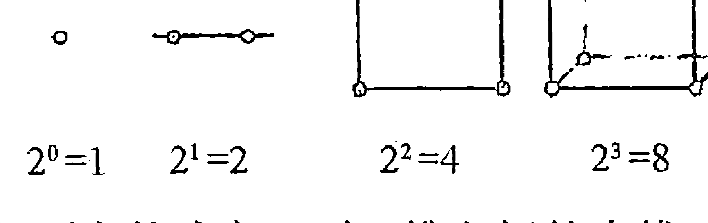

这其中，从坐标原点的确定，到一维空间的直线、二维空间的平面；再到三维空间的立体结构等状态，都包含在里面了。这也就是 “道生一，一生二，二生三，三生万物” 立体表述思想在现代数学（含几何及逻辑演绎）中的体现。它所表述的是三维的 “实数” 世界的规律。这是对我们看得见、摸得着的时空里的事物及其状态的一种数理表述。这也是相应易学“卦变”中，由一个爻，变成两个爻，再变是三个爻的卦形所内含的实际变化的（几何、空间、结构等）意义。由爻画多少的不同，来表述时空及其组合结构的不同。这也说明了，为什么三个爻的“经卦”是整个六十四卦的“基础卦”的原因——可以表述三维时空中的任何（立体、XYZ三坐标）事物及其组合与变化的各种相对应的状态。

四维空间、五维空间、六维空间中，上面所讲的同一件状态下的“立方体”的顶点数，将随着空间的维数的增加而相对应地增加。即由十六个顶点变成三十二个顶点，最后再由三十二个顶点变成六十四个顶点。顶点数的增加，说明同一事物变得更加复杂和难辨了。因为我们处于三维时空中的人，利用我们那些只能感知三维时空事物的感觉器官，现在是无法将四维以上的空间及其结构与事物状态、规律等认识清楚的。所以在“四维时空”中，我们只能看到其事物之“象”（包括“像”），而看不到其实际的“实体”状态与结构的（四维空间的物体，需要有八个投影面的同时表述结果，才能完全准确地表达清楚。而在“三维空间”中的我们，却只能见到三个投影面的表述结果，故而永远只能描述同一物体像个什么，但永远不能准确地认识与表述清楚该事物的具体形象及状态。比如，像“飞碟”、UFO之类）。在“五维空间”中，只有其事物的本身——没有比较、没有差异、没有大小以及其他的事物的什么概念——没有，也无法进行事物间的任何对比与比较。在“六维空间”中，事物状态看来基本都是一模一样的，没有任何差别——故我们什么也区分和“看不到”了。这三种时空中事物的状态与特点，在我们的数学模式中，被称作为是“虚数”世界，是用我们的一般感官无法感知得到或无法能感知清楚的事物的存在形式与状态（与我们对“无”“道”的认识相似，甚至相同）。

从“象数易学”中的某一个三个爻的单卦（经卦）来讲：
- 最下面的初（一）爻，对应表述“地”；
- 中间的二爻，对应表述“人”；
- 上面的上（三）爻，对应表述“天”。

这种将“天”“地”“人”三者统一于一个“卦”中的表述方式，已经将“全（完整、全面准确）宇世里的全部事物及其以变系统与其内涵，都包含了进去（整体论、系统论、天人合一论等）。

这种“象数易学”的“其大无外，其小无内”的对应认识与表述方式及适用范围（界限），在我们这里，它仍然是与以上我们认定的不会变的那些组合结构状态相对应。

人们一般往往喜欢用含有“阴阳鱼”统而为一的“太极图”来表示“太极”的思想；由此又产生出了一“阴”一“阳”的概念；既而生成了“阴”“阳”性质相同或不同的“爻”的概念；最后又通过这些“爻”的不同或相同的组合层次的搭配，形成了“卦”的概念。再由卦的各种相同或不同的组合、结构、变化状态的认识与表述，反过来，我们又进一步地理解了“太极”的概念、意义和思想内涵。

前面我们曾经讲过，“象数易学”中，由“经卦”乾（☰）卦的内涵——“乾主大始”，我们可以知道，乾（☰）卦可以表述“一维”的初始点——“太极”点（或各个质点）；又可以表述“二维”的一个圆；还可以表示“三维”的一个球体或圆环体。这是指在不同的（三维）参照系统中，乾（☰）卦有不同的对应表述（表现、表达）概念与方式。就是在同一个系统中，乾（☰）卦既能表示最小的一个“点”，又能表述整个系统所组构成的全部和整体。这也就是说，乾（☰）卦所表述的这个“太极”概念，要根据参照系统的不同或相同，其所相对应事物内涵的内容和意义，是【可大可小，可多可少】的。也可以说“太极”的这个坐标原点、对称中心、基准点，可以随着人为的推导需要及参照系统的内涵内容不同的需要，其选择的相对应的概念与内涵或实际具体针对性意义，是有相应变化的。但是，不管如何的需要与理解，它总是作为一个最基本的根据（点、基础、根本、本源、前提等）存在着。

虽然在不同的系统中，“太极”这个基本“原点”内涵的（大小）概念，会是不同的，但是它所对应认识与表述的事物及其关系，又是那么的合理而恰当。

下面举例说明。

比如：## 第十二章 太极及其衍生的某些概念

-   (1) 问我在这个屋子里的什么位置上？那么，我们就以“该屋子的中心”，作为坐标原点。
-   (2) 问我在我原先所住屋子的什么方向上？那么，我们就以“我原先住宅的整体位置”，作为坐标原点。
-   (3) 问我在我刚才所处的什么位置上？那么，我们就得以“刚才我所处于的位置”，作为坐标原点。
-   (4) 问我在天安门的什么方位上？那就可以以“整个天安门”，作为坐标原点。
-   (5) 问我在美国的什么方向上？就可以以“整个美国国土”，作为坐标原点。
-   (6) 问美国在我的什么方向上？就可以以“整个我这个人体”，作为坐标原点。
-   (7) 问北京在美国的什么方向上？就可以以“整个美国国土”，作为坐标原点。
-   (8) 问美国在北京的什么方向上？就又可以以“整个北京地区”，作为坐标原点。
......

看到没有，坐标原点内涵内容的体积、面积、容积以及其量化的大小和等级的确定，是根据研究事物需求时的不同，来具体针对性地选择与确定的。不一定该坐标原点的内涵，就比你所要比较的那个事物的内涵（体积、尺度、量化、质量等）小。事物的存在，都是相互联系并对应着存在的，不会因为其各种量化概念的大小、多少、量级等的不同或相同，而不能联系及不可对应（“一阴一阳之谓道”的“对应统一”吗）。对应事物的双方是任何状态下都能相互对应的。即任何事物之间，在我们“象数易学”的“易理”看来，【都能相互“对应”，并且还能对应性地起出或组成相应内涵的卦来】。

我们根据相应易学及“象数易学”中的“两仪”“阴阳”概念的延伸，我们对其延伸所对应出现的“阴阳爻概念的产生”“爻象”“爻位之象”“六画之象”中的承、乘、比（包括卦之间比的关系）、应、据、中、正等变化、“卦象”“卦位之象”（上下、内外、前后、南北、贞悔、远近、大小、往来、升降等）、“八卦”及六十四卦的“阴阳”生成与变化、“互体之象”“连互”“半象”“连半象”“类象”“反象”“半反象”“上下反象”“对象”“半对象”“反对之象”“交易之象”“之卦之象”“消息之象”“体用关系与定性之象”“太极图”“卦的‘五行’本质对应定性之象”的组合结构等卦、爻、图、数等“象”的（性质）变化，都是由“是生两仪”及其“一阴一阳”的本体论的概念及思想的“以变”启迪，才产生出来了“象数易学”的“象数”对应的认识与表述方法。虽然卦、爻象的变化是极其“错综复杂”的，可是它们归根结底的哲学与逻辑学思想，都是来源于“易理”及“义理”《易传》中的“是生两仪”的基本思想基础。而“是生两仪”的基本思想基础，又来源于“易理”“义理”的“一阴一阳之谓道”的本体论“对应统一”的根本性思想。

# 第十三章 受易学思想的影响汉文字得以发展<sup>①</sup>

写作该文的主要目的，是想促使大家对文字及文字的改革及使用与相应易学及其“象数易学”在其间所起到的不可磨灭的必然性推促及“类化”归属和本质分类问题，能引起人们的重视及关注。同时也会在文字的训诂、考译、判断、理解与解释方面，提供一些“象表意”及“象数表意”等方面象形表述意义的依据。使人们对文字的古代原创的意义，能有所进一步的了解与认识。预防并防止国内外某些人想仅以充满“不完备性”的“形式逻辑”前提下的“拼音文字”及其表述功能，来根本取代与消灭表述内涵更加丰富、优秀且完备的“有机辩证对应统一逻辑”前提下的“象形汉文字”的罪恶目的的得以实现——从文字、语言、文化上来根本消灭一个国家、民族及其凝聚性的“软实力”——特别是在当今所谓“人类已经进入了一个‘完全数字化’的‘理性时代’”的口号的忽悠及迷惑下，我们得更加要提高警惕才是。

掌握本文内容，必须首先认识和理解的关键词是：数字筮符（含“数字（信息）卦”）、数字符号、象思维、象数思维、象形汉文字、拼音文字。

要知道文字与卦的关系规律，就必须知道中国传统“象形”汉文字的构成及其发展的某些规律与过程。由我所著的《易理数理（一）》一书里“绪论”一章的“易符与几何形汉文字的关系”一节中的某些析例里可知，中国汉文字的“象形文字”的表意符号的出现，要比时代相应易学的“易符”“易象”“易数”“易卦”的对应表意符号的出现要晚得多（晚了近3000年的时间），并且受“易符”“易象”“易数”“易卦”“易爻”“易位”“易性”“易质”等“象思维”“象数思维”“象数表意”“象表意”等表述方式及内涵意义认知与表述的长期影响，它才得以逐渐地充实与发展的。这种“汉文字与易卦”相互依存的表述关系，自古至今，一直没能引起语言文字界与易学界的关注与重视，只是在“测字”“拆字”“相字”《梅花易术》等，用文字语言进行推测事物规律的“象数易学”及相应“数术学”的一些书中，才略能见到其中的某些端倪。其次，就是在诸多“数组符号”“筮数符号”“数字排序符号”等数符，往往又会出现在甲骨文字的文字、文句及其文字的注释中，由此也可知，古筮、古易的“易象”和“象思维”“象数思维”概念及其含意，要比象形汉字的“象表意”“象数表意”“象形表意”出现还要早，并且更为普及和广泛。甚至由商末及周初所发现的家用陶罐上，往往会刻有“数字符号”（可能也是一种由数字组成的“识别”符号）来看，说明当时“易符”“易筮”“易卦”“易数”等的信息表述方式及相应的表述内容，已深入到了每个家庭的日常生活之中了。

再由商末及周初的甲骨文、钟鼎文向笔画文字规范的“籀”变过程中，我们也可见到，汉文字在其规范化的诸个过程里，像易卦表述系统规范化由“数字符号”向“几何爻画形符号”转化一样，从其象形性的甲骨具体的“象思维”向以部首偏旁为主的“几何形笔画”为主组构的“象（形）、声、数、义、意”的“象思维”“象数思维”到“象表意”“象数表意”的发展转化着。此种对文字表意的规范，为春秋战国期间各诸侯邦国的“霸”道、“王”道的整合与统一，以及“史”“士”及诸学百家的理性交流、提高、发展与传播，创造了极好的先决条件。当然，秦始皇统一中国后所进行的文字的统一及其规范工作，又对秦朝以后汉武大帝（公元前140年~前87年在位）以官方出面积极主动地推促“独尊儒术”“罢黜百家”“设五经博士”“办大学”等的（国策）意识形态地位的规范、统一与确立，起到了不可磨灭的作用。否则，将无法有根据地“公平”区别、归纳、汲取与保留“诸子百家”等各学派的优秀作品的内容以及弃除其糟粕部分的内容了。

在此我们还要特别指出的是：在3000年前殷商时期的“殷墟甲骨文”中，已经有差不多近5000个单字的文字组合表达体系了。可是，在自古以来甲骨文的文字中，到目前为止，还未发现不是文字的几何图形，可是不少甲骨文字的本身往往就具有具体或抽象图形的性质。也可以说，在宋朝之前，我们的汉文字多是甲骨文、（大、小）篆文、章草、隶书等多种表述符号构成的“象形”文字，由（公元100年）后汉许慎的《说文解字》成文开始，直至到了宋朝才确定并固定确立为：以部首偏旁为主，笔画、笔画数及具体或抽象对应的几何形构造方式，配以不同声调与发声为基础的“方块型”（几何型）的汉文字表述（含表意与表义）形式。当然，这种方块形结构的象形汉字的确定，与当时“活字印刷”方法的出现、推广与发展的需要，应是分不开的。何况这些文字在创生、充实及发展中，绝大多数都具有一定的对称性、稳定性、组合性、构造性等特点。由其几何学的角度来看，其中包含有正三角形、直角三角形、等腰三角形、平行、垂直、矩形、正方形、台形、点状、直角、直线段、斜线段、线段交叉等单独或非独立的几何图形与几何知识①。因此可知，我国古人所创造的方块形式的“象形文字”，是我们的祖先对周围客观事物的一种几何形象与其相对应结构的表述（包括数学、力学、矢量学、框架、场论等天文、数学、物理学等多方面的内涵），它的每一笔、每一画、每一点、每一钩、每一撇、每一捺等，都有其针对性的具体或抽象的科学的实际对应性表述意义。所以由东汉时期许慎专著的《说文解字》中的9353个汉文单字，发展到清朝康熙时期的《康熙字典》中，就已经收集到47021个汉文单字（这后来成为1915年中华书局所编的《中华大字典》的蓝本），直到如今我国在计算机上能找到或用得到的“汉王笔”单个汉文字，也已达近三万个简、繁体象形汉文单字了，可见其文字内含的各种组合学、组合数学、几何、物理量化等学科结构与形象的深邃与广泛。这也充分地显示出中华民族文化对“形而上者谓之道”的事物综合、归纳及抽象学认识论与表述学的格外重视。同时还说明了，我们的老祖宗总是首先注重精神、思想、世界观、方法论方面的充实与改造的史实。

如果我们仅靠当前现有的这三四千个简体汉字的表述内含之义来认识与表达一切事物及对其相对应各种事物认识的话，由于该文字表述系统内涵的缺失、重叠、不健全与不完整，它又怎么能准确地表达与表述人口众多的中国以及千变万化的复杂的宇世中的各种变化、形象及结构、状态和规律呢?!这也是造成20世纪初、中期，中国许多方面在世界上相对落后的因素之一。以这三四千个简化汉字作为中华文化的全部汉文字体系的认识与表述基础，所以文字结构需要简（单）化，主要应是为了普及汉文字的需要，才这样去做，去要求的。可是该普及的目的，应该是为了提高才对，如果仅以这少部分的简化汉字为中华文化交流的全部基础文字，而不去促使更广大的人民进一步地了解、认识和掌握内涵极其丰富且表述相当准确的繁体汉文字及其为基础的语言表达功能的话，那将是中华文化及其基础文字表述体系的一种倒退与悲哀（现在所收集到的殷商时期的“殷墟”甲骨文字，据统计就已有近5000个单字。当前能被我们确读者，仅1700字。当然在先秦之前的年代，我国就存在有许多通假文字与地方方言间的通假文字，尤其是我国较早的“春秋战国”时期）。由于简体汉字表述系统，受拼音文字表面上看来的简单表述形式的影响，故而造成其表述系统内涵的减少、缺失、不全面、不完整、不健全、不完备与不准确，人们所想到的形象、状态，发音的韵律、笔画与书写出文字的具体及抽象的形象、相对应的笔画数等，与大脑思维中文字之义信息之间，不能协调统一地在人们各自的大脑中，达到一致而共鸣与共振性的加强——造成强烈的记忆刺激与更充分地理理与意识，故而形成了人们在交流上的障碍与沟通上的困难（不易产生与达到心心相应的共振效果的信息信号刺激的加强）。特别是在我国人口众多的“经济市场化”迅速发展变化的过程中，人们自我意识前提下诸多不完备、不安全等猜度因素地干扰，进而使人们不容易互相理解及难以达到某些共同前提下的共识，这自然又会造成不容易和谐的猜忌因素下的一些后果——在自我名利获取及全社会“欺诈经营”方式所导致的自我保护意识的驱使下，促使且不得已产生了一些不明确的猜量因素的理解与干扰，进而导致人们相互间不容易互相理解及难以达到某些诚信前提下的共识，相反，又会导致并造成社会诚信意识不容易和谐的诸多猜忌因素的产生与出现——这是我们大家绝对不想见到的现实。因此，我们希望这种认识与表述系统内涵丰富完善，计算机录入、处理迅速且准确，以及很快就会成为更主要的世界语的中华民族的汉文字及其文化，能恢复其原有的丰富、充分、准确的繁简统一的“软实力”表述的功能和作用上来。

又由于周王朝时期分封政策的需要，各种的赏赐与机会特别多，而且各种赏赐都有一定的数量，所以数字与数字信息就广泛地出现在了赏赐铭文之中。其中，有因战功、战绩而受赏赐的，因祭祀而受奖赏的，等等。此外，还会记述有赏赐的时间、地点、内容、物质品种、数量等。自然其间还有些铭文是为了记载战绩而作的。其中，记录了杀敌的人数，俘敌的多少，缴获物资的数量等。比如，“多友鼎”铭曰：“多友西追，甲申之晨，搏于祁，折首二百又五人，执讯二十又三人，俘戎车百乘一十又七乘。”这充分反映及体现了当时数学知识的另类记述、统计作用。由此我们可以看到，通行本《周易》中的“折首”一词，应是指“砍头”“斩首”（斩杀、杀死）之意才是正解。如若是按现在的简化汉字的“折首”之辞来理解与解释的话，该词就往往容易被现在的人们理解或解释成了“俯首”“拜服”（鞠躬）、“折服”“对换”（交换战俘）等意思了。而这两种解释意义及其实际内涵，却是具有非常甚至完全的不同的具体指向意义的。这种完全不同的理解与解释，我们认为，主要就是由于繁简体字“通假”时所对应表达的具体针对性意义，在我们运用和选择的认识上的不同所造成的混乱（当然还包括不可避免的繁与繁及简与简体字之间的“通假”、训诂、运用与理解、解释方面的混乱问题及局面），所以在解释相应易学卦、彖、象、爻辞及“系”“传”等文本文意的时候，一定要使用或尽量能使用其当时的古文字或相应的繁体字的本意进行理解与译释，才有可能得到正确的正解——决不能仅用当今的简化汉字之义，作为唯一内含性的表述之义来理解与解读古文字内容及其内涵，否则，定会导致对中国古代文化及其内涵认识与判断的片面性乃至彻底的错误——这种现象在古今《周易》“义理”“周易象数学”，在训解古《易》文本时的误导性认知的广泛性存在，古今还少吗？!

> “多友鼎”铭曰：“多友西追，甲申之晨，搏于祁，折（现简体汉字为‘折’字）首二百又五人，执讯二十又三人，俘戎车百乘一十又七乘。”

再者，作为周代时期金文中的文字，除了作为卦符之外，一般基本上是不会单独使用的，它们总是与实物或时间单位连在一起，共同进行认识与表述的。比如，西周时期，多是“先物后数”进行具体表述，还有的是间或具有“物、数、物”的记述方式。我想这应是受夏商时代及周初时期的“易学”占卜（龟卜、骨卜）是“先得有象（纹路）而后有卦数及卦”的影响而设作的记述方式。到了东周时期，这种记述方式演变成了“先数后物”的记述方式。这可能是受《周易》中的筮及筮法“先得到数而后有卦及卦象”的影响而设作的记述方式。如，《周易·经文》中就记有的“百里”“三日”“三人”“一人”“三狐”“三品”“三驱”“三就”“三褫”“一握”“九陵”“十朋”“三百户”等词义的记述方式。可是无论是西周还是东周时期，这些记述方式总是把数字放在时间单位的前面，这正好又与现今我们时代的认识与表述方式，仍然是一致的。比如，三日、七日、八月、三岁、三年、十年、万年等。

再比如，在对量度单位的认知里，西周时期，就明确地具有“方里”“方尺”的“平方”“方”的范围和范畴的概念。其中的“田”“里”“邑”“晦”等字都是表示土地面积的度量衡单位。所以在《周易》“坤”（䷁）卦六二爻中会有：“直、方、大，不习，无不利”的爻辞具体概念的记述。从这里也可以说明“坤”（䷁）卦有“直”的、“直线”“线性”“平坦”“川”（顺）的概念；“平”的、“方”的、“平方”“乘方”“面积”“体积”的范围概念；“大”有一望无际、无限、无穷（∞）、“直”与“方”的延伸——即“太”（极限）的概念。故我们认为，该卦爻辞之意，应是说：只要做事是按一定的“直”达及顺利（坤为“川”顺）之途，或不超过顺利的一定的界限与范围，既使你不熟悉、不习惯或没能完全学习并掌握这中间的奥妙或规律、规矩（由于是“顺其自然”）等，也不会有什么出格并对你不利的因素与结果发生（因为太顺直与太平坦了），所以它才有“不用再重复”“不必再反复”“不必再占筮”等相对应的意思与做法的出现。实际这是在说，即便是，采取了如此“不习”（不习惯、不熟习）的做法去做时，也不会有什么不利的因素或事情发生。

又比如，在《逸周书》中记载的周武王的定制时就具有“辟开修‘道’，五里有‘郊’，十里有‘井’，二十里有‘舍’”的设置规定标准。由该句前后各个数辞来看，显然这是用到了乘法的计算表述方式。同时还可以看到周代时期，人们对“道”（包括“路”“途”“衢”）、“郊”（“郊”“野”“郊野”）、“井”“舍”等概念的确定性定制标准，是有一定时代性的规矩规定的。可能在《易经》中许多与这些字、概念等有关的辞、字的解释，是否也应该参考这些“周代”法规的界定字、辞的数理内涵内容的时代特点，来重新推敲与确定呢？我想应当是如此去做，才会产生更准确的针对性辞语的理解、认识与判断、解释。否则，按现在人们的认识与想法，可能会认为“郊”是离我们很远的地方的郊区、效外之意，而“井”“舍”则应当是居住区内的近处近距离之物。可是，在西周时期当时的“郊”，才有五里地之远，而“井”“舍”则是该距离的两倍到四倍的距离那么远。所以易卦中的水风井（䷾）卦的卦辞才会有：“改邑不改井，无丧无得。往来井井”之说［意思是说：即便是你改变了居住的环境与地方，井仍然还是处于你所住处的十里之地上（按定制的规定与构成，在取水的过程中仍然是相对固定的那么远的距离），即使是相互往来于井与井之间，也不会出现（体力付出在）得失上的合算不合算的想法与做法的发生］。

另外，有个别权威人士人认为：按《帛书易》的“传”类之文中的《缪和》篇的“夫知君卑礼屈貌以郻孙”一句，在此“郻”字应是“舍”字的假借之字。正像《文言》传释乾卦九二爻的“‘见龙在田’，时舍也”之“舍”（舍弃）的内涵一样。我们在见到《帛书易》文本后，才知道这个“舍”字应是“郻”字的借字。帛本此文之“郻孙”应是“释逊”的意思。按古文以“释”，为“舍”义，《仪礼·大射》又说：“获而未释获。”郑注解释说：“但言获，未释筹。古文（注：此‘古’到底指的是‘古’到什么具体时间呢？缺少具体针对性时间的准确表述）‘释’，为‘舍’。”故“郻”字在此应读作为“舍”字并与“释”字通假。其意思是说，古之圣君卑体屈貌以释谦逊之旨也。圣人之所以取“谦”、取“逊”、取“卑”之义，其目的是在“能至天下之人而又之”。故该文中在释《谦》的初六也说：“是以能既致天下之人而又之。”虽然按照时间先后出现的次序来说，《文言》《仪礼·大射》都应是《缪和》篇之后才出现的文字，即使我们往前推及到周武王时期《逸周书》中文字与实际范畴、地域及距离概念的规定之义时，也已相去差不多近千年的演变时间了。《缪和》篇中的这些“舍”“郃”与范畴、地域或距离的概念，已成了与西周周武王时期的定制大不同的概念了。也就是说，用汉朝时期的文字之义，来理解与解释西周时期的“易经”的爻文之义，恐怕已经是一种非常不同的文义之说了——该权威人士的说法，不过是仅通过秦汉之后文字的可能的“通假”含义来诂解《缪和》中该句的内涵意义而已。又由于该《帛书易》“传”类之文中的字义的理解与解读，就已经与“易经”成文时早期的“设卦”“观象系辞”的“象数”认识与表达内涵和根本法则，已是有所不同的认识与理解了，所以说这种仅以文字之义训诂解读所得到的《周易》结果，也早已可能是与周朝“易经”经文中当时的“舍”字之义的意思，已是非常的不同了。

另外，在《逸周书·武顺解》中还有“五五二十五”的整数乘法运算的口诀；从西周的筮法（并非一定是“蓍草法”）中的分析，也会发现当时已经有减法与除法的运算了。而由传统数学的概念认为，我国古代数学的“加减法”之源，传统说法认为，是源于“河图”；“乘除法”之源，传统说法认为，是源于“洛书”。由此也可以说明或想象到，“河图”“洛书”的出现应是在西周之前才是。

由上面分析的启发，在研究古文字、古语之义中，我们不能脱离当时时代人们的知识、习俗与文化等的时代背景下的对应性概念来确定它们的真实意义。不能仅靠想当然的推理、逻辑、假设、猜想“形而上”地来确定它们的原创及原意。否则，不但会闹出笑话来，还会导致对古文化认识的误导与误解——成为历史的罪人。

比如，由于在周朝时期，就已经实行了建宗立庙的礼制，因此周代的宗庙祭礼是国家政治生活的一项主要内容，修建了专供祭祀使用的建筑群并且建立规范祭祀活动的礼仪制度，形成了一套完备的宗庙祭祀体制，以后历代封建王朝都在沿用和发展着这种礼制。这些礼制建筑依照祭祀内容分为几类：一类是建在皇城之前作为帝王祭祀祖先的“太庙”和祭祀社稷的“社稷坛”，一类是建在都城附近供帝王祭祀天地的“天地坛”，还有分布在全

① 本文曾作为“第二届中国周易文化暨首届太极文化高峰论坛”论文提交宣读。
② 请见吴文俊主编：《中国数学史大系》，北京师范大学出版社1998—2001年版，第一卷第166页甲骨文字举例。

## 第十三章 受易学思想的影响汉文字得以发展

全国各地由帝王派出官吏主持祭祀的岳庙、镇庙和渎庙；另外一类是为巩固王权而建的祠和庙，如后来的孔庙、武侯祠等。周代礼制建筑十分严谨，帝王的祭祀活动都有其严格规定。祭祀天地是王朝政治活动的重大内容，周代规定祭天是帝王的特权，诸侯只能祭土。祭天要在都城的郊外举行，而方位得与阴阳相配才行，祭天于阳位的南郊，祭地于阴位的北郊。帝王祭祀祖先在宗庙建筑——太庙进行，太庙按周制在都城宫殿建筑群的左前侧修建。祭祀社稷反映了我国古代以农业立国的社会性质。因“社”代表土地，“稷”代表五谷，故“社稷”成为国家的代称。

由这些礼制的制约，我们也会意识到为什么通行本《同人》卦上六爻的爻辞“同人于郊，无悔”的原因。那是因为志同道合者聚集在邑郊，全心全意地进行崇仰的郊祭，因夙愿祈求的是农业生产的丰收，所以这种行为，相应地导致心里也会产生没有什么后悔的事情能发生的结论。当然，也是卦辞“同人（同心同德同志的人聚集）于野（野外的南郊），亨（祭天）。利涉大川（离之坎）。利君子（乾）贞（巽之兑）。”的根据及来源的原因。假如，不知道或不懂得当时社会礼制相应的那些规定下的活动及其规律的话，对“易经”中的许多卦爻辞与礼制、礼仪等“礼”有关的内容的鉴别与判断，往往会产生许多“形而上”（臆想）的判断失误。请大家要提高辨别能力！

由考古中的甲骨、钟鼎（又名金文）等文字中，我们也能看到，在中国传统的“象形文字”的产生、形成与发展过程中，是受到了“易符”“易数”“易卦”“易象”等时代相应易学的“象表意”及“象数表意”表述系统与概念的直接和间接的影响的。

下面举例说明，易卦的表述方式对“象形汉字”及其发展的影响。

比如，在李申、郭彧编纂，华东师范大学出版社出版的《周易图说总汇》下册第1609页里（如图1），其中：

图（十一）的甲骨上，左边刻有一个单独的“田”字，“田”字的右侧并排着由上向下刻有“六六六”一组与三爻坤（☷）卦内含相对应的数字符号。说明“田”字是由三爻坤（☷）卦所反映的田地的“田”与坤（☷）卦的“兽”义的“田猎”之意所产生的概念。可是，在当时的甲骨文中，还有“日在地下”表示“微”意的字与其非常相近。其字形也是“口”字中间有个小“十”字。为了明确此处到底是个什么具体字意，因此采取了以当时人们熟知的“卦”（数字符号）以意解义的标注方式，以示区别——表示是该字是“田”地之意，而不是“微”之意。由此也可看到，在我国古代历史上用“数符组合”（卦）表意的方法，要比用具体“象形”（文字）及“象形组合”表意的方法，出现的时间还要早，并且使用的也更广泛、更普遍。否则，没有必要以人们熟知的“卦象”之义来对具体文字进行表意性的说明与解释了。另外，在甲骨文中，还有许多画成不同方格组合形状的文字。很显然，这与以小方块作为计算面积的单位或表示土地的形状、面积等状态有关。为了表示该处不是指面积与状态关系而言，才以（六六六）“卦”义（数字符号）之“田”地之意，进行标注与注释（请见《中国数学史大系》第一卷第166页甲骨文字“田亩图2”如下）。

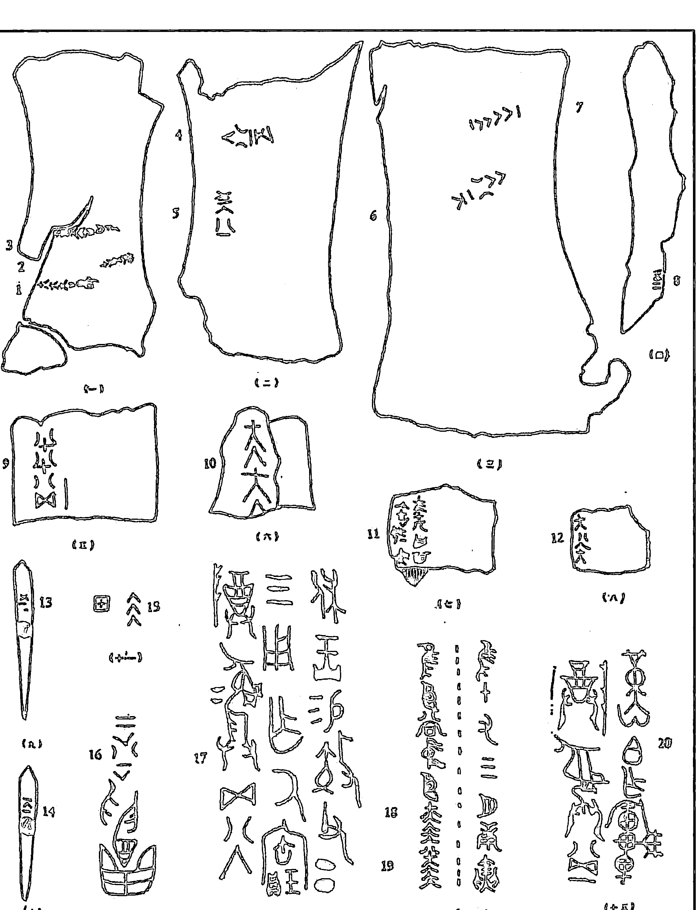

# 图1

图（十二）字的上（下）面有“一一六八一六”（或六一八六一）六个与风水涣（䷺）卦 [或水泽节（䷻）卦] 有关的数符表述意思。

图（十三）左边一行字的最下边（整个图像文字的左下方），有“五六六”一组与三爻艮（䷳）卦之意对应有关的数字符号。这可能是以此数的卦义来表示某个字义。当然也不排除，此处全部的文字与筮得的艮（䷳）卦内涵的表述意义有关。这要等所有文字之意弄清楚后，才能下断语。

图（十四）左行的最下面与左侧七个文字对仗的两个字，用“七八六六六六” [相当于后来的山地剥（䷖）卦的“臣”“仆”之字义] 与“八七六六六六” [相当于后来的水地比（䷇）卦的“比自之内”的“甘心情愿”的字义] 这么两组数字排列数符，来对应表述相对应的字义。此两卦前后排序应组成的是“仆”“比”两字之义。即全句的表述意义，应是说“臣仆发自内心的甘愿效忠”的意思。

## 《传》前易学及象数易学

图（十五）左边一行字的最下边（整个图像文字的左下方），有“八五一”一组与三爻兑（☱）卦之意相对应有关的数符。这可能是以此数的卦义来对应表述某个字的字义。当然也不排除，此处全部的文字与筮得的兑（☱）卦内涵之义的对应意义有关。这要等所有文字之意弄清楚后，才能下断语。

又比如，在该《周易图说总汇》下册第1610页里（如图3），其中：

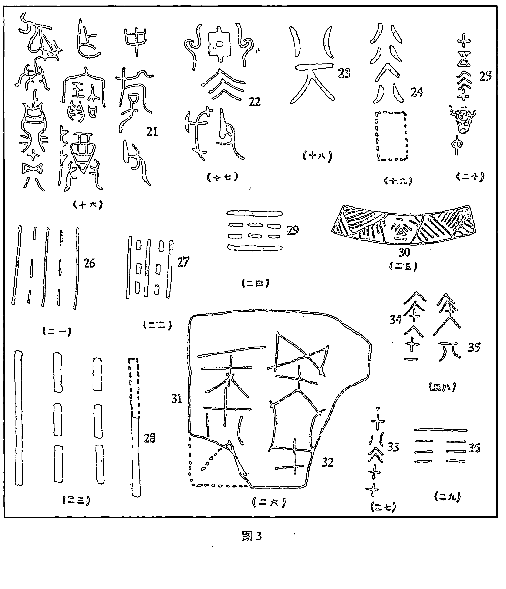

## 第十三章 受易学思想的影响汉文字得以发展

图（十六）左边一行字的最下边（整组图像文字的左下方），有“七五八”一组与三爻巽（☴）卦之意相对应有关的数符。这可能是以该数符的卦义来对应表述某个字的字义；当然也不排除，此处全部的文字与筮得的巽（☴）卦内涵之义的对应意义有关。这要等所有文字之意弄清楚后，才能下断语。

图（十七）上下两字（图）之间是“六六六”一组与后来的三爻坤（☷）卦内涵相对应有关的数字符号。它与它上面图形的组合，应有“勿坤方”的意义。也可能是指，上面的这个黑方体，“不仅是‘田地’（‘田’形）或方形”的意思。

图（二十）的“周招仲卣”之盖的“招中”二字之上，有“七五六六六七”一组与后来相对应的风雷益（䷩）卦内涵相对应有关的数字符号。其应是具有用作“有盖的容器”或“能封口的容器”之意的字的意思。又由于其卣器上刻有“招中”二字，其盖上的“招中”二字之上又有“七五六六六七”一个数符。这说明它是在指出，此盖乃是“招中”卣器（容器）上面位置上的那个东西。

以上诸例有关“数字排列符号”与文字间的更加全面地分析，将有另文详述。此处就不多议了。

由此可见，至少是由商周期间开始，人们往往用大家较熟悉的“数字组合表述符号”或“数字”及“数位筮符”之义，作为文字或代表某文字之意来使用的。这与当时人们用声符、字符或声字相合之符作为基本文字，以及为了更明确地表述自己的意图于其间，时常在所写文字的上方冠之以图绘的做法及启示方法，是一脉相承的更充分的表意方式。只不过我们这里的例图中的表意（图绘）符号，是被表意更丰富、内涵更广泛深刻的“数字组合表述符号”“数字排列（识别）符号”或“数字”“数位筮符”或符号所取代就是了。

由此看来，我们必须特别重视研究探讨当下的“数字的组合符号”“数字（信息）筮符”“数位筮符”“数字排列符号”“数字识别符号”“数字排列文字”等“数”与甲骨或钟鼎文字的对应关系以及其相对应的针对性表述意义才对。这么做的结果，有可能又找到了一条中国“象形文字”的产生、发展、充实及完善的重要途径。这种做法正好说明了《周易·系辞上传》十三章中“书不尽言，言不尽意”，“圣人立象以尽意，设卦以尽情伪”的“义理”与“易理”思想、目的与实践例证的正确性。这有可能也能证明中国古代文字的产生、丰富、充实及发展，是与相应“易学”“义理”“易理”及其“卦符”“卦数”“卦象”“象”“数”“位”等的表意方式和归类、归属方式、方法，作为其相应一定的推动基础，是有不解之缘的。还可能直接或间接地说明，这就是“测字”、拆字、用文字起卦、算卦等，利用语言、文字方法来判断事物及其规律的根本来源及重要根据。

李学勤先生所著《周易溯源》一书中说，“数字符号”最早一次，是见于湖北孝感出土的安州六器中的北宋徽宗重和元年（公元1118年）的一件方鼎铭文的最后。其曰：“惟臣尚中臣，七八六六六六  八七六六六六。”这么上下先后顺次排列的两个数列符号。如果，我们把后面两组“六位”数符对应成几何卦形的话，前组对应应的是山地剥（䷖）卦，而后组所对应的应是水地比（䷇）卦。按照《左传》《国语》中的筮例规律，有可能此处所指的就是“剥”之“比”的卦变内涵意义。可是，由于此表述方法与包山楚简、新蔡楚简筮卦等书写文例中，“本”“之”两卦是左右并列书写的传统表述（习惯）方式不同，又因为此处的“剥”与“比”两组“数字”符号（卦）是同处于前后同一竖行之中，所以我们认为，这应该是不能简单就以“之”（变）卦间的关系来理解与解释才是。故我们认为很有可能这前后同行竖列的两组“数字”符号，前者“七八六六六六”的“剥”卦之意，在“阜阳汉简”中其卦名是“仆”（《帛书易》中“臣”字都以“仆”字来表述。如“臣妾”是“仆妾”；“王臣”是“王仆”等），后者“八七六六六六”由“数字”符号组合成是“比”卦。“比之自内”“高兴”，说明这是发自内心的一种情感。二者前后排列顺序的不同，其所表述的文字意义关系，应读作是“仆比”之义才是。也就是说，该两个数符文字，其主要是为了强调表达“臣仆们应该甘心情愿地仆从（效忠）于帝王”——表示誓死效忠、决不违背的情感、决心与意志。由该全句文字来看，其应是读作“惟臣尚中臣仆比”。此处的“仆”“比”两个数字符号所组成的卦的内涵，应是作为内涵更深刻的文字之义来被使用的。

## 第十三章 受易学思想的影响汉文字得以发展

由此我们也会感受与体会到，在中国传统的相应易学文化及语言文字中，由于“书不尽言，言不尽意”，故而在“圣人设卦以尽情伪，立象以尽意”表述方法的深刻内涵意义的指导下，人们往往会用内涵更加广泛、更加丰富、更加充实深刻的“卦”（象数）的形式，来表述自己无法完全用语言文字所能充分表达清楚的思想与情感意志。这同样还明确地证明了，在中国传统文化的语言文字的发展过程中，易学中的“象数易学”的“象表意”“象数表意”“象形表意”（并非仅是“经学易”及儒家《周易》“义理学”及其“象数学”误认为的“象表义”“像数表义”“象形表义”的文字解释学意义）与“象思维”“象数思维”“象形思维”的方式方法，对文字语言发展变化上地促进与推动作用。

在我所著的《易理数理》三册书里以及《象数易学与应用》两册书中，在论及古文字的发展时，有不少的例子都可以说明在甲骨、金文等古文字里，“数字（信息）筮符”（卦）或“数字组合排列符号”经常会出现在人们的记述文字之中，被人们当作文字之义与功能来使用的。这种先根据易卦“象数”的对应分类，再根据事物的具体或抽象的（几何）形象组合成的，又在“象表意”“象数表意”及“象形表意”思想指导下进行的文字改革过程中的重要归属与表意类化等方面的积极的表述作用与统一表述的效果，至达宋朝印刷技术广泛推广以后，一直未被后来各朝代的儒家及统治者们，有所关注并重视，故而也必然导致了其后直至当前繁简体汉字与古汉字在理解与解释上的歧义及差异——这对中华相应易学及其影响下的传统文化的传承、弘扬与延续，将是一个脱离了“象数思维及其表意”原则进行理解与交流并达到共识与理性提升的极大的障碍。此外，我另有《象数易学与逻辑（续）》一书中第 391~482 页“第九篇 文字、语言成卦的规律及其对应的某些逻辑内涵”一文中，“(六)通过运用‘象数易学’对文字词句的对应定性的法则，从理性上来理解与区别目前流行的一些新提法和某些词句的实际本质性内涵及其间的辩证关系”一文，可见“象数易学”认识与表述方法与文字“笔画矢量成卦法”之间不可或缺的必然性紧密的相应认识与表述方面的关系。

直至今日，“象数易学”中这些易符、易卦、易象、易数、易位、易理

## 《传》前易学及象数易学

（不仅是“义理”）等所反应与表述的“百姓日用而不知”的规律，在许多的文学艺术的作品里，仍有所反应与体现。甚至连胡编乱造的臆想作品与故事里，仍然充满着易符、易卦、易象、易数、易位、易理（不仅是“义理”）等所反映的哲理规律、定量和定性关系及其规则，以及其相应的逻辑与逻辑关系规律等。也即是说，人们臆想中的胡编乱造，都不会摆脱我们“象数易学”相应易学“象数思维”具体与抽象的哲理规律的涵盖之中。同时也可以看到，“象数易学”相应易学的思维方式，是深深地扎根于中华民族每一个人的遗传基因及其传统思维的脑海之中的。由此也可以看到，我们的相应易学应该不仅是“形而上”地研究世界观、方法论等哲学思想的学问，而更应该是研究一切中国（汉）人大脑中，不可缺失的根本性思维与表达方式相互统一、相互印证的一门学问——是中国（主要是汉族）人类大脑活动的最基本也是最根本的相当完善、重要且标准统一的（思维）活动模式（之一）。比如，随便找一些我国汉民族所编的什么故事，其内容中的什么姓名把什么姓名的人给消除掉、整倒、整死？什么功法把什么功法破解？什么方术将什么法术抑制或控制甚至是打败？什么办法在什么方法的基础上得以发挥、发展与充实？什么国或什么邦族将什么国或什么邦族消灭、征服、吞并？等等环节，无一不是符合宋朝确定的传统方块形“象形”汉文字与易符、易卦、易象、易爻、易数等的“五行”生克制化合的本质“定性”的辩证思维关系。由此可见，文字不仅对中华民族而且对任何一个国家和民族的发展来说，是多么的重要——失去了该民族或国家的文字，也就失去了该民族或国家的共同语言、共识基础及其（统一的）凝聚力，甚至最后会直接导致该民族或国家的必然性消亡。

更多具体文字文义的探讨，请见本人所著的《易理数理（二）》中第十章的“癸”一节（第45~121页）的内容。

此外，大家还应特别注意的是：从以上还有更多的古时的各种数字的组合状态与组合形式来看，大多数易学界的人士认为，其所组成的都是些“数字（信息）筮符”符号——甚至有些人干脆就直接称其就只是“数字（信息）卦”了。其实，这种理解与认识，是对该类“数字排列符号”定义的太狭隘和绝对了。因为其绝大多数除了是作为“数字（信息）筮符”来运

## 第十三章 受易学思想的影响汉文字得以发展

用之外，其还具有作为更深刻内涵的文字之意以及注释、区别文字之意的功能与作用（详见我所著《象数易学与逻辑（续）》一书第391~557页第九篇“文字、语言成卦的规律及其对应的某些逻辑内涵”的全部内容），乃至在各种陶、瓦之器上还会是作为一种相互区别的数字及数字排序型的“识别符号”来使用的。①

本文参考资料：

-   吴文俊主编：《中国数学史大系》（10卷），北京师范大学出版社1998—2001年版。
-   刘钝：《大哉言数》，载《古典文学知识》，2003年第3期，第166页，甲骨文字图。
-   李申、郭彧编纂：《周易图说总汇》，华东师范大学出版社2004年版。
-   李学勤：《周易溯源》，巴蜀书社2006年版。
-   张延生：《易理数理》（一），团结出版社2009年版。
-   张延生：《易理数理》（三），团结出版社2010年版。
-   张延生：《象数易学与逻辑（续）》，中央编译出版社2015年版。

# 第十四章 由非《易林》排序 4096 卦各卦所对应的“函象”及其位置所想到的①

为了能符合及满足当前科学认识论、方法论方面的认识与表述的需要，我们根据《易林》4096 卦变化的启示，创建了以“函象”统一公式的方法，对 12 个爻组成一卦的“复合卦”及“复合空间”所对应的（几何空间型）组合结构的对应认识与表述，进行了某些直接对应性地确立。借以对现代物理学及有机生物学、基因基础、基因工程、人工智能、生物工程等学科领域急需运用的“复合空间”概念的组构及其框架的结构形式与直接对应状态和模型（包括其中的左右手组合成的有机“复合空间”“复合时空”“多宇宙论”及其各种状态的表述）等的针对性地认识与表述。并且还对“如何理解、运用和解读该 12 爻组成一卦的内涵内容”的概念、方法及其认识与表述的优势等，作了一定的对应性的规定及其具体使用方法方面思路的一些启示——使具有现代科学知识基础的人们，理解、认识并掌握这种“象数易学”在“工程易”“科学易”“现代易”方面的应用技术及其为科学研究提供的新思考下的“理论”基础方面的一些知识。

同时，对“形式逻辑”在理性核心方面的根本性“不完全”“不兼容”“必然产生矛盾性”等缺陷对各行业、领域的影响，必须引起我们大家格外重视才行。否则，会造成我们在各个方面判断上的不可根本避免的失误和

> > ① 本文曾作为“第三届易经与经济社会发展国际论坛”论文提交宣读。

## 第十四章 由非《易林》排序4096卦各卦所对应的“函象”及其位置所想到的

“不可确定性”的判断结果——特别是在信息量增减或瞬间增减到一定的“大系统”“大数据”“云计算”等的“虚”“实”之量时，更会是如此的。
掌握本文内容，必须首先认识和理解的关键词是：《易林》4096卦、“函象”4096卦、复合卦、复合空间、《序卦传》《杂卦传》、易理、义理、形式逻辑、守恒、无穷、不完全性、不可计算、悖论（矛盾性结论）、类化。

## 第一节 “函象”排序4096卦与《易林》4096卦的区别及其表述特点

我们这里所说的所谓的（类比于“易林”）4096卦及其排列顺序，说到底，它是与真正传统易学中所说的焦氏《易林》的排序及其4096种变化过程及其对应规律等，是不一样的概念与变卦规律。
传统《焦氏易林》，是以所谓孔子及汉朝的儒家“经学易”学派以及其义理《易传》的《序卦传》所认为的文王“后天”六十四卦的排序，作为其总体与局部甚至具体变化排序的根本性基础依据的（由此可见，《易传》的《序卦传》中六十四卦的排序，至少也是在汉代焦氏之前就已经被确立并广为流传了。当然也不排除，汉朝焦氏之后，易儒们根据“义理”的某些需要，进行了重新编撰的可能）。也就是说，焦氏是总体上先以“经学易”《周易》及其《传》中的《序卦传》所对应的六十四卦的前后次序，作为其变化之前排序的固定性变化的基础，然后再在这个不可变前后排序的排序基础上，每个卦再自行进行各自的全部“六十四卦”《序卦传》式的变化——其变化的次序，仍然是以《序卦传》中的“六十四卦”的次序为（固定）标准的变化排序次序和模式。这样做的结果，最终所形成的变化状态，实际上是“经学易”《周易》六十四卦每卦所各自形成的一个爻至六个爻同时变化以及没有任何一个爻变化为特征的六十四种“之”变过程及其形成的组合排序结构状态。即64×64=4096种变卦（变化）状态。它所最终得到和反映的是：六个爻组成一卦时的一至六个爻的不同数量爻的同时变化及任何一个爻都未变化时，所形成的变化结果及其规律。这种变化规律与其所获得的结果，表面上看来，正好能与“大衍筮法”前提下的变卦规律及结果，相同并且达到一致。

其间，它主要与“大衍筮法”前提下的变卦规律及其结果的差异，是在《焦氏易林》的筮法里，不仅只是“乾”（䷀）“坤”（䷁）两卦才存在有六个爻都同时变化的可能与现象的出现。也可以说，即便是“六十四卦”里的任何一个六爻卦，都存在有六个爻都能同时变化的可能性及结果。这种认识与表述方法论，我们认为应是更加符合自然事物的变化及其可能性规律的内涵的——《易林》所应用的变卦方法，是打破了仅以有限（固定性）数值前提下“大衍筮法”所独崇的“大衍之数五十，其用四十有九”的“蓍草成卦法”，在成卦表述事物及其变化过程中会受（有限的49、48、47、46这四种数）局限的表达形式。因为易筮的普查及统计学的最终目的，毕竟是需要在“类万物之情，通神明之德”“广大配天地”“弥纶天地”并“与天地准”的广泛认识与表述意义下，去寻找和探讨宇世间一切事物及其规律和结果，最后再通过这些事物及其规律和结果的统计、归纳与总结，提升成“易简”前提下“象数易学”的共通或共同、普遍的相应易学它自身道理的“易理”，而不仅是以文字解释学所判定的“义理”的“理性”认识与表达为其根本目的。

单就我们“象数易学”的六十四卦的64!（阶乘）的“自集”要素——各个六爻集合卦体之间的相互排列“以变”及其关系所构成的体系与系统，是足以能够直接表达宇世间一切事物间的关系与变化规律的。也就是说，其排列与组合所能形成的六爻卦的总个数、总类型、总状态、总过程等的总数目值，将会内涵有1.27×10^89种类的事物变化个体、类型、状态、结果、层次、阶段与过程等——这比现代物理学家狄拉克所计算出的宇宙总的质量=质子质量×10^78的总数值，还要大上100亿倍之多的数量值——可知其变化内涵量之大。

由于卜筮与人们对在无限可能性状态下，去寻找唯一性对应答案的需要，从“集合”“模型”“递归”等理论与方法的角度来分析，“是否能够进行排序，是达到能否得到唯一准确性对应答案的充分且必要的先决条件。

## 第十四章 由非《易林》排序4096卦各卦所对应的“函象”及其位置所想到的

件”。也就是说，按“象数易学”有机辩证的“易理学”认为：能否进行排序，是我们在“其大无外，其小无内”的范围内，我们得到事物相对应的唯一答案和结果的充分且必要的先决前提条件，故而相应易学（含《周易》）、“象数易学”及其筮法的判断，也一定想通过其“筮数符号”转化成的“几何空间结构符号”的卦形的不同或相同乃至相似的排序【无论是递归的、模型的、形式的、逻辑的、有限的、范畴的、直观的、证明的、公理集合的（含选择、连续统、可构成性、马丁 MA、大基数、决定性等公理）等前提】，来寻找对其充分“对应统一”的标准性表述的答案和规律。因此，在相应易学及“象数易学”史发展的过程中，出现了以“阴”“阳”爻为本体的以及以它们相同或不同的排列组合，搭配成了“老阳”“少阴”“少阳”“老阴”“先天八卦”（又名“伏羲八卦”）、“连山八卦”“归藏八卦”“后天八卦”（又名“文王八卦”）、“孔子八卦”“中天八卦”“先天六十四卦”“后天六十四卦”“京房六十四卦”“帛书六十四卦”“元包卦”“《易林》4096卦”“坤乾易卦”“形坟卦”“山坟卦”“气坟卦”等，还有本作者所著的《易理数理（一）》最后“九”章中的所有组合搭配形成的卦、数规律的内容，以及《易理数理（三）》中间有关“对称”“互补”“交易”等内涵，还有最后“函象”一章中的一些卦的排序、分布等——其间充满了我国不同历史时期，人们对易卦内涵与表述方式的不同或相同的认知思想和理论、观念及思路。我们想，通行本《周易》六十四卦的排序，它也应该是在受到其他一些易卦排列、分布认识、表述及影响的基础上，是会受到研究探讨问题时时代背景前提的限制和制约的，所以孔儒们在探讨易卦表述系统的认识与表述功能时，所组编起的应是一种经验性的变化排序，或是六十四卦各卦自行变化的统计、归纳、编纂、过渡性、尝试性的卦变排序的一种“规律”变化才是。虽然也可称其排序里具有“理性”的合理的部分成分，但毕竟在数理及其逻辑规律表达上，还是不能或形不成统一标准且完整的理性公式的表述体系。这是通行本《周易》六十四卦排序及《序卦传》无法从数学与符号学的角度，来说清楚其相应《周易》六十四卦几何（空间）型符号“数理逻辑”排序根据的最大遗憾！当然，这也是后来汉朝“经学易”一直受（官方）儒家学派“形而上”高高在上的不良的学术风气的影响，只注重及完成“形而上”的社会、人文、意识形态及道德价值需要地推导、推理、推猜、想象性的空想与空谈，而轻视并忽视与“形而上”指导“形而下”的具体自然科学和技术的实际运用、实践及其印证、过程等，所以才导致出现了《周易》界（不是易学界）及“义理”诸方面如此不良的传统学风与后果——一直沿袭到当今的各党派、各学界的学术风气，往往依然还是（空对空的）基本如此。

可是，我们这里所说的（递归）“函象”4096卦及其排列顺序，则是以高次复合“函数”变化公式是其推导的（递归）基础，又是按“象数易学”的（递归）“函象”是其表述基础的表达方法——对4096种12个爻组成的单个（大）卦体，进行统一排序的数理理性的认识与表达。它所体现和反映的并不是六爻卦之间的“之”变过程及其所变化形成的事物间的各种相应的几何结构的空间状态，而是12个爻组成一个卦的“12爻卦体”本身的“之”变过程及其变化状态和其间的结果。就如同用理性前提下的数理（递归）“函象”的方法，来对邵雍“先天六十四卦”的排序进行表达一样。只不过，这里我们所表述的，也不是六十四卦各卦的理性“之”变的排序，而是“12个爻”组成一个卦的4096卦的“之”变排序及其变化规律而已。可是，这12个爻组成的卦体的“之”变过程与最后所得的结果中，确实包含了《焦氏易林》4096卦的全部“之”变过程及其变化结果的全部内涵。只不过是，其二者各自相对应的几何空间结构状态的排序与位置等，不一定都会是相同的。

下面我们来认识、了解并探讨及分析这种12爻构成一个（大）卦体的“之”变过程及其特点等。鉴于其变化及其逻辑关系，与传统《焦氏易林》的变化及逻辑关系不同——《焦氏易林》无法运用统一的一个（逻辑）变化公式，予以明确的认识与表述。再者，其间变化的排序，与我们所得到的这种排序，是不一样的。由于我们所提倡的12个爻组成一个（大）卦的“之”变方法，却是可以运用统一的一个（逻辑）变化公式，能予以明确地排序认识与表述就是了，故而我们首先需要知道，用什么样的统一（数理）表述公式，来表述及推导出这4096个（大）卦体的数理（递归）“函象”的总卦数（总函数值）与其所直接对应的具体排序位置及其各自的结构、状态等结果和规律。

### 一、理性统一标准的“函象”表述公式

具体计算公式与表述方法如下：

```
s = (n₁ - 1) 2¹¹ + (n₂ - 1) 2¹⁰ + (n₃ - 1) 2⁹ + (n₄ - 1) 2⁸ + (n₅ - 1) 2⁷ + (n₆ - 1) 2⁶ + (n₇ - 1) 2⁵ + (n₈ - 1) 2⁴ + (n₉ - 1) 2³ + (n₁₀ - 1) 2² + (n₁₁ - 1) 2¹ + n₁₂
```

在以上的公式中：
S 是指所对应的某卦的总（卦）数。其取值范围在 1 到 4096 数之内。S 数值所表述的也是其所对应的几何卦形在“先天 4096 卦”排序中的某个具体的针对性的对应位置。

其中，

- n₁ 对应表示的是初爻之数；
- n₂ 对应表示的是第二爻之数；
- n₃ 对应表示的是第三爻之数；
- n₄ 对应表示的是第四爻之数；
- n₅ 对应表示的是第五爻之数；
- n₆ 对应表示的是第六爻之数；
- n₇ 对应表示的是第七爻之数；
- n₈ 对应表示的是第八爻之数；
- n₉ 对应表示的是第九爻之数；
- n₁₀ 对应表示的是第十爻之数；
- n₁₁ 对应表示的是第十一爻之数；
- n₁₂ 对应表示的是第十二爻之数。

以上各爻所对应表示的 n_n 数，若是：
“阴爻”，则取 2 数；
“阳爻”，则取 1 数。
故 n₁, n₂, n₃, n₄, n₅, n₆, n₇, n₈, n₉, n₁₀, n₁₁, n₁₂ 之数=2 或 1。

### 二、12爻卦变化的总个数（所有12爻卦的总和数）

如何通过卦中爻的构成（个）数量，来确定这些爻所能组合形成的易卦的“函象”的总个数？下面我们进行简单的探讨与说明。

我们可以通过以下两种计算公式进行。即：

```
Aₙ = 2ⁿ ;
```

或者

```
Aₙ = 2Aₙ₋₁ 。
```

用以上这两个不同的表述公式来进行计算。计算的最终的结果之数，就是该对应具体多少个爻所能组合成的卦的总（个）数。

其中，Aₙ 所表示的是可以生成卦形的总（个）数。即在 n 个爻的条件下，一共能形成多少个或多少种几何型的集合卦形结构或状态。

n 指的是该类卦形中，每个卦所内含的爻的总个数。即这类几何卦形到底是由多少个爻组成（集合）的。这里的 n 值，只能是大于 0（零）的正整数或自然数。

这里的每个卦，都是由 12 个“阴爻”及“阳爻”的不同或相同的上下排列来组合搭配而成的。而在这 12 个爻组合成一（大）卦的卦体中，它们到底总共能有多少种变化状态与结果产生呢？

由于 n 是爻的个数，故而 n=12。

```
则 Aₙ₋₁ = 2ⁿ⁻¹ = 2¹²⁻¹ = 2¹¹ ，即 2¹¹ = 2048。
```

```
又 ∵ Aₙ = 2Aₙ₋₁ 。
```

```
∴ Aₙ = 2×2048=4096。
```

所以我们可以知道，12 个爻组合成的卦形的结构状态，总共会有 4096 种或 4096 类（几何）类型。

### 三、举例确定任何一个 12 个爻组成卦的总数及其所直接对应的排序位置

计算公式如下。

```
s = (n₁ - 1)2¹¹ + (n₂ - 1)2¹⁰ + (n₃ - 1)2⁹ + (n₄ - 1)2⁸ + (n₅ - 1)2⁷ + (n₆ - 1)2⁶ + (n₇ - 1)2⁵ + (n₈ - 1)2⁴ + (n₉ - 1)2³ + (n₁₀ - 1)2² + (n₁₁ - 1)2¹ + n₁₂
```

1. 12 个爻都是“阳爻”的卦（䷀）——即上面六个爻与下面六个爻都是由“乾”（䷀）卦组合而成。

其中：

- n₁ 对应表示的是初爻之数；
- n₂ 对应表示的是第二爻之数；
- n₃ 对应表示的是第三爻之数；
- n₄ 对应表示的是第四爻之数；
- n₅ 对应表示的是第五爻之数；
- n₆ 对应表示的是第六爻之数；
- n₇ 对应表示的是第七爻之数；
- n₈ 对应表示的是第八爻之数；
- n₉ 对应表示的是第九爻之数；
- n₁₀ 对应表示的是第十爻之数；
- n₁₁ 对应表示的是第十一爻之数；
- n₁₂ 对应表示的是第十二爻之数。

∵ 以上各爻都是“阳爻”，则各爻的 n_n 之数，都取 1 数。

∴ n₁, n₂, n₃, n₄, n₅, n₆, n₇, n₈, n₉, n₁₀, n₁₁, n₁₂ 之数都 = 1。

将以上各 n_n 数之 1，代入公式中。得：

```
S = (1-1)2¹¹ + (1-1)2¹⁰ + (1-1)2⁹ + (1-1)2⁸ + (1-1)2⁷ + (1-1)2⁶ + (1-1)2⁵ + (1-1)2⁴ + (1-1)2³ + (1-1)2² + (1-1)2¹ + 1
= 0+0+0+0+0+0+0+0+0+0+0+1
= 1。
```

∵ 可知，12 个爻都是“阳爻”组成的卦的总卦数，是“1”。
∴ 它是排在 4096 个位置上的第一个位置上的卦。

2. 上面六个爻是乾为天卦（☰），下面六个爻是坤为地卦（☷）。
以上各爻中：
上面六个爻都是“阳爻”，则 n_n 之数均取“1”数；
下面六个爻都是“阴爻”，则 n_n 之数均取“2”数。
故 n₁, n₂, n₃, n₄, n₅, n₆ 之数=2。
n₇, n₈, n₉, n₁₀, n₁₁, n₁₂ 之数=1。
将以上各 n_n 爻所对应之数，代入计算公式中。
S = (1-1)2¹¹ + (1-1)2¹⁰ + (1-1)2⁹ + (1-1)2⁸ + (1-1)2⁷ + (1-1)2⁶ + (2-1)2⁵ + (2-1)2⁴ + (2-1)2³ + (2-1)2² + (2-1)2¹ + 2
= 0+0+0+0+0+0+ 2⁵+ 2⁴+ 2³+ 2²+ 2¹+2
= 32+16+8+4+2+2
= 64。
可知，上面六个爻都是“阳爻”，下面六个爻都是“阴爻”组合成的卦的总卦数，是 64。于是，我们可知，该卦是排在该 4096 个位置中的第 64 个位置上的一个卦。

3. 上面六个爻是水火既济卦（☵☲），下面六个爻是火泽睽卦（☲☱）。
以上各爻中：
“阴爻”直接对应的 n_n 之数，取“2”数；
“阳爻”直接对应的 n_n 之数，取“1”数。
故：
n₁, n₂, n₄, n₆, n₇, n₉, n₁₁ 之数=1。
n₃, n₅, n₈, n₁₀, n₁₂ 之数=2。
将以上各 n_n 爻所直接对应之数，代入计算公式中。
S = (1-1)2¹¹ + (1-1)2¹⁰ + (2-1)2⁹ + (1-1)2⁸ + (2-1)2⁷ + (1-1)2⁶ + (1-1)2⁵ + (2-1)2⁴ + (1-1)2³ + (2-1)2² + (1-1)2¹ + 2
= 0+0+ 2⁹+0+ 2⁷+0+0+ 2⁴+0+ 2²+0+2
=512+128+16+4+2
=662。
∵ 上面六个爻是水火既济卦（䷾），下面六个爻是火泽睽卦（䷥）所组成的12个爻的卦的总卦数，是662。
∴ 可知，它是排在4096个位置的第662个位置上的一个卦。

4. 12个爻都是“阴爻”的卦（䷁䷁）——即上面六个爻与下面六个爻都是由“坤”（䷁）卦组合而成。
由于各 n_n 爻都是“阴爻”，即各爻的 n_n 之数，都取2数。
故 n₁, n₂, n₃, n₄, n₅, n₆, n₇, n₈, n₉, n₁₀, n₁₁, n₁₂ 之数都=2
将以上各 n_n 数的2数，代入计算公式中。

```
S= (2-1) 2¹¹+ (2-1) 2¹⁰+ (2-1) 2⁹+ (2-1) 2⁸+ (2-1) 2⁷+ (2-1) 2⁶+ (2-1) 2⁵+ (2-1) 2⁴+ (2-1) 2³+ (2-1) 2²+ (2-1) 2¹+2
=2¹¹+2¹⁰+2⁹+2⁸+2⁷+2⁶+2⁵+2⁴+2³+2²+2¹+2
=2048+1024+512+256+128+64+32+16+8+4+2+2
=4096。
```

由于12个爻都是“阴爻”的卦的总卦数是“4096”数，所以它是排在4096个位置的第4096个位置上的最后一个卦。

其他“函象”4092个卦各卦的总数及其各自的排序位置，可照以上方法类推。

## 第二节 如何理解、运用和解读该十二爻组成一卦的内涵内容

这里我们将过去大家所熟悉和经常使用到的三个爻到六个爻组成的卦，延伸成了12个爻来组合成一个（大）卦的做法。这么做的主要目的，是想通过这种数理的推导与表达方式，为将来的（递归）“函象”表述方式以及现代科学中的“复合空间”及“复合时空”“多宇宙论”的认识与表述，提供一些数理方面的思路及表述的可能性。故此，我们这里应特别注意的是：该12个爻组成的（大）卦，是一种多爻组合成的“大卦”的构成形式及状态。其间，每个“大卦”中，都会内含有10个三爻卦；9个四爻卦；八个五爻卦；7个六爻卦（当然，还含有12个一爻卦、11个二爻卦以及6个七爻卦、5个八爻卦、4个九爻卦、3个十爻卦、2个十一爻卦和1个十二爻卦）。也就是说，这种卦的构成，应该可以通过将其卦分成是三爻、四爻、五爻和六爻卦体为基本单元的组构状态，并且可以把这些不同类型的过去归纳总结出的组构单元的象数内涵及其（含理性及实践的）规律等，作为理解与解读这种十二爻卦的个体及局部性的对应内涵的表述基础——就像四爻、五爻、六爻卦，都可以用三爻卦及其卦象内涵为其基本对应的解读单元那样来理解与运用，进行“象数易学”及“易理”（不仅是“义理”）的“设卦”“观象”“系辞”根本前提下的“象数”内涵为依据的正确表达。又由于在我们的这些易卦的象数内涵中，我们已经对它们“以变”“合和”等规律和内涵，早已有所了解、认识和把握了，因此对该十二爻卦的内涵的总体象意与局部或个体象意的认识与表述，都具备了一定针对性指向的表述内涵与基础——总体象意，可以由其组合结构状态所内含的那四类（含十爻、九爻、八爻、七爻四大类型）的局部或个体性象意内涵的“互卦”式的复合归纳与分析来获得。这就如同原来六爻卦，会以三爻卦作为是内涵基础单元及元素的意义来组成一样，并通过其间各种爻、卦的实际的对应性具体或抽象的内涵，以及其“互卦”“连互”“对象”“反象”“反对之象”“交易之象”“半对象”“半反象”“连半象”“类象”等“变化公式”似的方式方法，得以充分地支持与进行具体的认识及表述那样。

况且，该四种大类型卦的表述内涵，我们已有自古长期以来所积累的“象数易学”易卦表述体系及其变化的表述经验与“象、数、理、符、卦、爻”等方面的内涵（通过爻、卦的组合卦、复合卦、多爻卦、互卦、连互卦、爻“之”、卦“之”、变卦等方法，来具体认识与表述）来理解与解读——我们只要在这些“象数”内涵对应表达的基础上，把它们进行更系统的归纳与总结，并且以这些归纳与总结出来的那些基本对应的表述功能及作用，作为构成这十二爻卦表述功能的基本单元及元素的话，就能较全面完整地完成十二爻卦所对应的更加复杂又更加具体准确的对事物的认识、表述与揭示。就像我们把六爻卦的各个组合卦、“互卦”，进行连续展开的“连互”变化所连接组合在一起的新卦形的组合表述功能一样，能把更加复杂、更加繁琐的事物，进行更加细致，更加深入、更加具体、针对性更强、更准确地进行统一的认识、表述与揭示。其间，爻与爻、爻与卦、卦与爻、卦与卦之间的组合与结构所形成的连接与连续关系层次的认识与表述系统，就是对其相对应的各事物及其具体内涵状态的逻辑表述和相互（作用）关系（含“复合空间”“复合时空”“多宇宙论”的逻辑认识、表述与过程）。同时，这些卦的组合与变化形式与状态等，我们又可看作是现代物理学及有机生物学、基因基础、基因工程、人工智能、生物工程、计算机软硬件编程等学科领域急需运用的“复合空间”及“复合时空”的组构及其框架的组合结构形式与直接对应的结构状态及其模型（包括其中的左右手组合成的有机“复合空间”及其各种状态的对应表述等）——成为能与当今自然科学、社会科学、人文学术等现代科学直接能对应运用的“象数易学”的“工程易”“科学易”“现代易”方面的一些分支。

这类六个爻以上组构成的（大）卦体及其表述方式；因为所谓的孔子及其儒生们，始终对所谓“形而下”的自然科学与技艺方面的忽视与蔑视，故而两千多年来，这种可以针对更加复杂的事物进行认识、表述的方式方法及其哲理、逻辑思路（含时间逻辑、组合逻辑、类集集合逻辑、“五行”本质定性逻辑等西方哲学逻辑不曾具备的逻辑学）等，一直没能得到统治和管理者们的重视与发展。这是因为：往往统治与管理者们，不希望人们对复杂事情及其真正的具体脉络、过程和结果等，被更多的人弄明白、搞清楚或被掌握。这又是由于卦爻结构越复杂，对其对应事物及其相应规律的表达的针对性、指向性、准确性，就会越强、越具体、越准确，因此其间它所表述的事物规律与结果，也是不会受到任何“形而上”的人为的意识形态的干扰而发生完全性改变的。又因为它是真正客观而理性的“有机辩证对应统一”的数理逻辑及其排序分布规律——其中，十二爻卦的全部结构及排序规律，只用一个数学公式就能全部被其所直接涵盖了，而不会像通行本《周易》的《卦序传》那样，成为仅为满足某些“形而上”的人为需要，而确立的以经验主义为主的那么一种不成熟地编纂、编撰及执意而为之的所谓的不能符合普遍自然法则的“逻辑”和思想内容。

## 第三节 由《序卦传》和《杂卦传》排序的新理解和新认识所想到的

大家知道，“后天”六十四卦序及其《周易·序卦传》中的排序，是无法用一个标准统一的同一个数学公式来进行统一的理性表达的。显然，其间的所谓排序，是以“两两相耦，非覆即变”的规律，进行经验性的排列的——它是不能运用同一个普遍性公式（无论是形式的、逻辑递归的、模式的、公理的等方法）进行全部涵盖与推导它的排序、结构及位置等规律的——更不用说它中间的六十四卦的生成规则了。

其中，主要是包含有“对”“反”两类卦象及个别的“交易”卦规律的某些排列特征。而这几类卦象规律又无法运用统一在一起的某种数理理性的逻辑公式，把它们之间的规律包括在一起，进行统一完整并全面可靠地表达的。这说明通行本《周易》六十四卦的产生与排列，是一个没有确定性数理逻辑和理论意义指导下的经验性之说。

要是说其有理论（包括某些逻辑及逻辑过程）指导的话，至少它要包括“反”“对”两种甚至两种以上的不能统一成一体的对不同易卦规律进行表达的像西方“形式逻辑”前提下“数理逻辑”表达上的“哥德尔不完全性定理”一样，也不是完全的完整性的所谓的理性“说理”（“说教”会更确切）体系。

虽然，自西汉朝至近些年来，一直有许多易学界的专家对其通行本《周易》六十四卦的排序，根据各派的“义理”之说，进行了某些“理论”上的论证与“修正”性排序，终就因为论证及修正者本身，理论脱离实际与脱离实践的泛泛性空谈的习惯，即便是绞尽了脑汁，仍无法完全全面地摸到其排序的实质及其全部规律。如果，大家真是按相应易学（含《周易》）及“象数易学”中的“象数”的学问与实践相结合时，就能真切地感受或体会到，我们的社科、人文、伦理及管理等实践，如果能按照《序卦传》中所说的顺序对事物进行对待及处理时，就往往会取得较顺利或相对满意的认识及表述的结果与过程，若违背了其“卦序”的次序规律来对待或处理事物时，往往又会出现诸多问题或失败的结果——其间，不仅是主要涵盖有社会科学的“人道”“精神”“思想”“人文”“管理”“道德”“价值观”等方面的“德性”规律，还无意中又包含了一些自然科学领域中的某些“天”“地”“生”（含“人”）之道的一些规律。

这说明，《序卦传》的编排，是根据大量自古以来人们的实践经验、教训、成功、失败等事物规律的变化，长年修正、组合、编纂、编辑，甚至故意编制与制作而成的。不信，大家可以联系联系国际、国内或周围所发生的人人皆知的大事（比如，“嫦娥”卫星发射的各种变轨数据及时机、方案及候补方案等的确定及其实践结果，基本是符合了“序卦”及某些“杂卦”的变化顺序的，甚至其中有许多运行规律及其过程和结果，还是与实际发射过程及其运行规律和具体数据等，竟是完全一致的。更详细的分析，请见本人近期所著《象数易学与应用》下册中“第七课”的“第六节”以及“某些实例的‘象数’与判断结果的分析”一文的内容），看看《序卦传》是不是有这些排序规律及与一些自然科学方面有关的道理。

## 第十四章 由非《易林》排序4096卦各卦所对应的“函象”及其位置所想到的

对于《杂卦传》的编纂来说，也应是如此。若想借助《杂卦传》的编排“道理”来修订《序卦传》的排序的话，那更会是异想天开的事情了。否则，通行今本的《周易大传》就没有必要将其专为指导占筮及其相应哲理而作的这两个专门之《传》，进行分别性的排列及叙述了。

由通行本《杂卦传》的排序与内容来分析，从六十四卦的排列方式来说，它最多也只是《序卦传》确定之前的一种过渡性或探讨性的一种排序方法或排序过程而已。

说实在的，实际通行本《杂卦传》的产生与出现，我们认为，应是为了对《易经》六十四卦各卦的六爻卦体的总体意义的总结、概括与表述才是。它的最初的出现，并不是为了说明该《易经》六十四卦的排序及其排序理由和原因的。由《左传》《国语》里的筮例可知，至少在春秋时期，社会上所流行的就已经是“以卦成卦”“以卦变卦”“以卦解卦”的“设卦”“观象”“系辞”的理解与解读方法了。而且，为了使更广大的人们了解与知道“以卦变卦”所直接对应的实际事物间变化的一般常用的象征性意思或意义——当然，也是由于为了顺利地解说“易经”“易卦”（主要是6爻卦）的每卦的总体含义及其组合变化所针对的实际指向意义等，故而儒家推崇的通行本《周易》及其《十传》（含《杂卦传》），在战国末期之后乃至几乎是汉武大帝在位之后的整个汉朝时期，到《熹平石经》刻立之时，才全部完成了“以《传》解《经》”及“《经》《传》合一”的“经学易”的解说方法及范本的确立。

其后，人们受了《序卦传》排序思想表述方式方法或概念的影响，儒生们才误把《杂卦传》的表述方式方法，完全理解成了“排序方式”的（理性）表达——虽然其间含有某些“反卦”“对卦”及少量“交易卦”的对偶相比应的编辑方法及“辩证逻辑”的排列过程。

## 《传》前易学及象数易学

再从通行本《易传》的直接表述意义上来看，“八卦”（三爻卦）内涵的意义，可以由通行的《说卦传》来直接表述并完成解说，而“六十四卦”（六爻卦）各卦各自的总体内涵及其主要象义，自然也需要有自己的“传”来进行对应性的表达与解说才行。否则，易筮出现的六十四卦（六爻卦）的内涵的所指，就会成为无对应性解说依据的判断之辞了。

特别是在西周及东周的春秋至战国早时期［当时都是以“数字（信息）卦”的整体排列而对应出现，还是无法与爻相对应进行解说的时期，这应就是“说卦传”“杂卦传”出现的根本原因——为“以卦之卦”的变化，寻找相对应的答案］，至达到了战国中期，才确立了以六爻（几何空间结构）卦形变化为主筮方法的时期。本作者认为，“杂卦传”它产生的早期，有可能是与“说卦传”的早期或者在其产生之后相差时间不久的时期，所出现的“传前易学”的六十四卦诸卦各自总体（代表）意义的表述及解说部分。

这也是由于，古时人们往往把《易经》的卦、爻之辞，分别书记于各自所对应的竹木之简上的记录方式，使人们在“掛‘卦’以示于人”时，便于记忆与进行对应性差异的对比与分析，才这样去做的。再一方面，采取对偶对应的将卦爻进行排序，将两个有相“反”或相“对”应乃至“交易”结构意义的卦、爻之辞，写于同一根简或简板的正反两面，这样做可以使人们较容易地理解、记忆与区别不同或有相关关系的两个卦之间内涵的异同，并且还能直接减少当时不容易携带的一半数量的书简或简板所致。

这对古时人们在携带不易便携的“书简”及必须随时携带的必用《易经》著作来说，是一种相对来说是较省力、省事又便利的做法。同时，又可通过这些相互“反”“对”“交易”结构等意义的卦及其各爻辞，总结出易卦、易爻以及卦爻之间的某些对应变化方式、因果、相互作用关系与相对应的规律来。因此，也可以说，这种做法的结果，为其他某些“易传”的产生、形成、充实与完善，打下了一些良好的思路及思想基础。当然，这也是某些人把《杂卦传》误认为它是“易经”易卦排序“传”及训诂考证“卦名”之意“传”的主要原因之所在。

## 第十四章 由非《易林》排序4096卦各卦所对应的“函象”及其位置所想到的

再根据大量的“先天八卦”“连山卦”“归藏卦”等较古的易卦、易数、易符等（可能是原始母系或父系公有制社会尊重共性需求探讨的产物），在转化成“洛书”数或“后天卦”“后天数”（应是奴隶社会及封建社会的私有制社会维护差异性需求探讨的产物）时，往往都会发生卦或数的丢失或缺少等现象［可参见本作者所著的《易理数理（一）》中的相关论述］。

卦或数的缺失，说明该表述系统存在有卦及数的内涵与信息的对应性丢失，所以可以看到，在“先天”“连山”“归藏”等认识与表述系统，在其转变成《周易》及“后天卦”的认识与表述系统来进行表述时，以及在对事物内涵及信息等的认识与表述过程中，会是不全面和不完整的。

虽然我国历史上，经过商、周到“春秋战国”时期，所有制由类似基于西方所说的“奴隶社会”私有制转化和确立了“封建社会”的私有制，但是毕竟它们都是以私有制为基础的所有制形式的制约下，故而由于为了维护统治者或封建王朝独裁统治的稳定与长治久安，因此到了西汉时期的汉武帝继位之后，就产生了以国家“官方”出面“独尊儒术”“办大学”“设五经博士”——借“经学”的地位来鼓励并推行以所谓孔子及其儒家门生们所推崇的《周易大传》（《易经》的“经学易”）为基础的相应易学思想与易术方式——这自然又形成了维护封建独裁统治的意识形态所极其需要的人人应具备的理论和思想基础。并为其后的统治者的“无为而治”的管理与治理方式的顺利推行，打下了良好的理论和思想基础的准备。

虽然，历代封建社会乃至现代大量的儒士、儒生及易学圣贤们（包括“新儒学”），对易学及“象数易学”的“易象”表述系统，进行了不断地充实、修定、编纂、编辑或故意、执意等做法，但终因“后天易卦”表述系统相对于“先天易卦”来说的不完善、不全面［仅重视并满足“形而上”的人文、社科等精神与思想方面的价值与需要及儒生们对逻辑学和对所谓“形而下”的自然科学与技艺的轻视或鄙视］，故而一直无法完善和克服易学“仁者见仁，智者见智，百姓日用而不知”的“形而上”“形而下”的易学理论与实践表述系统的混乱局面（虽然，这种状态和局面，可以给易学界的各种各自的所谓的“义”说派别，留有充分解说与理解的回旋余地，但总还是无法根本解决如此缺乏严格“象数”逻辑推导及其“有机辩证”分析研究下的“设卦”“观象”“系辞”的基本原则与根基问题，所以其又无法根本上促使人们能达到对其《易》文、《易》说、易卦、易象、易数、易符、易理、筮理或“义”理等判断与结果的准确共识性“义”说认识的目的，反而通过不全面、不完善的《易传》的“系”说，致使该混乱现象与局面，仍在不断地继续发生并不断地形成与扩散着）。

## 《传》前易学及象数易学

再者，组成社会构成的人类社会，虽然是自然科学内含中不可缺少的很少一部分的内容，可是仅靠认识人类及社会的“人道”正确的“德”性规律——它虽是社会每个人做人的首要条件和原则，但是却无法达到对宇宙中一切事物及其“道”的根本规律的深刻全面地认识。

每个人或全部人类，与136亿光年偌大的宇宙长河相比，每一代人，也只不过是个忽略不计的百把十年的一个匆匆而过的“臭皮囊”而已。由于其间许多事物，人们可能连见到的机会还都没有遇到，自己的生命就会无奈而迅速地消逝了，因此就更谈不上在其观察、分析、研究、探讨的基础上去总结、归纳以及把握宇世间全部事物的规律了。事物的客观、真实、实际、具体的基本规律都还没能认识到，那怎么还能在此基础上总结、归纳出那些对应事物必然的理论和道理来呢？！没有理论指导的实践与认识，也只能是些盲目的实践与认识，最多也不过是个经验主义的实践与认识罢了——缺乏广泛的普适性效果与指导性功能和意义。

人类对自然和社会的认识，不得不会受到其每个人的世界观、方法论、道德观、价值观、人生观为基础的影响，而这些道德观与价值观，又会受到所有制及其体制结构、分配交易与实践的影响，这些影响又会导致我们某些世界观及方法论等认识论的变化，因此可以说，所有制会对人类对社会与自然的认识，起到某些决定性的启示、推崇及改造的作用。我们现在提出来的“和谐社会”“和谐世界”“科学发展”“和平共赢、共享”的思想，是在私有制时期的资本主义社会的“社会化”基础上，向公有制为主的社会主义社会“更社会化”的过渡时期中，为了顺应时代和平发展的需要，才提出来的这些理论与观点。这种理论观点是依该两种所有制的“社会化”的共性特点及“社会化”发展需求为其思考的“人人为社会，社会为人人”的基本出发点，才相应提出来的。只不过“社会主义”的“社会化”程度比“资本主义”的“社会化”程度的要求，会更高、更全面、更完善就是了。

“社会化”需要的是以“形而上”的满足精神上的公共意识形态与需求为主体，而“资本化”是以追求物质利益与个人享受为意识形态和需求为主体；“社会化”需要的是“为他人”的“我为人人，人人为我”“人人为社会，社会为人人”的道德价值底线的“服务性”和“公共共同享受意识”为主体，“资本化”需要的是“私有”与“个体”“人人为我”“自我”价值需求得以体现、满足与获取为根本的意识，二者从意识形态本质上的需求来说，是根本不一样的。

故而“儒学”及“新儒学”中，以维护私有制而强调差异性现实及“联邦化”为本的“和而不同”及“同而不和”为前提下的许多思想或意识，都是根本违背时代相应易学及“象数易学”的“易理”中“合和”“统一”“融合”“和谐”等的“有机辩证对应统一逻辑”的根本认识论和思想的，也是与今后人类社会的“社会化”和谐共识前提下共享的公共且统一需要的“服务性意识”的进程与发展，是相抵触、相违背的做法——甚至在某些方面是无法兼容并蓄及格格不入的。

真正的“易理学”“易卦”“易象”“卦象”“爻象”“易数”“象数”“卦数”“爻数”等规律与理学，是以“你中有我，我中有你”、阴阴、阳阳、阴中有阳、阳中有阴、阴阳以变、个体公体自觉同生共存等“对应并存以生”为基础的“一阴一阳之谓道”的“对应统一”自适性规律为（本质）本体的，而并不像某些人或多数“义理学”派所认识的那样，在受到“形式逻辑”及其“排中律”以及西方“无机辩证”思想的根深蒂固的影响，仅是以强调“对立”“排斥”“打击”“消灭”等“极端性”片面侧重为基础的“一阴一阳之谓道”的“对立统一”的概念与效果。

“对立”是以个体、区别、排斥、对抗等，强调差异性及差异性利益和需求为主的思想概念，它是无法从根本（本质）上，使人们自觉地去达到共识而和谐共享的。“对立”特别是极端及“绝对对立”的状态，只是宇世间一切“对应”事物状态下的很少的一部分事物的状态模式。其在通行的“六十四卦”中，只有八种组合结构状态（即传统《周易》易卦中所认为的“只有‘对’而无‘反’”的那四对，八个卦）。它仅占六十四卦的64种结构状态类型中的八分之一种的类型。即使我们将这些卦所对应事物的全部“对立统一”的规律都搞清楚、弄明白了，也只能认识到宇世间所有事物的八分之一的规律及其相对应规律——其他绝大多数的（五十六卦、种、类、型等）事物及其规律，还会是没能认识或涉及的。也就是说，用少部分事物的规律，只能表述少数事物或一定条件下的局部事物的局部局限性的（所谓的特殊性）规律，可是它却是无法从根本上来表述清楚全部事物的全部及其总体普遍性规律的。

## 第四节 形式逻辑的弊病和缺陷以及‘象数易学’的某些解决方案

再说了，有形式、有概念，就会有与之相对应的逻辑及其规律与指向，最终才有可能说清楚与之相对应的那些道理。可是，所有的概念与形式，都是存在于一定（时空）前提条件下并受到人们思维广延限制的，故而它的逻辑及其指向和讲清楚的道理，也是受到限制和有界限条件的，因此它所对应得出的道理，也往往不会是放之四海而皆准及广泛普适性的——基本都是些有针对性（相对具体）的（特殊性）道理。

比如，1930年秋，哥德尔在证明“‘形式系统’数学分析的协调性（又称无矛盾性）”的问题时，却得到了“哥德尔不完全性定理”的结果。这是“数理逻辑”及其“数理逻辑”发展中最重大的发现、成就、里程碑与出发点之一。哥德尔在他的研究过程中，直接考虑到悖论及解决悖论的方法问题。当然，哥德尔证明“不完全性定理”也是从考虑“算术及分析形式系统的完全性”及“数学分析的协调性”（无矛盾性）问题开始的。

1930年秋，他宣布了“第一不完全性定理”。即是说：“一个包括初等数论的‘形式系统’，如果是协调的（无矛盾的），那其表述就是不完全的”。其后不久，他又宣布了“第二不完全性定理”。而是说：“如果初等算术系统是协调的（无矛盾的），则其协调性在算术系统内是不可能得到证明的”。这是在告诉我们：该公式及表述体系是个“不可证明的却是个真实的”命题。也就是说，“该公式或系统中存在着表述真实的语句（内容），可是它却又不可能得到确切的（确定性）证明”。

同时，也说明了该（“形式前提”的）表述系统，是个不完全的表述系统（不能做到其中全部的内含内容，都能得到全面完整地进行确切的认识与表达）。又是说，如果一个数学的表述公式或系统的“无矛盾性”及“协调性”不能得到证明的话，说明该公式或表述系统对事物的表达，是存在着缺陷和不完全准确的判断结果的。可以说，“只要有无法证明的数学结论状态的存在，就会有与之对应的无法预知的事物及其规律和与之相应的物理等问题的存在。”（物理学泰斗霍金语）

也就是说，该认识却直接导致了2004年，当代物理学泰斗霍金先生，毅然决然地向世界宣布：他将放弃他所追求已久的“M-理论”。并在其《哥德尔与物理学的终极》的论文中讲述了他放弃“M-理论”的根本原因。又解释说：“‘哥德尔定理’是用自我指认的方法证明而成立的。这种命题会导致悖论。例如，如果一命题真，那么可合乎逻辑地推出其假；如果一命题假，那么也可以合乎逻辑地推出其真。”并强调说，“哥德尔定理”很明显地表明了“M-理论”是不可能实现的。因为“只要有无法证明的数学结论，就有无法预知的物理问题。我们并不是能从宇宙之外来观察宇宙的天使（恰恰却是在同一个宇宙里来观察该整个宇宙及其构成、规律等——在同一事物中来观察该同一事物的整体与全部，故而很难全面整体地来进行‘完全性’观察。所能观察到的也只能是些各个局部或个体的组合、混合、汇合等状态与规律等）。相反，我们和我们的模型，都是我们所要描述的宇宙的一部分。因此，物理学理论都是描述自我的（认识），正如‘哥德尔定理’（所表述的）一样；一个物理学理论或者自相矛盾，或者无法完成。”

现代科学是建立在“守恒（或等价）公理”（同一律）基础上的知识。远远还没有深入到万物“平衡”“对称”“均匀”“互补”等的构建的内禀层次之中。故现代科学中存在的大量悖论，都是因为其“逻辑表述的不完备性”所造成的。霍金先生所以会勇敢的退却，也是因为他所运用的理论的逻辑表述体系最终的“不完备性”所导致的。人们如果能体会感悟到了这一点，就应当坚决地对当今“唯数”（含“虚拟”“数拟”“唯信息”“唯科学主义”等）前提下相对片面侧重认识与表述的方法论，进行革新才行——尽快地把“象数易学”中的“唯象”的组合、结构、状态等（几何型）公理与认识和表述方法，完整全面地补充到现今的科学系统的认识与表述中来才是。

根据目前我们所掌握的资料，应该认为，“易符”及其“象数易学”的表述系统，基本上是能够满足建立“有机辩证对应统一逻辑”的“公理化”要求的——绝不能仅是依靠《周易》里所谓的“义理”为主的通行的《周易》及其《十传》乃至其延伸或发挥出来的《易》文中的以排斥性为基础的“对立统一”的“无机辩证”的逻辑思想，来作为它在认识与表述方面的最终的根本性完成才是。

由此我们又会想到，现今社会上流行并充斥着的“唯数”方法论和“唯科学主义”思潮，可是，这些方法论和思潮，它们却正主宰和制约着我们当今社会的各行各业、各个学科和科学领域地发展和方向。我们通过霍金先生勇敢地退却这一事实的启示，说明他已经认识或觉悟到了某些不利于当今科学发展的“规律”和方法论。同时，也证明了，科学及科技界也应该重新来审视和考虑自己的“世界观”“方法论”“认识论”等方面出现的缺陷问题。也就是说，吸收我国“象数易学”里，既能达到“量变的守恒且平衡”又能达到“量变达到质变本质性准确认识与表述”的“有机辩证对应统一逻辑”思想方面的世界观、认识论及方法论的时机，必定是已经摆在了我们每一个人的面前（机遇期已到）——就看我们会不会、能不能迅速、明确、扎实地去进行具体的借鉴、充实、完善、创新与实践了！

由于数学家期望数学有一个既广阔又严格的基础，在这个基础上，数学家可以放心地去干他们愿意干的任何事情。哥德尔的“不完全性定理”的出台，使这种完全想靠“形式主义”“逻辑主义”“有限主义”的哲学观来解决（A=A，即“阴” ≡ “阳” 同一律条件下）“形式逻辑”前提下的“数理逻辑”“公理化”的认识与表述方法的问题，最终得到了彻底的解决。

## 第十四章 由非《易林》排序4096卦各卦所对应的“函象”及其位置所想到的

数理逻辑”在“算术及分析形式系统是无矛盾的”想法与做法，均会获得最终彻底失败的命运——这些“数学悖论”所造成的危机，虽然有时是可以暂时或个别地得到回避，然而想从其“数理逻辑的原则上”一揽子地得到根本性解决，则是毫无希望的一种想法和做法！其实，这些问题它最终所强调的是：“可计算性”和“不完全性”这两个概念的认识与表述，是紧密地联系在一起而不可能分开的——即“可计算性”和“不完全性”表达之间“数学悖论”的存在，仍将是不可避免的。由于近代物理学是以数学公式的方式进行普遍性表达的，所以“数学悖论”的存在会直接影响到“物理悖论”的产生及存在。故而可知，近代物理学中的悖论的产生，也会是必然和不可避免的事实。比如，“相对论悖论”“量子悖论”“统计物理学悖论”“超弦悖论”“波粒二象性悖论”等的产生与发现，以及霍金被迫放弃他苦苦追求已久的“M-理论”等。

所以说，仅靠（“阴”≡“阳”）的“形式逻辑”系统而不是（绝大多数“阴”不一定非得≡“阳”的）“有机辩证对应统一逻辑”系统时，也只能适应于较简单的“线性”无机世界的一些表述，而不能真切的对充满活力的更加复杂的更多、更普遍的“非线性”的多层次而更加复杂的有机世界，进行充分、全面、完整及整体的认识与表述。这种以寻求天、地、生（包括人）共性来进行阐述的有机世界观与方法论，是单靠有巨大认识与表述缺陷的“不完全”“不完备”“不可避免矛盾结果”“不可准确又正确的判断与计算”性表达的“形式逻辑”的哲理方法与“绝对时空论”前提下“对立统一”的并以（绝对）极端差异（矛盾）性强调（具有强烈的片面性侧重倾向）为基础，去寻找“统一”的世界观及方法论，是无法充分表达清楚和认识准确的。这与“形式逻辑”系统基本的“是”与“不是”的“排中选择律”前提的“数理极限”状态下所表现出的极端性认知方式方法有关。也就是说，“形式”及其“逻辑”推导为前提的认识与表述体系，当表述对应数量扩大及缩小或者瞬间极速地扩大及缩小到一定的“虚”“实”之量时，它们并不能保证其推导的结果最终都是“完全”“完整”与“全部”都会是正确的结果——其中，总是会含有一些“不全面及不可确定”及“必然矛盾”的悖论性结果和因素的存在。这主要是因为，它并没有或无法形成广泛普适性意义的像我们“象数易学”相应易学“易理”中“统一性判定标准”那样的认识与表达体系。也说明，我们“象数易学”的易符、易卦、易爻、易象、易数、象数、易位、易理、易学等的表述系统，就是这种充满广泛普适性意义的具有“统一性表达标准”的表述体系。人们有“普适性的统一性表述标准”的表达系统与模式，人们就具有更加或尽可能达到共识的理性判断的标准；人们具有共识的理性判断标准，那还能达不到共识基础上的共同认可及和谐的效果吗？！

## 《传》前易学及象数易学

虽然，世界历史上三次重大数学危机的形成，都是由于“无穷”“无限”“无极”概念的广延性参与，才发生的。由于这时事物是处于在所有的时空总体中，都是处于“无穷”“无限”“无极”“不可数”“无法准确确定”的状态下——故而不可能保证有确切的 A = A 的“同一律”存在的形式与逻辑及其过程——也就是说，“无穷”“无限”“无极”“不可数”“无法准确确定”是不可能划定于一定的具体针对性界限及具体范畴之内的。只要存在或具有某个前提范畴、范围等条件的限制，它已不再是“无极”“无限”与“无穷”“不可数”的概念所涵盖的内容，而是“有限”“可数”概念的范畴内容了。因为数学的矛盾也好，危机也好，虽其根源都来自于“无穷”“无限”“无极”“不可确定”的概念和内涵，但是数学中毕竟是少不了“无穷”“无限”及“无极”的参与的——归根结蒂数学终究还得是离不开研究“无穷”“无限”“无极”及其概念和规律的科学和领域。可是，又由于“概念模糊的命题，是不可计算的”，所以在这些“无穷”“无限”“无极”等缺乏明确前提形式及其明确定义的课题面前，将又是个“不可计算”和无法得到准确结果与判断结论的命题。

由此，我们的“象数易学”相应易学的“易理”认为：浩瀚的宇世中的一切事物，最终都是由某个最基本的单元或元素所组成的。虽然从其全部存在的数量及量化上来看，将（可能）会是“无穷”“无限”“无极”的，但是从其最基本的基础构成上来看，却又都是完全一模一样而无差异和区别的（固定型）组合结构状态。由于其中根本无法对它们的形态及内涵等进行具体的区别（无法及不可能进行比较），因此其间我们会什么也看不到或区别不出来，故而我们什么也认识不到或得不出任何有具体针对性的结论来——这也就是老子对“道”的根本性认识就是“无”（“无所不包”）的根据。因为此时，并不存在事物存在的任何“形式逻辑”的“形式”基础与“逻辑”概念了。由于仅存在“无限”“无穷”“无尽”等共同存在的统一性（无差异的同一性，A=A）“无”（没有、不存在）的概念，而并不存在有具体及针对性的差异存在“形式”与状态等“逻辑”概念了！由于不可能直接或间接地获得明确的“形式”“逻辑”命题，故而其“不可计算性”及“不可确定性”就应是其必然的结果——不可能得到既正确又准确的实际的判断与结果。

在我们的“象数易学”的“易理”中，则认为：应把“无限”“无穷”“无极”“不可数”等前提下的事物，转化成有“有限”或“有限对应、重复、周期性”等“极化”“类化”“尽化”“至化”等的变化来进行对应性认识与表述。

即是说，我们必须以各卦、爻分布、组合的各种相同或不同的组构模型，对所有事物进行“类化”“极化”性的对应性认识及表述——必须把“无限”转化或对应成“有限”的对应方式，才有可能对对应“无限”可能性的事物作出具体针对性的判断。其中，由于在“无限”前提下的事物组合分布类型，仍然是“先天”卦所对应的那八个卦：即乾（☰）= 8n+1；兑（☱）= 8n+2；离（☲）= 8n+3……坤（☷）= 8n+8。只不过是把 n = -∞ ……-3, -2, -1, 0, 1, 2, 3……∞ 的 -∞ 的负数直至正整数及自然数中的数 n，都变作是 ∞（无穷、无限）符号罢了。即形成了：乾（☰）= 8∞ +1；兑（☱）= 8∞ +2；离（☲）= 8∞ +3……坤（☷）= 8∞ +8，这么八种类型的状态。当我们把“八卦”各卦中的共同具有的“∞”（无限、无穷）之项，同时都消除掉（消去、减去）时，其“方位分布之象”中的各数，除8之后，所形成的“余数”，仍然会直接对应于“先天八卦数”在“极化”“类化”基础上的最终状态和结果——仍然对应的是“先天八卦”及其“卦序数”所直接对应的那八个数直接对应的那八个卦。可见，“象数易学”里的“易理学”在处理一切事物及其关系的“易简”方法中，这种靠（除法、类型周期减法、舍弃同类项等方法，不会像加法与乘法那样，会使数目增大并可能会进入到无穷、无限的概念之中）“余数”直接对应的“极化”“类化”的表述方式或方法，当是会起到最根本性的化简作用和功能的——在处理“无穷小”“无限小”等“无限”“无穷”“无极”的认识与表述状态时，仍然会对应采取这种以“余数”所直接对应的“类化”的“极化”等处理与解决方式、方法和思路的。

假如，我们能承认“无穷集合”，承认“无穷基数”的存在的话，好像是我们打开了“潘多拉的盒子”，一切灾难相应地就都会产生出来了。这就是“第三次数学危机”的实质。尽管“悖论可以被消除”，“矛盾可以回避”，可是“数学的确定性”却在一步一步地走向丧失。前些年莫利斯·克莱因写了《数学——确定性的丧失》一本书，其中讲的就是这件事情。现代“公理集合论”里一大堆的“公理”，简直难以说其孰真孰假。可是我们又不能把它们一股脑儿地全都消除掉，它们跟整个数学可是个血肉相连的关系，所以“第三次数学危机”表面上看来是解决了，实质上更深刻的危机（尤其是经济与资本所产生和推动的危机），受“形式逻辑”表达所不可逾越的“哥德尔不完全定理”的涵盖与影响，仍会以其他的形式在不断地延续、产生并出现着。

矛盾既然是事物固有的，它们所导致的激烈冲突——危机，自然也会给数学带来许多新内容、新认识，有时也会带来革命性的推进与变化。把21世纪以来的数学与20世纪以前整个数学及其发展相比，其间的内容不知丰富了多少，认识也不知深入了多少。起码在“集合论”的基础上，诞生了“抽象代数学”“拓扑学”“泛函分析”与“测度论”等学科。“数理逻辑”也从中得到了一定程度的兴旺，并且成为数学有机整体的一部分。古代的“代数几何”“微分几何”“复分析”等领域，现在已经推广到了高维世界；“代数数论”的面貌也多次进行了改变，变得是越来越优美而完整。一系列“经典”问题逐渐在完满地得到解决，同时又产生并发现了更多的新问题与新矛盾（也包括新的不断产生的危机）——永无休止。

## 第十四章 由非《易林》排序4096卦各卦所对应的“函象”及其位置所想到的

更多、更广泛意义的“复合时空”及“多宇宙论”等方面的论述，请见本人所著中央编译出版社出版的《易象及其延伸——易象延》一书第五册中对“复合时空”方面的论述。①

## 本文参考资料：

- 胡作玄：《第三次数学危机》，四川人民出版社1985年版。
- 何新：《哲学思考》（上下卷），时事出版社2010年版。
- 张延生：《易理数理》（三），团结出版社2010年版。
- 张延生：《象数易学与应用》（上下册），中央编译出版社2012年版。
- 张延生：《易象及其延伸：易象延》（5册），中央编译出版社2015年版。
- 童仆：“霍金的抉择：论科学逻辑革新”，http://blog.sina.com.cn/s/blog_4bc7d2a7010007f6.html。

① 本文写于2010年3月6日。

## 本书参考资料

- 胡家聪：《管子新探》，中国社会科学院出版社 2003 年版。
- 《管子》，李远燕、李文娟译注，广州出版社 2008 年版。
- 《墨子》，施明译注，广州出版社 2008 年版。
- 胡子宗：《墨子思想研究》，人民出版社 2007 年版。
- 杨俊光：《墨经研究》，南京大学出版社 2002 年版。
- 郑文杰：《中国墨学通史》，人民出版社 2006 年版。
- 戴逸、龚书铎主编：《中国通史（彩图版）》，海燕出版社 2002 年版。
- 冯国超主编：《中国通史（图文版）》，光明日报出版社 2003 年版。
- 刘丰编：《中国世界古文化》，时事出版社 2007 年版。
- 蒋志华编：《中国世界部落文化》，时事出版社 2007 年版。
- 尚珑、杨飞编：《中国考古地图（彩图版）》，光明日报出版社 2005 年版。
- 丁季华、龚若栋、章义和、黄爱梅等：《中国古代文明史》，上海科学技术文献出版社 2007 年版。
- 孟世凯：《商史与商代文明》，上海科学技术文献出版社 2007 年版。
- 张广志：《西周史与西周文明》，上海科学技术文献出版社 2007 年版。
- 王美凤、周苏平、田旭东：《春秋史与春秋文明》，上海科学技术文献出版社 2007 年版。
- 沈长云、杨善群：《战国史与战国文明》，上海科学技术文献出版社 2007 年版。
- 王玉哲：《中华远古史》，上海人民出版社2003年版。
- 胡厚宣、胡振宇：《殷商史》，上海人民出版社2003年版。
- 杨宽：《西周史》，上海人民出版社2003年版。
- 杨宽：《战国史》，上海人民出版社2003年版。
- 顾德融、朱顺龙：《春秋史》，上海人民出版社2003年版。

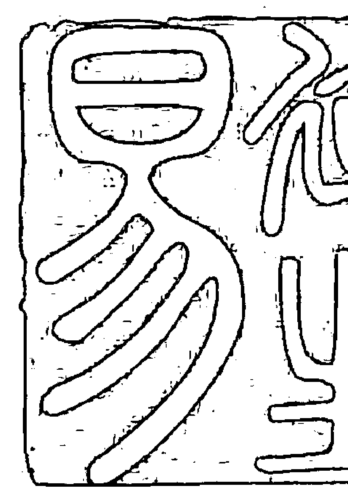

只有『文化创新乃至革命』，才是『科学随文化的发展而发展』的『科学发展观』『开放』『创新』思路及思想的根本的理性与实践的基础——也是我们『象数易学强中华，象数易学化天下』的最终目标，所以能达到的『有机辩证对应统一』哲理思想和认识与表述方法一贯得以支撑与实现的根基。

上架建议：国学 传统文化

ISBN 978-7-5117-3378-8

定价：190.00元（上下）