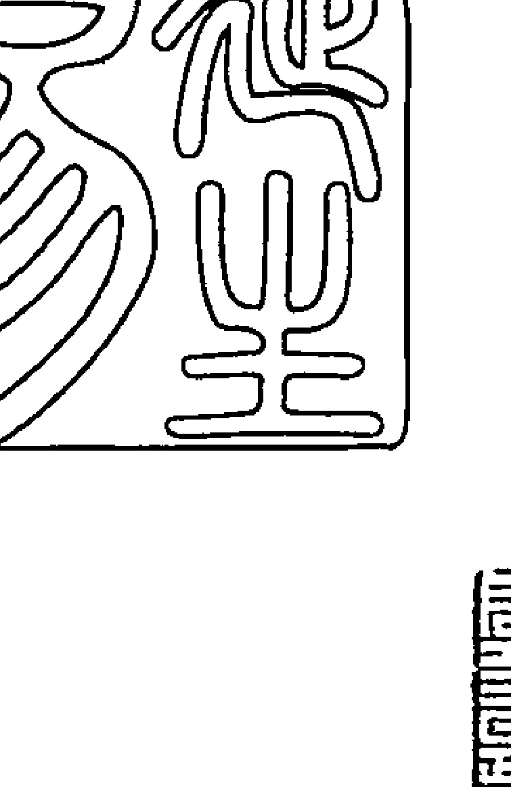
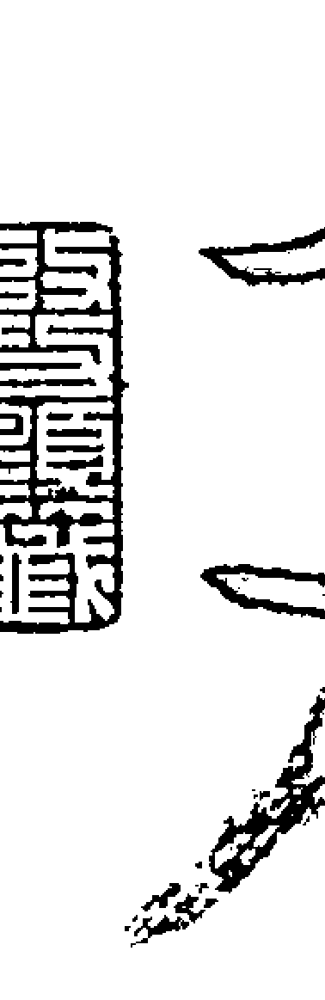
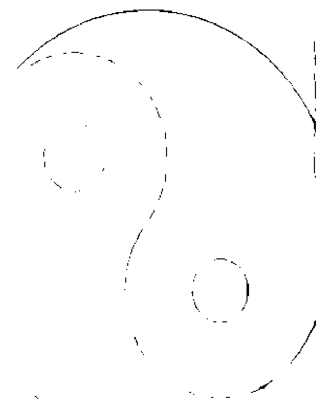
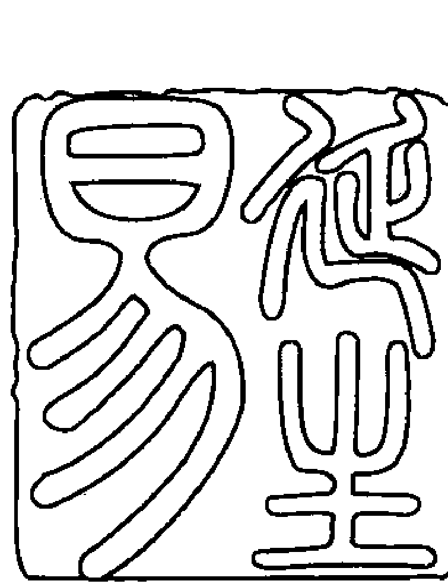
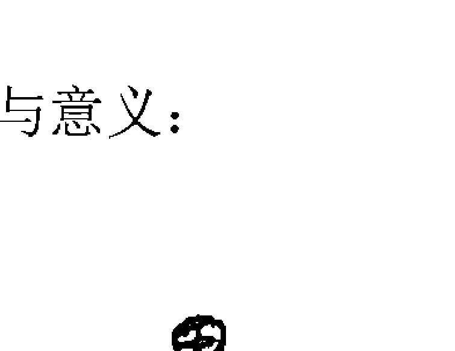
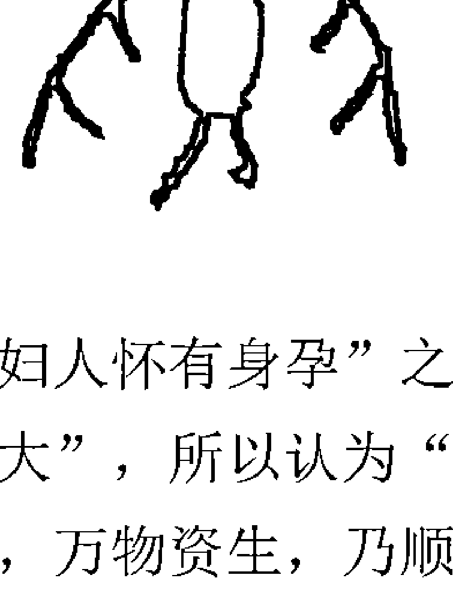
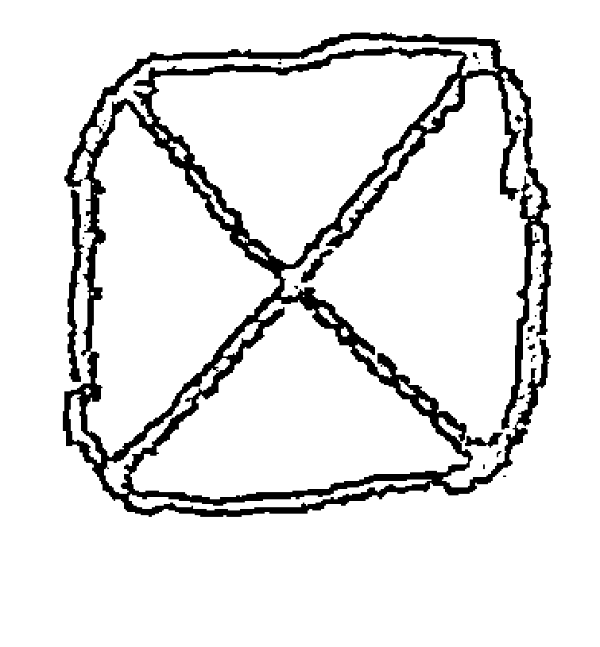
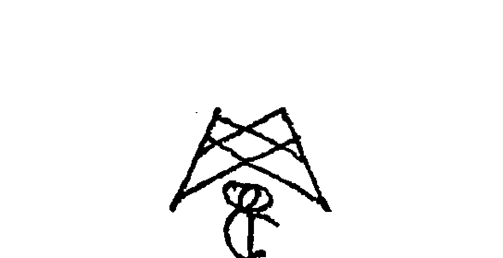

# 张延生象数易学系列丛书

## 易象及其延伸 ④

### 易象正

张延生 张震 著

中央编译出版社 Central Compilation & Translation Press

### 张延生

教授，工程师。男，1969年毕业于北京航空学院发动机工艺系工艺专业。曾任北京航空学院机械厂厂部技术室工程师、光明中医函授大学易学教研室主任、教授。曾兼任中国周易研究会副会长、中华名人协会理事、中国医学气功研究会理事、北京中医学院大学生手诊研究协会顾问等职。现任中华易学大会主席、中华周易协会会长兼学术委员会主任，并被数十家企事业单位聘为决策或指导顾问。作者易学特长：象数、易理、义理、易医、应用。

- ◎ 象数易学与应用（上下）
- ◎ 象数易学与逻辑
- ◎ 象数易学与逻辑（续）
- ○ 易象延：易象及其延伸（1-5）

出版人：葛海彦
出版统筹：贾宇琰
责任编辑：杜永明
封面设计：MXK DESIGN STUDIO Q:1765628429

### 易象延

【数、卦、象、场、信息、能量、结构、状态、本质】是【大一统】的系统模式。

【数即是卦；卦即是场、态；场、态即是能量与状态；状态即是象；象即是信息；信息即是数与卦；信息即是数与卦都有其各自相同或不同的本质】，该九者之间的关系，是相互联着的，是不可也不能分开的【统一场论】的关系——知道其中任何一项的信息、数据或结果，都能相应地推导出其他任何一项所对应的信息、数据与结果。

该书是当今入《易》时，易象认识与表述更全面的一本必须研读的基础知识读物。

### 易象及其延伸

#### 【易象延】四

传统文化往往是本民族或国家所固有的，也是最具凝聚力的。
优秀传统文化与高科技精华结合产生的文化，是更先进的。

中央编译出版社
Central Compilation & Translation Press

图书在版编目（CIP）数据

易象延：易象及其延伸 / 张延生， 张震著. -- 北京：中央编译出版社， 2016.10
ISBN 978-7-5117-3154-8
Ⅰ. ①易… Ⅱ. ①张… ②张… Ⅲ. ①《周易》－研究 Ⅳ. ① B221.5
中国版本图书馆 CIP 数据核字（2016） 第 247717 号

易象延：易象及其延伸
-------------------------------------------------------------------
出 版 人：葛海彦
出版统筹：贾宇琰
责任编辑：杜永明
责任印制：尹 珺
出版发行：中央编译出版社
地 址：北京西城区车公庄大街乙 5 号鸿儒大厦 B 座（100044）
电 话：（010） 52612345（总编室） （010） 52612342（编辑室）
（010） 52612316（发行部） （010） 52612317（网络销售）
（010） 52612346（馆配部） （010） 66509618（读者服务部）
传 真：（010） 66515838
经 销：全国新华书店
印 刷：北京溢漾印刷有限公司
开 本：710 毫米 × 1000 毫米 1/16
字 数：1810 千字
印 张：114.25
版 次：2016 年 10 月第 1 版第 1 次印刷
定 价：310.00 元（全 5 册）
-------------------------------------------------------------------
网 址：www.cctphome.com 邮 箱：cctp@cctphome.com
新浪微博：@ 中央编译出版社 微 信：中央编译出版社（ID：cctphome）
淘宝店铺：中央编译出版社直销店（http：//shop108367160.taobao.com）
-------------------------------------------------------------------
凡有印装质量问题，本社负责调换。电话：010-66509618

### 目录

#### 二、八卦之象
传统《周易》中的八卦象意
- 乾（☰）
- 坤（☷）
- 震（☳）
- 巽（☴）
- 坎（☵）
- 离（☲）
- 艮（☶）
- 兑（☱）

分类论述各卦的卦象意义
- 天文类
    - 日
    - 云雨
- 地理类
    - 西南
    - 东北
    - 西郊

### 易象及其延伸

### 【易象延】
- 南征
- 百里
- 野
- 南
- 大川
- 濡
- 年月日时类
    - 八月
    - 七日
    - 甲日
    - 巳日
- 人道类
    - 王
    - 侯
    - 大人
    - 丈人
    - 后夫
    - 女
    - 取女
    - 朋
    - 童
    - 君子
    - 匪人
    - 人
- 身体、行为类
    - 口
    - 心
    - 背
    - 身
    - 告
    - 号
    - 笑言
    - 言
    - 盥
    - 行
- 邑国类
    - 邑
- 宫室类
    - 家
    - 庭
- 宗庙类
    - 庙
- 祭祀类
    - 盥而不荐有孚颙若
    - 用大牲吉
    - 二簋可用享
- 酒食类
    - 匕鬯
    - 食
- 卜筮类
    - 初筮
    - 原筮
- 爵禄类
    - 建侯

### 目录
- 讼狱类
    - 讼
    - 狱
- 兵师类
    - 师
    - 戎
- 器用类
    - 鼎
    - 匕
    - 簋
    - 罌
    - 瓶
- 数目类
    - 再二
    - 三接
    - 七日
    - 八月
    - 百里
    - 三日
    - 二簋
- 禽兽类
    - 飞鸟
    - 马
    - 牛
    - 虎
    - 狐
- 鳞介类

### 目录

- 豚鱼 1210
- 杂类 1210
- 小大 1210
- 往来 1211
- 上下 1211
- 先后 1211
- 出入 1211
- 初终 1212

#### 分类论述“十翼”中的象的意义

- 天文类 1212
  - 天 1212
  - 雷 1212
  - 风 1212
  - 月 1213
  - 雨云 1213
  - 日、火、电 1213
  - 天文 1213
- 地理类 1213
  - 地 1213
  - 刚卤 1213
  - 山径路、小石 1213
  - 泉水、沟渎 1214
  - 泽 1214
  - 渊 1214
  - 方 1214
  - 四方 1214
- 年月日时类 1214

### 易象及其延伸【易象延】

- 时 1214
- 四时 1215
- 至日 1216
- 历 1216
- 向晦 1216
- 人道类 1216
  - 王 1216
  - 天位 1216
  - 帝位 1216
  - 尊位 1217
  - 先王 1217
  - 后 1217
  - 君 1217
  - 上 1217
  - 大人 1218
  - 君子 1218
  - 圣人 1218
  - 公 1219
  - 诸侯 1219
  - 严君、父母、父子、夫妇、兄弟、男女 1219
  - 二女 1219
  - 朋友 1219
  - 人文 1220
  - 圣贤 1220
  - 贤 1220
  - 君子 1221
  - 小人 1221
  - 民 1221
  - 众 1223
  - 人心 1223
  - 人 1224
  - 族 1224
  - 俗 1224
  - 商旅 1224
  - 百姓 1225

### 身体、行为类

- 首 1225
- 发 1225
- 颡 1225
- 耳 1225
- 目 1225
- 眼 1226
- 口 1226
- 舌 1226
- 手 1226
- 指 1226
- 心 1226
- 腹 1227
- 大腹 1227
- 股 1227
- 足 1227
- 自强不息 1227
- 厚德载物 1227
- 果行育德 1227
- 以懿文德 1227
- 多识前言往行以畜德 1227
- 非礼勿履 1227
- 自昭明德 1228
- 反身修德 1228
- 顺德积小以高大 1228
- 朋友讲习 1228
- 俭德辟难 1228
- 谨言语，节饮食 1228
- 独立不惧，遁世无闷 1228
- 言有物而行有恒 1228
- 惩忿窒欲 1228
- 迁善改过 1228
- 致命遂志 1229
- 恐惧修省 1229
- 思不出其位 1229

### 古人类

- 伏羲、神农、黄帝、尧舜 1229
- 汤武 1229
- 纣 1229
- 文王 1229
- 箕子 1230

### 邑国类

- 万国 1230
- 四国 1230
- 守国 1230
- 邦 1231
- 正邦 1231
- 关 1231
- 市 1231

### 宫室类

- 宫室、栋宇 1231
- 重门击柝 1231
- 门 1232
- 户 1232
- 阶 1232
- 门阙、阍寺 1232
- 宅 1232

### 宗庙类

- 立庙 1232
- 宗庙 1232
- 社稷 1233

### 神鬼类

- 上帝 1233
- 荐上帝 1233
- 鬼神 1233
- 神道 1233
- 神 1234
- 鬼 1234
- 祖考 1234

### 祭祀类

- 荐上帝配祖考 1234
- 孝享 1234
- 祭主 1235

### 谷果类

- 百谷 1235
- 百果 1235

### 酒食类

- 饮食 1235
- 饮食之道 1235
- 食 1236

### 卜筮类

- 大衍之数五十，其用四十有九……万有一千五百二十 1236
- 观变、玩占 1236
- 卜筮尚占 1236
- 开物成务……莫大蓍龟 1236
- 圣人作易，幽赞神明而生蓍 1237

### 佑命类

- 天休命 1237
- 天命 1237
- 凝 1238

### 告命类

- 凝命 1238
- 申命 1238
- 命诰 1238
- 命乱 1238

### 爵禄类

- 禄 1238
- 建万国亲诸侯 1239

### 车舆类

- 舆 1239
- 轮 1239

### 簪服类

- 衣裳 1239

### 讼狱类

- 刑罚 1239
- 明罚敕法 1240
- 明庶政，无敢折狱 1240
- 赦过宥罪 1240
- 折狱致刑 1240
- 明慎用刑，而不留狱 1240
- 议狱缓死 1240
- 正法 1241

### 兵师类

- 容民畜众 1241
- 除戎器，戒不虞 1241

### 金宝资财类

- 金 1241
- 玉 1241
- 财 1242
- 布 1242

### 器用类

- 罔罟 1242
- 耒耨 1242
- 舟楫 1243
- 柝 1243
- 杵臼 1243
- 弧矢 1243# 易象及其延伸

### 易象延

- 棺椁
- 枢机
- 釜
- 柄
- 均
- 绳
- 弓
- 甲胄、戈兵
- 数目类
  - 一天、二地、三天、四地、五天、六地、七天、八地、九天、十地
  - 四十五
  - 五十五
  - 五十
  - 四十九
  - 十三
  - 十七
  - 二十一
  - 二十五
  - 三十六
  - 三十二
  - 二十八
  - 二十四
  - 二百一十六
  - 百四十有四
  - 三百六十
  - 万有一千五百二十

### 目录

- 五色类
  - 大赤
  - 玄黄
  - 白
  - 赤
  - 黑
- 禽兽类
  - 良马、老马、瘠马、驳马
  - 马善鸣、鼻足、作足、的颅
  - 马美脊、亟心、下首、薄蹄
  - 牛、子母牛
  - 豕
  - 狗
  - 羊
  - 鸡
  - 雉
  - 黔喙
- 鳞介类
  - 龙
  - 蛇
  - 鳖、蟹、羸、蚌、龟
  - 鼠
  - 尺蠖
- 草木类
  - 木
  - 草木
  - 兰

### 易象及其延伸

### 易象延

# 传统中八卦其他某些卦意

- 乾（☰）卦
- 坤（☷）卦
- 震（☳）卦
- 巽（☴）卦
- 坎（☵）卦
- 离（☲）卦
- 艮（☶）卦
- 兑（☱）卦

#### 延伸的八卦象意

- （☰）乾 健也
- （☷）坤 顺也
- （☳）震 动也、速也
- （☴）巽 入也
- （☵）坎 险、陷也
- （☲）离 明也、丽也
- （☶）艮 止也、阻也
- （☱）兑 说也、悦也

### 三、“爻位”和“卦位”之象

- “爻”位之象
- “卦”位之象
- 小结：“爻位”和“卦位”之象的重要内容

#### 二、八卦之象

### 易象及其延伸

### 易象延

> > 《周易大传》中《系辞传》曰：“古者包羲氏王天下也。仰则观象于天，俯则观法于地，观鸟兽之纹与地之宜，近取诸身，远取诸物，于是始作八卦——以通神明之德，以类万物之情。”

> > 又曰：“神也者，妙万物而为言者也。”

> > 还曰：“阴阳不测之谓神。”

这里所说的“神”的意思，就是指我们所能了解和掌握的各种事物的本原的规律。当我们不了解或还没有掌握这些规律的时候，会感到大自然中的一切事物都是很神秘的。一旦我们掌握了这些规律，又能把它们分门别类地归纳、对照起来并进行运用的时候，这些规律性也就清楚地显示在我们的面前。同时，如果我们能触类旁通、举一反三地将这些规律运用到各个领域中，它又往往会出现不可思议的效应和结果。故《易》才曰：“利用出入，民咸用之，谓之神。”人们把那些不知其所以然的规律性的事物及其状态，统称作了“神”。

由于伏羲氏所处的原始时代，其文字、语言、生产力等方面还没有健全和发展起来，为了使人们能相对比较快、比较容易地掌握大自然中各种事物的规律，在大量地“研几”之后，按照易学中“易者易简，简则易从” 的宗旨，将复杂变化的自然中的一切事物，按不同的范畴、范围、方位、概念、“类化”“极化”“几化”“概化”等分门别类、分层次地分成了八个大的类型（八大类场）。在同一层次或不同的层次中，比较这八大类事物间的相互本质的定性关系，就能轻易地了解、掌握、运用各种事物的规律、组合结构、状态、形象及其量化、量化的变化等“象数易学”的“易理学”及所直接或间接相对应的“象数”规律和内涵了。

所以，伏羲“画”卦（也有认为是“创卦”“设卦”者）分为：
- 乾（☰）
- 兑（☱）
- 离（☲）
- 震（☳）
- 巽（☴）
- 坎（☵）
- 艮（☶）
- 坤（☷）

八大类型。俗称“八经卦”“八卦”“基本卦”等。

到了周朝的时候，生产力又有了很大的发展。周文王和周公等统治及管理者们，利用“易经” 的原理，在指导自己的社会、政治、经济、生产等实践中，收到了很大的效益。再加上，当时的语言、文字都有了比伏羲时期“象表意”“象数表意的无文字的时期，进步完善地得到了较迅速的发展，于是，在文王、周公等王朝领导者的推动下，使大卜们（筮人和卜筮者）利用了这些时代发展中的优势，将自己和前人们在实践中，按易学思想得以认证的卜筮事实，把相应的卦和爻等组编并撰系上了与卦、爻相对应的经文之辞——通过归纳、分类的组编性实践举例，以示于人，使当时或后世之学易、研易及“所乐而玩易者”对易学的哲理、思想、思维的方式、方法及其思路等，得以较全面地了解和掌握。这也就是《易经》（《周易》）一书产生的时代背景和原由。

然而，“书不尽言，言不尽意”。到了春秋末期的孔子时期，社会生产力进一步地得到了发展和提高。人们的生产、生活等实践的内容，更加地丰富和复杂。特别是到了战国末期、汉朝初期以后，为了使易学事业能得到更好的推动与发展，孔子及其儒生的后生们，在《易经》和他们对自己在实践中对易学思想在“形而上”理解的基础上，按“圣人立象以尽意，设卦以尽情伪，系辞焉以尽其言，变而通之以尽利，鼓之舞之以尽神”的宗旨，到了汉武帝（前140年）掌权推行“独尊儒术”政策之后，儒家学子们，又把《易经》（《周易》）附加以自身的亲身感受与体验，扩写成了《周易大传》一书。并将原《易经》分为上、下两个“经”的部分，并更加以《系辞上》《系辞下》《彖上》《彖下》《象上》《象下》《文言》《说卦》《序卦》《杂卦》这么十个传（俗称“十翼”），将《易经》提升到相应于儒家管理需要的“形而上”的某些世界观、方法论上来认识与理解了，而不仅是将《易经》按着占筮的传统方法来作为唯一的认识理解，至此，《易经》及其发挥来的《周易》为主干的易学“经学易”，就如虎添翼一样，飞向中华民族的各个领域，作为儒家统治管理思想的基本思想，流传于中国的靓史及后世，直至而今。

综合以上所说，这些所谓儒家自汉朝以来的易学相应的“四圣”时期（四个相对应的历史阶段），对易的理解与贡献各有不同，是不可作为同例而论的，所以，要区别其同异于下，以综示伏羲、文王、周公、孔子及汉儒之后时期，人们在易卦取象（以“三画卦”为主体）上的异同。这仅是些以往传统儒家易学史的“主流分期”与相应的取向。实际上，这种分期，并非是我国真实易学历史事实的准确表述与写照——它是儒家根据历史需要的一种编造性的结果。虽然如此，我们也可以从中看到古代不同的历史时期，人们对易卦卦象对应内涵及其具体针对性意义的一些端倪。

以下举例说明。

# 传统《周易》中的八卦象意

# 乾（☰）

伏羲卦。
乾（☰）卦。

文王卦、彖辞。
大川（大河、峡谷）。
水天需（☰）卦：
“卦辞”曰：“利涉大川”。
“彖辞”曰：“利涉大川，往有功也。”
天水讼（☰）卦：
“卦辞”曰：“不利涉大川”。
“彖辞”曰：“不利涉大川，入于渊也。”

以上两卦，都是以取乾（☰）“健”为“利”，坎（☵）“险”为“大川”之象。

“需”（☰）卦中，乾（☰）要向前克服坎（☵）险（坎卦之象有先低后高再低的状态，就如同高低错落的“大川”“大坎”一样），故有“（利涉）大川”之象。

“讼”（☰）卦中，乾（☰）“健”在前（上），而坎（☵）“险”在后（下），有“有利涉”之象。如果，乾回头往后（后退）去克制坎险（“大川”），则有“不利涉（大川）”之象。

天火同人（☰）卦：
“卦辞”曰：“利涉大川”。
“彖辞”曰：“同人于野，亨。利涉大川。”
此辞之意，取之于“上卦”乾“健”有“利涉”之象，并与二至四爻所组成的巽（☴）卦相“互”。巽（☴）有“一条条坎子”的“川”之象，则乾巽二者上下相“互”（合）（二与五爻阴阳“相应”），即姤（☴）卦有“利涉大川”之象。也可由初至三爻的离（☲）卦“旁通”成坎（☵）卦的“大川”之象而来。即乾离（即乾坎）上下“互”，也就是同人（☰）卦内含的讼（☵）卦有“利涉大川”之象。

# 山天大畜（☶☰）卦：

“卦辞”曰：“利涉大川”。
“象辞”曰：“利涉大川，应乎天也。”

以上辞意，取之于“下卦”乾“健”被“上卦”艮卦所“（阻）止”。如要克服此艮“土”的阻力，则乾“健”必须与三至五爻所组成的震（☳）卦之“木”相“互”（合），才能有“利涉”的动向（二与五爻阳阴“相应”）。也是因为三至上爻“互”“离类”的颐（☶☲）卦。颐“旁通”成“坎类”的大过（☴☲）卦。大过下“应”“互”初至三爻的乾（☰）卦。大过有“大川”之象，乾有“利涉”之象，故大过与乾上下“互”，即“大畜”（☶☰）卦有“利涉大川”之象。

# 周公象、爻。

# 龙。

# 乾为天（☰）卦：

上九爻曰：“亢龙有悔”。
“象辞”曰：“亢龙有悔，盈不可久也。”
此处之“龙”，是由四至上爻的乾（☰）卦的“龙”之象而来。

# 马。

# 山天大畜（☶☰）卦：

九三爻曰：“良马逐”。
此处的“马”，是由初至三爻的乾（☰）卦的“马”及其“良马”之象而来的。

# 舆（车之意）。

# 雷天大壮（☳☰）卦：

九四爻曰：“壮于大舆之輹”。
此处的“舆”，是由四至上爻的震（☳）卦之“车”象而来。也是由四爻变，四至上爻成坤（☷）卦的“舆”之象而来的。还是二至四爻的乾（☰）卦“旁通”成坤（☷）卦的“舆”象而来的，故乾“之”坤，有“金舆”“大舆”之象。

山天大畜（䷙）卦：

九二爻曰：“舆说輹”。
“象辞”曰：“舆说輹，中无尤也。”
此处的“舆”，是由初至三爻的乾（☰）卦“旁通”成坤（☷）卦的“舆”象而来的。也是由二爻变，则初至三爻的乾（☰）卦变成离（☲）卦的“骄舆”之象而来的。故乾“之”离，有“华丽的舆”“高档舆轿（轿车）”的“舆”之象。

车。
火天大有（䷍）卦：
九二爻曰：“大车以载”。
“象辞”曰：“大车以载，积中不败也。”
此处的“车”，是由初至三爻的乾（☰）卦“旁通”成坤（☷）卦的“舆”“车”之象而来的。也是由二爻变，则初至三爻的乾（☰）卦变成离（☲）卦的“轿车”之象而来的。故乾“之”离，有“华丽的车”“高档轿车”的“舆”之象。

孔子大象、文言、说卦。
天、寒、玉、君、首、木果、圆、冰、金、父、马（包括良马、老马、瘠马、驳马）、大赤。

坤（☷）
伏羲卦。
坤（䷁）卦。
文王卦、象。
康侯。
火地晋（䷢）卦：
> > “卦辞”曰：“康侯用锡马蕃庶”。
> “象辞”曰：“是以‘康侯用锡马蕃庶’昼日三接也。”

此处的“康侯”，是由初至三爻的坤（䷁）卦的“康”之象与“三爻”的“公侯”之象而来。

行师（行军作战）。
# 雷地豫（䷏）卦：
> > “卦辞”曰：“利建侯行师”。
> “象辞”曰：“而况‘利建侯行师’乎？”

此处的“行师”，是由初至三爻的坤（䷁）卦的“众”象而来。也是由四至上爻的震（☳）卦的“统帅”“统领”“征伐”“讨伐”“征战”“征讨”之象而来。故而全卦有“率众征战”的“行师”之象。

庙。
# 泽地萃（䷬）卦：
> > “卦辞”曰：“王假有庙”。
> “象辞”曰：“王假有庙，致孝享也。”

此处的“庙”，是由初至三爻的坤（䷁）卦的“土、地”象与三至五爻组成的巽（☴）卦之“木”象相“互”，有“木在土上”之象而来。也是由四至上爻的兑（☱）卦的“旁通”卦艮（☶）卦的“庙”象而来。

马。
# 坤为地（䷁）卦：
> > “卦辞”曰：“利牝马之贞”。
> “象辞”曰：“牝马地类。”

此处的“马”，是由坤（䷁）卦的“牝马”之象而来的。
# 火地晋（䷢）卦：
> > “卦辞”曰：“用锡马”。
> “象辞”也曰：“用锡马。”

此处的“马”，是由初至三爻的坤（䷁）卦的“牝马”之“马”象而来的。

大牲（大的牲畜）。
# 泽地萃（䷬）卦：
“卦辞”曰：“用大牲吉”。
“象辞”曰：“用大牲吉，利有攸往。”
此处的“大牲”，是由初至三爻的坤（䷁）卦的“大牲”（大的牲畜）之象而来的。

周公象、爻。
王母（祖母）。
火地晋（䷢）卦：
六二爻曰：“于其王母”。
此处的“王母”，是由初至三爻的坤（䷁）卦的“祖母”之象而来。

师（众兵、部属众多）。
地天泰（䷊）卦：
上六爻曰：“勿用师”。
此处的“师”，是由四至上爻的坤（䷁）卦的“师（众）”之象而来。
地山谦（䷎）卦：
上六爻曰：“利用行师征邑国”。
“象辞”曰：“可用行师”。
此处的“师”，是由四至上爻的坤（䷁）卦的“（众）师”之象而来。
地雷复（䷗）卦：
上六爻曰：“用行师”。
此处的“师”，是由四至上爻的坤（䷁）卦的“（众）师”之象而来。

邑国（国家、小国都邑）。
地山谦（䷎）卦：
上六爻曰：“利用行师征邑国”。
此处的“邑国”，是由四至上爻的坤（䷁）卦的“邑国”之象而来。

城隍（干涸的城壕）。
地天泰（䷊）卦：
上六爻曰：“城复于隍”。
“象辞”曰：“城复于隍，其命乱也。”
此处的“城隍”，是由四至上爻的坤（☷）卦的“城隍”之象而来。

龙。
坤为地（☷）卦：
上六爻曰：“龙战于野”。
“象辞”曰：“为其嫌于无阳也，故称龙焉。”
此处的“龙”，是由四至上爻的坤（☷）卦的“旁通”卦乾（☰）卦的“龙”之象而来。

腹（腹部、肚子）。
地火明夷（䷣）卦：
六四爻曰：“入于左腹”。
“象辞”曰：“入于左腹，获心意也。”
此处的“腹”，是由四至上爻的坤（☷）卦的“腹”“大腹”之象而来。

征伐。
地山谦（䷎）卦：
上六爻曰：“利用行师征邑国”。
“象辞”曰：“可用行师征邑国也。”
此处的“征伐”，是由四至上爻的坤（☷）卦的“（众）师”之象而来。也是由三至五爻的震（☳）卦的“征伐”之象而来的。

邑（百姓、居住地）。
地天泰（䷊）卦：
上六爻曰：“自邑告命”。
此处的“邑”，是由四至上爻的坤（☷）卦的“邑”之象而来。
水地比（䷇）卦：
九五爻曰：“邑人不诫”。
“象辞”曰：“邑人不诫，上使中也。”
这里的“邑人”是由与五爻“相应”的初至三爻的“下卦”坤（☷）卦的“邑”之象而来。
地风升（䷭）卦：
九三爻曰：“升虚邑”。
“象辞”曰：“升虚邑，无所疑也。”
这里的“虚邑”之“邑”，是由四至上爻的坤（☷）卦的“虚”与“邑”之象而来。

国（国家）。
风雷益（䷩）卦：
六四爻曰：“利用为依迁国”。
这里的“国”，是由中间二至四爻的坤（☷）卦的“国”之象而来。

舆（车）。
山地剥（䷖）卦：
上九爻曰：“君子得舆”。
“象辞”曰：“君子得舆，民所载也。”
这里的“舆”，是由初至三爻的“下卦”坤（☷）卦的“舆”之象而来的。

玄黄（青黄色）。
坤为地（䷁）卦：
上六爻曰：“其血玄黄”。
此处的“玄黄”，是由四至上爻的坤（☷）卦的“黄”之象而来。

孔子大象、文言、说卦。
地、臣、母、妻、腹、众、舆、釜、柄、牛、文、布、吝啬、均、地黑。

震（☳）
伏羲卦。
震（☳）卦。
“颐”（䷚）卦“口也”。是震（☳）上“互”艮（☶）象，以全卦犹如“口”之象而得。

文王卦、象。
雷。
震为雷（䷲）卦：
> “卦辞”曰：“震惊百里”。
> “象辞”曰：“震惊百里，惊远而惧迩也。”

这里的“雷”，是由初至三爻与四至上爻的震（䷲）卦的“雷”之象而来。“震惊百里”，是我们所知道的“雷”的传输特点。

七日（七天）。
地雷复（䷗）卦：
> “卦辞”曰：“反复其道，七日来复。”
> “象辞”曰：“反复其道，七日来复，天行也。”

因为“复”（䷗）卦从其全卦来讲，按“连半象”压缩规律，可以看成是一个三个爻的震（䷲）卦。震按“纳甲法”有“纳庚日”的“第七日”的“七日”之象而来的。

大川（大河、峡谷）。
风雷益（䷩）卦：
> “卦辞”曰：“利涉大川。
> “象辞”曰：“利涉大川，木道乃行。”

此处的“大川”，是由震（䷲）巽（䷸）两卦相“互”所“旁通”成的“坎类”的泽风大过（䷛）卦的“大坎类”的“大川”之象而来的。

侯（诸侯）。
水雷屯（䷂）卦：
> “卦辞”曰：“利建侯”。
> “象辞”曰：“宜建侯而不宁。”

此处之“侯”，是由初至三爻的震（䷲）卦的“侯”之象而来的。也是由于“震（䷲）动于坎（䷜）险之中”。利用初至四爻“互”颐（䷚）中，初至三爻的震（䷲）卦及带领二至四爻所成之坤（䷁）卦的“群众而行”才可。“众动”只有“诸侯”（王侯）率领才行，故震（䷲）有“侯”之象。

雷地豫（䷏）卦：# 易象及其延伸

### 【易象延】

> “卦辞”曰：“利建侯行师”。
> “象辞”曰：“而况利建侯行师乎？”

此处之“侯”，是由初至三爻的震（☳）卦的“侯”之象而来的。也是由于初至三爻的震（☳）卦有“动”之象，且震下“互”初至三爻的“下卦”坤（☷）卦，坤有“众”“顺”之象。二者“互”有“众顺从而动”之象，则有“上震带领坤众而动”之象，故震（☳）有“侯”之象。

## 山雷颐（䷚）卦：

> “卦辞”曰：“自求口食”。
> “象辞”曰：“自求口食，观其自养也。”

此处之“口”，是由初至三爻的震（☳）卦的“开合而动”之象而来的。也是因为“颐”（䷚）卦上下反覆，都是以震（☳）艮（☶）相“互”而成。而震（☳）动是“开合的基础”。从全卦结构看，应是“张开的大口”之象（上下“阳爻”为上下口唇，中间的“阴爻”为空而无物或是上下牙床上对应排列的一颗颗牙齿）。

周公象、爻。
七日（七天）。
震为雷（䷲）卦：
六二爻曰：“七日得”。
这里的“七日”，是由震（☳）卦按“纳甲法”，有“纳庚日”的“第七日”的“七日”之象而来的。也是因为二至四爻的艮（☶）卦有“先天数”的“七”之象而来。

九陵（高峻之陵）。
震为雷（䷲）卦：
六二爻曰：“跻于九陵”。
此处的“九陵”，是由于初至三爻震（☳）卦的“高峻之陵”之象而来的。

侯（诸侯）。
水雷屯（䷂）卦：
初九爻曰：“利建侯”。
此处的“侯”，是由于初至三爻震（☳）卦的“侯”“诸侯”之象而来的。

## 长子。

地水师（䷆）卦：
六五爻曰：“长子帅师”。
“象辞”曰：“长子帅师，以中行也。”
此处的“长子”，是由与其相应的“二爻”所在的二至四爻的震（☳）卦的“长子”之象而来的。也是因为这里的“长子”，是指与四至上爻坤（☷）“互体”的二至四爻所组成的震（☳）卦之象而言的。

## 马。

水雷屯（䷂）卦：
六二爻曰：“乘马班如”。
这里的“马”，是由初至三爻的震（☳）卦的“马”之象而来。
六四爻曰：“乘马班如”。
这里的“马”，是由初至四爻“互体”中三至五爻艮（☶）卦的“覆”卦震（☳）卦的“马”之象而来。也是由四至上爻的坎（☵）卦之“马”象而来。
上六爻曰：“乘马班如”。
这里的“马”，是由四至上爻的坎（☵）卦的“马”象而来的。也是由三至上爻“互体”中三至五爻艮（☶）卦的“覆”卦震（☳）卦的“马”之象而来。又是由上与三爻“相应”的“二爻”所在的初至三爻的震（☳）卦的“马”之象而来的。

风泽中孚（䷼）卦：
六四爻曰：“马匹亡”。
“象辞”曰：“马匹亡，绝类上也。”
这里的“马”，是指二至五爻“互体”中，二至四爻组成的震（☳）卦的“马”之象而来的。

孔子大象、文言、说卦。

### 易象及其延伸

### 【易象延】

雷、大途、长子、足、龙、马（善鸣、異足、作足、的顙之马）、苍筤竹、萑苇、稼反生、玄黄、尃（敷）、健、决躁、蕃鮮。

## 巽（☴）

伏羲卦。

巽（☴）卦。

“井”（䷇）卦是巽（☴）过坎（☵）之象；

“鼎”（䷱）卦是巽（☴）过离（☲）之象。

文王卦、象。

云。

风天小畜（䷈）卦：

> “卦辞”曰：“密云不雨”。

> “象辞”曰：“密云不雨，尚往也。”

这里的“云”，是由四至上爻的巽（☴）卦的“云”象而来的。也是因为四至上爻的巽（☴）卦下的一“阴爻”（有“轻、柔、浮”之象）在初至三爻的乾（☰）“天”之上而来的。“尚往也”之“往”，就指的是四至上爻的“上（外）卦”巽（☴）卦（有“往”象）。

大川。

山风蛊（䷑）卦：

> “卦辞”曰：“利涉大川”。

> “象辞”曰：“利涉大川，往有事也。”

这里的“大川”，是由初至三爻的巽（☴）卦所含坎（☵）卦“半象”的下两爻与三至五爻组成震（☳）卦所含坎（☵）卦“半象”的上两爻组成的（由初至四爻组成的“互体”）“大坎”（䷧）之象中得来。即由初至四爻的“坎类”的大过（䷛）卦的“大川”之象而来的。

风泽中孚（䷼）卦：

> “卦辞”曰：“利涉大川”。

> “象辞”曰：“利涉大川，乘木舟虚也。”

此处的“大川”，是由四至上爻的巽（☴）卦及其与二至五爻“互体”颐（䷚）卦的“旁通”卦含有巽（☴）卦的大过（䷛）卦的“大川”之象而得来的。

女（女人之女）。
风火家人（䷤）卦：
“卦辞”曰：“利女贞”。
“象辞”曰：“女正位乎内。”
此处的“女”，是由四至上爻的巽（☴）卦的“妻”“妇”的“女”之象而来。

天风姤（䷫）卦：
“卦辞”曰：“女壮。勿用取女”。
“象辞”曰：“勿用取女，不可与长也。”
此处的“女”，是由初至三爻的巽（☴）卦的“妻”“妇”的“女”之象而来。

风山渐（䷴）卦：
“卦辞”曰：“女妇吉”。
“象辞”曰：“女妇吉也，进得位。”
此处的“女”，是由四至上爻的巽（☴）卦的“妻”“妇”的“女”之象而来。

栋（栋梁）。
泽风大过（䷛）卦：
“卦辞”曰：“栋桡”。
“象辞”曰：“栋桡，本末弱也。”
此处的“栋”，是由初至三爻的巽（☴）卦的“栋木”之象而来。也是由初至三爻的巽（☴）卦与四至上爻的兑（☱）卦相“互”，由“大过”（䷛）卦整体“圆直且长的木”之“栋” 象而来。

豚鱼（小猪、小鱼、有毒的鱼）。
风泽中孚（䷼）卦：
“卦辞”曰：“豚鱼吉”。
“象辞”曰：“豚鱼吉，信乃豚鱼也。”
此处的“豚鱼”，是由四至上爻的巽（☴）卦的“飞”与“鱼”之象而来。也是因为巽（☴）兑（☱）两卦都含有坎（☵）卦的“半象”之象，坎有“鱼”象，故其也有“鱼” 象。兑（☱）巽（☴）又“互”为“反象”。也有人是只取兑（☱）卦的“阴物”之象为“（小）鱼”之象的。

周公象、爻。
月（月亮）、雨（下雨之雨）。
风天小畜（䷈）卦：
上六爻曰：“既雨既处……月几望”。
“象辞”曰：“既雨既处，尚德载。”
此处的“月”“雨”，是由四至上爻的巽（☴）卦是坎（☵）卦的“半象”之象而来。即坎有“月”“雨”之象，故巽也有“月”“雨”之象。也是由四至上爻巽（☴）下断（缺）”的“下弦月”之象而来的。

妇（妇女）。
风天小畜（䷈）卦：
上六爻曰：“妇贞，厉”。
此处的“妇”，是由四至上爻的巽（☴）卦的“妇人”之“妇”象而来的。

栋（栋梁）。
泽风大过（䷛）卦：
九三爻曰：“栋桡”。
“象辞”曰：“栋桡之凶，不可以有辅也。”
此处的“栋”，是由初至三爻的巽（☴）卦的“木栋”“横”“直”之象而来。
九四爻曰：“栋隆”。
“象辞”曰：“栋隆之吉，不挠乎下也。”
此处的“栋”，是由四与初“相应”的初爻所在的初至三爻的巽（☴）卦的“木栋”“横”“直”之象而来。

资（钱、财）。
火山旅（䷷）卦：
六二爻曰：“怀其资”。
这里的“资”，是由“二爻”上“应”的“五爻”所在的四至上爻离（䷝）卦的“资”之象而来的。也是由二至四爻的巽（䷸）卦的“资”“资斧”“串朋”之象而来的。

九四爻曰：“得其资斧”。
“象辞”曰：“得其资斧，心未快也。”
这里的“资”，是由二至四爻的巽（䷸）卦的“资”“资斧”之象而来的。也是由四至上爻离（䷝）卦的“资”“信物”之象而来的。

木（草木之木）。
风山渐（䷴）卦：
六四爻曰：“鸿渐于木”。
此处的“木”，是由四至上爻的巽（䷸）卦的“草木”之“木”象而来。

号（号令）。
风水涣（䷺）卦：
九五爻曰：“其大号”。
此处的“号”，是由四至上爻的巽（䷸）卦的“号”“号命”之象而来。

臀（屁股）。
天风姤（䷫）卦：
九三爻曰：“臀无肤”。
此处的“臀”，是由初至三爻的巽（䷸）卦的“股”对应周围的“臀”之象而来。

床。
巽为风（䷸）卦：
九二爻曰：“巽在床下”。
此处的“床”，是由初至三爻巽（䷸）卦的“床”之象而来的。也是由与“二爻”相应的“五爻”所在的四至上爻的巽（䷸）卦的“床”之象而来。

上九爻曰：“巽在床下”。
“象辞”曰：“巽在床下，上穷也。”
此处的“床”，是由四至上爻的巽（☴）卦的“床”之象而来。也是由与上爻“敌应”的“二爻”所在的初至三爻的巽（☴）卦的“床”之象而来的。

翰音（鸡）。
风泽中孚（䷼）卦：
上九爻曰：“翰音登于天”。
“象辞”曰：“翰音登于天，何可长也。”
此处的“翰音”，是由四至上爻的巽（☴）卦的“鸡”之象而来。

杨（杨树）。
泽风大过（䷛）卦：
九二爻曰：“枯杨生稊”。
这里的“杨”，是由初至三爻的巽（☴）卦的“杨树”的“杨”之象而来。
九五爻曰：“枯杨生华”。
“象辞”曰：“枯杨生华，何可久也？”
这里的“杨”，是由四至上爻的兑（☱）卦的“反卦”巽（☴）卦的“杨树”之象而来。也是由与“五爻”相“应”的“二爻”所在的初至三爻的巽（☴）卦的“杨树”之象而来的。

## 孔子大象、文言、说卦。

- 风、长女、寡发、广颡、白眼、股、鸡、工、市、利、木、白、臭、长、高、绳直、进退、不果、躁卦、近利市三倍。

## 坎（☵）

- 伏羲卦。
坎（䷜）卦。
文王卦、彖。

大川。

## 天水讼（䷅）卦：

> “卦辞”曰：“不利涉大川”。
> “象辞”曰：“不利涉大川，入于渊也。”

这里的“大川”，是由初至三爻坎（☵）卦的“大川”之象而来。

## 风水涣（䷺）卦：

> “卦辞”曰：“利涉大川”。
> “象辞”曰：“利涉大川，乘木有功也。”

这里的“大川”，是由巽（☴）“木”在坎（☵）“水”之上的卦象而来。也是由初至三爻的坎（☵）卦的“大川”之象而来。同时还是由四至上爻的巽（☴）卦的“川”之象而来的。

濡（沾湿、浸湿）。

## 火水未济（䷿）卦：

> “卦辞”曰：“濡其尾”。
> “象辞”曰：“濡其尾，无攸利。”

此处的“濡”，是由初至三爻坎（☵）卦的“淋湿”“浸湿”“弄湿”的“濡”之象而来。

心。

## 坎为水（䷜）卦：

> “卦辞”曰：“有孚维心，亨”。
> “象辞”曰：“维心，亨，乃以刚中也。”

此处的“心”，是由初至三爻与四至上爻坎（☵）卦的“心”之象而来。

庙（庙宇）。

## 风水涣（䷺）卦：

> “卦辞”曰：“王假有庙”。
> “象辞”曰：“王假有庙，王乃在中也。”

此处的“庙”，是由三至五爻的艮（☶）卦的“宗庙”之“庙”象而来的。也是由于取象于在“下卦”初至三爻坎（☵）卦的“幽阴”之象延伸而来的。同时也是由四至上爻的巽（☴）卦的“灵气”内涵延伸的“庙”之象而来。

狐（狐狸）。
火水未济（䷿）卦：
“卦辞”曰：“小狐汔济”。
“象辞”曰：“小狐汔济，未出中也。”
此处的“狐”，是由初至三爻坎（☵）卦的“狐狸”之象而来的。

周公象、爻。
雨。
火泽睽（䷥）卦：
上九爻曰：“往遇雨则吉”。
《象》辞曰：“遇雨之吉，群疑亡也。”
这里的“雨”，是由其下三至五爻的坎（☵）卦的“雨”之象而来。
也有人认为是由初至三爻兑（☱）卦的“小雨”之象而来。
濡（润泽、柔润、沾湿、弄湿）。
山火贲（䷕）卦：
九三爻曰：“贲如濡如”。
这里的“濡”，是由二至四爻的坎（☵）卦的“濡”之象而来。
水火既济（䷾）卦：
初九爻曰：“濡其尾”。
上六爻曰：“濡其首”。
这里的“濡”，分别是由二到四爻和四到上爻的坎（☵）卦的“濡”之象而来。
火水未济（䷿）卦：
初六爻曰：“濡其尾”。
“象辞”曰：“濡其尾，无攸利，不续终也。”
此处的“濡”，是由初至三爻坎（☵）卦的“濡”之象而来。
上九爻曰：“濡其首”。
“象辞”曰：“饮酒濡首，亦不知节也。”
此处的“濡”，是由三至五爻坎（☵）卦的“濡”“淋”之象而来。

大川。

## 地山谦（䷎）卦：

初六爻曰：“君子用涉大川”。

这里的“大川”，是由初至四爻“互体”解（䷧）卦中二至四爻坎（☵）卦的“大川”之象而来。也有人认为是由艮（䷳）卦“山川”的“反卦”震（䷲）卦的内涵“跨”“越”之象而来。

## 火水未济（䷿）卦：

六三爻曰：“利涉大川”。

此处的“大川”，是由初至三爻坎（☵）卦的“大川”之象而来。

泥（泥泞之泥）。

## 水天需（䷄）卦：

九三爻曰：“需于泥”。

“象辞”曰：“需于泥，灾在外也。”

此处的“泥”，是由与三爻“相应”的四至上爻的坎（☵）卦的“泥”“泥水”“滩”之象而来。

## 震为雷（䷲）卦：

九四爻曰：“震遂泥”。

“象辞”曰：“震遂泥，未光也。”

此处的“泥”，是由三至五爻坎（☵）卦的“泥”“泥水”“滩”之象而来。

豕（猪）。

## 火泽睽（䷥）卦：

上九爻曰：“见豕负途”。

这里的“豕”，是由三至上爻“互体”未济（䷿）卦中的三至五爻的“下卦”坎（☵）卦的“猪”之象而来。也是二至四爻的兑（䷹）卦的“穴”“洞”之象而来的。

穴（住穴、巢穴）。

## 水天需（䷄）卦：

六四爻曰：“出自穴”。

上六爻曰：“入于穴”。

此处的“穴”，是由四至上爻的坎（☵）卦的“陷穴”“穴”“潭”“泉”之象而来。

窞（深坑）。

坎为水（䷜）卦：

> 初六爻曰：“入于坎窞”。

> 六三爻曰：“入于坎窞”。

这里的“窞”，是由初至三爻的坎（☵）卦的“坑”“窞”之象而来。

幽谷（监狱）。

泽水困（䷮）卦：

> 初六爻曰：“入于幽谷”。

> “象辞”曰：“入于幽谷，幽不明也。”

这里的“幽谷”，是由初至三爻的坎（☵）卦的“监狱”“黑”“暗”的“幽谷”之象而来。

石。

泽水困（䷮）卦：

> 六三爻曰：“困于石”。

此处的“石”，是由初至三爻的坎（☵）卦的“石”（字）之象而来。也是由与“三爻”相应的四至上爻的兑（☱）卦的“旁通”卦艮（☶）卦的“石”之象而来的。

弟子（弟弟、学生）。

地水师（䷆）卦：

> 六五爻曰：“长子帅师，弟子舆尸”。

> “象辞”曰：“弟子舆尸，使不当也。”

> 六三爻曰：“或舆尸”。

此处的“弟子”，是由初至三爻的“下卦”坎（☵）卦的“中男”“二弟”（次子）之象而来的。

寇（贼寇、匪寇、土匪）。

山水蒙（䷃）卦：

> 上九爻曰：“不利为寇，利御寇”。

> “象辞”曰：“利用御寇，上下顺也。”

这里的“寇”，是由整个卦的下体（“下卦”）初至三爻的坎（☵）卦的“寇”之象而来。

山火贲（䷕）卦：

六四爻曰：“匪寇，婚媾”。

> “象辞”曰：“匪寇婚媾，终无尤也。”

这里的“寇”，是由初至四爻“互体”既济（䷾）卦中的二至四爻的“上卦”坎（☵）卦的“匪寇”之象而来。

水天需（䷄）卦：

九三爻曰：“致寇至”。

> “象辞”曰：“自我致寇，敬慎不败也。”

这里的“寇”，是由三至上爻“互体”既济（䷾）卦中的四至上爻的“上卦”坎（☵）卦的“寇”之象而来。

雷水解（䷧）卦：

六三爻曰：“负且乘，致寇至”。

这里的“寇”，是由初至三爻“下卦”（有“来”“至”象）的坎（☵）卦的“寇”之象而来。

血（血液之血）。

水天需（䷄）卦：

六四爻曰：“需于血”。

> “象辞”曰：“需于血，顺以听也。”

这里的“血”，是由四至上爻的坎（☵）卦的“血卦”的“血”之象而来。

酒（酒水之酒）。

水天需（䷄）卦：

九五爻曰：“需于酒食”。

> “象辞”曰：“酒食贞吉，以中正也。”

这里的“酒”，是由四至上爻的坎（☵）卦的“酒”之象而来。

泽水困（䷮）卦：

九二爻曰：“困于酒食”。

> “象辞”曰：“困于酒食，中有庆也。”

这里的“酒”，是由初至三爻的坎（☵）卦的“酒”之象而来。

## 坎为水（䷜）卦：

六四爻曰：“樽酒”。

> “象辞”曰：“樽酒簋贰，刚柔际也。”

这里的“酒”，是由四至上爻的坎（☵）卦的“酒”之象而来。

## 火水未济（䷿）卦：

上九爻曰：“有孚于饮酒”。

> “象辞”曰：“饮酒濡首，亦不知节也。”

这里的“酒”，是由上九爻下面的三至五爻的坎（☵）卦的“酒”“浇”之象而来。

车（车辆之车）。

## 山火贲（䷕）卦：

初九爻曰：“舍车而徒”。

> “象辞”曰：“舍车而徒，义弗乘也。”

这里的“车”，是由初至四爻“互体”既济（䷾）卦中的二至四爻的“上卦”坎（☵）卦的“车”之象而来。

## 泽水困（䷮）卦：

九四爻曰：“困于金车”。

此处的“车”，是由三至上爻的“互”“坎类”的大过（䷛）卦的“车”之象而来的。也是由初至三爻的坎（☵）卦的“车”之象而来。

舆（车）。

## 火泽睽（䷥）卦：

六三爻曰：“见舆曳”。

> “象辞”曰：“见舆曳，位不当也。”

这里的“舆”，是由三至五爻的坎（☵）卦的“舆”之象而来。

轮（车轮）。

## 水火既济（䷾）卦：

初九爻曰：“曳其轮”。

> “象辞”曰：“曳其轮，义无咎也。”

这里的“轮”，是由二至四爻的坎（☵）卦的“轮”“旋”“转”之象而来。

## 火水未济（䷿）卦：

> 九二爻曰：“曳其轮，贞吉”。

这里的“轮”，是由初至三爻的坎（☵）卦的“轮”“旋转”之象而来。

## 弧矢（弓箭）。

## 火泽睽（䷥）卦：

> 上九爻曰：“先张之弧，后说之弧”。

这里的“弧矢”，是由上爻下“互体”未济（䷿）卦中的三至五爻的坎（☵）卦的“弓”的“弧矢”之象而来。也是由四至上爻的离（☲）卦的“弓箭”之象而来。

## 刑（刑罚、判刑、刑具）、桎梏（刑具）。

## 山水蒙（䷃）卦：

> 初六爻曰：“利用刑人，用说桎梏”。

> “象辞”曰：“利用刑人，以正法也。”

这里的“刑”“桎梏”，是由初至三爻的坎（☵）卦的“刑”“桎梏”“罚”“罪”之象而来。

## 徽繹（黑绳索。三股为“徽”，两股为繹）。

## 坎为水（䷜）卦：

> 上六爻曰：“系用徽繹”。

这里的“徽繹”，是由四至上爻的坎（☵）卦的“黑”“黑绳索”的“徽繹”之象而来。

## 马（马匹）。

## 水雷屯（䷂）卦：

> 六二爻曰：“乘马班如”。

这里的“马”，是由初至三爻的震（☳）卦的“马”之象而来。也是二与五爻“阴阳相应”的“五爻”所在的四至上爻的坎（☵）卦的“中马”“黑马”“壮马”之“马”象而来的。

> 六四爻曰：“乘马班如”。

这里的“马”，是由四至上爻的“上卦”坎（☵）卦的“马”之象而来。

上六爻曰：“乘马班如”。
这里的“马”，是由四至上爻的“上卦”坎（☵）卦的“马”之象而来。

山火贲（䷕）卦：
六四爻曰：“白马翰如”。
这里的“马”，是由二至四爻的坎（☵）卦的“马”之象而来。

地火明夷（䷣）卦：
六二爻曰：“用拯马壮”。
这里的“马”，是由二至四爻的坎（☵）卦的“马”之象而来的。

风水涣（䷺）卦：
初六爻曰：“用拯马壮”。
这里的“马”，是由初至三爻的坎（☵）卦的“马”之象而来。

火泽睽（䷥）卦：
初九爻曰：“丧马勿逐”。
这里的“马”，是由初至五爻“互体”节（䷻）卦中的三至五爻的“上卦”坎（☵）卦的“马”之象而来。

狐（狐狸）。
雷水解（䷧）卦：
九二爻曰：“田获三狐”。
此处之“狐”，是由初至三爻的坎（☵）卦的“狐”之象而来。

豕（猪）。
火泽睽（䷥）卦：
上九爻曰：“见豕负涂”。
此处之“豕”，是由三至上爻“互体”未济（䷿）卦中的三至五爻的“下卦”坎（☵）卦的“猪”“豕”之象而来。

株木（杖刑之杖）。
泽水困（䷮）卦：
初六爻曰：“臀困于株木”。

此处的“株木”，是由初至三爻坎（☵）卦“下爻” [巽（☴）卦的下两爻] 的“株木”之象而来。

蒺藜（草本植物的一种）。

泽水困（☱）卦：
六三爻曰：“据于蒺藜”。
“象辞”曰：“据于蒺藜，乘刚也。”
此处的“蒺藜”，是由初至三爻坎（☵）卦的（上爻）“蒺藜”之象而来。

丛棘（牢狱）。

坎为水（☵）卦：
上六爻曰：“寘于丛棘”。
此处的“丛棘”，是由四至上爻的“上卦”坎（☵）卦的“牢狱”“丛棘”之象而来。

孔子大象、文言、说卦。
月、雨、云、泉、水、沟渎、中男、加忧、心病、耳痛、血卦、盗、弓、轮、舆、多眚、马、美脊、亟心、下首、薄蹄、曳、豕、木坚多心、赤、隐伏、矫揉、通。

## 离（☲）

伏羲卦。
离（☲）卦。

文王卦、象。
日。
火地晋（☲）卦：
“卦辞”曰：“昼日三接。”
“象辞”曰：“是以康侯用锡马蕃庶，昼日三接也。”
此处的“日”，是由四至上爻的离（☲）卦的“日”“每天”之象而来。

### 易象及其延伸 【易象延】

泽火革（䷞）卦：

> “卦辞”曰：“巳日乃孚”（有人认为是“己日乃孚”）。

> “彖辞”曰：“巳日乃孚，革而信之”（或“己日乃孚，革而信之”）。

此处的“日”，是由初至三爻的离（䷝）卦的“日（子）”之象而来。

雷火丰（䷶）卦：

> “卦辞”曰：“勿攸，宜日中。”

> “彖辞”曰：“勿攸，宜日中，宜照天下也。日中则昃，月盈则食。”

此处的“日”，是由初至三爻的离（䷝）卦的“日”“太阳”“阳光”“昼”之象而来。

明（明亮之明）。

地火明夷（䷣）卦：

> “卦辞”曰：“明夷，利艰贞”。

> “彖辞”曰：“明入地中，明夷。内文明而外柔顺。”

此处的“明”，是由初至三爻的离（䷝）卦的“明”“光明”“阳光”“白天”之象而来。

光（光明之光）。

水天需（䷄）卦：

> “卦辞”曰：“有孚，光。亨”。

> “彖辞”曰：“有孚，光。亨，贞吉。位乎天位，以中正也。”

此处的“光”，是由三至五爻的离（䷝）卦的“光”“光明”“阳光”“白昼”之象而来。也是由中间二至五爻的“互体”睽（䷥）卦中三至五爻的离（䷝）卦的“光”“明亮”“光明”之象而来。

南（南方之南）。

地风升（䷭）卦：

> “卦辞”曰：“南征吉”。

> “彖辞”曰：“南征吉，志行也。”

此处的“南”，是由初至四爻的“互卦”大过（䷛）卦的“旁通”卦“离类”的颐（䷚）卦的“南”之象而来。也是由“升”（䷭）卦初至三爻的巽（䷸）卦的“东南”之象与四至上爻的坤（䷁）卦的“西南”之象，合观有“南”之象而来。即朱子所说的：“坤（䷁）巽（䷸）共离（䷝）”之意。此处所涉及的方位，全是由“后天八卦方位分布”之象而来的。

## 女（女人）。

风火家人（䷤）卦：
“卦辞”曰：“利女贞”。
“象辞”曰：“女正位乎内。”
此处的“女”，是由初至三爻的离（䷝）卦的“女子”“女人”“女”“妇人”“孕妇”之象而来。

## 狱（讼狱之事）。

火雷噬嗑（䷔）卦：
“卦辞”曰：“利用狱”。
“象辞”曰：“动而明，雷电合而章……利用狱也。”
这里的“狱”，是由初至四爻所组成的“大离”类型的颐（䷚）之象（其中间内含艮（䷳）卦之“狱”象）而来。更确切地说，是由颐（䷚）卦的“旁通”卦“坎类”的大过（䷛）卦的“狱”“牢”“囚”“囚犯”之象而来的。此处主要是运用了离（䷝）卦的“围”“困”“封闭”“包围”（关）及“屋”“舍”的合象概念而来的“狱”之象。

## 牝牛（母牛）。

离为火（䷝）卦：
“卦辞”曰：“畜牝牛吉”。
“象辞”曰：“是以畜牝牛吉也。”
此处的“牝牛”，是由初至三爻与四至上爻的离（䷝）卦的“牝”“雌性”“牛”之象而来。

周公象、爻。

日（天日、太阳）。

离为火（䷝）卦：

### 易象及其延伸

【易象延】

九三爻曰：“日昃之离”。

“象辞”曰：“日昃之离，何可久也！”

此处的“日”，是由初至三爻的离（䷝）卦的“日”“太阳”“白天”之象而来。

雷火丰（䷶）卦：

六二爻曰：“日中见斗”。

此处的“日”，是由初至三爻的离（䷝）卦的“日”“太阳”“白昼”之象而来。

九四爻也曰：“日中见斗”。

“象辞”曰：“日中见斗，幽不明也。”

此处的“日”，是由二至四爻的“黑夜”“晚上”的坎（䷜）卦的“旁通”卦离（䷝）卦的“日”“太阳”“白日”之象而来。

光（光明）。

火水未济（䷿）卦：

六五爻曰：“君子之光”。

“象辞”曰：“君子之光，其晖吉也。”

此处的“光”，是由四至上爻的离（䷝）卦的“光”“光明”“光辉”之象而来。

南（南方）。

地火明夷（䷣）卦：

九三爻曰：“明夷于南狩”。

“象辞”曰：“南狩之志，乃大得也。”

此处的“南”，是由初至三爻的离（䷝）卦的“南”之象而来。

焚（烧毁）。

火山旅（䷷）卦：

上九爻曰：“鸟焚其巢”。

“象辞”曰：“以旅在上，其义焚也。”

此处的“焚”，是由四至上爻的离（䷝）卦的“焚”“燃烧”之象而来。

妇（妇人）。

# 水火既济 (䷾) 卦：

六二爻曰：“妇丧其茀”。

此处的“妇”，是由初至三爻的离 (☲) 卦的“妇”“妇人”之象而来。

# 风山渐 (䷴) 卦：

九三爻曰：“妇孕不育”。

> “象辞”曰：“妇孕不育，失其道也。”

此处的“妇”，是由二至五爻的“互体”未济 (䷿) 卦中，三至五爻离 (☲) 卦的“妇”“怀孕”“孕妇”之象而来。

九五爻曰：“妇三岁不孕”。

此处的“妇”，是由二至五爻的“互体”未济 (䷿) 卦中，三至五爻离 (☲) 卦的“妇”“孕”之象而来。也是朱子所说的“互体即妇”的“妇”来的。

## 股（胯股）。

# 地火明夷 (䷣) 卦：

六二爻曰：“夷于左股”。

此处的“股”，传统易说有人认为，是由初至三爻离 (☲) 卦的“二爻”对应人体的竖直分布，有“人体中部”的“股”之象而来。也是由二至四爻的坎 (☵) 卦的“腰”“股”之象而来。我还认为是，二爻变，则二至四爻成兑 (☱) 卦。兑“反”成巽 (☴) 卦，巽有“股”之象的缘故。

## 征（征战）。

# 离为火 (䷝) 卦：

上九爻曰：“王用出征”。

> “象辞”曰：“王用出征，以正邦也。”

此处的“征”，传统易说有人认为，是由四至上爻的离 (☲) 卦的“戈兵”“战火”“军队”“兵戎”之象而来。我还认为是上爻变，则四至上爻成震 (☳) 卦，震有“征”“征战”之象。当然也是，离“之”震，有“以戈兵征战”的缘故。

## 伐（讨伐）。

### 易象及其延伸 【易象延】

火地晋（䷢）卦

> 上九爻曰：“维用伐邑”。

> “象辞”曰：“维用伐邑，道未光也。”

此处的“伐”，传统易说有人认为，是由四至上爻的离（☲）卦的“戈兵”“战火”“军戎”之象而来。我还认为是，上爻变，则四至上爻成震（☳）卦，震有“征伐”“伐”之象。也是离“之”震，有“以戈兵讨伐”的缘故。

牛。

火泽睽（䷥）卦：

> 六三爻曰：“其牛掣。”

这里的“牛”，一般传统易说有人认为，是由三至上爻“互体”未济（䷿）卦中的“上卦”离（䷝）卦的“牛”之象而来。我还认为是，由于三爻变，则初至三爻成乾（䷀）卦。且乾“旁通”成坤（䷁）卦，坤有“牛”之象的缘故。

天雷无妄（䷘）卦：

> 六三爻曰：“或系之牛”。

> “象辞”曰：“行人得牛，邑人灾也。”

这里的“牛”，传统易说有人认为，是由初至四爻组成的“大离”的颐（䷚）卦“互体”的“牛”之象和其二至四爻的艮（䷳）卦之象而来。我还认为是，三爻变，则三至五爻成乾（䷀）卦。且乾“旁通”成坤（䷁）卦，坤有“牛”之象。也还认为，三与上爻“相应”，且四至上爻是乾（䷀）卦。而乾“旁通”成坤（䷁）卦，坤有“牛”之象的缘故。

火山旅（䷷）卦：

> 上九爻曰：“丧牛于易”。

> “象辞”曰：“丧牛于易，终莫之闻也。”

这里的“牛”，一般传统易说有人认为，是由三至上爻“互体”未济（䷿）卦中的“上卦”离（䷝）卦的“牛”之象而来。也有人认为是，上与三爻“相应”。初至三爻的艮（䷳）卦有“牛”象的缘故。我还认为是，上爻变，则全卦成坤（䷁）“包”兑（☱）或坤（䷁）“包”巽（䷸），因坤有“牛”之象的缘故。

### 泽火革（䷞）卦：

> > 初九爻曰：“鞏用黄牛之革。”

> > “象辞”曰：“鞏用黄牛，不可以有为也。”

此处的“牛”，是由与初爻“相应”的“四爻”所在的三至五爻的乾（䷀）卦的“旁通”卦坤（䷁）卦的“牛”之象而来。传统易说有人认为，是由初至三爻的离（䷝）卦的“牛”之象而来。

### 水火既济（䷾）卦：

> > 九五爻曰：“东邻杀牛”。

> > “象辞”曰：“东邻杀牛，不如西邻之时也。”

这里的“牛”，传统易说有人认为，是由五至三爻的离（䷝）卦的“牛”之象而来的。我还认为是，五爻变，则四至上爻成坤（䷁）卦，坤有“牛”之象的缘故。

### 山天大畜（䷙）卦：

> > 六四爻曰：“童牛之牿”。

这里的“牛”，传统易说有人认为，是由三至上爻“互体”颐（䷚）卦的“大离”类型的“牛”象而来。我还认为是，四爻变，则四至二爻成乾（䷀）卦，且乾“旁通”成坤（䷁）卦，坤有“牛”之象。也还认为，四与初爻“相应”。初至三爻的乾（䷀ ）卦“旁通”成坤（䷁）卦，坤有“牛”之象的缘故。

隼（一种凶猛的鹰鸟）。

### 雷水解（䷧）卦：

> > 上六爻曰：“公用射隼于高墉之上”。

> > “象辞”曰：“王用射隼，以解悖也。”

这里的“隼”，传统易说有人认为，是由二至五爻的“互体”既济（䷾）卦中，二至四爻的离（䷝）卦的“禽鸟”“隼”“禽兽”之象而来。我还认为，也是由上爻变，则四至上爻成离（䷝）卦的“隼”“鸟”之象而来的。

雉（美丽的野鸡之类）。

### 火风鼎（䷱）卦：

> > 九三爻曰：“雉膏不食”。

此处的“雉”，是由四至上爻的“上卦”离（☲）卦的“雉”之象的内涵而来。

火山旅（䷷）卦：

六五爻曰：“射雉”。

此处的“雉”，是由四至上爻的“上卦”离（☲）卦的“雉”之象而来。

鸟。

火山旅（䷷）卦：

上九爻曰：“鸟焚其巢”。

此处的“鸟”，是由四至上爻的离（☲）卦的“鸟”“禽”“焚烧”之象的而来。

鹤。

风泽中孚（䷼）卦：

九二爻曰：“鸣鹤在阴”。

这里的“鹤”，是由二至五爻“互体”颐（䷚）卦的“离类”之象的“鹤”“禽”之象而来。

飞。

地火明夷（䷣）卦：

初九爻曰：“明夷于飞”。

此处的“飞”，是由初至三爻的离（☲）卦的“飞鸟”“飞矢”“飞”之象而来。

龟。

山雷颐（䷚）卦：

初九爻曰：“舍尔灵龟”。

此处的“龟”，是由整个“颐”（䷚）卦的“大离”类型之象的“龟”之象而来。

山泽损（䷨）卦：

六五爻曰：“或益之十朋之龟”。

此处的“龟”，是由二至上爻“互体”颐（䷚）卦的“大离”类型之象的“龟”之象而来。

### 风雷益（䷩）卦：

六二爻曰：“或益之十朋之龟”。
这儿的“龟”，是由“益”（䷩）卦整体的“大离”类型之象的“龟”之象而来。

孔子大象、文言、说卦。
日、明、火、电、中女、目、大腹、甲胄、戈兵、鳖、蟹、蠃、蚌、龟、雉、科上稿、乾卦（干卦）。

## 艮（☶）

伏羲卦。
艮（䷳）卦。

### 文王卦、象。

童蒙（蒙昧的家僮、奴隶）。

## 山水蒙（䷃）卦：

> > “卦辞”曰：“匪我求童蒙，童蒙求我”。
> “象辞”曰：“匪我求童蒙，童蒙求我，志应也。”

此处的“童蒙”，是由四至上爻的艮（䷳）卦的“童蒙”“童仆”“童子”之象而来。

背（背部、背后）。

## 艮为山（䷳）卦：

> > “卦辞”曰：“艮其背”。
> “象辞”曰：“艮其止，止其所也。”

此处的“背”，是由初至三爻与四至上爻的艮（䷳）卦的“背”“止”“背道而驰”“躬身”之象而来。

飞鸟。

## 雷山小过（䷽）卦：

> > “卦辞”曰：“飞鸟遗之音”。
> “象辞”曰：“有飞鸟之象；飞鸟遗之音，不宜上，宜下，大吉。”

此处的“飞鸟”，是由“小过”（䷽）卦全卦“像一只在飞的鸟”之象而来。也是由“小过”（䷽）卦的“旁通”卦“离类”的“颐”（䷚）卦的“飞鸟”之象而来。还是由鸟飞行时，向下煽动翅膀时，所形成的艮（☶）卦的“山”（“飞垂翼”）之象而来的。

周公象、爻。

大川。

山雷颐（䷚）卦：

> > 六五爻曰：“不利涉大川”。

本处的“大川”，传统易说有人认为，是由四至上爻的艮（☶）卦之象而来。我还认为是由“颐”（䷚）卦的“旁通”卦“坎类”的“大过”（䷛）卦的“大川”之象而来。

> > 上九爻曰：“利涉大川”。

此处的“大川”，传统易说有人认为，乃初与上爻的“阳爻”之“川”象和“反覆”的艮（☶）卦的“山”之象而来。我还认为，是由“颐”（䷚）卦的“旁通”卦“坎类”的“大过”（䷛）卦的“大川”之象而来。

舟（木舟、船）。

山雷颐（䷚）卦：

由“颐”（䷚）卦初至上爻的整体看，是由“外坚中空”的“大离”之象的“舟”之象而来。

丘（山丘、土丘）。

山火贲（䷕）卦：

> > 六五爻曰：“贲于丘园”。

这里的“丘”，传统易说有人认为，是由三至上爻的“互体”颐（䷚）卦的“大离”之象中的艮（☶）卦之“丘”象而来。我还认为是，由四至上爻的艮（☶）卦的“丘”“丘陵”“山丘”之象而来。

风水涣（䷺）卦：

> > 六四爻曰：“涣有丘”。

这里之“丘”，是由二至五爻的“互体”颐（䷚）卦中，三至五爻的艮（䷳）卦的“丘”“坡地”“山丘”之象而来。我还认为，就是由三至五爻的艮（䷳）卦的“丘”“丘陵”“山地”之象而来。

石。

# 雷地豫（䷏）卦：

> 六二爻曰：“介于石”。

此处的“石”，是由二至四爻艮（䷳）卦的“石”之象而来的。

人身。

# 艮为山（䷳）卦：

> 初六爻曰：“艮其趾（脚趾）”。

> “象辞”曰：“艮其趾，未失正也。”

> 六二爻曰：“艮其腓（小腿肚）”。

> 九三爻曰：“艮其限（腰）”。

> 六四爻曰：“艮其身（上身）”。

> “象辞”曰：“艮其身，止诸躬（自身）也。”

> 六五爻曰：“艮其辅”。

> “象辞”曰：“艮其辅，以中正也。”

> 上九爻曰：“敦（敦厚）艮”。

> “象辞”曰：“敦艮之吉，以厚终也。”

由“艮”（䷳）卦的全卦各爻顺次而看，它所反映的是一个完整的“人身”自最下端到最上端之象。其由初爻到上爻，是反映了一个“人身”由脚趾到头面相对的六个主要部位的分部状态。

童蒙（幼稚无知的孩童）。

# 山水蒙（䷃）卦：

### 易象及其延伸

### 【易象延】

“象辞”曰：“得童仆之吉，终无尤也。” 此处的“童仆”，是由初至三爻艮（☶）卦的“童”“仆”“童仆”之象而来的。

九三爻曰：“丧其童仆”。 此处的“童仆”，是由初至三爻艮（☶）卦的“童”“仆”“童仆”之象而来的。

庐（房舍）。 山地剥（䷖）卦： 上九爻曰：“小人剥庐”。 “象辞”曰：“小人剥庐，终不可用也。” 这里的“庐”，传统易说有人认为，是由全卦是“大艮”类型的艮（☶）卦之象中的“下卦”坤（䷁）卦有“（下）方”之象，“上卦”艮（☶）卦有“（上）尖顶”之象而来的。我还认为，是由四至上爻艮（☶）卦的“庐”“房”“舍”之象而来的。

床。 山地剥（䷖）卦： 初六爻曰：“剥床以足”。 “象辞”曰：“剥床以足，以灭下也。” 六二爻曰：“剥床以辨”。 “象辞”曰：“剥床以辨，未有与也。” 六四爻曰：“剥床以肤”。 “象辞”曰：“剥床以肤，切近灾也。” 以上之象可以看出，“艮类”的“剥”（䷖）卦中，有“从下面床腿一直腐烂到床面上”之象，故艮（☶）有“床”之象，即艮（☶）卦的卦形就有下面空（“阴爻”）上面实（床板）的“床”之象。

牛（童牛、小牛）。 山天大畜（䷙）卦： 六四爻曰：“童牛之牿”。 这里“童牛”之“牛”，传统易说有人认为，是由三至上爻“互体”颐（䷚）卦（有“牛”象）中，四至上爻的艮（☶）卦“童牛”“幼小的牛”“牛犊”之象而来的。我还认为，是由四至上爻艮（☶）卦的“童”“年幼”之象，其下“互”初至三爻的乾（䷀）卦的“旁通”卦坤（䷁）卦的“牛”之象而来。也是由二至四爻的兑（☱）卦的“少”“小”“幼稚”之象，其下“互”初至三爻的乾（䷀）卦的“旁通”卦坤（䷁）卦的“牛”之象而来。

# 天雷无妄（䷘）卦：

六三爻曰：“或系之牛”。“象辞”曰：“行人得牛，邑人灾也。”这里的“牛”，由初至四爻的“互体”颐（䷚）卦中，二至四爻的艮（☶）卦“止系”的“牛”之象而来。我还认为，是由三爻变，三至五爻成乾（䷀）卦的“旁通”卦坤（䷁）卦的“牛”之象而来。

# 天山遯（䷠）卦：

六二爻曰：“执之用黄牛之革”。“象辞”曰：“执（捆缚）用黄牛，固志也。”这里的“执”“牛”，也由初至三爻艮（☶）卦的“止”“系止”之象而来。我还认为，是由二爻变后，二至四爻成乾（䷀）卦，其“旁通”卦成坤（䷁）卦的“牛”之象而来。

豮豕（阉割过的公猪）。

# 山天大畜（䷙）卦：

六五爻曰：“豮豕之牙”。这里的“豮豕”，传统易说有人认为，是由初至上爻“强［乾（䷀）卦］艮”之象中，四至上爻的艮（☶）卦之象而得。我还认为，是五爻变，则三至五爻成离（☲）卦。且离“旁通”成坎（☵）卦的“豮豕”之象的缘故。

虎视（像虎在看）。

# 山雷颐（䷚）卦：

六四爻曰：“虎视眈眈”。此处之“虎视”，是由“离类”的“颐”（䷚）卦本身就有“视”“看”之象。再加上，四至上爻的艮（☶）卦或五至三爻坤（䷁）卦的“虎”之象而来的。

鼠。

火地晋（䷢）卦：
九四爻曰：“晋如鼫鼠”。
“象辞”曰：“鼫鼠贞厉，位不当也。”
此处的“鼠”，是由二至四爻的艮（☶）卦的“鼠”之象而来的。
鼫鼠（一种鼠类）。

火地晋（䷢）卦：
九四爻曰：“晋如鼫鼠”。
“象辞”曰：“鼫鼠贞厉，位不当也。”
这里的“鼫鼠”，是由二至四爻的艮（☶）卦的“鼫鼠”之象而得意的。

## 硕果（丰硕的果实）。

山地剥（䷖）卦：
上九爻曰：“硕果不食”。
此处的“硕果”，是由四至上爻的艮（☶）卦的“硕果”之象而来的。

孔子大象、文言、说卦。
山、径路、小石、少男、手、指、门阙、阍寺、狗、鼠、木坚多节、果蓏。

## 兑（☱）

伏羲卦。
兑（☱）卦。

文王卦、象。
八月（阴历八月份）。
地泽临（䷒）卦：
“卦辞”曰：“至于八月有凶”。
“彖辞”曰：“至于八月有凶，消不久也。”

# 西郊（西边的郊外）。

风天小畜（䷈）卦：
“卦辞”曰：“自我西郊”。
“象辞”曰：“自我西郊，施未行也。”
这儿的“西郊”，是由初至四爻的“互体”“兑类”的夬（䷪）卦中，二至四爻的兑（☱）卦的“西郊”之象而得。实际兑应有“西”之象。因兑下“互”的乾（䷀）卦有“郊”之象，故兑乾上下“互”，即夬（䷪）卦有“西郊”之象。

# 女（年轻、高兴的女人）。

泽山咸（䷞）卦：
“卦辞”曰：“取女吉”。
“象辞”曰：“止而说，男下女，是以亨，利贞，取女吉也。”
这里的“女”，是由初至三爻的“下卦”兑（☱）卦的“少女”“年轻女子”“喜悦（高兴）的女人”“出嫁”之象而来。

# 号（号令、号召、传达）。

泽天夬（䷪）卦：
“卦辞”曰：“孚号”。
“象辞”曰：“孚号有厉，其危乃光也。”
此处的“号”，是由全卦的“兑类”的兑（☱）卦的“口”“说”之象而来的。我还认为是由其全卦的“反”卦“巽类”的“姤”（䷫）卦的“号令”“命令”“号”之象而来的。

# 言（能言善辩）。

泽水困（䷮）卦：# 易象及其延伸【易象延】

> “卦辞”曰：“有言不信”。

> “象辞”曰：“有言不信，尚口乃穷也。”

此处的“言”，是由四至上爻兑（☱）卦的“说”“辩”“言”“语”之象而来。

二簋（古代盛食品的器皿）。

山泽损（䷨）卦：

> “卦辞”曰：“二簋可用享。”

> “象辞”曰：“二簋可用享。二簋应有时，损刚益柔有时。”

这里的“二簋”，是由全卦的“上卦”艮（☶）卦的“簋”之象与“下卦”兑（☱）卦的“二”“食”之象相“互”之象而来。

豚鱼（鱼的一种）。

风泽中孚（䷼）卦：

> “卦辞”曰：“豚鱼吉”。

> “象辞”曰：“豚鱼吉，信及豚鱼也。”

这里的“豚鱼”，传统易说有人认为，是由互为“反象” 的兑（☱）卦的“白豚”和巽（☴）卦的“豚鱼”之象而来。我还认为，是由二至五爻的“互”颐（䷚）卦的“旁通”卦“坎类”的大过（䷛）卦的“大鱼（豚鱼）”之象而来。

泽水（沼泽、湖泽及其水）。

泽水困（䷮）卦：

> 卦的“象传”曰：“泽无水，困。”

此处的“泽水”，是由四至上爻的兑（☱）卦的“泽”之象加上初至三爻坎（☵）卦的“水”之象而来。

水泽节（䷻）卦：

> 卦的“象辞”曰：“泽上有水，节。”

此处的“泽水”，是由初至三爻的兑（☱）卦的“泽”之象加上四至上爻坎（☵）卦的“水”而来。

周公象、爻。

雨濡（遇雨而湿）。

泽天夬（䷪）卦：

> 九三爻曰：“独行遇雨，若濡有愠。”

此处的“雨濡”，是由全卦的“兑类”的兑（☱）卦的“雨濡”“小雨淋湿”之象而来。也是因为三爻变，则二至四爻成离（☲）卦。且离“旁通”成坎（☵）卦，坎有“淋湿”的“雨濡”之象的缘故。

火风鼎（䷱）卦：

> 九三爻曰：“方雨”。

这里的“雨”，是由三至五爻兑（☱）卦的“小雨”之象而来。

西郊。

雷山小过（䷽）卦：

> 六五爻曰：“自我西郊”。

这里的“西郊”，是由三至五爻的兑（☱）卦的“西郊”之象所确定。

西山。

地风升（䷭）卦：

> 六四爻曰：“王用亨于岐山”。

> “象辞”曰：“王用亨于岐山，顺事也。”

这里的“岐山”，是由二至四爻的兑（☱）卦“旁通”成艮（☶）卦的“西山”延伸的“岐山”之象而来的。

泽雷随（䷐）卦：

> 上六爻曰：“王亨用于西山”。

此处“西山”是由四至上爻兑（☱）卦的“西山”之象而来。

此处的“史巫”，是由二至四爻兑（☱）卦的“史巫”之象而来。

臀（屁股）。

泽天夬（䷪）卦：

九四爻曰：“臀无肤”。

此处的“臀”，是由四至上爻兑（☱）卦的“旁通”卦艮（☶）卦的“臀”之象而来。

涕洟（泪如雨下、痛哭流涕）。

离为火（☲）卦：

六五爻曰：“出涕洟若”。

这里的“涕洟”，是由三至五爻兑（☱）卦的“涕洟”之象而来。更应该是由二至五爻的“坎类”的大过（䷛）卦的“泪如雨下”的“涕洟”之象而来。

泽地萃（䷬）卦：

上六爻曰：“赍资涕洟”。

“象辞”曰：“赍咨涕洟，未安上也。”

此处的“涕洟”，是由四至上爻兑（☱）卦的“涕洟”之象而来。也是由三至上爻的“坎类”的大过（䷛）卦的“痛哭流涕”的“涕洟”之象而来。

眇（独眼）、跛（跛腿、跛子）。

天泽履（䷉）卦：

六三爻曰：“眇能视，跛能履”。

“象辞”曰：“眇能视，不足以有明也。跛能履，不足以与行也。”

此处的“眇”“跛”是由初至三爻兑（☱）卦的“伤残”“眇”“跛”（瘸）“缺陷”之象而来。

雷泽归妹（䷵）卦：

初九爻曰：“跛能履”。

“象辞”曰：“跛能履，吉，相承也。”

此处的“跛”，是由初至三爻兑（☱）卦的“伤残”“跛”（瘸）之象而来。

九二爻曰：“眇能视”。

此处的“眇”，是由初至三爻兑（☱）卦的“伤残”“眇”“缺陷”之象而来。

涉（涉水）、灭（淹没）。

泽风大过（䷛）卦：

上六爻曰：“过涉灭顶”。

“象辞”曰：“过涉之凶，不可咎也。”

此处的“涉”，“灭”，是由四至上爻兑（☱）卦与初至三爻的巽（☴）卦相“互”成的“坎类”的“大过”（䷛）卦的“深水”的“（过）涉”“灭（顶）”之象而来。

虎。

天泽履（䷉）卦：

九三爻曰：“履虎尾”。

此处的“虎”，是由初至三爻兑（☱）卦的“旁通”卦艮（☶）卦的“虎”之象而来。也是由初至三爻兑（☱）卦的“反”卦巽（☴）卦的“虎”之象而来。

九四爻曰：“履虎尾”。

此处的“虎”，是由与四爻“相应”的初至三爻兑（☱）卦的“旁通”卦艮（☶）卦的“虎”之象而来。也是由初至三爻兑（☱）卦的“反”卦巽（☴）卦的“虎”之象而来。又是三至五爻的巽（☴）卦的“虎”之象而来。

泽火革（䷰）卦：

九五爻曰：“大人虎变”。

“象辞”曰：“大人虎变，其文炳也。”

此处的“虎”，是由四至上爻兑（☱）卦的“反”卦巽（☴）卦的“（白）虎”之象而来。也是由四至上爻兑（☱）卦的“旁通”卦艮（☶）卦的“虎”之象而来。还是由三至五爻乾（☰）卦的“旁通”卦坤（☷）卦的“虎”之象而来的。

豹（豹子、动物的一种）。

泽火革（䷰）卦：

上六爻曰：“君子豹变”。

“象辞”曰：“君子豹变，其文蔚也。”

此处的“豹”，是由四至上爻兑（☱）卦的“旁通”卦艮（☶）卦的“豹”之象而来。也是由兑（☱）卦有“口中两边的两个虎牙”之象的“豹”之象而来。

羊。

雷天大壮（䷡）卦：

九三爻曰：“羝羊触藩，羸其角。”

此处的“羊”，是由三至五爻兑（☱）卦的“羊”“角”“抵”之象而来。

六五爻曰：“丧羊于易”。

“象辞”曰：“丧羊于易，位不当也。”

此处的“羊”，也是由三至五爻兑（☱）卦的“羊”“失去”“丢失”之象而来。

上六爻曰：“羝羊触藩”。

此处之“羊”，是由“大壮”（䷡）全卦成“兑类”的兑（☱）卦的“羊”“羝”之象而来。也是与其上爻相“应”的三至五爻兑（☱）卦的“羊”“羝”之象而来。

泽天夬（䷪）卦：

九四爻曰：“牵羊悔亡”。

此处的“羊”，是由四至上爻兑（☱）卦的“羊”之象而来。也是由全卦成“兑类”的兑（☱）卦之“羊”象而来。

雷泽归妹（䷵）卦：

上六爻曰：“士封羊”。

此处的“羊”，是由与上爻“相应”的初至三爻的兑（☱）卦的“羊”“刺”“封”之象而来。

孔子大象、文言、说卦。

地、刚卤、泽水、少女、妾、巫、口舌、毁折、附决、羊。

以上“八卦之象”的意义，是由《周易大传》中的卦、彖、象、爻辞中摘取出来的。

传统《周易》中的八卦象意

辞、文言、说卦、经文等字辞句章中总结归纳出来的。这是我们学研“象数易学”及其相应易学以及“易学象数学”的过程中，首先且必须掌握的基础知识。“易者，象也。象也者，像也。”“八卦成列，象在其中焉。”这些根本性指导意义的警句，它充分地说明，易学是运用形象与理性思维相互结合、相互印证的专门研究、分析各种事物所对应的“象”（事物形象、结构状态）的一门学问。如果不了解掌握各种“象”所对应表述的具体及抽象的内涵意义及其规律，就不可能弄懂搞通《易经》的经文与辞句的基本根据和来历的。“设卦”“观象系辞，圣人则之”，连作《易》的“圣人”们，都应是代代相传地遵守着这个创“易”时的根本原则，这个基本规律——即先观察分析了其卦、象、象、爻的“象”及其相应的“合和”、组合以及其“以变”变化的“象数”逻辑关系之后，才相对应地系之其字、辞、句、章的。所以形成了“百姓日用而不知，圣人之道鲜矣”的认知状态。由此看来，我们也必须按照这个原则，来继承延续弘扬过去、当今与今后“设卦”“观象”“系辞”的学研用玩“象数易学”及其相应的易学思想才是——这才是“创卦表意”“象数表意”的真正正确的认识与表述的根本思路。

以上按“伏羲画卦”“文王写卦、彖辞”“周公写象、爻辞”“孔子写‘象传’‘文言’‘说卦’等”进行易学发展史的分期归纳的断代方法，是很有问题的。因为早在夏朝之前的“颛顼时期”，为了维护“易卜、易筮”的权威与正确性，颛顼经过了两次“绝地天通”的改革之后，此类事物一直决定是由专司占卜与祭祀的专业人士来进行的，根本就轮不到他们这些统治人士亲自操持与归纳总结的。特别是商周及其以后时期，都是由专业的卜人、筮人来操持并记述与整理的。所以说，这种分期断代的实际历史背景下的分期方法，是否妥当？应该还是值得进一步地考证后，才能最终商确的课题和结论（该所谓易学史的分期，应是违背易学发展的具体的历史史实的）。为了更好更确切地对易学发展进行分期归纳分类等，虽然这里仅是按传统儒家易说中的某些多数人认为的分期说法来相应确定的，甚至这也不是什么真正正确的“权威”及正确合理的分期断代分类的说法，但是它可以为我们归纳清楚一些中国古代“易象”较早历史时期“象数易学”中“八经卦”的各卦的一些内涵和某些易卦、易象的具体针对性内涵意义。

我们在分析归纳以上各卦中，各个“八经卦”的涵义时，为了简便且能一目了然，我基本运用的是直接或很直观就能发现的“经卦”的卦形及其相对应的易象内涵来讲。这当中也不可避免地使用了少部分的间接对应分析归纳的方法。更全面、更丰富一些的分析与归纳，请参阅本书下面的“分类论述各卦的卦象意义”一章。

搞清楚、弄明白这一章的种种表述方法和内容，定能使大家对到底什么才是正确的“象数易学”的“设卦、观象、系辞”的认识与表述方法和原则，以及为什么古代的“圣人”们都会照此原则来“则之”的根本原因，还有该原则与汉朝及其以后，所普遍流行的“易学象数学”的认识与表述方法及原则的主要区别，是在哪里等学术概念、观点及思想方面的异同，定能一改传统儒家及其“义理”的许多的误识、误导或执意的干扰、影响和忽悠作用。

## 分类论述各卦的卦象意义

这里在分析《易经》《周易》和《周易大传》的字、词、语句的过程中，主要是以“八经卦”及其相应的“类卦”的“卦象”内涵表述的意义来确定的。当然，中间也有少部分的分析归纳与“爻象”对应的内涵意义的确定有关。虽然其间的个别地方使用了“爻位之象”相对应的涵义，但是，由于这一章主要是论述“八卦之象”的表述内涵的内容，故而多是以“八卦”各卦相对应的内涵及表述意义作为根据，进行分类和归纳的。

下面从《周易》的内容中，分类总结一下某些卦的针对性意义。

### 天文类

日。

“丰”（䷶）、“晋”（䷢）卦中，都以离（☲）卦有“日”之象。

云雨。

“小畜”（☴）卦以四至上爻的巽（☴）卦有“气上蒸”的“云雨”之象。又以二至四爻的兑（☱）卦有“小雨”象。而“不雨”则是取三至四爻“互”离（☲）“干”而坎（☵）“水”“伏”于其中之象。

### 地理类

西南。

“坤”（☷）、“蹇”（☵☶）、“解”（☳☵）卦中，都是以坤（☷）卦有“西南”方之象。

东北。

“坤”（☷）、“蹇”（☵☶）卦中，均取其艮（☶）卦有“东北”方之象。

西郊。

“小畜”（☴）卦中，取二至四爻的兑（☱）卦有“西郊”之象。

南征。

“升”（☷☳）卦初至四爻“互”大过（☱☴）卦，而“互”“离类”的颐（☶☳）卦的“南征”之象“伏”于其中。

百里。

“震”（☳）卦中，含震（☳）卦“震惊百里”的“百里”之象。

野。

“同人”（☰☲）卦中，取六二爻的“地上”之象与相应乾（☰）卦的“野”之象。

南。

“明夷”（䷣）卦中，以初至三爻的离（䷝）卦有“南”之象。

大川。

“需”（䷄）、“讼”（䷅）、“同人”（䷌）、“蛊”（䷑）、“大畜”（䷙）、“益”（䷩）、“涣”（䷺）、“中孚”（䷼）卦，其解释请参阅前面各本卦的解释。我认为，主要是由其各卦中所含有的坎（䷜）卦或“互”“坎类”的大过（䷛）卦等的“大川”之象而来。

濡。

“未济”（䷿）卦中，是由初至三爻及三至五爻的坎（䷜）卦的“濡”之象而来。

### 年月日时类

#### 八月。

“临”（䷒）卦中，按“爻画之象”的对应表述原则与功能，其变一个爻，就对应有一个月的时间。而“临”（䷒）卦是“二阳（生）长”的爻卦之象，即对应应有“阴历十二月份”之象。根据“十二消息卦”的变化规律，“临”（䷒）卦的第三爻变，应对应于是正月的“泰”（䷊）卦。一直变到阴历的四月“乾”（䷀）卦时，就成了“阳长已极”之时；于是又由“乾”（䷀）卦“初爻”向“上爻”变——以“阴爻”顺次替代“阳爻。即得“阴历五月”相应的“姤”（䷫）卦；六月的“遁”（䷠）卦；七月的“否”（䷋）卦；直到八月变成“观”（䷓）卦。其中，“观”（䷓）卦正好与“临”（䷒）卦互相成了“反卦”关系。故“临”（䷒）卦相应也就对应有了“八月”之象。此外，我还认为，是三至五爻与四至上爻的坤（䷁）卦的“先天数”的“八”与及所对应的“立秋”时节之象而来的。也是初至三爻兑（䷹）卦的“后天卦”所对应的“秋”的“旁通”卦艮（䷳）卦的“后天数”有“八”之象而来的。

#### 七日。

“复”（䷗）卦中，按“爻画之象”的对应表述原则与功能，其变一个爻，就对应有一日（一天）的时间。而这也是“十二消息卦”自“姤”（䷫）卦“一阴升”开始，以“阴爻”来替代“阳爻”，直到替代至“坤”（䷁）卦的上六爻为止。“坤”（䷁）卦的六个“阴爻”被替代齐全，共需要过去“六日”才行。接下来第七日的“一阳”又来替代“坤”（䷁）卦的初六爻——即变成“复”（䷗）卦的“初爻”（阳爻）。这样全部的替代过程，就有了“七日来复”的“七日”之象。也是由初至三爻的震（☳）卦“纳庚日”的“第七日”之象而来。还是由震“反”成艮（☶）卦，艮“先天数”有“七”之象而来。

#### 甲日。

“蛊”（䷑）卦中，“先甲三日”“后甲三日”是由三至五爻的震（☳）卦直接对应的“甲日”之象而来的。也是由变化成的乾（☰）卦，在“纳甲法”中“乾纳甲”得到的“甲日”之象而来。

#### 巳日。

“革”（䷰）“巳日乃孚”，是由初至三爻的离（☲）卦的“巳日”之象而来。我还认为，也是二至四爻的巽（☴）卦直接对应的“巳日”之象而来。

### 人道类

王。

“夬”（䷪）、“萃”（䷬）、“丰”（䷶）、“涣”（䷺）卦，卦辞中都有“王”之辞。这些辞都是由其卦中的乾（☰）卦或变化后所形成的乾（☰）之象而来的。也有人认为，是卦中“五爻”的“爻位之象”所直接对应的“尊”“王”之象而来的。

侯。

“屯”（䷂）、“豫”（䷏）卦中的震（☳）卦有“侯”“诸侯”之象而来。

“晋”（䷢）卦中的“康侯”，是由坤（☷）卦及其“旁通”卦乾（☰）卦“古”“老”“旧”“王”之象而来。

大人。

“讼”（䷅）、“蹇”（䷦）、“萃”（䷬）、“升”（䷭）、“困”（䷮）、“巽”（䷸）卦中，除“升”（䷭）卦取五与二爻相应的六五爻用见九二爻“大人”之象外，其余各卦皆取其九五爻有“君”“王”“大人”之象而来。我还认为，也是卦中的乾（☰）卦与变化成的乾（☰）卦的“大人”之象而来。

丈人。

“师”（䷆）卦中九二爻有“丈人”之象。我还认为，是由二至四爻震（☳）卦的“丈夫”“夫”之象而来，也是由变化成的乾（☰）卦的“丈人”之象而来。

后夫。

“比”（䷇）卦中，上六爻有“后夫”之象。我认为，应是四至上爻的坎（☵）卦之“夫”象或初至三爻的“下卦（有‘后’之象）”坤（☷）卦“旁通”成的乾（☰）卦的“夫”之象而来。

女。

“家人”（䷤）卦中的“女正”的“女”，是由卦中的离（☲）卦的“中”“正”“女子”及其六二爻“阴爻”的“女”之象而来。也是由四至上爻的巽（☴）卦的“处女”“妇人”“女子”之象而来的。

“渐”（䷴）卦中的“女归”的“女”，是由“上卦”巽（☴）卦的“女”之象而来。

取女。

“咸”（䷞）卦的“取女吉”，是由四至上爻的“上卦”兑（☱）卦的“（女‘正位’）取女”“出嫁”之象而来。

“姤”（䷫）卦的“勿用取女”，是由“下卦”巽（☴）卦及初六爻“阴爻”（女“不正位”）的“取女”之象而来。

朋。

“坤”（䷁）卦的“西南得”（‘阴爻’）的“朋”，“东北丧”（阴爻）的“朋”的“朋”，都是由坤（䷁）卦或“互”“坤类”卦的“众阴爻”的“众宾友”的“朋”之象而来。

“复”（䷗）卦的“朋”，是由“众阳（‘阳爻’）之朋（‘阴爻’）”，渐长而来。我还认为，是由卦中的坤（䷁）卦的“朋”之象或是变化成的兑（☱）卦之“朋”象而来。

童。

“蒙”（䷃）卦中，由艮（䷳）卦的“童”“童子”之象而来。

君子。

“坤”（䷁）卦的“君子有攸往”的“君子”，应是指“占卜者”本人。我还认为，是由坤（䷁）卦的“旁通”卦乾（䷀）卦的“君子”之象而来。

“否”（䷋）卦的“不利君子贞”的“君子”，是由三个“阳爻”组成的乾（䷀）卦的“君子”之象而来。

匪人。

“否”（䷋）卦中，是由三个“阴爻”组成的坤（䷁）卦的“匪人”之象而来。

人。

“艮”（䷳）卦中，是由艮（䷳）卦的“人”之象而来。

### 身体、行为类

口。

“颐”（䷚）卦的“自求口食”，是由“下卦”震（䷲）卦的“动”与“上卦”艮（䷳）卦的“止”全体取象而来。我还认为，也是由于“颐”（䷚）卦是“离类”的“离中虚”之“口”象而来的。

心。

“坎”（䷜）卦的“维心亨”之“心”，是由“一阳在中间”的坎（䷜）卦的“心”“亟心”之象而来。

背。

“艮”（䷳）卦的“艮其背”之“背”，是由四至上爻艮（䷳）卦的“背部”“隆起”“躬身”之象而来。

身。

“艮”（䷳）卦的“艮其身”之“身”，是由“艮”（䷳）卦的全体的“自身”取象而来的。我还认为，也是卦中艮（䷳）卦的“自我”“自身”“躬”的“身”之象而来。

告。

“蒙”（䷃）卦的“初筮告”之“告”，是由二至上爻“互”成“离类”的颐（䷚）卦的“口”之象而来。我还认为，是由于初爻变（动），初至三爻成兑（䷹）卦的“告”“说”“言语”之象而来，也是四至上爻艮（䷳）卦的“旁通”卦兑（䷹）卦的“说”“告”“言”之象而来。

“夬”（䷪）卦的“孚号告自邑”之“告”，是由四至上爻的兑（䷹）卦的“说”之象而来。我还认为，也是因为全卦是“兑类”的兑（䷹）卦的“说”“告”“言语”之象而来。

号。

“夬”（䷪）卦中，是由四至上爻的兑（䷹）卦的“告”“说”之象而来。我又认为，也是因为全卦是“兑类”的兑（䷹）卦的“说”“告”之象而来。还是兑（䷹）卦的“反卦”巽（䷸）卦的“号”“命令”“发布”之象而来。又是“夬”（䷪）卦的“反卦”“巽类”的“姤”（䷫）卦的“号”“号命”“发布”之象而来。

笑言。

“震”（䷲）卦中，是由初至四爻“互”成“离类”的颐（䷚）卦有“口”之象；再加其震（䷲）卦本身就有“声响”“笑言”“笑”“语”“言”之象而来。

言。

“困”（䷮）卦的“有言”之“言”，是由四至上爻的兑（䷹）卦的“口”与“言”之象而来。而“不信”之辞，是由兑（䷹）“缺失”“没有”下“互”初至三爻的坎（☵）卦的“信”“孚”之象而来。

盥（guàn贯）。

“观”（䷓）卦中，巽（䷸）卦与艮（䷳）卦相“互”，因艮（䷳）卦有“手”之象而巽（䷸）卦有“洁净”之象，故巽艮上下“互”，即渐（䷴）卦有“净手”的“盥”之象。

行。

“坎”（☵）卦中，由于二至四爻震（䷲）艮（䷳）相“互”。其中，震（䷲）卦有“（腿）足”之“步行”象，艮（䷳）卦有“脚（趾）”之象而来。

### 易象及其延伸【易象延】

背、脚趾）”“倒行逆施”之“行”象。

### 邑国类

#### 邑。

“夬”（☰）卦的“告自邑”之“邑”，是由“夬”（☰）卦“二爻”“之”变成“剥”（☷）卦的“五爻”而成。其间，“剥”（☷）卦下面的坤（☷）卦有“邑”之象而来。我还认为，是由于初至三爻的乾（☰）卦“旁通”成坤（☷）卦，坤有“邑”之象的缘故。

“井”（☴）卦的“改邑不改井”之“邑”，是由于“井”（☴）卦的“初爻”“之”变到“丰”（☲）卦的“四爻”，则“丰”（☲）卦成“明夷”（☷）卦。“明夷”卦中的四至上爻的坤（☷）卦有“邑”之象而来。我还认为，是“井”（☴）卦的五爻变，则四至上爻成坤（☷）卦，坤有“邑”之象的缘故。

### 宫室类

#### 家。

“家人”（☲）卦的“闲有家”之“家”，是由“下卦”离（☲）卦的“家”“家园”“家舍”“宫”之象而来。

“大畜”（☶）卦的“不家食吉”之“家”，是由于三至上爻“互”“离类”的颐（☲）卦，颐有“大离类”的“家”之象的缘故。

#### 庭。

“艮”（☶）卦的“行其庭”之“庭”，是由其“外卦”艮（☶）卦的“庭院”“外院”“门庭”之象而来。

“夬”（☰）卦的“扬于王庭”之“庭”，是由“夬”（☰）卦的“对卦”“剥”（☷）卦的“外卦”艮（☶）卦的“外庭”“外院”“门庭”之象而来，也是四至上爻的兑（☱）卦的“旁通”卦艮（☶）卦的“庭院”“外院”“门庭”之象而来的。

### 宗庙类

#### 庙。

“萃”（☳）卦的“王假有庙”之“庙”，是由初至四爻的“艮类”的剥（☶）卦及二至四爻艮（☶）卦的“庙”之象而来。也是“上卦”兑（☱）卦的“旁通”卦艮（☶）卦的“宗庙”之象而来。

“涣”（☴）卦的“王假有庙”之“庙”，是因为三至五爻是艮（☶）卦，艮有“庙”之象的缘故，也是由“上卦”巽（☴）卦“灵气”“灵性”所延伸的“庙”之象而来。

### 祭祀类

> 盥而不荐有孚颙（yong庸）若。

“观”（☴）卦中，“上卦”巽（☴）卦有“洁”之象；三至五爻是艮（☶）卦的“手”“佛”之象；初至四爻“互”坤（☷）卦的“身”“地”之象。合观之，有“净手”“净身”“净佛”“净地”的一种祭祀活动之象。

> 用大牲吉。

“萃”（☳）卦的“大牲”，是由“下卦”坤（☷）卦的“牛”“大牲”“用”之象与“上卦”兑（☱）卦的“羊”“杀（为用）”之象而来。

> 二簋（gui鬼）可用亨。

“损”（☱）卦之“簋”，是由坤（☷）卦之象而来。“下卦”兑（☱）卦有“二”“和悦”之象，则坤兑上下“互”，有“簋两个”的“二筮”之象。因“上卦”艮（䷶）卦有“用”之象。“损”“反卦”成“益”（䷩）卦，“益”有“手、脚洁净及敬佛、敬地”之“亨”象。也是由于二至上爻所“互”的“离类”之颐（䷚）卦的“容器”之“簋”象与“下卦”兑（䷹）卦的“二”“享用”“食”与“和悦”之象相“互”而来。

### 酒食类

#### 匕鬯（bi比chang唱）。

“震”（䷲）卦中，“匕”有“举鼎实（棘木为柄的匙、勺）”，“鬯”有“香（草）酒（黑黍酒与郁金草合成的香酒）”，故其有“祭祀”或“畅酒”时的“匙中香酒”的“匕鬯”之象。即震（䷲）卦有“（举）手持”“盛”“祭主”之象，且初至四爻“互”“离类”的颐（䷚）卦有“勺”“匙”之象。因三至五爻的坎（䷜）卦有“酒”之象。而震“旁通”成巽（䷸）卦，巽有“香（草）”之象。故前后合观，有“祭祀时盛在棘匙中的香酒”的“匕鬯”之象。

#### 食。

“大畜”（䷙）卦的“不家食吉”之“食”，是由三至上爻“互”颐（䷚）卦的“自求口食”之“食”象而来。我还认为，是由二至四爻的兑（䷹）卦的“吃”“喝”“饮食”“口福”的“食”之象而来。

### 卜筮类

#### 初筮。

“蒙”（䷃）卦的“筮”是针对“变动”而言的。即“二爻”与“五爻”先变动成“观”（䷓）卦。由于二爻与五爻先变化，故“初筮”（第一次占筮）才说“告”诉。“初筮”在这里是指“下卦”（有“初筮”象）坎（䷜）卦的“推算”“推导”之象。我还认为，是“初爻”（有“初”象）变，则初至三爻成兑（☱）卦，兑有“巫”“筮”“占卜”“贞”之象的缘故。

#### 原筮。

即“再变”之意。“比”（䷇）卦一变“旁通”成“大有”（䷌）卦，再变“大有”卦的“初爻”而成“鼎”（䷱）卦。若每两卦“旁通”一次时，皆定作是“一筮”的话，那么“再筮”就是指“鼎”的“初爻”变成最“终”的一筮，故“原筮”在这里，也是指其“上卦”坎（䷜）卦的“推算”“推导”“推理”及其过程之象。

### 爵禄类

#### 建侯。

“屯”（䷂）、“豫”（䷏）两卦中，都取震（☳）卦有“侯”“侯爵”“诸侯”之象。

### 讼狱类

#### 讼。

“讼”（䷅）卦中，是取“下卦”坎（䷜）卦有“讼狱”“囚犯”“罪犯”的“讼”之象。

#### 狱。

“噬嗑”（䷔）卦的“利用狱”之“狱”，是由于上下两“阳爻”在“外”，有“囚”“困”“围住”之象。中间内含一个坎（䷜）卦的“狱”“牢”之象。又因坎（䷜）卦的“一阳居中”，有“囚困”“围困”之象的缘故。我还认为，是由三至五爻的坎（䷜）卦有“牢狱”“监狱”“狱”之象而来。

### 兵师类

#### 师。

“师”（☷）卦“旁通”成“履”（☷）卦，“履”的“下卦”是兑（☱）卦，兑有“杀戮”“破坏”的“征”之象。我还认为，是“师”（☷）卦中四至上爻的坤（☷）卦有“众”“出师”“率师”之象。因坤下“互”二至四爻的震（☳）卦，震有“征伐”“征讨”“征战”之“征”象，故坤震上下“互”，即复（☳☷）卦有“率众征伐”的“师”之象。

#### 戎。

“夬”（☰）卦的“兵戎”之“戎”，是由“上卦”兑（☱）卦的“金刃”“利刃”“刀”“斧”“劈”“毁”“砍”“杀”“戳”之象而来。

### 器用类

#### 鼎。

“鼎”（☰）卦中，二至五爻“互”夬（☰）卦，夬有“上面有口，下面是盛满实物的金属器具”之象，故有“鼎”之象。我认为，是由“鼎”（☰）卦的“像形之象”而来的——即初至三爻的巽（☴）卦有“下面鼎足”之象；其上二至四爻的乾（☰）卦有“鼎的圆肚”之象；再往上，三至五爻的兑（☱）卦有“鼎口”之象；最上面四至上爻的离（☲）卦有“鼎耳”之象。合观之，有“鼎”之象。

#### 匕。

“震”（☰）卦的“举鼎实”之“匕”，是由“震”四爻“之变”到五爻的位置上，得“屯”（☳☵）卦。“屯”“上卦”有坎（☵）“酒”之象，“下卦”是震（䷂）卦的“举”“持”之象，则二者合观有“举酒杯”之象。又“屯”（䷂）卦旁通成“鼎”（䷂）卦。“鼎”二爻“之变”到五爻位置成“遯”（䷂）卦。“遯”卦中的“上卦”乾（䷂）卦有“鼎实”之象，“下卦”艮（䷂）卦有“手”“持”“用”的也有“举酒杯”之象。即有“匕”之象。再者，也是由初至五爻的屯（䷂）卦之象而来。其中，坎有“酒”象，初至四爻的“离类”的颐（䷂）卦有“杯”“樽”之象。“下卦”震（䷂）卦有“举”“持”之象，故有“举酒杯”的“匕”之象。

#### 筮。

“损”（䷂）卦的“二簋”之“簋”，是由三至五爻的坤（䷂）卦的“（方形）簋”之象而来。我还认为，是由二至上爻的“离类”的颐（䷂）卦的“大容器”之“簋”象而来。也是由二至四爻的震（䷂）卦的“筐”之象而来。

#### 謼（ju局）。

“井”（䷂）卦中，由其“下卦”巽（䷂）卦的“深”“入”的“淘挖”之象而来。也是由四至上爻的坎（䷂）卦的“陷入”“坑”“低洼”的“淘挖”之象而来。

#### 瓶。

“井”（䷂）卦中的“瓶”，是由三至五爻的离（䷂）卦的“大腹（大肚）”“中空外实”的“容器”之象而来。因坎（䷂）卦居于离（䷂）卦之上（有“外”象），故有“瓶满水溢”之象。

### 数目类

#### 再二。

“蒙”（䷂）卦的“再二”，是由“蒙”（䷂）卦“旁通”（有“再”“又”象）成“革”（䷌）卦，“革”卦的“上卦”兑（☱）卦的“二”之象而来。

#### 三接。

“晋”（䷢）卦中“上卦”离（☲）卦有“三”之象，因离下又促“生”着坤（☷）卦“三阴”的“土”之象，则有“接”之象，故离坤上下“互”，即“晋”（䷢）卦有“三接”之象。

#### 七日。

“复”（䷗）卦的“反卦”是“剥”（䷖）卦。“剥”卦的“上卦”艮（☶）卦有“先天数”的“七”之象。此两卦相“互”成“大离类”的离卦之象。由于“剥”卦的“外卦”艮（☶）卦有“往”之象，“复”卦的“内卦”震（☳）卦有“来”之象，故震艮这两个相互成“反卦”的二者，会有“往来”“来复”关系之象。我还认为，是因为“复”“反”成“剥”，“剥”四至上爻的艮（☶）卦有“先天数”的“七”之象。因艮下“互”坤（☷）卦。且坤“旁通”成乾（☰）卦，乾有“每天”的“日子”之象，故艮坤上下“互”，即“剥”（䷖）卦的“下半对”（“之”）的“大畜”（䷙）卦，有“七日”之象。我还认为，因“复”（䷗）卦是“震类”的震（☳）卦类型的卦，而震“纳甲法”是“纳庚日”的第“七日”之象，故知其有“七日”之象的。

#### 八月。

“临”（䷒）卦中的“八月”之象的来源，请参见“岁月日时类”中的分析。

#### 百里。

“震”（䷲）卦的“对象”“巽”（䷸）卦，都有家中的“长男”或“长女”的“长”之象。故延伸其都有“排行第一者”的“一”之象。无论其上下卦谁为“体”卦，都可当作是“一百”的“百”而论。也是由震（☳）卦的“震惊百里”的“百里”之象而来的。

#### 三日。

“蛊”（䷑）卦中的“三日”来源，清见“岁月日时类”中“三日”的分析。

#### 二簋。

“损”（䷨）卦中的“二簋”来源，请见“祭祀类”中“二簋”的分析。

### 禽兽类

#### 飞鸟。

“小过”（䷽）卦“旁通”成“益”（䷋）卦。“益”卦是“大离类”类型的颐（䷚）卦之象。因颐卦有“飞”“鸟”之“飞鸟”象，而“上卦”巽（䷸）卦也有“飞”之象，故巽颐上下“互”，即“益”（䷋）卦有“飞鸟”之象。我还认为，“小过”（䷽）卦本身的“像形之象”就像是一只“飞鸟”在“飞”的样子。

#### 马。

“坤”（䷁）卦中“牝马”之“马”，是由“坤”（䷁）卦“旁通”成“乾”（䷀）卦。乾（䷀）卦有“马”之象而来。又由于坤（䷁）卦有“母”“雌”“牝”之象，且坤也有“牝马”之象，故坤“之”乾，也有“牝马”的“马”之象。

“晋”（䷢）卦中“锡马”之“马”，是由“晋”（䷢）卦“旁通”成“需”（䷄）卦。“需”卦的“下卦”乾（䷀）卦有“马”之象而来。而其三至五爻的离（䷝）卦有“锡”之象，则离乾上下“互”，即“大有”（䷍）卦有“锡马”之“马”象。

#### 牛。

“离”（䷝）卦中“牝牛”之“牛”，是由其中的离（䷝）卦的“牛”“雌”之象而来。又由于离有“女”“雌”“母”“牝”之象，故有“牝牛”之“牛”象。

#### 虎。

“履”（☰）卦的“虎尾”之“虎”，是由“履”（☰）卦中三至五爻的巽（☴）卦的“虎”之象而来。也是由初至三爻兑（☱）卦的“旁通”卦艮（☶）卦的“虎”“尾”之象而来。又是由“履”“旁通”成“谦”（☷）卦。而“谦”卦中的“下卦”艮（☶）卦有“虎”“尾”之象而来。此外，“上卦”坤（☷）卦也有“虎”之象。

#### 狐。

“未济”（☲）卦的“小狐”之“狐”，是由其“下卦”坎（☵）卦的“狐狸”之“狐”象而来。

### 鳞介类

#### 豚鱼。

“中孚”（☴）卦的“江豚鱼”之“鱼”，是由其“上卦”巽（☴）卦的“飞”“摆动”“细长”“鱼”的“豚鱼”之象而来。

### 杂类

#### 小大。

“泰”（☷）、“否”（☰）卦中，其中，因乾（☰）卦有“大”之象，坤（☷）卦有相对乾（☰）卦来说的“小”之象，故其卦有“小大”之象。

“小过”（☶）卦曰：“可小事，不可大事。”是由四至上爻的震（震）卦的“长子”的“大”之象与初至三爻的艮（艮）卦的“少男”的“小”之象而来。也是由二至四爻的巽（巽）卦的“长女”的“大”之象与三至五爻兑（兑）卦“少女”的“小”之象而来的。

#### 往来。

“泰”（泰）、“否”（否）、“复”（复）、“解”（解）、“井”（井）卦中，都有“阴阳”“往来”之象。这些卦中的“往来”之象，是由“上卦”的“往”之象与“下卦”的“来”之象而来。

#### 上下。

“小过”（小过）卦的“不宜上，宜下。上下不兼行”的断语，是由“小过”卦的“上卦”有“上”与“下卦”有“下”之象而来。也是由“上卦”震（震）卦与“下卦”艮（艮）卦都是各自的“反象”而来的“上下”之象。还是由震（震）卦的“仰孟”的“向上”之象与艮（艮）卦的“覆碗”的“向下”之象而来的。

#### 先后。

“坤”（坤）卦“先迷后得”的“先后”说，是由“上卦”（有“先”之象）坤（坤）卦的“迷”之象与“下卦”（有“后”之象）坤（坤）卦的“得”之象而来。

“蛊”（蛊）卦“先甲后甲”的“先后”说，是由“上卦”的“先”之象与“下卦”的“后”之象而来。即“上卦”艮（艮）卦在“甲”（震卦）之“前（先）”，而“下卦”巽（巽）卦在“甲”（震卦）之“后”之象而来。

#### 出入。

“复”（复）卦的“出入”说，是由“一阳昔出今来”（“十二消息卦”的变化）之象而来。即“复”（复）卦的“阳爻”由“初爻”向“上爻”变化并取代“阴爻”，有“向外”的“出”之象；由“复”（复）卦的“上爻”的“阴爻”向“初爻”方向被“阳爻”变化取代，有“向内”的“入”之象，故其有“出入”之象。也是由“上卦”“往去”的“出”之象与“下卦”“来”的“入”之象而来。

#### 初终。

“既济”（䷾）卦的“初吉终乱”之“初终”说，是由“下卦”有“初”之象与“上卦”有“终”之象而来。也有人认为，是由“初爻”之“初”象与“上爻”的“终”之象而来的。

在分析词、字、句的过程中，主要都是以“八经卦”及其“类卦”的内涵意义来确定，中间也有少部分分析归纳与“爻象”的意义有关。虽然其间有个别地方使用了“爻位之象”的一些涵义，但是这章主要是为了论述“八卦之象”的对应表述内容，故而多是以“八卦”各卦的内涵意义来作为依据，进行分类、归纳的，借以使人们通过这些卦象意义的比较，分类、归纳、总结，并且明确“八卦”各卦对应的真实含义。

#### 分类论述“十翼”中的象的意义

除了《周易》中的“八卦之象”外，还有其“十翼”之象。下面分类示之。

### 天文类

#### 天。

乾（☰）卦在《象传》《彖传》及《说卦》中都有“天”之象。

#### 雷。

震（☳）卦之象。

#### 风。

巽（☴）卦之象。

#### 月。

坎（☵）卦之象。

#### 雨云。

坎（☵）卦之象。

#### 日、火、电。

都是离（☲）卦之象。

#### 天文。

“贲”（䷕）卦《象》辞曰：“刚柔交错，天文也。文明以止，人文也。观乎天文以察时变，观乎人文以化成天下”之说，此处的“天文”是由“泰”（䷊）卦的二爻变至上爻位置，而上爻变到二爻的位置，所形成的“贲”（䷕）卦之象而来。其中，“上爻”有“天”之象，“下卦”形成的离（☲）卦有“文”之象。也是由“下卦”乾（☰）卦的“天”之象变成离（☲）卦的“文”之象而来。即乾“之”离，有“天文”之象。

### 地理类

#### 地。

坤（☷）卦之象。

#### 刚卤。

兑（☱）卦以“地”为“刚卤”。

#### 山径路、小石。

皆艮（☶）卦之象。

#### 泉水、沟渎。

均是坎（☵）卦之象。

#### 泽。

兑（☱）卦之象。

#### 渊。

“讼”（䷅）卦《象》曰：“不利涉大川，入于渊也”之说，“渊”由坎（☵）卦之象而来。

#### 方。

“观”（䷓）、“复”（䷗）两卦的《象》辞均曰：“省方”（视察各个邦国。即视察四方各地）之说，我认为，是由坤（䷁）卦的“方”“邦国”之象而来。

#### 四方。

“离”（䷝）卦的《象》辞曰：“照于四方”之“四方”之说，是由离（䷝）卦“照”“光明”的“半象”与“连互”展开的“颐”（䷚）卦中的坤（䷁）卦的“方”之象与“下卦”的震（䷲）卦“先天数”的“四”之象而来。

“姤”（䷫）卦的《象》辞曰：“诟四方”之“四方”之说，是由“姤”（䷫）卦的“旁通”卦“复”（䷗）卦中的坤（䷁）卦的“方”之象与震（䷲）卦“先天数”的“四”之象而来。

### 年月日时类

#### 时。

“乾”（䷀）卦《象》曰：“六位时成”“时乘六龙”。

- “蒙”（䷃）卦《象》曰：“时中”。
- “大有”（䷍）卦《象》曰：“应天时行”。
- “贲”（䷕）卦《象》曰：“察时变”。
- “损”（䷨）、“益”（䷩）卦《象》均曰：“与时行”。
- “升”（䷭）卦《象》曰：“柔以时升”。
- “艮”（䷳）卦《象》曰：“动静不失其时”。
- “丰”（䷶）卦《象》曰：“与时消息”。
- “小过”（䷽）、“豫”（䷏）、“随”（䷐）、“遁”（䷠）、“姤”（䷫）、“旅”（䷷）卦的《象》辞均曰：“时义”。
- “坎”（䷜）、“睽”（䷥）、“蹇”（䷦）卦其《象》均曰：“时用”。
- “颐”（䷚）、“大过”（䷛）、“解”（䷧）、“革”（䷰）卦《象》辞在言“时意”时，均曰：“大矣哉”而赞其时。全经共有12个卦皆是如此。
- “无妄”（䷘）卦《象》辞曰：“对时”。
- “革”（䷰）卦《象》曰：“明时”。

以上这些卦中的“时”之象，一般是由卦中的艮（䷳）卦、“艮类”卦或者是由兑（䷹）卦与“兑类”卦的“旁通”卦艮（䷳）卦、“艮类”卦的“时”之象而来的。也有个别卦是由乾（䷀）卦的“时”之象而来。我这里认为，主要是艮卦与“艮类”卦有“时”之象。这是因为艮（䷳）卦有“时止则止，时行则行；动静不失其时”，以及受《连山易》遗续的影响，将事物的起始与终结均归于艮卦之象的缘故。

#### 四时。

- “豫”（䷏）、“观”（䷓）、“恒”（䷟）、“革”（䷰）、“节”（䷻）卦《象》均曰：“四时”。

此中的“四时”之说，多以震（䷲）卦“先天数”的“四”或巽（䷸）卦“后天数”的“四”与艮（䷳）卦、兑（䷹）卦的“旁通”卦或乾（䷀）卦的“时”之象相“互”见而来的。

#### 至日。

“复”（䷗）卦《象》曰：“一阳来复”。即指“冬至”节气那一天，故为“至日”。

#### 历。

“革”（䷰）卦《象》曰：“治历明时”之说，是取其离（☲）卦、兑（☱）卦乃夏秋相序之象而治历法。也是由乾（☰）卦的“治”“历”“时”之象与离（☲）卦的“明”之象而来。

#### 晌晦。

“随”（䷐）卦《象》曰：“晌晦”之说，是由震（☳）卦的“响”与三至上爻“互”成“坎类”的大过（䷛）卦的“晦”象而来。

### 人道类

#### 王。

“师”（䷆）卦《象》指六五爻而言的。也是由坤（☷）卦的“旁通”卦乾（☰）卦的“王”之象而来。

“坎”（䷜）卦《象》是指九五爻而言的。也是由坎（☵）卦“半象”组成的“连互”展开卦泽风大过（䷛）卦中的乾（☰）卦的“王”之象而来。

#### 天位。

“需”（䷄）卦《象》曰：“位乎天位”之说，此是指“五爻”而言的。也是由坎（☵）“水”在乾（☰）“天”之上之象而来的。

#### 帝位。

“履”（䷉）卦《象》指“五爻”而言的。也是由巽（☴）卦的“旁通”卦震（☳）卦的“帝”之象而来。又是由与“五爻”相“应”的“二”爻”所在的乾（☰）卦的“君王”的“帝”之象而来。

## 尊位。

“大有”（䷍）卦《象》曰：“柔得尊位”之说，是由“五爻”本位的“爻位之象”而来的。也是由与“五爻”“相应”的“二爻”所在的乾（☰）卦的“君王”的“尊贵”之象而来的。

## 先王。

“比”（䷇）、“豫”（䷏）、“观”（䷓）、“噬嗑”（䷔）、“复”（䷗）、“无妄”（䷘）、“涣”（䷺）共7卦。其卦的《象》辞均曰：“先王”。此“先王”是泛指以乾（☰）卦或“之”变成的乾（☰）卦的“先王”之象来说的。

## 后。

“泰”（䷊）、“姤”（䷫）两卦其卦的《象》辞均称“后”，是由其“五爻”的“爻位之象”的“君王”之位而来的。也是由卦中的乾（☰）卦的“帝王”之象而来。“后”是历代帝王的总称。

“复”（䷗）卦的《象》辞又称“后不省方”一说，这是由其“五爻”的“君王”之位而来的。也是由坤（☷）卦的“旁通”卦乾（☰）卦的“帝王”“君王”“君主”之象而来。

## 君。

“否”（䷋）卦初爻的《象》曰：“志在君”之说，此“君”是指“五爻”和“上卦”乾（☰）卦而言的。

## 上。

“剥”（䷖）卦的《象》辞称“上”者，是泛指“爻位之象”中“上爻”的“君上”与坤（☷）卦“之”变成的乾（☰）卦的“高”“上”“顶”之象而来的。

## 大人。

“离”（☲）卦的《象》辞称“大人”者，是由“五爻”的“大人”之象而来。也是指“五爻”变化后“上卦”成乾（☰）卦的“大人”之象而言的。

## 君子。

卦的《象》辞称“君子”者，共有53卦。

- “乾”（☰）
- “坤”（☷）
- “屯”（☳）
- “蒙”（☶）
- “需”（☵）
- “讼”（☰）
- “师”（☷）
- “小畜”（☴）
- “履”（☰）
- “否”（☷）
- “同人”（☰）
- “大有”（☲）
- “谦”（☷）
- “随”（☳）
- “蛊”（☶）
- “临”（☷）
- “观”（☴）
- “贲”（☲）
- “大畜”（☶）
- “颐”（☶）
- “大过”（☱）
- “坎”（☵）
- “咸”（☱）
- “恒”（☴）
- “遁”（☰）
- “大壮”（☳）
- “晋”（☲）
- “明夷”（☷）
- “家人”（☴）
- “睽”（☲）
- “蹇”（☶）
- “解”（☳）
- “损”（☱）
- “益”（☴）
- “夬”（☱）
- “姤”（☴）
- “萃”（☱）
- “升”（☷）
- “困”（☱）
- “井”（☴）
- “革”（☱）
- “鼎”（☲）
- “震”（☳）
- “艮”（☶）
- “渐”（☴）
- “归妹”（☳）
- “丰”（☲）
- “旅”（☲）
- “巽”（☴）
- “兑”（☱）
- “节”（☵）
- “中孚”（☴）
- “小过”（☳）
- “既济”（☵）
- “未济”（☲）

这些卦中的“君子”之说，是由“五爻”的“君子”之象而来。也是由卦中乾（☰）卦的“君子”之象或坤（☷）卦“旁通”而成的乾（☰）卦的“君子”之象，或者是由艮（☶）卦的“君子”之象或者兑（☱）卦“旁通”成的艮（☶）卦的“君子”之象而来的。

## 圣人。

“豫”（☳）、“观”（☴）、“颐”（☶）、“咸”（☱）、“恒”（☴）、“鼎”（☲）卦的《象》皆指“五爻”的“君”“王”“圣人”与坎及“坎类”卦或“之”变来的乾（☰）卦的“圣人”之象而言的。

## 公。

“坎”（䷜）卦的《象》曰：“王公设险以守其国”之“公”一说，是由其“三爻”的“爻位之象”所对应的“公”之象而来。也是由震（䷲）卦的“公侯”之象而来。又是坎（䷜）卦“半象”组成与“连互”展开的泽风大过（䷛）卦中的乾（䷀）卦的“王公”之象而来。也是由“公、侯、伯、子、男”所对应的“爻位之象”的“五爻”的“（王）公”之象而来。

## 诸侯。

“比”（䷇）卦的《象》曰：“建国亲侯”之说，是由“四爻”本身所具有的“诸侯”之象而来。也是由坤（䷁）卦的“臣侯”之象而来。又是由艮与“艮类”的“反卦”震（䷲）卦与“震类”卦的“诸侯”之象而来。

## 严君、父母、父子、夫妇、兄弟、男女。

是由“家人”（䷤）卦的《彖传》的“女正位乎内，男正位乎外。男女正，天地之大义也。家人有严君焉。父母之谓也。父父、子子、兄兄、弟弟、夫夫、妇妇，而家道正。正家，而天下定矣”之辞而来。

由“象数易学”的“以卦解卦”的方式，从“家人”卦及其相关联的易卦中，大家下去根据我们提倡的“象数易学”对应的规律和方法，试着在这些卦中去对应寻找到这些卦象的针对性卦象根据，定有不少收获。这里就不多议了。

## 二女。

“睽”（䷥）、“革”（䷰）卦中的“二女”之说，均是指离（䷝）卦与兑（䷹）卦的“二女”之象而来。

## 朋友。

“兑”（䷹）卦的《象》曰：“君子以朋友讲习”之“朋友”之说，是由兑（☱）卦的“朋友”“友”“朋友讲习”之象而来。

### 易象及其延伸

### 【易象延】

是由兑（☱）卦的“朋友”“友”“朋友讲习”之象而来。

### 人文。

即“贲”（☶）卦卦《象》中所指的“君臣、父子、兄弟、夫妻、朋友”之象。由卦中“上卦”艮（☶）卦的“少男之弟”象“旁通”成震（☳）卦的“长男之兄”象；以及三至上爻“互体”中的震（☳）卦的“长男之兄”上“互”艮（☶）卦的“少男之弟”象；还有震下“互”的二至四爻坎（☵）卦的“中男之弟”象，知有“兄弟”之象。且艮“旁通”成兑（☱）卦，兑有“朋友”象。而二至四爻的坎（☵）卦的“中男之夫”下“互”初至三爻离（☲）卦的“中女之妻”象，知有“夫妇”之象。同时，由三至五爻震（☳）卦的“夫”之象与其下“互”的初至三爻离（☲）卦的“妻”之象，知有“夫妇”之象。“上卦”的艮（☶）卦的“君子”象与三至五爻震（☳）卦的“诸侯“象，知有“君臣”之象。由“五爻”的“君王”之象与“四爻”的“侯”“臣”及“三爻”的“公”之象，也知有“君臣”之象。由震（☳）卦的“父”字之象“旁通”成巽（☴）卦的“子”字之象，可知有“父子”之象（另外，“上卦”有“父”象，“下卦”有“子”象；“五爻”有“父”象，“二爻”有“子”象；“上爻”有“父”象，“三爻”有“子”象；“四爻”有“父”象，“初爻”有“子”象）。

### 圣贤。

“鼎”（☲）卦卦《象》曰：“大亨以养圣贤”之“圣贤”之说，是由“五爻”的“尊贵”的“圣贤”之位而来。也是由初至五爻的“坎类”的大过（☵）卦与其中间内含的乾（☰）卦的“圣人”“圣贤”之象而来。

### 贤。

“大畜”（☶）卦卦《象》曰：“养贤”之“贤”一说，是由艮（☶）卦的“贤人”之象而来。也是由乾（☰）卦的“圣贤之人”之象而来。

## 君子。

“泰”（䷊）卦卦《象》曰：“内君子”之“君子”说，是由“下卦”乾（☰）卦的“君子”之象而来。也是由“五爻”的“君子”之位象而来。

“否”（䷋）卦卦《象》曰：“外君子”之“君子”，是由“上卦”乾（☰）卦的“君子”之象而来。也是由“五爻”本身具有的“君子”之位象而来。

“同人”（䷌）卦卦《象》曰：“君子正”的“君子”之说，是由“上卦”乾（☰）卦的“君子”之象而来。也是由“五爻”的“君子”之位象而来。

“谦”（䷎）卦卦《象》曰：“君子之终”的“君子”一说，是由“上卦”坤（☷）卦的“旁通”卦乾（☰）卦的“君子”之象而来。也是由“五爻”的“君子”之位象而来。

“剥”（䷖）卦卦《象》曰：“君子尚消息盈虚”的“君子”说，是由“下卦”坤（☷）卦的“旁通”卦乾（☰）卦的“君子”之象而来。也是由“五爻”的“君子”之位象而来。

“困”（䷮）卦卦《象》曰：“君子不失其所亨”的“君子”与其《象》辞曰：“唯君子乎”的“君子”之说，是由“上卦”兑（☱）卦的“旁通”卦艮（☶）卦的“君子”之象而来。也是由“五爻”本身的“君子”之位象而来。

## 小人。

“泰”（䷊）卦的《象》曰：“外小人”的“小人”一说，是由“上卦”坤（☷）卦的“小人”之象而来。

“否”（䷋）卦《象》曰：“内小人”之“小人”，是由“下卦”坤（☷）卦的“小人”之象而来。

## 民。

“师”（䷆）卦《象》曰：“民从”的“民”之说，是由“上卦”坤（☷）卦的“小人”“小民”“民众”之象而来。

“豫”（䷏）卦《象》曰：“民服”之“民”说，是由“下卦”坤（☷）卦的“小人”“小民”“民众”之象而来。

“颐”（䷚）卦《象》曰：“及万民”的“民”说，是由卦中的坤（☷）卦的“小人”“小民”“民众”之象而来。

“益”（䷩）卦《象》曰：“民说”的“民”之说，是由卦中的坤（☷）卦的“小人”“小民”“民众”之象而来。

“兑”（䷹）卦《象》曰：“民劝”之“民”说，是由卦中的兑（☱）卦的“小人”及其“旁通”卦艮（☶）卦的“多”“小”“奴仆”的“小民”之象而来。

“节”（䷻）卦《象》曰：“不害民”之“民”说，是由卦中的兑（☱）卦的“小人”之象而来。

“师”（䷆）卦卦《象》曰：“容民”的“民”一说，是由卦中的坤（☷）卦的“小人”“小民”“民众”之象而来。

“履”（䷉）卦《象》曰：“定民志”之“民”说，是由“上卦”乾（☰）卦的“旁通”卦坤（☷）卦的“小人”“小民”“民众”之象而来。也可由“下卦”兑（☱）卦的“小人”的“民”之象而来。

“泰”（䷊）卦《象》曰：“左右民”的“民”一说，是由“上卦”乾（☰）卦“旁通”成的坤（☷）卦与“下卦”坤（☷）卦的“小人”“小民”“民众”之象而来。

“蛊”（䷑）卦《象》曰：“振民”之“民”说，是由卦中的艮（☶）卦的“小人”“奴仆”之象与兑（☱）卦的“小人”之象而来。

“临”（䷒）卦《象》曰：“保民”的“民”之说，是由卦中的坤（☷）卦的“小人”“小民”“民众”之象而来。也可由“下卦”（有“下层”象）兑（☱）卦的“下人”“小人”的“民”之象而来。

“观”（䷓）卦《象》曰：“观民”之“民”说，是由卦中的坤（☷）卦的“小人”“小民”“民众”之象而来。也可由巽（☴）卦的“反卦”兑（☱）卦的“小人”之象而来。

“井”（䷯）卦《象》曰：“劳民”的“民”一说，是由卦中的兑（☱）卦的“小人”之象而来。

“屯”（䷂）卦卦《象》曰：“初得民”之“民”说，是由卦中的艮（☶）卦及其“旁通”卦兑（☱）卦的“小人”之象而来。

“谦”（䷎）卦“三爻”的《象》辞曰：“万民服”之“民”一说，是由卦中的“上卦”坤（☷）卦的“小人”“小民”“民众”之象而来。也可由“下卦”（有“低层”“下层”象）艮（☶）卦的“小人”“奴仆”之象而来。

“剥”（䷖）卦上爻的《象》辞曰：“民载”的“民”之说，是由卦中的“下卦”坤（☷）卦的“小人”“小民”“民众”之象而来。也可由艮（☶）卦与其“艮类”的“剥”（䷖）卦的“小人”“奴仆”之象而来。

“姤”（䷫）卦“四爻”的《象》辞曰：“远民”之“民”说，是由卦中的乾（☰）卦的“旁通”卦坤（☷）卦的“小人”“小民”“民众”之象而来。

一般传统易说，多取“初爻”或“阴爻”之象有“小人”的“民”之象。

## 众。

“师”（䷆）卦《象》曰：“众正”之“众”说，是由卦中的坤（☷）卦的“众”之象而来。

“蹇”（䷦）卦《象》曰：“得众”的“众”说，是由卦中的“下卦”艮（☶）卦的“多”“硕”的“众”之象而来。

“师”（䷆）卦卦《象》曰：“畜众”的“众”一说，是由卦中的坤（☷）卦的“众”之象而来。

“明夷”（䷣）卦卦《象》曰：“（莅）涖众”之“众”说，是由卦中的坤（☷）卦的“众”之象而来。

传统易说，一般多取坤（☷）卦有“众”之象。

## 人心。

“咸”（䷞）卦《象》曰：“圣人感人心而天下和平”之“人心”一说，是由“下卦”艮（☶）卦的“自身”的“人”之象与二至上爻的“坎”[...]之象而来。

## 人。

“谦”（䷎）卦《象》曰：“人道恶盈而好谦”之“人”说，是由卦中的坤（☷）卦及其“旁通”的乾（☰）卦的“人”之象而来。也是由“下卦”艮（☶）卦与其“旁通”成的兑（☱）卦的“人”之象而来。

“革”（䷰）、“兑”（䷹）卦《象》曰：“顺乎天而应乎人”之“人”说，是由卦中的兑（☱）卦的“人”之象而来。

“归妹”（䷵）卦《象》曰：“人之终始”的“人”之说，是由卦中的兑（☱）卦的“人”之象而来。也是由震（☳）卦的“人”之象而来。

“丰”（䷶）卦《象》曰：“况于人乎”的“人”一说，是由卦中的兑（☱）卦的“人”之象而来。

“咸”（䷞）卦《象》曰：“虚受人多”之“人”，是由卦中的兑（☱）卦的“人”之象而来。

## 族。

“同人”（䷌）卦卦《象》曰：“类族辨物，物各有族类”之“族”说，是由卦中的乾（☰）卦的“族”之象而来。

## 俗。

“渐”（䷴）卦《象》曰：“居贤德善俗”之“俗”说，此处的“俗”是指“人的风俗”而言。是由卦中的艮（☶）卦的“人”与其“旁通”卦兑（☱）卦的“人”之象而来。

## 商旅。

“复”（䷗）卦卦《象》曰：“先王以至日闭关，商旅不行”的“商旅”之说，是由卦中的震（☳）卦的“旁通”卦巽（☴）卦的“商旅”“利市三倍”之象而来。

## 百姓。

是由《系辞上》曰：“百姓日用而不知”之辞而来。

## 身体、行为类

### 首。

“乾”（䷀）卦《象》曰：“首出庶物”一说，是由卦中的乾（☰）卦的“首”之象而来。
《说卦》曰：“乾为首”。

### 发。

《说卦》曰：“巽为寡发”。

### 颡。

《说卦》曰：“巽为广颡”。

### 耳。

“鼎”（䷱）卦《象》曰：“巽而耳目聪明”之说，是由卦中的“上卦”离（☲）卦的“鼎耳”之象或由初至五爻的“坎类”的大过（䷛）卦的“耳”之象而来。
《说卦》曰：“坎为耳”。又“为耳痛”。

### 目。

“鼎”（䷱）卦《象》曰：“巽而耳目聪明”一说，是由卦中的“上卦”离（☲）卦的“目”之象而来。
《说卦》曰：“离为目”。

### 眼。

《说卦》曰：“巽为白眼”。

### 口。

“困”（䷮）卦《象》曰：“尚口乃穷”。是由卦中的“上卦”兑（☱）卦的“口”之象而来。
《说卦》曰：“兑为口”。

### 舌。

《说卦》曰：“兑为舌”。

### 手。

《说卦》曰：“艮为手”。

### 指。

《说卦》曰：“艮为指”。

### 心。

“复”（䷗）卦《象》曰：“见天地心”一说，是由初爻“阳爻”是“一阳初生”的事物发展的“核心”（基础）之象而来。

“咸”（䷞）卦《象》曰：“感人心”之说，是由卦中二至上爻的“坎类”的大过（䷛）卦的“心”之象而来。

“泰”（䷊）卦四爻的《象》曰：“中心愿”一说，由“四爻”是“泰”（䷊）卦全卦的“中心爻”之象而来。

“谦”（䷎）卦二爻的《象》曰：“中心得”之说，是由卦中的“下卦”坎（☵）卦的“心”之象而来。也是由“二爻”是“下卦”的“中心”之象而来。

## 腹。

《说卦》曰：“坤为腹”。

## 大腹。

《说卦》曰：“离为大腹”。

## 股。

《说卦》曰：“巽为股”。

## 足。

《说卦》曰：“震为足”。

## 自强不息。

由“乾”（☰）卦的“力行（思想）”与乾（☰）卦的“行”“天道”之象而来。

## 厚德载物。

由“坤”（☷）卦的“任重（思想）”与坤（☷）卦的“敦厚”“包容”之象而来。

## 果行育德。

由“蒙”（䷃）卦之象而来。

## 以懿文德。

由“小畜”（䷈）卦之象而来。

## 多识前言往行以畜德。

由“大畜”（䷙）卦之象而来。

## 非礼勿履。

由“大壮”（䷡）卦之象而来。

## 自昭明德。

由“晋”（䷢）卦之象而来。

## 反身修德。

由“蹇”（䷦）卦之象而来。

## 顺德积小以高大。

由“升”（䷭）卦之象而来。

## 朋友讲习。

由“兑”（䷹）卦之象而来。

## 俭德辟难。

由“否”（䷋）卦之象而来。

## 谨言语，节饮食。

由“颐”（䷚）卦之象而来。

## 独立不惧，遁世无闷。

由“大过”（䷛）卦之象而来。

## 言有物而行有恒。

由“家人”（䷤）卦之象而来。

## 惩忿窒欲。

由“损”（䷨）卦之象而来。

## 迁善改过。

由“益”（䷩）卦之象而来。

## 致命遂志。

由“困”（䷮）卦之象而来。

## 恐惧修省。

由“震”（䷲）卦之象而来。

## 思不出其位。

由“艮”（䷳）卦之象而来。艮（䷳）有“身体”之象。人有身体就会有德行与道义之象。
以上的（《象传》）《象》曰之象，都是我们“立身行于己”的大法。由此还可以看出《周易》强调与实际相结合的“重行”的指导思想。

## 古人类

### 伏羲、神农、黄帝、尧舜。

由《系辞下传》曰：“包牺氏没，神农氏作”与“神农氏没，黄帝、尧、舜氏作……黄帝、尧、舜垂衣裳而天下治”而来。

### 汤武。

“革”（䷰）卦《彖》曰：“汤武革命”而来。也是由“五爻”的“君王”之位象而来。

### 纣。

由《系辞下传》曰：“当文王与纣之事邪？”而来。

### 文王。

由“明夷”（䷣）卦《彖》曰：“内文明而外柔顺，以蒙大难，文王以之”之说而来。也是由“五爻”的“君王”之位象而来。也是由“上卦”坤（☷）卦的“文”象与其“旁通”卦乾（☰）卦的“王”象而来。还是由坤（☷）卦的“旁通”卦乾（☰）卦的“王”象与“下卦”离（☲）卦的“文”象相“互”而来的。也是由《系辞下传》曰：“当文王与纣之事邪”而来。

## 箕子。

由“明夷”（䷣）卦《象》曰：“内难而能正其志，箕子以之”而来。也是由坤（☷）卦的“顺”“臣”之象或其“旁通”卦乾（☰）卦的“圣贤”“贵人”之象而来。

## 邑国类

### 万国。

由“乾”（☰）卦《象》曰：“首出庶物，万国咸宁”而来。也是由乾（☰）卦“旁通”成的坤（☷）卦的“万”“国”“万国”“万邦”之象而来。

由“比”（䷇）卦卦《象》曰：“建万国”而来。也是由乾（☰）卦“旁通”成的坤（☷）卦的“万”“国”“万国”“万邦”之象而来。

### 四国。

由“明夷”（䷣）卦上爻的《象》曰：“照四国也”而来。也是由坤（☷）卦的“国”象与三至五爻的震（☳）卦的“先天数”的“四”之象相“互”而来。

### 守国。

由“坎”（䷜）卦《象》曰：“王公设险以守其国”而来。也是由二至五爻的颐（䷚）卦的“围”（“卫”）、“守”（“外实内虚”）、“邑土”“国”之象而来。

### 邦。

由“否”（䷋）卦《象》曰：“无邦”而来。也是由坤（䷁）卦的“邦”“空”“无”之象而来。

### 正邦。

由“蹇”（䷦）卦《象》曰：“当位‘贞吉’，以正邦也”而来。也是由坎（☵）卦的“正”“对称”“中”“邦派”之象而来。

由“渐”（䷴）卦《象》曰：“进以正，可以正邦也”而来。也是由坎（☵）卦的“正”“平衡”“对称”“邦派”之象而来。

### 关。

由“复”（䷗）卦卦《象》曰：“至日闭关”而来。也是由坤（䷁）卦的“阖户”“闭”“闭户”“关闭”之象而来。

### 市。

由《系辞下传》曰：“神农日中为市”而来。

由《说卦传》曰：“巽有‘近利市三倍’”而来。

## 宫室类

### 宫室、栋宇。

由《系辞下》曰：“上古穴居而野处，后世圣人易之以宫室。上栋下宇，以待风雨。盖取诸大壮”而来。

### 重门击柝。

由《系辞下》曰：“服牛乘马，引重致远，以利天下。盖取诸‘豫’”而来。

### 易象及其延伸

【易象延】

### 门。

由《系辞下》曰：“乾、坤，其《易》之门邪”而来。

### 户。

由《系辞下》曰：“是故阖户谓之坤，辟户谓之乾”而来。

### 阶。

由《系辞上》曰：“乱之所生也，则言语以为阶”而来。

### 门阙、阍寺。

由《说卦》曰：“艮为……门阙……阍寺……”之象而来。

### 宅。

由“剥”（☷）卦卦《象》曰：“上以厚下，安宅”而来。也是由艮（☶）卦的“房”“舍”（尖顶房）、“屋”“宅”之象而来。

### 宗庙类

### 立庙。

由“涣”（☵）卦卦《象》曰：“先王享于帝立庙”而来。也是由艮（☶）卦的“庙”象与震（☳）卦的“立”之象而来。

### 宗庙。

由“震”（☳）卦《象》曰：“出可以守宗庙社稷，以为祭主”而来。也是由卦中艮（☶）卦的“宗庙”之象而来。还可由震（☳）卦的“祭主”“反”卦成艮（☶）卦的“宗庙”之象而来。

### 社稷。

由“震”（☳）卦《象》曰：“出可以守宗庙社稷”而来。也是由卦中艮（☶）卦的“社稷”之象而来。还可由震（☳）卦的“反”卦艮（☶）卦的“社稷”之象而来。

### 神鬼类

### 上帝。

由“鼎”（☴）卦《象》曰：“圣人亨以享上帝”而来。也是由乾（☰）卦的“上帝”之象而来。

### 荐上帝。

由“豫”（☳）卦卦《象》曰：“先王作乐崇德，殷荐之上帝”而来。也是由震（☳）卦的“进献”“举荐”“推举”之象与坤（☷）卦“旁通”成的乾（☰）卦的“上帝”之象而来。

### 鬼神。

由“乾”（☰）卦《文言传》曰：“大人者与鬼神合其吉凶”而来。

由“谦”（☶）卦《象》曰：“鬼神害盈而福谦”而来。也是由坤（☷）卦的“鬼”和坎（☵）卦的“鬼方”之象与艮（☶）卦的“佛”及坤“旁通”成的乾（☰）卦的“神”“神武”之象而来。

由“丰”（☳）卦《象》曰：“而况于鬼神乎”而来。也是由坎（☵）卦的“鬼方”之象与离（☲）卦的“神明”及兑（☱）卦“旁通”成的艮（☶）卦的“佛”“座”之象而来。

由《系辞上》曰：“精气为物，游魂为变。是故知鬼神之情状”而来。

### 神道。

由“观”（☴）卦《象》曰：“观天之神道”而来。也是由巽（☴）卦的“神灵”之象与坤（☷）“旁通”成的乾（☰）卦的“神”“道（理）”之象而来。还是由巽“神灵”“旁通”成震（☰）卦的“道路”“大道”“路途”之象而来。

**神。**

由《系辞上》曰：“阴阳不测之谓神。”“……显道神德行，是故可与酬酢，可与佑神矣。子曰：‘知变化之道者，其知神之所为乎’”而来。由《说卦传》曰：“神也者，妙万物而为言者也”而来。

**鬼。**

由《系辞下》曰：“人谋鬼谋，百姓与能”而来。

**祖考。**

由“豫”（☳）卦卦《象》曰：“先王作乐崇德，殷荐之上帝，以配祖考”而来。也是由其“上爻”的“祖先”之象而来。还是由坤（☷）卦“旁通”成的乾（☰）卦的“祖”“祖先”“前辈”“古”“老”“宗亲”之象而来。

### 祭祀类

**荐上帝配祖考。**

由“豫”（☳）卦卦《象》曰：“先王作乐崇德，殷荐之上帝，以配祖考”而来。也是由震（☳）卦的“举（献）”（奉献）、“祭祀”“祭主”与坤（☷）卦“旁通”来的乾（☰）卦的“敬（献）”“上帝”“祖先”“祖宗”之象而来。

**孝享。**

由“萃”（☱）卦《彖》曰：“‘王假有庙’，致孝享也”而来。也是由兑（☱）卦的“祭祀”“享祭”与坤（☷）卦“旁通”成的乾（☰）卦的“祖先”（“孝”）之象而来。

### 祭主。

由“震”（震卦符号）卦《象》曰：“出可以守宗庙社稷，以为祭主”而来。也是由震（震卦符号）卦的“祭主”之象而来。

### 谷果类

### 百谷。

由“离”（离卦符号）卦《象》曰：“百谷草木丽乎土”而来。也是由巽（巽卦符号）卦的“旁通”卦震（震卦符号）卦的“百谷”之象而来。还是由大过（大过卦符号）卦“四爻连互”成的泽风大过（大过卦符号）卦中的乾（乾卦符号）卦的“百”与其“旁通”成的坤（坤卦符号）卦的“五谷”“粮食”之象而来。

### 百果。

由“解”（解卦符号）卦《象》曰：“雷雨作而百果草木皆甲坼”而来。也是由震（震卦符号）卦的“百”与其“反”象艮（艮卦符号）卦的“果”“硕果”之象而来。还是由震（震卦符号）卦的“半象”组成与“连互”展开得到的“复”（复卦符号）卦中的坤（坤卦符号）卦的“旁通”卦乾（乾卦符号）卦的“百”及“木果”之象而来。

### 酒食类

### 饮食。

由“需”（需卦符号）卦卦《象》曰：“君子以饮食宴乐”而来。也是由兑（兑卦符号）卦与“兑类”卦的“饮食”之象而来。

### 饮食之道。

由《序卦传》曰：“‘蒙’，物幼不可不养。故受之以‘需’。”“‘需’也者，饮食之道也”而来。也是由兑（兑卦符号）卦的“饮食“食”之象与乾（☰）卦的“道”“道理”之象而来。

食。

- 由《杂卦传》曰：“‘噬嗑’食也”而来。

### 卜筮类

- 大衍之数五十，其用四十有九。……万有一千五百二十。

详见《系辞上传》的第九章内容。此是过揲之策的总数。也是上下经六十四卦所含有的总策数。

### 观变、玩占。

见《系辞上传》的第一章。
由“是故君子所居而安者，《易》之序也；所乐而玩者，爻之辞也。
是故君子居则观其象而玩其辞，动则观其变而玩其占，是以自天佑之，吉无不利”而来。

### 卜筮尚占。

见《系辞上传》的第十章。
由“《易》有圣人之道四焉，以言者尚其辞，以动者尚其变，以制器者尚其象，以卜筮者尚其占”中的“以卜筮者尚其占”而来。

### 开物成务……莫大蓍龟。

见《系辞上传》的第十一章。
由“夫《易》何为者也？夫《易》开物成物，冒天下之道，如斯而已者也。是故圣人以通天下之志，以定天下之业，以断天下之疑。
是故蓍之德圆而神，卦之德方以知，六爻之义易以贡。圣人以此洗心，退藏于密，吉凶与民同患。神以知来，知以藏往。其孰能与与此哉？
古人聪明睿知，神武而不杀者夫！是以明于天之道，而察于民之故，是兴神物以前民用。圣人以此斋戒，以明其德夫！
是故阖户谓之坤；辟户谓之乾；一阖一辟谓之变，往来不穷谓之通；见乃谓之象；形乃谓之器；制而用之，谓之法；利用出入，民咸用之，谓之神。
是故易有太极，是生两仪，两仪生四象，四象生八卦，八卦定吉凶，吉凶生大业。
是故法象莫大乎天地；变通莫大乎四时；悬象著明莫大乎日月；崇高莫大乎富贵；备物致用，立成器以为天下利，莫大乎圣人；探赜索隐，钩深致远，以定天下之吉凶，成天下之亹亹者，莫大乎蓍龟。”而来。

### **圣人作易，幽赞神明而生蓍。**

见《说卦传》首章内容。

由“昔者圣人之作《易》也，幽赞于神明而生蓍，参天两地而倚数，观变于阴阳而立卦，发挥于刚柔而生爻，和顺于道德而理于义，穷理尽性以至于命”而来。

- “夫子说，蓍筮如此谓易，非尚占之书，吾不信也。”

### **佑命类**

### **天休命。**

由“大有”（☰）卦卦《象》曰：“顺天休命”而来。也是由乾（☰）卦的“天休”与兑（☱）卦的“反”卦巽（☴）卦的“命”之象而来。

### **天命。**

由“无妄”（☳）卦《象》曰：“大亨以正，天之命也。……天命不佑，行矣哉”而来。也是由乾（☰）卦的“天”与巽（☴）卦的“命”之象而来。

### 凝。

由“鼎”（䷱）卦卦《象》曰：“君子以正位凝命”而来。也是由“互”“坎类”的大过（䷛）卦的“凝”“凝聚”“聚集”“汇集”之象而来。

### 告命类

### 凝命。

由“鼎”（䷱）卦卦《象》曰：“君子以正位凝命”（此处之“命”或作“天命”而论）而来。也是由“坎类”的大过（䷛）卦的“凝”与其内含的巽（䷸）卦的“命”之象而来。

### 申命。

由“巽”（䷸）卦卦《象》曰：“君子以申命行事”而来。也是由巽（䷸）卦的“申渝命令”的“申命”之象而来。

### 命诰。

由“姤”（䷫）卦卦《象》曰：“后以施命诰四方”而来。也是由巽（䷸）卦的“命令”“传告”“诰”“发布”之象而来。

### 命乱。

由“泰”（䷊）卦上爻的《象》曰：“其命乱也”而来。也是由巽（䷸）与“巽类”卦的“命”与坤（䷁）卦的“乱”“迷乱”之象而来。

### 爵禄类

### 禄。

由“否”（䷋）卦卦《象》曰：“不可荣以禄”而来。也是由乾（☰）卦的“禄”“施禄”之象而来。

### 建万国亲诸侯。

由“比”（䷇）卦卦《象》曰：“先王以建万国，亲诸侯”而来。也是由坤（䷁）卦的“万国”与艮（䷳）卦的“反”卦震（䷲）卦及六四爻的“诸侯”之象而来。

### 车舆类

### 舆。

由《说卦》曰：“坤为舆”而来。
由《说卦》曰：“坎为水……其于舆也，为多眚”而来。

### 轮。

由《说卦》曰：“坎为弓轮”而来。

### 簪服类

### 衣裳。

由《系辞下》曰：“黄帝、尧、舜垂衣裳而天下治。盖取诸乾、坤”而来。

### 讼狱类

### 刑罚。

由“豫”（䷏）卦《象》曰：“刑罚清而民服”而来。也是由坎（䷜）卦的“刑”“罚”“刑罚”之象而来。

### 明罚敕法。

由“噬嗑”（䷔）卦卦《象》曰：“明罚敕法”而来。也是由离（䷝）卦的“明察”与坎（䷜）卦的“法律”“刑罚”之象而来。

### 明庶政，无敢折狱。

由“贲”（䷕）卦卦《象》曰：“明政无敢折狱”而来。也是由坤（䷁）卦的“庶政”与艮（䷳）卦的“限制”“谨慎”“节制”“等待”“管制”及其“旁通”的兑（䷹）卦的“折”“刑”“讼狱”之象而来。

### 赦过宥罪。

由“解”（䷧）卦卦《象》曰：“赦过有罪”而来。也是由坎（䷜）卦的“过失”“罪”“罪犯”与震（䷲）卦的“旁通”卦巽（䷸）卦的“宽恕”“宽待”，还有离（䷝）卦的“热心”“热情”“空无的赦免、免去”之象而来。

### 折狱致刑。

由“丰”（䷶）卦卦《象》曰：“折狱致刑”而来。也是由离（䷝）卦的“明察”“审理”“折服”“判断”与“坎类”的大过（䷛）卦的“刑罚”“牢狱”，以及兑（䷹）卦的“旁通”卦艮（䷳）卦的“执行”“管制”“管理”之象而来。

### 明慎用刑，而不留狱。

由“旅”（䷷）卦卦《象》曰：“明慎用刑而不留狱”而来。也是由离（䷝）卦的“明察”“光明磊落”“火热的心”“折服”“空无”与“坎类”的大过（䷛）卦的“刑”“狱”“流动”之象而来。

### 议狱缓死。

由“中孚”（䷼）卦卦《象》曰：“议狱缓死”而来。也是由“坎类” 的 “中孚” 卦的 “忠实诚信” 与兑 （䷹） 卦的 “审议”“讨论”“协商” 以及巽 （䷸） 卦的 “宽容”，及其颐 （䷚） 卦的 “旁通” 卦 “坎类” 的大过 （䷛） 卦的 “讼狱”“死刑” 之象而来。

### 正法。

由 “蒙” （䷃） 卦初爻的《象》曰：“以正法也” 而来。也是由坎 （☵） 卦的 “正”“法规”“法律”“逻辑” 之象而来。

### 兵师类

### 容民畜众。

由 “师” （䷆） 卦卦《象》曰：“君子以容民畜众” 之意而来。也是由坤 （☷） 卦的 “容”“畜（养）”“民”“众” 之象而来。

### 除戎器，戒不虞。

由 “萃” （䷬） 卦卦《象》曰：“除戎器戒不虞” 而来。也是由艮 （☶） 卦的 “戒备”“修治” 与大过 （䷛） 卦的 “旁通” 卦 “离类” 的颐 （䷚） 卦的 “兵戎”“戒备”“意料” 之象而来。

### 金宝资财类

### 金。

由《说卦》曰：“乾为金”而来。由《系辞上》曰：“二人同心，其力断金”而来。

### 玉。

由《说卦传》曰：“乾为玉”而来。

### 财。

由“节”（䷂）卦《彖》曰：“节以制度，不伤财，不害民”而来。也是由“离类”之颐（䷚）卦“贝朋”“资财”“资金”“资”“资斧”之象而来。还是由坎（䷜）卦的“旁通”卦离（䷝）卦的“朋贝”“资财”“资金”“资”之象而来。

### 布。

由《说卦》曰：“坤为布”而来。
由项氏曰：“古者泉货为布”而来。

### 器用类

### 罔罟（佃渔之工具）。

由《系辞下》曰：“作结绳而为罔罟，以佃以渔。盖取诸离”而来。也是由离（䷝）卦的“网”“络”之象而来。还是由三至上爻睽（䷥）卦“捕鸟的小网”与初至四爻家人（䷤）卦“用绳制成的捕鱼用的大网”之象而来。

### 耒耜（古代翻土之农具，即耕耨之器）。

由《系辞下》曰：“斫木为耜，揉木为耒，耒耨之利，以教天下。盖取诸益”而来。也是由兑（䷹）卦的“砍”“破”“割”与艮（䷳）卦的“翻”“土”之象，以及巽（䷸）卦的“草”“草木”和震（䷲）卦的“禾稼”“庄稼”之象而来。其中，二至五爻的颐（䷚）卦有震（有“耕”“器具”象）“木”克艮“土”的“翻土的工具”之象。四至上爻的巽（䷸）卦有“草”之象，初至三爻的兑（䷹）卦有“割”之象；二者巽颐上下“互”，即益（䷩）卦有“割草、除草的工具”之象。

### 舟楫（济川之器，即船与桨）。

由《系辞下》曰：“刳木为舟，剡木为楫。舟楫之利以济不通，致远以利天下。盖取诸涣”而来。也是由巽（☰）卦的“船桨”的“楫”与“离类”的颐（☲）卦的“船”“舟”之象而来。

### 柝（古时夜里打更用的木梆）。

由《系辞下》曰：“重门击柝，以待暴客。盖取诸豫”而来。也是由震（☳）卦的“木”“声响”“击”“打”“敲”与坤（☷）卦的“空”象而来。

### 杵臼（春谷物之木棍与春米器具）。

由《系辞下》曰：“断木为杵，掘地为臼。臼杵之利，万民以济。盖取诸小过”而来。也是由震（☳）卦的“木棍”“锤打”与“坎类”大过（☱）卦的“臼”“坑”之象而来。

### 弧矢（弓和箭）。

由《系辞下》曰：“弦木为弧，剡木为矢。弧矢之利，以威天下。盖取诸睽”而来。也是由坎（☵）卦的“弓”与离（☲）卦的“飞矢”“矢（箭）”之象而来。

### 棺椁（古时厚葬者，棺木数层，外层称椁，内层称棺）。

由《系辞下》曰：“古之葬者，厚衣之以薪，葬之中野，不封不树，丧期无数。后世圣人易之以棺椁，盖取诸大过”而来。也是由三至五爻（有“外层”象）乾（☰）卦的“旁通”卦坤（☷）卦的“椁”与二至四爻（有“内层”象）乾（☰）卦的“旁通”卦坤（☷）卦的“棺”之象而来。

### 枢机。

由《系辞上》曰：“……言行，君子之枢机。枢机之发，荣辱之主也……”而来。这指的是“君子言行”之象。

釜（煮熟食物之器皿）。

由《说卦》曰：“坤为釜”而来。所以有“能使食物熟”之象。

柄（执持之物）。

由《说卦》曰：“坤为柄”而来。

均（陶均之器）。

由《说卦》曰：“坤为均”而来。

绳。

由《说卦传》曰：“巽为绳直”而来。

弓。

由《说卦传》曰：“坎为弓”而来。

甲胄、戈兵。

由《说卦传》曰：“离为甲胄、戈兵”而来。

### 数目类

一天、二地、三天、四地、五天、六地、七天、八地、九天、十地。

由《系辞上》谈到《河图》结构分布时，所提及到的数而来。

四十五。

由《系辞上》谈到《洛书》总数时的数而来。

五十五。

由《系辞上》谈到《河图》总数时的数而来。

五十。

由其大衍之数而来。

四十九。

由揲蓍之（总）数而来。

十三。

由“老阳”卦揲之数而来。

十七。

由“少阴”卦揲之数而来。

二十一。

由“少阳”卦揲之数而来。

二十五。

由“老阴”卦揲之数而来。

三十六。

由“老阳”过揲之数而来。

三十二。

由“少阴”过揲之数而来。

二十八。

由“少阳”过揲之数而来。

二十四。

由“老阴”过揲之数而来。

二百一十六。

由“乾”（☰）六个爻“老阳”之策数而来。

百四十有四。

由“坤”（☷）六个爻“老阴”之策数而来。

三百六十。

由“乾”（☰）“坤”（☷）“老”“少”过揲之全策数而来。

万有一千五百二十。

见《系辞上传》内容。此乃六十四卦（包括上下经中所有的“阴”“阳”“老”“少”卦）过揲时的全部的总策数。

### 五色类

### 大赤。

由《说卦》曰：“乾为大赤”而来。

### 玄黄。

由《说卦》曰：“震为玄黄”而来。

### 白。

由《说卦传》曰：“巽为白、为多白眼”而来。

### 赤。

由《说卦传》曰：“坎为赤”而来。

黑。由《说卦传》曰：“坤……其于地也为黑”而来。

### 禽兽类

**良马、老马、瘠马、驳马。** 由《说卦传》中，“乾……为良马、为老马、为瘠马、为驳马”而来。

**马善鸣、鼻足（足下是杂色而全身是白色的马）、作足、的颡。** 由《说卦传》中，“震……其于马也，为善鸣、为鼻足、为作足、为的颡”而来。

**马美脊、呕心、下首、薄蹄。** 由《说卦传》中，“坎……其于马也，为美脊、为呕心、为下首、为薄蹄”而来。

**牛、子母牛。** 由《说卦传》中，“坤……为子母牛”而来。

**豕。** 由《说卦传》曰：“坎为豕”而来。

**狗。** 由《说卦》曰：“艮为狗”而来。

**羊。** 由《说卦》曰：“兑为羊”而来。

鸡。
由《说卦》曰：“巽为鸡”而来。

雉。
由《说卦》曰：“离为雉”而来。

黔喙。
由《说卦》曰：“艮为黔喙”而来。

### 鳞介类

龙。
由《说卦》曰：“震为龙”而来。
由《系辞下传》曰：“龙蛇之蛰”而来。

蛇。
由《系辞下》曰：“龙蛇之蛰”而来。

鳖、蟹、蠃、蚌、龟。
由《说卦传》中，“离……为鳖、为蟹、为蠃、为蚌、为龟”而来。

鼠。
由《说卦》曰：“艮为鼠”而来。

尺蠖。
由《系辞下》曰：“尺蠖之屈”而来。

### 草木类

### 木。

由“益”（䷩）卦《象》曰：“木道乃行”而来。也是由巽（☴）卦的“草木”“灌木”“木”与震（☳）卦的“树木”“木材”“木”之象而来。

### 草木。

由“离”（䷝）卦《象》曰：“百谷草木丽乎土”而来。也是由巽（☴）卦的“草木”之象而来。
由“解”（䷧）卦《象》曰：“雷雨作而百果草木皆甲坼”而来。也是由震（☳）卦的“旁通”卦巽（☴）卦的“草木”之象而来。
由“坤”（䷁）卦六四爻的《文言》曰：“天地变化，草木蕃”而来。也是由四爻变，则四至上爻的震（☳）卦的“旁通”卦巽（☴）卦的“草木”之象而来。

### 兰。

由《系辞上传》曰：“同心之言，其臭如兰”而来。

以上是由“十传”中所反映的某些六十四卦或“八卦”及其部分的“类”卦的卦象意义。主要也是为了使大家通过这些汉朝“经学易（《周易》）”之后“易学象数学”（不是“象数易学”）对易卦及其内涵的分类、归纳来进行确定象意，能更加明了地来了解、掌握汉朝之后“易学象数学”（不是“象数易学”）及其相应《周易》的“义理学”中，那些卦象认识与表述意义的内涵。在这里我们必须强调提及的是，传统“易学”中打着“象数易学”旗号的诸多学者与人士，是误把儒家推崇的传统的“易学象数学”及其相应产生的《周易》及“义理学”——“经传合一”“以传解经”的认述方法，当作是春秋“三晋”时期及其之前普遍流行的“以卦解## 传统中八卦其他某些卦意

除《易大传》中“孔子之易”“象”外，在传统易学“象法”的认识与表述中，比较早期的还有其他一些《易》家的易“象”内涵。下面举几家易“卦象”（三爻“经卦”）为例，供大家参考与归纳。

## 乾（☰）卦

- 《九家易》认为：为龙、为衣、为言、为直等。

- 《孟氏易》《焦氏易》认为：为王、为先王、为君、为君子、为明君、为人、为大人、为圣人、为贤人、为武人、为行人、为天休、为大、为大明、为大谋、为治、为宗、为族、为高宗、为老、为旧、为古、为高、为顶、为岁、为百、为甲、为物、为门、为道门、为衣、为圭、为瓜、为龙、为易、为蓍、为立、为直、为敬、为严、为威、为畏、为咸、为坚刚、为道、为德、为盛德、为行、为言、为信、为善、为扬善、为积善、为性、为精、为良、为爱、为仁、为忿、为生、为祥、为庆、为嘉、为禄、为福、为介福、为始、为先、为知、为茂、为肥、为好、为盈、为扬、为施、为清、为利、为远、为郊、为郊野、为朱等。

- 《虞氏易》认为：为王、为先王、为君、为君子、为明君、为大君、为小君、为大亨、为人、为大人、为圣人、为贤人、为武人、为行人、为善人、为宾、为天、为天文、为天休、为大、为明、为大明、为大谋、为治、为神、为神武、为宗、为族、为高宗、为老、为旧、为古、为中、为中古、为上古、为高、为顶、为上、为首、为额、为岁、为百、为久、为甲、为壬、为物、为阳物、为阳道、为昼、为门、为道门、为衣、为圭、为瓜、为龙、为易、为蓍、为立、为直、为动直、为敬、为严、为威、为畏、为坚刚、为道、为天道、为易道、为德、为道德、为盛德、为旧德、为贤德、为行、为言、为信、为善、为扬善、为念、为积善、为性、为运、为精、为良、为爱、为仁、为喜、为生、为祥、为贵、为庆、为嘉、为吉、为好、为禄、为施禄、为福、为介福、为治、为始、为先、为知、为告、为茂、为肥、为盈、为扬、为施、为清、为利、为行、为远、为茂、为东、为郊、为野、为郊野、为朱、为变等。

《来氏易》认为：

- 为郊
- 为旋
- 为知
- 为带
- 为顶
- 为富
- 为武
- 为戎
- 为大

还有人认为：

- 为大
- 为玉
- 为昌
- 为衣
- 为肥龙
- 为首
- 为首（头）圆
- 为衣
- 为冰
- 为宗族
- 为父
- 为寒
- 为咸
- 为圜
- 为先
- 为盈
- 为岁
- 为远
- 为百（数之全为“百”）

## 坤（☷）卦

荀爽《九家易》认为：

- 为方
- 为迷
- 为牝
- 为帛
- 为邑
- 为囊
- 为浆
- 为乱
- 为黄
- 为裳

《孟氏易》《焦氏易》认为：

- 为臣
- 为顺臣
- 为小人
- 为民
- 为万民
- 为邑人
- 为自
- 为我
- 为身
- 为躬
- 为姓
- 为母
- 为牝
- 为形
- 为鬼
- 为鬼方
- 为至
- 为安
- 为康
- 为富
- 为裕
- 为财
- 为厚
- 为容
- 为重
- 为聚
- 为积
- 为包
- 为容
- 为迩
- 为近
- 为萃
- 为疆
- 为无疆
- 为邑
- 为土
- 为田
- 为积土
- 为阶
- 为方
- 为国
- 为万国
- 为邦
- 为大邦
- 为异邦
- 为户
- 为阖户
- 为闭关
- 为盍
- 为义门
- 为致
- 为用
- 为寡
- 为徐
- 为营
- 为下
- 为俗
- 为度
- 为虚
- 为书
- 为理
- 为思
- 为礼
- 为体
- 为义
- 为恶
- 为积恶
- 为遏恶
- 为耻
- 为欲
- 为过
- 为丑
- 为害
- 为乱
- 为怨
- 为弑
- 为事
- 为业
- 为大业
- 为庶政
- 为闭
- 为藏
- 为密
- 为默
- 为迷
- 为类
- 为终
- 为永终
- 为死
- 为丧
- 为敝
- 为晦
- 为冥
- 为年
- 为十年
- 为乙
- 为暑
- 为夕
- 为莫夜
- 为车
- 为輹
- 为器
- 为缶
- 为裳
- 为绂
- 为囊
- 为虎
- 为兕
- 为牝牛
- 为黄牛

### 易象及其延伸

### 【易象延】

《虞氏易》认为：为臣、为顺臣、为众臣、为庶政、为人、为小人、为营、为卑、为贱、为下、为身、为安身、为躬、为自、为我、为自我、为寡、为妣、为民、为万民、为姓、为事、为业、为大业、为欲、为过、为睿知、为理、为义、为礼、为和顺、为积、为积不善、为耻、为思、为虚、为空虚、为弱、为柔、为重、为俗、为书、为裳、为绨、为囊、为器、为车、为辐、为怨、为杀、为弑君、为弑父、为害、为乱、为化、为表、为形、为经、为拇、为密、为藏、为密藏、为藏物、为藏器、为迷、为迷乱、为迷暗、为冥、为阴物、为土、为田、为泥、为积土、为厚、为死、为死丧、为尸、为丧、为丧期、为鬼、为鬼方、为晦、为夕、为夜、为莫夜、为复、为暑、为凶、为敝、为恶、为积恶、为遏恶、为灭、为刑人、为圏、为基、为地理、为邑、为国、为邑国、为万国、为邑人、为自邑、为邑师、为邦、为大邦、为邦国、为昇邦、为疆、为无疆、为闭关、为否闭、为闭、为户、为闭户、为阖、为阖户、为盍、为塞、为近、为迩、为聚、为过、为至、为致、为用、为广、为终、为永终、为穷、为度、为后、为上、为包、为容、为永、为富、为裕、为财、为平、为方、为静、为默、为徐、为安、为康、为癸、为丑、为乙、为东、为虎、为虎变、为黄、为黄牛、为牛、为牝、为牝牛、为大牲、为畜养、为兕、为鼠、为十、为年、为十年、为阶、为类、为器、为缶等。

《来氏易》认为：为能、为末、为小、为敦、为朋、为户。

还有人认为：为顺民、为众、为身、为布、为帛、为釜、为大舆、为柄、为器、为品物、为蝮、为缶、为筐、为书、为金、为银、为土、为货币、为营、为文、为事业、为庶、为政、为过、为弑、为杀、为敝、为义门、为用、为多、为过、为黑、为均、为积、为聚、为萃、为重、为寡、为下、为理、为体、为类、为署、为百、为母、为安、为馁、为死等。

## 震（☳）卦

《九家易》认为：为玉、为鹊（鹤）、为鼓等。

《孟氏易》《焦氏易》认为：

- 为帝、为诸侯、为主、为元夫、为夫、为兄、为人、为士、为出、为征、为作、为行、为逐、为从、为惊走、为定、为守、为警卫、为言、为讲议、为语、为告、为问、为声、为音、为响、为鸣、为趾、为夜、为交、为反、为徽、为后、为后世、为左、为生、为笑、为喜笑、为笑言、为乐、为宽仁、为尝、为缓、为百、为百谷、为禾稼、为草莽、为鬯、为祭、为陵、为道、为鼓、为筐、为马、为麋鹿等。

《虞氏易》认为：

- 为帝、为侯、为诸侯、为祭主、为世、为后世、为兄、为夫、为元夫、为主、为士、为力士、为人、为生、为趾、为人师、为喜、为喜笑、为乐、为笑、为笑言、为大笑、为后、为后笑、为音、为声、为声音、为讲、为讲议、为议、为言、为语、为言语、为后语、为问、为告、为应、为响、为鸣、为鼓、为行、为行人、为征、为兴、为起、为动起、为后动、为惊走、为麋鹿、为马、为奔、为奔走、为逐、为出、为道、为缓、为常、为守、为出、为作、为宽仁、为交、为从、为警卫、为定、为惩、为陵、为祭、为鬯、为器、为刚、为庚、为七、为西、为作、为春、为东、为左、为反、为生、为禾稼、为草、为莽、为草莽、为升高、为百、为百谷、为百里、为筐、为耜等。

《来氏易》认为：

- 为青、为奋、为升跻、为园、为官、为东、为老、为筐、为春耕。

《蜀才易》认为：

- 为喜、为笑等。

还有人认为：

- 为周、为姬、为硬木、为立木、为兄、为长子、为子、为复、为归、为稼、为颐、为玉、为作、为问、为守、为祭、为千、为奔驰、为君、为后、为公、为旦（卿）、为木、为岁、为竹、为苇、为虚、为车、为輹、为旗、为征伐、为行师、为主、为宗、为陵、为丘、为南、为射、为主器长子、为人、为反、为武等。

## 巽（䷸）卦

《九家易》认为：为鹳、为杨等。

《孟氏易》《焦氏易》认为：为命、为命令、为号令、为教令、为号、为号啕、为诰、为妇、为妻、为处女、为交、为处、为进、为退、为渗入、为伏入、为随、为利、为齐、为同、为商旅、为舞、为薪、为床、为庸、为帛、为矫、为绳、为腰带、为长木、为果木、为杨、为谷、为苞、为兰、为草木、为草莽、为茅、为白茅、为杞、为葛藟、为蛇、为鲋、为鱼等。

《虞氏易》认为：为号、为号令、为号眺、为诰、为教命、为命、为有命、为命令、为申命、为木果、为杞、为杨、为桑、为草木、为茅、为白茅、为草莽、为薪、为苞、为兰、为伏、为入伏、为庸（墉）、为妻、为妇、为交、为齐、为同、为随、为进、为退（为进退）、为利、为商、为商旅、为舞、为包、为处、为处女、为入、为入处、为归、为通、为床（床下）、为辛、为西方、为帛、为绳、为蛇、为缁、为腰带、为谷、为鱼、为鲋、为木等。

《来氏易》认为：为浚、为鱼、为草茅、为官人、为老妇。

还有人认为：为利、为宾客、为软木、为长木、为风、为齐、为姜、为陨落、为颤、为鹳、为母、为股、为栋、为缡、为工、为谷、为舞等。

## 坎（䷜）卦

《九家易》认为：为宫、为律、为栋、为志、为可、为丛棘、为狐、为蒺藜、为桎梏等。

《孟氏易》《焦氏易》认为：为孚、为疑、为心、为志、为思、为虑、为忧、为惕、为谋、为艰、为悔、为恤、为蹇、为忘、为逊、为劳、为疾、为眚、为疾病、为疾疠、为疑疾、为灾、为破、为罪、为悸、为欲、为淫、为暴、为寇盗、为毒、为濡、为涕洟、为渎、为平、为圣、为法、为则、为罚、为狱、为经、为要、为习、为入、为内、为聚、为尸、为后、为脊、为臀、为膏、为岁、为三岁、为阴夜、为丛木、为丛棘、为蒺藜、为棘匕、为木、为弧、为弓弹、为穿木、为校、为车、为马、为酒、为云、为玄云、为川、为河、为大川等。

《虞氏易》认为：为川、为大川、为河、为渎、为蹇、为艰、为险、为劳、为云、为雨、为玄云、为冬、为冥、为阴夜、为平、为中、为常、为孚、为心、为识、为虑、为忧、为逊、为恤、为惕、为思、为聪、为志、为谋、为疑、为毒、为暴、为欲、为悔、为要、为习、为闲习、为积、为亨、为劝、为鬼、为鬼方、为车、为弧、为弓、为弓弧、为弓弹、为马、为脊、为膏、为酒、为濡、为涕、为涕洟、为淫、为腰、为后、为臀、为发、为疾、为疾病、为眚、为灾眚、为疑疾、为灾、为悸、为破、为法、为经、为则、为狱、为罚、为校、为罪、为罪人、为幽人、为寇、为寇盗、为纳、为聚、为入、为木、为穿木、为丛、为丛木、为棘、为蒺藜、为丛棘、为棘匕、为连、为岁、为三岁、为美、为戊等。

《来氏易》认为：为沫、为泥涂、为孕、为酒、为北、为淫、为臀、为幽、为孚、为河。

“侯果”认为：为险。

“千宝”认为：为法、为夜等。

还有人认为：为狐、为多眚、为桎梏、为校、为沟渎、为圣、为耳痛、为血、为忘、为疾疠、为罪、为悸、为孚、为习、为陷入、为夫（丈夫）等。

### 易象及其延伸

### 【易象延】

## 离（☲）卦

《九家易》认为：为牝牛、为飞鸟等。

《孟氏易》《焦氏易》认为：为隼、为鸟、为飞鸟、为鸿、为鹤、为飞、为日、为明、为见、为夏、为先、为网、为女子、为妇、为孕、为折首、为恶人、为甲、为戎、为矢、为黄矢、为飞矢、为刀、为斧、为资斧、为罛、为瓮、为爵、为黄等。

《虞氏易》认为：为南、为夏、为明、为见、为光、为窥、为燥、为焚巢、为焚死、为焚弃、为黄、为女子、为妇、为孕、为巳、为中、为上、为鸟、为隼、为鸿、为鹤、为飞、为飞鸟、为矢、为鸟矢、为飞矢、为黄矢、为刀、为斧、为资斧、为瓶、为瓮、为爵、为罔（网）、为罔罟、为兵、为戎（军队）、为戒、为甲（壳）、为恶人、为占、为腊、为干肉等。

《来氏易》认为：为朱、为苦、为三、为焚、为泣、为歌、为号、为墉、为城、为不育、为南、为害。

“侯果”认为：为黄牛。

“何妥”认为：为文明。

“千宝”认为：为昼、为斧等。

还有人认为：为枯木、为空心木、为鳖、为蟹、为蠃、为蚌、为螺、为龟、为雀、为蛤、为蜃、为智、为邻、为牛、为牝牛、为大腹、为目、为装甲（胄）、为飞、为折首等。

## 艮（䷳）卦

《九家易》认为：为鼻、为虎、为狐等。

《孟氏易》《焦氏易》认为：为小木、为小、为沫、为小子、为弟、为闾、为宗庙、为社稷、为官、为君子、为贤人、为童、为友、为僮仆、为童蒙、为星、为时、为厚、为霆、为宫室、为门阙、为门庭、为居、为庐、为牖、为穴居、为城、为道、为石、为皮、为背、为肱、为腓、为肤、为鼻、为果、为硕果、为多、为丰、为待、为执、为制、为取、为舍、为求、为笃实、为慎、为节、为术、为豹、为狼、为小狐、为尾等。

《虞氏易》认为：为狐、为小狐、为狼、为豹、为尾、为背、为肱、为腓、为皮、为肤、为鼻、为男、为君子、为贤人、为官、为友、为小、为小子、为弟、为僮仆、为童、为童蒙、为谦、为顺、为执、为慎、为节、为制、为狱父、为招盗、为击、为居、为穴居、为星、为沫、为斗、为霆、为社稷、为庙、为宗庙、为城、为道、为宫、为宫室、为庭、为庭阙、为门庭、为庐、为牖、为小山、为丘陵、为石、为静、为虚、为多、为厚、为笃实、为求、为术、为东北、为丙、为南、为时、为待、为持、为舍、为取、为获、为果、为硕、为硕果、为小木、为终万物等。

《来氏易》认为：为床、为握、为终、为宅、为庐、为丘、为笃、为童、为尾。

还有人认为：为官、为观、为光、为子孙、为孙、为山（岳）、为瓜窳、为果窳、为多疤节的硬木、为鼠、为虎、为豺、为狐（雄狐）、为牛、为黔、为手、为指、为趾、为径路、为庭、为穴、为小石、为拘系、为名等。

## 兑（䷱）卦

《九家易》认为：为常、为辅颊等。

《孟氏易》《焦氏易》认为：为孔穴、为小、为少、为少知、为妹、为妻、为朋、为友、为讲习、为契、为见、为通、为密、为妙、为下、为右、为刑人等。

《虞氏易》认为：为折、为伤、为下宇、为孔穴、为妻、为少、为小、为妹、为小知、为朋、为友、为见、为玩习、为讲习、为悦、为契、为刑、为刑人、为下、为丁、为南、为秋、为西、为右、为水、为雨、为密等。

《来氏易》认为：为笑、为五、为食、为跛、为眇、为西。

还有人认为：为巫、为妾、为辅颊、为秋、为羊、为斧、为女、为西、为秦、为赢（秦赢姓）、为口，等。

以上我们所说的各种三爻卦（“经卦”）的卦象，是在过去的学易、解易、研易、用易过程中，易学界各家、各派所基本接受的一些卦象的相对具体的意义。

除以上象意外，以下是作者本人，通过研习、实践“象数易学”及其相应易学的“易理学”过程中，亲身感受、体会、总结和按“象数易学”易理及“易学象数学”“义理”的“八卦而小成。引而伸之，触类而长之，天下之能事毕矣”之理而继承及延伸出来的一些“八卦”（即三爻卦）各卦所对应认识与表述的一些象意——使“象数易学”的认知与表述方法，不但在过去乃至而今以至于今后，仍能为我们“马克思主义中国化”的理论与实践，提供坚实可靠的传统“象数易学”及其相应的“易学”文化方面的标准统一的“模型”“模型论”“系统论”“整体论”“复合时空论”“多宇宙论”等在当今及今后科学时代，最需要的思维方式、方法及理性与感性中形象思维所具体针对的各种对应统一所针对的实际模型。

#### 延伸的八卦象意

### (☰) 乾 健也

甲骨文“乾”字的写法与意义：

由圭象所示，知其有“建旗于车，以祭天”之象。故《易》曰：“大哉乾元。万物资始，以统天。”又曰：“天行健，君子以自强不息。”虽然其《易》辞言“天”，但仍是本于人事（唯物）而来。因原像有“从三人”之象，故后有人误认为是“乙”，进而又误为是“斤”，作“斦”，遂后转而认为是“祈文”。又由于古文“天”“气”“云”三字，皆连三画，故复而又误认为是“乾三连”。

现在我们跳出“上古崇信天”的时代的认识局限，实际“天”指的就是大自然本身。“统天”之说，即有“征服大自然”之意。这全出自于“唯物主义”的“实事求是”的思想。此处的圭象所画有“大车建旗，三人成众”之象，这不正好是在预示“大众举旗号召生产”之象吗？我们何必迷信它仅是“祭天”之意乎？所以我认为，在这里乾卦应有“颁历重农，男子力田”之意。又因为“乾为男”，这正好与“坤母为对”以及“万物资始”“万物资生”之意相应。故而有人早就说过：“古人造字，是特别注重生产与人生的。”

##### 一、正象

“乾三连”。

表示互相连接联系（连续）在一起，不可分割、健全、纯粹而完美的事物。

### 易象及其延伸

### 【易象延】

乾（☰）卦所具有的代表性的象意是，上、中、下三个爻，都是实在无分的“阳爻”之象。其卦是全“阳”之卦。即“阳中之阳、强中之强”的意象。故其象表示“天”。这也是它的“大象”之意。又名“正象”。因此，其广范意义之象（也就是我们常说的“广象”）是：天、强、高大、宽广、尊、贵、运行不止、明亮、纯净、纯粹、健全、圆满、完美、完整、完善、稳定、结实、坚实、坚固、刚健等。

### 二、卦德

所谓“卦德”，是指本卦所具有的代表性的表述性能、性情、特点之类。详细内容请见《御纂周易折中》卷首“义例”一节的“德”的解说。主要是指“刚”或“柔”得不得“中”“正”而言的。乾（☰）卦之德为“刚健”（健也、动也、刚也、君也）。可表示天体及其运行、春夏秋冬四季的更替不止及有活力的事物等。此类事物往往是任何力量（条件）都难以改变其规律的，所以，它才是“刚强而健全”的。换句话说，就是其规律深入到各个领域、各种范围、范畴等，而且都能起着主导或决定性的作用。

### 三、一般概念的象意

- **圆：** 圆而无缺、周而复始、循环无端等。小，到原点；中，到二维平面的圆；大，到三维空间的球体、圜等。故有“圆”象。
- **满：** 充实盈满而无不足。即圆满（充实、充足、完满）。故有“满”象。
- **始：** 万物受“天道”自然规律的制约而发生。任何事物及研究、分析任何事物，总要有一个开头，所以，乾有“起始、开始、出发点、坐标原点、对称中心或核心”之说。《易》曰：“乾知大始”。说明乾卦既能表述发展及包涵无穷大的事物，同时也在表述事物的初始、起始、原本的状态，故有“始”象。
- **行：** 《易》《文言传》曰：“天行健，君子以自强不息。”一切事物都按着其运动（运行）规律，在不断地发展变化（运行不止）着，没有任何一个固定且一成不变的事物孤体存在，故有“行”之象。
- **纯粹：** 说明事物的纯净专一，并无任何的其他杂质参杂于内，故有“纯粹”之象。
- **精：** 《易》曰：“精气为物”。即精萃之“精”、精神之“精”、精益求精、精华、精良之“精”。说明乾卦认识与表述的是“事物精萃的本质”，故其有“精”象。
- **正：** 不偏不移、平衡、对称、互补、稳定、“中庸”且坚恒而不动——决不过分，又不能不足。严格地遵照一切自然规律办事，故有“坚持正道”的“正”之象。
- **大：** 天体之大，无与伦比。《易》曰：“乾知大始”“有功则可大”“富有之谓大业”“是以大生”“吉凶生大业”。《易》还曰：“法象莫大乎天地；变通莫大乎四时；悬象著明莫大乎日月；崇高莫大乎富贵；备物致用，立成器以为天下利，莫大乎圣人；探颐索隐，钩深致远，以定天下之吉凶，成天下之亹亹者，莫大乎蓍龟。”故有“大”象。
- **命：** 天生万物，万物顺乎天命而始终。同时也是生命、命令、命运之“命”，故有“命”象。
- **神：** 《易》曰：“阴阳不测之谓神”“神无方而易无体”。“无方无体”（既想象不到、往往还看不见，又没有固定范围、领域的限制，也没有固定格式，却起着一定的作用）的造化，就指的是宇宙事物的总体及本质规律。

易象及其延伸

律（时间的综合效应的统一性）。故有“神”之象。

变：
“变易”之“变”。“变化（变易）不止”是易学的主体思想之一。天道（天体、自然及其规律、状态等）变化，永无穷尽。《易》曰：“化而裁之谓之变”，故有“变”之象。

锐进：
天体及事物的变化、转化、运行、更替等，是无所能阻抗的“天道决定一切”，故其有“锐进”之象。

强盛：
乾乃“阳中之阳”“强中之强”，故有“坚强而盛大”的“强盛”之象。

长：
宇宙（长河）间一切事物及其变化，永无休止（长期）地转化、变化、发展着。“阳长而阴消”，且“长养万物”的“奉献着一切能量”，故有“长”之象。

上：
天高高在上，由上而下的制约着一切，故有“上”之象。也有“仰观、仰慕、统治、优秀、上层”等之象。

高：
天，高高在上，故有“高”象。

广：
宇宙、天体、事物广阔而无垠，广大而无边（无界限、无边际、无穷尽）。故有“广”象。

道：
“一阴一阳之谓道”是《易》的根本“本体论”“道”理和规律，故有“道”之象。也有“规律、规范、规则、轨道、规矩”等之象。

真：
纯粹、自然、本质、无任何虚假。真正的、实在的、正确的，当然就真实，故有“真”之象。

延伸的八卦象意
善：
天之本“元也”。《易》曰：“元者，善之长也”，故有“善”象。

嘉：
天道亨通，无处不起作用。《易》曰：“亨者，嘉之会也”，故有“嘉”象。

中：
不偏不依的“中庸”（中道）之“中”（共性），故有“中”象。
也有“核心、对称中心、重心、原点、基点”等之“中”象。

仁：
《易》曰：“在人之道曰仁与义”。仁、义、礼、智、信“乃天之五德也”，故有“仁”象。

元：
“元者，始也”。即有“本源、根本、基础、起始点”之象。“大也”，有春、有仁德，故有“元”象。

亨：
“亨者，通也”。事物生长发展，通达。“通也”，有夏、有礼德，故有“通”象。

利：
事物各有其适宜的规律、作用及功效。“宜也”，有秋、有义德，故有“利”象。

贞：
“贞者，正也”。贞固之“贞”。也有“占也”，有冬、有智德，故有“贞”（占卜）象。

幸福：
天赋恩惠，万物皆得其惠。所以万物才会庆幸与幸福，故有“幸福”之象。

喜：
天赋恩惠，得之自然皆喜，故有“喜”象。

富：
天道规律无所不赋，无所不包（含）。因此内涵丰富、富有，故有“富”象。

易象及其延伸 【易象延】
‘富’象。

- 强暴：天灾强大，暴乱世间，无法抗拒，故有“强暴”之象。
- 残酷：天力无比，毫不容赦。一点“面子（余地）”都不给，故有“残酷”象。
- 傲慢：《易》曰：“亢龙有悔”。尊王统治，至高无上、高傲自大、妄乎所以、什么也不顾忌，故有“傲慢”象。

其他象意：天、天象、天文、天道、道、道理、信义、大、上、顶、颠、高、高层、上层、头、头颅、头脑、首领、宗亲、宗族、先、起初、初始、起始、开始、原始、原点、始祖、祖先、先辈、古、远古、中古、古代、古迹、遗址、老、旧、久、古董、古玩、后台、百、岁、年、百年、陈旧、陈年、过去、阳气、白天、昼、光天化日之下、阳物、阳极、阳性、正极、物体、点、圆、环、圈、盘、球体、敬、敬仰、尊敬、尊、尊重、畏、高贵、高挡、精制、精良、良、纯净、纯粹、好、吉、祥、吉祥、吉庆、庆祝、庆贺、神、施恩惠、施舍、施行、积德、宾客、来宾、向上、老成、活动、积极、迈进、运行、易、改变、变化、决断、威严、功、功劳、功德、成功、有功、振、振奋、发扬、宏扬、清净、满盈、漫过、超过、过、充满、充实、实在、健壮、健全、茂盛、统一、统治、治理、谋略、策略、奉禄、收入、统帅、领导、野外、郊外、郊区、远处、远方、坚固、坚硬、堵死、梗死、发光、激烈、扩大、爱好、任性、惩罚、愤怒、侵略、制裁、强制、冷酷、过于坚信、结实、实实在在、轻视、压抑、灾害、专横、高傲、专制、独善其身、独霸等。

四、人物
从全社会来讲，认识与表述上层人物及有领导才能与地位的人物。
从局部单位讲，认识与表述核心及起决定性作用的人物。
从家族来讲，认识与表述长辈、老人和过去的人。
由以上的划分，可知道乾（☰）卦的具体之意有：
太皇、太上皇、皇帝、上帝、玉帝、君王、统治者、掌权者、独裁者、统帅、领袖、圣人、英雄、总统、首相、主席、总理、使节（大使之类的人物）、议员、代表、元老、厂长、经理、书记、会长、理事长、名人、专家、院长、官吏、军官、银行家、金融家、律师协会会长、一把手、祖父、外祖父、叔叔、伯伯、舅舅、父亲、老辈或老人之类的家长、族长、中心人物、专横者、傲慢者、后台人物、政界人物、过于自信者、高傲者、暴君、残酷无情者、恶人、乞丐、山大王、霸王、下人、老成的人、振作精神的人、有决断能力的人、积极上进的人、有功之人、成功的人、行动中的人、固步自封的人、扩大实力的人、发扬光大的人、侵略者、冷酷的人、专横的人、专制者、霸道之人、独善其身的人、处事圆满的人、圆滑的人、秃头（秃顶）的人、带头人、起始者、工作狂热之人、纯粹的人、正大光明的人、具有生命活力的人、神人、变化不定的人、没准儿的人、强横的人、长高的人、上层人、心胸开阔之人、入了门道的人、真人、善良的人、中庸之人、仁义之人、正人君子、路子通畅（野）的人、重利之人、幸福的人、喜悦高兴的人、富人、残暴的人、目孔一切的人、威严的人、宗族之人、令人敬畏的人、有道德的人、老人、百岁的人、古人、过去的人、喜好古董的人、考古之人、有老关系的人、好人、吉利的人、喜庆的人、有俸禄的人、官场上的人、走后门的人、远处的人、行人、有雄才大略之人、从事治理的人、趾高气扬的人、郊区人、野人、施舍的人、明事理的人、忿忿不平的人、苛刻的人、神气活现的人、受赐赏的人、领赏的人等。
另外，还可参阅“分类论述各卦爻之义”一章，“人道类”一节的“人”“大君”“主”“子”“小子”“女子”“士”“妾”“旅人”“小人”“众”“寇”等字例分类中，乾（☰）卦与“乾类”卦的“人”的相应意义。

五、人体
头、首、胸部、大肠、大肠经、骨、骨关节、右（腿）足、右下腹、右下颔、一切器官肢体的右下及右后侧、精液、男性生殖器；身体强健、体质寒凉、骨瘦之人，体内有各种硬化或梗死之人等。

六、病象
头部疾病、胸部疾病、骨病、关节病、硬化性疾病、梗塞或堵死梗死性疾病、老病、旧病、伤寒（凉）之病、变化异常之病、脑部胶质瘤、急性暴病、结肠疾病、大肠疾病、便秘壅结、男性生殖性疾病、右腿、右下腹、右下颌之病、坚硬光滑的（圆形）结石等。

七、动物
龙、马（良马，即好马；老马；瘠马，即瘦马；驳马、跛腿马）、大象、狮子、天鹅等。

八、场所、建筑物
首都、京城、大城市、政府机关（机构）、机关大院、大会堂、博物馆（院）、皇宫、王宫、宫殿、殿堂、官邸、深宅大院、高等级院所、高档住宅、名胜古迹、社稷坛、寺院、教堂、环形运动场馆、圆形环形广场、球型建筑、天文观测台、古观象台、天象厅、球幕电影厅、右转弯的大道、交通环岛、环形路、古建筑、元首的墓地、古遗址、古迹、历史遗迹、旧建筑物、老房宅、郊外、郊区、野外、野地、远处场所及建筑物等。

九、物与现象
天体物理：
天体、星团、恒星、（旋转）旋涡状星系星体、光环、小行星带、卫星、轨道、（各种）粒子、氢、斥力（离心力）、惯性及惯性力、封闭系统、充实系统、冻、寒冷的星球、彗星、冰带、冰川、物理或化学性质稳定的元素、点、原点、质点、基准点、圆、椭圆、球、椭球体、环、圈、（大）实线、圆线、转、转弯、右转、堵死、塞死、梗死，补、补充、充填、充实、充满、充足、满盈、渝、外泻、实在、健全、纯粹、圆满等。

高档用品：
金、玉、珠宝、玛瑙、宝物、宝器、水晶、钻石、宝石、玻璃制品、镜子、眼镜、透明塑料、玻璃钢制品等结晶体。金钱、钟表、首饰、高级高档车辆、专列（火车）、高级飞行器、飞机、高档住宅及其高档高级精密物品、沙子、金子、金刚砂等。

各种各类各样的旧物：
古董（包括古物。不限类型、形状与质地等）、古玩、古物、文物、旧货、陈货、古铜镜、古铜钱、古钱币、古钟表、古罗盘、古铜器、古铁器、各种种类的古器、古物等。

生活日用品：
各种圆形盆、碟、锅、碗、平底锅及冰柜、冰箱、冰块、冰棍、冰激凌、圆形电扇、金属球、反光镜、透镜、镜子、眼镜、放大镜、显微镜、玻璃杯盘、玻璃瓶等玻璃用品器皿、荧光屏、灯泡、玻璃球、水晶球、各种球类、项链、戒指、搬指、手镯、脚环、项圈、铁环、神物、供神用具、帽子（冠）、头盔、圆型和弯曲的金属制品、勺子、罗、锣、小米、绿豆之类圆型（谷物食品）物品与豆类、木果（苹果、桔子等圆型果类）、各种瓜、珍味、野味、腊肉、干肉、水晶肘子、蛋类等。

十、状态、形状
点及点状的、起始、开始及起始点、出发点、基础或基准点、原点及坐标原点、核心及对称中心与重心、平衡点、元及原始的、本及本质的、本原或根本的、正及正中的、贞与正固的、正确与不偏不倚的、中及得中或中庸的、元与原本本原的、圆及各类圆形的、环形与环形的、球及球体或球型的、天及天体的、充实的、充盈（满）的、坚硬的、坚刚的、好的、完美（完好）无缺的、圆满的、大与无限大的、广及广阔无垠的、圣大的、上与高高在上的、上层的、顶级的、天上与天上的、顶上与顶上的、上与向上的、仰视及仰观的、阳性与阳性的、昼与白天的、寒冷与冬至的、冷冻及冷冻的、冰及冰的、制冷及制冷的、光泽光滑的、圆滑及圆滑的、圆满及圆满的、纯与纯净的、纯粹的、高的、相连的、连续的、生命或天命的、长与生长发育的、长养万物与阳长阴消的、老与老年老成的、古与远古或中古的、年长及年长的、老的、宗与宗族的、古老的、中古的、古的、陈的、旧的、旧与古旧的、久与永久的、年及年年岁岁的、神与神灵及神气或想不到的、精萃及精华或精神的、优与优秀优良的、本质与本质的、精致的、精密的、精良的、高级高档的、活动的、积极与积极的、前进与大步迈进的、锐进与锐进无阻的、神气活现的、趾高气扬的、变及变化与变化不断的、规律及有规律的、规矩及有规范的、真与真实的、自然与顺其自然的、苛刻的、转圈的、右转的、右后方及右后方的、右下及右下方的、西北及西北方的、荒郊野外及荒郊野外的、远及远处的、椭圆型和椭圆形的、圆形和圆形的、刚性的、盛大的、空前的、茂盛与茂盛的、大赤（桔红、桔黄）色的、金色和金黄色的、金的、玉的、玻璃的、玛瑙的、珠与珠形的、水晶的、珍珠类的、宝石与宝石的、翡翠的、玻璃及玻璃的、结晶及结晶状的、性与性质特性的、龙或龙形的、瓜与种瓜的、果与果树果木的、进贡与进贡的、上贡、贡奉的、进献、奉献及奉献的、宽仁的、仁与仁爱的、义及重仁义的、礼及礼仪与重礼貌的、智与聪明有才智的、信及诚信与守信义的、嘉与最嘉或嘉奖的、亨与亨通及通达的、圣贤与圣贤的、宾客与宾客的、善良及积善的、扬善的、幸福及受赋于恩惠的、喜及欢喜的、富与富强及富有的、强盛与强中之强（最强）的、威严的、敬畏与敬畏的、有道德的、善与乐善好施的、先知先觉的、贵祥吉庆的、谋与足智多谋的、统治与统治的、远或遥远的、百与百年或百岁的、专横跋扈的、强暴与强权或残暴的、残酷及残酷无情的、忿与忿忿不平的、独裁与独裁的、恶霸与恶霸的、傲慢与高傲自满的、自信的、为首的、带领的、威严与敬畏的、功能及成功的、权威及权威性的、领导及领导的、统治与治理的、统帅与统治的、一统及统一统起来的、宗与宗族的、运行与行动的、决断及毫不犹豫的、坚固及坚不可摧的、激荡及激烈的、扩大及扩展的、惩罚及制裁的、侵略与强行强制的、冷酷与残忍的、亢与过于自信的、轻视与轻视自己的、灾害与灾难性的、专横与专横跋扈的、专制及非常专制的、独善与独善其身的、独霸及独霸一方的、神武与神武的、神与神仙的、玉帝及上帝的、头与头脑的、道德与圣德贤德的、吉庆与吉庆有余的、野与野外或野蛮的、郊与荒郊野外的、变与变化不断的、初与初始的、生与产生或生生不息的、广阔及广阔无垠的、道与轨道或规律的、施及乐善好施的、福与福禄双全的、门及道义之门的、圭及时间的、茂及茂盛的、利与有利的、直的立的及直立行走的、梗与梗死的、盈及盈满的、第一或第六的、第四或第九的等。

十一、天象、气象
太阳、晴天、冷天、白天、冰、雹、霰、寒、凉等。

十二、季节与节气
季节：是秋冬交节之季。
节气：是立冬时节。

十三、时间
每年：阴历10、11月份。
每月：15月正圆之时。
每日：下午7到11时（共四个小时）。

十四、干支、五行
十干：是庚、（辛）。
十二支：是戌、亥。
纳甲：是甲、壬。
五行：属金。

十五、方位
先天八卦：正南；正前；正上方。
后天八卦：西北；右后；右下方。
河图方位：正西方。
洛书方位：西北；右后；右下方。

十六、数象
河图数：是4、9。
洛书数：是6。
先天八卦数：是1。
后天八卦数：是6。
还有：是百、岁、年（周天一周）。

十七、性味
辛辣。

十八、颜色
大赤（橘红、橘黄）色、金色、金黄色。

十九、行业与经营
古玩、古董、首饰（金、玉、珠、宝等）商店、商场以及各种制售单位与行业（水晶业、钻石业、金玉珠宝业等）；眼镜业、钟表业、帽业、高级住宅、宾馆、大厦、厅堂业；各种高档、精密制造与销售行业；玻璃制品业、玻璃钢业、金钢砂业、金钢石业、宇航卫星业、各种与圆形及球形有关的行业、旧货业、考古业、晶体制售业、政府（领导、工作、管理等）行业、公务员行业、棺寿及棺寿品制售与服务行业、乞讨业、各种各样的中心行业、工商联、同乡会、与天体或天文有关的行业、博物馆业、养老业等。

易象及其延伸 【易象延】
#### （☷）坤 顺也
甲骨文“坤”字的写法与意义：

由圭象所示，知其有“妇人怀有身孕”之象，故定其象有“母”象。由于上古之人认为“无后为大”，所以认为“女子以有生育能力为重”。故《易》才曰：“至哉坤元，万物资生，乃顺天。”又曰：“地势坤，君子以厚德载物。”而《归藏易》将坤象作“䷁”；后省略作“申”；遂后就误认为是“坤六断”（☷）了。

##### 一、正象
“坤六断”。其由三个爻都是中间断开的“阴”爻来共同组成。可表述柔顺、众多、松散、广阔等类型的事物。坤（☷）卦所表述的是上、中、下三个爻，都是“阴爻”的象意。是“全阴”的卦。所以，其“正象”是“地”。坤与乾（☰）卦相对应而相互能“互补”各自所认识与表述不足的那部分内容。由于是“天”场对“地”场起作用，故而产生和生成世间的事（万）物。由于“天”是“阳气”，“地”是“阴器”，则“天是气之父，地是物之母”，而“天主动，而地从之”。

### 二、卦德
坤（☷）卦“卦德”是“柔顺”（顺也、静也、柔也、藏也）。
认识与表述的是，坤受乾德（即天场）的影响，顺从大自然（天道）的规律性，而产生和形成万物。
因为坤（☷）卦其质“柔”，所以才能有吸收（收缩、凝聚、收敛、动态）一切能量的特性。
如果说，乾（☰）卦有放射（膨胀、舒张、扩散、发散、静态）特性的话，则坤（☷）卦就相应会具有吸收（收缩、凝聚、收敛、聚集）的特性。

### 三、一般概念象意
方：
相对“乾天是圆”来说，“坤地”相对应会有“方”之象。此正合于“天圆地方”之说。由于“地”往往会有棱角而不圆滑，故《易》曰：“方以类聚，物以群分”“直方大”的。说明它是对有范围、范畴、类别、界限等概念的表述，所以说其有“方”之象。

虚：
因“乾”是“有气无形”的“虚”，而“坤”是“有形无气”的“虚”，所以《易》曰：“坤者，虚也”，故有“虚”之象。

静：
“坤为方”，四平八稳。相对“乾”动来说，它是稳静而定的无动向之象，故有“静”之象。

厚：
《易》曰：“地势坤，君子以厚德载物”。 三个厚重的“阴爻”相重叠，故有“厚”象。所以它会引伸有“忠厚、温厚、敦厚、纯厚、厚实、厚重”等意义。

载：
《易》曰：“厚德载物”“大车以载”。大地承载万物于其上（说明其自我承受能力很强），故有“载”之象。

承：
《易》曰：“万国资始，乃顺承天。”“承天而时行”。因“坤顺天意，地上的一切事物全凭大地（作为基础）的支承（撑），故其有“承”之象。也有“承上启下”之象。

后：负于、给予者的乾“天”有“先”象，而接受、承受者的坤“地”有“后”象，故知坤有“后”象。

滋育：因大地“滋育、培育、养育、长养”万物，则《易》曰：“万物皆致养焉”，故有“滋育”之象。

谦让：因坤有“众顺”象，因此必定会谦让，才能得到众心而顺，故有“谦让”之象。

柔和：坤有“柔”象。坤是“大地”之土，“土生万物（分）；万物归土（和）”。因土质松软，故有“柔和”之象。

包：由于大地能长养万物，因此其必然也能包容（容纳、包含、内含）万物，故有“包（容）”之象。

有终：因乾是“始”，坤是“终”，则《易》曰：“在天成象，在地成形”。说明万物都有所归，都有所终止（消亡），故有“有终”之象。

常：因柔和、顺从、稳定（一贯如此），故有“常”象。又因“后”顺“得”常，这是常理之所在。

迷：《易》曰：“君子有攸往，先迷后得主”。“先迷”失道，即为迷茫之意。由于“大道”是“虚”“空”“无”中生万物，不知其如何或怎么才能产生与发展万物，故而有“迷”象。

贞节：《易》曰：“含章可贞”“安贞之吉，应地无疆”。这是说，我们得服从自然规律，按自然规律行事才行。也就是说，必须贞静自守、控制住自己紊乱的思绪言行才行，因此必须“正固而节制”“相信占卜结果而控制住自己紊乱的心绪”，故有“贞节”之象。

操劳：
“坤土生万物”于各种时间、环境、条件、状态、前提之下，因此是辛苦、辛勤而操劳的一个过程，故有“操劳”之象。

低：
《易》曰：“天尊地卑”。“天尊”而高高在上（尚），“地卑（贱）”而低低在下。“天高”，而地相对其天来说，有低之位象，故有“低”之象。

小：
“地”相对“天”（整个宇宙）之大来说，有小之象，故说其有“小”象。

狭：
相对“辽阔无垠”的“天”来说，“地”是“狭小”有限者，故有“狭”象。

消极：
“地”被动而顺从（顺应）“天道”的变化而变化，所以是（被动）消极的，故有“消极”之象。

众多：
大地是“生万物之母”，所以“含弘广大”，包罗万象，则《易》曰：“坤者，众也”。再加之，“土粒甚多”，故有“众多”之象。而《易》又曰：“西南得朋，东北丧朋”“东北得朋，西南丧朋”，这也说明与其地关联的相关的关系众多，故其有“众多”之象。

暗：
“天阳”而明亮，“地阴”而晦暗，故有“暗”之象。

藏：
《易》曰：“坤以藏之”。因万物皆归藏于土中（“万物归土”），故有“藏”象。

生：
《易》曰：“生生之谓易”。“土生万物”，故有“生息、生命产## 易象及其延伸

**【易象延】**

生”的“生”之象。

### 卑贱：

> 《易》曰：“天尊地卑，乾坤定也。卑高以陈，贵贱之位也”。

“天”是“尊贵”之位，“地”是“卑贱”之位，故其有“卑贱”之象。

### 胆怯：

乾残暴而专横，坤柔弱而顺从，因此做事需要谨慎小心而胆怯，故有“胆怯”之象。

### 丑：

乾天明美，地杂乱阴暗而丑陋，故有“丑”之象。

### 灾害：

> 《易》曰：“履霜，坚冰至”“括囊无咎，慎不害也”“臣弑其君，子弑其父”，

这些都能成为灾害之源，故有“灾害”之象。

### 迟钝：

坤被动而行，况且又是厚载而行，因此行动迟缓而反应迟钝，故有“迟钝”之象。

##### 其他象意：

- 元亨、利、贞、慎、慎重、敬、恭敬、敬重、鞠躬、养、培养、正直、厚、重、沉重、负重、密、稠密、老实、淳朴、敦厚、朴素、和顺、顺从、顺利、顺畅、柔、柔软、柔和、弱、软弱、柔弱、弱小、空、空虚、万、万物、万民、万众、百姓、群众、大众、人民、人、小人、小民、下人、俗气、民俗、富、裕、富裕、财、财富、积、积聚、积累、积攒、基地、基础、基本、欲、私欲、欲望、怨气、埋怨、弑杀、弑、死、尸、灭亡、死亡、消亡、发丧、丧期、丧失、鬼、魅、晦暗、晦气、晦、凶、凶事、万恶、遏制、傍晚、晚上、夜里、最终、终止、最后、最末、平静、平安、平定、安定、安静、安康、康复、方、方形、多边形、梯形、梯田、台形、台阶、阶梯、梯田、梯子、形状、形态、致、以至于、一致、至、达到、到、反复、恢复、反回、回来、回到、归、回归、礼、义、礼仪、礼节、理义、睿知、书刊杂志、纸张、事、业、事业、业绩、大事业、广阔、开阔、广泛、广度、幅度、永远、永久、呼应、勤劳、忍耐、复杂、吝啬、耻辱、优柔寡断、乱、混乱、阴气、阴物、化、变化、转化、躲藏、隐藏、藏东西、器、器具、器物、裙、裤、衣服、布匹、棉织物、口袋、箱包、车、车辐、闭、穷、贫穷、孤、寡、孤寡、独、自、独自、我、自我、身体、自身、沉默、静默、寂静、寂寞、放心、懦弱、依赖、懒、散、躺、倒、卧、平、稳、稳定、平稳、内含、表面、外表、表现、表层、形态、形状、园囿、地理、地域、地区、领地、国家、外国、别国、盟国、联合国、联邦、边疆、疆土、国界、边塞、塞外、堵塞、塞死、闭关、闭关自守、闭户、关上、关闭、敞开、打开、近处、近距离、集中、穷困、贫穷、贫贱、狭小、虚耗、衰微、暗伏、疑惑、迷惑、迷糊、迷惘、迷失、迷乱、迷暗、迟缓、徐缓、慢慢的、母亲之“母”、公（雄）母（雌）的“母”、大牲畜、畜养、饲养、营地、年、岁、十年、砂、陶、瓦、瓷、田、土、地、荒地、器物等。

##### 四、人物

从整个社会可认识与表述：
坤主“众也”“顺也”，故能认识与表述一般民众、群众、老百姓与和顺之人、无实权的人、群众关系好、性格老实、朴实、朴素的人；与土地、纺织有关的人员等。

局部单位可认识与表述：
服从指挥的臣仆、臣民、老百姓、大众等。

家族、家庭可认识与表述：
（女）长辈、年岁大的女人、老女人等。

由以上划分，可知坤（☷）卦的具体象意有：
皇后、皇妃、女皇、女王、王后、王太后、臣民、大臣、顾问、国民、大众、百姓、妇女、女人、女子、女主人、主妇、祖母、外祖母、姨（姨妈）、姑（姑嫂）、母亲、后妈、妻、寡妇、俗人、农民、凡人、消极者、小气者、胆怯者、忠厚之人、大腹之人、阴气盛的人、村干部、助手、税务人员、纺织工人或女工、泥瓦工、房地产商、地产商、粮商、畜牧之人、朋友多的人、关系多而复杂的人、牧牛人、软弱的人、有原则的人、有尺度的人、守规矩的人、体虚的人、衰弱的人、体力虚耗之人、平静的人、安定的人、健康的人、厚道的人、敦厚之人、老实人、正直和人、忍辱负重的人、愿挑重担的人、温和的人、支柱人物、后人、谦让的人、能包容的人、有始有终之人、平常人、正常人、穿着衣裳的人、带挎包的人、迷糊的人、迷惑的人、迷惘之人、贞静自守的人、操劳的人、勤劳的人、低贱的人、卑畏之人、心胸狭小的人、消极的人、众多的人、沉默的人、躲藏之人、隐蔽的人物、暗地里的人、黑暗中的人、丑陋的人、害人的人、灾难中的人、受害的人、反映迟钝之人、动作迟缓的人、懒惰的人、能忍耐的人、能容忍的人、吝啬的人、优柔寡断的人、孤家寡人、懦弱的人、穷人、贫贱的人、放心的人、依赖的人、倒下的人、躺着的人、恭恭敬敬的人、成大事的人、得民心的人、湿气重的人、脾虚的人、知礼议之人、有理之人、思考的人、有车的人、欲望多的人、有怨气的人、有地的人、种田的人、与泥土打交道的人、死人、出殡的人、办丧事的人、凶恶的人、外国人、外省人、他乡人（外地人）、本地人、本国人、联合国的人、边疆边塞的人、台阶上的人、阶梯上的人、梯田里的人、民政部门的人、富裕的人、致富的人、近处的人、邻居、相邻的人、最终最末的人、黑夜中的人、晚上的人、基地的人、园圃中的人、表面化的人、注重仪表的人、庄户中的人、关门的人、聚集起来的人、劳动生产者、牧人、饲养人员等。

另外，还可参阅“分类论述各卦爻之义”一章，“人道类”一节的“人”“大君”“主”“子”“小子”“女子”“士”“妾”“旅人”“小人”“众”“寇”等字例分类中，坤（☷）卦与“坤类”卦的“人”的意义。

### 五、人体

腹部、消化器官（脾）、脾脏、脾经、肌肉（包括肌肤）、右肩、右太阳穴、各个脏腹器官肢体的右上、右前侧等。

### 六、病象

腹部疾病（胃肠及消化不良、腹痛）、饮食停滞、浮肿、脾虚、湿（气）重、皮肤病（湿疹）、肌肤病（疮之类）、迷糊、旋晕症、劳累疲乏、慢性病、中气虚、无力症、癌症等。

### 七、动物

牛、子母牛（怀孕的母牛）、母马、百禽（鸥、鸦、鸽子之类对地磁场敏感者）、百禽百兽的雌性动物、地下地上虫类、猫、虎类等夜行动物等。

### 八、场所、建筑物

国家、邻国、邻邦、联盟、联邦、共和国、国都、城廓、城邑、平原、平地、地皮、地域、农村、农场、牧场、田野、郊外、庄稼地、空地、操场、广场、会场、停车场、开阔地、集市、市场、农贸市场、场院、故乡、老家（原籍）、古陵、农舍、平房、旧房、旧屋、旧址、肉类加工厂、牛肉加工厂、皮革厂、制衣厂、面粉厂、水泥厂、造纸厂、纸箱厂、包装厂、货柜厂、粮库、贮藏室、鸡窝、兔笼之类、五谷杂粮及粮食集散地、畜牧场所等。

### 九、物与现象

宇宙、天体众星、空间、真空、空、虚、弱、无、荒、静、静止、终止、平、平面、地面、地区、地域、地貌、板、平板型、方、方型、四方形、正方形、长方形（矩形）、横平竖直的线、四方体、正方体、长方体、棱型、梯型、多边形、水平线、虚线、很多虚线、虚线段、没有线、基准线、稳定、平衡、倒、摆、放、置、放置、土、松散、国、国界、外国、边疆、疆土、国界、邻、邻居、邻邦、界限、轿子、大车、木制把柄、衣裳、方巾、毛巾、布、帛、布帛制品、妇女用品、衣服、被褥、日用品、公共用品、大众产品、深入每个家庭不可少的用具及产品、洗衣粉、牙粉、牙膏、柜子、箱子、纸箱、纸板、纸张、文章、书、书包、袋、包、釜、陶瓦制品、瓷器、沙器、陶瓦器具、泥、灰、粉、沫、水泥、砖、米、玉米、五谷杂粮、面粉、米面制品与食品、饴糖、糖、牛肉、肉类、“下水”（动物内脏）、野味、腐草、“麻刀”（盖房子和泥用的丝麻头）、棉花、丝绸、丝绒等。

### 十、状态、形状

柔软的（事物）、丝帛布锦及丝帛布锦的、绵的、毛的以及绵毛的、编织及编织的、纸及纸的、无力的、软弱的、平常的（事物）、常态的、经常的、永远的、四角四边（四边形、方形、长方形、矩形、棱形、立方形、梯形、台形等）形的（物品）、方与方形的、平及平坦的、平整的、平稳的、稳妥的、躺及躺着的、倒及倒下的、低与低下及低微的、卑与卑贱及卑下的、卑鄙及卑劣的、小的、狭与狭隘及狭小的、数多的（事物、物品）、众多的、虚及虚弱的、模糊的、混合的（事物）、包含与包容的、混杂的、松散的、各种各样的（器皿、用具之类）、万物与复杂的、潮湿的、湿气重的、弄湿或打湿的、暗及阴（天）暗的、晦暗的、冥暗的、夜里与莫夜的、傍晚的、藏与藏起来的、躲藏及隐遁的、暗伏与隐藏的、躲或躲藏起来的、旧的、使用旧了的（物品）、旧货之类的、公共（用）的、覆盖的（用具）、附属的、黄色的、粉（沫）状的、虚与虚无及虚空的、空与空无的、没有的、不存在的、无的、厚与厚实的、忠厚与老实的、温厚与敦厚的、敦实的、朴实的、朴素的、简朴的、载与承重及载重的、承与承担及支撑承袭的、肥或肥胖的、多肉或肥厚的、大肚及大肚子（大腹）的、谦和及谦虚或谦让的、柔顺及柔和的、顺利的、隐伏的、潜在的、躲（藏）起来的、隐遁的、密秘的、迷与迷盲的、迷惑及迷失的、迷糊或迷惘的、迷糊的、弥漫的、胆怯及胆小怕事的、瑾慎及小心慎重的、正直与老实的、纯朴与朴素的、敦厚及敦实的、富和富裕的、穷及贫穷的、贫及贫瘠的、贫寒与贫贱的、贱的、扔掉与丢弃的、淘汰的、后与后来的、滋育及滋润与滋养的、米的（五谷及五谷的）、杂粮及杂粮的、面状或面制的、泥状的、沙状和散沙状的、陶制的、瓷的、瓦的、肉及肉类的、牛革皮革的、日用的、大众的、深入每个人心或每个家庭的、右前与右前方的、右上及右上方的、西南及西南方的、丑与丑陋的、杂或杂乱的、我与自我的、自身的、躬身及恭敬的、孤与孤寡及寡人的、孤独及独自的、懒及懒散的、依赖与依附的、臣与众臣的、庶民与庶政的、民众与民众的、公用的、民用的、自己用的、老百姓的、柔与柔顺的、柔软及柔顺的、柔弱的、弱与懦弱的、虚与虚耗的、随和的、俗与俗气的、事业及事业有成的、器与器物的、积累与集聚的、归及归纳吸收的、杀或弑杀的、恶与积恶或憎恶的、无耻与耻辱的、怨与怨狠的、衰与衰微的、狭与狭小狭窄的、最后及最终的、末了的、死与死丧的、鬼及鬼方的、灾及灾害灾难与遭灾受灾的、国或国家的、邻或邻邦的、邻居与亲邻般的、外国（别国、他国）的、外族的、异地的、地区与地域的、领地的、区域的、边疆或边境的、范围与有范围的、范畴及范畴内的、有条件及有界限的、闭塞或关闭的、封闭及闭户的、盍与盍户的、寂静或静默的、沉默及沉静的、安宁与安康的、近的、迩的、徐与徐缓的、慢性或慢慢的、迟钝及迟缓的、消极与被动性顺从的、不自愿的、优柔寡断的、贞节与贞静自守的、车辕与车辐的、车及平板车的、十或十年的、类或类似的、农村或农业的、农或农田的、致富或富裕的、安宁的、健康的、致用或致用的、终止及最终的、永远终止的、囊与袋装的、牛或黄牛的、牝牛与牝牛的、虎及虎变的、畜养与畜养大牲的、黄与黄色的、礼及礼义的、重与沉重的、表与表面的、形与有形的、阶与阶梯状的、拇指与拇指状的、睿知与理性的、基本与基础的、有界限或尺度的、营与营造的、闭及关闭的、阖与阖上的、乱及散乱无章法的、操劳与劳碌的、勤恳与勤劳的、孤与孤单孤寡的、独与单独孤独的、放心及放心的、包与包括的、包含与包容性的、内存与内含的、归与归来回归的、广与广阔无垠的、忍及忍耐的、吝啬与小气抠门的、终与终了或最终的、最后的、常与经常的、常理与正常的、第八或第二的、第五或第十的等。

### 十一、天气、气象

地球、阴天、雾（气）、露、低气压、湿度大（潮湿）的天气等。

### 十二、季节与节气

季节：是夏秋之交。

节气：是立秋节气。

### 十三、时间

每年：阴历7、8月份。

每个月的第30天（即月底）。

每日的下午1点到5点（共4个小时）。

### 十四、干支、五行

十干：是（戊）、己。

十二支：是未、申。

纳甲：是乙、癸。

五行：属土。

### 十五、方位

先天八卦：是正北；正下；正后方。

后天八卦：是西南；右前；右上方。

河图方位：是中位（中间位置）。

洛书方位：是中位（中间）与西南方；右前方；右上方。

### 十六、数

- 河图：是5、10。
- 洛书：是2、5。
- 先天八卦：是8。
- 后天八卦：是2、5。
- 其他：是万。

### 十七、性味

甜、甘。

### 十八、颜色

黄、纯黄。

### 十九、行业与经营

农副产品、五谷杂粮、土特产品之类生产、制售地与行业、农业、牧业、畜牧业、养殖业、地产业、房地产业、造纸业、纺织业、服装业、肉类加工产品制售行业、皮革加工业、革制品制售业、箱包业、农贸市场及交易业、水泥及产品制售行业、面粉厂及生产、制售业、陶瓦瓷厂及其制品的制售行业、纸制品业、板材业、车与板车业、与妇女用品有关的行业、洗涤、洗衣粉制售行业、采沙治沙业、土壤改良业、化肥业、有机与有机肥业、糖业、统计归纳业、国营企事业、外地企事业、外国代理业、公共事业、每人及每个家庭都需要的产品业、大众车业、造形形态行业等。

#### （☳）震 动也、速也

甲骨文“震”字的写法与意义：

由圭象所示，知其象是“鼓”形。也像是“田亩”之“田”象。这来源于“瞰震”的古文字之象。古代人们往往认为“雷”是“天鼓”。又由于军事也兼顾农田之事，即兵农合一。这“震”虽然是“田”“震”的合文，但后来还是转化成有“农”的意义了。故《易》曰“震惊百里，可收社稷”。又曰“君子以恐惧修省”——有充足的粮食及足够的军事力量，军民一家，百姓能不信任及依靠他们吗？

##### 一、正象

“震仰盂”。
像一个口朝上的高高的痰盂一样之象。可认识与表述具有向上（向前、向外）有发展空间（余地）的事物。
震（☳）卦所认识与表述的是两个“阴爻”在上，一个“阳爻”在下的状态。
认识与表述的是事物向上、向外、向前（迅速）发展的趋势与状态。
所以，其“正象”是“雷”。说明秋冬之间潜藏于两阴之下的“阳气”，春天到来，便开始向上、向外发展，并震动其上的“阴气”。就像“春天万物开始新生、复苏、生长一样，跃跃欲试，驱阴邪，震万物而萌发”。又如，春天的“蛰雷”，又叫做“一阳初生”，故《易》曰“洊雷，震”，故有“雷”象。

### 二、卦德

震（☳）卦卦德，是“奋励”（动也、行也、起也）。即有奋起、活动、起来、前进、推、挤、急速等意。
认识与表述的是，阳刚在下，不甘心被阴邪所压制而奋起的状态。同时，也认识与表述不墨守成规、不甘落后、勇往直前的状态，故《易》曰：“万物出（生于）乎震。”
所以，震（☳）卦有激发性（萌发、暴发）和积极主动性。

### 三、一般概念性象意

- **疾：**
  《易》曰：“动万物者，莫疾乎雷”。雷暴发时“速也”（来的快）、快、激烈（瞬间暴发很大的能量），故有“疾”之象。

- **奋进：**
  一个“阳爻”在两个“阴爻”之下。表示“阳长阴消”，有不断地往前上发展、前进、进展、行进之意，故有“奋进”之象。

- **起：**
  “震者，起也。” 有起立、起初、出发、开始起动的意思，故有“起”象。

- **立：**
  有自立、竖立、站立、树立、垂直于地面而“立”之意，故有“立”象。

- **积极：**
  《易》曰：“洊雷，震”。雷电急速而震动万物。是一种主动（积极）性奋起的状态。“雷”受激发而生“火”，故而有“积极”之象。

- **果断：**
  雷说来就来，毫不含糊——有毫不犹豫，敢说敢为、当机立断、果断、果断之意，故有“果断”之象。

- **勤勉：**
  勤劳勇敢，不断地上进（进取）。这也是一种积极性、主动性的表现，故其有“勤勉”之象。

- **伸长：**
  雷声隆隆“震惊百里”——有伸展、延伸、传递之意。表示的是向外、向上有发展余地的状态，故其有“伸长”之象。

- **新：**
  萌芽、萌发、新生是种起始状态。因是事物“一阳初生”（刚刚产生）时期，故有“新”（生）之象。

- **显现：**
  植物破土生气勃勃地萌生，并竞相显现其形象与状态。因事物千姿百态竞相而产生，有明显区别于其他事物的形象与状态，故而有“显现”之象。也有“显示、表示、表现”之象。

- **鸣声：**
  雷声震动而轰鸣，有巨大惊人的声响。因鼓声隆隆而鸣响，则《易》曰：“其于马也，为善鸣”，故有“鸣声”之象。

- **躁：**
  雷皆疾也。雷速既快，轰鸣而隆隆，这自然是一种鼓噪而动的现象，故有“躁”之象。

- **惧：**
  《易》曰：“洊雷，震。君子以恐惧修省”“震来虩虩”“惊远而惧迩也”，且人会被雷劈而毁亡，所以使人畏惧、恐惧、惧怕、惊惧、担心，故有“惧”之象。

- **雷电：**
  闪电在前，雷声在后，二者互不分离（一件事物同时存在的两个方面），故有“雷电”之象。

- **健：**
  雷震动，极（能量大而充足。能量充足、满盈到了极点）而健，故有“健”之象。

- **惩：**
  雷电能量无可控制，受雷电侵害，如受惩治。即有惩罚、打击、制裁、惩治之意，故有“惩”之象。

- **从：**
  雷电顺应季节环境，自行产生与发展。因雷往往是随闪电而来，故有“从”（随）之象。

- **帅：**
  “震为长子”，继乾（☰）父之后，独挡一面。因战鼓声震动在前，指挥用兵的行动在后——有一种统率、率领、带头、率先的作用，故有“帅”之象。

- **征：**
  率军是为了通过征战、打仗、出征、征伐、征讨、讨伐、战中来争取些什么，借以以震己之威名，故有“征”之象。

- **过：**
  因雷速而不顾，必有所损毁，也必然会造成些意想不到的（灾害）过（失）错，所以有过错、过失、过头、超过之意，故有“过”象。

- **开：**
  雷被激发，有一种拓展、散开、延伸的冲击性，因此有开发、开拓、拓展、扩展、开阔、开放之意，故有“开”之象。

- **勇气：**
  因一阳面对二阴而震发（以少胜多），必然勇猛强悍，故而有勇气、勇敢、奋勇、勇武、勇猛、英勇的意思，故其有“勇气”之象。

- **果：**
  因雷无形而有声，不知其能达到什么结果和效果，但是其所来就来，非常果敢，故有“果”之象。也有“果断、果然、结果、效果”之象。

- **其他象意：**
  强、坚强、霸道、强横、强制、矫健、健壮、追求、紧迫、急迫、紧急、紧张、名气大、呼声高、雷鸣、响声、声、音、大声、轰鸣、炸、轰炸、炮声、枪声、鼓声、击、打、打击、敲、砸、磕、碰、撞、敲击声、打击声、撞击、噪声、声音、声响、攻克、攻占、攻击、出征、征战、征伐、征讨、讨伐、移动、运动、奔走、行走、运行、行为、体育、冲动、激动、振动、动向、主动、主动性、主动跟随、盲从、随后而动、后动、甲、第一、一把手、兄、大路（大途）、大道、道路、跑道、高速路、上升、延伸、延长、远、深、深远、传递、传送、峻岭、陵、高、升高、高处、大、怒、惊、恐、跑、跳、蹦、逃、追、投、掷、送、给、配送、捐、捐助、捐给、捐献、考虑不周、粗糙、粗心、急躁、浮、浮躁、多动、虚惊、惊吓、吓呼、惊骇、惊恐、恐惧、恐怖、害怕、畏惧、慌张、慌乱、惊慌、吓走、吓跑、轻举妄动、过失、过错、过头、过程、性急、冲突、愤怒、暴发、突发、剧烈、暴乱、暴躁、急躁、夸大、无礼、欢乐、欢快、喜乐、高兴、笑、喜笑、大笑、狂笑、仁、贞、意气风发、勤劳、种植、庄稼、耕耘、耕种、百谷、草莽、芦苇荡、推动、推举、推导、推、助推、推力、勉励、鼓励、显示、表现、表示、进步、进取、前进、向前、上进、果敢、当机立断、决断、决定、断定、勇敢、奋勇、英勇、勇猛、比赛、竞争、争斗、田赛、径赛、萌发、萌生、新生、新兴、新鲜、鲜艳、产生、生长、发育、出发、兴起、起动、树立、站立、竖立、独挡一面、广开一面、开展、开发、开放、开拓、开启、开阔、扩展、闪开、躲开、起动、警卫、警备、防备、提防、准备、预备、有备、守备、防守、帅领、统领、领导、宽仁、狂乱。

狂躁、发狂、人事关系紧张、战士、武士、主人、主持人、丈夫、后代、后来人、后嗣、人、老师、表率、讲、讲解、介绍、议论、立论、言论、语言、言语、告诉、报告、公告、广告、发表、发布，响应、呼应、回应、反应、交接、交换、更替、鬯、器物、器具、筐、枪、炮、炸弹、炸药、鼓、锣、鞭炮、电闪雷鸣、震动、震惊、百里等。

##### 四、人物

从社会来讲：
是认识与表述有名望的人物、与高速、运动有关的人物、情绪激动不稳定人物、警卫部门人物、部队统率性人物等。

单位、团体来讲：
认识与表述的是团体、单位成年男人中，年龄最大的人；不是领导，但是有带头作用的人物；有影响的人物等。

从家庭来讲：
认识与表述的是家中年龄最大的男孩。

具体有：
警卫、军人、法官、警察、将帅、统帅、帝王、诸侯、侯爵、兄（大哥哥）、（男）主人、官吏、官场上的人、政府机构的人、指挥、主持人、提拔快的人、飞行员、列车员、驾驶员、成人、长子、青壮年、社会活动家、激情煽动性人物、演说者、发言的人、喜笑的人、运动员、长跑人员、跑得快的人、跳高选手、弹跳力好的人、参赛者、比赛者、继承人、名人、辛勤紧张工作的人、忙人、奔走相告的人、善言者、宽仁的人、狂人、音乐家、敲打击乐器的人、声音大的人、大声宣布者、歌唱家、歌手、敲鼓的人、打锣的人、吹号的人、吹奏的人、骚乱捣蛋者、说大话吹牛者、夸大其词的人、浮夸浮躁的人、唱高调的人、大叫大嚎的人、趾高气扬的人、固步自封的人、朝气蓬勃的人、意气风发的人、爱传闲话的人、逃避的人、逃跑的人、惊慌的人、恐惧的人、害怕的人、邮递员、舞蹈演员、体育爱好者及合作者、活泼快乐者、喜笑的人、欢乐欢快的人、交谈议论的人、言谈话语中的人、奔走相告的人、骑马的人、驾车的人、宽仁的人、肝火旺的人、急性子的人、狂躁的人、多动症患者、狂乱的人、神经过敏的人、壮士、武士、出征的人、左边的人、东边的人、

### 易象及其延伸

### 【易象延】

- 得赏识的人
- 外向性的人
- 受奖励者
- 被鼓励者
- 受奖赏的人
- 开枪的人
- 炮兵
- 导弹部队
- 航空人员
- 宇航人员
- 反应迅速的人
- 不断奋进而有进展的人
- 起来的人
- 站立的人
- 出发的人
- 直立的人
- 积极的人
- 果断的人
- 敢作敢为的人
- 勤劳勇敢的人
- 挺直腰杆的人
- 现出原形的人
- 雷声中的人
- 噪声中的人
- 健壮的人
- 打人的人
- 敲击的人
- 惩治人的人
- 受惩罚的人
- 盲从的人
- 帅领的人
- 出征的人
- 打仗的人
- 战斗中的人
- 镇守的人
- 防备者
- 有过错的人
- 办事过头的人
- 开拓者
- 开发者
- 有勇气的人
- 强悍的人
- 名声大的人
- 移动中的人
- 有动向的人
- 走大路的人
- 行走之人
- 步步高升的人
- 愤怒的人
- 恐吓人的人
- 恐怖者
- 轻举妄动者
- 考虑不周的人
- 粗心的人
- 无礼的人
- 受虚惊的人
- 与人冲突的人
- 爱表现显示自己的人
- 新人
- 新兴起的人
- 有追求的人
- 事务紧迫的人
- 代用的人
- 疼痛者
- 作表面文章的人
- 花拳绣腿（样子货）的人
- 浮华的人
- 草莽中的人
- 百里外的人
- 筐中的人
- 耕种的人
- 春耕中的人
- 开垦的人
- 峻岭上的人
- 高处的人等

另外，还可参阅“分类论述各卦爻之义”一章，“人道类”一节的“人”“大君”“主”“子”“小子”“女子”“士”“妾”“旅人”“小人”“众”“寇”等字例分类中，震（☳）卦与“震类”卦的“人”的意义。

### 五、人体

足（腿、脚）、肝脏、肝经、神经、筋、头发（弯曲的）、声音、左手臂、左胁、左面颊、左耳、各种脏腑器官肢体的左侧等。

### 六、病象

精神病、狂躁症、“舞蹈症”、多动症、歇斯底里症、羊角风、神经过敏及神经过敏症、惊吓症、恐惧症、妇科疾患、肝病、“肝火旺”、疼痛性症状、腿痛、左手臂痛、外伤（碰撞挤压造成）、突发性症状、急性发作疾患、剧烈症状（先重后轻变化很快）、咳嗽、紧张症状、声带疾患与症状等。

### 七、动物

龙、善鸣、舜足、作足之马、骆驼、麋、鹿、袋鼠、跳铃羊、鹭、鹰、隼、鸽、鹞子、白鹭、云雀、金丝鸟等善鸣之鸟、蜂、蟾、百虫等。

### 八、场所、建筑物

春季的原野、田园、园林、菜地、庭院、山林野地、林区、震源、菜市场、战场、靶场、演奏会场、广播电台、邮电局、乐器店、音像电器制品店、杂技场、音乐茶座、舞厅、歌厅、闹市、噪声大的场所、喧哗之地、游乐场所、体育场、运动器械场所、远处物、大道（宽马路）、高速路、机场、发射场、电击试验场、噪声检测或污染场所、鞭炮厂、炮厂、车辆制售场所、试车场所、赛车场、军营（步兵、炮兵、机械化部队、弹导导弹部队等）、公安部门、刑警部门、车场、停车场、车站、公园、多弯的路及路段、各类跑道等。

### 九、物与现象

力、引力、推、推力、动力、动能、动量、波动性、宇宙大爆炸、爆炸、爆炸力、新、超新星、新生力、雷、雷声、频率、快、频率快、低频（波长长）、弯、弯形、弯线、曲、曲线、弯弯曲曲的线、波动型线、震动、噪动、噪音、喧扬、宣传、发布、统率、率领、带领、引导、引领、对撞、对抗、打、击、敲、冲、跳、跳动、跑、跑动、奔驰、投、掷、弹射、酸、酸性、叶酸、耕耘、种、植、种植、春季、园林、树木、树林、树丛、柴、蔬菜、嫩芽、竹子、芦苇（多节之物）、花蕾、青绿色植物、音响、各种乐器、车类、电话、广播器材、飞机、汽车、自行车、人力车、手推车、摩托车、吉普车、卡车、敞篷车、火箭弹、导弹、飞船、鞭炮、炸弹、炮车、大炮、炮弹、长枪、枪弹、子弹、宝剑、武器类、闹钟、新产品、鼓、各种跑道、跳高、跳远、茶货、裙子、裤子、腿、手臂、蹄子、筋、鲜活之物、喇叭、锣、鼓、号、哨子、发射（台）架、蹦蹦床、弹簧、弹簧床等。

### 十、状态、形状

向上、向外、向前发展的；外虚内实的、上虚下实的、上大下小的、外向的、名气或名望大的、朝气蓬勃的、骚乱的、健与健壮的、健康或骄健的、有声有响的、大声的、令人吃（震）惊的、振奋的、暴发及暴发状的、震动的、冲突与冲突的、对抗的、对撞的、振作的、强及强横的、霸与霸道的、恐怖的、畏惧或害怕的、疾与疾速及高速的、激烈的、激动的、奋进及向前进的、行进与有进展的、振奋的、勇敢的、果断或果敢的、腾飞的、振动的、起及开始起动的、起立与起来的、起初与出发的、立与站立及树立的、自立与自成门户的、运行及运行的、运动的、跳与跳动的、跑及跑动的、发射的、抗争或对抗的、传达的、传递的、新生的、生长与生长的、开发或发展的、变化的、竞争的、比赛、积极与积极主动的、果断及敢说敢为的、勤勉与勤劳上进的、显示与炫耀的、打击、愤怒、性急与性情急躁的、焦急的、急与急速的、紧与紧迫的、代用的、痛（疼）的、好看而无实际内容的、不踏实的、浮华的、浮与浮躁的、粗心与粗糙的、移动、转移或转移的、轻易及轻举妄动的、弯曲及弯曲的（“震为龙”而来之意）、向上的、飞升或上升的、升华的、上面有发展余地的、高的、大的、夸大及夸大事实的、前面的、门、门前或门口的、向东或东边的、向左或左边（左方）的、音频低的、低音的、低声与低声部或低音部分、重音或重低音的、雷与雷鸣般的、名声与名气大的、有影响的、“一阳生”及新生萌生与萌发的、新及新的、鲜活及鲜活的、显现与显现其形态的、怒与愤怒的、惧与惧怕及恐惧的、惊慌与惊慌失措的、惊与惊醒的、恐与惊恐的、震惊与虚惊一场的、影响及影响深远（“震惊百里”）的、暴躁或暴发的、暴及暴乱的、疯狂与狂乱的、鸣声与鸣叫的、叫与大叫的、闹及吵闹的、敲打或敲敲打打的、敲击或打击的、躁与躁动的、无礼与无礼貌素养的、发射或发射的、射击、飞与飞行状的、绿及绿色的、出征或征战、帅与率领的、统帅与统领的、带头或带头的、起决定性作用的、帝王与帝王的、诸侯与侯爵的、主持与主持的、大哥与大哥的、出或逐出的、奔或奔走的、相告的、宣扬的、警卫或惊惕的、趾或趾高气扬的、勇与勇敢及有勇气的、果断与非常果敢的、意气风发的、伸长与延伸的、雷及雷声隆隆的、惊骇与震惊百里的、百里或百里以外的、陵或丘陵地带的、起或起动的、喜与喜笑的、笑及笑嘻嘻的、笑言及笑话或大笑的、乐或喜乐的、言或言语议论的、起及起动或后动的、移动及有动向的、缓的、守或守卫的、进攻与攻克的、勇敢与奋勇向前的、出发及出发作战的、征与征讨、征伐、讨伐的、打仗或征战的、惩与惩罚的、打击及被打击的、制裁及受制裁的、顺从及主动跟随与顺从的、从及盲从的、服从及跟随的、七天或七日的、问与询问的、告诉与宣告的、应或相呼应的、常或常规的、交或相交的、祭或祭祀的、战士、武士或勇武的武士的、春或春季的、大道或道路的、考虑不周的、过与过错及过失的、太过及过头的、开与开发及开拓性的、宽仁与仁慈的、贞正及正统的、兴起及新生的（“一阳生”）、紧张及人事关系紧张的、欠考虑与考虑不周的、第三或第四的、第三或第八的等。

### 十一、天气与气象

打雷或雷鸣、雷雨（天）、地震、火山喷发、龙卷风（高）与飓（大）风、极光（绿色为主）等。

### 十二、季节与节气

- 季节：是春季。
- 节气：是立春时节

### 十三、时间

- 每年：是阴历3月份。
- 每月：是阴历的初三。
- 每日：是上午5至7点（共两小时）。

### 十四、干支、五行

- 天干：是甲。
- 地支：是卯。
- 五行：是木。
- 纳甲：是庚。

### 十五、方位

- 先天八卦：是东北；左下；左后方。
- 后天八卦：是正东；正左方。
- 河图方位：是正东；正左方。
- 洛书方位：是正东；正左方。

### 十六、数象

- 河图：是3、8。
- 洛书：是3。
- 先天八卦：是4。
- 后天八卦：是3。

### 十七、性味

酸。

### 十八、颜色

绿色、青色。

### 十九、行业与经营

军队、武警、公安、刑警部门及行业、交通运输业、汽车、火车、自行车、摩托车等制售、管理行业、宣传广告业、蔬菜生产制售地点与行业、音响设备制售运用业、广播电台与广播行业、园林规化管理修缮业、绿色与绿化行业、生态保护业、种植业、耕种耕作业、林业、与木材木料有关的行业、木材加工制售业、机械行业、运动行业、体育场馆业、登高行业、高空作业行业、与锣鼓有关的行业、乐器行业、音乐乐曲业、打击纠察业、宇航业、飞行器制造管理销售使用业、与高速运行相关的行业、快速反应的行业、养马赛马业、牧马业、养鹿业、祭祀业、娱乐业、配送业、基础行业、推动与推动性行业、警卫防护业、地震与地震预防业、武器弹药、枪炮战车实验与制造使用行业、步队、步兵、炮兵、导弹部队业、指挥统率指导业等。

#### （巽）巽 人也

甲骨文“巽”字的写法与意义：

由圭象所示，有“二人顺行（比较）”之象。也有“三人行则从二人”之象。故而此象用以表示“选举”（选士）之意。故《易》曰：“巽以申命。”又曰：“巽，君子以申命行事。”又作“丌”。从“二千”及“千”的古代之“谦”字。因“巽以顺人，谦以下人。顺人而从众”，因此其圭象有公平、平等、“大众化”“顺民意”的意思，也有“天下为公”之意。

##### 一、正象

“巽下断”。
上面是两个实性的阳刚的“阳爻”，下面是一个中间断开而空柔的“阴爻”。可认识与表述向下（向后、向内）有发展趋势的事物。

巽（☴）卦是一个“阴爻”潜（伏入、渗入）于两个“阳爻”之下的卦象。

认识与表述“（外）一阴柔深入二阳刚之下（内）”的状态与结构。有一种深入地向下、向内有发展余地的趋势。所以，巽（☴）卦的“正象”是“风”。由于风是无孔不入的（“针大的眼，斗大的风”），故其认识与表述的是一种飘动而有渗透性并带有“伏壁（依附且顺势而行）效应”的（流体型）事物。

### 二、卦德

巽（☴）卦卦德，由于风是无孔不入、有渗透性的特点，所以有“伏入”（入也、齐也、伏也、散也）之性。认识与表述的是无论哪怕是再小的间隙或孔隙，它都能在其中间存在、运动或发展变化，同时还能载运、传输各种信息与能量。故《易》曰：“巽，入也”，“阴阳之气，以雷动，以风行”。

### 三、一般概念性象意

进退：风气流行，是无一定方向及固定的状态的。巽（☴）卦上两个“阳爻”有“进”象，下面一个“阴爻”有“退”象，则《易》曰：“不进则退”，故其有“进退”之象。

从：风气流行是根据地势、环境、天象情况等顺势而行的，所以它（风）是顺从依赖而行的。这与震（☳）卦的雷的“从”象是不一样的。震“雷”之“从”，是主动奋进、积极跟随而“从”动的，而巽“风”之“从”，是带有一种尝试性的顺（依）势而“从”动的，故其有“从”象。

不决断：即不果断。因为风行会时急时缓、时强时弱，无一定固定状态及永久方向的，同时还要顺（依）势运行，不能自决其事，故有“不决断”之象。

出入：
巽（☴）卦的“出入”之意，是由其“进退”的“来回”概念，延伸而来的。

轻：
空气（包括风、气）轻快，飘忽不定，再者，空气的质量轻浮，故有“轻”象。

迷：
风的运行，是出入无常的。从整体来看，因是无固定规律及形态的，因此难以判定其流动方向，故而有“迷”之象。

疑：
迷而不果断，故知其是处于“疑惑”不解的犹豫状态下，故有“疑”象。

齐：
巽（☴）卦是春夏交接的“立夏”之季。此时万物枝叶茂盛，竟相生长齐整，则《易》曰：“齐也者，言万物之洁齐也”，故有“齐”象。即有“整齐、齐头并进、一起、共同”之象。

命令：
“听风就知雨”“风行雨始”。“刮风”一到，就知道是什么季节（节令）要到来了。就如发号施令一样，所以风可认识与表述上天的“号令”，并将能量带给大地上的一切事物；地上事物得其能量而整齐洁齐地发展。地上的“君王”就如同是天命，命令所出，万民顺行，故有“命令”之象。也有“命运、生命、听命、听指挥”之象。

教：
教育、教授、流传、教化等，就如同是闻风及闻风而行之象，故有“教”象。

气味：
《易》曰：“巽者、臭也”“臭，气（味）也”，气味可随风（大气）飘（扩）散及顺势传播，故有“气味”之象。

巧：
顺势渗透而行，故需要灵巧、轻巧与技巧的支持才行，故有“巧”象。

伪：
巽是“阴”卦（“少阴”“长女”）。因“八卦”的“六子”中的总体结构状态是“阴卦多阳”，故其以下爻“阴爻”为主，上面两个“阳爻”将此“阴爻”掩盖（遮挡、伪装）于其下，所以有“潜伏”之意。若要隐伏不被发现，往往就需要伪装潜伏，故其有“伪”象。

商：
《易》曰：“巽，近利市三倍”。由于巽（☴）卦有进退、进出、来回之意，故有一种交换、更替、换位的意思和特点，而这种特点就是商业（商人）的特征，所以有商业之“商”象。

利：
经商交易，其欲为利。“近利市三倍”是指在繁华地区交易之利，故其有利益的“利”之象。

直：
风的特点是在无阻碍的状态下，喜欢直行，又《易》曰：“巽为绳直”，故其有“直”之象。

长：
风行百里不停，故其行程远而“长”。既然是“绳索”，当然就得有细长的特点，故而就有“细长”的“长”之象。

精细：
任何精巧、细小的孔隙，风都能顺势渗透而深入，故其有细微的“精细”之象。

抚：
风吹拂长养万物，有一种抚摸、吹抚、抚养之意，又《易》曰：“挠万物者，莫疾乎风”，故有“抚”之象。

疾：
“莫疾乎风”之“疾”，说明大风、飓风是急速的，故其有“疾”之象。

覆盖：
一“阴”藏于二“阳”之下，有掩盖、遮挡、覆盖、笼罩、遮住、盖住、挡住之意。同时，风行又广阔，并覆盖大地，故有“覆盖”之象。

其他象意：基础不稳、基础差、直、直立、直行、直爽、清洁、干净、整齐、附和、依附、依靠、服从、跟随、顺风施舵、顺风、船、帆、帆船、受风、中风、尝试、整齐、齐全、一起、共同、齐头并进、传达、传输、传播、传导、传染、浸润、浸透、浸蚀、深入、纹状、裂、裂纹、纹理、纹络、缝、缝隙、散、营业、经营、商业、繁昌、利益、获利、高利、利润、利率、利、交涉、新鲜、言信、时令、节令、捷报、荐举、推荐、选举、选比、比较、对比、号令、命令、条令、号召、宣布、指引、指挥、指导、指示、重申、教导、流传、气、味、嗅、闻、臭、香、臭味相投、奔波、薄情、淡薄、壁薄、悭吝、幻觉、忙碌、犹疑、迷惑、犹豫、轻浮、轻巧、轻快、轻易、舞蹈、起舞、飘舞、飞舞、不确定、飘动、飘泊、浮动、浮起、飘浮不定、烟、雾、气态、熏、蒸、馏、扫荡、扫除、清扫、烦躁、空虚、虚伪、伪善、伪装、掩盖、遮盖、遮挡、挡住、盖住、伏入、潜入、渗入、抚养、抚恤、抚慰、抚顺、胆略、魄力、多欲、权谋、数术、灵性、灵感、技巧、技艺、技术、细致、精巧、巧妙、细、长、细长、带子、腰带、带穗、剑穗、穗子、条状、藤蔓、藤萝、柳条、藤条、木条、蛇、蟒、杆子、杆儿、笔杆、旗杆儿、长木、木棍、木杖、杨柳、杞柳、草、茅草、兰草、草原、草丛、兰、宽、宽敞、通畅、高、飞、回旋、回旋余地大、进退、出入、进入、入于、伸缩、抽搐、抽筋、相交、交替、交叉、振荡、振动、共振、谐振、床、桑、线、绳、绳索、牵、牵引、牵扯、牵着、牵连、牵动、拉、牵拉、拉动、拉着、拖、拖拉、拖住、联系、关联、关系、联络、连结、接连、拽、捆、绑、扎、搏、系、薄、割、锯、刺、划、劈、砍、偏儿、铰、片儿、刃具、剪刀、刀、斧刃、刀刃、处女、吹、吹气、风、吹风、吹嘘、吹牛、吹奏、嘘、煽、煽风、扇子、折扇、鱼、细长毛、细长发等。

##### 四、人物

从社会来讲：
因为巽（☴）卦可认识与表述能量的传递、渗透，故其有“灵气”之意。所以可以认识与表述僧尼、仙道之人；也可以认识与表述有灵感性较强的人或练气功的人。巽有流动性，可认识与表述流动不定的职业人物。由于它还有精巧之意，所以又能认识与表述细致认真的、精密精巧的技术职业人物等。

从单位、团体讲：
由于“巽为长女”，可以认识与表述一定范围内年岁最大的那些壮年的或岁数较大的妇女等。

从家庭讲：
“巽为长女”，可认识与表述家中年龄最大的女孩、大姐等。

具体有：
长女、处女、妇人、妻子、大姐、僧尼或仙道之人、宗师、宗教家、从事宗教方面工作的人员、有信仰者、气功师、练功者、科技工作者、设计人员、技术人员、秀才、写作者、手艺人、能工巧匠、商人、营业员、建材、木材经济人、教官、教师、教授、教头、教育者、指挥官、指导的人、传令兵、随员、发布号令的人、交际人员、谈判的人、优柔寡断的人、额头宽的人、头发细长而直的人、下肢无力的人、股部宽大的人、性格外刚强内柔弱的人、造谣者、从事管弦乐器演奏者、进退为难者、选择者、双杠、单杠、高低杠、平衡木、吊环等运动者、潜伏者、侦察人员、试探人员、直爽的人、爽快的人、犹豫不决的人、不果断的人、顺从的人、跟随者、出出入入的人、进来的人与出去的人、身轻如燕的人、轻浮的人、飘浮不定的人、出入无常的人、疑惑的人、迷惑的人、齐头并进的人、整齐的人、干净整洁的人、爱干净的人、“洁癖”（太爱干净）的人、传达命令的人、传授技术的人、传授技巧的人、宣传科学的人、听从命令的人、受教育的人、闻风而动的人、喜好香味的人、喜爱兰花的人、处事巧妙的人、重技巧的人、伪装的人、掩盖其真面目的人、商业区获利多的商人、以牟利为目的的人、高个子的人、细高条儿的人、细心的人、细致的人、认真的人、抚养的人、被抚摸的人、疾死百脸的人、覆盖起来的人、基础不稳的人、随声附和之人、传递消息的人、参与交涉的人、荐举的人、推荐的人、宣布号令的人、服从号召的人、捷报上的人、奔波的人、感情淡薄的人、悭吝的人、幻觉中的人、忙碌的人、扫荡者、有胆略# 易象及其延伸 【易象延】

的人、有魄力之人、欲望多的人、善于权谋的人、灵感强的人、敏锐的人、流动不定的人、喜爱蓝色的人、摇摆不定的人、有回旋余地的人、走钢丝的人、风中人、吹风的人、被捆绑的人、引路人、指路人、反复强调意图的人、种杨柳的人、种果木树的人、草原上的人、顺势而动的人、种草的人、随同的人、床上的人、扎腰带的人、拉纤的人、拉车的人、训虎女郎、玩蛇的人、种藤类植物的人等。

另外，还可参阅“分类论述各卦爻之义”一章，“人道类”一节的“人”“大君”“主”“子”“小子”“女子”“士”“妾”“旅人”“小人”“众”“寇”等字例分类中，巽（☴）卦与“巽类”卦的“人”的意义。

### 五、人体

头发（细、直、软或稀少）、神经、皮肤、血管、气管、呼吸器官、体味、食道、肠道、胆、胆经、筋、肱、股、肋骨、胫骨、腓骨、左肩、左太阳穴、淋巴系统、修练者之“元气”、人体脏腑器官与肢体的左前或左上部等。

### 六、病象

伤风感冒、中风、受风、各种风症、神经症状（洁癖）、胆疾患、传染病、坐骨神经痛、神经性疼痛、淋巴疾患、抽筋、强直强硬症、病情不稳定、喘息、哮喘、左肩痛、左侧太阳穴痛、神经炎、胯股疾患、尺骨病、胫骨病、腓骨病、腹内胀气、肠道疾病、血管病、忧郁症、宿酒痞满症、食道与气管疾病等。

### 七、动物

鸡、鹅、鹤、鹳、蝶、蜻蜓、蛇、地虫（蚯蚓等细长之虫）等山林禽虫、带鱼、鳗鱼、鳝鱼、刀鱼等细长的鱼类。虎、猫、斑马等有条纹之兽及勇猛带风声之兽、鳄鱼等。

### 八、场所、建筑物

长城、城墙，断裂带、裂缝、缝隙，春夏（立夏）交季时的田野、田园，芹菜、丝瓜、蛇豆、黄瓜、豆角、缸（江）豆等细长蔬菜的菜地，草园，竹林、毛竹，道路（较直、较窄、较长的）、隘道、过道、长廊，寺庙、道观，邮局，指挥部、指挥所，商店、商业网点，码头、机场、跑道、发射场，通气、通风、出入等各种通道，各种管道（下水道、煤气管道、通风管道、自来水管道、暖气管道等无论是明面的还是隐蔽的），各种线路，各种管线（电线、电话线、电缆线、光纤光缆线、铁路、电车线路等无论明的还是暗的），直路、长路，尼龙丝，芦苇荡，工艺工厂、杂技场、设计院所，索道、铁索桥、吊桥，升降机、电梯、传送带，隧道，草原、灌木丛、丛林、杞柳林、杨树林、桑树林，烟囱、高塔、电线杆、旗杆、成片的葛藤等。

### 九、物与现象

氧、氧气、空气、风、云、星云、拉、拉力、牵、牵引、牵引力、振动、振动物、摆动、摆动物、伸缩、进退、来回、闪、闪烁、大气、空气、臭氧、臭氧层、层、层面、薄、轻、飘、浮、飘浮、宽、宽带、宽线、直、直线、线性、细、细线、长、长线、细长、伸缩线、相交的线（交线）、科技、技术、技艺、手艺、细致、飞、轨迹、痕迹、发射、射线、捆、捆绑、连、关连、联系、关系、覆、覆盖、遮盖、抚摸、遮挡、吹、煽、传、传达、递、传递、输、传输、输送、接力、指挥、指导、引导、教导、教授、接受、命令、重申、反复、强调、公示、公告、迷漫、树（木）干、木材、木制品、条材、纤维制品、丝线、丝制品、麻、麻线、麻绳、绵麻制品、绳子、绳索、钢丝、盘条、扇子、风扇、吹风机、抽风机、干燥机、飞机、气船、气垫船、帆船、帆、旗帜、幕帘、幕布、赛艇、救生艇、救生圈、气球、飞艇、气枪、汽车、燃气车、烟、雾、蚊香、木香、兰花、兰草、香料、香椿、臭椿、草药、草本植物、白茅草、芦苇、羽毛、竹杆、竹叶、枝叶、草木、灌木、旗杆、笔、标枪、细长而直的物品、杨柳、海带、藤蔓、瓜秧等长条的器物、长条桌柜、床、床腿、长长的列车、（车）队伍、薄的器物、腰带、丝带、领带、背带、刀枪剑戟之类细长而薄的兵器与器物、剑刃、刀刃、斧刃、刀、斧（等刀斧之类），匏子、刨花、“麻刀”（旧时盖房子，为了增强泥土强度，在泥中所添加的麻丝，俗称“麻刀”）、尼龙丝线、绵线、电线、下面有口的器物、有裂缝的器物、有纹的器物、钟摆、秋千、滑雪板、手杖等。

### 十、状态与形状

### 易象及其延伸 【易象延】

飘动的、轻的、浮起的、游动的、长形、长与细长的、条形及条状的、细的、丝及丝状的、线及线状的、带及带状的、索及索状的、管及管状的、高与细高的、杆及杆状的、垂及垂直的、直的或直通通的、细直的、薄（片）形及薄的、宽与宽的、秀丽及秀丽的、基础差或基础不稳的、轻易的、轻的与轻快的、轻浮与轻浮的、不确定的、烟状与烟状的、漂与漂浮的、随风的、通风与通风状的、吹风、吹与吹奏的、气或气态的、充气的、生气的、胀气的、向下或向里（内）发展的、上实下虚的、外实为主而内虚的、技巧与巧妙的、巧与精巧的、细微的、细致或细致的、认真、有条理、浸润的、传输与传输的、传递与传送的、流传与流传的、神奇的、外刚内柔的、上硬下软的、顺风的、顺势的、耳闻鼻嗅的、漂浮或漂摇不定的、直与直的、直爽的、秀气的、技巧性的、摇晃与摇晃的、摆动与摇摆的、颤抖及颤动的、并列的、号召及一呼百应的、号召与相应号召的、号令及发布布告的、与布告与发布的、命令与服从命令的、指令及发布指示的、招呼及打过招呼的、教育与受教育的、教授及接受教授与培训的、申命与重申的、反复与反复强调的、往复的、伸缩与有伸缩性或来回伸缩的、振动与振动的、带刃的、锋利及锋利的、蔓状及蔓延的、藤状的、经营及经营的、商业及与赢利有关的、床及与床体有关的、通道及通过或过渡的、臭的、香的、气味及有气味的、蓝色的、兰及兰状的、左前及左前方的、左上及左上方的、东南及东南方的、申明与重申的、草或草木的、草莽及茅草的、城墙与城墙状的、齐整与整齐的、齐与齐头并（同）进的、洁净与干净清洁的、爱干净与有洁癖症的、有利与利益驱使的、通与通畅的、相交与交叉或交流的、握与有把握的、舞与飘舞的、商旅与商业的、营业及经营的、商业及以商业获利（大）的、利益及繁华地区收益大的、繁荣与繁茂昌盛的、附和与附和要求的、顺从及依赖性的顺从、从与尝试（试探）性的依从、依附与依靠的、随与随同跟随的、遮挡或覆盖的、遮掩与掩盖的、伪装与假借的、帛与丝帛的、蛇与蛇形的、虎与虎形的、条纹及条纹状的、犹豫及犹豫不决的、疑与疑惑及疑惑不解的、迷或迷惑不解的、迷惘及无法把握的、进出的、出入及进进出出的、来去与来来回回的、进退与进退不果的、闻风与闻风而动的、犹豫及犹豫不决的、不果断与不能自决及不会决断的、基础不稳的、灵活的、奔波与奔波忙碌的、有很大回旋余地的、交涉或重申的、新鲜与新鲜的、推荐及荐举的、筛选与选比的、对比与比较的、薄情或悭吝的、感觉或幻觉的、吹拂或抚摸的、扫荡与荡涤一切的、疾或疾速的、胆识及有胆略的、魄力及有魄力的、多欲与欲望多的、灵性与灵感性强的、技术与技术能力强的、技巧与技巧性强的、技艺与技艺水平高的、细致与细致及精巧的、绳索及绳索状的、牵与牵引的、拉与牵拉的、拴与拴着的、捆绑与捆绑扎的、绑与绑起来的、绑票与绑票的、第五或第四的、第三或第八的等。

##### 十一、天象与气象

多云（高空或长条状）、刮风或刮风天、台风、飓风、旋风（包括细长而高的龙卷风）。

### 十二、季节与节气

- 季节：是春夏交接之季。
- 节气：是立夏时节。

### 十三、时间

- 每年：是阴历4、5月份。
- 每月：是阴历17日后。
- 每日：是上午7到11点（共4个小时）。

### 十四、干支、五行

- 天干：是乙。
- 地支：是辰、巳。
- 纳甲：是辛。
- 五行：是木。

### 十五、方位

- 先天八卦：是西南；右前；右上方。
- 后天八卦：是东南；左前；左上方。
- 河图方位：是正东；正左方。
- 洛书方位：是东南；左前；左上方。

### 十六、数象

- 河图：是3、8。
- 洛书：是4。
先天八卦：是5。
后天八卦：是4。

# ## 十七、性味

酸、酸甜。

# ## 十八、颜色

蓝。

# ## 十九、行业与经营

手工工艺产品制售行业、工艺品制做厂馆及销售行业、丝绸纤维制售行业、各种丝麻绳产制售行业、飞机、机场、跑道等交通运输制造、修理、管制行业、吹风、鼓风机械及产品制售行业、空调业、航空与导航行业、商店、商业、商业街巷、交易行业、设计行业、编织业、邮政递送行业、通信业、各种制售条带行业、信仰业、各种疏通疏导行业、管道业、隧道业、纤维业、电线电缆业、输变电业、钢丝盘条业、升降及电梯业、传送传输业、交通与交通输导业、电车业、铁路及铁道输导业、职业介绍业、带与带状业、金属刀具业、香水业、氧气业、燃气业、沼气业、通风业、鼓吹业、招聘推荐业等。

# ## （坎）坎 险、陷也

甲骨文“坎”字的写法与意义：

由圭象所示，知其有“掘地成坎以设险”之象。故《易》曰：“王公设险以守国”。又曰：“习坎，君子以常德行习教事”。这说的是，遇险之后要知道自己得修省才行，必须得重视学习，以改造自身。其象也作“U”。取象作“臼”。“杵臼”就是由此而来。实际这正说明了，这是人类制器物的开始状态及其作用。

# ## 一、正象

“坎中满”。上下外部是两个“阴柔”的虚爻，而中间是一个“阳刚”的实爻。可认识与表述“外柔内刚（暗藏杀机）实心”的事物。坎（☵）卦认识与表述的是两个“阴爻”在外，一个“阳爻”在（内）中间的状态。认识与表述的是一种各个方面（包括四面）都往向心性方向（旋转）发展变化的趋势。其性质是：外柔顺，而内刚健；内动而外静；内部交换是旋转着往向心方向集聚的；有水性的虽柔而能连续性不断地流动，因此刚刀也难以斩断（“抽刀断水，水更流”）；况且滴水还能穿石，说明其表面柔弱而内含刚强的耐性，故坎（☵）卦的“正象”是“水”。“坎”字又有“欠”“土”之意。土缺必成坑洼之穴，而坑洼之穴容易遇水而存水，所以其又有向下（低）、向心流动旋转聚能之势。《易》《说卦传》中说：“坎者，水也。”

# 二、卦德

坎（☵）卦的“卦德”是“险”“陷”（陷也、险也、浸也、淹也）。它认识与表述的是一个“阳爻”陷于两个“阴爻”之中，有“坑”“穴”之象，故而有易于陷落沉溺于“坑”“穴”之中。如：水中的旋涡是最危险的（暗藏着表面上看不出来的危险性能量）；再加上它又有向心性发展变化的趋势，因此才说它有“陷”之意。“坎”又是“后天八卦分布结构”中，认识与表述“北方”的卦。也是“冬至”前后“万物归藏”的时节。《易》《说卦传》曰：“坎者，陷也”。说明水总是存陷于低洼之处的，又《易》还曰：“坎有险”，说明坎卦有“危险”“凶险”之意。

# 三、一般概念性象意

##### 劳苦：

《易》曰：“坎者……劳卦也……故曰劳乎坎。”水流曲折，坎坷而不息，有劳而不倦之象，故有“劳苦”之象。

##### 流：

### 易象及其延伸 【易象延】

##### 低下：
水往低处流，故相应会有“低下”之象。

##### 溺：
一“阳”陷于二“阴”之中，似生命沉（陷）落于水中而不能自救，有“溺淹”“溺陷”之意，故有“溺”之象。

##### 心：
一“阳”处于二“阴”之中，如二心团结一致，又《易》曰：“维心亨，乃以刚中也”。《说卦传》曰：“为心病……为血卦”，故有“心”之象。

##### 败：
《说卦传》曰：“坎为弓轮”。车轮会磨损或损坏，故有“败”“坏”之象。而《易》曰：“眚，败也”，故有“败”之象。

##### 思想：
是动脑筋的状态。它是外边看不出动静（上下两阴爻为“静”），全在头脑中（内）变动（中间的阳爻为“动”）。是一种“外静内动”的思考状态，故有“思想”之象。

##### 法律：
二“阴”聚于一“阳”之“正”中，就像二“阴爻”有众人顺从于一“阳爻”的“法（规）”之象。也尤如“以法贯（凝聚、治理）众”一样，故有“法律”之象。

##### 暗：
坎是低洼之处之意，故而有“暗”象；坎又有“子夜”之时，往往也是暗淡无光之时；坎还是对应于“冬至”前后的时节，从日照时间来看，是夜最长、白天最短的时节，故有“暗”象。

##### 伏、从：
水依照环境、条件、地势而顺势流行。流水有“伏壁效应”（沿一定渠道、环境、条件顺势而流行）及“渗透”（渗入、透入）的性能，故有“伏”“入”“依从”之象。即有“顺势、顺从、顺行、随从、跟随”与“潜入、隐蔽、埋伏、藏入、深入”等象。

##### 变：
水因冷暖（温度）条件的不同，其所形成的存在状态也会相应地有所不同（或水、或水气、或水珠、或雪、或冰等），所以说，坎卦有“变化”之意。同时，水在地面上存在时，其存在形状随地貌环境条件变化的不同而变化（形成泉、沟、渠、溪、江、河、湖、海等），故其有“变”象。

##### 忧：
水险而陷。遇其险会令人疑惑、担忧、忧虑，而《易》《说卦传》曰：“其于人也，为加忧”，故其有“忧”之象。

##### 恶：
一“阳”的正人君子，陷于二“阴”的群恶之中。何况水患会毫无顾忌地泛滥成灾并无任何亲情，故其有“恶”之象。

##### 淫：
其爻象是“阳入阴中”。而坎又有“下阴”及“生殖系统”之意，所以有“淫”之象。

##### 隐伏：
坎象有“阳明陷于阴暗之中”之象。其“外柔内刚”之意，而水常潜流于地下，故有“隐伏”之象。《易》曰：“坎，……为隐伏”。

##### 困：
一“阳”陷（被包围）于二（众）“阴”之中，因而活动区间（范围）受限制（不能自由活动），故有“被围住”“受围困”的“困”之象。

##### 清、污：
水能清洗他物，可是其自身却又容易被脏污所污染，故其有“清”“污”之象。

##### 矫柔：
水流冲蚀，可使河道曲者直（矫）、直者曲（柔），因此河道沟渠才会曲曲直直的，故其有“矫柔”之象。

##### 通：
水流冲蚀，总能溶蚀而通达。又因其有“抽刀断水，水更流”“滴水穿石”的功能，所以才有“通”之象。

##### 曲：
“坎，为弓、轮”，“弓”“轮”外形是弯曲的，而且水流轨迹受地貌影响的限制也往往相应的会是曲曲折折的，故其有“曲”之象。

##### 其他象意：
- 川
- 泉
- 沟
- 渎
- 溪
- 渠
- 江
- 河
- 湖
- 海
- 艰险
- 艰苦
- 灾
- 灾害
- 灾祸
- 灾难
- 病
- 疾病
- 疾患
- 困难
- 困扰
- 困惑
- 凹
- 凹陷
- 低
- 下
- 低下
- 低洼
- 水洼
- 洼地
- 坑
- 洼坑
- 底
- 底下
- 暗昧
- 阴暗
- 暗处
- 暗而无光
- 阴夜
- 夜晚
- 冥
- 子夜
- 至夜
- 半夜
- 私下
- 淹
- 淹着
- 水淹
- 淹制
- 溺
- 溺水
- 流
- 流动
- 轮流
- 流向
- 流淌
- 淌
- 喷
- 喷发
- 喷出
- 喷射
- 射
- 射出
- 发射
- 射箭
- 穿
- 穿过
- 穿入
- 钻
- 钻入
- 钻进
- 氽
- 煮
- 泡
- 浸
- 渗
- 涮
- 洗
- 浇
- 淋
- 滚
- 滚动
- 顺从
- 服从
- 交换
- 变化
- 改变
- 流变
- 顺变
- 随变
- 旋转
- 旋涡
- 转
- 转动
- 拧
- 绞
- 向心
- 思索
- 思考
- 思想
- 哭
- 哭泣
- 哭涕
- 漂泊
- 冷却
- 失
- 不安
- 恩赏于人
- 讲义气
- 仗义
- 信誉
- 随波之流
- 欺诈
- 狡狯
- 狡滑
- 狡诈
- 抢
- 劫
- 劫难
- 偷
- 偷偷摸摸
- 疑惑
- 疑心
- 怀疑
- 疑虑
- 忧虑
- 忧心
- 忧愁
- 担忧
- 恐惧
- 恐吓
- 恐怕
- 恐慌
- 多心
- 劳碌
- 辛苦
- 辛劳
- 耐劳
- 操心
- 操劳
- 疲劳
- 聚集
- 收缩
- 收敛
- 凝聚
- 浓缩
- 缩
- 缩小
- 收缩
- 吸引
- 招揽
- 招引
- 归纳
- 纳入
- 吸纳
- 吸入
- 吸收
- 积聚
- 积累
- 积水
- 积雪
- 积攒
- 失掉
- 失盗
- 盗贼
- 匪寇
- 流氓
- 地痞
- 瘪三儿
- 歹徒
- 敌寇
- 敌人
- 溃
- 溃败
- 崩溃
- 溃堤
- 溃坝
- 不愉快
- 沉寂
- 寂静
- 聪明
- 聪敏
- 聪慧
- 精明
- 诚实
- 诚信
- 忠诚
- 忠实
- 实在
- 老实
- 实芯
- 有芯
- 仁慈
- 智慧
- 智力
- 智商
- 智能
- 计算
- 算计
- 逻辑
- 率算
- 推导
- 推理
- 推算
- 知识
- 认识
- 识别
- 残暴
- 暴徒
- 恶毒
- 狠毒
- 歹毒
- 毒辣
- 毒品
- 吸毒
- 中毒
- 病毒
- 毒害
- 贩毒
- 贩私
- 黑道
- 黑社会
- 黑邦
- 淫乱
- 淫猥
- 淫秽
- 不良
- 走私
- 犯私
- 私刑
- 判刑
- 服刑
- 刑罚
- 刑具
- 惩罚
- 罚没
- 牢
- 狱
- 罪人
- 犯人
- 后悔
- 悔恨
- 悔悟
- 悔罪
- 悔过
- 法制
- 司法
- 工商
- 税务
- 法院
- 法律
- 纪律
- 原则
- 准则
- 规则
- 规矩
- 规律
- 规范
- 纪检
- 监督
- 监察
- 监管
- 耐劳
- 熬夜
- 危险
- 险恶
- 警惕
- 警省
- 志向
- 志趣
- 志气
- 志谋
- 谋略
- 闲
- 闲心
- 劝戒、劝说、规劝、经常、平常、旋转、曲曲折折、矫揉造作、弯曲、曲线、弧线、潜伏、潜水、潜入、沉底、清洁、清水、污水、污垢、污染、污浊、雨、露、冷、冰、雪、冻、冷冻、中档、中等、中间、中实、实在、中间硬、正、中、正中、对称、对称性、平衡、不再重复、水肿、水泻、小便、撒尿、渴、喝、黑发、黑胡须、车、车轮、四轮车、黑车、马、脊背、弯腰、低头、欲望、淫欲、思欲、淋湿、浸湿、渗湿、泡湿、岁（年）、三岁等。

##### 四、人物

从社会来看：

由“劳卦”坎（☵）卦而知，坎卦多认识与表述贫穷劳碌之人；以动脑筋（逻辑、率算、计算、推敲、推导、考虑、理性等）为主的职业者。由其“诚信”之象而得知，有守信誉或执法人物；流动性强的职业者；冒险性职业者；心狠手辣的人物等。

从单位、团体看：

认识与表述的是中层领导人物；中年或年龄属于中间的男人、从事劳资人事者；保卫保安人物、操心操劳的人物等。

从家庭看：

认识与表述的是家中排行中间的男孩子、中等个子的男人或男孩子等。

具体为：

- 中年男子
- 中等个子的男人
- 中等水平的人
- 思想家
- 哲学（逻辑学）家
- 数学家
- 书法家
- 创造发明者
- 聪明的人
- 强壮的人
- 黑人
- 眼圆而瞳仁黑的人
- 胡须浓黑者
- 眉黑而浓者
- 逃亡者
- 亡命徒
- 盗贼
- 强盗
- 匪寇
- 黑邦
- 黑社会
- 流氓地痞
- 走私者
- 吸毒犯毒者
- 黑教
- 流亡者
- 水货商
- 印刷工人
- 贫困者
- 诈骗者
- 欺诈者
- 诱惑者
- 有犯罪历史或前科者
- 恶人
- 病人
- 多情清浮者
- 劳苦者
- 劳碌之人
- 辛劳之人
- 操劳者
- 劳心者
- 劳务人员
- 失败破产者
- 酒鬼
- 娼妇
- 淫妾
- 沉默者
- 思考者
- 受灾之人
- 受害者
- 中毒者
- 江湖之人
- 船上工作人员
- 安全保卫人员
- 自来水公司人员
- 冒险者
- 胆大者
- 消防人员
- 司法人员
- 劳动人事部门职工
- 乱搞男女关系者
- 酿酒制酒者
- 制盐者
- 酿醋者
- 酿造酱油者易象及其延伸【易象延】

腌制咸菜酱菜者、盐厂人员、渔民、水产人员、海鲜养殖者、海关人员、缉私者、缉毒者、缉拿者、带刑具者、犯人、罪人、被枪杀的人、受罪的人、受罚者、判刑的人、入狱者、关入监牢的人、司机、车夫、海员、石油工人、采油者、煤矿工人、炼油者、水手、冷冻与制冰者、夜半出生的人、熬夜者、狡猾的人、滑头的人、狡诈者、游水的人、水性好的人、三岁者、清洁排污者、被污染的人、流动人员、漂泊之中、低层人员、溺水的人、有心脏病的人、腐败的人、思想活跃的人、思索中的人、善逻辑推理的人、暗处的人、暗昧的人、顺势而行之人、变化不断的人（善变者）、忧虑的人、担忧的人、恶人、淫乱的人、隐蔽的人、困惑的人、清洗之人、排污的人、矫揉造作的人、想通了的人、渠道通畅的人、狡猾的人、狡狯的人、耍滑的人、困难中的人、受灾的、交换的人、哭泣的人、被冷冻的人、不安的人、讲义气之人、起疑的人、疑惑的人、怀疑的人、多心的人、得溃疡的人、溃烂者、沉寂的人、聪敏的人、诚实的人、守信誉的人、有智慧的人、善算计者、狠毒的人、操心的人、有凝聚力的人、吸引人的人、怕寒冷的人、水份体液循环不好的人、腰痛的人、偷偷摸摸的人、不愉快的人等。

另外，还可参阅“分类论述各卦爻之义”一章，“人道类”一节的“人”“大君”“主”“子”“小子”“女子”“士”“妾”“旅人”“小人”“众”“寇”等字例分类中，坎（☵）卦与“坎类”卦的“人”的意义。

### 五、人体

肾脏、肾经、膀胱、膀胱经、泌尿系统、生殖器（性器官）、腰、血液、体液（包括水份）、背脊骨、耳、美髯（漂亮的黑胡须）、血液循环系统、水份体液循环系统、胯裆、下阴、牙齿骨骼及其髓、高高隆起的颧骨、任何脏腑器官肢体的正下正后方等。

### 六、病象

肾、膀胱等泌尿系统疾患、肾冷水泻、消渴症、糖尿病、血液病、出血症、免疫系统疾病、性病、遗精、生殖器疾病、中毒症（食物、药物、毒品）、病毒性疾病、耳病、腰（背）疾患、心脏病、过于疲劳症、渴冷症、水泻性“拉肚子”、病情危险（较重）、水肿性疾患、下肢下部浮肿等。

### 七、动物

四足（四条腿）的动物、美脊之马、劳动的马、狐狸、豕（黑猪类）、水鸟、鱼类、黑鱼、墨鱼、水中动植物、脊椎动物、海胆、海蜇、海葵、水母等。

### 八、场所、建筑物

川、江、河、湖、海、沟、渠、井、泉、池、下水道、洼地、沼泽地、泥泞之地、水中、酒厂、酒店、酒吧、冷饮店、黑暗场所、妓院、牢狱、看守所、浴场、水上滑梯或滑道、浴室、洗漱场所、水糟、温泉、水族馆、澡堂、贫民窟、地下室、车库、暗室、消防队、消防栓、自来水公司、水厂、水车、水库、油脂储运厂、煤厂、煤矿、鱼市、湿地、鱼塘、垂钓场所、养鱼场、车站、饮食店、冷库、加油站、油井、油田、油码头、储油池、泥浆池、水牛、修车厂、汽车厂、汽车配件厂、酱油厂、醋厂、盐厂、喷水池、喷泉、水塔、水上公园、蓄水池、喷泉、滑冰场、滑雪场、泄洪渠、猪场、洗车场所、污水沟、污水池、污水河、排污系统等。

### 九、物与现象

黑、宇宙黑洞、慧尾、重力、吸力、引力、矢量、氦、向心力、旋切力、重心、收缩、收缩力、压缩、塌陷、腐蚀、溶解、溶合、溶液、凝聚、凝聚力、流体、液体、穿、穿透力、中、中心、重心、对称、对称中心、曲线、抛物线、双曲线、弧、弧线、弧形、螺旋、螺旋线、螺形、旋涡、旋涡状星云、旋转、切线、中线、对称线、黑线、实线、拧、绞、绞拌、阴影、暗、阴暗、半夜、晚上、法令、法规、法律、犯法、服法、罚、受惩罚、牢、狱、毒、病、血、灾、淋湿、渗湿、水、油、饮料、茶水、酒、醋、酱油、酱、盐、碱、钢笔水、墨汁、墨水、油墨、油料、油漆、液体涂料、洗涤液、石油等液体物质、脂肪、油膏、染料、涂料、药品、毒品、毒物、酒具、盐巴、水车、载车（装有物品的）、轮子、刑具、弓箭之弓、蒺藜、丛棘、疼、梅子、李子、桃、杏、枣（等带核之物）、冷藏设备、排水设备、给水设备、消防设备、消防用具、灭火器、海味、淹藏物、淹制物、计算器、煤碳、磁盘、录音、录音录像带、激光影视盘、铁饼、喝汤用具、黑色物、圆形弓形物、潜艇、浮萍、运算器、积分器、记数器、蜂窝煤、转盘、离心机、分离器、转轮、电扇、轮子、四轮车、人力车、清扫车、洒水车、污水车、污染物、洗涤物、洗涤剂、洗衣机（包括立式、卧式）等。

### 十、状态与形状

- 冰冻的
- 冰或冰冷的
- 冰的
- 冷的
- 暗的
- 不良的
- 不愉快的
- 寂静的
- 液体及液态状的
- 水与流体或流动的
- 流与行云流水般的
- 流畅的
- 流通及与流通相关的
- 流动的
- 游动的
- 油与油脂状的
- 膏状的
- 滑美的
- 滑顺的
- 滑的
- 滑溜的
- 实心与实心的
- 有芯的
- 粘及粘的
- 弯曲与弯弯曲曲的
- 弓与弓形的
- 弧与弧形的
- 轮及轮形与轮状的
- 半圆形的
- 旋转及旋转的
- 转动的
- 滚动的
- 运转的
- 对称与对称的
- 中间的
- 中等的
- 中间突起或突出的
- 中声或中音的
- 中音频及中音部分
- 装饰音与滑音之类的
- 平常的
- 低下与低三下四的
- 低与低部（下面）的
- 下与下面的
- 欺诈及狠毒的
- 狡滑与狡狯或狡诈的
- 偷偷摸摸的
- 仗义与仗义的
- 义气与恩赏于人的
- 诚心与忠实的
- 诚信与忠诚的
- 守信誉的
- 重诚信的
- 仁慈与仁慈的
- 劳苦及劳苦的
- 劳心及操心的
- 吃苦耐劳的
- 熬夜及善于熬夜的
- 劳碌的
- 劳苦的
- 辛苦的
- 辛勤的
- 忍耐的
- 耐心的
- 计算及算计的
- 逻辑的
- 向心的
- 聚集的
- 凝聚的
- 收缩的
- 浓缩的
- 纳入与归纳的
- 吸及吸入与吸纳的
- 积攒及积累的
- 聚集及聚焦的
- 收敛与收缩的
- 凝聚及有凝聚力的
- 咸的
- 洗与洗刷的
- 有毒或毒性的
- 中毒与中毒的
- 防火的
- 车及与车有关的
- 精美与精美的
- 黑的
- 紫的
- 正后及正后方的
- 正下及正下方的
- 正北及正北方的
- 艰难与艰难困苦的
- 危险的
- 风险与有风险意识的
- 冒险与大胆的
- 渎与懈渎的
- 碱与碱性的
- 咸与淹制的
- 云雨或雨中的
- 冬或冬天的
- 冥与阴夜的
- 冬至与冬至前后的
- 夜半及半夜子时前后的
- “一阳生”与“一阳生之时”的
- 黑夜与夜长的
- 暗与低暗的
- 忧愁与忧愁的
- 忧与忧虑的
- 忧疑与疑虑或疑惑的
- 忧心重重的
- 困与困惑不解的
- 围困与被围困的
- 困住与寸步难行的
- 惕或警惕的
- 聪明及有智慧的
- 聪敏与敏捷的
- 精明与精明过人的
- 外虚（软）内实（坚硬）的
- 足志多谋的
- 善变的
- 难以琢磨的
- 狠心与狠毒的
- 残暴的
- 恶与恶患无情的
- 败与失败及腐败的
- 后悔及后悔莫及的
- 劝说及规劝的
- 车与四轮车有关的
- 轮子或车轮有关的
- 坏与损坏的
- 破败或与破坏有关的
- 哭及哭泣与痛哭流涕的
- 满脸鼻涕眼泪的
- 淋湿或打湿弄湿的
- 浸泡或浸湿的
- 溺与溺水的
- 水淹及淹着的
- 海啸与淹没的
- 凹及洼而能蓄水的
- 饮料与饮用的
- 喝的
- 心与心胸有关的
- 疾病及有疾患的
- 悖与相反相悖的
- 法律及与法律和司法有关的
- 法则与规则及规矩的
- 纪律与遵纪守法的
- 监狱或狱中的
- 受刑的
- 受罚与被惩治的
- 失掉与失盗的
- 盗贼与匪盗般的
- 灾及灾害与灾祸的
- 溃与溃不成体的
- 溃退及溃不成军的
- 难及艰难的
- 病及有疾病的
- 淫与淫乱的
- 亨与亨通的
- 深与深入的
- 服从及顺势而行的
- 暗藏与隐伏的
- 变与变化不定的
- 穿过或穿透性的
- 刺或刺穿的
- 后与后方及落后的
- 连或连而不断的
- 圣及神圣的
- 忘或遗忘与忘怀的
- 发愁或愁苦的
- 黑发或头发是浓黑的
- 鬼或鬼鬼祟祟的
- 尸或与尸体有关的
- 校（包括桎、梏、架等）或与刑具有关的
- 马或马脊梁上的
- 重重或重重险难的
- 弹弓与中弹的
- 血或流血出血的
- 川与川流不息的
- 漂泊与漂泊流动的
- 清洁与亮洁的
- 清洗与洗刷的
- 污垢与污染的
- 脏与肮脏的
- 暗昧与潜伏的
- 沉寂与沉底的
- 不安及不安定的
- 顺势与随波助流的
- 多心与心眼儿多的
- 思想与思想性的
- 算计与有率算能力的
- 计算与有数学能力的
- 逻辑及善于逻辑的
- 曲与曲折及曲曲折折的
- 娇柔与曲曲直直的
- 通及通达的
- 旋转及旋转的
- 第六或第一的等。

##### 十一、天象与气象

雨、雪、霜、露、冰、寒冷、霜冻、水灾、满月（既望月）、积雨云、黑云、半夜。

### 十二、季节与节气

- 季节：是冬季。
- 节气：是冬至时节。

### 十三、时间

- 每年：阴历12月份。
- 每月：晦朔之时。
- 每日：下午（晚上）11时到第2日上午（早上）1时（共两小时）。

### 十四、干支、五行

- 天干：是壬、癸。
- 地支：是子。
- 纳甲：是甲、戊。
- 五行：是属水。

### 十五、方位

先天八卦：是正西；正右方。
后天八卦：是正北；正后；正下方。
河图方位：是正北；正后；正下方。
洛书方位：是正北；正后；正下方。

### 十六、数象

河图：是1、6。
洛书：是1。
先天八卦：是6。
后天八卦：是1。

### 十七、性味

碱。

### 十八、颜色

黑、紫。

### 十九、行业与经营

海航水运业、水产养殖与制做销售业、水产业（饮水、矿泉水、自来水等）制造管理及销售行业、水货走私行业、偷盗行业、黑道行业、毒品与毒品有关的行业、盗版行业、煤及采煤行业、石油行业、酒吧（酒店等）行业、酿酒造酒及其销售行业、盐业、浆油、醋、黄酒等液体佐料制售行业、饮料（饮品）行业、冷冻冷藏及冷饮食品业、车辆（带轮的）制造、配件、销售类行业、安全保卫（防盗、防火、管理治理）部门及行业、磁盘（磁带、磁鼓等）制售行业、海关、缉毒缉私行业、游泳、跳水及溜冰与滑雪业、润滑与冷却业、汽车、车辆生产及配件行业、水上、水中运动与娱乐业、船舶业、造船业、渔业、水业、油漆涂料业、油脂与油脂储运生产制售业、执法刑罚业、潜海与潜海作业业、打捞业、海底水底探险业、沉积状态研究开发业、水上运动业、滑板冲浪业、船业等。

#### （三）离 明也、丽也

甲骨文“离”字的写法与意义：

由圭象所示，知其是“张网罗兽”之象。实际反映的是人类“渔猎之始”及“渔猎时期”的一种生存状态。也是社会生产迈出的第一步及初期阶段。“冈罟佃猎”取象于离（☲）卦的内涵。

> > 故《易》曰：“离，亨。畜牝牛化成天下”，又曰：“明两作。离，君子以继明照四方”。

这是在说，我们要为社会的需要广谋生产，发展生产的生路。

##### 一、正象

“离中虚”。上下（外部）是“阳刚”实性的“阳爻”，中间是“虚柔”的“阴爻”。可认识与表述“外实而内虚空”的各种各样的事物。离（☲）卦所认识与表述的是上下两个爻，都是“阳爻”，中间一个爻是“阴爻”（一“阴爻”陷入二“阳爻”之中）的一切该类型的事物。它所认识与表述的是一种由中心（内）向外发展（膨胀、发散、发射、辐射、扩张、扩展、扩大等）变化趋势的事物（组合）结构状态。其“外刚健，而内柔顺；外实内虚；外动内静并能与外部进行能量交换”的一类事物结构状态及其组合状况。它们像火一样，向外部施放着能量资源。如：火烛、火苗、火焰状态，其外部可以烧毁其他的物品（充满着能量），可是火的核心部位却是冷的（缺乏热能量），并没有什么毁灭性。而且火附着于燃烧物上，一旦火燃烧起来，火必然会脱离开其原火种（火源）而升腾或辐散。而其升腾或辐散的范围及区间，会以其“火”温度的高低，是有一定相应范围和区间（空间）的。故离（☲）卦的“正象”是“火”。

> > 《易》曰：“离为火”。

它有“离散”（离开、散开、脱开、分离、发散、散失、离散等）的意思。

### 二、卦德

离（☲）卦“卦德”是“明亮”“美丽”“鲜艳”（丽也、明也、晅也）。

因“离为火”、是日（阳光）、是电，故有“照耀”的意思，所以是“明亮”。有明亮的环境，则万物才能被发现（相见、看见、显现），万物的姿态、结构状态等，才能有所相互比较而显现和确立。

离（☲）卦是阳“刚”在外，是认识与表述一种向外施放、发挥能量的状态；其还有由内向外发展变化的趋势。因为外“刚”在不断地发展变化（运动），形成各种绚烂多彩的状态，故其意是“美丽”。又因日照而万物吸收日光后茁壮生长，千姿百态，所以也是“美丽”之象。

> 《易》曰：“离也者，明也。万物皆相见”，“离，丽也。日月离乎天，百谷草木丽乎土”。

### 三、一般概念性象意

- 美丽：日、月、虹、火、电是变化万千，多姿多彩、鲜艳夺目的，故有“美丽”之象。
- 热：《易》曰：“燥万物者，莫熯乎火”。“熯”就是“热”的意思，因此有火热、热烈、热情、热心、热乎、燥热、温暖、暖和之象，故有“热”象。
- 光明：火光、太阳光都能发光给以照耀，所以万物才有光明照耀下的形象，故有“光明”之象。
- 干燥：火烤、日晒，水分就会蒸发。水分蒸发多了之后，必然造成枯燥、枯萎、干枯、干燥、干涸。《易》曰：“离为乾卦”。“乾”，就是“干燥”的“乾”（干）。故有“干燥”之象。
- 盛大：阳光、火光普照，火势旺而盛大，故有“盛大”之象。
- 上：热空气上升；火往上炎，故有（向）“上”之象。
- 明了：因火光、日光照耀下，能将事物看得更清楚，故其有“明了”之象。

##### 文：

文字、纹理多种多样，用眼看用脑想、借其“象形”“形象”以表达自己的见识与内心思想（境界、“世界”）。又《易》曰：“离为文”。故有“文”之象。

##### 饰：

因装饰、装扮、打扮、粉饰、修饰会给人以美或更美的感觉，故有“饰”象。

##### 表现：

因暴露在光天化日之下，很容易使人们看清事物自己的状态与形象表现，故有“表现”之象。

##### 竞争：

因在阳光的普照下，万物竞相生长，故有“竞争”之象。

##### 中（内）虚：

离（☲）卦“外实（阳爻）内（中）虚（阴爻）”，认识与表述“外强中干”“外坚实内空（虚）而无物”的事物，故有“中（内）虚”（中空）之象。

##### 移：

火势发展若无法控制，则会有自行蔓延与移动的性质，故有“移”之象。

##### 戒：

火势凶猛，烧毁一切能烧毁之物，必须要小心防备才行，故有“戒（备）”之象。也有“防备、防止、提防、警备、警视”之象。

##### 围：

“离”卦有“外实中空”之象（一“阴”陷于二“阳”的包围之中），故有“围”（困）之象。也有“包围、包含、包容、容纳、内涵、围起来、围困、围住、概念、范畴、范围、容量、容积”之象。

##### 网：

《易》曰：“以佃以渔，盖取诸离”。渔猎之网，其绳线（为实物）中间的网格有“空（‘离中虚’，中间空而无物）”之象，所以说，它有“网（络）”之象。也有“猎”之象。

##### 其他象意：

- 漂亮
- 艳丽
- 往上
- 上升
- 升华
- 升腾
- 升发
- 进升
- 进取
- 虚荣
- 虚伪
- 外强中干
- 空
- 空大
- 中空
- 内空
- 带壳
- 龟
- 鳖
- 贝
- 蚌
- 螺
- 虾
- 蟹
- 核桃
- 栗子
- 白果
- 榛子
- 松子
- 开心果
- 装饰
- 修饰
- 粉饰
- 打扮
- 化装
- 美容
- 焦躁
- 烦躁
- 煽动
- 煽惑
- 文章
- 文彩
- 章彩
- 书
- 画
- 图
- 报
- 刊
- 杂志
- 通讯
- 记要
- 论文
- 画面
- 绘画
- 影像
- 影视
- 演艺
- 文件
- 表章
- 明白
- 明了
- 明察
- 正视
- 观察
- 侦察
- 警惕
- 防备
- 戒备
- 警戒
- 警备
- 竞争
- 竞赛
- 争夺
- 争取
- 排斥
- 排斥异己
- 抗拒
- 抗上
- 抵抗
- 否定
- 批判
- 批驳
- 军火
- 战火
- 炮火
- 火箭
- 火轮
- 火器
- 火车
- 火炮
- 火焰
- 火山
- 熔岩
- 火灾
- 火场
- 失火
- 救火
- 礼花
- 花炮
- 可燃的
- 冒火
- 燃烧
- 电
- 电灯
- 电厂
- 电器
- 电子
- 电力
- 光电
- 激光
- 镭射
- 照射
- 照耀
- 葵花（向日葵）
- 开花
- 流行
- 记录
- 检举
- 美人
- 轻浮
- 显示
- 显摆
- 表现
- 出风头
- 示威
- 炫耀
- 自满
- 盛气凌人
- 恶人
- 花言巧语
- 撒谎（说空话、说虚假话）
- 骗人
- 学问
- 文学
- 艺术
- 美术
- 设计
- 规划
- 计划
- 形象
- 象形
- 断续
- 发明
- 华丽
- 鲜艳
- 炫丽多彩
- 医学
- 医生
- 医科
- 文科
- 依附
- 依靠
- 依托
- 依仗
- 随和
- 文明
- 光明
- 光亮
- 光照
- 发光
- 照射
- 射
- 射击
- 电击
- 电
- 闪
- 霓
- 虹
- 中午
- 日中
- 日中天
- 磊落
- 光明磊落
- 干枯
- 枯燥
- 枯竭
- 枯萎
- 巢
- 窝
- 热烈
- 热情
- 热心
- 热恋
- 火
- 火热
- 暖
- 温
- 温暖
- 暖和
- 取暖
- 晒
- 晒干
- 凉
- 凉干
- 干肉
- 肉干
- 火腿
- 腊肉
- 熏肉
- 烤肉
- 碳烧肉
- 焚
- 焚死
- 焚巢
- 焚弃
- 燎
- 烤
- 烧
- 炒
- 薰
- 蒸
- 煮
- 烹
- 炸
- 溜
- 馏
- 汆
- 涮
- 烙
- 烘
- 干
- 燥
- 干燥
- 安稳
- 思路开阔
- 想法多
- 想象
- 幻想
- 幻视
- 看
- 见
- 现
- 显
- 观
- 张望
- 窥
- 探
- 独具慧眼
- 鉴定
- 确定
- 发现
- 发觉
- 发生
- 发展
- 发散
- 发出
- 移动
- 跃动
- 烁
- 闪烁
- 闪光
- 闪现
- 扩张
- 扩散
- 发散
- 散失
- 散开
- 延展
- 延伸
- 蔓延
- 辐射
- 铺张
- 膨胀
- 胖
- 包围
- 围困
- 围住
- 氛围
- 范围
- 包容
- 容纳
- 内容
- 容颜
- 容貌
- 容量
- 容积
- 内含
- 礼仪
- 信物
- 资斧
- 钱
- 贝
- 朋
- 资产
- 财产
- 注视
- 观注
- 观看
- 观象
- 网状
- 网形
- 篱笆
- 渔网
- 网兜
- 网格
- 网络
- 联络
- 连带
- 联盟
- 联防
- 正
- 正午
- 对称
- 对称性
- 平衡
- 稳定
- 稳固
- 中
- 正中
- 中午
- 中间
- 中等
- 中

#### 延伸的八卦象意

空、中虚、中柔、中弱、中挡、怀孕、孕育、鸟、隼、鸿、鹤、雉、孔雀、野鸡、“凤凰”、容器、簋、爵、樽、缶、罐、瓮、瓶、禽、飞、飞鸟、飞禽、蚌、蟹、鳖、龟、螺、虾、兵器、甲胄、戈、刀、斧、戎、箭（矢）、军队、部队等。

##### 四、人物

从社会来讲：
“离为中女”。一般可认识与表述中年妇女；也可延伸是中间阶层和中间人物（以女性为主）。又因“离为文”，故可引伸认识与表述文学、艺术、美术、美容、医学、医疗、学校、照相、拍摄、影视、媒体等领域的职业人物。因“离为兵戈”。说明了它可以引伸是认识与表述军队、军人、法警、武警、战斗员、战火等职业人物。又因“离为见”，故可引伸是观察人员、监督人员、侦察员、检查分析人员、设计规划人员等。

从单位、团体讲：
可认识与表述中层（领导）人物；单位团体中，处于中间年龄段的女性人物或中年女性等。

从家庭讲：
认识与表述子女中，处于排行中间的女孩、胖女孩、怀孕的女孩、丰满或漂亮的女孩等。

具体有：
女子、中女、妇人、孕妇、美人、大眼睛的女人、体形丰满的女人、贵族、文人墨客、艺术家、美容师、电影电视等演员、名星人物、拍摄人员、灯光人员、舞台美术人员、女主人公、引人注目的人、博士、判官、猎人、革命者、军人、多情者、幻想者、想法很多的人、想像力丰富的人、（构思）设计人员、规划人员、广告宣传人员、分析人员、监察人员、检查人员、财务人员、银行证券有关人员、中层干部、虚伪者、说假话的人、抗上的人、被软禁的人、编辑、记者、作家、作者、画家、策化者、警卫人员、侦察员、战士、放火者、防暴人员、电子行业人员、计算机设计人员、医务人员、医疗器械人员、X光（CT、B超）操作观察人员、冶炼人员、电力职工、炉冶人员、烧治人员、烧烤者、变电场所员工、厨师（大师傅）、电厂电站人员、电击研究人员、观看者、胖子、目瞪口呆## 易象及其延伸

### 【易象延】

者、影视人员、影视播放人员、美丽漂亮者、热情的人、热心肠的人、温柔的人、光明磊落的人、蒸蒸日上的人、升空的人、心明眼亮的人、文彩卓著的人、喜欢书法的人、喜爱象形文字的人、爱打扮的人、装修的人、善于表现自己的人、做给他人看的人、竞争意识强的人、竞争中的人、中层人物、中等个子的人、中间人物、移动中的人、改变主意的人、戒备状态的人、防备状态下的军人、被（包）围起来的人、围于中间的人、围猎的人、撒网捕猎的人、饲养家禽的人、养鸟者、院内的人、围墙里面的人、虚荣的人、外强中干的人、焦躁烦躁的人、具有煽动性的人、写文章的人、看文件的人、看图文表章的人、明察秋毫的人、排斥他人的人、抗拒不从之人、抗上的人、说空话的人、撒谎者、否定一切的人、批判者、“模仿秀”、有学识的人、艺术人才、美术人才、记录录入者、检举（报）的人、浮躁的人、示威的人、自满的人、花言巧语的人、发现者、发明者、穿华丽衣着的人、打扮鲜艳的人、医学医务工作者、文科人员、依附于他人的人、随和的人、注重礼仪的人、文明的人、皮肤干燥的人、安稳的人、鉴定者、枯燥无味的人、扩张势力的人、关注者、独具慧眼的人、闪烁其辞的人、私欲膨胀的人、想得太好的人、空想的人、幻想中的人、幻视者、发火的人、塌鼻梁的人等。

另外，还可参阅“分类论述各卦爻之义”一章，“人道类”一节的“人”“大君”“主”“子”“小子”“女子”“士”“妾”“旅人”“小人”“众”“寇”等字例分类中，离（☰）卦与“离类”卦的“人”的意义。

### 五、人体

- 眼
- 心脏
- 心经
- 视力
- 红血球
- 乳房
- 上焦
- 头首膺喉
- 小肠
- 小肠经
- 塌鼻梁
- 子宫
- 人体脏腑器官及肢体的上部或前部等。

### 六、病象

- 眼病
- 心脏疾病
- 幻觉幻视病
- 烧伤
- 烫伤
- 日照病
- 放射性疾病
- 乳房疾病
- 充血性炎症
- 热性病
- 发烧
- 小便黄（热）
- 血液病
- 妇科病
- 囊肿
- 扩散性疾病
- 肥大症（前列腺肥大、乳腺增生、心脏肥大等）
- 卵巢子宫的囊肿
- 子宫疾患
- 小肠疝气
- 小肠疾病等。

### 七、动物

鸟、雉、孔雀、凤凰、野鸡、山鸡等羽毛美丽的鸟禽与鸿雁、鹤、隼等禽兽之类；热带鱼、红鲤、红金鱼等鱼类；虾、蟹、螺、蚌等贝类；龟、鳖、海龟、穿山甲等有硬壳的动物；飞鸟、甲虫、硬壳虫（甲壳虫）、萤火虫、“变色龙”等昆虫与动物。

### 八、场所、建筑物

朝阳的土地、南部地域、明亮的地区、漂亮美丽的地方、名胜之地、圣地、教堂、教会、殿堂、学校、医院、院子、栅栏、围起来的空地、凹地、盆地、部队军营、大院、派出所、公安局、法院、检察院、监督纪检单位、体育场馆、大会堂、博物馆、图书馆、展览馆、影剧院、影视中心、影视厅、排演厅、拍摄场所、照像馆、电影厅、画廊、画店、书店、印刷厂、洗印厂、华丽的大街、广告栏、喷发的火山、喷火（火山）口、火灾场所、岩浆、熔岩、炼钢厂、炼钢炉、炼铁厂、炼铁炉、有色金属冶炼制造场所、焦化厂、炼焦场所、炼金（炼银、炼铝、炼铜、炼锌等）各种冶炼锻造场所、恒温炉、加热炉、热处理场所、浇铸锻造场所、炼焦炉与焦化厂、暖气、供热供暖场所、凉台、厨房、棚子、车棚、院子、篱笆墙、房子、屋子、居舍、轿子、轿车、仓库、库房、空屋、窗户、门、桥梁、立交桥、火车站、电车站、监视塔、电视台、广告牌、广告塔、高压电塔、证券交易所、银行、砖瓦窑、炉冶厂所、焊接厂所、变电站、供电场所、电厂、电子与电子器械设备厂、电网、各种网络、网箱、托网渔船、灯泡厂、霓虹灯厂、各种灯光舞台、钓鱼场所、狩猎场、放射科（包括B超室、X光室等）、检验科、心电图室、超声心动室、礼花厂、爆竹厂、弹药厂、燃放厂所、太阳能收集场所、灯光体育场馆、照明与照明设备厂所、美容健美场所、发射场、发射塔（台）、真空地带、干旱地区、旱地、旱区等。

### 九、物与现象

质量、膨胀的宇宙、空间、虚粒子、真空区间（地带、领域）、宇宙白洞、张力、斥力、扩散、散射、射线、膨胀、红移、冲击、冲击波、透、透过、穿、穿透、延伸、扩展、扩大、铺张、虚空、中空外实、正、中、中线、对称、对称线、对称型、虚线、空隔线、延长线、红线、面、面积、脸面、网、网络、电、火、热、温、暖、温暖、烁、烧、烤、烘、熔蚀、熔化、熔解、文字(画等)美术艺术品、报纸、书刊、文章、杂志、地图、画册、鉴定书、契约、合同书、信函、课本、印章、影视等电子电器产品、照像机、摄像机、录像机、VCD产品、DVD产品、电视机、复印机、印刷机、传真机、打印机、照明设备、灯光设备、货币、证券、望远镜、广告、宣传栏、奖状、电报、连环画、小人书、化妆品、（花）瓶、装饰用品及装饰品、化装品、纹胸、标本、火柴、打火机、火炉、导游图、空船、窗户、玻璃门窗、窗框、门框、针鼻儿、带眼带孔之物、外硬内软或内空之物、各种会引发爆炸的武器、火焰喷射器、燃烧弹、礼花弹、空炮弹、遥感设备、绘图设备、幕、屏风、帘子、旗帜、空的透明的器物、瓶类、瓮、爵、（樽、簋）容器类、笼子、篱笆、鸟笼、鸟窝、鸟巢、干肉（肉干）、腊肉、烤肉、鸟肉、禽肉、果脯、煎炒、火锅、烧烤物品、茶叶、葫芦、瓜瓢、供神物品器具、点燃的煤气 [燃气、沼气、臭电石（气）之类]、灶及灶台、烤箱、微波炉、烘烤设备、火车、电车、车箱、轿车、房车、彩车、焊枪、花、枫叶及枫树、网袋、广告牌、霓虹灯、灯泡、热水器、燃气灶、太阳能发生器具、太阳能电池、太阳能轿车、车灯、脚手架、框架、电网、电信网、计算机网络、各种网络、干、干枯、枯萎、枯果、枯树、枯枝、枯叶、枯草（干草）、火烧云、朝霞、晚霞、虹、闪电、电切割机、极光切割机、焊接、电焊、热焊、贝壳、贝类、硬壳虫、甲虫、萤火虫、电鱼、火箭、导弹、盔甲、发射塔、装甲车、坦克车、导弹发射车、自行火炮与自行火炮车、装甲运兵车、火箭炮（包括“卡秋莎”）、房子、屋子、院子、靶场、发射场等。

### 十、状态与形状

美与美丽的、艳的、华丽的、鲜艳及鲜艳夺目的、漂亮的、明亮的、发光的、辐射性的、照耀的、闪光闪亮的、光亮的、光明及光明磊落的、光芒四射的、红的、花的、充血及充血状的、电的、火的、热的、暖的与温暖的、烫或烫伤的、烙或烙印的、干燥的、枯竭的、干枯的、枯萎的、干的或干旱的、燃烧可燃和可燃性的、加热或与加热有关的、冶炼及与冶炼有关的、温控的、铸造与铸造有关的、电或电器的、发散与发射有关的、散的、虚荣或虚伪的、撒谎与说空话或虚假话的、中间是虚的、外强中干及外强中干的、外实内虚与外实内虚的、中柔的、中空的、中无的、真空与真空的、箱及箱状的、房与库状的、框与框状结构的、框架与框架结构的、中间虚的、中间软的、中间的、中等的、对称与（外部）对称性的、独具慧眼的、空大的、带壳的、外硬内软或外硬内空的（外实内虚的）、随和的、依附或依靠的、开花的、闪烁的、胖的、中间凹陷或凹陷的、冒火的、上及往上与向上移动的、移动与向上移动的、升发的、飞升的、膨胀的、扩展或扩张的、伸展与延伸性的、延伸与延伸的、扩散及蔓延的、辐射与辐射性的、网及网状的、热情或热烈的、热心或热心肠的、火热的、善于想象的、幻想的、幻视的、设想的、南方（南边）的、向阳的、电与用电的、战火或战火纷飞的、军队或军营的、军校或军医的、兵器及防护兵器的、防备及戒备的、与军事和爆炸燃烧有关的、点火的、起燃的、印刷与印刷有关的、图或图形的、粉饰的、装饰的、美容或美容的、健美或健美所需的、有画面的、画里的、彩色及多彩的、轿及轿车状的、绘画与绘画般的、有画和带画面的、萤光及闪亮或闪烁的、正前及正前方的、正上及正上方的、正南及正南方的、明了与明白的、清楚与清清楚楚的、看见或发现的、表现与爱自我表现的、窥视或偷偷地看的、现显与显示的、表现与爱出风头的、观察或侦察的、明察及明察秋毫的、注视及关注的、监察或督察的、检举和检举的、焚烧或焚烧而死的、焚弃或焚毁的、困绕或被围困的、包围或被包围（围起来）的、女子或女子的、妇人或妇人的、孕妇或孕育的、上炎或向上燃烧的、禽类或家禽的、鸟及禽类的、飞鸟与飞禽类的、恶人及恶人般的、朋贝及钱财之类的、资斧及交还信物的、瓶与瓶状的、瓮及瓮状的、酒爵与爵状的、容纳及容器状的、包括及包含的、装甲及有装甲的、形象或形象的、象形或象形的、想象与想象的、近似的、盛大及空前的、焦与烧焦的、焦躁或烦躁的、干燥及枯燥的、干枯及枯竭的、热烈与热情的、热心及火热的、热恋或热恋中的、心胸与心胸大的、心或心气虚的、进升或进取的、文彩与有章彩的、表扬及表彰的、警惕及防备的、警戒与戒备的、排斥或否定的、批判或批评的、抗拒或抗上的、记录及记载的、花言巧语及有煽动性的、自满或轻浮的、流行或断断续续的、文与文章及文字的、文章与文章中的、文学与文科的、文彩与有文彩的、美术及艺术的、设计与规划或计划的、装饰与修饰的、打扮与爱粉饰自己的、发明与发明创造的、文明与文明的、医与医学的、中或中间中等的、依附及依靠的、思路与思路开阔的、礼仪及注重礼仪的、网及网状的、网络与网络的、联络与连带的、联防与联盟的、竞争与竞相开放的第三第九的、第二或第七的等。

##### 十一、天象与气象

晴天、热天、酷暑、烈日、太阳、旱天、闪电、霞光、虹、霓、火烧云等。

### 十二、季节与节气

- 季节：是夏季。
- 节气：是夏至时节。

### 十三、时间

- 每年：是阴历6月份。
- 每月：是巳日。
- 每日：是上午11点到下午1点（共两小时）。即每天日中之时。

### 十四、干支、五行

- 天干：是丙、丁。
- 地支：是巳、午。
- 纳甲：是己。
- 五行：是火。

### 十五、方位

- 先天八卦：是正东；正左方。
- 后天八卦：是正南；正前；正上方。
- 河图方位：是正南；正前；正上方。
- 洛书方位：是正南；正前；正上方。

### 十六、数象

- 河图：是2、7。
- 洛书：是9。
- 先天八卦：是3。
- 后天八卦：是9。

### 十七、性味

苦。

##### 十八、颜色：

红色、花色、杂色、亮色。

### 十九、行业与经营

立交桥及交通行业、桥梁行业、棚子（库房、仓库、停车等）存（仓）储行业、电厂、电力行业、电子电器行业、计算机行业、网络行业、文学艺术、影视电视行业、光盘制售业、影视播放及其产品制做销售行业、照像业、拍摄业、医疗、医药、医疗机械行业、花店、画店、装裱、裱糊、印刷（复印、洗印类）行业、绘画业、制图业、炉冶场所及行业、烧制业、加热保暖业、取暖（供暖）业及其产品、温控业及其产业、军事（军械、军火）行业、烟花爆竹业、灯与照明业、规划业、设计业、计划业、广告制作与传播业、媒体业、虾蟹鱼蚌等水产与水产养殖业、门窗业、房屋业、箱与箱柜业、兵器与兵器制售业、枪炮弹药行业、激光与光能制售使用业、霓虹灯业、照明与照明设备业、烧制烘烤业、烧腊业、狩猎及狩猎制品业、网箱与网箱养殖业、监控监视业、预防业、防护防备业、消防业、房车轿车业、萤光屏业、透视或透射业、光电切割加工业、跟踪业、鉴别鉴定业等。

#### （☶）艮 止也、阻也

甲骨文“艮”字的写法与意义：

由圭象所示，知其有“人举目”之象。人心明眼亮才能作到聪明，才能安定民心体察民众（民情）的疾苦与需求。由此将其用作“理、讼、狱”之意。则《易》曰：“动静不失其时”“其道光明”。又曰：“君子以思不出其位”。这是说，我们“不出家而成教于国”“不出户而知天下也”。在《归藏易》中将其加“彳”而作“很”。说明其有人人“行”“视”“督察”之象。

### 易象及其延伸

### 【易象延】

##### 一、正象

“艮覆碗”。

像一个扣过来（碗底朝上）的碗一样。可认识与表述“向下（向后、向里）”有发展趋势的事物。还可认识与表述像扣着的碗一样，下大上小、外实内空的事物。如：大者为“山”，小者就是“坟墓”，再小是“扣碗”之类的事物。

艮（☶）卦所认识与表述的是，一个“阳爻”在上、两个“阴爻”在下的卦象。

因其卦“阳少阴多”，故有“阳小阴大”；“上小下大”，故有“山”之象。

所以，艮（☶）卦的“正象”是“山”。

认识与表述的是一种向下、向后、向右有发展变化余地的趋势。同时，也表示一个事物发展到了顶点或最终阶段，没有发展余地了，必须谨慎小心，否则就要向自身相反方面发展了。还有一层意思，那就是认识与表述有“阻碍”与“困难”而“止”“退”“停止”“限制”“界限”之意。因为上山是很辛苦和费气力的。俗话说：“上山难，下山更难”。这都要求必须小心行走——先停下来，观察分析判定清楚后，再继续行动。

由从其卦爻的总体结构来看，它还能认识与表述：表面是实的、内里是虚的（上实下虚、左实右虚、前实后虚等）的事物及其规律。

> 《易》《说卦传》曰：“艮，为山”。

### 二、卦德

艮（☶）卦的“卦德”是“静止”“停止”“阻止”（止也、成也、阻也）。

因为山势一般是“上小下大”——是一种稳定且静止的存在形式。

还因为上到山顶后，再往前走就是下坡路了。由于俗话说：“上山容易，下山难”，所以必须停住脚步，观察好情势后，才能因势利导地去行动。

> 《易》曰：“艮，止也”“艮其止，止其所也”“时止则止，时行则行”。

### 三、一般概念性象意

终止：

> 《易》曰：“艮，为止”。

稳如泰山，自然不可动。因到了山顶上的最尽头（山顶）时，当然高度到此为止，再没有向上发展的余地了（到了上面的最末端），故有“终止”象。

高：山势高耸，自然高。有“山高、物高、精神高尚”之意，故有“高”象。

退：过高（过头）知难而退；不进必退。有“后退、落后、退下来、退步、退后”之象，故有“退”之象。

拒：山大而稳，不可动摇，并能阻挡前进的道路。其有一种人力无力去抗拒之势，故有“拒”之象。

防：山高有“阻碍”“阻挠”“阻止”的“防备”之象。“枪打出头鸟”“树大招风”，因而需要“退（缩、收）防（备）”，故有“防”之象。

顽：“艮，为山石、磐石”，坚固而不动。因有“顽石”之状，故有“顽”象。也有“顽固、固执、任性、执著、自我感觉总是良好”等象。

宿：《易》曰：“终万物始万物者，莫盛乎艮”，即艮有“终结”（归宿）之意。一行程到达了终点（最后），当以歇息（休止）来恢复体力，待时再行。一天过去，进入最终（末尾）的夜间，也应夜宿休息，故有“宿”之象。也有“归宿、宿愿、休止、停止、休息、休养生息”之象。

保：一“阳”覆于二“阴”之上，有“掩盖、遮挡、遮盖、挡住、保护、保藏、抵挡、抵御、保卫、防卫、防护”之象。故有“保”之象。

孤立：一“阳”独立于二“阴”之上。有“独立、孤立、单独、孤寡”之象。故有“孤立”之象。

##### 鼓起：

山象凸（突）起及隆起，有“鼓起、凸起、隆起”之象。故其有“突起”之象。

##### 背：

《易》曰：“艮其背”。“艮”卦有“背部、相背（背靠背、背地、违背、背叛、背道而驰、背信弃义”之象。故其有“背”之象。

##### 其他象意：

- 贞固、固定、稳固、稳定、不动、安定、安居、安稳、沉着、冷静、静止、停止、终止、休止、休息、慎守、慎重、等待、时间、存在、改善、建设、变化、更替、更换、反面、背、手背、脚背、脊背、背面、背叛、相反、违反、隐蔽、隐退、后退、跟不上、退步、落后、困苦、困难、艰辛、艰难、蹇、阻碍、阻滞、阻止、阻力、拦、阻拦、挡、阻挡、遮挡、挡住、遮住、堵、塞、堵塞、梗塞、梗阻、禁止、抑止、节制、控制、限制、管制、不自由、制度、制约、制裁、制作、谨慎、慎重、重、多、厚、厚重、厚实、厚道、敦厚、老实、主观、任性、顽固、顽石、执著、执意、固执、执行、不和、“分水岭”、界限、疆界、边界、交点、交叉、交换、交互、交换、交替、到此为止、最终、最末、最后、重新开始、标准、基准、基本、根据、依据、凭据、凭借、独立、孤立、单独、自己、我、自我、身体、自身、讼狱、墙、影壁墙、屏风、台、讲台、戏台、台阶、阶梯、梯形、城、城市、城墙、墉、城廓、城边、围墙、围、围困、围住、圈起来、关入、关进、关闭、紧固、坚固、锁死、消亡、坚硬、坚固、翻、倒、砸、碰、撞、磕、石、石头、矿石、磐石、石匠、石刻、石雕、笃实、叮咛、叮嘱、嘱咐、独站鳌头、登峰造极、说反话（假话）、撒谎、拒绝、拒不、抗拒、击、打击、还击、反击、断绝、排斥、排挤、逞能、逞强、高嵩、高潮、高处、高涨、高幅、高昂、高尚、高山、高陵、高丘、高坡、高堤、高坝、隆起、突起、鼓起、防止、防备、防卫、防护、妨碍、保卫、保持、保守、保育、等待、待、待批、有所求、求得、求贤、求取、遵守、鼓励、鼓足勇气、归宿、出入、宫殿、宫室、庭院、前院、外院、门坎儿、窑洞、穴居、屋舍、房屋、居室、茅庐、馆、铺、尖顶房物、舍、塔、小山、假山、假石、丘陵、山丘、陵墓、庙宇、社稷、宗嗣、僧尼、仙道、居士、弯腰、躬身、低头、鞠躬、附身、表皮、皮鞋、皮肤、皮革、鼻子、颧骨、两腮、腮帮子、眉棱骨、手、脚、指、趾、蹄、爪、拿、手持、持、弹、拨、掐、握、攥、拳、举、脚、踢、踹、蹬、坐、坐下、座位、打坐、趴、爬、卧、狐、狼、豹、虎、鼠、硕鼠、变化、改变、转变、转化、儿童、少年、小伙子、幼稚、蒙昧、奴仆、奴隶、北斗、星斗、沫、小行星、获得、获取、取得、得到、末、未了、末尾、末期、末端、尾巴、丰硕、硕大、硕果累累等

##### 四、人物

###### 从社会来讲：

“艮，为少男”。可认识与表述幼儿、儿童及青少年；有发展前途的人；有独立能力的人；山野、僧尼、仙道之人；与矿山、建筑、司法、限制、制度、制约有关的人以及仆人，佣人、下人、奴仆等。

###### 从单位、团体讲：

认识与表述的是单位或团体中，年龄最小的人或人群（以男性为主）；纪检人员；守卫人员；照章办事的人、关闭控制起来的人、受限制的人、业内人士等。

###### 从家庭讲：

认识与表述的是家中年龄最小的男孩或儿童、孙子、孙子辈的男孩等。

###### 具体有：

- 儿童
- 小孩子
- 小弟
- 少年
- 少男（小男孩）
- 继承人
- 幼稚者
- 君子
- 贤人
- 官僚
- 贵族
- 宫中的人（宫人）
- 亲戚
- 僧尼
- 和尚
- 道士
- 仙道之人
- 祠堂宗庙中的人
- 指导者
- 独裁者
- 土建工作者
- 警卫
- 保卫人员
- 看守人员
- 闲人
- 奴仆
- 奴隶
- 仆人
- 佣人
- 下人
- 外院的人
- 窗口里的人
- 屋舍中的人
- 矿工
- 采石的人
- 石匠
- 石雕者
- 石刻者
- 山里人
- 守门员
- 裁判
- 守城的人
- 守备人员
- 从事足球运动的人员
- 橄榄球运动员
- 防守者
- 阻挡者
- 受阻的人
- 受难的人
- 艰难之人
- 困难者
- 跨越障碍者
- 登山者
- 主观主义者
- 训犬者
- 狱吏
- 犯（没自由的）人
- 弑父之人
- 蓄财者
- 储蓄所人员
- 忠实者
- 孤独者
- 被孤立的人
- 顽固者
- 任性者
- 执著者
- 自我性强的人物
- 固执者
- 欲望强的人
- 偏激者
- 说反话者
- 说假话者
- 骗子
- 骗人（说谎）的人
- 说反话的人
- 背叛的人## 易象及其延伸

### 【易象延】

达室人员、门房之人、司法人员、工商人员、法官、裁决者、仲裁人员、打击对象、看护人员、护理人员、守卫人员、受限制者、受限制的人、标准的人、被管制的人、逞能的人、被讼狱牵扯的人、偷偷摸摸的人、找出入的人、找归宿的人、禁区内的人、翻越山岭者、攀登者、攀岩的人、丘陵地带的人、墓地里的人、鞋匠、手套或袜子制作者、面颊颧骨眉骨高的人、大鼻子的人、驼背的人、鞠躬的人、弯腰来的人、坡上的人、城墙上的人、阶梯上的人、谨慎慎重的人、安静的人、打坐的人、座位上的人、有求于人的人、获取者、得到者、有技术的人、东北人、有收获的人、有丰硕成果的人、落后的人、倒退着走的人、收入丰厚的人、拒绝他人的人、精神高尚的人、防备中的人、保护中的人、保卫人员、休息的人、鼓足勇气的人、安居乐业的人、沉着冷静的人、慎守贞固的人、建设者、改善环境的人、变化之后的人、更替他人的人、艰难困苦的人、存在之人、实实在在的人、敦厚之人、抑止自己的人、主观的人、受阻滞的人、被阻挡的人、关系不和之人、不好合作的人、自我性强的人、自私的人、交点人物、重新开始的人、分道扬镳的人、静止的人、消失的人、一再叮咛的人、爬坡的人、搞邪门歪道的人等。

另外，还可参阅“分类论述各卦爻之义”一章，“人道类”一节的“人”“大君”“主”“子”“小子”“女子”“士”“妾”“旅人”“小人”“众”“寇”等字例分类中，艮（☶）卦与“艮类”卦的“人”的意义。

### 五、人体

- 鼻子
- 脊背
- 手
- 手掌
- 拳头
- 手背
- 脚
- 脚背
- 手指
- 脚趾
- 胃
- 胃经
- 乳房
- 胸大肌
- 颧骨
- 眉骨（高的）
- 左足
- 左下腹
- 左下颌
- 脏腑器官肢体的左下、左后侧等。

### 六、病象

- 胃病、（胃纳）不食虚胀
- 鼻子、手、脚、背部的病与病症
- 麻木症
- 关节病
- 血液体液循环不畅疾病和症状
- 各种痘疹之类、“青春痘”
- 皮肤过敏症
- 肿症
- 结节症
- 凸起的炎症
- 疑难病症
- 营养不良症
- 肿瘤（良性）
- 结石症
- 血脉气血不通
- 阻滞症
- 梗塞症
- 病情稳定
- 脊背僵持硬化症
- 栓塞病等。

### 七、动物

（有牙）有角的动物；虎、鼠、狗、狼、熊等会坐的百兽；喜鹊、鹭、鹬等啄食之动物；爬虫类、昆虫、家畜等有尾还会坐起的动物等。

### 八、场所、建筑物

- 山
- 假山
- 小丘
- 丘陵
- 陵墓
- 坟与坟地（坟场）
- 高台
- 梯形物
- 阶梯
- 石梯
- 梯田
- 梯地
- 城墙
- 围墙
- 城廓
- 影壁（墙）
- 挡风墙
- 堤坝
- 岸堤
- 闸门
- 边界
- 境界
- 交叉点
- 山路
- 小路
- 径石之路
- 石路
- 石头
- 石（排）坊
- 阇寺
- 房屋（外形总体看，以尖顶为主）
- 门闩
- 公安局
- 派出所
- 刑警队
- 看守所
- 拘留所
- 执法机关（大队）
- 法纪机关
- 关口
- 仲裁机构
- 仓库
- 储藏室
- 银行
- 大楼（以高为特点）
- 大厦
- 尖顶帐篷
- 教堂
- 佛堂
- 宗庙
- 寺观
- 祠堂
- 社稷坛
- 矿山
- 采石厂
- 石料加工厂
- 矿山机械厂
- 火腿等肉类加工厂
- 面包厂
- 砖厂
- 护理中心
- 引桥
- 引坡
- 都江堰
- 拦河坝
- 防洪堤
- 码头
- 防波堤
- 坝上高原
- 养狗训狗场所
- 各种道路的终端
- 停机坪
- 停车场
- 禁区
- 被控制的区域
- 落后的区域
- 落后的建筑物及其造型
- 管制地带
- 限制区域
- 拳击场
- 跆拳道场所
- 足球场
- 手球场
- 橄榄球场
- 打（练）拳场所等。

### 九、物与现象

- 重子
- 轻子
- 阻力
- 摩擦力
- 时间
- 凝固力
- 失去的摩擦力
- 舍弃的阻力
- 失掉的阻力
- 阻滞
- 阻断
- 堵塞
- 塞
- 盖
- 盖住
- 外围
- 困
- 困难
- 艰
- 难
- 围困
- 墙
- 摩擦
- 厚
- 重
- 沉重
- 山形
- 三角形
- 梯形
- 台形
- 折线
- 斜线
- 向下弯曲的线
- 褐色线
- 棕色线
- 遮住
- 挡住
- 遮挡住
- 阻
- 阻挡
- 阻止
- 止住
- 停
- 停止
- 停住
- 不能动
- 固定
- 禁止
- 限制
- 控制
- 管制
- 堵
- 塞
- 堵塞
- 梗塞
- 梗阻
- 标准
- 根据
- 依据
- 凭据
- 后退
- 落后
- 倒退
- 反
- 相反
- 反对
- 孤
- 独
- 孤独
- 孤立
- 自己
- 我
- 单独
- 岩石
- 石块
- 门板
- 门坎儿
- 门阙
- 凳子（条凳、板凳）
- 石凳
- 台
- 石台
- 台阶
- 阶梯
- 石梯
- 箱子
- 柜子（长柜、低柜）
- 厨柜
- 柜台
- 讲台
- 桌子
- 石碑
- 石栏
- 石墙
- 石刻
- 石块
- 石墙
- 墙壁
- 城墙
- 影壁墙
- 挡风墙
- 屏风
- 屏障
- 茅屋（庐）
- 拦河坝
- 河岸
- 岸边
- 防波堤
- 码头
- 窗户
- 大门
- 门户
- 门庭
- 庭院
- 庭阙
- 阇寺
- 宫室
- 宫庭
- 庙宇
- 屋室
- 住宅
- 坐
- 打坐
- 座位
- 座椅
- 硬木
- 硬的果实
- 坚果、硕果、土炕、床（侧面看）、磁器、碗、伞、钱袋（包）、手袋、金库、坟墓、土堆、山坡、高坡、斜坡、鞋、手套、手铐、脚镣、镣铐、火腿肉、面包、后臀尖、屁股（臀部）、长板坡、小山、小石块、小块儿、山间小路、石筑路、足球、手球、橄榄球、收割机、收银台、报警器、收款机、泡沫、沫子、厚重物、尖顶库棚、雕塑、独立纪念塔（台、像）、佛像、狗、狗具、熊、棕熊、狗熊玩具；豹、狼、豺、狐、虎、鼠及其玩具；棕色物、咖啡色物、褐色物、山、山脚、山梁（山脊）、厚皮（皮厚）、象鼻山、尾巴、脊角、手持物品、舍弃之物、胃、脚、皮肤、肱、腓、背、鼻、手、脚、指、趾等。

### 十、状态与形状

硬的、坚硬的、不动的、停止的、固定的、贞固的、稳定的、（安）静的、静止的、终止的、坐着的、固定坐落位置的、安稳的、坚固的、沉着与沉着冷静的、顽固的、顽与顽石般的、执着的、主观或主观任性的、固执的、关闭与紧固的、自我性的、不和的、高峰与高耸的、高山与山形的、高物及鼓起的、凸起与凸起状的、附属的、附身的、变化的、相反的、反面或背面的、背道而驰的、撒谎与撒谎骗人的、说话不算数的、弯腰的、鞠躬的、躬身的、弯下的、向下发展的、上硬下软的、上小下大的、斜方向上及往斜方向发展的、石与石头的、石造石制的、石刻的、逞能、与手脚背部有关的、守护的、护理的、依仗的、依赖的、制裁与制裁有关的、与司法有关的、与纪律规矩有关的、决断的、与寺庙宗祠有关的、抵挡及抵抗的、受制约的、阻挡及阻滞与受阻碍的、限止与限止的、拒与拒之门外的、抗拒及拒绝的、拒不与断绝的、本类以外的、有边界的、有范围及有范畴的、防范与防备的、保卫与保护的、遮盖与挡住的、禁止与禁止的、退步与倒退的、落后（跟不上）的、隐蔽或隐退的、退休的、不和的、定义与确定确切的、标准与标准化的、孤立与孤独的、单独与独自的、独立的、独占鳌头的、下层的、低层的、年幼及幼小的、幼稚的、儿童与童年的、少年与少年的、青年与青少年的、重新开始的、奴隶与奴隶般的、奴仆的、下人的、佣人的、小仆人或与小仆人有关的、有前途的、交叉与交叉的、握与握住的、手拿与手持的、持有的、获取与获得的、块与块状的、与宗教有关的、山与山状的、有边沿或界限的、梯与阶梯状的、台及台状的、棕色的、咖啡或褐色的、左后及左后方的、左下及左下方的、东北及东北方的、皮与皮状的、厚的、厚重的、小弟及弟弟的、鼻子与鼻形的、招盗及招盗窃的、弑父及弑父的、蒙昧与蒙昧无知的、迷朦及朦胧的、时与时间相关的、宿与宿舍状的、休息与休息用的、屋与屋状的、窗与窗户里的、门与门中的、居所与居住的、求与求助的、慎重与慎重谨慎的、节制及抑止或控制的、术与技术的、踏实与脚踏实地的、严格及严格控制的、严防与严格防备的、严实与严严实实的、严重的、变化及变化中的、更换及更替与改善的、代替的、安居及安居乐业的、建设与建设性的、等候及等待的、存在的、艰难及艰难困苦的、受制约或不自由的、界限及划清界限的、消亡及终结的、嘱咐与叮嘱的、登高及登峰造极的、高处及高耸的、高潮或高涨的、高幅的、高昂的、隆起及鼓起的、突起及突出的、防卫及防备的、防止或防护的、保持及稳固或固守的、保守与遵守的、鼓励与鼓足勇气的、找出入与寻找归宿的、保护及保育的、管理或治理的、赞赏与赞扬的、第七或第八的、第五或第十的等。

##### 十一、天象与气象

有云无雨、多云间阴、气候或季节转折点、雾、岚等。

### 十二、季节与节气

季节：是冬末初春季。
节气：是立春时节。

### 十三、时间

每年：是阴历1、2月份。
每月：是23日。
每天：是上午（早上）1点到5点（共4个小时）。

### 十四、干支、五行

天干：是戊、（己）。
地支：是丑、寅。
纳甲：是丙。
五行：是土。

### 十五、方位

先天八卦：是西北；右后、右下方。
后天八卦：是东北、左后、左下方。
河图方位：是中位。
洛书方位：是东北；左后；左下方。

### 十六、数象

河图：是5、10。
洛书：是8。
先天八卦：是7。
后天八卦：是8。

### 十七、性味

甜。

### 十八、颜色

棕、棕黄、褐、棕褐、咖啡色。

### 十九、行业与经营

矿山与矿山机械行业、矿石（大理石、花岗岩等）采集与制做业、保安警卫部门及行业、面包（点心等）食品业、肉类（成块的）加工厂及制售业、建筑与房产行业、手套（箱包、鞋袜）制造加工销售行业、管理与治理业、仲裁及制裁行业、各种休息（休闲）场所及行业、足球业、橄榄球业、排球业、拳击业、跆拳业、手球业、雕塑雕刻业、个体业、宗教业、门窗制售行业、养狗、训狗、赛狗业、管制限制运营的行业、房产业、亭台楼阁制售业、梯子、电梯、云梯制售业、讲台、柜台、舞台制售使用业、犬科动物饲养业、停止运行的行业、禁止经营的行业、重型机械业、需要实际操作的行业、动手能力强的行业、僧侣业、佛教、庭院设计建造业、堤坝业、防波业、码头业、需等待的行业、劳动强度大的行业、费时的行业、辛苦行业、艰难的行业、无法经营的行业等。

#### （☰）兑 说也、悦也

甲骨文“兑”字的写法与意义：

由圭象所示，知其有“人容悦”之象。用此象来认识与表述“和百姓”之意。其也作“𡗗”。认识与表述“人人大悦”之意。又《易》曰：“兑，说也”。“说以先民，民忘其劳。说以犯难，民忘其死。说之大，民劝矣哉”。又曰：“兑，君子以朋友讲习”。有人认为这正好符合了我们现今的中国共产党的民主集中制与协商制领导之意。

##### 一、正象

“兑上缺”。

其下面两个爻是实性的“阳爻”，上面的是一个虚柔断开的“阴爻”。可认识与表述的是“上部有缺陷”或“向上（向前、向外、向左）有发展趋势”的事物。

兑（☰）卦认识与表述的是两个“阳爻”在下，一个“阴爻”在上的卦象。

它认识与表述的是“上虚下实、上小下大、上（外）有缺陷及向上（外）有发展变化余地和趋势”的事物。

由于兑（☰）卦的下面两个“阳爻”，如湖泽坚硬的底部，上面一个“阴爻”是坎（☵）卦的“半水”之象，因此其认识与表述的是“水浅”的“浅水”状态；同时，“阳爻”有湖泽底岸，将水包围起来，只留下一个向上发展的空间环境，能使积水成为沼泽，所以说，兑（☰）卦有种“制约”“限制”“约束”的功能。故其“正象”是“泽”。

它认识与表述的是：向上有一定的发展变化余地和趋势（上部有口的事物）；向左有发展变化余地及趋势；向前有发展变化余地和趋势的事物。

还可认识与表述“外表柔弱，内里刚健（刚硬）”“外虚内实”“前虚后实”“左虚右实”的事物。

故它认识与表述的是有“吸收功能”的事物，也容易与周围的其他事物进行信息沟通及相融和。

> 《易·说卦》曰：“兑，为泽”。

### 二、卦德

兑（☱）卦的“卦德”是“悦也”（说也、决也、悦也）。

它认识与表述的是，一“阴”占据二“阳”之上。有一种，一个无能力的“小人”，为众“君子”所支持的意思。所以其有“喜悦”之感。

兑卦还有“秋”“秋天”“秋季”“秋收”之象。因“秋季”正逢秋收的时节，有一种能满载收获而归之意，这当然是个“高兴喜悦”的事情。

乾（☰）卦有“头”之象，而乾（☰）卦的上爻缺（即☱），就像“人仰天开口”的状态——有“仰天大笑”之“悦”象。

> 《易》曰：“兑以说之”，“兑，正秋也，万物之所说也。故曰：‘说言乎兑’”。

### 三、一般概念性象意

**和：**

《易》曰：“和兑吉”。有一种合作、和睦相处，必然会“喜悦（高兴）”之意。也有“说和”“和好”“和睦”“和善”“温和”“柔和”“和谐”“融和”（不是“融合”）、“和熙”“和为一体”（不是“合而不同”有差异的合）的“和”之意。故有“和”象。

**惠：**

泽聚纳而滋润万般生物，生物得此滋育而惠欣地生长。此中有“惠”之所藏的意思。故有“惠”象。也有“恩惠、施惠、实惠、贤惠、惠及”之象。

**笑：**

喜悦高兴，必然会笑。故有“笑”之象。

**润：**

沼泽之处，必定潮湿、湿润、润泽。故其有“润”之象。

**柔：**

《易》曰：“兑，为少女”。而“少女”（小女子）是种“温柔的女性”。故其有“柔”象。

**常：**

泽水平静而不流淌。说明它能稳定地维持自身的常态，故其有“常”之象。

**星：**

《易》曰：“兑，为少、小”。“兑，为缺”。在天上，我们相对日月所能直观看到的其他“小光源”（星体），就是星星。我们直观看到的星星之光，由于空气层的密度及其流动是相同或不同，看上去却是一闪一闪的。对它们有时能看清楚，有时又看不清，有一种不连续的“缺失”的感觉。故其有“星”之象。

**新月：**

“兑上缺”。月初的“上弦月”，是其月形的上部缺少而暗，下部光亮。有一种“上面（上部）缺光明、光亮”之意。故有“新月”（月光由晦朔变亮时的新周期的开始）之象。

**见：**

即“现也”。兑有向外发展的趋势，它的内涵一定能显现出来，故而可“见”。故其有“见”之象。

**附决：**

“附者，丽也。决者，分离也。”“兑为秋。”秋收时节，万物成熟。稿杆折断，依附于枝干（基础干支）上的果实，也会随之脱落，故而其果实有“附决”之象。

**诱惑：**

少女可爱、可亲、温柔、艳丽、娇柔、造作并充满活力，同时还会说好听的话。既吸引人又能使人愉悦，故有“诱惑”之象。

**艳：**

泽气及其甘露在阳光的照耀下，能产生五颜六色的彩虹，使万物更显五彩缤纷的光泽，故而景色“艳丽”。因此有“艳”之象。

**毁折：**

“兑上缺”。因其有“缺少”“缺失”“失掉”“失去”“残缺”之象，故有“毁折”的不完整之象。也有“毁坏、破坏、破损、损坏、伤残、残缺、折断、折、断、砍、刺”等象。

**潜伏：**

因沼泽之地暗藏（潜藏）着危险，表面沉静却能沉陷物体而使其不能自拔，故有“潜在危险”的“潜伏”之象。

其他象意有：

庆、喜庆、庆贺、应、响应、呼应、应声、美妙、妙龄、亲密、密云、紧密、密集、金属、小五金、银、铜、铁、锡、铝、可爱、可亲、温柔、柔顺、体贴、贤惠、雄辩、讲演、演说、说教、言谈话语、议论、研讨、讨论、商量、商讨、交流、扯皮、目的、说服、服从、顺应、顺从、依附、依靠、依托、告知、告诉、报告、仰视、魅力、娇魅、妖艳、艳丽、妖里妖气、小巧玲珑、柔弱、娇小、诱惑、引诱、吸引力、笑、微笑、小声笑、骂（缺德）、小声骂、骂人、吵闹、哭、小声哭、悲哭、悲哀、悲伤、悲痛、可乐（可笑）、快乐、欢快、趣味、兴趣、娱乐、愉乐、愉悦、喜悦、高兴、爱、喜爱、爱慕、亲爱、亲、亲吻、欲、欲望、性欲、服务、不便、便宜、不足、不完全、不完整、不圆满、不健全、缺少、缺失、缺损、损失、短缺、正常、常态、经常、平常、星星、小行星、歌星、名星、笑星、不便、叹息、叫卖、朋友、友人、音乐、乐器、口、口琴、口弦、口腔、入口、口头、唇、嘴唇、舌、牙、咽、喉、肺、气管、信仰、脱落、脱离、离开、断开、脱开、毁谤、凹的、破损、破坏、折坏、折毁、折断、夭折、碰、磕、刺、捅、插、桶、剪、铰、掐、刺、杵、摔、伤、伤口、手术、伤疤、疤痕、破口、跛、瘸子、眇、残、残缺、残废、废弃、缺乏、丢失、丢弃、失去、失掉、缺少、缺德、道德败坏、洞、孔、穴、少、小、幼小、幼稚、幼年、幼儿、婴儿、淫滥、聚集、表面、表层、外表、片面、等待、含蓄、说明、伪善、装饰、伪装、狭小、容纳、吸引、引诱、潜藏、潜伏、潜入、小、矮、砸、碎、破、损、毁、低、窄、新生、新娘、小娇妻、妾、嫔妃、妻子、“小密”“二奶”、妓女、秘书、翻译、律师、歌星、教师、和悦、和气、和睦、和谐、和顺、湿润、润泽、滋润、淋湿、渴湿、沾湿、弄湿、缺德、损人利己、女孩、妹、妹子、女子、吃、喝、饮、食、食物、食品、小食品、玩具、玩耍、游戏、契约、口头约定、合同、约定、公约、受刑的人、刑具、小雨、小水、泉、泉眼、沼泽、湿地、坑、穴等。

##### 四、人物

从社会来讲：
“兑为少女”。可认识与表述社会上年龄小的女孩、女子；少女；幼女；幼稚的女孩、女子；可爱的女孩、女子；教师、歌唱或器乐演员、律师、食品、交流、培训、英语等与口有关的职业人物；娱乐、游乐性职业者；玩具制售业者；破坏性职业；垃圾、废物处理职业者；小五金加工制作销售者；钢铁制售业者、公关与外交、进出口人员、商讨协商者等。

从单位、团体讲：
可认识与表述那些：传达人员；交流人员；商讨人员；高音者；合唱团、铜管乐队成员；通讯人员；交际（公关）人员；年龄最小的人与群体（以女性为主）等。

从家庭讲：
认识与表述的是家中年龄最小的女孩；矮女孩、皮肤白的女孩、幼小的女孩、幼稚的女孩等。

具体有：
少女、可爱的女性、和气的人、和悦的人、和睦的人、和蔼可亲的人、贤惠的女子、喜悦的女子、喜笑的人、皮肤滋润的人、温柔的（女）人、性格稳定的人、说话闪烁其辞的人、新成员、新人、新娘、展现展示自己的人、依附于他人的人、善于游说的人、可爱的人、爱人、亲人、亲戚、艳丽的人、妖艳的人、有性魅力的人、毁容的人、受伤的人、伤残的人、废人、丢失的人、被杀害的人、被砍的人、手术过的人、潜伏起来的人、遭毁谤的人、毁谤他人的人、与之呼应的人、亲密的人、演说演讲的人、善于雄辩的人、服从之人、知造的人、仰视的人、有魅力的人、弱小的（女）人、议论中的人、谩骂的人、吵闹的人、有欲望的人、条件不足的人、不便说的人、叹息之人、商量的人、叫卖之人、有趣味的人、音乐爱好者、音乐人、口才好的人、善唇枪舌战的人、有信仰的人、脱离朋友的人、头发脱落的人、口腔有破损的人、淫滥的人、片面之人、偏激的人、等待中的人、善交流的人、说话含蓄的人、说明或解释的人、解说者、介绍人、伪善的人、说好话的人、心胸狭窄的人、巫师、巫婆、女巫、讲师、教授、翻译、娼妓、非处女、“小蜜”、妾、嫔妃、秘书、媒人、耍娇的人、牙科医生、口腔科医生等。

### 易象及其延伸

### 【易象延】

的人、外科人员、邻居之人、垃圾处理的人、废物处理的人、传话的人、服务人员、歌唱者、器乐演奏人员、钢琴家、铜管乐演奏者、娱乐人员、玩玩具的人、从事音乐的人员、相声演员、小丑、金融人物、失败者、破产者、破坏者、歌手、歌星、歌女、杂技演员、进出口人员、金属工业制售人员、食品工人、饭店职工、二把手、副职人员、搬弄是非的小人、判刑的人、上刑具的人、祭祀人员、占卜者、问卜者、从事巫术活动的人等。

另外，还可参阅“分类论述各卦爻之义”一章，“人道类”一节的“人”“大君”“主”“子”“小子”“女子”“士”“妾”“旅人”“小人”“众”“寇”等字例分类中兑（☱）卦与“兑类”卦的“人”的意义。

### 五、人体

口、舌、牙齿、牙床、口角、咽、喉、肺、肺经、气管、痰、涎、肛门、女阴、伤口、疤痕、残疾、右手臂、右胁、右颊、右耳、各个脏腑肢体器官的右部等。

### 六、病象

口腔内疾患（口、齿、舌、咽、喉等）、咳嗽、痰喘、胸痞、肺部疾病、食欲不好（吃的少）、膀胱口或尿道口及肛门疾病、性病、血压低（低血压、低压低）、白血球低、贫血、气短、外伤、手术等金属刃具致伤、伤疤、手术刀口、轻微小病、痞病、表皮皮肤病、头部伤、气管病、头顶头发稀少或脱发（秃顶）等。

### 七、动物

羊、铃羊、山羊等带脊角的角类动物；豺、猿猴、白兔、幼鸟、小鸟、幼雏、小动物、鹭、白色禽兽类与沼泽地带动物等。

### 八、场所、建筑物

沼泽地、潭、泥潭、凹地、洼地、峡谷、浅沟、潮湿之地、浅湖、池塘、井、滑冰场、游乐场园、会议厅、讲经堂、音乐厅、演奏场所、歌剧院、饮食店、饭店、饭馆、宴会厅、门口、路口、山口、隘口、崖口、进出（出入）口、关口、口岸、垃圾场站、废墟、破旧屋宅、施工工地、修理厂、聚会场所、洞穴、巢穴、山洞、演讲演说厅、教室、讲堂、律师事务所、法庭、工会、公关部门、交易所、交际场所、妓院、（小）五金厂、五金商店、牧羊区、校院、女校、幼儿园、少年宫、白色建筑物、小建筑物、废品站、乐器厂店、口琴厂店、吹奏乐器厂店、天文台、铁路（铁轨）、有色金属厂店等。

### 九、物与现象

胶子、银河、小行星、小卫星、星辰、星、星星、小粒子、小颗粒、阴历月初的上弦月、小力、少力、微小、小、少、双、成对、吸引、吸引力、物理或化学性质活泼、线段、双线、平行线、白线、银线、金属线、穴、经络穴位、针、洞、白洞、洞穴、交流、商讨、研讨、研究、和谐、和、和睦、和悦、有口、破、砸、碎、损、伤、断、砍、折、杀、斩、裂、毁、残、废、弃、吃、饮、饮食用品、食品、盛水用具、金属货币、刀剑、剪子、金刃或带尖的金属用具、钉子、小五金与小五金产品、手术器具、玩具、冷藏车、带口的器物、瓶子、罐子、坛子、盒子、饭盒、餐具、破损之物、欠缺之物、丢失物、丢弃物、废物、损坏物、不完整的物品、修理品、无头之物、银、铜、铁、铝、锡等金属及其制品、钉子、剪刀、小刀、铜线、铜器、钙与镁及其制品、电镀产品、不锈钢产品、锡器、酒盏、乐器、管乐器、铜管乐器、带口的器物、石榴、胡桃、灌木、湿草、垃圾、垃圾箱、锯、断裂的器物、铁锤、破碎器物、损坏及损伤物等。

### 十、状态与形状

可爱或可亲的、有吸引力的、喜欢或喜爱的、有欲望的、高兴的、喜悦及喜悦的、和悦及和气的、和睦与和睦相处的、说和及调和的、柔和与柔和的、快乐的、愉快的、惠与贤惠的、笑及喜笑状的、柔与温柔的、常与常态及平常的、正常的、一般的、有声的、凹的、洼的、塌陷及塌陷的、破的、坏的、毁了的、废的、短缺的、缺失的、不足的、不完全的、不完美的、不纯的、不完整的、不完善的、不圆满、不健全的、不方便的、便宜的、贱的、吃的、食与可食的、喝的、小的、少的、矮的、窄的、娇小与娇小柔弱的、妖媚的、艳丽的、幼小的、幼稚的、娇娆的、可爱与可爱的、有魅力的、吸引及有吸引力的、诱惑及诱人的、破与破损的、碎的、断裂的、折与折断的、坏与破坏的、毁与毁坏的、误陷与潜伏危险的、杀与杀伤的、手术与手术的、刻与雕刻的、划与划伤的、撕毁的、脱落或脱离的、夭折的、伤或有伤的、残或残缺的、缺少及缺乏的、刑或刑具、刑人或受刑罚的、紧密的、聚集及密集的、趣味与有趣的、有性趣的、好奇的、润与湿润及滋润的、湿或弄湿的、淋或淋湿的、湿与湿润的、装饰的、伪装的、虚伪及伪善的、表面或表面的、入口与入口处的、出口及出口处的、接口与对接的、有口与口状的、淫滥及与性行为有关的、金属与有色金属的、柔小的（上柔下刚、外软里硬的）、向上、向前、向外、向右发展、变化或延伸的、有目的的、有魅力的、丢弃的、丢失及失去的、附决及脱离依靠的、折断与折断或断决联系的、容纳与聚集的、口头的、公共的、玩与玩耍的、狭小的、窄小与小心眼儿的、交流或交谈的、讲演与演说的、道德败坏的、缺德与办事特损的、损人利己的、修理或维修的、告诉及转达的、传达或传输的、宣传或宣扬的、解释及说明的、商量及商讨讨论的、乐器及演奏乐器的、高频（波长短）或高音及高音部分的、星星与星状的、闪烁及一闪一闪的、眨眼及眨巴眼的、新月与上弦月或每月初三后的月相的、交流的、交换的、转交的、传递的、废与废弃的、肮脏的、白的、银色的、瓶与瓶装的、上面有缺损或有口的、施工与施工中的、交际及善于交际的、公关的、正右及正右方的、正西及正西方的、喜庆及庆祝的、亲密与可亲的、爱与可爱的、相应及呼应的、言谈话语与雄辩的、喜笑与可笑的、骂或谩骂骂人的、吵或吵闹的、叫与叫卖的、朋友及友人或朋友与友人的、牙科或牙科医院的、口腔或与口腔有关的、肺的、气管的、咽喉或食道的、诽谤及毁谤的、片面或片面的、停止及等待的、议论或扯皮的、暗藏及潜伏的、低与低矮的、新生及初生的、女孩及女孩般的、青少年与青少年的女子、小妹及妹妹的、新娘或妻妾的、契约或合同的、见到或显现出的、爱表现或现身说法的、少知或稍稍知道的、玩具与玩有关的、孔洞与洞穴般的、跛或瘸腿的、眇或偏盲而能视的、食物或食品的、短与短期短线的、周转快的、近与近时期的、成双或成对的、第二或第七的、第四或第九的等。

### 十一、天气与气象

新月、星星、露水（甘露）、小雨、小雪、积云（多云、密云）、潮湿天气、低气压、毛毛雨（云雨将下、梅雨）、短期气象状态等。

### 十二、季节与节气

季节：是秋季。

节气：是秋分时节。

### 十三、时间

- 每年：是阴历9月份。
- 每月：是阴历初8前后。
- 每日：是下午5到7点（共两小时）。

### 十四、干支、五行

- 天干：是庚、（辛）。
- 地支：是酉。
- 纳甲：是丁。
- 五行：是金。

### 十五、方位

- 先天八卦：是东南；左前；左上方。
- 后天八卦：是正西；正右方。
- 河图方位：是正西；正右方。
- 洛书方位：是正西；正右方。

### 十六、数象

- 河图：是4、9。
- 洛书：是7。
- 先天八卦：是2。
- 后天八卦：是7。

### 十七、性味

辛、辣。

### 十八、颜色

白色、银色（包括太空色）。

### 十九、行业与经营

饭店、宾馆、会馆、饭馆、餐厅、餐饮业、食品业、小食品与快餐业、教室讲堂、会议厅、歌剧院、音乐厅、卡拉OK、广播培训教育业、信息传播推介行业与场所、游乐场所、乐器制售业、乐器店、器乐演奏业、冶金制造业、机械行业、小五金业、进出口行业、垃圾处理行业、交易场所及行业、餐具制造与销售业、交流与谈判行业、博览展览业、教师业、律师行业、翻译业、公关行业、小企业、行业公会、保安与保安有关的行业、装饰行业、服务业、维修业、护理业、表面保护防护业、相声业、餐具制售业、学生、学员、职工，职介业等。

以上“八卦之象”的延伸，我们可以根据每个人“智者见智，仁者见仁”的体会，与现实生活、现实环境等各种政治、经济、军事、科学、技术等事业或领域的理论与实践相联系，从而提高我们的生存质量。比如：这八个“基本卦”（基础卦）可分为“阴”“阳”两个部分。

即乾（䷀）、震（䷲）、坎（䷜）、艮（䷳）卦，是表述有活力且能施放能量的“阳”性事物；
而坤（䷁）、巽（䷸）、离（䷝）、兑（䷹）卦，是表述缺乏活力且能吸收和固定能量的“阴”性事物。

例如：从物理学物质与粒子结构方面根据此“八卦”象意来思考，我们就可以认为：

**乾（䷀）卦：**
可认识与表述从整体来看，是非常圆满稳定（性质稳定）的“纯阳（正）”性的运动着的事物或粒子。表面看其表现是“阳”性，可是它却是由其内部的三种或三个“阳”性事物或粒子所构成（组成）的。也可认为，其内部是由九种或九个“阳”性事物或粒子构成（组成）的。

**震（䷲）卦：**
可认识与表述动能、动量活力（性质活泼）特强并向外、向上发展的“阳”性事物或粒子。只不过其内部是由一个“阳”性事物或粒子为基础与两个“阴”性事物或粒子组成（构成）的。也可以认为，其内部是由四种或四个“阴”性事物或粒子与三种或三个“阳”性事物或粒子构成（组成）的。还可以认为，其内部的表层由四种或四个“阴”性事物或粒子与内层三种或三个“阳”性事物或粒子构成（组成）的，是向心旋转的凝聚状态，其没有外沿边界的（引力）限制状态。

**坎（䷜）卦：**
可认识与表述能量分部均衡及对称施放能量的“阳”性事物与粒子。只是其内部是以一种或一个“阳”性事物或粒子与两种或两个“阴”性事物或粒子组成（构成）的。也可以认为，其内部是由四种或四个“阴”性事物或粒子与三种或三个“阳”性事物或粒子构成（组成）的。还可以认为，其内部的表层是由四种或四个“阴”性事物或粒子与内层三种或三个“阳”性事物或粒子构成（组成）的，是向心旋转的凝聚状态，其没有外沿边界的（引力）限制状态。

**艮（☶）卦：**
可认识与表述初期产生向内、向下发展的“阳”性事物或粒子。可是其内部是由两种或两个“阴”性事物为基础与一种或一个“阳”性事物或粒子组成（构成）的。也可以认为，其内部是由四种或四个“阴”性事物或粒子与三种或三个“阳”性事物或粒子构成（组成）的。还可以认为，其内部的内层是由四种或四个“阴”性事物或粒子与表层三种或三个“阳”性事物或粒子构成（组成）的。

**坤（☷）卦：**
可认识与表述从整体看来是性质特别稳定且具有吸收、吸引能力的“阴”性事物或粒子。它内部是由三种或三个事物或粒子都是“阴”性者组成（构成）的。也可认为，其内部是由六种或六个“阴”性事物或粒子构成（组成）的。

**巽（☴）卦：**
可认识与表述外刚内柔、向下、向内吸收或收缩的“阴”性事物或粒子。其内部是以一种或一个“阴”性事物或粒子与两种或两个“阳”性事物或粒子组成（构成）的。也可以认为，其内部是由六种或六个“阳”性事物或粒子与两种或两个“阴”性事物或粒子构成（组成）的。还可以认为，其内部的表层是由六种或六个“阳”性事物或粒子与内层两种或两个“阴”性事物或粒子构成（组成）的。

**离（☲）卦：**
可认识与表述对称、平衡的吸收或收缩的“阴”性事物或粒子。其内部是以一种或一个“阴”性事物或粒子与分部对称的两种或两个“阳”性事物或粒子组成（构成）的。也可以认为，其内部是由六种或六个“阳”性事物或粒子与两种或两个“阴”性事物或粒子构成（组成）的。还可以认为，其内部的表层是由六种或六个“阳”性事物或粒子与内层两种或两个“阴”性事物或粒子构成（组成）的。

**兑（☱）卦：**
可认识与表述表面性质活泼的有能量施放的“阴”性事物或粒子。它内部是以两种或两个“阳”性事物或粒子与一种或一个“阴”性事物或粒子组成（构成）的。也可以认为，其内部是由六种或六个“阳”性事物或粒子与两种或两个“阴”性事物或粒子构成（组成）的。还可以认为，其内部的内层是由六种或六个“阳”性事物或粒子与表层两种或两个“阴”性事物或粒子构成（组成）的。

由以上八类事物或粒子结构状态的分析与归纳，可以看出，虽然同样都是“阳”性事物或粒子，可是其各自构成的内部事物或粒子阴阳性质及配比关系，是有很大差异的。同样是“阳”性或“阴”性事物或粒子，由于其内部的结构与组成阴阳的各类，都有四种存在状态，所以我们不能看到事物的表面状态，就不加区分地用其中的任何一种结构模式来表述其全体内部结构状态及规律。这往往是当今的哲学、物理学、数理学界没有得到重视的问题——以表面现象当作事物的本质来认识和定性的根本原因。

### 三、“爻位”和“卦位”之象

#### “爻”位之象

“象数易学”及“易学象数学”中的“爻位之象”说的是：
在一个六个爻的易卦中，处在不同的“爻”的位置上，其所表示的是不同层次状态下，不同的事物和不同的事物环境状态（层面、过程、角度、方向、侧面、位置、量级、比例、范畴、阶层、领域、学科）等。也可以说，“爻位之象”是认识与表述同一及不同事物或同一事物环境的不同位置、不同的过程或不同的流变层次、角度、状态等的“易卦”内“爻”之间相对应的表述方法。
按现代科学定义与概念讲，“爻位之象”指的就是，我们所处的一个系统中的不同的层次上、不同的角度上、不同的等级上、不同的位置上、不同的范畴内、不同的学科和领域中等，它所认识与表述的抽象及具体针对性的结构、状态、意思及内涵，会是不一样的。虽然如此，可是它却可以认识与表述任何一个系统中间的任何一个（层次、角度、方向等）位置。只要将这些事物及其组合结构状态等，能随意或想方法分成相对应的六等份，就行。这种分析表述方法（爻不仅仅是表述一个局部或个体的事物，而且也能表述一个事物的局部或个体），可以认识与表述一切事物发展变化的全部过程。
“爻”是由初开始向上六爻方向发展壮大。实际它表述的是任何事物的产生、发展、成长、壮大，一直到成功后，慢慢地衰老衰败，最终走向消亡的全过程——走向自己生存的反面。也就是说，一个卦（包括两、三、四、五、六个爻的卦），从下（爻）到上（爻）是在表述整个事物及其事物发展变化的整个的全部过程。比如，可直接或间接地表述天地、地人、天人、人物、物物、人人、地物、天物、天人地、天生地等之间的各种发展变化的各个个体、局部或整个过程。
比如：随便举一个汉朝时期的六爻卦的“人与人”的关系为例。
看看汉朝时，一个六个爻的乾为天（☰）卦，其“爻位之象”的意思，所对应表述的是种什么社会（层次、阶层、阶级等）内涵？

比如说，从【等级制度上】来说。在我国古代汉朝时期，人与人之间的许多等级概念、关系及观念等，人们心里已经是很清楚也认识得很深刻了。

比如：以乾为天（☰）卦“爻位”组合结构为例。其最下面的：

“初（一）爻”位置，对应于社会最（低层）基层的“元士”阶层。而“元士”是表示社会上最下层的人员和最低等的人。

“二爻”位置，对应表述于社会上的“大夫”阶层。“大夫”表示的是“士大夫”阶层。大家可能都读过《三国演义》一书。书中写到，孙权下面有一个很能出谋划策的谋士，叫鲁肃。人称“鲁大夫”。汉朝之前，特别是春秋战国时期，许多君王都养了许多的“门客”和“食客”。通常遇到棘手的事物时，会请他们给自己出主意、想办法，能使君王自己可以相对顺利地得以化解或解决这些棘手的事情。君王豢养许多的“门客”和“食客”的主要目的，也是在出现打仗、齐家、治国、平天下等发生重大事件的时候，能专门注力于为君王们出谋划策，使他们能做出对该君王有利的判断或决断。因此，这些人当中的某些人，往往很得上层及当权人物的赏识与抬举。

我们可以从“乾”卦的全卦来看，“下卦”（下层、低层、下部）的核心“中位”——“二爻”是与“上卦”（上层）的核心“中位”，会与“五爻”（君王之尊位）产生“相呼应”的共识性的相互推促与支援的共振效果。这说明“二爻”的“士大夫”们是有上层后台人物的支持和呼应的。一般他们的工作及其环境都是不错的。这些人往往被叫作“大夫”。这些“大夫”们除了能为君王们出谋划策、打仗、齐家、治国、平天下之外，一般他们为了锻炼和提升自己的思维层次、境界与素质，往往还都会一些琴、棋、书、画之类的本事。

现今社会中，这种“大夫”的美称，仅被医生们所独占了。将“大夫”之称谓的内涵理解也变得太狭隘了。就是现在的这些医生“大夫”们，已没有古时那些“大夫”们的思想、境界及素质的水平高了。古时的“大夫”们往往要求自己天文、地理、政治、军事、经济、管理、医学、数术、齐家、治国、平天下、医国医人等，似乎什么事情都得知道，都得会处理才行。现在的一般大夫，除了能诊治本科的疾病（有的大夫也只能处理本科中某一部分的疾病）外，其他科类的疾病往往还诊治不了。个别的大夫也只能是个白吃饭的混混儿——什么病也诊治不了。因为他（她）们往往受现行的分科的限制，掌握不到能通科（全科）使用的“大道”——没能掌握事物间的共通性或共同统一的规律性。如果是掌握了事物间的共通或共同性规律的“大夫”，不只是知道我这个人有没有病，还能知道我的这个病，是由天地、社会、环境或各种什么条件情况下，是如何造成的？！医生在诊治过程中，往往只要是有一个方面的因素没有考虑到的话，治疗及治疗效果上，就会产生意想不到的某些的困难或耽误某些治疗的时机。

过去传统中的一个中医“大夫”，除了能够为大家诊断疾病（会“望、闻、问、切”的“四诊”和“阴阳、寒热、里表、虚实”的“八纲”）之外，还要会处理或处置大家的疾病——会开药方、会煎熬药、会泡制药、会识药、采药、种植药、针灸、按摩、推拿、正骨、拔火罐，还懂得如何制作和运用丸、散、膏、丹的不同作用和效果，来进行针对不同类型病症的具体性治疗。此外，还要懂得“汤者荡也，丸者缓也”的药物治疗原则及效果，以及经络、穴位的各种存在及运行状态与分布方式、时机；还有“五运六气”“（六十六穴）子午流注”“灵龟八法”“窦氏八法”《难经》“七十二脉象”《内经》《金匮》《伤寒论》《神农本草经》《本草纲目》“药性附”“汤头歌”……一个大夫是个“综合性大夫”。有关“中医”或其他医学诊治方面的知识和手段等，尽量都能更多地掌握一些。也可以说，中医大夫，首先得是个（易学、易理、医理）哲学家，其次才是一个好大夫（医生）。看样子，想成为一个好大夫，只能是活到老、学到老、实践到老。这种好大夫在为患者诊治时，各方面的优秀方法往往都能同时融会贯通地集中使用，所以产生的也就是一种综合性的整体（免疫）的治疗效果。因此，治愈率也高，效果也会相对地迅速一些。

现在的中医大夫，往往受西医的局部性科学的影响及中医整体免疫学受现行医科职业性区分而解体的影响，完全仿照西方的医学模式，将整体性的中医学科及专业设置也搞得那么的细杂，所涉及到的学科与专业知识又是那么的狭窄。而各专科之间形成了单科性的独立诊治体系，往往都是各自关心各自的课题研究。各科、各领域间，谁与谁之间的关系与配合，往往又是那么的错杂，故而形成了，“针”的光管针、“灸”的只管灸、开药的只管开药、种药的只管种药、制药的也只管制药、儿科就管儿童的病、妇科只管看妇科、肠科只管整肠道……把一个中医系统、整体、统一、完善的“整体免疫”的诊治体系，给全部肢离破碎地解体了！所以，现在一般的中医大夫在临床的治疗效果上，往往也比过去差了许多——将“整体免疫”的本质诊疗方法（西医一直在寻觅，却又没可能寻找到的诊治方法），解体成了像西医诊治系统那样的局部或孤立的片面性侧重针对性诊治方法。

这么一来，这些所谓的“中医”，有可能自己就把自己给搞完蛋了。

为什么这么说呢？

因为，比如说我们得了感冒。花上几毛钱，买一小袋儿阿斯匹林，吃上后，可能就好了——速效！虽然该药会有些副作用，但其表面上看，到底是来得快、来得迅速。现在大家都在讲经济效益。如果现在要吃一付治疗感冒的中药的（高价）汤药的话，其价格大家就可能有些受不了了。慢慢地大伙没辄了，吃不起就不采用这种治疗方法了。这其中有一个很重要的原因，就是因为中医“解体”的结果所导致的孤立性的局部性治疗所致——这恰恰是西医的优势，却又是中医诊治上的缺陷。若要想利用综合性治疗方法和方案进行原来中医的综合性治疗，一是不可能，二是也行不通了——大家的权限范围被分散也被限制性地约束起来了，故而不可能个人做主就会形成共识基础上的共同综合性治疗的系统与效果了。

如果我们吃汤药吃不起了，我们还可以去找按摩的按摩治疗；要么扎个针之类的。实在不行了，每天来到医院的治疗室之后，在某个房间的什么位置上静静地坐一坐，也许病就会好些了。这就是“象数易学”及“易学象数学”的“场效应”方法，在中医临床上的实际应用所达到的效果。只要其场态的分布能符合患者治疗某种疾病的环境要求，就会使其能与病人产生有缘性的共振效应，疾病就能很快地被控制，甚至被医好。我所著的《象数易学与应用》一书下册的最后“第十课”有专门的论述。请关注！

### 易象及其延伸【易象延】

“大夫”本来就应该是知识面最广泛最丰富的。因为他（她）所面对的研究对象是一个有生命能力的人。人既是自然科学中的一部分，又是社会科学的一部分。人的疾病既与自然环境、自然生态、自然条件等规律有关，又与社会的变迁、行为、七情六欲等社会现象及环境有关。所以要求大夫知识水平本来就应该是相当的高而广的，而其知识面原本就应该广博而精才能胜任。

说得太远、太多了。现在拉回来，继续分析“爻位之象”的认识与表述问题。

- “三爻”位置，是“大公”之位。
- “四爻”位置，是“诸侯”之位。
- “五爻”位置，是“天子”之位。是大王、天子、皇上的“至尊”之位。
- “上（六）爻”位置，是“宗庙”之位。是祖宗、“老佛爷”“太上皇”之位。

汉朝时期流行这种把社会的等级制度和社会分工，按照这种“象数易学”及后来儒家创制的“易学象数学”的“爻位之象”的原则、方式进行对应性地分配。如果，“变爻”变在哪一个爻的位置上，就说明事物的变化，是处在什么时间前提条件下的哪一种状态、处在哪一个（社会等级、分工）层面、哪一个位置上、哪一个角度、学科、领域等的变化上。

这是汉朝（特别是东汉）当时社会分工中，人们经常使用的一种社会层次与等级分类的“爵位”表达方法。因为当时及其之前，人们往往把易卦主要是用作来占卜用的。相传秦汉以前的周朝是“太卜掌三易”。说的是，“太卜”之职，主要是用《连山》《归藏》《周易》这么三种卜筮方法来推算国家、宗族、邦、联邦等大事的。到了汉朝及其之后，汉儒们由《易经》以“五爻”作为了“尊贵”之位。可是“易学象数学”的“爻位”之说，其中还有“贵贱”之分的概念。再加上，孟喜的“三爻为公、二爻为卿大夫”的“爵位”之说的表述及影响，到了京房时期，他才系统地将一个六爻卦配齐了它的“爵位”的具体表述。也可以说，较系统完整的“爵位”说，应该是创自于西汉末的京房（公元前77年至公元前37年）本人才是。于是汉儒们按“爻位之象”的对应表述特点，就把社会的各个阶层的实际的对应分布，就这样来对应划分等级并与六十四卦的各卦一一相对应了。

现在我们在使用易卦的这种表述方法时，同样也可以根据社会分工或企事业单位各自的具体分工情况，按各部门之间的层次、级别、分工等关系，将该企事业单位的各个主要大部门，对应划分成六大部分，并分层次地把它们组织编排在一起，进行具体的针对性表达。就一个公司来说，不管是董事会、总经理、分管经理、部门经理、项目经理，还是一般的雇员等，也不管是政府的部级单位、局级单位，还是处级单位，科级单位、部门、小组等机构及企事业单位及政府部门等，都可以按此比例分成相对应的六个部分。当然分成小组，组长、组员或车间、车间主任、厂长、站长、所长、院长、校长、站长等，按单位的各部门及其长官之间的工作职能、联系及人事关系等，往卦的“爻”里那么一一对应性地排列上去，就行啦。下面举例说明。

#### （1）【从社会分工】来讲。

可以用以下的对应关系的启发来进行对应表述。

| 上爻 | 顾问委员会 | 董事会 | 省人大主席 | 政委 | 职工大会 | 政委 |
| 五爻 | 部长 | 总经理 | 省长 | 司令 | 厂长 | 团长 |
| 四爻 | 局长 | 分公司经理 | 市长 | 军长 | 车间主任 | 营长 |
| 三爻 | 处长 | 部门经理 | 区长、县长 | 师长 | 班长 | 连长 |
| 二爻 | 科长 | 项目经理 | 乡长 | 团长 | 组长 | 排长 |
| 一爻 | 职员 | 公司雇员 | 镇长 | 营长 | 工人 | 班长 |

当然，实际位置的对应确定，要根据我们所需要判定的环境、条件或单位部门实际分工的实际及具体分布情况，来进行对应性的排列。详细内容，还可参考我所著的原《易象延》一书中的“爻象”一章的“由爻象看六爻卦自身分布构成”一节的内容（108页至120页）。

#### （2）从【一个人的身体上】来讲。

像社会上表示各种层次或等级一样，也是以卦爻从下到上的层次分布，来对应表述一个人从脚到头顶的不同分布的对应部位。

### 【易象延】

比如，一个六爻卦，可以从下到上表述一个人“从脚到头顶”的全部整体分部的组合结构状态与变化过程。

- 初爻 表述人的脚、足、脚趾头（人体下部、手部等最末端的部位）；
- 二爻 表述人体下部的胫骨、腓部，即小腿及“小腿肚子”之类；
- 三爻 表述人体的胯、股一带或臀部之类；
- 四爻 表述人体的腹部及心胸部；
- 五爻 表述人的头面部；
- 上爻 表述人的头顶或巅顶部。

这是把一个人整体的外部的组成部分，截分成六个主要对应部分。即从下往上将一个人由竖直的方向，分成六个主要的对应部分来进行表述。

#### （3）从【人体的任何一个具体部分】来讲。

比如说，瞎子“揣骨”，揣食指下这截（侧）掌骨，其掌骨的信息点的分布，也是按易卦的这种比例关系顺序对应地排列着的〔虽然不只是分布排列成为六个（等份）部分，但是指导思想与“爻位之象” 的表述思路相同。所以我们哪儿有什么病？在身体的哪个对应部位？等等，按易学“易卦”“爻位”的“其大无外，其小无内”的适应性范畴、范围、层次、角度、方位等模式所内涵的规律、方式及原则，在人身体的任何相应部位上，任选一个长度指向或部位（范围）、界限、区域等，并将其选择好的区域，从长、宽、高（厚）（对应于卦中的上下、左右、前后、外内）各个方面，都把它分成六等份或六个部分。并按卦中具体对应爻的对应比例位置及其关系，去寻找脏腑所对应疾病和病症的对应部位和表现的位置，针对性地具体诊治。这是身体部位与脏腑、器官、疾病、病症等位置及关系及其与【六十四卦每个卦的卦爻组合结构状态所对应形成的“易医学”的诊治比例的存在关系】。它是通过六爻卦的本身“易爻”中“爻位”之象的（上下、左右、前后、外内）分布，对人体对应部位脏腑、器官、疾病与病症及其位置与关系进行的对应性表述，而不是通过“易卦”的“卦象”结构分布来直接对应于人体及其（周围）对应部位脏腑、器官、疾病与病症及其位置与关系进行的表述。请大家注意分辨！

比如说，某位患者心脏不好。

一般我们就可以按照六爻卦中的第四个爻所对应的位置上（四爻对应于胸、肺、心、气管、乳房、胸骨、胸大肌、后背的上部等部位），在人体相应部位的任何区域，按由下往上、由后到前、由右到左、由内到外的这种“六比四”的比例关系，去寻找对应的痛点及结节之类，并且去按摩这个对应位置的这些痛点及结节。其所得到的治疗效果，也能达到如在该人的身体对应部位上直接进行按摩治疗的效果。因为在其机体的该对应位置的皮下及肌肉组织中，往往会有一个（信息）痛点或硬节。把这个硬节一揉开，使其变软之后，心脏就会感到舒服了。心肌也往往会松弛而不痉挛了。心气（心情）也就舒畅了，因此心脏部位也不感觉疼痛、憋闷与难受了。

有人说，这是一种人类肢体、机体“全息率”思想认识指导下的具体表现。

#### 什么是“人体全息率”呢？

这种“象数易学”的“易卦”的对应表述及表述方法，如果是对应表述人体的各种对应针对性具体内涵时，就是“人体全息率”的某种表述方法。这种对应卦爻间的各种比例关系及对应位置、状态的确定，在人体上如何对应地进行使用，都是客观存在和可行的事实。只是卦爻与人体各脏腑、器官、肢体、疾病与病症的对应关系，一定要把握清楚才可以。比如，随意在面部找一个部位，按比例照前法将该部位上下、前后、左右、外内都对应分成六个等份。然后寻找该对应部分上下、前后、左右、外内的“四爻”所对应位置，进行针对性治疗，心脏照样也会不疼、不痉挛或舒服多了。但是一定不要忘记，还要与其他的医学及医学诊治方法相结合，才可能收到更佳的治疗效果。也可以说，以“象数易学”知识为基础的“易医学”这种对应性诊治方法，并不是绝对唯一的一种诊治方法。请注意！

由以上说明中，就可以感受与体会到：我们从【各个方面把一个人及其身体里或身体上的任意大小的部位，都可对应分成六等份】……

也就是说，照样也可以把任何一个六个爻的“易卦”——六十四卦所对应表述的任何事物及其组合结构状态、过程等，都可以分成对应的六等份（六个过程、六个阶段、六个位置、六个部位、六个部分等）。

#### （4）也可以【把一个事物的好坏及其好坏的程度，分成六等份或六种状态或过程】。

比如：一个六个爻的乾为天（☰）卦。

“初（一）爻”是“潜”时期，即“潜龙勿用”时期。可理解成为，是事物刚刚产生，即孩子刚刚生下来的对应位置与状态。虽然将来有可能他是个当皇上的料（龙），可是他本人现在还是处于吃奶的阶段，还要靠别人来照料他才行。因此，才说其是“勿用”的——没有什么自主的自我能力和使用价值。就如同我们弄些幼儿园的孩子去前线打仗一样，那能管用吗？！也是说，这个孩子（不一定非得是“阳爻”表示的男孩）也许将来是个大将军，可是现在太小了、太幼稚、太不成熟了。连吃、喝、拉、撒等特别简单的事情和能力，还需要他人照料与侍候着呢，所以根本他就无法被别人用来干什么力所能及的其他正经的正事与工作。

“二爻”是“见”“田”时期，即“见龙在田，利见大人”时期。说明此孩子已经开始长大了。可以到处行走或活动，并开始出头露面及进行学习并明白了某些事理。同时也显露出了一些本人的智慧与能力来。可是有许多事情，还都离不开有水平、有能力的大人们（成人与父辈等）的指点与引导才能作事成功。故而许多事物及其规律等，都要主动地去请教他们这些“大人”并主动向他们学习（“利见大人”）。

“三爻”是“人”、是“君子”时期。即“君子终日乾乾，夕惕若。厉，无咎”时期。说明该孩子已长大成人了。成为了正人“君子”。由于还未进入成熟期，对许多事物及其规律等，还没能完全掌握。一天到晚，无论做什么事情或如何去奋斗，都要谨慎小心，警惕思维上别脱离实际。而且要养成每天晚上都要对这一天的作为，进行对比、总结、归纳、慎省的习惯。这样做的结果，即便是遇到了什么不利或困难的事，也会达到尽量少犯错误或犯了错误也能主动改正的目的。

“四爻”是“或”（惑）时期，即“或跃在渊”时期。

这时该孩子已经开始成熟了。对许多事情及其规律都产生了兴趣或疑惑。不管干什么事情都需要积极主动地善于观察与分析，直至达到知识的渊博，以免坠入很难驾驭的无底的深渊之中。甚至还需要多方面的反复分析、比较后，才可以付诸行动。虽然如此，可是由于实践与经验方面到底还是不足，往往还会主观、盲目地去冒险，甚至干出一些不知深浅的傻事来——让他人提心吊胆。

“五爻”是“天”时期，即“飞龙在天”时期。

说明该人的事业已获得了成功。掌握了控制大局的主动权——可以“天马行空，独往独来”了。说明我们事业发展的适应性、自由度及发展方向等，都具备了自我主控把握的能力。在其事业所要求与必备的领域中，达到了基础最雄厚、视野最开阔、适应通变性最高的水平。

受历史上传统的“儒学”及“义理”的“形而上”的“空对空”思想的某些影响，当人们掌握了某些大权并形成某些“朋党”和“利益集团”的首要人物之后，往往我们还会骄奢淫逸、贪污腐化、自以为是、谁也说不得、自高自大——这就会促使我们走向最后（过了头的）第六爻相对的阶段和位置上。

“上（六）爻”是“亢”时期，即“亢龙有悔”时期。

这是“易卦”六个爻最上面一个爻的位置。说明事物已运行、变化或发展到了最后的末路的时期和地步了。也就是说，该人已经开始走向自己相反的“悔亡”“消亡”、自我“消失”的方面去了。任何人、任何部门、任何时候、任何事情，都不能搞过了头。过了头，就不会也不可能再满足事物的本质、本性的要求了，可是却是个马上就要向“相反方面”发展的“苗头”与地步了。这是“象数易学”及“易学象数学”所对应的“易卦”的“爻位”中，很重要的思想之一——它一直受到我们的“易理学”还有众儒学与“义理学”的普遍性重视。

所谓的传统儒家的“中庸之道”，我们认为，这就是说，若运用该道理于实践收到好的结果的时候，该道理会指导我们能严格地按照事物的正常规律与本质要求去做事情。也可以说，对待一切事物都是既不能偏左，也不能偏右；既不能偏上，也不能偏下；既不能偏前，也不能偏后；既不能偏外，也不能偏内……即说的是，不左不右、不上不下、不前不后、不外不内的恰到好处地对待与处理一切事物之意。实际就是要求我们每个人，要自觉地尊重、遵守事物的自然规律，按照客观自然规律实事求是地办事情，什么事情都不能主观唯心地去强行。这种对待与处理自然科学及其规律和内涵的思想方法，虽然是自古以来的儒学与“义理”所宣扬的理想境界，但是自古以来的传统儒学及“义理”中，却一直未有得到应有的重视与实际地提倡。甚是遗憾！如若，该“中庸之道”的道理，我们不能正确地认识与运用时，它又会导致我们不负责任的推诿性的“欺上瞒下”“骑墙”“耍滑头”“中立”“推诿”的处事哲学、价值观与对待事物的方法。请警惕！

#### （5）《易传》中有这么一句话：“其初难知，其上易知。”

这里的：

- “初”，是指各种（六爻）卦中的“初爻”而言；
- “上”，是指各种（六爻）卦中的“上爻”而言。

它是总结了《易经》（《周易》）六十四卦各“易卦”的“爻辞”规律以后，所确定的卦爻及其对应辞语的位置关系与各自的对应性表述特点。

因为从“爻位之象”来说，“初爻”表示事物刚刚开始产生、刚刚开始发生的时候。它将来向什么方向发展、怎么发展、能不能发展、发展到什么程度等情况，都往往还是弄不清楚的时候。因此在《易经》六十四卦的卦爻辞中，第一个爻（初爻）的“爻辞”，往往都是比较含糊及含混而“难知”的。

比如：乾为天（☰）卦的“初爻”曰：“潜龙勿用”。为什么说“勿用”而“不能用”呢？

“爻辞”中，它是不会太具体地明说的（因年头太久，有些具体前提已是无法考究的了）。往往是会在一些对应解说的《象》辞中，才能找到答案和原因。就算我们将来是条“龙”，可是当前就是不能使用我们；虽然“龙”是个很有能量和适应性好的多变化的事物状态，可是现在就是不能用。常人看来，为什么？不知道。我想大家仔细地想一想，都会明白：

也就是说，最初（一爻）即使当时我们可能知道事情将来是会得到个什么美好的结果，可是它在发展变化的过程中，还有可能会变成坏的结果呢。所以“易经”中，这个“初爻”的“爻辞”，往往是些不太能被肯定的辞句。

“其上易知”是说，事物发展到了“上爻”的（最末端）位置上，这是说，一个事物发展变化的全部过程、经历及结果等，都明显地摆在了我们的面前，并且是历历在目——事物发展变化全部的过程和成果，大家都能看得清清楚楚的了。这个时候，就像一个人“盖棺定论”的时候一样，其结论往往都是非常清楚和容易肯定的。是好就是好，是坏就是坏。因为事物发展的全过程及其结果，已经充分地证明了事物到底是个什么规律状态、性质及特点了。所以，“上爻”的“爻辞”，往往会是一些非常肯定和确切的辞句。这也是“象数易学”及“易学象数学”中“上爻”的一种认识与表述特点——是表示事物的最终阶段、结果、终结或结局的。

《系辞传》紧接着“其初难知，其上易知”之后，是“本末也”一句。

其中，这里的“本”就是指根本、本质、基础、本原、基本、原本等意义，也指的是“初爻”的表述状态及其特点。这就是说，卦的最下面的最“下爻”（初爻），是表示事物的根本和基础构成基因或元素的。这也是我党、我国政府“以人为本”“群众是基础”“群众是英雄”“执政为民”等根本思想的“象数易学”与“易学象数学”所相应产生的“易理”与“义理”的理论基础来源和依据之一。

“初爻”之位，除了表示人体最下端的足、趾之外，在《易经》的各种卦、彖、象、爻辞里，经常还会看到“初爻”表示有：开始、下、潜、尾、最后、最下面（末端）的事物和事物的最下、最后（末端）部等。

而“末”字之意，指的就是最终、最后的结局和结果。这也是指“上爻”的一种认识与表述状态和特点。这就是说，卦的最上面的“上爻”，是表示事物的最终、最后的结果和终止状态的。

“上爻”在《易经》的各种卦、彖、象、爻辞里，经常会看到其表示有：最终、上、前、高、亢、穷途末路、穷尽、首、头、角、舌、口舌、颊、颠等最上面、最上端或最前面、最前端的事物。

从以上情况来看，“初”（一）“末”（上、六）两爻之间，可以表示事物变化的“初与终”的（极端、极限）状态或过程。

#### （6）【整个的一个六爻卦】。

可以表述【任何一个或任何事物发展变化的全部状态及其过程】。

初爻：表示“变之始”。
即表示一个事物或任何事物发展变化的开始及初始阶段或时期与状态。

二爻：表示“变之显”或“变之分”。
即表述一个事物或任何事物变化与发展有了明显的变化与发展时期。说明事物已能够明显地显现出来或被分辨区别出来了。它已具有了一定的眉目。也是它与其他的事物有了明显的区分与差异性的阶段——可以借助其他事物能量与功能作功的阶段，也是利于得到他人相助的阶段。

三爻：表示“变之通”。
即表述一个事物或任何事物发展变化进入到一个非常通（顺）畅的阶段。各方面“盖取诸离”的网络联系或关系与渠道以及其间的相互作用，都比较清楚并开始建立起来了，也组合构成了事物间整体不可分离的各种联系关系与状态。并且事物都已经在相互地沟通与相互作用着。同时我们也不停地认识并且能区别各种事物、关系及其规律了。

既然各个方面的全局性的各种相互作用关系都已沟通，同时通过其间的各种相互作用联系，其相互间的功能与作用，已被观察或发现了，那么我们就要下决心干点什么了。就需要有实际行动了。这就进展到了第四爻所表述的事物涵盖的状态了。

四爻：表示“变之动”。
即表示一个事物或任何事物发展变化到了非常大的被动动向阶段。这个时候，事物会发生或出现一定的实际运行状态。而且往往会是处于起着某些克服巨大艰难的决定性作用的盲目大动作时期。这些不知深浅的盲动，往往又会导致某些令人忧心忡忡状态的出现。

由于自己的不懈地努力来适应客观实际环境条件的需要，这种决定性的大动作，最后在总结归纳的基础上，使我们达到了自己的最高目标。即事物发展变化的第五爻所对应表述的状态。

五爻：表示“变之成”。

表示一个事物或任何事物发展变化的完满及成功阶段。
既然事情已成功，已解决，已经达到最高目标，说明事物已经成功而办理完毕。事物办完了，那么事情也到了最终该结束的时候了。
这最终该结束时，会发展变化成什么样了呢？
在六爻卦中，这最上面的一个爻，即上（六）爻就可直接表述并且说明事物的最终结果了。

上爻：表示“变之终”。

即表示一个事物或任何事物发展变化的最终（状态）阶段。说明了，该事物最后的归宿、归结、终结是在哪里——怎么个终结法，也是事物发展变化的最后的结果、结局时期及状态。

看到没有？六十四卦中，每一卦的每一个爻，都有每一个爻所对应的认识与表述意思与状态。从每个六爻卦中“爻”的总体组合结构来说，都是表述了一个事物或事物发展变化的全部过程。在这个发展变化的全过程中，处在发展变化的不同阶段所对应的“爻位”上时，其所表示的发展变化的阶段、时期、内涵和具体意义等，往往会是大不一样的。这就是说，“象数易学”及“易学象数学”的“象数”表述方法中，充满了【事物不断发展“阶段论”的思想】。

#### （7）平时我们常常也会听到有人提到“降本流末”一词。
由一个卦的总体的外面（上爻）向里面（下爻）发展，也就是说，从事物外部向内部去寻找事物过去曾处过的状态、构成及原因。即由“上爻向初爻”的发展变化寻找。传统的“易学象数学”及我们的“象数易学”的“爻位之象”的表述中，将这种探讨发展变化的对应表述分析方法，叫作是“降本”。因为是顺着由表述该事物“外表”之象的最上、最末端的“上爻”（上部），向表示该事物内部最根本、最原始构成的“初爻”（下部）之“本”，进行逐步探讨的，所以将这种探讨方法在《易传》及我们的“易理”中，称之为是“降本”及“知来者逆”的方法。
如果我们是想去寻找事物发展变化的最终的结果或其性质状态等，# 易象及其延伸
【易象延】

换句话说，也就是说去寻找事物将来的发展趋势、状态与结果时，那么我们就得，由事物直接或间接对应的卦的里面（下卦、初爻），向外部（上卦、上爻）顺次逐步地去寻找及探讨。即此时的分析方法，则应是由“初爻”向“上爻”的发展变化方向去寻找。《易传》及我们的“易理”里的“爻位之象”中，将这种探讨发展变化的分析方法，叫作是“流末”及“数往者顺”。因为这是向“上爻”及“上爻”方向探讨，是表述事物发展变化之“末”了的缘故。

从“本”“末”及“降本流末”中可以看出，“象数易学”及“易学象数学”的“爻位之象”认为：最下层、最基层、最小、最内层、最原始的事物状态，才是事物的最根本、最基础的位置、状态、构成、元素及源动力。而最上层、最大、最外层、最高层、最末端的事物状态，则是事物最末了、最无能力、最浮躁、最终走向消亡和衰败的位置、状态、阶段与时刻。

> （8）《易传》还曰：“数往者顺，知来者逆，易逆数也是“象数易学”与“易学象数学”的“易卦”的“爻位之象”中，所表述的具体分析事物时的一种思想原则和思维方式。

也就是说，要想知道【事物是从哪里发展来的】？就要从全卦里的“爻位”的外部（上爻、六爻）向全卦“爻位”的最里面（初爻、一爻）的方向去寻找。这就是“知来者逆”的认识与表述意义。即【由卦的上面往下来看】。具体说，就是由（上）六爻向（初）一爻方向（“逆”着数字排列的大小顺序）寻找。

其中这个“来”字的“来”意，从“易卦”“爻位”的内部的组构“往”“来”性质、特点及状态来讲，它指的是向该卦的“下卦”“初爻”方向寻找的（运动、发展、变化）过程之意。

要想知道【事物将来会发展到哪里去】，就得由卦的内部（初爻）向外面（上爻）方向去寻找了。这就是“数往者顺”的认识与表述意义。其思想及思维思路呈反向或反过来，即【由卦或“爻位”的下方往上方来思考与寻找】之意。也就是说，由（初）一爻向（上）六爻方向（“顺”着数字排序的大小顺序）去寻找。

## 一、“爻”位之象

其中这个“往”字的“往”意，从“易卦”“爻位”的内部的组构“往”“来”性质、特点及状态来讲，它指的是向该卦的“上卦”“上爻”方向寻找的（运动、发展、变化）过程之意。
以上前后二者，代表了“易卦”“爻位”里的两种不同的发展变化的认识与表述过程。

一个是，发扬广大——由里向外的（施放、扩张、发散、扩散）发展过程。

另一个是，追本溯源——由外向里的（汇聚、收缩、凝聚、收敛）发展过程。

二者的【思想方法相同，分析的思路却是反向和相反的】。

总之，整个一个六爻卦的“爻位之象”，认识与表述的是一个或任何完整的事物及事物过程。即表示的是事物从小到大、从近到远、从初到终、从内到外等，一个完整的（立体、多维）发展变化过程。也是一个健全、完整的各个阶段及全部的变化状态与过程。这就是“爻位之象”的认识与表述的意义。

（9）“爻位之象”在《易传》中，还有“二爻”多誉，“三爻”多凶，“四爻”多惧，“五爻”多功之说。

> 《易传》有“二与四同功而异位，其善不同。二多誉，四多惧，近也。柔之为道，不利远者。其要无咎，其用柔中。”

其意思是说，“二爻”和“四爻”同样都是相同性质的“阴爻”之位，但是它们各自所表示的“爻位”意义和特点，却是不一样的。其间，“阴爻”最重要的是能得到或占据“下卦”对称核心的“中位”位置最好。这是为什么呢？这是因为它们各自所处的位置的性质、层次、特点、状态等的不一样，所造成的不同的对应结果。

前面我们在讲“爻位”特点、性质与位置时，曾讲过：“爻位”不一样，则它们所对应反映的同一个事物的好坏及其程度等，也会是不一样的。

“二爻”处在六爻卦中“下卦”的中间（对称中心、核心）位置。
“四爻”处在六爻卦“上卦”的最下面的（初、始）位置。
从它们处在六爻卦中的位置看，二者是不同的。由于它们都是“阴爻”所应该处于的位置。咱们前面讲“六画之象”时，曾讲过，“阴爻”以向“下卦”的中间“二爻”的位置靠拢为好。离“二爻”位置越远越不好。“柔之为道，不利远者”嘛。“阳爻”则是离“初爻”越远，离“五爻”越近越好。“阴”“阳”爻之间，在六十四卦中的每个卦内的好坏及其程度的发展方向和位置，会是不一样（相反）的。

“二爻”，由于得了“中位”，居于“下卦”的核心地位。如果该“阴爻”还是又“得阴位”的话，那当然就更符合“其用柔中”的标准，那自然就更好啦。它还往往可以与“五爻”相应——具有后台的保护及支持。所以说，它能不出现讨好（拍马屁）性的“多誉”的赞誉之美辞吗？

“四爻”，如果是“阴爻”还“得阴位”时，（应该）就好。如果没能“得位”，反而“失位”（不应该）时，就不好。“其要无咎”嘛。这对于“阴爻”来说，最重要的就是，保证其“爻位”性质、特点、结构、状态等的表述中，不出现或构成任何（同性相斥）的错误性组合状态。因为它必定没有处在该卦里的核心的“中位”上。而且离着“五爻”的“君王”之位又近，“伴君如伴虎”，必须小心谨慎地做事情才行，稍有不慎，就可能会引来意想不到的杀身之祸。所以说，它怎么又能是不“多惧”的辞呢？

这里是根据六爻卦中，单就（单个）“阴爻”所处的位置来讲的规律与概念。由于它们都是“阴爻”，所以就通过“阴爻”与“阴爻”各自所处的（爻位）位置的特性比较后，所得到的某些（爻辞）特点与规律。可是在通过具体的卦里的“爻位之象”的分析中，其真正确切的好坏程度，还是需要进行与其他“爻象”有关的具体综合性分析后，才可以最后来确定的。

#### （10）《易传》还曰：

> “三与五同功而异位。三多凶，五多功，贵贱之等也。其柔危，其刚胜邪。”

意思是说，“三爻”和“五爻”都是“阳爻”所应处在的位置。虽然它们都是“阳爻”应处的位置，各自都有其同样（阳爻）的表述功能，但是为什么“五爻”就好、就“多功”，而“三爻”就“多凶”了呢？这是因为它们在卦中所处的“贵贱”位置的不一样所决定的。

“三爻”是六爻卦“下卦”的最上位。从“下卦”本身的“爻位”之意来讲，它是表示该（下卦）事物发展到了最终极的阶段，即“穷途末路”的阶段。“上卦”里与它“相应”的是谁呢？是上（六）爻。说明它（三爻）所依靠的也是个处于“穷途末路”阶段者（六爻是“上卦”里“爻位”之象的最终极阶段）。这就是说，它处于的是个“叫天，天不灵。叫地，地不成”的阶段和位置。连自己（三爻）所依托的依靠者（上爻），都是处于了最末落的消亡状态，上爻与三爻相感应而激发出来的各种负担和灾难，还不又得搭在自个儿（三爻）的身上？那它（三爻）还能不“多凶”吗？这也是说，（上爻）不但没能帮上它（三爻）解决凶险，反而只能给它带来更多的凶险。

“五爻”就不同了。“五爻”得六爻卦“上卦”的中间的核心位置——“得中位”。它又“得正”，又“得中”。而且又是个“大中”“君王”“至尊”之位，所以它是一个六爻卦中的最好的位置。那么它能不是些称赞、“拍马屁”之类的“多功”之辞吗，如果“多功”的“五爻”又与“多誉”的“二爻”再“相应”的话，那二者所组合成的相互呼应及支援的状态，就更有益也更有利于双方了。这也是传统的“易学象数学”中，以寻找各爻的“应”爻来对本爻的爻义进行补充完善性解释的根本原因。

其中重要的关键因素，得是“三爻”与“五爻”之位，一定要是被“阳爻”占据才好。如果是“阴爻”占据了这些位置并形成了“不当位”的不应当发生的事物状态的话，可能“爻位”之间的关系，所反映出的事物关系与状态性质等，就可能会有危险和不吉利的事态要发生了。

在“爻位”之象的相“应”的过程中，若是出现：

- “一爻”与“四爻”相应，“一爻”在六爻卦“下卦”的最下位，表述一个或任何事物刚刚产生、刚刚开始发展的初始的幼稚、幼小的阶段。说明该“爻”所对应的事物及其状态等，是非常脆弱的。“四爻”是六爻卦中“上卦”的最下爻，也是处于（上层、更高等）事物中的一种脆弱的阶段［“上卦”的初爻，也是“上卦”（事物）刚刚产生、发展的初始阶段］。
- 由上面的分析可知，这两个爻所表述的事物及其种类等，都是非常脆弱无力的事物状态（爻）。若说它们二者能不能合力干点什么呢？两个弱者在一起干事，说它们能干吧，它们决心又下不了；说不能干吧，它们又不甘心——还想干。处在这么一种犹犹豫豫的状态下。为什么？因为二者都是处于上下两卦中各自的“初爻”的“潜龙勿用”的状态与阶段上。这也是处在幼稚、幼小的时期——是不知道该怎么办，也是处于不可能去办的时候。

由于“四爻”又靠近“君王”之位（五爻），而它又是个“阴爻之位”。虽然它可以是“阴爻”得了个“阴位”，占据了它应当占据的位置，但是又与上面的“阳爻”（五爻）来说，它又处在了支持“阳爻”的被动的“承”的位置上。它要积极主动地烘托、帮助、支持“君王”（五爻）才行。可是“伴君如伴虎”。“君王”近距离地站在其头顶之上，直接指挥并注视和监督着它。让它干什么，它就得干什么。而且由于它是个“阴爻”，假如能与“五爻”相亲“比”时，二者的工作及思路还能相互配合。也就是说，“五爻”如果是个“阳爻”就好了。这样由于“四爻”与“五爻”能“阴”“阳”相“亲比”——关系就能亲近、亲密一些（沾点光）。工作的效率与效果，也相对会提高一些。

如果说，处在“四爻”位置上的是个人的时候，可知道此人，一天到晚地看着上面（上司、皇上、领导等）的眼色行事。谨小慎微、提心吊胆、紧张恐惧地过着日子。由“易卦”的“爻位之象”的分布关系来分析，就是因为该人挨着（五爻）皇上（上司、领导、上层等）的位置和距离太近了。皇上最容易觉察、了解、把握该者的一切言行。稍不留神，不知道怎么回事儿，就犯了“欺君之罪”。说斩就给斩了。斩完了，还不知道为啥给斩了的。对于下面下层人来说，就没有多大关系了。因为除了皇上身边直接的侍奉者们，一般皇上往往也不大容易直接地接触并了解到他（她）们更多的事情。

这“四爻”的位置距离“五爻”君王之位虽然非常近，可是却离着“阴爻”应处的“二爻”“上爻”的位置，又是太远了点。（隔爻相望）不好相互联系求以支援。中间还隔着“三爻”和“五爻”呢——离“阳爻”又近。虽有可能与“三”“五”两爻相互形成亲近的“亲比”关系，但是若形成了排斥的不亲密的“敌比”关系的话，则周围的环境还会更受限制，且又不能自主自制地集中各自双方的力量来做事。况且还得“承五”“乘三”——既要给上面的“五爻”积极主动地拍马屁，又得要压制住下面“三爻”的情绪和不满。搞不好上面怪罪下来的同时，下面基层的要求和意见又“挤兑”上来时，自己还会挨上面的“一顿板子”和训斥。甚至会被罢免自己为之努力奋斗终身的官职，所以说，处于“四爻”者，能不“害怕”而“多惧”吗？

在我们的具体工作实践中，这些“中层干部”们（即三爻和四爻位置。其直接对应的应是“三才”中的“人”位。从社会管理阶层来说，对应的是儒家的管理者们），往往也是最苦的阶层。咱们大家中间有一些人也是属于“中层干部”之列。大家可以仔细地想一想：他（她）们（中层干部）的上面有领导管着、压着、被领导着，下面又有基层人员和老百姓不满意或未意识到的“挤兑”着，如果又不能及时地将上下的意图和目的能上行下达地融会贯通的话，其日子是很不好过的。这种社会现象及规律的反应，也是完全符合易卦中“爻位之象”各爻之间所表述的哲理思想、关系内涵以及其规律的。

下面小结一下上面讲到的主要内容。

以上讲的都是“爻位之象”的一些表述规律及其性质、特点等概念和运用。

在“象数易学”及“易学象数学”的“爻位之象”里，我们还讲到了：

- 一个六爻卦。
  - “上面”两爻（五爻、上爻），可以表述是“天”或“天上的事物”；
  - “最下面”两爻（初爻、二爻），可以表述是“地”或“地面或地下的事物”；
  - “中间”两爻（三爻、四爻），可以表述我们“人”“人类”“生物”及“周围的事物”等。

> 《说卦传》中曰：“立天之道曰‘阴’与‘阳’，立地之道曰‘柔’与‘刚’，立人之道曰‘仁’与‘义’。”

这说明，“象数易学”（含某些“易学象数学”）的易卦表述系统，可以把“天地人”（“天地生”会更符合当前及今后的表述需要的）三才集中在一个系统中来进行统一的表述，而不是像西方的“实验”科学那样，将人从自然科学领域的系统中，孤立地抽取出来进行单独孤立地探讨、研究与表述。也就是说，我们“象数易学”的表述方法，可以对整个的宇宙世界的一切事物及其规律，进行全面整体统一地探讨、研究及表达。并没有把“人类”从整个大自然相互联系和制约的整体系统中，单个独立地抽取出来进行相对孤立性的研究。由于人类既是“自然科学”的组成部分，又是“社会科学”中不可分离和缺少的探索内容。而首先，人类就是自然界中不可分离和缺少的部分。当现在自然科学中人类赖以生存的“生态环境”极度恶化时，人类才开始意识及认识到，人类社会与自然及其环境，是不可也不能分开来单独性研究与探讨的。因为“生态环境”极度恶化的原因，基本上全是由于人类社会中的人类“妄自尊大”和“贪婪”性“物欲”索取及“无耻”地掠夺所造成的。我们认为，如果改儒学“义理”的“天地人”的认识论和方法论为“易理学”的“天地生”表述的认识论和方法论的话，那将应该是更符合现在以及将来“自然科学”领域以及人类社会更好、更全面地生存与发展的密切需要的认识与表述思想。

由以上《说卦传》中的“立天之道曰‘阴’与‘阳’，立地之道曰‘柔’与‘刚’，立人之道曰‘仁’与‘义’”这句话，我们可以感觉与体会到儒家及其理论体系，主要是想通过宇宙中“阴”“阳”、“刚”“柔”事物的变化本质，引导人们去达到所谓“形而上”的“仁”“义”德性指导下的人性之“善”的做人要求与境界。同时，也可以说，易卦及其构成、分布、组合、系统、规律等，可以对整个宇宙世界的一切事物及其规律，进行全部、整体、统一、“标准”性的进行认识与表述。

> 接着《说卦传》其下又曰：“兼三才而两之，故易六画而成卦。分‘阴’分‘阳’，选用‘柔’‘刚’，故易六位而成章。”

这说明，“象数易学”（含正确的“易学象数学”）的易卦表述系统，是根据天地人“三才”这种思想道理，用六个画的组合结构形式来进行组构状态的统一标准性（模型）表达的。

“分阴分阳，选用柔刚”一句，说明，卦画一会儿是表示“阳”刚的“阳爻”，一会儿又是表示“阴”柔的“阴爻”，它们互相迭摞起来组合成了一个六爻卦（几何、空间、结构、状态）的卦体。其中这个“用”字，在这里说的是其相对应而运用的分析方法。用“柔”性或“刚”性（实际指的是“阴爻”或“阳爻”所对应表述的）性质进行比较、分析——分析整个卦的全部或局部甚至个体之间所形成的各种关系及相互的内涵。
最后一句“故易六位而成章”说的是，虽然六个爻各有各自相对应的字、词、句、章等判断与记述的辞句，但是不同的卦爻辞组合在一起，就组成了相当系统的一部《易经》“经文”。这些“经文”往往都是根据“天地人”分别表述的“三才”功能的这种表达系统的分析、归纳、总结、统计乃至提升，而得到的。
当然喽，这是一些儒家门生们的一种“易学象数学”及其相应易学的“义理学”说法和伦理性的认识，并不是真正原创时的“象数易学”及其相应易学的“易理学”自身应有的全部理论与认识。大家请注意区别！

#### “卦”位之象

我们着重强调“卦位之象”的目的，以及其在“象数易学”中的一个六爻卦（重卦、六十四卦），除了前面讲到通过爻的位置，由下往上立体全面地表述事物及其状态、规律和全部发展变化过程外，还可以通过内部“经卦”之间的组合结构的局部状态的相同或不同，来立体、全面、标准地认识与表述一切事物及其关系、规律、状态等。这是更较古老时期（“三晋”之前及“春秋”时期普遍流行）的通过“卦象”及其相应的种种变化，对应来分析、认识、归纳与表述事物的组合结构状态及其关系、规律等，所必须根深蒂固记清楚的最基本的认识与表述方法及其组合结构表述状态——“设卦”“观象”“系辞”“圣人则之”的根本认识与表述的基本法则。这也是在今后起卦、定卦、设卦及分析卦时，能得出相对应的正确判断结论的最基础也是最根本的卦象内涵依据和前提条件。否则，我们根本就不可能进入易学“通天大厦”的门坎的——这也是自古以来传统儒家易学“见仁、见智，日用而不知”即永远找不到相对固定统一性共识基本答案的根本原因——缺乏对哲学逻辑学方面的重视与探讨，以及对人类思维进行理性与形象认知相互共同印证的针对性模型及模型论，来作为我们探讨、分析、认识、表述任何事物的针对性基本环境和因素。请切记！

一个六爻卦，不仅是能表述以上这些规律，还可以表述任何一个事物的各个方面以及全部发展变化的过程与规律。下面举例说明。

1.  卦的“上”“下”表述关系与位置。
    由于任何一个六爻卦，都是由上下两个“经卦”（三爻卦）重叠而组合成的。
    上面这个三爻卦，叫“上卦”；
    下面这个三爻卦，叫“下卦”。

    - (1) 【上卦】可以表示【事物的“上部”或“上部”的事物】。
    - (2) 【下卦】可以表示【事物的“下部”或“下部”的事物】。
    - (3) 上下两个卦重叠，可以表示【事物的“上下”两部分或“上下”两部分的事物】。

    任何一个六爻卦，可以表示任何事物的上下组成或组成上下两部分事物的事物。故而由事物的上下两部分的相同或不同，都能共同组合形成一个六爻卦体。

2.  卦的“外”“内”表述关系与位置。
    【上卦】在传统易学中，又被称作是“外卦”。
    【下卦】在传统易学中，又被称作是“内卦”。

    由于事物往往是由下往上发展变化、由小到大发展变化、由内向外发展变化着的，所以，一个表述完整事物的六爻卦体，它的内外两个卦，我们应该怎么来看待它们各自及共同的表述意义呢？
    也就是说，一个六爻卦中：

    - (1) 【上卦】（“外卦”）可以表述【事物的“外部”组成部分或组成“外部”的事物】。
    - (2) 【下卦】（“内卦”）可以表述【事物的“内部”组成部分或组成“内部”的事物】。
    - (3) 上下两个“经卦”重叠在一起，可以表述【事物的“内外”两部分或“内外”两部分的事物】。

    由事物的内外的不同或相同，也可以很容易地得到一个六爻卦体。当然，像“上下”的区分概念一样，这“内外”的区分概念，也是相对而言的概念——没有固定的量化及比例关系。

3.  卦的“往”“来”表述关系与位置。

    在传统的易学著作中，还认为“外卦往”“内卦来”。“外（上）卦”有“往”，“内（下）卦”有“来”之意。

    - (1) “往”，指的是【上卦】及【向“上卦”方向】发展变化的状态及趋势，可以表示“往”（去、离开之意）。不像一般“义理”认为的那样，“往”仅指的就是“上卦”可以表示“往”（去）的意思。
      即由六爻卦的“下部”往整个卦的“上部”方向发展变化的过程，也就是由卦的“内部”（下卦）向卦的“外部”（上卦）发展变化，叫作“往”（去、离开、发散、膨胀、发展、扩张、开放等之意）。

    - (2) “来”，指的是【下卦】及【向“下卦”方向】发展变化的状态及趋势，可以表示“来”（回来、返回之意）。不像一般“义理”认为的那样，“来”仅指的就是“下卦”可以表示“来”（返回）的意思。
      即由六爻卦的“上部”往整个卦的“下部”方向发展变化的过程，也就是由卦的“外部”（上卦）向卦的“内部”（下卦）发展变化及其过程，叫作“来”（来、回来、返回、收敛、聚缩、汇集、凝聚等之意）。

    总之是说，出去，是“往”；回来，是“来”。

    > 【一个是向外膨胀、施放；则另一个是向内收缩、凝聚】。

    - (3) 即上下两卦重合，可以表示【事物的“往来”状态和“往来”状态的事物】。

    由事物的来去、来回、往来、出入、出出进进、往复、去归等关系与状态，也能组合成一个六爻卦。当然这些运动状态也是相互相对对应存在。

### 易象及其延伸
【易象延】

的，也没有固定的对应标准和过程。

#### 4. 卦的“远”“近”表述关系与位置。

由于“往”是向外去，故越往外去，就越远了。

- （1）故而【上卦】还可以表示【事物的“远处”部分和“远处”的事物】。

由于“来”是往内里的近处来，故越往里来，就越近乎了。

- （2）所以【下卦】可以表示【事物的“近处”部分和“近处”的事物】。
- （3）上下两卦组合成的六爻卦，可以表示【事物的“远近”部分和“远近”部分的事物】。

> 《易传》中说：“远取诸物，近取诸身”，这样就可由事物的“远”“近”分布状态及相互关系，很容易地得到了一个对应的六爻卦体。这样进行组合表述，则“眼前”及“长远”的利益和状态等，都可以一目了然了。当然，其间也没有固定的对应标准和过程。

#### 5. 卦的“前”“后”表述关系与位置。

由于“上卦”可以表示“由内向外”发展的“向外”趋势，所以我们从纵向（含竖向）上可以把它看成是表述一个向“前”发展运行的趋势、状态和过程。

- （1）所以，【上卦】可以表示【事物的“前部”部分或“前部”的事物】。

由于“下卦”可以表示“由外向内”发展的“向内”趋势，所以我们从纵向（含竖向）上可以把它看成是表述一个向“后”发展运行的趋势、状态与过程。

- （2）所以，【下卦】可以表示【事物的“后部”部分或“后部”的事物】。
- （3）上下两卦重合，可以表示【事物的“前后”两部分或“前后”两部分的事物】。

由事物相对“前后”位置的不同，又可以对应得到一个六爻卦体。它可以表述任何事物整体或局部的“前”“后”的各种关系、状态与过程。其间，也是不存在固定的对应标准和过程的。即一个六爻卦，可以表示【事物“前后”发展的全过程或“前后”发展全过程的事物】。事物的前后、上下、内外关系有了，那么其左右又是什么关系与状态呢？

#### 6. 卦的“左”“右”表述关系与位置。

其实，上下两卦，还可以表示一个事物的“左右”两部分。因为我们的“易理”（不是“义理”）认为：左有上、有“阳”象；右有下、有“阴”象，所以我们就会有以下的规定。

- 1. 【上卦】表示【事物的“左部”部分或“左部”的事物】。
- 2. 【下卦】表示【事物的“右部”部分或“右部”】。
- 3. 上下两卦重叠组成一个六爻卦体。这个六爻卦可以表示【事物的“左右”两部分或“左右”两部分的事物】。

此处可就是从【横向上】而不是从【竖向上】（纵向）来表述事物的组合结构与分布状态和过程了。其间，也没有“左右”固定的对应标准和过程。

#### 7. 卦的“南”“北”表述关系与位置。

由于“上卦”可以表示“面南向前”看到的事物发展变化状态及趋势，所以我们从纵向（含竖向）上可以把它看成是表述一个向“南”发展运行的状态、趋势和过程。

- 1. 所以，【上卦】可以表示【事物的“南部”部分或“南部”的事物】。

由于“下卦”可以表示“面北向后”看到的事物发展变化状态及趋势，所以我们从纵向（含竖向）上可以把它看成是表述一个向“北”发展运行的状态、趋势与过程。

- 2. 所以，【下卦】可以表示【事物的“北部”部分或“北部”的事物】。
- （3）上下两卦重合，可以表示【事物的“南北”两部分或“南北”两部分的事物】。

由事物相对南北的位置的不同，又可以对应得到一个六爻卦体。它可以表述任何事物整体或局部的“南”“北”的各种关系与变化过程及状态。自然，其间也不存在有“南北”概念的固定的对应标准和过程了。

即一个六爻卦，可以表示【事物“南北”发展的全过程或“南北”发展全过程的事物】。

一个六爻卦，可由上下、内外、前后、左右、南北等不同或相同的三爻卦上下重叠组合而成。也就是说，一个六爻卦，它是上下、内外、前后、左右、南北等“立体”地在表述一切事物及其构成的。

#### 8. 卦的“主”“次”表述关系与位置。
- （1）【内卦】（下卦）在一般传统保守的易学易说中，被认为是事物的主要矛盾（起决定作用或本质因素），所以，在传统的一些易学著作中，在分析卦或爻的作用时，有些人往往要将其【内卦】定作是“体”卦来看待，即将其看作是事物的本质的、基础的、根源的、不可变的部分——是【事物“主要”的部分或“主要”部分的事物】。
- （2）【外卦】（上卦）在一般传统保守的易学易说中，被认为是在“内卦”的基础上发展而来的后续部分，所以它往往被看成是现象和次要的作用与因素。认为它是与主要部分相呼应、相辅的顺应性变化的部分。因此将【外卦】定作是“用”卦——是【事物“次要”部分或“次要”部分的事物】。
- （3）因此，在某些易著或易文中，将其“外卦”定作是“用”卦、“内卦”定作是“体”卦。“体”“用”二者“主次”地相辅相成地呼应的顺应，构成了【事物的主次部分或主次部分的事物】。当然它们组合成的也是【事物的“整体”或“整体”的事物】。

由此看来，事物发展变化中，起决定性作用的因素是其“内部的矛盾”状态。“外部矛盾”是（变化与起作用的）条件，“内部矛盾”是与事物的本质相联系。“外因”通过“内因”才能起作用。这个辩证道理与易卦所反映的“象数易学”的“易理学”“易理”道理，是一脉相承的。这也是马列主义及毛泽东思想的“马克思主义中国化”的“外因是条件，内因是根本，外因通过内因起作用”的理论观点的“象数易学”认识论的根据之一。

#### 9. 卦的“好”“坏”表述关系与位置。

> 《易传》曰：“内卦贞，外卦悔。”在《左传》《国语》以及汉朝的一些易学家，把处在“内卦”位置的卦，用“贞”来表示；处在“外卦”位置的卦，用“悔”来表示。

也就是说，他们认为：

- 1. 处在【上卦】位置上的卦，是表示【事物的“坏”的、“不吉利”“不好”的方面和部分或“坏”的、“不吉利”“不好”方面和部分的事物】。
简而言之：【外卦】可以表示【事物的“不好”的方面及部分或“不好”的事物】。
- 2. 处在【下卦】位置上的卦，是表示【事物的“好”的、“吉利”的方面和部分或“好”的、“吉利”方面和部分的事物】。
简而言之：【内卦】可以表示【事物“好”的方面及部分或“好”的事物】。
- 3. 上下两卦重叠，组合成一个六爻卦体，可以反映【事物“好坏”的两个方面和部分或“好坏”两方面和部分的事物】。

所以，当天地否（䷋）卦中，乾（☰）处在“外卦”位置，而坤（☷）卦处于“内卦”位置时，卦辞往往就不好；是“不利君子贞”“大往小来”“内小人，外君子”“阻塞不通”之类的辞。可当地天泰（䷊）卦中，乾（☰）卦处在“内卦”位置时，而坤（☷）卦处在“外卦”位置时，那就是得“吉”“亨”了。辞儿也就好了。已是“小往大来”“内君子，外小人”“通畅”“通顺”之类的辞儿了。

这就是说，“内”“外”两卦组合在一起，可以表述事物整体“好坏”中的局部或个体区别，或者是全部的“好坏”事物和事物全部“好坏”的变化过程等。可以说，【内外（下上）两卦】还能表述【事物的“好坏”或“好坏”的事物及其程度】。也就是说，如果处在一个六爻卦的“上卦”的位置上，可表示事物及其状态、位置是不好的话，则处在“下卦”位置上的事物，就表示其事物及其状态、位置是好的。因为“内卦”是反映事物（不变、不动的）的本质的，是事物起决定性作用的因素部分；“外卦”是表示事物的外部表现及其表征、表象、表面与现象变化的，是处于服从、顺从、依附的（从属、次要、附属）地位。这就是说，内外两卦合在一起，可以表述【事物整体好坏的全部内容和过程】。

由对事物好坏概念的差别，又可以很容易地得到一个六爻卦。自然，很多事物好坏之间的差异，对不同的人或站在不同的角度、位置等来看时，又会有不同的标准。只要按当时大家认为的好坏标准来定卦就行了。因为无论事物好坏的标准与概念如何，事物总还是依相互“对应”的方式存在着。同样一件事，它处在“主”“客”体不同的位置上，是我们说了算数还是他人说了算数，这是不是一个（主动）“好”，一个（被动）就相对的“坏”呀？所以“好”与“坏”它是一种相对来说的概念，而不是绝对唯一的“极端性”的概念。

我们平时讲：“剥极必复”“复极必剥”“否极泰来”“无平不陂”“无陂不平”“由表及里”“由里及表”“由此及彼”“由彼及此”等哲理思想与概念，这都是根据“象数易学”的易卦中，上下两卦及其整个卦的总体象义或相互转变的内涵意义，所启示归纳出来的（组合）结论与结果。

#### 10. 卦的“事物的全部对应过程、状态”及“全部对应过程、状态的事物”表述关系与位置。

- 假若：
  - “内卦”为低，则“外卦”就为高；
  - “内卦”为始，则“外卦”就为终；
  - “内卦”为暗，则“外卦”就为明；
  - “内卦”为“阴”，则“外卦”就为“阳”；
  ……

#### “卦”位之象

“易理学”及“义理易学”中“一阴一阳之谓道”的（两仪）“对应统一”的本体论思想的。这种“对应统一”的思想，是“象数易学”及其相应易学，对待一切事物的最根本也是最基本的思想。因此，上下两卦可以表述【事物的全部对应过程、状态以及全部对应过程、状态的事物】等。

“象数易学”及其相应易学的最基本的“一阴一阳之谓道”的“两仪”的“阴阳”两分（“一分为二”）或合一（“合二为一”）的哲理，在六爻卦的构成与组合中，也会有明确的体现。

下面举例说明。

- （1）【上卦】可表示：阳的、明亮的、终、末、上、高、头顶、头面、前额、肩部、指根、浅、外、左、往、出、先、前、远、郊区、东、南、坏、失败、次、你、苦、虚……
- （2）【下卦】可表示：阴的、黑暗的、初、始、本、下、低、脚底、会阴、下巴、手指、指尖、深、内、右、来、入、后、近、市区、西、北、好、成功、主、我、甘、实……
- （3）【上下两个卦】可以：把任何“对应统一”的事物，从去到来、从近到远、从前到后、从下到上、从左到右、从内到外、从北到南、从小到大、从好到坏、从明到暗、从成功到失败、从主到次、从实到虚、从脚到头、从初到终……研究个透彻。一切事物都是对应且与其他一切事物相互发生作用地关连着，并以“盖取诸离”的网络联系的普遍性整体统一的方式而存在的，没有任何一个事物是会孤立、静止地存在着的。一个六爻卦体，就能表述出任何环境、前提、条件下相互对应的事物间的组合、构成、更替、取代、变化等各种各样的规律或状态来，这是不是很好、很简捷却又很全面的一种表述方式和方法？！

通过“象数易学”及“易学象数学”中的一个六爻卦，就可以从事物各个方面及各个方面的事物的上下、左右、内外、前后、南北、往来、远近、好坏、主次等，就能将事物及其方方面面表述得清清楚楚。无论从什么角度、层次、环境、条件、范畴、范围、学科、领域等去认识或表述，都会是那么的贴切，又那么的普适与和谐。

- （4）举例说明，如何通过易卦的组合结构状态，来判断该卦的具体实际意义（含辞语等）。

下面我们举“经卦”巽（☴）卦与“经卦”艮（☶）卦的上下组合为例，来说明、了解与解读上下两卦组合成的六爻卦的总体针对性内含的某些简单的具体针对性的表述意义（因为具体的针对性内涵指向等，的确是太多了，所以我们是不可能全部提供出来的——只能是“某些”“简单”的归纳）。

- ①比如：风山渐（䷴）卦。
其中，巽在“上卦”、艮在“下卦”位置。
当巽为风、为东南；艮为山、为东北时，上下卦的组合会有：
  - 山上的风；山上的东南风；东北山上的风；东北山上的东南风等；
  - 山外的风；山外的东南风；东北山外的风；东北山外的东南风等；
  - 山远处的风；山远处的东南风；东北山上远处的风；东北山上远处的东南风等；
  - 山前的风；山前的东南风；东北山前的风；东北山前的东南风等；
  - 山南的风；山南的东南风；东北山南的风；东北山南的东南风等；
  - 山左边（左侧）的风；山左边的东南风；东北山左边的风；东北山左边的东南风等……之意。

- ②再如：山风蛊（䷑）卦。
其中，巽在“下卦”、艮在“上卦”位置。
当巽为风、为东南；艮为山、为东北时，上下卦的组合会有：
  - 山下的风；山下的东南风；东北山下的风；东北山下的东南风等；
  - 山（内）里的风；山里的东南风；东北山里的风；东北山里的东南风等；
  - 山近处的风；山近处的东南风；东北山上近处的风；东北山上近处的东南风等；
  - 山后的风；山后的东南风；东北山后的风；东北山后的东南风等；
  - 山北的风；山北的东南风；东北山北的风；东北山北的东南风等；
  - 山右边（右侧）的风；山右边的东南风；东北山右边的风；东北山右边的东南风等；
边的东南风等……之意。

- ③假若：
I. 山里的风呢？
是山风蛊（䷑）卦。
其中“上卦”艮（☶）为山，“下卦”巽（☴）为里、为风。
II. 山洞里的风？
仍是山风蛊（䷑）卦。
其中，“上卦”艮（☶）为山。“下卦”巽（☴）卦为里、为风。巽上“互”二至四爻的兑（☱）卦。兑为洞。巽风又处于兑洞之下，下为里，故曰：“洞里的风”。
III. 立春时节的风？
还是山风蛊（䷑）卦。
其中，“上卦”艮（☶）为“立春”时节，“下卦”巽（☴）卦为风。
IV. 年轻男子左后方的小风？
又是山风蛊（䷑）卦。
其中，“上卦”艮（☶）为年轻男子、为左后方，“下卦”巽（☴）卦为风。巽上“互”二至四爻的兑（☱）卦。兑为小。兑巽“互”大过（䷛）卦，故有“小风”之象。
VI. 山下由东向西刮的秋风？
又会是山风蛊（䷑）卦。
其中，“上卦”艮（☶）为山、为上。“下卦”巽（☴）卦为下、为风。巽上“互”二至四爻的兑（☱）卦。兑为秋。二者“互”大过（䷛）卦，其有“秋风”之象。兑上再“互”三至五爻的震（☳）卦，震有东向。震兑相“互”为归妹（䷵）卦，震在其“上卦”有“先”象，兑在其“下卦”有“后”象，故归妹有“由东向西”（先东后西）之象。初至五爻“互”恒（䷟）卦，恒有“由东向西刮的秋风”之象。
VII. 山上有由南向北刮的反向之风？
是风山渐（䷴）卦。

其中，“上卦”巽（☴）为上、为风、为先。巽下“互”五至三爻的离（☲）卦。离有“南”象。巽离“互”家人（䷤）卦，家人有“南风”之象。“下卦”艮（☶）卦为山、为反向、为倒退。艮上“互”二至四爻的坎（☵）卦，坎有“北”象。并“互”成蹇（䷦）卦。蹇有“山上之北”象。坎上“互”三至五爻的离（☲）卦。离有“南”象，并“互”成未济（䷿）卦。未济有“由南向北”（先南后北）之象。故上至二爻所“互”涣（䷺）卦有“上面的风是由南向北刮的”之象。又由于“艮其背”返回时的阻力作用，故全卦形成为“山上有由南向北刮的反向之风”之象。

当然，巽艮两卦的上下搭配形成的“蛊”“渐”两卦，其内涵及其针对性的抽象与具体意义，多得是。这里我们就不再多议论了。大家去多多琢磨。这里只是为了给大家提供某些“观象系辞”的具体分析及解析六爻卦的“立体”性分析思路。使人们认识并知道卦的组合结构，是如何来对应确定其卦辞、爻辞等具体判断结论的。借以明确根据卦象及其结构和各自或共同组合（互）成的内涵，是如何来进行表述与判断或综合其结论和分析、判断其结果的。

从以上运用同样这么简单的两个“经卦”，上下组合成的六爻卦，由于它们上下两卦各自所处的位置的不同，故而各自同样内涵意义的具体针对性表达，会有很不一样的表述意义。也就是说，任何两个卦组合成的4爻、5爻、6爻等各种组合（集合）卦体（包括各种爻数组成的“互卦”状态）的总体内涵内容，都是以其组合时各卦各自的（卦）象的内涵表述意义的共同综合归纳后的组合及合并性意义，进行具体对应性表述的。这是因为在“设卦”“观象”“系辞”的过程中，每个卦在针对其对应的相同或不相同的组合结构状态时，会表现出许许多多的直接或间接的内涵意义。由此我们也会感受和体会到，“象数易学”的“易简”卦符表述系统内涵及其概念形成的巨大的丰富性与广泛的适应性。

因为以上这种“象数易学”的认识论与方法论，是了解、掌握与理解一切卦爻辞表达意义的最基础的基本知识之一，所以我们必须首先得了解与熟练掌握它其中每个三爻“经卦”的具体对应性卦象内涵，才能保证我们对各种卦形、卦象组合、结构及其变化的正确性理解与解读。请切记！

以上这是我们由“爻位之象”的启发而发展来的“上下卦位之象”的某些对应表述方法及其内涵。这些“上下卦位之象”及其“体”“用”的“主”“次”对应的本质定性关系，在今后我们实践时的起卦、定卦、设卦、用卦、玩卦及分析卦的过程中，是必须具备的易卦认识与表述系统中的基础性常识。我们大家不可不知！否则，是入不了真正的易学文化的大门的。请大家要格外注意才是！

只要我们将易卦中的这些“爻位”“卦位”的位置关系规律搞清记熟，通过人们的一言一行、一举一动，或事物及事物间的组成、结构、分布、状态，以及周围环境的变化、状态与过程等，我们就都能对应性地起出相应的卦来，对事物进行对应性的表达与分析。我们从其卦中的上下、内外、左右、前后、南北等分析，在这些“立体定位”准确的原则与思想的直接指导下，事物及其具体（主要、主流）针对性的规律，马上就能对应性地知道了。“不动不占”嘛。只要能观察、捕捉到事物的任何的变化、动向或信息差异〔无论信息量及其数量的多少、大小、比例关系以及种类、范畴、领域、学科等如何〕，因为我们“象数易学”相应的易学“易理学”思想认为，对事物的探讨与认识，首先应该尽量采取“研几”式的着重观察、分析、研究、探讨事物的微弱、弱小的变化（注重研究分析事物细微的变化与动向趋势），来了解与认识易卦规律与表达方法。

> >《易传》的《系辞》中曰：‘几者，动之微。吉凶之先见者也。君子见几而作，不俟终日’

任何事物的这些微小的变化与动向，都能用来寻找到与该事物相对应结构的卦（信息对应于数，数所对应的就是卦）与“起卦”。“卦”有了，“卦象”也就有了。因为“卦象”是表述一定时间条件下的具体事物及其规律的，那么事物在该时间对应限度中针对的具体真实的必然状况等，也就会弄清楚了。

总而言之，一个六爻卦，可以反映事物从下到上的规律；从右到左的规律；从内到外的规律；从后到前的规律；从小到大的规律；从好到坏的规律；从近到远的规律……虽然，它只是一个六个爻的卦体，可是卦中上下的这两个三个爻的“经卦”，可以表示任何状况下相对应的最少是两个事物及其之间的关系、规律——表示相辅相成的两事物或两种事物群体间的关系。而且可以从各个方位、角度、层次、范畴，学科、领域等，进行多方位、多方面的全面性认识与表述。比如：前面我们连续不断提到的那些具体可从其南北、东西、前后、上下、左右、外内、往来、远近、坏好等很多方面来表述的例子。

常常我们还会听到：“否极泰来”“无平不陂”“无陂不平”“错综复杂”“显微阐幽”“见微知著”“彰往察来”等语，这些哲理的总结与来源，都是根据易学、“易卦”“易爻”“易象”“易符”及其各种表述内涵和实践中的经验、规律、知识等的理性升华所启发而来的辩证关系、逻辑概念及理性认识的表达等，才获得的。

其中，“错综复杂”讲的就是：以“易卦”变化体系中的“错卦”“综卦”“复卦”“杂卦”为基础的四种“易卦”卦象变化构成的规律、状态及其综合组构成的体系及其变化（海量）内涵系统。这么多的卦象变化所构成的体系，如果我们将它们再组合在一起的话，由于这个系统将是一个非常庞大的“巨系统”，因此对我们一般人的思维思路来说，很容易把“易卦”的这些变化系统搞乱了套，并且很难再把握住“易卦”变化过程中的各种特点、性质、关系、规律和事物重点等。所以在此错杂的事物状态下，我们对待与处理起事物来，就会感觉到是“错综复杂”的——有些搞不清头绪了。因此、我们大家都应该（必须）把易学中的各种“卦变”规律尽量都搞清楚，并且还能熟练掌握这些共通或共同“卦变”的组合状态及规律，这样才能时刻保证我们做到并把握住事物发展变化的大方向（主要变化）及其本质性规律。

比如，前面我们讲到了：一个六爻卦，其内部分为上下两个三爻卦。这两个三爻卦，可以表述“内外”的关系或意思以及“贞悔”的关系或意思等。

下面举个《易经》及《周易》中的例子，加以说明。

- （5）比如：地天泰（䷊）卦。
地天泰（䷊）卦，有稳如泰山、非常稳定、渠道通畅、路子野、关系多而通畅等意。
其卦中，重的、实的［“阳刚”的“阳爻”和乾（䷀）卦］事物都在下头（下面是三个“阳爻”）；轻的、虚的［“阴柔”的“阴爻”和坤（䷁）卦］事物都在上头（上面是三个“阴爻”）。这种构成是“上轻下# “卦”位之象

“泰”（☰☷）卦是“上小下大”“上虚下实”“上轻下重”的结构状态。这是一个很稳定的结构状态。

还有一种卦的结构状态是与“泰”（☰）卦的结构状态完全相反的构成状态。

（6）即如：天地否（☷☰）卦。

天地否（☷☰）卦，有痞塞不通、阻塞不通、阻挠、受阻、各种关系与渠道不畅通且阻力又大等意。

在中医学中称这种病症所对应的症状，为“痞症”。对于人身体状况来说，人体里如果出现这个对应卦时，肯定此人易患有各种阻积性“痞症”。比如，消化系统不好、有积食、积水、积寒、积热、腹部胀气、有淤血、淤块、气血淤滞等现象和病症出现。

“否”卦的构成，是重的、实的（“阳爻”表示“刚性”）事物在上头（上面三个爻都是“阳爻”）；轻的、虚的（“阴爻”表示“柔性”）事物都在下头（下面三个爻都是“阴爻”）。重的、硬的在上，而虚的、软的在下——这是一种“头重脚轻”的结构状态？这是不是应是一种很不容易稳定的结构状态？这的确是一种站不住脚、很不易稳定的组合结构状态。

其中，乾（☰）为天、为大、为实、为重；坤（☷）为地、为小、为虚、为轻。

“否”（☷☰）卦是“上大下小”“上实下虚”“上重下轻”的状态，这怎么能稳定？！

“泰”（☰☷）卦是“上小下大”“上虚下实”“上轻下重”的状态，这才能保持稳定。

11. 地天泰（☰☷）卦中，其《彖传》曰：“内阳而外阴”“内健而外顺”“内君子而外小人”“小往大来”。

如果从整体上来解释以上这一卦的卦意时，按易学《彖传》的要求，应该完全用（三个爻的）卦象来解释才对。前面我们讲到六爻卦中，上下两个三爻“经卦”在易学卦象性质规律中，是可以表示事物的“外内”和“往来”状况的。这在“易传”及“经文”中，都可以找到根据。“易学象数学”中也运用了这类“卦位之象”的表述方法及其性质和特点，来说明经文、辞句的根据。

### 易象及其延伸
【易象延】

+   (1) 以上“泰”（☰）卦《象》辞中的“内阳而外阴”。
它指的是，地天泰（☰）卦中：
“下卦”，有“内”之象。即“内卦”，是纯“阳刚”之性的乾（☰）卦。其三个爻都是表示“阳刚”之性的“阳爻”。
“上卦”有“外”之象。即“外卦”，是纯“阴柔”之性的坤（☷）卦。其三个爻都是表示“阴柔”之性的“阴爻”。
因此，上下卦二者合观，才曰：“内阳而外阴”。

+   (2) 地天泰（☰）卦中：《象》又曰：“内健而外顺”。
它指的是，地天泰（☰）卦中：
其“下卦”（有“内”象）是乾（☰）卦。“乾者，健也”之意。
而“上卦”（有“外”象）是坤（☷）卦。“坤者，顺也”之意。
因此，二者上下组合，才说：“内健而外顺”。

+   (3) 地天泰（☰）卦中，《象传》再曰：“内君子而外小人”。
它所指的是：
“下卦”（有“内”象）是乾（☰）卦。“乾有君子”之意。
“上卦”（有“外”象）是坤（☷）卦。“坤有小人”之意。
故上下卦意组合，故曰：“内君子而外小人”。

乾（☰）卦有君王、君子象。坤（☷）卦有众、老百姓象。老百姓与君王相比较，当然是“小人物”了。“易经” 中【“小人”之辞的所指，不一定指的都是坏人】。看“小人”是与谁或什么人物相比较了。大官与老百姓相比，大官叫“君子”，老百姓叫“小人”。“小人物”的总体之意汇合后，会归入坤（☷）卦的内含。故曰“坤者众也”。因此群众、百姓人数相对官员来说，要多得多。另外，群众、百姓、小人物中也有不少的“正人君子”。群众中绝大多数人都不是坏人。坏人只是个别的人。这个“小人”内含的这层意思，一定要弄明白。不要一看到卦爻辞中有“小人”之辞，就认为都是坏人、坏事或犯错误、不检点的人之类。不过就该卦这方面的对应表述来说，的确存在着到底是谁指挥谁、谁服从谁、谁跟随谁的问题。这是从社会的分工和等级制度上来说的该卦相对具体的内含之意。

(4) 地天泰 (☰) 卦中，《象》还曰：“小往大来”。所指的是，在地天泰 (☰) 卦中：“上卦”为坤 (☷) 卦。“坤为地”。“坤小”在“上卦”表示“往外”去，故曰：“小往”。“下卦”为乾 (☰) 卦。“乾为天”。乾为天、为大。其在“下卦”，表示“往里”来。故曰：“大来”。再者：坤“地”相对乾“天”来说，为小。它又在“上卦”往“外”去。故可曰：“小往”。天与地相比，整个的“天”（宇宙）比“地”（地球、大地）要大。其又在“下卦”往“里“来”。故也可曰：“大来”。上下卦合起来分析，因此才说：“小往大来”。意思是说，如果按着“泰”卦的这种思路来对待或处理事物的时候，就会花很少或很小的力气，获得很多或很大的收获。即由小的支出来获得大的收入。

(5) “泰” (☰) 卦，还有一种意思就是通畅、畅通、顺畅之意。从“内功”或从气功、“道家”的丹道修炼与修为来说，如果想要“通周天”的话，就必须按“泰” (☰) 卦的“元气”分布规律——将“阳”气（“清气”）调动于人体之下，而把“阴”气（“浊气”）调动于人体之上才行。按着这种人体“阴阳”之气正常的自然规律的分布，“阳气（清气）轻轻”，自然会往上升；“阴气（浊气）重浊”，自然会往下降。如果，按易学“消息卦”的变化及更替过程来进行修炼的话，也会是如此。“阳气”（阳爻）在下时，自然它就会由下往上去更替“阴气”（阴爻）；“阴气”（阴爻）自然它就会由上往下来更替与替换“阳气”（阳爻）。所以我们就用不着再去费事，也不用费力气地去“以意领气”了。“气”自己就会按照它自己的运行的自然的规律，“清升浊降”地运行起来。大家想想，如果我们身体的下部充满了“阳气”。“阳气”慢慢地往上来积攒、沉积，会越攒越多……最后我们就成为“纯阳之体”了〔即按“消息卦”的发展变化规律，则由地天泰 (☰) 卦变到雷天大壮 (☰) 卦；再由雷天大壮 (☰) 卦变为泽天夬 (☰) 卦；最后又由泽天夬 (☰) 卦；

### 易象及其延伸
【易象延】

(☰) 卦变为乾为天 (☰) 卦。乾为天 (☰) 卦就是个“纯阳” 之卦】。

12. 如果，将地天泰 (☰) 卦卦形反（颠倒）过来看的话，就成了天地否 (☷) 卦。

天地否 (☷) 卦，有否塞不通、阻塞不通、堵塞、梗堵、渠道关系不顺畅等意。

如果，在“仙”“道”“气功”等修炼或修持过程中，若想利用天地否 (☷) 卦这种组合结构状态所反映的事物及其规律，来舒通人体任督二脉的“周天”运行的话，将是根本不可能通得了的！

下面咱们来看看“否” （☷）卦的《象》辞是怎么说明“否”卦的特点的。

> > 其《象传》曰：“大往小来，内阴而外阳，内柔而外刚，内小人而外君子。”"《象传》还曰：“天地不交而万物不通”。

即是说，天地之间的各种联络与关系，是相互间形成了不能交往、交互流通的“阻塞不通”“痞塞不通”的状态与局面。这是违背“易理学”的“易理”及个别“易传”的“义理”对全部事物及其相互间联系的“盖取诸离”的网络性组构的根本性质与关系的表述和相互发生作用才能认识到的“万物之情”的关系。

+   - “上卦”（外卦）是乾（☰）卦；
- “下卦”（内卦）是坤（☷）卦。

按“先天八卦”的序数，乾（☰）为1，坤（☷）为8。

乾卦在“前”（上卦）为“体”，为数值的高位数；坤卦在“后”（下卦）为“用”，为数值的个（低）位数。

如果说，按“上古之人，其知道者，法于阴阳，合于数术”是中国传统文化中对待处理各种事物的一种原则，同时再按易学“同声相应，同气相求”的“和谐”共振的“场效应”原则和思想，以及我们一贯的【“数对应于卦，卦对应于场，场对应于象，象对应于信息，信息对应于数”】的相互互应、相互作为依据的众者“不可分离”的“统一场态论”的原则的话，我们可将某人举办的“气功”学习班所收“通周天” 的全部费用

的18元之数，变成相对应的组合卦体时，其卦应是，“上卦”是乾（☰）卦（为1），“下卦”是坤（☷）卦（为8）的天地否（䷋）卦的状态。天地否（䷋）卦之意为“阻塞不通也”。那他还怎么能通得了人体任督二脉的“周天”运行呢？

易学及“象数易学”讲的就是抓住事物的先“兆”[兆头、苗头、起始状态、“外应”、事物发展之“几”（微小变化及动向）]，来判断、顺应和控制事物的发展趋势的。“不动不占”嘛！所以，一个修练“通周天”的所谓什么“意念通周天”的“高级功夫”的全部过程和达到的最终结果，通过其收费的整个标准，就被全部揭示出来了。

下面等我们学会了如何获得一个卦的方法以后，这些问题就会更清楚、更容易理解了。所有的起卦、得卦、定卦方法，往往都与数学、数理和数字有关系——有数，就有与它所对应的卦。由此可知，对事物及其状态、规律等所直接或间接对应的数和数值的正确或准确地客观性获取与选择，是对易卦的生成、确定、分析与判断的结果，将起到特别重要的决定性作用。切记！

再回到天地否（䷋）卦上来讨论其组构特点。

> （1）天地否（䷋）卦中，《彖传》曰：“内阴而外阳”。它指的是：

“下卦”（有“内”象）是表示“阴柔”事物的三个“阴爻”所组成的坤（☷）卦。坤（☷）卦是纯“阴性”的卦。故曰：“内阴”。“上卦”（有“外”象）是表示“阳刚”事物的三个“阳爻”所组成的乾（☰）卦。乾（☰）卦是纯“阳性”的卦。故曰：“外阳”。上下卦二者合而言之，故曰：“内阴而外阳”。

> （2）“否”（䷋）卦中，其《彖传》又曰：“内柔而外刚”。这指的是：

“下卦”（有“内”象）是纯“阴柔”性质的坤（☷）卦。“坤为柔顺”之意；“上卦”（有“外”象）是纯“阳刚”性质的乾（☰）卦。“乾为刚健”之意。所以两卦重合之意才说：“内柔而外刚”。

### 易象及其延伸 【易象延】

+   3. 天地否（☰）卦中，其《彖传》还曰：“内小人而外君子”。
它是指：
“下卦”（有“内”象）是坤（☷）卦。“坤有小人”之意；
“上卦”（有“外”象）是乾（☰）卦。“乾有君子”之象。
故而下上两卦合观之意，故曰：“内小人而外君子”。
该句话的意思也是说：一个人表面上（外面）装得像个冠冕堂皇的“君子”一样，实际内心深处及其骨子里，却是个一肚子坏水的“小人”。所以大家要提防着点这种装模做样的人。这种人是永远难以站得住脚的。因为该种人的为人处事的特点，总是头（上卦）重（乾刚重）脚（下卦）轻（坤为轻柔）根底浅，早晚是要倒霉的。这里讲的是这类人发展变化的特点。该卦也是说，“阴”越多、越重，所对应的人，也越“阴”越坏。最后变成为一堆臭肉，被埋入坟墓之中——遭千人指、万人骂。这是由于“阴爻”来更替、取代“阳爻”（消息卦）所造成的最终结果［由天地否（☰）卦变为风地观（☴）卦；由风地观（☴）卦变成山地剥（☶）卦；再由山地剥（☶）卦最后变成重“阴”的坤为地（☷）卦。其中，坤（☷）为地、为肉、为死、为尸、为众。肉入地下变成腐肉而臭。还是乾（☰）为万、坤（☷）为众的缘故］。

+   4. “否”（☰）卦中，其《彖传》再曰：“大往小来”。
其指的是：
“上卦”有“往”之象。即“上卦”的乾（☰）卦处于的是“往”卦的位置上。乾为天、为大。故曰：“大往”。
“下卦”有“来”之象。即“下卦”的坤（☷）卦处在了“来”卦的位置上。且坤为地、为小。故曰：“小来”。
上下两卦合参，故曰：“大往小来”。
这说明，我们是会支出、付出得多，收获、收入得少。
往“外”（上卦）是大的、好的（乾为大、为好），都弄出去了；
往“里”（下卦）是小的、有害的（坤为小、为害），都弄进来了。
前后合观其卦象，有“花了很大的气力，才会有很小的收获”之意。
既然如此，那我们还非要费什么劲儿去折腾呢——不如不做为好。
天地否（☰）卦中，

“地”［坤（☷）卦］在下面；
“天”［乾（☰）卦］在上面。

这种组合结构状态，真是一种“叫天天不灵，叫地地不应”的“上天无路，入地无门”的（静止）状态。这种状态可就是对我们谁都没有利了。自然界中，就我们地球上的人来说，“天“（乾）本来就应该是我们的上面。而地（坤）呢，本来就应是在我们的脚底下。两者的自然关系位置，自古以来我们的祖先就是如此自然固定地认知的 ［天地否（䷋）卦］。如果要使天地上自动地运行起来，除非能让它们各自的位置颠倒过来才行。“仙人”“得道”之人不是认为《易》意具有“只在其中颠倒颠”的互补性规律吗？将“否”（䷋）卦颠倒过去，不就是地天泰（䷊）卦了吗？由于在处于地面位置上的古代人的认识论中认为，“天”一定得在上，“地”一定得在下，才会符合“天地”间的自然组合规律。所以地天泰（䷊）中的“天”“地”位置的自然变化，又会自动地颠倒过来，又形成了“天在上，地在下”的天地否（䷋）卦状态。

这种变化规律就像修炼中我们经常提到过的“既济”（䷾）卦中的“炼精化气”的观念或概念一样。

其中，火［离（☲）卦］是热的。热空气上升，热有往上运行的自然趋势和特点。水［坎（☵）卦］往低处流，水有往下流动的自然趋势和特点。二者怎么才能达到（气化状态的）“既济”状态呢？那只有将“肾水”［坎（☵）卦］调到上面来，“心火”［离（☲）卦］调到下面去。“上面”是水（坎），“下面”是火（离）。水往火上一泼，才能产生“既济”［水火既济（䷾）卦］的“炼精化气”的“气化”状态。

这也是说，如果，“上面”火盆里燃烧着一盆火，“下面”盛的是一盆水。想让它们自然地“既济”——产生“气化”，是根本不可能的。因为“火”是往“上炎”的，“水”是往“下流”的。二者的自然运行状态与过程，是相互间越离越远的运行状态。如何才能使二者交融（既济）呢？唯一的办法是，把“上面”的火盆放到下面来，把“下面”的水盆端上去，再把水往火盆上轻轻少许地那么一浇，这样才能产生“气化”及气化过程。若是一下子“水”浇得太多的话，又会把“火”给完全浇灭的——会失去“炼精化气”的根基和基础。所以这是个不可着急及慢慢进行的过程。决不可能是速成的过程与结果。所谓“道家”修炼中的“抽坎添离”（水火既济）的过程，以及最后达到“后天返先天”的最终结果的指导思想，就是这么一个易学“象数”变化规律所反映的道理作为依据的。

所以，在“道家”正宗的修炼或修炼过程中，只要能把“肾水”[坎（☵）卦所示]调上去，再把“心火”[离（☲）卦所示]调下来。大家也不用管它如何自个儿去运行，它自己就可以在我们的身体内产生交融。此过程中，“肾水”（坎）往“下”流，“心火”（离）热气往“上”炎时，自然二者在运行之中，就会发生会合（汇合）及交会。能交会，就会产生交融性气化。“炼精化气”时，就是这样来做便产生了“气化”及其过程。

所以我们明白了许多“象数易学”的“易卦”的组合或表述的道理以后，“仙”“道”修炼中的“炼精化气”概念的内涵，也就很容易弄明白了。为什么要把“肾水”调上去？把“心火”调下来呢？因为“易卦”中的上下两个卦，可以表示相同或不同的意思及相同或不同的事物的组合变化内涵内容。同时二者上下组合，还可以表示一对相辅相成的事物关系及规律。这些规律在前面讲上卦、下卦；内卦、外卦；左卦、右卦；前卦、后卦；悔卦、贞卦等组合、结构、概念和内容时，都已经讲过了。当然，“易经”卦爻辞中的这些辞语及内容，在研学易学及其“象数易学”思想的过程中，还会不断地碰到。比如：贞、悔；往、来；升、降；本、末；初、终；先、后等概念。

《彖辞》中，一般都是用这些卦的（大象）性质来解释卦的总体构成、内涵及内容或象义的。故《系辞下传》的“第九章”中曰：“噫，亦要存亡吉凶，则居可知矣。知者观其〈彖辞〉，则思过半矣。” 由于《彖辞》是解释一个六爻卦的整体象义的（包括“卦辞”的意义），所以大家要重视对《彖辞》内涵意义的分析与研究。这样做可以使大家对六十四卦中每卦的整体意义，有更深一步地了解、认识与掌握。

六画卦的内部组合、结构与上下“经卦”搭配组成的简单关系，先讲到这里。

下面总结一下“爻位之象”与“卦位之象”之间的相关关系、作用与规律。

### 小结：“爻位”和“卦位”之象的重要内容

下面小结一下前面这“爻位”“卦位”之象两节中讲到的主要内容。

+   （1）“卦位”的表述与分析方法，由“象数易学”表述方法的发展来看，它主要应是来自于先秦之前的春秋（“三晋”）时期或之前所流行的“以卦解卦”的早期解卦、释卦的方法。这在《左传》《国语》及春秋战国时期的诸多文献中的许多筮例与记述里，都有所反映与表述。为了能进一步探讨易学及“象数易学”更早期的卜筮分析与表达方法的原创之意与理性根据，我们一直在以该“以卦解卦”的方法为我们的主要学、研、推广“象数易学”的基本认识与表述的方法。因为它始终都能保证我们不断地捕捉到事物发展变化的大方向。它所寻求的是事物及事物的共通或共同的（共性、共识、统一等）规律和本质属性及其相互作用关系的必然性结果——寻找事物共性、共识性的分类比较，是我们“象数易学”“易简”思维的最高体现。

（2）“爻位”的表述与分析方法，由传统的“易学象数学”（多被大家误识成是“象数易学”）表述方法的发展来看，它主要应是汉朝中期以后流行的“爻辰法”“纳甲法”及《火珠林》“六爻课”等“以爻解卦”的分析与表述方法，被广为普及并得以“官方”广为确认之后，而充实与完善的“易爻”“爻象”“易象”的分析及表述方法。它对事物具体针对性的判断与分析，是相当准确的。由于其间对事物“差异性”的针对性地强调，所以对事物及事物发展变化的大方向及趋势，往往是缺失的。可是，它的研究与分析思路，往往又是与当今的现代科学的某些思路与方法，是不谋而合的——强调个体性、差异性的真实性把握，缺乏对事物总体性、全面性、系统性的把握和要求。

（3）假如，按先秦及春秋战国以前时期，“以卦解卦”的通行方法，我们将“爻变”与“卦变”的“世”“应”与“体”“用”定性关系相结合后，因为易卦中每个爻都是含于一定相对应的卦之中的，这些爻之间的规律及结论，就不一定仅能符合以上《易传》中总结的《易经》通行

### 易象及其延伸
【易象延】

文本下的这些规律和结论了。而是要看其爻是处于哪个或哪些卦或“互”卦、“之”卦之中的内涵的具体意义的性质关系如何，才能判断和确定了——即便是判断与人或与做人有关的疑惑，也得是如此。下面举例说明。

比如，即使是在六爻卦中：

+   初爻，只能是与初至三爻的“下卦”有关。其性质、特点等，与“下卦”的内涵或相“之”、相“互”变有关；
二爻，只能是与初至三爻、二至四爻的卦有关。其性质、特点等，与该两卦的内涵与比较、相“互”、相“之”变有关；
三爻，只能是与初至三爻、二至四爻、三至五爻的卦有关。其性质、特点等，与该三卦的内涵及该三卦或任何相“互” 的两卦的比较、相“互”、相“之”变有关；
四爻，只能是与二至四爻、三至五爻、四至上爻的卦有关。其性质、特点等，与该三卦的内涵及该三卦或任何相“互” 的两卦的比较、相“互”、相“之”变有关；
五爻，只能是与三至五爻、四至上爻的卦有关。其性质、特点等，与该两卦的内涵与比较、相“互”、相“之”变有关；
上爻，只能是与四至上爻的“上卦”有关。其性质、特点等，与“上卦”的内涵或相“互”、相“之”变有关。

看到没有？如果从先秦之前流行的“以卦解卦”筮法的理解与解释卦爻之意来看，其六爻卦中，那六个爻各爻的性质与特点，是会受到该爻所处在六爻或三爻、四爻、五爻卦中的内涵意义的变化而变化的。所以不会仅产生或形成卜筮记录极有限的通行本《周易》《易传》中，总结的那些“爻位”的所谓“普遍性”规律和结论的。其间许多论述及内容，应该是战国或战国其后（尤其是西汉末期及东汉时期），熟悉或“以爻解卦”流行时期，人们的感受或体会的某些表达与阐述。

又由于初与四、二与五、三与上以及上与三、五与二、四与初爻之间，都存在有“相应”或“敌应”的相互间的互应状态，所以自古以来的儒生们，往往还会借用它们二者的共性呼应关系的相同或不同的表述意义，对该二爻间各自的实际意义与表述内涵，进行进一步深刻完善的补充## 小结：“爻位”和“卦位”之象的重要内容

性表达——借助“应”的关系，寻找某爻的爻辞来源与依据。这同样可以借助于该两爻所处在“卦位”中的实际位置与内涵意义，进行充分且圆满的理解与解释。但是，它同样必须对以上“卦位”与“爻位”的直接或间接的对应关系，搞明白，对应清楚才行。实际也是说，“爻与爻”的呼应关系所反映的也是“爻与卦”“卦与爻”以及“卦与卦”之间的对应关系。请切记！同时，若二者是“相应”关系时，一者的对应表述意义，可以通过“相应”的爻或“相应”的卦的表述意义，直接来找到与自身对应【相同】的表述意义。若二者是“敌应”关系时，一者的对应表述意义，可以通过“相应”的爻或“敌应”的卦的表述意义，直接来找到与自身表述义的【相反】的表述意义。

-   （4）以上两类的易学及其“象数”思维的不同的侧重与推广，它们都是建立在中国传统文化里“象数易学”的“以时间为主，空间为辅”的“时空（统一）论”根本认识及方法论的基础上的。也都是符合并建立在我们的“易理学”及儒家《易传》“义理”中的“六爻相杂，唯其时物也”的认识论及方法论的基础上的。这是与西方科学的“以空间为主，时间为辅”的“空时”认识论及方法论，是完全相反指向的认识论与方法论。请注意区别！

-   （5）只要我们的卜筮与各种学科领域的实践记录足够多，并且卜筮与实践判断的内容，都不只是与人、人的行为、思想、人品、人性、人德、人道等有关，我们就能发现，以上通行本《周易》《易传》中的那些与“爻位”性质、特点有关的规律与结论，可能就会难以被我们完全接受及认可了。这也是我们的“易理学”主要是与所谓的“形而下”的“顺其自然实在”的自然科学相结合，来重新认识“象数易学”及其相应易学规律及其原则、思想和理论的根本目的的体现之一。

以上有关“爻”与“爻位”的论述、探讨及功能方面的解析，还可参阅我所著的《易学入门》一书中“第五节 爻位之象”一章（132至165页）及《易学应用》一书中“第六节 爻位之象（二）”（39至49页），还有《易象延》（7页至11页；108至119页）及《易理数理（二）》[158页至198页(1)至(6)]的内容。

### 易象及其延伸

### 【易象延】

下面简单地归纳与概括一下我们前面讲过的与“爻位”有关的某些《易传》中的概念。

-   (1) 在《易经》六十四卦中，其任何一个卦，都是由六个爻组成的。“其初难知，其上易知。本末也。”这是《易传·系辞》中为我们总结归纳出的初、上两爻的“爻位”特点与表述性质的原话。

《系辞传》是介绍汉朝“经学易”后，相应传统《周易》的世界观、方法论及为什么要创立《周易》系统的原因的。同时还举例说明了，汉朝及其以后，传统《周易》的这些世界观、方法论在《易经》中的某些个别的、相应的具体应用。在《系辞上》与《系辞下》章节中，还介绍了一些“卦象”“爻象”的表述特点和性质等。

比如：

-   ① “其初难知”的意思，咱们前面已经讲过了。说的是，一个事物刚刚产生和发展的时候，它的发展方向及将来到底能发展成怎么个状态，都是说不清楚的。所以，此时是很难知道和断定它将来会是个什么样及什么样的结局。因而，乾为天（☰）卦的初（一）爻的爻辞才会是以“潜龙勿用”为启示。为什么这种“潜龙”是不能也没有用呢？因为既使是给它创造出各种各样的环境和条件来解释，也很难说清楚它的今后归宿、宿愿与归结问题的。

-   ② “其上易知”的意思是说，“上爻”的爻辞内容是很容易搞清楚、弄明白和知道的。也是比较容易明确地下判定断论的。因为前者（初爻）是“本”，是开始发展的基点、元素、根源和事物的本质的表述。而后者（上爻）则是“末”，是事物发展到了最终末的阶段。这样整个事物的发展变化的全过程，就都能表现并弄清楚了。因此，“上爻”的爻辞，往往都是非常肯定和明确的辞语。

-   ③ 当讲到“降本流末”时，它告诉我们：
   要想寻求事物的本原及其根据时，要从卦的上（爻）部顺次往下（爻）部去找，就能找到事物的最初根本的源头了。
   要想寻找和推导事物将来的发展趋势和结果时，就由卦的下（爻）部顺次往上（爻）部去寻找或推导就能找到了。
   “数往者顺，知来者逆。”

### 小结：“爻位”和“卦位”之象的重要内容

《系辞》中这句辞是怎么来的？其主要意思是想说明什么呢？

其意思就是说，要想知道将来的事，就要“顺”着卦爻排序数的顺数排列方式，由下往上“顺次”去寻找。要想知道事物的原先与过去，就得“逆着”卦爻排序数的顺数排列顺序，由上“逆着”往下依次去寻找，这样做，就能找到事物的过去及本原和本质原因了。

实际上，说到底，这也是反映了一个六爻卦中，其最下和最上两个爻之间的表述特点与关系。这个特点与关系就是，它们二者之间所确定的是一个事物或事物的范围、系统、范畴、层次、角度、方位、区间和空间及空间界限等概念。

④这里通行的六十四卦中，还有个二爻和四爻的性质和特点的相同或不同的表述问题。

> 《易传》曰：“二与四同功而异位，其善不同。”

> “二多誉，四多惧，近也。柔之为道，不利远者，其要无咎，其用柔中也。”

这些辞句里面讲的都是二爻和四爻的特点、性质及好坏是怎么来进行区分和判断的。“二爻”和“四爻”具有相同的表达功能及表述作用。因为它们都是“阴爻”及“阴爻”所应当处于的位置。虽然二者都是“阴位”，有同样的表述功能和特点，但是“其善不同”。“善”是好坏的意思。此句说的是，“二爻”与“四爻”用来表述同一或不同事物的好坏的程度时，说明它们的表述功能与特点等，是有相同之处的，可是却是不完全一样的表述功能和特点。

怎么个不一样法呢？

下面分别来论述。

-   I. “二多誉”说的是，《易经》的六十四卦中，各卦的“二爻”的“爻辞”或处于“二爻”的位置上，多有荣誉、多有赞誉的美辞来予以对应性的表达的。

-   II. “四多惧”说的是，《易经》里的六十四卦中，“四爻”的“爻辞”或者处于“四爻”的位置上，往往是用恐惧、疑惑、迷惑、疑虑、犹豫不决或处于提心吊胆等辞语予以对应性表达的。这是总结了《易经》中各卦里“四爻”的爻辞总的表述特性与状态，才得出来的结论。

-   III. 以上语句中的“近也”一词。其说的是“四爻”与“五爻”——“王位”“尊位”“尊王之位”挨得很近之意。因“四爻”是处于“多惧”之位，一天到晚都会提心吊胆地过日子。由于是处于近及伴“君”之位，因此“君王”很容易看到它的事非或好坏，随便一句得不得当的什么话，“大王”们就能把他给“灭”了。所以“近也”是指“四爻”相对“五爻”来说的关系，是说二者的距离和位置是离得太近了。指“四爻”处于“上卦”中，它跟上面（上层）接触得太多了，会给他人看来，造成某些威胁感，所以也就很容易被有心者看成是“眼中钉”“肉中刺”了。那自己的这种处境（位置），可就真的是太危险了。

-   IV. “柔之为道，不利远者”。意思是说，“阴爻”（又称“阴柔”）位置的好坏，是不利于离“二爻”位置较远的“阴爻”的。“阴爻”在卦中，是由卦的上面向下面聚集（收缩、吸引、凝聚、集中）才好。以“二爻”作为其核心，当然会最好。“阳爻”是从卦的下面向上发展（伸展、发散、施放、扩张），以“五爻”是核心、尊、最好的位置。“阳爻”离初爻越远越好。“阴爻”距初始点（初爻、一爻）越近越好。即“阴爻”离“二爻”越远越不利、越不好。在“二爻”位置时，是“多誉”状态。到了“四爻”位置时，是“多惧”的状态。最后发展到了“上爻”位置时，成了“亢龙有悔”——成了事物向其相反方面发展并走向消亡的状态与阶段。

-   V. 为什么此“上六爻”在汉朝时，被一些易学家称之谓是“宗庙”呢？这是因为，我国传统文化中孝敬、尊崇老祖宗的传统习惯所决定的。即使是“飞龙在天”的皇上，也是必须拜祭祖宗而不能“忘本”的。虽然“祖宗们”是没有什么大能量直接影响社会的已经过时的老前辈，或是已经逝去了的人物，但是他们还是具有一定的吸引力、凝聚力和影响力。因为它们都是些对应处在六爻位置上的（阴位、天位上的）人。由于“阴”爻”离“二爻”的位置越远越不好，所以《易传》中才有“柔之为道，不利远者，其要无咎，其用柔中也”之说，将其各“阴爻”的性质、特点、规律等分别予以对应性地表达。也就是说，“阴爻”的位置所表示的事物好坏之意的程度，取决于“阴爻”与“二爻”之间的距离——离“二爻”位置越近越好。越远越不好。最好就在“二爻”的位置上——此时“其用柔中”的“阴爻”之“柔”，是既“当位”又“得中”的特点。

-   Ⅵ. “其要无咎” 之意又是说，“阴爻”最重要的表述意义，是不要有什么过错或不对的地方。也就是说，“阴爻”与“阴爻”相比，都不算是特别好的爻。因此只要是“阴爻”占得了“阴位”（当位、应当）的位置就好。就是说，主要能够保证其位置没有什么大的（不当位、不应当）过失和过错；或者有了过失或过错，马上就能改正过来就行了（由“不当位”变成“当位”）。所以当处在这些“阴爻”的位置上时，从处事哲理上来讲，我们也要不断地反省自己的所做所为，不断地改正自己的错误或少犯错误，乃至尽量不犯错误。即使是犯了点小错误，也要能够马上意识到并且主动地将其改正过来。这才是我们最重要的需要与要求——“其要无咎”嘛。

-   Ⅶ “其用柔中也” 一句话，告诉我们“阴爻”的性质与特点在分析、运用于事物及其发展变化的过程中，如果想达到使它得到真正好的结果的话，必须得是（阴爻）“柔”得“中位”才行。上（六）、四、二爻的这几个“阴爻”当中，最重要的就是“二爻”占居“柔中”之位，是最好。

以上主要介绍的是“二爻”与“四爻”（包括部分六爻）的特点及性质。

(2)现在再具体地讲讲三、五两爻的表述规律及性质、特点。

> 《系辞》中讲：“三与五同功而异位。三多凶，五多功，贵贱之等也。其柔危，其刚胜邪。”

-   ①这是说，“三爻”和“五爻”，都具有“阳爻”相同的表述功能和作用，它们又都是“阳爻”应该处于的“阳刚”之位。虽然如此，可是它们各自所处的位置却是不一样的。这就是“三与五同功而异位”的主要意思。

-   ②为什么又会说“三（爻）多凶”呢？ 从其相互“应”的“应”爻的关系上来讲。由于“三爻”与“上爻”相呼应才好。且“三爻”与“上爻”都是该六爻卦中，上下两个三个爻“经卦”的“最上面”的一个爻——都是反映了事物或事物发展到了“穷途末路”走向死亡的终结阶段。“三爻”若要寻求“上爻”来呼应，并借以达到对自己有利的得以支持的话，可是“上爻”本身也是处于“泥菩萨过河，自身难保”的“穷途末路”奔向死亡的阶段，它根本就无能力来支援、支持“三爻”渡过难关。因此知，“三爻”还是不会得到什么更多赚回老本的机会和出路的。所以才说：“三（爻）多凶”的。

③为什么说“五（爻）多功”呢？
“阳爻”性质的好坏，是以初、三、五爻的顺序往外、往上、往前发展的。达到“五爻”的位置上，是最大、最好的位置。“五爻”的位置是整个六爻卦的“上卦”的“中位”。当“下卦”是“经卦”乾（☰）卦的时候，它又会形成是全卦的“大中”之位——就如同是所有上层人物中间的那个最核心的人物。故也就理所当然的是登上了“君王之尊位”了。这当然好了。

与“五爻”相“应”的是其下面“下卦”中的第二爻。即“多誉”之爻。“二爻”的特性是吸引所有的“阴性”事物往下来积聚。“阴柔”事物之性的能量，就都汇聚到“二爻”这个位置上。“阴柔”的“阴爻”得到此位置，当然会是最好不过的了。

由于“五爻”与“二爻”相应，“二爻”又处在“下卦”的“中位”——核心位置，且有可能既“得中”又“得正”。“五爻”若能与这样的爻（阴爻）相“应”的话，那当然是类似于“凤求凰”之类求之不得的事了。

“五爻”又“据”于“四爻”“阴位”之上——又具有受支持、支撑者的特点。其得到如此的下部环境的大力支持，当然就更加的不错了。

因此说，“五爻”的位置，很自然地就形成了个非常好的位置环境。所以通观《易经》中第五爻的“爻辞”，虽然或多或少地有一些其他不同的爻辞内容，但是往往都是一些成功、立业之类的好的爻辞比较多。因为该爻表示的是“尊”“贵”的“等”级位置。即“五爻”是“尊贵”级别的位置。而其下面的“三爻”，则成了表示低“贱”、下“贱”的“等”级位置。

### 小结：“爻位”和“卦位”之象的重要内容

级层次的位置。即“三爻”是“低贱”的级别位置。说明“三爻”和“五爻”，由于其所处的位置层次的不同，反映了它们是不同的级别（处在不同的等级位置上）和不同的环境状态类型。故其才说“五爻”与“三爻”是“贵贱之等也”。

④“其柔危”。说的是，假若“三爻”和“五爻”成了柔弱者的位置——即“阴爻”占据了这些位置，那就表示的是一种危险、危机、危难（不应该）的状态。比如，像历史上的武则天、慈禧太后占据了这些位置时，社会上的男人们就得受点累吃点苦了。因为古时候儒家的统治与理学理论者认为“男尊女卑”“男贵女贱”“乾尊坤卑”是天经地义的自然法则。若形成的是“男卑女尊”“男贱女贵”“天卑地尊”时，就被认为是不正常的、危险的和不应该发生的事情了。所以《易传》的作者们就会认为：假若“三爻”和“五爻”的“阳爻”位置被“阴爻”的“柔性”事物所占据，说明它周围的环境就不好了，也就危险或危厉了。

⑤“其刚胜邪”指的是，只有是“刚健”的“阳性”事物（阳爻）占据了这些“阳爻”应该处于的位置，才能胜任此位置的表述需要（条件）。因此从六爻卦的整个的卦爻分布（爻位）上说，“三爻”和“五爻”这两个位置，应该是当“阳爻”（刚性）占据这些位置时，才能战胜任何邪恶的破坏与干扰的。假如，“阴性”的“柔弱”者占据了这些（不应当）位置，就“柔危”（危险）而不利了。如果，是“阳性”（刚性）的事物（阳爻）占据了“三爻”这个位置，由于它是（阳爻）“应当”占据的位置，所以还会好一些。若是，此时上面的“上爻”是个“阴爻”，“三爻”还能得到“异性相吸”的“阴阳”相应的呼应、激励和支援，故而还能缓解一些等级位置的不利因素。假若，“三爻”的位置是被“阴爻”完全占据了。由于出现了不适当、不恰当、不应该的情况，所以它所表述的内含状态，相对地就会变得更差或更坏一些。这种状态将是既“不当位”又不坚强（柔弱），那就形成了更加危险、更不利的环境状态了。

上面讲述的是“中爻”中的“五爻”与“三爻”的一些表述关系及性质特点。我们在将来研学、分析、探讨“象数易学”及其相应易学的卦、爻之象时，这些概念在指导我们用“爻象”的一些概念和表述规律来解卦或分析卦象时，这种“爻位之象”的性质、特点等，是经常要使用到的。这些可使大家进入易殿大门的基础知识，一定要区别和熟记清楚才行！

前面我们重点讲到了二、四两爻和三、五两爻的一些结构、规律及表述特点。

下面咱们就按易学“易卦”“易爻”的分布、结构规律所反映出的思想，进行摸索及探讨“中爻”的表述规律和特点。

(3)分析《易传》中“则非其中爻不备”所讲到的某些内涵：

即六爻卦中的“中间”四个爻和“三、四”两个爻，以及“二、五”两个爻的表述特点及其性质、性能和变化等。

为什么要讲这些特点、性能和变化呢？

> 《易传·系辞》中曰：“若夫杂物撰德，辨是与非，则非其中爻不备。”

这是讲，要想看透一个复杂的事物，找到它本来的、本质的特点、规律以及共同、共通的特性，并且通过这些本质的规律特性来鉴别它们各自性能、特点的好坏及其程度的时候，就必须不能忽视分析、研究并掌握以上这三类“中爻”的表述功能、特点与作用。

所谓“中爻”的概念，我们认为：

在六个爻组成的六十四卦里面，一共会存在有三类组合状态，是它们主要的组合表述思路和形式。

-   ①【一类状态】
是指六爻卦体中，中间的那两个爻。即“三爻”和“四爻”两个爻。这是传统易学的认识论中，大家一般往往未太注意到的组合结构与表述状态。

-   ②【再一类状态】
是指六爻卦体中，“上卦”的“中位”，即第“五爻”；“下卦”的“中位”，即第“二爻”。这是传统易学认识论中，始终被大家注意到的组合结构状态。

-   ③【还有一类状态】
是指六爻卦体中，除了最下及最上面的“本末”（初、上）两爻外，中间的那四个爻（即二、三、四、五爻）的组合结构状态。这也是传统易学认识论中，始终被大家注意到的“互卦”（心易）组合结构的状态。

### 小结：“爻位”和“卦位”之象的重要内容

这三类组合或结构表述状态，是有很大区别的。我们必须将它们的差异、特点及其各自对应的表述方法等，分别搞清楚，记牢靠才行！为什么？

因为表面上看，一个六个爻组成的卦体，是由“上面”一个三爻卦（经卦）和“下面”一个三爻卦（经卦），上下重叠而组合成的，实际上，这六个爻之中，【任何的三个爻都能组成一个三个爻的“经卦”】（包括“包卦”状态），因此一般来讲，任何一个六爻的卦体，都是由四个相互之间有“共用爻”“公用爻”或“公共卦”“公用卦”的三个爻的“经卦”共同组合成的（不包括“包卦”状态）。

这中间：

-   “二爻”是“下卦”（一至三爻）的“中位”；
“三爻”是紧接其上第二个三爻卦（二至四爻）的“中位”；
“四爻”是紧接第二卦之上的第三个三爻卦（三至五爻）的“中位”；
“五爻”是“上卦”（四至六爻）的“中位”。

总结以上“中位”的分布状态与位置特点，我们可以这样认为：

-   ①一个意思：是二、三、四、五爻的组合，是“则非其中爻不备”所指的“中爻”。
②再有一个意思：就是三、四两爻的组合，是“则非其中爻不备”所指的“中爻”。因为从“卦变”的规律上讲，这最中间两个爻的“阴阳”搭配变化状态，是非常重要的。下面讲“连互”表述方法的规律时，再具体地谈。此两爻的组合状态，在经过两次连续的“连互”（下面会讲到这种变化规律）之后，最后所形成的不是乾为天（☰）卦，就是坤为地（☷）卦；要么就是水火既济（䷾）卦，或者是火水未济（䷿）卦这么四个（基本状态）六爻卦中的一个卦。因为所有的“连互”性卦体，经过两次“连互”过程之后，再“互”下去时，也就只能是形成这四个（基本）六爻卦中的一个卦了。也就是我们平常常说的：“再一，再二，不再三”所反映的事物规律的“重复”“回归”“周期”性变化及其概括性特点。因此易学及“象数易学”的许多著作或易文中，把乾为天（☰）卦、坤为地（☷）卦、水火既济（䷾）卦和火水未济（䷿）卦这四个六爻卦，称作是“易卦”的“四个基本卦”或“四个基础卦”。

因此在通行本的《周易》六十四卦的卦序排序中，以“乾”“坤”两卦作为其开始，并以“既济”“未济”两卦作为其终止而结束。

-   ③还有一个意思：
- 那是“二爻”与“五爻”两个爻的组合，是“则非其中爻不备”所指的“中爻”。
- 可是：
  - “先天八卦分布图”以“乾坤”两卦作为“天地定位”的基础。
  - “后天八卦分布图”以“坎离”两卦作为其“上下定位”的基础。

从它们各自的本质特性以及内部结构分布位置规律上讲，都有它们各自的变化与表述特点和过程。这些变化、特点及表述过程等，我们后面再具体地讲。

为什么要讲中间这四个爻（二至五爻）的组合结构特点及“互卦”“连互”“半象”等特性呢？其原因就是，《易经》及《易传》中讲“中爻”是很重要的——“辨事与非，则非其中爻不备”吗。如果想寻找任何事物相对应在“易卦”六十四卦的本质性的规律；想找到和辨别事物的真相与是非曲直等时，就必须通过“中爻”之间的组合关系、状态，进行具体的、有针对性的对应性分析与表述，才能获得或得出相对正确的结论来。

-   (4)如果是在三个爻或五个爻组成的卦里边，其间所谓的“中爻”，就是指该卦中“最中间”的那一个爻而言了。

实际上，大家读《周易》时，应该先学习掌握《十翼》（易传）的某些必备的“易学象数学”基础方面的“象数”内容和我们这里所提倡与推广的“象数易学”的“象数”变化与表述功能、方法的基础思想与知识。《十翼》和我们所提倡与推广的“象数”变化与表述功能的基础知识，会告诉并指导我们怎么样来鉴别卦、分析卦、利用卦的各种变化及表述方法，以及卦爻之间有什么性质、有什么特点等。通过学习、研究、分析、重新探讨《十翼》的各项内涵内容及理性的合理性成分，在世界观、认识论、方法论上，打个好的“象数易学”及其相应易学的哲理、逻辑学、数## 小结：“爻位”和“卦位”之象的重要内容

理学等方面的“象数”基础。通过对那些传统易学大部分经验性及少部分理性基础知识的了解与把握，把卦、爻的性质及经文中的字、辞、句、章等内容，通过“易符”本身的认识与表述特色的“象数易学”的“象表意”“象形表意”“象数表意”的标准统一“模型论”的表述方法，把它们相对应地联系起来，统一地搞清楚，弄明白——就像前面二、三两册中的解述做法那样。

六画卦的内部结构组成与上下“经卦”搭配组成的简单关系，暂讲到这里。