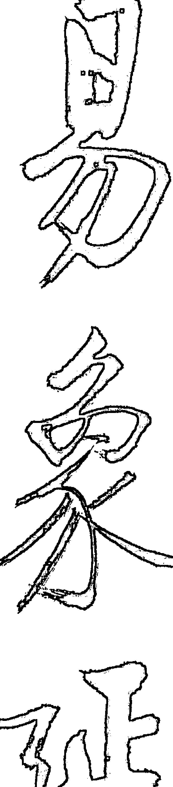
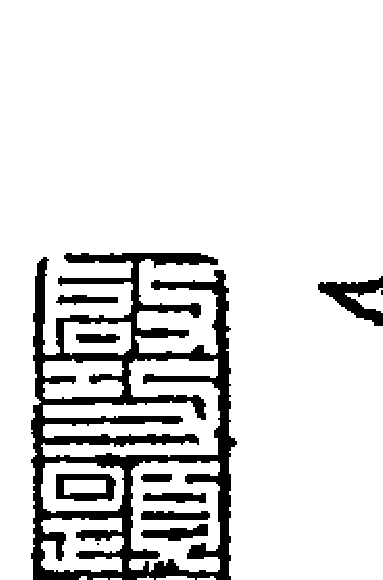
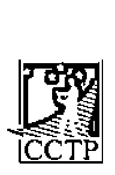
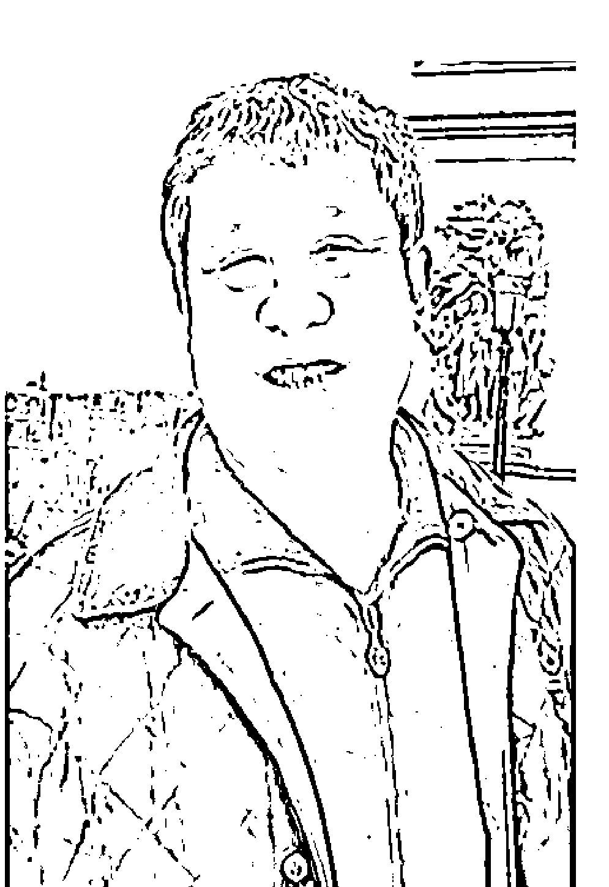
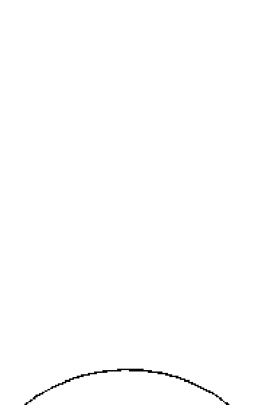
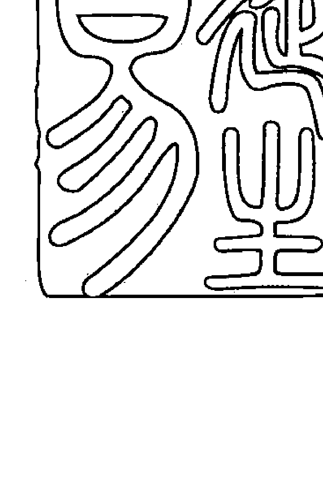

# 张延生象数易学系列丛书

# 易象及其延伸 ①

张延生 张震 著

中央编译出版社
Central Compilation & Translation Press

# 延生易

# 张延生

教授，工程师。男，1969年毕业于北京航空学院发动机工艺系工艺专业。曾任北京航空学院机械厂厂部技术室工程师、光明中医函授大学易学教研室主任、教授。曾兼任中国周易研究会副会长、中华名人协会理事、中国医学气功研究会理事、北京中医学院大学生手诊研究协会顾问等职。现任中华易学大会主席、中华周易协会会长兼学术委员会主任，并被数十家企事业单位聘为决策或指导顾问。作者易学特长：象数、易理、义理、易医、应用。

-   ◎ 象数易学与应用（上下）
-   ◎ 象数易学与逻辑
-   ◎ 象数易学与逻辑（续）
-   ○ 易象延：易象及其延伸（1-5）

出版人：葛海彦

出版统筹：贾宇琰

责任编辑：杜永明

封面设计：MX DESIGN STUDIO Q:1765628429

# 易象延

【数、卦、象、场、信息、能量、结构、状态、本质】是『大一统』的系统模式。【数即是卦；卦即是场、态；场、态即是能量与状态；状态即是象；象即是信息；信息即是数与卦；信息即是数与卦都有其各自相同或不同的本质】，该九者之间的关系，是相互联系着的，是不可也不能分开的『统一场论』的关系——知道其中任何一项的信息、数据或结果，都能相应地推导出其他任何一项所对应的信息、数据与结果。该书是当今入《易》时，易象认识与表述更全面的一本必须研读的基础知识读物。

# 易

# 象

# 及其延伸

—

# 【易象延】

传统文化往往是本民族或国家所固有的，也是最具凝聚力的。

优秀传统文化与高科技精华结合产生的文化，是更先进的。

# 图书在版编目 (CIP) 数据

易象延：易象及其延伸 / 张延生，张震著．—— 北京：中央编译出版社，2016.10
ISBN 978-7-5117-3154-8

Ⅰ．①易… Ⅱ．①张… ②张… Ⅲ．①《周易》—研究 Ⅳ．① B221.5

中国版本图书馆 CIP 数据核字 (2016) 第 247717 号

# 易象延：易象及其延伸

-   出版人：葛海彦
-   出版统筹：贾宇琰
-   责任编辑：杜永明
-   责任印制：尹珺
-   出版发行：中央编译出版社
-   地址：北京西城区车公庄大街乙 5 号鸿儒大厦 B 座 (100044)
-   电话：(010) 52612345 (总编室) (010) 52612342 (编辑室)
    (010) 52612316 (发行部) (010) 52612317 (网络销售)
    (010) 52612346 (馆配部) (010) 66509618 (读者服务部)
-   传真：(010) 66515838
-   经销：全国新华书店
-   印刷：北京溢漾印刷有限公司
-   开本：710 毫米 × 1000 毫米 1/16
-   字数：1810 千字
-   印张：114.25
-   版次：2016 年 10 月第 1 版第 1 次印刷
-   定价：310.00 元

-   网址：www.cctphome.com 邮箱：cctp@cctphome.com
-   新浪微博：@ 中央编译出版社 微信：中央编译出版社 (ID：cctphome)
-   淘宝店铺：中央编译出版社直销店 (http://shop108367160.taobao.com)

凡有印装质量问题，本社负责调换。电话：010-66509618

# 作者简介

张延生，教授，工程师。男，汉族，1943年3月出生于陕西省延安市瓦窑堡，山东滕县人，1969年毕业于北京航空学院发动机工艺系工艺专业，曾任光明中医函授大学易学教研室主任。兼职与曾兼职中国周易研究会副会长、中华名人协会理事、炎黄道家文化研究会会长、中国医学气功研究会理事等职。现任中华易学大会主席、中华周易协会会长兼学术委员会主任，并且被数十家企事业单位等聘为决策或指导顾问。

作者易学特长：

以易卦、爻符号学（含数字型、几何卦爻型）为依据的
象数易学、易理学、应用、易医、易学象数学、义理学。

受父亲影响，自幼知识面宽、爱好广泛。大学上学期间，作者常负父亲首创的“经络测定仪”予人测试诊断，以求经络实质再探。1976年首触研气功养生。1979年与同道共研发“特异”现象，继接国家任务掀应用热潮。1981年始修炼并研《易》。伙志同者发表“弯曲的多维空间及超空间作用力”等论文，引起学术界注重。1987年入选国家在香港举办的“中国古代科技展暨现场表演团”，代表中医、养生界现场演示及学术讲演3个月有余，致使香港各界轰动，受新华社表扬。事迹为多国与地区电视台、广播电台以及近百种书刊杂志主动专题推介。1988年出任电视连续剧《师魂》的制片总顾问。与剧组人员共同努力，使该片1989年荣获“金鸡奖”的头等奖。

作者主要研究与应用业绩：

在研制无人高空侦察机关键部件、6000吨橡胶压力机、舞台及室内拍摄灯光数控一体化以及光电跟踪、数控等加工工艺技术等方面，均取得重要成果。特别是在研《易》过程中，屡经困惑之忧、顿悟之喜，终于弃传统之法暂不用，自拓学经。即不从训诂、经文辞句入门，而自“象数”开窍，实践中寻理；汇现代科学，反馈研探实践。累三十数载心血，精聚体验，汇论己见，不仅探索出学《易》捷径——一套科学的“延生易”的易简学习方法和思维方式，并在领悟中医药、经络、人体科学、传统文化的哲理思想及“易学”“象数”真谛方面，更具独特见地、成果和创新体系。1983年，参与创办“光明中医函授大学”（李德生、崔月犁任名誉校长，吕炳奎任校长），并于该校任教。同年，在国内率先开始义务传授、推广以“气血、颜色、形态”为基础的“望手诊断”的方法，受益者广泛。1985年起，于国内外开始开展办学、讲演、学术交流活动，至今已教授学员3万有余、听众近50多万人次，期望易理再探，易华重现。1988年经北京市教育局核准，率先于国内创办起全国性的“易经函授班”，学员3000人。自编统筹易学教材17种13册300多万字，既有古《易》原经、原文、原著，又有当今现代科学之易学论文及论著。率先添补了我国“社会办学”在易学教育方面的空白。为了回报与支持“山东大学周易研究中心”的工作，将其提供的所有教材及参考文章（包括版本的复印件），均按当时（1986年）每千字30元的最高稿酬标准，予以支付，并且由《周易研究》杂志首期发行始，执意作为“易经函授班”的辅助教材，每期固定订阅3000册（保本）的方式，予以支持。

其后，本人相继公开出版并发行了：

-   《易学思想概说——张延生演讲录》
-   《心易》
-   《炁易》
-   《气功与手诊（珍藏版）》
-   《易学入门》
-   《易学应用》
-   《易与和谐》
-   《易象及其延伸——易象延》（上中下三册）
-   《易理数理（一）》
-   《易理数理（二）》
-   《易理数理（三）》
-   《象数易学与应用》（上下两册）
-   《象数易学与逻辑》
-   《象数易学与逻辑（续）》
等14部（17本）著作与《易经与气功》录音带一套（上下集两盘）。

在国际国内的学术会议上，相继发表了：

-   “易学象数理论是卦象象爻辞的依据”
-   “易学象数理论在医学临床中的应用”
-   “研学易学的方法和途径”
-   “传统文化中相对平衡相对稳定系统的寻求”
-   “是否重视考虑使用繁体象形文字表述系统”
-   “‘文王重卦说’是又一次确定64卦的表述功能”
-   “现今研习易学存在的思路问题”
-   “由《周易》‘病’‘疾’之爻辞看其象数概念的一斑”
-   “易学‘与’数术学‘促进了中国数学的发展”
-   “应重视‘数字筮符’到‘几何卦形’的确立与发展”
-   “应重视‘易理’及传统分类学的研究与发展”
-   “应重视‘易理’（非‘义理’）的研究与发展”
-   “对‘叁伍以变’的某些认识”
-   “八卦卦象与疾病的对应关系”
-   “对‘错综其数’之‘错’的某些认识”
-   “对‘错综其数’之‘综’的某些认识”
-   “简论‘儒’‘老’之‘道’内涵的一些认识”
-   “分析‘大衍筮法’判断的准确性和可能性”
-   “对《易》中‘和’与‘合’之义的某些认识”
-   “对‘象数易学’中象、数、理、实践之间关系的某些认识”
-   “对《易》中‘合’‘和’之义是创新基础的某些认识”
-   “由《二三子》篇中的‘其占曰’所想到的”
-   “由数或数字起卦的某些方法”
-   “某些应用实例的象数与判断结果的分析”
-   “由非《易林》排序4096卦各卦所对应的‘函象’及其位置所想到的”
-   “‘复合时空论’思想”
-   “写作《象数易学与逻辑》一书的出发点与目的”
-   “‘象数易学’是如何解决寻找不同事物间的同一性问题的”
-   “对三至六爻同类型易卦相互作用时，在‘象数’计算中表现出的准确率的认识”
-   “度量衡与卦、数及其本质性质状态的对应关系”（含64卦各卦的具体对应结构模式和各卦对应具体数据值）
-   “‘象数易学’数理表述方法的‘合’‘和’‘以变’特点”
-   “‘象数易学’与‘十八届三中全会’某些对应内容的本质关系”
-   “写作《象数易学与逻辑》及《（续）》集的某些缘由与目的”
-   “‘象数易学工程学’对‘社会主义核心价值观’的某些认识”
等数十篇易学功底深厚，揭“象数易学”“象数易学工程学”“易医学”“易学象数学”“科学易”“易科学”“现代易”精髓，且影响深远的论文。由于“发古人之未发，言今人之未尽之意”，故引致同人们高度的好评，并统称其是“象数易学”的“延生易”的独创体系的一门非常值得推广与普及的新型学科。

张延生教授，1997年在“东方网景”网络“传统与现代”栏目中，率先开设“延生学苑”专栏，重点宣扬“中国传统文化中相对稳定、相对平衡系统的寻求”以及易学及其“象数”方面的基础知识和思想方法。1999年与学员在加拿大多伦多市创立“多成易学会”，并于次年1月在多伦多市举办“多成易学会首届国际易学研讨会”；同年创办“多成易学会网站”（www.duosuccess.com），用中英文宣扬中华传统文化及中医、养生等方面的精华。2001年在“太极易”（www.taichie.com）网站，再次开设“延生学苑”专栏，专门宣扬中华文化的根基——“象数易学”的以“象数”为根本、为主的“易学”文化。2004年春节前，在该网站公开发表了，对2004年至2023年期间，世界主要大“运气”的走向与发展大趋势的预测，并强调地指出了：在此其间，中国的东北及其周边所形成的东北亚地区（包括朝鲜、韩国、日本、俄罗斯东部），将形成对未来20年世界政治、经济、军事、外交等起着一定决定性作用的很重要的地区等的宏观预测；此外，还运用自己独创的“象数易学场效应”理论，指导“首钢”香港合资公司徽标（logo）的造型设计；协助策划确定“tom.com”网络公司名称及上市（含退市）时机等。在2006年出版的《易与和谐》一书的前言与内文中，一再告诫人们，世界众多发达国家的经济衰退即将到来；2009年“要提防出现类似于2003年的‘非典’疫情”等先期性预报等。

此外，张延生教授，对易学探讨、研究与应用作出了破除迷信的“象数易学”“象数易学工程学”“易学象数学”“科学易”“易科学”“现代易”等方面的诸多甚至是整体性、系统性指导实践的重要贡献。

其间：

1.  论证了中国古代“象数易学”的科学性及其某些发展脉络，以及恢复与当下发展中国古代“象数易学”原貌的必要性和现实意义；
2.  指出了历史上儒家对“象数易学”“易理学”的宇宙观、认识论、方法论的忽视而无知，尤其是在传统推崇的“易学象数学”“义理学”方面的部分认识误区和缺陷；
3.  经过30多年的研究与实践，探索出一套学习、研究、应用“象数易学”及相应易学的独特而简易有效且与现代科学、技术、工程、政治、经济、军工、生活、工作等许多领域相结合的“延生易”的认识与表述的很多的成套及系统性方法，并在长期的实践中，取得了一系列的成果，并在易学界破...
4.  论证了“象数易学”及其相应易学思维模式及方法，对于构建和谐社会与和谐世界的重要意义，以及“象数易学”及相应易学中，易卦、易爻的“以变”“合”“和”“统一”“融和”（不是“融合”）、“同一性”“共性”“（量化、量变）本质”等诸多领域的发展观，是如何对应与指导我们“科学发展”“工程发展”的创新思路及结果的获取的诸多“象数易学”及“象数”模式、模型和一些系统性的成套解决方法；
5.  在以上研发的基础上，建立了以易卦自身“符号学”（含数字型、阴阳爻卦的几何型）为基本根据的“象数易学”它自身自然具有的一系列“易理学”理论、方法及思想的“延生易”的认识与表述系统（仍含有某些正确的“义理学”和“易学象数学”内容）。而且在“易理学”的内涵方面，在继承与发扬了传统易学、“象数易学”“易学象数学”“义理学”等原有正确的表述特点及功能外，更是具备了能广泛深入地继承、学习、研发、弘扬及表述过去、现在及未来等，对各种事物进行“公式”性认知与表述的“卦变”“爻变”“象变”“数变”“象数变”“符变”“质变”等的发展变化状态、关系及其规律，以及在“自然科学”“社会科学”“人文术”等诸多学科、领域方面的与“时间逻辑学”紧密相关联的“类集集合论”（含“历史集合”）在“五行分类本质定性学”基础上的认识与表述的“组合学”在“系统论”“整体论”方面的功能（含“过程学”“比较学”“时间逻辑学”）与作用——其中，并不仅仅仍是保持了“象数易学”及“易学象数学”其原有的“命运关怀”的功能及作用，以及运用这些“象”“数”“理”“实践”等学问的基本知识和经验，仍然还可以专门用来理解及解释《易经》《周易》《周易大传》及其儒家在此基础上所产生的各种衍生作品的卦、象、象、爻、辞、传、句、章等的解释学方面的功能和作用；
6.  在以上认识的基础上，“延生易”又创立了：在“一阴一阳之谓道”的“对应统一”世界观启导下的“本体论”思想方法论的：“阴”＝“阳”或“阳”≡“阴”（即A＝A）的与“形式逻辑”直接对应的易卦、易爻、易象、易数、易符等对应性的认识与表述功能及体系，以及“阴”≠“阳”或“阳”≠“阴”（即A≠A）的与“辩证逻辑”直接对应的易卦、易爻、易象、易数、易符等的各自及其组合的“生克制化合”的认识与表述功能及体系。其中，卦爻组构的标准型“几何”空间结构状态及其“过程学”与“时间逻辑学”和“时间易学”的“时空统一”的“延生易”的对应表述体系与方法，使“象数易学”（不仅是“易学象数学”）及其“易理学”（不仅是“义理学”），形成了以“形式逻辑”与“辩证逻辑”统而为一的“有机辩证统一逻辑”的“天地生合一”（含人）的“大一统”认识与表述的“系统论”“整体论”体系和方法，从而为今后社会、政治、经济、军事、外交、文化、科学、教育、生态、党建等全方位的进步与发展，将会提供“中国特色”的本土文化基础上的创造及创新在思维及思想方面的新的思考方式和方法——不会再仅仅还是以既有认识与表述上存在缺陷的“形式逻辑”（又称“数理逻辑”“抽象逻辑”“理性逻辑”“科学逻辑”“现代逻辑”“逻辑斯蒂”“符号逻辑”），作为我们思维、思考、思想的惟一绝对而不可逾越的基本根据了。

故而，张延生教授进一步倡导并提出了：我们当前研发“延生易”及其“象数易学”“易理学”及“象数易学工程学”的主要目的，是期望在中国传统文化推导方法的精华与西方现代科学、工程学等推演（演绎）及归纳方法的精华组合中，构建起某些互通性的以辩证思想为主体并与形式思想相结合的归纳、统一、合和与推演（演绎）、分解的认识与表述的（比较）平台和模式——使有自然科学背景的广大读者和好研玩易者，了解、接近、接受“象数易学”及相应的易学；使有传统文化背景的读者和好研玩易者，在尽量不违背正确认识与表述内涵、意义、方法的基础上，能科学化、工程化地掌握与运用“象数易学”及其相应易学的思想与方法——借以启发大家如何在优秀传统文化精华的“中国特色”前提下，来解决“马克思主义中国化”的一些文化、思维、精神、价值及哲理等许多方面的世界观、方法论等诸多方面认识、表述与实践的一些“时间集合”（含“历史集合”）、“类集集合”“象数集合”“复合空间集合”“多宇宙集合”“时空统一集合”等的整体性、系统性思想和理论的一些具体、针对与抽象的对应结构模型、数理及根据等问题。

同时，张延生教授依然希望：我们应当在这个举世文化，似乎正在披靡于西方文化的（盲从）时代，仍能为我们中华民族的优秀文化及其传统思想和方法的精华，留下正常思维、理性及批判性思维的种子和弘扬的机会——只有“文化革新”后的“文化才能强国”，而不仅是“文化事业强国”。

# 前言

> 《易》曰：
> “易者，象也。象也者，象也。”
> “圣人有以见天下之颐，而拟诸其形容，象其物宜，是故为之象。”
> “观象系辞，圣人则之。”
> “八卦成列，象在其中矣。”
> “天垂象，见吉凶，圣人象之。”
> “所乐而玩者，爻之辞也……观其象而玩其占，观其象而玩其辞。”

由以上这些通行本《易》著在《十传》中的论述，我们可以看出易“象”的认识与表述方法，才是研学易学的最根本的基础概念和方法。再根据《易传》中“在天成象，在地成形”的论述，我们还可以知道，如果不熟悉易“象”及其各种表述方法与模式在相同或不同时空及其环境条件下所对应的认识与表述规律，就不可能或者无法学习、探讨、研究、掌握易学“符号学”它自己具有的真正的“易理”，而不是传统的“书不尽言，言不尽意”认知前提下的所谓“微言大义”式的脱离实际印证的那些“形而上”的“义理”。因为按我们“象数易学”工程学及其相应的各种“易理”的根据与来源，就是通过各种抽象的、具体的事物，在一定时间、一定范畴、一定范围、一定层次、一定方向位置等相对的时空条件下，所表现出来的各种形象、状态、性质及其相应的种种变化，进行普遍性地推导和论述的。如果没有直观、形象或间接能感知到的事物形、“象”、结构、状态和本质性质等的确定，来作为自己认知与表述的基础，就不可能也无法进行观察、分析、研究、探讨、感受、体会、认识、总结、归纳出事物的规律及其规律性——也就无法顺利地学习、探讨、研究、掌握“易理”并熟练地指导我们“象数易学”相应的各种实践和方法了。

本书就是力图通过以抽象的八个“经卦”（基本卦）和种种卦中各爻及其位置所代表的各种具体事物形、“象”、状态、结构、性质、本质等，并且由“象数易学”及其“模型论”的认识与表述的这种角度，来论述易“象”及其直接或间接对应的各种“象”变公式（含卦、爻、象、数、符等）前提下确切的相应变化规律和结果，使好学研玩易学者，对我们“象数易学”及相应的“易理”（并非仅是“义理”）和传统“易学象数学”及其相应的“义理”的异同，能有一个初步的认识和了解。因为学会和熟练地掌握了易“象”及其认识与表述方式方法规律，即使没有高明的老师教引，也能自行学习、探讨、研究、理解并且掌握“象数易学”知识作为易学探讨各种事物规律和结果的基础性工夫（本人的“象数易学”及其“易理学”“工程学”等方面的知识，基本上采取的都是自学方式来完成的）。否则，中国根据易象分类，再加上事物具体形象所创造出来的一字多音、一字多意的有很大内涵性的“象形”汉文字；以及由于中国远古时代，人们的思想方式、方法上、语言或方言的特点上，又与现今人们有很大差异（有些当时时代的文义和说法，已是根本无法再去考定了——“书不尽言，言不尽意”嘛），因此研学起在各种思想方法前提启导下的相应“易学”来，就更困难了。故此，只有靠高师们手把手教引、传承才能进行学《易》了。可是这种手把手的传承手段，往往又会受到导师们，对易学中某些方面课题、思想等研探的偏爱和偏好的影响，把学生们带入到某些偏激的研学易学的死胡同或道路中，因此不易使学员们，从“象数易学”及相应易学思想的“广大悉备”的全方位上，来认识理解“象数易学”及相应的易学思想无处不在的“一阴一阳之谓道”的“有机辩证统一逻辑”下的“对应统一”的本体论哲理及其世界观、方法论和认识论。

远古时期，人们是没有飞机、火箭、火车、立交桥、收录机、电视机、星云、宇宙、黑洞、夸克、基本粒子、电子计算机、计算机网络、智能机器人等现代各种领域的形象和概念的。如今要想使用古时的“象数易学”# 前言

及其相应的易学道理，来指导我们现今和今后的各项实践及其活动，就不能不把古《易》及其“象数”本质，在保持其原有认识与表述意义基础上的易“象”（包括卦、爻、数、符、分布等象）及其变化与规律，进行相应确切适当的延伸。本书中的某些延伸【即“八卦之象”“六画之象”（包括“正”“之”“应”“中”“体用”“各种爻卦的集合体中的上下、内外、前后、左右卦”等）、“爻位之象”“本之卦象”“半象”（含“连半象”）、“互卦”及“互体”“连互”“反象”（包括“全卦的反卦”“上下半反象”“上下同时反象”）、“对象”（包括“全卦的对象”“上下半对象”“上下交易之象”）、“反对之象”“交易之象”等“爻变”“卦变”“象变”“数变”“符变”等规律与内涵意义】，就可以给读者们一些启示，使“易理”（不仅是“义理”）能在而今的时代中，仍能保持其实用性、现代性、科学性、实用性与真理性。

本书写作比较仓促，难免有不少的不适当或错误之处。欢迎广大读者批评、指正，并对本书参阅书籍的作者深表致谢！

张延生
1988年11月于北京葡萄园

# 延生易
易象及其延伸
【易象延】

本书是在我1988年所著的“光明中医函授大学”易经函授班教材《周易卦象》一书的基础上，参阅其他一些书目与本人和学员们大量的实践体验，增删、修订、延伸而成的。

写作此书的目的，是为了将我在研学“象数易学”及“易学象数学”中的心得体会及其经验教训，提供给大家参考。期望从“象数易学”真谛的角度，使其能与现代各个领域的各种理论与实践相结合，进而达到“易理再探，易华重现”的目的。同时也期望能在中国传统文化的推导方法与西方现代科学的推演方式方法中，构建起一种互通性的推演模式或交流平台。更重要的是为弘扬有极大实在性、实用性、科学性、真理性的“象数易学”及其“象数易学工程学”，使它们与“梅花易数”及“数术学”方面的学术区别，能被社会和学术界有所重视和接受，从而达到易理指导实践的“善易者实占”而不是“善为易者不（会）占”及将此“实占（实践）”的学术加以自觉主动推广弘扬的目的。

本作者在写作中，尽量使读者们能从这本书里的各种卦爻、卦象、爻数、卦数、象数等的对应结构与变化中，了解并掌握“象数易学”及其相应易学方法里的各种、各样、各类卦爻与实际事物、概念和变化规律的时空对应性关系——即“对应统一”的而不仅是“对立统一”的规律。从而由“象数易学”及其相应易学“六爻相杂，唯其时物也”的时空对应的“时间逻辑学”关系中，捷速准确地达到在复杂环境系统中，按易学“易简”的最高境界，达到抓住事物主要矛盾或矛盾的主要方面的目的（达到“知变”）。使我们能很快通过“象数易学”及其相应易学“场效应”及“易简”所提供的本质分类学归纳统计出的分类学方面的本质规律，抓住事物发展变化的大方向。只要大方向不错，我们就能够按符合事物发展变化规律的要求（“知变”）去思考并行事，顺利地达到成功（达到“适变”与“应变”）。由于以上原因，本书主要是以“象数易学”及其相应“易学象数学”的思想与方法论，来为研学及喜好易学者们，提供一些由此发展来的“象数易学”的思路与具体方法。既有保持原“象数易学”的方法与“象数”内涵，又有在此基础上结合现代科学的需求而发展或延伸出来的“象数”方法与其较确切的内涵。这也会为好研学玩应用《易》者们，提供一些与其“象数”对应的应用性的方法、思路。

虽然，当今的电子与计算机时代的发展，完全要看各种“算法”的发展来决定其如何发展，但是不管“算法”现在是如何发展，当今所急需的是能将数与信息（包括“信息场”“能量场”）统一在一起的“算法”。而我们这种“象数易学”以及“易学象数学”的思想方法所对应的数、数理与场之间的变化思想，思维方式、方法，则能给我们极好极多的启迪。虽然，这方面的某些内容，此书中在某些延伸方面，有些针对性的试探性的论证与提及，可是，我还另有《易与数理（象数易学数学及其应用）》（共三册）、《易与和谐》和《象数易学与逻辑》（两册）等书，对我受“象数易学”及其相应易学哲理及数理思想的启发所体会而延伸到的一些“算法”，有较详细、较全面的论述。我想这也是我向广大“象数易学”及易学爱好、探讨、学研、开发者，现在所能够提供的一部分小小的参考内容。望批判式笑纳。

话和期望也许大了点，但人总是要有那么点精神，为社会做点什么，才会是不枉此生的。故而斗胆抛砖以求斧正（如能达到引玉的效果，当为求之不得）！

张延生
1997年8月于北京葡萄园

# 易象及其延伸【易象延】

由于近些年来，“象数易学”与“易学象数学”及其方法论，逐渐被更广大的人们所了解与认识，加之“象数易学”有很强的针对性、对应性与实用性（含自然、科学、技术、工程等领域），因此它可以与非常具体的事物及其规律相联系。而在当下这种非常实际的“市场经济全球化”的时代中，没有或不能与实际相结合的理论与学说，基本是得不到社会的认可并加以普及或推广的！也就是说，我们学习任何理论的目的，“全在于能运用”！正因为“象数易学”认为，一切事物都是互相联系着的，并以“盖取诸离”的网络结构形式相互发生着作用，而整体相互联系地存在着。没有任何一个事物是可以孤立存在的，它们相互之间，都是受制于“对应统一”（不仅是“对立统一”规律。因为“对立”只是“对应”状态下的一种状态，并不是其全部）的时空规律的。《易》曰：“六爻相杂，唯其时物也。”这说明，“象数易学”及其相应的易学中的这种时间与空间及其事物的“对应统一”的关系，是不可也不能割裂开来的。而且这种时间与空间及其事物的“时间逻辑学”的“时间易学”相互对应存在的关系，每时每刻都存在于我们每一个人的周围。同时，我们还认为，我们的“象数易学”系统中，已是把【数、卦、象、场、信息、能量、结构、状态、本质】等，统一在了这个“大一统”的系统模式中。即【数即是卦；卦即是场、态；场、态即是能量与状态；状态即是象；象即是信息；信息即是数与卦；信息即是数与卦都有其各自相同或不同的本质】等，它们九者之间的关系是相互联系着的，是不可也不能分开的“统一场论”的关系。这也就是说，“象数易学”中的“象”与“数”根本就是一种不可分离的“统一体”关系。同时，也就可能会改变某些传统易学者对“象数易学”的一些传统失误性理解及看法，甚至有可能改变他们所认为的仅分“象派”“数学派”“图书派”“功利派”“心学派”“义理眼派”等派别的观念。我们认为，只有在“象数易学”基础上的所谓的各派的易学优秀部分的总集合，才是真正的“象数易学”及其相应产生的“易学象数学”方法论的根本。

# 前言

由于本书是对我近三十几年来在“象数易学”与“易学象数学”理学及其应用方面的感受、体会和教训的归纳与总结，因此该工具书中，有个别部分的内容与我的其他某些著作稍有重复。为了保证该书的系统性、统一性及全面完整性，这也是有所难免的。望读者能予以见谅！

由于“象数易学”的实际性、应用性与针对性很强，因此大量具有现代科学知识素质的人才，开始将现代科学与科学知识与传统的“象数易学”及其相应的易学思想、方法论之间，建立互通性、共融性、同一性或统一性的一些联系。虽然这才刚起步，但是已经出现了不少令人欣慰的好的开端。我相信在不久的将来，一定会出现不少份量重、影响深远的“象数易学”中的“象数易学工程学”“科学易”“易科学”“现代易”方面的优秀作品，而且它们还有可能在“象数易学”及相应的易学与现代科学之间，建立起某些“归纳”与“推演”的双向推导的一些方式与模式来。

愿“象数易学”的方法不断地充实、完善、提高、普及与推广，使其成为人类常备而不可缺少的指导各种实践的必备性思维、思路及思想方法。

启功前辈为此书所提书名，深表感谢！

也为帮助整理书稿的陈抗美贤内助与靳少敏女士，以及团结出版社及韩金英同志，还有书法家秦润波先生对本书的关怀与支持，深表谢意！

张延生
2004年12月于草昧书屋

# 易象及其延伸
【易象延】

由于社会上广大易学爱好者们，理性与实践水平不断提高后，对“象数易学”这种认识与表述方法，大家在广为交流与运用的基础上，已经普遍性地认识到，它是研学各种易学门派及其进入真正易学学科领域大门时，人人必须具备的最根本的基础方法和知识。否则，是很难进入真正易学大厦的大门的——不管他们是打着什么易学的旗号，都是如此。

本书从出版售罄以来，已有十余个年头（出版合同已到期截止有七年）了。当下国内外市场上，由于对该书急切需要的现实，已将该书的价格炒卖至十倍以上的价格了，使许多人已经读不起这本书了。这对我们急切推广的“象数易学”事业的传播与普及，是个非常不利的壁垒性因素！为了能达到我们尽快推广普及的根本目的，只有重新补充、增删、修订而再版，并使该（工具）书更加全面、完善、正确，才能彻底打垮这些价值壁垒对我们事业推广普及的阻碍和破坏作用。

在广大读者和学友们的屡屡不断督促下，今年年初，我坚决地决定，暂时停下对《传前易学——谁说传前无易学》一书的继续写作，专心致志地对《易象及其延伸——易象延》一书进行重新增删、修补、修订，为了使本人已自成学科体系的“延生易”所承袭的，春秋及“三晋”时期所普遍流行和传播的“象数易学”的“以卦之卦”“以卦解卦”“以卦释卦”的这种中国历史上，更早时期的认识与表述方法，能在社会得以广泛认识与传播，并借以改变汉朝“经学”流行之后，儒家易者将“易学象数学”的认知与表述方法，误认为是“象数易学”的认识与表述方法的事实——直至今日的许多所谓“专家”“权威”的有关“象数易学”方面的著作或专著，实际上都是些“易学象数学”方面的著作或专著。而这两种学术对“象”的认识与表述上的最大区别是：

“象数易学”全是以“卦位之象”的“卦象”的对应变化，作为其判断结果和立论的基础。与“象数易学”相应的易学理论，就是“易理学”理论——也就是“象数易学”的“符号学”它自己具备的“设卦以尽情伪，

# # 总目录

# ## 一册

- 一、爻象………………………………………………1
- 导 言………………………………………………2
- 六画之象及其特点…………………………13
- 分类综述吉、凶、悔、吝等辞在各卦爻中的分布…………81
- 易学象数理论是解释卦、彖、象、爻辞的依据…………103
- 由“爻”象看六爻卦自身的分布构成…………117
- 传统的“阳爻”在各爻位上的意义…………129
- 传统的“阴爻”在各爻位上的意义…………153

# ## 二册

- 分类论述各卦爻的意义……………………181
  - 天文类…………………………………………182
  - 地理类…………………………………………204
  - 年月日时类 …… 254
  - 人道类 …… 284
  - 身体、行为类 …… 454
  - 古人类 …… 649

# 三册

- 邑国类 …… 653
- 宫室类 …… 674
- 神鬼类 …… 709
- 祭祀类 …… 711
- 田园类 …… 722
- 谷果类 …… 726
- 酒食类 …… 730
- 卜筮类 …… 751
- 佑命类 …… 754
- 告命类 …… 758
- 爵禄类 …… 765
- 车舆类 …… 768
- 簪服类 …… 797
- 旌旗类 …… 808
- 讼狱类 …… 810
- 兵师类 …… 822
- 田猎类 …… 836
- 金宝资财类 …… 842
- 布帛类 …… 852
- 器用类 …………………………………………………… 855
- 数目类 …………………………………………………… 890
- 五色类 …………………………………………………… 924
- 禽兽类 …………………………………………………… 931
- 鳞介类 …………………………………………………… 1010
- 草木类 …………………………………………………… 1023
- 杂类 …………………………………………………… 1052
- 延伸的六爻其他象意 …………………………………… 1141
  - 初爻 …………………………………………………… 1141
  - 二爻 …………………………………………………… 1142
  - 三爻 …………………………………………………… 1143
  - 四爻 …………………………………………………… 1143
  - 五爻 …………………………………………………… 1144
  - 上爻 …………………………………………………… 1145

# 四册

二、八卦之象…………………………………………… 1147

传统《周易》中的八卦象意 …………………………… 1150

- 分类论述各卦的卦象意义 ……………………………… 1194
  - 天文类 …………………………………………………… 1194
  - 地理类 …………………………………………………… 1195
  - 年月日时类 ……………………………………………… 1196
  - 人道类 …………………………………………………… 1197
  - 身体、行为类 …………………………………………… 1200
  - 邑国类 …………………………………………………… 1202
  - 宫室类 …………………………………………………… 1202
  - 宗庙类 …………………………………………………… 1203
  - 祭祀类 …………………………………………………… 1203
  - 酒食类 …………………………………………………… 1204
  - 卜筮类 …………………………………………………… 1204
  - 爵禄类 …………………………………………………… 1205
  - 讼狱类 …………………………………………………… 1205
  - 兵师类 …………………………………………………… 1206
  - 器用类 …………………………………………………… 1206
  - 数目类 …………………………………………………… 1207
  - 禽兽类 …………………………………………………… 1209
  - 鳞介类 …………………………………………………… 1210
  - 杂类 …………………………………………………… 1210

# ## 分类论述“十翼”中的象的意义

| 分类 | 页码 |
| :--- | :---: |
| 天文类 | 1212 |
| 地理类 | 1213 |
| 年月日时类 | 1214 |
| 人道类 | 1216 |
| 身体、行为类 | 1225 |
| 古人类 | 1229 |
| 邑国类 | 1230 |
| 宫室类 | 1231 |
| 宗庙类 | 1232 |
| 神鬼类 | 1233 |
| 祭祀类 | 1234 |
| 谷果类 | 1235 |
| 酒食类 …… 1235 |
| 卜筮类 …… 1236 |
| 佑命类 …… 1237 |
| 告命类 …… 1238 |
| 爵禄类 …… 1238 |
| 车舆类 …… 1239 |
| 簪服类 …… 1239 |
| 讼狱类 …… 1239 |
| 兵师类 …… 1241 |
| 金宝资财类 …… 1241 |
| 器用类 …… 1242 |
| 数目类 …… 1244 |
| 五色类 …… 1246 |
| 禽兽类 …… 1247 |
| 鳞介类 …… 1248 |
| 草木类 …… 1249 |
| 传统中八卦其他某些卦意 …… 1250 |
| 延伸的八卦象意 …… 1259 |
| 三、“爻位”和“卦位”之象 …… 1343 |
| - “爻”位之象 …… 1344 |
| - “卦”位之象 …… 1365 |
| - 小结：“爻位”和“卦位”之象的重要内容 …… 1387 |

# 五册

# 四、六爻卦的结构变化

- 六十四卦卦序歌
- “大象”六十四卦记忆法
- 六十四卦各卦总体象意
- 互体之象
- 连互
- 反对之象
- 交易之象
- 易卦系统推衍说
- 包卦之象
- 命卦之象
- 声应之象
- 消息之象
- “复合空间”之象
- 附录一：由非《易林》排序4096卦各卦所对应的“函象”及其位置所想到的
- 附录二：易学象数理论在医学临床中的应用（论文）
- 参阅书目

# 目录

一、爻象 1

导言 2

六画之象及其特点 13

- 正 15
- 承 41
- 乘 46
- 应 52
- 据 58
- 比 63
- 中 74

分类综述吉、凶、悔、吝等辞在各卦爻中的分布 81

- 卦占类 81
- 爻占类 85
- 卦爻道德举例 99
- 十传类 101

易学象数理论是解释卦、彖、象、爻辞的依据 103

由‘爻’象看六爻卦自身的分布构成 117

# 衍生易 易象及其延伸 【易象延】

# ## 传统的“阳爻”在各爻位上的意义 129

- 初爻 135
- 二爻 139
- 三爻 143
- 四爻 146
- 五爻 147
- 上爻 151

# ## 传统的“阴爻”在各爻位上的意义 153

- 初爻 159
- 二爻 164
- 三爻 167
- 四爻 170
- 五爻 172
- 上爻 176

# 一、爻象

# 导 言

通行本《周易·系辞》曰：
“一阴一阳之谓道。”
“爻也者，效此者也。”
又曰：
“夫乾确然，示人易也。夫坤馈然，示人简矣。‘爻’也者，效此者也。”

因此，我们的古人（在殷周之前多以数字符号的组合方式存在着，也就是说，至少在周朝至战国中后期）确定了：

以“一”画表示“阳”性（正、光明、刚健、高尚、完美、运动等）事物；

以“--”画表示“阴”性（负、黑暗、柔弱、卑下、不完美、静止等）事物。

这“一”与 “--” 画，就被《易》界统称作“爻”。

由《系辞》（汉武帝之后定本成文）中，我们可以知道，“爻”不但能表述“对应统一”（一般人误称为是“对立统一”）的一切事物及其规律与发展变化，而且还是一种最简单明了的“本体论”的表达方法。

由“象数易学”“易学象数学”及其相应的易学“变易”的思想，我们又可以知道，“一阴一阳之谓道” 的这个“道”，是在不断地发展变化着的。为了能简单迅速地对应性反映这一阴一阳的种种变化规律，古人发明了使用“爻”及“爻”性的各种相同与不同的组合集合式的方式，来对应表述“道”的结构状态及其一切变化和性质。

所以通行本《系辞》中又曰：
“道有变动，故曰‘爻’。”
“天地变动，圣人效之。”
“圣人有以见天下之动，而观其会通，以行其典礼，‘系辞’焉，以> 断其吉凶。是故谓之‘爻’。”
>
> “‘爻’也者，效天下动者也。”
>
> “八卦成列，象在其中矣。因而重之，‘爻’在其中矣。刚柔相推，变在其中矣。”
>
> “刚柔推而生变化。”

通行的《说卦》这一章节中，也曰：“发挥于刚柔而生‘爻’。”

由此可见，《易》与通行本《周易》往往是通过“阴”“阳”爻的“刚”“柔”属性（性质）的变化来对应进行推断、表述事物变化的规律。同时，还可以反映这些规律到底对我们的生存和需要有什么影响。

通行本《系辞》中所说的，“‘爻’象动乎内，吉凶见乎外”，“刚柔杂居，而吉凶可见也”，就是对这种思想方法的对应表述与写照。

> “‘爻’有等，故曰物。”

这说明“爻”是通过在“象数易学”及“易学象数学”的相应易学中的相同或不同类型的表述方式，来反映事物的变化及其规律的。它不但能从抽象概括的方面进行统一标准性的表达，而且又是对应于各种具体的针对性实物的表达。

《系辞》中还说：“六爻相杂，唯其时物也。”

虽然六十四卦，每个卦都是由六个爻组成的，但是不管这六个爻是如何错综复杂地对应性搭配、组合及变化，它所对应表达的，都是一定时间条件下所对应的那个或那些具体事物的结构、状态、性质等及其存在。换言之，确定时间条件下所对应的那个空间结构中的某个位置上的某个或某些事物及其性质、结构、状态（包括规律在内）等。我们因此才能明白“象数易学”“易学象数学”及其易学里的那些卦与爻的变化，原来全都是根据时间条件的变化而相应发生着变化的，而该时间内的空间（几何型的卦、爻组合体）及其结构状态，也是随着时间的变化而对应发生着变化的。由于一定时间下的对应卦中的某些对应爻（局部）及其中的某个对应爻（对应的是具体事物或事物个体）变化了，则其整个卦的空间结构及其状态——卦的整体组成结构状态，也就会随之相应地发生变化（“爻变卦就变”）。这说明，在“象数易学”及其相应易学的认识与表述方法中，是时间与其所对应的空间及其结构、状态、性质等，是不可分离的——有确定的时间存在，就有与其时间直接对应的事物的空间及其结构、状态、性质等的具体针对性的存在。

> > 《周易·系辞》又曰：“爻象以情言。”

这又能说明，“爻”“卦”及其相应的《象辞》，不但能够表述具体事物的表面情状，而且更主要的是，还能表述事物的内涵及本质。其中，所谓的“情”及其相应的事物关系，是通过事物（对应的爻、卦之象所对应表述的事物）间的相互作用及其相应的“五行”本质变化，即“生克制化合”的相互作用所组成的各种局面与趋势，来体现与表达的。

总而括之，“象数”易卦及通行六十四卦中的“爻”，它不但能从事物的总体及其规律上进行抽象地表述，而且更重要的是，它还能从不同范畴、范围、不同层次及不同位置方向等方面，对具体的实际事物进行具体的针对性表述。对处于范围、层次、角度、位置、状态、方向等的相同或不同的事物的认识与理解，其具体表述的内容或结果，也会是相同或不同的。此时，它所表达的仅是在某一对应时间条件下，所能对应的那个空间中的某具体实在性的实物。或者说，同一个实物，在不同的时间条件下，它所处的范围、层次、位置、角度、空间及状态等，也可以是相同或者是不相同的。也就是说，变“爻”在卦中所处的位置、状态、环境条件不一样，是反映了同一个或不同的具体实在物，在特定范围（系统）内不同时间下的状态与规律等。故而可以说，“象数易学”“易学象数学”及其相应易学的推导方法的判断结果，只能是针对一定的时间条件下所对应的事物及其相对应的结果。一句话，说明它是靠时间准确的“时间逻辑”量化量的对应变化，来确定其相应事物的状态与结果的，而不是靠想当然的泛泛的一概而论的方法，来确定的。所以说，如果离开时间的对应变化，就很难针对性地确定具体事物当时所对应的状态及其规律。故而，它所对应确定的结果，当是非常准确的。由于不随对应时空的变化而变化的事物，是不存在的，因此想判断某支股票的走势与结果，如果不能给出明确的时间段或某一准确的时间条件，是很难找到准确的对应性状态（答案）与结果的。

因为时间变了，对应的空间及其结构状态，相应地也就会发生变化。空间结构变了，其中对应的事物的位置及其规律与状态等，往往也就随之改变了。因为，“象数易学”的“易理”认识论认为，任何时空中，没有任何一个事物，是可以脱离其他的事物而能孤立存在的，都是与其他诸多事物发生“盖取诸离”的网络般相互作用关系的事物的整体关系里，存在着。

“象数易学”“易学象数学”与通行本《周易》中的六十四卦（由六个爻由下往上顺次发展组成的卦。又称为：“别卦”“重卦”“六画卦”“基本卦”等），实际上，这就是对六十四种事物类型的几何空间的组合结构、状态、范畴、系统等的特定的标准空间模式的认识与表述。而卦中的“爻”，就是反映一定时间条件下，某个具体事物在这一时空结构、状态、范畴、系统内的具体位置、层次与角度。若其“爻”所对应的“爻”的位置不同，那么它所对应表述的事物及其相应的规律，往往会是不同的。同样的一个“爻”（“阴爻”或“阳爻”），在不同卦的同一个位置（“爻位”）上，它所表达的具体内容（状态）或相应的事物内涵，也绝大多数是不一样的。

故此，是不是可以说易学及“象数易学”无规律可寻了呢？

不是！

《系辞》中说：“初率其辞而揆其方，既有典常。”

它说的是，我们从一开始，就必须按照通行本《周易》中，《系》《卦》《彖》《象》“爻”辞所指出的方式方法，进行比类归纳，就一定能认识到通行本《周易》这部精典著作中所记述的那些不可变（儒家认为是不可逾越）的普遍法则与方法。

这种普遍方法是什么呢？

《说卦》曰：“立天之道曰阴与阳；立地之道曰柔与刚；立人之道曰仁与义。兼‘三才’而两之，故《易》六画而成卦。分阴分阳，迭用柔刚，故《易》六位而成章。”

这就是说，“一阴一阳之谓道”的“天”道规律（规律中的最基本的原始规律），是通过脚踏实地地去亲自观察、分析、研究、体会、感受具体事（实）物的“刚”“柔”直观及形象感受（感觉），才能深刻地认识到的。

作为人来说，是否掌握了“道”的规律，就会通过表现在其对人与事、物及制事方式方法上的态度和作为反映出来。

因为人是生存在天地之间的生命体，人的一切言行都必须遵循天地及其之间的规律，才能在天地之间和谐地存在下去。所以，我们的“象数易学”及通行《周易》，往往才用三画或六画组成一个卦，用做表示天、地、人“三才”[称作天、地、生（人与生物）是三才，才会更符合当今自然科学的认识论]。

下面举传统之例证，加以说明。

在《周易集解》中，郑玄在注释乾为天（☰）卦的爻义时，其：
九二爻曰：“二于‘三才’为地道。”
九三爻曰：“三于‘三才’为人道。”
九五爻曰：“五于‘三才’为天道。”

由前面说及到的《说卦》中的辞语可知，一个六画卦，其六个爻中的：
上面（五、上）两个爻，表示“天”；
下面（初、二）两个爻，表示“地”；
中间（三、四）两个爻，表示“人”（生物、生命体）。

其中，
初爻为“刚”；
二爻为“柔”。
三爻为“仁”；
四爻为“义”。
五爻为“阳”；
上爻为“阴”。

而在这六个爻中：
一、三、五爻为“阳位”，是表示“刚”性事物的“阳爻”所应该处于的位置。这是由于1、3、5为奇数，在我国传统认识里，奇数为“阳数”，故其为“阳位”。“阳”在卦中，以1、3、5数位为其发展、高升、发散之顺序。

二、四、六爻为“阴位”，是表示“柔”性事物的“阴爻”所应该处于的位置。因为2、4、6为偶数，在我国传统思维里，偶数为“阴数”，故其为“阴位”。“阴”在卦中，以6、4、2数位为其积聚、低降、收敛之顺序。

+   若是，在三画卦中，则：
    -   初爻为“地”；
    -   二爻为“人”（生物、生命体）；
    -   上爻为“天”。

上面，我们这么对应进行表述的话，三个爻的卦，同样可以对应表述天、地、生“三才”及其对应关系。

此外，一个由六个爻组成的卦体中，则：

由初爻到上爻，表示一个事物由初生、萌芽（开始）、发展、成长、壮大，直至衰老、消亡（终止），并向自己的反面转化的全部状态与发展变化的全部过程（含有“发展阶段论”的思想）。

> 《系辞》曰：“《易》之为书也，原始要终以为质。”

它说明了通行本《周易》这部书，是考察了事物的开始，探求了事物的最终结果，抓住了事物的本质规律之后，用“抓两头，带中间”的思想方法，全面、整体、统一、完整地掌握了事物的经验性和部分普适性规律，在此基础上汇集编写而成的。

还有一层意思，就是说，在研究“象数易学”“易学象数学”及其相应的易学思想与规律中，首先要抓住所研究事物的开始产生的本质基础和最终消亡时的实质结果。这也就是说，《易》这部书的本质特性（研究事物的最根本的思想方法）是抓住事物发展变化的“初终”这“两头”（事物发展变化的缘由及其结果所对应存在的区间与环境界限，以保证研究系统及其对应内涵的针对性、全面性与完整性）。

我们平时经常会听到：“任何事物都是有前兆”的说法。也就是说，一个事物产生的同时，预示了这个或另外事物的变化与消亡；而一个事物消亡的同时，也预示了另一或另外事物的产生。“物质不灭”嘛。由其对应的卦象与爻象的变化和结果来看，它们只是改变了自己原来的存在状态及形式（卦形与爻形变了）——并没有绝对性的消亡（仍有相对应的卦、爻及其象形的存在）。这也就是“象数易学”及易学中所说的“‘剥’极必‘复’”“‘复’极必‘剥’”“‘否’极‘泰’来”“无平不坡”“无坡不平”这些思想的哲理内涵。

【任何事物都会向自身相反方面转化】，是“象数易学”与易学中“变”的主体思想之一。由于这种思想是符合当今“物质不灭”定律的内涵的，所以它也就是一种符合科学的思维方法的认识与表述。

> 《系辞》曰：“其初难知，其上易知。本末也。”“初辞拟之，卒成终之。”

这说的是，由于一个事物刚刚产生的时候（初爻），人们是很难知道它将来到底是会怎么发展和变化的，因此，《易经》中，初爻的爻辞（结论），大多数都是些比较含混、模糊的语言和词句。

一个事物最终发展到了其消亡的时候（上爻），其发展变化的全部过程及其最终的结果等，由于都清清楚楚地摆在了我们的面前，所以我们就会很容易地得出其相应事物的结果与结论。故而，上爻相应的爻辞，大多数都会是很肯定且明确的判断之辞。

又由于任何事物都是由初（小）始发展壮大起来的，所以在六画卦中，其“初爻”所反映和表述的是事物发展的本质及初始基础，而上爻反映和表述的却是该事物发展到了穷途末路、走向消亡的时期和阶段。这也是我们提倡“群众是真正的英雄”“群众是基础”“得民心者得天下也”“以民为本”等理论在“易理”哲理思想方面的来源和根据之所在。

“上爻”表示的是“事之终”“时之极”。它与初爻相比较，则“居初者易贞，居上者难贞。易贞者，由其所适之道多；难贞者，以其所处之位极。”所以在通行的六十四卦中，“初爻”的爻辞多得“免咎”，而“上爻”的爻辞多有不可救药者。这就是由于事物处于初、上，始、终，本、末之际，它所面临对应的难易的状态与程度不同，故而得到的对应结果也会是不相同的。

“贞者，问也”，“卜，筮也”。由于居“初爻”之位，说明事物才刚刚开始产生，动静在于一念之间，可行之道与机会比比皆是，所以其环境极其自由自在。又因为居“上爻”之位时，则为“成事之终末”，所能由之道的路子窄小且机会少，故而遇到此位时，往往会有险难之事即将发生，唯有能指出可行的方案、方式、方法、时机和方位等才能渡过此难关。遇到这类状况时，事物既然已经成为如此的事实，那只有指出出路并采取保存之道，方可确保安宁。“时”“位”的差异都会是这样的关系，若我们能掌握并且配合“时”“位”的变化而变化，自然就可以免于犯过错而无咎了。

“爻”又是“卦”的体相和局部或个体性表述。论“爻”而不涉及相对应的“卦”，就会流于无的放矢与空想。由于“爻”的变动，就会引起整个卦象的变动和变化，所以卦和卦中的爻有着不能也不可分的连带关系。“爻变，卦就变”；“卦变了，一定存有与其相对应的爻的变化”。这是“象数易学”及其相应《易》卦、爻之间，简单而明了的根本性道理。所以说，我们的“易理”，当然就不可以拘泥于一偏之见地“周流六虚，上下无常，刚柔相易”地去演化，还要加上并取决于爻的变动状况，来确定才是。

再者说，卦有“交互”之现象，爻有“通情”之关系。它们的认识与表述的法则，不外乎“阴”“阳”两种类型爻象的更易而已。所谓“交互”现象，实质就是对应所指的卦体变化的一种，也就是我们一般常说的“互卦”状态——即传统易学概念所认为的：一个六爻卦体中，去掉它的初、上两个爻，以余下的中间四个爻为其卦体的取材对象，就会重新形成由四个爻组成的新卦体。

+   其中：
    -   三、四、五爻组成的“经卦”为“上（外）卦”；
    -   二、三、四爻组成的“经卦”为“下（内）卦”。

+   比如：
    -   火风鼎（䷱）卦的“交互”卦是其中间四个爻组成的夬（䷪）卦；
    -   风地观（䷓）卦的“交互”卦是其中间四个爻组成的剥（䷖）卦；
    -   泽地萃（䷬）卦的“交互”卦是其中间四个爻组成的渐（䷴）卦；
    -   雷水解（䷧）卦的“交互”卦是其中间四个爻组成的既济（䷾）卦；
    -   水山蹇（䷦）卦的“交互”卦是其中间四个爻组成的未济（䷿）卦；
    -   山天大畜（䷙）卦的“交互”卦是其中间四个爻组成的归妹（䷵）卦；
    -   风天小畜（䷈）卦的“交互”卦是其中间四个爻组成的睽（䷥）卦；

这些都是“交互”卦的一些实例。其他各卦的“交互”卦，照此方法类推。实际这里所说的“交互”卦，就是指我们常常用到的传统易卦中的“互卦”的概念。

《易经》通行的六十四卦，各有“交互”关系。除乾为天（䷀）卦和坤为地（䷁）卦“交互”为自身，水火既济（䷾）卦与火水未济（䷿）卦“交互”为彼此而外，其余六十卦都与其他卦相互为“交互”卦。但是，如果深入地探讨和研究的话，就可以知道，一卦“交互”两次后，则又基本会回归成乾为天（䷀）卦、坤为地（䷁）卦、水火既济（䷾）卦与火水未济（䷿）卦这四个基础卦的卦象上来（反本复原）了。

+   比如：
    -   泽天夬（䷪）卦的“交互”卦是乾（䷀）卦；
    -   山地剥（䷖）卦的“交互”卦是坤（䷁）卦；
    -   水火既济（䷾）卦的“交互”卦是未济（䷿）卦；
    -   火水未济（䷿）卦的“交互”卦是既济（䷾）卦；
    -   ......

为什么会出现“交互”卦的这些回归现象呢？

+   -   三、四两爻都是“阳爻”（⚊）时，则“交互”成乾为天（䷀）卦；
    -   三、四两爻都是“阴爻”（⚋）时，则“交互”成坤为地（䷁）卦；
    -   三爻是“阳爻”，四爻是“阴爻”（⚊⚋）时，则“交互”成水火既济（䷾）卦；
    -   三爻是“阴爻”，四爻是“阳爻”（⚋⚊）时，则“交互”成火水未济（䷿）卦。

由此归纳可以断定：
乾为天（䷀）卦、坤为地（䷁）卦、水火既济（䷾）卦、火水未济（䷿）卦这四个卦，是六十四卦产生的最基本（根本、基础）的状态。故《易经》由“乾”（䷀）、“坤”（䷁）两卦开始，而由“既济”（䷾）、“未济”（䷿）两卦结束。

因此，三、四两爻还有“心易”之说。“心”变，则象变、“象随心变”等说的道理就在于此。故而，就一个六爻卦三、四两个（中）爻来说，它们对卦象的确立与变化、易理的确定等意义与贡献，将是很大的——是六爻卦组合结构对未来进行分析判断表述时的基本根据。就是用其比于人事的话，也是如此。不论是精神与物质的交互演变，还是德业利用之“消息”，若是需要辨别其前因后果时，都需要在其（事物的）内部去寻找原因。就一个六爻卦来说，由其内部内在的（中间）三、四爻的因素变化，就能决定其外部外在的一些相应的结果。所以《易传》才曰：

> “若夫杂物撰德，辨事与非，则非其中爻不备。”

六爻卦如果要能反映各种不同的事物及其状态，并且能以此轻松地辨别这些爻之间的各种是非关系的正确与否时，仅仅是用初、上两爻的变化来认识与表述的话，当然是不够用的，还必须要能掌握中间二、三、四、五爻之间的各种状态与特性的变化和组成状态规律，以及“承”“乘”“比”“应”“据”“中”“正”的易卦爻象变化所直接对应的各种专用术语及其规律，才会表述得更全面、更准确。

因为一个六爻卦体中，它不仅是反映、表述了上下两个“经卦”（即三个爻组成的卦）的情况，而且由下（初）往上任何三个紧靠在一起的爻，都可被我们看成（组成）是一个“经卦”，所以在六十四卦中的每一个六爻卦中，都是内部由四个相互由公用爻或公共爻的“经卦”所连立而组成。而其中的二、三、四、五爻，正好是该六爻卦体中，由下往上数的那四个“经卦”各卦内所对应的三爻卦中间的那一个爻。

“中爻”还有一层意思，即如果要辨别“重卦”（这里指的是六爻卦）中每一个爻的好与坏时，一定要与其“下卦”中间的二爻、与上面“上卦”中间的五爻进行比对，才有可能得出更正确的结论和结果。

因为，“二爻”是“下卦”的核心（中心），五爻是“上卦”的核心（中心）；“二爻”是“阴爻之聚”，五爻是“阳爻之终”。古人认为“阳尊阴卑”。所以，其“阴爻”以上爻为衰，二爻为贵；其“阳爻”以初爻为弱，五爻为尊。即二爻为“阴爻之贵”，五爻为“阳爻之尊”。

那么，中间这四个爻到底有哪些性质特点是我们学研易学所必须掌握的呢？

《系辞》曰：

> “二与五同功而异位，其善不同。二多誉，四多惧，近也。”

这就是说，二爻与四爻虽然都是“阴爻”，有着相同的内涵和表述功能（另，二至四爻都在同一个三爻卦之中），但是由于它们各自在卦中所处位置的不同，它所表述的事物的好坏及其程度，也会相应地有所不同。

“二爻”由于处于“下卦”的核心（中心）“中位”上，它还与五爻“尊位”相呼“应”（说明二爻有五爻作为后台的支持），所以“二爻”的爻辞往往多有美誉之辞。

“四爻”由于距离五爻“尊位”较近，又处于“上卦”的最下位（初始阶段），又与全卦的最下层的初爻（“下卦”是全卦的最初始阶段）相呼“应”，所以“四爻”的爻辞往往多为忧疑危惧之辞。

> 《系辞》还说：“柔之为道，不利远者。其要无咎，其用柔中也。”

它说的是，虽然，二、四、上爻都是“柔”（阴）爻所应处于的位置，可是由于二爻是处在“三才”之“地”的“柔中”核心的位置上，因此“阴爻”（二、四、上爻）以“阴柔”的二爻为聚。故而在易卦爻内涵的分析判断过程中，我们可以知道，“阴爻”距离二爻“柔”位越远越不利。对于“阴爻”来说，最重要的是达到不偏不倚，无任何过错的中合状态就可以了。其最主要的条件，就是以“柔”占据“下卦”的“中位”并与“上卦”的“中位”（五爻）“相应”达到中和为好。

> 《系辞》又曰：“三与五同功而异位，三多凶，五多功。贵贱之等也。”

这是说，虽然三爻与五爻都是“阳爻”应所处的“阳位”，它们有相同的内涵功能（另，三至五爻都同时存在于同一个三爻卦之中，故其有相同的内涵功用），但是它们各自在卦中的位置却是不同的。

“三爻”由于处在“下卦”的上爻位置上，表示一个事物发展到了最后的（消亡）阶段；它又与五爻“尊贵”的“阳位”，同性相斥；还与“穷途末路”的上爻“相应”。可是，上爻（卑贱之“阴位”）又是整个事物至终、至穷的消亡阶段，所以“三爻”的爻辞往往多为凶险之辞（即不吉利之意）。

“五爻”处于“上卦”的核心“中位”之上，又是阳极“至尊之位”；还与二爻（下卦“中位”——“阴贵之位”）阴阳“相应”，所以“五爻”的爻辞往往多有吉利、“多功”之辞。

> 《系辞》接下来又说：“其柔危，其刚胜邪？”

这是说，正因为三与五两爻都是“阳爻”之位，如果“阴爻”（“柔”）居于这两个位置上，则为危弱（“不当位”的不应当处于的位置）之势。

如果是表示“刚”性事物的“阳爻”居于此二位之上时，则能胜任（“当位”应该处于的位置）。因为它们都是处于“阳爻”所应该处在的位置上。即：“阴爻”居于“阳位”是不应该的（不利）；“阳爻”处于“阳位”是正当的；“阴爻”居于“阴位”是应该的（正当的）；“阳爻”处于“阴位”是不正当的。换句话说，是“阳本吉，阴本凶”“不中”“不正”则“阳”未必能保证其有“吉”的结果。“得中”“得正”“阴”则或可缓免其凶。唯有“阳爻”“得中”且“当位”时，才会有“吉”象；只有“阴爻”“不中”“不正”时，才有真“凶”。所以说：“阳得位得中者，其吉多焉。阴失位、失中者，其凶多焉。要，其终也合于时义，则无不吉；悖于时义，则无不凶也。大矣哉，时之义乎！”下面我们首先着重、具体地介绍六画卦的“爻象”及其变化规律和相应的表述意义。

## 六画之象及其特点

“六画之象”在这里是指六个爻组成的卦体中，六画（爻）之间的各种（含组合变化）关系、状态及其特点。

六个画（爻）处在不同的爻位上，即处在不同的爻的位置上，它所表示的事物的结构、状态、性质、特点、吉凶、悔吝等意义，往往会是不一样的。

在《易经》的原文中并没有提及“祸”“福”之辞。“祸福”之辞是人们平时“算卦”时常常使用的词语。《易传》及其“经文”中，提到的只是些“吉”“凶”“悔”“吝”“元、亨、利、贞”“天垂象，见吉凶”“爻象见乎内，吉凶见乎外”之类的描述吉凶悔吝及其程度的词语。并没有“祸福”一词。这个概念大家一定要弄清楚。“祸福”是后人附会其上的一种概念。

## 易象及其延伸

### 【易象延】

《易经》中的这类辞、语，只是为了使我们能通过这些辞意的不同或相同，来区分（辨别）事物的好坏及其程度的不同或相同，从而决定我们如何取舍而用的。本章节的最后部分有“分类综述吉、凶、悔、吝等辞在各卦爻中的分布”一节，专门来介绍与归纳这些不同或相同、好坏及其程度之间的那些规律。这可不是单单只用“祸福”的概念所能完全表达和理解清楚的内容。

比如，有些当官的认为收他人些财礼是福。说明自己有人缘、有群众基础。于是什么样的“财礼”他都敢收。没想到其中有许多财礼是他人作为行贿来使用的。又没想到他人的行贿行为败露以后，经纪检和检查部门审查，才发现自己受贿礼金巨大，弄不好得判入狱或判死刑。那么，这收财礼之“福”不就成了顶灾之“祸”了吗？事情之间都是处于辩证关系之间的，好坏也是相对来说的认识与概念，没有任何一个事物是处于完全好的或者是完全坏的状态下——好坏得看相对于什么先决条件而定。

又比如，就病菌和因此病菌而得病的人来讲：
对病菌不利，或者说对病菌是祸（凶），那么相对于病人来讲，就是吉（利）；
对病菌来讲是有利或吉的话，对病人来讲就是祸（凶、灾）。
病菌繁殖得越快、越猖獗的话，病人的病情发展得就越严重，病人就越倒霉。

事物就是这样相辅相成地存在着。同样一件事情的好坏，得看你是相对什么事物、什么标准、什么环境等先决条件来说的。《易经》中的好多辞语，有些人看了后就会说：“《易经》中的这些辞，竟是些自圆其说的辞。好与坏都让它说了！”当然好坏都让它说了，因为它是“类万物之情，通神明之德”“广大悉备”“与天地准”吗，所以说，事物的好坏自然也就包含在它的里面了。但是，这也要看是从什么角度、针对什么事物及其环境条件来讲这个好与坏。从某个角度讲是好，从另一个角度讲，就不一定能保证它还会是好的，说不定已是不好或者坏的了。“一阴一阳之谓道”嘛。任何事物都是“对应统一”的存在于一定的时空关系中，没有任何一个能孤立存在的事物孤体存在。

《易经》中的这些表述好坏及其好坏程度的辞语，并不是为了自圆其说而设用的。实际上，是因为我们观察分析事物时，由于大家所处于的是不同的角度、不同的层次、不同的范畴、不同的位置等原因，对同样事物所得到的结论和概念，往往会是大不一样的。就像我们常常所讲到过的“杯子”的这个概念一样：处在较宏观的位置上时，若以其功用确定它叫“杯子”（一种容器）；由于其使用时的用途不一样，它又可以有不同的一些相应概念。比如，用它来喝茶时，叫“茶杯”；用它来喝酒时，叫“酒杯”；用它来喝水时，叫“水杯”；用它来凉开水时，又叫“凉杯”，等等；有人从“杯子”的制造及其基础构造上讲，又会产生是铝矾土和釉质组成的概念；再往下，又会产生元素、分子、原子、原子核和电子、中子与质子、基本粒子等概念。大家说这些概念哪个正确、哪个不正确？哪个对、哪个不对？我说，都正确，也都对，也有可能会是错的，不正确的——这就得看大家的那些理论、观点等是针对什么层次、什么角度、什么范畴、什么位置、什么领域、什么学科、什么状态、什么环境、什么先决条件、什么功能作用等来说的了。如果这些先决条件还没有确定的话，则大家所得出的各种各样的结论与结果，就无法确切地确定其是否正确与否了。

通过以上“杯子”这个实例的分析，可以看出，由于观察分析者所处的范畴、层次、范围、领域、学科、环境、条件、界限等的一样或不一样，对同一件事物所得出的结论及判断结果与概念，往往会是不同的。好坏的概念，由于观察者所处的位置、层次、角度、好恶、价值等前提需要的相同或不同，可能认识到的状态、价值及其规律等，也往往是会相同或不同的。而我们这里的这些结论或概念，都不是为了用来自圆其说的，这是因为“象数易学”及其相应的易学对相应事物本身及其规律性的认识与表述，其本来就是如此而已。

为了能更清楚地了解并掌握“六画之象”的某些表述规律和功能，下面我们分别重温一下易卦六个爻（“六画之象”）之间的某些概念、专用术语及其规律与表述意义。

## 正

通行本卦爻型六十四卦的每一个卦（体），都有六个爻组合构成。就是说，六十四卦里的每一个六爻卦中，都对应有六个不同的与时间相对应的具体的表述位置。也就是说，处在这六个爻位的不同的位置上，会有不同的状态、性质乃至特性等差异。

“象数易学”及其相应的易学思想认为，一切相同或不同的事物，都应该处在自己应该处在的位置上，事物才能和谐与稳定地同时存在。

比如，我是干清洁工作的，我就应该在搞好清洁工作的位置上好好努力地干；他是经理，他就应该在经理的位置上好好地把本职工作干好；你是当市长的，你就应当在市长的位置上搞好全市的各项本职工作；技术人员、工程人员，就应该干好技术人员、工程人员各自的技术、工程工作……每个人，都应当热爱自己的工作与岗位（干一行，爱一行），并在此爱岗敬业的基础上，干好自己的各项本职工作。

因此，每个人“都要知道自己能吃几碗干饭”才行。不应该去谋的位置和职责，就别去谋。能干什么就在相应职责位置上干什么工作——各有其位，各当其所。各自都努力地干好各自应该干的工作。大家互相体谅、互相关心、互相帮助、协调一致、同心协力地把全部的工作任务完成好。

因为“象数易学”与传统易学中，爻位的“正”“不正”与“当位”“不当位”的概念与内涵，实际上所讲的就是上面所说的这些道理，所以大家不管干什么，都应该具有自知之明的精神和思想，知道自己什么时候、什么事情、什么环境、条件，自己应该处在什么位置上才行。同时大家也都要相互知道各自应处在什么位置上才更合适。这样大家才能有可能形成和谐协调的工作环境与流程。“易学”中的这种“正位”说，也是我们搞好各个领域的各项工作时的最基本的认知和道理。由于我们的“易学文化”是产生在原始共产主义的伏羲氏族时代——是带有共产主义思想因素的先期时代，故而，这个道理也是我国古代传统中，顾大局的集体主义思想的重要体现之一。

初、二、三、四、五、上，一个卦（全局、大局）有六个爻（局部、个体）。

一般在“象数易学”及其相应的易学哲理中，认为：

【阳爻】应该处在初（一）、三、五爻的“阳数”（奇数位）之位上，才是合理及应当的，这也是其对应的“阳性”事物较易稳定巩固存在的位置。在我国一般传统的易卦概念中，“阳爻”对应表示“阳”性的、“刚”性的、“实”的、“存在”的、充满动力及活力的主动性事物等。

【阴爻】应该处在二、四、上（六）爻的“阴数”（偶数位）之位上，才是合理和应该的，这也是其对应的“阴性”事物较易稳定巩固存在的当然之位。在一般传统易卦的阴阳概念中，“阴爻”对应可以表示为“阴”性、“柔”性的、“空”的、“虚”的、“不存在”的以及没有任何动力及活力的被动性事物等。

如果【阴爻处在阳爻】应该处在的位置上，或【阳爻处在阴爻】应当所在的位置上，这些现象的出现与发生，都是不应该、不合理、不正常的——违背正常阴阳相处的规律的现象。它往往表示的也是一些不稳定且不应该发生的（易卦爻的）结构状态。

“象数易学”以及传统“易学象数学”概念认为：

假若：爻是处在卦中，一（初）、三、五“阳数”爻的位置上，就称作为是“阳位”。表述的是，“阳”性事物、“刚”性的事物、实在的事物、存在的事物、充满动力及活力的事物、主动性事物等应该处在的位置。

如果：爻是处在卦中，二、四、六（上）“阴数”爻的位置上，就称作为是“阴位”。表述的是，“阴”性事物、“柔”性的事物、空虚的事物、不存在的事物、没有任何动力和活力的事物、被动性事物等所应该处于的位置。

如果：“阳爻”处在一（初）、三、五爻的位置上；“阴爻”处在二、四、上（六）爻的位置上，这在“象数易学”以及“易学象数学”的“爻位”的性质中，就会被称作为是“当位”。又名之为“得位”“在位”“正位”“当正”“得正”“处正”“位正”“正”等易学专用术语或名称。

用句平常的话来讲，其意思就是讲，任何事物都应该自觉地待在自己应该待的位置上。

这种“当位”“正”等的概念，一般表示为吉、好、正确、应该、正当、应当、正常、顺利、就是等的肯定的意思。

## 易象及其延伸

### 【易象延】

比如：《周易集解》中：

- 在解释“坎”（☵）卦六四爻爻辞结果“无咎”时，虞翻曰：“得位承五，故无咎。”
- 在注解“屯”（☳）卦初爻的“利居贞”的原因时，虞翻曰：“得正得民，故利居贞。”
- 在注释“家人”（☲）卦六二爻爻辞原因时，荀爽曰：“六二处和得正。”

假若：二、四、上（六）爻这些“阴爻”所应当处于的位置，被“阳爻”所侵占；反之，一（初）、三、五爻这些“阳爻”所应当占据的位置，被“阴爻”所占据，这两类情况说明的是各自处在了自己不应该处的位置上。在“象数易学”及“易学象数学”的“爻位”的性质中，就会被称之为是“不当位”，又叫做“不得位”“不在位”“不正位”“不当正”“不得正”“不处正”“位不正”“不正”“失正”“失位”等易学专用术语及名称。其意思是说，它们都处在（占据）了自己不应该处于的位置上。这种“不当位”“不正”等的概念，一般表示为不吉利、不好、不正确、不应该、不正当、不应当、不正常、不顺、不是等的否定的意思。但是表示的不一定都是“凶”的概念和意思。因为不应该、不正常、不正当、不顺利、不是的事，不一定都是凶险的事。

比如，《周易集解》中：

- 在解释“否”（☷）卦六三爻爻辞的原因时，荀爽曰：“今以不正，与阳相承……违义失正，而‘可羞’者以‘位不当’，故也。”
- 在注解“比”（☵）卦六三爻爻辞的原因时，“子夏易传”曰：“处非其位。”
- 在注释“讼”（☰）卦上九爻爻辞的原由时，“九家易”曰：“初 二三四皆不正。”
- 在解释“遁”（☶）卦九五爻爻辞“贞吉”的原因时，虞翻曰：“当 位应二，故贞吉。”

除了“当位”“不当位”的概念和意思的特点外，从其卦象上看，还会具有另一种特点。

比如：一（初）、三、五爻的位置上，虽然都是“阳爻”应处的位置，但是处在一（初）爻位置上好的程度，不如处在三爻位置上好的程度更好；处在三爻位置上好的程度又不如处在五爻位置上好的程度会更好。即【“阳爻”越靠近五爻越好】。因为五爻即是“多功”之位，又是“得正”“得中”之位；既与二爻“相应”，上下同心，还是“君”“王”“至尊”的“尊贵”之位。故而，五爻是卦的六个爻之中【最好的一个爻位】。因为它是1、3、5这三个数之中，最大的一个“阳数”（“素数”，是最稳定的数）——六个爻位数中“阳气”最充足又最旺盛的位置。“阳爻”处在这个极好的（阳的）位置上，自然是处在了一个最好的位置和地方。

如果是说到“阴爻”排序的好坏程度的话，其排序就得是反过来的规律了，就不是上面“阳爻”的这种好坏程度的排序规律了。
“阳”以天为本。“阳”以升发为好。故而越“阳”越好。
“阴”以地为本、为主。“阴”以沉降凝聚为好，故而越“阴”越好。

因此，在六十四卦的每个六爻卦内，由上到下排序的六（上）、四、二爻中，【距离二爻的位置越近越好】，越远越差。这中间还有这么一个概念，即“阴爻”如果“当位”，但是处在四爻之位或上（六）爻之位时，不如处于二爻之位更好。这与“阳爻”排序的特点相比，是相反的好坏排序规律。即“阴”性事物好坏的概念与“阳”性事物好坏的概念，从易卦内“爻位”的排序上来讲，其排序顺序及其对应程度、认识与表述，也会是相反的次序。这就类似于是正负数之间的概念一样。“正”数，比如：是指企业的利润，当然是企业的利润越大、越多越好；“负”数，比如：是指企业的负债，那自然是企业的负债越小、越少了。这“正”“负”二者好坏程度的量化排序，是个相反的对应性概念与过程。

所以说，“象数易学”及其相应的易理哲理，也是【描述及表述事物的相反相成的规律】的一种认识论和方法论。其认为，处在不同的爻或不一样的爻的位置上，会有不同的好坏概念之分。“阴爻”是以二爻为核心——向二爻方向发展——向凝聚的方向发展。即是由外（卦、爻）向内（卦、爻）发展的。

一个六个爻的卦就其整体来讲：
“上卦”表示一个事物的外部及外部的事物；
“下卦”表示一个事物的内部及内部的事物。

由于“阴”性事物由外（上爻、“上卦”）向里（初爻、“下卦”）发展。这叫作凝聚（收缩、集中、收敛），所以其能量越聚越强，说明其吸引力也会越来越强。

因为“阳”性事物所代表的是一种活力及能量，它是由内（初爻、“下卦”）向外（上爻、“上卦”）发展变化的，这叫作扩展（扩大、分散、发散、伸张），所以向外越扩大伸展越好，说明其内含的膨胀力越大而施放出的能量越大越充足。

事物总是这样相辅相成（发展、变化、转化、更替、取代）地存在着——“一阴一阳之谓道”地“对应统一”着。

所以在探讨、研究、分析、观察不同位置的爻的变化及内涵的过程中，很自然地就应该把【事物往外发展的过程和向内积聚的过程（即相辅相承的全过程），通过一个六爻卦的六个爻位置（层次、角度、方位等）的不同】，全部反映和表述了出来。

这样就“一阴一阳”“一开一阖”地表述出了一个事物或事物过程的全部变化所对应的规律性。“象数易学”及传统易学思想中，也讲“开阖”。当然，它讲“开阖”，是有它一定的道理的。其意思是，就“开”放出一个门（可能性、方式、渠道等）来，关（“阖”）上另外其他的门（可能性、方式、渠道等），客观上，迫使事物都非得通过（进出）这一个开着的门（可能性、方式、渠道等）不可。这就是学习、认识并掌握了“开阖”的易学知识以后，为我们各方面的工作、学习、生活、工作、劳动等，提供的一种对待或处理事物的一种（带强制性的）思想方法和思路。

“位”的问题及“正”“不正位”的问题，在“象数易学”及“易学象数学”的学习、探讨、研究、观察、分析易卦爻的过程中，都是很重要且经常要使用到的一些概念和认识及表述功能。

这种“爻位”之说，在东汉之后，易儒及“义理”“经学易”的研究与运用得比较多一些，“王弼扫象”之后，传统易学者们相对使用的就少了许多。靠“爻象”的变化来对应分析判断易卦结果的方法，虽然在易学的较早的“春秋”时期的“以卦断卦”“以卦之卦”“以卦解卦”的发展中，就目前的考古资料的证据来看，这种以对应“爻”而不是对应卦的解卦方法，是并不存在的推断方法，可是我认为【它还是要继续延用】的。比如，高亨先生等传统“义理派”与“纳甲”“爻辰法”（纳辰法）“火珠林”的推崇者，在分析确定卦、爻之辞或作出相应事物判断结果的时候，仍然离不开“爻位”“爻象”“爻数”等的这些理性对应的分析方法。

除了该“爻位”以外，还有其他一些相应的易学专用辞、专用名词、专用术语等进行对应性表述。如果没弄懂并掌握这些专用的术语及其内涵意义的话，往往就不会知道通行本《周易》中，卦、彖、象、爻辞的某些来源及其所表达的深刻的哲理意义了。

下面再看看，传统“象数易学”及其易学研究中，由该“正”的概念在易卦的分析、研究、应用中所延伸出来的一种卦象——“之卦之象”。这种“卦象”及其变化，在春秋及其“三晋”时期，是一种早期卜筮方法的普遍通用的判断方法，可是自达汉朝出现“经学易”之后，在一般传统的学研易学的过程中，往往被大家所忽视或忘却了——虽然往往仅是在少数或个别研究、探讨、弘扬“象数易学”基本功以及“好研玩用易”者与学研“数术学”者们中，才会较为有所“重视”和继续沿用，但是并非是已被更广泛的“象数易学”、易学、“易学像数学”“周易”、国学及传统文化各界，所普遍认知并加以运用的。

## “之”卦之象

“之卦之象”在传统的一些易学者看来，它是与我们前面所讲到过的“爻象”中的“正”的意义有着相同之处。往往这些人就把“之卦之象”，当做了“当位”“不当位”所对应的“爻象”规律来对待与处理了。

《系辞传》中说：“辞也者，各指其所之，之往也。由此往彼也。” 《春秋传》（《左传》）中，蔡墨说：“坤之乾，亦乾之坤。”这说明了“八卦阴阳相交，奇偶相异。”

汉朝易学家虞翻专门论述了“之”的意义。他认为这应该是“之”“之正”及“正”的意思。这个“正”在他本人看来，有两重意思：一种意思，是指原本卦中的这个爻就是个“当位”的爻；另一种意思，是将卦中的“不当位”之爻变成“当位”之爻的意思。

比如：

乾为天（☰）卦的二、四、上爻“不当位”，但是“之”变（这里我们讲到的“之”与虞翻对“之”的认识相同，即“之”（就是“变”的意思）在坤为地（☷）卦的初、三、五爻上时，就成了“当位”的爻啦。

坤为地（☷）卦的初、三、五爻是“不当位”的爻。可是如果它们“之”变到乾为天（☰）卦的二、四、上爻的位置上时，它们就成了“当位”的爻了。

以上两个例子说明了，虽然他们这些易学者们也把这叫作是“之正”，其实就是在说“之（变）而得其正”（变化后才能判定或取得“当位”“不当位”）的概念。

即是说：

- 乾为天（☰）卦二、四、上爻“之”坤（“阳爻”变成“阴爻”），乾为天（☰）卦就成了水火既济（䷾）卦。
- 坤为地（☷）卦初、三、五爻“之”乾（“阴爻”变成“阳爻”），坤为地（☷）卦就变成了水火既济（䷾）卦。

这只是“乾”“坤”两卦的“之正”过程及其变化结果。

又例：风水涣（䷺）卦。

“涣”（䷺）卦中，初、二、三、上爻都“不当位”。

可是将其变成为水火既济（䷾））卦，则以上四个爻就全都变成为“当位”爻了。

即成为是“涣”之“既济”的结果。

如果，在“涣”（䷺）卦之中，若是：

- 初“之”乾，则得“中孚”（䷼）卦。即成“涣”之“中孚”；
- 二“之”坤，则得“观”（䷓）卦。即成“涣”之“观”；
- 三“之”乾，则得“巽”（䷸）卦。即成“涣”之“巽”；
- 上“之”坤，则得“坎”（☵）卦。即成“涣”之“坎”；
- 初与三“之”乾，则得“小畜”（䷈）卦。即成为“涣”之“小畜”；
- 二与上“之”坤，则得“比”（䷇）卦。即成为“涣”之“比”；
- 初“之”乾、二“之”坤，则得“益”（䷩）卦。即成为“涣”之“益”；
- 二“之”坤、三“之”乾，则得“渐”（䷴）卦。即成为“涣”之“渐”；
- 三“之”乾、上“之”坤，则得“井”（䷯）卦。即成为“涣”之“井”；
- 初“之”乾、上“之”坤，则得“节”（䷻）卦。即成为“涣”之“节”；

## 易象及其延伸

初“之”乾、二“之”坤、三“之”乾，则得“家人”（☰）卦。即成为“涣”之“家人”；二“之”坤、三“之”乾、上“之”坤，则得“蹇”（☵）卦。即成为“涣”之“蹇”。

由以上诸例可以看出，由于同一卦中“不当位”的爻在不同爻位上同时变成“当位”爻时的搭配关系的不同，会出现许多不同的“之正”的对应变化关系——即出现许多种的“之卦”的变化状态与之相对应。

当然以上只是指一个六爻卦体中，“不当位”的爻变成为“当位”爻，如果是指六爻卦体中应当变的爻之意时，也是可以的。这就可以不去管它们这些爻是不是“当位”爻了，只管它们是由什么卦变（“之”）成为什么卦就行了。

其他卦的“之卦”的对应关系状态与结果，可以以此方法类推。

以上这是传统的一些易学家们，对“之卦之象”认知与表述的一些确定的概念。

可是我们一般人都知道，这个“之卦”的概念，应该是具有“变化”“变爻”或“变卦”的意思。这个概念是从上面我们的那些的“之”的概念发挥到应用（占筮）中去的“卦变”意义。“之”在这里，往往已经不是指一个爻的变化了，而可以是指一个、两个乃至六个爻同时变化所组合成的状态。这些卦爻变化所引起的卦的变化结果，就是“之卦”及其结果相应的结构状态。换句话说，“之”也就是指的是“本卦”变化后的“变卦”及其相互关系。

得到“变卦”后，我们可以根据“变卦”来判定现在及当前可见的状态。而“变卦”中的每一个爻或卦（三、四、五、六个爻组成），都内含有现在还看不到或未来变化的一些结构状态和性质。这些未来的情况，全内含在“旁通爻”（“伏爻”）或“旁通卦”（“伏卦”）之中了。其中还内含有与现在和未来相反的一些状态。即卦（三、四、五、六个爻组成）与爻的“反覆”（“反象”）之象所内含的象义和变化。因此，卦中动、静、变、化、现、见、显、隐、伏等的那些组合、结构状态，全显于卦、爻之间的变化及其内涵之中了。

比如：在《春秋·左传》《战国·国语》中，我们经常能见到的“乾之坤”“家人之解”“中孚之复”等提法与说法，以及《周易》六十四卦中的每一个卦，又变成了六十四卦（《易林》之法），还有那些“六十四卦生成图”“伏羲六十四卦方位图”“虞仲翔卦变图”“李挺之卦变反对图”“李挺之六十四卦相生图”“朱子卦变图”“易别传先天六十四卦直图”以及我们所提及和未提及的各种“六十四卦变化图”等，这些变化的结果，就是我们这里所说的所谓的“之卦之象”的变化及其相互作用关系。这种“之”（变）的概念，已经是不仅限于指爻的“正”“不正”位的概念了——表面上看，好像是爻“之”的变化，实际上，已是卦与卦之间的“之”变及其过程了。当然，这也是我们“象数易学”，在我国历史上，春秋及“三晋”时期（易筮）方面普遍流行的“设卦”“观象”“系辞”的“以卦设卦”“以卦解卦”“以卦分析卦”“以卦断卦”的根本基础方法和思想的表现及反映（当时，还并未出现普遍的“以爻解释卦”的方法与思想）。

下面举一些《左传》一书中记述的一些筮卦的例子，以示“之卦之象”的规律及其应用，予以证明。至于《左传》的成书年代，今人杨伯峻等以筮事之应验等加以严格的考之，认为约是在韩、赵、魏初为侯至田和为齐侯之间的时间（约是在前403年至前386年间）。书中的筮例，虽然基本是属于春秋时期（前706年至前478年间）发生的一些事情，可是其成书的年代，却约是在前403年至前386年间——战国中前期。

下面举一些《左传》中的卦例以示“之卦之象”的规律及其应用。

- “陈宣公筮公子完之生”为“观之否”：“观”四（爻）变而成“否”。
- “毕万筮仕于晋”为“屯之比”：“屯”初（爻）变而成“比”。
- “鲁桓公筮成季之将生”为“大有之乾”：“大有”五（爻）变而成“乾”。
- “晋献公筮嫁伯姬于秦”为“归妹之睽”：“归妹”上（爻）变而成“睽”。
- “晋文公筮勤王”为“大有之睽”：“大有”三（爻）变而成“睽”。
- “晋知庄子引易论先縠之败”为“师之临”：“师”初（爻）变而成“临”。
- “鲁穆姜筮往东宫”为“艮之随”：“艮”六个爻（覆反而五变）全变而成“随”。
- “郑太叔引易论楚子”为“复之颐”：“复”上（爻）变而成“颐”。
- “崔武子筮娶齐棠公妻”为“困之大过”：“困”三（爻）变而成“大过”。
- “鲁庄公筮叔孙穆子之生”为“明夷之谦”：“明夷”初（爻）变而成“谦”。
- “卫孔成子是立君”为“屯之比”：“屯”初（爻）变而成“比”。
- “鲁南蒯筮以费叛”为“坤之比”：“坤”五（爻）变而成“比”。
- “晋蔡墨引易对魏献子问”成：
    - “乾之姤”曰：“潜龙勿用”：“乾”初（爻）变而成“姤”。
    - “乾之同人”曰：“见龙在田”：“乾”二（爻）变而成“同人”。
    - “乾之大有”曰：“飞龙在天”：“乾”五（爻）变而成“大有”。
    - “乾之夬”曰：“亢龙有悔”：“乾”上（爻）变而成“夬”。
    - “乾之坤”曰：“见群龙无首，吉”：“乾”六个爻全变而成“坤”。
    - “坤之剥”曰：“龙战于野”：“坤”上（爻）变而成“剥”。
- “鲁阳虎筮救郑”为“泰之需”：“泰”五（爻）变而成“需”。
- “晋筮立成公”为“乾之否”：“乾”初二三爻全变而成“否”。
- “晋公子重耳筮得国”为“屯之豫”：“屯”初四五（爻）变而成“豫”。
- “宋太祖召陈抟筮”为“离之明夷”：“离”四上（爻）变而成“明夷”。
- “晋顾士群筮母病”为“归妹之随”：“归妹”二五（上下象易）（爻）变而成“随”。
- “晋郭璞岁首为朝廷筮”为“解之既济”：“解”六个爻（上变而覆）全变成“既济”。
- “回纥筮出师”为“乾之同人”：“乾”二（爻）变而成“同人”。
- “北齐神武筮室中无火而有光”为“乾之大有”：“乾”五爻变而成“大有”。

在以上《左传》（成书于前403年～前386年的战国早期）的筮例中，我们可以发现，在卦的“之”变的过程中，往往不只是一个爻的变化（虽然，其间所收集的卦的“之”变生成规律，会是以一个爻变的情形为多，可见在春秋时期，当时想以针对某一爻的变化，而得出易卦对应爻的明确对应判断的结果，在当时流行的各种筮法中，是何等的困难——在前706年～前478年（春秋）的200多年间，那么长的时间，那么多的国家和地域之间，目前总共才搜集到了37个筮例），而有时还会是数个爻同时进行对应变化的状态出现。当然，在筮的过程中，也会遇到没有“变爻”发生或出现的情况。如“史墨举易对赵简子”为《大壮》六个爻均未变；“孔子筮得贲”为《贲》的六个爻无变爻等。这里为的是强调卦之间的“之”“变”的规律、特点与概念，故没有再多举此类“无变化”发生的卦例。又由于这里主要是为了引起大家对卦与卦之间的“之”变规律的重视和运用，故而这些筮例我们并没有给以“象数易学”的具体分析及判定其结果。请大家自己去参阅《左传》《国语》等书中的筮例，以及尚秉和先生研究《左传》《国语》筮例所著的专论，《左传国语易象释》一卷对这些筮例的剖析——其中，对先秦之前春秋战国时期筮法的了解与认识，特别是对“象数易学”易筮以“以卦解卦”“以卦断卦”的早期春秋时的原创（象数）筮法的认识，有着极大的推促作用。另外，还可见本人《〈传〉前易学及“象数易学”：谁说〈传〉前无易学》一书中的“由《左传》《国语》中筮例分析所想到的”一文内容。

## 【易象延】

下面介绍分析一下由“之卦之象”所启发而发挥来的“参象”的规律与相应的含义。

### 参象

因为“之卦之象”往往是参（参考）合（合并）两卦之象而会通其意的，故明·顺德郑氏《易谱》，将此类易象引伸成“参象”，并以此类象意来佐证历史上的某些占验之辞的根据。有些易说，将这种象变规律称之谓“卦变”“卦变说”“象变”等。

下面我们就举例说明，以供大家参阅。

### “乾之坤”

其意为：“君王降为臣子”。也是“不能最终保持君位”之象。这是因为“乾”为“天子”。其三个“阳爻”同时变成三个“阴爻”而得坤卦。由于此三爻皆出自于乾卦，故此三个爻是出自“天子”之象。还因为“乾为君王、为天子。”“坤为小人、为庶民、为臣下。”二卦前后“之”变，有前卦向后卦转化之象。即“乾之坤”，有“君王变（降）为臣民”之象。

### “乾之兑”

其意为：“乾为天、为天子”。“兑为泽、为少小”。二者前后相变，有前象向后象转化之象，故有“天”降为“泽”之象，也是“天子降心逆公”之象。

### “乾之离”

其意为：“乾为天”。“离为日、为光”。二者前后相“之”变，有“日当中天”，“光明显显”，“天下光明”之象。

其意为：“乾为圆”。“离为炉灶”。二者前后“之”变，由前外向后内（变化）之象，故有“圆形器物在炉灶外（旁）边”之象。

### “兑之艮”

其意为：“兑为口舌、为讲习、为和悦”。艮有“止”之象。二者前后变化，有“说和停止”的“欲和却不能成和”之象。

### “离之乾”

其意为：“离为离散”。“乾为天、为父、为宗祖”。前后之变，有在“乾宫同复于父”之象（先后天该两卦，都处于同样的正上的方位之上）。也有“离散而后又归宗（回归）”“离散而又凝聚”之象。
还有：“离为日、为正上方”。其变成乾为天之卦。故有“中天之日（日当中天）”之象。

### “离之震”

其意为：“离为日（太阳）”。其变为震（☳）卦。震为“一阳出生”“升”“高”与早上“卯时”之时。故“离之震”，有“初出（升）的太阳”和“太阳高高在上”之象。

### “离之巽”

其意为：“离为日（太阳）”。其变为巽（☴）卦。巽为“东南”“左前”“左上”方、“云”之象。故此之变，有“斜上方（不正或东南、左前、左上方）之日（太阳）”及“云覆遮太阳光芒”之象。

### “离之坎”

其意为：“离为日”。“坎为月”，且坎有“来乘物”（“负且乘”）之象。离“之”坎，有“月来掩（遮）日”之象。郭景纯曰：“变坎加离，厥象不足。必有欺蔽（遮挡）之象。”又有“日月同显的同辉”之象。

还有：“离为兵戈、为甲胄”。即离有“用兵操戈”之象。而由于其“之”变为“坎险”“匪盗”之象，知道其有“（遇到）危险就在前面，可是又不能形成出兵之势”（出兵有危险、出兵艰难）和“军队遇到匪盗”之象。

### “离之艮”

其意是：“离为日”。其变为艮（☶）卦。“艮为山、为止”。二者前后“之”变，有“落山之日”（日落山）象。由于艮卦在“先天八卦方位分布”的“西北方”与“山”之象。故而，又有人认为有“日落西山”及“太阳在山后”之象。

其意为：“离为火、为光明、为文言、战火”。“艮为山、为败、为阻挡、为停止。二者前后相“之”变 ，有“火焚山而——山败”之象。又由于对于人来说，离有“为言”之象，且“败言”为“谗”。所以“离之艮”还有“谗言”之象。离为光明、为战火，艮有阻挡之象，故“离之艮”有“光明被阻挡”和“战事被阻止”之象。

### “离之坤”

其意有：因为离有“为日、为心”之象。变成坤（☷）卦之后，由于“坤为地”“为休息”“终止”之象。故二者相“之”后，有“日入地”之象；即成“明夷”（䷣）之象。故而还有“（离）退休”及“伤夷”和“心脏停止跳动”之象。

### “震之离”

其意为：“震为木、为长子”。“离为火、为医院”。“震之离”有“木在火上被烧”之象。由于“木”为“火”之“母”，且离又为“女”、为“嫁”，故而，其又有“女嫁反而损害其母”之象。还有“兄长被火烧而入医院”之象。

其意有：因为“离为弧矢”，况且离“火”是会烧毁震“木”的，故而其有“张弓反（而）射（到自己）”之象。又震为雷、为击，离为电、为火，故“震之离”有“雷电共击导致火焚”之象。

### “震之坎”

其意为：其“震为龙”，在春季得水（即春木壮旺的龙德之时）。同时也是废水之气乘虚相“乘”加之时，而升阳（震乃“一阳初生”）之气还并未行广布，是众多(隆)“阴气”仍在积聚之时。而坎为“刑狱”“为滥”“囚”之象。二者相“之”变 ，故有“刑狱、壅滥”之象。再者，由于震为义气、仗义，坎为疑虑，故而“震之坎”有“由仗义讲义气变成怀疑不信任”之象。

### “震之艮”

其意为：“震为木、林、为动”， “艮为山、为阻止”。二者前后相“之”，有“木林入山”之象。也有“林山”或“山林”之象。还有“行动被禁止”之象。

### “震之坤”

其意为：“震为足、为动”。“坤为静而不动”。二者相“之”变 ，有“足居静态而不動”之象。又因为“震为马”， “坤为车”，故又有“（车）从（跟随）马”（马前车后）之象。还由于“震为长子、长兄”。“坤为老母、为众”。故有“兄长之母覆归”（即震“见”坤）之象。同时还有“众归”（众人相见）之象。

### “巽之乾”

其意为：“乾为天、为光、为寒、为西北”。“巽为辐射、为风”。二者前后相“之”，有“照射之以天光”之象以及“风寒”和“风成西北风”之象。

### “巽见乾之兑”

其意为：“巽为草木、为花木”。“乾为马”。“兑为毁折、为吃”。三者前后相“之”变，有“花木被马所（踏）毁折”之象。也有“草木被马所吃”之象。

### “巽之艮”

其意为：“巽为风”。“艮为虎”。二者前后相“之”变 ，其有“风从虎”之象。

### “巽见艮”

其意为：“巽为（木）材、为风”。“艮为山、为止”。二者相（“互”）遇（见），有“山材”之象。还有“风遇山而止”之象。

### “坎之乾”

其意是：“坎为月”。“乾为圆”。月圆之时，应是“阴历十五时夜月”之象。又由于，“坎在天为云，落地为雨”，且“乾为龙”，二者前后相“之”变，有“云从龙”之象。

### “坎之兑”

其意为：由于“坎为月”，“兑为上缺”之象，二者前后相“之”（变），有“上弦之月”之象。又因为，“坎为水、为酒、为耳、为聪”，“兑为缺少、为毁折、为吃喝”，二者相“之”变后，还有“水（缺）竭”“耳（毁）聋”“臣壅主聪”“喝酒”“喝水”之象。

### “坎之离”

其意为：“坎为月”。“离为日”。二者相“之”变，有“月往日来”或“月落日升”之象。

### “坎之震”

其意为：“坎为月、圆月”。“震为‘一阳初生’、为地震”。二者相“之”，有“月初（三）时月亮才生明”之象。还有“圆月时遇地震”（阴历十五遇地震）之象。

### “坎之震，兑之震”

其意为：“坎为水”，“震为木”，“兑为泽（水）”。二者前后“之”，有“水泽中之木”象。如果再遇上坎离二卦同位时，此“木”就成了“汤药煎煮”之象了。

### “坎之巽”

其意为：“坎为月”。“巽下断（缺）”，其初爻为“虚亏”。二者相“之”变，有“阴历十八夜晚初亏之（下弦的）月”象。

其意为：“坎为夫”。“巽为风、为妻”。又由于风是会陨落之物，所以二者相“之”变，有“夫从风”“风陨妻”之象。

其意为：“坎为水、为波涛”。“巽为风”。二者相“之”，有“（巽）风返（反）吹（坎）水而形成波涛”之象。

### “坎之艮”

其意为：“坎为刑狱、险、陷”。“艮为止、为反”。二者相“之”变，有“官司、刑狱终止”及“不能反诉”（停止、禁止反诉）之象。

其意为：“坎为月”。“艮为覆碗形”，艮下为二“阴爻”，有“下缺空”之象。故“坎之艮”，有“下弦之月”之象。

其意为：“坎为大川、深谷”。“艮为高陵、为丘（陵）墓”。二卦前后相“之”变，有“深谷为陵（陵墓）”及“深谷有丘墓”之象。

### “坎之坤”

其意为：“坎为月”。“坤为地、为阴、为黑暗”。此两卦前后相“之”变之意，有“阴历月底月晦（月入地中无光）”之象。

### “艮之离”

其意为：“艮为山”。“离为日”。两卦前后相“之”变，有“山下出日（日落西山）”或“初日刚刚升起”以及“山里的日光”之象。

### “艮之巽”

其意为：“艮为居、为自身”。“巽为风、为号令”。二者前后“之”变，有“居其所，而风自吹播”以及“时令自行”之象。

### “艮之坎”

其意为：“艮为山岳”。“坎为海水”。二者前后相“之”变，有“山岳变海”之象。

### “艮之坤”

其意为：“艮为高、为崎岖。”“坤为卑、为平坦。”二者前后“之”变，有“舍高就卑”“弃崎岖而从平坦”之象。

### “坤之乾，又见艮”

其意：“坤为帛”。“乾为玉”。“艮为庭实旅百”。三者前后相“之”遇，有“庭实旅百，奉之以玉帛”之象。

### “坤之乾”

其意为：“坤为地”。“乾为天”。有“自地升天”之象。

### “坤之震”

其意：“坤为安、为民”。“震为公侯、为征伐”。二者前后相“之”，有“安而能杀”及“民成公侯”“民从公侯”之象。

### “坤之坎”

其意为：“坤为贞、为敦厚、为实在”。“坎为中和、为诚、信义”。二者前后“之”和而成“率贞”之象，故而“坤之坎”有“诚信”“实在”“诚实”之象。

其意为：“坤为平、为地”。“坎为通、为水”。二者前后相“之”变，有“平地开通”之象和“平地被水淹没”“地里灌满了水”之象。

当然，这些卦的“之”变及其内涵，远远不止是以上这些内含的内容——我们可根据这些卦“之”变的不同方面的内涵，得出非常非常多的针对性结论来。这在我们的“象数易学”先前、当今以及今后在分析卦及其内涵时，是经常要使用到的概念与思想方法（这么好的“以卦解卦”的“之”变方法，一直未受到历来广大易学及数术者们的普遍重视和运用，甚至达到了几乎失传的地步。甚憾）。

我们在这里使用的基本乃至主要的都是各“经卦”（三爻卦）之间的“之”变规律，实际在分析各种易卦爻的集合体所构成的卦爻之间的关系时，往往都会遇到此类的“之”变状态。故而这种由“之”“正”概念及其内涵相应发展而来的“参象”的分析及研究“象数易学”及其相应易学的方法，应该不仅仅是限于三个爻的“经卦”范畴之内的各卦间的表述关系的，还应该是存在于任何个卦爻（二、三、四、五、六个爻）组合体之间的表述关系中才是。

以上粗略地介绍了部分的“之”“正”及其延化、延伸出来的象意。为我们分析卦象、爻象（事物及事物间的转化、定性、定量的规律和结果）的内含意义，又提供出来了一些极好的思路和思想方法。

这类分析卦象的方法，在我的“象数易学”及相应的“易学象数学”的判断方法中，是经常会运用到的。它也是一种非常好用的思维判定方式。只要熟练掌握了三个爻“经卦”的卦象含义，就能灵活地对卦及其“体”“用”的变化状态，做出明确且准确的本质性取向的判定。

### 我对“参象”在“象数易学”认识与表述方面应用方法的某些总结

根据多年来我对这类“之”“正”“参象”等的使用经验，我将前后“之”变两卦之间的关系与内涵，归纳出了以下针对性的基本且主要的几种涵义。比如，乾“之”坤。

（1）首先，此处“之”变的前后两卦，有“由前卦之象，向后卦之象转变、转化、变化、过渡、被迫变为”等等的“变”化之象——即是“变卦”之象来替代或更替“本卦”之象的意思。其中，由于“变卦”是结果，“本卦”是先决根由（原因），故而前后两卦会像下上（内外）两卦的组合一样，二者还会有因果关系。

比如，乾有“君王”、1之象，坤有“庶民”、8之象。乾“之”坤，就有以下关系：

| 编号 | 含义 |
| :--- | :--- |
| 1 | 由君王变成庶民 |
| 2 | 君王被贬为庶民 |
| 3 | 庶民替代君王 |
| 4 | 君王换成（更替）为庶民 |
| 5 | 由君王成为庶民 |
| 6 | 由君王转变成庶民 |
| 7 | 由君王转化为庶民 |
| 8 | 由君王过渡为庶民 |
| 9 | 由君王降为庶民 |
| 10 | 因为是君王，所以才得庶民拥护 |
| 11 | 由于乾为老，故而坤为老庶民 |
| 12 | 因为乾为天，所以坤为地 |
| 13 | 因为乾是圆的、所以坤才是方的 |
| 14 | 由1变为8 |
| 15 | 1过渡为8 |
| 16 | 1被迫代用为8 |
| 17 | 8来替换1 |
| 18 | 因为先是1，所以后来才成为8 |
| 19 | 由1增大成8等之象 |

（2）其次，“之”变的前后两卦间，有“先后”（过去与现在或现在与将来）“前后”“左右”“上下”“往来”“出入”“初终”“内外”“得失”“进退”“来之（来去）”“尔（你）我”等之象。

## 易象及其延伸
### 【易象延】
乾“之”坤，有：
- “先是君王，后是庶民”；
- “前是君王，后是庶民”；
- “过去是君王，现在是庶民”；
- “现在是君王，将来是庶民”；
- “左是君王，右是庶民”；
- “上是君王，下是庶民”；
- “去的是君王，来的是庶民”；
- “往是君王，来是庶民”；
- “出去的是君王，进入的是庶民”；
- “初起是君王，最终是庶民”；
- “内是君王，外是庶民”；
- “得到君王，失去庶民”；
- “进是君王，退成庶民”；
- “尔（你）是君王，我是庶民”；

- 先是1，后是8；
- 得1，失8；
- 前1，后8；
- 左1右8；
- 上1下8；
- 去1来8；
- 出1入8；
- 初1终8；
- 外1内8；
- 进1退8；
- 你1我8等之象。

（3）再有，“之”变的前后两卦，有“跟随”“随”“从”“顺从”“服从”之象。

比如，乾有“君王”、1之象，坤有“庶民”、8之象。

乾“之”坤，有：
- “君王之后跟随着庶民”；
- “庶民跟随于君王之后”；
- “庶民随君王的变化而变化”；
- “庶民从君王”；
- “庶民顺从君王”；
- “庶民服从君王”；
- “庶民跟随君王”；

1 后跟着是 8；
8 从 1；
8 跟随于 1 之后等之象。

（4）还有，“之”变的前后两卦的关系，有“再”“又”“还是”“一再”“更”等“强调性”之象。

比如，乾有“君王”、1 之象，坤有“庶民”、8 之象。
乾“之”坤，有：
- “君王再变成庶民”；
- “君王又成为庶民”；
- “君王还是成为了庶民”；
- “君王一再地成为庶民”；
- “君王更会成为庶民”；

1 又变成 8；
1 后还是 8；
1 后更会是 8 等之象。

（5）又有，“之”变的前后两卦，有类似于“互卦”的内涵象义。
往往后面的“变卦”有确定前面“本卦”的“定语”的意义。

比如：乾有“金”“金子”之象，坤有“地”“地方”“散”“散发”“粉”“粉状”“土”“母亲”之象。

乾“之”坤，有：
- “金于地上”；
- “金地”；
- “有金子的地方”；
- “金子是散金”；
- “金是散金”；
- “散的金子”；
- “金子被散发”；
- “散发的是金子”；
- “金是粉状的”；
- “金粉”；
- “金是土里的金”；
- “金子在土中”；
- “金子是母亲的”；
- “金归母亲”；
- “母亲的金子”等之象。

至于对“互卦”内涵表述意义的认识与功能，还可参阅本人所著的《象数易学与应用》一书的上册第285～352页“第六节 卦位之象”以及“第七节 互体之象”的内容，还有此前团结出版社出版的《易象及其延伸——易象延》下册第1186～1454页“三、六爻卦的卦象变化”一章和第1280～1289页“3、小结”的全部内容，定会取得意想不到的收获与启发。

## “之”卦之象在中医诊治学方面的具体运用
在“象数易学”的应用“易医学”中，一般传统的说法是，有“身（即艮卦），则必有疾”。然而，卦中的这个艮“身”之象，却不是专门用来指“疾病”而言的。虽也有人，取其爻意有“害”之象，作为“病”“疾”之意，可是大多数人，往往仅依坎（☵）卦的有“疾”“疑疾”“呕心”及“疾病”之象而论。还有少数人，则是以兑（☱）卦的“介疾”之象来论的。

我们认为，任何卦及其结构状态，都能对应于一定的疾病状态。只是不同的疾病对应于不同或相同的卦及卦象组合、搭配、结构、状态就是了。

其中，两卦前后相“之”变，有前卦所表述的疾病（状态）向后卦所表述的疾病（状态）转化或被替代之象。同时也有，前卦所表述的疾病发生后，跟着（“之”除有“前后之间的变化”外，还有“随着”“跟”“从”之意）就会出现或发生后卦所表述的病症。也就是说，前后两卦所“之”变的变化，反映了疾病的变化与转化乃至其过程。

除“之”变方法外，疾病的分析主要是靠“经卦”“互”卦、爻位之象的卦、爻象来对应反映和表述的。故而各种“互”卦的集合体（四个爻、五个爻乃至六个爻组合状态）的表述规则与概念，一定要掌握得非常清楚才行。

从通行本《周易》爻辞来源的“象数易学”及“易学象数学”的根据分析与判定中，我们会发现，许多诊断的术语及结论，都是很有针对性又是很具体的，也非常符合当今中西医学的诊断概念和结论或术语的判断标准的。其间，每个诊断词语的确定，基本都是有“象数易学”“易理学”的“象”“数”对应表述来作为其依据的——基本都是在“设卦”“观象”“系辞”（圣人则之）的基本指导思想和方法的指导下，来进行的。大家可以尽情地去玩味，其中，可以发现许多易卦“象数”认识与表述系统和方法的规律及其相互关系等。不过，其前提条件就是，必须熟练、灵活、扎实地掌握各种卦变、卦形、卦象、卦数、卦位、卦符等的组合与搭配的（公式型的象数以变的）理性及感性表述规律与实际对应的表达意义才行。这对大家在“易医学”规律的理性思维逻辑的认识与把握方面，将会提供一些针对性意义的具体参考性事例及依据和启发。

当然，如要详细了解各卦（主要是三爻卦为基础）与疾病的对应关系，除了《易理数理（三）》第346页～410页“三十、补遗”一章中的“(三)卦象与疾病的对应关系”一节的全部内容中我们的论述之外，主要还可以参考由我所著的《易象及其延伸——易象延》一书里，“八卦之象”一章中的“延伸的八卦象意”一节里，各“八经卦”的第五部分“人体”与第六部分“病象”，以及《易理数理（三）》第406页～410页有关“(3)其他还要参考的某些‘八卦’的内涵”一节里“八经卦”还需要参考的其他一些内容等。

这里特别要突出强调的是，要特别重视各种“互”卦的表述功能与作用。这往往是自古以来，大多数易学家与数术家，一直未能引起注意的“象数易学”极其重要的表述功能、作用与方法。这里“互”卦对“疾病”的表述内容，无非是这些四爻卦、五爻卦、六爻卦及三爻卦等卦之间互相搭配后，所共同反映出来的整合性内容。也就是说，根据每个卦爻或各个三爻卦所对应内涵及位置，与所直接对应的实际事物的位置、形态、质地、性质等，作出对它们综合在一起时的共同表述的综合性内涵意义的表达——即形成这些爻和卦组合在一起时，各卦、爻内涵意义的共同组合性相对应统一的针对性解说。

当然，在分析具体卦爻搭配的内容时，除了依靠卦或爻与人体、疾病的直接或间接的对应关系外，还要考虑各卦的其他内涵内容。比如，颜色（大赤、白、银、红、花色、杂色、绿、蓝、黑、棕、纯黄等）、状态（平行、垂直、相交、三角形、四边形、梯形、台形、多边形、弧形、直线、回旋、凝聚、发散、扩大、缩小、静、动、停止等）、形式（圆、上缺、中空、上大下小、下缺、中实、中、正、上小下大、方形、横、竖、斜等）、位置（上下、左右、前后、外内等）、方向（东、西、南、北、中；左右上下中；左右前后中等）、功用、质地（软、硬、刚、柔等）、属性【主要是“五行”（木、火、土、金、水）、“四诊”（望、闻、问、切）、“八纲”（阴阳、寒热、里表、虚实）等】、数序、类型、信息、场、能、结构、环境、前提、条件等卦、爻象的必然及可能性的对应内涵。

在分析卦爻辞的象变过程中，我们除了采用大量的“互卦”关系分析外，还运用了许多的“之”变分析规律。而在这些“之”变的过程里，本篇里主要包括三个爻、四个爻及五个爻的卦之间的“旁通”“反”“对”等类型。因为篇幅的原因，我们《易理数理（三）》相应的该节里，只不过是为大家提供一些“易医诊断学”的某些思路而已，更多、更广泛的思路，还需要靠大家不断地去对应摸索与探索！又由于自古至今易学界对卦之间的“之”“正”“参象”等变化分析方法的忽视和不重视，因此导致了至今广泛好易的人们，都对其没有足够的认识与把握乃至广泛地运用。下面我就简单地对这种表述方法及其规律，做一些基本简要的概述。

根据多年来我对“参象”的使用经验，我将前后“之”变两卦之间的关系与内涵，归纳出了以下基本且主要的几种涵义及认识与表述规则。

- ①“之”变的前后两卦，有“由前卦之象向后卦之象转变、转化、变化、过渡、被迫变为”等的转“变”之象——即以“变卦”之象，来替代或更替“本卦”之象。其中，就犹如“变卦”是结果、“本卦”是先决根由（原因）那样——故而前后两卦会像下上（内外）两卦的组合搭配那样，二者前后间，还会具有因果关系。

比如：巽“之”兑。其中：

巽（☴）有“胆疾”“受风”之象。兑（☱）有“肺疾”“咳嗽”之象。

巽“之”兑，有“胆病变成肺病”之象；“先是胆病，后来又出现了肺病”等。

巽“之”兑，有“因为受风，所以才引起了咳嗽”之象等。

- ②“之”变的前后两卦间，有“先后”（过去与现在或现在与将来）、“前后”“左右”“上下”“往来”“出入”“初终”“外内”“得失”“进退”“来之”（来去）、“尔我”（你我）等之象。

比如：乾“之”巽。其中：

乾（☰）有“寒”“头”“脑”“梗阻”之象。巽（☴）有“风”“胀气”“神经敏感”“股”“酸”之象。

乾“之”巽，有“先有的寒症，后有的风症”“过去有寒症，现在是风症”“现在受了寒，将来可能会受风”“头的前面受寒，后面受风”“身体的左面受寒，右边受风”“上面的头冰凉，下面的胯股受风酸楚”“寒往风来”“排出去的是寒气，进入的是风气”“开始是脑梗塞，最终是中风”“外受寒导致的腹内胀气”“得了寒症，却丧失了神经的敏感”“进而受寒，退则受风”“寒来风去”“你得的是寒症，我得的是风症”等病症之象。

- ③“之”变的前后两卦，有“跟随”“随”“从”“顺从”“服从”“延续”等之象。

比如：巽“之”坤。其中：

巽（☴）有“中风”“风”“体宽”之象。坤（☷）有“湿重”“肥胖”“卧床”“中气虚”“无”“消失”之象。

巽“之”坤，有“中风后随之就得卧床不起”“肥胖是随着体宽而来的”“湿气重、中气虚是顺着风症的发展而消失”“卧床是由于服从中风的要求，不得已而为之的”“卧床是由于中风后延续而来的结果”等的病症之象。

- ④“之”变的前后两卦的关系，有“再”“又”“还是”“一再”“更”等强调性意义之象。

比如：艮“之”兑。其中：

艮（☶）有“脚趾”“脚背”“良性肿瘤”“结节”“结石”之象。兑（☱）有“伤”“手术”“切除”之象。

艮“之”兑，有“结节又得再次做手术切除”“虽然是良性肿瘤，还是得手术切除”“脚趾受伤未愈，却一再地导致脚背受伤”“结石当然更应该以手术消除”“结节最好是以手术切除为好”等病症与处置之象。

- ⑤“之”变的前后两卦，有类似于“互卦”的内涵象义。往往后面的“变卦”有确定前面“本卦”的“定语”的作用或意义。

比如：离“之”坎。其中：

离（☲）有“热”“虚”“幻想”“幻视”“心脏病”之象。坎（☵）有“水”“凝滞”“疑心症”“肾”“危重”之象。

离“之”坎，有“心脏病是危重的”“虚的是肾”（肾虚）、“幻想、幻视症的出现，其根源在于疑心症”“虚热是因为肾水凝滞所导致的”等病症之象。

更多、更广泛、更具体的“之”“正”“参象”的内涵，请大家参阅《易象及其延伸——易象延》一书，上册中“一、爻象”一章的“六画之象及其特点”里的“正”“之卦之象”“参象”三节的内容，以及以上本文《周易》卦爻之例中，两卦间相“之”变的具体“病症”的内涵及分析。

以上这些“之”“正”“参象”的变化规律，在“象数易学”及其相应易学的研习和分析中，往往被广大的易学探讨研究和学习爱好者们所忽略，并没有得到过去和现在易学界应有的广泛重视与运用。可是，在较古老的古筮法及《左传》《国语》等春秋战国时期记述的筮例中，则往往是非常重要且最基本的判断方法与分析方式。看来“易筮”中的这些哲理思想与方法，是得到当时世人们的普遍关注与重视的。因为它们必定还是古筮法思想与方法组成与发展的无法缺少的必要因素和规律，若想完整全面地继承与发扬“象数易学”及其传统的主要的原创哲理思想和认识与表述方式，这些环节中的辩证思想与方法，是不可也不能缺失及忽略的。

具体的应用、探讨、研究与分析，还请参阅本人所著的《易理数理（三）》一书第 344～411 页“三十、补遗”一章中的“（三）卦象与疾病的对应关系”一节的内容。

更多的相应内容，还可见本人《易象及其延伸——易象延》上册一书“正”“之卦之象”及“参象”的全部内容。

在卦的“之”变过程中的“与时俱进”并不能说明，随着时间、空间的变化或转移，人们在其“知变”“应变”“适变”的过程中的一切所做所为，都会是正确和合理的。就像我们现在在易学研究和学习过程中，往往根据现在人们对事物的某些认识，轻易地就将“象数易学”传统中的那些原创性深刻的内涵和思想，以及在这些思想、内涵指导下所发现、发明的各种“象变”（含卦象、爻象、数象、符象等）方法（即“象数易学”中的那些相应的“象变”转换公式、变化规律等），给以不负责任的否决一样。既然，“象数易学”及易学都是“类万物之情，通神明之德”的学问，那么，易学界及其繁荣，也应该是处于“卦者卦也，言玄挂物象以示于人”的“百花齐放、百家争鸣”的形势中才是。虽然，“象数易学”及易学讲的是“趋时者也”“唯其时物也”“与时皆行”等时空对应统一性的关系与概念，它要求我们每个人的思想认识，要跟得上时空环境的变化才行，可是，我们如果不能达到正确的“知变”“应变”与“适变”的话，那也做不到取得“与时俱进”的“通变”性结果——具体问题，具体分析，并且相应得出准确对应性的具体、正确的决断的。

下面再来谈谈“爻位之象”中的另一个传统易爻中的概念——“承”。

## 承
“承”有种承上启下、支撑、支持、支援、烘托、帮助、帮忙、赞助、吉、有利、利贞等意思。

一般会分成四种情况进行对应性认识与表述。

- 【第一种情况】

一般指一个六爻卦体中，若一个“阳爻”在上，一个“阴爻”紧接其下，则该下面的“阴爻”对于上面的那个“阳爻”来说，称作是“承”的关系。

例：水风井（䷯）卦。

九二爻“阳爻”在上，初六爻“阴爻”在其下。故初六爻对九二爻来说，就称作是“承”的关系。

即形成是初六爻承九二爻的关系。简称为是“初承二”。

《周易集解》及秦汉以后的易著中，在分析卦爻辞时，“承”的概念使用的是比较多见的。
也就是说，有了爻之间“承”的这种关系概念，不用见到卦形排列的状况，就能知道，“阴爻”是在下面，“阳爻”处于其上面。一见到“初承二”之辞，就立刻联想到：二爻是个“阳爻”；初爻是个“阴爻”；“阴爻”在“阳爻”的下面；“阴爻”支撑着上面的“阳爻”，而且二者都是“不得位”“不得正”“失正”等处于不正常的位置上。

有了以上的这些概念，根据这些概念的综合分析，我们就会得出以下结论：
虽然，此二爻都“不得位”，由于“天”在上，“地”在下，大自然天地的分布规律，就是如此。所以我们的认识与表述也应该顺承这种“天意”的分布。《易传》中的“男尊女卑”“天尊地卑”所描述的正是这种辩证思维规律的特点。这不是说“女”的就不好，男的就尊贵、就好。因为在男人中也有卑劣的坏人及小人，女人中也有尊敬、尊贵的好人及贵人，所以就不能主观死板地仅从字面上来看待这些说法及意义了。由于这仅是在描述或表述两个事物之间的一种辩证哲理关系。也就是说，这是通行本《周易·易传》中相辅相成的一种表述方法和内容。为了要强调这种表述方法的特点和重要性，《易传》中才这样去写、去表述的。

古代宋朝时期的印刷与制版技术还不太发达。如果用木刻或“泥模”方法进行制字版或模版，那是既费事又麻烦的工作。每讲一句与卦、爻有关的话，就要伴随着刻塑很多的与之对应的卦、爻变化图。同时，因为刻划、泥塑制作是很麻烦且复杂的工作，有时反而造成重点会不突出，因此就发明了用一些专用的辞语、术语的方法，来对应表达这些变化规律、概念及关系，故而就可以将这些卦、爻的变化图形大部分给省略掉。在这里只用了“初承二”这么一句话，就代表了它的结构、状态、性质、关系等意义。由这句话，我们又可以知道，初爻是个“阴爻”，二爻是个“阳爻”；“阴爻”紧接在“阳爻”的下面；并且“阴爻”对上面的“阳爻”会起着一种支持、支撑、烘托及承上启下的作用。在读者头脑中马上就应该产生以上这么一系列的逻辑与概念，即“阴爻”对“阳爻”给予了帮助、赞助、支持等相互关系的概念。

如果我们头脑中没有易学这种“承”的概念和认识，那么“初承二”到底是个什么意思，我们就根本不可能知道很清楚。一般“承”字，在字典或字库里的字义，无非都是些“承上启下”“继承”“传承”“承袭”“承载”“承诺”“承揽”“承保”“承租”“承载”之类的意思。根本不会探察到哪个爻在哪个爻的下面之类的“爻位”状态及其相互关系状态。一般的字典、《辞海》中，是寻查不到并且也没有易学中对“承”的认识与表述的这种“象数”概念及思维方式的。因此，在这里为了学《易》，我们就必须了解、认识并知道这种“承”的与众不同的概念、作用、性质关系及其规律。

在以上的水风井（䷯）卦中，除了“初承二”以外，六四爻还“承”九五爻。即九五爻与六四爻之间，也可简称是“四承五”的关系。

又例：泽雷随（䷐）卦。其卦中，九四爻是“阳爻”，而其下的六三是“阴爻”。则六三爻“阴爻”可对上面的九四爻称作为“承”的关系。即六三爻“承”九四爻，并简称是“三承四”。

故《周易集解》中，在解释“随”（䷐）卦六三爻“爻辞”的“利居贞”时，曰：“利上承四，故‘利居贞’。”由于六三爻上“承”九四爻，故而具备有“利”与“利居贞”之象。

在注释“遯”（䷠）卦九四爻爻辞的来源时，虞翻曰：“得位，承五，故无凶咎矣。”由于九四爻“得位”，变后又正常“承”五爻，所以会“无凶咎”。

在注解“蹇”（䷦）卦初六爻“来誉”之辞时，虞翻曰：“变而得位，以阳承二，故来而誉矣。”由于初六爻变成了“当位”的初九爻，其又“承”（支持着）六二爻，初与二爻都处于“下卦”的“来”象之中，所以才有“来誉”之说。

在解释“坎”（䷜）卦六四爻爻辞“无咎”的原因时，虞翻曰：“得位承五，故无咎。”

这样“爻位之象”就摆出来了。用很简单的语言，就把卦爻之间的某些辨证关系及结构状态，表示了出来。

- 【第二种情况】

一个六爻卦体中，若是一个“阴爻”在下，数个“阳爻”紧接其上。则该下面的这个“阴爻”对于上面的这数个“阳爻”来说，均可以称作是“承”的关系。

例：火风鼎（䷱）卦。

在“鼎”（䷱）卦中，初爻是个“阴爻”，其上的二、三、四爻都是“阳爻”。那么，这个初爻对于上面这三个“阳爻”来说，都可以称作是“承”的关系。

- 即：初六爻承九二爻、初六爻承九三爻、初六爻承九四爻的三种关系。
- 简称是：初承二、初承三、初承四。

由于上九爻是“阳爻”而六五爻是“阴爻”，故而其还有“五承四”的关系。

又例：泽风大过（䷛）卦。

由于在泽风大过（䷛）卦中，只有初与上爻是“阴爻”，初六爻之上紧接着的其余四个爻，都是“阳爻”，所以初六爻对其上面的这四个“阳爻”来说，均可以称作是“承”的关系。

- 即成：初六爻承九二爻、初六爻承九三爻、初六爻承九四爻、初六爻承九五爻四种关系。
- 简称是，初承二、初承三、初承四、初承五。

其余卦爻中的这种“承”的关系与概念，可照此类推。

故《周易集解》中，在解释“遯”（䷠）卦九四爻爻辞的来源时，虞翻曰：“动得位，上承五，故无凶咎矣。”由于九四爻“得位”，变化后又正常地（支撑）“承”九五爻，所以说其爻“无凶咎”。

- 【第三种情况】

一个六爻卦体中，一个“阳爻”在上，数个“阴爻”接连于其下，则下面的这数个“阴爻”对于上面这一个“阳爻”来说，均可称作是“承”的关系。

例：雷地豫（䷏）卦。

在雷地豫（䷏）卦中，九四爻是个“阳爻”，初六爻、六二爻与六三爻都是“阴爻”，并在九四爻“阳爻”之下，则初六爻、六二爻和六三爻对于其上面的这个九四爻“阳爻”来说，均可称作是“承”的关系。

- 即：初六爻承九四爻、六二爻承九四爻与六三爻承九四爻三种关系。

## 【第四种情况】

在一个六爻卦体中，相同阴或阳性质的两个爻，也会被称之为是“承”的关系。

比如；天泽履（☰）卦。

王弼在《周易注》中解释“履”卦九四爻爻辞“愬愬终吉”时，曰：“逼近至尊，以阳承阳，处多惧之地。”

这是说，虽然九四爻与九五爻“至尊”之位相邻近，其又是九四爻“阳爻”（支）“承”着九五爻“阳爻”，即支撑着“九五之尊”的“吉利”结果，可是其本身又处于“多恐惧”的四爻之位上，因此才会是“愬愬终吉”的结果。

总之，“承”就是有烘托、支撑、承上启下、支持、支援、帮助、帮忙、吉、利、贞吉等之类的意思。也是支撑、支持住的意思，而不是釜底抽薪之意。

## 乘

“乘”即有乘虚而入、乘人之危的意思。如同，乘你不备，倒霉或环境条件不好的时候，（占据）骑到你的头上去——有一种乘虚而入、投石下井、我得上去、凌驾其上、抢占、抢取、非分之想、过分、凶、咎、悔、吝、乘刚等意思。

如果说“承”表述的是好的、有利的意思的话，则“乘”相应表述的就是不好、不利的意思了。

“乘”也分四类情况。

### 【第一种情况】

一般指一个六爻卦体中，若一个“阴爻”在上，一个“阳爻”紧接其下，则此“阴爻”对于下面的这个“阳爻”来说，称作是“乘”的关系。

“乘”为“阳爻”在下，“阴爻”在上的一种“象数易学”及易学易卦爻分布结构的一种规律和关系。“阴的应该在下面，阳的应该在上面”——乾（☰）为天，天为上；坤（☷）为地，地应在下。这是我国古代哲理中符合自然法则的公理。可现在这里是，可以表示“天”的“阳爻”在下面，而表示“地”的“阴爻”却在了上面。这是不符合自然规律分布的一种现象。从传统“象数”“易理”（不仅是“义理”）哲理的认识与表述上来讲，这也是本末倒置的一种现象（是乘阳之虚而阴入的状态）——即类似于是说“无耻小人骑到当官的正人君子的头上去了”的结果。按正理说，当官的君子本应在小人之上，领导众小民才是——这才是正常的状况。所以说，此处这就成了不好、不正常的结构分布状态和关系了。

出现以上的情况在卦爻关系之中，传统易学概念就认为，这是不正常、不太好、不吉利、不顺利、不应该、不正当的关系状态了。

例：雷泽归妹（䷵）卦。

雷泽归妹（䷵）卦在《杂卦传》中曰：“女之终也。”也就是说遇到“归妹”卦，往往都是些“女待男嫁”、找出入、找归宿之类的事情发生。

此“归妹”卦中，九四爻是个“阳爻”，六五爻是个“阴爻”。即“阴爻”在“阳爻”之上。故六五爻对下面的该九四爻，可以称作是“乘”的关系。

即：六五爻乘九四爻的一种关系。

简称为：“五乘四”。

有了“乘”的术语及相应的概念，不用看到卦形就可以知道，其五爻是“阴爻”，四爻是“阳爻”；虽然此两爻都“不当位”，可是“阴爻”却占据在了“阳爻”的上面，并且压制着“阳爻”正气的发挥。

从卦中的位置上讲，这两个爻虽然阴阳性质完全相反，可是它们却都没能处在自己应该处在的正常、正当的位置上——均“不当位”。说明这是不应该发生的事情发生了。

同时，六三爻是个“阴爻”，九二爻是个“阳爻”，“阴爻”处在了“阳爻”之上，故上面这个六三爻对于下面这个九二爻来说，可称作是“乘”的关系。

即：六三爻乘九二爻的一种关系。

简称为：三乘二。

又例：水雷屯（䷂）卦。

“屯”（䷂）卦中，初九爻为“阳爻”，而六二爻为“阴爻”，由于“阴爻”处在了“阳爻”之上，故六二爻可以对初九爻来说，称作是“乘”的关系。

即：六二爻乘初九爻的一种关系。

简称为：二乘初。

故其六二爻的“象辞”在解释六二爻“爻辞”的原因时，才曰：“‘六二’之难，乘刚也。”

同时，上六爻“阴爻”占据于九五爻“阳爻”之上，故上六爻乘九五爻，简称为：上乘五。

再例：雷地豫（䷏）卦。

“豫”（䷏）卦中，九四爻为“阳爻”，其上六五爻是“阴爻”。由于“阴爻”占据了“阳爻”之上的位置，故而五爻可对四爻来说，称作是“乘”的关系。

即：六五爻乘九四爻的关系。

简称为：五乘四。

故其“象辞”在解释六五爻“爻辞”的原由时，才曰：“‘六五贞疾’，乘刚也。”

故《周易集解》中，在注解“大壮”（☰）卦九三爻爻辞“君子用罔”之义时，虞翻曰：“三乘二，故君子用罔。”

其余各种卦爻之间“乘”的这种关系，可以照此类推。

这里是指一个“阴爻”在一个“阳爻”的上面的情况。即一个“阴爻”对于一个“阳爻”来说的关系，称作“乘”。虽然其有“乘虚而入”之意——正好与“承”的关系相应的意思相反，但是【二者都是“阴爻”对“阳爻”来说的】一种关系规律。

以上是相邻两爻之间的“乘”的关系。

### 【第二种情况】

一个六爻卦体中，几个相邻的“阴爻”都在一个“阳爻”的上面，则这几个“阴爻”对于下面这一个“阳爻”来说，都可称作是“乘”的关系。

例：地水师（☷）卦。

地水师（☷）卦中，九二爻是一个“阳爻”。又由于其六三、六四、六五、上六爻，都是“阴爻”，且又都处在九二爻位置的上方，所以说，九二爻上面的任何一个爻，都可以对九二爻称作是“乘”的关系。

也就是说，六三爻乘九二爻、六四爻乘九二爻、六五爻乘九二爻、上六爻乘九二爻这么四种关系。

简称为：“三乘二”“四乘二”“五乘二”“上乘二”。

所以，在解释“师”卦九二爻“爻辞”的依据时，有人才说“自三以上乘阳。”

意思是说，从第三个爻以上的这些“阴爻”，都“乘”了九二爻这个“阳爻”。也就是说，二爻是个“阳爻”，三、四、五、上爻都是“阴爻”，它们都乘九二爻“阳爻”之危，占据了其上的全部位置并反过来欺压九二爻，这是一种很被动的局面和关系。

假如，不懂得“易学象数学”中的“乘”的这种专用术语及其关系、概念等，就不知道这些爻之间是这么一种哲理关系。

如果小百姓都骑到当头的脖子上去了，看来这当头者的环境及形势就是相当不妙了。可是对于小小的老百姓来说，可就是妙极了。这种对事物的好坏之分，要看是相对谁来说的了。别看是个平头百姓，如果他有个当官的作为自己的后台支撑，或者就是说，虽然你是个所长，可他爹是你的顶头上司——即院长，正管着你。他既使是个平头百姓，有时跟你这个所长说点啥，要求点啥，你不看僧面也得看佛面，还得听着点儿。这样环境下的所长与他相处，往往就很被动了。这是不是对所长来说是很不利，而对他平头百姓（院长的孩子）来说就是个有利的关系前提？本来按正常的情况，老百姓应该是听所长的指挥的，因为他的父亲有权势，所长还要不时地听其孩子的某些“旨意”，这种关系就成了非常不正常的关系了。

因此，在通行的《周易大传》的“十传”内容中，讲了许多人事之间的辩证或经验性的哲理关系。在研学易学的过程中，你也会发现《易》中讲了许多许多的处事哲理。人之间应该怎样相互对待，怎样对待相同或不同的事物，怎样对他人、对己、对待工作和事业，等等，讲得都很清楚。以后有机会，对这些论述将专门整理出来，以供广大研学易学者及各领域部门的领导、管理者，在管理方面给提供一些很有价值的参考思路和方法。

再例：坎为水（☵）卦。

《周易集解》中，在解释“坎”（☵）卦六三爻爻辞“险”及“险且枕”的原因时，曰：“三失位，乘二，则险。承五隔四，故险且枕。”由于六三爻的“不当位”且又“乘”九二爻“阳爻”之刚，所以其才会有“险难”。又由于六三爻“阴爻”相隔于六四爻“阴爻”而承九五爻之刚，因此才会有“既险又深陷”之难。

另外的各卦爻之间“乘”的关系的这类情况，以此类推。

“乘”是相对于“阳爻”还是“阴爻”来说的关系和概念呢？

我们前面已经讲过了，是【“阴爻”相对“阳爻”】来说的关系与概念。一般在大多数的传统易学著作中，至今也就发现有以上这两种情况。

“乘”有乘虚而入之意。它也是“阴爻”相对“阳爻”来说的一种“爻位”之间的性质和关系。而“乘”与“承”不同的特点，是指“阴爻”在“阳爻”之上的一种“爻位”分布结构状态的关系。

除此之外，我们还发现了另外两种“乘”的组合关系，并且记述于下。

### 【第三种情况】

那么，像“承”一样，一个“阴爻”在数个“阳爻”之上，可不可以称作是“乘”的关系呢？

比如：泽天夬（≡）卦，只有上六爻是个“阴爻”。其余下面的各爻都是“阳爻”。上六爻可不可以对下面的这些“阳爻”来说，均可称“乘”呢？现在在传统较早的许多易学著作中，暂时还没有人指出有这种关系规律。所以一般易学者现在还暂不作为是易学中的一种辩证规律给大家介绍。故而多数易著者无奈也只有暂时定为这种情况是“不可乘”的爻位关系。

可是，我认为这种状态，也应该是“可以乘”的一种“爻位”关系。虽然它是处于六爻卦体的“穷途末路的阶段”和位置，但是它必定还是“阴乘阳”“阳从阴”“一阴乘五阳”“五阳承一阴”——“阳爻”上面的位置，被“阴爻”所占据。说明是“阳爻”势弱，“阴爻”势强——即“阴强阳弱（一强一弱）”的两种势力的对应分布的关系。

所以在《周易大传》中，“夬”（≡）卦的“彖辞”在解释其“卦辞”时才曰：“‘扬于王庭’，柔乘五刚也。”

这是“以少统多”的传统易学认知原则所决定的。即凡“五刚一柔”之卦中，则会以一柔为主。因此“夬”（≡）卦的主爻才是上六爻。而“彖传”又是以一卦的主爻解释卦义的。所谓的“扬于王庭”，是指“一柔乘于五刚之上”，即“刚承柔”“阴强阳弱”，故而阴柔才敢张狂（有如“小人”在“君王”的庭堂上张扬发狂）。

这种情况起码可以定义为：

在一个六爻的卦体中，一个“阴爻”在上，五个“阳爻”紧连于其下。则此“阴爻”对于下面的五个“阳爻”来说，可称作是“乘”的关系，即简称为“上乘五刚”。

### 【其他】

隔爻相“乘”。

-   卦爻象未变时的隔爻相“乘”。

《周易集解》中，在解释“屯”（≡）卦六四爻“爻辞”的“乘马班如”时，曰：“或说乘初，初为建侯，安得乘之也。”其意是说，六四爻隔着六三与六二两个“阴爻”而“乘”初六爻，初六爻有“建侯”之象，故而六四爻才有了相“乘”的关系与意象。

-   爻变后的隔爻相“乘”。

《周易集解》中，在解释“小过”（䷽）卦“彖辞”的“不宜上”时，曰：“上阴乘阳，故‘不宜上’”。一种说法是，上面六五与上六这两个“阴爻”，隔爻而“乘”九三与九四两个“阳爻”，即上六爻隔六五爻而“乘”三、四两爻。另一种说法是，上面的六五爻由“阴爻”变成“阳爻”后，上六爻“乘”九五、九四与九三爻这三个爻。由于是“阴乘阳”的关系是“不利”的关系，故而才曰“不宜上”的。

-   卦与卦相“乘”。

《周易集解》中，在解释“归妹”（䷵）卦上六爻的“爻辞”的“无攸利”时，曰：“三四复位成泰。坎象不见，故‘无血’。三柔‘乘’刚，故‘无攸利’也。”其意是说，六三爻“阴爻”与九四爻“阳爻”都“不当位”。如果将此两爻都恢复成“当位”之爻时，那么全卦就成为了“泰”卦的状态。由于这样变化后，三至五爻的坎（☵）卦（有“血”象）之象，就［成为震（☳）卦］不见（有“无”象）了，所以才说：“无血”。此时上面的三个“阴爻”对下面的三个“阳爻”（“刚”爻）来说，形成了“乘”的关系和结构状态。既然二者是相“乘”的关系，故而形成的就应“无攸利”的关系与局面。这应是三个“阴爻”组成的坤（☷）卦“乘”三个“阳爻”组成的乾（☰）卦的一个相“乘”关系的例子。

咱们这里讲了哪几种爻之间的关系规则，就会对应存在有哪几种爻之间的关系和规则。这些“规则”在通行本的易著中，都是有据可查的。假如自己本来就对易学中的各种认识与表述的方法论还不甚了解，却还想任意发明、“发挥”出几个什么关系或规则来，或者在糊弄我们讲几个什么易卦爻的表述方法，结果当大家运用你的规则、逻辑、方法等去研读“易经”和“象数易学”的内容时，还是越读逻辑矛盾出现得越多、越读越感糊涂，这么不负责任又缺乏“象数易学”实事求是的基础知识支撑的所谓的那些“创新”及其相应的“成果”，又怎么可能成为是现实的呢！

## 易象及其延伸

### 【易象延】

“应”：有一种“相应”“相互呼应”“相互支持”的意思。即相互呼应、相互联系、互相支持、相互依靠、相互支援、互相闻风而动、吉、利、相配合、和谐等涵意。

在《卜筮正宗》《增删补遗》等数术的书内，在其分析卦的过程中，往往会出现“应”爻、“世”爻之说。而其中的“应”爻和“世”爻是相互呼应和对应地来确定的。

“世”爻，我认为应该指的是卦中反映的那个事物的本体，而“应”爻，就应该是表述及反映与这个事物本体有关联的其他的一切事物。它们二者之间是一种相互呼应、相互对应的“对应统一”的关系。

一般“应”爻与“世”爻之间，都会相隔着两个爻的位置。在六爻卦中，初与四、二与五、三与上爻之间，才能相应。这是根据传统易卦中易爻间的组合结构对应的（爻）“应”的关系规则及特点相对应所规定的一种逻辑关系。

### “应”的定义：

在六画象（六爻卦）中，初爻与四爻、二爻与五爻、三爻与上爻之间，汉朝人认为，它们各自的二者之间，有一种相互呼应、相互照应的关系，这种呼应、照应关系，被汉代的易学家，称作为是“应”的关系，又叫“相应”的关系。

以上“相应”的两个爻之间，如果此二爻之间，一个爻是“阳爻”，另一个爻是“阴爻”（二者阴阳性质完全相反）的话，此二爻的关系被称作是“相应”的关系，简称为“应”的关系——这也是一种异性相吸引（中和）更容易“相应”的意思的一种表达。说明二者有共同的表述内涵和意义。假如此二爻同时都是“阳爻”或者都是“阴爻”时（二者性质完全相同），此二者之间，就又被称作是“不应”的关系。又称之为是“敌应”关系——有一种同性相斥（排斥）的关系会越来越疏远的意思（不近乎之意）。说明二者间有一种相反内涵意义的表述关系。

一个六爻卦中，有初、二、三、四、五、上六个爻来共同组成。

不管其爻是“阴爻”还是“阳爻”，也不管其“当位”“不当位”，初爻与四爻之间应有一种相呼应的关系。因为它们一个是“下卦”的最下爻，一个是“上卦”的最下爻。由“经卦”的结构来分析与归纳，二者都是表示事物的开始及最初阶段所表述的意义。

因此它们会有共同的表述内涵与场态（像人一样，地位、环境相同时，往往就会产生共同的感受和体会），可以产生共鸣和共振。也有人把它们之间的这种关系，称作是“同位爻”的——说明它们是处在“经卦”（三爻卦）的相同位置上的爻。

同理：二与五爻相应、三与上爻相应。它们各自之间的相互对应关系，也都是处于同样的“同位爻”上。

一般相“应”的两爻，是处于“阴阳相应”的状态时，则有“吉”义。处于“阴阳”或“阳阳”的“敌应”状态时，则有“凶”“悔”“吝”等意义。

下面举一些通行本《周易》中的实例，说明“应”的概念及其运用于卦爻分析中，所确定的“辞”文依据及相应的具体内含意义。

例：山水蒙（䷃）卦。

山水蒙（䷃）卦有朦胧、幼稚、矇眛、迷惘、搞不清楚、迷朦等意思。

“蒙”卦的卦辞曰：“匪我求童蒙，童蒙求我。”

“彖传”曰：“志应也。”

其中“匪”的意思同“非”。即“不是”的意思。

“志应也。”指的是九二爻“阳爻”与六五爻“阴爻”之间是“阴阳相应”的关系（即二与五爻“相应”）。表示二者志向相同而互动。

相应的过程中，也要符合“象数易学”及易学“同性相斥，异性相吸（相应）”以及“一阴一阳之谓道”的哲理原则才行。如果一方有一种吸引力，并与另一方的想法或志向等是一致的话，他（她）们之间就容易相互吸引，一拍即合。这样合作双方及事情形成的局势或局面就好办了，也容易成功。

为什么呢？

因为将“蒙”（䷃）卦倒（反）过来看，就形成了水雷屯（䷂）卦的一种对应状态。

虽然，“屯”（䷂）卦是事物处于萌芽、起始的初始困难阶段，可是，水雷屯（䷂）卦中，其六二爻与九五爻之间形成的是一种“阴阳相呼应”的结构（逻辑）状态。

一个事情反过来倒过去地分析，都是志同道合者们同心同德地共同去做，那还能不好办吗？

又例：地水师（䷆）卦。

“师”（䷆）卦中，六五爻是个“阴爻”，九二爻是个“阳爻”，二者是“阴阳相应”的一种关系。

地水师（䷆）卦中，在解释其卦辞的根据时，其“象”曰：“刚中而应”。

这是指九二爻处在“下卦”的中间位置，成为“下卦”的核心。九二爻又是个“阳爻”。因为“阳爻”在“象数易学”及易学思想方法中，是表示“刚”性事物的爻，所以才说“刚爻处中”，又叫作是“刚性得中”“刚中”等。又由于六五爻“阴爻”处在“上卦”的中间核心位置上，其与九二爻“阳爻”又“阴阳相应”，因此“彖传”才会曰“应”。前后合参，故曰：“刚中而应”。

荀爽在注“师”（䷆）卦的六五爻“爻辞”中“长子帅师”时，其“象”曰：“五处中应二”。

这是说，六五爻据于“上卦”的“核心”之位，故有“帅师”的“五处中”之象。它又与九二爻“阳爻”的“长子”之象相呼应——即“五应二”。故而其才有“五处中应二”的“长子帅师”之象的结论。

故《周易集解》中，虞翻在注释“遁”（䷠）卦九五爻爻辞的“断辞”时，曰：“当位，应二，故贞吉。”

解释“艮”（䷳）卦“彖辞”的原因时，虞翻曰：“上下敌应不相与。”“两象相背，故不相与也。”

以上，这是【一个“阴爻”对应于一个“阳爻”的相应关系】。

再例：水地比（䷇）卦。

水地比（䷇）卦，正好是地水师（䷆）卦调反过来的结构状态。

水地比（䷇）卦中，在解释其卦辞根据时，其《彖传》曰：“上下应也。”

法里对应所讲道的，一个爻叫作是“世”爻，则相应的另一个爻就叫作是“应”爻。而“世”“应”爻之间相隔的都是两个爻的位置。实际上，这也是运用了“象数易学”及易学思想方法中，“应”的规律形式所对应确定的“世”“应”爻的关系。

事物的本源、主体，是通过“世”爻来对应表述的，而与本源、主体相对（呼）应的其他客体及其他一切事物，是用“应”爻来进行对应表述的。

再回到“比”（䷁）卦的《象》曰“上下应也”的分析上来探讨。

水地比（䷁）卦中，九五爻是个“阳爻”，其他的爻都是“阴爻”。这里的“上下应也”，指的是所有的“阴爻”都与九五爻相呼应的意思，而不仅仅指的只是六二爻与九五爻上下阴阳“相应”的关系。其总的意思是，一个领导（九五爻）人物领导指挥着这么多的群众（五个“阴爻”）。这位领导是大家（众“阴爻”）推举出来并拥戴的。在群众（其周围是众“阴爻”）中间（五爻为“上卦”的中心）才能显示出他的领导能力来。他离不开群众的拥戴，因为其九五爻以下的［初至四爻“互”坤（䷁）卦］坤卦具有“坤者众也”之象，所以说，其意应该是“上下五阴应九五之阳”的意思。这里不仅是一般指的二与五爻之间的相应状态，而是六个爻中，【其他所有的（阴）爻都与九五爻相应】的状态。

又例：风天小畜（䷈）卦。

风天小畜（䷈）卦中，在解释卦辞根据时，其《彖传》曰：“柔得位而上下应之”。

这里应该是指的“小畜”（䷈）卦的六四爻而言的。由于六四爻是“阴爻”，且又处在第四爻“阴”位之上，即“得位”。“阴爻”在通行的易学性质中，应该是表述“柔”性事物的内涵的，所以才说“柔得位”。

“上下应之”是指其余五个“阳爻”，共同与六四爻“阴爻”相应——这也不是一般所说的六四爻“阴爻”与初九爻阴阳“相应”的那种状态，却是【众“阳爻”与一个“阴爻”相应】的状态。

再例：火天大有（䷍）卦。

火天大有（䷍）卦中，在分析卦辞来源的依据时，其《象》曰：“柔得尊位，大中，而上下应之。”

这里“象”曰，应该指的是“大有”（䷍）卦中六五爻而言的。因为## 衍生易象及其延伸
### 【易象延】

六五爻是“阴爻”，“阴爻”在通行的易学性质中，应该是表述“柔”性事物的概念，且六五爻所处的第五爻位置又是“君王”的“尊位”，故而才曰“柔得尊位”的。

“大中”则指的是，六五爻处在“下卦”乾（☰）卦之“大”内涵的“上卦”的中间位置，而且五爻除了是“尊位”之外，又是“上卦”中间的核心位置。

“上下应之”之意是指，除了六五爻与九二爻“阴阳相应”以外，所有的“阳爻”都与六五爻这一个“阴爻”相应，即“上下五阳应一阴”。

这些【一个爻与多个爻相应】的关系有什么特点及规律呢？

在一个六爻卦的卦体内，阴阳爻中哪种性质的爻少，就“应”那个爻来说事。

比如，地雷复（䷗）卦、地水师（䷄）卦、水地比（䷻）卦、火天大有（䷍）卦、风天小畜（䷈）卦等例中所示。

一个六爻卦中，哪种阴阳性质的爻的数目少，就以哪个爻为主——这是对应总结了“阴卦多阳，阳卦多阴”的某些易学易卦的组成规律后，才得到的经验性规律之一的表现与反映。也就是说，一个易卦，其中【“阳爻”数目多的是“阴卦”】，【“阴爻”数目多的是“阳卦”】。这个传统通行本中的易卦认识与表述原则，我认为，无论是在三个爻、四个爻、五个爻、六个爻甚至十数个或数十个爻的卦中，【都是会存在着的】，但是【它并非是易卦爻结构中普适性存在的必然性法则】——在许多卦的组合结构中，并不存在有这种必定性的法则和结果！这是儒学在“易学”《易传》及“义理学”中，在脱离实际的相当错误前提下的一种盲目性的误识及其误识性结果在“形而上”认知中的体现！

在分析卦爻之间的“应”的过程中，我们也可以利用相应爻之间的阴阳变化的关系规律，来对应达到“相应”的“吉”的状态，也可达到“敌应”的“悔、吝、凶”等的状态。

另外，还要重视“相应”的两个爻是不是“当位”“得中”。“当位”“得中”而“应”最好，“不当位”“不得中”而“应”次之。其中往往会是“小事吉”但是不至于是“凶”。而《易传》的作者在解释“未济”（䷊）卦“卦辞”的《彖传》中的说法“虽不当位，刚柔应也”，与此意思是一致的。

在高亨先生的易学著作中，将这种“应”的关系称之为“同位爻”。

这是因为：

- 初爻与四爻这两个爻，一个是“下卦”（“经卦”）的最下位（初爻），一个是“上卦”（“经卦”）的最下位（四爻）；
- 二爻与五爻这两个爻，一个是“下卦”（“经卦”）的中位（二爻），一个是“上卦”（“经卦”）的中位（五爻）；
- 三爻与上爻这两爻之中，一个是“下卦”（“经卦”）的最上位（三爻），一个是“上卦”（“经卦”）的最上位（上爻，即六爻）。

它们这三组卦爻中，其爻各自之间有很多共性的表述特点及性质。由于对它们的认识与表述能力及功能，我们会有共同的感受和体会（有共同的场、态），因此它们之间才能相互照顾、相互呼应而产生共鸣（共振）的效果。

在某些解易之说中认为：

“阳爻”：

处于初、四两爻之位时，被称为“震爻”；

处于二、五两爻之位时，被称为“坎爻”；

处于三、上两爻之位时，被称为“艮爻”。

“阴爻”：

处于初、四两爻之位时，被称为“巽爻”；

处于二、五两爻之位时，被称为“离爻”；

处于三、上两爻之位时，被称为“兑爻”。

而这也是来之德所说的“八卦正位”，即：

- 初爻为震；
- 二爻为离、坤；
- 三爻为艮；
- 四爻为巽；
- 五爻为乾、坎；
- 上爻为兑。

以上这些“爻体”有人称之为是“一画互体法”。可见于郑康成《易注》及张惠言《周易郑氏义》之说。

## 易象及其延伸
### 【易象延】

一般在“应”的过程中，多数我们见到的是“爻与爻”之间的“相应”，实际上，每个爻都是处于一定结构的卦与卦的集合（组合）体之中。也就是说，“爻与爻”之间的“相应”既是“爻与爻”也是“卦与卦”，还是“爻与卦”或“卦与爻”之间的呼应关系。除了“相应”关系与“爻”义和“爻位”“爻象”之义有关外，还与其“爻”所处的卦（三个爻、四个爻、五个爻乃至更多个爻组成的卦）义内涵有关（往往这才有可能是最密切、最直接、最容易寻找到的爻义）。这是在分析“爻”义时，往往容易被大家忽略的认知概念。只要能找到与其爻“相应”的爻所在的卦中的卦象之意，就基本能找到该爻相对应的“爻”义。也就是说，爻处于哪个卦中，其就含有那个卦的某种相对应的象义（其中也包括三个爻以上的各类“互体”“类卦”等关系内含的卦象之义）。

既使如此，按“象数易学”及易学“一阴一阳之谓道”与“同声相应，同气相求”“异性相吸，同性相斥”的思想原则，它们之间还会有“相应”（共振、合谐相应、增益）与“敌应（非共振，非合谐相应、衰败）”之分的关系。

## 据

“据”有根据、占据、侵占、居于、居高临下、应该处的位置、理所当然、吉、有利、利贞、合理等意思。

“据”与“承”“乘”不同。前者“据”【是“阳爻”相对“阴爻”来说】的概念和关系，而后者“承”与“乘”【是“阴爻”相对“阳爻”来说】的概念及关系。

这里“据”也分为两种情况。

### 【第一种情况】

一般指，一个六爻卦的卦体中，一个“阳爻”位于与其相连的一个“阴爻”之上时，则此“阳爻”对于下面的这个“阴爻”来说，称作是“据”的关系。

“据”这种爻的“阳据阴”的分布关系状态，一般来说应是“吉”“顺”的意思。

“据”与“承”比较，说明它们同样【都是“阳爻”位于“阴爻”之上】的同种关系。

“承”是“阴爻”相对于“阳爻”来说的概念和关系；而“据”则是“阳爻”相对于“阴爻”来说的概念及关系。

下面举例说明什么组合结构状态，才是对应于“据”所表述的关系和概念。

### 例：火水未济（䷿）卦。

火水未济（䷿）卦，由初六、九二、六三、九四、六五、上九，六个爻按序由下往上地组合而成。很显然，“未济”（䷿）卦中间，因为全部的“阳爻”（九二、九四、上九）都是处在“阴爻之位”所应处的位置上。同样，全部的“阴爻”又都是处在“阳爻之位”所应处的位置上。所以其全部六个爻处于的位置，均是“不应当”的“不当位”的位置上。故而全卦的卦意就成为：大家都处在自己不应该处在的位置上；干的都是自己不应该干的事。无论什么事情，由于大家处于的位置都不正确，无法进行相互密切的配合，并且协调一致地办事情，事情往往总是处于“差一点赶不上趟”及“未能成功”的“未济”状态下。

“未济”（䷿）卦中，由于九二爻“阳爻”在初六爻“阴爻”之上，故九二爻的“阳爻”对于其下面的这一个“阴爻”来说，可以称作“据”的关系。

即：九二爻据初六爻的关系。

简称为：“二据初”。

同理，还有“四据三”“上据五”两种关系。

看到“四据三”的时候，我们就能知道：四爻是个“阳爻”，三爻是个“阴爻”；“阳爻”处在该“阴爻”之上，而且该两个爻，均是处于“不当位”的两个不正常位置上的爻。

### 再例：山水蒙（䷃）卦。

“蒙”卦中，由于其二、上两爻都是“阳爻”，初、五爻两爻都是“阴爻”，故知其有“二据初”“上据五”两种“据”的关系。

> 《周易集解》“蒙”卦在解释“九二”爻的爻辞根据时，曰：“应五据初”。

显而易见，这就是指这个“蒙”卦中的第二爻所对应表述的事。

由“据初”，说明其二爻是“阳爻”，其下面的初爻是个“阴”爻，而“应五”，说明其与第五爻“阴爻”是“阳阴相应”的关系。

### 再例：火雷噬嗑（䷔）卦。

由于该卦中，四、上两爻是“阳爻”，三、五两爻是“阴爻”，故知其卦含有“二据初”“上据五”两种“据”的相应关系。

《周易集解》“噬嗑”卦解释上九爻辞的根据时，曰：“据五应三”。由这句话我们就可以知道，这里应是指上爻所对应的事。

由“据五”，说明上爻是个“阳爻”，第五爻是个“阴爻”，而“应三”，说明第三爻是个“阴爻”，上爻与三爻间是“阳阴相应”的关系。

### 又例：山火贲（䷕）卦。

《周易集解》“贲”卦解释其《彖》辞中“人文”的根据时，虞翻曰：“震动离明，五变据四。”

很明显，这里是指六五爻由“阴爻”变成为“阳爻”后，则三至五爻形成为有“人文”之义的离（䷝）卦，并且五爻还占“据”了六四爻“阴爻”之上的位置——正当其“人文”之位。故而其才有了“人文”之象的。

### 再例：坎为水（䷜）卦。

《周易集解》“坎”卦解释其九二爻爻辞“求小得”的根据时，虞翻曰：“据阴有实，故求小得也。”

意思是说，九二爻“阳爻”有“实实在在”的“向心凝聚”而“得”之象，由于其处于初六爻“阴爻”的“小”“少”之象上，又因为初至二爻有“经卦”艮（䷳）卦的上“半象”所对应表述的“求”“取”之象，故而其才会有“求小得”之意。

### 【第二种情况】

一个六爻卦的卦体中，若是仅有一个“阳爻”，其余的爻都是“阴爻”，而此“阳爻”的位置在卦体中，又是处于比较靠上（四、五、上爻）的位置上，则此“阳爻”对其余所有的“阴爻”来说，皆可称是“据”的关系。

### 例：雷地豫（䷏）卦。

雷地豫（䷏）卦有享受、会享受、安逸、享乐、预备等象意。

其卦的六个爻中，因为只有第四个爻的九四爻，是该卦中唯一的一个“阳爻”，其余的五个爻全部都是“阴爻”，而且九四爻“阳爻”又处在了“豫”（䷏）卦卦体中比较偏上的第四个爻的位置上，所以解释九四爻爻辞根据的《象》辞才会曰：“据有五阴，坤以众顺。” 此《象》辞是根据雷地豫（䷏）卦中，九四爻是唯一的一个处在卦中较偏上位置的一个“阳爻”，则此九四爻“阳爻”对其余所有的（五个）“阴爻”来说，皆可称之为是“据”的关系和概念。其中，也包括其上所“乘”的那两个“阴爻”在内，也成为了四爻所“据”的对象（不但不能“乘阳”，反而被阳所“据”）。所以其相对应的《象》辞在解释其“爻辞”的原因和根据时，才会强调地曰：“据有五阴”的根据。再加之，其余的“众阴爻”还有“众人”之象，而且初至三爻组成了“经卦”坤（☷）卦，坤有众、顺之象，故而其又会曰：“坤以众顺”的断辞。两种意思前后综合观之，《象》辞才会括说：“据有五阴，坤以众顺。”

该卦中，“阳爻”九四爻处在众多的“阴爻”之中，象征、表述着众人拥护、维护、拥戴着这个人——有了大家的帮助、支持、共同努力，事情还能不顺利、不好办吗？大家主动承担了各种负担，并且在你这个核心人物的领导下，齐心合力地把事情顺利完成。因此，也往往就把这个九四爻所表示的人物给惯坏了，反而使其养成了贪图安逸、享受的坏习惯。

一般对人来说，只要是处于“豫”（䷏）卦的状态，那人一定会贪图安逸、喜欢享受，也会享受。可就是不喜欢也不愿意做艰苦的工作。一般做为领导来说，看到这样性格特点的或其名字就是“豫”（䷏）卦的人，一定要慎重地考虑考虑如何使用这种人。用他（她）来吃喝玩乐，花钱行——用他（她）来纯消耗行（当然一般这是不可能的）。现在以发展经济为主，往往个人的利益都与其所创造的经济效益挂着钩，谁还愿意使用光花钱享受而又不喜欢创造经济效益和收入的人呢？可是，如果让这种人做能使人享乐、愉快、舒适方面的工作，那他（她）将是一个想得很周全、服务又周到的一员干将。是什么卦对应的表述状态，就干什么卦所对应表述的工作——“同声相应，同气相求”的工作就一定会得心应手。

“据”与其他的卦爻性质结合在一起，如何来综合分析爻卦之辞及其意义呢？

比如，还是以上面这个雷地豫（䷏）卦为例。 此卦中的九四爻，虽然既占据了自己不应该占据的位置，又处于全卦“多惧”的“忧疑不决”的不吉利之位上，可是由于众人的烘托、支持，就自然形成为大家的主心骨（核心人物）了。再加上与事物的最本质、最基础的部分（初爻）呼应（能掌握、运用、推动事物的本质规律），故而才由不利的状态，变成了有利且顺利的状态。

### 又如：艮为山（䷳）卦。
艮为山（䷳）卦中，上九爻与九三爻是“阳爻”，其余都是“阴爻”。
《周易集解》中在分析上九爻的爻辞根据时，其《象》曰：“无应静止，下据二阴”。
“无应静止”是因为全卦的“应”爻间都是同性的“敌应”爻，故曰“无应”。又由于上下两卦都是艮（䷳）卦。艮有“静止”“停止”之象。再者，上九爻是个“阳爻”，而其下的六五与六四两爻都是“阴爻”，所以上面的“阳爻”对下面的“阴爻”来说，是可以称作是“据”的关系，故而其《象》才曰：“下据二阴”。
前后合观之，才会合曰：“无应静止，下据二阴”。

### 再如：山水蒙（䷃）卦。
山水蒙（䷃）卦中，上九爻与九二爻是“阳爻”。其余都是“阴爻”。
《周易集解》中在分析九二爻的爻辞根据时，其《象》曰：“应五据初”。“应五据初”之意就应该指的是二爻的事。因为九二爻“阳爻”与六五爻“阴爻”是“阴阳相应”的关系，故而曰：“应五”。而且，因为九二爻“阳爻”在初六爻“阴爻”之上，所以九二爻对初六爻可称作是“据”的关系和概念，即九二爻据初六爻。简称为“二据初”。因此曰：“据初”。二者前后合参，故其《象》才曰：“应五据初”。

### 还如：火雷噬嗑（䷔）卦。
火雷噬嗑（䷔）卦中，在解释其上爻的“爻辞”根据时，《象》辞曰：“据五应三”。这句“象辞”的意思是，因为上九爻“阳爻”在六五爻“阴爻”之上，所以上九爻对六五爻可以称作是“据”的关系。即：上九爻据六五爻，简称“上据五”。因此才曰：“据五”。又由于上九爻“阳爻”与六三爻“阴爻”是“阳阴相应”的关系，故而才曰：“应三”。

前后综观之，故《象》曰：“据五应三”。

### 又比如：天风姤（䷫）卦。

天风姤（䷫）卦中，在解释二爻的“爻辞”依据时，曰：“二据四应”。

这是说，因为九二爻是个“阳爻”，其下初六爻是个“阴爻”，所以二爻对初爻是可以称为是“据”的关系，故曰：“二据”。九四爻与初六爻是“阳阴相应”的关系。故曰：“四应”。

综观之，才曰：“二据四应”。

由此看来，看爻辞内容或解释这些爻辞时，往往需要综合运用“象数易学”及“易学象数学”“爻象”的各种性质、关系、概念、结构、特点等来进行分析与判断才行。如果这些“爻象”的各种性质、关系、概念、结构、特点等不知道、不了解或没能掌握的话，与这类状况相对应的各个爻辞、爻象、结语等是从何而来的，将难以得知和理解的。

## 比

“比”：有一种对比、比较、亲密的关系与意思。还有一种相互亲近的关系。最好还是要参考“承”“乘”“据”“应”间的某些关系，最后再来判定、比较“比”这种状态的利弊与否为更好。

“比”与过去“数术学”的《梅花易数》中的“比合主喜”的意思相似，但不完全是一样的概念和关系。这种《梅花易数》中“比合”的关系状态，在以“后天八卦”为基础的《卜筮正宗》及“干支”“五行”为基础的“批八字”中，往往又会被称之为是“比肩”“小人”之类的关系和概念——反而成了不好的事和意义的表述。这可能是根据“同性相斥”的道理来确定的概念和关系。

因为事物在相互比较时，为了要比较、比对、归纳得更形象、更准确、更具体，就得是类（近）似且有共性或亲密、亲近、相邻近一些、相类似的事物之间，才更好比较。

比如：人与人比。我跟某位比岁数大，跟另一位比岁数小，它都有个类比或比较的具体针对的对象的存在才行。这是人与人相比的一种情况。

假如：说我与大象比，那就不好直接性地相比较了。也只能说我的块头、个头不如大象的大，鼻子不如大象的长，皮肤不如大象的厚，耳朵不如大象的大，或者说，我的块头、个头很大，鼻子也大，皮肤较厚，耳朵也大，可是绝不能说我就是大象的块头、大象的个头、大象的鼻子、大象的厚皮、大象的耳朵等——那我不就成了一头真真切切的大象了吗？！

如果：人与狗比。说：“这人跟狗一样！”岂不就成了骂人的话吗？这就不好比了。说这人忠实得“就跟狗对主人那么忠诚”一样，虽然此话应是句好意之话，但是一般人也觉得有点难以接受，像是有些骂人的味道了。这么来表述和说话，到底我们是在称赞还是在进行谩骂，很容易让他人产生误会。

当然，我们骂人的时候，形容某人特点的时候，大家是可以与其他的事物来相类比的，但是不能说真正的这个人与其类比的对象，就是同一类、同一样或同一个事物及其种属了。

比如，说这人胖：“胖得跟肥猪似的。”虽然这是比喻人的形像的一种说法，但是人是不好跟猪类进行相“比”的。必竟二者是不属于同种动物的。所以说，易学及其认识与表述中，必须是有一种亲近的、相近的或者有共类、共性的事物特点，才更好也更容易相“比”的。

所以说，人与人好比、大象与大象好比、狗与狗好比、猪与猪好比……因为这些都是同属、同一类及同性质的事物。二者之间的共性或差异性往往都有一种亲密、亲近、相近或共性的特点。也是说，相同或比较类似的事物之间，比较或对比起来差异性才会更显明。

“比”在汉朝时期易学术语的定义是：在一个六爻卦的卦体中，其相邻的两个爻，若是有一种相亲近或亲和的关系，它们之间就可以称之为“比”的关系。

也就是说，这里所指的是相亲近、相邻的两个爻之间的一种相互关系。只有相邻的两个爻之间，才会有比较更亲近的关系，它们之间才更容易相互比对。而相离得比较远的爻之间，它们之间的关系（中间隔着其他的爻）也就会相对远一些，同时，亲近的程度相对也会差一些，比较起来的难度，也会更大一些。所以可知，爻之间的间隔距离越亲近越好进行“比”。

一般情况下，爻和爻之间的这种“比”的关系，会有“亲比”与“敌比”之分。

“比”的基本原则，也是要【符合“同性相斥，异性相吸”的原则】的。一个“阳”性的与一个“阴”性的同类事物，由于“异性相吸”，关系就好亲近。即相邻的两个爻的性质完全相反时，我们就称之为是“亲比”关系，简称是“比”的关系。

两个“阳”性的或两个“阴”性的同类事物，由于会发生“同性相斥”的作用，其间的关系，就不容易亲近。即相邻的两个爻的性质若是相同的话，我们会称之为是“敌比”关系，也就是说不能形成“（亲）比”的关系。

这也是满足并符合“象数易学”及易学中“同气（相同的场）相求”的场效应的辩证原则的。按现代“后天八卦”对应事物的关系来科学地定义的话，也就是“同性相斥，异性相吸”的实体事物间的相互作用的原则。

也就是说，在一个卦里，“比”的过程中，只要观察六爻卦中阴阳爻之间的阴阳属性关系，就能知道它们之间亲密的程度如何了。

一个爻是“阴”性的“阴爻”，另一个相邻的爻是“阳”性的“阳爻”，它们之间的关系就亲近、亲密（“异性相吸”嘛）。假如都是“阴”性的“阴爻”，或者都是“阳”性的“阳爻”的话，它们之间关系的亲密程度，就疏、就差（“同性相斥”嘛）。而且这两个相邻的邻居之间就不好相处；两者之间，思想意识完全相反，互相排挤；互相之间闹意见、很难达到共识……表述反映的是“爻位”之间的一种相互对立并排斥的关系。

任何相邻的两个爻之间，即初与二、二与三、三与四、四与五、五与上爻之间，它们二者之间，均可以成为或称之为是“比”的关系。这也是爻和爻之间相“比”［两个爻紧靠着（相邻）就可以“比”］的关系。但是易卦中最重要的是四爻与五爻之“比”的关系。

一般情况下，不少“易经”的“爻辞”“象辞”里，在应用“比”的关系过程中，在谈到四爻与五爻的时候，往往都认为它们是一对很重要的爻之间的关系。若在《周易》的易著中谈及这二者的关系时，也都认为是很重要的关系。因为五爻是尊贵的“多功”“君王”的爻位，四爻是近君的“多惧”的爻位。

往往任何单位中的人事关系，也是如此。

比如：以乾为天（☰）卦是个局级单位。

易象及其延伸

六个爻中，假若最上面的爻——
上（六）爻，为顾问委员会的话：
五爻，就是局长之位；
四爻，就是处长之位；
三爻，就是科长之位；
二爻，就是组长之位；
一（初）爻，就是组员（职工）之位。

就这么一配置，将一个局级单位的不同级别的管理（领导）层的架构模式，按相对对应管理层次的分布，对应性地全部表述了出来（其他一些所谓“爵位”的对应分布或分配，请参阅后面“延伸的六爻其他爻象”一节的内容）。

再比如：以公司的人事管理结构为例。即以乾为天（☰）卦对应于某公司的各管理层。

六个爻中，若是最上面的——
上（六）爻是董事会的话：
五爻就是董事长；
四爻就是总经理；
三爻就是部门经理；
二爻就是项目经理；
初（一）爻就是职员和一般员工。

由于这些一般员工（职员，即初爻）与上面各层领导（三、四、五、六爻）的距离（关系）较远，所以与这些上层人员的关系也就无所谓些——并不是直接把与各层领导之间的关系搞好放在眼里。“上爻”表述的董事会没有什么太多的具体实权。公司中也就是只有董事长才有最大的实权。各部门的经理和员工要照总经理的意图行事。同时董事长也可以直接下到各部门里来，召集部门经理们及职员们开会、布置工作及任务，甚至也可检查他（她）们的工作及任务完成情况。董事长与部门经理的意见一致还好办，如果意见不一致就麻烦了。所以在这种人事关系中，往往是部门经理的工作环境相对是最难受的。工作压力往往也是最大的。说其工作压力最大，是因为他（她）处在了“三爻多凶”的位置上。经理所处的是一个六爻卦中最不好处置一切的位置之一。其下面（初、二爻）的员工（职员）与项目经理，往往都会挤兑他（她）这个部门经理。此外还有上面管事或不直接管事的三层领导（三、四、五爻）的压力压着他。他（她）的日子能好过吗？这是由于按易卦“爻位之象”的结构位置来说，他（她）是处在了“多凶”“凶险”的位置上了。这是符合“经学易”《易传》总结概括出来的“三爻多凶”的普适性规律的。

总经理（四爻）的问题往往就更不好处理了。因为总经理挨着有权有势的董事长（五爻）太近。一个小小的动作，往往都要看看上面董事长的眼神及意图如何，同时还得听听董事长有没有什么具体的指示，才敢决定本人如何来行动与作为。对于其下面的项目经理及员工们的一般反映，总经理可能就无所谓了。他（她）们往往是不怕下面（与员工们还隔着一层管理层呢）。因为下面得听他（她）的命令与指挥。他怕的主要就是上面的管理层。这是因为挨着董事长既近而打交道又多，最容易被董事长发现自己素质和能力的缺陷。也许在办公时，总经理与董事长之间可能就隔着一面薄薄的玻璃墙。总经理说话声音或动作稍大一些时，也许董事长都能听得见、看得到。因此，一天到晚“终日乾乾，夕惕若”或斗胆“跃渊”——提心吊胆、多虑警惕、不断反省地过着紧张的日子。

大家可以看到，一些公司在整改过程中，开始阶段，最先受到整改的对象，往往会是些部门经理、分支机构的负责人之类的人物。虽说整改是由于对消费者负责及管理部门的工作需要而进行的，可是整改开始时，一般往往都不会涉及公司上层的大人物。为什么？是因为这些部门经理、项目经理、部门负责人之类的人物（即二、三爻），与员工们（初爻）朝夕相处，息息相关——员工们经常接触到他（她）们，最了解他（她）们，同时也是最容易与他（她）们发生冲突和矛盾的管理阶层。所以清查的矛头及其交点的指向，这时往往就最容易指向他（她）们。随着清查工作的深入，查看查看，顺藤摸瓜就摸到上层管理、经营人员那里去了。往往就有可能轮到总经理、董事长（四、五爻）们被整查纠正了。

所以说，四爻与五爻之间的关系，是非常重要的。它们两者的关系结合及配合得越好，对企业、对公司、对单位、对大家、对工作就越有利。结合配合得越不好，对企业、对大家、对单位、对工作就越不利。因为部门经理（三爻）下面管着这么一大批人（初、二两爻）；总经理（四爻）管的就更多了（初、二、三爻）。但是董事长（五爻）的人数少（基本是一个人）；经理比董事长的人数要多；项目经理又比部门经理的人数又多些；一个部门可以设若干个项目……人是越往下层人数越多。四、五这两个爻位配合的好坏，是会直接影响到这个公司的工作效率及人事等各方面的工作和关系的。由这个四爻与五爻之间“比”的关系可知，它们之间的关系亲不亲近很关键。很多事情董事长（五爻）都要通过总经理（四爻）来贯彻执行。各企业、事业、单位我看基本上都是如此。这个层次的管理层，一般人们往往叫其为“白领阶层”。这个层次的“白领”，一般都很注重搞好各方面的人事关系。因为很多的具体经营理念、手段、政策、方针等，要靠他（她）们来具体贯彻和执行的。要是使得总经理的手脚放不开，一天到晚忧心忡忡、提心吊胆地做工作、干事情，那么他（她）们下面的工作就更难以豁达拓展。这就要使得董事长得直接插下去到具体部门进行具体地说服、贯彻执行了。这样一来，董事长的工作量就会增加很多，精力体力也相应地会消耗更多。由于忙于琐碎的事物，有可能还会耽误更大经营的实现及商机。假若，总经理与董事长工作配合很默契，由于总经理摸透了董事长的心思与意图，董事长刚一想到什么或董事长才说了一半话，总经理就领会到董事长的意图或下半段话的意思，并且马上回去组织贯彻、落实、执行董事长的意图，这样的配合当然是最好不过的了，自然也是比较理想的配合状态。这种配合，要求我们必须得搞好四、五两爻所对应及反映的各种关系。这也是各种部门及企业、事业、单位所必须重视的重要关系和环节。

这就是说，在任何单位协调的工作中，“比”所反映的关系规律，同样是很重要的环节与因素。从“比”的关系概念来讲，可以看出相互、相邻单位、科室之间的配合关系，无论各个单位的具体情况如何，或是每个工作成员之间的关系如何，都要通过观察分析其左（上）邻右（下）舍相互间的配合（“比”的）关系，来决定单位及个人的工作状态和进程。当然，这也要通过对卦中这种“比”的关系及方法的分析结果来确定。通过运用易卦“易学象数学”中这种“比”的方法，不但可以看出某企业、单位、部门等各层次人员结构的关系，而且每个人的状态、特点以及每个部门之间的关系状况，也都能通过“比”这种关系进行具体的认识、比较与表述。

实际在分析卦爻中的“比”的关系时，我认为不仅是限于分析相邻两爻的阴阳性质“比”的关系。不相邻的爻之间也应该存在有各种相对应的“比”的关系。也就是说，卦中各爻之间都应存在有相应的“比”的关系。换句话说，也就是在各单位的各部门或社会的各阶层、阶级之间，都应存在有相互关系的亲密、不亲密或相悖等状态。而且这些部门或阶级、阶层之间关系状态的如何，会直接影响到各单位或全社会的和谐、安定及工作效率与成果的如何。

当然在“比”的过程中，各爻位之间的关系也得是符合“同性相斥，异性相合”的一般性物质规律原则的。其中，有一个“阴爻”与一个“阳爻”之“比”；两个“阳爻”之间的“比”；两个“阴爻”之间的“比”；还有一个“阳爻”与五个“阴爻”之“比”；一个“阴爻”与五个“阳爻”之“比”；不仅是相邻的两个爻可以“比”，而且隔爻也可以相“比”“应”，等等。在一阴一阳相“比”的过程中，同样也是要符合“阴爻”向前、向上与“阳爻”相“亲比”（相合）的原则，即我们前面所讲到的“承”爻之间的“比”的关系。以及“阴爻”向后、向下与“阳爻”相悖（不相亲、排斥）的原则，即我们前面所讲到的“乘”爻之间的“比”的关系。

由此可知“承”与“乘”的关系与概念，实际上也是“比”的关系中的两种类型。而“应”又是隔爻相“比”关系中的一种类型。

“上阴下阳”相邻的两个爻（二），虽然本来会“近而成比”的，可是由于违背了“阳尊阴卑”儒学认为的常道——成为阴“乘”阳、“阳顺阴”，而不是阴“承”阳、“阴顺阳”，虽然二者成了“比”的关系，但却得不到“亲和”的结果。既然是“近而不相得”的相互作用的关系，那只能是“则凶”了。

《周易集解》中，虞翻在注解“比”（䷇）卦“卦辞”“比吉”时说：“师二上之五，得位。众阴顺从，比而辅之。”也就是说，他认为，九五爻不仅是与上六爻与六四爻“阴爻”有可“亲比”的关系，而且还与初六、六二、六三爻三个“阴爻”相“亲比”，由于它形成的是“众阴顺从一阳”而成的“亲比”关系，故其“卦辞”才曰：“吉”。

《周易集解》中，何妥在注解“剥”（䷖）卦六五爻“爻辞”时说道：夫剥之为卦，下比五阴。他认为，上九爻“阳爻”，不只是与六五爻“阴爻”相“亲比”，而且是与“剥”卦中上九爻下面所有的那五个“阴爻”相“亲比”。由于此卦是“六五既为众阴之主，能有贯鱼之次弟”，故得“无不利矣”之辞。

《京氏易传》卷中，京房在解释“需”（䷄）卦“需者，待也”之辞时，曰：“三阳预上，而隔于六四。路之险也。”他认为，本来“需”（䷄）卦下面的三个“阳爻”组成的卦，应该是与六四爻阴阳相“亲比”而上求的，可是中间却相隔了一个六四爻“阴爻”，虽然其六四爻上“承”九五爻，“亲比”九五爻，故而其才会是“上行”的，可是六四爻下面的三个“阳爻”隔而无法使其进行上求，因此才不得已而（等）“待”的。又六四爻又“乘”下面九三爻“阳爻”，有“近而不相得，则凶”之象，故而凶则必待时而行才成，故而曰“待也”。

《周易集解》中，虞翻在解释“小过”（䷽）卦六二爻“爻辞”中“不及其君”时，曰：“五动为君，坤为臣。二之五隔三，艮为止，故不及其君。”其意思是说，六五爻“阴爻”有“臣”之象，如果它变成“阳爻”，就有了“君”之象。六二爻欲与五爻相“应”的话，中间又相隔了一个九三爻，故而又达不到直接接近（“相应”）五爻之“君”的目的，所以才说“不及其君”的。

《周易集解》中，荀爽在解释“恒”（䷟）卦九三爻“爻辞”中“不恒其德”的原因时，说：“与初同象。欲据三、隔二，与五为兑，欲悦之，隔四，意无所定，故‘不恒其德’。”其意是说，九三爻“阳爻”与初六爻都有“恒”之象。九三爻若要“据初”达到更加“恒久”的话，中间还相隔九二爻“阳爻”，故无法形成“恒据”之势。如果其与六五爻之间形成兑（☱）卦的“喜悦”“德美”的话，中间还相隔着一个九四爻“阳爻”，故而又形不成“悦德”之状，因此总的来看，说明九三爻既想“恒久”又想“愉悦”。实际上，它既不能达到“恒久而据”又不能做到“恒悦其德”，故而其爻义与意项是无法确定的，因此才会说：“不恒其德”。

例如：水地比（䷇）卦。其《象》曰：“比，吉也；比，辅也，下顺从也。”此处之“吉”，是由于九五爻“阳爻”与其下四个“阴爻”阴阳相“亲比”、“相“承”，即这么多“阴爻”相“辅佐”并“顺从”这种“阴顺阳”的“顺比”关系，才得到如此的结果。也就是说，“比五而得吉”的。

其《象》还曰：“后夫凶”。

此处“后夫凶”是由于九五爻“阳爻”有“夫”象，上六爻“阴爻”有“妇”象。按理此一阴一阳爻相邻应是“亲比”的有利形势，可是为什么说其“凶”呢？这是由于上六爻由上爻向五爻（向后）来比时，这是一种“逆比”“阴乘阳”的不正常的关系。“逆比”有一种“不相亲”（反而有逆反）的关系。正常应是“妇求夫”（或“妇从夫”），现在是“夫求（追）妇”（即“夫从妇”）了，在古人眼里，这是一种很不正常的叛逆关系。同时，上六爻处于“其道穷”的位置上，所以才曰其“凶”的。

其初爻《象》曰：“比之初六，有他吉”。

此处之“吉”，是由于初六爻“阴爻”与六四爻“阴爻”相应，而六四爻“阴爻”又顺“承”九五爻“阳爻”，同时二者阴阳相“亲比”关系而来的，故言：“比之初六，有他吉”。

其二爻《象》曰：“比之自内，不自失也”。

这说明，六二爻在“内卦”坤（☷）卦之中。且六二爻“阴爻”与九五爻“阳爻”是“阴阳相应”而“亲比”的，故而不失其自有的“亲比”关系——不用借助其他间接的“亲比”关系来作出判断，故其二爻爻辞曰：“贞吉”。

其三爻《象》曰：“比之匪人，不亦伤乎”。

这是由于六三爻“阴爻”与九五爻“阳爻”，没有直接“亲比”的关系。虽然与六三爻有相“应”的上六爻关系，可是上六与九五又形不成积极相“亲比”的关系，其上下都是些“同性相斥”的“阴爻”，又无他人之力借助，而且只能是一种三“承”五的奉献性关系了，所以二爻的爻辞才言：“孤独无人”（而伤感）的“比之匪人”了。

其四爻《象》曰：“外比于贤，以从上也”。

这是由于六四爻“阴爻”“承”（顺从）九五爻，且与其上的九五爻“阳爻”相“亲比”，而六四爻又处于“外卦”的“下爻”位置，所以六四爻爻辞才曰：“外比之，贞吉”。

由以上“比”（䷇）卦的卦例我们可以看到，“爻位”之间关系的亲不亲密，直接关系到事物的发展状态与结果。就如同在一个单位中，各部门除了搞好自己内部的上下关连的部门关系外，还要搞好与其他外部各部门的间接关系。这样才能形成一个单位的同心同德、协调一致的和谐发展的局面。所谓“亲”，就如同大家都是亲人，大家都要为他人、其他部门像对待自己的亲人一样地去关心、去体贴、去着想——舍已为他（包括人）。

在而今很现实的情况下，咱们也把“比”的认识与表述方法发展、延伸一下。

除了爻之间可以进行“比”之外，卦与卦之间也可以“比”（这里的卦是指三个爻的卦。当然，四个爻、五个爻、六个爻乃至更多爻组成的集合卦体之间，如果卦与卦之间的卦形结构及组合结构是完全一致的话，那么它们相同的卦与卦之间，也都可以称作是“比”的关系，即也可产生“共振效应”的增益性效果。但是也得是有共同本质性质（“五行属性”相同）和结构的事物间，才能相“比”。请注意！

下面举例加以说明。

例如：乾为天（☰）卦。

上下两个三爻卦都是乾（☰）卦。

它们上下两个三爻卦是不是有共性的特点呢？

从“后天八卦”结构及其“五行”属性中得知，它们两个乾（☰）卦的“五行属性”都是属于“金”性（两卦间结构状态完全一样）。上下两卦间为“金”“金”相合（共振），故而其才会有“亲比”相合之喜。

再如：天泽履（䷉）卦。

“上卦”乾（☰）卦属“金”，“下卦”兑（☱）卦也属“金”。二者的“五行属性”都属“金”性（两卦之间结构状态却不一样）。这也叫作是“比合”状态和关系，也“主喜”。

在八个三爻“经卦”中，我们可以归纳出五种类型的“比合”（共振）状态。

- 【金】性场的“比合”有：
  - 乾（☰）卦与乾（☰）卦
  - 兑（☱）卦与兑（☱）卦
  - 乾（☰）卦与兑（☱）卦
  - 兑（☱）卦与乾（☰）卦

即有乾为天（䷀）卦、兑为泽（䷹）卦、天泽履（䷉）卦和泽天夬（䷪）卦这么四种六爻卦的组合状态。

【木】性场的“比合”有，震（☳）卦与震（☳）卦、巽（☴）卦与巽（☴）卦、震（☳）卦与巽（☴）卦、巽（☴）卦与震（☳）卦这么四组卦。即有震为雷（䷲）卦、巽为风（䷸）卦、雷风恒（䷟）卦和风雷益（䷩）卦这么四种六爻卦的组合状态。

【水】性场的“比合”，只有坎（☵）卦与坎（☵）卦这么一组卦，即坎为水（䷜）卦这么一种六爻卦的组合状态。

【火】性场的“比合”，也只有离（☲）卦与离（☲）卦这么一组卦。即离为火（䷝）卦这么一种六爻卦的组合状态。

【土】性场的“比合”有，坤（☷）卦与坤（☷）卦、艮（☶）卦与艮（☶）卦、坤（☷）卦与艮（☶）卦、艮（☶）卦与坤（☷）卦这么四组卦。即坤为地（䷁）卦、艮为山（䷳）卦、地山谦（䷎）卦和山地剥（䷖）卦这么四种六爻卦的组合状态。

以上这五大类型各自“比合”状态内的事物之间，都会有一种共振、谐振的加强作用，即有相互支持、相互协作、同心同德、共同努力的状态。

因为我们“象数易学”及“易学象数学”的场效应中，讲的是共振效应与原理。共同类型、共性的事物才易产生共振增益性的效果。《易传》中把这种性质称作是“同声相应，同气相求”。亦即是我们“象数易学”中卦、爻之间的“比合”（共振）效应。

也就是说，在四个爻、五个爻、六个爻的卦中，其上下两个三个爻的“经卦”，只要它们之间都是“五行”属性的同性本质的事物（即上下卦都属“金”“木”“水”“火”“土”的某个同性性质），则此上下两卦就可以成为“比”“合”关系所对应的概念。否则的话，不同本质、性质的卦之间，就不能形成是“比”的关系和概念——它们之间所形成的就不是亲密的和谐关系，而是生克、制化与相互制约的斗争关系，故而其关系也就是“不合”“不能合”的关系了。

如果再将我们前面所讲到的“正”“不正”位、“相应”“敌应”“承”“乘”“据”等各种易卦爻、易象结构规则加进“比”的过程中来进行综合的分析，比如，看看其所处的位置是不是正确？是为大家干事情，为他人作支撑，烘托他人，还是乘人之危，乘虚而入地骑在别人头上，强迫指挥他人或强行占据他人的地位等，这样就会发现，对一个爻的好坏的程度的认识与表述，就又会产生相互对应的一些变化了。

因此，在分析“爻位”的状态时，有一个通盘整体的分析考虑过程。如果不懂或不能正确认识、理解“象数易学”及“易学象数学”的专用术语之间的这些辩证关系的话，只知道人家说这个爻及这个爻的爻辞好，但为什么好？好在哪里？不知道那可不行！这个爻好或其爻辞好，传统“经学易”及其“易学象数学”相应的通行本的《周易》中，它往往是通过卦爻全盘整体的辩证分析及比较“爻位”之间的关系后，才确定出来的。因此这类靠“爻象”通盘考虑的方法，也是一种较复杂的分析方法。故而各种“爻象”的状态与其相对应的逻辑关系，一定要分辨得非常清楚才行。否则通盘分析的结论，有可能就会是些达不到共识甚至是不很准确的结果。请特别注意才是！

## 中

所谓“中”，又叫作是“得中”“居中”“处中”等。传统“易学象数学”中对“中”的定义是：一般指，一个六爻卦卦体中，第二爻与第五爻为“中”位。

在《易经》中，为什么第二爻和第五爻的爻辞大多数都是好的爻辞呢？这是因为，古人在长期大量的研究、分析及运用“象数易学”以及“易学象数学”规律的实践中，通过统计、归纳、总结等方法，才确定下来的这些相对应的规律及原则。

> 《易传·系辞》中曰：“二爻多誉”，“五爻多功”。

这就是说，不管这两个爻“正”或“不正”位，第五爻处在“上卦”的中间位置;“上卦”以其中间第五爻的位置为其卦(事物)的对称中心位置;以它来对应维持平衡。第二爻处在“下卦”的中间位置，“下卦”以其中间第二爻的位置为其卦（事物）的对称中心位置；以它来对应维持平衡。这就是“中”爻的特点。且五爻又是易卦中“阳数”之爻中“阳极”之位置。也就是说，是六爻卦中，“阳数”已大到了头的数。所以五爻的这个位置，又被称作是“王位”“君位”“尊位”“至尊之位”“九五之尊”等。第五爻这个位置，在六画（爻）卦中，是最好的一个“爻位”的位置。

如果其中“上卦”的中爻（五爻）与“下卦”的中爻（二爻）“阳阴相应”，而且“上卦”的中爻（五爻）又是个“阳爻”，即为“阳爻”处在“阳”位之上。这就形成了既“得中”又“得位”的极好的这么一种状态。往往这种极好的状态，在某些传统易著的规律中，又被称作是“大中”。

有时在一些“易”文中，我们会看到“处中正”一词。其意说明，这个爻不但在“中”位上，而且五爻是个“阳爻”或者二爻是个“阴爻”。因为五爻是“阳爻”，处在五爻的“阳位”上，才为“正”，而二爻是“阴爻”，处在二爻的“阴位”上才为“正”。

故而，“蒋介石”才又名叫“蒋中正”。看来，他的名字我想也是根据“易学象数学”中爻辞的内涵内容而来的。“中正”，是由“易卦”第五爻得“中”“正”之“尊位”的性质而来的。“介于石”，是参考了雷地豫（䷏）卦的第二爻的“爻辞”：“介于石，不终日，贞吉”而确定的。他这个名字，也是想通过运用易学五爻是“阳性”（蒋介石为男性）“王位”“尊位”的得“中”、得“正”的性质，以及利用《易经》中“易学象数学”的“中”“正”等这些有利的性质、关系、概念及辞句，来达到他顺利地得天下、统治中国的目的的。

显而易见，处在“中”位时，相应的就会有好的事情发生了。若是大家都以你为核心，都支持拥戴你，那你的周围的工作环境和办事效率，还能是不好不顺利的吗？即便是由外边来看，你的处境可能不是很好——受制于周围其他的人，但是在你们单位的内部的环境条件下，还得是以你为核心、为“主心骨”。这起码来说，比大家不以你为核心、不支持、不拥戴你要好得多吧。

在《易经》中，一般处在“中位”，则其爻辞或爻的性质的表述，都会是比较好的。如果不但处在“中位”上，而且又得到了“正”位的位置，一般情况下，也都会有很好的结果——这说明既正常又正当地处在了自己应该处在的核心人物的位置上。

比如：你是个公司的总经理，你就得堂堂正正地坐在总经理的位置上，而且是个既能干又有实权（领导核心）的总经理。不是个多病，经常休假、偷滑、贪污、腐败的总经理。因此在“象数易学”和“易学象数学”的易卦中，“得中正”的位置、关系与状态（意思），是特别或者相当好的一种状态。

## 易象及其延伸

### 【易象延】

种相应事物的存在状态。

一般来说，在六个爻的“易卦”中间，一个爻，不管它是“阳爻”还是“阴爻”，只要是处在“下卦”的中间位置或“上卦”的中间位置的这种情况时，我们都会称之为“得中”“处中”“中位”“居中”“位中”等。

比如：本来“阳爻”应该是处在一、三、五爻的“爻位”位置上，才是正常与应当的。可是现在“阳爻”却处在了二爻这个“阴爻”所应当处于的位置上。那么这个“阳爻”所处的位置，就被叫作是“不当位”了。虽然“不当位”本来对应的是不好、不吉利、不应当的事物与状态，可是由于“阳爻”是占据了“中位”的位置，并且还有上面的五爻作为它的后台支持并且还与其二爻相互呼应、互相支援。处于这样的状况中，即使是有比较大的困难，也是容易逢凶化吉、遇难呈祥的结果的。这是一个运用“象数易学”及“易学象数学”中“爻位之象”的性质，进行综合分析的过程及与之相应地得到的结论。

下面举例说明。

例如：雷风恒（䷟）卦。

> 《周易集解》中，在解释“恒”卦九二爻爻辞“能久中也”的原因时，荀爽曰：“能久行中和，以阳据阴，故曰能久中也。”

这是说，九二爻虽“不当位”，但是处于二爻的“中和”之位上，其又“据”初爻“阴爻”之上——占据着自己理所应当的位置，加之“恒”卦有“持久”之象，故而其才能具有“久中”之义的。

再如：水天需（䷄）卦。

> 《周易集解》中，在解释“需”卦九五爻爻辞“贞吉”时，荀爽曰：“处中居正”。

这是说，九五爻既“当位”又占居了“上卦”的中位，故而才有“处中”“居正”的“贞吉”之象的。

> 《周易集解》中，在解释“渐”卦的《彖》辞“其位刚得中也”的缘由时，虞翻曰：“五在外体之中，故称得中。”

由此例可知，当“阳爻”占据于“外卦”的中爻（五爻）位置时，往往被称作是“得中”。

> 《周易集解》中，在解释“艮”卦六五爻的《象》辞“以中正也”时，虞翻曰：“五动之中，故以中正也。”

这是说，当“上卦”的“中位”被“阴爻”所占据时，同时“阴爻”变成“阳爻”的“当位”爻时，也会有“中正”之象。

又比如：火天大有（☰）卦。

其二爻和五爻“当”“不当”位、“得”“不得”位、“正”“不正”位，即都处于“不正位”。这是因为五爻应当是“阳爻”所在的位置，二爻应当是“阴爻”所在的位置，现在却是五爻为“阴爻”所处，二爻为“阳爻”所占据，故而它们都是“得中”而“不得正”的关系状态，又叫作是“中而不正”。可是它们二者间却是“阴阳相应”、互相支持的关系。

> 故其《象》才曰：“柔得尊位，大中，而上下应之，曰大有。”

如果将“大有”（☰）卦上下卦交换个位置，就变成了天火同人（☰）卦。九五爻和六二爻就都处在了自己应该在的正常应当的位置上了。这种情况下，就可称它们是“中正”的关系状态。此外，而该二爻还是一种“阴阳相应”的相互呼应、相互支援的关系。

> 故其《象》曰：“柔得位、得中，而应乎乾，曰同人。”“文明以健，中正而应，‘君子’正也。”

再比如：地水师（☷）卦。

地水师（☷）卦中，其二爻应该是“阴爻”所在的位置，可是现在是九二爻“阳爻”占据了该位置——这是不应当发生的事，但是由于九二爻“阳爻”占据的是“下卦”的“中位”核心的位置，其又与上面 “中位”的六五爻“阴阳相呼应”（有后台或上层的支持，谁还敢惹它呢），所以其自然就能做到逢凶化吉的结果了。

> 故其《象》才曰：“刚中而应，行险以顺。以此毒天下，而民从之，‘吉’又何‘咎’矣。”

假若：“阳爻”处在地水师（☷）卦的四爻或上爻的位置上，即成为了火水未济（☲）卦的结果，相应的结果也就不甚好了。由于它们既“不得中”，又“不得位”，当然它们所反映的事物结构关系及状态概念，相应地也就不好了。

> 故“未济”卦的《象》才曰：“未济‘亨’，柔得中也。‘小狐汔济’，未出中也。‘濡其尾无攸利’，不续终也。虽不当位，刚柔应也。”

除此之外，每次分析卦爻的时候，还得看是“阳得中”或是“阴得中”的情况，最后再来作出相应的判断结果。

如果二爻是“阴得中位”，那就最好了。比前面所说的九二爻“阳得中位”的结果会更好。其次是，可以将“不当位”的“中”转变成是“当位”的“中”来对应分析与判断——借以达到“中”而“正”的“有利”“吉利”及能为“臣”的目的。也就是说，“臣子”之“吉”，莫过于是对应于“臣子”居其“中”“正”之位才行。

“阳得中位”时，处在第五爻的位置上为最好，比“阴爻”得五爻的“中位”要强。也就是说，可以将“不当位”之“中”变成为“当位”之“中”，借以达到“中”且“正”的“君王”“天子”之“吉”的时机。这是说，“天子”之“吉”，莫过于是“天子”居其“中”“正”之位时，才会是“最吉”的状态。

也就是说，在卦爻性质中，好的程度里面还要有最好和次好、不好等之分；坏的程度里面还会有最坏或不太坏之类的区分。好坏之中，还存在有好坏的程度的不同或相同。这都要靠卦、爻之间所处的位置关系和变化，来进行综合分析、判断，然后才能予以确定。

在高亨先生所著的《〈周易大传〉今注》一书中，在分析《周易大传》中的“爻位之象”及其性质时，他把“上爻”（第六爻）统称作是“上位”。即六画卦中，最上面的那个（上、六）爻，叫作是“上位”。

初（一）爻，即六爻卦中，最下面的一个爻，叫“下位”。

所以，在易学著作中，只要见到“上位”“下位”这个词时，就应该知道指的是对应于哪个爻的事了。一提到“下位”，就知道是指的初（一）爻所对应的事；提到“上位”时，就知道指的是上（六）爻所对应的事。

而处在卦的“中位”位置上时，往往是特别好的一种对应关系（状态）。

若是“中位”“得正”会更好。“中位”“得正”又得“尊位”“王位”时，为最好。

同样是好，但是好的程度、层次、位置与状况等也是有区别的。处在不同位置上的“阴爻”或者“阳爻”，其位“当”与“不当”“正”与“不正”“相应”还是“敌应”，是“承”还是“乘”“据”等，即使是分析同样一组卦爻的组成关系时，所得出来的结论，往往也将是不一样和有差异的结果。

事物之间的关系总是错综复杂的，分析起来，表面上看它只是六个画（爻），实际上它的里面内涵着一整套辩证分析的哲理与方法。若将其全部地组合起来，将是一个非常巨大的体系和系统。所以《易传》中才曰：“易者易简，简则易从。”其意思是，把一个复杂事物的规律、结构及状态，通过简单的那么几个卦画的组合分布变化，就能全部表述出来。

以上讲到过的这些“象数易学”及“易学象数学”的性质、关系及专用术语和概念等，我们都得弄清楚，搞明白，并且把它们记熟。通过以上的各种“象数易学”及“易学象数学”的分析，可以锻炼并扩展大家的思维及其思维能力，使自己对相应易学中的这些概念、思维方式、方法等能有个进一步认识、表述与提升的机会。

学习“承”“乘”“比”“应”“据”“中”“正”这些“易学象数学”里“爻位”中专用术语、辞语的结构、状态、性质、关系和特点，其目的是为了让大家了解和掌握这些“爻象”之间的各种（复杂的）辩证关系及其相应的表述功能和能力。

因为，在《易经》及《易传》中，许多相应卦、爻、象辞的确定，都与这些“爻象”的组合搭配的性质及特点变化有关。这些“爻象”的性质和特点如果不能掌握好，并且分别清楚的话，往往就很难分析出来某一爻的“爻辞”“象辞”为什么是如此的根据及原因。更不会知道它为什么这么说；为什么会有这种性质关系；为什么是吉的；为什么是不吉的；吉到了什么程度；为什么是吉、凶、悔、吝、咎、无咎、利、利有攸往、不利有攸往、利涉大川等等的原因和根据。

实际上，以上这类字辞也是对事物好坏的不同程度的一些认识与表述。

比如：

- “凶”“悔”“吝”“咎”“不利有攸往”等辞，表示的是坏的不同程度及其相应的状况。
- 下面举例说明。
- 吝（艰难）分为：
  - “小吝”，遇到小的艰难。
  - “终吝”，终究是艰难的。
  - “贞吝”，占筮时，说明将遇到艰难。
  - “无攸利”，没什么利。
  - “无利有攸往”，不利于去办理、前往没有利。

### 悔（困悔）分为：

- “有悔”，有困悔。
- “悔有悔”，困悔接连不断地到来。
- “无悔”，没什么困悔。
- “悔亡”，困悔已经过去了。

### 厉（危险）分为：

- “有厉”，有危险。
- “贞厉”，占筮时，说明将有危险之事发生。

### 咎（灾患、灾难）分为：

- “为咎”，将要成为灾患。
- “匪咎”，这并非是灾难。
- “何咎”，不至于有什么灾难、没什么灾难。
- “无咎”，没什么灾难。

### 凶（祸、殃）分为：

- “终凶”，结果是凶的、最终是凶险的。
- “有凶”，有祸殃。
- “贞凶”，占得此卦，爻者有祸殃。

而“元”“亨”“利”“贞”“吉”“利”“利有攸往”“利涉大川”等辞，反映的是好的不同程度及状况。

下面举例说明。

### 吉（吉祥、吉利、结果好）分为：

- “初吉”，最初是吉兆（吉利的）。
- “中吉”，事情中间阶段是吉利的。
- “终吉”，事情最终的结果是有利的。
- “大吉”，大吉大利，大的吉兆。
- “元吉”，事情一开始（原本）就是吉利的。
- “亨”，吉利。
- “元亨”，一开始事物就是亨利、通畅的。
- “利贞”，有利的占筮。
- “可贞”，事情可行、可办、可以进行占筮。
- “贞吉”，占得此卦者是吉利的。
- “利有攸往”，利于去办理、利于前往。
- “利涉大川”，利于克服较大的艰难险阻、利于涉越江河。

下面将根据《周易》及其《大传》中，有关以上的某些卦、爻、象、象中的这些含意，分别归纳、分类，进行综述，借以明了其在卦或卦爻中的分布及其相应的表述意义。

### 分类综述吉、凶、悔、吝等辞在各卦爻中的分布

以下共分“卦占类”“爻占类”“卦爻道德举例”和“十传类”四大类型，分别进行叙述与归纳。
首先我们来看看“卦占类”的情况。也就是通过“卦辞”内容来进行分类总结。

### 卦占类

- （元）。
- 元亨利贞。
- “乾”“坤”“屯”“随”“无妄”“临”“革”卦辞中，均言“元亨利贞”。
- 元亨。
- “大有”卦曰：“元亨”。
- **元亨，利涉大川。** “蛊”卦辞曰：“元亨，利涉大川”。
- **元亨。** “升”卦辞曰：“元亨……南征，吉。”
- **元吉，亨。** “鼎”卦辞曰：“元吉，亨”。
- **元吉，可贞，利。** “损”卦辞曰：“元吉……可贞，利有攸往”。
- **（亨）。** “小畜”“履”“谦”“坎”“丰”“震”卦辞中，均曰：“亨”。
- **亨，利。** “噬嗑”卦曰：“亨，利用狱”。 “复”卦曰：“亨……利有攸往”。 “贲”卦曰：“亨，小利有攸往”。
- **亨、利，贞。** “蒙”卦曰：“亨……利贞”。 “同人”卦曰：“亨，利涉大川，利君子贞”。 “恒”卦曰：“亨……利贞，利有攸往”。 “兑”卦曰：“亨。利贞”。 “涣”卦曰：“亨……利涉大川。利贞”。 “遁”卦曰：“亨，小利贞”。
- **亨，利贞，吉。** “咸”卦曰：“亨，利贞，取女吉”。 “萃”卦曰：“亨，利贞，用大牲吉”。 “小过”卦曰：“亨，利贞……不宜上宜下大吉”。
- **亨，小利贞，吉。** “既济”卦曰：“亨，小利贞，初吉终乱”。
- **亨，无攸利。** “未济”卦曰：“亨，小狐汔济，濡其尾，无攸利”。
- **贞吉、利。** “需”卦曰：“光亨，贞吉，利涉大川”。
- **亨，贞，吉，无咎。** “困”卦曰：“亨，贞大人吉，无咎”。
- **亨，不可贞。** “节”卦曰：“亨，苦节，不可贞”。
- **小亨，利。** “巽”卦曰：“小亨，利有攸往”。
- **小亨，贞吉。** “旅”卦曰：“小亨，旅贞吉”。
- **（利）。** “豫”卦曰：“利建侯，行师”。 “益”卦曰：“利有攸往，利涉大川”。
- **利用狱。** “噬嗑”卦曰：“利用狱”。
- **利，亨。** “大过”卦曰：“利有攸往，亨”。
- **利贞。** “大壮”卦曰：“利贞”。
- **利艰贞。** “明夷”卦曰：“利艰贞”。
- **利女贞。** “家人”卦曰：“利女贞”。
- **利贞，吉。** “大畜”卦曰：“利贞，不家食吉，利涉大川”。
- **利、贞吉。** “蹇”卦曰：“利西南，不利东北。利见大人，贞吉”。
- **利贞，亨，吉。** “离”卦曰：“利贞，亨，畜牝牛吉”。
- **利，吉。** “解”卦曰：“利西南……有攸往夙吉”。
- **不利。** “剥”卦曰：“不利有攸往”。
- **不利、贞。** “否”卦曰：“不利君子贞”。
- **（贞）。**
- **贞，吉。** “师”卦曰：“贞，丈人吉，无咎”。 “颐”卦曰：“贞吉”。
- **（吉）。**
- **吉。** “升”卦辞曰：“南征，吉”。
- **吉，元、永贞。** “比”卦曰：“吉，元筮，元永贞”。
- **吉亨。** “泰”卦曰：“小往大来，吉亨”。
- **吉，利贞。** “渐”卦曰：“女归吉，利贞”。 “涣”卦曰：“亨……利涉大川，利贞”。
- **中吉，终凶。** “讼”卦曰：“中吉，终凶”。
- **小事吉。** “睽”卦曰：“小事吉”。
- **（凶）。**
- **凶。** “比”卦曰：“后夫凶”。 “临”卦曰：“至于八月有凶”。 “井”卦曰：“羸其瓶，凶”。 “归妹”卦曰：“征凶，无攸利”。
- **（无咎）。** “师”“比”“随”“恒”“困”“艮”卦辞中，均曰：“无咎”。
- **（悔亡）。** “革”卦曰：“悔亡”。
- **（厉）。**
- **有厉。** “夬”卦曰：“孚号有厉”。
- **（眚）。**
- **有眚。** “无妄”卦曰：“正有眚”。

下面我们再从“爻占类”进行综述。换句话说，也就是通过“爻辞”的内容来进行分类。

### 爻占类

### （元）。

- **元吉。**
  - “坤”五曰：“黄裳，元吉”。
  - “讼”五曰：“讼元吉”。
  - “履”上曰：“其旋元吉”。
  - “泰”五曰：“以祉元吉”。
  - “复”初曰：“无祇悔，元吉”。
  - “大畜”四曰：“童牛之牿，元吉”。
  - “离”二曰：“黄离，元吉”。
  - “损”五曰：“弗克违，元吉”。
  - “益”初曰：“元吉，无咎”。
  - 五曰：“勿问，元吉”。
  - “井”上曰：“有孚，元吉”。
  - “涣”四曰：“涣其群，元吉”。
- **元永贞。**
  - “萃”五曰：“元永贞，悔亡”。
- **（亨）。**
  - “否”二曰：“大人否，亨”。
  - “大畜”上曰：“何天之衢，亨”。
  - “节”四曰：“安节，亨”。
- **（利）。**
- **利见大人。**
  - “乾”二曰：“利见大人”。
  - 五曰：“利见大人”。
- **利贞。**
  - “明夷”五曰：“利贞”。
  - “损”二曰：“利贞，征凶”。
  - “鼎”五曰：“利贞”。
- **利永贞。**
  - “坤”用六曰：“利永贞”。
  - “艮”初曰：“利永贞”。
- **利居贞。**
  - “屯”初曰：“利居贞”。
  - “随”三曰：“利居贞”。
- **利建侯。**
  - “屯”初曰：“利建侯”。
- **利御寇。**
  - “蒙”上曰：“利御寇”。
  - “渐”二曰：“利御寇”。
- **利执言。**
  - “师”五曰：“利执言”。
- **利女贞。**
  - “观”二曰：“利女贞”。
- **利艰贞。**
  - “噬嗑”四曰：“利艰贞”。
- **利有攸往。**
  - “无妄”二曰：“利有攸往”。
  - “大畜”三曰：“利有攸往”。
  - “损”上曰：“利有攸往”。
- **利涉大川。**
  - “颐”上曰：“利涉大川”。
  - “未济”三曰：“利涉大川”。
- **利于不息之贞。**
  - “升”上曰：“利于不息之贞”。
- **利出否。**
  - “鼎”初曰：“利出否”。
- **利幽人之贞。**
  - “归妹”二曰：“利幽人之贞”。
- **利武人之贞。**
  - “巽”初曰：“利武人之贞”。
- **利用刑人。**
  - “蒙”初曰：“利用刑人”。
- **利用恒。**
  - “需”初曰：“利用恒”。
- **利用侵伐。**
  - “谦”五曰：“利用侵伐”。
- **利用行师。**
  - “谦”上曰：“利用行师”。
- **利用宾于王。**
  - “观”四曰：“利用宾于王”。
- **利用为大作。**
  - “益”初曰：“利用为大作”。
- **利用为依迁国。**
  - “益”四曰：“利用为依迁国”。
- **利用禴。**
  - “萃”二曰：“利用禴”。
  - “升”二曰：“利用禴”。
- **利用祭祀。**
  - “困”五曰：“利用祭祀”。
- **利用亨祀。**
  - “困”二曰：“利用亨祀”。
- **无不利。**
  - “坤”二曰：“无不利”。
  - “屯”四曰：“无不利”。
  - “大有”上曰：“无不利”。
  - “谦”四曰：“无不利”。
  - 五曰：“无不利”。
  - “临”二曰：“无不利”。
  - “剥”五曰：“无不利”。
  - “大过”二曰：“无不利”。
  - “遯”上曰：“无不利”。
  - “晋”五曰：“无不利”。
  - “解”上曰：“无不利”。
  - “巽”五曰：“无不利”。
- **无攸利。**
  - “蒙”三曰：“无攸利”。
  - “临”三曰：“无攸利”。
  - “无妄”上曰：“无攸利”。
  - “颐”三曰：“无攸利”。
  - “恒”初曰：“无攸利”。
  - “大壮”上曰：“无攸利”。
  - “萃”三曰：“无攸利”。
  - “归妹”上曰：“无攸利”。
- **不利为寇。**
  - “蒙”上曰：“不利为寇”。
- **不利宾。**
  - “姤”二曰：“不利宾”。
- **不可涉大川。**
  - “颐”五曰：“不可涉大川”。
- **（贞）。**
- **女子贞。**
  - “屯”二曰：“女子贞”。
- **可贞。**
  - “屯”三曰：“可贞”。
  - “无妄”四曰：“可贞”。
- **不可贞。**
  - 蛊“二曰：“不可贞”。
- **不可疾，贞。**
  - “明夷”三曰：“不可疾，贞”。
- **艰贞。**
  - “泰”三曰：“艰贞”。
- **恒其德，贞。**
  - “恒”五曰：“恒其德，贞”。
- **得童仆，贞。**
  - “旅”二曰：“得童仆，贞”。
- **贞吉。**
  - “屯”五曰：“小贞吉”。
  - “需”五爻，“比”二与四爻，“履”二爻，“否”初爻，“谦”二爻，“豫”二爻，“随”初爻，“临”初爻，“咸”四爻，“恒”五爻，“遁”五爻，“大壮”二与四爻，“晋”初与二爻，“家人”二爻，“解”二爻，“损”上爻，“姤”初爻，“升”五爻，“巽”五爻，“未济”二、四与五爻，共 20 卦中的 25 个爻，均曰：“贞吉”。
- **安贞吉。**
  - “讼”四曰：“安贞吉”。
- **居贞吉。**
  - “颐”五曰：“居贞吉”。
  - “革”上曰：“居贞吉”。
- **永贞吉。**
  - “贲”三曰：“永贞吉”。
  - “益”二曰：“永贞吉”。
- **贞吉亨。**
  - “否”初曰：“贞吉亨”。
- **贞凶。**
  - “屯”五曰：“大贞凶”。
  - “师”五爻、“随”四爻、“颐”三爻、“恒”初爻、“巽”上爻、“节”上爻、“中孚”上爻，共7卦中的7个爻，均曰：“贞凶”。
- **贞厉。**
  - “讼”三、“小畜”上爻、“履”五爻、“噬嗑”五爻、“大壮”三爻、“晋”四爻、“革”三爻、“旅”三爻，共8个卦中的8个爻，均曰：“贞厉”。
- **贞吝。**
  - “泰”上曰：“贞吝”。
  - “恒”三曰：“贞吝”。
  - “晋”三曰：“贞吝”。
  - “解”三曰：“贞吝”。
- **（吉）。**
  - “蒙”五爻、“比”五爻、“小畜”二爻、“否”二与五爻、“同人”四爻、“大有”五爻、“谦”初爻、“随”五爻、“临”五爻、“复”二爻、“大畜”五爻、“颐”四爻、“大过”四爻、“离”五爻、“恒”五爻、“遁”三与四爻、“明夷”二爻、“家人”五爻、“睽”上爻、“益”二爻、“革”四爻、“鼎”二爻、“震”初爻、“巽”五爻、“兑”初与二爻、“涣”初爻、“节”五爻、“未济”五爻，共28卦中的31个爻，均言：“吉”。

分类综述吉、凶、悔、吝等辞在各卦爻中的分布

大吉。

- “家人”四曰：“大吉”。
- “革”四曰：“大吉”。
- “升”初曰：“大吉”。
- “鼎”上曰：“大吉”。

居吉。

- “咸”二曰：“居吉”。

往吉。

- “屯”四曰：“往吉”。
- “无妄”初曰：“往吉”。
- “晋”五曰：“往吉”。

征吉。

- “泰”初曰：“征吉”。
- “困”上曰：“征吉”。
- “革”二曰：“征吉”。
- “归妹”初曰：“征吉”。

厉吉。

- “颐”上曰：“厉吉”。

中吉。

- “师”二曰：“中吉”。

终吉。

- “需”二曰：“终吉”。
- 上曰：“终吉”。
- “讼”初曰：“终吉”。
- 三曰：“终吉”。
- “履”四曰：“终吉”。
- “谦”三曰：“终吉”。
- “蛊”初曰：“终吉”。
- “贲”五曰：“终吉”。
- “家人”上曰：“终吉”。
- “鼎”三曰：“终吉”。
- 五曰：“终吉”。

艰则吉。

- “大壮”上曰：“艰则吉”。

有它吉。

- “比”五曰：“有它吉”。

除此之外，还有，贞吉、安贞吉、居贞吉、永贞吉、贞吉亨等意。详情请见“爻类”之（贞）部的内容。

（凶）。

“师”初与三爻、“比”上爻、“履”三爻、“豫”初爻、“噬嗑”上爻、“剥”四爻、“复”上爻、“颐”初爻、“大过”三爻、“坎”初与上爻、“离”三爻、“咸”二爻、“恒”五与上爻、“益”上爻、“媾”四爻、“困”二爻、“鼎”四爻、“渐”三爻、“丰”上爻、“旅”上爻、“兑”三爻、“节”二爻、“小过”初、三与上爻，共23个卦中的28个爻，均曰：“凶”。

有凶。

- “夬”三曰：“有凶”。

见凶。

- “姤”初曰：“见凶”。

起凶。

- “姤”四曰：“起凶”。

征凶。

- “小畜”上曰：“征凶”。
- “颐”二曰：“征凶”。
- “大壮”初曰：“征凶”。
- “损”二曰：“征凶”。
- “困”二曰：“征凶”。
- “革”三曰：“征凶”。
- 上曰：“征凶”。
- “震”上曰：“征凶”。

灭贞凶。

- “剥”初曰：“灭贞凶”。
- 二曰：“灭贞凶”。

终有凶。

- “夬”上曰：“终有凶”。

（悔）。

- “豫”三曰：“悔”。
- “困”上曰：“悔”。

有悔。

- “乾”上曰：“有悔”。
- “豫”三曰：“有悔”。
- “困”上曰：“有悔”。

小有悔。

- “蛊”三曰：“小有悔”。

亏悔。

- “鼎”三曰：“亏悔”。

无悔。

- “同人”上曰：“无悔”。
- “复”五曰：“无悔”。
- “咸”五曰：“无悔”。
- “大壮”五曰：“无悔”。
- “涣”三曰：“无悔”。
- “未济”五曰：“无悔”。

无祇悔。

- “复”初曰：“无祇悔”。

悔亡。

- “咸”四曰：“悔亡”。
- “恒”二曰：“悔亡”。
- “大壮”四曰：“悔亡”。
- “晋”三与五爻、“家人”初与二爻、“睽”初与五爻、“夬”四爻、“萃”五爻、“艮”五爻、“巽”四与五爻、“兑”二爻、“涣”二爻。共12卦中的16个爻，也都曰：“悔亡”。

悔，厉，吉。

- “家人”三曰：“悔。厉，吉”。

（吝）。

- “蒙”四曰：“吝”。
- “同人”二曰：“吝”。
- “观”初曰：“吝”。
- “困”四曰：“吝”。
- “巽”三曰：“吝”。
- “未济”初曰：“吝”。

小吝。

- “噬嗑”三曰：“小吝”。
- “萃”三曰：“小吝”。

终吝。

- “家人”三曰：“终吝”。

往吝。

- “屯”三曰：“往吝”。
- “蒙”初曰：“往吝”。
- “咸”三曰：“往吝”。

往见吝。

- “蛊”四曰：“往见吝”。

有它吝。

- “大过”四曰：“有它吝”。

吝终吉。

- “贲”五曰：“吝终吉”。

贞吝。

- “泰”三曰：“贞吝”。
- “恒”二曰：“贞吝”。
- “晋”上曰：“贞吝”。
- “解”三曰：“贞吝”。

（无咎）。

- “乾”三曰：“厉无咎”。
- 四曰：“或跃在渊，无咎”。
- “坤”四曰：“括囊，无咎”。
- “需”初曰：“利用恒，无咎”。
- “师”二曰：“吉，无咎”。
- 四曰：“左次，无咎”。
- 五曰：“执言，无咎”。
- “比”初曰：“比之，无咎”。
- “小畜”四曰：“血去惕出，无咎”。
- “履”初曰：“素履往，无咎”。
- “泰”三曰：“艰贞，无咎”。
- “否”四曰：“有命，无咎”。
- “同人”初曰：“同人于门，无咎”。
- “大有”初曰：“无交害，匪咎，艰则无咎”。
- 二曰：“有攸往，无咎”。
- 四曰：“匪其彭，无咎”。
- “豫”上曰：“有渝，无咎”。
- “蛊”初曰：“有子考，无咎”。
- 三曰：“有小悔，无大咎”。
- “临”三曰：“既忧之，无咎”。
- 四曰：“至临，无咎”。
- 上曰：“吉，无咎”。
- “观”初曰：“小人，无咎”。
- 五曰：“君子，无咎”。
- 上曰：“君子，无咎”。
- “噬嗑”初曰：“灭趾，无咎”。
- 二曰：“灭鼻，无咎”。
- 三曰：“小吝，无咎”。
- 五曰：“贞厉，无咎”。
- “贲”上曰：“白贲，无咎”。
- “剥”三曰：“剥之，无咎”。
- “复”三曰：“厉，无咎”。
- “无妄”四曰：“可贞，无咎”。
- “颐”四曰：“其欲逐逐，无咎”。
- “大过”初曰：“藉用白茅，无咎”。
- 五曰：“老妇士夫，无咎”。
- 上曰：“灭顶凶，无咎”。
- “坎”四曰：“终，无咎”。
- 五曰：“既平，无咎”。
- “离”初曰：“敬之，无咎”。
- 上曰：“获匪其丑，无咎”。
- “晋”初曰：“裕，无咎”。
- 上曰：“厉吉，无咎”。
- “睽”初曰：“见恶人，无咎”。
- 二曰：“遇主，无咎”。
- 四曰：“厉，无咎”。
- “解”初曰：“无咎”。
- “损”初曰：“遄往，无咎”。
- 四曰：“有喜，无咎”。
- 上曰：“益之，无咎”。
- “益”初曰：“元吉，无咎”。
- 三曰：“用凶事，无咎”。
- “夬”三曰：“有愠，无咎”。
- 五曰：“中行，无咎”。
- “姤”二曰：“包有鱼，无咎”。
- 上曰：“吝，无咎”。
- “萃”初曰：“往，无咎”。
- 二曰：“引吉，无咎”。
- 三曰：“往，无咎”。
- 四曰：“大吉，无咎”。
- 五曰：“有位，无咎”。
- 上曰：“涕洟，无咎”。
- “升”二曰：“用禴，无咎”。
- 四曰：“吉，无咎”。
- “困”二曰：“征凶，无咎”。
- “井”四曰：“井甃，无咎”。
- “革”二曰：“征吉，无咎”。
- “鼎”初曰：“以其子，无咎”。
- “震”上曰：“于其邻，无咎”。
- “艮”初曰：“艮其趾，无咎”。
- “渐”初曰：“有言，无咎”。
- 四曰：“得其桷，无咎”。
- “丰”初曰：“虽旬，无咎”。
- 三曰：“折肱，无咎”。
- “巽”二曰：“吉，无咎”。
- “涣”五曰：“涣王居，无咎”。
- 上曰：“逊出，无咎”。
- “节”初曰：“不出，无咎”。
- 三曰：“不节则嗟，无咎”。
- “中孚”四曰：“马匹亡，无咎”。
- 五曰：“有孚挛如，无咎”。
- “小过”二曰：“遇其臣，无咎”。
- 四曰：“无咎”。
- “既济”初曰：“曳轮濡尾，无咎”。
- “未济”上曰：“饮酒，无咎”。

为咎。

- “夬”初曰：“往不胜，为咎”。

匪咎。

- “大有”初曰：“无交害，匪咎”。

无大咎。

- “蛊”三曰：“小有悔，无大咎”。

（厉）。

- “乾”三爻、“蛊”初爻、“复”三爻、“遁”初与三爻、“既济”上爻，均曰：“厉”。

悔，厉，吉。

- “家人”三曰：“悔。厉，吉”。

厉吉。

- “颐”上曰：“厉吉”。
- “晋”上曰：“厉吉”。

厉终吉。

- “蛊”初曰：“厉终吉”。

贞厉。

- 详见本节前面“贞类”部分。

往厉。

- “小过”四曰：“往厉必戒”。

有厉。

- “大畜”初曰：“有厉，利已”。 除此之外，其还有：厉无咎、无大咎之意。

（灾）、（眚）。

- “小过”上曰：“是谓灾眚”。

灾。

- “无妄”三曰：“无妄之灾”。
- “旅”初曰：“灾”。

无眚。

- “讼”三曰：“无眚”。
- “震”三曰：“无眚”。

有灾眚。

- “复”上曰：“有灾眚”。

下面再从卦、爻的道德趋向，分别举例说明。

卦爻道德举例

（卦）

利贞。

- “乾”卦辞曰：“元亨利贞”。

安贞吉。

- “坤”卦辞曰：“元亨……安贞吉”。

由以上两例可知：“贞”虽有占筮之意，其实考训其正统（传统正宗）之道则认为：“贞则利，不贞则不利。”“安贞则吉，不安贞则不吉。”比如，由“无妄”卦中的“元亨利贞，其匪正有眚”之意，就能非常清楚明白这个道理。有人误认为，这也是周文王因占而寓正道所设的教化。

道。

- “复”卦曰：“反复其道”。

有孚。

- “需”卦曰：“有孚”。
- “讼”卦曰：“有孚”。
- “观”卦曰：“有孚”。
- “坎”卦曰：“有孚”。
- “损”卦曰：“有孚”。

孚。

- “夬”卦曰：“孚号”。
- “革”卦曰：“乃孚”。

（爻）

道。

- “小畜”初曰：“复自道”。
- “履”二曰：“履道坦坦”。
- “随”四曰：“有孚在道”。

德。

- “讼”三曰：“旧德”。
- “小畜”上曰：“尚德”。
- “恒”三曰：“不恒其德”。
- 五曰：“恒其德”。
- “益”五曰：“惠我德”。

敬。

- “需”上曰：“敬之，终吉”。
- “离”初曰：“敬之，无咎”。

知。

- “临”五曰：“知临”。

允。

- “晋”三曰：“众允悔亡”。
- “升”初曰：“允升大吉”。

有孚。

- “比”初爻、“小畜”四与五爻、“随”四爻、“大壮”初爻、“家人”上爻、“解”五爻、“益”三与五爻、“萃”初爻、“井”上爻、“革”三、四与五爻、“丰”二爻、“中孚”五爻、“未济”五与上爻。共13卦中的18个爻，均曰：“有孚”。

孚。

- “泰”三与四爻、“大有”五爻、“随”五爻、“解”四爻、“媾”初爻、“萃”二与五爻、“升”二爻、“兑”二与五爻。共8个卦中的11个爻，均曰：“孚”。

二与五爻的“道德”概念，其来源并非是取其爻的阴阳性质而言，而是由此两爻的通称而来的。

即命。

- “讼”四曰：“复即命渝”。 此处之“命”是指“改变后的正理”（即“改变成正确的命令”）。

最后，再从《十传》（又称“十翼”）中的某些意义，分别说明。

“十传类”

道，性命。

- 《象》曰：“乾道变化，各正性命”。

性情。

- 《文言》曰：“乾利贞者，性情也”。

诚。

- “乾”二曰：“言闲邪，存其诚”。

敬。

- “坤”二曰：“言敬，以直内”。

仁。

- “乾”二曰：“言仁，以行之”。

义。

- “坤”二曰：“言义，以方外”。

德。

- 《文言》曰：“敬义立，而德不孤”。

太极。

- 《系辞上》曰：“是故易有太极”。

“太极乃极至之理”。既是事物的起始（本体），又是事物的全部（整体）。“太极”在这里还指其是道德、性命的根源。《十传》言“道德”之类的言语，这里就不一一地举例说明了。下面自己可以翻书去查阅。这里所指的“道德”用以占筮之用时，并不是为“小人”与盗贼所来使用的。即易学的基本道理由“继之者善也，成之者性也”来看，它完全应是依服务于他人为根本目的的。这才不会违背原始公社制（原始公产主义）社会“创《易》为公”的根本道德宗旨的。这是我们必须要明白的基本道理。

由以上的这些例子可以看出，同样意义的好与坏，对于不同类型、不同时刻、不同环境、不同条件等状态下的人与事物来说，其好与坏的结果或程度，往往是不一样的（甚至是大有区别的）。因此，以上这些判断结果的术语，我们必须要搞明白、记牢固、分别清楚。这对我们今后在指导自己的各种实践活动中，在作出明确的决断时，将具有重大的指导意义。

以上这些“象数易学”及“易学象数学”简单的基本基础知识，我们必须要掌握好。它们都是些具有区分卦、爻好坏程度的定量、定性的认识与表述内涵意义的针对性判断词语。使我们一看到卦、爻辞的这些断语，就能迅速地判断出此卦、爻辞的好坏与结果等表述意义。

因为从《易经》的基本构成来讲，其卦爻之辞的一般结构分布规律，应该是先记有“先兆”之辞，而后再有事情的结局（结果）之辞。由于年代久远，人们在传抄过程中，难免由于对其卦爻之辞的理解的不一致或没能全面地理解“易经”中卦爻辞的构成规律，再加之传抄过程中的某些盲目性和执意而为之的行为，往往有的卦爻辞中丢掉了“先兆”辞，而又有些人在卦爻辞的抄录中，却又丢掉了判断结果辞和验证之辞，致使《易经》中的卦爻辞里丢失了不少的针对性内容（特别是占筮时的相应时间和具体针对性疑惑性内容）。有的卦爻辞中，明明记录的是好几件事物的结果（详见本人所著的《象数易学与应用》上册第48页至58页的分析），但是由于其前面的“先兆”之辞的丢失，故而大家很难得出统一且完整的针对性结论来。这也是我们在研学易学时，最大的遗憾之所在。

上面“六画之象及其特点”一节，主要讲的是“爻位”“爻象”的结构、状态、性质、关系和特点等问题。下面我们还要讲“卦象”的性质、结构、变化、关系和特点等。而这里着重讲的是“爻位”的一些特点和性质等关系。

“六画之象”中，“爻象”之间的关系暂介绍到这里。

有关“承”“乘”“比”“应”“据”“中”“正”等“爻象”变化的各种方法和关系，还可以参见我所著的《象数易学与应用》《易象延》《易学入门》各书，以及《周易概论》关于“易象”一章，还有《御纂周易折中》第一卷，以及《两汉象数易学研究》有关章节的内容。

下面举一篇1994年9月在马来西亚首都吉隆坡举行的“第11届国际易学大会”上，我所发表的论文，从“象数易学”及“易学象数学”的角度，来说明“易学象数理论是解释卦、彖、象、爻辞的依据”。

易学象数理论是解释卦、彖、象、爻辞的依据

多年来，人们往往对“象数易学”以及“易学象数学”理论，在易学思想研究过程中的功能和作用有所误解而忽视。本文试图用问答的形式，回答《周易》中的13个小论点的“象数”理论根据，借以启发、认识、说明“象数理论”是解开《周易》中各卦、彖、象、爻辞的金钥匙。本人水平有限，在每题的问答中间虽然力图从“象数易学”中“象数”的多方面去寻找答案，但难免有所牵强，只为一兑之言。不全面之处，望大家重斧予以补正。

1.  “师”卦六四爻的爻辞为什么说“师左次”？
    答：“师”(䷆)卦的六四爻处在二、三、四爻互震(☳)的上位。即“阴爻”居于“阴位”“得位”。但五、六两爻为“阴爻”并与四爻互成坤(☷)卦。坤者众也、静也、众而无动向。又震为动、为帅领，为师、为征伐。坤震二者上下“互”为复(䷗)的“帅众”“征战”之象。故而曰：“师”。
    古人尚右，师以右为主、左为次。六四爻在“上卦”坤(☷)卦的初爻位置。由于“上卦”有表述左方的象意。同时，六四爻在二、三、四爻互震(☳)的上方，震也有左之象。故而曰：“左次”。“次”又为舍、为退、为不进之意。六四爻虽“得位”，但六五、上六两爻均是“阴爻”所居。其间阴与阴会同性相敌，互相排斥。其中六五爻之阴居于全卦的“尊位”；上六为“阴爻”“当位”；六五又与九二“阴阳相应”，互相支援、相互吸引，且六四爻被包围在其中。再加之六三与六四爻相邻，同性互相敌视而排斥。六四越发是进退不能（“上卦”为前、为进。“下卦”为后、为退）。再者，四爻为二、三、四爻互震(☳)的尽头和终端，因而不能再有所前进了，所以曰：“次”。故而，“师”卦六四爻才说：“师左次”。
2.  “泰卦”“象传”为什么说“以左右民”？
    答：“泰”(䷊)卦二、三、四爻为兑(☱)，三、四、五爻为震(☳)，四、五、上爻为坤(☷)（“上卦”为坤）。按“后天八卦方位分布”之象意，兑为右，震为左，坤为民。三卦连体相互，故曰：“左右民”。震又为春，为生，兑为秋、为秋收，坤为民众。三卦连体有“春生秋收哺育万物民众”之象；同时，乾为君，为天道，震为左，兑为右，坤为民众，有“君王运用天道规律左右民众”之象。故曰：“以”（用以）。又“上卦”四、五、上爻互坤（☷）卦。坤为民。“上卦”为左。“下卦”初、二、三爻为乾（☰）卦。乾为君。“下卦”为右。故曰：“左右民”。“内卦”乾为体、为主，“外卦”坤为用、为次，“内卦贞，外卦悔”，有“君子支持民众”之象，故曰：“以”。所以，“泰”卦《传》曰：“以左右民”。
3.  “明夷”卦为什么六二曰“夷于左股”？六四曰“入于左腹”？
    答：“明夷”（☷☲）卦二、三、四爻互坎（☵）卦。坎者险也、陷也、损害也。三、四、五爻互成震（☳）卦。震为左之象。同时，震（☳）卦的“旁通”（“错”）卦为巽（☴）卦。故震“伏”巽。巽有股象。“震之巽”有“左股”之象。又由于六二爻又处在互坎体的“险”“疾”的初爻位置，有开始（刚刚）有损害、有伤之象，故曰：“夷”。总而括之，六二爻曰：“夷于左股”。
    “明夷”（☷☲）卦的六二爻是由“临”（☷☱）卦的二、三两爻互换位置而来的。二爻本为“临”（☷☱）卦中初、二、三爻互兑（☱）卦的中爻。兑为毁折、为伤。故知其有“夷”象。“临”（☷☱）卦二、三、四爻互成震（☳）卦。震为左，震在“后天八卦”的对应之数是三；在“地支”处于“卯位之末，辰位之初”。“辰”在“后天八卦方位分布”的巽（☴）卦位置之初。巽有“股”象。巽（☴）又“伏”于震（☳）卦之中（即“震之巽”有“左股”之象），故而六二爻曰：“夷于左股”（伤于左股位置）。
    “明夷”（☷☲）卦六二爻为二、三、四爻互坎（☵）卦的“下位”位置上。坎（☵）卦按“半象”概念来说，由于是由兑（☱）卦的上两爻与巽（☴）卦的下两爻所共同（组）构合而成，故坎（☵）卦中内含兑（☱）巽（☴）两卦的“半象”内涵的象意。其中的兑为毁折，在人为伤残之意，故曰：“夷”（伤）。而巽为股，其在“后天八卦方位分布”中，为左前方，又“明夷”（☷☲）卦三、四、五爻互为震（☳）卦，震卦在“后天八卦方位分布”的“左”方，故六二爻曰：“夷于左股”。
    “明夷”（☷）卦六二爻如果动，其将变成为“阳爻”，那么“明夷”（☷）卦将变为地天泰（☰）卦。“泰”（☰）卦二、三、四爻互成兑（☱）卦。兑为毁折，在人为伤残，故知有“夷”象。由于“泰”（☰）卦“反（倒、覆）象”为“否”（☷）卦，故“泰”（☰）卦的第二爻与“否”（☷）卦的第五爻相对应。“否”（☷）卦的五、四、三爻互为巽（☴）卦。巽为股象，位于“后天八卦方位”的左前方。又“泰”（☰）卦三、四、五爻互成震（☳）卦。震（☳）卦在“后天方位”中是在正左方，故“明夷”卦的六二爻才曰：“夷于左股”的。
    如果用“明夷”（☷）卦，由初至上爻对应表示一个人的竖直整体结构分布的话，则初、二两爻表示的是脚、腓、胫、股部分；三、四爻表示为腰、腹、胸部分；五、上爻两爻对应表述项胫、面、头顶部分。其间，二爻正好对应于股部，而二爻又在二、三、四爻互坎（☵）卦的下部位置。由于坎为腰、为生殖部分、为伤害、为患、为灾难，对应于人的话其为病，故曰为“夷”。且三、四、五爻互成震（☳）卦。因为震为足、为腿、为左侧、为痛，生殖部分的左侧腿部即为“左股”，故六二曰：“夷于左股”。
    “明夷”（☷）卦的六二爻在二、三、四爻互为坎（☵）卦的“下位”，又在初、二、三爻互为离（☲）卦的“中位”。其中坎为血卦，离为红，二卦互合，有“出血”之象，故曰：“夷”（伤）。再者，其“上卦”为坤（☷）卦。坤为腹。三、四、五爻又互为震（☳）卦。震有左象，二者坤震互合有“左腹”之象。以整体对应比拟于一个人来看，其对应为左腹下部有伤。与左腹下部相连接的应是“左股”，所以六二爻曰：“夷于左股”。
    “明夷”（☷）卦六四爻在二、三、四爻互坎（☵）卦的“上位”。由于坎者，伤疾也，故知其有“夷”。六四爻又在三、四、五爻互震（☳）卦之中。而震为左、为痛，六四爻还在四、五、上爻互坤（☷）卦的“下位”上。坤为腹，为一个爻进入三卦（坤、震、坎）之中，故有：“入”象。再者，由于第四爻从人体整个竖直方向对应来看，也对应表述的是“腹部”的位置，故六四爻曰：“入于左腹”。
    “明夷”（☷）卦六四爻在三、四、五爻互震（☳）卦之中。震为左。四、五、上爻互坤（☷）卦（即“上卦”）。坤为腹。坤震相互，故有：“左腹”之象。六四爻在震（☳）卦之中，又在坤（☷）卦之初，由于其## 易象及其延伸
### 【易象延】

有一个爻处于两卦连合体之中，故其有进“入”象，所以六四爻才曰：“入于左腹”。

六四爻在“明夷”（☷）卦“上卦”四、五、上爻的互坤（☷）卦的“下位”。坤又为腹，故有“下腹”之象。同时，六四爻又在三、四、五互成的震（☳）卦之中。震为左象。坤震相互，所以六四爻又有“左腹”之象。因为六四爻已进入到坤（☷）卦的“下体”之中，故其有深“入”之象，故六四爻才曰：“入于左腹”。

“明夷”（☷）卦六四爻如果动，则“明夷”（☷）卦变为雷火丰（☳）卦。“丰”卦四、三、二爻互为巽（☴）卦。由于巽者，入也，故其有“入”象。“明夷”（☷）卦三、四、五爻互成震（☳）卦。震有左象。且四、五、上爻又互成坤（☷）卦。坤有腹象。震坤相互，故有“左腹”象。所以“明夷”卦六四爻曰：“入于左腹”。

### 4. “小畜”卦《彖传》为什么说“柔得位而上下应之”？

答：“小畜”（☰）卦按《易传》“阳卦多阴，阴卦多阳”之说，当为是“阴卦”（因为它只有一个“阴爻”，其余均为“阳爻”）。那么六四爻应当是卦主（全卦为“一阴聚五阳”）。六四爻为“阴爻”，“阴爻”表示是“柔”性的事物。第四爻应是“阴爻”所处的位置。六四爻正好是“阴爻”处在“阴”位上，故而其“得位”。六四爻“阴爻”的“阴位”与初九爻“阳爻”的“阳位”是“阴阳相应”的关系；又由于六四爻处在“上卦”之中，初九爻处在“下卦”之内，故而才曰：“上下应之”。所以，“小畜”卦的《彖传》曰：“柔得位而上下应之”。

“小畜”（☰）卦为“五阳一阴，一阴聚五阳”之象。六四爻“阴爻”阴柔“得位”。其又处于整个卦的“上卦”位置上，并与整个卦“下卦”中的初九爻“阴阳相应”。虽然四爻“承”五、上两爻，又与四、五两爻相“亲比”（虽然五爻“据”四爻之上），四爻“乘”三爻，但其是阴阳相“亲比”；且三、二两爻与初爻相“敌比”，有向上与四爻相近的趋势，故它们有“上下五阳皆应之”之象，所以其《彖传》才曰：“柔得位而上下应之”。

“小畜”（☰）卦六四爻，应是“成卦”之主，九五爻是“主卦”之主。六四爻以“一阴畜五阳”，其又是“阴爻”居于“阴位”上——（正当、正常）“得位”。“阴爻”为“柔”。六四爻“承”九五爻与上九爻，而且“乘”九三爻，但二者（六四、九三两爻）是阴阳相“亲比”的亲密关系，又与初九爻阴阳相呼“应”。再者，由于六四爻在“上卦”之中，初九爻在“下卦”之内，故而才曰：“上下应之”。总观之，“小畜”卦《彖传》才曰：“柔得位而上下应之”的。

### 5. “大有”卦为什么《彖》曰：“柔得尊位，大中，而上下应之”？

答：“大有”（☰）卦以六五爻为“卦主”。五爻在整个卦体中是“阳爻”的“至尊”之位——为“君王”之位、为“尊位”“至尊”之位。同时，六五爻又处于“上卦”四、五、上爻互离（☲）卦的“中位”上。在解易中，往往“下卦”为乾（☰）卦，“上卦”是“阴爻”“得中”位时，在传统易著中就会被称之为是“大中”的关系和概念。凡是一个“阴爻”五个“阳爻”的卦中，如果“阴爻”（柔）在“上卦”中时，往往会曰：“上下应之”；“阴爻”（柔）在“下卦”中时，往往就会曰：“应乎乾”。故“大有”卦《彖》才会曰：“柔得尊位，大中，而上下应之”。

“大有”（☰）卦六五爻“阴”柔处“尊位”，其又在“上卦”的“中位”（核心）位置上。“上卦”有大象，故而其有“大中”象。六五爻与九二爻是“阴阳相应”的关系；由于六五爻在“上卦”的“中”位上，九二爻在“下卦”的“中”位上，它们也都有“大中”之象， 故而《彖》曰：“柔得尊位，大中，而上下应之”。

“大有”（☰）卦六五爻处在第五爻位置上。第五爻为尊，为天位，其又处在“外卦”的“中”位上。六五爻是“阴爻”，“阴爻”表示柔性事物。因为是“阴爻”居于“尊位”的位置上，故曰：“柔得尊位”。五爻又是“大人”所处的“爻位”位置，又是“外卦”的“中”位，故而才曰：“大中”。六五爻的上下都是“阳爻”，它们阴阳相感应，故而上下会与其呼“应”，故曰：“上下应之”。总观之，其《彖》曰：“柔得尊位，大中，而上下应之”。

“大有”（☰）卦的第五爻，为其“反象”“同人”（☰）卦的第二爻。“同人”（☰）卦的第二爻为“阴柔”居于“阴”位上，故知其（正当）“得位”。其又处“下卦”的“中”位上，故知其又“得中”。“同人”（☰）卦第二爻与“大有”（☰）卦的第五爻相对应——以“柔”居于“刚、尊”之位。故曰其“得尊位”。此两卦仅有二、五两爻有“阴阳相应”的关系，而此两爻又各是其卦的“卦主”（一阴得中而压众阳之大），故曰：“柔得尊位，大中，而上下应之”。

“大有”（☰）卦与“比”（☷）卦互为“旁通”卦。“大有”（☰）卦六五爻变而成“比”（☷）卦的九五爻。“比”（☷）卦九五爻在其“上卦”的“中”位上，而且全卦只有此一个“阳爻”。其有“据有五阴，坤以众顺”之意。“大有”（☰）卦五爻动，其“阴爻”变成是“阳爻”。使“上卦”成为乾（☰）卦。故而可曰其为“大中”。五爻又是“尊位”。“大有”（☰）卦的六五爻是“阴爻”，即是“阴”柔得其“尊位”的位置，故而曰其“柔得尊位”。又因为二与五爻上下“阴阳相应”的关系，故总观之曰：“柔得尊位，大中，而上下应之”。

### 6. “蹇”卦为什么《象》曰“利西南，往得中也”？“利见大人，往有功也”？

答：一般爻题前面的“九”“六”是表示爻发生变化之后的意思的。“蹇”（☵）卦的“卦主”是九五爻。九五爻变，“上卦”坎（☵）卦变而成坤（☷）卦。“后天八卦方位分布”中，坤“☷）卦有西南、为众顺之象，故知其有“利”之象。“外卦”（上卦）有“往”（去）之象。“蹇”（☵）卦的“上卦”坎（☵）卦居于“外卦”之位，故其有“往”之意。其九五爻又处于“外卦”的“中”位之上，还是“阳爻”居于“阳”位之上，故而才说其“得中”，总观“蹇”卦之象，《象》才曰：“利西南，往得中也。”

“蹇”（☵）卦九五爻是“君王”之位——有“大人”之象。同时，五爻变而“上卦”由坎（☵）卦变成为坤（☷）卦。坤有顺、为利象。又坤“伏”乾。乾有“大人”象。并且三、四、五爻互成离（☲）卦。离为目、为明、为见象，坤离相互，故有：“利见大人”之象。再者，九五爻又处于“外卦”之中。“外卦”有“往”（去）之象。又第五爻又处于“多功”之位。坎（☵）卦变而成坤（☷）卦。坤“土生万物”，故曰：“有”。总观“蹇”卦之象，所以《象》曰：“利见大人，往有功也”。

“蹇”（☵）卦可由“小过”（☳）卦变化而来。“小过”（☳）卦“外卦”的震（☳）卦，可由坤（☷）卦“下爻”一索而来。坤（☷）卦在“后天八卦方位分布”中，是处于西南方。“小过”（☳）卦的“外卦”由坤（☷）再索而变为坎（☵）卦（有中男之象）。也就是说，“小过”（☳）卦的第四爻“阳爻”进居五爻而成为“蹇”（☵）卦——说明四爻由低位向五爻高位发展，有“前往”之象。而“蹇”（☵）卦九五爻“阳爻”居于“阳”位上，还得以上卦的“中”位（核心）位置，故知其在“中正”之位。九五爻又与六二爻“阴阳相应”，还与六四、上六亲密“相比”，虽有上六爻单独之所“乘”，但上六与九三有“阴阳相应”的互相支援、支持的关系。再者，六四与九三又成“亲比”（亲和）关系，故上六爻反而成了顺利之势，又因为四爻对五爻相“承”之，因此九五爻是“得中”有“应”，阴阳相感，故知其有“利”。总观“蹇”卦之象，故《彖》曰：“利西南，往得中也”。

“蹇”（☵）卦三爻与五爻“同功而异位”，“三多凶，五多功”。九五爻是“阳爻”得（正当）“阳”位及“尊位”——成为“多功”之位；同时，其又得“外卦”的（核心）“中”位。“外卦”有“往”象。九五爻又与六二爻（“下卦”中位）“阴阳相应”，有上下层呼应支持的关系——有“下层阴上求上层阳”之义。故而才说其有“利”象。九五爻还是由“小过”（☳）卦的第四爻往居五爻而得位的，而五爻“刚健”“中正”，并有尊贵的“大人”之象。“蹇”（☵）卦三、四、五爻互成离（☲）卦。离为目、为明、为见之象。总观之，故“蹇”卦《彖》才曰：“利见大人，往有功也”。

### 7. “师”卦为什么六五爻曰“长子帅师，弟子舆尸”？

答：“师”（☷）卦的九二爻为“师”（☷）卦唯一的一个“阳爻”。其应是“师”（☷）卦之主。六五爻也是“师”（☷）卦之主。九二爻与六五爻有上下“阴阳相应”的关系，且六五爻是“君王”之位，是“上卦”的核心之“中位”。其“上卦”是坤（☷）卦，坤（☷）为众也、民也。二、三、四爻互成震（☳）卦。九二爻是震（☳）卦的“下爻”。震为长子、为帅、为惩、为征、为军队之象。六五爻处于“上卦”之中。“上卦”又有“前”象，其还处在震（☳）卦之上、之前的位置。前后观之，其有“帅领众军民”之象。综观之，六五曰：“长子帅师”。

九二爻为初、二、三爻互坎（☵）卦的“中位”。坎为中男，为震（☳）卦长男之“弟”象。坎为弓轮。二、三、四爻互成震（☳）卦。震为舆、为车象。“师”自三爻以上重（“互”成四爻的）坤（☷）卦。坤为平、为躺、为众多、为阴人、为死门，为尸象。坎又为败、为血卦、为险陷象。全卦合观有“弟弟的车上摞着一层层流着血的死尸”之象，故六五爻才曰：“弟子舆尸”。

“师”（䷆）卦第五爻若变（由“阴爻”变为“阳爻”），则“师”（䷆）卦就变为纯坎（䷜）卦了。纯“坎”（䷜）卦中，四、五、上爻组成坎（☵）卦。三、四、五爻组成为艮（☶）卦。艮（☶）卦其“反象”为震（☳）卦。震为长男（“长子”之象），又为师、为征、为帅之象。九五爻与上六、六四爻相“亲比”，又“据”于其以下二阴的上位上。同时其“得正”“得中”“得尊”、得“君王”之位，故其有“帅众”之象。再者，“师”（䷆）卦与“同人”（䷌）卦相互“旁通”。“同人”（䷌）卦与“师”（䷆）卦相对应的第五爻，是在“同人”（䷌）卦“上卦”乾（☰）卦的“中位”上。乾为君王、统帅之象。“同人”（䷌）卦“下卦”为离（☲）卦。离为兵戈、为戒备、为依附之象。“同人”（䷌）卦二、五两爻是上下“阴阳相应”的互相支援的关系——有“君王统帅军队一呼百应”之象。所以“师”卦六五曰：“长子帅师”。

而在纯“坎”（䷜）卦中，其三、四、五爻互艮（☶）卦。艮有少男象。四、五、上爻互为坎（☵）卦。坎有中男象。二者均为（震）长男之弟（弟弟）象。坎又为血卦、为灾难；艮还为静止、为自身、为坟墓、为顶端（有到了尽头之意）象。而九五爻在艮（☶）卦上面的坎（☵）卦之中——有“灾难临身”之象。“师”（䷆）卦还是纯“坎”（䷜）卦的“归魂卦”。其下三爻（即初、二、三爻）回归成坎（☵）卦——其具有“魂入墓”（死）之象。又“师”（䷆）卦二、三、四爻互成震（☳）卦。震为车象。综观全卦看，其有“车上装满死身”之象。故六五曰：“弟子舆尸”。

### 8. “噬嗑”卦为什么《象》曰“刚柔分”“柔得中而上行”？

答：由于“噬嗑”（䷔）卦的“阳爻”（表示刚性事物）被“阴爻”（表示柔性事物）所分隔开来（“阳爻”与“阴爻”相间而不相杂而成的卦），故曰其是“刚柔分”的。

此卦的二、五两个“中位”，全被“阴爻”占据了，“阴爻”有“柔”的性质，故曰其为“柔得中”。一般在通行本的《周易》中，“阴爻”在下，“阳爻”在上（即“柔”在下“刚”在上）时，应是一种正常结构状态。若是阴柔居上体（上卦）的话，往往对应会言其“上行”，若刚居下体（下卦）的话，就称其为“来下”。“噬嗑”（䷔）卦由“否”（䷋）卦的九五爻下降到初爻之位所组成，也可以说是“否”（䷋）卦的初六爻，上升（上行）到五爻之位而成“噬嗑”（䷔）卦之主（有人称之为是“内卦三柔分一居五，外卦三刚分一居初”），而五爻又是“上卦”的“中位”，综观之，故“噬嗑”卦《象》曰：“柔得中而上行”。

若以卦变而言，“噬嗑”（䷔）卦由“益”（䷩）卦的九五爻下降至四爻之位，而六四爻上升至五爻之位时，组合而而成的。六四爻有阴、柔之象。今柔居五爻之位视为其“上行”。其又占据了“上卦”的“中”位，还成为了“噬嗑”（䷔）卦的卦主，故其《象》曰：“柔得中而上行”。

“噬嗑”（䷔）卦六五爻及六二爻两个“阴爻”，分居于上下卦位的“中”位上。“阴爻”表示是“柔”性的事物，故相应而曰：“柔得中”。一般“阴爻”（柔）应“承”“阳爻”（刚），即“阴爻”居“阳爻”的“下位”时，是正常、应当的常理。此卦六二爻“阴爻”“乘”初九爻“阳爻”，六五爻“阴爻”“乘”九四爻“阳爻”——均占据了“阳爻”的“上位”上，故曰其为“上行”。综观之，所以“噬嗑”卦《象》曰：“柔得中而上行”。

### 9. “同人”卦为什么九四曰“乘其墉，弗克攻”？

答：“同人”（䷌）卦二、三、四爻互成巽（䷸）卦。巽为绳直、为墉（城墙之意）、为蛇（其形弯延曲折）象。三、四、五爻互为乾（䷀）卦。乾为圆、为京城之象。四爻在三、四、五爻互乾（䷀）卦之中，且乾（䷀）巽（䷸）“互体”有“城墉”之象。四爻为二、三、四爻互巽（䷸）卦的最上爻——有“登至墙之上”之象。综观之，故曰：“乘其墉”。

“同人”（䷌）卦二、三、四爻互成巽（䷸）卦。巽为进退不果、有忧疑不进之象。故有“弗”而不动之象。又三、四、五爻及四、五、上爻各互成乾（䷀）卦，并且重乾相互成乾（䷀）卦。乾有强暴、残酷、锐进之象。所以说其象有“攻战”之象。综观之，故曰：“弗克攻”。

再者，“同人”（䷌）卦的“旁通”卦为“师”（䷆）卦。“师”（䷆）卦有“出师征战”之象。“师”（䷆）卦二、三、四爻互为震（☳）卦。震为征战、出师作战之象。四爻为震（☳）卦的最上爻，表示一个事物发展的终止阶段，故其有“征战结束”之意。同时，“师”（䷆）卦三、四、五爻及四、五、上爻互为坤（☷）卦。由于坤为终、为消极、平稳、静止、胆怯象，四爻又处于坤（☷）卦之中，故而其无动向，合观之，故曰：“弗克攻”。

“师”（䷆）卦二、三、四爻互为震（☳）卦。震有征战之象。“师”（䷆）卦初至五爻“互”为师（䷆）卦。师（䷆）卦本身就有出师征战之意。初至四爻“互”成解（䷧）卦。解卦有懈惰、松散不集中之象意。二至五爻“互”为复（䷗）卦。复卦有复返、还归、自我反省之意。综观之，故其有“不进”之象。同时，三至上爻“互”成坤（☷）卦。坤卦有元亨、通达、众顺之象。故而相应，不用再战。六四爻在互坤（☷）卦中。“师”（䷆）卦与“同人”（䷌）卦“旁通”，故同人卦九四曰：“弗克攻”。

“同人”（䷌）卦中，九四爻在“爻题”中的“九”，表示的是“变”的意思。故而“同人”（䷌）卦变成“家人”（䷤）卦。“家人”（䷤）卦中，六四爻是由“同人”（䷌）卦二、三、四爻互巽（☴）卦的“上位”变化而来的。巽为墉之象。在“家人”（䷤）卦中，六四爻“乘”九三爻，故其有“乘”（登）之象。“本”“之”两卦相“之”（变）共同参照来看，即有“乘墉”之象。综观之，故而曰：“乘其墉”。

在“家人”（䷤）卦中，四“承”五、上两爻，“亲比”五、三两爻。又四与初“阴阳相应”；二与初、三爻相“亲比”，又与九五爻“阴阳相应”。虽然二、三、四爻互为坎（☵）卦，坎有险、困、灾难之象，但并无“战”象。四爻本身又处“多惧”、忧疑不进之“惑”位上，故“同人”（䷌）卦六四曰：“弗克攻”。

再看，“家人”（䷤）卦的“旁通”卦为“解”（䷧）卦。“解”（䷧）卦四、五、上爻互为震（☳）卦。震有征战之象。而“家人”（䷤）卦本身就具有“一家人和慕”之意。“家人”（䷤）卦初至四爻“互”成为既济（䷾）卦的成功之象；三至上爻“互”为家人（䷤）卦和慕各正其位之象。虽然二至五爻“互”成未济（䷿）卦，为还未成功之象，但二至上爻“互”是涣（䷺）卦，其有披离解散之意。初至五爻“互”成离（䷲）卦。离卦有离散、互相依辅、心心相应、互相理解之象意——虽然离为兵戈，但是也表示其无征战之心。由于“家人”（䷤）卦与“解”（䷧）卦、“解”（䷧）卦与“同人”（䷌）卦“旁通”，所以“同人”卦六四爻曰：“弗克攻”。

### 10. “归妹”卦为什么六五曰“月既望”？

答：“归妹”（䷵）卦中，三、四、五爻互成坎（☵）卦，而由于六五爻处在坎卦的“上位”，为坎卦的上末端，坎又为弓轮、为（圆）月象，故其相对应的有“圆月之末”（阴历十六月象）之意。“既望”指的就是满月后的月象。即阴历每月十六日前后的月象，综观之，故其六五曰：“月既望”。

“归妹”（䷵）卦中，六四爻为三、四、五爻互坎（☵）卦的“上位”，又是四、五、上爻互震（☳）卦的“中位”。其中，坎为弓轮、为（满）月之象。震为东方，为大象。四、三、二爻互成离（☲）卦，三、二、初爻互成兑（☱）卦。其间，离为日、为见，兑为西方、为小。各卦合观，有“大”圆月亮在东方，“小”太阳在西方之象。此正是日月相对时——我们在阴历十五、十六日月望时所看到的“日月同辉”的天象。综观之，所以“归妹”卦六五爻曰：“月既望”。

如果用“归妹”（䷵）卦表述整体事物时，则五爻应当是“成功圆满”之位。如整卦表示圆月的话，那么五爻则对应的应是“月亮几乎盈满”的时候，所以“归妹”卦六五爻曰：“月既望”。

### 11. “归妹”卦为什么九二曰“眇能视”？

答：“归妹”（䷵）卦中，九二爻在四、三、二爻互离（☲）卦的“下位”上，在初、二、三爻互兑（☱）卦的“中位”上。其中，离为目、为眼、为视；兑为毁、为缺损。二卦相“互”连成睽（䷥）卦，睽有“眼目缺损”“视物缺损”之象。故而其曰：“眇”。又因九二爻在离（☲）卦的“下位”上，有刚刚才毁损下面一部分之象，说明其眼目还能视（二爻虽“不当正”，但“得中”，又与六五爻“相应”），所以“归妹”卦九二曰：“眇能视”。

“归妹”（䷵）卦“下卦”为兑（☱）卦。兑为毁、为缺。二、三、四爻互为离（☲）卦。离为目、为视。两卦互合成睽（䷥）卦，睽卦有眼目缺损、视物缺损之象。所以说其有“眇”象。九二爻为“阳爻”，可是其处于了“阴”位之上。由于虽“不当位”，但是“得中”，还与“上卦”的“中”位六五爻“阴阳相应”，与六三爻阴阳相“亲比”，因此与九二爻具有相互协作、相互协调、相互支持、相互弥补之象。又九二爻处于初、二、三爻互兑（☱）卦的“中位”（没完全毁坏）上；处二、三、四爻互离（☲）卦的初（能看见一部分）位上，综观之，故“归妹”卦九二曰：“眇能视”。

### 12. “涣”卦为什么卦《象》曰：“王假有庙”？

答：“涣”（䷺）卦《象》曰“王假有庙”之意，主要是由于从五爻之意而来。“涣”（䷺）卦三、四、五爻互成艮（☶）卦。艮有宗庙象。四、五、上爻互为巽（☴）卦。巽有“僧尼”之道之象，故而曰其“有庙”。而五爻居于艮（☶）卦之末。艮还有止、至之象，故而曰：“假”（到）。因为九五爻是“阳”居“阳位”，“得位”，又五爻本为“君王”之尊位，故而相应才曰为“王”。综观之，所以“涣”卦《象》才曰：“王假有庙”。

“涣”（䷺）卦五爻如果变，其变为“蒙”（䷃）卦。“蒙”（䷃）卦四、五、上爻互为艮（☶）卦。艮为宗庙、为阍寺。五爻处在艮（☶）卦的“中位”位置上，故有“进入庙中”之象。“蒙”（䷃）卦六五爻“阴爻”“伏”“阳爻”，为“得中”，得“君王”之位，故而相应而曰：“王”。综观之，故“涣”卦《象》才曰：“王假有庙”。

因为“涣”（䷺）卦是由“否”（䷋）卦的二爻升至四爻之位，四爻降至二爻之位所形成的卦体。而“否”（䷋）卦的二、三、四爻互成为艮（☶）卦。艮为宗庙、为阍寺、为至（到达）之象。“否”（䷋）卦“上卦”四、五、上爻是乾（☰）卦。乾为君、为王象。“外卦”（上卦）有“往”之象，故也应有“至”（到）之象。综观之，所以“涣”卦《象》才会曰：“王假有庙”。

### 13. “小过”卦为什么六五曰：“密云不雨，自我西郊”？

答：“小过”（䷽）卦三、四、五爻为兑（☱）卦。五爻在兑（☱）的最“上爻”上。兑为小雨象。二至五爻乃大坎类（☵）卦的大过（䷛）之象。坎为水、为雨。而六五爻又处在大坎（☵）卦的“上爻”上，故而其才有“雨”象。水在天上为云，落地为雨。六五爻处于“三才”之位的“天位”上，故又有“云”象。兑虽为小雨，但其下二、三、四爻互巽（☴）卦。巽为风、为云。两卦互合成大过（䷛）卦，大过有“风吹雨散”之象，故而才会说其有“不雨”象。兑（☱）卦其“倒（反）象”为巽（☴）卦。巽（☴）卦“反（倒）象”为兑（☱）卦。巽为风、为云，兑在天上也为云，该云的聚集——即兑巽两卦“互”合成大过（䷛）卦，大过仅有“密云”之象，可是并无雨象。综观之，所以“小过”卦六五曰：“密云不雨”。

“小过”（䷽）卦六五爻变，则其变为“咸”（䷞）卦。“咸”（䷞）卦三、四、五爻互为巽（☴）卦。巽为风、为云。四、五、上爻互为乾（☰）卦。乾为天。五爻在乾天之下、巽风云之上。风行天下，吹散云气。且“咸”卦本身即有“感”而“通”之象，云气感通而散，故也应有“不雨”之象。而“咸”（䷞）卦二、三、四爻互为巽（☴）卦。巽为风，其方位为“东南”。若以兑（☱）为“西”郊，则巽（☴）也可为“东”南郊。“自我西郊”有云气自西而来，而为东风所吹散之意。综观之，所以“小过”卦六五曰：“密云不雨，自我西郊”。

四、五爻互乾（☰）卦。乾为人、为寡人、为郊野。“咸”（☱）卦四、五、上爻互兑（☱）卦。兑为西、为人。兑与乾“互”重成夬（☱）卦，夬有“西郊”之象。综观之，故而“小过”卦六五曰：“自我西郊”。

又“小过”（☳）卦虽三、四、五爻互成兑（☱）卦。兑为小雨。而六五爻“乘”九四爻并占据了“上卦”的（核心）“中”位的位置，但其“位不当”，位置不正常也不稳定。初、二两爻共“承”三爻，即二“承”三、四两爻，有支撑三、四两爻之意。虽然五爻与四爻相“亲比”，但五爻又与二爻相“敌应”——有排斥、离散、不能向下行之象。三爻“据”于二爻之上，又与上爻“阴阳相应”不可分离，互相吸引、互相支援；初、二又“承”三（支撑着三），故三不能向下运行。四虽与初“阴阳相应”——“阴阳相吸”有下降的可能，但此两爻均“不当位”，又与九三爻相“敌比”（不亲密）——互相敌视，互相排斥。同时，还与六五爻阴阳相“亲比”，有向上去靠近的趋势。故而它也不能下（合）。虽三、四、五爻互成兑（☱）卦，兑有小雨象，但是三个爻均不能同时向下发展，故而才曰“不雨”的。“上卦”（天上）为震（☳）卦。震为雷，本无雨。“下卦”（地上）为艮（☶）卦。艮为阴间多云而无雨，故全卦也是一种“不雨”之象。三、四、五爻互为兑（☱）卦。兑（☱）卦与艮（☶）卦“旁通”。艮为稠密、为阴间多云。兑（☱）卦的“反象”又是巽（☴）卦。巽又为云，故正反组合都是云，所以才曰“密云”的。综观之，所以“小过”卦六五曰：“密云不雨”。

从“小过”（☳）卦“像形之象”看，如果将其三、四两爻作为中心，将其作为是市区看的话，那么初、二和五、上几爻，就可作为是边缘、郊野来看。另方面，如从整个六爻卦象来看，若“内卦”为市区时，则“外卦”就为郊野。而六五爻正处于“外卦”的“中”位上，又处于三、四、五爻互兑（☱）卦的“上位”上，兑为西象。合观之，其有“西郊”之象[就兑（☱）卦本身看，初爻为初始、为内，上爻为终、为外、为郊象]，故而才曰“西郊”的。六五爻处于四、五、上爻互震（☳）卦之中。震（☳）卦“覆（倒，反）象”为艮（☶）卦。又六五爻处于三、四、五爻互兑（☱）卦的“上爻”上。兑（☱）卦又与艮（☶）卦“旁通”（也可称是兑“伏”艮）。艮为自身、自己象，故说有“自我”象。从六五爻与六二爻相“敌应”，与上六爻“敌比”相斥来看，虽然其与九四相“亲比”，可是九四爻又“不当位”、不正当、不稳定。虽九四与初六阴阳相呼“应”、相吸引、相互支援，较为有利，可是六五爻得“上卦”的“中位”时又“乘”九四爻——存有欺压九四的不正常的意象，故六五与九四关系又不能成“亲”比的关系，并使六五处于独立无援的境地。总体分析知六五爻有“自我找出路”“自我找归宿”之象。综观之，六五爻曰：“自我西郊”。

“小过”（䷽）卦与“中孚”（䷼）卦“旁通”。虽然“小过”（䷽）卦六五爻为三、四、五爻互兑（䷹）卦的“上位”，兑为小雨，但任何事物总是要向其反面转化的。而“中孚”（䷼）卦九五爻为其四、五、上爻互巽（䷸）卦的“中位”，且巽为云。又九五爻还居于三、四、五爻互艮（䷳）卦的“上位”。艮为止、为阴间多云到了极限之象，其又对应于“土”性的本质，其性能克水，故而我们可知，此时已没有雨象，只有多云之象了（虽然艮“伏”兑，兑有小雨象，但五爻处于兑卦的最上爻，已为小雨发展到了最后穷极末路的阶段，也就不会有雨了）。综观之，故“小过”卦六五曰：“密云不雨”。

“中孚”（䷼）卦九五爻与九二爻相“敌应”，会互相排斥，又被六三、六四爻相“承”，相支持。虽九五与上爻“敌亲（比）”相互排斥，但又与六四爻“亲”比而接近。其“得中”“当正”又不动，还“据”于六四爻之上，成为“承”而不“亲”的状态和关系。上九爻又与六三爻“阴阳相应”，不可分离。所以九五爻有预下而不能下之势。虽“小过”（䷽）卦与其相“应”的六五爻具有雨象，但也是处于“上卦”（天位）之中，所以其应有“不雨”之象。“小过”（䷽）卦六五爻居于三、四、五爻互兑（䷹）卦的“上位”。兑“后天八卦方位分布”中，为西。“中孚”（䷼）卦九五爻处于“外卦”（上卦）之中。其“内卦”为兑（䷹）卦。兑为西。如果以“中孚”（䷼）卦全卦表述为西边时，“内卦”兑卦就是“体”卦，为主、为西、为近，则处于“外卦”的话，就应是“用”卦，为次、为远、为郊野。故而相应可曰之为“西郊”。“中孚”（䷼）卦九五爻处于三、四、五爻互艮（䷳）卦的“上位”。艮为自身，并有“自我”之象。综观之，所以“小过”卦六五爻有“自我西郊”之说。

注：此文是我在“第十一届国际易经研讨会”与此后多次国内外“易学研讨会”上发表的论文之一。此论文多次受到与会者们的极大好评，被认为是揭示易经独具特色的“象数易学”及“易学象数学”的途径。他们认为“此论文可对中国文化与易学研究者与以重要的基本功方面的启示”。

下面研讨一下各爻位及其之间或整体的一些卦象变化所对应的针对性象意。

## 由“爻”象看六爻卦自身的分布构成

“爻位之象”，是“爻象”的结构组合状态与规则所表现出来的针对性意义。

它的概念是，在一个六个爻的易卦中，处在不同的爻的位置上，其所表示的是在某一对应时间条件下、不同状态下的不同的事物、事物群体与不同的事情及其过程；也可以表示成是同一事物、事物群体或同一事情的不同位置、不同的阶段、过程或不同的对应结构状态和性质等。

按现代科学的定义讲，“爻位之象”指的就是事物所处的某个系统中不同的层次上、不同的等级上、不同的位置上、不同的范畴内、不同的角度上等，它所对应表述的意思和涵义，往往是不一样的（如同前面所举的“杯子”定义的例子那样）。虽然如此，可是它可以表示任何一个系统中间的任何相对对应的一个（层次）位置。只要将这些事物能随意地分成六等份或六个方位层次就行。这种分析方法（爻不仅仅是表述一个局部的事物，而且也能表述一个事物的局部）可以表述一个事物发展变化的全部的各阶段和全过程。

一般在我们的“象数易学”及传统的“易学象数学”中，卦的构成，是爻由初爻开始向上或向上六爻发展，逐步组构而成的。实际上，它是对应表述一个事物的开始产生、发展、成长、壮大，一直到成熟后，慢慢地衰老衰败，最终走向自己的反面——走向消亡的全过程。也就是说，【一个卦（包括六爻卦在内），从下（爻）到上（爻）表述着一个事物或事物发展变化的整个全过程和相应的各个发展变化的阶段】。

虽然，前面我们曾讨论过这个问题，为了使大家能更深刻地记忆和掌握易卦中各“爻位”分布结构形成的规律，我们在这里，再次强调地讲解一下，它的分布表述特点与相应发生的各种事物规律。

首先，看看汉朝时，一个六个爻的乾为天（䷀）卦，其“爻位之象”相应认识与表述的各层次的对应意思，是表述的什么组合结构状态呢？

假若，从【等级制度上】来说。在我国古代汉朝时期，人与人之间的等级概念，已经是很清楚的了。对当时的【人类社会】来讲，不同位置上的不同的爻，可以表示社会上不同的阶层、等级、分工或素质层次等。

其次，任何一个事物或事物，都可以通过六个爻将其对应地分成六个或六种状态、层次、位置、领域、范畴、类型、学科领域等。虽然这种表述方法的适应范围是“其大无外，其小无内”的适用性，但是在不同层次、范畴、单位、类型等状况之内，同样位置上的同样的一个爻，其代表或表示的具体事物及相应的内涵内容等，可以是完全不一样的。

在古代汉朝时所确定的与卦的“爻位”相对应的等级制度，就有汉代易学家们通过六个爻（一个六爻卦），进行对应表示社会不同等级或阶层的表述方法。它是由《易经》以五爻为“尊贵”之位来确定的对应位置。这是因为“爻位”是有“贵贱”之分的关系与概念的，再加上孟喜的“三爻为公、二爻为卿大夫”的“爵位”之说，才逐渐发展而来的概念。直达到了京房时期，他才系统地把一个六爻卦配齐了相对应的各层“爵位”关系。也可以说，较系统完正的易卦的“爵位”说，应该是创自于京房本人才是。

比如：用六个爻的乾为天（䷀）卦，作为汉朝当时等级制度下的等级位次表述的例子来讲，其中：

- 【初爻】对应表述社会最下层的“士”“元士”。表示社会上，最下层的老百姓、民众、人员或是最低等、最下层的人物。
- 【二爻】对应表示“大夫”或“士大夫”阶层及其人物。

因为“士大夫”（居于二爻）跟上面的“君王”（据于五爻），会形成相互支援的呼“应”关系。说明他们虽据社会较底层（“下卦”位置之“中”位），但其往往都有上层“后台”人物作为自己的依靠与支持者，所以，《易·传》才曰：“二爻多誉”。在六十四卦中，二爻的爻辞多是些“美誉”之辞。当时“士大夫”阶级，虽然没有太大的实权，但往往一般谁也惹不起他们。因为他们往往跟有权势的“君王”关系亲密。他们又是处于下层的核心（“下卦”的“中”爻之位）人物，而皇上、君王是处于上层社会的核心（“上卦”的“中”爻之位）人物。两者是一种下层烘托、支持着上层，上层依靠、支援着下层的关系。其间，虽然“大夫”们不是什么了不起的大官，但是在基层（下层）还是有可能会是吃香的喝辣的，差不多都很吃得开的人物。大家往往也都喜欢围着他们转（核心人物嘛）或愿意主动地帮助他们。

大家可能都读过《三国演义》一书。书中写到，孙权下面有一个出谋划策的谋士叫鲁肃，人称“鲁大夫”。在汉朝之前，特别是春秋战国时期，许多君王都养了很多这样的“门客”或“食客”。因为遇到有必须决断的大事时，让他们给自己出出主意、想些办法、出谋划策，或者帮助自己作出决断，所以这些人很得上层或大人物的赏识与重视。

再从卦中来讲，“下卦”（下层）的核心“中位”——二爻与“上卦”（上层）的核心“中位”——五爻（君王之尊位）会发生（心心相应的）“相（呼）应”的关系。这说明二爻的“士大夫”们是有君王作其后台支持者的。一般说来，他们的工作、生活及其环境等都还是不错的。这些人往往被叫作“大夫”。这些“大夫”们除了能为君王们出谋划策、打仗、治国、平天下之外，一般他们为了锻炼自己的思维层次和思路，往往还都会一些内涵性较大的琴、棋、书、画之类的本领。

- 【三爻】对应表述“公”“大公”——王公大臣之“公”。
- 【四爻】对应表述“诸侯”。各霸一方。
- 【五爻】对应表述“天子”“君王”之位。统一管制天下。

所谓“九五之尊”指的就是处于五爻的位置上。六个爻的爻序中，“阳数”最大的数，就只能是五数了。在该第五爻位置上，得“位”，又得“中”，还得“正”，其还是“至尊”之“尊”位——这就形成了六爻卦中最好的一个位置。这最好的位置自然是历代帝王们所该占据或相对应的位置。

- 【上爻】对应表述岁数过大，不能掌实权直接进行实地“争战”之人的位置。其只能靠自己多年积累的经验与社会的威信及影响力，在继承者们的后面干些摇摇羽毛扇、出出主意之类的事情。这就到了“上爻”所表述和反映的“老祖宗”“老佛爷”的“宗庙”“宗祠”阶段和作用的位置。

“宗庙”“宗祠”之意，在这里除了表示前辈、祖宗、“老佛爷”（不在位上的老辈、前辈、老资格、顾问等）之类而外，还有一种值得崇敬、崇拜的意思。按现代的说法，相当于我们的“顾问委员会”的“顾问”与前辈们。论工作，他们可干可不干、可管可不管，只是没有什么实实在在的太多的实权和责任就是了。虽然如此，有些事情还要经常想着他们。因为有时有些棘手的事情，往往还要请教请教有丰富经验的他们来作决定，并且依靠他们多年的老经验给出些主意，想些办法，以及利用他们那些有社会影响的的“老”关系们，作为一种后（备）台的支持等。

古时候，许多社会分工及其社会构成也是类似这种的对应状态与结构。

任何一个卦，都可以表示任何一个完整的事物或事物群体（集合体）。

把社会的等级制度，按照这种“象数易学”及“易学象数学”的“爻位之象”的原则、方式进行对应分配后，变爻变在哪一个爻的位置上，就说明变化是处在哪一种对应状态（卦象）、处在哪里一个社会（等级）层次上（爻象、卦象）……

以上所讲的，这是汉朝以前的朝代中，人们使用的一种社会等级对应分类的方法。因为当时人们用易卦主要是来占卜的——相传当时周朝时期是“太卜掌三易”。秦汉以前的夏商周时期，“太卜”主要是用《连山》《归藏》《周易》这三种方法来推算和决策国家大事的。为了社会能与国家利益的需求相符合，故而对应性地将社会的各个阶层，来相应性地划分等级。

现在若使用这种方法，根据单位的具体管理层次的情况，也可以按各部门之间的等级、工作关系，将某单位的各主要大部门划分成六大部分。不管是部级单位、局级单位，还是处级单位、科级单位、部门、班组，都可以按此比例分成六部分。无论是什么组织、机构的构成，比如，小组组长、组员或车间、车间主任、厂长、站长、所长、院长、校长、董事会、董事、董事长、总经理、经理、职员（员工）、勤杂工、交警、派出所、分局、工商、税务、司法等，都可以按单位的各部门及其长官之间的工作管理区间的联系与关系，往卦内，对应排列上去就是。

下面举例说明：

## 由“爻”象看六爻卦自身的分布构成

| 爻位   | 公司A   | 公司B       | 政府A | 政府B   | 体育部门 | 基层管理 | 工厂     |
| ------ | ------- | ----------- | ------ | ------- | -------- | -------- | -------- |
| 上爻   | 董事会  | 董事会      | 人大   | 顾委会  | 体委     | 街道办事处 | 厂职工大会 |
| 五爻   | 董事长  | 董事长      | 市长   | 局长    | 体委主任 | 办事处主任 | 厂长     |
| 四爻   | 副董事长 | 总经理      | 区长   | 处长    | 项目负责人 | 分管主任 | 科室     |
| 三爻   | 总经理  | 部门经理    | 县长   | 科长    | 主教练   | 居委会   | 车间     |
| 二爻   | 副总经理 | 项目经理    | 乡长   | 组长    | 教练     | 居委会主任 | 工长     |
| 初爻   | 经理    | 员工        | 镇长   | 职工    | 运动员   | 居民     | 工人     |

以上只是根据不同社会分工所对应的管理层及其权限，进行的对应性配置关系。实际工作中，要根据自身所处的具体管理部门的层次，进行对应性的匹配才行。无论是哪个层次的干部发生了变化，都会引起整体管理水平和进程的变化。因为“爻变，卦就变。”每个局部（数爻）或个体（一个爻）的变化，都会引起整体与全局（整个卦）的变化，所以在考虑人事的变动时，一定不要忘记不同层面的人事或个体的变化，都会引起整体管理水平与管理体系、体制的变化的。

那么从【一个人的身体上】来讲，也像在社会上表示各种层次或等级一样，我们以六爻卦，从下到上来表示一个人从脚到头顶的不同对应部位，也是可行的。

即：一个六爻卦，可以从下到上地表述一个人从脚到头顶的整体分部的各个阶段。

- 【初（一）爻】，对应表示人的脚、足、脚趾头（人体下部最末稍或最末端的部位）。
- 【二爻】，对应表示人体下部的胫骨、腓部。即由脚发展到了小腿及小腿肚子。
- 【三爻】，对应表示人体的胯股一带。这已经发展到身体中间的支撑部位。
- 【四爻】，对应表示人体的腹部或心胸部及心肺一带。
- 【五爻】，对应表示人的头面部分。
- 【上（六）爻】，对应表示人的头顶或头上的巅顶部。已经发展到人的头顶，即身体、肢体的最上端（上面的最末端）。

这样我们全身从脚趾头到腿、到胯股、到胸腹、到面部、最后到头顶，全身大部位就都有了对应表述的具体位置。也可以说是把我们从下到上的整个身体，划分成了六个相对应的部分。

不这么划分行不行呢？

当然你将四、五、上爻作为：

- 【四爻】对应于腹部；
- 【五爻】对应于胸部；
- 【上爻】对应于头部。

也可以对应地分配到“上卦”各爻上去。

总之，一个六爻卦基本上可以这样来表述一个事物或事物的全部。

这是把一个人截成六等份。即从下往上将一个人对应分成六等份的对应关系。因此瞎子揣骨，揣食指下这截掌骨，也是按易卦的这种比例顺序分布排列的。所以我们哪儿有什么病？在身体的哪个对应部分？按易学“其大无外，其小无内”的对应及适应性规律、方式及原则，在人身体的任何相应性部位，任选一个长度或部位（范围），并将其选择好的区域从长、宽、高（厚）（对应于卦中的上下、左右、前后等）各个方面都将其分成六等份。并按卦中的对应比例，去寻找脏腑、器官、肢体的对应部位，进行针对性的诊断与治疗。这种易卦的对应认识与表述方法，就是人体全息率的一种认识与表述方法。这种对应比例关系，怎么选用都是可以的。随意在面部找一个部位，按比例照前法分成六等份，然后找到其对应部分的对应爻位置，进行统一的认识与表述就行。

可以从【各个方面把一个人分成六等份】………

照样，一个易卦也可以【把一个或整个事物的好坏（程度）分成六等份（六个等级）】。

比如：一个六个爻的乾为天（䷀）卦。

- 【初（一）爻】，为“潜”。“潜龙勿用”。

表示孩子刚生下来。虽然，将来可能是个当真龙天子的料。可是他本身现在还在吃奶，还要靠别人来照料他，所以说，当前他还是没有什么使用价值和功能的——因此才说其是“勿用”的。就如同我们弄些婴儿院的孩子去操作股票经济，能有赢利的可能吗！这个婴儿也许将来是个金融家，但是现在还是太小、太幼稚、太不成熟、太无能的成长阶段——那基本就是处于无法使用的时期。

- 【二爻】，为“田”。“见龙在田，利见大人”。

说明，人已经长大了。可以自己行走。开始出头露面，到了由大人们带领学习的阶段。

- 【三爻】，长大成人了。成为“君子”。“君子终日乾乾，夕惕若。厉，无咎。”

说明，长大成人后，不断顽强地奋斗且小心谨慎积善地过着日子。

- 【四爻】，为“或”。“或跃渊”。

说明，人已成熟。对许多事物都产生了疑惑和兴趣。不管干什么事情都需要观察、分析。甚至还需要多方面的反复分析、比较思考后，才可以行动。既使如此，可是由于经验的不足和一时的冲动，往往还会冒冒失失地盲目地去做一些冒险的事情。这也会使他人为自己的行为提心吊胆。

- 【五爻】，为“天”。“飞龙在天，利见大人。”

说明，事业终于成功了。已经掌握并能驾驭事物的成败与主动权——即手握大权可以“天马行空，独往独来了”。可是，掌握了大权之后，稍不注意或小心，往往就会骄奢淫逸、自以为是、谁也说不得、自高自大，这样就走到了最后第六爻的终结的位置上。

- 【上（六）爻】，为“亢”。“亢龙有悔”。

说明，已经走到自己相反或处事过分的方面去了——走到了自己的事业及人生最终的消亡阶段。任何时候、任何事情都不能搞过了头。做事“过头”并不是事物的本质要求，却是马上就要向相反方面发展及消亡的一种苗头的反映。这也是“象数易学”及相应易学中很重要的思想之一。

所谓儒家吹捧的“中庸之道”，就是说能严格地按照事物的正常规律与本质的要求，不偏不移地去做事情。既不能偏左，也不能偏右；既不能不及，又不能太过——不左不右、不前不后、不及不过地恰到好处。也就是要求我们，必须自觉地遵重事物的自然法则——按自然规律“顺其自然”地来办一切事情。做什么事情都不能偏激与强行才好。

> 《易传·系辞》中有这么一句话：“其初难知，其上易知”。

这里的“初”，是指各种卦中的“初爻”而言的。“上”是指各种卦中的“上爻”而言的。这是总结了各种易卦的爻辞规律以后所确定出的卦爻之间的关系和范畴特点。

## 易象及其延伸

从“爻位之象”来说，初（一）爻表示一个事物刚刚开始产生、刚刚开始发生的时候。它将来向什么方向发展、怎么发展、能不能发展等情况，都还是弄不清楚的时候。事物刚刚产生的时侯，是很难判定其将来如何发展和发展的结果是如何的。因此，在《易经》六十四卦的卦爻辞中，第一个爻（初爻）的“爻辞”，往往都是比较含混（含糊不定）的词语。

比如：乾为天（☰）卦的初爻曰：“潜龙勿用”。

> 为什么说不能用呢？

爻辞中，它是不会直说的，往往是在对应的《象》辞中，才能找到原因、根据和答案的。我认为该相应的《象辞》是解释“爻辞”内涵的原因和根据的。这是说，就算你将来会是条龙，当前却就是不能使用你；虽然未来可能会是个好东西，现在就是不能够使用到你。为什么？不知道。我想大家都明白，既使知道事情将来有可能会是个很好的结果，可是也难免在事物的发展变化中，它还有可能会变成坏的结果的可能。所以《易经》中，这个初爻的“爻辞”，往往都是些不能完全肯定意义和结果的辞句。

“其上易知”是说，事物发展到了上（六）爻的位置。这表示着一个事物的全部过程、经历及最终的结果，都明显地摆在了大家的面前，并且是些实实在在、历历在目的表现。这个时候，就像一个人盖棺定论的时候那样，其结论往往都是些非常清楚和肯定的结语——是好就是好，是坏就是坏。因为此时事物发展的全过程及其结局，已经充分地证明了事物自身到底是个什么规律和结果，所以上（六）爻的“爻辞”，往往都是些较肯定或确定性的辞句。这也是上（六）爻的一种表述特点——表示一个事物或事物的最终的结果或结局。

比如：乾为天（☰）卦的上爻曰：“亢龙有悔”。

《易传·系辞》紧接着该“其初难知，其上易知”之句后，是“本末也”一辞作为该句话的结束语。

其中的“本”，就是“根本”的意思。指的就是“初爻”的对应结构及状态。这就是说，卦的“下爻”是表示一个相应事物或事物的本质、本源、根本和产生的基础的。

“下爻”，除了表示人体最下端的足、趾之外，在《易经》的各种卦、象、爻辞里，经常还会看到“初爻”表示的是：事物的开始、下、潜、尾、最后、最下面（末端）的事物和事物的最下（末端）部等。
其语中的“末”，就是指事物“最末、最终及结局”的意思。这是指“上爻”的一种认识与表述事物的对应结构与状态。这就是说，卦的最“上爻”，是用来认识与表示一个事物或事物的最终结果的相应状态的。

“上爻”在《易经》的各种卦、象、爻辞里，经常会看到其用来表示的是：事物的最终、上、前、高、亢、穷途末路、穷尽、首、头、角、舌、口舌、颊、巅等事物的最上面或最前面的状况的，同时也是表示最上或最前面的事物状况的位置。

从以上情况来看，“初”（一）“末”（上、六）两爻之间，可以表示事物变化的初与终的过程与结果。换句话说，整个的一个六爻卦，也可以是用来认识与表述【任何一个事物或事物发展变化的全过程】的标准型的模型。

> > 【发展变化阶段论的思想，始终贯穿在整个的卦爻和卦爻辞的变化中间】。看到这些相应的卦爻辞之后，就会了解到，不管什么事物总是会有个“本末”（来龙去脉）过程的。事物的发展总是要将其限制在一定的范畴、范围、学科、领域等前提或条件里。表面上看来，虽然卦里不一定会给我们指定个什么相应的具体针对性框框，但任何事物及其中间的发展全过程，均可以被相应的卦型，完整、全面的认识与表述出来。

如果想确定观察、探讨、研究事物及其相应区间（两头）的范围、范畴等的界限的话，在《易经》里，往往通过各种语言，或者对各种事物的不同的认识与表述方法，来确定该事物及其相应区间（两头）的界限与位置。

由此观点，我们可以总结并把卦中的六个爻，延伸为事物发展变化过程中相对应的那六个层次和阶段。则：

- 【初（一）爻】：表示事物“变之始”的时间、层次与阶段。
  即：表示一个事物或任何事物变化发展的起始点、开始状态与阶段。表示事物刚刚开始产生、刚刚开始变化的时候。表述一个事物变化的初始阶段或发生的基础及来源。

- 【二爻】：表示一个事物及事物的“变之显”（分）的时间、层次与阶段。
  即：表示一个事物或任何事物变化与发展，相应地有了明显的变化与发展。已经能显示出来、分辨出来了——有了一定的眉目。故“二爻”又称作是“变之分”的阶段。表示事物通过此阶段的发展变化，已经能与其他的事物区分及分辨开来，可以从其他事物中被区别及分离出来了。这也是与其他的事物有了明显的差异与区分的时期和阶段。

【三爻】：表示一个事物或事物的“变之通”的时间、层次与阶段。

即：表示一个事物或任何事物发展变化进入了一个非常通（顺）畅的阶段。事物经过生长、壮大、分裂，显示出它的功用和能力。从理论上讲，如同人一样，明白了许多的道理，适应了更多的环境条件。他的各种经验、方法、路子等，各种渠道、关系及思路方法等，都得到了丰富且开始畅达，并且都互相之间已经在沟通着。同时也认识并能区别各种事物及其各自相应的规律了。

既然各个方面的各种关系都能沟通与观察到了，那么就要下决心来干点什么事了——需要有所实际的行动才行。这就到了第四爻所表述的时间、层次和阶段。

【四爻】：表示一个事物或事物的“变之动”的时间、层次与阶段。

即：表示一个事物或任何事物发展变化，有了非常大的动向阶段。了解掌握了事物的发展趋势及规律，这个时候，就要有一定相应的实际行动才是。该动向虽然往往是起着决定性作用的大动作、大行动（付助于行动），但是在行动的过程中，由于实践经验的不充足，对事物发展变化的规律还不太能把握得住，往往行动时容易出现忧豫不决，来回折腾，摸索试探着去做——带有很大的盲目性。甚至还会做出一些令人提心吊胆为之担忧的事情来。

由于自己不懈地努力来适应客观环境条件的需要，这种决定性的大动作，最后使我们达到了自己成功的目的。即到了第五爻所表述与反映的时间、层次与阶段。

【五爻】：表示一个事物或事物的“变之成”的时间、层次与阶段。

即：表示一个事物或任何事物发展变化到了完成及成功的阶段。等到通过不断地辛勤劳动、实践以后，经验丰富，许多规律也把握住了，工作实力及魄力达到一般常人所达不到的地步及水平。由于这些条件的不断充实、完善，事业就较容易地达到了成功。

事情成功了、解决了，事儿办完了，事情也到了该终结的时候了。

到底事物最后结束会发展变化成什么样子呢？

事业成功以后，事业再往下发展的话，因为任何事物发展变化到最后阶段，就要向其相反的方向（方面）发展（不能总是不变的。易学的主要思想之一就是“变易”）。这也就是说，我们到了事物发展变化的最终的时间、层次、状态与阶段。

【上（六）爻】：表示一个事物或事物的“变之终”的时间、层次与阶段。

即：表示一个事物或任何事物发展变化的最终的终点、时间、状态及阶段。既说明是事物的终结阶段，又说明事物最后的归宿是在哪里或向哪里去，这也是事物发展的最后的结果、结局及其状态。同时还预示了新的事物的产生与初始发生。

看到没有，易卦结构中的每一个爻，都有每一个爻相对应的认识与表述意义。其整个易卦所对应表述的是一个事物发展变化的全部过程。在这个发展变化的全过程中，处在发展变化的不同时间、层次和阶段（爻位）时，其所表示的发展变化时期的相应内涵和意义，往往会是相当不一样的。

平时我们常常也会听到“降本流末”一说。

卦由外面（上爻）向里面（下爻）观察与发展，即由上爻向初爻发展变化，它所表示的是事物【从外部向内部去寻找过去的状况与变化原因】。“象数易学”及“易学象数学”中，将这种发展变化的分析方法，叫作是“降本”（寻找本原之因）。因为初爻表述的是事物产生的根“本”。

如果，是去寻找事物的终端，或者寻找事物将来的发展趋势时，那么我们就得由卦的【里（初爻）面向外部（上爻）去寻找】才行，即由初爻向上爻发展变化的方向来寻找。“象数易学”及“易学象数学”中，将这种发展变化的分析方法，叫作是“流末”（寻找事物最终的结果）。因为“上爻”对应表述的是事物之终“末”结果的缘故。

从“本末”及“降本流末”中，我们可以看出，“象数易学”及“易学象数学”会认为：最下层、最基层、最小、最内层的易卦、爻相应的表述状态，才是表述事物的最根本、最基础、最本源的源动力，而最上层、最大、最外层的易卦、爻相应的表述状态，则是表述事物最末了、最无能为力、最浮燥、最终走向消亡而结束的时机和阶段。

《易传》曰：“数往者顺，知来者逆”。这也是“象数易学”及“易学象数学”中在分析事物时的一种认知与表述原则。也就是说：

要想知道事物是从哪里发展来的，就要【从卦的外部（上爻）向里面（初爻）去寻找】——这就是“知来者逆”。即由卦的上部往下部寻找着看。也就是由卦的上六爻向初一爻的方向寻找（“逆”着数字排序组构的大小顺序来找）。其中，这个“来”字的“来”，从易卦的“象数”表述性质讲，它也是指的是向“下卦”及初爻方向寻找与变化的意思。

要想知道事物将来发展到哪里去，就得【由卦的内部（初爻）向外面（上爻）方向去寻找】——这就是“数往者顺”。即反过来由卦的下部往上部寻找着看。也就是由卦中的初一爻向上六爻方向去寻找（“顺”着数字组构排序的大小顺序找）。其中，这个“往”字的“往”，从易卦的“象数”表述性质讲，它也是指的是向“上卦”及上爻方向（运动）寻找与变化的意思。

二者表述的是，相同事物的两种不同的事物认识与表述的发展过程。

其间：一个是，发扬广大——由卦的里面向外的发展过程，另一个是，追根溯源——由卦的外部向里的发展过程。二者的认识与表述的【思路是完全相反的】。

总之，整个一个六爻卦的“爻位之象”，表述的是一个完整的事物及事物状态与过程。即表示的是事物从小到大、从近到远、从初到终、从来到去、从右向左、从后向前、从内向外、从初至终、从贞到悔、从下到上等一个完整的发展过程，一个全部的变化过程。

这就是“爻位之象”的一些意义。

从以上的分析，我们可以知道，由于“阴爻”或“阳爻”在卦中的不同位次上（即处于不同的“爻位”位置上），它所对应表示的具体意义，也往往是不一样的。下面举些《周易大传》中的实例来进行说明。

又由于卦中同一位置上的“阴爻”或“阳爻”，所对应表达的意思，一般也会是不一样的。为明确起见，下面将分以“阴爻”和“阳爻”两种类型，进行各自的表示之。

先看看“阳爻”（其前面的“爻题”用“九”来确定。“九”是“老阳”之“奇数”）在对应“爻位”上的表述意义和功能。

## 传统的“阳爻”在各爻位上的意义

“阳爻”在不同的“爻位”上或者是爻处在“阳位”上，其所对应表述的意义和结果，也会是相同或不相同的。

下面举《周易大传》和卦辞中的内容为例来说明。

先从卦的【总体意义】来看“阳爻”相应的表述意义。

其意义为：

# 大。

地天泰（☷☰）卦。
“卦”辞与《象》辞都曰：“小往大来”。
此处的“大”，是由“下卦”初至三爻的乾（☰）卦的第三爻“阳爻”的“天位”对应的“大”之象而来。也是由初至三爻的“下卦”（有“来”之象）即三个爻都是“阳爻”（有“大”象）的乾（☰）卦之“大”象而来的。

天地否（☰☷）卦。
“卦”辞与《象》辞均曰：“大往小来”。
此处的“大”，是由“上卦”四至上爻的乾（☰）卦的第三爻（上爻）“阳爻”的“天位”对应的“大”之象而来。也是由四至上爻的“上卦”（有“往”之象）即三个爻都是“阳爻”（有“大”象）的乾（☰）卦的“大”之象而来的。

# 君子。

地天泰（☷☰）卦。
> 《象》曰：“内君子而外小人，君子道长”。
此处的“君子”，是由“下卦”初至三爻的乾（☰）卦的第三爻“阳爻”的“君王之位”的“君子”之象而来。也是由初至三爻的“下卦”（有“内”之象）三个爻都是“阳爻”（有“君子”象）的乾（☰）卦的“君子”之象而来。

天地否（䷋）卦。
> > “卦”辞与《象》曰：“不利君子贞”。
> > 《象》还曰：“内小人而外君子……君子道消也。”
此处的“君子”，是由“上卦”四至上爻的乾（䷀）卦的第三爻（六爻）“阳爻”的“君王之位”的“君子”之象而来。也是由四至上爻的“上卦”（有“外”之象）三个爻都是“阳爻”（有“君子”象）的乾（䷀）卦的“君子”之象而来的。

地山谦（䷎）卦。
> > 《象》曰：“君子之终也”。
此处的“君子”，是由九三爻“阳爻”（有“君子”象）处于“当位”之象而来。也是因为初至三爻的艮（䷳）卦有“君子”“贤人”的“君子”之象而来的。又因为三与上爻“阳阴相应”，且四至上爻是坤（䷁）卦。坤“旁通”成乾（䷀）卦，乾卦有“君子”之象的缘故。

初六爻曰：“君子用涉大川”。
> > 《象》辞曰：“谦谦君子”。
此处的“君子”，是由初爻变，则初爻由“阴爻”变成为“阳爻”（有“君子”象），且“当位”（“君子”处于“君子之位上”）之象而来。也是由初至三爻的艮（䷳）卦有“君子”“贤人”之象而来的。

九三爻曰：“君子有终”。其《象》辞曰：“劳谦君子”。
此处的“君子”，是由九三爻“阳爻”（有“君子”象）“当位”（“君子”处在“君子的位置上”）之象而来。也是由初至三爻的艮（䷳）卦的“君子”之象而来的。

乾为天（䷀）卦。
> > “卦”辞、《象》辞均曰：“君子以自强不息”。
此处的“君子”，是由于全卦各爻都是“阳爻”（有“君子”）之象（尤其是五爻本身就有“君子”之象）而来的。也是由各乾（䷀）卦的“君子”之象而来的。

九三爻曰：“君子终日乾乾”。
> > 九三爻《文言》曰：“君子终日乾乾”，“君子进德修业”。
此处的“君子”，是由九三爻“阳爻”（有“君子”象）“当位”（“君子”处于“君子之位上”）之象而来。也是由初至三爻的乾（☰）卦的“君子”之象而来的。

> 用九《文言》曰：“君子以成德为行……是以君子弗用……君子学以聚之”。
此处的“君子”，是由于全卦各爻都是“阳爻”（有“君子”）之象（尤其是五爻本身就有“君子”之象）而来的。也是由全卦各处的乾（☰）卦的“君子”之象而来的。

# 坤为地（☷）卦。
> “卦”辞曰：“君子有攸往”。
> 卦的《象》辞曰：“君子以厚德载物”。
此处的“君子”，是由其全卦各“阴爻”变化成“阳爻”（有“君子”象）之象（尤其是五爻本身就有“君子”之象）而来的。也是由各坤（☷）卦“旁通”成有“君子”之象的乾（☰）卦之象而来的。

> 六五爻《文言》曰：“君子‘黄’中通理”。
此处的“君子”，是由五爻本身的“君子”“君王”之象而来。也是由五爻从“阴爻”变成为“当位”的“阳爻”（有“君子”象）之象而来的。

# 风天小畜（䷈）卦。
> 卦《象传》曰：“君子懿文德”。
> 上九爻《象》辞曰：“君子征凶”。
此处的“君子”，是由上九爻“阳爻”的“君子”之象而来。也是由上与三爻“敌应”后的初至三爻的乾（☰）卦的“君子”之象而来的。

# 天山遁（䷠）卦。
> 卦的《象》辞曰：“君子以远小人”。
> 九四爻曰：“君子吉”。
> 九四爻《象》曰：“君子好遁”。
此处的“君子”，是由九四爻“阳爻”的“君子”之象而来。也是由四至上爻的乾（☰）卦的“君子”之象而来的。

# 山地剥（䷖）卦。
> 卦的《象》辞曰：“君子尚消息盈虚”。
> 上九爻及其《象》都曰：“君子得舆”。
此处的“君子”，是由上九爻“阳爻”对应的“君子”之象而来。也是由四至上爻的艮（䷳）卦对应的“君子”之象而来的。

雷天大壮（䷡）卦。
九三爻及其《象》均曰：“君子用罔”。
此处的“君子”，是由九三爻“阳爻”“当位”对应的“君子”之象而来。也是由初至三爻的乾（䷀）卦的“君子”之象而来的。

地火明夷（䷣）卦。
卦的《象》辞曰：“君子以莅位”。
初九爻及其《象》均曰：“君子于行”。
此处的“君子”，是由初九爻“阳爻”“当位”对应的“君子”之象而来。也是因为初与四爻“阳阴相应”，四至上爻是坤（䷁）卦；坤“旁通”成乾（䷀）卦。乾卦有“君子”之象的缘故。

泽天夬（䷪）卦。
卦的《象》辞曰：“君子以施禄及下”。
九三爻及其《象》均曰：“君子夬夬”。
此处的“君子”，是由九三爻“阳爻”“当位”对应的“君子”之象而来。也是由初至三爻的乾（䷀）卦具有的“君子”之象而来。

水天需（䷄）卦。
卦的《象》辞曰：“君子以饮食宴乐”。
此处的“君子”，是九五爻“阳爻”“当位”对应的“君子”之象而来。也是因为五与二爻“敌应”，初至三爻成乾（䷀）卦，乾卦具有“君子”之象的缘故。

由上面“坤”（䷁）卦等的诸多例子中，我们可以看出，【“阴爻”处在“阳爻”的“阳位”上时，则“君子”之象也有取自于“阴爻”之象的，因此说，“阴爻”不仅只是对应有“小人”之象】。这中间还有一个原因，是因为“阴爻”变成为“阳爻”后，“阳爻”对应具有“君子”之象的缘故。

# 王。

泽天夬（䷪）卦。
（有“君”“王”象）之象而来。也是由九五爻“阳爻”“当位”所对应的当然成“王”之象而来的。又是因为上与三爻“阴阳相应”，而初至三爻成为乾（☰）卦的“王”之象而来的。

泽地萃（䷬）卦。
“卦”辞曰：“王假有庙”。
《彖》辞曰：“王假有庙，致孝享也。”
此处的“王”，是由上六爻“阴爻”“乘”九五、九四两个“阳爻”（有“王”象）之象而来。也是由九五爻“阳爻”（有“王”象）“当位”（“王”在“王”位上）之象而来。又是由上爻变，则四至上爻变成乾（☰）卦所具有的“王”之象而来的。

雷火丰（䷶）卦。
“卦”辞曰：“王假之”。
《彖》辞曰：“王假之，尚大也。”
此处之“王”，是由六五爻本身所具有的“君王”之象而来。也是由于五爻变，则三至五爻变成乾（☰）卦，乾卦具有“王”之象的缘故。

风水涣（䷺）卦。
“卦”辞曰：“王假有庙”。
《彖》辞曰：“王假有庙，王乃在中也。”
《象》辞曰：“先王以享于帝”。
此处之“王”，是由九五爻“阳爻”“当位”的正当的“君王”之象而来。

# 朋（朋友）。

地雷复（䷗）卦。
“卦”辞及《彖》辞都曰：“朋来无咎”。
此处的“朋”，是由六二爻“阴爻”“当位”“亲比”初九爻“阳爻”“当位”（有“朋”象）之象而来。也是由二至上爻的五个“阴爻”“乘”初爻“阳爻”之象而来。又是因为二爻变，则初至三爻变成兑（☱）卦，而兑卦具有“朋友”之“朋”象的缘故。

地天泰（䷊）卦。
九二爻曰：“朋亡”。
此处之“朋”，是由九二爻“阳爻”与六五爻“阴爻”“阴阳相应”（有“相互亲和”的“朋友”之象）之象而来。也是由二至四爻的兑（☱）卦所具有的“朋”之象而来的。

### 泽山咸（☰）卦。
> > 九四爻曰：“憧憧往来，朋从尔思。”
此处的“朋”，是由九四爻“阳爻”“不当位”（有“朋”象）之象而来。也是由四至上爻相应的兑（☱）卦具备的“朋”“友”之象而来的。

### 水山蹇（☰）卦。
> > 九五爻及其《象》均曰：“大蹇朋来”。
此处的“朋”，是由九五爻“阳爻”“当位”（阳刚者）且与六二爻“阴爻”（温柔者）阴阳相交的“朋友”之象而来。也是由于五与二爻“阴阳相应”（有亲密互合的“朋”象），初至三爻成艮（☶）卦，艮“旁通”成兑（☱）卦。兑有“朋”之象的缘故。也可由五爻变，则四至上爻成有“朋”“邦”“邻里”之象的坤（☷）卦之象而来。

### 雷水解（☰）卦。
> > 九四爻曰：“朋至斯孚”。
此处的“朋”，是由九四爻“阳爻”“不当位”（“阳占阴位”有“朋”象）之象而来。也是由于四爻变，则四至上爻成坤（☷）卦。坤有“邦”“朋”“联盟”之“朋”象的缘故。

### 富（富裕）。

#### 风天小畜（☰）卦。
> > 九五爻曰：“富以其邻”。
> > 其《象》辞曰：“不独富也”。
此处的“富”，是由九五爻“阳爻”得“中”（财务集中）、得“君王”（财产多）之位而来的。也是因为五爻变，则四至上爻成艮（☶）卦。艮有“获取”“持有”“硕果”的“富”之象的缘故。也可以由五与二爻“敌应”，初至三爻是乾（☰）卦，乾“旁通”为坤（☷）卦，坤有“富”“裕”之“富”象而来的。

### 鱼。

#### 天风姤（☰）卦。
> > 九二爻曰：“包有鱼”。
> 《象》辞曰：“包有鱼，义不及宾也。”
此处的“鱼”，是由九二爻“阳爻”（实“鱼”）“据”于初六爻“阴爻”（柔“水”）之（水面）上而来。也是由初至三爻的巽（☴）卦所具有的“鲋”“鱼”之“鱼”象而来的。

> 九四爻曰：“包无鱼”。
> 《象》辞曰：“无鱼之凶，远民也。”
此处的“鱼”，是由九四爻“阳爻”（实“鱼”）“据”于初六爻“阴爻”（柔“水”）之（水面）上而来。也是由于四与初爻“阳阴相应”，初至三爻是巽（☴）卦，巽有“鲋”“鱼”之“鱼”象的缘故。

由以上例子可以看出，“阳爻”从总体“爻位”对应之象上来说，会具有：大、君子、王、朋、富、鱼等意义。

下面由初至上爻分别举例，说明“阳爻”处于各爻位置上的“爻”义。

# 初爻

郊。水天需（䷄）卦。初九爻与其《象》辞曰：“需于郊”。此处所以有“郊”象，是由于初九爻远离“上卦”之坎（☵）象而来的。我认为同时也是远离三、四两个中爻（地域中心、核心、对称中心）而来的，即六爻卦的初上两爻，相应地会具有外、郊、野、区域的边沿之象。又是因为初至三爻成乾（☰）卦，乾有“郊”“郊野”之象而来。

小子（小孩、男孩）。泽雷随（䷐）卦。六二爻及其《象》曰：“系小子”。此处的“小子”，实际是指初九爻“阳爻”的“小（男）子”之象而言的。也是因为初至三爻成震（☳）卦，二至四爻成艮（☶）卦，震有“大儿子”“大小子”“大男孩”之象，艮有“小儿子”“小小子”“小男孩”之象而来的。

六三爻曰：“失小子”。

# 易象及其延伸

【易象延】

此处之“小子”，也是指初九爻“阳爻”的“小（男）子”之象而言。也是因为初至三爻成震（☳）卦，二至四爻是艮（☶）卦，震有“大小子”之象，艮有“小小子”之象而来的。

元夫（高大的汉子、善人）。
火泽睽（☱）卦。
九四爻曰：“遇元夫”。
此“元夫”，也是指的是与其相应的初九爻“阳爻”之象而言。即初九爻有“事物之始”（元）之象，九四“阳爻”有“男子”的“夫”之象，初九与九四“敌应”，故有“遇元夫”之象。也是因为三至五爻成坎（☵）卦。坎卦具有“中年男子”“强壮的丈夫”的“元夫”之象而来的。

女妻（娇嫩的妻子）。
泽风大过（☴）卦。
九二爻曰：“老夫得其女妻”。
其《象》辞曰：“老夫女妻，过以相与也。”
此“女妻”，是指其下初六爻“阴爻”之象而言。初与二爻之间，有“阴阳相吸引”的“关系亲密”的“亲比”关系，故延伸有“夫妻”关系之象。按“男尊女卑，天尊地卑”的传统《易》的认知概念，认为该九二爻“阳爻”有“尊”“夫”之“男”象，而且二至四爻成乾（☰）卦，乾有“老夫”“老丈夫”之“夫”象。初六爻“阴爻”有“卑”“女妻”之“女”象。也是因为初至三爻是巽（☴）卦，巽有“妇人”“女子”“妻子”之“女妻”象而来的。
另外，乾巽上下互合成四爻的姤（☰）卦，姤卦有“老夫与女妻”的“女妻”之象。

履（鞋子）。
天泽履（☱）卦。
初九爻曰：“素履往”。
此处的“履”，就是指初九爻本爻而言的。即初爻有“事物（人）的最下、最末端”之象。对于人体来说，就是对应于人体与腿部的最下部、最下端的“脚下”的“鞋”之象。也是因为初至三爻成兑（☱）卦。兑“旁通”为艮（☶）卦。艮是与“脚”相配的“鞋”之象而来的。

火雷噬嗑（䷐）卦。
初九爻曰：“履校灭趾”。
此“履”，也是针对初九爻而言的。即初爻有人下身的最下端的“脚下”的“鞋”之象。也是因为初至三爻是震（☳）卦。震“反”为艮（☶）卦。艮有与“脚”相应的“鞋”（履）之象。又因为初与四爻“敌应”，二至四爻成艮（☶）卦。艮是与“脚”相适应的“鞋”（履）之象的原因。

# 趾（脚趾）。

火雷噬嗑（䷐）卦。
初九爻曰：“履校灭趾”。
这里的“趾”，就是指的初九爻的“爻位之象”的内含之象。即人体下部最末端是“脚趾”之象。也是因为初至三爻成震（☳）卦。震“反”为艮（☶）卦。艮有“脚趾”之象。又因为初与四爻“敌应”，二至四爻成艮（☶）卦，艮有“脚趾”之象的缘故。

山火贲（䷕）卦。
初九爻曰“贲其趾”。
此处的“贲”与“趾”都是指的初九爻“阳爻”（存在的事物）处于卦的最下端的象义。也是因为初与四爻“阳阴相应”，且四至上爻成艮（☶）卦。艮有“趾”之象。同时，三至五爻成震（☳）卦，震“反”为艮（☶）卦，艮有“趾”之象。

雷天大壮（䷡）卦。
初九爻曰：“壮于趾”。
这里的“趾”，指的就是初爻“阳爻”有人体下部最下最末端之象。也是因为初与四爻“敌应”，且四至上爻成震（☳）卦。四爻又是震（☳）卦之“足（腿脚）”的最下、最末端，故其有脚趾的“趾”之象。又震“反”为艮（☶）卦，艮有“趾”之象。

泽天夬（䷪）卦。
初九爻曰：“壮于前趾”。
此处之“趾”，也是指的初爻的象义有“人体下部的最末端”之象而言的。初爻变，阳爻变成阴爻，则初至三爻成巽（☴）卦，巽“反”成兑（☱）卦，兑“旁通”成艮（☶）卦，艮有“趾”之象。也可，巽（☴）“旁通”成震（☳）卦，震“反”成艮（☶）卦，艮有“趾”之象。

**徒（徒步行走）**。
山火贲（䷕）卦。
初九爻曰：“舍车而徒”。
这里“徒”，指的是其初爻有“脚”“鞋”（履）的“行走”之“徒”象。也是指初与四爻“相应”时，三至五爻成震（☳）卦。震有“徒步行走”“徒步急走”的“徒”之象。

**门**。
天火同人（䷌）卦。
初九爻曰：“同人与门”。
此“门”，是指本初爻有“初始”“开始”出门而行之象。即指“将要外出，首先路过的是大门”之象而言。也是因为初至三爻成离（☲）卦。离有中间空，外边实的中虚的“门”之象。
泽雷随（䷐）卦。
初九爻曰：“出门交有功”。
这里的“门”，同样是指本初爻之象而言。初至三爻成震（☳）卦。震有（木）“门”之象。同时，初至四爻“互”“离类”的颐（䷚）卦。颐也有离（☲）卦的更大的“门”之象。

**户庭（住宅内院）**。
水泽节（䷻）卦。
初九爻曰：“不出户庭”。
该“户庭”，是指本卦初爻之象来说的。“下（内）卦”“下爻”与“初爻”都有“内”“内里”的“内院”“内庭”之象。也是因为初至三爻的“内卦”是兑（☱）卦。兑“旁通”为艮（☶）卦。艮有“舍”“庐”“宫室”“住宅”“庭院”之象。前后合观，“兑之艮”有“住宅内院”的“户庭”之象。

**尾（即古人衣后便宜的装饰物“假尾”）**。
水火既济（䷾）卦。
初九爻曰：“濡其尾”。
此处“尾”，是指本初爻之象而言的。初爻对应有“事物（包括动物）最下、最后、最末端”之象。此处对应是指事物（包括动物与人体）的最后（部）端之象的部分。也是因为初爻变，则初至三爻成艮（☶）卦，而艮有“尾”之象的缘故。

**茅（茅草）。**
地天泰（☷☰）卦。
初九爻曰：“拔茅茹”。
这里的“茅”，是指本初爻之象的象义而言的。易卦的初爻有“地”“地表”与“地下”之象。“茅草”基本是在地下及地表上才能生长的植物。也是因为初爻变，则初至三爻成巽（☴）卦。巽有“茅草”之“茅”象的缘故。

由以上所举的例子，可以知道，“阳爻”处于初爻位置上时，会有：茅、尾、户庭、门、徒、履、女妻、元夫、小子、郊等意义。

## 二 爻

**田（地表面）。**
乾为天（☰）卦。
九二爻曰：“见龙在田”。
此处之“田”，指的是二爻本身之象而言的。二爻按“天人地”的“三才”分布，有“地”“田”“地面”“地表”之象。也是因为初至三爻成乾（☰）卦。乾“旁通”为坤（☷）卦。坤有“田”之象而来的。

**沙（沙滩）。**
水天需（☵☰）卦。
九二爻曰：“需于沙”。
此处的“沙”，是指本二爻的“地”“土”之象远离与其相“敌应”的“上卦”坎（☵）卦的九五爻之“水”所取得的象义。此两爻有“互相排斥，意义相反”的对应关系。也是因为初至三爻是乾（☰）卦。乾有“结晶体”的“沙”之象。同时乾“旁通”为坤（☷）卦。坤有“散沙”“沙土”“沙滩”之“沙”象。

**大人。**
地风升（☷☴）卦。
“卦”辞与其《象》都曰：“利见大人”。这里“大人”，指的是九二爻的象义而言。九二爻是“下卦”的“核心”（人物的大人）位置，并与“上卦”中九五爻的“至尊”的核心之“王（大人）”的位置相“呼应”（有“上层后台”相支援），故有“大人”之象。也是因为二与五爻“阳阴相应”，且四至上爻为坤（䷁）卦。坤“旁通”成乾（䷀）卦，乾有“大人”之象的缘由。

泽水困（䷮）卦。“卦”辞曰：“大人吉”。其《象》曰：“贞大人吉”。这里“大人”，指的都是九二爻“阳爻”的“大人”之象。也是因为二爻变，则初至三爻成坤（䷁）卦。坤“旁通”成乾（䷀）卦，乾有“大人”之象的原因。

乾为天（䷀）卦。九二爻曰：“利见大人”。这里“大人”，指的是本二爻是“下卦”的“核心”位置之象而来的概念。也是因为初至三爻是乾（䷀）卦，且二至四爻也是乾（䷀）卦，乾有“大人”之象的缘由。

### 丈人（贤明的长者）。

地水师（䷆）卦。“卦”辞曰：“丈人吉”。这里的“丈人”，是由“在师中，王三锡命”的二爻是“阳爻”（有男人、丈人象）之象而来的。也是因为二爻变，初至三爻与二至四爻均变成为坤（䷁）卦。坤“旁通”成乾（䷀）卦，乾有“贤明的长者”的“丈人”之象的缘故。

### 子（儿子）。

山水蒙（䷃）卦。九二爻曰：“子克家”。此“子”，指的是据于“中位”的二爻“阳爻”本身就有“阳刚之子”的“子”象。也是因为初至三爻成坎（䷜）卦。坎有“中男”的“中间的男子”之“子”象。同时，二至四爻成震（䷲）卦。震有“大儿子”之“子”象。
又是因为二与五爻“相应”，且四至上爻成艮（☶）卦，艮有“小儿子”“小子”“小男子”之“子”象的缘故。

夫（武夫之夫、成年男人、有钱男人）。
山水蒙（䷃）卦。
六三爻曰：“见金夫”。
这里“金夫”的“夫”，指的是九二爻“阳爻”的“男子”之象。也是由于二至四爻成震（☳）卦。震有“元夫”“武夫”“武人”的“金夫”的“夫”之象。
泽风大过（䷛）卦。
九二爻曰：“老夫得其女妻”。
这里“老夫”之“夫”，指的就是九二爻“阳爻”本身就有“男子”“男夫”之“夫”象。也是因为初至三爻成巽（☴）卦。巽“旁通”成震（☳）卦。震有“成人”“武夫”“丈夫”的“夫”之象。同时，二至四爻成乾（☰）卦，乾有“老夫”“金夫”之“夫”象。

幽人（隐士、囚人）。
天泽履（䷉）卦。
九二爻曰：“幽人贞”。
此“幽人”，是指九二爻“阳爻”（士人）有“地”“田”“土”的“归藏”“隐藏”之象。也是由于二至四爻成离（☲）卦。离“旁通”成坎（☵）卦，坎有“幽人”“囚徒”之“幽人”象。
雷泽归妹（䷵）卦。
九二爻曰：“利幽人之贞”。
此“幽人”，也是指二爻“阳爻”（人）有“万物归土”的“隐藏”之象。又是因为二至四爻成离（☲）卦。离“旁通”成坎（☵）卦，坎有“幽人”之象。

门庭（住宅的外院）。
水泽节（䷻）卦。
九二爻曰：“不出门庭”。
此“门庭”，指本二爻的象义而言。按“卦、爻的分布对应规律”来说，初爻（下）有“内院”之象的话，其二爻（上）相对初爻来说在上（外）方向，其应有“外院”之象。也是由于初至三爻成兑（☱）卦。兑“旁通”成艮（☶）卦，艮有“外院”的“门庭”之象。

### 机（阶、梯）。

风水涣（☴）卦。
九二爻曰：“涣奔其机”。
此处之“机”，是由二爻相对初爻来说的，其有“更上一层”的“阶梯”之“机”象。也是由于二至四爻成震（☳）卦。震“反”成艮（☶）卦，艮有“阶”“梯”的“机”之象。同时，二与五爻“敌应”，且三至五爻成艮（☶）卦，艮有“阶梯”的“机”之象。

### 金柅（铜制的织布工具、车闸）。

天风姤（☴）卦。
初六爻曰：“系于金柅”。
这里“金柅”，是指九二爻“阳爻”“得中”而“不当位”之象。即“阴柔”的（初爻）“布帛绳线”上（二爻）是“刚性”的“金属物（金柅）”之意。也是由于二至四爻成乾（☰）卦，乾有“金柅”之象。

### 赤绂（红服饰）。

泽水困（☱）卦。
九二爻曰：“赤绂方来”。
此处的“赤绂”（又文曰：“朱绂”），是指本爻之象而言的。即九二爻“阳爻”“得中”（显眼的服饰）占据了初六爻“阴柔”的“服装”之位上之象义。也是由于二至四爻成离（☲）卦，离有“红色服饰”的“赤绂”之象。

### 黄矢（铜箭头）。

雷水解（☳）卦。
九二爻曰：“得黄矢”。
这里之“黄矢”，是由本爻“阳爻”“得中”之象而来的。“阳爻”有“刚性的铜（金属）箭头”之象。也是因为二爻变，则初至三爻成坤（☷）卦。坤“旁通”成乾（☰）卦，乾有“铜（金属）箭头”的“黄矢”之象。

### 中（中间之中）。

地水师（☷）卦。
九二爻曰：“在师中”。
这个“中”，是由其二爻的“中位”之象而来。也是因为初至三爻成坎（☵）卦。坎有“中男”“中间”“中正”的对称之“中”象的缘故。
地天泰（☷☰）卦。
九二爻曰：“得尚于中行”。
此“中”，由二爻的“中位”之象而来。也是由于二爻变，则初至三爻成离（☲）卦。离有“中女”“中间”“中正”的对称之“中”象。
由以上举子可知，“阳爻”处在二爻之位时，会具有：中、黄矢、赤绂、金柅、机、门庭、幽人、夫、子、丈人、大人、沙、田等意义。

## 三 爻

日（整天），夕（晚上）。

乾为天（☰）卦。

> 九三爻曰：“君子终日乾乾，夕惕若、厉。”

此处之“日”，是由三爻变，则二至四爻成离（☲）卦。离有“日（白天）”“昼”之象。离“旁通”成坎（☵）卦，坎有“黑夜”（包括“夕”）、“晚上”之象。而初至三爻的“下卦”乾为天（☰）卦的“上爻”（九三爻）有“终”“末”之象，故而其有“夕”之象。也是由初至三爻的“下卦”乾（☰）卦有“晚上戌、亥之时” 的象义及其乾（☰）卦的“上爻”（即三爻）有（一天的）“终”“末”之象而来。此外，乾“旁通”成坤（☷）卦，坤有“晦”“夜”“莫夜”及“夕”之象。

日昃（太阳过午、太阳偏西）。

离为火（☲）卦。

> 九三爻曰“日昃之离”。

此处之“日昃”，是由初至三爻的“下卦”离（☲）卦的上爻（九三爻）有“日末”之象而来。也是由离“日”之上“互”三至五爻的兑（☱）卦的“西阳”的“日昃”之象而来的。

高陵（山丘、高地、高峻的山陵）。

天火同人（☰）卦。
九三爻曰：“升起高陵”。
此处“高陵”，是由“下卦”离（☲）卦的上爻的“上、末、颠”之象而来。也可由离（☲）卦的“半象”组成与“连互”成的山雷颐（䷚）卦的“上卦”艮（☶）卦的“丘陵”之象中看出此象意。也是因为二至四爻成巽（☴）卦。巽“旁通”成震（☳）卦，震有“陵”“高”的“高陵”之象。

**公（公侯、大臣）**。
火天大有（䷍）卦。
九三爻曰：“公用亨于天子”。
此“公”，是由初至三爻的“下卦”乾（☰）卦的上爻之“上层人物”之象而来。按“爻位之象”的分布对应关系讲，自汉朝时的易说，就有人认为，全卦（六爻卦）第三爻是“阳爻”时，就有“公”之象。也是由于三至五爻成乾（☰）卦，乾有“公侯”的“公”之象。乾“旁通”成坤（☷）卦。坤有“大臣”“众臣”“顺臣”的“公”之象。同时，二至四爻成巽（☴）卦，巽有“公”字之象。

**夫（夫妻之夫、丈夫）**。
风天小畜（䷈）卦。
九三爻曰：“夫妻反目”。
此爻之“夫”，由“下卦”乾（☰）卦“阳（男人）卦”的三爻的“阳位”之象而来。也是由三爻变，则二至四爻成震（☳）卦。震有“元夫”“丈夫”“武夫”之“夫”象。

**颧（颧骨、脸面）**。
泽天夬（䷪）卦。
九三爻曰：“壮于颧”。
这里的“颧”，由“下卦”乾（☰）有“头”之象的第三爻之象而来。由三爻卦的“爻位之象”可以知道，其上爻有“事物的上（高处）部或上（高处）部的事物”之象。在此有“人体上部的头上的高处——颧骨”之象。也是因为三爻变，初至三爻成兑（☱）卦。兑“旁通”成艮（☶）卦，艮有“颧骨”的“颧”之象。

**股（胯股）**。
泽山咸（☱☶）卦。
九三爻曰：“咸其股”。
此处“股”之意，是由六爻卦的“爻位之象”来看，三爻对应的应该是人体的“胯股与大腿根儿一带”（即人体由下往上的六分之三处）。还由于二至四爻成巽（☴）卦，巽有“股”之象。由于而此处巽（☴）卦的中爻，正是九三爻，故九三爻相应也会有“股”之象。

**夤（脊肉、夹脊肉）**。
艮为山（☶）卦。
九三爻曰：“艮其限，裂其夤”。
此处之“夤”，是由“下卦”艮（☶）卦有“脊背最高处”之象的 三爻“当位”（突出）之象而来。也是由于初至三爻成艮（☶）卦，艮有“脊背上的脊肉”之“夤”象。

**墉（城墙）**。
天火同人（☰☲）卦。
九四爻曰：“乘其墉”。
这里的“墉”，是指九三爻之象而言的。即“下卦”离（☲）卦中，其上爻有“中空的城市的最外边的城墙”之象。因为三爻卦的“上爻”有“外、上、高、前、往、远”等象。也是指二至四爻的巽（☴）卦有“墉”之象。在此是由于九三爻是在巽（☴）卦中的中爻位置上，故其相应才具有了“墉”之象的。

**莽（草丛、灌木丛）**。
天火同人（☰☲）卦。
九三爻曰：“伏戎于莽”。
这里“莽”之意，是由二至四爻巽（☴）卦有“随风摇摆的草木”之象而来的。即由巽（☴）卦的中爻（九三爻）对应的象义而来。也是由三爻变，则三至五爻成巽（☴）卦，巽有“草莽”的“莽”之象的缘故。

此处的“终”，是由“下卦”乾（☰）卦的上爻（三爻）之象而来。三爻卦的“上爻”有“事物的终、末、结局”等象义。也是由于初至三爻成乾（☰）卦。乾“旁通”成坤（☷）卦，坤有“永终”“最终”“终”“终结”“终止”的“终”之象。

地山谦（䷎）卦。
九三爻曰：“劳谦，君子有终”。
这里的“终”，是由“下卦”艮（☶）卦的“上爻”（三爻）之象而来。艮（☶）卦本身就有“终止”“停止”之象。其“上爻”也有“事物之终结、末了”之象。也是由于三爻变，则初至三爻、二至四爻成为坤（☷）卦，坤有“终了”“永终”之“终”象。

由以上例子可以知道，“阳爻”处于三爻的位置上时，会具有：日、夕、日昃、高陵、公、夫、颧、股、夤、墉、莽、终之意义。

## 四 爻

**乾胏（干的带骨头的肉）。**
火雷噬嗑（䷔）卦。
九四爻曰：“噬干（乾）胏”。
这里“乾胏”，是由三至上爻“互体”未济（䷿）卦中，四至上爻的“上卦”离（☲）卦有“干”“干枯”与其下内互坤（☷）卦的“肉”之象以及五爻有“骨”之象的坎（☵）卦之象，综合相互而得到的象义。也因为四爻变，三至五爻的坎（☵）卦变成为坤（☷）卦。坎有“骨”象，坤有“肉”象。坎“之”坤，有“带骨的肉”之象。全卦成“离类”的山雷颐（䷚）卦。“颐”有离（☲）卦的“干”之象。前后合观，有“干的带骨头的肉”的“乾胏”之象。

**金矢（金属箭头）。**
火雷噬嗑（䷔）卦。
九四爻曰：“噬乾肉，得金矢”。
这里“金矢”，是由三至五爻的坎（☵）卦有“险”“陷入”与“刚中而硬满”之象而来的。也是由于四爻变，则三至五爻成坤（☷）卦。坤“旁通”成乾（☰）卦，乾有“金（金属）”“箭矢”的“金矢”之象。

## 五 爻

**天。**
乾为天（☰）卦。
九五爻曰：“飞龙在天”。
此“天”，是由四至上爻的乾（☰）卦有“天”之象而来。也是因为五爻按“爻位分布之象”与“天人地三才对应分布”时，有“天”之象的缘故。

天风姤（䷫）卦。
九五爻曰：“有陨自天”。
此“天”，同样也是由四至上爻的乾（☰）卦有“天”之象而来。又是因为五爻按“爻位之象”的对应分布与“天人地三才”的对应分布来讲，其也有“天”之象。

**王。**
风火家人（䷤）卦。
九五爻曰：“王假有家”。
此“王”，是由五爻本身就是“至尊之位”，并有“君王”“王”之象的缘故。也是四至上爻的巽（☴）卦，按“半象”组合与“连互”展开后所得到的天风姤（䷫）卦的二至五爻的组合状态所决定的卦象之义。即“姤”（䷫）卦中，二至四爻与三至五爻都是乾（☰）卦，乾有“君王”与“王”之象。

风水涣（䷺）卦。
九五爻曰：“涣王居”。
此“王”，同样也是由五爻本身就是“至尊之位”而来，其有“君王”“王”之象。也是四至上爻的巽（☴）卦，按“半象”组合与“连互”展开后得到的天风姤（䷫）卦。原五爻相当（对应）于是“姤”卦二至五爻的组合状态。“姤”（䷫）卦中，二至四爻与三至五爻都是乾（☰）卦，乾有“君王”与“王”之象而来。

水山蹇（䷦）卦。
六二爻曰：“王臣蹇蹇”。
此“王”，是由九五爻相应的“大蹇朋来”而来。也是由于九五爻有“君”“王”之象而来。又由于六二爻与九五爻“阴阳相应”且都“当位”“得中”，故二爻也有“王”之象。

天水讼（䷅）卦。
六三爻曰：“或从王事”。
此“王”，是由九五爻“元吉”的“中”“正”之“王”象而来。同时，六三爻有“下卦”上爻（三爻）的“上层人物的王”之象；又有“阴爻”“承”九五爻“阳爻”的“从王”之象。还是由于四至上爻为乾（☰）卦，乾有“王”之象。且六三爻又在三至五爻的巽（☴）卦之中，巽按“半象”组合与“连互”展开得到天风姤（䷫）卦。原三爻相当（对应）于是“姤”卦初至四爻的组合结构状态。“姤”（䷫）卦中，二至四爻是乾（☰）卦，乾有“君王”与“王”之象。

风地观（䷓）卦。
六四爻曰：“利用宾于王”。
此“王”，是由于九五爻有“君王”之象而来。且六四爻与九五爻“君王”有“亲比”的“亲密”的“宾”“客”之象。也是由初至三爻与二至四爻均是坤（☷）卦。坤有“宾”“宾客”之象，再加之，坤“旁通”成乾（☰）卦，乾有“王”之象共同组合而来的。

水风井（䷾）卦。
九三爻曰：“王明”。
此“王”，是由九五爻有“中”“正”“当位”的“君”“王”之象而来的。也是因为九三爻是“下卦”的最上面的一个爻。其有“上层人物之王”的象义。

# 夫。

泽雷随（䷐）卦。六二爻曰：“失丈夫”。此“夫”，是由于五与二爻“相应”，且九五爻“中”“正”的“阳爻”（夫）“当位”之象而来。也是由于初至三爻是震（☳）卦，震有“丈夫”“男夫”之“夫”象。六二爻在震（☳）卦之中，故其相应也会有“夫”之象。泽风大过（䷛）卦。九五爻曰：“得其士夫”。此“夫”，是由于九五爻本身“阳爻”“当位”的“男子”之象而来。也是由于四至上爻的兑（☱）卦“旁通”成艮（☶）卦。艮“反”成震（☳）卦，震有“士”“夫”的“夫”之象。原五爻现在震（☳）卦之中，故其也应有“夫”之象。

# 晦（mei 梅）（背部的肌肉）。

泽山咸（䷞）卦。九五爻曰：“咸其晦”。此“晦”，是由九五爻“中”“正”“当位”的“阳性”（背部为“阳”，腹部为“阴”）本质之象所决定的。也是因为四至上爻是兑（☱）卦。兑“旁通”成艮（☶）卦，艮有“背”“背部肌肉”的“晦”之象。兑下“互”三至五爻的乾（☰）卦。乾“旁通”成坤（☷）卦。坤有“肌肉”之象。兑乾（即艮坤）上下“互”成夬（䷪）卦，夬卦内含有“背部肌肉”的“晦”之象。而五爻又处在夬（䷪）卦之中，故其也有“晦”之象。

# 国（国家）。

风地观（䷓）卦。六四爻曰：“观国之光”。此“国”，是由九五爻“阳爻”的“君王”下“观民”之象而来。也是由于五爻下“互”二至四爻的坤（☷）卦之象的“国”“邑国”“邦国”“邻国”的“国”之象而来的。

朱绂（周朝天子赐于王侯公卿的红色服饰）。

泽水困（䷮）卦。九二爻曰：“朱绂方来”。此“朱绂”，是根据与其“敌应”的九五爻“阳爻”（王公）的鲜艳（阳刚之性）的“赤绂” 之象而来。也是由五与二爻“相应”，且初至三爻的坎（☵）卦有“赤色”之象，坎“旁通”为离（☲）卦。离有“鲜艳美丽的服饰”和“红色”之象。坎“之”离，有“服饰是红色”的“朱绂”之象。

杞（杞柳树）。

天风姤（䷫）卦。九五爻曰：“以杞包瓜”。此“杞”，是五爻“阳爻”既“得中”又“得正”，且相对其下相“敌应”的九二爻“阳爻”“得中”而不“得位”之象而来的判断结果。也是因为初至三爻是巽（☴）卦，巽有“杞柳”之“杞”象的缘故。

含章（含有美丽的文彩）。

天风姤（䷫）卦。九五爻曰：“含章，有陨自天”。此“含章”，是由于九五爻“阳爻”“得中”“得正”而来的。也是由于四至上爻是乾（☰）卦。乾“旁通”成坤（☷）卦，坤有“章美的文彩”的“含章”之象而来。

中行（居中行正）。

泽天夬（䷪）卦。九五爻曰：“中行，无咎”。此“中行”，是由九五爻“阳爻（行、动）”既“中正”又“当位”之象而来的。也是由三至五爻及与其“相应”的初至三爻的乾（☰）卦的“行”之象和五与二爻的双爻“得中”的“中行”之象而来的。

由上面的例子可以知道，当“阳爻”处在五爻的位置上时，会具有：天、王、夫、晦、国、朱绂、杞、含章、中行的意义。

# 上 爻

天。

火天大有（䷌）卦。上九爻曰：“自天佑之，吉无不利”。此“天”，是由上九爻的“爻位之象”的“天”之象而来的。也是因为上九与九三爻本身都有（上爻的）“天”之象，同时此二爻之间“相应”，而二至四爻成乾（☰）卦，乾有“天”之象而来。

天衢（qu 瞿）（四通八达的大路）。

山天大畜（䷙）卦。上九爻曰：“何天之衢”。此“天衢”，是由上九爻在“爻位之象”的“天”位之上对应而来的。也是因为“上爻”变，三至五爻成震（☳）卦。震有“通畅的大路”之象，且上爻又处于“天”位之上。故其有“天衢”之象。同时，又因为震下“互”初至三爻的乾（☰）卦。乾有“天”象，故震乾“互”为大壮（䷡）卦，大壮卦有“通畅的大路在天上” 的“天衢”之象的缘故。

郊（郊外、郊区）。

天火同人（䷌）卦。上九爻曰：“同人于郊”。此“郊”，是由“上爻”的“郊”“外”“野”之象而来。也是因为四至上爻是乾（☰）卦，乾有“郊外”“郊野”之“郊”象的缘故。

耳（耳朵）。

火雷噬嗑（䷔）卦。上九爻曰：“何校灭耳”。此“耳”，是由“上爻”对应于“人体上部头首上”的“耳朵”之象而来的。也是由与其“相应”的三至五爻的坎（☵）卦的“耳”之象而来的。

玉铉（xuan 轩）（玉制的鼎铉）。

火风鼎（䷱）卦。上九爻曰：“鼎玉铉”。此“玉铉”，是由“上爻”对应于（刚硬且在上）的“鼎”“耳”之象而来的。也是因为四至上爻的离（☲）卦有“中空的鼎耳”的“铉”之象的缘故。同时，该离下又“互”二至四爻的乾（☰）卦，乾有“玉”之象。故离乾上下相“互”成大有（䷌）卦，大有有“玉制之铉”的“玉铉”之象。

## 角（角、顶点）。

火地晋（䷢）卦。上九爻曰：“晋其角”。此“角”，由“上爻”是“阳爻”（刚硬之物）的“事物的最上部或最上部的事物”之象而来的。故其对应有“动物头的最上部”的“角”之象。也因为是“上爻”变，则四至上爻成震（☳）卦。震有“高”“上”之象。震“反”成艮（☶）卦。艮“旁通”成兑（☱）卦。兑有“角”之象。震“之”兑，有“上面之角”及“高处的顶点”之“角”象。

天风姤（䷫）卦。上九爻曰：“姤其角”。此“角”，也是由于“上爻”对应于的“阳爻”（刚硬之物）的“事物的最上部或最上部的事物”之象而来的，故其对应有“头的最上面”的“角”之象。因为四至上爻是乾（☰）卦，乾有“头”之象。又“上爻”变，四至上爻变成兑（☱）卦，兑有“角”之象。

## 何（负荷之荷）。

火雷噬嗑（䷔）卦。上九爻曰：“何校灭耳”。此“何”，是由于上九爻有“乘载负荷应居于事物（卦）之上”的象义而延伸来的概念。

由上面的例子可以知道，“阳爻”处在上爻的位置时，会具有：天、天衢、郊、耳、玉铉、角、何的相应意义。

以上是“阳爻”及“阳爻”处于六爻卦的不同层次的“爻位”上时，所对应具有的部分“爻”义。

下面，我们再看看“阴爻”（其前面的“爻题”用“六”来确定。“六”为“老阴”之“偶数”）在对应“爻位”上的表述意义和功能。

# 传统的“阴爻”在各爻位上的意义

再看看“阴爻”及其在各“爻位”上的具体相对应的意义。

小。

地天泰（䷊）卦。“卦”辞曰：“小往大来”。《彖》辞曰：“小往大来，吉，亨”。此处之“小”，是由初爻有“事物的最初与起始阶段”之幼始而来，即“事物才产生或才开始”的“幼小”或“微小的”的时期，故有“小”之象。也是因为四至上爻是坤（☷）卦。坤三个“阴爻”相对乾三个“阳爻”的“大”之象来说，有“小”之象的缘故。

天地否（䷋）卦。“卦”辞曰：“大往小来”。《彖》辞曰：“大往小来”。此处的“小”是由初爻有“事物的最初及起始”之象。事物最初的生成与起始阶段，往往都是“幼小”“很小”的时期。故其才有“小”的“微小”之象而来。也是因为初至三爻成坤（☷）卦。坤卦相对乾卦的“大”之象来说，有“小”之象的缘故。

山火贲（䷕）卦。“卦”辞曰：“小利有攸往”。《彖》辞曰：“小利有攸往”。此处之“小”，是四至上爻的艮（☶）卦有“小”之象而来。艮“旁通”成兑（☱）卦。兑也有“幼小”“微小”的“小”之象的缘故。

天山遁（䷠）卦。“卦”辞曰：“小利贞”。《彖》辞曰：“小利贞，浸而长也”。此处的“小”，是因为初至三爻是艮（☶）卦。艮有“小”之象。艮“旁通”成兑（☱）卦。兑也有“小”之象而来。

火泽睽（䷥）卦。“卦”辞曰：“小事吉”。《彖》辞曰：“是以小事吉”。此处的“小”是因为“下卦”初至三爻成兑（☱）卦。兑有“小”之象而来。全卦还有“上卦”离（☲）“火”克“下卦”兑“金”，使兑“金”变得更是小的“微小”之“小”象而来。

火山旅（䷷）卦。“卦”辞曰：“小亨”。《彖》辞曰：“旅，小亨”。此处的“小”，是因为初至三爻是艮（☶）卦。艮有“小”之象的缘故。再者，由艮“旁通”成兑（☱）卦，兑也有“小”之象而来。

巽为风（䷸）卦。“卦”辞曰：“小亨”。《彖》辞曰：“小亨”。此处的“小”，是由于初至三爻与四至上爻均是巽（☴）卦。且巽“反”成兑（☱）卦。则由兑有“小”之象而来。

雷山小过（䷽）卦。“卦”辞曰：“可小事，不可大事”。《彖》辞曰：“小者过而亨也……是以小事吉也”。此处的“小”，是因为初至三爻是艮（☶）卦。艮有“小”之象。艮“旁通”成兑（☱）卦。兑也有“小”之象的缘故。

水火既济（䷾）卦。“卦”辞曰：“亨小”。《彖》辞曰：“小者亨也”。此处之“小”，是由初爻变，初至三爻变成艮（☶）卦。艮有“小”之象。艮“旁通”成兑（☱）卦，由该兑卦有“小”之象而来。

## 小人。

天地否（䷋）卦。《彖》辞曰：“内小人而外君子，小人道长，君子道消也。”此处的“小人”，是由初至三爻的基础“内卦”坤（☷）卦及其“阴爻”有“小人”“小民”之象而来。

六二爻曰：“小人吉，大人否”。此处的“小人”，是由二爻“阴爻”（有小人象）“当位”之象而来。也是由初至三爻的坤（☷）卦有“小人”“小民”之象而来的。

## 风地观（䷓）卦

初六爻曰：“小人无咎”。《象》辞曰：“童观，小人道也”。此处的“小人”，是由初爻本身就有“社会最低层人及人刚刚出生”的“少”“小”的“小人”之象。也是因为初至三爻的坤（☷）卦与巽（☴）卦之下的那些“众阴爻”都有“小人”“小民”之象的缘故。当然也是因为众坤（☷）卦的坤卦本身，就具有“小百姓”“小民”“小人”的“小人”之象的原因。

## 山地剥（䷖）卦

上九爻曰：“小人剥庐”。此处之“小人”，是指其“剥”（䷖）卦下面的“众阴爻”（有“小人”）之象而言的。也是由于初至三爻、二至四爻与三至五爻的坤（☷）卦有“小人”之象的缘故。又是因为四至上爻的艮（☶）卦的“臣仆”“小童”“小奴”的“小人”之象而来。

## 天山遁（䷠）卦

九四爻曰：“小人否”。此处的“小人”，也是由与四爻“阴阳相应”时的初爻的“阴爻”（有“小人”）之象而来。也是由初至三爻的艮（☶）卦有“小人”之象而来的。

## 雷天大壮（䷡）卦

九三爻曰：“小人用壮”。此处的“小人”，是由“大壮”（䷡）卦的“反卦”“遁”（䷠）卦下面相对应的“阴爻”（小人象）而来的。即“遁”卦初至三爻是艮（☶）卦。艮有“小人”之象。也就是说，此“大壮”（䷡）卦的九三爻“阳爻”的“小人”之象，是由与三爻“相应”的上面（上六）的“阴爻”（有“小人”象）的意象而来的。又三爻变，则初至三爻成兑（☱）卦。兑有“小人”之象的原因。

泽火革（䷰）卦。上六爻曰：“小人革面”。《象》辞曰：“小人革面，顺以众君也”。此处的“小人”，是由上六爻“阴爻”及四至上爻的兑（☱）卦的“小人”之象而来。也是因为上与三爻“阴阳相应”，且三至五爻成乾（☰）卦。乾“旁通”成坤（☷）卦，坤相对乾卦“君子”之象来说，有“小人”之象的缘故。也是“上卦”兑“金”置于“下卦”离“火”之上烘烧的“火克金”的结果，所导致的兑“金”越来越小的趋势所造成的“小人”之象而来的。

# 君子。

坤为地（䷁）卦。“卦”辞曰：“君子有攸往”。《彖》辞曰：“君子攸行，先迷失道，后而得常”。《象》辞曰：“地势坤，君子以厚德载物”。此处的“君子”，是由坤（䷁）卦的“旁通”卦——乾（䷀）卦的“君子”之象而来的。也是由坤（䷁）卦的“五爻”（有君子象）变，三至五爻变成艮（䷳）卦，艮有“君子”之象而来。

天火同人（䷌）卦。“卦”辞曰：“利君子贞”。《彖》辞曰：“君子正也。唯君子为能通天下之志”。《象》辞曰：“君子以类族辨物”。此处之“君子”，是由四至上爻与三至五爻的乾（☰）卦的“君子”之象而来的。也是由六五爻本身具有的“君子”之位而来的。

水雷屯（䷂）卦。六三爻曰：“君子几”。《象》辞曰：“君子舍之”。此处的“君子”，是由九五爻“阳爻”（君子）“当位”及“据三”之象而来。也是因为三至五爻的艮（䷳）卦有“君子”之象而来。又是由于三爻本身就有“上层人物的君子”之象的缘故。

地山谦（䷎）卦。“卦”辞曰：“君子有终”。《象》辞曰：“君子以裒多益寡称物平施”。此处的“君子”，是由四至上爻的坤（☷）卦“旁通”成乾（☰）卦。乾有“君子”之象而来。也是由初至三爻的艮（䷳）卦的“君子”之象而来。

初六爻曰：“君子用涉大川”。《象》辞曰：“谦谦君子”。此处的“君子”，是由初至三爻的艮（䷳）卦的“君子”之象而来。也是由于初与四爻“敌应”，四至上爻为坤（☷）卦。坤“旁通”为乾（☰）卦。乾有“君子”之象的缘故。

雷水解（䷧）卦。六五爻曰：“君子维有解”。《象》辞曰：“君子有解，小人退也”。此处的“君子”，是由“爻位之象”的五爻本身的“君子”之象而来。也是由四至上爻的震（☳）卦“反”成艮（䷳）卦。艮有“君子”之象而来。

泽火革（䷰）卦。上六爻曰：“君子豹变”。《象》辞曰：“君子豹变，其文蔚也”。此处的“君子”，是由“爻位之象”的“上爻”本身就有“天”位、“上位”的“君子”之象而来。也是由“上爻”变，则四至上爻成乾（☰）卦。乾有“君子”之象而来。

火水未济（䷿）卦。六五爻曰：“君子之光”。《象》辞曰：“君子之光，其晖吉也”。此处的“君子”，是由“爻位之象”的五爻本身有“君子”之象而来。也是由五爻变，则四至上爻为坤（☷）卦。坤“旁通”成乾（☰）卦。乾有“君子”之象而来。

宫人（宫中之人）。

山地剥（䷖）卦。六五爻曰：“贯鱼以宫人宠”。《象》辞曰：“以宫人宠，终无尤也”。此处的“宫人”，是由“爻位之象”的五爻有“君王”“内宫”之象而来的。也是由四至上爻的艮（☶）卦有“宫人”之象而来。

# 不富（不富裕）。

地天泰（䷊）卦。六四爻曰：“不富与其邻”。此处的“不富”，是由“阴柔”的四爻这个“阴爻”（穷之象）“当位”之象而来的。也是由四至上爻的坤（☷）卦有“穷”“困”之象而来的。

地山谦（䷎）卦。六五爻曰：“不富，以其邻”。此处的“不富”，是由“阴柔”的五爻这个“阴爻”“不当位”（富不成反而穷）之象而来的。也还是由四至上爻的坤（☷）卦有“穷”“困”之象而来的。

# 血（血液之血）。

坤为地（䷁）卦。上六爻曰：“其血玄黄”。此处之“血”，是由“阴柔”的“上爻”这个“阴爻”（血之象）“当位”之象而来的。也是由易医汇通的四至上爻的坤（☷）卦有“脾”之象，且“脾统血”，故其才有“血”之象的。

水雷屯（䷂）卦。上六爻曰：“泣血涟如”。《象》辞曰：“泣血涟如，何可长也？”此处之“血”，是由“阴柔”的“上爻”这个“阴爻”（血之象）“当位”之象而来的。也是因为四至上爻的坎（☵）卦是“血卦”，其有“血”之象而来。

水天需（䷄）卦。六四爻曰：“需于血”。《象》辞曰：“需于血，顺以听也”。此处之“血”，是由“阴柔”的四爻这个“阴爻”（血之象）“当位”而来的。也是由四至上爻的坎（☵）卦是“血卦”，有“血”之象而来。

风天小畜（䷈）卦。六四爻曰：“血去，惕出”。此处的“血”，是由“阴柔”的四爻这个“阴爻”（血之象）“当位”而来的。还是由于三至五爻为离（☲）卦。离有“血红的血”之象而来。也是由离卦“旁通”成坎（☵）卦的“血卦”的“血”之象而来的。

风水涣（䷺）卦。上九爻曰：“其血去”。上九爻《象》辞曰：“涣其血，远害也”。此处之“血”，是由与上九爻“相应”的六三爻“阴爻”的“阴柔”（血象）之象而来。也是由与上九爻“敌应”的初至三爻的坎（☵）卦的“血卦”的“血”之象而来的。

鱼。

山地剥（䷖）卦。六五爻曰：“贯鱼以宫人宠”。此处的“鱼”，是由四至上爻的艮（☶）卦“反”成震（☳）卦。再由震（☳）卦“旁通”成有“鱼”之象的巽（☴）卦之象而来。也是由艮“旁通”为兑（☱）卦。兑“反”为巽（☴）卦。巽有“鱼”之象而来的。

由以上举例，可知“阴爻”会具有：小、小人、君子、宫人、不富、血、鱼等意义。
下面再举例分别说明初至上爻各爻位置上“阴爻”的具体对应性意义。

# 初 爻

霜。

坤为地（䷁）卦。初六爻曰：“履霜，坚冰至”。《象》辞曰：“履霜，坚冰，阴始凝也”。此处之“霜”，是由于初爻是“阴爻”，“阴爻”有“寒”“冷”“冰”“冻”之象，故而其才有“霜”之象。也是因为初至三爻的坤（☷）卦在“先天八卦方位分布”中，是对应于“冬至”节气前后的“寒冷”时节，故其才会有“霜”之象。同时，坤“旁通”成乾（☰）卦，乾有“冰”“霜”“雪”“冻”之象。

# 子（儿子、孩子）。

山风蛊（䷑）卦。初六爻曰：“有子考”。此“子”，是因为初爻有“事物（包括人）的幼小和初始阶段”之象，故而对应有“子”之象。也是因为初至三爻为巽（☴）卦。巽有“大女孩”的“孩子”之“子”象。巽“旁通”成震（☳）卦。震有“大儿子”之“子”象。又是因为初与四爻“敌应”，四至上爻为艮（☶）卦，艮有“小儿子”的“子”之象。艮“旁通”成兑（☱）卦。兑有“小女儿”“小女孩”的“幼女”之“子”象。

# 童（儿童）。

风地观（䷓）卦。初六爻曰：“童观”。《象》辞曰：“童观，小人道也”。此处之“童”，是因为初爻有“人的幼年、童年时期”之“童年”之“童”象而来。也是因为初与四爻“敌应”，三至五爻为艮（☶）卦。艮有“童”之象的缘故。

# 小子（小孩、小雁）。

风山渐（䷴）卦。初六爻曰：“小子厉”。《象》辞曰：“小子之厉，义无咎也。”此处之“小子”，是由于初爻有“事物的初始、幼小阶段”之象，故而初六才会有“小孩”“小雁”的“小子”之象。也是因为初至三爻成艮（☶）卦。艮有“少男”“小男孩”的“小子”之象。

# 武人（勇武之人）。

巽为风（䷸）卦。初六爻曰：“利武人之贞”。《象》辞曰：“利武人之贞，志治也”。此处之“武人”，是因为初爻“承”九二、九三两个有“阳刚”之象的“勇武之人”，故而其有“武人”之象。也是由于初爻变，初至三爻成乾（☰）卦。乾有“武人”之象的缘故。同时，初至三爻的巽（☴）卦“旁通”成震（☳）卦，震有“武夫”的“武人”之象。

# 妾（小媳妇）。

火风鼎（䷱）卦。初六爻曰：“得妾以其子”。此处之“妾”，是因为初爻为“阴爻”。“阴爻”有“女人”“妇人”“妻子”“妇女”“女人”之“妾”象。初六爻又有“幼”“小”之“女”象，故而其会有“小妇人”“小妻子”“小媳妇”的“妾”之象。也由于初至三爻成巽（☴）卦。巽有“妻”“妇人”之象。巽“反”为兑（☱）卦。兑有“少妇人”的“妾”之象。

# 趾（腿、脚趾）。

火风鼎（䷱）卦。初六爻曰：“鼎颠趾”。《象》辞曰：“鼎颠趾，未悖也”。此处之“趾”，是由初爻有“事物的最下部、最末端、最后端”之象而来。“鼎”的最下端就是“鼎腿”“鼎趾”之象了。对于人来说，其最下部及下部的最末端就有“脚”“脚趾”之“趾”象。对于动物来说，有其最下或最后端的“足（脚、蹄、爪）”“尾巴”之“末端”象，对于植物来说，有“植物的根或根系”“地下茎”“地下果实”之象。也是由于初至三爻是巽（☴）卦。巽“旁通”是震（☳）卦。震有“足（腿）”之“足”象。震“反”为艮（☶）卦。艮有“脚趾”的“趾”之象。

艮为山（䷳）卦。初六爻曰：“艮其趾”。《象》辞曰：“艮其趾，未失正也”。此处之“趾”，是由于初爻有“事物的最下部、最末端、最后端”之象而来，因此对于人与爬行动物来说，其对应有“脚趾”的“趾”之象。也是因为初至三爻的艮（☶）卦有“脚”“脚趾”之“趾”象的缘故。

# 拇（脚大趾）。

泽山咸（䷞）卦。

## 易象及其延伸

### 【易象延】

初六爻曰：“咸其拇”。
《象》辞曰：“咸其拇，志在外也”。
此处之“拇”，是由于初爻有“事物的最前及最末端”之象，因此对于人的手脚肢体来说，其会对应有“拇指”“大拇指”“小拇指”的“拇”之象。也是因为初至三爻成艮（☶）卦。艮有“脚趾”“手指”“拇指”之“拇”象而来的。又是由于初与四爻“阴阳相应”，且三至五爻是乾（☰）卦。乾“旁通”成坤（☷）卦。坤有“拇指”之“拇”象的缘故。

雷水解（☳）卦。
九四爻曰：“解而拇”。
其九四爻《象》辞曰：“解而拇，未当位也。”
此处之“拇”，是由于四爻与初爻“敌应”，初爻有“事物的前端及末端”之象，因此对于人的手脚肢体来说，其会对应有“拇指”“大拇指”“小拇指”等的“拇”之象。再加之，初爻会具有“少”“小”之象。对于人的手脚肢端来说，有“小的肢端”的“拇指”之“拇”象。再由于四爻变，四至上爻与三至五爻均成为坤（☷）卦。坤有“拇指”的“拇”之象。

臀（屁股）。
泽水困（☵）卦。
初六爻曰：“臀困于株木”。
此处之“臀”，是由“人的‘坐’象的最下端、最下部”之象而来。“人坐象的最下部”对应的就有“臀”之象。也是因为初至三爻的坎（☵）卦有“下阴及其周围”之象的缘故。人坐态时的下阴的周围就有“臀部”的“臀”之象。还是由于坎（☵）卦“中满的突出”之象也含有“臀”之象。又因为初爻变，初至三爻成兑（☱）卦。兑“旁通”为艮（☶）卦。艮有“臀”之象。

尾（末尾，后端）。
天山遁（☰）卦。
初六爻曰：“遁尾，厉”。
《象》辞曰：“遁尾之厉，不往何灾也？”
此处之“尾”，是因为初爻有“事物的最末端、最后端”之象，所以对应于动物的最后端来说，会有“尾”之象。也是由于初至三爻为艮（☶）卦。艮有“尾”之象的缘故。

火水未济（䷾）卦。
初六爻曰：“濡其尾”。
> 《象》辞曰：“濡其尾，亦不知极也”。
此处之“尾”，是因为初爻有“事物的最末端、最后端”之象，相对动物的最后端来说，会有“尾”之象。也是由于初爻变，初至三爻成兑（䷹）卦。兑“旁通”成艮（䷳）卦。艮有“尾”之象。

羸（lei雷）（用绳捆缚）。
天风姤（䷫）卦。
初六爻曰：“羸豕孚蹢躅”。
此处之“羸”，是因为初爻为阴柔的“阴爻”，“阴爻”有“绳子”及“用绳捆绑”的“羸”之象。也是因为初至三爻是巽（䷸）卦。巽有“绳直”“用绳捆绑”的“羸”之象。

茅（茅草）。
天地否（䷋）卦。
初六爻曰：“拔茅茹，以其汇”。
> 《象》辞曰：“拔茅贞吉，志在君也”。
此处之“茅”，是因为初爻有“地上”“地上生长”“小草”之象，而初爻又是个“阴爻”。“阴爻”有“柔软的草”的“茅草”之“茅”象。也是由于初爻变，初至三爻成震（☳）卦。震“旁通”成巽（䷸）卦。巽有“茅草”的“茅”之象的缘故。

泽风大过（䷛）卦。
初六爻曰：“藉用白茅”。
> 《象》辞曰：“藉用白茅，柔在下也”。
此处之“茅”，是因为初爻有“地上”“地上生长”“小草”之象。而初爻又是个“阴爻”。“阴爻”有“柔软的草”的“茅草”之“茅”象。也是因为初至三爻是巽（䷴）卦。巽有“茅草”的“茅”之象。

瓜。
天风姤（䷫）卦。
九五爻曰：“以杞包瓜”。
此处之“瓜”，是由初六爻“阴爻”之象而来的。即初至三爻成巽（☴）卦。巽有“杞柳”之象。五爻与巽中的二爻相“敌应”，故有“以杞”之象。初爻变，初至三爻的巽（☴）卦变成乾（☰）卦。乾有“瓜”之象。乾“旁通”成坤（☷）卦。坤有“包容”之“包”象。乾“之”坤，有“瓜包”的“包瓜”之象。巽“之”乾，有“以杞包瓜”之“瓜”象。也是因为四至上爻是乾（☰）卦，乾有“瓜”之象，五爻在乾（☰）卦之中，故其有“瓜”之象。

由以上举例可以知道，“阴爻”处在初爻的位置上时，会具有：霜、子、童、小子、武人、妾、趾、拇、臀、尾、羸、茅、瓜的对应意义。

## 二爻

### 臣。
水山蹇（䷦）卦。
六二爻曰：“王臣蹇蹇”。
《象》辞曰：“王臣蹇蹇，终无尤也”。
此处之“臣”，是由于二爻“阴爻”既“得中位（成为基层的核心人物）”又“当位”。再加上又与五爻“君王”之位相呼应，故而其应有“臣”之象。也是由于二爻本身就有“中层人物的臣”与“大夫”的“臣子”之“臣”象的缘故。

### 臣妾（家奴：男称臣，女称妾）。
天山遁（䷠）卦。
九三爻曰：“畜臣妾吉”。
此处的“臣妾”，是由下面六二爻“阴爻”的“臣子”“妻妾”之象而来。也是因为初至三爻成艮（☶）卦。艮有“家奴”“仆臣”之象。艮“旁通”成兑（☱）卦。兑有“臣妾”之象。又因为三爻变，初至三爻由艮（☶）卦变成坤（☷）卦。坤有“臣”“顺臣”“众臣”之“臣”象。艮“之”坤，会含有“仆臣”“妾臣”的“臣妾”之象。

### 女子（女人）。
水雷屯（䷂）卦。
六二爻曰：“女子贞，不字”。
此处的“女子”，是由六二爻为“阴柔”的“阴爻”“当位”，故“阴爻”有“女子”之象而来。也是因为二与五爻“阴阳相应”，且三至五爻成离（☰）卦。离有“女子”“女人”之象的原因。

风地观（☷☴）卦。
六二爻曰：“利女贞”。
> 《象》辞曰：“窥观女贞，亦可丑也”。
此处的“女”，是由六二爻“阴爻”“当位”有“女子”“女人”之“女”象而来。也是因为初至三爻是坤（☷）卦。坤有“妇女”“女人”之“女”象的缘故。

### 王母（妣、祖母）。
火地晋（☲☷）卦。
六二爻曰：“受兹介福，于其王母。”
此处的“王母”，是由二爻本身的“阴柔”（女人）性质与既“当位”又“得中（核心）”而来的。也是因为初至三爻是坤（☷）卦。坤有“母亲”“老母亲”的“王母”之象。坤“旁通”为乾（☰）卦。乾有“祖代”“祖宗”“王”之象。坤“之”乾，有“老祖母”的“王母”之象。

### 妇（妇人、妇女）。
水火既济（☵☲）卦。
六二爻曰：“妇丧其茀”。
此处之“妇”，是由二爻“阴爻”“当位”的“妇女”之象而来。也是因为初至三爻是离（☲）卦。离有“女子”“中年妇人”的“妇”之象的缘故。

### 中馈（kui 馈）（家中饮食之事、内馈、家中馈）。
风火家人（☴☲）卦。
六二爻曰：“在中馈”。
此处的“中馈”，是由二爻“阴爻”（家中妇人）的“中”“正”（有“干应当干的家务”之象）性质所决定的。也是由于二爻变，二至四爻的坎（☵）卦变成兑（☱）卦。坎有“中满”“中”“正”之象，兑有“吃”“饮食”的“馈”之象。坎“之”兑，有“中馈”之象。还是因为兑上“互”三至五爻的离（☲）卦。离有“家中”“中”“正”之象。离兑上下“互”，有“家中”“饮食”之象。

睽（☰）卦，睽有“中馈”之象的缘故。

### 鼻（鼻子）。
火雷噬嗑（䷔）卦。
六二爻曰：“噬肤灭鼻”。
《象》辞曰：“噬肤灭鼻，乘刚也”。
此处之“鼻”，是由于六二爻“阴柔”之爻为“下卦”的“中爻”之象而来。人的面部中间是鼻子与鼻子的位置。也是因为是由二至四爻的艮（䷳）卦之“鼻”象而来。还是由于二爻变，初至三爻成兑（䷹）卦。兑“旁通”为艮（䷳）卦。艮有“鼻”之象而来。

### 腓（fei肥）（小腿肚）。
泽山咸（䷞）卦。
六二爻曰：“咸其腓”。
此处的“腓”，是由“爻位之象”的阴二爻，是对应于人体竖直方向相当于是（下六分之二部位）的“小腿肚子”的“腓”象而来的。也是因为初至三爻是艮（䷳）卦。艮有“鼓起的小腿肚子”的“腓”之象的原因。

艮为山（䷳）卦。
六二爻曰：“艮其腓”。
此处的“腓”，是由“爻位之象”的阴二爻，是对应于人体竖直方向相当于是（下六分之二部位）的“小腿肚子”的“腓”象而来的。也是因为初至三爻是艮（䷳）卦。艮有“鼓起的小腿肚子”的“腓”之象的缘故。

### 宗（宗族、宗亲）。
天火同人（䷌）卦。
六二爻曰：“同人于宗”。
此处的“宗”，是由二与五爻“阴阳相应”，且三至五爻与四至上爻都是乾（䷀）卦。乾有“宗”“族”“高宗”“祖宗”之“宗”象而来的。也是因为二爻是“阴爻”，五爻是“阳爻”，二与五两爻有一种“阴阳相亲”（比、应）的关系，故其也会有“宗亲”的“宗”之象。

### 黄（黄色之黄）。
离为火（䷝）卦。
六二爻曰：“黄离，元吉”。
《象》辞曰：“黄离元吉，得中道也”。
此处之“黄”，是由“得位、得中”的“阴爻”有坤（☷）卦之“黄”象而来。也是因为二爻变，初至三爻由离（☲）卦变成乾（☰）卦。乾“旁通”成坤（☷）卦。坤有“黄”之象的缘故。而在某些传统易说中认为，离（☲）卦本身就有“黄”“黄矢”“黄牛”的“黄”之象。

由上面所举的例子可以看出，当“阴爻”处于二爻的位置上时，会具有：臣、臣妾、女子、妇、中馈、鼻、腓、宗、黄的相应意义。

## 三爻

### 从王（辅助、辅佐君王）。
坤为地（☷）卦。
> 六三爻曰：“或从王事”。
> 《象》辞曰：“或从王事，知光大也”。
此处的“从王”，是由于三爻是“下卦”坤（☷）卦的最上爻，而“上爻”有“君王”之“王”象，而“阴爻”有“臣”“民”之象，合观之，知其卦有“（下）臣民辅佐或跟随（上）君王”的“从王”之象。也是由于三爻变，三爻由“阴爻”（有“臣民”象）变成“阳爻”（有“君王”象）而来的结果。再者，初、二两爻“承”（支持，辅佐、拥戴）三爻，三至五爻是震（☳）卦。震有“从”“动”之象。并且全卦只有三爻成为“阳爻”（君王），其他诸爻都是“阴爻”（臣民），合观此象，尤如是“众臣民拥戴、辅佐、跟随君王”之象。故其象有“从王”之象。

天水讼（䷅）卦。
> 六三爻曰：“或从王事，无成”。
此处的“从王”，是由于三爻是“下卦”坎（☵）卦的最上面的一个爻，而三爻卦的“上爻”有“君王”之“王”象，而“阴爻”有“臣”“民”之象，故合观之，有“臣民辅助及跟随君王”的“从王”之象。也是由于三爻变，二至四爻成乾（☰）卦。乾有“君王”之象。乾“旁通”成坤（☷）卦，坤有“臣”“民”之象，则乾“之”坤，有“君王成为被臣民辅佐”“民从王”的“从王”之象。又由于三爻由“阴爻”（臣民）变成“阳爻”（君王）。

### **公（王公）。**
风雷益（䷩）卦。
六三爻曰：“中行告公用圭”。
此处之“公”，是由于按“爻位之象”汉朝时的“公”阶层的分布，应是对应于三爻的位置，因此三爻会有“公”之象。也是因为三与上爻“阴阳相应”，且四至上爻是巽（䷸）卦，巽有“公”字之象。且初至三爻是震（☳）卦，震有“王”字之象。巽震上下“互”“益”（䷩）卦，即“益”卦有“公王”的“王公”之字象。

### **武人（勇武的人）。**
巽为风（䷸）卦。
九三爻曰：“频巽”（忧郁不乐勉强顺从之意）。
此处的“武人”，是由其初六爻“利武人之贞” 的“武人” 之意而来的。也是由于九三爻“阳爻”有“阳刚的武人”“当位”之象而来。又是由于初至三爻的巽（䷸）卦“旁通”成有“勇”“武”之“武夫”的震（☳）卦之象而来的。

### **丈夫。**
泽雷随（䷐）卦。
六三爻曰：“系丈夫，失小子”。
这儿的“丈夫”，是由于三爻对应有“下卦”的“天”位之象，而“天位”有“统控一家之主”之象，因此其三爻会对应有“丈夫”之象。而三爻又是个“阳位”。“阳位”有“夫”“丈夫”之象。也是由于“下卦”震（☳）卦的上爻（三爻）之象而来的——因为初至三爻的震（☳）卦有“夫”“丈夫”之象。

### **女（女人之女）。**
山水蒙（䷃）卦。
六三爻曰：“勿用取女”。
《象》辞曰：“勿用取女，行不顺也”。
此处之“女”，是由于三爻是“阴柔”的“阴爻”。“阴爻”有“女人”“女子”“妇女”之“女”象的缘故。也是因为初至三爻成坎（☵）卦，坎“旁通”为离（☲）卦。离有“女”之象。

### **墉（城墙）。**
雷水解（䷧）卦。
上六爻曰：“公用射隼于高墉之上”。
此处之“墉”，是由与上六爻相应的六三爻“阴爻”之象而来。也是由于上与三爻“敌应”，且三爻变，初至三爻成巽（☴）卦。巽有“墉”之象而来。又是因为四至上爻为震（☳）卦，震“旁通”成巽（☴）卦，巽有“城墙”的“墉”之象的缘故。

### **腊肉。**
火雷噬嗑（䷔）卦。
六三爻曰：“噬腊肉遇毒”。
此处的“腊肉”，是因为该“阴爻”（有“肉”“软”之象）处在了“阳爻”（有“硬”“干”“骨”之象）应处的“阳位”之上，故其才会有“带骨头的腊肉”之象。也是因为三爻变，初至三爻成离（☲）卦，离有“干胏”的“腊肉”之象的缘故。

### **含章（含有华美的辞章）。**
坤为地（䷁）卦。
六三爻曰：“含章可贞”。
《象》辞曰：“含章可贞，以时发也”。
此处的“含章”，是因为“阴爻”（有“丑”之象）处于三爻“阳爻”（有“美”之象）应处的位置而来的。也是由于初至三爻是坤（☷）卦。坤有“包”“容”“内含”的“含章”之象的缘故。

### **中行（守中行正）。**
风雷益（䷩）卦。
六三爻曰：“中行告公用圭”。
此处之“中行”，是因为该爻处于全卦和三个“阴爻”的中间（有“中”象）位置而来。也是因为初至三爻的震（☳）卦有“行”之象。再者，三爻变，二至四爻成坎（☵）卦。坎有“中”之象。前震“行”加后坎“中”，即震“之”坎，有“行中”的“中行”之象的缘故。

### **终（终结、终了之终）。**
坤为地（☷）卦。
六三爻曰：“无成有终”。
此处之“终”，是由于三爻是“下卦”坤（☷）卦的最上面的一个爻的“终”之象而来的。即三爻卦的第三个爻，按“爻位之象”有“事物的终、末”之象的缘故。也是因为初至三爻的坤（☷）卦本身也有“终”“终止”“永终”之象的缘故。

火泽睽（☲）卦。
六三爻曰：“无初有终”。
《象》辞曰：“无初有终，遇刚也”。
此处的“终”，也是由“下卦”坤（☷）卦的三爻有“终”“末”之象而来的。还是由于三爻变，初至三爻成乾（☰）卦。乾“旁通”是坤（☷）卦。坤有“终止”“永终”的“终”之象的缘故。

从上面的例子看，当“阴爻”处在三爻的位置上时，会具有：王、公、武人、丈夫、女、墉、腊肉、含章、中行、终的相应性意义。

## 四爻

### 公（王公）。
风雷益（☴）卦。
六四爻曰：“告公从”。
《象》辞曰：“告公从，以益志也”。
此处的“公”，是由四爻相对五爻的“君王”来说的话，会有“王公大臣”之象而来的。也是因为二至四爻是坤（☷）卦。坤有“臣公”之“公”象。坤“旁通”为乾（☰）卦。乾有“王公”之“公”象的缘故。同时，四至上爻为巽（☴）卦，巽有“公”字之象。

### 妻（妻子）。
风天小畜（☴）卦。
九三爻曰：“夫妻反目”。
这里的“妻”，是由九三爻上面六四爻“阴爻”的“妇人”“妻子”之“妻”象而来的。也是因为三至五爻成离（☰）卦。离有“女妻”“中年媳妇”之“妻”象而来。

### **身（自身、身体之身）。**
艮为山（☶）卦。六四爻曰：“艮其身”。《象》辞曰：“艮其身，止诸躬也”。此处的“身”，是由四至上爻的艮（☶）卦有“身”之象而来。也是由于四与初爻“敌应”，且初至三爻是艮（☶）卦，艮有“躬身”“自身”的“身”之象的缘故。

### **出门庭（出庭院之外）。**
地火明夷（☲）卦。六四爻曰：“获明夷之心于出门庭”。此处的“出门庭”，是由四至上爻的“外卦”有“出外”“外往”的“出去”之象而来。四与初爻“阴阳相应”，而初至三爻的“内卦”（有“内”之象）离（☲）卦有“门”“庭院”的“门庭”之象，上下先后合观之，有“出门庭”之象的缘故。

### **括囊（束紧口袋）。**
坤为地（☷）卦。六四爻曰：“括囊”。此处的“括囊”，是由三至五爻的坤（☷）卦的“囊”之象而来。若四爻变，二至四爻由坤（☷）卦变成为艮（☶）卦。坤有“囊”之象，艮有“束结”“结束”的“束括”之象；同时，三至五爻由坤（☷）卦变成坎（☵）卦。坤有“囊”之象，坎有“向中间聚缩”之象，故而坤“之”艮与坤“之”坎，都会有“扎紧口袋口”的“括囊”之象。也是因为此时，四至上爻由坤（☷）的“囊”之象变成震（☳）卦之象。震“旁通”是巽（☴）卦。巽有“捆绑”“束扎”之“括”象。坤“之”巽，有“囊被捆扎（束紧）”的“括囊”之象。

### **中行（守中行正）。**
地雷复（☳）卦。六四爻曰：“中行独复”。
《象》辞曰：“中行独复，以从道也”。此处之“中行”，是由四爻这个“阴爻”正处于全卦中五个“阴爻”的中间位置上，同时，四与初爻“阴阳相应”，且初至三爻是震（☳）卦。震有“行”“动”“运行”之“行”象。前后合观，有“中行”之象。也是因为四爻变，四至上爻由坤（☷）卦变成震（☳）卦。坤有“正（中）”之象。震有“行”之象。坤“之”震，有“正行中”的“中行”之象。而三至五爻又成坎（☵）卦。坎有“中”“正”之象。坎震二者上下互成屯（䷂）卦，屯有“中正行走”“走中道”的“中行”之象的缘故。还因为四爻本身就处于全卦中间（有“中”象）的位置。四与初至三爻的震（☳）卦的“行走”“行动”之义“相应”，故其四爻有“中行”之象。

风雷益（䷩）卦。六四爻曰：“中行，告公从”。此处的“中行”，是由于三爻这个“阴爻”处于二至四爻这三个“阴爻”的中间位置而来。且四至上爻是巽（☴）卦。巽“旁通”成震（☳）卦。震有“行”之象。前后合观，有“中行”之象。也是由于四爻本身就处于全卦中间（有“中”象）的位置，且四与初至三爻的震（☳）卦的“行”象“相应”，故其有“中行”之象。还是由于四至上爻是巽（☴）卦。巽有“中”字之象。巽“旁通”为震（☳）卦。震有“行”之象。巽“之”震，有“中行”之象。

由上面的例子可以看出，当“阴爻”处于四爻的位置上时，会具有：公、妻、身、出门庭、括囊、中行的相应意义。

## 五爻

### 天子。
火天大有（䷌）卦。九三爻曰：“公用亨于天子”。此处的“天子”，是由九三爻上面的六五爻“阴爻”的“威如”之象而来。也是由于五与二爻“阴阳相应”，而初至三爻是乾（☰）卦，乾有“天子”之象而来。

### **大君（大国的君王）。**
地泽临（䷒）卦。
六五爻曰：“大君之宜”。
《象》辞曰：“大君之宜，行中之谓也”。
此处的“大君”，是由五爻本身按“爻位之象”就有“君王”“国君”“君”“大”之象而来的。也是因为四至上爻是坤（☷）卦。坤有“国”之象。坤“旁通”是乾（☰）卦。乾有“大君”之象。而坤“之”乾，有“大国的君王”的“大君”之象的缘故。

地水师（䷆）卦。
上六爻曰：“大君有命”。
其上六爻《象》辞曰：“大君有命，以正功也”。
此处之“大君”，是由其下与其相“比”的六五爻的“君王”“大君”之象而来。也是由于四至上爻是坤（☷）卦。坤有“万国”“大邦”之“国”象。坤“旁通”成乾（☰）卦。乾有“君王”“大君”之象。且坤“之”乾，有“大国的君王”的“大君”之象的缘故。

### **国君。**
地水师（䷆）卦。
上六爻曰：“大君有命，开国承家”。
此处之“国君”，也是由与其相“比”的六五爻的“国君”之象而来。也是由于四至上爻是坤（☷）卦。坤有“万国”“大邦”之“国”象。坤“旁通”成乾（☰）卦。乾有“君王”“大君”之“君王”象。坤“之”乾，有“大国的君王”的“国君”之象的缘故。

### **王。**
地水师（䷆）卦。
九二爻曰：“王三锡命”。
此处之“王”，是由上面六五爻的“君王”“大王”之“王”象而来的。也是因为二与五爻“阳阴相应”，且四至上爻是坤（☷）卦。坤“旁通”成乾（☰）卦，乾有“王”之象的缘故。

离为火（䷝）卦。

# 易象及其延伸

## 【易象延】

> 上九爻曰：“王用出征”。

此处之“王”，是由下面六五爻的爻象“君王”“大王”“王”之象而来。也是由“上卦”的“上爻”（即上九爻）有“王”之象而来的。又是因为五爻变，则四至上爻成乾（☰）卦，乾有“王”之象的缘故。

> 六五爻《象》辞曰：“六五之吉，离王公也”。

此处是说，六五爻的“吉”象，是因为四至上爻的离（☲）卦有“王公”之“王”象的缘故。也是因为五爻变，则四至上爻成乾（☰）卦。乾有“王”之象的缘故。

## 妇人

山水蒙（䷃）卦。

> 九二爻曰：“纳妇”。

此处之“妇”，是由与其上“相应”的六五爻“阴爻”的“妇人”“女妻”之“妇”象而来。也是因为三至五爻是坤（☷）卦。坤有“妇人”之“妇”象的缘故。还是因为初至三爻是坎（☵）卦。坎“旁通”成离（☲）卦。离有“中年妇女”“妇人”之“妇”象。又由于二爻变，初至三爻成坤（☷）卦。坤有“妇人”之“妇”象的缘故。

雷风恒（䷟）卦。

> 六五爻曰：“妇人吉”。

> 《象》辞曰：“妇人贞吉，从一而终也”。

此处的“妇人”，是由五爻为“柔弱”的“阴爻”的“妻女”“妇人”之象而来。也是因为四至上爻是震（☳）卦。震“旁通”成巽（☴）卦。巽有“年长妇女”的“妇人”之象的缘故。又是由于五与二爻“阴阳相应”，且初至三爻是巽（☴）卦。巽有“妇人”之象的原因。

## 辅（面颊两旁、颊、口）

艮为山（䷳）卦。

> 六五爻曰：“艮其辅”。

> 《象》辞曰：“艮其辅，以中正也”。

此处之“辅”，是由“爻位之象”的五爻在人面部的对应分布，应是对应于“颧骨”的“辅”象而来。也是因为四至上爻是艮（䷳）卦。艮有“突起的颧骨”的“辅”之象的缘故。

## 黄（黄色之黄）

坤为地（☷）卦。

> 六五爻曰：“黄裳，元吉”。

> 《象》辞曰：“黄裳元吉，文在中也”。

> 《文言》曰：“君子黄中通理”。

此处之“黄”，是由六五爻占据“君王及其服饰的黄色”之“尊”位，故其才会有“黄”之象。也是由四至上爻的坤（☷）卦有“黄”之象而来。又是由于五爻变，则三至五爻成坎（☵）卦。坎“旁通”成离（☲）卦。传统的离卦，有人认为其有“黄”之象的缘故。

火雷噬嗑（䷐）卦。

> 六五爻曰：“得黄金”。

此处之“黄”，是由四至上爻的离（☲）卦的“黄”之象而来的。也是因为五爻变，则四至上爻成乾（☰）卦。乾“旁通”成坤（☷）卦。坤有“黄”之象的缘故。而五爻的本身就具有“帝王专用的黄色”之“黄”象。

火风鼎（䷱）卦。

> 六五爻曰：“鼎黄耳”。

> 《象》辞曰：“鼎黄耳，中以为实也”。

此处之“黄”，是由五爻本身就有“帝王专用的黄色”之“黄”象而来。也是由四至上爻的离（☲）卦的“黄”之象而来的。又是因为五与二爻“阴阳相应”，且二至四爻是乾（☰）卦。乾“旁通”成坤（☷）卦。坤有“黄”之象而来。还是由五爻变，则四至上爻、三至五爻与二至四爻全是乾（☰）卦。乾“旁通”成坤（☷）卦。坤有“黄色”的“黄”之象而来。

## 金（金子、金属之金）

火雷噬嗑（䷐）卦。

> 六五爻曰：“得黄金”。

此处的“金”，是由与六五爻“阴阳相应”的九二爻“阳爻”的“刚性”的“金属”之“金”象而来。也是由于五爻变，则四至上爻成乾（☰）卦。乾有“金”之象的缘故。而五爻本身就是“阳刚的金属物”所应处的“金”性物的位置。

火风鼎（䷱）卦。

> 六五爻曰：“金铉”。

此处的“金”，是由与六五爻“阴阳相应”的九二爻“阳爻”的“刚性”的“金属”之“金”象而来。也是由于二至四爻是乾（☰）卦。乾有“金”之象的缘故。又是因为五爻变，则四至上爻成乾（☰）卦。乾有“金”之象的缘故。而五爻本身就是“阳刚的金属物”所应处的“金属物”的位置。

## 乾肉（干肉）

火雷噬嗑（䷐）卦。六五爻曰：“噬乾肉”。此处的“乾肉”，是由与六五爻“阴阳相应”的九二爻“阳爻”的“刚性”（有“干”“硬”象）得“阴柔之位”（有“肉”“软”象）而来的。也是因为四至上爻是离（☲）卦。离有“干肺”的“干肉”之象的缘故。而五爻本身就是“干、硬之物”所应处的位置。

## 来章（得到文采、引伸为得到美德）

雷火丰（䷶）卦。六五爻曰：“来章，有庆誉”。此处的“来章”，是由与六五爻“敌应”的六二爻“得中”“当位”之象而来。也是因为初至三爻的“内卦”（有“来”象）是离（☲）卦。离有“美”“文采”“文章”之象，合观之，其“下卦”离有“来章”之象。

由上面的举例可以知道，当“阴爻”处在五爻位置上时，会具有：天子、大君、国君、王、妇人、辅、黄、金、乾肉、来章的相应意义。

## 上爻

### 野（野外、荒野）

坤为地（☷）卦。上六爻曰：“龙战于野”。《象》辞曰：“龙战于野，其道穷也”。此处之“野”，是由“爻位之象”的“上爻”与“上卦”有“郊”“野”之象而来。也是因为四至上爻是坤（☷）卦。坤“旁通”成乾（☰）卦。乾有“郊野”“野外”之“野”象的缘故。

## 公（王公）

雷水解（䷧）卦。

> 上六爻曰：“公用射隼于高墉之上”。

此处的“公”，是由“爻位之象”的“上爻”及与其“相敌应”的三爻，应有“王”“公”之象而来的。也是因为四至上爻是震（☳）卦。震有“帝”“侯”“王公”的“公”之象的缘故。

## 老妇（老年妇女）

泽风大过（䷛）卦。

> 九五爻曰：“老妇得其士夫”。

> 九五爻《象》辞曰：“老妇士夫，亦可丑也”。

此处之“老妇”，是由与五爻相“亲比”的上六爻（有“老”之象）“阴爻”的“老妇”之象而得来的。也是由于上与三爻“阴阳相应”，且二至四爻是乾（☰）卦。乾有“老”之象。乾“旁通”成坤（☷）卦。坤有“老年妇女”“老女人”“老妇人”的“老妇”之象。而乾“之”坤，也有“老妇女”的“老妇”之象的缘故。

## 顶（顶上、颠顶）

泽风大过（䷛）卦。

> 上六爻曰：“过涉灭顶”。

此处之“顶”，是由“爻位之象”的“上爻”有“上”“末”“顶”“颠”“端”之象而来的。也是因为上与三爻“相应”，则二至四爻与三至五爻都是乾（☰）卦。乾有“天”“高”“上”之“顶”象的缘故。

## 首（头）

水火既济（䷾）卦。

> 上六爻曰：“濡其首”。

> 《象》辞曰：“濡其首厉，何可久也”。

此处之“首”，是由“爻位之象”的“上爻”与三爻，均有“事物的最高、最上、上末端”之象而来。也是由人体最上端（上部）的“头”之象而来的。

水地比（䷇）卦。

> 上六爻曰：“比之无首”。

> 《象》辞曰：“比之无首，无所终也”。

此处之“首”，也是由“爻位之象”的“上爻”与三爻，均有“事物的最高、最上、上末端”之象而来。也是由人体对应的最上端（上部）的“头”之象而来的。又是由于上与三爻“阴阳相应”，且初至三爻是坤（☷）卦。坤“旁通”成乾（☰）卦。乾有“头”“首”之“首”象的缘故。

## 前禽（前部的禽兽）

水地比（䷇）卦。

> 九五爻曰：“失前禽”。

> 九五爻《象》辞曰：“舍逆取顺，失前禽也”。

此处的“前禽”，是由其上六爻的“比之无首”象而来。因为“上爻”及“上卦”都有“事物的前面或前面的事物”象。也是因为四至上爻的“外卦”坎（☵）卦有“前”象。坎“旁通”成离（☲）卦。离有“禽兽”之“禽”象。坎“之”离，有“前面的禽兽”的“前禽”象的缘故。

## 终（最后、终结）

地雷复（䷗）卦。

> 上六爻曰：“终有大败”。

此处的“终”，是由“爻位之象”的“上爻”与“三爻”有“事物的最末、最终”象而来。也是因为四至上爻的坤（☷）卦也有“穷尽”“终止”“永终”之“终”象的缘故。

水天需（䷄）卦。

> 上六爻曰：“终吉”。

此处的“终”，是由“爻位之象”的“上爻”与“三爻”有“事物的最末、最终”象而来。也是因为上与三爻“阴阳相应”，且初至三爻是乾（☰）卦。乾“旁通”成坤（☷）卦。坤有“永终”“到此为止”的“终”象的缘故。

泽天夬（䷪）卦。

> 上六爻曰：“无号，终有凶”。

> 《象》辞曰：“无号之凶，终不可长也”。

此处之“终”，是由“爻位之象”的“上爻”与“三爻”均有“事物的最末、最终”象而来。也是由于四至上爻是兑（☱）卦。兑“旁通”成艮（☶）卦。艮有“停止”“终止”“禁止”“终万物”之“终”象的缘故。又是因为上与三爻“阴阳相应”，且初至三爻、二至四爻与三至五爻都是乾（☰）卦。乾“旁通”成坤（☷）卦。坤有“永终”“终止”的“终”之象的原因。

从上面的举例可以看出，当“阴爻”处于上爻位置上时，会具有：野、公、老妇、顶、首、前禽、终的相应意义。

以上是“阴爻”与“阴爻”处于六爻卦中的不同位置上的部分爻义。

由以上的举例中我们会发现，在分析、判定其卦爻辞意的过程中，我们只是稍稍地通过一两个分析过程进行了判定，因此分析、判断得并不充分。这也是因为，此章节主要是为了概括各阴阳爻的“爻位之义”而进行整理的。更全面、更多的分析过程及方法，将在下面“分类论述各卦爻的意义”一章中，做更详尽的论述与提示。