## 象数易学与逻辑

张延生 著

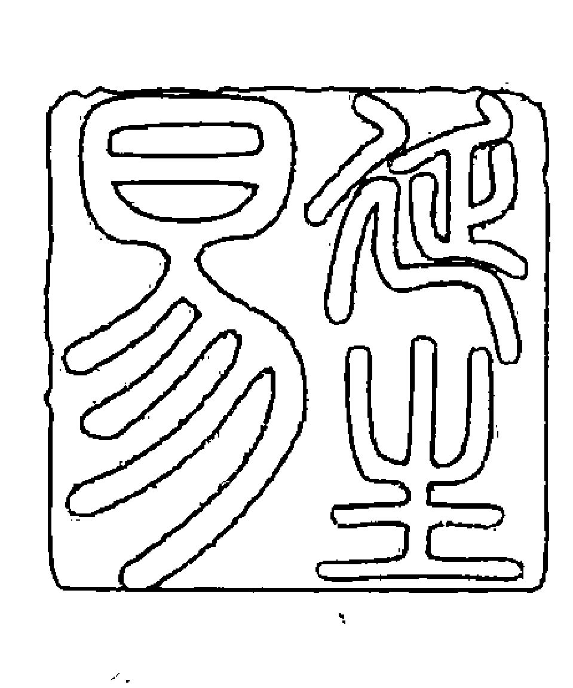

延生易

中央编译出版社
CCTP Central Compilation & Translation Press

## 象数易学与逻辑

张延生 著

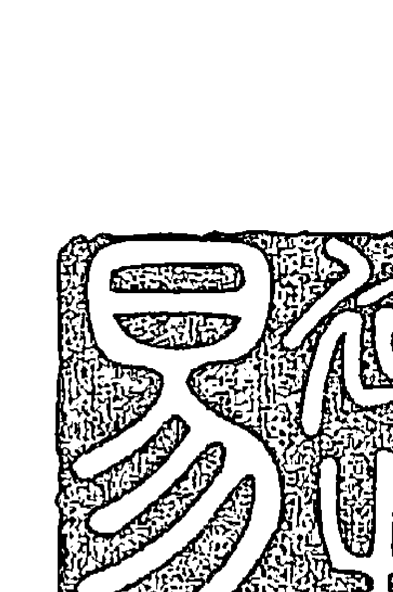

### 图书在版编目（CIP）数据

象数易学与逻辑 / 张延生著。 -- 北京：中央编译出版社，2014.2
ISBN 978-7-5117-1955-3
Ⅰ. ①象… Ⅱ. ①张…
Ⅲ. ①象数之学－研究②《周易》－研究③辩证逻辑－研究
Ⅳ. ① B221.5 ② B811
中国版本图书馆 CIP 数据核字 (2013) 第 244267 号

象数易学与逻辑

| 项目 | 内容 |
|------|------|
| 出版人 | 刘明清 |
| 出版统筹 | 董巍 |
| 责任编辑 | 邓永标 |
| 责任印制 | 尹珺 |
| 出版发行 | 中央编译出版社 |
| 地址 | 北京西城区车公庄大街乙5号鸿儒大厦B座（100044） |
| 电话 | （010）52612345（总编室） （010）52612371（编辑部） （010）66161011（团购部） （010）52612332（网络销售部） （010）52612316（发行部） （010）66509618（读者服务部） |
| 网址 | www.cctphome.com |
| 经销 | 全国新华书店 |
| 印刷 | 北京溢漾印刷有限公司 |
| 开本 | 710毫米×1000毫米 1/16 |
| 字数 | 520千字 |
| 印张 | 33.5 |
| 版次 | 2014年2月第1版第1次 |
| 定价 | 92.00元 |

本社常年法律顾问：北京市吴栾赵阎律师事务所律师 闫军 梁勤
凡有印刷质量问题，本社负责调换。电话：（010）66509618

### 作者简介

张延生，教授，工程师。男，汉族，1943 年 3 月出生于陕西省延安市瓦窑堡，山东省滕县人，1969 年毕业于北京航空学院发动机工艺系工艺专业。曾任北京航空学院机械厂厂部技术室工程师，光明中医函授大学易学教研室主任、教授。曾兼任中国周易研究会副会长、中华名人协会理事、中国医学气功研究会理事、北京中医学院大学生手诊研究协会顾问等职。现任中华易学大会主席、中华周易协会会长兼学术委员会主任，并被数十家企事业单位聘为决策或指导顾问。

作者易学特长：象数、易理、应用、易医、义理。

作者在大学期间，常负父亲首创的“经络测定仪”予人测试诊断，以求经络实质再探。1976 年开始研究气功养生。1979 年研究“特异”现象，继接国家任务。后合作发表《弯曲的多维空间及超空间作用力》等论文，引起学术界注重。1981 年始研《易》。1987 年入选中国科技馆在香港举办的“中国古代科技展暨现场表演团”，代表中国大陆中医、养生界现场演示（包括“手诊气色形态诊断法”）及学术讲演三个月有余，受到新华社表扬。其事迹为多国与地区电视台、广播电台以及近百种书刊杂志主动专题推介。1988年出任电视连续剧“师魂”的制片总顾问。与剧组人员共同努力，使该片达到预定目标——1989年荣获“金鸡奖”的头等奖。

主要研究与应用业绩：在研制无人高空侦察机关键部件、6000吨橡胶压力机、舞台及室内拍摄灯光数控一体化以及光电跟踪、数控等加工工艺技术等方面，均取得重要成果。1983年，参与创办“光明中医函授大学”（李德生、崔月犁任名誉校长，吕炳奎任校长），并于该校任教。同年，开始义务传授推广以“气血、颜色、形态”为基础的“望手诊断”法。1985年起，于国内外办学、讲演、学术交流。学员3万有余，听众近50多万人次。1988年经北京市教育局核准，率先于国内创办全国性的“易经函授班”，学员3000人。自编统筹易学教材17种13册300余万字，率先添补了我国“社会办学”在易学教育方面的空白。为了回报与支持山东大学周易研究中心的工作，将其提供的所有教材及参考文章（包括版本的复印件），均按当时每千字30元的最高稿酬的方式，予以支付，并且由《周易研究》杂志首期发行始，执意作为辅助教材，每期固定订阅3000册的（保本）方式，予以支持。此后，他先后出版：《易与和谐》、《易象及其延伸—易象延》、《气色形态手诊》、《易理数理（一）》、《易理数理（二）》、《易理数理（三）》、《象数易学与应用》等14部专著，并在国内外学术会议上，发表了易学及“象数易学”基础研究及其与自然科学、社会科学相结合以及与实践方面的论文、文章数十篇。由于“发古人之未发，言今人之未尽之意”，因此获得同仁们的广泛好评。

张延生教授，1997 年在“东方网景”网络“传统与现代”栏目中，率先开设“延生学苑”专栏，重点宣扬“中国传统文化中相对稳定、相对平衡系统的寻求”以及易学及其“象数”方面的基础知识和思想方法。1999 年与学员在加拿大多伦多市创立“多成易学会”，并于次年 1 月在多伦多市举办“多成易学会首届国际易学研讨会”；同年创办“多成易学会网站”（www. DuoSuccess.com），用中英文宣扬中华传统文化及中医、养生等方面的精华。2001 年在“太极易”（WWW.TAICHIE. COM）网站，再次开设“延生学苑”专栏，专门宣扬中华文化的根基——“易学”文化。2004 年春节前，在该网站公开发表了，对 2004 年至 2023 年期间，世界主要大“运气”的走向与发展趋势的预测，并强调地指出了：在此期间，中国的东北及其周边所形成的东北亚地区（包括朝鲜、韩国、日本、俄罗斯东部），将形成对未来世界政治、经济、军事等起着一定决定性作用的很重要的地区等的宏观预测；此外，还运用自己独创的“象数易学场效应”理论，指导“首钢”香港合资公司徽标（LOGO）的造型设计；协助策划确定“TOM.COM”网络公司名称及上市（含退市）时机等。在 2006 年出版的《易与和谐》一书的前言与内文中，一再告诫人们，世界众多发达国家的经济衰退即将到来；2009 年“要提防出现类似于 2003 年的‘非典’疫情”等先期性预报。

此外，张延生教授，对易学研究与应用作出了重要贡献：

- （1）论证了中国古代“象数易学”的科学性及其发展脉络，以及恢复与发展中国古代“象数易学”原貌的必要性和现实意义；
- （2）指出了历史上儒家对易学及“象数易学”的部分认识误区和缺陷；
- （3）经过 30 多年的研究与实践，探索出一套学习、研究、应用易学及“象数易学”的独特而简易有效且与现代科学、技术相结合的“延生易”的方法，并在实践中，取得一系列成果和在易学界破除迷信工作中，作出了贡献；
- （4）论证了易学思维模式对于构建和谐社会与和谐世界的重要意义，以及易学及“象数易学”中易卦、爻的“以变”、“合”、“和”、“统一”、“同一性”等发展观，是如何对应与指导我们“科学发展”的创新思路及结果的获取的；
- （5）在以上研发的基础上，他建立了以易学自身“符号学”为基本根据的“象数易学”它自身自然具有的一系列“易理学”理论及思想的“延生易”的认识与表述系统（仍含有某些正确的“义理学”内容）。而且在“易理学”的内涵方面，在继承与发扬了传统易学“象数学”、“义理学”、“象数易学”等原有正确的表述特点及功能外，更是具备了能广泛深入地继承、学习、研发、弘扬及表述过去、现在及未来等，各种事物的状态、关系及其规律的“自然科学”、“社会科学”、“人文学术”等诸多方面的与“时间逻辑学”紧密相关联的“类集集合论”在“分类本质定性学”基础上的认识与表述的“系统论”方面的功能与作用——其中，并不仅仅仍是保持了易学其原有的“命运关怀”的功能及作用，以及运用这些“象”、“数”、“理”、“实践”等学问的基本知识和经验，还是专门来理解及解释《易经》、《周易》、《周易大传》及其儒家在此基础上的各种衍生作品的卦、彖、象、爻、辞、传、句、章等的解释功能和作用。
- （6）在此基础上，“延生易”又创立了：在“一阴一阳之谓道”的“对应统一”世界观启导下的“本体论”思想方法论的：“阴”=“阳”（A = A）的与“形式逻辑”直接对应的易卦、易爻、易象、易数、易符等对应性的认识与表述功能及体系，以及“阴” ≠ “阳”（A ≠ A）的与“辩证逻辑”直接对应的易卦、易爻、易象、易数、易符等的各自及其组合的认识与表述功能及体系。其中，“几何”空间及其“过程学”与“时间逻辑学”和“时间易学”的“时空统一”的“延生易”的对应表述体系与方法，使“象数易学”及其“易理学”（不是“义理学”），形成了以“形式逻辑”与“辩证逻辑”统而为一的“有机辩证统一逻辑”的认识与表述体系和方法，从而为今后社会、政治、经济、军事、文化、科学、教育等一切方面地进步与发展，将会提供“中国特色”的创造及创新的思维和思想方面许多的新思路与新的思考方式和方法——不会再仅仅还是以：有认识与表述上不可避免的必然缺陷的“形式逻辑”（又称“数理逻辑”、“抽象逻辑”、“理性逻辑”、“科学逻辑”、“现代逻辑”、“逻辑斯蒂”、“符号逻辑”），仍然还是作为我们思维、思考、思想的唯一绝对而不可逾越的思维、思想及思考方法的基本根据。

故而，张延生教授进一步倡导并提出了：我们当前研发“延生易”及其“象数易学”的主要目的，是期望在中国传统文化推导方法的精华与西方现代科学推演（演绎）及归纳方法的精华组合中，构建起某些互通性的以辩证思想为主体并与形式思想相结合的归纳、统一与推演、分解的认识与表述的（比较）平台和模式——使有自然科学背景的广大读者和好研玩易者，了解、接近、接受易学及“象数易学”；使有传统文化背景的读者和好研玩易者，在尽量不违背正确传统表述内涵、意义、方法的基础上，能科学化地掌握与运用易学及“象数易学”的思想与方法——借以启发大家如何地在优秀传统文化精华的“中国特色”前提下，来解决“马克思主义中国化”的一些文化、思维、精神、价值及哲理等许多方面的世界观、方法论等诸多方面认识、表述与实践的一些“时间集合”（含“历史集合”）、“类集集合”、“象数集合”、“复合时空集合”、“多宇宙集合”、“时空统一集合”等等的系统性思想和理论的一些具体、针对与抽象的对应结构模型、数理及根据等问题。

同时，张延生教授依然希望：我们应当在这个举世文化，似乎正在披靡于西方文化的（盲从）时代，仍能为我们中华民族的优秀文化及其传统思想和方法的精华，留下正常思维、理性及批判性思维的种子和机会——绝不能再让那些打着“反违科学”幌子和旗号的自身确实又是“违科学”者的各类人物，仍以违反“科学探索”认识与表述精神和思想的胡搅蛮缠的“违科学”的言行，继续再猖獗和狂自尊大了！

### 目录

- 前 言///001
- 一 对“一阴一阳之谓道”以及“阴”、“阳”概念的认识///019
- （-）“一阴一阳之谓道”的“对应统一”的整体性存在及“阴”“阳”本体相同或不同的差异、区分性关系原则///020
- （1）我们对“一阴一阳之谓道”的“本体论”的认识///020
- （2）对“一阴”“一阳”的“阴”“阳”的根本性认识///021
- （3）“阴”“阳”的相同或不同概念地判断，有固定性规定和标准吗？///021
- （4）“一阴一阳之谓道”里应具体针对有什么样的对应性易卦模型？///022
- （5）由(4)中概念的启发，所想到的《易传》中的易卦表述方面的缺陷///023
- （6）“太极图”的一般或特殊性组构的表述状态，它也应是“一阴一阳之谓道”的某些组合结构的对应形式///029
- （二）“一阴一阳之谓道”以及“阴”、“阳”概念与“形式逻辑”相对应的一些认识 ///031
- （1）“形式逻辑”的前提是 A = A 的“同一律”（又名“自同律”） ///021
- （2）“形式逻辑”系统前提下“数理逻辑”在认识与表达上的某些缺陷及其特点 ///093
- （3）“象数易学”易卦，是如何来直接对应表述“形式逻辑”及其“数理逻辑”的认识与表述规律的？ ///138
- （三）对“辩证逻辑”及“唯物主义”世界观、“对立统一”方法论和“形而上学”方面的一些认识 ///181
- （1）“辩证逻辑”（又称“辩证法”）的前提是 A ≠ A 的“非同一律”（又名“非自同律”）。 ///181
- （2）“对立统一” ///186
- （3）“唯物主义” ///191
- （4）“形而上学” ///191
- （5）“象数易学”的“有机辩证统一逻辑”，是如何来寻找与解决“数理”及其“逻辑”不同或矛盾事物间的“辩证统一”的“同一性”的共性本质获取问题的 ///193
- （6）“象数易学”的“有机辩证统一逻辑”，是如何来寻找与解决“数理”及其“逻辑”不同或矛盾事物对应数值间（在统一、融和前提下）的“辩证统一”的“同一性”的共性本质获取问题的？ ///216
- 二 “五行”数理的本质定性及其倒锥螺旋式上升的“生克制化合”的稳定性相互促进与制约的特点
- （一）“五行”结构分布及其相互关系的特点
- （1）“五行”属性的本质定性的原则和标准，是一切事物（本质）性质关系的总括性的表述原则和标准
- （2）“相生”关系
- （3）“相克”关系
- （4）“相制”关系
- （5）“地支”的“六冲”关系
- （6）“相化”（又称“合化”）关系
- （7）“相合”关系
- （8）举例说明“干”“支”的直接应用
- （9）“五行”与“八卦”属性的对应关系
- （10）“五行管理法”（又称“基因管理法”）及其具体应用
- （11）“五行”各属性与季节变化对应时，其属性强弱的对应变化的关系
- （二）综述易卦及其数理间的“五行”定性性质的本质关系
- （1）“先天卦”的“在天成象”的“同声相应，同气相求”的物质“柔性”（虚体）间的波动性特点
- （2）“后天卦”的“在地成形”的“同性相斥，异性相吸”的物质“刚性”（实体）间的实体性特点。
- （3）“先”“后”天卦进行象数组合的对应统一，来完成对一切事物进行全面完整的准确合理地表达
- 三 “盖取诸离”事物相互作用关系的整体性网络构成及规律的“系统论”思想与特点 /// 301
- （一）“象数易学”易卦所对应的事物关系，是通过事物所对应的易卦的卦数本质场态性的相互作用及功能的能力来体现的 /// 302
- （1）“象数易学”易理对宇世间一切事物间的关系的认识 /// 302
- （2）“象数易学”易理对宇世间一切事物间的相互关系的根本认识，是依靠事物直接所对应的易卦的“五行”属性的定性法则和标准，来对事物进行认识、判断和表述的 /// 303
- （二）“同声相应，同气相求”、“法于阴阳，合于数术”的波动性的“场效应”共振原则 /// 303
- （1）“波动性”是对一切事物（第一性的）起决定性作用的规则和法则 /// 303
- （2）易卦、易爻、易象的各种（包括数理）“合”、“和”、“以变”的“标准型”表述关系与类型，是事物与事物达到和谐、共存的充分且必要的前提（先决）条件 /// 304
- （3）寻找与抓住一切事物的共通或共同的共性（统一、同一性）规律，是我们“易理学”研究与表述的根本目的和原则 /// 304
- （4）事物间能产生“共振”、“谐振”的效果，才是事物及社会达到“和谐”、“共识”、“共生”、“心心相应”（并非是“心心相印”）及“生生以变”存在的前提条件及充分且必要的决定性因素 /// 305
- （5）坚决反对侧重片面的仅以事物“波动性”产生的各种“共振”、“谐振”、干涉、衍涉、绕涉等现象表达出来的某些特点和规律，来认识与表述事物该类“虚”“柔”状态下的“象”形规律 ///305
- ## 四 “时间”因素的准确确定，是我们认识、判断、表述一切事物状态、规律的必不可少的先决和决定性条件——“延生易”认为，“时间是第一性的决定性因素” ///307
- ### （一）“六爻相杂，唯其时物也”的“时间逻辑学”及“时间易学”认知判断一切事物的根本前提 ///308
- 1. “哥德尔不完全定理”就是由于哥德尔引进了以时间前后秩序的“时间逻辑学”所直接对应的“递归”及“递归函数”的“哥德尔配数”的概念和方法，才得以顺利解决的 ///308
- 2. 中国传统文化发展的先期，一直都是以“天道决定一切”的认识论，来指导我们对“天地生（含人）”一切事物、关系及其规律的认识、判断与表述 ///308
- 3. “时间为主，空间为辅”是我们“象数易学”对事物的根本性“时”、“空”统一认识论与表述方法的总概括 ///309
- 4. 再说“六爻相杂，唯其时物也” ///314
- ### （二）我们“象数易学”的“设卦”“观象”“系辞”的认识、判断及表述的具体方法与过程 ///327
- 1. “延生易”中“象”、“数”、“理”、“实践”的“易理学”认知关系与原则 ///336
- （2）设卦 ///348
- （3）观象 ///350
- （4）系辞 ///351
- （5）“象数易学”对事物、数据、语言、信息、状态、规律等是否真假的判断规则 ///352
- 五 “体”“用”主次相互作用的关系，是我们“象数易学”对事物间本质定性后，作为认识、判断与表述一切事物发展、变化及其趋向的基本原则 /// 357
- ### （一）“先天八卦”为“体”，“后天八卦”为“用”的事物主次（本质）“定性”关系的判定原则 ///358
- （1）“先天八卦”的“八进制”数理表述系统的某些内涵特点 ///358
- （2）“十进制”、“九进制”转化成“八进制”表述时，不会发生数或数值的丢失现象 ///358
- （3）“先天八卦”对应表述的是“四维”时空“只有象而无实体”的时空结构的规律 ///358
- （4）“后天八卦”对应表述的是“三维”时空“有形有体”的实物结构状态及其规律 ///359
- （5）“先天八卦”对应的“八进制”数理表述系统，在转化成“后天八卦”对应的“九进制”的数理表述系统时，是会必然产生对应数的丢失现象的 ///359
- （6）“易理学”认为，“体”是表述高维、主要、起主导作用的事物及事物主次关系的（主要的）“主体”事物的；而“用”则是表述（相对）低维、次要、相对来说起服从及辅助作用的事物及事物主次关系的（次要的）“客体”事物的 ///359
- （7）鉴于以上原因，“象数易学”的“易理学”是以“先天卦”（含数）的表述系统为“体”，以“后天卦”（含数）的表述系统为“用”的复合（组合）型制式的认识与表述体系 ///360
- （8）以上我们对“体用”概念与关系的论述，是与一般易学界及哲学界对“体用合一”、“体用不二”观念的认识与理解，是有区别和不同的 ///360
- （二）抓主体、抓重点、抓主要矛盾与矛盾的主要方面——抓重点带全局的观点 ///362
- （1）“象数易理”认为，一切事物都是符合“一阴一阳之谓道”的“对应统一”规律的“本体论”的 ///362
- （2）除此之外，还可参阅本人的其他著作 ///364
- 以上文章的参考资料 ///365
- 附件一 “形式逻辑”的弊病及其与有机辩证“象数易学”逻辑的关系 ///367
- 附件二 “数理逻辑”的缺陷与“象数易学”的某些解决方案 ///407## 一 哥德尔定理简介

- （一）“第一不完备性定理”
- （二）“第二不完备性定理”是“第一定理”的一个推论
- （三）“哥德尔不完全性定理”的基本内容
- （四）对“哥德尔不完全性定理”的某些误解

#### 二 “形式逻辑”的缺陷与“象数易学”的互补性解决方案

- （一）“形式逻辑”及“数理逻辑”的缺陷
- （二）如何解决“形式逻辑”的缺陷问题？
- （三）“象数”与“数术”学的“（类集）集合论”辩证统一思想的特点

#### 三 “数理逻辑”在具体应用中的缺陷和“象数易学”某些解决方案

- （一）为什么人脑与电脑（含计算机）有那么多的根本性差别呢？
- （二）“形式逻辑”及其语言，也是无法避免有“不完全”和矛盾性的悖论性表述结果的

### 附件三

### “形式数理逻辑”缺陷与“象数易学”的互补性解决方案

##### 一 “形式逻辑”及“数理逻辑”的缺陷及其互补方法

- （一）“形式逻辑”及“数理逻辑”的缺陷
- （二）如何解决“形式逻辑”的缺陷问题
  - （1）一般解决思路的认知缺陷及我们的某种解决方案
  - （2）我们“象数易学”解决方法的“互补性”特点
  - （3）我们“象数易学”解决方法的“平衡”、“守恒”及“量变到质变”的特点
  - （4）我们“象数易学”是如何解决与“无穷”、“无限”、“无极”有关的数理问题的？
- （三）“象数”与“数术”学的“（类集）集合论”辩证统一思想的特点

##### 二 “数理逻辑”在某些具体应用中的缺陷和“象数易学”某些解决方案

### 附件四

#### “抽象思维学”及其作用与缺陷——“象数易学”易理的某些解决方法

##### 一 什么是“抽象思维学”？它有什么特点？与我们的“象数易学”有何关系？

##### 二 当今人类是否已经进入了一个“完全数字化”的“理性”时代了呢？

- （一）“概念模糊的命题，是不可计算的”
- （二）“图灵(Alan Turing)的停机命题，是不可计算的”
- （三）“哥德尔(Kurt Gödel)命题P(k)，是不可计算的”

##### 三 “数理逻辑”和我们的“象数易学”易理，是如何解决“数理逻辑”某些缺陷的？

##### 四 “象数易理”的“有机辩证统一逻辑”在解决“数理悖论”根本缺陷时的某些思路

##### 五 “象数易学”易理的“极化”、“类化”本质定性法则和标准的确立

##### 六 “象数易学”易理的“类集集合论”与其“有机辩证统一逻辑”的“集合学”及“组合学”的建立

### 前言

由于中华传统的优秀文化以及它们的基础精华，从理性上来分析，应是主要包括：“阴阳”文化；“干支”文化；“五行”文化和“易符”文化（含数字、卦爻组合、卦象爻结构分布等），这么四大体系为主体的文化。

其间，它们四者的各自都有自己的理性和逻辑体系，而我们通过这些体系的相同或不同的相互搭配、组合或集合学的方法，形成了中国传统文化中各式各样的“组合”与“集合”式的认识、推导、判断及表述方法及其体系。所以说，无论研探中国传统文化的什么认识与表述体系和方法，只要是把这四大文化体系的理性表述基础的理论、逻辑及其方法，掌握清楚并弄明白了，研探起传统的任何分析与判断方法和认知及表述体系来，都将很容易的——因为这些方法，都是以这四大文化的理性表述规律及其逻辑思想作为基础，相互组合搭配而成的认识与表述体系。所以在该书中，我们不但着重地强调了这些文化的理论和对应逻辑的基础性作用和功能，而且还对应进行了直接实例的对应性具体针对性地符合与解说，借以提高大家对传统文化中，这四大文化体系内涵的基础理论进一步的认识和重视。也就是说，我们会像原来对待其他的知识和专业知识的认知及提升一样，仍然是特别重视对各科、各专业、各领域等“延生易”方面的“象数易学”基础知识地把握与提高。又由于最近开放几十年来，中国各种大学和教育方面，往往一直是相当不重视乃至忽略了“基础理论”教育及其研发方面不可或缺的重要和主要的基础知识内容和作用，因此我们认为，没有或不能打好深邃可靠的地基基础，怎能盖出又高又大又坚实且能长久使用的“类万物之情，通神明之德”的通天大厦来呢？！

西方科技、文化的基本思维，是会受到“形式逻辑”，又称“数理逻辑”、“理性逻辑”、“抽象逻辑”和“科学逻辑”等的“同一律”、“无矛盾律”、“排中选择律”和“充足因果理由律”思维，以及“辩证唯物主义”的“对立统一律”思想地限制和制约的。由于这些思维和思想方法，均受到了“形式逻辑”的“排中选择律”的影响，最终所获得的往往都是些片面侧重事物的某一方面的片面性的判断结果。这在1930年秋到1931年间，已被“哥德尔不完备性定理”和“不可避免产生矛盾性结果”的“不可完全确切判定”的理论所证明——这已成为“数理逻辑”无法绕得过去和无法彻底避免或回避的认识与表述方面的必然性缺陷。至于，对于“辩证唯物主义”的“对立统一”的认识，由于其也受到了“排中选择律”以及“对事物以极端性相悖的矛盾律”为根据的影响，它也不得已，仅仅是侧重了“唯物”（客观、物质、实事求是）方面的认知，而忽略、放弃或排斥了“唯心”（主观、精神、意识作用）方面补充性认知和主观能动性认知的必需方面。其中，在“思维科学”的众多的思维方法中，“抽象思维学”所直接对应的就是“形式逻辑”的逻辑思想方法，又称为“数理逻辑”、“理性逻辑”和“科学逻辑”方法。虽然，它们是当今一切“理性”思想和科学方法的根基，并对现代一切科学及其发展进行着限定与制约，但是，学术各界，对其在认识与表述方面的根本性缺陷以及如何运用“辩证逻辑”及其方法进行充分地补充与完善方面，一直到目前为止，仍都没有得到应有的普遍地理解、认知和重视！更没有从中国传统优秀的“象数易学”及易学等诸多的文化中，去寻找更加全面完善的“天地生（含人）统一”的“盖取诸离”的“阴”≡“阳”（A = A）与“阴”≠“阳”（A ≠ A）相互作用的整体关系及其直接对应的“时间逻辑学”的“时间易学”哲理思想及方法里，来探究其由“形式”逻辑与“辩证”逻辑统一的“同一性”（共通、共性）的层次和角度方面，所形成的“有机辩证统一逻辑”及其结果，来认识和表述宇宙世界一切事物的本质性“和谐”与“不和谐”，“平衡”“稳定”与“不平衡”“不稳定”等，所导致并形成的各种“生克制化合”局面及其规律发展变化的必然性趋势和结果。本书也是为了进一步探讨这方面的一些规律（含理性、逻辑、某些实践等方面）而写作的。

再者，由于多年来，在“科学主义”盲目的崇信下，我国各学界对西方“形式逻辑”及其“数理逻辑”（又名“科学逻辑”、“抽象逻辑”、“理性逻辑”、“现代逻辑”、“符号逻辑”、“逻辑斯蒂”），也相继产生了盲目的崇信和崇拜的潮流。这在我国各学界如何正确地建立认识论、方法论和思维方式方面，起到了强烈的片面性侧重地认识与表述的影响与干扰作用。使我们的认识，在“排中选择律”的启导和制约下，不是仅侧重于“唯物”方面就是仅侧重于“唯心”的需要方面。要么，干脆就仅仅是侧重于逻辑“理性”或“唯物”方面，而放弃了直观（直觉、形象）的“感性”及“精神”方面的（经验）认识方面的成果，故而这才形成了当前许多人为故意制作的：“物数”、“形数”、“象数”等分离的，仅以“虚拟”、“数拟”、“创新”、“科技”等方面的网络（信息）之“数”（含“大数据”、“云”计算等“模糊思维”等方面与“不可确定性”有关的各种可能性的概率方面的课题），作为判断一切事物及其规律的片面性侧重的唯一性根据——由于其间失去了事物直接对应的实实在在的“物质”存在的一些根据，故而导致了，目前到处都是些“形而上”的脱离实在对应物的科学“虚拟”性的假设，或者是不能肯定性地进行判定，却会直接对应于模糊不清的“可能性”（包括所谓的各种“预期”）陷阱的存在，以及仅靠“数拟”、“虚拟”、所谓的“创新”等的欺诈性，作为对一切事物规律判断的依据——真是防不胜防！为了能使“中国特色社会主义”的“中国特色”的传统“象数易学”及其“延生易”的“易理学”中，“形式”逻辑与“辩证”逻辑统一的“有机辩证统一逻辑”的思想方法和认识论，以及“一阴一阳之谓道”的“对应统一”的“本体论”思想的世界观和方法论，能被当前社会认知与表述方面充实性需要的必须，而得以更加广泛地重视、接受和承袭，所以才撰写了这本书，以示抛砖式地启封与启示。

该书中，我们所极力推广的“延生易”的“象数易学”及其“易理学”（含正确的“义理学”）的思维方法中，当我们“一阴一阳之谓道”的“本体论”思想里的“阴”≡“阳”或“阳”≡“阴”的时候，其思维的思想，就会与“形式逻辑”中的 A = A 的“同一律”的思维方式，有所一定的对应而相同；而当我们“本体论”思想中的“阴”≠“阳”或“阳”≠“阴”的时候，就会与“辩证唯物主义”的“对立统一”中的A ≠ A的“非同一律”、“必矛盾律”、“非排中律”和“非充足理由律”的“辩证逻辑”的思维方式，会有一定的对应或部分的相同。也就是说，我们的“象数易学”的“易理学”中，包含的并非仅是马克思主义所推行的：以矛盾为基础的“对立统一规律”；事物不断更替变化的“否定之否定规律”以及表述事物量化、量变性质变化的“质量互变规律”的这三大定律；并且，它还是以包括矛盾规律在内的“对应统一规律”；包括“否定之否定规律”在内的“变易规律”；“一阴一阳之谓道”的“不易”的“本体论”规律；包括“质量互变规律”在内的“质量对应统一互变本质定性规律”；“时间为主、空间为辅”的“时空论”的“时空对应统一规律”；“时间逻辑学”为直接对应前提的“时间为第一性及第一要素规律”；与黑格尔“螺旋式上升”有某些共同性看法与认识的“五行”本质定性后的“生、克、制、化、合”的“事物本质关系规律”；乃至从认识与表述上会是更加合情、合理、合规矩的“先天八卦”及其配数的“本质定性的‘分类学’规律”；以及“集合学”、“组合学”、“类集集合学”、“多进制组合学”、“组合数学”等的“系统论”、“复合空间论”、“复合时空论”、“多宇宙论”等诸方面的种种认识与表述规律，还有，更重要的是：任何事物都是对应存在于“盖取诸离”的事物间相互作用所形成的网络连动的关系整体之中——绝不会有任何一个事物会是以自己本身的独体或孤体的形式单独存在着的连动与相互发生作用和影响的规律，等等。

但是，无论如何，真正我们“延生易”的“象数易学”的“易理学”则认为：由于“形式逻辑”的最终判断结果，有时是会违背“同一律”的要求，并且必然会产生“不完全”、“不全面”和“必然产生差异乃至极端情况下的矛盾和悖论”结果的，而“辩证逻辑”的方法，又是我们可以专门用来寻找或解决，差异性不同或矛盾性前提下事物间的“同一性”（统一、融和、共性等）规律的思维及思想方法，因此我们“延生易”的“象数易学”的“易理学”方法，是会把“形式逻辑”和“辩证逻辑”统而为一成“有机辩证统一逻辑”的一种寻找事物共同（同一）性特点为主旨的思想方法和认识论。也就是说，我们的传统文化里，有可能我们“延生易”的“象数易学”及其方法论中，才会真正地具备有统一的“一阴一阳之谓道”的以“阴”爻（--）和“阳”爻（—）及其各自对应“阳爻”直接配1数，“阴爻”直接配2数的“本体论”方面的存在基础，并且还可以通过这些“本体论”方面的表述基础，直接推导出一切几何空间结构状态所对应的各种卦象、爻象等卦的结构、分布的全部系统和体系，以及其各种卦、爻直接对应的卦数、爻数的（原始）配数值及其全部的对应性数值量化“以变”“合和”形成的全部成套的量变的表述体系。其他许多国家和民族的所谓各种各样的“本体论”内容和思想，都不会像我们的“象数易学”一样地具备有这么简单、完整、统一的整套的认识与表述功能、作用及其能力统一的表述体系——也就是说，大家说归说，实际上，许多说法还都并没有真正的具有或形成了各自“本体论”的系统性的整套思想和方法，同时还能以这些思想和方法，作为自己全部认识与表述一切事物的最基本思维的表述基础。所以，在此认识与表达的基础上，我们又会主张：唯物与唯心、客观与主观、主体与客体、物质与精神、“象”与“数”（“象数统一”不可分）、“形式”逻辑与“辩证”逻辑、大脑与意识、认识与表述等，所有无差异、相同乃至无矛盾，或者是有差异、不同乃至有矛盾的事物间，都能统而为一的通过我们的“延生易”所提供及推行的“象数易学”的“类集集合论”等方法，找到它们之间的共性和共同性、共通性需要的统一的（同一性）基础与和谐的认知基础——这终将应会成为“马克思主义中国化”的重要内容及其组成部分之一。

“形式逻辑”是以事物的相同性为基础，来寻找事物独立的差异性和不同性的认识；“辩证逻辑”却是在差异的不同性中，寻找与解决，它们的共同或共通性的“同一性”方面的认识；而我们“延生易”的“象数易学”，却既要认识事物的差异性，又要认识事物的同一性；这样我们才能真正具备掌握及运用事物及其事物（同一性）规律的目的。这是因为：

假若一，事物都是处于完全（全部）是 A=A 的存在状态时，由于其间的事物无法通过进行前提概念明确的差异地比较，来寻找到它们的不同性来进行对比，故而其“不可确定性”，就成为了它们必然的结果和状态——这也是在近现代物理学“基本粒子”的认识与表述中，必然会是无法明确确定的“不可确定性”的“混沌”、“云”概念等出现的根本原因之一。

如果二，事物都是处于完全（全部）是 A ≠ A 的存在状态时，若是找不到事物间的“同一性”或共同（统一）性规律，能相互间进行比较的话，事物之间所存在的，仍然还会是个“不可确定性”的差异性结果和状态——这又是符合“哥德尔定理”和“模糊数学”、“波粒二象性”及其各种概率、几率说等，在对事物的认识与表述中，必然还会是“不可确定性”的真实实际结果的根本原因之一。

所以三，只有承认事物间是处于：既有差异和矛盾的不同，又承认事物间是有共同性的同一性时，我们才能通过事物间及其规律地比较，对事物作出正确且本质性方面的相对性地认识与表述——其中，缺少二者中的任何的一方面的认识与表述，都是无法对事物作出全面、完整、正确地认识、判断与表述的——因为这才是符合我们“一阴一阳之谓道”的“本体论”的“对应统一”世界观，以及其认识论和方法论的认识与表述方面的全面、完整、整体性认知及判断的（共性、同一性）要求的。

我们为什么要特别强调“延生易”的“象数易学”的重要性和作用呢？

就是因为：当今仅以“形式逻辑”的思想，认识与表述一切事物及其规律时，当信息量扩大到一定的量，或者瞬间或暂短时间下，事物的信息量会剧烈地增减——变化量复杂且巨大时，“数理逻辑”的“不完备”、“不可计算”、“不可确定”、“不可确切判断”、“必然产生矛盾”等结果的缺陷，以及所运用的又多都是些在“模糊”概念前提下，把原来统计到的但是已经成为过去的几率、概率、概率幅式的事物出现的可能性，作为对当今、今后或未来及其预期的真实事物及其规律的必然的肯定性结果来认识及处理了，故而这将成为人们对真实事物及其规律不断认识中的一些认识方面的误区和错误依据——把假设、想象、虚拟、推论、也许的可能性及其概念与（过时的事物）结果，当作目前、今后事物真实的客观实际存在来进行对待与处理——真是傻得无法再傻了（但愿是不得已而为之的结果）！当然，这也是在“虚拟”、“数拟”、“创新”、“科技”等信息潮流的概念中，数与对应事物相互脱离时的最大的盲目性及欺诈性的根源之所在。这还是“经济全球化”、“政治多极化”、“网络开放化”、“军事联邦化”、“资本虚拟化”、“信息共享化”等等，执意或不得已将信息量放大或急速减少或缩小到一定的量值时，使人们认识的“不可不确定性”成为必然性的判断结果后，这自然就会形成是各种不可不确定性、欺诈性手段和（经营、操作）方法的根据和根源了。可是，就其从长远的更深层的意义来说，对于这一“哥德尔定理”特别重要的逻辑意义、哲学意义、经济意义、政治与军事意义、语言文字学意义和数理意义等，至今仍然还是甚少能被中国哲学界、数学界、科技界（含物理学）、语言文字学以及政治、经济、军事、文教、媒体、宣传、政党、各信息界、学术界等的人士们，有所较广泛地关注、理解与认识。请大家得特别提高警惕才是！

我们如果在总结“形式逻辑”及其“排中选择律”的不断持续地影响和统导下，在我们现在很多的认知过程中，我们往往经常会发现：由于受到仅盲目重视所谓“自由”、“民主”、“平等”、“博爱”等单方面地个体性追求，忽视并放弃了“集体利益”、“公共利益”、“社会共同需求”等的必须性需要，于是会出现：

- 看重坚持己见，甚于归纳各方面的意见；
- 看重分析，忽视综合与归纳；
- 看重眼前、局部或个体利益，忽略长远、全局或整体的利益；
- 看重推衍和演绎的提升，忽略归纳与综合的提升；
- 看重竞或争，甚于合作与协同；
- 此外，
- 看重发奋、扩张、甚于保守与凝聚；
- 看重实验科学指导下的理性知识，看轻并忽略感性、形象、直觉认识基础上的认知经验、智慧及其发挥；
- 看重科学的崇信，甚于传统、宗教、意识形态与信仰的认知与哲理地探求；
- 看重暴力、军事强势和霸权的追求，甚于和平共处、文化共识及公平平等权利的实现；
- 看重经济利益和价值的获取，甚于政治、军事和外交利益及其价值的寻求；
- 看重排斥、打击及其以“对立”为基础的哲学思想和作用，忽视并放弃“互补”、包容及其“你中有我，我中有你”的“对应”为基础的“有机辩证统一”的共赢思想和合和作用；

除以上而外，一般还容易导致发生：

- 看重物质（唯物）的追求，忽视精神（唯心）、思想与道德的充实与完善；
- 看重“资本主义”社会的资本、利润和物欲的追求及满足，排斥甚至反对“社会主义”社会的公共性利益及其享受乃至精神、意识形态“为社会尽力服务”的追求与满足；
- 看重自我的个性、个体、局部、眼前性的差异需要，忽视“社会性”需要下的集体、大局、长远、整体和共性的需求；
- 重视大国与先进国家的发展需求，胜于落后与发展中国家的发展需要和诉求；
- 重视保证与保护少数有钱人的利益及其榨取，忽视广大人民分配利益及社会共享利益的普遍公平性获取；
- 重视局部或个别利益的获取与满足，甚于争取整体和全面利益的获取与满足；
- 重视少数权威、专家们的认识与发挥，甚于广大实际劳作人民成果和作用的具体组合性发挥与创造；
- 看重具有欺诈性为主的资本的“虚拟资本”及其经营模式的发展与结果，忽视或忘记“实体经济”的基础及其支柱的作用和成果；## 对“一阴一阳之谓道”以及“阴”、“阳”概念的认识

#### (一) “一阴一阳之谓道”的“对应统一”的整体性存在及“阴”“阳”本体相同或不同的差异、区分性关系原则。

##### (1) 我们对“一阴一阳之谓道”的“本体论”的认识。

按照现代的认识论与方法论的语言表述，对“一阴一阳之谓道”的正确全面的概念、理解及其准确意思与内涵，说的应是，“认识与表述相同或不同事物地组合与变化的规律和理论”的一种最基本、最基础的“本体论”根源性思想。它也是说，“一阴一阳”不仅是“义理”中单指“阴”、“阳”的绝对、唯一、极端、完全相悖的以对立、排斥及否定对方为前提的“对立统一”的概念、理论与关系。按照我们“延生易”的“象数易学”中“易理学”的认识认为：“阴”“阳”是事物间相对来说的一对概念和关系。该“阴”“阳”二者相同或差异不同乃至根本性不同的组合与变化，它所形成的世界观，应是一种事物间谁也离不开谁的相互间“对应”且“互补”性的统一的存在关系（“对应”关系中，含有“对立”关系的组成部分），并且二者及其变化组合成为“道”的基本“本体性”构成和状态——也是易卦、爻基本几何型组合结构、分布状态与其卦爻象直接配数量化的“象数”方面的根本性的基础依据——所有易卦的几何型组合结构的状态及其对应的配数，都可以由该“阴”“阳”对应爻和直接对应配数的最根本的“本体论”方面认识与表述，作为（象数）基础，全部都能直接对应性地被推导出来。这也应是易学及“象数易学”易理学中“不易”概念所指的：“天下殊涂而同归”的易学及“象数易学”根本（本体）不变的（基础）共性（同一性方面）的思想——既“对偶两分而统一”又“通神明之德、类万物之情”地充满着相互作用的“盖取诸离”的“情感”因素的有机辩证的“对应统一”世界观的道理。也就是说，“阴”与“阳”的相同、差异、区别或甚至（极端）矛盾性的不同或相同，预示了二者是共同且同时存在着的一对事物或事物的不同方面。由于其间没有“阳”，哪来的与之对应存在的“阴”；如果没有“阴”了，又哪来的与其对应的“阳”的存在，所以它们二者间的关系所反映的是：事物对应存在时的互相补充其（根本无法相融及其前提下）各自认识与表述不足和缺失方面的内涵、内容，以及是对其各自功能与作用的认识与表述不足或缺失方面结果的一种关系。也就是说，二者（含“绝对”的不相同）是一种相互“互补”各自认识及表述缺陷的“对应性”的同时存在的关系——而并非仅是一般人们所认为的：仅是对立、排斥及相互打击而否定乃至消灭对方的唯一性的绝对性定义的相互关系。这种对“本体论”的认识、表述和思想，正是西方“形式逻辑”（同一律）体系及“无机辩证逻辑”（对立统一）系统在其认识、表述与思想中，最为缺乏的对事物根本性认识与表述方面的基本思路的表现。

##### (2) 对“一阴”“一阳”的“阴”“阳”的根本性认识。

我们“象数易学”的“易理学”中，还认为，“一阴”“一阳”所对应表述的是事物之间的所以是“阴”，所以是“阳”的相同与不同或差异性，乃至（极端认知前提所导致的）矛盾存在关系及其状态的概念。同时，二者尤其重要的是：它还包括了“阴”“阳”各自相同部分的组合关系与状态的概念。也可以说，“阴”“阳”的不同或相同，都可以成为是组构成“道”的内涵的认识与表达部分和方面。具体相对“延生易”的“象数易学”的“象数”表述方法来说，就是相同或不同“阴”“阳”性质的任何事物及事物之间，都可以组合及形成直接与事物自身实际存在时相对应的组合结构状态及其内涵一致的卦、爻集合体与分布结构状态。

#### (3) “阴”“阳”的相同或不同概念地判断，有固定性规定和标准吗？

在我们“象数易学”的“易理学”里，在对“一阴一阳之谓道”的“本体论”的表述过程中，没有“一阴”“一阳”之间的的任何量化、量级及比例等差异性（范围、范畴、层次、角度、学科、领域等）关系的规格、规定、标准和限制性之类的表述前提。也就是说，任何情况下的“阴”、“阳”关系与状态（含跨时空的关系与状态），其二者或任何一方的“以变”或变化，都可以成为“道”的组成的基本内涵的成分或部分。当然其中也会包括卦或爻之间的各种组合“合和”、“以变”等内涵与状态。具体说，就是任何空间中的任何事物及其量化、量变、比例等相互的对应状态与关系，都可以组合及构成（包括“垮时空”的）与之自身实际存在直接相对应的卦、爻及它们之间的各种逻辑（并非仅是“形式逻辑”，还含有“辩证逻辑”、“时间逻辑”、“五行本质分类定性逻辑”、“‘盖取诸离’网络相互作用关系逻辑”等）关系。也就是说，“阴”“阳”是一对“相对”来说的概念——只要我们能区分事物及事物之间的相同或不同时，我们就可称其间任何一方为“阴”时，而另一方就为“阳”。反之，皆然——不会形成严格固定而死板的“阴”、“阳”之分的统一的绝对性概念和组合（结构）形式。

##### (4) “一阴一阳之谓道”里应具体针对有什么样的对应性易卦模型？

“一阴一阳之谓道”的内涵表述状态中，我们“象数易学”的“易理学”认为，应该包括“阴＝阳”（阳＝阴）、“阴≠阳”（阳≠阴）、“阳生阳”；“阳生阴”；“阴生阴”；“阴生阳”；“阴阳相杂以生”等的各种卦、爻的（阴阳）组合结构状态及其“以变”、“合和”过程。此外，我们还认为，不只是《易传》、“义理”中仅认为的：当“阴”“阳”相遇或“阴极生阳”、“阳极生阴”之时，才能产生“生生”不息的“合和”“以变”及“以变”“合和”过程，就是对于“阴”或“阳”它们各自的本身来说，也都存在有各自“生生”不息的“合和”、“以变”及其“以变”、“合和”的逻辑变化及其过程。

- ① 比如；会具有：“阳”直接能生“阳”；“阴”直接能生“阴”的功能和作用。“老阳”（⚊）、“经卦”乾（☰）卦、4爻（䷀）或5爻的乾（䷀）卦、6个爻的乾为天（䷀）卦等“乾类”卦；以及“老阴”（⚋）、“经卦”坤（☷）卦、4爻（䷁）或5爻的坤（䷁）卦、6个爻的坤为地（䷁）卦等“坤类”卦。
- ② 再比如：“阳”不但能生“阳”，而且还具有直接生“阴”的功能与作用。即“少阳”（⚌）、震（☳）卦、四爻的复（☳）卦、五爻的复（☳）卦以及六爻的“复”（☳）卦等“震类”的卦等。“阴”不但能生“阴”，而且还具有直接生“阳”的功能与作用。即“少阴”（⚍）、巽（☴）卦、四爻的姤（☴）卦、五爻的姤（☴）卦以及六爻的“姤”（☴）卦等“巽类”的卦等。
- ③ 除此之外，还有各种“阴”“阳”爻相互搭配生成的各种“类卦”形式的具体结构状态，比如，“离类”（6爻“颐”☲卦；5爻颐☲卦；4爻颐☲卦）；“坎类”（6爻“大过”（☵）卦；5爻大过☵卦；4爻大过☵卦）；“兑类”（6爻“夬”☱卦；5爻夬☱卦；4爻夬☱卦）；“艮类”（6爻“剥”☶卦；5爻剥☶卦；4爻剥☶卦）；“震类”（6爻“复”☳卦；5爻复☳卦；4爻复☳卦）；“巽类”（6爻“姤”☴卦；5爻姤☴卦；4爻姤☴卦）等卦，都能体现出易卦组合结构中的“阴”“阳”爻之间的相生及“生生”、“以变”、“合和”、“融合”、“统一”不息的（逻辑）变化特点。

这又说明：“阴”“阳”的概念，又是一种表示事物不同的种类或类型的“类化”性认识与表述的（本质）“分类学”的概念——当然，也是表述一切事物间的相同与不同的区别性（并非仅是完全不同、绝对、唯一、极端、相悖等“对立”）的相互“对应”存在的（相对的）概念。同时，也说明了“独阴不生”、“孤阳不长”等观点和结论，在“延生易”的“象数易学”认识论的认识与表述里来说，它就是一种脱离事物实际存在而得出的片面性和不确切性的认识观点和结论。这也同样体现出了易学（含《周易》及其《大传》部分）及“象数易学”，都是以“变易”、“以变”、“量变”、“合和”的变化性的“变易”思想，来看待、对待、认识、反映、表述、处理一切事物的思想和原则。

##### (5) 由(4)中概念的启发，所想到的《易传》中的易卦表述方面的缺陷。

由以上(4)中的概念，我们又想到了《易传》中“阳卦多阴”、“阴卦多阳”的儒学“义理学”的所谓的一些“理性”概念，而该概念，我们认为：其并非是普遍性理性的认识结果，反而是概念模糊及不确切性的一些有相当大经验缺陷的认识和说法。

我们以上这里所说的意思应是：若是一个卦（二爻至六爻卦）里，其“阴爻”的数量多于“阳爻”的数量时，则该卦所对应的就应当是表示“阳”性事物的“阳”卦；当卦中的“阳爻”的数量多于“阴爻”的数量时，其所对应的就应该是表示“阴”性事物的“阴”卦了。因此，这种认识就会产生某些易学界个别权威人士的所谓“义理”概念——即肯定性地就会认为：“具体说，震坎艮是‘阳卦’，兑离巽是‘阴卦’。‘阳卦’象征君子，‘阴卦’象征小人之道”的观念。

这种对卦的表述性质的（绝对、唯一性）认识，又是一种非常狭隘而片面的认识下的结论。这里的“阳卦”和“阴卦”，不应该仅被理解成是少量的“三爻卦”直接对应的“震坎艮是‘阳卦’，兑离巽是‘阴卦’”的特征及其全部三爻易卦的组合结构状态，其中还应该包括更大数量的两个爻、四个爻、五个爻、六个爻乃至其以上更多数组成的集合性卦爻体（七个爻以上组合成一个“复合”卦——“复合空间”、“复合时空”、“多宇宙”表述体系）的特征才是。

比如：

三个爻的巽（☴）、四个爻的姤（䷫）卦、五个爻的姤（䷫）卦、六个爻的姤（䷫）卦，还有四个爻的家人（䷤）卦、睽（䷥）卦等；五个爻的遯（䷠）卦、同人（䷌）卦、中孚（䷼）卦等；六个爻的“中孚”（䷼）卦、“履”（䷉）卦、“遯”（䷠）卦等——它们都是“阴卦”。

又比如：

三个爻的震（☳）卦、四个爻的复（䷗）卦、五个爻的复（䷗）卦、六个爻的复（䷗）卦，还有四个爻的剥（䷖）卦、夬（䷪）卦等；五个爻的临（䷒）卦、师（䷆）卦、小过（䷽）卦等；六个爻的“小过”（䷽）卦、“谦”（䷎）卦、“临”（䷒）卦等——它们都是“阳卦”。

以上这些类型的卦，都是符合我们“象数易学”中“易理学”的“易理”（并非“义理”）理论概念的——即通过卦中“阴”“阳”爻的数量的多少的对比，来判定一个卦（包括各种爻数组成）从总体结构上是如何来表述其“阴”“阳”性质的规律的。也可以说，我们在这方面的“易理”认识，是满足并超过一般传统“义理”对卦爻组合表述系统，仅是指三爻或六爻卦的认知范围和概念的内涵的。

至于上面认为的“‘阳卦’象征君子，‘阴卦’象征小人之道”的认识，又是一种太绝对化了的认知标准与结果。这也是由于对易卦的普遍、总体的内涵意义的对应性认识与表述，仅仅是落实到其“形而上”概念所对应的的某些易卦内涵的固定性“人道”、“人格”、“人事”、“人性”、“人文”等的想象之中，才直接导致的片面侧重性的误解。

难道说，“和兑(䷹)，吉”；“离(䷝)为美好”；“巽(䷸)为洁齐、为告命”；“与人和同的协作精神”的“同人”（䷌）卦；“讲求诚信为本做人原则”的“中孚”（䷼）卦；“小心谨慎，严格按照事物客观规矩办事”的“履”（䷉）卦；“热情洋溢，与谁都像一家人一样对待”的“家人”（䷤）卦等，这些所谓“阳爻多”的“阴卦”的内含，只是“象征小人之道”的规律吗？哪个“君子”是不应该自觉具备这些“德”性与言行的呢？！

反过来说，“震(䷲)为粗暴、为打击别人抬高自己”；“坎(䷻)主匪、主盗、主陷”；“艮(䷳)为只顾自己、为背道而驰、为落后”；“剥者烂也的腐败、道德败坏”的“剥”（䷖）卦；“自顾自己利益，不顾他人需要”的“颐”（䷚）卦；“把他人当炮灰来使用”的“师”（䷆）卦；“不断把别人的成果，当作自己的成果而谋名利”的“小过”（䷽）卦；“反复无常，来回折腾”的“复”（䷗）卦等，这些所谓的“阴爻多”的“阳卦”的内含，只是“象征君子之道”的规律吗？哪些所谓的“小人”又是不会具备这些“德”性与言行的呢？！

但是，一般“义理”的“易传”中“阳卦多阴”、“阴卦多阳”的总结经验（并不是理性的普遍性理论）里，是不包括“乾类”（全部由6个䷀、5个䷀、4个䷀及3个䷀“阳爻”组成）和“坤类”（全部由6个䷁、5个䷁、4个䷁及3个䷁“阴爻”组成）卦的组合规律与特征的。还有四爻卦与六爻卦中，“阴”“阳”爻的数量对等（同样多）的集合组构卦体中，也是不存在以上该经验所说的总体上的“阴”、“阳”卦的必定性判定规律和特点可寻的。

比如：

四个爻的颐（䷚）卦、大过（䷛）卦、渐（䷴）卦、归妹（䷵）卦、既济（䷾）、未济（䷿）卦等6卦中，“阴”“阳”爻都各是两个的组合结构状态；以及六个爻的天地否（䷋）卦、地天泰（䷊）卦、风水涣（䷺）卦、雷泽归妹（䷵）卦、雷火丰（䷶）卦等卦中“阴”“阳”爻个数都各是三个的（“阴”“阳”爻个数相同）组合成的64卦（六爻卦）中的那20卦的（几何）结构状态。也就是说，卦中的卦爻在“参伍以变，错综其数”的更替与取代的过程中，始终是处于数量或质量的能级守恒的状态下的这些卦，都属于是这类总体无法判定它是“阳卦”还是“阴卦”的涵盖规律之中的。这是因为，在这些卦中，“阴”“阳”爻各自的组合数量，都是相等（相同）的缘故——是不可能也不会是符合“阳卦多阴”、“阴卦多阳”的差异性经验（非理论）的判断结果和可能的。

对以上该句通行本《易传》传辞的论述，在“系辞下传”的第四章中是这样说的：“阳卦多阴，阴卦多阳，其故何也？阳卦奇，阴卦耦。”

从“阳卦多阴，阴卦多阳”字面上来分析，这里的“多阴”、“多阳”之说，应该指的是“八卦”（三爻卦）除乾坤两卦外的其地6个（“六子”）卦的卦爻组合特点的。它应是解释三爻卦为什么是如此“阴”“阳”构成的原因的。其后，它又说“其故何也？阳卦奇，阴卦耦。”这里的“阳卦奇”与“阴卦耦”，不应该是指卦数、卦序等的卦的总体数值来说的，而应该还是指“阴”“阳”卦内所含的“阳爻”与“阴爻”的数量来说的。正因为是“阳卦多阴，阴卦多阳”，所以“阳卦”里所含的“阳爻”数量应是奇数的一个爻，而“阴卦”里所含的“阳爻”数量就应是耦数的两个爻——它们都是指的“阳爻”的个数来讲的概念。如果是指“卦数”或“卦序数”的奇偶来说的话，将它们各自对应配以“先天八卦数”后，则会形成震4、坎6、艮7；巽5、离3、兑2；乾1、坤8的配数结果。显然，许多卦与其所配的“卦数”、“卦序数”的奇偶对应关系数，是不能完全与“阳卦奇，阴卦耦”的观点与理念相符合的。若其各自对应配以“后天八卦数”时，则又会形成为震3、坎1、艮8；巽4、离9、兑7；乾6、坤2的结果。很明显，这又会有许多卦与其所配的“卦数”、“卦序数”的奇偶对应关系数，照样还是不能完全相符合的。因此说，“阳卦奇，阴卦耦”不是也不可能是指“八卦”各卦所配数的奇偶特点来说的概念。也不可能是指三爻卦中的“阴爻”个数而言的概念。若是指“阴爻”个数来说的概念的话，它应该是这样地解释说；“阴卦奇，阳卦耦”。所以我们只能理解与领会为，它只能是指“阳爻”在三爻卦中的个数而言的概念。而这种“阳卦奇，阴卦耦”或“阴卦奇，阳卦耦”的每一种解释，都比原话“阳卦多阴，阴卦多阳”的《易传》中地概括，更来得全面、完整与准确。当然，这也是仅限“六子”卦中的卦爻结构来说的一种概念，其他各种爻数组合成的卦，又当是别论的。请注意！

假如，此处不仅是指“八卦”里的某些卦的卦爻组成特点，而是指所有的卦的构成而言的话，就如同前面我们曾举例分析过的那样：

则“阴卦”还包括，四个爻的姤(☰)卦、夬(☰)卦、家人(☰)卦、睽(☰)等；五个爻的姤 (☰) 卦、遯 (☰) 卦、夬 (☰) 卦、大壮 (☰) 卦、同人 (☰) 卦、大有 (☰) 卦等；六个爻的姤 (☰) 、遯 (☰) 卦、夬 (☰) 卦、大壮 (☰) 卦、家人 (☰) 卦、同人 (☰) 卦、履 (☰) 卦等卦的卦、爻组合结构状态及其关系，它们依然是符合“阴卦多阳爻”的规律特征。

则“阳卦”还包括：四个爻的复 (☷) 卦、剥 (☷) 卦、解 (☷) 卦、蹇 (☷) 等；五个爻的复 (☷) 卦、临 (☷) 卦、剥 (☷) 卦、观(☷) 卦、师 (☷) 卦、比 (☷) 卦等；六个爻的复 (☷) 、临 (☷) 卦、剥 (☷) 卦、观 (☷) 卦、解 (☷) 卦、师 (☷) 卦、谦 (☷) 卦等卦的卦、爻组合结构状态及其关系，它们仍然是符合“阳卦多阴爻”的规律特征。

但是，这中间，仍然会存在有，四个爻的颐(☷)卦、大过(☷)卦、渐(☷)卦、归妹 (☷) 卦、既济 (☷) 、未济 (☷) 卦等6卦；六个爻的天地否 (☰) 卦、地天泰 (☷) 卦、风水涣 (☰) 卦、雷泽归妹 (☷) 卦、雷火丰 (☷) 卦等20卦，卦内“阴”“阳”爻，数量对等平衡的状态——即这些卦中“阴”“阳”爻是处于相等、对等的集合卦体的构成状态里。故而我们此时将如何才能判断它们的总卦体的“阴”“阳”性质呢？传统及至今的通行本《易传》及“义理”中，至今也未能给出一个明确的说明或答案。

此外，还有，那些三个爻到六个爻组成的乾“类”卦和坤“类”卦的组合结构状态，也是与这个“理论”观点不相符合的卦、爻集合构成关系体系的。故而“阳卦多阴，阴卦多阳”的说法，只能是相对某些卦形结构来说的经验性概念与结果，并非是易卦组合结构、形成的一般普适性的（哲理）理论与观点。请大家格外注意！

以上是我们认为，对“阳卦多阴，阴卦多阳”的某些更较全面完善的“易理学”方面的认识与分析，它已对“阳卦多阴，阴卦多阳”的认识，已不像传统通行的《易传》、“义理”的认识那么死板、那么绝对了。同时，我们也会感受与体会到，真正被儒家与“义理派”所吹捧的通行本《周易》及其哲理《易传》中，它所推崇的许多所谓的哲理与观点，也并非都是那么正确与全面的。其中的所谓“理性”的诸多内容，也是不可轻易地就相信而被我们全部采纳和吸取的，很多所谓的“理性”哲理，都是值得我们从新思考、分辩与确认的（许多所谓的“义理”，并未提升到理性的普遍性理论上来认识，其往往还是停留在某些经验性归纳的局部、局限的范畴与过程之内）。因此，我们在遇到卦爻“阴”“阳”数量多少与卦的总体“阴”“阳”性质的比较与辨别时，是会根据具体卦的具体结构及内含，作出具体的分析与判断的——“阳卦多阴，阴卦多阳”只是易卦、易爻、易符的一种相对来说，是对事物认识与表述的一种局部经验性的概念与说法。也就是说，卦的总体“阴”“阳”性质的确定，脱离开其针对性的具体直观的卦象几何结构及其对应的内涵意义来说，都是无法根本进行确定的——得到的只能是相对来说的一种被确定的所谓的概念及关系，而不是指全部易符（包括数字型、图示型、图画型等）、易卦与易爻的关系概念及规律的普适性理性认识。想通过一个简单的“阴”“阳”卦爻在卦中的个数的多少的规律，直接就能归纳和抽象出每个卦体总的“阴”或“阳”的性质的本质想法与做法，可能也是脱离了大量的实际实践经验的调查、统计、归纳与提升，而仅为了满足于“形而上”的猜想、空想、空谈的意识形态的需要，才这样去想、去做，所造成的后果。就像《易传》的“系辞传”中，想通过一个卦的几何结构的卦形组合结构状态，就可以很容易地直接判断出各卦间的“大”“小”、“贵”“贱”等关系概念一样，这都是把易卦、易爻、易数、易象、易符、义理等关系与概念，看成为是绝对（固定）死板而不可逾越的关系与概念后，所必然造成的错误认识与表达——都是把《易经》当成唯一却绝对不可逾越的表述记述了。这种思想与想法，都是违背了易学及“象数易学”中最根本也是最基础的“变易”的思想与“一阴一阳之谓道”的“对应统一”的“本体论”规律的表现。

#### （6）“太极图”的一般或特殊性组构的表述状态，它也应是“一阴一阳之谓道”的某些组合结构的对应形式。

- 此概念产生的基础思想，应是来源于“道生一，一生二”的老子的“道生”、“道德”相变的思想，以及“易有太极，是生两仪”的孔子及儒学“易传”、“义理”的宇宙本体构成的“以变”思想。按我们“象数易学”的“易理学”对老子及儒学的该类思想的综合性认识认为：这其中由“生二”、“生两仪”的“对偶”、“两分”思想为基础所对应的“阴”“阳”本体“对应统一”为“道”的思想，应是说：“阴”与“阳”是同时存在的事物组合状态。也是说，“阴”与“阳”或“阳”与“阴”，应是谁也离不开谁的同时共同存在的事物及其共同组合成的“互补性”本体状态——没有“阴”，哪来的“阳”？没有“阳”，哪来的与之对应的“阴”的存在？！通过“太极图”的具体结构与分布构成可知，“阴”“阳”二者，是相互“阳阴消息”即“阴长阳消，阳长阴息”的同时发生着的一种相互“互补”性的关系。所以说，事物及其与之对应的“道”理，都是相对来说的道理，我们不会认为，能产生或存在有“绝对性”的“惟一”性的道理的认识（虽然其间可能存在有过渡性的偏颇性的一些道理或推理过程）。又由于“阴”与“阳”反映的都是相对来说的事物的区分或不同的场态概念，因此我们认为：不会有真正的“阴”或“阳”的事物孤体、独体形式的存在——有的只能是它们共同或不同存在的组合形式与状态。所以说，在我们“延生易”的“象数易理”中，是不会出现完全独立地去探讨与研究事物的孤体状态的存在及其规律的——因为只有通过事物间的相互作用的“盖取诸离”的网络性组合结构关系地比较，才能认识到事物之间的本质及其规律的异同的差异的。因此我们可知，在我们的“象数易学”的“易理”（不是“义理）中，是不存在有大家经常以为的“孤阴不生”、“独阳不长”的现象和可能性的——该“课题”及其论点，是脱离自然实际的片面荒谬而不可取信的想象或假设性的认识与理解！

- 另外，由于“太极图”中间的这条 S 曲线所表述及反映的，都是其曲线上各点上下、内外、左右等的“阴”和“阳”二者连续不断“中和”后的（“0”点集线组成的）规律——各位置点上的“阴”“阳”在“和合”平衡稳定以后，形成的“中和”、“统一”、“融和”的结果，是一种“无”的运行轨迹——形成的是“波动性”状态（场态）的波动性规律。这也是说，真正事物“和合”、“中和”、“湮灭”的“以变”运行状态，最终总是靠事物本质的“波动性”场态来体现的。又由于宇世中所具有的事物的“中和”及“湮灭”的最后结果，并不可能形成为“0”（没有、不存在）的状态——两个完全不相同而相背的极端性事物及状态的组合，在“对卦”间的相互“中和”、“湮灭”的过程中，比如，乾为天（☰）卦与坤为地（☷）卦，二者“中和”的过程是：“乾”（☰）卦的“先天”总数 + “坤”（☷）卦的“先天”总数 =2+16=18。18÷8，余 2。“2”对应于“先天八卦数”所对应的“先天”兑（☱）卦的场态——说明二者统一“和合”融合的最终结果，是以“先天”兑（☱）卦所对应的“金”性的本质场态，继续存在着——也就是说，任何二者事物间的“中和”、“湮灭”、“和合”的结果，是不可能产生“不存在”或“没有”概念的“0”的意义所表述的结果的——形成的是一种“同声相应，同气相求”的共振、谐振、衍涉、干涉等状态的新概念。其间，由于我们仅是靠眼睛的识别功能来判断时，这应是一些几乎直接看不到的存在状态，因此才被道学的“无”；佛学的“空”；儒学、“义理”的“虚”（象）的概念所取代了。故而，我们只得把这些“无”、“空”、“虚”（象）的概念理解成是“无所不包”、“没有具体针对指向”或“不可能产生具体指向”的概念不可了——并不会仅是“没有”、“不存在”的概念——“无所不包”的概念里，才能包含有“没有”、“不存在”以及“无中”才能“生有”及“有生无”的概念。

- 又由于，假如“象数易学”的64卦中的32对“对卦”，都同时产生“和合”、“中和”“湮灭”的话，其所对应的宇世中的一切事物之间，都会是以“先天”兑（☱）2之卦的状态，继续存在下去。由于此时，我们只能见到或感知到一切事物的状态，都会是“后天”兑（☱）卦的无任何差异的（A = A）“金”性场态——不存在有任何的区别与相比较的可能性，所以我们也不可能通过事物间的差异及其相互作用关系的不同，来对应性的得到任何的认识与判断结论——这是不是说，已经进人了一个“无”、“空”、“虚”的状态与概念之中了。但是，宇宙中事物的这种“中和”、“湮灭”、“和合”、“统一”、“融和”地变化，往往是局部或个别的，那种宇世中一切事物之间的全面性地“湮灭”或“中和”的“和合”变化，只有在全部宇宙中（含各种区域各自全部的可能）的全部事物在进行“湮灭”或“中和”的“和合”突变时，才会出现——当然，一般情况下，应当是不可能发生的。若是真的发生时，也会是一种人类当今的智慧是无法预料及处理的，并且还会是对人类及其生存来说的一种灾难性的变化——可是，对于客观自然存在事物本身的变化来说，却是一类非常合理而正常客观的“和合”“以变”的状态与规律的表现。

#### （二） “一阴一阳之谓道”以及“阴”、“阳”概念与“形式逻辑”相对应的一些认识。

- “形式逻辑”的前提是 A = A 的“同一律”（又名“自同律”）。
即：“象数易学”中“易理学”（不仅是“义理学”）的“一阴一阳之谓道”的本体认识与表述中，当“阴”（绝对）≡“阳”或“阴”＝“阳”时，它所直接对应所指的，就是西方“形式逻辑”前提下的A＝A“同一律”的逻辑模式地认识与表述形式。也就是说，按一般人们对“形式逻辑”的认识，会认为它是认识与表述同一、对称、平衡、均匀、稳定、等价以及数及“数理”守恒等前提下的事物及其量化、量变的并以“线型”数理为主的认识与表达的模式及方法。

也是说，在“阴”（绝对）≡“阳”或“阴”＝“阳”的前提下，其认识与表述的思维方式和方法，它仍然会符合“形式逻辑”的“同一律”（又称“自同律”）；“不矛盾律”（又称“兼容律”或“相容律”）；“排中律”（又称“选择律”）以及“充足理由律”（又称“因果律”）的涵盖之内的事物规律、结果和道理。在我们“延生易”的“象数易学”的“易理学”（不是“义理学”）里，则认为，与“形式逻辑”认识及表述方式或方法，直接相对应的64卦里的易卦（几何、象数、数字等统而为一）“标准型”的组合结构状态里，由于人们在使用该“形式逻辑”来认识与表述一切事物时的立场、观点、角度、位置、层次、概念、前提条件等的不同或相同，故而受其不能发生矛盾结果的“兼容律”和“排中选择律”的限制，往往会产生不可避免的不同或相同的片面性及仅是侧重性的认知与表述的结果和结论，所以在其与空间几何结构的直接能对应的认识与表述的64种易卦几何型组合结构的状态中，共有以下4对（4组）8种的组合结构的“标准型”（几何、空间、结构）状态（象数）模型，是与之认识及表述需要能相互直接对应的。

##### 其间：

- I “对称”性。
是靠易卦之间的“本卦”及其“反卦”、“交易卦”以及一些“互卦”、“类卦”之间的（几何）组合结构状态的变化规律，来对应体现；

- II “守恒”性、“等价”性。
是靠易卦本身配以相对应的“先天八卦”（自然）数后的易卦“本卦”与其“变卦”（又称“之”卦）、“反卦”、“对卦”、“交易卦”以及一些“互卦”、“类卦”之间“和合”“以变”的量化与量变过程的最终结果值的对应判断，所对应体现的：

###### Ⅲ “平衡”性。

是靠易卦“本卦”及其“反卦”、“对卦”、“交易卦”以及一些“互卦”、“类卦”的（几何型）组合结构的直观（与直觉、感性等形象思维相关）性以及这些卦配以的“先天八卦”所直接对应的8个序数在“和合”“以变”中的量变结果值，共同来体现的；

###### Ⅳ “稳定”性、“均匀”性、“和谐”性、“平权”性等。

是靠“八卦”、64卦及其各种排列组合、分布结构等的“类”型形式的具体的综合调查、分析、统计、归纳与提升，来对应体现的。

###### Ⅴ “互补”性及其二者相互统一而“湮灭”或融和的“同一性”结果。

是由易卦结构的相互能“互补”其各自表述不足的“对卦”之间的相互湮灭、中和、统一、“和合”“以变”及其融和的最终结果（含跨时空的空间结构形式、状态及其量化地量变结果等），来对应性体现的。

以上这5类与形式系统相对应的易卦、易爻、易符、易数、易象等有关的主要地分析判断特点的易卦、易数的“对称”、“互补”以及其“守恒”、“等价”、“平衡”、“稳定”、“和谐”等的易卦“象数”对应的各类变化的易卦“以变”、“和合”的诸多的模型，本来我们应该在以上的各类分析与定义的变化中，做出一一对应性的“以变”或“和合”的对应模型地具体对应性地分析及表述，借以加强大家对这些对应模型结构状态与其分布结构方面意义地进一步地体会和认识。可是，由于变化量巨大却指向性又是开放的，较难以让大家很快就能掌握其必要的对应性关系，同时还要占取或浪费大家许多不必要的时间与文义篇幅，所以我们采用在具体对应模型的实际研讨中，进行统一对应认识及表达的方法，来进行具体针对性的对应于“象数”“以变”、“和合”等诸方面地认识、判断和表述——达到从总体上来认识“形式逻辑”体系的优劣特点、性能及功能方面的目的。

与事物及其量化变化状态所直接对应的认识与表述模型的存在，又有与“时间逻辑学”直接对应的“时空统一”的“过程学”的逻辑及其逻辑效果和状态地直接参与，因此，我们是能得到对事物作出尽量统一而共识的认知及表述结果和可能的——这就是我们“延生易”的“象数易学”及其本身的“易理学”（不是“义理学”）的“有机辩证统一逻辑”优势于“形式逻辑”认识与表述功能和能力的所在之处！

下面我们运用“延生易”的“象数易学”的认识与表述的“易卦”的“象数”表述方式，来具体分析分析易卦结构表述方法，是如何来分析并理解与“形式逻辑”有关的一些认识与表述内涵的，由此，我们将能建立一种与“形式逻辑”认识与表述的相互共享比较式的统一性平台——以利于认识与理解“延生易”的“象数易学逻辑”与“形式逻辑”（含“数理逻辑”、“科学逻辑”、“理性逻辑”）的一些异同性认知和区别等的特点。

-   ① 绝对 A ≡ A（即：“阳”绝对≡“阳”或“阴”绝对≡“阴”）的“形式逻辑”的组合结构状态。

A、事物外部为（A = A）“阳” ≡ “阳”；内部也是（A = A）“阳” ≡ “阳”的组合结构状态。

乾为天（☰）卦。

这是一类，事物内外部分，都是处于“阳”（绝对）≡“阳”（A ≡ A）的（绝对、极端性）组合结构状态。

该乾为天（☰）卦的上下卦，都是三个爻的乾（☰）性的“阳”卦的“金”性本质所组合而成。按照我们的“象数易学”易卦的表述法则来说，这是一种从上下、左右、前后、外内、远近、好坏、南北、往来等等方向上来观察、分析、研究及探讨与其直接对应事物的组合结构形式状态时，其（六爻）卦的（几何）空间结构与构成及其量化、性质（本性、“金”性）等，都是一模一样（A = A）的事物状态所组合而成——是一种从任何方向、角度、方位、量化、性质等来观察、分析、探讨、研究、认识与表述来说，都是同样（A = A，同一性）的“对称”、“守恒”的组合结构状态——即 A ≡ A [ “阳”（绝对）≡ “阳” ] 的符合“形式逻辑”表述形式与状态下，事物的直接对应的组合结构状态。可以说，这是一种上下卦组合成的“对称”、“守恒”、“平衡”、“均匀分布”、“等价”等的极其（几乎是绝对的）“对称”、“守恒”的平衡且稳定的合谐状态的模型之一——这也应是“形式逻辑”认为的，真正符合其 A=A 的“同一律”（又名“自同律”）的组合结构状态直接对应的空间及其“象数统一”的单纯的复合时空的组合“形式”之一。

而该乾为天（☰）卦，中间二至五爻组成的“互卦”乾（☰）卦状态，依然是以三爻乾（☰）卦为基础的对称、守恒、平衡、均匀、等价等的“阳”性的“金”性本质的组合结构状态。而64卦中，这二至五爻的组合结构（互卦）状态，是表示该乾为天（☰）卦最后最终所能形成的事物的结果和状态的——说明最终我们所得到的事物的结果状态，仍然还是乾（☰）=乾（☰）的 A = A 的“金”性本质的组合结构状态。所以说，该乾为天（☰）卦，应是一种绝对的 A ≡ A （“阳” ≡ “阳”）的符合“形式逻辑”的（几何）空间结构认识与表述的“标准型”的组合结构模型之一。

此外，再从乾为天（☰）卦，是由三至上爻或二至上爻的上“互卦”乾（☰）卦或“互卦”乾（☰）卦与初至四爻或初至五爻的下“互卦”乾（☰）卦或下“互卦”乾（☰）卦，上下共同组合而成的各部分来看，它也是4个爻的上乾（☰）=下乾（☰）或5个爻的上乾（☰）=下乾（☰）的 A=A 的空间与象数（同一性）的组合结构状态——即 A ≡ A [ “阳”（绝对）≡ “阳” ] 的符合“形式逻辑”表述形式与状态下，事物的直接对应的“复合空间”的组合结构状态。可以说，这是一种上下卦组合成的“对称”、“守恒”、“平衡”、“均匀分布”、“等价”等的极其（几乎是绝对的）“对称”、“守恒”的平衡且稳定的合谐状态的组合模型之一——这也应是“形式逻辑”认为的：真正符合其 A = A 的“同一律”（又名“自同律”）的组合结构状态直接对应易卦组构的“象数统一”的时空组合的结构“形式”之一。

B、事物外部为（A = A）“阴” ≡ “阴”；内部也为（A = A）“阴” ≡ “阴”的组合结构状态。

##### 坤为地（䷁）卦。

这是一类，表述事物内外都是“阴”（绝对）≡ “阴”（A ≡ A）的组合结构状态。

该卦的上下卦，都是由三个爻的坤（☷）卦的“阴”性的“土”性本质的卦组合而成。按照我们的“象数易学”易卦的表述法则来说，这是一种从上下、左右、前后、外内、远近、好坏、南北、往来等等方向上来观察、分析、研究及探讨某与之对应的事物的组合结构形式状态时，其（六爻）卦的（几何）空间结构与构成及其量化、性质（本性、“土”性）等，都是一模一样（A = A）的事物状态所组合而成的——是一种从任何方向、角度、方位、量化、性质等来观察、分析、探讨、研究、认识与表述来说，都是同样（A = A，同一性）的“对称”、“守恒”的组合结构状态——即 A ≡ A [ “阴”（绝对）≡ “阴” ] 的符合“形式逻辑”表述形式与状态下事物的直接对应的空间组合结构状态。可以说，这是一种上下卦组合成的“对称”、“守恒”、“平衡”、“均匀分布”、“等价”等的极其（几乎是绝对的）“对称”、“守恒”的平衡且稳定的合谐状态的组合结构的模型之一——这也应是“形式逻辑”认为的，真正符合其 A = A 的“同一律”（又名“自同律”）的组合结构状态直接对应的空间组合状态，以及“象数统一”的单纯性的复合空间的组合结构的“形式”之一。

而该坤为地（䷁）卦，中间二至五爻组成的“互卦”坤（☷）卦的状态，依然是以一个三爻坤（☷）卦“阴”性的“土”性本质为基础的对称、守恒、平衡、均匀、等价等的组合结构状态。而 64 卦中，这二至五爻的组合结构（“互卦”）状态，是表示该坤为地（䷁）卦，最后最终所能形成的事物的结果和状态的——说明最终我们所得到的事物状态，仍然还是坤（☷）= 坤（☷）的 A = A 的“土”性本质的组合结构状态。所以说，该坤为地（䷁）卦，也应是一种“绝对”的 A ≡ A（“阴” ≡ “阴”）的符合“形式逻辑”的（几何）空间结构认识与表述的“标准型”（几何结构）的组合结构的模型之一。

##### C、总结以上A、B这两种（整体、内外）绝对A ≡ A（“阴”绝对 ≡ “阳”或“阳”绝对 ≡ “阴”）的易卦（几何、象数）空间组合结构状态的“形式逻辑”的复合型表述模型。

总结以上这两种绝对A ≡ A（“阴”绝对 ≡ “阳”或“阳”绝对 ≡ “阴”）的易卦（几何、象数）空间组合结构状态的复合型的表述模型，可知：该两种模型是与“形式逻辑”的“同一律”的要求，是完全符合的一种表述与认识事物的组合结构的模型和形式。这也是因为，三个爻组成的乾（☰）、坤（☷）两卦的基本及其基础单元或要素的组合结构状态的本身，就是一种完全“对称”、“平衡”、“均匀”、“守恒”、“中”“正”，且二者间能相互“互补”其各自表述不足等的“同一性”的直观（形象）性表述状态的“象数统一”的单纯性复合时空组合结构的形式所致。

-   1. 以“先天八卦”卦（八进制）高维（四维）存在形式中的乾 = 1；坤 = 8数，代入以上两卦“互补”的“合和”“以变”的“中和”及“湮灭”之中。

① 即：

“乾” (☰) + 坤 (☷)
= [ 上乾 (☰) + 下乾 (☰) ] + [ 上坤 (☷) + 下坤 (☷) ]
= [ 1+1 ] + [ 8+8 ]
=2+16
=18。
18÷8，余 2。
“2” 对应于“先天”兑 (☱) 卦的“金”性性质。

其中，
18=1+8=9。
9÷8，余 1。
“1” 对应于“先天”乾 (☰) 卦的“金”性性质。

② 而该两个六爻卦，无论上下卦谁为“体”卦时，“乾” (☰) 卦之数均 = 11；“坤” (☷) 卦之数均 = 88。
若二者相“互补”而融和为一体时：
即：
“乾” (☰) +“坤” (☷) (或“坤” +“乾” )
=11+88 (或 88+11 )
=99。

也就是说，由“先天八卦” (八进制) 量化抽象数值的对应表达上来看，二者的量化变化(湮灭、中和、融和)的和数结果，并不是等于百分之百的量化的“守恒”状态——总是会存在有 100 - 99 = 1 的 1% 的量化表述损失量的。也就是说，这种与绝对的 A ≡ A ( “阴” ≡ “阳” ) 的“象数易学”易卦的直接对应于“形式逻辑”的易卦“象数”的表述中，是存在有“不完全”的“数理逻辑”的表述缺陷的——这正与“哥德尔不完全定理”的结论，有所一致。这也是近现代物理学在探究高能物理学中“波动”性的“同声相应，同气相求”共振、谐振、衍射、绕射等状态下的规律时，为什么与频率、波长、波幅相关的事物的能量、质量，会产生衰减、干涉、绕射，甚至产生引力扭曲等结果的原因之一——因为任何事物，都不会以自己不健全、不完全、不完整的结构状态或形式存在的。说明，人类及科学家在对待、理解与处理事物的对应“波动”结构形式的量化及其量变的过程中，在“合和”“以变”时，是存在有不完全、不全面及不健全地认识与表述缺陷的（虽然仅有1%缺陷）——特别是在数学的数及数值、数制的纯抽象的“理性”过程中，存在有与人类一般正常“感性”或“直觉”等形象思维的形式和结果之间，是肯定具有不合或有根本不可克服的冲突性的认知的（其中也包括“先天八卦”的“八进制”的“极化”、“类化”对应表述数理的方法）。

-   ③ 如果：
以“乾”“坤”两卦的小数点前两位和小数点后两位的数值代入其“互补”过程中。即把“乾”=11.11；“坤”=88.88代入式中：

```
“乾”☰+“坤”☷（或“坤”+“乾”）
=11.11+88.88（或88.88+11.11）
=99.99。
```

由以上计算结果可知，由“先天八卦”（八进制）小数点前后两位数的量化数的对应表达上来看，二者在高维（四维）存在的“合和”量化变化（湮灭、中和、融和）的和数的“以变”结果，并不是等于百分之百的量化的“守恒”状态——总是会存在有100 - 99.99 = 0.01的0.01%的量化表述损失量的。也就是说，这种与“绝对”的A ≡ A（“阴”≡“阳”）的“象数易学”易卦的直接对应于“形式逻辑”的模型表述中，是存在一定量的“不完全”的“数理逻辑”表述缺陷的——这正好又与“哥德尔不完全定理”的结论，有所一致。这也是近现代物理学在探究高能物理学中“波动”性的“同声相应，同气相求”共振、谐振、衍射等状态下的规律时，为什么与频率、波长、波幅相关的事物的能量、质量，会产生衰减、干涉、绕射，甚至出现引力扭曲（弯曲）等结果的原因之一——因为任何事物，都不会以自己不完整、不完全、不确切的缺陷性结构状态或形式存在的。说明，人类及科学家在对待、理解与处理事物的对应“波动”结构形式的量化及其量变的过程中，在“合和”“以变”时，是存在有不完全、不全面及不健全完整地认识与表述缺陷的（虽然仅有 0.01%缺陷）——特别是在数学的数及数值、数制等的纯抽象的“理性”过程中，存在有与人类一般正常“感性”或“直觉”等形象思维的形式和结果间，是肯定有不合或有根本不可克服的冲突性的认知的（其中也包括“先天八卦”的“八进制”的“极化”、“类化”对应表述数理方法）。

##### 2.假如：

我们用“后天八卦”（九进制）低维（三维）事物存在形式中的乾（☰）卦=6；坤（☷）卦=2的“实体粒子”的抽象量化数值来直接对应进行表述时：

① 即：
“乾”（☰）+“坤”（☷）（或“坤”+“乾”）
=66+22（或22+66）
=88。

可知，二者的量化变化（湮灭、中和、融和）的和数（合和、统一）结果，并不是等于百分之百的量化的“守恒”状态的——总是会存在有 100 - 88 = 12 的 12%的量化表述损失量的。也就是说，这种与绝对的 A = A（“阴”=“阳”）的“象数易学”的“后天”易卦的直接对应于“形式逻辑”的表述模型中，是存在有更多的量变的“不完全”的“数理逻辑”表述缺陷的——这也正与“哥德尔不完全定理”的结论，有所一致。不过，这种对应于“后天”（或“洛书”）数的“九进制”量化对应表述及其形式，会产生更多（12%）的量化表述缺陷和失误及因素的。这也是近现代物理学在探究高能物理学中“粒子”（刚、实体）性的“同性相斥、异性相吸”量化变化状态形式下的规律时，为什么其能量或质量会发生突然丢失的原因之一（在这些湮灭结果的新的组合结构中，说明其中有一些物质或粒子及其伴生效应的产生，很可能是在有意无意当中，被丢或缺失掉了）——因为任何事物，都不会以自己不健全、不完全、不确切、不完整的客观的自然状态存在的。这说明，人类及科学家在对待、理解与处理事物（刚性、实体）的对应量化及其量变的过程中，在“合和”“以变”时，是存在有不完全、不全面及不健全的认识与表述缺陷的（会有12%丢失量的缺陷）——特别是在数学的数及数值、数制的纯抽象的“理性”过程中，存在有与人类一般正常“感性”或“直觉”等形象思维的形式及结果不符合，或有根本不可克服的冲突性地认识的——知其与“十进制”有密切回归和“根数”关系的“九进制”的“标准型”表述方式，最终是无法对和谐存在的一切事物的真实性，进行对应准确确切地表达的——缺少量化的质变性法则和标准的确定及其制约性。

###### ② 如果：

以“后天八卦”（九进制）的“乾”“坤”两卦的小数点前两位和小数点后两位的数值代入“互补”过程中。即把“乾”=66.66；“坤”=22.22代人式中：

```
“乾”（☰）+“坤”（☷）（或“坤”+“乾”）
=66.66+22.22（或22.22+66.66）
=88.88。
```

由以上计算结果可知，由“后天八卦”（九进制）小数点前后两位数的抽象量化数的对应表达上来看，二者在低维（三维）存在的“合和”量化变化（湮灭、中和、融和）的和数的“以变”结果，并不是等于百分之百的抽象量化的“守恒”状态的——总是会存在有100-88.88=11.12的11.12%的量变的损失量值的。在这些湮灭结果的新的组合结构中，说明其中有一些物质或粒子及其伴生效应的产生，很可能是在有意无意的处理中，它们被丢掉了。也就是说，这种与绝对的A≡A（“阴”≡“阳”）的“象数易学”里“后天”易卦的直接对应于“形式逻辑”的易卦表述模型中，在“合和”“以变”时，也是存在有更多的“不完全”、“不全面”、“不完备”的“数理逻辑”表述缺陷的（会有11.12%丢失的缺陷）——这又是正好与“哥德尔不完全定理”的结论，有所一致（原因，同上面①中的解释与探讨）。

###### ③ 假如：

我们用 “后天八卦”（九进制）低维（三维）存在形式中的乾（☰）卦=6；
坤（☷）卦=5的 “实体粒子” 的抽象量化数值来直接对应进行表述时：
“乾”（☰）+“坤”（☷）（或 “坤” + “乾”）
=66+55（或 55+66）
=121。

可知，二者的抽象量化变化（湮灭、中和、融和）的和数（统一、融和）结果，
却是个大于百分之百的抽象量化的不 “守恒” 状态的一个数值——总是会存在有
121 - 100 = 21的21%的抽象量化的多余的量化的数量存在着。这种新的量化
组合结构状态的形成，说明其中又多含有了一定量的对应物质、粒子及其伴生效
应能量的产生，已不仅再是原来事物间单纯的 “湮灭” 结果了。也就是说，这种
与绝对的 A ≡ A (“阴” ≡ “阳”) 的 “象数易学” 易卦的直接对应于 “形式逻辑”
的表述模型中，在 “合和” “以变” 时，是存在增益有更多的 “不完全”、“不完
备”、“不完整”、不健全的表述可能性和缺陷的——这又正与 “哥德尔不完全定
理” 的结论，有所一致。这可能也是当今在 “形式逻辑” 思维地 “绝对” 性指导
下，人们为什么会盲目地就会误认为：事物及其信息量方面在 1+1 的情况下，
为什么会认为是 > 2 的糊涂性认识的根源之一—— “形式逻辑” 及其 “数理逻辑”
和 “科学逻辑”，由于采用的数与 “数理” 进制（十进制、九进制）的本身，在
转化成其他层次及进制的过程中，是存在有不完全、不全面、不正确地表述功能
和缺陷的。因此，在其对某些对应性事物的探讨和研析中，是存在不确切的认识
与表述缺陷的。

不过，这种对应于 “后天八卦”（或 “洛书”）数的 “九进制” 抽象量化表述，
会增益产生更多（+21% > -11. 12%）的抽象量化的不可准确判定的缺陷和失误
因素的。这也是近现代物理学在探究高能物理学中 “粒子”（刚、实体）性的抽象
量化状态下的规律时，为什么能量或质量等会突然地增加的原因之一——因为任何
事物，都不会以超过自身量化及其量变的不健全、不完全或不全面整体的状态存在
的。这又说明了，人类及科学家在对待、理解与处理事物（刚性、实体）的“同性相斥、异性相吸”对应抽象量化及其量变的过程中，是存在有不完全、不完备及不健全的认识与表述缺陷的——特别是在数学的数及数值、数制等的纯抽象的“理性”变化过程中，存在有与人类一般正常“感性”或“直觉”等形象思维的形式及结果不相符合，或有根本不可克服的冲突性的（必然会增益 21%的表述干扰因素）认识——其应与“十进制”及其有密切连带变化关系的“九进制”的抽象量化表述的“标准型”的表述方式，最终还是无法对客观实际的和谐存在的一切事物的真实性，进行对应准确确切地表达有关——缺少量化、量变的质变性统一的判定法则和标准。

④ 如果：

以“乾”“坤”两卦的“后天八卦”（九进制）小数点前两位和小数点后两位的数值代入“互补”过程中。即把“乾” = 66. 66；“坤” = 55. 55 代人式中：
“乾”（☰）+“坤”（☷）（或“坤”+“乾”）
=66. 66+55. 55. （或 55. 55+66. 66）
=122. 21。

由以上计算结果可知，由“后天八卦”（九进制）小数点前后两位数的抽象量化数的对应表达上来看，二者在低维（三维）存在的“合和”抽象量化变化（湮灭、中和、融和）的和数“以变”的结果，并不是等于百分之百的抽象量化的“守恒”状态的——总是会存在有 122. 21 – 100 = 22. 21 的 22. 21%的增益的不确定的量变指向和干扰因素的。这种新的量化组合结构状态的形成，说明其中又多含有了一定量的对应物质、粒子及其伴生效应能量的产生，已不仅再是原来事物间单纯的“湮灭”结果了。也就是说，这种与绝对的 A = A（“阴”=“阳”）的“象数易学”“后天”易卦的这种直接对应于“形式逻辑”的表述模型中，在“合和”“以变”时，是存在有“不完全”、“不完备”及“不可确定”、“不知为何”等的增益因素的“数理逻辑”表述缺陷的——这正与“哥德尔不完全定理”的结论，有所相一致。这可能也是当今在“形式逻辑”思维地绝对指导下，人们为什么会盲目地就误认为：事物及其信息或信息量方面在 1+1 的情况下，会是 > 2 的糊
涂性认识的根源之一——“形式逻辑”及其“数理逻辑”和“科学逻辑”，由于采用的数及“数理”进制的本身，在转化成其他层次或进制的过程中，是存在有不完全、不全面、不正确地表述功能的。因此，从总体认识与表述上来说，其在对某些对应性事物的探讨和研析中，是存在有不确切的认识与表述缺陷的。

不过，这种对应于“后天八卦”（或“洛书”）数的“九进制”的抽象量化表述，会增益产生更多（+22.21%）的抽象量化“不可准确判定”的缺陷和失误因素的。这也是近现代物理学在探究高能物理学中“粒子”（刚、实体）性的抽象量化状态下的规律时，为什么能量或质量会突然的增加的原因之一（这种新的量化组合结构状态的形成，说明其中又多含有了一定量的对应物质、粒子及其伴生效应能量的产生，已不仅不再是原来事物间单纯的“湮灭”结果了）——因为任何事物，都不会以超越自身量变状态的不健全、不完全或不全面整体的状态存在的。这又说明了，人类及科学家利用“形式系统”在对待、理解与处理事物（刚性、实体）的“同性相斥、异性相吸”对应抽象量化及其量变的过程中，是存在有不全面、不完备及不健全的认识与表述缺陷的——特别是在数学的数及数值、数制等的纯抽象的“理性”过程中，存在有与人类一般正常“感性”或“直觉”等形象思维的形式和结果，不相符合或有根本不可克服的冲突性（必然会增益22.21%的表述干扰因素）认识的——“形式逻辑数理”在运用与“十进制”有密切连带变化关系的“九进制”的抽象量化表述的“标准型”的表述方式时，最终，是无法对客观实际的和谐存在的一切事物的真实性，进行对应全面准确确切地表达的——缺少量化、量变的质变性统一的判定法则和标准以及其“一阴一阳之谓道”的“本体论”的基本认识与表述的整体性为基础的认识论地指导的。

这虽然可能就是高能物理学在高能粒子的研探中，一些多余能量不知是如何发生的原因之一，但是在数与数理的量化抽象过程中，由于现代科学的探讨与认识，往往是处于假设前提下对事物的认识、思考与判断，很可能在对实际事物的量化或配数时，忽略或者舍弃了许多不应该忽略和舍弃的量化因素所致（否则，怎么会突然增加了那么多的量变能量和因素呢）。这是“实验科学”在运用“形”式逻辑系统”进行推导和思考时，当前应该必须尽快解决的“理性”（逻辑）量化配数的重点问题！否则，今后将会直接失去客观自然的尽量准确的数理对应认识与表述事物的可能性的。

##### 3.总结 A、B 两例的分析结果，可知：

由该两种易卦的整体组合结构状态来说，由其外部的上下卦的（几何）空间结构状态上看：

- A、是 A 绝对 = A ［即，乾（☰）“阳” ≡ 乾（☰）“阳” ］的结构状态。
- B、是 A 绝对 = A ［即，坤（☷）“阴” ≡ 坤（☷）“阴” ］的结构状态。

而由其各自二至五爻的内部将来（本质）的上下卦的（几何）空间组合结构状态上看：

- A、是 A 绝对 = A ［即，乾（☰）“阳” 绝对≡ 乾（☰）“阳” ］的结构状态。
- B、是 A 绝对 = A ［即，坤（☷）“阴” 绝对≡ 坤（☷）“阴” ］的结构状态。

从“形式逻辑”的组合结构形式来看，其组合形式，都是 A 绝对 =A 的“自同律”的形式。也是一些事物外部是 A = A 以及其内部将来也会是 A 绝对 ≡ A 的“自同律”的组合结构状态。这说明，无论由其事物的现在或者将来的组合结构形式的结果来分析，它都是不会产生任何矛盾性结果的组构形式。这说明，它们的这些组合结构形式，最终均能达到从“守恒”、“对称”、“平衡”、“互补”的立场与层次、角度等方面来认识与表述一些事物及其规律的（同一性）认知目的和要求的。也就是说，这都是一些就其总体或内外局部的组构形式、现象、本质结构与分布来说，都是相对来说的一种“绝对”的“守恒”与“对称”、“互补”的易卦（同一性）与“形式系统”直接对应（时空、象数）的组合结构状态的“复合时空结构”的表述模型。

同时，由以上对①“类”中的全部分析，可知：

“先天八卦”（八进制）高维（四维）存在的“波动性”形式的易卦结构及其抽象配数中，是较“后天八卦”（九进制）低维（三维）存在的“实体”、“粒子性”结构形式状态的易卦结构及其配数，将是更合理，更接近于事物的本质的整体、同方向的数、卦“守恒”；同方向卦形“对称”；整体结构的卦、数“平衡”；同方向的卦、数“互补”；整体、同方向卦、数“稳定”“统一”；同方向的卦、数“等价”等方面动态与静态的特性——静态是整体呈平衡稳定的分布状态，动态表现的是整个事物的分布呈平衡稳定的状态之后，它所表现出来的动态“波动性”的状态——呈现出的是，“同声相应，同气相求”的振动规律。

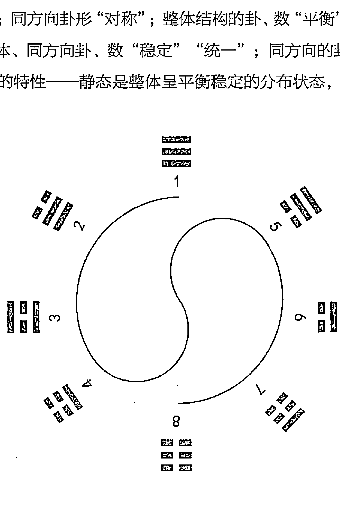

而不像“后天八卦”对我们当前的“三维”立体空间所表现出来的“实体”事物的变化那样，其分布、结构会像“布朗运动”下的粒子那样，只能呈现出的是按卦数序数所对应的那些卦序的“碰撞”的动态有序的运行方式，最终才能达到事物分布的总体上的平衡和稳定——呈现出的是一种“动态平衡”的“同性相斥、异性相吸”的对实物的一种普遍采用的认识与表述的模式。由于“其结构分布”表现出的也是一种事物分布之间，在一定时间段内的整个系统中各事物之间的“动态平衡”的相对稳定的一种状态，因此它的总体的静态模式，将是各方向的卦数总体都是守恒的；“四正”同方向的卦、数互补；“四隅”方向的数互补，卦形不互补；“四隅”同方向对面两卦的“卦画数”不相等；“四隅”同方向对面两卦阴阳爻的个数，不相等；等等——在同一对应的相对静止的时间条件下，靠这个表述模型来观察、分析、研究、探讨一切事物时，是存在有许多。（“先天八卦”结构分布及波动图）

看不见或想不到的一些隐伏缺陷的。这也是我们“延生易”的“象数易学”的认识与表述中，往往或基本是以“先天八卦”（八进制）的“对称”、“互补”、“守恒”、“平衡”、“和谐”等的抽象量化配数及其结构分布之“象”为主“体”，而以“后天八卦”（九进制）的“实体”（刚性）的“对称”、“互补”、“守恒”等的抽象量化配数及其结构分布的具体针对性的“象数统一”为辅“用”的原因之所在——尽量减少或保证高维存在事物状态在向低维时空存在事物状态，在其“合和”、“以变”的转化、更替过程中，确保其信息及其信息量在其抽象转化更替的过程中，尽可能少的丢失、缺失或增益、增殖的“不可确定性”因素及其现象的发生——保证信息及其量化变化的统一、完整、全面及尽量准确确切地得以认识与表达。

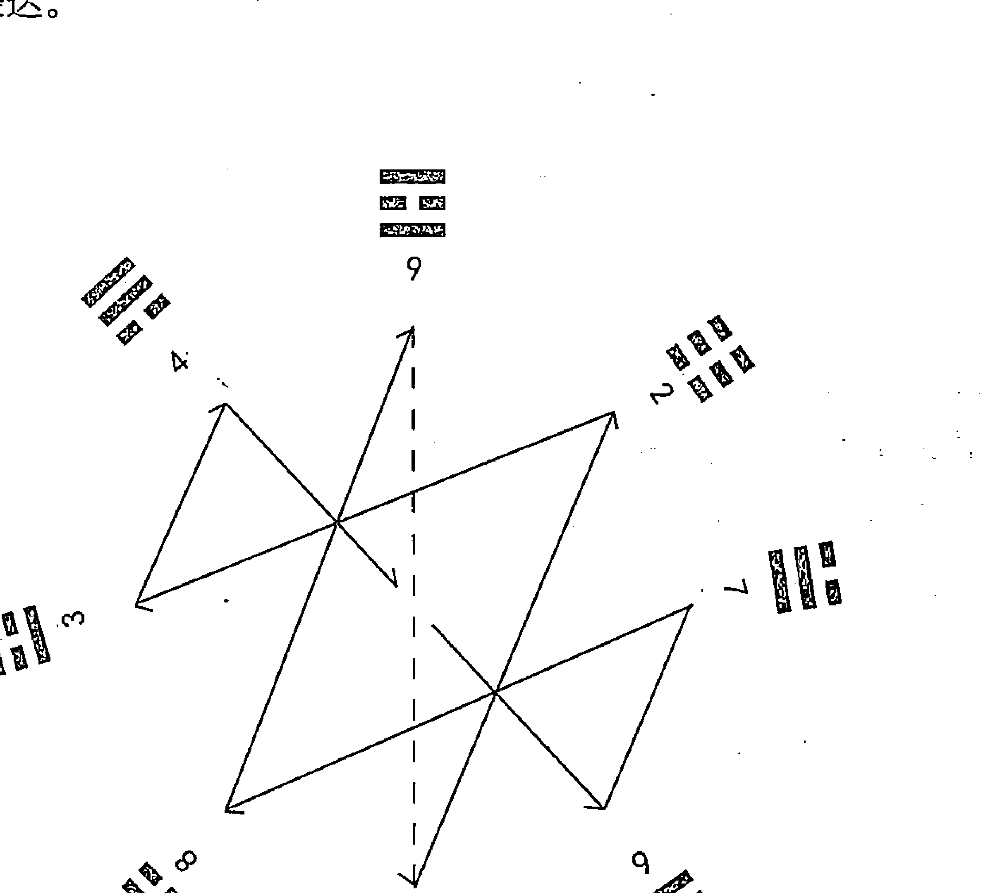

### （“后天八卦”结构分布及传输图）

有关与“先天八卦结构分布”和“后天八卦结构分布”的优劣特点的分析，还可见我所著的《易与和谐》一书1到33页的论述。

- ② 非绝对 A=A [ 即，相对外部（表面）“阳” = “阳” 或“阴” = “阴” ] 的组合结构状态。即事物的外部为“形式逻辑”的 A = A；内部却是 A ≠ A 的“辩证逻辑”的组合结构状态。

比如：

- A、事物外部为（ A = A ）“阳” ≡ “阳”；内部为（ A ≡反 A ）“阳” ≡ 反 “阳”的组合结构状态。

坎为水（☵）卦。

外部（表面）是“阳” = “阳”（ A = A ）的组合结构状态，

该坎为水（☵）卦的上下卦，都是由三个爻的“阳”性的坎6（☵）之“水”性本质的卦组合而成。按照我们的“象数易学”易卦的表述法则来说，这是一种从上下、左右、前后、外内、远近、好坏、南北、往来等方向上来观察、分析、研究及探讨其对应事物的组合结构状态时，其卦的（几何）空间结构与构成及其量化、性质（本性）等，由事物的外部表面看来，都是一模一样（ A = A ）的事物所组合而成的——是一种从外表的任何方向、角度、方位、量化等来观察、分析、探讨、研究、认识与表述来说，都是同样（ A = A ）的“对称”、“守恒”的组合结构状态——即 A=A [☵“阳”（绝对）≡ ☵“阳”] 的符合“形式逻辑”表述形式与状态要求的，事物的直接对应于易卦的（ A = A，同一性）组合结构状态模型。可以说，这是一种上下卦组合成的“对称”、“守恒”、“平衡”、“均匀分布”、“等价”等的极其“对称”、“守恒”的平衡且稳定的外部（相对）合谐的时空组合结构状态的模型。

而该坎为水（☵）卦，其内部中间二至五爻却组成的是“互卦”大过（☴）卦状态。虽然该四个爻的大过（☴）卦，仍然是一种对称、守恒、平衡、均匀的组合结构状态，但是它却并不是以三个爻坎6（☵）之“水”性本质的卦本身（同一性为根本）的对称性为基础的 A ≠ A 的组合结构状态了——已是艮7（䷳）≠震4（䷲）的 A ≠ A 的内部组合结构状态和数量值了——这已经是一种与“形式逻辑”的“同一律”、“不矛盾律”前提要求，相违背的认识与表述内涵要求的组合结构状态了。由于在64卦中，这些二至五爻的组合结构状态，是表示该坎为水（䷜）卦，其最后最终（将来）所形成的事物的结果的组合结构状态——说明在坎为水（䷜）卦的前提下，最终我们所得到的事物（含量化）的组合结构状态，并不是坎6（䷜）=坎6（䷜）的A = A的组合结构（同一性）状态，而是艮7（䷳）≠震4（䷲）的“阳”=“阳”反之卦的组合结构状态了。所以说，该坎为水（䷜）卦，应是一种，从表面（现象）进行认识与表述的相对来说，外部是A = A（䷳“阳” ≡䷲“阳”）的符合“形式逻辑”的（几何）空间结构认识与表述的一种模型，而由其对应事物认识与表述的内部的最终的组合结构的结果来看，这种组合结构模型的表达结果，却会是A ≠ A的不同甚至是矛盾性的结果——这正与“哥德尔第二定理”的最终结果的（不可证明却可直观看到的）“矛盾性”的结论，是有一定相同的认识结论——虽然其仍能保持着自身的“对称”与“守恒”性地组合结构状态的形式。

此外，再从坎为水（䷜）卦，是由三至上爻的上“互卦”蹇（䷦）卦与初至四爻的下“互卦”解（䷧）卦，上下重叠共同组合而成的状态来看，是上蹇（䷦）≠下解（䷧）的A ≠ A（辩证逻辑）的空间与象数（非“同一性”）的组合结构状态模型——已是A ≠ A [“阴”（蹇）≡反（解）“阴”]的不符合“形式逻辑”表述形式与状态下事物的直接对应的空间组合结构状态了。再者，由二至上爻的上“互卦”屯（䷂）卦与初至五爻的下“互卦”蒙（䷃）卦，上下重叠共同组合而成的状态来看，是上屯（䷂）≠下蒙（䷃）的A ≠ A（辩证逻辑）的空间与象数（非“同一性”）的组合结构状态模型——已是A ≠ A [“阴”（屯）≡反（蒙）“阴”]的不符合“形式逻辑”表述形式与状态下事物的直接对应的空间组合结构状态了。可以说，这是一种上下卦不同组合结构状态，所重叠而成的“对称”、“守恒”、“平衡”、“相对均匀”、“等价”等的相对来说的“对称”、“守恒”的平衡且稳定的相对合谐的组合结构的状态——这也应是“形式逻辑”体系主要的“对称”、“守恒”相对应的“象数统一”的时空以及“复合时空”的组合结构状态和标准“形式”之一。

- B、事物外部是（A ≡ A）“阴” ≡ “阴”；内部是（A ≡反 A）“阴” ≡ 反“阴”的组合结构状态。

离为火（☲）卦。

表面（外部）看来，是“阴” = “阴”的组合结构状态。

该离为火（☲）卦的上下卦，都是三个爻的“阴”性的离3（☲）之“火”性本质的卦（同一性）组合而成的。按照我们的“象数易学”易卦的表述法则来说，这是一种从上下、左右、前后、外内、远近、好坏、南北、往来等等方向上来观察、分析、研究及探讨其对应事物的组合结构状态时，其卦的（几何）空间结构与构成及其量化、性质（本性）等，都是一模一样的（A = A，同一性）事物（离卦）所组合而成的——是一种从事物外部的任何方向、角度、方位、量化等来观察、分析、探讨、研究、认识与表述来说，外部表面上看来，都是同样的“对称”、“守恒”的（同一性）组合结构状态——即 A = A [ “阴” ☲（绝对）≡ “阴” ☲ ] 的符合“形式逻辑”表述形式与状态下，（同一性）事物的直接所对应的组合结构的状态。可以说，这是一种由事物外部上下卦组合而成的“对称”、“守恒”、“平衡”、“均匀分布”、“等价”等的极其“对称”、“守恒”的平衡且稳定的（相对）合谐的组合结构状态的模型。

而该离为火（☲）卦，其内部中间二至五爻却组成的是“互卦”大过（☱）卦状态。虽然该四个爻的大过（☱）卦，仍然是一种对称、守恒、平衡、均匀的组合结构状态，但是它却并不是以三个爻离3（☲）之“火”性本质的卦本身（同一性为根本）的对称性为基础的 A ≠ A 的组合结构状态了——已是兑2（☱）≠巽5（☴）的 A ≠ A 的内部组合结构状态和数量级的关系了。当然，这已是处于与“形式逻辑”的“同一律”、“不矛盾律”的前提要求，是相违背的认识与表述内涵要求的组合结构状态了。由于在 64 卦中，这二至五爻的内部组合结构状态，是表示该离为火（☲）卦，最后最终所形成的事物组合结构状态的结果——说明最终，我们所得到的事物所直接对应的结果和组合结构状态，并不仍然是离3（☲）=离3（☲）的 A=A（“火” = “火” 性本质的同一性）的组合结构状态，而是兑2（☱）≠巽5（☴）的 A ≠ A 的“阴”卦 = “阴”反卦的内部组合结构的状态了。所以说，该离为火（☲）卦，应是一种从表面（现象）进行认识与表述的相对来说的：外部是 A=A（“阴” ☲ = “阴” ☲）的符合“形式逻辑”的（几何）空间结构认识与表述的时空组合结构的模型，而由其认识与表述的内部及其最终组合结构的最终结果来看，这种模型的最终表达结果，将是 A ≠ A 的矛盾性事物所组合成的结构状态的结果——这又与“哥德尔第二定理”的最终结果的（不可证明却可以直观的）“矛盾性”结论，是有所一致的认识结果——虽然，究其自身的总体结构来看，仍能包持着它自己是处于“对称”与“守恒”性的组合结构状态中。

此外，再从离为火（☲）卦，是由三至上爻的上“互卦”睽（☲）卦与初至四爻的下“互卦”家人（☰）卦，上下重叠共同组合而成的状态来看，是上睽（☲）≠下家人（☰）的 A ≠ A（辩证逻辑）的空间与象数（非“同一性”）的组合结构状态——已是 A ≠ A [ “阴”（睽）≡反（家人）“阴” ] 的不符合“形式逻辑”表述形式与状态下事物的直接对应的空间组合结构状态了。再者，由二至上爻的上“互卦”鼎（☲）卦与初至五爻的下“互卦”革（☰）卦，上下重叠共同组合而成的状态来看，是上鼎（☲）≠下革（☰）的 A ≠ A（辩证逻辑）的空间与象数（非“同一性”）的组合结构状态——已是 A ≠ A [ “阴”（鼎）≡反（革）“阴” ] 的不符合“形式逻辑”表述形式与状态下事物的直接对应的 A = A 的空间组合结构状态了。可以说，这是一种上下卦不同组合结构状态所重叠而成的“对称”、“守恒”、“平衡”、“相对均匀”、“等价”等的，相对来说的“对称”、“守恒”的平衡且稳定的合谐的组合结构状态的模型之——这也应是“形式逻辑”体系主要的是以“对称”、“守恒”对应“象数统一”的空间及“复合时空”组合结构状态模型的“形式”之一。

- C、总结以上 A、B 这两种相对表面（外部、现象）上是 A = A（“阴” = “阳”）的易卦（几何、象数）空间表述模型。

总结以上 A、B 这两种相对表面（外部、现象）上是 A = A （“阳” ☲ = “阳” ☲ 或者 “阴” ☷ = “阴” ☷ ）的易卦（几何、象数）空间组合结构表述模型，可知：该两种模型是与“形式逻辑”要求，表面上看来，会是对应符合的两种表述与认识事物的直接表达状态的空间结构的模型。这也是因为：其三个爻的坎（☵）离（☲）两卦组合结构状态的本身，就是一种“对称”、“平衡”、较“均匀”、“中”“正”等性质和特点的组合结构状态所致。可是，就其重叠组合成的六爻卦的内部（本质）来看，是存在着 A ≠ A 的矛盾性组构性结果的因素的——这也是“形式逻辑”由现象到本质的探寻过程中，最终所以不可避免的会产生悖论性结果和矛盾结论的原因之一的根本之所在。

由以上 A、B 两例子的“合和”“以变”的“互补”关系中，我们可以看到：

- 1. 以“先天”卦高维（四维）存在形式中的坎=6；艮=7；震=4；离=3；兑=2；巽=5之数，代入两卦“互补”的“合和”“以变”的模型计算过程之中。
   ① 即：
   
   “坎”（☵）+“离”（☲）
   = [上坎（☵）+下坎（☵）] + [上离（☲）+下离（☲）]
   = [6+6] + [3+3]
   =12+6
   =18。
   18÷8，余2。
   “2”对应于“先天”兑（☱）卦的“金”性性质。
   其中，
   18=1+8=9。
   9÷8，余1。
   “1”对应于“先天”乾（☰）卦的“金”性本质。
   
   ② 而该两个六爻卦，无论上下卦谁为“体”卦时，“坎”（☵）卦之数 = 66；“离”（☲）卦之数=33。

若二者进行“互补”性的“湮灭”、“中和”及“融和”时。

即：

“坎”☵+“离”☲（或“离”+“坎”）
=66+33（或33+66）
=99。

也就是说，由“先天”（八进制）抽象量化数量的对应表达的外部（表面、整体）状态上来看，二者的量化变化（湮灭、中和、融和）的和数（统一、融和）结果，并不是等于百分之百的抽象量化的“守恒”状态的结果——总是会存在有100 - 99 = 1的1%的抽象量变损失量的。也就是说，这种表面上看是相对的A = A（“阴”=“阴”或“阳”=“阳”）的“象数易学”易卦的直接对应于“形式逻辑”模型的组合结构的表述中，在“合和”“以变”时，是存在有“不完全”、“不全面”、“不完整”的“数理逻辑”表述缺陷的——这正与“哥德尔不完全定理”的结论，是有所一致的。

- ③ 若由“坎”（☵）“离”（☲）两卦的“先天”量化数的对应表达的最终的内部二至五爻组合状态上来看时：

即：

颐（☶）+大过（☴）
= [上艮（☶）+下震（☳）] + [上兑（☱）+下巽（☴）]
= [7+4] + [2+5]
=11+7
=18。

18÷8，余2。

“2”对应于“先天”兑（☱）卦的“金”性性质。

其中，

18=1+8=9。

9÷8，余1。
“1”对应于“先天”乾（☰）卦的“金”性本质。

④ 而该两个六爻卦中间的那四个爻的“互卦”，若以上卦为“体”卦时，颐（☴）卦之数=74；大过（☴）卦之数=25。
若：
颐（☴）+大过（☴）[或大过+颐]
=74+25（或25+74）
=99。

也就是说，由“先天”抽象量化数的对应表达的最终的内部结构状态的守恒性上来看，二者的量化变化（湮灭、中和、融和）的和数的（统一、融和）结果，并不是等于百分之百的量化的“守恒”状态和结果的——总是会存在有100 - 99 = 1的1%的抽象量化的损失量和因素的。也就是说，这种由内部本质来看的相对的（A ≠ A）“阴”=“阴”或“阳”=“阳”的A = A的“象数易学”易卦的直接对应于“形式逻辑”的表述模型中，在“合和”“以变”时，最终是存在有“不完全”、“不完整”和“不全面”的“数理逻辑”表述缺陷的——这又正好是与“哥德尔不完全定理”的结论，是有所一致的结果。

反之，

⑤ 该两个六爻卦中间四个爻的“互卦”，若以下卦为“体”卦时，颐（☴）卦之数=47；大过（☴）卦之数=52。
那么：
颐（☴）+大过（☴）[或大过+颐]
=47+52（或25+74）
=99。

也就是说，由“先天”抽象量化数的对应表达的最终内部（本质）组合状态的守恒性上来看，二者的量化变化（湮灭、中和、融和）的和数的（统一、融和）结果，也并不是等于百分之百的量化的“守恒”状态——总是会存在有100 - 99 = 1的1%的抽象量化损失量和因素的。也就是说，这种由内部本质来看的相对的（A ≠ A）“阴”=“阴”或“阳”=“阳”的A = A的“象数易学”易卦的直接对应于“形式逻辑”的表述模型中，在“合和”“以变”时，最终是存在有“不完全”、“不完整”和“不全面”的“数理逻辑”表述缺陷的——这又正好是与“哥德尔不完全定理”的结论，是有所一致的结果。

99 = 1 的 1% 的抽象量化的损失量和因素的。也就是说，这种由事物内部本质地表现来看时，相对的 ( A ≠ A ) “阴” = “阴” 或 “阳” = “阳” 的 A = A 的“象数易学”易卦的直接对应于“形式逻辑”的表述模型中，在“合和”“以变”时，是存在有“不完全”、“不全面”、“不完整”及“不完备”的“数理逻辑”表述缺陷的——这又正好与“哥德尔不完全定理”的结论，是有所一致的。

由此看来，可能这也是近现代物理学在探究高能物理学中“波动”性的“同声相应，同气相求”共振、谐振、衍射等状态下的规律时，为什么其波长、频率、振幅的变化，当受到事物能量、质量的影响时，会产生衰减、干涉，甚至产生引力扭曲（弯曲）等结果的原因之一——因为任何事物，都不会也不可能以自己不健全、不完全、不完整的状态，自然存在的。说明，人类及科学家在对待、理解与处理事物的对应“波动”形式的抽象量化及其量变的过程中，是存在有不完全、不完整和不全面地认识与表述结果的——特别是在数学的数及数值、数制的纯抽象的“八进制”的“理性”对待与处理过程中，是存在有与人类一般正常“感性”或“直觉”等形象思维的形式和结果之间，肯定有不合或有根本不可克服的冲突的。

⑥ 如果：

以“坎”“离”两卦的小数点前两位和小数点后两位的数值代入“互补”过程中：

```
“坎”☵ + “离”☲（或“离” + “坎”）
= 66. 74 + 33. 25. （或 33. 52 + 66. 47）
= 99. 99。
```

由以上计算结果可知，由“先天”小数点前后两位数的抽象量化数的对应守恒地表达上来看，二者在高维（四维）存在的“合和”量化变化（湮灭、中和、融和）的和数“以变”的结果方面，并不是等于百分之百的抽象量化“守恒”状态的——总是会存在有 100 - 99. 99 = 0. 01 的 0. 01% 的抽象量化的损失量和因素的。也就是说，这种由表面（现象）来看的相对的外部是 A = A（“阳” ≡ “阳” 或 “阴” = “阴”），内部却是 A ≠ A（艮 ≠ 震和兑 ≠ 巽）的“象数易学”易卦的直接对应于“形式逻辑”的表述模型中，在“结合”“以变”时，是存在有“不完全”、“不完整”、“不全面”和“不可准确确定”等的“数理逻辑”的表述缺陷的（虽然缺陷仅为0.01%）——这也正好与“哥德尔不完全定理”的结论，有所相一致（原因，同上面⑤中的解释与认识）。

#### 2. 假如：

我们用“后天”（九进制）低维（三维）存在形式中的坎（☵）卦=1；离（☲）卦=9；艮（☶）卦=8；震（☳）卦=3；兑（☱）卦=7；巽（☴）卦=4的“实体”（刚性）物质的抽象量化数，来直接对应对该事物模型进行表述时：

- ① 即：
“坎”☵+“离”☲（或“离”+“坎”）
=11+99（或99+11）
=110。

可知，该二者的抽象量化变化（湮灭、中和、融合）的和数的“以变”“结合”结果，从外部的总体来看，会是不等于百分之百的抽象量化的“守恒”的状态——并存在有量化变化方面的110 - 100 = 10的10%的增益现象和因素的发生。而这种新的量化组合结构状态的形成，说明其中又多含有了一定量的对应物质、粒子及其伴生效应能量的发生，已不仅不再是原来事物间单纯的“湮灭”结果了。也就是说，这种由表面（现象）来看时，相对的外部是A ≡ A（“阳”≡“阳”和“阴”≡“阴”）而内部A ≠ A（“阳”≠“阳”或“阴”≠“阴”）的“象数易学”易卦的直接对应的符合“形式逻辑”的表述模型中，在“结合”“以变”时，是存在有“不完备”、“不守恒”、“不互补”、“不对称”等的“数理逻辑”表述的“不可确定性”方面的缺陷的——这是与“哥德尔不完全定理”的结果，是有所一致的结论。不过，这种对应于“后天”（或“洛书”）数（九进制）的外部量化对应表述及其表述形式，是必然会产生抽象量化判断上的缺陷和莫名其妙的判断失误及因素的。这也是近现代物理学在探究高能物理学中“粒子”（刚）性的“同性相斥、异性相吸”的抽象量化状态下的规律时，为什么能量或质量会突然增加的根本原因之一——因为在这种时空结构或对应状态的“九进制”表述模型中，它对任何“后天”（刚性）事物的抽象量化变化的“互补”性的表述，都必然会发生对外部整体认知上的不确切、不守恒、不互补、不对称等的认知增益和多余性失误因素的判断结果的——这虽然说明，人类及科学家在对待、理解与处理该类事物（刚性）的外部的某些现象对应量化及其量变的过程中，在“结合”“以变”时，是有可能会存在有不正确、不守恒、不对称及不互补的认识与表述的结果和因素的，但是在对数学的数及数值、数制的纯抽象的“理性”逻辑的对待与处理过程中，却仍然会存在有与人类一般正常“感性”或“直觉”等形式思维的形式和结果之间，是有所不合或者有根本不可克服的冲突的可能性的——纯抽象的与“十进制”及其内含的“九进制”的“标准型”抽象量化的易卦表述方式，最终都是无法对和谐存在的一切事物及其确切的真实性，进行对应准确确定地表达的——缺少量化、量变所直接对应的质变本质性判定的法则和标准。

- ② 如果：
以“坎”“离”两卦的小数点前两位和小数点后两位的数值代入“互补”过程中：
“坎”☵+“离”☲（或“离”+“坎”）
=11.83+99.74（或99.47+11.38）
=111.57（或111.85）。

由以上计算结果可知，由“后天”（九进制）小数点前后两位数的抽象量化数的对应守恒的表达上来看，二者在低维（三维）存在的“结合”量化变化（湮灭、中和、融合）的和数“以变”结果，并不是等于百分之百的量化的“守恒”状态的——总是会存在有大于100的111.57或111.85的增值约11%以上的数量值和因素的。而这种新的量化组合结构状态的形成，说明其中又多含有了一定量的对应物质、粒子及其伴生效应能量的发生，已不仅不再是原来事物间单纯的“湮灭”结果了。也就是说，由“象数易学”同一个易卦的组合结构的不同方向上来研究、探讨、认识同样的一个对应（刚性）事物的组合结构状态时，会产生至少有两种不同的（悖论及矛盾性）结果。也就是说，这种与相对的外部是A = A [ “阳”（☰）= “阳”（☰）及“阴”（☱）= “阴”（☱）]，而内部却是A ≠ A [即A = A的“阳”（☰）=反（☱）“阳”或“阴”（☱）=反（☰）“阴”]的“象数易学”易卦的直接对应符合“形式逻辑”的“对称”性表述的模型中，在“结合”“以变”时，是必然存在有“不完备”和“矛盾性”结果的“数理逻辑”表述缺陷的——这正与“哥德尔第二不完全定理”的“逻辑有不可避免的矛盾性”结论，是有所一致的（原因，同上面①中的解释与认识）。这可能也是当今在“形式逻辑”思维“绝对”指导下，人们为什么会盲目地就会误认为：事物及其信息量方面在1+1的情况下，会> 2的认识的糊涂性的根源之一——“形式逻辑”及其“数理逻辑”和“科学逻辑”，由于采用的数及“数理”进制（含“十进制”、“九进制”等）的本身，在转化成其他进制和层面的过程中，由于对事物主次、体用等关系判断的相同或不同，结果会是存在有（至少增益10%到12%的）不完全、不全面、不正确地表述功能和因素的，因此在其对某些对应性事物的探讨和研析中，是存在有不确切地认识与表述缺陷的。

## +   3. 总结 A、B 两例地分析结果，可知：
由该两种卦的整体组合结构来说,由其外部的上下卦的（几何）空间结构上看：
A、是 A = A [即，坎（☵）“阳” = 坎（☵）“阳” ] 的结构状态。
B、是 A = A [即，离（☲）“阴” = 离（☲）“阴” ] 的结构状态。

而由其各自二至五爻的内部（本质）的上下卦的（几何）空间结构上看：
A、是 A ≠ A [即，震（☳）“阳” 绝对 ≡ 反艮（☶）“阳” ] 的 A = 反 A 的结构状态。
B、是 A ≠ A [即，兑（☱）“阴” 绝对 ≡ 反巽（☴）“阴” ] 的 A = 反 A 的结构状态。

从“形式逻辑”对应的易卦组合结构形式的内外来看，虽然其组合形式，并非都是 A=A 的“自同律”的形式，可却都是一些外部是 A = A（“阳” = “阳”或“阴” = “阴”）的“自同律”，而不会产生任何矛盾结果的组构形式，以及其内部的将来，都会是 A ≠ A（ A ≡ 反 A ）——最终的判断结果，会是一种矛盾性结果的存在形式。这说明，从事物的（外部、总体）表面上来看，它们都能达到以“守恒”、“对称”、“平衡”的立场与层次、角度等，来认识与表述一些事物及其规律的（同一性）目的和要求的。也就是说，这都是一些就其外部总体形式、现象结构与分布来说，都是相对来说的一些“守恒”与“对称”的易卦（同一性）表述的组合结构状态模型，可是就其内部的本质结构来说，却又是相对来说的一种“守恒”与“对称”的易卦（非同一性）组合结构状态的表述模型——其最终将会得到或发展出一些不可避免的矛盾性的判断与变化的结果来的。

由此我们可以直接看到，“象数易卦”与“形式逻辑”相直接对应的外部现象表现为 A = A 的组合结构形式，可是内部本质却是 A ≠ A 的组合结构形式。

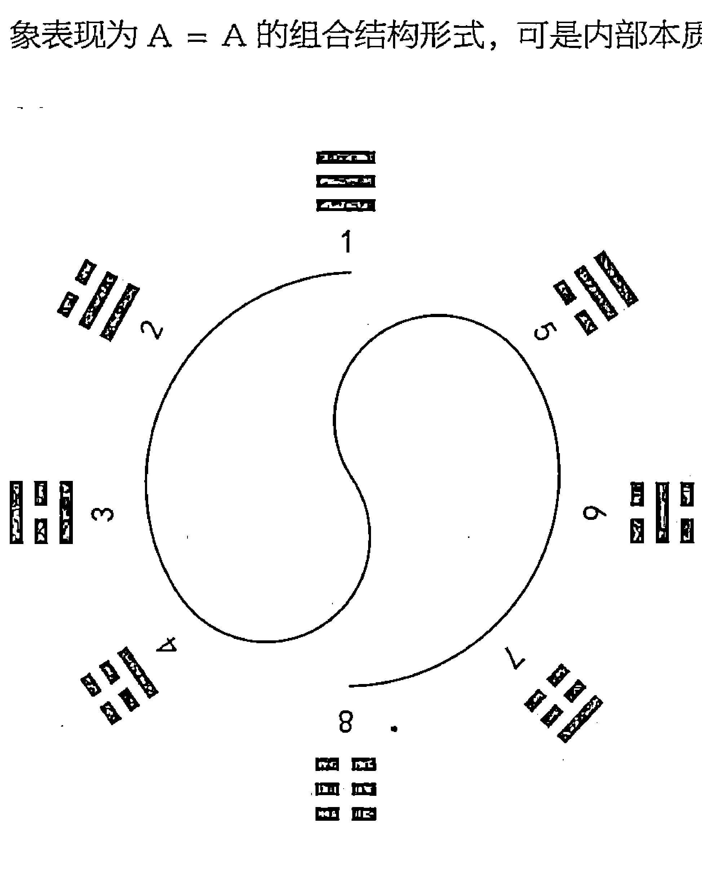

虽然在“先天卦”（八进制）高维“波动性”（隐、柔之性）的“对称”、“互补”、“守恒”、“平衡”、“稳定”等概念的前提下，基本能符合“形式逻辑”的“同一律”的“对称”、“等价”、“守恒”的要求，但是如果是以“后天卦”（九进制）低维的“粒子性”（显、刚之性）表现形式与之对应时，照样会产生更加“不完备”和“矛盾性”的认识与判断结果的！请大家要格外注意！

同时，由以上对②“类”中的全部分析可知，“先天八卦”（八进制）高维（四维）存在的“波动性”形式的易卦结构及其抽象配数中，是较“后天八卦”（九进制）低维（三维）存在的“实体”、“粒子性”结构形式状态的易卦结构及其配数，将是更加的合理，更接近于事物的本质特性的表述方法与认识方式——这也是我们“象数易学”在认识与表述中，往往或基本是以“先天八卦”的“对称”、“互补”、“守恒”、“平衡”、“和谐”等的抽象量化配数及其结构分布之“象”为主“体”，而以“后天八卦”的“实体”（刚性）的“对称”、“互补”、“守恒”等的抽象量化配数及其结构分布的具体针对性的“象数统一”为辅“用”的原因之所在——尽量减少或保证高低维时空中存在的事物，在其相互间的“结合”“以变”的转化、更替过程中，确保其信息及其信息量在其抽象转化更替的过程中，尽可能少的丢失、缺失或增益、增殖的“不可确定性”因素及其现象的发生——保证信息更替时的统一、全面、完整及尽量准确确切地得以认识与表达。

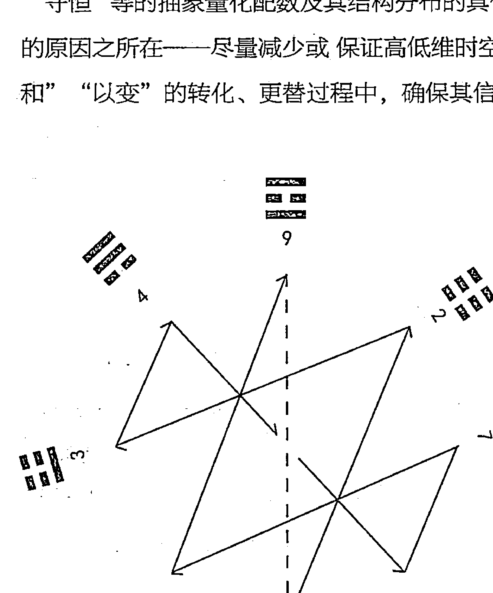

有关与“先天八卦结构分布”和“后天八卦结构分布”的优劣特点的分析，还可见我所著的《易与和谐》一书1到33页的论述。

除了以上，我们对64易卦与“形式逻辑”直接相对应的这两组4种易卦地认识与表述模型的分析，可以发现“形式逻辑”及其“数理逻辑”（又称“科学逻辑”、“理性逻辑”）与我们“延生易”的“象数易学”直接对应的（几何结构的空间及象数统一）模型及其组合结构状态的一些必须引起我们特别注意的优缺点。当我们仅以“形式逻辑”分析事物的“对称”性、“互补”性与“守恒”性为主要基础概念时，我们应会发现，其同样思路的前提下，在“象数易学”的64卦中，还会对应有两组4卦的 A ≠ A 和 A ≡ 反A 的一些组合结构状态表述模型的存在，它们也能符合“形式逻辑”分析时所需要的“对称”、“互补”、“守恒”等前提条件下的认识与表述功能的。

比如——

- ③ 绝对内外都是 A ≠ A（“阴”≠“阳”或“阳”≠“阴”）“辩证逻辑”组合结构状态。

A、事物外部为（A = 反A）“阴” = 反“阴”：内部为（A = 反A）“阳” = 反“阳”的组合结构状态。

风泽中孚（䷼）卦。

就是事物外部（A ≠ A）A ≡ 反A（“阴”≡ 反“阴”）的组合结构状态之一。

其中，在这“中孚”（䷼）卦体中的上下卦的分别表述里，该“本卦”及其“反卦”、“交易卦”的外部（表面、现象）整个组合结构状态，所呈现出的都是以该卦的三、四两爻的中间，向上下两个方向进行“对称”性的（几何）空间组合结构状态的分布。也就是说，其表示事物外部（整体）组合结构状态的“上卦”巽（☴）卦 = “下卦”兑（☱）卦的“反卦”巽（☴）卦——由于其表示该事物外部状态的“上卦”是“下卦”的“反卦”，而“下卦”也是其“上卦”的“反卦”的结构状态，故此二者共同来组合成了一个六爻卦体——即，A ≡ 反A（“阴”≡≡≡反≡≡≡“阴”）的事物的组合结构状态。因此，从这上下卦的组合状态来看，就形成了是一种上下、左右、外内、前后、南北、远近、往来、坏好等的类似于“形式逻辑”系统对事物整体直接对应涵盖与表述的（相对）“对称”及（相对）“守恒”性的组合结构状态的空间表述模型。

由风泽中孚（䷼）卦内部中间二至五爻的颐（䷚）卦来看，它应是表述该“中孚”卦将来的最终结果的组合结构状态的。其中，其二至四爻为震（☳）卦，它是四爻颐（䷚）卦的“下卦”；而三至五爻为艮（☶）卦，应是该四爻颐（䷚）卦的“上卦”。其间，震（☳）卦≠艮（☶）卦（即A ≠ A）的结构状态，而是震（☳）≡震（☳）卦的“反卦”艮（☶）卦（即“阳”☳=反☳“阳”的A ≡反A）的组合结构状态。由于该颐（䷚）卦，仍然还是一个上下、左右、外内、前后、南北、远近、往来、坏好等的类似于“形式逻辑”系统直接对事物（外部）整体直接对应涵盖与表述的（相对）“对称”及（相对）“守恒”性的组合结构状态的空间或“复合空间”的组构模型。

此外，再从风泽中孚（䷼）卦，是由三至上爻的上“互卦”渐（䷴）卦与初至四爻的下“互卦”归妹（䷵）卦，上下重叠共同组合而成地状态来看，是上渐（䷴）≠下归妹（䷵）的A ≠ A（辩证逻辑）的空间与象数（非“同一性”）的组合结构状态——即是A ≠ A [“阳”（渐）≡反（归妹）“阳”]的不符合“形式逻辑”表述形式与状态下事物的直接对应的空间结构状态。再者，由二至上爻的上“互卦”益（䷩）卦与初至五爻的下“互卦”损（䷨）卦，上下重叠共同组合而成地状态来看，是上益（䷩）≠下损（䷨）的A ≠ A（辩证逻辑）的空间与象数（非“同一性”）的组合结构状态——即是A ≠ A [“阳”（益）≡反（损）“阳”]的不符合“形式逻辑”A = A表述形式与状态下的事物直接对应的空间组合结构状态。可以说，这是一种上下卦不同组合结构状态，所重叠而成的“对称”、“守恒”、“平衡”、“相对均匀”、“等价”等的相对来说的“对称”、“守恒”的平衡且稳定的合谐空间的组合结构状态的模型之一——这也是“形式逻辑”体系中，主要是以“对称”、“守恒”对应于易卦组合结构状态的空间及“复合空间”模型的结构“形式”之一。

B、事物外部为（A =反A）“阳”=反“阳”；内部为（A =反A）“阴”=反“阴”的组合结构状态。

雷山小过（䷽）卦。

即是外部总体是“A ≡反A（“阳”≡反“阳”）的组合结构状态之一。

其中，在这“小过”（䷽）卦体中的上下卦的分别表述里，该“本卦”及其“反卦”、“交易卦”的整个组合结构状态，所呈现出的都是以该卦的三、四两爻的中间，向上下两个方向进行“对称”性的（几何）空间结构状态地分布，所构成的。也就是说，其“上卦”震（☳）卦=“下卦”艮（☶）卦的“反卦”震（☳）卦——由于“上卦”是“下卦”的“反卦”，而“下卦”也是“上卦”的“反卦”的结构状态，二者共同来组合成了一个六爻卦体——即，外部整体是A ≡反A（“阳”☳≡反☳“阳”）组合结构状态。因此，由这上下卦的组合结构状态的“小过”（䷽）卦来看，就形成了是一种上下、左右、外内、前后、南北、远近、往来、坏好等的，类似于“形式逻辑”系统对事物（外部）整体直接对应涵盖与表述的（相对）“对称”及（相对）“守恒”性的组合结构状态的几何空间结构的表述模型。

再从雷山小过（䷽）卦中间内部二至五爻的大过（䷛）卦，应是表述该“小过”（䷽）卦将来的最终结果的组合结构状态来看，其中二至四爻的巽（☴）卦，是为四个爻大过（䷛）卦的“下卦”，而三至五爻的兑（☱）卦，是为该四个爻大过（䷛）卦的“上卦”。其间，巽（☴）卦≠兑（☱）卦（即A ≠ A）的组合结构状态，而是巽（☴）≡巽（☴）卦的“反卦”兑（☱）卦的（A ≡反A，“阴”☴≡反☱“阴”）组合结构状态。而该大过（䷛）卦，仍然还是一个上下、左右、外内、前后、南北、远近、往来、坏好等的类似于“形式逻辑”系统对事物（外部）整体直接对应涵盖与表述的（相对）“对称”及（相对）“守恒”性的组合结构状态的几何空间式的组合结构的表述模型。

此外，再从雷山小过（䷽）卦，是由三至上爻的上“互卦”归妹（䷵）卦与初至四爻的下“互卦”渐（䷴）卦，上下重叠共同组合而成地状态来看，是上归妹（䷵）≠下渐（䷴）的A ≠ A（辩证逻辑）的空间与象数（非“同一性”）的组合结构状态——即A ≠ A [“阳”（归妹）≡反（渐）“阳”]的不符合“形式逻辑”表述形式与状态下事物的直接对应的空间结构状态。再者，由二至上爻的上“互卦”恒（䷟）卦与初至五爻的下“互卦”咸（䷞）卦，上下重叠共同组合而成的状态来看，是上恒（䷟）≠下咸（䷞）的 A ≠ A（辩证逻辑）的空间与象数（非“同一性”）的组合结构状态——即 A ≠ A [“阳”（恒）≡反（咸）“阳”]的不符合“形式逻辑” A = A 表述形式与状态下事物直接对应的空间结构状态。可以说，这是一种上下卦不同组合结构状态所重叠而成的“对称”、“守恒”、“平衡”、“相对均匀”、“等价”等的相对来说的“对称”、“守恒”的平衡且稳定的合谐空间及“复合空间”结构的模型状态——这也应是“形式逻辑”体系中，主要的是以“对称”、“守恒”对应于易卦组合结构状态“象数统一”的几何空间和“复合空间”结构模型的组合“形式”之一。

C、总结以上A、B这两种相对（外部、表面、现象及整体）是A ≠ A（“阴”≠“阳”或“阳≠“阴”）的易卦（几何、象数）空间结构状态的表述模型

总结以上A、B这两种相对（外部、现象）表面是 A ≠ A（“阴”≠“阳”）的易卦（几何、象数）空间结构状态的表述模型，可知：该两种模型是与“形式逻辑”对应表述要求，从表面（整体、现象）上看来，会是相符合的一种表述与认识事物的组合结构状态的模型。这也是因为，其三个爻组构成的巽（☴）、兑（☱）；震（☳）、艮（☶）各卦组合结构状态的本身，就不是一种“对称”、“平衡”、“均匀”、“中”“正”等的分布结构状态所致。可是，就其组合成的六爻卦的内部（二至五爻的本质）来看，都是存在着 A ≠ A 的矛盾性组合结构性表述结果的——这也是“形式逻辑”在由现象到本质的探寻过程中，最终所以不可避免的会产生悖论性结果和矛盾结论所在的根本性原因之一。

再者，由以上A、B间的“结合”“以变”的“互补”关系中，我们可以看到：

- 1. 以“先天”（八进制）卦高维（四维）存在形式中的艮 = 7；震 = 4；兑 = 2；巽 = 5 的抽象量化之数，代入两卦“互补”的“结合”“以变”的过程中。

```
① 即：“中孚”（䷼）+“小过”（䷽） = [上巽（☴）+下兑（☱）] + [上震（☳）+下艮（☶）] = [5+2] + [4+7]
```
=7+11
=18。
18÷8，余2。
“2”对应于“先天”兑（☱）卦的“金”性性质。
其中，
18=1+8=9。
9÷8，余1。
“1”对应于“先天”乾（☰）卦的“金”性本质。

- ② 而该两个六爻卦，由于“上卦”为“体”时，“中孚”（䷼）卦之数 = 52；“小过”（䷽）卦之数 = 47。

> 若二者相“互补”、“中和”、“湮灭”或“融合”为一体时：

即：

```
“中孚”䷼ + “小过”䷽（或“小过” + “中孚”）
=52+47（或47+52）
=99。
```

也就是说，由“先天”（八进制）抽象量化数的对应表达的整体外部（表面、现象）状态的表现来看，二者的量化变化（湮灭、中和、融合）的和数的“以变”结果，并不是等于百分之百的量化的“守恒”不变的状态——总是会存在有 100 - 99 = 1 的1%的抽象量化的损失量及因素的。也就是说，这种表面上看来是相对的 A = 反 A（“阴” = 反“阴”或“阳” = 反“阳”）的“象数易学”易卦的直接对应于“形式逻辑”状态的表述模型中，在“结合”“以变”时，是存在有“不完全”、“不全面”、“不完整”等的“数理逻辑”表述缺陷的——这正与“哥德尔不完全定理”的结论，是有所一致的认知结果。

- ③ 若由“中孚”（䷼）“小过”（䷽）两卦的“先天”（八进制）抽象量化之数的对应表达的内部（本质）结构状态上来看时：

颐（䷚）+ 大过（䷛）

```
= [上艮（☶）+下震（☳）] + [上兑（☱）+下巽（☴）]
= [7+4] + [2+5]
=11+7
=18。
```

18÷8，余2。
“2”对应于“先天”兑（☱）卦的“金”性质。

其中，
18=1+8=9。
9÷8，余1。
“1”对应于“先天”乾（☰）卦的“金”本质。

- ④ 而该两个六爻卦中间那四个爻的“互卦”，若是以“上卦”为“体”卦时，
则颐（䷚）卦之数 = 74；大过（䷛）卦之数 = 25。

如果，此二者相“中和”、“湮灭”、“融合”统一时，

```
则：
颐（䷚）+ 大过（䷛）[或大过 + 颐]
=74+25（或 25+74）
=99。
```

也就是说，由“先天”（八进制）抽象量化之数所对应表达的最终内部（本质）状态上来看，二者的量化变化（湮灭、中和、融合）的和数的“以变”结果，也并不是等于百分之百的量化的“守恒”不变的状态的——总是会存在有 100 - 99 = 1的1%的抽象量化的损失量及因素的。也就是说，这种从内部（本质、将来）的表现来看时，相对的（A ≠ A）A ≡ 反 A（“阴” ≡ 反“阴”或“阳” ≡ 反“阳”）的“象数易学”易卦的直接对应的“形式逻辑”的表述模型中，在“结合”“以变”时，也是存在有“不完全”、“不完整”、“不全面”、“不完全确切”的“数理逻辑”的表述缺陷的——这也正与“哥德尔不完全定理”的结论，是有所一致的。反之，

- ⑤ 该两个六爻卦中间这四个爻的“互卦”，若是以“下卦”为“体”卦时，则该颐（☳）卦之数 = 47；大过（☴）卦之数 = 52。

如果二者“互补”及融和统一时，

即：
颐（☳）+ 大过（☴）[或大过 + 颐]
=47+52（或25+74）
=99。

也就是说，由“先天”（八进制）抽象量化之数的对应表达的最终结果的内部（本质、将来）组合结构状态上来看，二者的量化变化（湮灭、中和、融和）的和数的“以变”结果，依然不是等于百分之百的量化的“守恒”状态——总是会存在有100 - 99 = 1的1%的抽象量化方面的损失量和因素的。也就是说，这种由其内部（将来、本质）表现来看时，相对的（A ≠ A）A = 反A（“阴” ≡ 反“阴”或“阳” ≡ 反“阳”）的“象数易学”易卦的直接对应于“形式逻辑”的表述模型中，在“合和”“以变”时，是存在有“不完全”、“不完整”、“不全面准确”的“数理逻辑”表述缺陷的——这也正好也与“哥德尔不完全定理”的判断结论，是有所一致的。

这也或就是，近现代物理学在探究高能物理学中“波动性”的“同声相应，同气相求”共振、谐振、衍射等状态下的规律时，为什么其频率、波长、波幅等会受到能量、质量的变化和影响，会产生衰减、干涉、绕涉、衍射以及会发生引力扭曲（弯曲）等结果的原因之一——因为任何事物的自然存在形式，都不会以自己不健全、不完全的非完整的整体状态来存在的。这说明，人类及科学家在对待、理解与处理事物所对应的“波动”形式的抽象量化及其量变的过程中，是存在有不完全及不全面完整的认识与表述的——特别是在数学的数及数值、数制的纯抽象的“理性”对待及处理过程中，存在有与人类一般正常“感性”或“直觉”等形象思维的形式和结果之间，是肯定存在有不相符合或有根本不可克服的冲突性的认知方面的缺陷的。

- ⑥ 如果：

以“中孚”“小过”两卦的小数点前两位和小数点后两位的量化数值，代入“互补”过程中时：

则：

“中孚”（☰）卦+“小过”（☷）卦（或“小过”+“中孚”）=52.47+47.52（或74.25+25.74）=99.99。

由以上计算结果可知，由“先天”（八进制）小数点前后两位数的抽象量化之数的总体（外部、表象）守恒对应表达上来看，二者在高维（四维）存在的“合和”量化变化（湮灭、中和、融和）的和数“以变”结果，并不是等于百分之百的量化变化的“守恒”不变的状态——总是会存在有100 - 99.99 = 0.01的0.01%的抽象量化性的损失量和因素的。也就是说，这种由事物整体表现来看时，其相对应的外部（A ≠ A）A ≡反A（“阳”≡反“阳”或“阴”=反“阴”），内部也是A ≠ A（艮≠震或兑≠巽）的“象数易学”易卦的直接对应于“形式逻辑”的表述模型中，在“合和”“以变”时，是存在有“不完全”、“不全面”、“不完整确切”的“数理逻辑”表述缺陷的——这正好能与“哥德尔不完全定理”的结论有所一致（原因，同上面⑤中的解释与认识）。

- 2. 假如：

我们采用“后天”（九进制）低维（三维）存在形式中的艮（☶）卦=8；震（☳）卦=3；兑（☱）卦=7；巽（☴）卦=4数的“实体”（刚性）物质的抽象量化之数，来直接对应进行表述时：

- ① 则：

“中孚”（☰）卦+“小过”（☷）卦（或“小过”+“中孚”）=47+38（或38+47）=85。

由该计算结果可知，二者从其抽象量化变化（湮灭、中和、融和）的和数的外部的总体“中和”结果上来看，当是大大地小于百分之百的量化的“守恒”状态的——存在有抽象量化变化方面的 100 - 85 = 15 的 15% 的较多的丢失或损失量化现象和因素地发生。也就是说，这种与相对的外部是 A ≡ 反 A（“阳” ≡ 反“阳”和“阴” ≡ 反“阴”），而内部也是 A ≡ 反 A（“阳≡反“阳”或“阴” ≡ 反“阴”）的“象数易学”易卦的直接对应于“形式逻辑”的表述模型中，在“合和”“以变”时，也是不可避免地存在有“不完全”、“不完整”、“不全面”及“不完全准确”等的“数理逻辑”较大、较多地表述缺陷的——这是与“哥德尔不完全定理”的结果，又是有所一致的判断结论。不过，这种对应于“后天”（或“洛书”）之“九进制”数的外部总体抽象量化对应表述及其形式里，也是会产生一些更多于“先天”（八进制）配数的量化、量变表述方面较多的缺陷和失误因素的。这也是近现代物理学在探究高能物理学中“粒子”（刚、实体）性的“同性相斥、异性相吸”抽象（理性）量化状态下的规律时，为什么其能量或质量会有较大或较多地丢失及缺失因素的根本原因之一（在这些“湮灭”结果的新的组合结构中，说明其中有一些物质或粒子及其伴生效应及其能量的产生，很可能是有意无意中，被实验者不得已给丢掉了）——因为这种用“九进制”进行对应认识与表述的组合结构状态的空间结构模型，在对任何事物量化变化的“互补”性的表述中，都是会发生对外或对内组成部分，在认识与表述上的不健全、不完全、不全面等较大、较多地认知缺陷的。这虽然说明，人类及科学家在对待、理解与处理该类事物（刚性）的外部整体与内部具体分部的某些现象，在对应探讨抽象（理性）量化及其事物量变的过程中，在“合和”“以变”时，仍然是会存在有不完全、不守恒、不互补及不健全的认识与表述结果的——即使是在数学的数及数值、数制的纯抽象的“理性”逻辑推导或处理过程中，也依然存在有与人类一般正常“感性”或“直觉”等形象思维的形式和结果之间，是有所不符合或是有着根本不可克服的冲突的可能性的。也就是说，仅以“十进制”及其所内含的“九进制”的“标准型”数理表述方式，最终是无法准确全面地对和谐存在的一切事物及其真实性，进行对应确切的表达的——缺少一种与数或数值、数制直接对应的抽象（理性逻辑）量化方面的本质性质变化判定的法则和标准！

- ② 如果：

以“中孚”“小过”两卦的“后天”（九进制）小数点前两位和小数点后两位的数值代入“互补”过程中：

那么：

“中孚”（☰）卦+“小过”（☷）卦（或“小过”+“中孚”）
=47.38+38.47（或38.47+47.38）
=85.85（或85.85）。

由以上计算结果可知，由“后天”（九进制）小数点前后两位数的抽象（理性逻辑）量化数的守恒对应表达上来看，二者在低维（三维）存在的“合和”量化变化（湮灭、中和、融和）的和数“以变”结果中，并不是等于百分之百的量化的“守恒”状态——总是会存在有 100 - 85.85 = 14.15 的 14.15%的较大的抽象量变数量的丢失和因素的。不过，这种对应于“后天”（或“洛书”）之“九进制”数的外部抽象量化对应表述及其形式，也是会产生一些更多于“先天”（八进制）配数的量化、量变表述方面较多的缺陷和失误因素的。这也是近现代物理学在探究高能物理学中“粒子”（刚、实体）性的“同性相斥、异性相吸”抽象（理性）量化状态下的规律时，为什么能量或质量会突然较大量丢失及缺失的根本原因之一（在这些“湮灭”结果的新的组合结构中，说明其中有一些物质或粒子及其伴生效应及能量变化的产生，很可能是被实验者有意无意或不得已地给丢掉了）——因为这种与“九进制”直接对应认识与表述的组合结构模型，在对任何事物量化变化的“互补”性的表述中，都是会发生对外或对内组成部分在认识与表述上的不守恒、不完全、不互补、不完整等较大、较多地认知和表述缺陷的。也就是说，由“象数易学”同一个易卦的“互补”卦的组合结构的不同方向上，来研究、探讨、认识同样的一对对应事物的状态时，总是会产生至少有一种不同的(悖论及矛盾性)A ≠ A 结果。也就是说，这种与相对的外部是( A ≠ A ) A = 反 A ( “阳” = 反 “阳” 及 “阴” = 反 “阴” )，而内部也是 ( A ≠ A ) A = 反 A ( 即 “阳” = 反 “阳” 或 “阴” = 反 “阴” ) 的 “象数易学” 易卦的直接对应于 “形式逻辑” 的 “对称” 性探讨与表述的易六爻卦的对应表达的模型中，在 “合和” “以变” 时，是存在有较多部分的 “不完全”、“不全面”、“不完备” 和产生必然 “矛盾性” 结果的 “数理逻辑” 表述的缺陷的——这正与 “哥德尔不完全定理” 及其 “矛盾性” 悖论判定结论，是有所一致的判断结果 (原因，同上面①中的解释与认识分析)。

由此，我们可以直接看到，“象数易卦” 与 “形式逻辑” 相直接对应的外部现象表现为 ( A ≠ A ) A = 反 A 的组合结构形式，可是内部本质也是 ( A ≠ A ) A = 反 A 的组合结构形式。虽然它们在 “先天八卦” 高维的 “八进制” 的 “对称”、“互补”、“守恒”、“平衡”、“稳定” 等概念的前提下，基本上都能符合 “形式逻辑” 的研探、分析及认识、表述的需要——会含有极少数的 “不完备”、“不全面” 和矛盾可能性的缺陷 ( 0.01% )，但是如果是以 “后天八卦” 低维的 “九进制” 的表现形式与之对应探讨及表述时，照样会产生较大、较多部分 ( 至少是 14.15% ) 的 “不完备”、“不全面” 和 “矛盾性” 的认识与判断结果的！

### 3.总结 A、B 两例地分析结果，可知：

由该两种卦的整体组合结构来说，由其外部的上下卦的(几何)空间结构上看：

- A、是 A ≠ A [即，巽 (☴) “阴” = 反兑 (☱) “阴” ] 的 A = 反 A 的结构状态。
- B、是 A ≠ A [即，震 (☳) “阳” = 反艮 (☶) “阳” ] 的 A = 反 A 的结构状态。

而由其各自二至五爻的内部的上下卦的 (几何) 空间结构上看：

- A 是 A ≠ A [即，震 (☳) “阳” = 反艮 (☶) “阳” ] 的 A = 反 A 的结构状态。
- B 是 A ≠ A [即，巽 (☴) “阴” = 反兑 (☱) “阴” ] 的 A = 反 A 的结构状态。

从“形式逻辑”的组合形式来看，虽然其对事物表述的内外的组合形式，并非是 A=A 的“自同律”的形式，可却都是一些（A ≠ A）A = 反 A 的组合结构形式。它们仍能达到从（相对）“守恒”、“对称”的立场与层次、角度等方面来认识与表述一些事物及其规律的目的和要求的。这都是一些内、外结构与分布，都是相对来说的一些（相对）“守恒”与（相对）“对称”的“象数易学”的易卦的直接对应的组合结构表述模型。

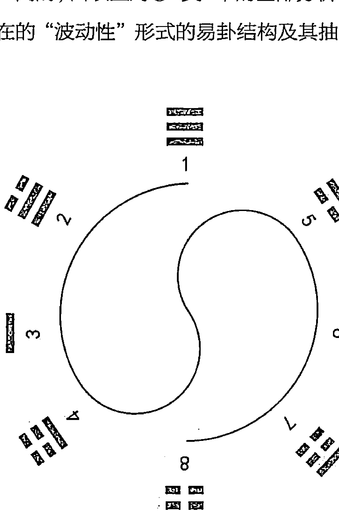

同时，由以上对③“类”中的全部分析可知，“先天八卦”（八进制）高维（四维）存在的“波动性”形式的易卦结构及其抽象配数中，是较“后天八卦”（九进制）低维（三维）存在的“实体”（刚性）、“粒子性”结构形式状态的易卦结构及其配数，会是更合理，更接近于事物的本质特性的表述方法与认识方式——这也是我们“象数易学”的认识与表述中，往往或基本是以“先天八卦”（八进制）的“对称”、“互补”、“守恒”、“平衡”、“和谐”等的抽象量化配数及其结构分布之“象”为主“体”，而以“后天八卦”的“实体”（刚性）的“对称”、“互补”、“守恒”等的抽象量化配数及其结构分布的具体针对性的“象数统一”为辅“用”的原因之所在——尽量减少或保证高低维时空中存在事物，在其“合和”“以变”的转化、更替过程中，确保其信息及其信息量在其抽象转化更替时，尽可能少的丢失、缺失或增益、增殖的“不可确定性”因素及其现象的发生——保证信息及其信息量的统一、完整、全面及尽量准确确切而完整地得以认识与表达。

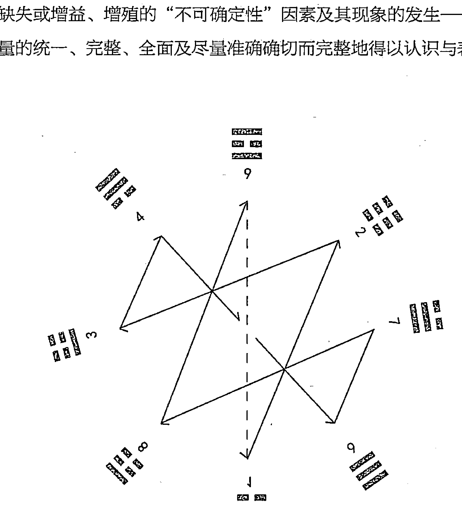

（“后天八卦”结构分布及传输图）

有关与“先天八卦结构分布”和“后天八卦结构分布”的优劣特点的分析，还可见我所著的《易与和谐》一书 1 到 33 页的论述。

- ④ 外部是 A ≠ A 的 A = 反 A（“阴” = 反“阴”或“阳” = 反“阳”）的“辩证逻辑”组合结构状态；内部却是 A ≡ A（“阴” ≡ “阴”或“阳” ≡ “阳”）的“形式逻辑”组合结构状态。

- A、事物外部为 A = 反 A（“阴” = 反“阴”），内部为 A ≡ A（“阳” ≡ “阳”）的组合结构状态。

泽风大过（䷛）卦。

就是外部是 A ≠ A 的 A ≡反 A （ “阴” ≡反 “阴” ）的组合结构状态。

其中，在这 “大过” （䷛）卦体中的上下卦的分别表述里，该 “本卦” 及其 “反卦”、“交易卦” 的整个组合结构，所呈现出的都是以该卦内部的三、四两个爻的中间，向上下两个方向进行 “对称”性的（几何）空间组合结构状态的分布。也就是说，其外部的 “上卦” 兑 2（☱）卦＝内部 “下卦” 巽 5（☴）卦的 “反卦” 兑 2（☱）卦——由于 “上卦”是 “下卦” 的 “反卦”，而 “下卦” 也是 “上卦” 的 “反卦” 的结构状态，二者上下共同来组合成了一个六爻卦体——即，外部是 A ≡反 A （ “阴” ☱ ≡反 ☴ “阴” ）状态。因此，从这上下卦的组合状态来看，就形成了一种上下、左右、外内、前后、南北、远近、往来、坏好等的类似于 “形式逻辑” 系统对事物整体直接对应涵盖和表述的（相对）“对称”及（相对）“守恒”性的组合结构状态的易卦直接对应的时空状态的表述模型之一。

再者，由泽风大过（䷛）卦中间内部二至五爻的乾（䷀）卦，是表述该 “大过” 卦将来的最终结果的组合结构状态来看，其二至四爻为乾（☰）卦，它是四个爻乾(☰)卦的 “下卦”，而三至五爻也为乾(☰)卦，它是四个爻乾(☰)卦的 “上卦”。其间，“上卦”的乾（☰）卦绝对≡“下卦”的乾（☰）卦（即 A ≡ A ）的结构形式，而并不是 A ≠ A 的 A ≡反 A 的组合结构状态了。该四个爻的乾（☰）卦，仍然是一个上下、左右、外内、前后、南北、远近、往来、坏好等的类似于 “形式逻辑” 系统对事物整体直接对应涵盖与表述的（绝对）“对称”及（绝对）“守恒”性的组合结构状态的易卦时空对应状态的表述模型之一。

此外，再从泽风大过（䷛）卦，是由三至上爻的上 “互卦” 夬（䷪）卦与初至四爻的下 “互卦” 姤（䷫）卦，上下重叠共同组合而成地状态来看，是上夬（䷪）≠下姤（䷫）的 A ≠ A （辩证逻辑）的空间与象数（非 “同一性”）的组合结构状态模型——即是 A ≠ A ［ “阴” （夬）≡反（姤）“阳” ］的不符合 “形式逻辑” A = A 的表述形式与状态下事物的直接对应的空间结构状态。再者，由二至上爻的上 “互卦” 夬（䷪）卦与初至五爻的下 “互卦” 姤（䷫）卦，上下重叠共同组合而成地状态来看，是上夬（䷪）≠下姤（䷫）的 A ≠ A （辩证逻辑）的空间与象数（非“同一性”）的组合结构状态——即是 A ≠ A [“阴”（夬）≡反（姤）“阳”] 的不符合“形式逻辑”表述形式与状态下，事物的直接对应的空间结构状态。可以说，这是一种上下卦不同组合结构状态所重叠而成的“对称”、“守恒”、“平衡”、“相对均匀”、“等价”等的相对来说的“对称”、“守恒”的平衡且稳定的合谐状态的组合结构模型——这也应是“形式逻辑”体系中主要的是以“对称”、“守恒”对应于“象数统一”的易卦组合结构状态的空间及“复合空间”的几何空间模型的组合“形式”之一。

- B、事物外部为（A ≠ A）A = 反 A（“阳” = 反“阳”），内部为 A ≡ A（“阴” ≡ “阴”）的组合结构状态。

山雷颐（䷚）卦。

外部是 A ≠ A 的 A ≡反 A（“阳” ≡反 “阳”）的组合结构状态。

其中，在这“颐”（䷚）卦卦体中的上下卦的分别表述里，该“本卦”及其“反卦”、“交易卦”的整个组合结构状态，所呈现出的仍然还都是以该卦里的三、四两个爻的中间，向上下两个方向进行“对称”性的（几何）空间组合结构状态地分布来构成。也就是说，其“上卦”艮7（䷳）卦= “下卦”震4（䷲）卦的“反卦”艮7（䷳）卦——由于“上卦”（外部）是“下卦”（内部）的“反卦”，而“下卦”（内部）也是“上卦”（外部）的“反卦”的结构状态，即二者上下共同来组合成了一个六爻卦体——即，A ≡反 A（“阳”䷳ ≡反 𝗑 “阳”）状态。因此，从这上下卦的组合结构的总体状态来看，就形成了是一种上下、左右、外内、前后、南北、远近、往来、坏好等的类似于“形式逻辑”系统对事物整体直接对应涵盖与表述的（相对）“对称”及（相对）“守恒”性的组合结构状态的几何空间的组构模型。

再者，山雷颐（䷚）卦中间内部二至五爻的坤（䷁）卦，是表述该“颐”卦将来的最终结果的状态来看，其二至四爻为坤（䷁）卦，它是中间四个爻坤（䷁）卦的“下卦”（内部），而三至五爻为坤（䷁）卦，又是中间四个爻坤（䷁）卦的“上卦”（外部）。其间，“上卦”的坤（䷁）卦绝对≡“下卦”的坤（䷁）卦（即 A ≡ A）的结构状态，它已不是 A ≠ A 的 A ≡反 A 的组合结构状态了。该中间四个爻的坤（☷）卦，仍然还是一个上下、左右、外内、前后、南北、远近、往来、坏好等的类似于“形式逻辑”系统对事物整体直接对应涵盖与表述的（绝对）“对称”及（绝对）“守恒”性的组合结构状态的几何空间的组合模型。

此外，再从山雷颐（䷚）卦，是由三至上爻的上“互卦”剥（䷖）卦与初至四爻的下“互卦”复（䷗）卦，上下重叠共同组合而成的形式来看，是上剥（䷖）≠下复（䷗）的 A ≠ A（辩证逻辑）的空间与象数（非“同一性”）的组合结构状态——即成为了 A ≠ A [“阳”（剥）≡反（复）“阳”] 的不符合“形式逻辑”A = A 的表述形式与状态下的事物的直接对应的空间结构状态了。再者，由二至上爻的上“互卦”剥（䷖）卦与初至五爻的下“互卦”复（䷗）卦，上下重叠共同组合而成的形式来看，是上剥（䷖）≠下复（䷗）的 A ≠ A（辩证逻辑）的空间与象数（非“同一性”）的组合结构状态——即成为了 A ≠ A [“阳”（剥）≡反（复）“阳”] 的不符合“形式逻辑”A = A 的表述形式与状态下的事物的直接对应的空间的组合结构状态了。可以说，这是一种上下卦不同组合结构状态所重叠而成的“对称”、“守恒”、“平衡”、“相对均匀”、“等价”等的相对来说的“对称”、“守恒”的平衡且稳定的合谐状态的组构模型——这也应是“形式逻辑”体系中主要的是以“对称”、“守恒”对应于易卦组合结构状态的“象数统一”的几何空间及其“复合空间”组合结构模型的“形式”之一。

- C、总结以上 A、B 这两种相对表面（外部）是 A ≠ A（“阴”≠“阳”）的“辩证逻辑”的易卦（几何、象数）空间表述模型。

总结以上 A、B 这两种相对表面（外部）是 A ≠ A（“阴”≠“阳”）的“辩证逻辑”的易卦（几何、象数）空间组合结构的表述模型，可知：该两种模型是与“形式逻辑”A=A（同一性）前提要求，表面上看来，会是不符合的一种表述与认识事物的组合结构模型状态。这也是因为，其三个爻的巽（☴）、兑（☱）、震（☳）、艮（☶）各卦组合结构状态的本身，就不是一种“对称”、“平衡”、“均匀”、“中”“正”等的“对称”、“守恒”的结构状态所致。可是，就其组合## 2. 假如——

由以上A、B间的“合和”“以变”的“互补”关系中，我们可以看到：

- 1. 以“先天”卦（八进制）高维（四维）存在形式中的艮=7；震=4；兑=2；巽=5之数，代入两卦“互补”的“合和”“以变”过程中。

① 即：
“大过”（☰）+“颐”（☷）
= [上兑（☱）+下巽（☴）] + [上艮（☶）+下震（☳）]
= [2+5] + [7+4]
=7+11
=18。
18÷8，余2。
“2”对应于“先天”兑（☱）卦的“金”性性质。
其中，
18=1+8=9。
9÷8，余1。
“1”对应于“先天”乾（☰）卦的“金”性本质。

② 而该两个六爻卦，由于“上卦”为“体”时，“大过”（☰）卦之数=25；“颐”（☷）卦之数=74。
如果：
“大过”（☰）卦+“颐”（☷）卦（或“颐”+“大过”）
=25+74（或74+25）
=99。
也就是说，由“先天”（八进制）抽象量化之数所对应表达的整体外部守恒状态的表现来看，二者的量化变化（湮灭、中和、融和）的和数的“以变”结果，并不是等于百分之百的量化的“守恒”状态的——总是会存在有100 - 99 = 1的1%的抽象量化损失量和因素的。也就是说，这种由事物外部总体的守恒“以变”地表现来看时，相对的A≡反A（“阴”=反“阴”或“阳”=反“阳”）的“象数易学”易卦的直接对应于“形式逻辑”的表述模型中，在“合和”“以变”时，是存在有“不完全”、“不完备”、“不全面完整”、“不能完全作出准确判断”的“数理逻辑”表述方面的缺陷的——这正与“哥德尔不完全定理”的结论，也是有所一致的判断结果。

- 3. 若由“大过”（☰）“颐”（☷）两卦的“下卦”为“体”时，“大过”（☰）卦之数=52；“颐”（☷）卦之数=47。
则：
“颐”（☷）卦+“大过”（☰）卦（或“大过”+“颐”）
=52+47（或47+52）
=99。
评价与结论同上②的分析。

- 4. 而该两个六爻卦内部中间的那四个爻的“互卦”，若以“上卦”为“体”卦时，乾（☰）卦之数=11；坤（☷）卦之数=88。
若二者相互“中和”、“湮灭”、“融和”时，
则：
乾（☰）+坤（☷）[或坤+乾]
=11+88（或88+11）
=99。
也就是说，由“先天”（八进制）抽象量化之数的对应守恒“以变”表达的内部本质状态上来看，二者的量化变化（湮灭、中和、融和）的和数的“以变”结果，也并不是等于百分之百的量化的“守恒”不变的状态——最终，总是会存在有不可避免的100 - 99 = 1的1%的抽象（理性逻辑）量化的损失之量及因素的。也就是说，这种从事物内部（本质）的表现来看时，其相对的（A ≠ A）A ≡反A（“阴” ≡反“阴” 或 “阳” ≡反“阳”）的“象数易学”易卦的直接对应于“形式逻辑”的易卦表述模型中，在“合和”“以变”时，也是存在有“不完全”、“不全面”、“不完整判断”的“数理逻辑”表述缺陷的——这又正与“哥德尔不完全定理”的结论的判断结果，是有所一致的认识。

反之，

- ⑤ 该两个六爻卦内部中间那四个爻的“互卦”，若以“下卦”为“体”卦时，依然还是；乾（☰）卦之数=11；坤（☷）卦之数=88。
若：
乾（☰）+坤（☷）[或坤+乾]
=11+88（或88+11）
=99。
也就是说，由“先天”（八进制）抽象量化之数所对应表达的内部守恒“以变”状态上来看，二者的量化变化（湮灭、中和、融和）的和数“以变”结果，也并不是等于百分之百的量化的“守恒”状态——最终，总是会存在有100 - 99 = 1的1%的抽象（理性逻辑）量化方面的损失和缺失因素的。也就是说，这种与相对的（A ≠ A，辩证逻辑）A =反A（“阴” ≡反“阴” 或 “阳” ≡反“阳”）的“象数易学”易卦的直接对应于“形式逻辑”的表述模型中，在“合和”“以变”时，是存在有“不完全”、“不可全部判定”、“不全面”等的“数理逻辑”的表述缺陷的——正好这与“哥德尔不完全定理”的判断结论，有所一致。我想，这也可能是近现代物理学在探究高能物理学中“波动性”的“同声相应，同气相求”共振、谐振、衍射等状态下的规律时，为什么其波长、波幅、频率等会受到事物的能量、质量的变化及影响，会产生衰减、干涉、绕涉、衍射及发生引力扭曲（弯曲）等结果的原因之一——因为任何事物，都不会以自己不健全、不完全、不完整的自然状态来存在的。这又说明了，人类及科学家在对待、理解与处理事物的对应“波动”形式的抽象量化及其量变的过程中，是存在有不完全及不健全的认识与表述的——特别是在数学的数及数值及数制的纯抽象的“理性”处理过程中，存在有与人类一般正常的“感性”或“直觉”等形象思维的形式和结果之间，肯定是存在有不相符合或有根本不可克服的冲突性的认知和判断的可能的。

## 3. 总结 A、B 两例地分析结果

如果：

- ⑥ 如果：
我们以“大过”“颐”两卦的小数点前两位和小数点后两位的（抽象）数值，代入该“互补”过程中时：
则：
“大过”（☰）卦+“颐”（☷）卦（或“颐”+“大过”）
=25.11+74.88（或74.88+25.11）
=99.99。
由以上计算结果可知，由“先天”（八进制）小数点前后两位数的抽象量化之数的守恒对应表达上来看，二者在高维（四维）存在的“合和”量化变化（湮灭、中和、融和）的和数“以变”结果中，并不是等于百分之百的抽象量化的“守恒”状态的——总是会存在有 100 – 99.99 = 0.01 的0.01%的抽象（理性）量化性损失量和因素的。也就是说，这种由事物外部（总体）“湮灭”的守恒表现来看时，其相对的外部（A ≠ A，辩证逻辑）-A ≡反 A（“阳”≡反“阳”或“阴”=反“阴”），内部 A 绝对 ≡ A（乾绝对=乾和坤绝对≡坤）的“象数易学”易卦的直接对应于“形式逻辑”的表述模式中，当其在“合和”“以变”的处理过程里，是存在有极少数“不完全”、“不全面”（0.01%）等的“数理逻辑”表述缺陷的——这正好也与“哥德尔不完全定理”的“不完备”、“不全面”、“不完整”等的判断结论，是有所一致的（原因，同上面⑤中的解释与认识）。

### 2. 假如——

我们用“后天八卦”（九进制）低维（三维）存在形式中的艮（䷳）卦=8；震（䷲）卦=3；兑（䷹）卦=7；巽（䷸）卦=4；乾（䷀）=6；坤（䷁）=2的“实体”（刚性）物质的抽象量化之数，来进行“湮灭”表述时：

① 则：

```
“大过”（䷛）卦 + “颐”（䷚）卦（或“颐” + “大过”）
=74+83（或83+74）
=157。
```

可知，该二者在抽象（理性逻辑）量化变化（湮灭、中和、融和）的总和数的结果里，从其外部的总体守恒“以变”的结果来看，当是大大地大于百分之百的抽象量化的“守恒”不变的状态——存在有 157 - 100 = 57 的 157% 的大大超过百分之百抽象（理性）量化变化方面的 57% 的增益现象和因素地发生。而这种新的量化组合结构状态的形成，说明其中，又多含有了一定量的对应物质、粒子及其伴生效应能量或质量的产生与发生，已不仅再是原来事物间单纯的“湮灭”结果了。这可能也是当今在“形式逻辑”思维指导下，人们为什么会误认为事物及其信息量方面在 1+1 的情况下，会是 > 2 的认识的根源之一——“形式逻辑”及其“数理逻辑”和“科学逻辑”，由于采用的数及“数理”进制的本身，在转化成其他层次或进制的过程中，是存在有不完全、不全面、不正确地表述功能的。因此在其对某些对应性事物的探讨和研析中，是存在有不可避免的不确切地认识与表述缺陷的。也就是说，这种由事物外部（总体）的表现来看时，其相对的外部（A ≠ A，辩证逻辑）是 A ≡ 反 A（“阳” ☰ ≡ 反 ☰ “阳”和“阴” ☷ ≡ 反 ☷ “阴”），而内部却是 A 绝对 ≡ A（“阳” ☰ 绝对 ≡ ☰ “阳”或“阴” ☷ 绝对 ≡ ☷ “阴”）的“象数易学”易卦的直接对应于“形式逻辑”的表述模型中，在其“合和”“以变”的过程里，由其表面的总体现象层面的表述来看，也是不可避免地存在有“矛盾性”的“数理逻辑”悖论性表述缺陷的——这是与“哥德尔第二不完全性定理”的判断结果，也是有所一致的结论。不过，这种对应于“后天八卦”（或“洛书”）数（九进制）的外部抽象（理性）量化对应认识与表述及其形式，也是会产生一些量化认识论方面的缺陷和失误的因素的。这也是近现代物理学，在探究高能物理学中“粒子”（刚）性的“同性相斥、异性相吸”抽象量化（理性逻辑）状态下的事物规律时，为什么其能量或质量会突然地会发生增益的根本原因之——因为它对任何事物量化变化的“互补”性“湮灭”及“融和”的表述，都是会发生对于外部（表面、现象）部分及其层面认识与表述上的不健全、不完全、“不可确定”等的判断缺陷的。但是，对于事物内部部分（将来发展结果）的本质性认识，是会产生“同一性”（统一、共性）认知结果的——这对事物进行本质性认识及“粒子”内部结构的认识与表述，是具有巨大地启发作用和明确可靠的思路指向的。这虽然说明，人类及科学家在对待、理解与处理该类事物（刚性）的外部整体与内部具体分布的某些现象和本质，其在对应于抽象量化及其量变的过程中，仍然是会存在有不完全及不健全的超越自然实际的认识与表述结果的可能性的——即使是在数学的数及数值、数制的纯抽象的“理性”逻辑处理过程中，也依然存在有，与人类一般正常“感性”或“直觉”等形象思维的形式及结果之间，是有所不符合乃至是有根本不可克服的冲突的可能性的。也就是说，仅以“十进制”及其内含的“九进制”的“标准型”数理逻辑的表述方式，最终还是无法对和谐存在的一切事物及其量变的真实性，进行对应准确确切地表达的——缺少一种与数或数值、数制直接对应的量化变化的“质变性”判定法则、标准和“本体论”来源的根本性地支撑。

如果：

- ② 以“大过”“颐”两卦的小数点前两位和小数点后两位的数值代入其“互补”过程中：
那么，

```
“大过”（☰）卦 + “颐”（☷）卦（或“颐” + “大过”）
=74. 66+83. 22（或83. 22+74. 66）
=157. 88（或157. 88）。
```

由以上计算结果可知，由“先天”（八进制）小数点前后两位数的抽象量化数的对应表达的“湮灭”结果上来看，二者在低维（三维）存在的“合和”量化变化（湮灭、中和、融和）的和数“以变”的结果中，并不是仅等于是处于百分之百的抽象量化的“守恒”状态下的——总是会存在有157. 88 - 100 = 57.88 的 157. 88%的大大超过百分之百量化变化方面的 57. 88%的增益现象和因素地发生。而这种新的量化组合结构状态的形成，说明其中又多含有了一定数量的对应物质、粒子及其伴生效应、能量或质量的发生，已不仅不再是原来事物间单纯的“湮灭”结果了。这可能也是当今在“形式逻辑”思维“绝对性”地指导下，人们为什么会盲目地就误认为：事物及其信息量方面，在 1+1 的情况下，会是 > 2 的糊涂性认识的根源之一——“形式逻辑”及其“数理逻辑”和“科学逻辑”，由于采用的数及“数理”进制的本身，在转化成其他层次或进制的过程中，是存在有不完全、不全面、不正确地表述功能和结果的。因此，在其对某些对应性事物的探讨和研析中，是存在有不确切地认识与表述缺陷的。也就是说，由“象数易学”同一个易卦的整体“互补”卦的组合结构的不同方向上来研究、探讨、认识同样的一对对应事物的组合结构状态时，会产生出众多的不同的（悖论及矛盾性）A ≠ A 的“非同一性”的结果。也就是说，这种与相对的外部是（A ≠ A，辩证逻辑）A =反 A（“阳” ☰ =反 ☰ “阳”及“阴” ☷ =反 ☷ “阴”），而内部却是 A 绝对 ≡ A（即“阳” ☰ 绝对 = “阳” ☰ 或“阴” ☷ 绝对 = “阴” ☷）的“象数易学”易卦的直接对应的“形式逻辑”的“对称”性表述模型中，在其进行“合和”“以变”时，由其表面的总体“湮灭”的现象层面来看，也是不可避免地存在有“矛盾性”结果的“数理逻辑”表述悖论性缺陷的——这正与“哥德尔不完全定理”及其“矛盾性”结论，是有所一致的（原因，同上面①中的解释与认识）。这也是近现代物理学，在探究高能物理学中“粒子”（刚）性的“同性相斥、异性相吸”量化状态下的“合和”“以变”的事物规律时，为什么其能量或质量会突然地发生增益或出现的根本性原因之——因为它对任何事物量化变化的“互补”性“湮灭”及“融和”的表述，都是会发生对于外部整体部分认识与表述上的不健全、不完备、矛盾及悖论性结果等的认知缺陷状态的（因为其外部现象的结构状态，是存在有“非同一性”、“矛盾性”、“不可兼容”的差异性特点所致）。但是，对其内部（将来发展结果）部分的本质性认识与表述，是会产生“同一性”（统一、共性）认知与判断结果的——这种表述与思考思路，可以在对事物进行本质性认识及“粒子”内部（本质）结构的认识与表述的实际针对性方面，是具有巨大地明确性思路指向及其推导方法和判断结果的启迪性作用的。

如果，

- ③ 我们用“后天八卦”（九进制）低维（三维）存在形式中的艮（☶）卦 = 8；震（☳）卦 = 3；兑（☱）卦 = 7；巽（☴）卦 = 4的“实体”（刚性）物质的抽象量化之数来直接对应进行表述时：
则：
“大过”（䷛）卦 + “颐”（䷚）卦（或“颐” + “大过”）
=74+83（或83+74）
=157。
可知，该二者在抽象（理性逻辑）量化变化（湮灭、中和、融和）的总和数里，从其外部的总体“湮灭”的结果来看，当是大大地大于百分之百的抽象量化的“守恒”不变的状态的——存在有 157 – 100 = 57 的 157% 的大大超过百分之百抽象（理性）量化变化方面的 57% 的增益现象和因素地发生。而这种新的量化组合结构状态的形成，说明其中，又更多内含有了一定量的对应物质、粒子及其伴生效应、能量或质量等地产生，已不仅仅再是原来事物间单纯的“湮灭”结果了。这可能也是当今在“形式逻辑”思维指导下，人们为什么会误认为事物及其信息量方面，在 1+1 的情况下，会是 > 2 的认识的根源之一——“形式逻辑”及其“数理逻辑”和“科学逻辑”，由于采用的数及“数理”进制的本身；在转化成其他层次或进制的过程中，是存在有不完全、不全面、不正确地表述功能和结果的。因此在其对某些对应性事物的探讨和研析中，是存在有不确切地认识与表述缺陷的。理由，同以上该（2）节中①的分析。

- ④ 如果：我们用“后天八卦”（九进制）低维（三维）存在形式中的艮（☶）卦 = 8；震（☳）卦 = 3；兑（☱）卦 = 7；巽（☴）卦 = 4；乾（☰）= 6；坤（☷）= 5的“实体”（刚性）物质的抽象量化之数，来直接对应进行“湮灭”表述时以“大过”“颐”两卦的小数点前两位和小数点后两位的数值代入其“互补”过程中：

那么，

“大过”（☰）卦+“颐”（☷）卦（或“颐”+“大过”）
=74. 66+83. 55（或83. 55+74. 66）
=158. 21（或158. 21）。
由以上计算结果可知，由“先天”（八进制）小数点前后两位数的抽象量化数的对应表达上来看，二者在低维（三维）存在的“合和”量化变化（湮灭、中和、融和）的和数“以变”结果中，并不是仅等于是处于百分之百的抽象量化的“守恒”状态下的——总是会存在有158. 21 – 100 = 58. 21的158. 21%的大大超过百分之百量化变化方面的58. 21%的（超过百分之五十以上）增益现象和因素地发生。而这种新的量化组合结构状态的形成，说明其中，又更多地内含有了一定量的对应物质、粒子及其伴生效应能量及质量的发生，已不仅不再是原来事物间单纯的“湮灭”结果了。这可能也是当今在“形式逻辑”思维“绝对性”地指导下，人们为什么会盲目地就误认为：事物及其信息量方面，在1+1的情况下，会是> 2的糊涂性认识的根源之一——“形式逻辑”及其“数理逻辑”和“科学逻辑”，由于采用的数及“数理”进制的本身，在转化成其他层次或进制的处理过程中，是存在有不完全、不全面、不正确地表述功能和结果的。因此，在其对某些对应性事物的探讨和研析中，是存在有不确切地认识与表述缺陷的。也就是说，由“象数易学”同一个易卦的整体“互补”卦的组合结构的不同方向上来研究、探讨、认识同样的一对对应事物的组合结构状态时，会产生出众多的不同的（悖论及矛盾性）A ≠ A的“非同一性”的结果。也就是说，这种与相对的外部是（A ≠ A，辩证逻辑）A =反A（“阳”=反“阳”及“阴”=反“阴”），而内部却是A 绝对≡ A（即“阳”绝对=“阳”或“阴”绝对=“阴”）的“象数易学”易卦的直接对应的“形式逻辑”的“对称”性表述中，在“合和”“以变”时，就其由表面的总体现象层面来说，也是不可避免地存在有“矛盾性”结果的“数理逻辑”表述悖论缺陷的——这正与“哥德尔不完全定理”及其“矛盾性”结论，有所一致（原因，同上面①中的解释与认识）。这也是近现代物理学，在探究高能物理学中“粒子”（刚）性的“同性相斥、异性相吸”量化状态下的“合和”“以变”事物的规律时，为什么其能量或质量会突然地发生增益及出现的根本性原因之一——因为它对任何事物量化变化的“互补”性“湮灭”及“融和”的表述，都是会发生对于外部整体部分认识与表述上的不健全、不完备、矛盾及悖论性结果等的认知缺陷的（因为其外部现象的结构状态的本身，是存在有“不同一性”、“矛盾性”、“不可兼容”的差异性特点所致）。但是，对其内部（将来发展结果）部分的本质性认识与表述，是会产生“同一性”（统一、共性）认知与判断结果的——这种表述与思考思路，可以在对事物进行本质性认识及“粒子”内部（本质）结构的认识与表述的针对性方面，是具有相当大的明确的思路指向及其推导方法和判断结果的启迪性作用的。

由此，我们可以直接看到和想到，“象数易卦”与“形式逻辑”相直接对应的外部现象总体表现是（A ≠ A，辩证逻辑）A ≡ 反 A 的形式，可是内部本质却是 A ≡ A 的组合结构形式。虽然在“先天八卦”高维的“八进制”的“对称”、“互补”、“守恒”、“平衡”、“稳定”等概念的前提下，基本能符合“形式逻辑”的研探、分析及认识、表述的需要——含有极少数的“不完备”和矛盾可能性的缺陷（0.01%），但是如果是以“后天八卦”低维的“九进制”数制的表现形式与之对应表述时，照样会产生超越式（157%或158.21%）“超过百分之五十”以上的“不完备”、“不可确定”和“矛盾性”的认识与判断的误失性结果的！请大家格外注意警惕才是！

## 3. 总结 A、B 两例地分析结果

由该两种卦的整体组合结构状态来说，其外部的上下卦的（几何）空间结构状态上看：

- A、是 A ≠ A [即，兑（☱）“阴” ≡ 反巽（☴）“阴”] 的 A = 反 A 的结构状态。
- B、是 A ≠ A [即，艮（☶）“阳” ≡ 反震（☳）“阳”] 的 A = 反 A 的结构状态。

而由其各自二至五爻的内部（本质）的上下卦的（几何）空间结构状态上看：
A、是A绝对≡A [即，乾（☰）“阳”≡乾（☰）“阳”] 的结构状态。
B、是A绝对≡A [即，坤（☷）“阴”≡坤（☷）“阴”] 的结构状态。

从“形式逻辑”的组合结构形式来看，虽然其组合形式，并非都是A=A的“自同律”的形式，可却都是一些外部（A ≠ A，辩证逻辑）A ≡反A以及其内部将来都会是A绝对≡A 的“自同律”的组构状态，而不会产生任何矛盾结果的组构形式。这说明，它们最终仍能达到从“守恒”、“对称”、“平衡”的立场与层次、角度等方面，来认识与表述一些事物及其规律的目的和要求的。也就是说，这都是一些就其外部形式、现象结构与分布来说，都是相对来说的一些“守恒”与“对称”的易卦对应的表述模型，而就其内部来说，却又是相对来说的一种“绝对”的“守恒”与“对称”的易卦“象数统一”的几何空间组合结构和“复合时空”的表述模型。

同时，由以上对④“类”中的全部分析可知，“先天八卦”（八进制）高维（四维）存在的“波动性”形式的易卦结构及其抽象配数中，是较“后天八卦”（九进制）低维（三维）存在的“实体”、“粒子性”结构形式状态的易卦结构及其配数，将是更合理，更接近于事物的本质的整体、同方向的数、卦“守恒”；同方向卦形“对称”；

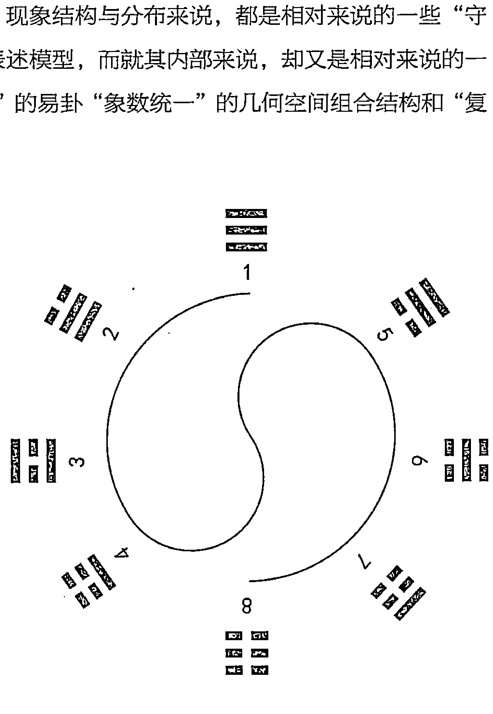

（“先天八卦”结构分布及波动图）

整体结构的卦、数“平衡”；同方向的卦、数“互补”；整体、同方向卦、数“稳定”“统一”；同方向的卦、数“等价”等方面动态与静态的特性——静态是整体呈平衡稳定的分布状态，动态表现的是整个事物的分布呈平衡稳定的状态之后，它所表现出来的动态“波动性”的状态——呈现出的是，“同声相应，同气相求”的振动规律。而不像“后天八卦”对我们当前的“三维”立体空间所表现出来的“实体”事物的变化那样，其分布、结构会像“布朗运动”下的粒子那样，只能呈现出的是按卦数序数所对应的那些卦序的“碰撞”的动态有序的运行方式，最终才能达到事物分布的总体上的平衡和稳定——呈现出的是一种“动态平衡”的“同性相斥、异性相吸”的对实物的一种普遍采用的认识与表述的模式。

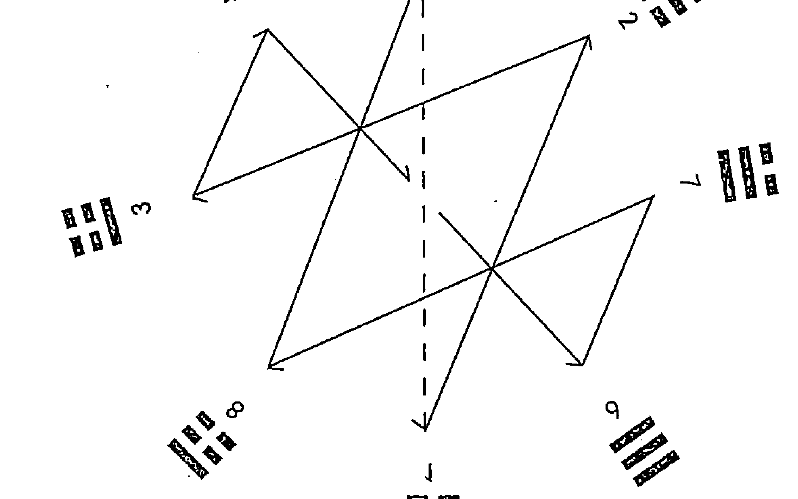

由于“其结构分布”表现出的也是一种事物分布之间，在一定时间段内的整个系统中各事物之间的“动态平衡”的相对稳定的一种状态，因此它的总体的静态模式，将是各方向的卦数总体都是守恒的；“四正”同方向的卦、数互补；“四隅”方向的数互补，卦形不互补；“四隅”同方向对面两卦的“卦画数”不相等；“四隅”同方向对面两卦阴阳爻的个数，不相等；等等——在同一对应的相对静止的时间条件下，靠这个表述模型来观察、分析、研究、探讨一切事物时，是存在有许多看不见或想不到的一些隐伏缺陷的。这也是我们“衍生易”的“象数易学”的认识与表述中，往往或基本是以“先天八卦”（八进制）的“对称”、“互补”、“守恒”、“平衡”、“和谐”等的抽象量化配数及其结构分布之“象”为主“体”，而以“后天八卦”（九进制）的“实体”（刚性）的“对称”、“互补”、“守恒”等的抽象量化配数及其结构分布的具体针对性的“象数统一”为辅“用”的原因之所在——尽量减少或保证高维存在事物状态在向低维时空存在事物状态，在其“合和”、“以变”的转化、更替过程中，确保其信息及其信息量在其抽象转化更替的过程中，尽可能少的丢失、缺失或增益、增殖的“不可确定性”因素及其现象的发生——保证信息及其量化变化的统一、完整、全面及尽量准确切地得以认识与表达。

有关与“先天八卦结构分布”和“后天八卦结构分布”的优劣特点的分析，还可见我所著的《易与和谐》一书1到33页的论述。

#### 5. 总括以上的分析可知：

##### 1. “类”卦的“乾”（☰）“坤”（☷）两卦。

这是一种无论从外部还是从内部的结构来看，都是从上下、左右、外内、前后、南北、远近、好坏、往来、去回等方向探讨、观察、分析、研究时，其总是一种“绝对”A = A 的“对称”、“守恒”、“平衡”、“均匀”、“稳定”、“和谐”以及二者间能相互“互补”且“守恒”（最终会成为“先天”兑2（☱）卦的“守恒”结果）的易卦组合认识与表述的（象数与几何时空统一的）模型——完全与“形式逻辑”的 A = A 的“同一律”相符合的对应性易卦认识与表述的绝对“对称”、“互补”、“守恒”、“平衡”、“稳定”等的一种和谐认识与表述模型。即便是，由其内部二至五爻的最终（本质性）判断结果的组合结构来看，它也是一种 A 绝对≡ A的不会产生任何悖论和矛盾性判断结果的四个爻“乾”类的乾(☰)卦和“坤”类的坤(☷)卦所组合而成。即“外乾类，内也乾类”和“外坤类，内也坤类”卦，所组合成的易卦认识与表述的（象数与几何空间统一的）绝对的A ≡ A的直接对应的表述模型——外部和现在是A = A的“形式逻辑”的无差异和无矛盾的空间结构类型，内部及将来也是A = A“形式逻辑”的“同一律”的类型与结果。

##### ② “类”卦的“坎”（☵）“离”（☲）两卦。

是一种(外部)表面(现象)上看，是一种上下、左右、外内、前后、南北、远近、好坏、往来、去回等方向探讨、观察、分析、研究时，总是一种“相对”A = A的“对称”、“守恒”、“平衡”、“均匀”、“稳定”、“和谐”以及二者间能相互“互补”且“守恒”的易卦组合认识与表述的状态模型。可是，由其内部的最终（本质性）结果来看，却又是一种（A ≠ A，辩证逻辑）的会产生悖论和矛盾性判断结果的A ≡反A的“离”类的颐（䷚）卦和“坎”类的大过（䷛）卦。即“外坎，内离类”和“外离，内坎类”卦所组合成的易卦认识与表述的（象数与几何空间统一的）空间对应结构模型——外部及当前是符合“形式逻辑”的A = A的“同一律”相符合，而其内部及将来是不符合“形式逻辑”的A = A的“同一律”（却是符合A ≠ A的“差异与矛盾”性“辩证逻辑”）存在的对应性易卦认识与表述的空间结构模型。

##### ③“类”卦的“中孚”（䷼）“小过”（䷽）两卦。

是一种无论从外部（表面）上看，还是从内部（本质）上认识，都是一种上下、左右、外内、前后、南北、远近、坏好、往来、去回等方向探讨、观察、分析、研究时，外部表现总是一种“相对”A ≠ A（A ≡反A）的“对称”、“守恒”、“平衡”、“稳定”以及二者间能相互“互补”且“守恒”的易卦组合认识与表述模型。可是，由其内部的最终（本质性）结果的结构状态来看，仍然还是是一种（A ≠ A，辩证逻辑）的会产生悖论和矛盾性结果的A ≡反A的“离”类的颐（䷚）卦和“坎”类的大过（䷛）卦。即“外离类，内也离类”和“外坎类，内也坎类”卦所组合成的易卦的认识与表述的（象数与几何空间统一的）“复合时空”的结构模型——内外、当前及将来的组合结构状态，都是 A ≠ A（A ≡ 反 A）的“辩证逻辑”的对应表述模型。只是从“象数易学”的“类化”的分类结构类型上来看，它们都是符合“形式逻辑” A = A 的同一类型（离类或坎类）的几何结构类型的易卦认识与表述的“象数统一”的空间结构模型而已。

##### ④ “类”卦的“颐”（䷚）“大过”（䷛）两卦。

是一种从外部表面上看，都是一种上下、左右、外内、前后、南北、远近、好坏、往来、去回等方向探讨、观察、分析、研究时，总是一种“相对”外部 A ≠ A（A ≡ 反 A）的“对称”、“守恒”、“平衡”、“稳定”以及二者间能相互“互补”且“守恒”的易卦对应的认识与表述的空间模型。可是，由其内部二至五爻的最终（本质性）判断结果的组合结构来看，却又是一种 A 绝对≡ A 的不会产生任何悖论和矛盾性判断结果的“乾”类的乾（䷀）卦和“坤”类的坤（䷁）卦所组合而成。即“外离类，内坤类”和“外坎类，内乾类”卦所组合成的易卦认识与表述的（象数与几何空间统一的）“象数统一”的空间结构模型——只是，外部和现在是 A ≠ A 的“辩证逻辑”的差异或矛盾的结构类型，内部及将来会是 A = A “形式逻辑”的“同一律”的类型与结果罢了。

虽然，以上诸例中，当各卦都配以“八进制”的“先天八卦数”时，都会产生很少（1%）乃至极少（0.01%）或者更少更少的“不完全性”、“不全面”、“不完整”、“不可确定”等的数值的尽可能少的表述缺陷——虽然我们根据需要，可以尽量去达到趋近于百分之百的（守恒性）认识与表述的程度（几乎可以达到近似于百分之百正确认识与表达的地步），但是，当我们将这些同样的表述模型，配以直接对应的“九进制”的“后天八卦数”或“洛书数”时，却会产生相当大或很明显的增益或相当大的个别、部分的缺失方面的“不完全性”和“矛盾性”以及其最终“互补”性（湮灭、中和、融合）量变和象变的结果。看来，在对应于“形式逻辑”系统的“守恒”、“对称”、“互补”、“平衡”、“均匀”、“稳定”、“和谐”、“量变”、“质变”等前提概念下，其在对事物的认识与表述方面，“后天八卦”数制的表述中，是存在有更多、更大的不可避免的缺陷和矛盾结果的存在——它将给我们的“数理逻辑”及其推导下的各种“科学”和“理性”认识论和方法论，正如以上我们诸个例子的对应模型分析结果所明显表述出来的那样，它将会给我们带来许多无法根本避免的“不可确定”、“不可判定”、“不全面”、“不完备”、“不完整”乃至片面极端性的“不兼容”、“矛盾”和悖论等的无法准确确切地判断结果和干扰性认识及表述因素！看来，它所产生的“不完全”和“矛盾性”认识与表述的结果，应是与“八进制”和“九进制”或其他进制（含“十进制”、“十二进制”、“十六进制”等）的数制表达，在对客观事物进行基本“本体论”地直接对应表述时的准确完整符合的程度，是有必然重要的关系的（本书后面，“四、‘时间’因素的准确确定，是我们认识、判断、表述事物一切状态、规律的必不可少的先决条件——时间的第一性性质”的，第(二)节“我们‘象数易学’的‘设卦’‘观象’‘系辞’的认识、判断及表述的具体方法与过程”里，第(1)段“‘象’、‘数’、‘理’的‘易理学’认知关系与原则”中，第⑤问题“古代中国的各学界，对数的量化、定量乃至定性的性质认识”的小节中，有详细地论述）。请注意！

在以上这种“衍生易”的“象数易学”的“标准型”64卦的，几何空间结构状态的直观性（直觉、感性、形象思维）组合结构状态的表述模型中，可知，仅有4对8个卦的组合结构状态，能与之“形式逻辑”及其“数理逻辑”模型的要求，是能够直接相对应来进行认识与表述而存在的。如果，其中有一种认识、判断与表述的结果，是违背了以上“形式逻辑”中的“同一律”、“无矛盾律”、“排中选择律”及“充足因果理由律”这四大定律原则里，其中任何一个定律的规定和限定制约时，它就都不再会是“形式逻辑”A = A 前提下的认识与表述的结果了——往往已是A ≠ A [ “阴” ≠ “阳”的其他56卦的“辩证逻辑”内涵]的不符合“A = A”前提下的结果了（由此可知，“形式逻辑”的逻辑认识与表述下，“数理逻辑”的“不完全性”和“矛盾性”结果，是不可避免且必然存在的），一般仅以“形式逻辑”（又名“科学逻辑”）来进行对事物认识与表述的人们，就会认为，这是违背或不符合“逻辑学”（其中，并未包含有我们特别重视和强调的，与“时间逻辑”所直接对应的空间逻辑变化状态和事物对应位置的本质变化的逻辑及其对应过程）的认识与表述结果的，故而将会把这种判断及其认知结果，当作错误的逻辑结果，而予以否决或被弃剔的。请大家要格外地注意判断才是！

##### (2) “形式逻辑”系统前提下“数理逻辑”在认识与表达上的某些缺陷及其特点。

由于“形式体系”里的“排中选择律”规定，在对事物及其规律的演绎推导的判定中，它要求：当事物间产生了差异或发生了矛盾的认识、判断或结果时，我们所得到的必须是测重偏向某一方为主的认识、判断与表述的结果和结论——也就是说，它是不能允许对事物及其规律的判定结果，产生“既是又不是”的模棱两可的两种判断结果，都会是同时存在的某种结论的，否则就会产生“形式逻辑”方法论上的不能成立的悖论性结果。这也是资本主义经济仅以“形式逻辑”的“数理逻辑”和“形而上学”的思想进行推进及指导时，必然会产生不可抗拒的贫富两极分化的根本原因之一——一切原则和游戏规则，都是以走极端的片面侧重某一方的认识论，来维护有钱人利益为前提和目的的。

这是因为：
由于数学家、语言文字学家和物理学家等，都期望数学有一个既广阔又严格的基础，在这个基础上，数学家、物理学和语言学家们，可以放心地去做他们愿意做的任何事情。可是，哥德尔的“不完全性定理”的出台，却使这种想法和思路彻底地破灭了。这些“形式逻辑”及其“数理逻辑”中的“数学悖论”所造成的（三次数学）危机，虽然可以暂时地得到回避，然而想从其“数理逻辑的原则上”一揽子地得到根本性的解决，当是毫无希望的一种想法和做法——因为哥德尔的“不完全性定理”，是当今“形式逻辑”及“数理逻辑”（又名“科学逻辑”、“理性逻辑”、“抽象逻辑”）认识与表述系统，所无法逾越和根本解决的必然性缺陷之所在。

众所周知，现代自然科学之所以能较精确地归纳演绎众多自然现象，那是因为它依靠了一门具有“逻辑秩序”的数学来实现的。数学之所以能有如此奇特的效果和威力，那是因为它有一个被称之为“同一律”（A=A。即我们“易理学”中的“阴”≡“阳”）的公理系统所支撑的。而这种“逻辑秩序”在我们的“象数易学”的“易理学”（不是“义理学”）表述系统中，往往是以各种或各个卦的排序秩序的“卦序排列”，或者与“卦序数”相对应的——以时间前后顺序次序来排列形成前提下的“递归”逻辑的形式，予以表现或体现的。这也是因为近代数学中的“数理”理论里认为：“是否能进行排序，是能否可数的充分且必要的条件”的缘故。也就是说，只要我们具备了事物明确的排序及排序方法，我们就能在“其大无外，其小无内”的几乎或者近似“无限”内涵的时空中，找到或判断出事物所对应的准确或唯一的对应性结果（这也是“卜”、“筮”、“象数易学”及“数理逻辑”判断方法的目的）——这正是最基本的“自然数集”（即“可数集”或“可列集”概念）的主要和基本的内涵。也是哥德尔为什么利用“递归函数”的“可数个对象的集合”，并与之配上一个“哥德尔配数”的具体数值的方法，并且通过这些配数的推算结果，来解决反过来看“原来形式系统”（含“形式逻辑”的表述系统）的性质的目的。他这么做的思路，应是与我们的“象数易学”中的易卦几何结构状态同时对应配上一定的对应“卦序数”和排列序数，以及用“函象”公式的方法进行认识与表述的思路，是有所一致的。这样就会使卦、爻象之间（直接可进行直观思维的）几何组合结构（象）形式的变化，就变成了抽象的数与数之间的变化。而各数又内含有各自不同或相同的“五行”性质定性的功能及作用，故而在此“类化”本质定性的基础上，又可确定其对应形式（卦、爻的几何组合之象）变化后的性质定性的必然性变化规律及结果。继而，再将这些本质不再变的定性后的变化规律和结果（“之”卦、“变”卦等），与初始未变时的组合结构状态、规律和结果（“本”卦）相比较，就能发现并掌握“原来形式系统”未变时和“现在形式系统”变化后，它们之间的性质（含本质）及其变化特点与（本质方面）必然性变化规律及趋势和结果等了。又由于我们的“象数易学”的“易理学”，对事物及其规律等最基本的“象数统一”不可分的认识论方法及原则的涵盖，因此这种“象数”间的（融和）“统一”，可以产生事物相应、相遇、组合、结构、分布、卦变、爻变、象变、数变、符变等，不记其数的逻辑变化下的“形式逻辑”、“辩证逻辑”以及“有机辩证统一逻辑”的过程、形式、状态和结果等。比如，单就“象数易学”的64卦间的排序分布形式，就存在有64！（阶乘）=1.27×10的89次方个逻辑秩序及排序变化状态、个数、类型、形式、阶段与过程等（这个变化的内涵变化量，会远远超过了现代物理学家狄拉克认为的：宇宙间所有的事物的总质量=质子质量×10的78次方个“粒子”重量的理论数据值）。也是说，现在我们人类所能研究的事物总质量及其数量系统涵盖的具体“质子”的个数值，离我们“象数易学”的64卦系统变化组构内涵的对应性表述的总数量值，还差得远呢（二者相差了100亿倍个数量级）！所以我们才可能及才会运用64卦的各种组合变化的形式与方式，来认识与表述一切事物及其变化关系和结果等规律的——形成了64卦的表述体系，对宇世中事物统一认识和表述的现实性和可能性。

我们“衍生易”的“象数易学”的“易理”及其认识论和方法论，到底能有哪些对应于“形式系统”的认识与表述方面的特点呢？

###### ① 具有通过把握“守恒性”来掌握事物“量变”秩序的逻辑功能和能力。

由于该形式体系中的“同一律”，能具有按照“守恒性”来把握事物“量变”（量化及其量化的变化）秩序的逻辑功能和能力，所以它为近代科学技术地高速发展，立下了汗马功劳。而在我们“象数易学”的“易卦”表述系统中：

1. “阴”“阳”爻的“总和数”是守恒的；
2. “老少”四象中的“老阳”（䷀）、“老阴”（䷁）；“少阳”（䷂）、“少阴”（䷃）；各自及每组中两者之间正反象的“爻性数”，也是守恒的；
3. “八卦”中乾（䷀）、坤（䷁）、坎（䷃）、离（䷂）正反象本身“对称”平衡，以及乾坤、坎离、震巽、艮兑各组卦内“互补”的“先天卦序数”之和，还有震、坎、艮及巽、离、兑各组中，卦的“爻性数”，也都是守恒相等的数值；
4. 六爻卦中“乾”（䷀）、“坤”（䷁）、“坎”（䷃）、“离”（䷂）、“颐”（䷚）、“小过”（䷽）、“中孚”（䷼）、“大过”（䷛）各卦，它们自身的正反象“对称”且上下卦的“卦序数”或“爻性数”之和，也是守恒而确定的数值；

1. 所有64卦“对象”二者间的“爻性数”的和数值，相等且守恒；
2. 64卦中，只有三个“阳爻”与三个“阴爻”组成的那20种“对卦”卦体间的“爻性数”之和，守恒（其他22对44卦的两个“对卦”间，“爻性数”是不守恒的，并以多种同等且固定的数量级别的增减变化量，存在着）；
3. 所有64卦的“交易”卦本身及其上下卦二者间的“卦序数”与“爻性数”的总合数，是守恒的；

> ……更清楚的具体分析内容，详见本人所著《易理数理（三）》“二十四”到“二十七”章地分析与归纳的内容。

这些易卦结构“守恒”性的表述方法与功能，它既可以从特殊到一般地进行综合与“归纳”，又可以从一般到特殊地推导与“演绎”。也就是说，在我们的“象数易学”的认识与表述中，“同一律”既具有涵盖性的“归纳”功能，又具有“演绎”性的分解、分析功能。可以说，只要我们归纳演绎的前提“真”，推理的形式又正确，就一定会得到“真”的结论。这也是“衍生易”的“象数易学”易理“本体论”中“阴” ≡ “阳”（A=A）前提下“形式逻辑”的涵盖所能达到的认知与表述功能和作用——即我们采用“同一律”（自同律）、“不矛盾律”、“排中律”、“充分理由律”这“四大思维逻辑规律”所涵盖的逻辑分析、推导、计算、判断或归纳时，同样会作为我们理性思维指导的最基本和最基础的思维功能及作用之一。由前面(一)(1)一节中具体对应内容地分析中，我们可知，这些“阴” ≡ “阳”（A=A）前提下与“形式逻辑”直接对应的64卦的“标准型”几何结构模型中的认识与表述的数理结果，依然还会产生“不完全”和“矛盾的”符合“哥德尔定理”所表述的结论的。可是，这种“形式逻辑”的思维规律里，一般往往都会缺少人们在认识和表述中，都不应也不可以缺少的直觉、直感思维的直观性的认识与表述的“形象”、“形式”、“状态”、“结构”等的补充性印证的能力——而我们的“象数易学”易卦与之“形式逻辑”直接对应的几何结构型的逻辑模型里，却具备有这种“直观”性（象形思维）表述能力和功能的印证性结果的。

##### ② “形式逻辑”法则的“数理逻辑”的不可抗拒的根本性缺陷——“哥德尔不完备性定理”——

> “在任何‘形式逻辑’系统中，彻底的‘无矛盾性’是不可能的”。也就是说：“绝对排除逻辑矛盾，在（形式）逻辑上来说，是根本不可能的！”

然而，当人们充满信心地运用这些“形式逻辑”法则处理一切事物时，却出现了众多的例外情景。有时候，即使推理的前提“真”，推理的形式也正确，但演绎的结果却会得到令人无所适从的“悖论”。这就是最令语言学家、数学家及物理学家头疼的“数学悖论”的问题。长期以来，人们绞尽脑汁，虽然想根本性地克服这些“数学悖论”，但是事情的进展并不像大家所想象的却是很不顺利的。这些悖论不仅不能在“数学公理”范畴内得到根本地解决，反而研究得越深入的话，它所召至的悖论也会越多，越难以将其根本性的克服。

比如，1930年秋至1931年之间，哥德尔在证明“‘形式系统’数学分析的协调性（又称无矛盾性）”的问题时，却得到了“哥德尔不完全性定理”的结果——这是“数理逻辑”及其“数理逻辑”发展中，最重大的发现、成就、里程碑和出发点之一。哥德尔在他的研究过程中，直接考虑到悖论及解决悖论的方法问题。当然哥德尔证明“不完全性定理”也是从考虑“算术及分析形式系统的完全性”及“数学分析的协调性”（无矛盾性）问题开始的。

1930年秋，他宣布了“第一不完全性定理”。即是说：“一个包括初等数论的‘形式系统’，如果是协调的（无矛盾的），那么它的表述就是不完全的”。

不久他又宣布了“第二不完全性定理”。而是说：“如果初等算术系统是协调的（无矛盾的），则其协调性在此算术系统内，是不可能得到证明的”。他这是在告诉我们：该公式及表述体系，是个“不可证明的却是个真实的”命题。也就是说，“该公式或系统中，存在着表述真实的语句（结果）内容，可是它却是个又不可能（在本系统中）被得到确切的（确定性）证明”的问题。

同时，也说明了该（“形式前提”的）表述系统，是个不完全、不完备的表述系统（不能做到其中全部的内含内容，都能得到全面完整地进行确切的认识与表达）。又是说，如果一个数学的表述公式或系统的“无矛盾性”及“协调性”不能得到证明的话，说明该公式或表述系统对对应事物的表达，是存在着缺陷和不完全准确的判断结果的。可以说，“只要有无法证明的数学结论状态的存在，就会有与之对应的无法预知的事物及其规律和与之相应的物理等问题的存在。”（霍金语）

由此整件事情所引发的是：人们对“关于‘数学逻辑’基础的可靠性问题”的探讨与（理性）认识——它告诉我们：“在任何包含初等数论的‘形式’系统中，都必定存在至少有一个作为最终点或初始点的不可判定它是‘非自相矛盾性’的命题。”当发展出现了“图灵机概念”之后，上述定理的一个等价的命题，就成为了：“任何定理的机器（机械）式证明，都至少会遗漏一个最终的或初始的预设为‘真’值的数学命题，是不能得到证明的，这就导致了‘数学算法’的‘不可穷尽性’”的结果。自然这一性质，又被现代许多哲学家用来作为了“在机器模拟人的人工智能方面，必定存在着某种不能超越的逻辑极限”的“算法”依据。然而，事实上，若想排除这个悖论及其影响时，“图灵机”本身也会是做不到的。即使是人的智力，同样也会是做不到的——“图灵机”的全部能力及功能，也是按人的“理性逻辑”和“科学逻辑”来设定和制作的——其间最为缺少的是，人们思维方法里的最重要的直觉感性前提下的直观性“形象思维”的补充认知与表述的印证性形式与方法。而这种直觉下的直感性的直观思维的结果，是当今任何非生物性人工智能的计算机出现之前的思维方法，是根本做不到也是达不到的能力——虽然，他们有可能会运用或摩仿类似于基因的存储功能与方法。

事实上，“哥德尔定理”的另一种简化的表达就是：“在任何‘形式逻辑’系统中，彻底的‘无矛盾性’是不可能的”——这是对“形式逻辑”体系中，“不矛盾律”、“相容律”的一种彻底地颠覆。换句话说，“形式逻辑”前提下的“‘不矛盾律’是会受到限制和制约的”认识与表述规律——这也正是黑格尔对“形式逻辑”认识的结论。若我们仅用一句话简单的语言来表述“哥德尔定理”的内涵的话，那就是说：‘绝对排除逻辑矛盾，在（形式）逻辑上来说，是根本不可能的！’故此‘哥德尔定理’的发现，直接摧毁了罗素、怀特海试图构建的‘数理逻辑’大厦，迫使他们放弃了不包含矛盾命题在内的《数学原理》一书地写作。可是，对于这一定理的逻辑意义和哲学意义，至今仍然还是甚少会被中国哲学界、数学界、科技界及语言文字界的众多人士，有所关注、理解和认识到！请格外注意才好！

此外，至于对于哥德尔的这一定理，1944年数学家魏尔（Weyl），就曾针对性地讲过一句十分幽默的话。他说：‘上帝告诉我们数学是不容矛盾的。但是魔鬼却告诉我们，这种不矛盾性是不能被证明的。’可以说，现代‘数学哲学’的这种理解与认识，与康德的哲学的‘不可知论’；黑格尔的‘怀疑一切’和‘象数易学’‘易理’及周易《易传》中的‘安而不忘乱，居而不忘亡’的‘忧患意识’（不去‘怀疑’一切，怎会产生忧虑结果和意识）的认识，可以说是惊人的相似，甚至会相当的一致。

##### ③ 只要有无法证明的数学结论的存在，就会有无法预知的物理问题。

‘正如“哥德尔定理”所表述的一样；一个物理学理论或者自相矛盾，或者无法完备。’因此，物理学的泰斗级人物霍金受‘哥德尔定理’的影响，不得已放弃了他所苦苦追求已久的‘M- 理论’。

让人们更没有想到的是，该‘哥德尔定理’认识，却直接导致了2004年，当代物理学泰斗——霍金先生，毅然决然地向世界宣布：他将放弃他所追求已久的‘M- 理论’。并在自己的《哥德尔与物理学的终极》的论文中，讲述了他决心放弃‘M- 理论’的根本原因。同时，还解释说：‘“哥德尔定理”是用自我指认的方法证明而成立的。这种命题（含方法）会导致悖论。比如，如果一个命题真，那么可合乎逻辑地推出其假；如果一命题假，那么也可以合乎逻辑地推出其真。’他还明确强调地说，‘哥德尔定理’很明显地表明了‘M- 理论’是不可能实现的。因为‘只要有无法证明的数学结论存在，就会有无法预知的物理问题。我们并不是能从宇宙之外来观察宇宙的天使（本人注：是在同一个宇宙里来观察该整个宇宙及其构成、规律等——在同一事物中来观察该同一事物的整体与全部，故而很难以全面整体地来进行“完全性”的观察——所能观察到的也只能是些不同‘时间逻辑’对应下的各个局部或个体的组合、混合、汇合等一系列状态与规律等的混杂结果）。相反，我们和我们的模型，都是我们所要描述的宇宙的一部分。因此，物理学理论都是描述自我的（认识），正如‘哥德尔定理’（所表述的）一样；一个物理学理论或者自相矛盾，或者无法完备。”

看来对“形式主义”、 “逻辑主义”、 “有限主义”等思想和哲理进行致命打击的，就是“哥德尔的不完全性定理”。它证明了仅从“逻辑”或“形式”及“有限”步骤的角度和方法上来努力，并不能推导出算术及其结果的全面的正确性来的。显然，若想把数学全部化归为“形式逻辑”及其“数理逻辑”的（有限）过程与结果的涵盖时，同样也是会遭到彻底失败的命运的。

## ④ “象数易学”中“时间逻辑学”与“时间易学”对应状态及其“递归”概念和方法地充实与补充，可能会从根本上解决“哥德尔定理”指出的“数理逻辑”的缺陷问题。

也就是说，“象数易学”中“易理学”的“六爻相杂，唯其时物也”的“时间逻辑学”与“时间易学”对应状态及其“递归”概念和方法的充实与补充，有可能会从根本上解决“哥德尔定理”所指出的“数理逻辑”的缺陷问题。

由上面地分析，我们明显地会体会与感知到，西方“形式逻辑”哲学及其前提下的数学和“数理逻辑”，在其认识及表述系统的理性核心上，是存在着难以根本回避和解决的对事物及其规律和变化，进行认识与表述的不完备、不完全、不可确切确定性等的不完整性的认识与表述缺陷的——这是由于时间变量所直接对应的事物信息量的（一般或瞬间）急剧扩张、放大和收缩，所导致的“不可确定性”所直接对应的破缺所形成的无法连续性表达的必然结果所致。从数学的数理理论来说，这也是由于时间先后所对应的事物（递归）排序及其位置序列的确定（即以时间为准绳所直接对应的“时间逻辑学”的组合结构状态为根据），才是在“其大无外，其小无内”的范围内，寻找到事物确定性结果的充分且必要的先决条件——因为时间长度因素太短，或空间中事物（同时）发展变化者突然性发展变化的太多、太快，乃至太复杂而巨大，故而在西方“空间为主，时间为辅”的“空时论”以及当今的计述设备的计述速度太有限的条件下，是很难或者说是根本来不及并迅速地形成准确的与瞬间时间直接对应的（递归）排序的“时间逻辑”状态的，故而很难在有限的步骤内，用（有限）很短或瞬间的时间作出直接对应且准确的逻辑状态地对应性判断和比较的——即是以“递归枚举”的方法，也会是如此——由于其瞬间的变化及其变化速度太大、太多、太复杂，而无法直接对应得特别清楚准确所致。

可是，我们“延生易”的“象数易学”的“以时间为主，空间为辅”的“时空论”，是可以用时间一去不复返的“标准性”确定，来寻找到与其直接相对应的“标准性”空间结构（卦：是由几何型结构状态来组合形成的与直觉思维相对应的直观的“标准性”的空间结构形式和状态）；再由其事物在空间中与该时间所对应的层次、位置、角度、状态等，来对应确定事物间的本质性质的相互作用关系；最后由事物间的本质性能之间的关系，确定事物间的相互作用、功能及发展趋势和“以变”方向等本质规律。因为其间采用的都是真实实际具有的“标准”统一的“时间逻辑学”为前提的“时间易学”里的“时”“空”结构及分布状态与事物本身直接对应的实际存在的对应环境的表述方法，故而我们是能够得出共识前提下的共同（同一）性判定的结果与结论来的。

又由于中国古代我们的祖先，在研究任何事物及其相互作用关系的思路时，会是以“地心”及以“我”或“事物”自身为主、为核心的思想和学说的表述方法，来作为“静态”或瞬间（Δt，相对不动）时间（逻辑）对应下的事物课题的核心依据。即以天文学的主要或所有的星体，在某时间条件下，所共同形成的主要或所有天体的综合性的效应及影响下的结果，来直接对应认识、判断与表述“盖取诸离”的一切事物相互作用关系，所形成的整体作用下的，那些核心课题所具体针对的某具体事物的运动趋势与规律——实际我们对事物所对应的时间地认识与运用，就是作为“天”、“地”、“生”（所有生物）”等一切事物间的总体功能及效应的同时共识与运用的前提——时间，就是对这种事物总体功能及效应的具体有序性地表达。也就是说，具体时间所直接对应表述的内涵，就是当时宇世间一切事物所形成的总体综合功能及效应的状态以及各事物当时具体对应存在的可能性。这也就是为什么中国古代及我们“延生易”的“象数易学”的“易理学”，会是以“时间为主，空间为辅”的“时空论”的原因——说明任何事物及其个体所直接对应的空间结构状态，都是宇世间所有事物的综合性整体组合功能与效应状态下，所直接对应空间的一个具体表达部分——反映与表述的是总体存在关系中间的一个局部或具体的个体存在状态与规律。

由以上分析可知，若想根本顺利地解决“形式逻辑”哲学及其前提下的数学的数论系统里的“不完备”、“不完全”、“不相容”、“必然矛盾”、“不协调”、“不可确定”等问题，必须在其“递归”与“递归函数”（连续或不连续）的表述系统中，增加每个“递归”关系前后所直接对应的“时间因素”的准确的对应性表达，最终才能形成时间与空间对应统而为一的“时空统一”的直接表达的总体结构关系模型，借以来与之对应准确地对所有事物进行具体地表述。这在我们“延生易”的“象数易学”的“易理学”里，被称之为是以“时间逻辑学”为主体的“时间易学”所内涵的内容。由于我们的“时间逻辑学”认为：一切事物的产生、成长、状大、衰败、消亡及其发展变化、更替或转化等，都是对应于“唯其时物”为前提的时间（逻辑）关系下的真实具体的存在变化状态，所以我们可以把“时间”和“空间”这一对（A ≠ A，即“阴” ≠ “阳”）不相同或处于差异甚至矛盾的事物，通过我们“延生易”所创制的“有机辩证统一逻辑”的“时间逻辑学”所直接对应的事物状态、规律及其结果等，进行“标准性”的直观（与直感、形象思维相结合而对应）“对应统一”地本质定性性质的整合，因此它就能准确解决与时间及其过程有关的对应于一切动、静事物的认识、判断与表述等问题了——其中，并不会产生并出现像“形式逻辑”哲学前题下的数学的“不完备”或“不相容”的认识与表述的那样，不可避免地会出现根本性矛盾的（悖论）结果——尤其是前提概念指向不明确（含无限、无极、概率、可能性、不可数、空、无、虚、不存在或无具体针对性等“不确定性”或“无法进行确定”的因素）时，以及事物及其变化时，在较短有限的（含时间）步骤内，直接对应的事物及其变化数量巨大，或者瞬间时间中事物量化的变化量巨烈地增减时，更会是如此。这也是，我们的“象数易学”的“辩证逻辑”中，把“形式逻辑”的对称、守恒、互补与等价等的A = A（“阴”≡“阳”）“同一性”逻辑，当作是我们“有机辩证统一逻辑”辩证分析中的一类“特殊逻辑统一”类型的逻辑学就是了。

##### ⑤ “平衡秩序”的法则，能解决数学“守恒秩序”的“不完备”和“不协调”性问题。

此外，由于在西方文化的思想逻辑中，仅存在把握事物“守恒秩序”的数学，缺少一种把握事物“平衡秩序”的法则，所以罗素“自集命题”就不可能在“数学公理”指导下，找到“真理性”答案。而我们“象数易学”中的那些“先”“后”天八卦“分布结构图”、各种八卦、64卦等的“生成与排序分布图”（含卦数及场态数）等，都是一些开放型的“其大无外、其小无内”（普适）适应前提下所对应的动态的“平衡秩序”、“稳定秩序”地认识及表述——尤其是“先天八卦结构分布”状态。“哥德尔定理”正是因为它揭示出了“形式逻辑”体系内核理性的“不完备性”（不完全性，不可准确确定性、不可证明性、不协调性等）而著名。人们想用把握“守恒性”的逻辑去演绎“自集”要素之间的相互关系，显然又会是一种不合时宜的越职代庖式的行为——事物及事物间的“平衡”与“平衡次序”，并不能完全都是处于量化及量变的“守恒性”状态和次序之中的。即是说，我们“象数易学”的“易理学”认为，只有对应于64卦几何结构类型，是处于绝对“对称”与“互补”性的事物间，才会受到“守恒性”逻辑的涵盖与制约的。其中“对称”或“互补”二性及其关系，缺少任何一方，都是不可能被“守恒性”逻辑所涵盖和制约的。除此之外，在易卦“以变”（含量变、数变、量化）变化的过程中，仍然还会存在有更多的“不守恒”的逻辑过程、形式与结果。而我们“象数易学”的64卦的64！（阶乘）的“自集”要素——各个六爻集合卦体之间的相互组合、排列、“以变”、“合和”及其关系等，是足以表达宇世间的一切事物间的关系与变化规律的。其间，所能包含的变化状态的内涵，会有1.27×10⁸⁹种类的事物变化类型、状态、个体、结果、阶段、层次与过程等。这比英国物理学家狄拉克（P·A·M）所计算出的宇宙总的质量＝质子质量×10⁷⁸∝ t²（t为不见物质的适当因子，其用原子单位表示。∝为反比关系）的总数值，还要大上100亿倍个数量级之多。

再比如，天文物理学家认为，我们的银河系，是由一千亿（10¹²）个星体组成的旋涡状星体，而宇宙中全部的星体总数应是这个数量的一千亿（10²⁴）倍——这个数值还是远远小于我们64卦全部排列组合形成的对应认识表述类型、状态、个体等总数目值的10⁶⁵倍。

由此，我们认为，许多大学和研究院所中的教授和专家们，可能是并没有会想到，64卦的总体变化所形成的对应事物的内涵变化的对应表述的数量，会是如此之大。这也是他们不相信“象数易学”能对应认识与表述复杂的“自然科学”与“社会科学”的一切事物的根本原因——认为其对应表述事物的内涵的对应量太小、太少了。这应是受儒家“形而上”的认识论影响及其被误导下的一种脱离实际的想象、假设、空对空思维及思想方式的认识结果。假如，大家都来运用我们“延生易”的“象数易学”的理论和方法于“自然科学”、“社会科学”、“人文学术”等领域的各个认识、表述与实践的系统中时，这种误识性的判断结论，才会得到教授和专家们的明心见性的确切地认识——因为，实践才是检验真理的唯一标准，所以我们是不需要“空对空”去想象的结论——由于这很可能就是一种不存在（脱离）原型实际（印证）的自欺欺人的认识论及方法。

如果，我们就表面上看起来，是只有五个简单因素所组构成的“五行”属性对事物的本质定性的认识与表述系统的内涵及其指证等，会认为是个“太简单”的组合认识与表达系统——它是不足以认识与表达宇世间那么复杂多变化的事物其及规律的可能的。由于自古以来，我国老祖宗们在认识与表述一切事物时，为了保证其判断结果的真切性，所采用的认识与表述体系，都会是些根据层层时空及其关系以及具体事物间的针对的位置关系等，由总体上通过直接对应的“时间逻辑学”的准确定对应前提下的制约，对事物作出直接对应针对性的具体判断，所以其采用的基本都是些“组合数学”、“组合时空”、“组合结构”、“组合分布”、“集合组成”等的“组合学”认识与表述体系（包括“形式逻辑”与“辩证逻辑”各自及其之间的辩证性组合）。所以说，单从“五行”本质属性表述体系的基本组成来看-就其体系的具体表述能力的表象来说，的确是“太简单了”点！可是，当它与以上 64 卦排列组合的表述体系相结合时，又会在此 1.27×10^{89} 的基础上，再乘上一个 5!（阶乘），即 5×4×3×2×1 = 120。也就是说，把 1.27×10^{89} 再乘上一个 120。得 1.524×10^{91}。假若，再与 10 “天干”和 12 “地支”再进行排列组合的话，还得将 1.524×10^{91}再乘上一个 10!（阶乘）和 12!（阶乘），即得 1.524×10^{91}×10! × 12!。大家下去算一算，这将是个多么大的数值——该数值有多大，就能针对该有多大量值的事物组成的环境体系，进行具体对应性的个体、种类、状态、层次、阶段、过程等的认识与表述。所以说，我们还能轻易不负责任地就敢糊说；“其系统的内涵太简单！”“不足以对应表述开放复杂的自然科学的结果”吗！

再说了，这种对一切事物的“五行”定性的认识与表述的体系，它是我们传统文化中，对一切事物间的作用关系的平衡、稳定、发展与变化等的各种指向，进行“生克制化合”的根本本质性的认识与表述的。它解决了西方“数理逻辑”中无法准确判定事物的“量变到质变”的根本性质变的标准判定法则和对应标准的问题。虽然，由于事物表现的现象是相当复杂的，但是事物间的共同性的统一（融和）的本质，却是相对更简单的综合归纳方面的问题。这就是为什么中国古代的所有的具体针对性的判断方法的结果，都是以“五行”的本质定性原则和标准，作为其各自认识与表述的不可或缺的主要和基本的要素来对待和处理的原因。比如，中医、中药、“五运六气”理论、针灸、养生、气功、武术、一切“数术学”方法、军事战阵、建筑、风水、堪舆、地理、城镇规化、天文历法等，都离不开“五行”的本质定性的分析和判定的依据——因为事物之间本质与本质的相互作用关系，才是能寻找到事物与事物间的根本性的作用结果的基础根据。同样或不同事物间的量化变化及量变数值的变化，都会对应有它自己直接对应的“五行”本质性质的变化的——“量变”和“质变”，在我们“象数易学”的“易理学”看来，二者是一种不可分离的统一性整体的共同（同时）存在的过程。

不言而喻，由于“自集”要素之间的相互关系，应是一种“平衡”关系（本人所著的《易理数理（一）》至第三册书中认为，事物（对应“易卦”）的“平衡”关系，并不会全部都等于是“守恒”关系下的各种对应关系与“类”型的。比如，“反象”的“对称与否”的量变“守恒”；“交易象”间的量变“守恒”；20种三个“阳爻”与三个“阴爻”组合成一个六爻卦的“对象”间量变的“互补”、“守恒”等，其间“阴”“阳”爻的个数虽然能达到平衡对等，但是各卦所形成的总卦象之数及“爻性数”的多少与大小，却并不会都是“守恒”前提下的同样的一个数值），因此我们熟悉的“形式逻辑”以“同一律”（“阴”绝对≡“阳”或“阳”绝对≡“阴”）为基础的数学，只能演绎事物的“量变”秩序。但是“量变”秩序并不能完全反映与表达“时空结构”、“事物状态”与“以变”变化的全部秩序。比如，易卦的“几何空间结构”中的“反象”所表述的“对称”性状态；各种“交易象”所表述的“对称”性状态等，都是单单通过“量变”及其推导的量化数值的“合和”或“以变”的结果，将都是无法明确的得以对应准确地判定及确定的——必须通过其直接对应的直观（感性、形象）的卦型的具体几何形式的空间组合结构状态的阴阳爻“对称”组合成的具体样子，才能获得（直观性、形象性的）直接肯定性的判断结果。

比如，雷山小过（☳☶）卦：上卦数4+下卦数7=11。而山雷颐（☶☳）卦：上卦数7+下卦数4=11。该两卦的总卦数，都等于守恒的11之数。而且该两卦各自的“反卦”：仍然是该两卦与自身几何结构完全一样的组合结构状态。故各自的“反卦”之间的量化过程，依然还都是达到守恒的11之数。况且，雷山小过（☳☶）卦的“交易卦”是山雷颐（☶☳）卦：“颐”卦总数：是上卦数7+下卦数4=11，而原“小过”卦总数：是上卦数4+下卦数7=11；其间，山雷颐（☶☳）卦的“交易卦”是雷山小过（☳☶）卦：即“小过”卦总数：是上卦数4+下卦数7=11；原“颐”卦的总数值：是上卦数7+ 下卦数4=11。它们二者的“交易卦”的总体数值，也都是等于11的守恒性总数。从“小过”（䷽）卦与“颐”（䷚）卦的几何结构状态和组合形式上来看，它们两者的具体结构状态，都是“对称”型的符合“形式逻辑”A=A的总体数值来看的“守恒”性的“对称”性结构状态。

同样，还是其卦的总数，依然还都是等于11的“守恒”性的六爻卦中：比如，火地晋（䷢）卦与地火明夷（䷣）卦；风水涣（䷺）卦与水风井（䷯）卦。它们的“反卦”、“交易卦”的总体数值，一直都会是保持着自己“守恒”性的11的总体数值，从卦形的具体几何结构及其组合形式的总体上来看，由其直观的形象思维角度来认识时，它们明显地是处于总体组合结构和组合形式上，并不是处于以六爻卦的中间为中心的“对称”型的组合结构状态和形式下！

所以说，事物变化中的量化变化的“守恒”与“不守恒”的状态，在我们的“象数易学”的认识论里，是并不能替代对事物组合结构状态是不是“对称”状态和形式的直观及形象思维的功能和作用的。也就是说，对事物量化、量变的“数理逻辑”的“理性”计算结果，仅是以“理性逻辑”的思维结果为依据的话，是无法也是不可能完全取代“直觉思维”、“形象思维”、“感性思维”和“理性思维”等思维下的综合印证性的正确判断的结果的——这就是我们“象数易学”认识与表述体系和方法的：“象数统一”（理性与感性，抽象与形象辩证统一逻辑）不可分的认识论的优势之所在。而“形式逻辑”的根本缺陷，就是在“排中选择律”的启导下，仅片面强调并偏重事物某一方面的认识与表述结果的功能和作用——对于“形式系统”来说，就是仅强调“理性”的客观片面的功能和作用，排斥并放弃“感性”思维的主观能动性的积极的印证功能和作用。请大家注意区别和认识！

此外，对于“自集”系统的“集合秩序”，比如说，64卦的64！总阶乘的排列组合的总变化体系量=1.27×10^89个或类型、状态、结果、阶段、层次、过程等，其中还会存在或隐藏着非常多的突变、突发性的“以变”因素，而这些突变因素并非都是符合“自集”的集合逻辑秩序所能推导和涵盖下的普遍性规律的——其间的“质变秩序”的确立，已被哥德尔从数学真理的存在形态中所否定了。这是由于违背了“象数易学”易理的“象数统而为一”的认识与表述的根本性原则，故而由此数（量）与其所对应的事物之“象”（形、态、物、色等）地相互脱离，就导致并造成了数无法正确真切的直接对应于直观（直觉）性或直观延伸性表述该事物的（全部完全的）一切状态及其规律——就像股票市场中，现在人们往往仅重视“数理逻辑”中数的量化变化与结果一样（仅含数的变化性及其变化的几何图形趋势图标状态，而并不是真正，真实的货币、资金、资本、资产、资源、产品、价格、价值、物质、实业、实体等的与实际事物对应存在的真实的实际情况及实际存在状态）——充满着无法进行正确判断的“数拟”状态下的“虚拟”概念陷阱——在一般人们的眼里，早已经是没有事物直接或间接对应的真实的实际之数了！这就是仅以“抽象之数”而脱离了直觉形式思维的“几何象形”之物作为表述及判断一切事物之“真”“假”根据时，所造成的恶性结果。也是由于“形式数理逻辑”系统在其“不全面”、“不完备”、“不协调”性的核心“理性”前提下，其数及数学逻辑系统的本身，就存在有一定的极端性“悖论”矛盾认知的结果与状态所致。而这些结果与状态，又多会是处于“无限”、“无穷”、“无极”与趋向于“极限”性将事物数量放大后的（可确定和不可确定的）必然性的“悖论”之中。这又是因为其间事物所对应的数、量，多会是处于单位时间条件或瞬间时间对应下，事物数量或量化的巨大增减或变化多端，以及数量扩张与放大或衰减缩小到一定的量时，甚至可能达到的是“无限”、“无限小”与“极限”性将事物数量放大或缩小后的必然性的“不可确定性”和“悖论”的结果之中。其中，因为“无限”、“无穷”、“无极”等概念，都是些前提不可能明确定针对性确定的命题及概念，所以它会是个“不可计算”的命题，故而靠它是不可能获得确切而确定的判断结果的；而事物处于“极限”的“极端性”状态时，所得到的最终结果，又会是与事物原本完全不同或完全相悖的必然会发生“矛盾”的结果，所以人们仅靠当今“形式逻辑”数学的逻辑方式，基本上是无法对全部及各种事物进行完全全面准确地判断、把握和驾驭的。

由此可见，霍金从其物理学泰斗的高位上，自动撤离下来的原因，并不是在于物理学本身，而是在于物理学受到了数学“数理逻辑”中“哥德尔定理” 的无情地冲击——是“哥德尔定理”宣判了“M-理论”最终是不可能成立的死刑。虽然，哥德尔将数学的真理性从“罗素佯谬”系统中坚决地排除了，但是他并未能给出究竟应当如何来处置和解决这类系统恶性结果的方法，故而最后，迫使我们这位受人尊敬的物理科学泰斗，不得不在“哥德尔定理”的面前，勇敢明智地从“高位”上退却了下来——同时，也说明了，在现代包括数学、物理学及语言学在内的现代“科学理论”基础中，是存在有不完备、不全面、不知可否和矛盾性的认识与表述缺陷的。但是，我国当今广大的学术界的众多领域中的领军或带头的人物，对“科学逻辑”的这一必然的缺陷，始终还是没有得到他（她）们地重视性探讨与认知。甚憾！

⑥ “公理论”、“模型论”与“范畴论”相结合，是构造“数理逻辑”理论的必须重视和不可缺少的方法。

> > “公理论”和“模型论”是构造理论的两种方式。前者的源头是古希腊科学，而后者的先驱在古代中国的科学中。现代科学家们一直把‘公理论’作为建构理论的理想途径，以致在‘哥德尔定理’已揭示出‘公理系统不可能是逻辑完备的’情况下，仍然还没有自我感觉到‘公理论’适应的局限性。‘模型论’的公认优势在于，与经验（与认识）同构的模型，它可以包含同非实在因素对应的结构。”

就此，我们还认为，“象数易学”及其各种“合和”、“以变”的表述模式中，均有实象、虚象；真象、假象；物象、形象、数象、幻象、虚拟之象、梦象、想象或观想之象、影像、投影等卦象及与之对应的结构状态和对应内涵的存在。故而我们“象数易学”的“易理学”中，是既包括了“公理论”又内含了“模型论”的双论式的相互互补性更加全面完善的组合性认识与表述的理论。

再者，董先生在这里所说的“公理论”，我们认为，他应是指“形式逻辑”中用“数学方程”表征的“守恒公理”。这里所说的“模型论”，就是指“有机辩证统一逻辑”中用“易学八卦（用几何空间结构表述的符号）图”表征的“平衡模型”。所以我们又可以认为：“先天八卦”分布结构、“对称”、“互补”、排序分布生成（含数字、几何式结构等）的整个表述体系，就是一种全面完整的（高维）“平衡模型”的表述形式、状态与模型。即使是在“后天八卦”分布结构中，虽然表面上看，它是一个“象”“数”分布结构并非总体直接能达到对应“平衡”的“模型”，但是通过“序数”先后次序的排列传输次序地运行，来达到最终它在整个的组合结构分布的总体上，仍然形成的还是一个“动态平衡模型”。由于其间相对应事物间的不同的“类化”、“极化”、“集化”、“几化”等关系的相同或不同，其“象数易学”直接对应所组合成事物间的“平衡”、“均匀”、“对称”、“互补”、“稳定”等诸多关系的组合、结构、排列、集合、状态等形成了诸多的和谐（组合结构模型）形式，其中也是会有其相同或不同的分布和对应性直接及间接的规律可循的——无非是些“原始”的、“递归”的、“函数”的、“函象”的、“数序”的，还是“模型”的、“公理”的、“拓扑”的、“范畴”的、几率的等等方式。

当我们考察宇宙世间所有的事物时，其“量变”时，都严格地遵守着“守恒律”（易六爻卦的结构中，在“互补”的“对卦”关系里，只有“阴”“阳”爻各自都是三个所组成的那20个卦，在其“量变”转化关系之间，二者是处于量化变化的“守恒”状态下，其他44卦在其各自“量变”转化成自己的“对卦”状态时，二者都是处于量化变化的“不守恒”却有着相对固定增质等级的状态下。所以应该说，在我们“象数易学”里，不一定仅是“阴”非得等于“阳”（A不一定=A）的前提下认识与表述的事物，即是在其“量变”的过程中，也并非都是严格遵守着量化变化的“守恒律”的——这也是现代物理学认识思想的不全面性的表现之一；故以“同一律”（又名“自同律”）为基础的形式数学，本质上应是对现实世界中“量变运动守恒性”的某些把握。同理，考察世间所有事物，其“质变”时，都严格地遵守着“平衡律”（仅是“象数易学”易理中“阴阳”、“五行”、“对称性”、“互补性”、“均匀性”中的一种表述状态而已，而并非是其全部“质变”平衡性内涵状态的表述）；故而“延生易”以“对应统一律”为基础的“象数易学”思想，从其本质上来看，它不但能对“量变运动守恒性”进行把握，而且还是达到对现实世界“质变运动平衡性”把握的方法和手段。自古以来，通常一般人们对事物需要了解时，概括起来，往往会是以西方哲学中的这两种不够全面的认知与表述情况来进行的。若按我们“象数易学”的方法，掌握了事物的“量变到质变”、“质变一定有量变相对应”的统一性要点［并非完全是靠“形式逻辑”前提下的“守恒律”与“对称（平衡）律”所获得的结果］，也就是说，只要我们按“象数易学”里“易理学”中的“易简”思想和方法，把握了事物之间的共通、共同的融和、同一及统一性规律、矛盾与特点后，再复杂的宇世界里的一切，都会通过“极其数”和“类化”定性的处理后，就会显得是很简单了。

--- 因为我们认为，真理应是事物相对来说的共性的认识与表达，所以它应该是更加简单而同一性认识与表述的形式才是——就像“太极图”中间的 S 形曲线（波动性），才是任何“阴”“阳”事物的互补性变化的共性的同一性组合（运行）结果——“波动性”是任何事物对应互补后的最终形成的同一性结果——虽然，其各自所对应的波形、波长、频率、波幅等，可能会是相同或不相同的。

由此可见，现代科学欲想突破其“形式逻辑”悖论的尴尬，就得必须增加新公理；发现新逻辑；创建新工具才行。我们认为：这个“新公理”，就是“象数易学”的“对应统一律”；而“新逻辑”，就是“象数易学”中“易理学”的“有机辩证统一逻辑”和“时间逻辑学”逻辑以及“五行”本质定性“分类学”逻辑；可是“新工具”呢？就是易学及“象数易学”中具有“标准”型组合结构状态所直接对应的“阴阳爻”组合成的“易卦”、“易符”（含“数字形”）、“易爻”、“易象”等认识与表述系统及其“合和”、“统一”、“融和”、“以变”等的全部体系。我们现代的人类，一旦掌握了这些新公理、新逻辑、新工具的“形式”与“辩证”方法的“有机辩证统一思想”的补充与完善后，则当前的一些“数学悖论”、“理性悖论”和“科学悖论”等悖论，将有可能会是不攻而自破却又有明确解决方法和指向确定的结果。于是，人类才有可能会普遍地进入到《老子》

> >在共识前提下所说的：“为学日益，为道日损，损之又损，以至于无为；无为而无不为”的学术认知与表述的境地。

+   7. 《算法论》中的“判定问题”及“不可判定的命题”，促进了“数理逻辑”的发展。

同时，进一步地说明了：当前的数学及其方法，依然会存在有“不可判定”和“不可计算”的问题。

由于苏联数学家马尔科夫在1947年发表了《算法论》，他首先明确地提出了“算法”的概念。但是它同以前定义的“递归函数”及“可计算函数”的计算过程，仍都是处于了等价的结果之中。这些定义，虽然表面上看是既不相同，又带有非常不同的逻辑出发点的内涵的，但是却全都被成功的证明了——它们二者仍然还是等价的。当然，同时也说明了这些定义的涵盖内容，都应是同一个概念才对。况且，这个概念还是自然的，基本的以及有应用价值的——说明这就应该是“算法”概念的精确的数学定义。大家若都接受并运用了这个定义和概念之后，“判定问题”从我们平时直观的概念里，也就被提升成了精确的数学概念了。同时“判定问题”这样才开始具备了突飞猛进的发展及其可能性。从此之后，“判定问题”就逐渐成为了“数理逻辑”的重要课题及分支。“判定问题”有了以上该精确的数学表述之后，立即在“数学基础”乃至整个数学中，产生了普遍而巨大的影响。由于“判定问题”的探讨中，发现及出现了一些“不可判定的命题”——这标志着在人类数学发展的历史上，人们首次认识到了仅在“形式逻辑”的“数理逻辑”前提下，“有一些问题是根本不可能找到算法解”（答案）的。在此之前，人们一直模糊地会感觉到：任何一个精确表述的数学问题，总可以通过有限的步骤来判定它是对还是错？是有解还是没有解？现在终于找到了数学中的“不可判定性问题”的结果和某些原因。它再一次地标明了，用“有限”过程来处理和对付“无限”、“无穷”、“无极”过程所体现出的“表述功能的局限性”，可是它却又直接从另一个角度还反映出了，数学本身的内在固有的很难甚至是不可逾越的矛盾性——进一步说明了：当前的数学方法，依然会存在有“不可判定”和“不可计算”的问题。

+   ⑧ “数理逻辑”的“可计算性”和“不完全性”表达之间产生的“数学悖论”所引发的各学科领域中的“不确定性”与“悖论”的产生及存在，将是不可避免的。

由于“形式逻辑”下的“数理逻辑”的“可计算性”和“不完全性”表达之间产生的“数学悖论”所引发的各学科领域中的“不确定性”与“悖论”的产生与存在，将是不可避免的，所以当时，大家普遍恐惧的反应是: 这种“不完全性”、“矛盾性”结果的范围，到底能有多广泛? 甚至于象丘奇这样的数学家，也想找到一条出路来能避开“哥德尔定理”这样的结果。比如说，可以采用与哥德尔所使用的系统，是完全不同的一种其他的特殊系统等来进行证明。可是，一旦“算法”的精确定义和丘奇“不可判断的结果”的论点和结论出现之后，大家就真正地认识到了，这是无法甚至可说是不可能根本摆脱“哥德尔不完全性定理”的涵盖及影响的问题。这些问题它最终所共同强调的是：“可计算性”和“不完全性”这两个概念的认识与表述，是紧密地联系在一起而不可能分开的——“可计算性”和“不完全性”表达之间发生的“数学悖论”所引起的各学科领域的“不确定性”与“悖论”的产生与存在，将仍然还是不可避免的。

再者，由于在“形式逻辑”体系框架下的“排中选择律”，在对事物及其规律的认识、判定及表达中，它要求：当事物间产生了差异或发生了矛盾的状态（含结果）时，我们所得到的必须是测重偏向某一方为主的认识、判断与表述的结果——也就是说，它是不能允许对事物及其规律的判定结果，产生“既是又不是”的某种结论的，否则，就会产生“形式逻辑”在“排中选择律”方法论上的不能成立的悖论性结果。故而，我们就会发现，过去乃至当前许多的侧重而片面的“科学”理论与观点的出现。

下面举例说明。

+   1.比如，近代物理学中粒子的“波粒二象性”：

大家知道，有形式、有概念就会有与之对应的逻辑及其规律与指向，最终才会有能说清楚与之相对应的道理。可是，所有的概念与形式、逻辑等，都是存在于一定（时空）前提条件下并受到人们思维广延所限制的，故而它的逻辑及其指向和讲清楚的道理，也是受到限制和有界定和先决条件的，因此我们所对应得出的道理，也往往不会仅是放之四海而皆准及广泛普适性的——得到的都是相对一定前提条件的相对应的道理。

比如，十九世纪末，建立在“牛顿三大定律”之上的经典物理学，它在热辐射、以太、光电效应、放射现象等问题上，遇到了严重的科学研究中司空见惯的困难。科学家每天都会遇到一些困难。可是普朗克与困难的遭遇战，却具有了一种非常特殊的意义。因为它预示了物理学在今后许多年里的发展和趋向。1900 年 12 月 17 日，德国物理学家普朗克在柏林科学院物理学会的一次会议上，作了有关尝试克服“热辐射理论”中的困难的报告。他在自己提出的热辐射公式中，假定能量是一份份（不是连续）地辐射出来的，每一份叫做是一个“能量量子”。此概念与思路的提出，说明物理学的一棵新的硕大的知识之树，在普朗克表述的一些基本概念中，开始成长起来了——即“量子力学”是与二十世纪一起来到人间的。从此“量子力学”却开拓出了一个崭新的物理世界——这就是原子、原子核和基本粒子所组成的“微观”世界。至到 1905 年，爱因斯坦提出了“光电效应”理论：作为电磁波的光同时也是微粒，这微粒就叫“光量子”或光子。而光子也是具有动量和质量的，这样便又确立了光的“波粒二象性”的性质。 到了 1924 年，德布罗意从光波具有“微粒”特性出发，将其推广到了“实物粒子”之中，比如电子，也应是具有“波”的特性的“粒子”。德布罗意根据物质世界的统一性提出的这个大胆假说，直到四年之后，才被戴维孙等人的“电子衍射”实验所证实。于是，当德布罗意用“波包”来说明“粒子”的存在时，他却得到了失败的结果。再到了 1927 年，德国物理学家薛定谔和海森堡提出了“物质波”——即“几率波”的概念。自此以后“量子力学”便在他们的引导下，迅速地发展了起来。

再比如，当物理学的认识论进入到“基本粒子”层面，并具有了波和粒子的二重性和核外电子象幽灵般地存在时，由于按“形式逻辑”的规定，在两个相反的“命题”或结果中，只能有一种主张是正确的——要么是“粒子”的，要么是“波动”的。除此之外，再不能有第三个答案或结果了——这就是“形式逻辑”的“排中律”（又叫“选择律”或“排中选择律”）逻辑规定下的结果或答案。

可是，实际上，我们无论是主张侧重或倾向于“波”或“粒”的任何哪一方时，都是不能达到对“基本粒子”的全面完整正确性的认识，以及作出（量子）逻辑上的正确地推断和判定的。这种逻辑结果的获取，至少说明了，在这种逻辑的前提下，“形式逻辑”里的“排中律”，应是个不能适用的定律。虽然“波动”或“粒子”性，各自都是通过实验可以得到各自的印证及解释的，但是该二者的印证与解释，是明显地存在着相互之间（不自同）的矛盾的，可是我们却又不能使其矛盾得以根本性的被排除的，故而“形式逻辑”中的“同一律”（“波”与“粒子”并不“自同”或“同一”）和“无矛盾律”[“波”与“粒子”的结构、状态、性质、规律等是相互不同而“矛盾”（对应）的存在着]，在此“形式逻辑”与“数理逻辑”的分析或计算过程中，都是无法充分地反应并获得全面的被支持的（我们认为，只有用充满并承认差异、不同和矛盾性为前提的“辩证统一逻辑”方法论支撑的补充性分析与计算，才有可能得到顺利或圆满的同一性地解决）。

于是1925年，德国的物理学家海森堡（1901–1976）提倡了一种叫做“不确定性”（测不准原理）的理论，对这些现象进行了对应性的解说。由于他在该理论方面的杰出贡献，于是1932年，他获得了物理学方面的“诺贝尔奖”。

按照这个理论，可以说明“基本粒子”具有“波”和“粒子”的二重性，以及核外电子象幽灵般地存在的认识，都不过是自然本性（并非是本质）的一种表现。也就是说，若要正确地测出物体运动的未来，就必须同时准确地知道物体现在的速度和位置（或动量），这是可以由“牛顿力学”的前提条件所能计算出来的。但是，海森堡的“不确定性理论”却认为：物体的位置、速度（或动量）是不可能同时对应正确地被测定到的——它说明了，同一时间要正确测定物体的位置和速度（或动量），会是个存在有矛盾的结果，因此物体运动的未来，是不可能预知的，也就是说，它的结果是不能同时都被确定的——“不确定性”理论否定了事物实在的“确定性”的存在——这也是对其之前固执于无用的先前那些旧概念的坚决地抛弃。当然，这在当时（1925年）也是物理学上最新的认知思想之一。

那么，怎么来利用“不确定性”的哲理，处理上面谈到的不能同时测定运动物体的位置和速度（动量）的呢？该问题，海森堡作过如下的解答：新的位置和速度的思考方法——即“不确定性原理”。也就是说，我们的认识和思路，是不能超过这个正确的认识程度的极限和限度的。由于人们在观察速度和位置时，得出的变化结果是会与预想的结果是不同的。即是说，对其结果地认识与判断，是存在着一个极限及限制条件的区间范围的——这是说，人们的认识是不能超越一定的认识范围的（也是说，在原理上，我们是不可能知道的会是哪些东西）。由此海森堡放弃了“正确”的位置和速度的旧概念、旧想法，而认为应该会存在有一个适合一定程度上的“正确值”的速度和位置。这就是说，速度和位置都会是有一个（规定或制约）限度的。他从这个立场出发，提出了一个公式，即：（位置的不确定范围）×（速度的不确定范围）≥一定值。这是他在1925年，发表的以图式方式表示“不确定性原理”的公式。其中，≥记号，表示两者相等或是左边的值比右边的值大。

下面再解释一下“不确定”的含义。

根据海森堡“不确定原理”对位置和速度的思考方法应是：一、在我们的感觉世界里，象上一列列车那样，可以知道它在某地，某时的具体速度是时速多少里地。二、但在微观世界里；只能象下列列车那样，知道其某一段的某个范围内的速度，而不可能知道其在某一具体点位的时速会是具体的多少里地。

总之，按照“不确定性原理”，电子运动不是象有清楚轨迹的飞行着的子弹那样，而是象浮在空中的云块一样，以飞快的速度在空中浮动似的。所以，这种“不确定性原理”完全改变了普通常识认知的“粒子”概念。普通常识把“粒子”运动比作是“小球体”运动。然而“不确定性原理”比喻的“粒子”运动，却是奇妙浮动的云块那样的运动。这样“粒子”是不会呈现为子弹那样的抛物线运行轨迹与方式的，更不用说它是接近什么样的“波”的运动形状了。也可以说，按照“不确定性原理”的认识，认为“基本粒子”所具有的既是“波”又是“粒子”的“二重性”之间，应是（同时性的）不矛盾的结果。因为物理学里，关于“电子云”块中电子的存在表现，就是这样的形式与状态（其他的“粒子云”块中的“基本粒子”也是如此），即：“在‘电子云’块中，一个电子作为一个‘粒子’，同时又会在所有的地方，部分地存在着。此外，同时还以某种几率（概率）的形式存在着。”也就是说，一个“粒子”，只能是“部分地存在着”，同时又会以某种几率（概率）的形式，同时存在于两个以上的地方，这在常理上来说，是不可思议的理解与概念。总之，“云”块中“粒子”（包括电子）的这种表现，以普通意义的“粒子”存在的概念来解释，是根本行不通的。也是说，核外电子的运动，表现为没有具体轨迹，并以迷漫“云”块幽灵般的（模糊）运动方式存在着的这种概念，也成为了我们必须应该可以理解和接受的概念了。

由于该“电子云”、“粒子云”的物理学现实的存在，以及物理学“量子论”中对“层子”及“夸克”等“基本粒子”的存在，几十年来，一直得不到物理实验结果的真实实际的支持，故而西方一些反对“唯物主义”哲学及其社会主义社会理论的人，就借这种物理学“粒子”特性及其现象的概率、概率幅等出现的可能性和这些无法直接印证的问题，开始宣扬并否定了“物质”（这神模糊的所谓的）“实体”存在的概念基础和认识结果——“物质”粒子，已成为了，它在某个方向出现的可能性的概率和概率幅的“不可明确确定”的可能性（不是现实和真实性的）的存在。这样“唯物主义”的哲学，就失去了支持“物质”（刚性）存在的“唯物”性（真实存在）基础，因而“唯物主义”、“辩证唯物主义”的世界观与方法论，就应是脱离现代科学规律及自然实际的不科学的理论和方法了。由此，这样大家就会联想到，在此理论指导下的“社会主义社会”，也会是不切合实际的空中楼阁式的违背科学理性支持的一种幻想（像粒子云雾的块状那样，无法具有明确的具体针对的确定性规律和意义）——借以想从根本上来否定“唯物主义”及其“辩证唯物主义”理性前提下的“社会主义社会”发展到来的可能性和依据性。

可是，“资本主义社会”市场经济的根本目的，是在满足追求物欲前提下对资源、资本、资金、资产、物资、生产资料等“物质”利益和文明的各种索取与追求。假如，一旦“物质”存在的概念，被否定了，则“资本主义社会”的合理存在性，就失去了物质文明基础的物质性支持——说明“资本主义”将是个不具有“物质”为基础的并非是“物质文明”的社会，它应是不该再继续存在的社会。由于这对大量的资本家来说，这是个不想看到的结果，所以2012年夏季，美英等资本主义国家的某些所谓的物理学学者，又惺惺地推崇说：“‘粲夸克’是存在的！”并且“它可以确定物质的质量是如何得到”的问题——说明物质是有“质量”（刚性、重量、实体）存在的基础的——正符合“资本主义”追求“资本”、“资产”物欲的“物质”文明的需要。借此来说明，假如各国都按资本主义发展经济的道路来发展“物质文明”时，也是符合“唯物主义”理性科学的要求的——用以混淆“资本主义”与“社会主义”道路的根本性的不同。

由以上的分析，从中我们可以看到或意识到，西方（特别是美英之类的老牌）资本主义国家对一些哲学或科学成果的专门偏重地宣扬与推崇的根本目的，往往又会是想引领、干扰、影响或破坏其他社会制度国家的经济的发展方向，借以抬高自己国家的政治、经济、军事、科学、文化等方面的地位及话语权。由此可见，他们故意设作的就像在1971年，美国在不得已经济形势下，主动放弃并否定了黄金等价物及其作用的基础上，为了影响及掌控后来发展中国家经济发展的方向及模式，西方主要的英国及美国的意识形态工作者，执意制作出了以剑桥学派（马歇尔）和芝加哥学派（哈耶克、弗里德曼）的理论为核心的伪经济“科学”的“经济学”，并且还在20世纪七十年代之后，极积主动地设立了“诺贝尔经济学奖”。这样做的主要目的，就是为了能够真接地将它用来强化他们所制作的这种经济意识形态的“示范性”、“权威性”、“模式性”、“规范性”等作用，以便引领其后的发展中国家，也会按着这种他们早已熟知的经济模式，来发展本国的早已有可能被他们的经济手段和能力所控制了的经济形式的大局（包括现在发展起来却遭遇到最好合作伙伴的“地火明夷”式暗伤的所谓“金砖”国家的经济在内）。与此同时，他们还炮制出了一种伪“逻辑科学”——即“逻辑斯蒂”或“逻辑经验（原子）主义”的意识形态来与之相呼应。究其制作这种“经济意识形态”和“逻辑意识形态”的主要目的，并不是作为一种可进行探讨和讨论的学说而存在的（否则，它们本来作为某种学术流派也是无可厚非的）。其中，作为前者的“经济意识形态”，是被它们用以冒充是代表了西方经济成功之路的现代经济“科学”的样板，用以来对发展中的国家的经济决策者，进行诱惑及强制性地推销。实质上，这是试图以这一套伪经济“科学”的所谓样板，来“规范”和指导发展中国家的全部经济政策和发展方向的确立（包括所谓的“金砖”国家的经济及其发展模式），使之都能纳入并从属于英美所谓“资本市场”控制下的世界经济体系之内。当然，这也是为了更进一步地宣扬英美发展经济的模式而制作的，借以用所谓的“先进经济模式”的力量，来引领并引导后来发展中的国家，也照样会实行英美资本主义发展中许多方面早已过了时的所谓“市场经济”的经营道路——以此为自己早已失去或主要靠殖民地的“实体经济”支撑可能的资本及其“资本市场”，寻找新的“虚拟”、“数拟”、“创新”等靠制作概念来进行欺诈性剥削的新的出路。

由此1.节前面的诸多分析，我们可以看到，20 世纪初至今，由于物理学“量子理论”和“相对论”的出现，使西方认识论的“形式逻辑”前提下的哲学与数学，在高速（瞬间信息量增大及扩充时）运行的“粒子”地认识、判定与表述上，也是违背了“计算确定性原理”以及“协调性”、“不矛盾性”的常理，而不得不采取了“不可确定性原理”、“不完全性”、“不可计算性”及无明确概念前提的“几率”、“概率”、“概率幅”等的可能性（非确定性），以及后来物理学“电子”、“粒子”的“云”性运行的“概率幅”等方法和形式，与之进行对应（模糊、可能、近似、大概、“云”）性地解说、处理、认识与表述。很自然地，人们将这种不可能准确进行判断的事物“不可确定性”的可能性，通称为了“云”（眩）——其中，也包括了电子计算机及“大数据”和网络信息方面的“不可确定性”的“云计算”方面的问题及其内涵等。也就是说，各行各业中的所谓的“云”的一些称谓，实际应是对各种“不可计算性”、“不可确定性”、“不可判定性”及概念和结果是模糊不清的一种统称。

在运用“形式逻辑”方法研究“粒子”的“波粒二象性”的特性时，在“排中选择律”的制约下，往往会发生并出现：要么会侧重于“粒子性”的（刚性）物质的“同性相斥，异性相吸引”的一方面的探讨，要么就侧重于“粒子”的“波动性”的“同声相应，同气相求”的共振、谐振、干涉、绕涉、衍涉一方面特性的研探——不可能同时完全侧重于“波”“粒”双方所表现出的现象的共同特征，来进行最终统一性的全面整体性的来认识与表述“粒子”(或事物 )的本质性质——认识与表述的都是同一“粒子”（或事物）的在极端条件下，并具有明显的侧重性倾向的片面性结果及道理，而并不是全面完整性的“波粒统一”结果下的共性认识与表述的结果和道理。请注意！

##### 2.再如，物理学家海森堡的“测不准原理”；

该原理，是由海森堡 1927 年，从量子力学的普遍定律推导出来的“测不准关系”。“测不准关系”认为：$\Delta x \times \Delta V_t \geq h/2 \pi /m$。其中，$\Delta x$ 是对粒子的位置（坐标）$x$ 的测不准量；$\Delta V_t$ 是对其在 $x$ 方向上的速度 $V_x$ 的测不准的量；$m$ 为粒子的质量；$h$ 是普朗克常数（$6.6 \times 10^{-27}$ 尔格·秒）；符号$\geq$表示两个不准确量的乘积，不得小于关系式右边（$h/2 \pi /m$）的量。也就是说，若知道了“粒子”的位置时，就不可能检测到该“粒子”处在该位置上的动量或速度；反之，若知道了“粒子”的动量或速度时，又不可能检测到该时“粒子”所处的准确的位置——同一时间前提条件下，我们对某“粒子”的位置与动量或速度的认知与表述，只能是侧重于某一个方面的确定性认识与表述，而同时对“粒子”位置、动量或速度的认识与表述，将是不可能也是做不到的。实际该原理所针对的就是告诉我们，在“形式逻辑”的前提下，是如何来处理“不可判定”问题的一种（可能性）方法。

再从玻尔族徽“太极图”的设计以及对该图认识的“对立物是互补的”的表述中，可以明显的看到，他比中国一般的儒家及“义理”派对“太极图”的表述意义内涵的认识，是更加深刻而深入的认识——没有像通常大家普遍的认识，仅认为：“太极图”所反映的是极端条件下的“对立统一”的对立、排斥及相互对抗、否定对方的排他性思想和规律那样，而是认为，‘太极图’更应该是一种，反映事物之间能够双方进行相互‘互补’其各自表述不足、不充分的那部分的内容、状态、规律、思想等的关系。

由于在大数据和快速运动与变化前提下，事物及其事物规律的认识及判断结果，很难以建立起与‘时间逻辑学’直接相对应的‘时间逻辑’清晰的逻辑及其逻辑状态的对应性认识与表述过程和结果等，因此事物的规律，往往会是符合‘测不准原理’的涵盖的。比如，甚至连‘索逻斯量子基金管理公司’的投资专家索逻斯，也受到了物理学家海森堡的‘测不准原理’的‘不可确定性’思想及其影响，曾把这种对付瞬息万变难以准确判断事物发展结果的‘不可确定’的‘模糊思维’的（概率可能性）方法，运用到‘资本市场’上来指导自己对股票走势的判断上，结果竟然至使自己达到了5倍的获利效益的水平。

##### 3.又如，马列主义的‘唯物主义’（对立统一）辩证法：

由于受牛顿‘经典物理学’的机械式的理性逻辑学的‘物质’概念的影响，以及哲学上出现的对客观物质（事物）的‘对偶两分’的矛盾对立关系，需要统一的思想的影响，才产生了‘对立统一’的辩证法的世界观与方法论。又由于人们在科学性地对事物存在认识中，受到‘物质第一性，精神第二性’的‘（客观）物质的存在，决定着我们对它（精神）认识的可能’的根本性认识及表述，再加之，明显受到‘形式逻辑’里‘排中选择律’的常规性片面侧重认知需要的影响，所以马克思才创立了‘辩证唯物主义’的思想——在客观与主观、物质与精神、唯物与唯心、理性与感性的‘辩证统一’地选择中，受科学研究中的‘机械唯物论’及以‘物质’为基础的认知方法的影响，便自然地选择了侧重于‘客观’、‘物质’、‘唯物’、‘理性’一方的‘辩证唯物主义’的世界观和‘对立统一’的方法论。而其后的列宁及毛泽东，虽然都意识到‘物质变精神，精神变物质’的规律及其的可能性，但是终究因为他们仍然还未未能脱颖出‘辩证唯物主义’的世界观和‘对立统一’的方法论的制约，所以在‘唯物’与‘唯心’的认识中，虽然知道‘精神变物质’、‘改造客观世界的同时，也要注意改造主观世界’的认识，但是仍然还是基本地倒向了（侧重片面的）“唯物主义”的一方，而基本或几乎倾向否定并排斥了人类“唯心”精神方面的认识及其主观能动性的作用及其效力。当然，这也是“马克思主义中国化”的理论和实践中，必须着重解决的问题之一。

##### 4.还如，“资本主义”社会与“社会主义”社会

马克思认为，虽然说，资本主义的生产与交换活动，并不会受到数学和逻辑法则地支配，可以说，包括数学和逻辑学在内的“形而上学”，应该就是资产阶级“经济学”的方法论基础——这对当今我国经济及其发展，仍是具有巨大现实意义和客观意义的结论。也就是说，即使是我国当前的经济及其发展，也不能仅以“形而上学”的思想，作为唯一经济学研究和探讨方面的指导思想。既然资产阶级经济学的基础是“形而上学”的，那么我们就可以认为，它是与一切物理学及科学学科一样，它们都是依据数学、逻辑学和语言学的原理，科学地来描述现实的。由于数学思维方式的神秘之处，就在于它：在“质”上不同的事物，在“数”上是可以相等的，在“量”上又是可以进行比较的，因此，数学意义上的平等，就应该是一种无差异的等同，绝不是差异上的平等。数学方式所描述的，按“形式逻辑”的“同一律”与“无矛盾律”的认识，它应是一个没有矛盾和对抗性的世界环境，是一个无差异的世界。它所能采用的范畴和概念，都是些极其抽象的——现实中，根本就找不到它所能直接对应的具体原型。从数学抽象的“数理逻辑”的合理及公正的理性角度来说，它可以把“数”与“量”直接对应的事物本质性质的“质”的不同性，用“数理逻辑”的抽象性，进行概括性、笼统性的概括，借此掩盖了事物之间本质（属性）之间的差异、不同和矛盾的存在，从而，靠“形而上学”的数理概念，就把资本主义所谓交换，其实就是一种被包装成了所谓“等价交换”的不平等的交换形式的剥削本质，给以顺理成章地进行了合理性的处理和掩盖。而马克思的《资本论》，就是从揭示这个秘密入手的——资本主义社会的根本目的，就是为了想尽办法尽量地剥削他人的劳动成果和价值。在马克思的时代，数学、逻辑学和语言学，这三门学问构成了一个共同的学科——“形而上学”。马克思的贡献，就是把“经济学”及其规律和本质的分析与研究，也加入到了其中。所以，马克思才肯定地说，“政治经济学”的基础，是“形而上学”。因此，对资本主义社会的分析，必须得从揭示“古典经济学”掩盖了什么入手才行。正是为了揭示“古典经济”掩盖了什么，马克思才创建出了《资本论》。

由于中国“象数易学”的数理的量化的“数”值、“量”值的本身，就有与自己相适应的直接对应的本质方面的不同性质。其间，在“五行”本质定性的“分类学”中，始终坚持的都是“数”、“量”与“质”相互统而为一且不可分离的认识与表述的原则和标准，所以在这种对应的认识与表述系统里，是永远不会产生：“在‘质’上不同的事物，在‘数’上是可以相等的，在‘量’上又是可以进行区别比较的”现象发生——这就是我们“辩证统一逻辑”的认识与表述方面优势的所在——形成的是“量即是数；数即是本质；本质就是量”的统一体——想从“数”、“量”相同或不同的对比上，来掩盖事物的“本质”的不同或相同，将是个不可能做得到的事情！

既然是在研究资本主义社会及其规律，那么到底什么是资本呢？“资本”这个词，源自后期拉丁语capùt。意思就是指“脑袋”或者“头部”之意。而这个词源，隐喻着“资本”就是“运用脑袋来赚钱”的意思。而“这种繁衍不息的赚钱手段，我们通常称之为资本”。在梳理了对“资本”纷纭复杂的见解之后，布罗代尔总结说：“马克思赋予该词明确的和排他性的含义：‘资本就是生产资料’”。这就意味着，马克思从来就没有一般地反对过“资本”，特别是“作为生产资料的资本”的概念（这个结论对今后我们怎么来发展马克思主义，是非常重要的启示），这从马克思对普鲁东的批评中，就可以明确地看出来。

普鲁东认为，“资本”就是利润和利息。只要取消了利润和利息，工人的合作社与合作劳动，就会消灭资本。可以说，工人阶级所缺乏的恰恰就是利润和利息所共同形成的“资本”——“作为生产资料的资本”。因此，工人阶级的斗争并不是简单地“消灭资本”，而是如何利用和运用资本为劳动和劳动者来服务——即把“资本”从资本家的垄断中，解放出来。也就是说，我们必须把“资本市场”上的“资本”，从资本家的垄断和控制下（含资本市场、货币、资本、股票、黄金、期货、虚拟资本、实业、实体资本、利润、利息等方面），解放出来，供劳动与劳动者共同运用，而不是鼓励资本家把供劳动与劳动者共同进行运用的各种生产资料（资本），在“集约化”的提高生产力及其效力的前提下，使其重新回到资本家的垄断和控制下。因为这种情况下，这些生产者，只能承担资产者的亏损，却不能分享资产者的利润和其间资本所产生的利息——所有这一切所产生和形成的异议的不同，他们都是由于生产和劳动者们，沉醉于自以为是（“形而上学”的数理及其数理逻辑下）的所谓“公平交换”的幻想中，故而使那些不同的异议却完全被掩盖和忘记了。因此，我们一定要记住：马克思反对的不是作为生产资料的“资本”，而是“资本主义”制度！清醒地认识到这一马克思主义的精髓，恰恰就是中国特色社会主义（制度）对马克思主义的一个重大贡献，即共产党人所反对的是“资本主义”，而不是“生产资料”——即“资本”的本身，更不会拒绝或反对利用和运用“资本”为中国的发展、为劳动者的生产及再创造等活动服务。当今我国的所谓“市场经济”，其要求全社会人士，都必须根据“人人为社会，社会为人人”的“社会性”的现实和需要，对应具备有“服务经济”的根本性认识与意识，即使是各种具体的实物商品，也只不过是“服务经济”的一种具体的服务形式、方法和产品罢了。

在马克思看来，“资本主义”不仅是资本家对资本加以垄断和独占的一种制度，而且在资本主义制度里，“资本”主要也不是作为一种“生产资料”而存在的。那么，马克思所反对的“资本主义”，究竟指的是什么呢？马克思深刻地指出：所谓资本主义：就是“买空卖空、票据投机以及没有任何现实基础的‘信用’制度”。这也就是说，在资本主义制度下，“资本”和“劳动”同样地都被异化了。也就是说，“资本”不再是生产资料，不再是任何现实的财富。相反，资本主义把一切现实的实际财富，都剥夺（或者转化）成为了，想象的财富或者对于财富的想象 [GDP，是与“离类”卦内涵的“想象”之类的意义相对应的山雷颐（䷚）卦卦象的内涵的：并与绝对、极大或极限之类地“想”、“想象”、“假设”、“设计”、“筹谋”、“思考”等意相通，说明这是一种“自求口食”的极大的自己误导自己，自己骗自己和他人的（虚拟、虚设、并非实际存在的）“想象性财富”和“财富被想象”的结果]。如果用一个不偏不倚的说法，资本主义就是把一切现实的财富，都转化成为了是所谓的“投资”。在这个意义上，资本家最初是作为“投资人”或者“投资者的代理人”，而出现在历史的舞台上的——它所拥有的并不是什么财富，而拥有的是“信用”或社会对它的（投资者的）“信任”。也就是说，资产阶级把对宗教（绝对认可）的虔诚，转变成为了资产阶级的道德法则——对（投资）“信用”的绝对认可。而“信贷”及其“资制”呢？不过就是这种资产阶级道德的外化机制的体现就是了。

资本主义制度，是西方“形而上学”，在政治和经济体制上的最集中，也是最高的（直接对应性）对象化的表现。现在的西方的“市场经济”和“资本经济”，它所进行的“资本积累”的动力，就是来自于“观念世界”与“现实世界”之间的差异，或者说，是来自于“虚拟资本”与“现实资本”（实际资本）之间的差异。资本主义之所以无法从根本上摆脱各种各样的危机，就是由于这个制度的本身，就是一个“本末倒置”、“头足倒置”的“经济怪胎”。也就是说，如果把资本分为“现实资本”、“货币资本”和“虚拟资本”的话，那么，资本家的银行，则总是把“货币”转化成为“虚拟资本”，而不是“现实资本”（或“实际资本”及“实质资本”）所对应的生产资料（数和物、价值和实物等的统一体）。在这个意义上来认识，说明它是以“‘虚拟经济’支配着‘实体经济’”——这正是资本主义制度的一般性特征。也是说，这种制度，是建立在“没有任何现实基础的信用制度”之上的，而并非是建立在“生产—交换”机制的基础上（“虚拟经济”支配“实体经济”，已成为普遍而广泛的不可抗拒的经济模式）——即经济、经营的“观念”（概念、想法、理念、观点等）支配着“现实”（实际）。因此，在分析资本主义生产和交换活动方面时，采用完全脱离社会观察，特别是仅以“金融资本”分析的数学的计算方法为根据的话，将是一种十足的片面幼稚的想法及做法。因为资本主义经济活动，作为一种投资或投机活动，是不会仅仅是受数学法则、逻辑法则和语言概念法则的支配的（要用“象数易学”的“象思维”、“象数思维”和形象及直观思维的“辩证”补充性思维的相互印证才行。“象数统一不可分”，是我们认识与表述一切事物及其规律的根本和基本的法则。一旦其间，失去了事物之“象”方面的形象思维的对应性根据的印证，那么“数”，就成为了没有任何针对性意义与指向的抽象理性的“盲数”了——失去了“数”的真实实际的对应性真实的意义。其间，在认识与表述的思考上，是不能仅用线性思维、形式逻辑的“形而上”的脱离实际的抽象思维的），正如当今的“虚拟资本”的“观念”支配“现实资本”的“实际”那样，这就是“资本社会”（非仅是指“资本主义社会”的概念）的一般特征。由于“逻辑学是精神的货币，是人和自然界的思辨的、思想的价值”（这是说，逻辑学是主观思维的结果，而并非是客观实际表现的认识性的汇集结果），因此，经济学只是“形而上学”的一个分支。也就是说，包括数学、逻辑学和文字语言学在内的“形而上学”，只不过是“资产阶级经济学”的方法论的基础，但它却完全不是“现实经济”（实际经济）活动的基础。

实际上，这也是利用了一种“形而上”的数学和逻辑的“科学”（虚拟、数拟、“创新”等）的方法和手段，把本来并不会实际存在的“资本”的并不可能具有的“信誉”、“信义”、“信用”等，作为了欺诈性“资本经营”的“买空卖空、票据投机以及没有任何现实原型基础的‘信用’制度”的基本且主要的经济手段和方法——确实就是在靠资本家在经营并不一定会是实际存在“时－空”关系，来进行赚钱和谋利的。具体说，这是一种，在空间上是“脱离了具体的地域”（脱域性），在时间上，却在规划、透支未来的一种（负债经营、空对空的、预期性）技术——这是说，资本“经营时空”的最特殊的技术工具，就是靠“债券”来实现的！又因为“债券”代表的是对未来的预期——即在一定意义上说，“债券”往往会成为或等于是未来的一些“负债”。这是由于资本主义社会普遍尊崇的“负债经营”、“透支经营”、“分期付款”、“借贷”、“提前消费”等“负债”前提下，所引发的总体上不可抗拒地持续不断、没完没了的通货膨胀的现实，使其真实的货币币值，无休止的在持续性的在不断地贬值，所导致的——货币贬值，导致CPI物价上涨；CPI物价上涨，拉动并支持GDP一定的上涨；GDP上涨，导致GPI通货膨胀指数上涨；GPI通货膨胀指数上涨，又会多印发货币；多印发货币，又会导致货币继续的贬值——形成一种无法抗拒的生活水平逐渐下降及养老保险难以根本解决的“死循环”式的祸根。

此外，我们必须清楚地认识到：资本主义制度的存在基础，是所谓的“信用”机制，而绝非是“生产与交换”的“市场”机制——这是《资本论》一书的核心观点。这是由于，成熟以后的资本主义的市场，根本就不可能再存在“市场经济”及其自由的调控、平衡与等价的交换模式——都是有钱人的资本控制下的经济形势和价格之类的结果。否则，许多国家的政府，也没必要（假模假式的满足公平心理意识的需求）确立“反垄断法”、“反倾销法”与此类有关的一些法律了。这种资本主义制度的“信用”机制，就是该制度的存在基础。下面举个当今“信用”机制前题下的悖论结果，以示警觉。

比如，而今出现在互联网上才两年左右的“虚拟货币”的“比特币”，在见不到它的真实面目的网络上，已由开始创始时的“1比特等于几美分”，经过没有任何实际投资资本、货币、资金、证券、银行、实体资产、经济等的参与及支持的“虚拟”（虚幻）的前提下，也不知它从哪儿获得的莫名其妙不可抗拒的“信誉”、“信用”、“信义”的高峰等级（也可能是它在全世界的存有量，在人为执意地设计下，极度缺少的“物以稀为贵”；所导致的结果吧——但愿如此），今年（2013年3月）竟然已狂炒至了“1比特币等于近300美元”的价格了。更有甚者，还有人企图将这种虚假（虚拟、不是实际存在、假设）的货币流行炒作方式方法下所赚到的“虚拟货币”（不存在，假设的，更没有等价对应物的），能与当今的真实性存在的实际货币，进行对接而能够进行实际的流通、消费和使用——还真有不少的人运用这种不存在的“比特币”，进行实际性消费和交换的案例报导。

由此我们必须看到，在以欺诈为根本目的的“虚拟资本”、“虚拟货币”和“虚拟经济”前题下，利用网络开放性的谁与谁都不可能见面和了解的“信用”、“信义”、“信誉”地“盲信”的情况下（实际性的“信用危机”），其产生的“虚拟”的欺诈效果，真是太让人可怕了——竟然能导致，使人们把假的、不存在的事物，当作实实在在的真实实际的事物来对待与处理！

人们在经常“玩”这种游戏（方法）的过程中，自主不自主的养成了对“虚拟”、“数拟”、“假设”、“想象”、“创新”等“游戏逻辑”及其过程和结果的盲目性“信用”的尊崇、确认和认可——很容易把并不存在的可能性、假设性、想象、虚设等的并不存在的预期（模糊不清的）及可能性，（误）当作真实的现实实际来认可的。这种不知不觉中养成的仅靠“虚拟”逻辑来判定一切事物真假的坏习惯，就是仅靠形式逻辑、抽象逻辑、科学逻辑和数理逻辑，做为一切事物的“虚拟”的科学根据时，所产生的不可避免和无法抗拒的必然的缺陷、弊病和结果——养成自己不愿动脑筋思考的坏习惯，反而会把并不存在的虚假、虚拟逻辑及其并不存在的（逻辑）可能性，当作真实的实际的逻辑结果来看待、对待与处理，故而其必然会遭到、导致或者造成，对本不存在的“信用”、“信誉”的盲从性的所谓“风险危机”方面的残酷性地报复！请大家要格外提高警惕才是！

再者，在当今非常“方便”的“网络开放化的时代”，由于各国受资本主义的剥削本质的影响以及“数理逻辑”等“形式体系”无法避免和“不可确定性”的必然性缺陷的产生，所以在虚拟、数拟为先导的网络和信息时代中，人们为了“方便”（偷懒），充分利用计算机和各种网络上的不用自己花钱就能得到的各种便利（同时也是网络所有者对各种信息收集的陷阱），来取代人们自己本能的思考和判断——形成了，仅靠机器和设备的逻辑功能及作用，来取代人们自身应必须具备的更加灵活的逻辑功能和作用的形式和结果。

再说了，比如，当我们在网络上进行网购时，我们在注册时的许多个人的真实信息，必须提供给网络操纵和提供者；我们每一次的消费信息，都会被网购提供、操纵者及店商所掌握——我们需要的购物环境及喜好、品位、趋向、个性等信息，就会由于我们网购时的主动性操作过程及行为，会自动地提供给网络提供者，而被其他的人获得或掌握；再加上，网络上提供的微博、微信和手机通信、微信及信息内容等，都会由于我们的自觉性行为和目的的需要，在我们主动地进行交互交流时，而被网络的提供和操纵者，所了解、掌握或截获，这样与我们有关的网络上的一切信息，包括脾气秉性、爱好、隐私、工作、生活、家庭、社会关系、资产、存款、交易等等，一切的一切信息，都是由于我们行为和言行及其交流、交换、交易等的方便性需要，而白白且自觉地提供给了，那些并不了解底细的那些需要“大数据”、“云计算”支持来获得各种统计、决策及种种趋势性判断和需要的人们。这也是为什么有些人，喜欢搞网络搜索和推崇“大数据”、“云计算”、“网络终端服务”等的主要原因之一（“大数据”就需要具备对大量信息进行调查、统计、归纳、综合分析和处理的能力）——通过对社会大量人员或企事业的信息，进行调查、归纳与综合性分析，借以寻找各种商品、事物、人员、企事业单位、市场、资本、货币、政治、经济、军事、教育、文化、医疗、医药、社会、道德、价值、意识、情报、专利设计、知识产权等等的发展大趋势的调查、统计、分布学方面的判断依据（连美国政府及中央情报局为首，几乎全世界的各国政府及其各式情报部门和黑客等，都在利用世界及各国的大型或某些专业对口的网络公司的信息平台，在搜集和调查着人们、公司、企事业、政府、科技、军事等各领域、各学科、各部门或个人的信息和情报等）。

再比如，企业或个人在“资本市场”的每一次的经济活动中的时间、数量、针对性、经营手段、战略战术等等信息，通过每一次的经营活动，通过指定的平台，我们没想到的就主动地就提供给了网络平台的提供及操纵者以及黑客的入侵者了。一旦把这些企事业和个人的信息等情报，透露给他人，该企事业单位或个人，有可能就会导致造成自己的灭顶之灾。这也就是，为什么信息较集中的单位和部门，最容易遭到黑客攻击和光顾的原因之一——可以获得更集中、更全面的社会发展各方面、全方位地调查、统计、综合、归纳的更加全面完整的信息——借以启发和确定某些大局方面发展的思路、方法及导向等。

在当今这种以并无原型为依靠的信息社会的“信誉”、“信用”的危机中，我们一定要在网络这种充满欺诈风险的运用中，必须提高一定的警惕性才行。

为当网络的信息量大到一定的量度时，“数理逻辑”判断的正确性方面，是不可能达到全都是正确而无误的判断结果——成为“不可确定性”的判断结果会是必然的。所以，请大家不要轻易地就相信计算机、“大数据”和“云计算”之类的逻辑判断结果，都会是完全能判断正确并可以解决所有的问题的——我们在网络上的安全性，是存在有无法抗拒的危险和风险的——现在所有的密码的设立方式和方法，终究都是因其提供者的设计，基本都是有其固定简便的设置要求的，故而都是能被有经验的数理及逻辑人员所破译的。

再者，一个国家GDP的高低，并不能代表该国家的综合国力的强大与否。也就是说，经济实力（GDP）增加的再多，再强大，由于政治、军事、文化、科技、意识形态等更多实力的不够坚强，所以照样会像清朝政府1820年前后，其GDP在全世界是第一位的——几乎占全世界的一半，但是仍然阻挡不住其后“八国联军”、“甲午海战”等，包括日本在内的帝国主义列强，对大清国的侵略、割地、赔款和继续不断地瓜分及掠夺的命运——至直清朝末的满洲帝国的灭亡。其间，包括着每一次有关领土主权的谈判，往往都是以割地赔偿为其基本的结果——领土主权仅靠谈判的形式，是谈不到手的！是靠综合国力的强大和争伐而来的——不要企图认为资本主义及帝国主义的侵略扩张的本性，是会自己主动改变的——“你不打，他就不会自动退出历史舞台的”！在这一点的认识上，可以向俄罗斯的总统普京先生借鉴及学习。

回过头来，我们再继续谈谈资本主义及其社会的一些特点。马克思当年在“政治经济学”的批评中指出，“政治经济学”只是用数学、“形而上学”的方式，观察人类社会和资本主义社会。它只是用“形而上学”臆造出了“市场”这个范畴，用建立在没有任何现实原型基础上的（投资）“信用”这个道德法则上的契约，掩盖了“资本”对于社会的支配。马克思的这种批评，对于今天流行的经济学派，仍然还是完全有效的。如果，把“资本”理解成为是“利用头脑来赚钱”，把资本主义理解成是缺乏“现实基础”的“信用制度”的话，那么，我们也就不太理解马克思的论断：资本主义制度是建立在“形而上学”基础上的“头足倒置”（“虚”拟“实”际颠倒）的体制了。资本家阶级之所以能够攫取社会“信用”，之所以能够获得社会的“信任”，绝不是因为他们代表着社会生产力方面的“先进生产力”，而是因为他们能够使人们相信，他们的“投资”行为，是符合（形而上学）逻辑和数学法则的，而却没有意识到这些法则，仅是人们头脑里的产物。劳动者，之所以不能认识到资本主义制度的欺诈性、剥削性，与其说，他们是受到资本家的支配，倒不如说，是受到了自己头脑中“形而上”的抽象法则的支配（这是相当深刻的结论——指出了人们“甘愿受剥削”在思维方式和思想方法上的误区——都错认为“是合理、等价的交换”的根本性原因）。这种被自己头脑中的抽象法则所支配的状态，类似于宗教（绝对权威）的状态。因此，要批判资本主义，就必须从对“形而上学”的批判开始才行——以“数量”与“数量”的等价（实际并不等价）的交换形式，掩盖了资本家的剥削本质（包括利润、“剩余价值”、价值利息等）。

吉登斯说，货币金融技术，是资本主义经济活动的核心，资本投资活动，从根本上说，是由于它是对“虚拟时空”的运作来支配的。于是，“虚拟”中想不到和不可预料的违背正常经济发展与规律的诸多“风险”，便是资本主义现代性实质的所在［往往是运用过去的已过时的规律和结果，来推猜、想象、假设及预示未来的预期，把这些可能性的不一定能确实存在的预期和观念（含概念），当作一定真实的实际结果来对待］。我们上面说到的吉登斯的这种“风险”的说法，只不过是他把马克思对资本主义“危机”的尖锐批判，改换成了更加绅士化了的“风险”一词，进行了温和的包装罢了。而我们应对“社会经济风险”的唯一办法，只能是：首先，得对“虚拟经济”和“实体经济”及“实际经济”及其“真实实际的货币量”加强监控、管控或者干预（最重要的是，“虚拟”与实体、实际经济间，需要保持一种合理的有利于全面同时发展的比例或量度之间的持续稳定的关系——以“实体经济”（实际经济）为主，“虚拟经济”为辅（没有实际商品的创造与生产，哪来的实际产品、商品“交换市场”存在的可能）。其次，发现失衡、脱离预期目标等问题出现时，要及时预警、及时干预和及时调控——

由于现在已经几乎是没有或不存在真正公平交易的“自由市场”和“市场经济”了——有的也只能是些资本“虚拟”欺诈前提下，被有钱人所垄断、操纵和控制的市场、价格和经济模式及其结果了（也就是说，想靠所谓市场需求来自行调控、调整、公平地分配资本、资源的想法和做法，只能是个充满幻想的不负责任的一厢情愿的幻化结果了）——真正“实体”、“实物商品”等经济的实际经济的生产与交换的“市场经济”的思想和行为，已被“虚拟经济”无任何原型为基础的“买空卖空”及“票据投机”的“信用”风险（危机）下的虚拟“资本市场”的预期（假想、想象、虚拟、数拟等可能性——非确实性）所取代和引领了。可是，这种“资本经济”及“资本市场”，却掩盖了资本主义及其资本剥削的本质——人们所能直观看到的，基本都是些“数”与“数”之间的（所谓“形而上”的）相互“更替”及“等价交换”的现象和结果了。

其实，世界上从来根本就没有什么已经形成了范式、样板或标准化的统一性了的逻辑学和经济及经济学模式。不要迷信什么权威及其作品、观点及理论等的学术学说，对于很多的学说、理论、观点、学术等内容、判断或结果等，我们可以在“怀疑一切的忧患意识”的前提下，放开手脚，大胆地去质疑（包括本作者在内）、创新和探索。同时，更应该在这个举世文化似乎正在被披靡于西方化的当前的盲从时代里，但愿还能为我们这个国家、民族及个人，留存下正常思维、理性以及批判性思维的一些种子和余地——绝不能再允许打着反“伪科学”名义和旗号的“伪科学”者及其“反违科学”的种种违反“科学探索精神”的胡搅蛮缠地言论和行为，再继续猖獗和妄自尊大了！

若想让自己的国家的经济能迅速地高速发展，就需要借或融资很多的资本或招引很多外资的投入，这样就会欠下他国及他人很多都必须在一定时间之内偿还完毕的他债或外债；又由于 GDP 高速地发展，招致了物价（CPI）的高速飞长和通货（GPI）更大量（负债）地高速地通胀；再加之“资本市场”上大量炒作性“快钱”的不断涌入与彻出，又使这些“快钱”内涵的各种直接或间接的看不到的很多经济及“虚拟”、“数拟”的泡沫，不断地涌入该国的“资本市场”和“经”“济市场”里——影响着该国“资本市场”资本和货币实际内涵内容的实际性存在；又因为各国多是按照英美“市场经济”的“寅吃卯粮”的负债性、透支、分期付款、“作空”等“空对空”、“买空卖空”性质的“欺诈性经营模式”，来发展“资本市场”及其运行极其有限的“市场经济”，再由于每年通货膨胀（CPI）的指数，永远不能与当年“广义货币”M3的增长量和指数，持平或者减小，所以本国的负债量及通货膨胀的不断持续的增长，会直接导致本国的货币币值，由于要不断的偿还或贴补以前不断借债或“资本市场”、“实体经济”及各种市场上失误所形成的“悟虚”（虚拟、债券、买空卖空的预期）经济，长期以来形成的越来越大不断扩张的欠坑，不得已都在不断地随着经济地继续增长(美其名曰：“振兴”)，在不断地迅速贬值。比如说，若是GDP每年按8%的增长率来说，其CPI的通胀指数，相应地就会达到每年以21.3%左右地增长，若该增长量不能与当年广义货币M3的增长量持平或低于M3的增长量，则该年同样原来的货币的币值，少则会有百分之几，多则最大会有贬值21.3%左右的可能。若长期GDP保持8%的增长率，却又得不到广义货币M3来持平或冲减的话，那么本国的货币币值，若按最大的通胀指数的对应量来说，在五年前的基础上，相对基本差不多是五年左右，就得贬值一半。同样，假如，运用M2作为“广义货币”来说，由于M2与M3之间由“宏观经济学”的角度来分析，它们二者前后是个7比8的关系。也就是说，每年M2会少对应表述1/8=12.5%的“广义货币”方面的量值，如果我们没有能注意到这方面的表述量之间的差异的话，经过八年左右的时间，“广义货币”的总量，就会在不知不觉中，减少了（100%）一倍的量值，故而它又会引起本国货币的币值，最多几乎在八年前的基础上，贬值一半的可能。”

当然，我们是不希望会是如此极端性的结果，但是不管如何的原因，这是当前全世界任何一个国家，都不可能根本解决养老保险问题的根本原因——所有国家的币值，由于持续保持“买空卖空”及“负债经营”的“寅吃卯粮”的经营结果，都在持续不断地贬值着——导致所有的资本主义制度的国家（特别是老牌儿的资本主义国家）和现在绝大多数的国家（包括发展中的国家、“金砖”国家和我们中国在内），都难以合理地根本性解决“养老保险”的社会问题。所以说，整个资本主义的所谓“市场经济”及其各种无法抗拒乃至不可能根本解决的矛盾、弊病和经济的不断衰退及萧条的产生与发展，都是因为与这种（负债式）经济模式，是根本离不开“负债”的经营模式（想尽方法来无偿地转嫁、占有和剥削他人的劳动成果、利润、利息和剩余价值等，以及尽量以“买空卖空”及“票据投机”的“信用”形式，进行尽量“空投”前提下的“投资”、“投机”），所必然造成的——包括通过“数拟”、“虚拟”、“创新”等存在的网络经营模式乃至现在大家所最崇尚的“云计算”和所谓“大数据”之类的网络经营模式等，都是为了使更广大的人们在不见面、不了解对方实际情况（虚拟、信用机制）的前提下，来进行尽量无偿的转嫁、占有或剥削他人的实际劳动成果和价值、利润、利息等的目的。所以，我们不要对它们的实际存在价值，太乐观了——网络经营方式，在一定社会政治经济意义上来说，应是资本主义及其政治经济发展到顶峰的末期时代，新的剥削方式方法的一种新的表现与体现才是——虽然，它会像资本主义一样，可以提高与发展社会生产力，但是生产力地提高与发展，终究还是无法根本解决生产关系及其中的贫富差异所导致的各种不公平前提下各种矛盾的发展。

由此，我们不得不认识到，单纯的生产力及“经济”实力地提高与发展，并不能直接解决其所对应的政治、意识形态和价值趋向等的“上层建筑”的需要以及生产关系的共识和谐的发展与变化。关键是取决于我们采用的“经济模式”是“资本主义”的私有制为主，还是“社会主义”的公有制为主的“经济基础”形式了。私有制为主，就导致形成“资本主义”的“上层建筑”意识、法律、自我性需求的满足和自身价值的体现等。公有制为主，就导致形成“社会主义”的“上层建筑”法律、公共（社会）的服务意识和共享利益的价值观等。我们认为：当前应是，以“精神文明”与“物质文明”相结合，相互促进的“公有制”为基础，为主，“私有制”为辅，为次的经济模式，才是最适合当前“中国特色社会主义”初级阶段的“中国特色”的“经济基础”模式——否则，无法根本解决贫富收入的差异问题——因为所有制为基础的形式，决定着劳动成果的分配原则和方式——当前，我国并非真正实行的就是“多劳多得”的分配原则及合理公平地分配方式。

人类对自然和社会的认识，不得已会受到其每个人的世界观、方法论、道德观、价值观、人生观为基础的影响，而这些道德观与价值观，还会受到所有制及其体制结构与实践的影响，这些影响又会导致我们某些世界观及方法论等认识论的变化，因此可以说，所有制会对人类对社会与自然的认识，起到某些决定性的启示、推崇及改造的作用。我们现在提出来的“和谐社会”、“和谐世界”、“科学发展”的思想，是在私有制时期的资本主义社会的“社会化”基础上，向公有制为主的社会主义社会“更社会化”的过渡时期中，为了顺应时代发展的需要，才提出来的这些（尽量是符合适时的）理论与观点。这些理论及观点是依靠该两种所有制的“社会化”的共性特点及“社会化”发展需求为其思考方面的“人人为社会，社会为人人”的基本出发点，才相应提出来的。只不过“社会主义”的“社会化”程度比“资本主义”的“社会化”程度，需求会更高、更全面、更完善就是了。

大家知道，“社会化”需要的是以“形而上”的满足精神上的公共意识形态与需求为主体，而“资本化”是以追求物质利益与享受为意识形态和需求为主体；“社会化”需要的是“为他人”的“我为人人，人人为我”、“人人为社会，社会为人人”的道德价值底线的“服务性”和更多的“公共共同享受意识”为主体；“资本化”需要的是“私有”与“个体”、“人人为我”、“社会为人人”、“自我”价值需求得以体现、满足与获取为根本的意识主体，二者从意识形态本质上的需求来说，是根本不一样的。故而“儒学”及“新儒学”中，以维护私有制而强调差异性现实及“联邦化”为本的“和而不同”及“同而不和”为前题下的许多思想或意识，都是根本违背易学及“象数易学”的“易理”中“合和”、“统一”、“融合”、“和谐”等的“有机辩证统一逻辑”的根本认识论和思想的，也是与今后人类社会的“社会化”和谐共识前提下的公共且统一需要的“服务性意识”地进程与发展，是相抵触和相违背的做法——甚至在某些方面是无法兼容并蓄及革革不入的。

“资本主义”，明显是受到了资本主义“市场经济”的根本目的是追求利润和利息的影响，由于其强调的是追求并满足人们对资本、资产、资金、资源、物资等物质利益的需求，所以其社会及意识形态和价值趋向的特点，是以满足人们物质欲望的个人物质利益为基础的物欲社会——依然还是一种侧重于追求物质利益的物质文明的社会。

毛泽东先生在世时，一再强调地指出：“只有社会主义，才能救中国！”而我国现在执政党所提倡且所继续向前走的治国之路，仍然还是“中国特色社会主义”的道路。看来我国还要走很长一段时间的“中国特色社会主义”道路，才能最终摆脱“封建主义”、“殖民主义”和当前的“资本主义”的主要影响，步入真正的“社会主义”社会的初级阶段。当前它所首先须要达到的应是“社会主义”社会的发展生产力（含科学发展、和平发展）的经济形式以及与之相适应的生产关系（虽然分配的结果并不一定公平），而并非是“社会主义”意识形态为主的政治形式——“经济基础”的基础作用决定着“上层建筑”意识形态内涵内容的确立。反过来说，“上层建筑”的构成及其意识形态，又会影响“经济基础”模型及其机制的形成与效果——二者是一个政治与经济不可相分的互相依存、互相促进，共同发展的“政治经济学”和“经济政治学”的关系。而当今世界提倡的“经济一体化”与“政治多极化”的认识，充分地说明了，全球的“经济基础”的发展，是根本无法满足各国“上层建筑”各种政治意识形态和集团（价值）需求的一种不容易统一（虽能有时会融合却无法根本融和）的并不合谐的“政治经济学”模式——政治与经济的发展，怎么可能是在发展经济时，能与政治和意识形态的总体利益及价值需求，相分离而各自进行发展呢——否则，马克思也不会从“政治经济学”批判的角度，来揭露了资本主义社会用“形而上学”无原型的“信用”的法则，掩盖了“资本”支配的剥削性本质。由于受西方“形式逻辑”绝对性片面侧重认知与表述的影响，故而今后全世界政治、经济方面的不可确定性，必然矛盾性、必定冲突性、无充足理由性（浮躁性、机会主义和庸俗的实用主义）、不可信任性（相互猜疑）、不可计算性、不可预料性等等结果，终将成为世界及每一个国家政治、经济与军事等诸多方面绕不过去的难题。

“社会主义”社会比“资本主义”社会在依赖“社会性”要求方面会是更加地突出，这又说明了，其社会及意识形态和公共价值观的特点，至少应是“我为人人，人人为我”以及“人人为社会，社会为人人”的“服务性经济”为主的精神文明为前提的“服务性”社会的道德意识的价值观及其趋向为底线。否则，社会主义社会时期的一些侧重为了满足个人、局部或整体主观、精神和社会需要的主要目的和精神文明的进步，将是很难以达到社会主义社会进步和发展的根本需要的。其中，由于它是由“资本主义”社会，以侧重追求物质利益为主发展而来的物质文明为基础的社会，所以“社会主义”社会，仍然还会保持追求物质文明（物质变精神）方面的特点，只是其社会中的每一个人做事的立场、出发及着眼点，都是在为全社会利益（并非仅是本国全社会利益）的需求而努力奋斗着，故而这种社会及其意识，是为满足每一个人利益有关的社会及意识才是——减少贫富间的差异，最后达到社会利益公共共享，是其最显明的标志之一。因为该社会是由每一个人道德价值需要及其物质文明所组成的社会状态，所以社会上的每一个人的觉悟及精神文明（精神变物质）的认识与提高，当是尤其重要且必须首先解决的主观能动性问题——是一种“物质”与“精神”、“唯物”与“唯心”、“客观”与“主观”、“形式”与“辩证”、“理性”与“感性”、“抽象”与“形象”、“象数”与“易理”（不仅是“义理”）、大脑与意识、认识与表述等二者，必须“有机辩证统一”性共同解决的社会——其中是不允许完全仅侧重于任何一方面的片面性需要来作出决断的。也就是说，只有到了共产主义社会时期，才有可能完全全面地做到根本解决主观能动性与客观实际相融和而统一问题的可能的。以上所说的，这又是“马克思主义中国化”理论体系中，非常重要的发展“社会主义经济”以公有制为基础的，多种所有制携手共同同时的实在共享式地发展经济，而不是以“买空卖空，票据投机及无任何原型可依的‘信誉’危机”的“资本主义经济”私有制为基础的单纯谋私利来发展经济。其中要特别注意和惊惕的是“形而上学”（数对数或空对空式的）对各种剥削方式方法的掩盖问题地揭示——从经济的剥削本质上，来区分“社会主义”与“资本主义”道路发展本质上的不同。

由此看来，真正的“易理学”、“易卦”、“易象”、“卦象”、“爻象”、“易符”、“易数”、“象数”、“卦数”、“爻数”等规律与理学，是以“你中有我，我中有你”、阴阴、阳阳、阴中有阳、阳中有阴、阴阳互含以变、个体公体自觉同生共存等“对应并存以生”为基础的“一阴一阳之谓道”的“对应统一”自适性规律为(本质)本体的，而并不像某些人或多数“义理学”派所认为的那样，在受到“形式逻辑”及其“排中律”以及西方“无机辩证”思想的根深蒂固的影响，仅是以强调“对立”、“排斥”、“打击”、“消灭”等“极端性”片面侧重为基础的“一阴一阳之谓道”的“对立统一”的概念与效果。“对立”是以个体、区别、排斥、对抗等，强调差异性及差异性利益和需求为主的思想概念，它是无法从根本（本质）上解决，使人与人或人们与事物及其事物与事物的各种关系，会自觉地去达到共识而和谐的。“对立”特别是极端及“绝对对立”的状态，只是宇世间一切“对应”事物状态下，很少的一部分事物在极限状态下的矛盾性模式。其在通行的“64卦”中，只有8种组合结构状态（即传统易学易卦中所认为的“只有‘对’卦而无‘反’”卦的那4对，8个卦）。它仅占64卦的64种标准结构状态类型中的八分之一种的类型。即使我们将这些卦所对应事物的全部“对立统一”的规律都搞清楚，弄明白了，也只能认识到宇世间所有全部事物的八分之一的规律及其对应规律性——其他绝大多数的（其他56卦、种、类、型等）事物及其规律，还会是没能认识、掌握或涉及到的。也就是说，用少部分（1/8）事物的规律，只能表述少数事物或一定条件下的局部事物的局限性规律，可是它却是无法从根本上来认识及表述清楚全部事物的全部及其总体普遍性的规律的——这又是对“马克思主义中国化”在对-“对立统一”世界观与方法论在认识总体上的一些拓展性思路。

##### （3）“象数易学”易卦，是如何来直接对应表述“形式逻辑”及其“数理逻辑”的认识与表述规律的？

下面我们将举例说明，我们的“象数易学”的易卦，是如何来直接对应表述“形式逻辑”及其“数理逻辑”的认识与表述规律的。

###### ① “象数易学”易卦是如何对应表述“形式逻辑”及其“数理逻辑”的？

由以上认识可知，由于“形式逻辑”及其认识与表述的结果，基本都是在事物处于“对称”、“平权”、“互补”、“守恒”、“均匀”、“等价”情况下的事物及其“量变”规律，所以从其对应的“数理逻辑”的角度，我们所认识及表述的，会是些相对简单而又被称作是“线型”的一些数理规律——即指的是，“象数易学”中传统64卦几何型易卦空间结构类型中，有“对卦”而无“反卦”的那4对8个六爻卦，所认识与表述的事物及其组合结构状态。即绝对内外都是A=A的：乾为天（䷀）与坤为地（䷁）以及相对外部A=A，内部A≠A（或A=反A）的：坎为水（䷜）与离为火（䷝）卦，这么两对4个卦；还有，绝对内外都是A≠A（或A=反A）的风泽中孚（䷼）与雷山小过（䷽）和绝对外部A≠A（A=反A），内部A=A的山雷颐（䷚）与泽风大过（䷛）卦；这么两对4个卦。其在与“形式逻辑”及其“数理逻辑”直接相对应的（几何）空间组合结构状态的64卦的标准模型中，总共只有这么4对（4组）8个卦。

它们组合结构的主要特点之一是：

-   1. 从这些卦的本身几何型结构的上下、左右、外内、前后、往来、远近、坏好等等很多方面来看，它们都是上、下卦，同是一种结构状态的（三爻）卦（绝对A=A式）组合而成——由于“反卦”（反方向思维）和“交易卦”（换位性思考），都能直接直观地反映出对应事物的“对称”性结构状态的特点，所以我们会首先通过，以上与“形式逻辑”直接对应的这8个六爻卦，所对应的“反卦”及“交易卦”中的前半数的那4种卦（“乾”、“坤”、“坎”、“离”）的结构形式，并与“形式逻辑”表述直接相对应，并且还都是以同样的（内外“绝对”或外部“相对”的A=A式）结构状态的对应方式，来予以对应性地认识与表述；
-   2. 再从其上、下卦所配的“卦序数”来看，其“本卦”、“反卦”及其“交易卦”中的前半数（4种卦）的上、下卦数，都是（内外“绝对”或“相对”的A=A）相等的，它们各卦的本身的组合性卦数，也是各自上下卦数相等及其是同样的总“和数”（守恒）值；
故而，
-   3. 它们所直接对应的“五行”本质的总体场态的性质，前半数的这4种卦，也都是各自对应而有其各自肯定的性质。

下面具体举例来说明。

**I 比如，乾为天（☰）卦：**

1.  其“上卦”和“下卦”，都是由三个爻组成的乾（☰）为基本卦，上下共同组合形成的——二者共同组成的是乾为天（☰）卦的几何结构的状态。乾为天（☰）卦直接所对应的几何结构类型的“反卦”或“交易卦”状态，仍然其“上卦”和“下卦”组成的还是同样的乾为天（☰）卦的结构状态——都是由三个爻的乾（☰）卦为基本卦形，上下共同来组成。
2.  “上卦”和“下卦”的乾（☰）卦，其配数，都是以“先天”乾（☰）卦所直接对应的“先天”的1数相配。乾为天（☰）卦直接所对应的几何结构类型的“反卦”或“交易卦”状态，它们的“上卦”和“下卦”的直接配数，仍然是乾为天（☰）卦直接对应的还都是“先天”乾（☰）卦所直接对应的“先天”的1数。
3.  “上卦”数 + “下卦”数 = 1 + 1 = 2。“2”对应于“先天八卦”的兑（☱）卦状态。兑（☱）卦直接对应的是“后天”事物，才会具有的“五行”本质性质的“金”性场态——“先天”高维存在中，是只有“象”而无“实体”的——“在天成象，在地成形”——“先天”以象示，“后天”以形彰。

其中，3.中的计算结果，由其总数融和、统一后的本质性质上来看，虽然它是对应于“后天”“三维”时空中的兑（☱）卦所对应的（物理、化学性质活泼的）“金”性性质，可是，这已与原来组成乾为天（☰）卦中的基础单元的乾（☰）卦的（化学、物理性质稳定的）“金”性性质，是不同的“金”性性质了——保持着与原来组成性质相应，却不十分相同的由“稳定”变成“活泼”的“金”性性质——形成了与“哥德尔定理”对“形式数理逻辑”认识与表述结果的“不完全”性和“矛盾”性的判断的必然结果，是有所一致地认识与判断的结果了。

###### Ⅱ 再比如，坤为地（䷁）卦。

-   1. 其“上卦”和“下卦”，都是由三个爻的坤（☷）卦的基本卦形所组成——二者共同组成的是坤为地（䷁）卦的几何结构的状态。坤为地（䷁）卦直接所对应的几何结构类型的“反卦”或“交易卦”状态，仍然其“上卦”和“下卦”是同样的坤为地（䷁）卦的结构状态——依然都是以三个爻的坤（☷）卦卦形为基本卦形，上下共同来组成。
-   2. “上卦”和“下卦”的坤（☷）卦，其配数，都是配以“先天”坤（☷）卦所直接对应的“先天”的8数之值。坤为地（䷁）卦直接所对应的几何结构类型的“反卦”或“交易卦”状态，它们的“上卦”和“下卦”的直接配数，仍然也还是坤为地（䷁）卦直接对应的——还都是“先天”坤（☷）卦所对应的“先天”的8数数值。
-   3. “上卦”数 + “下卦”数 =8+8=16。16÷8，整除。相当于是余 8。“8”对应于“先天八卦”的坤（☷）卦状态。坤（☷）卦直接对应的是“后天”事物才会具有的“五行”本质性质的“土”性场态——“先天”高维存在中，是只有“象”而无“实体”的——“在天成象，在地成形”——“先天”以象示，“后天”以形彰嘛。

其中，3.中的计算结果，由其总数融和、统一后的本质性质上来看，虽然它是对应于“后天”“三维”时空中的坤（☷）卦所对应的“五行”本质的“土”性性质——这已与原来组成坤为地（䷁）卦中的基础单元的坤（☷）卦的“五行”的“土”性性质，依然还是相同的“土”性性质——仍能保持着其原来组成本质完全相同的性质和基础结构的形式。这与Ⅰ 例中的乾为天（䷀）卦的总体融和后的最终结果，已是不同的最终由乾（☰）“金”（稳定性质）变成兑（☱）“金”（活泼不稳定）的变化结果了——而坤为地（䷁）卦，仍然会保持着其原来的坤（☷）“土”性的原本本质的“土”性性质和结构形式的基本结果——这已经形成了与“哥德尔定理”对“形式数理逻辑”认识与表述结果的“不完全”性和“矛盾”性的判断的必然结果，是有所一致地认识与判断的结果了。

必然结果，是完全不同的“同一性”（非矛盾）地认识与判断的结果了。

由此，我们可以说，在“乾”（☰）和“坤”（☷）卦自己本身的“合和”“以变”中，从对应表述“形式数理”的角度和层次来说，“坤”（☷）卦的变化与更替过程及其统一融和的最终结果，是最能从本质上体现出“形式逻辑”及其“数理逻辑”的A = A“同一律”的根本性表述规则和标准状态的本质功能和作用了。也就是说，只有“坤类”卦，才是产生（形式逻辑下）一切事物的最稳定、最根本的基础因素的表述。自然，它也是“土生万物，万物归土”理性认识与表述的来源和根据。还是“一‘阴’一阳之谓道”而并非是“一‘阳’一阴之谓道”的重要根据。又由于坤（☷）卦有“无所不包”以及“没有”、“不存在”、“无”、“空”、“虚”等（象）的对应内涵意义，所以它还构成了《老子》所说的“无中生有”理性与概念的依据和基础——它是一切事物产生或发生的根本基础和根据。因此它才成为“河图”、“洛书”、“后天八卦分布结构”、“五行分布结构”中心、中数所必然确定的基础位置。请大家要特别注意这一点才是！

##### III 又比如，坎为水（☵）卦。

-   1. 其“上卦”和“下卦”，都是三个爻组成的坎（☵）卦的基础卦形所组成——二者共同组成的是坎为水（☵）卦的几何结构的状态。坎为水（☵）卦直接所对应的几何结构类型的“反卦”或“交易卦”状态，仍然是“上卦”和“下卦”都是同样结构状态所组成的坎为水（☵）卦，依然都是三个爻组成的坎（☵）卦的基本卦形，上下共同来组成的。
-   2. “上卦”和“下卦”的坎（☵）卦，其配数，都是“先天”坎（☵）卦所直接对应的“先天”的6数。坎为水（☵）卦直接所对应的几何结构类型的“反卦”或“交易卦”状态，它们的“上卦”和“下卦”的直接配数，仍然还是坎为水（☵）卦直接对应的“先天”坎（☵）卦所直接对应的“先天”的6数。
-   3. “上卦”数 + “下卦”数 =6+6=12。12÷8，余4。“4”对应于“先天八卦”的震（☳）卦结构状态。震（☳）卦直接对应的是“后天”事物才会具有的“五行”本质性质的“木”性场态——“先天”高维存在中，是只有“象”而无“实体”的——‘在天成象，在地成形’ —— ‘先天’以象示，‘后天’以形彰嘛。

其中，3.中的计算结果，由其总数融和、统一后的本质性质上来看，虽然它对应于‘后天’‘三维’时空中的震（☳）卦所对应的‘五行’本质的‘木’性性质，可是，这已与原来组成坎为水（☵）卦中的基础单元的坎（☵）卦的‘五行’的‘水’性性质，是完全不同的‘木’性性质了——形成的是与其原来本质组成性质的‘水’性，是完全不相同的‘木’性性质。这已与‘哥德尔定理’对‘形式数理逻辑’认识与表述结果的‘不完全’性和‘矛盾’性的判断结果，是有所一致的判断结果了。

###### IV 还比如，离为火（☲）卦。

-   1. 其“上卦”和“下卦”，都是以三个爻组成的离（☲）卦的基本卦形所组成——二者共同组成的是离为火（䷝）卦的几何结构的状态。离为火（䷝）卦直接所对应的几何结构类型的“反卦”或“交易卦”状态，仍然其“上卦”和“下卦”还是同样结构状态所组成的离为火（䷝）卦，依然还都是以三个爻组成的离（☲）卦的基本卦形，上下共同来组成的。
-   2. “上卦”和“下卦”的离（☲）卦，其配数，都是“先天”离（☲）卦所直接对应的“先天”的3数。离为火（䷝）卦直接所对应的几何结构类型的“反卦”或“交易卦”状态，它们的“上卦”和“下卦”的直接配数，仍然是离为火（䷝）卦直接所对应的状态——也都是“先天”离（☲）卦所直接对应的“先天”的3数来组成。
-   3. “上卦”数 + “下卦”数 =3+3=6。“6”对应于“先天八卦”的坎（☵）卦状态。坎（☵）卦直接对应的是“后天”事物才能具有的“五行”本质定性的“水”性场态——“先天”高维存在中，是只有“象”而无“实体”的——“在天成象，在地成形”——“先天”以象示，“后天”以形彰嘛。

其中，3.中的计算结果，由其总数融和、统一后的本质性质上来看，虽然它是对应于‘后天’‘三维’时空中的坎（☵）卦所对应的‘五行’本质的‘水’性性质，可是，这已与原来组成离为火（䷝）卦中的基础单元的离（☲）卦的‘五行’本质的“火”性性质，是完全不同的“水”性性质了——形成的是与其原来组成性质“火”性本质，是完全不相同的“水”性本质。这又是与“哥德尔定理”对“形式数理逻辑”认识与表述结果的“不完全”性和“矛盾”性的判断的必然结果，又是有所一致的认识与判断结果了。

##### 小结：

由以上的对与“形式逻辑”直接相对应的64卦的标准的几何结构的模型里的，两对（两组）4个“有‘对’无‘反’”的卦的“象数”、“五行”的定量、定性的分析中，我们会发现，在其卦的内外，都是以绝对的 A ≡ A 的组合结构状态里（仅指“乾”卦与“坤”卦），在其对相同或一致的现象的组合、混合、汇合等的“合同”的表述过程时，我们仍然还可以看到：其直接对应的“量变”、“守恒”、“对称”、“平衡”等的量化、量变等的变化过程中，各个卦在表述方面的各自的结构、状态、量化等特点的不同或相同之处，但是当它们上下卦融合而统一为一体时——它们最后融合统一的（创新）的共同性的本质结局或结果中，将会是与原来组合现象的本质，基本上是完全不同的，而少数是类似（“乾”卦）或者干脆是完全相同的本质性质（“坤”卦）。

这就形成了我们“象数易学”的“易理”，直接与“形式逻辑”系统“同一律”前提下的A = A 的对应表述，在64卦中的外部组成，是以绝对“对称”、“平权”、“互补”、“守恒”、“均匀”、“等价”等的直观与理性相结合的认识与表述状态里——即“乾”（☰）、“坤”（☷）；“坎”（☵）、“离”（☲）卦，这两对（两组能“互补”的）4个卦，形成的，都是外部其上下、左右、前后、外内、往来、好坏等方面，都是A = A 的绝对性对应对称平衡的组合结构状态。这也是因为组成该4卦的基础单元的三个爻的乾（☰）、坤（☷）；坎（☵）、离（☲）4卦，其本身的（几何、空间）结构状态，就是一种几何（空间、结构）“对称”、“平衡”、“稳定”、“中正”性的直观（形象）的组合结构状态的认识与表述的缘故。

从以上各例中的3.中，我们可以看到：“形式逻辑”及其“数理逻辑”的“理性逻辑”和“科学逻辑”中，的确是很艰难以通过“量变”、“量化”的“守恒”、“对称”、“互补”、“平衡”等的方法，来寻找到事物在 A = A “同一律”前提下的普适性的“量变到质变”的“质变”性通用法则和标准的。由于运用“数理逻辑”进行认识与表述事物间的本质时，会是无法通过量变的量化对应的量的变化及其过程，来对事物的本质进行定性和区别的，因此事物本质性质间的相互作用与功能关系的趋向（发展、变化、更替等），这就又导致并形成了，“形式系统”往往无法对事物间发展变化及其趋向等，作出准确肯定性直接判断的缘由之一——其所采取的多是些由现象表面的表现，去寻找“排中律”式的“形而上”的“理性”假设、推猜、推导事物的相对片重侧重的相对近似的结果——往往得到的基本上并非是事物实在的确切性的实际结果。

若是，仅以事物的“对称”、“平衡”、“守恒”之类的概念，作为认识与表述一切事物及其变化或规律时，还会出现以下前面我们曾经提到过的后面的那两组 4 个卦的认识与表述的结果。

##### V 比如，由风泽中孚（䷼）卦来说：

-   1. 其“上卦”是三个爻组成的巽（䷸）卦，而“下卦”是三个爻组成的兑（☱）卦的基础卦形（请注意，该两卦的几何结构状态，由上下的竖直方向来看的话，是完全相反的几何结构状态）。它们所直接对应的组合卦的几何结构型的“反卦”，其“上卦”和“下卦”的几何结构，也都是以三个爻的巽（䷸）卦和兑（☱）卦组成的“中孚”（䷼）卦的几何（空间）结构是“对称”性卦形的组合结构状态。而其“交易卦”呢？还是与“中孚”（䷼）卦，不能进行“对卦”间的“互补”作用的泽风大过（䷛）卦的几何卦形的组合结构状态。而“大过”（䷛）卦的上、下卦，又是上兑（☱）下巽（䷸）二者所组合成的“对称”、“平衡”的几何结构状态。
-   2. “中孚”（䷼）卦，其“上卦”的巽（䷸）卦，配以“先天”的 5 数，而“下卦”的兑（☱）卦，配以“先天”的 2 数。它们所对应所组成的几何结构型的“中孚”（䷼）卦的“反卦”，仍然还是“中孚”（䷼）卦，其中，它依然还是配以：以“上卦”巽（䷸）卦所对应的“先天”卦的 5 数，以及“下卦”所直接对应配以的是兑（☱）卦“先天”的 2 数。只是其在自己直接对应的“交易卦”的“大过”（䷛）卦的配数中，“上卦”配以“先天”兑（☱）卦之2数，“下卦”配以“先天”巽（☴）卦之5数就是了。
-   3. “中孚”（䷸兑上☴巽下）卦及其直接对应的“反象”的“中孚”（☱巽上☱兑下）卦，它们的“上卦”数 + “下卦”数 =5+2=7。“7”对应于“先天八卦”的艮（☶）卦。艮（☶）卦直接对应的是“后天”事物才会具有的“五行”本质定性的“土”性质的场态——因为“先天”高维（四维）的存在中，是只有“象”而无“实体”的——“在天成象，在地成形”嘛。只是在其“交易卦”所直接对应的“大过”（☱巽上☴兑下）卦中，它的“上卦”数 + “下卦”数 =2+5=7。7÷8，余7。由于“7”对应于“先天八卦”的艮（☶）卦之象，所以艮（☶）卦对应的会是直接对应于“后天”物质的“五行”本质属性存在中的“土”性本质的场态。

其中，3.中的计算结果，由其总数融和、统一后的本质性质上来看，虽然它是“中孚”（☴兑上☴巽下）卦对应于“后天”“三维”时空中的艮（☶）卦所对应的“五行”的“土”性质，可是，这已与原来组成风泽中孚（☴兑上☴巽下）卦中的基础单元的巽（☴）卦的“五行”本质的“木”性质和兑（☱）的“金”性质，是完全不同的“土”性质了——形成的是与其原来组成性质“木”、“金”本质性质，是完全不相同的“土”性本质了。而其“交易卦”，形成的却是不能进行“对卦”间的“互补”作用的泽风大过（☱巽上☴兑下）卦的状态。而其“大过”（☱巽上☴兑下）卦的总体融和而统一的结果，却是艮（☶）卦的“土”性本质，这已与组成“大过”（☱巽上☴兑下）卦的上兑“金”与下巽“木”的性质，是完全不同的“土”性本质性质了。同时，它也与原来“本卦”的“中孚”（☴兑上☴巽下）卦的艮（☶）“土”的本质性质，又是完全相同的“土”性质了。这种结果，却形成了与“哥德尔定理”对“形式数理逻辑”认识与表述结果的“不完全”性和“矛盾”性的判断的必然结果，是完全不同的“同一性”（非矛盾）的认识与判断结果了。

##### Ⅵ 又比如，由雷山小过（☳艮上☶震下）卦来说：

-   1. 其“上卦”是三个爻组成的震（☳）卦，而“下卦”是三个爻组成的艮（☶）卦的基本卦形所组成（请注意，该两卦的几何结构状态，从竖直方向上看，是完全相反的几何结构状态）。它们所直接对应的组合卦的几何结构形式的“反卦”，其“上卦”和“下卦”的几何结构的组成，也都是以三个爻的震（☳）卦和艮（☶）卦组合成的“小过”（䷽）卦的几何（空间）结构状态——是“对称”性卦形的组合结构状态。而其“交易卦”呢？却是不能与“小过”（䷽）卦进行“对卦”间的“互补”作用的山雷颐（䷚）卦的几何卦形的组合结构状态。而“颐”（䷚）卦的上、下卦，又是上艮（☶）下震（☳）二者所组成的“对称”、“平衡”的几何结构状态。
-   2. “小过”（䷽）卦，其“上卦”的震（☳）卦，配以“先天”的4数，而“下卦”的艮（☶）卦，配以“先天”的7数。它们对应所组成的几何结构型的“小过”（䷽）卦的“反卦”，仍然还是“小过”（䷽）卦，其中，它依然还是配以：以“上卦”震（☳）卦所对应的“先天”卦的4数，以及“下卦”所直接对应配以的是艮（☶）卦“先天”的7数。只是其在自己直接对应的“交易卦”的“颐”（䷚）卦的配数中，“上卦”配以“先天”艮（☶）卦之7数，“下卦”配以“先天”震（☳）卦之4数就是了。
-   3. “小过”（䷽）卦及其直接对应的“反象”的“小过”（䷽）卦，它们的“上卦”数 + “下卦”数 = 4 + 7 = 11。11 ÷ 8，余3。“3”对应于“先天八卦”的离（☲）卦。离（☲）卦直接对应的是“后天”事物才会具有的“五行”本质定性的“火”性质的场态——因为“先天”高维（四维）的存在中，是只有“象”而无“实体”的——“在天成象，在地成形”嘛。只是在其“交易卦”所直接对应的“颐”（䷚）卦中，它的“上卦”数 + “下卦”数 = 7 + 4 = 11。11 ÷ 8，余3。由于“3”对应于“先天八卦”的离（☲）卦的“火”性本质，所以“颐”（䷚）卦对应的会是直接对应于“后天”物质的“五行”本质定性存在中的“火”性质的场态。

其中，3.中的计算结果，由其总数融和、统一后的本质性质上来看，虽然它是“小过”（䷽）卦对应于“后天”“三维”时空中的离（☲）卦所对应的“五行”本性的“火”性质，可是，这已与原来组成雷山小过（䷽）卦中的基础单元的震（☳）卦的“五行”本质的“木”性质和艮（☶）卦的“土”性质，是完全不同的“火”性质了——形成的是与其原来组成性质“木”、“金”性本质，是完全不相同的“火”性本质了。而且其“交易卦”，却是山雷颐（䷚）卦的结构状态。而其“颐”（䷚）卦的总体融和而统一的结果，却又是离（䷝）卦的“火”性本质，这已与组成“小过”（䷽）卦的上震“木”与下艮“土”的性质，是完全不同的“火”性本质性质了。同时，它也与原来“本卦”“小过”（䷽）卦的离（䷝）卦“火”的本质性质，这又是个完全相同的“火”性本质了。故而，还形成了与“哥德尔定理”对“形式数理逻辑”认识与表述结果的“不完全”性和“矛盾”性的判断的必然结果，是完全不同的“同一性”（非矛盾）地认识与判断的结果了。

##### VII 还比如，由泽风大过（䷛）卦来说：

-   1. 其“上卦”是三个爻组成的兑（䷹）卦，而“下卦”是三个爻组成的巽（䷸）卦为基本卦形来组成（请注意，该两卦的几何结构状态，从竖直方向上来看，是完全相反的几何结构状态）。它们所直接对应的组合卦的几何结构型的“反卦”，其“上卦”和“下卦”的几何结构，也都是三个爻的兑（䷹）卦和巽（䷸）卦组成的“大过”（䷛）卦的几何（空间）结构是“对称”性卦形组合结构的状态。而其“交易卦”呢？却是个“中孚”（䷼）卦的几何卦形组合结构的“对称性”结构状态。而“中孚”（䷼）卦的上、下卦，又是上巽（䷸）下兑（䷹）的二者所组成的“对称”、“平衡”的几何组合结构状态。
-   2. “大过”（䷛）卦，其“上卦”的兑（䷹）卦，配以“先天”的2数，而“下卦”的巽（䷸）卦，配以“先天”的5数。它们对应所组成的几何结构型的“大过”（䷛）卦的“反卦”，仍然还是“大过”（䷛）卦的组合结构状态。其中，它依然还是配以：以“上卦”兑（䷹）卦所对应的“先天”卦的2数，以及“下卦”所直接对应配以的是巽（䷸）卦“先天”的5数。只是其在自己直接对应的“交易卦”的“中孚”（䷼）卦的配数中，“上卦”配以“先天”巽（䷸）卦之5数，“下卦”配以“先天”兑（䷹）卦之2数就是了。
-   3. “大过”（䷛）卦及其直接对应的“反象”的“大过”（䷛）卦，它们的“上卦”数 + “下卦”数 =2+5=7。“7”对应于“先天八卦”的艮（䷳）卦。艮（䷳）卦直接对应的是“后天”事物才会具有的“五行”本质定性的“土”性性质的场态——因为“先天”高维（四维）的存在中，是只有“象”而是无“实体”的——“在天成象，在地成形”嘛。只是在其“交易卦”所直接对应的“中孚”（䷼）卦中，它的“上卦”数 + “下卦”数 =5+2=7。由于“7”对应于“先天八卦”的艮（䷳）卦之象，所以艮（䷳）卦对应的会是直接对应于“后天”物质的“五行”本质属性存在中的“土”性的场态。

其中，3.中的计算结果，由其总数融和、统一后的本质性质上来看，虽然它是“大过”（䷛）卦对应于“后天”“三维”时空中的艮（䷳）卦所对应的“五行”本质的“土”性性质，可是，这已与原来组成泽风大过（䷛）卦中的基础单元的兑（䷹）卦的“五行”的“金”的性质和巽（䷸）卦的“木”性性质，是完全不同的“土”性性质了——形成的是与其原来组成性质“金”、“木”性本质，是完全不相同的“土”性本质了。而且其“交易卦”，却是风泽中孚（䷼）卦的组合结构状态。而其“中孚”（䷼）卦的总体融和而统一的结果，却又是艮（䷳）卦的“土”性本质，这已与组成“大过”（䷛）卦的上兑“金”与下巽“木”的性质，是完全不同的“土”性本质性质了。同时，它也与原来“本卦”“大过”（䷛）卦的艮（䷳）卦“土”的本质性质，又是个完全相同的“土”性本质了。这又形成了与“哥德尔定理”对“形式数理逻辑”认识与表述结果的“不完全”性和“矛盾”性的判断的必然结果，又是个完全不同的同一性（不矛盾）地认识与判断的结果了。

##### Ⅷ 再比如，由山雷颐（䷚）卦来说：

-   1. 其“上卦”是三个爻组成的艮（䷳）卦，而“下卦”是三个爻组成的震（䷲）卦的基本卦形所组成（请注意，该两卦的几何结构状态，由竖直方向上来看，是完全相反的几何结构状态）。它们所直接对应的组合卦的几何结构型的“反卦”，从其“上卦”和“下卦”的几何结构状态来看，也都是以三个爻的艮（䷳）和震（䷲）卦组合成的“颐”（䷚）卦的几何（空间）结构状态的“对称”性卦形的结构状态。而其“交易卦”呢？却是雷山小过（䷽）卦的几何卦形组合成的结构状态。可是，“小过”（䷽）卦的上、下卦，又是上震（䷲）下艮（䷳）二者所组成的“对称”、“平衡”的几何组合结构的状态。
-   2. “颐”（䷚）卦，其“上卦”的艮（☶）卦，配以“先天”的7数，而“下卦”的震（☳）卦，配以“先天”的4数。它们对应所组成的几何结构型的“颐”（䷚）卦的“反卦”，仍然还是“颐”（䷚）卦本身的结构状态。其中，它依然还是配以：以“上卦”艮（☶）卦所对应的“先天”卦的7数，以及“下卦”所直接对应配以的是震（☳）卦“先天”的4数。只是其在自己直接对应的“交易卦”的“小过”（䷽）卦的配数中，“上卦”配以“先天”震（☳）卦之4数，“下卦”配以“先天”艮（☶）卦之7数就是了。
-   3. “颐”（䷚）卦及其直接对应的“反象”的“颐”（䷚）卦，它们的“上卦”数+“下卦”数=7+4=11。11÷8，余3。“3”对应于“先天八卦”的离（☲）卦。离（☲）卦直接对应的是“后天”事物才能具有的“五行”本质定性的“火”性质场态——因为“先天”高维（四维）的存在中，是只有“象”而并无“实体”的——“在天成象，在地成形”嘛。只是在其“交易卦”所直接对应的“小过”（䷽）卦中，它的“上卦”数+“下卦”数=4+7=11。11÷8，余3。由于“3”对应于“先天八卦”的离（☲）卦之象，所以离（☲）卦对应的会是直接对应于“后天”物质的“五行”本质属性存在中的“火”性本质的场态。

其中，3.中的计算结果，由其总数融和、统一后的本质性质上来看，虽然它是“颐”（䷚）卦对应于“后天”“三维”时空中的离（☲）卦所对应的“五行”本质的“火”性性质，可是，这已与原来组成山雷颐（䷚）卦中的基础单元的震（☳）卦的“五行”的“木”性质和艮（☶）卦的“土”性质，是完全不同的“火”性质了——形成的是与其原来组成性质“木”、“金”性质的本质，是完全不相同的“火”性本质了。而且其“交易卦”，却是雷山小过（䷽）卦的组合结构状态。而其原来“颐”（䷚）卦的总体融和而统一的结果，却是离（☲）卦的“火”性本质性质，这已与组成“小过”（䷽）卦的上震“木”与下艮“土”的性质，是完全不同的“火”性本质性质了。同时，它也与原来“本卦”“颐”（䷚）卦的离（☲）卦之“火”的本质性质，还是完全相同的“火”性本质了。这又形成了与“哥德尔定理”对“形式数理逻辑”认识与表述结果的“不完全”性和“矛盾”性的判断的必然结果，又是完全不同的“同一性”（非矛盾）地认识与判断的结果了。

##### 总结：

由以上该诸例中的 64 卦（六爻卦）的“对称”、“交易”关系中，由于组成它们结构状态的结构性单元的三爻卦乾（☰）、坤（☷）、坎（☵）、离（☲）的本身，从几何（形象）直观的形象思维的总体上来看，它们就是一种内外都是“对称”、“平衡”、“中”“正”的易卦组合结构的状态，因此我们可知，乾为天（☰）与坤为地（☷）；坎为水（☵）与离为火（☲）卦，该两对 4 个卦的“对卦”的组合“以变”关系中，在它们各自的“本卦”、“反卦”、“交易卦”之间的 A = A 的几何型组合结构与各自上下三爻卦的配数，以及在它们自身“以变”后的总体本质场态性质的确定上，由于其总体（外部）都是处于一种“绝对”的（ A = A ）几何型及数字型的“对称”、“平衡”、“中”“正”与“守恒”的组合结构的状态中，所以它们都能满足于完全或基本（表面、现象）上，是对应“形式逻辑”的以上的易卦“组合结构的主要特点之一”的 A = A 的“同一律”组合对应结构的实际要求的。其卦里最终配数的总体的计算结果，除了“坤”（☷）卦而外，都是会符合“哥德尔定理”对“形式数理逻辑”认识与表述结果的“不完全”性和“矛盾”性的判断的必然结果，是有所一致地认识与判断的结果。

可是，在后面的山雷颐（䷚）与泽风大过（䷛）；风泽中孚（䷼）与雷山小过（䷽）该两对 4 个卦中，由于组成它们结构状态的结构性单元的三爻卦的本身，从几何（形象）直观性上来看，它们就不是一种内外都是“对称”、“平衡”、“守恒”、“中”“正”的易卦组合结构的状态——即巽（☴）、兑（☱）；震（☳）、艮（☶）两组 4 个卦，进行不同的几何型组合式的“对称”、“平衡”性的组合搭配而成的，因此可以说，它们是以外部（绝对）的 A ≠ A 的（绝对）的 A ≡反 A（极限及极端状态）的几何结构形式所组成的。像前面 4 例的分析那样，虽然，它们在自己（本卦）和对应于自己的“反卦”的几何与数字型的“以变”变化中，依然是能保持自己处于绝对的“对称”、“平衡”与“守恒”的状态中，但是，它们各自所直接对应的“交易卦”的几何型的“合和”“以变”的变化中，除了自身仍然是处于总体（外部）绝对的“对称”、“平衡”状态之外，而其数字型及其总体“以变”及“合和”处于的“五行”本性的本质场态上，反而是与“本卦”（原来自身）的本质性质，却形成了，是不相同的本质性质的结果——说明在此“本”“之”卦的“合和”“以变”的过程中，它们虽然几何结构的状态，依然是“对称”的结构状态，但是从“量化”“量变”的角度上来认知时，它们已经是处于了“不守恒”（A ≠ A）的“以变”“合和”的不同的“量化”变化之下了。这就形成了“形式逻辑”直接对应于我们“象数易学逻辑”六交易卦组合结构方面的第二个特点——仅以“量化”变化作为计算根据时，其计算的量变结果，却是无法明确地确定事物是不是处于“对称”的具体结构状态下的——会导致无法避免的，数与象认识与表述关系的不可能完全统一一致地来认知的“不对等”、“不可判定”性的（含矛盾的、悖论的）结果[当然其间也会包括后四例中，所形成的与“哥德尔定理”对“形式数理逻辑”认识与表述结果的“不完全”性和“矛盾”性的判断的必然结果，会是完全不同的同一性（无矛盾）地认识与判断的结果]。这自然会使我们想到：所以“哥德尔不完全定理”和“形式逻辑”会产生“矛盾性悖论”，是因为在其形式系统的“形式逻辑”认知与表述中，下意识或无意识地忽略了直观形象（直觉、感性、形象思维）的组合结构状态及其“量化”、“量变”在“类化”定性本质方面的认识与表述上的对应性印证。我想，这才应是导致这些“不可确切性确定”发生的根本且主要的原因之一才是——因为，人类正常的具体针对性的“理性”思维的结果，是根本不可能完全脱离开（感性、直觉、直观）“形象”思维的“象”“形”相互对应性地互相印证，才能得以对应正确的确定性判断结果的。

由于该 8 个六爻卦所直接对应的，应是在“形式逻辑”的“同一律”统导的“对称”、“平衡”、“互补”、“守恒”等方面的要求下，直接认识与表述的应是，事物相对来说的“绝对同一”前提下的事物规律的方法及其哲理，所以我们由其直观（与直觉、直感思维相对应）几何形式结构模型的表述来看，该“形式逻辑”思维，在一般的“理性”上，是完全可以用以认识、表述及反映事物绝对“对称”、“平衡”、“互补”与“守恒”及“质变”变化的一切规律的，可是，在我们用极抽象的“数理逻辑”的配以相对应的数字或数值的方法（起着类似于“哥德尔配数”方法的原因和作用），在解决对事物的认识与表述时，这种“象数易学”易卦的表达方面，我们又会明显地发现，在对应事物的直接“合和”、“以变”变化的过程中，会发生及出现数量与事物本质“不守恒”、“不是同样数值”及“性质不同”的矛盾及差异性地变化状况或本质。这正与完全通过“形式逻辑”前提下的“数理逻辑”来认识与表述一切事物及其规律时的缺陷——“哥德尔不完全定理”的判断与涵盖，是有所相同或一致的认识与表述。这自然也是我们“延生易”的“象数易学”中，“易理学”在“极化”、“类化”等前提下的“象数类集集合论”及其系统、体系地认识与表述的结果，虽然是会有所共识的，但是由于仅靠“数理逻辑”数理衍化而缺少了与之直接对应的直观（形象）思维的直觉形象下的“象”形的对应统一性功能地明确印证性的补充，使我们的“象数易学”共同通过“象”“数”（几何象形与逻辑数理）统一的针对对应性表述方法，产生了不应有的相互分弃，故而从全面整体的思维认识论的角度来看，这种表述方法，必然使事物（形、象、物、状态等）与数的对应统一性地表述之间，产生了不可避免的侧重于个别、片面、局部性等方面的一些认识与表达——并不是一种能够完全、全面、整体统一融和且还能直接对应具体针对真实和确切事物本质共性认识与表达的结果。

②当前“数理逻辑”存在的缺陷，以及数学的“模型论”和我们“象数易学”是如何来对应解决其缺陷的。

实际上，1936 年克林在证明了《作为丘奇论点的应用》实际在能够能行的认识公理和证明的“形式系统”中，“哥德尔定理”仍然还是成立和存在着。“消去量词”的方法，对许多理论来说，都将是行不通的做法。这是牵涉到“象数易学”中“卦序数”及字的“笔画数”以及文字的各种组合数量的个数等，所以被我们作为不可或缺或不可消去的量化根据，而被非常重要地保留并运用于必然性推理判断的数据直接对应的根据。一般的“判定问题”，是试图找出一个“能行的”步骤，通过这个步骤，可以决定什么东西是具有某种指定的“元数学”的特征的。

在纯粹演算的“元理论”中，有最明显的一类与“判定问题”相关的问题，也就是：对于给定的演算和给定类的公式，求出一个步骤，这个步骤能够在有限多的步骤内，就可判定出，这类的任何特殊公式，是否可以“形式”的被全部正确地推导出来。

在有些情形里：问题已经得到肯定地解决。

比如，一个理论是“递归可公理化”的充分且必要的条件是：“它的所有‘推论集合’是‘递归可枚举的’”。一般常态下，它不一定是“递归”的，如果它是“递归”的，那么它将是属于“是可数”范围的数，由此我们就称其是“可判定的”。

由于可以证明“每个完全的、递归可公理化理论是可判定的”，因此利用“模型论”的有力工具，可以得出判定理论的一些结果。就像早在 1948 年，塔尔斯基等人，就证明了“‘实闭域理论’是完全的一样，因此它是‘可判定’的”（见《第三次数学危机》一书的 78 页）。再比如，关于“完全理论”的一个有趣的定理。即：一个“理论 T”称为是“完全的”，如果存在有“模型 A”，它会使在 A 中为真的所有语句的集合 Th(A) 正好等于 T，这么形成的“完全性定理”，就是个“完全理论”。那么，“完全理论”到底会有多少个不同的“可数模型”呢？经过推导与证明可知，有的“完全理论”只有一个“可数模型”（无原子的“布尔代数”）；有的“完全理论”有可数无穷多个“可数模型”（代数封闭域）；有的“完全理论”有“不可数的多个模型”（实闭域）；还有人证明 n ≥ 3 时，都会具有正好 n 个“可数模型”。是否有正好四个“可数模型”的“完全理论”呢？沃特在 1959 年，得到了确切地证明：没有！其中的 n ≥ 3 时，都会有正好 n 个“可数模型”来进行对应事物及其群体性的表述。当然，这也可以看成是我们“象数易学”的“易理”中“一阴一阳之谓道”、“是生两仪”、“一生二”不可数模型的“无限性不可数”表意的数理依据。这也是“道生一，一生二，二生三，三生万物”以及“易有太极，是生两仪，两仪生四象，四象生八卦，八卦生大业”（X、Y、Z 对应于初、二、上，三个爻组合成的三爻卦的）立体表述模型和思想的数理根据。

而在另外一些情形中，答案却又是否定的。

因为我们还可以证明并得到“不存在这样一个步骤”的结论。这种否定性的证明，特别是对于“数学理论”来说，很大程度上，需要依赖于“递归论”的支持——这也是哥德尔为什么要引入“递归函数”（又称“一般递归函数”，它都是可以由“原始递归函数”的计算而推导出来的），来解决某些数学悖论的原因之一。当然，其间仍然还会存在着“不可计算的函数”——也就是说，存在着“非一般递归的函数”。由于在它们所有可能存在的不同的“算法”中，将是会有“可数无穷多”的方法相对应的（简要地说，“算法”都是用“有限多”个字来表达的），可是“所有‘数论函数’的集合，却是不可数的”——“算法”中存在“可数无穷多”个“有限可数”的字（前提），可是它所对应的“数论函数的集合”，却又是个“不可能数清楚”的结论性结果。当然，也会包括有“例外素数[E(d)]，是不可避免的”这种认识。

1936 年，丘奇首先得到一个明确的“不可判定的结果”——即“与 λ 可定义性有关的不可判定的结果”。然后，当他把这个结果应用到“形式系统”的判定问题的证明上时，他却成功的证明了：“形式化的一阶数论 N 是不可判定的”。之后，他又证明了“纯粹的谓词演算，也是不可判定的”结果下的结论。

##### I “象数易学”是如何来解决判断语言表述的真假及其悖论问题的。

由于“模型论”是“数理逻辑”的一个分支，是讨论“形式语言”与其“解释”或者“模型”之间关系的一门学问，因此如果语言是“一阶谓词逻辑”，则这种“模型论”就称其为是“古典模型论”。其最简单的模型会是对应数学中的一些结构。例如，“5 阶循环群”，“有理数域”，以及所有按照包含关系所形成的“‘偏序’结构‘由整数构成的集合’”等等。在数学里，我们直接研究这类模型，而不去管“形式”语言到底意义如何。这个理论可以说是“泛代数”（当然也包含通常代数中的“群论”、“环论”、“域论”等等）。它们对应研究的是同态、同构，子结构，直积等等内涵问题。可是关于这些模型的性质，都必须先要表示成为“语言”才行。反过来说，一个语句可以是真，也可以是假，就看它是对应于哪一个模型来说的了。比如“群中任何两元素的乘法，满足交换律”这个语句，“对于‘5 阶循环群’这个结构来讲，是真的，而对于‘正二十面体群’这个结构来讲，就是假的”。

> 【注】：
当我读到“5 阶循环群这个结构来讲是真”及“正二十面体群这个结构来讲就是假”时，正好是当天中午的 12 点 10 分（午时）左右。我马上就用前句话中实际的 13 个字，对应起了一个水山蹇（䷦）卦。

其中，“先天”坎“水”之 6+“先天”艮“土”之 7=13，再加上看到该文字的时间是第七个时辰的“午”时之 7 数，总共等于 13+7=20。20÷6，余 2。说明对应于“蹇”卦的第二爻的变化。结果“蹇”（䷦）卦就变成了水风井（䷯）卦。

由于“蹇”卦的第二爻变在“下卦”之中，故“井”卦的“下卦”巽（䷸）卦被确定为是“体”卦，而其“上卦”就被确定成为是“用”卦。

又因为全卦形成的是上坎“水”生下巽“木”的“用生体”的肯定性本质关系，故而知道该句话是真实的——是“真”的话。

既然该句话是真的，那么假话及其对应的结果，就是“井”（䷯）卦的旁通卦火雷噬嗑（䷔）卦所反映的内涵了。

又由于“体用平列对应”的“噬嗑”（䷔）卦中，是“下卦”之“体”的震“木”生着“上卦”之“用”的离“火”，即“体生用”的否定性本质及其结果关系，故而可知“噬嗑”卦所反映的，就应该是不真实的——被否定的“假”的存在状态。

同时，13÷8，余 5，对应于“先天”的巽（䷸）卦。若其巽卦为“真”，则其对应的“假”，就应对应的是与其相“互补”的“对卦”——震（䷲）卦。而“二十”面所对应的 20÷8，余 4。4 对应的正好是“先天”的震（䷲）卦所直接对应的“假”的内涵。

这就是“象数易学”易卦对事物及其对应语言分析与计算后，所获得的“真”“假”的判断过程与结果——与该书内文字表达内容的“真”“假”的语句的意思，是相同且一致的。

紧接其后，我又用后面那句话中实际的“正二十面体群这个结构来讲就是假”那 15 个字，又对应地起了一个山地剥（䷖）卦——“剥”卦乃是大“艮类”卦之象。从其“艮类”卦的“艮其背”（与实际内涵之意，是相反的判断结果）的指向来说，说明该段话语，表述的是与事实（极大）相反、相（违）背的结论与结果。

其中，“上卦”的“先天”艮“土”之 7+“下卦”的“先天”坤“土”之 8=15，再加上看到该段文字的时间，是第七个时辰的“午”时之 7 数，总共等于 15+7=22。22÷6，余 4。说明应是对应于“剥”卦第四爻的变化。结果“剥”（䷖）卦变成了火地晋（䷢）卦。

由于“晋”卦的第四爻变在“上卦”之中，故“晋”卦的“上卦”离（☲）卦定为是“体”卦，而其“下卦”坤（☷）卦，就被确定成为是“用”卦。又因为全卦形成的是上离“火”生下坤“土”的“体生用”的被动泻气的否定性本质关系，故而知道该句话是不真实的——是句“假”的话语。

既然该句话是假的，那么真话及其对应的结果，就应是与“晋”（䷢）卦“互补”的“旁通卦”水天需（䷄）卦所反映的内涵了。由于在“体用关系平列”确定的“需”（䷄）卦中，是“下卦”之“用”的乾“金”生着“上卦”之“体”的坎“水”，即是“用生体”的肯定性本质及其结果关系，故而可知“需”卦所反应的应是真实的“真”的语句状态与结果。

同时，15÷8，余 7。7 对应于“先天”的“艮其背”的必须从其表述状态的反面来理解其表述内涵的艮（☶）卦。若其为“假”，则其对应“互补”卦的“真”，就应该对应的是与其成“对卦”互补关系的兑（☱）卦才是。

（再者，“后天数”7，对应的是“后天”兑（☱）卦。“先天”对应的艮 7 之卦的位置，与“后天”兑 7 之卦的位置，都是对应于正西方的位置。假如，“先天”艮 7 卦为“假”时，则“后天”兑 7 卦当是为“真”的）。

可是，“5”阶循环所对应的 5÷8，不够除（或以全句字数的 13÷8）——相当于是余 5。如果 5 对应的正好是巽（☴）卦之“真”的内涵的话，由于巽（☴）卦的“反卦”就是兑（☱）卦——二者处于同一事物的不同方向上的表现，故而巽若“真”时，则兑也“真”。证明“5 阶循环群这个结构来讲是真”的一句话语，是一种真实、真正的判断结果与结论。

此外，上面已经证明了该句话语是“真”实的表达结果。

这就是，我们“象数易学”的“象数”及其模型，对事物真假判断的思路与方法。其中最重要也是最关键的是：在时间因素确切的确定前提下，来解决易卦模型中所对应的表述具体主客体事物的二易卦的“质变”本质定性关系的准确确定下的判定问题。也就是说，易卦几何型的具体卦形结构，会受到“时间逻辑”关系准确确定的影响，会直接反映出相应事物（包括语言语义、语意）的真假存在的正确、相同、不同以及不正确等的规律及其判断结果的。所以，这也是我们“象数易学”方法为什么特别重视“时间逻辑学”的根本原因——“六爻相杂，唯其时物也”——易卦的六个爻的相同或不同的爻的变化，其所直接对应的都是一定对应时间前提下的具体的事物及其状态、规律、位置、性质等特点的。

这么看来，“模型论”和代数学是有区别的。有人把“模型论”看成是“逻辑加上泛代数”，这也是十分形象的一种认识与表达。“模型论”一定要明显地涉及语句，并且以“语句为出发点”，这是它同一般代数学有区别的地方。在我们“象数易学”表述模型中的，几何型卦爻组合结构状态、方位分布结构状态，各种卦变、象变、爻变、数变、符变等组合、结构、“合和”、“以变”状态等模型的表述里，就是我们在“设卦”、“变卦”后，并“观”察分析了事物相对应的这些“象”“数”表述模型的“卦”意对应的具体或抽象的内涵之后，才对应“系”（联系地写）出来了各种卦、象、象、爻等辞语和语句等判断因果及其结论的。另外，通常西式英语“模型论”的语言是“形式语言”，它与模型的关系是“语法”和“语义”的关系。对于“形式语言”，我们只是按照一定的规则（语法、文法规则）去制造出一些语句，至于这些语句的含义和针对性意义如何？它是真还是假？就不是语法所能管得了的事情了，由于语言脱离了事物的感性形象，所以无法建立与之对应的几何形象模型来与之含意相对应。

多数语言的“语法”，只考虑其“形式的结构”。比如，构成语句的符号是哪些？符号之间的关系如何（谁在谁的前面而不能在其后面）？等等。而“语义”则提供的是“解释”或者其语句的针对性（对应的）“意义”，只有“意义”，才能确认语句的真假（除了“重言式”或“恒真语句”或“同语反复”之外）。因此，可以说，“模型论”是研究“形式语言”的“语法”和“语义”之间关系的一门学问——当然，这只是在“形式逻辑”前提下的“拼音文字”语言、语法及其语义的规律及特点，并非是完全符合中国“辩证逻辑”前提下的“象形文字”的“象表意”、“象数表意”及其语言、语义、语法的特点与规律。同样，这也是我们的“象数易学”及其“易理”中，为什么在《易与数理》方面，非常重视我国的“象形文字”的文字及其语言组构的重要原因——探寻中国语言、文字及其结构等方面的必然性认识与表述的既正确又准确的规律表达——离开了当时时空环境的具体针对性的制约，许多事物及语言、语意的真实性，是很难以判断的——尤其是古“易经”文意的真实性判断，更是如此。

从我们“象数易学”对语言、文字等文义真假地判断来说，正如前面所举的两个例子那样：我们是首先通过语言、文字中的文字数量（或那些字的笔画数量）所对应的“先天八卦数”所直接对应的“先天八卦”的卦，来得到当时时空里所直接对应的的实际存在事物，所表现出来的一个相应的六个爻组成的表述事物本原结构状态的几何型构成的“本卦”；其次，再加上，当时见到或听到这些汉字语言、语义、语音时，所直接对应的具体的时间量（一般多以当时的“时辰”的“地支”各“支”相对应的量值或“时辰数”），来确定其在六爻卦中的具体变化位置；再通过变爻位置的变化，得到一个与现在、当前或近期或某直接对应时间相关的一个“变卦”（又称作“之卦”）；通过“变卦”中变爻所处于的上下卦中的位置，来确定该卦中的上、下卦的“体”“用”卦之间的位置及其本质性质间的关系；再通过“体”“用”之间“五行”本质定性后的“生克制化合”的本质功能的相互作用关系，就可以直接判断出该文字、语言等语义的真假与其真实的真实的实际的意义了——这就是我们“象数易学”对文字、语言、语音、语义、段落、文章、文义、书名等，作出正确判断的辩证性逻辑思维的思路。它既可以舍弃语言、文字、语法的具体结构与构成，而且又能直接明确地对语言、文字等的语义，对应作出既明确又正确的判断结果——特别是在对当今巨系统海量信息的网络上消息的真实与否的判断上，具有极其重要的实用性意义！

##### Ⅱ “数理逻辑”与“象数易学”各自“模型论”的作用及其异同。

在“非欧几何”中，就是靠引进了模型后，才论证了“‘非欧几何公理系统’是不矛盾的”结论。直至 1950 年前后，“模型论”才正式成为一门新型的学科（而我们“象数易学”中的各种“标准型”的易卦几何型的爻、卦结构，就是我们对一切事物进行认识与表述的“标准型”的空间及其各种事物状态的基本组合结构模型的表达。它们至少在商晚到周朝的初期，就形成了较完整的“时空统一”的模型表述体系）。西方数学中“模型论”的拓展，大致可分成两条路线。一条，是斯科兰姆一塔尔斯基路线，他们从 20 世纪四十年代起，就由“数论”、“分析”、“集合论”的问题所推动，其所强调的是研究“一阶逻辑所有公式的集合模型”。另一条，是罗滨逊路线，他们的问题是由“抽象”所代表的问题来推动着，其“强调‘无量词公式集’与‘存在公式集’”。这是属于“纯粹模型论”主题所内涵的内容。其最早得到公认的定理，也只有两个：

一个是“罗文汉姆的定理”。

其证明了“每一组‘有限多公理’如果‘有模型’的话，则它也有一个‘可数模型’”。1920 年，斯科兰姆把这个定理推广到“有可数个公理”的情形（即：有多少个有限公理的存在，就对应存在有多少个可数模型的存在）。由于我们“象数易学”及“数术学”中的各种有限判定的公理性的体系里，都是以中国传统文化中的各种“类化”、“极化”、“五行”定性、“干”“支”、“纳甲”、“爻辰”等有限的认识与表达模型为依据的，所以它们运用的各种模型的本身，都会是些“可数模型”的表述——因为由“阴、阳”、“干、支”、“五行”、“易卦”相互组合出的各种“数术”和“易卦”、“易数”、“易爻”、“易符”的推导的“合和”“以变”性模型，都是些“有限”同时又是“可数”的组合、搭配的“组合学”和“组合数学”的辩证性的推演衍化性模型。其中，每种模型，又都是与时间（含时间逻辑学）、空间、方向、位置、多元、多层次、“复合时空”等以及与之“五行”定性本质紧密相连的，“时间为主，空间为辅”的“时空统一”关系的认识与表述模型。

另一个定理，是“紧性定理”：

> “若一组语句 T，每个有限‘子集’，都有模型，则 T 也有一个模型”。

也就是说，每一个具体的语句，都是有与其对应的模型来支持的，那么由这些语句所构成的语句组合，也会存在有一个必定的模型，来与其进行对应性的认识与表达的。

以上这两个定理，都是为了肯定某种模型的存在性而设作的。特别是“勒文海姆—斯科伦定理”及“紧性定理”还指出了：“有想不到的特别大的模型的存在”（传统《易》文化中，比如，邵雍的“元、会、运、世”；“八字”；“紫薇斗数”；“奇门”；“六壬”；“太乙”；“玄空”；“金口诀”；“象数易学”等模型及其分析、推导系统，都是些内涵特别大的组合或集合式模型系统和体系）。最明显的就是“自然数集合 N”的“皮亚诺公理”（其中的“归纳公理”还加以了改变），不仅有通常自然集 N 为其标准模型（即包括“可数多个元素”。就如同 64 卦、八卦、四象等易卦、爻的“标准型”模型，是由各种相同或不同“阴”“阳”爻的元素，所组合成的几何结构模型那样）；还有包括“不可数多个元素”的模型——这就是所谓的“非标准算术模型”。第一个“非标准算术模型”，是由斯科兰姆在 1934 年，首先造出来的。而以上这两个定理的证明，都得依赖于“制造模型”的方法，才做到的。

在二十世纪初，数学家一般都会认为，“一个理论的模型都是同构的”。比如，“自然数理论”就是“皮亚诺公理”所刻划出来的一种理论。但是这种想法与认识，很快就由于自然数的“非标准模型”的存在，而被打破了。所以在“模型论”当中，必须还得引进重要的有限制前提和归类作用的“范畴性”概念才行。也就是说，一个理论或一组公式，如果其所有的模型，都是“同构”的，那么，它就被称之为是“范畴的”。实际上，这对于“形式系统”（或“公理系统”）是仅次于“协调性”（无矛盾性）、“完全性”、“独立性”之后的第四个重要的（“范畴性”）定律的要求。实际上，只要一个理论中，有一个“无穷模型”存在的话，那么，它就不再是“范畴的”了（由于“无穷”的模型存在，说明在这个空间中，事物总体上，是处于“实无穷”和“实无限”的状态下，而在另外更大的时空关系中，就不一定还是个“实无穷”或“实无限”的状态了。很可能就是处于“有限”“可数”的“范畴性”状态里了。关键是取决于时间因素的准确确定为前题才行。除非它是处于在所有的时空总体中，都是处于“无穷”、“无限”、“不可数”、“无极”的状态下。因为“无穷”、“无限”、“无极”是不可能划定于一定的具体界限及具体范畴之内的。只要存在或具有了前提“范畴性”的限制，它已不再是“无限”与“无穷”、“无极”的概念所涵盖的内容了，而是“有限”“可数”的概念内容了）。所以我们必须把“范畴性”的要求降低其内涵的一些涵盖的概念，它的适应性才可能会是更广泛的。

可是，在坚持“模型论”的人中，却普遍地会认为：“不可能存在有‘有限多个’不同构的模型”存在。这是与我们“象数易学”中“易理”对易卦模型认识与表述，是具有很不同的判断与认识的结果和结论的。由于其间在处理“无穷”、“无限”、“无极”等前提下的事物与概念时，没有使用“象数”辩证统一思想的“类化”、“极化”、“极”、“至”、“达”、“穷”、“尽”、“无”、“空”、“虚”、“终”、“端”等所提供的周期或循环、往复及重复式内涵，以及并未依靠（事物）卦（先天）所直接对应总数的“余数”值，作为“极数”、“类化”分类根据的思维方式或方法，才造成了如此的判断和结论的“不可确定性”的判断结果。

虽然如此，可是“模型论”也给现今的数学，带来了许多新的成果。我们大致可以分成以下三大部分：

- 在“代数”方面的应用，主要是表现在“群论”和“域论”方面；
- 在“分析”方面的应用，主要是体现在了“非标准分析”里；
- 在“拓扑学”、“代数几何学”方面的应用，主要是体现在“拓扑斯论”之中。
而“模型论”在“代数学”中，最早被应用到的是“量词的消去”方面。

至于罗滨逊宣布的“非标准分析”，其实这就是指的“逻辑学”家所说的：“实数的非标准模型”。实数系统是“全序域”，它具有“阿基米德性质”。也就是说，“任何一个‘正实数’经过‘有限’次自己加自己之后，其值，是可以超过任何一个实数。”但是“非标准实数”，一般并不会满足这个条件的。比如说，一个“无穷小”量的一千倍，一万倍、一亿倍甚至更多、更大，也大不过1去。这个性质，被数学家们称之为是“非阿基米德性质”。

这种认识，有些类似于我们“象数易学”易卦及其对应易数的“极化”、“类化”的分布中，“先天八卦”最大之数是8，最小之数是1。同样一个“先天”（实）数，自行经过有限次的相加之后，再被8来除，其“余数”，永远只能对应于1到8之间的这8个数（都会直接对应于该数所对应的那个“先天八卦”序数的那个卦）。而“后天八卦”最大之数是9，最小之数也还是1。同样一个“后天”（实）数，自行经过有限次的相加之后，再被9来除，或者本数连续自行相加有限次的最终结果，其“余数”，永远只能对应于1到9之间的这9个数（都会直接对应于该数所对应的那个“后天八卦”序数的那个卦）。这是因为其“极化”、“类化”前提下的数值，永远不会大过该模型配数的最大的实数值（8或9数），也永远不会小过该模型配数的最小的实数值的1数。这只是“先”“后”天八卦“极化”或“类化”后的数学特点。“五行”、“干”、“支”、“花甲”、“元会运世”、“紫微”、“遁甲”、“太乙”、“六壬”、“八字”、“六爻课”等，其他“类化”、“极化”认识与表述的“组合学”、“类集集合学”系统，还得是另当别论的数理模型及其规律。

而今“非标准测度论”，已经得出许多新的“标准”结果。比如，关于“测度的扩张”、“位势理论”、“布朗运动理论”、“随机微分方程”、“最优控制理论”，甚至这些新的“标准”结果，还被运用到了“数理经济学”及“高分子物理化学”当中。

“拓扑斯”是统一现代数学的最新基础，它反映了“数理逻辑”与“范畴论”之间的结合。

“代数拓扑学”，则是用“群”、“环”、“域”、“模”等“代数”结构，来刻划几何图形的“拓扑”（变化）结构 [其对应于卦、爻的各种几何型组合结构与各种“以变”状态——由于“阴”“阳”爻的组合结构，可以反映事物组合间的上升或下降；停止或运行；高与低状态；疏与密状态；圆与方状态；实与空状态、快与慢状态等，而这些对应状态，都可以对应组合成各种各样的波形或脉冲等图形（象）的“合和”及“以变”状态）。详情请见我所著的《易与物理学》一书“第三章超越语言”一章的内容]。

“同调代数学”，则是用“代数结构”来刻划“代数结构”。比如说，一组“群”与另一组“群”之间的对应关系。把某个组，发展到集合或者其它任何结构及其研究范畴与范畴之间的关系中，就是“范畴论”（而“象数易学”中卦变间的“以变”状态和“盖取诸离”的网络结构的相互作用间的整体组构关系，就应是属于各范畴之间的关系之一）。其认为，一个“初等拓扑斯”，正好是“高阶直觉主义集合论”的模型。因此，“初等拓扑斯”就像“集合”一样的成为了数学的基础。而且它的确是更加接近于数学所反映与表达的内容。

以上是“模型论”所带给我们的一些数学成果——当然，也不可能完全排除由于“无穷”、“无限”等概念的参与，以及其在“构造”制作模型时的某些缺陷和不健全所不可避免带来的一些不足与弊端。

##### ③ 当前“主流科学”认识中，存在的一些“不完备性”认识与看法问题。

- 1. 对“数字化”、“网络化”以及“计算机化”、“人工智能化”的盲目崇信。

在现代人的观念中，寓意功能最强、囊括概念范围最广的莫过于是“数”及其相互之间的逻辑关系了。至到莱布尼茨发现“二进制”数学；布尔创立了“布尔代数”，香农创立了“信息论”以来，数学已逐渐呈现出了自己独霸科学领域的地位。到如今，它已经成为了现代“主流科学”的唯一合法表述科学真理的逻辑！故而在当今的“主流理论界”，造成了盲目骄傲地就宣称：“人类已经进入了个‘完全数字化’的‘理性’时代！”

然而，哲学家、数学家和众多客观清醒的科学家及个别掌握“象数易学”本质的人们，却并没有被这个狂热的所谓“理性”风暴，吹入到该盲目推崇的歧途之中。正当人们津津乐道地自以为“已经进入了一个‘完全数字化’的‘理性’时代”之际，许多清醒的有识之士，针对该“数字化理性”，提出并指出了一些疑点：比如，①“概念模糊的命题，是不可计算的”。其中包括，对各种几率、概率、概率幅、几率波、随机性等无明确定义概念前提判定事物的判据。其中，还包含有：无论是“宏观经济学”还是“微观经济学”在虚拟、假设前提下的那些所谓的“经济平衡”、“资金平衡”、“经济”、“货币”、“资产”、“债务”、“税务”、“社保”等等各种计算模式与公式的确立与应用的方式方法等。还有近现代物理学里许多假设前提下的所谓“科学试验”脱离实际实在的结果等。可是“哥德尔定理”已经明确地指出了“形式逻辑”系统理性核心是“不完全”、“不完备”、“不可完全确定”等的不会是“无矛盾和仅是协调”的判断结果，那么它又怎么可能保证其所假设及虚拟、数拟(平衡及协调性)的前提，也都是正确和确实的呢？——假设、虚拟、虚构、数拟等前提与计算或判断过程及其结果，并不能保证它就是对应了事物真实、实际存在的确切——反而是把“假”设、虚假的及可能的，都当作“真”实的来认识与处理了。②“图灵（Alan Turing）的停机命题，是不可计算的”，以及③“哥德尔（Kurt Godel）命题PK(k)，是不可计算的”等问题。而这三类命题，往往会是人类经常遇到的非常重要的三个需要进一步认真思考和解决的大问题。由于它们必定都是些当今仍缺乏明确解决思维法则指导的一些问题，所以也都会是些“不可计算的”或“不可能得到具体结果”的命题。既然如此，怎么可能我们的时代现在就会轻易地就进入到了计算机计算所能代表的“完全数字化”的“理性”时代了呢？而且即使是“完全数字化”后，功能再强大的计算机本身的“数理逻辑”的计算结果中，仍然还是会存在有“不可计算”、“不完备”、“不完全”、“不可准确判定”、“不协调”甚至是极端悖论性等结果和结论的必然性出现的缺陷问题——当然也会包括所谓大家狂热盲目推崇的，仅以无偿剥削、侵占网上他人各种劳动成果和资源，并以转嫁各种危机为根本目的（美其名曰“共享”）的所谓“云计算”问题中的那些“不可计算”、“不可准确判定”、“不协调”而“相互矛盾”结果的缺陷与弊病。同时，2012年11月的某一天的网上“打折”网购的当日，其创造了该日营业额竟达到900多亿人民币——由于仅是处于网上见物图、见价，不见实物的判断结果，使其中很多人们所购得的许多物品，都不一定是自己所必须需要消费的物品——虽然对于每一个消费者来说，是节约了（调选、比较）购物时的时间（送货上门），却失去了消费者真正对物品品质的对比与优选的机会，同时也造成了资源及某些劳动价值的盲目的浪费，此外还有某些劳动价值危机的转嫁及尽量无偿地占有和剥削他人的劳动价值、利息及其成果的存在。

- 2. “象数易学”中“易理学”的“有机辩证统一逻辑”的方法，是解决“数理逻辑”某些缺陷的好方法。

由于数学中的证明并“不是构造”出来的，“形式逻辑”前提下的“数学分析的无矛盾性”和“数学算术计算的协调性”，至今仍然有待于最终的根本性解决。厄布朗及甘岑的结果，虽然不可能完成“希尔伯特计划”的最初目标，但是由于其具有了“有限性”、“可构造性”的特点，现在已广泛地被应用到了“机械论”的证明之中，并且还导致形成了这门学科的理论基础。而“证明论”中想把证明完全“形式化”、“逻辑化”（含逻辑标准化）思想与做法的结果，也被“哥德尔不完全定理”予以了肯定性的被否定。而我们“象数易学”的各种卦、爻组合构成的各种几何型状态及其“方位”、“合和”（组合与融合、相应与统一等）、“以变”等的认识与表述状态系统，就是我们“形式化”、“标准化”了的“证明论”、“模型论”、“范畴论”中所体现的辩证统一的而不仅是“数理逻辑”的表达系统与体系的那些部分。故而这种“象数易学”的“有机辩证统一逻辑”下的认识与表述体系，将会补充仅以“形式逻辑”为根本性思维本底的不足，使许多“哥德尔定理”所涵盖的“数理逻辑”的一些缺陷，还能得以较顺利地补充并解决。

“证明论”的方法对于“数理逻辑”本身的进展，是有很大地推动作用的。特别是得出了“新的不可判定命题”。近些年来，英国数学家巴黎斯等人，有了一项惊人的发现。他们发现了一个“在‘皮亚诺算术’中，既不能证明也不能证的纯粹性组合问题”（见胡作玄著的《第三次数学危机》132页下方）。这不仅给哥德尔“不完全性定理”增添了一个具体的实际例证，而且又会促使人们更应该怀疑或想到，若想解决许多至今尚未解决的“数论”难题，按当前人们的思路来进行分析、处理与证明，可能还会是个白费力气的工作。但是其必定还是会促进并开辟了“证明论”的一个全新的发展方向和趋势。

再者，就我们的“象数易学”的“易理数理”来说，只要是数学中的数学（数、数理逻辑、抽象思维的体现）与几何学（象、形象、直觉思维的体现）共同的“象——数”（直觉、感性与抽象思维的）统一表述关系，被任何的形式所肢解或被分离，仅靠数而没有与其直观性的直接对应的几何（空间结构、状态）的象形来进行统一性的补充性印证的表述的话，一切的数，都会成为是脱离实际、脱离针对性的“心中无数”的数——成为无前提概念和无实际事物针对性意义和指向的“盲数”。这是当前“绝对抽象之数”表述功能与作用中，最大的缺憾之所在。这也是全世界的少数银行家与资本集团等，利用“形式逻辑”前提下的“数理逻辑”信息量不断有意无意地“放大”，或信息量在瞬间高速增减中的“哥德尔定理”的“不完备性”（不完全性、不可证明性）及“不可准确确定性”的必然性，在不断制作、编造并运用各种“虚拟”、“数拟”前提下的资本经营“概念”陷阱，来获取最大未名（概念性）利益的最主要原因——利用该“形式逻辑”前题下数量的进一步放大（经济全球化、网络开放化、政治多极化、军事多元化等信息量的不断地极速放大、缩小与扩张、收缩，甚至趋向于“无限”、“无穷”而无法靠“有限可数”、“可定义具体针对性概念”的手段和步骤，就能准确的得到判断的结果）时，“数理逻辑”所能达到的最终结果是：“不可准确确定”（无法准确判断、不可计算、不可能完备、不可能全面等）的必然性结果，来进行各种“虚拟”、“数拟”、“高科技”、“创业”、“创新”等概念下的欺诈性恐吓、经营、剥削以及最大利益是依靠自己可控性制作的概念，而轻松地获取到——只要大家相信了这些“虚拟”、“数拟”、“创业”、“高科技”、“创新”等“概念”存在的可能性（并不是真实性、实在性、存在性），那么通过计算计网络见不着面的“科学”的“虚拟”性功能，大家就会自动地把自己的钱财、利益等，轻松的奉献给了“虚拟”、“数拟”、“高科技”或“创业”等概念的制作、创造和操纵者——仅靠制作各种能被自我调控而广泛认可的“概念”来进行欺诈性经营与剥削，已成为当今社会经济，特别是资本经济与资本市场上的必然且第一性的手段了。

而在中国古代的数学处理方法中，即便是“不可计算”或“不可准确的进行计算”的数里，往往都可以通过易学及“象数易学”的“易理”（不是“义理”）中的“类化”、“拟化”、“极化”、“至化”、“尽化”、“穷化”、“集化”、“群化”、“约化”、“概化”、“约象”（含互卦、连互、半象、连半象、类象等）之类，甚至运用更小层次的“几化”单位等方法，寻找到一个与“约数”相关的“大概之数”的数据，来予以对应性的表达——这与西方过去及当今对趋近于“极限”状态的数的处理方法，以及“微积分”方法的思路，是一致的思路和对应解决的方法。

为了解决“形式逻辑”前提下，其数学的不协调的悖论与“不完备”性的根本性缺陷，我们必须得从处理“盖取诸离”的网络联系的一切事物间（并不会是某事物能孤立存在的前提下），应用“有机辩证统一逻辑”的“象数易学”（含《周易》）易理（不是“义理”）系统的表述功能与作用和其直接对应的“时间逻辑易学”中，去寻找新公理、新工具、新逻辑、新概念、新方法等，来进行对“形式逻辑”系统缺失、缺陷方面的补充与充实才行——无论是从哲学的、时空的、科学的，还是数学乃至语言学等的诸多方面，都得是如此！

尽管西方人用数学法则把握到了一定事物的“量变秩序”（量化、量化的变化等），但是一个无可否认的事实是，在西方“科学逻辑”中，至今仍然还缺少一个能够把握事物“质变秩序”的法则，并且通过它借以来排除“近现代科学”中存在的众多的悖论问题。这种悖论不仅在严谨的“自然科学”中长期存在着，而且既是在需要审慎定性的“社会科学”、“人文艺术”、“管理运营科学”、“军事科学”、“系统科学”、“信息科学”、“边缘科学”、“交叉科学”、“人体科学及其思维学”、“潜科学”、“经济学”、“资本及市场学”等学科领域，乃至于在“医学”、“药学”、“梦学”、“心理学”、“超心理学”（特异心理学）中，也是大量的存在着。这可能就是，由于其中的世界观及方法论，是建立在以简单主观假设前提下的“是”与“不是”的极端侧重而片面认知条件基础上，并且仅以“空间为主，时间为辅”的“即无标准空间又无标准时间状态下”的“极端性”的“空时”认识论，所导致的基本是单靠假设前提下的“科学实验”及其所谓近似的“可重复性”，作为其认识一切事物及其规律的先决基础，来判断事物及其变化结果的缘故，而并不是以客观事物自身所表现出来的真实实际的存在，建立作为直接对应认知实际存在模型的基础，来进行“具体问题，具体分析；具体对待；具体认识；具体判断；具体处理；具体表述”的对应于“时间为主，空间为辅”的“时空论”，来对实际客观存在的自然事物及其规律，进行调查学、统计学的归纳、总结与提升，来作为其认识与表述的基础前提，才最终完成认识及判断结果的确切得获取的。

3. “象数易学”的“易理赔学”，是如何来解决“质变”秩序和法则的定性标准问题的？

由于现代科学无论是由自然或是人文角度，都无法以一种能够运用“均匀”以及“稳定”的把握事物演化“平衡性”的逻辑及逻辑过程，来演绎宇宙及其世界的“质变秩序”，所以可以肯定，在现有的“数学公理”框架下，不仅数学自身的悖论不能得到根本性地克服；而且就现在的诸多“科学悖论”来讲，也是不可能在现有的公理、数理和科学系统中，得到根本性地完全克服的。
这到底是因为什么呢？
我们确实认为，问题可能就出在“数学公理”缺少对事物本质“属性”的界定法则和标准上。犹如，我国众多传统文化中所一贯坚持运用的“五行”属性的本质性质及其相互关系的确定性体系，是作为“象数易学”及其传统科技、文化各种认识、判断与表述体系，最终判定一切事物及其相互各自间的根本“本质”作用关系及其发展变化的判断依据的。这种数、量与本质相对应存在的标准及法则，是直接来源于《河图》中“天一生水，地六成之；地二生火，天七成之；天三生木，地八成之；地四生金，天九成之；天五生土，地十成之”的对应总括的“类化”分类的普遍一般的原则和具体对应的数、量标准。
当人们在对“概念模糊命题”进行“想象性思维”时；对“类停机命题”进行“抉择性思维”时；乃至对“自集命题”进行“集合性思维”时，我们首先必须考虑的是在“分类”、“类化”、“极化”、“至化”、“尽化”、“约化”、“概化”等方法前提下 [ 包括罗素“集合论”中所提倡的“分类”（类化）方式 ]，如何来界定“类化”分类后，各类对象的“本质”属性的归属问题。由于各事物间的本质（属性）及其相互作用关系，是一定而不会改变的，然后，我们才能根据分类界定后的事物“本质”属性及其各类事物间相互功能及作用的指向关系，“归纳 – 演绎”出一个“事件”的结构状态和特质等运行状态及其趋向、趋势等规律。
而中国古老的传统文化中的“五行属性”的“生克制化合”的相互组合关系的理论，既能完成对事物现象“量化”及其“类化”型式的“数”“量”及其“类型”的表达，又能直接解决对事物间量化后的“本质”属性的定性功能与作用的明确表达。这也是中国传统文化中，我们对数及其数理表述系统的认识，更优于其他国家和民族有更深刻认识的表现——在“形式逻辑”前提下的“数理逻辑”以及无机辩证统一逻辑的“对偶两分的对立统一”的哲学的核心理性体系中，其最为缺乏的，就是事物“量变到质变”的“质变性”定性法则及其根据的获取。而我们“延生易”中“象数易学”的“易理学”所提倡的认识与表达方法，应是一个具有严整的“有机辩证统一”的思维逻辑过程。然而，在现有的“形式逻辑公理”中，根本就不可能完全包括这种“易理学”的“有机辩证统一逻辑”方面的补充性内容和方法的。因此，这就会很自然地它就形成了“形式逻辑”为什么不能处理罗素“自集命题”的“公理性”缺失的主要原因——由于各公理系统，缺乏统一。## 一 “分类”后的本质定性的法则和标准，故而无法把公理系统在本质上的不同或相同的相互作用及其结果，进行充分地比较与区分及综合和归纳。

事实上，现行支持数学“归纳-演绎”万物“守恒秩序”的基础，就是A=A（“阴”≡“阳”）的“同一律”；而支持我们“象数易学”归纳演绎万物“平衡秩序”的基础，则是除包含此A=A的“同一律”而外，还具有另一种“对应律”（不仅是“对立律”），也称为是“对应统一律”（不仅是“对立统一律”）。而在我们的“对应律”中所应特别指出的是：一切事物或及其对应的数、象之间，都是一种时空相互“对应统一”存在的关系。“对立”关系只是“对应”关系中的一小部分极端性的相互作用关系——这是包含“形式”与“对立”关系在内的两类完全不同的“公理”互补的认知与表述体系。这是因为，在全部对应的“标准型”的64卦几何组合结构状态中，仅有4对8个卦，是这种绝对（即“阴”≡“阳”的A=A的组合状态）“对立”、“互补”、“对称”的“线型”结构状态的认识与表述关系，其他那56卦，均是（“阴”≠“阳”的A≠A的组合结构状态）非绝对“对立”性的“对应”性、“复杂性”或“非线性”结构状态的认识与表述的“互补”性关系。

如前面所说，现代科学是建立在“守恒公理”（同一律、等价）基础上的知识。远远还没有深入到万物“开放”、“平衡”、“对称”、“均匀”、“互补”、“复杂”、“复合”、“非线性”、“本质”、“多层次”、“多角度”、“多元”等的构建的内涵层次之中。而现代科学中存在的大量悖论，都是因为它的“逻辑表述的不完备性”所导致的。霍金先生所以会勇敢地“退却”，也是因为他所运用的数理理论，在逻辑表述体系的最终结果，会是“不完备性”的所致。人们如果能从中体会感悟到了“科学”方面的世界观、方法论及认识论等，也出现了不少的缺陷和认识误区，若我们清醒地认识到了这一点，就应当坚决地对当今“唯数”、“唯科学主义”、“唯信息论”、“唯数字化”、“唯虚拟”、“唯理性”、“唯创新”等前提下的认识论及方法论，进行必要地充实及革新才是——尽快地把“象数易学”中（直觉、直观、直感思维）的“唯象”的组合、结构、状态等（几何型）公理与认识和表述方法，完整全面地补充及充实到现今的科学逻辑理性系统的认识与表述系统中才行。

根据目前我们所掌握的资料，可以认为，《易符》及其“象数易学”的表述系统，基本上是能够满足建立“有机辩证统一逻辑”的“统一”“融合”的“公理化”要求的——绝不能仅是依靠原来易学的“义理”为主的《周易》及其《十传》乃至其延伸或发挥出来的某些《易》文中的以排斥性为基础的仅侧重于“对立统一”成以某一方为主的“无机辩证”而无法进行真切统一的逻辑思想，来作为《易》学及“象数易学”的原有“易理”而不仅是“义理”理论的最终性的“理性”完成与表达的。

由此我们又会想到，现今社会上流行并充斥着“五四”运动之后，学术及科技界的“唯科学主义”思潮，以及当今学术与“科技”方面的“唯数”、“唯信息”、“唯概念”、“唯数字化”、“唯网络化”等“唯理性”的“虚拟”、“数拟”方法论的盲目崇尚。而这些思潮和方法论，虽然都是以科学为基础的，但是它们本身的理性素质（以个人认知为基础）的学术性，使它们并不能完全具备有广泛社会认知下的强制性的功能和作用，所以它才会是不具备有领导性质的工具理论意义的科学——它是不能直接领导社会的发展的。可以说，所谓的“科学决策”、“科学统筹发展”、“科学全面发展”等观点和说法，也可能会是些空洞的“意识形态”需要的口号而已。可是，它们当前却正主宰着我们当今社会的各行各业、各个领域科学的发展方向。我们通过霍金先生勇敢地退却这一事实的启示，说明他已经认识或觉悟到了某些不利于当今科学发展的“规律”、“世界观”和“方法论”。同时也证明了，如今的科学也应该重新全面地来审视自己的“世界观”、“方法论”、“认识论”等方面存在的各种（悖论、结果、不可确定性、不完备性等）问题。也就是说，吸收我国“象数易学”里，既能达到“量变的守恒且平衡”，又能达到“量变达到质变本质性准确判断认识与表述”的“有机辩证统一思想方法论”的时机，必定是已经摆在了我们的面前（机遇期已到）——就看我们会不会，能不能迅速、明确、扎实地去进行具体的借鉴、充实、完善、创新与实践了！

##### ④ “象数易学”当前急需解决的“可计算性”和“不完备性”等认识论的悖论问题。

- 1. “数理逻辑”的“可计算性”和“不完备性”表达之间的“数学悖论”的存在，在形式系统来看，将是不可完全避免的。

对于科技界来说，由于广大的数学家期望数学能有一个既广阔又严格的基础，在这个基础上数学家可以放心地去干他们愿意干的任何事情，所以哥德尔的“不完全性定理”的出台，使这种完全想靠“形式主义”、“逻辑主义”、“有限主义”的哲学观来解决（A=A，即“阴”≡“阳”同一律条件下）“形式逻辑”前提下的“数理逻辑”，在有关“算术及分析形式系统是无矛盾的”想法与做法，都会得到最终彻底失败的命运的——这些“数学悖论”所造成的危机，虽然有时是可以暂时地得到回避，然而想从其“数理逻辑的原则上”一揽子地得到根本性解决，则是毫无希望的一种想法和做法！这些数理问题的不断发生，表明了这些数理问题最终所强调的是：“可计算性”和“不完全性”这两个概念的认识与表述，是紧密地联系在一起而不可能分开的——即“可计算性”和“不完备性”表达之间的“数学悖论”的存在，将是不可完全避免的事实。由于近代及现代物理学是以“数学公式”的方式进行普遍性认证与表达的，其间往往又会是以其“形式语言学”予以进一步地进行解说和说明的，所以“数学悖论”的存在，会直接影响到“物理悖论”的产生及存在。故而可知，近现代物理学中的悖论的产生，也会是必然和不可避免的事实。比如，“相对论悖论”、“量子悖论”、“统计物理学悖论”等等的产生与发现，以及被迫无奈物理学泰斗霍金，也不得不放弃了他苦苦追求已久的“M-理论”等。

所以，仅靠（“阴”≡“阳”）的“形式逻辑”系统而不是以（绝大多数“阴”不一定非得等于“阳”的）“有机辩证统一逻辑”系统进行更全面地补充的话，也只能适应于较简单的“线性”无机世界的一些认识与表述了，而不能真切的对充满活力的更加复杂的更多、更普遍的“非线性”的有机世界，进行充分全面整体的认识与表述。这种以寻求天、地、生（包括人）共性来进行阐述的“有机辩证统一”的世界观和方法论，是单靠有巨大认识与表述缺陷的“不完全”、“不完备”、“不健全”、“不可准确又正确的判断与计算”性表达的“形式逻辑”的哲学方法，与“绝对时空论”前提下“对立统一”的并以（绝对）极端差异性强调（因为运用“形式逻辑”中的“排中律”来直接解决“对立统一”的矛盾性事物时，是具有无法回避的强烈的片面性侧重立场倾向的）为基础，去寻找“统一”的世界观及方法论，是无法充分得以表达清楚和认识准确的。这与现代科学仅以“空间为主、时间为辅”的认识论，以及“形式逻辑”系统在处理“有矛盾”的事物间的逻辑时，基本采用的“是”与“不是”的“数理极限”状态下所对应表现出的极端侧重性认知的方式和方法相关。

也可以说，“形式”及其“逻辑”推导为前提的认识与表述体系，当其面对表述对应数量扩大到一定的“虚”“实”之量时，它们并不能保证其推导的结果，最终都是“完全”、“完整”与“全部”都会是正确及确切的结果——其中，总是会含有一些“不全面”及“不可确定”的悖论性矛盾结果和因素的存在（因为其根本违背了“形式逻辑”系统的“不矛盾律”前提条件的约束）。这主要是因为，它并没有或无法形成广泛普适性意义的像“延生易”的“象数易学”及其“易理学”中的“统一性判定标准”那样的表达体系。也说明，我们“象数易学”的易符、易卦、易爻、易象、易数、象数、易位、易理、易学等的表述系统，就是这种充满广泛普适性意义的具有“统一性表达标准”（时空统一）的表述系统。人们具有了“普适性的统一性表述标准”的表达模式与系统，人们就具有了更加或尽可能达到共识的直觉感性与理性结合认识及判断的标准；人们具有了这种共识的直觉感性与理性统一的认识及判断的标准，那还能达不到共识基础上的共同认可及和谐稳定的效果吗？！

##### 2. 我们“象数易学”的“数理逻辑”是如何处理“无限”、“无穷”概念前提下的事物本质规律的。

虽然，历史上曾发生过三次重大数学危机的过程，都是由于“无穷”、“无限”概念的广延性参与，才发生的，由于这时事物是处于在所有的时空总体中，都是处于“无穷”、“无限”、“无极”、“不可数”的状态下，而“无穷”、“无限”、“无极”、“不可数”是不可能划定出一定的具体界限及具体范畴之内的（也可以说，是处于概念并不明确的前提下，故而它是不可计算的）。只要存在或具有了某个前提范畴、范围、针对性概念或前提条件的限制，它已经不再是“无限”、“无极”与“无穷”“不可数”的概念所涵盖的内容，而是“有限”“可数”的对应性概念和内容了。因为数学的矛盾也好，危机也好，其根本的根源，都是来自于“无穷”、“无限”、“无极”、“不可数”等的“不可确定性”的“模糊”概念（由于此时的A是不是=A，是无法根本确定的），但是数学中，毕竟是少不了“无穷”、“无限”、“无极”等概念地参与的——归根结底数学终究还是个离不开研究“无穷”、“无限”、“无极”及其概念和规律的学科性科学。可是，从数学的角度来说，又由于“概念模糊的命题，是不可计算的”，所以在这些“无穷”、“无限”、“无法数”、“无极”等缺乏明确前提形式及其明确定义和指向的课题，将又是个“不可计算”和无法得到准确结果与判断的命题。

由此，我们“延生易”的“象数易学”的“易理”认为：浩瀚的宇世中的一切事物，最终都是由统一的某个最基本的单元或元素所组成的。虽然，从其全部存在的数量及量化上来讲，将（可能）会是“无穷”、“无限”、“无极”和“不可数”的，但是从其最基本的基础构成上来看，在同一层次的认识与表述上，却又都会是完全一模一样而无差异和区别的（固定类型的全部都是A=A的事物组合而成的）结构状态。由于其中根本无法对它们的形态及内含等进行具体针对性的区分（都一样了，无法及不可能进行相互之间地对比与比较），因此其间我们会什么也看不到或区分不出来，故而我们什么也会认识不到或得不出任何有具体针对性的结论来——这也就是老子对“道”的根本性认识，就是“无”（含“无所不包”）的根据。因为此时，并不存在事物存在的任何“形式逻辑”的具体（不同）“形式”基础与具体（不同或相同）“逻辑”（含时间逻辑）关系了。又由于仅存在“无限”、“无穷”、“无尽”、“无极”及“不可数”等共同存在的统一性（系统内是无差异的同一性）“无”（真正的全部A≡A的“阴”≡“阳”）的概念，又由于其中发现不了能相互比较的差异关系，因此并不存在有事物的具体及针对性的差异存在“形式”与状态等“逻辑”对应关系！由于不可能直接或间接的获得明确的“形式”、“逻辑”关系的对应性命题，故而其“不可计算性”也会是其必然的结果——不可能通过计算得到既正确又准确的实际针对性意义的判断与结果。

当我们“象数易学”的“数理”方法，在处理与解决“无限”、“无穷”、“无极”、“无尽”、“无”、“空”、“虚”、“极”、“至”、“尽”、“穷”、“终”、“达”、“端”等问题时，会将与这些概念、特点、性质有关的课题或命题，都会以“极化”后的“余数”所对应的“类化”的“五行”本质定性的“生克制化”方式，进行具体针对性的对应性认识与表述——其中，由于不管是什么数（含无穷、无限等前提下）的“余数”，在“延生易”的“象数易学”中“先天”的“极其数”及其“类化”的“分类”之后，由于“先天八卦”的数理分类系统，其中对应的最小的基本（基础）类型，对应的就是1型；最大的基本（基础）类型，对应的就是8型，故而它们的类型形式，都会是些有限、可枚数的具有一定针对性的数值，故而，它们绝不可能会是大于8数以上的数值——因为所有“八进制”前提下的“余数”值，都会是有限对应可数的（1到8的8个数）。又因为在该同一事物的系统类型中，那些概念、前提、条件等模糊不清的事物，都会是处于同一层次的平权或等价的环境条件下，当我们同时删除或剔出这些模糊不清的前提概念时，并不会影响或者是造成及导致该系统的“不可计算”的可能，反而由于其更明确有限和可数性的实际存在的状态，却导致并造成了事物针对的具体状态和规律等，得到了更加明确清楚地认识与表述。在此具体处理和操作的过程中，我们通过“极化”、“类化”等“模型”的认识与表述种类的方法，会认定：我们是“有可能具有有限多个不同构的模型与之认识及其表述方法的逻辑类型，是相对应而存在”的（这是与“形式逻辑”的“模型论”地认识，是不同的认识与判断结果。“数理逻辑”中的“模型论”认为：是“不可能会有有限个不同构的模型”是能够对应存在的）——这是由于“象数易学”的“易理学”在对待与处理“无限”、“无穷”前提下的一切，是明确主动地使用了自身“有机辩证统一逻辑”思想指导下，所必须采用的“极化”、“类化”、“集化”、“概化”、“约化”、“群化”等“量化”变化的“量变”方法与形式，并且通过其与“量变”所直接对应的“五行”的“质变”本质定性的法则及其标准，以及其所提供的“周期”式或“循环”、“往复”、“重复”式的“时间逻辑学”内涵的思维方式，才造成并获得了其本质性的判断结果。也就是说，我们会把“无限”、“无穷”、“无极”、“不可数”、“无法数”前提下的事物，转化成具有“有限”周期性或循环、往复、重复性的“时空变化统一”所直接对应的实际状态，来进行本质对应性地认识与表述的缘故。

再者，我们“延生易”的“象数易学”的“易理学”，会以各卦、爻分布、组合的各种相同或不同的集合模型，对所有事物进行“极化”、“类化”性的对应性表述时，必须把一切与“无限”相关的概念和表述，都转化或对应成“有限”的对应方式，才有可能对对应“无限”可能性的事物作出具体针对性的处理、计算与判断。

其中，具体的解决方法会是：

由于在对“无限”前提下的事物进行对应性地组合分布类型的分类时，依然采用的还是“先天”卦所对应的那八个卦：

即：

- 乾（☰）= 1；兑（☱）= 2；离（☲）= 3；……；坤（☷）= 8。

或扩展为：

- 乾（☰）=8n+1；兑（☱）=8n+2；离（☲）=8n+3；……；坤（☷）=8n+8。

只不过是把n=−∞, ……, −3, −2, −1, 0, 1, 2, 3……, ∞数列中的“−∞”的负数直至正整数及自然数中的数n, 都变作是“∞”（无穷、无限）符号罢了。

即形成了：

乾（☰）=8∞+1; 兑（☱）=8∞+2; 离（☲）=8∞+3; ……; 坤（☷）=8∞+8;

或是: 乾（☰）=8∞-1; 兑（☱）=8∞-2; 离（☲）=8∞-3; ……; 坤（☷）=8∞-8:

或者是: 乾（☰）=-8∞+1; 兑（☱）=-8∞+2; 离（☲）=-8∞+3; ……; 坤（☷）=-8∞+8 等, 这么八种类型的状态。

当我们把“八卦”各卦中的共同具有的“∞”（无限、无穷）和“-∞”（负无限、负无穷）项, 同时都消除掉时, 其“方位分布之象”中, 所形成的“极化”、“类化”的最终的“余数”状态和结果, 仍然直接对应的还是“先天八卦”及其“卦序数”所直接对应的:

乾（☰）=1; 兑（☱）=2; 离（☲）=3; ……; 坤（☷）=8。

[乾（☰）=8n+1; 兑（☱）=8n+2; 离（☲）=8n+3; ……; 坤（☷）=8n+8] 那八个卦及卦序数值。

可见, “象数易学”里的“易理学”在处理一切事物及其关系的“易简”方法中, 这种“极化”、“类化”的依靠“余数”分类类型所直接对应的事物的表述方式或方法, 当是会起到最根本性的准确地化简作用和功能的——在处理“无穷小”、“无限小”等“无限”、“无穷”的认识与表述状态时, 仍然是会对应采取这种处理与解决方法和思路的。这种以“八进制”为重复周期的“余数”直接对应相应事物的数理方法的计算处理中, 是完全可以直接回避并舍弃“形式逻辑”前提下“数理逻辑”在遇到“实”或“虚”的与“无穷”、“无限”、“无极”等之类的有关概念参与时的无法进行准确判断的缺陷问题的。

总之, 我们的“象数易学”的“易理学”中的“象数易学数学”, 在处理与“无限”、“无穷”、“无极”等有关问题及事物时, 仍然是在“盖取诸离”网络组构的众多相互作用的各种关系组合成一个完整的整本的思想认知的指导下, 采取对全部整个网络系统里的所有事物都经过统一考虑与处理的方式, 来保证整个表述系统的完整正确地认识与表述。当遇到数学中的“无穷大”或“无穷小”的概念时，由于再大或再小的数的排序、分布，都可以通过“无穷”概念下，“极其数”后的数的加减法得到的总数，除8或连续减去8的最后，所得到的直接对应“余数”的“先天”“类化”的方法，进行卦数统一场态的本质性表达。由于“无穷大”和“无穷小”只是在其大小上，再进行加减某些数的结果罢了。若我们像上面的处理方法那样，同时舍去“无穷大”及“无穷小”中的“无穷”之后，所得之数的“余数”数值，仍然还会是直接对应于“有限”“可数”的“先天八卦分布结构”系统中的“极其数”前提下的那八个基本数；而这些基本数直接对应的仍然还是“先天八卦分布结构”系统中的那八个基本卦——一切事物所直接对应的仍然是“在天成象”的八种基本场态及其类型。

假如，大家能承认“无穷集合”，承认“无穷基数”的存在的话，就好像是我们打开了“潘朵拉的盒子”——一切灾难就相应地都会产生出来了。这就是“第三次数学危机”的实质。尽管“悖论可以被消除”，“矛盾可以进行回避”，可是“数学的确定性”本质，却在一步一步地走向丧失。前些年莫利斯，克莱因写了《数学——确定性的丧失》一本书，其中讲的就是这件事情。现代“公理集合论”里一大堆的“公理”，简直是很难以说清楚其孰真孰假。可是我们又不能把它们一古脑儿地全部都予以废除掉，它们中间的很多“公理”跟整个数学的发展变化，都充满着血肉相连的紧密关系，所以“第三次数学危机”，表面上看来是解决了，实质上更深刻的危机（尤其是由于“不可确定性”所导致的经济与资本所产生和推动的危机、生态环境与状态的危机以及政治、军事上的危机等等），受“形式逻辑”表达所不可逾越的“哥德尔不完全定理”的涵盖与影响，仍会以其他的各种各样的形式在不断地延续、产生并出现和发生着——当前的人们，还是无法进行根本性抗拒的——只能是不得已地对付着前进。

“哥德尔定理”的证明思想来源于对“悖论”的分析。这是因为至今为止，在西方哲学及“形式逻辑”前提下的“数学悖论”、“语义悖论”、“语形悖论”、“科学悖论”、“本体悖论”、“辩证而不能统一悖论”等类型的悖论，一直还在困扰着人们。因为其流传所影响及导致到的诸多方面比较广泛的“复杂系统”（包括“复杂的信息”系统）的悖论结果，比如：“罗素悖论”，“苏格拉底悖论”，“说谎者悖论”，“强盗难题悖论”；“上帝能力悖论”，“理发师悖论”，“图灵的停机悖论”，“集合论悖论”，“书目悖论”，“概念模糊的命题悖论”，“哥德尔（Kurt Godl）命题PK(k)悖论”，“相对论悖论”，“统计物理学悖论”，“量子悖论”，“阿基米德悖论”，还有中国古代传统文化中的“白马非马悖论”，“言尽悖悖论”，“飞矢不动悖论”，“飞鸟之景，未尝动也悖论”，“二分法悖论”，“一尺之捶，日取其半，万事不竭悖论”，“一厘米线段内的点与太平洋面上的点一样多悖论”，以及惠施的“山与泽平”、“卵有毛”、“白狗黑”、“火不热”、“鸡三足”、“矩不方”、“孤狗未尚有母”、“犬可以为牛”……等等悖论。由于面对这些悖论，虽然也会有人在想法子去回避或想最终将它们在“数理逻辑”的基础上全部解决，但是众多大师级人物，仍然摆脱不了像“国际易联”顾问姜祖桐先生所说的，自己被弄得是“困于株木，入于幽谷，三岁不觏”的境地那样。无可奈何之下，大家不得已，往往还是只好把它们当作茶余饭后的智力玩笑或游戏来取乐及促使开发大家的一些思想和思路了。

我们认为，这是因为一切结论和道理，都是相对一定的前提、概念、先决条件等限制条件来说的结论和道理，并不可能存在所谓的什么前提条件下都会成立的“绝对”唯一的结论和道理。可见深入研究“悖论”问题，对数学和逻辑学地发展来说，都有着极其重要的意义。而“哥德尔定理”的另一个重大的意义是在于：系统的“一致性”和“完备性”的“不相容性”，是仅仅存在于数学系统中呢，还是普遍存在于所有的系统中呢（包括自然科学系统，社会科学系统，边缘科学系统，辩证逻辑系统，生命科学系统，人体科学系统，等等）？所以说，“哥德尔定理”已经无法避免地超越了数学、语言文字学和逻辑学所涵盖的范畴，同时它还指出了无法回避的一些哲学问题——在20世纪对数学的基础研究里，对“数学哲学基础”的研究，已经成为十分重要的一个方面——当然，这应是与“哥德尔定理”的发现与认识，是有着直接的关系的。

由于矛盾既然是一些事物所固有的，因此它们所导致的激烈冲突——危机，自然也会给数学带来许多新内容，新认识，有时也会带来一些革命性的推动与发展。若我们把二十一世纪以来的数学同二十世纪以前整个数学及其发展相比较的话，其间的内容不知丰富了多少，认识也不知深刻了多少。起码在“集合论”的基础上，诞生了“抽象代数学”、“拓扑学”、“泛函分析”与“测度论”等学科。“数理逻辑”也从中得到了一定的兴旺与发达，并且成为了数学有机整体的一个组成部分。古代的“代数几何”、“微分几何”、“复分析”等领域，现在已经被推广到了高维世界；“代数数论”的面貌也多次进行了改变，变得是越来越完美了。一系列“经典”问题逐渐在相对圆满地得到了一定地解决，同时又产生并发现了更多的新问题与新矛盾（也包括新的不断导致的悖论与危机）——永无休止。故而，必须借助于我们“象数易学”的“有机辩证统一逻辑”的思想予以补充、充实及完善，它们才能得到更全面、完整的，更加正确地判断结果和结论——成为真正意义上的“马克思主义中国化”理论与实践的成果。

#### (三) 对“辩证逻辑”及“唯物主义”世界观、“对立统一”方法论和“形而上学”方面的一些认识。

- (1) “辩证逻辑”（又称“辩证法”）的前提是 A ≠ A 的“非同一律”（又名“非自同律”）。

即：“象数易学”中“易理学”（不仅是“义理学”）的“一阴一阳之谓道”的本体认识与表述中，当“阴” ≠ “阳”时，其对应所指的就应是“辩证逻辑”前提下的 A ≠ A “非同一律”的逻辑模式的认知与表述。也就是说，事物及其变化是处于相对不同的差异甚至是处于（极端）矛盾前提之中时，我们所采用的认识与表述方法，就是“辩证逻辑”及“辩证法”的哲学涵盖下的对待及处理事物及其相互作用关系的所有内容。

在“阴”≠“阳”的前提下，其认识与表述的思维方式及方法，其仍然会符合“辩证逻辑”的“非同一律”（又称“非自同律”）；“必矛盾律”（又名“必不同律”）；“非排中律”（又称“相容律”、“兼容律”）以及“非充足理由律”（又称“非因果律”）的涵盖之内（这种认识，已与“辩证唯物主义”的矛盾律、否定之否定律、质量互变律的三大规律，是不完全相同地认识结果了）。如果其中有一种认识、判断与表述的结果，是违背其中任何一个定律的规定时，它都不会是“辩证逻辑”下的认识与表述的结果——它已是不符合“A ≠ A”前提下的事物及其规律认识、判断与表达的结果了。一般仅以“辩证逻辑”来进行事物认识与表述的人们，就会认为这些结果是违背或不符合“辩证逻辑”的结果的，故而将会把这种结果及其判断，当作错误的结果及其判断，而予以否决或剔弃的。

由于“辩证逻辑”及其认识与表述的现象与结果，基本都是在事物表面看来，是处于“不对称”、“不互补”、“不守恒”、“不均匀”、“不等价”、“不平衡”、“不稳定”等失衡情况下的事物及其“量变”规律，所以从其对应的“数理逻辑”的角度，大家所认识及表述的，会是些相对复杂而又被称作是“非线型”结构的一些数理、物理等的规律与结果。这在我们“象数易学”几何结构类型的“标准形态”的64卦的对应认识与表述（标准统一）模型的系统中——即我们除去前面“象数易学”的“易理学”讲到的那些所谓的对应于“形式逻辑”认识与表述系统中的那4对8个卦之外，还有56个不同的卦，就是属于这种“辩证逻辑”模型系统的涵盖、认识与表述之下的类型及状态。

再者，既然“形式逻辑”从总体理性的核心上来认识，它是“在任何‘形式逻辑’系统中，彻底的‘无矛盾性’是不可能的”，也是“绝对排除逻辑矛盾，在（形式）逻辑上来说，是根本不可能的”，那么“辩证统一逻辑”就是我们“衍生易”的“象数易学”中，可以专门认识、表述及解决寻找不同或矛盾的事物间的共性、统一性和同一性规律的方法。这也是我们“象数易学”为什么特别重视对“有机辩证统一逻辑”的认识、开发与弘扬的根本目的——弥补当今人类仅以“形式思维”为惟一思维方式和思想方法方面，在认识论与表述方面的不足和缺陷。

的特点如下：

- ① 从这些卦的本身几何型结构的上下、左右、外内、前后、往来、远近、坏好等等很多方面的组合表现来看，它都不是上下同是一个组合结构形式和样子的卦所组合而成的。说明它们的几何型的组合结构，并非是整体“对称”或“守恒”的结构状态——其内外部分的卦爻组合结构状态，会是“局部性对称”，或者是“完全不对称”的组合结构状态。即使是在它们各自的“反卦”、“交易卦”、“对卦”的“以变”、“合和”的过程中，所直接对应的卦象的（空间）结构状态，也往往都是些不一样、不相同的组合结构状态。

- ② 再从其上下卦直接所配以的“先天八卦”或者“后天八卦”的“卦序数”来看，其“本卦”、“反卦”、“对卦”、“交易卦”等的上下卦数，往往也都是些不相等和不相同的“序数”数值。

- ③ 至于它们各卦的本身的组合（合和）性组合结构状态的“总卦”数来看，也是一些不相等又是不一样的“和数”值；故而，它们这些（总）“和数”所直接对应的的“五行”本质的总体场态的性质，也会是一些对应而肯定的具有一定相应级别性差异的（级数）数值——最终都能在其“极化”而“类化”的极约性的分类过程中，直接对应于“先天八卦”的（卦）象所直接对应的“后天”事物的那8种类型的“五行”本质属性的场态。

下面举例说明。

比如，火山旅（䷷）卦。

- ① “旅”（䷷）卦的“本卦”，是由“上卦”是离（☲）卦，“下卦”是艮（☶）卦的两个不同的（A ≠ A）三爻卦所组合而成的。虽然，其全卦从总体的上下卦的结构上来看，其外部的组合，并不是“对称”、“平衡”的结构状态，但是从其中间二至五爻组合成的4个爻的大过（䷛）卦来看，却是一个上下、左右、外内、前后等的一个内部（中部）的局部性“对称”（A ≡ 反A，兑 ≡ 反兑，“阴” ≡ 反“阴”）的组合结构状态。

“旅”（䷷）卦的“对卦”水泽节（䷻）卦，是由“上卦”是坎（☵）卦，“下卦”是兑（☱）卦的两个不同的（A ≠ A）三爻卦所组合而成的。虽然，其全卦从总体的上下卦的组合结构来看，其外部的组合结构（表现），并不是“对称”、“平衡”的组合结构状态，但是从其中间二至五爻组合成的4个爻的颐（☶）卦来看，却是一个上下、左右、外内、前后等的一个内部（中部）的局部性“对称”（A ≡ 反A，艮≡反艮，“阳”≡反“阳”）的组合结构状态。

“旅”（☶）卦的“反卦”雷火丰（☲）卦，是由“上卦”是震（☳）卦，“下卦”是离（☲）卦的两个不同（A ≠ A）的三爻卦所组合而成的。虽然，其全卦从总体的上下卦的组合结构来看，其外部的组合结构（表现），并不是“对称”、“平衡”的组合结构状态，但是从其中间二至五爻组合成的4个爻的大过（☱）卦来看，却是一个上下、左右、外内、前后等的一个内部（中部）的局部性“对称”（A ≡ 反A，兑≡反兑，“阴”≡反“阴”）的组合结构状态。

“旅”（☶）卦的“交易卦”山火贲（☲）卦，是由“上卦”是艮（☶）卦，“下卦”是离（☲）卦的两个不同（A ≠ A）的三爻卦所组合而成的。虽然，其全卦从总体的上下卦的组合结构来看，其外部的组合结构（表现），并不是“对称”、“平衡”的结构状态，但是从其中间三至上爻组合成的4个爻的颐（☶）卦来看，却是一个上下、左右、外内、前后等的一个内部上部的局部性“对称”（A ≡ 反A，艮≡反艮，“阳”≡反“阳”）的组合结构状态。

- ② “旅”（☶）卦的“本卦”，是由“上卦”是离（☲）卦，配以“先天八卦”之3数，“下卦”是艮（☶）卦，配以“先天八卦”之7数的两个不同（A ≠ A的3 ≠ 7）的三爻卦数所组合而成的。

“旅”（☶）卦的“对卦”水泽节（☵）卦，是由“上卦”是坎（☵）卦，配以“先天八卦”之6数，“下卦”是兑（☱）卦，配以“先天八卦”之2数的两个不同（A ≠ A的6 ≠ 2）的三爻卦数所组合而成的。

“旅”（☶）卦的“反卦”雷火丰（☲）卦，是由“上卦”是震（☳）卦，配以“先天八卦”之4数，“下卦”是离（☲）卦，配以“先天八卦”之3数的两个不同（A ≠ A的4 ≠ 3）的三爻卦数所组合而成的。

“旅”（☰）卦的“交易卦”山火贲（☶☲）卦，是由“上卦”是艮（☶）卦，配以“先天八卦”之7数，“下卦”是离（☲）卦，配以“先天八卦”之3数的两个不同（A ≠ A 的7 ≠ 3）的三爻卦数所组合而成的。

- ③ “旅”（☰）卦的“本卦”的总体场态性质，应是“上卦”数+“下卦”数=3+7=10。10÷8，余2。“2”对应于“先天八卦”的兑（☱）卦之象所直接对应的表述“后天八卦”事物“五行”的“金”性本质性质的场态。

“旅”（☰）卦的“对卦”水泽节（☵☱）卦的总体场态性质，应是“上卦”数+“下卦”数=6+2=8。8÷8整除，相当于是余8。“8”对应于“先天八卦”的坤（☷）卦之象所直接对应的表述“后天”事物“五行”的“土”性本质性质的场态。

“旅”（☰）卦的“反卦”雷火丰（☳☲）卦的总体场态性质，应是“上卦”数+“下卦”数=4+3=7。7÷8不够除，相当于是余7。“7”对应于“先天八卦”的艮（☶）卦之象所直接对应的表述“后天”事物“五行”的“土”性本质性质的场态。

“旅”（☰）卦的“交易卦”山火贲（☶☲）卦的总体场态性质，应是“上卦”数+“下卦”数=7+3=10。10÷8，余2。“2”对应于“先天八卦”的兑（☱）卦之象所直接对应的表述“后天”事物“五行”的“金”性本质性质的场态。

除此之外，我们也可以看到，其各卦内的局部性“对称”性直接对应的“形式逻辑”中 A ≡反 A 时，所对应状态的规律——虽然，它们存在于该卦内的不同位置上。即上面诸例中所看到的内部某部分的“对称”性几何结构状态：

比如，以上“旅”（☰）卦和“丰”（☳☲）卦中间的大过（☴☱）卦。

四个爻组成的大过（☴☱）卦的总体场态性质，应是“上卦”数+“下卦”数=2+5=7。7÷8不够除，相当于是余7（这是由于“先天八卦”排序规律的分类位置所决定的必然性数值）。“7”对应于“先天八卦”的艮（☶）卦之象所直接对应的表述“后天”事物“五行”的“土”性本质性质的场态。

还有，“节”（☵☱）卦和“贲”（☶☲）卦中的颐（☶☳）卦。

四个爻组成的颐（☰）卦的总体场态性质，应是“上卦”数 + “下卦”数 =7+4=11。11÷8，余3。“3”对应于“先天”的离（☲）卦之象所直接对应的表述“后天”事物“五行”的“火”性本质性质的场态。

由以上的计算与分析，我们可知：这些易卦的 A ≠ A 的组合结构状态与形式，在几何型的组合结构状态中，从总体直观状态的角度来看，基本都不是 A = A 的组合结构形式；再从其组合成六爻卦体的三爻卦的组合单元及原素的配以“先天八卦”之数的总体（和）数来看，它们之间量变的量化值及其在卦中的分布，往往或基本上也是“不守恒”、“不平衡”、“不对称”、“不均匀”、“不一定互补”的；若从其各卦“以变”“合和”的总体融和为一的量化本质性质上来看，往往或基本上也是不相同的本质性质——这些“不守恒”、“不对称”、“矛盾性”、“差异性”、“不同性”等前提下的 A ≠ A “非同一律”的组合结构与配数量化的组合形式系统，是完全与“形式逻辑”的 A = A 的“同一律”前提下的体系不同的另外一种组合状态与形式的认识与表述体系——是专门来解决有差异的不同、极端和矛盾性事物之间的“同一性”答案的“有机辩证统一逻辑”的体系——也是寻找一切事物间的共性、共同性、共通性及共识基础的体系。

##### (2) 对立统一

“对立统一”规律说的就是宇宙的根本规律——即唯物辩证法的实质和核心。这一规律揭示了事物内部所固有的矛盾，矛盾的双方是又统一又斗争，并由此推动了事物的运动、发展和变化。它从事物为什么能够发展？发展的动力和源泉是什么？发展的实质内容是什么等根本性方面，揭示了事物发展的“辩证法”。所以，“对立统一”这一规律在“唯物辩证法”科学体系中，占有核心的地位，也是我们正确理解和把握辩证法的其他规律和范畴的一把“钥匙”。

无论在自然界、人类社会和人们的思想中，都会存在着矛盾，矛盾的“对立统一”乃是一种普遍的现象。比如，在自然界，机械运动中的作用和反作用，物理运动里的阳电（正电）和阴电（负电），化学运动中的化合和分解，生物运动中的遗传与变异，以及大到天体运动中的时间与空间、吸引与排斥，小到分子中的原子核和电子，乃至原子核中的质子和中子等等，都是对立而统一地存在着。这是大家都熟悉的知识。近数十年以来，科学的发展，进一步地证明了，除了人们所知道的光子、电子、质子、中子之外，陆续发现的“基本粒子”，已经有三百数十多种。其中，有重子（质子、中子等）、介子（π介子、K介子、μ介子等）、轻子（电子、中微子等）、光子，这么四类粒子。可是，“基本”粒子却并不基本，它们还有着更深层次的结构，并且也还是些可分性的结构与状态。比如说，强子是由“层子”构成，并形成其层子的谱系，而与其对应的轻子，也有自己的内部结构，并且形成轻子自己的谱系。实验结果的资料将继续证明，“基本”粒子的结构，还是会有相当多的层次；在物质结构的每一个更深的层次上，依然还会具有它们各自的特点。由于“对立统一”的具体形态，会具有其特殊性，但每一层次上，又都是对立物的统一的状态与结果，这应是毫无疑义的“对立统一”的认识结果。再比如，在人类的社会里，生产力与生产关系，上层建筑与经济基础，剥削阶级和被剥削阶级等等，都会是对立且统一的结果。这也是大家所熟悉的认知。又比如，像在我国的社会主义建设过程中，今天除了在一定范围内还存在着阶级矛盾和阶级斗争外，在社会生活中，还存在着不属于阶级矛盾范畴的各种矛盾。比如，工人、农民、知识分子，都在为四个先代化建设在贡献着自己的力量，他们之间在根本利益上，是一致的，他们之间的许多矛盾，是不属于阶级斗争的范畴的。又比如，在人民内部，人们在进行具体制度的改革时，都在各自的实践中进行着探索和试验，都在不断地总结经验。这种总目标一致前提下的各种不同的改革方案及其努力中的先进与落后之间的矛盾，以及人们认识上的正确或错误的矛盾等等，都是不属于阶级矛盾的范畴的，也不是属于阶级斗争性质的矛盾。而且，愈往前发展，随着社会主义建设事业地不断发展，不属于阶级矛盾的这类矛盾，还会出现更多地发生，在我们社会生活中所占的比重，也会愈来愈大。这些矛盾，虽然不同于阶级矛盾，但矛盾的不同方面的构成与状态等，仍然还会是对立的统一。

矛盾着的对立的双方，因一定条件而具有同一性，并且共处于一个统一体中。列宁和毛泽东先生都曾用许多术语来表达过这种矛盾的同一性。比如，统一一致性、互相依赖、互相依存、互相联结、互相渗透、互相贯通、互相促进等等，这些都是从不同的侧面来揭示矛盾的同一性方面的内容，都是说矛盾着的对立的双方，具有相互依存，相互贯通、相互促进的性质。同时，矛盾的双方又是相互排斥、相互斗争的。矛盾的斗争性，就是反映着对立面相互否定、相互排斥、相互冲突的趋向和属性。敌对阶级之间的你死我活的斗争，是矛盾斗争性的表现，人民内部不同意见之间的争论，革命队伍内部同志式的批评和自我批评，也是矛盾斗争性的表现。再说了，机械运动中的吸引和排斥、物理运动中的正电与负电、生物运动中的遗传和变异之间的互相排斥等等，也都是矛盾斗争性的表现。四个先代化建设中，某一具体改革方案的提出，都要对有关的情况和条件作出分析，要进行可行性论证，而不同的改革方案又是相比较而存在、相斗争而发展的。不同方案之间的比较，利弊的权衡、对可行性论证的批判考察，都是矛盾斗争性的表现。“唯物辩证法”的“对立统一规律”告诉我们，矛盾的同一性，也会是有条件的，相对的，而矛盾的斗争性，则是无条件的，绝对的。无条件的绝对的斗争性，就存在于有条件的相对的同一性之中。“没有斗争性就没有同一性”的获得——同一性是通过斗争才能得到的，故同一性中包含着对立和斗争。没有斗争性，对立双方就不能共居于一个统一体中，就不能维持其存在（可见，应是某方强势的强迫性的结果）。例如，在太阳系中，九大行星围绕着太阳旋转，这表明它们之间具有同一性（相互吸引的万有引力的结果）。为什么九大行星既不飞离太阳之外，也不会掉落到太阳上去，而是以太阳为轴心，按照自己的轨道运转呢？这是由于这些行星与太阳之间，存在着吸引和排斥的斗争。如果没有这种斗争，它们就不可能保持一定的距离和轨道，就不能存在于太阳系这个统一体中。再比如，正确意见对错误意见的克服，诸多方案中最佳方案的选择，破除各种阻碍生产发展和经济效益提高的陈规陋习，都是经过不同形式的斗争来实现的。

对立面不仅相互依存和相互斗争，而且在一定条件下还会相互转化。生物的变异，在一定条件下转化成为遗传的东西，即发生变异的遗传，生物遗传又发生了变异，不再保持其遗传的种群性；统治阶级和被统治阶阶级在一定条件下，会相互易其位；原来不怎么成熟的方案，经过在实践中不断地摸索和总结经验，逐渐成熟起来，转化为比较完善的方案；由不知到知；知之不多到知之较多；由简单化、绝对化的思维方式转变到学会辩证的思考，等等，都是对立面在一定条件下会向相反的方面转化的例证。

对立面相互依存，相互斗争和相互转化，是“对立统一规律”的基本内容。要认识世界上的一切事物及其发展，“认识世界上一切过程的‘自己运动’、内部的开展和蓬勃的生活，就要把它们当做对立面的统一来认识。”（列宁：《谈谈辩证法问题》）我们学习和运用对立统一规律，就是要以“对立统一”的基本观点为指导，去具体地分析各种矛盾的具体情况，从而找到正确处理和解决矛盾的方法。这就要求我们得深入实际，加强调查研究，对于所要认识的对象，包括它的历史和现状作全面的统一的了解，而不能粗枝大叶，更不能用抽象的公式去糊乱套用。这是因为，“对立统一规律”是事物发展的最一般的规律，它只是为我们正确地认识具体事物指出了方向，提供了总的方法论原则，但是它却不能代替对具体事物的具体分析。

> 认识世界上一切过程的‘自己运动’、内部的开展和蓬勃的生活，就要把它们当做对立面的统一来认识。

在运用“对立统一规律”（并非是“对应统一”规律）分析事物时，首先要把握其中的“矛盾规律”、“否定之否定规律”和“质量互变规律”这三大规律。其间，还必须了解事物间的“矛盾的普遍性”、“矛盾的特殊性”、“主要矛盾”和“矛盾的主要方面”；还有它们的差异、不同、矛盾、对立、相同、统一、新生事物、同一性规律、斗争性规律等。其次，还必须了解和掌握对立（不是对应）事物或矛盾事物之间的个别、特殊、普遍（一般）、偶然与必然等特点的关系的不同，以及其矛盾的质、量、度、关节点、本质和现象、时间和空间、原因与结果、可能与现实、内容与形式、分析与综合、绝对与相对、偶然与必然、必然与自由、有限与无限、主体与客体、感性与理性、形象与逻辑、唯物与唯心、客观与主观、认识与表述、经济基础与上层建筑、生产力与生产关系、经济制度与经济体制等诸多对应事物间的各种矛盾关系的认识与分析。除此而外，还要特别注意资本主义与社会主义在社会革命和民主革命以及在民主、自由、平等、博爱、人道、人本、人文、价值观、人生观、道德伦理和意识形态上的根本性区别。对以上这些问题的关注与探讨，有利于解决我国到底今后应走什么样的发展道路以及如何来走这个道路的问题——这些问题，更应该是当前最主要的“马克思主义中国化”理论与实践必须首先解决的认识与表述方面的一些重要的问题。

当然，我们“延生易”的“象数易学”的“易理”认识论认为：我们“一阴一阳之谓道”的“本体论”的世界观和方法论，是指一切事物都是存在于一定的对应时空里。也就是说，由于任何事物都是对应于其他事物的存在而存在的，所以字世界的一切事物，都是相互对应而存在的——谁也离不开谁，共同组成一个完整的整体(含时空构成)。这就是我们“对应统一”规律的缘由和根据。而“对立”及其“对立统一”规律，仅是反映“对应”事物关系间很少的一部分事物间的规律——在我们64卦的标准空间的几何型的组合结构状态模型里，只有4对8个卦能与其绝对“对立”（也是对应）状态相直接对应，其他的那56个不同的卦，虽然仍有28对是处于“对应互补”的“对卦”状态下，但是都是不属于绝对“对立”排斥的状态却是属于“对应”互补存在的组合结构的模型状态——也就是说，既是我们把全部绝对“对立”的事物状态间的规律，都搞清楚并弄明白了的话，也仅是对字世界的全部事物间的八分之一的那很少一部分事物的规律认识清楚了，而另外八分之七的绝大多数对应事物间的规律，依然还会是不大清楚的。所以说，仅以“对立统一规律”的世界观和方法论来认识与表述字世界的一切事物，是根本做不到的。当然，根本也是不可能达到的思路和想法。这也是“马克思主义中国化”理论与实践中，必须得清醒认识的“模型论”方面首先需要对应解决的认识与表述方面的问题。

只有我们“延生易”的“象数易学”的理论和方法，才能把“阴” = “阳”的A = A的“形式逻辑”和“阴” ≠ “阳”A ≠ A的“辩证逻辑”（以“对应”为前提，而不是仅以“对立”为极端性前提）的“有机辩证统一逻辑”的整合，才能达到对全部世界中的一切事物的认识与表述的既正确又准确的目的。
炎黄的子孙们，我们大家继续努力吧——未来，一定是我們所能够必定把握的！

##### (3) 唯物主义

“唯物主义”与“唯心主义”，这是哲学上的两个基本派别之一，“唯物主义”是同“唯心主义”相对立的哲学思想体系。“唯物主义”认为，物质是世界的本原；物质不依赖于意识；先于意识而独立存在；意识则是物质世界在人脑中的反映，它不能离开物质的存在而独立存在。也就是说，“物质是第一性”的，“意识是第二性”的。马列主义与毛泽东思想认为，历史上，“唯物主义”通常是先进阶级和进步势力的世界观，是它们用以反对反动势力和宗教迷信、推动社会前进的思想武器。“唯物主义”迄今经历了三个主要的发展阶段。即：古代的朴素唯物主义，近代的机械唯物主义，以及马克思和恩格斯创立的辩证唯物主义与历史唯物主义。而我们大家比较注意和关注的，当多是最后这部分：马克思和恩格斯创立的辩证唯物主义与历史唯物主义及其后来人们不断充实与发展的这部分内容——它可以解决人们“实事求是”的“实际精神”的认知及其基础。

##### (4) 形而上学

“形而上学”是指与“辩证法”相对立的反科学的世界观和方法论。其特点是用孤立的、片面的和静止的观点去看世界。“形而上学”认为，一切事物都是彼此孤立和永远不变的，如果说有变化，也只是数量的增减和场所的变更；而这种增减和变更的原因，不在事物的内部，而在事物的外部，在于外力的推动。“形而上学”否认事物和现象的内部的矛盾性和统一性，归根到底必然是在替神、命运或“个别英雄人物”是世界上运动的源泉这个唯心的结论提供论据。“形而上学”思想在中国的古代时期就已经产生了。有些思想家所宣扬的“天不变，道亦不变”的思想，以及《周易大传》传文的“形而上者谓之道，形而下者谓之器”的儒家的认知，就是这种“形而上”理念的体现，并在一个很长的历史时期，都曾居于统治的地位。在欧州，从十五世纪后半期到十八世纪前半期，由于资本主义生产发展的需要，自然科学出现了突飞猛进地发展。当时科学家对各种事物、现象进行了分门别类的研究，这种分析方法，比起古代对世界笼统的直观无疑的认识，是前进了一大步，从而推动了科学和技术的发展。这种“形而上学”的思维方式，虽然在局部的、具体的领域中是必要的，但是一跨入更加广阔的自然科学和社会科学的研究领域时，立刻暴露出了其反科学的性质。正因为“形而上学”不是按照现象的客观联系的实在情形来认识现象，不是从现象的不断的运动、变化和发展中来认识现象，而是完全撇开了这一切现象所固有的内部矛盾的不同来认识现象，所以，恩格斯说，“在形而上学学者看来，事物及其在思想上的反映，即观念，是孤立的、应当逐个地和分别地加以考察的、固定的、僵硬的、一成不变的研究对象。”（《马克思恩格斯选集》第3卷，第61页。）哲学史表明，“辩证法”与“形而上学”的斗争，在阶级社会中，是阶级斗争在哲学上的反映；在社会主义社会中，则是正确与错误、科学与谬误斗争在世界观上的表现。正是由于马克思当年在“政治经济学”的批评中指出，“政治经济学”只是用数学、“形而上学”的方式，观察人类社会和资本主义社会——它只是用“形而上学”臆造了“市场”这个范畴，用建立在没有任何现实（原型）基础上的（投资）“信用”这个道德法则上的契约，掩盖了“资本”对于社会的支配。马克思的这种批评，对于今天流行的各种经济学派，仍然还是完全有效的。如果，把“资本”理解成为是“利用头脑来赚钱”，把资本主义理解成是缺乏“现实基础”的“信用制度”的话，那么，我们也就不难理解马克思的论断：资本主义制度是建立在“形而上学”基础上的“头足倒置”（“虚”“实”经济颠倒）的体制了。也是由于马克思对“政治经济学”进行了对其“形而上学”一针见血的批判和揭露，因此才导致了《资本论》的产生与著立。也就是说，要批判资本主义，就必须得从对“形而上学”的批判开始才行——“形而上学”掩盖了资本主义资本拥有者们的剥削本质。

##### (5) “象数易学”的“有机辩证统一逻辑”,是如何来寻找与解决“数理”及其“逻辑”不同或矛盾事物间的“辩证统一”的“同一性”的共性本质获取问题的。

实际本文是为了运用“象数易学”表述方法的“合”“和”“以变”的诸多数理特点和兼论“用数或数字起卦的一些方法”，来解决寻找不同、有差异或处于矛盾状态下的，事物间的同一性的问题和方法。

本文中，我们着重探讨与分析了数字成卦、起卦、定卦、设卦（组场、定场态）的一些规律。这是因为，在传统的易学及易学应用的过程中，受汉朝以后的儒学、儒术的“形而上”的影响，往往对易学与自然科学和“形而下”方面的科学技术、技艺的忽视与蔑视，使得易学的理论与实践，不能与客观的自然科学与知识，进行紧密且充分合理的结合，而只能运用于适合统治阶级意识形态的需要，而往往又只倾向于脱离实际的“形而上”的“人道”、伦理性及“德”性原则的理解与解释上。为了能解决古今东西方科学、文化的比较与互通性需要的问题，我们只得将古代或现代的某些数、数字、数学的信息表达形式与卦的对应关系，在保持其原有易卦的表述功能和作用的基础上，同时将其与各种数字、数序、数码、数量、数制、体积、容积、容量、尺度、长度、重量、质量、密度单位等表述关系，进行相应的对应性方面的表述。

###### ① 确定数的总体场态的对应方法与规律

####### Ⅰ 整数、自然数、序数等常见数

原则：

以“极其数，遂定天下之象”的方式，将其数“化减成为最简单的个位数的形式：将其数中的各位数字，横向连续相加式的“合和”性处理，并将该总和数除以8，以等于或小于8的余数（个位数），直接对应确定其卦（“先天数”对应的三爻卦）的几何结构状态。并由该卦所对应的“五行”本质关系，来确定与之对应的场态性质。

```
1.例如，12386477数。
1+2+3+8+6+4+7+7=38。
38÷8，余6。
```

6对应于“先天八卦”的坎（䷜）卦的“水”性场态。
再根据坎卦及其象数内涵，对对应事物作出针对性的总体性场态比较与判断。

2.又如，78427316数。
7+8+4+2+7+3+1+6=38。
38÷8，余6。

6对应于“先天八卦”的坎（䷜）卦的“水”性场态。
再根据坎卦及其象数内涵，对对应事物作出针对性的总体场态的比较与判断。

由①②两例中，我们会发现：虽然二者都是八位数字组成的不同大小的两个数，但是由于构成该两个数中所含有的同样的单个数值的个数相同，故而其两数的最终的“余数”，是相同的6数，其直接对应的场态都是坎（䷜）卦的“水”性本质的状态。请注意！

3.再如，04908113数。
0+4+9+0+8+1+1+3=26。
26÷8，余2。

2对应于“先天八卦”的兑（䷹）卦的“金”性场态。
再根据兑卦及其象数内涵，对对应事物作出针对性的总体场态间的比较与判断。

该例中应特别注意的数值特点：就是说，0与8的数值大小，由于该数的总和数最终都需要除以8来确定其“余数”的数值，所以二者对“余数”的大小的影响，会是等价而可以直接删除的！故上数则可以计算成：
4+9+1+1+3=18
18÷8，余2。

2对应于“先天八卦”的兑（䷹）卦“金”性场态。
其他整数、自然数、序数等数的总体场态的确定，可照此方法类推。

####### Ⅱ 分数

原则：
将分子与分母的各个数（合和）相加，总和数除以8，以等于或小于8的“余数”，直接确定与之对应的卦（“先天数”对应的三爻卦）的结构状态。而该卦再直接对应确定其场态的本质性质。

- 1. 例如，5/6。

该数总体场态性为：

```
5+6=11。
```

```
11÷8，余3。
```

3对应于“先天八卦”的离（☰）卦“火”性场态。

再根据离卦及其象数内涵，对对应事物作出针对性的总体场态性的比较与判断。

- 2. 再如，36又3/5。

其数总体场态性为：

```
先将36×5=180。
```

```
再把180+3=183。得到全部的分子数。
```

```
183+5=188=1+8+8=17。
```

```
17÷8，余1。
```

1对应于“先天八卦”的乾（☰）卦“金”性场态。

再根据乾卦及其象数内涵，对对应事物作出针对性的总体场态性的比较与判断。

也可将该数的各个数，直接相加：

```
3+6+3+5=17。
```

```
17÷8，余1。
```

1对应于“先天八卦”的乾（☰）卦“金”性场态。

再根据乾卦及其象数内涵，对对应事物作出针对性的总体场态性的比较与判断。

另外，还可以：

```
36+3+5=44。
```

```
44÷8，余4。
```

4对应于“先天八卦”的震（☳）卦“木”性场态。

这又与上面总和数188÷8，余4的计算结果，相一致！

再根据震卦及其象数内涵，对对应事物作出针对性的总体场态性的比较与判断。

以上2.例中，后面的这两种总体场态所计算获得到的结果的不同，是由于我们观察、分析、研究者所处的位置、角度、层次等的不同，所造成的差异性认知。就如同从宏观到微观，在不同的层次、角度、位置等观察、研究、分析同一件事物时，会产生实物、现象、状态、结构、元素、原子、原子核、电子、质子、中子、介子、亚粒子等层次认识的不同结果一样。也就是说，对同一事物所在的不同层次上的认识与表述，其结构、状态、物质、量化等规律，会是不相同，也往往是不一致的。所以在讨论任何事物及事物关系和规律时，必须要首先注意，被讨论事物及我们讨论、观察者的层次、角度、位置等先决条件的同一性确定与统一，才有可能达到一定的共识。这是大多数研讨者，往往不太注意的议论前提条件——离开某些前提条件的制约及约束，人们的认识及认识结果，将是很难达成共识的。这也是由于，人们在探讨、观察、分析、研究某一事物时，大脑中，最初只能想到或考虑到某一种处理或对待方法与方案，不可能同时产生或想到很多的处理方法与对待方案的。许多处理方法与对待方案的产生，是对应于一连串或一定时间段的思考过程，而不仅是最初（瞬间）时间所对应的思维结果。大脑对于事物产生判断的最初思维结果，只可能是一个，但是不管最初选择的处理方法与对待方案如何，它都是客观存在的（象数）现实。根据这个客观的（象数）现实的存在，去对事物及其规律作出针对性的判断，是符合辩证唯物主义的认识论的。因此说，以上举例中，当时无论是选取哪一种处理方法、方案进行推导与判断，都是客观必然存在的现实。故而我们通过对客观必然对应现实的探讨与分析等，来获得判断结果及结论，也是符合辩证唯物主义的世界观和认识论的操作过程及结论获取的方法论的。

其他分数的总体场态的确定，照此方法类推即可。

####### Ⅲ 小数

######## 原则：

将小数点前后的所有数进行（合和）相加，其总和数除以8，以等于或小于8 的“余数”，直接对应确定相应的卦（“先天数”对应的三爻卦）的结构状态。

该卦直接对应确定该数的场态的本质性质。

- 1. 例如，87. 754。
8+7+7+5+4=31。
31÷8，余7。
7 对应于“先天八卦”的艮（☶）卦“土”性场态。
再根据艮卦及其象数内涵，对对应事物作出针对性的总体场态性的比较与判断。

- 2. 又如，3. 14159265。
3+1+4+1+5+9+2+6+5=36。
36÷8，余4。
4 对应于“先天八卦”的震（☳）卦“木”性场态。
再根据震卦及其象数内涵，对对应事物作出针对性的总体场态性的比较与判断。

其他小数的总体场态的确定，照此方法类推就行。

####### Ⅳ 比例

将构成比例关系的前后所有的数进行（合和）相加，把相加的总和数除以8，以等于或小于8的“余数”，直接对应确定对应卦（“先天数”对应的三爻卦）的结构状态。则该卦直接对应的场态性质，就是该比例关系的总体的场态性质。

- 1. 例如，8 : 74。
8+7+4=19。
19÷8，余3。
3 对应于“先天八卦”的离（☲）卦“火”性场态。
再根据离卦及其象数内涵，对对应事物作出针对性的总体场态性的比较与判断。

- 2. 再如，324 : 9186。
3+2+4+9+1+8+6=33。
33÷8，余1。
1 对应于“先天八卦”的乾（☰）卦“金”性场态。
再根据乾卦及其象数内涵，对对应事物作出针对性的总体场态性的比较与判断。其他比例关系的总体场态的确定，可照此方法类推。其他各个、各种、各类等数及数字的总体场态，可照此类推导计算与判断。

这里我们所介绍的是：如何来寻找每个自然数或正整数的“合和”、融和、统一后的总体场态本质性质的方法。这是“象数易学数学”中“象数类集集合论”，根据“形式”与“辩证”统一的“数理逻辑学”，来直接寻找事物对应数理在“类化”本质定性方面的一种非常重要的本质场态的定理和标准型规律。它能直接为我们提供事物本质之间的必然性相互作用与功能的关系及其最终的相互作用指向等结果的判断。这是西方“形式逻辑”前提下的“数理逻辑”在集合论“分类”时，所并不具备的“质变”性判定法则和对应性具体标准。

在以上总体场态性质的确定过程中，我们首先运用“后天八卦”所对应的“九进制”数相加的“极其数”原理下的极约性特点，来确定事物所对应的总体场态之（类）数；然后再用与“先天八卦”所对应的“八进制”的分类特点，将此总和数由对应“后天”卦，转化成对应“先天”卦之间的对应关系。这样做，是为了保证“后天”在转变到“先天”表述系统时，不会发生数与卦的信息的丢失现象，确保在此转变更替过程中的完整性与统一性（具体分析，请见我所著的《易理数理（三）》一书的“三十、补遗”一章中的“（四）‘后天数’返‘先天数’的规律与特点”一节的内容）。必须要这样做的根本目的，也是为了，从“三维”（后天）的时空存在中，去对应寻找到该存在在“四维”（先天）存在时空中直接对应的位置及其关系等内涵。因为低维的“三维”时空中的一切事物及其关系（甚至是非常复杂的关系），都包含在了高维的“四维”时空里事物及其（组构相当简单的）关系之中了。可是“低维”时空中的一切事物及其关系等，是不可能完全涵盖“高维”时空中的一切事物及其关系等规律于内的。我们这种对空间结构维度的认识，是与史蒂芬·霍金（Stephen Hawking）等物理学家，对“复合”空间中“11维”或更多维数的空间维度的认识，是不完全相同、有差异，甚至一些方面，是根本不同的认识。请注意区别！

#### ② “偶数”个数位”的数的对应成卦规律

原则：

由中间将数前后（左右）的位数对半分开。每半各自进行分别计算并共同组成卦（六爻卦）。

左边的各位数，连续相加，总数除以8，以等于或小于8的余数定“上卦”。
右边的各位数，连续相加，总数除以8，以等于或小于8的余数定“下卦”。

- 1.例如，856343数。
先判断该数总体“和数”场态。即：
8+5+6+3+4+3=29。
29÷8，余5。
5对应于“先天八卦”的巽（☴）卦“木”性场态。
再根据具体针对性原则，进行判断：
先将上数分为前856数和后343数两部分。
前面856“和数”为：
8+5+6=19。
19÷8，余3。
3对应于“先天八卦”的离（☲）卦。定为“上卦”。
后面343“和数”为：
3+4+3=10。
10÷8，余2。
2对应于“先天八卦”的兑（☱）卦。定为“下卦”。
前后的各位数总“和”数除8后的“余数”，上下组“合”成火泽睽（䷥）卦的“本卦”。
再根据“睽”卦及其象数内涵和它的变化，对对应事物作出针对性的具体判断。
“睽”卦的总体场态之“和”为：
“睽”卦的上卦数 + 下卦数 =3+2=5。
5数正好与 此数前面我们得到的总体场态的巽（☰）卦之“木”性的卦数结果相同。

- 2.又如，3704019508数。
首先判断该数的“和数”的总体场态。即：
3+7+0+4+0+1+9+5+0+8=37。
37÷8，余5。
5对应于“先天八卦”的巽（☰）卦“木”性场态。
再根据具体原则来判断该数的“组合”状态。
先将该数分为，前37040数和后19508数两部分。
前面37040的“和数”为：
3+7+0+4+0=14。
14÷8，余6。
6对应于“先天八卦”的坎（☵）卦。定为“上卦”。
后面19508的“和数”为：
1+9+5+0+8=23。
23÷8，余7。
7对应于“先天八卦”的艮（☶）卦。定为“下卦”。
前后的各位数总“和”数除8后的“余数”，上下组“合”成水山蹇（蹇）卦的“本卦”。
再根据“蹇”卦及其象数内涵或它的变化，对对应事物作出针对性的具体判断。
“蹇”卦的总体场态之“和”为：
“蹇”卦的上卦数+下卦数=6+7=13。13÷8，余5。
5数正好与前面所得到的此数总体场态的巽（☰）卦“木”性的卦数相同。
其他偶数个位数的数的起卦方法，照此类推。

###### ③ ‘奇数’个位数”的数的对应成卦规律
原则：

将其数的位数左右分成两个部分，左边（前面）数位的个数总是少于右边（后面）数位个数一（个）位数。然后再进行左右数的分别计算并共同组合成卦（六爻卦）。

左边的各位数，连续相加，除以8，以等于或小于8的余数定“上卦”。
右边的各位数，连续相加，除以8，以等于或小于8的余数定“下卦”。

####### 1.例如，47个数字组成的一个数。

具体原则：

- 1. 将47个数字分为前23个数字、后24个数字的前后两部分。
- 2. 前面总“和数”23÷8，余7。
- 3. 7对应于“先天八卦”的艮（☶）卦。定为“上卦”。
- 4. 后面总“和数”24÷8，除尽（相当于余8）。
- 5. 8对应于“先天八卦”的坤（☷）卦。定为“下卦”。
- 6. 前后两部分的数字“和”数除8后的“余数”，上下组“合”成山地剥（䷖）卦的“本卦”。

再根据“剥”卦及其象数内涵或它的变化，对对应事物作出针对性的具体判断。

####### 2.又如，129个数字组成的一个数。

具体原则：

- 1. 将129个数字分为前64个数字、后65个数字的前后两部分。
- 2. 前面字数的总“和数”64÷8，除尽（相当于余8）。
- 3. 8对应于“先天八卦”的坤（☷）卦。定为“上卦”。
- 4. 后面字数的总“和数”65÷8，余1。
- 5. 1对应于“先天八卦”的乾（☰）卦。定为“下卦”。
- 6. 前后数字个数的“和”数除8后的“余数”，上下组“合”成地天泰（䷊）卦的“本卦”。

再根据“泰”卦及其象数内涵或它的变化，对对应事物作出针对性的具体判断。

其他奇数个位数的数的起卦方法，照此类推。

###### ④ “分数”对应成卦的规律

原则：

将其分数的上下分成两个单独的部分，即分成分子与分母两大部分。

分数上边（分子）的各位数相加或连续相加，除以8，以等于或小于8的余数定“上卦”。
分数下边（分母）的各位数相加或连续相加，除以8，以等于或小于8的余数定“下卦”。

- 1. 比如：分数 15 / 467。
具体原则：
先将分子部分各位数自行相加，得到总“和数”为：
1+5=6。
6÷8，不够除，相当于余6。
6定为“上卦”数。
再将分母部分各位数自行相加，得到总“和数”为：
4+6+7=17。
17÷8，余1。
1定为“下卦”之数。
上卦数6，对应于“先天八卦”的坎（☵）卦。故“上卦”为“先天”坎卦。
下卦数1，对应于“先天八卦”的乾（☰）卦。故“下卦”为“先天”乾卦。
因此，该分数15 / 467的上下两部分数总“和”数除8后的“余数”，共同组“合”成了对应于上坎下乾的水天需（䷄）卦的“本卦”。
再根据“需”卦及其象数内涵或它的变化,对对应事物作出针对性的具体判断。

- 2. 再如，分数 365 又 1 / 4。
具体原则：
先将 365 × 4=1460。
1460+1=1461，作为分子的总数。即“上卦”数。

又即分子的总“和”数为：
1+4+6+1=12。
12÷8，余4。
4对应于“先天八卦”的震（☳）卦。定为“上卦”。
分母为4数。
4对应于“先天八卦”的震（☳）卦。定为“下卦”。
其分子与分母总“和”数除8后的“余数”，上下组“合”成为震为雷（☳）卦的“本卦”。
再根据“震”卦及其象数内涵或它的变化，对对应事物作出针对性的具体判断。

另外，具体原则：
也可以把365各位数连续相加成“和数”形式，即：
3+6+5=14=1+4=5。
5对应“先天八卦”巽（☴）卦。定为“上卦”。
再把1/4上下两数相加成“和数”形式，即：
1+4=5。
5对应“先天八卦”巽（☴）卦。定为“下卦”。
前后两部分的总“和”数除8后的“余数”，前后组“合”成巽为风（☴）卦的“本卦”。
再根据“巽”卦及其象数内涵或它的变化，对对应事物作出针对性的具体判断。

该处的巽为风(☴)卦，正好是与其(上)前面的震为雷(☳)卦，相互能“互补”的一对卦。由于观察、分析、研究的角度与层次的不同，故而所组构的卦的结构状态等，也多是不同的。这种没有通过与“先天八卦”所对应的“八进制”的分类标准进行对应分类的方法，所直接反映出的巽为风(☴)卦的特点，完全是对(三维空间)“后天八卦”存在中的“后天”(低维空间)事物及其规律关系的反映；而震为雷(☳)卦，则是通过“八进制”转化成(四维空间)“先天”(高维空间)事物及其规律关系的反映。由此我们也会惊奇地发现：最起码可知，传统易学“象数学”及我们的“象数易学”中的64卦的“对卦”间的“互补”性关系（包括“绝对”互补与相悖的传统易学认为的，“只有‘对’而无‘反’”的那八个卦），不仅是存在于同一时空表述系统或层次中，即使是存在于不同的时空、系统或表述层次中，它们之间的“互补”性关系，仍然是存在的。这也是我们“易理学”认识到的，处于“对卦”互补状态下的两卦间的表述规律及其关系，是具有跨系统和跨层次、跨时空空间的统一性地表述功能和作用的。

除此之外，我们还会联想到，其间还应包括了易学“象数学”及“象数易学”中的“反象”、“半反”、“半对”、“交卦”、“卦数”、“卦位”、“交位”、“交数”、“互卦”、“对称”、“连互”、“半象”等的表述关系与变化规则——易符中的许多表述功能，都是处于跨时空、跨系统、跨层次的基本（等价地）表达作用下。不用再经过像现代数学或科学的什么“拉氏变换”等所谓“等价”、“平权”的时空转换规律，将它们转换成等价系统关系后，这些“象”变之间的“象数”对应关系及规律等，依然还是会自适性地存在着。这是与现代科学对数学及数学的表述功能的认识，有某种一致的认识——寻找一切事物的最基本也是最基础而不可再分的统一的基本构成因素（元素、根源）。这也是当前，我们特别注重对易学数理规律进行集中探讨的主要原因之一——寻找宇世及一切事物的共通、共同、尽量统一的“易简”的表述功能与表述方式或模式。

通过这些统一的表述内涵，我们能发现或寻找到，事物在不同系统与不同时空层次中，各种事物间，普适性的共同或共通性的结构、状态及变化规律。这种思路，会给当今物理学及时空学在现今的“跨时空”的观念中，去寻找事物的共性、共同或共通性的统一性答案和标准统一的认知方式等，提供了非常有用的不可缺失的思想及思路。因为在当今的物理学及时空论看来，是不存在“标准”的时空及“标准”的时间或“标准”的空间的，所以也不可能发现与产生去寻求各种时空中，事物的共同或“标准性”的结构、变化等结果的思想和观念。即便偶有这些想法时，也不知应该如何去下手或去做的。我们只有寻找到各时空中一切事物及其规律的共性或共通性特点，最后才能发现宇世间一切事物的共性本质。

这也是我们“易理学”所倡导的“易简”思想的最高体现。它为物理学各种场、场态、场力、能量、质量、物质（微观、渺观中的实体物质可能是不存在的）、物理状态等的统一表达，提供了宝贵的思路与思想方法。

其他“分数”成卦的方法，照此类推。

如果“分数”的分子与分母，都是个位数时，则直接就可用该两个数对应的“先天八卦”数，定上下数所对应组成的六爻卦了。

##### ⑤ “小数”对应成卦的规律

原则：将其小数的全部位数，以小数点为基准，左右分成两个部分。即分为小数点前面和小数点后面两大部分的数。
小数点前面（左边）的各位数，相加或连续相加的总“和数”，除以8，以等于或小于8的余数定“上卦”。
小数点后面（右边）的各位数，相加或连续相加的总“和数”，除以8，以等于或小于8的余数定“下卦”。

- 1. 比如：小数923.08。

具体原则：先将小数点前面部分各位数自行相加成“和数”的形式，即：9+2+3=14。
14÷8，余6。
6定为“上卦”数。
再将小数点后面部分各位数自行相加成“和数”的形式，即：0+8=8。
8÷8，整除，相当于余8。
8定为“下卦”数。

上卦数6，对应于“先天八卦”的坎（☵）卦。故“上卦”为“先天”坎卦。
下卦数8，对应于“先天八卦”的坤（☷）卦。故“下卦”为“先天”坤卦。

因此，该小数923.08对应于上坎下坤的水地比（☷）卦场态的“本卦”。再根据“比”卦及其象数内涵或它的变化，对对应事物作出针对性的具体判断。

- 2. 又如：小数6741.10063。

具体原则：

先将小数点前面部分各位数自行相加成“和数”的形式，即：

6+7+4+1=18。

18÷8，余2。

2定为“上卦”数。

再将小数点后面部分各位数自行相加成“和数”的形式，即：

1+0+0+6+3=10。

10÷8，余2。

2定为“下卦”数。

上卦数2，对应于“先天八卦”的兑（☱）卦。故“上卦”为“先天”兑卦。

下卦数2，对应于“先天八卦”的兑（☱）卦。故“下卦”为“先天”兑卦。

因此，该小数6741.10063对应于上兑下兑的兑为泽（☱）卦场态的“本卦”。

再根据“兑”卦及其象数内涵或它的变化，对对应事物作出针对性的具体判断。

其他小数成卦的规律，照此类推。

如果小数点的前后都是个位数时，则直接用该两个数对应的“先天八卦”数，定卦与场态即可。

##### ⑥ “比例”对应成卦的规律

原则：

将其比例关系，以比例符号为基准，左右（或上下）分成两个部分。即分成前后（左右或上下）两大部分的数。

比例符号前面（左边或上边）的各位数相加的总“和数”，除以8，以等于或小于8的余数定“上卦”。

比例符号后面（右边或下边）的各位数相加的总“和数”，除以8，以等于或小于8的余数定“下卦”。

- 1. 比如：比例数18 : 76。

先将比例符号前（左）部分各位数自行相加成“和数”的形式，即：

1+8=9。

9÷8，余1。

1定为“上卦”数。

再将比例符号后（右）部分各位数自行相加成“和数”的形式，即：

7+6=13。

13÷8，余5。

5定为“下卦”数。

上卦数1，对应于“先天八卦”的乾（☰）卦。故“上卦”为“先天”乾卦。

下卦数5，对应于“先天八卦”的巽（☴）卦。故“下卦”为“先天”巽卦。

因此，该比例数18 : 76对应于上乾下巽的天风姤（姤）卦的“本卦”。

再根据“姤”卦及其象数内涵或它的变化，对对应事物作出针对性的具体判断。

- 2. 又如：比例数3540 : 6701。

先将比例符号前（左）部分各位数自行相加成“和数”的形式，即：

3+5+4+0=12。

12÷8，余4。

4定为“上卦”数。

再将比例符号后（右）部分各位数自行相加成“和数”的形式，即：

6+7+0+1=14。

14÷8，余6。

6定为“下卦”数。

上卦数4，对应于“先天八卦”的震（☳）卦。故“上卦”为“先天”震卦。

下卦数6，对应于“先天八卦”的坎（☵）卦。故“下卦”为“先天”坎卦。

因此，该比例数3540 : 6701对应于上震下坎的雷水解（解）卦的“本卦”。

再根据“解”卦及其象数内涵或它的变化，对对应事物作出针对性的具体判断。

其他比例成卦的规律，照此类推。

如果比例符号前后都是个位数时，则直接用该两个数对应的“先天八卦”数定卦与场态。

##### ⑦ 总之

在以上及其他一些定数、定卦、定场态或成卦过程中，我们认为：“上卦”有“上”、“左”、“前”、“外”、“远”、“南”、“往”等概念及表述功能与作用；“下卦”有“下”、“右”、“后”、“内”、“近”、“北”、“来”等概念及表述功能与作用。

所以我们主要是按以上的这些“一阴一阳之谓道”的原则及易卦的“易理学”内涵为基础出发点，来进行对应确定卦及其场态的。这是易学及我们的“象数易学”中，用易卦对一切事物进行表述的，最基础也是最根本的“一阴一阳之谓道”本体思想。大家千万要牢记！否则，在许多用易卦、爻辞表述事物的具体组构与状态规律时，就会不知其所以然了。具体事例分析，还可参见我所著的《易理数理（三）》一书，最后“三十、补遗”一章中，“(三)卦象与疾病的对应关系”一节内容的具体分析，进行体会。也可参考《易象延》一书的“由爻象看六爻卦自身的分布构成”一章中，“分类论述各卦爻之义”一节的内容。

因为数学及其表述规律，在任何空间中，都能作为统一的表述体系与模式来使用，所以在以上由“求和数”的“余数”，来分别确定卦及其性质的对应分类过程中，我们还会看到与体会到：“象数”、“形数”、“卦数”（包括各种分布中的序数）、“物数”、“位数”、“爻数”等数，对总体场态数的准确确定，是何等的重要。同时，也可以看到，我们的“数”与“物”（象）始终是对应统一在一起而不可分离的！这是因为“数”离开了与“物”（象）的对应存在关系，就失去了“数”的具体针对性的具体真实意义，也就成为没有具体指向的盲目或迷失意义的数了——这就失去了，数真实的量化、量变、分类及统计学意义及其内涵的真实针对性了。由于现在各种各样的数与数值、数据、数制等数，是我们判断一切事物及其规律和作出判断结论的最基本也是最根本的依据，因此，假若数及数值、数据、数制等，失去了其针对性的量化、量变、分类及统计学方面的真实意义，数及数学的内涵，也就失去了它们真正正确的应用价值和具体对应的表述意义——易学最重要的思想及其应用意义，就在于它对数理的认识论，在哲学与逻辑学等方面的针对性的（具体）实际意义——“形”（象）“数”始终不能分离，并且以此为一贯坚持不懈的认识与表述一切事物的思维方式及其思想方法。“数”一旦失去了对应的物象（物、形、象、结构、状态、实质等），该数就成为无明确定（等价）意义的“盲”数了——失去了（数的）真实准确的具体表述意义。这也是现代以欺诈为目的的各种经济、经营、市场及其模式和“虚拟经济”、“虚拟世界”、“虚拟资本”、“虚拟货币”、“经济全球化”、“网络开放化”、“政治多级化”、“军事联盟化”、“信息虚拟化”等方式，当其信息量在有限或瞬间时速的变化中，有意无意放大或缩小到一定的数量或量值时，不可避免，也无法根本克服的“哥德尔定理”揭示的“形式逻辑”系统理性内核，在判断结果上的“不完备性”、“必然不可确定性”、“必然会产生矛盾结果”等弊病的具体表现或体现。当然，这也应是各种（含市场）经济、政治、军事等模式所导致的政治、经济、军事危机或经济萧条、衰退的最根本原因——在人们的心目中，早已是“无真实之数”了。

像上面与数、数学有关的例子的处理过程所显示的那样，我们“象数易学”的“易理学”的“易理”处理方法，实际上是与1900年第二次国际数学家大会上，科学家彭加勒（J.H.Poincare）所宣布的“今后在分析中，只剩下整数、有限的整数和无限的整数……数学已被算术化了”的思路，是一致的思路和处理方法。当然，也是与以“自然数的‘集合’来定义有理数”的“集合论”的分析思路和“系统论”的思想，也是一致的思想方法。这中间，再也看不到分数、小数、比例、百分数等形式的数学运算，我们所见到的，只是这些数或数值间的自然数、整数或正整数间的算术化的处理关系了。也就是说，我们“延生易”的“象数易学”为基础的“易理学”认为，易卦与一切数的对应关系，都可以被看作是对应于自然数、整数或正整数来进行统一性的处理。这样在我们“易理学”的“易理数理学”中，就把所有易卦所对应的数及数学关系，都给“算术化”了，并且还使它们都立足在了“集合论”的“类集集合论”系统的基础上。我们这种思路与处理方法，是受到《梅花易数》一书中一些处理方法的启发，并结合当今自然科学进步和发展的需要，才最终确立的。可见我们的这种（传统）思路与处理方法，至少在邵雍（公元1011年至公元1077年）所在的北宋时期及以后，就曾被广泛地采用到了［这比1900年彭加勒（J.H.Poincare）所提出同样思路的时间，要早800多年之久］。如果，再依照商周以来的“易学象数学”和“象数易学”基本的易卦的“象（形）数不可分离”的一贯思想，把事物间的数字、数量、数制、数学、数理、数据等关系，进行简单的四则运算后，就可以直接得到事物发展、变化的动向与结果了——其中，由于我们所采用的是，数据在“极其数”后的“类化”分类本质定性的处理法则和对应标准，因此在我们这里，是不可能再存在有：最终仍然还会是处于“大数据”、“开放的复杂的巨系统”等的认识、表述及其概念的——不是仅通过量的变化而主要是通过事物对应量值“分类类型”间的本质相互作用的结果，对其数所对应的量化结果和规律，作出必然（肯定）性的判断。

从以上的这些例子中，我们还会发现，0在这各种数的排序中间，虽然其可表述该对应位置上的数，是“不存在”或“没有”的意义的，可是，它既然占据了这个位置，说明它就应该是一个“占位数”，否则这个数的大小与内涵，就失去了其真实性和具体的针对性了，故而不可以在数列排序中，把它的存在直接或随意地删除掉的。由于事物及其对应的数，在这个位置上不存在，不等于在其他一切或所有的位置上，也是不存在的，所以我们“易理学”的“易理数理学”，在处理一切数列中的“不存在”和“没有”意义的0的概念时，是按“占位数”的思想来对待它的。只有当该数列按构成卦的对应的排数需要，其排列数位被划分清楚并被确定之后，才可将其剔除或删去。详见本章中，前面“（二）‘偶数个位数’的数的成卦规律”中的例②，还有我所著的《易理数理（一）》中“七、有关零、○与0的内涵”一章的内容。

此外，由于“阴爻”及坤（☷）8的卦数本身，除具有“土生万物、万物归土”的“包罗万有”的内涵意义以外，它还有“空”、“无”、“虚”的“没有”或“不存在”之意，故“阴爻”及坤（☷）8在它们的内涵中，又会具有与0相同的“不存在”、“没有”、“无”、“空”（包括真空）、“虚”等概念和意义。因此说，仅用0表示“不存在”、“没有”、“无”、“空”（包括真空）、“虚”等概念和意义时，是不能完全体现并符合“阴爻”和坤（☷）卦的全部对应的实际表述内涵的。比如，它们所对应内涵的“阴”性的各种事物、隐伏或暗含的事物、“万物归土”、“土生万物”、女人、母亲、祖母、“阴”性的各种粒子（带负电的负离子、负电子等）、小人、土、面、粮食、布帛、纸、广场、邑域等的各式各样的对应性存在的事物——这也是完全用“二进制”的“0”与“1”对应表述易卦、爻的全部的对应内涵时，其不确切及不准确性的具体表现之一。也就是说，仅用“0”的“不存在”的意义来理解、认识与表述“阴爻”和坤（☷）卦的全部对应内涵的意义，是一种非常片面而绝对的判断性失误——它是不可能对“阴爻”和坤（☷）卦这些对应事物的内涵，都能够表达清楚的一种认知。详细论述请见本人所著《易象延——易象及其延伸》一书的相关内容。请大家格外注意！

##### ⑧ 具体应用原则与举例

下面我们就从具体应用的角度，来介绍一下我们“象数易学”的起卦、用卦、分析卦的一些原则与过程。

我们运用“数字起卦”时的基本原则如下：

- Ⅰ 假若：数字的数位数是单数个位数（奇数个数位）时，将其数位从中间分成前（左）后（右）两部分。
前（左）面的数位是单数个（奇数个数位）。将其数位的各个数值加起来的“和数”，用以定“上卦”；
后（右）面的数位是双数个（偶数个数位）。将其数位的各个数值加起来的“和数”，用以定“下卦”；

也就是说，其前面数位的总个数，永远比后面的数位的总个数，少一个数位数。

即：

前(左)面数位的数值总“和”数，除以8，以小于或等于8的余数定“上卦”。

后(右)面数位的数值总“和”数，除以8，以小于或等于8的余数定“下卦”。

上下卦重叠，共同组“合”成一个六爻卦体的“本卦”。

其间，我们定数位个数的原则也是：

前(左)为“阳”（单数为“阳数”）；

后(右)为“阴”（双数为“阴数”）。

- Ⅱ 假若：数字的数位数是双位数个（偶数个位数）时，

将其数位从中间对半（等分）分成前(左)后(右)两部分。

不管前(左)后(右)两部分的数位数是单(奇)数个还是双(偶)数个位数，

前(左)面数位的数值总“和”数，除以8，以小于或等于8的余数定“上卦”；

后(右)面数位的数值总“和”数，除以8，以小于或等于8的余数定“下卦”；

上下卦重叠，共同组“合”成一个六爻卦体的“本卦”。

其中，我们定数位个数的原则是：

前(左)为“阳”（单数为“阳数”），则

后(右)也为“阳”（单数为“阳数”）。

前(左)为“阴”（双数为“阴数”），则

后(右)也为阴（双数为“阴数”）。

上面的Ⅰ Ⅱ说的都是些总的或大的起卦原则，下面举例说明以上起卦的具体针对性的原则。

- 1. 例如：数2273。

- 2. 这是一个四位数。共有“偶数”个数位（位数）。

- 3. 按偶数个数位的原则起卦。

- 4. 即：先把2273分成22和73前后两个部分。

- 3. 前（左）两位数相加的“和”数，除以8，以小于或等于8的“余数”定“上卦”。则：2+2=4。4定为“上卦”的对应总卦数。由于“上卦”总数为4，不够被8除，故而小于等于8数的数，直接对应成卦即可，不必再去除以8。4对应于“先天八卦”的“经卦”震（☳）卦。并定为是“上卦”。

- 4. 后（右）两位数相加的“和”数，除以8，以小于或等于8的“余数”定“下卦”。则：7+3=10。10÷8，余2。2定为“下卦”对应的总卦数。2对应于“先天八卦”的“经卦”兑（☱）卦。并定为是“下卦”。

- 5. 上下卦两卦重叠，共同组“合”成了雷泽归妹（䷵）卦的“本卦”。“归妹”（䷵）卦之意，有找出路、找归宿、找轵等意义。

- 6. 这样就可以再加上当时起卦时的时间(时辰)数，来确定“变爻”的对应位置。

- 7. 由“变爻”在六爻卦体中的具体位置，再确定卦的“体”（主）和“用”（次）关系。

- 8. 然后，进入我们一贯的具体分析的思路，并一一的作出对应性的判断结论。这就是我们一般用数字、数值、数码、编号、排序、数据等起卦与分析卦的八个前期主要的准备性过程。其中缺一是不可的。请切记！这样，该数码对应的事物的结构、状态、性质、特点、规律等，就都全包含在卦象里面了。如果是对应某个人来说，那么这个人的脾气禀性、长相、身体状况、工作、生活等等的内容，就都包含在卦里了。具体各方面的分析，由于后面总的“设卦”、“观象”、“系辞”的思路和过程，我们已经给出，下面大家可以试着起个卦，来具体地分析分析。这里就不多说了。有人会说：“这个数码的得到，完全是一种偶然的机遇(机会)。”我们认为，正因为是“偶然”的，不受个人主观想象所预先能控制的，因此它才会是客观而必然存在的。这是因为中国古代老祖宗，长期运用“象数易学”知识，不断地指导归纳自己的实践的结果，最终认识到，数字已不仅是简单的量化、量变等的量的对应符号了，它还会是各种事物场、态、信息、时间等内涵的表述。数已是场态（卦）的统一内容里，不可分割的组成部分了。正因为它是那么一种场、态、信息、时间等状态及结构，这种场态正好与这个数码所构成的场、态、信息、时间、性质等状态一样，所以才“同声相应，同气相求”、“法于阴阳，合于数术”地被我们感觉并意识到的，故而才记录到了这个数。

如果说这种情况的产生与发生是偶然的话，其根据又是什么呢？我们已经得到了这个数，这个数就是这一个数。我们得到了，别人又没有意识并主动地认知到它。这个数在此时间条件下，也只能有一个相应的人意识到它。我们已经实实在在地得到了这个数，这已经成为客观发生过的现实存在的事实了，这明明是一种必然的结果，怎能说是偶然的呢！包括学生证号码、工作证号码、汽车驾驶证号码、自行车证号码、护照号、存单号、各种卡号……一切各种号码，只要我们得到了这个号码，那么这些号码也只能与我们有直接关系。别人就不可能再合理地使用这些号码了。也是说，别人没有得到这些号码，就我们得到了，说明这些号码只与我们有关系——它就是与我们各方面有关的一些代号及各种数理模式的缩写罢了。这也正说明了，只有我们的场、态、信息等，才适合这些数码所组“合”成（反映）的场、态、信息等。否则，这数码的场、态、信息等与我们的场、态、信息等无关，我们也就没有与其场、态、信息等相应（共振、共鸣）而得到这个数的机会了。

大家又会说，假若，我们得不到这个号码呢？我们得到的是别的什么号呢？不可能！我们这时已经实实在在地得到了这个号码，这已成为客观的实际现实了，怎么还可以进行“假若”的“可能性”的“假设”呢！只有我们是这个号码，别的号是别人的。我们如果用别人的号，那么说明我们不是小偷也是个骗子！因为这些号是与我们的直接对应的所有权号，是对不上号的——与其他人的对应所有权号，是对得上号的。若我们开着自己的汽车，却挂的是别人的车牌号行吗？！如果行的话，这社会上的汽车管理将如何来进行顺理成章地管控呢？！我们自己的车丢了，应该算是谁丢的呢？我们的电话号码被别人一直来盗用行吗？谁来交这个电话的电话费？！我们用别人的驾照交给交警来验证是我们自己的驾照行吗……所以说，有些事我们稍稍用心地想一想，就能明白许多真正合情合理的道理——不要轻易的就听风就是雨地人云亦云。

> 〔此时，有学生问：“这要是变卦的话，是使用证件领取时的时间吗？”〕

不是。是我们看见证件号时，所直接对应的那个时辰（时间）！

这是为了判断具有此号码证件的人，现在或当时、当前所处的是一些什么情形与状态，才这么来对应的作出判断的——当时即可以对我们推导与判断的易卦结构组成的状态与结果，作出完全可直接对应性认识与表述的实际对照的具体针对性的印证的。

当然，想看我们发证时的一些情况也可以。那只不过，得是依我们当时拿到证件的时刻为准，就知道我们拿到这个证件后，将往哪儿或怎么去做、去发展，以及当时周围的情况及环境等状态是如何的等等。因为卦中有过去、现在、将来状态的各种表述及其直接对应的各种逻辑关系与过程，就看大家对哪个阶段、哪个部分或哪个方面是怎么回事的关心程度和需要了。这中间，我们一定要抓主要的、重点的事物及其（逻辑）过程来分析与判断。假使，表述系统如果其内涵是既多又复杂时，说明其主要矛盾不明显、不突出，那么，我们只有运用我们所确定的“体”“用”之间的关系所直接对应反映出的“主”“次”及它们“五行”的本质内涵关系，来进行事物本质间的具体定性分析与判断的必定的相互作用的结果了。

比如，一个人的名字，应是其内涵的家族的共性特点是主要的。首先，我们要断定他（她）是谁家的人。比如：叫“小虎子”。首先要判定的是谁家的“小虎子”。因为叫“小虎子”的人太多了。不同家族、不同姓氏的“小虎子”，其特点往往是大不一样或具有明显的不同性格和特点的。

以上是数字与数码起卦的一些方法、原则及注意事项。

用“数或数字起卦”的方法与原则的详细分析与归纳，还请参阅本人所著的《易理数理（二）》一书的“十、数码与现实规律”和“十六、度量衡与卦的对应关系”两章的内容。

##### （6）“象数易学”的“有机辩证统一逻辑”，是如何来寻找与解决“数理”及其“逻辑”不同或矛盾事物对应数值间（在统一、融和前提下）的“辩证统一”的“同一性”的共性本质的获取问题的？

由于“有机辩证统一逻辑”，是可以专门寻找并解决“形式逻辑” A = A 形式以外的 A ≠ A 的事物间差异不同，乃至矛盾时的“同一性”（含 A = A 的形式）及其共性规律和特点的方法及手段，所以它可以直接运用于解决当“形式逻辑”体系中，出现必然矛盾性结果时，如何进一步地来寻找该矛盾结果的“同一律”的统一、共同性认知与表述的问题——尤其是从“数理逻辑”的悖论性结果中，来从新寻找到，不同数字、数据、数制、信息及信息内涵的“合”（组合、混合、汇合、合作等）的不同性规律以及与“和”（统一、融和、合和、同一等）的共同性规律——“同一律”的结果。

在下面举例说明之前，

首先，我们必须得了解，我们“延生易”的“象数易学数学”与一般常用的“形式逻辑”前提下的“数理逻辑”在理性的表达上，是有何不同或相同的认识与表述特点才行。

其次，还要知道“象数易学数学”对一切数或数值、数据、数制等有关的事物，相应都能具有一种“量变到质变”的“质变”法则与标准的定性功能和能力——这是全世界其他民族与国家的数理理论及“数理逻辑”的数及数值、数据、数制等，都不可能具备的功能和能力。就是因为罗素的“分类学”的分类结果，无法对其对应的数与数值、数据、数制等分类之后所直接对应的“类”之间，做出本质上的定性性质的判断，所以才导致了西方集合论中“不完备性”和悖论结果产生的必然性原因之一。

又次，我们必须了解掌握“象数易学”对一切数或数值、数据、数制等有关的事物，是如何来对应事物的数、数量、数值、数据、数制等作出本质定性的。由于中国古老的传统文化中的“五行属性”定性的“生克制化合”的事物性质功能及作用的相互组合关系的理论与实践，既能完成对事物现象“量化”、“量变”及其“极其数”：-“类化”型式的“数量”及其“类型”的明确表达，又能直接解决对事物间的分类类型的“本质”属性的定性功能与作用的明确表述，所以说，这也就成为了中国传统文化中，我们对数及其数理表述系统的认识与表述，会更优于其他国家和民族有更深刻认识的表现。

再者，其“五行”间基本原则及定性标准，主要是来源于《河图》中的“天一生水，地六成之；地二生火，天七成之；天三生木，地八成之；地四生金，天九成之；天五生土，地十成之”的“生”“成”之数的本质定性原则和其中的“量化”性的对应标准。当然，其中还包括了，在“形式逻辑”前提下的“数理逻辑”以及“无机辩证统一逻辑”的“对偶两分”的“对立统一”的哲理的核心理性体系中，始终最为缺乏的就是，事物由现象表现到本质定性认识与表述的“量变（现象）到质变（本性）”的“质变性”定性法则、标准以及其根据的获得。而这种认识与表述概念的形成，是与钱学森先生二十世纪90年代初所推崇的熊士力先生对思维认识中的“量智”及“性智”（钱学森先生称之谓“大成智慧”）及其相互关系和本质认识的概念，是不一样的。他们认为，“性智”的低层次是“象智”（形象思维为基本依据）的内涵，高层次才是“性智”的涵盖——这是因为，他们并未从思维的现象层次到本质定性的角度和层次上，对“象”（形象、感性）、“量”（数、抽象）、“性”（本质性质）加以区分与整合来进行统一地认识与表述所致。

又者，我们“延生易”的“象数易学”的“易理学”所提倡的认识与表达方法，应是一个具有严整的“形式”与“辩证”（含无机、有机）统而为一的“有机辩证统一”的“逻辑思维”过程。然而，在现有的“形式逻辑”公理中，根本就不可能完全包括或具备这种“易理学”的“有机辩证统一逻辑”方面的额外的补充性内容的。所以，这就会很自然地就形成了“形式逻辑”为什么不能处理罗素“自集命题”的“公理性”缺失的主要原因——缺少“类化”分类后的“类型”的“平衡”前提下所直接对应的本质性质定性的法则和标准。

###### ① “象数易学”的“易理学”，是如何对数及数值、数据、数制的量化量，作出本质定性的判断的？

下面举例说明。

比如说，1数是个什么本质性质的数呢？

大家很可能都没有想到或意识到这个问题有什么意义及其重要性。我们是受“五行文化”及其易学中的“象数文化”、“河洛文化”、“数术文化”等的本质性质的判断的需要，才得以启发才思考到的问题。

说实在的，按《河图》中“天一生水，地六成之”的“生”“成”关系，我们就会知道，1数和6数，都是“水”性性质的数。所以可知，1是与“水”性本质性质的数相对应。

那么，按《河图》也可知：

- 2数与7数，都是“火”性性质对应的数。
- 3数与8数，都是“木”性性质对应的数。
- 4数与9数，都是“金”性性质对应的数。
- 5数与10数，都是“土”性性质对应的数。

这么一一相对应，从1到10的所有的（《河图》）数，都具有了各自所直接对应的“五行”本质属性的性质了。

再比如说，13是个什么“五行”性质的数呢？

由《河图》数的本质性质对应关系可知，当我们将13数减去两个5数或一个10数后，余下的就是个3数了。3直接对应的就是《河图》中的“五行”性质的“木”性本质的数。可知，13是个“木”性本质属性的数值。

同理：

- 781数，就是一个“水”性之数了。这是因为781除以10，最后是余1的缘故；
- 397468174数，就是一个“金”性之数了。这是因为该除以10，最后是余4的缘故；
- 947862数，就是一个“火”性之数了。这是因为该数除以10，最后是余2的缘故；
- 77643数，就是一个“木”性之数了。这是因为该数除以10，最后是余3的缘因；
- 4100200017895数，就是一个“土”性之数了。这是因为该数除以10，最后是余5的缘故；
- ……其中，

1.  若：781+397468174=397468955。由于该数除以10，最后会余5数。5对应于“五行”的“土”性本质之数。也可以：把781及397468174二数最后的一位数，进行相加后，来判断该两数之和的“五行”本质的性质。即：1+4=5。5对应于“五行”的“土”性本质的数值。

2.  若：判断以上该五个数的总和数，会是个什么性质的数呢？我们首先，可以先把它们这五个数，直接相加的总和数值，来作为其性质的对应判断性数据。即得到一个4100598512355的和数值。由于该数值除10后，余5，故知该和数的数值，是个“土”性本质的一个数值。可是，为了能更加迅速的就能够判断出它们和数值的“五行”本质的对应性质，我们只需将它们五个数中的最后一位数，直接相加后，再除以10或5，所得到的“余数”值，就能直接对应作出明确的判断和推导结果的本质属性了。具体做法是：把它们各数值，最后一位的个位数1、4、2、3、5，直接相加：即：1+4+2+3+5=15。15÷5，整除（相当于余5）。或者：15 - 10=5。

5对应于“五行”的“土”性本质的数值。

所以可知，以上该五个数的总和数值，会是一个“土”性本质的数及数值。

其余数值的组合形式的“五行”定性本质或性质的判断，可照此类推。

大家看到没有，若想知道一个数或数值是个什么“五行”性质的数？只要去看该数最后一位数的数值是几，就可直接对应确定该数的“五行”本质属性了——用数值“余数”的个位数值的量，来对应确定一切数的本质性质，是我们“延生易”的“象数易学”的“易理学”中数理理论，所特有的一种对一切事物量化、量变结果，靠“余数”来进行本质定性的法则和标准。这样做，可以直接回避或者避免当“无穷”、“无限”、“无极”等“虚”“实”广延概念参与时，“数理逻辑”“不可计算”的“不可确定性”结果的干扰与破坏，仍然能使我们对事物及其量化、量变等，作出确切性的本质性质地认识与表述。

###### ② “象数易学”的“易理学”，是如何对数及数值、数据、数制等的诸多的量化形式，作出“辩证统一”的共性及同一性的易卦定性性质的判断的？

此处易数与“五行”本质定性的直接对应性关系和标准，是与上面所说的“五行”直接对应标准和关系，是完全不同的两种对应性确定标准和关系。请注意区分！

上面说的是，“五行”的本质性质与数及数值的具体大小，所直接相对应的本质性质，而下面所要说明的，却是数及数值转化成与卦直接对应的易卦的几何结构状态后，通过其上下卦组合结构的相同和不同，来判断其组合场态的“合”（作）的不同；同时，又通过上下卦直接对应的“先天卦数”的（统一或融和）“和”而为一，来对应判定其六爻卦的总体形成的本质性质结果的一种方法。请注意以上两者区别和具体针对性判定原则的规定的不同才是！

下面举例说明。

1.  自然数或正整数形式下。

比如。6785321数。

I 按“奇数”个数组成数的“象数易学”对应起卦的原则，是前3位数相加的和数，除以8，以其小于或等于8的“余数”值所对应的“先天八卦数”所直接对应的卦，起作“上卦”；而后4位数相加的和数，除以8，以其小于或等于8的“余数”值所对应的“先天八卦数”所直接对应的卦，定为“下卦”；该上下卦组合成一个六个爻的新卦体。

即：

前面678三个数自行相加：6+7+8=21。和数21÷8，余5。5对应于“先天八卦”的巽（☴）卦的“木”性本质的场态。该卦定为“上卦”。

后面5321四个数自行相加：5+3+2+1=11。和数11÷8，余3。3对应于“先天八卦”的离（☲）卦的“火”性本质的场态。该卦定为“下卦”。

6785321数 = “上卦” + “下卦” = 巽（☴）+ 离（☲）= 家人（䷤）卦。

家人（䷤）卦=5+3=8。最终的8数，对应于“先天八卦”“土”性性质的坤（☷）卦的场态。

也就是说，6785321数组合成的是风火家人（䷤）卦。“家人”（䷤）卦最终统一融和成了一个三个爻组成的坤（☷）卦的“土”性本质性质的卦——此时，已不再存在巽“木”和离“火”两种性质可区分的组合分布的结构状态了，只存在有统一融和成的坤“土”的“土”性本质性质的结构状态了。所以说，所谓孔子和儒家一再强调所说的“和而不同”及“同而不和”的说法，根本就不是来源于“象数易学”及其易学“象数学”的理性和实践为根据的观点，而是靠脱离实际的“形而上”地想象和假设，才盲目推猜所产生的片面和错误性的认知。

II 如果，我们把该6785321之数中的所有的数相加，会得到6+7+8+5+3+2+1=32数。32÷8，整除（相当于余8）。“8”对应于“先天八卦”坤（☷）卦的“土”性本质的性质。

大家看到没有，该数内各位数自行相加的总体结果数所对应的场态性，与上面“象数”易卦组合结构所形成的总体场态的性质，是完全“同一性”的“土”性本质的性质。

III 1235876数，是一个完全与6785321数，排列完全相反（错、综）的一个数。

从“形式逻辑”的“数理逻辑”的认识与表述中，会认为这两个数是不符合A = A的两个不同大小的对应数。说明二者是不相等的也是不同的两个数值。因为6785321数是比1235876数大得多的一个数，两者间是对应有各自不同的表述内涵的——二者间，不是A = A的“同一律”前提下的事物，而是A ≠ A的“非同一律”前提下的事物。

可是，我们按照前面“延生易”的“奇数”个数组成数的“象数易学”对应起卦的原则，是前3位数相加的和数，除以8，以其小于或等于8的“余数”值所直接对应的“先天八卦数”所直接对应的卦，起作“上卦”；而后4位数相加的和数，除以8，以其小于或等于8的“余数”值所直接对应的“先天八卦数”所直接对应的卦，起为“下卦”；该上下卦，共同组合成一个六个爻的新卦体。

即：

- 该数前面123三个数自行相加：1+2+3=6。6对应于“先天八卦”的坎（☵）卦的“水”性本质的场态。该卦定为“上卦”。
- 后面5876四个数自行相加：5+8+7+6=26。和数26÷8，余2。2对应于“先天八卦”的兑（☱）卦的“金”性本质的场态。该卦定为“下卦”。
- 1235876数 = “上卦” + “下卦” = 坎（☵） + 兑（☱） = 水泽节（䷻）卦。
- “节”（䷻）卦 =6+2=8。最终的8数，对应于“先天八卦”“土”性本质的坤（☷）卦的场态性质。

也就是说，1235876数组合成的是水泽节（䷻）卦。“节”（䷻）卦最终统一融和成了一个三个爻组成的坤（☷）卦的“土”性本质——此时，已不再存在坎“水”和兑“金”两种性质可区分的组合分布的结构状态了，只存在有统一融和成的坤“土”的“土”性本质和状态了。所以说，所谓孔子和儒家一再强调所说的“和而不同”及“同而不和”的说法，根本就不是来源于“象数易学”及其易学“象数学”的理性和实践为根据的观点，而是靠脱离实际的“形而上”地想象和假设，才盲目推猜所产生的片面和错误性的认知结果。

如果，我们把该1235876之数中的所有的数相加，会得到1+2+3+5+8+7+6=32数。32÷8，整除（相当于余8）。“8”对应于“先天八卦”坤（☷）卦的“土”性本质及其状态。

大家看到没有，该数内各位数自行相加的总体结果数所直接对应的场态的本质性质，与上面“象数”易卦组合结构所形成的总体场态的本质性质，是完全“同一性”（“土”=“土”，A = A）的“土”性本质和状态。

也就是说，1235876数与6785321数，二者从其共性的统一后的融和成一体的总体性质来说，都是对应于“先天八卦”的坤（☷）卦之“土”的“同一性”（A = A，即1235876 = 1235876；或6785321 = 6785321）的共性本质之下——虽然二者的具体大小的数量的量值是不同的，可是二者的本质性质，却是完全相同而一致的。也就是说，数和量可以是不同的，但是，我们却又不可能保证它们的本质属性，也都会是些不同的属性。这也是我们“象数易学”易理，既可以寻找到“形式逻辑”下的A = A的“同一律”性质，又可以把A ≠ A的“非同一律”前提下的数之间（1235876 ≠ 6785321）的“同一性”（A = A）“土”性的共性本质，寻找到的一种“数理”推导方法。

IV 比如，还是6785321数。

该数中各位数，随便相互间如何地调换位置，只要还是这几个数组成的七位数，其所得到的任河一个数的性质，仍然都会是直接对应于“先天八卦”的坤（☷）卦之“土”性的本质性质和状态。

比如，该数调换成了1723586数。

该数前面172三个数自行相加：1+7+2=10。10÷8，余2。2对应于“先天八卦”的兑（☱）卦的“金”性性质的场态。该卦定为“上卦”。

后面3586四个数自行相加：3+5+8+6=22。和数22÷8，余6。6对应于“先天八卦”的坎（☵）卦的“水”性本质的场态。该卦定为“下卦”。

1723586数 = “上卦” + “下卦” = 兑（☱）+ 坎（☵）= 泽水困（䷮）卦。

“困”（䷮）卦 = 2+6=8。最终的和数8数，对应于“先天八卦”“土”性本质的坤（☷）卦的场态性质及其结构状态。再也不存在有兑“金”及坎“水”组合结构状态和性质的区别了。

同时，我们把该1725386之数中的所有的数相加，会得到1+7+2+5+3+8+6=32数。32÷8，整除（相当于余8）。“8”对应于“先天八卦”坤（☷）卦的“土”性本质性质和状态。

再比如，我们将该七位数，调换成了3867152数。

该数前面386三个数自行相加：3+8+6=17。17÷8，余1。1对应于“先天八卦”的乾（☰）卦的“金”性本质性质的场态。该卦定为“上卦”。

后面7152四个数自行相加：7+1+5+2=15。和数15÷8，余7。7对应于“先天八卦”的艮（☶）卦的“土”性本质性质场态。该卦定为“下卦”。

3867152数 = “上卦数” + “下卦数” = 乾（☰） + 艮（☶） = 天山遁（䷠）卦。

“遁”（䷠）卦 =1+7=8。最终的和数8数，对应于“先天八卦”“土”性本质的坤（☷）卦的场态性质及其结构状态。再也不存在乾“金”及艮“土”组合结构状态和性质的区别了。

同时，我们把该3867152之数中的所有的数相加，会得到3+8+6+7+1+5+2=32数。32÷8，整除（相当于余8）。“8”对应于“先天八卦”坤（☷）卦的“土”性本质和状态。

……

诸如此类的变化量，会是由1个数到7个数都会同时发生变化的一个“组合数学”的变化量值。即7！（阶乘）这么多的一个变化性数值。其组合变化的总数量 = 7×6×5×4×3×2×1 = 720×7 = 5040种组合状态。也就是说，其对应组成的七位数，无论它们能组成什么样的六爻几何型的64卦卦形，可是，这些数及其数值无论是如何的大小的不同，但是它们的总体组合数值的结果，都会是对应于“同一性”（A = A，“土” = “土”）的“先天八卦”的坤（☷）“土”的“土”性本质性质的场态。

这是从自然数和正整数的表述特点着手，所发现的一些寻找“同一性”（A = A）和共性规律的“象数易学”的方法。下面就从分数、小数、比例等数学表述方法的特点中，来启发和说明我们“衍生易”的“象数易学”方法，又是如何来寻找它们这些表述中的“同一性”( A = A )与共性性质及其类型和结构状态的。

比如，还是以上面 6785321 这几个数所组成的各种数值，来进行对应性表述与分析。

##### 2.分数形式下

###### Ⅰ 比如，仍是 6785321 七个数，构成为 6785 / 321 之数。

按我们“象数易学”对应起卦的方法：

所有的分子之数，相加的和数，除以8，以等于或小于8的“余数”值，对应“先天八卦”的卦，作为“上卦”。

即：

6785 = 6+7+8+5=26。和数 26÷8，余 2。2对应于“先天八卦”的兑（☱）卦。将其“金”性本质的兑（☱）卦，定为“上卦”。

所有的分母之数，相加的和数，除以8，以等于或小于8的“余数”值，对应“先天八卦”的卦，作为“下卦”。

即：

321 = 3+2+1=6。6÷8，不够除。相当于余6。6对应于“先天八卦”的坎（☵）卦。将其“水”性本质的坎（☵）卦，定为“下卦”。

这样上下卦，共同上下组合成了一个泽水困（䷮）卦。

“困”（䷮）卦中，明显能看到上兑之“金”与下坎之“水”的不同的本质性质和结构。

可是，当“困”（䷮）卦的上下卦统一（融和）成一体时，即：

“困” = “上卦”数 + “下卦”数 = 2+6 = 8。

8对应于“先天八卦”的坤（☷）“土”的“土”性本质性质（同一性）的一个结构状态的卦了。此时，再也没有兑“金”和坎“水”不同性质及结构状态的区别了。

由此可见，所谓孔子和儒家一再强调所说的“和而不同”及“同而不和”的说法，根本就不是来源于“象数易学”及其易学“象数学”的理性和实践为根据的观点，而是靠脱离实际的“形而上”的想象和假设，才盲目推猜而产生的片面和错误性的认识与表述。

###### Ⅱ 再比如，6785321七个数，构成为67 / 85321之数。

按我们“象数易学”对应起卦的方法：

所有的分子之数，相加的和数，除以8，以等于或小于8的“余数”值，所对应“先天八卦”的卦，作为“上卦”。

即：

67 = 6+7=13。13÷8，余5。5对应于“先天八卦”的巽（☴）卦。将其“木”性本质的巽（☴）卦，定为“上卦”。

所有的分母之数，相加的和数，除以8，以等于或小于8的“余数”值所直接对应“先天八卦”的卦，作为“下卦”。

即：

85321 = 8+5+3+2+1=19。19÷8，余3。3对应于“先天八卦”的离（☲）卦。将其“火”性本质的离（☲）卦，定为“下卦”。

这样上下卦共同组合成了一个风火家人（䷤）卦。

“家人”（䷤）卦中，明显能看到上巽之“木”与下离之“火”的不同的本质性质和结构的不同。

可是，当“家人”（䷤）卦的上下卦统一（融和）成一体时，即：

“家人” = “上卦”数 + “下卦”数 = 5+3 = 8。

8对应于“先天八卦”的坤（☷）“土”的“土”性本质（同一性）的一个结构状态的卦了。此时，再也没有巽“木”和离“火”不同性质和结构状态的区别了。

由此可见，所谓孔子和儒家一再强调所说的“和而不同”及“同而不和”的说法，根本就不是来源于“象数易学”及其易学“象数学”的理性和实践为根据的观点，而是靠脱离实际的“形而上”地想象和假设，才盲目推想所产生的片面和错误性的认识与表述。

###### Ⅲ 又比如，6785321 七个数，构成为 18263 / 75 之数。

按我们“象数易学”对应起卦的方法：

所有的分子之数，相加的和数，除以8，以等于或小于8的“余数”值所直接对应“先天八卦”的卦，作为“上卦”。

即：

18263 = 1+8+2+6+3=20。20÷8，余4。4对应于“先天八卦”的震（☳）卦。将其“木”性本质的震（☳）卦，定为“上卦”。

所有的分母之数，相加的和数，除以8，以等于或小于8的“余数”值所直接对应“先天八卦”的卦，作为“下卦”。

即：

75 = 7+5=12。12÷8，余4。4对应于“先天八卦”的震（☳）卦。将其“木”性本质的震（☳）卦，定为“下卦”。

这样上下卦共同组合成了一个震为雷（震）卦。

“震”（震）卦中，明显能看到上震之“木”与下震之“木”的相同的性质和结构状态。

可是，当“震”（震）卦的上下卦统一（融和）成一体时，即：

“震” = “上卦”数 + “下卦”数 = 4+4 = 8。

8 对应于“先天八卦”的坤（☷）“土”的“土”性本质性质（同一性）的一个结构状态的卦了。此时，再也没有震“木”和震“木”的相同性质和结构状态的组合性区别了。

由此可见，所谓孔子和儒家一再强调所说的“和而不同”及“同而不和”的说法，根本就不是来源于“象数易学”及其易学“象数学”的理性和实践为根据的观点，而是靠脱离实际的“形而上”地想象和假设，才盲目推想所产生的片面和错误性的认识与表述。

###### Ⅳ 其他，由 6785321 七个数所组成的各种各样的“分数”数值的起卦及其定性处理，均可照此方法类推即可。

##### 3.小数形式下

###### Ⅰ 比如，还是 6785321 七个数，构成为 678532. 1 之数。

按我们“象数易学”对应起卦的方法：

所有的小数点前面之数，相加的和数，除以 8，以等于或小于 8 的“余数”值所直接对应“先天八卦”的卦，作为“上卦”。

即：

678532 = 6+7+8+5+3+2=31。31÷8，余7。7对应于“先天八卦”的艮（☶）卦。将其“土”性本质的艮（☶）卦，定为“上卦”。

所有小数点后面的数，相加的和数，除以 8，以等于或小于 8 的“余数”值所直接对应“先天八卦”的卦，作为“下卦”。

即：

1 = 1。1÷8，不够除。相当于余 1。1对应于“先天八卦”的乾（☰）卦。将其“金”性本质的乾（☰）卦，定为“下卦”。

这样上下卦共同组合成了一个山天大畜（䷙）卦。

“大畜”（䷙）卦中，明显能看到上艮之“土”与下乾之“金”的不同的性质和结构。

可是，当“大畜”（䷙）卦的上下卦统一（融和）成一体时，即：

“大畜” = “上卦”数 + “下卦”数 = 7+1 = 8。

8对应于“先天八卦”的坤（☷）“土”的“土”性本质性质（同一性）的一个结构状态的卦了。此时，再也没有艮“土”和乾“金”的不同性质及状态的区别了。

由此可见，所谓孔子和儒家一再强调所说的“和而不同”及“同而不和”的说法，根本就不是来源于“象数易学”及其易学“象数学”的理性和实践为根据的观点，而是靠脱离实际的“形而上”地想象和假设，才盲目产生的片面和错误性的认识与表述。

###### Ⅱ 再比如，6785321 七个数，构成成为 678. 5321 之数。

按我们“象数易学”对应起卦的方法：

所有小数点前面的数，相加的和数，除以8，以等于或小于8的“余数”值所直接对应“先天八卦”的卦，作为“上卦”。

即：

678 = 6+7+8=21。21÷8，余5。5对应于“先天八卦”的巽（☴）卦。将其“木”性本质的巽（☴）卦，定为“上卦”。

所有小数点后面的数，相加的和数，除以8，以等于或小于8的“余数”值直接对应“先天八卦”的卦，作为“下卦”。

即：

5321 = 5+3+2+1=11。11÷8，余3。3对应于“先天八卦”的离（☲）卦。将其“火”性本质的离（☲）卦，定为“下卦”。

这样上下卦共同组合成了一个风火家人（䷤）卦。

“家人”（䷤）卦中，明显能看到上巽之“木”与下离之“火”的不同的性质和结构。

可是，当“家人”（䷤）卦的上下卦统一（融和）成一体时，即：

“家人” = “上卦”数 + “下卦”数 = 5+3 = 8。

8对应于“先天八卦”的坤（☷）“土”的“土”性本质（同一性）的一个结构状态的卦了。此时，再也看不到巽“木”和离“火”不同性质和状态的的区别了。

由此可见，所谓孔子和儒家一再强调所说的“和而不同”及“同而不和”的说法，根本就不是来源于“象数易学”及其易学“象数学”的理性和实践为根据的观点，而是靠脱离实际的“形而上”地想象和假设，才盲目推想所产生的片面和错误性的认识与表述。

###### Ⅲ 又比如，6785321 七个数，构成为 812. 3657 之数。

按我们“象数易学”对应起卦的方法：

所有小数点前面的数，相加的和数，除以8，以等于或小于8的“余数”值所直接对应“先天八卦”的卦，作为“上卦”。

即：

812 = 8+1+2=11。11÷8，余3。3对应于“先天八卦”的离（☲）卦。将其“火”性本质的离（☲）卦，定为“上卦”。

所有小数点后面的数相加的和数，除以8，以等于或小于8的“余数”值所直接对应“先天八卦”的卦，作为“下卦”。

即：

3657 = 3+6+5+7=21。21÷8，余5。5对应于“先天八卦”的巽（☴）卦。将其“木”性本质的巽（☴）卦，定为“下卦”。

这样上下卦共同组合成了一个火风鼎（䷱）卦。

“鼎”（䷱）卦中，明显能看到上离之“火”与下巽之“木”的不相同的性质和结构。

可是，当“鼎”（䷱）卦的上下卦统一（融和）成一体时，即：

“鼎” = “上卦”数 + “下卦”数 = 3+5 = 8。

8对应于“先天八卦”的坤（☷）“土”的“土”性本质性质（同一性）的一个结构状态的卦了。此时，再也不见离“火”和巽“木”的不相同性质和状态的组合性区别了。

由此可见，所谓孔子和儒家一再强调所说的“和而不同”及“同而不和”的说法，根本就不是来源于“象数易学”及其易学“象数学”的理性和实践为根据的观点，而是靠脱离实际的“形而上”地想象和假设，才盲目推想而产生的片面和错误性的认识与表述。

###### Ⅳ 其他，由 6785321 七个数所组成的各种各样的“小数”数值的起卦及其定性处理，均可照此方法类推即可。

##### 4.比例形式下

###### Ⅰ 比如，依然是 6785321 七个数，构成为 678 : 5321 之数。

按我们“象数易学”对应起卦的方法：

所有比例符号前面的数相加的和数，除以8，以等于或小于8的“余数”值所直接对应“先天八卦”的卦，作为“上卦”。

即：

678 = 6+7+8=21。21÷8，余5。5对应于“先天八卦”的巽（☴）卦。将其“木”性本质的巽（☴）卦，定为“上卦”。

所有比例符号后面的数相加的和数，除以8，以等于或小于8的“余数”值所直接对应“先天八卦”的卦，作为“下卦”。

即：

5321 = 5+3+2+1=11。11÷8，余3。3对应于“先天八卦”的离（☲）卦。将其“火”性本质的离（☲）卦，定为“下卦”。

这样上下卦共同组合成了一个风火家人（䷤）卦。

“家人”（䷤）卦中，明显能看到上巽之“木”与下离之“火”的不同的性质和结构状态。

可是，当“家人”（䷤）卦的上下卦统一（融和）成一体时，即：

“家人” = “上卦”数 + “下卦”数 = 5+3 = 8。

8对应于“先天八卦”的坤（☷）“土”的“土”性本质（同一性）的一个结构状态的卦了。此时，再也见不到巽“木”和离“火”不同性质及状态的区别了。

由此可见，所谓孔子和儒家一再强调所说的“和而不同”及“同而不和”的说法，根本就不是来源于“象数易学”及其易学“象数学”的理性和实践为根据的观点，而是靠脱离实际的“形而上”地想象和假设，才盲目推想才产生的片面和错误性的认识与表述。

###### Ⅱ 再比如，6785321 七个数，构成为67：85321之数。

按我们“象数易学”对应起卦的方法：

所有比例符号前面的数相加的和数，除以8，以等于或小于8的“余数”值所直接对应“先天八卦”的卦，作为“上卦”。

即：

67 = 6+7=13。13÷8，余5。5对应于“先天八卦”的巽（☴）卦。将其“木”性本质的巽（☴）卦，定为“上卦”。

所有比例符号后面的数，相加的和数，除以8，以等于8或小于8的余数，对应“先天八卦”的卦，作为“下卦”。

即：

85321 = 8+5+3+2+1=19。19÷8，余3。3对应于“先天八卦”的离（☲）卦。将其“火”性本质的离（☲）卦，定为“下卦”。

这样上下卦共同组合成了一个风火家人（䷤）卦。

“家人”（䷤）卦中，明显能看到上巽之“木”与下离之“火”的不同的性质和结构。

可是，当“家人”（䷤）卦的上下卦统一（融和）成一体时，即：

“家人” = “上卦”数 + “下卦”数 = 5+3 = 8。

8对应于“先天八卦”的坤（☷）“土”的“土”性本质性质（同一性）的一个结构状态的卦了。此时，再也不会有巽“木”和离“火”不同性质和状态的区别了。

由此可见，所谓孔子和儒家一再强调所说的“和而不同”及“同而不和”的说法，根本就不是来源于“象数易学”及其易学“象数学”的理性和实践为根据的观点，而是靠脱离实际的“形而上”地想象和假设，才盲目推想而产生的片面和错误性的认识与表述。

###### Ⅲ 又比如，6785321 七个数，构成为 861 : 2537 之数。

按我们“象数易学”对应起卦的方法：

所有比例符号前面的数相加的和数，除以8，以等于或小于8的“余数”值所直接对应“先天八卦”的卦，作为“上卦”。

即：

861 = 8+6+1=15。15÷8，余7。7对应于“先天八卦”的艮（☶）卦。将其“土”性本质的艮（☶）卦，定为“上卦”。

所有比例符号后面的数相加的和数，除以8，以等于或小于8的“余数”值所直接对应“先天八卦”的卦，作为“下卦”。

即：

2537 = 2+5+3+7=17。17÷8，余1。1对应于“先天八卦”的乾（☰）卦。将其“金”性本质的乾（☰）卦，定为“下卦”。

这样上下卦共同组合成了一个山天大畜（䷙）卦。

“大畜”（䷙）卦中，明显能看到上艮之“土”与下乾之“金”的不相同的性质和结构。

可是，当“大畜”（䷙）卦的上下卦统一（融和）成一体时，即：

“大畜” = “上卦”数 + “下卦”数 = 7+1 = 8。

8对应于“先天八卦”的坤（☷）“土”的“土”性本质性质（同一性）的一个结构状态的卦了。此时，再也不可能有艮“土”和乾“金”的不相同性质和状态的组合性区别了。

由此可见，所谓孔子和儒家一再强调所说的“和而不同”及“同而不和”的说法，根本就不是来源于“象数易学”及其易学“象数学”的理性和实践为根据的观点，而是靠脱离实际的“形而上”地想象和假设，才盲目推猜与推想所产生的片面和错误性的认识与表述——只是对某些客观现象方面的具体反映的表述，并不具有如何来解决这些不同性问题的实际指导意义。

###### Ⅳ 其他，由6785321七个数所组成的各种各样的“比例”数值的起卦及其定性处理，均可照此方法类推即可。

##### 5.小结

由以上对“象数易学”在通过数、数值、数据等对应数的起卦分析中，我们会发现：不管是在自然数、正整数、分数、小数、比例的起卦分析及其本质定性的过程中，只要是由一定的位数的那同样的几个数所组合排列而成的数，不管它采取的是什么样的类型和方式来进行认识与表达，它们最终组合成的结果的性质和结构状态，在与“先天八卦”（八进制）的卦与数的直接对应地判断分析中，都会是对应于同一个本质性质的同一种组合结构状态之下——“同一性”(统一性、共性、A = A）的规律和结果下。因此，我们会很自然地想到，所谓孔子所强调的“和而不同”或“同而不和”的理念和说法，就根本不是由“象数易学”普遍的认识论和方法论，所总结推导出来的事物普遍具有的客观规律，只能是靠脱离实际的“形而上”的想象和事物表面表现出来的一种现象或现实的描述而已——并不具备，如何来解决具体的“和而不同”或“同而不和”问题的具体针对性的指导意义！同时，由该认识与结论的提出，也说明了，孔夫子及其儒家，当时对易学、“象数易学”和易术等所表述的思想和方法上的认识，是处于可能根本还是没有入门的一种状况之下——否则，就不会给其弟子们，讲述这么糊涂的理论和观念来的——事物都融和成为了一个完整的整体了，怎么可能还会反映或表现出，其原来各自不同的性质和特点呢——此刻，无论是从其局部或整体的本质性质的任何角度、方位上来说，它只能是“同一性”的一个本质性质了。

由以上地探讨可知，这就是我们“衍生易”的“象数易学”易理“类集集合”系统论，在定性分类进行认识与表述上，特有的一种“系统集合论”的特点和优势。它完全不像西方集会论在分类后，根本无法进行通过本质定性来对事物及其信息、数据等进行事物相互作用间，在分类性质上作出本质性的区别——作出量化、量变的定性逻辑地对应性发展及其指向地判断，故而无法从本质性质的不同量化、量变类型的相互作用及其相对固定对应的逻辑趋势方面，通过统一完整类型突出性的简单关系，来确定对事物本质关系间的认识与表述的。

当然，在以上自然数、正整数、分数、小数、比例的起卦分析及其本质定性的过程中，我们所直接对应起出的卦形组构，不只是会出现以上仅有的“家人”（䷤）、“大畜”（䷙）、“鼎”（䷱）、“节”（䷻）、“困”（䷮）、“遯”（䷠）、“震”（䷲）等六爻卦的（几何、象数）组合结构状态和形式，而应该是会对应于全部64卦中，上下卦数之和，都是等于8数的那些组合结构状态及形式才对。这种组合结构状态和形式，也会是成千上万的各自直接对应的易六爻卦的相同和不同的组合结构状态和形式——从对应数的以“余数”的数作为对应上下卦结构形式的基础，进行组合成对应卦的状态和形式来看，最后是会形成为 1、7；2、6；3、5；4、4；5、3；6、2；7、1 的相对固定的“余数”组合状态的七种组合的形式——即这些数组组合成的“遁”（☰）卦；“困”（☱）卦；“鼎”（☲）卦；“震”（☳）卦；“家人”（☴）卦；“节”（☵）卦和“大畜”（☶）卦，这么七种六个“阴”“阳”爻组合成的集合性卦体。它们最后对应卦的总和数及其对应的统一（同一）性性质，对应的一定是“先天八卦”本质定性后的坤（☷）卦的“土”性的组合结构状态与本质性质。也就是说，只要是该6、7、8、5、3、2、1这七个数所组合成的各种各样的自然数、正整数、分数、小数、比例等数及其数值关系，无论其数值原来的具体大小、种类、形式等如何，其所直接对应的共同同一的融和性的结构状态与性质，一定是在“先天八卦分布结构”的坤8之卦的这同一个方向上的数和数值。只不过是，它们在各自对应的结构分布的系统里，其所直接处于的大小及其位置的高低和层次等，不一样而已。但是，不管其高低层次如何，它们所处的都是同一个方向的同一类本质性质的坤8“土”性性质的数、量及其对应的事物之中。这么进行排序分类的结果，是可以把很多有差异或矛盾而不同大小的各类型的数、数值及数据等，以及它们所对应事物的信息的量化、量变的“数”或“量”的共性（统一及同一性）本质性质和特点，在“先天八卦结构分布”的对称、平衡、稳定、互补、和谐、守恒的排序分布的系统中，找到它们的本质类型方面的同一性的根本性相互作用关系的根据——我们的根本目的，是使“象数易学”的“类集集合”的“系统论”的认识与表述方法，能借这些例子里，在寻找事物数、量、数据等信息量在变化时，如何寻找它们的认识与表述上的“同一性”问题。通过这些例子的证明过程地启导，促使更加广大的人们，能够对一切事物及其对应数、量和本质间的量化及量变等规律，得以更全面、完整而准确地认识与表述。

其中，由于该七个数的排列、组合性地各种变化及其对应的数量值，可以组合成千千万万个 A ≠ A 的不同的自然数、正整数、分数、小数、比例等数和数值的排列组合（包括“形式数理逻辑”结构）的形式。当然，这些数的排列组合的数值结果，并不仅是符合“形式逻辑”下的“数理逻辑”的A = A的“同一律”，所内涵的认识与表述的逻辑结果的。可是，我们却可以在如此之多的不同（A ≠ A）的数、数值和量的逻辑关系中，找到它们该“类化”逻辑的最终结果的“同一律”（A = A）的共同的本质定性的法则和标准等必然性规律。从而，我们可以把不同事物所对应的信息的量化和量变及其发展变化的必然性“类化”间的指向、动向和趋势，作出尽量（同一）简单化地系统性分析、认识与表述。

- 这中间，由于我们采用了：
  - 乾（☰）卦与“先天”1数的“金”性质相对应；
  - 兑（☱）卦与“先天”2数的“金”性质相对应；
  - 离（☲）卦与“先天”3数的“火”性质相对应；
  - 震（☳）卦与“先天”4数的“木”性质相对应；
  - 巽（☴）卦与“先天”5数的“木”性质相对应；
  - 坎（☵）卦与“先天”6数的“水”性质相对应；
  - 艮（☶）卦与“先天”7数的“土”性质相对应；
  - 坤（☷）卦与“先天”8数的“土”性质相对应；

而且使它们之间形成的又是一种固定性直接相对应的组合结构状态的关系，因此，我们只要能把事物及其对应的数、数值、数据、信息量等，通过“象数易学”在“极其数”之后的“类化”分类后，就能知道该事物直接对应的“先天八卦”的本质定性的性质了。其后，再把它与其他事物及其类型直接对应的“先天八卦”的本质定性的那些性质，进行事物本质定性后的“五行”之间“生、克、制、化、合”诸方面的本质性质相互作用方面地比较与分析，作出它们相互间发展变化的必然性规律、状态及其结果等指向的肯定性判断。所以，我们“象数易学”的“易理”里的“系统论”思想，会首先把各种“子系统”进行“分类”定性化简，并且以找出它们及其各自的那些对应事物所处于的本质性质的方法，把各种系统及复杂的系统（含开放复杂的巨系统）和信息量、数据（含“大数据”）等，进行本质定性的“类化”，也不管其原事物是个什么组合、结构、状态、数量、质地以及有什么与其他事物的相同或不同等方面的特点、性质、色彩及区别等等，只要它是属于某卦或某一类事物的“类化”的本质性质之中，不管它与其他任何事物有什么区别或相同，甚至如何的多元而复杂，只要它与其他事物在“类化”定性后的相互作用及其功能里，都会被我们化简成为，具备一定的“五行”本质性质间的“生、克、制、化、合”的必然性发展变化规律可寻的“易简”体系里（下面讲到“五行”的定性规律和标准时，还有更详细地述析）——在我们这些“类集集合”的“系统论”中，就再也不会存在有“复杂的巨系统”（含“开放复杂的巨系统”）及其“不可确定性”了。这就构成了，我们“象数易学”中，系统论、信息论、控制论、统一论、决策论、博弈论、发展论、和谐论、稳定论、对称论、互补论、平衡论、衍化论、开放论、量变到质变论、时空论、时间逻辑论、类集集合论、组合论、本体论、形式系统论、逻辑论、辩证系统论、矛盾论等，各种“易理学”理论与实践的认识与表述方面的基础——其中，不乏都会直接具有宏观与微观诸方面的认识与表述的理论与实践的印证性实例。

同时，我们也会深深地感受与体会到：无论是在 A = A “形式系统”还是 A ≠ A “辩证系统”的前提下，我们“衍生易”的“象数易学”的“易理数理学”及其方法，都可以将非常巨大而复杂的系统内容，通过我们的“极其数”而后的“类化”定性分类的方法，把事物之间的复杂的相互作用下的各种关系，进行标准统一的本质定性的“系统归纳”的方法，将其系统和内涵化简后，进行本质性质突出的“体”“用”关系的具体针对性地表述，从而可以使我们对“开放复杂的巨系统”以及其相应的“大数据”等，进行指向性、发展方向和趋势性地把握和推动，继而解决钱学森先生早就提到的“对整个系统及其规律的系统性把握”的问题。故而，我们“象数易学”在上面曾提及前提下的“系统论”、“信息论”、“控制论”、“类集集合论”、“时间逻辑论”、“空间结构论”（含模型论、标准论等）、“时空统一论”等方法论，会比一般以西方“形式逻辑”的科学思路为基础的该方面的方法论，会具有自己更加独具特色的认识与表述的优势——其中，还会兼备具有“有机辩证统一逻辑”的由差异、不同及矛盾的众多事物中，寻找到它们同一性和共性规律的功能与作用。故而，特请大家要特别着重注意：我们“衍生易”的“象数”学与“数术”学方面的“类集集合论”辩证统一思想和“组合学”及“组合数学”等特点与规律地总结、归纳、提升与弘扬——这才是中国文化及传统文化在“马克思主义中国化”认识论方面的“象数易学”易理的“有机辩证统一思想”（含辩证逻辑）的最大优势之所在。

此外，大家还应该特别注意的是：“衍生易”的“象数易学”的“极化”、“类化”与卦、象、数、符、文字、语言等之间的“五行”本质定性的组合结构状态，就是我们“象数易学数学”中“易理数理学”前提下的（原始）“集合论”（为了与当今数学“集合论”加以区别，我们又将其叫作是“类集集合论”）作出任何推导和判断的“类化”基础——由于它不但包括了事物在“守恒”、“等价”、“平权”前提下的“量变”、“对称”、“互补”状态与过程的尽量精确与近似的判断，而且还包括了事物在“不守恒”、“不等价”、“不平等”等前提下的“量变”、“对称”、“互补”及其“守恒”等状态与过程的准确性判断；此外还包括了“形式逻辑”数理所没有具备的“平衡”、“质变”、“必定不同”、“不对称”、“不互补”、“交易”、“量变到质变”，“质变及量变”关系等事物状态、规律，在“辩证（统一）逻辑”数理推导下的“开放”、“复杂”（含开放的复杂性巨系统）、“复合”、“多元”、“多层次”、“多角度”、“多时空”（含“复合时空”）等系统确切性和同一性（综合、共性）地判断，所以这就直接构成了我们“衍生易”的“象数易学”易理的（原始）“象数易学集合论”（又名“象数易学类集集合论”）及其“系统论”实施方法的认识与表述的基础和可能性。

除此之外，中国传统的各种“数术学”的判断系统，都是运用了各种相同（A = A，“阴”≡“阳”）或不同（A ≠ A，“阴”≠“阳”）的“极化”或“类化”的表述系统，进行“时”“空”统一地组合后，共同来对一定“时间逻辑”前提下所直接对应的事物的“象数”内涵及其状态、规律等，作出统一的“五行”本质性质上地判断、认识与表述［从数学理性与方法的认识上，往往是形成“多进制”（多种分类类型）的组合推导、判断与表述模式。也就是说，它所最终形成的：应是一种在“分类逻辑学”和“时间逻辑学”统一且对应前提下的时空“集合学”、“组合学”、“组合数学”的“系统论”的“五行”本质定性性质的认识与表述体系。其中，每一种“组合学”、“组合数学”、“集合学”、“类集集合学”的辩证分析的内涵与形式，以及其内涵分析的内涵及其思路等，都会是相当巨大的］。其间，任何的一个“象数易学模型”及“数术判断模式”及其结果，基本都离不开以天文学（地外天体与地上、地内事物的综合的组合效应）为基础根据的“时间”所直接对应的事物及其相互对应确定的“空间”关系——即“时间逻辑学”直接对应的事物间组合结构状态的逻辑（发展）变化形式、状态和规律，以及该事物与其他事物间一定的“五行”本质性质确定前提下的相互作用及其变化指向等功能和相互作用的必然性关系。

于是在此基础上，就导致产生了我们“衍生易”中“象数易学”及中国各种“数术学”所各自对应的（象数、数术）“集合论”（或名“类集集合论”）及其实施方法。我们又称其为“数术集合论”（或名“数术类集集合论”）。其中，更应包括“象数易学”认知与表述中最最基本基础的“象数集合论”（或名“象数类集集合论”）的方法论。由此又可以看到，在“象数易学”的“象数数理学”的启导下，在先秦之前的春秋及战国期间，我们的老祖宗就已经发现并发明了许多运用“集合”、“类集集合”、“数集合”、“数字集合”、“文符集合”、“象集合”、“象数集合”、“卦象集合”、“时空集合”、“时间集合”、“空间集合”、“组合结构集合”、“方位位置分布集合”等的认识与表述的非常系统的“系统论”的认识论与方法论。比如，易卦卦形的运用“阴”“阳”爻几何型的组合结构（集合型）状态与各种易卦分布结构的组成等的本身，就已经体现出了，它们是已经在运用事物直接对应的（卦、爻）“集合”结构及分布状态的空间结构状态与数字结构和分布等，来认识与表述一切事物的统计、综合、归纳等“类化”方法了——只不过，我们所说的“象数集合”［含“易卦集合”（复合卦）、“易爻集合”、“易数集合”、“易符集合”、“易象集合”、“象数及其分布集合”、“象数统一集合”等］、“数术集合”、“中医诊治集合”、“中药集合”、“天文历法集合”、“五运六气集合”、“天干集合”、“地支集合”、“干支集合”、“五行及其本质属性集合”、“历史集合”、“时间集合”、“战阵集合”、“博弈集合”、“环境集合”、“心理集合”、“生理集合”、“生物集合”、“紫微集合”、“奇门集合”（又名“遁甲集合”）、“八字集合”（又名“子平集合”）、“六壬集合”（含“金口诀集合”）、“玄空集合”、“风水集合”、“堪舆集合”、“元会运世集合”、“仁义理智信集合”、“经络集合”、“穴位集合”、“奇经八脉集合”、“提插捻转迎随补泻集合”、“经荥输井合集合”（“阴”经）、“井荥输原经合集合”（阳“经”）等等的许多相当系统并已成为体系的“集合论”（或“类集集合论”）法则的规定与表达形式及其对应性实践和标准等。其间，往往不会像现代集合论的规定与表达形式那样，所规定的范畴及其涵盖等，会是那么的固定、狭小而死板罢了——适应性广阔而开放。我们“象数易学”的“类集集合”方法，都是在以“本质定性分类学”与以往直前的“时间逻辑学”紧密结合的基础上，来对应推断或判断一切事物及其变化规律的“系统论”方法。只不过在我们的分类及“分类学”方面，都会具备西方集合论中所不可能具备的：在“时间逻辑学”直接对应的前提下，先“极化”，后“类化”之后的“五行”本质定性的“平衡”、“对称”、“互补”与“不平衡”、“不对称”、“不互补”所组合而形成的“守恒”、“稳定”、“等价”、“平权”或“不守恒”、“不稳定”、“不等价”、“不平权”的状态可寻的法则及标准就是了——形成的是一种：既包括了“形式系统”及其逻辑体系，又包括了“辩证系统”及其逻辑体系的各种思维形式和方法统而为一的更加全面完整的“马克思主义中国化”的认识与表述体系。

#### “五行”数理的本质定性及其倒锥螺旋式上升的“生剋制化”的稳定性相互促进与制约的特点

##### （一）“五行”结构分布及其相互关系的特点

下面我们将着重研究分析一下“五行文化”中的“五行结构分布”状态及其规律。

我们为什么要着重强调“五行文化”结构及其规律的重要性呢？

当我们把中国传统文化中的这“四大文化”体系及其衍生规律深入熟练地掌握之后，我们就会发现，“五行文化”体系在中国传统文化及其哲理逻辑中，起着不可缺少的事物本质性质重要的定性和标准的作用。特别是在“阴阳文化”以外的其他“干支文化”、“易学文化”、“中医药文化”、“数术文化”等诸多文化的思想体系中，都起着决定性的普遍性结果的判断作用。这是由于“五行文化”是除了“阴阳文化”以外，诸多传统文化系统或认识与表述体系中，都离不开的最基础的“气化”（场、场态及其相应的时空结构与时空变化、转化相应构成的对应性事物）规律。无论是“易学文化”、“干支文化”，还是以它们的思想为基础所衍化出来的其他的推导判断技术和文化，基本都离不开“五行”属性关系所形成的辩证规律作为认识与表述一切事物的基础思维思路的思想。也可以说，离开“五行文化”思想中“生克制化合”相关事物的本质方面的变化规律，我们就很难分析和得出各事物间（生克制化合）地发展与变化趋势以及其间相应的相互作用的规律。也很难较彻底地理解与解释中国传统文化中，各文化思想中的核心思想与文化精华的基础根基及其依据。

- （1）“五行”属性的本质定性的原则和标准，是一切事物（本质）性质关系的总括性的表述原则和标准。
  - ①“五行”中的“金、木、水、火、土”的“五态”（按序直接对应于：固态、生命态、液态、气态、综合平衡态）与“八卦”的“八种场态”（乾、兑、离、震、巽、坎、艮、坤8种）的对应定性关系，是判断一切事物之间的本质性质关系及其变化趋势的基本趋向与发展结果的根本性依据。如果不知道“八卦”各卦之间的“五行”本质性质及其相互的作用关系，是无法判断与确定事物之间的根本本质性关系与发展变化的根本性趋势和结果的。
  - ②重视“五行”及其所对应的数、数值及数据的定性法则和标准等对应关系，说明我们“象数易学”的“易理学”中，不仅认为数及数值有量化的普适作用，而且数与数值的大小之中，更重要的是，还包含了它们及其各自的本质定性的性质和相互作用的必然关系。根据数与数值大小的对应性定性关系，我们就能知道这些数与数值、数据间的“生克制化合”等发展变化关系与“以变”趋势乃至结果——可作为我们量化大小的“极化”、“类化”的分类以及“量变到质变”的“类化”分类的本质定性规律以及“类”型本质关系区分的标准性基础和法则。同时，我们可以运用事物的这些“类化”与本质定性后的性质关系与变化趋势和结果，来决定或判断我们对这些事物将如何进行取舍、安排、对待、处理等方法与方案。
  - ③由于数与数值的大小，是直接对应于卦、爻的组合结构状态的总体性质的，所以卦、爻的“五行”本质的定性关系，将决定着“象数”、“合和”、融合统一之后的事物的（理性）本质与其他事物本质相互作用关系的（含最终）结果。
  - ④自古以来，儒学及“义”理，主要关注的是事物“一阴一阳”的“阴”、“阳”；“奇”、“偶”的定性“类”型的归纳的方式与规律。虽然《易传》在论及“河图”中数的结构分布里，也曾提到过“五行”与它们的“生”“成”数的性质对应分类及比例“生成”关系等问题，但是由于他们一直是“形而上”的高高在上，忽视及放弃了“易传”、“义理”中合理的“五行”理性部分对实践的具体指导的本质性的相互作用结果的判断，因此他们对“五行”所对应事物的性质类型的定性原则和标准，一直未能有深刻地感受与体会。故而对“五行”属性性质与事物、数及数值和信息量等的理性本质对应定性关系和原则及标准，在自古以来普遍的儒家易学中的“义理学”、“象数学”、“图书派”、“数学派”、“功利派”、“心学派”等主要的学派里，并未有什么系统性的理性论述和实践经验性的认识。反倒是在“中医”、“养生”、“军事”、“武术”、“道学”理论与实践以及大量的“数术学”、“堪舆学”、“风水学”、“环境生态学”等诸多的理论与实践里，还有在儒学之前更早期的《尚书·洪范》及易筮的许多占筮之中，倒有不少的“易占曰”的记述和较系统的论述和认识。
  - ⑤下面看看【“五行”文化规律的分布】（如图1所示）：
    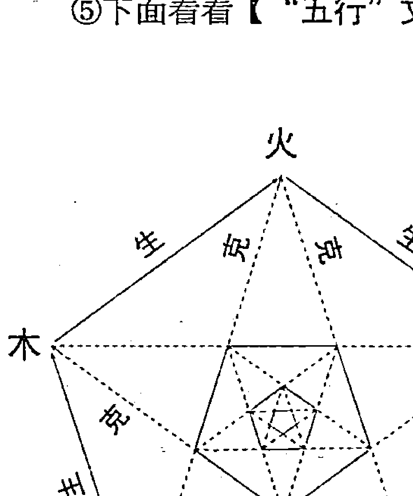
    （以上为五行结构图1）
    “五行”即图1中所标的“木、火、土、金、水”五种“物态”及其相互间的作用关系。
    其图的外层，是一种“相生”的规律。即：木生火、火生土、土生金、金生水、水生木的规律。
    如果，在其“五行”结构分布中，只有“相生”的规律存在的话，“五行”的结构组成，从总体上看，其总是会在向同一个方向滚动（旋转）。总在滚动的话，说明什么？说明其总体的构成是不稳定的。按照中国传统的思维方式，那么，我们就需要寻找一种方法，使其整个系统能相对的稳定而不动。结果我们就在其“五行”系统的内部采用了：金克木、木克土、土克水、水克火、火克金，这么一种通过对系统内部各部分，进行“相克”的（互相制约）方法，就使其整个系统的各部分的场力分布及其相互间的作用，处于了总体平衡稳定的相互制约的状态中。
    由此内外，共同组成了一个相互促进又相互制约的“生”、“克”、“制”、“化”、“合”的平面表述的稳定、平衡的“本质”属性的认识与表述体系与系统模式。
    假如，我们任选“木、火、土、金、水”这五大基本要素中的任何三个要素，都能组成一个三角形的结构局面。由于按“平面几何学”中的科学定理，则认为：“三点可以确定一个平面。”而且是“唯一的一个平面。”因为它是“唯一”的一个平面，所以该平面所形成的就会是一个独立的、稳定的事物之间既相互促进且又相互制约的一个稳定性局面。
    如果，我们同时选取其中的四个“行”方面的要素（事物），进行组合成一个局面时，行不行？该局面是否仍然还会是个稳定的局面呢？还能不能继续使其较容易地达到或形成其各“行”之间在整体上的平衡与稳定呢？
    我们想到：举个较特殊的四边形——正方形平面为例（如图2所示），来说明它们四者（四行）的相互作用关系和特点。
    猛然一看，它也是个平衡、对称、稳定的组合结构状态。这也仅是在平面几何的概念中，是如此的正确结论。如果，我们在实际三维存在的立体空间中，用三角形和正方形的几何特性，各做一个三条腿、一个四条腿的桌子。在制作完成后的实践过程中，就会发现，三条腿的桌子，就很容易地摆放平稳，而四条腿的桌子，其中只要有一条腿的长短出现差异，桌子就很难以摆放平稳——反而却会导致该桌子的晃动。可是三条腿的桌子，桌腿的长短即使差异比较大，在同样平整的地面上摆放时，即使桌面都出现了较大的与地面产生的倾斜角度——桌面与（水平面）地平面已不会再平行了，该桌子也不会因为桌腿的长度不一样长，而发生晃动——桌子仍然是处于稳定的状态下。这就是因为“三点才能确定一个平面”的缘故。也就是说，其三个（条）着地点（腿），都是处在了同一个平面上（里）。不会出现该平面的高低不同的差异的缘故。但是，由于4个点，至少可以组合并形成五种（平）局面。因为其4点中间，任何三点都能形成一个局（平）面——即而该4点之中，一共会有4种三个点的组合（平面）状态，再加上，该4个点共同组合成的更大的1个局面，故而，它们相互之间，从立体结构的形式来分析的话，是较难以同时都达到平衡而稳定地处于同一个平面之中的。
    在《平面几何》中，4个点都在同一个平面（里）上。它们所组成的结构形式，总会是平稳的。可是，这4个点，若是处在《立体几何》的表述中，就不一定4个点都会同时能处在同一个平面之中了。说明该4点所形成的4个局面，也不一定定就能随时随地地达到平衡和稳定了。它们所直接形成的 ABD、BCD、CDA、DAB、ABCD 的这 4 种三角形和一个四边形共同形成的立体型组构局面，从哲理道理上讲，说明它们这是处于并形成了 5 个大组的矛盾性体系之中。该 5 大组的矛盾组合状态，当然，就不如同样的的一组矛盾的组合状态，更容易地得以解决了。因为各组的矛盾性质、特点、过程等，往往会是各不相同的，所以，就其更加的复杂性来说，将是更难以达到统一共识地得以顺利的解决的。

就《立体几何》特性来说，这四边形的 4 个（顶）点，假如，组合构成的是“正四边形”的时候，它们还是容易稳定的。因此，在江河湖海中进行截流、抗浪、筑防波提或堤坝时，往往要投入大量的“正四面体”形的钢筋水泥柱、桩或钢筋水泥块，来进行拦洪、抗浪、截流。因为它们不管怎样地去摆放或受到什么方向上力的（冲击）干扰，都能自行地达到各方向上对它的作用力的合力，均会达到自适应性下的平衡且稳定的作用，所以它们就不容易在受到水流地冲击时而产生不必要的移动。

除以上的“正四面体”结构形式以外的任何的四边形、四面形，往往都不能在空间中随意摆放时，而仍能始终都是平衡稳定且摆放得住的。所以说，在同一个局面中的事物，就容易调整其相互促进与制约作用关系下的平衡而达到稳定。古人就是借助于这类经验，确立了“五行”文化系统的哲理组合性基础原则和组合结构状态及其标准。

如果，再深入地向“五行分布结构图”的中间分布状态去研究和分析时，就又会发现：由于中间“相克”过程构成的五星（点）场力分布的中间，又会对应有有一个五个顶点形成的相对其原先整体结构小一些的“五边形结构”的存在；我们再以它的这五个顶点为基础，又可以组成一个比后来的原图小一些的“五行结构分布图”；在此“更小五行结构图”中，中间还会含有一个更加小的“五行结构分布”------只要我们有能力寻找（画、分）下去，这种结构分布，一直几乎到了“无限小”的情况下，都还会是继续的存在着。

如果，再以“木、火、土、金、水”5点为五边形的5个顶点，再向外（更大结构的方向）发展（画、分），又可构成一个更大的“五星结构分布”的图形。以这个“大五星结构”图的5个顶点，再向外延伸，又可构成（画）更大的一个“五星（‘五行’）结构分布”图形------只要有足够的能力寻找发展（画、分）下去的话，直至几乎“无穷大”时，这种“五行结构分布”的图形状态，始终是会存在的。

也就是说，如果由该同一个图形，向外扩大延伸着去组合分布的话，几乎到了“无限大”时，它的这种“五行结构分布图”的认识与表述的规律和特点，仍然是继续的存在着。说明它是以由“无限小”到“无限大”的由小到大的“倒螺旋式”（分逆时针和顺时针方向；有锥形、柱形之分）连续不断对应发展变化的“五行结构分布”的对应状态与层次关系，进行连续不断地对一切事物及其结构层次间的相互作用及其关系，进行全方位（上下、左右、前后、外内、远近、往来等）、多层次、多学科交叉地“系统论”式的认识与表述——这与黑格尔的“螺旋式”上升的哲学思想的认识，是何等的相似奈何。

因此说，“五行文化”的这种结构的表达形式，能够认识与表述由“无穷小”到“无穷大”（即“其小无内，其大无外”）范围内的一切事物之间的相辅相成、相互制约、合和平稳稳定的规律和结果。假如说，我们每“放大”或“缩小”一个层次，其“木、火、土、金、水”各自的位置，相应的在原来层次上位置的基础上，顺时针或逆时针方向上，各转动72度罢了。进行5次（5个层次）连续性地“放大”或“缩小”之后，每一“行”各自又会回到各自原先所处于的那个方向上（但是其位置就其层次和周期来说，已相应地向上或向下的发生了5个层次或1个重复性周期地变化）。如果这样由小到大，无限制地认识与表述的发展下去时，它们各自（行、属性）的发展运行轨迹，就会形成一个“倒锥形的螺旋式发展变化的曲线”模型。这也是它们“木，火、土、金、水”各行连续不断地变化运行位置和层次的逻辑轨迹发展变化的连续性表达的体现。但是，通常情况下（如图3），无论它们发展到哪个层次（层面）上，它们相互之间的相互作用关系，总会是既是互相的促进，又是互相制约着的——都在它们“五行”本质属性所共同组成（形成）的平衡或稳定的事物系统和体系中，存在着。

##### （2）“相生”关系

由于在“五行”属性的相互作用中，各个“物态”的“属性”不同，故而其系统可以认识与表述一切不同类型的事物及其事物的群体或体系，所以，这种“五行文化”规律在国外，除了在中医、汉医、养生、中国功夫中得到一定地弘扬及运用外，在日本等一些国家和地区的某些企业中，受“五行文化”规律的影响，实行了一些与“五行分布结构”相关而对应的“五行管理法”。这种管理的方法，既提高了产品的质量和数量，又节省了人力、物力与财力，还稳定了企业及其相关的市场与氛围。可是，在咱们中国国内，还有些糊涂人，认为这种“五行”属性的认识与表述一切事物规律的方法，是“封建迷信”、“唯心主义”、“形而上学”之类嗤之以鼻的玩意儿。这些人，实际上是不了解、不明白、更不学习研究数千年流行至今的“五行”的认识、判断与表述事物本质性质的规律，才导致了如此对“五行文化”方面的误识与误解。

从“五行”的这个分布及其几何结构和表述方法上来看，它是非常科学的——类似于毕达哥拉斯的那种结构规律。其认识与表述在结构上来说，是非常地和谐、完整及合理的。

中国古时候“五行文化”中使用的“木、火、土、金、水”这些事物，都是人们生活中间，最简单及日常生活中又是最常见到和接触到的一些事物及其关系规律，而且这些事物及其之间的性质、特点、规律等，也往往都是一般人非常了解和熟知的基本的生活常识。

比如：“钻木取火”、“众人拾柴火焰高”、“森林大火”等。从这些现象及言语中，人们很自然就能得出“木生火”的认知概念来；

火燃烧之后，往往会留下一堆灰土。再加之，又看到火山爆发，也会喷出大量的“火山灰”，因此，就很容易地得出“火生土”的结论和概念（当然，在用火烧烤食物的过程中，有些“石块”之类会被火焚烧成灰土。这也是一种认识因素）；

在土壤和石块中，会有些天然的金属或金属粒块存在于内，再加之，一些石块在烧蚀过程中，会有一些金属被熔化而被析出，故而又会得出“土生金”的概念和结论来；

由于金属结构致密，一般在空气温度较低（温差相对大一些）且湿度又较大的情况下，金属的表面，会凝结出现一些水珠；同时，金属在高温情况下，又会被熔化成流动的金属液体，继而又会得出“金生水”这一概念和结论来；

而植物、农作物、树木等木本植物或各类生物、动物，得到水的滋润和浇灌，就能发育、生长、壮大、繁衍、更替等，所以，又能得出相应的“水生木”的概念和结论来。

……

总结以上的经验和规律，人们会发现，事物之间，总会存在着一种相互支持、相互促进、相互补充、相互激励、相互推动等的一种“相生”的作用关系及规律。

故而，人们最终产生了：木生火；火生土；土生金；金生水；水生木；这么五种事物之间“相生”的概念、规律和相互作用的根本性关系。

在这些事物之间，人们在日常生活中，又会发现：

“水能灭火”。故而得出“水克火”这一概念和结论；

金属虽硬，可是当其被火烧熔时，会发生变形，乃至被熔化，故而又会得出“火克金”的概念和结论；

金属制作的镢、铲、刀、斧、锯之类的工具，能挖地、耕种、收割农作物、砍柴破木，以制作木器家具等，故又得出“金克木”的概念和结论；

植物破土而出，生长壮大。又由于远古我们的祖先，用木棍、木锹等木器进行耕作，故而又知道了“木克土”的概念和规律；

“水来土掩”；水泼在土地上，会被土壤吸（收）渗掉，故而又可得出“土克水”这样一种概念和结论。

故而，人们最终又产生了：水克火；火克金；金克木；木克土；土克水；这么五种事物之间“相克”、“相互制约”、“相互约束”、“相互限制”的被动性状态的概念、规律和相互作用的根本性关系。

##### （3）“相克”关系

古代我们的老祖宗，不但看到了事物之间的一种相互支持、相互促进、相互推动、相互激励的作用和功能，而且还看到了它们之间互相制约、互相抵触、互相消蚀、互相乘侮的一些作用和能力。这都是对“一阴一阳之谓道”的“对应统一规律”在认识与表述方面的体现。也是“阴阳文化”和“五行文化”相结合，来共同认识与表述事物之间关系的一些具体体现。这都充分地说明了，我们“衍生易”的“象数易学”的“易理学”（不是“义理学”），对“一切事物，都不是也不可能是孤立存在的，都是相辅相成的对应且关联地存在着”的理性认识与表述的联系性、全面性及正确性。

实际上，当我们的辩证思想提高到“五行文化”的层次来看待“金、木、水、火、土”这几种事物间的（相互作用下）“情感”（类万物之情，通神明之德）关系时，它们已不单单是金、木、水、火、土这么五种具体的物质性质和形态了，而是以一种“物质”或事物所属的本质类型关系，被看待了。换句话说，这五种“物质”的本质属性，已被我们作为五种“物态”所象征的本质形式来看待了——“五行”属性关系，实际上它所反映的是，自然界五类事物类型，本质状态之间的相互作用和功能间的必然性关系了。

- 其中：
  - “金”，就是固态、固体物质等所对应事物本性的简称。
  - “水”，由于水往往是碳加氧燃烧后，所生成的是液态的水，故而它应是液态、液体、流体物质等所对应事物本性的简称。
  - “火”，因为火往往是碳加氧燃烧后，生成二氧化碳气体，因此，“火”是气态物质等所对应事物本性的代名词。
  - “木”，是有生命力，可以自己控制或自适应环境而生存繁衍的“生命态”。虽然现在世界上大多数的科学家,基本已经认定：“21世纪是生命和生物的世纪”，但是他们基本上还没有将生命、生物，当作是一种“生命态”来认识和看待呢。因此，它是“生命态”的有机事物本性的简称。
  - “万物归土。土生万物。”实际“土”在这里，由于已被我们看成是一种“综合（平衡）态”了，因此，它是“综合态”或“平衡态”的事物本性的简称。

我们的老祖宗就是用了“金、木、水、火、土”这么简单的几个事物之间的相互作用的（情感）关系，向我们提供了，宇世间一切事物之间在“象数易学”的“类化”定性后的相互作用关系的认识与表述的“系统论”方法（特别是和谐、平衡及稳定特性下的表述关系）。

于是，人们又产生了：木克土；土克水；水克火；火克金；金克木；这五种事物之间“相克”的互相制约和相互消亡的关系。

##### （4）“相制”关系

如果，我们在前面“五行结构分布图”中，若是任选“金水木”这个局面。

则，此三个事物中，会出现“金生水；水生木”的两个过程。而这两个过程，都是向着一个顺时针的方向发展（运行）着——是不会稳定的。而该三者间中“金克木”的这个过程，却形成的是逆时针方向进行发展（运行）着，故而它能使该三者形成的局面，在运行到“木”的这个位置上时，就会被“金克木”所阻截，而形成停止不前，不再能顺利地往下运行（发展）的结果。从而使该局面形成并达到了稳定的效果。

那么，在这一局面中，消耗最大的将是“金”。因为它既要生（给予能量）着“水”，主动地消耗着自己的能量，又要克制“木”，也在被动地消耗着自己的能量。在这一“局”中，它只有能量的消耗，而得不到其他那二者能量的任何补充。

可是“水”呢，虽然“生”着“木”，主动地消耗了自己的能量（“生”对自身来说是一种主动地支出和消耗），同时又得到“金”方面主动相“生”着自己能量的补充。因此，它自身从能量的消耗和补充的储备来说，还是能够保持住自身能量会尽量平衡稳定的存在着。

同理，“木”虽被“金”所“克”，被动地消耗了自身的能量，但同时又得到了“水”主动相“生”时所给予的能量补充。因此，它自身具有的能量，也较能保持“收支”的平衡与稳定。

总之，该局面之中，最不容易平衡与稳定的就是“金”了。如果“金”的能量始终还是得不到补充和充实，这一局面还是不可能长期地维持平衡和稳定的。

比如：再选“土金木”这个局面为例。
这一局面当中，会出现，土生金；金克木；木克土的具体过程。
而在这三个过程之中，“土生金”会向顺时针方向运行和发展；“金克木”、“木克土”这两个过程，却会使该运行方向发生改变（使场力的发展方向发生变化），从而共同达到抑制“土生金”过程的继续发展运行，故而达到该局面在一定程度上的平衡和稳定。

其中，

“土”即主动“生”着“金”（给予“金”能量）——主动消耗着自己的能量。同时又被“木”所克——被动地消耗着自身的能量。它只有能量的消耗而得不到外来其他能量的补充和充实。因此，它（金）不可能长期地能够保持住自己的稳定状态和存在。

“木”呢？它既需要“克”制着“土”，主动地消耗着自身的能量，又被“金”所“克”，而被动地消耗着自己的能量。它是处于双向（主动及被动地）消耗着自身的能量的境地中。因此，若无其他能量对它进行补充或充实的话，它也是不容易长期保持自身稳定的。

由于“金”“克”“木”时，“金”主动地消耗着自身能量的同时，又被“土”所“生”着，得到“土”主动的能量补充和充实，因此，在该局中，“金”是处于既有被动地支出又有被动收入的状态中，故而它是较容易保持自身的稳定性的。

如果，该局面中，“土”和“木”都不能得到外部其他能量的补充、充实或自身能量的消耗得到抑制时，该局面也是不能长期地保持住它的稳定的。

由以上列举的两种典型情况为基础的“五行结构分布”的分析，可以得出以下这样的结论：“五行结构分布”中，相邻三者所构成的局面，要比其他三者组成等腰三角形的局面，会更容易平衡和稳定的。只有该“木火土金水”五者，共同组合成的整个的“五行结构分布”的方式，才能使事物及事物间，长期达到平衡和稳定地存在着。而其中任意三者所组合成的局部性局面，都是暂时及临时性的相对的平衡和稳定的形势（形式）和状态。

也就是说，从总体稳定性地要求来看，它们“五行”可组合成为以下的三者稳定性局面：

- ① 两“生”一“克”的局面：
有，水木火；木火土；火土金；土金水；金水木5种局面。

- ② 两“克”一“生”的局面：
有，木土金；火金水；土水木；金木火；水火土 5 种局面。

这十种相互制约的局面，都会形成一定相对稳定的局面。只要我们能够确定相对应事物之间的“五行”类化后的本质属性的性质，我们就可以运用以上相互制约和激励的作用关系，将它们们直接对应的事物，组合成与以上关系相对应的（相对）稳定的（平衡）局面。这对指导我们如何去寻找宏观及微观的政治、经济、军事、外交等相对稳定的和谐局面，以及它们共同形成的整体（五行）平衡稳定的局势，提供鲜活且对应准确的认识与表述思路和方法。请大家格外注意！

由于“五行”本质定性问题，在“象数易学”、“数术学”、中医学、养生学、干支及甲子等传统文化的推导与判断中，起着本质定性方面的必然性确定功能与作用，所以下面我们就介绍一些“五行”与“干支”文化相组合的一些应用规律及其理论和实践的特点。

首先，看看“干”“支”结构分布的特性。

所谓“干支”，是指中国传统文化的认识与表述系统中的，十个“天干”和十二个“地支”，两部分组成的一种对应表述事物及其规律的一种方法。这种方法，在我国历史上的殷商时期，就已经是相当地完善了。在殷朝时期的“甲骨文”中，就已经有完整的“六十花甲”的排列次序和组合规律了——甚至在众多帝王的名号中，又会多以“天干”或“地支”的称谓，作为自己的名称。比如，在清朝宣统时期的罗振玉先生的《殷商贞卜文字考》及《殷商贞卜文字考补正》刊于《考古社刊》第五期中，在该书“考史第一”中的“殷帝王名溢”考定出：大乙、大丁、大甲、大庚、小甲、大戊、中丁、祖乙、祖辛、祖丁、南庚、小辛、小乙、武丁、祖庚、祖甲、武乙、文丁 18 位先王。民国三年（1914 年），其又撰《殷虚书契考释》中，又新考出卜丙、卜壬、羊甲、盘庚、康丁五位帝王。对商先公先王考释最有力者，应是王国维先生。发现了《殷本纪》中所载商先公自微到主癸六世的次序有误，并不是微、报丁、报乙、报丙、主壬、主癸。而卜辞中的世序是：上甲（微）、匚（报）乙、匚丙、匚丁、示（主）壬、示癸才是。在对商先王世系研究的第二阶段优秀者，以郭沫若、董作宾为代表。而且董作宾吸收了罗、王、郭等人的研究成果，建立了自己的“五期断代法”。并对卜辞“分为新旧两派”，将盘庚迁殷后武丁、祖庚到文武丁，分为是“旧派”的卜辞，而把祖甲、帝乙、帝辛分作是“新派”的卜辞。

总结以上商王们成名的规律，其中，只有在“先公远祖”中有“高祖亥”、“高祖王亥”，使用了地支“亥”作为自己的名号外，其后“先公近祖”里，由上甲微始，直到商朝之前的主癸，以及商朝从汤（又名成汤、天乙、大乙等）始直至帝辛为止，其王名都是以“天干”之“干”作为本人的名号。又有人认为：“王亥”是以其辰为号，可是后代们在祭祀他时，又不是在专门的“亥日”或“亥时”进行的。而对于自商以来的所有王的定名，又有人认为：是以其祭祀之日的“日干”来定王名的。我看这些观点、想法和看法，还需要有更多确切的实际资料作为根据，才可以判定的。

下面首先来了解“五行”与“天干”的对应关系及其实践特点。

##### I “五行”与“天干”文化的对应特点

- ① 十“天干”，又简称为“十干”的结构分布状态。

其包括：
- 甲、乙、丙、丁、戊、己、庚、辛、壬、癸 10种基本元素。

在殷朝的甲骨文中，已有对应这十种“天干”各干的文字了。

###### 【“十干”的结构分布】（如图1所示）：

其中，
- “甲、乙”，“五行属性”是“木”性。表示“东方”。为“春”季。
- “丙、丁”，“五行属性”是“火”性。表示“南方”。为“夏”季。
- “庚、辛”，“五行属性”是“金”性。表示“西方”。为“秋”季。
- “壬、癸”，“五行属性”是“水”性。表示“北方”。为“冬”季。
- “戊、己”，“五行属性”是“土”性。表示“中间”。旺于“四季”（每一个大季节，即立春、立夏、立秋、立冬四个“节气”的后18天）。

此图分布有什么特点呢？

###### ② 形成了：

木生火、火生“中土”、土生金、金生水、水生木的一个“相生”过程。

此“相生”（用黑实线表示）的全过程中，在“西南”方（即右上方）有个缺口。从大局场力分布上看，它是有缺陷和不完整的推进与变化的过程。即是个整体不能达到平衡的不平衡的表述系统。

可是，由于在其“相克”（用一般线表示）过程中“火克金”的过程，却能将此系统的“缺口”添补齐整，并使其整个表述系统，形成为是一个整体平衡稳定的结构分布系统。

这其中，

金克木、木克土、土克水、水克火的过程中，力都在同轴线方向上相对传输运行时，而自行抵消掉。故而使整个“十干结构分布”从整体分布上，形成了是个平衡稳定的局面。

分布图中，同样

东方“甲乙”木，在图的左边；南方“丙丁”火，在图的上边；
西方“庚辛”金，在图的右边；
北方“壬癸”水，在图的下边；
中央“戊己”土，在图的中间。

它也是按照“上南下北、左东右西、上下前后”，我们的这个未成文的立体（传统）表述规则安排其分布结构状态的。

##### ③ “十干”中，“干”的个数，与“河图”10个数恰好对应而相符（如图2所示）。

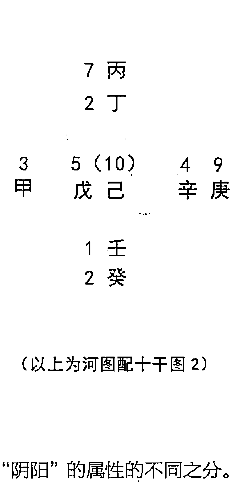

“戊己”配其中的5、10；
“甲乙”配东方的3、8；
“丙丁”配南方的2、7；
“庚辛”配西方的4、9；
“壬癸”配北方的1、6。

> 传说这是黄帝时期的史官“大挠”所配的原则和标准。

> 其为“就天之五道，分布十干，以纪天之五行。”

这就是说，在以“干支”配合成“甲子”记年、记月、记日、记时的历法推演过程中，是以“十干”管“五行”，并以“五行”的“气化”来生成万物的。

##### ④ 在“五行”之中，各“行”还各有本身对应于“阴阳”的属性的不同之分。

“河图”天数五、地数五。“天”“地”二者合而为十。

所以在“天干”之中——

排行在1、3、5、7、9位置上的数，各自相对应的是，甲、丙、戊、庚、壬五“干”。这五“干”处在“奇数”排序的位置上。表示的是“生数”的“天”数和“阳数”。故其定为是【“阳干”】。

- 刚
- 君
- 夫
- 上
- 外
- 表
- 动
- 进
- 起
- 仰
- 前
- 左
- 德
- 施
- 开
- 展
- 散
- 大
- 高
- 天
- 头
- 飞
- 升
- 跃
- 浅
- 淡
- 坏
- 劣

排行在2、4、6、8、10位置上的数，各自相对应的是，乙、丁、己、辛、癸五“干”。由于这五“干”处在“偶数”排序的位置上。表示的是“成数”的“地”数及“阴数”。故其定为是【“阴干”】。

- 柔
- 臣
- 妾（财）
- 下
- 内
- 里
- 静
- 退
- 伏
- 俯
- 后
- 右
- 刑
- 藏
- 闭
- 缩
- 聚
- 小
- 矮
- 地
- 脚
- 落
- 降
- 潜
- 深
- 浓
- 好
- 优

这些表述内容及规律，是符合中国传统文化的基础文化——“阴阳文化”的表述内涵的。

##### ⑤ “阳干”在古代除了与“河图”数对应相配外，还与天上的“九星”和地上的“九州”相匹配。

其下为【“十干”配“九州”】的例子。如史书中所说：

- 甲，对应于“齐”
- 乙，与“东夷”相对应
- 丙，对应于“楚”
- 丁，与“南夷”相对应
- 戊，对应于“魏”
- 己，对应于“韩”
- 庚，对应于“秦”
- 辛，与“西夷”相对应
- 壬，对应于“燕”
- 癸，与“北夷”相对应

> 而《汉书·五行志》中又说：甲乙，对应于海外，日月不治地区；

丙丁，对应于江淮海岱一带；
戊己，对应于中州河济一带；
庚辛，对应于华山以西的地区；
壬癸，对应于常山以北的地域。

以上是“十干”与我国“九州”和地域的对应关系的部分例子。

##### ⑥ 其【对应于人身部位】应是：

- 甲、乙，对应为头首膺喉；
- 丙、丁，对应为胸胁；
- 戊、己，对应于心腹；
- 庚、辛，对应于股；
- 壬、癸，对应为手足。

##### ⑦ 其【从外到里与人体的对应关系】如下：

- 甲、乙，对应为（外表的）皮毛；
- 丙、丁，对应于爪筋；
- 戊、己，对应于肉；
- 庚、辛，对应于骨；
- 壬、癸，对应于血脉。

##### ⑧ 如果“十干”【对应配于五脏】时，当为：

- 甲、乙，对应于肝脏；
- 丙、丁，对应于心脏；
- 戊、己，对应为脾脏；
- 庚、辛，对应于肺脏；
- 壬、癸，对应为肾脏。

##### ⑨ 在中医经典著作《内经》中，以【“阳干”配腑】；以【“阴干”配脏】。

即：

- 甲，胆
- 乙，肝
- 丙，小肠
- 丁，心
- 戊，胃
- 己，脾
- 庚，大肠
- 辛，肺
- 壬，膀胱
- 癸，肾

##### ⑩ 从【脏腑、经络归属】上看：

“肝，主春（即春季肝经气血最旺盛）”。其属“木”性。“阳木”在体内对应于：足少阳胆经；“阴木”在体内对应于：足厥阴肝经。胆经是甲日气血最旺盛。肝经是乙日气血最旺盛。

“心，主夏（即心经夏季气血最旺盛）。”其属“火”性。“阳火”在人体中对应于：手太阳小肠经；“阴火”在人体中对应于：手少阴心经。小肠经是丙日气血最旺。心经却是丁日气血最旺盛。

“脾，主长夏（即脾经“四立”节气的后18天气血最旺盛）。”其属“土”性。“阳土”相应于人体中的：足阳明胃经。“阴土”对应于人体中的：足太阴脾经。胃经是戊日气血最旺盛。脾经乃己日气血最旺盛。

“肺，主秋（即肺经秋季气血最旺盛）。”其属“金”性。“阳金”与人体内相对应的是：手阳明大肠经。“阴金”与人体内相对应的是：手太阴肺经。大肠经为庚日气血最旺盛。肺经乃辛日气血最旺盛。

“肾，主冬（肾经冬季气血最旺盛）。”其属“水”性。“阳水”在人体内相应的是：足太阳膀胱经。“阴水”在人体中相应的是：足少阴肾经。膀胱经是壬日气血最旺盛。肾经可又是癸日气血最旺盛了。

由以上的对应规律，决定了中医在脏腑疾病的治疗及愈期的判定方法和过程，找到了坚实的推断依据。

比如：

> 《内经》中，“脏气法时论”曰：“肝病者，愈于丙丁，加于庚辛，持于壬癸，起于甲乙。”

其意思是说，肝病往往是在丙丁两日得以缓解；在庚辛两日容易病情加重；以至于延持到壬日或癸日病情才能稳定；到了甲日或乙日才能好转或者痊愈。

这是为什么呢？

这是因为肝属“木”性。

##### 故【肝病】：

丙丁日，属“火”性。是肝木气血被疏泻的日子。故能缓解肝病。
庚辛日，属“金”性。是肝木受克制而不能“疏泻条达”之日。故而肝病容易加重。
壬癸两日，属“水”性。是肝木受水的滋润而生发的日子。故肝的功能能得以增强或恢复。因此，病情就能够稳定。
甲乙二日，属“木”性。按“场效应”及“气化”规律，应是“木”“木”相合，产生共振效应之日。它会使肝经气血旺盛，肝脏功能增强。再加上肝脏本来的代偿能力就很强，又合“易学”中“同声相应，同气相求”的共振、谐振规律，因此肝病就容易好转或痊愈。

同样的辩证哲理，我们又可以知道：

##### 【心病】：

- 戊己（土）日，易于缓解；
- 壬癸（水）日，容易加重；
- 甲乙（木）日，容易持续稳定；
- 丙丁（火）日，容易好转或痊愈。

##### 【脾病】：

- 庚辛（金）日，容易缓解；
- 甲乙（木）日，容易加重；
- 丙丁（火）日，容易稳定；
- 戊己（土）日，好转或痊愈。

##### 【肺病】：

- 壬癸（水）日，容易缓解；
- 丙丁（火）日，容易加重；
- 戊己（土）日，容易稳定；
- 庚辛（金）日，容易好转或痊愈。

##### 【肾病】：

- 甲乙（木）日，容易缓解；
- 戊己（土）日，容易加重；
- 庚辛（金）日，容易维持和稳定；
- 壬癸（水）日，容易好转或痊愈。

以上这些对应规律，说明了“人秉‘五行’之气而生，故与天之‘五行’生死相关。”

通过以上中医学的临床经验，我们会发现，有时肝病患者在甲日，反而病情加重了。按理甲日应是肝病减轻或好转之日。那我们就得考虑到，可能不是肝病加重了，可能是脾胃之病造成的加重症状（只有脾胃在甲日才可能加重）。我们可以一方面在疏泻肝气的同时，加之以实脾的治疗方案（《伤寒论》中讲：“上工治肝病何也？……实脾则肝病自愈焉”），这样做的结果，反而有可能使肝病更容易好转或全愈。

##### ⑪ “河图分布结构”是与“十天干”对应而发展来的。我们讲过，【“十干”表示的是“纬度”变化】。

由于“河图”的数，是分内外两层进行对应分布的。即：内层为1、2、3、4、5；外层为2、4、6、8、10。故而将其配合对应于10个“天干”。

实际也是将地球围绕着太阳公转的椭圆轨道分成10份。再与地球自转轨道被分成的12等份的周期变化相对应〔因为一年有12个月。正好每月对应于赤道上的十二星座分布的一个星座，正好一年对应于十二个大星座的一整圈运行的周期——即一年后，每个星座相对都回到了各自原来的位置上。这也与木星近似12（11.8）年回归一次的周期有关〕、相搭配，以确定天球与其相对应的地球上的相对精确的“经纬”座标位置。

> 【“天干”是天球与地球南北回归运行时，“纬”度的表述】。其对应表示星体在天空上的高低（上下）位置或在天球上的高度的不同。

> 【“地支”表示天球与地球左右、东西对应分布的“经”度】。这样一“经”一“纬”，确定一个较精确的对应座标点——天球上的一个“经纬”的位置，与其下地球上的同样“经纬度”的位置，是一一相对应的。也就是说，地球上任何事物的变化，都是受到天体综合效应的影响，才发生变化的——天道决定地球上对应的一切事物及其变化结果。也是说，通过这些天地之间一一对应的座标，来确定星体的位置及其组合结构状态，近而循序寻找其在地球上对应产生的场效应的特点、结果及其规律，以达到我们对周围气候、疾病、物态变化、各种作物、自然、社会、政治、军事、经济、物种、人类行为等与其相对应规律的认识、掌握、运用和引势利导等。

由于我国古天文学中假设的“太岁”星与“岁星”（木星）相应（“太岁”又被称做“岁阴”、“太阴”）。从其与“十干”的对应关系来看。即从纬度上来看：“太岁”（木星）如果在“甲”位。它需要10年才能又回归到“甲”位的位置层面上。也就是说，其10“干”运行10年，才是一个重复性周期。

从其与“地支”的关系来看。即从“经度”上来看：“岁星”（木星）斜跨“天腰”（木星运行轨道平面与地球的赤道平面不在同一平面上，而是有个23度多的一个交角），东西环绕运行，形成椭圆性轨道。古人将其轨道分为12“辰”（等份）。“岁星”每年运行一“辰”，必须用12年的时间，才能全部路过12“辰”。也就是说，“太岁”如果在“子”位。需要12年的时间，才能再回归到“子”位上来。也就是说，其12“支”运行12年的时间，才会形成是一个重复性周期的变化。

各“干”所运行的“经度”，是圆形轨道，并且运行的周期轨道周围，其视野较开阔。各“支”所运行的“纬度”，呈椭圆形轨迹，且运行的周期轨道周边，视野相对较狭窄。

这样，“岁星”（木星）在“干”“支”间的运行，是不能总是同时处在同一个位置上同步运行的。如果它需要处在同样一个“甲子”（同一个经纬度）位置上，必须要经过60年的时间，才能回归到同一个位置上。这就形成了60年为一个完整周期的表述方法——“六十甲子”。又称“六十花甲”。还被称作“一元”。

下面再来分析“天干”的一些性质、特点及其规律。

10“天干”，可以表示是天球上的“纬度”。不同的“纬度”，又分别对应于各自内外两个层次（有界限）的“五色”。这就是说，“天干”所处的位置不同，其所形成的“气”（场）化状态也不同——它所对应表现出来的颜色（电磁波频率、频谱），也就会不同。也就是说，“万物与其相应之，各有色象。”由此规律，才导致了“五运六气”中的“五气”及其性质和特点的不同。

##### ⑫ 《内经》是以五种不同的颜色分别【匹配于人的“五脏”】。

###### 1、【五色配于人的“五脏”】。
- 白色，当入（配）肺；
- 赤（红）色，当入（配）心；
- 青（绿）色，当入（配）肝；
- 黄色，当入（配）脾；
- 黑色，当入（配）肾。

###### 2、五种不同的颜色，分别【对应于人的不同的“肢脉”】。
- 白色，当配皮毛；
- 赤（红）色，当配脉；
- 青（绿）色，当配筋；
- 黄色，当配肌肉；
- 黑色，当配骨骼、骨髓。

###### 3、同样，是人体表现出的同一类颜色内的不同色调的差异，也相【关乎着一个人的生与死】。

比如：其中，

- 白色，白的像白色油脂的人，生；假如，白的像干枯的死人骨头一样的人，死。
- 赤（红）色，像鸡冠子一样鲜红的人，生；红的颜色像赤黑色的淤血一样的人，死。
- 青色，像翠绿的羽毛一样的人，生；如像枯死的草一样的绿色之人，死。
- 黄色，像螃蟹腹部内的蟹黄颜色一样的人，生；如黄的像枳实的果食一样黑黄无光泽之人，死。
- 黑色，像乌的羽毛一样黑亮的人，生；如黑的像煤灰颜色一样的人，死。

###### 4、由于“河图”是“五位相得，而各有合”的变化规律所支配的，故而，【以“河图”之数而言，其配“十干”】应是：

- 1为甲，6为己。1、6都是北方之“水”。场性相同。所以甲与己相合。
- 2为乙，7为庚。2、7都是南方之“火”。场性相同。故乙与庚相合。
- 3为丙，8为辛。3、8都是东方之“木”。场性相同。因而丙与辛相合。
- 4为丁，9为壬。4、9都是西方之“金”。场性相同。因此丁与壬相合。
- 5为戊，10为癸。5、10都是“中央土”。场性相同。故而戊与癸相合。

天体的运行，会影响到万物的发生、成长和壮衰。由以上10个“天干”构成的“五合”的状态，就是我们所说的影响万物的“五运”之“气”。

###### 5、【天干的“五合”，就是我们所要了解的“五运”】。

《内经·五运行大论》曰：

> “丹天之气，经于牛女，戌分；黝天之气，经于心尾，己分；苍天之气，经于危室柳鬼；素天之气，经于亢氐昴毕；玄天之气，经于张翼娄胃。“

也就是说，”天干“合化的”气“，过于地亢进或太盛，就会造成一系列的絮乱状态的发生与出现，使自然界中各种事物的稳定与平衡，遭到破坏。只有对这些过于亢盛之”气“加以制约、抑制或控制，使”气“之间能相反相成、互相制约、互为功用，从而才会达到事物应有的平衡和稳定。万物才能得到正常的”运“”化“。

### Ⅱ “五行”与“地支”文化的对应特点。

##### ① 12 “地支”又称为“十二支”。即：子、丑、寅、卯、辰、巳、午、未、申、酉、戌、亥。在殷朝的甲骨文中，已有对应这十二种“地支”的文字了。

##### ② 它们各自与“五行”之气（场）所对应的关系（就是【“五行属性”】）如下：

- 子属“水”性、丑属“土”性、寅属“木”性、卯属“木”性、辰属“土”性、巳属“火”性、午属“火”性、未属“土”性、申属“金”性、酉属“金”性、戌属“土”性、亥属“水”性。

##### ③ 由于 12 “地支”的“五行气化”的“属性”本质的不同，所以，它们分别可以对应类比表示不同的事物。又因为它们也是“观天象”而得到的“形象”概念，所以，它们各自又与【各自的“星象”相对应】。

即：
- 子“鼠”、
- 丑“牛”、
- 寅“虎”、
- 卯“兔”、
- 辰“龙”、
- 巳“蛇”、
- 午“马”、
- 未“羊”、
- 申“猴”、
- 酉“鸡”、
- 戌“狗”、
- 亥“猪”。

我们前面已经提到过，这12“地支”就是把“赤道”，平均分成了12等份。由此12等份，来决定一年12个月与天体（大的星象）的对应关系，以及每天12个“时辰”，与天体的对应关系。这就是我们前面所知道的“经度”概念。我们称其为12“属象”、12“辰”、12“值神”、12“将神”、12“掌生”等，与其相对应的西方早期的天文学，称其为“黄道12星座”。

由此，可以看出我们祖先所创造的这12“地支”及其“象形”文字（见《易与和谐》一书中有关地支我们所提供的“甲骨”文字的造型），是以天空上对应星座的形象为依据所确定的。

同时，我们也可以看出，东西方文化在表面上看来，是有很大差异的。可是古时在对天体的认识方面，也会有不少共通的认知之处。只不过西方以“日心说”为核心，【以寻找地球及其以外的天体及其事物自身所表现出来的规律性】而已。故而以“黄道”进行分区。而我们的祖先，由于是以“地心说（以我为核心）”为核心，来认识与表述事物之间的相互作用性规律，故而，是【以寻找地球以外的所有天体对地球以及地球上一切事物的综合效应的结果规律】为自己的认知目的。所以，会以“赤道”进行分区表述而已。因此，我们传统的“阴历”记年与西方的“阳历”（天为“阳”，地为“阴”）记年，在月份的判定上，会相差一个多月到两个月左右的时间——就历史记年总的时间年限来说，“阴历”（从黄帝记年始，已有4600多年）与“阳历”（2013年）在对应表述的年份上，也会相差约一半以上的时间。

##### ④ “地支”间的“六刑”关系：
- “酉、戌”相刑；
- “申、亥”相刑；
- “未、子”相刑；
- “午、丑”相刑；
- “寅、巳”相刑；
- “卯、辰”相刑。

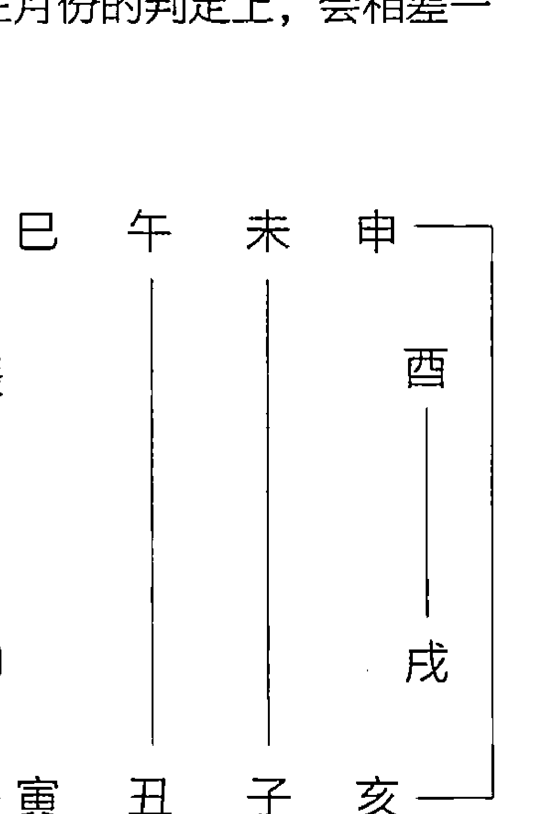

该6对关系之间，存在有一种“相刑”（也有人称做“相害”或相“穿”）的关系。虽然，它们各自的二“支”之间，在竖直（上下、纬度）方向上也相差为30、90、150度。按理说，它们各自的二者之间应该是相合的。可是由于它们各自的二者之间，都与自己“相冲”的对方“相合”，因此，产生了不能协力和协调的干扰因素。还因为它们各自的二“支”，都是顺地磁方向分布的。虽然，二“支”是在同一“纬度”上，可是处在同一磁力线传输前后的位置，是不一样的。因此，它二者之间的磁场强度，也会是不一样的（一个强，一个相对弱）。所以，二者不能达到“同气相求”的共振与谐振效应。故而“不相合”。就像地球南北半球的气候状态是相反的一样。一边是夏天时，则另一边就是冬天——二者的性质完全相反。本质性质不同的事物，如果相遇，就会形成互相干扰或者互相破坏和相互伤害的局面及作用。

12“地支”中，一共存在有以上的这6种情况。故传统“地支”理论中，称它们相互之间是【“六刑”或“六害”】的相互破坏与损害的关系。也就是说，各“刑”的二者之间，会有一种，你好我就坏，你坏我就好、互相破坏、互相伤害对方的意思和概念。在“六刑”之中，每一“刑”的双方，都是由一个“阳辰”与一个“阴辰”相构成的。

##### ⑤ “地支”间的“三刑”关系：

除以上我们介绍的12“地支”“刑”“害”的6种规律和特点外，它还有相差90度的二“支”之间，也会形成“相刑”的局面。又叫做【“三刑”】。它是由“三合”局的关系中所衍生而来的。

比如：

- * “子”与“卯”之间，是“子”刑“卯”和“卯”刑“子”的“无礼之刑”。
* “寅”刑“巳”、“巳”刑“申”、“申”刑“寅”的“持势之刑”。
* “丑”刑“戌”、“戌”刑“未”、“未”刑“丑”的“无恩之刑”。
* “辰”遇“辰”、“午”遇“午”、“酉”遇“酉”、“亥”遇“亥”的“自刑”。

##### ⑥ 12“地支”中，都藏遁（暗藏、暗含着）有“天干”及其“气化”的“五行”所属的性质。

由于时间和篇幅的原因，咱们这里就不再一一地讲解它们的来源及方法了。只是罗列出来提供给大家做参考。

##### 【“地支藏遁”】如下：

- * “子”含癸“水”。
* “丑”含癸“水”、辛“金”、己“土”。
* “寅”含甲“木”、丙“火”、戊“土”。

“卯”含乙“木”；“辰”含乙“木”、戊“土”、癸“水”；“巳”含庚“金”、丙“火”、戊“土”；“午”含丁“火”、己“土”；“未”含乙“木”、己“土”，丁“火”；“申”含庚“金”、壬“水”、戊“土”；“酉”含辛“金”；“戌”含辛“金”、丁“火”、戊“土”；“亥”含壬“水”、甲“木”。

⑦ 还有“遁甲”、“六壬”等方法中所运用的部分特点及性质。

如“天干”的“生、旺、死、绝”（又名“12长生”）特点如下：

因为12“地支”的对应推算，分别分布确定在我们左手掌前部，4个手指的根端和前端以及食指与小指的指节横纹上，所以，在手指上，按“阳干顺，阴干逆”的排布方面传统的道理；阴阳各“干”的“长生”起始点、位置及运行方向，应当是有区别的。即，“阳干”顺时针方向布“长生”；“阴干”逆时针方向排“长生”。

下面我们分别来看看“阴阳”各“干”“长生”的初始位置的所在。

##### 1. 【五“阳干”的初始位置】（“地支”所表示）：

- “甲”木“长生”在“亥”；
- “丙”火“长生”在“寅”；
- “戊”土“长生”在“寅”；
- “庚”金“长生”在“巳”；
- “壬”水“长生”在“申”。

##### 2. 【五“阴干”的初始位置】（“地支”所表示）：

- “乙”木“长生”在“午”；
- “丁”火“长生”在“酉”；
- “己”土“长生”在“酉”；
- “辛”金“长生”在“子”；
- “癸”水“长生”在“卯”。

⑧ 在古代传统中，还将12【“地支”与各地区或地域相对应】。

- 1. 比如《汉书·五行志》中说：
  - 子，对应于周；
  - 丑，对应于翟；
  - 寅，对应于楚；
  - 卯，对应于郑；
  - 辰，对应于邯郸；
  - 巳，对应于卫；
  - 午，对应于秦；
  - 未，对应于中山，宋；
  - 申，对应于齐；
  - 酉，对应于鲁；
  - 戌，对应于越；
  - 亥，对应于燕。

- 2. 在《龙首经》中还有【另一种对应分区】结构。即：
  - 子，对应于齐，青州；
  - 丑，对应于吴、越，扬州；
  - 寅，对应于燕，幽州；
  - 卯，对应于宋，豫州；
  - 辰，对应于郑，兖州；
  - 巳，对应于楚，荆州；
  - 午，对应于周，三河；
  - 未，对应于秦，雍州；
  - 申，对应于晋，益州；
  - 酉，对应于赵，冀州；
  - 戌，对应于鲁，徐州；
  - 亥，对应于卫，并州。

##### ⑨、【与人体相对应的部位】是：

- 子，对应为头；
- 丑、亥，对应胸、臂；
- 寅、戌，对应于手；
- 卯、酉，对应腰、胁；
- 辰、申，对应尻、肱；
- 巳、未，对应于胫；
- 午，对应于足。

##### ⑩、【与人体内外的对应关系】是：

- 寅、卯，对应于（外部的）皮毛；
- 巳、午，对应于爪筋；
- 辰、戌、丑、未，对应于肉；
- 申、酉，对应于骨；
- 亥、子，对应于血脉。

这么一对应，就把一个人（事物）从头（初）到脚（末）、从里到外地全部表示出来了。

##### ⑪、12【“地支”与“五脏”的对应关系】又如何呢？

即：

- 寅、卯，对应于肝脏；
- 巳、午，对应于心脏；
- 辰、戌、丑、未，对应于脾脏；
- 申、酉，对应于肺脏；
- 亥、子，对应于肾脏。

##### ⑫、【“地支”与“阴历”月份和将、神的对应关系】是：

- 子，十一月。 “将”为天后。 “神”为神后。
- 丑，十二月。 “将”为天乙。 “神”为太吉。
- 寅，正月份。 “将”为青龙。 “神”为功曹。
- 卯，二月份。 “将”为六合。 “神”为太冲。
- 辰，三月份。 “将”为勾陈。 “神”为天罡。
- 巳，四月份。 “将”为螣蛇。 “神”为太乙。
- 午，五月份。 “将”为朱雀。 “神”为胜光。
- 未，六月份。 “将”为白虎。 “神”为太常。
- 申，七月份。 “将”为传送。 “神”为小吉。
- 酉，八月份。 “将”为太阴。 “神”为从魁。
- 戌，九月份。 “将”为天空。 “神”为河魁。
- 亥，十月份。 “将”为玄武。 “神”为登明。

除了有这种“将神”与“地支”的对应关系外，还有12“值神”、12“功曹”等许多不同的对应关系。可是，无论其排序是顺时针方向还是逆时针方向，往往都是与12“地支”方位相对应的分布有关。

虽然，还有许多的“干支”规律及特点我们还没有讲到或涉及到，就以上讲到的这些简单的“干”“支”之间的规律及特点，我们能应用到我们对日常及周围的事物地分析与判断中去，就很不错了。

##### (5) “地支”的“六冲”关系。

为了能进一步的了解和记忆12“地支”之间的各种相互的作用关系，我们下面分别以“圆型分布图”和“矩（方）形分布图”的方式，分别加以说明。

先看看“圆图分布”（如图4所示）。

在圆图中，任何相对面的双方，由于二者的位置相差180度。说明二者的场力方向，正好是相反的。由于无法共同向一个方向发展，因此，二者的场力，总是向相反的方向发展。故而，二者间，呈现为是很难合作并同心同德地形成同一件事物及其共同的结果。这充分说明了，它们二者之间存在着一定的相互冲突的力量和趋势。这在12“地支”本质性质关系中，又被称之为是“相冲”的背道而驰的关系。因为12“支”中共有6对相互之间的对“冲”者，故传统“地支”的理论关系中，又称其为【“六冲”】的相互作用关系。

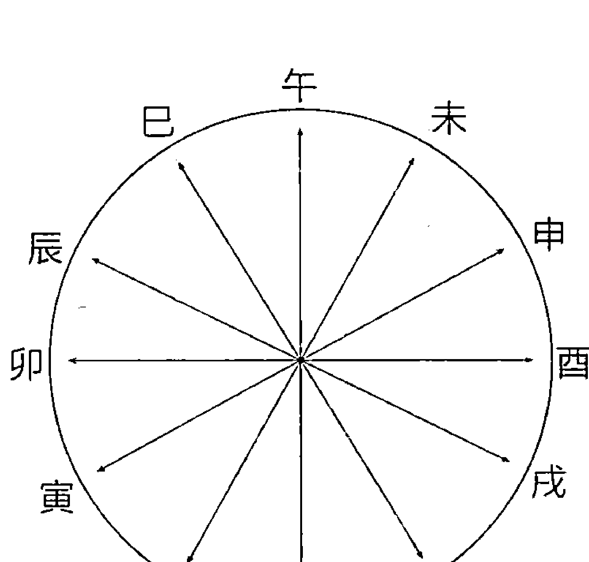

##### (6) “相化”（又称“合化”）关系

- ① “天干”相化（又称“相配”）。
“甲、己”化“土”；
“乙、庚”化“金”；
“丙、辛”化“水”；
“丁、壬”化“木”；
“戊、癸”化“火”。

在分析“天干”与“五行”的对应关系中，已有所论述，在此就不再重复议述了。

- ② “地支”相化。
“子丑”合化“土”；
“寅亥”合化“水”；
“卯戌”合化“火”；
“辰酉”合化“金”；
“巳申”合化“水”；
“午未”合化“火”。
在后面分析“地支”与“五行”的“六合”的对应关系中，已有所论述，在此就不再重复议述了。

##### (7) “相合”关系

① “地支”的“三合”关系在“圆型分布图”上，处于等边三角形顶角上的三者（如图5所示），它们三者虽然各自之间相差120度，但是，由于“三点确定一个平面，而且是唯一的一个平面”。并且是处于三者的合力点的位置上——这是因为其正于了等边三角形的中点（即底边垂线的交点；顶角平分线的交点；底边平分线的交点）的位置上。也就是说，处于三者间的“重心”所在的位置上（即平衡稳定点的位置）。

由于是处于这三点位置上的三个“地支”之间，我们的祖先们就认为：该三者能组成一个和谐稳定的局面。并称这种局面为【“三合”】关系的必然性共振性局面。如图5所示。由于12“地支”圆形分布中，三个等边三角形位置上的“地支”之间，就能形成一个“三合局”的稳定性局面，所以，12个“地支”之间，一共能形成4个“三合局”的不同本质性质的结构局面。

- 它们分别是：
  - 申子辰，合“水”局。
  - 亥卯未，合“木”局。
  - 寅午戌，合“火”局。
  - 巳酉丑，合“金”局。

为什么这“三合局”中没有“土”局呢？

因为辰、戌、丑、未4个“四季土”，都分别分到了“水”、“火”、“金”、“木”这4种局之中了，所以说，“三合”局中，每一局都含有一个“土”。只不过其中的“辰”、“戌”为“阳土”，而“丑”、“未”为“阴土”罢了。

从上面“三合”局中，我们还会发现，每个“三合局”的性质，是由其排序中间的那个“地支”的“五行气化”性质（“五行属性”）所决定的。

由于12“地支”的“五行”所属的气场的本质性质的不同，故不同“三合局”的本质性质，也会是不一样的。

##### 下面是12“地支”【各“支”与“五行”性质的对应关系】。

| 地支 | 子 | 丑 | 寅 | 卯 | 辰 | 巳 | 午 | 未 | 申 | 酉 | 戌 | 亥 |
| :--- | :--- | :--- | :--- | :--- | :--- | :--- | :--- | :--- | :--- | :--- | :--- | :--- |
| 五行阴阳 | 阳水 | 阴土 | 阳木 | 阴木 | 阳土 | 阴火 | 阳火 | 阴土 | 阳金 | 阴金 | 阳土 | 阴水 |

大家看到了没有。处在1、3、5、7、9、11单数（“阳数”、“奇数”）位置上的“地支”，都是属于“阳”性的性质，反之，处于2、4、6、8、10、12双数（“阴数”、“偶数”）位置上的“地支”，则均属于是“阴”性的性质。

这是因为：

- 1. “子”属“水”性。故申子辰局为“水”局。
- 2. “卯”属“木”性。故亥卯未局为“木”局；
- 3. “午”属“火”性。故寅午戌局为“火”局；
- 4. “酉”属“金”性。故巳酉丑局为“金”局。

再者又由于：

- 1. “木”生于“亥”，壮旺于“卯”，死于“未”。所以“亥卯未”合“木”局；
- 2. “火”生于“寅”，壮旺于“午”，死于“戌”。故而“寅午戌”合“火”局；
- 3. “金”生于“巳”，壮旺于“酉”，死于“丑”。因而“巳酉丑”合“金”局；
- 4. “水”生于“申”，壮旺于“子”，死于“辰”。由此“申子辰”合“水”局。

因此，由以上4个“合局”中可以看出，四局之中的“墓”，全在“四季土”的位置上。即“辰、戌、丑、未”的位置上。这也说明，不管12“地支”之“辰”合的是什么本质性质的“三合局”面，它们总是要去“归土”的。这正好符合了“土生万物，万物归土”的“五行”中“土”行的规律和学说。

故而，“三合”局，才有以下：

- “亥卯未”合“木”局；
- “寅午戌”合“火”局；
- “巳酉丑”合“金”局；
- “申子辰”合“水”局。

一共组合形成了，该4种（合）局的局面。

###### ② “地支”的“六合”关系

再看看“地支”方图的分布结构状态（如图6所示）。

因为子丑、寅亥、卯戌、辰酉、巳申、午未的6对“地支”中，其各自的两者之间，都处于同一个水平（纬度）上，且它们之间分别相差30、90、150度的角度。也是说，它们分别相差的比例之间，为1：3：5比例关系。1、3、5各数，又是稳定的“素数”关系——可以相互间组成抗干扰能力很强的稳定性局面和形势。况且，从地球自西向东的运行方向上来看，它们各自的二者之间，都是处在同一个水平“纬度”位置上。它们所受的场力基本相同。都受到的是同一“纬度”相同的场力的影响。只不过是，它们受到同样场力影响的时间的先后，不一样而已。由于它们二者是共同的场态性质，所以不会发生相互之间的各种干扰因素——反而，它们二者之间能前后呼应，发生“共振”的共振增强的势态，并且形成的是本质性质稳定的局面。
再就是根据我国传统的天文学知识，就可以知道：日月相会合的周期与“月建”的规律有关系。当正月“建”寅之时，日月往往会相会在“亥”位；十月“建”亥之时，日月又会在“寅”的方位上相会，所以我们才会确定为：“寅”与“亥”相合。
当“阴历”五月“建”午之时，日月往往相会于“未”位之上；六月“建”未之时，日月往往又会在“午”位上相会，因此我们又会确定为：“午”与“未”相合。

其他“六合”中的四合，可以照此类推。

又因为天（太阳、日）是自东向西而右转着，而“月建”则是由西向东而左转着。二者顺逆相遇之时，我们会将这种日月相会的状态，叫做“合”或“相合”。又因为12“地支”中，有6对相合的状况发生和存在着，故大家又叫作是【“六合”】。

再就是，日月与“斗建”（即农历的“月建”。古代我们的祖先是以北斗七星的斗柄的运转指向，来对应计算月份的。斗柄所指的12“辰”中的某一“辰”，就称之为是“斗建”。所以，会有“斗柄回寅天下春”、“正月建寅、“斗柄东指天下春，斗柄南指天下夏，斗柄西指天下秋，斗柄北指天下冬”之说），相会合或如何相会合及相会合与否，决定着“气运”方面的性质，故而，二者相合（相遇）所化之气，能决定和反映出“时令”的状况如何。

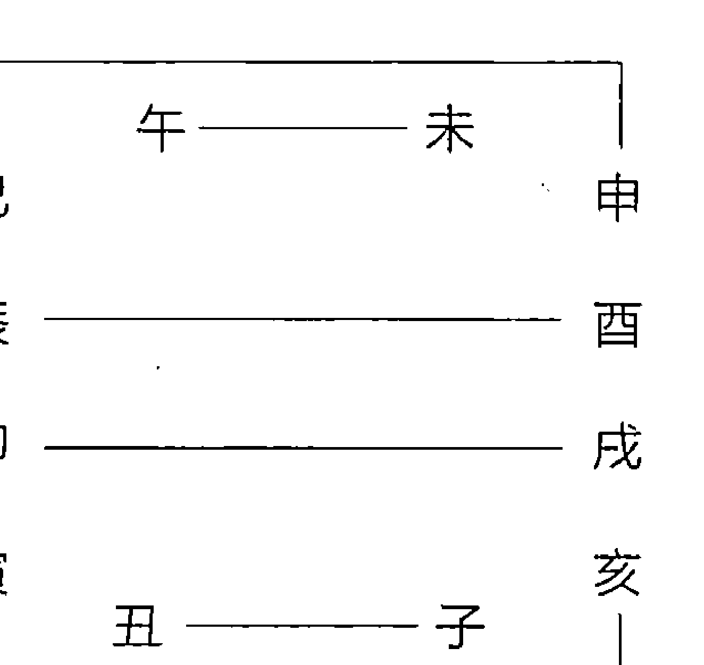

“日月相会合”，指的是“天”左转的方位情况；“斗柄所指”，指的是“地”右转的方位状况。它们二者相遇，就是指的是“天与地相合”的状态和时机。这种“合”的状态，我国的古人认为，能产生某种一定本质性质的决定性的“气化”结果（形成或产生某种决定性的场态及气场）。

（以上地支方图六合图6）

故而，“六合”中，其相“合”的二“辰”（“支”）之间，能“合化”或形成某种（“五行”）“属性”（本质）性质的场及其场态。也就是说，会发生：

- * “子丑”合化“土”；
* “寅亥”合化“水”；
* “卯戌”合化“火”；
* “辰酉”合化“金”；
* “巳申”合化“水”；
* “午未”合化“火”。

以上我们可以直接就能发现并看到：【“六合”每“合”之中，都是一个“阴辰”与一个“阳辰”，才会发生或产生相合】的结果。

##### (8) 举例说明“干”“支”的直接应用

下面举些例来说明“干支”系统中稳定平衡的特点及其应用。

- 1. 【从“冲”、“合”上来判断事物之间的关系规律】。
比如：两个人来找你，问他们之间的合作是否能成？
只要你看看他俩各自所站的具体位置，就能判断出结果来。
如果，他两人是相面对而站立或坐。就可断定他们的合作一定不成的。这是因为他二人站或坐到了“相冲”（“六冲”）二“辰”的位置上了。说明二人的目的是相反或相悖的，是很难达到共识性的合作的。
- 2. 如果，他俩各自站到了“卯”和“辰”的位置上。说明他二人合作不会太长久。因为他二人站到了“相刑”（“六刑”）的位置上了。在合作过程中，这个人顺利满意，那个人就倒霉和不满意；那个人顺利满意了，这个人又会倒霉、不满意——相互产生不和谐的干扰和相互破坏对方运气及作用的因素。因此，二人之间，自然就会产生不可调和的矛盾。所以说，二人的合作很难以长久和顺利。
- 3. 假如，他二人分别并排站到了你的北边、后面或下面的“子”和“丑”的位置上。就可断定：他俩的合作，一定能成功。因为他们站到了“地支”“相合”（“六合”）的位置上。说明二人同心同德、心想到一块，并肩战斗、共享利弊。
- 4. 假设，二者是合作做电器生意。一个站在东北方的“寅”位上；另一个站到了正南方的“午”位上。如果二人想合作成功的话，就必须向西北方向的“戌”方向上去做。或者是在“戌”年、“戌”月、“戌”日、“戌”时或与属狗的人去合作，才能成功等等。这是因为电器生意要做成功的话，应是与“火局”（“三合”）的形势相对应而相合的缘故。
- 5. 又比如，某人，中午“午”时（中午11点到下午1点之间），站在我左后或东北边“寅”位方向上问：“我所要签的合同，什么时候才能签下来？”你立刻就能判断出，是晚上7点到9点之间（“戌”时）能签成。如果不是当天签约，就得判断为戌月、戌日或戌时才能签成。或者得去现在的西北“戌”位方向去签或与属狗的人合作，才能签成。否则，不容易签成等。这也是因为“合同”、“契约”等文书之类的事物，是与离（☰）卦相对应的缘故。“离为火”。属“火”性。在12“地支”中，是与“三合”的“火局”相对应。因此，只有合乎“寅午戌”这个平衡、稳定的“三合”局面时，才能有结果和成功。如果看到自己或他人，没站在合“火”局的任何一个位置上，问签约之类的事情，这些事情，当前来说，基本上是很难成功的——除非将来能形成“火”局的局面时，才会成功。
- 6. 就如上边中午某人问签合同的事一样，这件事情必须符合了“相合”（“三合”）的时间、方位、事物特性等时，才能有一个圆满的结局。因此，在判断过程中，要看你问的是什么事情。不同的事物对应于不同的“干支”关系和“合局”的局面。不同的“干支”和局面（“六冲”、“六合”、“六刑”、“三合”、“三刑”、“自刑”等），表示的是不同事物及其关系之间的必然性本质性规律。
- 7. 同样是问passport（护照）、批文等与文字有关的事。就知道这是与“地支”合“火”局的规律相符合所能表述的问题。那就不必要再去求助他人了。只要有本“万年历”，就可以查找到是寅月、午日、戌时是哪天的什么时间去办就可以了。如果戌时不办公或无法安排，那你就可以选择寅月、戌日或戌年、寅日等系列的中午“午”时去办理，也容易成功。实在不行，只要办事的地点是去西北“戌”方向，那也行。必须是合了“局”，事情才容易成功。合什么“局”，办什么类型的事。这是一种普遍地判断原则之一。
- 8. 在“地支”圆图中的“三合”规律，还有“申子辰”合“水”局一个局面。它正好与“火”局方向相反（二者相差180度），如果想看软件、计算、流动、筹化、安全、危险、肾脏、糖尿、中毒、劳务、人事等方面的事物，就看其能不能合这个“水”局了。能“合”就行。“不合”就不行。
- 9. 事物的规律就是这样，好事应有好的“运气”；坏事也有坏的“运气”。就像得癌症一样，若是不具备得癌症的“运气”条件，你想得也得不了癌症（除非你人为地使用致癌的基因工程的控制方法）。
- 10. 如果想知道调动工作如何？或者问到运动成绩怎么样？以及出行、移动、搬迁、冲突等情况，就得看看合没合“亥卯未”这个“木”局了。合了就好。不合的话，就很难顺利圆满地进行处理和解决。
- 11. 做官、提拔、政治、官场、金融、金工及企业、食品等方面的事物，就要看是不是能合“巳酉丑”的“金”局状态了。
……等等，等等。

由于书题内容突出的需要及篇幅关系，我就不再多议论了。

- 12. 这里强调要指出的是，以上这些“干支”及其规律，是清清楚楚地分布（摆设）在我们自身的周围的。不是说，只能在书上、本上、纸上等去写写画画的去推敲、计算的。大家看这周围的桌子、椅子、地板、墙壁、门窗、房顶、柱子、黑板、电灯、大家各自或部分乃至全部集体的位置、长相、岁数、男女、辈分、胖瘦、健康状况、姿态、你们和我各自所穿的不同或相同质地、造型、颜色的衣服、鞋、袜等，还有各种不同的文具、书包、笔墨，以至于门窗外所看到的房子、院子、树木花草、门廊、柱子、房上的瓦、墙上的灰砖等等等等，不是都摆在我们的眼前按“干支”所示的位置及所含内容在客观地分布着吗。
- 13. 假如，现在这个时候，你看到某人所在的位置，又知道现在是什么时间。一看（看了看我自己配带的手表），噢！现在是“巳”时。第 5 个时辰。将卦一变化，就能知道他与他的事情的状态及某些与其有关的事物结果了。
- 14. 咱们一般大多数的人，在“批八字”时，习惯于在纸上去“批算”。通过以上我给大家提示的思路，不用到纸上去推演，立刻就能知道与他（她）有关的一些事了。根本也不一定非要严格地按照“批八字”的某些定式或程序去“批”了。因为那些“干支”、“五行”及其“冲”、“合”、“生”、“克”等规律和状态，我们都掌握得非常熟练和灵活了。我们从周围随机拈来几个“干支”内涵的因素，就可以分析、研究事物的状态、规律及结果。因为恐怕大家根本就没有想到，自己已经知道今天这个时候是什么干支年、什么干支月、什么干支日，现在是什么干支时，某人、某物、某色、某形等的方位（干、支、二十四山、二十八宿等方位）或时间位置（某年、某月、某时等）等等因素。我们随机地取来当时的几个干支因素，根据干支、五行等的“合”、“冲”、“刑”、“化”、“生”、“克”、“亲”、“兽”、“官”、“鬼”、“父”、“母”、“兄”、“弟”、“妻”、“财”、“煞”、“乘”、“侮”、“比肩”、“食神”、“伤官”等规律，就可以直接进行推导与判断。因为这些事物间的规律，我们早已熟记在大脑之中了，所以大家直接联系运用到自己周围存在的事物上，结论也就即刻得到了。为什么非得用笔到纸上去推敲呢？！在这种周围环境条件下，通过大脑直接进行推敲得出判断结论为什么就不行？不习惯呢？！

要达到以上我们所说的炉火纯青的运用水平，这就要求把我们在书本、实践或其他方法所学习到的各种“批”、“算”推导方式的那些经验和规律，统统作为一种规律和规则熟记在我们的脑子里。将这些概念与规律，经常运用到日常的生活、工作等环境中间去，借以改掉非得在纸上“批”注的固定且死板的方式方法。促使自己能深入地体会到“干支”、“五行”、“卦象”、“数字”等“场”之间“场效应”的数理模式及规律；使我们能对我国传统文化中，相对稳定、相对平衡以及各种辩证关系，能有一个更加客观、更加科学的正确认识。在这方面的推导与判断中，“无法六爻”课的周庆亮先生的思路和做法，应是我们大家的榜样——跳出传统《卜筮正宗》纸上批判的死格式，进行灵活、适应的对应性“直断”。当然，这要对我们前面所强调的“五行”本质性质的对应特点和其对应内涵内容的具体规律等表现，要记述得非常清楚和熟练，才行！

##### (9) “五行” 与 “八卦” 属性的对应关系

- ① “先天八卦” 及其对应数的“五行”本质性质。

##### ② “后天八卦”及其对应数的“五行”本质性质

乾6（☰）“五行”属“金”性；也或对应于（9n+6）数；
兑7（☱）“五行”属“金”性；也或对应于（9n+7）数；
离9（☲）“五行”属“火”性；也或对应于（9n+9）数；
震3（☳）“五行”属“木”性；也或对应于（9n+3）数；
巽4（☴）“五行”属“木”性；也或对应于（9n+4）数；
坎1（☵）“五行”属“水”性；也或对应于（9n+1）数；
艮8（☶）“五行”属“土”性；也或对应于（9n+8）数；
坤2（☷）“五行”属“土”性；也或对应于（9n+2）数；
中5坤（☷）卦，“五行”属“土”性。也或对应于（9n+5）数。

其上面公式中的n，对应为0或自然数及正整数。

##### ⑩ “五行管理法”（又称“基因管理法”）及其具体应用

下面举个“五行管理法”的例子，借以来说明和理解“五行文化”在领导与管理过程中的重要、平衡、稳定、和谐的作用。

- ① 假如，这是一个王、刘、张姓，三人组成的一个领导集体（班子）。
其中，
姓“王”的遗传场态性，是属于“木”性；
姓“刘”的遗传场态性，是属于“火”性的；
姓“张”的遗传场态性，是属于“土”性者。

这里要解释一下，为什么要这么地来进行定性？

在运用“象数易学”的“场效应”关系到人们的姓氏中时，我发现，不同姓氏之间的人事关系，有很强的固定性（下意识的，“生克制化合”的）规律关系。而且这些关系，基本上不受名字、生辰八字、性别、职业、年龄、籍贯、地域、种族、血型、知识结构、社会地位等差异的影响。这说明，每个姓氏家族中的成员，不论他（她）们之间再有什么其他的差异特点、特征等的不同，可是他（她）们在对自身以外的其他姓氏的关系中，他（她）们的本质场态的性质，却是固定一致而不会变的——本质场态性质会是有共同的性质的。而且这种姓氏的场态的性质，基本是遗传父（男）姓家族的本质场态性质的。而且这种场的性质，是祖祖代代不会再改变的。我想这也是中国古代传统中，后来确定以男子的姓氏为家族（家谱、族谱）的姓氏的缘由之所在（当然，也不能排除儒家一贯推崇的“乾尊坤卑”、“阳尊阴卑”、“男尊女卑”之类思想的主要影响）的根本原因。

由于古代中国人，自从到了“父系氏族”之后，社会主要的分工，往往是以“男主外，女主内”，即男氏在外面闯荡，必须得维持好自己各种的社会、政治、经济等的关系和地位——尤其是人事关系，既要能使其达到和谐稳定，又能防止不利的矛盾及干扰因素的发生，借以提高自己的社会效益、个人效益和各种效率。因此，人们就必须得了解掌握人与人之间相互关系的主要且基本的规律——加强有利的合作，防止或避免不利的对抗性矛盾地发生。其间，又由于姓氏的不同，又会造成不同性质的矛盾的组合及其形成。故而我们认为，在长期大量的社会实践中，我们的老祖宗们，就特别注重家族以及其姓氏间的相互关系。一是，为了防止近亲结合造成家族人体素质的下降及遗传方面或疾病的产生。二是，为了在社会地交往中，避免不必要矛盾地发生，把和谐的社会及人事局面破坏，造成不必要的麻烦、冲突和损失。

以上我们所讲的是人的遗传的总体场态的本质性质，讲的主要是与父亲的总体遗传场态的本质性质有关，而与母亲遗传的总体场态的本质性质，却并没有多大直接的关系——不论这个父亲与哪个姓氏的女人结婚及生的孩子，它们所直接生下的后代，不论男女，他（她）们的遗传场态的本质性质，总是与父亲的场态性质是一致的本质。

可是，按传统对女性生殖遗传的统计规律来看，决定生男生女，则是取决于母亲，而与父亲无关。也就是说，基本上，女性多大年龄（虚岁岁数），“阴历”几月份怀孕，怀得是男是女，应是有一定的规律的。20世纪五十年代末，当周恩来总理委派我父亲负责中医现代化研究的时候，我父亲当时通过对中国20多个大城市，在解放以前，就建立了妇产科医院和出生档案的人，进行了三百几十万人次生育者的调查、分类、统计、归纳等，发现：妇女从中国传统中的虚岁（年龄）14岁到49岁（更年期闭经之前），她们多大岁数（虚岁）的“阴历”几月份怀孕，怀得是男是女，是有统一的固定性规律的。从对应年岁来看，与男方的年龄如何？是没有多大关系的。不管女性，当时她是与哪个男人成的孕，这种“生男生女”的规律，基本上是不变的（其准确性在95%以上，余下的那5%的误差中，往往可能是在登记时，把日子记错了以及母亲患有各种病态情况或有难言之隐造成的。再可能，就是在闰年闰月的转换过程中，发生的天文岁差时间的误差等原因所致）。因为20世纪的五六十年代的社会风气，人们的思想往往还多是“重男轻女”的，怕造成人口男女比例的配比失衡，故而才没有发表该具体的对应性成果。

平时，我们在日常生活中，也会看到，往往在子女的姓名上，看到其父母的姓氏，在其同一个或不同的子女姓名中出现时，说明绝大多数的这类父母间的关系，一般都不会和谐，甚至往往二人已离异。如果父母双方的姓、名，同时在一个子女的姓名中，除了说明父母的关系不和外，还说明该子女往往性格会有一定的双重性。这也能说明，父母在自己最亲的子女的身上，各自的自私自利强调个人地位的心态，还都不能放弃和谦让，那么他们二人之间的亲情关系，还能是和谐的吗？！

为了后代能较顺利地成长，请不要乱改自己的姓氏（改的如果与原姓氏的本质场态的性质相合或共振还行。可是这种情况实在也是太少了）！随便更改自己的姓氏，是缺乏长远宏观看问题的思想的。往往是自私（自我）心理的一种产物（当然，工作需要，不得已，另当别论。既使如此，也请尽量不失其原姓氏的本质场态的性质。否则，自己在处理事物时，会产生双重乃至优柔寡断的性格——与他人交往时的关系，将是不容易沟通与融洽的）。

按现代遗传学的观点，会认为：男女性别的产生和出现，是由X、Y染色体的组合结果所决定的。虽然，在试验室内的试验中，人们有意地控制X、Y染色体的组合过程，是可以决定某些动物（包括人）的性别的，但是，在自然的生殖繁衍的活动中，却完全是靠动物自己的生理、机制、机能等来自行自适性控制的。不是说我们想生什么性别的孩子，就能生什么性别的孩子的。到时候，X、Y染色体，到底能否染得上谁？往往只与女方的生育规律的决定性有关系。一般的自然人，是无法控制自我X、Y染色体的活性及组合结构状态规律和效果的。

如果，能对有生育能力的男性，再做一个同样地对比规律的统计时，可能人类自然生育的规律，我们会掌握得就会更加具体和全面完整了。

当然喽，在日常生活中，我们也总结出一些其他的生育男女方面的一些经验。

比如：

- 冬季前后（天气较寒冷的季节），怀孕就容易是男孩。
- 夏季（天气较热的时节），怀孕就容易是女孩。
- 女方在30岁（虚岁）以前，怀男孩的概率较高（特别是虚岁25岁之前的16、18、20岁年龄段，会最高，当年有10到11个月份是怀男孩的机会）。
- 女方在30岁（虚岁）以后，怀女孩的概率较高。其远远大于怀男孩的概率。
- 在女方排卵期之前（这里是指理论排卵期），房事时所怀的孕，容易是男孩。
- 在女方排卵期之后，进行房事所怀的孕，容易是女孩。

大家也可以调查一下：

当夫妻双方或有一方在其环境（工作、学习、生活等），是正处在异境或不顺心及不利的时候，女方所怀的孩子，往往多是男孩子。
当环境处于顺利和飞黄腾达的时候，往往怀的多是女孩。

所以，自古以来，我国传统中就流传着这么一种说法：

> “大自然最公平，当你处在最困难的时期，大自然就会给你一个劳动力（壮丁、男孩），以便帮助你改变你的落后与困难的处境。当你处在顺利和发达的时期，就给你一个‘千金’（女孩），以装门面。”

虽然，这话中间有人会误觉得有些重男轻女的意思，但是它却反映出了一种人类社会生育繁衍发展中的一类现实。

如果，夫妻或男女双方年龄差距较大时：
女方的岁数，如果较男方大得多，特别是女方处于壮年时期时怀孕，往往是女孩子的概率大。
男方的岁数，较女方大的多，女方年轻，男方正处于壮年的时候，女方怀男孩的概率高。

这也就是我国古代传统中，为什么要找小媳妇和早结婚的原因之一——为了生男孩，以留根（保持“姓”本质场态的继续繁衍和存在）。

自古以来，我国由于中医学的发达及社会相对的稳定，故而人口众多。很多医学及社会学方面的知识和规律，往往会比西方的医学及社会学的知识和规律，更容易通过大量的统计调查学的数据及规律（不是可能性的概率），得出正确有效的结果与结论。这对我国当今“优生优育”的计划生育的国策，将提供相当有价值的参考。我们认为，“计划生育”的关键，是能够保证“优生优育”的生育结果。无论是生男孩还是生女孩，都得是如此。

离题太远了。咱们再拉回思路来，继续谈谈“五行管理法”。

比如：还是选取上面的“王、刘、张”，三人组成的一个“木火土”形成的局面。
其中，
姓“张”的为“一把手”。“王”、“刘”为副（二把）手。

这样将会出现：

姓“刘”的二把手，会无原则而且是自愿主动地支持姓“张”的一切工作。甚至会发生有些类似于无原则地拍姓“张”的“马屁”的情况出现。
这是因为二人间，是“火生土”关系的缘故。此间的场力，当然是会向着有利于姓“张”的方面发展。

姓“王”的副手，不管姓“张”的怎么去做，他都会看不起姓“张”的——往往“张”不但指挥不动他，甚至还得不得己按姓“王”的意图和思路去办事才行。
这是因为二者关系，是“木克土”的缘故。姓“王”的场力，完全控制和克制着姓“张”的场力。场力的发展方向是对“王”姓有利的指向。

可以说：
前一种场力的发展趋向，是对姓“张”的一把手的工作有利的方向；
可是，后一种场力的发展趋向，却是对姓“张”的一把手发挥其权威性、减少矛盾、提高工作效率，是不利的发展方向。

如果，要想既提高工作效率又减少或避免不必要的矛盾地发生，我们必须要学会利用矛盾、抓住主要矛盾或矛盾的主要方面，因势利导，将不利因素转变成有利的因素。这也就是说，要求我们进一步去深入地分析、研究这三人间的矛盾的性质及其特点，并利用其这些性质和特点，来创造平衡稳定的制约机制，推进大家工作地共振性增益和发展。

在深入地分析、研究上面这一局的三人的矛盾中，我们又会发现：
其中，
姓“王”的，会主动无原则地去支持姓“刘”的一切作为，甚至会主动地去拍他姓“刘”的“马屁”。
这是因为，“王”姓之“木”，会主动地去滋生、壮旺着“刘”姓的“火”。场力的发展方向，是对“刘”姓有利的趋势。

为了减少或回避姓“张”的与姓“王”的矛盾的发生，姓“张”的有什么事情、工作、作为等，只要直接交给姓“刘”的去办，一切问题就能顺利地解决了。
这是因为，“刘”的“火”姓，会主动地去生旺着姓“张”的“土”。场力的发展方向，是对“张”姓有利的方向发展。

因为姓“张”的一把手，有被姓“王”的制约和克制的因素存在，他会被动地消耗着自己的能量。同时，又受到姓“刘”的主动地支持，而顺利地得以能量的补充及充实。再加上，他只与姓“刘”的发生工作关系，这样做又会主动地减少了自己能量地消耗，也回避了与“王”姓之间的矛盾。因此，自己的场力能量仍然会很充足，能长期地支撑这个稳定的相互制约的局面。他自己的一把手的领导地位，也就能够坐得更加稳定和长久了。

- ② 再比如：
他们三人中，是姓“刘”的为一把手，是主要的负责任的人。“王”、“张”二人是副（二把）手时，又会出现什么状态呢？

作为一把手的主要负责人——姓“刘”的人，他会无原则且主动地去支持姓“张”的副手——不能发挥自己的领导和权威性。不仅如此，而且还主动地去支持着姓“张”的二把手工作，从而消耗着自己的能量。
而姓“王”的副手，往往又会主动自愿且无原则地拍姓“刘”的“马屁”，给姓“刘”的补充（支持）着能量。
故而姓“刘”的能量场，将会是有失又有（补）得的。
所以，其地位（位置）也较容易坐稳定。

再加之，此局中，姓“王”的副手，又能控制、制约住姓“张”的能力的发挥——让姓“张”的干什么，他就会被动地去干什么——“张”是毫无反抗能力的（基本也不会主动地去反抗）。
所以说，姓“刘”的只要抓住了姓“王”的，有什么事情只要交代给姓“王”的（不能主动地去与姓“张”的打交道）去办理，而姓“王”的再交与听其话的姓“张”的去办理，基本就能顺利地取得成功了。

这样做的结果，姓“刘”的又会减少很多不必要的消耗。其场力的发展与积累，会更加的强，其能量地输出，也会更加得大，更容易稳定住自己的地位和这些领导间的组合关系的局面。

- ③ 又比如：
这三人中，以姓“王”的为一把手，而姓“刘”和姓“张”的为副（二把手）手时。

在这一局面中，姓“王”的，他既要克制住姓“张”的能力地发挥——主动地消耗着自己的能量，又要主动自愿、无原则地去支持副手姓“刘”的工作及其作为。
姓“王”的是双向且主动地消耗着自己的能量——减弱着自己的能量和场力的力度。

因此，他如果长期地得不到他人能量的支援的话，那么，他就不可能长期保持住自己“一把手”地位的巩固和稳定。更不可能长期控制得住这种“团队”的组和局面。

那到底得怎么办呢？

一种办法是，只与姓“张”的副手打交道。尽量减少自己能量的消耗。使自己尽可能的多稳定一段时间。
由于姓“王”的得不到其他能量的补充与充实——总是在不断地主动或被动地消耗和削弱着自己的能量及能力，总有一天，还是会支持不住这个局面的稳定的。

若要解决这个问题的根本方法，应是：
姓“王”的，必须要寻找新的领导班子成员（组成有利于自己工作环境的新的领导班子），组成新的对自己有利的集体领导班子（形成能相互制约的局面）。

- 1. 一种方法是：
免掉姓“刘”的副手职务，换个“水”姓的成员［如果换个“金”姓的成员的话，会直接克（抑制、控制）着“木”姓能力的发挥——“王”姓。这就更不可取了］，造成“水生木”的局面。使自己能得到一定能量的补充和充实。进而使自己的能量和能力，达到一定程度上的补给和造成全局性的稳定。

因为人事方面的事，往往比较复杂。免去一个人，会是不太容易做到的，如果增加一个人，就较容易做得多了。

##### 2. 此外，另一种做法就是：

增加一个“水”姓的领导成员。比如说，是姓“曹”的吧。
这时，姓“王”的一把手，就可以下设一个常务主管。
比如：就让姓“张”的当这个常务主管吧。有什么事情，姓“王”的就直接对姓“张”的进行交代与布置（“王”之“木”克制“张”之“土”）就行了。

姓“张”的常务主管，有什么事情，就直接交代给姓“曹”的（“张”之“土”克制“曹”之“水”）。又因为姓“曹”的，能毫不含乎地指挥调动姓“刘”的积极性（“曹”之“水”克制“刘”之“火”）。

这样做之后，姓“王”交代的事情，就可以不用自己插手，就较容易地得到解决了。

这么一安排的结果，姓“王”的就既容易保持住自己的地位又能保住自己的权威性了。他既避免了不必要的矛盾，又提高了该领导班子们的工作效率和效益。原来对自己不利的“刘”姓，既能主动去支持姓“张”的工作（“刘”之“火”生“张”之“土”），又会绝对服从姓“曹”的领导及其指派的工作（“曹”之“水”克“刘”之“火”）。此外，还将消耗自己能量的“刘”氏关系，间接地变成了支持自己工作的能动者。

在这一局面中，姓“王”的在克制住姓“张”的消耗自己能量的同时，又得到了姓“曹”的支持（得到能量的补充）。故而使自己的场能得以保持和稳定。继而自己的地位与权威，也会进一步地得到了巩固。

以上举的是一个“五行管理法”的简单的事例。当然，如果姓“王”的在“常务主管”的任命上，选取不同姓氏的人，可能又会形成不同的“五行管理”的局面。在不同的局面中，他将会采取不同的“五行”管理间的处事关系。大家可以自行去分析、判断。这里就不再多议了。希望大家可以根据以上的“五行结构分布”中的“生、克、制、化、合”的各种原则，在日常工作、生活中去分析、实践，定能得到意想不到的实际管理的效果——这是世界上任何的管理学、治理学和调控学，都不曾有的“中国式”、“中国特色”的“基因”管治及调控的方法。

- ④ “五行”之间的关系，除了有“生”“克”关系外；还存在有“相乘”、“相侮”的一些关系。

###### 1. 什么是“相乘”的关系呢？

“相乘”有一种“乘虚而入”的意思。

比如：本来应是“土克水”。由于“土”又在“生”着“金”，如果“土”大量地生“金”以后，“土”的能力，将变得会是特别的虚弱、松散。此时的“土”，不但阻挡不住水的侵犯，反而会被水所冲垮及淹没。就如同拦河的堤坝。同样都是钢筋水泥制造成的。如果只是为了赚没心的钱，在浇铸堤坝时，将其构架中的钢材用量，尽量地减少来使用，反而会使堤坝成为“豆腐渣”工程。这样做的结果，堤坝不但不能阻拦大水流的冲击，反而会被洪水所浸蚀及冲垮。同样，如果在修筑堤坝时，所使用的土方量不足，也会造成堤坝被大水所冲垮的现象发生。也就是说，必须有足够量的“土”，它才能“克”制住（阻碍）一定量的“水”地冲击和浸蚀。

###### 2. “相侮”的关系，就会是有些“仗势欺人”的意思了。

本来应该是“水克火”，可是同样的“水”，由于天气非常严热（火），“水”要克“火”（热），就必然要不断地蒸发与减少（包括“土”中的水分也在不断地蒸发），才能降温而保“水”。可是“水”又得不到同时任何方面的补充和充实，反而“火”热会更加地促生着焦“土”的产生而吸收“水”份。此外，热“土”反而更加地会去克制（蒸发与失去）“水”（分）。这样恶性循环的结果，会造成气候更加的严热、干旱和缺水。此时的（寒）“水”，反而更无能力去克（抑制）“火”（严热、干旱）了——“火”仗势其热性而反侮其“水”了（“水”已克制不住“火”热之势了）。

以上这两种“五行”中的特性，往往不被大家所重视而忽略。可是，利用它们在“五行结构分布”关系的分析中，往往会是不能缺少的非常重要的分析方法。希望这些“五行”本质属性及其特性，能被大家给予必要地关注和重视！

##### (11) “五行”各属性与季节变化时，其属性强弱的对应变化的关系

由于“五行”本质属性各自地强弱变化，是与各季节的变化能直接相对应的关系规律，所以，同样一个“五行”的“属性”性质，在不同的季节里，它们还有其强弱之势的不同之分。

下面列表，以给大家作为参考。

| 季节 | 旺 | 相 | 休 | 囚 | 死 |
|------|----|----|----|----|----|
| 春 | 木 | 火 | 水 | 金 | 土 |
| 夏 | 火 | 土 | 木 | 水 | 金 |
| 秋 | 金 | 水 | 土 | 火 | 木 |
| 冬 | 水 | 木 | 金 | 土 | 火 |
| 四季 | 土 | 金 | 火 | 木 | 水 |

其中，

- “旺”，是指每一“行”（“五行”属性）性质最旺盛、最强（相合、相应时）的季节。
- “相”，是指每一“属性”性质，得以补充、增强（得以“生”旺时）的季节。
- “休”，是指每一“属性”性质，减弱（“生”旺他者时）的季节。
- “囚”，有人又称“困”。是指每一“属性”性质，起制约、控制作用（“克”制他者时）的季节。
- “死”，是指每一“属性”性质，最弱（被“克”制时）的季节。

由此，我们就可以知道“五行”不同本质“属性”的（实体、刚性）事物，在不同的季节里，它们之间的盛衰、强弱及其规律、状况如何了。

所以，在我国古代的传统作息时间中，才会有人讲：

> 春三月，春阳上升，“木”气最旺盛。万物俱生。我们应该“夜卧早起（晚睡早起），以使志生。”如果不按这个起居规律行事的话，就会伤及肝脏及其功能。这也是一种“养生”的道理和方法。

> 夏三月，天地交泰，是万物茂盛而华美的时期。我们应该“夜卧晚起（晚睡## (二) 综述易卦及其数理间的“五行”定性性质的本质关系

- (1) “先天卦”的“在天成象”的“同声相应，同气相求”的物质“柔性”（虚体）间的波动性特点。

实际这就是“象数易学”易理认为的“同声相应，同气相求”、“法于阴阳，合于数术”的“波动性”的“场效应”共振原则，是宇世间一切事物间根本的第一性本质的表现。在其直接对应“四维”时空里，其间的事物，是“只有象，而无实体”的。比如，像“三维”时空中的立体（刚性、实体）性事物的软硬、冷热、固定的大小、尺寸、形态等性质和概念，在“先天”的时空这里，都是不可能存在的！只要我们能在该“四维”空间中，把与之对应的“三维”空间里的任

何事物相对应的“像”（象），进行拓扑学等诸方面重新地调整与组合，就能对“三维”时空里与之对应的事物，达到进行结构、状态、质地、形象、功能等方面的改变与变化（请参见本人所著《易与物理学》一书的关于“人体科学”和“思维科学”方面有关的内容）。在此“四维”时空里，由于不存在事物的实体，因此该空间中，是不应该存在有以实体物态为存在基础的“五行”本质属性的事物及其辩证法则和标准规律的。

- (2) “后天卦”的“在地成形”的“同性相斥，异性相吸”的物质“刚性”（实体）间的实体性特点。

“象数易学”认为，只有事物处于在“三维”空间的立体结构中，才会具有事物的“刚性”和“实体”存在的粒子性、分子性、原子核、电子、实物的实体等状态：即砖、瓦、木、器、石头、钢筋、水泥、铁路、公路、桥梁、楼、堂、馆、所、衣、食、住、行等事物的对应存在。事物之间的关系，不像“四维”时空存在的波动性的共振、谐振、干涉、衍射等性质和特点那样，除了事物间存在的“同性相斥、异性相吸”的原则特性外，还各自对应有“金”（固态）、“木”（生命态）、“水”（液态）、“火”（气态）、“土”（综合平衡态）不同或相同的“五行”本质性质的功能和作用——通过事物直接对应的“五行”本质间的“生、克、制、化、合”的相互的本质作用和作用关系，就能认识、判断与描述一切事物间的本质性的必然规律了。

- (3) “先”“后”天卦进行象数组合的对应统一，来完成对一切事物进行全面完整的准确合理地表达。

用“先天卦数”来准确地确定“高维”时空中的空间结构状态，以“后天”卦、数、象、性质等内涵所对应的具体事物，充添到“先天”直接对应的空间结构模型中，来进行认识与判断各种对应事物的变化及其规律——鉴于各空间中的时间，都是同时性的，为了保证“先”“后”天卦在它们的相互转化或更替的过

程中，其表述信息的准确性与确实性，防止在此相互转化或更替时，事物及其信息量的丢失或增益现象以及悖论性结果的产生及发生。

比如，有人在证明和确定“九”及“六”是“可变爻”的证明过程中：由于其中采用了：

```
9²=81; 81²=6561; 65+61=126; 1+26=27; 27²=729; 7+29=36=6²。
6²=36; 36²=1296; 12+96=108; 108²=11664; 1+664=675; 6+75=81;
81=9²
```

通过以上有限步骤地计算，“阳”九的平方值变成了“阴”六的平方值，反之，“阴”六的平方值变成了“阳”九的平方值。即是说，“阳”九和“阴”六之间由于是可以相互转变成对方的平方值的，因此说明：“阳爻”九及“阴爻”六是“可变之爻”的表达。

在以上的计算过程中，我们可以明显的看到：9²=6²和6²=9²的悖论性算术结果的事实。这是因为，人们为了保证最后悖论性结果的存在，在计算过程中拆解凑数时，表面上看，是运用了很简单的四则运算的《梅花易数》中，数位不同的对应性起卦方法的规律来进行，虽然是没有违犯其计算法则的计算过程，但是在“10进制”的高阶（2次方）计算和一阶（1次方）的计算过程中，有意无意中，却改变了原数值在计算过程中的真实性的具体对应的大小值。

比如，“第一行”的计算的第三步，把6561数变成了65+61=126。也就是说，在此拆解凑数的过程中，已经出现了6561=126的悖论结果了［其中，6+5+6+1=18=1+8=9，而1+2+6=9，9对应于“后天八卦”的“火”性本质。虽然二数的大小值是不同的，但是从古代传统易学文化具体表述及其“后天八卦”的分类“类化学”的角度来看，其二者的本质性质，都是属于“火”性性质的9数，故而认为本质性质是相同的数之间，就应该被认为是同一类型大小（性质）的数。即二者是本质相同而等价、平权的数］；接下来，又出现了126=27的悖论（同理，1+2+6=9，9=2+7。都是“后天”对应的离卦本质的“火”性的9数，故二者是本质相同而等价、平权的数）；随后又出现了729=36的悖论（同理，

7+2+9=18=1+8=9，3+6=9。都是“后天”对应的离卦本质的“火”性的9数，故二者是本质相同而等价、平权的数）；在此一连串的悖论前提下，才必然出现了9²=6²的悖论性结果。

再比如，“第二行”的计算的第三步，把1296数变成了12+96=108。也就是说，在此拆解凑数的过程中，已经出现了1296=108的悖论性结果了［其中，1+2+9+6=18=1+8=9，而1+0+8=9，9对应于“后天八卦”的“火”性本质。虽然二数的大小值是不同的，但是从古代传统易学文化具体表述及其“后天八卦”的分类“类化学”的角度来看，其二者的本质性质，都是属于“火”性性质的9数，故而认为本质性质是相同的数之间，就应该被认为是同一类型大小（性质）的数。即二者是本质相同而等价、平权的数］；接下来，又出现了108=108²=11664的悖论（同理，1+1+6+6+4=18=1+8=9，1+0+8=9。都是“后天”对应的离卦本质的“火”性的9数，故二者是本质相同而等价、平权的数）；随后又出现了11664=675的悖论（同理，1+1+6+6+4=18=1+8=9，6+7+5=18=1+8=9。都是“后天”对应的离卦本质的“火”性的9数，故二者是本质相同而等价、平权的数）；接着又出现了675=81的悖论结果（同理，6+7+5=18=1+8=9，8+1=9。都是“后天”对应的离卦本质的“火”性的9数，故二者是本质相同而等价、平权的数），在此一连串的悖论结果的前提下，才必然出现了6²=9²的悖论性最终的结果。

以上这两种算术计算中所产生的悖论性结果，是由于在拆解凑数结果时的不等价的悖论性计算和逻辑程序，才导致了其计算的悖论性结果的发生，所以我们在进行数理计算的过程中，一定要保证每一步的计算，都得是等价或平权的结果，才能保证其各步连续计算结果的最终的正确性——这是我们在算术计算过程里（特别是在对传统文化的“象数易学”及数术学的数理计算中），往往是不太被人们注意的逻辑和逻辑过程——我们的“象数易学”的“易理学”的推导和判断方法中，基本是以“先天八卦”及其配数为“体”，“后天八卦”及其配数为“用”的“八进制”与“九进制”，再加之“五行”本质定性的“五进制”以及

“时间逻辑学”的“十二进制”相互结合的认识与表述系统的体系。在这类“多进制”的组合学的推导和判断方法里，由于各种进制的转换与更替中，是存在着不等价、不平权、不合理的转换手法和方法的，因此我们必须要想尽方法，先去寻找各进制间的等价转换或更替的平权的规律才行——就像以“拉氏变换”的方法，寻找等价的对应时空的表述功能那样。

该处在算术计算中，由于“十进制”与“九进制”在拆解凑数时，两种进制间转化时的不等价以及又不能进行相互统一互补地转化方法的缺陷，所造成的必然结果。比如，由于“十进制”将同一事物可以分成十等份来认识与表述，而“九进制”却是将该同一事物，是分成九等份来认识和表述的，所以对于同一个事物来说，它的“九分之一”与“十分之一”的状态和量化值，是不可能达到等价而相同的。也是说，它们二者间是一种不等价和不平权的量化值。要解决二者表述值大小的等价、平权的问题，就必须找到它们二者的等价、平权表述的公约数或公倍数（比如90，即含“九进制”又含“十进制”的倍数）的对应性互换的等价值，才有可能进行二者量化大小相对的等价与平权性地认识与表述等。

此外，我们又会发现，仅运用“后天八卦数”的分类本质定性的方法的质变相同的方法，对各种数的“后天”本质的确定，表面上看是本质相同的类型，应是可以忽略其数值的原来大小，而仅从数值本身的本质性质的属性上，将其作为（本质）相同的数来对待与处理。但是，由于“后天”卦、数的分布与表述，不能完全以“一阴一阳之谓道”“本体论”的“对应统一”的“对偶两分且平衡”及完整性事物，作为认识存在的基础思想和根据，虽然在对应本质分类上来看，是同样本质性质的数，但是就其直接对应的实际数值的本质来说，其中肯定存在着“不完备”、“不完全”和并非仅是“兼容性”的本质性质的悖论缺陷。所以，可以看出“后天八卦数”像“形式逻辑”的“数理逻辑”一样，在其“数理逻辑”的认识与表述中，不可能是不产生逻辑及其矛盾结果的可能的。故而，在“后天八卦分布结构”的认识与表述的本质分类学的分类中，不产生逻辑及其结果的悖论，将是不可能的！这也是，为什么我们以“先天”为主“体”，“后天”为辅

“用”的根本原因及目的——防止事物在“先后”天量化变化的转化过程中，出现不该有的“后天”认识与表述方面的缺陷和失误！请注意！

具体分析，还可见本人所著《易理数理（一）》403页至456页的内容，还有《易理数理（三）》411页“（四）‘后天数’返‘先天数’的规律、特点与运用”一节的内容。

### 三

#### “盖取诸离”事物相互作用关系的
整体性网络构成及规律的“系统论”
思想与特点

##### （一）“象数易学”易卦所对应的事物关系，是通过事物所对应的易卦的卦数本质场态性的相互作用及功能的能力来体现的。

易卦直接对应的“卦序数”与易卦排序对应分类时，对应的“五行”本质属性，是一一直接对应的关系。

- 1. 比如，
“先天”乾1（☰）之卦，对应于“金”性本质的场态性；
“先天”震4（☳）之卦，对应于“木”性本质的场态性；
“先天”离3（☲）之卦，对应于“火”性本质的场态性；
......
其他各八卦，照此类推。

- 2. 又比如，
火天大有（䷍）卦，其对应于“先天卦数”的上卦离（☲）3+ 下卦乾（☰）1=4。4 对应于“先天”震4（☳）之“木”性的本质场态性；
风雷益（䷩）卦，其对应于“先天卦数”的上卦巽（☴）5+ 下卦震（☳）4=9。9÷8，余1。1 对应于“先天”乾1（☰）之“金”性的本质场态性；
天风姤（䷫）卦，其对应于“先天卦数”的上卦乾（☰）1+ 下卦巽（☴）5=6。6 对应于“先天”坎6（☵）之“水”性的本质场态性；
......
其他各64卦，照此方法类推。

###### （1）“象数易学”易理对宇世间一切事物间的关系的认识。

我们“延生易”的“象数易学”的易理认为：事物之间，是以事物本质性质的相互作用所组成的网络联动性的网络整体组合结构的关系下，它们是在相互作用、相互影响、相互互动、相互促进、相互制约着的——事物相互之间表现的是一种谁也离不开谁的相互联系、相互依存、相互转换更替的整体关系。也就是说，没有任何一个事物，是会脱离其他任何事物，而能独立或孤立的存在的。一个事

物的变化，可以影响到其他诸多有关联的事物的变化，其他任何一个事物的变化，也会影响到该事物的变化及发展——事物是全面整体性的相互作用地联系并存在着——形成一个完整的组合结构的事物整体或体系，所以“形式逻辑”前提下，对事物的孤立性的研探或探讨，是违背事物客观存在的实际事实的，所以它的研究结果和结论，在“排中选择律”的启导和制约下，往往会是有局限性和片面性的。

###### (2) “象数易学”易理对宇世间一切事物间的相互关系的根本认识，是依靠事物直接所对应的易卦的“五行”属性的定性法则和标准，来对事物进行认识、判断和表述的。

我们“延生易”的“象数易学”的“类集集合论”的“系统论”的认识与表述中，是特别重视：在“极其数”之后的“类化”分类后，各类型事物在本质性质的确立上——这样做，可以把每一种分类类型中内涵的极其众多的事物及其信息、数据等，进行统一地本质定性及其区分，这样一来，我们就可以把一切事物，排序、组合成了八个本质一致的大类型，我们只要去比较这八个本质不同或相同的“生克制化合”诸方面的相互作用的关系规律，就很轻易的得到事物之间的必然性变化规律和发展结果了。这种能对分类类型进行相同或不同本质定性的方法与标准，是当今西方数学以“形式系统”为认识主体的“数理逻辑”的集合论，所不可能具备的推导法则和标准——究其来源，应是由我国传统文化中《河图》的分类和“生”“成”比例关系而对应得到的。前面已论及过，此处就不再多说了。

##### (二) “同声相应，同气相求”、“法于阴阳，合于数术”的波动性的“场效应”共振原则。

###### (1) “波动性”是对一切事物（第一性的）起决定性作用的规则和法则。

我们“象数易学”的“易理学”认为，“有什么样的场，就对应存在有什么样的事物组合结构形式与状态”。“易传”中则曰：“同声相应，同气相求”。《内

经》中曰：“上古其知道者，法于阴阳，合于数术。”可以说，大家共同认可的都是“场效应”前提下的“共振”、“谐振”的共同性“合和”状态的增益作用。这由“太极图”的具体结构分布中，只要事物间是处于相互互补而达到融和、平衡、和谐、稳定后，我们就可明显地感受和体会到：只有图中间的这条S曲线所表现出来的“波动性”特点，才是事物间相互对应平衡稳定时，所表现出的第一性的认识与表述的特性！

###### (2) 易卦、易爻、易象的各种（包括数理）“合”、“和”、“以变”的“标准型”表述关系与类型，是事物与事物达到和谐、共存的充分且必要的前提（先决）条件。

由于易卦、易爻、易象的各种（包括数理）“合”、“和”、“以变”的“标准型”（阴阳、老少、八卦、64卦等几何结构状态）表述关系与类型，是事物与事物达到和谐、共存的充分且必要的前提（先决）条件，故而我们的“象数易学”中的“易理学”，非常重视对一切事物之间关系与其类型之间的相通及共同性、同一性方面的深入探讨。

- ① 其中包括卦、爻的各种组合结构；卦、爻间的相互“以变”、变化与关系；卦变、爻变与象变规律及其间的表述关系和原则；卦或爻及卦爻的排列分布与方位结构等相互“以变”关系的表述等。前面这些卦、爻的组合变化，所反映的都是一切事物及其（几何）空间组合、结构、状态等的关系及其规律。

- ② 除了对以上重视对事物之间关系及其几何结构的事物空间构成（卦的）规律和原则、标准的探讨之外，还应包括与其空间结构相对应的数及数理方面的表述规律和变化原则的“时间逻辑学”方面的更加深入地探讨。

###### (3) 寻找与抓住一切事物的共通或共同的共性（统一、同一性）规律，是我们“易理学”研究与表述的根本目的和原则。

由于寻找与抓住一切事物的共通或共同的共性（统一、同一性）规律，是我

们“易理学”研究与表述的根本目的和原则——通过事物的统一性表述现象，来达到对事物间本质方面的（共性）认识与把握。只有这样才能真正做到“易简”或“简易”表述与认识的可能性。对事物的本质与共通、共性关系的认识与表述，才是社会及自然界达到和谐共识与共存的认识基础。这是与现代科学通过事物的个性区分比较，来寻找事物及其“相对统一”与“对立统一”规律的方法，是不完全一样的侧重性研究与表述指向的方法。

- (4) 事物间能产生“共振”、“谐振”的效果，才是事物及社会达到“和谐”、“共识”、“共生”、“心心相应”（并非是“心心相印”）及“生生以变”存在的前提条件及充分且必要的决定性因素。

- (5) 坚决反对侧重片面的仅以事物“波动性”产生的各种“共振”、“谐振”、干涉、衍涉、绕涉等现象表达出来的某些特点和规律，来认识与表述事物该类“虚”“柔”状态下的“象”形规律。
也可以说，假如，我们仅以事物“波动性”产生的各种干涉、衍涉、绕涉等现象表达出来的某些特点和规律，来认识与表述事物该类“虚”“柔”状态下的“象”形规律的话，因为它不能全面完整地来反映与表达事物那些看不见、摸不到或感知不到的“波动性”本质的增益性功能和衰减结果的存在与其各种特点和作用等——只有同时重视“波动性”（柔性、虚性）与“实物性”（刚性、实体性）的共同更加深入的研究与探讨，在寻找到该“刚柔”、“虚实”双方的同一性之后，才能最后对宇世间的一切事物的真正规律，作出更加深刻正确地认识与表述。这就得必须具备对易卦结构与波形直接对应的“波动性”状态，以及对“八卦”所直接对应的各种事物、物体、物质或粒子等的卦象及其内涵，搞清楚弄明白才行。详情请见本人的《易与物理学》一书内有关内容。

### 四

“时间”因素的准确确定，是我们认识、判断、表述一切事物的状态、规律的必不可少的先决和决定性条件——“延生易”认为，“时间是第一性的决定性因素”

##### (一) “六爻相杂，唯其时物也”的“时间逻辑学”及“时间易学”认知判断一切事物的根本前提。

- (1) “哥德尔不完全定理”就是由于哥德尔引进了以时间前后秩序的“时间逻辑学”所直接对应的“递归”及“递归函数”的“哥德尔配数”的概念和方法，才得以顺利地解决的。

“哥德尔不完全定理”就是由于哥德尔引进了以时间前后次序为排序的“时间逻辑学”［其中，何新先生所提倡的“历史集合论”的认识与表述方法，实际就是一种与（历史）“时间逻辑学”（集合）概念有关的认识与表述］所直接对应的“递归”及“递归函数”的“哥德尔配数”的“数”及“数序”的概念与方法，才得以顺利地解决的。由于他实际采用的自然数前后的排列次序的配数方法，就是以时间的先后次序，来作为自然数直接对应的排列顺序的依据，可知“哥德尔配数”，实际上是引进了“时间逻辑”直接相对应的自然顺序的（对应性）概念，才证明并解决了“哥德尔不完全定理”的悖论性的一些“可判断”问题。

- (2) 中国传统文化发展的先期，一直都是以“天道决定一切”的认识论，来指导我们对“天地生（含人）”一切事物、关系及其规律的认识、判断与表述。

由于中国传统文化发展的先期，一直都是以“天道决定一切”的认识论，来指导我们对“天地生（含人）”一切事物、关系及其规律地认识、判断与表述，可知，长此以来人们所主要关心的是“天道”、“地道”及“人道”（含生物）之间的整体性之间的对应性关系及其发展变化的规律。这是由于自古以来，中国传统文化的思想中，对一切事物之间相互作用的总体形成的关系，总是被人们特别地关注或重视的缘故——通过天体运行位置间的结构的相同或不同的（“时间逻辑”所直接对应的天体间总的结构、分布及其相互作用等形成的总体效应）关系，直接与地球上的一切事物的变化与发展的状况及规律，进行一一对应性的直接认识、判断及表述，故而对大自然中事物间的那些共性、共通性的同一性规律，相对于西方的哲学认识论来说，认识的是比较更加的清楚的。这是一种通过天体总体结构状态及宇宙间全部事物所组合而成的（时间）总体相互作用规律的总体（共同组合）效应，来对应寻找其他针对对应性具体事物（该对应时间的）规律的认识论及方法论。

##### （3）“时间为主，空间为辅”是我们“象数易学”对事物的根本性“时”、“空”统一认识论与表述方法的总概括。

- ①离开“六爻相杂，唯其时物也”的对时、物唯一对应关系的时间因素的准确地确定，是无法根本判断事物及其规律的正确、正常与否的。

我们是通过具体真实的时间所直接对应的“变爻”位置的具体变化，来寻找到事物在某一空间（卦或复合卦）中其所直接对应的主体（体卦）位置，再通过对事物主体与辅助、附属、遂顺的客体（用卦）间的本质性质相互作用间的比较，来寻找事物相应的必然的理性（本质定性）变化规则、标准和结果——故而我们又称其为“时间逻辑学”前提下的“时间易学”的推导与判断的方法论。

由于人们在以“理性”方法对事物及其发展变化作出判断与结论时，往往是以“理性”的推导、演绎、分析的“逻辑学”的逻辑方法来进行的；而这种逻辑及逻辑结果的获得，是需要运用不同或相同的逻辑及其逻辑过程的“过程学”来完成的；逻辑过程又是一个有其先后的逻辑及逻辑的推导或演绎、分析等的逻辑次序来进行的；正因为逻辑及逻辑推导的次序的先后进行，是一种历史或历史集合的推理（排序、排列）过程，而历史及历史集合的逻辑推理结果，是与其逻辑推导、演绎、分析过程中，直接与时间相对应的时间发展变化的逻辑次序相对应，所以，我们认为：“理性”及其逻辑思维的逻辑及其逻辑的推导过程，就是一种“逻辑学”的逻辑次序与时间发展变化的次序一一相对应的“时间逻辑学”之下的次序。也就是说，实际的“理性”逻辑的推导、演绎、分析地认识、判断与表述的过程，就是与“时间逻辑学”和“时间易学”直接相对应地认识、判断与表述。

述的过程——这里仅指的是与“逻辑学”（并非仅是“形式逻辑”，还应包括“辩证逻辑”、“无机对立统一逻辑”、“有机辩证统一逻辑”等）及其逻辑过程直接相对应的“时间逻辑”及“时间逻辑学”过程。比如，哥德尔为什么要利用“递归函数”的“可数个对象的集合”，并与之配上一个“哥德尔配数”的数的方法，把算术系统（记为N）中的符号、表达式和表达式的序列，都被“映射”成为了数的关系，借以来实现了他对研究对象的“数化”手续。这样进行处理的结果，对于“数理逻辑”和其他有关的分支来说，在研究方法上，就提供了一种数字化的（数与数之间的算术关系）工具，使之能够方便地把一些讨论对象（如符号、公式等），转换成为自然数或自然数的函数，使我们能够通过运用自然数的理论，来讨论有关的对象问题。并且还可以通过这些配数的推算结果，来反过来看“原来形式系统”（含“形式逻辑”的表述系统）的性质的目的（由于“递归可公理化”的充分且必要的条件是：“它的所有‘推论集合’，是‘递归可枚举的’”。一般常态，它不一定是“递归”的，如果它是“递归”的，就称其为是“可判定”的）。他在引进“递归函数”时，所运用的“有限可数个对象”的“哥德尔配数”的方法，就是利用了有限自然数的先后序列的排序，直接对应的就是一个按“时间逻辑”发展变化的前后次序，来直接对应数字排序先后的一种“时间逻辑学”的对应方法。正是运用了“时间逻辑”先后直接对应的“递归”数序概念后，才证明和解决了反过来看“原来形式系统”的性质的目的。

其他领域与“时间易学”、“时间逻辑”及“时间逻辑学”方面的对应关系，具体说来，有许多情况，又是另当别论的对应关系、次序与结果。请注意区别！

中国传统认识事物思想的出发点，是以与时间直接对应关系为本位，来审视、思考、理解、认识、对待、处理和表述一切事物的。也就是说，离开了时间所直接对应的空间、空间结构及其空间中的事物的位置与分布等，就无法准确判断出事物的真切状态及规律的。《周易大传》中有“六位时成”、“时止”、“时行”、“待时而动”、“时用”、“时义”、“时之义”、“时义大”、“四时”、“四时不忒”、“四时变化”、“时变”、“时大”、“时升”、“时间”、“时机”、“时位”、“待时”、“时限”、“趋时”、“偕时”、“与时偕行”、“时中”、“与时消息”、“察时变”、“失时”、“对时”、“时舍”、“明时”等重视时间、“时义”等与“时”有关方面的论述，甚至在《彖》的上下传中，提及与“时”有关的辞语，竟达34次之多。由此我们可知，易学与“象数易学”思想，是一切由时间出发，并以时间因素准确确定所直接对应的事物的“时空统一”的逻辑思维和思想，作为先决条件，来衡量一切事物以及作为我们每个人言行的根据与准绳的。

- ② “时间”在我们的“象数易学”中，被认定是具有第一性的功能和作用。

因为“时间”在我们的“象数易学”中，被认定是具有第一性（宇世中一切事物的总体效应下的主体性的决定性）的功能和作用，而“空间”则被认定为是具有“随时间的变化而变化”的第二性的辅助性的顺遂功能和作用——即“以时间为主，空间为辅”的“时空统一”的认识论与方法论——又称“时空论”。这是因为，“象数易学”认为，我们有自古以来，（时间）统一的一去不复返的“周期性”而又有“标准”型的时间及其流程（多是以“干”、“支”及易卦、爻之数位的组合搭配进行表述），还有“年月日时刻”、“四柱”、“三传”、“四课”、“甲子”体系等，以及各种爻、卦组合结构的“标准”型的几何结构的“空间”构成模型[易学及“象数易学”中，多是以各种卦、爻组合结构的卦（包括数字符号与几何型爻位组成的卦）和“干”、“支”、“五行”的组合状态来表述]。我们在有“标准”时间和“标准”空间结构的“对应统一”的表述前提下，是可以寻找到一切事物及其变化、规律和相互作用关系的相对必定（共通、共同）性理性原则结果与结论的。比如，对一个人的组合结构的表述，在对人体及其任何层次的表述系统与方式中，都会采用“其大无外，其小无内”易卦爻的“象数”、方位分布的以“时间逻辑学”为前提的“时空统一”组合结构的“标准型”认识与表述模式，直接对应来完成的。故而在一定意义上来说，它是一种非常简单明了且统一的“时间易学”涵盖的“易简”式的共同、同一性的“一元”表述系统。比如，人们站在任何的层次、位置或角度等来认识同一个事物，都较容易地找到或达到对该事物的某种共识性的认知和表述——因为它是通过跨时空、跨领域的本质定性的“分类学”的方式，来寻找一切事物间的共性、共通性及同一性的规律的方法和原则所造成的结果。

而西方科学的研究方法，是“以空间为主，时间为辅”的“空时论”的认识论及方法论。由于该“空时论”中，它既没有“标准”型的空间组合结构状态与模式，又因为事物在同一空间中的运动速度的相同或不同，因此到达同样距离的（以光速为极限基础）时间，也会是相同或不同的，所以它又没有“标准”型长短的时间及其流动过程。故而事物在特高速运动的前提下，只能是“当时若知道了事物的具体位置时，就不能知道事物的运动速度或动量，而当知道事物的运动速度或动量时，又无法或不能准确地知道事物当时的具体位置”——只能形成的是“测不准原理”的涵盖了——很难获得事物统一的共性或共通性的（标准型）共识性规律及其特点。故而，大家也只能是采取复杂的“多元式”表述的方式，对同样事物的规律、状态等，进行不同层次、位置及角度等的各自的相同与不同地认识与表达了。比如，对一个人的组合结构的表述，会采取：人体；脏腑肢体；细胞、细胞质与细胞核及细胞膜；核糖核酸；元素；原子；原子核与电子；中子与质子；各种介子；轻子与重子；“夸克与亚夸克、粲夸克及色夸克”（1997年之后，许多物理学家对这些“粒子”或“亚粒子”的所谓“层子”的具体认识、表述与存在，多是持否定和怀疑的态度。也就是说，这种“粒子”很可能是不存在的）等——进行不同层次的、不同位置或角度等表达方式的表述——相互掺和成了一个非常复杂的“多层次”、“多角度”、“多元式”、“复合型”的“非线型”的表达系统和体系。若人们不能站在同一层次的同一位置和角度等来观察、分析同一件事物的话，大家就很难达到某种共识性的同一性认知与表述。

- ③通过“时间”因素的准确确定，寻找到（相对）“瞬间”时间所对应的空间结构及其状态、位置等的分布，再通过空间状态的结构与分布的对应关系，来判断与确定事物及其对应的各种组合结构状态及其规律。

因为在此认识与表述的过程中，我们寻找到的是一定确定的时间所直接对应的（几乎是）“瞬间”（同时性相对静止）的事物及其规律的完整性的“整体”结构关系为单元的组构结果（是以事物的完整的整体为基本单元或元素），所以其所反映与表述的是事物（一定）准确的对应性判断结果。而西方科学的研究方法，主要是研究事物一连串的时空对应条件下的事物的动态变化（一定时间段所对应的事物的运动过程）的各自规律及其组合串接式的过程（往往不能保证是以事物的完整整体作为基本单元和元素，同时还会故意删弃某些人为认为“不重要”的一些因素或元素）——重视事物的规律过程及其预期结果的获取，并不特别注重“瞬间”（空间中相对静止的同时）的事物结构与分布状态及其的结果。故我们“象数易学”的判断结果的具体针对性，会是完整整体性且准确的，而西方科学的判断结果的具体针对性，会是相对且近似的准确。

- ④将无限性的时间过程，转化、对应成有限却具有一定统一周期性的重复性表述方法，作为处理、表述和判断事物的规律与变化结果的对应时间的依据。
- A. 多是依据天文学中的各自年、月、日、时、刻、分、秒等的时间周期或有限的重复性时间周期，作为不同时间对应前提需要下的对应性处理依据。也就是说，根据时间针对性的“时间逻辑学”内涵的需要，我们来选择或确定时间的具体组合结构的对应状态（含“八字”、“六爻课”、“象数”、“梅花”等诸多的“数术”方法），来对应判断一切事物与该时间或时间组合状态下的直接对应性结果。这与事物是对应于一定时间条件下的事物及其对应结果的判断原则——“六爻相杂，唯其时物也”的判断要求，仍然是完全一致的“时间逻辑学”的对应关系。
- B. 我们普遍直接采用的多是每天的 12 个“时辰”周期，作为一般判断的基本性时间（循环）周期。当然，若想判断毫秒级对应的事物短暂性变化规律，就需要选择毫秒级的时间周期进行直接对应性的计算推导。比如，对快速反应条件下的判断。由于股票是一分钟对应一个变化，所以我们至少也要选择每分钟为对应周期的判断结果（如能掌控 60 秒内，每秒钟的对应周期的变化，更会提前作出对应性选择性可能的判断等）——根据判断时间所对应事物的具体需要，选择不同或相同的时间对应周期状态与阶段期限和时限，进行直接的对应性计算与结果地判断。

##### （4）再说“六爻相杂，唯其时物也。”

由于自古以来的各种卜筮和数术方法，往往都是在客观自然环境中，与天时环境直接对应，才得到的事物及其规律的答案，因此这些答案，具有与时间关联的很强的统计学方面的针对性意义。否则，所谓的孔子及其儒生们，也不会在西周时期所搜录的《易经》经文的卦、爻辞的基础上，引申发挥出“经传合一”和“以传解经”的《周易》及其《周易大传》的“义理”哲理来的。特别是在“彖传”中，可以看出，“时”、“中”的观念是十分地突出。其中，“时”字，出现了34次之多，还列举有12个卦的“彖辞”里，会有“时义大矣哉”（5卦）；“时用大矣哉”（3卦）；“时大矣哉”（4卦），与“时”直接有关的“彖辞”来加以说明。可看出“彖传”的作者，对“时”的极度的重视。对“时”的重视，说明是对一定时间条件下的事物的规律及其表现出来的各种作用地重视，这正与各种传统“筮法”和“数术学”方法寻找事物规律及其相互作用的方法与要求，是完全一致的目的。这说明秦汉及其之前的“先秦”时代，人们在“易筮”的“以时间为主，空间为辅”普遍的认识论的方法的深刻影响下，才建立起来并直接影响到如今我们对“时空”的认识论的构建。也可以说，“易传”、“义理”对“时”、“时间”、“时机”、“时势”等的深刻认识，是受到古筮法和古天文学发展根深蒂固的影响，最终才被确立的。“义理”怎能忽略当时这些历史事实而唯心地说“不占而已矣”、“善为易者不占”呢？！没有这些《易经》及占筮的发展结果等的经验为依据，哪儿来的“参伍以变，错综其数”、“极其数遂定天下之象”、“极数知来之”、“易逆数也”、“参天两地而倚数”以及与卦、爻及其规律有关的各个“易传”、“义理”、“易理”、“象数”方面的理论和观点呢？！从整个通行本的《周易大传》的所谓“形而上”的“易传”、“义理”的说理及理性表达的篇幅来看，只占到了相对少的论述部分，其绝大多数的篇幅，都是通过对卦或爻的“彖”、“象”、“系”、“说卦”、“杂卦”、“文言”中的时、位、分布、规律、象、数、卦变、爻变、内涵、特性等，来分析卦、爻的具体含义的。并且从中来宣扬“易传”作者们自己所熟知或想象中的易卦理解与释卦的方法、思路和思想理念等。

易学《易传》中所说的“六爻相杂，唯其时物也。”其说的是，易学及我们的“象数易学”中那些六个爻组成的集合卦体，其每个爻（爻在卦中）所直接对应的都是“一定时间条件下”所直接对应的具体而真实的事物存在。在这里，中国古人像“相对论”与“量子理论”所表述的“空时”间相对应的关系那样，将时间与空间这两个截然不同的概念，有机辩证地统一到了一起。只不过我们的“象数易学”所认为的时空关系中，是“以时间为主，而空间为辅”的“时空”概念（其间的“时间”，由于永远是一去不复返的“顺行”着，因此事物间的各种“信息”，也呈现出了始终会是相互连通并流通的、连续的、普适性的物理学特征——并非仅是以“线性”状态与形式存在着，还包括更多的“非线性”的“复合性”及“复杂性”状态与形式的多元、多层次性的存在与过程）。

此外，我们还认为，每个事物都是存在于一定（瞬间、Δt）时间条件下所决定（对应）的那个对应的（相对固定静止的）空间中。若是时间发生了变化，它所直接对应的空间及其构成、位置、场态等，往往也会随之改变或不同了。由于各时间所直接对应空间内事物的结构状况或位置、场态等的不同或相同，所以同一事物的状态及其规律等，也会随着时间的变化而有所对应性地改变或变化。因此，我们此时能看到的是相对准确的客观时间所直接对应的时空及时空中事物的真正规律、结构与场态等的对应分布乃至信息或状态等。而不会像西方科学中，由于受空间内运动速度状态高速变化的影响，使在不同或相同的空间（含距离）中，同样距离下，由于不同事物运行速度的不同，它所导致我们所得到的到达的对应时间的长短，会产生不一致的长短状态及长短标准。继而，由于该时间标准长度的变化及不一致与不统一，故而又会造成人们对同一事物及其构成、状态、规律等的不一致或不能统一的认识与表述。所以说，我们若能选择一个相对来说的“绝对”的“一往无前”的时间及其标准性的“时间逻辑学”的认知表述规律，就成为了中国自古以来，传统思维认识与表述客观时空世界及其相应的一切事物的最重要前提下的决定性条件——失去时间因素的对应准确的确定，就失掉了对事物及其规律和变化结果的准确地认识、判断与表述。这可能也是当今各学科领域（含物理学、人工智能、众多边缘学科、数学、语言文字学、信息科学、各种各样的社会学、经济学、货币学、资本学、管理学、道德价值学、政治、军事、教育、媒体宣传、社保、医保等等），在对事物及其规律的准确判断上，产生许多失误和不确切性判断与认知结果的最主要的根本性原因之一——由于得到的并不是瞬间时间条件下的（相对）唯一性对应的（卦及卦变）结果，得到的反而是更在一定时间段前提下的更加众多的对应事物（众卦及众多卦变系列），在该时间段中所对应的众多“可能性”（概率的）下的结果，为了防止以事物发生的“可能性”来取代事物唯一真实实在的对应性，故而，我们才会明确地认为：时间是第一性的，并且是带有决定性唯一对应性判断因素的性质。

易学从表面上来看，“时”对通行本《周易》本身原创或原始原文本来说，好像这种重视“时”的观念，当初在确立《易》文本时，几乎是不存在的。因为《易经》里，只有“归妹”（䷵）卦的九四爻爻辞曰：“归妹愆期，迟归有时”一句与“时”有关的辞语。正如其“互补”卦“渐”卦所言：“女归待男行也”一说。即说明“小妹出嫁的延误，是因为她还未遇到男人主动想迎娶她的时机（机会）。”此处对“时”的理解，应是指“小妹出嫁”的“时间”或“时机”之意。按一般人通常的认识与理解来说，“时”本来是指“天时”，后来被某些人和“义理”，引申成具有社会和人生的某种处境之义——成为《周易》“义理”的组成部分。因此64卦就成了64种某个时机条件下的不同的情境。这样就有人认为，“时除了指卦之外，也用来说明爻。卦有卦之时，爻有爻之时。卦的时好比是一个过程，爻的时则是这个过程中的一个点。”“六爻相杂，时指卦，物指爻的位置。”这种片面的理解与看法，是因为只对《周易》经传的“形而上”的空理感兴趣，而对商周以前及其之后的各种筮法实践中的逻辑及其哲理思想的“时间根基先决条件”性的认识，缺乏最基本地了解、认识和实践才造成的。我们认为，这里所谓的卦，应是指某种空间构成及组合结构状态（象），而爻是指它所直接对应的空间结构内,在某一对应时间条件下的某事物的具体位置与具体对应状态、规律等。由于“爻变卦就变”是同时进行的，因此爻“时”的变化，直接影响到了卦的总体空间结构（象）的变化。其间，“时”既对应指的是爻（象），也对应指的是卦（象），而卦与爻，此时也均是指“物”、“物”的组合构成状态、数量、种类或“物”的位置、层次等，只不过是爻“物”、状态及其位置、层次等，被包含在了卦“物”、构成及其位置、层次等之内了而已。可是，此时根本就不可能形成“卦有卦之时，爻有爻之时。卦的时好比是一个过程，爻的时则是这个过程中的一个点”的卦、爻之“时”的区别与流动过程状态的差异。因此这就形成了我们所推行的“时空统一”进行推导判断方法的爻、卦同时对应一起变化的根本依据的所在。

因为在商、周之前之后或春秋战国时期的大量筮例的记录过程中，往往都会记有其卜筮的“前辞”、“贞辞”、“占辞”和“验辞”4部分内容（有时也会有省略某个部分的）。也就是说，古时一般（传统或流行）的卜筮记录程式，都会记有：什么时间（干支记时）；谁为谁；用什么方法；推筮了个什么事、物的“前辞”与“贞辞”；其后面，还往往会记述有，卜筮的结论或结果如何？如何化解等的“占辞”；最后，应是记录事情发生后的真实过程及其结果的“验辞”。这往往是当时卜筮传统方式普遍采用的卜筮记述的一般性程式。

比如，举商朝武丁时期一条完整的卜辞记录为例：

> > “癸巳卜，殻，贞旬亡祸？王占曰：有祟，其有来嬲。迄至五日丁酉，允有来嬲自西。沚䞃告曰：土方征于我东鄙，𢦏二邑，吕方亦播我西鄙田。”（《菁》2）。

其卜辞意思是说：

“前辞”是占卜日期与人：是说：癸巳那天，名叫殻的卜官，进行的占卜。

“贞辞”的占卜内容：是问：今后十天内是否无灾祸？

“占辞”的判断结果：是说：王看到兆纹后肯定地说：有灾祸，可能发生不来嬲。到第五天丁酉，果然有从西边来的灾祸。沚䞃报告说：土方侵扰我东部边邑，攻陷了两个城邑。吕方也侵扰我西部的田地。

吉利之事。
“验辞”最后的记述：是说：从癸巳起到丁酉这天为止的5天里，果然由西方来了祸事。沚戠告知说：土方侵略我东郊区，祸害了两个邑；𢀊方同时也侵扰了我西郊的田地及区域。

再如，由当前公布的楚地出土的一些“简帛易”的筮资料来看：

上海博物馆所藏的“战国楚竹书《周易》”、湖北江陵王家台“秦简《归藏》”、安徽阜阳双古堆“汉简周易”、马王堆“帛书易”、湖北江陵望山“楚简易筮”、湖北荆门包山“楚简易经”和河南新蔡“楚简易经”等，这些公元前340年到公元前165年期间的这些出土实物所提供的线索，在陈仁仁所著的“试论《周易》文本早期形态的一些问题——从楚地出土易类文献来分析”一文中，将以上这些“简帛易”，分为了3种类型。由此可知，当时这公元前的175年间，至少存在有3类以上的卜筮与记述方法及程式。它们分别是：

-   ① 只用易卦的卦画或卦画、卦名并用求占，不用卦辞或另用繇词（多是指“枚占”之辞）的认识与表述方法。

    其中包括：

    -   1. 以某时○某人（占卜者）○用某种卜筮用具○为某人（求占者）贞某事“尚毋有咎？”○左右并列的一组两个无卦名的卦画○占之○恒贞如何？短期如何？○以其故敓（或其他祭名）排解之○具体排解的祭祷之事○为顺序的“包山楚简”及战国时期的“竹简易筮”。
    -   2. 以卦画○卦名○曰○昔者○某人（求占者）卜某事而枚占某人（占卜者）○某人（占卜者）占之曰吉或不吉等○繇辞○为顺序的“王家台秦简《归藏》”。

-   ② 把《周易》当作实用的卜筮之书的范本，在其卦爻辞之后，系之以具体的卜事之辞，以便翻检断占（筮）时查对。

    其中包括：

    -   1. 以卦画○卦名○卦辞○ 卜某事吉或不吉○另外一事的吉或不吉○为顺序的“阜阳汉简《周易》”的卦辞卜筮格式。
    -   2. 以・○爻题○爻辞○卜某事吉或不吉，另外一事吉或不吉等事○为顺序的“阜阳汉简《周易》”的爻辞卜筮格式。

-   ③ 是把《周易》作为可以引以说理的经典文本进行编撰的表述方法。

    其中包括：

    -   1. 上海博物馆藏“战国初竹书《周易》”。
    -   2. “马王堆《帛书易》”。

由以上马王堆《帛书易》文及其他战国后期到西汉时期的诸多版本的《易》著中，可知在公元前 168 年西汉初期之前，《易传》（或称“传前易学”更确切）并未形成统一的“十传”版本的论述形式。可见《易传》的最终的全部形成，是在西汉初期汉武大帝（前 140 年）执政之后，推行“罢除百家，独尊儒术”、“办大学”、“设五经博士”时起，至到东汉末期公元 175 年“熹平石经”刻立之前的这段时间，才全部完成的。并不是传统义理者们一贯认为的：是战国的后期之前，就已经是全部完成了。由于秦始皇“焚书坑儒”时，“易经”作为卜筮之书免遭焚毁（应是被完整全面地被保留并流传了下来——包括所谓的《十传》之类的内容）。但是，在公元前 168 年前的所有《易》文本中，目前除了“马王堆《帛书易》”中具有“六篇”混抄的似“传”类的文本之外，均未见到过其他的“传”类及《传》类的文本，特别是《十传》之类文本的出现与抄录，所以我们认为，全部《十传》成文的出现，应是“马王堆《帛书易》”文本下葬之后，才可能出现的。具体分析，请详见本人《由《二三子》篇中的“其占曰”所想到的》和《先秦、汉代易学及“传”前易学——由马王堆《帛书易》说开去》两文的内容。即便是 1975 年在湖北云梦睡虎地十一号秦墓中发现的《日书》中，我们所能了解到的，也仅是些当时秦朝广大的中下层老百姓们进行卜筮时，所直接关心及重视的也不过是些与时间、时机、时势等神鬼有决定权的与“时”间、时机等有关的（个人）功利主义方面的一些对应关系和内容。可知，当时广大人们关心的并不是“礼乐兴废”的“义理”及其“德”性素质的关怀，而是战争、灾荒、婚丧嫁娶、生死饮食、耕种稼穑、生子、日猎、饮食、歌乐等结果及其可能性，

更多的也往往是些与自身日常生活、生产有关的琐事，以及吉、凶、利、不利、可不可、祥、不祥、殃、大殃等类的占卜结果和断语……都是些某日对某事的占问及其可能性的结果——并没含有任何“道德”判断及其“形而上”人文精神进行评价的（义理、《易传》）内容（虽然在秦之前的战国时期，诸子百家对“道”“德”及老子的《道德经》，往往都有所熟悉和论述）。这说明，至少在秦朝时期，广大人们对占卜意义中“天时”、鬼神及其作用的认识，还并没有统一到后来统治阶级的“德”性意识形态的需要及其儒学思想的认识上来。比如，该《日书》的简 888 反面就记有：“甲子、午庚、辰、丁巳不可取（娶）妻家（嫁）子。”可看到，当时人们对“时”作为前提条件，是何等的重视。同时，又会看到，至少在秦代当时广大老百姓的认识里，也只是认为鬼神的能力和作用，更多的是表现在人们的日常生活、工作、活动等有限的条件之下。并不能明确地看到，当时人们对“鬼”“神”的认识，是“无所不能其极而决定一切的”能力及作用。至少可以体会与感受到，当时广大的人民群众对“鬼”、“神”的认识，并不像儒家“易传”的“义理”中的认识是那么的神圣和不可逾越的。

由以上的筮辞的记述方式，我们可知，在东周、先秦、秦汉甚至更长的时间中，《周易》在其成为通行经典文本之前或之后，甚至直到今日，其仍然是与它作为“卜筮之书”的面目同时并存着。易学这种以不同形式及作用的同时并存，为“象数易学”以及“易学象数学”、“易理”、“义理”或数理、数学、天文、气象、物候、历算、律吕、中医、养生、军事等领域地发展，提供了持续不断地推促作用。

以上例子，说明古人当时的卜筮，对时间的重视是放在首位的。由于所有的卜筮，都是遵循在对应于一定的时间条件下的人、物的行为、规矩的传统，因此这种一贯重视卜筮“时”“机”的习惯，形成了卜筮行为自觉遵守的普适性的自然行为主体。这样在收集、统计、归纳卜筮记录时，就有了统一的时间所对应的相同或不同空间中，事物的针对性规律及其分布和先决条件因素或结果分布等次序。在秦汉以前，人们一直在沿用这种靠时间前提因素来决定事物规律的统计学

方面的卜筮方法，所以人们是不会突然又会想起或关心起“时间对卜筮及卜筮结果的对应关系”的问题来的。只有当以实际的卜筮计录和结果，编制成相对固定的文本形式，而且该文本以《周易》经文编纂得以确立并得到社会广泛地认可以后，由于《周易》的这些经文，都是把不同时期（主要是西周时期）和不同时间条件下的卜筮因果，通过对应不同卦及爻的方式，编纂和编撰在了一起。再加上，其成书前后至少经历了四五百年以上的时间（至少在公元前1100年至公元前770年间，或略晚一些的时间。因为《左传》中公元前672年已记载有“周史有以《周易》见陈侯者”，并直接引用“易经”文本“观国之光，利用宾于王……”的内容进行推断的筮例了），其间由于众多的编纂、编撰、编选者们，对文本中“文辞”或“意境”的因果、好恶、韵味等的不同理解和发挥，又对这些经文中原来针对性的实际内容和独对“占辞”结果格外的重视，进行了脱离实际地编撰（包括编造）——许多方面的记述内容，已经失去了《周易》经文的原创、原始、原来的真实面目及内涵[其中也包括把“占辞”误作为“验辞”来看待——看来儒生们主要关切的是《易经》卦爻的表述的最终结果，轻视并忽视对《易经》卦爻辞中造成这些最终结果的根本（先兆）原因的探讨——这与老子更关心导致事物最终结果的原因的探讨，是不同层次的思想境界]。

又由于在这长期的编纂与编撰的过程中，还经历了许多文人墨客的手笔（包括西周到秦汉其间）。特别是在汉代，因为在此加工制作过程中，其中有不少人并不懂也不善卜筮，更不知道时间与疑惑因素，是用来对对应事物的真切规律的充分且必要的调查、统计、分类学方面的前提条件，故而把非常重要的“前辞”和“贞辞”的前提内容，因无知而丢弃了（也或是为了其他不能明说的目的，故意、执意地将其删除或改编了）。这些前提（前辞、贞辞），恰恰是《周易》经文中所缺失的不知其所以然的针对性前提。也就是说，失去了调查、统计、分类学的充分且必要性针对前提条件，就失去了针对性的分类标准，就很难或无法找到准确的事物的对应性调查统计学所直接所能对应的规律。也就无法针对性的对具体事物及其规律，作出明确的归纳与判断。这就是《易理数理（二）》一书中

151 至 206 页的“十三、如何来确定变爻的位置”一章的(三)节时，我们曾议论过的《周易》中的“大衍筮法”调查统计学方面的最致命的缺陷——缺少卜筮时，传统一贯坚持的卦或爻的针对性的“前辞”、“贞辞”与其“提问辞”、“疑惑辞”、“占卜时间”等与时间对应有关的针对性前提条件。从调查统计学需要总结出正确的对比判断结果来说，《易经》中又缺少了更加重要的占筮之辞的最终的“验证”的“验辞”的印证环节的肯定性判断结果。

虽然各卦、爻辞中，具有许多事物的“因”（先兆、前兆、兆等辞）“果”（贞、占等辞）关系之辞，从中我们也能发现某些事物间的因果关系与一定的对应性因果规律，但是由于这些辞缺乏针对性与“验辞”验证的实践性确认地支持，故而大家对它们很难以得到共通与共同性的认知。这是造成对《周易》卦、爻辞难以达到共识认知的主要且根本的原因——不是直接可通过数理或逻辑来推导，而是靠“形而上”的脱离实际和实践的推测、猜度与想象来完成的——缺乏更加精确的调查学、统计学、分类学、逻辑学和综合归纳学方面的根基。

至于有些人认为易卦结构中的“时指卦，物指爻的位置”的认识与看法，又当是因为其对易卦及卦爻构成与表述功能系统的一种绝对孤立的认知标准，所导致的错误认识。实际上，就一个“数字式”，特别是“几何式”的卦来说，我认为，它应是一种对时空结构状态的表述，而其间的各个爻，则表述的是对应事物在该空间中不同时间下所对应的位置，同时也是在该空间结构里，不同时间条件下所对应的事物的位置、分布、层次及其事物的具体结构等。由于“易理学”认为，不同的时间（之数），对应于不同的空间结构（爻、卦），同时也对应于该空间中的所有的空间位置、层次和事物，以及某个同样事物在此空间中的具体位置（爻）及其状态（爻与爻的变化关系）的可能性。说明“时”与“空”及其对应具体事物的规律、状态等，是不可分的对应性统一体。时间变了，所对应的空间结构（卦）也会随之变化，很自然，该空间中的具体事物所直接对应的“时间逻辑学”方面的位置及其构成，也就相应地变动了。这是符合“易理学”对其易卦空间与内部事物结构组成的“卦变定有爻在变”、“爻变卦就变”的普遍适应

由此也可以看到，以“时间”为主，“空间”为辅的传统的易学根本的“时空”统一的认识论，对我们一切正确的认识，会起着决定性的对应作用。失去了“时间”因素地准确确定，就失去了对任何事物及其规律的对应性的真切而准确的认识。也是说，“时间”因素的确定，是我们作出对任何事物准确判断、认识的充分且必要的前提条件。这种“时指卦，物指爻的位置”的认识与看法，是与我们“象数易学”的“易理”中的“时间为主，空间为辅”的基本认识论的认识，是相违背的。同时也是与“六爻相杂，唯其时物也”的传统“义理”的认识，也是不相合的。我想，此乃是对古筮法缺乏最基本的基本常识性认识或实践地探讨，才产生的错误性理解。可是，这却是所谓哲理“易传”中，对古筮法及其实践，进行哲理表达与说明的最重要、最集中的理性基础的表达。怎可不知？！又怎可不会、不去掌握呢？！

> > “时指卦，物指爻的位置”

> > “六爻相杂，唯其时物也”

为什么在汉朝以后的《周易大传》的通行《彖传》中，又会大说大谈地议论起“时”的问题来了呢？这是因为汉朝“距古未远”，许多的传统卜筮方法或理念，在汉初，还都或多或少地在流传着。再加上后来出现的“爻辰法”（又名“纳支法”）、“纳甲法”的普及与推广（即后来发展成的《火珠林》、《增删卜易》、《卜筮正宗》等释卦方法。有人认为“纳甲”或完整的“纳甲说”，创自于京房，但也不排除在他之前，干支与八卦相结合释卦的某些趋势和现象的存在和可能性），使本来无法寻找唯一性答案的“大衍筮法”的分析方法，在各卦爻对应排配上“干支”所表示的时间因素，以及此时间因素“干支”中“五行”本质定性（定性作用）后，其间“生克制化合”所导致的“六亲”、“六神”（有人称“六兽”）等不同定性因素后，使其易卦的表述系统和体系，得以完整性的完善和补救。同时也解决了许多针对性卜筮答案的相对准确的判定问题。由于这种卜筮分析，是与时间有相对长时间的动态对应关系，故而经过一定的长期历史实践后，按照传统的“时间为主，空间为辅”的传统世界观的认识论来分析与归纳，就能发现“时间逻辑学”所直接“对应于一定时间条件下的事物规律”了。因为离开了时间所

对应的空间及其直接对应的事物构成和相应地变化，就无法相对准确地确定事物的真正且确实的规律。这是由于此间在“时间易学”的认识下，每卦的六个爻的每个爻所分配对应的时间的不同，故而每个爻，所表述的应是不同时间条件下的不同或相同的事物或事物群体及其规律。我们认为，这也应该是通行《易传》中“六爻相杂，唯其时物也”一理的非常重要的来源与根据。可以说，通行本《易传》中的这句话，至少也应是汉朝时期，习惯于或掌握了“以爻解卦”、“以爻解释”的儒生们，汇编入原来“易传”中的亲身的感受与体会。这是与“与时偕行”、“与时偕极”、“时止则止、时行则行。动静不失其时，其道光明”等句，具有同样的对“时”的理性方面的认识。

如果，当卜筮过程中遇到“静”卦或无动爻的卦时，可以用时间（干、支）所对应的“五行”性质不同的关系，进行“冲”、“合”等做法进行“冲解”。如能“冲”“合”得动，也能判断出，当前处于静态状态下（包括《左》《国》中“之八”之卦）的事物其后的动向。这也应是艮（䷳）卦卦辞“艮，止也。时止则止、时行则行。动静不失其时，其道光明”之语的卜筮方面的有利证据。当然，这也是“易传”对“时”的最根本的看法之一。

当然，由“大衍筮法”所对应的确定爻、爻性及其动向的“六”、“七”、“八”、“九”各数，每个数的出现或被确定，都是对应于一定的“时间段”内的不同时间条件下所出现的数来说，长期地实践经验判断的总结，也会产生“六爻相杂，唯其时物也”的理性概念或观念。故而，可能在秦汉之前的战国时期重视卜筮的各学派（包括孔儒及其他非儒学学派），有可能就已经具有了“爻与时”较明显的感触与体会（否则，在上海博物馆所藏的“战国楚竹书《周易》”、“马王堆《帛书易》‘经文’及《缪和》篇”以及“阜阳汉简《周易》”的爻辞卜筮格式当中，就没有必要系统完整地用“九”“六”爻题的方式，对卦爻的爻辞，予以明确地进行标准统一的对应性表述了）；还应该是汉朝以爻解卦、释卦的方法推广普及并加以理性提高后，才（又）被汉儒们汇入了“易传”的内容之中的。

既便由前面陈仁仁的分类中，也可以看出，就是在西汉及其以前的诸多《易》

类的版本里，这种用“九”“六”爻题的对应表示卦爻辞的方法，也并不是当时社会上易爻辞普遍采用的对应的表达方法——至多应是公元前322年到公元前192年（公元前257年 ±65年）之间，才出现的与变爻内容直接相对应的“爻题”的表述方法。可是，在公元前168年之前的西汉初期的马王堆《帛书易》的版本中，却并没有仅仅采用这种用“九”“六”做前提来对应表述爻辞的对应方法，而是以《二三子》中的“易曰”的方式予以记述。只是在《帛书易》的“易经”经文和《缪和》篇里，确实已经采用了“九”“六”直接对应表述爻辞的方法——说明，在公元前168年前，“爻辞”与“爻题”进行对应性的表述方法，已经存在了。还有，其后公元前165年前成文的阜阳“双古堆”的《汉简周易》中，也已有“爻题”与爻辞对应的经文了。可见，西汉的中期，“爻题”的对应表述方法，已是比较普遍采用的表述方法了。再者，约前322年至前192年间，战国晚期“上博藏”战国楚“竹书《周易》”，是当前见到的最早的与《易经》有关的文本之一，其中可见，“九”“六”爻题的标注方法已存在。可是，当前所能见到的《易》文本中，基本上在公元前300年以前，至今都未见到过有“爻题”的文本和标注形式的踪迹。

当今有些“义理”派的代表性人物，根据通行本《彖传》以“时”来解释卦和爻的特点，认为：“64卦应被理解成64个时，把爻理解为时中之时，从而把原本是表示吉凶的卦象变成了人们生存的不同环境。这就使每一卦更具有了独立的义理性。可以直接成为人们进德修业的依据。”“成为讲天地之道和人道的作品”。这种理解与说法，是会盲目的抬高64卦各卦所内涵的各种哲理及逻辑学方面的道理的地位的，当然从而也会说明自己对64卦各卦“义理”内涵的深刻理解与认识水平之“高”的。可是，他同样也忘记了，每个三爻、四爻、五爻、六爻组成的卦，以及其中的每个爻，都是无时无刻的在不断地对应并显示着“通神明之德”（我们理解此“神”应是指大自然及其规律而言，才是正确的！这也是符合当初伏羲等创卦表意的初衷的。否则，《周易》就不具有统计学意义而被提升为理性哲理之“传”上来被认识与理解了）和“类万物之情”的表述功能及其特点

的。像我们“象数易学”分析卦的“吉”“凶”一样，不同的卦、爻对其所对应的不同或相同的事来讲，有着不同或相同的哲理、逻辑和对应表述结果。怎么这些相同或不同的哲理、逻辑和结果，反而导致了“每一卦更具有了独立的义理性”呢？难道说，每一个卦或每一个爻，就只能具有独立的某类、某种或某个“义理”意义和性质吗？！这是不符合“易理学”及“易卦符号学”以及“易学象数学”的最基本的易筮表述功能的。首先，“易理学”按“一阴一阳之谓道”的本体认识论认为，宇世间不存在任何一个能脱离其他的事物而存在的事物的独体或孤体，也不存在任何一个能脱离其他事物的变化及联系，而永远不变化的事物。因此，宇世界也就不可能存在有，能脱离其他的“义理”、易理或道理而存在的“独立的义理性”。其次，易符、易卦、易爻的变化，就是对这些事物及其规律变化的对应性表述。就64卦的卦的变化规律来说，就存在有4096种可能的变化及其逻辑过程与结果。单就《周易》64卦所对应于一个单个爻的变化的卦中，也存在有至少384个因果逻辑关系。那怎么可能，就转变成了只有64个时机、时势、时态等的“时”了呢？就算再加上“时中之时”的6个爻的同时变化的机会，也最多只能构成386个爻的因果逻辑关系——离4096种卦（49152个爻）的状态所反映的因果逻辑关系、理性规律与变化关系的变化量，还差得远呢！这些观点与理解，应是由于把通行本《周易》64卦的表述功能，理解与认识的太绝对了，才造成的不可逾越性的误解。当然，也是脱离“天地之道”的“形而下”的实践去空谈“义理”和仅为满足“形而上”的“人道”为主的“德”性原则意识形态的需要，所导致的误会。因为“天地”自然之道，都有它自己的规律，基本上是不会都按统治者及管理者们的意识形态的需求，才如此地去产生、出现、运行、发展、变化、终结或消亡及转化和取代的。故而，64卦的卦象，不是只含有成为“人们生存的不同环境”和“进德修业的依据”的“人道”的性质，还有更多的与“人道”、“人性”有关和无关的“天道”、“地道”以及其他的自然之道及其规律（详见本人所著的《易理数理（二）》一书1页到272页内容）。我们之所以特别重视“易理数理”的探讨，就是为了从理性（包括逻辑原则）和直觉（感性、形象思维）原则方面，解决对各种自然之道直接、间接或全面完整地认识、揭示、反映与表述等问题。以上该“六爻相杂，唯其时物也”这句话，应与“彖传”在解说“乾”（䷀）卦时的“大明终始，六位时成，时乘六龙以御天”之语，是有同样的认识与道理的。从中，我们可以深刻地体会到，64卦每卦的每个爻，所对应表达的是：一定时间条件下的具体事物及其规律。所以在此理论与观点的指导下，我们所选取的靠六爻卦内，以爻的变化为主客体，进行判定的筮法中，才采取了以不同的时间及其时间周期单位，对应于不同爻位变化的方式，对一切事物及其规律，进行“时空”统一下的“体”“用”关系地本质性揭示与表达。

##### (二) 我们“象数易学”的“设卦”“观象”“系辞”的认识、判断及表述的具体方法与过程

在对“象”、“数”、“理”与“实践”的认识过程中，我们的先辈与祖宗们，都有诸多的论述与评说。比如，在中国哲学史上，宋代是诸多学派兴起比较集中的时代。就其有关对“道”学的认识，就有“理”学派、“气”学派、“心”学派、“功利”学派等派别。此外还有“象”学派、“数”学派和“图书”派三个学派。这后三者，有人又认为可统称其为“象数”学派。作为易学的学派的“义理”学派及“象数”学派，早在汉代就已经形成并不断地代代传承；可是“象数”学派被广为当作是哲学学派来看待时，多数人认为应是到了宋代，才正式形成的。其相对具体一些的标志，就是“象数”学派内部分化后，形成了“象”学派、“数”学派和“图书”学派的产生与确立。其中，“象”学派代表人物除宋代的周敦颐、朱震等人外，还有后来的来知德、方孔炤、方以智等人；而“数”学派代表人物，主要是宋代的刘牧、邵雍、张行成、蔡沈等人；又“图书”派的代表人物，应是当时的陈抟、刘牧、周敦颐、朱熹等人。

“象”学派和“数”学派形成的关键原因，是“象”和“数”这一对范畴，由于人们对它们的认识，开始从易学“本原论”的意义转变成为哲学“本体论”的意义来认识，才导致的。在易学对事物本原认识的问题上，“象”学派主张：“象在数先，象为第一位，数为第二位。由象生数。”即由（卦、爻）“象”生成“奇偶”、“五行”、“类化”、“方位”、“分布”、“排序”等“数”（由象得数；由数得卦；由卦得义）；“数”学派主张：“数在象先，数为第一位，象为第二位。由数生象。”即“奇偶”、“河”“洛”、“类化”、“对应”、“分化”、“合”“和”、“元、会、运、世”等“数”生成（卦、爻）“象”（由数得象；由象得卦；由卦得义）。从而在哲学“本体论”认识的意义上，“象”学派则把易学的“象本原论”提高到哲学的“气本体论”（象气）上来看待与认识了。其主要的特点是：“象气合一”、“以象气解易”；主张“气”是“理”的前提，是“理”得以存在的依据。还认为：“‘气’‘象’不离，‘象’的实质即‘气’，‘气’的变化即‘象’”；以“气”的交感为生成万物的根本，认为万物之质为“气化而凝”、“理”随“气”的聚散而生亡。而“数”学派却将易学“数本原论”提高至哲学“理本体论”（理数）上来看待与认识。其主要特点是：“理数合一”，“以理数解易”；在“数”与“理”的关系上，认为“‘数’出于‘理’、‘数’可穷‘理’，‘理’与‘数’是合一不分的”。其主要的代表人物——邵雍还专门提出“理数”一词来强调“理”“数”的统一性。我们认为，其“理数”是指“理”具有“数”的规定性、限制性、制约性，同时又是天地万物生成变化的次序、法则、规律、周期、类别等“理性”的归纳。这个“理”实际应是指“条理”、“物理”、“事理”、“道理”、“义理”、“易理”、“筮理”等理。也是指表述事物及事物变化、逻辑、规律、时限、类化、极、至、尽、穷、无、虚、空等的“数”，而这个“数”呢，又应是指事物的排序、分布、度量、标准、尺度、体积等量化状态与过程，以及“极化”、“类化”、“数化”等的“五行”本质定性的过程。其在“数”与“象”（几何、空间、结构等）的关系上，主张易学（实际、统计学理性）“数本原论”，并开始把这个观念提高到哲学（抽象理性）“数本体论”的角度、层次与意义上来理解和认识。他把“数”看成是出于“理”又可明“理”的根本。其在《皇极经世书·观物外篇上》中曰：“天下之数出于理，违乎理，则入于术。世人以数而入于术，则失于理。”也就是说，表述“理”的“数”，就是宇宙万物的本原。此理论与观念又与“理本论”的认识交相契合。但是此处之“理”，在张其成先生看来，认为并不是程朱的“天理”、“性理”、“本然之理”的理，而是指“物理”、“条理”等理，其中的“数”也不是毕达哥拉斯认为的“几何”之数、“形状”之数等数。宋代“数理派”代表人物的邵雍认为，“数出于理，数可穷理”。张其成先生则认为，邵氏所认为的“理”，应是指“物之理”、“天地之理”、“天人之理”、“性命之理”、“天地万物之理”、“生生之理”等（还应包括“天道之理”、“天时之理”、“时机、时势之理”、“易理”、“义理”、“时空之理”、“数术之理”、“筮理”等）理论观念。而其“数出于理”的理念，实际也是说“数生于理”——有理性指导所得到的（有理的）数。其中应包括了“数”的变化及不变性的法则在内的天地万物之“理”。这句话好像是在说，“理”在“数”之先。可是，我们又不能真的以此得出“理”是第一性的，而“数”是第二性或是“理本论”的结论来。就这一点看来，表面上好像与程颐的“有理则有数”、“有理而后有象”的观点相一致，但是二者确实是有差别的。就如清代魏荔彤《大易通解》所说：“邵子之学，毕竟在数一边；程子之学，毕竟在理一边。”在《四库全书总目》里也说：“邵子以数言《易》，而程子以传则言理。”事实上“理”和“数”的关系，在邵雍看来，它们应是不可分的同一体的关系。可知，邵雍以“数”为其理性的最高范畴，在他看来“数”往往成了“理”的代表称呼。其“理”为条理、物理、事理、时理、机理、天理、易理等万物生成变化的道理和法理及原则，“数”亦即万物生成变化的度量及量化和量化标准——即数理原则和数理变化的道理。为了能说明白自己所定义的“理”，邵雍还发明了许多相同或不相同的（理）“数”与之对应。比如，“天地之‘体’数四，而‘用’数三”、“‘体’数何为者也？生物者也；‘用’数何为者也？运行者也。”（《皇极经世书·观物外篇上》）这是根据事物“理数”的重轻、急缓、主次、大小、多少等为其以“体”数、“用”数来理解与解释、概括事物、构成、运行、关系等理。可以说，邵雍是“理数合一”的“本体论”的主创者。从“数”的角度看，其数是蕴涵天地万物之理的“数”，而不同于毕达哥拉斯的“数本论”的“数”；从“理”的角度看，其理是用“数”来表现或表达的“理”，是天地万物生成变化的（包括数）“理”，而不完全等同于程朱理学的“理本论”的“以理说理”之“理”。

在邵雍、张行成之后的蔡沈的“理数”观，又是对邵雍“理数”观的继承与发展，并且最终确立了“理数合一”的“数本体论”的思想。在其论述“数”与“理”的关系时，他在《洪范皇极内篇》卷二中说：“‘物’有其则，‘数’者，尽天下之物则也；事有其‘理’，‘数’者，尽天下之事‘理’也。得乎‘数’则物之则、事之‘理’无不在焉。”在他看来“数”是为了（说）明“理”的，而“理”要依“数”才能得以彰显及体现。因此在文中他又说：“圣人因‘理’以著‘数’，天下因‘数’以明‘理’。然则数者，圣人所以教天下后世者也。”此外，他还认为“理”和“数”是统一的，故在《洪范皇极内篇》卷一中曰：“‘理’之所始，‘数’之所起，微乎其微，其小无形，昭乎昭乎，其大无垠。微者昭之原，小者大之根。有先有后，孰离孰分？成性存存，道义之门。”此种认识，与当今现代科学概念对“数”与“数学”表述及其方法、应用的认识，是基本一致的。

另外，他还认为，“理”、“数”是同时形成的，“理”要通过“数”才能表现出来，“数”是为了表达“理”，才被作为所彰明较著的，因此，“数”在蔡沈看来就是“尽天下之理”的作用——“数”本身就含有“理”或“数”本身就是“理”。由于“理”有显微知著的功能与作用，“数”有大小、宏几，虽然二者有先后所获得的可能性的不同，但是二者是不可分离而单独而论的。就“理”的含义而言，它已不完全等同于邵雍、张行成的“理”了，还兼含有程朱的“理”念。可以说，蔡沈之“理”，既是“物理”之理，又是“天理”之理的混合兼有之的——既含有事物之然之理,又含有其事物的所以然(本质)的理性意义之理(同为因果之理)。从其总体的“理”“数”倾向来看，其“理数”观是既“继承于邵氏，又改造了程朱”。虽然表面上看，蔡沈是讲“理在数先”，好似与程朱主张相同，可是实际上蔡沈强调的是“理”与“数”是不可分离的。即“理”有数的规定性、限制性、确定性等范畴，“理”也是数来源的道理、规律、逻辑、法则等，而“数”本身又是有理性根据获得的。程朱是离开“数”来说“理”，而蔡沈则采取的是结合“数”来讲清楚事物的道“理”。

蔡沈对“理”和“物”、“数”和“物”的关系的论述，应是对“理”与“数”关系认识的补充及说明。他在《洪范皇极内篇》卷一中说：“无形者，理也；有形者，物也。阴阳五行，其物也欤？所以阴阳五行，其理也欤？无形之中而具有形之实，有形之实而体无形之妙。”在他看来，认为“理”是无形的，而“物”是有形的。无形之“理”具备有形之实“物”，有形之实“物”蕴含无形之奥“理”。两者相互间是不可或缺与分离的。他又在论述“数”与“物”的关系时说：“顺数，则知物之所始，遂数，则知物之所终（此观点与“易传”的“数往者顺、知来者逆。易逆数也”的认知方法相反）。数与物，非二体也；始与终，非二致也。大而天地，小而毫末，明而礼乐，幽而鬼神，知数，即知物也；知始，即知终也。数与物无穷，其谁始而谁终？”他认为“数”与“物”是统一的关系，是不分谁先谁后的始终的。由此可知，他认为“物”“数”是（指）有形者，“理”是（指）无形者。“物”“数”（象数）蕴藏“理”的奥秘与运用，“理”依赖“物”“数”（象数）之实体作为根据而被升华与提高。两者也是不分顺逆、有无、阴阳、大小、明幽、始终、穷尽，永远是谁也离不开谁的统一于一体的关系。

蔡沈还认为“数”肇化天、地、人、一切事物。“数”的本体显示为有“形”（象、几何、空间、结构、形式、状态等），“数”的功用表现为“理”。可见作为“本体”的“数”，是“体”“用”合一的。“体”即数的（内数）形体结构的主体（内象），“用”即数的（外数）变化的次要及辅助性（外象）道理、逻辑、规律与法则。结合蔡氏的论述可知，这个“数”即“河”偶、“洛”奇之数，也是“生”（内数）“成”（外数）、“正”“耦”及“五行”的“类化”、“极化”之数等。即“河洛理数”之“数”。对“数”的起源、特性的认识，蔡沈认为“数起始于冥冥”，即数始于“一”，“一者，数之始。”由于数是无（固定）形象可说的（不同的数，对应于不同或相同的卦象及其卦、爻组合），因此数本身是构不成“体用”关系，也是构不成“动静”关系的，可是其数中却蕴含着“体用”、“动静”的可能与关系的（数及数的变化或未变化，可以反映卦与卦、卦与爻、爻与卦、爻与爻的变化——“数”、“象”之间的变化。有变化，就能反映出事物的“动静”与“体用”关系）。也可以说，数里的确是含有有机机能和变化功用的。天地、万物等因“数”而产生、畅达及亨通，也因“数”而各自定位、定量、定性等。对“数”的运行、变化及其变化过程，蔡沈认为：“数始于一，参于三，究于九，成于八十一，备于六千五百六十一。”（见《洪范皇极内篇》卷二）这种以“三”为倍数的计算法则，说明蔡沈主要是以“洛书”的“九数”思想为其“数理”根基的体现（当然也不完全排除有可能“后天八卦数”或《太玄经》中“数”“理”认识论对他的一些影响）。

当然，我们以上所提到的是易学发展史中，“数学派”里主要代表性人物及其哲理思想，以及有关“数”“理”关系方面的某些认识（包括理性认识）。可是，我们在这些“理性”的“理数”认识论中，却看不到一丝一毫的“直觉”、“感性”思维和“形象”思维的痕迹，以及它们在“认识论”中间所起到的最起码的作用。这是不符合一般人们认识事物最基本也是最一般的认识与认识方法论的实际及过程的。因为在我们的“易理学”的认识论与方法论中，最重要的认识论，就是在肯定且承认事物客观存在的（象、数；形、数；物、数等）现实的前提下，来探讨事物的普遍且共同的规律（当然，也包括差异性事物及其规律的比较）。因此，人们感性、直观或直觉的先行的客观感知，被我们看作是第一性的认知先决条件，而人们的思维、思考、分析及上升为“理”性（逻辑）思想等，都是以看到、听到、闻到、偿到、感触到、意识到的这些感性、直观或直觉客观现实作为基础，才得以获得的。在易学传统的“象”、“数”、“理”、“实践”的认识过程中，由于人们首先只能感知到事物的（具体空间、立体、几何、色、彩、虚、实、大、小等）“象”的构成；再通过相同或不同的“象”构成的比较区分，才产生了“数”和“量”的概念；通过对相同或不同的“象”“数”（含量的概念）关系的变化与守衡不守衡等规律的归纳与总结，上升为“象理”、“数理”、“象数之理”、“数术之理”、“卜筮之理”、“天理”、“地理”、“人理”、“气理”、“事理”、“物理”、“条理”、“义理”、“易理”等各种各样的“道”理。这是一般人们对事物普遍地认识与提升为理性认知的全过程。

由于无所不包的“大道无形”的本体性“道”理，我们一般是无法进行具体针对性之“象”的表述的，故而只有采取用与其“象”对应的抽象概念极强的“数”（数学）的表述形式，予以一定的“理”性的表达。可是，“数”又往往会产生许多无法直接表达清楚的“理”性概念（尤其是现代科学的一些“数理逻辑”下的数理和理性表达）。最终都还需要用语言、文字地解说，予以补充和理解。比如，在通过“数理”方法对64卦的任何“反象”或“交易象”之象里的两卦的“对称”规律关系的探讨中，由于其二“反象”关系或二“交易象”关系，以及由某“反象”变为其自身的“交易象”关系之间，直接或间接表达卦理的卦形结构及其对应的卦、爻之数间的相关关系，往往其卦的场态“数”间的变化，却是固定或守恒不变的同样的一个“数”，因此想仅靠“数”之间的变化规律的“理”性表达，对其间卦的“对称”结构状态进行“理”则确定或鉴别，基本是不可能做到的（详见《易理数理（三）》中“二十五、对称与互补”一章的“I 对称”一节及“二十七、‘交易’之象的延伸及其数理规律”一章的内容）。也就是说，想仅仅依靠两个六爻卦之间所对应的“理数”和“数理”关系，对两卦是否是处于“对称”状态的“理”性结构关系的判断，将是无法直接得以辨别得出的（如同《易传》中的“阴卦多阳、阳卦多阴”的理说一样，是片面而不准确的）！假若，以上的“数理”中，包括卦的“数”字形及“几何”形统一的构成概念时，我们就可以直接靠六爻卦本身的“几何”结构状态，对其两卦间“对称”性的“理性”形象构成如何，作出直接直观的形象方面的判定。也是说，对卦的“对称”性规律与道“理”的判定，完全仅靠“数”的变化来确定，是不全面也是不可能的，必须还要以“象”（形、几何、空间等）的组合结构的具体（形象）状态，作为必要且充分的补充，才能得到全面准确地认定。

由此我们可以看到，在易学的世界观中，“数”与“象”二者是一定不可分开的。一切“数”和“理”的关系中，都包含着“象”的内容——“数”也是“象”的一种内涵与表达。由“象”“数”关系的统一，我们可以得到一定的“象理”、“数理”等对应之“理”；在这些“理”的指导下，我们可以找到一定对应的“象”、“数”或及其关系中的对应规律。可以说，没有“观象”“系辞”与“象”“数”内涵表述的实践与道理的总结和归纳，哪来的《易传》的“义理”理性哲理？！（当然其中的某些所谓的“理性”哲理、义理与观点等，也不一定都是全面和正确的！有许多所谓的哲理、理论与观点，是值得我们从新来考查、辨别与确认的）。因为不同或相同的“象”、“数”及其“象数”关系及其表述规律，能总结归纳出不同或相同的“理”论和观点，故而可知，在易学“易理”中的“理”，都是相对一定的“象”“数”及“象数”关系来说的理。离开“象”“数”内涵的对应性关系之间的道“理”，是不存在也是不可能得到的。因此“理”都是相对一定的“象数”内涵之“理”——宇宙世间没有绝对、唯一的“理”，也不存在“象”“数”及“象数”以外的“理”。所以我们“易理学”的“数”“理”关系中，实际只能是“象数”、“实践”与“理”的统一不可分的关系——既不仅是“理数”关系中的“由理得数”的关系，又不仅是“数理”关系中的“由数而得理”的关系，而是（包括“象”）“数”“理”、“实践”统一的“数中有理，理中有数”的谁也离不开谁的互补性的（同时得到的）表达关系。

我想，易学与《周易》，都应像现代科学一样，有其自己本身的“理学”及其体系。而该“理学”及其体系的组构与形成，也不单单是专门为了解释与理解《易经》、《周易》的卦、彖、象、爻、传、辞、语句、“义理”等以及其沿袭作品的，恰恰应当是为了理解、解释与表述宇宙世间的一切事物及其规律的。此书定能为“易理学”（不仅是“象数”学、“图书”学、“义理”学、“理数”学等）研究、应用的恢复、建立、充实、完善与提高，打开一扇别开生面、充满生机、独树一枝的大门。让我们大家共同努力，使我们的“易理”学说，在人类需要的各个学科领域中，都能充分地发挥其毫无任何借口可凭的“善易者实占”的作用。比如，我们需要构建“和谐社会”及“和谐世界”，从易学理论与实践的角度，将是如何地来借鉴，不通过易学中的“易理”及“易理学”的具体的“象数”、“象理”、“数理”、“易理”、“符号”学等理论、方法、规律及其分析研究的探讨、归纳、总结，单靠现有的某些“易”学似是而非的“义理”的纠缠与撕扯，是很难寻找到与其相适应的“天地生”共生存的理论和具体实施及操作方法或方案的。故而易学界建立“易理”及“易理学”研究与方法，应是当前首要的任务。这是因为《易》、易卦、易爻的“符号”及其“象数”以变系统，已被看作是我们对应分析与表述一切事物及其规律的“标准性符号”表达系统。有了对一切事物对应分析认知的“标准性表达”符号体系，就具备了对一切事物认识在“模型论”共识基础上的和谐的认识与表述的可能性。

这也是由于易学的“符号学”中的那些“太极”；“阴”“阳”二象；“老”“少”四象；“八卦”（三爻卦，8象）；“四爻卦”（16象）；“五爻卦”（32象）与“六十四卦”（64象）及其变化和更加复杂的变化（系统）模式（包括4096象等），已被我们“延生易”的“易理学”看作是判定一切事物及其规律、状态等的“基准”与“标准”型模型了（含逻辑与空间结构模型），所以通过与以这些“基准”与“标准”模型作为对应一切事物理解及判断的根本依据，进行爻、卦、符、象、数、位、理、实践等方面的内涵相互对比、演绎及归纳，人们是可以得到统一或尽可能相对一致的对事物及其规律、状态等的共识的。人们有了统一的认知标准及相对一致的共识认知作为基础，社会还能不和谐，世界还能不和谐吗！因为人们的认知的统一与共识，才是社会与世界（包括自然世界）的和谐基础。这也是我们探讨“由卦来确定一切表述数值与数字模式”的根本目的——寻找各种各样的事物间共通、共同且统一的共性（同一性）“认知标准”与“标准型表达模式”。所以说，我们“延生易”的“易理学”的最根本的“易简”方法，是以寻找一切事物的共性、同一性特点与规律来体现的（包括主要矛盾及其矛盾的主要方面）。这与“义理”及现代“科学”等手段与方法，通过差异性对比的总结来寻找事物相对共通的特点与规律的做法，是不同指向的探索方法。

也是达到“一阴一阳之谓道”的“对应统一”规律的“统一”的“一”（道、德）的认识需求，大家都必须具备的“共振”、“谐振”、“共识”性认知条件。人们对同样事物在“同声相应，同气相求”、“法于阴阳，合于数术”的“共振”、“共鸣”、“谐振”条件下的统一的“标准性”认知与共识的共同性方面的增益，还能不产生自觉自愿的同心同德、共同协力的和谐效果吗！

实际这就是先期易学及“延生易”的“象数易学”的“易理学”中，对象、数、理及其实践的一种综合、分析、归纳与提升方面的本质性认识——实践，就是由象、数、易理的综合运用于对实际的认识与表述上的一个实际操作的全过程。

##### (1) “延生易”中“象”、“数”、“理”、“实践”的“易理学”认知关系与原则。

- ① “象数易学”中“象数统一”不可分的规律与原理，是“象数易学”及其“易理学”的最基本的基础表述原则。

若知道了“象”，就知道了与其所对应的“数”；知道了“数”，就知道了与其所对应的“象”。其中的“象”，应该是包括事物的物象、形象、卦象、爻象、数象、符象、类象、实象、虚象（包括虚拟、影像、想象、投影、梦象、幻象等象）等各种各样的象及其象的组合结构状态与变化。

这也是中华民族传统文化，始终是“以应用为前提”的实际与重行精神的体现。这也是我国传统数学及“象数易学”的“易理”中“象数”、“形数”、“物数”等事物与其实际之数，永远相互关联而不可分离的真实实际应用意义的体现。一旦“形”“数”、“物”“数”及“象”“数”关系相互脱离，我们就将无法把握事物的真实实际的真实意义的“数”了！这也是当前资本、资金、“数拟”、“虚拟”等思想在经济模式与经营方式中的最大的欺诈与剥削性手段的体现——因为在人们的眼里，再也看不到“物数、形数、象数统一”的真实、实际之数了（包括资本、资金、货币、资产、金融、价格、价值、数量、数据、产品、产量、指标等等）！如果不能或无法从根本上改变现有的（欺诈性、剥削性）经济模式及经营方式，世界经济的不断衰退与萧条，仍将是无法根本避免的——在大多数人心中，往往是已不可能再有事物对应的真正的数与数据了——往往基本上竟是一些想象、假设、可能、虚拟等前提下的“数拟”之数了。由于从古至今（特别是计算机普遍使用的当前），一切事物所对应的“数”、数量、数值、数据及其相互关系等，是我们对一切事物及其变化作出（理性）判断的最根本的（统计性）依据。没有了真实与实际的数据依据的支持，我们能如何作出既正确又准确的判断及结论来呢——更谈不上如何管理政治、经济（含经营）、军事、社会、文化、生态、教育、社保等各种国事了！

###### ② “象”（直观、形象思维）是我们建立认识、理解、解释与表述一切事物的最根本概念的基础。

由于“象”（直观、形象思维）是我们建立认识、理解、解释与表述一切事物的最根本概念的基础，因此说，当我们离开事物及易“象”的表述功能的认识、表述与把握，是无法理解和判定卦、爻辞的来源及其根据的。“观象系辞”，“圣人则之”嘛。故对“象”的认知、发扬、研探与开发，是受到自古以来的易学“象数派”一定的重视的影响与推动，而易学的“义理派”，始终是对“象”采取了不够重视甚至是排斥、打击的态度。“象”包括有卦象、爻象、卦及爻的各种变化之象、各种事物对应、变化之象、“在天成象，在地成形”之象、实“象”、虚“象”之象等等，所以，我们“象数易学”的应用，都是以具体事物的形、象、颜色、质地、数、数量等的实际的现实的实际存在，作为起卦、设卦、定卦、分析卦的根本性来源的依据，而不是也不允许靠想象、臆想、猜想、设想（含假设）来对应确定卦的组合结构状态的。否则，由该后一种方法确定的卦的分析，往往是会得出错误的违背客观真实实际所对应的结论与判断的——离开了对实际对应存在事物状态为前提条件的分析与研究，是无法得到与事物紧密相关联的既正确又准确的真实实际的判断和结果的——不会像西方科学中，以纯粹抽象的方式那样，去寻找所谓“真正”的“实际”事物的（近似）结果那样。这种靠想象而脱离实际的统计性结果，是很难或无法作出对具体事物的针对性真切的判断。没有正确的针对性判断，哪来的正确的结果和结论（含理性结论）？！

- ③一切事物都是“在数”的。没有任何一个事物是与数没有任何关系的。

正因为一切事物都是“在数”的（抽象、理性思维的体现）。没有任何一个事物是与数没有任何关系的，所以只要掌握了事物对应的“象”的内涵（含卦、爻组合结构状态）；“象”对应于“数”；通过数与数之间的关系与变化，并把它们的关系与变化组合成一定的相对应的卦，来体现、反映与表述事物及事物之间的关系和以变规律；最后，再通过一定数制所对应事物的数、数量、数值与数据（卦、卦象、爻、爻象）的统计、归纳与辩证分析地处理，来达到对事物差异性为基础的共性(同一性)本质的探讨与认知。最后由数的统计学表述内涵与意义，上升为理性的表达的定理、公理或“真”理。这是易学“数学派”的“数”“理”思路与认知及其过程的体现，也是我们“象数易学”中“易理学”理论与实践相结合的体现。

- ④对于“象”、“数”、“理”、“实践”之间关系的认识。

由于“象数易学”的“象”、“数”的统一，可知其所表述的是事物及事物的状态、规律和关系，所以由“象”、“数”内涵所对应表述的事物及其规律等，都是具有其具体针对性的相对一定前提、概念、条件来说的道“理”。又因为同样“象数”组合结构中具体内涵的相同与不同，所以我们得到的判断、结果、结论、概念及“易理”等，往往又会是相同或不同的。于是“象数易理”认为，由“象数易学”中的“象”、“数”内涵与“合和”“以变”等变化所获得的事物的（道）“理”，都是“相对”（一定前提、条件、概念）来说的以客观实际为前提的调查统计学为客观基础根据的“易理”。也就是说，我们“象数易学”一般所得到的都是对应于一定“象”、“数”组合结构与内涵（逻辑）关系的相对具体的“理”。当各种相同或不相同的具体的“理”，经过统计、分析、比较、综合、归纳之后，才提升成为“易理”之“理”的。因此才说，它绝不会获得或形成绝对、固定、死板、唯一，甚至极端性却同时又是不可逾越的类似于《周易大传》式的所谓“以理说理”的“义理”。因为各种易卦、易爻及其分布、组合、结构等，所对应的直接或间接的“象”、“数”之“义”意，并非仅是固定、唯一、绝对或极端性的单一或单纯性的内涵——同样组合结构或分布的卦、爻组合体，它所对应的事物内涵的意义，是各种各样及千变万化的各种不同的意义的表述，又怎么可能形成固定、唯一、绝对或极端性的单一性的“义”意呢？！所以易学“义理”中的许多观点、理论和思想的表达，是需要从新加以审慎来确立的。

###### ⑤古代中国的各学界，对数的量化、定量乃至定性的性质认识，是远远超过其他民族和国家地认识的。

正是由于古代中国的各学界，对数的量化、定量乃至定性的性质认识，是远远超过其他民族和国家的认识的，以至于因此导致了我们现在“延生易”中“象数易学”的“易理学”对数及数理的更深刻而广泛地认识与表述。这在一般传统的易学“义理”、“易传”、“易筮”等之中，从孔子及其儒学对数及数的规律的记述与运用方面，均有所一定地体现。可是，由于其对“形而上”的盲目推崇，往往对所谓的“形而下”的技术与自然科学探讨的蔑视，故而其对数和数理的认识，只能停留在表面很一般的常识性的认识上——并没有认认真真地去做进一步的深刻的探讨与研发。因此造成了 16 世纪中期以后，中国数学成果曾领先于世界数学同样成果上千年的历史，最终还是落后于欧美其他发达国家的数学的地位。虽然二十世纪后，中国的数学与数理理论，在个别领域或课题上有所突破及对世界数学领域有某些贡献（特别是“应用数学”方面的成果，更突出），但并没形成像秦汉及其之前那样，各学界往往对数及数学格外的偏爱与重视那样。直至今日，往往在我国的广大人们及学生们中间，现今的数学、数学规律与知识，对他们来说，常会导致其产生畏惧、害怕、恐惧等的情绪——说明数学知识是普遍不为现代广大的人们所喜欢并希望加以重视而掌握的知识。不仅是中国广大的人们如此，几乎全世界的人们，也有如此地倾向。这可能，也是计算机、计算器等计算手段，基本取代了人工计算的原因所导致的不良后果吧——但愿如此。我们认为，其最根本的原因应是全世界的人们，普遍忽视或缺乏逻辑推理思维及思想的认可和教化所造成的不良恶果。自然也是人们不得已甘愿当作计算机及其机械化设备的奴仆所具备的辅助作用及产品的恶果之一———失去了人们应具备的主观能动性和积极主动性的思维的推断作用。

可是，在古代中国的各学界，对数的量化、定量乃至定性的性质认识，是远远超过其他民族和国家的认识的。以至于导致了我们现在“易理学”对数及数理的更深刻的认识。

也就是说，我们“延生易”中“象数易学”的“易理”数理学认为：

- 1. 一切数，除了它有量化功能的定量的量化表述功能外，其数的量化的本身，还具有“五行”定性的本质法则、对应标准和特点。

就是因为我们的老祖宗们，对一切数的认识，除了认为它有量化功能的定量的量化表述功能外，还认识到：其数的量化的本身，还具有“五行”定性的本质法则、对应标准和特点——说明，这是我们的祖先与其他国家和民族的先人们，在对数的认识方面，是具有相当不完全一致的更加深刻地认识。

- 2. 一切事物，都是在数或是与数有所直接或间接地对应存在的。

正是由于我们认识到，一切事物，都是在数或是有数所直接对应而存在的，因此离开了事物的具体针对性之数的认识与表述，就失去了数的真实性（直接）的意义。故而我们的“易理数理”认为，“形数”、“象数”、“物数”等关系的统一，是人们在正常的形象（感性）与抽象（理性）思维的统一过程的共同性成果。它们之间的世界观和认识及方法论之间的关系，是不可分离的统一体关系。离开了“象”、“形”、“物”的直接对应性存在的前提，则数就丧失了其数及数值的认识与表述的真实性的意义。就是因为当今资本市场上的数，往往是处于虚幻、想象、“虚拟”、“数拟”等无直接对应的具体原型及形物的（信息）状态下，才造成了人们对数的真实性认识与表述，无从下手地去做到真切的“心中有数”。特别是“经济全球化”、“网络开放化”、“政治多极化”、“军事多邦化”、“地方自我保护化”等各种现象及其所对应的各种信息量不断地放大、缩小或混合、合成变化之后，这些资本及其市场和各种信息的真实性，从“数理逻辑”的“哥德尔定理”来认识，由于对其结果的判断，往往已成为了“不可确化”、“几化”等前提下，作出对跨行业、跨领域、跨学科、跨时空等方面的共通、共同且统一的总体规律、大方向、大趋势、总体结果“同一性”方面地推测与判断。这是当今，其他国家、民族、人们根本想不到，也不大可能做到的“对应统一”规律的统一前提下（统一性、同一性、共性）的认识与判断的结果。

- 4、数本身就具有直接对应表述空间的功能，同时还具有直接对应表述时间的功能。

由于数本身就具有直接对应表述“空间”的功能，同时还具有直接对应表述“时间”的功能和作用，故而我们的“象数易学”的“易理学”认为：只要找到易卦、易爻所对应表述的“时间”之数，也就说明，我们已经找到了事物所对应的“空间”（卦、象）之数了（用时间及年月日或年月日时起卦分析判断方法的普遍存在的事物结果，足以证明其存在的真实性与必然性）。因为“爻变，卦就变”，同时又是“六爻相杂，唯其时物也”的“时间”与“空间”的对应统一的关系，所以可知，如果我们找到了“变卦”后的“数”变的总体结果，也就等于找到了相对应该“空间”（形成时）的“时间”之数（“应期”）了。在该卦爻的变化过程之中，时空关系始终是处于“时”“空”统一而不可或缺的状态之中。换句话说，只要我们能找到“时间”之“数”所对应的“空间”之“数”（“数”就是“象”；“象”会有几何形结构组成；卦、爻的组合结构，就是几何形结构组成的形式与状态；而几何形构成形式与状态，就是其直接对应的“空间”结构状态），就已经找到了事物在此时空统一下的辩证统一的规律和结果。这当然也是我们的“易理学”，“以时间为主，空间为辅”认识论及方法论的核心所在——我们有一个认识事物的最基础的基本“标准”构成，那就是一去不复返的“时间流变”因素。而且更有“太极”；“阴”“阳”；“老”“少”；“八卦”；“64卦”等（几何型）“标准”的空间结构表述状态及其系统。也就是说，我们“象数易学”中“易理”的“数与卦统一”的表述系统，就是一套“时空”永远统一为一体的“标准”型的组合结构的模型。而不像现在“科学”的“空时论”那样，既没有标准的空间，又没有标准的时间。站在无法比较的动态的物体上（没有相对静止的事物作为对比“标准”和参照“标准”物），观察、分析、研究，没有相对固（稳）定状态可比的动态的物体上，那只能是“测不准原理”的涵盖了。而且此过程中，观察、分析、研究、归纳、总结的都是一些事物相互间时间所对应的变化关系、状态及过程——得到的都是事物及其规律在一定“时间段”期限下所组合或积累成（诸多因素混合而不是融和）的近似结果，而并不完全是“瞬间时间”条件下所直接对应的事物及其事物规律的对应性关系及其具体的真实性表现——得到的是事物及其规律针对性条件下的准确的真实性（唯一）结果。

###### 5、人们在数理认识、分析与表述的过程中，一定要重视“数制”的对应表述缺陷问题

由于人们在数理认识、分析与表述的过程中，并不能保证其所直接对应的数值的“进制”，在任何情况下，都可以是以一个事物的完整性整体为其对应的基础性单元或元素，故而造成了“数理逻辑”必然的“不完全性”及“必定产生矛盾结果”的表达功能方面的缺陷。

再结合前面“象数易学”与“形式逻辑”的“数理逻辑”的对应分析，可知：由于人们在数理分析的过程中，并不能保证其数值的“进制”间，在任何情况下（所有“进制”的相互转换与更替中，都保证其结果是在等价与平权的前提下，所获得的），都可以是以一个事物的完整性整体为其对应性认知与表述的根本性基础单元或元素，故而造成了“数理逻辑”的不完全性及必定产生矛盾结果的表达功能方面的不可避免的缺陷。这是当今一般人们所没有意识和认识到的“数理逻辑”的根本性表述缺陷的原因——绝不能违背易学及“象数易学”的“一阴一阳之谓道”的“对偶两分而统一”的“易理”的“本体”宇宙观及认识论的认识与表述的“互补”的“同一性”结果。

- ①比如，“河图”、“天干”直接对应的“十进制”（含“五进制”）。

当我们把“一阴一阳之谓道”的“对偶两分”本体论性质的 10 数，分成一半时，所得到的是 5 数；再把 5 数分作一半时，得到的就是 2. 5 数了。由于 2. 5 数已不再是以完整的事物整体为基础单元或原素的根据了，所以该数对应的就已经是有缺陷和不完整的与原事物不一样（不完全及有矛盾）的状态了。

- ②又比如，“后天八卦分布”和“洛书”直接对应的“九进制”。

当我们把“一阴一阳之谓道”的“对偶两分”本体论性质的9数，分作一半时，我们所直接得到的就是4.5数。由于4.5数已不再是以完整的事物整体为基础单元或元素的根据了，所以该数对应的就已经是有缺陷和不完全与原事物整体一样的（不完全及有矛盾的）结构状态了。

- ③还比如，“地支”直接对应的“十二进制”（包括“六进制”、“三进制”）。

当我们把“一阴一阳之谓道”的“对偶两分”本体论性质的12数，分成一半时，所得到的是6数；再把6数分作一半时，得到的就是3数；再把3数分作一半时，得到的就是1.5数了。由于1.5数也已经不再是以完整的事物整体为基础单元或元素的根据了，所以该数对应的就已经是有缺陷和不完全的与原事物不一样的（不完全及有矛盾的）表述状态了。

- ④再比如，“先天八卦分布”（含“连山”、“归藏”卦分布）直接对应的“八进制”（含“四进制”、“二进制”）。

当我们把“一阴一阳之谓道”的“对偶两分”本体论性质的8数，分作一半时，得到的是4数；再把4数分作一半时，得到的是2数；又把2数分作一半时，得到的是1数；由于此时，已是事物的最基本的整体存在个体的单元或元素的形式了（是完全整个的个体和实实在在的与原事物一致的表述结果）。又由于“一阴”“一阳”又是同时存在而不可单独及孤立存在的，所以我们不会再去破坏或分割其事物所直接对应的个体单元或元素的整体性状态了。这也是中国传统文化中对事物认识与表述时；“再一、再二、不再三”和“道生一，一生二，二生三，三生万物”的认知根据之一。也是“互卦”为什么只能“连互”三次的根本原因之所在——到此，就已经是“返本还原”成对应事物的本来的基本结构状态了。

- ⑤更比如，我们古代传统“斤”“两”单位间直接对应的“十六进制”。

当我们把“一阴一阳之谓道”的“对偶两分”本体论性质的16数，分作一半时，得到的是8数；再把8数分作一半时，得到的是4数；把4数分作一半时，得到的是2数；再把2数分作一半时，得到的是1数；由于此时，已是事物的最基本的整体存在个体单元或元素的构成形式了，所以我们不会再去破坏或分割其事物所直接对应的单元或元素的整体的结构状态了。这也是中国传统文化中对事物认识与表述的“再一、再二、不再三”和“道生一，一生二，二生三，三生万物”的认知根据之一。当然，也是“互卦”为什么只能“连互”三次的根本原因之所在——到此，就该“返本还原”了。由于该“十六进制”是直接对客观事物真实实际性存在状态的具体针对性地分离式的表述，它最终必须达到能对各种重量的相同或不同的事物，都能做到会依该事物它自己完全的整体结构为其最终的基本单元和元素的存在形式存在，而不能违背“一阴一阳之谓道”的“对应统一”的“本体论”的认识与表述的根本性思想，因此我们的老祖宗们，才采取了用“十六进制”的对应性表达方法，对对应事物，仍以其全面完整的整体性的对应性认识与表述的可能性（结果），进行客观实际事物的最基本的对应性的表述。

由上面的分析，可直接看到，“十二进制”、“十进制”与“九进制”，在对事物及其存在的正确表述上，是存在有一定的“不完全”表达缺陷和“不完整性矛盾”的认识与表述结果的。这也正好与“哥德尔定理”的结论，是有所一致的答案——也是采用不同的认识与表述的“数理逻辑”的“数制逻辑”，对事物进行近似性而不是确切性表达时，这也是其不可避免又不能全面确切完整性表达缺陷方面所直接或间接导致的必然性（最终）的判断结果。

由于按“一阴一阳谓道”的“对偶两分统一逻辑”的“对应统一”的认识论，来表述一切事物的“十六进制”及“八进制”的方法，最终都可以对事物进行完全整体性（无缺陷、无矛盾）的基本性表达，因此这种对应性数制表达方式，是会按“一阴一阳之谓道”的“本体论”思想，对事物进行较确切且准确地进行认识与表述的——这也是我们“延生易”的“象数易学”为什么以“先天八卦”及其配数为“体”的根本性原因——保证事物在其（数及其数制）转化或变化的更替过程中，仍然能够对对应事物作出正确、完整而确切（无矛盾且全面完整）地认识与表述。这种以“本体论”的“象数统一”为基础的认识论与方法论，是可以直接推导出我们“象数易学”易卦爻的几何类型的（象）的组合结构状态所对应的一切空间结构状态(象)以及卦及其组合对应配数的全部对应的数值来的——故而我们“象数易学”是“理性”和“感性”思维相结合，相互印证的思维方式。而西方及其“形式逻辑”，是没有“本体论”作为基础出发点的，只有数，而没有直接对应数的“象”、“形”、“物”等，与之直接对应的组合结构状态（象）相印证——只有“理性”思维而无“感性”思维形式的一种仅以“抽象”为根据的思维方式。故而，我们运用的是，“有机辩证统一逻辑”的寻找不同、差异和矛盾性事物间的同一性的思想方法，而西方“形式逻辑”，运用的是抽象“理性逻辑”侧重事物片面于某一方的认识与表述的思想和方法。请注意区别！

- 6、“集合学”、“类集集合学”、“组合学”及“组合数学”的认识与表述方法，其所对应表达事物内涵的数量都会是相当巨大的。

由于“组合学”、“组合数学”及“集合学”、“类集集合学”的认识与表述方法，其所直接对应表达事物总体内涵的数量、个体、种类（类型）、层次、结果、阶段、过程等“合和”、“以变”的状态，都会是些相当巨大的对应性的量化（表述）值——往往会是些开放的巨系统的认识与表述体系，因此这也是我们：“象数易学”和“数术学”所直接体现出的“对应统一”的“有机辩证统一逻辑”的“辩证统一”思想的根本性根据和来源——加紧对“象数易学”和各种“数术学”方法在应用和理论上的统计、归纳、总结与提升，当是复兴、健全及完善中华传统文化中的优秀的“有机辩证统一”哲理、世界观和方法论的不可或缺的必由之路。当然，这也是“马克思主义中国化”理论与实践方面，必须借鉴、丰富与充实的不可或缺的内容。

数学的发展，从来就是计算与逻辑两种方法结合使用的。联系实际、注重计算是我国古代数学的优良传统；这也是我们“象数易学数学”必须遵循和发扬的好传统。中国传统数学、数术学、象数学、易学及“象数易学”等理论，在系统性、一般性与严谨性方面，受“形而上”的空对空的想象、假设等的影响，会存在有相对的不足之处，这同样是我们“象数易学数学”应认真总结和吸取的教训。

##### (2) 设卦

以“实事求是”的实际事物的真实的当时存在的状况，作为我们“设卦”时直接对应易卦模型产生的根本性（初始分析）依据。

具体方法与步骤如下：

- ① 先把见到的各种各样的号码，直接按我所著的《易理数理（二）》一书中“十一、数字成卦（组场、定场）规律”一章的原则，进行定卦、起卦和设卦——得到一个“本卦”。
- ② 将得到的“本卦”的卦数（不是具体数码），加上见到本号码时当时所对应的“时间”之数，其和数，除以6后，靠其“余数”，对应确定“变爻”在“本卦”中的对应位置之数。
- ③ 根据“本卦”的“变爻”位置之数，将该数直接对应的“爻”，进行相应的“阴”“阳”性质的变化，得到一个“变卦”（又称“之”卦）。
- ④ 再根据“变卦”中“变爻”所处的上下卦内的位置，对应确定上下卦的“体”“用”关系与位置。
- 1. 再根据“体”“用”关系的“五行”本质定性原则，确定“体”“用”之间的一般普适性相关联的“生克制化合”的本质性质关系。
- 2. 根据“变卦”所确定的“体”“用”关系，平行对应性地找出“本卦”（原来卦）及“旁通卦”（将来卦）各自的“体”“用”关系的“生克制化合”的本质间的性质关系，以备前后一连串的综合性分析与判断所用。
- 3. 将卦象、爻象的具体内涵的具体象义，对应充填到卦、爻的对应状态之中，根据“体”“用”和易卦、易爻的表述内涵及关系原则等，做出具体指向的分析与判断。

以上我们主要是以“数字成卦”为例，来具体说明，我们是如何“设卦”、“变卦”、“分析卦”和“断卦”的全过程。其中最重要的环节，就是如何客观真实地获得一个与判断事物直接相对应且实际存在的“本卦”——只要该“本卦”是实际存在的事物对应性的真实写照，那么后面的分析与判断的结果，才会是真实事物“以变”“合和”变化的必然性对应的真实事物的变化结果。所以，我们“延生易”的“象数易学”的对应起卦、设卦、成卦、得卦的过程中，是坚决反对和否决在各种各样的假设、想象、猜度、脱离实际存在来成卦、设卦等方法地参与的。因为假设、想象等前提下的事物及其组合结构，并不一定需要保证它是客观实际的真实性存在的事物状态和关系，故而由不一定客观存在的非现实的事物所对应的非现实存在性起出来的卦，作为推理判断的基本模型，进行推导、演绎、分析得出来的最终结果，是否仍能保证其存在还是客观实际的对应结果，还会是另当别论的——由假设、想象等虚设出来的事物的对应模型的演绎，并不能保证最终反映的都是事物真实的规律和变化形式！这也是西方在“形式逻辑”的“排中律”的制约下，实验科学方法的最大的弊病之一。

除上面所说的“以数来设卦、起卦、定卦、得卦的形式”以外，我们更多的获得对应卦的方法，是以当时对应时间条件下，观察、感知及意识到的各种事物的实际直接对应的组合、搭配的实际存在的各种对应状态，来作为设卦、起卦、定卦、得卦的最基本的对应方法。所以，为了保证获得实际真实性事物存在的对应卦象的真切性，我们必须对易卦、易爻、易象、易数、易符、易理、义理等与各种组合结构的几何型结构的易卦与事物间，直接相对应的象、数等关系，必须得掌握的非常熟练和清楚才行。否则，在瞬间对应的极短的时间内，是很难以起出直接对应而表述明确的卦形来的——特别是要保证该卦的真切和实际的存在性！

易卦、易象与各种事物之间的直接或间接的对应性及其关系，我们已经有《易象延——易象及其延伸》三册书，予以很明确地进行了讨论与确定。其中，我们将其《易经》中记述的主要事物内容，共分成为 32 个大类型，414 个象义内涵专项专题；同时，将《周易》“八卦”卦义分为 18 个大类型，78 个象义内涵专项专题；还将《易传》中的象义分成了 28 个类型，242 个象义内涵专项专题。请大家注意参阅。而易卦、易象与各种数、数值、数据、数制等之间的直接或间接的对应性及其关系，我们也已有《易理数理（一）》至《易理数理（三）》三册书，予以较明确地进行了讨论与确定。我们只要把这些书中的“象”、“数”与易卦、易象直接或间接对应的实际关系搞清楚、弄明白并将其原则掌握熟练的话，起卦、设卦等获得“本卦”的问题，就是一个非常简单而容易解决的问题了。

有了这些易卦、易爻、易数、易符等的直接或间接对应的“象”“数”及其变化方面的内涵依据，分析起卦、爻及其变化的真实或实际的表述意义来说，也就具备了揭示易卦、爻内涵意义的“象”“数”认识与表达的最基本的认知基础和方法了。

##### (3) 观象

通过“象数易学”中“易理学”的各种象、数的“合和”、“以变”的理则和方法论，我们会得到一个客观真实存在事物及其关系直接对应的“本卦”；在“本卦”的基础上，加上若想获得判断结果时，直接所对应的时间或时间周期对应之数后，我们会得到一个与“变卦”直接对应的一个“之卦”；这个“之卦”，就可以直接反映出该对应性事物现在、当前、近期的发展及其变化的规律和必然的可能性。其间，又因为所得到的直接对应的易卦之内的“体”“用”关系的本质性质间的相同与不同，是我们对一切事物作出正确判断的本质性关系的认知基础——即“体”“用”关系，是我们对一切事物作出正确判断的本质性关系的基础，所以这就要看我们对“象数易学”的易卦、易象、易爻、易数、易符等变化状态所直接对应的事物及其内涵等的组合搭配变化形式的对应性分析的结果如何了。因为所有的卦变、爻变、象变、数变、符变及其变化的对应性结果，就是我们“象数易学”所对应事物的“变化公式”之类的认识与表述的规律和结果——都是象、数、以变、合和、统一等的一些易卦表达变化及变化规律及结果的普适性公式。西方科学以一定对应的字母与数字相互搭配的公式，来对应反映与表述事物的规律和结果，而我们易学及“象数易学”的易卦、易爻、易象、易数、易符等的不同或相同的变化及其组合结果和过程，就是我们进行对应性判断与表述方面的各种对应性的表述公式。我们只有充分熟练地掌握了这些“变化公式”（变化中的象、数与象数关系）的必然性内涵，才能熟中生巧地推导与判断出各种相应事物的变化状况与规律。

由此可见，对“象”、“数”及“象数”关系及其变化规律与内涵的把握，才是“象数易学”能够达到“观象”及“观象之变”必须具备的最基础的基本功。

##### (4) 系辞

“系辞”，就是根据对应事物真实存在状态所得到的卦象及其卦、爻象之间的变化，再根据这些卦、爻象及其变化，所直接或间接所对应的事物及其状态变化内涵的具体针对性的含意和意义，对所对应的事物及其变化等规律、状态、变动的必然趋势等，作出肯定性的判断结果的判断与记述。得出事物对应卦、爻及其变化时的针对性结果的结论——这就是“系辞”及其过程真正的内涵意义——所谓“系辞”，指的就是我们“象数易学”的“设卦”、“观象”之后，所得到的判断结果的因果关系及其结论。比如说，《易经》中的诸多的“贞”字的结论，在原始及创始的意义上，“贞”字专指的就是“占”、“卜”、“筮”及其行为的意思，而并不是后来儒家“义理”所“形而上”想象出的“正”、“正固”、“中正”、“坚持走正道”之类的一些意思。

此外，在整个的“设卦”、“观象”、“系辞”的全部过程中，其中所直接对应的当时的“时间”因素，是被我们当作：当时整个宇世空间所有事物相互作用的总体效应来看待与对待的；而我们对应所得到的“以变”及“合和”的“易卦”的具体几何结构的状态及其变化，则应是该对应的整个宇世空间中的一个局部或个体空间的表述（即当时，整个宇世空间内所直接对应的一个具体的针对性部分）；而受时间整体效应影响下的事物在卦中的具体爻、卦之位的准确对应的层次位置的确定，决定着该事物的本质性质以及它与其他有关的各种事物本质间的相互作用关系、趋势和最终结果。由此可见，我们对时间因素认识与表述的内涵意义，是与一般大家的认识仅是时间量化变化的表述，是有很大的不同的——它不单单是对历史过程（过程学）和时间逻辑过程量化变化的一些对应表述，它还是对当时时间量化对应表述下“当时整个宇世空间所有事物相互作用的总体效应”的一种对应表述。这样我们就把“天道决定一切”的事物“对应统一”的总体效应，通过与时间因素地“时空象数统一”地紧密结合，得到了顺利的融和与解决——也就是说，时间，即是“时间”的，又是“空间”的，还是“物质”的（与具体事物相对应），更是“宇世总体相互作用效应”的。

##### (5) “象数易学”对事物、数据、语言、信息、状态、规律等是否真假的判断规则。

也就是说，“象数易学”的易卦及其在“时间逻辑”下所直接对应的组合结构状态地“合和”、“以变”的结果，是我们对事物、数据、语言、状态、规律等是否是真假的判断法则下的具体根据的体现。

再者，由于“模型论”是“数理逻辑”的一个分支，是讨论“形式语言”与其“解释”或者“模型”之间的关系的一门学问，因此如果语言是“一阶谓词逻辑”，则这种“模型论”就称其为“古典模型论”。最简单的模型会是数学中的一些结构。例如，“5阶循环群”，“有理数域”，以及所有按照包含关系所形成的“‘偏序’结构‘由整数构成的集合’”等等。在数学里我们直接研究这类模型，而不去管“形式”语言到底如何。这个理论可以说是“泛代数”（当然也包含通常代数中的“群论”、“环论”、“域论”等等）。它们对应研究的是同态、同构，子结构，直积等等内涵问题。可是，关于这些模型的性质，都必须要表示成为“语言”才行。反过来说，一个语句可以是真，也可以是假，就看它是对应于哪一个模型来说的了。比如“群中任何两元素的乘法，满足交换律”这个语句，“对于‘5阶循环群’这个结构来讲，是真的，而对于‘正二十面体群’这个结构来讲，就是假”。

【注】：

当我读到“5阶循环群这个结构来讲是真”及“正二十面体群这个结构来讲就是假”时，正好是当天中午的12点10分（午时）。我马上就用前句话中的13个字，起了一个水山蹇（䷦）卦。

其中，“先天”坎“水”之6+“先天”艮“土”之7=13，再加上看到该文字的时间是第七个时辰的“午”时之7数，总共等于13+7=20。20÷6，余2。说明对应于“蹇”卦的第二爻的变化。结果“蹇”（䷦）卦就变成了水风井（䷯）卦。

由于“蹇”卦的第二爻变在“下卦”之中，故“井”卦的“下卦”巽（☴）卦被确定为是“体”卦，而其“上卦”就被确定成为是“用”卦。

又因为全卦形成的是上坎“水”生下巽“木”的“用生体”的肯定性本质关系，故而知道该句话是真实的——是“真”的。

既然该句话是真的，那么假话及其对应的结果，就是“井”（䷯）卦的“旁通卦”火雷噬嗑（䷔）卦所反映的内涵了。

又由于“体用平列对应”的“噬嗑”（䷔）卦中，是“下卦”之“体”的震“木”生着“上卦”之“用”的离“火”，即“体生用”的否定性本质及其结果关系，故而可知“噬嗑”卦所反应的应是不真实的——“假”的状态。

同时，13÷8，余5，对应于“先天”的巽（☴）卦。若其巽卦为“真”，则其对应的“假”，就应对应的是与其相“互补”的“对卦”——震（☳）卦。

而“二十”面所对应的20÷8，余4。4对应的正好是“先天”的震（☳）卦之“假”的内涵。

这就是“象数易学”易卦对事物及其对应语言分析与计算后，所获得的“真”“假”的判断过程与结果——这与该两句话内文表达内容的“真”“假”的意思，相同并且一致。

紧接其后，我又用后面那句话“正二十面体群这个结构来讲就是假”的15个字，起了一个山地剥（䷖）卦——“剥”乃大“艮类”卦之象。“艮其背”，说明该段话语表述的是与事实（极大）相反、相（违）背的结论与结果。

其中，“上卦”的“先天”艮“土”之7+“下卦”的“先天”坤“土”之8=15，再加上看到该段文字的时间，是第七个时辰的“午”时之7数，总共等于15+7=22。22÷6，余4。说明对应于“剥”卦第四爻的变化。结果“剥”（䷖）卦就变成了火地晋（䷢）卦。

由于“晋”卦的第四爻变在“上卦”之中，故“晋”卦的“上卦”离（☲）卦定为“体”卦，而其“下卦”坤（☷）卦，就被确定成为是“用”卦。

又因为全卦形成的是上离“火”生下坤“土”的“体生用”的被动泻气的否定性本质关系，故而知道该句话是不真实的——是“假”的。

既然该句话是假的，那么真话及其对应的结果，就应是与“晋”（䷢）卦“互补”的“旁通卦”水天需（䷄）卦所反映的内涵。

由于在“体用关系平列”确定的“需”（䷄）卦中，是“下卦”之“用”的乾“金”生着“上卦”之“体”的坎“水”，即是“用生体”的肯定性本质及其结果关系，故而可知“需”卦所反应的应是真实的“真”的状态与结果。

同时，15÷8，余7。7对应于“先天”的“艮其背”的必须从其表述状态的反面来理解其表述内涵的艮（☶）卦。若其为“假”，则其对应“互补”卦的“真”，就应该对应的是与其成“对卦”互补关系的兑（☱）卦。

（再者，“后天数”7，对应的是“后天”兑卦。“先天”对应的艮7之卦的位置，与“后天”兑7之卦的位置，都是对应于正西方的位置。假如，“先天”艮7卦为“假”时，则“后天”兑7卦当为“真”。）

可是，“5”阶循环所对应的5÷8，不够除（或以全句字数的13÷8）——相当于是余5。如果5对应的正好是巽（☴）卦之“真”的内涵的话，由于巽（☴）卦的“反卦”就是兑（☱）卦——这是二者处于同一事物的不同方向上的表现，故而巽“真”，则兑也“真”。证明“5阶循环群这个结构来讲是真”的话语，是一种真实、真正的结果与结论。

此外，上面已经证明了该句话语是“真”实的结果。

这就是，我们“象数易学”的“象数”及其模型，对事物真假判断的思路与方法。其中最重要也是最关键的是，在时间因素确切的确定前提下，易卦模型所对应的表述具体主客体事物的二易卦的“质变”本质定性关系的准确确定下的判定问题。也就是说，易卦几何型的具体卦形结构，会受到“时间逻辑”关系准确确定的影响，会直接反映出相应事物（包括语言语义）的真假存在的正确、相同、不同以及不正确等的规律及其判断结果的。这在对当前各种网络上的信息安全，以及数据和对信息真假的判断方面，可收到意想不到的实际真实的判断结果。请大家注意经常运用！所以说，这也是我们“延生易”的“象数易学”方法，为什么特别重视“时间逻辑学”的根本原因——“六爻相杂，唯其时物也”——离开时间的真实确切的对应环境的对应性限定和制约，是无法真切判断出各种事物及其存在的真实与否的！这当然就直接形成了我们“时间是第一性和决定性因素和前提”的认识及结论。这种认识，会对当今网络信息及其各种各样的数据、结果等的真实性，在瞬间呈大量数据下的具体针对性、真实性地判断方面，提供了一种非常准确而迅速地对待与处理的方法（只不过需要把当今的对应判断的时间，也进行对应性地加密才成）。

这就是，我们“延生易”的“象数易学”的“象数”及其模型，对事物真假判断的思路与方法。其中最重要的是，在时间因素确切的确定前提下，其所对应的表述具体主客体事物的易卦的“质变”本质定性相互作用关系的准确判定问题。因此，无论我们听到、看到、触到、嗅到、感觉到、意识到的对任何事物的结论、看法、说法以及与其表达有关的话语、数据、文字的意义等，根据该实际事实的真实地存在，对应建立一个，由对应数值所直接对应确定的易卦的几何组合结构型的模型，只要我们加上当时所直接对应的时间因素的数理根据的数值，进行"象数易学"的逻辑性推导与判断，就能直接地对这些事物的结论、看法、说法以及其话语、语意、数据、文字、文本等的真实和实际针对性意义，均能做出真或假及其"肯定或否定"的准确性判断结果的。这种对应性的直接的判断方法，在对当前各种媒体、语言、文字、科学探讨、认识与表述方面结果、结论及判断、乃至网络上的信息的真假与安全以及各种数据、结论和对各式信息的真实判断方面，可收到意想不到的实际真实的判断结果和效果。请大家注意经常运用才好！这也是我们"延生易"的“象数易学”，为什么特别注重"时间"因素首先确定的根本性原因——因为离开了"时间逻辑学"的"时间"因素确实地直接参与，是根本无法准确地对事物及其规律，作出正确对应性地判断的！

### 五

“体”“用”主次相互作用的关系，是我们“象数易学”对事物间本质定性后，作为认识、判断与表述一切事物发展、变化及其趋向的基本原则。

#### (一) “先天八卦”为“体”，“后天八卦”为“用”的事物主次(本质)“定性”关系的判定原则。

- (1) “先天八卦”的“八进制”数理表述系统的某些内涵特点。

由于“先天八卦”的“八进制”数理表述系统中，会含有“河图”的“十进制”和“洛书”及“后天八卦”的“九进制”数理的表述系统的内涵，因而其在“八进制”的排序分布过程中，任选一个“八八”对应方阵，它都能满足“八进制”各种对应分布的平衡与协调等关系。详见本人所著的《易理数理(一)》281页至311页的“四、先天八卦分布结构”一章的内容。

- (2) “十进制”、“九进制”转化成“八进制”表述时，不会发生数或数值的丢失现象。

正因为在“十进制”、“九进制”转化成“先天八卦”的“八进制”表述系统时，不会产生数或数值的丢失现象，又由于我们的数及数值对应的是卦，卦所直接对应的是其自身内涵的各种信息。没丢数与数值，说明在这些数、数值、数据与数制的转化、更替过程中，是不会产生卦及其内涵和信息的丢失现象与结果的。

- (3) “先天八卦”对应表述的是“四维”时空“只有象而无实体”的时空结构的规律。

正是由于“先天八卦”对应表述的应是“高维”（至少是“四维”）时空存在的“只有象而无实体”（“在天成象”）的时空状态的规律地存在，故而，我们“象数易学”的认识论及方法论，都是以“在天成象”，“在天以象告，在地以形彰”的“象”的各种表述方式及其对应的组合结构状态，作为对一切事物进行表达的基础思维方法。所以“观象”之后，才能得到理性的判断与结果的系“辞”性方面的断语。也就是说，只有学会观察分析一切事物的状态、形象等与易卦、易爻之“象”的对应组合结构状态、形象的具体表达关系，我们才能真正做到能进入《易》词（含辞）的认识与理解的认知和过程之中。

#### (4) “后天八卦”对应表述的是“三维”时空“有形有体”的实物结构状态及其规律。

当“后天八卦”的“九进制”表述系统，在直接对应表述“三维”时空中一切我们能够感知得到的“有形有体”的事物结构状态及其规律时，其在“九进制”的排序分布过程中，它只有在“九九”或紧接其下的另一个“九九”对应的方阵中，才能满足“九进制”各种对应分布的平衡与协调等关系。而在此两个“九九”的对应组合的表述的更大的方阵里的其他任选的“九九”方阵中，往往是不能满足“九进制”中，以上我们所知道的各种对应分布的平衡与协调等关系的。详见本人所著的《易理数理（一）》的403页至446页“九、‘河图’、‘洛书’、‘太乙’各数与先后天八卦不同分布搭配形成的卦、数规律”一章的内容。

#### (5) “先天八卦”对应的“八进制”数理表述系统，在转化成“后天八卦”对应的“九进制”的数理表述系统时，是会必然产生对应数的丢失现象的。

正是因为“先天八卦”对应的“八进制”数理表述系统，在转化成“后天八卦”对应的“九进制”的数理表述系统时，都会产生对应数的丢失现象，所以我们就认为：丢失数，实际对应丢失的就是该数所直接对应的卦及其内涵、信息等因素和内容。当然，这也是通过“先”、“后”天八卦统一在一起来共同表述一切事物及其变化规律的最大的遗憾之所在。

#### (6) “易理学”认为，“体”是表述高维、主要、起主导作用的事物及事物主次关系的（主要的）“主体”事物的；而“用”则是表述（相对）低维、次要、相对来说起服从及辅助作用的事物及事物主次关系的（次要的）“客体”事物的。

由于我们的“象数易学”在对一切事物的分析、研究、探讨和作出判断结果的过程中，我们“衍生易”里“象数易学”的“易理学”会认为：“体”是表述高维、主要、起主导作用的事物及事物主次关系的（主要的）“主体”；而“用”则是表述（相对）低维、次要、相对来说起服从及辅助作用的事物及事物主次关系的（次要的）“客体”。我们运用的这种与“五行”定性作用自觉对应的“体”、“用”性质关系的确定，就是我们判定一切事物本质性质关系、规律和（发展、变化）趋势的最基本性的认知前提与条件。这种“体用”之间的关系，是与易学中“爻位”间的“比”、“应”的关系以及各种“六爻”数术中的“世应”间的关系，是有相同的认识、分析、理解与表述意义和有联系的。

- 7. 鉴于以上原因，“象数易学”的“易理学”是以“先天卦”（含数）的表述系统为“体”，以“后天卦”（含数）的表述系统为“用”的复合（组合）型制式的认识与表述体系。

正是鉴于“象数易学”的“易理学”是以“先天卦”（含数）的表述系统为“体”，以“后天卦”（含数）的表述系统为“用”的复合（组合）型制式的认识与表述体系，来作为我们对一切事物及其变化的根本性的认识与表述的根基。也就是说，我们依靠“先天卦”的高维（四维）空间的尽量“简单”性组构规律的确定，来涵盖或包括低维（三维）空间里的任何简单或复杂性组构乃至其一切事物的规律。其间，既保证了事物对应的准确的（高层次）空间结构分布的获取，又保证了对应于“后天卦”的（低层次）具体针对性事物及其内涵的完整充分的立体性地认识与表述。

- 8. 以上我们对“体用”概念与关系的论述，是与一般易学界及哲学界对“体用合一”、“体用不二”观念的认识与理解，是有区别和不同的。我们认为，只有当【事物间】“体”（主体、主要、主导、决定作用）“用”（客体、次要、辅助、顺遂作用）二者的关系是处于绝对、唯一、完全相悖的“极限”的“极端”性关系时，也就是说，“体”、“用”是我们“象数易学”中，处于完全“互补”的“对卦”及完全“对称”的“反卦”状态的所谓“对立”而不能融和为一体的状态时，“象数易学”的这种“体用”（世应）关系，才会形成所谓的“体用合一”、“体用不二”的认知与表述状态。

除此而外，当“体用”二者与“五行”本质定性原则和标准相结合时，事物间就形成了相同或不同组合、结构、状态及性质的“主”（主体）“次”（客体）的“平等”、“公平”或“不平等”、“不公平”的性质关系。这样往往就不是一般大家所认为的“体用为一”及“体用不二”那么简单的“平等”、“平列”、“公平”的谁也离不开谁的对应的“对立”（排他性）关系了。

由于我们的“体”，是指事物及事物之间起决定作用的“主体”事物的概念，而“用”是指事物及事物之间服从顺遂性的相互作用、功能、功用等的概念，因此“体”“用”关系应是指事物与事物之间的相互作用及其“情感”关系的概念。就类似是“天道决定一切”的认识概念一样。这是因为只有事物与事物之间能相互比较、相互发生作用时，其各自的本质之“体”和“用”的功能和作用等，才能充分地反映与表现出来。而事物各自本身的结构、状态、本体的“体”与其自身相对应的所谓“用”的功能、作用、特性等，当离开了与其他事物之“体”的联系、特点等的相互相遇、相应地比较与相互发生作用时，是无法体现及表现出来的。也就是说，“体”、“用”二者的关系，不应仅是指事物本身之“体”（结构、状态、本质等）与其自身应表现出来的特点、功能、作用等的“用”的概念。比如，从“象数易学”的认识、表述与方法论的角度来看，同样的事物主体（卦或爻），与相同或不相同的其他事物（卦或爻）相组合或相对应、相比对时，其“五行”定性的（本质）特性与作用、趋势等，将会是大不一样的——不会形成那种，所谓相同的事物结构状态的本质之“体”，就一定会具有某种固定、唯一的功能与作用的绝对性认知的概念。

故而我们认为：“体”、“用”（主次）关系的概念，应是（“相对”来说的事物之间关系）表达的一种概念，而不仅是指一般人们认识（事物在“绝对”状态下的事物之间关系）的概念。当然，更不仅是指一般人们广为认识的（事物本身）组合、结构、状态等的（本身“整体”）及其（自身）性质、特点、功能、作用等之间的相互的所谓的“体”、“用”关系的概念。故而在我近期所著的《象数易学与应用》一书上册的后面与下册应用有关的章节中，多次重复地涉及卦中“体”、“用”的概念、关系与表述功能的特点及差别等，无非都是为了启发大家把“得知者罕”的“体”、“用”概念搞清楚，弄明白。使我们的判断迅速地能达到一目了然的准确。

请大家一定要特别注意，以上我们对“体”、“用”这些概念在认识与表述上的区别，以及我们对“体”、“用”概念的认识与运用——这都是通过对大量的“象数易学”的长期实践依据进行统计、归纳和理性提升后，才得到的对“体”“用”概念及其表述关系间的真切认识和结论。

#### （二） 抓主体、抓重点、抓主要矛盾与矛盾的主要方面——抓重点带全局的观点

- 1. “象数易理”认为，一切事物都是符合“一阴一阳之谓道”的“对应统一”规律的“本体论”的。

正是由于“象数易理”认为，一切事物都是符合“一阴一阳之谓道”的“对应统一”规律的“本体论”的涵盖的，因此任何事物都不是也不可能是孤立存在的。虽然其各自都要与其他许多的事物，发生各种“盖取诸《离》”的网络式的相互作用的关系及相互依存地联系着的，可是无论是哪个国家、民族、地区、企事业单位或个体等的整体、局部及其个别之间的各种关系，由于我们在不同时期，所需要首先解决的事物的主要与根本性需求及其目的等，将会是相同或不同的，所以我们在看待、对待与处理一切事物及其关系中，易学及“象数易学”的“易理学”，都会根据其各种工作重点的主次、大小、轻重、缓急、先后等的需要，采取将事物及事物间的关系，分为“主”、“次”两大方面，进行通盘思考，并且强调突出以“主体”功能、作用及需求为主要方面的先决前提，同时又以与“主体”相关的其他事物服从、辅助、顺应性事物的作用、功能及需要作为次要“客体”关系为“用”的做法。这种看待、对待与处理事物之间关系的方法，直接来源于我们“衍生易”的“象数易学”对一切事物对应的卦、爻之间的“体”、“用”本质定性关系的分析、判断，来作为它的坚实的“象数”、“易理”（不仅是“义理”）哲理基础根据。因此无论什么时候，当我们把一切事物都与“主体”事物的功能、作用及需要进行对比及比较时，就会对事物的“主次”、“大小”、“轻重”、“缓急”、“先后”等关系，产生并形成一种近乎是“统一标准性”的重点突出的认识与判断结果。这样做的结果，还会促使人们，对同一时期中的同一事物的好坏、吉凶、悔吝等，产生共同的认知与认知标准。有了这种共同的认知与认知标准，才能形成人们自觉自愿共同努力的共识基础。

- ①我们倡导的这种“体”“用”关系的认识论与方法论的思想方法，是与马列主义、毛泽东思想中的“辩证唯物主义”的认识与方法论，是有所一致的认识。

实际上，我们所倡导的这种认识论与方法论的思想方法，是与马列主义、毛泽东思想中的“辩证唯物主义”的“抓住事物的主要矛盾”、“抓主要矛盾的主要方面”、“主要矛盾一解决，其他矛盾就迎刃而解”等的认识论与方法论，是有所一致的一些认识。这些方法，都会帮助我们从根本上解决一些人“眉毛胡子一把抓”的对事物不分主次、先后、大小、好坏、轻重、缓急等的盲目地看待、对待与处理一切事物的尴尬局面——当我们积极地创造及形成重点突出地解决事物主要矛盾与矛盾的主要方面的时候，还能主动自觉形成带动全局发生变化的局面。也就是我们常说的“抓重点带全局”的思想方法。而卦中的变爻、变卦、世爻等及其内涵，就是这些对应重点（主要矛盾及其主要方面的位置）之所在。

- ②在抓事物主要矛盾的时候，千万不要忽略了它们的“整体与局部或个体相互关系间的”微小、细微的变化与变动的作用及其影响。

由于我们的“象数易学”的“易理”和“义理”均认为，“爻变卦就变”、“卦变定会对应有爻的变化”，而且我们还认为，观察、分析、研究任何事物时，都应该首先重视事物微小的变化与动向，由于它可以预示并导致事物最终的发展过程与结果的形成，因此我们的“象数易学”认为，我们必须要以“唯几、唯深、唯神”、“显微知著”的思想与方法来对待、认识、处理一切事物。也就是说，千万不要忽视了“个体、局部事物的任何变化，都会导致事物整体与全局状态及构成的变化”——不要忽视事物任何部分的细微变化，对整体变化结果的影响。也可以说，“衍生易”的“易理学”认为，任何大小的事物（哪怕是特别微小的事物），只要处于矛盾架构中的主要矛盾或矛盾主要方面的位置上，它的任何变化，都会对整体事物的变化和结果，起到决定性的推动与“迎刃而解”的普遍性作用——所以在我们“象数易学”对应于“象数”易卦结构的分析及判断中，是特别重视事物在一定对应时间前提下，所直接对应和处于的具体阶段、层次、角度、方向和位置的分析与选择（特别是会体现在“风水”、“环境”、“心理”、“生理”、“生态”、“象数判断”等平衡稳定发展的布局上）。

- 2. 除此之外，还可参阅本人的其他著作。

比如：《易理数理（一）》及《易理数理（三）》，还有《象数易学与应用》下册中，有关“体”“用”以及“先”、“后”天八卦数的排序、分布、变化、相互关系及相互转化等的数理探讨、分析及表述的章节。

（2013年3月9日）

### # 以上文章的参考资料

- 《第三次数学危机》 胡作玄 著 四川人民出版社
- 《霍金的抉择—国际易联顾问》 姜祖桐 著 2004年12月20日（易联网文）
- 《数理逻辑批判与资本论创作》 韩毓海 著 2012年11月22日（本文摘自韩毓海新著：《马克思的事业：从布鲁塞尔到北京》）
- 《物理学的方向》 狄拉克 著 张宝宗 郭应焕 译 科学出版社
- 《爱因斯坦以后的自然探险》 [日] 猪木正文 著 谢联发 编译 广东科技出版社
- 《量子力学史话》 [苏] B. И. 瑞德尼克 著 黄宏荃 彭灏 译 科学出版社
- 《哲学思考》（上下卷） 何新 著 时事出版社
- 《人体科学与现代科技发展纵横观》 钱学森 著 人民出版社
- 《易与和谐》 张延生 著 团结出版社
- 《易与数理》（1-3册） 张延生 著 团结出版社
- 《象数易学与应用》（上下册） 张延生 著 中央编译出版社
- 《楚地简帛思想研究》（三） 丁四新 主编 湖北长江出版集团湖北教育出版社
- 《古代名医解周易》 [修定版] 何少初 编著 中国医药科技出版社
- 《中国历史年表》 中国社会科学院历史研究所编制 中国社会科学院出版社

【注】：
实际上，本书是在以下论文或文章的启指下，逐渐扩展、充实、举例完善才完成的。由于这些文章及论文的篇幅较长，内容又较偏于与当今人们的一般认知不太相同的一些认识方面的杂说或杂论，难免会有些观点和说法，会有人认为是不健全及不够完善的认识与表述的论述，所以一般的媒体及保守的出版业者，并没有有所合意而被收入其论文集或其他类型的文集中而出版。这里我们将这些论文和文章，一并附于本书之后，借以为大家提供系统性的参考，并启示大家进一步地进行思考、研讨与毫不留情地予以斧正。以免谬误地广为流传！
谢谢大家了！

作者 张延生

2013年3月9日

### # “形式逻辑”的弊病及其与有机辩证“象数易学”逻辑的关系

大家知道，有形式、有概念，就会有与之对应的逻辑及其规律与指向，最终才有可能说清楚与之相对应的事物及其道理。可是，所有的概念与形式、逻辑等，都是存在于一定（时空）前提条件下，并且还会受到人们思维广延的限制的，故而它的逻辑及其指向和讲清楚的道理，也是受到限制和有界定及先决条件的，因此我们所对应得出的道理，也往往不会仅是放之四海而皆准及广泛普适性的——得到的道理，绝大多数都是相对一定前提和概念等来说的道理——只有在事物在总体、极限和实际实在存在前提下的道理，才可能会是（相对前提来说的）“绝对”的道理。

比如，十九世纪末，建立在“牛顿三大定律”之上的“经典物理学”在热辐射、“以太”、光电效应、放射现象等问题上，遇到了严重的困难。当然，困难是科学研究中司空见惯的事儿。科学家每天都会遇到一些困难。可是普朗克与困难的遭遇战，却具有一种非常特殊的意义。因为它预示着物理学在今后许多年里的发展和趋向。1900年12月17日，德国物理学家普朗克，在柏林科学院物理学会的一次会议上，作了有关尝试“克服热辐射理论中的困难”的报告。他在自己提出的热辐射公式中，假定能量是一份份地辐射出来的，每一份叫做是一个能量“量子”。此“量子”概念与思路的提出，说明一株硕大的物理学的新知识之树，在普朗克表述的一些基本概念中，开始成长起来了——即“量子力学”，是与二十世纪一起来到人间的。从此开始，“量子力学”却开拓出了一个崭新的物理世界——这就是原子、原子核和基本粒子的“微观世界”及其构成。直到1905年，爱因斯坦提出了“光电效应”理论：作为电磁波的光，同时也是微粒，这微粒就叫光量子或光子。而光子也是具有动量和质量的，这样便确立了光的“波粒二象性”的性质。到了1924年，德布罗意从光波具有微粒特性出发，推广到对实物粒子的认识。比如，电子，也应具有“波”的特性。德布罗意根据物质世界的统一性，提出的这个大胆假说，到四年以后，便被戴维孙等人的“电子衍射”实验所证实。但是，当德布罗意用“波包”来说明粒子的存在时，却得到了失败的结果。再到了1927年，德国物理学家薛定谔和海森堡，提出了“物质波”就是“几率波”的概念。自此以后“量子力学”便在他们的思想和思路地引导下，迅速地发展了起来。

再比如，当物理学的认识论，进入到“基本粒子”具有了波和粒子的“二重性”和核外电子象幽灵般的存在时，由于按“形式逻辑”的规定，在两个不同且相反的“命题”或结果中，只能有一种主张是正确的——要么是“粒子”的，要么是“波动”的，除此之外，再不能有第三个（即是又不是的）答案或结果了——这就是“形式逻辑”的“排中律”（又叫“排中选择律”）逻辑规定下的结果或答案。可是，实际上，我们无论是主张侧重或倾向于“波”“粒”的任何的哪一方，都不能达到对“基本粒子”的全面完整正确性的认识，以及作出（量子）逻辑上的正确推断。这种逻辑及其指导下的判断结果，至少说明了，在这种事物发展变化逻辑的前提下，“形式逻辑”里的“排中律”，应是不适用的。虽然“波动”或“粒子”性，各自都是通过实验，可以得到各自的印证及解释的，但是该二者的印证与解释，是明显地存在着相互之间的不同以及矛盾的，可是我们，却又是不能使其（逻辑）矛盾得以根本性被排除的，故而“形式逻辑”中的“同一律”（“波”与“粒子”的实际存在并不是“自同”或符合“同一律”的要求的）和“无矛盾律”（“波”与“粒子”的性质和特点，是相互不同而矛盾的存在着），在此“形式逻辑”和“数理逻辑”地分析或计算过程中，都是无法充分地反映并获得全面的被支撑的（我们认为，只有用充满并承认矛盾性为前提的“辩证逻辑”方法论的补充分析与计算，才有可能得到顺利或圆满的“同一性”地解决）。于是 1925 年，德国的物理学家海森堡（1901-1976），提倡了一种叫做“不确定性”（测不准原理）的理论，对这些现象进行了对应性的解说。由于该理论的杰出贡献，于是 1932 年，他得到了物理学该方面的“诺贝尔奖金”。

按照这个理论，可以说明，“基本粒子”具有波和粒子的二重性和核外电子象幽灵般地存在，都不过是自然本质的一种表现。也就是说，若要正确地测出物体运动的未来及其结果，就必须同时准确地知道物体现在的位置和速度或动量，虽然这是可以由“牛顿力学”的前提条件计算出来的，但是，“不确定性理论”却认为：物体的位置、速度（或动量），（在极速地运动中）是不可能同时对应正确地被测定出来的——这说明了，同一时间前提下，要正确测定物体的位置和速度（或动量），将会是个非常矛盾的结果，因此说，物体运动的未来，将是个不可能预知的问题。也就是说，其事物运动的结果，是不能同时都被确定的——“不确定性”理论，否定了事物实在的“确定性”的存在——这也是“新物理学”理性，对先前固执于事物早已无用的那些旧概念的坚决地否定与抛弃。当然，这在当时（1925 年）却是物理学上最新的认知思想之一。

那么，我们怎么来利用“不确定性”的哲理，来处理上面谈到的，不能同时测定运动物体的位置和速度（或动量）的呢？该问题，海森堡作过如下的解答：新的位置和速度（或动量）的思考方法——即“不确定性原理”——我们的认识和思路，是不能超过一个正确的认识程度的极限和限度的。人们在观察速度（或动量）和位置时，得出的变化结果，是会与预想的结果是不同的。也就是说，存在着一个极限及限制条件的区间——也就是说，人们的认识，是不能超越一定的认识范围的（或是说，在原理上，我们是不可能知道的是哪些因素）。由此海森堡放弃了“正确”的位置和速度的旧概念、旧想法、旧观念，反而认为，会存在有一个适合一定程度上（大约、近似）的正确值的速度（或动量）和位置。这就是说，速度（或动量）和位置，都会是有一个（规定或制约）限度的。他从这个立场出发，提出了一个公式。即：（位置的不确定范围）×（速度的不确定范围）≥一定的值。这是他在 1925 年，发表的以图式表示“不确定性原理”的公式。其中，≥记号表示两者相等，或左边的值要比右边的值大。

下面再解释一下该“不确定”性的含义。

根据海森堡“不确定原理”对位置和速度（或动量）的思考方法应是：
- 在我们的感觉世界里，像我们登上一列火车那样，可以知道它在某地，某时的具体速度是时速多少公里。
- 但在微观世界里，只能像下一列火车那样，知道其某一段的某个范围内的速度，而不可能知道，该车在某一具体点位的时速会是多少公里。

总之，按照“不确定性原理”，电子运动不是像有清楚轨迹的飞行着的子弹或星球那样，而是像浮在空中的云块一样——以飞快的速度，在空中浮动似的。所以，这种“不确定性原理”，完全改变了普通常识认知的“粒子”的概念：普通常识把粒子运动，比作是小球体运动，然而“不确定性原理”比喻的粒子运动，却是像奇妙的云块那样（雾茫茫）的运动（如以下“粒子云图”所示）。这样粒子是不呈现为子弹那样的抛物线运行，更不用说它是接近什么样的波的形状和轨道了。也可以说，按照“不确定性原理”的认识，“基本粒子”所具有的既是“波”又是“粒子”的“二重性”间，应是一种并不矛盾的同时存在的结果。因为物理学里，关于“电子云”块中电子的存在表现，就是这个样子的状态（其他的“粒子云”块中的“基本粒子”运行的结果，也是如此），即：“在‘电子云’块中，一个电子作为一个粒子，同时又会在所有的地方，部分地存在着。此外，同时还以某种的几率的方式存在着。”也就是说，一个粒子，部分地存在着，同时又以某种几率（几率全等于物质波）的形式，同时存在于两个以上的地方，这在常理上来说，是不可思议和想象到的存在方式。总之，“云块”中粒子（包括电子）这种表现，以普通意义的粒子存在的概念来解释，已是根本行不通的了。也是说，核外电子的运动，表现成为是，既没有具体针对性轨迹并以幽灵般的迷漫“云块”的（雾蒙蒙的模糊）运动方式，这也是我们应该必须可以理解和接受的概念了。

又比如，当时甚至连“索罗斯量子基金管理公司”的投资专家索罗斯，也受到了物理学家海森堡的“测不准原理”的思想及其影响，把这种对付瞬息万变难以准确判断事物发展结果的思维方法，运用到资本市场上，来指导自己对股票走势判断上，结果竟然致使他达到了5倍的获利效益。

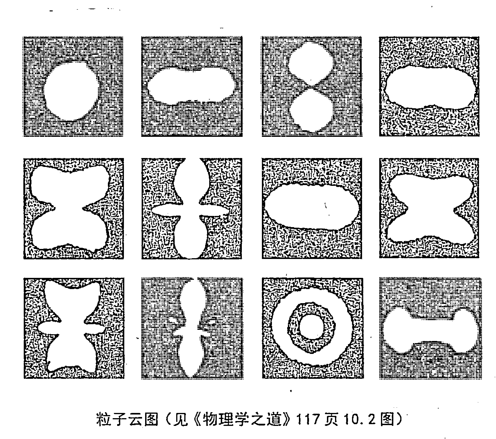

由此可以看到，20世纪初，由于物理学“量子理论”和“相对论”的出现，使西方认识论的“形式逻辑”前提下的哲学与数学，在对高速（瞬间信息量增大及扩充或是极速缩减时）运行的粒子的认识、判定与表述上，也违背了“计算确定性原理”、“协调性”、“不矛盾性”、“完全确定”的一些常理，而不得不采取了“不可确定性原理”、“不完全性”、“不可计算性”及无明确概念前提的“几率”、“概率”等的可能性（并非确定性），以及后来物理学粒子的“概率幅”等方法，与之进行对应（模糊、可能、近似、大概）性地认识、解说、处理与表述。

由于数学家和物理学家，都期望数学有一个既广阔又严格的基础，在这个基础上数学家和物理学家们，可以放心地去干他们愿意干的任何事情。哥德尔的“不完全性定理”的出台，使这种思想和想法，彻底的破灭了。这些“数学悖论”所造成的危机，虽然可以暂时地得到回避，然而想从其“数理逻辑的原则上”一揽子地得到解决，则是毫无希望的一种想法和做法——因为哥德尔的“不完全性定理”和“逻辑矛盾的必然性”产生，是当今“形式逻辑”和“数理逻辑”（又称“科学逻辑”、“理性逻辑”）认识与表述系统，所无法逾越和根本解决的必然缺陷的所在。

众所周知，现代自然科学之所以能较精确地归纳与演绎众多自然现象，那是因为它依靠了一门具有“逻辑秩序”的数学来实现的。数学之所以能有如此神奇的能力，那是因为它有一个被称之为（A=A。即我们“易理学”中的“阴”≡“阳”）“同一律”的公理系统所支持的。而这种“逻辑秩序”，在我们的“象数易学”的“易理学”（不是“义理学”）表述系统中，往往是以各种或各个卦的排序秩序的“卦序排列”或与“卦序数”相对应的（递归）形式予以表现或体现的。这也是因为“数理”理论中认为：“是否能进行排序，是能否可数的充分且必要的条件”的缘故。也就是说，只要有了事物明确的排序及排序方法，我们就能在“其大无外，其小无内”的几乎或者近似“无限”内涵的时空中，找到或判断出事物对应的准确或唯一的对应性结果（这也是我们“象数易学”、“卜”、“筮”、“数术学”判断和“数理逻辑”的目的）——这正是最基本的“自然数集”（即“可数集”或“可列集”概念）的主要和基本的内涵。也是哥德尔为什么利用“递归函数”的“可数个对象的集合”，并与之配上一个“哥德尔配数”的数的方法，并且通过这些配数的推算结果，来解决反过来看“原来形式系统”（含“形式逻辑”的表述系统）的性质的目的。他这么做的思路，应是与我们的“象数易学”中的易卦几何结构状态，同时对应配上一定的对应卦“序数”和排列序数，以及“函象”公式的方法的思路，是有所一致的思路。这样就会使卦、爻象之间（直接可直观的）几何组合结构（象）形式的变化，就变成了数与数之间的变化了。而各数又内含有各自不同或相同的“五行”本质定性的功能及作用，故而在此基础上，又可确定其对应形式（卦、爻的几何组合之象）变化后的，本质定性的必然性变化规律及结果。继而，再将这些本质不再变的定性后的变化规律和结果（“之”卦、“变”卦），与初始未变时的“本卦”的组合结构规律和结果（“本”卦）相比较，就能发现并掌握“原来形式系统”或“原来非形式系统”（原来辩证逻辑系统）未变时和“现在形式系统”或“现在非形式系统”（现在辩证逻辑系统）变化后，它们之间的性质（含本质）及其变化特点与必然性变化趋向、规律及结果等。

又由于我们“象数易学”的“易理学”，能对事物及其规律等最基本的“象数统一”不可分的认识论方法及原则的涵盖，因此这种“象数”间的“统一”，可以产生事物相应、相遇、组合、结构、分布、卦变、爻变、象变、数变、符变等，不记其数的逻辑变化下的“有机辩证统一”的逻辑过程、形式和状态等。比如，单就“象数易学”的64卦间的排序分布形式，就存在有64！（阶乘）=1.27×10的89次方个逻辑秩序及排序变化形式与过程、个体、阶段、层次、位置等类型（这个变化的内涵，远远超过了现代物理学认为的，宇宙间所有的事物的总质量=质子质量×10的78次方个粒子的理论数据值）。也是说，现在我们人类所能研究的事物数量系统，离该64卦系统变化内涵的总数量的类型、种类等，还差得远呢（二者在量级的表述上，相差了100亿倍个数量级）！所以，我们才可能及才会运用64卦的各种组合变化形式与方式，来对应认识与表述一切事物及其变化关系、结果及其可能性的。

由于该“同一律”，能具有按照“守恒性”，来把握事物“量变”秩序的逻辑功能与能力，所以它为近代科学技术地高速发展，立下了汗马功劳。而在我们“象数易学”的“易卦”表述系统中：
- “老少”四象中，的“老阳”（⚌）、“老阴”（⚍）；“少阳”（⚎）、“少阴”（⚏）；各自及每组中两者之间正反象的“爻性数”，是守恒的；
- “八卦”中乾（☰）、坤（☷）、坎（☵）、离（☲）的正反象本身，“对称”平衡；
- 以及乾坤、坎离、震巽、艮兑各组卦内“互补”的“先天卦序数”之和，还有震、坎、艮及巽、离、兑各组中卦的“爻性数”之和，也都是守恒的；
- 六爻卦中，乾（☰）、坤（☷）、坎（☵）、离（☲）、颐（䷚）、中孚（䷼）、小过（䷽）、大过（䷛）各卦自身的正反象“对称”，且上下卦的“卦序数”或“爻性数”之和，也是守恒的；
- 还有所有 64 卦的“对象”二者间的“爻性数”的和数，相等且守恒；
- 64 卦中只有三个“阳爻”与三个“阴爻”组成的那 20 种“对卦”卦体的“爻性数”之和，守恒（其他两个“对卦”间，“爻性数”是不守恒的，并以多种同等量级的增减变化量，存在着）；
- 再者，所有 64 卦的“交易”卦本身及其上下卦二者间的“卦序数”与“爻性数”的总和数，是守恒的

……

> 更清楚的具体分析内容，详见本人所著《易理数理（三）》“二十四”到“二十七”章的分析与归纳。

这些“象数易学”易卦所对应的“守恒”性的表述方法与功能，它既可以从特殊到一般地进行综合与“归纳”，又可以从一般到特殊地推导与“演绎”。也就是说，我们在“象数易学”的认识与表述中，“同一律”既具有涵盖性的“归纳”功能，又具有“演绎”性的分解、分析功能。可以说，只要我们归纳与演绎的前提“真”，推理的形式又正确，就一定会得到“真”的结论。这也是“象数易学”易理“本体论”中“阴”≡“阳”（A=A）前提下“形式逻辑”的涵盖所能达到的认知与表述功能和作用——即以“同一律”（自同律）、“不矛盾律”、“排中律”、“充分理由律”这“四大思维规律”所涵盖的逻辑分析、推导、计算或判断时，作为其理性思维指导的最基本和最基础的功能及作用。

然而，当人们充满信心地运用这些“形式逻辑”法则时，却出现了众多的例外情景。有时候，即使前提“真”，推理的形式也正确，但演绎的结果，却会得到令人无所适从的“悖论”。这就是最令科学家、语言学家及数学家头疼的“数学悖论”的问题。长期以来，人们绞尽脑汁，虽想从根本上来克服这些“数学悖论”，但是事情的进展，并不像大家所想象的，却是很不顺利的。这些悖论不仅不能在“数学公理”范畴内得到根本地解决，反而研究得越深入的话，它所召至的悖论也越多，越难以将其根本性地克服

比如，1930 年底至 1931 年之间，哥德尔在证明“‘形式系统’数学分析的协调性（又称无矛盾性）”的问题时，却得到了“哥德尔不完全性定理”的结果。这是“数理逻辑”及其“数理逻辑”发展中，最重大的发现、成就、里程碑和出发点之一。哥德尔在他的研究过程中，直接考虑到悖论及解决悖论的方法问题。当然 哥德尔证明“不完全性定理”，也是从考虑“算术及分析形式系统的完全性”及“数学分析的协调性”（无矛盾性）问题开始的。1930 年秋，他宣布了“第一不完全性定理”。即是说：“一个包括初等数论的‘形式系统’，如果是协调的（无矛盾结果的存在），那其表述，就是不完全的”。不久他又宣布了“第二不完全性定理”。而是说：“如果初等算术系统是协调的（无矛盾结果存在），则其协调性在算术系统内，是不可能得到证明的”。他这是在告诉我们：该公式及表述体系，是个“不可证明的，却是个真实的”命题。也就是说，“该公式或系统中存在着表述真实的语句（结果）内容，可是它却是个在该系统里，又是个不可能被得到确切的（确定性）证明”的问题。同时，也说明了该（“形式前提”的）表述系统，是个不完全的表述系统（不能做到其中全部的内含内容，都能得到全面完整地进行确切的认知与表达）。这又是说，如果一个数学的表述公式或系统的“无矛盾性”及“协调性”不能得到证明的话，说明该公式或表述系统对事物的表达，是存在着缺陷和不完全准确的判断结果的。可以说，“只要有无法证明的数学结论状态的存在，就会有与之对应的无法预知的事物及其规律和与之相应的物理等问题的存在。”

> （物理学泰斗，霍金语）

整件事情所引发的，是人们对“关于‘数学逻辑’基础的可靠性问题”的探讨与（理性）认识——它告诉我们：“在任何包含初等数论的形式系统中，都必定存在至少一个作为最终点或初始点的不可判定其为‘非自相矛盾性’的命题。”当发展出现了“图灵机概念”之后，上述定理的一个等价的命题就成为了：“任何定理证明机器，都至少会遗漏一个最终的或初始的预设为‘真’值的数学命题，是不能得到证明的，这就导致了‘数学算法’的‘不可穷尽性’。”自然这一性质，就会被现代许多哲学家，用来作为了“在机器模拟人的智能方面，必定存在着某种不能超越的逻辑极限”的“算法”依据。当然事实上，若想排除这个悖论及其对事物进行判断地影响时，就连大家甚为推崇的“图灵机”，也是做不到的——即使是人的“理性”逻辑的智力，也同样是做不到的。

实际上，“哥德尔定理”的另一种简化的表达就是：“在任何‘形式逻辑’系统中，彻底的‘无矛盾性’，是不可能的”。换句话说，“形式逻辑”前提下的“‘不矛盾律’，是会受到限制的”——这也正是黑格尔逻辑的结论。若我们仅用一句话来表述“哥德尔定理”的内涵的话，那就是：“绝对排除逻辑矛盾，在逻辑（形式逻辑）上，是根本不可能的！”故此“哥德尔定理”的发现，直接摧毁了罗素、怀特海试图构建的“数理逻辑”大厦，迫使他们放弃了“不包含矛盾”命题在内的《数学原理》的写作。可是，对于这一定理的逻辑意义和哲学意义，至今仍然还是甚少会被中国哲学界、科技界、语言学界以及数学界等的人士，有所广为关注、理解与认识。

此外，至于对于哥德尔的这一定理，1944年数学家魏尔（Weyl），就曾针对性地讲过一句十分幽默的话：“上帝告诉我们，数学是不容矛盾的，但魔鬼却告诉我们，这种不矛盾性是不能被证明的。”可以说，现代“数学哲学”的这种理解与认识，与康德的哲学的“不可知论”，可以说是惊人的相似。

让人们更没有想到的是，该认识却直接导致了2004年，当代物理学泰斗霍金先生，毅然决然地向世界宣布：他将放弃他所追求已久的“M- 理论”。并在自己的《哥德尔与物理学的终极》的论文中，讲述了他决心放弃“M- 理论”的根本原因。同时，还解释说：“‘哥德尔定理’是用自我指认的方法证明而成立的。这种命题，会导致悖论。例如，如果一个命题真，那么可合乎逻辑地推出其假；如果一命题假，那么也可以合乎逻辑地推出其真。”并强调说，“哥德尔定理”很明显地表明了“M-理论”是不可能实现的。又因为“只要有无法证明的数学结论，就有无法预知的物理问题。我们并不是能从宇宙之外来观察宇宙的天使（注：是在同一个宇宙里，来观察该整个宇宙及其构成、规律等——在同一事物中，来观察该同一事物的整体与全部，故而很难全面整体地来进行“完全性”的观察、认识与表述——所能观察到的，也只能是些各个局部或个体的组合、混合、汇合等状态与规律等）。相反，我们和我们的模型，都是我们所要描述的宇宙（信息量很大）的一部分。因此，物理学理论都是描述自我的（认识），正如‘哥德尔定理’（所表述的）一样；一个物理学理论或者自相矛盾，或者无法完全。”

看来对“逻辑主义”、“形式主义”、“有限主义”等思想和哲理致命打击的就是“哥德尔的不完全性定理”。它证明了仅从“逻辑”或“形式”及“有限”步骤的角度和方法，并不能推导出算术及其结果的全部正确性来。显然，若想把数学全部化归为“形式逻辑”或“逻辑形式”的（有限）过程与结果时，同样也是会遭到彻底失败的命运的。

由此，我们明显地会体会与感知到，西方“形式逻辑”哲学及其前提下的数学，在其认识及表述系统的理性核心上，是存在着难以根本回避的对事物及其规律和变化，进行表达的不完备、不完全、不可确定性等的不完整性表述缺陷的——这是由于时间变量所直接对应的事物信息量的（一般或瞬间）急剧扩张、放大或收缩、缩小时，所导致的“不可确定性”的必然结果所致。这是由于时间先后所对应的事物（递归）排序及其位置序列的确定（即以“时间逻辑学”为根据），才是在“其大无外，其小无内”的范围内，寻找到事物确定性结果的充分且必要的先决条件——因为时间长度因素太短，或空间中事物（同时）发展变化者太多、太快、太剧烈，乃至太复杂，故而在西方“空间为主，时间为辅”的“空时论”的条件下，是很难或者是根本来不及并迅速形成准确的与之直接对应的（递归）排序的“时间逻辑学”状态的。而我们“象数易学”的“以时间为主，空间为辅”的“时空论”，是可以用时间的标准性确定，来寻找到与其对应的空间结构（卦：是由几何型状态组合成的“标准性”的空间结构形式）；再由其事物在空间中与该时间所对应的层次、位置、角度、状态等，来对应确定事物间的本质属性的相互作用关系；最后由事物间的本质性能关系，确定事物的相互作用、功能及发展趋势和方向等规律。因为其间采用的，都是具有“标准”统一的“时间逻辑学”为前提的，“时”“空”结构与分布状态的直接性对应统一的表达方法，故而能得出共识前提下的共性（同一性）判定的结果与结论。

此外，由于在西方文化的思想逻辑中，仅存在把握事物“守恒秩序”的数学，缺少一种把握事物“平衡秩序”的法则，所以罗素“自集命题”就不可能在“数学公理”指导下，找到“真理性”答案。而我们“象数易学”中的那些“先天八卦”的“分布结构图”、各种八卦、64卦等的“生成与排序分布图”（含卦数及场态数）等，都是一些“其大无外、其小无内”（普适）适应前提下，所对应的“平衡秩序”、“稳定秩序”的表述。“哥德尔定理”正是因为揭示出了“形式逻辑”体系内核理性的“不完备性”（不完全性，不全面性、不彻底性、不可准确确定性、不可证明性等）而著名。人们想用把握“守恒性”的逻辑，去演绎“自集”要素之间的相互关系，显然是一种不合时宜的越职代庖的行为。我们“象数易学”的“易理学”认为，只有绝对“对称”与“互补”性的事物间，才会受到“守恒性”逻辑的涵盖与制约的。其中“对称”或“互补”二性及其关系，缺一都是不可能被“守恒性”逻辑所涵盖与制约的。

除此之外，在易卦“以变”（含量变、数变）变化的过程中，仍然还会存在有一定的“不守恒”的逻辑过程、形式与结果。而我们“象数易学”的64卦的64！（阶乘）的“自集”要素——各个六爻集合卦体之间的相互排列“以变”、“合和”及其关系，是足以能表达宇世间的一切事物间的关系与变化规律的。此间所能包含的变化状态的内涵，会有1.27×10⁸⁹种类的事物变化的类型、状态、个体、结果、阶段、层次与过程等。这比英国物理学家狄拉克（P·A·M）所计算出的宇宙总的质量=质子质量×10⁷⁸∝t²（t为不见物质的适当因子，其用原子单位表示。为反比关系）的总数值，还要大上100亿倍之多。再比如，天体物理学家认为，我们的银河系，是由一千亿（10^{12}）个星体组成的旋涡状星系，而宇宙中全部的星体总数，应是这个数量的一千亿（10^{24}）倍——这个数值，还是远远小于我们64卦全部排列组合形成的对应表述状态总数目值的10^{65}倍。

如果，我们就表面上看起来，是仅有五个简单因素所组构成的“五行”属性，对事物的本质定性的认识与表述系统的内涵及其指证等，会是个“太简单”的组合认识与表达系统的组合——它是不足以认识与表达，宇世间那么复杂变化着的事物其及规律的可能性的。由于自古以来，我国老祖宗们在认识与表述一切事物时，为了保证其判断结果的真切性，所采用的认识与表述体系，都会是些根据层层复合性时空及其关系，以及具体事物间的针对的位置关系等，由总体上，通过直接对应的“时间逻辑学”的准确确定前提的制约，对事物作出对应针对性的具体判断，所以其采用的基本上都是“组合学”、“组合数学”、“组合时空”、“组合结构”和“类集集合论”的认识与表述体系。所以说，单从“五行”表述体系来看，其体系的表述能力，的确是“太简单了”！可是，它与以上64卦排列组合的表述体系相结合时，又会在此1.27×10^{89}的基础上，再乘上一个5！（阶乘），即5×4×3×2×1=120。也就是说，把1.27×10^{89}，再乘上一个120。得1.524×10^{91}。假若，再于10“天干”与12“地支”再进行排列组合的共同性进行认识与表述的话，还得把1.524×10^{91}，再乘上一个10！（阶乘）和12！（阶乘），即得1.524×10^{91}×10！×12！。大家下去算一算，这会是个多么巨大的数值——该数值有多大，就能针对该数值所对应的那么多的事物组成的环境体系，进行具体对应性的个体、区别、差异、种类、状态、层次、阶段、过程等的认识与表述——大家还能轻易地就敢说；“其系统的内涵太简单、太少”、“不足以对应表述，复杂的自然科学的开放的巨系统的结果”吗？！

再说了，这种对一切事物的“五行”定性的认识与表述的体系，它是对一切事物间的作用关系的平衡、稳定、发展与变化等的各种指向，进行“生克制化合”的根本本质性的认识与表述。它解决了西方“数理逻辑”中，无法准确判定事物的“量变到质变”的根本性质变的规则和标准的问题。虽然由于事物表现出的现象是相当复杂的，但是事物间的共同性的统一（融和）的本质，却是相对来说，会是种更简单的问题。这就是为什么中国古代的所有的具体针对性的判断结果，都是以“五行”的定性原则和标准，作为各自认识与表述的不可或缺的主要和基本要素的原因。比如，中医、中药、“五运六气”理论、针灸、养生、气功、武术、一切“数术学”方法、军事战阵、建筑、风水、堪舆、地理、天文等，都离不开“五行”的本质定性间地分析依据。

不言而喻，由于“自集”要素之间的相互关系应是种“平衡”关系［本人所著的《易理数理（一）》至其（三）册书中认为，事物（易卦）的“平衡”关系，并不会全部都等于是“守恒”关系下的各种对应关系与类型。比如，“反象”的“对称与否”的“守恒”；“交易象”的“守恒”；20种三个“阳”爻与三个“阴”爻组合成一个六爻卦的“对象”的“互补”、“守恒”等，其“阴”“阳”爻的个数，虽然平衡，但是各卦所形成的总卦象之数及“爻性数”的多少与大小，却并不会都是“守恒”前提下的同样的一个数值］，因此我们熟悉的“形式逻辑”以“同一律”（阴=阳）为基础的数学，只能演绎事物的“量变”秩序（“量变”秩序并不能完全反映与表达“时空结构”及“事物状态”的秩序。比如，易卦的“几何空间结构”中的“反象”所表述的“对称”性状态；各种“交易象”所表述的“对称”性状态等，都是单通过“量变”及其推导的数理结果，将是无法明确地得以确定的——必须通过其直接对应的直观的卦型的具体几何结构状态，才能获得直观性的直接判断的正确结果）。

而对于“自集”系统的“集合秩序”（64！卦总阶乘的排序变化体系=1.27×10^89个或类型、状态、符合“自集”的集合逻辑秩序，所能推导和涵盖下的普遍性规律的）——即“质变秩序”的确立，已被哥德尔从数学真理的存在形态中所否定了。由于数与其所直接对应的事物之“象”的相互脱离，故而造成了数无法正确真切的直观或直观延伸性表述该事物的（全部完全的）一切规律——就像“股票市场”中，人们往往仅重视“数理逻辑”中数的量化变化与结果一样（仅含数的变化性及其变化的几何形趋势图标状态，而并不是真正真实的货币、资金、资本、资产、产品、价格、价值、物质等的与实际事物对应存在的真实的实际状态）——充满着无法进行正确判断的“数拟”状态下的“虚拟”陷阱——在一般人们的眼里，早已经是没有事物对应的真实之数了！这就是仅以抽象之数而脱离了几何象形之物作为认识、表述及判断一切事物之“真”“假”根据时，所导致的必然的恶性结果。也是由于在“形式数理逻辑”系统（数量扩张与放大到一定量时）“不完全”、“不完备”性的核心“理性”前提下，其数及数学逻辑的本身，就存在有“悖论”矛盾的结果与状态，而这些结果与状态，又多会是处于“无限”、“无穷”、“无极”与趋向于“极限”性将事物数量放大后的必然性“悖论”之中，所以人们仅靠当今数学的“数理逻辑”的方式，基本上是无法对全部及各种事物，进行全面准确地判断、把握与驾驭的。

由此可见，霍金从其泰斗的高位上自动走下来的原因，并不是在于物理学本身，而是在于物理学受到了数理中“哥德尔定理”的无情地冲击——是“哥德尔定理”宣判了“M-理论”最终是不可能成立的死刑。虽然，哥德尔将数学的真理性从“罗素佯谬”系统中，坚决地排除了，但是他并未能给出，究竟应当如何来处置和解决这类系统出现恶性结果的方法。故而最后，迫使这位受人尊敬的物理科学泰斗，不得不在“哥德尔定理”的面前，勇敢明智地从“高位”上，退却了下来。

由于苏联数学家马尔科夫，在1947年发表了《算法论》，他首先明确地提出了“算法”的概念。但是它同以前定义的“递归函数”及“可计算函数”的计算过程，还都是处于了等价的结果上。这些定义，虽然表面上看，是既不相同，又带有非常不同的逻辑出发点的内涵的，但是却全都被成功的证明了，它们二者仍然还是等价的。当然，同时也说明了，这些定义，都应是针对同一个概念才对。况且这个概念，还是自然的，基本的、有用的——它就是“算法”概念的精确的数学定义。大家若都能接受并运用了这个定义之后，“判定问题”，从我们平时直观的概念里，也就被上升成了精确的数学概念了。同时“判定问题”，这才开始具备了突飞猛进的发展及其可能性。自此之后，“判定问题”就逐渐成为了“数理逻辑”的重要课题及研讨的分支。

“判定问题”有了以上该精确的数学表述之后，立即在“数学基础”乃至整个数学中，产生了普遍巨大的影响。由于“判定问题”的探讨中，发现及出现了一些“不可判定的命题”——这标志着，在人类数学发展的历史上，人们首次认识到了“有一些问题是根本不可能找到算法解”的（答案）。在此之前，人们一直模糊地会感觉到：任何一个精确表述的数学问题，总可以通过有限的步骤，来判定它是对还是错？是有解还是没有解？现在终于找到了数学中的“不可判定性问题”的一些结果。它再一次地说明了，用“有限”过程来处理和对付“无限”、“无穷”、“无极”过程时，所反映出和体现出的“表述功能的局限性”，可是却直接从另外一个角度上，还反映出了，数学的内在所固有的很难甚至是不可逾越的矛盾性——依然会存在有“不可判定”和“不可计算”的问题。

当时，大家普遍恐惧的反应是：这种“不完全性”的范围，到底有多广泛？甚至于象丘奇这样的数学家，也想找到一条出路来，能避开“哥德尔定理”的结果。比如说，可以采用与哥德尔所使用的系统，是完全不同的其他的特殊系统等来进行证明。可是，一旦“算法”的精确定义和丘奇“不可判断的结果”的论点和结论出现之后，大家就真正地认识到了，这是无法甚至可说，是不可能根本摆脱“哥德尔不完全性定理”的涵盖及影响的——这些问题，它最终所共同强调的是：“可计算性”和“不完全性”这两个概念的认识与表述，是紧密地联系在一起而不可能分开的——在“可计算性”和“不完全性”表达之间，“数学悖论”的存在，还将是不可避免的。

实际上，1936年，克林在证明了《作为丘奇论点的应用》，实际在能够能行的认识公理和证明的“形式系统”中，“哥德尔定理”仍然还是成立和存在着。“消去量词”的方法，对许多理论来说（这是牵涉到“象数易学”中“卦序数”及字的“笔画数”，以及文字的各种组合数量的个数等，所以被我们作为不可或缺或不可消去的量化根据，而被非常重要地来运用的必然性问题），都将是行不通的做法。一般的“判定问题”，是试图找出一个“能行的”步骤，通过这个步骤，可以决定什么因素或素质，是具有某种指定的“元数学”的特征的。

在纯粹演算的“元数学”的“元理论”中，有最明显的一类与“判定问题”相关的问题，那就是：对于给定的演算和给定类的公式，求出一个步骤，这个步骤，能够在有限多步内，就可判定这类的任何特殊公式，是否可以“形式”地被推导出来？

我们发现，在有些情形里：问题已经得到肯定地解决。

比如，一个理论是“递归可公理化”的充分且必要的条件是：“它的所有‘推论集合’，是‘递归可枚举的’”。一般常态，它不一定是“递归”的，如果它是“递归”的，就称其为是“可判定的”。由于可以证明“每个完全的、递归可公理化理论是可判定的”，因此利用“模型论”的有利工具，可以得出判定理论的一些结果。就像早在 1948 年，塔尔斯基等人就证明了“‘实闭域理论’是完全的（见《第三次数学危机》一书的 78 页），因此它是‘可判定’的”。再比如，关于“完全理论”的一个有趣的定理。即：一个“理论 T”称为是“完全的”，如果存在有“模型 A”，它会使在 A 中为真的所有语句的集合 Th(A)，正好等于 T，这么形成的“完全性定理”，就应是个“完全理论”。那么，“完全理论”到底会有多少个不同的“可数模型”呢？经过推导与证明可知，有的“完全理论”只有一个“可数模型”（无原子的“布尔代数”）；有的“完全理论”，有可数无穷多个“可数模型”（代数封闭域）；有的“完全理论”有“不可数的多个模型”（实闭域）；还有人证明了，当 n ≥ 3 时，都会具有正好 n 个“可数模型”。可是，是否正好有四个“可数模型”的“完全理论”呢？沃特在 1959 年，得到了确切地证明：没有！其中当 n ≥ 3 时，都会有正好 n 个“可数模型”，来进行对应事物及其群体性的表述。当然，这也可以看成是，我们“象数易学”的“易理”中，“一阴一阳之谓道”、“是生两仪”、“一生二”等的“不可数”模型的“无限性不可数”表意的数理依据。这也是“道生一，一生二，二生三，三生万物”以及“易有太极，是生两仪，两仪生四象，四象生八卦，八卦生大业”，被看作是（X、Y、Z对应于初、二、上 3 个爻组合成的）立体表述思想和模型的数理根据。

而在另外一些情形中，答案却又是否定的。

我们是可以证明，会得到“不存在这样一个步骤”的结论。这种否定性的证明，特别是对于“数学理论”来说，很大程度上，需要依赖于“递归论”的支持——这也是哥德尔为什么要引入“递归函数”（又称“一般递归函数”，它是都可以由“原始递归函数”的计算，所推导出来的），来解决数学悖论的原因之一。当然，其间仍然会存在着，“不可计算的函数”——也就是说，存在着“非一般递归的函数”。由于在它们所有可能存在的不同的“算法”中，将是会有“可数无穷多”的（简要地说，“算法”都是用“有限多”个字来表达的），可是“所有‘数论函数’的集合，却是不可数的”——“算法”中存在“可数无穷多”个“有限可数”的字（前提），可是它所对应的“数论函数的集合”，却又是个“不可能数清楚”的结果。当然也会包括“例外素数［E（d）］是不可避免的”的认识。

1936年，丘奇首先得到一个明确的“不可判定的结果”——即“与λ可定义性有关的不可判定的结果”。然后，当他把这个结果，应用到“形式系统”的判定问题的证明上时，他却成功的证明了：“形式化的一阶数论N，是不可判定的”。之后，他又证明了“纯粹的谓词演算，也是不可判定的”结果。

由于“模型论”是“数理逻辑”的一个分支，是讨论“形式语言”与其“解释”或者“模型”之间的关系的一门学问，因此如果语言是“一阶谓词逻辑”，则这种“模型论”就称其是“古典模型论”。最简单的模型，会是数学中的一些结构。例如，“5阶循环群”，“有理数域”，以及所有按照包含关系所形成的“‘偏序’结构‘由整数构成的集合’”等等。在数学里，我们直接研究这类模型，而不去管“形式”语言到底如何。这个理论可以说是“泛代数”（当然也包含通常代数中的“群论”、“环论”、“域论”等）。它们对应研究的是同态、同构，子结构，直积等等内涵问题。可是关于这些模型的性质，都必须先要表示成为“语言”才行。反过来说，一个语句可以是真，也可以是假的，就看它是对应于哪一个模型来说的了。比如“群中任何两元素的乘法，满足交换律”这个语句，“对于‘5阶循环群’这个结构来讲，是真的，而对于‘正二十面体群’这个结构来讲，就是假的”。

当我读到该 “5阶循环群这个结构来讲是真” 及 “正二十面体群这个结构来讲就是假” 时，正好是当天中午的 12 点 10 分（午时）。我马上就用前句话中的 13 个字，起了一个水山蹇（䷦）卦。

其中，“先天”坎“水”之6+“先天”艮“土”之7=13，再加上看到该文字的时间，是第七个时辰的“午”时之7数，总共等于 13+7=20。20÷6，余2。说明对应于“蹇”卦的第二爻的变化。结果“蹇”（䷦）卦就变成了水风井（䷽）卦。

由于“蹇”卦的第二爻变在“下卦”之中，故“井”卦的“下卦”巽（䷸）卦，被确定为是“体”卦，而其“上卦”坎（䷜）卦，就被确定成为是“用”卦。

又因为全卦形成的是上坎“水”生下巽“木”的“用生体”的本质肯定性关系，故而知道该句话，是真实的——是“真”的。

既然该句话是真的，那么假话及其对应的结果，就是能与“井”（䷽）卦进行“互补”性表述的“旁通卦”（又称对卦、错卦）——火雷噬嗑（䷔）卦所反映的内涵。

又由于“体用平列对应”的“噬嗑”（䷔）卦中，是“下卦”之“体”的震“木”生着“上卦”之“用”的离“火”，即“体生用”的本质否定性及其结果关系，故而可知“噬嗑”卦所反应的应是，不真实的——“假”的状态。

同时，13÷8，余5，对应于“先天”的巽（䷸）卦。若其巽卦为“真”，则其对应的“假”，就应对应的是与其能相互“互补”的“对卦”——震（䷲）卦。而“二十”面，所直接对应的 20÷8，余4。4对应的正好是“先天”的震（䷲）卦之“假”的内涵。

这就是“象数易学”易卦对事物及其对应语言分析与计算后，所获得的“真”“假”的判断过程与结果——与句内文字表达内容的“真”“假”的意思的表述结果，完全相同并一致。

紧接其后，我又用后面那句话中，“正二十面体群这个结构来讲就是假”的15 个字，起了一个山地剥（䷖）卦——“剥”乃大“艮类”卦之象。“艮其背”，说明该段话语表述的是与（原来的）事实（极大）相反、相（违）背的结论与结果。其中，“上卦”的“先天”艮“土”之7+“下卦”的“先天”坤“土”之8=15，再加上看到该段文字的时间，是第七个时辰的“午”时之7数，总共等于15+7=22。22÷6，余4。说明对应于“剥”卦第四爻的变化。结果“剥”（䷖）卦变成了火地晋（䷢）卦。

由于“晋”卦的第四爻变在“上卦”之中，故“晋”卦的“上卦”离（䷝）卦定作为是“体”卦，而其“下卦”的坤（䷁）卦，就被确定成为了是“用”卦。又因为全卦形成的是：上离“火”生下坤“土”的“体生用”的被动泻气的本质否定性关系，故而可知，该句话是不真实的——是“假”的。

既然该句话是假的，那么真话及其对应的结果，就应是与“晋”（䷢）卦能“互补”的“旁通卦”（又称作是对卦、错卦）——水天需（䷄）卦所反映的内涵。

由于在“体用关系平列”确定的“需”（䷄）卦中，是“下卦”之“用”的乾“金”生着“上卦”之“体”的坎“水”，即是“用生体”的本质肯定性及其结果关系，故而可知，“需”卦所反应的应是真实的“真”的状态与结果。

同时，15÷8，余7。7对应于“先天”的“艮其背”的必须从其表述状态的反面来理解其表述内涵的艮（䷳）卦。若其作为是“假”的话，则其对应的能进行完全“互补”缺陷的卦的“真”的一面，就应该对应的是，与其成“对卦”互补关系的兑（䷹）卦。

（再者，“后天数”7，对应的是“后天”兑卦。“先天”对应的艮7之卦的位置，与“后天”兑7之卦的位置，都是对应于正西方的位置。假如，“先天”艮7卦为“假”时，则“后天”兑7卦当为“真”。）

可是，“5”阶循环所对应的5÷8，不够除（或以全句字数的13÷8）——相当于是余5。如果5对应的正好是巽（䷸）卦之“真”的内涵的话，由于巽（䷸）卦的“反卦”就是兑（䷹）卦——二者是处于同一事物的完全相反方向上的具体表现，故而巽“真”，则兑也“真”。证明“5阶循环群这个结构来讲是真”的这句话语，是一种真实、真正的结果与结论。此外，上面已经证明了该句话语是“真”实的结果。

这就是，我们“象数易学”的“象数”及其模型，对事物真假判断的思路与方法。其中最重要的判定因素，是在时间因素确切的确定前提下，其所对应的表述具体主客体事物的易卦的“质变”本质定性关系的准确判定问题。这就是一种，我们“象数易学”里的一种“模型论”统导下的判断过程与实际结果的获得。

由此看来，“模型论”和代数学是有区别的。有人把“模型论”看成是“逻辑加上泛代数”，这也是十分形象的一个表达。“模型论”一定要明显地涉及语句，并且以“语句为出发点”，这是它同一般代数学最有区别的地方。在我们“象数易学”表述模型中的几何型卦爻组合结构状态、方位分布结构状态，各种卦变、象变、爻变、数变、符变等组合、结构、“合和”、“以变”等的结构状态，就是我们在“设卦”、“变卦”后，并“观”察分析了事物直接相对应的这些“象”“数”表述模型的“卦”、“爻”所对应的事物内涵与关系之后，才对应“系”（写）出来了各种卦、彖、象、爻等辞语和语句等判断因果结论的。另外，通常西式“模型论”的语言是“形式语言”，它与模型的关系是“语法”和“语义”的关系。对于“形式语言”，我们只是按照一定的规则（文法规则），去制造出一些语句，至于这些语句含义如何？是真是假？就不是语法所能管得了的事了。

“语法”只考虑“形式的结构”。比如，构成语句的符号是哪些？符号之间的关系如何（谁在谁的前面而不能在后面）？等等。而“语义”则提供的是语句的“解释”或者其具体“意义”（意思），只有“意义”才能确认语句的真假（除了“重言式”或“恒真语句”或“同语反复”之外）。因此，可以说，“模型论”是研究“形式语言”的“语法”和“语义”之间关系的一门学问——当然，这只是在“形式逻辑”前提下的“拼音文字”语言、语法及其语义的规律及特点，并非是完全符合中国“象数易学”的“辩证逻辑”前提下的“象形文字”的“象表意”、“象数表意”及其语言、语义、语法的特点与规律。

从我们“象数易学”对语言、文字等文义真假地判断来看，正如前面所举的两个例子那样：是首先通过语言、文字中的文字数量（或那些字的笔画数量），在“极化”和“类化”化简后的前提下，以它们所直接对应的“先天八卦数”所直接对应的“先天八卦”的卦，来得到当时空所对应的一个六个爻组成的表述其原来状态的几何型构成的“本卦”；其次，再加上当时见到或听到这些汉字语言、语意、语音时，直接对应的时间量（一般多以当时的“时辰”的“地支数”相对应），来确定其在六爻卦（时空结构）中的具体（变化）位置；再通过变爻位置的变化，得到一个与现在、当前或近期相关的一个直接相对应的“变卦”（又称作“之卦”——空间结构中的位置）；通过“变卦”中爻变的上下位置，来确定该卦中的“体”“用”卦之间的位置及其二者间的本质性质关系；通过“体”“用”之间“五行”本质定性的“生克制化合”的本质关系，就可以直接地判断出该文字、语言、语句等语意的真假及其真实的实际的意义了——这就是我们“象数易学”对文字、语言、语音、语意、段落、文章、文意等作出正确判断的辩证性逻辑思维的思路。它既可以舍弃语言、文字、语法等的具体结构与构成，而且又能直接明确地对语言、文字的语意作出既明确又正确的判断。这在对当前各种网络上的应急反映及其信息安全以及数据和对信息真假的判断方面，可收到意想不到的实际真实的效果。请大家注意运用！

再比如，在“非欧几何”中，就是靠引进了模型后，才论证了“‘非欧几何公理系统’是不矛盾的”结论。直至 1950 年前后，“模型论”才正式成为一门新型的学科。“模型论”大致可分成以下两条路线。一条，是斯科兰姆一塔尔斯基路线，他们从 20 世纪四十年代起，就由“数论”、“分析”、“集合论”的问题所推动，其所强调的是研究“一阶逻辑所有公式的集合模型”。另一条，是罗滨逊路线，他们的问题是由“抽象”所代表的问题所推动的，其“强调 ‘无量词公式集’ 与 ‘存在公式集’”。这是属于“纯粹模型论”主题所内涵的内容。其最早的定理，也是只有两个：

一个是“罗文汉姆的定理”。

其证明了：“每一组‘有限多公理’如果‘有模型’的话，则它也有一个‘可数模型’”。1920 年，斯科兰姆把这个定理推广到“有可数个公理”的情形（即：有多少个有限公理的存在，就对应存在有多少个可数模型的存在）。由于我们“象数易学”及“数术学”中的各种有限判定的公理体系，都是以中国传统文化中的各种“类化”、“极化”、“五行定性”、“干”“支”、“纳甲”、“爻辰”等认识与表达的组合式模型为依据的，所以它们运用的各种模型的本身，都会是些“可数模型”的“组合性”或“集合性”表述——因为由“阴、阳”、“干、支”、“五行”、“易卦”相互组合出的各种“数术”和“易卦”、“易数”、“易爻”、“易符”的推导的“合和”“以变”性模型，都是些“有限”同时又是针对性“可数”的组合、搭配的演化性模型。每种模型，都是与时间、方向、位置等和“五行”定性性质紧密相连的“时空”统一关系的表述模型。可是，从其对应量化的认识与表述的总体分形、类化种类的对应性来说，却都是些相当巨大的“系统论”方面所对应性表述的数值——适用性广泛且巨大。

另一个定理，是“紧性定理”：即“若一组语句 T，每个有限‘子集’都有模型，则 T 也有一个模型”。也就是说，每一个具体的语句，都是有对应的模型来支持的，那么由这些语句所构成的语句的组合，也会存在有一个模型来进行对应性的表达的。

以上这两个定理，都是为了肯定某种模型的存在而设作的。特别是“罗文汉姆—斯科兰姆定理”及“紧性定理”还指出了：“有想不到的特别大的模型的存在”（即传统《易》文化中，比如，邵雍的“元、会、运、世”；“八字”；“紫薇斗数”；“奇门”；“象数易学”等模型及其分析、推导系统）。最明显的就是“自然数集合 N”的“皮亚诺公理”（其中的“归纳公理”还加以了改变）不仅有通常自然集 N 为其标准模型（即包括“可数多个元素”。就如同64卦、八卦、四象等易卦、爻的“标准型”模型，都是由各种相同或不同“阴”“阳”爻的性质元素，所组合成的几何结构模型那样，都是“可数的多个元素”组合成的体系）；还有包括“不可数多个元素”的模型——这就是所谓的“非标准算术模型”。第一个“非标准算术模型”，是由斯科兰姆在1934年，首先制造出来的。而以上这两个定理的证明，都得依赖于“制造模型”的方法，才做到的。

在二十世纪初，数学家一般都会认为，“一个理论的模型，都是同构的”。

比如，“自然数理论”就是“皮亚诺公理”所刻划出来的一种理论。但是这种想法与认识，很快就由于自然数的“非标准模型”的存在，而被打破了。所以在“模型论”当中，必须还得引进重要的有限制前提和归类作用的“范畴性”概念才行。也就是说，一个理论或一组公式，如果其所有的模型都是“同构”的，它就被称作是“范畴的”（像我们“象数易学”中的“类卦”的组合结构那样）。实际上，这对于“形式系统”（或“公理系统”）是仅次于“协调性”（无矛盾性）、“完全性”、“独立性”之后的，第四个重要的（“范畴性”）要求。实际上，只要一个理论中有一个“无穷模型”存在的话，那么，它就不再是“范畴的”（由于“无穷”的模型存在，说明在这个空间中，事物是处于“实无穷”和“实无限”的状态下，而在另外更大的时空关系中，就不一定还是个“实无穷”或“实无限”的状态了。很可能就是处于“有限”“可数”的“范畴性”状态了。关键是得取决于时间因素的准确确定为前提。除非它是处于在所有的时空总体中，都是处于“无穷”、“无限”、“不可数”、“无极”的状态下。因为“无穷”、“无限”、“无极”是不可能划定于一定的具体界限及具体范畴之内的。只要存在或具有了前提“范畴性”的限制，它已不再是“无限”与“无穷”、“无极”的概念所涵盖的内容了，而是“有限”“可数”的概念内容）。所以我们必须把“范畴性”的要求，降低它一些内涵的涵盖概念才行。

可是，在坚持“模型论”的人中，却普遍地会认为：“不可能存在有‘有限多个’不同构的模型”存在。这是与我们“象数易学”中“易理”对易卦模型认识与表述，是具有很不同的判断和认识结论。由于其间在处理“无穷”、“无限”、“无极”等前提下的事物与概念时，没有使用“象数”辩证统一思想的“类化”、“极化”、“极”、“至”、“达”、“穷”、“尽”、“无”、“空”、“虚”、“终”、“端”等所提供的周期或循环、重复式对应内涵，以及并未依靠（事物）卦所对应总数的“余数”为根据的思维方式或方法，才造成了如此的判断和结论。“模型论”也给现今的数学，带来了许多新的成果。我们大致可以分成以下三大部分：

在“代数”方面的应用，主要是表现在“群论“和“域论”方面；在“分析”方面的应用，主要是体现在了“非标准分析”里；在“拓扑学”、“代数几何学”方面的应用，主要是体现在“拓扑斯论”之中。而“模型论”在“代数学”中，最早被应用到的是“量词的消去”。

至于罗滨逊宣布的“非标准分析”，其实这就是指的“逻辑学”家所说的“实数的非标准模型”。实数系统是全序域，具有“阿基米德性质”。也就是说，“任何一个‘正实数’经过‘有限’次自己加自己之后，其值可以超过任何一个实数。”但是“非标准实数”一般并不会满足这个条件。比如说，一个“无穷小”量的一千倍，一万倍、一亿倍甚至更多、更大，也大不过1去。这个性质被称为是“非阿基米德性质”。

这种认识，有些类似于我们“象数易学”易卦及其对应易数的“极化”、“类化”的分布中，“先天八卦”最大之数是8，最小之数是1。同样一个“先天”（实）数，自行经过有限次的相加之后，再被8来除，其“余数”永远只能对应于1到8之间的这8个数（都会直接对应于该数所对应的那个“先天八卦”序数的那个卦）。而“后天八卦”最大之数是9，最小之数也是1。同样一个“后天”（实）数，自行经过有限次的相加之后，再被9来除或者本数连续自行相加有限次的最终结果，其“余数”永远只能对应于1到9之间的这9个数（都会直接对应于该数所对应的那个“后天八卦”序数的那个卦。这是因为其“极化”、“类化”前提下的数值，永远不会大过该模型配数的最大的实数（8或9数）去，也永远不会小过该模型配数的最小的实数1数。这只是先后天八卦“极化”或“类化”后的数学特点。“五行”、“干”、“支”、“花甲”、“元会运世”、“数术学”等其他“类化”、“极化”认识与表述系统，还得是另当别论的数理模型及规律——难免其中，仍会具有一定相对共性的认识结果。

“非标准测度论”已经得出许多新的“标准”结果。比如，“关于测度的扩张”、“位势理论”、“布朗运动理论”、“随机微分方程”、“最优控制理论”，甚至这些新的“标准”结果，还被运用到了“数理经济学”及高“分子物理化学”当中。

“拓扑斯”是统一现代数学的最新基础，它反映了“数理逻辑”与“范畴论”的结合。

“代数拓扑学”则是用“群”、“环”、“域”、“模”等“代数”结构，来刻划几何图形的“拓扑”结构（其对应于卦、爻的各种几何型组合结构与各种以变状态——由于“阴”“阳”爻组合结构，可以反映事物组合间的上升或下降；停止或运行；高低状态；疏密状态；圆方状态；实空状态等，而这些对应状态，都可以对应组合成各种的波形或脉冲等图形的“合和”及“以变”状态）。

“同调代数学”则是用“代数结构”来刻划“代数结构”。比如说，一组群与另一组群的对应关系。把这个组发展到集合或其它任何结构的研究范畴与范畴之间的关系，就是“范畴论”（而“象数易学”中卦变间的“以变”状态和“盖取诸离”的网络相互作用关系与整体，就应是属于各范畴之间的关系）。其认为，一个“初等拓扑斯”，正好是“高阶直觉主义集合论”的模型。因此，“初等拓扑斯”就像“集合”一样的成为了数学的基础。而且它的确是更接近于数学所反映与表达的内容。

以上是“模型论”所带给我们一些数学成果——当然，也不可能完全排除由于“无穷”、“无限”等概念的参与，以及其在“构造”制作时的某些缺陷和不健全所带来的一些不足与弊端。

在现代人的观念中，寓意功能最强、撮括概念范围最广的莫过于是“数”及其相互之间的逻辑关系了。至到莱布尼茨发现“二进制”数学，布尔创立了“布尔代数”，香农创立“信息论”以来，数学已逐渐呈现出了自己独霸科学领域的地位。到如今，它已经成为了现代“主流科学”的唯一合法表述科学真理的逻辑！故而在当今的“主流理论界”，也造成了盲目骄傲地就宣称：“人类已经进入了一个‘完全数字化’的‘理性’时代！”

然而，哲学家、数学家和众多客观清醒的科学家及个别掌握“象数易学”本质的人们，却并没有被这个狂热的所谓“理性”风暴，吹入到该盲目推崇的歧途之中。正当人们津津乐道地自以为“已经进入了一个‘完全数字化’的‘理性’时代”之际，许多清醒的有识之士，针对该“数字化理性”提出并指出了一些质疑：比如，

- ①“概念模糊的命题，是不可计算的”（包括对各种几率、概率、概率幅、几率波、随机性等无明确定义概念前提定义事物的判定。其中，还包含有无论是“宏观经济学”还是“微观经济学”在虚拟、假设前提下的那些所谓的“经济平衡”、“资金平衡”、“经济”、“货币”、“资产”、“税务”、“社保”等各种计算模式与公式的确立与应用方式方法等。可是“哥德尔定理”已经明确地指出了“形式逻辑”系统理性核心是“不完全”、“不完备”、“不可确定”等，不会是“无矛盾和仅是协调”的结果，它又怎么能保证其所假设及虚拟（平衡及协调性）前提，也都是正确和确实的呢——假设、虚拟、想象等前提与计算或判断过程及其结果，并不能保证它就是对应事物真实、实际的确切——把“假”的当作“真”实的来处理）；
- ②“图灵（Alan Turing）的停机命题，是不可计算的”以及
- ③“哥德尔（Kurt Gödel）命题PK(k)，是不可计算的”等问题。

而这三类命题，往往会是人类经常遇到的非常重要的三个大问题。由于它们必定都是些当今仍缺乏明确解决思维法则指导的一些问题，所以，它们都是些“不可计算的”或“不可能得到准确结果”的命题——既然如此，怎么可能，我们的时代现在就会轻易地就进入到了“完全数字化”的“理性”时代了呢？！而“完全数字化”后，功能再强大的计算机本身的“数理逻辑”的计算结果中，仍然还是会存在有“不可计算”、“不完备”、“不完全”、“不可判定”等结果和结论的必然性出现的问题的——当然，也会包括所谓狂热盲目推崇的“云计算”问题中的“不可计算”和“不可判定”的问题。

由于数学中的证明并“不是构造”出来的，“形式逻辑”前提下的“数学分析的无矛盾性”和“数学算术计算的协调性”，至今仍然有待最终的根本性解决。厄布朗及甘岑的结果，虽然不可能完成“希尔伯特计划”的最初目标，但是由于其具有了“有限性”、“可构造性”的特点，现在已广泛被应用到了“机械论”的证明之中，并且还导致形成了这门学科的理论基础。而“证明论”中想把证明完全“形式化”、“逻辑化”（含逻辑标准化）思想与做法的结果，也被“哥德尔不完全定理”予以了肯定性的被否定。而我们“象数易学”的各种卦、爻组合构成的各种几何型状态及其“方位”、“合和”（组合与融合、相应与统一等）、“以变”等的认识与表述状态系统，就是我们“形式化”、“标准化”了的“证明论”、“模型论”中所体现的辩证统一而不仅是“形式逻辑”的表达系统与体系之一。

“证明论”的方法对于“数理逻辑”本身是有很大地推动的。特别是得出了“新的不可判定命题”。上个世纪，英国数学家巴黎斯等人，又有了一项惊人的发现。他们发现了一个“在‘皮亚诺算术’中既不能证明，也不能否证的纯粹性组合问题”。这不仅给哥德尔“不完全性定理”增添了一个具体的实际例证，而且又会促使人们更应该怀疑或想到，若想解决许多至今尚未解决的“数论”难题，按当前人们的思路进行分析、处理与证明，可能还会是个白费力气的工作。但是其必定还是会促进并开辟了“证明论”的一个全新的发展方向和趋势。

再者，就我们的“象数易学”的“易理数理”来说，只要是数学中的数学（数）与几何学（象）共同的“象数”统一表述关系，被肢解或被分离，仅靠数而没有与其直接对应的几何（空间结构）之象来进行统一性的补充性表述的话，一切的数，都会成为是脱离实际、脱离针对性的“心中无数”的数（盲数）。这是当前“绝对抽象之数”表述功能与作用中，最大的缺憾之所在。这也是全世界的少数极有钱的银行家与资本集团，利用“形式逻辑”前提下的“数理逻辑”信息量不断有意无意地“放大”中的“哥德尔定理”的“不完备性”（不完全性、不可证明性）及“不可准确确定性”的必然性，在不断地制作、编造并运用各种“虚拟”、“数拟”前提下的资本经营“概念”陷阱，来获取最大未名利益的最主要的原因——利用该“形式逻辑”前题下数量的进一步放大（经济全球化、网络开放化、政治多级化、军事多元化等信息量的不断放大与扩张，甚至趋向于“无限”、“无穷”而无法靠“有限可数”的手段和步骤就能准确的得到判断结果）时，“数理逻辑”所能达到的最终结果是“不可准确确定”（无法准确判断、不可计算、不可能完备、不可能全面等）的必然性结果，来进行各种“虚拟”、“数拟”欺诈性恐吓、经营和最大利益的轻松地获取。而在中国古代的数学处理方法中，即便是“不可计算”或“不可准确的进行计算”的数里，往往都可以通过运用数学、易学及“象数易学”的“易理”（不是“义理”）中的“类化”、“拟化”、“极化”、“至化”、“尽化”、“穷化”、“集化”、“群化”、“约化”、“概化”，甚至运用更小层次的“几化”单位等方法，寻找到一个与“约数”相关的“大概之数”的数据，来予以对应性表达——这与过去及当今对趋近于“极限”状态的数的处理方法，以及“微积分”方法的思路，是有所一致的。

为了解决“形式逻辑”前提下其数学的悖论与“不完备性”的根本性缺陷，我们必须得从处理“盖取诸离”的网络联系的一切事物间（并不会是某事物能孤立存在的前提下），应用“有机辩证统一逻辑”的“象数易学”（含《周易》）易理（不是“义理”）系统的表述功能与作用，去寻找新公理、新工具、新逻辑、新概念、新方法、新思路、新思想等，进行对“形式逻辑”系统缺陷的补充与充实才行——无论是从哲学的还是数学的诸方面，都得如此！

尽管西方人用数学法则，把握到了一定事物的“量变秩序”（量化、量化的变化等），但是一个无可否认的事实是，在西方“科学逻辑”中，至今仍然还缺少一个能够把握事物“质变秩序”的法则和标准，并且通过它借以来排除“现代科学”中存在的众多悖论问题。这种悖论不仅在严谨的“自然科学”中长期存在着，而且既是在需要审慎定性的“社会科学”、“人文学术”、“管理运营科学”、“军事科学”等，乃至于在“心理学”中，也是大量地存在着。这可能就是，由于其中的世界观及方法论，是建立在以简单主观假设前提下的“是”与“不是”极端侧重认知条件基础上，并仅以“空间为主，时间为辅”的“即无标准空间又无标准时间的前提条件下”的“极端性”的“空时”认识论，所导致的基本是单靠“科学实验”及其“可重复性”作为其认识一切事物及其规律的先决基础，来判断事物及其变化的结果，而不是以客观事物自身所表现出来的真实实际的存在，进行“具体问题，具体分析；具体对待；具体判断；具体处理、具体解决”的对应于“时间为主，空间为辅”的“时空论”，对客观存在的自然事物及其规律，进行调查学、统计学的归纳、总结与提升，来作为其认识与表述的基础前提，才最终完成认识及判断结果地获取的。

因此，现代科学无论是由自然或是人文角度，都无法以一种能够“均匀”以及“稳定”的把握事物演化“平衡性”的逻辑及逻辑过程，来演绎宇宙及其世界的“质变秩序”。可以肯定，在现有的“数学公理”框架下，不仅数学自身的悖论不能得到根本性克服；而且就是现在的诸多“科学悖论”，也不可能在现有的公理和“数理逻辑”系统中，得到根本性完全地克服的。

这到底是为什么呢？

我们的确认为，问题可能就出在“数学公理”缺少对事物本质“属性”的界定法则及标准上（我国众多传统文化中，所一贯坚持运用的“五行”属性的本质定性及其关系的确定，是作为“象数易学”及其传统文化各种认识、判断与表述体系，最终判定一切事物及其间的根本“本质”关系的发展变化的判断依据）。当人们对“概念模糊命题”进行“想象性思维”时；对“类停机命题”进行“抉择性思维”时；乃至对“自集命题”进行“集合性思维”时，我们首先必须要考虑的是：在“分类”、“类化”、“极化”、“至化”、“尽化”、“约化”等方法的前提下[包括罗素“集合论”中所提倡的“分类”（类化）方式]，如何来界定“类化”分类后，各类对象的“本质”属性的定性标准和法则的问题。由于各事物间直接对应的本质（属性）及其关系，是（一定）不会变的，然后，我们才能根据分类界定后的事物“本质”属性及其各类间相互功能及作用的关系，“归纳 - 演绎”出一个“事件”的结构状态和特质等运行状态及其趋向、趋势等规律。而中国古老的传统文化中的“五行属性”的“生克制化合”的（关系）理论，既能完成对事物现象“量化”、“量变”及其“类化”型式的表达，又能直接解决对事物间的“本质”属性的定性功能与作用的明确表述。这也是中国传统文化中，我们对数及其数理表述系统，更优于其他国家和民族有更深刻认识的表现——在“形式逻辑”前提下的“数理逻辑”以及无机辩证逻辑的“对偶两分的对立统一”的哲理的核心理性体系中，最为缺乏的就是，事物“量变到质变”的“质变性”定性法则和标准的根据。而我们“象数易学”的“易理学”所提倡的认识与表达方法，应是一个具有严整的“有机辩证统一”的思维逻辑过程。然而，在现有的“形式逻辑公理”中，根本就不可能完全包括这一“象数易理”方面的额外的内容。很自然它就形成了“形式逻辑”为什么不能处理罗素“自集命题”的“公理性”缺失的主要原因之一。

事实上，现行支持数学归纳、演绎万物“守衡秩序”的基础，就是 A=A（阴≡阳）的“同一律”；而支持我们“象数易学”归纳演绎万物“平衡秩序”的基础，则是“对应律”（不仅是“对立律”），也称“对应统一律”（不仅是“对立统一律”）。在我们的“对应律”中所应特别指出的是：一切事物或及其对应的数之间，都是一种时空“对应统一”存在的关系，“对立”关系只是“对应”关系中的一小部分关系内容——这是两类完全不同的“公理”互补的认知与表述体系。这也是因为，在全部对应的“标准型”的64卦几何组合结构状态中，仅有4对8个卦，是这种绝对“对立”、“互补”、“对称”的“线型”结构状态的表述关系，其他那56卦，均是非绝对“对立”性的“对应”性“复杂”或“非线性”结构状态的认识与表述关系。

中国科学院董光壁研究员曾指出：“‘公理论’和‘模型论’是构造理论的两种方式。前者的源头是古希腊科学，而后者的先驱在古代中国的科学中。现代科学家们一直把‘公理论’作为建构理论的理想途径，以致在‘哥德尔定理’已揭示出‘公理系统不可能是逻辑完备的’情况下，仍然还没有自我感觉到‘公理论’适应的局限性。‘模型论’的公认优势在于与经验（与认识）同构的模型，它可以包含同非实在因素对应的结构。”此外，我们还认为，“象数易学”及其各种“合和”“以变”的表述模型中，均有实象、虚象；真象、假象；物象、形象、数象、幻象、虚拟之象、梦象、想象或观想之象、影像、投影等卦象及与之对应的结构状态及其对应内涵的存在。故而我们“象数易学”的“易理学”中，是既包括了“公理论”又内含了“模型论”的双论式形成的互补性理论。

再者，董先生在这里所说的“公理论”，我们认为，他应是指“形式逻辑”中，用“数学方程”表征的“守恒公理”。我们这里所说的“模型论”，就是指“有机辩证统一逻辑”中，用“易学八卦(用几何空间结构表述的符号)图”表征的“平衡模型”[即“先天八卦”分布结构、“对称”、排序分布生成（含数字、几何式结构等）的模型。即使在“后天八卦”分布结构中，虽然表面上看，它是一个“象”“数”分布结构并非达到“平衡”的“模型”，但是通过“序数”先后次序的排列传输地运行，来达到最终它总体上，仍然是个“动态平衡的模型”]。由于其间相对应事物间的不同的“类化”、“极化”、“集化”、“几化”等关系的相同或不同，其“象数易学”直接对应所组合成事物间的“平衡”、“均匀”、“对称”、“互补”、“稳定”等诸多关系的组合、结构、排列、集合、状态等形成了诸多的和谐（模型）形式，其中也是会有其相同或不同的分布和对应性直接与间接的规律的——无论是“原始”的、“递归”的、“函数”的、“函象”的、“范畴”的，还是“模型”的等等。

当我们考察宇世间所有的事物时，其“量变”时，都严格地遵守着“守恒律”（易六爻卦的结构中，在“互补”的“对卦”关系里，只有“阴”“阳”爻都是三个组成的那20卦，在其“量变”转化关系之间，二者是处于“守恒”状态下，其他44卦在去掉“形式系统”直接对应的那4对8个卦而外的36个卦，在其各自“量变”转化成自己的“对卦”状态时，二者都是处于“不守恒”的状态下。所以应该说，在我们“象数易学”里，不一定仅是“阴”非得等于“阳”（A不一定=A）的前提下认识与表述事物，既是在其“量变”的过程中，也并非都是严格遵守着“守恒律”的——这也是现代物理学认识思想中，“是不全面”的表现之一）；故以“同一律”（又名“自同律”）为基础的数学，本质上应是对现实世界中“量变运动守恒性”的某些把握。同理，考察世间所有事物，其“质变”时都严格地遵守着“平衡律”（仅是“象数易学”易理中“阴阳”、“五行”、“对称性”、“互补性”、“均匀性”中的一种表述状态而已，而并非是其全部“质变”平衡性内涵状态的表述）；故以“对应统一律”为基础的“象数易学”思想，从其本质上来看，它不但是能对“量变运动守恒性”进行把握，而且还是对现实世界“质变运动平衡性”的把握。自古以来，通常一般人们对事物需要了解时，概括起来，往往会是以西方哲理中的这两种不够全面的认知与表述情况来进行的。若按我们“象数易学”的方法，掌握了事物的“量变到质变”、“质变一定有量变对应”（并非完全是靠“形式逻辑”前提下的“守恒律”与“平衡律”所获得的结果）的要点，也就是说，只要我们按“象数易学”里“易理学”中的“易简”思想和方法，把握了事物之间的共通、共同的同一及统一性规律、矛盾与特点，再复杂的宇世界里的一切，都会显得是很简单了。因为我们认为，真理应是事物相对来说的共性、统一及同一性地认识与表达，所以它的道理，应该是更加简单的才是！

由此又可见，现代科学欲想突破其悖论的尴尬，就得必须增加新公理；发现新逻辑；创建新工具才行。这个“新公理”就是“象数易学”的“对应统一律”，而“新逻辑”就是“象数易学”中“易理学”的“有机辩证统一”的逻辑，可是“新工具”呢？就是易学及“象数易学”中具有“标准”型组合结构状态所对应的“阴阳爻”组合成的“易卦”、“易符”（含“数字形”）、“易爻”、“易象”等认识与表述系统及其“合和”、“统一”、“融和”、“以变”与“时间逻辑学”直接对应的全部体系。现代的人类，一旦掌握了这些新公理、新逻辑、新工具的补充与完善后，则“数学悖论”和“科学悖论”将有可能会不攻而自破的。于是，人类将会普遍地进入到《老子》在共识前提下所说的：“为学日益，为道日损，损之又损，以至于无为；无为而无不为”的学术认知与表述境地。

如前面所说，现代科学是建立在“守恒公理”（同一律、等价）基础上的知识。远远还没有深入到万物“平衡”、“对称”、“均匀”、“互补”、“复杂”、“复合”、“非线性”、多元、多层次等的构建的内禀层次之中。而现代科学中存在的大量悖论，都是因为它的“逻辑表述的不完备性”所导致的。霍金先生所以会勇敢的退却，也是因为他所运用的理论的逻辑表述体系，最终是“不完备性”的所导致的。人们如果能从中体会感悟到了这一点，就应当坚决地对当今“唯数”、“唯科学主义”、“唯信息”等前提下的方法论，进行必要地充实及革新才是——尽快地把“象数易学”中的“唯象”的组合、结构、状态等（几何型）公理与认识和表述方法，完整全面地补充到现今的科学系统的认识与表述系统中来才是。

根据目前我们所掌握的资料，故而认为，《易符》及其“象数易学”的表述系统，基本上是能够满足建立有机的辩证统一逻辑“统一”“融合”的“公理化”要求的——绝不能仅是依靠传统易学里所谓的“义理”为主的《周易》及其《十传》乃至其延伸或发挥出来的某些《易》文中的，以排斥性为基础的“对立统一”的无机辩证的逻辑思想，来作为它的最终性的完成。

由此我们又会想到，现今社会上流行并充斥着的“唯数”、“唯信息”方法论和“唯科学主义”思潮，而这些方法论和思潮，正主宰着我们当今的各行各业、各个领域科学发展的方向，而霍金先生勇敢地退却，说明他已经觉悟或认识到了，当前某种不利于当今科学发展的“规律”和方法论。同时也证明了，科学也应该重新来审视自己的“方法论”、“认识论”等问题——吸收我国“象数易学”里，既能达到“量变的守恒并平衡”又能达到“量变达到质变本质性准确判断”的“有机辩证统一思想方法论”的时机，必定是已经摆在了我们大家的面前——就看我们会不会迅速、明确、扎实地去进行具体的借鉴、充实、完善、创新与实践了！

由于广大的数学家期望数学有一个既广阔又严格的基础，在这个基础上数学家可以放心地去干他们愿意干的任何事情。哥德尔的“不完全性定理”的出台，使这种完全想靠“形式主义”、“逻辑主义”、“有限主义”的哲学观，来解决（A=A，即“阴”≡“阳”同一律条件下）“形式逻辑”前提下的“数理逻辑”在“算术及分析形式系统是无矛盾的”想法与做法，都会得到最终彻底失败的命运——其中那些“数学悖论”所造成的危机，虽然有时是可以暂时地得以回避，然而想从其“数理逻辑的原则上”一揽子地得到根本性解决，则是毫无希望的一种想法和做法！这些问题的发生，表明它们最终所强调的是：“可计算性”和“不完全性”这两个概念的认识与表述，是紧密地联系在一起而不可能分开的——即“可计算性”和“不完全性”表达之间的“数学悖论”的存在，将是不可避免的。

由于近代物理学是以“数学公式”的方式进行普遍性认证与表达的，所以“数学悖论”的存在，会直接影响到“物理悖论”的产生及存在。故而可知，近代物理学中的悖论的产生，也会是必然和不可避免的事实。比如，“相对论悖论”、“量子悖论”、“统计物理学悖论”等等的产生与发现，以及被迫无奈物理学泰斗霍金，也不得不放弃了他苦苦追求已久的“M-理论”等。

所以仅靠（“阴”≡“阳”）的“形式逻辑”系统，而不是以（绝大多数“阴”不一定非得≡“阳”的）“有机辩证统一的逻辑”系统给与充分地补充，它也只能适应于较简单的“线性”无机世界的一些认识与表述，而不能真切的对充满活力的更加复杂的更多、更普遍的“非线性”的有机世界，进行充分全面整体地进行认识与表述。这种以寻求天、地、生（包括人）共性来进行阐述的“有机辩证统一”的世界观和方法论，是单靠有巨大认识与表述缺陷的“不完全”、“不完备”、“不健全”、“不可准确又正确的判断与计算”性表达的“形式逻辑”的哲理方法，与“绝对时空论”前提下“对立统一”的并以（绝对）极端差异性强调（因为运用“形式逻辑”中的“排中律”来直接解决“对立统一”的矛盾性事物时，是具有无法回避的强烈的片面性侧重立场和倾向的）为基础，去寻找“统一”的世界观及方法论，是无法充分得以表达清楚和认识准确的。这与仅以“空间为主、时间为辅”的认识论，以及“形式逻辑”系统基本的“是”与“不是”的“数理极限”状态下，所表现出的极端性认知的方式方法有关。也是说，以“形式”系统及其“逻辑”体系推导为前提的认识与表述体系，当表述对应数量扩大或迅速剧烈变化到一定的“虚”“实”之量时，它们并不能保证其推导的结果，最终还都是“完全”、“完整”与“全部”都会是正确的结果——其中，总是会含有一些“不全面及不可确定”的悖论性矛盾结果和因素的存在（因为其根本违背了“形式逻辑”系统的“不矛盾律”的制约）。这主要是因为，它并没有或无法形成广泛普适性意义的像《易》学“统一性判定标准”那样的表达体系。这也说明，我们“象数易学”的易符、易卦、易爻、易象、易数、象数、易位、易理、易学等的表述系统，就是这种充满广泛普适性意义的具有“统一性表达标准”（时空统一）的表述系统和体系。人们有“普适性的统一性表述标准”的表达系统与模式，人们就具有了更加或尽可能达到共识的理性判断标准；人们具有了共识的理性判断标准，那还能达不到共识基础上的共同认可及和谐的效果吗？！

虽然，历史上三次重大数学危机的形成，都是由于“无穷”、“无限”概念的广延性参与，才发生的。由于这时事物是处于在所有的时空总体中，都是处于“无穷”、“无限”、“不可数”的状态下，而“无穷”、“无限”、“不可数”等，是不可能划定于一定的具体界限及具体范畴之内的（也可以说，是处于概念并不明确的前提下，故而它“是不可计算”的）。只要存在或具有了某个前提范畴、范围、概念的限制，它已不再是“无限”与“无穷”的概念所涵盖的内容，而是“有限”“可数”的概念内容了。因为数学的矛盾也好，危机也好，其根源都是来自于“无穷”、“无限”、“不可数”等的“不可确定性”的“模糊”概念（由于此时的 A 是不是 = A，是无法确定的），但是数学中毕竟是少不了“无穷”、“无限”的参与的——归根结底数学终究还是个离不开研究“无穷”、“无限”及其概念和规律的学科性科学。可是，又由于“概念模糊的命题，是不可计算的”，所以在这些“无穷”、“无限”、“无法数”、“无极”等缺乏明确前提形式及其明确定义的课题，将又是个“不可计算”和无法得到准确结果与判断的命题。

由此，我们的“象数易学”的“易理”认为：浩瀚的宇世中的一切事物，最终都是由某个最基本的单元或元素所组成的。虽然从其全部存在的数量及量化上来讲，将（可能）会是“无穷”、“无限”、“无极”和“不可数”的，但是从其最基本的基础构成上来看，却又都是完全一模一样，无差异和区别的（固定型组合）结构状态。由于其中根本无法对它们的形态及内含等，进行具体的区别（都一样了，无法及不可能进行对比与比较），因此其间我们会什么也看不到或区分不出来，故而我们什么也会认识不到或得不出任何有针对性的结论来——这也就是老子对“道”的根本性认识就是“无”（含“无所不包”）的根据。因为此时，并不存在事物存在的任何“形式逻辑”的具体（不同）“形式”基础与具体（不同或相同）“逻辑”关系了。由于仅存在“无限”、“无穷”、“无尽”及“不可数”等共同存在的统一性（系统内是无差异的同一性）“无”（真正的全部 A ≡ A 的“阴” ≡ “阳”）的概念，而其中并不存在有事物的具体及针对性的差异存在“形式”与状态等“逻辑”关系了！由于不可能直接或间接的获得明确的“形式”、“逻辑”命题，故而其“不可计算性”，也会是其必然的结果——不可能通过计算得到既正确又准确的实际针对性意义的判断与结果。

当我们“象数易学”的“数理”方法，在处理与解决“无限”、“无穷”、“无尽”、“无”、“空”、“虚”、“极”、“至”、“尽”、“穷”、“终”、“达”、“端”等问题时，会将与这些概念、特点、性质有关的课题或命题，都会以“极化”后的“类化”的“五行”本质定性的方式，进行具体针对性的对应性认识与表述。在具体处理过程中，我们通过“极化”、“类化”等方法会认为：是“有可能是具有有限多个不同构的模型，会是能与之认识及表述方法的存在”的（这是与“数理逻辑”模型论认识不同的判断结果。其认为：是“不可能会有有限个不同构的模型”是能够与之对应存在的）——这是由于“象数易学”的“易理学”，在对待与处理“无限”前提下的一切，是明确主动地使用了自身“有机辩证统一”思想指导下，所必须采用的“类化”、“极化”、“集化”、“概化”、“约化”、“群化”等“量化”变化的“量变”方法与形式，并且通过其与“量变”所直接对应的“五行”的“质变”本质定性的法则和标准，以及其所提供的“周期”式或“循环”、“往复”、“重复”式内涵的思维方式，才造成并获得了其本质性的判断结果。也就是说，我们会把“无限”、“无穷”、“不可数”、“无法数”等前提下的事物，转化成具有“有限”周期性或循环、往复、重复性的变化状态，来进行本质对应性地认识与表述。

再者，以各卦、爻分布、组合的各种相同或不同的模型，对所有事物进行“类化”、“极化”性的对应性表述时，必须把“无限”转化或对应成“有限”的对应方式，才有可能对对应“无限”可能性的事物，作出具体针对性的处理与判断。其中，由于在“无限”前提下的事物组合分布类型，仍然是“先天”卦所对应的那八个卦：即乾（☰）=8n+1；兑（☱）=8n+2；离（☲）=8n+3；……坤（☷）=8n+8。只不过我们是把n=-∞，……-3，-2，-1，0，1，2，3……∞中的-∞的负数直至正整数及自然数中的数n，都变作是∞（无穷、无限）符号罢了。即形成了：乾（☰）=8∞+1；兑（☱）=8∞+2；离（☲）=8∞+3；……坤（☷）=8∞+8这么八种类型的状态。当我们把“八卦”各卦中的共同具有的“∞”（无限、无穷）项或“-∞”（负无限、负无穷）项，同时都消除掉时，其“方位结构分布之象”中，所形成的“极化”、“类化”的“余数”的最终状态和结果，仍然对应的是“先天八卦”及其“卦序数”所直接对应的那八个“先天”卦。可见，“象数易学”里的“易理学”，在处理一切事物及其关系的“易简”方法中，这种“极化”、“类化”的靠“余数”进行对应表述的方式或方法，当是会起到最根本性的化简作用及功能——在处理“无穷小”、“无限小”等“无限”、“无穷”的认识与表述状态时，仍然会对应采取这种处理与解决方法和思路的。

假如，我们能承认“无穷集合”，承认“无穷基数”的存在的话，就好像是我们打开了“潘朵拉的盒子”，一切灾难就相应地都会产生出来了。这就是“第三次数学危机”的实质。尽管“悖论可以被消除”，“矛盾可以进行回避”，可是“数学的确定性”的本质，却在一步一步地走向丧失。前些年莫利斯，克莱因写了《数学——确定性的丧失》一本书，其中讲的就是这件事情。现代“公理集合论”里一大堆的“公理”，简直是很很难以说清楚其孰真孰假。可是我们又不能把它们一古脑儿地全部地都予以费除掉，它们中间的很多“公理”跟整个数学的发展变化，都充满着血肉相连的紧密关系，所以“第三次数学危机”，表面上看来是解决了，实质上，更深刻的危机（尤其是由于“不可确定性”所导致的经济、市场与资本所产生和推动的危机、生态环境与状态的危机，以及政治、军事等方面的危机等等），受“形式逻辑”表达所不可逾越的“哥德尔不完全定理”的涵盖与影响，仍然会以其他的各种各样的形式，在不断地延续、产生并出现和发生着——人们是无法根本性进行抗拒的——只能是不得已地对付着前进。至今为止，在西方哲学及“形式逻辑”前提下的“数学悖论”，一直还在困扰着人们。其流传所影响及导致到的诸多方面比较广泛的悖论结果，有：“罗素悖论”，“苏格拉底悖论”，“说谎者悖论”，“强盗难题悖论”，“上帝能力悖论”，“理发师悖论”，“图灵的停机悖论”、“概念模糊的命题悖论”、“哥德尔（Kurt Gödel）命题PK(k)悖论”等等。面对这些悖论，虽然也会有人在想法子去回避或想最终将它们在“数理逻辑”的基础上全部解决，但是众多大师级人物，仍然还是摆脱不了被弄得是“困于株木，入于幽谷，三岁不觌”的境地。无可奈何之下，大家不得已，往往只好将它们当作茶余饭后的智力玩笑或游戏来取乐了。

矛盾既然是事物所固有的，它们所导致的激烈冲突——危机，自然也会给数学带来许多新内容，新认识，有时也会带来一些革命性的推动与发展。若我们把二十一世纪以来的数学同二十世纪以前整个数学及其发展相比较的话，其间的内容，不知丰富了多少，认识也不知深刻了多少。起码在“集合论”的基础上，诞生了“抽象代数学”、“拓扑学”、“泛函分析”与“测度论”等学科。“数理逻辑”也从中得到了一定的兴旺与发达，并且成为了数学有机整体的一个组成部分。古代的“代数几何”、“微分几何”、“复分析”等领域，现在已经被推广到了高维世界；“代数数论”的面貌，也多次进行了改变，变得是越来越完美了。一系列“经典”问题，逐渐在完满地得到解决，同时又产生并发现了更多的新问题与新矛盾（也包括新的不断导致的悖论与危机）——永无休止——必须借助于我们“象数易学”的“有机辩证统一逻辑”的思想，予以补充及充实才行。

(2012年1月3日)

#### 【参考资料】：

- 《第三次数学危机》 胡作玄 著 四川人民出版社
- 《霍金的抉择—国际易联顾问》 姜祖桐 著 2004年12月20日 （易联网文）
- 《物理学的方向》 狄拉克 著 张宝宗 郭应焕 译 科学出版社
- 《爱因斯坦以后的自然探险》 ［日］猪木正文 著 谢联发 编译 广东科技出版社
- 《量子力学史话》 ［苏］B．И．瑞德尼克著 黄宏荃 彭灏译 科学出版社
- 《易理数理》(1－3册) 张延生 著 团结出版社

#### “数理逻辑”的缺陷与“象数易学”的某些解决方案

##### 一、哥德尔定理简介

“哥德尔定理”是“数理逻辑”中的一个定理，它是1931年，被奥地利逻辑、数学家克尔特·哥德尔（Kurt Gödel）所发现并证明的，这个定理彻底粉碎了希尔伯特将数学归为形式主义理想的美梦。

“哥德尔定理”其实应是包含了两个定理。其中：

##### (一) “第一不完备性定理”。

“一个包括初等数论的形式系统P，如果这个系统是一致（协调、相容、无矛盾）的，那么它就是不完备的”。这条称之为是“第一不完备性定理”。

“第一不完备性定理”是个最重要的定理，当然，它也是大家对它的实际内涵，产生误解最多的一个定理。从这个定理所理解及形成的版本的众多性来看，就可以看出该特点来了。

比如，有人将其理解或解释成：

- (1) “如果一个形式理论T，足以容纳数论并且是无矛盾的，则该T（形式理论）必定是不完备的。”（又称“不完备性”、“不完全性”定理）。
- (2) “任何一个相容的数学‘形式化’理论中，只要它强到足以在其中定义自然数的概念，就可以在其中构造出在该体系中，既不能证明也不能否证的命题。”（又称“不可确定性”定理）。
- (3) “任何一个足够强的一致（无矛盾）的公设系统，必定是不完备的！”（又称“形式系统表达上的矛盾必然性”及“形式系统不完备性”定理）。
- (4) “哥德尔定理”，是哥德尔为他1931年的一篇论文中的命题Ⅰ而作的，这篇论文的题目是：“论《数学原理》及有关系统中形式上不可判定的命题Ⅰ”。即是说：“数论”的所有一致的公理化形式系统，都会包含有“不可判定”和“不可确定”的命题。

### (二) “第二不完備性定理”是“第一定理”的一个推论。

- 即：
(1) “如果一个包括初等数论的形式系统P，是一致（协调、无矛盾）的，那么它的一致（协调、相容、无矛盾）性在本系统中，是不能得到证明的”。这条称为“第二不完備性定理”。
上述的证明，还可以定性地概括成如下的叙述：
(2) “任何相容的形式体系，不能用于证明它本身的相容性”（又称“矛盾性”、“不协调性”、“不可兼容性”、“不可准确确定性”定理）。
哥德尔不仅详细检验了他的论证，而且进一步断定道：
(3) “如果要证明一个系统S的一致性，那么，在‘元理论’（‘元数学’理论）中所使用的推理工具，绝不能弱于系统S中所使用的推理工具才行。”
(4) “每一数学分支,都是奠基于在那个系统本身之内的无法证明的命题之上，因此没有一个系统是完整的或自我完备的。”

由此，可以看出，希尔伯特的方案，即运用“有穷”（有限）观点证明“自然数论”甚至整个“数学的一致性”（协调、相容、无矛盾质性），是绝对行不通的。这一点也说明了“形式系统”的表述能力和作用，是有局限性的，也是不健全、不完备的认识与表述系统。其间，我们更应该注意到的是：在一切应用“数理逻辑”于“系统论”及其处理方法中，要明确地意识到：“没有一个系统是完整的或自我完备的”，当其中系统内的信息量变大到一定的量值，或者短时及瞬间的信息变化量，迅速且剧烈增大或减小到一定（复杂、多变、多层次）的量时，其算术及数理处理的结果，将会是“不可确定性”的，而且许多命题的真假及其性质，在本（数理逻辑）系统内，是无法得到证明的。

由于“哥德尔定理”是“一阶逻辑”的定理，所以在“形式逻辑”中，“数学命题”及其证明，都是运用一种专用符号组成的“语言”形式，来进行推导与表述的。于是我们就可以用机械式的方法，来检查它中间每个证明的合理性或合法性——也就是说，我们可以从一组公理开始，对它进行无可辩驳的证明一条定理。因为 20 世纪初，以希尔伯特为代表的形式主义派，希望能通过“形式逻辑”的“数理”方法，构造出一个有关（自然数）数论的有限的“公理集合”，借以推导出所有的“数论”原理（说明其“数论”的“完备性”），而且它们之间还是无矛盾（相容性）的，并且以此作为出发点，来构造出整个形式主义的数学体系。由于“哥德尔第一不完备定理”的出现，却彻底地粉碎了希尔伯特的这一种设想和希望。

哥德尔这两个定理的出现，实际上表明了，形式主义的数学体系（即“形式逻辑”前提下的“数理逻辑”、“科学逻辑”、“抽象逻辑”、“理性逻辑”）里的“公理系统”，要么是“不完备”的认识与表述（公理）体系，要么它就是一个“存在有矛盾性认识与表述结果”（不可证明其确定性）的体系。也就是说，这个形式主义的数学的“公理系统”，是存在着“不完备”且又具有相互（逻辑）矛盾结果出现的“公理体系”——是个具有不可避免其缺陷的认识、判断、表达的“数理”体系系统。真正的“数论”的相容性（无矛盾、兼容性），是根茨（G. Gentzen，1909 - 1945）在 1936 年，使用了蕴涵着“非演绎逻辑”（非演绎逻辑推理）的“超限归纳法”，才得到证明的。

因此可以说，该“哥德尔定理”揭示了：在多数情况下，比如，在“数论”或者“实分析”中，将永远是不能找出公理的全面完整的“集合”状态的。这对“公理集合论”来说，应当是个致命的打击。如果我们想在“公理体系”中不断地加入新的公理，甚至构成为“无穷的公理集合”，来解决这个“不完整公理系统”表述缺陷的话，那么这样的“公理列表”，就不再会是个“递归”（有序排序）的形式了——也是说，是不存在我们在运用到机械判断方法时，由于判断的需要，而必须再加入的那些公理，是否还能保证它们本身，仍然还是该公理系统里的一条公理。这对于计算机发展的科学意义，将会是相当重大的。比如，在计算机语言中，“一阶逻辑”的定理，应是“递归可枚举”的，可是“哥德尔第一不完备定理”却表明，我们将是根本无法来编制或制作出这样的程序来的，并且通过“递归”定理（其整个的“递归”过程，客观地讲，应是按时间先后的次序，进行分布排列的逻辑次序，又称“时间逻辑”其及关系）进行证明，可以在有限（对应于“时间逻辑学”）的时间（步骤、过程）内，对某命题的实质是真还是假的结果，作出明确地判断来的。这也是中国古代的数学方法及“象数易学”方法和各种“数术学”方法，都是以机械式的“组合学”、“组合数学”、“集合学”（类集集合学）的（辩证）逻辑模型及其过程，作为其“归纳一演绎”双向辩证推导判断的基本方法的主要原因——这些方法，都可以直接运用各种计算器具及计算机（包括机械式的。手工式的各种“算”盘），进行对应性判断结果地推导和实现的。

在彭罗斯的《皇帝新脑》一书中，用“停机问题”描述了这个“真假的判断”特点。他甚至认为：由此特点可知：电脑永远是不能超越人脑，甚至不可能达到人脑的认知及判断水平的。故而，电脑自然也就不可能完全替代人脑的功能和作用。比如，人脑的（特异、超心理）“直觉、抽象、感性、形象、灵感，想象、幻想、遐想、梦想等思维下的混合性思维”，是可以直接施放出一定的能量，并且运用“象数易学”中“易理学”的“象”“数”统一，却还包括运用“拓扑学”的（“象”变）思维方法，可以对我们周围的“三维”时空中的，一些事物的状态、关系、结构、性质等等，进行一定的改变、调控或调整之类的能力。由于电脑除了具备形式“数理逻辑”及它的不完备性的“抽象逻辑”推理演绎的形式外，却并不具备人脑中的“直觉”、“形象”及“灵性”顿悟等的（含“下意识”、“潜意识”）思维功能和能力的，故而“人功智能”与电脑思维的灵活适应性，在生物或生命计算机产生之前（含运用“基因”工程逻辑关系），将永远是超不过人脑的思维能力的，所以它仍然还是一种不会产生创造性思维、意识形态和思想的（较死板式的）机器。

在解决或尽量回避“哥德尔定理”的方法及其处理过程中，一般现行的数学及“数理逻辑”的方法，主要是包括“递归论”、“模型论”、“证明论”、“逻辑演算”、“公理化集合论”五大方面。其次，还有“范畴论”、“非标准分析论”、“非标准测度论”、“拓扑斯论”、“群论”、“域论”、“概率论”、“模糊理论”、“混沌理论”、“不可计算论”、“不可判断论”、“不可确定性理论”等等，作为一定领域的补充及充实性认知方法。

##### （三）哥德尔不完备性定理的基本内容

一个普遍公认的事实是，“哥德尔不完备性定理”在“数理逻辑”中，是占有极其重要的地位的，它应是数学与逻辑发展史中的一个里程碑和新的起点。

哥德尔关于“形式系统的不完备性定理”，首次发表在他的论文《论数学原理及有关系统中不可判定命题》里。“不完备性定理”是关于对“不可判定命题”存在的一般性的表述结果，如果仅是就“算术系统”而言，这个定理可以简单地表述成为：

如果形式算术系统是 ω 无矛盾的，那么就会存在着这样一个命题，即“该命题的成立及其否定，在该系统中，是都不能被证明的。”也是说，该系统是个“不完备性”的算术表述系统。

而罗塞尔（Rosser）对上面的这个定理，进行了如下地改进：

“如果形式算术系统是无矛盾的话，则它是个不完备的表述系统。”

具体地来说，就是：

“如果一个含有自然数论的形式系统 S，是无矛盾的，那么在 S 中，存在一个逻辑公式 A，使得在 S 中的这个 A，是不能得到证明的，同时（不是 A）¬ A（其中，“¬”为否定意义的连接词，即“不是”的意思），也是不能被证明的。

作为“不完备性定理”证明思想的一个关键之处，是在于它所“映射（出来的）原理”的应用。哥德尔是通过一种十分新颖的“映射形式”，来构造他的这个命题的。“映射”是数学研究中，极为重要的一种研究方法。它的基本思想和思路就是“借助”一一对应使得某一领域内的对象之间的某种关系，使之得以在另一个领域内的对象之间的关系，也能得到相应地表现。而哥德尔所采取的方法是：把算术系统（记为N）中的符号、表达式和表达式的序列，都被“映射”成为了数——通过引进“哥德尔配数”的方法来实现了对象的“数化”手续。这样进行处理的结果，对于“数理逻辑”和其他有关的分支来说，在研究方法上，就提供了一种数字化的工具，使之能够方便地把一些讨论对象（如符号、公式等，转换成为自然数或自然数的函数，使我们能够运用自然数的理论，来讨论有关的对象问题。其次，哥德尔又通过“递归函数”的引进，证明了所有“元理论”（“元数学”理论）中关于表达式的结构性质命题，都可以在算术系统中，得到充分地表达。由于他“映射原理”的应用和“递归函数”的引进，使“元理论”中的命题，都被“映射”成为了“算术系统”中的命题，因此“算术系统”，也因此而获得了“元数学”的意义。

“递归”的概念应是个不难理解的概念。说到底，它就是“由前面的结果. 可以递推得到后面的确切结果”的一种认识、推导、判断和表述的方法。这种思路与想法，在许多与易学及其易卦排列思想有关的“数理判断”、“卦序生成”与“卦序排序推导方法”之类的网文中，都会经常见到许多易学研究与爱好者，对该表述与判定思想和方法，以及其表述结果的可能性的格外关注和探讨——只是还不了解，这种“形式逻辑”前提下的数学推导过程中，是不可能超出及违背“哥德尔不完备定理”的“不能全面完整进行判断、确定、计算和证明”的涵盖的——是根本无法保证并做到：“由前面的结果. 一定可以递推并得到后面的确切性结果”的！

由于数学家、物理学家、科学家、语言文字学家和信息学家等学者，都期望数学有一个既广阔又严格的基础，在此基础上，数学家、科学家、物理学家、文字语言学家和信息学家们等，都可以放心地去干他们愿意干的任何事情。哥德尔的“不完全性定理”的出台，使这种充满期望的想法，彻底地破灭了。这些“数学悖论”及其计算得到的“矛盾性”和“不完全性”结果所造成的危机，虽然有时是可以暂时地得到回避或避免，然而想从其“数理逻辑的原则上”一揽子地得到根本解决，则是毫无希望的一种想法和做法。

若想根本顺利地解决“形式逻辑”哲学及其前提下的数学的数论系统里的“不完备”、“不完全”、“不相容”、“必然矛盾”、“不协调”等问题，必须在其“递归”与“递归函数”（连续或不连续）的表述系统中，增加每个“递归”关系前后，所直接对应的时间先后因素对应事物的准确表达，最终才能形成时间与空间直接对应统一的“时空统一”（融和）的直接表达模型，借以来对事物与之对应准确地进行认识与表述。而哥德尔在研究和解决这些问题时，也会经常使用到的数理工具是“递归函数”。哥德尔等人所引进的实际上就是“一般递归函数”的概念和规律。而“一般递归函数”都可以由“原始递归函数”的计算，所全部推导出来的。再者，通过“递归函数”，可以定义“递归论”中的两个很重要的概念：一个是，“正整数集合”，又称为是“递归可枚举的集合”，另一个是，更较复杂一些的概念，称之为是“递归集合 S”——它的定义是，存在一种能行的办法，来判断任何正整数 n 是否属于 S。这么做的结果，后来反而促进了“递归函数论”的系统性地研究。同时，还推动了数学“不可判定”问题的拓展性研究与发扬，并使“数学理论”开始出现并走上了“递归论”的一个新分支。

> 由于哥德尔的“不完全性定理”，是当今“形式逻辑”认识与表述（体系）系统，所无法逾越和彻底解决的根本性缺陷的所在，所以哥德尔在其证明中，使用了“算术化”的方法。他说：“一个系统的公式……从外观上看，是原始符号的‘有穷序列’……不难严格地进行陈述，其哪些原始符号的序列，是合适公式表述的，哪些是不适合的。如果，类似于从‘形式’观点看来，证明也只不过是（具有某种确定性质的）一串公式的‘有穷序列’”（胡作玄著《第三次数学危机》120页）。因此，研究一个“形式系统”，实际上就是在研究“可数个对象的集合”。我们给每个对象配上一个数，这种把每一个对象配上一个数的方法，被大家称作为“哥德尔配数法”。他通过这些配数的推算结果，反过来看“原来形式系统”（含“形式逻辑”的表述系统）的性质。这种运用“算术化”来处理“形式逻辑”的推导与判断及其结果的方法，与我们“象数易学”的“易理学”中“类集集合论”的系统论的处理方法，把每个卦（无论卦爻组合数量如何）、爻都对应披配上一个相应的“自然数”（又称“卦序数”、“卦数”、“爻位数”）的方法，是与该“算术化”处理前提相一致的思路及处理方法。

哥德尔在阐述自己的证明思想时，说过：“我们可以注意到一个‘形式系统’的公式在形式上，都表现成为是一些‘基本’符号（变量、逻辑常项、括号或中断号）的一个‘有限序列’，而且人们能较容易精确地去判断或指明‘基本’符号的那些‘有限序列’，是有意义的公式和那些不是有意义的公式。诸如此类类似地从表述形式的观点来看，所谓的证明，实际上对应的就是公式的一个‘有限序列’。对于‘元数学’来说，究竟用什么东西来作为‘基本’符号？那都是没有关系的。我们不妨就用‘自然数’来作为‘基本’符号。如果的确是如此的话，一个公式对应的就是一个‘自然数’的‘有限序列’，而证明也就变成了一个有限的‘自然数’序列的‘有限序列’。以此为据，‘元数学’的概念（命题）也就变成了是关于‘自然数’或他们的‘序列’的基本概念（命题）了。从而就可以（至少是部分地）在（对象）系统本身的符号中，是得到了表示，特别是人们可以证明‘公式’、‘证明’、‘可证公式’等，都可以在对象系统中进行加以定义。”

众所周知，现代自然科学之所以能较精确地归纳演绎众多自然现象，那是因为它依靠了一门具有“逻辑秩序”的数学，来实现的。数学之所以能具有如此神奇的能力，那是因为它有一个被称之为( A = A。即我们“易理学”中的“阴”≡“阳”)“同一律”的公理系统，所支持的。而这种“逻辑秩序”，在我们的“象数易学”的“易理学”（不是“义理学”）表述系统中，往往是以各种或各个卦的排序秩序的“卦序排列”或与“卦序数”相对应的（递归）形式，予以表达或体现的。

这也是因为通常的“数理”理论中认为：“是否能进行排序，是能否可数的充分且必要的条件”的缘故。也就是说，只要有了事物明确的排序及排序方法，我们就能在“其大无外，其小无内”的几乎或者近似“无限”内涵的时空中，找到或判断出事物对应的准确或唯一的对应性结果（这也是“卜”、“筮”、“数术”判断的目的，当然也是“形式逻辑”和“数理逻辑”的目的）——这正是最基本的“自然数集”（即“可数集”或“可列集”概念）的主要和基本的内涵。也是哥德尔为什么利用“递归函数”的“可数个对象的集合”，并与之配上一个“哥德尔配数”的数的方法，并且通过这些配数的数的推算结果，来解决，反过来看“原来形式系统”（含“形式逻辑”的表述系统）的性质的目的。

他以上这么做的思路，应是与我们的“象数易学”中的，易卦几何结构状态同时对应配上一定的对应“序数”和排列序数，以及以对应于某“函象”（递归）公式的方法的思路，是一致的。这样做，就会使卦、爻象之间（直接可形象直观的）几何组合结构（象）形式的变化，就变成或转化成了数（自然数）与数（自然数）之间的算术或函数间的变化和关系了。这样就可以直接运用自然数的算术的计算与讨论的理论和方法，来探讨相应的有关的问题了。而除此之外，更加重要且优胜于“形式系统”认识与表述的是：在我们的“象数易学”的“易理”与易卦、易爻的组合、认识和表述系统里，其易卦、爻所对应及其“合和”、“以变”的各数及其“和数”、“余数”等数理规律中，还内含有各自不同或相同的“五行”（木、火、土、金、水）本质定性（辩证逻辑）的“生、克、制、化、合”的功能与作用，故而在此基础上，我们就可确定其事物对应形式（卦、爻的几何组合之象）变化后的，性质定性的必然性变化规律及结果了。继而，再将这些本质不再会变化的定性后的事物变化的规律和结果（以“之”卦、“变”卦、“变”爻、“合和”、“以变”等的卦、爻、数的有限的基本“符号”进行表述），与原来初始状态未变时的组合结构的规律和结果（“本”卦）相比较，就能发现并掌握“原来形式系统”（还应包括A ≠ A即“阴”≠“阳”的“辩证”系统的“本卦”的几何型组合结构状态）未变时和“现在形式系统”（还应包括A ≠ A即“阴”≠“阳”的“辩证”系统的“变卦”的几何型组合结构状态）变化后，它们之间的性质（含本质）及其变化特点与必然性变化规律和结果等规律了。

##### (四) 对“哥德尔不完全性定理”的某些误解

当然，现在社会上，也还会存在着对“哥德尔不完全性定理”，在认识与理解的一些片面乃至错误的认识与观点。

比如——

- (1) 认为：“所有的公理系统都是不完备的”。这是最常见的一种理解与认识。甚至还有的人用该论点还企图想直接来否定“逻辑学”的。这当然是一种相当片面和错误的认识了。例如，就“欧氏几何”来说，可以认为它就是“被公理化”了之后的一个完整的系统。而且，在“非欧几何”中，就是靠引进了相应的模型之后，才论证了“‘非欧几何公理系统’是不矛盾的”结论。直至1950年前后，“模型论”才正式成为一门新型的学科。可以说，并不是“所有的公理系统都是不完备的”，因此对公理系统是不是完备的认识，是需要进行一定的兼容及无矛盾性证明之后，才好具体来确定的。

- (2) 认为：“所有包含到自然数的公理系统，都是不完备的”。这个错误认识，从上面的有些“哥德尔定理”的描述中，也能看得出来。该错误认识中的这个说法，仅假设了“公理系统”是能“定义”自然数的，可是很多包含自然数的系统，比如“实数”和“复数”都是有它自己完备的“公理化”的系统的（就是由于依靠配以有限的“递归”自然数的方法，哥德尔才解决了“递归可枚举”的某些问题）。再比如，罗宾逊宣布的“非标准分析”，其实这就是指的“逻辑学”家所说的“实数的非标准模型”的分析。“实数”系统是全序域的，它具有“阿基米德性质”。也就是说，“任何一个‘正实数’经过‘有限’次自己加自己之后，其值是可以超过任何一个‘实数’。”表面上看，我们会认为，这应是“实数”被公理化了的一个性质，可是“非标准实数”一般却并不会满足这个条件的要求和限制的。比如说，一个“无穷小”量的一千倍、一万倍、一亿倍，甚至是更加多多的倍数，其值最终却还是大不过（实数）1去的。这个性质被称为是“非阿基米德性质”。

这种认识，有些类似于我们“象数易学”易卦及其对应易数的“极化”、“类化”的分布中，“先天八卦”对应的最大的数是正实数（或自然数、正整数）8，最小的数是正实数（或自然数、正整数）1。同样的一个“先天数”（实数），自行经过有限次的相加之后，再被8或连续被8来除，其“余数”，永远只会对应等于1到8之间的这8个正实数（或自然数、正整数）之一，并且都会直接对应于该数所直接对应的“先天八卦”序数的那个卦。而“后天八卦”对应的最大的正实数（或自然数、正整数）却是9，最小的正实数（或自然数、正整数）仍然还是1。同样的一个“后天八卦数”（实数），自行经过有限次的相加之后，再被9或连续被9来除，或者本数自行地连续相加有限次的最终结果，其“余数”，永远只能是对应于1到9之间的这9个正实数（或自然数、正整数）中的一个数，而且都会对应于该数所直接对应的“后天八卦”序数的那个卦。这是因为其先“极化”再“类化”前提下的数值，永远不会大过该模型“极其数”配数的最大的实数8或9数，也永远不会小过该模型配数的最小的实数1数。这只是“先”“后”天八卦“极化”及“类化”后的数理逻辑特点。“五行”、“干”、“支”、“花甲”、“元会运世”等其他“类化”、“极化”认识与表述“组合”系统，还得是另当别论的数理模型及其数理规律。

“非标准测度论”当今已经得出了许多新的“标准”性结果。比如，关于“测度的扩张”、“位势理论”、“布朗运动理论”、“随机微分方程”、“最优控制理论”，甚至这些新的“标准”结果，还被直接运用到了“数理经济学”、“复杂信息系统”及“高分子物理化学”等学科与领域当中来了。

- (3) 认为：“因为不完备，我们永远无法证明一个公理系统是无矛盾的”。由于我们可以运用其他的一些方法来证明“公理系统无矛盾性”或“相容性”（相协调、兼容性）的。比如，上面我们曾提到过的使用蕴涵着“非演绎逻辑”的“超限归纳法”，就可以证明数论的“无矛盾的相容性”。其实，该定理只表明了，我们是不能从该系统的内部来证明它的相容性（兼容性），但是并没有排除，我们可以通过该系统以外的其他系统的论证来给出证明。比如，数论中的“皮亚诺公理”是不能单独在数论范围内得以证明的，但是却可以在“集合论”中得以进行证明。尤其是我们“象数易学”的“类集集合论”的系统性的方法论，可以专门用来解决和寻找，具有差异的不同甚至是处于极端性矛盾或相悖的数理及数据前提下的事物的“同一性”（相融性、共性、兼容性）规律的优秀方法。

再比如，在我们“象数易学”的“易理数理”与其实实践中，我们可以把非常多的同样个数的固定数值的不同的数〔比如是，由7个确定（固定）的个位数所组成的7位数值〕，进行不同组合搭配出，由该同样7位数的不同大小的自然数、正整数（都是该7个个位数所组成的7位数），以及以这些固定7个位数的不同的数序排列，组合搭配成同样个数（该7个个位数所组成）的各种分数、小数、比例（含“百分数”）等的不同或相同的数值，经过（该7位或7个）数本身对应组成的卦与“五行”的定性性质的对应性确定，来寻找到这些数的共同的并不会存在矛盾的“兼容性”与差异性的“矛盾性”的区别——形成一个“形式”逻辑与“辩证”逻辑统一的认识与表述特点的完整性认识与表述体系。详见本人《象数易学与应用》下册544页至563页“第七课第二节用数或数字起卦”的内容，以及本《象数易学与逻辑》一书中，前面第(三)章“对‘辩证逻辑’及‘唯物主义’世界观、‘对立统一’方法论和‘形而上学’方面地一些认识”一节里，第(5)方面“‘象数易学’的‘有机辩证统一逻辑’，是如何来寻找与解决‘数理’及其‘逻辑’不同或矛盾事物对应数值间（在统一、融和前提下）的‘辩证统一’的‘同一性’的共性地获取问题的？” ，还有其他与之相关的论述与分析。其间，定会让大家惊喜地体会到和感受到，我们“延生易”的“象数易学”及其“易理数理学”在方法论方面的巨大作用与“合和”、“以变”结果的规律的巨大魅力。

##### 二、“形式逻辑”的缺陷与“象数易学”的互补性解决方案

##### (一)“形式逻辑”及“数理逻辑”的缺陷。

当人们充满信心地运用“形式逻辑”的法则进行认识与表述时，却出现了众多的例外性情景。有时候, 即使前提“真”, 推理的形式也正确, 但演绎的结果却会得到令人无可适从的“悖论”来。这就是最令语言学家及数学家甚至物理学家最头疼的“数学悖论”（又名“数学佯谬”）问题。长期以来, 人们绞尽脑汁, 虽然想从根本上克服这些“数学悖论”, 但是事情的进展并不像大家所想象的那样, 却是很不顺利的。这些悖论不仅不能在“数学公理”范畴内得到根本地解决, 反而研究得越深入的话, 它所召至而来的各种悖论, 也会越多, 越难以将其根本性地克服。

比如,1930年至1931年之间, 哥德尔在证明“‘形式系统’数学分析的协调性”（又称无矛盾性、相容性）的问题时, 却得到了“哥德尔不完全性定理”的结果。这是“数理逻辑”及其“数理逻辑”发展中最重大的发现、成就、里程碑和出发点之一。哥德尔在他的研究过程中, 直接考虑到了悖论及解决悖论的方法问题。当然 哥德尔证明“不完全性定理”, 也是从考虑“算术及分析形式系统的完全性”及“数学分析的协调性”（无矛盾性）问题开始的。

1930年秋,他宣布了“第一不完全性定理”。即是说:“一个包括初等数论的‘形式系统’, 如果是协调的（无矛盾的）, 那其表述就是不完全的”。

不久他又宣布了“第二不完全性定理”。其是说: “如果初等算术系统是协调的（无矛盾的）, 则其‘协调性’在算术系统内, 是不可能得到证明的”。他这是在告诉我们:该公式及表述体系是个“不可证明的却又是个真实的”命题。也就是说, “该公式或系统中存在着表述真实的语句（结果）、内容, 可是它却是个在本系统内, 又不可能被得到确切的（确定性）证明”的问题。这一点也说明了“形式系统”在认识与表述上的能力和作用, 是有局限性的——是个不健全、不完备的认识与表述体系。

以上二定理,即是说明了该（“形式前提”的）表述系统, 是个不完全、不全面、不完备的认识与表述系统——该系统不能做到其中全部的内含内容, 都能得到全面、完整、全部地得到确切的认知与表达; 又是说, 如果一个数学的表述公式或系统的“无矛盾性”及“协调性”不能得到证明的话, 说明该公式或表述系统对事物的认识的表达，是存在着缺陷和不完全准确的判断结果的。可以说，“只要有无法证明的数学结论状态的存在，就会有与之对应的无法预知的事物及其规律和与之相应的物理等问题的存在。”（“物理学泰斗”霍金之语）

整件事情所引发出的是，人们对“关于‘数学逻辑’基础的可靠性问题”的探讨与（理性）认识——它告诉我们：“在任何包含初等数论的形式系统中，都必定存在着至少有一个是作为终点或初始点的不可判定其是‘非自相矛盾性’的命题。”（何新《哲学思考》书中语）当发展出现了“图灵机概念”之后，上述定理的一个“等价”的命题，就成为了：“任何定理的证明机器，都至少会遗漏一个最终的或初始的预设为‘真’值的数学命题，而它又是不能得到证明的——这就导致了‘数学算法’的‘不可穷尽性’”的存在。当然了，这一性质就被现代许多哲学家，用来当作了“在机器模拟人的智能方面，必定存在着某种不能超越的逻辑极限”的“算法”方面的根据。然而，事实上，若想排除这个悖论及其影响时，“图灵机”本身也将是做不到的。即使是人的智力，同样也会是做不到的——“图灵机”的全部能力及功能，也是按照人的理性逻辑来设定和制作的——其间最为缺少的是人们思维方法里的最重要的直觉前提下的直观和形象思维的补充认知、印证与表述的形式和方法。而这种直觉下的直感性的直观思维的结果，应是任何非生物性人工智能的计算机出现之前的思维方法，是根本达不到也是做不到（含理性）的能力。

事实上，“歌德尔定理”的另一种简化的表达就是：“在任何‘形式逻辑’系统中，彻底的‘无矛盾性’是不可能的”——这是对“形式逻辑”体系中，“同一律”、“不矛盾律”、“相容律”的一种彻底地颠覆。换句话说，“形式逻辑”前提下的“‘不矛盾律’是会受到一定前提的限制和制约的”认识与表述系统——这也正是黑格尔对“形式逻辑”的看法和结论。若我们仅用一句话来表述“哥德尔定理”的内涵的话，那就是：“绝对排除逻辑矛盾，在（形式）逻辑上来说，是根本不可能的！”故此“歌德尔定理”的发现，直接摧毁了罗素、怀特海试图构建的“数理逻辑”大厦，迫使他们放弃了不包含矛盾命题在内的《数学原理》。

的写作。可是，对于这一定理的逻辑意义和哲学意义，至今仍然还是甚少会被中国哲学界、数学界、科技界（含物理学）及语言文字界的人士，有所关注、理解与认识到！甚憾！

此外，至于对于哥德尔的这一定理，1944年数学家魏尔（Weyl），就曾针对性地讲过一句十分幽默的话。他说：“上帝告诉我们数学是不容矛盾的。但魔鬼却告诉我们，这种不矛盾性是不能被证明的。”可以说，现代“数学哲学”的这种理解与认识，与康德的哲学的“不可知论”、黑格尔的“怀疑一切”的认知态度，以及“象数易学”易理及《易传》中的“居而不忘乱，安而不忘亡”的“居安思危”地“忧患意识”的认识，可以说是惊人的相似。

让人们更没有想到的是，该哥德尔定理的认识，却直接导致了2004年，当代物理学泰斗霍金先生，毅然决然地向世界宣布：他将放弃他所追求已久的“M-理论”。并在自己的《哥德尔与物理学的终极》的论文中，讲述了他决心放弃“M-理论”的根本原因。同时，还解释说：“‘哥德尔定理’是用自我指认的方法证明而成立的。这种命题（方法）会导致悖论。比如，如果一个命题真，那么可合乎逻辑地推出其假；如果一命题假，那么也可以合乎逻辑地推出其真。”他还强调地说，“哥德尔定理”很明显地表明了，“M-理论”是不可能实现的。因为“只要有无法证明的数学结论存在，就会有无法预知的物理问题。我们并不是能从宇宙之外来观察宇宙的天使（注：是在同一个宇宙里来观察该整个宇宙及其构成、规律等——在同一事物中来观察该同一事物的整体与全部，故而很难以全面整体地来进行‘完全性’地观察与判断——所能观察及判断到的，也只能是些各个局部或个体的组合、混合、汇合等状态与规律等）。相反，我们和我们的模型，都是我们所要描述的宇宙的一部分。因此，物理学理论都是描述自我的（认识），正如‘哥德尔定理’（所表述的）一样；一个物理学理论或者自相矛盾，或者无法完备。”

“哥德尔不完备定理”的本质与自然数的性质紧密相连，如果计算机使用“离散形式”的算法（也就是“图灵机”算法），则计算机的任何复杂、高妙的算法，比如“并行”运算，都超不出“图灵机”操作的范畴，也就是说，由于该计算总是跳不出自然数的性质，因此也就不可能根本解决“不可计算”的问题——这仅是“形式数理逻辑”前提下的必然结论，而并非是“辩证统一逻辑”下的数理及其算术方法下的结果和结论。

看来对“逻辑主义”、“形式主义”、“有限主义”等思想和哲理进行致命打击的，就是“哥德尔的不完备性定理”。它证明了“形式系统”仅从“逻辑”或“形式”及“有限”步骤的角度和方法上来认识，是不能推导出算术及其结果的全面的正确性来的。显然，若想把数学全部化归为“形式逻辑”及其“数理逻辑”的（有限）过程与结果的涵盖时，同样也是会遭到彻底失败的命运的！

##### （二）如何解决“形式逻辑”的缺陷问题？

###### (1) 一般解决思路的认知缺陷及我们的某种解决方案。

由此，我们明显地会体会与感知到，西方“形式逻辑”哲学及其前提下的数学，在其认识及表述系统的理性核心上，是存在着难以根本回避的对事物及其规律和变化进行表达的不完备、不完全、不可确切确定性等的不完整性的表述缺陷的——这是由于时间（逻辑）变量所直接对应的事物信息量（逻辑）的（一般或瞬间）急剧扩张、收缩或放大、缩小，所导致的“不可确定性”的必然结果所致。这是由于时间先后所对应的事物（递归）排序及其位置序列等的确定，才是在“其大无外，其小无内”的范围内，寻找到事物确定性结果的充分且必要的先决条件（这也是“象数易学”以及卜、筮、数术方法和“数理逻辑”乃至“科学逻辑”的目的）——因为时间的长度因素太短，或空间中与之相对应的事物（同时）发展变化者，突然性发展变化的太多、太快，乃至太复杂，且又不是在一定较长时间段里相同事物发展变化的统计规律，故而在西方“空间为主，时间为辅”的“空间时论”的既没有标准的空间结构状态，又没有相对固定统一的标准时间的条件下，是很难或者是根本来不及并迅速形成准确的与之直接对应的事物（递归）排序对应的状态的，故而很难在有限（含时间）的步骤内，用（有限）很短或瞬间的时间内，作出对应且准确的对应性“时间逻辑学”前提下的对应状态及位置的准确性判断的——即是以（时间先后逻辑对应的）“递归”的方法，也会是如此的。

可是，我们“象数易学”的“以时间为主，空间为辅”的“时空论”，是可以用“时间逻辑学”的“标准性”确定前提，来寻找到与其事物直接对应的“标准性”的空间结构（卦：是由几何型状态组合成的与直觉形象思维相对应的直观的“标准性”的空间对应结构形式）；再由其事物在空间中与该“六爻相杂，唯其时物”的时间（逻辑）所对应的层次、位置、角度、状态、变化等，来对应确定事物间的本质属性的相互作用关系；最后由事物间的本质性能之间的相互作用关系，确定事物间的相互作用、功能及发展趋势和方向等的必然性规律。由于其间，我们所直接采用的都是真实实际具有的“标准”统一的“时”“空”结构及分布状态，与其直接对应建立的实际存在的具体事物模型的方法，故而我们的探讨，是能够得出共识前提下的实际事物的共同性“合和”（融和）统一判定的结果与结论来的。

由以上分析可知，若想根本顺利地解决“形式逻辑”哲学及其前提下的数学的数论系统里的“不完备”、“不完全”、“不相容”、“必然矛盾”、“不协调”等问题，必须在其“递归”与“递归函数”（连续或不连续）的表述系统中，增加每个“递归”关系前后，所直接对应的时间先后因素所直接对应事物的准确表达，最终才能形成时间与空间直接对应统一的“时空统一”（融和）的直接表达模型，借以来对事物与之对应准确地进行认识与表述。这在我们“延生易”的“象数易学”的“易理学”（不是“义理学”）里，被称之为是，以“时间逻辑学”为主体的“时间易学”。由于我们的“时间逻辑学”认为：一切事物的产生、成长、壮大及其发展变化或消亡更替等，都是对应于“唯其时物”为前提的时间（逻辑）直接对应事物相互本质作用关系下的结果，所以我们可以把“时间”和“空间”这一对（A ≠ A，即“阴”≠“阳”）不相同或矛盾的事物，通过我们所创制的“有机辩证统一逻辑”的“时间逻辑学”所对应的事物状态、规律及结果等，进行“标准性”的直观（与直感、形象思维相结合）对应统一地本质定性性质的整合，因此它就能准确地解决与时间及其过程有关的，一切动、静事物的认识、判断与表述等问题及其结果——其中，并不会产生并出现像“形式逻辑”哲学前题下的“数理逻辑”的“不完备”或“不相容”的（极端、极限）认识与表述的常常会是出现根本性矛盾的结果——尤其是前提概念指向不明确（含无限、无极、概率、可能性、不可数、空、无、虚、不存在等不确定性因素。而这些概念因素和不确定性的存在，用当今的“数理逻辑”的方法，是不可能证明这些因素及其不确定性就一定是一种必然的结果）；事物及其变化时，在其较短有限的（含时间）步骤内，直接对应的数量巨大，或者瞬间时间中事物量化地变化量剧烈增减时，其“不可计算性”和“不可确定性”，将是必然的——得不到任何确切明确的准确性判断和结果。

由于在西方文化的思想逻辑中，仅存在把握事物“守恒秩序”的数学，缺少一种把握事物“平衡秩序”的法则，故罗素“自集命题”就不可能在“数学公理”指导下，找到“真理性”答案。而我们“象数易学”中的那些“先”“后”天八卦“分布结构图”、各种八卦、64卦等的“生成与排序分布图”（含卦数及场态数）等，都是一些动态的“平衡秩序”的表述——尤其是“先天八卦结构分布”模型结构状态。“哥德尔定理”正是因揭示出了“形式逻辑”体系内核理性的“不完备性”（不完全性，不可准确确定性、不协调性）而著名。人们想用把握“守恒性”的逻辑去演绎“自集”要素之间的相互关系，显然是一种越俎代庖式的越职行为。而我们的“象数易学”的“易理学”认为，只有对应于64卦几何结构类型是处于绝对“对称”与“互补”性的事物间，才会受到“守恒性”逻辑的涵盖。其中“对称”或“互补”二性及其关系，缺少任何一方时，都是不可能被真正的“守恒性”逻辑所涵盖的。

而我们“象数易学”的64卦的64！（阶乘）的“自集”要素——各个六爻集合卦体之间的相互排列“以变”、“合和”及其组合关系，是足以能表达宇宙间的一切事物间的关系与变化规律的。此间，它所能包含的变化状态的组合性内涵，会有1.27×10^89种类的事物变化个体、类型、状态、结果、阶段与过程等。这比英国物理学家狄拉克（P·A·M），1975年5月27日在澳大利亚新南威尔士大学作“宇宙学和引力常数”的演讲时，所计算出的：宇宙总的质量=质子质量 × 10^78 ∝ t^2为不可见物质的适当因子，其用原子单位表示。∝表示为是反比的关系）的总数值，还要大上一百亿倍（10^11）之多的数量级。再比如，天文物理学家认为，我们的银河系是由一千亿（10^12）个星体组成的旋涡状星体，而宇宙中全部的星体总数应是这个数量的一千亿（10^24）倍——这个数值，还是远远小于了我们64卦全部排列组合所形成的对应变化表述系统总数目值的10^65倍。

如果，我们就表面上看起来，是只有五个简单因素所组构成的“五行”属性，对事物的本质定性的认识与表述系统的内涵及其指向等来说，会认为是个“太简单”的组合认识与表达系统了——它不足以认识与表述宇宙间那么复杂变化着的事物其及规律的可能。由于自古以来，我国老祖宗们在认识与表述一切事物时，为了保证其判断结果的真切性，所采用的认识与表述体系，都会是些根据层层时空及其关系以及具体事物间的针对的具体位置关系等，由总体上，通过直接对应的“时间逻辑学”的准确确定前提的制约，对事物作出对应针对性的具体判断，所以其采用的基本都是些“组合学”、“组合数学”、“组合时空”、“组合结构”、“类集集合”的认识与表述体系。所以说，单从“五行”表述体系来看，其体系的表述能力来说，的确是“太简单”了点。但是，它与以上64卦排列组合的表述体系相结合时，又会在此1.27×10^89的基础上，再乘上一个5！（阶乘），即5×4×3×2×1=120。也就是说，把1.27×10^89再乘上一个120。得到一个1.524×10^91更大的数值表述系统。假若，我们再与10“天干”和12“地支”系统进行组合排列的话，又得把1.524×10^91之数，再乘上一个10！（阶乘）和12！（阶乘）才行。即我们又会得到1.524×10!×12!这么一个更加巨大的（开放）数值内涵。大家去算一算，这是个多么巨大的数值——该数值有多大，就能针对这么多的事物所组成的环境体系，进行具体对应性的个体、种类、状态、阶段、过程等的认识与表述。我想，这也是钱学森先生曾经意识到的（与“复杂系统”对应的“系统论”的）“巨系统”的一种表现。大家还能轻易地就敢说；“其传统的各种表述系统的内涵对应性太简单”，“不足以对应认识与表述开放复杂的自然科学和社会科学的种种结果”吗？！

再说了，这种对一切事物的“五行”定性的认识与表述的体系，它是对一切事物间的作用关系的平衡、稳定、发展与变化等的各种相互作用关系的指向，进行“生克制化合”的根本本质性的认识与表述。它解决了西方“数理逻辑”中无法准确判定事物及其事物间的“量变到质变”，“质变定有与之对应的量化变化”等的根本性“质变”对应的标准及法则问题。虽然，由于事物表现出来的各种现象是相当复杂的，但是事物间的共同性的统一（融和）的本质及其属性间的关系，却会是相对更简单的“极化”、“类化”归纳的问题。这就是为什么中国古代的所有具体针对性的各式各样的判断方法及其结果，基本都是以“五行”的本质定性原则和标准，作为各自认识与表述的不可或缺的主要和基本的本质要素的根本原因。比如，中医、中药、“五运六气”理论、针灸、养生、气功、武术、一切“数术学”方法、军事战阵、建筑、风水、坎舆、地理、天文等，都离不开“五行”的定性性质的本质性分析的依据。

再者，为了解决“形式逻辑”前提下其数学的“悖论”与“不完备性”的根本性缺陷，我们必须得从处理“盖取诸离”的网络联系的一切相互作用的事物间（并不会是某事物能孤立或独立存在的前提下），运用“有机辩证统一逻辑”的“象数易学”（含《周易》）“易理”（不是“义理”）系统的表述功能与作用中，去寻找新公理、新工具、新逻辑、新概念、新方法、新思想、新思路、新方案等，进行对“形式逻辑”系统认识与表述缺陷的补充与充实才行——无论是从哲学、逻辑学的，还是数学及其“数理逻辑”乃至语言文字学等诸多方面，都得是如此！

###### (2) 我们 “象数易学” 解决方法的 “互补性” 特点。

尽管西方人用数学法则把握到了一定事物的“量变秩序”（量化、量化的变化等），但是一个无可否认的事实是，在西方“科学逻辑”中，至今仍然还缺少一个能够把握事物普遍的“质变秩序”的法则，并且通过它借以来排除“现代科学”中存在的众多悖论问题。这种悖论不仅是在严谨的“自然科学”中长期存在着，而且既是在需要审慎定性的“社会科学”、“人文学科”、“管理运营科学”、“军事科学”、“经济学”、“市场学”等，乃至于在“医学”、“医药学”、“心理学”、“心理卫生学”、“梦学”之类的学说中，也是大量地存在着。这可能就是，由于其中的世界观及方法论，是建立在以简单主观假设（主观性）“形式逻辑”前提下的“排中选择律”要求的“是”与“不是”的极端侧重而片面认知条件的基础上，并仅以“空间为主，时间为辅”的“即无标准空间又无标准时间状态下”的“极端性”的“空时”认识论，所导致的基本是单靠“科学实验”及其“可重复性”作为其基本乃至唯一的认识一切事物及其规律的先决基础，来进行判断事物及其变化的结果，而不是以客观事物自身所表现出来的真实实际的存在状况，来建立其根本的不折不扣的基础对应模型，继而以此模型基础上，进行“具体问题，具体分析；具体对待；具体认识；具体判断；具体处理”的对应于“时间为主，空间为辅”的“时空论”，对客观存在的自然事物及其规律，进行调查学、普查学及统计学的归纳、总结与提升，来作为其认识与表述的基础前提，才最终完成认识及判断结果的获取的。

不言而喻，“自集”要素之间的相互关系，应是个“平衡”关系。这在本人所著的《易理数理（一）》至《易理数理（三）》的三册书中，则认为，虽然是“平衡”关系，但是并不等于其全部都是“守恒”关系的各种对应关系与全部类型，比如，“反象”关系间的“对称与否”的“守恒”；“交象”关系间的“守恒”；20种“阴”“阳”爻相等数量的“对象”关系间的“互补”、“守恒”等，这种“守恒”关系，在我们熟悉的“形式逻辑”以“同一律”（阴≡阳）为基础的数学里，却只能是演绎事物的“量变”秩序，但是“量变”秩序并不能完全反映与表达“时空结构”与“事物状态”的全部的一切秩序。比如，易卦的“几何空间结构”中的“反象”关系所表述的“对称”性组合结构状态；各种“交易象”间所表述的“对称”性组合结构状态等，都是如此。可是，对于“自集”系统的“集合秩序”，比如说，64卦的64！总阶乘的排列组合的总变化体系的数量值=1.27×10^89。其中还会存在着非常多的突变、突发性“以变”因素的变化状态，而这些突变却并非都是符合“自集”的集合逻辑秩序所能推导和涵盖下的普遍性规律的——即其间的“质变秩序”，已被哥德尔从数学“真理”的存在形态中所否定了。由于数（量）与其所对应的事物之“象”（形、态、物、色等）的相互脱离，故而造成了数无法正确真切的直观（直觉、形象）性表述该事物的（全部完全的）一切形象及其规律等——就像股票市场中，现在仅重视“数理逻辑”中数的变化与结果一样（仅含数的变化性及其变化的几何图形趋势图标状态，而并不是真正，真实的货币、资金、资本、资产、产品、价格、价值、物质、实业、实体等的实际情况及实际状态）——充满着无法进行正确判断的“数拟”及“虚拟”陷阱——在一般人们的眼里，早已是没有事物直接或间接对应的真实之数了！这就是仅以“抽象之数”而脱离了直觉形式的“几何象形”作为表述及判断一切事物之“真”“假”根据时，所无法回避和必然发生的恶性结果。

###### (3) 我们“象数易学”是如何解决与“无穷”、“无限”、“无极”有关的数理问题的？

该问题，也是由于其“形式逻辑”数理中的数及数学逻辑系统的本身，就存在有一定的“悖论”矛盾的结果与状态所致。而这些结果与状态，又由于多会是处于单位时间条件或瞬间时间对应下事物数量的巨大增减或变化多端，甚至可能趋近或个别几乎达到的是“无限”与“极限”性数量级的必然性“悖论”之中。

其中，因为“无限”是个前提概念不可能明确针对确定的命题，所以它会是个“不可计算”性的命题，故而仅靠“数理逻辑”的“科学逻辑”，是不可能获得准确地确定结果的；而事物处于“极限”的“极端性”状态时，所得到的又会是与事物原本完全不同或相悖的必然会发生“矛盾”的结果中——就像两条交线间夹角等于零时，两线所形成的就不是平行线而并非再是相交之线了一样，所以人们仅靠“形式逻辑”数学的逻辑方式，基本上是无法对全部及各种事物进行完全准确地判断与驾驭的。

当我们“象数易学”的“易理”“数理”方法，在处理与解决“无限”、“无穷”、“无极”、“无尽”、“无”、“空”、“虚”、“极”、“至”、“尽”、“穷”、“终”、“达”、“端”等“极限”的“极端性”问题时，会将与这些概念、特点、性质有关的课题或命题，都会以“极化”后的“余数”所直接对应的“类化”的“五行”本质定性的方式，进行具体针对性的对应性认识与表述。在此具体处理的过程中，我们通过“极化”、“类化”等方法后，会认定：我们是能具备“有可能是具有有限多个不同构的模型，会与之认识及表述方法相应而存在”的。当然，这种方法论是与“形式逻辑”模型论地认识，是完全不同的认知结果——其认为：是“不可能会有有限个不同构的模型”是能够与之相对应而存在的。这是由于“象数易学”的“易理学”在对待与处理“无限”前提下的一切时，是明确主动地使用了自身“有机辩证统一逻辑”思想指导下，所必须采用的“极化”、“类化”、“集化”、“概化”、“约化”、“群化”、“几化”等“量化”变化的“量变”方法与形式，通过它们与“量变”所直接对应的“五行”的“质变”本质定性的法则和标准，以及其所提供的“周期”式或“循环”、“往复”、“重复”式的“时间逻辑学”内涵的思维方式，才造成并获得了其本质性的认识及判断结果。也就是说，由于我们会把“无限”、“无穷”、“无极”、“不可数”、“无法数”前提下的事物，转化成具有“有限”周期性或循环、往复、重复性的变化状态，来进行“时空”统一本质对应性地认识与表述的缘故——得到的是不同事物间“辩证对应统一”的共同性遵循的统一（同一）性规律，绝不会像“形式逻辑”的“排中选择律”那样，必须倾向或侧重于某一方的需要和目的，作出不公平而片面的结论或判断结果来的——必然导致人们心理、价值观等的不平衡、不和谐以及片面性的个体性追求。

再者，我们的“象数易学”的“易理学”，会以各卦、爻分布、组合的各种相同或不同的卦、爻的“类集集合”模型，在对所有事物进行先“极化”再“类化”性的对应性表述时，必须把一切与“无限”相关的概念和表述，转化或对应成“有限”的对应方式，才有可能对对应“无限”可能性的事物，作出具体针对性的处理与判断。

其中，具体的解决方法就是：
由于在对“无限”前提下的事物进行对应性地组合分布类型的分类时，依然采用的还是“先天八卦”所对应的那八个卦及其“卦序数”：

- 乾（☰）=1；兑（☱）=2；离（☲）=3；……；坤（☷）=8。

或更广泛的表述为：

- 乾（☰）=8n+1；兑（☱）=8n+2；离（☲）=8n+3；……；坤（☷）=8n+8。

我们只不过是把n=-∞，……，-3，-2，-1，0，1，2，3……，∞，数列中的-∞的负数直至正整数及自然数中的数n，都变作是∞（无穷、无限）符号罢了。

于是，就形成了：乾（☰）=8∞+1；兑（☱）=8∞+2；离（☲）=8∞+3；……；坤（☷）=8∞+8；

- 或是：乾（☰）=8∞-1；兑（☱）=8∞-2；离（☲）=8∞-3；……；坤（☷）=8∞-8：

- 或者是：乾（☰）=-8∞+1；兑（☱）=-8∞+2；离（☲）=-8∞+3；……；坤（☷）=-8∞+8等，

这么八种类型的状态。

当我们把“八卦”各卦中的共同具有的“8∞”（无限、无穷）和“-8∞”（负无限、负无穷）项，同时都消除掉时，其“方位分布之象”中，所形成的“极化”、“类化”的最终的“余数”状态和结果，仍然直接对应的还是“先天八卦”及其“卦序数”所直接对应的：

- 乾（☰）=1；兑（☱）=2；离（☲）=3；……；坤（☷）=8；

- [ 或乾（☰）=8n+1；兑（☱）=8n+2；离（☲）=8n+3；……；坤（☷）=8n+8 ]；

那八个卦及“卦序数”。

可见，“象数易学”里的“易理学”在处理一切事物及其关系的“易简”方法中，这种“极化”、“类化”的依靠“余数”分类类型所直接对应的事物的表述方式或方法，当是会起到最根本性的准确地化简作用和功能的——在处理“无穷小”、“无限小”等“无限”、“无穷”的认识与表述状态时，仍然是会对应采取这种处理与解决方法和思路的。这种以“八进制”为重复周期的并以“余数”直接对应相应事物的数理方法的计算处理中，是完全可以直接回避并舍弃“形式逻辑”前提下“数理逻辑”在遇到“实”或“虚”的与“无穷”、“无限”、“无极”等之类的有关概念参与时的无法进行准确判断的缺陷问题的。

总之，我们的“象数易学”的“易理学”中的“象数易学数学”，在处理与“无限”、“无穷”、“无极”等有关问题及事物时，仍然是在“盖取诸离”网络组构的众多相互作用的各种关系思想认知的指导下，采取对全部整个网络系统里的所有事物，都经过统一考虑与处理的方式，来保证整个表述系统的完整正确地认识与表述。当遇到数学中的“无穷大”或“无穷小”的概念时，由于再大或再小的数的排序、分布，都可以通过“无穷”概念下，“极其数”后的数的加减法得到的总数，除8后，所得到的对应“余数”的“先天”“类化”的方法，进行卦数统一场态的本质性表达。由于“无穷大”和“无穷小”只是在其大小上，再进行加减某些数以后所形成的结果罢了。若我们像上面的处理方法那样，同时舍去“无穷大”及“无穷小”中的“无穷”之后，所得之数的“余数”数值，仍然还会是直接对应于“有限”“可数”的“先天八卦分布结构”系统中的“极其数”前提下的，那八个基本序数（正整数、自然数）；而这些基本数，直接对应的仍然还是“先天八卦分布结构”系统中的那八个基本卦——一切事物所直接对应的，仍然是“在天成象”的八种基本场态、本质性质及其八种类型。所以说，再复杂的数值结构，我们都会化简成“先天八卦序数”所直接对应的那八个基本本质定性的卦，进行简单的“算术”方法的计算与处理，就能得到与事物直接相对应的结果了。

再者，由于现代科学无论是由自然或是人文角度，都无法以一种能够“均匀”以及“稳定”地把握事物演化“平衡性”的逻辑及逻辑过程，来演绎宇宙及其世界的“质变秩序”，因此可以肯定，在现有的“数学公理”框架下，不仅数学自身的悖论不能得到根本性克服；而且受此影响，就现在的诸多学术中的“科学悖论”，也不可能在现有的公理系统中，得到根本性地完全克服的。

要问：这到底是为什么呢？
我们认为，问题可能就出在“数学公理”缺少对事物“类化”分类后的本质“属性”（性质）的界定法则和标准上。当人们在对“概念模糊命题”进行“想象性思维”时；对“类停机命题”进行“抉择性思维”时；乃至对“自集命题”进行“集合性思维”时，我们首先必须要考虑的是：在“分类”、“类化”、“极化”、“至化”、“尽化”、“穷化”、“约化”、“几化”等方法的前提下[包括罗素“集合论”中所提倡的“分类”（类化）方式]，如何来界定“类化”分类后，各类对象的“本质”性质（属性）的问题。这正好与我国众多传统文化中所一贯坚持运用的“五行”属性的实质性性质及其关系的确定，是作为“象数易学”及其传统文化各种认识、判断与表述体系，最终判定一切事物及其间的根本“本质”关系方面发展变化的判断依据的需要相一致。其间，由于各事物间的本质（属性、性质）及其相互作用关系是（确定的）不会再变的了，然后，我们才能根据分类界定后的事物“本质”属性及其各类事物间相互功能及作用的关系，“归纳-演绎”出一个“事件”的结构状态和特质等运行状态及其趋向、趋势等规律来。而中国古老的传统文化中的“五行”本质“属性”的“生克制化合”的（功能及作用的相互关系）理论，既能完成对事物现象“量化”“量变”及其“类化”型式的表达，又能直接解决对事物间的“本质”属性的定性功能与作用的明确表述。这也是中国传统文化中，我们对数及其数理表述系统，更优于其他国家和民族有更深刻地认识的表现——其中还包括，在“形式逻辑”前提下的“数理逻辑”以及“无机辩证逻辑”的“对偶两分的对立统一”的哲理的核心理性体系中，始终最为缺乏的就是事物“量变到质变”的“质变性”定性法则以及其标准性根据。而我们“象数易学”的“易理学”所提倡的认识与表达方法，应是一个更加具有严整的“有机辩证统一”的“逻辑思维”过程。然而，在现有的“形式逻辑公理”中，根本就不可能完全包括这一“象数易理”方面的额外的内容的。很自然它就形成了“形式逻辑”为什么不能处理罗素“自集命题”的“公理性”缺失的主要原因之一。

事实上，现行支持数学归纳、演绎万物“守衡秩序”的基础，就是一种A=A（“阴”≡“阳”）的“同一律”；而支持我们“象数易学”归纳演绎万物“平衡秩序”的基础，则是“对应律”（不仅是“对立律”），也称“对应统一律”（不仅是“对立统一律”）。在我们的“对应律”中所应特别指出的是：一切事物或其对应的数之间，都是一种时空“对应统一”的“统一性”存在关系，“对立”关系只是“对应”关系中的一小部分事物间的关系——这二者是两类完全不同的“公理”互补的认知与表述体系。这是因为，在全部对应的直观“标准型”的64卦几何组合结构状态中，仅有4对8个卦，是对应于“形式逻辑”这种绝对“对立”、“互补”、“对称”的“线型”结构状态的表述关系，其他那56卦，均是非绝对“对立”性的（“互补”、“非对称”）对应于“辩证逻辑”的“对应”性“复杂”或“非线性”结构状态的表述关系。它们二者，应是两类完全不同的公理认知与表述体系间的“互补”关系。

也就是说，若要根本解决“形式逻辑”前提下的“数学悖论”、“语言悖伦”所导致的“科学悖论”（又称“科学佯谬）的话，就必须加上运用更加完整认识、判断及表达的新颖的“辩证统一逻辑”的思路——应该必须依靠具有严整的“有机辩证统一逻辑”的思维方法、过程及其系统性规律，来进行充分地充实与补充后，这些悖论才有可能达到根本性的解决与排除。然而，在现有的“形式逻辑公理”中，根本就不可能包括这一类额外的逻辑学内容。自然这又应是“形式逻辑”为什么不能处理罗素“自集命题”的“公理性”缺失的主要原因了。

##### （三）“象数”与“数术”学的“（类集）集合论”辩证统一思想的特点

大家应该特别注意的是：“象数易学”的“极化”、“类化”与卦、象、数、符、文字、语言等之间的“五行”本质定性的组合结构，就是我们“象数易学数学”中“易理数理学”前提下的（原始）“集合论”（为了与当今数学“集合论”加以区别，又叫“类集集合论”）作出任何推导和判断的“类化”基础——由于它不但包括了事物在“守恒”、“等价”、“平权”前提下的“量变”、“对称”、“互补”、“守恒”状态与过程的尽量精确与近似的判断，而且还包括了事物在“‘不守恒’、‘不等价’、‘不平等’、‘不平权’前提下的‘量变’、‘对称’、‘互补’状态与过程的准确性判断；此外又包括了‘形式逻辑’数理所没有具备的‘平衡’、‘质变’、‘必定不同’、‘不对称’、‘不互补’、‘交易’、‘量变到质变’等事物状态、规律在‘辩证（统一）逻辑’数理推导下的‘非线型’、‘复杂’、‘多元’、‘多层次’等系统确切性（综合）地判断，所以这就直接构成了我们‘象数易学’易理的（原始）‘象数易学集合论’（又名‘象数易学类集集合论’）及其实施方法的认识与表述基础。”

除此之外，中国传统的各种‘数术学’的判断系统，都是运用了各种相同（A = A，‘阴’ ≡ ‘阳’）或不同（A ≠ A，‘阴’ ≠ ‘阳’）的‘极化’或‘类化’的表述系统，进行‘时’‘空’统一的组合后，共同来作出对一定对应时间前提下事物地判断、认识与表述[从数学理性与方法的认识上，往往是形成‘多进制’（多种分类类型）的组合推导、判断与表述模式。也就是说，它所最终形成的应是一种在本质定性‘分类逻辑学’和‘时间逻辑学’统一前提下的时空‘组合数学’的认识与表述系统。其中，每一种‘组合数学’的辩证分析的内涵与形式，其内涵分析的思路等，都是相当巨大的]。其间，任何的一个‘象数易学模型’及‘数术判断模式’及其结果，基本都离不开以天文学（地外天体的综合效应）为基础根据的‘时间’直接对应性关系——即‘时间逻辑学’直接对应的事物的逻辑（发展）变化状态和规律过程，以及该事物与其他事物间一定的‘五行’本质性质前提下的相互作用及其变化指向等功能关系。”

于是在此基础上，就导致产生了‘象数易学’及中国各种‘数术学’所各自对应的（象数、数术）‘集合论’（或名‘类集集合论’）及其实施方法——我们又称其为‘数术集合论’（或名‘数术类集集合论’）。其中，更应包括‘象数易学’认知与表述中最最基本基础的‘象数集合论’（或名‘象数类集集合论’）的方法论。由此又可以看到，在‘象数易学’的‘象数数理学’的启导下，在先秦之前的春秋及战国期间，我们的老祖宗就已经发明了许多运用‘组合’、‘集合’、‘类集集合’、‘时空集合’、‘象数集合’等的认识与表述的方法和理论。”

比如，易卦卦形的“阴”“阳”卦爻几何型的组合结构状态与分布结构形式等的组合的本身，就已经体现出了，它们是已经在运用事物直接对应的“阴”“阳”本体的“集合”结构及分布的空间结构状态，来认识与表述一切事物的统计、综合、归纳等方法了——只不过我们的“象数集合”、“数术集合”的许多“集合论”（或类集集论）法则的规定与表达形式，比现代集合论的规定与表达形式等，所规定的范畴及其涵盖等，不会是那么地固定、狭小而死板罢了。我们“象数易学”的“类集集合”方法，都是在以“本质定性分类学”的基础上，来推断或判断一切事物及其变化规律的方法。只不过在我们的分类及“分类学”方面，会具备西方集合论中所不可能具备的：在“时间逻辑学”前提下，先“极化”，后“类化”之后的“五行”本质定性的“平衡”与“不平衡”组合而成的“稳定性”和“不稳定性”法则罢了。

##### 三、“数理逻辑”在具体应用中的缺陷和“象数易学”某些解决方案

##### （一）为什么人脑与电脑（含计算机）有那么多的根本性差别呢？

“哥德尔定理”的另一个主要的应用领域，是在数学的一个应用分支上——即在计算机和“人工智能”方面的应用。计算机发展到了现在的这个阶段上，虽已具有了许多极大的进步，但是它的基本原理，还是离不开冯·诺依曼所提出来的那些基础——只是当前计算的计算速度和效率，大大地提高了许多而已（但是硬盘的存储需要，却是越来越大了）。从根本上说，计算机的（逻辑）程序，就是一种基于“二进制”数字运算的命题演算系统。它其中所能给出的公理及其形式，也会是有限的——其规则只要是我们可以用来进行计算就行了。而在对命题的真伪性在得出判定时，它所输出的结果、停机并转向下一个命题（程序）的处理过程的给出，这就得不得已而符合了“哥德尔第一不完备定理”的制约条件——就如该定理所说的那样，这样的系统对所进行认识、计算、判定、表述等方面，都必然是不完备、不完全的。也就是说，至少会存在有一个乃至以上数目的命题，它是不可能通过这样的（逻辑）“程序”，来判明其真伪的真假性质的——系统在处理这样的命题时，是无法判断或输出“停机”或“转换”等指令的可能的。用句俗话来说，此时指令地输出，就会被莫名其妙的“卡”住了（不知道该输出什么指令了），并且这还会是个所有的计算机及人工智能逻辑程序，永远都绕不过去的一个环结。也就是说，虽然无论我们如何地来扩充我们的“公理集”，只要是有限的“公理集”，这个现象、状态与结果就始终是存在着的。可是，对于无限的“公理集”在对于“集”以及对于计算机来说，就意味着它需要具备有“无限大”的存储空间才行，这显然又是个我们当前无论如何也不可能具备的条件。

因此，有些数学家，比如我们所提及过的彭罗斯，他就认为并指出道：这表明了仅按“现代逻辑”（有人又称“数理逻辑”或“科学逻辑”）为计算基础的计算机，是具有不可逾越的致命的缺陷的。这是因为人类所具有的“直觉”、“形象”（直观）、“顿悟”（灵感）思维能力，是不会受到该（现代逻辑）定理的制约而被直接体现出来的，所以在生物、生命计算机出现之前，现在的任何计算机，将永远不可能会具有人脑的这些能力的——即使是“人工智能”期望中的真正具有所谓智慧的“电脑”，也只不过是像“皇帝的新衣”那样的“皇帝的新脑”而已。关于这个问题的详细情况的论述，还可直接参阅彭罗斯所著的《皇帝新脑》一书的内容。

为什么人脑与电脑有这样的根本性差别呢？
彭罗斯认为，可能是“量子力学”的“不确定性”和“复杂非线形系统”的混沌作用，所共同造成的。而我们“易理学”还认为，这也是“形式逻辑”和“数理逻辑”（有人称“科学逻辑）系统所直接缺少的“直观”（直觉、形象、感性思维下的认知）的认识及表达系统，与仅以片面侧重的“抽象逻辑”理性推导系统的，没有能有机整合统一地相互之间进行印证，才导致的缺陷。但是，也有的数学家并不这样认为，他们指出；人脑就基本意义和工作原理来说，应是与“人工智能”原理的“图灵机”，是无根本差别的。同时，由于电脑也存在有上述这两种系统的相互作用，这就又说明了，在仅是以“形式逻辑”及其“数理逻辑”、“拼音语言逻辑”等，为人类思维与交流的仅有的工具时，人脑的判断也是要受到“哥德尔定理”的制约与限制的。不过，两者间的差别，可以用包含有数理“非确定性”的计算系统来说明——这就是说，我们运用所谓的“模糊”处理的方法来进行处理就行了。人脑正是这样地包含了“非确定性”的自然形成的神经网络系统，它之所以看上去，具有电脑所不具备的“形象”、“直觉”、“灵感”、“顿悟”及感性思维的能力，可能就是这种系统的“模糊”处理能力和效率极高的表现。而传统的“图灵机”，却是个“确定性”的串行处理系统，虽然它也可以模拟（好似，并非就是）这样的“模糊”处理的方法，但是其效率，可能将是特别低下的。而人类正在研究中的“量子计算机”和“计算机神经网络系统”，才真正可能有希望会解决一些这样的问题，并尽量去达到人脑所具有的“模糊思维”（下意识、潜意识）的能力。而对“模糊思维”的研究与认识，说到底，现在我们应叫它是“思维的模糊”，才会是更确切一些的定义——它是对人类思维及其思维能力的一种模糊不清、搞不明白的认识与表述结果及其过程。

况且，我们“象数易学”的“盖取诸离”的表述事物间网络式相互作用关系及其关系整体以及其间“以变”、“合和”的联通系统的处理与判断方法，将能为这些计算系统提高计算及准确的判定能力，提供强大有益的思路与更理想的实践方法。这是因为该系统及体系里，既包含了 A = A——即我们“象数易学”的“易理学”中的“阴” ≡ “阳”前提下的“形式逻辑”体系的一切认识与表述的功能及能力，又包含了“形式逻辑”体系从来未曾包括的 A ≠ A——即我们“象数易学”的“易理学”中的“阴” ≠ “阳”前提下的“有机对应”与“无机对立”的“辩证统一逻辑”体系的一切认识与表述的功能及能力。也就是说，这是一种“形式”逻辑与“辩证”逻辑统而为一的更加全面完善且判断准确的一种逻辑认识与表述统一的系统。它比仅是以单一的“形式逻辑”认知与表达系统，会是更强大、更全面、更完善的一种逻辑认识与表述系统及体系。这也是因为，若仅依“形式逻辑”的“同一律”（ A=A ）前提下的认识论与方法论的话，总是容易造成，我们会自然而然地形成以“守恒”、“线性连续”、“等价”、“对称”、“单一倾向的片面选择”、“空间为主，时间为辅”却又无法确切地采取“时空统一性”表达等思想或思路，来对待、认识、处理乃至表述一切事物及其规律，所以很容易导致人们单一性或孤立及独立地来探索、研究、对待及处理、表述一切事物的习惯（可是，宇世界的一切事物的存在，都不可能是单一或独立的存在着的，都是通过各自本质性质间的相互作用等关系，把它们联系在一起的一个整体体系）。在这些不良习惯的促使下，人们往往又会得出“极限”前提下受“排中选择律”影响的制约，不得已所作出的明显侧重于某个方面的相对片面却又是“绝对”、“惟一”、“极端”、“相悖”等的不可逾越的认识结论与判断结果来的——由“哥德尔不完备性定理”所表述的结果来看，“形式系统”的核心理性体系，怎么可能会产生出全面准确无误却又绝对无矛盾的肯定性的判断认识及结果来呢？！

有些人，对于电脑是“真脑”还是“皇帝的新脑”等问题的认识，还存在有很大的疑虑及争议的——有很多的问题与想法，也需要尽快地进行对应性的解决——其中，很自然的还包括了很多都是现在世界上顶尖科学家所研究的尖端课题。再由很多这方面课题的研究成果来看，都表明了，人脑在“运算”（判断）时，的确与电脑的基本（逻辑）原理是有所一致的。只不过，电脑是用电子元件的“开、阖（关闭）”和电信号的传递来体现的，而人脑则是表现成为了一系列神经原的“冲动、兴奋、抑制”和化学、物理信号（当然也包括电信号）等的传输来体现的。从“数理逻辑”理性的推导与计算结果地得出来说，这种形式条件的结果与“哥德尔定理”的条件和结果，并没有什么本质上的差别。而在认识过程中表现出的“思维是客观实在的近似反映，语言是思维的近似表达”的这一点上来说，正是受到“哥德尔定理”制约和限制所得到的正确的认知结果。就拿语言（指拼音语言在形式上的）及其效果来说，完全可以将其转化成为，是“有限公理”和“一定规则”下的“符号逻辑”体系或系统——就是一种符合定理条件的“形式公理”系统。该定理系统恰恰说明了，这样的系统的认识与表述是不完备的，其中会存在有不能用该系统进行证实的（判定）命题的存在。

##### （二）“形式逻辑”及其语言，也是无法避免有“不完全”和矛盾性的悖论性表述结果的

另外，对于这种系统来讲，语言对思维的表达也是会不完全的。也就是我们经常会说道的：“只可意会，不可言传”、“书不尽言，言不尽意”的那些内容。这也与我们经常所感觉到的“辞不达意”、“所问非所答”的结果，是相吻合的结果——任何形式上的语言系统，都不能完全准确的表达我们所有的真实思想和意思。在这一点上，我国两千年前的“象数易学”的“易理”及其后《周易·易传》的“义理”中，都认识到了文字、语言在表达上的缺陷问题。比如，《易传》里就直接说道，由于“书不尽言，言不尽意”，所以圣人才“立象以尽意，设卦以尽情伪”的。这说明了，中国古代的老祖宗，至少是在汉朝时期，就已经深刻地认识到，语言与文字对于人们想表述的真正实际意义地表达与理解，是一定会产生或存在一些（不完全）缺陷和并不准确（不完备、不相容、有矛盾）的表达的。为了使语言文字的表述能力与效果，能更充分、更深刻，表述的内容也更加丰富，更加广泛却又能更加准确，故而他们才采用了以表述抽象能力更加强大的数字与直观几何型“数”“象”结合不可分的“卦”、“爻”、“数”、“象”、“符”等符号更加抽象的组合结构的表述状态和形式，来替代或者补充了仅以文字语言更加深入人心内涵时，其表述意义方面认识与理解的不足之处。

此外，我们还有另外的事实也可以说明这一点，那就是：我们常常在不同的语言交流时，所必须进行的“翻译”及其意思的尽量准确性地译达——这也是说，文对文的“形式语言”地翻译，虽然会是个不怎么困难的做法，可是如果想如实地表达原来语言中的准确深层的蕴义的话，那就可能会是个相当困难的事了，甚至可以说会是个不大可能能做得到的事情。假使，我们如果能证明人类的思维也可以转化成这样的“形式公理”系统时，那么人脑也一定会受到“哥德尔定理”地制约和限制——由于“形式公理”下的逻辑学及其哲学理性的表达，只是人类大脑思维的一部分（抽象、理性思维）功能的表现——其中，缺少了更大更多范围及内涵的“辩证公理”下的逻辑学与哲学理性的认识与表述功能部分。而我们“象数易学”的“阴”≡“阳”（A=A）的与“形式逻辑”以“同一律”为前提相对应的几何型结构，在通行的64卦（六爻卦）中，仅有4对8个卦是与其对应的表达状态。其中包括：乾为天（䷀）卦与坤为地（䷁）卦；坎为水（䷜）卦与离为火（䷝）卦；泽风大过（䷛）卦与山雷颐（䷚）卦；雷山小过（䷽）卦与风泽中孚（䷼）卦。它们仅占64卦直观“标准几何型”对应“空间结构类型”的八分之一中的“一”的状态。可是，“象数易学”的其他“阴”≠“阳”（A ≠ A）的与“辩证逻辑”以“矛盾律”、“不同律”为前提相对应的直观几何型结构，在通行的64卦（六爻卦）中，却有56个卦是与之直接对应的组合结构状态——占整个直观标准几何型空间结构类型的八分之七中的“七”的状态。可是，这种以“矛盾律”、“不同律”为前提的“辩证法”为基础的思维方法，一直未得到过去和当今社会与学术的格外重视并积极地加以研究与探索，故而至今还并未形成它自己的“辩证逻辑”方法的系统及体系——也可以说，人们对“辩证及其统一思维”的认识与表述，仍然还是停留在盲然不知所措的地步。可是，这种“辩证统一逻辑”的思想方法，在中国古代的那些“象数易学”、数学以及各种“数术学”方法的推导判断中，却是无处不在的得到了表现和体现——这也是我们当前为什么要特别重视探讨、研发“象数易学”与各种“数术学”的根本原因——为“辩证统一逻辑”体系的建立、完善与形成，提供实际实践的有利根据。况且，这种“辩证统一思维”的逻辑方法（含“唯物辩证法”、“辩证唯物主义”部分），也是马列主义、毛泽东思想与“中国特色社会主义”的“中国特色”理论中相当重要的基础性组成部分——既是“形式”逻辑与“辩证”逻辑的统一，也是“唯物”（物质）与“唯心”（精神）“有机辩证统一”法则的统一。

但是，正如我们前面开头的“一”节中就说过的那样，就算是我们受到了“哥德尔定理”的一些限制与制约，也并不能说明这样的“形式”系统就完全没有任何意义了，就不能正确或部分地反映客观实在了。我们认为，就人类的思维来说：就是先通过实践，不断地总结归纳从实践中所获得的经验，而且再通过这些经验的统计、归纳、总结与提升，加深对客观世界的不断地认识后，才能使其达到不断逼近客观“真理”的这么一个全过程。这也就是说，我们除了应重视“象数易学”中易理的“阴”＝“阳”（A=A）“形式逻辑”地认识、表述与实践而外，我们还必须要更加重视传统文化里的“象数易学”易理中“阴”≠“阳”（A ≠ A）的“有机辩证统一逻辑”为基础的“唯物主义”与“唯心主义”统而为一的世界观、方法论及认识论地探讨、研究、补充及其实践，才有可能会更加地逼近于客观“真理”。

“哥德尔定理”的证明思想来源于对“悖论”的分析。这是因为至今为止，在西方哲学及“形式逻辑”前提下的“数学悖论”、“语义悖论”、“语形悖论”、“科学悖论”、“本体悖论”、“辩证而不能统一悖论”等类型的悖论，一直还在困扰着人们。因为其流传所影响及导致到的诸多方面比较广泛的“复杂系统”（包括“复杂的信息”系统）的悖论结果，比如：“罗素悖论”，“苏格拉底悖论”，“说谎者悖论”，“强盗难题悖论”，“上帝能力悖论”，“理发师悖论”，“图灵的停机悖论”，“集合论悖论”，“书目悖论”，“概念模糊的命题悖论”，“哥德尔（Kurt Gödel）命题PK（k）悖论”，“相对论悖论”，“统计物理学悖论”，“量子悖论”，“阿基米德悖论”，“白马非马悖论”，“言尽悖悖论”，“飞矢不动悖论”，“飞鸟之景，未尝动也悖论”，“二分法悖论”，“一尺之捶，日取其半，万事不竭悖论”，“一厘米线段内的点与太平洋面上的点一样多悖论”，以及惠施的“山与泽平”、“卵有毛”、“白狗黑”、“火不热”、“鸡三足”、“矩不方”、“弧狗未尚有母”、“犬可以为牛”……等等。由于面对这些悖论，虽然也会有人在想法子去回避或想最终将它们在“数理逻辑”的基础上全部解决，但是众多大师级人物，仍然摆脱不了自己被弄得是“困于株木，入于幽谷，三岁不觌”的境地。无可奈何之下，大家不得已，往往还是只好把它们当作茶余饭后的智力玩笑或游戏来取乐了。这是因为一切结论和道理，都是相对一定的前提、概念、先决条件等限制来说的结论和道理，并不可能存在所谓的“绝对”唯一的结论和道理。可见深入研究“悖论”问题，对数学和逻辑学地发展来说，都有着极其重要的意义。而“哥德尔定理”的另一个重大的意义是在于：系统的一致性和完备性的不相容性，是仅仅存在于数学系统中呢，还是普遍存在于所有的系统（自然科学系统，社会科学系统，边缘科学系统，辩证逻辑系统，生命科学系统，人体科学系统，等等）中呢？所以，“哥德尔定理”已经无法避免地超越了数学和逻辑学所涵盖的范畴，同时还指出了无法回避的哲学问题。即：在 20 世纪对数学的基础研究里，对“数学哲学基础”的研究，已经成为十分重要的一个方面——当然这应是与“哥德尔定理”的发现与认识，是有着直接的关系的。

由于“哥德尔定理”是指出了“形式逻辑”（ A=A ）系统的根本性缺陷，就是：“在任何‘形式逻辑’系统中，彻底的‘无矛盾性’是不可能的！”或“绝对排除逻辑矛盾，在（形式）逻辑上来说，是根本不可能的！”这是对“形式逻辑”体系中，“同一律”、“不矛盾律”、“相容律”的一种彻底地颠覆。也就是说，我们用“形式逻辑”思想，是无法根本解决事物间有差异及其矛盾认识与表述存在的事物的同一性问题的。而“辩证统一逻辑”却恰恰是专门来解决有差异和有矛盾的事物的同一性问题的思想和方法，所以若想从根本上来解决“形式逻辑”的矛盾结果的缺陷问题，必须以“有机辩证统一逻辑”的方法，进行补充与充实，才有可能使其能得到根本解决的可能！详见本人的《象数易学与逻辑》一书。

（2012 年 8 月 28 日）

#### 【参考文献】

- 《第三次数学危机》 胡作玄 著 四川人民出版社
- 《霍金的抉择—国际易联顾问》 姜祖桐 著 2004年12月20日 （易联网文）
- 《物理学的方向》 狄拉克 著 张宝宗 郭应焕 译 科学出版社
- 《爱因斯坦以后的自然探险》 〔日〕猪木正文 著 谢联发 编译 广东科技出版社
- 《量子力学史话》 〔苏〕B. H. 瑞德尼克 著 黄宏荃 彭灏 译 科学出版社
- 《哲学思考》（上下卷） 何新 著 时事出版社
- 《人体科学与现代科技发展纵横观》 钱学森 著 人民出版社
- 《易理数理》（1-3册） 张延生 著 团结出版社
- 《象数易学与应用》（上下册） 张延生 著 中央编译出版社
- 《哥德尔不完备性定理浅介》 张延生 著 易学高峰论坛论文集

### “形式数理逻辑”缺陷与“象数易学”的互补性解决方案

#### 2013 “第九届中华易学大会”论文

摘要：

多年来，在“科学主义”盲目地崇信下，我国各学界对西方“形式逻辑”及其“数理逻辑”（又名“科学逻辑”、“理性逻辑”）也产生了盲目的崇信和崇尚。这在我们各学界如何正确的建立认识论、方法论和思维方式方面，起到了强烈的片面性侧重地认识与表述的影响与干扰。使我们的认识，在“排中选择律”的启导下，不是仅侧重于“唯物”就是仅侧重于“唯心”需要方面。要么，干脆就仅仅是侧重于逻辑“理性”或“唯物”方面，而放弃了直观（直觉、感觉）的“感性”及“精神”方面的（经验）认识方面，故而这才形成了当前许多人为故意制作的“物数”、“形数”、“象数”分离的仅以“虚拟”、“数拟”的网络（信息）之“数”，作为判断一切事物及其规律的片面性侧重的唯一性根据——由于失去了事物直接对应的实在性“物质”存在的根据，故而导致了，目前到处都是科学“虚拟”性的假设可能性和“数拟”欺诈性依据——真是防不胜防！为了能使“中国特色社会主义”的“中国特色”的传统“象数易学”及其“易理学”的“形式”与“辩证”统一的“有机辩证统一逻辑”的思想方法和认识论，能被当前社会认知与表述方面的充实性需要，而得以更加地重视并承袭，故而才撰写了这篇文章，

#### 关键词

形式逻辑 (A=A, “阴” ≡ “阳” 或 “阳” ≡ “阴”) 数理逻辑 对称 互补 辩证逻辑 (A ≠ A, “阴” ≠ “阳”) 不对称 不互补 辩证统一逻辑 哥德尔定理 不完备性 矛盾性 不确定性 统一性 (同一性、共性) 象数易学 易理 义理

#### 正文内容

大家知道，有形式、有概念就会有与之对应的逻辑及其规律与判断指向，最终才会有可能说清楚与之相对应的道理。可是，所有的概念与形式、逻辑等，都是存在于一定（时空）前提条件下并受到人们思维的广延性所限制，故而它的逻辑及其指向和讲清楚的道理，也是要受到限制和有界定及先决条件的，因此我们所对应得出的道理，也往往不会仅是放之四海而皆准及广泛普适性的。

#### 一、‘形式逻辑’及‘数理逻辑’的缺陷及其互补方法

##### （一）‘形式逻辑’及‘数理逻辑’的缺陷

当人们充满信心地运用‘形式逻辑’（又称‘数理逻辑’、‘科学逻辑’、‘理性逻辑’）的法则进行各种认识与表述时，却出现了众多的例外性情景。有时候，即使前提‘真’，推理的形式也正确，但演绎的结果却会得到令人无可适从的‘悖论’或矛盾的不全面的表述结果来。这就是最令数学家、语言学家以及物理学家和科学家们，最头疼的‘数学悖论’（又名‘数学佯谬’）问题。长期以来，人们绞尽脑汁，虽然想从根本上克服这些‘数学悖论’及其所导致的‘科学佯谬’，但是事情的进展并不像大家所想象的那样，却是很不顺利的。这些悖论不仅不能在‘数学公理’范畴内得到根本性地解决，反而研究得越深入的话，它所召至而来的各种悖论，也会越多，越难以将其根本性地克服。

比如，1930 年秋至 1931 年之间，哥德尔在证明 “‘形式系统’数学分析的协调性”（又称无矛盾性、相容性）的问题时，却得到了 “哥德尔不完全性定理” 的结果——这是 “数理逻辑” 及其 “数理逻辑” 发展中最重大的发现、成就、里程碑和出发点之一。哥德尔在他的研究过程中，当时直接考虑到了悖论及解决悖论的方法问题。当然 哥德尔证明 “不完全性定理” 也是从考虑 “算术及分析形式系统的完全性” 及 “数学分析的协调性”（无矛盾性）问题开始着手的。

1930 年秋，他宣布了“第一不完全性定理”。即是说 “一个包括初等数论的‘形式系统’，如果是协调的（没有出现矛盾的情况），那其表述就是不完全的”。

不久他又宣布了 “第二不完全性定理”。其是说：“如果初等算术系统是协调的（无矛盾的），则其‘协调性’在该算术系统内，是不可能得到证明的”。他这是在告诉我们：该公式及表述体系是个“不可证明的却又是个真实的”命题。也就是说，“该公式或系统中存在着表述真实的语句（结果）、内容，可是它却是个在本系统内，又不可能被得到确切的（确定性）证明”的问题。这一点也说明了 “形式系统” 的表述能力和作用，是有局限性的——是个不可能健全、完备的认识与表述体系。

以上二定理，即是说明了该（“形式前提”的）表述系统，是个不完全、不全面、不完备的认识与表述系统——该系统不能做到其中对宇世中全部事物的内含内容，都能得到全面、完整、全部、确切地认知与表达；又是说，如果一个数学的表述公式或系统的“无矛盾性”及“协调性”不能得到证明的话，说明该公式或表述系统对事物的认识地表达，是存在着缺陷和不完全准确的判断结果的。可以说，“只要有无法证明的数学结论状态的存在，就会有与之对应的无法预知的事物及其规律和与之相应的物理等问题的存在。”

> “物理学泰斗”霍金之语

该整件事情所引发出的是，人们对 “关于‘数学逻辑’基础的可靠性问题” 的探讨与（理性）认识——它告诉我们：“在任何包含初等数论的形式系统中，都必定存在着至少有一个是作为最终点或初始点的不可判定它是‘非自相矛盾性’的命题。”

> 何新《哲学思考》书中语

当发展出现了“图灵机概念”之后，上述定理的一个“等价”的命题就成为了：“任何定理的证明机器，都至少会遗漏一个最终的或初始的预设为‘真’值的数学命题，而它又是不能得到证明的——这就导致了‘数学算法’的‘不可穷尽性’”的存在。当然了，这一性质就被现代许多哲学家用来当作了“在机器模拟人的智能方面，必定存在着某种不能超越的逻辑极限”的“算法”方面的根据。然而，事实上，若想排除这个悖论及其影响时，“图灵机”本身也会是做不到的。即使是人的智力，当前同样也是做不到的——“图灵机”的全部能力及功能，也是按照人的“理性”（数理）逻辑来设定和制作的——其间最为缺少的是人们思维方法里的最重要的直觉前提下的直观性（形象）思维的补充认知与表述的形式和方法及其印证。而这种直觉下的直感性的直观思维的结果，是任何非生物性人工智能的计算机出现之前的思维（形式逻辑、理性）方法的能力，是根本达不到也是做不到的。

事实上，“哥德尔定理”的另一种简化地表达就是：“在任何‘形式逻辑’系统中，彻底的‘无矛盾性’是不可能的”——这是对“形式逻辑”体系中，“同一律”、“不矛盾律”、“相容律”、“排中选择律”的一种彻底地颠覆。换句话说，“形式逻辑”前提下的“‘不矛盾律’是会受到一定限制和制约的”认识与表述体系——这也正是黑格尔对“形式逻辑”的看法和结论。若我们仅用一句话来表述“哥德尔定理”的内涵的话，那就是：“绝对排除逻辑矛盾，在（形式）逻辑上来说，是根本不可能的！”故此“哥德尔定理”的发现，直接摧毁了罗素、怀特海试图构建的“数理逻辑”大厦，迫使他们放弃了不包含矛盾命题在内的《数学原理》一书的写作——因为《数学原理》中的“矛盾性”结果和命题，是无法避免和必然会产生的。可是，对于这一定理的数理意义、逻辑意义、哲学意义及科学意义等，至今仍然还是甚少能被中国哲学界、数学界、科技界（含物理学）、语言文字学、信息学及经济学等界的人士们，有所关注、理解与认识。甚憾！

> 此外，至于对于哥德尔的这一定理，1944年数学家魏尔（Weyl），就曾针对性地讲过一句十分幽默的话。他说：“上帝告诉我们：数学是不容矛盾的。但魔鬼却告诉我们：这种不矛盾性是不能被证明的。”这也是由于宇世间的一切事物之间的相互的本质作用关系，往往会是很不一样的——得到的都是些相对一定前题概念来说的结果和道理——由“形式逻辑”体系的认识与表述中，是很难以从全部各种相互关系中，寻找到它们惟一而绝对不变的“同一性”的结果与道理的（我们的“象数易学”的“有机辩证统一逻辑”，是可以弥补这个缺陷的）。可以说，现代“数学哲学”的这种理解与认识，与康德的哲学的“不可知论”、黑格尔的“怀疑一切”的认知态度，以及“象数易学”易理及《易传》中的“居而不忘乱，安而不忘亡”的“忧患意识”的“辩证性”认识，可以说是惊人的相似。

让人们更没有想到的是，该哥德尔定理地认识，却直接导致了2004年，当代物理学泰斗——霍金先生，毅然决然地向世界宣布：他将放弃他所追求已久的“M-理论”。并在自己的《哥德尔与物理学的终极》的论文中，讲述了他决心放弃“M-理论”的根本原因。同时，他还解释说：“‘哥德尔定理’是用自我指认的方法证明而成立的。这种命题（方法）会导致悖论。比如，如果一个命题真，那么可合乎逻辑地推出其假；如果一命题假，那么也可以合乎逻辑地推出其真。”而且他还强调地说，“哥德尔定理”很明显地表明了“M-理论”是不可能实现的。因为“只要有无法证明的数学结论存在，就会有无法预知的物理问题。我们并不是能从宇宙之外来观察宇宙的天使（本人注：是在同一个宇宙里来观察该整个宇宙及其构成、规律等——在同一事物中来观察该同一事物的整体与全部乃至其系统性组合，故而很难以全面整体地来进行‘完全性’地观察——所能观察到的也只能是些各个局部或个体的组合、混合、汇合等状态与规律等；按某些人的“信息系统论”的“不可确定性”理论观点来说，各个局部与个体信息的总和，有可能是会大于或并不等于各个部分信息量的总和的。即1+1 > 2或1+1 ≤ 2等。详见本人《象数易学与逻辑》一书中，有关与“（二）‘一阴一阳之谓道’以及‘阴’、‘阳’概念与‘形式逻辑’相对应的一些认识”一章的数理分析的内容部分）。相反，我们和我们的模型，都是我们所要描述的宇宙的一部分。因此，物理学理论都是描述自我的（认识），正如‘哥德尔定理’（所表述的）一样；一个物理学理论或者自相矛盾，或者无法完备。”

“哥德尔不完备定理”的本质与自然数的性质紧密相连，如果计算机使用“离散形式”的算法（也就是“图灵机”算法），则计算机的任何复杂、高妙的算法，比如“并行”运算等，都超不出“图灵机”操作的范畴，也就是说，由于该计算总是跳不出“自然数”的性质的制约，因此也就不可能根本解决“不可计算”的问题。

看来对“逻辑主义”、“形式主义”、“有限主义”等思想和哲理进行致命打击的就是“哥德尔的不完全定理”。它证明了“形式系统”的“数理逻辑”，仅从“逻辑”或“形式”及“有限”步骤的角度和方法上来认识与表述时，是不能推导出算术及其结果的全面的正确性来的。显然，若想把数学全部化归成“形式逻辑”及其“数理逻辑”的（有限）过程与结果的涵盖的话，同样也是会遭到彻底失败的命运的。

更详细的探讨及分析，请见本人的“哥德尔定理浅介”一文。

##### （二）如何解决“形式逻辑”的缺陷问题？

###### （1）一般解决思路的认知缺陷及我们的某种解决方案

由以上分析，我们明显地会体会与感知到，西方“形式逻辑”哲学及其前提下的数学，在其认识及表述系统的理性核心上，是存在着难以根本回避的对事物及其规律和变化进行表达的不完备、不完全、不可确切确定以及必然产生矛盾结果等的不完整性认识与表述上的缺陷的——这是由于时间（逻辑）变量所直接对应的事物信息量（逻辑）的（一般或瞬间）急剧扩张、收缩或放大、缩小，所导致的“不可一一准确对应”的逻辑过程及结果的“不可确定性”的必然结果所致。这也是由于时间先后所对应的事物（递归）排序及其位置序列的确定，才是在“其大无外，其小无内”的范围之内，寻找到事物确定性结果的充分且必要的先决条件（这也是“象数易学”以及卜、筮、数术方法和西方“形式逻辑”在具体认知与判断方面的目的）。其间，因为时间长度因素的太短，或其对应空间中事物（同时）发展变化者突然性发展变化的太多、太快，乃至太复杂，故而在西方“空间为主，时间为辅”的“空时论”的“既没有标准空间，又没有标准通用的时间”条件下，是很难或者根本来不及并迅速形成准确的与之直接对应的（递归）有续的排序状态的，故而很难在有限（含时间）的步骤内，用（有限）很短或瞬间的时间作出对应且准确的对应性状态和逻辑方面判断的——即便是以（时间先后逻辑对应的）“递归”的方法，也会是如此。

可是，我们“象数易学”的“以时间为主，空间为辅”的“时空论”，是可以用“时间逻辑学”的“标准性”确定前提，来寻找到与其事物直接对应的“标准性”的空间结构形式与状态（卦：是由几何型状态组合成的与直觉思维相对应的直观的“标准性”的空间结构形式和状态）；再由其事物在空间中与该“六爻相杂，唯其时物”的时间（逻辑）所对应的层次、位置、角度、状态等，来直接对应确定事物间的本质属性的相互作用关系；最后再由事物间的这些本质性能之间的相互关系，确定事物间的相互作用、功能及发展趋势和方向性等的必然规律。由于其间我们所直接采用的都是真实实际具有的“象数易学”易卦的“标准”统一的“时”“空”结构及分布状态与其所探讨的事物直接对应，才建立起来的实际存在的具体事物结构状态模型的方法，故而我们地探讨，是能够得出共识前提下的共同性“合和”（融和）统一判定的本质结果与结论来的。

由以上分析，我们还可知，若想根本顺利地解决“形式逻辑”哲学及其前提下的数学的数论系统里的“不完备”、“不完全”、“不相容”、“必然矛盾”、“不协调”等问题，必须在其本质“递归”与“递归函数”（连续或不连续）的表述系统中，增加每个“递归”关系前后所直接对应的时间先后的事物组合结构状态及位置因素的准确对应的认识与表达，最终才能形成时间与空间直接对应统一的“时空统一”（融和）的直接表达模型，借以来与之对应准确地进行认识与表述事物及其规律。这在我们“象数易学”的“易理学”（不是“义理学”）里，被称之为是以“时间逻辑学”为主体的“时间易学”。由于我们的“时间逻辑学”认为：一切事物的产生、成长、壮大及其发展变化或消亡更替等的历史过程，都是对应于“唯其时物”为前提的时间（逻辑）直接对应关系下的事物（空间、结构、状态的）变化结果，所以我们可以把“时间”和“空间”这一对（A = A，即“阴”≡“阳”或A ≠ A，即“阴”≠“阳”）相同及不相同或矛盾的事物，通过我们所创制的“有机辩证统一逻辑”的“时间逻辑学”所直接对应的事物状态、位置、过程、规律及结果等，进行“标准性”的却又能与直观（与直感思维相结合）对应统一地“五行”本质定性性质的整合，因此它就能准确地解决与时间及其过程有关的一切动、静事物的认识、判断与表述等问题及其结果——其中，并不会或者甚少会产生且出现像“形式逻辑”哲学前提下的数学的“不完备”或“不相容”的（极端、极限）认识与表述的可能出现的会是根本性矛盾的结果——尤其是前提概念指向不明确时（含无限、无极、概率、可能性、不可数、空、无、虚、不存在等“不确定性”概念的因素。而这些概念因素和“不确定性”的存在，用当今的“数理逻辑”的方法，是不可能证明这些概念因素及其“不确定性”结果，就一定是一种必然性的结果），由于事物及其变化时在较短有限的（含时间）步骤内，直接对应的数量巨大，或者瞬间时间中事物量化地变化量剧烈增减时，其“不可计算性”和“不可确定性”将是必然的结果，所以在这些（模糊不清的）概念前提下，是得不到任何确切明确的结果的。

由于在西方文化的思想逻辑中，仅存在把握事物“守恒秩序”的数学，的确缺少一种把握事物“平衡秩序”的法则，故罗素“自集命题”就不可能在“数学公理”指导下，找到全部“真理”性答案。而我们“象数易学”中的那些“先”“后”天八卦“分布结构图”、各种八卦、64卦等的“生成与排序分布图”（含卦数及场态数等的“类化”组合形式和状态）等，都是一些动态或静态的“平衡秩序”的表述——尤其是“先天八卦结构分布”状态（这也是我们为什么以“先天卦”为“体”的根本原因之一——动、静态结构分布，都是处于总体上的平衡互补的状态）。“哥德尔定理”正是因揭示出了“形式逻辑”体系内核理性的“不完备性”（不完全性，不可准确确定性、不协调性等）而著名。人们想用把握“守恒性”的逻辑去演绎“自集”要素之间的相互关系，显然这应是一种越俎代庖式的越职的行径——由“象数易学”与之对应的“类集集合”的认识、分析与表述中，可知，许多事物在其直接或间接对应的“合和”“以变”时，其量化与量变的过程里，明显地可以看到一些“形式”所直接或间接的对应模型，会是处于“不守恒”的状态下的。即使是如此，而我们“象数易学”的“易理学”还认为，只有对应于64卦几何结构类型是处于绝对“对称”与“互补”性的事物结构状态间，才会受到“守恒性”逻辑概念的涵盖。其中“对称”或“互补”二性及其关系，缺少任何一种性能的支撑时，都是不可能被“守恒性”逻辑所涵盖的。

而我们“象数易学”的64卦的64！（阶乘）的“自集”要素——各个六爻集合卦体之间的相互排列“以变”、“合和”及其性能、作用与关系，是足以能反映与表达宇世间的一切事物间的关系及其变化规律的。此间，它所能包含的变化结构（含空间）状态的组合性结构状态的内涵，会具有1.27×10⁸⁹种类的事物变化个体、类型、状态、结果、阶段与过程等可能性量值。这个数值比英国物理学家狄拉克（P·A·M），1975年5月27日在澳大利亚新南威尔士大学作“宇宙学和引力常数”的演讲时，当时所计算出的：宇宙的总质量=质子质量×10⁷⁸ ∝ t²（t为不可见物质的适当因子，其用原子单位表示。∝表示为是反比的关系）的总数量值，还要大上一百亿倍（10¹¹）之多的数量级。又比如，天文物理学家认为，我们的银河系是由一千亿（10¹²）个星体组成的旋涡状星系，而宇宙中全部的星体总数应是这个数量的一千亿（10²⁴）倍——这个总数值，还是远远小于了我们64卦全部排列组合所形成的各种对应变化表述系统状态总数目值的10⁶⁵倍。

再比如，我们就以表面上看起来只有五个简单因素所组构成的“五行”属性表述系统，对事物的本质定性的认识与表述体系的内涵及其指向等适应性为例来说，会认为它是一个“太过于简单”的组合认识与表达系统——人们会以为，它是不足以全面认识与表述宇世间那么复杂变化着的事物系统其及规律的可能的。由于自古以来，我国老祖宗们在认识与表述一切事物时，为了保证其判断结果的真切实性，所采用的认识与表述体系，都会是些根据层层时空及其关系，以及具体事物间的针对的具体位置、结构、状态、关系等，从总体上（包括天、地、生等系统）通过直接对应的“时间逻辑学”的准确确定前提的制约和对应性涵盖，对事物作出对应针对性的具体判断，所以其采用的基本都是些“组合数学”、“组合时空”、“组合结构”、“组合过程”等的“组合学”及组合性（含“形式”及“辩证”）认识与表述体系。因此说，单从“五行”属性表述体系的表面表述特点来看，就其体系的表述能力来说，的确是“简单”了点，但是，它若与以上64卦排列组合的表述体系相结合进行共同地进行制约性认识与表述时，又会在其总值1.27×10⁸⁹的基础上，再乘上一个5！（阶乘），即5×4×3×2×1 = 120。也就是说，把1.27×10⁸⁹之数，再乘上一个120。则又会得到一个1.524×10⁹¹更大的数值表述系统。如果，我们再与10“天干”和12“地支”系统进行排列组合表述的话，将又得把1.524×10⁹¹之数，再乘上一个10！（阶乘）和一个12！（阶乘）才行——我们将会得到1.524×10⁹¹×10！×12！这么一个更加巨大的数值种类系统的表述内涵。大家去算一算，这是个多么巨大的数值——该数值有多大，我们就能针对该数值对应的那么多的事物所形成的组合、混合、汇合体系，进行具体对应性的个体、类型、状态、种类、阶段、过程等的认识与表述及其可能性，进行探讨、分析与研究。我想，这也是钱学森先生曾经意识到的（与“复杂系统”对应的“系统论”的）“巨系统”的一种表现。大家还能轻易地就敢说：“其传统的各种认识与表述系统的内涵内容太简单”，“不足以对应认识与表述复杂的自然科学和社会科学的种种结果”吗？！

再说了，这种对一切事物的“五行”本质定性的认识与表述的简化体系，它是对一切事物间的作用关系的平衡、稳定、发展与变化等的各种相互作用关系的趋势与指向，进行“生克制化合”的根本本质性质方面地认识与表述的。故而它直接解决了西方“数理逻辑”中无法准确判定事物及其事物间的“量变到质变”，“质变定有与之对应的量化变化”等的根本性“质变”的标准及法则问题。虽然由于事物表现出来的各种现象，会是相当复杂的，但是对于不同或相同层次的事物间的共同性的统一（融和）的本质及其属性间的相互作用关系，却会是相对更简单的“极化”、“类化”归纳的问题。这就是为什么中国古代的所有的具体针对性的各式各样的判断方法及其结果地得出，基本都是以“五行”的本质定性原则和标准，作为其各自认识与表述的共同性认可的不可或缺的主要和基本的本质判断要素。比如，中医、中药、“五运六气”理论、针灸、养生、气功、武术、一切“数术学”方法、军事战阵、建筑、风水(左青龙，右白虎，前朱雀，后玄武)、坎舆、地理（含24山、玄空飞星）、天文（含28宿、天干、地支、甲子系统、东青龙，西白虎，南朱雀，北玄武）等，都离不开“五行”的定性性质的本质(不变)性关系的分析依据。

再者，为了解决“形式逻辑”前提下其数学里的悖论与“不完备性”的根本性缺陷，我们必须得从处理“盖取诸离”的网络联系的一切事物之间(并不会是某事物能孤立或独立存在的前提下)，应用“有机辩证统一逻辑”的“象数易学”(含《周易》)“易理”（不是“义理”）系统的表述功能与作用中，去寻找其新公理、新工具、新逻辑、新概念、新方法、新思想、新思路、新的解决方案等，进行对“形式逻辑”系统认识与表述缺陷地根本性补充、充实与完善才行——无论是从哲学的、逻辑学的，还是数学及其“数理逻辑”、“科学逻辑”和“理性逻辑”乃至语言文字学等诸多方面，都得是如此！

###### (2) 我们“象数易学”解决方法的“互补性”特点

众所周知，现代自然科学之所以能较精确地归纳演绎众多的自然现象，那是因为它依靠了一门具有“逻辑秩序”的数学来实现的。数学之所以能有如此神奇的功能和威力，那是因为它有一个被称之为（A=A。即我们“易理学”中的“阴”≡“阳”）“同一律”的公理系统所支持的。而这种“逻辑秩序”在我们的“象数易学”的“易理学”（不是“义理学”）表述系统中，往往是以各种或各个卦的排序秩序的“卦序排列”或与“卦序数”相对应的（递归）形式，予以表现或体现的。这也是因为通常数学的“数理”理论中认为：“是否能进行排序，是能否可数的充分且必要的条件”的缘故。也就是说，只要有了事物明确的排序及排序秩序和方法，我们就能在“其大无外，其小无内”的几乎或者近似“无限”内涵的时空中，找到或判断出某事物对应的准确或唯一的对应性答案与结果（这也是“象数易学”、“卜”、“筮”、“数术学”判断的目的）——这也正是最基本的“自然数集”（即“可数集”或“可列集”概念）的主要和基本的内涵。也是哥德尔为什么利用“递归函数”的“可数个对象的集合”，并与之配上一个“哥德尔配数”的数的方法，并且通过这些配数的“算术”推算结果，来解决反过来看“原来形式系统”（含“形式逻辑”的认识与表述系统）的性质的目的。

“递归”的概念，应是一个不难理解的概念。说到底，它就是“由前面的结果，可以递推得到后面的结果”的一种推导、演绎、分析和判断的方法。这种思路与想法，在许多与易学及主要是“象数易学”的“卦序”及其易卦排列思想有关的“数理判断”、“卦序的生成”与“排序推导方法”等方面的网文中，都会经常见到许多易学研究与爱好者，对该表述与判定思想和方法以及其表述结果的可能性的关注与探讨——只是还不了解，这种“形式逻辑”前提下的数学推导过程中，是不可能超出及违背“哥德尔不完全定理”的“不能全面完整地进行判断、计算和证明”的涵盖的。也是说，按当今“数理逻辑”的逻辑思维方法，是根本无法彻底解决“形式逻辑”体系全面完整准确地认识与表述中的根本缺陷问题的。

这也是因为，在“递归”逻辑运算里，有一种“调用自身”的运算方法与形式(含64卦结构本身系统内的配数方式和“合和”、“以变”的运算方法），我们称其为“递归”。“递归”过程，说到底，它就是一种“时间逻辑”直接对应的（数的排序）过程。虽然“递归”术语当今是编程算法里最基本的运算方法中的一种，可是运用“递归”的方法进行处理运算及其结果时，却会出现两种不同的必然结果。一种，是终止于有限次数的操作；另一种，若是进入了“无限递归”（无限重复性循环小数或数值）地处理下去的话，在编程上，就形成了被称之为是“到此应停止”的“死循环”过程——64卦中的任何一个卦，在其数值位数对应表述上来说，其6位数之后的数值，都会进入到这种（两位数组成的11；88；63；36这4种）无限循环的表述状态中。

再者，当逻辑体系按照怀特海的办法延伸拓展到一个新的、更大的逻辑体系里时，旧的逻辑体系中的操作处理，如果被新的体系所能够调动起来而被使用的话，就会出现一定的“递归”状态。可是，“递归”状态有时会是无限次数的一种过程（在数学运算里，这是允许的——不象在计算机的运算过程里，这是绝不能允许的，也是不可能如此地进行的），在这种情况下，由“二进制”代码所代表的逻辑运算中，就会出现无限循环的小数（状态）[ 这与64卦各配以“先天八卦卦序数”的方法，每卦上下卦无论上下谁为“体”卦时，经过三次“连互”处理后，所得到的在6位数以后的所有的数，都是以两位数（“乾”卦11；“坤”卦88；“未济”卦36；“既济”卦63，这么四种）组成的无限重复循环性出现的数值规律，相一致——无法得到在哪里能终止的明确性判断（除非人为的规定，在该6位数以后到达无限循环数位前的哪一个位置或到达第二次出现无限循环数值时，就得终止，才行，等等）。若我们将所有的六爻卦，都定位于0到1之间的“二进制”小数（不含0和1之数）的话，正好可以与上面由“二进制”代码所代表的逻辑运算中，所出现的无限循环的小数（状态）相对应]。这样，哥德尔就用“递归”的方法，把每一次“形式逻辑”体系的外延后的处理与操作，就用有限小数和无限循环小数的方式表述（代表）了出来，而且他还证明了，这种表述（代表）是唯一能直接对应进行表达的表达方式。也就是说，每一个“二进制”有限小数或无限循环小数，都是唯一对应于怀特海意义下的无限扩张逻辑体系所涵盖的某一逻辑地操作与处理。

以上这么做的基本思路，应是与我们的“象数易学”中的易卦、爻的几何结构状态，同时对应配上一定的对应“爻性数”、“卦序数”和排列序数，以及“函象”公式的方法的思路，是有所一致的。这样就会使卦、爻象之间（直接可直观的）几何组合结构（象）形式的状态变化，就变成了更加抽象的数与数之间的变化。而各数又内含有各自不同或相同的“五行”性质定性的功能及作用（这是西方“数理逻辑”之数，所根本不可能具备的特点），故而在此基础上，又可确定其对应形式（卦、爻的几何组合结构之象）状态变化后的性质定性的必然性变化规律及其结果。继而，再将这些本质不再可能变的本质定性后的变化规律和结果（“之”卦、“变”卦）与初始未变时的组合结构规律和结果（“本”卦）的“合和”、统一的“融合性”本质相比较，就能发现并掌握“原来形式系统”未变时和“现在形式系统”变化后，它们之间的性质（含本质）及其变化特点与必然性变化规律、结果及趋势等了——当然，其间还包括了“象数易学”中更广泛的与“非形式系统”有关的“原来”及“现在”乃至“将来”事物间的性质（含本质）及其变化特点与必然性变化的规律、结果及趋势等。

又由于我们“象数易学”的“易理学”，对事物及其规律等最基本的“象数统一”不可分的认识论方法及原则的涵盖，因此这种“象数”间的“统一”，可以产生事物相应、相遇、组合、会合、混合、结构、分布、卦变、爻变、象变、数变、符变等，不计其数的逻辑变化下的“形式逻辑”及“有机辩证统一逻辑”的过程、形式和状态等。比如，正如上节中我们所说的，单就“象数易学”的64卦间的排序、分布形式的组合来说，其总数值 = 1.27×10⁸⁹个逻辑秩序及排序变化形式与过程等（这个变化数值的内涵，远远超过了现代物理学认为的宇宙间所有的事物的总质量 = 质子质量 × 10⁷⁸个粒子的理论数据值）。也是说，现在我们人类所能研究的事物数量级系统，离该64卦变化系统内涵所能直接对应表述事物的总数量的可能性，还差得远呢！所以我们才可能及才会运用64卦的各种组合变化形式与方式，为一切对应事物“合和”、“以变”的“极化”、“类化”基础，来认识与表述一切事物及其变化关系和结果等的可能性及其确定性的。

又由于其间所内涵的“形式系统”的“同一律”，能具有按照“守恒性”来把握事物“量变”（量化、量化的变化等）秩序的逻辑功能与能力，所以它为近现代的科学技术地高速发展，立下了汗马功劳。而在我们“象数易学”的“易卦”、“易爻”、“易数”表述系统中，其“守恒”性的具体体现主要有：

1.  “阴”“阳”二爻数之象的“爻性数”的和数，守恒。
2.  “老少”四象中的“老阳”（≡）、“老阴”（::）；“少阳”（- -）、“少阴”（- -）各自及每组中，两者之间正、反象的“爻性数”，是守恒的。
3.  “八卦”中乾（≡）、坤（::）、坎（::-:）、离（::-:）四卦的“正”、“反”象本身“对称”、平衡，以及乾坤、坎离、震巽、艮兑各组（三爻）卦内“互补”的“先天卦序数”之和。
4.  震、坎、艮与巽、离、兑各组中（三爻）卦的“爻性数”，也都是守恒的。
5.  六爻卦中“乾”（䷀）、“坤”（䷁）、“坎”（䷜）、“离”（䷝）、“颐”（䷚）、“中孚”（䷼）、“小过”（䷽）、“大过”（䷛）与“形式逻辑”直接相对应的各卦自身的正、反象“对称”，且上、下卦的“卦序数”或“爻性数”之和，也是守恒的。
6.  所有64卦“对象”（32对）二者间的“爻性数”的和数，相等且守恒。
7.  64卦中只有三个“阳爻”与三个“阴爻”组合成的那20种“对卦”卦体的“爻性数”之和，守恒（其他那44个卦里，两个“对卦”间，“爻性数”是“不守恒”的，并以多种同等量级的增减变化量，“等级性”的存在着）。
8.  所有64卦的“交易”卦本身及其上、下卦二者间的“卦序数”与“爻性数”的总合数，是守恒的。

更清楚的具体分析内容，详见本人所著《易理数理（三）》“二十四”到“二十七”章地分析与归纳。

这些“守恒”性的表述方法与功能，它既可以从特殊到一般地进行综合与“归纳”，又可以从一般到特殊地推导与“演绎”。也就是说，在我们的“象数易学”的认识与表述中，“同一律”既具有涵盖性的“总结”、“归纳”功能，又具有“演绎”性的分解、分析地推演功能。可以说，只要我们归纳演绎的前提“真”，推理的形式又正确，就一定会得到“真”正的结论。这也是“象数易学”易理“本体论”中“阴”≡“阳”（A=A）前提下“形式逻辑”的涵盖所能达到的认知与表述功能和作用——即以“同一律”（自同律）、“不矛盾律”、“排中律”、“充分理由律”这“四大思维规律”所涵盖的逻辑分析、推导、计算或判断时，作为其理性思维指导的最基本和最基础的功能及作用（详细分析，请见本《象数易学与逻辑》一书中，有关与“（二）‘一阴一阳之谓道’以及‘阴’、‘阳’概念与‘形式逻辑’相对应的一些认识”一章的数理分析的内容部分）。

###### (3) 我们“象数易学”解决方法的“平衡”、“守恒”及“量变到质变”的特点

尽管西方人用数学法则把握到了一定事物的“量变秩序”（量化、量化的变化等），但是一个无可否认的事实是，在西方“科学逻辑”中，至今仍然还缺少一个能够把握事物普遍的“质变秩序”的法则和标准，并且通过它们我们借以来排除“现代科学”中存在的众多悖论和“不可确定”的问题。这种悖论和“不可确定性”，不仅是在严谨的“自然科学”中长期存在着，而且既是在需要审慎定性的“社会科学”、“人文学科”、“管理运营科学”、“军事科学”、“经济学”、“市场学”等，乃至于在“医学”、“医药学”、“梦的解析”、“心理学”中，当其信息数量大到一定的量级时，也是会有一些针对量地存在着。这可能就是，由于其中的世界观及方法论，是建立在以简单主观假设（主观性）“形式逻辑”前提下的“排中选择律”要求的“是”与“不是”的极端侧重而片面判断认知条件的基础上，并仅以“空间为主，时间为辅”的“即无标准空间又无标准时间状态下”的“极端性”的“空”“时”侧重的认识论，所导致的基本是单靠“科学实验”及其“可重复性”（在许多的范畴、界限、领域等的实际里，“可重复性”仅可以作为是一些“可能性”来存在的，而并非都是以真正的“实在性”来存在的。而片面仅强调“可重复性”出现论点提出的本身，就是一种“伪科学”及绝对死板认为事物不可能变化和发展的违背科学需要不断发展和认知的科学发展观的要求的），来作为其基本乃至唯一的认识一切事物及其规律的先决基础，来进行认识、判断事物及其变化的结果，而并不是以客观事物自身自然存在所表现出来的真实实际的存在状态，来作为建立其根本的不折不扣的认知基础所直接对应的模型，继而再在该模型基础上，进行顺其自然规律的“具体问题，具体分析；具体对待；具体判断；具体处理，具体解决”的对应于“时间为主，空间为辅”的“时空论”，对客观存在的自然事物及其规律，进行调查学、普查学及统计学的归纳、总结与提升，来作为其认识与表述一切事物的基础前提，才最终完成认识及判断结果地获取的——这也是我们对“科学发展观”思想与认识方法论方面的正面理解的一部分内容。

如前面所说，现代科学是建立在“守恒公理”（同一律、等价、平权）基础上的知识，其远远还没有深入到万物“平衡”、“对称”、“均匀”、“互补”、“复杂”、“复合”（含“复合空间”、“复合时空”结构状态）、“非线性”、“多元”、“多层次”、“多角度”、“本质”等的构建的内函层次之中。

现代科学中存在的大量悖论和“不确定性”，都是因为它的“逻辑表述的不完备性”所导致的。2004年物理学泰斗霍金先生所以会勇敢地退却——毅然决然地放弃了自己苦苦追求已久的“M理论”，也是因为他所运用的“数理逻辑”理论，在逻辑表述体系的最终结果上，会是“不完备性”的所致。人们如果能从中体会感悟到了这一点，就应当坚决地对当今“唯数”、“唯科学主义”、“唯信息论”、“唯数字化”、“唯虚拟”、“唯理性”、“唯网络”、“唯创新”等前提下的“科学”方法论，进行必要地充实及革新才是——尽快地把“象数易学”中（直觉、直观、感性、形象思维）的“唯象”的组合、结构、状态等（空间、几何型）公理与认识和表述方法，完整全面地补充及充实到现今的科学系统的认识与表述系统中才行。

根据目前我们所掌握的资料，故而我们认为，《易符》及其“象数易学”的表述系统，基本上是能够满足建立“有机辩证统一逻辑”的“统一”“融合”的“公理化”要求的——绝不能只是依靠传统易学里所谓的“义理”为主的《周易》及其《十传》，乃至其延伸或发挥出来的某些《易》文中的仅以对立、排斥性为基础的所谓“对立统一”的“无机辩证”而无法进行真切统一的逻辑思想，来作为《易》学及“象数易学”理论的最终性的“理性”完成与表达。

由此我们又会想到，现今社会上流行并充斥着“五四”运动之后，学术界的“唯科学主义”思潮以及当今学术的“唯数”、“唯理性”、“唯信息”、“唯概念”、“唯数字化”、“唯网络化”、“唯假设”、“唯虚拟”等的“虚拟”、“数拟”、“云”（模糊、没法或不可确定）等概念和方法论的盲目崇尚。而这些思潮和方法论，虽然都是以科学为基础的，但是它们本身的理性素质（学术个人认知为基础）的学术性，虽然也或是“社会思维”下的共同认知的成果，但是由于它基本上是以个人认知为基础的学术性，使它们基本上并不具备有广泛社会认知下的强制性的功能和作用，所以它才会是不具备有领导性质的工具理论意义指导的科学（含虚拟性）——虽然，科学技术可以促进社会生产力的迅速提高与发展，可是它是不能直接解决生产关系间的矛盾以及领导社会的发展方向的（社会不仅需要物质文明，“社会主义”社会更重要的还需要精神文明发展与认识的支撑）。可以说，所谓在“科学主义万能”指导下的“科学决策”、“科学统筹安排”、“科学统筹发展”、“科学解决所有困难”、“科学指导及解决一切矛盾”等观点和说法，也可能是些空洞的“意识形态”需要的口号而已。可是，它们却正主宰着我们当今社会的各行各业、各个领域学科与科学的发展道路及方向。大家通过霍金先生勇敢地退却这一事实的启示，应该看到一些科学家，已经认识或觉悟到了某种不利于当今科学发展的“规律”和方法论。同时也证明了，科学也应该重新来审视与完善自己的“世界观”、“方法论”、“认识论”等方面的问题。也就是说，吸收我国“象数易学”里，既能达到“量变的守恒且平衡”又能做到“量变达到质变本质性准确认识与表述”的“有机辩证统一思想”的世界观及方法论的时机，必定是已经摆在了我们的面前（机遇期已到）——就看我们会不会，能不能够迅速、明确、扎实地去进行具体的“中国特色”地创新、借鉴、充实、完善与实践了！

不言而喻，“自集”要素之间的相互关系，应是一种“平衡”关系。这在本人所著的《易理数理（一）》至《易理数理（三）》的三册书中，则认为，虽然“平衡”关系并不等于全部都是“守恒”关系的各种对应关系与类型，比如，“反象”关系间的“对称与否”的“守恒”；“交象”关系间的“守恒”；20种“阴”“阳”爻相等数量组成的“对象”关系间的“互补”、“守恒”性等，这种“守恒”关系，在我们熟悉的“形式逻辑”以“同一律”（阴≡阳）为基础的数学里，却只能是演绎事物的“量变”秩序，但是“量变”、“量化”秩序，并不能完全反映与表达“时空结构”与“事物状态”的全部的一切结构的真正秩序。比如，易卦的“几何空间结构”中的“反象”关系所直接对应表述的“对称”性组合结构状态；各种“交易象”间所直接对应表述的“对称”性组合结构状态等，虽然其在量变中会是处于“守恒”、“等价”的状态中，但是若离开了易卦本身几何结构的直观性的直觉性状态地比较，只靠量化变化的规律和秩序，都是根本无法得到正确地确认的。可是，对于“自集”系统的“集合秩序”，比如说，64卦变化种类的64！总阶乘的排列组合的总变化体系的总数量值 =1.27×10⁸⁹。其中，还会存在着非常多的（时、空瞬间）突变、突发性“合和”或“以变”因素性规律的——即其间的“质变秩序”，已被哥德尔从数学“真理”的存在形态中所否定了［特别是“何新“树”之类的“历史集合”（“历史集合”概念，应是一种“时间逻辑学”的前后排序的概念），即“时间秩序状况的先后集合”，也会产生不可避免的悖论］。又由于数（量）与其所对应的事物之“象”（形、态、物、色等）地相互脱离，故而造成了数无法正确真切的直观（直觉）性地“形象”地表述该事物直接对应的（全部完全的）一切形象、状态及其规律等——就像股票市场中，现在仅重视“数理逻辑”中“数”的变化与结果一样（仅含“数”的变化性及其变化的几何图形趋势图标状态，而并不是真正，真实与其直接对应的货币、资金、资本、资产、产品、价格、价值、物质、实业、实体等的实际情况及实际状态）——充满着无法进行正确认识及判断的“数拟”及“虚拟”的陷阱——在一般人们的眼里，早已是没有事物直接或间接对应的真实之数了！这就是仅以“抽象之数”而脱离了直觉形式（形象思维）下的的“几何象形”作为表述及判断一切事物之“真”“假”根据时，“不可确定性”所导致的无法回避的必然的恶性结果——数理中“数”学与“几何”（形象）学的分离（数与形式间的脱离），所必然（直接）导致的无具体针对性地盲目性判断结果——也是抽象理性思维与感性形象思维相脱离时，所产生的必然性结果（含恶果）。

##### （4）我们“象数易学”是如何解决与“无穷”、“无限”、“无极”有关的数理问题的？

当然，这也是由于其“形式逻辑”数理中的数及数学逻辑系统的本身，就存在有一定的“悖论”矛盾的结果与状态所致。而这些结果与状态，又由于多会是处于：单位时间条件或瞬间时间对应下，事物数量的巨大增减或变化多端，甚至可能趋近或个别几乎趋至的是“无限”与“极限”性数量级的必然性“悖论”之中。其中，因为“无限”是个前提概念不可能明确针对确定的命题，所以它会是个“不可计算”性的命题，故而靠它是不可能获得事物确定的结果的；而事物处于“极限”的“极端性”状态时，所得到的又会是与事物原本完全不同或相悖的必然会发生相互“矛盾”的结果——就像两条交线间的夹角等于零时，该两条线所形成的就是平行线而并非再是相交的线了一样。所以人们仅靠“形式逻辑”数学的逻辑方式，基本上是无法对全部及各种事物进行完全准确地判断与驾驭的。

当我们“象数易学”的“易理”“数理”方法，在处理与解决“无限”、“无穷”、“无极”、“无尽”、“无”、“空”、“虚”、“极”、“至”、“尽”、“穷”、“终”、“达”、“端”等与“极限”概念有关的相对“极端性”的问题时，会将与这些概念、特点、性质有关的课题或命题，都会以“极其数”后的“余数”所直接对应的“类化”的“五行”本质定性的方式，进行具体针对性的对应性认识与表述。在此具体处理的过程中，我们通过“极化”、“类化”等方法后，会认定：我们是能做到“有可能是具有有限多个不同构的模型，能与之认识及表述方法相应而存在”的。比如，“阴”“阳”模型；老少四项；八卦模型；16卦模型；32卦模型；64卦模型；4096卦模型，等等。当然，这种方法论是与“数理逻辑”（又名“科学逻辑”）的“模型论”地认识，是完全不同的认知结果——其“模型论”认为：是“不可能会具有有限个不同构的模型”是能够与之相对应而存在的。这是由于“象数易学”的“易理学”在对待与处理“无限”前提下的一切时，是明确主动地使用了自身“有机辩证统一逻辑”思想指导下，所必须采用的“极化”、“类化”、“集化”、“概化”、“约化”、“群化”、“几化”等“量化”变化的“量变”方法与形式，通过它们与“量变”所直接对应的“五行”的“质变”本质定性的法则及标准，以及其所提供的“周期”式或“循环”、“往复”、“重复”式的“时间逻辑学”对应内涵的思维方式，才造成并获得了其本质性相同与不同的认识及判断的结果的。也就是说，由于我们会把“无限”、“无穷”、“无极”、“不可数”、“无法数”前提下的事物，转化成具有“有限”周期性或循环、往复、重复性的变化状态，来进行“时空”统一本质对应性地认识与表述的缘故——得到的是不同事物间“辩证对应统一”的共同性遵循的统一（同一）性规律，绝不会像“形式逻辑”的“排中选择律”那样，必须倾向或侧重于某一方的需要和目的，作出的只是一些不公平、不可能全面统一的仅是片面侧重倾向于某一方面的结论或判断结果。

再者，我们的“象数易学”的“易理学”，会以各卦、爻分布、组合的各种相同或不同的卦、爻的“集合”（几何空间结构）模型，在对所有事物进行先“极化”再“类化”性的对应性表述时，必须把一切与“无限”相关的概念和表述，转化或对应成“有限”的对应方式，才有可能对对应“无限”可能性的事物，作出具体针对性的处理与判断——最主要的是依靠各种“极其数”后的“类化”形式的“余数”，进行“五行”定性的原则和标准来实现。

其中，具体的解决方法如下：

由于在对“无限”前提下的事物进行对应性地组合分布类型的“极其数”地分类时，依然采用的还是“先天八卦数”所直接对应的那八个卦的方式进行的。

即：

乾（☰）=1；兑（☱）=2；离（☲）=3；……；坤（☷）=8。

或更广泛的表述为：

乾（☰）=8n+1；兑（☱）=8n+2；离（☲）=8n+3；……；坤（☷）=8n+8。

我们若是把以上各卦中的n=- ∞，……，-3，-2，-1，0，1，2，3……，∞数列中，从“-∞”开始的负数值直至到正整数及自然数中的数n，都变作是“∞”（无穷、无限）或“-∞”（负无穷、负无限）符号就行了。

于是，上式就形成了：

乾（☰）=8 ∞ +1；兑（☱）=8 ∞ +2；离（☲）=8 ∞ +3；……；坤（☷）=8 ∞ +8；

或是：

乾（☰）=-8 ∞ -1；兑（☱）=-8 ∞ -2；离（☲）=-8 ∞ -3；……；坤（☷）=-8 ∞ -8：

或者是：

乾（☰）=-8 ∞ +1；兑（☱）=-8 ∞ +2；离（☲）=-8 ∞ +3；……；坤（☷）=-8 ∞ +8等，

这么八种类型的数理对应状态。

当我们把“八卦”各卦中的共同具有的“8∞”（无限、无穷）和“-8∞”（负无限、负无穷）项，同时都消除掉时，其“方位分布之象”中，所形成的“极化”、“类化”的最终的“余数”状态和结果，仍然直接对应的还是“先天八卦”及其“卦序数”所直接对应的：

乾（☰）=1；兑（☱）=2；离（☲）=3；……；坤（☷）=8；
[或乾（☰）=8n+1；兑（☱）=8n+2；离（☲）=8n+3；……；坤（☷）=8n+8]；

那八个卦及其直接对应的卦序数。

可见，“象数易学”里的“易理学”在处理一切事物及其关系的“易简”方法中，这种“极化”、“类化”的依靠“余数”分类类型所直接对应的事物本质的表述方式或方法，当是会起到最根本性的准确地化简作用和功能的——在处理“无穷小”、“无限小”等“无限”、“无穷”的认识与表述状态时，仍然是会对应采取这种处理与解决方法和思路的。这种以“八进制”为重复周期的并以“余数”直接对应相应事物的数理方法的计算处理中，是完全可以直接回避并舍弃“形式逻辑”前提下“数理逻辑”在遇到“实”或“虚”的与“无穷”、“无限”、“无极”等之类的有关概念参与时的无法进行准确判断的缺陷问题的。

由此，我们的“象数易学”的“易理”认为：浩瀚的宇世中的一切事物，最终都是由某个最基本的单元或元素所组成的。虽然从其全部基本基础存在的数量及量化上来讲，将（可能）会是“无穷”、“无限”、“无极”、“没法数”和“不可数”的，但是从其最基本的基础构成上来看，却又都是完全一模一样而无差异和区别的结构状态——都是有固定类型结构状态的同一事物的组合结果。由于其中根本无法对它们的形态及内含等进行具体的区分（都一模一样了，无法及不可能进行相互之间地对比与比较），因此其间我们会什么也看不到或区分不出来，故而我们什么也会认识不到或得不出任何有针对性的结论来——这也就是老子对“道”的根本性认识，就是“无”的根据（即“无所不包”，而并不仅是“没有”、“不存在”的意思）。因为此时，并不存在也的确看不到事物存在的任何“形式逻辑”的具体（不同）“形式”基础与具体（不同或相同）“逻辑”关系了。又由于仅存在“无限”、“无穷”、“无尽”、“无极”及“不可数”等共同存在的统一性（系统内是无差异的同一性）“无”[真正的全部A（绝对）≡ A的“阴”（绝对）≡ “阳”]的概念，而其中并不存在有事物的具体及针对性的差异存在“形式”与状态等“逻辑”关系了！由于不可能直接或间接的获得明确的“形式”、“逻辑”的概念或命题，故而其“不可计算性”也会是其必然的结果——不可能通过计算得到既正确又准确的实际针对性具体意义的判断与结果。也就是说，当宇世间的一切事物的构成，完全都达到了“形式系统”A=A的“自同律”状态时，它所形成的又是一个无法根本准确判断其结果的“不可判定性”命题——看来，对“同一律”和“自同律”以及“本同律”（本质相同，并不等于结构、状态等就一定是同一的A=A的形式）的认识，应是有非常不同的认识与理解才是。请格外注意区别！

总之，我们的“象数易学”的“易理学”中的“象数易学数学”，在处理与“无限”、“无穷”、“无极”等有关问题及事物时，仍然是在“盖取诸离”网络组构的众多相互作用的各种框架、关系思想认知的指导下，采取对全部整个网络系统里的所有事物都经过统一考虑与处理的方式，来保证整个表述系统的完整正确地认识与表述——这也是我们“象数易学”易理中“系统论”（含开放性复杂巨系统）认识与表述的体现。当遇到数学中的“无穷大”或“无穷小”的概念时，由于再大或再小的数的排序、分布，都可以通过“无穷”概念下，“极其数”后的数的加减法得到的总数，除8所得到的对应“余数”的“先天”“类化”的方法，进行卦数统一场态的本质性表达。又由于“无穷大”和“无穷小”只是在其大小上再进行加减某些数以后所形成的结果。若我们像上面的处理方法那样，同时舍去“无穷大”及“无穷小”中的“无穷”之后，所得之数的“余数”数值，仍然还会是直接对应于“有限”“可数”的“先天八卦分布结构”系统中的“极其数”前提下的那八个基本序数（正整数、自然数）；而这些基本数直接对应的仍然还是“先天八卦分布结构”系统中的那八个基本卦——一切事物所直接对应的仍然是“在天成象”的八种基本场态、本质性质及其各自的类型。所以再大、再复杂的数值结构，我们都会化简成“先天八卦序数”所直接对应的那八个基本本质性定性的卦［比如，乾（☰）卦“先天序数”为1，其为“金”性质等］，进行简单的“算术”方法的计算与处理，就能得到与事物相应的结果了——在我们的认识与表述里，是并不会存在有真正的开放的复杂性巨系统的概念和可能性的——关键是在于我们是用什么简化而对应准确地认识与表述方法来进行系统性的表达了。

再者，由于现代科学无论是从自然或是人文角度，都无法以一种能够“均匀”以及“稳定”地把握事物演化“平衡性”的逻辑及逻辑过程，来演绎宇宙及其世界的“质变秩序”，因此可以肯定，在现有的“数学公理”框架下，不仅数学自身的悖论不能得到根本性克服；而且由于现代科学的一切结论，往往都是来源于“数理逻辑”的根据与结果，因此就现在的诸多学术中的“科学悖论”，也是不太可能在现有的公理系统中得到根本性地完全克服的。

要问：这到底是为什么呢？

我们除了以上的看法外，还认为，问题可能就出在“数学公理”缺少对事物本质“属性”的界定法则上。当人们对“概念模糊命题”进行“想象性思维”时；对“类停机命题”进行“抉择性思维”时；乃至对“自集命题”进行“集合性思维”时，我们首先必须要考虑的是在“分类”、“类化”、“极化”、“至化”、“尽化”、“穷化”、“概化”、“约化”、“几化”等方法的前提下［包括罗素“集合论”中所提倡的“分类”（类化）方式］，如何来界定“类化”分类后，各种“类”型对象的“本质”属性的（标准）问题。这正好与我国众多传统文化中所一贯坚持运用的“五行”属性的实质性性质及其相互作用关系的确定，才是作为“象数易学”及其传统文化中，各种认识、判断与表述体系，最终判定一切事物及其间的根本“本质”关系方面发展变化的判断依据的需要相一致。其间，由于各事物间的本质（属性、性质）及其相互作用关系是（确定的）不会再变的了，然后，我们才能根据分类界定后的事物，‘本质’属性及其各类事物间本质属性相互功能及作用的关系，‘归纳-演绎’出一个‘事件’的结构状态和特质等发展变化的运行状态及其趋向、趋势等必然性规律。而中国古老的传统文化中的‘五行属性’的‘生克制化合’的（功能及作用的相互关系）理论，既能完成对事物现象‘量化’、‘量变’及其‘类化’型式的表达，又能直接解决对事物间的‘本质’属性的定性功能与作用的明确表述。这也是中国传统文化中，我们对数及其数理表述系统更优于其他国家和民族有更深刻认识的表现。其中还包括，在‘形式逻辑’前提下的‘数理逻辑’以及‘无机辩证逻辑’的‘对偶两分的对立统一’的哲理的核心理性体系中，始终最为缺乏的就是事物‘量变到质变’，‘质变定有相应的量变对应’的‘质变性’定性法则以及其标准根据。而我们‘象数易学’的‘易理学’所提倡的认识与表达方法，应是一个更加具有严整的‘有机辩证统一’的‘逻辑思维’过程。然而，在现有的‘形式逻辑公理’中，根本就不可能完全包括这一‘易理’方面的本质定性的内容。很自然它就形成了‘数理逻辑’为什么不能处理罗素‘自集命题’的‘公理性’缺失的主要原因——缺少一个‘数理逻辑’普遍直接对应的‘质变’方面的‘分类’法则和标准。

事实上，现行支持数学归纳、演绎万物‘守衡秩序’的基础，就是 A=A（‘阴’≡‘阳’）的‘同一律’；而支持我们‘象数易学’归纳-演绎万物‘平衡秩序’的基础，则是‘对应律’（不仅是‘对立律’），也称‘对应统一律’（不仅是‘对立统一律’）。在我们的‘对应律’中所应特别指出的是：一切事物或其对应的数之间，都是一种时空‘对应统一’的‘统一性’存在关系，‘对立’关系只是‘对应’关系中的一小部分事物间的关系——这是两类完全不同的‘公理’互补的认知与表述体系。这是因为，在全部对应的直观（形象）‘标准型’的64卦几何组合结构状态中，仅有4对8个卦是对应‘形式逻辑’这种绝对‘对立’、‘互补’、‘对称’的‘线型’结构状态的认识表述关系；其他那56卦，均是非绝对‘对立’性的（‘互补’、‘非对称’）对应于‘辩证逻辑’的‘对应’性‘复杂’或‘非线性’结构状态的认识与表述关系。它们二者，应是两类完全不同的公理认知与表述体系的相互“互补”各自认识与表述不足或缺失方面的相互补充性的统一性关系。也就是说，若要根本解决“形式逻辑”前提下的“数学悖论”、“语言悖论”等所导致的“科学悖论”（又称“科学佯谬）的话，就必须加上运用更加完整认识、判断及表达的新颖的“有机辩证统一逻辑”（并非仅是“辩证逻辑”的“选择律”）的思路——“有机辩证统一逻辑”是最能够寻找并解决不同或（悖论）矛盾性事物间的“同一性”（A = A，共性）问题的方法。也是说，我们应该必须依靠具有严整的“有机辩证统一逻辑”的“形式”与“辩证”统一的逻辑思维方法、过程及其系统性规律，来进行相互间充分地充实与补充后，这些悖论才有可能达到根本性的解决与排除。然而，遗憾的是：在现有的“形式逻辑公理”中，根本就不可能包括这一类逻辑学方面的知识和内容的！

##### （二）“象数”与“数术”学的“（类集）集合论”辩证统一思想的特点。

大家应该特别注意的是：“象数易学”的“极化”、“类化”与卦、象、数、符、文字、语言等之间的“五行”本质定性的组合结构，就是我们“象数易学数学”中“易理数学”前提下的（原始）“集合论”（为了与当今数学“集合论”加以区别，我又叫作是“类集集合论”）作出任何推导和判断的“类化”基础——由于它不但包括了事物在“守恒”、“等价”、“平权”前提下的“量变”、“对称”、“互补”状态与过程的尽量精确与近似的判断，而且还包括了事物在“不守恒”、“不等价”、“不平等”、“不守恒”等前提下的“量变”、“对称”、“互补”等状态与过程的准确性判断；此外还包括了“形式逻辑”数理所没有具备的“平衡”、“质变”、“必定不同”、“不对称”、“不互补”、“交易”、“量变到质变”，“质变及量变”关系等事物状态、规律在“辩证（统一）逻辑”数理推导下的“复杂”（含开放的复杂性巨系统）、“多元”、“多层次”等系统确切性和同一性（综合、共性）地判断，所以这就直接构成了我们“象数易学”易理的（原始）“象数易学集合论”（又名“象数易学类集集合论”）及其“系统论”实施方法的认识与表述的基础。除此之外，中国传统的各种“数术学”的判断系统，都是运用了各种相同（A = A，“阴” ≡ “阳”）或不同（A ≠ A，“阴” ≠ “阳”）的“极化”或“类化”的表述系统，进行“时”“空”统一地组合后，共同来对一定对应事物作出统一地判断、认识与表述[从数学理性与方法的认识上，往往是形成“多进制”（多种分类类型）的组合推导、判断与表述形式及模式。]。也就是说，它所最终形成的应是一种在“分类逻辑学”和“时间逻辑学”统一前提下的时空“类集集合学”、“组合学”、“组合数学”的“系统论”的认识与表述体系。其中，每一种“集合学”、“组合学”、“组合数学”的辩证分析的内涵与形式，以及其内涵分析的思路等，都是相当巨大的]。其间，任何的一个“象数易学模型”及“数术判断模式”及其结果，基本都离不开以天文学（地外天体与地上、地内事物的综合组合的效应）为基础根据的“时间”所直接对应的事物及其相互确定的“空间”关系——即“时间逻辑学”直接对应的事物的逻辑（发展）变化形式、状态和规律，以及该事物与其他事物间一定的“五行”本质性质确定前提下的相互作用及其变化指向等功能和相互作用的关系。

于是在此基础上，就导致产生了“象数易学”及中国各种“数术学”所各自对应的（象数、数术）“集合论”（或名“类集集合论”）及其实施方法。我们又称其为“数术集合论”（或名“数术类集集合论”）。其中，更应包括“象数易学”认知与表述中最最基本基础的“象数集合论”（或名“象数类集集合论”）的方法论。由此又可以看到，在“象数易学”的“象数数理学”的启导下，在先秦之前的春秋及战国期间，我们的老祖宗就已经发现并发明了许多运用“集合”、“类集集合”、“数集合”、“数字集合”、“时空集合”、“时间集合”、“空间集合”、“组合结构集合”、“方位位置分布集合”等的认识与表述的非常系统的“系统论”的方法论。比如，易卦卦形的“阴”“阳”卦、爻几何型的组合结构状态与分布结构等的本身，就已经体现出了它们是已经在运用事物直接对应（卦、爻“阴”“阳”性质）的“集合”结构及分布状态的空间结构状态与数字结构及其分布等，来认识与表述一切事物的统计、综合、归纳等“类化”方法了——只不过，我们所说的“象数集合”（含“易卦集合”、“易爻集合”、“易数集合”、“易符集合”、“易象集合”、“象数分布集合”等）、“数术集合”、“中医诊治集合”、“中药集合”、“天文历法集合”、“五运六气集合”、“干支集合”、“五行集合”、“历史集合”、“战阵集合”、“博弈集合”、“环境集合”、“心理集合”、“生理集合”、“生物集合”、“紫微集合”、“奇门集合”（又名“遁甲集合”）、“八字集合”、“六壬集合”、“玄空集合”、“风水集合”、“坎舆集合”、“元会运世集合”、“仁义理智信集合”、“经络集合”、“穴位集合”、“奇经八脉集合”、“提插捻转迎随补泻集合”、“经荣疏井合集合”（“阴”经）、“井荣疏原井合集合”（阳“经”）等等的许多相当系统并已成为体系的“集合论”（或“类集集合论”）法则的规定与表达形式及其标准等了。其间，不会像现代集合论的规定与表达形式等那样，所规定的范畴及其涵盖等，会是那么的固定、狭小而死板罢了——适应性广阔而开放。我们“象数易学”的“类集集合”方法，都是在以“本质定性分类学”与“时间逻辑学”紧密结合的基础上，来推断或判断一切事物及其变化规律的方法。只不过在我们的分类及“分类学”方面，都会具备西方集合论中所不可能具备的：在“时间逻辑学”直接对应的前提下，先“极化”，后“类化”之后的“五行”本质定性的“平衡”、“对称”与“不平衡”、“不对称”所组合而形成的“守恒”、“稳定”或“不守恒”、“不稳定”的状态可寻的法则及标准就是了。

#### 二、“数理逻辑”在某些具体应用中的缺陷和“象数易学”某些解决方案

“哥德尔定理”的另一个主要的应用领域，是在数学的一个应用分支上——即在计算机和“人工智能”方面的应用。何新先生认为，计算机发展到了现在的这个阶段，虽然已具有了许多极大的进步，但是它的基本原理，还是离不开冯·诺依曼所提出来的那些基础——只是当前计算机的计算速度和效率，大大地提高了许多而已（但是硬盘的存储空间的需要，却是越来越大了）。从根本上说，计算机的（逻辑）程序，就是一种基于“二进制”数字运算的命题演算系统。它其中所能给出的公理及其形式，也会是有限的——它的最基本的规则就是：只要是能够运用来进行计算就行了。而在对命题的真伪性在得出具体肯定地判定时，它所输出的结果、停机并转向下一个命题（程序）的处理过程的给出，这就又不得不已而服从（符合）了“哥德尔第一不完全定理”的制约条件——正像该定理所说的那样，这样的系统对其所进行认识、计算、判定、表述等方面的结果，都必然是不完备、不完全和不夠全面正确的。也就是说，至少会存在有一个乃至其以上数目的命题，它们将是不可能通过这样的计算（逻辑）“程序”，来明确地判定出其真伪的真假性质的——由于无法准确判定所得到结果是真还是假，所以系统在处理这样的命题时，是无法输出“停机”或“转换”等其他指令的可能的。用句通俗的话来说，此时指令地输出，就会被莫名其妙的给“卡”住了（由于无法作出正确肯定的判断结果，因此计算机不知道下一步该输出什么样的指令），并且这还会是个所有的计算机及“人工智能”逻辑程序，永远都绕不过去的一个环结。也就是说，虽然无论我们如何地来扩充我们的“公理集”，只要是有限的“公理集”，这个现象、状态与结果，就始终是存在着的。可是，对于无限的“公理集”在对于“集”以及对于计算机或“人工智能”来说，就意味着它需要具备有“无限大”的存储空间才行，这显然又是个我们当前无论如何也不可能做到或具备的条件和能力。

因此，有些数学家，比如我们前面曾提及过的彭罗斯，他就认为并指出道：这表明了仅按“现代逻辑”（有人又称“数理逻辑”或“科学逻辑”）为计算基础的计算机，是具有不可逾越的致命的缺陷的。这是因为人类及其大脑所具有的“直觉”、“感性”、“形象”、“顿悟”（灵感）、想象、幻想的思维能力，是不会受到该（现代逻辑）定理的制约而被其他设备所能直接体现出来的，所以在生物、生命计算机出现之前的，现在的任何计算机，将永远不可能会具有人脑的这些思维能力的——即使是“人工智能”期望中的真正具有所谓智慧的“电脑”，也只能是像“皇帝的新衣”那样的“皇帝的新脑”而已。关于这个问题的详细情况的认识与论述，还可直接参阅彭罗斯所著的《皇帝新脑》一书的更多的内容。

#### 为什么人脑与电脑有这样的根本性差别呢？

彭罗斯认为，可能是“量子力学”的“不确定性”和“复杂非线形系统”的混沌作用，所共同造成的。而我们“象数易学”的“易理学”还认为，这也是“形式逻辑”和“数理逻辑”（有人称“科学逻辑”）系统所直接缺少的“直观”（直觉及感性形象思维下的认知）的认识及表达系统，与其仅以片面侧重的“抽象逻辑”理性推导系统的没有能够进行“理性”与“形象”有机整合地统一，才导致的缺陷。但是，也有的数学家并不是这样的看法。他们指出，人脑就其基本意义和工作原理来说，应是与“人工智能”原理的“图灵机”和“随机数发生器”，是无根本差别的。同时，由于电脑也会存在有上述这两种系统的相互作用。这就又说明了，在仅是以“形式逻辑”及其“数理逻辑”、“拼音语言逻辑”等，为人类思维与交流的仅有的工具时，人脑思维的判断及其结果等，也是要受到“哥德尔定理”的制约和限制的。不过，两者间的差别，可以用包含有数理“非确定性”的计算系统来说明罢了——这就是说，我们运用所谓的“模糊”（或莫棱两可及其可能性）处理的方法来进行处理就行了。人脑的某些思维，也正是这样地包含了“非确定性”的自然形成的神经网络系统，它之所以看上去具有电脑所不具备的“形象”（含直觉）、“灵感”、“顿悟”及感性思维共同形成的“下意识”或“潜意识”的能力，可能就是这种系统的“模糊”处理能力及其效率极高的表现。而传统的“图灵机”和“随机数发生器”，却是个“确定性”的串行处理系统，虽然它也可以模拟（好似，并非就是）这样的“模糊”处理的方法，但是其效率可能将会是特别地低下的。而人类正在研究中的“量子计算机”和“计算机神经网络系统”，才真正可能有希望会解决一些这样的问题，并尽量去达到人脑所具有的“模糊思维”（下意识、潜意识）的能力。而对“模糊思维”的研究与认识，说到底，现在它应该叫作是“思维的模糊”才更为确切一些——它是对人类大脑思维及其思维能力的一种模糊不清、搞不明白的认识结果及其认知过程——说实在的，它应是我们必须立刻尽快搞清楚、弄明白的认识论方面的问题。

况且，我们“象数易学”的“盖取诸离”的表述事物间相互作用网络关系及其关系整体，以及其间“以变”、“合和”的联通系统的处理与判断方法及其体系，将能为这些计算系统提高计算及准确地判定能力，提供强大而有益的思路与更加理想的实践方法。这是因为该系统及其体系里，既包含了 A = A——即我们“象数易学”的“易理学”中的“阴” ≡ “阳”前提下的“形式逻辑”体系的一切认识与表述的功能及能力，又包含了“形式逻辑”体系从来都未曾包括的 A ≠ A——即我们“象数易学”的“易理学”中的“阴” ≠ “阳”前提下的“有机对应”与“无机对立”的“辩证统一逻辑”体系的一切认识与表述的功能及能力。也就是说，我们这种“象数易学”的“易理学”，是一种“形式”逻辑与“辩证”逻辑统而为一的更加全面完善且判断准确的一种逻辑认识与表述统一的系统。它比仅是以单一的“形式逻辑”认知与表达系统，会更加强大、更加全面、更加完善的一种逻辑认识与表述系统及体系。这也是因为，若仅依“形式逻辑”的“同一律”（A=A）前提下的认识论与方法论对一切事物进行认识与表述的话，总是容易造成，由于我们会自然而然就形成以“守恒”、“线性连续”、“等价”、“对称”、“单一倾向的片面选择”、“空间为主，时间为辅”却又无法确切地采取“时空统一性”表达等思想或思路，来对待、认识、处理乃至表述一切事物及其规律，所以很容易导致人们单一性或孤立及独立地来探索、研究、对待及处理、表述一切事物的（坏）习惯（可是，宇世界的一切事物的存在，都不可能是单一或独立的存在着的，都是通过各自本质性质间的相互作用等关系，把它们联系在一起，并且会相互影响其各自的一个以相互作用关系联合形成统一整体的体系）。在这些不良习惯的促使下，人们往往又会得出“极限”前提下受“排中选择律”影响的制约，不得已所作出的明显侧重于某个方面的相对片面却又是“绝对”、“惟一”、“极端”、“相悖”等的不可逾越的认识结论与判断结果来的——由“哥德尔不完全性定理”所表述的结果来看，“形式系统”的核心理性体系，怎么可能会产生出那种全面准确无误却又绝对无矛盾的肯定性的判断认识及结果来呢？！

有些人，对于电脑是“真脑”还是“皇帝的新脑”等问题的认识，还存在有很大的疑虑和争议——有很多的问题与想法，也需要尽快的进行相应性的解决——其中，很自然的还包括了很多都是现在世界上顶级科学家所研究的尖端课题。何新先生认为，再从很多这方面课题的研究成果来看，都表明了，人脑在“运算”（推导、判断）时，的确与电脑的基本（逻辑）原理是有所一致的。只不过，电脑是用电子元件的“开、阖（关闭）”和电信号的传递来实现的，而人脑则是表现成为了一系列神经原的“冲动、兴奋、抑制”和化学、物理信号（当然也包括电信号）等的传递来体现的而已。从“数理逻辑”理性的推导与计算结果地得出来说，这种形式条件的结果与“哥德尔定理”的条件和结果，并没有什么本质上的差别。而就认识过程中表现出的“思维是客观实在的近似反映，语言是思维的近似表达”的这一点上来说，正是受到“哥德尔定理”制约和限制所得到的正确的认知结果。就拿语言（指拼音语言在形式上的）及其效果来说，完全可以将其转化成为是“有限公理”和“一定规则”下的“符号逻辑”体系或“符号学”系统——就是形成一种符合定理条件的“形式公理”系统。该定理系统恰恰说明了，这样的系统的认识与表述，将会是不完备的，其中会存在有不能用该系统进行证实的（判定）命题的存在。

另外，对于这种系统来讲，语言对思维的表达也会是不完全的。也就是我们经常会说到的“只可意会，不可言传”、“书不尽言，言不尽意”、“感而遂通”等的那些内容。这也与我们经常所感觉到的“辞不达意”、“所问非所答”、“顾此失彼”之类的结果，是相吻合的结果——任何形式上的语言系统，都不能完全准确深刻地表达我们所有的真实思想和意思。在这一点上，我国两千多年前的“象数易学”的“易理”及其后《周易·易传》的“义理”中，都认识到了文字、语言在精确表达上的这种缺陷问题。比如，《易传》里就直接说道，由于“书不尽言，言不尽意”，所以圣人才“立象以尽意，设卦以尽情伪”的。这说明了，中国古代的老祖宗，至少是在汉朝时期前后，就已经深刻地认识到，语言与文字对于人们想表述的真正实际意义地表达与理解，其中，由于无法根本排除的情感、期望、欲望、理解、好恶或私欲等主观感性因素的参与，往往已经失去了其表达意思的客观的真实性，因此，其中一定会产生或存在着一些认识与理解之间的距离及（不完全）缺陷和并不准确（不完备、不相容、有矛盾和悖论）地表达内容的[由此可以发现并看到，仅用语言文字“解释学”方面的文字考证定义的思路，来确定《易经》（含《周易》）卦爻辞的真正意义，也将会是个根本不可能全部实现的课题——“书不尽言，言不尽意”嘛]。为了使语言文字的表述能力与效果，能更充分、更深刻，表述的内容也更加丰富，更加广泛却又能够更加的准确，故而先辈们才采用了以表述抽象能力更加强大的数字与直观（形象）几何型的“数”“象”结合不可分的“卦”、“爻”、“数”、“象”、“符”等符号的更加抽象的组合结构的表述状态和形式，来替代或者补充了仅以文字语言更加深入人心内涵时，其表述意义方面认识与理解的不足之处。这自然就又会是我们，为什么会以“象数易学”易卦、爻、数、象、符、信息、场、态等的组合“符号学”，来作为我们认识与表述一切事物及其关系和规律的主要原因——为一切信息表述体系，寻找统一的“系统性”的认识与表达模式。

此外，我们还有另外的事实也可以说明这一点，那就是我们常常在不同的语言交流时，所必须进行的“翻译”及其意思的准确性译达。按何新先生的认识，这也是说，文对文的“形式语言”地翻译，虽然会是个不怎么困难的做法，但是如果想如实地表达原来语言中的准确深层的蕴义的话，那就可能会是个相当困难的事了，甚至可以说，会是个不大可能能做得到的事情。假使，我们如果能证明人类的思维，也可以转化成这样的“形式公理”系统时，那么人脑也一定会受到“哥德尔定理”地制约和限制——由于“形式公理”下的逻辑学及其哲学理性的表达，只是人类大脑思维的一部分功能地表现——其中，缺少了更大、更多范围及内涵的“形象思维”及理性“辩证公理”下的逻辑学与哲学理性的认识与表述功能部分。而我们“象数易学”的“阴” ≡ “阳”（A=A）的与“形式逻辑”以“同一律”为前提相对应的几何型组合结构状态，在通行的64卦（六爻卦）中，仅有4对8个卦是与其相对应的少数事物的表达状态。其中包括：

- 1. 内外都是绝对A ≡ A的：乾为天（䷀）卦与坤为地（䷁）卦
- 2. 外为A = A，内为A ≠ A的 A = 反 A 的坎为水（☵）卦与离为火（☲）卦的两组 4 种卦；
- 3. 内外部都是 A ≠ A 而 A 绝对 = 反 A 的风泽中孚（䷼）卦和雷山小过（䷽）卦；
- 4. 外部是 A ≠ A，A 绝对 = 反 A，内部却是 A 绝对 = A 的山雷颐（䷚）卦与泽风大过（䷛）卦的两组 4 种卦。

它们仅占 64 卦（感性、形象）直观“标准几何型”对应“空间结构类型”的八分之一的“一”类状态。可是，“象数易学”的其他“阴” ≠ “阳”（A ≠ A）的与“辩证逻辑”以“矛盾律”、“不同律”为前提相对应的（形象、感性）直观几何型组合结构状态，在通行的 64 卦（六爻卦）中，却有 56 个卦是与其直接相对应的绝大多数事物的组合表达状态（其中还包括，三个“阳爻”与三个“阴爻”所共同组合成的 20 种六爻卦的“爻性数”或“卦序数”的“守恒”状态，以及其他那 36 种非“阴”“阳”爻个数组合成的“非守恒”的六爻卦的卦形组合结构状态）——占整个（形象）直观“标准几何型”“空间结构类型”的八分之七的“七”类状态。

可是，这种专门处理以“矛盾律”、“不同律”为前提的“辩证法”为基础的思维方法，一直未得到过去和当今社会与学术界，广泛而普遍的格外重视并积极地加以研究与探讨，故而至今还并未形成它自己应有的健全完整的“辩证逻辑”方法的系统及体系——也可以说，人们对“辩证及其统一思维”的认识与表述，仍然还是停留在基本上是“盲然不知所措”的地步。可是，这种“辩证统一逻辑”的思想方法，在中国古代的那些“象数易学”、数学以及各种“数术学”方法及系统的推导判断中，却是无处不在的得到了充分地表现与体现——这也是我们当前为什么要特别重视探讨、研发、弘扬“象数易学”与各种“数术学”的根本原因——为“辩证统一逻辑”体系的建立、完善与健全完整的形成，提供实际实践和理性的有利证据。况且，这种“辩证统一思维”的逻辑方法（含“唯物辩证法”及“辩证唯物主义”部分），也是马列主义、毛泽东思想与“中国特色社会主义”的“中国特色”理论中，相当重要的基础性组成（含理性与感性）部分——它既是“形式”逻辑与“辩证”逻辑的统一，又是“唯物”（物质）与“唯心”（精神）辩证法的统一，还是“客观”与“主观”有机辩证统一逻辑思想的统一。

正如我们前面说过的那样，就算是我们受到了“哥德尔定理”的一些限制与制约，也并不能说明这样的“形式”系统就完全没有任何意义了，就不能正确或部分地反映客观实在了。我们认为，就人类的思维来说：就是先通过实践，不断地总结归纳从实践中所获得的经验，而且再通过这些经验的统计、归纳、总结与提升，加深对客观世界的不断地认识后，才能使其达到不断逼近客观“真理”的这么一个全过程。这也就是说，我们除了应重视“象数易学”中“易理”的“阴 = “阳”（A=A）“形式逻辑”地认识、表述与实践而外，我们还必须要更加重视传统文化里的“象数易学”易理中“阴”≠“阳”（A ≠ A）的“有机辩证统一逻辑”为基础的“唯物主义”（客观、物质）与“唯心主义”（主观、精神）统而为一的世界观、方法论及认识论地探讨、研究、补充及其实践，才有可能会更加地逼近于现实实际（非仅是客观）的“真理”。为什么说：“并不仅是指客观‘真理’呢？”因为客观“真理”是人类相对一定前提条件下的认识结果，它并不一定就等于是（绝对的）现实实际，只是在主观意识或认识上，我们想尽量地去做到真实（尽量进行近似准确）的认知罢了。

“哥德尔定理”的证明思想，来源于对“悖论”的分析。这是因为至今为止，在西方哲学及“形式逻辑”前提下的“数学悖论”、“语义悖论”、“语形悖论”、“科学悖论“、“本体悖论”、“辩证而不能统一悖论”等类型的悖论，一直还在困扰着人们。因为受其流传的影响，所导致到的诸多方面比较广泛的“复杂系统”（包括开放的复杂性巨系统、“复杂的信息”系统）的悖论结果，比如：“罗素悖论”，“苏格拉底悖论”，“说谎者悖论”，“强盗难题悖论”，“上帝能力悖论”，“理发师悖论”，“图灵的停机悖论”，“集合论悖论”，“书目悖论”，“概念模糊的命题悖论”，“哥德尔（Kurt Godl）命题PK（k）悖论”，“相对论悖论”，“统计物理学悖论”，“量子悖论”，“阿基米德悖论”，“波粒二象性悖论”，“测不准原理悖论”，“超弦理论悖论”以及各种“不可确定性”悖论等，以及我国古代所流行的“白马非马悖论”，“‘言尽悖’悖论”，“飞矢不动悖论”，“飞鸟之景，未尝动也悖论”，“二分法悖论”，“一尺之棰，日取其半，万事不竭”悖论”，“一厘米线段内的点与太平洋面上的点一样多悖论”等，还有惠施的“山与泽平”、“卵有毛”、“白狗黑”、“火不热”、“鸡三足”、“矩不方”、“孤狗未尚有母”、“犬可以为牛”……等等内容。由于面对这些悖论，虽然也会有人在想法子去回避或者想最终将它们在“数理逻辑”或“理性逻辑”（科学逻辑）的基础上全部解决，但是众多大师级人物，仍然摆脱不了像“易学联合会”的顾问姜祖桐先生所说的：自己被弄得是“困于株木，入于幽谷，三岁不觌”的境地。无可奈何之下，大家不得已，往往还是只好把它们当作茶余饭后的智力玩笑或游戏来取乐了。

我们认为，这是因为一切结论和道理，都是相对一定的前提、概念、先决条件等限制条件来说的结论和道理，并不可能存在所谓的什么前提条件下都会成立的“绝对”唯一的人类的认知结论和道理。可见深入研究“悖论”问题，对数学和哲学、逻辑学在针对有差异甚至有矛盾的事物之间的“辩证逻辑”地发展、认识与表述来说，都有着极其重要的积极意义。而“哥德尔定理”的另一个重大的意义是在于：系统的“一致性”和“完备性”的“不相容性”，是仅仅存在于数学系统中呢，还是普遍存在于所有的系统（包括开放的巨系统及其系统论）中呢（包括自然科学系统，社会科学系统，人文科学系统，边缘科学系统，辩证逻辑系统，生命科学系统，人体科学系统，等等）？所以可知：“哥德尔定理”已经无法避免地超越了数学、语言文字学和逻辑学所涵盖的范畴。同时，它还指出了我们无法根本回避的哲学问题——在20世纪及其之后对数学的基础研究里，对“数学哲学基础”的研究，已经成为了一个非常重要的一个方面——当然，这应是与“哥德尔定理”的发现与认识，是有着直接的关系的。

由于“哥德尔定理”是指出了“形式逻辑”（A=A）系统的根本性缺陷，那就是：“在任何‘形式逻辑’系统中，彻底的‘无矛盾性’是不可能的！”或“绝对排除逻辑矛盾，在（形式）逻辑上来说，是根本不可能的！”这是对“形式逻辑”体系中，“不矛盾律”、“相容律”、“排中律”的一种彻底地颠覆。也就是说，我们仅用“形式逻辑”思想，是无法根本解决认识与表述所有事物间有差异及其矛盾存在时的（统一）“同一性”问题的。可是，大家都知道，宇世间的事物，不仅都是以“同一性”相互对应才存在的——绝大多数的事物的对应存在，都是以其差异、不同甚至少数是以（极端）矛盾着的形式存在着。若想找到对应差异、不同甚至是矛盾事物间的（A = A）“同一性”规律与特点，会是很麻烦或按“形式逻辑”的演绎及归纳的方法，是根本做不到的！而“有机辩证统一逻辑”，却恰恰能专门来解决寻找有差异、不同和有矛盾的事物间的“同一性”问题的好思想和好方法，所以若想从根本上来解决“形式逻辑”出现矛盾结果的缺陷问题，必须以并不仅是“辩证逻辑”而是“有机辩证统一逻辑”的方法，进行补充与充实，才有可能使其能得到根本解决的可能！

因此，我们才认为：

首先，我们可以运用“形式逻辑”的方法，通过其“同一律”的包含：绝对和外部（表面、现象）是“A = A”[ 乾为天（☰）卦、坤为地（☷）卦；坎为水(☵)卦、离为火(☲)卦，两组4种几何卦形组合结构状态 ]和外部( 表面、现象 )是的A ≠ A 的绝对的A = 反 A[ 风泽中孚（䷼）卦、雷山小过（䷽）卦；山雷颐(䷚)卦、泽风大过(䷛)卦，两组4种几何卦形组合结构状态 ]的“守恒”、“对称”、“互补”、“平权”、“平衡”等前提要求，可以认识与发现事物本身“自同性”（A = A，同一性）的自有（自己）的发展变化规律。由此虽然它又会导致我们会以孤立及独立的形式、立场与方法来探讨、研究一切事物发展变化规律的可能性，但是却又带来了，我们在寻找事物间规律时，无法根本克服的“不完全性”、“不确定性”和“矛盾性”弊端在解决自身哲学根源问题上的困难。

其次，我们可以使用“辩证逻辑”的方法，来寻找与解决事物间相对应的差异及其矛盾的包含：包括除以上四对8种几何卦形组合结构状态而外的，另外的那56个卦的几何卦形组合结构状态的一般通常的“A ≠ A”的“守恒”或“不守恒”、“不对称”、“互补”或“不互补”、“不等价”、“不平衡”、“相交叉”等“不是同一性”事物间，相互作用及其关系间的“同一性”（统一性、共性）组合的哲学根源和方法论的问题。其中，也包括了64卦里，三个“阳爻”与三个“阴爻”所组合成的那20种六爻卦“对卦”间的“爻性数”的“守恒”状态，以及其他去掉“形式逻辑”直接对应的4对8个卦后，余下的那36种非“阴”“阳”爻个数相等组合成的六爻卦的卦形结构状态的“爻性数”，会是“不守恒”的状态。

总之，我们最好用“象数易学”的“有机辩证统一逻辑”的方法，来寻找及解决“形式”逻辑与“辩证”逻辑的：既包括 [ 外部 A（绝对）= A 的两组4种和外部 A（绝对）≠ A 的 A = 反 A 的两组4种] “守恒”、“对称”、“互补”、“平权”、“平衡”等逻辑，又包括（一般常见的 A ≠ A 的那56种卦）的“守恒”或“不守恒”、“不对称”、“互补”或“不互补”、“不等价”、“不平衡”、“相交叉”等逻辑，所直接对应事物间的“本质”作用统一融合的共性（本同性）问题——这才是事物间平衡、稳定、和谐相处以及人类共识而和谐的根本原因及其“合和”基础之所在。

由以上 A = A 概念表述的不同认识与表述看来，其中对“同一律”和“自同律”，以及“本同律”（本质相同，并不等于结构、状态等就一定是同一的A=A的形式）的认识，应是有非常不同的认识与理解才是——但一般人们常常会错误地认为，该三种名词的意义，都是与“同一律”内涵意义完全一致的。这是不完全正确的认识与表述。请格外注意其间的差异与区别！

其间，我们还应该注意到：

- 假若一，事物都处于完全（全部）是 A=A 的状态时，由于其间的事物无法进行差异地比较来寻找到它们的不同性来进行对比，故而其“不可确定性”就成为了必然的结果和状态；
- 如果二，事物都是处于完全 A ≠ A 的存在状态时，若是找不到事物间的“同一性”或共同（统一）性规律能相互间进行比较的话，事物之间所存在的仍然还会是个“不可确定性”的结果和状态。
- 所以三，只有承认事物间是处于，既有差异和矛盾的不同，又承认事物间是有共同性的同一性时，我们才能对事物作出正确且本质性的认识与表述——其中，缺少二者中的任何的一方，都是无法对事物作出全面、完整、正确地认识与表述的。

其他相关的内容，详见本人以上的《象数易学与逻辑》一书的内容。

（2012年4月26日）

#### 【参考文献】

- 《第三次数学危机》 胡作玄 著 四川人民出版社
- 《霍金的抉择—国际易联顾问》 姜祖桐 著 2004年12月20日 （易联网文）
- 《物理学的方向》 狄拉克 著 张宝宗 郭应焕 译 科学出版社
- 《爱因斯坦以后的自然探险》 〔日〕猪木正文 著 谢联发 编译 广东科技出版社
- 《量子力学史话》 〔苏〕B. H. 瑞德尼克 著 黄宏荃 彭灏 译 科学出版社
- 《哲学思考》（上下卷） 何新 著 时事出版社
- 《人体科学与现代科技发展纵横观》 钱学森 著 人民出版社
- 《易理数理》（1-3册） 张延生 著 团结出版社
- 《象数易学与应用》（上下册） 张延生 著 中央编译出版社

### “抽象思维学”及其作用与缺陷

#### ——“象数易学”易理的某些解决方法

2013“第九届中华易学大会”论文

#### 摘要

“抽象思维学”所直接对应的是“形式逻辑”的逻辑思想方法，又称为“数理逻辑”、“理性逻辑”和“科学逻辑”方法。虽然，它们是当今一切“理性”思想方法的根基，并对现代一切科学及其发展进行着限定与制约，但是，学术界对其认识与表述方面的根本性缺陷，以及如何用“辩证逻辑”及其方法进行充分地补充和完善，一直到目前，仍都没有得到应有的普遍地理解、认知和重视！更没有从中国传统的“象数易学”及易学文化中，去寻找更加全面完善的“天地生(含人)统一”的“盖取诸离”的“阴”≡“阳”（A＝A）与“阴”≠“阳”（A≠A）相互作用的整体关系及其直接对应的“时间逻辑学”的哲理思想及方法里，来探究其由“形式”逻辑与“辩证”逻辑统一的“同一性”（同一、共同）的层次和角度所形成的“有机辩证统一逻辑”及其结果，来认识和表述宇世界一切事物的本质性“和谐”与“不和谐”、“平衡”“稳定”与“不平衡”“不稳定”等所导致并形成的各种局面及其规律发展变化的必然性结果。本文也是为了进一步探讨这方面的一些规律而作。希望大家多多指教与斧正！

#### 关键词

抽象思维 逻辑思维 理性思维 形式逻辑（A = A，"阴" ≡ "阳" 或 "阳" ≡ "阴"） 数理逻辑 科学逻辑 哥德尔定理 辩证逻辑（A ≠ A，"阴" ≠ "阳"） 有机辩证统一逻辑 时间逻辑学 象数易学 象数（时空、守恒、互补、对称、量变、以变、合和、极化、类化） 易理（不是以文字意义来解释的“义理”） 类集集合论（集合论） 义理 不完备 矛盾性 不可判定（不确定性） 虚拟 数拟 无穷 有限 循环与周期 “五行”本质定性法则 余数 先天八卦及其类（序）数

#### 正文内容

大家都知道，有“抽象思维”（又名“逻辑思维”），这是我们通常普遍说到并认为的科学方法。科学方法就是“归纳一演绎”及推理，这种思考方法又叫作“形式逻辑”方法。而数学家们却又把它给数学化了，并称其为“数理逻辑”。它应不应该是人类认识客观世界的唯一推理归纳的思维方法呢？我们认为：不是！这是因为，人们在众多的普遍实践过程中，往往都不是仅靠这么个思考过程来完成对事物的认识与表达的。其很重要的思维根据和前提，是人类在长期实践经验中，大脑在“形象思维”下所积累的“形象”的感性根据为基础，才有可能建立起了“抽象思维”的逻辑理性及其基础。再者，钱学森先生认为，爱因斯坦也曾诚恳地说过，“要靠归纳推理来作科学，那是大傻瓜”，是做不出创造性的科学劳动成果的（思维方式太死板，缺乏形象、直感、灵感和灵活适应的应对性）。也就是说，若要是仅靠推理归纳的“理性”逻辑方法来认识一切事物的话，爱因斯坦是根本创造不出“相对论”来的。虽然，该思维方法特别是在科学工作的研讨及运用中，应是一个非常重要的思维组成部分——即“抽象思维”或“逻辑思维”形成的“理性思维”部分，但是我们还认为，必须还得有一个不可缺少的称作是“形象思维”（直觉及感性思维）的直观印证性参与时，我们思维的结果才能是更加全面完整的思维——形成的至少也是一种“理性”与“感性”（直观、直觉、形象）相结合的“有机辩证统一逻辑”的思维方式。

##### 一、什么是“抽象思维学”？它有什么特点？与我们的“象数易学”有何关系？

“抽象思维学”又名“逻辑思维学”、“理性思维学”及“科学思维学”。首先，必须说明，我们在这里讲的“逻辑思维学”的逻辑，是人的思维方面的规律，而不是作为哲学意义的客观世界发展运动的规律。否则，那将会包括“种豆得豆，种瓜得瓜”的实践经验性因果关系等在内的不完全是属于“抽象（理性）思维学”探讨的内容了。虽然哲学内的“辩证法”，也是在探讨客观世界的发展运动规律的，可是它却应是不属于一般“抽象思维学”所研探的理性内容的。这是因为适用于（A ≠ A）差异、区别和矛盾事物间判断与分析的“辩证法”，是不属于或违背了“形式逻辑”的 A = A “同一律”（又名“自同律”）；“无矛盾律”（又名“不矛盾律”、“协调律”）；“排中律”（又名“选择律”）；“充足理由律”（又名“因果律”）前提下的哲学思想的一种（逻辑）推导及分析方法，所以，只有“形式逻辑”的“归纳 - 演绎”的思维方法，才称得上是“抽象思维学”的“理性”分析方法。

我们在这里讲的“抽象思维学”，也有些人认为，可以直接称它是“逻辑思维学”。但是我们认为仍然还是称作是“抽象思维学”会更好、更恰当一些。因为“抽象思维”研探的内容，会比“逻辑思维”内涵还要广阔得多。也就是说，“抽象思维学”里面的“逻辑思维”，会比我们常常说到的与之对应表述的“数理逻辑”（又称“理性逻辑”）的内容，应是会更广泛一些（不仅含有数及数理逻辑，还会有形象之“象”抽象出来的几何组合结构状态的“象变逻辑”、“象形”和“形象”等逻辑）。比如说，“数理逻辑”遇到“多值逻辑”（含“概率”、“几率”、“概率幅”、“随机率”、“时间逻辑”等）时，其结构（形、象、状态等）就要随之发生相应性地改变。再比如，所谓的“量子逻辑”、“波粒二象性逻辑”、“测不准原理逻辑”、“超弦理论逻辑”等。这种形成了符号化的“数理逻辑”，遇到各种不同的情况时，它所对应的结构（形、象、状态等）就会发生相应地变化。此外，还有其他的一些逻辑，比如，所谓的“模态逻辑”（Modal Logic），是对事物其中包括的模态词“必然”或“可能”在内的对事物情况发生的必然性和可能性作出判定。如，(1)客观必然的模态：①偶数的平方，必然是偶数。②明天可能会下雨。这都是对客观世界的必然或可能的现实的反映，作出明确的判断。(2)主观模态：反映的是人们认识的不同确定的程度，是一种认识方面的模态。① “XX 可能是北京人”。② “XX 一定是北京人”。二者都反映了说话人，对某个人的认识的确定性程度。所以说，这种“模态逻辑”也是对事物作出判断的非常重要的判断依据。也就是说，我们可以运用与之对应的各种模型化了的模型（含模型论、拓扑、时空论、类集集合论等）、图示表示等方法所表达的逻辑，也是非常重要的一些表述方式（我们“象数易学”几何结构的易卦卦形的不同或相同的组合结构状态，就是有限前提下各种空间结构模型的“标准统一”的对应性及其逻辑关系的表述）。这些逻辑的出现与表述，会使我们想到：研究“抽象思维学”是不是可以通过研究“抽象思维”与“数理逻辑”的理性逻辑关系来进行探讨呢？这是一个很值得引起我们大家特别关注的问题。可是，我们“象数易学”中，几何与数字型的卦、爻的组合、分布等（时空）结构及其“合和”、“以变”所对应的爻变、卦变、数变、象变、符变等的变化，就是对其相应时空结构状态进行统一表述的一种“抽象思维”（含直观几何形象数理“模型”）的（公式型的）概括与表达——其间包括了很多具体对应的变化逻辑 [ 尤其是“形式（理性）逻辑”中，最为缺少的“时间逻辑”所直接对应的“形象”变化和结构、秩序、状态等以及“五行”本质定性后“生克制化合”的逻辑 ]、结果及其过程等的“非线型”的“辩证逻辑”及其统一后的“同一性”的共性内容。

我们认为，“抽象思维”中除了含有“形式逻辑”而外，还应具有“辩证思维”的逻辑过程与结果（其包含有，“非同一律”，“必然矛盾律”，“非排中选择律”及“非充足理由律”）。有的人会直接就称它是“辩证逻辑”的。据钱学森先生20世纪九十年代初认为：大家知道 1982 年出了两本与“辩证法”有关的书，《辩证逻辑原理》，……《辩证逻辑纲要》。到底“辩证逻辑”是什么？是怎么会事？大家泛泛而谈地讲讲道理，会是比较容易的，具体运用它来进行研究、分析及判断起事物及其确切的结果来时，可能就不是那么容易的事了。运用得不好的话，是会犯各种错误的。究其原因来说，应该是由于它还没有形成全面完整健全的“辩证逻辑思维”规律及较健全完善的(辩证)体系的缘故。作为“思维科学”基础来说，相当重要的这个“辩证思维”的理论，将如何进一步的进行(逻辑)规律化、系统化、标准化、数字化等，当是目前“抽象思维学”的一项艰巨的探讨任务。关于这一点，钱学森先生又说：从中国社会科学院近代史研究所何新先生发表在《自然辩证法通讯》1986年第6期上的“论进化分类学的辩证概念关系”一文中，我们会得到某些启发。其文中，假如我们把集合论的“二维”平面的“Venn图”加以发展，引入时间（轴）其及过程后，就能形成为“三维”的结构，成为树干有粗细的“树林（何新树）”就好了。这也许有可能还会引导出“数理辩证逻辑”及其方法，以及把“辩证思维”严格地规律化的可能。到那个时候，我们才能真正进入到“抽象思维学”的研发之中来。

近现代的易学及“象数易学”中的“象数学”，逐渐与科学及其技术相联系，相结合，使其学术发展并形成了“科学易”的易学分支部分——使古老的“象数易学”及其“易道”规则，走上了与自然科学直接相结合的“一阴一阳之谓道”的本体性(非仅是“形而上”)的认知道路。该“象数易学”的“易理学”的“本体论”中，既包含了西方“阴”≡“阳”（A = A）的“形式逻辑”及其“数理逻辑”的“同一律”、“无矛盾律”、“排中律”及“充足理由律”所反映的哲学思想和方法，又包括了“阴”≠“阳”（A ≠ A）的“不同一律”、“必矛盾律”、“非排中律”、“非充足理由律”（非“因果律”）所涵盖下的“有机辩证统一逻辑”与“时间逻辑学”及“五行”本质定性逻辑紧密结合所反应的哲学思想及其方法——“阴”“阳”二者同时的相同与不同的存在，其互相补充并形成了一个“形式逻辑”与“辩证逻辑”以及“时间逻辑”、“事物本质性质”间的统一性的哲学世界观、认识与表述体系及其方法论。特别是我们推行的“象数易学”所构成的“易理学”平台，将通过“象数易学”及易学“象数学”方面的知识、思想、认识与逻辑及其表述方法的传播与运用，使广大的易学爱好者及探研玩用者，能从更加广泛的自然实际存在的角度，来认识“象数易学”及易学“象数学”的实际功能与作用。摆脱自古以来儒学及“义理”学对易学及其“象数学”的某些片面性以及错误性认识及理解的影响，使易学及“象数易学”重新回归到更加全面的“自然概念”指导下的“自然科学”及其涵盖下的“社会科学”、“人文学术”的自然表述功能与作用上来。期望在中国传统文化推导方法与西方现代科学的推演（演绎）方法中，构建起某些互通性的归纳与推演（比较）模式——使有自然科学背景的广大人们和学者，了解、接近、接受易学及“象数易学”；使有传统文化背景的人们及学者，在尽量不违背正确认识与表述内涵、意义、方法的基础上，能科学化地掌握与运用易学及“象数易学”的思想和方法。

再说明一点，就是形象地讲，“抽象思维”会是一种“线型”的或者“分核型”为主的认识与表述过程，这应是它的基本且主要的认识与表述特点才是。这使我们又联想到一个非常重要的问题，那就是电子计算机的逻辑处理问题。因为一般人（盲目或片面、错误的）认为：一切“逻辑思维”下的事物，都可以通过电子计算机来实现对它确切性地推导与判断。也就是说，都可以用电子计算机来代替人的（理性和具体）劳动。这应是当今大多数的人，对电子计算机的功能及其作用，基本都是这么来认识与看待的。可是，而今有的人就清醒地认识到了，电子计算机及其人工智能化等，虽然有可能是可以代替人的一些“抽象思维”，但是它却是不能够代替人们的“形象思维”和创造出新的思维、思想、意识形态和科学技术来的——也就是说，计算机只能是可以被人们用来作为使用的一种工具而已——只要是能用它来被我们使用并取得一定预期的结果就可以了。可是，它自行的（相对死板固定的）逻辑（推演）功能，却是并不会进行发明和进行创造性（灵性、顿悟、下意识）思维的。更不可能制造或创造出新的意识及其意识形态来！郎欧华先生就曾说过这样的话，他说“图灵机”（Turing Machine）就是这么一种事物。我们联想他所说的这句话，这应是很正确的一种判断结果。

它对我们彻底地认识与理解“理性逻辑”、“科学逻辑”等的“形式思维逻辑”方面的优劣特性及其认识与表述方法，会是很有所启发的。

有些人，盲目地把“图灵机”讲得太神乎其神了。实际上，“图灵机”的逻辑推导，是不可能完全替代人的所有的思维及其思维判断过程和结果的——起码还缺少了大脑固有的“形象思维”及其判断结果的印证。因为“图灵机”能够做到的，也仅是“抽象思维”、“逻辑思维”、“数理逻辑”（科学逻辑）之类事物的一些并“不完备”和“不全面完整”、“存在有某些矛盾结果”的处理、推导与判断的形式系统的“理性”方法而已——其他非（形式逻辑）“理性”的认知与含辩证逻辑、形象思维等认知的判断及结果，是并不包含在这些处理方法和推导结果之中的。由于人类思维及其思维的内容，会比这些“形式系统”思维范围的内涵，要广泛宏大得多得多，因此我们搞“思维科学”研讨的人，必须明确地要认识到这一点（人脑的判断结果的得出，是形象、抽象、感性、灵性、想象、幻想等各种思维形式的综合性思维结果，其中缺一不可）。“图灵”（Turing）的逻辑及其推导过程，虽然会对抽象的“逻辑思维”方法和内容，能有所补充及作出一定的贡献，但是我们把“图灵机”说得那么好、那么完美，其能耐那么得大，能推导判断得范围是那么的广阔而准确，也应该是不可能及不应该的——是根本违背了“哥德尔定理”对（形式逻辑下）“数理逻辑”判断结果的“不完全性”及“必然产生矛盾性结果”的普适性认识的。当然，这种功能性夸大的说法和做法，也是不完全符合客观事实的——这是当今广大的人们及学术认知的主流界，对“形式系统”理性和作用，在全面认识与表述方面盲目推崇的片面及错识性地一种认识和表现。请格外注意才是！

## 二、当今人类是否已经进入了一个“完全数字化”的“理性”时代”了呢？

在现代人的观念中，寓意功能最强、攫括概念范围最广的莫过于于是“数”及其相互之间的逻辑关系了。至到莱布尼茨发现了“二进制”数学，布尔创立了“布尔代数”，香农创立“信息论”以来，数学已逐渐呈现出了自己独霸科学领域的地位。到如今，它已经成为了现代“主流科学”的唯一合法表述科学真理的逻辑！故而在当今的所谓“数理逻辑”的科学的“主流理论界”里，就造成了许多人盲目骄傲片面地就宣称：“人类已经进入了一个‘完全数字化’的‘理性’时代”的片面性认知与判断的结果。

然而，哲学家、数学家、语言文字学家和众多客观清醒的科学家以及个别掌握“象数易学”和中国传统文化本质的人们，却并没有被这个狂热的所谓“理性”风暴，吹入到该盲目推崇的歧途之中。正当人们津津乐道地自以为“已经进入了一个‘完全数字化’的‘理性’时代”之际，许多清醒的有识之士，针对该“数字化理性”，提出并指出了一些无法回避和必须得回答的疑点问题：

比如：

- （一）“概念模糊的命题，是不可计算的”。
其中包括，对各种几率、概率、概率幅、几率波、随机性以及“虚”“实”的无限、无穷、无极等无明确概念前提定义方面事物的判定。其间，还包含有：无论是“宏观经济学”还是“微观经济学”在虚拟、数拟、假设、设想前提下的那些所谓的“经济平衡”、“资金平衡”、某种乃至某些领域和学科中所谓的一些“常数值”，或者是“经济”、“货币”、“资产”、“债务”、“税务”、“社保”等等各种计算模式与公式的假设前提下，所直接对应确立与应用的方式和方法等，往往很多方面都会表现出自身的“不可计算”和“不可确定性”特点。可是，在 1930 年秋开始，“哥德尔定理”从“数理逻辑”（又名“科学逻辑”）的悖论的探讨中，就已经明确地指出了，“形式逻辑”系统理性核心，得到的将会是“不完全”、“不完备”、“不可完全确定”等的“不确定性”的不会都是“无矛盾”和“仅是协调性”的答案和结果。那么“形式系统”及其“数理逻辑”，又怎么可能保证其所假设、设想及“虚拟”（平衡及协调性）、“数拟”的前提，也都是正确和确实的实际存在的结果呢？也就是说，假设、虚拟、设想等前提与计算或判断过程及其结果的“可能性”，并不能保证它所最终获得的就一定是对应了事物真实、实际存在的确切——把“虚”设和“假”设的当作“真”实的实

##### (二) “图灵（Alan Turing）的停机命题，是不可计算的”。
“哥德尔定理”的另一个主要的应用领域，是在数学方面的一个应用分支上——即在计算机和“人工智能”方面的应用。何新先生认为，计算机发展到了现在的这个阶段上，虽然已具有了许多极大的进步，但是它的基本原理，还是离不开冯·诺依曼所提出来的那些基础——只不过是当前计算机的计算速度和效率，大大地提高了许多而已〔但是硬盘的存储空间的需要，却是越来越大了，而且其间的程序及其抽象理性逻辑的所谓“有限推导过程”，也是越来越复杂，甚至迅速地扩大并开始走向了“复杂（信息）系统”的“不可确定”结果〕。从根本上说，计算机的（逻辑）程序，就是一种基于“二进制”数字运算的命题演算系统和体系。它其中所能给出的公理及其形式，也会是有限的——其规则所限制的主要目的，就是为了只要是可以保证能够进行计算就行了。而在对命题的真伪性在得出肯定的判定结果时，它所输出的结果、停机并转向下一个命题（程序）的处理过程地给出，这就又得不得已而服从（符合）了“哥德尔第一不完备定理”的制约条件——正像该定理所说道的那样，这样的系统对其所进行认识、计算、判定、表述等方面的结果，都必然会是不完备、不完全、不是全面正确和确定的结果。

也就是说，在其获得的结果里，至少会存在有一个乃至更多数目的命题，它是不可能通过这样的（计算机逻辑）“程序”，来明确地判定出它的真伪的真假性质的——由于无法准确判定所得到结果是真还是假，所以该推理系统在处理这样的命题时，是无法正确地给出或输出“停机”或“转换”等其他一些明确指令的可能的。用句通俗的话来说，此时计算机指令地输出，就会被莫名其妙的给“卡”住了（由于该逻辑“程序”会无法作出正确肯定的判断结果，因此计算机的逻辑计算是不知道该输出什么确定性指向的指令的），并且这又会是个所有的计算机及“人工智能”逻辑程序，永远都绕不过去的一个环结。也就是说，虽然无论我们如何地来扩充我们的“数理逻辑”方面的“公理集”，只要是有限的“公理集”，这个“不可确定”的现象、状态与结果，就始终是存在着的——会是个必然绕不过去的普遍性问题。可是，对于无限的“公理集”在对于“集”以及对于计算机或“人工智能”来说，就意味着，它需要具备有“无限大”的存储空间才行，这显然又是个我们当前的科学技术，无论如何也不可能做到或具备的条件。

因此，有些数学家，比如，彭罗斯，他就认为并指出道：这表明了仅按“现代逻辑”（有人又称“数理逻辑”或“科学逻辑”）为计算基础的计算机，是具有不可逾越的致命的计算缺陷的。这是因为人类大脑所具有的那些有生俱来的“直觉”（直观、感性、形象）、“顿悟”（灵感）、想象、幻想的能力，是不会受到该（现代逻辑）定理的制约，而被直接在当今的计算机或人工智能中，被反映和体现出来的，所以在生物、生命计算机出现之前，现在的任何计算机和人工智能，将永远不可能会具有像人脑的这些全面性思维方面的能力的——即使是“人工智能”期望中的真正具有的所谓智慧的“电脑”，也只不过是像“皇帝的新衣”那样的“皇帝的新脑”而已。关于这个问题的详细情况的分析及论述，还可直接参阅彭罗斯所著的《皇帝新脑》一书和钱学森先生有关“思维科学”方面论述的内容。

为什么人脑与电脑有这样的根本性差别呢？

彭罗斯认为，可能是“量子力学”的“不确定性”和“复杂非线形系统”的（“云”及模糊思维的）混沌作用，所共同造成的。而我们“象数易学”的“易理学”还认为，这也是“形式逻辑”和“数理逻辑”（有人称“科学逻辑）系统所直接缺少的“直观”（直觉、感性、形象思维下的认知）的认识及表达系统，与其仅以“排中律”来作出片面侧重判断的“抽象逻辑”理性推导系统的本身，没有能够进行“理性”（抽象）与“感性”（形象）有机整合及相互印证地统一，才导致该“形式体系”的必然性缺陷。但是，也有的数学家并不是这么认为，他们指出，人脑就其基本意义和工作原理的理性“抽象逻辑”来说，应是与“人工智能”原理的“图灵机”逻辑，是没有什么根本（抽象理性）差别的。同时，由于电脑也存在有上述这两种理性抽象系统的相互作用，这就又说明了，在仅是以“形式逻辑”及其“数理逻辑”、“拼音语言逻辑”等，为人类思维与交流的仅有的“理性”逻辑工具时，人脑思维的判断及其结果，也是要受到“哥德尔定理”的制约和限制的。不过，两者间的差别，我们可以用包含有数理“非确定性”的计算系统来说明——这就是说，我们得运用所谓的“模糊”处理的方法来进行处理才行。由于人脑正是这样地包含了“形式系统”所认为的“非确定性”的自然形成的神经网络系统，所以它看上去具有电脑所不具备的“直觉”、“形象”、“灵感”、“顿悟”及感性思维的“下意识”或“潜意识”以及想象、幻想、梦想、遐想等方面的能力——可能这就是这种系统的“模糊”处理能力和效率极高的一些表现。而传统的“图灵机”、“随机数发生处理器”等，却是个“确定性”的串行处理系统，虽然它也可以模拟（好似，并非就是）类似的这些“模糊”处理的“不确定性”方法，但是其处理效率可能将是特别有限和低下的——因为其缺少了人脑中除“抽象逻辑”理性思维而外的“感性”（直觉、形象）、“灵性”（顿悟）、“社会性”思维方式（同一事物，不同的人们，可以从不同的角度、层次、立场、方位等来进行统一性地认识）的所谓的（总体是）“模糊”认知方面的明确认识与理解的表达功能的补充与充实。而人类正在研究中的“量子计算机”、“基因式网络结构计算机”和“计算机神经网络系统”等，才有可能有希望会解决一些这样的问题（初期阶段必须是以人机结合的相互补充各自认知的不足才行），并尽量去达到人脑所具有的“模糊思维”（下意识、潜意识、灵感、顿悟）的能力。而我们的“象数易学”及易学“象数学”的“类集集合”的思维方式及方法，正是我们的老祖宗在春秋时代及其之前发明来对我们（起码是与汉族有关的民族）人脑思维及其方式、方法、过程等的一种直接与间接认识的表达。大家当前普遍对所谓“模糊思维”的研究与认识，说到底，当前应叫作是“思维的模糊”才更会是确切一些的表达——它所反映的应该是对人类人脑思维及其思维能力的一种模糊不清、搞不明白的认识结果及其表达过程才是。此种“模糊思维”的判断及其结果，也可以借助采取类似于“黑箱理论”的处理方法，来作出某些一定针对性的认识结论。

##### (三) “哥德尔（Kurt Gödel）命题PK(k), 是不可计算的”。
当人们充满信心地运用“形式逻辑”（又称“抽象逻辑”、“数理逻辑”、“科学逻辑”）的法则，进行各种认识与表述时，却出现了众多的例外性情景。有时候，即使是前提“真”，推理的形式也正确，但演绎、归纳、推导的结果，却会得到令人无可适从的“悖论”或矛盾的结果来。这就是最令数学家、语言学家、科学家以及物理学家等，最头疼的“数学悖论”（又名“数学佯谬”）问题。长期以来，人们绞尽脑汁，虽然想从根本上克服这些“数学悖论”及其所导致的“科学佯谬”，但是事情的进展并不像大家所想象的那样，却是很不顺利的。这些悖论不仅不能在“数学公理”范畴内得到根本性地解决，反而研究得领域越广泛、越深入的话，它所召至而来的各种悖论，也会越多，越难以将其根本性地加以克服。

比如，1930年秋至1931年之间，哥德尔在证明“‘形式系统’数学分析的协调性”（又称无矛盾性、相容性）的问题时，却得到了“哥德尔不完全性定理”的结果——这是“数理逻辑”及其“数理逻辑”发展中最重大的发现、成就、里程碑和新的特别重要的出发点。哥德尔在他的研究过程中，直接考虑到了悖论及解决悖论的方法问题。当然 哥德尔证明“不完全性定理”也是从考虑当时“算术及分析形式系统的完全性”及“数学分析的协调性”（无矛盾性）问题开始的。

1930年秋,他宣布了“第一不完全性定理”。即是说“一个包括初等数论的‘形式系统’，如果是协调的（无矛盾的），那其表述方面就是不完全的”。

不久他又宣布了“第二不完全性定理”。其是说：“如果初等算术系统是协调的（无矛盾的），则其‘协调性’在该算术系统内，是不可能得到证明的”。他这是在告诉我们：该公式及表述体系会是个“不可证明的却又是个真实的”命题。也就是说，“该公式或系统中存在着表述真实的语句（结果）、内容，可是它却是个在本（形式逻辑及数理逻辑）系统内，又不可能被得到确切的（确定性）证明”的问题。这一点也说明了“形式系统”的表述能力和作用，是有局限性的——是一种不可能健全、完备的认识与表述一切的体系！

以上二定理，即是说明了该（“形式前提”的）表述系统，是个不完全、不全面、不完备的认识与表述系统——该系统不能做到其中对宇世中全部事物的内含内容和规律，都能得到全面、完整、全部、确切地认识与表达；也是说，如果一个数学的表述公式或系统的“无矛盾性”及“协调性”不能得到顺利地证明的话，说明该公式或表述系统对事物认识的表达，是存在着缺陷和不完全准确的推导与判断结果的。可以说，“只要有无法证明的数学结论状态的存在，就会有与之对应的无法预知的事物及其规律和与之相应的物理等问题的存在。”（“物理学泰斗”霍金之语）

> “只要有无法证明的数学结论状态的存在，就会有与之对应的无法预知的事物及其规律和与之相应的物理等问题的存在。”（“物理学泰斗”霍金之语）

该整件事情所引发出的是，人们对“关于‘数学逻辑’基础的可靠性问题”的探讨与（理性）认识——它告诉我们：“在任何包含初等数论的形式系统中，都必定存在着至少有一个是作为最终点或初始点的不可判定它是‘非自相矛盾性’的命题。”（何新《哲学思考》书中语）当发展出现了“图灵机概念”之后，上述定理的一个“等价”的命题就成为了：“任何定理的证明机器，都至少会遗漏一个最终的或初始的预设为‘真’值的数学命题，而它（的“真”实性）又是个不能得到证明的（结果）——这就导致了‘数学算法’的‘不可穷尽性’”的存在。当然了，这一性质也被现代许多哲学家用来当作了“在机器模拟人的智能方面，必定存在着某种不能超越的逻辑极限”的“算法”方面的根据。然而，事实上，若想排除这个悖论及其影响时，“图灵机”本身也将是做不到的。即使是当前人的“理性”（逻辑）智力，同样也是做不到的——“图灵机”的全部能力及功能，也仅是按照人的“理性”逻辑来设定和制作的——其间最为缺少的是，人们思维方法里的最重要的直觉（形象、感性）前提下的直观性“形象思维”及想象、幻象、遐想等的补充性印证的认知与表述的形式和方法。而这种直觉下的直感性的直观“形象思维”的结果，是任何非生物性人工智能的计算机出现之前的

> “在任何包含初等数论的形式系统中，都必定存在着至少有一个是作为最终点或初始点的不可判定它是‘非自相矛盾性’的命题。”（何新《哲学思考》书中语）

> “任何定理的证明机器，都至少会遗漏一个最终的或初始的预设为‘真’值的数学命题，而它（的“真”实性）又是个不能得到证明的（结果）

思维（形式逻辑、理性）方法，是根本达不到也是做不到的能力。

事实上，“哥德尔定理”的另一种简化地表达就是：“在任何‘形式逻辑’系统中，彻底的‘无矛盾性’是不可能的！”——这是对“形式逻辑”体系中，“同一律”前提下的“不矛盾律”、“相容律”、“排中选择律”的一种彻底地颠覆。换句话说，“形式逻辑”前提下的“‘不矛盾律’是会受到一定（前提、概念）限制和制约的”认识与表述体系——这也正是黑格尔对“形式逻辑”的看法和结论。若我们仅用一句更加简单的话来概括“哥德尔定理”的内涵的话，那就是：“绝对排除逻辑矛盾，在（形式）逻辑上来说，是根本不可能的！”故此“哥德尔定理”的发现，直接摧毁了罗素、怀特海试图构建的“数理逻辑”大厦，并迫使他们放弃了不包含矛盾命题在内的《数学原理》一书的写作——因为“数理逻辑”下的“数学原理”，不可能是不出现矛盾命题和结果的！

可是，对于这一“定理”特别重要的逻辑意义、哲学意义和数理意义，至今仍然还是甚少能被中国哲学界、数学界、科技界（含物理学）、语言文字学以及经济、信息界等的人士们，有所较广泛地关注、理解与认识！请大家得特别注意！

以上的这三类命题，往往会是人类经常遇到的非常重要的三个需要进一步认真思考和解决的大问题。由于它们必定都是些当今“数理逻辑”仍然缺乏明确解决思维法则和标准指导的一些问题，所以也都会是些“不可计算的”、“不可确定性”或“不可能得到具体真正实际结果”的命题。既然如此，怎么可能我们的时代，现在就会轻易地就进入到了计算机计算所能代表的“完全数字化”的“理性”时代了呢？！而“完全数字化”后，功能再强大的计算机和“人工智能”本身的“数理逻辑”的计算结果中，仍然还是会存在有“不可计算”、“不可判定”、“不完备”、“不完全”、“不可准确确定”、“存在逻辑矛盾”等结果和结论的必然性出现的种种可能的问题的——当然，也会包括所谓大家狂热盲目推崇的，主要以转嫁各种利益危机及无偿侵占、占有、剥削他人网上各种资源成果为根本目的（美其名曰“共享”）的所谓“云计算”问题中的“不可计算”、“不可准确判定”的一些“不可判定”的问题。因为计算机的推断逻辑中，并未包括人类的直觉、直观和感性、灵性思维的偏于“形象思维”的印证性内容，以及人类与生俱来不用学习就具有的“天生”的（直觉）感应方式。

#### 三、“数理逻辑”和我们的“象数易学”易理，是如何解决“数理逻辑”某些缺陷的？

由于数学中的证明，并“不是构造”出来的，“形式逻辑”前提下的“数学分析的无矛盾性”和“数学算术计算的协调性”，至今仍然有待于最终的根本性解决。厄布朗及甘岑的结果，虽然不可能完成“希尔伯特计划”的最初目标，但是由于其具有了“有限性”、“可构造性”的特点，现在已广泛地被应用到了“机械论”的证明之中，并且还导致形成了这门学科的理论基础。虽然，“证明论”中想把证明完全“形式化”、“逻辑化”（含逻辑标准化）思想与做法的结果，也被“哥德尔不完全定理”予以了肯定性的被否定，但是我们“象数易学”的各种卦、爻组合构成的各种几何型组合结构状态及其“方位”、“合和”（组合与融合、相应与统一等）、“以变”等的认识与表述状态系统，就是我们“形式化”、“标准化”、“有限化”、“数字化”了的“递归论”、“证明论”、“模型论”、“范畴论”（含“极化”、“类化”、“方位分布”以及象、数、卦、爻、符）等方法中所体现的“辩证统一逻辑”的“非线性”内容，而不仅是“数理逻辑”的表达系统与体系的那部分“线性”的内容。故而这种“象数易学”的“有机辩证统一逻辑”下的认识与表述体系，将会补充仅以“形式逻辑”为根本性思维本底的认识与表述的不足，使许多“哥德尔定理”所涵盖的“数理逻辑”的（差异、不同、矛盾、不完全）必然性缺陷，还能得到顺利地补充并得以一定的解决——“形式逻辑”所产生的“必然矛盾性”问题，可以直接通过能够专门能解决差异及矛盾的“辩证统一逻辑”的“同一性”（共性）问题的方法，得以顺利的解决。

其中，“证明论”的方法对于“数理逻辑”本身是有很大地推动作用的。特别是得出了“新的不可判定命题”。前些年，英国数学家巴利斯等人，有了一项惊人的发现。他们发现了一个“在‘皮亚诺算术’中既不能证明也不能否证的纯粹性组合问题”（见胡作玄著的《第三次数学危机》132页下方）。这不仅给哥德尔“不完全性定理”增添了一个具体的实际例证，而且又会促使人们更应该怀疑或想到，若想解决许多至今尚未解决的“数论”难题，按当前人们的思路进行分析、处理与证明，可能还会是个白费力气的工作。但是数学及其“数理逻辑”必定还是促进并开辟了“证明论”的一个全新的发展方向和趋势。

再者，就我们的“象数易学”的“易理数理”来说，只要是数学中的数学（数）与几何学（象）共同的“象数”统一表述关系，被任何形式所肢解或被分离，仅靠抽象的数而没有与其直接对应的直观性的几何（空间结构、状态）之“象”（形象思维），来进行统一性直接对应印证地补充表述的话，一切的数都会成为是脱离实际、脱离针对性的“心中无数”的数——成为缺少具体针对性的“盲数”。这是当前“绝对抽象之数”表述功能与作用中，最大的缺憾之所在！这也是全世界的少数非常有钱的银行家与资本财团，利用“形式逻辑”前提下的“数理逻辑”信息量不断有意无意地迅速“放大”及“缩小”，或者信息量在瞬间高速增减中的“哥德尔定理”的“不完备性”（不完全性、不可证明性）及“不可准确确定性”的必然性，在不断地制作、编造并运用各种“虚拟”、“数拟”、“创新”前提下的资本经营“概念”陷阱，来获取最大的未名（概念性）利益的最主要的原因——利用该“形式逻辑”前题下数量的进一步剧烈地放大（经济全球化、网络开放化、政治多极化、军事联盟多元化、各种地方保护主义等信息量的不断放大与扩张，甚至趋向于“无限”、“无穷”而无法靠“有限可数”的手段和步骤就能准确地得到判断结果）时，“数理逻辑”所能达到的最终结果，就是“不可准确确定”（无法准确判断、不可计算、不可能完备、不可能全面等）的必然“不可确定性”结果，来进行各种“虚拟”、“数拟”、“高科技”、“创业”、“创新”等“概念”之下的欺诈性恐吓、经营和最大利益依靠制作概念而轻松地获取——只要大家相信了这些“虚拟”、“数拟”、“创业”、“高科技”、“创新”等“概念”存在的可能性（并不是真实性、实在性、存在性），那么通过计算机网络的见不着面的“科学”的“虚拟”性功能，大家就会自动地把自己的钱财、利益、劳动成果等，轻松地奉献给了“虚拟”、“数拟”、“高科技”或“创业”、“创新”等“概念”的制作、创造或操纵及提供者——仅靠制作各种能被广泛认可的模糊不清的“概念”来进行欺诈性（剥削）经营，已成为了当今社会经济，特别是“资本经济”、“资本市场”与“市场经济”的必然且第一性的卑鄙手段——仅以片面获得（唯物的）物质利益为根本目的，而盲目地放弃并排斥了社会主义社会的“社会性”精神需要的人人所必须具有的：“人人为社会，社会为人人”的“社会服务性”（含服务经济）意识的负责任的精神和道德价值内涵及其底线。

而在中国古代的数学处理方法中，即便是“不可计算”或“不可准确地进行计算”的数里，往往都可以通过数学或易学及“象数易学”的“易理”（不仅是“义理”）中的“类化”、“拟化”、“极化”、“至化”、“尽化”、“穷化”、“集化”、“群化”、“约化”、“概化”、“约象”（含互卦、连互、半象、连半象、类象）之类，甚至运用更小层次的“几化”单位等方法，寻找到一个与“约数”相关的“大概之数”的数据，来予以对应性地表达——这与西方过去及当今对趋近于“极限”状态的数的处理方法，以及“微积分”方法的思路，是有所一致的思路。为了保证并突出主体事物地发展，所与之对应的其他相关客体事物（顺应性）的发展及其与主体事物发展之间，必须要具有一定确定范围之度（数）地限制和制约才行——不能太“民主”、太“自由”了——谁想怎么做，就怎么来，是不行的——“欧债危机”的根本原因，即此！

为了解决“形式逻辑”前提下其数学的“不协调”的悖论与“不完备”性的根本性缺陷，我们必须得从处理“盖取诸离”的网络联系的一切事物的相互作用间（并不会是某事物能孤立存在的前提下），应用“有机辩证统一逻辑”的“象数易学”（含《周易》）易理（不是“义理”）系统的表述功能与作用，去寻找新公理、新工具、新逻辑、新概念、新方法、新思路、新方案等，进行对“形式逻辑”系统缺失方面的补充与充实才行——无论是从哲学的还是数学的，科学的、信息的乃至物理学和语言学等的诸多方面，都得是如此！

尽管西方人用数学法则，把握到了一定事物的“量变秩序”（量化、量化的变化等)，但是一个无可否认的事实是，在西方“科学逻辑”中，至今仍然还缺少一些能够把握事物“平衡”法则及“质变秩序”的法则和标准，并且通过它们借以来排除“现代科学”中存在的众多的悖论问题。这种悖论不仅在严谨的“自然科学”中长期存在着（诸如“相对论”、“量子论”、“统计物理学”、“波粒二象性”、“超弦理论”等中的悖论），而且既是在需要审慎定性的“社会科学”、人文学术、管理运营科学、军事科学、边缘科学、交叉科学、系统科学、人体科学、生物科学、行为科学等，乃至于在医学、医药学、“心理学”、“心理卫生学”、“梦学”中，也是大量的存在着。这可能就是，由于其中的世界观及方法论，是建立在以“形式逻辑”的“排中选择律”的简单主观假设前提下的“是”与“不是”的极端抽象片面性侧重认知条件基础上，并且仅以“空间为主，时间为辅”的“即无标准空间，又无标准时间状态下”的“极端性”的“空时”认识论，所导致的基本是单靠（主观）假设前提下“科学实验”及其所谓“可重复性”（在10的负7次方以下的事物结果，或者事物到达普朗克时间之后，许多事物的结果，将会是无法进行重复地出现的），作为其认识一切事物及其规律的先决基础，来判断事物及其变化结果的缘故，而并不是以客观事物自身所表现出来的真实实际的存在，进行“具体问题，具体对待；具体分析；具体判断；具体处理；具体抉择”的对应于“时间为主，空间为辅”的“时空论”，来对客观存在的自然事物及其规律进行普查学、调查学、统计学的归纳、总结与提升，作为其认识与表述宇世间一切事物的基础前提，才最终完成认识及判断结果地获取的。

大家都知道，现代科学，是建立在“守恒公理”（同一律、等价）基础上的知识。远远还没有深入到万物“开放”、“平衡”、“对称”、“均匀”、“互补”、“复杂”、“复合”（含“复合空间”、“复合时空”结构状态）、“非线性”、“本质”、“多元”、“多层次”、“多组合结构”等的构建的内涵层次之中。而现代科学中存在的大量悖论和“不确定性”，都是因为它的哲学上的“逻辑表述系统和体系的不完备性”所导致的。2004年物理学泰斗霍金先生之所以会勇敢的退却——依然决然地放弃了自己苦苦追求已久的“M—理论”，也是因为他所运用的“形式系统”前提下“数理逻辑”的科学理论，在逻辑表述体系的最终结果上，会是“不完备性”的所致。人们如果能从中体会感悟到了这一点，就应当坚决地对当今“唯数”、“唯科学主义”、“唯信息论”、“唯数字化”、“唯虚拟”、“唯理性”、“唯创新”等前提下的科学方法论，进行必要地充实及革新才是——尽快地把“象数易学”中（直觉、直观、感性、形象思维）的“唯象”的组合、结构、状态等（几何型）公理与认识和表述方法，完整全面地补充及充实到现今的科学系统的认识与表述系统中才行。

根据目前我们所掌握的资料，故而认为，《易符》及其“象数易学”的表述系统，基本上是能够满足建立“有机辩证统一逻辑”的“统一”“融合”的“公理化”要求的——绝不能仅是依靠，易学里所谓的“义理”为主的《周易》及其《十传》乃至其延伸或发挥出来的某些《易》文中的，以排斥性为基础的“对立统一”的“无机辩证”却无法进行真切统一的片面性侧重逻辑结果的思想，来作为《易》学及“象数易学”理论的最终唯一性的“理性”完成与表达的！

由此，我们又会想到，现今社会上流行并充斥着“五四”运动之后，学术界的“唯科学主义”思潮以及当今学术的“唯数”、“唯理性”、“唯信息”、“唯概念”、“唯数字化”、“唯网络化”等的“虚拟”、“数拟”等方法论的盲目崇尚。而这些思潮和方法论，虽然都是以科学为基础的，但是它们本身的理性素质（个人认知为基础）的学术性，使它们往往并不具备有广泛社会认知下的强制性的功能和作用，所以它才会是不具备有领导性质的工具理论意义指导的科学——它们仅是工具，是不能直接领导社会的发展的！可以说，所谓在“科学主义万能”指导下的“科学决策”、“科学统筹规范”、“科学统筹发展”、“科学解决一切”等观点和说法，也只可能是些空洞的“意识形态”需要的口号而已。可是，它们却正在主宰和制约着我们当今社会的各行各业、各个学科和科学领域地发展方向和道路。我们通过霍金先生勇敢地退却这一事实的启示，说明他已经认识或觉悟到了某种不利于当今科学发展的规律和方法论。同时也证明了，科学也应该重新来审视和考虑自己的“世界观”、“方法论”、“认识论”等方面出现的缺陷和某些片面侧重性认识的问题和缺陷。也就是说，吸收我国“象数易学”里，既能达到“量变的守恒且平衡”，又能达到“量变达到质变本质性准确认识与表述”的“有机辩证统一逻辑”的世界观及方法论的时机，必定是已经摆在了我们的面前（机遇期已到）——就看我们会不会、能不能迅速、明确、扎实地去进行具体的借鉴、充实、完善、创新与实践了！

对于科技界来说，由于广大的数学家期望数学能有一个既广阔又严格的基础，在这个基础上数学家可以放心地去干他们愿意干的任何事情，所以哥德尔的“不完全性定理”的出台，使这种完全想靠“形式主义”、“逻辑主义”、“有限主义”等哲学观来解决（A=A，即“阴”≡“阳”同一律条件下）“形式逻辑”前提下的“数理逻辑”在有关“算术及分析形式系统是无矛盾的”想法与做法，都会得到最终彻底失败的命运——这些“数学悖论”所造成的危机，虽然有时是可以暂时地得到回避，然而想从其“数理逻辑的原则上”一揽子地得到根本性地解决，当前还是个毫无希望的一种想法和做法！实际上，“歌德尔定理”重点所表达的就是：“在任何‘形式逻辑’系统中，彻底的‘无矛盾性’，是不可能的！”——出现逻辑悖论和相互矛盾的逻辑结果，将是必然的！也是说，我们还必须采用承认事物差异及矛盾的（A ≠ A）前提下，来寻找事物间统一、融和的同一性（共性、A = A）结果，才能根本解决对一切事物认识与表述方面的必然的矛盾性结果的发生与出现。

这些数理问题的不断发生，表明了这些数理问题最终所强调的是：“可计算性”和“不完全性”这两个概念和数理结果的认识与表述，是紧密地联系在一起而不可能分开的——即“可计算性”与它的“不完备性”表达之间的“数学悖论”的存在，将是不可完全避免的事实。由于近代及现代建立在科学基础上的物理学，首先是以“数学公式”的方式进行普遍性认证与表达的，所以“数学悖论”的存在，会直接影响到“物理悖论”及其“语言学悖论”、“解释学悖论”等的产生与存在。故而可知，近现代物理学中的悖论的产生，也会是必然和不可避免的事实。比如，“相对论悖论”、“量子悖论”、“波粒二象性悖论”、“统计物理学悖论”、“超弦理论悖论”、“‘量子宇宙学’与‘大统一理论’间的悖论”等等的产生与发现，以及被迫无奈物理学泰斗霍金，也不得不放弃了他苦苦追求已久的“M-理论”等。具体详述，请见本人所著《易与物理学》一书。

#### 四、“象数易理”的“有机辩证统一逻辑”在解决“数理悖论”根本缺陷时的某些思路。

由前面的分析可知，仅靠（“阴” ≡ “阳”）的“形式逻辑”系统而不是以（绝大多数“阴”不一定非得等于“阳”的“阴” ≠ “阳”的）“有机辩证统一逻辑”系统，进行全面地充实与补充的话，也只能适应于较简单的“线性”及无机世界的一些认识与表述，而不能真切的对充满活力的更加复杂的更多、更普遍的“非线性”的有机、复杂、多元、多层、开放的宇宙世界，进行充分、全面、整体的“系统论”方面的认识与表述。这种以寻求天、地、生（包括人）共性来进行阐述的“有机辩证统一逻辑”的世界观和方法论，是单靠有一定认识与表述缺陷的“不完全”、“不完备”、“不健全”、“不可准确又正确的判断与计算”性表达的“形式逻辑”的哲学与数理方法，与“绝对时空论”前提下“对立统一”的并以（绝对）极端差异性强调（因为运用“形式逻辑”中的“排中律”来直接解决“对立统一”的矛盾性事物时，是具有无法回避的强烈的片面性侧重立场倾向）为基础，去寻找融和“统一”（同一性、共性）的世界观及方法论，是无法充分地得以表达清楚和认识准确的。这与仅以“空间为主、时间为辅”的“空时”认识论，以及用“形式逻辑”系统在处理“有矛盾”结果的事物间的逻辑时，基本采用的是以“排中选择律”为根据的“是”与“不是”的“数理极限”状态下，所表现出的仅是事物间极端片面侧重认知方式和方法紧密相关的结果。

也可以说，“形式”及其“逻辑”推导为前提的认识与表述体系，当其面对表述对应数量扩大或缩小到一定巨大的“虚”“实”之量时，它们并不能保证其推导的结果，最终还会都是“完全”、“完整”与“全部”仍然都会是正确的结果——其中，总是会含有只少是一个以上的“不全面及不可确定”的悖论性矛盾结果和因素的存在（因为其根本违背了“形式逻辑”系统的“不矛盾律”前提条件的制约）。这主要是因为，它并没有或无法形成广泛普适性意义的像我们“象数易学”中“易理学”的“统一性判定标准”那样的标准性表达体系。也说明，我们“象数易学”的易符、易卦、易爻、易象、易数、象数、易位、易时、易理以及“象数易学”时间逻辑学、“五行”本质定性逻辑关系等的表述系统，就是这种充满广泛普适性意义的具有“统一性表达标准”（时空统一）的表述体系。人们有了“普适性的统一性表述标准”的表达模型和体系，人们就具有了更加或尽可能达到共识基础上的（直觉、形象）感性与理性（逻辑）结合判断的标准；人们具有了这种共识的感性（形象）与理性（抽象）统一的判断标准，那还能达不到共识基础上的共同认可及和谐的效果吗？！

虽然，世界数学历史上，曾发生过三次重大数学危机的历史（“时间逻辑学”的）过程，都是由于有“无理数”、“无穷小”与“集合论”有关的“无穷”、“无限”等概念的广延性参与，才发生的。又因为这时事物是处于在所有的时空总体中，都是处于“无穷”、“无限”、“无极”、“不可数”和“无法数”的状态下，而“无穷”、“无限”、“无极”、“不可数”和“无法数”是不可能划定于一个一定准确的具体“有限”界限及具体针对性范畴之内的（也可以说，它是处于“概念并不明确”的前提下，故而它是“不可计算”的）。只要存在或具有了某个前提范畴、范围等的（有限性）限制，它就已经不再是“无限”、“无极”与“无穷”“不可数”等之类的概念所涵盖的内容，而是“有限”“可数”的概念内容了。因为数学的矛盾结果也好，由此产生的危机也好，其根本的根源，都是来自于“无穷”、“无限”、“无极”、“不可数”等的“不可确定性”的“模糊”（不清楚的）概念（由于此时的 A 是不是等于 A，将是无法确定的），但是数学中毕竟是少不了“无穷”、“无限”等概念地参与的——归根结底数学终究还得是个离不开研究“无穷”、“无限”、“无极”之类环境及其概念和规律的学科性科学。可是，从数学的角度来说，由于前面曾说过：“概念模糊的命题，是不可计算的”，所以在这些“无穷”、“无限”、“无法数”、“无极”等缺乏明确前提形式及其明确针对性意义和定义的概念和课题，将又是个“不可计算”和无法得到准确与判断结果的概念和命题。

由此，我们的“象数易学”的“易理”认为：浩瀚的宇世中的一切事物，最终都是由某个最基本的单元或元素所组成的。虽然从其全部基本基础存在的数量及量化上来讲，将（可能）会是“无穷”、“无限”、“无极”、“没法数”和“不可数”的，但是从其最基本的基础构成上来看，却又都是完全一模一样而无差异和区别（ A = A ）的结构状态所组成——都是有固定统一类型状态（ A = A ）的事物组合成的。由于其中，根本无法对它们的形态及内含等进行具体的区分（由于都是一模一样地无差异的构成了，故而无法及不可能进行相互之间地对比与比较），因此其间我们会什么也看不到或区分不出来，故而我们什么也会认识不到或得不出任何有具体针对性意义的结论来——这也就是老子对“道”的根本性认识就是“无”的根据（即“无所不包”，而并不仅是“没有”、“不存在”的意思）。因为此时，并不存在也的确看不到事物存在的任何“形式逻辑”的具体（不同）“形式”基础与具体（不同或相同）“逻辑”关系。又由于仅存在“无限”、“无穷”、“无尽”、“无极”及“不可数”等共同存在的统一性（系统内是无差异的同一性 A=A 结果）——“无”（真正的全部 A = A 的“阴” ≡ “阳”）的概念，而其中并不存在有事物的具体及针对性的差异存在“形式”与状态等“逻辑”关系！由于此时不可能直接或间接的获得明确的“形式”、“逻辑”的具体对应性的命题，故而其“不可计算性”也会是其必然的结果——不可能通过计算得到既正确又准确的实际针对性具体意义的判断与结果。也就是说，当宇世间的一切事物的构成，完全都达到了“形式系统” A=A 的“自同律”状态时，它所形成的又是一个无法根本准确判断其结果的“不可判定性”命题——看来，对“同一律”和“自同律”以及“本同律”（本质相同，并不等于结构、状态等形式，就一定是同一的 A=A 的形式）的认识，应是有非常不同的认识与理解才是——三者并非是大家普遍认为的“同一律”的概念。请大家仔细地注意区别！

当我们“象数易学”的“数理”方法，在处理与解决“无限”、“无穷”、“无极”、“无尽”、“无”、“空”、“虚”、“极”、“至”、“尽”、“穷”、“终”、“达”、“端”等问题时，会将与这些概念、特点、性质有关的课题或命题，都会以“极化”后的“余数”所对应的“类化”的“五行”本质定性的方式，进行具体针对性的本质地对应性认识与表述。在此具体处理的过程中，我们通过“极化”、“类化”等方法，会认定：是“有可能会具有有限多个不同构的模型（最起码有标准型的64种几何空间组合结构的模型），能与之认识及其表述方法的存在”的（这是与“数理逻辑”下“模型论”地认识，是根本不同的判断结果。其认为：是“不可能会有有限个不同构的表达模型”是能够与之相对应而存在的）——这是由于“象数易学”的“易理学”在对待与处理“无限”前提下的一切，是明确主动地使用了自身“有机辩证统一”思想指导下，所必须采用的“类化”、“极化”、“集化”、“概化”、“约化”、“群化”、“几化”等“量化”变化的“量变”方法与形式，并且通过其与“量变”所直接对应的“五行”的“质变”本质定性的法则和标准，以及其所提供的“周期”式或“循环”、“往复”、“重复”式的与“时间逻辑学”内涵相对应的“时空结构状态”的思维方式，才造成并获得了其运动变化本质性的运变判断结果的。也就是说，我们会把“无限”、“无穷”、“无极”、“不可数”、“无法数”前提下的事物，转化成具有“有限”周期性或循环、往复、重复性的“时间变化”（逻辑）直接对应的“空间变化”的“逻辑周期”关系，来进行对事物本质对应性地认识与表述的缘故。

也是说，我们的“象数易学”的“易理学”，会以各卦、爻分布、组合的各种相同或不同的卦、爻的集合及其组合、分布的模型，在对所有事物进行先“极化”再“类化”性的对应性认识与表述时，必须把一切与“无限”相关的概念和表述，转化或对应成“有限”的（象、数、时、空、物等）对应方式，才有可能对对应“无限”可能性的事物，作出具体针对性的处理与判断。

其具体的解决方法是：

由于在对“无限”前提下的事物进行对应性地组合分布类型的分类时，依然采用的还是“先天八卦”所直接对应的那八个卦：## 五、“象数易学”易理的“极化”、“类化”本质定性法则和标准的确立。

我们确实认为，问题可能就出在“数学公理”缺少对事物本质“属性”的界定法则和标准上。犹如，我国众多传统文化中所一贯坚持运用的“五行”属性的实质性性质及其相互关系的确定，是作为“象数易学”及其传统科技、文化各种认识、判断与表述体系，最终判定一切事物及其相互及各自间的，根本“本质”作用关系及其发展变化趋向的判断依据的。

为什么说，“问题可能就出在‘数学公理’缺少对事物本质‘属性’的界定法则和标准上呢？”这又是因为：当人们对“概念模糊命题”进行“想象性思维”时；对“类停机命题”进行“抉择性思维”时；乃至对“自集命题”进行“集合性思维”时，我们首先必须要考虑的是在“分类”、“类化”、“极化”、“至化”、“尽化”、“约化”、“几化”等方法的前提下[包括罗素“集合论”中所提倡的“分类”（类化）方式]，如何来界定“类化”分类后，各类对象的“本质”属性的归属问题。这正好与我国众多传统文化中所一贯坚持运用的“五行”属性的实质性性质及其相互作用关系的确定，是作为“象数易学”及其传统文化各种认识、判断与表述体系，最终判定一切事物及其间的根本“本质”性相互作用关系方面发展变化的判断依据的要求相一致。其间，由于各事物间的本质（属性、性质）及其相互作用关系是（确定的）不会再变的了，然后，我们才能根据更加简单的分类界定后的事物“本质”属性及其各类事物间，相互功能及作用的指向关系，“归纳－演绎”出一个“事件”的结构状态和特质等运行状态及其发展趋向、趋势等规律。

而中国古老的传统文化中的“五行属性”的“生克制化”的事物性质功能及作用的相互组合关系的理论与实践，既能完成对事物现象“量化”“量变”及其“类型”型式的“数量”及其“类型”的本质表达，又能直接解决对事物间的分类类型的“本质”属性的定性功能与作用的明确表述。这也是中国传统文化中，我们对数及其数理表述系统认识，更优于其他国家和民族有更深刻认识的表现。其原则、标准及其直接对应的概念，主要是来源于《河图》中的“天一生水，地六成之；地二生火，天七成之；天三生木，地八成之；地四生金，天九成之；天五生土，地十成之”的“生”“成”之数的定性原则及其标准。

当然，其中还包括了，在“形式逻辑”前提下的“数理逻辑”以及“无机辩证逻辑”的“对偶两分”的“对立统一”的哲理的核心理性体系中，始终最为缺乏的就是事物“量变到质变”的“质变性”定性法则、标准以及其根据的获得。而我们“象数易学”的“易理学”所倡导的认识与表达方法，应是一个具有严整的“有机辩证统一”的“逻辑思维”过程。然而，在现有的“形式逻辑公理”中，根本就不可能完全包括或具备这种“易理学”的“有机辩证统一逻辑”方面的额外的补充性内容的。所以，这就会很自然地就形成了“形式逻辑”为什么不能处理罗素“自集命题”的“公理性”缺失的主要原因——缺少“类化”分类后的“类型”的本质性定性法则和标准。

事实上，现行支持数学归纳、演绎万物“守衡秩序”的基础，就是 A=A（阴 ≡阳）的“同一律”；而支持我们“象数易学”归纳演绎万物“平衡秩序”的基础，则是“对应律”（不仅是“对立律”），也称“对应统一律”（不仅是“对立统一律”）。在我们的“对应律”中所应特别指出的是：一切事物或及其对应的数、象之间，都是一种时空“对应统一”的，并以对应事物组成的“统一性”同时存在的关系；过去大家经常强调的“对立”关系，只是“对应”关系中的一小部分事物间的相互作用关系——这是两类完全不同的“公理”互补的认知与表述体系。

这是因为，在我们“象数易学”易卦全部对应的直观“标准型”的 64 卦几何组合结构状态的模型中，仅有 4 对 8 个卦是这种所谓绝对（即“阴”=“阳”或“阴”绝对≠“阳”中的A≡反A的以“守恒”、“对称”、“互补”的组合结构状态）“守恒”、“对称”、“互补”的“线型”组合结构状态的表述关系，剩余的其他那56卦，均是（“阴”≠“阳”的组合结构状态）非绝对“对立”性的“对称”、“守恒”性的（“互补”、“非对称”）“对应”性、“复杂性”或“非线性”结构状态的表述关系。它们双方面，应是两类完全不同的公理认知与表述体系的“互补”各自表述不足乃至不全面性的关系。

另外，大家应该特别注意的是：“象数易学”的“极化”、“类化”与卦、象、数、符、文字、语言等之间的“五行”本质定性的组合结构，就是我们“象数易学数学”中“易理数理学”前提下的（原始）“集合论”（为了与现今西方“集合论”加以区别，我们又称其是“类集集合论”）作出任何推导和判断的“类化”基础——由于它不但包括了事物在“守恒”、“等价”、“平权”前提下的“量变”、“对称”、“互补”状态与过程的精确与近似的判断，而且还包括了事物在“不守恒”、“不等价”、“不平等”、“不对称”前提下的“量变”、“互补”、“以变”、“合和”、“融和统一”状态与过程的准确性判断。此外又由于其还包括了“形式逻辑”数理所没有具备的“平衡”、“质变”、“必定不同”、“不对称”、“不互补”、“交易”、“量变到质变”等事物状态、规律在“有机辩证统一逻辑”数理推导下的确切性（综合、同一性）判断，所以这就直接构成了我们“象数易学”易理的（原始）“象数易学集合论”（或称“象数易学类集集合论”）及其实施方法的认识、表述与实践的系统性基础。

#### 六、“象数易学”易理的“类集集合论”与其“有机辩证统一逻辑”的“集合学”及“组合学”的建立。

除此之外，中国传统的各种易学“象数学”、“象数易学”及“数术学”的判断系统，都是运用了各种相同（A = A）或不同（A ≠ A）的“极化”或“类化”的表述系统，进行“时”“空”统一的组合后[从数学理性与方法的认识上，往往是形成“多进制”（多种分类类型）的组合推导与表述的“系统性”的“线型”或“非线型”组合模式。也就是说，它所最终形成的应是一种在“分类逻辑学”和“时间逻辑学”统一前提下的时空“类集集合”、“组合数学”的认识与表述体系。其中，每一种“类集集合学”及“组合数学”式的辩证分析的内涵与形式，其内涵分析的思路方式等，都是相当巨大的]，共同来作出对一定对应事物地判断、认识与表述。其间，任何的一个“象数易学模型”及“数术判断模式”及其结果，基本都离不开以天文学（地外天体与地球及其周围事物，对地球上某具体或类型事物的综合性效应下的结果）为基础根据的“时间”直接对应的“时空统一”关系——即“时间逻辑学”直接对应的事物的逻辑（发展）变化状态和规律，以及该事物与其他事物间一定的“五行”本质性质前提下的相互作用及其变化指向等功能与作用关系。

于是在此基础上，就导致产生了“象数易学”及中国各种“数术学”所各自对应的（象数、数术）“集合论”（或名“类集集合论”）及其实施方法——我们又称其为“数术集合论”（或名“数术类集集合论”）。其中，更应包括“象数易学”认知与表述中最最基本基础的“象数集合论”（或名“象数类集集合论”）的方法论。由此又可以看到，在“象数易学”的“象数数理学”的启导下，在先秦之前的春秋及战国期间，我们的老祖宗就已经发明了许多运用“集合”、“类集集合”、“时空集合”、“组合性集合”等的认识与表述的“系统性”方法论。比如，易卦各种卦形的“阴”“阳”卦爻几何型的组合结构状态与分布结构等的本身，就已经体现出了，它们是已经在运用事物直接对应的卦、爻“集合”结构及分布的“空间集合”结构状态的性质，来直接对应认识与表述一切事物的统计、综合、归纳等方法了——只不过我们的“象数集合”、“数术集合”的许多“集合论”（或“类集集合论”或“类集论”）法则的规定与表达形式，不像现代集合论的规定与表达形式等，所规定和限定的范畴及其涵盖等，会是那么的固定、狭小而死板就是了。我们“象数易学”的“集合”方法，都是在以“定性分类学”的逻辑基础上，来推断或判断一切事物及其变化规律的方法。只不过在我们的分类及“分类学”方面，会具备西方集合论中所不可能具备的：在“时间逻辑学”前提下，先“极化”，后“类化”之后的“五行”本质定性的“生、克、制、化、合”诸方面的“和谐”与“不和谐”、“平衡”与“不平衡”组合而成的量变本质性的“稳定性”和“不稳定性”相互制约的法则或标准就是了。

但是，正如我们前面就说过的那样，就算是我们的逻辑思想受到了“哥德尔定理”的一些限制和制约，也并不能说明这样的“形式”系统就完全没有任何意义了，就不能正确或部分地反映客观实在了。我们认为，就人类的思维来说：就是先通过实践，不断地总结归纳从实践中所获得的经验、教训，而且再通过这些经验、教训的统计、归纳、总结与提升，加深对客观世界的不断地认识后，才能使其达到不断逼进“客观真理”的这么一个全过程。由于“形式逻辑”的“数理逻辑”中的“阴”≡“阳”（A = A）的认识与理解，是根本无法解决其计算与判断的不矛盾性问题的，而恰恰我们“象数易学”的“类集集合论”的“有机辩证统一逻辑”的“象数”处理方法，是能够专门来解决有差异、不同或矛盾事物间的统一性（同一性、共性）问题的思想和方法——这就是说，我们必须更加重视传统文化里的“象数易学”易理中“阴”≠“阳”（A ≠ A）的“有机辩证统一逻辑”为基础的“唯物”（物质、客观）与“唯心”（精神、主观）统而为一的方法论、认识论地探讨、研究、补充及其实践，才有可能会更加全面地逼近于“形式理性”系统无法根本会达到的事物间不偏不移的统（同）一性“真理”——得到的并不仅仅是侧重于某个方面需要的片面的所谓客观“真理”。

（2012年3月1日）

#### 【参考资料】：

- 《第三次数学危机》 胡作玄 著 四川人民出版社
- 《霍金的抉择—国际易联顾问》 姜祖桐 著 2004年12月20日（易联网文）
- 《物理学的方向》 狄拉克 著 张宝宗 郭应焕 译 科学出版社
- 《爱因斯坦以后的自然探险》 〔日〕猪木正文 著 谢联发编译 广东科技出版社
- 《量子力学史话》 〔苏〕B．H．瑞德尼克 著 黄宏荃 彭灏译 科学出版社
- 《哲学思考》（上下卷） 何新 著 时事出版社
- 《人体科学与现代科技发展纵横观》 钱学森 著 人民出版社
- 《易理数理》（1－3册） 张延生 著 团结出版社
- 《象数易学与应用》（上下册） 张延生 著 中央编译出版社

## 象数易学与逻辑

传统文化往往是本民族或国家所固有的，也是最具凝聚力的。优秀传统文化与高科技精华的结合，也是更先进的。

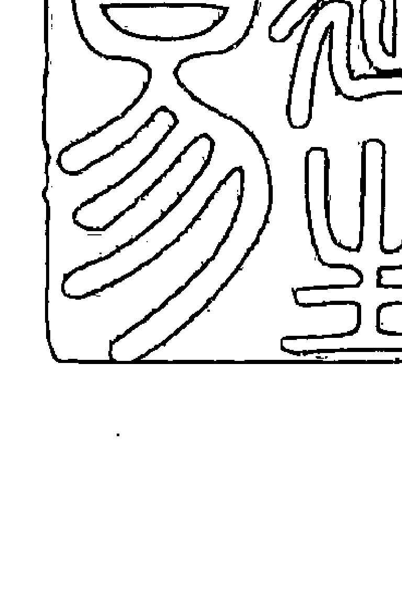

上架建议：哲学 传统文化

ISBN 978-7-5117-1955-3

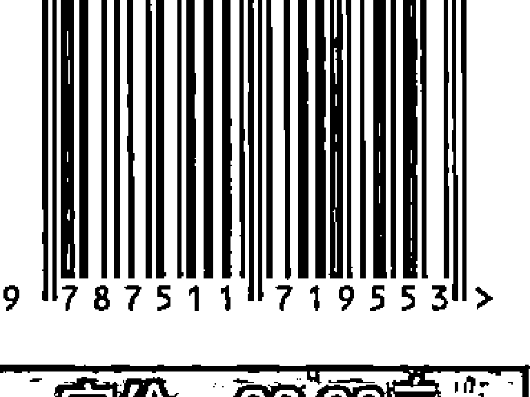

定价：92.00元

即：乾 (☰) = 1; 兑 (☱) = 2; 离 (☲) = 3; ……; 坤 (☷) = 8。

或：乾 (☰) = 8n+1; 兑 (☱) = 8n+2; 离 (☲) = 8n+3; ……; 坤 (☷) = 8n+8。

我们只不过是把n=-∞, ……, -3, -2, -1, 0, 1, 2, 3 ……, ∞数列中的“-∞”的负数值直至正整数及自然数中的数n, 都变作是“∞”（无穷、无限）符号罢了。

即形成了：
- 乾 (☰) = 8∞ +1; 兑 (☱) = 8∞ +2; 离 (☲) = 8∞ +3; ……; 坤 (☷) = 8∞ +8;
或是：乾 (☰) = -8∞ -1; 兑 (☱) = -8∞ -2; 离 (☲) = -8∞ -3; ……; 坤 (☷) = -8∞ -8。
或者是：乾 (☰) = -8∞ +1; 兑 (☱) = -8∞ +2; 离 (☲) = -8∞ +3; ……; 坤 (☷) = -8∞ +8等。

这么八种类型的直接对应状态。

当我们把“八卦”各卦中的共同具有的不可能有具体针对性意义的“虚”或“实”的“∞”（无限、无穷）和“-∞”（负无限、负无穷）项，同时都消除掉时，其“方位分布之数”中，所形成的“极化”、“类化”的最终的“余数”状态和结果，仍然直接对应的还是“先天八卦”及其“卦序数”所直接对应的：
- 乾 (☰) = 1; 兑 (☱) = 2; 离 (☲) = 3; ……; 坤 (☷) = 8;
[或乾 (☰) = 8n+1; 兑 (☱) = 8n+2; 离 (☲) = 8n+3; ……; 坤 (☷) = 8n+8];

那八个“先天八卦”所对应的卦及其卦序数值。

可见，“象数易学”里的“易理学”在处理一切事物及其关系的“易简”方法中，这种“极化”、“类化”的依靠“余数”分类类型本质性质间，所直接对应的事物的表述方式或方法，当是会起到最根本性的准确地化简作用和功能的——在处理“无穷小”、“无限小”等“无限”、“无穷”的认识与表述状态时，我们仍然是会对应采取这种处理与解决方法和思路的。这种以“在天成象”的“八进制”·为重复周期，并以“余数”直接对应相应事物的数理方法的计算处理中，是完全可以直接回避并舍弃“形式逻辑”前提下“数理逻辑”在遇到“实”或“虚”的与“无穷”、“无限”、“无极”等之类的有关概念参与时的无法进行准确判断的缺陷问题的。

总之，我们的“象数易学”的“易理学”中的“象数易学数学”，在处理与“无限”、“无穷”、“无极”等有关问题及事物时，仍然是在“盖取诸离”网络组构的众多相互作用的各种关系思想认知的指导下，采取对全部整个网络（类集集合、开放的巨系统）系统里的所有事物，都经过统一考虑与处理的方式，来保证整个表述系统的完整正确地认识与表述。当遇到数学中的“无穷大”或“无穷小”的概念时，由于再大或再小的数的排序、分布，都可以通过“无穷”概念下，“极其数”后的基础基本数的加减法得到的总数，除以8之后，所得到的对应“余数”的“先天”“类化”的方法，进行卦数统一场态的本质性地表达。由于“无穷大”和“无穷小”，只不过是在其原来大小上再进行加减某些数以后所形成的结果，若我们像上面的处理方法那样，同时舍去“无穷大”及“无穷小”中的“无穷”之后，所得之数的“余数”数值，仍然还会是直接对应于“有限”“可数”的“先天八卦分布结构”系统中的“极其数”前提下的那八个基本序数值；而这些基本数值直接对应的仍然还是“先天八卦分布结构”系统中的那八个基本卦。也就是说，这时候一切事物所直接对应的仍然是“在天成象”的那八种基本场态、本质性质及其各自的类型。

再者，由于现代科学无论是由自然或是人文角度，都无法以一种能够“均匀”以及“稳定”地把握事物演化“平衡性”的逻辑及逻辑过程，来演绎宇宙及其世界的“质变秩序”，因此可以肯定，在现有的“数学公理”和“数理逻辑”的计算方法框架下，不仅数学自身的悖论不能得到根本性克服；而且就现在的诸多学术中的“科学悖论”来讲，也不可能在现有的数学“公理系统”与“数理逻辑”的计算方法中，得到根本性地完全性克服。

要问：这到底是什么呢？？

若要根本解决“形式逻辑”前提下的“数学悖论”、“语言悖论”、“语义悖论”等所导致的“科学悖论”的话，就必须加上运用更加完整认识、判断及表达的新颖的“辩证逻辑”的思路——即应该必须依靠具有严整的“有机辩证统一逻辑”的思维方法、过程及其系统性规律，来进行充分地充实与补充后，才有可能能达到根本性的解决与排除。然而，在现有的“形式逻辑公理”和“数理逻辑”的算法中，根本就不可能包括这一类的逻辑学内容。因此，这就会很自然地就形成了“形式逻辑”为什么不能处理罗素“自集命题”的“公理性”缺失的主要原因。