## 燒餅歌和推背圖裡的歷史

是駭人聽聞的驚世秘密，還是不可思議的神奇巧合？

《推背圖》和《燒餅歌》用預言的「水晶球」向理性發起挑戰，

後世之人以時間「旅行者」的身份揭開歷史迷霧！

邢群鹏◇編著

### 福利公告：

凡在【天使神秘学院】购买任何电子资料赠送实体书，详情请咨询店铺客服！
备注：如客服不知道这活动你可能进了盗版店铺！
赠书活动仅在以下正版店铺购买有效哦！

### 【天使神秘学院】淘宝店

手机淘宝扫以下二维码

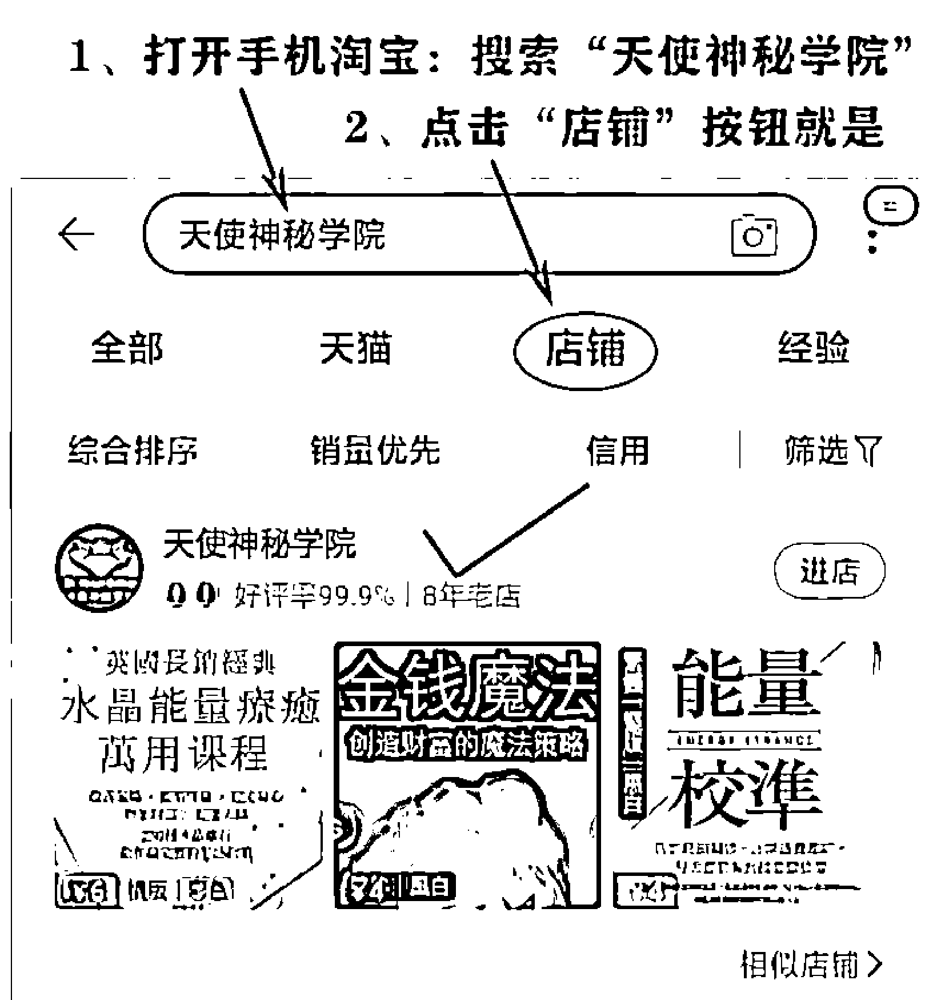

### 【天使神秘学院】微店

手机微信扫以下二维码

用手机微信扫码进店

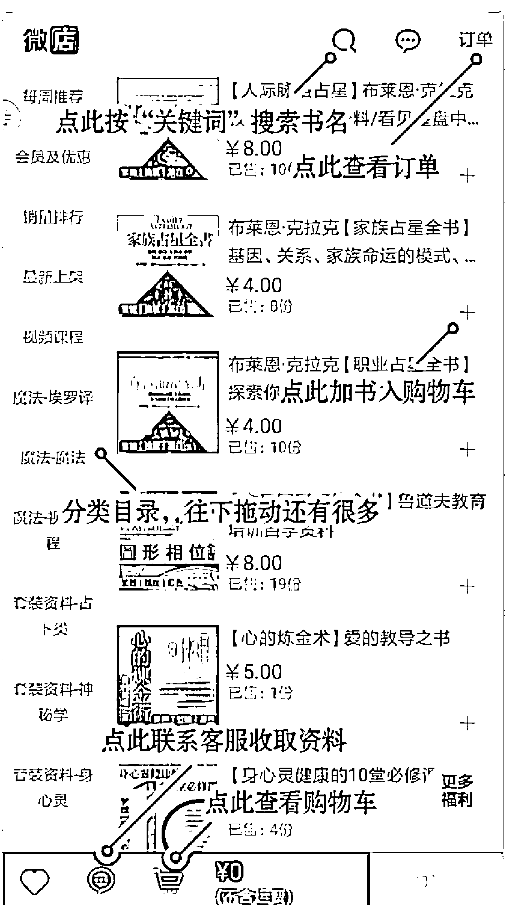

## 在历史里的烧饼歌和推背图

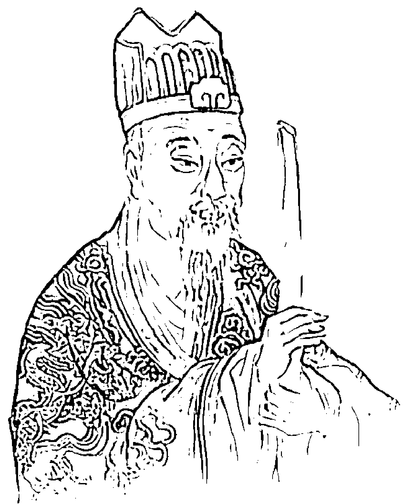

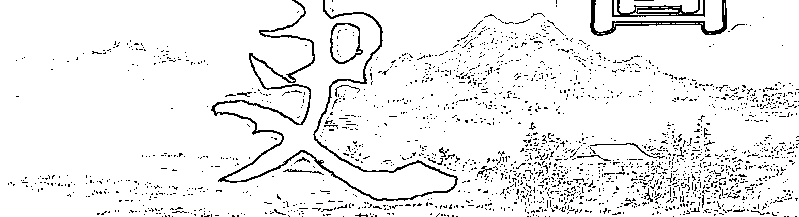

是骇人听闻的惊世秘密，还是不可思议的神奇巧合？

《推背图》和《烧饼歌》用预言的「水晶球」向理性发起挑战，

后世之人以时间「旅行者」的身份揭开历史迷雾！

邢群鹏◇编著

### 前言

#### 预言的是未来，还是历史

「2012年12月21日的黑夜降临以后，12月22日的黎明永远不会到来。在这之后，人类将进入与本次文明毫无关系的一个全新的文明。」玛雅历法中如是说。

至今为止，它仍然只是一则预言，和中国古代的《推背图》、《烧饼歌》一样，其初衷想要表达的都是对未来世界的一种预测。当一切尚未发生，人们只能猜测与想象，以自己理解的方式去建构一幅可能发生的图画。就像只能想象未来的2012年一样，面对中国古代预言中，尚未发生的事情，人们同样只能猜测。

《推背图》中的「无城无府，无尔无我。天下一家，治臻大化」、《烧饼歌》中的「爱民如亲兄弟，创立新君修旧京」，无不是猜测与想象的对象。从此种角度上来说，预言针对的是未来，是尚未或即将发生的事情。一切都还是未知之数。

然而，预言的准确与否，却需要历史来印证。

法国预言家诺查丹玛斯（Michael de Nostradamus，1503-1566）遇到一位领主的质疑时，他指着院子里的两头小猪仔说：「那只黑色的猪仔将会成为你的盘中餐，而那只白色的猪仔将会被狼吃掉。」领主为了否定其预言，立即下令以厨房杀掉白猪来做晚餐。菜肴上桌之后，领主得意地认为诺查丹玛斯的预言失灵了，但诺查丹玛斯则坚持餐桌上的是那头黑猪。争执中，领主唯有叫家臣来进行核对。最后家臣道出：小狼仔乘人不备之时将白猪仔偷食一空，为免主人责骂，他便自作主张将黑猪仔杀了端上餐桌。诺查丹玛斯的预言成真，但得到证实之时，预言之事已成为历史。

奥地利剧作家格里尔帕策（Franz Grillparzer，1791-1872）曾说：「历史只是一种方式，依赖于这种方式，人的精神去理解他并不清楚的事实，将只有上帝才知道的事物之间的联系连接起来，把不可理解的事物用可理解的事物代替。」其实，预言与历史具有同样的特质。绝大多数和预言远没有玛雅历法中的「2012年12月21日」和诺查丹玛斯的「两只猪仔」预言那般精准与明晰，更多时候是以一种似是而非的模糊状态存在的。

> 历史只是一种方式，依赖于这种方式，人的精神去理解他并不清楚的事实，将只有上帝才知道的事物之间的联系连接起来，把不可理解的事物用可理解的事物代替。

预言家们将其所要预示的内容，巧妙曲折地融入到模棱两可的文字和意象丰富的图画当中，大量地使用象征、比喻等手段，使预言看起来隐秘晦涩，但又并非完全无从下手破译，中国古代如《推背图》和《烧饼歌》之类的预言便是如此，看似简单的字谜和图画，仿佛在预示着什么，却又很难明白其预示的真正内容。

唯有事情发生成为历史之后，人们才会恍然大悟，从事实去倒推和归纳，以印证预言所暗示的内容。于是，原本就「像个任人打扮的小姑娘」的历史，便成了预言准确与否的唯一证据。如此一来，预言又成了历史的佐证。

千百年来，世人 在探索未来的过程中创造预言，又在已然成为历史的过往中印证预言，预言俨然成了连接历史与未来的纽带。但在扑朔迷离中，人们更愿意用历史去印证预言，而不是痴迷于想像去构筑预言。毕竟，预言中，历史可以看见，未来只有猜测。

## 大師著預言，預言顯大道

- 1、大唐两位预言家 ——李淳风和袁天罡
- 2、半个烧饼发掘的阴阳风角 —— 《烧饼歌》的由来与刘伯温
- 3、天地无始终，千言万语留苍生证盟 ——历史与预言
- 4、天下非一人之天下，唯有德者享之 ——传统文化中的德与天下

#### 壹 李唐一枝独秀，李落众花齐放

- 5、二十一个李子的天下 ——预言唐代21帝
- 6、日月当空，不文亦武临天下 ——预言武则天当政
- 7、五猴扶持将倾大唐 ——预言李唐政权的夺回
- 8、渔阳鼙鼓葬金环 ——预言马嵬坡兵变
- 9、阴霾既去，再造人民乐 ——预言肃宗乱世即位
- 10、吐蕃破关乍来，中原哭声骤起 ——预言吐蕃入侵
- 11、李花朵朵飞，居然三杰踞关中 ——预言李希烈祸乱
- 12、满天飞血，可怜巢覆亦成空 ——预言黄巢起义
- 13、八牛温，伸手采摘李唐花 ——预言朱温篡权
- 14、戏子皇帝，上得天堂好游戏 ——预言后唐庄宗
- 15、谓他人父，儿皇帝呈上二八州 ——预言割让燕云十六州
- 16、一只郭雀踏破足，飞来飞去终有止 ——预言郭威临天下
- 17、十三童子五王公，五十三岁运不通 ——预言五代的历史
- 18、日月山川，寰中自有真天子 ——预言五代天子之争

### 贰 文雅孱弱伴赵宋，以武治文买蒙元

- 19、黄袍加身开新朝，不杀人民更全嗣 ——预言赵匡胤建宋
- 20、天子亲临乍渡河，干戈息邦邑定 ——预言澶渊之盟
- 21、刘国母力扶细主坐灵台 ——预言狸猫换太子
- 22、朝用介甫谋，夕丧西北师 ——预言王安石变法

### 叁 枝枝叶叶皆色朱，混混沌沌世难明

- **23、父子同心伴皇旁，赵宋朝堂暗无光** 
——预言蔡京父子乱政
- **24、妖氛未靖不康宁，江南江北又分邦** 
——预言靖康耻与宋朝南迁
- **25、祸水汪洋，精忠报国终成空** 
——预言秦桧与岳飞的恩怨
- **26、两柱擎天不敌似道非道** 
——预言贾似道误国
- **27、洪涛巨浪漂浮萍，无力回天赵王终** 
——预言南宋灭亡
- **28、北帝南臣，一元为君八十载** 
——预言元朝建立
- **29、沉迷房中长生术，淮南又现一张弓** 
——预言元朝灭亡
- **30、八牛为朱，引领日月同行** 
——预言朱元璋开国
- **31、秃顶人一心虚，英雄半数尽还乡** 
——预言明初文字狱
- **32、燕子飞血，永乐升平** 
——预言靖难之役
- **33、三杨为国之栋，宇内同歌母贤德** 
——预言三杨中兴
- **34、御驾亲征失太平，圭林各半合生变** 
——预言土木堡之变
- **35、新主临危受命，故君安然回归** 
——预言景帝即位与英宗复辟
- **36、大智皇帝平怪异、逃雀笼** 
——预言明武宗的怪诞
- 37、贤良辅天下，圣人解乱局 ——预言大儒王守仁
- 38、无视猜心游戏，忠良杀害崩如山 ——预言嘉靖朝的君臣对决
- 39、相在龙太平，相亡龙壮旺 ——预言张居正改革前后
- 40、八千女鬼乱朝纲 ——预言魏忠贤乱朝
- 41、日月沉黯，李花开遍长安城 ——预言李自成进京
- 42、万子万孙层层叠，祖宗山上贝衣行 ——预言末帝崇祯
- 43、赤色朝堂统共十六孩儿 ——预言明代16帝

### 肆 马背英雄踏中原，满清盛衰日渐斜

- 44、桂花绽放，拆缺长城尽孝忠 ——预言吴三桂的背叛
- 45、长白深处胡人来，主客不分占中原 ——预言满清入关
- 46、胡人二八秋，二八胡人帝 ——预言满清10帝
- 47、胡人依旧胡人毒，扬州十日血气溢 ——预言扬州十日屠城
- 48、留头不留发，路上行人一半僧 ——预言剃发留辫的争执
- 49、稚子登基，智除权臣用汉人 ——预言康熙夺权
- 50、有心折桂枝，无力化朋党 ——预言平三藩
- 51、黑暗的寂静：无口泥鸡啼无声——预言雍正朝
- 52、十全武功王，周甲乐饥荒——预言乾隆朝
- 53、吃饱的嘉庆若火龙，渡河热难当——预言嘉庆朝
- 54、手执钢刀九十九，决战紫禁之巅——预言白莲教起义
- 55、罂粟长伴的三十载帝王梦魇——预言道光朝与鸦片的纠葛

## 伍 推枯拉朽旧朝亡，改弦易辙新生

- 56、揭「平均主义」的竿而起——预言太平天国的兴起
- 57、太平时，王杀王——预言太平天国的灭亡
- 58、黑云黯黯自西来，帝出不还奇才见——预言英法联军入侵中国
- 59、琴瑟和谐，舆古道舆今朝——预言曾国藩与同治中兴
- 60、灯光蔽日，纤纤女子倒乾坤——预言慈禧专权
- 61、黄龙早丧赤城中——预言「百日维新」与光绪喋血瀛台
- 62、水清终有竭，南北和衷共济——预言清朝灭亡与中华民国成立
- 63、一退再退，揖让新君让旧君——预言袁世凯复辟
- 64、群雄逐鹿祸蔓延，万人后死万人生——预言第一次世界大战
- 65、旭升万民哭，日没终有时 --预言日本侵华与八年抗战

### 附录：

- 1、《推背图》全文（金圣叹批注本）
- 2、《烧饼歌》全文
- 3、中国古代的另外五大预言
   (1) 《乾坤万年歌》
   (2) 《马前课》
   (3) 《藏头诗》
   (4) 《梅花诗》
   (5) 《黄檗禅师诗》

## 大師著預言，預言顯大道

### 1 大唐兩位預言家 ——李淳風和袁天罡

1503年12月14日，欧洲的「骑士之城」普罗旺斯，醉人的薰衣草花海已然只剩下短而整齐的枯茎，但迷人的香味仍遍布城市的每个角落。这一天，在这个弥漫着浪漫气息的城市，一个名叫蜜雪儿·德·诺斯特罗达姆的天才诞生了，世人对他另一个拉丁风格的名字诺查丹玛斯更为熟悉一些。

他自幼受到犹太神秘文学的影响，在祖父的教导之下，拉丁语、希腊语、希伯来语、数学、占星术等更是无所不学、无所不通。他是一位好医生，面对疾病时有过人的勇气，面对患者时有无尽的关爱，这一点即便是那些中伤他的人也从未怀疑过。

此外，诺查丹玛斯更是一位预言家，对玄学他有着不息的热情，对预言他有着敏锐的洞察力，基于此，他用手中的笔写下了令人瞠目结舌的惊世预言——《诸世纪》。他用晦涩难懂的四行诗对未来的世界进行了预言，在给儿子的信中，他说《诸世纪》预言的时间跨度是从他生活的时代到3797年。于是，后人在他的《诸世纪》中发现了拿破仑和希特勒的诞生、世界大战和恐怖袭击的发生、墨索里尼和甘乃迪的离世……精准的程度令对其成书的时间产生了怀疑。

然而，这位身着黑长袍、夜宿黑帐篷且拥有学者风度的大预言家，在欧洲写下这部惊世大作之前九百年，在古老的大唐帝国中，就已经出现了像诺查丹玛斯一样的预言家，而且还不止一位，他们就是生活于唐太宗时期的术数大家李淳风和袁天罡。

作为中国传统文化的一个重要组成部分，术数就像白居易笔下的琵琶女，确实地存在着，却始终保持着「犹抱琵琶半遮面」的神秘感，或许就是因为《新唐书・方伎列传》所载：「凡推步、卜、相、医、巧，皆技也。能以技自显于地一世，亦悟之天，非积习致然。然士君子能之，则不迂，不泥，不矜，不神；小人能之，则迁而入诸拘碍，泥而弗通大方，矜以夸众，神以诬人，故前圣不以为教，盖吝之也。」术数从来未能像天文、历算之类登堂入室，即便是在包容度极高的大唐也不例外。

在诸多的术数研究者看来，李淳风的占卜远远不是透过单纯的术数学习能够做到的，以至于当时懂得术数的人皆怀疑他「别有役使」。且不论是否得到其他外力的帮助，李淳风本身就极具传奇色彩。他的父亲曾是隋朝的一名官吏，不知出于何种原因，在辞官归隐后，致力于道学研究，还给自己起了个道号「黄冠子」。想来李淳风对于术数的兴趣，应该与其父的沉迷道学不无关系。

自幼便聪颖过人的李淳风，在跟随父亲读书的过程中，博览群书，尤其擅长天文、历算、阴阳之学。在太宗一朝入仕为官之后，李淳风提出新的历法，「议者多附」，深得唐太宗李世民的赏识。此后又在天文、数学方面著书论述，官至太史令，是世界上第一个给风定级的科学家。

对关注其预言家身份的人而言，史书中所载的「李淳风谏太宗不滥诛」显然比其他方面的成就更吸引人。

「太宗得秘谶，言『唐中弱，有女武代王』。以问淳风，对曰：『其兆既成，已在宫中。又四十年而王，王而夷唐子孙且尽。』帝曰：『我求而杀之，奈何？』对曰：『天之所命，不可去也，而王者果不死，徒使疑似之戮淫及无辜。且陛下所亲爱，四十年而老，老则仁，虽受终易姓，而不能绝唐。若杀之，复生壮者，多杀而逞，则陛下子孙无遗种矣！』帝采其言，止。」由此看来，武则天之所以能避过太宗时的一劫，全得李淳风对太宗的劝诫。从另一个侧面也可以看得出，太宗对李淳风的信任。

或许正是基于此，才有了传说中的「藏头诗」。一日，君臣对谈间，太宗要李淳风推算李唐的国运，惊恐之余，李淳风欲以「天机不可泄漏」推托。太宗也不强求，只是将他引至一座高楼之上，命人撤去扶梯。随后对李淳风言：「此处上不着天，下不着地，你所说的话唯有你我知道，你可以放心地说了。」迫于无奈，李淳风道出了「藏头诗」。

与「藏头诗」相比，传说中他与袁天罡合著的《推背图》更为世人熟知。关于袁李二人的关系，有人言其为师徒，有人言其为对手，无论何者，世人对于无正史可考的袁天罡依然有非常浓厚的兴趣。

据闻，隐士袁天罡知识渊博，有未卜先知的能力，能观星相而知未来，且擅长面相。一次，为好友杜淹、王珪、韦挺预测前途时，他说杜淹会以文章遒美而闻名，王珪无需十年便会官至五品，韦挺则会成为武将。后来三人果然如其推算的那样，几乎全然应验。

更具传奇色彩的，是袁天罡对武则天的预言。据史书载，他曾为还处于襁褓中的武则天相面，其时武家谎称其为男孩，但袁天罡竟声称其面相「贵不可言，龙瞳凤颈，若为女，当做天子。」单是预言女子为帝一事，于当时便已是惊世骇俗了，更何况竟被他言中，武则天果真登上了帝王之位。

精准的预言，就在史料与传说中，令李淳风和袁天罡成了易学奇士和术数大家，但真正令后世之人铭记他们二人的，还是那部极其神秘的预言书——《推背图》，正是：「逸士双双降大唐，推图演易著华章。穷极玄妙天机泄，意蕴深远警世长。」

《推背图》全书共六十象，每一象皆由一图、一谶和一颂组成，图文并茂且有清初怪才金圣叹的批注，可以称得上是至今为止最完整的预言书。

与诺查丹玛斯的《诸世纪》不同，《推背图》按照历史发展的顺序，预言了自太宗一朝之后中国几千年的兴衰治乱，历年来为世人所瞩目，《宋史・艺文志》甚至将其列入正史，足见世人的重视程度。

直至今日，依然有许多人致力于《推背图》的解读，就像西方人痴迷于对《诸世纪》的破解一样。而对于这两部受到极大关注预言书的作者，与其说李淳风与袁天罡是大唐的诺查丹玛斯，莫若说诺查丹玛斯是法国的李淳风与袁天罡更为准确。

#### 2 半个烧饼发掘的阴阳风角 ——《烧饼歌》的由来与刘伯温

明太祖一日身居内殿，食烧饼，方啖一口，内监忽报国师刘基进见。太祖以碗覆之，始召基入。礼毕，帝问基曰：「先生深明数理，可知碗中是何物件？」基乃捏指轮算，对曰：「半似日兮半似月，曾被金龙咬一缺。此食物也。」开视果然。

> > —— 《烧饼歌》

韦小宝，金庸作品《鹿鼎记》的主角，是个人所共知的不学无术之徒。自幼厮混于社会最底层的他，最大的学识应该就是从说书先生那里听来的故事。《大明英烈传》，就是他听得滚瓜烂熟的故事之一，他不仅知道威风八面的明朝开国大将军徐达和常遇春，而且还能将军师刘伯温《烧饼歌》中的歌谣倒背如流：「手执钢刀九十九，杀尽胡儿方罢休……」由此可见《烧饼歌》流传之广。然而，这部连韦小宝都知道的惊世之作，竟是源起于一个游戏，一个君臣之间的猜谜游戏。

洪武元年（西元1368年）的一天，刚刚登上帝位不久的明太祖朱元璋，或许是还吃不惯腻人的山珍海味，或许是想忆苦思甜，在内殿里拿起了一个贫苦之时常吃的烧饼。才刚咬了一口，太监就来禀报：刘伯温求见。于是，他随手拿起一只碗扣在烧饼上，便召刘伯温觐见。

心情不錯的朱元璋，在見到劉伯溫後突然心血來潮，想要跟他玩個猜謎遊戲。於是，朱元璋指著倒扣的碗，故意問劉伯溫：「先生深明數理，有未卜先知的能力，那知不知道碗裡是什麼東西？」劉伯溫掐指一算回答說：「半似日兮半似月，曾被金龍咬一缺。此食物也。」打開一看，果然不錯。

朱元璋親見劉伯溫之神機妙算，便將話題引向了明朝的國運，要劉伯溫預測一下朱家天下的未來。如此敏感的問題，劉伯溫唯有盡力推託，但此時的朱元璋和發現李淳風的李世民一樣，好奇心得不到滿足是肯定不會甘休的。為了能讓劉伯溫暢所欲言，朱元璋豁達地說：「雖然自古興亡原有一定，況天下非一人之天下，唯德者能享之，言之何妨？試略言之。」並賜予免死金牌，劉伯溫這才敢開口說出對後世的預言。鑒於此預言由一個燒餅而起，故而後世稱之為《燒餅歌》。

對後世之人而言，到底是劉伯溫成就了《燒餅歌》，還是《燒餅歌》成就了劉伯溫，早已不是重點，人們更多地想要瞭解這位在中國民間地位僅次於諸葛亮的智囊人物——劉伯溫的傳奇人生。

劉伯溫，名基，浙江青田人。他自幼聰穎異常、好學深思，對於儒家經典、諸子百家之書都極為熟悉，《明史》稱其「博通經史，於書無不窺，尤精象緯之學」。他的老師鄭復就曾說：「如此聰慧的孩子，他日必成大器，定能光耀門楣。」如老師所言，極高的天賦加上自身的修為，年輕的劉伯溫很快成了江浙一帶的大才子。西蜀名士趙天澤在評論江左人物時，便首列劉伯溫，認為其是可與諸葛孔明媲美之人物，並預言他將來定會有一番大作為。

元統元年（西元1333年），劉伯溫進士及第，被授予高安丞的官職，從此步入仕途。但由於他為人廉直而在朝堂之上受到排擠，他的建議得不到採用、才能得不到發揮，於是憤然辭職，回故鄉青田隱居。

此時的元朝，沒有為他提供大展拳腳的機會，他便潛心著述，將自己的思想、對社會和人生的見解編著成冊——《郁離子》。同時，面對已經搖搖欲墜的元朝江山和風起雲湧的反元起義，他也在靜觀局勢，畢竟他也和中國古代的絕大多數文人一樣，心中都懷有最真摯的「策士夢」。

直到平民出身的朱元璋和他領導的紅巾軍崛起，劉伯溫才看到了未來江山所屬。但文人始終還是有一些特殊脾性的，就像劉備須三顧茅廬方能請得諸葛亮出山一樣，劉伯溫也是在朱元璋向他發出兩次鄭重的邀請之後，才略顯扭捏地決定出山的。他和諸葛亮一樣，需要最大的誠意；也和諸葛亮一樣，在初次與明主相見之時便提出了成就大業的策略——時務十八策。

朱元璋初見身著布衣，威猛剛烈，「虬髯，貌修偉，慷慨有大節，論天下安危，義形於色」的劉伯溫，便被其對局勢的洞察力和謀略的前瞻性所吸引。這個句句符合朱元璋心中所想的人，自然深得朱元璋的器重，視其為心腹。據《明史》載，朱元璋對劉伯溫「每恭己以聽，常呼為老先生而不名，曰：『吾子房（即張良）也。』」

在劉伯溫制定的「先滅陳友諒，再滅張士誠，然後北向中原，一統天下」策略的指引下，朱元璋一步步地奪取了天下。西元1368年正月，朱元璋在南京正式登基稱帝，建立大明王朝，改元「洪武」。同年八月，朱元璋攻佔北京，元順帝北逃，元朝滅亡。劉伯溫自然也就成了幫助朱元璋平定天下、開創王朝的開國功臣。

歷史上的劉伯溫確為睿智之人，他用儒家治國的學問運籌帷幄之中，決勝千里之外，助朱元璋成就建國大業；功成名就之後，他及時隱退，雖未能全然逃過朱元璋的猜忌，最終卻也沉冤昭雪，並為後世子孫留得了一塊免死的金書鐵券。此外，劉伯溫「所為文章，氣昌而奇，與宋濂並為一代之宗。」想像詭異的《郁離子》、兵書寶典《百戰奇略》、天文曆數領域的《天方秘略》、卜筮方面的《觀象玩占》，無不是精彩絕倫的傳世之作。如此的人生，本就足夠精彩了，但民間傳說和文學作品裡的劉伯溫要更神奇得在民間，他深諳陰陽八卦，專事風水占卜，能未卜先知、洞察古今、呼風喚雨，料事如神彷彿神仙一般，以至於有韋小寶所說的「前知三千年，後知一千年」之譽，也就有了民間所謂的「上有諸葛孔明，下有劉基伯溫」之說。顯然，關於他的傳說最多的還是集中在所謂的陰陽風角上，《燒餅歌》便是其在這方面的典型之作。然而，無論是他被後世之人加工過的人生，還是隱晦難測的《燒餅歌》，都彷彿謎團一樣令人好奇，吊人胃口，正如詩中所云：

> 洞徹天機為帝師，輔明日月事堪奇，
燒餅歌罷飄然去，身後身前全是謎。

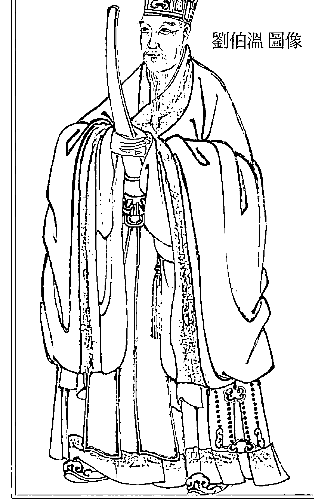

### 天地無始終，千言萬語留蒼生證盟 ——歷史與預言

> 《推背圖》第一象 甲子

谶曰

茫茫天地 不知所止

日月循环 周而复始

颂曰

自从盘古迄希夷

虎斗龙争事正奇

悟得循环真谛在

试于唐后论元机

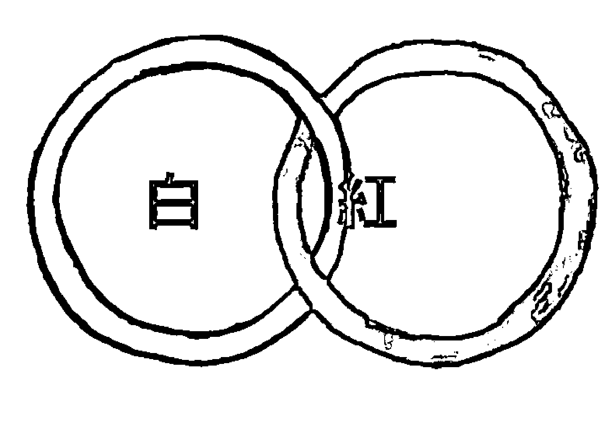

> 《推背圖》第六十象 癸亥

谶曰

一阴一阳 无终无始

终者日终 始者自始

颂曰

茫茫天数此中求

世道兴衰不自由

万万千千说不尽

不如推背去归休

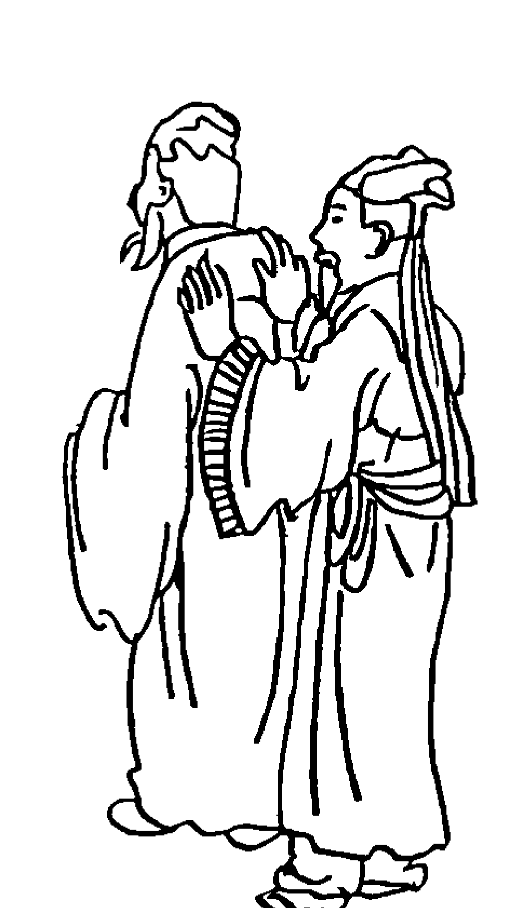

> 千言萬語知虛實，留與蒼生作證盟。
——《燒餅歌》

歷史的意義，究竟是什麼？關於這一問題，曾經有無數文人學者提出過不同的答案。

被譽為「歷史之父」的希羅多德，在其所著的希臘史學史上第一部歷史著作《歷史》中，一開始便明確提到了他認為的歷史的意義：「是為了保存人類所取得的偉大成就，使之不致因為年代久遠而湮沒不彰；是為了使希臘人和異幫人的那些可歌可泣的豐功偉績不至於失去其應有的光彩，特別是為了把他們發生紛爭的原因記載下來，以永垂後世。」顯然，在他看來，歷史是記錄功績的，目的在於用歷史事實來進行道德規範教育。

古羅馬著名歷史學家塔西佗，與希羅多德的觀點基本一致，但表述得更為直接，他說：「歷史之最高的職能就在於賞善罰惡，不要讓任何一項嘉言懿行湮沒不彰，而把千秋萬世的唾罵，作為對奸言逆行的一種懲戒。」可見，古羅馬歷史最主要的意義在於道德教育。

在古希臘，歷史的意義則更深刻。修昔底德在其《伯羅奔尼撒戰爭史》中指出：「但如果那些想要清楚地瞭解過去所發生的事件和將來也會發生類似的事件（因為人性總是人性）的人，認為我的著作還有一點益處的話，那麼我就心滿意足了。」歷史於此，已經顯現出了「歷史就是當代史」的跡象，具備了對現實的指導意義。

美國《獨立宣言》的主要起草人湯瑪斯·傑佛遜，看得更遠，他在《維吉尼亞紀事》中說：「透過講述過去，歷史使他們（人民）能夠判斷未來，使他們從其他的時代和民族的經歷中受益；使他們成為合格的行動和裁判官和人的設計者。」在他看來，歷史又衍生出了新的意義——預測未來。

或許真如某些學者所認為的那樣，世界各地的文明在某種程度上發展具有同步性，又或許只是歷史的巧合，中國的文化從一開始就存在著預測未來的成分，五千年的歷史中，從周朝、漢朝、唐朝、宋朝到明朝，幾乎每個漢人統治的治世都留下了準確而系統的預言。諸多的預言中最早系統的預言當屬《乾坤萬年歌》，據說它的作者是大名鼎鼎的姜子牙，所以它預測的是周朝之後的歷史，直到未來的大同世界。最為世人所熟知的則是李淳風和袁天罡所著的《推背圖》和劉伯溫所著的《燒餅歌》。

除此之外，民間還流傳著許多與預言類似的謠與讖，表達的都是對未來之事的預測，差別在於，它們更多的只是針對某一特定的事件而言，相應地預測的時間範圍也就較短。

然而，無論是預測長久未來的預言書，還是預測近期事件的謠與讖，皆屬於傳統文化的一部分——術數，而且有其完整的理論。如此一來，就意味著預言的產生是有一定的依據可循，於是人們開始致力於歷史規律的研究。

有些人認為歷史是循環的，像戰國末期陰陽家代表鄒衍提出的「五德終始說」就認為天道的運行、人世的變遷、朝代的更替都如同一個圓圈般，在周而復始的循環。《推背圖》第一象中所說的「日月循環，周而復始」和「悟得循環真諦在」，便是典型的「歷史循環論」之說。

還有些人則認為歷史是無規律可循的，像近代歷史學者傅斯年提出的「史學便是史料」的診斷，認為歷史只是一件件彼此孤立的歷史事件的堆積，是沒有規律可循的，歷史學的責任只在於探尋歷史的真相。在這種前提下，面對歷史人類似乎是束手無策的。《推背圖》第六十象中所說的「世道興衰不自由」，便是對歷史的無奈之言。

究竟歷史的發展是否存在規律可言，自然是仁者見仁、智者見智的問題，至於中國古代的預言家們是否是以歷史規律來進行預言，我們無從知曉。但可以肯定的是，所有的人都贊同「自從盤古迄希夷」的歷史是無止境的，《推背圖》中的「茫茫天地，不知所止」和「一陰一陽，無終無始」、《三國演義》中的「紛紛世事無窮盡」，都表達了相同的意蘊。

在這種無止境中，人們逐漸將注意力轉移到創造歷史的人身上，人性也進入了歷史研究的範圍。唐代詩人杜牧說：「秦人不暇自哀，而後人哀之；後人哀之而不鑒之，亦使後人而復哀後人也。」德國哲學家黑格爾說：「歷史給我們的教訓是，人們從來都不知道汲取歷史的教訓。」由於過於關注眼前，人們往往會在欲望的指引下，不自覺地重蹈前人的覆轍，中國古代歷史中王朝的治亂更替，便是最典型的例證。

> 秦人不暇自哀，而後人哀之；後人哀之而不鑒之，亦使後人而復哀後人也。

> 歷史給我們的教訓是，人們從來都不知道汲取歷史的教訓。

儘管自古以來有無數的學者曾提出過「以史為鑑」，但在人性的本能面前，許多人還是不可避免地陷入了悲劇的輪迴之中。於是，預言家們又有了新的預測依據——人性，正如義大利文藝復興時期的政治哲學家馬基維利所說：「人性既然不變，而且各地相同，那麼歷史——對人類的以往活動記錄——便能幫助人們預測未來，對比現實。」

> 人性既然不變，而且各地相同，那麼歷史——對人類的以往活動記錄——便能幫助人們預測未來，對比現實。

歷史規律、人性抑或是其他的什麼，預言家們總是能從過往中找到一些進行推算的蛛絲馬跡，畢竟像諾查丹瑪斯預言中所說的那樣——「幽深夜裡，獨坐於秘密的書齋／……將水潑向皮袍下襟與足面／神諭恐怖／令長袍下的身軀戰慄／神聖的光彩中／上帝與我同在」——憑藉神的指引而道出驚世預言之說，早已不能為世人所信服了。

> 幽深夜裡，獨坐於秘密的書齋／……將水潑向皮袍下襟與足面／神諭恐怖／令長袍下的身軀戰慄／神聖的光彩中／上帝與我同在

求知欲漸盛的人們，對一直以來都充滿神秘色彩的預言投入了更多的關注。一方面，人們對千百年前的預言充滿了好奇之心，與劉伯溫的「千言萬語知虛實，留與蒼生作證盟」一樣，渴望對預言的事件應驗與否有個明確的結論；另一方面，人們對預言的產生過程也興趣盎然，希望知曉其緣何而來，使自己也能成為令人豔羨的預言者。然而，無論是預言的準確性，還是預言的源頭，都須以歷史為據，所以，預言從誕生的那一刻起，便注定與歷史纏繞在一起，不可分割，無法分離。

> 千言萬語知虛實，留與蒼生作證盟

### 四 天下非一人之天下，唯有德者享之——傳統文化中的德與天下

> > 況天下非一人之天下，唯有德者能享之。
> ——《燒餅歌》

亞聖孟子說：「得道者多助，失道者寡助。寡助之至，親戚畔之；多助之至，天下順之。以天下之所順，攻親戚之所畔，故君子有不戰，戰必勝矣。」此處所謂的「道」，與《燒餅歌》中明太祖朱元璋「況天下非一人之天下，唯有德者能享之」中的「德」異曲同工。從某種意義上來講，它們都是對古代君王提出的道德上的要求。

回溯到兩千多年前的那個多難之秋。當周王朝與諸侯之間再難以維持統治與被統治關係的同時，國家陷入了紛爭。群雄並起，諸侯分立，割據一方，互相吞併，途有餓殍、哀鴻遍野的場景如在眼前。在這個缺乏指導性思想的年代，孔子的儒家學派脫穎而出，他所建立的倫理道德中的「禮」，包括孝、慈、恭、順、敬、和、仁、義等。「仁」，位居孔子思想的核心地位。《論語·顏淵》曾有一段：「樊遲問仁。子曰：『愛人』。」所謂「仁者愛人」即出於此處。「仁」是一種同情友愛之心。

孟子繼承了孔子的仁愛思想，並將其衍生為「仁政」。在人心慌亂的年代，它能很好地縫合人與人、統治者和百姓心理的裂縫，更能贏得百姓們的信賴。它在秦朝沒有實現，但是歷史證明，暴政和過於苛刻的法治會引來巨大的民怨，秦朝注定「短命」。而漢朝的興起以及三百年長期統治，與其重拾儒家的「仁愛」思想是密不可分的。這種思想使得漢朝開國幾位君主廣施善政，到了漢武帝時期，更甚至「罷黜百家，獨尊儒術」。正因為有了儒家思想的輔政作用，漢王朝才得以從秦朝暴政留下的社會陰霾中得以復甦和興盛。

於是，漢朝之後儒家大行其道，而孟子民為貴、君為輕的「民本思想」則得到了更多的肯定。唐太宗李世民清楚地知道只有讓百姓富裕，自己才能坐擁江山。所以他用了三十年的時間，讓唐初的亂世成為了治世。而他所說的「水能載舟，亦能覆舟」，便是源於孟子之後儒家的代表人物荀子。

到了明朝，朱元璋一如他在《燒餅歌》中對劉伯溫所說，以「德」享天下。他的「民本思想」較之孟子早先提出的更甚，不是因為他有孟子那種思想高度，而是他的農民出身讓他深刻地意識到「百姓足而後國富，百姓逸而後國安。」所以，他致力於打擊貪官污吏、保障民生。

正是基於這些深明「民本思想」的君王的努力，中國古代出現了一個又一個的盛世，百姓於治亂交替間，也過上了難得的安居樂業的日子。與此同時，儒家「居安思危」的憂患意識，又時刻提醒著君王不可有絲毫的懈怠。

子曰：「安而不忘危，存而不亡，治而不忘亂。」中國人的憂患意識早已有之，傳承長達數千年之久，幾乎已經成了傳統文化的一種風骨，而歷史也給了我們「生於憂患，死於安樂」最好的印證。

戰國時期，秦對山東六國構成了生存威脅，六國才有聯合抗擊，等到山東諸國彼此對抗，卻引來秦的兼併。西漢初休養生息，漢武帝憂匈奴之患而遠征，終使江山直至西北大漠，還派去張騫開闢了西域商貿之路。唐朝初期，李世民南征北戰，周邊諸國俯首稱臣，而中期為避遊牧民族的騷擾而南徙，引起安史之亂，最後演變為五代十國。北宋的苟安政策使得遼和金、西夏直指中原，騎到頭上而不知反抗，最後一國之君被擄。南宋不識虎狼之敵，妄圖聯合蒙古滅金，卻使北方的屏障落入蒙古之手，半壁江山岌岌可危。清前期泱泱大國，何懼之有，南征北戰，無人能敵；清後期大國心態過於自信，自以為最強而不吸收任何外來的知識，終在閉關鎖國中滅亡。

所以，在孟子看來：自古失國之主、亡國之君，皆為居安忘危，處治忘亂，所以不能長治久安。綜觀中國歷史上，曾經的「文景之治」、「貞觀之治」、「開元盛世」、「康乾盛世」等繁榮美好時期，但接下來卻常伴危機、衰退、災難以至朝代的覆滅。

如此天差地別的變化，雖不能完全歸咎於統治者個人因素，但也與他和那些本應努力經營國家的臣子陶醉於一時的繁榮穩定，貪圖享樂，不思進取相關。於是乎，歐陽修認知到了這一點，下了以下結論：「憂勞可以興國，逸豫可以亡身……禍患常積於忽微，而智勇多困於所溺。」

古人言之鑿鑿，幾千年來上至《周易》，下至近代圖強人士，皆憂患之詩詞掛於嘴邊，不外乎在災變之際言圖強。孟子曾說：「舜從田野之中被任用，傅說從築牆工作中被舉用，膠鬲從販賣魚鹽的工作中被舉用，管夷吾從獄官手裡釋放後被舉用為相，孫叔敖從海邊被舉用進了朝廷，百里奚從市井中被舉用登上了相位。」承擔大任者必然要多苦多愁來磨難，才能變為強者，而憂患意識正有「力求克服重重苦難，理想可以實現」的含義。

仁愛與憂患，無疑是儒家對君王提出的最基本的要求，唯有秉持此兩點者方能稱之為「有德者」，也才有享有天下的可能。相應地，為保證國之長治久安，儒家也對君王之外的其他人提出了「忠義」的要求。

古代的人一直有一種觀念：孝始於事親，忠始於報國，移孝以作忠，即顯親以全孝，此謂之大孝。淺白的意思就是小孝孝親，大孝孝國，孝順和愛國是一脈相承的，即家國同構觀念。而這種觀念，恰恰是儒家學派為後人確立的愛國思想源頭。孔子的仁愛思想中心乃是「孝」，繼而由對父母的「孝」發展到對國家的「忠」，忠君愛國的思想也就由此生發了。

而「義」是儒家思想中倫理道德之一，古已有之。孟子以一個有趣的比喻講「義」：「魚，我所欲也，熊掌，亦我所欲也；二者不可得兼，捨魚而取熊掌者也。生，亦我所欲也，義，亦我所欲也；二者不可得兼，捨生而取義者也。」按人的生存本能來說，保命是第一位的，但是中國古代卻有很多人選擇捨生取義。

當楚國面臨衰敗及被秦國蠶食的局面，屈原欲以改革力挽狂瀾，卻不幸被小人算計，流放至汨羅江畔。他所作的每一首辭，幾乎都以「恐」、「傷」、「哀」等字眼表達憂憤之情。結果終不出他所料，楚國滅了，他唯有投江以辭天下。

文天祥在蒙古的威逼利誘之下，直接跟對方前來談判的人說：你殺了我吧。一句「人生自古誰無死，留取丹心照汗青」，身陷敵營後對自身命運的毫不猶豫的抉擇，其中蘊含了多少悲壯激昂的力量和底氣。宋亡之後，亡國之臣陸秀夫背著小皇帝，寧肯投海自盡，絕不為亡國之臣，此等風骨，又是捨生取義的一重天。

輾轉幾千年，古代的中國便在君王的仁愛、憂患和臣下的忠義間，延續「家天下」的傳統。君王無德時，依靠臣下之德來支撐；臣下無德時，依靠君王來訓誡。君王與臣下，就在歷史的博弈間互相糾纏不休，長此以往，甚至遺忘了初時儒家「有德者得天下，失德者失天下」之說，雙雙被困於王朝的囚籠之中無法自拔。

直到朝代更替的序幕徹底地落下，人們才驀然發現，原來所謂仁愛、憂患和忠義皆是「德」，且本不應分屬於不同的群體。《五行》中曾有一句話說：「善，人道也；德，天道也。」德，就是每個人的天道，理應延續。至於「有德者居之」的天下，原就是屬於天下人的，根本無須為其尋找「享」者。

### 推背圖和燒餅歌裡的歷史

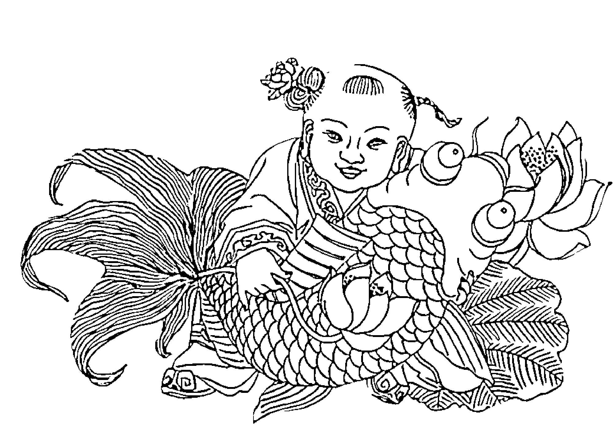

### 壹 李唐一枝獨秀，李落眾花齊放

---

### 二十一個李子的天下 ——預言唐代21帝

### 《推背圖》第二象 乙丑

> 讖曰
累累碩果 莫明其數
一果一仁 即新即故

頌曰
萬物土中生
二九先成實
一統定中原
陰盛陽先竭

> 余秋雨在參觀莫高窟時有此感嘅：「人世間能有的色彩都噴射出來，又噴得一點也不野，舒舒展展地納入細密、流利的線條，幻化為壯麗無比的交響樂章……大唐帝國就該這樣，這樣才算大唐帝國。我們的民族總算擁有這麼一個朝代，總算有過這麼一個時刻，駕馭如此瑰麗的色流，而竟而指揮若定。」

確實，唐朝是一個最昌盛的國度，是一段最旖旎的時節。在時間與空間的座標上，它是一個讓自信與活力恣意綻放的最閃耀的點。如日中天的國力、血脈旺盛的生命力、八面來風的宏大氣度共同綻放出一朵讓後世嘆為觀止的盛世牡丹。

這個世界公認的中國最強盛的時代之一，竟開始於「中國一切史書中最受貶低的一位君主」——唐高祖李淵。他的聲譽之所以蒙受損失，一來是因為他的統治時期很短，而且是夾在中國歷史上最突出的兩個人物統治期的中間，與二人相比，他既沒有隋煬帝勞民傷財、昏庸治國的斑斑劣跡，也沒有唐太宗開創貞觀之治的卓越功績，他就像波瀾起伏的樂章中的一個休止符，被人們所忽略。實際上，身為大唐帝國的開創者，李淵顯然是一位深謀多算、善於決斷、富遠見、善施行的政治家和軍事家，至少他完成了「一統定中原」的夢想。二來，是因為他建立唐王朝的功績被他的接班人精心地掩蓋了。

那位搶去李淵的風頭和功績的接班人，便是中國帝王中最初一位被中國人真心稱頌崇拜的人物——唐太宗李世民。他的一生，除卻「玄武門之變」會被拿來質疑外，其他的一切近乎完美。戰場上的他，英勇無畏，箭法如神，令突厥人聞聲膽裂；龍椅上的他，治國安邦平天下，以社稷之樂為己樂，以人民富足為己福；家中的他，溫和仁厚，既是好丈夫又是好父親。他，造就了中國歷史上最富獨特魅力、充滿浪漫、充滿激情的時代——「盛世貞觀」。但在選擇王位繼承人的問題上，他始終心存遺憾，立「仁孝」的九子李治為太子，實在是迫於無奈之舉，故而到了生命的最後一刻，他仍在為這個性格軟弱的兒子是否能將李唐的江山繼續發揚下去而擔憂。

太宗的擔憂確實有其合理之處，唐高宗李治雖勤勉刻苦、天性仁慈，是個好心人，居於帝王之位卻總歸有一些缺憾存在。懦弱的個性和虛弱的身體，令他在面對朝堂上的巨大壓力時，難免有力不從心之感。幸而，此時有人接手了他的工作，替他處理堆積如山的政務。

這個「臨危受命」之人，便是李治的妻子、中國歷史上唯一的女皇帝武則天。作為一介女流，武則天有著傳統觀念中男人才有的氣魄、剛毅與# 推背圖和燒餅歌裡的歷史

才幹，從李家人的手中接過江山，改國號為「周」，創造一段上承「貞觀之治」、下啟「開元盛世」驚世傳奇。自武周時期起，整個唐朝社會的女子，自由了許多，也活躍了許多。或許，於古人而言，這便是所謂的「陰盛陽先竭」。即便如此的與眾不同，武則天仍無法跳脫時代的束縛，在固有思想的影響下，她最終還是將政權送還到了李家人的手中。

接掌武則天帝位的，是她的第三個兒子李顯，世稱「唐中宗」。李顯的一生如戲劇般曲折多變，他兩得立儲、一次被廢、兩次登基，是歷史上為數不多的兩番登基的皇帝。多番來往於「天堂」和「地獄」之間，李顯遭受了極大的刺激，即便是登上帝位之後，他也無心政事，事事依賴於強悍的皇后韋氏，最後竟被她毒死，實在窩囊。

沒有了中宗這個障礙，韋皇后一心想要成為繼武則天之後的第二位女皇帝。然而，「螳螂捕蟬，黃雀在後」，唐睿宗李旦竟成了接任王位之人。身為武則天的第四個兒子，李旦的一生和他的哥哥李顯一樣，非常富有傳奇色彩。在波詭雲譎的朝堂上，雖兩次登基，卻都非出於本願，他厭倦政務，習慣於在激烈的政治鬥爭中過屬於自己的平淡生活。因此，在第二次即位之後不久，他第三次「讓天下」，把皇位傳給了太子李隆基。

不想，李旦的這一讓，不僅讓出了新君玄宗，也讓出一個太平盛世——開元之治。唐玄宗李隆基，正如廟號中的「玄」字那樣，是一個充滿玄妙的奇特之人，他幾乎是個文武全才。他是個道道地地的君主，恢弘的氣度，高瞻遠矚的眼光，勢不可擋的吸引力，鑄就了一位一流的政治家；他又是個名副其實的文人，舞文弄墨，吟詩唱和，放蕩不羈，成就了一個才華橫溢的風流才子。

他兼具政治家冷峻的現實主義精神和文人的浪漫主義情調；他既有敏銳果敢的政治行為，又有感情用事的自由任性。矛盾的氣質，讓他從平凡走向成功，創造了無與倫比的盛世；又從成功轉入失敗，親手將自己開創的盛世推入了萬劫不復的深淵。那次唐朝歷史上最嚴重的大動亂——安史之亂，不僅讓他失去了最寵愛的絕代佳人，也失去了已經坐了45年的皇位。

亂世中，唐肅宗李亨上場。在他短短七年的帝王生涯中，有兩個鮮明的主題：一是組織平叛，二是處於與父親唐玄宗的關係。由於精力有限，從肅宗時開始了後宮與宦官勢力膨脹的情形，給此后的大唐帝國留下了難消的隱患。

此后的唐朝，開始在下坡路上滑行，任誰也無法阻止。接下來的十三代君王，雖然有些也曾努力想要恢復曾經的泱泱帝國，但一切的努力不過曇花一現般，轉瞬即逝，唐朝還是隨著歷史的車輪不可逆轉地朝黑暗的深淵墜落。

唐朝，已經離我們很遠了，但那段恢宏、磅礴的歷史仍是後世之人苦苦追求和嚮往的目標。自618年高祖李淵稱帝開始，到907年梁王朱溫篡位滅唐，李家的天下一共持續了289年，與《推背圖》中「二九先成實」所說的二百年九十年，偏差僅為一年。而歷經二十一世的君王，與盤中的21個李子一個不差，果真應了「一果一仁（即人），即新即故」之語。

無論何才，在這289年的大唐歷史中，齒頰生香的詩歌、醇美醉人的佳釀、絢麗多變的樂舞、寬簡疏順的律令……皆是盛世年華所演繹出的動人傳奇，以「累累碩果，莫名其數」來形容，想必毫不為過。

如此輝煌的一段歷史，即便是李杜再世，也必定無法用筆墨將其述盡，但《推背圖》中的一幅圖競能全部涵蓋其中。一個看似平常的盤子中，堆放著二十一個像極了李子的水果，各不相同的李子中，最突出的莫過於第四個。與其他帶「柄」的李子不同，它是沒有「柄」的，是否正與大唐的第四代君王為女皇暗合呢？不得而知。

# 事件紀：

###### 唐太宗之死

唐太宗李世民是唐諸帝中第一位迷戀金丹服餌養生術的皇帝。長期的戎馬生涯和緊張激烈的政治、軍事鬥爭，極大地損壞了太宗的身體，從貞觀六年（西元632年）開始，太宗的體質就每況愈下。貞觀十年（西元636年），遼東戰役回來時，唐太宗得病，開始服用方士提煉的金石丹藥。貞觀二十一年（西元647年），太宗與高祖一樣得了「風疾」，煩躁怕熱。次年，派人從中天竺求得方士那羅邇娑婆寐，由於長期服食「延年之藥」，結果使病情不斷惡化，最終不治身亡。

##### 日月当空，不文亦武临天下
——预言武则天当政

《推背图》第三象 丙寅

> 谶曰
日月当空 照临下土
扑朔迷离 不文亦武

颂曰
参遍空王色相空
一朝重入帝王宫
遗枝拨尽根犹在
喔喔晨鸡孰是雄

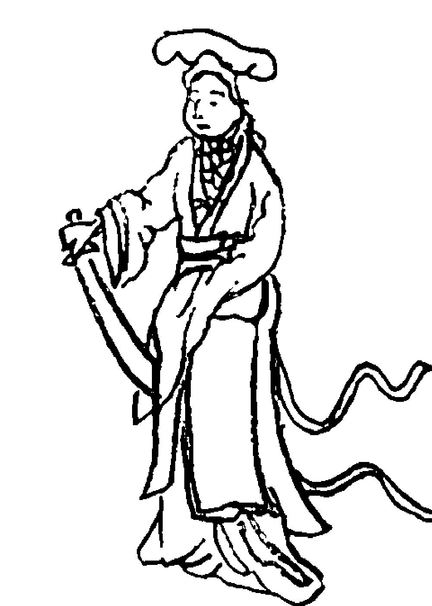

马基维利在那部献给君王的名作——《君王论》中提出：君主应该要效法狐狸与狮子，狮子的凶猛让人无所畏惧，勇往直前；狐狸的狡猾令人频出变牌，变幻莫测。将二者巧妙地合而为一者，方能保证帝国的正常运转。

依据这一标准来判断，唐高宗李治显然不是一位称职的君王。性格软弱的他，不具备狮子的勇猛；天性仁慈的他，也无法效仿狐狸的狡诈。武则天却不同，她生性强悍刚硬，单是「三物降服烈马」一事便表露无遗；她心机城府极深，能在尔虞我诈的宫廷斗争中生存下来并登上权力的最高峰便足以说明一切。

如此強烈的差異對比，也難怪李世民直到撒手人寰之際，仍然對把天下交給李治充滿了顧慮。其實早在他身強力壯、聽到「唐朝三世之後，女主武王當有天下」的《秘記》時，就已經開始為後世之人掃除障礙了，但當時身為太史令的李淳風的一番話，讓他放下了已經舉起的屠刀。李淳風說：「此人已在宮中，從今起不到三十年，必會據有天下，且斬殺唐氏子孫。此乃天意，不可違。若此時將其處死，必會有較之更兇猛的人來代替，到時唐氏子孫恐無一能生還了。」

與失天下相比，被滅族顯然更恐怖，因而李世民選擇接受「天命」。所謂的「天命」，只是一種可能、一個機會，真正要將其變為現實的還是離不開追求「天命」者的執著與決斷，藉此以戰勝過程中的重重阻礙。

武則天遇到的第一個難關，便是李世民的死。自十四歲入宮以來，雖然也曾有幸得到過太宗的寵幸，並獲得了御賜之名——武媚，但始終未能成為預想中皇上跟前的紅人。她生命中最燦爛的花樣年華，便一直在無人問津的後宮中度過，直到二十六歲唐太宗去世。

俗話說：舊的不去，新的不來。舊的確實已經成為了過去，但那個離開的人並非一般人，他需要非常多的人為他的離開而哀痛，即使是被逼的。於是，武則天和其他一些沒有生下子嗣的嬪妃們一起被送往感業寺出家為尼，暗合「參遍空王色相空」之說。

於其他的嬪妃而言，這便是故事的終結，但對武則天而言，這才是真正的開始，因為她還有一個最具分量的籌碼：曾經的太子、如今的皇上李治。為了保證長期身處「花叢」中的李治銘記對自己的痴迷，她寫下了一首與自己個性很不符的詩作——〈如意娘〉：

> 看朱成碧思紛紛，憔悴支離為憶君。不信比來長下淚，開箱驗取石榴裙。

如她所願，李治在心懷鬼胎的王皇后的支持下，把這個曾經是父親女人的女子接回了宮中，實現了她「一朝重入帝王宮」的夢想。重新回歸「舞臺」的武則天，甩起政治的「水袖」，盡情舞蹈，其光彩一點點地超過了原本的主角唐高宗。

所有人都始料未及，事實卻正無可變更地發展著。在一幕三人相繼出場的舞臺劇中，王皇后的離開，給武則天製造了「作案」的機會，她用身為母親的雙手結束了女兒的生命，緊接著孩子的父親出場，殺人兇手自然鎖定了王皇后。后位之爭就此落幕，武則天成功上位，一躍榮升為整個後宮的主角。

腳下的路還在延伸，遠方的目的地已經清晰可見，那就是帝位。登上后位的武則天，徹底控制了李治，自此，她就像古羅馬暴君尼祿之母阿格里庇娜一樣，隱身在紗簾之後處理朝堂大事。原本就已經是「被關進籠子裡的統治者」，如今大權更是落到了自己妻子的手中，懦弱的李治也忍無可忍了，他聯合近臣上官儀商量廢后事宜。消息很快傳到了武則天耳朵裡，上官儀被殺，李治徹底妥協。

然而，這件事卻令武則天產生了「去唐朝化」的想法，即把所有唐朝的因素都剔除掉，唯此自己的勢力才能逐漸培養、形成起來。曾經李世民向她舉起的屠刀，如今調轉方向落到了李家人的頭上，即便是持刀者的親骨肉也「一視同仁」。先是二十四歲的太子李弘被毒酒殺死，接著次子李賢被貶為庶民、死於貶地巴州，隨後三子李顯被廢、四子李旦繼位是為睿宗。

或許是李顯與李旦的軟弱不足為慮了，也或許是心靈最深處的母性使其有所悔悟了，手起刀落的事情最後沒有發生在李顯和李旦的身上，這是武則天「去唐朝化」過程中的「遺留問題」，也是所謂的「邏枝撥盡根猶在」。

所有的障礙都已消除，一切的工作都已準備就緒，武則天再無法忍受躲在背後的日子了。西元690年，武則天降睿宗皇帝為皇嗣，自稱「聖武皇帝」登基稱帝，改國號為「周」，改元「天授」，成為中國歷史上唯一真正的女皇帝。自感聪慧绝顶、天资过人的武则天特别另创一字「曌」，作为自己的名字，意为「日月当空，照临下土」。

一个看似柔弱的女子，手持钢刀化身为武，头戴冠冕称帝为王，在向来以男性为君的社会中，不免给人以雌雄莫辨，「扑朔迷离」之感，还有人以《万年歌》中的那句「又见止戈不复礼」来强调武氏对古代礼制的破坏，然而其过人之处却异常，一如林语堂先生在《武则天正传》中所言：

> 「生活对她而言就如同游戏一样，她有比普通人更强烈的欲望，……她决心要做一个有史以来最有威权最伟大的女人。……她武姓家庭中没有一个人有她一半的智慧、一半的个性、一半的政治才能。」

#### 争议纪：

###### 武则天重用酷吏

酷吏政治既是武则天改朝换代的必要手段，也是必需的步骤。武则天统治时期的酷吏确实杀害了不少良相权臣，但要特别提出的是她并不是像商纣王那样残暴成性的暴君，而是在改朝换代前后重用酷吏。就像汪篯、吴宗国在《中国史纲要》中说的那样：

> 「武则天诛杀的范围虽然比较宽泛，但主要的对象是关陇军事贵族。关陇集团经过她的严重打击，在政治上就不起很大作用了。这样一看，武则天使用酷吏的目的很明确，完全是为了打击政敌，巩固政权。」

而且当统治稳固后，她以循吏治天下，适时地抛弃了酷吏。

# 五猴扶持將傾大唐 ——預言李唐政權的奪回

# 《推背圖》第四象 丁卯

> 讒曰

飛者不飛 走者不走
振羽高岡 乃克有後

> 頌曰

威行青女實權奇
極目蕭條十八枝
賴有猴兒齊著力
已傾大樹仗扶持

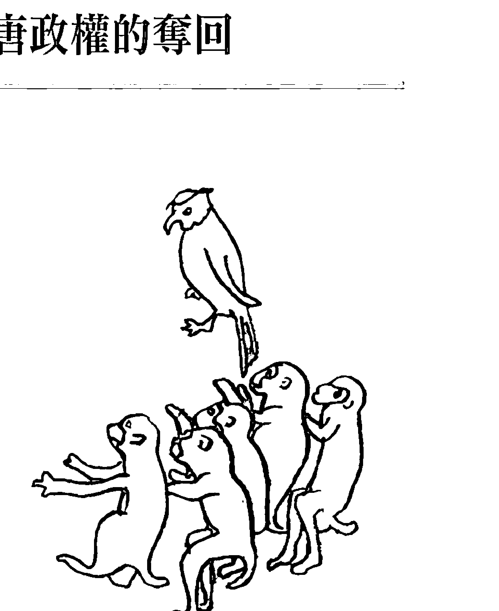

在充分肯定武則天的智慧、個性與才能的同時，林語堂先生也對其做出了另一番辨不出褒貶的評論：「武則天這個女人是古今少有。與其他高貴的女人是不易相比的。既不是埃及艷后克麗拉，也不是俄羅斯凱薩琳女皇。她一部分像英國伊莉莎白女皇，一部分像法國亨利二世的皇后凱薩琳·德·美第奇。她有那位英國女皇的精力，有法國皇后的殘忍。當然，她是匈牙利與波希米亞馬莉亞德薩莉皇后的正相反的人物。武則天公然藐視道德家，史學家不知把她在位的年間的年號怎樣稱呼，也沒法決定對她的稱呼。因為她是皇帝的情婦，是篡奪帝位的人，是皇后，更慌亂的是——她是『女皇帝』，所以我稱為『武氏』。她粉碎的傳統，創設的改革，引起的紊亂，超過歷史上任何陰謀險詐的男人。」

對於中國歷史上的這位女皇帝，向來褒貶不一。唐中宗時期的陸贄、李絳，宋洪邁，清趙翼等人都很尊重武則天，對她的評價很高。與此同時，她也存在一些為後世之人所詬病的特殊舉動，其中一個最主要的方面恐怕就是她的私生活了。

武則天在登上帝位之時，韶華已逝，但她還是讓那個原名馮小寶的年輕男子作了自己面首，並安排他擔任洛陽一座主要寺廟的主持，「隨時出入禁宮，不論早晚」。然而，這個偉岸淫毒的「佛僧」並未能獲得武則天長久的寵幸。失寵的馮小寶心懷怨懟，不僅一把火燒掉了女皇親自下令建造的明堂，還如潑婦一般用最惡毒的謠言攻擊曾經對自己萬般寵愛的女皇。

如此一來，激怒了本就已經對他產生厭倦的武則天，過往的百般歡愛、萬般尊崇都如雲煙般消散，馮小寶自此退出了武則天的視線，也退出了人生的舞臺。

失去馮小寶，顯然武則天並不痛心。畢竟，普天之下，莫非王土；率土之濱，莫非王臣，要想尋找另一個以供歡愛的面首並非難事。很快地，張易之、張昌宗兄弟便接替了馮小寶的位置，成了武則天的新寵。

但武則天畢竟不是平常女子，在痴迷於張氏兄弟的同時，她仍清楚地把握著帝國的航向，未曾使其出現任何的偏差。然而，歲月不饒人，已步入古稀之年的女皇，不得不將選擇繼承人的問題提上日程。武姓與李姓，成了擺在女皇面前的兩個選項。這道二選一的題目和許多曾經過立儲抉擇的帝王一樣，困擾著武則天。

一個奇特的夢境，幫助武則天做出了決定。一天，睡夢中她見到一隻大鸚鵡，兩個翅膀都折斷了。醒來之後詢問眾大臣的意見，宰相狄仁傑將其解釋為：「鸚鵡指的是陛下，兩翼指的是陛下的兩個兒子，只有起用兩位皇子，鸚鵡才能飛翔。」暗示武則天應將皇位歸還李家。清初學者金聖嘆將其視為《推背圖》中「飛者不飛，走者不走」的佐證，未免過於牽強。

或是由於夢境，或是由於狄仁傑的建議，又或是由於《推背圖》的預言，且不論是哪個力量的影響，武則天最終還是決定將皇位傳給自己的兒子，把天下還給李家。於是，在聖曆元年（西元698年），武則天立自己的三子李顯為皇太子，正式賦予了他將來接掌大印的資格。

儲位既定，按照正常順序的話，必然是武則天駕鶴西去之後，李顯即位。但一切就像武則天驚世駭俗的人生一樣，她的退位也遠遠超乎想像。八十一歲的武則天臥病在床後，任由她的面首——張氏兄弟於政務上胡作非為。與此同時，一場針對這位耄耋老嫗的陰謀正在醞釀，蓄勢待發。

而這場密謀的策劃者，同樣也是一位耄耋老人——張柬之。居於宰相之位的他，雖已年過八十，仍時刻惦記著恢復李唐之事。自從張氏兄弟開始干預朝政以來，他便暗中聯合扶陽王桓彥範、平陽王敬暉、南陽王袁恕己和博陵王崔玄暐，準備逼女皇退位。

一切準備就緒，神龍元年（西元705年）正月二十三日，張柬之率左右羽林軍500餘人，從玄武門湧入宮中。他們順便把東宮中無權無勢、膽小怕事的太子李顯，也一併拉進了武則天養病的迎仙宮。從睡夢中驚醒的武則天，見對方來勢洶洶，一時失了神，只能眼睜睜地看著兩個心愛的面首死在自己的面前。

她也曾想過要反抗，不料張柬之的態度更是強硬，刀已經架在脖子上了，也只能按張柬之要求的那樣宣佈退位。不久，李顯登上帝位，是為唐中宗，真正掌握了國家的政權。一場恢復李氏江山的奪權活動塵埃落定。曾經貴為九五之尊的武則天，幾個月後病死上陽宮，結束了其奮鬥而傳奇的一生。

或許，在許多後世之人看來，從武則天執掌朝政開始直到其退位的50年，實在可以稱得上「威行青女實權奇」。而張柬之等五人的恢復李唐之舉，也與《推背圖》中的「賴有猴兒齊著力，已傾大樹仗扶持」暗合。細細看來，將被武則天奪去的李唐江山視為「已傾大樹」尚算合理，但將張柬之等人稱為「猴兒」未免就有些匪夷所思了。故而，也有人將這一象解讀為中宗復位後的那段歷史。

江山雖然恢復了李姓，但朝廷的動盪較之以前更為猛烈了。長年生活於驚恐之中的李顯，早已無心朝政，他更願意與受迫害時常伴自己左右的菩薩為伴，因此，在他復位之後，經常會把最聖潔的僧人召進皇宮之中，與其聊天。

與李顯的溫和與淡泊相對應的，是他背後那個權力欲望極大的女人韋后和自己最寵愛的女兒安樂公主，她們野心勃勃地注視著李唐的天下，都希望自己能成為武則天第二。她們勾結武則天死後一度失勢的武三思，將張柬之等人擠出朝堂、逼太子李重俊造反。對韋后一向信任有加的中宗回過神來時，才發現一切都已經不在自己的掌控之中了。

中宗此時面對的韋后專權，就和父親高宗面對的武則天專權一樣。這父子二人的命運竟是如此的相似，但結局卻截然不同，高宗總算是壽終正寢，中宗就遠沒有那麼幸運了。已經被權力的欲望迷失本性的韋后與安樂公主，為了排除稱帝路上最大的障礙——中宗，竟密謀毒死了這個對她們萬般寵愛的男人。

李顯萬萬沒有想到，自己竟是死在愛妻和愛女的手中。十八年的囚禁生活中，他未曾怨恨過誰；五年的逍遙皇帝，他還會念及骨肉親情，赦免武氏家族。在這個世界上，他真的有所虧欠的，或許就只有曾經與自己共患難的妻子韋氏，因此，在他得勢之後，盡一切的可能滿足韋氏的願望，但他唯一不能給她、也沒有權力給她的就是李唐的江山，偏偏韋氏要的就是這樣他不能給的。

中毒而亡的中宗已无力阻止韦氏母女的夺权之路，但李家的其他人还可以。景龙四年（西元710年）六月二十四日夜，中宗的侄子临淄王李隆基像当初的张柬之一样，率羽林军冲入皇宫，杀了韦后、安乐公主和其他韦氏的亲信，拥立李旦为帝，是为唐睿宗，使江山重新回到了李家人的手中。

无论是武则天，还是韦氏母女，也无论她们掌权的时间长与短，唐朝的江山最终还是变回了李姓，也就是所谓的「已倾大树仗扶持」。至于它到底指的是哪个女人当政，哪个人夺权，终究只是一个过程。

#### 人物纪：

# 安樂公主

安樂公主，唐中宗李显的第七女，是中宗被废后与韦氏在赴房州途中所生。原名李裹儿，她姿性聪慧，备受中宗与韦氏的宠爱；容貌美艳，有「唐朝第一美人」之称。中宗被召回东宫之后，武则天格外欣赏她，封其为安乐公主。她先嫁予武三思之子武崇训为妻，后又嫁武承嗣之子武延秀。中宗统治时期，安乐公主恃宠而骄，权倾天下。景龙元年（西元710年），发动宫廷政变，企图挟相王李旦和太平公主，拥母亲韦后为女皇。不料，太平公主和临淄王李隆基技高一筹，立李旦为帝，政变失败，安乐公主死。

##### 渔阳鼙鼓葬金环——预言马嵬坡兵变

###### 《推背图》第五象 戊辰

> 谶曰
杨花飞 蜀道难
截断竹 箫方见日
更无一史乃平安

> 颂曰
渔阳鼙鼓过潼关
此日君王幸剑山
木易若逢山下鬼
定于此处葬金环

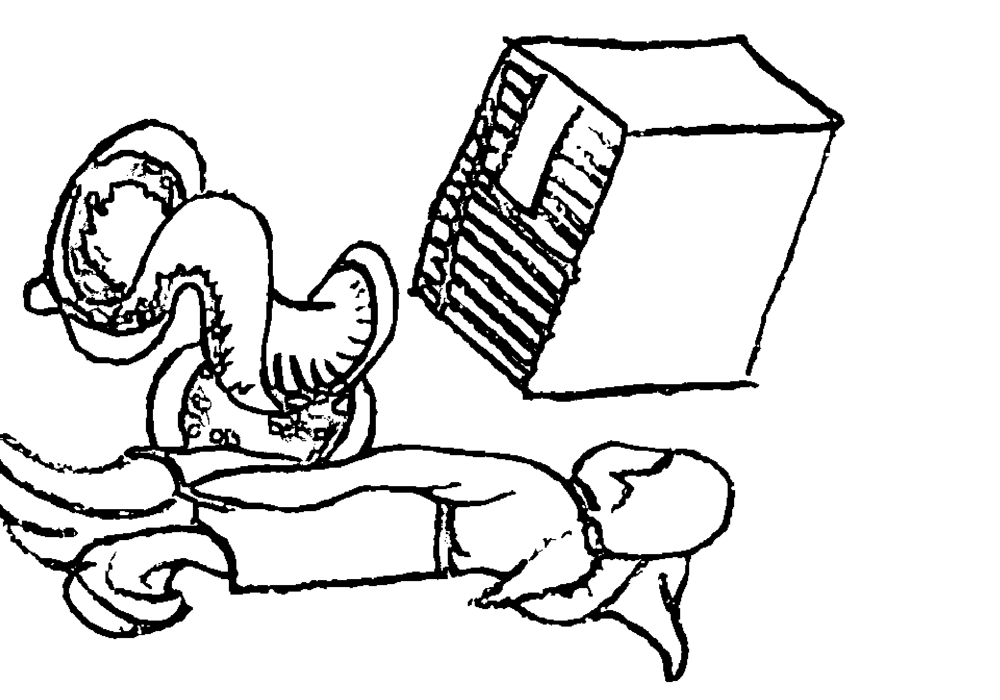

相传：天上一颗星，谓之玄星，又谓之金星，又谓之参星，又谓之长庚星，又谓之太白星，又谓之启明星。初上时，东方未明；天色将晓，那颗星便渐渐地暗下来。先明后暗，谓之玄。中国历史上一位步入大唐盛世巅峰、又一落千丈跌入低谷的帝王用他的谥号和一生解释了这一星象变化。此人便是唐明皇玄宗李隆基。

李隆基是一个充满玄妙的奇特之人，他玄就玄在几乎是个文武全才，史书上说他：「性英武，善骑射。通音律、历象之学。」奇就奇在无论在什么场合中，都能扮演好相应而又出色的角色。历史学者赵剑敏先生说：

> > 一个人的才干是个圆。圆有规则、不规则，完整、残缺之分。人与人的比较是圆与圆的比较。人的某种才干犹如半径，当绝大部分的半径都超过他人时，就是全才，就是接近完整的圆。玄宗就是这样一个奇罕的圆。

在他身上有政治家的果断，军事家的英武，还有艺术家的气质。

他小时候就很有大志，在宫里自诩为「阿瞒」，虽然不被掌权的武氏族人看重，但他一言一行依然很有主见，八岁时就被封为临淄郡王。二十八岁便登上帝位，定年号为「开元」，以示自己励精图治，再创唐朝伟业的决心，他做到了。

藉着贞观之治的清明，历经几朝的积淀，李隆基开创了开元盛世。「开元之治」是一部杰作。杜甫曾用那首〈忆昔〉对此进行歌颂：

> > 忆昔开元全盛日，小邑犹藏万家室。稻米流脂粟米白，公私仓廪俱丰实。九州道路无豺虎，远行不劳吉日出。齐纨鲁缟车班班，男耕女桑不相失。

那时的大唐帝国经济文化空前繁荣，成为西方仰慕的天朝上邦。

也许是在盛世中生活得太过安逸，他滋长了许多恶习，而且这些恶习越来越严重地表现了出来，正像历史学家范文澜所说：

> > 骄和侈就是两个。骄是实行言莫予违，侈是贪利边功，轻易用武。终于过犹不及。多次战争让他变得昏昏沉沉，为了虚荣的面子，伤了元气。

也许是自身矛盾的个性，注定了他从平凡走向成功的同时，也会将成功演变成一出悲剧，正像赵剑敏所说：

> > （唐玄宗的）一生充满了矛盾，内外矛盾，前后矛盾。在矛盾中成一代伟业，又在矛盾中沦陷下去。

不论是何原因，唐玄宗确实将自己创造的无与伦比的盛世、举世无双的「开元之治」，亲手推入万劫不复的深渊。这其中是否真的有黄仁宇先生在《中国大历史》一书中说的历史规律：

> > 这朝廷已将一个被战争破坏的## 推背图烧饼歌里的历史

帝国扶植复苏而又欣欣向荣，可是这朝廷反不能与它本身一手培植的繁荣状态相始终。此中尴尬情形在唐朝更为彰着。」我们不得而知，但身为一国之君的唐玄宗显然具有不可推卸的责任。

他后期的统治，一意孤行，好大喜功，穷兵黩武，有并吞四夷之志。于是有很多边将十余年不换，开始久任边境的将领经常挑起对异族的战事，以邀战功。唐玄宗将当时的兵制由府兵制改为募兵制，使得节度使与军镇上的士兵结合在一起，造成了边将专军的局面。其中安禄山一人身兼范阳、平卢、河东三镇节度使，掌握重兵。终于趁唐朝政治腐败、军事空虚之机和史思明发动了「安史之乱」。

天宝十四年（755年）十一月十五日，华清池里，唐玄宗和第一夫人杨贵妃正「温泉水滑洗凝脂」。忽然快马来报：安禄山造反了！温柔乡里的唐玄宗说什么也不敢相信他的「干儿子」打起了抢他天下的主意，但事实已经摆在眼前，「胡儿」挥师长安了。唐玄宗这时才清醒过来，想起很多大臣对他的劝告，包括太子。但此时的李隆基处于没有思想准备的状态，安禄山这个政治暴发户的举动十足给华清池泼了一盆闷凉的水，李隆基的盛世也骤然地抽搐与痉挛。

唐玄宗蓦然警醒时，叛军已经是「渔阳鼙鼓过潼关」了。吓得三魂不见了七魄的玄宗，急召宰相杨国忠商议。杨国忠建议玄宗到自己的祖籍蜀地暂避，碍于天子的威严，犹豫再三的玄宗最后还是采纳了杨国忠的建议，带着杨贵妃和她的两位姐姐，连夜逃往蜀地，目标直指「此日君王幸剑山」，正是「杨花飞」离宫、急逃「蜀道难」。

一行人走走停停，天宝十五年（公元756年）六月十四日到达马嵬坡，随行的将士们又累又饿，疲惫不堪。饥饿使人脾气暴跌，先是有人开始抱怨颠沛流离的日子，接着有人开始痛骂杨国忠专权误国以致落得如此下场。

随行的龙武大将军陈玄礼更是激愤异常，视杨国忠为天下大乱的罪魁祸首，不杀他无以解心头之恨。在陈玄礼的情绪感染下，将士们愈发地激奋了。混乱中，有人向杨国忠射了一箭，虽然只是射中其马鞍，却撩起了所有人的怒火。众人一拥而上，要取杨国忠的项上人头。杨国忠见此情形，大惊失色，慌乱逃命中草草地踏上了黄泉路。杨家一时间变成了愤怒的宣泄口，于是将士们又杀了杨国忠的长子户部侍郎杨暄和杨贵妃的两个姐姐韩国夫人、秦国夫人。

得知此事的玄宗唯有亲自出来慰劳将士，试图用温言软语平息众人的怒气。但将士们的情绪岂是一两句话就能平复的，他们将矛头直接指向了玄宗最宠爱的杨贵妃。陈玄礼直接上奏说：「杨国忠谋反已被诛，杨贵妃不应该再待在陛下身边，侍奉陛下了，希望陛下以大局为重，将其正法。」

面对这个自己最深爱的、曾经与自己在长生殿下立下过海誓山盟的女子，玄宗感到极度的无助。外面，将士们已经将居所团团围住，玄宗犹如被逼入死角的困兽，别无选择，只能命高力士把杨贵妃缢死在佛堂前的梨树下。这一年，杨贵妃三十八岁。一切果真如《推背图》所言：「木易（即杨）若逢山下鬼，定于此处葬金环。」

祸国的杨家人，都解决掉了，将士们也就心满意足地散去了。然而，战乱仍在继续。显然，连自己心爱的女子都保护不了的玄宗，注定无法平息这场叛乱。平叛的重任就此落到了唐朝第一个在京城以外的地方登基的皇帝——唐肃宗李亨，他也就是李淳风和袁天罡所指的「截断竹箫（即肃）」者。

肃宗即位之后的几年间，唐军屡破叛军，一点点地收复此前的失地，包括京师长安在内。同时，安禄山、史思明相继被杀。长达八年之久的安史之乱，最后以「更无一史乃平安」告终。虽然大唐的盛世从此无法再现，起码也算得上是获得了暂时的安稳，以「方见日」来形容并不为过。

安史之乱的狼烟早已散去，一副马鞍、一册史书和一个死卧于地上的妇人，竟能将一段惊心动魄的历史如此准确地描述出来，实在令人惊叹。但是，与《太平广记》中所记录的那位精通预测之术的方术李进周写下的预言诗「燕市人皆去，函关马不归。如逢山下鬼，环上系罗衣」相比，未免有些相形见绌。

#### 人物纪：

##### 唐玄宗的艺术成就

唐玄宗擅长诗文，其五律风格雄健，骨气峥嵘，妙句连篇；其乐府诗作得空灵飘逸、生动自然；其散文情理并茂，意境交融。唐玄宗极擅音律。六岁能歌舞，少年时在府中自蓄散乐一部以自娱。他也擅舞，十六岁时曾为祖母武则天表演唐代著名歌舞大曲《长命女》。他还会演奏多种乐器，如琵琶、横笛等，其中羯鼓的演奏技艺尤为高超。他一生作曲无数，闻名于世的有《紫云回》、《龙池乐》、《凌波仙》及遇上杨贵妃后作的《得宝子》等，最著名的就是歌舞大曲《霓裳羽衣曲》。他还被尊为「梨园神」，对唐代歌舞的发展产生了很大的促进作用。玄宗的书法堪称一绝，各体皆备，且各立门户开宗创派，盛况空前。尤擅八分、章草，丰茂英特。

### 阴霾既去，再造人民乐 ——预言肃宗乱世即位

### 《推背图》第六象 己巳

> > 谶曰
> 非都是都 非皇是皇
> 阴霾既去 日月复光

> > 颂曰
> 大帜巍巍树两京
> 辇舆今日又东行
> 乾坤再造人民乐
> 一二年来见太平

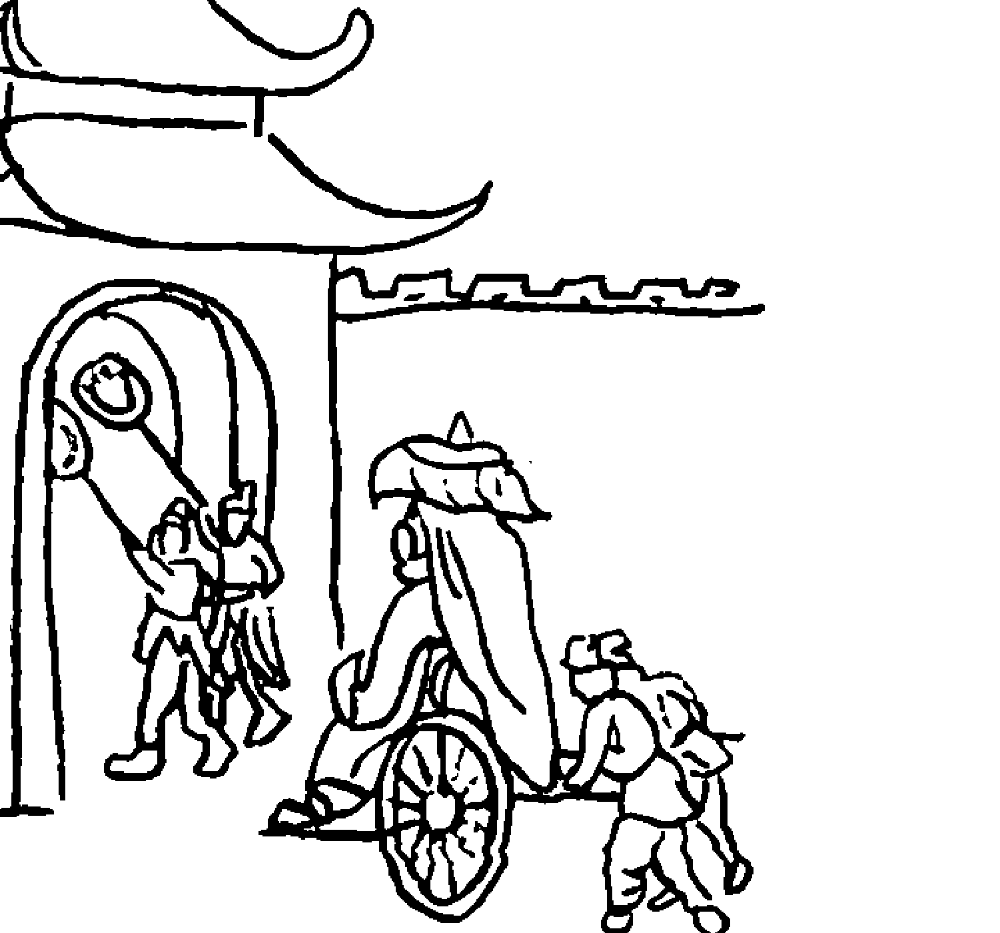

「假如给你一次机会，你愿意生活在中国这五千年漫长历史中的哪个朝代？」「要是出现这种可能性的话，我选择唐代。」「那么，你首选的居住之地，必定是长安了。」20世纪70年代，一次偶然的机会，日本创价学会会长池田大作与英国著名历史学家汤恩比之间有上述的一段对话。长安，唐朝的首都，公元9世纪前全球顶级的国际化大都市，一个让汤恩比舍弃伦敦而前往的城市，堪与古罗马帝国的大罗马地区媲美。一如王维在〈和贾舍人早朝大明宫之作〉中所写「九天阊阖开宫殿，万国衣冠拜冕旒」，长安的宏博与大气，足以震撼所有初次来此者的心灵。

然而，就是这样一座世界最伟岸、代表唐朝百姓心中最理想的城市，在唐玄宗仓皇出逃之后陷入了巨大的混乱中，顿时由天堂堕入了地狱。此时的唐玄宗，早已不是年少时那个深得武则天赏识的李隆基，也不是那个励精图治创开元盛世的唐明皇，只是一个会怕、会逃的普通老翁，连自己心爱的女人都无力保护，又何来的能力捍卫长安城。他只能任由心中的恐惧感无限地蔓延，只能出于本能地拼命逃亡。即便于马嵬坡处，「君王掩面救不得，回看血泪相和流」，仍然未曾放慢西逃的脚步。

被纷飞的战火点燃的恐惧不只弥漫于玄宗的心中，同时也焦灼着百姓的生活。眼见大唐正处危难之际，人们自然而然地将救民于水火的希望，寄托在了身为一国之君的身上。马嵬坡的百姓是幸运的，他们离那场「渔阳鼙鼓动地来」的兵变如此近，他们甚至能在一切归于平静之后，以百姓「代表」的身份请求玄宗留下处理叛乱；他们又是不幸的，与大唐疆域其他地方的百姓一样，他们被逼卷入战乱，听闻都城失守、皇帝西逃，但当他们集体拦驾恳求玄宗时，万万没有料到，这位曾经令万人敬仰、带给他们富足生活的帝王，竟如惊弓之鸟般置他们于不顾，绝尘而去。

于是，他们将目光转向了太子李亨，希望他能留下来，并纷纷表示愿意追随太子讨伐叛军，史书更是将其描述为当地「父老共拥太子，马不得行」。去意已决的玄宗，见事已至此，也无力再阻止什么了，便留下李亨平乱，自己奔川地而去。

太子李亨则北上，一路收拾残兵败卒。公元756年，到了朔方节度使所在地灵武，随行不到三十人的文武诸臣纷纷上书劝进，请求他即皇帝位，「六上笺，上不得已，乃从。」四十四岁的李亨，终于在半推半就间于灵武城南楼登上了帝王宝座，改天宝十五年为至德元年，是为唐肃宗。遥尊玄宗为上皇天帝，并大赦天下。

肃宗此举被宋代史家范祖禹视为「太子叛父」，视为「不孝」，其最主要的依据便是，避难成都的玄宗并不知道太子称帝一事。就在李亨称帝前三天，玄宗还颁下诏书，又是任命职位，又是分封地盘，显然玄宗并没有让位的打算。就在诏书发出去不久，玄宗就收到李亨即位、天下易主的表奏。如此一来，玄宗与肃宗都成了皇帝，长安与灵武成了「大帜巍巍树两京」，因而有了「非都是都，非皇是皇」一说。

且不论李亨的即位是否属于正统，这位身为太子时整日如履薄冰、战战兢兢的肃宗，虽然个性软弱，却也不失为一位积极而善意的帝王。在不长的帝王生涯中，他几乎将所有的精力都致力于两件事情上：一是「北集戎事」，即组织平叛，收复失地；二是「南奉圣皇」，即处理与太上皇玄宗的关系。

在平定叛乱的过程中，李亨得到了一位伟大的军事家的协助，这个人就是在唐朝复辟过程中最大的功臣郭子仪。在郭子仪这个军事忠诚和献身王朝的榜样的统率下，大唐的军队一点点地收复此前被叛军夺去的失地。至德二年（公元757年）九月二十八日，唐大军进入长安，长安由此收复。肃宗李亨回到长安时，城中的百姓出城二十里相迎，喜不自胜。至此，世人已经看到了「阴霾既去，日月复光」的曙光。

平定叛乱的工作还在继续，但回到长安的肃宗还惦记着远在蜀地的父亲玄宗。于是，在他回到长安后的十二月，便将玄宗接回了长安。玄宗由西南的成都回去国都长安，这趟东行之旅，正暗合了「辇舆今日又东行」一说。

然而，已经交出传国玉玺的李隆基，在长安城南兴庆宫的幽居生活并不快乐。虽然回到了这个曾带给他无数欢愉的国都，但已经物是人非了。他不再是万民拥戴的皇帝，而像当年自己的父亲李旦一样，成了闲人太上皇；他身边再也没有那个与他共度缠绵时光、令他「从此君王不早朝」的曼妙女子，而像杨玉环出现之前的那一年多的时间一样，终日被孤寂所笼罩。此外，还有一件非常令他痛心的事情，儿子李亨由于受制于张皇后，竟不敢来探望自己，令父子之情如山水相隔。

这般无奈的生活，想来任谁都深感煎熬。值得庆幸的是，那个懦弱的皇帝儿子终于有一次不顾老婆的阻挠，在玄宗离世的三个月前，来见了老父亲一面，也是最后一面。上元三年（公元762年）四月五日，抑郁的唐玄宗走到了生命的尽头，死于兴庆宫，享年七十七岁。后世之人将他的晚年形容为：「南内（指兴庆宫）凄凉西内（指太极宫）荒，淡云秋树满宫墙。由来百代明天子，不肯将身做上皇！」

显然，在处理与太上皇的关系问题上，李亨未能如愿以偿。而在平定叛乱一事上，李亨总算获得了一些安慰，虽未至「乾坤再造人民乐」的程度，却也真的是「一二年来见太平」了。

可惜，肃宗最终还是没能等到太平时代的到来。由于将过多的精力放在了「北集戎事」和「南奉圣皇」上，他忽略了后宫和宦官势力的急速膨胀。最后只能眼睁睁地看着自己的妻子被家奴押走，而毫无办法。经过这一突如其来的惊吓和羞辱，本就卧病在床许久的肃宗病情急转直下，竟在父亲玄宗去世后的同月便也与世长辞了。皇帝父子，一为太上皇，一为在职皇帝者同年同月辞世的，中国仅此一例外而已！

## 推背图和烧饼歌中的历史

而像杨玉环出现之前的那一年多的时间一样，终日被孤寂所笼罩。此外，还有一件非常令他痛心的事情，儿子李亨由于受制于张皇后，竟不敢来探望自己，令父子之情如山水相隔。

这般无奈的生活，想来任谁都深感煎熬。值得庆幸的是，那个懦弱的皇帝儿子终于有一次不顾老婆的阻挠，在玄宗离世的三个月前，来见了老父亲一面，也是最后一面。上元三年（公元762年）四月五日，抑郁的唐玄宗走到了生命的尽头，死于兴庆宫，享年七十七岁。后世之人将他的晚年形容为：「南内（指兴庆宫）凄凉西内（指太极宫）荒，淡云秋树满宫墙。由来百代明天子，不肯将身做上皇！」

显然，在处理与太上皇的关系问题上，李亨未能如愿以偿。而在平定叛乱一事上，李亨总算获得了一些安慰，虽未至「乾坤再造人民乐」的程度，却也真的是「一二年来见太平」了。

可惜，肃宗最终还是没能等到太平时代的到来。由于将过多的精力放在了「北集戎事」和「南奉圣皇」上，他忽略了后宫和宦官势力的急速膨胀。最后只能眼睁睁地看着自己的妻子被家奴押走，而毫无办法。经过这一突如其来的惊吓和羞辱，本就卧病在床许久的肃宗病情急转直下，竟在父亲玄宗去世后的同月便也与世长辞了。皇帝父子，一为太上皇，一为在职皇帝者同年同月辞世的，中国仅此一例外而已！

#### 人物纪：

##### 郭子仪

郭子仪，唐代著名的军事家，武举出身，身材魁梧，体魄健壮，相貌秀杰。自幼爱读兵书，勇武不凡，阵法娴熟。入仕之后，因屡立战功，多次升迁。安史之乱爆发前，他已官至天德军使，兼九原太守、朔方节度使右兵马使。安史之乱时，他在河北打败史思明，后收复洛阳、长安，功居平乱之首。他戎马一生，直到八十四岁才告别沙场，「权倾天下而朝不忌，功盖一代而主不疑」，其高山景行于举国上下皆享有极高的威望。唐德宗建中二年（公元781年），以八十五岁高龄辞世，生前死后，哀荣始终。

### 10 吐蕃破关乍来，中原哭声骤起——预言吐蕃入侵

### 《推背图》第七象 庚午

> > 谶曰
> 旌节满我目 山川竭我足
> 破关客乍来 陡令中原哭
> 颂曰
> 蚁蚁从来足溃堤
> 六宫深锁梦全非
> 重门金鼓含兵气
> 小草滋生土口啼

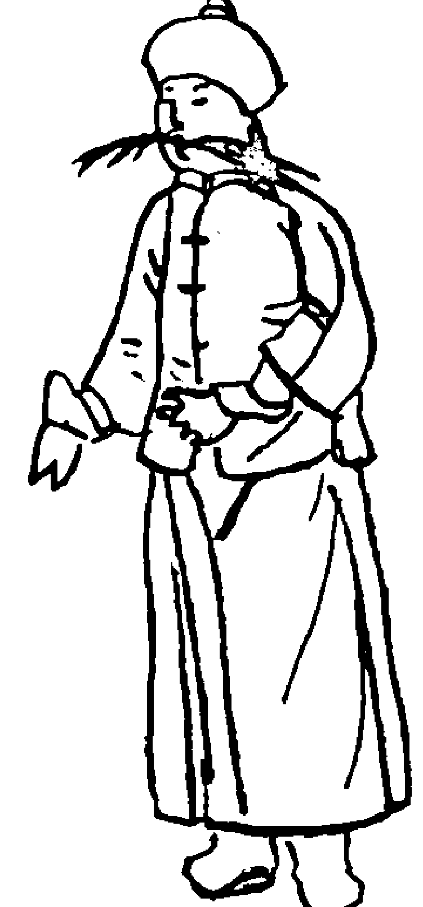

公元6到8世纪是西欧人眼中的「黑暗时代」，而西欧之外的世界此时并不「黑暗」，尤其是在亚洲大陆上，大唐帝国正书写着自己的传奇。

初唐时期，「举天下不敌关中，居重驭轻之意明矣」（陆敬舆（即唐代政治家陆贽）语），大唐彻底一扫蔓延四个世纪的边塞颓势。打破了自东汉以来，西北大漠、北面草原在中国军人的精神里种植的畏惧感，用不断的胜利撑起了民族的自信心，建立了一个西至咸海、北越过贝加尔湖、西南濒临阿拉伯海的大唐帝国。

用著名历史学家范文澜先生的话来说，就是：「唐朝前期的对外关系，比两汉有更大的发展，唐取得的巨大成就，首先由于战胜强大的突厥国，从而使东西交通畅达无阻，中国和四邻诸国都得到益处。」除却与四邻诸国的和谐相处，大唐也与周边的诸多民族建立了良好的关系。

那时的唐朝，经济繁荣，文化发达，国家富强，是当时的世界强国。来自世界各地的商人云集长安，和唐人做生意，他们以来到长安为荣。这些商人成为文化交流的使者，为中原地区和各少数民族的交往做出了重要贡献。正是唐朝的强大，使得周围各少数民族首领纷纷表示臣服。为了加强自己和唐朝的亲密关系，都争先恐后地派使者向唐求婚。就像柏杨先生所说的那样：「中国史上越是强悍的朝代，如汉唐，就越是喜欢和亲，越是孱弱自卑的朝代，就越是没有任何和亲的资格。」因此，唐朝的和亲显示的是一个大国的强盛之音。

在诸多和亲中，最广泛为人们所熟知的，莫过于文成公主远嫁吐蕃了。吐蕃——即为「小草滋生土口啼」之所指——这个西藏高原上的古老民族，于公元6—7世纪逐渐强大起来，与中原的大唐帝国始终保持着时战时和的关系，犹如一对欢喜冤家一般。到了贞观时期，吐蕃已是西南举足轻重的强邦，深谋远虑的唐太宗，认为只有对吐蕃加强笼络，才能保证大唐西南边陲的稳定，因此才千方百计地对他们从经济和文化上予以协助，使吐蕃在潜移默化中感激和追随大唐，文成公主实际上就是肩负着这项和睦邦交的政治任务远嫁的。

文成公主确实也不辱使命，在她入藏后的三十余年内，唐朝和吐蕃的关系虽算融洽，但也只是短暂的和平。拥有令世界赞叹的实力的大唐帝国，显然未对边陲的吐蕃引起足够的重视。正是「蝼蚁从来足溃堤，六宫深锁梦全非」，从松赞干布起一点点发展壮大的吐蕃，就犹如唐朝眼中的蝼蚁，虽不致使大唐帝国的千里之堤毁于一旦，却也足以令李家的天子不得安宁了。

> > 正是「蝼蚁从来足溃堤，六宫深锁梦全非」，从松赞干布起一点点发展壮大的吐蕃，就犹如唐朝眼中的蝼蚁，虽不致使大唐帝国的千里之堤毁于一旦，却也足以令李家的天子不得安宁了。

随着实力的不断壮大，吐蕃扩张的脚步愈发地快了。在整个高宗时期，

## 推背图和烧饼歌里的历史

唐朝与吐蕃的战争逐渐增多，规模也日益扩大。争斗吐谷浑、大非川之战等一连串的战争中，双方各有胜负，吐蕃成了唐朝周边诸多的民族中唯一不具有绝对优势的民族。直到武则天时期，由于吐蕃发生内乱，才使得双方的局势发生了转变，唐朝暂时占据了绝对的上风。

至唐玄宗时，大唐帝国进入了最鼎盛的时期，逐渐从内乱中恢复过来的吐蕃也达到了最顶峰。此时双方基本上是战和参半，互相交错。而交战的战场主要是河陇与西域两地，以河陇一带为主战场，两个战场互相策应。期间仍然是唐占据优势，甚至在天宝十二年（公元753年）时，唐将封常清先后攻破大勃律和西域东部要道上的播仙，唐在对吐蕃的战争中取得了全面胜利。

如果唐朝能长久地保持这种强盛的话，吐蕃必将长期受制于大唐。但事情往往出乎人们的预料，一场令大唐，甚至是整个封建中国转向衰落的动乱——安史之乱骤然而临，唐与吐蕃的形势顿时发生了一百八十度的转变。

就在安史之乱爆发的第二年，即公元756年，吐蕃趁唐朝内乱发动战争，正是「重门金鼓含兵气」，先取石堡城，进而取陇右、河西两镇。宝应元年（公元762年），吐蕃再次向唐朝发起进攻，先后攻占了临洮、秦州、成州、渭州等地。次年，即代宗广德元年，吐蕃率领吐谷浑、党项、氐、羌等少数民族组成的二十余万人大举东进，进攻大震关（今陕西陇县以西），边关告急，把持朝政的宦官程元振竟未将如此重大的消息报予代宗。入侵大军迅速攻破大震关，果真是「破关客乍来」。

随后，便一路长驱直入，取兰、河、鄯、洮等州，泾州（今陕西泾州）刺史高晖投降，并为其当向导，攻下邠州（今陕西彬县），深入到奉天（今陕西乾县）、武功（今陕西武功西），逼近京师长安。

至此，胡人使用的有一节节羽毛的旌旗已插上了大唐的许多地方，原本安居乐业、其乐融融的大唐突然间连山川、国土都不是自己说了算，形势已发展到了「旌节满我目，山川竭我足」的地步。
直到吐蕃打到京师门外了，代宗才收到消息。慌乱中，他哪里还顾得上深陷战乱之中的百姓，匆忙任命郭子仪为副元帅组织抵抗「陡令中原哭」的胡人后，便和他的爷爷玄宗一样，仓猝地逃出了长安。
第二天，继被安史之乱的叛军占领之后，长安再次落入了他人的手中，而且是落入了一个少数民族的手中。吐蕃进入长安城后，大肆烧杀抢掠，长安顿时变成了一座空城。强盛的大唐、天可汗之都——长安，被一个少数民族吐蕃所攻陷，无疑是一种巨大的耻辱。即便奉命抵抗的郭子仪故布疑阵吓跑了仅占据长安15日的吐蕃军，但曾经的沦陷记忆就像一道无法弥补的伤痕一样，长久地残留在天子与臣民们的心中，更何况还有吐蕃间歇性的骚扰不断地提醒着他们。

#### 常识纪：

##### 吐蕃

「吐蕃」一词，最早见于唐朝汉文史籍。6世纪时兴起于今西藏山南地区。7世纪初，松赞干布以武力降服古代羌人诸部，将首邑迁至逻些（今拉萨），正式建立吐蕃王朝。这是西藏历史上创立的第一个政权，由松赞干布开始延续了两百多年。9世纪后半叶，一场平民大起义之后，吐蕃王朝全面瓦解。此后，在宋朝、元朝和明朝初年的汉文史籍中仍泛称青藏高原及当地人民为「吐蕃」或「西蕃」。

### 11 李花朵朵飞，居然三杰踞关中 ——预言李希烈祸乱

### 《推背图》第八象 辛未

> 谶曰
橛枪血中土 破贼还为贼
朵朵李花飞 帝曰迁大吉

> 颂曰
天子蒙尘马首东
居然三杰踞关中
孤军一注安社稷
内外能收手臂功

枪（音ㄑㄧㄤ，彗星别名）

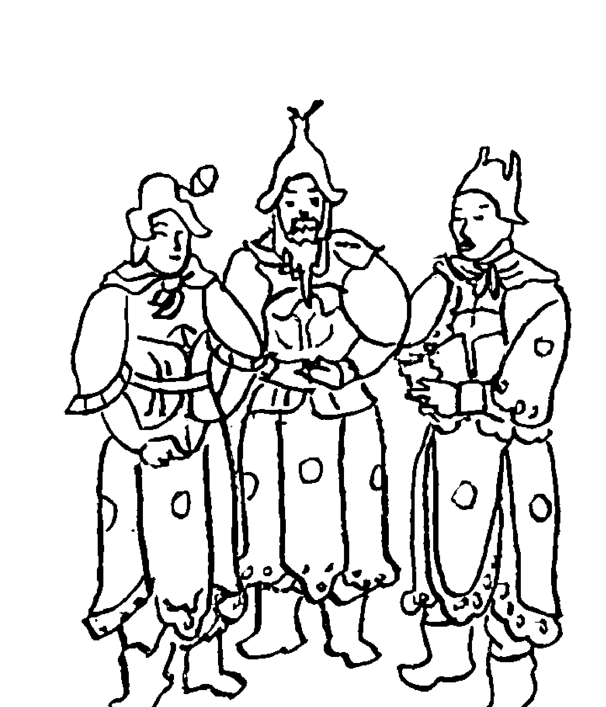

藩镇，在一部中国通史上，只是一个很不起眼的小题目。它不过是唐朝中末期盘踞在今河北省及其邻近地区几个闹独立、搞山头的小军区而已。没想到它发展到最后竟成了颠覆一个王朝的因素，而这一切皆与那场改变大唐命运的安史之乱有关。

安史之乱虽然以史朝义自缢、其党羽纷纷投降唐朝而告终，但朝廷并没有力量彻底将这些势力消灭。肃宗与代宗两位皇帝，为了稳定社会、安定人心，顺势将那些投降的叛军将领任命为节度使，由其分统原来安禄山与史思明所占之地。这样藩镇割据的局面就一步步形成了。

唐朝此举，无异于养虎为患。藩镇就像一只受伤的老虎，打不得，杀不得，最后反过来咬你一口。这些藩镇之间互相声援，不供贡赋，不受更代，得意时称王称帝，纠纷时互相残杀。甚至他们的部下也经常起哄，赶走一个头头，拥立另一个头头。朝廷对此无可奈何，只能睁只眼闭只眼任由它们折腾。李唐的权威，随着藩镇势力的不断壮大，一点点地坠落，到最后仿佛已经低到尘埃里了。

正如范文澜先生所说：「节度使在其地域，可以指挥军事，管理财政，甚至该地区用人大权，亦在节度使之掌握，于是便形成『藩镇』。而且唐代边疆节度使逐渐擢用武人，于是形成一种军人割据。本意在中央集权，而演变所极，却成为尾大不掉。」它就像是唐王朝后期统治的一个不定时炸弹，随时都有可能爆发，引发第二场「安史之乱」。

大历十四年（公元779年）五月即位的、代宗三十七岁的太子李适，自然也明白藩镇之害。面对已经形成的「天下尽裂于方镇」的局面，这位怀着雄心壮志、带着满腔热忱的唐德宗，以光复大唐为目标，将注意力放在了削藩上。

即位第二年，德宗便派出11位黜陟使分巡天下。河北黜陟使发现魏博节度使田悦领兵7万余人，便下令裁军，一下子裁掉了4万多人。次年，河北成德节度使李宝臣辞世，其子李惟岳上表请求继承节度使之位，德宗一口回绝了其请求。四方的节度使至此都明白了这位新君的意图——削藩。

黄仁宇先生在《赫逊河畔谈中国历史》中说：

> 「中枢企图削平各藩镇的计划不容易生效，是由于皇朝本身没有兵力对付，只能借此削彼，让各藩镇看清他们除非联合抗命，否则只有被各个击破。于是他们互相提倡『合纵』和『连横』的政略和战略，以对付长安的皇室。」

事情确实如黄仁宇先生所说的那样，受到削藩威胁的节度使们为了保护自身的利益，开始暗中联合，准备对抗朝廷。此时联合的主要力量有，李惟# 推背圖和燒餅歌的歷史

岳、魏博節度使田悦、淄青節度使李正己和山南東道節度使梁崇義。充滿壯志豪情的德宗，自然也不甘示弱，調來萬餘人進行武力削藩。

初時成果頗豐：淄青、魏博兵敗徐州彭城，李惟岳被其部將所殺。就在朝廷軍隊連連取勝之時，由於德宗賞罰不均，再加上藉藩鎮之力打藩鎮，引發了諸多的不滿，一些本為削藩的藩鎮力量竟紛紛倒向了叛軍一邊。

建中三年（西元782年）十一月，盧龍節度使朱滔自稱冀王、成德王武俊稱趙王、淄青李納稱齊王、魏博田悦稱魏王，「四鎮」以朱滔為盟主，聯合對抗朝廷。次年，奉命前去平叛的淮西節度使李希烈聯合「四鎮」反叛，自稱建興王。戰火一下子從河北蔓延到了河南，整個中原地區都捲入了戰爭之中，亦即《推背圖》中所謂的「橈槍血中土」。

但還不只是這樣，建中四年（西元783年）十月，前往平叛的涇原兵馬途經長安時，不僅沒有得到朝廷的賞賜，還被迫以糙米和素菜果腹。群情激昂的士兵們嘩變，攻入京師長安，這就是著名的「涇師之變」。叛軍攻入，德宗此時唯一的辦法就是「遷大吉」。於是，他和父親代宗一樣「天子蒙塵馬首東」，倉皇逃出長安，避難奉天。佔領長安的叛軍擁立朱滔的兄長、原涇原主帥朱泚為王，自稱「大秦帝」，年號應天，與其他叛亂勢力聯合攻打奉天。

危難中，朔方節度使李懷光率5萬大軍前來勤王，成功擊退叛軍。但是面對這個救駕在功的李懷光，德宗再次犯了賞罰不均的錯誤，他不僅沒有對李懷光以禮相待，反而聽信讒言對李懷光避而不見，只是發出一道詔令命其前往收復長安。

心懷不滿的李懷光也揭竿而起，成了叛軍的一支，真可謂是「破賊還為賊」了。身處奉天的德宗被迫再次逃亡，躲到山南西道的梁州。至此，李希烈、朱泚、李懷光便成了「居然三傑踞關中」的「三傑」，事實上，當時頗具實力的叛將遠遠不只此三人，因而「三傑」之說並不準確。

## 壹 李唐一枝獨秀，李落重花齊放

或許是大唐命不該絕，被迫一再逃亡的德宗，終於迎來救星——神策軍大將李晟。這位神策大將軍就像是所有叛軍的剋星一般，僅用三天時間就收復了京師長安，慌不擇路的朱泚被部將所殺，德宗重返長安，結束了顛沛流離的逃亡生活；盧龍節度使朱滔在王武俊和澤潞節度使李抱真的攻擊下敗退，不久便因病離世；被渾瑊、馬燧和韓游環等諸軍圍攻的李懷光，兵敗自殺；剩下的李希烈接連兵敗，被其部將陳仙奇殺死，叛軍投降。

一場鬧得人仰馬翻的藩鎮之禍，在李晟、王武俊、李抱真、渾瑊等人的努力下，終於告一段落，雖未如李淳風和袁天罡所說的「孤軍一注」那般傳奇，也確實達到了暫時「安社稷」的效果。

經此一役，德宗初即位時削藩的銳氣已經被挫得煙消雲散了，轉而對藩鎮採取了「自經憂患，服為姑息」的態度，使登基以來於削藩問題上收穫的大好形勢和良好機遇，也隨之轉瞬即逝了。藩鎮仍一如既往地割據一方，稱王稱霸，遂成積重難返之勢。

此后一百多年的大唐王朝，一直笼罩在中央和地方拉锯战的阴影之中。双方的力量虽间或有消长起伏，但李唐王室从来没有能够消灭，甚至是控制藩镇，只能眼睁睁地看着这些曾经有功于朝廷之人，一点点地把曾经繁盛的李氏琉璃乾坤挖空。此时的大唐，再回不到曾经的「壮年」时代了，唯有随着时间的脚步，佝偻着身子在风雨飘摇中艰难地前行，至于哪里是终点，李家的君王们也只能听天由命了。

## 人物紀：

##### 李晟

李晟，字良器，十八歲投至名將王忠嗣帳下，因武藝不凡，得「萬人敵」之綽號。安史之亂以後，李晟多次率兵擊退吐蕃的進攻。唐德宗即位後，藩鎮叛亂，多虧李晟於危亡時刻率軍反攻，才得以收復長安。李晟於大唐而言，多次扮演了「拯救者」的角色，成為與郭子儀、李光弼齊名的大唐中興名將，後因功高震主而被唐德宗解除兵權。

## 12 滿天飛血，可憐巢覆亦成空 ——預言黃巢起義

### 《推背圖》第九象 壬申

讖曰
- 非白非黑草頭人出
- 借得一枝滿天飛血

頌曰
- 萬人頭上起英雄
- 血染河川日色紅
- 一樹李花都慘澹
- 可憐巢覆亦成空

對於大唐帝國的許許多多多人來說，乾符二年（西元875年）和之前的日子並無多大的差別：僖宗和他之前的李姓君王一樣，面對不斷墜落的李唐王朝，除了像個旁觀者般看著外，別無他法；百姓一如既往地在艱難的泥淖間掙扎，於他們而言，曾經盛極一時的唐朝，是前人留下的一段傳說，也僅僅只是一段傳說而已。

就在一切看似平淡如水的日子裡，冤句（今山東菏澤）的一個地方鹽販黃巢起義了，或許他就是《推背圖》中「非黑非白，草頭人出，借得一枝」和「萬人頭上起英雄」所指。在農民起義早已遍地的唐朝人眼中，黃巢充其量也只是一個草莽，與先前的那些流寇無異。但幾乎所有的人都失策了，尤其是身居廟堂的僖宗與朝臣們，因為黃巢不是綠林好漢，行為舉止也遠遠超出一般流寇所為，用黃仁宇先生的話來說，就是：「黃巢行動叵測，他的眼光不受局部形勢限制，他能夠協定大部隊的行動，不可能沒有紀律及軍事天才。」就是這個幾乎被所有人低估的鹽販，徹底摧毀了唐王朝統治的根基，使得早已無力支持的帝國切切實實地暴露在了世人面前。

黃巢之所以有如此強大的力量，與其出身不無關係。他不同於佃農出身的陳勝和貧農出身的吳廣，「世鬻鹽，富於資」，是販鹽家族中的富家子。不仅如此，自幼熟读诗书的他还和当时的许多人一样，有着千百年来儒生“修身齐家治国平天下”的共同愿望。

从《全唐诗》中留下的那首孩童时所作的《题菊花》来看，黄巢无疑是颇具实力的。“飒飒西风满院栽，蕊寒香冷蝶难来。他年我若为青帝，报与桃花一处开。”何等的豪迈倔强，何等的傲世独立，宋人张端义在这首诗下注解道：“跋扈之意，现于孩提时。加以数年，岂不为神器大盗耶！”

其实，事情并不象张端义所说的那样——黄巢自幼便有造反之意，相反，他更希望通过正统的途径步入仕途，以施展自己的才能，就像他名字中的那个“巢”字一样。据说，他的父亲之所以选此字为其命名，皆源于“巢”可写作“窠”，同“科举”的“科”同音。黄巢也确实如父亲所希望的那样，多次参加当时的科举考试。

然而，事与愿违，他屡屡参加考试，却总是落得个名落孙山的结局，唐太宗时“天下英雄，尽入我彀中矣”的豪言壮语早已远去，此时的大唐帝国剩下的只是些装模作样的规定，或许更难堪，法国学者勒内·格鲁塞（René Grousset，1885-1952）在《伟大的历史》中，甚至用“一次明目张胆的司法不公的受害者”来形容黄巢。经历了多次的落第之后，黄巢绝望了，他还一挥而就，写下了著名的《不第后赋菊》诗：“待到秋来九月八，我花开后百花杀。冲天香阵透长安，满城尽带黄金甲。”尽抒心中不平之气的同时，也意味着黄巢彻底放弃了一直以来坚持的科举梦。

> 冲天香阵透长安，满城尽带黄金甲。

黄巢的落第，更大程度上意味着他与朝思暮想的朝臣身份擦肩而过，他本就不太安分的心不免生出强烈的不满。假如黄巢及第，那肯定就不会有起事造反；一起参考金榜题名的人很多，独独没有自己，看着那些人披红挂绿，春风得意，一日看尽长安花，说不定还会接到哪个绣楼上掉下的小姐的绣球，而自己却一无所获，只有穿一袭青布长衫，灰头土脸地溜着墙根步出京城的份，那心中的嫉妒与落寞可想而知。

长安虽好，不是属于他黄巢的，这口气如何忍得下？于是，就诞生了报复的心理。哼，你们先别得意得太早，等我有一天血洗长安的时候，到时候看你们还得意什么。这次落第应该是黄巢内心的转捩点，毕竟，任何的愤怒积蓄到一定程度，都会爆发。

500年后，元末农民起义军领袖朱元璋，也写了一首《菊花诗》，这记载在《明太祖集》中：“百花发时我不发，我若发时都吓杀。要与西风战一场，遍身穿就黄金甲。”很明显，朱元璋的诗与黄巢的诗相对照，其意境和词句如出一辙，后人也多讥笑朱皇帝抄袭。胡适以调侃的态度评说：“朱元璋跟黄巢乃同道中人，臭味相投。一个做了皇帝，一个成了贼寇罢了。

> 百花发时我不发，我若发时都吓杀。要与西风战一场，遍身穿就黄金甲。

> 朱元璋跟黄巢乃同道中人，臭味相投。一个做了皇帝，一个成了贼寇罢了。

事实上，黄巢也曾有过短暂的皇帝生涯。虽然最初的起义是响应另一个盐贩王仙芝的活动，但这位自称“冲天太保均平大将军”的知识分子，在与王仙芝决裂之后，黄巢把五花八门的成员联合在一起，形成了较王仙芝更强大的起义军力量。他在数月之内扫荡了山东的部分地区及富庶的河南开封平原，紧接着又挥师南下，劫掠了华南地区的两个大港口：福州和广州。

直到攻下广州城为止，黄巢都未曾有过登上帝位的想法。他曾表示自己愿意归顺，只要朝廷愿意授予他天平（今山东东平北）节度使。要求被朝廷拒绝之后，他甚至退而求其次，请求授予广州节度使，但还是未能如愿，最后得到的竟是一个“率府率”的虚官。再加上岭南的疫病令他损失惨重，他这才被迫率军北上，决定杀回中原地区，目标——长安。

势如破竹的黄巢军，终于引起了朝廷的恐慌，匆忙命人前往剿灭。受命前去剿匪的唐朝将领，不是闭城不出，就是惊慌逃跑。好不容易有个敢于出战的唐山南东道节度使刘巨容，在大败黄巢军十之七八后，不仅没有乘胜追击，反而下令停止追击，并发表了一番惊世骇俗的“长篇大论”：

> “国家（指唐朝中央朝廷）喜负人，有急则抚存将士，事宁则弃之，或更得罪，不若留贼以为富贵之资。”

意思是说：

> “朝廷经常说话不算数，危急的时候，就抚慰笼络我们这些将士，不惜赏官予人。而事情一旦平定下来，就将我们这些人抛在一边，甚至有人会因功得罪。我们不如让黄巢之辈残留下来，以为我辈取富贵的资本。”

黄巢的势力就在朝廷各机构间无法填补的空隙中恢复过来，并愈发地壮大了。唐僖宗广明元年（西元880年）十二月初五，绕了中国大半个圈子的黄巢军队终于到达了目的地长安。他

> “乘金装肩舆，其徒皆披发，约以红缯，衣锦绣，执兵以从，甲骑如流，辎重塞涂，千里络绎不绝。”

真的如其幼时所言的

> “青帝”

一般。

慌乱中，僖宗在田令孜率领的五百神策军的护卫下，从金光门出宫，只带四个王子以及八个受宠嫔妃，狼狈逃往成都避难，

> “百官皆莫知之”

，成了唐玄宗之后又一位逃亡四川的大唐皇帝。

次年1月16日，黄巢于长安大明宫含元殿内即位，建立了大齐政权，改元金统。黄巢终于实现了

> “冲天香阵透长安，满城尽带黄金甲”

的夙愿，达到了人生最巅峰的时刻。黄仁宇先生说：

> “黄巢占领长安两年半，称大齐皇帝。是他事业的最高峰，他是自投陷阱。”

因为称帝不久，他就开始了自己的报复行动。

> “各出大掠，焚市肆，杀人满街”

，长安居民陷入了地狱般的恐怖气氛

围之中。当时诗人韦庄的《秦妇吟》对黄巢军队的暴行，就有最触目惊心的记录：“家家流血如泉沸，处处冤声声动地。”与李淳风和袁天罡所预言的“满天飞血”、“血染河川日色红”竟如出一辙。

血腥屠城的背后，其实是“他与长安人民的关系，一直都没有弄好”，而且长期处在唐军的四面包围之中，粮食的来源都非常困难。显然，如此情形下的大齐政权注定无法长久。

果然，病急乱投医的唐王朝向一个被称为沙陀的突厥部落求助，来自戈壁大漠的李克用成了黄巢的克星。与此同时，黄巢部将朱温眼见来日无多，竟然以同州（今陕西大荔）向唐廷投降。中和四年（西元884年）夏天，黄巢在山东兵败自刎，正应了“可怜巢覆亦成空”一语。

流亡在成都的僖宗，直到光启元年（西元885年）元月才回到长安。经过这番折腾，落入僖宗眼中的是一番“荆棘满城，狐兔纵横”之景，就像“一树李花都惨澹”的大唐帝国一样，已经是破败不堪、日薄西山了。

#### 人物纪：

##### 李克用

李克用，本姓朱邪氏，别号“鸦儿”，其祖先为唐朝时沙陀人。自唐太宗一朝起，他们一家就效忠唐室。其父亲朱邪赤心，更因讨伐庞勋有功，而得大唐皇帝懿宗赐姓名李国昌，李克用自此也改姓李。他性格勇猛急躁，是唐朝末年、五代初年著名的军事统帅，因一目失明，又号“独眼龙”。他靠镇压黄巢起义起家，后在与朱温争夺霸业的过程中死去。其子李存勖在建立后唐时，追尊其为后唐太祖。

## 附表1：唐朝帝王表

| 庙号     | 谥号                                             | 姓名   | 生卒年      | 在位时间                |
|----------|--------------------------------------------------|--------|-------------|-------------------------|
| 高祖     | 神尧大圣大光孝皇帝                               | 李渊   | 566～635年  | 618～626年              |
| 太宗     | 文武大圣大广孝皇帝                               | 李世民 | 598～649年  | 626～649年              |
| 高宗     | 天皇大圣大弘孝皇帝                               | 李治   | 628～683年  | 649～683年              |
|          | 则天顺圣皇后                                     | 武则天 | 624～705年  | 690～705年              |
| 中宗     | 大和大圣大昭孝皇帝                               | 李显   | 656～710年  | 683～684年、705～710年 |
| 睿宗     | 玄真大圣大兴孝皇帝                               | 李旦   | 662～716年  | 684～690年、710～712年 |
| 玄宗     | 至道大圣大明孝皇帝                               | 李隆基 | 685～762年  | 712～756年              |
| 肃宗     | 文明武德大圣大宣孝皇帝                           | 李亨   | 711～762年  | 756～762年              |
| 代宗     | 睿文孝武皇帝                                     | 李豫   | 726～779年  | 762～779年              |
| 德宗     | 神武圣文皇帝                                     | 李适   | 742～805年  | 779～805年              |
| 顺宗     | 至德弘道大圣大安孝皇帝                           | 李诵   | 761～806年  | 805年                   |
| 宪宗     | 昭文章武大圣至神孝皇帝                           | 李纯   | 778～820年  | 805～820年              |
| 穆宗     | 睿圣文惠孝皇帝                                   | 李恒   | 795～824年  | 820～824年              |
| 敬宗     | 睿武昭湣孝皇帝                                   | 李湛   | 809～826年  | 824～826年              |
| 文宗     | 元圣昭献孝皇帝                                   | 李昂   | 809～840年  | 826～840年              |
| 武宗     | 至道昭肃孝皇帝                                   | 李炎   | 814～846年  | 840～846年              |
| 宣宗     | 元圣至明成武献文睿智章仁神聪懿道大孝皇帝         | 李忱   | 810～859年  | 846～859年              |
| 懿宗     | 昭圣恭惠孝皇帝                                   | 李漼   | 833～873年  | 859～873年              |
| 僖宗     | 惠圣恭定孝皇帝                                   | 李儇   | 862～888年  | 873～888年              |
| 昭宗     | 圣穆景文孝皇帝                                   | 李晔   | 867～904年  | 888～904年              |
| 哀宗     | 昭宣光烈孝皇帝                                   | 李柷   | 892～908年  | 904～907年              |

## 13 八牛溫，伸手採摘李唐花——預言朱溫篡權

> 《推背圖》第十象 癸酉

讖曰
- 荡荡中原莫御八牛
- 汩水不涤有血无头

頌曰
- 一后二主尽升遐
- 四海茫茫总一家
- 不但我生还杀我
- 回头还有李儿花

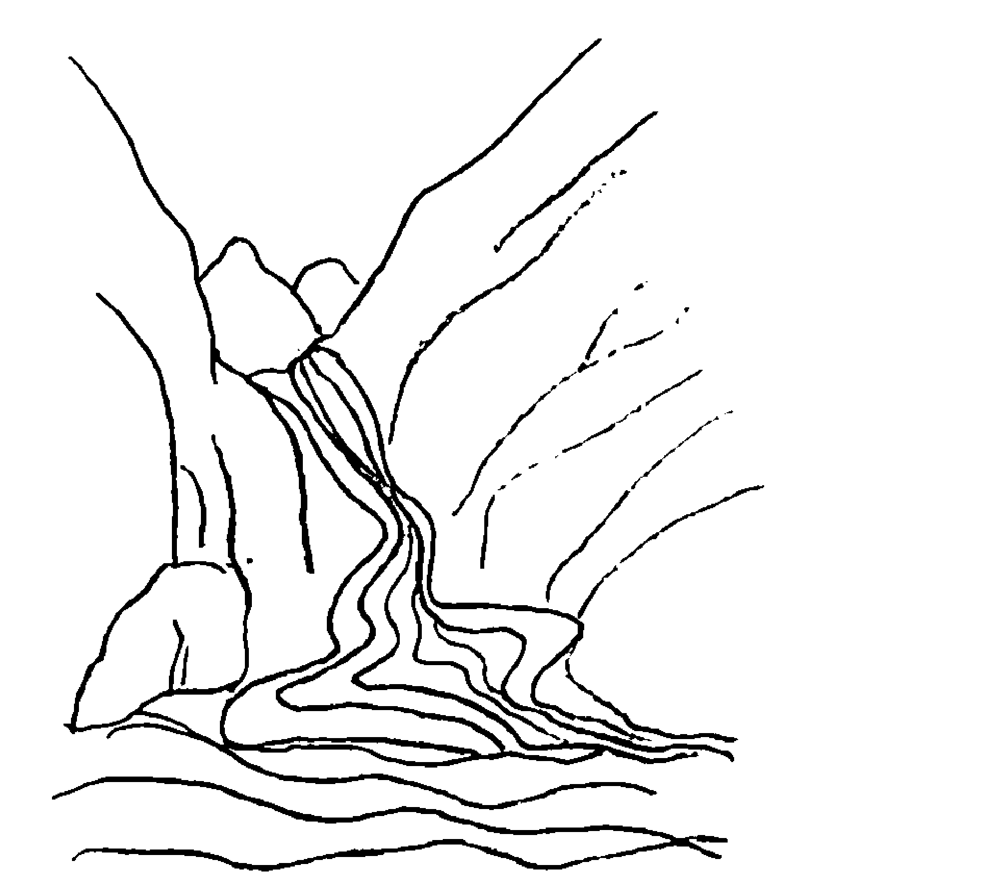

本就已经剩下个空壳的大唐王朝，经过黄巢的一番折腾变得愈发岌岌可危了。在黄仁宇先生看来，“在这种情势之下，黄巢及其招讨，只是推进历史的工具，而不是历史发展重要节目。”真正的重头戏在压垮大唐的“最后一根稻草”——一个乳名朱三的人。

虽然生于书香门第，但以乡村私塾教师为终生职业的祖父和父亲，始终未能让家人过上富裕的生活，尤其是在父亲去世之后，朱家剩下的孤儿寡母不得已只能去投靠他人门下，靠为其做雇工以维持生计。

寄人篱下者，要么顺从地接受低下的地位，性格懦弱；要么以尖锐的方式表达对自己所处环境的不满，个性极端。朱三属于后者。还是孩童的朱三因老幺的身份而备受母亲宠爱，同时又因低人一等而常被斥责，自立、好斗和狡猾奸诈的个性便于这种环境中逐渐形成了。他整日与自己的两位兄长一起不务正业、惹是生非，到后来甚至依靠打架的本领来谋生，乡里间的许多人都很讨厌他。就是这样一个人，竟成了那个曾经风华绝代的大唐帝国的终结者。

一切都得从他起义军开始说起。早已厌倦了受尽欺凌生活的朱三，与哥哥朱存一起加入了黄巢的起义军，此时他的名字叫“朱温”。正是《推背图》中“莫御八牛，汩水不涤，有血无头”所指，“八牛”为“朱”，“有血无头”为“皿”，“汩水”与“有血无头”合起来即为“温”。如此精准的预言，实在难以置信。

更加出乎意料的，是如此不学无术的朱温，参军后竟如鱼得水，并因屡立战功而成了黄巢身边的红人。或许是战场上的争斗更适合他，又或许是狡猾的个性更易立足军营，究竟是出于什么原因，我们不得而知，但可以肯定的是，已到而立之年的他不再是那个为人们所讨厌的朱三，而成了“大齐”政权的功臣、起义军中的一员大将。

正当他志得意满之时，难题很快就来了。黄巢下令击败隔河对峙的河中节度使王重荣，接到命令的朱温在明知敌强我弱的形势下，还是出兵进攻王重荣，结果可想而知，自然是屡战屡败。朱温被迫求救，但援兵迟迟未到。生性狡诈的朱温开始考虑自己的后路了，谋士谢瞳乘机进言说：“大齐政权虽已建立，但天下仍然是属于大唐的。如今大唐的皇帝身居蜀中，仍有各种人马纷纷响应勤王便可知大唐的人心未散、气数未尽。到底应该如何抉择还请将军慎之又慎。”

朱温听了这番话犹如醍醐灌顶一般，恍然大悟。他当初参加起义军并非有什么远大的理想与目标，只求出人头地、锦衣美食，因此，在面对生存与

前途的问题上，朱温毫不犹豫地背弃了黄巢，向唐朝归降。

对于这个突如其来的归降者，唐僖宗表现出了超乎寻常的大度，不仅不追究其此前的反叛行为，还授予其左金吾大将军、河中行营招讨副使之职，并赐名“全忠”。朱温的身份再一次发生了变化，他不再是反贼朱温，而摇身一变成了大唐的“守护神”朱全忠。

在“忠于”大唐的这段时间里，朱全忠显示出了他的工于心计和充分的决心。在追击黄巢军的过程中，他不断积蓄自己的力量，四处扩张自己的势力，收剿了黄巢残余部队的大部分，将这些训练有素、身经百战的核心队伍纳入了自己麾下，成为一支非常重要的力量；同时，他隐藏于诸多割据势力之中，坐山观虎斗，在适当的时候出手消灭对手、兼并残部，巧妙地履行着“他人出力，自己领功”的原则，一步步成为了“一人之下，万人之上”的使相和实力超过李克用的最大地方势力。

至此，经过二十余年经营的朱全忠，已成了一方霸主，但他仍不满足，将下一目标直接指向了皇帝的宝座。正当他意气风发地向下一个目标进发时，后方传来了妻子张惠病危的消息。这位刚柔相济、贤慧机智的妻子，不仅是典型的贤内助，还时常为丈夫出谋划策，朱全忠对她既有爱慕之意，亦有钦佩之情。深知丈夫脾性的张惠，即便到了临终之时，仍不忘辅佐丈夫的事业，以“戒杀远色”四字劝诫嗜杀、贪色的丈夫。

然而，毕竟死者已矣，张惠死后，朱全忠很快便将其忠告抛到了九霄云外，越发地变本加厉了。对于那个已经在自己掌握之中却并不甘心的唐昭宗，朱全忠于天复四年（西元904年）正月，将其迁到由他控制的新近重建的东都洛阳，并在迁都的过程中杀害了所有的皇帝侍从。

被迫迁都洛阳的昭宗，虽然表面顺从朱全忠，心底始终存有一丝希望，他偷偷地向晋王李克用、蜀王王建和吴王杨行密提出了“清君侧”的要求。但消息泄露，就在那年的八月，昭宗被朱全忠谋杀，还假惺惺地演了一出自為天子執轡，且泣且行，行十餘里」的大戲，迷惑世人。但他奔向帝位的計畫仍在緊鑼密鼓地進行著，昭宗死後不久，朱全忠便命人誘殺唐室諸王，凡昭宗長子德王裕以下共九人。與此同時，他把最後一位唐室皇子——十三歲的李柷扶上了皇位，是為昭宣帝。而對於大唐王朝的大臣們，朱全忠則一股腦地將其扔進了黃河裡。原本屬於大唐的君王、朝臣，甚至是宦官都被一一地清除了，剩下的只是一個被朱全忠玩弄於股掌之間的兒皇帝和一群站在朱全忠一邊的大臣。至於李柷這個兒皇帝的母親——何太后，則因「玄暉私侍積善宮皇太后何氏，又與柳璨、張廷範為盟誓，求興唐祚」之名而被處死了。到了這個時候，真的是到了「蕩蕩中原，莫禦八牛」的地步，朱全忠也就無須再隱藏自己的篡位之心了。

天佑四年（西元907年），昭宣帝李柷做了三年有名無實的君主之後，禪位於朱全忠。或許對於僖宗賜予的「全忠」之名，他自己都覺得礙眼，於是在登基之時，他改名為朱晃，意為如日之光，是為梁太祖，改國號為梁，建都汴（今河南開封），改唐朝的東都洛陽為西都，統治了將近千三百年的唐朝宣告結束，一個短命的王朝梁朝就此開啟。

梁的短命與朱晃的性情有很大的關係，多疑嗜殺的他在登上帝位九個月之後，又殺掉了禪位給他的昭宣帝，絲毫不差地應了《推背圖》「一后二主盡升遐」的預言。不僅如此，他放任自己「縱意聲色，諸子雖在外，常徵其婦入侍，帝往往亂之。」朱晃這種亂倫的荒唐之舉，不僅沒有得到兒子們的反對，他們甚至還利用自己的妻子在父親朱晃床前爭寵。因養子朱友文之妻王氏深得歡心，朱晃病重之時竟決定將後事委託於朱友文手中。其親子朱友珪得到消息後，先發制人發動政變，「友珪僕夫馮廷諤刺帝腹，刃出於背。友珪自以敗氈裹之，瘞（音一丶，掩埋之意）於寢殿。」五代時期的第一個皇帝朱晃，終於乾化二年（西元912年），是年六十一歲。死前殺人無數的他，最後死於自己人手中，正是「不但我生還殺我」。

他的王朝也如他的生命一般，很快就被他人奪去了，而完成這一改朝換代的正是他的宿敵李克用的兒子——李存勗。西元923年，李存勗攻滅後梁，改國號為唐，年號「同光」，史稱後唐，世稱李存勗「唐莊宗」。唐莊宗姓李，國號又是「唐」，暗合「回頭還有李兒花」之語，但顯然這朵「李兒花」未能如李唐王朝一般綻放得絢爛、長久。

## 人物紀：

## 賢妻張惠

張惠與朱溫同鄉，生於富貴之家，既有教養，又懂得軍事與政治謀略，常常會有讓朱溫茅塞頓開的計謀。故而，朱溫對張惠既敬畏又欽佩。張惠和朱溫共同生活了二十餘年，為朱溫生有一子，即梁末帝朱友貞。期間一直盡最大的努力約束朱溫的殘暴行徑，全軍上下皆對其十分尊敬。朱溫稱帝之後，一直未立皇后，直到朱友貞即位之後，才將母親追加諡號為「元貞皇后」和「元貞皇太后」。

## 14 戲子皇帝，上得天堂好遊戲——預言後唐莊宗

《推背圖》第十一象 甲戌
讖曰
五人同卜 非祿非福
兼而言之 喜怒哀樂
頌曰
龍蛇相鬥三十年
一日同光直上天
上得天堂好遊戲
束兵百萬入秦川

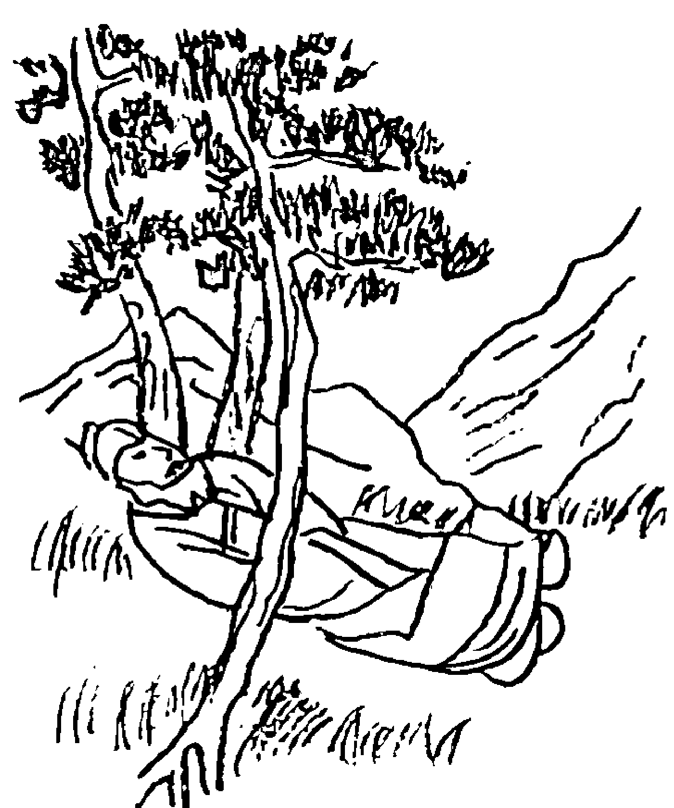

現代西方政治哲學中的「沒有永遠的敵人，只有永遠的利益」，無疑是非常重要的核心理念之一，對中國古代的政治家而言，利益雖至關重要，但始終有一些仇怨是無法說放下就放下的，就像家族世仇。李存勳身上就背負著這樣的仇怨，針對的對象就是後梁的朱溫，這個曾暗算過父親李克用、令父親死不瞑目的「小人」。

曾經朱溫與李克用是並肩作戰的同盟，在王滿渡擊潰了黃巢軍之後，朱溫邀請李克用到汴州休整隊伍。一次盛宴上，年僅二十八歲的李克用酒後恃才自傲，說了一些令大他四歲的朱溫下不了台的話。強盜出身的朱溫，自然不肯吃這種虧，表面上仍對李克用殷勤招待，心裡卻早已起了殺機。

醉得不省人事的李克用剛一回到驛館，朱溫便命人放火圍攻。危急中，李克用身邊沒喝醉的隨從將一盆涼水澆到他的臉上，才把他弄醒。李克用雖僥倖逃脫，但隨行的幾百名士兵卻全部陣亡了。李克用遭此奇恥大辱之後，誓必報仇。他與朱溫之間的仇怨，就此算是結下了，而他們這一鬥就是幾十年。

然而，在李克用有生之年也未能得報此仇，於是將所有的希望都寄託在了唐昭宗口中的「此子可亞其父」、自己的長子李存勖身上。兒子年幼時，李克用便毫不避諱地對其大加稱讚：「此（李存勖）吾家奇兒也，二十年後，他必能為朱三勁敵。」到了自己臨終時，李克用更是交給李存勖三支箭，囑咐他要完成三件大事：一是討伐「地方兩千里、帶甲三十萬」的劉守光，攻克幽州；二是征討契丹，解除北方邊境的威脅；三就是消滅世敵朱溫。

自十一歲起便因戰功而得到唐昭宗誇獎的李存勖，果然沒有令父親李克用失望。身著孝服的他在與朱溫第一次的正面交鋒上，就大獲全勝，令朱溫驚嘆地說出：「生子當如李亞子，克用為不亡矣！至如吾兒，豚犬耳！」此時，李存勖年僅二十四歲。

接下來的一切，都如李克用所期望的那樣，李存勖一步步地朝著目標進發，一點點地彌補著自己生前的遺憾。梁乾化二年（西元912年）正月，李存勖遣振武節度使周德威經飛狐（今河北淶源）東進，王鎔、王處直部出祁溝討伐劉守光。次年，攻破燕地，生擒劉仁恭、劉守光父子。貞明三年（西元917年），契丹主耶律阿保機親率三十萬契丹軍大舉來犯，圍攻幽州，李存勖讓李嗣源、李存審、閆寶等人率七萬大軍前往救援。兩軍在幽州城下交戰，把契丹軍殺個慘敗而逃，將耶律阿保機趕回了北方。西元923年，李存勖攻滅後梁，統一北方，李家與朱家的「龍蛇相鬥三十年」也終於告一段落。

## 推背图和燒餅歌裡的歷史

四月在魏州（河北大名縣西）稱帝，是為後唐莊宗，國號「唐」，年號同光，史稱後唐。

至此，父親李克用留下來的任務已全部完成，李存勖無須再將那三支箭供奉於家廟之中，更無須每次出征之時隨身攜帶，他替父親報了仇，讓朱溫的兒子敗在了自己的手下。顯然，其過人的軍事才能遠非簡單的「作戰勇敢」，《舊五代史》中「以雄圖而起河、汾，以力戰而平汴、洛，家仇既雪，國祚中興，雖少康之嗣夏配天，光武之膺圖受命，亦無以加也」的評價無疑更準確。

但打天下與治天下完全是兩回事，李存勖雖然是一個軍事上超過唐太宗李世民的天才，在政治上竟是類似於白痴，而且他還有著與唐玄宗李隆基相同的嗜好——民間戲劇，「尤喜音聲、歌舞、俳優之戲」。他的這一愛好，就像是不起眼的蛀蟲，一點點在咬噬著他辛辛苦苦打下來的江山。想當初，天下人曾把這位後唐莊宗比作漢光武帝劉秀，覺得有他在一定能過上好日子，不料短短三年的時間，百姓的美夢就徹底破碎。

或許是像李隆基一樣，覺得自己辛苦了大半生，是到時候好好休息一下了，李存勖自完成了父親李克用的遺願，登上帝王之位後，便不思進取、開始享樂，對自己的興趣更是不加限制地「發揚光大」。他時常面塗粉墨，穿上戲裝，與伶人共戲，甚至還給自己取了個藝名「李天下」。

一次上臺做戲時，裝扮妥當的後唐莊宗在臺上連喊了兩聲「李天下」。緊接著一個伶人上前就打了他兩個耳光，李存勖壓著怒氣問此人為何出手打他，看著周圍早已被嚇傻了的人，這個伶人鎮定地回答：「理（李）天下的只有皇帝一人，你連叫兩聲，剩下的那個人是誰呢？」李存勖聽了頓時心花怒放，不僅沒有怪罪這個伶人，還給予他重賞。

伶人見能得皇帝如此縱容，自然也就無所畏懼了。他們經常自由地出入宮中，即便是不顧尊卑地和皇帝打鬧，李存勖也並不介意，甚至還授予這些無絲毫功績的伶人以高官。這樣一來，皇帝給予伶人榮華富貴，伶人為皇帝提供表演與歡樂，就像是生活在天堂一般，正是「上得天堂好遊戲」。

李存勳享樂的欲望得到滿足了，但伶人的欲望卻被皇帝養得越來越大了，他們干預朝政、把持朝綱，侮辱戲弄朝臣，甚至還到民間強搶民女入宮。本就已經夠亂的朝堂，李存勳又把朱溫當政時誅殺乾淨的宦官拉了進來，和劉皇后互相勾結，真的是「外則伶人亂政，內則牝雞司晨。斬吝貨財，激六師之憤怨；徵搜輿賦，竭萬姓之脂膏。」

到了這種地步，後唐就離滅亡不遠了，「非祿非福」的災禍很快便會降臨。果然，在同光四年（西元926年），一切如料想中的那般發生了。這年正月，後唐莊宗聽信宦官的讒言，錯殺了名將離崇韜，對功勳卓越的大將李嗣源也產生了懷疑。

三月，由於一則李存勳已死的謠言，魏博軍發生兵變，無奈之下，李存勳派李嗣源前往平亂。不料，亂兵竟要推舉在軍界威望甚高的李嗣源為新皇帝。李嗣源經過一番假意推脫後，命女婿石敬瑭率兵偷襲汴京。慌亂中，李存勳只得御駕親征，當他來到萬勝鎮（今河南中縣西北）時，傳來了李嗣源已攻下汴京的消息，看著自己逃亡過半的軍隊，李存勳唯有班師回朝。

李存勳剛回到洛陽，石敬瑭的軍隊便打到了氾水關（今河南滎陽氾水鎮）。已經被人逼到懸崖邊的李存勳決定跟李嗣源做最後一搏。四月一日早上，正當李存勳享用著出征前的最後一頓早餐時，一個因戲演得好而當上直御指揮使的伶人見李存勳大勢已去便發動政變，火燒興教門，乘亂殺入宮中，混亂中率侍衛前來抵禦的李存勳被箭所傷，很快就一命嗚呼，應了《推背圖》中所言的「一日同光直上天」一語。他死後不久，李嗣源便率「東兵百萬入秦川」，攻佔了洛陽城，自己做起了皇帝，是為後唐明宗。

人生真是充滿了「喜怒哀樂」的無常，這位曾經驍勇善戰的軍事天才，萬萬沒有想到，自己人生的終點，不是在與世仇的征戰中，不是在平叛的沙場上，竟是在一個小小的伶人手中。這個讓李存勳陰溝裡翻了船的伶人叫郭從謙，「五人同卜」為「從」，「兼而言之」是「謙」。

一代梟雄就此結束了其毀譽參半的一生，歐陽修曾這樣評價後唐莊宗：「方其盛也，舉天下之豪傑，莫能與之爭；及其衰也，數十伶人困之，而身死國滅，為天下笑。」確實，以李存勳的軍事天賦，和他已經盡得的七分江山，要像後來的周世宗柴榮一樣一統天下並非難事，可問題在於「存勳可以忍敗，而不足以處勝，故勝則必傾。」他就像明代學者王夫之所說的那樣「有智無量」，甚至連周世宗一半的政治才能都沒有，因而他能成大業卻無法守大業。這是由他的性格所決定的，不是北宋歐陽修一句「憂勞可以興國，逸豫可以亡身」就能全部概括的。

## 15 謂他人父，兒皇帝呈上二八州——預言割讓燕雲十六州

《推背圖》第十二象 乙亥
讖曰
塊然一石 謂他人父
統二八州 已非唐土
頌曰
反兆先多口
出入皆無主
繫鈴自解鈴
父亡子亦死

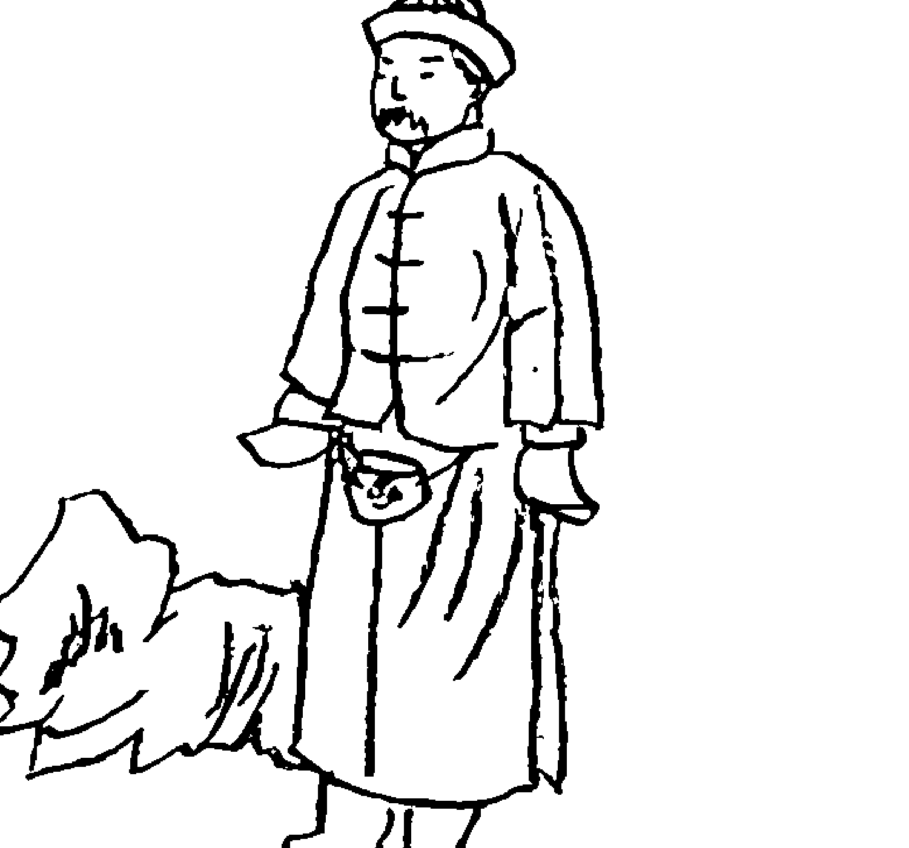

亂世之中，道德往往會如敝屣般被丟棄到最不被關注的角落，相應地，實力自然就被提升到了「至高無上」的地位上來。簡單地說，其實就是誰擁有強大的實力，誰便能成為所謂的九五至尊，掌握世人的生殺大權。

後唐明宗李嗣源的成功，便是一個典型。與朝堂之上的李存勳相比，他顯然擁有了更多的軍心與民心。在部下擁立他稱帝的呼聲中，他也曾舉棋不定，但女婿石敬瑭的一番話令他茅塞頓開，石敬瑭說：「豈有軍變於外，上將獨無事乎？」意思是軍變已經發生，事情也已到了無可挽回的地步，你（指李嗣源）現在回去是跳進黃河也洗不清了，肯定會丟掉性命的。

有了石敬瑭的這番話，李嗣源這才下定決心，取李存勗而代之。且不論李嗣源當時是真的不知，還是佯裝忠誠，石敬瑭的政治遠見無疑是非常人能及的。然而，這個生於太原，「及長，性沉淡，寡言笑，讀兵法，重李牧、周亞夫行事」的沙陀族人，並不只是一個能出謀劃策的謀士，他還是一位驍勇善戰的軍事將領。無論是李克用與朱溫的爭鬥、李存勗完成父親遺願的戰鬥，還是李嗣源奪權的戰爭，石敬瑭始終都屢建奇功、戰績彪炳，因此史書中對其評價為：「平汴水，滅梁室，致莊宗（即李存勗）一統，集明宗（即李嗣源）大勳，帝（即石敬瑭）與唐末帝（即李從珂）功居最，莊宗朝官未重者，以帝不好矜伐故也，唯明宗心知之。」

從個人能力上來講，石敬瑭無疑具有極強的實力，所以才能在亂世的政壇中平步青雲。與此同時，強大的個人能力加上日漸壯大的勢力，石敬瑭開始令端坐於朝堂之上的帝王感到不安，尤其是令透過武力篡權的後唐末帝李從珂感覺到異常大的威脅。一次，在自己的生日宴會上，醉酒的李從珂對宴畢告辭的妹妹，也就是石敬瑭的妻子說：「妹妹這麼著急地想要回去，是不是要和石郎一起造反啊！」

對於李從珂的這種懷疑，石敬瑭自然是心知肚明。他能回到自己的河東駐地，繼續做太原節度使，本來就非李從珂所願。為了進一步試探李從珂，後唐清泰三年（西元936年）四月，石敬瑭以身體不適為由，上書請求辭去軍權，調到別的地方任節度使。這樣一來，如果他的請求獲准，就說明李從珂已經懷疑他有造反之心；如果他的請求被駁回，就說明李從珂還未對他完全失去信任。

接到石敬瑭的上書，李從珂考慮再三，採納大臣薛文遇「石敬瑭除亦叛，不除亦叛，不如先事圖之」的建議，調任石敬瑭為天平節度使。事已至此，石敬瑭面前只剩下兩條路可走：一是任由李從珂削弱甚至殺掉自己，一是奮起反抗滅掉李從珂。即便是手無縛雞之力的人，也明白「今亡亦死，舉大計亦死，等死，死國可乎」的道理，更何況是曾經勸李嗣源叛亂的石敬瑭，他毫不猶豫地選擇了後者——謀反。

五月，石敬瑭在太原起兵，並上書指責李從珂不是先帝李嗣源的親子，原本就沒有資格即位，應讓位於後唐明宗的四子李從益。李從珂大怒，下令以建雄節度使張敬達為太原四面招討使，將兵三萬築長圍以攻太原。

石敬瑭的實力雖然強大，但畢竟只是割據一方而已，與李從珂的皇家軍隊相比較而言，還是存在著很大差距的。石敬瑭自己也明白這一點，因此，他一方面與後唐的軍隊死戰，另一方面則派掌書記桑維翰去搬救兵。

其實，所謂的救兵，就是李克用第二個遺願針對的對象、被李存勖趕回北方的契丹人，他們長期以來一直對中原地區虎視眈眈，卻苦於實力不夠強大、沒有機會而未敢於大規模的南侵之舉。石敬瑭的求助，對契丹人來說，無疑是天賜良機，他們終於等到南下的機會了。但更出乎契丹耶律德光意料的是，石敬瑭竟在信中開出「請稱臣，以父事契丹，約事捷之後，割盧龍一道及雁門關以北諸州與契丹」的條件。

耶律德光自然是樂得嘴巴都合不攏，七月雙方正式簽訂契約。九月，耶律德光親自率旌旗連綿五十餘里的五萬契丹騎兵自代州揚武谷趕來，與後唐軍隊展開激戰，殺死後唐步兵近萬人，後唐騎兵大敗而回，退至太原城南的晉安寨。

聞訊的石敬瑭連夜出城迎接耶律德光，「因論父子之義」，父者為三十四歲的耶律德光，兒者為四十四歲的石敬瑭，實在令人啼笑皆非，也正應了《推背圖》中「塊然一石（即石敬瑭），謂他人（即耶律德光）父」之說。十一月，耶律德光於太原城東南的柳林設壇，正式冊封石敬瑭為帝，石敬瑭身著耶律德光脫下來的契丹皇袍登基，改元天福，國號大晉，史稱後晉。

## 推背图和烧饼歌里的历史

稱帝後的石敬瑭非常守信，正式將幽州（今北京市）、檀州（今北京密云）、順州（今北京顺义）、薊州（今河北蓟縣）、瀛州（今河北河间）、莫州（今河北任丘）、涿州（今河北涿縣）、新州（今河北涿鹿）、媯州（今河北怀来）、儒州（今北京延慶）、武州（今河北宣化）、雲州（今山西大同）、應州（今山西应縣）、朔州（今山西朔縣）、寰州（今山西朔縣西北）、蔚州（今山西灵丘）「统二八州」——十六州割讓給了契丹，從此之後這些地域「已非唐土」。此外，石敬瑭還答應每年向契丹納貢絹帛30萬匹，相當於每年每個契丹族人都能得到一匹絹帛。

得了甜頭的耶律德光，自然非常樂意為「兒皇帝」提供幫助。石敬瑭的晉軍在契丹軍的援助下，勢如破竹。十一月底，後唐末帝李從珂與曹太后、劉皇后、皇子李重美等人登上玄武樓，自焚而死。北宋史臣薛居正對其評價為：「末帝（即李从珂）負神武之才，有人君之量。属天命不祐，人谋匪臧，坐俟焚如，良可悲矣！」

就在李從珂自焚的當天夜裏，晉軍攻入洛陽，歷經四位帝王、歷時十三年的後唐滅亡，石敬瑭開啟大晉帝國的統治時期。在他在位的六年時間裏，雖然於亂世之中實現了難得的「數年間，中國稍定」的局面，但石敬瑭的日子並不好過。他一方面擔心手握重兵的大將會像曾經的自己一樣發動叛亂，一方面還必須以帝王身分卑躬屈膝地向契丹稱臣。

曾經，石敬瑭也想過要擺脫契丹的控制，但他的心腹大臣桑維翰以「雖卑辭降節，屈萬乘之尊，而庇國息民，實數萬之利」勸阻了他。在當時的形勢之下，與契丹決裂確實不是明智之選，從石敬瑭的接任者石重貴因「稱孫不稱臣」招來了滅國之禍便可見一斑。

然而，即便後人可以原諒他的「認賊作父」，也無法原諒他的割地求榮。燕雲十六州是中原地區抗擊北方遊牧民族騎兵部隊的天然屏障，石敬瑭將其割讓給契丹，北方的少數民族便可以騎馬直侵至黃河岸邊，無異於是將中原完全暴露在契丹的鐵蹄之下。就像割地之初，他的親信劉知遠所說的那樣：「稱臣可矣，以父事之太過，厚以金帛賂之，自足致兵，不必許其土田，恐異日大為中國之患，悔之無及。」

從近處說，正是由於割讓了燕雲十六州，使得對石重貴不滿的契丹人長驅直入，結束了他們新手扶植起來的「大晉王朝」，實現了「繫鈴自解鈴」的歷史預言；從長遠說，割讓燕雲十六州成了此後四百多年中，中原王朝一個難圓的夢，無論是後周的柴世宗，還是北宋的趙太宗，無法拿回石敬瑭割出去的這些地盤，北宋甚至還為此付出了亡國的代價，也難怪後世之人會將石敬瑭與吳三桂相提並論了。

## 人物紀：

##### 耶律德光

耶律德光，字德謹，契丹名堯骨，遼太祖耶律阿保機次子，諡號孝武惠文皇帝。天顯元年（西元926年），遼太祖死。次年，耶律德光即位，是為遼太宗。石敬瑭為後唐主所攻時，耶律德光親率遼軍支援，戰後封石敬瑭為後晉皇帝，將契丹勢力伸入華北地區。石敬瑭死後，其子石重貴即位後晉與遼關係惡化，遼太宗多次興師南晉。後遼滅後晉，改國號契丹為遼，改元大同。遼太宗耶律德光在汴京駐留不到三個月，便倉促北歸，返程途中病死欒城。

## 16 一隻郭雀踏破足，飛來飛去終有止——預言郭威臨天下

《推背圖》第十三象 丙子
讖曰
漢水竭 雀高飛
飛來飛去何所止
高山不及城郭低
頌曰
百個雀兒水上飛
九十九個過山西
唯有一個踏破足
高樓獨自理毛衣

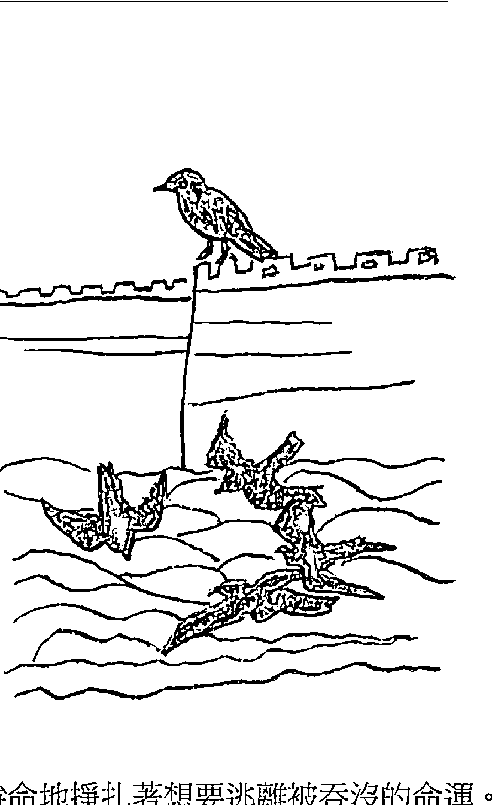

滔滔的洪水奔騰不已，上面飛雀拼命地掙扎著想要逃離被吞沒的命運。就在牠們為生存而疲於奔命時，遠處的城郭之上已經有一隻飛雀安然地站立其上了。牠睥睨著城郭之下的所有，又或者是悲憫地看著腳下的一切，無論存有的是何種心態，已經脫離險境的牠毋庸置疑地成為了唯一的高高在上者。牠就是「郭」上「雀」，即郭雀兒。

郭雀兒，是郭威的外號，有人說是因他脖子上刺有一隻飛雀而得名，也有人說是因他年少時的經歷而得名。郭威生於亂世，邢州堯山（今河北省隆堯縣西）人。他不僅沒有經歷過盛極一時的雍容大唐，而且在三歲時那個傳說中的李家王朝便被朱溫的後梁替代了，此後他所聞所見皆是篡位奪權、改朝換代之事，因而他儘管年少孤貧，卻始終秉持著「不想當將軍的士兵不是好士兵」的信念，憑著自己的倔強和好勇鬥狠的性格，再加上對時勢的敏銳洞察力，一步步地朝著「將軍」甚至是更高的目標前行。

初時，郭威是潞州（今山西長治）節度使李繼韜帳下的一名牙兵，深得李繼韜的喜愛，甚至對其破壞軍規之事也會加以偏袒。後來，李繼韜被後唐莊宗李存勖所滅，郭威隨軍被收歸了後唐的軍隊，做一名小差役，每天做著傳遞書信之類跑腿的工作。

就在此時，郭威遇到了對他人生產生巨大影響的女子——他的妻子柴氏。這個美若天仙的女子，一眼就看出郭威是支「潛力股」，於是不顧家人的反對，毅然地嫁給了當時一無所有，甚至連件像樣的衣服都沒有的郭威，而且還給郭威帶來了一個後來名聲比他還大的侄子，或者說是養子——柴榮，自然這是後話。

自從娶了柴氏之後，郭威心中那股要幹一番轟轟烈烈大事業的雄心壯志又被喚醒了。他眼看著石敬瑭割讓燕雲十六州、自稱兒皇帝，覺得此人不值得親近，便轉而投到了他認為能成就一番功業的河南節度使劉知遠帳下，而且很快得到了劉知遠的賞識，「得以出入帷幄，受心腹之寄。」

郭威也沒有令劉知遠失望，他用自己學到不多的知識與計謀，幫助劉知遠不斷擴充實力。在契丹滅晉後的關鍵時刻，建議劉知遠在河南建稱帝，一躍成為了後漢的開國功臣。並且在此後的日子裏，一直幫助劉知遠出謀劃策、穩定政局。

如此友好的君臣關係，雖不及唐太宗與魏徵，卻也默契十足，若是能長久地維持下去，說不定也能創造出一段佳話。但歷史和人生一樣，總是充滿了許多的偶然與巧合，劉知遠剛剛登基一年，就很「偶然」地去世了，而他## 推背图和烧饼歌里的历史

与郭威本可能成就的一段佳话也就被迫戛然而止了。虽然刘知远临终前任命郭威为托孤大臣，但皇位继承者隐帝刘承佑毕竟不是刘知远，面对任枢密使、掌握军政大权的郭威，虽然在平定“三镇叛乱”、抵御契丹入侵时离不开善战的郭威，但郭威一次次的凯旋愈发地加剧了刘承佑对他功高震主的猜忌。

终于，在后汉隐帝乾祐二年（公元949年），刘承佑在他人的蛊惑下对郭威起了杀机，派使者前往魏州诛灭郭威。不料，所派之人反戈将消息透露给了郭威。郭威在谋士的帮助下，修改密诏，将后汉隐帝对他的诛杀令改为了对他所统领所有武将的诛杀令。这样一来，群情激愤，众人推举郭威为首，以“清君侧”之名，向都城开封进发。刘承佑听闻郭威起兵后，遂将其在京眷属全部诛杀，并派兵抵御。郭威再无顾虑，一举攻下开封，后汉隐帝被乱军杀死。

此时的郭威是否已有取后汉而代之的想法，我们不得而知，或许是真的无心称帝，又或许是担心正统性问题，攻入开封的郭威表面看来并没有篡位的打算，而是在拜谒太后时提出了由汉隐帝的堂弟、武宁节度使刘赟继位的建议。还未来得及安排具体的细节，边关就又传来了契丹入侵的消息，郭威奉太后之命，点齐兵马出征御敌。

大军行至黄河渡口的澶州（今河南濮阳南）时，数千将士兵变，纷纷要求拥立郭威为帝。仓促间，有人扯了一面黄龙旗裹在郭威身上，以示“黄袍加身”之意。事已至此，郭威只好“勉为其难”地答应了。大军稍作休整后，便班师回朝了。回到开封后，太后下诏郭威为监国。公元951年，郭威正式称帝，是为周太祖，改元广顺，定国号为“周”，为和前世的周朝区分开来，史称后周，而郭威也就成了郭姓历史上出现的唯一一位皇帝。

至此，后汉亡、“汉水竭”，在混乱的时势中，到处都是企图自立为王者，正是“百个雀儿水上飞”、“飞来飞去何所止”，最后的胜利只属于一个人，即“唯有一个踏破足，高楼独自理毛衣”，他就是中国历史上唯一的郭姓皇帝——郭威郭雀儿，暗合了《推背图》中所言“雀高飞”和“高山不及城郭低”的预言。至于那句“九十九个过山西”，金圣叹先生也未能做出合理的解释，尤其是其中的“山西”一词更是给人云里雾里之感，或许我们可以将其视为李淳风和袁天罡预言的“误差”吧。

还是回到后周的建立，在郭威称帝的过程中，澶州兵变无疑是至关重要的一个环节，而这其中“诸军将士大噪趋驿，如墙而进，帝闭门拒之。军士登墙越屋而入，请帝为天子。乱军山积，登阶匝陛，扶抱拥迫，或有裂黄旗以被帝体，以代赭袍，山呼震地。”竟是如此的熟悉。但人们对于这一情景的了解，更多的是因为宋太祖赵匡胤，因为他的帝位也和郭威一样，是被逼“黄袍加身”而得来的，而且显然是曾经做过郭威部将的赵匡胤借用了亲眼目睹的“桥段”。

至于这样的故事，到底是真如人们所知的“被逼无奈”，还是“早有预谋”，后世之人往往更倾向于后者，因此有人说所谓的郭威率兵出征抵御契丹的入侵，其实他自己捏造的军情，因为就在他的部下发动兵变同时，竟然一点契丹进攻消息都没有了，好像契丹根本未曾前来侵袭一样。于是，人们判断郭威这样做的目的就是为了将部队带出都城的范围，方便上演那场“黄袍加身”的戏码。

但参考当时契丹的历史记载——《辽史・世宗本纪》——来看，人们的这种猜测并不正确，因为据《辽史》记载，当时的辽帝永康王耶律兀裕确实曾出兵洺州（今河北永年），不过并非大规模的进攻，只是普通的边境骚扰而已，见攻城无甚进展便自行退回去了。这样一来，郭威捏造军情一说便不攻自破了，但这并不代表郭威的“黄袍加身”确实是为形势所逼的无奈之举，在未有确切的证据可以证明其是偶然还是人为之前，距离那段历史已有一千多年的我们也只能透过猜测来解释心底的疑惑了。

#### 事件纪

##### 三镇叛乱

后汉乾祐元年（公元948年），隐帝即位不久，据国节度使李守贞在河中（今山西省永济县西）自称秦王，联合凤翔节度使王景崇和占据长安的赵思绾，发动叛乱，史称“三镇叛乱”。隐帝慌忙派出大将平叛，结果却节节败退。直到封郭威为军前安抚使，出征平叛，才获得了全面的胜利。

### 17 十三童子五王公，五十三岁运不通
#### ——预言五代的历史

> 《推背图》第十四象 丁丑

**谶曰**

李树得根芽
石榴漫放花
枯木逢春祇一瞬
让他天下竞荣华

**颂曰**

金木水火土已终
十三童子五王公
英明重见太平日
五十三参运不通

北京故宫博物院馆藏珍品中，有一幅用笔细润圆劲，色彩浓丽，人物形象清俊、娟秀的画作。全长三米，共分五段，各段间以屏风相隔，细致地记录一次夜宴的过程：从众人赏乐到主人击鼓，最后到高谈阔论，将当时众人玩乐时的神情和各人的性格统统表现得十分逼真，栩栩如生，故而千百年来获得了极高的评价。此画名为《韩熙载夜宴图》，画中主人公韩熙载为南唐官员，个性放荡不羁，为求自保整日沉迷于歌舞之中，夜夜笙歌，诗酒唱和，不问时事，宛如生活在一片太平盛世之中一般。

事实却远非如此，韩熙载的享乐和他的君王南唐后主李煜的那句“雕栏玉砌应犹在”一样，不过是一场自欺欺人的美梦。他们所处的时代，是中国历史上继三国之后的又一个乱世——五代十国。显然，后世之人对于这段历史的了解，除了那位以文人之才登上帝王之位的李煜之外，远没有对三国的历史那么清楚，或者说远没有那么可供了解的途径。但这段历史如同中国古代其他的历史朝代一样，也存在着所谓的“正统”。当时的“正统”就是位于北方的五代。

所谓五代，就在唐朝灭亡之后，中原地区相继出现的五个朝代：后梁、后唐、后晋、后汉、后周。这段历史从公元907年唐朝最后一位君主昭宣帝李柷禅位于朱温开始，到960年赵匡胤在陈桥驿被军士拥戴成为宋太祖止，历时共五十三年。

单从“五十三”这个数字来说，我们就不得不为古代预言家那些精准的预言所折服。诸葛亮《马前课》中的“五十年中”或许还存在着“三年”的误差，姜太公《万年歌》中的“五十年来二三往”无疑就已经将误差缩小到了“一年半载”之内了，更令人拍案叫绝的是李淳风与袁天罡《推背图》中的“五十三参运不通”竟能准确到完全没有误差，不得不令人怀疑它真的是预言吗？还是五代之后的人所作的“伪预言”。

此番也仅为猜测而已，没有切实的证据证明，也没有切实的证据反驳，唯一可以肯定的，就是那历经五十三年的五代时期是真实的历史。而且“李树得根芽，石榴漫放花”中“石”建立的后晋、“榴”（即刘）建立的后汉和“李”建立的后唐，都是切实存在过的。即便我们无法辨识他们分别是“金木水火土已终”中所代表的五行中的哪一行，即便他们无力改变最后灭亡的命运，但五代的这五十三年，对整个中国历史而言，绝非如人们以为那般是无足轻重的。

五十三年，在漫长的中国历史中，不过转瞬即逝的短暂时光，但却因是乱世，而身处其中的人们过得无比凄惨、度日如年，正如李淳风在他的另一本预言书——《藏头诗》中所说：“此时天下慌乱，人民饥饿。”单此一句，便可毫不犹豫地将五代归入“乱世”的行列。

不可否认，五代确实是一个金戈铁马、战火纷飞的动荡时代，中原几乎日日夜夜都有争抢不停的逐鹿者，他们用频繁的战乱搅扰着百姓的生活，无尽的杀伐所带来的恐惧如幽灵般长久地盘绕在人们的心头，人们永远无法预知下一秒钟自己是否还能完好无损地生存在这个世界上。

然而，危及百姓生命的，不只是硝烟弥漫的战火，还有连绵战火带来的农业荒废和经济萧条。后梁为阻挡后晋的进攻，多次决黄河之口，令豫鲁广大地区洪水泛滥；单是后梁与后晋的连年征战，就使得如今的晋南豫北不少地区“里无麦禾，邑无烟火”；后晋时期，由于燕云十六州被割让，契丹骑兵可以肆无忌惮地直入中原腹地，所到之处千里内“民物殆尽”。如此的残破局面几乎贯穿整个五代的始终，在后晋、后汉之际达到了最严重的程度，比起《马前课》中所言的“生灵荼毒”真是有过之而无不及。

“人类处于神与禽兽之间，时而倾向一类，时而倾向另一类。”古希腊哲学家普罗提诺如是说。在战火纷飞的五代里，因着最原始的欲望，人们逐渐舍弃自己的神性，倾向于“禽兽”一类。一时间，人性的丑恶不加掩饰地暴露出来，腐化、阴谋、溃败、乱伦、政变、父子相残、兄弟相刃接连不断地被上演，无论是君王还是朝臣，其中皆有诸多的无能之辈与反复小人，他们用黑暗的力量抑制着光明与道德，使五代成了长达半个世纪之久的“小人道长”（出自于《马前课》）之势，故而有人将五代称为“第五季”，也就是最差的时代。

因为五十三年的混乱，人们将“礼崩乐坏，天下不安，人臣篡逆，纲常失纪”等这些惯于定义乱世的标签，自然而然地贴在了五代的头上。但五代并非一无是处，鲁迅先生曾说：“历史短的王朝，历史中记载的往往坏人多好人少，时间长的王朝好人则要多一些。”对朝代的记载同样也是如此，正如黄仁宇先生所说：“传统的历史学家对于五代十国没有多少好话可说。要不是‘僭窃交兴，称号纷杂’，则是‘峻法以剥下，厚敛以奉上’。他们不知道在唐宋之间，不能没有这样的一重过渡时期……”

确实，这是一个承前启后的年代，尽管它有着中国历史上所有乱世的特征，却也是连接鼎盛唐朝与繁华宋朝的纽带，犹如马鞍的底部，连接了两端的高峰；同时，五代又如同一道分水岭，将中国的历史一分为二：此前为制度森严的贵族专制，此后是唯才是用的科举择士；此前文坛是诗文一枝独秀，此后的文坛是诗词曲赋、小说百花齐放；此前是“虽远必诛”的强汉盛唐，此后是饱受凌辱的宋元明清……

五代的意义究竟为何，我们还无法给出准确的定论，但不可否认的是像有些学者所说的那样，这一时期“表面上乱，实质是变”。最大的“变”就是，从五代开始，在所有中国人的心中始终存在着一种统一的趋势与渴望，而中国人自郭威建立后周开始，便看到了统一的希望。

后周是五代末期中原地区实力最强大的政权，他和他的接班人柴荣，励精图治、改革时弊，苦心经营着统一的梦想。虽然他们令后周成为了一代中治理得最好的一朝，但也只是“枯木（即柴）逢春只一瞬”、“未经十载遭更易”（出自于《万年歌》）。显德七年（公元960年）正月初四，归德（今河南商丘南）节度使、殿前都点检赵匡胤黄袍加身，夺取后周政权，建立了宋王朝，自此中国历史进入了另一段长久地统一与繁荣，正是《推背图》中所言的“英明重见太平日”，而这一切又与后周奠定的良好基础有极大的关系，否则也不会有所谓的“让他天下竞荣华”之说了。

这就是五代，一个人们印象中只有李煜却湮没了无数风流人物的时代，一个几乎汇集了所有乱世“精华”却仍不可或缺的时代。显然，它不应被忽略，更不应被遗忘。

#### 常识纪

##### 十国

十国为唐朝灭亡后，北方地区出现后梁、后唐、后晋、后汉、后周五个王朝的同时，南方地区出现的九个王朝和位于北方的北汉的合称。南方的九国分别为：杨行密创立的历时三十六年的南吴、徐温创立的历时三十九年的南唐、王建创立的历时二十三年的前蜀、孟知祥创立的历时三十三年的后蜀、刘隐创立的历时五十五年的南汉、马殷创立的历时四十五年的南楚、钱鏐创立的历时七十二年的吴越、王审知创立的历时三十七年的闽、高季兴创立的历时四十年的荆南。十国中唯一位居北方的北汉由刘崇创立，历时二十九年。

### 18 日月山川，寰中自有真天子
#### ——预言五代天子之争

##### 《推背图》第十五象 戊寅

> **谶曰**

天有日月 地有山川

海内纷纷 父后子前

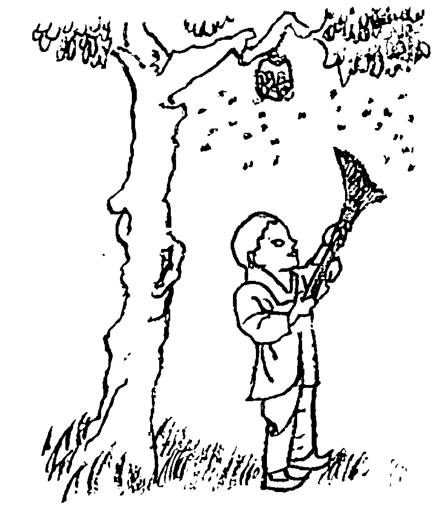

> **颂曰**

战事中原迄未休

几人高枕卧金戈

寰中自有真天子

扫尽群妖见日头

皇帝，又名天子，顾名思义，即为天之嫡长子。传统文化中，天是人格化的自然界，被认为是宇宙最高的主宰，故而天子“受命于天”，是上天委任于人世间的代理人，理所当然地拥有掌管世间一切的权力。正是因着这种“君权神授”思想的影响，皇帝成了有史以来最具神秘感的“职业”，他们虽不及上天那般遥不可及，却也高居于人世间的最上层，以“半人半神”的形象行使着自己的“特权”。基于这一点，许多的帝王在其出生之日总是会伴之以一些异兆，譬如有凤来仪，譬如星辰突变，以此来增加其神秘感。

实际上，所谓的天子之位和那些异兆一样，不过是一个掩人耳目的伎俩。尽管能蒙蔽诸多天真烂漫的百姓，始终无法骗过所有人。最早对所谓的“真命天子”产生质疑的，应该是陈胜喊出的“王侯将相宁有种乎！”一句如此简单的话语，立即戳破了“天子”的秘密，惊醒了当时的人们，于是一点农民起义的星星之火发展成了全国范围反秦的燎原之势，最终结束了秦朝的暴政。

或许是由于懒惰，又或许是因为遗忘，人们往往总是得等到忍无可忍之时才愿意从“君权神授”的谎言中醒悟过来，五代就是这样一个令他们不得不清醒的乱世，而在这一时代中如陈胜一般喊出振聋发聩之声的，竟是一个不学无术之人——安重荣。

他是山西朔州人，自幼参军，因为没什么学识，只得从最基层的普通士兵做起，如果要说什么有长处的话，他的箭法不错。安重荣只是众多普通士兵中的一个，但他胜在胆子大，毅然决然地加入了石敬瑭反叛的队伍之中。石敬瑭的后晋建立之后，安重荣一跃成为了成德节度使。

从最底层的士兵到割据一方的节度使，安重荣只用了很短的时间。在外人看来，他的升级甚至可以用“空降部队”来形容，但在他看来，这是再平常不过的事情了，尤其是大唐帝国灭亡之后的中国，更是让他看清了隐藏在神秘背后的帝位的实质，于是，他说出了一句可与“王侯将相宁有种乎”相媲美的话：“天子，兵强马壮者当为之，宁有种乎耶！”简单地说，就是谁有实力，谁就能当天子。

事实确实如此，在五代这个拥挤且混乱的时空里，帝王之位再没有了治世中的世代沿袭，反而变成了《万年歌》中所预言的“不真不假乱为君”和《推背图》中所预言的“父子前后”伦理颠倒的情形，此时的历史就仿佛是一方展示自己实力的舞台，一直在“你方唱罢我登场”的情景中轮回。最先揭开帷幕，登上舞台的，是结束掉大唐帝国的朱温，自这位后梁太祖开始，李唐的基业彻底被摧毁了，就像当初唐太宗李世民命李淳风推算国祚时，李淳风在著名的《藏头诗》中回答的那样：“唐家血食尽矣，天下非唐有矣。”

天下已由李姓改为朱姓，但与李姓掌管天下的时间相比，朱家的天下持续的时间未免过于短暂，仅有17年，而这与朱温本身性格中的缺陷有极大的关系。好色的朱温在登上帝王之位后，更是变本加厉地纵意声色，甚至“幸御不避亲”，最后因强纳自己的儿媳妇而被儿子杀死。

接掌他帝位的，是打着“除凶逆，复大仇”旗号登基的四儿子朱友贞，是为后梁末帝。朱友贞接手的是一个在外患与内忧的夹击下即将引爆的帝国，加上他不善用人，使得后梁的灭亡只是迟早的问题而已。果然，龙德三年（公元923年），在与朱家积怨已久的李家后人李存勖部队的围困中自杀身亡，后梁随之灭亡。

灭后梁的后唐庄宗李存勖，以勇猛闻名，是一个难得的军事天才。但他在建立了后唐，登基为帝之后，却完全无力承担守江山的重任。他整日沉迷于玩乐之中，令曾经的“风云帐下奇儿在”，沦落至“鼓角灯前老泪多”的地步不得止，最后竟落得个“数十伶人困之，而身死国灭，为天下笑”的下场，实在可悲可叹。

后唐庄宗李存勖在一片混乱兵变声中被杀后，李克用的养子、李存勖的义兄李嗣源即位，开始了后唐王朝的第二个阶段，此后虽仍名为李唐，却只是沿用了一个国号而已，后唐实际上已经换了统治者。后唐明帝是个理性的皇帝，却生不逢时，虽然采用了比较爱民的休养政策，但始终无法改变后唐岌岌可危的形势，只能是尽量维持表面的平静而已。

李嗣源死后，儿子李从厚继位，是为闵帝。4个月后，后唐明宗李嗣源的养子、李从厚的义兄李从珂起兵夺取了皇位，是为末帝。在李从珂还未称帝之前的发展时期，河东节度使、李嗣源的女婿石敬瑭也在壮大自己的力量。清泰三年（公元936年），石敬瑭引契丹攻灭后唐，建立后晋，是为后晋高祖，改元天福。

显然，石敬瑭的江山是他的“父亲”契丹皇帝的帮助下抢下来，换个角度来说，就是单凭石敬瑭的力量根本不足以称霸整个中原地区，因此他的帝国从一开始便是因“靠山”而得，“靠山”一旦失去，江山也就会随之而丢失。果然，在石敬瑭死后即位的侄子石重贵，因决定与“靠山”划清界线而激怒了契丹人，于是，他们在皇帝耶律德光的带领下，于开运三年（公元946年）攻入开封，俘虏石重贵，后晋灭亡。

就在后晋与契丹交战时，后晋的河东节度使刘知远正广募士卒，暗中积蓄力量。契丹占领开封不久，他就在太原称帝，是为高祖，建立后汉。刘知远曾致力于境内叛乱的平息和丢掉疆土的恢复，但天不从人愿，在登基后的第二年，他便与世长辞，把江山留给了年仅十七岁的隐帝刘承祐。隐帝虽年幼却不愿受人所制，于是下令杀杨邠、史弘肇、王章等权臣，并派人去谋害留守邺都的郭威。

郭威闻讯起兵，攻入开封，后汉亡，隐帝死。次年（公元951年），郭威称帝，是为太祖，建立后周——五代的最后一个王朝。不知是不是偶然，中国历史上自秦朝之后国号为“周”的朝代，都曾出现过大名鼎鼎的明君，如北周的太祖宇文泰、李唐王朝中的周朝帝王武则天。后周的情形亦是如此，虽然整个后周仅持续了不到十年的时间，却出现了两位很有作为的皇帝——太祖郭威和世宗柴荣，正是《万年歌》预言“金猪（郭威称帝年为辛亥金猪年）此木（即为柴）为皇帝”中的两位君王。

郭威招贤纳士，革除弊政，使政局逐渐稳定下来，并令后周在很短的时间里就显现出了国富民强的迹象。柴荣则继承了郭威的改革事业，并开始了统一战争，史称“周世宗英毅雄杰，以衰乱之世，区区五、六年间，威武之声，震慑夷夏，可谓一时贤主。”可惜他英年早逝，未能完成预期的政治目标，对此，史家一片叹息，薛居正在宋朝编著《梁唐晋汉周书》（或名《旧五代史》）时曾说：“江北燕南取之若草芥，神武雄略，及一代之英主也。……降年不永，美志不就，悲夫！”如果柴荣不那么早辞世的话，或许中国历史就不会出现后来的赵宋王朝，但历史没有如果。

柴荣去世之后，年仅七岁的恭帝柴宗训即位，由符太后垂帘听政，范质、王溥等主持军国大事，这一时期，掌握禁军的归德节度使、殿前都点检赵匡胤的势力迅速壮大，最终于显德七年（公元960）初策划了一场“陈桥兵变，黄袍加身”的演出，兵不血刃地登上了帝王之位，建立了宋朝，至此，后周柴宗训“孤儿寡母的天下被人夺去”，五代时期也终于尘埃落定。

在这段为期五十三年的历史中，人们争相扩充自己的势力，渴望成为“兵强马壮者”，希冀登上万众瞩目的帝王之位，于是搞得“海内纷纷”、“战事中原迄未休，几人高枕卧金戈？”战乱之中，帝王也走马灯似的换，单就帝王的姓氏而言，便“其数有八”（出自于《马前课》），平均不到四年便换一位皇帝，共计“十三童子五王公”。

幸而，“天有日月，地有山川”，混乱的局面终有结束之日，公元960年废周建宋的赵匡胤，便是那个“寰中自有真天子”，他为自大唐帝国结束之后所出现的连续不断的帝位争夺战画上了一个暂时的句号，将中国历史从五代时期频繁的改朝换代的轮回中暂时拖了出来，令百姓终于“见日头”，看到了和平的曙光，但完成“扫尽群妖”任务的，远非他一个人，还有那被他夺去江山的后周的明君郭威与柴荣。

#### 人物纪：

## 柴榮

柴榮，後周皇帝周世宗，又稱柴世宗，邢州堯山柴家莊（今河北邢台隆堯）人。年少之時因家道中落而去投奔嫁給郭威的姑媽，深得郭威賞識，收其為養子，改為郭榮。後周顯德元年（西元954年），周太祖郭威駕崩，晉王柴榮即位。在位時間從西元955年至西元959年，在為期五年的時間裡，他勵精圖治，銳意改革，南征北戰，揭開了結束分裂、統一天下的序幕。顯德六年（西元959年），柴榮於北征大遼之時，因病班師回朝，不久便溘然離世，終年三十八歲。

## 附表2：五代帝王表

| 朝代 | 廟號 | 姓名 | 生卒年 | 在位時間 |
|---|---|---|---|---|
| 後梁（907～923年）建都汴梁 | 太祖 | 朱溫，又名朱全忠、朱晃 | 852～912年 | 907～912年 |
|  | 末帝 | 朱友貞 | 888～923年 | 913～923年 |
| 後唐（923～936年）建都洛陽 | 莊宗 | 李存勖 | 885～926年 | 923～926年 |
|  | 明宗 | 李嗣源 | 867～933年 | 926～933年 |
|  | 閔帝 | 李從厚 | 915～934年 | 933～934年 |
|  | 末帝 | 李從珂 | 885～936年 | 934～936年 |
| 後晉（936～946年）建都汴梁 | 高祖 | 石敬瑭 | 892～942年 | 936～942年 |
|  | 出帝 | 石重貴 | 914～974年 | 942～946年 |
| 後漢（947～950年）建都汴梁 | 高祖 | 劉知遠 | 895～948年 | 947～948年 |
|  | 隱帝 | 劉承祐 | 930～950年 | 948～950年 |
| 後周（951～960年）建都汴梁 | 太祖 | 郭威 | 904～954年 | 951～954年 |
|  | 世宗 | 柴榮 | 921～959年 | 954～959年 |
|  | 恭帝 | 柴宗訓 | 953～973年 | 959～960年 |

## 推背图和烧饼歌里的历史

### 贰 文雅孱弱伴赵宋，以武治文贯蒙元

## 19 黄袍加身開新朝，不殺人民更全嗣
——預言趙匡胤建宋

> 《推背圖》第十六象 己卯

- 讖曰
天一生水 姿稟聖武
順天應人 無今無古

- 頌曰
納土姓錢並姓李
其餘相次朝天子
天將一統付真人
不殺人民更全嗣

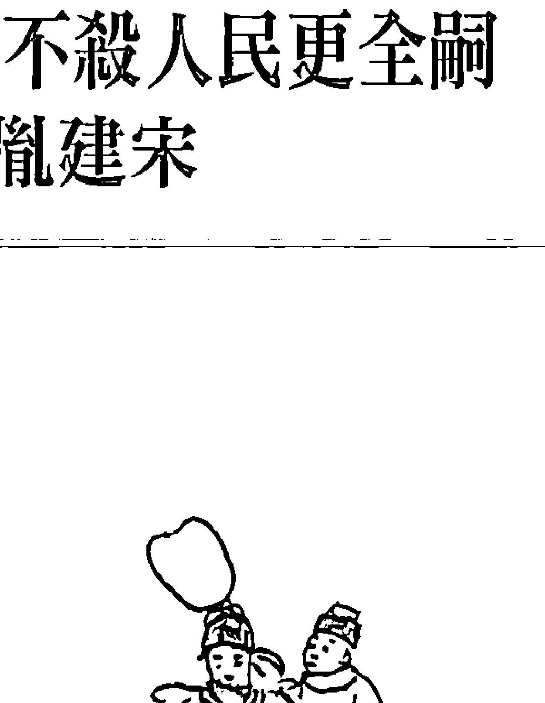

學者余秋雨先生說：「我最嚮往的朝代就是宋朝。」英國史學家湯恩比也曾說：「如果讓我選擇，我願意活在中國的宋朝。」世人如此青睞的宋朝，皆始於一位「救世主」般的帝王——趙匡胤。就像宋儒邵堯夫稱讚的那樣：「紛紛五代亂離間，一旦雲開復見天。草木百年新雨露，車書萬里舊江山。尋常巷陌陳羅綺，幾處樓臺奏管弦。人樂太平無事日，鶯花無限日高眠。」趙匡胤確實救身處於五代亂世之中的百姓脫離了水深火熱，並將其帶入了一個四海昇平、宇內繁榮的幸福時代——宋朝當中，而這個盛世的序幕，便是所谓的「陳橋崖海須臾事」。

後周顯德七年（西元960年）正月某日黎明時分，天地間霧靄迷濛，冬雷震震，雨雪欲垂。穿雲薄霧，隱約那陳橋驛外有火光閃動，在這冥晨之中猶如引導前路的幽燈。幽燈越聚越多，最後火光照亮了整個驛站，只見陳橋驛內外駐紮了百餘帳篷，萬餘兵士手持火把穿梭於帳篷之間，蠢蠢欲動。

此時，主帳內一陣騷動，一個衣衫尚未穿好、猶有幾分醉意的高壯男子，被幾人攙出帳外。他尚未站定，周圍驀然爆起士兵的震響吶喊：「諸軍無主，願奉都點檢為天子。」男子不及回應，攙他出帳的幾人便將早已準備好的金色龍袍披在他的肩上。所有的將兵紛紛跪地，直呼：「萬歲、萬歲、萬萬歲！」一時間聲音響徹雲霄，打破了晨曦的靜謐。

男子慌忙俯身半跪在地，對眾將道：「這可使不得，我何德何能，怎可當皇帝……」他嘴上雖然推託，垂下頭後，嘴角卻逸出一絲不易察覺的笑意，眼中的精芒乍現，旋即斂去。

下一刻，眾將已不顧他推託，硬是將他「逼」上了馬。……看來，他這個皇帝不當也不成了。於是乎，將士們收拾行囊，掉轉馬頭，直逼開封汴梁。江山從此易主，一個王朝從此開始，陳橋這個地方也由此被載入了史冊，千秋不朽。

這一年是960年——庚申金猴年，這個被「逼」當上了皇帝的人就是趙匡胤，暗合了《萬年歌》中「肖郎走出（即為「趙」）在金猴」的預言。他在這一年的春天，被眾人「推」著站了出來，結束了唐朝覆滅後中土長達半個多世紀的混亂局面，建立了風華兩百年的趙宋王朝，還給老百姓一個久遠的安寧的「春天」，自然是「順天應人，無今無古」的。

歷史總是充滿了無數的偶然，在經過了五代十國五十多年的群雄逐鹿之後，民間早已是天怒人怨了，在這種情況下自然需要有一個人出來結束這一切。於是，在史學家王夫之看來，既無高尚德行，也無顯赫軍功的趙匡胤之所以能成为这个时代的结束者，与「时势造英雄」有着莫大的关系。

部分史书上称，赵匡胤是民心所向，因此才会受人拥戴。然而王夫之却说：「宋之君天下也，皆天所旦夕陟降于宋祖之心而启迪之者也。故曰：命不易也。」他认为赵匡胤能做皇帝，都是上天赐予他的契机，是不可抗的命运。他之所以能「兵不血刃而三方夷，刑不姑试而悍将服」，完全是上天的护佑。

王夫之的这种说法难免加入了一些神秘色彩，容易被人质疑，但在五代的乱世当中，算不上极厉害的赵匡胤能脱颖而出，的确有几分运气的影响。因为越是乱世便越需要大一统，越需要有作为的英雄，但这个时代没有孕育如秦始皇、李世民那样的英雄，便唯有选择一个不算英雄的「英雄」。恰巧，这时候的赵匡胤有「一点点」野心，而又在当政之后有那么「一点点」建树，所以他便成了那个幸运的「真龙天子」，成了「天将一统付真人」中的那个「真人」。

赵匡胤，这位因郡望是天水而使宋朝被惯称为「天一生水」的开国君王，虽在即位的问题上承蒙天恩，但在后来的国家治理上却真正做到了「姿禀圣武」。他深信「卧榻之侧，岂可许他人鼾睡？」之理，因而为统一河山殚精竭虑，他所灭之国有荆南（今湖北）、湖南、蜀（今四川和陕西一部）、南汉（今广东和广西）和南唐（今江苏、江西及安徽一部），钱俶所掌管的吴越（今浙江及福建一部）也纳土归宋，南方的割据政权基本消除殆尽，实现了「纳土姓钱并姓李，其余相次朝天子」的目标。

> 黄仁宇先生说：「各朝代创业这主，虽凭军事力量夺取江山，只有赵匡胤是职业军人。」对于赵匡胤这种以军功起家的人来说，军事就是最原始的资本，他凭藉此而夺得天下，自然便会对拥有这种原始资本的人极为敏感，因而河山再易成了他心中最担心的问题，相应地对助自己夺江山的石守信、王审琦等武将产生了提防之心。

如果換作是其他君王的話，必定會又一次踐行「鳥盡弓藏」之理，「可是趙匡胤不以抽象的觀念籠罩事務。他作為聖賢之君的觀念，能拿出來對真人實事發揮。在各代帝王之中可算是最能說實話的一位。」所以，他不擊殺功臣，而是在於石守信、王審琦等人推杯換盞之間，說了一些大實話：「人生如白駒過隙，所以好富貴者，不過欲各積金錢，厚自娛樂，使子孫無貧乏耳。卿等何不釋去兵權，出守大藩，擇好便田宅市之，為子孫立永久不可動之業，多置歌兒舞女，日夕飲酒相歡，以終天年，朕且與卿等約為婚姻，君臣之間兩無猜疑，上下相安，不亦善乎？」

趙匡胤沒用一兵一卒，便將其親信手下的兵權收歸己有，沒有再上演其他王朝開國之初的悲劇，讓後世人不得不佩服。比之明朝朱元璋「和尚頭兒」心胸狹窄，殺光明初幾乎所有的開國將領，趙匡胤的確是很有人情味的。在黃仁宇先生看來，這是「因為他的直爽，宋太祖不用漢高祖和明太祖的伎倆去屠殺功臣。在統一期間被他征服的小朝廷的首長，也受優待，無歷朝的疑忌殺戮司事，據說他自己曾立有『誓約』不殺大臣及言事官」。此種「不殺人民更全嗣」的胸懷與能耐，絲毫不遜於唐太宗李世民。

然而，趙匡胤這一招為後世所稱道「杯酒釋兵權」，並不完美。一位史家學者說，北宋不僅透過「杯酒釋兵權」戲劇性地解除了所有將領的兵權，更主要的是制定並實施了一整套加強中央集權的政策，由朝廷直接控制軍隊，削弱地方政府的權力，並透過不同行政機構的功能使之相互牽制。這樣互相牽制的結果，把軍權都集中在皇帝手裡，基本上消除了武人發動兵變的可能性，同時，也就形成了強幹弱枝而內外上下相互制約之制的形式。

武將失勢，文臣抬頭。「杯酒釋兵權」後不久，謀臣趙普出任樞密使，總攬軍國大權，確立了一代文臣政治。血一般的史實證明，多是兵者覆天下，文人卻大多數為輔佐者，若是將朝政交與文人治理，便不怕王朝搖擺了。歷史學者王育濟先生認為，古人說「杯酒釋兵權」是宋朝「文盛武衰」的转机，乃文武两势变易的枢纽，颇有几分道理。想来会造成如此的结果，必定是赵匡胤始料未及的。

#### 常识纪：

##### 宋朝为何又称「天水一朝」

国学大师王国维在《宋代之金石学》中说：“天水一朝，人智之活动，与文化之多面，前之汉唐，后之元明，皆所不逮也。”史学大师陈寅恪在《赠蒋秉南序》中说：“天水一朝之文化，竟为我民族永远之瑰宝。”宋朝之所以被称为“天水一朝”，源于宋王朝“赵”姓的发源地是天水。历史上赵姓宗族著名的聚居地主要有天水郡、涿郡、南阳郡等。其中以天水郡最早、最有名。赵匡胤“陈桥兵变”，建立赵宋王朝后，人们便将陇西天水定为国之郡望，所以后世之人便习惯以“天水一朝”来指代赵宋王朝。

### 20 天子亲临乍渡河，干戈息邦邑定
——预言澶渊之盟

> 《推背图》第十七象 庚辰

- 讖曰
聲赫赫 干戈息
掃邊氛 莫邦邑

- 頌曰
天子親征乍渡河
歡聲百里起謳歌
運籌幸有完全女
奏得奇功在議和

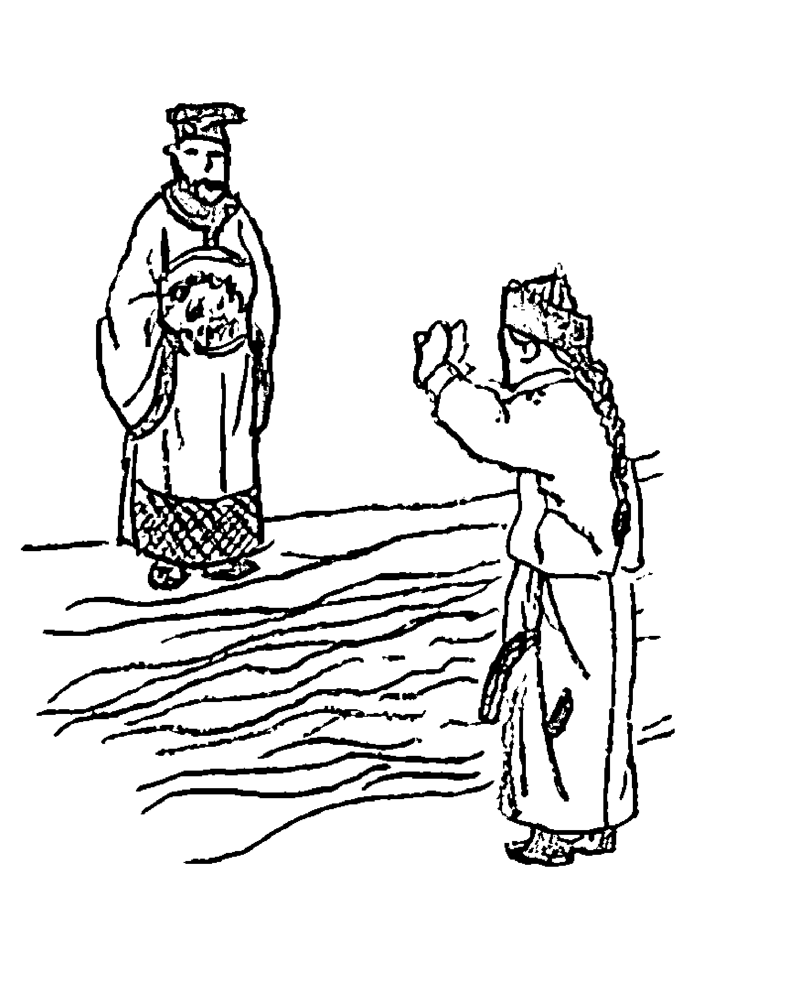

「四十年来家国，三千里地山河。凤阁龙楼连霄汉，玉树琼枝作烟萝，几曾识干戈。一旦归为臣虏，沈腰潘鬓消磨。最是仓皇辞庙日，教坊犹奏别离歌，垂泪对宫娥。」南唐后主李煜的这首〈破阵子〉用在宋太祖赵匡胤的身上也极为贴切，作为一位开国君王，赵匡胤的一生足够辉煌，死时却未免凄凉。深宫密室之中的烛影斧声，内幕究竟为何，后世之人恐怕永远无法知晓，但可以肯定的是，赵匡胤这位传奇君王是有遗憾的，那就是他统一河山的梦想还未完成、「卧榻情结」还未解开。

尽管赵匡胤在世之时已经实现了南方的局部统一，但后晋高祖石敬瑭割讓給契丹的「燕雲十六州」始終是他心底深處的痛。一方面由於在「燕雲十六州」和宋之間有一個一直為契丹所支持的北漢政權，可暫時阻擋契丹的入侵；另一方面北宋國庫有限，暫時還沒有足夠的財力去應付契丹和北漢的聯軍：於是，面對「燕雲十六州」這片面積不大，卻對中原地區至關重要的土地，趙匡胤只有望洋興嘆的份，直到離開人世，也未能有一兵一卒踏上夢想中的土地。

奉「遺詔」即位的太宗趙光義，連同帝位一起接過了兄長未完成的心願。太平興國四年（西元979年）五月，趙光義不顧群臣的反對，出兵「五代十國」的最後一國北漢，先後收復了易州和涿州，志得意滿的太宗攻滅北漢之後，移師進攻契丹，下令直逼燕京（今北京），一直打到了西直門外。不料初戰告捷只是一種假象，很快地宋軍就崩潰了，《遼史》稱「宋主僅以身免，至涿州竊乘驢車遁去」，可見潰敗之程度。第二年，太宗又捲土重來，結果還是鍛羽而歸。雍熙三年（西元986年），太宗發動了對契丹的第三次進攻，起初也取得了一些勝利，最終還是沒有成功。

北宋的三次戰敗，留下了困擾太宗近二十年之久的箭傷，就像太宗自己感嘆的那樣：「一箭未施戎馬遁，六軍空恨陣雲高」，不僅距實現兄長的遺願更加遙遠了，亦使宋軍元氣大傷，朝廷上下彌漫著一股恐遼的情緒。太宗不得不承認自己的軍事才能遠遜於兄長趙匡胤，只好轉為附庸風雅，從「以文治國」的方向上尋找強國的突破口，而將北伐契丹一事擱置一旁。即便晚年時期在契丹氣勢逼人，擺弄陣仗進攻的情況下，太宗也只是下令除非不利己，不許出兵。太宗的黃老無為思想，影響了後來的真宗、仁宗兩朝，卻未能阻止契丹南下的步伐。

景德元年（西元1004年）閏九月，契丹國主與其母蕭太后入侵中原。契丹前鋒統軍蕭撻凜率領號稱二十萬大軍越過瓦橋關，攻高陵，直抵於澶淵（今河南濮陽），即將飲馬黃河，直逼中原。朝內聞得消息，頓時亂作一團。殿外朝臣走动，殿内争论不休，是战是降，众说纷纭。如坐针毡的真宗，急召群臣商议对策，以王钦若、陈尧叟等人为首的主和派建议迁都金陵或避难四川，以寇准、毕士安等人为首的主战派则合议请真宗北上御驾亲征。

宰相寇准当机立断，将王钦若调离京城，出任地方官，真宗无奈，只好硬著头皮披挂上阵，正是「天子亲临诈渡河」。历朝历代的开国皇帝，都是以御驾亲征赢得战争胜利，军功无人可比，而身负守天下重任的真宗此次御驾亲征，可以说是被「绑」著硬推上去的，幸虧他没有一味退缩，反而到了宋军主力驻扎的北城，张开黄龙旗，在城楼上召见了各军将领，「声赫赫」就像一位真正的大将军似的，如此说来真宗也算得上是一位勇敢的君王了。

原本士气不振的众将士们，见皇帝亲临前线，立即高呼万岁，「欢声百里起讴歌」，士气顿时大振，一举反攻契丹。弯弓搭箭，一道长虹飞越战场上的晴空，直入契丹统帅萧挞凛头颅，萧挞凛带着一蓬鲜血，跌下马去。契丹军一见主帅阵亡，顿作鸟兽散，弃甲曳兵，奔走逃亡。萧太后于帐内得此噩耗，痛心疾首，又无力再与宋军对抗，只好求和。

至此，真宗的亲征，显然已经达到了「息干戈，扫边气」的效果，但他同时又面对著另一个难题——和还是不和。就他个人而言，真宗更倾向于和，但寇准却对此坚决反对，想借此有利时机逼契丹称臣，并拿回惦念已久的「燕云十六州」。此时刚巧传出流言，说寇准想凭兵权巩固和扩大自己的势力，寇准只得噤声以平谣言，实际上也就是默认了议和。

随后，宋朝派曹利用到契丹军中商议和谈的事情。曹利用问真宗，如果契丹提出经济要求，最多能给多少。真宗说百万之下都可以接受。曹利用告退之后还没等去辽营，便被寇准叫了过去。寇准警告他说：「儘管圣上已经答应可许百万，可若是你许超过三十万，我就砍了你的脑袋。」曹利用当然不敢违背宰相的嘱托，来到契丹军营之中，几经交涉，果然以三十万岁币达成和約，比預計打算承擔的百萬之數少了很多，真宗自然十分歡喜。

十二月，宋與契丹達成合議，訂立「澶淵之盟」，契丹撤兵，恢復戰前狀態，北宋每年三十萬歲幣「以風土之宜，助軍旅之費」。盟約中稱真宗為「大宋皇帝」、耶律德緒為「大契丹皇帝」，雙方平等相待，並且約同「所有兩朝城池，並可依舊守存，淘濠完葺，一切如常，即不得創築城隍開拔河道」。此盟約永久有效，故共同聲明「持於天地神祇，告於宗廟社稷，子孫共守，傳之無窮。有渝此盟，不克享國，昭昭天鑒，當共殛之」。

隨著宋遼兩軍的撤退，澶州土地漸漸恢復了寧靜，但這次的議和是否真如預言所說的那樣有「奏得奇功」之效，取得了「奠邦邑」的勝利，後世之人一直充滿了爭議。有些人認為，澶淵之盟是真宗在有利的軍事形勢下屈辱示和的結果，不僅沒有收復「燕雲十六州」，還要輸金納絹來換取和平，實在是北宋國威掃地之舉。

另外一些人則認為，對北宋而言，澶淵之盟是個頗具積極意義的和約，近代學者蔣復璁曾說澶淵之盟「影響了中國思想界及中國整個歷史」。史學家黃仁宇先生說：「澶淵之盟是一種地緣政治的產物，表示著兩種帶競爭性的體制在地域上一度保持著力量的平衡。」

確實，北宋與契丹當時在實力上基本是持平的，契丹南下不過是想進行物資掠奪和政治訛詐，澶淵之盟已經讓它達到了目的；而大宋國一向如書生一般，只想求得安生，每年三十萬歲幣，對於當時的宋來說，不過是九牛一毛。這種「互惠」性和約，剛好就是讓宋與契丹兩種競爭體制保持平衡的支點。

從澶淵之盟訂立那年起，在之後的三十餘年間，大宋舉國平安，戶戶輕煙飄舞，處處春光無限。在宋人看來，以一筆不大的損失換取長時間的和平，是一個非常了不起的成功，因而，在大宋的國家記事中對此段歷史留下了「北征凱旋」的紀錄。在此次的事件中，寇準扮演了非常重要的角色，雖然《推背圖》中「運籌幸有完全女」的「完全女」是否確實指他，我們不得而知，但名臣范仲淹「寇萊公澶州之役，而能左右天子不動如山，天下謂之大忠」的評價，無疑做出了最好的回答。

### 爭議紀：

## 燭影斧聲

開寶九年（西元976年）十月十九日夜，宋太祖趙匡胤病重，二弟趙光義立即進入太祖寢宮。史載，趙光義面見太祖後，「但遙見燭影下晉王時或離席」，以及「柱斧戳地」之聲。隨後，趙匡胤便去世了。次日，趙光義即皇帝位，改元太平興國。由於事件發生之時，無第三人在場，故而「燭影斧聲」便成了宋朝的一個謎案，趙光義弒兄登基的傳說，一直流傳至今也無法證實其真偽。

### 21 刘国母力扶幼主坐灵台
——预言狸猫换太子

> 《推背图》第十八象 辛巳

- 讖曰
天下之母 金刀伏兔
三八之年 治安巩固

- 頌曰
水旱频仍不是灾
力扶幼主坐灵台
朝中又见钗光照
宇内承平气象开

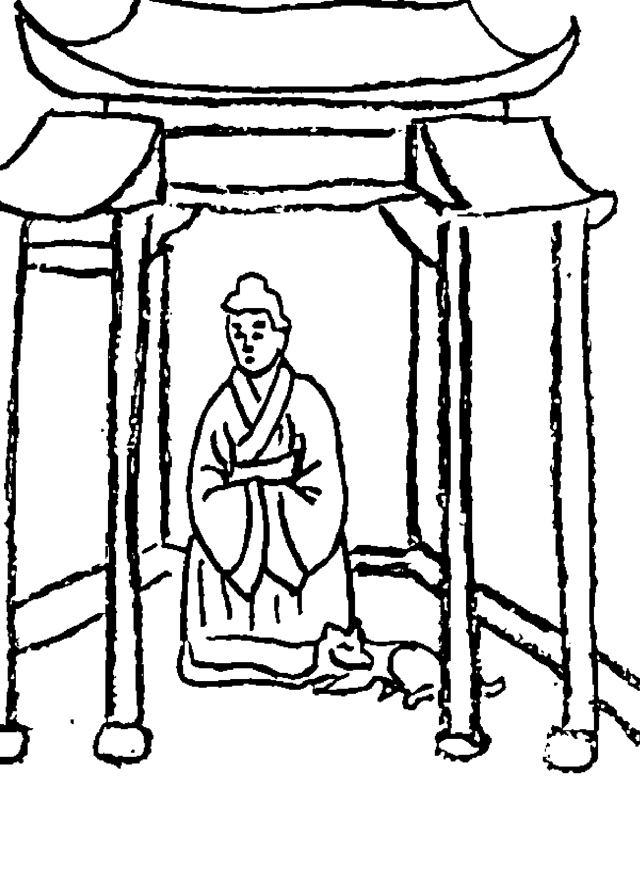

一个风雨交加的夜晚，深宫内院里传来一声清脆的婴儿啼哭声，很快地声音就被刻意地掩盖下去了，此时后宫中正发生的事情如晦暗的天气一般阴暗。

两位深得真宗皇帝宠爱的妃子刘氏和李氏，几乎在同一时间怀孕，又很巧地在同一天生产。为了争夺皇后之位，工于心计的刘氏将李氏诞下的儿子换到了自己的产房之中，而扔给李氏一只剥了皮的狸猫，藉此状告李氏生下了妖孽。

误信刘氏片面之词的真宗，听闻此事震怒之下将李氏打入了冷宫，立劉氏為后，李氏所生的男嬰被立為太子，真宗過世之後，登基為帝，世稱仁宗。在包青天的幫助下，仁宗查明了真相，與失散多年且已失明的李氏相認，與此同時，已貴為皇太后的劉氏畏罪自殺。

清末成書的小說《三俠五義》中，記載的這個家喻户曉的「狸貓換太子」的故事，直指宋仁宗，可見其並非純屬虛構。事實的輪廓與故事所描繪的大致相仿，李氏本是劉氏身邊的一個侍女，無意中被真宗看中，成為了後宮中眾多嬪妃其中的一個。在她誕下皇子之前，真宗也曾有過五位皇子，但都無一例外地夭折了，所以，當得知李氏產下男嬰時，真宗和朝中百官都欣喜無比，於是給他取名「受益」，被立為太子之後改名為「禎」。

就在出生不久，久未生育的劉氏便在真宗的默許下，將受益拉到了自己的身邊。懼於劉氏的權威，李氏唯有忍氣吞聲，任由他人奪去自己的兒子，直到生命結束的那一刻，她也未能與自己的兒子相認。顯然，與故事中大團圓的結局相比，仁宗趙禎的經歷更具悲情色彩。

但在這個經過演繹的「狸貓換太子」的故事中，與歷史現實存在巨大差異的應該是劉氏。真實的劉氏並非陰險毒辣之人，反而是一個精明能幹、強悍睿智、頗有政治頭腦的實權派女子。

劉氏原名劉娥，益州華陽（今四川成都）人，出身貧寒，十幾歲時嫁與銀匠龔美為妻。後迫於生計，龔美打算讓劉娥改嫁。剛巧當時還身為襄王的真宗，欲尋一名「多才慧」的蜀地女子，在幕僚的引薦之下，劉娥進入了真宗的世界，自此開始了其走向權力巔峰的旅程。

從遊走江湖的民間女子，劉娥一步步走到了位臨天下的國母的位置上，真正成了「天下之母，金刀伏兔（即「劉」）」。在這個漫長的過程中，她所憑藉的絕不僅僅是美貌，更何況在她登上皇后寶座之時，已經年過四十。她之所以能如此長久地佔據真宗的寵愛，靠的是智慧和才能。她生性聰慧敏捷，且通曉史書，對於朝廷之事也總是有獨到之見解。對於真宗拿不定主意## 推背圖和燒餅歌裡的歷史

之事，她往往能引據故實，妥善應答，故而頗受真宗倚重。

天禧四年（西元1020年）春，真宗病重之時，朝政多由劉皇后決斷。乾興元年（西元1022年）二月，真宗的病情急遽惡化，彌留之際，召來宰相丁謂等人，聽到其信誓旦旦地保證會盡力輔佐年幼的太子趙禎，才稍微放心些，並留下遺詔，規定：尊劉皇后為皇太后，在仁宗成年之前代為處理軍國大事。

一切都安排妥當之後，二十日真宗在延慶殿溘然離逝，享年五十五歲。伴他而去的還有大宋王朝的早期崢嶸歲月，隨著他年僅十三歲的兒子趙禎即位，王朝開始進入了它的中期時代。而這個中期時代的開端，並非仁宗趙禎，而是朝政大權的實際掌管者劉太后，即章獻太后。

依據真宗的遺詔，劉太后「力扶幼主坐靈臺」，並代為處理軍國大事，成為兩宋時期八位攝政皇後的第一位。即便是端坐於垂簾之後，「朝中又見釵光照」，更何況她的這一垂簾就是「三八（即十一）之年」。因此，真宗過世後的十一年，與其說是仁宗的時代，不如說是劉太后的時代更準確，在大宋王朝歷史面臨轉折的關鍵時期，劉太后更是發揮了至關重要的作用。

為了恢復社會的安定與政治的清明，在真宗駕崩之後不久，劉太后便將真宗奉若珠寶的「天書」掩埋於永定陵，做了真宗的陪葬，不再讓它所引發的大搞封祀之潮擾亂人世的清靜。同時，為了減輕國庫的壓力，她還下令禁止興建宮觀，廢除宮觀史，使百姓終於從真宗時狂熱的宗教氛圍中平靜了下來，獲得了真正休養生息的機會，北宋的國勢也開始逐漸得到了恢復。

此外，在真宗朝時活得無比逍遙的丁謂、雷允恭等人，到了仁宗朝時仍想繼續擅斷朝政，劉太后毫不猶豫地依大宋法制處死雷允恭、罷黜丁謂，奪回了朝政大權。鑒於當時所流傳的一首民諺所言：「欲得天下寧，當拔眼中釘」，可見，劉太后此舉實在是大快人心，博得了朝野上下的肯定，政治也逐漸步入了正軌。

劉太后的順勢而為之舉，使那些原本持有女主參政偏見的大臣們，開始慢慢地接受並與其合作，在此基礎上，劉太后有了繼葬天書、罷丁謂兩大撥亂反正舉措之後，仁宗朝的其他政治行動。

她藉傳統的恩蔭制度，來限制宋朝貴族集團的強化與擴張，盡可能地使朝政公平和公正；為瞭解民情，她於天聖七年（西元1029年）恢復了趙光義設立的理檢院，又創設諫院，廣開言路；她澄清吏治，嚴懲貪官污吏和官員子弟違法亂紀者，於是在她執政時期出現了范仲淹、張倫等一批廉吏；她賜學田以作學糧，興辦州學，普及教育，開創了「慶曆興學」的先聲；她完善科舉，嚴密考試制度，設立武科，進一步擴大取士名額，排斥虛華之文風；她發行世界上最早的紙幣交子，「欲流天下而通有無」；她興修水利，於天聖五年（西元1027年）疏浚了堵塞九年之久的黃河，灌田千頃……

女主參政，向來都不為中國的正統觀念所認同，但對於劉太后的政績，《宋史》給予了較高的評價：

> 「當天聖、明道年間，天子年輕，母后臨朝稱制，而內外肅然，綱紀得以樹立，朝政沒有大的缺失，奸邪之人不能肆意妄為，是諫官用人得到的結果。」

這樣的評價，已算得上著有是極高的褒獎，故而，《推背圖》中所言的「治安鞏固」、「水旱頻仍不是災」和「宇內承平氣象開」也頗為準確，她的政績在大宋三百年的歷史中始終都是可圈可點的。

然而，人非完人，就連唐太宗李世民那樣的賢君都有著玄武門之變這樣的陰影，何況是身為女流之輩的劉太后，她的統治也存在瑕疵。她也曾任用宦官、放縱外戚，但皆未達到危害朝政的程度，再加上當時朝中多數賢良之士對奸佞之人的牽制，始終都「沒有大的缺失」。

擁有如此成就的劉太后，也曾想過效仿武則天。她試探性地向大臣提出「唐武后何如主」的問題，得到的是廉直的魯宗道「唐之罪人，幾危社稷」的回答，此後她再未提及仿效武周之事。即便是那些刻意討好她之人獻上《武后临朝图》，她也毅然地将其掷于地上，并以「我不做这种有负祖宗的事」来作为回应。

明道二年（西元1033年）三月，六十五岁的刘太后病逝。或许她的心中存在着未能如武则天一般的遗憾，但曾经反对她干政的性格刚烈的李迪，在面对她「我今日保护天子至此，卿以为何如？」的提问时，给出了公正的回答：「臣蒙受先帝厚恩，今天看到天子的圣明，臣以前不知皇后的盛德，乃至于此。」也算是对她人生的一种安慰吧！

##### 庆历新政

庆历新政，为中国北宋仁宗庆历年间进行的改革。庆历三年（西元1043年），宋仁宗任命范仲淹、富弼、韩琦同时执政，欧阳修、蔡襄、王素、余靖同为谏官，庆历新政开始。范仲淹很快呈上了著名的新政纲领《答手诏条陈十事》，提出了十项改革主张：明黜陟、抑侥幸、精贡举、择官长、均公田、厚农桑、修武备、减徭役、推恩信、重命令。宋仁宗在朝商量，表示赞同，便以诏令形式颁发全国。新政措施切中宋朝的时弊，却与宋朝立国的方针相冲突，这就注定了庆历新政必然的失败。庆历五年（西元1045年）初，范仲淹、韩琦、富弼、欧阳修等人相继被排斥出朝廷，各项改革被废止。

### 22 朝用介甫谋，夕丧西北师
——预言王安石变法

### 《推背图》第十九象 壬午

#### 谶曰
众人嚣嚣 尽入其室
百万雄狮 头上一石

#### 颂曰
朝用奇谋夕丧师
人民西北尽流离
韶华虽好春光老
悔不深居坐殿墀

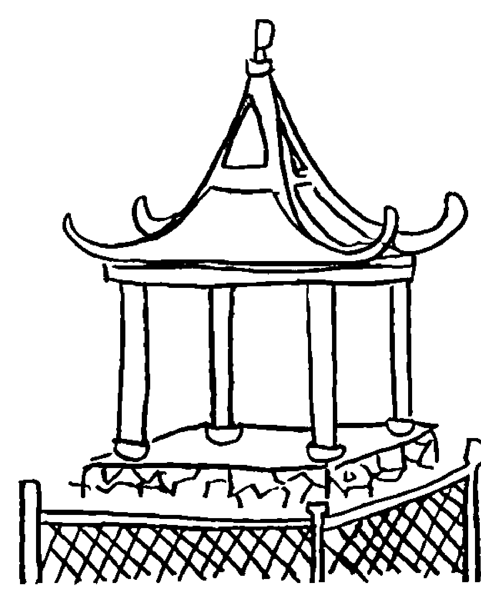

中国古代的历史，总是时不时地会表现出周期性轮回的特征：开国——治世——衰败——乱世——开国，好像无论在哪个阶段，即便是治世之时，百姓始终都是处于水深火热中一般，正如鲁迅先生说的那样：要嘛是「暂时做稳了奴隶」，要嘛是「想做奴隶而不得」。同为「奴隶」的身份，显然治世便是百姓的天堂，但治世就如同天上的红日般，只能在白天的时候照耀众人，终会有夕阳西下之时。

宋朝自太祖、太宗统一华夏，历经真宗、仁宗、英宗三朝，虽然大抵国内称治，人们还是发现大宋的太阳正一点点的西移。到英宗时，宋朝的国家财政已经到了入不敷出的程度，而民间的情况则更糟糕，著名文学家苏洵笔下就有详细的记载：

> 「田非耕者之所有，而有田者不耕也。耕者之田资于富民，富民之家地大业广，阡陌连接，募召浮客，分耕其中，鞭答驱役，视以奴仆。……而田之所入，已得其半，耕者得其半。有田者一人而耕者十人，是以田主日累其半以至于富强，耕者日食其半以至于穷饿而无告。」

饥荒一旦出现，就意味着王朝已经到了日暮西沉的地步，高居庙堂之人若不做出及时的调整与改革，任由其发展下去，必然会使平日里安分守己的顺民，为了生计铤而走险，为「暂时做稳了奴隶」而奋起斗争。显然，此时的大宋已经到了非改革不可的地步，于是，一个具有博大智慧和穿越古今力量的伟大人物担负起了改革的使命，他就是王安石。

生活在宋朝是文人的幸运，王安石便是诸多的幸运儿之一。仁宗庆历二年（西元1042年），王安石考中进士第四名，二十多年来政绩斐然，朝野交誉，仕途正一帆风顺。淮南判官、鄞县知县、舒州通判、常州知州、提点江东刑狱等都曾经是他的头衔。无论身处何位，他都在思考王朝的社会问题，思索应该如何变革以振兴。他曾高喊「内则不能无以社稷为忧，外则不能无惧于夷狄」，「以古准今，则天下安危治乱尚可以有为，有为之时莫急于今日」，但始终未能有大展拳脚的机会。

直到治平四年（西元1067年），年轻的神宗即位，王安石的政治生涯才有了变化。神宗不是一个普通皇帝，他不愿当一个平凡的守成之君。他想告诉臣下，自己要有所作为，对得起世人。王安石的声音让他感到慰藉，于是登基不久，王安石便平步青云，先是升翰林学士，后又提为参知政事，两度任同中书门下平章事。一场在11世纪搞得轰轰烈烈、沸沸扬扬的变革也拉开了帷幕。

为了能够顺利地推行变法措施，神宗应王安石的要求特别设立了一个改革机构——「制置三司条例司」，作为决策变法的中枢机构，类似于改革委员会，由宰相陈升之和王安石总领变法事宜，真可谓是「百万雄狮，头上一石（即王安石）」。熙宁二年（西元1069年）二月，在准备工作一切就绪后，「熙宁变法」正式开始。

王安石在将理财作为改革当务之急的前提下，颁布了涉及商业、农业、教育、军事等各个方面的新法内容。基于曾经有过的二十多年基层工作经验，他形成了务实的工作风格。同时在基层工作时，他也曾亲自试行过变法中推行的相关政策，因此他敢以「天变不足畏，祖宗不足法，人言不足恤」的精神，坚定地推行变革。

然而，一切就像王安石在出任副宰相时所预料的那样，改革从一开始就遭到了激烈的反对，因为它不可避免地抢走了贵族的「生意」，将矛头直接指向陈腐的经济思想。因此，新法甫一提出，支持者与反对者马上便形成了各自的阵营。

反对派中，司马光、韩琦、欧阳修、文彦博、范纯仁、富弼、苏轼兄弟等等，无不是口碑极佳的贤者。反观支持变法一方，与王安石一起主持制置三司条例司的宰相陈升之，表面上赞同变法，实际上却请求撤销这一改革机构，王安石被迫推荐韩绛替代之；实际主制置三司条例司的是吕惠卿、章惇和曾布，这三个被称谓是王安石变法倚重的「三驾马车」的人，均被列入了《宋史》「奸臣传」中，令王安石不得不承受「识人不当」的诟病；此外所谓的那些支持者，多为品德不端者，见神宗力撑变法，便投入了王安石帐下。由于用人不当，王安石身边围绕的尽是「熙丰（宋神宗年号熙宁及元丰合称）小人」，正是「众人嚣嚣，尽入其室」。

或许王安石也曾意识到过这一问题，只是在别无选择的情况下，他只能用那句「俗礼屈为我辈所设」来安慰自己，毕竟他仍然需要借助这些人的力量，来完成变法的目标。但他显然没有意识到，在士大夫阶级中，自己只是个异类，他根本无法指望其他的官员和他有相似的价值标准和行为方式。

事实上，那些官员们在条文与执法之间存在着严重的念头，使变法的后果与最初的动机产生了严重的背离，他们将「新法」创造性地推向极端，不仅没有完成安民的目的，反而导致了扰民这一完全相反的后果。易中天先生说得没错，改革帮了腐败的忙。在理财为名的改革下，改革派里混进了投机小人，名为改革，实则敛财。

基于这些，一场有远见卓识的变革，一个锐意进取的名相，终于在熙宁九年（西元1076年）告别政坛，改革偃旗息鼓，神宗和王安石的这场独角戏也最终落下了帷幕。然而，除却内政改革的失败外，这两个男人还给宋朝带来了一场巨大的战争灾难。

神宗这位有雄心壮志的君主，将用武开边、建功立业视为一生的梦想，在这个梦想中，最具体的奋斗目标，就是解决契丹和西夏的问题。他之所以支持王安石的变法，其中一个原因就是希望借此能达到「强兵」的目的。面对这位「求胜心切，溢于言表」的少年君王，两朝元老富弼曾毫不留情地说：「陛下临御未久，当布德惠，愿二十年口不言兵。」

然而，神宗年轻气盛，不仅完全听不进诸臣的劝诫，还在看到变法派军事家王韶所上的《平戎策》三篇后如获至宝。所谓的「平戎三策」的要旨，就是先取河湟，断西夏右臂；再威服吐蕃，孤立西夏；最后伺机出兵，一举将其拿下。王安石对此极为支持，并鼓励神宗尽快采取行动。

神宗采纳王安石和王韶的建议，任命王韶向河湟进发。元丰四年（西元1081年）八月，神宗乘西夏内乱之机，任命宦官李宪为主帅进攻西夏。十一月，北宋军队从灵州之战大败而回。神宗并不死心，于元丰五年（西元1082年），派给事中徐禧与宦官李舜举向西夏的桥头堡进发。徐禧在易攻难守的永乐（今陕西米脂西北）筑城，作为根据地。永乐城筑成十几天后，西夏便出动全国精兵，与宋军展开殊死搏鬥。被困于永乐城中的宋军，因粮草供应不足，且水源被切断等原因，在与西夏军的交战中几乎全军覆没。

事情就像《推背图》中所预言的那样：「朝用奇谋夕丧师，人民西北尽流离」，尽管「平戎三策」并非由王安石提出，但作为变法派的首领，宋朝在灵州之战和永乐之战中死伤的六十多万民兵，始终与他脱不了干系。

王安石在他毁誉参半的人生中，虽然也曾因不修边幅和不干不净的脸而饱受责难，但就个人而言，他的个人操守没有人会怀疑，就连他的主要政敌司马光都说：「介甫无他，但执拗尔。」而他在有生之年，之所以受到如此猛烈的攻击，皆源自于他的变法。

站在更高的角度来看，在经历了一近代一百多年的民族劫难后，无论在感情和理智上，我们离王安石要近得多。对此，黄仁宇先生也直截了当地说：「王安石能在今日引起中外学者的兴趣，端在他的经济思想和我们的眼光接近。站在现在的角度上来看，王安石变法的意义才更有说服力。」

但回到封建王朝，这场变革所面临的压力是难以想像的，因为它面对的最大的敌人是儒家的传统。当代学者李存山在《王安石变法的再评价》中挖掘到了最深的东西：「从思想传统的角度说，关于王安石变法的争论显然受到儒家的『体用』、『本末』和『义利之辨』思想传统的影响……当他在行动上和口头上转向以『理财』为急务时，他就违背了儒家的这个传统。」在那样的时代里，挑战封建传统的变法，注定难以寿终正寝。

或许，对王安石而言，李淳风和袁天罡所说的「韶华虽好春光老，悔不深居坐殿墀（音ㄔˊ，台阶）」才是最好的生活。如果真是那样的话，王安石就不会经历几十年的宦海沉浮，也无须承受变法失败的痛苦，但历史必定会寂寥许多。

##### 王安石变法的经济内容

一、均输法。朝廷拨出周转经费，按「徙贵就贱，用近易远」的原则，及时机动购办相关物资，意在省劳费、去重敛，减少人民的负担。

二、青苗法。规定凡州县各等民户，由政府拿出一定数量的钱或粮食做本，在每年夏秋两收前，以低息借贷给农民，帮助他们度过难关，到夏秋两季收成后，农民再按20%到30%利率还粮钱。

三、农田水利法。各州县兴建的水利工程，用工的材料由当地居民照每户等高下分派，凡提出合理建议或出钱募工兴建的，由官府按实效给予奖励。

四、免役法。废除原来按户等轮流充当州县差役的办法，改由州县官府自行出钱雇人应役。雇员所需经费，由民户按户分摊。原来不用负担差役的女户、寺观，也要缴纳半数的役钱，称为「助役钱」。

五、市易法。由政府出资在开封设「市易务」，以达到「通有无、权贵贱，以平物价，所以抑兼并也」。

六、方田均税法。分「方田」与「均税」两个部分。「方田」是每年九月由县长举办土地丈量，按土壤肥瘠定为五等，「均税」是以「方田」丈量的结果为依据，制定税数。

### 23 父子同心伴皇旁，赵宋朝堂暗无光 ——预言蔡京父子乱政

《推背图》第二十象 癸未

#### 谶曰
朝无光 日月盲
莫与京 终旁皇

#### 颂曰
父子同心并同道
中天日月手中物
奇云翻过北海头
凤阙龙廷生怛恻

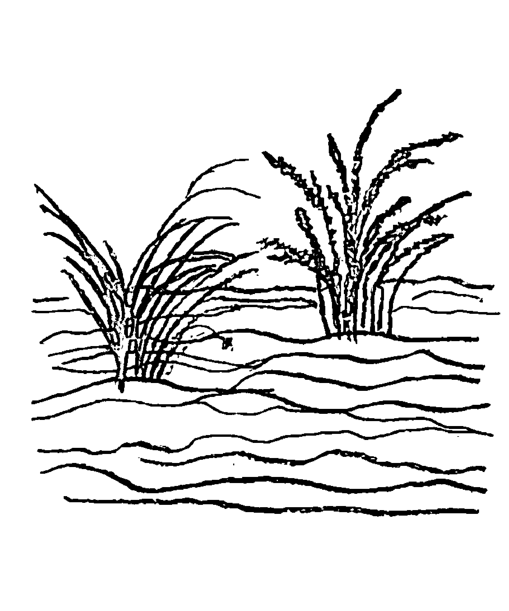

历史如人生般，充满了许多的偶然与巧合，以亡国之君来说，多为「玩物丧志」者，隋炀帝和李后主便是典型。接掌神宗之位的徽宗赵佶虽然不是末代帝王，但在国学大师陈寅恪先生看来，他儿子钦宗才坐了两年皇位便亡国被掳走，因此还是要看作亡国之君的。

作为亡国之君，他与后唐李煜有许多相似之处。李煜也是才华横溢，诗词书画，无所不精。徽宗流传下来的「九叶鸿基一旦休，倡狂不听直臣谋。甘心万里为降虏，故国悲凉玉殿秋」和「春花秋月何时了，往事知多少。小楼昨夜又东风，故国不堪回首月明中。雕栏玉砌应犹在，只是朱颜改。问君能有几多愁，恰似一江春水向东流」一样凄美，一样的风骨。

然而，身为一国之君，徽宗需要的不是卓越的书画天赋，更不是无法遏制的玩乐兴致；相反，正是这些浪漫的艺术气质令他距君王的标准越来越远，就像《宋史》中一针见血指出的那样：「宋徽宗诸事皆能，独不能为君耳！」所以，也就有了陈寅恪先生怒其不争的言辞：「宋朝的皇帝太荒唐。除太祖太宗算是开国皇帝比较圣明外，其他的似乎一开始都想振作朝纲，但干着干着便走样了。」

> 「宋徽宗诸事皆能，独不能为君耳！」
> 「宋朝的皇帝太荒唐。除太祖太宗算是开国皇帝比较圣明外，其他的似乎一开始都想振作朝纲，但干着干着便走样了。」

确实，徽宗虽然昏聩，却也曾做过「振作朝纲」的努力，不少学者评说他即位之初所施行的建中之政是取得成就，博得好评的，明代文人张溥就曾称赞他继位「一年之内，获睹清明」。但他从前朝手中接过的，不仅不是像李治从其父亲手中接过的那种太平盛世，甚至可以用烂摊子来形容，正如张邦烨先生在《论北宋晚期的士风》中所说，徽宗即位的时候，北宋王朝已经走过了辉煌灿烂的历程，处于党争异常激烈的严峻时期，国势日薄西山。

于是，有人说若赵佶能将建中之政贯彻始终，或许能像刘秀一样，挽回衰败的颓势，再创一个「光武中兴」。但赵佶不是刘秀，也无法完成世人「中兴」的美好愿望，更何况他身边还有中国历史上数一数二的奸臣蔡京，和与蔡京一起合称「六贼」的王黼、朱勔、李彦、童贯、梁师成等人。

所谓一朝天子一朝臣，徽宗即位之后，同样也要培养自己的势力与亲信，但此时老臣司马光已然逝世，新旧党派的争斗仍在延续，庙堂之上完全是一副「朝无光，日月盲」的景象。对于那个即位不久便被夺去官职、闲居杭州的蔡京，徽宗开始时所持的态度是「莫与京」，也就是不起用的意思，但由于想要恢复神宗时的各项举措，在蔡京死党邓洵武的竭力推荐下，徽宗最后还是决定起用蔡京为宰相，且为独相。自此之后，北宋的大权落入了蔡京的手中，国势「终旁皇」达十七年之久。

就在上任的第二天，蔡京就怂恿徽宗下达了一道禁止元祐法的诏书，指斥元祐大臣「汲引死党，沸腾异端，肆行改更，无复忌惮」。几天之后，徽宗又规定：凡是元符末年「叙复过当」的元祐党人，一律不得任命在京差遣。属于这一范围内之人，包括司马光、文彦博、韩维、苏辙、苏轼、黄庭坚、程颐等共计一百二十人。徽宗还御笔将其亲书于文德殿门外的石碑上，再由蔡京书写颁示全国州县刻石。

其实名单上所列之人，并非全都是所谓的元祐旧臣，这只不过是在蔡京「同己为正，异己为邪」标准下的笼统划分罢了，但凡那些与蔡京意见相左者，也一股脑儿地全都被列入了元祐大臣的类别之中，以排除异己势力。不久，元祐皇后孟氏也因被蔡京划入了元祐党的行列，而继哲宗之后第二次被废。就此时朝廷的政局看来，无论是身为「真龙天子」的徽宗还是母仪天下的皇后，都已被蔡京玩弄于股掌之间了，真是「中天日月手中物」。

与打击异己相伴随的是，蔡京积极安插自己的亲信、广布党羽，他提拔臭名昭著的其他「五贼」，提拔著名的奸臣杨戬、高俅等人，安排自己的儿子位居要职。这样一来，朝中之人从执政到侍从、从帅臣到监司，都成了蔡京一派，整个朝堂不再属于徽宗，而成了蔡京等奸佞之辈的天下。

> 据《曲洧旧闻》记载蔡京曾公然声称：「既做好官，又要做好人，两者岂可得兼耶！」

可见，当时朝廷之中几乎已无公正贤良之士，敢于直陈利弊了，只有那些善于阿谀奉承、依附蔡京之辈者才有晋升的可能，就像史料中记载的：

> 「崇宁以来，在内惟取议论与朝廷同者为纯正，在外惟取推行法令速成者为干敏。」

为官者堕落至如此地步，那些正直忠厚之士眼见无力改变，唯有避而远之，相反地，那些恶劣无耻之徒则如见到蜂蜜的苍蝇般拼了命地涌入庙堂之中。诸多的卑劣之人中，就包括蔡京的长子蔡攸。在徽宗还未登基为帝时，蔡攸便已整日与赵佶厮混在一起了，待他即位之后，蔡攸更是变本加厉，藉# 推背图和历史 烧饼歌里的历史

仗著父親蔡京的權勢和諂媚之道，深得徽宗的喜愛，在毫無建樹的情況下，竟受封為英國公、燕國公，一時間風頭更甚其父蔡京，果真是「父子同心並同道」，以謀權之心、獻媚之道把曾經「獲睹清明」的朝廷弄得烏煙瘴氣。

徽宗一朝的衰敗，雖不能全然歸罪於蔡京父子，卻也與奸佞的禍亂有著極大的關係，就像《宋史·徽宗紀》所說，最終導致徽宗「國破身辱」的是他將「私智小慧，用心一偏，疏斥正士，狎近奸諛」。而直接將這位最不像君王的徽宗趕下帝位的，是那場為奪回已割出去一百多年的「燕雲十六州」的戰爭。

政和元年（西元1111年），一個名叫馬植的人進入了宋朝統治階層的視野中。這個出身燕州大族、曾任遼朝光祿卿的人，在盧溝橋向出使遼國而歸的童貫獻上了聯合女真滅遼的計謀。這一年距宋、遼兩國簽訂「澶淵之盟」已經有107年的歷史了，雖然當初的盟誓已只剩下書面的紀錄，但一百多年來，宋遼百姓始終未曾起過干戈。馬植的提議顯然是非常突兀的，但當他站在徽宗面前，懇求「念舊民塗炭之苦，復中國往昔之疆」時，徽宗彷彿看到了大宋收復「燕雲十六州」後普天同慶的場景，於是當即決定依馬植所進之言行事。

經過為期兩年的商討後，宋與金訂立「海上之盟」，約定共同攻打遼國。宣和四年（西元1122年）十二月，被割讓近百年的燕雲之地終於回到了中原統治者的手中，徽宗完成了宋太祖和宋太宗都未能完成的事業，王朝上下處處都洋溢著欣喜與激動。

但這只是個美好的開始而已，次年金朝就藉口向宋朝興師問罪，徽宗背負著「盡殺降將」的罪名換得了暫時的和平。又過了兩年，迅速崛起的金在徹底滅了遼國之後，誣釁宋背叛盟約，悍然發動了對宋的戰爭，揮兵南下，「奇雲翻過北海頭」，直逼燕山府。

整個大宋朝堂為之震驚，可謂是「鳳闕龍先達生惻惻」。剛剛享受到勝利喜悅的徽宗匆忙中下罪己詔，將皇位傳給自己的兒子欽宗趙桓，自己則倉皇逃往南方。新即位的宋欽宗乘著新年之際，改年號為靖康，期望國家平靖、安康，豈料天不遂人願，欽宗的希冀宛如一場甜蜜的夢，還未來得及細細品味就被北來的鐵騎驚醒了。

## 常識紀：

##### 「海上之盟」

「海上之盟」為宣和二年（西元1120年）北宋與金國為聯合攻打遼國而訂立的盟約，因雙方使節均由海上談判而得名。雙方協定：北宋與金各按議定的路線攻打遼國，北宋攻取遼的南京析津府（今北京）和西京大同府（今山西大同），金攻取遼的中京大定府（今內蒙古寧城境）；北宋滅遼後，將原本給予遼的歲幣轉給金，而金則須將燕雲歸還北宋；雙方均不得單獨與遼講和。

## 24 妖氛未靖不康寧，江南江北又分邦——預言靖康恥與宋朝南遷

《推背圖》第二十一象 甲申

+ 識曰
空厥宮中 雪深三尺
吁嗟元首 南轅北轍

+ 頌曰
妖氛未靖不康寧
北掃烽煙望帝京
異姓立朝終國位
卜世三六又南行

輕輕拉開卷軸，最先映入眼簾的是疏林薄霧間的郊外美景，茅舍、草橋、流水、老樹、扁舟零星散落其間，柳樹林中，春意可見，大地回春的感覺撲鼻而來。路上一頂轎子，轎頂裝飾著楊柳雜花，剛從京郊踏青掃墓歸來。不遠處的上土橋及大汴河兩岸皆是一片繁忙的景象，人煙稠密，糧船雲集，各色人物雲集汴河周圍，或絆夫牽拉，或船夫搖櫓，或在大聲吆喝著什麼，或在伸頭張望著什麼，這裡就是聞名遐邇的虹橋碼頭區，車水馬龍，熙熙攘攘。順著畫卷再往下看便是一處熱鬧的街景，以高大的城樓為中心，周圍是屋宇鱗次櫛比，各行各業，懸掛旗幟，招攬生意，街市行人，摩肩接蹤，川流不息，男女老少，三教九流，無所不有。

大到城樓、橋樑，小到車輛、行人，無不形神畢備，毫纖俱現，極富情趣。所說此畫中共有各色人物1643人，動物208隻，比小說《三國演義》(1191人)、《紅樓夢》(975人)、《水滸傳》(787人)中任何一部描繪的人物都要多，從寧靜的郊區一直畫到熱鬧的城內街市，處處引人入勝，處處展現著汴京當年的繁華與興旺。

它就是享譽古今中外的傳世傑作——《清明上河圖》，張擇端用他高度的藝術概括力，將州橋夜市煎茶鬥漿，相國寺內品果博魚，白礬樓頭宴飲聽琴，金明池畔填詞吟詩等盡繪其中，惹得無數的現代人想穿越千年時空去做個逍遙宋朝人，也令飽受康河性靈薰陶的英國著名漢學家李約瑟博士為之感嘆：「談到十一世紀，我們猶如來到最偉大的時期。」

想必極具藝術天賦的徽宗皇帝趙佶初見此畫時，定然也驚為天人，故而欣喜之餘才會用他特有的「瘦金體」題寫了「清明上河圖」幾個字，並加蓋了他的雙龍小印。作為藝術愛好者，他為世間能有如此佳作而讚嘆；作為一國之君，他又為自己治下能有如此繁華的「國際大都市」而自豪。但事事古難全，就像寫實的張擇端無法將當時市井匱乏的馬和羊繪於畫作上一樣，趙佶也無法守住這座「花花汴梁城」，而且更可悲的是，那些可惡的入侵者——金，竟是他自己招惹來的。

宣和七年（西元1125年）十月，在北宋的幫助下徹底滅掉遼國的金南下伐宋。金軍來勢洶洶，一路勢如破竹，直逼燕京。徽宗如驚弓之鳥般異常恐懼，面對無力承擔的後果，他選擇逃避。十二月二十三日，正當壯年的徽宗匆忙禪位，兒子趙桓即位，是為欽宗，改元「靖康」。欽宗雖非能力挽狂瀾之人，卻也明瞭自己接過的是什麼樣的爛攤子，他想逃卻已是無路可逃了，唯有硬著頭皮往前走。

迫於形勢的需要，欽宗於靖康元年（西元1126年）正月起用主戰派李綱。本為文臣的李綱臨危受命，也鞏固了汴京的防務。隨著其他勤王之師的陸續到達，金帥自知勝利無望，但還是在從欽宗手中拿走了三鎮之後，於二月率軍北還。

金軍此次雖然敗北而回，卻也看清了對手宋朝的無能，於是在半年多之後，他們又發動了對宋朝的進攻，九月初三堅守近九月之久的河東重鎮太原陷落。金軍繼續南下，十月初攻陷河北重鎮真定府（今河北正定），十一月突破黃河防線，閏十一月圍攻汴京城下，開始大規模攻城。此時正值隆冬時分，汴京城內供給不足，將士們在城頭凍得瑟瑟發抖，病急亂投醫的欽宗將守城的重任交付於術士郭京。二十五日，天降大雪，「雪深三尺」，酷寒，郭京開城門迎敵，金軍乘勢進攻，汴京城被攻破。自此這座令徽宗自豪、令後世之人嚮往的繁華之都，如《梅花詩》中所言「蕩蕩天門萬古開」，就此落入了金人的手中。

事情發展到這一步，欽宗仍心存僥倖，希望能保存趙氏社稷。為迎合金人的要求，欽宗喪心病狂般地搜刮劫掠汴京城中所有的金銀財寶，民女不足的就用自己的宮嬪頂上。短短的幾天時間裡，不只「空厥宮中」，整個汴京城也宛如空城一般。

但金人並未就此甘休，他們的最終目標是滅宋。靖康二年（西元1127年）二月六日，金主下詔廢徽宗、欽宗為庶人，另立同在靖康元年做了兩個月宰相的張邦昌為帝，至此「異姓立朝終國位」。四月一日，金軍將徽宗、欽宗，連同在開封的宗室、后妃、百官、工匠等三千多人俘虜北歸，北宋覆滅，史稱「靖康之難」。徽宗與欽宗就是「吁嗟元韜」中的兩位元首，他們在北上的途中受盡屈辱，此情此景，與他們曾經的盛世夢早已是「南轅北轍」。

靖康，一個原本懷有美好願望的年號，因為金人的「北掃烽煙望帝京」，而變得「妖氛未靖不康寧」。相應地，欽宗趙桓也就成了北宋的末代帝王。自太祖赵匡胤建立北宋以来，先后经历太宗赵光义、真宗赵恒、仁宗赵祯、英宗赵曙、神宗赵顼、哲宗赵煦、徽宗赵佶，直到钦宗赵桓，“卜世三六”共计九世。

然而，赵宋的天下并未终结，经历过“靖康之难”的人心中都有着刻骨铭心的痛，“靖康耻，犹未雪，臣子恨，何时灭”，就像近代学者黎东方先生所说的那样：“雪耻情结在南宋凝结成了挥之不去的恢复意识。”确实，赵家的北宋结束了，他们还有南宋，还有在“靖康之难”中幸免于难的康王赵构所建立的南宋。

但赵构显然不像宋王朝的其他人那样执著于雪耻和收复中原，尽管他曾目睹过金兵的凶残，亲见过汴京从富庶到残破的沦陷，也曾听到过中原百姓的哀号，却似乎并未磨砺出坚忍的意志和奋起的斗志。他在逃跑途中，还不停地讨好金人，派出的使者一个接一个到金营点头哈腰，把外交姿态演绎到最低。

坐上“中兴之主”的位子上，高宗赵构就连反抗的勇气都没有，他的“恐金症”指引着他一路逃亡。当金兵突破长江防线，直奔南宋所在地杭州而来时，赵构像一只被碰到了触角的乌龟一般，躲到了唯一的退路——海上。直到建炎四年（西元1130年）四月，当他在海上获悉金兵北撤之后，才结束了长达四个月之久的沿海漂泊生活，从温州经明州回到越州。

刚刚经历了颠沛流离、四处逃窜的赵构，很快地便决定在临安安顿下来。号称“东南第一州”的临安交通方便，江河湖泊交错，不适合金人骑兵作战，安全指数大大提高。再者，江南鱼米之乡，物产丰富，美女也多，可以满足南宋朝廷物质和精神上的双重需要。于是，原本完好的江山就此分归南宋与金国而治，神话山河从此破碎。

就在南宋朝堂上的诸多君臣享受着苟且偷安换来的暂时平静时，南宋的广大军民仍在奋起抵抗金兵的野心与南下的脚步，他们始终存于心中的民族骨氣的支持下，在戰場上拚殺，在硝煙中挺立，儘管明知這是一場劫難，是一段不忍回首的血淚史。

## 常識紀：

### 「瘦金體」

「瘦金體」，又稱「瘦金書」或「瘦筋體」，是楷書的一種，為宋徽宗所創。《書史會要》評價說：「徽宗行草正書，筆勢勁逸，初學薛稷，變其法度，自號瘦金書，意度天成，非可以形跡求也。」「瘦金體」運筆飄忽快捷，筆跡瘦勁，至瘦而不失其肉，轉折處可見藏鋒，風格相當獨特。宋徽宗的「瘦金體」多為寸方小字，鋒芒畢露、暢快淋漓，留存下來的作品中，比較著名的有〈楷書千字文〉、〈穰芳詩〉等。

## 附表3：北宋帝王表

北宋（960～-1127年）定都開封

| 庙号 | 谥号 | 姓名 | 生卒年 | 在位时间 |
| :--- | :--- | :--- | :--- | :--- |
| 太祖 | 啟運立極英武睿文神德聖功至明大孝皇帝 | 趙匡胤 | 927～976年 | 960～976年 |
| 太宗 | 至仁應道神功聖德文武睿烈大明廣孝皇帝 | 趙光義 | 939～997年 | 976～997年 |
| 真宗 | 應符稽古神功讓德文明武定章聖元孝皇帝 | 趙恒 | 968～1022年 | 997～1022年 |
| 仁宗 | 體天法道極功全德神文聖武睿哲明孝皇帝 | 趙禎 | 1010～1063年 | 1022～1063年 |
| 英宗 | 體乾應曆隆功盛德憲文肅武睿聖宣孝皇帝 | 趙曙 | 1032～1067年 | 1063～1067年 |
| 神宗 | 體元顯道法古立憲帝德王功英文烈武欽仁聖孝皇帝 | 趙頊 | 1048～1085年 | 1067～1085年 |
| 哲宗 | 憲元繼道顯德定功欽文睿武齊聖昭孝皇帝 | 趙煦 | 1076～1100年 | 1085～1100年 |
| 徽宗 | 體神合道駿烈遜功聖文仁德憲慈顯孝皇帝 | 趙佶 | 1082～1135年 | 1100～1125年 |
| 钦宗 | 恭文順德仁孝皇帝 | 趙桓 | 1100～1156年 | 1125～1127年 |

### 25 祸水汪洋，精忠报国终成空 ——预言秦桧与岳飞的恩怨

> 《推背图》第二十二象 乙酉

+ 谶曰
- 天马当空 否极见泰
- 凤凰淼淼 木夀大赖

+ 颂曰
- 神京王气满东南
- 祸水汪洋把策干
- 一木会支二八月
- 临行马色半平安

俗语有云：上有天堂，下有苏杭。在美丽的西子湖畔，有一条叫白马庙巷的路，位于紫阳山麓，南起严官巷，北折东与中山南路相接，长256米，宽2.5米。宋称粮料院巷，属寿域坊，南宋时，建白马庙，故名。白马庙祭祀「白马」，当时流传着「泥马渡康王」的神话：宋高宗赵构未当皇帝时为康王，被金兵追杀至江边，有白马渡他过江，至此地饮水化为泥，原来此马就是对岸庙中泥马。现在昔日光景不再，白马庙也不知去向，但巷名依旧。

历代帝王向来不乏神仙相救、真龙降生之类的神奇故事，谁都清楚，这是为自己登上龙椅创造舆论基础，好证明皇位的合法性，康王也逃脱不了这個帝王定律。浙大周膺教授一语道破：赵构注意到民间流传的泥马渡康王、崔府君显圣的价值，于是便请神来做护身符。如此一来，“泥马渡康王”便成了赵构“否极见泰”的惊险传奇，而所谓的“天马当空”就是上天选中他为真龙天子的明证。

有了这些舆论的帮助，在徽宗和钦宗两位前朝君王还在世的情况下，赵构也无须再担心合法性问题了。靖康二年（西元1127年），赵构在南京应天府（今河南省商丘县南）即位，世称宋高宗，改年号为“建炎”，后定都临安，自此心安理得地过起了“神京王气满东南”的日子。

理应承担“中兴”重任的高宗，如同大门不出、二门不迈的女子般，唯愿过平淡安稳的生活。所以当曾经陪伴徽宗、钦宗二帝“北狩”而归的秦桧站在他面前，大声地提出“如欲天下无事，须是南自南，北自北”的方针和“南人归南，北人归北”的具体策略时，赵构如同得觅知音一般，迅速将秦桧列为自己的亲信，在其回到朝堂短短的三个月时间里，就升到了参知政事一职。不只如此，高宗还将一直空缺留给勤王有功的旧相吕颐浩的宰相之位，也授予了秦桧，而且是秦桧一人独相。

不知是为投高宗所好，还是真如后世之人所猜测的那样已经是倒戈向金的奸细，独揽朝政的秦桧，自始至终都在坚持与金议和的主张。为了坚定高宗议和的信念，秦桧曾以“畏首畏尾，不足以断大事。若陛下决欲讲和，请独与臣议其事”试探高宗，直到高宗经过六日的深思熟虑仍初衷不改之时，他才取出奏札，“乞决和议，不许群臣干预”，让高宗主动将对金之事全权交由他处理，可见其博弈功力之深厚。

自此之后，庙堂之上主战派与主和派的争论已成定局，虽然一些武将与民众仍然以高涨的热情在抵御金人的南侵，但在高宗的支持下，以秦桧为首的主和派与金人的绍兴和议一直在紧锣密鼓地进行着。妥协、退让的卖国之策成了南宋日渐萎靡的祸水，汪洋肆意间一点点吞噬着只剩下半壁江山的赵宋王朝，正是“凤凰淼淼”、“祸水汪洋把策干”。

绍兴八年（西元1138年）十一月，金朝的“诏谕江南使”南下至宋，按规定，高宗须以跪拜之礼奉表称臣，此举其实已与被后世之人唾骂的“儿皇帝”石敬瑭向契丹称臣无异了，高宗不仅没有羞愧之意，甚至还冠冕堂皇表示是在为百姓之安居乐业牺牲，实在可耻之极。虽然后来是由秦桧代他行跪拜之礼，却已令天下人心寒不已，即便是在“木寿（即“构”）大赖”来形容他也并不为过。

南宋是赵构于逃亡中建立的政权，兵力上自然无法与金兵抗衡，暂时的妥协尚且情有可原，但随着“中兴四将”的力量逐渐壮大，高宗仍然像个离不开母亲的孩童般，坚持“赖”在议和上，就难免招人话柄，尤其是在拥有令金军哀叹“撼山易，撼岳家军难”的岳家军之后。

对金兀术而言，岳飞无疑是他有生之年遇到的最强劲的对手。当他以拐子马为主力时，岳飞以或角其前，或擒其侧之法，令拐子马威力全无；他当以“铁浮图军”为主力时，岳飞又命步兵上阵，以麻扎刀、提刀等利器，专削马足，令“铁浮图军”只有被动挨打的份。在如此强大的对手面前，金兀术唯一能做的就是一退再退，一直退到了朱仙镇（今开封西南），若此处再失守，南宋收复汴京就胜利在望了。

正当金兀术为如何破解困境而绞尽脑汁时，秦桧为他解开了迷局：高宗派人“日行四百余里”，连下十二道金牌，急令岳飞班师回朝。虽明知北伐战争成功在望，但无奈圣命难违，岳飞只得在悲愤地喊出一句“社稷江山，难以中兴；乾坤世界，无由再复”之后，奉诏“班师”。

刚一回到朝堂，秦桧便唆使其亲信万俟卨（音：mò qí xiè）以谏官的身份弹劾岳飞，并捏造了三条罪名，分别是：“日谋引去，以就安闲”；淮西之战，“不得时发”；淮东视师，沮丧士气。绍兴十一年（西元1141年），十月，岳飞与其子岳云被投入大理寺狱受审，严刑逼供之下，岳飞愤然写下“天日昭昭！天日昭昭！”八个大字，为自己做最后的辩解。然而，无论是他的自辩，还是朝廷官员的联名上书，换来的不过是秦桧的“其事体莫须有”。固然如韩世忠抗议所言：“莫须有三字，何心服天下！”一代名将岳飞，最终还是于绍兴十一年十二月二十九日（西元1142年1月27日）屈死风波亭。

岳飞的忠诚为国和辉煌战绩，曾是南宋百姓收复河山的希望，而当这抹希望在毒酒中化为灰烬时，它所带来的震撼无疑是痛彻天地的。“经略中原二十秋，功多过少未全酬；丹心似石凭谁诉？空有游魂遍九州！”天下人无不为之痛哭流泪，临安人民悲苦万分。

著名历史学家王曾瑜先生曾这样说：岳飞是南宋初年出类拔萃的名将，在中国古代军事史上占有相当的地位。同其他朝代的名将相比，必须考虑到宋朝文官政治下根深蒂固的抑武传统，对尚武精神的摧残等不利条件，其成就和贡献更是难能可贵。如此看来，也不难理解荆湖北路的寻常人家在岳飞被害之后，不愿引惹出祸患，家家户户全都画了岳飞的像在家中加以供奉。然而，生在南宋的武将们，有一腔血洒疆场的豪情，终究也难逃成终生遗憾的结局。

诚然，岳飞决定不了历史的进程，但他的所作所为足以影响一个时代、一个民族，改变危局的天平。他曾经扭转了战局，让饱受战火磨难的百姓看到了重建家园的希望，让苟且偷安的南宋政权看到了一雪前耻的莫大可能。可惜这一切都化为泡影。然而，却更加让人无法忘怀一个真正爱国的岳飞，敢于为还我河山而竭诚尽忠的岳飞。

一代忠臣良将含冤而死，昭示着南宋内部投降派对主战派的决定性胜利，这样的胜利莫不是王朝的悲哀。岳飞被害是投降派精心策划的阴谋，他作为投降主义的牺牲品祭奠了历史的转折，金人开出的“必杀岳飞，而后和可成”的条件已经达成，高宗期盼许久的绍兴和议自然顺利签署。

## 常識紀：

### 中興四將

史學家們將趙構重建宋王朝和南宋初年抵禦金兵入侵的歷史，稱為宋朝的一次「中興」。此時出現的四位功勳卓越的抗金軍事統帥，合稱「中興四將」。他們分別是韓世忠、張俊、岳飛和劉光世。韓世忠，自良臣，英勇善戰、胸懷韜略，在抵抗金兵南侵中屢立奇功；張俊，字伯英，著名抗金將領，後因與秦檜等人夥同陷害岳飛而遺臭萬年；岳飛，字鵬舉，所率之岳家軍令金兵聞風喪膽；劉光世，字平叔，與韓世忠等共同守望江南，屢立戰功。

# 26 兩柱擎天不敵似道非道——預言賈似道誤國

## 《推背圖》第二十三象 丙戌

+ 識曰
似道非道 乾沉坤黯
祥光宇內 一江斷楫

+ 頌曰
胡兒大張撻伐威
兩柱擎天力不支
如何兵火連天夜
猶自張燈作水嬉

著名历史学家王曾瑜说：“在这个国运难以逆转的危急时刻，却仍有一大批志士仁人，他们不惜‘慷慨轻身’，以‘百炼丹心涅不缁’，‘英雄未肯死前休’的气概，百折不挠，为挽救祖国和民族的危亡，做殊死的苦斗。在史册上有名者，如张世杰、陆秀夫、张珏、李芾、姜才、李庭芝、陈文龙、王安节等很多人，而最著名者，当然是状元宰相文天祥。”对于文天祥，后世之人肯定的并非因为他的名相身份，而是他的烈士风骨，“事业虽无所成，大节亦已无愧。”

文天祥在少年时代，就崇拜欧阳修、杨邦义和胡铨。后两人都是抗金的## 推背圖和燒餅歌裡的歷史

忠節之士。「少年成老大，吾道付逶遲。終有劍心在，聞雞坐欲弛」，他引用晉朝劉琨和祖逖聞雞起舞的典故，表明自己的「劍心」。所以，他能在南宋深陷困境之中時，毅然決然地放下手中曾經令他引以為傲的筆，像《推背圖》中所畫的那個男子一樣，腰佩寶劍，舉起雙臂，用整個身體去支撐整個南宋的「屋宇」。

其實早在以狀元的身分登上廟堂，看到奸臣輩出的朝廷和荒唐透頂的皇帝——「乾坤黯沉」時，文天祥就知道自己將要做的，是明知不可為而為之的事情，但為了拯救大宋於風雨飄搖之中，他從一開始便抱定了不成功便成仁的決心。

後來文天祥在率部向海豐撤退的途中遭到元將張弘範的攻擊，兵敗被俘，並被張弘範押往崖山。張弘範讓他寫信招降張世傑，文天祥回敬說：「我不能保護父母，難道還能教別人背叛父母嗎？」張弘範不聽，於是文天祥將〈過零丁洋〉一詩抄錄給他，當讀到「人生自古誰無死，留取丹心照汗青」兩句時，張弘範不禁也深受感動。

對於這樣一位連元朝群臣都認為「南人無如文天祥」的忠義之士，自然能獲得「祥（即文天祥）光宇內」的讚譽。當文天祥還在牢中之時，江南文人就給文天祥安排好了靈堂，寫好了祭文，哭得山崩地裂哭得響徹雲霄，更何況是其引頸就刑，從容就義之後所贏得的身後名了。但對文天祥來說，再多的讚譽也不如挽救南宋與危難來得更為實際，然而他終究未能實現這一理想。

老子曾說：「六親不和有孝慈，國家昏亂有忠臣。」在風雨飄搖的南宋朝中，汪立信也是想和文天祥一起共撐「屋宇」的忠臣。淳祐六年（西元1246年），汪立信登進士第，得理宗賞識，讚其為「此帥才也」，先生任建康荊湖制置使、江西安撫使、湖南安撫使。咸淳九年（西元1273年），正值蒙古大舉南侵之際，汪立信升任兵部尚書、荊湖安撫制置使。針對當時的局勢，汪立信獻策，建議聯兵固守，不料遭賈似道忌恨而被罷官。

德祐元年（西元1275年），元兵沿江東進，「胡兒大張撻伐威」，直逼建康（今南京），汪立信被起用，命他率兵增援建康。就在接到命令的當天，汪立信即刻啟程前往建康。怎料眼前所見之景，竟是元兵剛到，南宋守將便望風而逃，宋軍全線崩潰。汪立信自知大勢已去，竟在憂憤之餘慷慨悲歌「吾今日猶得死於宋土」之後，扼吭而死。可惜「一江（即「汪」）斷樞」，南宋又折損了一位忠良之士。

> 「胡兒大張撻伐威」

> 「吾今日猶得死於宋土」

> 「一江（即「汪」）斷樞」

文天祥與汪立信，南宋的「兩柱擎天」拚盡全力，苦苦支撐著趙宋王朝。但當他們的努力遇到隻手遮天的賈似道時，就注定會因勢單力薄而落入「力不支」的深淵。文天祥曾對元世祖的寵臣阿合馬說：「南朝早用我為相，北可不至南，南可不至北。」的確，如果南宋早以文天祥取代賈似道，歷史或許能改寫，南宋或許還可以撐得更久些。

> 「兩柱擎天」

> 「力不支」

> 「南朝早用我為相，北可不至南，南可不至北。」

但歷史無法更改，南宋朝最後一位一人之下，萬人之上的權臣——賈似道，似乎是專程來為趙宋王朝送終的。賈似道的父親賈涉為什麼要給兒子起名「似道」，我們不得而知，但與自家的「賈」姓合起來，竟很巧妙地昭示了兒子的品行：「似道非道」——假似道。這一點從其年少之時便可窺知一二，史書載賈似道「少落魄，為遊博，不事操行」。

> 「似道非道」

> 「少落魄，為遊博，不事操行」

長成之後，賈似道憑藉其異母姐姐的裙帶關係時來運轉。理宗即位後，賈氏入選後宮，深得理宗的寵愛，甚至欲立其為后，然而迫於寧宗楊皇后的壓力，於紹興五年（西元1232年），封賈氏為貴妃。賈似道自此也跟著平步青雲，從籍田令、太常丞一路攀升，到淳祐七年（西元1247年）賈氏去世之時，二十幾歲的賈似道已經當上了荊湖制置使兼知江陵府。此後，他又藉理宗之手，相繼除去了當時「閹馬丁當，國勢將亡」中的馬天驥、丁大全和閹貴妃，與吳潛一同登上了相位。

> 「閹馬丁當，國勢將亡」

為了獨攬大權，賈似道一方面為討好理宗上書請立忠王為太子，另一方面指使親信彈劾吳潛在立儲的問題上「奸謀叵測」。景定元年（西元1260年）四月，吳潛相位被罷免，剩下賈似道一人獨相。無才無能的賈似道入朝主政後，於理宗在位的最後五年間，打擊宦官，抑制外戚，控制臺諫，千方百計地打擊異己勢力，並藉「打算法」公報私仇，使一批有才能的武將都因此而被逐出朝堂，甚至命喪黃泉，令原本就外強中乾的南宋王朝，在軍事上變得更加不堪一擊，使端坐於廟堂之上的君王產生了除賈似道外朝中再無能臣的錯覺。

景定五年（西元1264年），理宗病死，度宗趙禥即位。趙禥先天腦部發育遲緩，儘管登基之時已是二十五歲，但由於資質太差實在無力處理朝政，因而整日縱情聲色、沉迷享樂，將朝中之事全部委託給了賈似道。

賈似道自知度宗對自己的依賴，便動不動以辭相要挾，以獲取更大的權力和更高的地位。咸淳元年（西元1265年），度宗拜賈似道為太師，兩年後又拜其為平章軍國重事，大權在握的賈似道躊躇滿志，就連度宗也不放在眼裡。他每十日上一次朝，退朝時甚至還要度宗起立目送他出殿。君臣關係發展到如此地步，度宗不僅不生氣，反而為了留住「棟樑之材」，將自己在西湖邊上的葛嶺賞賜給了賈似道。

年少時就整日以吃喝嫖賭為樂的賈似道，此刻更是變本加厲，每天派人獵尋美女，宮女、妓女、人妻，甚至包括尼姑，但凡看得上眼的都不放過。他經常是白天在城裡花天酒地，夜晚通宵泛舟湖上，以致當時西湖流傳出了「朝中無宰相，湖上有平章」的民諺。

醉生夢死間，賈似道早已將所謂的國事和朝政扔到了一邊，即便元兵已經打到家門口了，賈似道還不忘他的奢靡，果真是「如何兵火連天夜，猶自張燈作水嬉」。賈似道此舉，無異於敞開南宋的大門，等著元兵的到來。

趙宋王朝從一開始就像是個立於懸崖邊的懦弱之人，雖然明知滅亡的結局，卻無力回頭奮力一搏。它的消亡，只是遲早的問題而已，如果沒有賈似道，南宋或許還能再多撐幾年，賈似道就用了一隻手，又推了一把，趙宋就此落入歷史的深淵，即便神仙再世也無力回天了。

## 常識紀：

### 「閹馬丁當」

宋理宗後期，因其重用權臣，有人在朝堂門上寫下了：「閹馬丁當，國勢將亡」八個大字。閹，指的是理宗晚年最寵愛的妃子閹氏；馬，指的是大臣馬天驥；丁，指的是寡廉鮮恥的宰相丁大全；當，指的是理宗的貼身內侍董宋臣。此四人內外勾結、專擅弄權，危害朝堂。「閹馬」諧音「簷馬」，即為屋簷下之鈴鐺，意在提醒理宗如果繼續重用奸佞，則國勢堪憂。

## 27 洪濤巨浪漂浮萍，無力回天趙王終 ——預言南宋滅亡

> 《推背圖》第二十四象 丁亥

+ **讖曰**
- 山崖海邊 不帝亦仙
- 二九四八 於萬斯年

+ **頌曰**
- 十一卜人小月終
- 回天無力道俱窮
- 干戈四起疑無路
- 指點洪濤巨浪中

早已惹得天怒人怨的賈似道，在度宗去世後不久，也被押解他的會稽縣尉鄭虎臣擊殺於福建漳州木棉庵。南宋雖未與賈似道一起消失於世，卻也進入了最後的倒數計時，而且已到了讀秒的階段。

若是宋朝的開國君王趙匡胤，得知自己打下來的江山竟淪落至如此地步，定必會痛哭流涕。然而，趙宋王朝之所以會被後人冠之「積弱」之名，與趙匡胤也有著極大的關係。他在歷閱前朝歷史、總結教訓時，得出了這樣的結論：藩鎮割據是唐代最大的弊端。於是在設計制度的時候，過分注意防止軍閥擁兵自重，卻忘了北方未歸化遊牧民族南侵的危害，和軍事將領適度的自主權讓軍隊可以靈活機動的優點。

結果宋代在北方遊牧民族尚未強大的時候，保持了一個和睦的社會環境，一個文氣典雅、無限風流的國度誕生了：經濟蓬勃發展，總產值超過唐朝數倍，後人曾統計，宋朝一年的國民收入占當時全世界的八成；新技術層出不窮，書畫、制瓷、科技、建築、雕塑等多個方面遙遙領先於世界；文化也達到了登峰造極的境界，那繁花似錦、無人不曉的詞，或豪放爽朗，或婉約清麗，與那些名揚千古的詞人一起，如宋的靈魂般吸引著世人的目光，久久不能移開……

這是文人治下的國度，是文人的天堂，他們用自己廣闊的宏願、浪漫的想像，賦予了這個王朝烏托邦式的氛圍和高度文明的氣質。但與此同時，武將的勢力在一點點地減弱，「臥榻之側，豈容他人鼾睡！」宋太祖喊出如此雄壯聲音的同時，卻將權力交付到了手無縛雞之力的文人手中。他崇文貶武的國策，令宋朝的軍事力量在文明日益繁榮之下漸次軟弱。當文明與野蠻相遇時，這個溫柔的王朝幾乎無力反抗，只能任由遊牧民族不斷蠶食華夏領土，被契丹、女真、蒙古一次次地打開缺口，於是有了《萬年歌》中「一汴（即北宋都城汴京）二杭（即南宋都城臨安）事不巧，卻被胡人（泛指北方的少數民族）通占了」的預言。也正是由於這一原因，宋朝無法防守蒙古的入侵，最終導致中國人民遭受了世界上空前絕後的災難。

從這個角度上來說，宋朝從來就沒有真正的統一過。儘管許多君王都曾有過統一的夢想，卻總因這樣那樣的原因而被迫停下統一的腳步。就在他們放棄國家統一的同時，北方少數民族獲得了發展的廣闊空間。澶淵之盟後，遼與宋獲得了平等的地位，接著，宋朝又數度窘迫於西夏，北宋滅亡於金。

幸而還有在少數民族的進攻中僥倖存活下來的南宋。南宋的生命力可說是非常頑強的，在江南一隅的領土、黯淡無望的朝廷、昏聵荒誕的君王情況下，仍有如韓世忠、岳飛、辛棄疾、孟珙、文天祥之類的忠臣義士，或銜命出征，或授職守土，或一心為國，或慷慨就義，以他們各自的方式捍衛和支撐著趙宋的江山。

西元13世紀初，蒙古族勃興於漠北，悍勇的蒙古軍在幾十年間，橫掃歐亞大陸，滅國數十，最後把進攻的重點集中在南宋。因為有一批忠貞的守護者，積弱的南宋竟然阻擋蒙古鐵騎前後將近四十年，蒙哥汗因為攻宋而殞命，忽必烈甚至一度打算放棄攻宋。後來在降將劉整的建議下，元朝將主攻方向轉移至襄陽，咸淳九年（西元1273年），襄陽城被攻破，元軍方能順江東下。

糜爛的宋王朝經歷了對遼夏作戰的失利，經歷了被金追趕的狼狽，卻未能一如既往幸運地躲過蒙古的鐵蹄。苟安於一隅的南宋小朝廷，「終其一朝，從未有過一天安枕之日，它的臥榻之旁，不是他人熟睡的鼾聲，而是驚心的風聲動魄的雨聲和急風暴雨卷地而至的馬蹄之聲。」如今已經到了亡國的地步。

德祐二年（西元1276年），文天祥被扣押，以脅迫謝太后投降元朝。三月，元軍攻佔南宋都城臨安，並俘獲年僅五歲的宋恭帝。「靖康之難」的一幕再次上演，元軍統帥伯顏押解著恭帝及其母親和諸多后妃、外戚、朝臣等數千人北上元大都（今北京）。僥倖逃脫的益王趙昰和廣王趙昺，如當初的趙構一樣，開始了流亡朝廷的時期。不同的是，此次他們的逃亡地不是溫州，而是更南端的廣東。

年僅十歲的端宗病逝後，陸秀夫拿出自己代擬的〈景炎皇帝遺詔〉，宣佈遺詔命衛王趙昺繼承帝位，他正色道：「古人有以一旅成就中興大業的，如今百官俱備，士卒數萬，難道不能立國嗎？」於是，眾人尊七歲的趙昺為帝，是為末帝。此時的小朝廷已經處於元兵的三面包圍之下，具有戰略地位的雷州也很快失守，眾人唯有再行轉移，退到珠江口海中的崖山（今廣東新會南海中）。

元軍並未就此停止追擊，他們的目標是斬草除根。祥興二年（西元1279年）正月，元朝蒙古漢軍都元帥張弘範由海路到達崖山，包圍了小朝廷。此時的南宋，已經到了「干戈四起疑無路」、「回天無力道俱窮」的地步。二月六日，元兵從東、南、北三面向崖山發起總攻。宋軍南北受敵，且都疲憊至極，無力再戰。到傍晚時分，宋軍敗局已定。

左丞相陸秀夫估計已經無法護衛幼帝走脫，於是他盛裝朝服，對幼帝趙昺說：「國事至今一敗塗地，陛下當為國死，萬勿重蹈德佑皇帝的覆轍。德佑皇帝遠在大都受辱不堪，陛下不可再受他人凌辱。」在一番「指点洪涛巨浪中」之後，他背起七歲的趙昺，用素白的綢帶將其與自己緊緊束在一起，踏上了從臨安到崖山的最後里程、水天一色的茫茫大海……

宋朝的最後一位皇帝趙昺仙逝歸天，從此只能到「三閭海內去潛蹤」（出自於《萬年歌》），暗合了《推背圖》中的「山崖海邊，不帝亦仙」之說。隨著這個七歲的孩童一起跳入海中的，除了隨行的諸多官員、婦女和將士們之外，還有自960年建朝起至今已有三百二十年之久的趙宋王朝，正是「十一卜人小月（合起來即為「趙」）終」。這個在內憂外患中掙扎了三百多年的大宋王朝終因無法擺脫「盛極而衰」的悲劇命運，淒美地沉於歷史的煙波中，任人評說。

當聽到後世之人所寫的諷刺詩「當時陳橋驛裏時，欺他寡婦與孤兒。誰知三百餘年後，寡婦孤兒亦被欺。」時，我們才轟然發現，宋太祖趙匡胤從後周的孤兒寡母手中奪取了政權，最後又在孤兒寡母手中失去了政權，或許這就是所謂的天道輪迴。

不論輪迴是否存在，對整個華夏文明而言，宋朝以這樣的姿態結束都是一個悲劇，就像黃仁宇先生所說的那樣：「這不僅是一個令許多孤臣孽子痛哭流涕的日子，這劃時代的1279年也給中國文化史上留下了傷心的一页。一般講來中國都市物質文化在宋朝時達到突飛猛進的最高潮，茲後就再也沒有表現這種傑出的姿態。」而記錄南宋一朝盛衰印跡的臨安，則「好像憑弔一輪沉落的夕陽，翻讀那一頁頁寫滿戰火與血淚、卑鄙與崇高、荒淫苟安與呼號抗爭的歷史。」這一切，在學者董培倫眼中，概括起來便是那一句充滿詩意的話語：「歷史那麼遙遠，歷史又如在目前！」

## 人物紀：

##### 文天祥

文天祥，初名雲孫，字天祥，南宋末期吉州廬陵（今江西吉安縣）人。德祐元年（西元1275年），文天祥被派遣守衛平江府（今江蘇蘇州），但因宋廷的部署失策，文天祥兵敗，宋廷又將他召回臨安。次年正月，謝太后任命文天祥為右丞相兼樞密使，與伯顏談判，企圖與元軍講和。不料，竟被伯顏扣留。文天祥寧死不屈，伯顏只好將他押解北方，途中文天祥冒險出逃，輾轉到達福州，被宋端宗趙昰任命為右丞相。後來文天祥在率部向海豐撤退的途中遭到元將張弘範的攻擊，兵敗被俘，並被張弘範押往崖山。元世祖至元二十年（西元1283年），文天祥在北京菜市口慷慨就義，年僅四十七歲。後世之人將其與陸秀夫、張世傑並稱「宋末三傑」。

## 附表4：南宋帝王表

| 南宋（1127～1279年）定都临安 |
| :---: |
| 庙号 | 谥号 | 姓名 | 生卒年 | 在位时间 |
| :--- | :--- | :--- | :--- | :--- |
| 高宗 | 受命中兴全功至德圣神武文昭仁宪孝皇帝 | 赵构 | 1107～1187年 | 1127～1162年 |
| 孝宗 | 绍统同道冠德昭功哲文神武明圣成孝皇帝 | 赵昚 | 1127～1194年 | 1162～1189年 |
| 光宗 | 循道宪仁明功茂德温文顺武圣哲慈孝皇帝 | 赵惇 | 1147～1200年 | 1189～1194年 |
| 宁宗 | 法天备道纯德茂功仁文哲武圣睿恭孝皇帝 | 赵扩 | 1168～1224年 | 1194～1224年 |
| 理宗 | 建道备德大功复兴烈文仁武圣明安孝皇帝 | 赵昀 | 1205～1264年 | 1224～1264年 |
| 度宗 | 端文明武景孝皇帝 | 赵禥 | 1240～1274年 | 1264～1274年 |
| 恭帝 | 孝恭懿圣皇帝 | 赵㬎 | 1271～1323年 | 1274～1276年 |
| 端宗 | 裕文昭武潜孝皇帝 | 赵昰 | 1269～1278年 | 1276～1278年 |
| 帝昺 | | 赵昺 | 1272～1279年 | 1278～1279年 |

## 28 北帝南臣，一兀為君八十載 ——預言元朝建立

《推背圖》第二十五象 戊子

> 讖曰

北帝南臣 一兀自立
斡離河水 燕巢捕戮

> 頌曰

鼎足爭雄事本奇
一狼二鼠判須臾
北關鎖鑰雖牢固
子子孫孫五五宜

「商人是如此眾多，而且如此富有，以至於沒人能講出全部真相，它是如此驚人。我還要補充說，這些大商人和他們的妻子……不用新手做任何事情：他們的生活過得是如此精緻而潔淨，就好像他們是國王一樣。」

馬可·波羅用手中的筆記錄下對杭州的印象，那是一個遠遠超出當時歐洲人想像的國度，在西方人的眼中，它有著比黃金還奪目的繁華。顯然，馬可·波羅想要傳達的「在遙遠又遙遠的東方，有一個富庶的黃金國」的資訊，以振聾發聵的姿態進駐了歐洲人的心中，更激起了歐洲人對東方世界的好奇心。

在這片馬可·波羅看來「遍地是黃金」的東方國度中，此時正在上演著一段令世人驚嘆的傳奇：偏居一隅的南宋王朝日漸衰敗之時，一個空前龐大的帝國開始在中華大地上創造一個短暫卻無比絢爛的神話。

這個神話的締造者，便是一代天驕成吉思汗，就像美國學者傑克·威澤弗德所評價的那樣：「偉大的歷史人物，不能被整齊地卷塞在書皮之間，也不能像受壓的植物標本被熨平。……當事件本身從人們的視野中淡去後，他們的影響還將長期存在。……成吉思汗離開歷史場景已經很長時間了，但他的影響將持續地在我們這個時代。」

而這一切都是從一次次馬背上的戰爭開始的。年幼的鐵木真和當時蒙古族的其他族民一樣，都曾經歷過金國的屠殺掠奪，在他心中也有著許多人共同的願望——戰勝金國。因而，金國便是他的目標。同時，鐵木真擁有與草原一樣博大的豪情與雄心，他不只要一統草原、一統北方，他還要稱霸整個中國，南宋的趙家王朝便成了他的另一個目標。

就當時的形勢看來，中國處於三種力量相互制約、抗衡的狀態之中，類似於三國時期的魏蜀吳，故而稱之為「鼎足爭雄」並不為過。但這鼎立的三方不僅不是勢均力敵，而且存在著明顯的強弱之別。

當時已孱弱、蒙昧至可悲之境的南宋自不必說。就連金國也是雄風已逝，蒙古兵一踏進國境，所有激化都暴露出來了。女真政權從中都（今北京）逃避到開封後，黃河以北的統治力量削弱，農民起義遍地爆發。金國內部採取的「先女真、次渤海、次契丹、次漢兒」次序，累積了很深的民族矛盾。其中又以河北漢族對女真的結怨最深，所以女真政權遷都汴京後，河北農民便乘機起來進行報復。契丹族的地主不甘心失去政權，蒙古興起時也紛紛起來為他們做響導、當謀士，有的糾眾獨立，建立政權。如此鬧哄哄的一番景象顯示出成吉思汗興兵時，金朝已處在瓦解的前夕。

實力相差如此懸殊，真的像極了《推背圖》中所說的「一狼二鼠」，自然蒙古是狼，宋金為鼠。勝利，對蒙古這個馬背上的民族而言，如探囊取物般輕而易舉。戰事一起，便立馬見了分曉，果然是「判須臾」。

所有的障礙都已掃除，塵埃終於落定。站在帝國的最頂端，極目遠望，忽必烈不禁想到了爺爺鐵木真當初在斡難河（即斡難河）稱帝、建立大蒙古國時的場景，如今在他面前的就一個規模空前龐大的帝國，一個面積約三千萬平方公里的版圖，終於擴張完成。西元1271年，忽必烈為這個龐大的帝國改名為「元」，即「一兀」的合體，取《易經》中「大哉，乾元」之意。確實，在中國的歷史上，元是唯一敢稱其大者。長久地生活於漠北苦寒之地的蒙古族，如今成為了帝國的主人，就連那些曾經以正統自居的漢人也不得不向他們稱臣，實現了真正意義上的「北帝南臣」。

面對如此的雄圖偉業，在當時以馬匹為主要交通工具的時代背景下，僅忽必烈一個人肯定無法進行有效的統治。鑒於此，元朝採取了地方分權的制度，把疆域劃分為六個子國，從屬於國家最高元首——大汗的統治之下。

如此偉大的帝國，和其他的朝代一樣，也在一代代君王的傳承中，經歷著由弱到強、由盛到衰的過程，而且元朝經歷這個過程的時間與很多其他朝代相比要短暫得多。如果從成吉思汗開始算起的話，其歷史長度為163年；如果從忽必烈統治開始算起的話，元朝僅僅維持了98年，除去張士誠起事的那二十年，才勉勉強強不到80年的時間。或許，這就是姜子牙的《乾坤萬年歌》那句「一兀為君八十載」中「八十載」的來源，卻未免給人以牽強附會之感。

還有更加無法解釋的，諸葛亮的《馬前課》裡有「五五相傳」之說、《推背圖》中有「子子孫孫五五宜」之說，後世之人均將其理解為：從忽必烈開始的元朝，一共歷經十代帝王。就連解讀《推背圖》的清初學者金聖歎也同意此說。

然而，這卻是個顯而易見的「硬傷」，只須逐一將元朝的帝王數一下便再明白不过了。元朝的开国者，即第一位君王是元世祖忽必烈。在位34年之后辞世，帝位落到了孙子铁穆耳身上，是为元成宗，他是元朝的第二位君王。铁穆耳死后，他的侄子海山即位，世称元武宗。这位元朝的第三代君王只做了三年的皇帝便离世了，紧接着他的弟弟爱育黎拔力八达接替了他的位置，成为了元朝的第四位君王——元仁宗。按照与元武宗的约定，元仁宗本应将帝位传给自己的侄子、武宗的儿子才对，但仁宗违背了诺言，将自己的儿子硕德八剌推上了帝位，成了元朝的第五位君王元英宗。

由于元朝对于皇位的继承问题，始终没有一套既定的章法，皇位之争中就极有可能发生流血事件。元英宗便死于一次名为“南坡事件”的皇位之争中，他死后元泰定帝也孙铁木儿即位，成为元朝的第六位皇帝。也孙铁木儿做了五年皇帝就去世了，由此又引发了一场帝位之争，甚至在同一时间出现了两位皇帝：一位是位于大都的元文宗图帖睦尔，一位是位于上都的天顺帝阿速吉八。之后的两都之战中，文宗获胜，天顺帝被清理了出去。

获胜的元文宗想到此前仁宗与武宗的约定，觉得应该把王位归还给武宗的儿子和世㻋。和世㻋于1329年正式即位即为元明宗，以元文宗为皇太子。至八月，明宗却突然暴毙。文宗又复位。元文宗弥留之际，留下遗言要将帝位传给明宗的儿子。就此，大宝之位落到了年仅七岁的元宁宗懿璘质班身上，但这第十位皇帝即位43天之后便病死了。于是，妥懽贴睦尔登基，是为第十一位君王元顺帝，他就是元朝历史上在位时间最长，也是最荒淫无能的末代君王。

显然，从忽必烈开始，元朝共经历了十一位帝王，与《马前课》、《推背图》中所说的十位存在差别，预言存在偏差固然可以理解，但身为清朝人的金圣叹，在解读《推背图》时提到的“元代凡十主”，不知是忽略了元朝十一帝中的哪一位呢？

#### 常识纪：

##### 元朝等级制度

元朝一诞生，便形成了一个独特的以民族为界线划分的等级社会阶级，这种层级的划分是以蒙古人为中心的种族区分。这种制度大体是根据归附蒙古征服者的时间先后建立的，先归附者其政治、法律地位较高，后归附者则较低。最高一等是蒙古人，第二等则是由西域多族人构成的色目人，第三等才是汉人，而且是中国北方由原来金国统治之下而南宋无力救还的汉族及其他少数民族。而南宋灭亡以后生活在原南宋疆域内的汉人和其他民族的人民，则处在了第四等位置上。

### 29 沉迷房中长生术，淮南又现一张弓
——预言元朝灭亡

- 《推背图》第二十六象 己丑

谶曰
时无夜 年无米
花不花 贼四起

颂曰
鼎沸中原木木来
四方警报起边垓
房中自有长生术
莫怪都城彻夜开

落日的余晖，一点点地笼罩上元朝，这个曾经几乎征服了整个欧亚大陆的超级王国。王朝的兴衰原性正常，即使它曾经富有四海、广有两洲，也同样不可避免地迎来了最后的归宿，而且来得比其他的王朝快得多。越来越近的丧钟声，接连不断地传进元顺帝妥懽贴睦尔的耳中，那些先他而去的祖辈们，早已湮灭于历史之中，因此，世人习惯于将这个亡国的黑锅加诸到他的身上，由他一力承担。

然而，冰冻三尺非一日之寒，当一个王朝走到尽头之时，它已经不是灭亡的主要原因了，最多只能算是灭亡的催化剂，有时甚至连催化剂都算不上，只是一个避无可避的结果而已。因而，让元顺帝一个人背负亡国的“重任”显然并不公平，虽然他没有明思宗朱由检那么勤俭，却也曾为大元朝的中兴而做出过努力，尽管收效甚微。

中兴，在中国的好几个时代都曾出现过，如汉朝的光武中兴。这样的时期，能让已经开始走下坡路的王朝，挽回不断坠落的命运，步入发展的第二春。元顺帝执政时期，元朝也曾出现过一抹中兴的曙光，只可惜转瞬即逝，未能将大元王朝从覆亡的悬崖边拉回来。

黄仁宇先生在《赫逊河畔谈中国历史》中说：“中国的好几个朝代，都有‘中兴’一事。大概朝代初年的军制和财政税收，到中期已失效，中兴需要一番挣扎，一般新的安排或是改组，或是局部的修正，都要通过社会的中层才能透入到基层机构的民间里去，这时候不是朝廷的一纸通令可以达到目的，也不是全靠军事行动所能生效，民间对朝代的信心，常有左右全局的可能。在这里我们也可以断言蒙古人的元朝没有通这一关。要不是过去的纪录太坏，人心离散的话，顺帝这一朝，有脱脱的领导力量，修辽金宋三史，修贾鲁河，使黄河入故道，又有扩廓帖木儿的军事领导力量，朝廷又一度使方国珍降伏，恢复海运，看样子并不是全无中兴的希望。”

元顺帝也确实为此做过一番努力，他并不像大多数人所认为的那样，是一个典型的亡国之君。自十三岁登基之日起，他的身边就没少过把持大权的重臣，其处境比起清圣祖康熙来，实在有过之而无不及：先是影响元朝几代的燕铁木儿家族，后是权倾天下的伯颜。康熙除掉了鳌拜便能亲政，但元顺帝面对的难题则更大，除掉了燕铁木儿家族的唐其势之后，又有了一个权倾天下的伯颜。妥懽贴睦尔只得故伎重施，利用伯颜的侄子脱脱才扳倒了伯颜。直到此时。二十岁的他才真正掌握了朝政。用黄仁宇先生的话来说，“顺帝是有权能的政客，适于生存，富于弹性，愿意将就妥协，擅长利用一个人物或一种机构去平衡另一人物或因素。”

以一个孤独的身份登位，在孤立无援的情况下，化解了多次权臣逼宫的危机，将大臣重新夺回了自己手中，实属不易。紧接着，他开始实践自己的理想，重用脱脱进行改革，即所谓的“脱脱更化”。

改革政策一出，朝政为之一新，“中外翕然称为贤相”（《元史·脱脱传》）。顺帝也开始用心攻读圣贤书，裁减宫女、宦官，节省御膳、御装，关心政治，常在宣文阁与大臣商谈国是。广大汉族和其他少数民族知识分子因受到重用，多“知无不言，言无顾忌”（《元史·苏天爵传》），欢呼“至正宾兴郡国贤，威仪重见甲寅前”，准备在“至正中兴”中一显身手。

然而，脱脱不是商鞅，虽然上台之初，他一定程度上改变了之前的排汉政策，恢复了科举取士，重开经筵，又修《宋史》，提倡文治和经史，但在国家的大政方针上他并没有多少建树，改革措施流于表面而未触及根本，结果必然以失败告终；元顺帝也不是康熙，尽管他也怀揣理想，但在面对巨大的压力时，他缺乏力挽狂澜的气魄和坚忍不拔的意志力，同时顺遂的生活使他面对磨难的抵抗力较低，说到底，他就像是一个自幼便被剥夺了权力的公子哥，遇到无法跨越的障碍时，最本能的反应便是回避，更何况他面对的是自开国之日起，便一直没消停过的大元王朝。

马上得天下，但绝不能马上治天下，这是历朝历代提炼出来的千古箴言，而元朝正是犯了这样的错误，使帝国一步步地陷入了无法自拔的深渊之中。连年的河患与沉重的苛税赋役，使得百姓连生计都无法维持，反对元朝统治的各种民谣到处传播，有人说：“塔儿白，北人是主南是客。塔儿红，南人来做主人翁。”也有人说：“天雨线，民起怨，中原地，事必变。”其中最具影响力的当数韩山童指使散布的民谣：“石人一只眼，挑动黄河天下反。”

揭竿而起的人们，在这些民谣的影响下，迅速在全国范围，尤其是整个江淮、江汉流域得到了广泛的回应和支援，暗合《推背图》中所言的“年无米”、“贼四起”、“四方警报起边垓”。

起兵的各路人马中，有武装走私盐货的豪霸、“淮南又现一张弓”的张士诚、有号称“小明王”、“鼎沸中原木木来”的韩林儿。人们像接到总攻的信号一样，将压抑许久的愤怒同时爆发了出来，拚了命地要把元朝的江山拆掉。

正当百姓在战乱、天灾、暴敛中苦苦挣扎之时，元朝内部也频生波澜。无力改变现状的元顺帝，在罢免了脱脱的相位之后，很快便把原来的政治理想扔到了一边，将注意力转移到了两件不相干的事情上。

一是做工匠，他亲自设计、打造精致巧妙的“龙舟”、“宫漏”，而且因技艺高超还获得了一个“鲁班天子”的美誉，与明代有同样嗜好的朱由校比起来，元顺帝可以称得上是“前辈”了；二是习“双修”，他从权相哈麻介绍的西天番僧那里学到了一种新奇的房中术，而且还将其视为“房中自有长生术”，整日沉迷于此，君臣宣淫，男女裸处，“丑声秽行著闻于外，虽市井之人亦恶闻之”，真的达到了“时无夜”的程度。再加上内宫中那个名叫朴不花（即“花不花”）的宦官内结宠妃、外结权相，把个元朝的朝堂搞得乌烟瘴气。

1368年阴历七月二十八日夜，享国运不足百年的元朝被朱元璋推翻，末代皇帝元顺帝妥懽贴睦尔率皇后、皇太子等人开建德门，出居庸关，留下“都城彻夜开”的元大都，一行人撤退到了自己祖先曾经兴起的故地——蒙古高原，完成了一次外来政权全身而退的“奇迹”。

百年前，蒙古军队犹如上帝之鞭，铁马长弓，凭着一腔原始的豪情，以极少的人数，完成了人类历史上史无前例的征服。百年后，在元顺帝的手中，曾经的铁骑被驱逐“出境”，一切又回到了原点。对于如此巨大的变故，想来无论是元朝在位时间最长的元顺帝，还是开创帝国的元世祖忽必烈，都很难理解其中的缘由。

马克思提出了答案：“野蛮的征服者总是被那些他们所征服的民族的较高的文明所征服，这是一条永恒的历史规律。”元朝的统治者们，有极少数人愿意接受“较高的文明”——汉文化，因而注定了他们的退出。

#### 人物纪：

##### 朴不花

朴不花，又名王不花，生于元文宗时代，高丽人。七岁时就被送入内廷成为太监，后来他的好朋友奇洛被元顺帝封为皇后，他也随之身居要职，成为元顺帝最为宠幸的一名太监。于是，朴不花权倾朝野，干预官吏任免，据说当时投靠他的官员竟然占整个官吏集团的十分之九。后被朴不花诬告谋反的孛罗帖木儿进攻京城，扬言要“清君侧”。最后顺帝与其达成协定，交出朴不花，孛罗帖木儿退兵。于是，朴不花被杀。

## 附表5：元朝帝王表

元朝（1271～1368年）建都大都（今北京）

| 庙号 | 谥号 | 汗号 | 姓名 | 生卒年 | 在位时间 |
|---|---|---|---|---|---|
| 世祖 | 圣德神功文武皇帝 | 薛禅汗 | 孛儿只斤忽必烈 | 1215～1294年 | 1260～1294年 |
| 成宗 | 钦明广孝皇帝 | 完泽笃汗 | 孛儿只斤铁穆耳 | 1265～1307年 | 1295～1307年 |
| 武宗 | 仁惠宣孝皇帝 | 曲律汗 | 孛儿只斤海山 | 1281～1311年 | 1308～1311年 |
| 仁宗 | 圣文钦孝皇帝 | 普颜笃汗 | 孛儿只斤爱育黎拔力八达 | 1285～1320年 | 1312～1320年 |
| 英宗 | 睿圣文孝皇帝 | 格坚汗 | 孛儿只斤硕德八剌 | 1303～1323年 | 1321～1323年 |
| 晋宗 | 泰定帝 | 也孙铁木耳 | 孛儿只斤也孙铁木儿 | 1276～1328年 | 1324-1328年 |
|  | 天顺帝 | 阿里加巴 | 孛儿只斤阿速吉八 | 1320～1328年 | 1328年 |
| 文宗 | 圣明元孝皇帝 | 札牙笃汗 | 孛儿只斤图帖睦尔 | 1304～1332年 | 1328～1329年 1329～1332年 |
| 明宗 | 翼献景孝皇帝 | 和西拉古图土 | 孛儿只斤和世㻋 | 1300～1329年 | 1329年 |
| 宁宗 | 冲圣嗣孝皇帝 | 宜林奇葆 | 孛儿只斤懿璘质班 | 1326～1332年 | 1332年 |
| 惠宗 | 顺帝 | 图干铁木耳 | 孛儿只斤妥懽贴睦尔 | 1320～1370年 | 1333～1368年 |

### 九珠翠峰 王蒙画

王蒙是元代杰出画家，与倪瓒、黄公望、吴镇共称“元四家”

## 推背图和烧饼歌里的历史

### 30 八牛为朱，引领日月同行 ——预言朱元璋开国

> 《推背图》第二十七象 庚寅

谜曰
惟日与月 下民之极
应运而兴 其色曰赤

颂曰
枝枝叶叶现金光
晃晃朗朗照四方
江东岸上光明起
谈空说偈有真王

明孝陵，坐落于南京市钟山南麓的独龙阜珠峰下，其所处的优美环境、宏大的规模和独特的形制，无不令前来参观者惊叹。然而，在这座明朝开国皇帝朱元璋和皇后马氏合葬的陵寝中，最特别之处应是陵前那块高3.85米、宽1.42米、厚0.38米的石碑上所书的“治隆唐宋”四个字，意思是朱元璋对明朝的治理要比唐朝、宋朝还要好，明朝比唐朝、宋朝还要兴隆。

这般直白的称颂之语，显然像是朱元璋自己授意或是其子孙阿谀留下的溢美之词，事实上，给予朱元璋这么高评价的，是后世一代传奇君主——康熙皇帝。清朝康熙皇帝一生中六次南巡，五次拜谒明孝陵，行跪九叩大礼，其中所含的仰慕与惺惺相惜之情自然不言而喻。石碑上的四个金字是康熙第三次南巡时（西元1699年）亲笔题书，并由曹雪芹的祖父、当时的“江南织造”郎中曹寅立碑。

将朱元璋这位在中国历史上颇具争议的帝王与唐宋两朝的明君相提并论是否恰当，自然是仁者见仁、智者见智的问题，但有一点却十分确定，那就是朱元璋能从一个不折不扣的无产者登上帝王之位，在漫长的中国古代历史中，无疑是“前无古人，后无来者”的，甚至可以称得上是一个奇迹。且不说本就是贵族出身的太原李家，单是与曾为泗水亭长的汉高祖刘邦相比，朱元璋显然是真正意义上的一穷二白，与邵雍所作〈梅花诗〉中的“毕竟英雄起布衣”暗合。

元天历元年九月十八（西元1328年10月21日），朱元璋出生于濠州钟离（今安徽凤阳）的一个贫苦农民家庭。根据清人俞樾在其《春在堂随笔》中的记载：“元制，庶人无职者不许取名，止以行第及父母年齿合计为名。”所以，朱元璋刚出生便有了自己人生中的第一个名字——朱重八。

对于排行老四的朱元璋来说，他有着和父母、兄长同样的梦想，那就是拥有一块属于自己的土地，摆脱这种吃了上顿没下顿的清苦生活。但那毕竟是梦想，现实中他仍然继续着因营养不良而体弱多病的平淡日子。

或许真如亚圣所言：

> “故天将降大任于斯人也，必先苦其心智，劳其筋骨，饿其体肤，空乏其身，行拂乱其所为，所以动心忍性，增益其所不能。”

一场突如其来的灾难——瘟疫——降临到了朱家人的身上，十七岁的朱元璋眼睁睁地看着自己的双亲和兄长死于瘟疫，却无能为力，甚至连好好安葬他们的可能都没有。对此，朱元璋始终心怀愧疚，每当忆及此事总是悲痛不已，故而有了他在《皇陵碑》中写下的

> “殡无棺椁，被体恶裳，浮掩三尺，奠何肴浆！”

骤然经历家破人亡的朱元璋为求生计，被迫入皇觉寺为僧，成了一个每日收拾打杂的小行童。别说是寺院中的其他人，想必就连朱元璋自己也没想到，他就是“谈空说偈有真王”中的那个“真王”。

考验还在继续，为糊口而为僧的朱元璋入寺不到两个月，就因荒年寺租难收而被迫外出云游化缘，自此他开始了为期三年的流浪生涯。这三年间，他走遍了淮西的名都大邑，阅历了各地的风土人情，在与各色人等打交道的过程中，他认识了善良与邪恶、勇敢与苟且，正如他晚年时对自己的子孙所说：“人情善恶真伪，无不涉猎。”也就是在这三年的历练中，铸就了他坚毅、果敢的性格。

> > 人情善恶真伪，无不涉猎。

再次回到皇觉寺的朱元璋早已不是当初那个涉世未深的毛头小子了，心中想的是“身如蓬逐风而不止，心滚滚乎沸汤”，所以在看到儿时伙伴汤和邀请他参加义军的信，并经过一番深思熟虑后，朱元璋放下手中的钵盂，投到了红巾军郭子兴的帐下，这一年朱元璋二十五岁，他的人生才正式开始。

凭借着机智的头脑、清晰的条理和谨慎的个性，朱元璋发现自己竟然很有当军人的天赋，从普通的士卒到郭子兴军中的九夫长，再到独当一面的亲军元帅，他面前的路越走越宽了，正是“江东岸上光明起”。在〈拂晓行军诗〉中，他曾这样写道：“忙著征衣快著鞭，回头月挂柳梢边；两三点露不成雨，七八个星犹在天。茅店鸡声人过语，竹篱犬吠客惊眠；等闲推出扶桑日，社稷山河在眼前。”可见，他不再是只求温饱、谨小慎微的农民了，他想要“社稷山河”。

> > 忙著征衣快著鞭，回头月挂柳梢边；两三点露不成雨，七八个星犹在天。茅店鸡声人过语，竹篱犬吠客惊眠；等闲推出扶桑日，社稷山河在眼前。

清人赵翼对朱元璋做过这样的评价：“盖明祖一人，圣贤、豪杰、盗贼之性，实兼而有之者也。”显然，此时朱元璋性格中的“豪杰”与“盗贼”占了上风，因而能于乱世之中脱颖而出。他以应天为根据地，平陈友谅、灭张士诚，实现了南方的统一。

> > 盖明祖一人，圣贤、豪杰、盗贼之性，实兼而有之者也。

在刘基的辅助下，朱元璋以“驱逐胡虏，恢复中华，立纲陈纪，救济斯民”为纲领，做出了精密的北伐部署：先取山东，撤除元朝的屏障；次进河南，切断元朝的羽翼；再夺潼关，守住元朝的门槛；后攻大都（今北京），逼退元朝；最后便可将整个元朝收入囊中。

一切都按照计划有条不紊地进行着，在朱升“缓称王”的策略指导下，直到胜利在望之际，朱元璋才于至正二十八年（西元1368年）正月在南京登基称帝，国号大明，年号洪武。至此，“惟日与月”的明朝，已属“应运而兴”，而“其色日赤”的朱姓则成为了“下民之极”的真龙天子，“朱门不是旧黄几”（出自《梅花诗》）。新的开始已初现端倪，只等旧的彻底终结。

同年八月，明军攻克大都，元顺帝妥懽贴睦尔见已无力回天，便率后妃、太子等人弃城向北逃亡，又回到了他的祖先最初的来处——蒙古，大元的时代也随之退出了历史的范畴，实现了刘伯温所说的“大明一统世界”。这一年是农历的戊申年，即土猴年，故而有《万年歌》中预言的“土猴一兀（即元）自消除，四海衣冠新彩画”之说。

事实上，以明代元，改变的又何止是“衣冠”。从农民阵营里走出来的开国君王朱元璋，看着自己用双手打下来的大好河山，自是无限感慨，也无限珍惜。再加上，他经过战争的劫难和百姓的离乱困苦，自然清楚地知道，要想从头收拾山河，第一步就是休养生息。因此，他曾说道：

> > “百姓才力俱困，如初飞之鸟，不可拔其羽，新植之木，不可摇其根，在安养生息而已。惟廉者能约己而利人，尔等当深念之。”

为保证百姓之“根”，朱元璋“严明以驭吏，宽裕以待民”，希望建立一个廉洁的政府，不损害百姓的利益，不浪费他们的钱财。因此，他将执政的重点放在了惩治贪暴、整顿吏治上。为了反腐惩贪，朱元璋不得不使用重典。朱元璋一朝的刑罚让人闻之生畏，以致几百年后的文豪鲁迅对此也大为感慨，说刑罚如此之残酷，令人感到不像是在人间。

重典，因此也就成了后世之人指责朱元璋的一个有力证据。此举从统治者的角度来说，无疑是为了巩固政权，但同时也是朱元璋保护百姓利益的举措，虽未能做到杜绝腐败，但当时的吏治还是得到了很大程度的澄清，《明史·循吏传》里记载，明朝历代，仅洪武一朝的清官数量就占整个明王朝清官总数的三分之二！这不仅缓和了官府和百姓之间的矛盾，而且成为明初完成国家统一、稳定社会秩序、恢复发展生产的有力保障。对中国古代的百姓而言，这已经算得上是“枝枝叶叶现金光，晃晃朗朗照四方”的太平治世了。

但是朱元璋的强势，使得他倾向于刚猛治国，从而为他的治国政策和措施蒙上了一层阴影，就连他自己也曾一再申明：“吾当乱世刑不得不重，子孙们治平世，刑当自轻。”或许他也担心自己辛辛苦苦打回来的江山，会因自己的重典而如秦朝般稍纵即逝吧！

#### 预言纪：

##### 《梅花诗》中的明朝预言

北宋时期易学家邵雍所作的〈梅花诗〉，共十首，其中第四节预言的是明朝：

> 毕竟英雄起布衣，朱门不是旧黄畿。
飞来燕子寻常事，开到李花春已非。

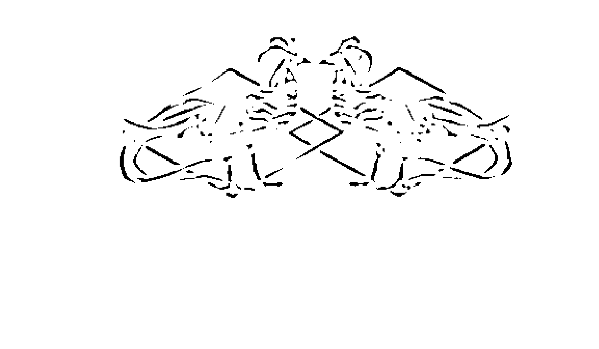

## 31 秃頂人一心虛，英雄半數盡還鄉 ——預言明初文字獄

> 秃頂人來文墨苑，英雄一半盡還鄉。
> ——《燒餅歌》

因言獲罪之事，在中國古代社會並不稀奇，例如秦始皇的焚書坑儒，又如蘇軾的「烏台詩案」。這是統治者進行文化規範和統制時常用的手段。畢竟文人的思想最活躍，能夠撼動朝廷基礎的新思想不可能出自普通的老百姓，只有文人能爲之。因此，統治者往往採取一些強硬手段來對付他們，文人和文化就此淪爲被迫害的對象，文字獄便是統治者們最常使用也最方便使用的方法。

柏楊先生曾將文字獄和「甚於焚書」的八股文一同提及，他認爲文字獄是圍堵，八股文是釣鉤。兩者一起對中國的知識分子和文化進行摧殘。文字獄的摧殘作用，最鼎盛的自然是清朝，但其大規模地興起卻始於朱元璋一朝。

朱元璋雖因出身貧寒而導致文化程度相對較低，但透過後天的努力，他還是對治國之道有相當瞭解的。「自古馬上得天下者，不可馬上治天下。」這個最簡單的道理，朱元璋很清楚，於是在一統天下之後，下詔「世亂則用武，世治則用文」，開始重用文臣，但同時他又對文人心懷猜忌，唯恐他們會用自己不瞭解的方式鄙薄自己貧賤的出身，進而動搖大明的江山。

正當他心存疑惑之時，那些因文人得勢而心理失衡的武將們，在朱元璋憂慮的心火之上又澆了一些油。他們向皇帝進讒言：雖然要用文人治天下，但不能輕易相信他們，否則就會上當，還適時的舉例說明：

「張九四（即張士誠）一輩子對文人寵愛有加，總是好房子住著，高薪拿著，真把他們捧上了天。可是在他做了王爺後，要起一個官名，文人便替他起名為士誠。」朱元璋很納悶地說：「這名字挺好啊！」他們反駁道：「不然，張九四是上大當了！《孟子》一書明明白白地寫著：『士，誠小人也。』這句話也可說成：『士誠，小人也。』這是罵他是小人啊，可是他至死也不懂，真是可憐。」

朱元璋聽到這裡默不作聲，待回去拿出《孟子》一查，果然有此說法，於是這個發生在當年死對頭身上的「屈辱」事件，更加喚醒了朱元璋的自卑情結。他對文人的疑慮更深了，而且，他認為，讀書人巧斷句讀，活用詞意，以達到「譏訕」目的，委實是一件可憎的事，也就有了著手「規範」那些已經起用或即將起用文人的想法。

於是，後世之人在留存下來的各類談話、諭旨中，看到的是一個「求賢若渴」的明君朱元璋；但在實際的事件記載中，又看到的是一個仇視文人、排斥菁英的朱元璋。在創業建國的過程中，朱元璋尊重人才，重用幫他運籌帷幄的三大士人朱升、劉基和宋濂，但大明一統之後，三人沒有一個落得好下場。

太祖皇帝之所以在對待文人的問題上如此矛盾，與其登基前的經歷有極大的關係。生於極度貧寒的家庭，父母雙雙死於瘟疫，為謀生計他曾放過牛、入寺為僧，逼於無奈之時可能還曾偷拿過別的東西……對於加入義軍前這段受盡欺凌的經歷，朱元璋始終銘記於心。尤其是在「禿頂人來文墨苑」——成為高高在上的九五至尊之後，那段不堪的記憶更像是心裡永遠無法根除的一根刺，只需一點小小的外力便會令其疼痛不已。

或許是年少時的經歷過於悲慘，文化水平不高的朱元璋內心深處始終有一種很強烈的「自卑感」，因而可以引發他疼痛感的因素甚多，不論是音同還是意同，但凡能跟他不怎麼光鮮的過往扯上丁點關係的，都會被「此地無銀」的布衣帝王視為對自己的譏諷，一起起看似荒唐的文字獄就此貫穿於整個洪武朝。

史書對於這段荒誕過往的最早記錄見於洪武七年（西元1374年）。蘇州知府魏觀將知府衙門建於張士誠的宮殿舊址上，被人告發。朱元璋查看新府衙，見《上樑文》有『龍蟠虎踞』四字，大怒，把魏觀腰斬。而為魏觀作《上樑文》的高啟，之前便因《題宮女圖》中的「小犬隔花空吠影，夜深宮禁有誰來？」而讓朱元璋懷恨在心，這次剛好舊恨新罪一併算，把高啟也一併腰斬了，可憐這位曾寫出「瓊姿只合在瑤台，誰向江南處處栽。雪滿山中高士臥，月明林下美人來」的明初名士，因為一個莫名其妙的理由就淪為了文字獄的犧牲品。

自此之後，朱元璋像上癮一般，令文字獄一發不可收拾。明朝初年，朱元璋規定：凡是遇到正旦（歲首）、冬至、萬壽聖節（皇帝生日）等節日，以及冊立皇太子、皇太孫等慶典，各級官府必須上表箋祝賀。

河南府尉氏縣教諭許元為本府作《萬壽賀表》，其中有「體乾法坤，藻飾太平」八個字，「法坤」被朱元璋讀成「髮髡」（即為「禿驢」之意），「藻飾太平」被曲解成「早失太平」，許元全家被斬。陳州訓導周冕曾作《萬壽賀表》，內有「壽域千秋」一語，本是個美好的詞句。但朱元璋竟把「壽」附會為「獸」，把不認識的「域」字讀為「或」字，而「或」又和「禍」同音，周冕也難逃一死。德安縣訓導吳憲所作的《賀立皇太孫表》，內有「天下有道，望拜青門」，朱元璋認為「道」就是「盜」，「青門」就是和尚廟，吳憲全家全部被處死。

浙江杭州府學教授徐一夔呈上一份《賀表》，其上寫著：「光天之下，天生聖人，為世作則」等語，本是誇讚之言，到了朱元璋這裡，竟於讚頌之詞中讀出了弦外之音：「『生』者，『僧』也，以我嘗為僧也。『光』，則剃髮也，『則』字音近『賊』也。竟敢對面罵朕為僧為賊，豈可留他！」於是，這位老先生最終也難逃厄運。

由於朱元璋的忌諱太多，且無從揣摩，整個朝堂彌漫著殺戮的氣氛。群臣人人自危，時刻擔心會有飛來橫禍，甚至要在每日上朝之前與家中的妻兒道別，唯恐一去不回。謹小慎微，雖然未必有效，卻也成了洪武一朝文人們唯一的自保之道。

朱元璋以文字獄之法，達到了堵住文人嘴巴的目的，卻也令所有人都失去了仗義執言的勇氣。他們為免遭受「英雄一半盡還鄉」的厄運，要麼不開口，要麼只說違心之語。如此一來，擁有浩然正氣者漸次退出，奸佞小人相繼登場，且幾乎貫穿整個明朝的始終。

## 人物紀：

## 張士誠

張士誠，小名九四，元朝末年泰州白駒場（今江蘇省大豐市西南白駒）人，鹽販出身，農民起義領袖。他個性豪爽，頗得當地百姓歡心，是元末群雄中數一數二的「好人」：不奸險，能容人，禮待讀書人。至正十三年（西元1353年），揭竿而起，次年在高郵稱誠王，國號大周。至正二十三年（西元1363年），逼走紅巾軍劉福通和韓林兒，在平江自立為吳王。四年後，平江被朱元璋攻破，張士誠被俘，後解往金陵自縊而死，時年四十七歲。

## 32 燕子飛血，永樂升平 ——預言靖難之役

### 《推背圖》第二十八象 辛卯

- 谶曰
  - 草頭火腳 宮闕灰飛
  - 家中有鳥 郊外有尼
- 颂曰
  - 羽滿高飛日
  - 爭妍有李花
  - 真龍游四海
  - 方外是吾家

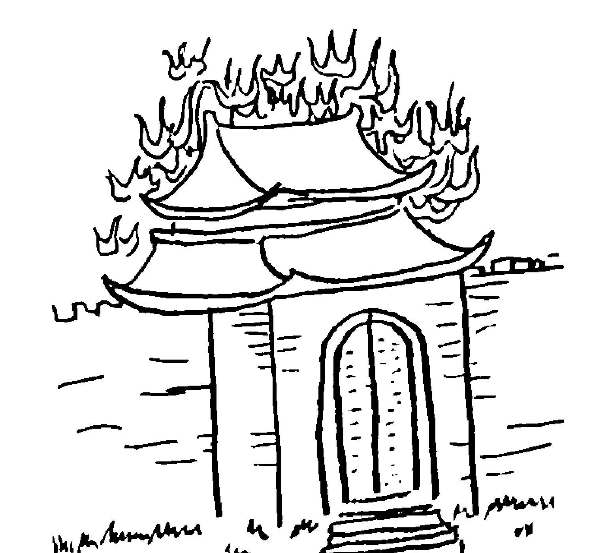

> 基曰：臣觀都城雖鞏固，防守嚴密，似覺無虞，只恐燕子飛來。此城御駕盡親征，一院江山永樂平。
> ——《燒餅歌》

「飛鳥盡，良弓藏。狡兔死，走狗烹。」就像一個魔咒般，周而復始地上演。在中國古代幾千的歷史中，開國皇帝與功臣之間存在的不和諧，幾乎都是以這樣的方式解決的。其中唐太宗李世民處理得最為妥當，是因為他氣量恢弘；宋太祖趙匡胤「杯酒釋兵權」，也有其合理之處。而漢高祖劉邦和明太祖朱元璋則不同，或許是由於出身低微，或許是由於智慧不足，他們選擇了最原始的方法解決與功臣的問題——大開殺戒。

據史書記載，太子朱標對朱元璋的殺戮之舉曾多次勸諫。一次，朱元璋命人找來一根長滿尖刺的荊棘放到朱標面前，讓他去拿，朱標畏懼，不敢伸手。於是朱元璋說：「汝弗能執輿，使我潤琢以遺汝，豈不美哉？今所誅者皆天下之險人也，除以燕汝，福莫大焉！」意思是說我殺人就像去掉荊棘上的尖刺一樣，這樣你將來才可以安坐天下。顯然，他是在為後世的子孫掃清障礙，以保萬世江山。

> 汝弗能執輿，使我潤琢以遺汝，豈不美哉？今所誅者皆天下之險人也，除以燕汝，福莫大焉！

與此同時，朱元璋面對自己的二十三子，做出了分封諸王的決定。當代學者李潔非認為，朱元璋「奪政權於丞相、奪軍權與將領，一切軍政大權皆歸皇帝，這過於集中的權力勢必伴隨管理上的難題，而朱元璋想到的解決辦法，就是讓血親諸王充當中間環節。『上衛國家，下安生民』，在他看來，只要權力不落在朱姓之外就靠得住。」

> 奪政權於丞相、奪軍權與將領，一切軍政大權皆歸皇帝，這過於集中的權力勢必伴隨管理上的難題，而朱元璋想到的解決辦法，就是讓血親諸王充當中間環節。『上衛國家，下安生民』，在他看來，只要權力不落在朱姓之外就靠得住。

太祖的這一片「苦心」，身為太子的朱標未能親身體會便先父親而去了，於是朱元璋將原本應由朱標接手的「防守嚴密，似覺無虞」的江山，交到了嫡次孫朱允炆的手中，暗合劉伯溫「雖然太子（即朱標）是嫡裔，文星（即朱允炆）高拱日防西」之語。朱允炆即為建文帝，他接手祖父留下的江山，一改朱元璋剛猛治國的政策，實行仁政，深受百姓的愛戴。但這位自幼長於深宮，既沒見識過戰場風雲，也沒領教過政治爭鬥的仁厚之君，在歷經大風大浪、政治手腕高明且心狠手辣的叔父面前，注定會輸得一敗塗地。

畢生著力於保護子孫的朱元璋，也曾想到過分封諸王可能引發的問題，因而特地編寫了一部《永鑑錄》，教育諸王為朱氏國家計，安分守己；還頒佈了《皇明祖訓》，明確規定皇帝與藩王的權力，甚至提到如果有皇親謀逆，則格殺勿論。然而，正如英國哲學家霍布斯所言：「不帶劍的契約不過是一紙空文，它毫無力量去保障一個人的安全。」由於朝中的武將已經被朱元璋屠殺殆盡，他所定下的那些規矩沒有「劍」的保護自然也就失去了所有的約束力。

一切就像孔聖人所說：「吾恐季孫之憂，不在顓臾，而在蕭牆之內也。」宗室由此成為了建文帝最大的威脅。面對不斷壯大的諸王勢力，朱允炆最終接受了齊泰、黃子澄等謀士的建議，頒佈了削奪諸藩的詔令。

一直憤憤不平的朱棣，終於逮到了機會。建文元年（西元1399年），燕王朱棣起兵，先據北平，然後以尊祖訓、誅「奸臣」齊泰、黃子澄，為國「靖難」為名，誓師出征，世稱「靖難之役」。儘管打著「清君側」的旗號，但這個預言中「草頭火腳」的燕王的目標已經是昭然若揭了，那就是自己姪子的皇位，顯然，他就是「除非燕子飛入京」中所指的那隻「燕子」。

經過三年的征戰，「此城御駕盡親征」的朱棣率領著他的軍隊，以摧枯拉朽之勢吞噬著建文帝的江山。建文四年（西元1402年）六月初三，燕軍攻佔鎮江，朱棣率軍直奔京城金陵（今南京）。十三日，燕軍抵達金陵金川門，守將李景隆和谷王朱橞開門投降，正是朱棣「羽滿高飛日，爭妍有李花」。

燕王進京後，宮中起火，「宮闕灰飛」，建文帝下落不明。有人說他在宮中投火而亡，也有人說他化裝成和尚逃跑了。明末著名史學家談遷在《國榷》中記載，燕軍攻破金陵城時，束手無策的建文帝本想一死了之。不料，此時翰林院編修程濟從奉先殿後取出一個鐵條箍緊的匣子，說：「太祖生前曾留下遺囑：太孫日後臨大難時，可打開此匣，以求解困之法。」打開匣子後，只見其中裝的竟是剃度所用的工具、袈裟和度牒。另有一紅紙寫道：「應文從鬼門出，餘人從水關御溝出行，薄暮可匯集神樂觀西房。」建文帝頓然明瞭，忙剃去頭髮，穿上僧服，從鬼門逃離了京城。

自此，民間有了關於建文帝的各種傳說。雲南獅子山帝王宮外的一副對聯：「僧為帝，帝亦為僧，數十載衣鉢相傳，正覺依然皇覺舊；叔負姪，姪不負叔，八千里芒鞋徒步，獅山更比燕山高」，便是建文帝遜位出走、遁跡空門避難於此的遺跡。

或許是太祖朱元璋在看了《推背圖》「郊外有尼」、「真龍游四海，方外是吾家」的預言，並結合劉伯溫所言真的為建文帝留下了一條生路，又或許一切都只不過是傳說罷了。無論如何，在建文帝與燕王的這場叔姪之爭中，朱棣獲得了最終的勝利，他取朱允炆而代之，登上了帝位，是為明成祖，年號永樂，成為了朱元璋真正意義上的繼任者，一個新的時代自此開始了。

朱棣作為一代雄主，不僅有爭奪皇位的能力，還有治理國家的雄心。雖然他也承襲了父親返老還童陰狠的一面，但其一生的功績仍是毋庸置疑的：永樂元年（西元1403年），朱棣雄心勃勃地召集三千文士修大典，意在將中國古代典籍盡量收集齊全，成一「前無古人，後無來者」開天闢地之大部頭，歷經五年時間，這部卷帙浩繁、規模巨大、傲視古今的《永樂大典》終告完成；永樂三年（西元1405年）六月十五日，奉朱棣之命，鄭和率領著艦隊開始了一次史無前例的遠洋航行，至宣德八年（西元1433年），鄭和七下西洋，成就了中國航海史上的一個奇蹟；永樂十九年（西元1421年），朱棣將都城由六朝金粉之地南京遷到了北京，他的這一「移南偏北闕」之舉一方面遠離自己殺戮過多的江南之地，另一方面也可就近制禦北方邊患……。

除此之外，朱棣的政績仍有许多，清朝重臣張廷玉在《明史》中就曾對這位明成祖大加讚揚：

> 「文皇少長習兵，據幽燕形勝之地，乘建文孱弱，長驅內向，奄有四海。即位以後，躬行節儉，水旱朝告夕振，無有壅蔽。知人善任，表裡洞達，雄武之略，同符高祖。六師屢出，漠北塵清。至其季年，威德遐被，四方賓服，明命而入貢者殆三十國。幅員之廣，遠邁漢、唐。成功駿烈，卓乎盛矣！」

這一段話將朱棣的文治武功描寫得詳之又詳，可謂淋漓盡致。

事實也的確如此，明朝在朱棣的手中實現了劉伯溫預言的「一院江山永樂平」，也呈現出了開國以來的大氣派，雖然未及漢、唐那般張揚，其「遠邁漢、唐」的氣象也往往令後世之人追憶不已。

## 常識紀：

## 《永樂大典》

《永樂大典》初名《文獻大成》，是明永樂元年（西元1403年）七月至永樂二年十一月，明成祖朱棣命解縉、姚廣孝、王景、鄒輯等人纂修的大型類書，是中國古代百科全書式的文獻集。全書目錄60卷，正文22877卷，裝成11095冊，約3.7億字，共彙集了古今圖書七、八千種。朱棣曾經打算將《永樂大典》付印，由於條件有限，不得已放棄了。之後的幾百年間，它歷經磨難，終究自身命運難保，正本在明末兵火中毀了大半，嘉靖朝手抄副本傳到清朝只剩9000餘冊，少了近3000冊，後被儒臣所盜，又遭遇清末外國人的搶掠，結果估計最後存世的大概只有800餘冊，只是原來的3%左右。據統計，現在嘉靖副本《永樂大典》在全球範圍尚存400餘冊，其中223冊存藏國內，國家圖書館館藏221冊。

## 33 三楊為國之棟，宇內同歌母賢德——預言三楊中興

### 《推背圖》第二十九象 壬辰

- 谶曰
  - 枝發厥榮 為國之棟
  - 皞皞熙熙 康樂利眾
- 颂曰
  - 一枝向北一枝東
  - 又有南枝種亦同
  - 宇內同歌賢母德
  - 真有三代之遺風

當代散文家黃裳在其著作中說：「明太祖在中國的皇帝中，有著極特別也極典型的一種性格。又由於他的影響，下及子孫，所以『明朝的皇帝十九兇惡』。」殘暴，就像「無賴氣」一樣，成為了朱元璋傳下來的家風，幾乎深藏於每位明朝皇帝的心中。就連在後世之人們心中，繼太祖、成祖之後難得的明君——宣宗身上，同樣也能看到兇殘的影子。

在他繼位之初，歷史和他開了一個不大不小的玩笑，重演了當年叔爭姪位的那一齣戲。這次主角是他和他的叔父朱高煦。宣宗朱瞻基繼位之初，朱高煦看這姪子心軟好欺負，暗中謀劃造反，他謀反的旗號更有乃父朱棣之風，先是指斥明宣宗違背洪武、永樂舊制，與文臣誥敕封贈以及南巡諸事，公然宣揚朝廷罪過。同時，他又斥責夏原吉等幾個大臣擅權為奸，要求皇上交出幾個人給自己殺掉，這就是「靖難」。

可惜朱高煦不是朱棣，朱瞻基也不是朱允炆。明宣宗雖年紀輕輕，卻屬少年老成，英明果決之主。宣德元年（西元1426年）秋，經過周密佈置，祭過天地宗廟社稷山川百神之後，宣宗親率大營五軍將士出征。一路聲勢浩大，直逼朱高煦所在地樂安城，結果兵不血刃，就以氣勢壓倒敵人，這位叔父出城投降。

初時，面對這位意欲篡權皇位的叔父，朱瞻基是仁厚的，雖將其囚禁，卻好吃好喝再加上妻妾地伺候著，他甚至還專程去探望朱高煦。不料，已淪為階下囚的朱高煦仍不甘休，竟乘著宣宗不注意，出腿使了個絆子，把當皇帝的姪子摔了個狗吃屎。這下激怒了宣宗，也把深藏他心底的殘暴喚醒了。他下令將一個大銅缸罩在叔父的身上，缸上積炭燃燒，火旺銅化，朱高煦就被活活燒死在裡面。手段之殘忍，竟與唐朝酷吏來俊臣如出一轍。

然而，這只是朱瞻基性格中的一面，與明代其他那些或陰毒或乖戾的皇帝相比，宣宗還算得上是一位好皇帝。他自幼便得到爺爺和父親的喜愛，朱棣甚至預言他是「太平天子」，他沒有辜負爺爺和父親的厚望，初登皇位，便向世界昭告自己是一位明君。在他在位的十餘年間，「以自己德政和治道而載入史冊，將明朝推向了『仁宣之治』的黃金時期」，是明代政治最為清明、經濟最為繁榮的時期。《明通鑑》曾對其做出這樣的評價：「即位以來，吏稱其職，政得其平，綱紀修明，倉庾充羨，閭閻安樂，歲不能災。自開國歷年六十，民氣漸舒，蒸然有治平之象焉。」

與諸多開創盛世的明君一樣，宣宗也做到了諸葛孔明所言的「親賢臣，遠小人」。他繼續重用先前已侍奉過爺爺與父親的正直之士：楊士奇、楊榮、楊溥、夏原吉、蹇義等，據史書記載，「蹇義簡重善謀，楊榮明達有為，楊士奇博古守正，而（夏）原吉含弘善斷。事涉人才，則多從（蹇）義；事涉軍旅，則多從（楊）榮；事涉禮儀制度，則多從（楊）士奇；事涉民社，則多出（夏）原吉。」可見，宣宗重用之人皆非泛泛之輩，其中尤其以「三楊」為重。

就像《推背圖》中所繪的三株楊樹一樣，「三楊」——楊士奇、楊榮和楊溥——在經歷了永樂、洪熙兩朝之後，到宣德年間，已是「枝發厥榮，為國之棟」了，而且他們三人各具特色：年紀最長的楊士奇以文采見長、剛直敢言，常能根據「流徙尚未歸，瘡痍尚未復，民尚艱食」的情況，提出適當的建議，此外他還獨具慧眼，善於提拔新人，後來的名臣于謙、周忱等皆是經他舉薦而得到重用，人稱「西楊」；楊榮機敏通達，多謀善斷，常能於皇帝發怒時微言勸解，加上極過人的軍事才能，深得帝王的賞識，人稱「東楊」；楊溥性格內向、為人恭謹，因其良好的操守而令百官信服，人稱「南楊」。與李淳風、袁天罡「一枝向北一枝東，又有南枝種亦同」預言中的「東楊」、「南楊」暗合，至於其中「北楊」或許是對「西楊」預言的誤差。

宣宗懂得唯才所宜，重用德高望重、聲譽卓越的「三楊」，單就這一點就足以令此後明朝的大部分君主望塵莫及了，更何況「當是時，帝勵精圖治，（楊）士奇等同心輔佐，海內號為治平。帝乃仿古君臣豫遊事，每歲首，賜百官旬休。車駕亦時幸西苑萬歲山，諸學士皆從。賦詩賡和，從容問民間疾苦。有所論奏，帝皆虛懷聽納」。在這三人的合力輔助下，明朝出現了「天下清平，朝無失政，中外臣民翕然」的大好局面。以「真有三代之遺風」形容未免過於誇張，但也確實做到了「皞皞熙熙，康樂利眾」，難怪明末清初學者谷應泰會有「明有仁、宣，猶周有成、康，漢有文、景」這樣的讚賞之說了。

可惜的是，身為凡夫俗子的宣宗，也未能逃脫「生於憂患，死於安樂」。的定律。随着社会稳定，经济繁荣，君臣陶醉在表象的治平景象中，没有意识到盛世下存在的隐患。“臣僚宴乐，以奢相尚，歌妓满前”，纪纲为之不振，这种情况宣宗当然脱不了干系。

这位生于盛世、守护盛世的“促织天子”，由于实在应付不了堆积如山的政事，便将全部的奏章由通政使司汇总，司礼监呈报皇帝过目，交到内阁负责草拟处理意见，再由司礼监把意见呈报皇上批准，最后由六科校对下发。如此一来，就给了司礼监的太监粉墨登场的机会，也就为后来的宦官专政埋下了隐患。

但他万万没有想到，隐患的爆发竟会来得如此迅速，就在他的儿子英宗朱祁镇在位时，由于宦官王振干政，以致朱祁镇被蒙古俘虏，差点断送了大明江山。朱家的天下，从仁宣之治到土木堡之变，仿佛就是转眼间的事情。

#### 人物纪：

##### 促织天子

宣宗皇帝朱瞻基因喜欢斗蟋蟀，而被人称为“促织天子”（促织为蟋蟀别名）。他斗蟋蟀成瘾，由于“上有所好，下必甚焉”，斗蟋蟀便在全国风行起来，蟋蟀的价格随之扶摇直上。后来他又觉得京城的蟋蟀不好，派太监四出采办。其中，听闻苏州的蟋蟀特别好，皇帝为此特意敕令苏州知府况钟协助太监采办一千只蟋蟀。上命下达，摊派给了当地的百姓，结果弄得鸡犬不宁。苏州有一名粮长用一匹马换取了一只好蟋蟀，准备献给皇帝。这名粮长的妻妾因为好奇前去偷看时，不料这只蟋蟀竟狡猾地跑掉了。妻妾自知闯了大祸，遂自杀以谢罪，粮长一看这家破人亡的情景，也跟着上吊了。这就是后来蒲松龄《促织》一文的原型。

### 34 御驾亲征失太平，圭林各半合生变
——预言土木堡之变

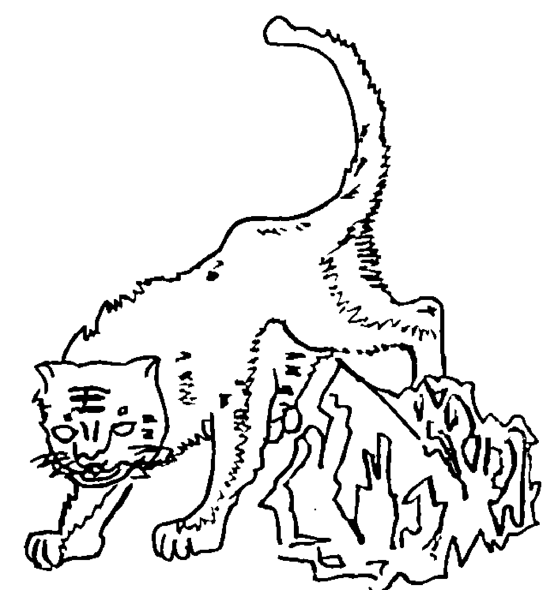

《推背图》第三十象 癸巳

谶曰

半圭半林 合则生变

石亦有灵 生荣死贱

颂曰

缺一不成也占先

六龙亲御到胡边

天心复见人心顺

相剋相生马不前

> 北方胡虏残生灵，御驾亲征得太平。
失算功臣不敢谏，生灵遮掩主惊魂。
——《烧饼歌》

盛极而衰乃万物发展之规律，中国古代的王朝也是如此。明朝经过英宗之前五位皇帝的治理，国运基本稳定，即便存在著一些危机与隐患，却也算得上稳固。可是谁也没有想到，这个强大的王朝竟然遭遇了百年未遇之大劫——皇帝被俘，这应该是继宋朝徽宗、钦宗二帝被俘后，中原王朝的又一大耻辱。而且这次掳获中原帝王的，仍然是来自于北方的少数民族。

翻开中国历史会发现，入侵中原的都是来自于北方的民族。也许是一方水土养一方人，气候寒冷的北方，孕育了粗犷豪放、野性尚武的民族，因此敢犯边者有汉之匈奴，宋之女真、蒙古。直到明朝，中原王朝仍旧受到退居大漠的蒙古族的骚扰，如噩梦般摆脱不掉。

太祖朱元璋为牵制北方的边患而分封藩王。到了成祖时期，朱棣采取恩威并施的策略，以分化瓦解鞑靼、瓦剌和兀良哈等蒙古三部。结果，除兀良哈部归顺外，鞑靼与瓦剌一直对大明虎视眈眈，甚至还时常骚扰明朝的北方边境，残害汉族的百姓。

为安定天下、解决“北方胡虏残生灵”的问题，从永乐八年（西元1410年）到永乐二十二年（西元1424年）明成祖朱棣共运用五十万大明军队，先后五次御驾亲征，虽说屡次起兵，耗费民力，但也在客观上打击了蒙古的气焰，重创了鞑靼、瓦剌二部，巩固了明朝的边防，即所谓“御驾亲征得太平”。

但北方边境的太平并未能维持多久。成祖朱棣去世后，蒙古各部尽管再未有大规模的入侵行动，其实是在积蓄、壮大自己的势力，其中尤其以瓦剌部发展最为迅速。宣德九年（西元1434年），瓦剌酋长脱欢吞并鞑靼，统一蒙古。正统四年（西元1439年），脱欢死，其子也先接替其太师之位，至此，瓦剌势力达到极盛，并产生了吞并中原，以恢复大元王朝的野心。

就在瓦剌实力不断壮大之际，英宗治下的大明王朝也正发生着巨大的变化。年仅九岁的朱祁镇登上帝王之位时，太皇太后张氏曾委托著名的“三杨”——杨士奇、杨荣和杨溥辅政，然而年少无知的英宗则更喜欢自幼陪他读书写字、游戏玩耍的太监王振。特别是随着张太后、杨荣的去世，杨士奇、杨溥的年老势孤，英宗更是将朝政大权交付到了司礼太监王振的手中。明朝皇权第一次转移到了宦官手中，就像柏杨先生所说：中国的第三次宦官时代，由王振揭幕。

作为明朝历史中有据可考的第一个祸国殃民的太监，王振揭开的自然是一段令人不齿的历史序幕。他肆无忌惮地弄权，大兴土木，广收贿赂，使用重刑，权倾朝廷，几乎是把一个王朝变成了自己的袖里乾坤。面对日渐贪婪的瓦剌部，此时明朝实际的掌权者王振也只是随心决断，故而引发正统十四年明与瓦剌的冲突。

正统十四年（西元1449年）二月，瓦剌部太师也先派两千余人向明朝进贡马匹，却号称三千，向明朝多要回赠。《明史》中说，也先的行为激怒了王振，便故意低估瓦剌进贡马匹的价格，也先大怒，藉口明使曾许嫁公主，贡马是聘礼，明廷却无意许亲，是失信于瓦剌。当年7月，将领脱脱不花与也先率领大军，分四路侵入明境。

多年来对瓦剌部一直掉以轻心的明王朝，虽然采取了一些应急措施，却几乎无力阻挡瓦剌的进攻。结果，参将吴浩阵亡，“大同兵失利，塞外城堡，所至陷没。”边境失利的消息传到北京，权力欲望已经得到满足的王振，又突发奇想地想要享受一下军事胜利带来的成就感，便以荡平漠北、大展天威来诱惑英宗，怂恿其御驾亲征。

血气方刚的英宗朱祁镇，平日只能看到军队的操演习武，如今竟有一次实战的机会，他自然十分欢喜，何况他还想效仿太祖、成祖当年征战沙场的壮举，于是与王振一拍即合，马上就要御驾起程。如此仓促的决定，自然遭到了朝中理智之臣的反对，然而吏部尚书王直等大臣的苦谏始终没能令英宗回心转意。七月十五日，朱祁镇还是偕王振统领五十万大军浩浩荡荡地出发了，留下郕王朱祁钰守北京。这本该是一次“西北望，射天狼”的壮举，可是却被这位幼稚皇帝和他的太监伙伴给搞砸了。

时值秋雨连绵之际，连日风雨交加，几十万大军，出居庸关，过怀来，至宣府。“连日风雨，人情汹汹，声息愈急。”随驾群臣察觉士气低落，接连在军中上表，恳请英宗皇帝回銮。王振大怒，罚兵部尚书邝埜等人于草中长跪。大军继续前行，于八月一日抵达大同。至此，英宗已完成了“六龙御亲到胡边”的预言。

与此同时，也先为引后备不足的明军继续北行，率瓦剌军撤出塞外，对军事一窍不通的王振自然不知其中缘由，仍然踌躇满志地坚持北进。直到收到前头部队惨败的消息，王振才知情势不妙，惊慌失措间急令撤军。于是，在到达大同的第二天，五十万明军便又迅速沿原路后撤。

本来，明军应该经大同由居庸关回北京，但王振想要在皇帝的陪伴下衣锦还乡，便下令改道由紫荆关（今河北涞源）入京。本来大军就是惊惶退走，结果到处踩踏庄稼，反而引起了王振的恻隐之心，就又在距家乡蔚州四十里地时命令大军向宣府方向行进，仍从居庸关返回。如此反复逡巡，明军退至宣府时，也先骑兵追袭而来，明军仓皇而退。

八月十三日，疲于奔命的明军逃到怀来以西的土木堡，两军正面的交锋正式开始。被瓦剌几万人包围的明军，因饥渴疲劳陷入困境，听到瓦剌军“大呼解甲投刀者不杀”，明军“裸袒相蹈藉死，蔽野塞川”，争相投降。战争还没真正开始，明军便已经败了，果真是“缺一不成也占先（即也先占）”。仓促间五十万明军“死伤过半”，大明皇帝英宗朱祁镇被俘，“生灵遮掩主惊魂”。由于此役发生于土木堡一地，故而史称“土木堡之变”，竟与李淳风、袁天罡所预言的“半圭半林，合则生变”完全吻合。

至于这一役的“始作俑者”王振，《明史》载“（王）振乃为乱兵所杀”，应该是混战中被瓦剌军砍死或者被自己人逃跑时踩踏而死，也有一说是王振被扈卫军官樊忠以大锤击杀。无论是哪种说法，可以肯定的是王振这个明朝第一个专权太监的生命在“土木堡之变”中彻底地结束了。然而，仅此一役，明军死伤数十万，文武官员亦死伤五十余人，无辜者的累累白骨和流成河的鲜血，都与他脱不了干系，更何况他给大明朝带来的影响远不止于此。

> 范文澜先生在其主编的《中国通史》中说：“土木堡之战，明军仓促出师，进退失据，京军精锐，毁于一旦，勇将重臣多人战死。英宗皇帝被俘，更使朝野震动。明王朝遭遇到建国以来所未曾有的严重危机。”因为大明朝不仅失去了他们的皇帝，就连他们的都城北京也正面临着瓦剌部的威胁，此时若没有一位力挽狂澜者站出来救国于危难之中，那么“土木堡之变”将不只是明王朝由盛转衰的分水岭，而将重蹈宋的覆辙——大好江山被蒙古铁骑占据。

或许是大明王朝“命不该绝”，一代名臣于谦毅然地站到了群臣的最前端，担负起了挽救朱家天下的重任，但他能做的也只是帮已然破败的明朝进行最简易的包扎而已。

#### 争议纪：

##### 英宗的生母

关于英宗的生母，存在着不同的说法。一种认为英宗是宣宗即位后册立的孙贵妃所生，《明书》中有载孙贵妃于“宣德二年十一月，生英宗皇帝。”另一种认为英宗乃宫女所生，孙贵妃为了巩固自己的地位而夺宫女所生之子养之，《明史稿》中有载孙氏“子宫人子，于是眷宠日重。”

##### 新主临危受命，故君安然回归
——预言景帝即位与英宗复辟

> 国历瑞云七载长，胡人不敢害贤良。
相送金龙复故旧，云开日月照边疆。
——《烧饼歌》

> 匹马南来渡浙河，汴城宫阙远嵯峨。
中兴诸将谁降敌，负国奸臣主议和。
黄叶古祠寒雨积，青山荒冢白云多。
如何一别朱仙镇，不见将军奏凯歌。

于谦怀着对岳飞万分敬仰的心情，写下这首〈岳忠武王祠〉时，他定然不曾料到，这首诗竟会成为对自己人生的注解。他和岳飞有着许多的相似之处：同样的满腔热血、同样的忠肝义胆，他们心中有百姓、有社稷；同样的拙于谋身、同样触到了帝王心中的痛，他们心中有江山，却忘记了江山有姓，高居庙堂之上的君王有自己的权力逻辑。所以，岳飞死于“莫须有”，而《明史》中这位“英迈过人，历事三朝”的著名人物，则因参与明朝的两次重大事件——土木之变和夺门之变，而由举国拥戴的救时英雄沦为身败名裂的刀下亡魂。

即便如此，后世之人对于谦的评价也丝毫未曾打折。清朝重臣张廷玉在《明史》中对他“忠心义烈，与日月争光”的赞美更是异常激动人心。于谦配得上这样的赞誉。因为他虽只是一个文弱书生，却能在危难时刻，挺身而出，扛起了大明万里江山。

“土木堡之变”后，英宗皇帝被俘，整个朝堂震动，陷入了一片混乱中。英宗御驾亲征前留下负责居守的郕王也一筹莫展，大臣们更是“相看泪眼，竟无语凝噎”。正所谓：国不可一日无君。于谦联同文武官、内外臣一起奏请皇太后立郕王即皇帝位。皇太后同意众议，郕王朱祁钰于正统十四年（西元1449年）九月初六称帝，是为景帝，以次年为景泰元年，遥尊英宗为太上皇。

此情此景难免令人想起赵宋的“靖康之难”，想当年徽钦二帝被金掳去之后，高宗赵构即位，南渡直到杭州，建立孱弱的南宋王朝。历史难道会在明朝重演？答案是否定的，毕竟朱祁钰不是赵构，大明也没有宋朝那么羸弱，顷刻之间就被一个异族打得落花流水，仓皇南逃，甚至被逼到差点蹈海的地步。而且明朝还有于谦，他领导的“北京保卫战”在阻止明朝“南渡”的过程中，也发挥了至关重要的作用。

就在沦为瓦剌军队的阶下囚后，瓦剌军仍在向北京城进逼，其长驱直入之势，很快便使整座京城变得岌岌可危。景帝召群臣们商讨战守大计，惶惶不安中竟有朝臣提出要迁都南京，以避灾祸。如果大明王朝于此时南迁的话，可能真的会如人们开玩笑说的那样：也许南明会早出现两百年。幸而，于谦坚决反对，并主张马上召集军队，誓死保卫京师。于是，景帝任命于谦为兵部尚书，全权负责守战之事。

于谦排除各种干扰，征集粮饷，任用贤能的将领，增强城防。总之，在于谦的筹划下，明朝逐步形成了一个依城为营，以战为守，分调援军，内外夹击的作战部署，一切准备就绪，只待与瓦剌军决战于北京城下。

正统十四年（西元1449年）十月初六，也先挟持英宗入犯北京，京城告急。本以为捉住了朱祁镇就可以要胁明朝议和的也先，在听到掷地有声的“社稷为重，君为轻”之后，才发现自己的如意算盘落空了。无奈之下，也先对北京进行大举进攻。面对瓦剌的大军，于谦身先士卒，以忠义报国的道理晓谕众将士，士兵士气高涨，誓与北京共存亡。最后在大明军民的共同抵抗下，也先带领军队、拥着明英宗落荒而逃，于谦派兵追击，又在途中大败瓦剌，史称“北京保卫战”。

至此，朱祁镇已经失去了利用价值，但也先并没有杀他，反而将他放回了大明。对此《推背图》的解释是“胡人不敢害贤良”，事实上也先不是不敢，而是另有打算，与其将无用的英宗杀掉，不如索性“相送金龙复故旧”，说不定还能看一场“两虎相争”的好戏。

事情果然如也先预料的那样。景泰元年（西元1450年）八月十五日，在塞北羁留一年的英宗朱祁镇，刚一回到北京就被朱祁钰禁锢于南宫，不许百官谒见。莫名其妙丢掉了皇帝之位的英宗自然很不甘心，但毕竟自己刚被朱祁钰救回来不好立即发难，只能慢慢等待合适的时机。

没想到这一等就是“七载长”。景泰八年（西元1457年）元旦，朱祁钰病倒，由于儿子已先他而去，立储便成了人们最为关注的问题。趁着朝中大臣们对立皇太子一事争论不休之际，武清侯石亨与都督张軏、太监曹吉祥等密谋发动政变，拥英宗复辟，以邀赏功。

一月十六日夜，石亨、徐有贞等引军千余潜入长安门，急奔南宫，毁墙破门而入，扶英宗登辇，自东华门入宫，升奉天殿，朱祁镇正式复位，改年号为天顺，暗合“天心复见人心顺”之语。这就是“南宫复辟”，又称“夺门之变”。在此次的皇位交替中，石亨等人发挥了非常重要的作用，故有“石亦有灵”之说。但在后来的日子里，石亨以拥立的功臣自居，日渐横行无忌，最后被英宗处死，也算是应了《推背图》“生荣死贱”的预言，这自然是后话。

而那位骤然间被夺去帝位的景帝，在听到哥哥复辟之后，被移到西宫，一个月后神秘死去，时年三十岁。对于景帝的功绩，明代史学家谈迁在《国榷》中给予了充分的肯定：“太祖之后，有功劳的皇帝，谁不知道是成祖？有德行的皇帝，谁不知道是孝宗？然而，还有一个景帝。土木之变发生后，如果没有景帝，我们都会沦为异族统治下的奴仆了。景帝的德行有哪些？一个是他善于知人，一个是他懂得安民。”对此，现代学者吴晗和郑振铎也极为赞同。

至于两登帝王之位的英宗朱祁镇，许文继、陈时龙在《正说明朝十六帝王》中进行了有趣的总结：

> > 英宗在位22年，被俘北居一年，南宫幽居7年，又于景泰八年（1457年）乘景帝病重，在武清侯石亨、左都御史杨善以及副都御史徐有贞、太监曹吉祥等人的拥戴下复登皇位，真可谓经历了天上人间的剧烈变化。在这期间他宠信过一些人，重用过一些人，惩处过一些人。他宠信的人，有的断送了他，比如王振；他重用的人，有的对他产生威胁，比如石亨和曹吉祥；他惩处的人，有的明知其对社稷有功，却不得不如此，比如于谦。总之，任用非人，是他作为一个皇帝的最大失败之处，同时也在某种程度上决定了其跌宕起伏的悲剧命运。

“任用非人”，就此成了英宗的盖棺定论。然而，这样的一位君王，在李淳风与袁天罡的预言中，竟被形容为“瑞云”、“云开日月照边疆”，实在难以令人信服，反倒是“挽狂澜于既倒”的一介书生于谦，和他的“粉身碎骨全不顾，要留清白在人间”得到了后世之人更多的称颂。

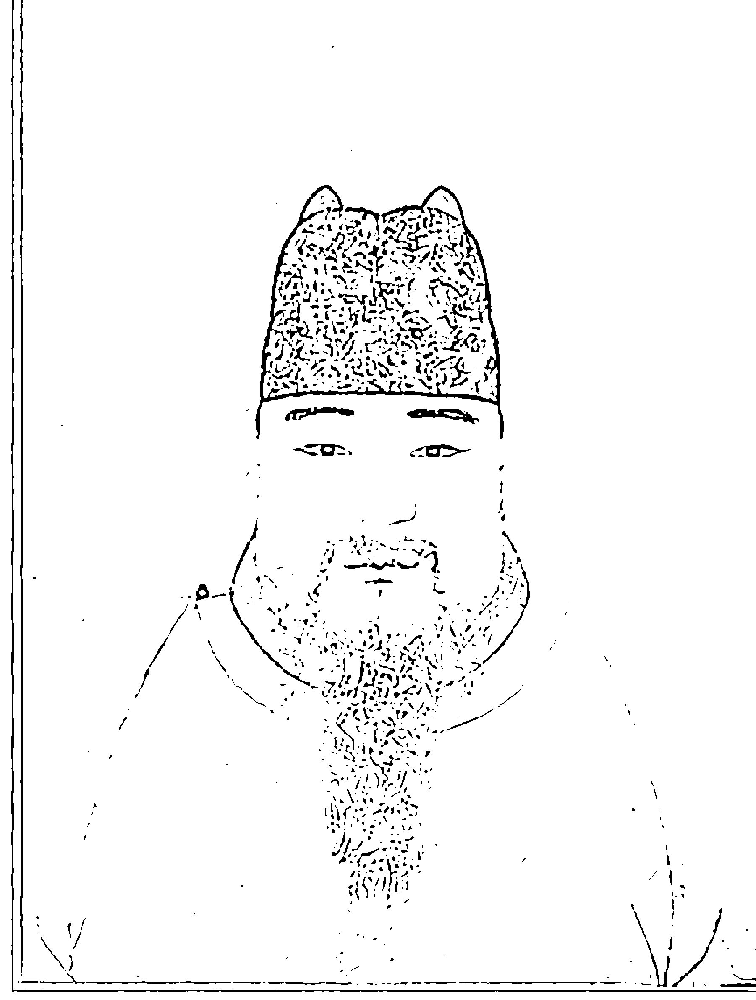

##### 明宪宗——朱见深

#### 人物纪：

##### 宪宗朱见深

柏杨先生写《中国人史纲》，写到明宪宗和孝宗时，特别指出“断头政治”，即皇帝不上早朝，不见大臣，不议政事。这一怪政就是由英宗之后的继任者——宪宗朱见深开的先河。据说，朱见深还有严重的口吃，因此，他每次上朝，如果准许大臣所奏之事，只说一个“是”字，这种自尊的心理影响了他与大臣们面对面地交流，同时也使得他越来越倾向于龟缩在自己的皇宫中，不理朝政。自此之后，明朝的皇帝们都有严重的“断头政治”存在。

### 36 大智皇帝平怪异 逃雀笼 ——预言明武宗的怪诞

> > 天下饥寒有怪异，栋梁龙德乘婴儿。——《烧饼歌》

如果说唐高祖是中国一切史书中最受贬低的一位君主，那么明孝宗就是中国史书中最易被忽略的一位明君，由于上有庸父宪宗朱见深、下有劣儿武宗朱厚照，孝宗朱祐樘这个在“土木堡之变”后开创了一派中兴气象的明朝君王，反而显得不那么引人注目了。

朱祐樘十八岁即位，年号弘治，在他当政期间，既无权臣、宦官或后宫的专权，也很少有弊政。而且他勤政、宽容、尊礼儒臣、体恤民生，赢得了儒家士大夫的一致好评，被视作明代历史上最符合儒家伦理的君主典范。所以，孝宗治下的“弘治中兴”成为明史上政治最贤明的时期，孝宗也被视为明朝诸多荒诞帝王中的一位贤君。明末学者朱国桢曾说：“三代以下，称贤主者，汉文帝、宋仁宗与我明之孝宗皇帝。”将孝宗视为夏商周三代之后，与汉文帝、宋仁宗比肩的贤君，足见对其评价之高。

然而，中兴不会永久地持续下去，就像朱祐樘无法长生不老一样。执政十八年后，朱祐樘因偶染风寒而卧床不起。病榻前，他把江山交付到了十五岁的儿子朱厚照手中，并给辅政大臣留下了“东宫年幼，好逸乐，先生辈善辅之”的嘱托。

知子莫若父，朱祐樘眼中这个“好逸乐”的儿子，就像是一个玩心不褪的顽童，以最惹眼的“无赖气”结束了孝宗耗尽毕生开创的中兴之势。这位“无赖”新君，就是大明王朝的第十代皇帝武宗朱厚照，也是大明朝活得最逍遥快活的皇帝。

他的人生仿佛从出生的那一刻起，便注定是备受宠爱的。

弘治四年（西元1491年）九月二十四日申时，大明王朝开国一百三十多年来身份最为尊贵的朱厚照降生了。他之尊贵，不只因其嫡长子和独子，更因其大吉大利的生辰八字。按照中国的传统八字算法，他出生于申时丁酉日甲戌月辛亥年，恰好是地支中的“申、酉、戌、亥”的顺序，在命理上称为“贯如连珠”，主大富大贵，据说明太祖朱元璋的生辰也是“贯如连珠”。再加上，据说他的长相貌似太祖皇帝，神采焕发，气质如玉，灵动机敏，因此，自出生那一刻起，朱厚照理所当然地接受着来自于各方的称赞。出生仅仅五个多月，就被册封为皇太子，这在大明王朝是空前绝后的。

八岁时，在大臣的请求下，朱厚照正式出阁读书。年少聪慧的他，前天讲官所授之书次日便能掩卷背诵。数月之间，就将宫廷内繁琐的礼节了然于胸。他的父亲孝宗皇帝和当时朝堂上的大臣们都相信，眼前的这位皇太子，就是刘伯温所预言的“栋梁龙德乘婴儿”，将来会成为一代贤明之君。

一切都按照人们期望的方向顺利地行进着，直到弘治十八年（西元1505年）孝宗皇帝突然去世，皇太子登基，是为武宗。与那些经历过父子猜忌、兄弟相残之后才坐上帝王宝座的人相比，朱厚照的登基之路也走得格外顺畅。于是，人们将这一切都视为上天所赐予的幸运，将这位一路顺风顺水的武宗皇帝视为又一个新的希望与寄托。

但自这位“小时了了”的帝王开始执政的那一天起，事情开始出现了偏差，更准确地说，应该是开始失控了。幼年时好学习、尊师长、善作诗、能度曲的朱厚照，開始將其身上的「無賴氣」毫不保留地表露出來。

> 其實唐室大有胡氣，明則無賴兒郎。『無賴兒郎』四字，用在厚照身上，可稱的評。

但武宗的「無賴」並非明朝開國皇帝朱元璋式「我是流氓我怕誰」的氣概，而是演變成了「我就無賴我願意」的刁蠻。這個自出生之日起便處於無盡溺愛之中的十五歲孩童，幾乎從未受過任何的拘束與限制，因而他是自由的、天真的。

但在萬眾矚目下登上皇帝之位後，他突然發現自己竟要受太多繁文縟節的羈絆，於是選擇逃離。

> 自從登上皇位的那一天起，他唯一的渴望就是逃離：逃離這座龍椅，逃離這座皇宮，逃離這座京城。他願意做將軍，願意做武士，願意做一個馴獸師，就是不願意做皇帝。上天賦予他的是多血質性格：活潑好動、反應敏捷。對於皇帝這項工作來說，這種性格無疑是最不適合的。

確實，天性好動、我行我素的朱厚照，做事不拘小節、藐視權威。為了減少對自己行動的限制，他廢除了尚寢官和文書房侍從皇帝的內官。藉種種因由逃避為皇帝而設的經筵日講，後來索性連必須出席的早朝也不上了，為後來世宗、神宗的長期罷朝開了「先例」。

在儘可能地遠離龍椅之後，武宗又想著要離開「囚禁」自己的皇宮。

正德三年（西元1508年），不甘於過宮內枯燥生活的朱厚照，索性離開紫禁城，住進了皇城西北的豹房新宅，自此豹房成為武宗居住和處理朝政之地。對於那個厭惡至極的皇宮，他沒有絲毫的留戀，所以當正德九年（西元1514年）正月宮中因燃放煙花，不慎失火殃及宮中重地乾清宮時，他能談笑風生地說出：「好一棚大火啊！」

朱厚照的逃離還在繼續。根據明朝的祖制，除非有類似於戰爭、送葬等重大事件，否則皇帝不得離開京城。但喜歡蒙古人裝束、欽羨蒙古人自由的朱厚照，渴望能到大漠去感受一下凜冽的風霜、親眼見識一下驍勇的鐵騎。

正德十二年（西元1517年）十月，蒙古韃靼小王子率五萬兵馬南下，朱厚照得知後大喜，即刻決定御駕親征，卻遭到了群臣的反對。但朱厚照並未就此甘休，在經歷過此前的偷走失敗之後，朱厚照已總結了一定的經驗，這次他趁著半夜時分，偷偷地潛出了京城，直奔居庸關而去。

五天之後，武宗一行來到了塞外孤城宣府，在這裡已經擁有整個天下的朱厚照，又封自己為「總督軍務威武大將軍總兵官」、加封「鎮國公」，還要朝廷給自己發放俸祿。武宗此舉，令遵奉「君為臣綱」的整個大明朝堂陷入了一種窘境之中，最基本的問題就是，大臣們在面對皇帝之時，到底該如何稱呼。

但在朱厚照看來，這樣的結局是十分有趣的，他終於令那些慣於捆綁著他的群臣們也陷入了手足無措之境。在與群臣的這一回合的「鬥爭」中，武宗勝了。與此同時，御駕親征的武宗在與蒙古的交戰中，也取得了一場難得的勝利，《明史》記載明軍死亡五十二人，蒙古軍死亡十六人，武宗親手殺敵一人，此後正德年間蒙古不敢再南下侵犯。這應該算是武宗荒誕治下屈指可數的政績之一吧。

大明王朝，作為中國古代封建專制王朝的其中一個，和其他王朝一樣都是「天下之事無小大皆決於上」，故而皇帝就如同國家的「靈魂」，承擔著對整個帝國負責的重任。「假如皇帝的個性竟不是上述的那一流——就是，徹底道德的、辛勤的、既不失掉他的威儀而又充滿了精力的——那麼一切都將廢弛，政府全部解體，變成麻木不仁的狀態。」黑格爾在他的《歷史哲學》中如是說。顯然，朱厚照就是黑格爾所說的那類帝王，而他治下的大明帝國也就呈現出了「天下飢寒有怪異」的衰敗之勢。

身為帝王，朱厚照是荒誕的，他令短暫的「弘治中興」消弭殆盡，使大明王朝的元氣日漸損耗；身為人，朱厚照是純粹、天真的，單是那句「別人笑我太瘋癲，我笑他人看不穿，人生不過一場戲，嬉笑怒罵玩玩看」，便可見其可愛之處。但他畢竟不是普通人，自登上帝王之位時起，他的率真就注定會被解讀成胡鬧，而他唯一能做的，或許就是手捧南唐后主李煜的作品，慨嘆一聲：何苦生在帝王家！

## 人物紀：

## 明孝宗與一夫一妻制

在明朝歷史上有一位特別的皇帝，一生踐行一夫一妻制，他就是孝宗朱祐樘。不同於以往封建帝王的三宮六院七十二妃，朱祐樘一生中只有一個皇后，而且沒有其他的嬪妃。晚明學者黃景昉說：「時張后最篤愛，同上起居，如民間伉儷然。」這在封建帝王的生活中，實在罕見。他之所以踐行一夫一妻制，可能是因孝宗本人性格，又深受儒家思想的薰陶；可能是他自幼看盡後宮爭鬥，不願重蹈覆轍；可能是張皇后個性活潑，一人便足以吸引和約束孝宗；也可能是由於受到大臣謝遷的勸諫。無論是什麼原因，其一夫一妻的結果都是中國封建歷史中的一段傳奇。

### 37 賢良輔天下，聖人解亂局 ——預言大儒王守仁

> 周流天下賢良輔，氣運南方出將臣。聖人能化亂淵源，八面夷人進貢臨。——《燒餅歌》

柏楊先生在一次名為《人生文學與歷史》的演講中，曾說過這樣一段話：「明王朝建立了一種『君父』觀念，君就是父，也就是說，皇帝就等於你的父親。這種觀念一經建立，所產生的流弊，無窮無盡。其中最可怕的徵候，就是廷杖。……這種廷杖制度，這種君父思想的結合，使中國人的自尊，幾近泯滅，使中國人的人格，幾近摧殘殆盡。中國人唯一保持自尊的方法，只有在受廷杖的時候，不喊出聲音。」明朝的君王，尤其是自武宗之後的幾位君王，更使「廷杖」之刑發展到了極致，即便是平日裡德高望重、備受尊敬的文士往往也避之不及。與生活在宋朝的文人相比，明朝的文士就像是置身於水深火熱中一般，一句話說得不合皇帝的意，就有可能招來一頓毒打，一代巨儒王守仁亦受過此刑。那時，正是劉瑾專權時，王守仁還只是一名主事的小官，但為了營救被劉瑾所害的大臣，他直筆上書，因此而惹惱了劉瑾。結果，王守仁便遭到了這種太祖朱元璋時就已經在使用、專門針對大臣的刑罰、明朝皇帝的法寶——「廷杖」的侮辱。幸而王守仁自幼於修文的同時，還兼習武，體質較一般文人要強壯，再加上年輕力壯，四十廷杖並未對其造成多大的生理傷害。

但他的仕途卻隨著逐次落下的廷杖發生了轉變，他被貶到貴州龍場，一個群山連綿，草木叢生，少數民族混雜居住的地方。不料那個邊陲之地，竟成了王守仁的福地。在身處龍場的那段時間裡，由於資源匱乏，無書可讀的王守仁唯有轉向內心的思考。

> 捷克小說家米蘭·昆德拉曾說：「人類一思考，上帝就發笑。」

但試圖挽救逐漸沒落封建王朝的王守仁，在龍場的思考引發的是熱愛中華文化者的欣慰之笑，

> 正如梁啟超所言：「王陽明（即王守仁）是一位豪傑之士，他的學術像打藥針一般，令人興奮，所以能做五百年道學結束，吐很大光芒。」

作為朱熹的後世門徒，王守仁並未想過要衝擊「存天理，滅人欲」的理學，但他的頓悟遠遠超出了預期的結果。一日，王守仁突然心中一亮，對《大學》的中心思想有了新的領會，從而頓悟，即要推究事物原理獲得知識，應當自己求之於心，不應當求之於外物，這就是他自己的哲學體系的萌芽。簡而言之，就是「致良知」。

他後來多次激動地描述他一口道盡這千古聖學之秘的心情：「某之良知之說，從百死千難中得來，非是容易見得到此。」真是三字二十年得，一吟便到白頭。此說一經出世，便影響深遠，

> 史學家張岱說：「陽明先生創良知之說，為暗室一炬。」

> 思想家黃宗羲也說王陽明學說一出，「可謂震霆啟寐，烈耀破迷，自孔、孟以來，未有若此深切著明者也。」

王守仁找到了「破心中賊」的方法，一躍成為與孔、孟比肩者。

相較於「破心中賊」，王守仁人生的另一件要事——「破山中賊」就容易得多，故而會有「破山中賊易，破心中賊難」之說。

王守仁自幼便胸懷大志，從其所寫的〈哭象棋〉詩中可見一斑：「象棋在手樂悠悠，苦被嚴親一旦丟。兵卒墮河皆不救，將軍溺水一齊休。馬行千里隨波去，士入三川逐浪流。炮聲一響天地震，忽然驚起臥龍愁。」以諸葛孔明自喻，足見其小小年紀便已是躊躇滿志。

在後來的人生中，這位出生在山明水秀的浙江餘姚的書生王守仁，雖仕途坎坷，卻也在關鍵時刻解決了大明的危機，果真是「氣運南方出將臣」。王守仁一生所立的最大功業，就是平寧王之亂、破朱宸濠一賊。

由於武宗朱厚照荒嬉，沉湎於豹房享樂之中，寵信太監劉瑾，把江山社稷交給一個太監，劉瑾便擅自專權，為禍一時。主僕之間的「不在其位，而謀其政」，都做著不屬於自己職權範圍的事，再加上以前留下來的積怨，使得明朝的內亂重重，匪盜作亂不斷。早在劉瑾被處以凌遲之刑前，明朝就已經出現過安化王起事，其理由還是與以前的叛亂如出一轍的「清君側」，清理的對象就是武宗身邊權勢熏天的劉瑾。雖然師出有名，但只持續了十九天便被鎮壓了。

這次的叛亂之後，劉瑾獲罪被誅，而與劉瑾時有勾結的寧王朱宸濠則開始了他的謀逆計畫。寧王也是皇室近親，其本來的土地在邊陲，天高皇帝遠，可以任意發展。但朱棣稱帝後，把善戰的第一代寧王弟弟朱權改封於江西，同時，汲取了其父朱元璋的教訓，對藩王進行了嚴格的限制，特別嚴禁他們擁有武裝力量，以防他們仿效自己，重新上演「靖難之役」的大戲。

自朱權開始的前三代寧王與中央一直未曾發生過爭端，但第四代寧王朱宸濠繼任之後，竟藉口明武宗荒淫無道，毅然舉起了反叛的大旗。時任僉都御史的王守仁聞訊後，舉兵勤王。他趁寧王率兵偷襲其他城市的時候，直搗其老巢南昌，然後以南昌為據點，派兵伏擊回來解南昌之危的朱宸濠。朱宸濠被俘，密謀許久的戰事竟在短短的三十五天之內就被王守仁消弭殆盡，足見王守仁用兵之神。《明史》讚曰：「整個有明一代，以文官身分用兵而克敵制勝者，沒有像王守仁那樣出色的。」故而，即便是以「聖人能化亂淵源」來形容之亦不為過。

獲得如此重大的勝利，理應論功行賞，可惜王守仁遇到的是大明朝最不按常理出牌的武宗朱厚照。為了過一過打仗的癮，武宗親率幾萬京兵前來平亂，甚至在寧王被活捉後，屢發檄文制止王守仁將寧王獻於闕下。寧王被活捉後，王陽明按常理想將寧王獻於闕下，卻被朱厚照連發數檄制止。最後幾經波折，王守仁稱「奉威武大將軍（即武宗）方略討平叛亂」，把大功歸於武宗皇帝及其左右，武宗這才心滿意足地押著囚在南京的寧王北返回京。

儘管端坐朝堂之上的，是武宗這般荒誕的君王，王守仁還是希望能實現所有文人共同的「修身、齊家、治國、平天下」的夢想，更何況他確有「周流天下賢良輔」之才能。但武宗朝的不受重用、世宗朝的「不予鐵券，歲祿亦不給」，都令他憂恨不已，見「八面夷人進貢臨」實現無望的王守仁，最後只得稱病歸隱。也就是在他閑居的這段平靜時光裡，開創了為世人所知的「心學體系」。

或許正是受他的思想影響，世宗一朝才會有所謂的「大禮議」。

## 人物紀：

## 劉瑾

宦官劉瑾自幼侍奉太子朱厚照。太子登基即位後，劉瑾「鹹魚翻身」，聯同馬永成、谷大用、魏彬、張永、丘聚、高鳳、羅祥等爪牙，形成了以聲色犬馬侵蝕朝政大權的「八虎」。朝臣曾經聯合要求排除「八虎」，不僅未能成功，還令劉瑾掌握了更大的權力。此後，劉瑾大權在握，把持朝政，被世人稱之為「立地皇帝」。正德五年（西元1510年），劉瑾被告謀反，朱厚照親自鎖拿劉瑾，主持抄家，劉瑾被處以凌遲之刑。

### 38 無視猜心遊戲，忠良殺害崩如山 ——預言嘉靖朝的君臣對決

> > 忠良殺害崩如山，無事水邊成異潭。
> ——《燒餅歌》

一種思想如果在對人的約束脫離了人性，那它就必然造成虛偽，北宋時逐漸興起的「程朱理學」便是一種虛偽的思想。將「存天理，滅人欲」視為核心主張的理學家認為，「存天理去人欲」是理學家的主張，理學家認為人生應該嚴肅，而且要非常嚴肅，除了日夜努力，訓練自己成為聖人外，不可有其他意念。比基督教清教徒和佛教苦行僧，還要嚴厲。他們主張壓制人的感情和靈性，以達到最高的道德。他們要求人類只能做一件事，即敬畏聖人。

這種喪失人性的思想，不僅引起了蘇軾之輩的反感，就連最頑固的司馬光都嘆息說：「使皇帝不願意跟儒家接近的，正是程頤這種人。」幸運的是，這些理學在宋朝時是顯規則，是教化別人的，它不上宮闈、不上大夫。但隨著思想的不斷完善，理學在把儒家文化推向一個新的高度的同時，也使其逐漸走向了畸形，變得教條和虛偽。

發展到明朝之時，理學已經登堂入室，儼然成為了儒家的最高準則，士大夫們好像被它催眠了一般，對所謂君君臣臣的禮制頂禮膜拜，甚至將其看作是江山社稷的根基，一旦有人膽敢對此提出質疑者，就等同於是在動搖固若金湯的社稷，身為江山之主的君王更是不能對此有絲毫的不敬。

但是，規則面前總有一些挑戰者，嘉靖皇帝朱厚熜便是「程朱理學」規則的挑戰者之一。他一輩子都在與程朱理學所謂的儒家正統禮制鬥爭，試圖創造自己的有「禮」之國。可是，他的有「禮」之國，在當時的社會就好像烏托邦一般，根本無法實現，從而注定了他的「以禮治國」會以失敗告終。

儘管如此，嘉靖皇帝還是為實現自己的夢想，做了最大程度的努力，結果便是引發了一場「天道」與「人情」的「大禮議」。

何謂「大禮議」？「大」多數都是用來指關於皇家的事情，比如皇子的婚禮稱為「大婚」；「禮」則指程朱理學那套儒家正統禮法下的王權制度下的禮義等級秩序；「議」自然也就是爭議、議論的意思，合起來也就是「關於皇室禮制的爭議」。自古以來，帝王之家都看重不同等級之間的禮制，作為統治的基礎，皇帝們必須以身作則、無條件地遵守。這些所謂的「皇室禮制」本來與朱厚熜毫無關係，直到正德十六年（西元1521年）。

一生荒誕不羈的武宗朱厚照，在這一年因為一場小風寒而與世長辭了。年僅三十一歲的武宗，根本沒來得及立遺詔、定皇儲。更令人頭疼的是，這個整日沉醉於煙花之地的武宗竟沒有留下一絲自己的血脈，大好江山沒有後嗣可以繼承。儘管在太祖親訂的《明皇祖訓》中也有「兄終弟及」的規定，但武宗是孝宗的獨子，自然也就沒有兄弟接替他的位置。於是，在武宗突然駕崩後的三十多天裡，明朝出現了權力的真空，在這段歷朝罕見的時間裡，內宮、大臣們都在為選立新君而奔忙。

經過一番嚴格的篩選之後，內閣大學士楊廷和與其他大臣選中了興獻王的長子朱厚熜。或許因為他是「厚」字輩中年齡最大的一個，又或許因為他是從湖北來的「鄉下人」比較容易掌控，不管楊廷和出於何種考慮，帝王之位就像是天下掉下來的餡餅一樣，準確無誤地砸在了朱厚熜的身上。

於是，十五歲的朱厚熜在眾人的陪同下，千里迢迢地從家鄉來到了京城，但是，迎接他的並不是直接登基，而是以皇太子的身分行即位之禮，即由東安門入，宿文華殿。尚未成年的朱厚熜立刻表現出了超乎尋常的政治嗅覺，轉而問擬定詔書的楊廷和：「《遺詔》以吾嗣皇帝位，非皇子也？」

一句簡單的話語，包含了極為關鍵的問題，即朱厚熜的父親是誰。在現代人來看，這無疑是個可笑的問題，朱厚熜的父親自然是興獻王。但是按照正統儒家程頤所說：「為人後者，謂所後為父母，而謂所生為伯、叔父母，此生人之大倫也。」朱厚熜繼承了武宗的位置，按理就應該過繼給伯父孝宗為子。這樣一來，自己的親生父親興獻王就變成了叔父，母親蔣氏就變成了叔母。向來孝順的朱厚熜，自然不會做出如此不孝之舉，於是他拒絕皇太子的身分，甚至以拒絕即位相要脅。最終，皇太后下旨同意他略過行皇太子之禮，直接舉行登基大典。

至此，朱厚熜才從大明門進入皇宮，欣然接受了武宗留下來的帝王寶座，成為了大明王朝的第十一位君王，是為世宗，國號嘉靖。在與群臣這次「猜心遊戲」的預演中，朱厚熜以稚齡給了那些臣子一個下馬威，也逐漸顯露他執拗、不妥協的個性。然而，這只是圍繞「禮」展開的鬥爭的開始。

朱厚熜剛即位沒幾天，群臣們表達了希望朱厚熜接受以孝宗朱祐樘為父、太后張氏為母的禮法規則，並以漢成帝立陶王劉欣為皇太子及宋代的「濮議」事件作為正反例，意圖改變小皇帝的想法。但朱厚熜只丟下一句：「父母豈有說換就換之禮。」於是，嘉靖與群臣間正式的「猜心遊戲」——「大禮議」開始了。

嘉靖的意圖很明顯，就是「繼統不繼嗣」，所以他提出稱自己的父親興獻王為「皇考」，稱孝宗為「皇伯考」。但朝臣們認為興獻王不是真正的帝王，不可以稱「皇」。就在所有大臣都反對嘉靖的時候，四十七歲才及第的新科進士張璁選擇站在皇帝一邊。而且他提出了一個非常有力的理論基礎——情。

《禮記》有云：「禮非從天降，非從地出也，人情而已。」禮制是源於情感的，孩兒孝敬父母是發乎情的東西，無法抑制，而這不違背孔子的傳統道德理論。張璁以此出發點，僅一句「孝子之至，莫大乎尊親，尊親之至，莫大乎以天下養……聖人緣情以制禮」，就直接戳到了朝臣們的痛處，也让嘉靖皇帝的心更加堅定了。

就此問題，在與朝臣們僵持了四年之後，嘉靖皇帝決定單方面地結束這場「遊戲」，開始了一連串違背群臣們所謂「禮制」的行動。眼見「禮制」岌岌可危，群臣們、儒生們到殿前哭了數次，直呼：「禮法啊！社稷啊！」已然失去耐性的朱厚熜，使出了自己的殺手鐧——生殺大權。

結果就像學者李潔非先生感嘆的那樣：嘉靖來自「九頭鳥」的故鄉，「九頭鳥」百折不撓、一拚到底的精神，誰也拗不過。這皇帝在忍無可忍的情況下，便不再忍耐，杖一百八十人，死十六人，此外還一口氣將五品以下官員134人逮入詔獄拷訊，四品以上官員姑令待罪，果真是「忠良殺害崩如山」。這件事件當時稱為「大禮獄」，明朝士大夫們當時的慘烈狀態，令後人都禁不住淒然。

至少結果是嘉靖皇帝滿意的，他終於達到了修復「正統」的目的，如願以償地稱孝宗為「皇伯考」，昭聖太后張氏為「皇伯母」；稱自己的父親「恭穆獻皇帝」為「皇考」，蔣氏「章聖太后」為「聖母」。這場持續四年的「大禮議」終於落下了帷幕。對後世之人而言，所謂的「大禮議」不過是一場毫無意義的爭執，但最後的結果竟是令這樣的「無事水邊」變成了嘉靖朝群臣的「異潭」。

這只是朱厚熜把自己關於「禮」的思考付諸社會實踐、創造他自己理想國的第一步。在此後的二十年間，他如尼采般瘋狂地想要鑄造一個精神範式，架設一座思想燈塔，以指引千秋萬代。然而，他終究無法脫出「禮」的框框。夢想破滅之後，嘉靖皇帝唯有將注意力轉移到求仙問道上。或許他是希望能從「仙人」那裡獲得一些重建夢想的可能，但他最終也和痴迷丹藥的許多前世帝王一樣，因食用「仙丹」過量而結束了充滿爭議的一生。

##### 世宗朱厚熜

### 人物紀：

##### 道法皇帝

世宗朱厚熜，在明代的皇帝中最典型的特徵，便是對道教的痴迷。自十六歲起，他便喜歡上了道教建壇祈福的活動。在其在位的四十五年間，他對於道教的「忠誠」從未改變過。他給自己取了幾個很長的道號，如自號「靈霄上清統雷元陽妙一飛天真君」。他儼然是把自己當作道教的神仙了。由於他對道教的痴迷，令他對道士格外寵幸，嘉靖朝的不少政治事件，也都與道者有關。甚至在嘉靖二十一年（西元1542年），朱厚熜差點因修道而死於「壬寅宮變」。

### 39 相在龍太平，相亡龍壯旺 ——預言張居正改革前後

> 禁宮闊大任橫走，長大金龍太平時。
老練金精龍壯旺，相傳昆玉繼龍堂。
——《燒餅歌》

明王朝這艘大船歷經兩百多年的風風雨雨，到了嘉靖年間已是千瘡百孔。當時的朝臣並非個個庸碌無為，他們也有些嗅到了危機的味道，諸如徐階、高拱這樣的首輔甚至為了重整朝綱，為了鞏固明王朝的統治，做出了不少具體的改變和努力。但是他們終因缺乏高瞻遠矚的戰略和改革弊政的氣魄，只能在不改變整體情況下的做一些小修小補，暫時緩解帝國的「陣痛」。此時的明王朝，需要的是一場徹底的「大手術」，而為「手術」主刀的，是「救時宰相」張居正。

《明史》載：「居正為人，頎面秀眉目，鬚長至腹。勇敢任事，豪傑自許。然沉深有城府，莫能測也。」可見，張居正擁有的不只是堂堂的儀表，還有敢為的氣魄和極深的城府。他憑藉著自己的這些才幹，從秀才、舉人、進士，官至內閣大學士，一步步地從平民中崛起，直到一人之下萬人之上的首輔之位。現代學者劉志琴在《晚明文化與社會》中這樣說：「在中國封建社會中並不乏起自平民而榮登寶座的皇帝，劉邦、朱元璋都以開國的一代君主享名青史，但卻少有出身寒微而力挽狂瀾的宰相，張居正就是罕見的一個。」

## 爭議紀：

### 對於張居正的評價

對於張居正，後世之人評價不一，有人捧，也有人罵。正如文學史家朱東潤所說：「『譽之者或過其實，毀之者或失其真』，是一句切實的批評。最善意的評論，比居正為伊周，最惡意的評論，比居正為溫莽。有的推為聖人，有的甚至斥為禽獸。其實居正既非伊周，亦非溫莽；他固然不是禽獸，但是他也並不志在聖人。」然而，就以政績來說，「他不僅是明朝的唯一大政治家，也是自漢朝以來少有的宰相，諸葛亮和王安石二人，勉強可以與他相比。」諸葛亮只是囿於川蜀一角，功德有限，最後還落了個出師未捷身先死的遺憾。王安石雖懂得變革，但拙於實行，有本事獲得宋神宗的信任，而沒有才幹綜合僚佐與地方官的名實。張居正卻把一個問題百出、千瘡百孔的王朝打理得像模像樣，令王朝出現了中興之象，煥發了生機。不愧為「救時宰相」的稱號。

## 推背圖和燒餅歌裡的歷史

參 枝枝葉葉皆色米，混混沌沌世難明位。」

在爾虞我詐的朝堂之中，張居正政治上的遊刃有餘顯得尤其重要。也正是因為這一點，在嘉靖、隆慶的短短六年間，在內閣首輔幾乎一年一變的環境下，張居正仍能不被任何一方牽連，而深得隆慶皇帝的信任，也才有了萬曆年間的大展宏圖。

隆慶六年（西元1572年），穆宗病歿，年僅十歲的神宗繼位，張居正成了內閣首輔，從此開始了長達十年之久的輔政之路。張居正是萬曆的師保，面對還是個孩子的萬曆皇帝，年近五十、處於精力和經驗巔峰期的張居正，必須一點一點親自地傳授理政知識，也只有這樣才能盡到一個首輔的責任。但畢竟萬曆所學需時，因此張居正身上的擔子就異常的沉重，除了做好帝師，朝政之事也幾乎都由他代皇帝分析、謀劃、決斷。

有這樣一位盡職盡責的帝師，應該說是萬曆皇帝的福氣，更何況帝師還是一個能救危扶難的「帝國醫生」。張居正清楚自己面對的是一個積弊重重的爛攤子，需要醫治的是一個龐大的帝國——當時世界上實力數一數二的帝國。該從何下手，下多重的手，要醫治多大的範圍，自嘉靖朝開始基本的思維便開始一點點地在張居正的腦中成形，如今他終於等來了大展身手的機會，於是，一番雷厲風行的大膽改革和勵精圖治由此開始。

他以一己之力實現了大明帝國短暫而輝煌的中興，以其非凡的魄力和智慧，整飭朝綱，鞏固國防，推行一條鞭法，使奄奄一息的明王朝重新獲得勃勃生機，使萬曆時期成為明朝最為富庶的時代。明末清初學者谷應泰在《明史紀事本末》中描述：「海內肅清，荒外警服，力籌富國，太倉粟可支十年，積金至四百餘萬。成君德，抑近幸，嚴考成，核名實，清郵傳，核地畝，一時治積炳然。」難怪人們讚揚他是「起衰振驥」的「救時宰相」了。

就在力行改革的同時，張居正仍兢兢業業地履行著帝師的責任，而且全然是一副嚴師的做派。黃仁宇的《萬曆十五年》中，有一段這樣的記載：

> >「中午功課完畢，小皇帝在文華殿進午餐。下半天的大部分時間都可以自由支配，不過他仍然被囑咐要複習功課，練習書法，默記經史。小皇帝對這種囑咐絲毫不敢忽視，因為第二天必須背誦今天為他所講授的經書和歷史。如果準備充分，背書如銀瓶洩水，張先生就會頌揚天子的聖明；但如果背得結結巴巴或者讀出別字，張先生也立即會拿出嚴師的身分加以質問，使他無地自容。」

可見，萬曆皇帝對張居正是既尊敬又害怕的，也正是這種心態為萬曆皇帝日後瘋狂地報復張居正埋下了伏筆。

身為帝王，手中至高無上的權力是絕對不允許被侵犯的，即便萬曆還只是個十幾歲的孩童也不行。張居正在位時，是萬曆背後最強有力的靠山，是解決問題時的最佳顧問，是復興國家的得力助手，其實那只是出於朝廷和萬曆皇帝的需要與無奈。當張居正站在皇帝背後指導一切的時候，大臣們眼裡就只看到了張居正高大的政治背景，皇帝更像個擺設，正如王世貞在《張居正傳》中所記載：

> >「當居正之進閣，閣臣凡六人……居正最後拜，獨謂輔相體當尊重，於朝堂倨見九卿，他亦無所延納；而間出一語，輒中的，人以是愈畏憚之，重於他相矣。」

如此一來，在權力上，張居正就和萬曆皇帝成為了對立面。張居正的效忠國事，獨握大權，在萬曆的心裡便是一種蔑視主上的表現，這就是帝王的邏輯。萬曆皇帝心中長期被「剝奪」的皇權意識，終於在張居正去世之後驟然爆發了。

萬曆十年（西元1582年）六月二十日，張居正病逝，捨棄了他十六年來不忍訣別的朝政，十年來竭誠擁戴的皇帝，撒手人寰。隨他而去的，還有他十年來苦心經營的「長大金龍太平時」。更可怕的是，一場危及張家子孫後代的大災難，正悄然而至。

張居正逝世後的第四天，御史雷士禎等七名言官就上奏彈劾張居正生前所推薦的官員潘晟，清算張居正「遺風」的暴風驟雨就此開始。天子與臣子的積怨一起爆發，張居正及其骨幹皆遇到清算，就連張居正的家人也「在劫難逃」。長子張敬修，受刑不過，留下一封字字血淚的絕命書，上吊身亡。其他幾個兒子被發配「煙瘴地面」永遠充軍。

去世僅僅半年之後，張居正就被蓋棺論定，罪狀有欺君毒民、接受賄賂、賣官鬻爵、任用私人、放縱奴僕凌辱鄉紳等。而他耗盡一生心力所施之政，也一一恢復以前弊端叢生的舊觀。張居正改革連同他本人全遭覆滅，恰如明人筆記《萬曆野獲編》所述：「身後一敗塗地。」

> >「身後一敗塗地。」

對於這樣的結果，萬曆皇帝十分滿意，因為他終於長長地呼出一口「惡氣」。借助於清算張居正，他平生第一次感到自己變得如此強大，他樹立了皇帝的權威，開始了親政的日子。權力欲極重的萬曆皇帝，雖有膽略與魄力，卻也有著身為帝王最忌諱的嗜好：酒、色、財、氣。

於是在萬曆皇帝親理朝政後，朝堂就又為奸臣所擾。就像作家夏堅勇所說：這個時代的改革夭折了，武事消弭了，思想自刎了，只剩下幾個不識相的文臣在那裡吵鬧著「立國本」，卻被皇帝打爛了屁股，又搞了烏紗帽，發配得遠遠的，至此皇帝就不用上朝了。確實，萬曆皇帝自完成了他的復仇計畫之後，便躲進深宮之中，與各式絕色美女一起，過起了昏天黑地的淫樂生活，就像劉伯溫預言的「老練金精龍壯旺」。

就在萬曆皇帝玩得不亦樂乎的同時，宦官魏忠賢開始大興土木。他效仿元朝的舊制，在大內建造德壽宮、翠華宮、連天樓、江鑾殿、八宮殿、五花殿，供天子玩樂的同時，也可供自己享用，暗合了「禁宮闊大任橫走」之語。

朝堂晦暗至此，國家與百姓之境況可想而知，各種社會矛盾環環相扣，交錯而起，一場更為嚴重的危機鋪天蓋地席捲而來。萬曆初年好不容易露出的國家復興的曙光，轉瞬間消失殆盡。大明重新陷入了無盡的黑暗之中，帝國的命運也在黑暗中迅速墜落，再無人力可以挽回，所以，清朝重臣張廷玉在《明史》中才有對明神宗萬曆帝的蓋棺論定：「明之亡，實亡於神宗。」

## 40 八千女鬼亂朝綱 -- 預言魏忠賢亂朝

## 《推背圖》第三十一象 甲午

> >讖曰
>當塗遺孽 穢亂宮闕
>一男一女 斷送人國

> >頌曰
>忠臣賢士盡沉淪
>天啟其衷亂更紛
>縱有胸懷能坦白
>乾坤不屬舊明君

> >誰人任用保社稷，八千女鬼亂朝綱。 ——《燒餅歌》

宦官，是中國權力社會的一大特色，是帝王專制制度培植出來的畸形毒花。中國歷史上有三個宦官時代，這幾次宦官走上歷史的前臺，用他們的方式干涉國家的政治。第一次是在東漢後期的2世紀；第二次是在唐朝後期的9世紀。

鑑於宦官曾經造成的危害，太祖朱元璋在建立明朝後的第十七年，特地在皇宮中立了一塊三尺多高的鐵碑，上面刻著「內臣（宦官）不得干預朝事，預者斬」，同時還規定宦官不得擔任文武官，不準讀書寫字。朱元璋試圖以自己的一言一文約束後世的子孫遠離宦官，不料從他的兒子朱棣當政時開始，宦官就堂而皇之地進入了朝堂，並使明朝成為了歷史上宦官為害最嚴重的朝代。

對於明朝與宦官的關係，柏楊先生說得最精彩：「宦官好像是明朝的靈魂，明王朝皇帝不能沒有宦官，猶如一個人不能沒有靈魂。」尤其是到明朝中葉以後，那些令人啼笑皆非的君王對宦官的依賴性就更強了，形成了一種宛如雙簧表演的模式：皇帝是權力的擁有者，而宦官則是權力的使用者。熹宗與魏忠賢之間，就是這種模式。

熹宗朱由校，和明朝諸多不務正業的皇帝一樣，也有屬於自己的獨特標識——「木匠皇帝」。或許是受萬曆朝大興土木耳濡目染的影響，自幼便因得不到爺爺歡心而連讀書的機會都沒有的朱由校，對建築產生了極其濃厚的興趣，而且在建造房屋與木工、油漆工藝方面，朱由校顯示出極高的天賦與聰明才智，「巧匠不能及」。

> 據史書記載：熹宗在位時期，匠人所造的床極其笨重，十幾個人才能移動，用料多，樣式也極普通。朱由校便自己琢磨，設計圖樣，親自鋸木釘板，一年多工夫便造出一張床來，床板可以折疊，攜帶、移動都很方便，床架上還雕鏤有各種花紋，美觀大方，為當時的工匠所嘆服。他還善用木材做小玩具，他做的小木人，男女老少，俱有神態，五官四肢，無不具備，動作亦維妙維肖。朱由校還派內監拿到市面上去出售，市人都以重價購買，皇帝更加高興，常令身邊太監「朝夕營造」，「每營造得意，即膳飲可忘，寒暑罔覺。」

朱由校幾乎完全沉醉在他自己的木匠工藝之中，如果說還有什麼能將其注意力從木工活中轉移開來的事情的話，那就只有朱由校視若親母的乳母客氏了。

> 上（熹宗）即位數月，一夕，忠賢與朝爭擁客氏於乾清宮暖閣，醉詈而囂，聲達御前。時上已寢，漏將丙夜，俱跪御榻前，聽上令。客氏久厭朝偃薄，而喜忠賢慤猛，上逆知之，乃退朝而與忠賢。

經過此次的事件，客氏如願地擺脫了老情人魏朝，投入了「形質豐偉，言辭佞利」的魏忠賢的懷抱。而魏忠賢不僅得到了皇宮中最有權勢的女人，也得到了夢寐以求的司禮秉筆太監一職。從此之後，魏忠賢與客氏這對「當塗遺孽」，揭開了「穢亂宮闈」的序幕，就像民國通俗歷史學家蔡東藩在《明史演義》中寫的那樣：

> 自古權閹，莫甚於魏賊；自古乳媼，亦莫甚於客氏……魏閹雖未篡國，實足亡國，百世而下，猶播腥聞，不特為有明罪人已也。

然而，這個後來一度權傾一時的「九千歲」，與先前的專權宦官相比，顯然算不上個人物。要想在宮中飛黃騰達，識文斷字、富有心機和野心勃勃是必不可少的三個條件，而在娶妻生女之後，「與群惡少博，不勝，為所苦，恚而自宮」的魏忠賢，不具備其中的任何一個條件：從學識上來說，他沒上過一天學，即便在入宮之後仍然是目不識丁；從心機上來說，熱情豪爽的他，在與那些奸猾太監的相處過程中獲得的評價竟是一個「憨」字；從野心上來說，他之所以冒著生命危險在成年之後自宮，只不過是希望能豐衣足食，令妻女衣食無憂而已。

但正是由於沒有學識、心機和野心，他才會心甘情願地守在曾經頗不受寵的朱由校及其母親身邊，才能在朱由校登上帝位之後，成為熹宗最信賴的代言人。畢竟完全痴迷於工藝世界的朱由校，需要一個「守門人」，以阻擋那些乏味可怕的政治與俗事。對朱由校溺愛有加的魏忠賢，自然而然地就擔負起了「守門」的工作。

> 《明通鑒》載：「上（朱由校）性好蓋房屋，自操斧鋸鑿削，……當其斤斫刀削，解衣盘薄，非素昵近者不得亲视。王体乾（司礼监太监，魏忠贤的忠实助手）等每闻其经营鄙事时，即从旁传奏文书，奏听毕，（皇帝）即曰：『你们用心行去，我知道了。』所以太阿下移，魏忠贤辈操纵如意。」

魏忠賢無心插柳間，一躍成為了整個朝堂真正的主宰。然而，更出乎意料的是，他竟成為了熹宗一朝個人崇拜的對象，最為突出的表現便是朝廷內外眾多的官僚掀起為魏忠賢建造生祠的活動。祠，原本是祭祀死去的祖先或先賢的宗廟，為活著的人建造的祠堂，稱為「生祠」，是那個專制時代畸形心理的產物，以滿足祭者和被祭者各自的政治功利目的。

除此之外，塑立金身、義子成群、稱號「九千歲」……無不是大明王朝的病態表徵。正如《明史》所言：「明代阉宦之祸酷矣，然非诸党人附丽之，羽翼之，张其势而助之攻，虐焰不若是其烈也。」崇祯帝也曾叹息说：「忠贤不过一人耳，外廷诸臣附之，遂至于此，其罪何可胜诛！」

当代历史学家樊树志在《读史明世》中这样说：「中国历史上宦官专政屡见不鲜，然而晚明史上的『阉党专政』有着十分独特的地方，那就是大大小小的官员们演出了一幕幕魏忠贤个人崇拜的丑剧。」就连边防大将袁崇焕在形势的逼迫下，也不得不从众跟风，向魏忠贤低头，可见，此时的大明朝堂已真的如李淳风和袁天罡预言的那样：「忠臣贤士尽沉沦，天启其衷乱更纷」了。

幸而，无论世道多么黑暗，总有奋起之人振臂呐喊，此时与阉党死命抗争的便是东林书院的代表人物，即明朝党争中不可不提的东林党。东林党人在腐朽的大明针砭时政，颇得民心，给乌烟瘴气的王朝带来了一缕清风。天启初年扶植熹宗即位有功的东林党人，曾从在野的清流成为过主持朝政的主要力量，然而，他们没有尽快拿出一套行之有效的治国方案，又对阉党缺乏警惕，以「笼络群阉」的一步之错功亏一篑。另外，他们对党同伐异的过分关注，无疑也是错失挽救大明的又一重要原因。梁启超说过：「明末的党爭，就好像兩群冬烘先生打架，打到明朝亡了，便一起拉倒。」此話不無道理。

不可否認柏楊在《中國人史綱》一書中說：「魏忠賢當權僅僅七年，但已經足夠把明王朝的根基全部挖空。」然而，大明王朝的絕境並非單純的「八千女鬼（即魏）亂朝綱」而致，也非「一男一女，斷送人國」（指魏忠賢與客氏）而致，那些「雄姿英發的偉丈夫」——東林黨人也有不可推卸的責任。

畢竟，魏忠賢只是朱由校的一個「守門人」，當初之所以選擇他，目的顯然不是為了「保社稷」。《正說明朝十六帝》中提到：「明代的太監，無論如何專權，對於皇帝本人，卻總是無條件地服從。相比較漢唐時代的宦官動輒殺死皇帝，這種專權充其量也只能說是濫用了皇帝的授權而已。」手握宦官生殺大權的皇帝，才是將大明王朝逼入死角的罪魁禍首。

## 常識紀：

## 東林黨

萬曆三十二年（西元1604年），被革職還鄉的顧憲成在常州知府歐陽東鳳、無錫知縣林宰的資助下，修復宋代楊時講學的東林書院，與高攀龍、錢一本等人，講學其中，「講習之餘，往往諷議朝政，裁量人物」，朝士慕其風者，多遙相應和。這種政治性講學活動，形成了廣泛的社會影響。「三吳士紳」、在朝在野的各種政治代表人物、東南城市勢力、某些地方實力派等，一時都聚集在以東林書院為中心的東林派周圍，時人稱之為「東林黨」。

## 41 日月沉黯，李花開遍長安城
——預言李自成進京

> 《推背圖》第三十二象 乙未

讖曰

馬跳北闕 犬嗷西方

八九數盡 日月無光

頌曰

楊花落盡李花殘

五色旗分自北來

太息金陵王氣盡

一枝春色占長安

> 卦曰：木下一頭了，目上一刀一戊丁。
——《燒餅歌》

「風聲、雨聲、讀書聲，聲聲入耳；家事、國事、天下事，事事關心。」東林黨人的滿腔正氣與滿腹悲涼，還未來得及從世人的心中淡忘，「大才豪氣，籠蓋當世」的英雄袁崇煥便在人們鋪天蓋地「漢奸」的責罵聲中，錯被凌遲處死。已近末世的大明王朝，就像趕著要去投胎一般，焦急地「剷除」著所有阻礙其步入深淵的力量。

眼看著大明王朝毫不痛惜地自毀長城，其他人也紛紛加入到了拆除明朝「長城」的隊伍中來。在這些後加入的力量中，張獻忠與李自成無疑是最有影響力、也最為人們所熟知的。

張獻忠，出身於黃土高原上的一個貧苦人家，「身形魁梧，剽勁果俠，聲如巨雷，面目微黃。」自幼他便不是讀書的料，儘管也曾進私塾讀過兩年書，但最終還是因常與同學打架而離開了令他感到壓抑的學堂。

然而，這個後世人眼中一個不折不扣的殺人魔王，並非只有蠻力的莽夫，據曾與張獻忠朝夕相處的西方傳教士回憶，張為人「智識宏深，決斷過人」，令兩位傳教士「亦暗暗稱奇」。此外，每遇戰事時，張獻忠「戰輒先登」，親臨前線指揮。在對待下屬方面，「張獻忠人甚聰明，與士卒同甘苦，自由談話，表現坦白，溫情大量，慷慨態度，且嘗與屬下飲食。」

可見，不論是智力、膽識或勇武，張獻忠都算得上天姿非凡。所以在崇禎三年（西元1630年）王嘉胤據府谷、陷河曲之時，他毅然地捨棄了正規的官兵身分，加入了義軍的隊伍，從軍人變成了「流賊」；所以在農民起義風起雲湧的亂世之中，他能不斷發展、壯大自己的勢力，成為明末兩大農民領袖之一。

但張獻忠畢竟不是完人，他最大的缺陷便是急躁的個性。回顧多年的起義生涯時，就連他自己都意識到了簡單粗暴，缺乏長遠打算的問題。或許這就是他與李自成最大的不同，也正是因為這種個性的差異，張獻忠只能佔據川蜀一地的「八大王」。雖然他也曾在成都稱帝，建立自己的大西國，實現了《推背圖》中「犬嗷西方」的預言，但最終還是在征戰的途中結束了其「敗寇」的人生。

與張獻忠相比，明末的另外一位農民領袖——劉伯溫預言中的「木下一頭了（即「李」），目上一刀（即「自」）一戊丁（即「成」）」——李自成是成功的。

金庸的武俠小說中有不少筆墨著力描寫李自成，《碧血劍》一書彷彿是郭沫若《甲申三百年祭》的翻版，金大俠對李自成農民起義的態度，認可中又帶著些許惋惜，同情中又有諸多批評。李自成在其筆下生猛鮮活，但又不夠大氣，只能算個草莽英雄，或者可以說是個成功的軍事首領。

從闖將到闖王，自稱黨項族後裔的李自成，在農民起義的隊伍中一點點脫穎而出。崇禎八年（西元1635年），滎陽大會時分兵定向、四路攻戰的方案贏得了各部首領的贊同，聲名鵲起的李自成理所當然地成為接替高迎祥的人——下一任「馬跳北闕」即闖王的繼任者。自此，他的人生開始了邁向巔峰的旅程。尤其是在明朝的三世老臣楊嗣昌「益憂懼，遂不食」而死，也就是所謂的「楊花落盡」之後，李自成從此再無對手，由他率領的義軍也成了最有可能完成改朝換代的力量。

崇禎十六年（西元1643年），李自成在襄陽稱「新順王」。次年正月，在西安稱帝，國號「大順」，改元永昌。走到這一步，按照正常人的思維，義軍應以西安作為根據地，進攻明首都北京。可李自成偏偏有自己的想法，西安稱帝後就逕直帶軍衝向了北京。他親率執藍旗的御營中軍進德勝門，另四支是前後左右營，分別打著黑、紅、白、黃四色旗的前後左右營，進攻朝陽、阜成、宣武、正陽四門，果真是「五色旗分自北來」。

包圍北京僅一天之後，北京城不攻自破、明朝滅亡，正應了「一枝春色占長安」、「太息金陵王氣盡」之語。隨後義軍進京的盛況可以說是空前的。因為他手下那個頗有政治頭腦的大將李岩，在義軍還未到達北京之前就一直在做相關的宣傳工作。在李自成軍輿論的引導下，苦於明朝壓榨的北京百姓對義軍充滿了期待。再加上李自成曾當眾立誓「殺一人如殺我父，淫一人如淫我母」，更令人們對於這個即將到來的新王朝充滿了信心。

李自成終究還是讓人們失望了。戰場上，李自成是個豪邁爽朗、勇猛磊落的好將領，但當他以百姓代言的身分摧毀了腐朽的大明王朝之後，其性格中狹隘淺薄、好大喜功的一面馬上就把他定位在了金鑾殿上。勝利沖昏了他的頭腦，紙醉金迷的欲望誘惑迅速腐蝕了義軍上下。

為上者一味沉浸在勝利的享樂中，李自成的二把手劉宗敏甚至打了山海關守將吳三桂的父親吳襄，霸佔了吳三桂的愛妾陳圓圓，招致了吳三桂的「衝冠一怒為紅顏」；李自成則像一個打家劫舍的土匪，在佔據了北京城這個「大戶人家」之後，能想到的唯一一件事，就是把大量的金銀珠寶搶到自己手中，就像他自己所說：「陝，吾之故鄉也。富貴必歸故鄉，即十燕未足易一西安。」至於如何讓自己的故鄉西安也變成如北京城一般的「大戶人家」，則完全不在他的考慮範圍之內。

為下者在剛剛佔領的北京城內肆意妄為，士兵燒殺淫掠，將領謀取私利，頗有些政治頭腦的李岩漸漸失去了發言權。當吳三桂引清兵入關時，李自成幾乎連戰將都派不出去，兵無戰心，士無鬥志，一戰崩潰，一敗塗地，最終落了個與黃巢無異的「李花殘」的下場。

由一個距離九五之尊的皇位僅一步之遙的高峰，一下墜入萬劫不復的深淵，究其原因，還在李自成個人身上。擺脫不了的小家子氣，使他成為了明朝滅亡後的第一個破壞者，就像柏楊先生在《中國人史綱》中所指出的：「順政府這時正陷於狂歡的追贓行動中，不能冷靜下來考慮所面臨的一些問題。同時，他們從拷掠第一個貪官起，就重蹈9世紀時變民領袖黃巢所犯過的錯誤，那些饑民出身的新官僚在使人眼花撩亂的珠寶金銀之前，幾乎是一霎時就把最初起事的精神，喪失殆盡；在宦官和宮女包圍的皇宮中，李自成無法跟往常一樣同他的高級幹部生活在一起。」

李自成注定無法成為一位好的政治家，因為搞政治是一門藝術，需要天賦和後天的努力，才能將這門藝術發揮到極致。而李自成心中狹隘的意識使他不知該如何駕馭這個到手的龐大帝國，再加上身邊無謀士、胸中無遠慮，## 推背圖和燒餅歌裡的歷史

使得原本已經勝利在望的改朝換代的大業最終功虧一簣，而他自己則像「年年苦恨壓金線」的「貧女」一樣，經歷萬般辛苦，不過是為身後的另一個王朝做「嫁衣」罷了。

## 人物紀：

### 楊嗣昌

楊嗣昌，字文弱，明代湖南武陵縣碴口坡人。出生於書香世家，於萬曆三十八年（西元1610年）中進士。入仕後，楊嗣昌歷任杭州府教授、南京國子監博士、戶部郎中。崇禎元年（西元1628年），一度辭官歸隱的楊嗣昌起為河南副使，加右參政，後升任右僉都御史，巡撫永平、山海關諸處，以知兵聞名朝野。崇禎十年（西元1637年），楊嗣昌受命為兵部尚書，主持鎮壓興起的農民起義。崇禎十四年（西元1641年）初，追剿農民起義失敗的楊嗣昌，因憂憤交加而舊病復發。三月，楊嗣昌在多日未進食後死於湖北沙市。

### 42 萬子萬孫層疊層，祖宗山上貝衣行
#### ——預言末帝崇禎

> > 萬子萬孫層疊層，祖宗山上貝衣行。
> 西方賊擁亂到前，無個忠良敢諫言。……奔走梅山上九重。
>
> ——《燒餅歌》

「亡國之君」，對於所有身為帝王者，無疑是一個異常可怕的噩夢，因為不論是他們這樣的高高在上者，還是他們眼中的螻蟻小民，都明白其中代表的恥辱與百年之後永久跟隨的詰問。儘管明知結局如此，崇禎皇帝還是躲不過這種「命中注定」。如果能早生個幾十年，說不定他還可以成為一代中興之主，但只因為運氣不佳，拔了個末籌，就要一力承擔大明王朝覆滅的責任，朱由檢實在不甘心。

幸虧後世之人對他是寬容的。清初戲曲作家孔尚任的名作《桃花扇》中，有這樣一段唱詞：「高皇帝在九京，不管亡家破鼎，哪知他聖子神孫，反不如漂蓬斷梗。十七年憂國如病，呼不應天靈祖靈，調不來親兵救兵；白練無情，送君王一命。傷心煞煤山私幸，獨殉了社稷蒼生。」言語間，透露出的盡是對崇禎皇帝的同情與惋惜。清朝重臣張廷玉在修《明史》時也為其辯解說：「帝承神、熹之後，慨然有為。即位之初，沉機獨斷，刈除奸逆，天下想望治平。惜乎大勢已傾，積習難挽。在廷則門戶紛紛，疆場則將驕卒惰。兵荒告急，流寇蔓延。遂至潰爛而莫可救，可謂不幸也已。」

確實，在經歷了武宗、世宗、神宗、熹宗等人的折騰之後，大明王朝在黨爭與戰事的消耗中，已經到了日薄西山之境。但這位躊躇滿志的新皇帝仍然心存希望，當他雷厲風行地清除了魏忠賢和客氏的勢力，肅清閹黨之禍後，朝野上下也曾有所期盼。無奈，此時的大明早已是病入膏肓，即便是「宰相之傑」張居正再世必定也無力「回春」。因此，早在朱由檢登基的那一刻，結局就已經寫好——「縱有胸懷光坦白，乾坤不屬舊明君。」更何況，著力想要做個英明之主的崇禎皇帝，還有著極其嚴重的性格缺陷。

自懂事之日起，朱由檢就明白自己的處境：他的哥哥朱由校，雖名為君王，卻因對木工活的痴迷，而將本應緊握手中的政治權力與國家機器，轉讓給了他最信任的太監魏忠賢。因此，熹宗統治王朝的七年，實際上是魏忠賢專權的七年。這個被稱為「九千歲」的太監，以敵對的姿態面對著帝國中所有可能對他產生威脅的力量，自然也包括朱由校最親近的人。

幸而，對國家、對政局充耳不聞的熹宗，還掛念著手足情、伉儷情。他在放任魏忠賢禍亂朝堂的同時，也堅決地保護著自己的弟弟和妻子。因此朱由檢才能在魏閹的虎視眈眈之下得以保全。

天啟七年（西元1627年）八月二十二日申時，熹宗皇帝朱由校駕崩。八月二十三日，魏忠賢宣佈皇后懿旨，將皇帝的死訊佈告天下。隨後，以內閣大學士施鳳來、黃立極和英國公張惟賢等人為代表的權臣，紛紛前往信王府勸信王入宮主政。朱由檢即位，是為思宗，年號崇禎。他就是劉伯溫預言的萬曆之孫「萬子萬孫層疊層」——「祖宗山（即「崇」）上貝衣（即「禎」）行」崇禎皇帝。

或許是自幼生活環境的複雜與提心吊膽，直到即位之時，朱由檢始終都是小心翼翼的。據記載，為了防止像父親朱常洛那樣不明不白地死於「紅丸」，朱由檢在入宮時竟然自己帶著乾糧和飲用水。即便是到了晚上，他也不敢輕易入睡，甚至有過持劍暗坐於桌前，唯恐魏忠賢害他性命的情形。由此也就決定了他多疑、剛愎自用、馭下苛刻而寡恩的性格。

曾在崇禎一朝為官的李清在他的《三垣筆記》中記載了這樣一件事：
「崇禎有一天在宮裡無意中聽到自己最寵愛的田貴妃在獨自撫琴，心中十分懷疑，便詢問貴妃的琴藝師從何處，貴妃說是母親自幼教授的。第二天，崇禎立馬將貴妃的母親召入宮中，田母與貴妃對彈，崇禎才釋然作罷。」對於自己的後宮寵妃，崇禎尚且猜忌至此，更何況是面對手下的那些朝廷重臣、封疆大吏了。

南懷瑾先生曾說：「古今中外的君王領導人們，雖然各有不同的特別外形，但都有同一模式的猜忌。」帝王私事是國事，如果一個老百姓疑神疑鬼，至多周圍人跟著鬱悶，如果一國之君猜忌多疑，受害的可就是一個國家了。崇禎的多疑與偏執使得他對於朝臣的態度複雜多變。對身擔重責的大臣，崇禎通常是先寄予極大的，甚至是超出實際的期望，一旦令其失望之後，又一變而為切齒憤恨，必殺之而後快。

崇禎就在這樣的惡性循環中，將一位位有用之臣逐出了朝堂。在位的十七年中，他頻繁更迭閣部臣僚，先後用了近五十人，造就了「崇禎五十相」這樣一個歷史名詞；多次誅殺督撫大吏，其中總督7人，巡撫11人。袁崇煥一案更是崇禎自毀長城。崇禎三年（西元1630年），鎮守邊關的遼東巡撫袁崇煥被以「謀叛」大罪論死，隨著刑場上的千刀萬剮，大明江山也隨即支離破碎。「自崇煥死，邊事益無人，明亡徵決矣。」

所以當得知李自成在西安建立大順國的消息後，儘管崇禎帝有心平亂，無奈滿朝文武除了陪著皇帝一起流淚之外，竟無一人能想出解決之道，正應了劉伯溫預言的「西方賊擁亂到前，無個忠良敢諫言」。

明朝敗亡的結局已定，崇禎也注定得吞下朱家的歷代君王共同釀下的苦果，這其中當然也包括他自己。雖然他勤於政事，不貪女色，嘔心瀝血，但他的性格缺陷卻又給明朝的統治危機推波助瀾。湯綱、南炳文在《明史》陳述了崇禎的三大短板：

- 一是急於求成，導致了『功令太嚴，吏苦束湿』
- 二是虛榮而剛愎自用，給奸佞之徒鑽了空子
- 三是不信任百官，寄希望於宦官，加深了政治的混亂。

事已至此，崇禎皇帝唯一能做的，恐怕就是像梁末帝朱友貞、金哀宗完顏守緒那樣，讓一切都結束於自己手中，也免得淪落至被人蹂躪的地步。於是，在李自成攻入京城的時候，崇禎皇帝選擇「奔走梅（同「煤」）山上九重」。他來到煤山，提筆在衣襟上寫下這樣的遺言：

> > 朕自登基十七年，逆賊直逼京師，雖朕薄德藐忝，上干天咎，然皆諸臣誤朕也。朕死無面目見祖宗于地下，去朕冠冕，以發覆面，任賊分裂朕尸，勿傷朕百姓一人。

隨後便解下袍帶吊死在壽皇亭旁的一棵槐樹上。

此時的朱由檢，真可謂是孤家寡人了，他身邊甚至連個陸秀夫式的人物都沒有，難怪人們會將其視為歷代亡國之君中最淒涼的一個。

如此的亡國之痛，不僅對末代崇禎是個巨大的打擊，對開國之君朱元璋無疑也是痛徹心腑的。或許是真有直面現實的勇氣，又或許只是出於好奇，朱元璋向劉伯溫提出了大明興衰的問題。睿智如劉伯溫者，即便明知結果如何，也不會直言激怒本就對文人懷有疑心的朱元璋，於是，他輕輕地道出了一句：

> > 茫茫天数，我主万子万孙，何必问哉？

既可滿足朱元璋對大明江山萬世千秋的期望，實則又道出了明朝將終於萬曆之孫的結局，真乃神人也。

## 事件紀：

### 紅丸案

萬曆四十八年（西元1620年）七月二十一日，萬曆皇帝去世，太子朱常洛即位，改年號為泰昌。登基大典之後，僅十天，即八月初十，朱常洛便一病不起。八月十四日，病重，急召內官崔文升治病。不料服用崔文升開的藥後，竟開始腹瀉，病情絲毫未見好轉。八月二十九日正午，朱常洛服用鴻臚寺丞李可灼所進的一粒紅丸，「暖潤舒暢，思進飲膳。」下午申時，李可灼又進一粒紅丸。次日，泰昌帝駕崩。這起因「紅丸」引發的宮廷案件，便被稱為「紅丸案」，乃明末三大案之一。

### 43 赤色朝堂統共十六孩兒
#### ——預言明代16帝

《推背圖》第三十二象 乙未

讖曰

馬跳北關 犬嗽西方

八九數盡 日月無光

頌曰

楊花落盡李花殘

五色旗分自北來

太息金陵王氣盡

一枝春色占長安

> 公侯不復朝金闕，十八孩兒難上難。
——《燒餅歌》

明朝，中國歷史上最後一個由漢族人開創、又最終消失在異族鐵蹄下的封建王朝。對於這個留給後人諸多驕傲、不解、感嘆和哀愁的大明王朝，後世之人在對史料的解讀與猜測中也給予了各自不同的評價。

有人認為，這是一個全盛可比肩漢唐的朝代。當代歷史學者閻崇年說：「不論是疆域還是影響，永樂時期都堪稱盛世，甚至如《明史》所說，是『兼漢、唐之盛而有之』。有人稱之為『洪永盛世』，有人稱之為『永宣盛世』。明清時期的史家認為明朝洪熙、宣德年間如同成康、文景之治，稱之為『仁宣之治』，讚譽有加。這與我們今天的認識多少有些不同。

有人認為，這是一個黑暗的朝代。當代著名作家熊召政說：

> > 走進明朝，彷彿走進了由宦官、特務、佞臣與小人組成的專制統治的博物館。不是那兩百多年沒有菁英人物出現，只是這樣的菁英，只能當明代政治舞臺上的配角。但在悲劇的舞臺上，他們卻是主角。

也有人作出了折中的評價，著名歷史學家黃仁宇說：

> > 明朝，居中國歷史上一個即將轉型的關鍵時代，先有朱棣派遣鄭和下西洋，主動與海外諸邦交流溝通，後有西方傳教士東來叩啟閉關自守的大門；同時，明代又是一個極中央集權的朝代，中國歷代各朝無出其右者，而明太祖建立的龐大農村集團，又導向往後主政者不得不一次次採取內向、緊縮的政策，以應付從內、從外紛至沓來的問題。這些發生在有明一代錯綜複雜的歷史事件，使明朝歷史具備了極縱橫曲折的多面性格，致令學史者必須謹慎細心地釐清，才能洞見真相。

在這些仁者見仁、智者見智的評斷中，明朝的歷史猶如一場露天的表演，隨著散去的濃霧逐漸清晰、明朗起來。與其他朝代相比，大明王朝顯得尤其熱鬧，因為除卻那些場場不漏的清官、忠臣、太監、篡位者、造反者和叛徒之外，明朝政治上的頭號主角——皇帝，幾乎個個都像是特立獨行的個性先鋒，毫不掩飾地將他朝君王想要極力隱藏起來的喜怒盡情地展現了出來。

當然，一切都始於王朝的開創者——太祖朱元璋。他出身貧寒，放過羊，做過和尚，當小軍官，成大將領，一步一步，終於一朝國家在手，走向權力的巔峰。他的人生從社會的最底層開始，故而能說出「百姓才力俱困，如初飛之鳥，不可拔其羽，新植之木，不可搖其根，在安養生息而已。惟廉者能約己而利人，爾等當深念之」這樣的話，知道勤儉治國、休養生息的道理。

他是一位明主，同時也是一位「暴君」。他殺功臣、興文字獄，剛猛治國，雖皆為治國之法，卻也與其性格有關。清代史學家趙翼就曾說：

> > 獨至明祖，籍諸功臣以取天下，及天下既定，即盡取天下之人而殺之，其殘忍實千古所未有。蓋雄猜好殺，本其天性。

值得慶幸的是，明朝的第二代君王——建文帝朱允炆，不僅沒有繼承太祖「雄猜好殺」的「天性」，反而十分儒雅仁柔，用爺爺朱元璋的話來說就是「仁明孝友」。剛一上臺，他便開始著手改革：為改變太祖建國以來形成的動輒殺戮的嚴峻政治氛圍，他重文臣、開科考、寬刑獄；為解決太祖分封宗藩形成的尾大不掉的局面，他銳意削藩，不料竟因此而令心中一直憤憤不平的燕王有了起兵的藉口。

一場叔姪間的戰爭——「靖難之役」後，建文帝離奇地退出了大明王朝，但他是否於此時退出人生的舞臺，至今仍是未解之謎。接替他的是明王朝歷史中又一位聲名顯赫的君王——成祖朱棣。

朱棣是繼朱元璋之後，又一位具有雄才偉略的皇帝。他南征安南、五入漠北、遷都北京、編修《永樂大典》、遣鄭和下西洋，如《明史》所言，文治武功可比漢唐。他在繼承了其父才幹的同時，也將其陰狠、暴戾一併傳授了過來。他製造了誅十族、瓜蔓抄等幾起血腥大案，以清除建文舊臣，「革除之際，倒行逆施，慚德亦曷可掩哉」，實為「一代雄主」。

或許是有太多的宏圖大志需要實現，四十四歲才登上帝王之位的朱棣執政二十二年之後，才被迫將王位交給了已經四十七歲的兒子朱高熾，是為仁宗。自永樂二年（西元1404年）被立為皇太子之日起，朱高熾就在等待登基執政，但一等就是二十年，而且是極其不平靜的二十年。永樂二十二年（西元1424年），他終於走到了執政的前臺，他任用賢良，友愛二弟，輕刑薄役，核查冤獄，「用人行政，善不勝書。」許多人都相信，如果這位明朝歷史上罕見的「仁德皇帝」能活得長壽些，「德化之盛，豈不與文、景比靈斯哉。」可惜天不假年，他僅「在位一載」就病死了。幸虧他的兒子宣宗朱瞻基繼承了他的傳統，開創了「仁宣之治」，引領大明進入了鼎盛時期，才稍稍地緩解了人們的惋惜之情。

朱瞻基是肩負著祖父與父親的厚望登上帝位的，他沒有令他們失望，奮其餘烈，發憤圖強，勵精圖治，十年間他履行著守成之君應做的一切。他平定漢王叛亂，安撫趙王；他任用賢能，政治清明；他撤兵安南，削減包袱；他仁政愛民，國泰民安。但他並非完人，在「太平天子」的美稱之外，他還有另一個名字——「促織天子」，也正是自他之後，明朝天子的優秀基因開始迅速退化，各自沉溺於自己的喜好當中，將朝堂之事視為「兼職」或乾脆徹底撒手。而他的兒子英宗朱祁鎮就差點成了斷送大明江山的罪人。

英宗出生兩個多月便被冊立為皇太子，成為有明一代年紀最小的皇儲；他九歲登基為帝，是明朝建國以來第一位幼年天子。然而，他的人生遠不止這些，其所經歷的曲折坎坷不比戲中人少。他奸賢難辨，重用太監王振；土木堡被俘，失去帝位；北居一年，重返大明王朝；堅毅隱忍，南宮幽居七年；奪門之變，重掌皇位……真可謂經歷了天上人間的劇烈變化。但他並未自暴自棄，由於自小受到良好的宮廷教育，加上本性也不壞，故而其在位期間「無甚稗政（壞政策）」。而在他兩次執政當中出現的「臨時天子」——景帝朱祁鈺，也被後世稱為「一位難得的好皇帝」。

到了英宗朱祁鎮的兒子——憲宗朱見深，明朝的國勢便開始出現惡化的兆頭了。朱見深性格安靜、謹慎、寬和，雖有嚴重的口吃，卻也「恢恢然有人君之度」。在他治下的成化一朝，儘管朝政極其穢亂，但因先前「家底」深厚，也算得上是政局平穩。到他的兒子孝宗朱祐樘時，已現衰敗之勢的明朝又出現了新的轉機。

## 推背圖和歷史 燒餅歌裡的變

《明史》以「恭儉有制、勤政愛民」八字評價孝宗，可見對其推崇之情。從個人修養看，孝宗在詩、琴、畫上的造詣頗深；從治國方面看，孝宗任用大臣、修明制度、體恤民情，創造明代歷史上的中興盛世，所以，弘治朝在明代歷史上被稱為政治最賢明的時期，孝宗也被史書描繪成一位賢君。

對於已經重病在身的大明王朝而言，孝宗和他的弘治朝就像是迴光返照一般，隨著孝宗的去世病情開始急劇惡化。大玩家武宗朱厚照、沉迷道教的世宗朱厚熜、無能好色的穆宗朱載垕、近三十年不上朝的神宗朱翊鈞、死於紅丸的光宗朱常洛和痴迷木藝的熹宗朱由校，一步步地將明王朝推向滅亡的深淵。直到性格最為複雜的思宗朱由檢即位，朱家的天下終於走到了盡頭。

自朱元璋建國到朱由檢自縊煤山，大明王朝歷經十六位帝王，十七個年號，共二百七十六年。在諸多對於明朝的預言中，當屬《馬前課》的「綿綿延延，凡十六葉」最為精準，《推背圖》中的「八九（即十七，代指年號）數盡，日月（即「明」）無光」和《萬年歌》中的「三百年（此處為大約之數）來事不順」勉強能說得通，但《燒餅歌》中的「公侯不復朝金闕，十八孩兒（指十八位帝王）難上難」就實在是匪夷所思了。

不論預言準確與否，明朝都已只是一段歷史、一個背影，伴著一片殘陽，風流金陵城和巍巍萬歲山終究只是一處憑弔之所。

## 常識紀：

##### 南明

崇禎十七年（西元1644年），李自成率農民軍攻破北京後，明朝宗室先後在南方建立的抵抗政權，統稱為「南明」，共歷時十八年。包括明崇禎十七年至清順治二年（西元1645年）的弘光政權、清順治二年至順治三年的隆武政權、與隆武政權幾乎同時存在的魯王監國、清順治三年僅存在41天的紹武政權、清順治三年至清康熙三年（西元1664年）的永曆政權。

## 附表6：明朝帝王表

明朝（1368～1644年）定都应天府（今南京），成祖时迁都顺天府（今北京）

| 庙号 | 谥号 | 姓名 | 年号 | 生卒年 | 在位时间 |
| --- | --- | --- | --- | --- | --- |
| 太祖 | 圣神文武钦明应运俊德 成功统天大孝高皇帝 | 朱元璋 | 洪武 | 1328～1398年 | 1368～1398年 |
| 惠宗 | 嗣天章道诚懿渊恭观文 扬武克仁笃孝让皇帝 | 朱允炆 | 建文 | 1377～？ | 1399～1402年 |
| 成祖 | 启天弘道高明肇运圣武 神功纯仁至孝文皇帝 | 朱棣 | 永乐 | 1378～1425年 | 1403～1424年 |
| 仁宗 | 敬天体道纯诚至德弘文 钦武章圣达孝昭皇帝 | 朱高炽 | 洪熙 | 1378-1425年 | 1424-1425年 |
| 宣宗 | 宪天崇道英明神圣钦文 昭武宽仁纯孝章皇帝 | 朱瞻基 | 宣德 | 1398～1435年 | 1426～1435年 |
| 英宗 | 法天立道仁明诚敬昭文 宪武至德广孝睿皇帝 | 朱祁镇 | 正统 天顺 | 1427～1464年 | 1436～1449年 1457-1464年 |
| 代宗 | 符天建道恭仁康定隆文 布武显德崇孝景皇帝 | 朱祁钰 | 景泰 | 1428～1457年 | 1450～1457年 |
| 宪宗 | 继天凝道诚明仁敬崇文 肃武宏德圣孝纯皇帝 | 朱见深 | 成化 | 1447～1487年 | 1465～1487年 |
| 孝宗 | 达天明道纯诚中正圣文 神武至仁大德敬皇帝 | 朱祐樘 | 弘治 | 1470～1505年 | 1488～1505年 |
| 武宗 | 承天达道英肃睿哲昭德 显功弘文思孝毅皇帝 | 朱厚照 | 正德 | 1491～1521年 | 1506～1521年 |
| 世宗 | 钦天履道英毅神圣宣文 广武洪仁大孝肃皇帝 | 朱厚熜 | 嘉靖 | 1507～1566年 | 1522～1566年 |
| 穆宗 | 契天隆道渊懿宽仁显文 光武纯德弘孝庄皇帝 | 朱载坖 | 隆庆 | 1537～1572年 | 1567～1572年 |
| 神宗 | 范天合道哲肃敦简光文 章武安仁止孝显皇帝 | 朱翊钧 | 万历 | 1563～1620年 | 1573～1620年 |
| 光宗 | 崇天契道英睿恭纯宪文 景武渊仁懿孝贞皇帝 | 朱常洛 | 泰昌 | 1582～1620年 | 1620年 |
| 熹宗 | 达天阐道敦孝笃友章文 襄武靖穆庄勤悫皇帝 | 朱由校 | 天启 | 1605～1627年 | 1621～1627年 |
| 思宗 | 绍天绎道刚明恪俭揆文 奋武敦仁懋孝烈皇帝 | 朱由检 | 崇祯 | 1611～1644年 | 1628～1644年 |

## 马背英雄踏中原，满清盛衰日渐斜

## 44 桂花綻放，拆缺長城盡孝忠 ——預言吳三桂的背叛

> 桂花開放好英雄，拆缺長城盡孝忠。
> 周家天下有重複，摘盡李花枉勞功。
> ——《燒餅歌》

「天下不堪回首之境有五：哀逝過舊遊處，惘亂說太平事，垂老憶新婚時，花發向陌頭長別，覺來覓夢中奇遇……然以情之最痛者言之，不若遺老弔故國山河，商婦話當年車馬，尤為悲憫可憐。」明代學者湯傳楹在其《閑雜筆話》中如是說。

歷史發展到明末清初之時，中原王朝繼元朝之後又遭受了一場「異族」的入侵，那些始終堅守的遺老遺少們紛紛以最痛之心情弔亡國之恨，同時他們也不忘咬牙切齒地譴責引來「異族」的「大漢奸」吳三桂。

「鼎湖當日棄人間，破敵收京下玉關。慟哭六軍俱縞素，衝冠一怒為紅顏。」吳梅村一首〈圓圓曲〉將吳三桂其人說成一個為紅顏而出賣江山的叛徒，在當時和著他的名聲一起流傳於世。據說，他曾經派人送黃金一千兩讓作者將「慟哭六軍俱縞素，衝冠一怒為紅顏」刪掉或予以修改，吳梅村斷然拒絕：「天下皆知，改又何益？」此後，這兩句就成為吳三桂的標準評價，為後人的笑柄。

回過頭來，細細思量，便可知在一向視紅顏為禍水的古代中國，吳三桂定然不會像西方人那樣，為了爭奪世界上最美的女人——海倫而發起一場曠日持久的戰爭，自然也就不可能為了一個女人而背負千古的罵名。

何況，吳三桂並非恃勇無謀的莽夫，相反，他是一個精明機敏，城府極深，遇事很有主張之人，從某種程度上來說，他甚至配得起劉伯溫預言的「桂花開放好英雄」。他在任何場合都能遊刃有餘，和任何人都能迅速建立起親密的關係。雖是名門之後，可他身上沒有一絲紈絝之氣，和任何人交往都和顏悅色，彬彬有禮。對於那些身居高位、於前途大有關聯的人物，他更是善於攀附，於潛移默化之中贏得對方的好感。

天啟年間，高起潛代皇帝總監遼東兵馬，初出茅廬的吳三桂就認這位位高權重的太監做了義父；大學士方一藻巡撫遼東以後，吳三桂很快和其子方光琛成了結拜兄弟；洪承疇經略遼東之後，他又和洪的親信幕僚謝四新結為至交，所以歷任邊關大吏無不對他寵眷有加。一個如此明曉左右逢源的人，斷然不會犯「愛美人不愛江山」的登徒子才會犯的錯誤，因為他的目光緊緊地鎖定於亂世之中。

山海關外，明朝只剩寧遠一座孤城時，身為明將的吳三桂面對來自於滿洲的百般勸誘不為所動。退守山海關時，南北驛道上羽書往還，關外的滿洲與關內的義軍兩大軍事集團都在爭取他。皇太極曾手諭招降吳三桂，許以「功名富貴」、「分茅列土之封」；李自成也曾派明降將前往遼東勸降：還是明將的吳三桂皆斷然拒絕。

由此看來，吳三桂是忠於明的。又或許他只是忠於自己，才會有崇禎帝命其火速入京護駕時，他以寧遠民眾恐遭韃靼屠戮為藉口，徙寧遠兵民數十萬人入關，剛剛行至豐潤聖上便已駕鶴西去了。此時的他，應該是在等待情勢的明朗化。明廷的腐朽他心知肚明，清軍的強悍他也是親身經歷，還有李自成正在迅速壯大的起義軍：究竟誰勝誰負，一時間吳三桂還不敢妄下定論，所以他引兵北返，退居山海關。

## ## 推背圖和燒餅歌裡的歷史

駐守在南北咽喉要衝的山海關，向內，他可以外拒清軍鐵騎；向外，他可以打開中原的入口，引清軍直搗燕京。吳三桂暫時成了在李自成的大順和關外的滿洲之間最舉足輕重的人物，其作用可媲美楚漢相爭時「為漢則漢勝，與楚則楚勝」的韓信。此刻，他不需要有任何的行動，因為最佳的策略就是等，等待三方勢力廝殺將要分出個勝負的時候，等待自己能夠把握更大籌碼的時候，再決定橄欖枝的拋向。

從民族感情上講，吳三桂可能更傾向於大順，畢竟同為漢人。柏楊先生在《中國人史綱》中提到，吳三桂在得到李自成即位的消息時，本來是要投降的，他的父親吳襄也派人到軍前勸他入朝。但一段對話左右了事態的發展，他問僕人父親的情形，僕人說：「已被逮捕。」吳三桂說：「我到北京後，就會釋放。」又問他的財產，僕人說：「已經沒收。」吳三桂說：「我到北京後，就會發還。」又問他自己的寵妾陳圓圓，僕人說：「已被宰相劉宗敏搶去了。」吳三桂火冒三丈，下令他的軍隊為死去的皇帝朱由檢穿上喪服，討伐叛逆，為皇帝報仇。在答覆他父親的信上，慷慨激昂地說：「父親既不能當忠臣，兒子自不能當孝子。」於是，向清投降，引清軍入關，聯合剿匪。

此時，原本一切皆在吳三桂掌握之中的局勢，陡然逆轉，陳圓圓不過是令局面失控的一個因素，最多只能算是壓垮駱駝的最後一根稻草。

> 就像法國學者勒內·格魯塞在《偉大的歷史》中所說：「神聖的忠孝之情以及對復仇的渴望，使得吳三桂喪失了最基本的審慎。」

他心中的天平因為大順政權的「扣父奪妾」之恨，而倒向了關外的清軍。

但吳三桂並未喪失理智，在他看來，引清兵入關，只是一次「拆缺長城盡孝忠」之舉，畢竟南明王朝當時制定出的也是「借虜滅寇」的策略。何況，吳三桂原本是想效仿申包胥忍辱負重、求秦復楚，因而，在與多爾袞的書信中，他屢次提到「求助於大清」，而清兵亦宣稱是來幫助驅逐「流寇」的。但自決定與大順站在對立面那一刻起，便已失去對局勢掌控權的吳三桂，沒料到結局會令他成為歷史的罪人。

用柏楊先生的話說，「流寇」已經被驅逐，應該把房子歸還原主人了。可是這位正義凜然的大俠客，不但不把房子歸還，反而把自己的家搬過來，堅持說他們就是主人。中原的朝堂從朱家的手中轉至大順的手中，如今竟落入了滿洲人的手中，果真是「周家天下有重複」。而吳三桂的請兵之舉雖然實現了「摘盡李花」的目的，卻也立刻變質為「引狼入室」，落得個「枉勞功」的下場——做起了清朝的親王。

吉林大學的李書源教授在評價這一段歷史時嘆道：「歷史評價有時候真是悖論，清兵入關，建立清王朝如同西元5世紀日爾曼人入侵西羅馬帝國一樣，給衰敗的中國社會注入新的活力，因而受到人們的肯定。但引清兵入關的吳三桂卻成為千古罪人，釘在了歷史的恥辱柱上。之所以這樣，是由於存在著兩種評價標準：一是以歷史的發展為尺度，一是以道德為尺度，離開道德尺度，成王敗寇，歷史失於涵育人文的作用，而離開了歷史發展的尺度，歷史則又成了難辨是非的一團亂麻。」

在朝廷變更的年代，投降與抵抗對當時的朝臣來說都是極其敏感的問題，都會上升到評判人格的高度。而明清之間的變更，由於其特殊性引起了人們更多的關注、議論與評判。在這種顯著的關注中，吳三桂就更難單純地於「功者功者，罪者罪之」的標準中獲得定論了。

## 人物紀：

## 陳圓圓

陳圓圓，本姓邢，名沅，字畹芬，明末清初蘇州名妓。據說，她「容辭閒雅，額秀頤豐」，有名士大家風度。每次演出都明豔出眾，令「觀者為之魂斷」，時稱「江南八豔」之一。明崇禎年間，被吳三桂納為妾。李自成攻破北京後，陳圓圓被俘。吳三桂遂引清兵入關，攻陷北京。詩人吳梅村為她所作的〈圓圓曲〉講述的便是此事。陳圓圓暮年為女道士，改名寂靜，字玉庵。

## # 45 長白深處胡人來，主客不分佔中原 ——預言滿清入關

> > 《推背圖》第三十三象 丙申

> > 讖曰
- 黃河水清 氣順則治
- 主客不分 地支無子

> > 頌曰
- 天長白瀑來
- 胡人氣不衰
- 藩籬多撤去
- 稚子半可哀

天啟六年（西元1626年）八月，太子河，華麗的龍舟裡，努爾哈赤躺在厚厚的氈毯上，眼望梭窗外的湛藍天空，身上的毒疽隱隱作痛。「難道這就是天命？」壯志未酬的他心中無限遺憾，雖然完成了女真的統一，卻無法見到攻破燕京的那一刻了，而那，恰恰是他起兵反明時的願景。

努爾哈赤，是與成吉思汗一起為西方學者所關注的中國古代傑出人物。二十五歲起兵，六十八歲故去，44年的金戈鐵馬將他的人生磨礪得輝煌燦爛。而其之所以能得到西方人的鍾情，在閻崇年先生看來，「主要原因可能是成吉思汗與努爾哈赤都是少數民族，由少數民族入主中原，統治以漢族為主、人口眾多的多民族國家，不能不說是個奇蹟。和成吉思汗相比，努爾哈赤的傳奇色彩似乎更濃，在中國自秦始皇以下兩千多年的歷史中，建立過兩百年以上大一統皇朝的只有西漢、唐、明、清。大清帝國佔據中國歷史舞臺長達268年，為自秦以降整個中國皇朝歷史的八分之一。而漢高祖劉邦、唐高祖李淵、明太祖朱元璋，都是漢族，只有清太祖努爾哈赤是少數民族。

同樣是少數民族帝國的開創者，同樣為西方所關注，建州女真的後裔努爾哈赤卻不同於統一蒙古建立元朝的成吉思汗，因為他沒有部落首領的出身，萬曆十一年（西元1583年）五月起兵時只有祖傳的十三副遺甲，他的統一戰爭就顯得益發艱難。他首先用了十年的時間統一建州女真，「環滿洲而居者，皆為削平，國勢日盛。」接下來，阻擋他統一腳步的就是海西女真和野人女真，它們和建州女真一樣，都是曾建立金帝國，征服了中國大半土地，還活捉了當時宋王朝的徽欽二帝的女真民族的分支。在努爾哈赤的這兩大對手中，野人女真實力不足慮，海西女真四部則是一塊難啃的骨頭，尤以葉赫女真部為最。

在葉赫部東哥的「幫助」下，努爾哈赤一點點地將散落的女真部族納入自己的轄區。並於萬曆四十四年（西元1616年）正月除夕，在赫圖阿拉舉行開國登基大典，自稱「承奉天命覆育列國英明汗」，定國號為後金，建元天命。一個轄地數千里、臣民數十萬的強大地方政權，出現在明朝的長白山地區。當然，努爾哈赤的天下宏圖不只著眼在嚴寒貧瘠的塞外，在蕩平女真的同時，他也在覬覦富庶的中原。當明朝聯合葉赫對抗建州時，努爾哈赤決定與大明撕破臉。

與任何一場「師出有名」的戰爭一樣，每位征討者都是搜羅罪狀、尋找藉口的高手。在這場對明朝的戰爭中，努爾哈赤的出師之名就是所謂的「七大恨」。然而，在「七大恨」中，除去「殺我父祖」的血海深仇外，其他不過都是些無關痛癢或牽強附會之詞。難怪柏楊先生說除去第一大恨外，「其他六大恨不過一些微不足道的雞毛蒜皮小事」。

儘管努爾哈赤提出的理由看起來並不是很名正言順，卻仍激勵著女真兒郎們勢如破竹，連下撫順和清河等四城，並取得了努爾哈赤人生第二次大考驗——薩爾濟大戰的勝利。這場大捷，是當代歷史學者閻崇年先生所說的努爾哈赤「天、地、人、己」「四合」集於一身的集中體現。

此役之後，明朝雖已無興兵之力，但熊廷弼的「固守不浪戰」的政策也讓伐明之師暫時難以推進。於是，努爾哈赤回過頭，擺出早已時過境遷的理由——「將已聘之女另許他人」，啃掉了葉赫這根「硬骨頭」，完成了他擴張人生雄圖的關鍵一步，也是閻崇年認為的他的十大貢獻第一條——統一女真各部。

下一步，努爾哈赤將鋒芒指向腐朽的大明王朝，擊起了敲響朱氏喪鐘的巨杵。天啟六年，他在寧遠遇到了生平第一個勁敵，他首嘗敗績，終結了征戰43年而不敗的神話，並身負重傷。更重要的是，一顆高傲的心也在恥辱與遺憾中備受煎熬。八月十一日，努爾哈赤懷著深深的遺憾，帶著如同他的年號——「天命」一般的命運離開了，但他未竟的事業仍在他的兒子、後金新君皇太極手中延續。

閻崇年先生說皇太極成為最大的贏家絕非偶然，無論是文治還是武功，他都顯然比對手技高一籌。自寧遠一戰後，皇太極看到了大明王朝雖然內部已經腐如朽木，但周邊仍有道堅固的「長城」需要突破，袁崇煥就是其一。即使能夠突破，兩強相爭，損耗極大，於是他提出「取燕京如伐大樹，須先從兩旁斫削，則大樹自仆」的理念，開始他層層遞進的「伐大樹」行動。

他改變對內政策，尤其是對待漢民，他採取安撫政策，強調滿洲、蒙古、漢人之間的關係「譬諸五味，調劑貴得其宜」，並重視對漢族文人的提拔，讓他們入朝為官；他兩次東征朝鮮，先後迫使其定下「兄弟之盟」、「君臣之盟」，徹底斷絕了朝鮮與明朝的關係；他三次向西用兵，將林丹汗驅逐至青海，佔領了漠南蒙古；他用反間計使得多疑而剛愎自用的大明崇禎帝「自毀長城」，除掉了殺父仇人袁崇煥，如《明史·袁崇煥傳》所說：「自崇煥死，邊事益無人，明亡徵決矣！」確實，袁崇煥的死，使得明朝再無良將可出。

一番大刀闊斧的動作之後，皇太極率領諸貝勒大臣祭告努爾哈赤說：「朝鮮已納貢，察哈爾等部已歸附，今為敵國，唯有明國耳。」確實，此時的明朝已經徹底成為一株孤立中空、輻根皆斷、旁枝盡削的朽木，皇太極可以放手收拾面前的這盤殘局了。

崇禎十七年（西元1644年）四月，李自成攻佔北京的軍報傳到大清的都城盛京。多爾袞急召智囊漢人范文程等決策。范文程分析了明崇禎帝死後軍事與政治的形勢，建議利用忠於明朝的官吏、縉紳、儒士、百姓對農民軍的不滿，興師入關，逐鹿中原。他起草宣諭官吏百姓的佈告說：我們的軍隊是你們的皇帝報仇的，不是來殺你們的百姓的。現在我們要誅滅的，只有闖賊！官吏歸順我們，還是官復原職；百姓投奔我們，還讓你們重操舊業。我們的軍隊有嚴格的軍紀，肯定不會加害你們！

於是，攝政睿親王多爾袞於四月初九領大將軍印，統率八旗滿洲、蒙古、漢軍等共約14萬大軍，奔向山海關，去與駐守在這「天下第一關」的吳三桂交涉。許是蒼天庇佑，此時還在靜觀時局變化的吳三桂在李自成大順朝的推動下，很快便倒向了多爾袞一方，將清兵引入了中原。

自此，這些從「天長白（即長白山）瀑來」的滿洲人，「主客不分」地佔據了原本屬於漢人的江山，建立了又一個少數民族政權——「黃河水清」中所指的清朝。在李淳風和袁天罡這樣的中原預言家眼中，這顯然就是「胡人氣不衰」之勢。但對許多百姓而言，江山姓什麼並不重要，最重要的是他們能否安居樂業，而百姓的這種期盼可能要「氣順則治」，即到順治一朝方能實現。

## 肆 馬背英雄踏中原，滿清盛衰日漸斜

## 孝莊皇后

## 爭議紀：

## 孝莊下嫁多爾袞

有人認為皇太極因病猝死之後，最有資格即位的多爾袞之所以同意讓福臨即位，是因為福臨的母親孝莊皇后提出了「嫁給」小叔多爾袞的條件，以換得多爾袞對福臨傾盡全力的支持。但在歷史學者閻崇年先生經過多角度的分析後，得出的結論是：太后「下嫁」一事確無。民間之所以會將此事傳得活靈活現，最主要的一個原因是漢族與滿族之間的文化差異與政治衝突。

## 46 胡人二八秋，二八胡人帝——預言滿清10帝

《推背圖》第三十三象 丙申

> 讖曰
> 黃河水清 氣順則治
> 主客不分 地支無子

> 頌曰
> 天長白瀑來
> 胡人氣不衰
> 藩籬多撤去
> 稚子半可哀

> 還是胡人二八秋，二八胡人二八憂，
> 二八牛郎二八月，二八嫦娥配土牛。
> ——《燒餅歌》

滔滔的江河上，時不時能看到來往的船隻。細心觀察，每艘船雖都各具特色，大風格上卻並無什麼太大的差異。唯一不同的，可能就是那艘插着八面顏色各異旗子的船了，它由東向西而行，又像是由東北向西南而行。
這樣的一幅畫，放在其他的任何地方都會被視為一次寫生之作，但它卻出自於李淳風和袁天罡的《推背圖》，如此一來，它便不再是一幅普通的畫作，而成了一種預言，其中究竟隱藏了多少內涵與秘密，沒有人能完全說清楚，但可以肯定的是，它必有深意。於是，它被解讀出了新的含義：船上八面顏色各異的旗子，就是滿洲的八旗；自東向西而行，就是滿清入關的方向；就連船艙裡所坐之人，也被認為是暗指滿清的帝王，甚至於模糊不清的畫面中，數出艙中坐有十人，正應了滿清入關後的十位君王。唯一與歷史不符的，應該就是滿洲人入關建立大清，走的不是水路，而是陸路。

到底是李淳風和袁天罡的預言應驗了，還只是一種歷史的巧合，恐怕沒有人能給出百分百肯定的答案。相比之下，人們對於歷史的瞭解，尤其是對清朝歷史的瞭解，則要有把握得多。

關於清朝，許多人的第一印象都是屈辱，那麼多喪權辱國的條約，那麼多遭人蹂躪的事件，令人不忍卒讀。時間久了，「屈辱」也似乎成了清朝的代名詞。不可否認，那些穿著長袍馬褂、頂著半個光亮的腦袋瓜、拖著長長髮辮的清朝人，在很長的一段時間裡都是中外人士心中落後的代表。但和其他中國古代的王朝一樣，清朝也曾有過令人振奮的開國時期，也曾有過令人嚮往的繁華之時，只是曾經的美好被後來的屈辱遮掩，甚至是覆蓋了，於是，大清也如俗語「好事不出門，壞事傳千里」所說的那樣，因著晚期的悲涼而被長久地銘記。即便是身為愛新覺羅家族後人的溥儀，恐怕也只有在被軟禁在長春的宮殿中之時，才會想起祖先曾經的光輝歲月。

但對努爾哈赤來說，以十三副遺甲起兵，憑著剛猛無儔的勇武和靈動無常的韜略，在建州攪起一股狂風，將東北大部掃蕩殆盡的日子，是特別明亮的記憶。「太祖龍興破天乾，橫刀躍馬出幽燕」，太祖努爾哈赤的功績遠不止於征戰，閻崇年先生在《正說清朝十二帝》中總結出努爾哈赤的十大貢獻：統一女真各部、統一東北地區、創建八旗制度、制定滿洲文字、建立後金政權、促進滿族形成、豐富兵壇經驗、制定撫蒙政策、進行社會改革、決策遷都瀋陽。

在一連串傲人的功績之後，這位建立後金的開創者愓然離世，將未完成的遺志交給了自己的兒子、太宗皇太極。在他剛剛接任的時候，中國的上空還有三顆具有紫微帝氣的明星：明崇禎皇帝朱由檢、農民起義領袖李自成和蒙古察哈爾部林丹汗。他們三人與皇太極都是逐鹿中原者，但笑到最後的是，皇太極和他的大清集團，因為無論從哪個方面來說，皇太極都技高一籌。

所以，最後的結局是：四十三歲的林丹汗敗死，三十四歲的崇禎皇帝煤山自縊，四十歲的李自成僅在紫禁城做了一天皇帝後就敗死九宮山。皇太極則將他們的女真族名改為滿洲，改國號「大金」為「大清」，《馬前課》中「水月有主，古月為君」就此應驗，中國歷史上最後一個封建王朝正式建立。

遺憾的是，這位《清史稿·太宗本紀》中「允文允武，內修政事，外勤討伐，用兵如神，所向有功」的奠基者，至死也未能實現定鼎燕京的夢想。入主中原的大計，終於在擁有無數精兵強將的多爾袞手中實現了，而成果的享用者則是清朝第一位少年天子，也是大清入關後的第一位君王——世祖福臨。

然而，順治帝遠不如他的爺爺和父輩，他曾說：「朕極不幸，五歲時先太宗早已宴駕，皇太后生朕一人，又極嬌養，無人教訓，坐此失學。」以致十四歲親政時，「閱諸臣章奏，茫然不解。」先天的不足，再加上怯懦、被動的個性，注定順治帝不會有什麼大的作為。

與他有著同樣開始的聖祖玄燁則不同，身為大清王朝的第二位少年天子，康熙皇帝也曾面對父親順治曾經歷過的嚴峻形勢。但年輕的康熙雄才大略，膽量過人。他十六歲就智擒鰲拜，收回皇權，確立了自己的君王地位。隨後，整頓議政王大臣會議制度，撤三藩特權，並平定三藩叛亂，收復臺灣。同時，他一面發展經濟，任用、拉攏漢族地主，實行滿漢融合；另一方面開放海禁，開設了廣州、漳州、寧波、雲臺四個海關與外國通商，進出口貿易空前活躍。康熙三十五年、三十六年，他三次親徵葛爾丹，加強了對北部邊疆民族地區的管轄和治理。在他的苦心經營下，清朝開始走上盛世之路。

延續康熙開創的盛世的大清帝王有兩位：

第一位是康熙的兒子世宗胤禛，他的身上有許多的謎，諸如他的即位、他的離世；他的身上也有許多質疑，諸如他的苛猛、他的猜忌；他的身上還有許多肯定，諸如他的勤儉、他的立儲制度。無論後世之人對他所持的是何種態度，雍正皇帝都以其廣博的學識與剛毅的性格，完成了盛世的延續。他整頓吏治、設立密折制度、設軍機處、改土歸流、攤丁放地、廢除賤籍，一連串的改革解決了康熙後期產生的問題，給他的兒子留下了一個平穩的江山。

第二位是康熙的孫子高宗弘曆，他在位時，大清的盛世達到了頂峰。乾隆皇帝和唐玄宗一樣，都處於龐大帝國的最巔峰，同時也是自他們起帝國開始走下坡路，唯一的差別在於，唐玄宗親眼目睹了帝國的裂縫，但乾隆雖然知道帝國在他手中變得有些不一樣了，卻始終未曾明確地承認問題所在。於是，這位中國古代歷史上實際執政時間最長、最長壽的帝王，把隱藏在暗處的一堆問題扔給兒子仁宗顒琰後，就撒手歸西了。

自嘉慶帝，這位閻崇年所言的「平庸天子」開始，大清帝國走出了盛世的光圈，一步步地走向衰敗與沒落。被白蓮教困擾了九年的嘉慶皇帝、被鴉片糾纏一生的道光皇帝、被太平天國和英法聯軍嚇破了膽的咸豐皇帝、欲中興大清卻被甲午中日戰爭擊敗的同治皇帝、有心變法卻無力掌控全局的光緒皇帝和在懵懂無知的年齡便登基又退位的末代皇帝，都是大清朝逐步衰落的見證者。他們身上或多或少地總有一些不盡如人意的缺陷，使他們無法如創造「康乾盛世」的帝王們那樣做出令人驚嘆的成績，但與明朝後期那些荒誕的君王比起來，他們顯然要「英明」得多。即便是如《推背圖》「稚子半可哀」所說的那樣，大清的帝王有五位是少年天子，但這並不妨礙他們成年後的有所作為。

清王朝……十二個皇帝中，將近三分之二的皇帝都很能幹，瞭解並努力完成他們的責任，三分之一的也屬中等才智……中國還沒有一個王朝、包括周王朝、西漢王朝、東漢王朝、唐王朝在內，出現過這麼多具有很強能力，而又肯辛勤工作的帝王。

明王朝本世紀（十七）的疆域已萎縮到三百餘萬平方公里，而且仍繼續不斷萎縮，內政的改革根本無望，只有越變越壞，如果拖下去，拖到十九世紀，跟東侵的西洋列強相遇，我可以肯定地說，中國會被瓜分，中華民族會成為另一個喪失國土的猶太民族，而且因為沒有猶太民族那種強烈的宗教感情作為向心力的緣故，將永遠不能復國，至少，注意一點，二十世紀清王朝一再割地之後（總共割掉了一百五十餘萬平方公里），中國仍具有一千一百四十萬平方公里，比明王朝要大三倍，使中國具有翻身的憑藉。

後世之人，往往會忽略掉這一點，而關注於清朝後期帝王的割地求榮，其實是中華民族的不幸，而非他們個人之力所能改變的。而他們的不幸，則在於生活在世界發生巨變而中國日漸落後的時代。

還是胡人二八秋，二八胡人二八憂。二八牛郎二八月，二八嫦娥配土牛

清世祖--福臨

## 常識紀：

##### 八旗

明萬曆二十九年（西元1601年），在統一女真各部的過程中勢力迅速壯大的努爾哈赤正式創立了八旗制度。起初設黃、白、紅、藍四旗，後將其改為正黃、正白、正紅、正藍，並增設鑲黃、鑲白、鑲紅、鑲藍四旗，合稱「八旗」。皇太極即位後，又創建了蒙古八旗和漢軍八旗，共二十四旗，構成清代八旗制度的整體。

## 47 胡人依舊胡人毒，揚州十日血氣溢 ——預言揚州十日屠城

> 雲蓋中秋迷去路，胡人依舊胡人毒。
寶劍重磨又重磨，抄家滅族可奈何。
——《燒餅歌》

揚州城外的梅花嶺上，有一座環境優美的紀念館。館內銀杏樹參天，四季花木宜人，如織的遊人匯聚於此，只為憑弔一代英雄史可法，然而此處並無英雄的屍骨，只是英雄的一處「衣冠冢」而已。

史可法，是陪著崇禎皇帝一路走來的。崇禎元年（西元1628年），二十七歲的史可法參加殿試，中了進士，一躍成為天子門生。與此同時，崇禎帝剷除魏忠賢的舉動，也令自己的恩師左光斗沉冤得雪。於是，在忠君愛國的思想之外，史可法對於崇禎帝還夾雜著一種感恩圖報的深情。在崇禎一朝從政的十七年間，史可法一直是「上恐負朝廷，下恐愧吾師」，因而他竭盡所能地報效朝堂。

崇禎十七年（西元1644年），李自成在西安稱王、崇禎帝於煤山自縊，史可法還沒來得及趕去勤王，北京城就已經落入了吳三桂引來的清兵手中，他「寶劍重磨又重磨」，毅然走上了抗清復明的道路。北京的明朝政府被推翻後，陪都南京的文武大臣立福王為新君，是為南明政府，圖謀復明。在南明的弘光朝中，史可法沒能佔據有利的政治位置，結果被馬士英、阮大鉞等朝臣排擠出朝廷，於是他自動請求督師江北，鎮守淮、揚兩地。

為守住南明朝廷的所在地南京，自弘光元年（西元1645年）五月開始，史可法便乘著清兵主力對付李自成部的機會，著手建立以長江以北的重鎮揚州為中心的防禦。然而，南明朝廷不僅沒有採納史可法乘機北伐的建議，反而只是忙於內訌火併、爭權奪利，把希望寄託於向清廷求和。

清人雖對中原文化不甚瞭解，但在權力的問題上，他們也清楚地知道「臥榻之側，不容他人安睡」的道理，南明劃江而治的請求，清廷自然不會答應。順治二年（西元1645年）正月，清定國大將軍多鐸率軍攻克潼關後，奉攝政王多爾袞之命轉兵東南，兵鋒直指南明朝廷。

清兵渡過長江之後，迅速向南推進，直至揚州城下。守將逃亡，揚州變成一個不設防的城市。史可法聞之，飛馳趕往揚州，發佈文告，鞏固城防，親率一萬多名官兵抵禦十萬清兵。與北京保衛戰時的于謙如出一轍，然而此時的南明早已不是彼時的大明了，甚至連一支前來支援的軍隊都沒有。滿清的豫親王多鐸乘機誘降，史可法嚴詞堅拒，並寫了絕筆書分別與母親、岳母、妻子訣別，以示殉國的決心。

多鐸見勸降不成，便開始攻城。那是一場慘烈的戰鬥。多鐸不惜一切代價，命清軍由四面向城中發炮，屢毀城牆。史可法督軍民以草袋盛土填障，修補城牆，多次擊退清軍的進攻。血戰七晝夜後，滿清士兵的生命與鮮血染紅了揚州城的城牆，孤立無援的史可法自知守城無望，便決定引刀自刎，被眾將攔住，自殺未成，最終還是被俘了。

於是，英雄在這一刻以最壯烈的方式迎來了生命的最後時刻。多鐸再次勸降，史可法面無懼色，表示：「城亡與亡，我意已決，即碎屍萬段，甘之如飴，但揚城百萬生靈不可殺戮！」臨死前，他仍心繫揚州百姓，請求保全這些無辜的生命，然後從容就死，時年四十四歲。英雄的力量鼓舞了揚州軍民，他們奮起抵抗，與清兵展開巷戰，雙方損失慘重。

## 推背圖和燒餅歌裡的歷史

史可法與揚州百姓的抵抗，激怒了多鐸。佔領揚州城後，多鐸下令屠城「十日不封刀」，在清軍縱兵屠殺了全城數十萬人之後，繁華都市頓成廢墟，史稱「揚州十日」。據《揚州十日記》記載，屠城時「諸婦女長索繫頸，累累如貫珠，一步一跌，遍身泥土；滿地皆嬰兒，或遘馬蹄，或藉人足，肝腦塗地，泣聲盈野」，「初四日，天始霽。道路積屍既經積雨暴漲，而青皮如蒙鼓，血肉內潰。穢臭逼人，復經日炙，其氣愈甚。前後左右，處處焚灼。室中氤氳，結成如霧，腥聞百里。」

這是中國歷史上最黑暗的一頁，揚州城幾十萬平民的生命，化作累累白骨，「抄家滅族可奈何」。後來，由城內僧人收殮的屍體就超過了80萬具，而史可法的屍體已經難以尋覓，他和自己誓死守衛的揚州城以及百姓們融在了一起，隔年，義子史德威將其衣冠葬於揚州城天寧門外梅花嶺。

在清軍揮師南下征服漢族的過程中，不僅是在揚州，大同、湘潭、汾城、廣州等都遭到了一定程度的屠戮，大清王朝自開國之時就已經被打上了罪惡的烙印。正如柏楊先生所說，任何一個王朝的開國都是一部武力征服的血腥歷史，任何一個王朝都是建立在森森白骨之上的。而由那些被漢族稱之為異族的「羌胡」之民建立的王朝更是如此。在中國歷史上，由少數民族入主中原並最終一統天下的朝代只有元朝與清朝。這些北來的征服者們，每征服一處，總會留下無數無辜人民的白骨。

13世紀，蒙古大軍的鐵蹄在亞洲縱橫馳騁時，不論是對待漢族，還是對待其他民族，燒殺搶掠的變相屠城對他們來說都是家常便飯。為了逼敵人投降，蒙古軍會以屠城脅迫，不投降的，一旦城破則必進行大肆屠戮。即便是投降的城池，有時也難逃屠城的厄運。

據《多桑蒙古史》記載，在望風而降後依然遭到蒙古人屠城的大城市就不下五十座，小村莊更不計其數。成吉思汗甚至提出將漢人之地夷為草原牧場，幸虧大臣耶律楚材一番巧言化解，才讓漢族化險為夷。

滿洲軍無疑也秉承了蒙古大軍的「殺戮」本性，面對無辜的居民，一次次舉起帶血的屠刀。新入中原的清軍一路殺來，無論是農民軍還是南明軍，一概殺之，毫不憐惜，從不手軟，果真如劉伯溫預言的那樣：「胡人依舊胡人毒」。

有人將之視為民族衝突，范文瀾先生則提出了不同的看法，他認為：歷史上的戰爭和大屠殺多為民族鬥爭，在這段時期內，「殘酷鬥爭是一方面，但還有民族融合的一面，鬥爭與融合同時並進，鬥爭完了的時候也就是融合完成了，漢族因增添了新鮮血液而進一步發展。」從遠古傳說的炎黃之戰和黃帝與九黎蚩尤之戰，一直到滿洲入主中國，幾乎無例外地說明民族鬥爭是民族融合的必然過程。

然而，這樣的融合未免過於殘忍，畢竟，無論屠殺最終在大歷史層面產生什麼樣的結果，最無辜、受傷害最大的始終是廣大的百姓，而且在皇帝掌握生殺大權的中國古代社會，能像史可法一樣，在最危難的時刻仍惦念著百姓性命的，實在是鳳毛麟角。

## 爭議紀：

##### 屠城的目的

首先，屠城是一種野蠻的心理發洩。人潛意識中都希望一切按自己的意志行事，一旦受到阻攔，難免要心生惱怒，怒而成憤，這是人性。其次，以戰養戰，補充補給和提高士氣。透過屠城搶掠，將居民財物據為己有，從而達到以戰養戰的目的，同時，藉由屠戮毫無反抗能力的居民獲得暫時的心理安慰，從而保持旺盛的鬥志。此外，屠城還能達到一種威懾作用，給向來將少數民族稱為「南蠻、北狄、東夷、西羌」的漢族人一個下馬威，讓他們在這種威懾之下乖乖就範，匍匐於自己腳下。

## 48 留頭不留髮，路上行人一半僧 -- 預言剃髮留辮的爭執

> > 雨水草頭真主出，路上行人一半僧。
> 赤頭童子皆流血，倒置三元總繾說。
> ——《燒餅歌》

中國自古以來都不缺少如文天祥、史可法般捨生取義之人，也不缺少如諸葛亮、張居正般為了國家鞠躬盡瘁、死而後已的英雄與硬漢，正如魯迅所說，他們就是中國的脊樑，只要有他們在，天地間就會充滿正氣，即使國家危急，而民族的精神不會因此滅亡。

與此同時，背叛者的身影也總是混雜其間，單是明清兩朝更替時的秦淮河邊，便有幾位因風流也因背叛傳世的「貳臣」。才子侯方域，雖有貞烈的李香君相伴左右，卻還是沒能超然物外，投降了滿清；文人錢謙益，面對曾想投水自盡以換取丹心一片的柳如是，最終還是選擇做懦弱的叛逆者；大將吳三桂，將有著傾國傾城之貌的陳圓圓拉來，做了自己引清兵入關的藉口……無論是出於何種原因，他們都因自己背叛的選擇而像封疆大吏洪承疇一樣，被收錄於《貳臣傳》中，被永遠地釘上了歷史的恥辱柱。

他們的背叛，本身就是一種傷害。然而，還有一些背叛者甚至會拿起手中筆、操起腰間刀，將矛頭指向原本的「同類」，孫之獬便屬此輩。

順治二年（西元1645年）五月的一天，早朝的金鑾殿上，滿漢兩班大臣依次入列，明朝降臣孫之獬則尷尬站在兩列當中。本為明朝官員的他，不知何時竟然剃髮易服想要混入滿族大臣佇列，滿族大臣自然不會接納他；悻悻地想要回歸漢臣隊伍的他，又不為漢臣所容。本想接近與滿清距離的孫之獬，此時竟弄得兩邊不是人，受盡滿漢官員的嘲笑。既羞且惱的孫之獬憤然上奏道：「陛下平定中國，萬事鼎新，而衣冠束髮之制猶存漢舊。此乃陛下從中國，非中國從陛下！」孫之獬不知道，他這一「憤然」，導致江南百萬生靈盡膏鋒刃。

其實關於「易服剃髮」之事，滿清剛入關之時，便曾發佈過相關的檄文：「檄文到日，剃髮歸順者，地方官各升一級」，「凡投誠官吏軍民皆著剃髮，衣冠悉遵本朝制度。」但鑑於滿清立足未穩，實在不宜引發「民皆憤怨」，便很快再下檄文，改弦更張：「予前因歸順之民無所分別，故令其剃髮以別順逆。今聞甚拂民願，反非予以文教定民心之本心矣。自茲以後，天下臣民照舊束髮，悉從其便。」

「易服剃髮」一事，就此擱置。多鐸進入南京之時，甚至還曾頒佈告示：「剃頭一事，本朝相沿成俗。今大兵所到，剃武不剃文，剃兵不剃民，爾等毋得不道法度，自行剃之。前有無恥官先剃求見，本國已經唾罵。特示。」所以明臣仍冠服如舊，上朝時與滿清官員分列兩班。

至此，天下稍定。廟堂之上，「雨水草頭（即「滿」）真主出」，朝堂漸穩。江湖之中，民心尚安，當時江南很多城鎮在投降後，「結綵於路，出城迎之」，且還用黃紙書「大清順民」四字貼於門上，畢竟只要一切按明制進行，老百姓對於誰做皇帝並不太計較。然而，這種情形維持了還不到一個月的時間，清政府的政策就發生了180度的轉變，頒佈「留頭不留髮，留髮不留頭」的強行剃髮令，全體官民，「盡令薙髮，遵依者為我國之民，遲疑者向逆命之寇，必責重罪」，「其衣帽裝束，許從容更易，悉從本朝制度，不得違異。」

## 推背圖歷史 燒餅歌裡的秘

清政府此次的政策調整，自然不是單由孫之獬的上奏引起，卻也與其脫不了干係，若不是像這樣背叛者的推波助瀾，剛剛入主的在位者斷然不會如此朝令夕改地發佈「薙髮令」。因為揮師南下的進展迅速得令他們吃驚不已，用柏楊先生的話說，「滿洲民族大為驚奇，驚奇他們自己的滿洲兵團竟是如此的英勇，也驚奇漢民族竟是如此糟透了的懦弱。」在他們看來，漢人是懦弱得連砍頭都會配合的，「易服剃髮」自然也不會有什麼困難。所以，他們希望大清帝國中，不只是「路上行人一半僧」，而應是所有的人都採用滿洲人的髮式。

事實上，清政府高估了漢人的忍受力，也低估了漢族的倫理觀。剃髮對當時的漢人而言，心理上是難以承受的。「身體髮膚受之父母，不可損傷」，這是千年以來的倫理觀，也是一種根深蒂固的思維方式。這些根深蒂固的觀念不僅主宰著傳統知識分子，而且在千年的歲月裡也在下層民眾心中扎下了深根。

所以剃髮不僅有違傳統，而且是一種侮辱，對自己父母、祖宗的侮辱。民眾被激怒了，本已逐漸平靜的江南又騷動起來。各地地方官和民眾紛紛揭竿而起，逐走清政府派來的縣令，佔據了城市，喊出「寧為束髮鬼，不做剃頭人」的口號，擺出一副與清政府決一死戰的架勢。

柏楊在《中國人史綱》中說道：「（剃髮令）一下子觸發起疲憊不堪的漢人的民族情愫，原來對砍頭都馴服得像一群羔羊，忽然間只因為要剃掉他們頭上一部分頭髮而怒吼如虎。」

一位西洋的傳教士馬丁尼在他的《韃靼戰爭記》一書中也寫出了他的驚訝：「韃靼這時候下令，強迫新近歸降的漢人剃髮，於是所有漢人，無論士兵和市民，都憤怒起來，手執武器向韃靼反抗。他們對國家和皇帝都沒有這種熱愛，為了保護自己的頭髮，卻捨生命去抵抗強大的敵人。」

這場看似對「剃頭」的反抗，實際上是根深蒂固的漢族文化和異族文化兩者之間的對抗。漢人的強烈反抗完全出乎清政府的意料，但他們並未停下「剃髮」的腳步，反而舉起了血腥的鋼刀，所有拒絕「薙髮令」的人，無不是「赤頭童子皆流血」。單是嘉定一城，清軍就接連屠殺三次，殺人20萬，這就是「嘉定三屠」，此外還有著名的「江陰三月」。

隨著清軍對反抗的血腥鎮壓，稍微緩和的滿漢衝突又被激化了。剛剛掃平的江南各地，又舉起了「反清復明」的大旗，南明魯王監國政府、隆武政府、紹武政府、永曆政府，降清的明軍將領，農民大順軍、大西軍餘部，海上鄭成功等，他們之間交錯聯合，相互呼應，掀起了波瀾起伏的抗清鬥爭，曾一度使新立的清政府幾乎面臨滅頂之災。

然而與清朝裝備精良、訓練有素的鐵騎相比，反抗剃髮的百姓不過是一群烏合之眾，毫無組織和戰鬥力可言，所以滿清很快就壓制住了激烈的反抗，「遠近始剃髮，稱大清順民云。」而那些堅持不肯剃髮者，就像清代胡蘊玉在《髮史·序》中所說「薙髮令下，吾民族之不忍受辱而死者不知凡幾，幸而不死，則埋居土室，或遁跡深山，甚且削髮披緇，其反折不回之令，腕可折，頭可斷，肉可腐，身可碎，白刃可蹈，鼎鑊可赴，而此星星之髮，必不可薙，其意豈在一髮，蓋不忍視上國之衣冠，淪於夷狄耳。」

「剃髮」一事就此告一段落，然而，由此引發的民族衝突、「反清復明」的勢力，清軍用了長達二十餘年的時間才基本肅清。但漢族人心中的痛卻久久無法癒合，即便是到了清朝末年太平天國起義時，翼王石達開仍然對此耿耿於懷，寫下了「忍令上國衣冠淪於戎狄，相率中原豪傑還我河山」的對聯。滅亡的種子，從一開始便已種下了。

## 事件紀：

## 江陰三月

江陰降清後，不久便接到了「薙髮令」。當地諸生共同立誓：「頭可斷，髮絕不可剃！」義軍則以「大明中興」為旗號正式反清。消息傳開後，清廷派兵鎮壓。江陰六萬義民在江陰典史閻應元的率領下，面對二十四萬清軍，孤城困守八十一天，使清軍連折三王十八將，死七萬五千人。城破之日，義民無一降者，倖存者僅老幼五十三口，史稱「江陰三月」。閻應元被俘後堅決不向清廷貝勒下跪，被刺穿脛骨，「血湧沸而仆」，卻始終沒有彎下膝蓋，終英勇就義。

## 49 稚子登基，智除權臣用漢人 ——預言康熙奪權

> > 庸人不用水火臣，此中自己用漢人。
> —— 《燒餅歌》

打開中國歷史長卷，縱覽歷代帝王的所作所為，有一個共同的亮點，那就是他們都在帝位的繼承問題上不斷摸索，除去那些暴卒和白痴皇帝，帝王們尤其是那些經過激烈鬥爭始登帝位的帝王，總是會在前人和自己的基礎上總結出一些經驗，盡量為自己的繼承者掃平道路。

宋太宗趙光義就是一個非常典型的例子，他弟承兄位，還捏造出一個「金匱之盟」來。但他下面還有一個弟弟，若按「金匱之盟」他只能傳位給兄弟，為避免皇位旁落，趙光義先下手為強，找個藉口除掉了自己的弟弟趙光美。

為避免歷史在自己的接任者身上重演，尚且在位者總是對繼承人的選擇慎之又慎，任何事情無關大小都會列入考慮的範圍之內，影響最後的結果。歷史上赫赫有名的康熙大帝，也就是劉伯溫在《燒餅歌》中「庸人不用水火臣（「庸」去「用」加水即為「康」，「火臣」即為「熙」）」所指之人，便是因為一個與才幹、德行都沒有什麼關係的理由登上帝位的。

那一年是順治十八年（西元1661年），順治帝愛新覺羅·福臨出天花病危，孝莊太后急忙召開會議，討論皇位繼承問題。儘管順治帝本人傾向於皇次子福全，但此時德國傳教士欽天監監正湯若望的一句話，改變了皇位的歸屬，也改變了整個清朝甚至是整個中國的命運，他說：「為了避免聖上出天花不治的悲劇重演，應該挑選一名出過天花的皇子即位。」因為這句話，已經出過天花，對這種可怕的疾病有終身免疫力的皇三子愛新覺羅·玄燁，幸運地繼承了順治的帝位，是為聖祖。

然而，這個年僅八歲、臉上有幾粒稀疏麻子的稚子，從他的父親那裡繼承過來的，不只是帝位，還有近乎相同的登基狀況：順治八歲登基，十四歲親政，康熙八歲登基，也是十四歲親政，但直到十六歲時才真正掌握了大權。父子倆登基年齡相若，親政年齡相同，甚至在他人攝政的情況下，受窩囊氣的時間也基本相同。相同的開局，但順治與康熙父子二人創造的結局卻截然不同，康熙比他的父親更具雄才大略，因而能成為劉伯溫口中「時值升平，稱為盛世」——康乾盛世的開創者。

對於康熙這位少年天子而言，一切的宏圖大業都是建立在握有實權的基礎上的，他不希望像父親那樣，等待攝政之人驟然離世方能拿回權力。在奪權的道路上，康熙顯得更積極、更主動。在他看來，必須先除掉那些順治留下的，原本認為是助他後來竟變成阻他的力量，第一個目標便是——輔政大臣鰲拜。

鰲拜出身將門，精通騎射，從其青年時代起就效力軍中，屢立大功。他曾跟隨清太宗皇太極攻察哈爾部、征朝鮮，均有戰績。皇太極死後，在繼承帝位問題上，他與兩黃旗將領堅決主張擁立皇太極之子，並不惜以武力相威脅，促進了順治的登基。此後又忠心效忠順治帝，屢受多爾袞的打擊。順治親政後，重用鰲拜，鰲拜亦不負聖望，忠心事主，始終不渝。所以才被順治欽點為四輔政大臣之一。

四位輔政大臣中，四朝元老索尼雖居首位，但年事已高、畏事避禍，對政事往往疏於過問。原本依附多爾袞的蘇克薩哈名列第二，但因與多爾袞的關係令索尼等人都瞧不起他。名列第三的遏必隆出自名門，但為人庸懦，遇事無主見。鰲拜雖屈居第四，但因功高資深竟得以擅權自重，日益驕橫，甚至不把康熙放在眼裡。

面對如此的權臣，康熙自然不會就此妥協，他表面上對鰲拜言聽計從，實際上卻韜光養晦，不露鋒芒，暗地裡發憤經營自己的勢力。身為天子，有如此的隱忍力，皆源自於心中的自信，正如當代清史研究者張研、牛貫杰所說，決定康熙優良品質和卓越才能的基礎，是他在漢文化氛圍中，自信為「天子」、唯我獨尊的心理狀態。只有擁有這種自信的人，才能低下頭為一擊即中做萬全的準備。

康熙一方面以自己對其有所忌憚的假象來麻痺鰲拜。一次，鰲拜稱病不朝，康熙親自到鰲拜府中探望。他徑直來到鰲拜榻前，發現席子底下藏有利刃。按律，大臣面聖時，不許攜帶任何兇器，否則以圖謀不軌論處。對此他不但不加責怪，反而安撫說：「滿洲勇士，身不離刃，乃是本色。」為了進一步減輕鰲拜的戒心，康熙對他更加的敬重，甚至到了對他言聽計從的程度。

另一方面康熙以與同齡貴族子弟嬉戲為幌子，下令挑選了十餘個身強體壯的男童入宮，讓他們天天練習和表演角鬥，暗中籌劃並練習制伏鰲拜的辦法。結果，在他的精心籌備下，兵不血刃，一舉拿下鰲拜，將其送入大牢。

接著康熙下令康親王傑書等進行審問，列出主要罪行三十款，朝廷大臣議決應將鰲拜革職、立斬；其親子兄弟亦應斬；妻並孫為奴，家產籍沒；其族人有官職及在護軍者，均應革退，各鞭一百。鰲拜死黨穆里瑪、塞本特、納莫、班布爾善、阿思哈、噶褚哈、泰必圖、濟世等主要罪犯，一律處死刑。曾經被鰲拜陷害的大臣都恢復了名譽。短短十天之內「聲色不動而除巨匿」，權力更迭而不株連，將影響降到最低，波瀾不驚地將大權過渡到自己手中。

一個十六歲的少年，竟能於自身處於劣勢的情勢之下，一舉除掉權臣且未引起朝堂震動，足見其胸懷謀略和臨機果決的政治家風範，而這與其所處的漢文化氛圍有極大的關係。他從小受到儒家文化的影響，自然懂得要鞏固清王朝的統治，必須要弘揚儒家文化，重用漢族文人。

於是，康熙大力提倡程朱理學，把其奉為大清官方的意識形態，明令將朱熹所著的四書五經列為科舉考試的必備內容，收羅一些理學家，纂修《性理精義》等書，頒行天下，將理學中的「忠」、「孝」思想加以推廣。此外，還專為二程、朱熹、張載、周敦頤等宋代名儒各自設立專祠。

清政府還採取尊儒重文、挾以武力的文化政策。他們詔封孔子後代並予以官職，恢復科舉，詔令舉薦「山林隱逸，懷才抱德堪為世用」之士，進一步籠絡漢族文人。兩開博學鴻詞科，對一些碩學鴻儒給予特殊禮遇，比如黃宗羲，雖然堅決不與清政府合作，但是清廷仍予禮尊，做到了「此中自己用漢人」。一時間，天下人才薈萃，盛況空前，大有唐太宗曾言的「天下英雄盡入吾彀中」之兆。大清江山隨之漸趨穩固。

閻崇年先生說，康熙作為清定都北京後的第二位皇帝，在清朝前六代皇帝中承上啟下，處於十分重要的地位。當時的大清，朝雖立而國未盛、民未安，守成和創業同等重要。上繼父祖鴻業，下開後世太平，實現民衆康寧、國家熙盛，是康熙帝面臨的時代課題。從智除鰲拜一事上，便可知康熙有能力擔負起守成的使命，但他仍需要強化自己的皇權，下一個目標就是——撤三藩。

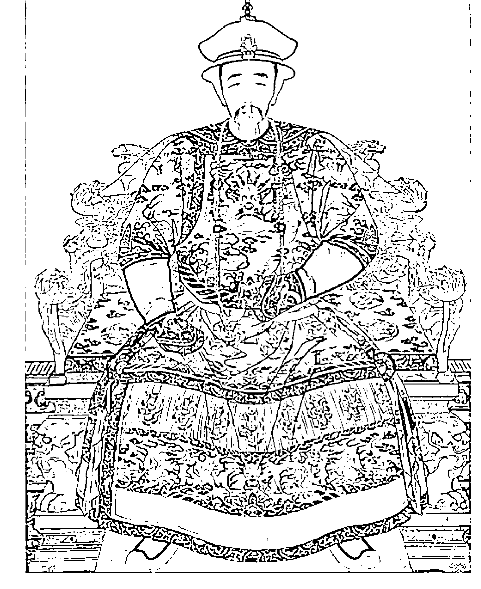

##### 康熙皇帝 像

## 人物紀：

### 嗜書好學的康熙帝

康熙是中國歷史上少有的嗜書好學的帝王。他五歲入書房讀書，晝夜苦讀，不論寒暑，甚至廢寢忘食。他喜好書法，「每日寫千餘字，從無間斷。」他讀「四書」——《大學》、《中庸》、《論語》、《孟子》，「必使字字成誦，從來不肯自欺。」他深受祖母的教誨，又向蘇麻喇姑學習蒙古語，向滿洲師傅學習騎射，跟漢族師傅接受儒家教育。康熙的勇武與奮進，受到了滿洲文化的影響；高遠與大度，得益於蒙古文化的薰陶；仁愛與韜略，來自漢族儒學的營養；後來，他的開放與求新，則是受了西方文化的薰染。康熙帝吸收了中華多民族的、西方多國家的，悠久而又先進、博大而又深厚的文化營養，具有當時最高的文化素質。

## 50 有心折桂枝，無力化朋黨 ——預言平三藩

> 反覆從來折桂枝，水浸月宮主上立。
> 六十周甲多一甲，螺角倒吹也無聲。
> ——《燒餅歌》

所謂「三藩」，是指三個在清初立下戰功的漢王：平西王吳三桂，駐昆明，轄雲南、貴州兩省，鎮守西南邊陲；平南王尚可喜，駐廣州，轄廣東，鎮守南國大門；靖南王耿精忠，駐福州，轄福建，防備在臺灣的鄭成功反清勢力。

此類實力雄厚的藩王稱雄一方，漢唐兩朝均已存在，而其所產生的危害更是足以毀掉整座江山的。所以，宋代從太祖開始就實行中央集權，透過強幹弱枝的一連串措施，極大削弱了地方政府的兵力與實力。此後朱元璋卻又故伎重演，將分封藩王從祖宗口袋裡倒騰出來使用，結果引發了建文一朝的「靖難之役」。

有了這些前車之鑑，清政府當然不會重蹈覆轍。柏楊先生說，清政府有一項最進步的措施，皇帝的兒子不一定加封親王，加封親王後也不能取得采邑土地，也沒有政治性的王府組織。而這三個非皇族的藩王，卻各據一方，

成為半獨立的局面，顯然不是正常狀態。更何況三藩擁兵自重、割據一方，已經形成了自己的獨立王國：經濟上鑄錢煮鹽，販洋開礦，橫徵暴斂；政治上挾制地方都撫，結黨營私。朝廷也授予他們很大的權力，如三藩王「用人，吏、兵二部不得掣肘；用財，戶部不得稽遲。」

熟讀漢族經史的康熙，自然知道撤藩一事勢在必行，在十四歲親政時，他就已注意到這個問題，等到真正執政後，更是立即提上日程，將這件事書到柱子上作為「柱右銘」，時時提醒自己，「夙夜釐念」。雖然他也曾對三藩的權力進行過一些限制，但始終沒有觸動他們的根本，因為他看過宋代蘇東坡寫的〈晁錯論〉，其中指出漢景帝削藩這件事情本身是正確的，但卻犯了三個錯誤：一是選錯了削藩的時間；二是選錯了削藩的人；三是選錯了削藩的方法。由於這些錯誤，漢景帝和後來建文帝的削藩最終都以失敗告終。

鑒於柏楊先生所說的，「中國歷史顯示的現象是，每一次削藩，都要引起一次激烈的反抗。」康熙在按照蘇東坡「前知其當然」的思想，為任何一種可能出現的情況做準備，同時也在等待一個最恰當的削藩時機。

在他執政四年後，削藩的機會竟自己送上門來了。

平南王尚可喜疏請「歸老遼東」，以其子尚之信留守廣東。康熙抓住這一有利機會，順水推舟，批准尚可喜退休，但以「藩王見存，子無承襲」的律例，否定了尚之信繼承爵位。削藩之意已非常明確。平西王吳三桂和靖南王耿精忠見此情形，立即上書試探虛實。康熙認為「撤亦反，不撤亦反，不若先發制人」，於是他不顧有些親信重臣如索額圖等的反對，力排眾議下令三藩齊撤。

當然，經過四年的籌劃與準備，此時的康熙早已是成竹在胸，若能和平解決削藩之事自然再好不過，但他也知道最壞的結果就是用武力解決，故而武力應對之策也已準備就緒。所以，當三藩中勢力最大的平西王吳三桂自稱「天下都招討兵馬大元帥」，打出「反清復明」的旗號率先發動叛亂時，剛

剛二十出頭的康熙帝並未如漢景帝一般慌了手腳。反而在面對索額圖等人建議將堅持撤藩的人處死時，他絲毫不為所動，由此堅定了建議撤藩之臣的信心，保障撤藩能順利地進行下去。

同時，他處死留京為人質的吳三桂長子、額附吳應雄及其子吳世霖，以「寒老賊之膽」，「絕群臣之望」，「激勵三軍之心」。在戰略上，以江西、浙江為東線，分兵駐守江寧、杭州、南昌等重鎮，一方面保衛江南富庶之地，一方面阻止叛軍打通江西、浙江通道。各個戰場既相互呼應，將叛軍分割開來。在戰術上，正面派主力針鋒相對，並伺機迂迴江西，襲取長沙，斷敵糧道。「剿撫並用」，大力對叛軍進行分化瓦解，招降耿精忠、尚之信、王輔臣等，對投降的叛軍「悉赦以往，不復究治」，「恩養安插」，徹底孤立了吳三桂。

一切都在按著蘇東坡所言的「徐為之圖」，緩慢而有序地進行著。唯一出乎康熙意料之外的，應該就是一句「反清復明」還能得到如此多原明降官降將、遺老遺少和農民的回應，以至於令清軍節節敗退，退到黃河一帶，仍不斷遭到失敗。但本著「事至不懼」的原則，面對超出預料的戰爭態勢，康熙也能鎮定自若、冷靜指揮，直至戰爭的優勢再次倒向自己這一邊。

柏楊先生認為令形勢很快出現倒轉的主要原因有兩個：一是吳三桂的漢奸招牌太過於響亮，不能發出明確的政治號召和建立堅強的領導中心，他既引導滿洲韃靼入關，又殺掉朱由榔全家，使他不能利用明王朝的慣性影響力。二是吳三桂老了，有老年人最容易有的過度小心保守的心理，不敢採取冒險行動。他要求絕對的安全，但世界上根本沒有絕對安全的革命和叛變。此外還有另一個重要因素是，吳三桂的對手是康熙大帝，中國歷史上最英明的君主之一。

確實，如果吳三桂遇到的是漢景帝或建文帝的話，或許結果會完全不同，但他的對手是康熙，這就注定了這一戰他會打得很辛苦，而且勝算不大。

大。果然，三藩戰爭整整打了八年，吳三桂自己也在戰爭還未結束之前就走到了生命的終點。這個背叛大明在先，後又背叛大清的反覆無常者，最終還是應了劉伯溫「反覆從來折桂（即吳三桂）枝」的預言。

至此，「水浸月宮主上立（即「清」）」的清朝，在康熙的治下，完成了「藩籬多撤去」的目標，皇權再次得到加強。而康熙也就成了歷史上著名的削藩事件中，唯一的成功者。然而，即便成功如康熙，也有一些無力解決的問題，朋黨之爭就是鮮豔奪目的康熙朝中一道暗色的風景線。

宋代歐陽修在其《朋黨論》中稱：

> 朋黨之說，自古有之，大凡君子與君子，以同道為朋；小人與小人，以同利為朋。

即便到大清之時，朋黨也屢禁不止，康熙就曾感慨地說：

> 朕聽政四十餘年，觀爾諸臣保奏，皆各為其黨。爾等致信宰輔，皆有可否人才之責，朕凡咨訪人才，當以實對。

可見，康熙自己也知朋黨之弊，但對於這個幾乎貫穿康熙「六十周甲多一甲」執政期的現象，史書上只留下了一句

> 玄燁垂暮之年，無可奈何

倒是康熙的接班人、自身靠朋黨起家的雍正皇帝，對朋黨的力量和弊害知之甚稔，大膽地指出：

> 朋黨之禍，最為無恥。

並多番全力打擊朋黨，卻又被後世之人以苛猛詬病，果真是：是非品評不由人，「螺角倒吹也無聲」。

##### 紫禁城三大殿俯瞰

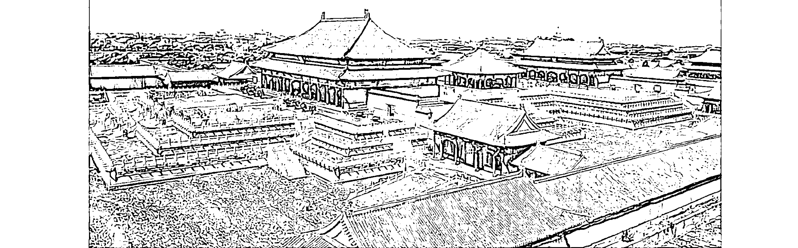

## 51 黑暗的寂靜：無口泥雞啼無聲 ——預言雍正朝

> 點畫佳人絲自分，一止當年嗣失真，
> 泥雞啼叫空無口，樹產靈枝枝缺魂。
> ——《燒餅歌》

曾經，在曹魏的朝堂上，才子曹植面對哥哥已經舉起的屠刀，痛苦地吟出了「煮豆燃豆萁，豆在釜中泣。本是同根生，相煎何太急？」曾經，在玄武門處，李建成與李元吉還未來得及做出反應，就斃命於兄弟李世民的手中；曾經，東華門內，朱祁鎮乘著弟弟病重之時，奪過了「救命恩人」的皇位……當人性遭遇權力，手足相殘的悲劇便會上演，親情注定要成為權力的犧牲品。

對於這一點，好學且英明的康熙必定是知道的，但為了給自己留下的大好河山尋找一位合適的管理者，他還是弄出了一生中最大的敗筆。在立儲的問題上，康熙猶豫不決，使他的兒子們陷入了激烈爭鬥的慘劇之中。即便在他人生的最後一段時間裡，曾讚揚自己的四子胤禛「性量過人，深知大義」，也曾派胤禛代自己主持祭祀大典，露出了立胤禛為皇位繼承人的先兆，但當這位他屬意的皇子登上帝位之後，仍然遭到了人們的質疑，正如易中天先生說：「胤禛在康熙的精心安排下當上了大清帝國的第五任皇帝，是

為雍正。但他的悲劇性命運也就由此注定：沒有康熙的精心安排，他當不了這個皇帝；正因為康熙的安排如此精心，他這個皇帝當得十分彆扭。」

王位繼承的合法性，自此就成了劉伯溫預言「點畫佳人絲自分（即「雍」），一止（即「正」）當年嗣失真」中的雍正皇帝備受猜疑的一個原因。有人說是他篡改了康熙的遺詔。因為康熙臨終前曾三次召見他，竟完全沒有透露由他來繼承皇位一事，這是不合常理的。而且康熙五十四年（西元1715年），曾頒佈一個詔書，即後來的康熙遺詔，其中的最後一句話是：「皇四子胤禛，人品貴重，深肖朕躬，必能克承大統，著繼朕登極，即皇帝位。」這個遺詔是在康熙死後的第三天才拿出來的，有人認為雍正在這中間做了手腳，後面那句話是他自己加上去的。

「當年嗣失真」是否屬實，成了後世對雍正繼位疑案爭議的焦點，而無數的野史版本更是將其傳得沸沸揚揚，至今無休。命運像是與雍正有仇，又像是在與後世之人開玩笑，令雍正執政的開端充滿了疑惑，就連其生命的終點也如謎一般讓人困惑。

雍正是怎麼死的？他一生沒有得過重病，死前三四天還在處理國家事務，並沒有什麼徵兆，卻突然在一天深夜召見皇子和近臣，當時已經不能說話了，又過了一兩個時辰就去世了，時年五十八歲。按照當時的情形看，雍正似乎是暴病而亡，但是他生前並無重病，更令人疑惑的是，史書上沒有任何關於雍正當時病症、病情的記錄，這也是不合常規的。於是，雍正的死因也就成了歷年來困擾史學家一個問題。

有人說他是被人砍掉頭死的，那敢砍他頭的人是誰呢？是一個叫呂四娘的女人。她是雍正朝呂留良文字案中主角的孫女，於滿門抄斬中僥倖逃脫後，練得一身好武藝，然後入宮殺了雍正以報家仇。專家學者並不贊同這種民間傳說，他們分析：按照當時清朝的嚴格制度，呂四娘是不可能逃跑的，即使逃跑了，也不可能混進皇宮殺了皇帝。

### 推背圖和燒餅歌裡的歷史

目前大家都比較認同的說法是：雍正帝是長期服用丹藥中毒導致死亡的。雍正信道教，曾請兩位比較有名的道士進宮傳授他道術，幫他煉丹藥。雍正長期吃丹藥，其中含有鉛、汞等一些有毒的重金屬，最終導致了他的死。

近來，學者金恒源對雍正的死因又提出了新的解釋，他認為：執政七年，政敵基本上都被剷除後，比較清閒的雍正開始貪圖女色。「概括起來，雍正之死同他多年勤政之累的體力透支有很大關係；同他心神長期不得安寧、夜不能寢、精神不能貫注、懼怕報應有很大關係；更同他長期以來不斷服用丹藥、體力大量積毒有關；他晚年為求長生加大劑量服用丹藥，乃至亂服春藥更是導致他最終猝死的直接原因。」

仔細想來，關於雍正之死，不論是呂四娘之刺殺、丹藥中毒，還是服用春藥過量，對於一位帝王來說都不是什麼光彩的事情，從另一個側面也反映出人們對於雍正其人的反對態度，或許在大多數人看來，雍正一朝就像劉伯溫所言，「泥雞啼叫空無口，樹産靈枝枝缺魂」，一切都是黑暗、無聲的。事實上，作為一位帝王，雍正是合格的，至少他的勤勉，是任何專家學者都無法否認的。

帝王的工作是沒有人監督的，從明朝後期的那幾位皇帝便可知，如果他們不樂意，完全可以撒手不管，因而這是一份做與不做全憑自覺的工作。面對這樣的工作，雍正不僅沒有偷懶，還做到了「朝乾夕惕，宵衣旰食」，意思是說：清早就穿衣服起床了，很晚才吃點東西，說明他整天都是很勤奮地工作。更難能可貴的是，他以這樣的態度堅持不懈地做了十三年。雖然雍正帝的在位時間比康熙和乾隆都短，但是他把有限的時間都用在了治理國家上，使他這短短的十三年變得無限豐盈。

此外，雍正還是個厲行改革的皇帝。歷史學者樊樹志先生說：「用人和理財有方，雍正時期進入了清朝最富庶的階段。」確實，康熙晚年由於管理

不利，官員貪污腐敗，國庫虧空多達800萬兩白銀。雍正剛剛即位，就做出了懲治官員腐敗的決策。一個月內，十三道諭旨，一級一級向下傳，中央查地方、後任查前任，就連老百姓也被牽涉進來，雍正告訴他們誰也不許借錢給地方官員抵擋虧空，如此強大的力量和周全的措施，古未有之。整治腐敗還有一項政策就是耗羡歸公。雍正規定耗羡歸公就是把徵收的這一部分附加稅歸國庫所有，作為「養廉銀」，用來獎勵清廉的、有政績的官員，是吏治的一大進步。

為強化皇帝集權，雍正創立軍機處，內設軍機大臣，具體處理各部事務。他還推廣了密折制度，就是奏摺可以直接呈送皇帝本人。這樣廣開言路，雍正就可以很及時地瞭解下情，也可以使官員之間互相監督，避免了偏聽偏信、冤假錯案的產生。雍正取消了人頭稅，改為攤丁入畝，有效地減輕了農民負擔，受到了百姓的擁護。他廢除了從宋朝流傳下來的賤籍，把原來的賤民編為民籍，社會上就只有軍籍和民籍。這是一種進步，無論從觀念還是從社會現實來說，都是毋庸置疑的。

短短的十三年內，如此多的政績，雍正為國家、為百姓做了很多實在的事情。他令康熙晚期已經出現的問題得到了遏制與解決，也為後來乾隆的統治打好了基礎。在這種承上啟下的關鍵時刻，雍正的作用顯然是非常重要的。然而當人們提及「康乾盛世」時，卻往往會忽略掉這位勤儉的帝王，可見，這並非只是雍正一人的悲哀而已。

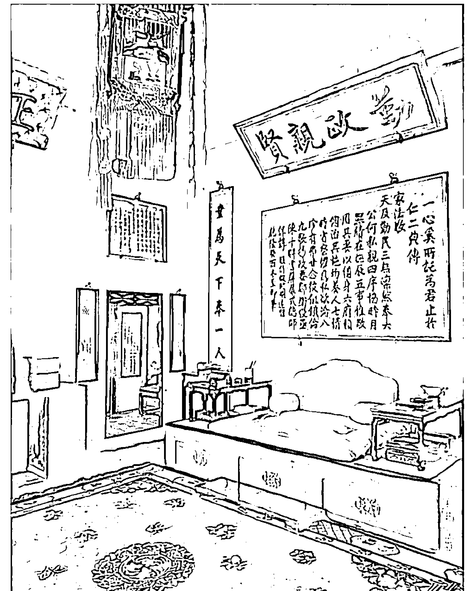

### 養心殿西暖閣

## 常識紀：

### 養廉銀

據史書記載，清朝官員的薪俸非常微薄，為了滿足窮奢極欲的生活，各級官吏想盡辦法增加灰色收入。雍正皇帝為了整頓吏治，自雍正元年（西元1723年）起，從地方火耗和稅賦中抽出部分，給官員發放「養廉銀」。顧名思義，其本意是想以高薪養廉，避免貪污事件的發生。一般來說，養廉銀通常為薪水的10倍到100倍，但仍未能杜絕官吏以各種方式盤剝百姓。

## 52 十全武功王，周甲樂饑荒 ——預言乾隆朝

> 朝臣乞來月無光，叩首各人口渺茫，
> 一見生中相慶賀，逍遙周甲樂饑荒。
> ——《燒餅歌》

康熙五十二年（西元1713年）三月十八日，康熙六旬華誕，各省百姓及退休官員紛紛趕來京師祝賀皇帝壽辰。一向主張各種慶典不事鋪張、一切從簡的康熙，被臣民的赤誠而感動，下諭「今歲天下老人為朕六旬大慶，皆從數千里匍匐而來，如何令其空歸？欲賜伊等筵宴，然後遣回」。於是在暢春園宴請諸位老人，諸皇子率皇孫及宗室子弟50餘人，親執爵觴為老人倒茶，並頒發禮物，以答謝臣民對他的愛戴，並彰顯「養老尊賢之至意」，以此進行社會教化。此種被後人稱之為「恩隆禮洽，為萬古未有之舉」的御宴，因康熙帝於宴席上的一首〈千叟宴〉而得名。

乾隆五十年（西元1785年）正月初六，適奉喜添五世元孫，乾隆於乾清宮舉行千叟宴，並當場賦〈千叟宴〉詩一首：「抽秘無須更聘妍，惟將實事紀耆筵。追思侍陛髫垂日，訝至當軒手賜年。君酢臣酬九重會，天恩國慶萬春延。祖孫兩舉千叟宴，史策饒他莫並肩。」其志得意滿之情躍然紙上。「祖孫兩舉千叟宴」一句，透露出他大擺「千叟宴」的舉動是從祖父康熙帝

那裡學來的。夾在祖孫兩代的千叟宴之間的，便是被後人稱道的「康乾盛世」。

柏楊先生將這個盛世稱為中國歷史上繼春秋末期戰國初期和唐代之後的第三個黃金時代。康熙是這個黃金時代的開創者，劉伯溫預言「朝臣乞來月無光（即「乾」），叩首各人口渺茫，一見生（即「隆」）中相慶賀」中的乾隆皇帝更是將這個盛世推向了最高分。

乾隆，名愛新覺羅・弘曆，在清朝的諸位帝王中，是可以稱得上英傑人物的。同時，他也是幸運的，自幼便得到爺爺康熙帝的鍾愛，而其繼位的過程也因雍正皇帝所創立的秘密立儲的制度而避免了兄弟相殘的悲劇。

更重要的是，他從雍正帝手中接過的，本身就是一個根基穩固的天下，只要不犯什麼大的過失，單是憑著康熙、雍正兩朝打下的基礎，也足以將盛世維持下去了，何況乾隆皇帝並非無能之輩，他將祖宗的基業進一步發揚光大，於文治和武功方面都有不錯的建樹。對此，乾隆皇帝自己也頗為自豪，他曾總結自己的一生，作《御制十全記》，稱自己有「十全武功」：「十功者，平準噶爾為二，定回部為一，掃金川為二，靖臺灣為一，降緬甸、安南各一，即今二次受廓爾喀降，合為十。」並自詡為「十全老人」。

然而，就在自稱「得國之正，擴土之廣，臣服之普，民庶之安」時，乾隆皇帝治下的王朝陰影也開始逐漸顯露出來，人口問題便是連他自己也無法忽視的一個問題。好詩文的乾隆皇帝曾寫過一首題為《民數穀數》的詩：

> 穀數較為初賤祚，增才十分一倍就。民數增乃二十倍，固幸太平滋生富。以二十倍食一倍，穀價踴貴理非謬，穀貴因之諸物貴，何怪近利居奇售。

從詩中可以看出，乾隆帝對人口增加、米價上漲等問題的思考。

清史專家郭成康先生說：乾隆已開始把米貴作為一種宏觀經濟現象加以考慮。他的思索，他對當時關於米貴種種說法的辨詰，對於深入探索物價持續上漲的尚未被人認識的奧秘極富啟發意義。但是，乾隆的思考終究沒有跳

出那個時代的窠臼，他最後還是把原因歸結到了「太平滋生富」之上，並認為這是所有物價上漲的癥結所在，而沒有從整個中國乃至世界經濟格局的變化出發對這個問題進行深入剖析，所以他得到的結論也必然是表面化的，自然也就無法找出切實的解決之法。

正如乾隆自己所言，人口增加帶來的一個明顯的變化，就是物價上漲。樊樹志指出：由於人均耕地面積下降，每人所得糧食日益減少，導致糧食價格持續上漲。在物價上漲的衝擊下，國家收入的另外一項重要來源——煉鋼、漕運和鹽業的成本也提升很快，難以為繼，紛紛破產，形成了人口增加——土地減少——物價上漲——工業破產，這樣一個惡性循環的怪圈。再加上康熙時期的「盛世添丁，永不加賦」，使國家賦稅長期穩定在兩千八九百萬兩上下。另外，清朝官兵的收入百年不變，物價卻一直在上漲，官兵俸餉均入不敷出，只好各想奇招，貪污受賄者大有人在，吏治腐敗，更重了百姓苦難。

為緩解這種壓力，乾隆沿襲了康熙時的應對措施，繼續開荒墾地，但僅此一項遠遠不能滿足新增人口對土地的需求。因此，乾隆時期的很多農民都失去了土地，淪為佃農，更多的人則背井離鄉、四處漂泊乞討，增加了社會的不安定因素。衰敗，如幽靈般，正一點點地靠近大清朝和中國歷史上的第三個黃金時代。

法國學者勒內·格魯塞在《偉大的歷史》中說：

> 中國的歷史模式就是：在出現兩三代有能力的統治者之後，王朝就陷入衰落。古老的帝國被王朝的創立者所重建，然後再一次土崩瓦解。1644年贏得皇位的滿族部落，也逃不出這一規律。

而在大清王朝盛極而衰的過程中，乾隆更是發揮了不可忽視的、幕後推手的作用。

由於對溫婉柔和的江南情有獨鍾，乾隆自稱為瞭解江南軍事、政治、河務、海防情形及百姓疾苦，同時想感受一下皇祖康熙南巡時百姓夾道歡迎## 推背图解：历史与烧饼歌里的变局

乾隆皇帝在位后期，沉醉于所谓的“盛世”景象。他多次效法先帝，偕同皇太后进行了六次南巡，实际上不过是要一起饱览大好河山而已。范文澜先生就曾指出，乾隆六次南巡均在苏杭之间，“为问民风”显然不足以作为“自娱”的辩解。他所体察的民情也只是“有秋无弊病”一类的讹词。乾隆帝为粉饰的太平而陶醉、自炫，直到晚年退位后才多少有些醒悟，说他在位六十年，“惟六次南巡，劳民伤财，作无益，害有益。”

正如他所言，他的首次南巡仅国库耗银就达五十六万八千三百两，再加上地方捐助摊派，其数目远大于此。后来的五次南巡更是一次胜过一次，助长了奢靡之风。各地官员也借迎驾之机，勒索百姓，加重了人民负担，确为劳民伤财之举。

但惯于享受的乾隆，即便在宫廷生活中也挥霍成风。孝圣太后六十大寿时，乾隆为她举办了浩大的庆寿大典，“以展臣子祝嘏之诚”，“仰承圣母欢心”。整个祝寿过程从准备到结束持续近一年，此时民间由于连年水患，已经发生灾荒。但为给皇太后祝寿，各地还要增加摊派，官吏更是进一步受贿勒索，人民负担日益沉重。

上行下效，整个王朝中奢侈浮华成风，中国社会内部的各种深刻、尖锐的矛盾已到了无法掩盖的程度。就像英国的第一个访华使团成员约翰·巴罗在《我看乾隆盛世》中所说：“不管是在舟山还是溯白河而上去京城的三天里，没有看到任何人民丰衣足食、农村富饶繁荣的证明。……除了村庄周围，难得有树，且形状丑陋。房屋通常都是泥墙平房，茅草盖顶。偶尔有一幢独立的小楼，但是决无一幢像绅士的府第，或者称得上舒适的农舍。……不管是房屋还是河道，都不能跟雷德里夫和瓦平（英国泰晤士河边的两个城镇）相提并论。事实上，触目所及无非是贫困落后的景象。”

所以，当这位喜欢游山玩水、“逍遥周甲（一甲子为六十年）”的皇帝，将江山交到他的儿子嘉庆帝手中时，大清朝其实只剩下一个华丽的外壳了，内里隐藏的全是破败与“饥荒”。嘉庆四年（西元1799年）正月初三，中国历史上实际执政时间最长、寿命也最长的帝王撒手人寰，但他至死也不知道，就在他在位的那六十年，世界发生了怎样的历史性巨变：乾隆三十年（西元1765年），英国乃至世界的工业革命开始；乾隆三十九年（西元1774年），美利坚合众国成立；乾隆五十四年（西元1789年），法国资产阶级大革命爆发。

世界在科学和机器文明的影响下，正日渐繁荣兴旺，而大清王朝正在急速衰竭。中国与世界的距离，就在“天朝上国”的迷梦中越拉越大了。

#### 常识纪：甲子

十天干（甲、乙、丙、丁、戊、己、庚、辛、壬、癸）与十二地支（子、丑、寅、卯、辰、巳、午、未、申、酉、戌、亥）按顺序两两相配，从甲子到癸亥，共六十个组合，甲子为第一个。论阴阳五行，天干之甲属阳之木，地支之子属阳之水，水生木，是相生关系。另外，从甲子到癸亥的循环，也叫“一甲子”，共六十年。

### 53 吃饱的嘉庆若火龙，渡河热难当——预言嘉庆朝

> 廿岁力士开双口，人又一心度短长。
> 时佐寺僧八千众，火龙渡河热难当。
> ——《烧饼歌》

房屋3000间，田地8000顷，银铺42处，当铺75处，赤金60000两，纯金1000两一个的大金元宝100个，100两一个的小银元宝56600个，银锭900万个，洋钱58000元，制钱150万文，吉林人参600余斤，玉如意1200余柄，珍珠手串230串，桂圆大珍珠10粒，大红宝石10块，大蓝宝石40块，银碗40桌，三尺有余珊瑚树11支，纱缎绸罗14300匹，毛呢哔叽20000板，狐皮550张，貂皮850张，又各种粗细皮56000张，铜器和锡器361000件，名贵瓷器10万件。镀金八宝炕床24座，西洋镜460座，四季好衣服7000件，家人606名，妇女600名，总价值达11亿两白银，相当于当时国库十五年收入的总和。

以上这份，便是嘉庆皇帝抄和珅的家时列出的前无古人、后无来者的清单。作为乾隆皇帝的宠臣，和珅的腐败显然已经到了无以复加的地步，而其富可敌国的程度已经不只是他敛财能力的佐证，同时也是当时官僚腐败的一个典型案例，反映了奸臣当道、大肆敛财的黑暗现实。

学者彭勇在《天朝落日：中国二十王朝覆亡全景》中所说：“清朝由于长时期浸淫于‘歌舞升平’的虚假繁荣中，使统治者对朝政的每况愈下放松了警惕。”特别是乾隆后期，为了标榜功绩，追求虚名，浪费了大量的国家财富。当时的吏治腐败也日趋严重，大小官吏奢靡成风，营私舞弊，贿赂公行。最可怕的是，军队也加入了腐化的行列，军官克扣军饷，士兵则惰于操练，战斗力严重下降。这，就是嘉庆皇帝从乾隆皇帝手中接过的江山。

乾隆皇帝一生共立过三位太子，第一位太子永琏和第二位太子永琮都早早地夭折了，皇位自然而然地落到了原名永琰、后改名为颙琰的头上。由于乾隆皇帝此前曾宣谕：“昔皇祖御政六十一年，予不敢相比。若邀穹苍眷佑，至乾隆六十年，予寿八十有五，即当传位太子，归政退闲。”所以嘉庆元年（西元1796年）正月初一，乾隆皇帝在太和殿举行内禅大典，皇太子颙琰即皇帝位，对外各省改用“嘉庆”年号，他就是刘伯温“廿岁力士开双口（即‘嘉’），人又一心度短长（形似‘庆’）”预言中的嘉庆皇帝。

虽已登上帝位，但朝堂的实际权力仍然在其父手中，太上皇乾隆仍时常接受百官朝贺，而嘉庆则处于陪侍的地位。当时前往大清的朝鲜使臣在其记载中说：嘉庆“侍坐太上皇，上喜则亦喜，笑则亦笑”。又载：赐宴之时，嘉庆“侍坐上皇之侧，只视上皇之动静，而一不转瞩”。这种“初逢训政，恭谨无违”的情形，一直持续了三年时间。在这三年的时间里，或许是更早以前，嘉庆就已经清楚自己从父亲手中接过的，是一个四处漏洞、破败不堪的江山。在一连串亟待解决的问题中，最紧迫的当属和珅的问题。

和珅的飞黄腾达与明朝时的严嵩有几分相似：揣摩上意，深得圣心。不过，乾隆对和珅又远比嘉靖对严嵩要好得多。朝廷中，能与和珅分庭抗礼的人几乎没有。和珅的一些作为，乾隆皇帝不是不知，只不过睁一只眼闭一只眼罢了，因为他需要一个和珅这样的人。作为一国之君，尤其是要做个明君，有些需要是无法言明的，或许是迫于皇族威严，或许是迫于舆论民声，种种限制让皇帝也不能随心所欲。在这种情况下，和珅仿佛皇帝肚子里的蛔虫，想皇帝之所想，急皇帝之所急，充当了奴才和臣子中的一个特殊角色。基于对乾隆心理的完全把握，和珅才得以在乾隆朝呼风唤雨。

然而，乾隆不可能永远在位，嘉庆皇帝一上台，和珅便慌了神。但碍于父亲乾隆健在，嘉庆一直压抑着未曾发作。嘉庆四年（西元1799年）正月初三，乾隆皇帝驾崩，隐忍多时的嘉庆乘着办理乾隆皇帝大丧的时机，解决掉了和珅这一隐患。他一方面任命和珅与睿亲王等总理太上皇丧仪，切断了和珅等人与外界的联系，一方面突然出击，宣布将和珅革职、逮捕入狱，命仪亲王永璇、成亲王永瑆等，负责查抄和珅家产，并会同审讯。正月十一——乾隆去世的第八天，嘉庆帝宣布和珅的二十大罪状；正月十八，嘉庆帝赐和珅自尽。

短短十五天的时间里，嘉庆断然惩治了一个被大行皇帝恩宠长达三十年之久的权臣。他那干净利落的动作、宽严适当的策略，令举朝上下大为震惊。无论嘉庆铲除和珅的目的，是否是因为那句“和珅跌倒，嘉庆吃饱”的民间传言，其客观的结果都确实弥补了国库的连年亏空，也令朝野为之一振。毋庸置疑，这是嘉庆皇帝一生中所处理的政治事件中最精彩的一笔。

当代历史学者阎崇年认为，这也是嘉庆皇帝“作为政治家的唯一杰作”，因为在他看来，“与他的父、祖相比，嘉庆皇帝是一位既没有政治胆略又缺乏革新精神，既没有理政才能又缺乏勇于作为品格的平庸天子。”“平庸”两个字，是嘉庆皇帝的主要性格特点。从为政的结果上来说，确是如此。虽然亲掌大权之后，嘉庆为挽救衰败的态势，采取了许多的措施：大力平息农民的武装叛乱，尽力遏制吏治腐败之风，努力扭转官员怠忽职守之气，重视治河、赈济灾民，但他始终是有心无力。

嘉庆二十五年（西元1820年）七月，嘉庆皇帝前往木兰围场狩猎，猝死于河北承德的避暑山庄，据《清史稿·仁宗本纪》载：“己卯，上不豫，乡夕大渐。宣召立皇次子智亲王为皇太子。日加戌，上崩于行宫，年六十有一。”由此，可以确定的是嘉庆驾崩于亦名热河的承德，应了刘伯温所言的“火龙渡河热难当”，但关于嘉庆皇帝的死因，竟一字未提，这也就成了又一起清宫疑案。

“嘉庆朝是清朝由盛转衰的时代：上承‘励精图治、开拓疆宇、四征不庭、揆文奋武’的‘康乾盛世’，下启鸦片战争、南京条约、英法联军入京、帝后出逃的‘道咸衰世’。清朝社会的固有矛盾已经积累了180年，嘉庆皇帝扮演了大清帝国由极盛而转为衰败的历史角色。”嘉庆这位于丙辰龙年登基，于庚辰龙年驾崩的皇帝，在位二十五年，“二十五弦弹易尽，龙来龙去不逢蛇”（出自于《黄蘖禅师诗》），仍然无法阻止“康乾盛世”急速衰落的步伐，就像出使大清的英国使者马戛尔尼在他的《纪实》中所说的那样：“中华帝国只是一艘破败不堪的旧船”……“不会立刻沉没，它将像一个残骸那样到处漂流，然后在海岸上撞得粉碎”……“（大清）不过是一个泥足巨人，只要轻轻一抵就可以把他打倒在地。”帝国衰败至如此的程度，任何一点风吹草动都等于在这艘破旧的船上再添一个新的漏洞。

#### 争议纪：嘉庆为何杀和珅

当代历史学者阎崇年，对于嘉庆帝杀和珅的原因提出了三种解释：其一，“和珅跌倒，嘉庆吃饱”：扳倒“富可敌国”的和珅，显然可以缓解嘉庆面临的财政压力；其二，杀和珅以谢天下：嘉庆帝将白莲教起义一事，全都归罪于和珅一人，杀和珅以缓解官民矛盾；其三，除权臣必杀和珅：嘉庆帝想要摆脱“天下人只知有和珅而不知有朕”的困扰，故藉杀和珅以解决君权与相权的矛盾。

### 54 手执钢刀九十九，决战紫禁之巅——预言白莲教起义

> 手执钢刀九十九，杀尽胡人方罢休。
> ——《烧饼歌》

范文澜先生曾说：“乾隆帝晚年陶醉于臣僚的一片颂声，又陷于‘于外事总未经历’的境地，对臣下的谏诤和民间的怨叹，不免厌听。实际情况是：乾隆帝退位前，清王朝的统治已然日益腐败，危机四伏。民间不只兴叹，而在秘密酝酿着起义风暴的兴起，乾隆帝无视这一切，自称为‘归政全人’，而业已形成的种种危难，留给了他的继承者嘉庆帝。”的确，在嘉庆帝刚刚登上大位四个月的时候，一场历时九年，席卷五省的大规模农民起义——白莲教起义爆发了。

白莲教的历史源远流长，被历代统治者定为邪教。元末白莲教正式形成以前就出现过如“吃菜事魔”、“妖贼”等种种邪教，多为与社会现实格格不入的宗教异端，以及一些打着宗教旗号的民间秘密教派、迷信团体。白莲教形成后，比较正规意义上的邪教开始出现，他们最典型的一个共同点，便是组织、经卷、教义和活动都与现实社会秩序极不吻合，甚至到了格格不入的程度。

元朝末年，由白莲教与其他秘密宗教倡导发起的农民起义，针对的目标便是南下的蒙古政权。这些草莽们藉号召群众造反的形式，推翻了颟顸虚弱的元朝帝国，造就了一个崭新的大明王朝。然而，这个帝国的开创者、透过参加秘密组织发家的朱元璋，随着其政治立场的转变，对待白莲教的态度也发生了180度的转变。元至正二十六年（1366年），朱元璋在著名的讨张士诚檄文中，就有明确攻击白莲教的言辞：“愚民误中妖术，不解偈言之荒诞，偏信弥勒之真有，冀其治世，以甦其苦，聚为烧香之党，根据汝颍，蔓延河洛。妖言既行，凶谋遂逞，焚荡城郭，杀戮士夫，荼毒生灵，无端万状。”深恶痛绝之情，可见一斑。所以朱元璋正式建立明朝后，便明令禁止各民间教派的活动，以峻法严刑治理诸教。但有明一代，白莲教的起义从来没有断绝过。

满清入主中原之后不久，这个令前朝政府头疼不已的重大社会问题，也同样出现在他们面前。为了维护和巩固刚刚建立起来的统治秩序，清廷也对白莲教之类的秘密组织采取坚决镇压的政策。但由于清朝立国不久，无暇对付不计其数的秘密组织，再加上康熙、雍正两朝多采取“与民休息”的政策，没有采取什么大的动作，白莲教也就相对安定。

到了乾隆一朝，尤其是乾隆统治后期，情形就大不一样了。民间被朝廷欺压又更为严重，很多人的生存又面临危机，在这种情况下，他们就又以白莲教为共同的精神纽带，聚集在一起哄抢豪绅富户，再次成为社会的破坏力量。开始时，白莲教采取的是零星斗争的形式，“不整队，不迎战，不走平原，惟树百为群，忽分忽合，忽南忽北。”但随着苦难的加深和白莲教势力的发展，到嘉庆元年（西元1796年），较大规模的起义斗争终于爆发了。

嘉庆刚上台，面临的便是风起云涌的白莲教起义，就像《黄蘖禅师诗》中预言的那样：“赤龙受庆事堪嘉（暗指‘嘉庆’），哪怕莲池开白花（隐喻‘白莲教’）”。得知消息的嘉庆帝立即派兵前往镇压，在连续的镇压失败后，嘉庆帝又改为“剿抚兼施”的策略，其实质不过是藉招降之名，行征讨之实，镇压也就变得更加惨烈了。

在这次斗争蔓延湖北、陕西、四川、河南、甘肃五省的白莲教起义中，义军诸人个个英勇无比，“手执钢刀九十九，杀尽胡人方罢休”，其中尤其以王聪儿的襄阳义军为壮烈。

王聪儿身为女性，却成为教首和统帅有几方面的原因。一方面是她具有出众的武艺，以及广大白莲教教徒对其夫齐林的尊重和拥护。另一方面，也是最重要的一个原因则来自白莲教教义本身。正如白莲教经文（宝卷）中所说的：“或是男，或是女，本来不二。都仗着，无生母，一气先天。”和“嘱咐合会男和女，不必你们分彼此。”前者是指无论男女，先天都是平等的；后者是指同教中的男女之间，不应存有芥蒂隔阂。因此，在白莲教的许多分支创始人中有不少是女性，当民间宗教和农民起义相结合的时候，又出现了不少女统帅。

王聪儿率领湖北襄阳义军连挫清军，为保存实力，更久远地打击清廷，她率军完成了从湖北经陕西到四川的战略转移。在打破清军的三面合击的战役中，王聪儿在白帝城和清军激战三昼夜，最终突破了清军的防线。

此后，王聪儿率军转战川陕边界，每每出其不意打击清军，清军处处被动，死伤惨重，疲惫不堪。嘉庆皇帝恼羞成怒，大骂王聪儿是“贼中逆首”，勒令清军务必围歼。经过无数次苦战，王聪儿率部回师湖北，在郧阳（今郧县）三岔河的卸花坡与清军遭遇，受到八路强敌的围攻。以王聪儿、姚之富为首的30多名英雄姐妹，一个个跳岩自尽了。

嘉庆九年（西元1804年）九月，历时九年的白莲教起义最终被清政府镇压，以失败告终。但清政府也付出了惨重的代价，单是军费就损耗两亿两，相当于清政府国库的四年总收入，嘉庆帝刚刚从和珅那里没收来弥补国库亏空的财富，转眼间便花掉了近五分之一。

然而，一切还只是个开始，就像明朝时白莲教起义从未间断过一样，嘉庆一朝也始终为白莲教起义所扰，其中影响最大的，是震动全国的“癸酉之变”。

嘉庆十八年（西元1813年）九月十五日，白莲教诸多支派中的天理教200名教徒，在林清的率领下，以“奉天开道”为旗帜，发动起义，攻打京师紫禁城。他们以东华门、西华门为突破口，直指皇宫重地。面对突如其来、全无畏惧的义军，守卫皇宫的侍卫猝不及防，惊慌失措。幸亏当时在上书房的皇次子旻宁临危不乱，迅速组织皇宫中的清军镇压叛乱。经过浴血奋战，这场“决战紫禁之巅”的战斗，以天理教寡不敌众失败告终。

十七日林清被捕，清军开始对天理教众进行大规模的搜捕行动。到十二月十二日，清军攻陷天理教基地滑县，这场因发生于癸酉年而得名的起义最终落幕，整个华北大地为之震撼。痛心疾首的嘉庆皇帝，唯有发一道罪己诏，自责“汉唐宋明未有之变”竟发生于大清，“较之明梃击一案，何啻倍蓰！”

长久的农民起义，揭开了大清朝华丽外衣下的累累伤疤，为这个朝代的覆亡奏响了序曲。嘉庆皇帝自然心知肚明，他也曾探寻衰落背后的原因，所以他会亲自审讯嘉庆三年（西元1798年）被俘的农民军首领王三槐，从其口中获悉是“官逼民反”后，他总结说：“层层胺削，皆为和珅一人。”“朕所以重治和珅之罪者，实为其贻误军国重务。”然而，杀和珅以谢天下，毕竟只是治标不治本之法。而他的那句“平时慢说君恩重，辜负君恩是尔曹”，更是与明朝末帝崇祯的“朕非亡国之君，臣皆亡国之臣”如出一辙，不论是确实不知，还是刻意回避，将责任推到他人的身上固然不失为一个逃避责骂的好办法，但大清朝自嘉庆帝开始一步步滑向灾难的深渊，却是注定无法改变的现实。

#### 常识纪：嘉庆御制诗

> “内外朝臣尽紫袍，何人肯与朕分劳。玉杯饮尽千家血，银烛烧残百姓膏。天泪落时人泪落，歌声高处哭声高。平时慢说君恩重，辜负君恩是尔曹。”

嘉庆的这首御制诗中，“玉杯饮尽千家血，银烛烧残百姓膏”与杜甫的“朱门酒肉臭，路有冻死骨”有异曲同工之妙。高居君王位，仍能看到民间的疾苦，足见其怀有仁爱之心。嘉庆帝看到问题了，却没找到根治之法，而是以一句“平时慢说君恩重，辜负君恩是尔曹”便将责任全都推到了大臣们的身上，这就注定他无力力挽狂澜，拯救大清。

### 55 罂粟长伴的三十载帝王梦魇——预言道光朝与鸦片的纠葛

> 叩首之时头小兀，嫦娥虽有月无光。
> ——《烧饼歌》

嘉庆十八年（西元1813年）九月十五日，上书房与以往的无数个日子一样进行着例常的活动，突然间太监来报：天理教民发动叛乱，攻入皇宫。消息一出，上书房中的诸皇子无不变色，时年三十一岁的旻宁闻变不惊，“急命进撒袋、鸟铳、腰刀，饬太监登垣以望。”看到有天理教民手举白旗逼近而来，旻宁“发鸟铳殪之，再发再殪”。同时，“飞章上闻”，向在木兰狩猎的皇父嘉庆奏报；“严命禁城四门”，安抚皇母暂避；亲率侍卫到城外访查余匪。

旻宁于此事件中的沉着、智勇、谋断，获得了朝堂诸臣的一致肯定，使其在内廷上下威望大增。事后嘉庆帝赞他“有胆有识，忠孝兼备”，封他为智亲王，就连他用过的鸟铳也被命名为“威烈”。旻宁的出场如此震撼人心，与其父嘉庆帝的格外关怀、悉心教导不无关系，最主要的还得归功于大清的全才教育。

清代帝王对皇子们读书学习的重视程度，为历代封建王朝所不及。与前代相比，清代皇子们的读书学习入学年龄早、学习时间长、规矩严、课程多。日复一日、年复一年的儒家教育中，旻宁“日与诗书相砥砺”，达至“经史融通，奎藻日新”之境，还曾亲笔书写“至敬、存诚、勤学、改过”条幅，以提醒自己时刻不忘修身养性。可见，旻宁颇具帝王应有之学识。

嘉庆二十五年（西元1820年）八月二十七日，旻宁正式颁诏天下，即位于太和殿，次年改年号为“道光”，正是“白蛇当道漫腾光（出自于《黄蘖禅师诗》，暗指‘道光’）”。旻宁即位之后，有一腔正气，想重振朝纲，故而也算做到了勤政爱民，就像他自诩的那样：“自御极至今，凡披览奏章，引对臣工，旰食宵衣，三十年如一日，不敢自暇自逸。”且其本人生活俭朴，引得大臣们纷纷效仿，“缀一圆绸膝间”，与《黄蘖禅师诗》预言的“宵旰勤劳一世忙”基本相符。从为君的道德评判标准上来看，道光也算得上是一位好皇帝。

可惜的是，这位“叩首之（即‘道’）时头小兀（即‘光’）”的道光皇帝的为政生涯，始终无法摆脱责难的命运，因为一个长达三十年之久的梦魇一直困扰着他，那就是令人深恶痛绝的鸦片。

早在雍正帝在位时，清政府就开始禁烟，那时候一年流入国内的鸦片是两百箱，到乾隆时期增加到一千箱，这样一直下来，道光即位之初有鸦片四千余箱，到道光十八年，即鸦片战争爆发之前，已猛增到四万零二百箱。

在广东，发达的海运系统使得那里成了鸦片的集散地，随处都是烟馆。馆内云雾缭绕，横七竖八躺着很多人，其中几乎清一色是中国人。他们颓废地躺在烟馆彩色丝绸帐子下面的桌椅上，手里握着长长的烟枪，懒洋洋地享受着令人“欲仙欲死”的放松，有的昏昏睡去，像快要死掉。

粗略统计，当时竟然有两百到一千万的中国人吸食鸦片。就在大清百姓的健康日渐衰败的同时，一起流失的还有每年多达三千万两的白银，政府的财政出现了重大问题，终于引起了朝野中部分人的注意。

## 推背图和烧饼歌里的历史

道光十八年（西元1838年）四月初十，鸿胪寺卿黄爵滋上奏道光帝要严禁鸦片。湖广总督林则徐向朝廷提出警示，鸦片害人不浅，「若再任由鸦片氾滥下去，则数十年后，中原将无可御敌之兵，也没有充饷之银。」针对禁烟一事，清政府的大臣们分为两派，「严禁派」和「弛禁派」。初时，道光帝态度坚决地支持林则徐为首的「严禁派」，在召见林则徐19次之后，终于决定任命林则徐为两广总督、钦差大臣去广东禁烟，以绝后患。

当时踌躇满志的林则徐，到了广州之后宣佈：「若鸦片一日不禁，本大臣一日不回。」很有一股破釜沉舟的味道，事实上，他真的做得很好，震惊中外的「虎门销烟」就是最有力的证据。

「虎门销烟」是清政府发出的一个讯号，这种铁腕行动向英国亮明了态度。然而在开始禁烟的前半年里，英国并没有反应。道光皇帝以为，英国这个海岛小国已经被大清帝国的雄威吓得不敢吱声了，所以，当道光十九年（西元1839年）11月林则徐下令向进入广东海港的英国商船开炮，击毙英船水手数人以后，道光皇帝还是很高兴，并大力支持林则徐，随后又宣佈与英国绝交。

这样一来，英国人被激怒了，他们认为这是侵犯了其「经商自由的神圣权利」，实际上也就是学者唐德刚在其著作《晚清七十年》中提到的「『鸦片贸易（opium trade）为当年英伦朝野国脉民命，生计攸关，不可或缺之国际贸易。女皇与国会，均不惜为之一战。』」

1840年6月21日，英军侵入广州附近海域，遭到顽强抵抗，后又转上浙江镇海，从镇海一路北上到大沽，直逼北京，果真是「不幸英雄来海上，望洋从此叹洋洋（出自于〈黄檗禅师诗〉）」。此时，道光皇帝显示出了他有心振兴王朝背后的平庸，他没有康熙帝平定三藩之乱时的魄力与勇气，所以面对英军的入侵，他不是组织兵力全力抵抗，反而认为是林则徐禁烟把英军招来的，以「贪功启衅、误国误民」之罪把林则徐革职，任命琦善为钦差大臣赴广东与英国谈判。

### 肆 马背英雄踏中原，满清盛衰日渐斜

与林则徐不同，琦善表现出的是妥协与退让，但道光皇帝显然对琦善与英国签订的《穿鼻草约》不满意，就像学者孙善根在《道光帝与鸦片战争的失败》中说：

> 「琦善的求降政策与道光帝的天朝『宽容的抚夷』政策之间产生了严重的矛盾冲突。在整个鸦片战争期间，道光帝陷入了一种矛盾的境地而不能自拔。」

他认为条约有损天朝仪威，下令逮捕琦善，然后对英宣战，并派奕山到广东主持军务。他认为道光帝这次的对英宣战，是一种安抚政策。但是，已经进入工业社会的英国并非道光眼中的蛮夷之地，英军攻佔虎门炮台后，开进了珠江。结果清军一路败退，关天培以身殉国，奕山等人投降。

眼见清军节节败退，道光又决定向英军求和，并与英国恢复商贸往来。1842年8月29日，清政府被迫签订了中国近代史上第一个丧权辱国的《南京条约》。条约规定：中国向英国赔款2100万两白银，开放广州、上海、宁波、厦门、福州五处为通商口岸，准英国派驻领事，割让香港。

两国交战，清朝八十万人的军队竟然败给了只有两万人的英军，惨败如此，实在不可思议。其间的差距是十分可怕的，英国人的船坚炮利，清政府的软弱无能，盲目自大一览无遗。同时，就像陈寅恪先生认为的那样，清朝统治者的腐败和昏庸愚昧是导致中国战败的主要原因。道光皇帝为此必须承担不可推卸的责任，毕竟他身为帝王，可谓是『嫦娥虽有』，但其治下的大清却是『月无光』。

孙善根说，《南京条约》的签订，对道光皇帝来讲是痛苦的。他还引了一段记载，

> 「（道光帝）传闻和局既定，上退朝后，负手于便殿阶上，一日夜未尝暂息。侍者但闻叹息声。漏下五鼓，上忽顿首长叹，旋入殿，以诸笔草草书一纸，封缄甚固，时宫门未启，令内侍持往枢廷。戒之曰：『候穆彰阿入直以授之，并嘱其毋为祁隽藻所知。』」

盖即喻议和诸臣画押订约之廷寄

也可以想象，鸦片战争对于一向以天朝上国自居的大清朝是一个怎样的沉重打击，对于曾经以昂扬之志鸟铳平叛的道光帝是一个多么沉重的打击。然而，此时的道光已经和大清帝国一样，都是进入迟暮之年的老人，周身散发着衰老与死亡的气息，只是在靠着惯性维系残喘的生命罢了。

#### 常识纪：

##### 鸟铳

鸟铳，因枪口大小如鸟嘴而得名，又称鸟嘴铳，是明朝对新式火绳枪的称呼。明朝时期，在与外国军队的交战中，明军缴获了火绳枪。明朝兵仗局，依据缴获来的仿制成鸟铳。据《大明会典·火器》载，兵仗局在嘉靖三十七年（西元1558年）制成第一批鸟铳一万支，装备明军使用。后经多次改制，鸟铳一度得到广泛使用。清朝时改称鸟枪，部分史书仍沿用鸟铳之名。

### 肆 马背英雄踏中原，满清盛衰日渐斜

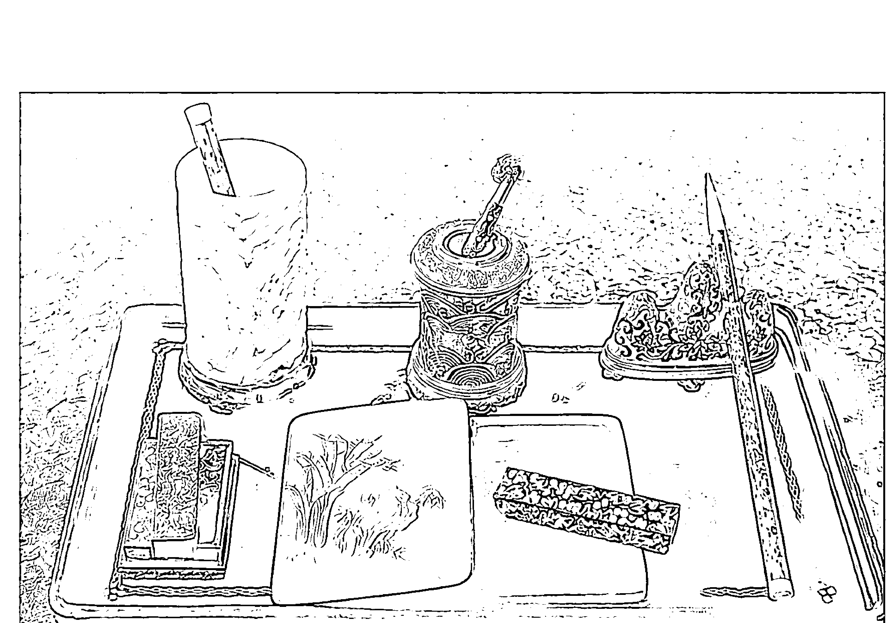

皇帝用的文房四宝

## 推背图和烧饼歌里的历史

## 伍 摧枯拉朽旧朝亡，改弦易辙新生

### 56 揭「平均主义」的竿而起 ——预言太平天国的兴起

《推背图》第三十四象 丁酉

> 讣曰
头有发 衣怕白
太平时 王杀王

颂曰
太平又见血花飞
五色章成里外衣
洪水滔天苗不秀
中原曾见梦全非

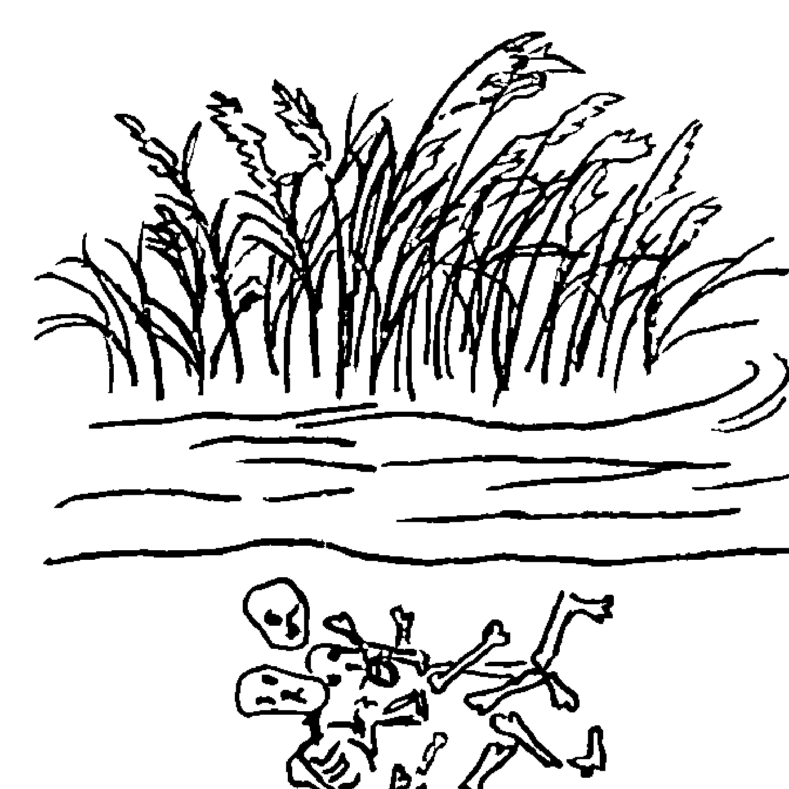

> 太极殿前卦对卦，添香襖斗闹朝堂。
——《烧饼歌》

中国自古以农业立国，那些家中略有盈余的人多以当官为出路，图个封荫，好光宗耀祖。读书，应试，入仕成了古代知识分子的人生三部曲。满族入关之后，清朝统治者为了笼络汉族知识分子，使其积极参与国家的管理，在前进的基础上，将八股取士发挥到了极致。清朝规定：旗人不得参加科举考试，把名额全留给汉人。中央六部的堂官（尚书和侍郎）一律按一满一汉的名额设置，上书房大臣和后来的军机大臣也基本保持满汉平衡。

如此一来，心怀策士梦的文人一股脑地全都投入了科举考试的大潮中，戴均衡记叙咸丰同治间民风士习中说：「自科举之法行，人期速效，十五不应试，父兄以为不才；二十而不胶庠（周时胶为大学，庠为小学，后世通称学校），乡里得而贱之。」可见当时科举风气之盛。

然而，并非所有的寒窗苦读都能换来「朝为田舍郎，暮登天子堂」的美满结局，在科举的独木桥上，更多的是耗尽毕生心力仍一无所获者，执著者会如范进般几十年屡试不第仍坚持不懈，无奈者唯有如《儒林外史》中的马二先生般於屡试不第后另择他业，激进者便会如黄巢般几番落第后大呼「冲天香阵透长安，满城尽带黄金甲」揭竿而起。

柏杨先生说：「文字狱是围堵，八股文是钓钩。」万千学子中，能被「钓钩」选中者实在有限，落第者自然数之不尽，因此如黄巢般反抗社会的也大有人在，用朱熹的话说：「今日学校科举不成法。上之人分明以贼盗遇士，士亦分明以盗贼自处，动不动便鼓噪作闹，以相迫胁，非盗贼而何？」洪秀全便是诸多由士而变贼的典型之一。

洪秀全早年也曾苦读四书五经，梦想有朝一日由科举考试进入仕途，完成士人都想完成的梦想。可是十多年过去了，而立之年早都过去了依然屡试不中，连秀才的桂冠还未戴上，他产生了和黄巢一样的心理，绝望之中他发誓：「等我自己来开科取天下士吧！」于是，由于挫折，他大病一场。在他病后的第6年，也就是1843年他第四次参加广州乡试，结果还是落选。失意的他在《劝世良言》一书中似乎找到了「福音」，他干脆抛弃了圣贤书，而信奉了基督教。

没有读过《圣经》的洪秀全，逢人便宣扬他把原始基督教教义与中国农民渴望平等、平均、太平和反对压迫、剥削等理想结合起来的教义，成立了「拜上帝会」，宣传「天下多男子全是兄弟之辈，天下多女子尽是姊妹之群」，大家应该团结起来，透过武装斗争推翻清政府的统治，建立「有无相恤，患难相救，夜不闭户，道不拾遗」的太平盛世。

随后，他又写出了《原道醒世训》、《原道觉世训》等作品，为他的追随者们描绘出了一个人间的「小天堂」：「同心放胆同杀妖，金宝包袱在所缓。脱尽凡情顶高天，金砖金屋光焕焕。高天享福极威风，最小最卑尽绸缎。男着龙袍女插花，各作忠臣劳马汗。」即使是最卑微的人，都可以穿绸缎。农民起义中向来秉持的「平均主义」再次发挥了巨大的效力，生活在水深火热中的岭南等地广大民众纷纷积极参与到「拜上帝教」中来，他与地方政府的矛盾也逐渐加深。

1851年1月，洪秀全率领「拜上帝教」拒绝蓄辫、「头有发」的「长毛」信徒，在广西金田村起义。本就算不上太平的世道，又起战乱，「太平又见血花飞」。太平军以青、白、红、黑、黄五色旗装饰其外，以《原道救世训》、《原道醒世训》、《原道觉世训》、《天朝田亩制度》和《资政新篇》充实其里。

在「五色章成里外衣」的完善过程中，大清百姓以最真挚的情感，欢迎太平军的到来，同时也积极地投身到起义的队伍中去，「宁愿在家喝清水，莫让儿女当清兵。清军杀人不眨眼，剥了人皮还抽筋。送儿去当太平军，为着穷人打不平。只要打得清兵败，清水当餐也甜心。」

得到广大民众热烈拥护的起义军很快攻下永安，并在永安建制，具备了政权雏形。这个时候的太平军士气高涨，他们乘胜北上，又先后攻下了湖南、武昌、南京，于1853年定都天京，建立太平天国。此后，太平军又兵分三路，进行了北伐、西征和东征，形成了一套从中央到地方的政权机关，太平天国的政权得到了巩固。

而此时的清政府，正值清宣宗道光去世，清文宗咸丰帝即位，新旧交替之际。这位新登基的帝王定年号为「咸丰」，本是取「咸」的普遍之意、「丰」的富足之意，希望天下丰衣足食，但他却没注意到在卜卦中，「咸」「丰」二字皆为卦名，分别代表「泽山咸」与「雷火丰」，象征沉溺于享乐而不顾大势之意。从卦象上来看，无论是刘伯温的「太极殿前卦对卦」，还是《黄檗禅师诗》的「亥豕（暗指咸丰于辛亥年即位）无讹二卦开」都精准地预言了咸丰皇帝和他对待太平天国起义的态度。

咸丰皇帝和朝中的官员一样都浸淫在海晏河清天朝上国的美梦里，纵情声色，不理朝政，国力愈发地衰微。太平军起事和其如火如荼的发展形势，对咸丰和其朝臣而言，无异于「洪水滔天苗不秀」，自然也就引发了他们的恐惧之心。于是清政府从全国各地调集大量八旗、绿营官兵来对付太平军，可是这支腐朽的正规军根本无法抵御。

一直到咸丰三年（西元1853年），曾国藩建立了湘军，情况才有所好转。与此同时，已经发展得风生水起的太平天国，在经历了近代学者黄炎培所说的「其兴也勃焉」之后，开始朝向「其亡也忽焉」的方向前行。

#### 常识纪：

##### 湘军

湘军，又称湘勇，是对晚清时期湖南地方军队的称呼，由曾国藩整合当时湖南各地的团练创立而成。湘军书生加山农的体制和「吃得苦，霸得蛮，舍得死」的精神，都极具特色。太平天国运动兴起后，满清政府被迫重用地方武装，湘军得到了发展。清朝灭亡后，湘军一直存在，直到1949年，半中央化的湘军全部被解放军消灭，湘军的历史才彻底地画上了句号。

## # 57 太平时，王杀王 ——预言太平天国的灭亡

> > 东拜斗，西拜旗，
> 南逐鹿，北逐狮，
> 分南分北分东西。
> ——《烧饼歌》

「中国最俊美的男人和女人只能在太平军行列中看到，这是奇怪的事实。这也许是由于他们不同的服装和发式。」『妇女摆脱了缠足的恶习，男子摆脱了剃发垂辫的奴隶标记，这是太平天国最显著、最富有特色的两大改革，使他们在外貌上大为改善，和在满洲统治下的中国人显出了巨大区别。」『尤其使我感动的是他们（农民）都乐于留发，这是太平和自由的标记，跟满洲人及其强加在汉人身上的剃头蓄辫的奴隶标记恰成对照。」「在农村，村民们同样蓄了长发，在新政体下生活得非常愉快。」英国军人吟利（F・A・Lindley）在他的《太平天国革命亲历记》中如是说。

这位英国军人笔下的太平天国，与常见的史料中的太平天国截然不同。或许在刚刚攻破清军的江南和江北大营之时，太平军占领的地方确实出现过一段「太平时」，并有过吟利所说的「愉快」生活，但幸福的时光总是短暂的。天京人的快乐只持续到1856年9月初，突然有一天，天京城外原本碧绿的江水，被血水染成了触目惊心的红色，随之而来的还有不计其数被捆绑、身着黄衣黄褂的尸体。于是，天京周边的清军估计，太平军发生了内讧。（注：1856年9月太平天国内讧，即天京事变。）

事情果然如清军所猜测的，太平军在经历了鼎盛之后，未能逃出「物必自腐而后虫生」的规律，内部开始出现了严重的分化。用何瑜教授的话来说，就是：其本身固有的农民阶级局限性在取得阶段性胜利后暴露无遗。在其内部，尤其是高层领导集团中，争权夺利、竞相腐化之风迅速蔓延，无情地侵蚀着太平天国的躯体。

东王杨秀清凭借自己实力雄厚，掌握了太平天国的大权，不仅对北王韦昌辉、翼王石达开颐指气使、连天王洪秀全都不放在眼里，甚至还起了逼洪秀全禅位的念头。他派人把洪秀全带到东王宫，向其「逼封万岁」。洪秀全藉故逃回自己的天王府后，当即写下诏书，召北王韦昌辉和翼王石达开等火速回天京护驾。

北王韦昌辉收到消息之后，立即带领三千精兵日夜兼程奔赴天京。北王及其所部在一个深夜回到天京，未做任何停歇便直奔东王府。在迅速控制了局面后，韦昌辉率人血洗了东王府，杨秀清的家人无一生还，甚至连仆人都无一幸免。第二天，在请示洪秀全后，韦昌辉将杨秀清的首级悬挂示众，同时又乘机扩大事态，派兵在江宁城中，大肆屠杀杨秀清的部下及其同党，牵连范围甚广，共有三万多人遇害。一时间，天京城内血流成河，百姓个个胆战心惊。

这引起了洪秀全的警觉，于是他下诏宣布「韦氏罪状」，谴责韦昌辉杀人过多，责令受鞭刑四百。韦昌辉口头表示「甘愿受刑」，实际却在暗地里对杨秀清的部下实行一次更大的屠杀。韦昌辉的行为激起了太平天国广大革命将士和天京百姓的极大义愤。几天后，回到天京的石达开耳闻目睹了一连串的惨状后，怒不可遏地责备韦昌辉不该妄杀无辜。

已经杀红了眼的韦昌辉，根本听不进石达开的话，反而还起了杀石达开的念头。当夜，韦昌辉率兵突然包围了翼王府。幸亏，石达开事先有所察觉，连夜逃出了天京。很不甘心的韦昌辉便拿石达开的家人下手，将其杀了个精光。石达开得知此事后，愤恨不已，上疏天王要求杀掉韦昌辉，并宣称如果韦昌辉不死，他便班师打回天京。
洪秀全也觉得韦昌辉做得太过分了，便狠狠地责备了他一番。不可一世的韦昌辉受到责备后，愤愤不平，出兵围攻天王府，妄图加害洪秀全。此时已是众叛亲离的韦昌辉部，仅两天便被太平军打败了，韦昌辉被斩首示众，其党羽两百多人也悉数被处决。这场「王杀王」的天京事变，至此才暂时告一段落。1857年，翼王石达开也因为受排挤，率十多万精锐之师愤然出走。太平天国在经历了「东拜斗，西拜旗，南逐鹿，北逐狮，分南分北分东西」的内讧之后，元气大伤，自此走向衰落。
就在太平天国忙着内讧的时候，曾国藩以湘勇为基础、任命儒生知识分子为营官、以同乡和封建情谊为纽带建立起的湘军，正一步步地逼近太平天国。与此同时，帝国主义列强为维护其在华利益，也与清政府联合起来，共同镇压太平天国运动。
1864年，剽悍的湘军经过奋战攻克了天京。由于城内粮食不足，洪秀全以吃草团维生，终至得病。同年6月1日，洪秀全在天京逝世。之后不到五年，这场历时近十四年的大规模农民起义就被彻底镇压了。
钱穆先生在《中国历代政治得失》中分析了太平天国运动的失败原因，他认为：「单看他们那些国名官名，就知其必然会失败。若太平天国成功了，便是全部中国历史失败了。当时的洪杨，并不是推不翻满清，但他们同时又要推翻中国全部历史，所以他们只可有失败。」
确实，洪秀全创立的「拜上帝教」推翻了中国几千年来的儒家文化，将儒家着作视为妖书，他还毁坏孔庙，规定大家都要拜上帝，几乎成为一种强制信仰，这必然会导致一些人的反感。用现在的眼光来看，洪秀全所宣扬的思想类似异端邪说。这反映出洪秀全并不明白基督教，他只是藉上帝之名，表述了自己的想法，而且是很不成熟、很不科学的想法。由于他的倡导迎合了群众的想法，所以能够取得暂时性的胜利，但是他不懂政治，建立政权后，他不知道该怎样治理一个国家。因此，太平天国运动的失败是必然的，太平天国最初时以「平均主义」的名义构筑美梦，最后也如刘伯温所言「中原曾（即曾国藩）见梦全非」，烟消云散了。

应验的不只刘伯温的预言，还有天京事变之前流传的一首民谣：「天父杀天兄，江山打不通，长毛非正主，依旧让咸丰。」江山仍然是咸丰皇帝的，但真正完成镇压叛乱任务的，却是曾国藩的湘军和后来出现的同性质的李鸿章的淮军。

学者彭勇说：「清政府借助地方团练镇压太平天国运动，其结果是中央集权势力的缩小和地方名流势力的扩张，间接促使地方政权相对于中央统治的自立，促使清王朝传统国家统治秩序的崩溃。」这里所说的地方团练就是指湘军和淮军，可见当时的清政府已经几乎没有可用之兵，情形已经与天京事变之后的太平天国所差无几，国势到此已经到了不可收拾的地步。无论是君王，还是朝臣，除了眼睁睁地看着大清日复一日地破败下去之外，几乎已经到了束手无策的地步，更何况他们还会有意无意地再推一把已经岌岌可危的大清王朝。

#### 事件纪：

##### 永安封王

1851年冬天，太平军在广西永安州进行了一连串政权建设，史称「永安建制」。期间，洪秀全下诏，封杨秀清为东王，称「九千岁」；封萧朝贵为西王，称「八千岁」，位列一等；封冯云山为南王，称「七千岁」，封韦昌辉为北王，称「六千岁」，位列二等；封石达开为翼王，称「五千岁」，位列三等。西王以下或称军师，或称丞相，皆受东王节制。

## # 58 黑云黯黯自西来，帝出不还奇才见 ——预言英法联军入侵中国

> 《推背图》第三十五象 戊戌

谶曰

西方有人 足踏神京

帝出不还 三台扶倾

颂曰

黑云黯黯自西来

帝子临河筑金台

南有兵戎北有火

中兴曾见有奇才

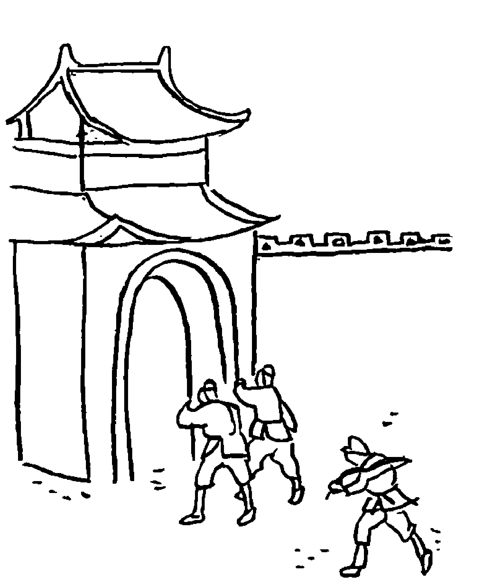

斜阳中，已是断壁残垣的圆明园遗址越发显得沉郁而凄怆，草地石缝间石影斑驳。不远处有长长的荷塘，空气中飘散着淡淡的荷叶香。一百五十多年前，它犹是被誉为世界上最美丽的皇家花园，几年之后，它成了世界上最残破的皇家花园。一切的巨变，皆源于清廷的腐朽与列强的贪婪。

鸦片战争之后，西方列强纷至沓来，腐朽的清政府一次又一次地让出主权，签下不平等的条约。可是人心不足蛇吞象，这根本满足不了英法等国的胃口。为了进一步扩大在华的贸易，让中国变成自己一劳永逸的商品市场，从而攫取巨额利润，扩大《南京条约》所得的权益，英法两国又在1856年10月分别以「亚罗号事件」和「马神甫事件」为藉口，联合出兵侵略中国，蓄意发动了第二次鸦片战争。

他们先占广州，然后北上进京，完全与《推背图》中「黑云黯黯自西来」和「西方有人，足踏神京」的预言、〈黄檗禅师诗〉中「西北千群白帽来」的预言一致。面对这种局势，亲身经历过第一次鸦片战争的咸丰帝坐立难安，整个北京城腹背受敌，西方列强盘踞京师，太平军南京坐大直撼龙脉，果真是「南有兵戎北有火」。无奈之下，胆小怕事的咸丰皇帝派恭亲王奕留守北京，自己却以「秋狝木兰」为名，望风而逃去了热河行宫。

帝国面临危难之时，身为一国之君的咸丰，既没有像明景帝朱祁钰那样命于谦组织抵抗，也不是像崇祯皇帝那样因无颜面见祖宗自缢而死，相反，他竟在大敌当前之时，带着自己的妻儿、大臣逃之夭夭。不仅如此，「帝子临河（即热河行宫）」之后，咸丰帝仍不忘寄情声色、自我麻醉，实在有负皇帝之名。

而被他丢下的北京城，很快就落入了英法联军的手中。1860年10月6日，英法联军攻抵北京德胜门、安定门，清朝守军因此退至圆明园。英法联军追来之后，以众对寡，圆明园总管大臣文丰投福海自尽。其后，英法联军开始了对园中的珍宝和陈设物的大肆劫掠。根据英国官员事后估算，被掠走的文物珍宝价值达600万英镑之多，因不识其价值或因搬运不便而被毁坏的珍本图书、佛塔、瓷器、家具等价值与此相仿。

更悲惨的是，英国统帅詹姆斯·布鲁斯为了掩盖罪行，竟以清政府曾将巴夏礼等囚于圆明园为藉口，将焚毁圆明园列入议和先决条件。10月18日，英国公使额尔金下令焚烧圆明园后，英军冲入圆明园，在各处纵火，圆明园被焚烧。大火三日不灭，「烟燄弥天，红光半壁」，圆明园、清漪园、静明园、静宜园、畅春园及海淀镇均被烧成一片废墟，安佑宫中，近300名太监、宫女、工匠葬身火海。

一把火几乎将圆明园烧了个精光，后经勘察，硕大一个圆明园仅仅剩下了13处建筑未被损毁。然而残存的这些建筑，后来也未能幸免于难。光绪二十六年（西元1900年），八国联军入侵北京，这些零落的园林建筑也只能是在大火中消亡，在那些炙热的火光烘烤之下，园内的湖泊如同伤心的眼泪，在北京的大地上哭诉着这个民族的不幸。

世界文明史上最大的暴行就这样发生了。这座经雍正、乾隆、嘉庆、道光、咸丰五位皇帝一百五十多年的经营，集中了大批物力，役使了无数能工巧匠，倾注了千百万劳动人民的血汗，精心营造的规模宏伟、景色秀丽的离宫；这座凝结着文明光芒，象征人类梦幻与诗化的建筑奇葩：就这样在英法联军的暴行下破坏殆尽。数不尽的稀世珍宝、古玩陈设，精美绝伦的木质建筑、雕栏画刻，都在一把火中化成了灰烬。在残破的断壁残垣里，在烟熏味还没有散去的园中，那种令人欲哭无泪的心痛拨弄着这个东方国家濒临崩溃的神经，让每一个曾见识过辉煌的人都悲痛欲绝。

所以，当随英法联军侵略中国且亲身参与了劫掠圆明园事件的法军上尉巴特雷，回国后在给大文豪雨果的信中，写下「这次在维多利亚女王和拿破仑皇帝旗号下进行的远征中国的行动，是法兰西和英格兰共享之荣耀」这样的字句，以征询雨果对所谓「远征中国」的看法时，雨果愤怒地抗议和痛斥了英法的罪行，并写下了以下这段话：

> 「有一天，两个强盗走进了圆明园，一个强盗大肆抢劫，另一个强盗纵火焚烧，原来『胜利』就是进行一场洗劫的两个征服者平分赃物。……在历史面前，这两个强盗分别叫做法兰西和英格兰。……而我现在看到的，是一次偷盗行为和两个小偷。」

著名哲学家、散文家周国平曾说：「圆明园，万园之园，痛史中的痛史，一个最辉煌也最悲愤的记忆。」确实，帝国被欺凌至此，咸丰帝竟从未想过从他的美女、丝竹、美酒和鸦片中清醒过来，面对现实，反而沉迷得更深了。

对于咸丰皇帝而言，无论当时与后世之人如何评价，或许都是无关紧要的，他更在意的应该是这种声色犬马的日子究竟还可以过多久。他之所以避难热河，无非就是不想那么早送命，不想那么早结束享乐而已。但他万万没有想到，自己在这次因逃难而离开京城之后，竟再没有机会能回去，正应了李淳风和袁天罡预言的「帝出不还」之语。

咸丰十一年（西元1861年）七月十五日，在热河的行宫中，咸丰皇帝病重。次日，咸丰皇帝在寝宫召见随行重臣，下谕：「立皇长子载淳为皇太子」，「著派载垣、端华、景寿、肃顺、穆荫、匡源、杜翰、焦祐瀛，尽心辅弼，赞襄一切政务。」此外，还授予皇后钮祜禄氏「御赏」印章，授予皇子载淳「同道堂」印章，由懿贵妃暂为掌管。一切安排妥当，咸丰放心地将儿子交给历史上著名的「顾命八大臣」或称「赞襄政务八大臣」之后的第二天，即七月十七日清晨与世长辞了。

当时年仅六岁的载淳，在没有任何争议的情况下，于热河行宫「篡金台」，成了帝位的下一任接班人，也就此被卷入了复杂险恶的政治漩涡之中。他就是初时年号为「祺祥」，后又改为「同治」的清穆宗，世称同治帝。

在位十三年间，同治皇帝每天只是象征性地到养心殿摆摆样子，实际的事务则由两宫皇太后垂帘听政。而他则在「钟鸣鼎食」的生活中，任凭自己的惰性与任性，肆意蔓延，在历来重视皇子教育的大清朝，到十七八岁时，同治竟仍「折奏未能读」。这既是同治的不幸，也是大清的不幸，还好此时的大清朝堂之上，仍有几位能勉强支撑的大臣，其中曾国藩尤其耀眼。

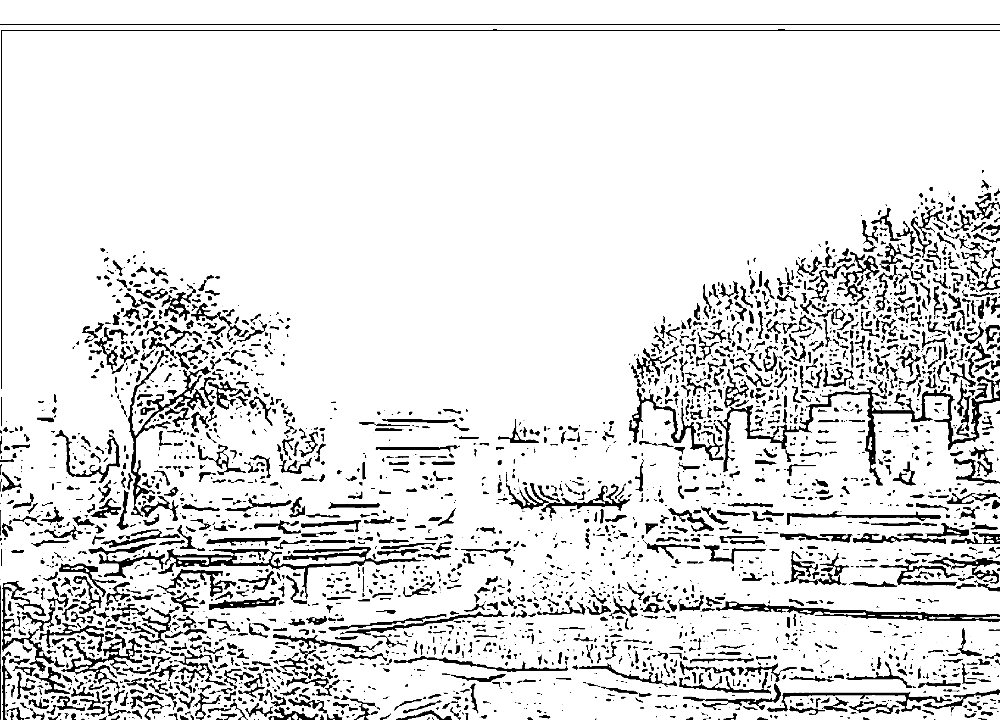

八国联军后圆明园的惨状

#### 争议纪：

##### 重修圆明园之争

同治十二年（西元1873年）正月，年满十八岁的同治皇帝亲政。在仅一年多的亲政期内，他亲自主持的大事之一就是重修圆明园。九月，同治皇帝发布上谕：兴修圆明园，让王公以下京内外大小官员量力捐修。朝堂为之震动，百官纷纷上疏，反对重修圆明园。同治一意孤行，仍于次年正月开工重修。此后，反对之声一直不断。七月十八日，恭亲王奕訢、大学士文祥等十人联名疏奏，请求停止圆明园工程，同治帝与群臣几番辩论，后经两宫太后调解，方改以修三海告终。

### 59 琴瑟和谐，舆古道舆今朝——预言曾国藩与同治中兴

> 《推背图》第三十五象 戊戌

+ 讔曰
- 西方有人 足踏神京
- 帝出不还 三台扶倾

+ 颂曰
- 黑云黯黯自西来
- 帝子临河筑金台
- 南有兵戎北有火
- 中兴曾见有奇才

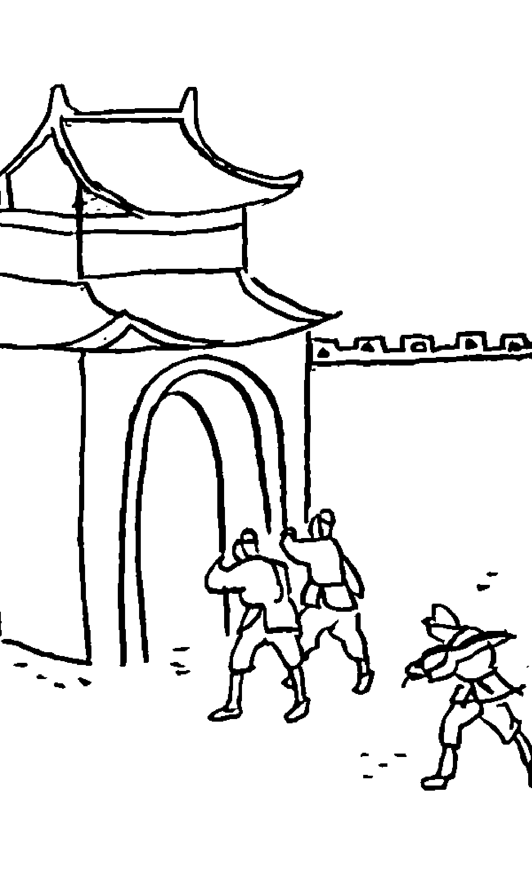

> 琴瑟和谐成古道，左中兴帝右中兴。
> ——《烧饼歌》

明末清初思想家顾炎武在其代表作《日知录》中，曾写下过这样一段话：「有亡国，有亡天下。亡国与亡天下奚辨？曰：易姓改号，谓之亡国。仁义充塞，而至于率兽食人，人将相食，谓之亡天下。……保国者，其君其臣，肉食者谋之；保天下才，匹夫之贱与有责焉耳矣！」著名的「天下兴亡，匹夫有责」便是由此而来。

在顾炎武看来：保一姓之朝堂，乃君臣之责；保百姓之江山，乃天下人之责。自乾隆朝拒绝英国马戛尔尼使团之后，大清便几乎与整个世界隔绝开了。但鸦片战争的炮舰惊醒了沉睡在「天朝上国」中的人们，根据马克思在《中国革命和欧洲革命》一文中的说法：「与外界完全隔绝曾是保存旧中国的首要条件，而当这种隔绝状态通过英国而为暴力所打破的时候，接踵而来的必然是解体的过程，正如小心保存在密闭棺木里的木乃伊一接触新鲜空气便必然要解体一样。」剧变由此开始，一部分中国人开始在茫茫的炮灰中重新打量此时的大清和世界。

第二次鸦片战争之后，清政府这艘大船上的敏感的「船员」更是明确地感觉到了沉重的危机，「振作」与「自强」的声音日益震耳欲聋，于是引发了一场上至中央大臣、下至地方官员的轰轰烈烈的洋务运动，创造了一个算不上中兴的「同治中兴」。

与之前的道光、咸丰和之后的光绪、宣统相比，同治无疑处在一个难得的太平点上：太平天国刚刚结束、义和团还未兴起；第二次鸦片战争尘埃落定、八国联军侵华未曾开始。在如此难得的历史机遇中，大清的菁英们终于获得了一个改革的机会，他们开始对该如何应对外来自强的压迫、中西差别在哪里、如何处理中西关系等等一连串问题进行思考与探索。

在魏源「师夷制夷」的基础上，「曾氏同治元年五月七日日记，详论洋务，谓『欲求自强之道，总以修政事、求贤才为急务，以学做炸炮、学造轮舟等具为下手工夫』云云。」国学大师钱穆在其《国史大纲》中，提到了曾国藩的洋务主张：「师夷智以造炮制船」、「师夷智以制夷」。

有人将洋务运动及洋务思想简单视为中外反动势力互相勾结共同镇压农民起义的产物，将在地方主导洋务的曾国藩称作「曾剃头」、「曾屠夫」。实际上，作为一种自强运动和社会思潮，洋务运动的兴起与列强在政治、经济和文化上的侵略日甚，从而引起「天地开辟以来未有之奇愤，凡有心知血气莫不冲冠发上指者，是「以忠刚摄泰西之魄」，「以精思窃制器之术」，以雪国耻为目的展开的。

对于曾国藩是否为清廷剿灭太平天国的走狗，从其奏章中便可窥知一二，他「称为救时第一要务，盖不重在剿发逆，而重在陆续购买外国船炮，据为己有，在中华则见怪不怪，在英法亦渐失其所持」。可见，于他而言，抵御外侮才是最重要的。所以，他在安徽创办安庆内军械所，造出中国第一艘轮船「黄鹄号」；他提出建立近代化的海军，大清有了属于自己的北洋海军；他创办机械学校、设立翻译馆、派遣留学生，大力发展近代教育。

在他的倡导下，门生李鸿章、同僚左宗棠，也先后加入到了兴办洋务的行列中来，形成「三台扶倾」的局面，令本已奄奄一息的大清王朝出现意外的「左中兴帝右中兴」。美国当代著名历史学家斯塔夫里阿诺斯认为，当时的外国人（即外力侵略者）对中国兴起的这股潮流感到吃惊、害怕和敬佩，甚至有人认为「中国的大小官员全部行动起来了」。这样的局面虽然非曾国藩一人之力能成，但从其眼光的长远和自强的决心来看，《推背图》中预言的「中兴曾见有奇才」也并不为过。

然而，所谓的「同治中兴」不过是昙花一现，只专注于先进的技术而忽略了对腐朽政治制度的改革，洋务运动从一开始就是一条腿长一条腿短，也就注定了「自强」的迷梦最后还是会破碎。

果然，在面对因明治维新而兴起的日本的甲午战争中，中国动用的是洋务运动时期一手打造的北洋舰队。北洋舰队的实力本来应该足以让这场战争胜利，但由于指挥者李鸿章的错误判断，中国东北沿海不得不让日本军队踏足。历时三十多年的洋务运动，随着一艘艘被日军击中的北洋军舰沉没，宣告失败，短暂的中兴之势也一并沉入了历史的大海之中。

尽管洋务运动被归类为腐朽封建王朝的最后一点挣扎，但它表示中国人开始正视和认真地对待世界，明白中国应该作为一个民族成员的政治集合体与英、法、日、俄、美等国在世界的范围竞争生存。而以实践之力去探索生存之路，以实业之法尝试中兴大清的曾国藩，也因此被后人铭记。

此外，曾国藩还是世代文人心中的典范，因为他具有儒家道德观念中的理想人生。从湖南双峰一个偏僻的小山村以一介书生入京赴考，中进士留京师后十年七迁，连升十级，三十七岁任礼部侍郎，官至二品，在这期间，他历任工、刑、吏部的侍郎。他历尽艰辛为清王朝平定了天下，被封为一等勇毅侯，成为清代以文人而封武侯的第一人，后历任两江总督、直隶总督，官居一品，死后清廷追赠其为太傅，谥号「文正」。对于千万以入仕为最终目标的文人来说，曾国藩实现了他们梦寐以求的「书生变蛟龙」的理想。

更为难得的是，一生杀人无数、树敌无数，仇敌恨他「必啖之而后快」的曾国藩，仍能持盈保泰。初入仕时，他立下「有民胞物与之量，有内圣外王之业，而后不忝于父母之所生，不愧于天地之完人」的君子之志，以「不为圣贤，便为禽兽；莫问收获，但问耕耘」为座右铭，时时以「君子当以不如尧、舜、周公为忧，当以德不修、学不讲为忧」自勉。

在他的家书、日记当中，不断出现自我戒惕与警告弟、子的言语。无论是「日课十二条」的修身计划，还是慎独、主敬、求仁、习劳的修身之道，曾国藩始终坚持以儒家的「古道」约束自己，最终修炼为文人的道德典范。也正是因为如此严谨的修身思想，令曾国藩做到了「琴瑟和谐成古道」，令心高气傲的左宗棠写下生平第一次低认人下的挽联：「谋国之忠，知人之明，自愧不如元辅。同心若金，攻错若石，相期无负平生。」

曾国藩留有一幅画像：宽敞的前额上横着几道很深很深的皱纹；脸庞是瘦长的，尖下颔，高颧骨；粗粗的扫帚眉下，长着长挑挑的三角眼，双眸里闪射出两道阴冷、凌厉的毫光；浓密的髯髭间隐现着一张不会轻易张开的薄唇阔口。对于这个以面相而论「当刑死（不得善终）」最终却能得善其身的人，后世之人褒贬不一，就像近代思想家章太炎所说：「誉之则为圣相，谶之则为元凶。」其实，曾国藩不过是一个血肉丰满的世俗中人，只是在他身上集中了中国传统官僚的所有特点之外，还掺杂了一些文人的品格。

#### 常识纪：

##### 《曾国藩家书》

著名学者南怀瑾在《论语别裁》中说：「清代中兴名臣曾国藩有十三套学问，流传下来的只有一套《曾国藩家书》。」《曾国藩家书》记述了曾国藩从道光三十年至同治十年前後长达三十年的翰苑和从武生涯，以及他从政、治家、治学、治军的主要思想。近1500封家书，上自祖父母至父辈，中对诸弟，下及儿辈，皆收录其中。行文从容淡定、形式自由、挥洒自如，平淡中孕育着真知良言，极富说服力和感染力。

### 60 **灯光蔽日，纤纤女子倒乾坤 —— 预言慈禧专权**

《推背图》第三十六象 己亥

+ 讔曰
* 纤纤女子 赤手御敌
* 不分祸福 灯光蔽日

+ 颂曰
* 双拳旋转乾坤
* 海内无端不靖
* 母子不分先后
* 西望长安入觐

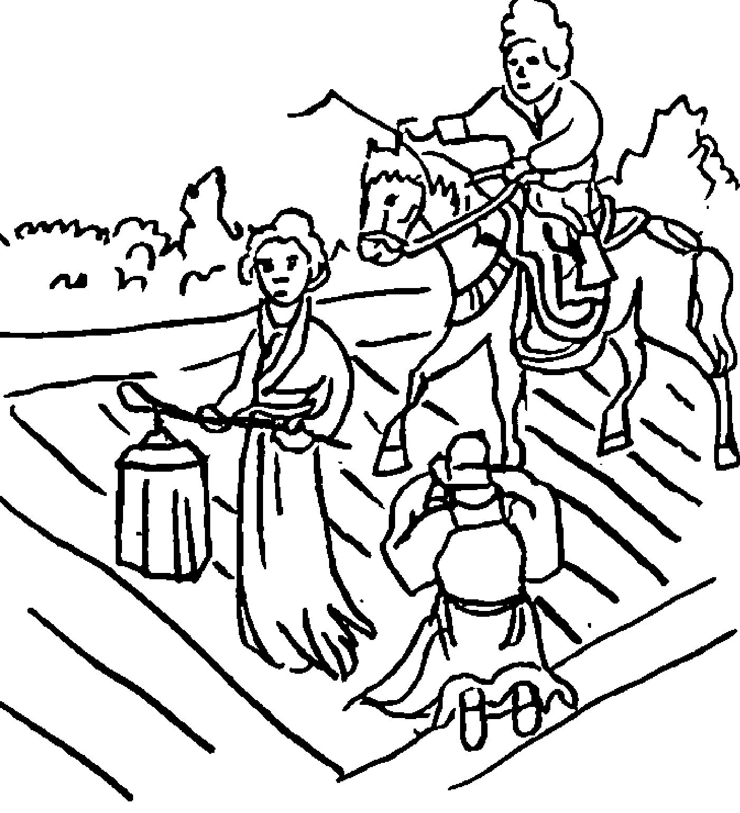

> 太极殿前卦对卦，添香袅袅闹朝堂。
草头冢上十口女，又抱孩儿作主张。
——《烧饼歌》

历史学者蔡东番的《清史演义》中，努尔哈赤在修建祠堂时，挖出一块大碑，上面书着「灭建州者叶赫」六个大字。努尔哈赤一见惊诧不已，即刻命人将其击断，并为灭叶赫部全力备战。显然，这是为了增加演义效果而制造的传说。

传说中，努尔哈赤于统一女真部族时，曾将叶赫部的男人全部杀尽。部族覆亡之时，叶赫部首领立下血誓：即便将来叶赫部只剩下一名女子，也要倾覆满洲，为叶赫族报仇。为防范叶赫一族，努尔哈赤还曾下令爱新觉罗家族后人永远不得娶叶赫族女子为妻，即所谓的「祖制，宫闱不选叶赫氏」。此也仅为传说而已，无以为据。

然而，不论是演义还是传说，历史的巧合竟成真了。清朝的兴亡以「成也叶赫，亡也叶赫」总结，也成了为人们所认可的观点。传说中叶赫部剩下的最后一名女子——「草头冢上（即「赫」）十口（即「叶」简体叶）女」，应该就是臭名昭著的慈禧。

在成为慈禧之前，她还曾有过一个清新温婉的名字——兰儿，虽略显土气，但这并不妨碍她的聪慧狡黠，当代学者贾梦玮说：「兰儿对作为女孩儿基本功的针线活等并不在意，平日只管写字、读书、吟诗，尤其喜欢历史上的女皇后妃故事，曾自比『贱日岂殊众，贵来方悟稀』的西子和留下『生男勿喜女勿悲，生女也可壮门楣』遗歌的杨贵妃，对武则天更是佩服得五体投地。」可见，自年幼之时起，兰儿便已产生了对权力的潜在欲望。

咸丰二年（西元1852年），十七岁的兰儿因选秀而入宫。很快地，她就从一个在圆明园打扫落叶的宫女，荣升为备受咸丰皇帝宠爱的「兰贵人」，此后又因生下咸丰帝唯一的儿子载淳而母凭子贵，晋封懿贵妃。

据说，咸丰对她十分宠爱，经常和她一起谈论政事，使她对皇权产生了兴趣。所以，就在咸丰帝刚刚病逝，尸骨未寒之际，慈禧就开始了她的夺权计划。她联合当时在北京的咸丰的亲弟弟恭亲王奕訢等皇室近支，发动政变。

她以小皇帝的名义发布圣旨，解除了八大臣的职务，从「顾命八大臣集团」手中夺得政权，然后将其中三位（载垣、端华、肃顺）处死。这就是历史上的「辛酉政变」。政变以后，慈禧废掉「祺祥」年号，改第二年为「同治」元年，由两宫太后垂帘听政，这是清朝政权体制的一个重大变革，也从一个侧面体现了其政治方面的干练。自此，清朝开始了慈禧太后执政的历史，即李淳风和袁天罡预言的「纤纤女子，赤手御敌」。

此时的大清，早已不是「海内无端不靖」的状况，面对的最大敌人，无疑是外来的侵略者。但在慈禧眼中，那些妨碍她大权在握的人，才是她的敌人。同治皇帝在亲政一年多之后，就离奇地死亡了。「国不可一日无君」，同治帝没有留下子嗣，那应该由谁继承皇位呢？在这关键时刻，慈禧太后的威力又一次显示出来了，她选了年仅四岁的载湉入承大统。

继扶持六岁的同治帝即位后，慈禧「又抱孩儿作主张」，将四岁的光绪帝推上了帝位。她之所以这么做，目的只有一个，那就是为了自己可以更长时间地亲政。她虎视眈眈地面对朝堂上任何可能危及其权力的人，却对大清面临的危机视而不见。

太平天国运动后期，清政府决定向外国人借兵剿灭太平天国民众。当时朝廷内不少人都认为这是「引狼入室」，纷纷表示反对，慈禧却狠狠地回敬了一句：「宁赠友邦，不予家奴。」意思是说：「宁把土地割让给外国人，也不留给奴才（老百姓）。」

进入暮年之后，慈禧只求安稳度日，尽量与外国人「息事宁人」，如果迫不得已要开战，也是消极抵抗，积极求和。1893年，中法战争本是中国赢得胜利，但作为战胜者的清政府与战败者的法国又一团和气地坐在了谈判桌前，失败者反而得到了好处。

光绪二十年（西元1894年）十月初十，慈禧挪用了水师海军经费来庆祝自己的六十大寿。为《海宇昇平日》的美妙乐韵和声的，不仅仅是寿宴上的民族乐器，还有日本人的火炮和北洋舰队的全军覆没。

在慈禧的一步步退让中，列强的狼子野心日渐膨胀。1900年，八国联军入侵北京，慈禧携光绪出逃西安，正应了《推背图》中「西望长安入觐」的预言。第二年1月15日，她就批准了《议和大纲》，其中「量中华之物力，结与国之欢心」的卖国嘴脸令人震惊。

大清的江山，就在这个为「添香」而招来的兰儿手中，变得「不分祸福，灯光蔽日」。她用「双拳旋转乾坤」，令本就已经病入膏肓的大清帝国，变得更加不堪一击，正应了刘伯温预言的「添香禳斗闹朝堂」。直到和光绪皇帝「母子不分先后」地死去，她才放下掌握近半个世纪的朝政大权。然而，此时的大清也已经走到了末日。

一些外国学者认为，在中国历史上，慈禧是第二个「武则天」。不过她并没有武则天的气魄，反而坐视西方列强进犯中国的边疆。先是美日侵略台湾，同时英国开始侵略中国西南滇、藏地区，而新疆则受到了俄国的侵犯。在这一连串的边疆危机中，最严重的是，法国企图借助侵略越南以进入「中国腹地」，为瓜分中国抢占有力的地势。

说到底，她只是一个权力欲望极强的女人而已。为了自己的权势，慈禧根本不管什么丧权辱国，所以不能单纯地说她是保守派、顽固派，还是洋务派，这些她都有一点。她镇压太平天国、捻军，使清王朝的统治得到暂时稳定，算是保守派；而她对变法维新的阻碍，又是顽固派的做法；而她也曾采用洋务派「自强」和「求富」的方针，开办一些新式工业，训练海军和陆军以加强政权实力，可是她又支持顽固派对洋务派进行牵制，以加强深宫集权。签订《辛丑条约》之后，为缓和国内外矛盾还曾推行「新政」，主要措施包括调整官制、整顿吏治、改定刑律、编练新军、奖励实业、兴办学校等。

这些看似立场不明的做法，好像表现的是慈禧的反反复复，其实恰恰反映了那个时代的混乱，而慈禧则成为大清帝国的一个缩影。她亲历了中国几千年未有之大变局，她所处的时代正是列强环视、威逼蚕食中国的年代，表面看来她对外国侵略者的那种赤裸裸的献媚，其实是软弱的清政府的经典写照。

所以，在慈禧七十岁生日时，章太炎写下了那副六十二字的对联：

> > 今日到南苑，明日到北海，何日再到古长安？叹黎明膏血全枯，只为一人歌庆有。五十割琉球，六十割台湾，而今又割东三省，痛赤县邦圻益蹙，每逢万寿祝疆无。

与其说是对她的总结，不如说是对濒临灭亡边缘的大清帝国的揭露。

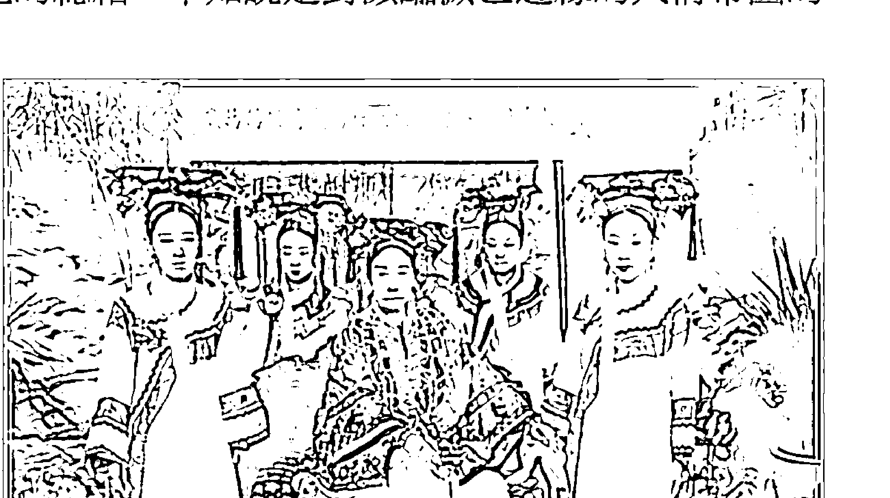

#### 事件纪：

##### 慈禧对列强宣战

1900年6月21日（农历五月廿五日），慈禧太后在《诏书》中说：

> > 与其苟且图存，贻羞万古；孰若大张挞伐，一决雌雄。

语出惊人，竟是源自于一封假情报。《诏书》颁布前不久，慈禧太后收到荣禄的一份密报

> > 各国公使要联合勒令皇太后归政

，就是要把政权归还光绪。慈禧太后自然不能接受，于是迅速召开御前会议，北京的当权派们表示要效忠皇太后，和洋人决一雌雄。结果慈禧就决定向十一个国家发兵，用慈禧的话来说：

> > 等亡也，一战而亡不犹愈乎？

其实，所谓的密报不过是上海英商所办的英文报纸《北华捷报》的一篇社论，经过一番添油加醋之后变相的假情报。

### 61 黄龙早丧赤城中 ——预言「百日维新」与光绪喋血瀛台

> > 黄龙早丧赤城中，
> 猪羊鸡犬九家空。
> ——《烧饼歌》

紫禁城养心殿西暖阁，同治十三年（西元1874年）十二月初五戌时，同治皇帝驾崩后一个时辰，慈禧和慈安两宫皇太后，召见醇亲王奕譞、恭亲王奕訢等二十九人，颁佈懿旨曰：「文宗无次子，今遭此变，若承嗣年长者，实不愿；需幼者乃可教育。现在一语即定，永无更移。我二人同一心汝等敬听。醇亲王奕譞之子载湉，著承继文宗显皇帝为子，入承大统，为嗣皇帝。」听闻此讯，醇亲王奕譞顿时「碰头痛哭，昏迷伏地，掖之不能起……」

大清朝也是中国历史上的倒数第二位皇帝——载湉即皇帝位，世称光绪帝。他在位期间重复了同治帝的悲剧，十七岁亲政，但慈禧规定，光绪必须每隔一日向她奏报政务，听候训示，还经常派人监视他的行踪。贵为天子的光绪帝在慈禧太后眼中，不过是一个她藉以实现权力欲望的玩偶与傀儡。在他三十八年的悲剧人生中，最光彩的一笔就是「戊戌变法」。

甲午战败之后，中国思想界刮起了大旋风。邓世昌的同学北洋水师学堂……總辦嚴復，發表《救亡決論》，喊出：「今日中國不變法則必亡」，第一次向國人提出「救亡」的口號。同年嚴復的《天演論》轟動全國，其中「物競天擇，適者生存」的學說，使人們逐漸認識到「師夷長技以制夷」的洋務運動失敗的原因——清政府的專制政體。正如譚嗣同在《仁學》裡說的那樣，封建專制制度是「大盜」之政，而君主則是「獨夫民賊」。

這一代的知識分子，在清朝日漸衰落的時候，發出了最強音，成為引領那個時代的思想先鋒。他們的領導者康有為連夜起草了一份一萬四千多字的上皇帝書，這是一篇個人血淚與對國家民族忠誠交織的文章。在各省一千三百多名舉人的集會中，他發表了激情澎湃的演說，從民族命運、國家大勢說到世界形勢，從古代的改革說到今日的變法，說到傷心處，聲淚俱下，全場的舉人聚精會神地傾聽著，狂呼，跺足，鼓掌，乃至悲號。梁啟超宣讀了康有為的萬言書，文章氣勢磅礴，熱血洋溢、縱論古今中外，其「天下興亡，匹夫有責」的氣概引起共鳴。這篇萬言書被全體舉子一致通過，並聯名上書，這就是歷史上聞名的「公車上書」。

由於頑固派的阻撓，康有為連續上書三次，才傳到了光緒帝手中。此前代表清政府與日本簽訂《馬關條約》的李鴻章，曾向光緒帝轉達過日方代表伊藤博文對清廷的看法：「貴國之弱，在於固守舊法。如欲自強，必須將明於西學年富力強者委以重任，拘於成法者一概撤去，方有轉機。」所以，當光緒帝看到康有為的上書時，似乎找到了振興清朝的希望，於是他決定變法，執行新政。

此時，雖然名義上已經歸政於光緒皇帝，但實際的權力還在慈禧手中，要實行新政必須徵得她的同意方可。出乎意料的是，慈禧對新政竟沒有反對，「凡所施行之新政，但不違祖宗大法，無損滿洲權勢，即不阻止。」或許是她也意識到了大清王朝山河破碎，也希望變法能夠帶來實際的好處，故而同意變法，但必須以「不違祖宗大法，無損滿洲權勢」為前提。獲得慈禧同意且心急變法的光緒帝，並未特別注意慈禧開出的兩個條件，便於1898年6月11日頒佈了《定國是詔》，「戊戌變法」由此開始。

變法的內容非常全面，包括文化教育、經濟、軍事、社會風習以及政治方面的改革。主要就是廢除八股文考試，改試策論；在各省設商務局，促進商業發展；廢掉軍隊中用的弓、刀、矛等傳統武器，改用槍炮；改變社會上崇拜鬼神的不良風氣。政治方面則開放言路、精簡機構、任用新人等，這相對洋務運動來說是一個突破。

然而，正是由於戊戌變法的完整，不可避免地越過了慈禧開出的兩個條件，觸犯了一些守舊派的利益，他們先是公然反對，緊接著就跑到慈禧的心腹——直隸總督榮祿那裡訴苦。榮祿也正在擔心由於光緒帝掌握實權後，自己失勢，於是就乘著這個機會派人散佈「皇上病重」和「皇上與維新派陰謀加害慈禧太后」的謠言，又去向慈禧報告新政的流弊以及眾大臣的意見。

原本持觀望態度的慈禧，聽到榮祿散播出的謠言、感覺自己手中的權力即將受到威脅後，就再也坐不住了。9月21日，慈禧與榮祿藉天津閱兵之機發動了她人生中的第二次政變——「戊戌政變」，將光緒帝囚禁在瀛台，她第三次垂簾聽政。「戊戌變法」從開始到失敗只經歷了103天，故史稱「百日維新」。

光緒帝在去瀛台之前，給維新派下了一道密旨，讓他們逃難。接到密旨後，康有為逃到了香港，梁啟超到了日本。譚嗣同沒有逃，他說：「各國變法，沒有不流血的。」決心以死抗爭。七天後，慈禧下令將譚嗣同、林旭、楊深秀、劉光第、楊銳、康廣仁等維新派人士處死，這就是歷史上的「戊戌六君子」。

學者袁野分析戊戌變法的失敗時說：「從康有為的三本著名著作和他整個的思想當中我們可以看出，他是一個產生於近代中國特殊歷史條件下的學者和思想家，他所進行的政治改革，都是以他這些思想為指導原則的。然而他並不是一個成功的政治家，僅憑這些奇思妙想，書生意氣，終究難成大事，所以最後戊戌變法走向失敗，也是順理成章的。確實，從康有為指導變法的兩部理論著作——《新學偽經考》和《孔子改制考》中可以看出，「康有為的思想是用『西學為營養，哺育出來的思想』。但是他又披上中國古老學術的外衣。」這就導致中西思想在結合的時候有些脫節，有點理想化，結果只能是失敗。

戊戌變法是清政府的第一次，也是最後一次主動的、全面的變革，但是由於守舊派的阻撓，戊戌變法以失敗告終，清政府失去了最後一次發展的機會，政府更加腐朽，加上民間正在策劃反清起義運動，清政府的封建統治即將走向滅亡。

正如學者彭勇所說：「戊戌變法的失敗，把人們依靠朝廷本身的改革來強國的最後一絲夢想徹底擊滅了。統治階級內部鬥爭更趨激烈，錯過了最後一次變革維新的機會，同時也喪失了選擇發展道路的機會。清廷拒絕維新，其結果只能給自己帶來滅頂之災。」

隨之逐漸走向盡頭的，還有光緒皇帝的生命。變法的失敗，令他大受打擊，再加上之後令京城「豬羊雞犬九家空」的八國聯軍侵華時的西逃和珍妃辭世，身體和心靈經受雙重折磨的光緒帝本就羸弱的身體更是每況愈下。在張功臣選編的《歷史現場：西方記者眼中的現代中國》一書中，記錄了西方記者眼中此時的光緒皇帝：

在最近接見外國使節時，他沒精打采地坐在御座上，甚至無法在座位上挺直身體。很明顯，在相當長一段時間內，他都在經受疾病的折磨，而且病情持續惡化。

被疾病困擾多年後，光緒皇帝於光緒三十四年十月二十一日酉正二刻三分（西元1908年11月14日午後6時33分）在被囚禁了長達十年之久的瀛台停止了呼吸，暗合了劉伯溫預言的「黃龍早喪赤城中」，享年三十八歲。苟延殘喘了許久的大清帝國，終於迎來了它的最後一位帝王溥儀。

## 推背圖和燒餅歌裡的歷史

### 事件紀：

### 康有為七次上書

- 1888年，康有為進京參加順天鄉試，雖未能考中，卻寫了《上清帝第一書》給京師的大官。結果，被戶部尚書翁同龢和禮部尚書徐桐拒之門外。
- 甲午戰敗、《馬關條約》簽訂後，康有為連夜起草了一份一萬四千多字的上皇帝書，被全體舉子一致通過，並聯名上書，這就是歷史上聞名的「公车上书」。
- 1895年5月底，他第三次上書，終於得到了光緒皇帝的贊許。
- 之後又第四次上書。
- 德國佔領膠州灣後，他第五次上書光緒請求變法，得到光緒帝首肯，開始準備變法。
- 1898年的1月29日，康有為第六次上書，要求光緒走日本明治維新的道路。
- 同年3月12日，康有為最後一次上書光緒帝，明確提出要效仿俄國變法圖強。
- 之後，他又透過各種辦法積極推動變法，但最後變法被鎮壓，康有為只得流亡海外。

## 62 水清終有竭，南北和衷共濟——預言清朝滅亡與中華民國成立

> 《推背圖》第三十七象 庚子
讖曰
漢水茫茫 不統繼統
南北不分 和衷與共
頌曰
水清終有竭
倒戈逢八月
海內竟無王
半凶還半吉

夕陽的餘暉，仍然照耀在兩廣總督衙門門前的大街上，巡邏兵荷槍實彈地左右巡視著，即便是小北門、巡警教練所和守南大門也都有重兵把守。戒備森嚴的氛圍，自革命黨人溫生才刺殺署理廣州將軍孚琦事件之後，已經持續了半個多月，卻絲毫未有減弱的跡象。原本路經此處之人，也都被空氣中瀰漫著的詭異氣息嚇得繞道而行。壓抑愈發地沉重，就像暴風雨即將來臨之前悶熱的天氣一樣。

5點30分左右，從衙門前的路上出來不少人，他們左顧右盼似乎在聯絡著什麼，突然在遠處有紅色的火焰倏然升起，那是信號彈。緊接著，衙門口的幾個清兵被槍殺。裡頭的守兵一時慌亂，紛紛找掩護。外面的人群則瘋狂向裡衝去。槍聲、叫聲、吶喊聲混成一片。這個時候的小北門、巡警教練所和守南大門槍聲四起。攻打總督衙門的帶頭人就是鼎鼎大名的黃興，他此行的目的是活捉總督張鳴岐。可是總督庭院太大，戰鬥一時間很難結束，黃興與三路敢死隊員也接應不上，勢單力薄，與死守的清軍激戰多時，死傷不少。

這一天，是1911年4月27日。這一戰，死難的烈士達86人之多，最終能找到的遺骸卻僅有72具。同盟會將這些烈士葬於黃花崗，果真如《梅花詩》中預言的「憔悴黃花總帶愁」。那些死難者被人們尊稱為「黃花崗七十二烈士」，這次起義也因此被命名為「黃花崗起義」。它的實際領導人是黃興，而幕後真正的指揮者則是孫中山。

指揮這場「碧血橫飛，浩氣四塞，草木為之含悲，風雲因而變色」起義的孫中山，也曾在康有為探尋改良之法的1894年春便北上天津，投書李鴻章，希望清政府能夠「以和平之手段，漸進之方法請願於朝廷，俾行新政」，但被李鴻章拒絕了。由此他毅然放棄和平改革的幻想，走上了革命的道路。同年11月，他在檀香山華僑中發起成立了興中會，在章程中明確提出：「是會之設，專為振興中華、維持國體起見。」同時，也開始醞釀武裝起義。

戊戌變法失敗之後，如何救亡成了擺在所有愛國人士面前最緊迫的問題。梁啟超、章太炎、鄒容等提出各自的救國思想，在全社會引起了巨大的反響，黃興與宋教仁等人的華興會、蔡元培與吳敬恆等人的愛國學社、張繼的青年會等革命團體如雨後春筍般紛紛成立，孫中山也開始著手建立一個全國統一的革命政黨。1905年8月20日，中國第一個資產階級革命政黨——中國同盟會在日本東京成立，確定孫中山提出的「驅除韃虜，恢復中華，創立民國，平均地權」十六字為政治綱領。

此後，孫中山一方面積極地批判改良主義思潮，另一方面直接或間接地領導了一連串的武裝起義。從1907年5月潮州黃岡起義到1911年10月武昌起義的四年間，孫中山共領導了大大小小的十次起義，但先後都以失敗告終。然而革命英豪們視死如歸、前仆後繼的大無畏精神，令清朝統治者惶惶不可終日，同時也極大地鼓舞了革命鬥志。再加上由於四川保路運動爆發，清政府臨時徵調湖北兵力入川，創造了湖北防禦漏洞，革命黨人迅速做出反應，決定於1911年10月16日（農曆八月二十五）在「漢水茫茫」的武昌發動起義。

無獨有偶，10月9日，革命黨人在漢口寶善里配製炸彈時不慎引起爆炸。因為這裡是俄國管轄的地盤，所以俄國巡捕當即就搜去革命黨人名冊、起義文告等，拘捕了劉同等6人，隨即引渡湖北當局。情急之下，革命黨人決定將起義時間提前至10月10日晚。當夜，新軍工程第八營的革命黨人熊秉坤打響了武昌起義的第一槍，果真如《推背圖》預言：「倒戈逢八月」。隨後，革命軍迅速奪取了楚望台軍械所。經過激烈的戰鬥，革命軍在天快亮的時候，佔領了總督署。一夜之間，整個武昌都在革命黨的掌控之中。

武昌起義的這一聲槍聲，彷彿是葬禮上的輓歌，將四面楚歌，瀕臨瓦解的清王朝推入了墳墓。它雖然如孫中山所說「成於意外」，卻以摧枯拉朽之勢將龐大的大清帝國在極短的時間內擊了個粉碎。革命軍在武昌起義的消息傳到漢陽、漢口，革命黨人便相互應合，於11日、12日兩天，先後佔領了兩地。緊接著湖北軍政府成立，黎元洪被推舉為都督，將國號改為中華民國，並號召各省民眾起義響應。在此後不到兩個月的時間裡，內地的十八個省中有十四個省舉旗宣佈獨立，革命浪潮席捲全國，也帶動了廣大農民群眾自發的反抗鬥爭。這一年是辛亥年，這次革命稱為「辛亥革命」。

同年年底，孫中山當選為中華民國臨時大總統，並於1912年1月1日在南京宣誓就職，中華民國臨時政府成立，這也是亞洲第一個「和衷與共」的共和制國家。革命導師列寧對此曾說：「中國人民的革命鬥爭具有世界意義，因為將給亞洲帶來解放並將破壞歐洲資產階級的統治」，並盛讚辛亥革命是「亞洲的覺醒」。

然而，孫中山的理想，並非只是部分人的覺醒，他希望實現的是整個中國的變革，於是他與大清代表進行了著名的南北議和。雙方最後達成協定：以清帝退位為條件，袁世凱接替孫中山出任中華民國臨時大總統。宣統三年十二月二十五日（西元1912年2月12日），宣統帝溥儀的母后隆裕太后發佈《遜位詔書》，宣佈清宣統皇帝退位，統治了中國兩百六十八年的清朝正式宣告滅亡，中國兩千年來的帝制也宣告滅亡。

至此，終於實現了李淳風和袁天罡「南北不分」、「水清終有竭（暗指清朝滅亡）」的預言。中國人的思想也因此獲得了一次解放。徹底打破了「普天之下，莫非王土，率土之濱，莫非王臣」的陳腐觀念。從此，「敢有帝制自為者，天下共擊之」的民主共和觀念開始深入人心，「海內竟無王」也成了大勢所趨。但倉促建立的中華民國面臨的依然是「半凶還半吉」的形勢，因為它沒有解決農民賴以生存的土地問題，沒有廢除強加給中國的不平等條約，也沒有趕走外國侵略者，而且革命的成果最後也被野心家袁世凱篡奪了。

革命最後會是這樣的結局，對於那些安葬於黃花崗和其他各處的革命烈士，唏噓之情在所難免，但值得慶幸的是，革命完成了「不統繼統」的任務，數千年來家天下的帝制終於結束了。列寧說：「判斷歷史的功績，不是根據歷史活動家沒有提供現代所要求的東西，而是根據他們比他們的前輩提供了新的東西。」從這一點上來說，辛亥志士的革命精神和現代化理想就代表了辛亥革命的成功。

### 人物紀：

### 溥儀

愛新覺羅·溥儀，清朝的最後一位皇帝，因其在位時年號「宣統」，後世之人稱其為宣統皇帝，或末代皇帝，也被稱為清遜帝。「九一八事變」後，在日本建立的偽滿洲國任傀儡皇帝，年號「康德」，又稱康德皇帝。新中國成立後，溥儀經改造成為中華人民共和國的新公民。1967年10月17日，因患腎癌病逝北京，享年62歲。

## 附表7：清朝帝王表

| 廟號 | 諡號 | 姓名 | 年號 | 生卒年 | 在位時間 |
| :--- | :--- | :--- | :--- | :--- | :--- |
| 後金與清朝（1616～1912年）定都北京 | | | | | |
| 太祖 | 承天廣運聖德神功肇紀立極仁孝睿武端毅欽安弘文定業高皇帝（追尊） | 愛新覺羅·努爾哈赤 | 天命 | 1559～1626年 | 1616～1626年 |
| 太宗 | 應天興國弘德彰武寬溫仁聖睿孝敬敏昭定隆道顯功文皇帝 | 愛新覺羅·皇太極 | 天聰、崇德 | 1592～1643年 | 1626～1643年 |
| 世祖 | 體天隆運定統建極英睿欽文顯武大德弘功至仁純孝章皇帝 | 愛新覺羅·福臨 | 順治 | 1638-1661年 | 1643-1661年 |
| 聖祖 | 合天弘運文武睿哲恭儉寬裕孝敬誠信中和功德大成仁皇帝 | 愛新覺羅·玄燁 | 康熙 | 1654～1722年 | 1661～1722年 |
| 世宗 | 敬天昌運建中表正文武英明寬仁信毅睿聖大孝至誠憲皇帝 | 愛新覺羅·胤禛 | 雍正 | 1678～1735年 | 1722～1735年 |
| 高宗 | 法天隆運至誠先覺體元立極敷文奮武欽明孝慈神聖純皇帝 | 愛新覺羅·弘曆 | 乾隆 | 1711～1799年 | 1735～1795年 |
| 仁宗 | 受天興運敷化綏猷崇文經武光裕孝恭勤儉端敏英哲睿皇帝 | 愛新覺羅·顒琰 | 嘉慶 | 1760～1820年 | 1796～1820年 |
| 宣宗 | 效天符運立中體正至文聖武智勇仁慈儉勤孝敏寬定成皇帝 | 愛新覺羅·旻寧 | 道光 | 1782～1850年 | 1820～1850年 |
| 文宗 | 協天翊運執中垂謨懋德振武聖孝淵恭端仁寬敏莊儉顯皇帝 | 愛新覺羅·奕詝 | 咸豐 | 1830～1861年 | 1850～1861年 |
| 穆宗 | 繼天開運受中居正保大定功聖智誠孝信敏恭寬明肅毅皇帝 | 愛新覺羅·載淳 | 祺祥、同治 | 1856～1875年 | 1861～1875年 |
| 德宗 | 同天崇運大中至正經文緯武仁孝睿智端儉寬勤景皇帝 | 愛新覺羅·載湉 | 光緒 | 1871～1908年 | 1875～1908年 |
| | | 愛新覺羅·溥儀 | 宣統 | 1906～1967年 | 1908～1912年 |

## 一退再退，揖讓新君讓舊君——預言袁世凱復辟

> 蓬頭幼女蓬頭嫁，
揖讓新君讓舊君。
——《燒餅歌》

當國父孫中山說「世界潮流（即民主），浩浩蕩蕩，順之者昌，逆之者亡」時，美國哥倫比亞大學法學院院長、知名政治家古德諾教授，經過對中國一年半的研究之後，在他的《共和與君主論》中指出：「中國如欲保存獨立，不得不用立憲政治。而從其國之歷史習慣、社會經濟之狀況與列強之關係觀之，則中國之立憲，以君主制行之為易，以共和制行之較難也。」中國帝制的存與廢，這兩位重量級的人物提出了截然不同的觀點，因而，在對待袁世凱的態度上，自然是大相逕庭。

袁世凱，這個無論從儒家道德還是社會發展趨勢上，都遭到後世之人責罵的歷史人物，就連其十三歲時所寫的「大野龍方蟄，中原鹿正肥」的對聯，也被視為帝王野心的「罪證」而得以流傳至今。客觀地說，從這一副對聯便可看出少年的袁世凱文采過人，且豪氣干雲。因有如此的性格，袁世凱才會在兩次鄉試未中時，說：「大丈夫當效命疆場，安內攘外，焉能齷齪久困筆硯間，自誤光陰也！」如班超一般，毅然投筆從戎。

在仍然提倡「萬般皆下品，唯有讀書高」的清朝末年，生於官宦世家的袁世凱，竟能做出如此決斷，足見其勇氣與魅力。當然，這其中還包括對自己的瞭解，袁世凱知道他的長項不是詩詞文章，而是走馬舞劍，準確地說，應該是實務。當時的大清朝缺乏的，正是能幹實務之人，所以袁世凱一入政壇便成了清政府中比較有能力的官員：朝鮮兵變中，他表現突出，有「知兵」之名；甲午戰爭後，他以西法編練新軍、勵興實業、廣設學校、廢除科舉、成立警察部隊，以至聲名鵲起，成為清廷必不可少之重臣。故而，辛亥革命後能代表清政府與南京國民政府進行和談。

對於辛亥革命後的形勢，袁世凱有著充分的認識。當老百姓從紅黃藍白黑五色旗中看到希望時，他也明白共和已成大勢所趨，於是接受革命黨人開出的條件，於1912年2月11日，將清帝退位詔旨電達南京臨時政府，並承認「共和為最良國體」，表示「永不使君主政體再行於中國」。隨後，清帝退位，南北統一，袁世凱就任民國大總統。學者唐德剛稱此次的事件為「不流血的宮廷政變」，「以此，民國才能在武昌首義後迅速建立，而全國不致陷入曠日持久的內戰，於國於民，袁氏此舉功莫大焉。」

直到此時，袁世凱仍然還是眾人眼中的佼佼者。朝鮮「壬午兵變」後，前清名將吳長慶稱讚他「治軍嚴肅，調度有方，爭先攻剿，尤為奮勇」；小站練兵時，榮祿曾說他「血性耐勞，勇於任事」，是「不可多得」的將才；在李鴻章眼中，他「血性忠誠，才識英敏，力持大局，獨為其難」，「環顧宇內者，無出袁世凱其右者」。

一個如此優秀的人才，大可以名留青史，但自從接任大總統之位後，袁世凱竟背棄諾言、捨棄共和，在遺臭萬年的路上越走越遠。先是宋教仁被刺，他不置可否地說：「共和國家以道德為基礎，以法律為規範。就司法方面言之，非推究全案始末又未經法庭公開者，不得輕加論斷；就行政方面言之，非考求此案原委與法律違反者，不宜信口雌黃。」緊接著，胡漢民和安徽都督柏文蔚的職務被辭，甚至連孫中山在鐵路督辦的權力也被奪。

刚刚露出的一丝民主的希望，在袁世凯的一番折腾下又彻底地破灭了，因为他要复辟，因为他想称帝。据说，袁世凯是个非常迷信的人，他认为自己是真龙转世，理应登基为帝，而这一切竟始于一件荒唐的小事。

当年还是军机大臣时的袁世凯，曾经受到慈禧的赏赐。有一只用来盛汤的玉杯正是慈禧所赐，袁世凯自然满心喜欢，加倍爱护。孙中山让位大总统后，袁世凯依然保存着这件宝贝。

一天中午，袁世凯的丫鬟用这玉杯盛了一杯参汤给袁世凯送去，结果不小心把杯子掉到了地上。袁世凯一见御赐之物被一个丫鬟给摔碎，于是勃然大怒。小丫鬟知道袁世凯这个人十分迷信，灵机一动，说刚才她看见了袁世凯身上有一条龙，吓到了。袁世凯听了这话，不但没有处罚这个丫鬟，还大大赏赐了银两。他心里觉得中华民国的总统就是为他量身订做的，丫鬟刚才看见了龙，那更证明他是真龙转世，但是他又不满足于此，他每天都在做皇帝梦，幻想着恢复帝制。

为了皇帝梦，袁世凯做了不少荒唐事。他住进三海之后，就要求厨师把鱼鳞给他留下，鱼鳞留着做什么？袁世凯不但有这样的奇特癖好，还要求在居仁堂建造一个专供他洗澡的浴池。原来他每次进澡堂洗澡的时候，都要把鱼鳞片扔在澡堂里，以造成仆人们整理浴室的时候误以为这个“大总统”确实不是肉体凡胎。于是仆人们神神叨叨地把这事情传出去了，说袁世凯是真龙转世。如此一来，算是给自己复辟制造了舆论。

紧接着，他又自导自演了一连串看似“众望所归”的好戏，同盟会成员组织的筹安会、公民请愿团纷纷表示支持袁世凯称帝。应“民众”之要求，1914年12月23日，身著古衣冠的袁世凯到天坛祭天，预演复辟；1915年12月，袁世凯宣布恢复帝制，建立中华帝国，并决定于次年元旦之日即皇帝位，改元“洪宪”。

一切仿佛又回到了大清政府统治时期，真可谓是「揖让新君，让旧君」。

## 推背图和烧饼歌里的历史

幸而经过辛亥革命洗礼的民众，已完全厌倦了帝制，于是袁世凯的复辟引起了全国范围的讨袁行动。革命派与改良派、北洋将领，甚至就连原本支持他称帝的列强也迫于民间压力而对他提出了警告。

就在短短的数月间，袁世凯从叱咤风云的民国大总统沦为了万人唾骂的“独夫民贼”。无奈之下，袁世凯于1916年3月22日宣布取消帝制，并废除“洪宪”年号，一场仅持续了八十三天的闹剧就此画上了句号。忧愤成疾的袁世凯，也于同年6月6日在举国上下的声讨声中，走到了生命的尽头。临终前，他口中念叨着：“克定（袁世凯长子）害我。”其实真正将他送到历史镰刀之下的，是他自己。

黯然离去的袁世凯，在生命的最后一刻应该会想起曾经被自己取笑为“假文人”的次子袁克文和他的那首〈感遇〉：

> 乍着微棉强自胜，阴晴向晚未分明。
> 南来寒雁掩孤月，西去骄风动九城。
> 驹隙留身争一瞬，蛩声催梦欲三更。
> 怜君高处多风雨，莫到琼楼最上层。

此刻看来，他才是真正的聪明人，知道“最上层”风雨不息，才故意赋诗劝诫，可惜一切都已回不去了。

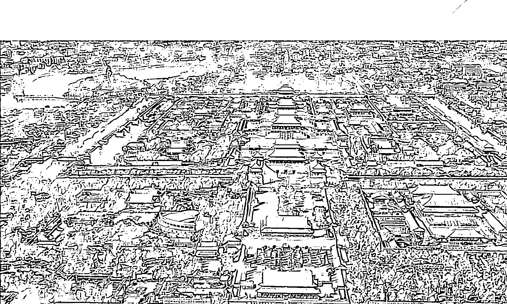

#### 人物纪：

##### 袁克文

袁克文，字豹岑，号寒云，是袁世凯的次子，他的母亲是朝鲜皇室的绝代佳人。袁克文风流潇洒，智力过人，且多才多艺，喜欢诗画、京剧，好玩古钱，“志在做一名士”，曾被人以三国曹植相比拟。后世之人还将他和父亲袁世凯、张学良、末代皇帝溥仪的弟弟溥侗并称“民国四大公子”。他无心政治，唯一的例外是赋诗反对父亲袁世凯恢复帝制，未遂。袁克文生性风流不羁，于1931年病逝于天津，年仅四十二岁。

## 推背图和烧饼歌里的历史

### 64 群雄逐鹿祸蔓延，万人后死万人生——预言第一次世界大战

《推背图》第三十八象 辛丑

| 讖曰 | 頌曰 |
| :--- | :--- |
| 门外一鹿 群雄争逐 劫及鸢鱼 水深火热 | 火运开时祸蔓延 万人后死万人生 海波能使江河浊 境外何殊在目前 |

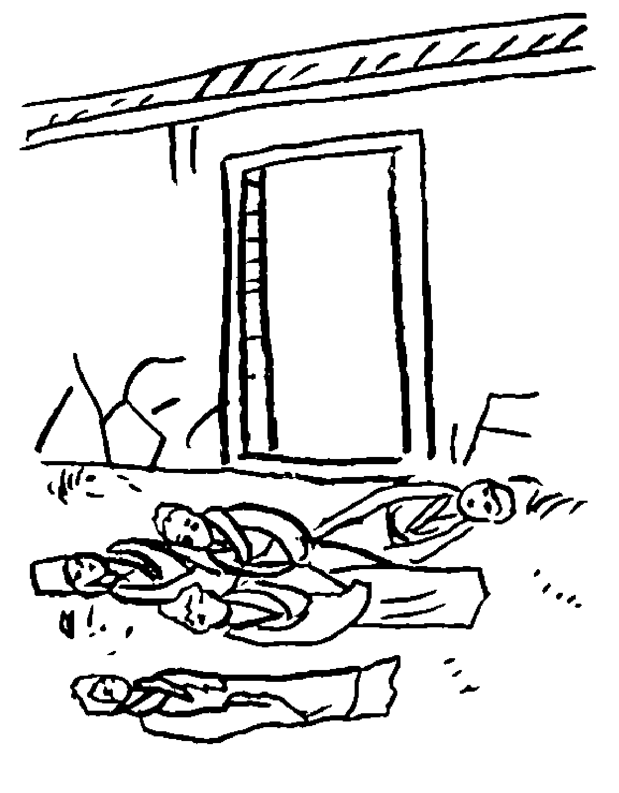

1919年初，一向对西方文化抱有好感的梁启超到欧洲游历。对于亲眼目睹的荒凉景象，他在后来写成的《欧洲心影录》中感叹：“全社会人心都陷入了怀疑、沉闷、畏惧之中，好像失去了罗针的海船迎着风遇着雾，不知道前途怎生是好。”曾经满怀对西洋文化的憧憬，希望可以藉此来挽救中国的梁启超，长久以来的想法顿时崩塌了。因为他原本视为先进的西方文明非但没有让西方人更加明智，反而使其陷入了一片混沌之中。一位美国的记者朋友甚至对他说：“西方文明已经破产了。”

梁启超所见的欧洲正是第一次世界大战之后，一片狼藉的欧洲。一切都是从1914年夏天开始的。6月28日，阳光灿烂，对于很多波士尼亚省的人来说，这是一个值得激动的日子——他们从属的奥匈帝国未来的国王斐迪南大公夫妇要到他们的首都萨拉热窝来视察，像他们这种山高皇帝远的地方，这样的机会非常难得。

与此相反，在波士尼亚地区的塞族人心中，斐迪南此行是对他们的一种侮辱，因为他选了一个塞尔维亚人被打败的纪念日。于是，在诸多倾向于加入刚刚取得独立的塞尔维亚的塞族人中，有人采取了极端行动——暗杀。

先是一个名叫察布里诺维奇的人，把从口袋里掏出手榴弹扔向了斐迪南夫妇，由于距离较远，大公夫妇躲过了一劫。但当那个名叫普林西普的男子，在离他们五码远的地方开枪时，他们就没有第一次那么幸运了，还未来得及前往医院抢救，便已经断气了。

对于已经了解外交冲突解决之道的欧洲人而言，斐迪南大公遇刺事件虽然看似严重，最终也一定会如往常那样被顺利地解决掉。何况英国经济学家安吉尔在他的《大幻想》一书中，告诉世人欧洲强国在经济上的相互依赖性非常强，战争是几乎不可想像的事情，只要大国是理性的，就不会愿意因战争而引发可能的社会崩溃。于是，发生“萨拉热窝事件”后，欧洲人从未为战争而担忧，仍过着如常的平静生活。

但是传统的外交惯例与西方文明中的理性，在面对利益时，还是不可避免地让步了。欧洲的这些“群雄争逐”，为的是“门外一鹿”——霸权与殖民地。不论是奥匈这样的老牌帝国主义，还是德国这样的新兴帝国主义，都被可能获得的利益蒙住了双眼，完全忘记了安吉尔所提及的战争需要付出的代价。于是，得到德国“空白支票”的奥匈帝国，在萨拉热窝事件一个月之后的7月28日，以保护帝国的和平为借口，向塞尔维亚正式宣战，战争的火苗被点燃了。

一开始，这只是一场有限的地区性冲突，随着德国和俄国的加入，演变成了世界性的大战。德国的加入，与其说是为了兑付此前开出的“空白支票”，不如说是为了争夺更多的利益与更高的地位，他们早已为此演习了无数次，就连作战计划也都确定了战争推进的日期。而俄国的加入，较大程度上是出于其斯拉夫诸国的“一哥”地位，它必须在此次的战斗中赢回此前丢掉的面子和利益。

德国和俄国，都有必须参战的理由，这场战争的扩大就不可避免了。8月1日，德国向俄国宣战；8月3日，德国向法国宣战；8月4日，英国对德国宣战；8月6日，奥匈帝国对俄国宣战；8月7日，黑山向奥匈帝国宣战；8月8日，塞尔维亚向德国宣战；8月12日，英国对奥匈帝国宣战，黑山对德国宣战。短短的半个月内，几乎整个欧洲都或主动或被动地加入了战争。

至此，它已经从局部战争升级为全欧洲的战争了。但“火运开时祸蔓延”，战争范围扩大的进程还在继续，欧洲诸国的海外殖民地也纷纷被卷了进来。在亚洲，中东无可避免地加入了，日本也趁火打劫地对德宣战了，中国北京军阀政府和广州军政府则组织了二十万劳工去欧洲西线帮助协约国；在非洲，德国的殖民地遭到了英法联军的攻击；在大洋洲，英国以殖民者的身分，在澳大利亚和新西兰四处散布征兵令，无数的澳洲人参军，赶赴前线；在北美洲，加拿大也接到了征兵令，美国虽然被孤立主义情绪包围，却也时刻不忘关注欧洲的战事；在南美洲，英国与德国也在沿海地区展开了激烈的海战。

到1914年末，从波罗的海到黑海到黄海，从大西洋到印度洋到太平洋，战事波及了整个世界，第一次世界大战全面展开了。有些是为了获取更多的利益，另外一些则是为了保护既得的利益，无论是出于何种目的，参战国尤其是欧洲各国使出了浑身解数，飞机、潜艇等任何可以使用的工具都被派到前线。

战火越烧越烈，人类心底的仁慈也随着战火一点点地被烧成了灰烬。面对比利时人的抵抗，德国人一把火烧了鲁汶，“历史悠久的教堂、闻名欧洲的大学、充满古籍珍品的图书馆，全部被付之一炬。德国人不仅向成年男人开战，还向女人、孩子开战，还向教堂、大学开战。德国人就像酩酊大醉后的疯子，在鲁汶犯下了滔天罪行。”在著名的马恩河战役中，约有五十万人的伤亡，此后更是从瑞士边境横贯法兰西和比利时，一直延伸到英吉利海峡地区，成了人类史上最嗜血的“锯齿形”地带。

人类的生命，变得渺小如蝼蚁，真的是“万人后死万人生”。然而，被点火灼烧的，不只是人类，还有生存于世界上的几乎所有生物，就像《推背图》中预言的那样：“劫及鸢鱼，水深火热”、“海波能使江河浊”。到1918年战争结束时，协约国与同盟国的士兵互相握手、交换物品，共同欢呼、庆祝，只因为：他们是战争的幸存者。当他们冷静下来，环顾身边的世界时，才发现被战火烫伤的痕迹随处可见，尤其是欧洲各国，更是荒凉萧条了许多。

在这场第一次波及全球的世界大战中，西方文明的缺陷明显地暴露了出来，就连西方的思想家也对其信心发生了动摇。1920年来北京大学担任客座教授的英国著名哲学家伯特兰·罗素，经过对古老而深邃、腐败又复杂的中国传统文化的深层分析，得出了一個颇为深刻的结论：“假如中国人能自由地吸收我们文明中他们所需要的东西，而排斥那些他们觉得不好的东西，那么他们将能够在其自身传统中获得一种有机发展，并产生将我们的优点同他们自己的优点结合起来的辉煌成就。”

当时的中国，显然没能也没有机会按着罗素所说的那种模式发展。因为就在欧洲人忙于第一次世界大战之时甚至战后的很长一段时间里，中国一直处于军阀割据纷争的混乱局面，各军阀派别分别拉拢了不同的帝国主义国家支援他们，而不是吸收其文化中的精华。

一切就像20世纪20年代一位名叫马克穆利的美国外交官评价的那样：“在目前中国这种狗咬狗的争斗中，我们并不偏爱谁，对我们来说，他们都一样……”言外之意也就是只要谁能带给他们利益，他们就支持谁。可见，远在欧洲的战争虽未如二次大战那般大范围地波及中国，但此时的中国也与一次大战时的欧洲所差无几，就像李淳风和袁天罡预言的那样：“境外何殊在目前”。

#### 常识纪：

##### 「空白支票」与「空头支票」

奥匈帝国向塞尔维亚宣战前，曾获得过德国方面的保证：“德国皇帝将忠实的站在奥匈帝国一边，就像他们的聪明和传统友谊所要求的那样。”对此，两任英国首相温斯顿·丘吉尔曾说，德国的保证是“以整个德意志帝国资源为担保而随便填写的一张空白支票”。“空白支票”不同于无法兑现的“空头支票”。对德国人来说，他们开出的，显然是一张任由奥匈帝国填写的“空白支票”，因为在战争爆发后，德国接受了奥匈帝国“填写”的一切后果。

### 65 旭升万民哭，日没终有时——预言日本侵华与八年抗战

《推背图》第三十九象 壬寅

| 讖曰 | 頌曰 |
| :--- | :--- |
| 鸟无足 山有月 旭初升 人都哭 | 十二月中气不和 南山有雀北山罗 一朝听得金鸡叫 大海沉沉日已过 |

1936年西安事变三天前，时值“一二·九运动”一周年之际，西安万名大学生反对蒋介石“攘外必先安内”的反动政策，在大街上示威游行。队伍行至灞桥时，张学良突然驾车而来，冲到东北大学学生前面，用身体挡住藏在暗处的枪口，高声道：“我们愿意为救国而流血，我们愿意为救国而牺牲，死在救国路上是光荣的！我们前进吧！……我的最后一滴血，是流在抗日战场上的！”他向学生们保证代表大家向蒋介石请愿，三天之内以事实来答复大家的要求。

三天来，张学良以最大的诚意多次向蒋介石劝告、哭谏，蒋介石的回答却无比坚定：“你现在就是用枪把我打死，我的剿共政策也不能改变。”气氛十分紧张，张学良和杨虎城面临着巨大的压力，他们知道日本吞并中华之心已经昭然若揭，中华民族已处于生死存亡的危急关头。于是，12月12日，张学良和杨虎城以救民族于危亡的赤诚肝胆扣留了蒋介石，西安事变发生。消息一经传出，国内外各政治力量纷纷表态。十二天后，共产党和国民党达成了六项协定，中心议题就是：“停止内战、联合抗日。”

国共两党达成协议后不久，对中国虎视眈眈许久的邻邦——“旭初升”的日本国，舍弃了之前“循序渐进”的占领，就像隋朝步虚大师在其预言诗中所写的“瀛洲虎，渡海狼”一样，于1937年7月7日（农历五月二十九）——所谓的“十二月中（即六月）”的前一天——在卢沟桥上打响了全面侵华的枪声。它激起了全民抗战的决心，令蒋介石也不得不正视：“如果战端一开，那就是无分南北，人无分老幼，皆有守土抗战之责任，皆应抱定牺牲一切之决心。”“我们固然是一个弱国，但不能不保持我们民族的生命……到了迫不得已时，我们不能不应战。”中日之战遂全面拉开。

自此之后，中国与日本这两个原本一衣带水的国家，在很长的一段时间里都保持着一种“气不和”的状态，最重要的原因就是“鸟无足，山有月（即‘岛’）”的岛国给中国带来的过于深重的灾难。

本打算速战速决的日军，发现自己陷入了中国的战争泥潭而无法自拔之后，开始以更疯狂的态度残害占领区的百姓，烧杀抢掠、无恶不作。“解除军纪三天”的大屠杀、断壁残垣间充斥的死亡气息、荒凉死寂的街道上百姓惨不忍睹的死状：如此的场景不仅存在于令世界震惊的南京大屠杀，也存在于日军占领的几乎所有的城市。整个中国陷入了《推背图》所言的“人都哭”的悲惨当中，“茫茫神州伤破碎，苍生处处哭爷娘（出自于隋朝步虚大师的预言诗）”。

伤痛至此，血性的中华民族中仍然有人退却了。殷汝耕在通州成立了“冀东防共自治政府”，王克敏在北平成立了“中华民国国民政府”，梁鸿志在南京成立了“中华民国维新政府”……选择妥协者沦为了日本的傀儡，其中最令国人刻骨铭心的，莫过于汪精卫在南京成立的“中华民国国民政府”和“九一八事变”后溥仪在东北建立的伪满洲国，正暗合了《推背图》中“南山有雀（精卫为鸟，暗指汪精卫）北有罗（暗指爱新觉罗）”的预言。

然而，在这场对抗侵略的战争中，绝大多数的国人选择的是奋起抗争。如果以一句红军游击队中最为流行的歌曲来形容当时所有中国人心情的话，“我们生长在这里，每一寸土地都是我们自己的，无论谁要抢占去，我们就和他拼到底！”再恰当不过。在这场旷日持久的战争中，中国人民运用自己的智慧和生命与敌人做了殊死搏斗。

在正面战场上，国民党军队用铁血铸造了一道长城，但是卫国之路是艰难而残酷的，正面上战场上一再失利，令许多男儿流下了泪水。正当此时，石家庄突然传来了八路军在平型关大捷的好消息。这是抗战以来第一次打胜仗，石家庄群众高兴得跟过节一样放起了鞭炮，一时间国民党也大受鼓舞。

而这支八路军，其实在当时不过千余人，他们逆着所有撤退部队的路线而行，持刀枪的，持棍棒的，甚至抱着石头的，不管拿着什么，总之见到日本兵就打，就冲锋。凭借这股精神，他们歼敌一千多人，自身也有六百多人牺牲了性命。但从此以后，这支“八路军”的队伍越发壮大，而由游击队改编的“新四军”也成了有名之师。两军建立了诸多敌后抗日根据地，配合正面战场作战。

血战中，中共领导的军队越来越让外人刮目相看，他们利用本土各种各样的地形进行战略策划，游击战、地道战、地雷战、麻雀战等，无所不用，灭敌于无形。

即便力量再强大，为了尽可能地减少牺牲，中国还是需要世界的帮助。

1943年2月18日，宋美龄走向了美国参众两院演说：“我们不要忘记在全面侵略最初的四年半中，中国孤立无援，抵抗日本军阀的肆虐狂暴……中国国民渴望并准备与你们及其他民族合作……为全人类建设一合理进步之世界社会……使其不能再作战，解除日本对于文明的威胁。”确实，这已不是只属于中国的战争，它属于世界。自从日本欲建立“大东亚共荣圈”，并对中国及东南亚国家血腥荼毒之后，日军的暴行已经人神共愤。1941年日军偷袭美国珍珠港，激起了美国及国际社会的愤怒。

中国军民牵制了日军的主力，对世界反法西斯联盟来说具有极为重要的意义。同时，反法西斯同盟的其他国家，也为中国的抗日战争带来了有利的消息。1945年8月初，美国的两颗原子弹“春雷乍响（出自于隋朝步虚大师的预言诗）”，落在日本的广岛、长崎两地，令已经在华无力的日本不得不低头。

8月15日，日本天皇裕仁以广播“终战诏书”形式正式宣布日本无条件投降，一场持续了整整八年的战争，终于以日本战败落下了帷幕。这一年，是农历乙酉年，即金鸡年，正好与李淳风和袁天罡“一朝听得金鸡叫，大海沉沉日已过”吻合。

消息传到重庆，整个城市爆发出一片欢呼声，整个中国终于松了一口气。美国总统罗斯福曾由衷地感叹：“假如没有中国，假如中国被打垮了，试想有多少个师团的日本兵，将可以调到其他地方作战。”然而，为此中国付出了无比惨重的代价。从1937年日军南京大屠杀所激起血腥浪潮至二次世界大战开端，全世界反法西斯战争的打响，再到1945年一切战争的偃旗息鼓，中国在国际力量的帮助下进入全面反攻，每时每刻都溢满了国人的血和泪。

用血肉筑成的长城，换取民族的生存，惨烈但也值得。如果将枪头调转，指向同样是炎黄子孙的国人，就未免令人心生悲戚，但为了和平也只有硬着头皮迎战了。毕竟，历史还在继续。

## 伍 推枯拉朽旧朝亡，改弦易辙新生

#### 常识纪：

##### 步虚大师预言诗

据传，步虚大师为隋朝大将，眼见隋末乱世，遂出家避难到天台山。他对中国近代以来一百多年的历史，做出了特别详细的预言。他的预言诗，据说是在清光绪三十年（西元1904年）正月初七，由一位号静涵的居士意外得于北京西山碧云寺。诗的第五节，便是对日本侵华与中国抗日战争的预言：“瀛洲虎，渡海狼，满天红日更昏黄；茫茫神州伤破碎，苍生处处哭爷娘，春雷乍响见晴阳。”

> 瀛洲虎，渡海狼，满天红日更昏黄；茫茫神州伤破碎，苍生处处哭爷娘，春雷乍响见晴阳。

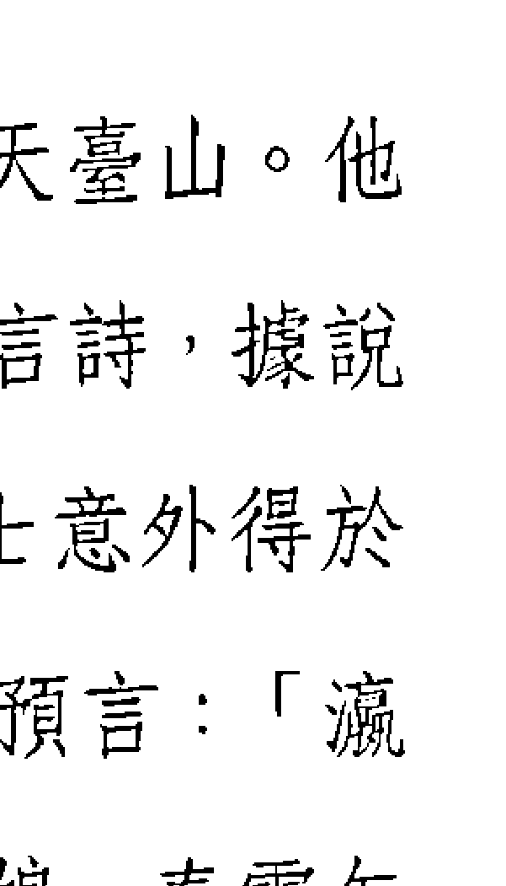

### 附录：1、《推背图》全文（金圣叹批注本）

## 第一象 甲子

| 讖曰 | 頌曰 |
| :--- | :--- |
| 茫茫天地 不知所止 日月循环 周而复始 | 自从盘古迄希夷 虎斗龙争事正奇 悟得循环真谛在 试于唐后论元机 |

> 金圣叹：
> 此象主古今治乱相因，如日月往来，阴阳递嬗，即孔子百世可知之意。
> 红者为日，白者为月，有日月而后昼夜成；有昼夜而后寒暑判；有寒暑而后历数定；有历数而后统系分；有统系而后兴亡见矣。

## 第二象 乙丑

| 讖曰 | 頌曰 |
| :--- | :--- |
| 累累硕果 莫明其数  |  |

### 一果一仁 即新即故

> 颂曰
万物土中生
二九先成实
一统定中原
阴盛阳先竭

金圣叹：
一盘果子即李实也，其数二十一，自唐高祖至昭宣凡二十一主。二九者指唐祚二百八十九年。阴盛者指武曌当国，淫昏乱政，几危唐代。厥后开元之治虽是媲美贞观，而贵妃召祸，乘舆播迁，女宠代兴，夏娣继之，亦未始非阴盛之象。

## 第三象 丙寅

> 谶曰
日月当空 照临下土
扑朔迷离 不文亦武
颂曰
参遍空王色相空
一朝重入帝王宫
遗枝拨尽根犹在
喔喔晨鸡孰是雄

金圣叹：
此象主武曌当国，废中宗于房州，杀唐宗室殆尽。先武氏削发为尼，故有参遍空王之句。高宗废后王氏而立之，故有喔喔晨鸡孰是雄之兆。

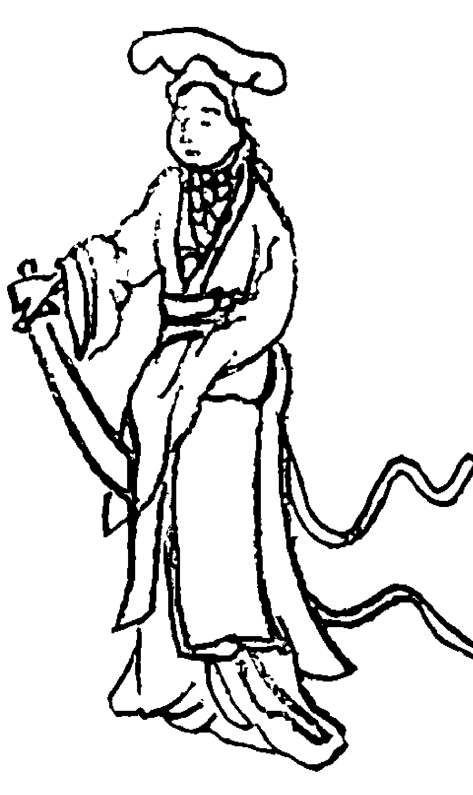

## 推背图和燒餅歌裡的史

## 第四象 丁卯

谶曰
飞者不飞 走者不走
振羽高岗 乃克有后

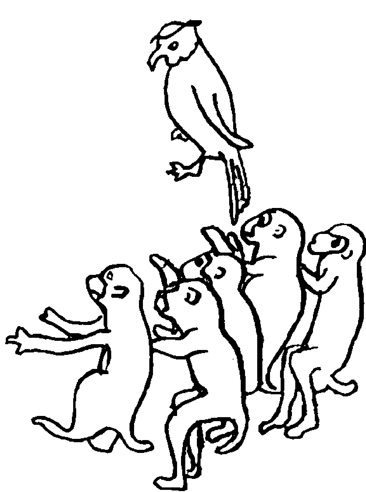

颂曰
威行青女实权奇
极目萧条十八枝
赖有猴儿齐着力
已倾大树仗扶持

> 金圣叹：
此象主狄仁杰荐张柬之等五人反周为唐。武后尝梦鹦鹉两翼俱折，狄仁杰曰：武者陛下之姓也，起二子则两翼折矣。五猴指张柬之等五人。

## 第五象 戊辰

谶曰
杨花飞 蜀道难
截断竹箫方见日
更无一吏乃平安

颂曰
渔阳鼙鼓过潼关
此日君王幸剑山
木易若逢山下鬼
定于此处葬金环

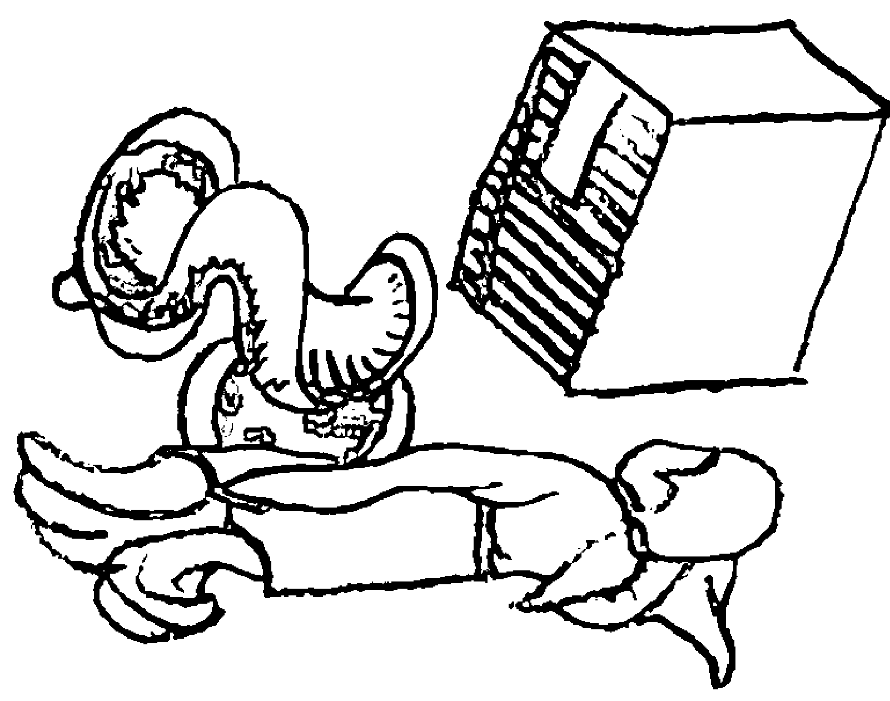

> 金圣叹：
一马鞍指安禄山，一史书指史思明。一妇人死卧地上，乃贵妃死于马嵬坡。截断竹箫者肃宗即位，而安史之乱平。

## 第六象 己巳

谶曰
非都是都 非皇是皇
阴霾既去 日月复光

颂曰
大帜巍巍树两京
辇舆今日又东行
乾坤再造人民乐
一二年来见太平

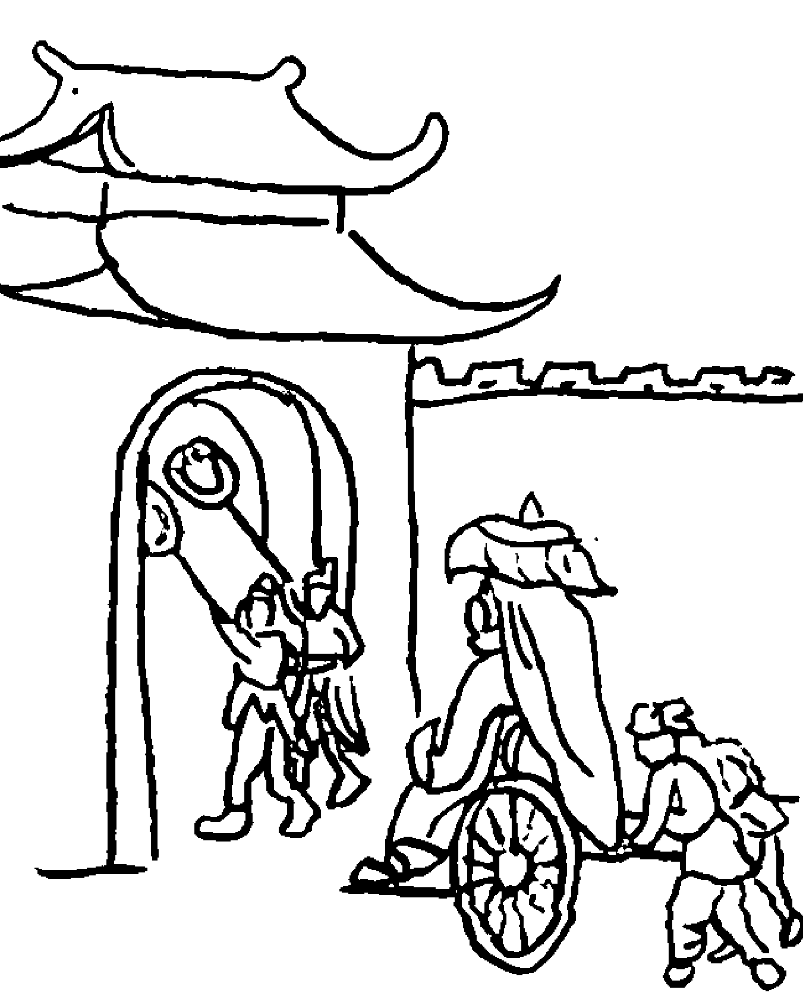

金圣叹：
此象主明皇还西京，至德二载九月，广平王俶、郭子仪收复西京，十月收复东京，安史之乱尽弭，十二月迎上皇还西京，故云再造。

## 第七象 庚午

谶曰
旌节满我目 山川竭我足
破关客来 陡令中原哭

颂曰
蝼蚁从来足溃堤
六宫深锁梦全非
重门金鼓含兵气

小草滋生土口啼

金圣叹：
此象主藩镇跋扈及吐蕃入寇中原。

## 第八象 辛未

谶曰
枭枪血中土 破贼还为贼
朵朵李花飞 帝曰迁大吉

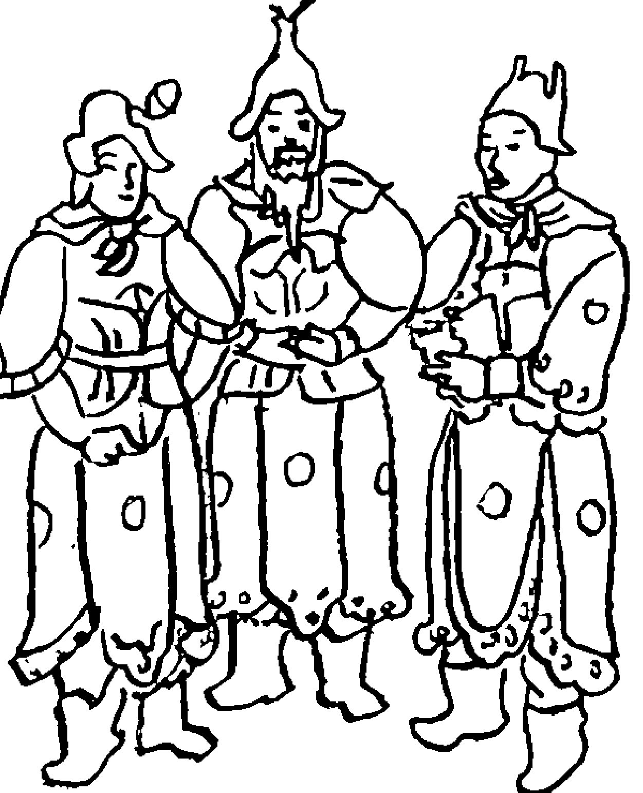

颂曰
天子蒙尘马首东
居然三杰踞关中
孤军一驻安社稷
内外能收手臂功

金圣叹：
此象主建中之乱。三人者，李希烈、朱泚、李怀光也。李怀光以破朱泚功，为卢杞所忌，遂反，故曰破贼还为贼。三人先后犯阙，德宗乘舆播迁，赖李晟以孤军收复京城，而社稷重安矣。

## 第九象 壬申

谶曰
非白非黑 草头人出
借得一枝 满天飞血

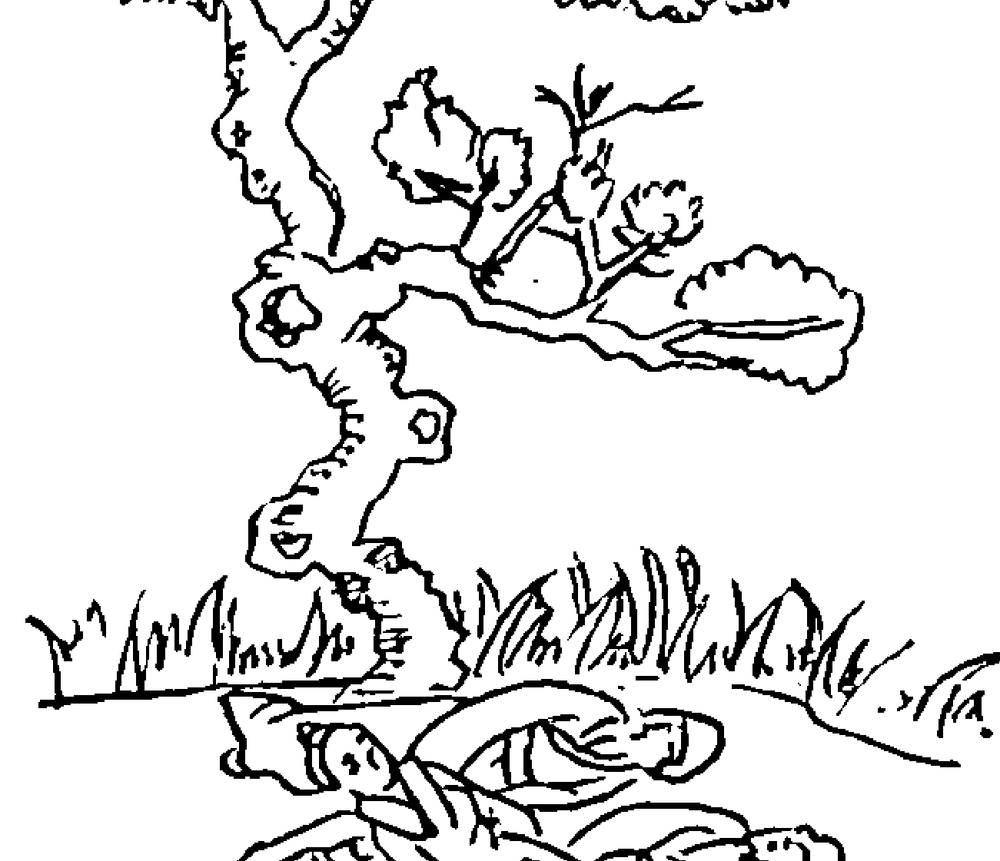

颂曰
万人头上起英雄
血染河山日色红
一树李花都惨澹
可怜巢覆亦成空

> 金圣叹：
此象主黄巢作乱，唐祚至昭宗。朱温弑之以自立，改国号梁温，为黄巢旧党，故曰覆巢亦成空。

## 第十象 癸酉

谶曰
荡荡中原 莫御八牛
泗水不涤 有血无头

颂曰
一后二主尽升遐
四海茫茫总一家
不但我生还杀我
回头还有李儿花

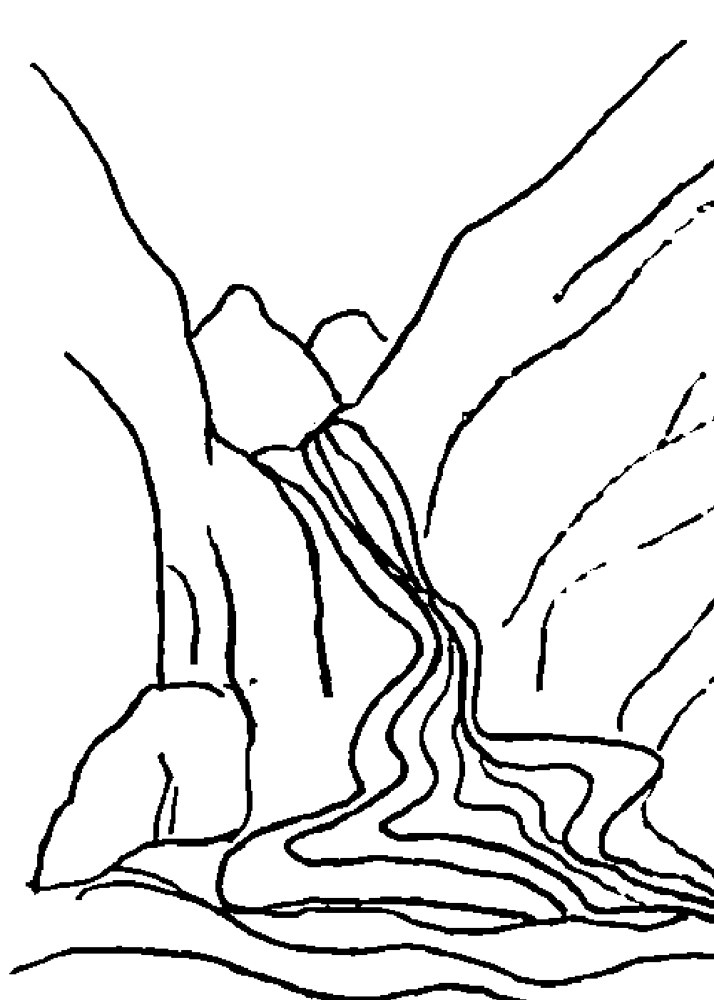

> 金圣叹：
此象主朱温弑何皇后、昭宣、昭宗而自立，所谓一后二主也。未几为次子友珪所弑，是颂中第三句意。李克用之子存勖代父复仇，百战灭梁，改称后唐，是颂中第四句意。

## 第十一象 甲戌

谶曰
五人同卜 非禄非福
兼而言之 喜怒哀乐

颂曰
龙蛇相斗三十年
一日同光直上天
上得天堂好游戏
东兵百万入秦川

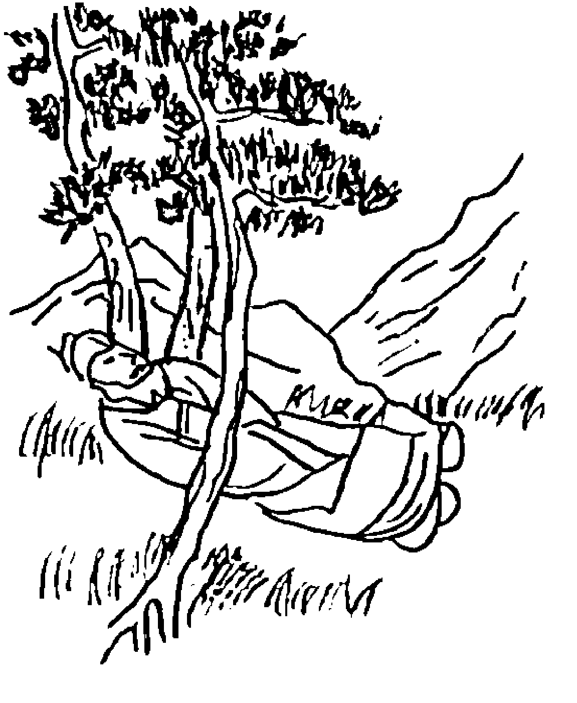

> 金圣叹：
此象主伶人郭从谦作乱，唐主为流矢所中。

## 第十二象 乙亥

谶曰
块然一石 谓他人父
统二八州 已非唐土

颂曰
反兆先多口
出入皆无主
系铃自解铃
父亡子亦死

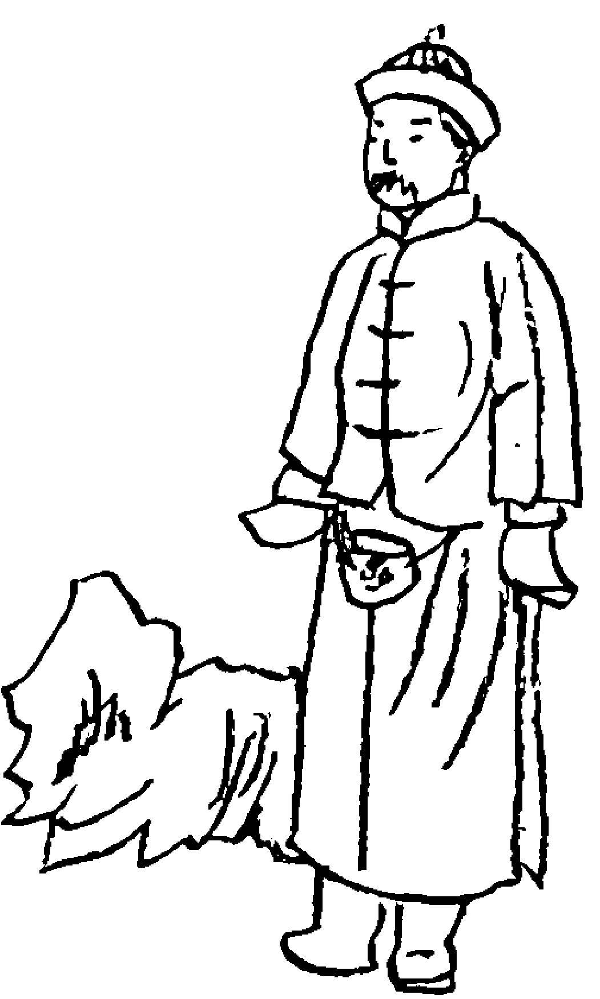

> 金圣叹：
此象主石敬瑭求救于契丹。唐主遣张敬达讨石敬瑭，敬瑭不得已，求救于契丹，事之以父礼，赂以幽燕十六州。晋帝之立国契丹功也，然卒以契丹亡，故有系铃解铃之兆。

## 第十三象 丙子

谶曰
汉水竭 雀高飞
飞来飞去何所止
高山不及城郭低

颂曰
百个雀儿水上飞
九十九个过山西
唯有一个踏破足
高楼独自理毛衣

金圣叹：
此象主周主郭威夺汉自立。郭威少贱，世称之曰郭雀儿。

## 第十四象 丁丑

谶曰
李树得根芽
石榴漫放花
枯木逢春祇一瞬
让他天下竞荣华

颂曰
金木水火土已终
十三童子五王公
英明重见太平日
五十三参运不通

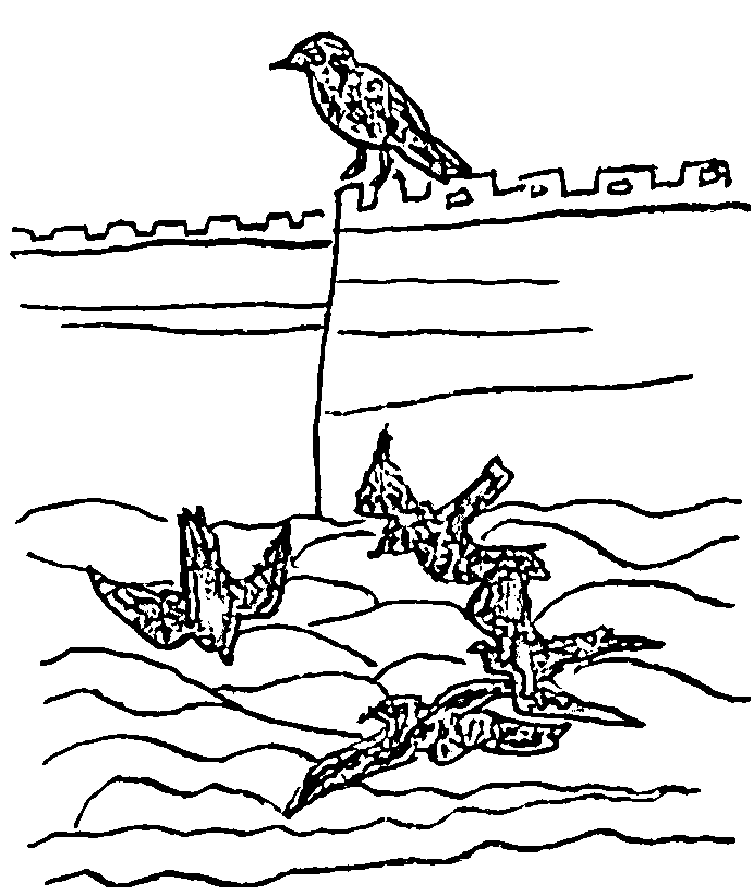

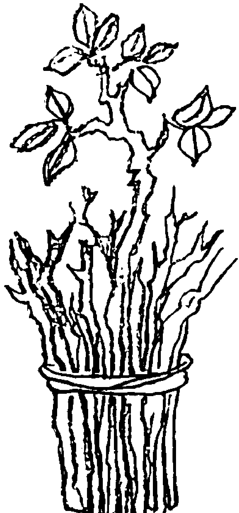

金圣叹：
此象主周世宗承郭威受命为五代之终，世宗姓柴名荣，英明武断，勤于为治，惜功业未竟而殂。五代共五十三年，凡八姓十三主，颂意显然。

## 第十五象 戊寅

谶曰
天有日月 地有山川
海内纷纷 父后子前

颂曰
战事中原迄未休
几人高枕卧金戈
寰中自有真天子
扫尽群妖见日头

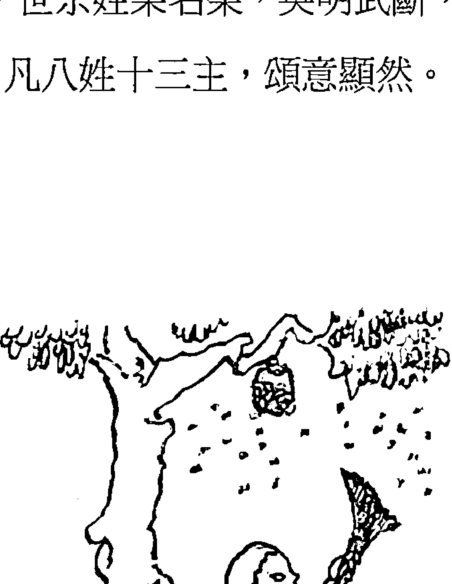

金圣叹：
此象主五代末造，割据者星罗棋布，惟吴越钱氏（钱镠四世）稍图治安，南唐李氏（李升三世）略知文物，余悉淫乱昏虐。大祖崛起，拯民水火。太小名香孩儿，手执帚著，扫除群雄也。

## 第十六象 己卯

谶曰
天一生水 姿禀圣武
顺天应人 无今无古

颂曰
纳土姓钱并姓李
其余相次朝天子
天将一统付真人
不杀人民更全嗣

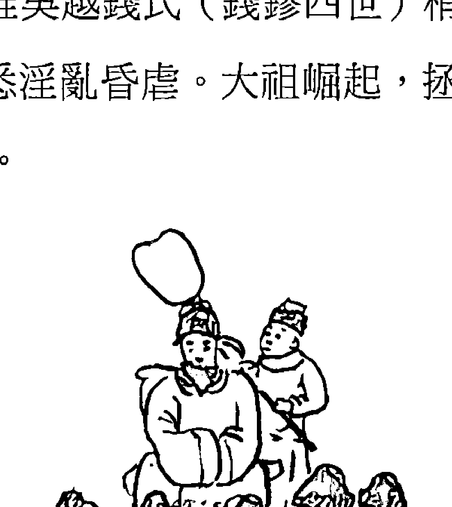

> 金圣叹：
此象主宋太受禅汴都，天下大定，钱李二氏相率归化，此一治也。

## 第十七象 庚辰

谶曰
声赫赫 干戈息
扫边气 莫邦邑

颂曰
天子亲征乍渡河
欢声百里起讴歌
运筹幸有完全女
奏得奇功在议和

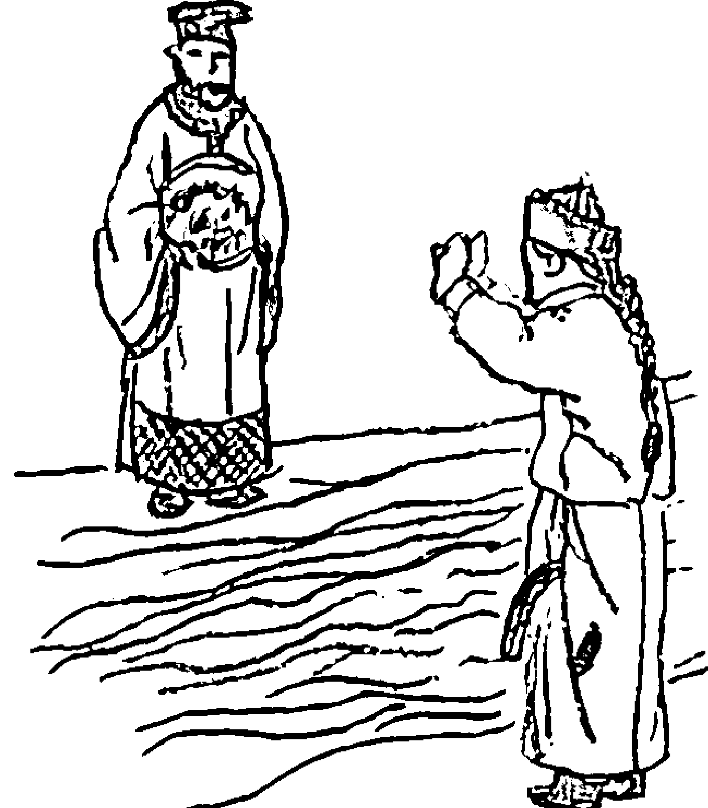

> 金圣叹：
此象主宋真宗澶渊之役。景德元年，契丹大举入寇，寇准劝帝亲征，乃幸澶渊。既渡河，远近望见御盖皆踊跃呼万岁，声闻数十里，契丹夺气，遂议和。

## 第十八象 辛巳

谶曰
天下之母 金刀伏兔
三八之年 治安巩固

颂曰
水旱频仍不是灾
力扶幼主坐灵台
朝中又见钗光照
宇内承平气象开

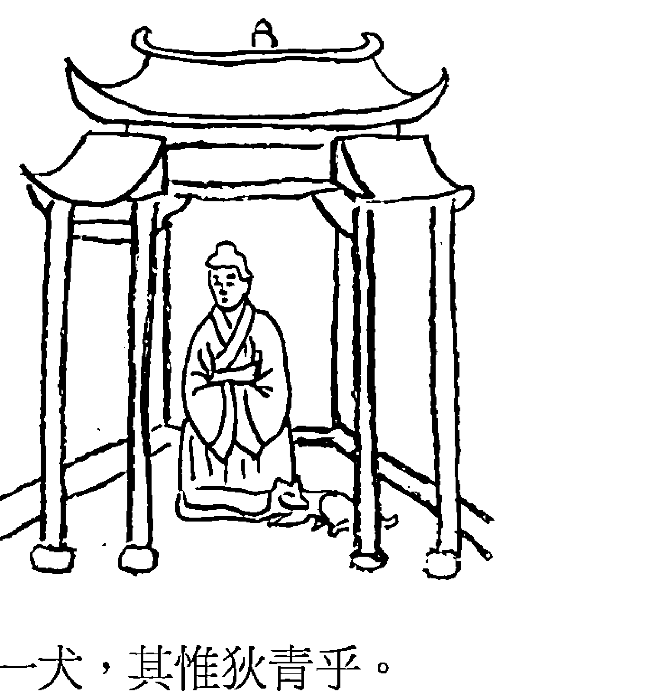

> 金圣叹：
此象主仁宗嗣立，刘太后垂听政。旁有一犬，其惟狄青乎。

## 第十九象 壬午

谶曰
众人嚣嚣 尽入其室
百万雄狮 头上一石

颂曰
朝用奇谋夕丧师
人民西北尽流离
韶华虽好春光老
悔不深居坐殿墀

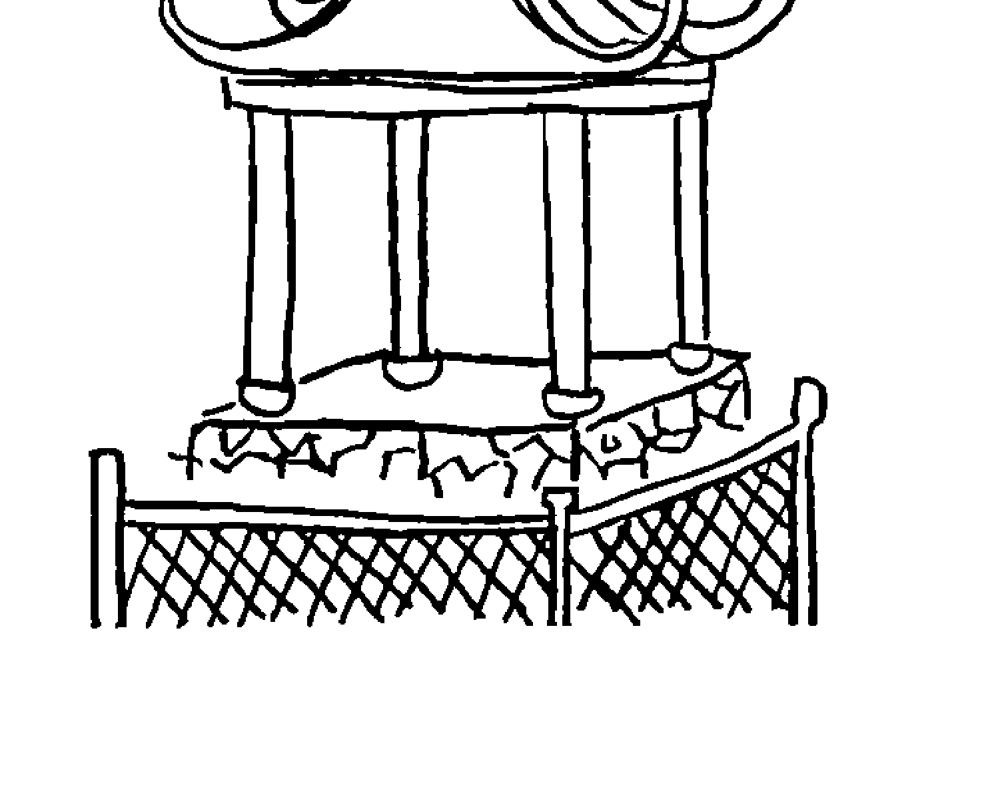

> 金圣叹：
此象主神宗误用安石，引用群邪，致启边衅，用兵西北，丧师百万。熙宁初，王韶上平戎三策，安石惊为奇谋，力荐于神宗，致肇此祸。

## 第二十象 癸未

谶曰
朝无光 日月盲
莫与京 终旁徨

颂曰
父子同心并同道
中天日月手中物
奇云翻过北海头
凤阙龙廷生怛恻

> 金圣叹：
此象主司马光卒，蔡京父子弄权，群小朋兴，贤良受锢，有日月晦盲之象。

### ◎附录◎

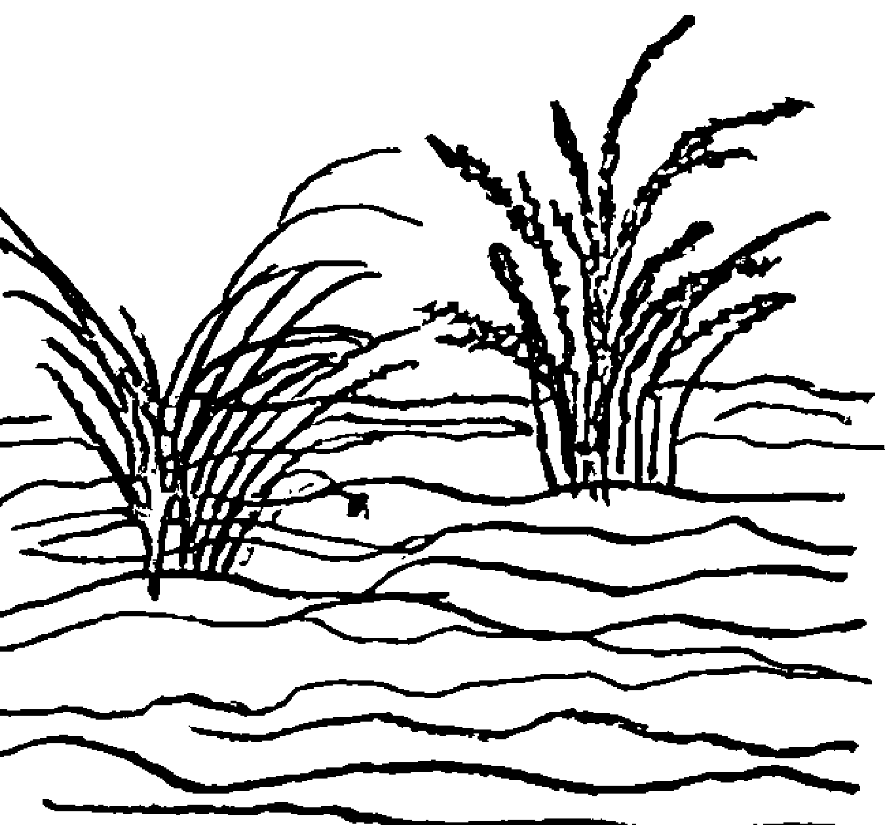

## 第二十一象 甲申

谶曰
空厥宫中 雪深三尺
吁嗟元醋 南辕北辙

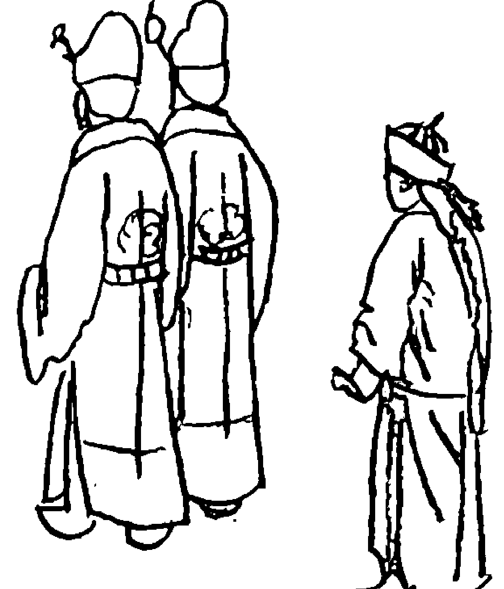

颂曰
妖氛未靖不康宁
北扫烽烟望帝京
异姓立朝终国位
卜世三六又南行

> 金圣叹：
此象主金兵南下，徽宗禅位。靖康元年十一月，京师陷，明年四月，金以二帝及宗室妃嫔北去，立张邦昌为帝。卜世三六者，宋自太祖至徽钦，凡九世，然则南渡以后又一世矣。

## 第二十二象 乙酉

谶曰
天马当空 否极见泰
凤凰淼淼 木朁大赖

颂曰
神京王气满东南
祸水汪洋把策干
一木会支二八月
临行马色半平安

金圣叹：
此象主康王南渡建都临安，秦桧专权形成偏安之局。木朁，康王名构。一木会支二八月者，指秦桧，木会合为桧。春之一半，秋之一半，加成一秦字。

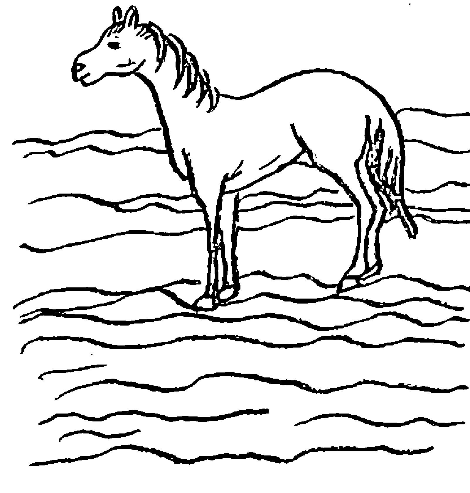

## 第二十三象 丙戌

谶曰
似道非道 乾沈坤黯
祥光宇内 一江断楫

颂曰
胡儿大张挞伐威
两柱擎天力不支
如何兵火连天夜
犹自张灯作水嬉

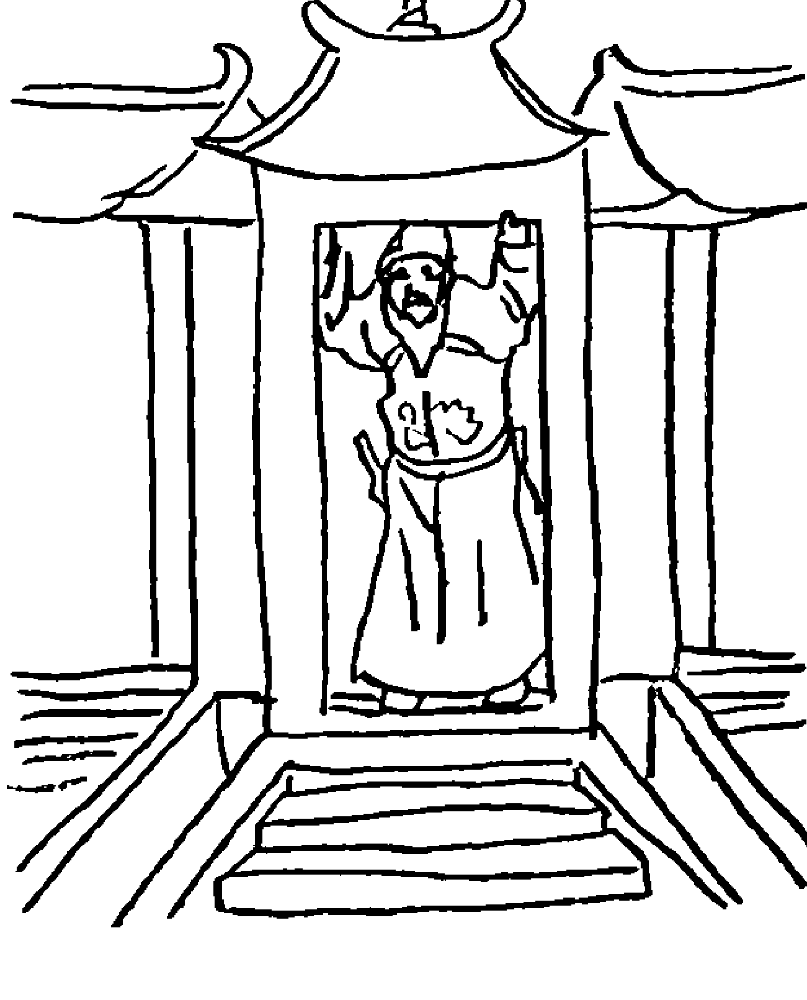

金圣叹：
此象主贾似道当权，汪立信、文天祥辈不能以独力支持宋室。襄樊围急，西子湖边似道犹张灯夜宴，宋室之亡其宜也。

## 第二十四象 丁亥

> 谶曰
山崖海边 不帝亦仙
三九四八 于万斯年

> 颂曰
十一卜人小月终
回天无力道俱穷
干戈四起疑无路
指点洪涛巨浪中

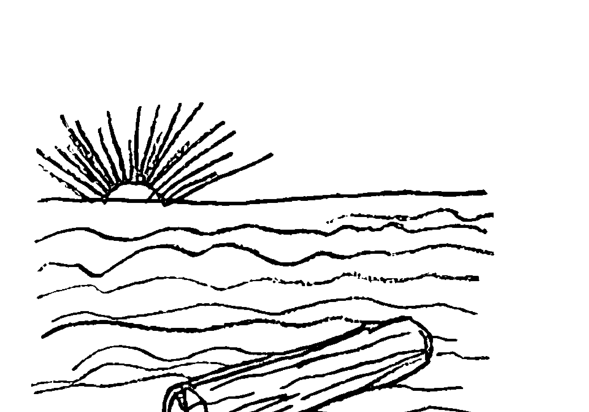

> 金圣叹：
此象主帝昺迁山，元令张弘范来攻，宋将张世杰兵溃，陆秀夫负帝赴海：宋室以亡。

## 第二十五象 戊子

> 谶曰
北帝南臣 一兀自立
斡离河水 燕巢捕戮

> 颂曰
鼎足争雄事本奇
一狼二鼠判须臾
北关锁钥虽牢固

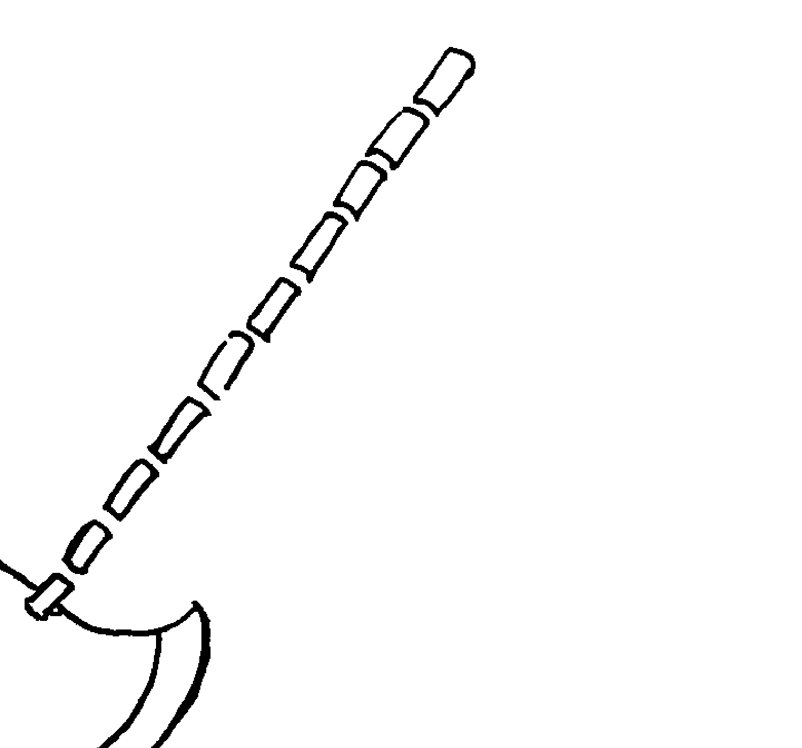

子子孙孙五五宜

> 金圣叹：
此象主元太租称帝斡难河，太祖名铁木真，元代凡十主。斧铁也，柄木也，斧柄十段即隐十主之意。

## 第二十六象 己丑

谶曰
时无夜 年无米
花不花 贼四起

颂曰
鼎沸中原木木来
四方警报起边垓
房中自有长生术
莫怪都城彻夜开

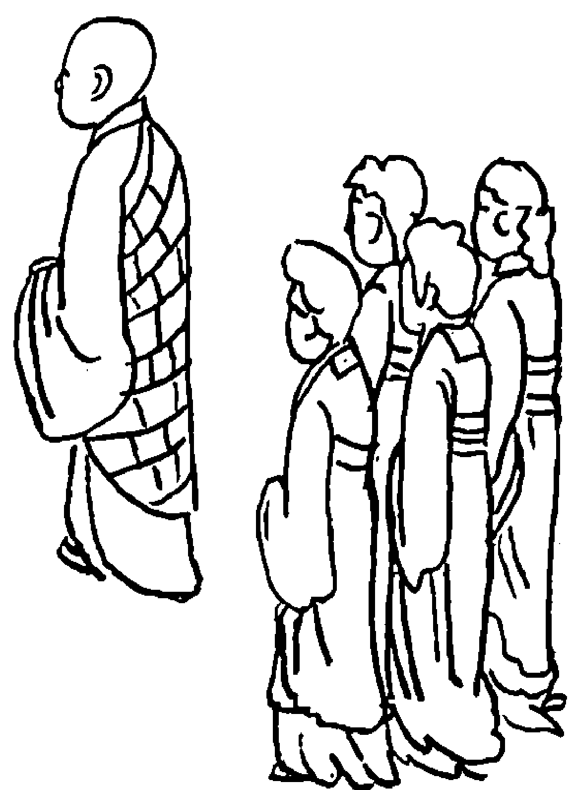

> 金圣叹：
此象主顺帝惑西僧房中运气之术，溺于娱乐，以致刘福通、徐寿辉、方国珍、明玉珍、张士诚，陈友谅等狼顾鸱张，乘机而起。宦官朴不花壅不上闻，至徐达、常遇春直入京师，都城夜开，毫无警备。有元一代，竟丧于淫僧之手，不亦哀哉。刘福通立韩林儿为帝，故曰木木来。

## 第二十七象 庚寅

谶曰
惟日与月 下民之极
应运而兴 其色曰赤

颂曰
枝枝叶叶现金光
晃晃朗朗照四方
江东岸上光明起
谈空说偈有真王

> 金圣叹：此象主明太祖登极。太祖曾为皇觉寺僧，洪武一代海内熙洽，治臻太平。

## 第二十八象 辛卯

谶曰
草头火脚 宫阙灰飞
家中有鸟 郊外有尼

颂曰
羽满高飞日
争妍有李花
真龙游四海
方外是吾家

> 金圣叹：此象主燕王起兵，李景隆迎燕兵入都，宫中大火，建文祝发岀亡。

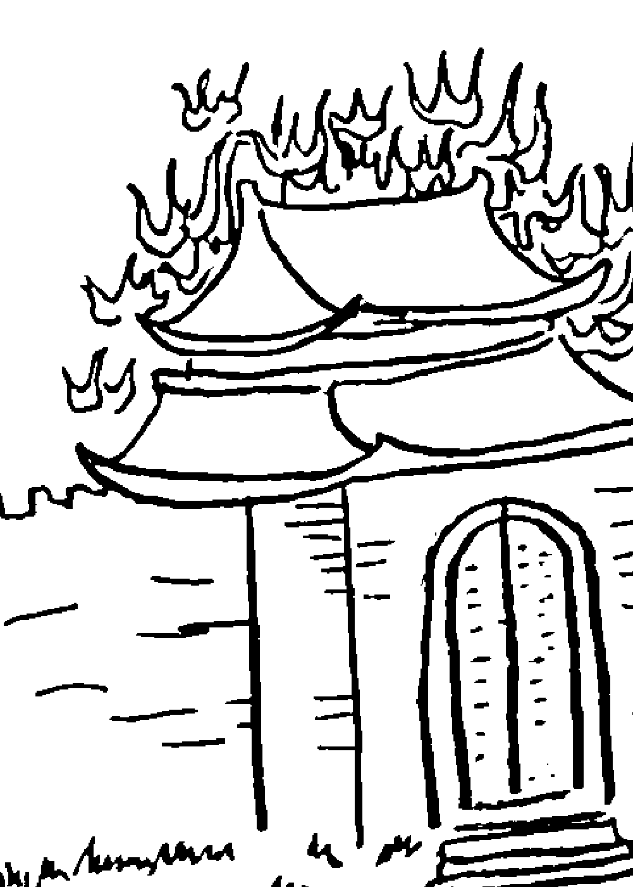

## 第二十九象 壬辰

谶曰
枝发厥荣 为国之栋
皞皞熙熙 康乐利众

颂曰
一枝向北一枝东
又有南枝种亦同
宇内同歌贤母德
真有三代之遗风

> 金圣叹：
此象主宣宗时张太后用杨士奇、杨溥、杨荣三人，能使天下乂安，希风三代，此一治也。时人称士奇为西杨，溥为南杨，荣为东杨。

## 第三十象 癸巳

谶曰
半圭半林 合则生变
石亦有灵 生荣死贱

颂曰
缺一不成也占先
六龙亲御到胡边
天心复见人心顺
相克相生马不前

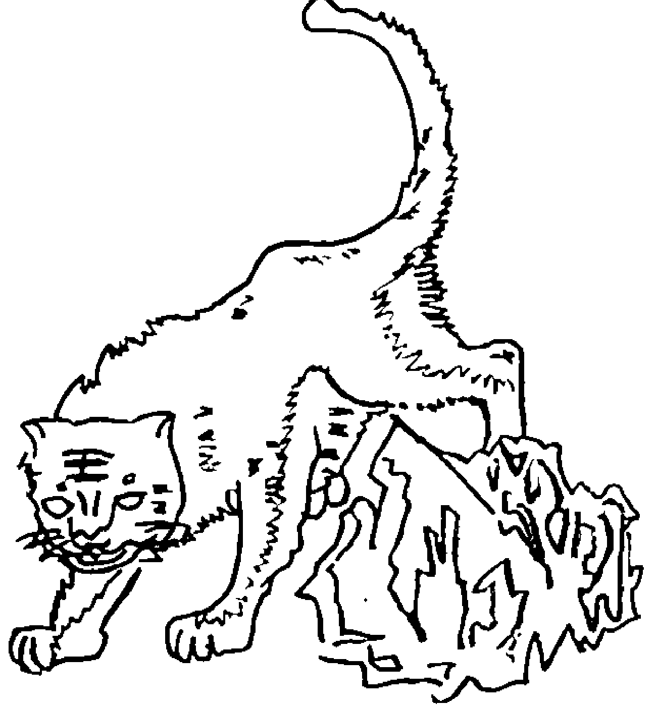

> 金圣叹：
此象主张太后崩权归王振，致有也先之患。其后上皇复辟，石亨自诩首功，率以恣横伏诛，此一乱也。

## 第三十一象 甲午

谶曰
当涂遗孽 秽乱宫阙
一男一女 斯送人国

颂曰
忠臣贤士尽沉沦
天启其衷乱更纷
纵有胸怀能坦白
乾坤不属旧明君

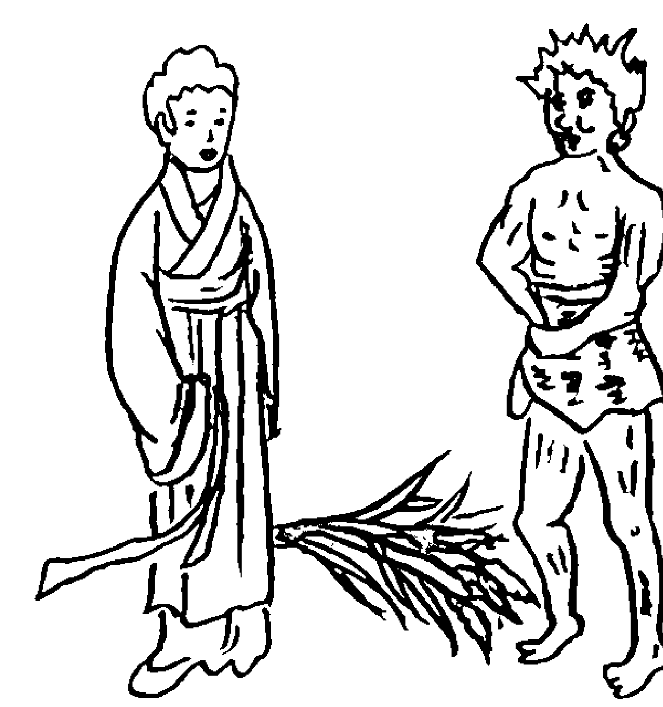

金圣叹：
此象主天启七年间，妖气漫天，元气受伤。一男一女指魏阉与客氏而言。魏杀客氏，客氏熹宗乳母，称奉圣夫人。

## 第三十二象 乙未

谶曰
马跳北阙 犬嗷西方
八九数尽 日月无光

颂曰
杨花落尽李花残
五色旗分自北来
太息金陵王气尽
一枝春色占长安

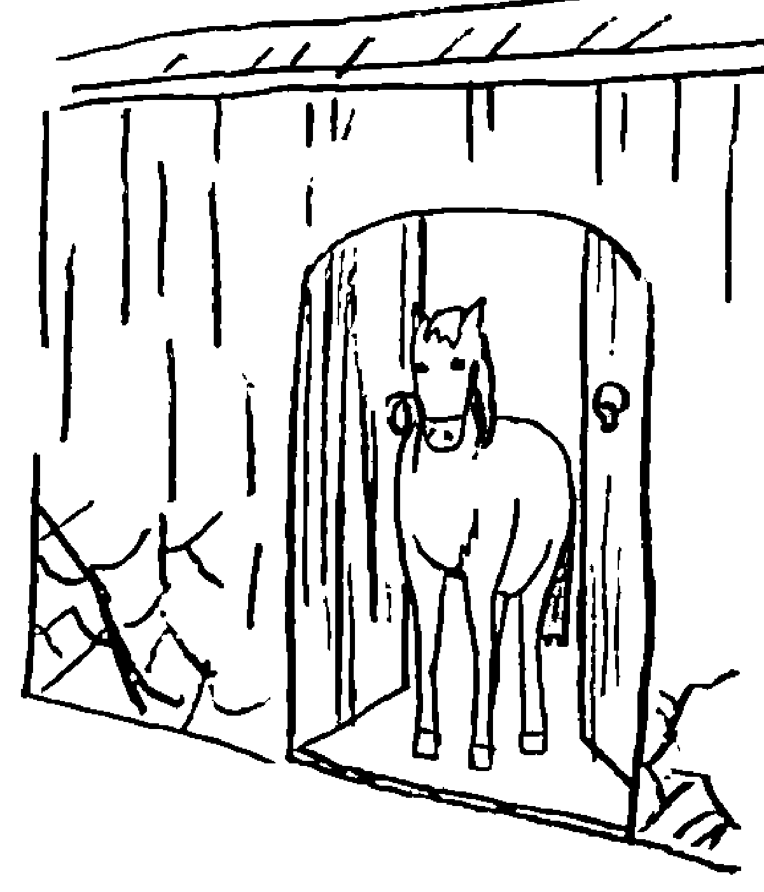

金圣叹：
此象主李闯、张献忠扰乱中原，崇祯投环煤山，福王偏安不久明祀遂亡。颂末句似指胡后，大有深意。

## 第三十三象 丙申

谶曰
黄河水清 气顺则治
主客不分 地支无子

颂曰
天长白瀑来
胡人气不衰
藩篱多撤去
稚子半可哀

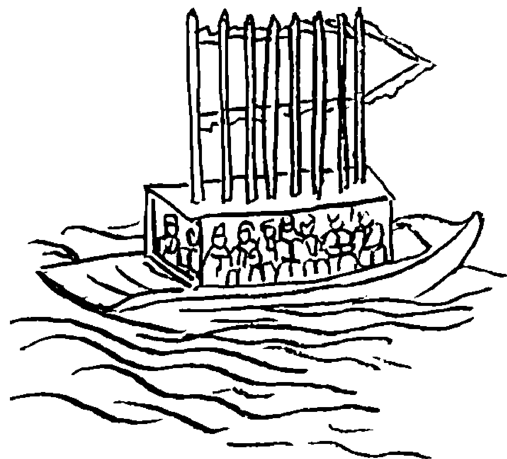

> 金圣叹：
此象乃满清入关之征。反客为主殆亦气数使然，非人力所能挽回欤。辽金而后胡人两主中原，琐琐汉族对之得毋有愧。

## 第三十四象 丁酉

谶曰
头有发 衣怕白
太平时 王杀王

颂曰
太平又见血花飞
五色章成里外衣
洪水滔天苗不秀
中原曾见梦全非

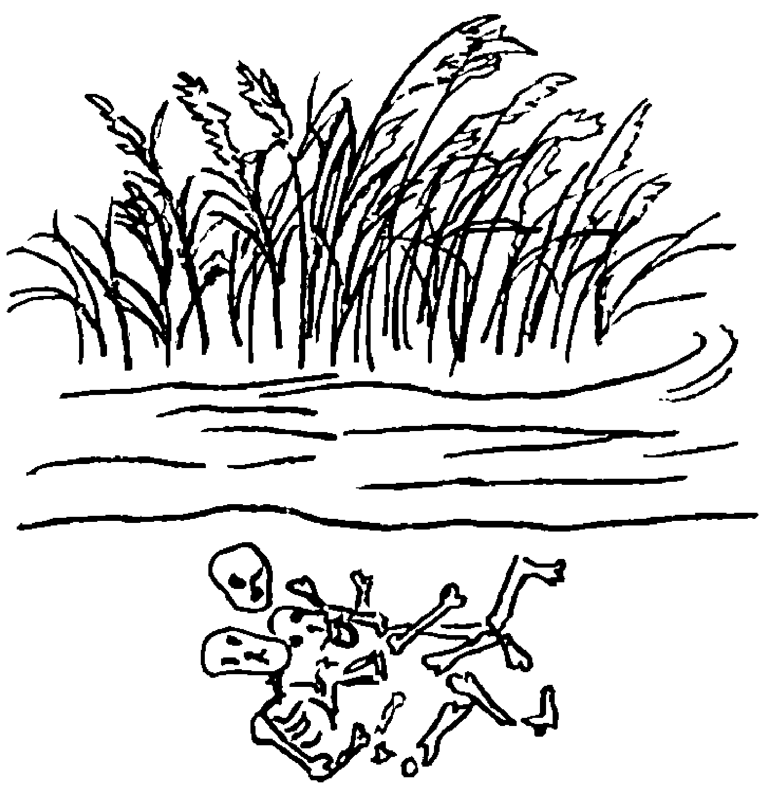

> 金圣叹：
证已往之事易，推未来之事难，然既证已往，似不得不推及将来。吾但愿自此以后，吾所谓平治者皆幸而中，吾所谓不平治者幸而不中，而吾可告无罪矣。此象疑遭水灾或兵戎与天灾共见，此一乱也。

## 第三十五象 戊戌

谶曰
西方有人 足踏神京
帝出不还 三台扶倾

颂曰
黑云黯黯自西来
帝子临河筑金台
南有兵戎北有火
中兴曾见有奇才

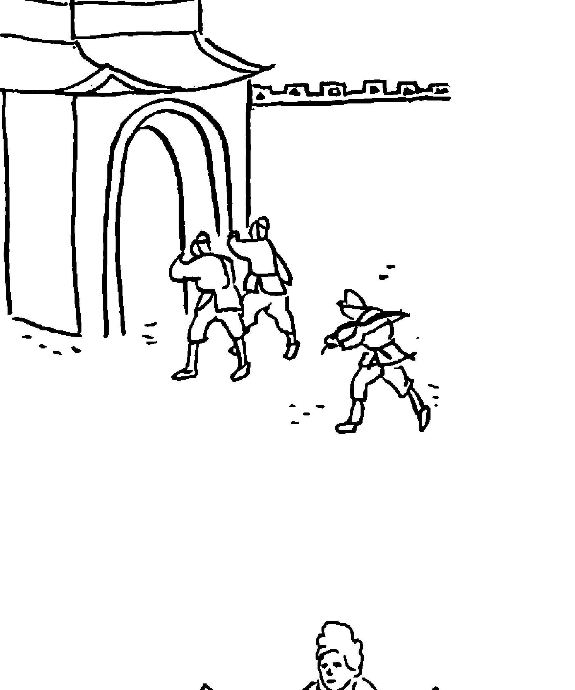

> 金圣叹：
此象疑有出狩事，亦乱兆也。

## 第三十六象 己亥

谶曰
纤纤女子 赤手御敌
不分祸福 灯光蔽日

颂曰
双拳旋转乾坤
海内无端不靖
母子不分先后
西望长安入觐

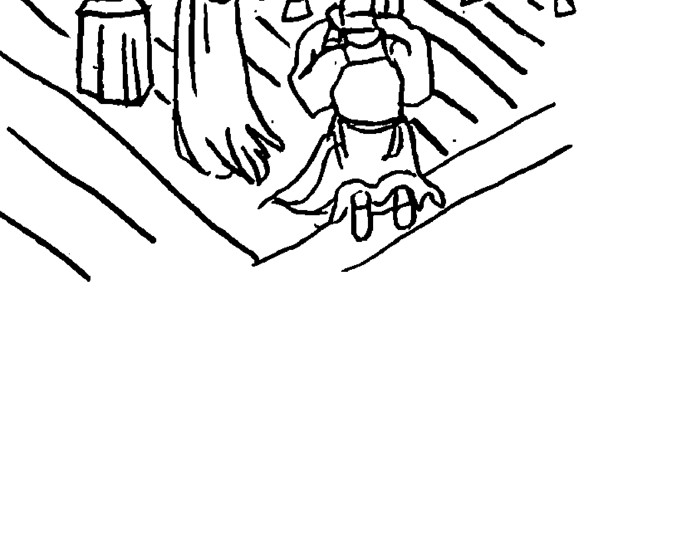

金圣叹：
此象疑一女子能定中原，建都长安。

## 第三十七象 庚子

谶曰
汉水茫茫 不统继统
南北不分 和衷与共

颂曰
水清终有竭
倒戈逢八月
海内竟无王
半凶还半吉

金圣叹：
此象虽有元首出现，而一时未易平治，亦一乱也。

## 第三十八象 辛丑

谶曰
门外一鹿 群雄争逐
劫及禽鱼 水深火热

颂曰
火运开时祸蔓延
万人后死万人生
海波能使江河浊
境外何殊在目前

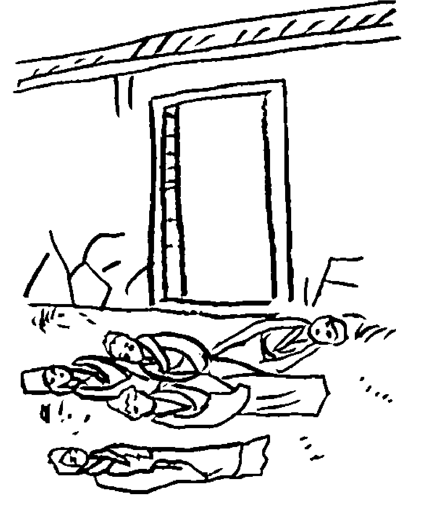

> 金圣叹：
此象兵祸起于门外有延及门内之兆。

## 第三十九象 壬寅

谶曰
鸟无足 山有月
旭初升 人都哭

颂曰
十二月中气不和
南山有雀北山罗
一朝听得金鸡叫
大海沉沉日已过

> 金圣叹：
此象疑一外夷扰乱中原，必至酉年始得平也。

## 第四十象 癸卯

谶曰
一二三四 无土有主
小小天罡 垂拱而治

颂曰
一口东来气太骄
脚下无履首无毛
若逢木子冰霜涣
生我者猴死我雕

> 金圣叹：
此象有一李姓，能服东夷，而不能图长治久安之策，卒至旋治旋乱，有兽活禽死之意也。

## 第四十一象 甲辰

谶曰
天地晦盲 草木蕃殖
阴阳反背 上土下日

颂曰
帽儿须戴血无头
手弄乾坤何日休
九十九年成大错
称王只合在秦州

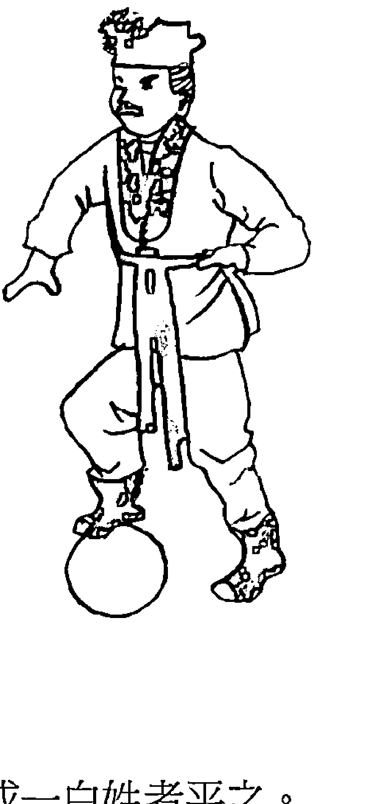

> 金圣叹：
此象一武士擅握兵权，致肇地覆天翻之祸，或一白姓者平之。

## 第四十二象 乙巳

谶曰
美人白西来
朝中日渐安
长弓在地 危而不危

颂曰
西方女子琵琶仙
皎皎衣裳色更鲜
此时浑迹匿朝市
闹乱君臣百万般

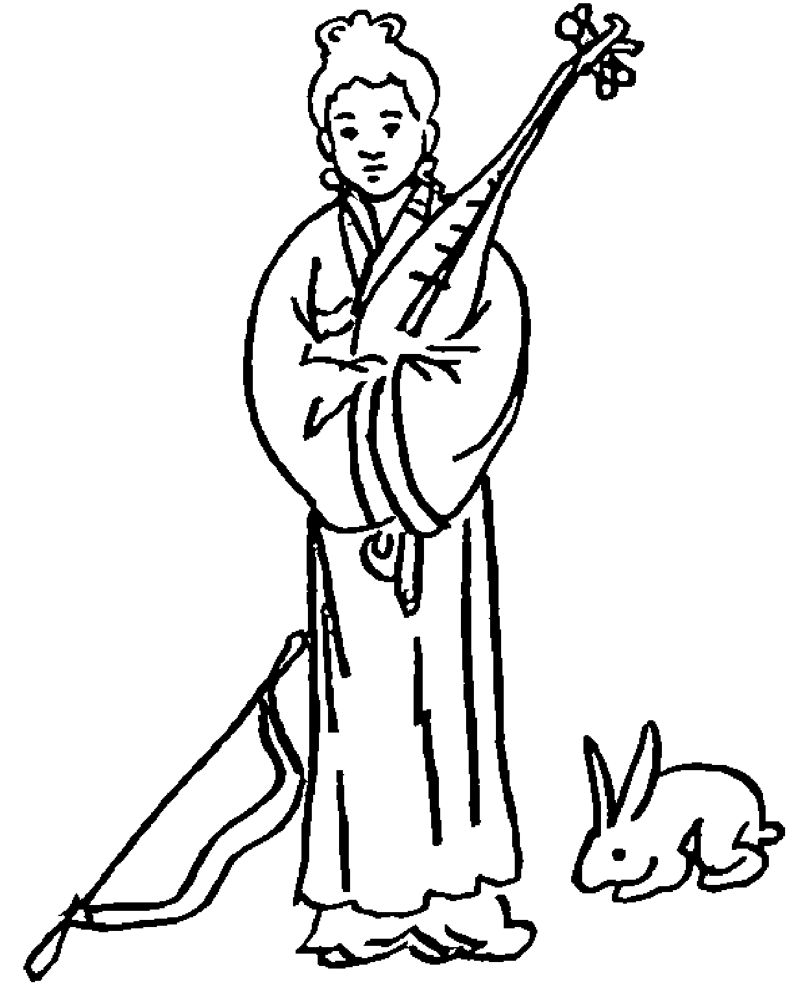

> 金圣叹：
此象疑一女子当国，服色尚白，大权独揽，几危社稷，发现或在卯年，此始乱之兆也。

## 第四十三象 丙午

谶曰
君非君 臣非臣
始艰危 终克定

颂曰
黑兔走入青龙穴
欲尽不尽不可说
唯有外边根树上
三十年中子孙结

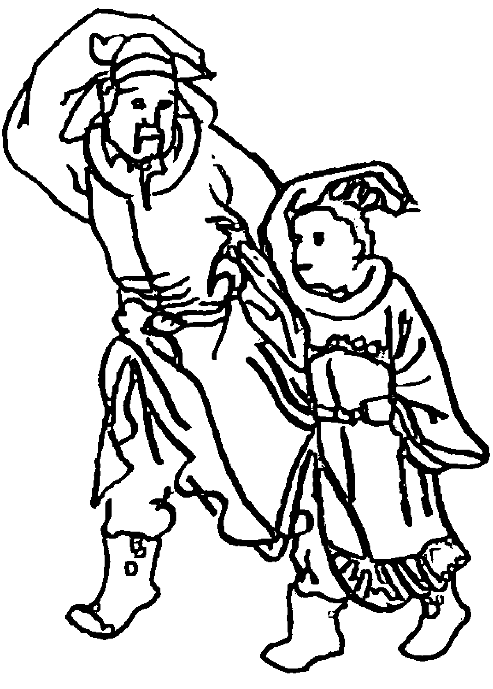

> 金圣叹：
此象疑前象女子乱国未终，君臣出狩，有一杰出之人为之底定，然必在三十年后。

## 第四十四象 丁未

谶曰
日月麗天 群陰懾服
百靈來朝 雙羽四足

颂曰
而今中國有聖人
雖非豪傑也周成
四夷重譯稱天子
否極泰來九國春

> 金圣叹：
此象乃聖人復生，四夷來朝之兆，一大治也。

## 第四十五象 戊申

谶曰
有客西來 至東而止
木火金水 洗此大恥

颂曰
炎運宏開世界同
金烏隱匿白洋中
從此不敢稱雄長
兵氣全消運已終

> 金圣叹：
此象於太平之世復見兵戎，當在海洋之上，自此之後，更臻盛世矣。

## 第四十六象 己酉

谶曰
黯黯陰霾 殺不用刀
萬人不死 一人難逃

颂曰
有一軍人身帶弓
只言我是白頭翁
東邊門裡伏金劍
勇士後門入帝宮

金圣叹：
此象疑君王昏聵，一勇士仗義興兵為民請命，故曰萬人不死一人難逃。

## 第四十七象 庚戌

谶曰
偃武修文 紫微星明
匹夫有責 一言為君

颂曰
無王無帝定乾坤
來自田間第一人
好把舊書多讀到
義言一出見英明

金圣叹：
此象有賢君下士，豪傑來歸之兆，蓋輔助得人，而帝不居德，王不居功，蒸蒸然有無為而治之盛。此一治也。

## 第四十八象 辛亥

谶曰
卯午之开 厥象维离
八牛牵动 雍雍熙熙

颂曰
水火既济人民吉
手执金戈不杀贼
五十年中一将臣
青青草自田间出

> 金圣叹：
此象疑一朱姓与一苗姓争朝纲，而朱姓有以德服人之化，龙蛇相斗，想在辰巳之年，其建都或在南方。

## 第四十九象 壬子

谶曰
山谷少人口 欲剿失其巢
帝王称弟兄 纷纷是英豪

颂曰
一个或人口内啼
分南分北分东西
六爻占尽文明见
棋布星罗日月齐

> 金圣叹：
久分必合，久合必分，理数然也，然有文明之象，当不如割据者之纷扰。

## 第五十象 癸丑

谶曰
水火相戰 時窮則變
貞下起元 獸貴人賤

頌曰
虎頭人遇虎頭年
白米盈倉不值錢
豺狼結隊街中走
撥盡風雲始見天

> 金聖歎：此象遇寅年遭大亂，君昏臣暴，下民無生息之日，又一亂也。

## 第五十一象 甲寅

谶曰
陰陽和 化以正
坤順而感 後見堯舜

頌曰
誰云女子尚剛強
坤德居然感四方
重見中天新氣象
卜年一六壽而康

金聖歎：
此象乃明君得賢后之助，化行國內，重見昇平，又一治也。卜年一六，或在位七十年。

## 第五十二象 乙卯

谶曰
彗星乍見 不利東北
踟蹰何之 瞻彼樂國

頌曰
機槍一點現東方
吳楚依然有帝王
門外客來終不久
乾坤再造在角亢

金聖歎：此象主東北被夷人所擾，有遷都南方之兆。角亢南極也。其後有明君出，驅逐外人，再度昇平。

## 第五十三象 丙辰

谶曰
闕中天子 禮賢下士
順天休命 半老有子

頌曰
一個孝子自西來
手掘乾綱天下安
域中兩見旌旗美
前人不及後人才

金聖歎：
此象有一秦姓名孝者，登極關中，控制南北，或以秦爲國號，此一治也。

## 第五十四象 丁巳

讖曰
磊磊落落 殘棋一局
啄息苟安 雖笑亦哭

頌曰
不分牛鼠與牛羊
去毛存鞏尚稱強
寰中自有真龍出
九曲黃河水不黃

金聖歎：
此象有實去名存之兆，或爲周末時，號令不行，尚頒止朔：亦久合必分之徵也。

## 第五十五象 戊午

讖曰
懼則生戒 無遠勿居
水邊有女 對日自拜

頌曰
覬覦神器終無用
翼翼小心有臣眾
轉危為安見節義
未必河山是我送

> 金聖歎：
此象有一石姓或劉姓一統中原，有一姓汝者謀篡奪之，幸有大臣盡忠王室，戒謹惕勵，一切外侮不滅自滅，雖亂而亦治也。

## 第五十六象 己未

> 讖曰
飛者非鳥 潛者非魚
戰不在兵 造化遊戲

> 頌曰
海疆萬里盡雲煙
上迄雲霄下及泉
金母木公工幻弄
干戈未接禍連天

> 金聖歎：
此象軍用火，即亂不在兵之意。頌雲，海疆萬里，則戰爭之烈，不僅在於中國也。

## 第五十七象 庚申

> 讖曰
物極必反 以毒制毒
三尺童子 四夷響服

> 颂曰
坎離相剋見天倪
天使斯人弭殺機
不信奇才產吳越
重洋從此戢兵師

金聖歎：
此象言吳越之間有一童子，能出奇制勝，將燎原之火撲滅淨盡，而厄運自此終矣，又一治也。

## 第五十八象 辛酉

> 谶曰
大亂平 四夷服
稱弟兄 六七國

> 颂曰
烽煙淨盡海無波
稱帝稱王又統和
猶有煞星隱西北
未能遍唱太平歌

金聖歎：
此象有四夷來王，海不揚波之兆。惜乎西北一隅尚未平靖，猶有遺憾，又一治也。

## 第五十九象 壬戌

谶曰
无城无府 无尔无我
天下一家 治臻大化

颂曰
一人為大世界福
手执簽筒拔去竹
红黄黑白不分明
东南西北尽和睦

金圣叹：
此乃大同之象，人生其际，饮和食德，当不知若何也。惜乎其数已终，其或反本归原，还于浑噩欤。

## 第六十象 癸亥

谶曰
一阴一阳 无始无终
终者自终 始者自始

颂曰
茫茫天数此中求
世道兴衰不自由
万万千千说不尽
不如推背去归休

金圣叹：
一人在前，一人在后，有往无来，无独有偶，以此殿图，其寓意至深远焉。无象之象胜于有象。我以不解解之，著者有知当亦许可。

### 2、《烧饼歌》全文

明太祖一日身居内殿，食烧饼，方啖一口，内监忽报国师刘基进见。太祖以碗覆之，始召基入。礼毕，帝问曰：「先生深明数理，可知碗中是何物 件？」

基乃捏指轮算，对曰：「半似日兮半似月，曾被金龙咬一缺。此食物也。」开视果然。

帝即问以天下后世之事若何。

基曰：「茫茫天数，我主万子万孙，何必问哉？」

帝曰：「虽然自古兴亡原有一定，况天下非一人之天下，唯有德者能享之，言之何妨？试略言之。」

基曰：「泄漏天机，臣罪非轻。陛下恕臣万死，才敢冒奏。」

帝即赐以免死金牌。

基谢恩毕，奏曰：「我朝大明一统世界，南方终灭北方兴。虽然太子是嫡裔，文星高拱日防西。」

帝曰：「朕今都城筑坚守密，何防之有？」

基曰：「臣见都城虽巩固，防守严密，似觉无虞，只恐燕子飞来（指靖难之役）。」随作歌三首曰：

此城御驾尽亲征，一院山河永乐平，
秃顶人来文墨苑，英雄一半尽还乡。

北方胡虏残生灵，御驾亲征得太平，
失算功臣不敢谏，旧灵遮掩主惊魂（指土木堡之变，英宗被俘）。

国历瑞云七载长（指景帝在位七年），胡人不敢害贤良，相送金龙复故旧，云开日月振边疆（指英宗回归复辟）。

帝曰：「此时天下若何？」

基曰：「天下大乱矣。」

帝曰：「朕之天下，有谁乱者？」

基曰：「天下饥寒有怪异，栋梁龙德乘婴儿。禁宫阔大任横走，长大金龙太平时。老练金精尤壮旺，相传昆玉继龙堂。谁人任用保社稷，八千女鬼乱朝纲（指魏忠贤乱政）。」

帝曰：「八千女鬼乱朕天下，若何？」

基曰：「忠良杀害崩如山，无事水边成异潭。救得蛟龙真骨肉，可怜父子在离宫。」

帝曰：「莫非父子争国乎？」

基曰：「非也，树上挂曲尺，遇顺则止。至此天下未已。」

帝曰：「何谓未已？」

基曰：「万子万孙层叠层（指万历之孙），祖宗山上贝衣行（指崇祯）。公侯不复朝金阙，十八孩儿难上难。卦曰：木下一头了，目上一刀一戊丁（指李自成）。天下重文不重武，英雄豪杰总无春。戊子己丑乱如麻，到处人民不在家。偶遇饥荒草寇发，平安镇守好桂花（指吴三桂）。」

帝曰：「偶遇饥荒，平常小丑，天下已乎？」

基曰：「西方贼拥乱到前，无个忠良敢谏言。喜见子孙耻见日，衰颓气运早升天。月缺两二吉在中，奸人机发去西东。黄河涉过闯金关，奔走梅山上九重（指崇祯自缢于煤山）。」

帝曰：「莫非梅山山贼作乱乎？从今命人看守何如？」

基曰：「非也，迁南迁北定太平，辅佐帝王定牛星。运至六百又得半，梦花有子得心惊。」

帝曰：「有六百年之国祚，朕心足矣，尚望有半乎？天机卿难言明，何不留下锦囊一封，藏在库内，世世相传勿遗也，急时有难则开视之，可乎？」

基曰：「臣亦有此意。臣封柜内，俟后开时自验。」遂又歌曰：

九尺红罗三尺刀，劝君任意自游遨。
闺人尊贵不修武，唯有胡人二八秋（指大金建立到清兵入关共二十八年）。
桂花开放好英雄，拆缺长城尽孝忠（指吴三桂引清兵入关）。
周家天下有重复，摘尽李花枉劳功（指吴三桂灭李自成，又被清灭）。
黄牛背上鸭头绿，安享国家珍与粟。
云盖中秋迷去路，胡人依旧胡人毒。
反覆从来折桂枝（指吴三桂被灭），水浸月宫主上立（即“清”）。
禾米一木并将去，二十三人八方居。

帝曰：「二十三人乱朕天下，八方安居否？」

基曰：「臣该万死，不敢隐瞒，至此大明天下亡之久矣。」

帝大惊，即问：「此人生长何方？若何衣冠？称何国号？治天下何如？」

基曰：「还是胡人二八秋，二八胡人二八忧，二八牛郎二八月，二八嫦娥配土牛。」

帝曰：「自古胡人无百年之国运，乃此竟有二百余年之运耶？」

基曰：「雨水草头真主出，路上行人一半僧。赤头童子皆流血，倒置三元总才说。须是川页合成出，十八年间水火夺（指顺治在位十八年）。庸人不用水火臣，此中自己用汉人，卦分气数少三数（指康熙在位六十一年），亲上加亲又配亲。」

帝曰：「胡人至此，用人水夺火灭，亲上加亲，莫非驸马作乱乎？」

基曰：「非也，胡人英雄，水火既济，安享太平，有位有势，时值升平，称为盛世（指康乾盛世），气数未尽，还有后继。宝剑重磨又重磨，抄家灭族可奈何，阉人社稷藏邪鬼，孝弟忠奸诛戮多。李花结子正逢春，牛鸣二八倒插丁，六十周甲多一甲，螺角倒吹也无声。点画佳人丝自分，一止当年嗣失真（指雍正），泥鸡啼叫空无口，树产灵枝枝缺魂。朝臣乞来月无光，叩首各人口渺茫（指乾隆），一见生中相庆贺，逍遥周甲乐饥荒（指乾隆在位六十年）。」

帝曰：「胡人至此败亡否？」

基曰：「未也，虽然治久生乱，值此困苦，民怀异心，然气数未尽也。廿岁力士开双口，人又一心度短长（指嘉庆），时佐寺僧八千众，火龙渡河热难当。叩首之时头小兀，嫦娥虽有月无光（指道光）。太极殿前卦对卦（指咸丰），添香禳斗闹朝堂。金羊水猴饥荒岁，犬吠猪呜泪两行。洞边去水台用水（指同治），方能复正旧朝纲。火烧鼠牛犹自可，虎入泥窝无处藏。草头家上十口女（指慈禧），又抱孩儿作主张（指垂帘听政）。二四八旗难蔽日，辽阳思念旧家乡。东拜门，西拜旗，南逐鹿，北逐狮，分南分北分东西。偶逢异人在楚归，马行万里寻安歇，残害中女四木鸡，六一人不识，山水倒相逢，黄龙早丧赤城中，猪羊鸡犬九家空，饥荒灾害皆并至，一似风登民物同，得见金龙民心开，刀兵水火一齐来，文钱斗米无人籴，父死无人兄弟抬，金龙绊马半乱申，二十八星问士人，蓬头幼女蓬头嫁，揖让新君让旧君。」

帝曰：「胡人至此败亡否？」

基曰：「手执钢刀九十九，杀尽胡儿方甘休，炮响火烟迷去路，迁南迁北六三秋，可怜难渡雁门关，摘尽李花灭尽胡，黄牛山下有一洞，可投十万八十众，先到之人得安稳，后到之人半路送，难恕有罪无不罪，天下算来民尽瘁，火风鼎，两火初兴定太平，火山旅，银河织女让牛星，火德星君来下界，金殿楼台尽丙丁，一个胡子大将军，按剑驰马察情形，除暴去患人多爱，永享九州金满籯。」

帝曰：「胡人此时尚在否？」

基曰：「胡人至此，亡之久矣，四大八方有文星，品物咸亨一样形，琴瑟和谐成古道，左中兴帝右中兴，五百年间出圣君，周流天下贤良辅，气运南方出将臣，圣人能化乱渊源，八面夷人进贡临，宫女勤针望夜月，乾坤有象聚黄金，北方胡掳害生灵，更会南军诛戮行，匹马单骑安外国，众君揖让留三星，上元复转气运开，大修文武圣主裁，上下三元无倒置，衣冠文物一齐来，七元无错又三元，大开文风考对联，猴子沐盘鸡逃架，犬吠猪鸣太平年，文武全才一戊丁，流离散乱皆逃民，爱民如子亲兄弟，创立新君修旧京，千言万语知虚实，留与苍生作证盟。

## 3 中国古代的另外五大预言

### （1）《乾坤万年歌》

又名《万年歌》，相传为周朝姜太公所作，共770字。歌中预言从周朝开始，直至未来大同世界。

太极未判昏已过。风后女娲石上坐。
三皇五帝已派相。承宗流源应不错。
而今天下一统周。礼乐文章八百秋。（周朝共历八百七十四年，此此处取约数）。
串去中直（即为吕，暗指吕不韦）传天下。却是春禾换日头（即为秦）。
天下由来不固久。二十年间不能守。（秦朝共经三王，合十五年四十六日）。
卯坐金头带直刀（暗指“刘”汉）。削尽天下木羊首（高祖于乙未年即木羊年立为汉王）。
一土（即王，暗指王莽）临朝更不祥。改年换国篡平床（平王被药死于床）。
泉（拆开为“白水”，刘秀家乡所在）中涌出光华主。兴复江山（兴复汉室）又久长。
四百年来（汉室共四百一十年）更世界。日上一曲（即曹，指曹操）怀毒害。
一枝流落去西川（刘备于西蜀称帝）。三分社稷传两代（三国鼎立间蜀汉历二帝）。
四十年来（蜀汉共四十三年）又一变。相传马上同无半（即司）。
两头点火（即炎）上长安。委鬼（即魏）山河通一占。（司马氏代魏）
山河既属晋无头（即晋）。离乱中分数十秋。
子中一朱不能保。江东复立作皇洲（东晋建立）。
相传一百五十载（两晋共一百五十五年）。钊到兔儿（暗指南宋武帝“刘”裕）平四海。
天命当头六十年（刘宋共六十年）。萧头盖草（指南齐“萧”道成）生好歹。
都无真主管江山。一百年前扰几番（合齐梁陈共一百十一年）。
耳东（指南陈“陈”霸先）入国人离乱。南隔长安北隔关。
水龙木易（指“杨”坚）承天命。方得江山归一定（隋朝建立）。
五六年（五六为三十，隋共二十九年）来又不祥。此时天下又纷争。
木下男儿（即李）火年起（李渊起兵于丁丑年即火年）。一扫烟尘木易已（隋朝结束）。
高祖世界百余年。又见止戈不复礼。
子继孙承三百春（唐共二百八十八年）。又遭离乱似瓜分（暗指五代）。
五十年来二三往（五代共五十三年）。不真不假乱为君。
金猪（郭威于辛亥即金猪年称帝）此木（指“柴”荣）为皇帝。未经十载遭更易（后周共九年半）。
肖郎走出在金猴（指“赵”匡胤于庚申即金猴年得天下）。稳稳清平传九世（北宋共九主）。
一汴（北宋都城汴京）二杭（南宋都城临安）事不巧。却被胡人遍估了（元朝灭宋）。
三百年来（赵宋共三百二十年）棉木终。三闾海内去潜踪（南宋末帝投海自尽）。
一兀（即元）为君八十载（元朝共八十九年）。淮南忽见红光起。
八只牛（暗指“朱”元璋）来力量大。日月同行（即“明”朝）照天下。
土猴一兀自消除（戊申即土猴年明朝建立，元朝灭亡）。四海衣冠新彩画。
三百年来（明朝共二百七十年）事不顺。虎头带土何须问。
十八孩儿（暗指“李”自成）跳出来。苍生方得苏危困（清朝建立）。
相继春秋二百馀（清朝共二百六十八年）。五湖云扰又风颠。
人丁口取江南地。京国重新又一迁。
两分疆界各保守。更得相安一百九。
那时走出草田来。手执金龙步玉阶。
清平海内中华定。南北同归一统排。
谁知不许乾坤久。一百年来天上口。
木边一兔走将来。自在为君不动手。
又为棉木定山河。四海无波二百九。
王上有人难上火。一番更变不须说。
此时建国又一人。君正臣贤垂黼黻。
平定四海息干戈。二百年来为社稷。
二百年中好。江南走出剑头卯。
大好山河又二分。幸不全亡莫嫌小。
两人相见百忙中。治世能人一张弓。
江南江北各平定。一统山河四海同。
二百年来为正主。一渡颠危猴上水。
别枝花开果儿红。复取江山如旧许。
二百年来衰气运。任君保重成何济。
水边田上米郎来。直入长安加整顿。
行仁行义立乾坤。子子孙孙三十世。
我今只算万年终。剥复循环理无穷。
知音君子详此数。今古存亡一贯通。

### （2）《马前课》

相传为诸葛亮于军中闲暇时所写，是预测天下大事的书，也是中国历史上最有名的几部预言之一，非常简捷明瞭，一共只有十四课。与其他的预言书相比，《马前课》更容易破译，因为它非常规则，每一课预言一个历史时代，而且每一课都按顺序排列，至今已有十课被破解出来了。

第一课○○○○○○中下
无力回天 鞠躬尽瘁
阴居阳拂 八千女鬼
证曰：阳阴阴阴阴阳在卦为颐
解曰：诸葛卒后，后主降于魏

第二课○○○○○○中下
火上有火 光烛中土
称名不正 江东有虎
证曰：阳阴阳阳阴阳在卦为离
解曰：司马炎篡魏，元帝都建康，属江东

第三课○○○○○○下下
扰扰中原 山河无主
二三其位 羊终马始
证曰：阳阴阴阴阴阴在卦为剥
解曰：五代始於司马，终于杨氏

第四课○○○○○○中上
十八男儿 起于太原
动则得解 日月丽天
证曰：阴阴阳阴阳阴在卦为解
解曰：李唐起于太原，武曌称周

第五课○○○○○○下中
五十年中 其数有八
小人道长 生灵荼毒
证曰：阳阳阳阴阴阴在卦为否
解曰：五代八姓共五十三年

第六课○○○○○○上中
惟天生水 顺天应人
刚中柔外 土乃生金
证曰：阴阳阳阴阳阳在卦为兑
解曰：赵宋黄袍加身而立敌为金

第七课○○○○○○中中
一元复始 以刚处中
五五相传 尔西我东
证曰：阴阳阴阳阳阴在卦为井
解曰：元代共十主，后各汗国分裂## 第八課○○○○○○上上

日月麗天 其色若赤

綿綿延延 凡十六葉

> 證曰：陽陽陰陰陽在卦為益

> 解曰：朱即赤，日月是明，共十六主

## 第九課○○○○○○中上

水月有主 古月為君

十傳絕統 相敬若賓

> 證曰：陽陰陽陰陰陰在卦為晉

> 解曰：水月有主是清也，古月是胡也，滿清十皇朝最後亡於宣統

## 第十課○○○○○○中下

豕後牛前 千人一口

五二倒置 朋來無咎

> 證曰：陰陽陰陽陰陰在卦為蹇

> 解曰：豕後牛前辛亥也，千人一口為和，五二倒置是民也，朋者外邦也

## 第十一課○○○○○○中下

四門乍辟 突如其來

晨雞一聲 其道大衰

> 證曰：陽陰陽陽陰陽在卦為離

> 解曰：當朝之象也，四門乍辟謂為門戶開放，酉年當期時無人再相信其道理故

## 第十二課○○○○○○上中

拯患救難 是唯聖人

陽復而治 晦極生明

> 證曰：陰陽陽陽陽陰在卦為大過

> 解曰：當來之象也，災難當頭之極，其時聖人出現，救苦救難故

## 第十三課○○○○○○上中

賢不遺野 天下一家

無名無德 光耀中華

> 證曰：陽陰陰陽陽陽在卦為大畜

> 解曰：世界大同之象

## 第十四課○○○○○○中下

占得此課 易數又循

前古後今 其道無窮

> 證曰：陽陰陽陰陽陰在卦為未濟

## （3）《藏頭詩》

唐太宗貞觀七年五月十九日，太宗問於李淳風曰：「朕之天下今稍定矣。卿深明易道，不知何人始喪我國家，以及我朝之後登極者何人，得傳者何代？卿為朕歷歷言之。」

對曰：「欲知將來，當觀以往；得賢者治，失賢者喪；此萬世不易之道也。」

太宗曰：「朕所問者非此之謂也。欲卿以術數之學，推我朝得享幾許年，至何人亂我國家，何人亡我國家，何人得我國家，以及代代相傳，朕欲預知之耳。」

淳風曰：「此乃天機，臣不敢洩。」

太宗曰：「言出卿口，入朕之耳，惟卿與朕言之，他人者不能知之耳。卿試言之。」

淳風曰：「臣不敢洩。」

太宗曰：「卿若不言，亦不強試，隨朕入禁宮。」

於是淳風侍太宗登高樓。太宗曰：「上不至天，下不至地，卿可為朕言之。」

淳風曰：「亂我朝之天下者，即在君側，三十年後殺唐之子孫殆盡。主自不知耳。」

太宗曰：「此人是文是武，卿為朕明言之，朕即殺之以除國患。」

淳風曰：「此乃天意，豈人力所能為耶？此人在二旬之上，今若殺之，天必禍我國家，再生少年，唐室子孫益危矣。」

太宗曰：「天意既定，試約言其人。」

淳風曰：「其為人也，止戈不離身，兩目長在空（指武則天僭位），實如斯也。」

太宗曰：「亂我國家，何人能平之。」

淳風曰：「有文曲星下界，生於賣豆腐之家，後來為相，自能平之。」

太宗曰：「此人何姓？」

淳風曰：「天機不可洩，洩之有殃。」

太宗曰：「此人平後可治乎？」

淳風曰：「己丑有一口一巾不成五者亂之（指韋后弑亂），幸有五天罡下界平治。」

太宗曰：「此後可太平乎？」

淳風曰：「前二十四年可媲美乎堯舜，後二十四年又有亂天下者；危而不危，一人大口逢楊而生，遇郭而止（指安史之亂）。」

太宗曰：「何人平治？」

淳風曰：「光子作將，然後平治。」

太宗曰：「此後可太平乎？」

淳風曰：「越五十年稍稍太平，後六十年混世魔王下界，日月生於面目，殺人無數，血流成河，幸有獨眼龍（指李克用）平治之後，又樹掛拐尺者亂之（指朱溫篡奪），此時天下荒亂，人民飢餓，四十年中有五火豬更替為君（指五代）；唐家血食盡矣，天下非唐有矣。」

太宗曰：「此後何君出焉？」

淳風曰：「有真龍降世，走隨小月（指宋太祖之姓「趙」），陽火應運，木時戴帽（國號曰宋）。開天地之文運，啟斯世之朦朧，禮樂作，教化興，真太平有道之世也。」

太宗曰：「亂此國又是何人？」

淳風曰：「有亂之者，然君臣皆賢，惜不善其後，後得撥亂之臣，始得漸平。迨二百年，有春頭之人蒙蔽主上，陷害忠良（指秦檜誤國），使此國之君另守一方（指高宗趙構南渡）。迨百年之後，有人之王頭腰八者亂之（指金朝），然亦不得此國之天下。有一兀之主興焉（指元朝建立），人皆披髮頭生花，聽其語不知其音，視其人惡見其面。若非天生八牛（指朱元璋），日月並行（指明朝），天下幾無人類也。女生鬚，男生子，地裂山崩矣。」

太宗曰：「後太平乎？」

淳風曰：「此後大水在足，以有道之主生焉。然數年後，幽燕並起，皇孫遁去（指靖難之役）；又越數十年有承天啟運之主出焉（指熹宗天啟年），只得忠賢之臣委以重事，斯壞國家（指魏忠賢亂政）。」

太宗曰：「忠賢之臣以壞國家，卿言何顛倒也？」

淳風曰：「天意如是，斯時人皆得志，混世魔王出焉。一馬常在門中，弓長不肯解弓殺人，來勢洶洶（指李自成、張獻忠等亂事），其時文士家中坐，武將不領人。越數年，乃喪國家。有八旗常在身之主出焉（指清朝而言），人皆口內生火，手上走馬，頭上生花，衣皆兩截，天下幾非人類矣。越二百餘年，又有混世魔王出焉。頭上生黃毛，目中長流水，口內食人肉，於是人馬東西走，苦死中原人。若非真主生於紅雁之中，木子作將（指李鴻章），甘口作臣（指曾國藩），天下人民尚有存者哉？然八十年後，魔王遍地，殃星滿天，有之者有，無之者無，金銀隨水去，土木了無人，不幸帶幸，亡來又有金。越數年後，人皆頭頂五八之帽，身穿天水之衣，而人類又無矣。幸有小天罡下界，掃除海內而太平焉。」

太宗曰：「太平之後又若何？」

淳風曰：「九十年後又有木葡之人出焉。常帶一枝花，太陽在夜，太明在日，紊亂山河，兩廣人民受無窮之禍，不幸有賀之君，身帶長弓，一日一勾。此人日常在後，眉常在腰，而人民又無矣。若非真主出世，天下烏得文明？」

太宗曰：「何為文明？」

淳風曰：「此人頭頂一盔，兩手在天，兩足入地，腰繫九觸帶，身穿八丈衣，四海無內外，享福得安寧，秀士登紫殿，紅帽無一人。」

太宗曰：「太平幾何？」

淳風曰：「如是者五十年，惜以一長一短，以粗為細，以小為大，而人民困矣，朝野亂矣。賴文武二曲星一生於糞內，一生於泥中，後來兩人同心而天下始太平矣。五百餘年天使魔王下界，混亂人民，一在山之山，一在土之土，使天下之人民男不男，女不女，而天下又大亂矣。」

太宗曰：「亂後如何？」

淳風曰：「大亂之後又有真主出焉，無口無目，無手無足，觀之不見人，聽之不聞聲；當是時也，天下文明，皆知禮俗，尚淳厚，三代而後，此為有道之世也。」

太宗曰：「如是者幾何年？」

淳風曰：「如是者二百八十年，迨後立不立天下無日，坐不坐地下無貨。安之曰安，一不成；危之曰危，二不成。而混世之王出焉。男女皆去衣而行，禽獸皆著衣而走，海內之地幾無人類矣。幸太原有人主之分，而天下始平。」

太宗曰：「此後復何如？」

淳風曰：「此後衣冠文物之世，而大聖生於言午，相之者又桑中白玉，上黃盤河中，而天下有三日，地無一石，生在此時者，皆享莫大之福也。」

太宗曰：「若此者多少年？」

淳風曰：「如此者六百年，後來出口，山內水雞，始壞國家，於是人民惶惶，魔王生焉。人皆四目，牛無足，頭生於背，尾生於口，而天下大亂。有口者曰妖，二日者曰魔，鼠生當陽，群魔盡焉。背上生子，腰中出手，天上無星辰，地下無山河，幸有向日之主出焉，貧者憐之，富者仰之，而人皆享福。當時二人一處生，二天不外走，大者須供，小者又要走。」

太宗曰：「以後何如？」

淳風曰：「此後二百年間，雖治亂相循，然不至於大亂，過此以往，海內又有海。天上更有天，人馬東南走，苦死中原人，有也常在側，貓兒不輕身，見之者曰有耳，視之者曰無形，而天下大亂者六十餘年。」

太宗曰：「此後又如何？」

淳風曰：「此後一治一亂，兩兩相至酉戌之年，人數盡矣，天地合矣。」

太宗嘆曰：「噫！朕知之矣。」

## 推背图和烧饼歌里的历史

### （4）《梅花诗》

北宋时期易学家邵雍所作的十首预言诗。其与刘伯温的《烧饼歌》、李淳风、袁天罡的《推背图》、诸葛亮的《马前课》、姜太公的《乾坤万年歌》、步虚大师预言并为中国古代最著名的预言。

#### 第一节

荡荡天门万古开，几人归去几人来。（指靖康之耻）

山河虽好非完璧，不信黄金是祸胎。（指金人入侵，高宗南渡）

#### 第二节

湖山一梦事全非（指建都临安），再见云龙向北飞（指元朝建立）。

三百年来终一日（指南宋灭亡），长天碧水叹弥弥（指南宋末帝投海）。

#### 第三节

天地相乘数一原（指元共十世），忽逢甲子又兴元。

年华二八乾坤改（指元共八十八年），看尽残花总不言。

#### 第四节

毕竟英雄起布衣（指朱元璋建明），朱门不是旧黄畿（指改都金陵）。

飞来燕子寻常事（指靖难之役），开到李花春已非（指李自成进京）。

#### 第五节

胡儿骑马走长安（指清兵入关），开辟中原海境宽。

洪水乍平洪水起（指洪秀全和黎元洪），清光宜向汉中看（指武昌起义）。

#### 第六节

汉天一白汉江秋，憔悴黄花总带愁（指黄花岗起义）。

吉曜半升箕斗隐，金乌起灭海山头。

#### 第七节

云雾苍茫各一天，可怜西北起烽烟。

东来暴客西来盗（指甲午战争与联军侵华），还有胡儿在眼前（指满洲国）。

#### 第八节

如棋世事局初残，共济和衷却大难。

豹死犹留皮一袭，最佳秋色在长安。

#### 第九节

火龙蛰起燕门秋，原壁应难赵氏收。

一院奇花春有主，连宵风雨不须愁。

#### 第十节

数点梅花天地春，欲将剥复问前因。

寰中自有承平日，四海为家孰主宾。

## （5）《黃蘖禪師詩》

與《乾坤萬年歌》、《馬前課》、《藏頭詩》、《推背圖》、《梅花詩》、《燒餅歌》並稱為「中國七大預言書」，堪稱中國傳統文化中獨具魅力的奇書之一。

- 日月落時江海閉
- 青猿相遇判興亡
- 八牛運向滇黔盡（指南明永曆帝被吳三桂殺）
- 二九丹成金谷藏（指金建立至入主中原）
- 黑虎當頭運際康（指康熙）
- 四方戡定靜垂裳
- 唐虞以後無斯盛
- 五五還兼六六長（指康熙在位六十一年）
- 有一真人出雍州（指雍正）
- 鶺鴒原上使人愁（指雍正兇殘成性）
- 須知深刻非常法
- 白虎嵯逢歲一周
- 乾卦占來景運隆（指乾隆）
- 一般六甲祖孫同（指乾隆在位六十年）
- 外攘初度籌邊策
- 內禪無慚太古風
- 赤龍受慶事堪嘉（指嘉慶）
- 哪怕蓮池開白花（指白蓮教）
- 二十五弦彈亦盡（指嘉慶在位二十五年）
- 龍來龍去不逢蛇
- 白蛇當道漫騰光（指道光）
- 宵旰勤勞一世忙
- 不幸英雄來海上（指外國入侵）
- 望洋從此嘆茫茫
- 亥豕無訛二卦開（指咸豐）
- 三三兩兩總堪哀（指咸豐在位十年）
- 東南萬里紅巾擾（指太平天國）
- 西北千群白帽來（指回民之變）
- 同心佐治運中興（指同治）
- 南北烽煙一掃平
- 一紀剛周陽一復（指同治在位十三年）
- 寒冰空白惕兢兢
- 光芒閃閃見災星
- 統緒旁延信有憑（指光緒）
- 秦晉一家仍鼎足
- 黃猿運兀力難勝
- 用武時當白虎年
- 四方各自起烽煙
- 九州又見三分定
- 七載仍留一線延
- 紅雞啼後鬼生愁（指戊戌政變）
- 寶位紛爭半壁休（指慈禧欲另立帝，遭到外國反對）
- 幸有金鼇能載主
- 旗分八面下秦州
- 中興事業付麟兒（指三歲宣統即位）
- 豕後牛前耀德儀
- 繼統偏安三十六
- 坐看境外血如泥
- 赤鼠時同運不同
- 中原好景不為功
- 西方再見南軍至
- 剛到金蛇運已終
- 日月推遷似轉輪
- 嗟予出世更無因
- 老僧從此休饒舌
- 後事還須問後人

## 《明朝一哥 王阳明》

出版3个月随即畅销100000册的历史大书
吕峥以心写史最牛新锐，叫板当年明月。
《明朝那些事儿》之后最值得期待的通俗历史佳作
最年轻、最犀利的阳明心学传人为您讲述，有故事的思想，有思想的故事，有故事和思想的历史。

王阳明到底有多牛？大明王朝三百年，只出王守仁一人。研读《蒋介石日记》，发现蒋介石一生中最大的偶像是王阳明。阅读王阳明，令蒋介石「手之舞之，足之蹈之」。日本「明治维新」的先驱在中国明代找到了他们唯一的精神领袖——王阳明。

《明朝一哥王阳明》凝聚了作者披阅三载、增删数次的心血。在穷尽一切办法汲取中外王学研究的基础上，用通俗幽默的语言将王阳明几起几落的人生历程娓娓道来，力图全景式地展现阳明先生荡气回肠的一生。除此之外，作者并不止步于写一本通俗历史人物传记，而是举重若轻、深入浅出地将阳明心学的三大命题「心即理」、「知行合一」以及「致良知」的形成、发展贯穿其中，使心学思想的脉络有迹可循。

## 先秦經典智慧名言故事

張樹驊主編 沈兵雅副主編

本書主要內容包括名言、要義和故事緊密相關的三個方面，淺顯簡單易讀，是給國、高中生最佳的課外讀物，短期內提升國學程度的利器。

- 01 《老子》《莊子》智慧名言故事 林忠軍 定價：240元
- 02 《孫子兵法》智慧名言故事 張頌之 定價：240元
- 03 《詩經》智慧名言故事 楊曉偉 定價：240元
- 04 《周易》智慧名言故事 李秋麗 定價：240元
- 05 《論語》智慧名言故事 王佃利 定價：240元
- 06 《孟子》智慧名言故事 王其俊 定價：240元
- 07 《韓非子》智慧名言故事 張富祥 定價：240元
- 08 《禮記》智慧名言故事 姜林祥 定價：240元
- 09 《國語》智慧名言故事 牟宗鑑 定價：240元
- 10 《尚書》智慧名言故事 張富祥 定價：240元

## 國家圖書館出版品預行編目資料

推背圖與燒餅歌裡的歷史 / 邢群麟 編著--

一版. -- 臺北市 : 廣達文化, 2011.10

面 ; 公分. -- (典藏中國 : 32) (文經閣)

ISBN 978-957-713-479-0(平裝)

1. 預言

296.5

100012857

## 推背圖和燒餅歌裡的歷史

學海無涯苦作舟 書山有路勤為徑

編著者：邢群麟
叢書別：典藏中國 32
文經閣 編輯室 企畫出版
出版者：廣達文化事業有限公司
Quanta Association Cultural Enterprises Co. Ltd
編輯執行總監：秦漢唐

發行所：臺北市信義區中坡南路 287 號 4 樓
電話：27283588 傳真：27264126
E-mail：siraviko@seed.net.tw

本公司經臺北市政府核准登記.登記證為
局版北市業字第九三二號

- 印　刷：卡樂印刷排版公司
- 裝　訂：秉成裝訂有限公司
- 上　光：全代上光有限公司

代理行銷：創智文化有限公司
23674 新北市土城區忠承路 89 號 6 樓
電話：02-2268-3489 傳真：02-2269-6560

一版一刷：2011 年 10 月
定　價：320 元

本書如有倒裝、破損情形請於一週內退換
版權所有 翻印必究
Printed in Taiwan

## 推背圖和燒餅歌裡的靈

「歷史只是一種方式，依賴於這種方式，人們盡力去理解他並不清楚的事實，將只有上帝才知道的事物之間的聯繫連接起來，把不可理解的事物用可理解的事物代替。」 奧地利劇作家格里爾帕策如是說。

《推背圖》和《燒餅歌》，想要表達的是對未來世界的一種預測，但能否一語中的，決定權其實在解讀者的手中。