The request was rejected because it was considered high risk# 【今译】

我在长安时，就已经听闻程元如先生的贤明，十年后才得以到先生家中拜访，而元如又以有病为由推辞。我于是请胡旅堂介绍，一再请求，元如才出来相见。通过聆听他的言论，知道其与当年的严君平、管公明是一类人物。从此以后，我多次到其家中拜访，元如先生虽然卧病，也一定要勉强支撑起来，为我不知疲倦地坐而论道。

一天，元如告诉我说：“我五岁的时候因为得天花而瞎了眼睛，因此不能参与科举考试，也无法学医，于是才开始学习《周易》。最初跟随张星元先生学习，后来师从于枯匏老人，将从他们那里学来的知识相互印证。每当有所领悟，就请别人将心得记录下来，历年多年，累积成了一部书，但是担心文字杂乱冗长，意思重复，于是又委托旅堂为我检查勘定。现在书稿终于敲定，请您为我作序。”我答应了。不久旅堂先生去世，我暗自忧虑没有赞助元如最后完成此书的人了。元如更是悲伤哀痛，以致痛哭不止，病情也因此愈加严重。我去探视他的病情的时候，他已经不能出来相见了，但我还是盼望他能好起来。可是不久元如也去世了，呜呼哀哉，真是让人痛心啊！

然而刚过十天，有一位身穿孝服、脸色深黑的人，拿着《易冒》一书，长跪在地上，哭着对我说：“我父亲在弥留之际，拉着我的手叮咛说：写书的人是我，写序的必定是楚中的王先生。因此我恪守父亲的遗命，来请求先生，请先生一定不要推辞。”我听了这话，悲从心生，又怎么忍心推辞呢？

我常私下里感慨，如今的易学，不是衰绝于人们不再学习《周易》，而是衰绝于学习《周易》的人实在太多了。对《周易》的学习本不应该衰绝，但是竟衰绝于改变易学的本意，而把异端之术当做易学来认知，易学的衰绝，还有比这更严重的吗？宋代程颐所传的易学，本自三国时的王弼，王弼的易学则出于东汉的费直。朱子的《周易本义》，来自于对同时代的吕伯恭的学说的考证。而更古的易学则本于西汉的田何。他们都不曾以非易学的内容来探讨易学。元如的易学认为《周易》的卦辞言语有尽，而卦爻之象却是无穷的，每占一卦，通过观察爻象的贞悔、阴阳、动静，从而对人终身的吉凶悔吝就可以洞若观火了。他也因此而享有盛誉，甚至有人不远千里前来求他占卜。而元如也更加不敢自满，每天仍旧坚持钻研易理，以不断丰富自己的体验。

唉！我们这些儒生，有的颇能使自己置身显达，自大得以名士自居，但一旦有人就其所修习的经典大义向他提问，却发现他连其中的章句都不熟悉，又怎能理解其中的精微内涵呢？相形之下，就可见元如在学问上不可企及的地方了。况且今天的时弊，正在于学者和士大夫以通晓经典、学习古书为迂腐，而醉心于词章的华丽，并自鸣得意。就学易的人而言，不是执著于象数，就是拘泥于义理，没有能领会言外之意、谈论象数之外的道理的人。作为儒者不能传承《周易》这部经典，却要仰仗于一个盲人，这是特别让人觉得可悲的事情。

在《易冒》这部书即将完成之际，旅堂与元如二人相继离世，有人以为这是因为易学深奥细密的义理从此不能为天地所秘藏，而此书泄露天机过甚的缘故。我认为，学习《周易》的目的就是为了减少过失，因此其思虑所及，可以通达变幻莫测的自然玄机，从未听说过天道禁止人们去觉悟义理的。在书将成之际，而二人相继辞世，也可谓正合了“朝闻道而夕死可矣”之义了。否则，元如临终时，言语不涉及家中的私事，完全只以此书为念，难道是贪图名声吗？其实这是因为，他以平生心力撰成此书，恐怕不能传给后世，所以才会在临终时，不为自己考虑，而为他人考虑。既然这样，那么元如恳切地嘱托于我的心意，就可以得到慰藉了。

康熙三年仲秋楚江安史氏王泽弘撰

## 顾 序

【原文】
尝阅史，至管公明“善《易》者不论《易》”之说，谓是答何邓之訏言①耳！今观程子著书而始信。夫程子垂帘虎林市上，辨吉凶，论悔吝，无非《易》也。而《易冒》一书，则不尽论《易》。无非《易》者，理从《易》出，《易》之外无理；不尽论《易》者，《易》从数显，数之用非《易》。
然则何云“易冒”哉？悉②是书者，可以善③《易》，书盖为《易》而说也。若夫④“生生之谓易”，通变无方而引伸触类，以穷神达化，圣人原不使人枯槁于象辞爻象间，而遂谓之“易”也。故《系辞》曰：“冒天下之道。”冒，覆也。天覆乎上，而七曜五行、春秋寒暑、人物化育散见于中，皆不谓之天，而莫非天之事。《易》统其纲，而甲子、六神、变互、反伏与诸星、世应九十一章之旨，皆未始⑤耑⑥言《易》，而莫非《易》之事。是程子之书不论《易》，而精于言《易》者也。今人不察，每得焦氏⑦诸人之书，秘诸帐中，遂谓道在是矣，鸟知此中奥衍⑧有若是哉！

① 訏 (yí) 言：夸大不实之言。
② 悉：详尽地知道，了解。
③ 善：善于，擅长。
④ 若夫：句首语气词，用在句首或段落的开始，表示另提一事。
⑤ 始：仅仅，只。
⑥ 崙 (zhuān)：专。
⑦ 焦氏：焦赣，字延寿，东汉易学家，著有《焦氏易林》，用于占卜吉凶。
⑧ 奥衍：谓文章内容精深博大。

程子为当今管郭①，有勿占，占则应如乡。户外趾相错，日既昳②，有不及叩而返者，如是二十余年以为常。至四十时抱疴键户，忽忽③机动于中，遂得数见兆，因而发愤著书，穷极要妙，自谓能补前圣之所未备，极深研几，盖三年而书始成。

书成，程子即谢世去。然则占墨视拆，程子虽欲秘之，有所不能秘。昔郭参军有青囊书九卷，门人赵载窃去，未及读而火焚之。似乎独得之秘，为造物所忌。程子不死于未著书之前，适死于方成书之日，苟非天以此道绝续之会④，令程子继往哲，开来学，恶⑤观其有传书乎？

余友文翎高子于程最称服膺，余因得尽读其所著书，且以叹程子之善《易》，而又天纵之以论《易》也。则视《易冒》一编，虽谓程子未尝死，亦可矣。

康熙甲辰秋七月既望钱塘且巷顾豹文撰

## 【今译】

我在阅读史书的时候，当读到曾公明说“懂得《周易》的人不谈论《周易》”一句时，心想这不过是夸大其词的言论而已。现在看了程先生所著的书籍，才开始感到信服。当初程先生在虎林的集市上垂帘卖卜时，辨别吉凶、论说悔吝，所依据的无非是《周易》。而《易冒》这本书，所论及的却不仅仅是《周易》。所依据的无非《周易》，是因为其中的道理完全来自于《周易》，没有出于《周易》之外的道理；不局限于谈论《周易》，是因为其所运用的易理是从象数上显现出来的，而数的进一步运用并不完全局限于《周易》的范畴。

那么这本书的名字为什么叫“易冒”呢？因为通晓此书的人，就可以精通《周易》，因为此书是为阐明《周易》而作的。然而“生生之谓易”，《周易》的本质强调通达变化，触类旁通，以致穷尽自然的莫测变化和神奇造化，因此创易的圣人原本就不想使人僵化地拘泥于象辞爻象之间，所以才叫做“易”。因此《系辞传》中说：“冒天下之道。”冒，就是覆盖的意思。天覆盖在上面，而七曜、五行、春秋寒暑、人物的化育散见于其中，这些都不能叫做天，但又无不与天有关。本书中，《周易》统摄其纲领，而甲子、六神、变互、反伏与诸星、世应等九十一章的主旨，都不是仅仅言及《周易》，但又无不与《周易》有关。这就是程先生的书虽不具体讨论《周易》，却比专门阐述《周易》的书更精妙的地方。今天的人们不了解其中的道理，往往得到焦氏等人所著的书籍，就偷偷研读，并且说《周易》之道就在其中了，哪里知道本书的博大精深呢？

程先生就是当今的管辂、郭璞，他要么不占筮，只要占筮就一定会应验。前来拜访求占的人，在他家门外留下错乱的脚印，太阳下山了，还有来不及叩门就回去的。这样的景象在二十多年里，已经习以为常。四十岁时，他因为抱病而闭关，不再为人占卜。然而朦胧中心机发动，数次感受到上天的兆示，于是他发愤著书，穷尽了易理的机要、奥妙，自称所言能补益以前的圣贤们所没有阐述完备的内容，穷极深邃，研究机微，历经三年才最终完成。

成书后，程先生就去世了。因此，这占筮视拆的道理，程先生即使想要保守其秘密，也做不到了。当初郭璞曾著有《青囊经》九卷，后来被门人赵载偷去，但是还没来得及研读，就被火焚毁了。似乎能够被某人独得的秘密，是为上天所忌讳的。程先生不死在书稿未成之前，却恰好死于成书之时，若不是上天在此道若存若亡的关键时刻，有意让程先生来继承先哲，同时又开创新学的话，又怎么看他能有书传世这件事呢？

我的朋友高文翎先生对程元如先生最为钦佩，我因此有机会通读了他的著作，不由叹服程先生对《周易》的精通，又感慨大概是上天指派他来谈论《周易》的吧。由此观《易冒》一书，即使认为程先生没有死（不朽），也是可以的。

康熙甲辰秋七月既望钱塘且巷顾豹文撰

## 陆序

【原文】
余总角时，闻新安有元如程先生者善卜，隐居吾杭城西泠，车马阗骈①如市，日既晡② 不得下帘休息。余友旅堂胡子亟称其人。尝从而窃窥之，其状貌魁梧，言谈若河注，心知其非日者③卜筮之流矣。元如徙郭外与余比闾居，交益密，时时过从，闻其绪论④，虽老生宿儒不能及。私念京、焦、管、郭精易数，有志著述，元如以瞽目博洽⑤若此，非夙有神解，何以至是？

余攻举子业，所习仅易书训诂，每观元如卜，其称引爻辞与《本义》无殊旨，靡不奇中。人曰：“元如精于数，秘而不泄，特廋⑥其辞于常谈耳。”元如笑应曰：“圣人穷理数，为理用；后贤极数理，以数彰。理数岂有二哉？考亭谓孔子以义理说易，是象数已明，不须要说。今人不知象数而妄言易理，亦复何当？然人知理之示人者显，数之告人者微，不知数之微者其变有定，而理之显者其应无穷。吾幼遭废疾，不获探索圣人穷理之原，以极数之委，幸遇星元师及枯匏老人，深究圣贤书数而寻诸理，庶几幽明死生、进退存亡之道，其亦可坐而照也。”余知元如殆⑦得道之士，虽季主⑧、君平，未必能过。

① 阗骈：聚会，连属。形容多。
② 哺：傍晚。
③ 日者：古时以占候卜筮为业的人。
④ 绪论：言论。
⑤ 博洽：学识广博。
⑥ 庾：隐藏。
⑦ 殆：必定。
⑧ 季主：司马季主，汉代易学家，以占卜著称。

辛丑夏，元如梦青衣吏二人，以樶①召之去。元如曰：“去无难，第卜筮之道，沿习糟粕，而未穷其奥。余得师传，欲立言以问世②，操是心几二十年，而卒未就，奈何？”吏人曰：“吾为君请之，足了君事。”比觉，遂发愤著书，越三年而书成，属旅堂点次③。点次甫定而旅堂逝。以其书授之梓，梓成而元如亦逝。呜呼！立言传世，其功在人。元如抱斯志垂二十年，盖成之若斯之难也！朝闻夕死，不可谓非天为之，其书传，其人不死矣。
余因是益叹数之有定，而圣人作《易》以前民用者，不可诬也。若元如者，其为得道之士，而非日者卜筮之流，读《易冒》者，自有会心，知非余一人交深而私许之矣。

康熙甲辰仲秋西泠陆进荩思父拜撰

## 【今译】

当我还在童年的时候，就听说新安有位程先生善于占卜，隐居在我们杭州城中的西泠山上，他家门前每天车马云集，犹如闹市，直到太阳西下也无法下帘休息。我的朋友胡旅堂极为赞许其人。我也曾和他一起从旁窥视程先生，发现其身材相貌很魁梧，言谈时口若悬河，于是心中断定他不是普通的算命先生。后来元如迁到城外，与我比邻而居，因此彼此交往更加密切了，经常相互往来。听他谈论学问，即使饱学的老生大儒也不及他。我私下里想，当年的京房、焦赣、管辂、郭璞等人精通易理象数，因此有志于著述，而今元如作为一个盲人，学识竟能广博到这种程度，若不是心中素有神妙的领悟，又怎么会达到这种水准呢？
我攻读科举学业，所学习的只有易书训诂。经常看元如为人占卜，其所称引的爻辞与《周易本义》的内容没有任何差别，却无不神奇地言中。有人说：“元如精于象数，但却秘而不泄，故意将其学问隐藏在平常的观点中。”元如笑着回答说：“圣人当初穷尽包含易理的象数，是为了运用易理；后世的贤者极尽象数中的易理，是为了通过象数来彰显道理。理和数难道有什么不同吗？朱熹说孔子以义理来解说《周易》，是因为对象数已经明了了，不需要再说。今天的人不知道象数就妄谈易理，又怎么能算对呢？人们只知易理所昭示的内容是显著的，象数所告诉人的内容是玄微的，却不知道数虽然玄微，但其变化却有一定规律，而义理的内容虽显著，其对应的事物却是无穷的。我自幼残疾，不能通过探索圣人穷理格物的本原，来极尽象数的源流，幸而遇到星元老师及枯匏老人两位师傅，得以通过深究圣贤书中的象数，进而探寻其中蕴涵的义理。这样，对于幽明生死、进退存亡的道理，也就可以洞悉了。”我由此而知元如乃是一位得道之士，即使是像司马季主和严君平这样的人物，也未必能超过他。

辛丑年夏天，元如先生梦见两个穿青衣的差役，用木节召他前去。元如说：“去不难，只是卜筮之道，沿习过程中存在大量糟粕，而没有穷尽其中的奥妙。我已经得到了师傅的真传，想要写作成书留于世间，怀有此心已经将近二十年了，却一直未能完成，怎么办呢？”差役说：“我为你请求一下，让你达成心愿。”元如从梦中醒来之后，就开始发愤著书，历经三年，书稿完成，请旅堂编辑整理。刚刚编辑完毕，旅堂就去世了。把书稿交付印刷，书印成了，元如也去世了。呜呼！著书立说传于后世，功在后人。元如抱此心愿近二十年，完成的过程是何等的艰难！最终竟成朝闻夕死之结局，不能不说是天意使然。如今元如的书得以传世，其人可谓不死了。

我因此愈发慨叹命运早有定数，而圣人创制《周易》是为了通过占卜预测，来指导百姓的行为，也是毋庸置疑的事实。至于元如其人是个得道之士，而非普通占卜之流，这一点，研读《易冒》的人自然会从心底认同，知道并非是我个人因为交情深厚而私自推崇。

康熙甲辰仲秋西泠陆进荩思父拜撰

## 自序

【原文】

予世家新安之蟾溪，父映源公，业贾吴兴，母谢氏，生予多蹇，五岁而瞽于痘。先君谓予母曰：“是儿早慧，今得废疾，不能受书学举子业，莫若令习医。”遂授医书，耳听心受，手训①点画。到十岁，予告父母曰：“为医之要在望闻问切，既不能望，术能神乎？”乃弃而学卜。

从日者家五六人，粗得其概。最后从星元先师游，独尽其传，朝夕问讯，记忆探讨，相随五载，犹若茫然。乃渐迁心音律弈棋之戏，将堕厥。业师戒予曰：“夫学易之道，专则纯，纯则精，精乃入神；分则杂乱，杂乱则疏，疏乃不入。今汝学，分而不专，其能达耶？”于是益发愤研求，屏绝外嗜，竭思废寝，以为天下之事亿兆纷纭，何以得一理贯通其吉凶，而后不惑？

年登十八，始悟用爻。是此是彼，随大随细，惟一用爻而求，诸吉凶乃得其柄。如所谓老奴占幼主必用父母，少君占衰仆必用妻财，此以分不以年也。词讼凭官而后世应，以胜负决于听讼也。寿命凭用而后父母，以其享年也。科目先文而后官，廷试先官而后文，各有所重。由此引申，则左之右之，无不宜之矣。于是集旧闻，秉师说，本以心得，参以占验，纂述成书，为筮类五十篇，而内详三百七十有七问。

复考圣人立法之所由，参研三载未得。己卯之冬，偶遇楚来枯匏老人，聚首三月。请益②焉，乃曰：“圣人不妄立法以教人，皆必有本，而具陈于百家之书，汝未能遍考，我一一授之子，子其秘之。”予曰：“圣人立法，将以开后世之蒙，受而复秘，独得之亦何益耶？”枯匏曰：“是心可以为人师矣，前言探子尔。立言传世，功孰大焉！”于是复究先贤阐易之书数十种，立法四十一篇，计九十一章，卷分有十。

列成卦成爻之由、立世立应之法，诸星何事而名、六神何事而司。随墓助伤本凶，而有弗凶也；绝生本吉，而亦有弗吉也。空破绝散，有真伪之分；飞伏互变，有轻重之取。岂执一义而尽之与？

故《黄金策》言“用化用则有用无用”，其云化去是神忒也，伏吟之故尔，若化进神，安得无用乎？复曰“太过者损之斯成”，非云吉凶，断事之成合①时也。若曰用爻太过为不吉，则“生扶拱合”之语非矣。

《卜易阐幽》云“伏藏不论旬空，可以言轻重”，岂言不空耶？亦长于彼而短于此也。

《卜筮元龟》“晴雨以世为地，应为天”，京房以父母为天地，亦是于此而非于彼也。

《补遗》飞伏，其七世皆伏本宫，而京房独以游魂飞伏不相侔②合。如晋外伏艮而内伏乾，己酉世爻以丙戌为飞伏；如需外伏兑而内伏坤，戊申世爻以丁亥为飞伏。占之屡验。

然先师成书时，未得此学也。即搜决鬼神，多载湖下之圣。六合③之内，有土风名俗之相异，百世而下，再成之神，但能以义理相揆，岂可实指其姓字乎？先师每谓予曰：“生平之学，《补遗》缺是二端。”甚矣，著书之难也！

予荒陋管窥，敢言能备与？惟所知者载之，不知者以待高贤之教我也。予常终日凝思，久而不悟，春秋相继而未得。逍遥子谓予曰：致虚守静，以观其复，灵明生焉。密云禅师谓予曰：但会取本有。吾于二师有默契，云古之人有以风占鸟占谣占、言语卜威仪卜政事卜，是无卜筮而知吉凶也，况蓍草金钱木丸之占，而必执同异相非乎？愚以为易者，象也，象也者，像也，其辞则异，其象则符，但告于蓍则以蓍占，告于五行则以五行占，告于焦氏则以焦氏占可也，其成卦成爻一也。久思著书问世，以造门之问，日赅④不遑⑤。年四十而疽发于背，始得杜门谢客，而草创之，历三年之久而撰稿粗成，就正于故人旅堂先生。先生与其同学见而亟称之，乃下榻草堂，重加删定为梓以行世。嗟乎，苟有小补于世，则安敢逃于妄述之罪哉！

康熙甲辰岁仲夏朔旦新安瞽目程良玉叙

① 成合：成全，撮合。
② 侔：相等，齐。
③ 六合：天下，人世间。
④ 赅（gai）：同“賅”，完备、完善的意思。
⑤ 遑（huang）：急迫、急切。

## 【今译】

我家祖祖辈辈居住在新安的蟾谿，我的父亲是映源先生，在吴兴做生意，我的母亲是谢氏。我出生后多难，五岁的时候就因出天花而双目失明。父亲对母亲说：“这个孩子早慧，如今残疾了，不能读书学习考取功名了，不如让他学医。”于是开始教我学医。我则用耳朵听，用心领会，并且配合手的摸索点画来学习。到十岁时，我对父母说：“行医的关键在于望、闻、问、切，我既然不能望诊，医术能达到精妙吗？”于是放弃学医，开始学习占卜。

最初先后跟随五六个算命先生学习，粗通了占卜的大概。最后师从星元先生学习，得以独得他的全部真传。早晚问讯，努力记忆和探讨，前后跟随先生五年，但仍旧好像很茫然，以至于逐渐把兴趣转移到了音乐和棋类等游戏上，学业即将因此而荒废。老师告诫我说：“学习易理之道，只有专心才能达到纯一，只有纯一才能达到精通，只有精通才能达到入神的境界。如果分心则会杂乱，如果杂乱就会粗疏，如果粗疏就无法继续深入。如今你的学习正是分而不专的状态，怎能达到通达呢？”我于是更加发愤研习和求索，摈弃了一切其他嗜好，殚精竭虑，废寝忘食，从而发现天下的事物多至亿万，纷繁复杂，怎样能运用一个道理，来贯通它们的吉凶，从而使人不再迷惑？

到了十八岁的时候，才开始领悟了如何用爻。无论面对的人是这个还是那个，也无论面对的事情是大是小，只要通过用爻来考察，就可以把握住各种吉凶的要领。比如所谓的老奴占幼主必须要以父母爻为用神，少君占衰仆必须要以妻财为用神，这是以身份而不是以年龄为根据。占卜诉讼事宜要凭借官鬼，后看世爻和应爻，因为诉讼的胜负取决于听讼、裁决的人。占测寿命要凭借用神，后看父母爻，因为享年多少是由用神的旺衰决定的。占测科考成绩要先看主文章的父母爻，后看主官位的官鬼爻，占廷试成绩要先看官鬼，后看父母，因为其对最终成绩的影响各有所重。由此引申开去，则无论如何运用，无不适宜了。于是重新整理以前学到的知识，秉承老师的学说，以自己的心得为基础，参考实占应验的案例，编著成书，共计卜筮类内容五十篇，包括三百七十七个问题。

后来又考证圣人确立易理法度的缘由，历经三年的参研仍未得其要领。己卯年冬天，偶然遇到从楚地来的枯匏老人，与他待在一起三个月，得以向他请教。他说：“圣人是不会胡乱确立法度来教导世人，都必定是有依据的，而且散见于百家所著的书籍中，因此你没能全面了解。我一一教给你，你一定要保守秘密。”我说：“圣人确立法度的目的，是用来启发后世的蒙昧的，如果了解了之后又要秘藏起来，独得其秘又有什么意义呢？”枯匏说：“有这样的心境，就可以教化世人了，我前面的话不过是为了试探你罢了。立言传世，功绩还有什么比这更大的呢！”于是我重新研究先贤阐释《周易》的书籍数十种，确立法度四十一篇，总计九十一章，分为十卷。

书中列明了成卦成爻的缘由、确立世爻应爻的方法，诸星因何事而得名、六神因何事而司职。随墓助伤本是凶兆，但也有不凶的情况；绝处逢生本是吉兆，但也有不吉的情况。旬空、月破、入绝、散坏，有真伪的分别；飞神、伏神、互卦、变卦，有轻重的取舍。怎能执着于一种含义就穷尽其理呢？

所以《黄金策》说“用神化出用神则有用或无用”，它所说的“化去”是神气差错，是伏吟的缘故，如果化进神，怎么会无用呢？又说“太过者损之斯成”，不是说吉凶，是说断事成合的时机。如果说用神太过为不吉，那么“生扶拱合”的话就不对了。

《卜易阐幽》说“伏藏之神不论旬空，可以用来权衡轻重”，难道是说它不空吗？也是长于此而短于彼。

《卜筮元龟》说“占晴雨以世爻为地，应爻为天”，京房则以父母爻为天地，也是在此处对在彼处错。

《补遗》论飞伏，其中七世都是伏在本宫，而京房独认为游魂卦的飞伏与之不相符合。例如晋卦外卦伏艮、内卦伏乾，己酉世爻以丙戌为飞伏；需卦外卦伏兑、内卦伏坤，戊申世爻以丁亥为飞伏。占验多次都很准确。

然而先师成书时，未能得到此学。即使搜求决断鬼神之法，也多记载湖下之圣。六合之内，有土风名俗的差异，百世之后，再形成的神，只能以义理来推测，怎能实指其姓名呢？先师常对我说：“我平生的学问，《补遗》就缺少这两方面。”唉，著书之难，真是如此啊！

我学识荒疏，见解浅陋，怎敢说能完备呢？只是将所知道的记载下来，不知道的就等待高明贤达之士来教导我。我常常整日凝神思考，久久不能领悟，年复一年而未有所得。逍遥子对我说：致虚守静，以观其复，灵明就会产生。密云禅师对我说：只要认取本有的。我对于二位师父有所默契，古人有以风占、鸟占、谣占、言语卜、威仪卜、政事卜，这是不用卜筮就能知道吉凶，何况蓍草、金钱、木丸之类的占卜，怎能执着于异同而互相非难呢？我认为《周易》的本质是象，象就是象征，其文辞虽然不同，其象征的意义则相符，但告知于蓍草就用蓍草占，告知于五行就用五行占，告知于焦氏就用焦氏占也可以，其成卦成爻的道理是一样的。长久以来想著书问世，因为登门求问的人太多，终日繁忙不得空闲。四十岁时背上生了疽疮，才得以闭门谢客，开始草创，历经三年之久而撰稿粗略完成，向老友旅堂先生请教正误。先生和他的同学看到后大为称赞，于是住在草堂，重新加以删削审定，付梓印刷以流行于世。唉，如果对世人稍有补益，我又怎敢逃避狂妄著述的罪责呢！

康熙甲辰岁仲夏朔旦新安瞽目程良玉叙其功劳是何等的伟大！”于是，我又研究了几十种先贤阐发易理的书籍，续写了有关卜筮法度的内容四十一篇，合计九十一章，分为十卷。

书中历述了占卜时成卦、成爻的依据，立世、立应的法度，诸多星煞名称的由来，以及青龙、朱雀等六神各自主管哪一类的事物。随鬼入墓、助鬼伤身本来凶险，但是也有不凶的情形；绝处逢生本来吉祥，却也有不吉的情形。旬空、月破、化绝、冲散，各自有真假的不同；飞神、伏神、互卦、变卦，各自有轻重取舍的不同。岂是执著于一个方面的义理，就能穷尽其中所有奥妙的？

所以《黄金策》中说“用化用则有用无用”，说的是用神化退神，或者化伏吟的情况。若是化进神，怎么会无用呢？又说“太过者损之斯成”，并不是指吉凶而言，而是指所断的事在什么时候应验。如果说用爻太过则不吉利，那么“生扶拱合，如时雨滋苗”的话就错了。

《卜易阐幽》上说：“伏藏不论旬空，可以言轻重。”难道是说不空吗？仅是为了突出一点而弱化另一点的说法而已。《卜筮元龟》上说“晴雨以世为地，应为天”，京房以父母为天地，也是用在此处则对，用在另一个地方则不对。

《易林补遗》在论述飞伏时，认为各宫的第七卦都伏在本宫中，而京房却以为游魂与飞伏之间不相谋合。比如晋卦，外卦的伏卦是艮，而内卦的伏卦是乾，己酉世爻以丙戌为飞伏。又如需卦，外卦的伏卦兑，而内卦的伏卦坤，戊申世爻以丁亥为飞伏。运用于占筮时屡次应验。

但是先师在成书时，还没有学习这方面的知识。就搜寻和判断鬼神来说，书中记载了很多死去的圣贤。天地人间，自有风土民俗的不同，而百世以后，再形成鬼神，只能根据义理来揣度，怎么能实际指出其姓名呢？先师也常对我说：“生平所学，在《易林补遗》中缺少这两个方面。”唉，著书立说是一件多么艰难的事情啊！

我在占卜方面，才刚入门径，决不敢说已经明白了其中全部的精髓，只能把所知道的记载下来还有很多不知道的地方要等待高明的老师来教导我。我经常终日苦思，但往往不能有所感悟，长此以往也没有新的心得。逍遥子开解我说：“致虚守静，以观其复，灵明生焉。”密云禅师对我说：“但会取本有。”我与二位师傅有相同的想法：古代先贤有的用风占卜，有的用鸟占卜，有的用声音占卜，有的用言语、威仪、政事等占卜，可见不通过卜筮也可以知道吉凶，况且使用蓍草、金钱、木丸等工具来占卜的，又何必因为形式不同而相互非议呢？我认为：易者，象也，象者，像也，虽然说辞各不一样，但其体现出来的现象却是相符的，所以现象体现在蓍就以蓍占卜，体现在五行就以五行占卜，体现在焦氏占法便以焦氏占法占卜，其形成的卦爻之象都是一样的。

我很早以前就想专心地研究占卜之学，并编撰成书，以造福于世人，然而因为来问占的人太多，没有时间加以完善。直到四十岁，背部长了毒疮之后，才真正地闭门谢客，开始编创，经过三年的时间初步编成。初稿请朋友胡旅堂先生审阅，先生和他的同学见到后极为称赞，便住在我家，和我一起重新加以删定后才决定公诸于世。可叹啊，我只是在前人的基础上做了些个人的心得补充，又怎么敢逃避妄加叙述之罪呢？

康熙甲辰岁仲夏朔旦新安瞽目程良玉叙

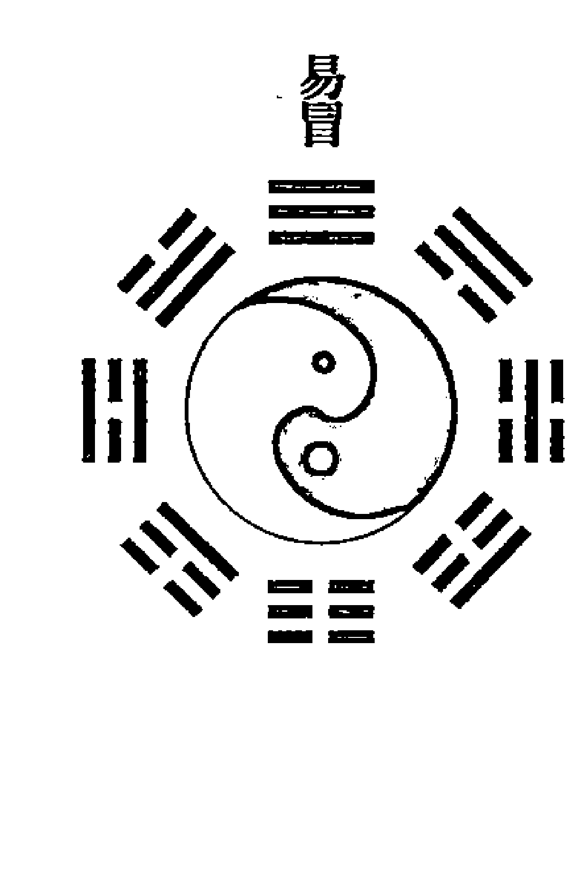

# 易冒 卷一

## 甲子章第一

【原文】
天干有十，地支有十二。
注：干犹本也，象天生物，故曰天干；支犹枝也，象地成物，故曰地支。干有十：甲、乙、丙、丁、戊、己、庚、辛、壬、癸。支有十二：子、丑、寅、卯、辰、巳、午、未、申、酉、戌、亥。

【今译】
天干共有十个，地支共有十二个。
注：天干犹如树木的主干，象征着上天创生万物的作用，所以叫天干；地支犹如树木的枝权，象征着大地养成万物的作用，所以叫地支。天干有十个，分别是：甲、乙、丙、丁、戊、己、庚、辛、壬、癸。地支有十二个，分别是：子、丑、寅、卯、辰、巳、午、未、申、酉、戌、亥。

【原文】
用甲乘子，取乙驾丑，干支终始而循环，天地之数六十而尽矣。
注：甲子之法，以天干顺布于地支之上，始自甲子至癸酉，干终而始甲戌，支终而始丙子。若枝本之不离，并尽于癸亥，计有六十也。

【今译】
把天干的甲置于地支的子的上面，把天干的乙置于地支的丑的上面，干支相配，终而复始地循环排列，由此形成的六十种组合，就可以作为天地间的计数工具了。
注：所谓甲子计数法，就是将天干按顺序置于地支之上，从甲子开始到癸酉，天干终了，再从甲戌开始继续相配直到乙亥，地支终了，再从丙子开始。如此循环，犹如树木的枝干彼此交错向上而不分离，最终直至天干地支同时终止于癸亥。形成的干支相配的组合，共计六十对，即所谓六十甲子。

- 【补充】
六十甲子包括：
甲子、乙丑、丙寅、丁卯、戊辰、己巳、庚午、辛未、壬申、癸酉、甲戌、乙亥、丙子、丁丑、戊寅、己卯、庚辰、辛巳、壬午、癸未、甲申、乙酉、丙戌、丁亥、戊子、己丑、庚寅、辛卯、壬辰、癸巳、甲午、乙未、丙申、丁酉、戊戌、己亥、庚子、辛丑、壬寅、癸卯、甲辰、乙巳、丙午、丁未、戊申、己酉、庚戌、辛亥、壬子、癸丑、甲寅、乙卯、丙辰、丁巳、戊午、己未、庚申、辛酉、壬戌、癸亥。

【原文】
天分五运，地分六气，以造化万物于其中，乃作甲子以记岁时，使日月四时之有经也。
注：五运谓东南西北中，十干动运乎上；六气谓十二支六阴六阳之气，司寒暑春秋消长之权，静成乎下。而吉凶祸福，由是以兆。

【今译】
天干分五运，地支分六气，并用此五运六气造化出天地之间的万物，因此古人创制甲子之法来记录时间的变迁，使日月的运行、四季的交替有可掌握的规律。
注：五运指东南西北中，以十天干与之分别相配，鼓动于九天之上；六气是指十二地支中蕴涵的六阴六阳之气，主管寒暑春秋变化过程中的阴阳消长，顺应五运的鼓动，而将其对万物的影响呈现于地上。生活在天地之间的人类的吉凶祸福，也是由此五运六气得到兆示。

- 【补充】
五运六气，简称“运气”。“运”指木、火、土、金、水五个阶段的相互推移； “气”指风、火、热、湿、燥、寒六种气候的转变。

【原文】
自汉武从寅，则无复四同之甲子；迨娄景补韵，则始传分象之五行。
注：周正建子，则以甲子年起甲子月，甲子日起甲子时。夏正建寅，汉武帝述①之，退三位而取丙寅，所以无复有四甲子也。古纳音但有甲子乙丑属金、丙寅丁卯属火之法，及娄景先生推五行之理作歌，始有海中金、炉中火之说。

【今译】
自从汉武帝以寅月为正月，就再没有年、月、日、时都从甲子开始的情形了。直到娄景补充韵律，才开始有分象五行之说。
注：周朝的历法以子月为正月，因此从甲子年、甲子月起开始记述年月，每年从甲子月、甲子日起开始记述日期，每月从甲子日、甲子时起开始记述时间。夏朝的正月建在寅月，汉武帝延用了这种记时方法，从甲子后退三位，而以丙寅为计数之始，所以从此就再没有年、月、日、时同为甲子的情形了。古代纳音只有甲子乙丑属金、丙寅丁卯属火等的简单说法，直到娄景补充韵律，拓展五行之理并创作歌谣，才开始流传海中金、炉中火之类分象五行之说。

① 述：循，顺行。

- 【补充】
海中金、炉中火之说，指六十甲子纳音五行。六十甲子纳音歌谣如下：
甲子乙丑海中金，丙寅丁卯炉中火，戊辰己巳大林木，
庚午辛未路旁土，壬申癸酉剑锋金，甲戌乙亥山头火，
丙子丁丑涧下水，戊寅己卯城头土，庚辰辛巳白蜡金，
壬午癸未杨柳木，甲申乙酉井泉水，丙戌丁亥屋上土，
戊子己丑霹雳火，庚寅辛卯松柏木，壬辰癸巳长流水，
甲午乙未砂中金，丙申丁酉山下火，戊戌己亥平地木，
庚子辛丑壁上土，壬寅癸卯锡箔金，甲辰乙巳佛灯火，
丙午丁未天河水，戊申己酉大驿土，庚戌辛亥钗钏金，
壬子癸丑桑拓木，甲寅乙卯大溪水，丙辰丁巳沙中土，
戊午己未天上火，庚申辛酉石榴木，壬戌癸亥大海水。

【原文】
纳音之法，以干支之数，合大衍之用四十有九，去其本数，复考其零，以五行相生而纳诸属也。

注：纳音所属之法，“大衍之数五十，其用四十有九”。考其干支所属之数几何，于四十九数内，去其干支本数，而所零者以五除之，其余复以水一、火二、木三、金四、土五，数至四十有九，得水则纳音是木，得土则纳音是金也。法曰：
六旬甲子妙尤玄，七七中除地与天。
五减零求生数立，纳音得此几人传。
夫干支之数，谓甲、己、子、午九，乙、庚、丑、未八，丙、辛、寅、申七，丁、壬、卯、酉六，戊、癸、辰、戌五，巳、亥四为则，此干支定数也。以万物辟子而合申，故甲己子午，自子至申得九；乙庚丑未，自丑至申得八。如甲乃九数，子亦九数，乙乃八数，丑亦八数，计三十有四。于四十九内除之，其余十五。复减其十，所零五数。五为土，土生金是也。余仿此。

【今译】
纳音的方法，就是把所对应的天干、地支的所属之数，从大衍之数中所用的四十九中减去，再根据所剩的差，按照五行相生的顺序纳于所属。

注：研判纳音所属五行的方法是，首先确定大衍之数，中所用之数四十九为被减数，即《周易·系辞上》中的“大衍之数五十，其用四十有九”。然后再看干支所属的数是多少作为减数，从四十九内减去这个数，把所得的差值除以五，其余数按照水一、火二、木三、金四、土五，从一开始数到四十九，得到水，则纳音属木；得到土，则纳音属金。方法口诀是：
六旬甲子妙尤玄，七七中除地与天。
五减零求生数立，纳音得此几人传。
天干地支的数，指的是甲、己、子、午为九，乙、庚、丑、未为八，丙、辛、寅、申为七，丁、壬、卯、酉为六，戊、癸、辰、戌为五，巳、亥为四，这是干支的定数。因为万物始于子（一）而合于申（九），所以甲己子午，从子到申得九；乙庚丑未，从丑到申得八。比如甲是九数，子也是九数，乙是八数，丑也是八数，相加得三十四。在四十九内减去它，余数为十五。再减去十，余下五数。五对应土，土生金就是这个道理。其余类推。

【原文】
复引申其用，浑甲同此而作，三式由此而成。
注：浑甲，以六十甲子纳八卦之下也。三式，谓太乙统宗，天之数也；奇门遁甲，地之数也；大六壬，神人之数也。

【今译】
再将上述原理引而申之，则浑甲也是据此而创制，三式也是据此而实现。
注：浑甲是指将六十甲子纳于八卦之下。三式，指太乙统宗，天数；奇门遁甲，地数；大六壬，神、人之数。

【原文】
干乃天，虚而无形，故不专祸福；支乃地，实而有象，则有旺衰生死、进退消长、破冲刑害，以曲成万物之能。
注：天无形，故干神之用，专于五化，谓甲己化土、乙庚化金之类；地有象，则成能万物，吉凶以昭，故支神之用，有当生者旺、所生者相、四生四死、进神退神、升降消长、三刑六害之类。

【今译】
天干拥有的是天的属性，虚空而没有形体，所以并不专注于人间的祸福。地支拥有的是地的属性，充实而有具体的形象，因此有旺衰生死、进退消长、破冲刑害等祸福征验，以真实地体现万物之间的关系。
注：上天是无形的，因此天干的功用只在于五化，即甲己化土、乙庚化金、丙辛化水、丁壬化木、戊癸化火。大地是有象的，所以能够滋养生成万物，昭示出相关的吉凶关系，所以地支有显示当生者旺、所生者相、四生四死、进神退神、升降消长、三刑六害之类的关系的功用。

【原文】
是以位之四方，纳之八卦，立星煞之神，生生不已，新新不停，咸备五行之用。《通书》所谓“三大三小”，谚语所谓“无水无金”。上古天皇、地皇、人皇，皆资是始，万化之用，岂能外此哉！

注：以干支列于四方，谓壬子癸、丑艮寅、甲卯乙、辰巽巳、丙午丁、未坤申、庚酉辛、戌乾亥是也。以干支纳于八卦之下，义见后篇。立吉星凶煞之神，吉凶咸备。他如《通书》所谓六甲下纳大金小金、大火小火、大水小水之法，谚语谓“甲子甲午旬中全无水，甲申甲寅旬中不见金”之说，即上古天王君起甲子、地王君起甲申、人王君起甲寅，莫不造端于此。故曰：甲子不立，则五行不神；五行不神，则吉凶不著矣。是以著《易》，必首明甲子。

【今译】
因此，根据天干、地支所处的方位，将其纳入八卦系统，以确立吉凶神煞，就可以使一切进入生生不已、更新不止的循环之中，全都具备五行的功用。《择吉通书》中说“三大三小”，谚语说“无水无金”。上古的天皇、地皇、人皇，都是以此作为治世之始，万物之间生化的作用，又岂能在此之外！

注：将天干地支分布于东西南北四方，分别是：北方壬子癸，东北方丑艮寅，东方甲卯乙，东南方辰巽巳，南方丙午丁，西南方未坤申，西方庚酉辛，西北方戌乾亥。以天干、地支纳于八卦之下，其具体内容见后面的篇章。确立吉凶神煞，使所昭示的吉凶关系更加完备。其他如《择吉通书》中所说的六甲下纳大金小金、大火小火、大水小水的方法，谚语中所说的“甲子甲午旬中全无水，甲申甲寅旬中不见金”的说法，即上古天王以甲子为起始、地王以甲申为起始、人王以甲寅为起始，但其原理莫不是发源于此。所以说甲子不确立，五行就不神妙；五行不神妙，吉凶就不显著。因此凡是关于《易》的书，必须首先阐释干支甲子系统。

## 揲蓍章第二

【原文】
以钱代蓍，但求奇偶。
注：上古以蓍揲而成爻，后因揲蓍之烦，故以钱代蓍，不必分二挂一，揲四归奇，但求奇偶，所谓“舍四营而减为一掷”者也。

【今译】
用钱来代替蓍草，只要得到奇数和偶数。
注：上古时代用蓍草来作为占卜的工具，通过所谓的“揲蓍法”来求得各爻，后来因为揲蓍法过于麻烦，所以用钱币来代替蓍草。以钱币代替蓍草的占筮方法，不必再进行所谓的“分二挂一，揲四归奇”的烦琐操作，只要得到是奇是偶的结果就可以了，即所谓“舍去反复四次操弄的麻烦，只须一次抛掷”。

【原文】
奇者阳也，像天之覆；偶者阴也，像地之载。观覆载而奇偶得矣。
注：钱分奇偶，以形测之。钱覆者如天之覆悬于上，故属阳而为奇；钱仰者如地之仰载于下，故属阴而为偶。

【今译】
奇就是阳，象征天的覆盖；偶就是阴，象征着地的承载。通过观察钱币的形态是覆盖还是承载，就可以断定是奇还是偶了。
注：钱分为奇面和偶面，是根据其形象来区分的。钱的字覆盖向下的，如同上天一样覆盖而高悬于上，所以属阳而为奇；钱的字仰承朝上的，如同大地一样仰面承载于下，所以属阴而为偶。

【原文】
得一奇则曰单，谓之少阳；得一偶则曰拆，谓之少阴；三覆曰重，谓之老阳；三仰曰交，谓之老阴。重乃三奇，交乃三偶。阴阳老少既成，而八卦由此生也。
注：奇圆围三，偶方围四。三用其全，四用其半。故得一奇二偶是七，而为少阳；得一偶二奇是八，而为少阴。三覆是三奇而为九，乃老阳也；三仰是三偶而为六，乃老阴也。九名重，六名交，七为单，八为拆。

【今译】
投掷后，得到一个奇面叫做单，称为少阳；得到一个偶面叫做拆，称为少阴；三枚钱都是覆的叫做重，称为老阳；三枚钱都是仰的叫做交，称为老阴。重是三奇，交是三偶。阴阳老少确定之后，八卦也就产生了。

注：奇阳为圆，其周长与直径的比为三；偶阴为方，其周长与直径的比为四。三用其全部，四用其一半。所以：

- 一奇二偶为 3+2+2=7，为少阳；
- 一偶二奇为 2+3+3=8，为少阴；
- 三覆是三奇，为 3+3+3=9，为老阳；
- 三仰是三偶，为 2+2+2=6，为老阴。
- 九称为重，六称为交，七称为单，八称为拆。

【原文】
向上言眉，向下言背，亦谓如乾坤之形耳。

注：法曰：两背由来拆，双眉本是单，浑眉交定位，总背是重看。谓乾形覆背在上，坤形仰眉在上是也。近俗有以筮辨阴阳者则异是，以竹中剖，其心向上为阳，向下为阴。钱以体成，其形覆为阳，仰为阴，各有取义也。

【今译】
钱币的字面向上的叫做眉，字面向下的叫做背，这也是取其象征乾坤天地的形态而已。

注：口诀是：两背由来拆，双眉本是单，浑眉交定位，总背是重看。

这是说乾的形态为天，悬覆于上，为背；坤的形态为仰承于下，为眉。近来民间用筮来分辨阴阳的办法，则与此不同。将竹子从中间剖开，抛掷后，取其心向上的为阳，向下的为阴。用钱来抛掷，则取字面下覆的为阳，上仰的为阴。各有取义不同而已。

- 【补充】
阴爻、阳爻的记录方法是：两个背为拆，记作“--”；两个字为单，记作“—”；三背为重，记作“○”；三字为交，记作“×”。

## 成卦章第三

【原文】
既成三象，始有二老。

注：一画而分阴阳，二画而分太少，三画而备三才，三才备而二老交，二老交而六子立矣。

【今译】
生成了三爻卦象之后，才产生了所谓乾父坤母二老。其中乾“☰”三阳为父，坤“☷”三阴为母。

注：单一一爻可以区分出阴阳两仪来，两爻重叠就可以区分出太阳、太阴、少阳、少阴四象来，三爻就具备了象征天、地、人的三才，三才具备之后，乾父坤母二老才可能彼此相交。乾父坤母二老彼此相交，才产生出了六子卦，分别是：震“☳”为长男，巽“☴”为长女，坎“☵”为中男，离“☲”为中女，艮“☶”为少男，兑“☱”为少女。

【原文】
纯阳曰乾，纯阴曰坤，刚柔交而得一阳曰震，乾坤荡而得一阴曰巽，再磨而成坎，复媾而为离，三索奇偶而生艮兑，六子备而八卦立矣。

注：八卦从二老而生六子，三单纯阳为乾父，三拆纯阴为坤母。二老始交，阴获阳为震，阳得阴为巽；再索之坤中爻获阳为坎，乾中爻得阴为离；三索之坤上爻获阴为艮，乾上爻得阴为兑。于是乾、兑、离、震之顺，巽、坎、艮、坤之逆，首尾交接而成圆圈，先天八卦备矣。

【今译】
三爻都是阳为乾（父），三爻都是阴为坤（母）。刚爻来与柔爻相交，使坤卦下面得到乾卦的一个阳爻，就形成了震卦；乾卦下面得到坤卦的一个阴爻，就形成巽卦。刚与柔再次相摩而生成坎卦，乾与坤再次交媾而形成离卦。奇与偶再次互相索求，而产生出艮卦和兑卦。至此六子就具备了，八卦系统也就确立了。

注：八卦系统是由乾坤二老及其衍生出的六子卦共同构成的。其中由三个阳爻形成的是乾父，由三个阴爻组成的是坤母。二老刚开始相交时，纯阴的坤卦获得一个阳爻，而形成震，纯阳的乾卦获得一个阴爻，而形成巽；再次（在更高一个爻位上）互索，则坤的中爻获得一个阳爻形成坎卦，乾的中爻获得一个阴爻形成离卦；第三次互索，则坤的上爻获得一个阳爻形成艮卦，乾的上爻获得一个阴爻形成兑卦。于是由乾、兑、离、震顺行，巽、坎、艮、坤逆行，形成首尾相接的圆圈，就构成了先天八卦。

【原文】
因而重之，坤始震而至纯乾，左旋之三十二象也；乾配巽而至纯坤，右转之三十二象也。是故圣人以象义而名卦，以变次而成章焉。

注：八卦之上，重加八卦。以坤获一阳之初，而坤加于震，从此始左逆行，以坤、艮、坎、巽、震、离、兑、乾配于震上，次而离，次而兑，次而乾，此左旋三十二卦也。以乾得一阴之初，而乾加于巽，从此始右顺行，以乾、兑、离、震、巽、坎、艮、坤配于巽上，次而坎，次而艮，次而坤，此右转三十二卦也。

易卦次由十六变而成。谓乾一变姤，二变遁，三变否，四变观，五变剥。上爻天也，故不变，而复下变四爻为晋。易章成有七焉。三变旅，游人离宫，故圣人以火地晋为游魂。二变鼎，一变大有，不序他卦，还入本宫，易章始成八卦，故圣人以大有为归魂也。盖凡九变，万物归还，理数以极，自然之象。复二变为离，三变噬嗑，四变颐，五变益。复四变无妄，三变同人，二变仍乾。乃十六变也。后天八宫易章之成如此。此卦变，非动爻变也。

【今译】
在八卦的基础上相互重叠，从坤卦与震卦组合开始，依次演变为纯阳的乾卦，就形成了左旋的三十二象；乾与巽相配，依次演变到纯阴的坤卦，就形成了右旋的三十二象。因此创制六十四卦的圣人，根据象的意义，根据卦象的寓义来给各卦命名，根据爻变的次序，来形成各卦之间关系的章法（此即八宫卦）。

注：在八卦之上，再叠加八卦。根据坤最初获得一个阳爻形成的卦象，而将坤卦置于震卦之上，并以此为发端开始左旋的逆行，依次将坤、艮、坎、巽、震、离、兑、乾卦（先天逆序），分别加在震卦之上，然后再分别把它们加在离、兑、乾三卦之上，就形成了左旋的三十二卦的卦象。根据乾最初获得一个阴爻形成的卦象，将乾卦置于巽卦之上，并以此为发端开始右旋的顺行，分别把乾、兑、离、震、巽、坎、艮、坤卦（先天顺序），配置于巽卦之上，然后再分别把它们加在坎、艮、坤三卦之上，就形成了右旋的三十二卦的卦象。

卦的次序是由十六变决定的。如乾初爻变阴，变为姤卦；下两爻变阴，变为遁卦；下三爻变阴，变为否卦；下四爻变阴，变为观卦；下五爻变阴，变为剥卦。上爻象征着上天，因此不变，再反向自上而下，变第四爻为阳，则变成晋卦。此时乾宫已经有七卦了。接下来再变第三爻为阳，则变成旅卦，并由此进入了离宫（旅卦属离宫），所以先圣以火地晋为游魂卦。再变第二爻为阳，则变成鼎卦，最后将初爻变回阳爻，则变成大有，至此就不再引出其他卦象了，而返回本宫乾宫，所以先圣人以大有为归魂卦。此时的乾宫八卦就形成了。它象征着经历九次变化，而后万物还归，这是理与数变化的极至，也是自然的象。然后再从复卦开始变化：复卦二爻变阴为离，三爻变阴为噬嗑，四爻变阴为颐，五爻变阴为益。再从无妄卦开始变化：无妄卦四爻变阴，三爻变阴为同人，二爻变回阳爻，又复归于乾。这就是十六变的过程。后天八宫卦系的形成就是这样的。这里的卦变，不是指占卜中动爻所引发的变化。

The request was rejected because it was considered high risk## 【今译】

由我所生的称为子孙，能克制对我的仇怨和威胁。被我所克的称为妻财，能为我提供驱使之用。子孙象征福德，而忠良、医药、高尚、逍遥等象也包含在其中；妻财象征奴仆妻妾，而货财、仓库、饮食、淫乐、荒殆等象也包含在其中。

- 注：子孙为我的福神，兼而能克制官鬼；妻财为我的仆妾，兼而能带来财运。但是如果子孙和妻财过旺，也会导致淫乐荒殆。

## 【原文】

推之人事，宠禄盈而兆乱，财动生鬼也；慈惠著而众归，父动生兄也；困而后荣，生而后富，官动生父，子动生财也；比肩协力，而国士以至，兄动生子也。此六亲之生象也。

- 注：此言用神不动，而元神动者，亦为吉占。相生之理，推之人事而无不合也。

## 【今译】

推衍到人事上，宠爱福泽丰厚往往预兆着变乱的发生，此乃妻财发动而催生官鬼的缘故；仁爱显著就会使众人归附，此乃父母发动而催生兄弟的缘故；历经困苦之后才能享受荣华，历经新生之后才能丰富，此乃官鬼发动而催生父母、子孙发动而催生妻财的缘故；内部之间并肩协力，才会引来杰出的人才加入，此乃兄弟发动而催生子孙的缘故。这就是六亲之间相生的关系。

- 注：这里所说的是用神不动而元神动的情形，也属于吉占。六亲相生的规律推广到人事中，没有不恰当的。

### 【补充】

所谓六亲相生，即父母生兄弟，兄弟生子孙，子孙生妻财，妻财生官鬼，官鬼生父母。

## 【原文】

长能率幼，父动克子也；邪不胜正，子动克官也。多财损文章之誉，威刑弭狙诈之心。财动克父，官动克兄也；利则起争，争则损利，兄动克财也。此六亲之克象也。

- 注：此言忌神被克而吉，用神被克而凶。相克之理，推之人事而合也。

## 【今译】

年长的人能统辖年幼的人，因此父母发动，能克制子孙；邪不胜正，因此子孙发动，能克制官鬼；财产过多则会有损在恪行礼仪制度上的令誉，威压和刑罚能够消弭奸诈之心，因此妻财发动能克制父母，官鬼发动能克制兄弟；有利诱就会起争夺，有争夺则必然有损于共有的利益，因此兄弟发动，能克制妻财。这是六亲之间相克的关系。

- 注：这里是说，忌神被克则吉，用神被克则凶。相克的道理，即使推论到人事上，也没有不恰当的。

### 【补充】

所谓六亲相克，即父母克子孙，子孙克官鬼，官鬼克兄弟，兄弟克妻财，妻财克父母。

用神是六亲中用来占事的一种。凡生用神的就是元神，亦称原神。克制元神的是忌神。比如父母为用神，则原神为官鬼，忌神为子孙；兄弟为用神，则原神为父母，忌神为妻财。由此推论，原神不能被克，忌神不能被生，如果有制克原神、生扶忌神的，就称为仇神。得元神如同木有本、水有源，于谋求大为有利。

通常被克是不利的，但如果克者与我之间有我的原神发动，则变成连续相生了，如同木有水而水有源，结果非但无害，反而大吉。

## 【原文】

以五行之象而分六亲，以生克之理而筹庶务，事无遁情矣。

- 注：六亲推自五行，万事推之六亲，各有所用也。

## 【今译】

根据五行进而分出六亲，又根据六亲的生克关系来筹措考量人间的事务，因此凡事之理就都无法隐遁了。

- 注：六亲是从五行推衍出来的，世上万事之理又根据六亲来推察，五行与六亲各有所用。

## 六神章第七

## 【原文】

兽乃将之名，神乃帝之佐也。

- 注：古以鸟兽名官，不言将而言神，以其妙用无穷也。

## 【今译】

兽是将的名称，神乃是帝王的辅佐。

- 注：上古时代，有以鸟兽为官名的习俗，青龙、朱雀、勾陈、螣蛇、白虎、玄武这六兽，其实就是六位神将，不称其为将而称神，是因为它们妙用无穷。

## 【原文】

盖有司月司日之将，亦有司时司贵之神。权有重轻，而司日月者为要。

- 注：司日，即甲乙起青龙，丙丁起朱雀，戊日起勾陈，己日起螣蛇，庚辛起白虎，壬癸起玄武。司月，即：龙在寅方虎在申，正从丑上起勾陈。朱雀巳宫玄武亥，惟有螣蛇辰逆行。司时，即时建六神，以五子遁法，时遇甲乙即起青龙，时遇庚辛即起白虎。设如甲子日寅时占，而五子遁法，时当丙寅，即初爻起朱雀是也。司贵，即随贵人之六神，其法起贵人、螣蛇、朱雀、六合、勾陈、青龙、空亡、白虎、太常、玄武、太阴、天后，盖阳贵顺行、阴贵逆行也。设如辛未日辰时占，则寅上起贵人，未乃青龙，酉乃白虎。此四者名同而用异，卜筮必以日月六神为重。

## 【今译】

既有主管日、月的神将，也有主管时与贵的神将。其权力各有重轻，而以主管日、月的更为重要。

- 注：所谓司日，即：甲乙日初爻起于青龙，丙丁日初爻起于朱雀，戊日初爻起于勾陈，己日初爻起于螣蛇，庚辛日初爻起于白虎，壬癸日初爻起于玄武，其他各爻对应的六神依序排列。

如表所示：

|  | 甲乙日 | 丙丁日 | 戊日 | 己日 | 庚辛日 | 壬癸日 |
|---|---|---|---|---|---|---|
| 上爻 | 玄武 | 青龙 | 朱雀 | 勾陈 | 螣蛇 | 白虎 |
| 五爻 | 白虎 | 玄武 | 青龙 | 朱雀 | 勾陈 | 螣蛇 |
| 四爻 | 螣蛇 | 白虎 | 玄武 | 青龙 | 朱雀 | 勾陈 |
| 三爻 | 勾陈 | 螣蛇 | 白虎 | 玄武 | 青龙 | 朱雀 |
| 二爻 | 朱雀 | 勾陈 | 螣蛇 | 白虎 | 玄武 | 青龙 |
| 初爻 | 青龙 | 朱雀 | 勾陈 | 螣蛇 | 白虎 | 玄武 |

所谓司月，即：以青龙配寅卯月，以朱雀配巳午月，以白虎配申酉月，以玄武配亥子月，以勾陈配丑戌月，以螣蛇配辰未月。

所谓司时，即：不同时辰与六神之间，按五子遁法相配，甲乙时初爻起自青龙，庚辛时初爻起自白虎。例如在甲子日寅时占卜，根据五子遁法，时的干支为丙寅，因此初爻起自朱雀。

所谓司贵，即：随贵人的六神，其起法是从寅上起贵人，然后依次起螣蛇、朱雀、六合、勾陈、青龙、空亡、白虎、太常、玄武、太阴、天后，其中阳贵按顺行顺序排列，阴贵按逆行顺序排列。比如在辛未日辰时求占，则寅上起贵人，未为青龙，酉是白虎。

以上四者，虽然所使用的六神的名目相同，但作用不同，在占卜时须以日月六神为重。

## 【原文】

勾陈之象，实名麒麟，位居中央，权司戊日，盖仁兽而以土德为治也。

- 注：勾陈实乃吉神，麟趾不践生草，不履生虫，其行多迟，配土德，敦信而为用也。

## 【今译】

勾陈对应的形象，其实就是麒麟，在方位上居于中央的位置，执掌戊日之权，因为麒麟是一种仁兽，因此拥有土德。

- 注：勾陈实乃一种吉神。麒麟从不践踏青草，也不踩活着的虫类，其行动大多比较迟缓，因此配土德，以敦厚诚信为其资质。

## 【原文】

螣蛇之将，职附勾陈，游巡于前，权司己日，盖火神而配土德以行也。

- 注：螣蛇之官，游巡帝前，属火而性多不测，情尚虚浮，位在戊下司己，故复属土，使臣也。

## 【今译】

螣蛇的职守是依附辅佐勾陈，在前面流动巡逻，执掌己日之权，因为本属火神，而配土德来发挥作用。

- 注：螣蛇的职守是流动巡逻于天帝之前，因为属火而性情虚浮不定，位在戊下而司职己日，所以又属土，是使臣。

## 【原文】

青龙之神，左居东方，权司甲乙，而主文事，以木德为化。
白虎之煞，右居西方，权司庚辛，而制武备，以金德为刑。

- 注：青龙位帝之左，文臣也；白虎位帝之右，武臣也。

## 【今译】

青龙这一神将，位于左面的东方，执掌甲乙日之权，主管文治事务，而以木德来生化万物。白虎这一神将，位于右侧的西方，执掌庚辛日之权，主管武备事务，而以金德来行使刑杀之权。

- 注：青龙位于天帝的左侧，是文臣；白虎位于天帝的右侧，是武将。

## 【原文】

朱雀舞端门，南方司丙丁，而主封章弹谏文学，以火为德。玄武从帝座，北方司壬癸，而主计谋筹画机巧，以水为德。

- 注：朱雀位帝之前，谏臣也；玄武位帝之后，谋臣也。盖子为帝座，午为端门。

## 【今译】

朱雀位于午位的端门，在南方执掌丙丁日之权，主管封还奏章、弹劾、劝谏、文学等事务，配火德。玄武在帝座的后面，位于北方执掌壬癸日之权，主管计谋、筹划、机巧等事务，配水德。

- 注：朱雀位于天帝之前，充当谏臣的角色；玄武在帝座之后，是谋臣。一般以子为帝座，以午为端门。

## 【原文】

六神之设，各有攸司，吉凶善恶，以用而迁。

- 注：言所司各吉凶，凡雀司言，武司计，龙司生，虎司杀，勾司实，蛇司虚。

## 【今译】

六神的设置，各司其职，吉凶善恶，因具体情况而产生变化。

- 注：这里是说六神的职守各有吉凶，朱雀司职言谏，玄武司职计谋，青龙司职生长，白虎司职杀伐，勾陈司职实务，螣蛇司职虚务。

## 【原文】

夫万物之情，与类相亲，亲其所同恤也；非其类则不亲，不亲其所相恶也。以仁为体，不处残忍之乡，故龙避金爻也；以杀为威，当亲礼让之地，虎伏火爻也；明智则胜人之争，水以制雀也；笃信则化物之狡，土以制武也。

- 注：青龙为仁，金克木则吉而不吉；白虎为杀，火克金则凶而不凶。玄武为水智，能胜朱雀之争；勾陈为土信，能制玄武之狡。此复以物情推之而合也。

## 【今译】

万物的常情，都与其同类相亲，亲近它们所共同体恤、怜悯的事物；若非同类则不会相亲，不相亲他们所互相憎恶的东西。以仁爱为体性的，不会呆在残忍的地方，所以青龙要避讳属性为金的爻；以刑杀立威的，应当会亲近礼让之地，因此白虎顺伏于属性为火的爻；明智能战胜好争，所以水德可以克制朱雀；诚实笃信能够化解狡诈，因此土德能克制玄武。

- 注：青龙体性为仁，但如果遇金，则会因金克木，由吉变为不吉；白虎体性为义，但如果遇火，则会因火克金，由凶变为不凶。玄武拥有水之智，所以能战胜朱雀的急争；勾陈拥有土的笃信，能制约玄武的狡诈。即使以事物的情理来测度，也无有不合之处。

## 【原文】

故六神吉者，喜生、喜助、喜动、喜持世；六神凶者，宜制、宜化、宜散、宜逢空。复加于六亲好恶，而悔吝自昭。

- 注：以六神参于六亲，则吉凶悔吝，昭然不爽。

## 【今译】

所以六神之中自身为吉的，都喜欢来相生，喜欢来相助，喜欢来发动，喜欢持世；而自身为凶的，都应当设法制约、化解、冲散，或者使之逢空。再参考六亲之间的好恶关系，则忧悔与咎难就昭然可见了。

- 注：综合运用六神、六亲，则关于吉凶悔咎的占断，就会清晰明了，而应验不爽了。

## 【原文】

其大六神将，以周正为法，而先天分位之龙起子，虎起午，朱雀以卯出自离门，玄武以酉出自坎座，勾陈督文事而顺游，螣蛇由武备而分狩。

- 注：大六神法，因周正建子，以先天位分之，故青龙从先天坤位，则自子上顺行；白虎从先天乾位，则自午上顺行；朱雀从先天离位，则自卯上顺行；玄武从先天坎位，则自酉上顺行；勾陈黄帝之命，六神之宰，从亥顺行，督从青龙而巡；螣蛇为游神，自白虎午上相分逆行，以狩四方也。

## 【今译】

大六神法，以周朝的正朔为法则，按照先天八卦的方位，青龙起于子位，白虎起于午位，朱雀对应于卯位而在离卦的位置，玄武对应于酉位而在坎卦的位置，勾陈监督文治而顺游，螣蛇因为职守武备而分狩四方。

- 注：六大神将，以周朝所建的正朔为子的历法为准，按照先天八卦的方位来区分，所以青龙在先天八卦坤位，从子位顺行；白虎位于先天八卦的乾位，从午位顺行；朱雀位于先天八卦的离位，自卯位顺行；玄武位于先天八卦的坎位，自酉位顺行；勾陈是黄帝之命，是六神的主宰，从亥顺行，跟随被督导着青龙而巡视；螣蛇为游神，自白虎所处的午位逆行，以巡狩四方。

## 【原文】

司日之将，法天五运；司月之神，行地六气。

- 注：日建六神，皆起天干。月建六神，皆起地支。

## 【今译】

执掌日的神将，效法天的五运；执掌月的神将，履行地的六气。

- 注：执掌日的六神，都起自天干；执掌月的六神，都起自地支。

## 【原文】

犹有司时六神，其则如日；司贵六神，其则如星。凡星宿之光，不及于日月；时辰之力，不敌于春秋，故曰日月六神为要也。

- 注：时神亦起天干，贵人亦从贵人星而起。星宿之光不大，时辰之权不永，安能如日月六神乎？

## 【今译】

还有执掌时辰的六神，效法于太阳；执掌贵的六神，效法于星宿。但星宿的光不及日月，时辰的力量无法与年岁的变迁相比，所以说执掌日、月的六神更为重要。

- 注：执掌时辰的六神也是从天干而起，执掌贵的六神也是从贵人星而起。但星宿的光辉不大，时辰的权威不长久，怎么能和执掌日月的六神相比呢？

## 世应章第八

> 刚柔摩而卦立，上下荡而易成，易章成而世应出矣。

- 注：易章，谓乾为天至雷泽归妹之章。

刚柔之间相互切磋交流，形成了八卦。通过上下卦的相互变换组合，而形成了六十四卦的完整变易卦象。易的章法形成，世爻和应爻也就出现了。

- 注：六十四卦的章法，是指八宫卦从乾为天到雷泽归妹卦的排列顺序。世爻，即代表问卦者自己的一爻；应爻，代表对方的一爻。凡占问仅与自己有关的事物，如疾病、寿数、出行、损益等，以世爻为用神；凡占问与对方有关的事物，如无尊卑的称呼、未曾深交之朋友、九流术士、仇人、敌国，或指言某处、某事、某物等，都以应爻为用神。

> 盖世应出于三才始备之际，非易成而后有也，然成易而有名焉。

- 注：世应，事物之主宰。三画始备三才，以四象生成八卦之时，则第三画即三才始备之爻，因名之应。复以八生十六成八纯之际，则第三画乃纯之第六画，亦三才始备之爻，因名之世。然世六而应三者，以三成才而六成体也。以体言象，以世言法，故从世爻上下循环，则世应出于成卦之时，非有于易章之后也。

世应出现在天地人三才刚刚完备的时候，不是在易完全形成之后才有的，但是在易完全形成之后才有了相关的名目。

- 注：世爻和应爻是事物的主宰。拥有三画爻才能具备天地人三才，在由四象生成八卦的时候，新增的第三画爻，就是使“三才始备”的一爻，因此称之为应爻。又以八卦衍生成十六卦，形成八纯卦的时候，则先前的第三画，又成为八纯卦的第六画，也是“三才始备”的一爻，因而称之为世爻。世爻在六（上）位、应爻在三位的原因，是第三爻形成了天地人三才，到第六爻才完成了六画卦的卦体。根据卦体来讨论卦象，根据世爻来讨论八宫的章法，所以随着世爻的上下循环，世爻和应爻是出现在卦形成的时候，而不是在有了六十四卦完整的排列顺序之后。

## 【原文】

> 故八纯六世，八生十六之因也；三应，四生八之由也。重之为六，故世居六；不重则三，故应居三。世犹身，应犹物也。

- 注：六者体象既成，专言之而为身。三者卦爻未备，概言之而为物也。

## 【今译】

所以形成八纯卦，产生第六爻为世爻，是从八卦产生十六卦的原因；形成第三爻的应爻，是从四象而衍生出八卦的原因。八卦重叠则形成六爻，所以世爻位于第六爻的位置；八卦不重叠则只有三爻，所以应爻在第三爻的位置。世爻犹如自身，应爻犹如外物。

- 注：六爻具备，则卦的体象已经完全形成，所以以第六爻专指自身。只有三爻则全卦爻并未完备，所以只能概言之而为外物。

## 【原文】

> 顺而行之，推而广之，以易章而次第之，循环已终，逆顺反止。

- 注：自乾六世，姤一世，遯二世，否三世，观四世，剥五世，乃谓顺行推广，次第循环，至五而终。终而始，顺而逆，故晋四世，大有三世，乃复还三才始备之爻，所以世应从此而止。

## 【今译】

首先顺序而行，推而广之，根据易变的章法次第进行，至终点则循环复始，逆序而行直到终止。

- 注：以乾官卦为例，纯乾卦以六（上）爻为世，姤卦以初爻为世，遯卦以二爻为世，否卦以三爻为世，观卦以四爻为世，剥卦以五爻为世，这就是所谓的顺行推广，依次循环，到第五爻而终结。然后终而复始，由顺行转为逆行，所以晋卦以四爻为世，大有卦以三爻为世，于是世爻又返回到了“三才始备”之爻的位置，所以世、应的推排至此而停止。

## 【原文】

至归魂而变化之道复，及游魂而上下之理迁，皆非人力所能为也。

- 注：自八纯六世三应，及归魂三世六应，变化之道，于此以极，顺逆之理于此以终；自五世剥至四世晋，逆而不顺，下而不上，恒常之理于此以迁。皆有自然之道。故占者遇游魂主变，遇归魂主复也。

## 【今译】

到达归魂卦时，变化之道就应当复返，到游魂卦时，上下的逆顺规律就要改变，这些都不是人为控制的。

- 注：自八纯卦的六爻为世，三爻为应，演变到归魂卦以三爻为世，以六爻为应，变化之道至此达到了极限，顺逆之理也已终结；从以五爻为世的剥卦，到以四爻为世的晋卦，变化的顺序变得逆而不顺，向下而不向上，恒常的道理至此而被改变了。这些变化都蕴涵着自然之道。所以占卜之人遇到游魂卦则主变化，遇到归魂卦则主复返。

## 【原文】

五星降位，乾六世而起镇星。土，万物之母也。一世继于太白，二世继于太阴，太阴继岁星，岁星继荧惑，荧惑复继镇，而生生相续，以循震、坎、艮、坤、巽、离、兑、归妹，而岁星终焉。

- 注：乾卦壬戌持世，坤卦癸酉持世，皆纳干支之法。然五星二十八宿之持世，卜筮未考。汉京房以土镇星降次于纯乾六爻，土乃万物之母，因以土星为始。土生金，则姤卦辛丑，降次太白；金生水，则遁卦丙午，降次太阴；水生木，则否卦乙卯，降次岁星；木生火，则观之辛未，降次荧惑；火生土，则剥之丙子，复降次镇星；土生金，则晋己酉，复降次太白；金生水，则大有甲辰，复降次太阴；水生木，则震之庚戌，降次岁星。生生不息。震宫生坎宫，坎宫生艮宫，艮宫生坤宫，坤宫生巽宫，巽宫生离宫，离宫生兑宫，及归妹丁丑而岁星终焉。

## 【今译】

木、火、土、金、水五星降次位临世爻，从乾卦的世爻——六爻始，而起于镇星（土）。土，乃万物之母。然后一世是太白金星，二世是太阴水星，太阴之后是岁星（木），岁星之后是荧惑（火），在荧惑重新自镇星（土）开始，如此而生生相续，依次降于震、坎、艮、坤、巽、离、兑宫，直至雷泽归妹卦，以岁星终结。

- 注：乾卦以壬戌持世爻，坤卦癸酉持世爻，都是来自于卦纳干支的方法。但是五星、二十八宿的持世问题，卜筮之道未加完备。东汉的京房以土镇星降于纯乾卦的世爻——六爻上，土是万物之母，所以以土星作为起始。土生金，则太白降于姤卦的世爻（初爻）辛丑；金生水，则太阴降于遁卦的世爻（二爻）丙午；水生木，则岁星降于否卦的世爻（三爻）乙卯；木生火，则荧惑降于观卦的世爻（四爻）辛未；火生土，则镇星复降于剥卦的世爻（五爻）丙子；土生金，则太白复降于晋卦的世爻（四爻）己酉；金生水，则太阴复降于大有卦的世爻（五爻）甲辰；水生木，则岁星降于震卦的世爻（六爻）庚戌。如此生生不息。从震宫生出坎宫，坎宫生出艮宫，艮宫生出坤宫，坤宫生出巽宫，巽宫生出离宫，离宫生出兑宫，最后到归妹卦丁丑而岁星终结。

## 【原文】

盖不言水而言太阴者，太阴，水之精也；不言太阳而言荧惑者，太阳，则日辰之权也。京子之传，岂有谬乎？然五星灾祥之现，现于特变者也。

- 注：日为君主，故不同列，而以荧惑代之，其吉凶之应，必以独发，然后配事为验。

## 【今译】

不直接说水星而说太阴，是因为太阴是水之精华；不说太阳而说荧惑，是因为太阳对应着日辰。京房所传的学问，难道会有错误吗？至于金、木、水、火、土五星对应的吉凶祸福的显现，则出现于该星特别突出的时候。

- 注：日为星辰的君主，所以不便与五星同列，而以荧惑代替，其对应的吉凶征兆，必定是因为其独自发动，然后配合不同的事物而应验。

## 【原文】

镇星主安，则司城郭、屋室、土地、泰康之事，而不可以越为；太白主兵，则司于戈矛、威武、刑杀、绝灭、忧丧之事，而不可以居，且其色光芒，其性锋利。

- 注：土星特现，凡事皆吉，但只宜守信，不可妄为。金星特现，主兵丧，若值白虎官鬼有凶，临青龙子孙无咎。

## 【今译】

镇星主安定，执掌城郭、屋室、土地、泰康等事物。太白主兵，执掌戈矛、威武、刑杀、绝灭、忧丧等事物，因而不可以居守，且其颜色光芒四射，性情锐利。

- 注：土星特别突出，凡事都吉，但只适宜谨守忠信，不可胡作非为。金星特别突出，则兆示着战争和丧乱等事物的出现，如果临于白虎、官鬼，则必有凶难；临青龙、子孙爻，则无害。

## 【原文】

荧惑火星，伏不测，亦司文章之事，而他遇者凶，若见太阳，其光熄矣。太阴主慈## 【今译】

荧惑即是火星，即使隐伏不现，也主管文章事物，但其他事物遇荧惑都凶，如果遇见太阳，其光芒就会被掩盖。太阴主慈祥聪慧，因此配以圣母之德，执掌赦免、宽宥罪责的事物，但如果位临咸池，其德就会败坏。岁星与万物有关，因此遇吉事则吉，遇凶事则凶。

注：火星只主管文章事物，其余一切事物遇之皆凶，但遇到日辰，则为日所克而无害。占宅时火星与属火的官鬼爻同发，则兆示着火灾。水星特别突出，则凡事都会消解，如果莅临咸池，则兆示着因为淫乐而导致凶祸。

## 【原文】

经星聚世，参宿起乾，实沈晋地，乃乾之方。男从父，女从母，而例之，盖天星各有所司也。

注：参星在实沈之分，晋地为中原之西北，故参星降起乾卦六爻，以乾、震、坎、艮、坤、巽、离、兑为次，顺布六十四卦之世爻，此京夫子之传也。

## 【今译】

二十八宿与世爻的相配，参宿起于乾，实沈对应着晋地，乃是乾的方位。三男卦例从乾父，三女卦例从坤母，这是天星各有所司的缘故。

注：参宿在实沈的范围内，晋地在中原的西北，所以参星作为经星与世爻相配的起始，降临乾卦的世爻（六爻）上，按照乾、震、坎、艮、坤、巽、离、兑的次序，二十八宿顺布于六十四卦的世爻。这是由汉京房创制的法则。

- ① 咸池：星名。《史记·天官书》：“西宫咸池，曰天五潢。五潢，五帝车舍。”在神话传说中咸池是日——太阳沐浴的地方。《淮南子·天文训》：“日出于暘谷，浴于咸池。”
- ② 回禄：相传为火神之名，引申指火灾。
- ③ 经星：旧称二十八宿等恒星曰经星，与行星称纬星相对。
- ④ 实沈：星次名，大致相当于二十八宿的觜、参和毕、井的一部分，黄道十二宫的双子座。在十二辰为申。古时为晋之分野。

## 【原文】

有以乾巽角、坎离斗、艮坤奎、震兑井、八纯闰归魂之宿。先世应，而自外以布至内，则三百八十四爻，各有一星司之矣。然祸福之兆，入于主象而兆也。

注：以乾世爻起角星，应爻亢星，五爻氐星，初爻房星，四爻心星，二爻尾星，此乃先世应而后自外以布至内也。其姤卦世爻起亢星，应爻是氐星，二爻房星，六爻心星，三爻尾星，五爻箕星之法是也。大有世爻起斗星，坎卦世爻亦起斗星，归妹世爻起角星，乾卦世爻亦起角星，此乃八纯闰归魂之宿也。然归妹三爻角星，六爻亢星，初爻氐星，五爻房星，二爻心星，四爻尾星。盖世应之星，八纯归魂相同，而余星则异，此《黄金策》刘夫子之传也。

## 【今译】

另有以乾巽对应角宿，坎离对应斗宿，艮坤对应奎宿，震兑对应井宿，八纯卦与归魂卦共同对应于一个星宿。先排世应，从外向内排布，三百八十四爻就各有一宿掌管。相关的吉凶祸福之兆，则入于主象而显现。

注：因为乾卦世爻起于角宿，则应爻是亢宿，五爻对应着氐宿，初爻对应着房宿，四爻对应着心宿，二爻对应着尾宿，这就是所谓“先世应然后再自外以布至内”的意思。接下来，姤卦的世爻起于亢宿，应爻对应氐宿，二爻对应房宿，六爻对应心宿，三爻对应尾宿，五爻对应箕宿。大有卦世爻起于斗宿，坎卦世爻也起于斗星，归妹卦世爻起于角宿，乾卦世爻也起于角宿，这就是八纯卦与归魂卦世爻对应同一星宿。然而归妹卦世爻为第三爻，因此三爻对应角宿，六爻（应）对应亢宿，初爻对应氐宿，五爻对应房宿，二爻对应心宿，四爻对应尾宿。因此八纯卦与归魂卦的世爻和应爻所对应的星宿虽然相同，但其他爻对应的星宿却是不同的。这出自刘基传授的《黄金策》。

## 【原文】

昏中为吉，旦中为凶。日缠其垣则善，月丽其次则祥。然曲尽旁通，存乎人尔。

注：昏中则星光故吉，旦中则星晦故凶。如今正月昏中乃胃星，二月中乃毕星，三井、四柳、五翼、六轸、七氐、八尾、九斗、十女、十一室、十二奎，遇此则吉。若日月临之，用神复值于其上，则尽善矣。盖尧时日短星昂，太阳出虚；今日短星毕，太阳出箕。天行日行有岁差，故今古不同，因略言之，然后世当随时而定。

## 【今译】

星宿在黄昏时位于中天，为吉；星宿在清晨时位于中天，为凶。太阳盘桓在其附近则善，月亮附丽于其次舍则祥。然而其中曲折奥妙、融会贯通之处，就在于人的领悟了。

注：星宿在黄昏时出现则星光灿烂，因此吉祥；在早晨出现则星光晦暗，因此凶险。比如现在正月黄昏时出现的是胃宿，二月是毕宿，三月是井宿，四月是柳宿，五月是翼宿，六月是轸宿，七月是氐宿，八月是尾宿，九月是斗宿，十月是女宿，十一月是室宿，十二月是奎宿，在这些月份中遇到的是这些星宿则吉。如果又有日、月加临，用神又位于其上，就尽善尽美了。尧的时代冬至时对应的星宿是昴，太阳出于虚宿；今天冬至日对应的星宿是毕，太阳出于箕宿。这是因为天与日的运行都有岁差，导致古今有所不同，所以在此只简略介绍，后世之人可根据当时的实际情况来确定。

## 【原文】

> 是故随官人墓、助鬼伤身、合处逢冲，此占世之凶征也。注：此三法皆从世爻而设，五星经星，又其次尔。

## 【今译】

所以随鬼入墓、助鬼伤身、合处逢冲，都是占测世爻时的凶兆。注：这三种法式都是针对世爻而设的，五星和二十八宿的影响还在其次。

## 【原文】

> 我求我得不可世空，彼有彼来岂宜应陷？破散有败亡之象，动冲为更变之端。变进神，少而成多；化退神，厚而反薄。三合无而生有，三刑强而自敝。注：进神如物之长，退神如物之消。世如空者，日、月、动爻、三合拱而扶之，则过旬而有；世如动者，日、月、变爻、三会而刑之，则终及于敝。

## 【今译】

凡占卜我自己所要谋求得到的事物，世爻不可逢空；凡占卜他人与我的有无和来往，岂能应爻逢空？月破和日辰冲散，则有败亡的征象；世爻为动爻又逢冲，为变化将现的端倪。如果变为进神，则少的反而会变成了多；如果化为退神，丰厚的反而会变成了微薄的。如果世爻发动，遇到三合会局，则可以无中生有；而如果遇到三刑，则虽强旺也终将自行凋敝。注：进神如事物的滋长增益，退神如事物的消减。世应逢空，如果有日、月、动爻、三合局等拱扶，则可过旬而填实。世爻如果是动爻，又有日、月、变爻、三会局克制，则终将凋敝。

## 【原文】

若夫二势相胜，二事相交，二意相疑，则重于生克。传曰：一卦中间，主宰莫非乎世应，容可忽与？

注：彼我之势，不宜应克世，而宜世克应；彼我之交，不宜世生应，而宜应生世。凡值人己之占，最重生克之势。

## 【今译】

至于占测双方势力的相胜、在事务上的交往、在意见上的质疑等，则最重生克情势。古书说：一卦之中的关键无非世应，二者之间的关系怎么可以忽视呢？

注：比如在占测彼与我之间的态势时，不宜应爻（彼）克世爻（我），而应当是世爻克应爻；占测彼与我之间的交往，不宜世爻生应爻，而应当是应爻生世爻。凡是涉及别人和自己关系的占卜，最重视世与应的生克关系。

## 身法章第九

## 【原文】

身法有二：由卦而立，谓之卦身，曰月卦；由世而立，谓之世身，曰身居何爻。世身之法，必备于爻；卦身之法，或阙于卦。

注：其法始于复姤，谓一阳一阴之世，则为子午月卦；二阳二阴之世，则为丑未月卦；三阳三阴之世，则为寅申月卦；四阳四阴之世，则为卯酉月卦；五阳五阴之世，则为辰戌月卦；六阳六阴之世，则为巳亥月卦，即卦身是也。如乾六阳之世，卦身在巳；坤六阴之世，卦身在亥。子午之世，谓一阳一阴，则世身在初爻；丑未之世，谓二阳二阴，则世身在二爻。余以类推。如小畜子爻为世，故世身在初；大畜寅爻为世，故世身在二之类。

## 【今译】

身法有两种。一种是由卦而立的，称为卦身，叫做月卦。一种是由世爻而立的，称为世身，叫做身位于哪一爻。世身一定存在于六爻之中，卦身则可能不在六爻中，而在卦中。

注：求月卦的方法是：起始于复卦和姤卦，叫做一阳一阴之世——初爻为世爻，则阳爻以子为月卦，阴爻以午为月卦；二阳二阴之世——二爻为世爻，则阳爻以丑为月卦，阴爻以未为月卦；三阳三阴之世——三爻为世爻，则阳爻以寅为月卦，阴爻以申为月卦；四阳四阴之世——四爻为世爻，则阳爻以卯为月卦，阴爻以酉为月卦；五阳五阴之世——五爻为世爻，则阳爻以辰为月卦，阴爻以戌为月卦；六阳六阴之世——六爻为世爻，则阳爻以巳为月卦，阴爻以亥为月卦。即卦身是也。如乾卦六阳之世，卦身在巳；坤卦六阴之世，卦身在亥。子午之世，一阳一阴，则世身在初爻；丑未之世，二阳二阴，则世身在二爻。其余类推。如小畜卦，子爻为世，故世身在初爻；大畜卦，寅爻为世，故世身在二爻之类。

## 【原文】

盖卦身者，卦之体也，则象人心之用焉。静则坦怀，合则适意。故见于卦，若体有所依；失其位，如心无所主。卦身者，事之主也，则兼彼己之用焉。已用则七，彼用亦三。故行人遇合当归，谋望遇合可就。

注：卦身为卦根事主，合有得见得成之象。

## 【今译】

卦身（月卦）是卦的本质，其作用犹如心脏之于人。卦身静则能坦然，如果能与日、月、动爻相合就更加称意。所以出现在卦中，就仿佛体有所依托——精神本质有了物质依托；如果在卦中没有它的位置，就如同心中失去了主宰。卦身为事物的主宰，兼有对彼我双方的作用。为己所用则有七分吉，为对方用也有三分吉。所以占测行人而遇到与之相合，则应当归来；占测谋求遇到与之相合，则可以成功。

注：卦身是卦的根本、事物的主宰，与之相合而相得，则会呈现出能够达成心愿的征象。

## 【原文】

空破主犹豫进退之端，动冲应变更惶惑之义。不宜重见，则两从之念生；最忌冲亡，则千虑之知失。

注：卦身若遇空、破、发动、暗冲，主身心二三。一卦两身，有二心之象；动逢冲散，有恍惚之嫌。

## 【今译】

卦身遇旬空、月破，则会导致进退犹豫；如遇发动、暗冲，则有变更惶惑的意思。不宜重叠出现，否则就是首鼠两端的征兆；最忌讳遭逢冲散，否则虽经千虑也必有失。

注：卦身如果遇空、破、发动、暗冲，则会导致身心不定。一卦两身，则是有二心的征象；如果动而逢冲散，则有身心恍惚的问题。

## 【原文】

若夫世身之用，空主疑，动主乱，破主败，冲主变，散主失也。
注：世身唯避此五者，然可参看，不当泥也。若世爻旺相，此何伤乎？

## 【今译】

至于世身的作用则是：旬空兆示疑虑，发动兆示缭乱，逢破兆示破败，逢冲兆示变更，逢散兆示失落。
注：世身要尽量规避这五种状态，但只可参考，不应当过分拘泥。如果世爻旺相，即使遭逢空破又有什么妨害呢？

## 【原文】

凡看二身，先宜无病，然后以六亲、六神、星杀详之。功名仕宦，喜文书、官鬼、青龙、朱雀、贵人临之，而子孙勾陈为忌；财利经营，喜子孙、妻财、青龙、天地财临之，而鬼、兄、白虎为忌；狱讼喜坐子孙，而鬼侵为忌；忧患恶临官鬼，而身空反安。
注：先贤身上临官不见官，疑未当。凡忧疑损害，则反以身空为吉。

## 【今译】

凡是考察两种身法，首先应当无病，然后再根据六亲、六神、星杀等来参详。占测功名仕官方面的事，喜欢有文书、官鬼、青龙、朱雀、贵人等莅临，而忌讳遇见子孙、勾陈等；占测占财利经营方面的事，喜欢有子孙、妻财、青龙、天地财等莅临，而忌讳遇见官鬼、兄弟、白虎等；占测狱讼方面的事，喜欢位于子孙爻，而忌讳遇见官鬼侵害；占测忧患方面的事，忌讳临于官鬼爻，而逢旬空反而会得安宁。
注：先贤说“身上临官不见官”，我怀疑这种说法不恰当。凡占测与忧疑损害有关的事，反以卦身逢空为吉兆。

## 【原文】

大抵吉凶之应，世身之吉凶不若卦身之重也，卦身之吉凶不若世爻之重也，学者辨之。
注：吉凶征应，当以世爻先之，卦身次之，世身又次之。

## 【今译】

大致说来，相关吉凶的应验，世身的作用没有卦身的作用重要，卦身的作用又没有世爻的作用重要，学习此道者应当注意辨识。
注：在考察吉凶的征应时，应当以世爻为先，然后再考虑卦身，最后考虑世身。

## 问爻章第十

【原文】
间乃中间，复名离间，是世应内之中爻，间离宾主者也。
注：如乾四五为间，复姤二三为间。盖世为主，应为宾，为此两爻相隔也。

【今译】
间就是中间的意思，又叫离间，是位于世爻与应爻二者之间，间离宾主双方的爻。
注：例如乾卦的四五就是间爻，复卦和姤卦中二三爻是间爻。世爻为主，应为宾，间爻是使二者相隔离的爻。

【原文】
时而为忌，于举动为阻滞，谋望为结碍，通问为断绝，交与为离间，从事为诽谤，征战为忽突，进取为摈隔。凡为我忌，宜静不宜动也。
注：法曰“世应当中两间爻，发动所求多阻隔”是也，唯动则应焉。

【今译】
间爻作为忌讳的对象时，占测行动时其作用为阻滞，占测谋求时其作用为障碍，占测互通音讯时其作用为断绝，占测交往时其作用为离间，占测事件时其作用为诽谤，占测征战时其作用为糊涂，占测进取时其作用为摈弃与乖隔。凡是为我所忌讳的，都宜静不宜动。
注：即古法所云：“世应当中两间爻，发动所求多阻隔。”

【原文】
时而为用，如婚姻为媒妁，词讼为中证，造作为匠工，家宅为窗牖，馆席为从学，舟车为附载，胎产为收保。凡为我用，宜生助而不宜空破也。
注：生助有力，空破无功，近彼近我，占其所向。

【今译】
间爻也可有所补益，例如在占测婚姻时充当媒妁，在占测词讼时充当证人，在占测修造时充当工匠，在占测家宅时充当门窗，在占测学馆教席时充当前来就学的人，在占测舟车时充当附载的货物，在占测胎产时充当接生婆。凡对我有所补益时，都宜来相生来相助，而不宜逢旬空、月破。

注：相生相助则作用有力，如遇空破则没有了作用。通过考察其是亲近于彼还是亲近于我，来占断其倾向于哪一方。

【原文】
然间值鬼爻，则忧生内地，如病居心腹、鬼犯明堂，修行而扰尘缘，处事而惕群小。值则已形，动则又甚。
注：间爻不宜临鬼又动也。

【今译】
间爻如果位值官鬼爻，则忧患就会自内部产生，如同疾病生于心腹之处、恶鬼侵犯明堂，静心修行会遇到尘缘的搅扰，处事会惹恼小人。间爻位值官鬼爻，不利的局面就已经形成，如果又值发动就会更严重。
注：间爻不宜临于官鬼爻而又发动。

【原文】
夫身世前后之爻，而云未来已往。初四之爻而云左右为邻，二五云君臣之象，初上云天地之分，三四云门户之司，重爻云隐现之事。诸爻有用，况间爻之处中乎？
注：如六爻身世，初为前而五为后；初爻身世，二为前而六为后。以其进为将来，退为已往也。四爻为左邻前邻，初爻为右邻后邻，盖左与前同，右与后同也。五乃在上居中之爻，故曰君；二乃在下居中之爻，故曰臣。天地之大，不可以数拘，故有初上之名，而无一六、六九之称也。三四乃内外出入交接之爻，故曰门户。交重乃阴阳之象，事已萌者为现，未萌者为隐，阳现而阴隐也。 《易》云“占事知来”，卦书“重主已往”之说，亦言已萌，而未言已过也。诸爻俱因象为用，况间爻备事物之象，其可遗乎？

【今译】
身世前后的爻，对应着未来和过去。初、四两爻，对应着左右的邻居。二、五两爻，对应着君臣关系。初、上两爻，对应着天与地的分别。三、四两爻，对应着门户内外的区别。重爻的现象，对应着或隐或现的事情，一卦六爻各有其用，何况处于世应之间的间爻呢？
注：如六爻为身世，则初爻为前，五爻为后；初爻为身世，则二爻为前，六爻为后。以向前进的对应将来，向后退的对应过去。四爻为左面或前面的邻居，初爻为右面或后面的邻居，因为左与前相同，右与后相同。五爻是在上而居中之爻，所以对应着君主；二爻是在下而居中之爻，所以对应着臣子。天地之大，不可以为数所拘，所以有初、上这样的名目，而没有一六、六九这样的称谓。三、四爻乃是内外卦出入交接的爻位，所以叫门户。交重乃是阴阳之象，事物已经萌生的叫做现，尚未萌生的叫做隐，阳对应着现而阴对应着隐。《易》中的“占事知来”，卦书中的“重主已往”等说法，也是针对已经萌生而言，而没有针对已过而言。各爻都根据其象而发挥作用，何况间爻本身就具备事物之象，怎么能遗漏呢？

# 易冒

# 易图 卷二

## 变互章第十一

## 【原文】

老阴之为少阳曰变，老阳之为少阴曰化。盖变者如物消而长，退而进，夜而昼也；化者犹物成而败，上而下，中而咳也。变变化化之以名焉。

注：爻为老阴，变而成单，六变七也；重为老阳，化而成拆，九化八也。

## 【今译】

由老阴变为少阳叫做变，由老阳变为少阴叫作化。变犹如事物由消损而转为增长，由后退转为进取，由深夜转向白昼；化犹如事物由成熟转向凋败，由上升转为下降，由默契转为隔阂。

注：爻为老阴，变而成单，即六变为七成少阳；重为老阳，化而成拆，即九化为八成少阴。

## 【原文】

以七八九六言之，则有消长、成败、进退、昼夜之象；以喜忌言之，则有生克往来、日月破败之分也。

注：《易》以奇偶老少著象，卜则专以用神察变爻而定吉凶。

## 【今译】

就七八九六而言，则可看出消长、成败、进退、昼夜的征象；从亲喜忌讳的情理来看，则有生克往来、日月冲破或败坏的区别。

注：《周易》以数的奇偶老少来成就卦象爻象，卜筮则专根据用神来考察变爻从而确定吉凶。

## 【原文】

上下皆少，勿以暗动而言变；内外有老，勿以宗庙天爻而不之。

注：《易》云老变而少不变，爻非六九，皆不变也。《易》有用九用六，则爻爻可变，岂以宗庙天爻而不变乎？俗传暗动亦变，上爻虽动不变，皆误也，特为正之。

## 【今译】

上下都是少阴少阳，不能把暗动误认为爻变。内外卦有老阴老阳，不能因上爻是象征宗庙、天的爻，而认为不能变。

注：《周易》说老变而少不变，只要不是六九，都是不变的。《周易》有“用九”、“用六”意味着任何一爻都可变，岂能因为上爻是象征宗庙、天的爻，而认为是不能变的？俗传认为暗动也属爻变，而上爻则即使发动也不能变，都是错误的，这里特别加以更正。

## 【原文】

夫占，先求用神。用神衰旺，初观动爻之喜忌；动爻衰旺，再观变爻之喜忌。

注：若用爻衰，即观动爻，来生则喜，来克则忌。动爻之衰旺，再观其所变。如午建壬戌日占财，得困之坎，木死于午，亥子元神衰弱，本不为吉，不知亥化长生，元神反为有力，后果得利。

## 【今译】

占卜时，首先要看用神。用神的衰旺，要看其与动爻之间的喜、忌关系；动爻的衰旺，再看其与变爻之间的喜、忌关系。

注：如果用爻衰弱，就看动爻，动爻来生则喜，来克则忌。动爻的衰旺，再看它所变出的一爻。例如在午月壬戌日占测财运，得困卦变为坎卦的结果，则用神妻财寅木死于午火，子孙亥水元神衰弱，本来是不吉的，但亥水化长生，元神反而更加有力，后来果然得财利。

| 父母未土 | ▅▅ ▅▅ | ▅▅ ▅▅ |
| 兄弟酉金 | ▅▅▅▅▅ | ▅▅▅▅▅ |
| 子孙亥水 | ▅▅▅▅▅ ○应 | 兄弟申金 ▅▅ ▅▅ |
| 官鬼午火 | ▅▅ ▅▅ | ▅▅ ▅▅ |
| 父母辰土 | ▅▅▅▅▅ | ▅▅▅▅▅ |
| 妻财寅木 | ▅▅ ▅▅ 世 | ▅▅ ▅▅ |

## 【原文】

再观他动爻之喜忌，再观他变爻之喜忌。

注：他动爻与他变爻，是我喜者，喜其生旺；是我忌者，喜其衰囚。如未建壬申日占兄弟病，得同人之旅，卯爻元神生用，本无伤害，然申爻克我卯爻元神，后至酉月丁亥日，其病不治，此他动爻之喜忌也。如戌建庚戌日占官，得剥之渐，子动生卯，卯动生巳火官星，宜应升迁。谁知子化巳绝，不能生卯，卯化申绝，不能生巳，巳官入墓，后逢亥令解组。此他动变爻之喜忌也。

## 【今译】

再考察其他动爻的喜与忌，再考察其他变爻的喜与忌。

注：其他的动爻和变爻，如果是我所喜的，就喜欢它生旺；如果是我所忌的，就喜欢它衰弱窘困。例如在未月壬申日占测兄弟的病况，得同人卦变为旅卦的结果，卯（木）爻的元神——父母，生助用神——兄弟的午（火）爻，本来没有伤害，然而申（金）爻克制元神卯（木）爻，后来在酉月丁亥日，果然不治而死。这就是其他动爻的喜忌所起的作用。又如在戌月庚戌日占测升官的问题，得到剥卦变为渐卦的结果，子（水）爻发动而生卯（木）爻，卯（木）爻发动而生巳（火）官星，应当能够升迁。可是子（水）因化为巳（火）而遇绝，因此不能再生卯（木），卯（木）因为化为申（金）也遇绝，因此不能再生巳（火），而已爻官鬼又入墓于戌日。后来果然在亥月被解除官职。这是其他动变爻的喜忌所起的作用。

在未月壬申日占测兄弟的病况，得同人卦变为旅卦：

| 子孙戌土 ▅▅▅▅▅ 应 |  | ▅▅▅▅▅ |
| --- | --- | --- |
| 妻财申金 ▅▅ ▅▅  ○ | 子孙未土 ▅▅ ▅▅ |  |
| 兄弟午火 ▅▅▅▅▅ |  | ▅▅▅▅▅ |
| 官鬼亥水 ▅▅▅▅▅ 世 |  | ▅▅▅▅▅ |
| 子孙丑土 ▅▅ ▅▅ |  | ▅▅ ▅▅ |
| 父母卯木 ▅▅▅▅▅  ○ | 子孙辰土 ▅▅ ▅▅ |  |

在戌月庚戌日占测升官的问题，得到剥卦变为渐卦：

| 妻财寅木 ▅▅▅▅▅ |  | ▅▅▅▅▅ |
| --- | --- | --- |
| 子孙子水 ▅▅ ▅▅  × 世 | 官鬼巳火 ▅▅▅▅▅ |  |
| 父母戌土 ▅▅ ▅▅ |  | ▅▅ ▅▅ |
| 妻财卯木 ▅▅ ▅▅  × | 兄弟申金 ▅▅▅▅▅ |  |
| 官鬼巳火 ▅▅ ▅▅  应 |  | ▅▅ ▅▅ |
| 父母未土 ▅▅ ▅▅ |  | ▅▅ ▅▅ |

## 【原文】

生生克克，当明中有破散而生不相续者，中有制伏而克不相继者，中有暗动爻以绵其生者。故虽诸爻乱动，以用神求之，则一贯矣。

注：如申建酉日用财，而遇丰之萃，申亥卯动，生生于午矣，中有卯被酉散，不续其生，反亲其克是也。酉月破卯亦然。设如寅建未日用官，遇临之蛊，巳日酉动，生生来克于卯矣，中有丑被未散，而酉反被巳制，不续其克，反得其用是也。酉爻破散亦然。如戌建辰日用兄弟，而得乾之家人，寅午忌仇皆动，并力来克，中有戌爻暗动而绵其生也。

## 【今译】

在讨论连生连克的过程中，要明白其中有因遭逢破散而不能相续来生的情形，有因受到制伏而不能相继来克的情形，有因暗动之爻而得以绵连继续得生的情形。所以，各爻的变化虽然纷乱，但只要通过用神考察，就可以一以贯之了。

注：例如在申月酉日占测财运，而遇到由丰卦变为萃卦的结果，则申（金）爻、亥（水）爻、卯（木）爻连续发动，连续相生至午（火）爻——用爻妻财。但中间有卯（木）爻被酉日冲散，不能继续其相生的过程，反而使亥水克制用爻。如在酉月占测，则卯（木）遇月破，结果也是一样。

假如是在寅月未日占测官运，遇到临卦变为蛊卦的结果，则是巳（火）爻、丑（土）爻、酉（金）爻发动，连续相生至金，而使金来克用神卯（木）了。但其中有丑（土）被未日所冲散，而酉（金）反被巳（火）所克制，不能延续其对卯（木）的克制，反而使得用神无恙。如果酉（金）爻遇月破日冲，结果也是一样。

假如在戌月辰日占测兄弟，而得到乾卦变为家人卦的结果，则申（金）爻为用神——兄弟。忌神寅（火）和仇神午（火）一起发动，合力来克申（金），但因为戌（土）爻被日冲而暗动，而产生了对申（金）的生助。

在申月酉日占测财运，得丰卦变为萃卦：

| 官鬼戌土 ████ ████ |  | 父母酉金 ████ ████ |
| --- | --- | --- |
| 父母申金 ████ ████ × 世 |  | 妻财亥水 ████ ████ |
| 妻财午火 ████████ |  | 兄弟卯木 ████████ |
| 兄弟亥水 ████████ ○ |  | 子孙巳火 ████████ |
| 官鬼丑土 ████ ████ 应 |  | 官鬼未土 ████ ████ |
| 子孙卯木 ████████ ○ |  | 官鬼未土 ████ ████ |

在寅月未日占测官运，得临卦变为蛊卦：

| 子孙酉金 ████ ████ × |  | 官鬼寅木 ████████ |
| --- | --- | --- |
| 妻财亥水 ████ ████ 应 |  | 兄弟子水 ████████ |
| 兄弟丑土 ████ ████ |  | 官鬼寅木 ████████ |
| 兄弟丑土 ████ ████ × |  | 子孙酉金 ████████ |
| 官鬼卯木 ████████ 世 |  | 父母巳火 ████████ |
| 父母巳火 ████████ ○ |  | 兄弟丑土 ████ ████ |

在戌月辰日占测兄弟，得乾卦变为家人卦：

| 父母戌土 ████████ 世 |  | 兄弟寅木 ████████ |
| --- | --- | --- |
| 兄弟申金 ████████ |  | 父母子水 ████████ |
| 官鬼午火 ████████ ○ |  | 子孙戌土 ████ ████ |
| 父母辰土 ████████ 应 |  | 兄弟寅木 ████████ |
| 妻财寅木 ████████ ○ |  | 父母子水 ████████ |
| 子孙子水 ████████ |  | 兄弟子水 ████████ |

## 【原文】

用神变生而吉，变克而凶，易见之理也。用神绝而适逢动生，生爻又变，不可不察也。六爻皆动，则六爻皆察其变，变爻之力岂不参于日月乎？
注：爻爻有变，爻爻当察，一以用忌元仇及泄气参之。

## 【今译】

用神变为按五行生助自己的爻则吉，变为按五行克制自己的爻则凶，这是显而易见的道理。用神遇绝而恰逢动爻来生助，而生助的爻又有变化，不可不仔细考察。如果六爻都发生变动，则六爻都需要观察其变化的结果，变爻的力量强弱又必须参考占卜的日期和月份。
注：如果每一爻都有变化，那么每一爻都需要考察，其方法是一概按用神、忌神、元神、仇神及泄气来参究。

## 【原文】

虽然惟日月能制变爻，变爻未能制日月也，然日月克我，变爻来生，犹绝处逢生也。而变爻不能避于旬空月破，故变爻弗及日月也；动爻不能避于化冲变绝，故动爻弗及变爻也。卜筮之道，日月为重，动变次焉。
注：如亥日月用世爻，遇遁之乾，是日月克我，变寅生我，谓之绝处逢生。或在申月，或当辰旬，则所变寅木遭月破旬空，不能生矣。

## 【今译】

虽然只有日建、月建能克制变爻，而变爻却不能克制日建、月建，但是在日建、月建来克我的时候，如果有变爻来相生，这就犹如绝处逢生一样。变爻避不开旬空和月破，所以变爻的影响不如日建、月建；动爻避不开化冲和化绝，所以动爻的影响又不如变爻。所以下筮之道，首重日建、月建，其次才是动爻和变爻。
注：例如在亥日亥月占测世爻，遇到遁卦变乾卦的结果，这是日建、月建来克我，但变后所得的爻所对应的地支寅却来生我，叫做绝处逢生。如果在申月，或在辰旬，所变的寅木会遭逢月破或旬空，就不能相生了。

六爻图表：

| 位次 | 本卦爻位 | 变爻标识 | 变卦爻位 |
|------|----------|----------|----------|
| 上爻 | 父母戌土 |  |  |
| 五爻 | 兄弟申金 | 应 |  |
| 四爻 | 官鬼午火 |  |  |
| 三爻 | 兄弟申金 |  |  |
| 二爻 | 官鬼午火 | × 世 | 妻财寅木 |
| 初爻 | 父母辰土 | × | 子孙子水 |

## 【原文】

虽然有爻变，有卦变，六合之卦，谋事必成；若化六冲，则无终也。伏吟反吟，生克墓绝，皆卦变也，容可忽乎？

注：义例俱详后章。

## 【今译】

虽然有爻变，有卦变，但只要遇到六合卦，所谋之事必成；如果又化为六冲卦，则是有始无终的征兆。伏卦、反卦、生克、墓绝等关系都是由卦变而来的，岂容忽视？

注：关于六合、六冲、伏卦、反卦等内容，详见后文。

## 【原文】

夫卦变之中，且有互焉。互，交互也，中四爻之扭也。有变先以之成内，正成外，无变则以悔成内，贞成外者，何也？筮得其动，则易之情现乎动，故先之；不动则易的情备在贞悔，故从之。

注：有变爻，即以变卦二三四爻为内卦，以本卦三四五爻为外卦。无变爻，即以二三四爻为内，扭悔一爻而成贞；以三四五爻为外，扭贞一爻而成悔。

## 【今译】

卦变当中，还有互卦。“互”就是交互的意思，是由中间四爻相互交错纠结运用，重新构成的一个六爻卦。如果有变爻，先以变卦充当内卦，再用正卦来完成外卦；没有变爻，则以悔卦构成内卦，而以贞卦形成外卦。为什么呢？因为如果占卜时得到了动爻，那么吉凶变化的情势就体现在动爻上，所以要先考虑；如果得到的卦不动——没有变爻，则吉凶变化的情势就完全蕴涵在贞卦和悔卦里，所以要从贞悔来考察。

注：卦有变爻的，以变卦的二、三、四爻为内卦，以本卦三、四、五爻为外卦。卦无变爻的，以二、三、四爻为内卦，即共占用本卦的悔卦的一爻（四爻），来（与二、三爻）共同构成（互卦的）贞（内）卦；以三四五爻为外卦，即共占用本卦的贞卦的一爻（三爻），来（与四、五爻）共同构成（互卦的）悔（外）卦。

1. 六合卦：就是初爻与四爻合、二爻与五爻合、三爻与六爻合的卦。六十四卦中六合卦有：天地否、水泽节、山火贲、雷地豫、火山旅、地雷复、地天泰、泽水困八个。
2. 六冲卦：就是初爻与四爻冲、二爻与五爻冲、三爻与六爻冲的卦。六十四卦中六冲卦有：乾、兑、离、震、巽、坎、艮、坤及天雷无妄和雷天大壮十个。
3. 悔：《周易》以内卦为贞，以外卦为悔。

## 【原文】

互之为法，因飞伏变卦之内无用神而后求也。取其二体配之六亲，究生克于日月动爻之中，而吉凶见焉。

注：戊申日占子病得晋之剥，飞伏变象皆无用神，互比外见坎水为子，动爻生之，后至亥令而痊。若五月占坎子当破，甲寅旬占坎子当空，虽互见无用也。

## 【今译】

互卦这种方法，是在飞卦、伏卦、变卦中都没有用神的情况下，才使用的一种方法。取上下二体形成一个新卦，然后配上六亲，参究日、月、动爻下的生克，则吉凶祸福就可以看到了。

注：例如在戊申日占测儿子的病情，得到火地晋变为山地剥的结果，在飞卦、伏卦、变卦中都没有用神，互卦水地比的外卦坎中有子水爻，为子孙用神，且有动爻酉金相生于它，所以后来在亥月痊愈。如果是在五月占测，则坎卦中的子水正当月破，在甲寅旬占测，则坎卦的子水正当旬空，因此虽然出现了用神，也没有用。

## 【原文】

故互象虽轻，理之所有，别传所列对卦、交卦、反卦、倒卦之例者，均无取焉。

注：如天风姤与地雷复为对，如巽卦与暌卦为交，如屯卦与蒙卦为反，如讼卦与需卦为倒，此无当于义理也，皆删之。

## 【今译】

所以互卦的作用虽然相对较轻，但却是理之所有。至于其他的诸如对卦、交卦、反卦、倒卦等概念，则于理均无可取之处。

注：例如天风姤与地雷复为对卦，巽卦与暌卦为交卦，屯卦与蒙卦为反卦，讼卦与需卦为倒卦等，与理不合，都删除了。

## 飞伏章第十二

## 【原文】

飞伏之法，意在用爻，筮而无用则求之，筮而有用亦察之。
注：飞伏，谓飞象无用神，而求伏象用神。然或飞象有用神而衰绝，亦察之伏中。如子建戊寅日占官，得困之兑，飞象午官临身为用，当子月无用矣，谁知世下巳官伏神长生，孟春反应迁级也。

## 【今译】

飞伏是用来寻求用爻的方法，主要用于在占卜所得卦中无用神的时候寻求用爻。但在占卜所得卦中有用神的情况下，也要考察它。
注：飞伏，是说在飞卦中没有用神，而在伏卦中寻求用神。然而如果在飞卦中有用神但却衰绝时，也要考察伏卦。例如在子月戊寅日占测官运，得到泽水困变为兑为泽的结果，飞卦中的官鬼爻午火临卦身为用神，但是因为正当子月遭逢月破因而无用，但世爻下面的伏神官鬼巳火正值长生，所以应在孟春的时候得到升迁。

| 左列 | 右列 |
|------|------|
| 父母未土 |  |
| 兄弟酉金 |  |
| 子孙亥水 应 |  |
| 官鬼午火 | 卦身 |
| 父母辰土 |  |
| 妻财寅木 ×世 | 官鬼巳火 |

## 【原文】

当先究飞上之用神有病无病，而后求伏下之用神有用无用。何谓之飞？变而游于上下。何谓之伏？从而互于阴阳。
注：自十六变章循环游于上下，游魂四世而出，归魂三世而返。阴阳相互，前后相从，故天地、雷风、水火、山泽互为飞伏，如乾伏坤、坤伏乾是也。由一世及五世，相从相包，故皆以本宫为伏，如姤、遯、否、观、剥伏乾是也。游魂游出他宫，变自五世，故外伏五世之外卦，从也；内伏两仪之内卦，互也。如火地晋伏山天大畜，外从艮，内互乾之义。归妹归魂，归入本宫，故内以两仪之伏，外以本宫之伏。如火天大有伏天地否，内互伏坤，外从伏乾之义。他卦仿此。

## 【今译】

应当先考察飞卦上的用神有病无病，而后再求伏卦上的用神有用无用。什么叫飞？变而游动于上下叫做飞。什么叫伏？前后相从、阴阳互换叫做伏。

注：在十六变章中循环游于上下，游魂卦四爻为世爻，继续变化，则游离出本卦宫；归魂卦以三爻为世爻，是经过变化后返回本卦宫。两卦之间有阴阳相反、前后相从的现象，则互为飞伏，所以八纯卦中天地、雷风、水火、山泽之间互为飞伏卦，例如乾伏于坤、坤伏于乾之类。在某一宫中，从一世卦到五世卦，相从相包，都以本宫卦为伏，例如姤、遁、否、观、剥等都以乾卦为伏卦。游魂卦游出到其他宫，是由五世卦变来的，所以其外卦伏于五世的外卦，这是“前后相从”之意，而内卦伏于两仪的内卦，这是“阴阳相互”之意。例如火地晋伏山天大畜，外卦从于大畜的外卦艮，内卦则由大畜的内卦乾各爻阴阳互换而来。雷泽归妹为归魂卦，归入本宫，所以内卦以两仪为伏，外卦则以本宫卦为伏。又如火天大有伏天地否，内卦以“阴阳相互”伏于坤，外卦则以“前后相从”伏于乾。其他卦以此类推。

## 【原文】

其所谓专主者，乃世下爻也，动下爻也。动下伏爻，力不及世下伏爻之半矣；静下伏爻，力又不及动下伏爻之半矣。
注：法云：六爻皆有飞伏神，惟有世下一爻为最要。盖飞犹动也，吉凶悔吝生乎动，是以动下伏神亦有取尔。

## 【今译】

所谓专主，是指世爻下的伏爻和动爻下的伏爻。动爻下的伏爻力量不如世爻下伏爻的一半，静爻下的伏爻力量又不及动爻下伏爻的一半。
注：其法则是：六爻都各有飞神和伏神，只有世爻下的伏爻最重要。因为飞犹如动，而吉凶悔吝的征应产生于动，所以动爻下的伏神也有可取之处。

## 【原文】

是以定吉凶者在乎时，分轻重者存乎力。有伏而出，有伏而不出，当研之也。
注：时谓日月也，力谓得日月生扶也。

## 【今译】

所以决定吉凶的在于占测的时间，区分轻重的在于其作用的力量。伏神有伏而能出的，也有伏而不出的，应当仔细研究。
注：所谓时是指日建和月建，力是指得到日建和月建的生助、扶助。

## 【原文】

所谓飞生之伏、飞助之伏、飞空之伏及伏克飞，四者谓之出也。
注：飞来生伏，谓飞生之伏；飞伏比和，谓飞助之伏；飞值旬空，伏爻易出，谓飞空之伏。倘飞爻旬空而遇日冲，全实者不露，不全实者少露也。伏克飞爻，不拘飞破死墓。此四伏能出也。

## 【今译】

飞生之伏、飞助之伏、飞空之伏，以及伏克飞，这四种都是能出的伏神。
注：由飞神来生的伏神，叫飞生之伏；与飞神比和的伏神，叫飞助之伏；因为飞神落旬空而易出的伏神，叫飞空之伏。如果飞神正值旬空却遭遇日辰冲散，则全实的不能出露，不全实的能略有出露。伏神克飞神，即使飞神遭逢破、死、墓，也能出露。这四种伏神能出。

## 【原文】

其有飞克之伏、飞破之伏、飞散之伏及伏绝飞，四者谓之不出也。此皆以静爻言也。
注：飞来克伏，谓飞克之伏；飞爻月破，谓飞破之伏；飞爻休冲为静散，谓飞散之伏；伏爻绝于飞爻，虽飞生伏、伏克飞者，亦谓之伏绝飞。此四伏不能出也。

## 【今译】

另有飞克之伏、飞破之伏、飞散之伏，以及伏绝飞，这四种是不能出的伏神。这都是针对静爻而言。
注：为飞神所克的伏神，叫飞克之伏；其飞神遭逢月破的伏神，叫飞破之伏；其飞神被日辰冲散的伏神，叫飞散之伏；伏爻化绝于飞爻的，即使是飞生伏、伏克飞，也叫做伏绝飞。这四种伏神不能出露。

## 【原文】

若世与动爻之下者，惟飞克伏、伏绝飞二端不出，余皆得出也。独伏生飞，动爻世下者出之半，静则不出也。尚有伏爻空破，虽能出而实不出，如伏爻日月虽不出而同出也。
注：此言伏出之全半。伏爻自遇空破，犹物已敝，纵值莫起。若旺相空亡，过旬复出。若伏爻临于日月，虽处四等不能出之伏，而日月高悬，势同出也。

## 【今译】

如果伏神在世爻与动爻之下，那么只有飞克伏、伏绝飞两种情况不能出露，其余都能出露。只是伏生飞，在动爻和世爻下时只能出露一半，在静爻下则完全不能出。如果伏神遭逢旬空、月破，即使属于以上四种能出的范畴，实际上也不能出露，如同伏爻当值日月的，虽不显露，而已经与日月同出了。
注：这是讲伏神出露的程度。伏爻自遇旬空、月破，如同事物已经凋敝，即使当值也不能振作。但若旺相旬空的，则可在过旬后出现。伏神值日建、月建的，即使属于四种不能出现的伏神，但日月始终高悬，就等同于伏神出现。

## 【原文】

是故其一世下伏，其二动下伏，其三静下伏，各有强弱。用既出矣，则所应灾祥悔吝与飞神类焉。然而用伏不及飞，用日月悬虚不及伏实也，学者辨之。

## 【今译】

所以，世爻下的伏神，动爻下的伏神，静爻下的伏神，三者之间各有强弱之分。既然以伏神做为用神，则一应灾祥、悔吝的应验都与飞神相类似。然而用伏神不如用飞神，以虚悬的日建、月建为用神，又不如切实的伏神。学习此道者，应当详加辨别。

## 反伏章第十三

## 【原文】

冲击悖违，谓之反吟；神忒气分，谓之伏吟。盖六九之贞悔则是，七八之贞悔则非。唯动则变，变则反伏兆焉。
注：化冲曰反吟，化去曰伏吟，皆以卦有爻重而成，彼静配反伏者误也。

## 【今译】

冲击悖违，叫做反吟；神忒气分，叫做伏吟。总的来说，占测数为六九的爻则正确，占测数为七八的爻则错误。只有动则能生变，变则反伏就随之出现了。
注：化冲称为反吟，化退散称为伏吟，都是由卦有爻重——变爻造成的，那种以静卦静爻配反伏的说法是错误的。

## 【原文】

反吟视伏较重，然有卦反爻反之别，真伪轻重之分。
注：用地禄诀“戌亥乾冲辰巳巽，未申坤冲丑寅艮，卯震酉兑子坎午离相冲”也。如乾化巽，巽变乾；坎化离，离变坎；谦之剥，剥之谦；归妹之随，随之归妹；同人之涣，涣之同人；师之贲，贲之师——此内外反吟也。余卦仿此。如大有之鼎，此内反吟也；如大过之恒，此外反吟也。余卦仿此。

## 【今译】

反吟比伏吟更为严重。反吟也有卦反和爻反的区别，以及真假轻重的不同。
注：用“地禄诀”判断卦是否反吟——戌亥乾冲辰巳巽，未申坤冲丑寅艮，卯震酉兑子坎午离相冲。例如乾化巽，巽变乾；坎化离，离变坎；谦变剥，剥变谦；归妹变随，随变归妹；同人变涣，涣变同人；师变贲，贲变师时，内外卦都反吟。其余以此类推。如大有变为鼎，是内卦反吟。又如大过变为恒，是外卦反吟。其余以此类推。

爻反吟也是因为与变出爻相冲，计有子变午，午变子；丑变未，未变丑；寅变申，申变寅；卯变酉，酉变卯；辰变戌，戌变辰；巳变亥，亥变巳。

## 【原文】

日月从往、空破从来则非。

注：凡所得卦属，或临日月，所变卦属，或值空破，是日月乃从所往，空破乃从所来，亦非真反吟也。如戌建或亥日，遇乾之巽，此日月从往；午建或甲寅旬遇离之坎，此空破从来之类是也。

## 【今译】

日月从往、空破从来两种情况，不是真反吟。

注：凡是占卜时所得的卦临日建、月建，或者变卦正值旬空、月破，这个日、月则是针对过往而言，而空、破则是针对将来而言，因此不是真的反吟。

例如在戌月或亥日占测，遇到乾变巽卦，因为乾位于戌亥，因此属于“日月从往”。又如在午月或甲寅旬占测，遇到离变坎卦，变卦的官鬼子水被月建午火冲破，又值旬空，这就是所谓的“空破从来”。

在戌月或亥日占测，得乾卦变巽卦：

| 原卦 |  | 变卦 |  |
| :--- | :--- | :--- | :--- |
| 父母戌土 | 世 |  |  |
| 兄弟申金 |  |  |  |
| 官鬼午火 | ○ | 子孙未土 |  |
| 父母辰土 | 应 |  |  |
| 妻财寅木 |  |  |  |
| 子孙子水 | ○ | 父母丑土 |  |

在午月或甲寅旬占测，得离卦变坎卦：

| 原卦 |  | 变卦 |  |
| :--- | :--- | :--- | :--- |
| 兄弟巳火 | 世 ○ | 官鬼子水 |  |
| 子孙未土 | × | 子孙戌土 |  |
| 妻财酉金 | ○ | 妻财申金 |  |
| 官鬼亥水 | 应 ○ | 兄弟午火 |  |
| 子孙丑土 | × | 子孙辰土 |  |
| 父母卯木 | ○ | 父母寅木 |  |## 反伏章第十三

【原文】
空破从旺、日月从来则重。
注：凡卦值空破而化反吟，卦变日月则凶，以先自坏，复被冲也。如兑之震，遇卯日月，及在甲戌旬之类是也。

【今译】
空破从旺、日月从来则比较严重。
注：凡在占测时所得的卦正值空破而化冲反吟，卦变后正临日建、月建则凶，因为自己先败坏了，而又被化出的卦所冲。例如兑卦变震卦，遇到卯日或卯月，以及在甲戌旬占测等。

【原文】
半从旺、半从来则轻。此所谓卦反也。
注：有一半值空破，一半值日月，则半凶而轻也。如未建坤之艮，或甲戌旬艮之坤类是也。

【今译】
一半从旺、一半从来则相对轻微。上述就是所谓的卦反吟。
注：有一半正值旬空月破，一半正值日建月建，则相对的也只有一半的凶险，因此比较轻微。例如在未月占测，遇到坤变艮卦，或在甲戌旬遇到艮变坤卦之类。

【原文】
爻反者，日月在动、空破在变则非。
注：此言爻神反吟，凡日月在动爻，或空破在变爻，非真反也。如巳化亥爻为反吟，倘遇甲子旬及遇巳日月，则非也。

【今译】
爻反吟，如果日建月建在动爻、旬空月破在变爻，则不是真反吟。
注：这是说爻的反吟，凡是日建月建在动爻、旬空月破在变爻，则不是真反吟。例如巳爻化冲亥爻原本是反吟，但倘若遇到甲子旬，以及遇到巳日或巳月，则亥爻或逢空或被日月所冲散，则不能视为反吟。

【原文】
空破在动、日月在变则重。
注：先空破而化日月则凶，如卯化酉爻，倘遇甲辰旬，及遇酉日月则凶是也。盖日月如天，诸爻莫敢当；空破如病，诸爻莫能支尔。

【今译】
空破在动爻，日建、月建在变爻，则比较严重。
注：爻先遭逢空破且为动爻，而化后的变爻又临日建、月建，则凶。比如卯爻化酉爻，遇到在甲辰旬问占，则卯遭逢旬空，以及遇到酉日、酉月冲卯。这是因为日建、月建代表着天道，各爻无法与之匹敌；空破则如同疾病，各爻都不能支持。

【原文】
动爻冲散，虽变空休亦重。此所谓爻反也。
注：若动爻与卦内动爻自相冲散，虽化旬空休囚之反吟，亦凶而无用也。如寅建甲子日占母病，得坤之巽，卦中巳父先与亥财冲散，化亥反吟，纵空而亦不救也（后验），况休囚之爻乎？

【今译】
如果动爻遭逢冲散，即使变爻逢空休也很严重。上述就是所谓的爻的反吟。
注：如果动爻与卦内动爻自相冲散，那么即使化为正值旬空、休囚的反吟，也同样是凶而无用。例如在寅月甲子日占测母病，得到坤变巽卦的结果，卦中动爻——父母巳火，先与另一动爻——妻财亥水自相冲散，化为亥反吟（爻），虽然正值旬空也不能救助（后来果然应验），更何况值休囚的爻呢？

子孙酉金 × 世 | 官鬼卯木
妻财亥水 × | 父母巳火
兄弟丑土 | 
官鬼卯木 × 应 | 子孙酉金
父母巳火 × | 妻财亥水
兄弟未土 | 

【原文】
邦畿国祚，内反吟而社稷摇，外反吟而人民乱。出师征伐，内忌而外喜也。卜旧住，内卦现而有非常。迁居，外卦兴而生不测。入宅，反吟在内，则居宅不宁；反吟在外，则诸人失利。与人斗者，内反而我受伤，外反而彼遭辱。缉捕，以内为亡，遇则我生事绊；以外为逃，逢则彼触网罗。疾病，而主属恰逢反吟者，大凶。
注：主属即乾父、坤母、震长男、巽长女、坎中男、离中女、艮少男、兑少女是也。如寅建癸酉日占长子病，遇震之兑，子遇长生，本主无事，兑乃反吟，后仲秋而卒，不论其用也。
如坤艮皆土，应相助，然寅申丑未相冲，有不利少男老母之象，不论其助也。大凡爻之反吟，用神遇之而凶；卦之反吟，有忌不忌。

【今译】
占测与京城、国运有关的事宜，内卦反吟则兆示着社稷动摇，外卦反吟则兆示着人民叛乱。占测出师征伐，内卦（为我）忌讳反吟，外卦（为对方）则喜其反吟。占测旧宅，反吟出现于内卦，则兆示家里有意外之事。占测迁居，反吟出现于外卦，则兆示将有不测之祸。占入宅，反吟在内卦，则兆示居家不安；反吟在外卦，则兆示着家人将会损失利益。占测与人争斗，内卦反吟则兆示着“我”将受到伤害，外卦反吟则兆示着对方将遭受羞辱。占测缉捕，以内卦为亡命，遇到反吟就兆示着“我”将遭遇麻烦；以外卦为逃跑，遇到反吟就兆示着别人——逃跑者自投罗网。占测疾病，主属爻恰逢反吟则大凶。
注：所谓主属，即乾父、坤母、震长男、巽长女、坎中男、离中女、艮少男、兑少女之类。例如在寅月癸酉日占测长子病情，遇到震变兑卦。震为长子，子孙爻午火长生于月，本来应当没有问题，但兑乃是震的反吟，结果在仲秋去世。这是“主属恰逢反吟”而不论用神如何的例子。

| 左卦 | 右卦 |
|------|------|
| 妻财戌土 ▅▅▅▅▅ 世 | 官鬼酉金 ▅▅   ▅▅ |
| 官鬼申金 ▅▅   ▅▅ × | ▅▅▅▅▅ |
| 子孙午火 ▅▅▅▅▅ | ▅▅   ▅▅ |
| 妻财辰土 ▅▅▅▅▅ 应 | 兄弟卯木 ▅▅▅▅▅ |
| 兄弟寅木 ▅▅   ▅▅ × | ▅▅   ▅▅ |
| 父母子水 ▅▅   ▅▅ | ▅▅▅▅▅ |

又比如坤艮都属土，似乎应当彼此相助，但寅与申、丑与未相冲，有不利于（艮）少男和（坤）老母的征象，所以不考虑其相助的因素。概括地说，爻的反吟，用神遇到必凶；卦的反吟，则有可能忌，也有可能不忌。

【原文】
伏吟之法，只以乾震交互而名也。夫以八卦言则乾克震，以主属言则长男伏吟，以木言则养戌生亥，各有轻重之戒。日月在卯则震往不成咎，日月戌亥则乾往不罹凶，亦有真伪之分也。
注：乾之所纳，子、寅、辰、午、申、戌，震纳甲亦同，故谓之伏。然无卦爻之别，日月不可摇易，故分式纵伏，弗成凶咎。

【今译】
伏吟只是针对乾与震互变而言的。就八卦五行属性而言是乾（金）克震（木），就主属来说则是长男伏吟，以木的属性而言，则其养在戌（土），生在亥（水），各有轻重不同的禁戒。比如日建、月建在卯，则震为本卦，不成凶咎；日建、月建在戌亥，乾为本卦，不会造成凶祸。其间也有真假的区别。
注：乾震所纳地支为子、寅、辰、午、申、戌，震卦所纳的地支与它相同，所以叫做伏。然而没有卦与爻的区别，日建、月建不可变更，所以即使为伏吟，也不会形成凶祸。

【原文】
筮长男身命，得豫之否而后为君戮，以震受乾克也；筮老父疾病，得乾之震随亡，以乾化神忒也。此外唯国事、征伐、住基三者忌之。俗传八纯为伏吟，未济既济为反吟者，岂通人之论哉！
注：吉凶生于动，动则变，而后反伏以分。古有化反吟伏吟，无配反吟伏吟也。

【今译】
占测长男的身命，得到雷地豫变天地否的结果，而后被君主所杀，因为豫卦的上卦震（长男），受到变卦的上卦乾的克制；占测老父的疾病，得乾变震卦，不久就去世了，这是因为乾（老父）化震为伏吟，有退气之象。此外，只有占测国事、征伐、住基这三种事物时，忌讳出现伏吟。俗传的关于“八纯为伏吟，未济既济为反吟”的说法，岂是通达之人的言论？
注：吉凶的征象生于动爻，动则变，然后才有反吟和伏吟的区分。自古以来只有化反吟伏吟之说，没有配反吟伏吟之说。

## 归游章第十四

【原文】
自他宫而入曰归魂，自亲宫而出曰游魂，是往返之卦也。吉凶大旨，不系于斯，惟世为用者则参观焉。
注：魂犹神也，归游之本，从世而来，因变以立。

【今译】
从其他宫回入本宫叫归魂，自本宫而出游叫游魂，是往返于本宫与其他宫的卦。吉凶与否，与之没有关系，只有世爻为用神时才需要参考研究。
注：“魂”犹如“神”的意思。是归是游的根本，都是由世爻而来，是变化的结果。

【原文】
我止欲久，游魂则不久；我行欲出，归魂则不出。彼留可常，游魂则不常；彼往可必，归魂则难必也。夫游魂之为象也，变迁而不恒，惶惑而不定；归魂之为象也，忐忑而不正，拘泥而不行焉。
注：故先贤曰：“归魂不出疆，游魂心不定。”

【今译】
我想静止久留时，如遇游魂卦则兆示着不会持久；我要行动外出时，如遇归魂卦则兆示着难以出动。即使其留驻原本可以长久，但遇游魂则变得不能长久；其行动本来可以践行，但遇归魂则变得难以践行。游魂的征象，是迁变而不能恒久，惶惑而不能安定；归魂的征象，是内心忐忑而不正，拘泥而不能行动。
注：所以先贤说：“归魂不出疆，游魂心不定。”

【原文】
于坟墓曰亡，于身形曰心，于疾病曰神，于神像曰灵。游魂主动，而归魂主静，亦随卦爻之喜忌而断之，不可执也。
注：占坟墓，游魂则亡者未安，归魂则亡者入室，京夫子所谓“游魂归魂为鬼易”是也。

【今译】
（魂）对于坟墓来说为亡魂，对于身体来说为心，对于疾病来说为鬼神，对于神像来说为灵。游魂偏重于动，归魂偏重于静。但也要按卦爻的喜、忌来最终判断，不可执泥。
注：占测坟墓时，遇游魂则亡魂不安，遇归魂则亡魂已经入室。此即京房所谓“游魂归魂为鬼易”的说法。

## 升降章第十五

【原文】
升，犹生也、长也、进也、来也；降，犹死也、消也、退也、往也。天地之间，惟阴阳之消长；六合之内，惟六气①之往来也。是故一阳升则六阴降，从复左旋于乾也；一阴长则六阳消，从姤右旋于坤也。
注：自震而履离兑以至于乾为左旋，自巽而履坎艮以至于坤为右旋，则乾、兑、离、震、巽、坎、艮、坤为次，而易立焉，详见成卦篇。
① 六气：指阴、阳、风、雨、晦、明，是自然气候变化的六种现象。

【今译】
升，犹如生、长、前进、前来的意思；降，犹如死、消亡、后退、已往的意思。天地之间，只有阴与阳的消长；六合之内，只有六气的往来。所以一（爻）阳升则六（爻）阴降，表现为从复卦开始左旋到达乾卦；一（爻）阴长则六（爻）阳消，表现为从姤卦开始右旋到达坤。
> 注：（从复卦开始）经过震而沿着离、兑以至乾的路径为左旋，（从姤卦开始）经巽而沿着坎、艮以至坤的路径为右旋。这样，以乾、兑、离、震、巽、坎、艮、坤为顺序，易就确立了。

如图所示：

## 六十四卦方圆合一图

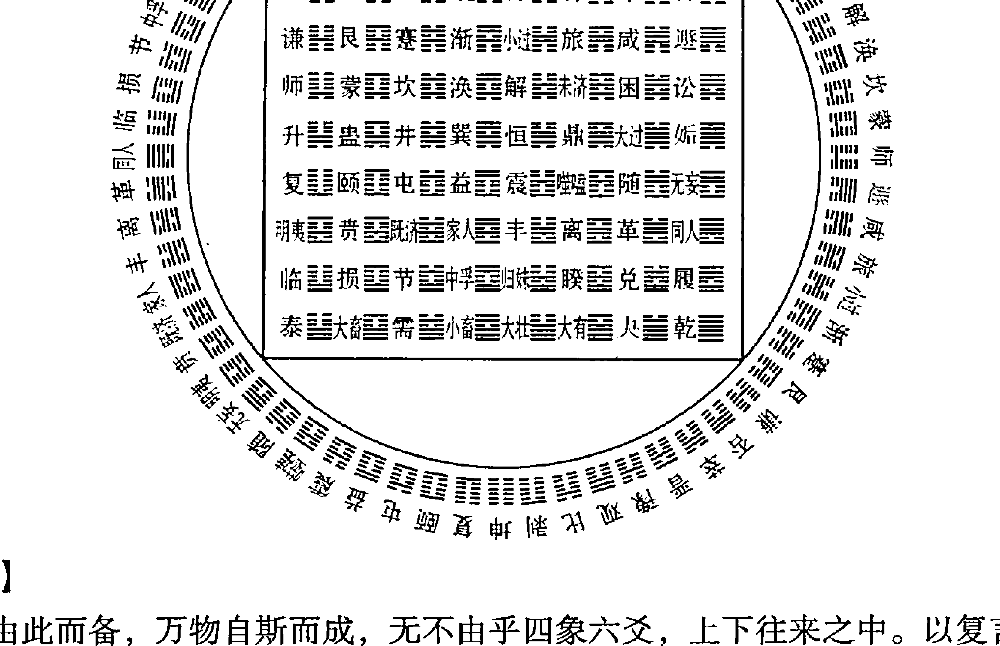

【原文】
三才由此而备，万物自斯而成，无不由乎四象六爻，上下往来之中。以复言之，其初为升爻，其上为降爻，若二月占之，则四爻阳为升，三爻阴是降也。盖升降务以占时言，毋以卦体言也。
> 注：卦体升降，如复一阳升六阴降则是矣。然升降之法，取用占时。设如春分后占，乃四阳升、三阴降之时也，即以所占之卦，凡逢四爻为升爻，三爻为降爻。但四爻若属阳爻，则为真升；三爻若属阴爻，则为真降。反之则非。复卦可玩，余皆仿此。

【今译】
天、地、人三才由此而具备，万物自此而形成，无不是来自于阴阳老少四象和六爻的上下往来。以复卦为例，其初爻为升爻，其上爻为降爻，如果在二月占卜得复卦，则四爻阳为升爻，三爻阴是降爻。因为关于升降的判断，务必要以问占的时令为依据，不能以卦体为依据。
注：卦体的升降，如复卦以初爻一阳初生为升爻、以上（六）爻极阴为降爻是正确的。然而升降的方法，则要依据占卦的时令。譬如春分以后问占，属于四阳升、三阴降的时令，即以所占的卦，凡是四爻即为升爻，凡是三爻即为降爻。只是四爻如果是阳爻，则是真升；三爻如果是阴爻，则是真降。反之则不是（真）。复卦是这样，其他以此类推。

【原文】
期日卦爻，以谓冬至法颐六四者，而震、兑、坎、离弗能均布其中，因寅于升降之外也。
注：其法以冬至日起山雷颐之六四，一日行一爻，一月行五卦，一年共六十卦。而震、兑、坎、离，加于二至二分之时，弗能自然，故寅于升降之外，独河洛变数理贵之。
凡正月小过、蒙、益、渐、泰，二月需、随、晋、解、大壮，三月豫、讼、蛊、革、夬，四月履、师、比、小畜、乾，五月大有、家人、井、咸、姤，六月鼎、丰、涣、旅、遁，七月同人、节、恒、损、否，八月巽、萃、大畜、贲、观，九月归妹、无妄、明夷、困、剥，十月艮、既济、噬嗑、大过、坤，十一月未济、蹇、颐、中孚、复，十二月屯、谦、睽、升、临。如此序尔。

【今译】
卦爻所对应的日期，以冬至对应于颐卦的六四（爻），而震、兑、坎、离不能分布于其中，于是排除于升降之外。
注：其法则是：以冬至日对应于山雷颐卦的六四爻为起始，然后一日行一爻，一月行五卦三十爻，一年共行六十卦三百六十爻。至于把震、兑、坎、离四卦加在春分、夏至、秋分、冬至的节气上的说法，不够自然，因此将其排除于升降之外。
正月小过、蒙、益、渐、泰，二月需、随、晋、解、大壮，三月豫、讼、蛊、革、夬，四月履、师、比、小畜、乾，五月大有、家人、井、咸、姤，六月鼎、丰、涣、旅、遁，七月同人、节、恒、损、否，八月巽、萃、大畜、贲、观，九月归妹、无妄、明夷、困、剥，十月艮、既济、噬嗑、大过、坤，十一月未济、蹇、颐、中孚、复，十二月屯、谦、睽、升、临。

【原文】
盖用神居升则日大而月新，用神居降则日消而月削也。是故升降之法，兼参用神衰旺，亦未可执一而论也。
注：升降不及进退之力，又必参看用神。用神旺相，升而更吉；用神休囚，降而更凶。不可执升降以定旺衰也。

## 进退章第十六

【原文】
吾闻天道一日一周，而黄道¹日不及天之一度。顺轮而前者谓之进神，逆轮而后者谓之退神。是以亥变子而前进，未变辰而退后也。
注：进神右顺行西，退神左逆行东。

【今译】
我听说天道的运行是一日一周，而太阳在黄道上的运行却是一天还运行不到周天的一度。顺行而前进的叫进神，逆行而后退的叫退神。所以，由亥变子视为前进为进神，由未变辰视为后退为退神。
注：进神是右旋顺行向西，退神是左旋逆行向东。

【原文】
同行之化，则有进退；异行之变，则惟生克。是以申变未而为生，丑变卯而为死，岂以进退言哉。
注：同行，五行同类论进退，不同类论生克。

【今译】
五行属性相同的爻之间的变化，则有进退之说；五行属性不同的爻之间的变化，只有生克关系。所以申（金）变未（土）是得到生助，丑（土）变卯（木）则是遭逢克制以至死绝，岂能以进退来分析。
> ①黄道：太阳每年在恒星之间的视轨迹，即地球轨道面与天球的相交线——地球一年绕太阳转一周，我们从地球上看成太阳一年在天空中移动一圈，太阳这样移动的路线叫做黄道。这里借指太阳。

注：同行，是指五行属性相同，彼此之间的变化可论进退；五行属性不同，彼此之间的变化只能论生克。

【原文】
夫进神之法有三：一曰大进，二曰不进，三曰不能进。盖动旺相①而变日月，乘势得位，谓之大进；动日月而变空破，无阶无路，谓之不进；动破散而变日月，我位既失，何以得前，谓之不能进。
注：如午建甲戌日用官，得革之同人，未变戌者是大进，未巳旺相，戌乃日建，此动相而变日也。卯建庚申日用父，得丰之革，申变酉者是不进，申乃日辰，酉巳月破，此动日而变破也。申建癸卯日用子，得屯之节，寅变卯者是不能进，寅巳月破，卯虽日辰，此动破而变日也。

【今译】
进神分为三种：一是大进，二是不进，三是不能进。动爻正值旺相，变后所得之爻又为日建、月建，则是动时乘势变后得位，叫做大进；动爻正值日建、月建，变后所得之爻又恰逢旬空月破，其变化的过程可谓进无阶变无路，所以叫做不进；动爻正值月破日冲，变后所得之爻又为日建、月建，则本位既已失去，怎么能前进？所以叫做不能进。
注：例如在午月甲戌日占测官位，得到由泽火革变为天火同人的卦象，其中的未（爻）变戌（爻）是大进。因为未巳是旺相，戌又正值日建，这是动爻值相而变后所得之爻又值日建的例子。又如在卯月庚申日占测父母，得到由雷火丰变为泽火革的卦象，其中的申（爻）变酉（爻）是不进，因为申乃是日辰，酉巳值月破，这是动爻值日建而变后所得之爻又逢月破的例子。再如在申月癸卯日占测儿子的事情，得到由水雷屯变为水泽节的卦象，其中的寅（爻）变卯（爻）者是不能进，因为寅已经遭逢月破，卯虽然值日辰，也不能进。这是动爻逢破而变后所得之爻又值日建的例子。

午月甲戌日占测官位，得到由泽火革变为天火同人的卦象：

| 左列（革卦） | | | 右列（同人卦） |
| :--- | :--- | :--- | :--- |
| 官鬼未土 | ━━ ━━ | × | 官鬼戌土 |
| 父母酉金 | ━━━━━━ | | ━━━━━━ |
| 兄弟亥水 | ━━━━━━ | 世 | ━━━━━━ |
| 兄弟亥水 | ━━━━━━ | | ━━━━━━ |
| 官鬼丑土 | ━━ ━━ | | ━━ ━━ |
| 子孙卯木 | ━━━━━━ | 应 | ━━━━━━ |

① 旺相：命理术语。以五行配四季，每季中五行之盛衰以旺、相、休、囚、死表示，如春季是木旺、火相、水休、金囚、土死。

卯月庚申日占测父母，得到由雷火丰变为泽火革的卦象：

| 原卦 | 变卦 |
|------|------|
| 官鬼戌土 ▅▅ ▅▅ | ▅▅ ▅▅ |
| 父母申金 ▅▅▅▅ ▅▅▅▅ × 世 | 父母酉金 ▅▅▅▅▅▅ |
| 妻财午火 ▅▅▅▅ | ▅▅▅▅ |
| 兄弟亥水 ▅▅▅▅ | ▅▅▅▅ |
| 官鬼丑土 ▅▅ ▅▅ 应 | ▅▅ ▅▅ |
| 子孙卯木 ▅▅▅▅ | ▅▅▅▅ |

申月癸卯日占测儿子的事情，得到由水雷屯变为水泽节的卦象：

| 原卦 | 变卦 |
|------|------|
| 兄弟子水 ▅▅ ▅▅ | ▅▅ ▅▅ |
| 官鬼戌土 ▅▅▅▅ 应 | ▅▅▅▅ |
| 父母申金 ▅▅ ▅▅ | ▅▅ ▅▅ |
| 官鬼辰土 ▅▅ ▅▅ | ▅▅ ▅▅ |
| 子孙寅木 ▅▅▅▅ × 世 | 子孙卯木 ▅▅▅▅ |
| 兄弟子水 ▅▅▅▅ | ▅▅▅▅ |

【原文】
退神之法亦有三：一日实退，二日不退，三日不及退。盖动休囚而变休囚，是乃从流忘返，谓之实退；动日月而变空破，我德克备，谓之不退；动破散而变日月，溃败难收，咨嗟何及，安能退哉，谓之不及退。
注：如午建辛巳日用财，得兑之随，卯爻休囚，化寅又休囚，是休囚而变休囚，乃为实退。寅建丙戌日用父，得乾之夬，戊乃日辰，物无可伤，虽化未空，亦不退也。申建癸卯日用兄弟，得兑之丰，酉巳冲散，物不能扶，虽变申为月建，亦不及退也。

【今译】
退神也有三种：一是实退，二是不退，三是来不及退。动爻已值休囚，而变后所得之爻又为休囚，可谓顺流而不知返，因此叫做实退；动爻正值日建、月建，而变后所得之爻又遭逢旬空、月破，说明我的德性已经完备，因此叫做不退；动爻已经遭逢月破、日散，而变后所得之爻又为日建、月建，则犹如已然溃败之局难以收拾，嗟叹尚且不及，又怎么能退呢？所以叫做不及退。
注：例如在午月辛巳日占测财运，得到兑为泽变泽雷随的卦象，其中的卯木（爻）正值休囚，而变后所得之寅（爻）又值休囚，这是由休囚变为休囚，是实退。又如在寅月丙戌日占测父母，得到乾为天变为泽天夬（音 guài）的卦象，其中的戌（爻）正值日辰，没有任何事物可以伤害它，所以虽然变后所得之爻未（土）落入旬空，也不退。再如在申月癸卯日占测兄弟，得到兑为泽变为雷火丰的卦象，其中的酉（爻）已经遭逢冲散，任何事物都无法扶助它，所以虽然变后所得之申（爻）为月建，也来不及退。

午月辛巳日占测财运，得到兑为泽变泽雷随的卦象：| 位置 | 六亲 | 爻象 | 备注 |
|------|------|------|------|
| 上爻 | 父母未土 | ⚊⚊ | 世 |
| 五爻 | 兄弟酉金 | ⚊⚊ | |
| 四爻 | 子孙亥水 | ⚊⚊ | |
| 三爻 | 父母丑土 | ⚊⚊ | 应 |
| 二爻 | 妻财卯木 | ⚊⚊ | ○ 化出 妻财寅木 ⚊⚊ |
| 初爻 | 官鬼巳火 | ⚊⚊ | |

寅月丙戌日占测父母，得到乾为天变为泽天夬的卦象：

| 位置 | 六亲 | 爻象 | 备注 |
|------|------|------|------|
| 上爻 | 父母壬戌土 | ⚊⚊ | ○ 世 化出 父母未土 ⚊⚊ |
| 五爻 | 兄弟壬申金 | ⚊⚊ | |
| 四爻 | 官鬼壬午火 | ⚊⚊ | |
| 三爻 | 父母甲辰土 | ⚊⚊ | 应 |
| 二爻 | 妻财甲寅木 | ⚊⚊ | |
| 初爻 | 子孙甲子水 | ⚊⚊ | |

申月癸卯日占测兄弟，得到兑为泽变为雷火丰的卦象：

| 位置 | 六亲 | 爻象 | 备注 |
|------|------|------|------|
| 上爻 | 父母未土 | ⚊⚊ | 世 |
| 五爻 | 兄弟酉金 | ⚊⚊ | ○ 化出 兄弟申金 ⚊⚊ |
| 四爻 | 子孙亥水 | ⚊⚊ | |
| 三爻 | 父母丑土 | ⚊⚊ | × 应 化出 子孙亥水 ⚊⚊ |
| 二爻 | 妻财卯木 | ⚊⚊ | ○ 化出 父母丑土 ⚊⚊ |
| 初爻 | 官鬼巳火 | ⚊⚊ | |

## 【原文】

凡进以成得，退以败失。用神成败，吉凶分焉；元忌旺衰，灾祥见焉。化进有日昌之势，乃功名得志，身命荣昌，嫁娶财求，往而遂意，若忌神遇之，则忧方大尒；化退有道消之嫌，然灾祸渐弭，讼衰病退，寇贼无侵，若用神遇之，则未易得志也。
注：用神元神欲其进，忌神仇神欲其退。

## 【今译】

爻化进神兆示着所对应的事物能成就、得到，爻化退神兆示着所对应的事物会有挫败、损失。用神的成败决定着吉凶的区分，元神和忌神的旺、衰决定着祸福的变化。爻化进神，则其所对应的事物有日益昌盛的趋势，乃是求功名得志、身家荣昌、嫁娶财求行事遂意的征象，但如果是忌神得进，则意味着忧患正在加重。爻化退神有消退的嫌疑，然而也是灾祸逐渐消弭，疾病逐渐痊愈，诉讼、衰运逐渐消退，不受贼寇侵害的征象，但是如果用神遇退，则不易得志。
注：用神和元神所在的爻，喜其得进；忌神、仇神所在的爻，喜其能退。

故进而得日月生扶，其力愈盛；退而得日月制服，其气愈衰。盛衰以时，从舍以类，而吉凶尽矣。
注：既审进退，兼参日月，而旺衰益见。

## 【今译】

所以，爻化进神而得日建、月建的生助扶持，则其力量更加强大；爻化退神而又遭逢日建、月建的制服，则其气势更加衰弱。盛衰是由占测的时间决定的，判断进退的原则是根据五行的生克原理，由此吉凶就明了了。
注：既要考察是进还是退，又要兼看变化过程与日月的关系，这样旺衰之势才更加明显。

## 有无章第十七

## 【原文】

易法之要，其在用爻，然当辨本无而有、本有而无之义，始为无惑。
注：俗学但以用爻上卦为有，不上卦为无，岂能通微刻验！

## 【今译】

易占方法的关键在于对爻的运用，但是应当明晰“本无而有”和“本有而无”的意思，才能没有迷惑。
注：世俗的说法只以用爻出现在卦上为有，不出现在卦上为无，岂能通于精微，达于灵验！

## 【原文】

本无而有者，其法有三：六爻无用而用藏伏爻，遇生扶于世动之下者，一也；伏受空破，或遭制克，而察日月临用神之上者，二也；日月飞伏总无，而互卦变爻之间，用神一逢生旺，三也。
注：一飞无而伏有，一飞无而日月有，一飞伏日月无而互变有。飞重于伏，伏重于日月，变重于互也。

## 【今译】

“本无而有”分为三种情况：其一是在所得卦象的六爻中没有用神，用神藏在伏爻中，位于世爻和动爻之下，而且得到生扶的情形；其二是伏神遭逢旬空月破，或遭到制克，却察看到日月建临于用神之上的情况；其三是日月建、飞神、伏神都没有，但在互卦与变爻之间，用神一旦遇到生旺的情形。

发现日建月建正值用神的情形；其三是在日建、月建、飞神、伏神中都没有用神，而在互卦和变爻中，用神正逢生旺的情形。

> 注：一种是飞卦中没有，但在伏卦中有；一种是飞卦中没有，却在日建、月建中有；一种是飞卦、伏卦，以及日建、月建中都没有，而在互卦变爻中有。飞卦中的用神重于伏卦中的用神，伏卦中的用神重于日建、月建上的用神，变爻中的用神又重于互卦中的用神。

## 【原文】

本有而无者，其法亦三：用虽上卦，正值月破，一也；死绝无救，衰遇旬空，二也；发动交伤，日月互克，三也。

> 注：此皆用神受伤也，然当权其浅深轻重。

## 【今译】

“本有而无”也分为三种情况：其一是用神虽然出现在卦上，但正值月破；其二是遭遇死绝而无可救助，或者值衰而遇旬空；其三是发动后与变爻相互伤害，或者日月相互克制。

> 注：此三种情况，都属于用神受伤，然而应用时，又应当权衡其受伤的深浅轻重。

## 【原文】

自无而有者，来事喜之，去事畏之；自有而无者，退事宜之，进事恶之。

> 注：专分用忌为好恶，各以类推得之。

## 【今译】

自无而有的用神，在占测未来之事时喜欢它出现，在占测已往之事害怕它的出现；自有而无的用神，在占测欲退之事时适合出现，在占测欲进之事时则忌讳它的出现。

> 注：这是将用神忌神区分为好恶，其他以此类推。

## 【原文】

自无而有者，功名荣禄，意外遭逢，财利子嗣，晚年忽遇，而官非灾盗，亦起无端；自有而无者，反此推之。凡推用神，虽遇动现独发，若不逢旺相及有制无救，均为无气之占，学者审之。

> 注：本有而无，本无而有，皆非常占。盖人事之变、鬼神之不测两有之，非深思曲晰，未易得趋避之正也。

## 【今译】

自无而有的用神，出现在占测功名荣禄时，兆示着意外遭逢；出现在占测财利子嗣

时，兆示着晚年忽然遇到；但出现在占测灾难官非时，也兆示着灾祸会无端而起。自有而无的用神的作用，与此相反。凡是推断用神的作用，即使遇到莅临动爻且独自发动，如果不逢旺相以及有制而无救的情形，都属于无气之占，这一点需要详加注意。

注：用神本有而无，或者本无而有，都属于非常之占。因为其中既有人事的变更，也有鬼神的难测，所以非经深思熟虑，难以得到正确的趋避方法。

## 墓绝章第十八

## 【原文】

> 爻有生旺墓绝，卦亦有之。卦之为用，反胜于爻，盖卦包爻外，大象既凶，而不及小吉也。
>
> 注：此专言卦体墓绝也。

## 【今译】

> 爻有生旺墓绝，卦也有。而且卦的生旺墓绝的作用，还要更胜于爻，因为卦包裹于爻之外，（卦所兆示的）大象既凶，也就不必顾及（爻所兆示的）小吉了。
>
> 注：这里专言卦体的墓绝。卦的墓绝为震化坤、离化乾、兑化艮、坎化巽，但并非绝对，还要看具体情况。

## 【原文】

> 卦莫凶于墓绝，或墓冲绝破，或值空亡，则非真矣。或本卦临日月，亦非墓绝。如离变乾为墓绝，若午日月或甲子旬，是伪非真；若逢日月填实其乾，则为凶象矣。又有墓而不绝、绝而不墓，均非真也。
>
> 注：此辨墓绝真伪也，如墓绝遇空破非真，日月填实则真，墓绝一缺非是。

## 【今译】

> 卦的作用没有比墓绝更为凶险的了，但如果墓逢日冲、绝逢月破，或者正值空亡，就不是真的墓绝了。本卦自身就临日建、月建，也不是墓绝。例如离变乾本为墓绝，但如果在午日、午月，或在甲子旬中，则就是假而不是真墓绝；如果逢日月能填实乾位的戌亥之空，就是凶象了。又有“墓而不绝”、“绝而不墓”两种情况，也都不是真墓绝。
>
> 注：这是说如何辨别墓绝的真伪，如墓绝遇旬空月破则非真，如果被日月填实则是真，墓、绝二者缺一都不是真的墓绝。

## 【原文】

墓绝之用，唯国事、出师、身命、住基、疾病五者之忌也。国占岂曰灵长①，师占我军或溃，身命疾病，主属而凶，守不利内，迁不利外也。

> 注：卦化墓绝，诸占不宜，而五者尤凶。

## 【今译】

墓绝的作用，只在占测国事、出师、身命、住基和疾病时忌讳。占测国事遇墓绝，国运怎么能绵长？占测出师遇墓绝，则我军就可能溃败；占测身命和疾病遇墓绝，则象征主属将遇凶；占测静守家居而遇墓绝，则不利于在内务；占测迁址移居而遇墓绝，则又不利在外事。

> 注：卦化墓绝，各种占题都不宜见，而在上述五个方面表现得尤为凶险。

## 【原文】

墓绝之外，空破当参。内卦空破，不利旧居；外卦空破，岂宜新宅？空谓之多虚，破谓之少气，国事出师，皆非宜也。

> 注：空破稍轻于墓绝，唯疾病不忌。

## 【今译】

在墓绝之外，还应当参究旬空和月破。如果内卦遭逢旬空、月破，则不利于旧居；如果外卦遭逢旬空、月破，怎么能利于新宅？空意味着虚多不实，破意味着削弱元气，占测国事、出师遇到空虚，都不适宜。

> 注：空破的影响稍轻于墓绝，只有在占测疾病时不忌讳。

## 【原文】

是以八卦之化唯五，五行之化乃十二。是故坎化坤为克，水则养生；震化坎为生，木则言败。此八卦五行之分者，类此推之。

> 注：唯五，金、木、水、火、土也。十二，长生、沐浴、冠带、临官、帝旺、衰、病、死、墓、绝、胎、养也。

## 【今译】

八卦的变化只限于五行，五行的变化则有十二种之多。所以坎（水）化为坤（土）为遇到克制，此水在五行自身的变化中则是得到养生；震（木）化为坎（水）为遇到生助，

此木在五行自身的变化中则是遭到破败。其他变化以此类推。

注：所谓“唯五”，即金、木、水、火、土五行。所谓十二，即长生、沐浴、冠带、临官、帝旺、衰、病、死、墓、绝、胎、养等。

## 卦候章第十九

## 【原文】

夫五行以旺、相、休、囚、死之分，复有长生、沐浴、冠带、临官、帝旺、衰、病、死、墓、绝、胎、养之义，而八卦岂无旺、相、胎、没、死、囚、休、废之用哉？然以月令言，毋以日时言也。

注：八卦旺相休废之法，诀云：立春归艮土，春分震木齐，立夏时当巽，夏至本寻离，立秋坤土主，秋分兑泽奇，立冬乾旺处，冬至坎方宜。当权八卦临八节，逐卦循环细细推。

## 【今译】

五行的状态以旺、相、休、囚、死来区分，此外又有长生、沐浴、冠带、临官、帝旺、衰、病、死、墓、绝、胎、养十二种意义，八卦岂能没有旺、相、胎、没、死、囚、休、废的分别？但是必须以月令为根据，不要以日辰为依据。

注：八卦旺相休废的法则是：艮主立春，震主春分，巽主立夏，离主夏至，坤主立秋，兑主秋分，乾主立冬，坎主冬至。只要记住八卦在八大节气（四立、四分）中，各自旺于何时，逐卦循环，就不难推论出其旺相休废的状态了。

## 【原文】

阳之生也，气有十二；阴之生也，亦气有十二。阳之候¹三十有六，阴之候亦三十有六，是以岁有七十二候也。

注：阳生候十二气，如冬至、小寒、大寒、立春、雨水、惊蛰、春分、清明、谷雨、立夏、小满、芒种；阴生候十二气，夏至、小暑、大暑、立秋、处暑、白露、秋分、寒露、霜降、立冬、小雪、大雪。一气三候，阴阳各三十有六，合得七十二候为岁。

## 【今译】

阳气上升的节气共有十二个，阴气上升的节气也共有十二个。阳气上升的节候有三十六个，阴气上升的节候也有三十六个，所以一年共有七十二候。

① 候：古代计时单位，五天为一候。引申为节候、时令。

六个，阴气上升的节候也有三十六个，所以一年当中共有七十二节候。

注：阳气上升的十二个节气，即冬至、小寒、大寒、立春、雨水、惊蛰、春分、清明、谷雨、立夏、小满、芒种；阴气上升的十二个节气，即夏至、小暑、大暑、立秋、处暑、白露、秋分、寒露、霜降、立冬、小雪、大雪。一个节气分为三候，因此阴阳各自对应三十六个，合在一起共七十二候为一年。

## 【原文】

冬至坎旺，艮相；春分震旺，巽相；夏至离旺，坤相；秋分兑旺，乾相。卦旺三气，亦有一候之余旺；支司六候，亦有一候之先司。

注：如立春艮旺，至春分后艮尚旺五日，未即废也。支神主一月之权。如巳司六候，而未及巳五日，其巳已得气，盖余寒兆暑之义。

## 【今译】

冬至时坎旺而艮相，春分时震旺而巽相，夏至时离旺而坤相，秋分时兑旺而乾相。一卦可旺三个节气的时间，之后另有一候（五日）的余旺时间。每个地支执掌（旺）六候（一个月）的时间，之前另有一候提前执掌（旺）的时间。

注：例如立春时艮旺，到春分之后还能再旺五日，并不立即休废。地支执掌一月的权力。例如巳掌管六候的时间，而在还没有到巳的五日，巳就已经得气，和余寒兆示暑天将至的意思一样。

## 【原文】

夫一阴一阳，生子午之半者，南极北极之道，穷而复返也。

注：日行南极，冬至而还北；日行北极，夏至而还南。还北，则日轮之行舒，而日加长；还南，则日轮之行疾，而日渐短。惟二分日行赤道，乃得其中，故以冬至方旺于坎，夏至方旺于离。盖震兑得东西之经，坎离得穷返之理，自然之妙也。

## 【今译】

阴阳分成两半，出现在子、午所辖区域（方位或时间）之内的现象，反映的是南极北极之道，是阴阳穷极而复返的表现。

注：太阳行到南极——偏到南回归线，在冬至时向北回返；太阳行到北极——偏到北回归线，在夏至时向南回返。太阳向北回返，则白昼逐渐加长，向南回返，则白昼逐渐缩短（就中国所处的北半球而言）。只有在春分和秋分时，运行在赤道上，而得其中道——位于正中。所以冬至时坎旺，夏至时离旺，春分时震旺，秋分时兑旺。震与兑仿佛是区别东西半球的经线，坎与离则深得热极返寒、寒极返热之理，这是大自然的妙用。

## 【原文】

故冬至始起于坎，而旺、相、胎、没、死、囚、休、废，终止乎乾。则坎艮旺相三气，谓旬空而弗空也；震巽胎没三气，谓囚而不囚也。

> 注：如冬至后坎旺艮相，丑建甲寅旬筮坎，则过旬弗空；复如丑建得震巽，则言胎没之卦，而弗为克我者囚也。

## 【今译】

所以，（阳气）从冬至开始，复起于坎，依次经过旺、相、胎、没、死、囚、休、废八个阶段，而终止于乾。则坎、艮分别对应于旺相各三个节气，即使落于旬空也不空；震、巽分别对应于胎没各三个节气，即使逢囚也不落于囚。

> 注：例如冬至后占测，此时坎旺艮相，于是在丑月甲寅旬占卜而得到坎卦，就是过旬而不空；又如丑日、丑月得震巽卦，则为胎没之卦，不能克我的是对应于囚的兑卦。

## 【原文】

盖旺、相、胎、没，或当日之冲而不云冲；死、囚、休、废，或当日之建而不云建。此卦候不与爻神同也。然其所用，独以邦畿住宅为先要焉。

> 注：若震值旺，遇酉日而不为日破，仍论其旺相；坎值死，遇子日而不为日建，仍论其死囚。以卦候司四十五日，所概远也。

## 【今译】

处于旺、相、胎、没状态的卦，即使正遭逢日冲，也不叫冲散；处于死、囚、休、废状态的卦，即使正值日建，也不会建旺。这是因为卦候不与爻神相一致的缘故。至于应用的对象，则只在占测京城和住宅时才作为优先考虑的因素。

> 注：如果震卦正值旺时，遇到酉日而不能认为是日破，仍要按旺相论；坎正值死时，遇到子日也不能认为得日建，仍要按死囚论。这是因为卦候所执掌的时间达四十五日，涵盖的时间更长的缘故。

## 干化章第二十

## 【原文】

天干曰五运，地支曰六气，是以能成四时而造万物也。五运施之，六气成之。运施未形，气分有迹。是以浑天甲子，配财、官、父、兄、子于地支，而不及天干也。

> 注：干以气化，支以形化，卜重地支，亦有参用天干者。

## 【今译】

天干定五运，地支定六气，二者相互配合才能成就一年的四季，化生世间的万物。五运施予（万物的本性），六气成就万物。五运施予的是没有形象的质，经过六气的分化才有迹象可寻。所以浑天甲子中，将财、官、父、兄、子等配在地支上，而不配在天干上。

注：天干的变化是气的变化，地支的变化是形的变化，占卜时更重视地支，不过也有参用天干的地方。

## 【原文】

然则天干无所用乎？圣人纳甲，支干同纳，干以干取，支以支求。卦无用爻，而遇动象上之天干，与①日月之天干，亦合化而为用，但化用需逢日、月、动、变生扶则有，克破则无。

注：如辛卯年丙申月丙子日占子存亡，得观之萃，以为子孙不现，乃应凶象，而不知丙辛化水，后及亥月甲辰日，乃申子辰会成水局，亥月值于所变之亥，子孙反得平安而归，则五化之验如此。

## 【今译】

那么天干就没有用吗？圣人创制纳甲法的时候，是同时纳入天干和地支，天干作用于天干，地支作用于地支。卦中没有用爻时，而遇到动爻上的天干，与日建、月建上的天干一样，也可因合化而为用爻。只是天干化用需要逢日建、月建和动变之爻生扶才存在，如果遭到克破则没有。

注：例如在辛卯年丙申月丙子日占测儿子的存亡，得风地观变为泽地萃的卦象，以为是子孙用神不现，应属凶象，却不知丙辛化水运，到亥月甲辰日，申子辰会合成水局，亥月正值变爻的亥，所以子孙反而会得以平安而归。五化的应验就是如此。

妻财辛卯木 ○ 父母丁未土
官鬼辛巳火
父母辛未土 × 世 子孙丁亥水
妻财乙卯木
官鬼乙巳火
父母乙未土 应

## 【原文】

化用之吉，求名求利，意外可成，捕逃不获而自见，索负失望而复全。避患化官，恐遭不测之殃；虑讼化鬼，倘犯无端之惊。此其象也。

注：干化吉凶，俱当得之意外。

① 与：合乎。

## 【今译】

天干化用带来的吉兆，体现在求名求利上，是可以意外成功；体现在捕捉逃亡上，是本来没有捕获，逃跑者却自己出现；体现在索债上，是失望之后而复得。如果在占测避患时，天干化官鬼，则恐怕会遭遇不测的祸殃；在占测诉讼时，天干化官鬼，可能会有无端的惊惧。
注：天干化用的吉凶，都是出现在意料之外。

## 【原文】

五化之法，亦有由来。五虫①之变化者，莫变化于龙，故经云“逢龙则化”也。五遁甲子，甲己化戊而成土也，乙庚化庚而成金也，丙辛化壬而成水也，丁壬化甲而成木也，戊癸化丙而成火也。龙阳物，五化皆阳也。故天干以运化成物，地支以气变应事，干支岂可失一哉！
注：逢辰则化，如甲己遁丙寅，戊辰乃龙，因化土也；乙庚遁戊寅，庚辰乃龙。后仿此。

## 【今译】

天干五化的方法，也有其由来。所有动物没有比龙更富于变化的，故经中说“逢龙则化”。五遁甲子，甲己化戊而成土，乙庚化庚而成金，丙辛化壬而成水，丁壬化甲而成木，戊癸化丙而成火。因为龙为阳物，因此五化都属阳性。所以天干凭借五化来成就万物，地支凭借六气之来兆应万事，天干和地支缺一不可。
注：即遇辰就能化——辰的生肖是龙。例如甲己遁丙寅，戊辰是龙，于是化土；乙庚遁戊寅，庚辰是龙。其他以此类推。

## 【原文】

一动为法，再动次之。日干为法，月干次之。六气用常，五运用特。
注：特，独发也。独发与日干化合为要；然必因飞伏无用爻，而后求此法也。两动，偶一用之，不可恃也。

## 【今译】

只有一爻动的情形，适用天干五化，有两动爻则次之。日辰的天干适用天干五化，月建的天干则次之——很少用到，所以说“六气用常，五运用特”。
注：特，就是独自发动的意思。一爻独发与日干以天干化合为要，但是必须是在飞神和伏神中均无用爻的情况下，才求助于这种方法。如果是两个动爻，则仅仅是偶尔使用，不可依靠这种办法。

① 五虫：古人把动物分为五类，即羽虫（禽类）、毛虫（兽类）、甲虫（昆虫类）、鳞虫（鱼类）、裸虫（人类），合称“五虫”。泛指各类动物。

# 易冒

## 卷四 易圖

## 岁君章第二十一

**【原文】**

夫蕴周天之用，司六气之柄，继寒暑，分春秋，惟太岁主之，有君道焉。
注：周天，谓黄道传次十二神，继三百六十五度二十四分二十五秒之数。六气，阴阳六气。

**【今译】**

蕴涵着整个周天的功用，执掌着六气变化的权柄，使寒暑相继，四季得分的，只有作为众神煞之长的太岁，太岁拥有君主的地位。
注：周天，指黄道上依次排列的十二支神，共计三百六十五度二十四分二十五秒。六气就是阴阳六气。太岁原本是人们假想的与木星运行方向相反的星，在这里指年份的地支。

**【原文】**

其权则大而久、静而尊，若以定悔吝吉凶，则有其位而未亲其司也。
注：其吉凶之应，生克冲合，皆不及日月，谓其尊而不亲，高而难仰也。

**【今译】**

太岁的权力既大又久，既静定又尊贵，但如果根据它来判定吉凶悔吝，则是在其位而不当其政了——不能直接根据太岁来判断。
注：太岁在吉凶方面的应验，以及在生克冲合等方面的作用，都不如日建、月建，也就是说太岁虽然尊贵，但关系并不密切，犹如身居高位难以仰望一样。

**【原文】**

是故与爻神冲，谓岁破而不破；与爻神合，谓岁援而不援。生而不即生，伤而不即伤。空则可空，破则可破。
注：太岁与爻神相冲，但名岁破；若克爻神，但名岁克。值鬼但名岁鬼，未即为凶，故太岁在旬空则空之，在月破则破之。

**【今译】**

所以与爻神相冲，虽然叫做岁破但其实不为破；与爻神相合，虽然叫做岁援但其实不得其援。与爻神相生也得不到生助，与爻神相伤也得不到伤害。但逢空旬则可以是空，遇月破则可以是破。
注：太岁与爻神相冲，只是名义上叫岁破；如果克爻神，也只是名义上叫岁克。值鬼也只是在名义上叫岁鬼，并不就是凶，所以太岁在旬空则为空，在月破则为破。

**【原文】**

国占而现，喜静旺，忌破绝。无现则专论五爻，岁时降鬼而为海内殃，降福而为天下康。
注：太岁现为君象，不现则但以五爻为朝廷。太岁值鬼，九州灾厄；太岁值福，四海泰康。

**【今译】**

在占国事时出现太岁，喜其处于静旺，忌讳其处于破绝。不出现则只需专门考察第五爻，太岁莅临官鬼爻，则兆示着海内将遭受灾祸；太岁莅临子孙爻，则兆示着天下安康。
注：太岁出现，则以太岁为君主，如果不出现，就只以第五爻象征朝廷。太岁位于鬼爻，则九州大地将遭灾厄；太岁位于福（子孙）爻，则兆示着四海泰康。

**【原文】**

身命福持而生平安乐，家宅鬼会而岁月迍邅①。仕宦则职崇台阁，词讼则事渎宪司，事干朝廷。喜生合世爻，忌冲克身象。
注：凡上疏面圣请封等事，皆喜太岁生合世爻，则上合君心；太岁冲身象，则忧严谴。

**【今译】**

占测身命时，子孙持太岁，则兆示着一生安乐；占测家宅时，官鬼持太岁，则兆示着岁月艰难。占测仕宦时出现太岁，则兆示着可以高升宰辅；占测诉讼时出现太岁，则兆示着官司惊动朝廷。喜太岁生合于世爻，而忌讳太岁冲犯卦身。
注：凡是占测上疏言事、面见君主、请求封赏等事，都喜欢有太岁生合世爻，表示合乎君主心意；太岁冲犯卦身，则要担心会遭遇严厉的谴责。

## 月将章第二十二

**【原文】**

夫天地变化，阴阳消长，往来寒暑，各有其时，谓之曰令。则五行万物，皆从令而生杀，月将得无权乎？

① 迍邅 (zhūn zhān)：处境不利，困顿。

注：记曰：“月建乃万卜之提纲。” 《补遗》曰：“月将出令于三旬，往来咸服。”盖能令则为权，故令于水则寒，令于火则暑，令于春则生，令于秋则杀。

**【今译】**

天地的变化，阴阳的消长，寒暑的往来，都各有一定的时序，因此叫做时令。则从五行至万物，都随时令的推移而生长消亡，月建岂能无权呢？
注：书上说：“月建是所有卜筮的提纲。”《易林补遗》说：“月将在三旬之内发号命令，期间一切往来事物都要服从它。”因为能号令则有权势，所以号令发于水旺时就寒冷，号令发于火旺时就炎热，号令发于春季就生发，号令发于秋季就收杀。

**【原文】**

凡爻神值此，破而不破，伤而不伤，卦中无而若有，爻内绝而不绝，动逢冲而不散，旬逢空而不陷。用神遇此而吉，忌神遇此而凶。
注：凡爻神若值月将，纵遇变冲、动冲、日冲、岁冲，皆不为破，或动爻、变爻、日辰克之，不为伤。倘卦中飞伏如无用神，而月建值用则有。忌神若动于卦内，则逾月而方毙；元神若动于卦内，则当月而呈祥。

**【今译】**

凡是爻神正值月建，则遇破而不破，遇伤而不伤，在卦中虽然没有，也等同于有，爻本来绝于卦内也可不绝，发动逢冲而不散，遭逢旬空也不会陷于无用。但是用神遇到月建则吉，反之忌神遇到则凶。
注：凡是爻神如果正值月建，即使遇到动爻冲、变爻冲、日冲、岁冲，都不为破，即使遇到动爻、变爻、日辰的克制，也不会受到伤害。倘若在飞卦和伏卦中都没有用神，而有月建相值，就算有用神。忌神如果发动于卦内，则须经过此月才能被消灭；元神如果发动于卦内，则在当月就会遇到吉祥的结果。

**【原文】**

惟日辰能以相胜，后时能以相敌，盖物穷则变、器满则倾之义。
注：日月之力相较，若月克日生，吉得十之八；日克月生，吉得十之七。日散月破而不相救也。夫用占后时，以后来得事之月为凭。如亥建丙寅日占考秩①得萃，官临月破，本不为吉，而在次年孟夏方考，反为月建官爻，得上上卷。

① 考秩：考定禄秩或品秩。

**【今译】**

只有日辰能与月建互相制约，后来日期（指所占之事后来实际发生的时间）能与月建相匹敌，这其实就是“物穷则变，器满则倾”的道理。
注：日建月建之间力量相比较，如果是月建相克，而日建相生，则得吉的可能在十分之八；如果是日建相克，而月建相生，则得吉的可能在十分之七。日散和月破，彼此不能相互救助。所谓用占后时，要以后来发生的月份为依据。例如在亥月丙寅日占测考秩，得到泽地萃，用神官鬼在巳火爻，正临月破，本来不吉，但到第二年孟夏才开始考评，而此时反而是官鬼正值月建的情形，结果得到了上上等。

父母未土 ▅▅ ▅▅ ▅▅ ▅▅
兄弟酉金 ▅▅▅▅▅ 应
子孙亥水 ▅▅▅▅▅
妻财卯木 ▅▅ ▅▅ ▅▅ ▅▅
官鬼巳火 ▅▅ ▅▅ 世
父母未土 ▅▅ ▅▅ ▅▅ ▅▅

**【原文】**

其为力也，能裁制旺相发动及变伏互之神。其为权也，岁君亦弗夺之。

**【今译】**

月建的力量，能约束正值旺相、发动的爻，以及变爻、伏爻和互卦中的爻。就其权威来说，即使是太岁也不能与之争夺。

## 日主章第二十三

**【原文】**

夫周天包四时之成，立二至二分之节，荡摩六气之消长，非独赤道①如是焉。盖日行黄道，昼夜之内，亦一周天，日主得无权欤？

注：赤道即天度也。天无形，以经星为形。阴阳寒暑，虽周天所包，而一昼夜之间，天一周，经星亦一周而缩，日行一周而又缩。日与月会，计二万九千五百三十零五十九秒三微之数，以月犹不及日十三度七之一。所以日主之权，得中道而无所不赖也。

① 赤道：古代主浑天说者认为，天体是个浑圆形的球体，赤道即指天球表面距离南北两极相等的圆周线。现代天文学称为天球赤道。

**【今译】**

一周天包括了四季的更迭，确立有冬夏二至、春秋二分的节气，经历了相互摩荡的六气的消长，但并不是只有赤道如此。因为太阳沿着黄道运行，在一昼夜之内，所经历的也是一周天，因此日主能没有权力吗？
注：赤道就是天度。天本无形，以二十八宿为形。阴阳寒暑的变化，虽然包含在一周天的变化历程中，但一昼夜之间，天运行一周，恒星运行一周所经的度数略有不足，太阳运行一周而又略有不足。因为月亮每天运行十三又七之一度不到，因此太阳与月亮相会的周期是二万九千五百三十零五十九秒三微。所以日主之权力适得中道，因此事物无不需要依赖它。

**【原文】**

故日主所临，莫能破之，莫能空之，莫能散之。如金如刚，孰之能伤？用神遇之，谓之尽善，忌动何忧？仇动何虑？惟月将则敌其所司，他时则夺其所持。屈伸之义如此。

注：用临日主出现卦中，忌神仇神发动，皆不为害，月将亦不能克。惟日主为元神生用，若月将为忌克用，则夺其权十分之二。若得事他日，即以他日为主。如辰建甲寅日占会，得师，午财生寅，当得，而在癸亥日摇会①，火绝于亥，反不得也。此屈伸之义。

**【今译】**

所以日主所临的爻神，任何事物都不能破它，不能使之空，不能冲散它。其自身如金如刚，谁能伤害它？用神遇日主，则可谓尽善尽美，此时即使有忌神、仇神发动，又有什么可忧虑的？惟月将则可以挑战其权威，“他时”则能夺走它所临的爻。这就是《周易·系辞传》中“往者屈也，来者伸也”所说的道理。
注：卦中出现用爻正临日主的情况，忌神仇神发动，都不能构成伤害，月将也不能克它。只有日主为元神生用神时，如果月将为忌神来克用神，则夺去日主十分之二的权力。如果所占之事情发生在以后，就以发生之日为主。例如辰月甲寅日占测摇会，得地水师卦，妻财午火长生于寅日，应当得财，但在癸亥日进行摇会，此是午火绝于亥水，所以反而不得。

| 父母酉金 | 应 |
| 兄弟亥水 | |
| 官鬼丑土 | |
| 妻财午火 | 世 |
| 官鬼辰土 | |
| 子孙寅木 | |

① 摇会：民间的一种信用互助方式。一般由发起人（称“会头”）邀请亲友若干人（称“会脚”）参加，约定每月、每季或每年举会一次。每次各缴一定数量的会款，轮流交由一人使用，借以互助。会头先收第一次会款，以后按摇骰方式，决定会脚收款次序，直到参加者轮完为止。

**【原文】**

故与日月配爻象，月将则先从五法，而后从十二法，日主则专务长生沐浴之法。是以日惟散，月惟破；日重绝，月重克；日有随墓，月无助伤。占者宁不以日主为先也？

注：若以日月配爻象，用神投月将，则先论旺相休囚死，后论长生、沐浴、冠带、临官、帝旺、衰、病、死、墓、绝、胎、养之法。如土爻用神，遇于巳月应相，其绝则轻，虽不可谓无绝，相与绝较，得相犹十之七。如遇申月，其土则休，以生较休，得生犹十之七也。若日辰之生绝则独重，金遇巳而生者十之九，土遇巳而绝者十之九，唯以长生十二法而定衰旺。

**【今译】**

所以以日主和月建配爻象时，月建要先按五法来论，然后再依据十二法来论，日主则只就长生沐浴——十二法来论。所以日冲只有散，月冲只有破；日主侧重于绝，月将侧重于克；日主有随鬼入墓的情形，月将没有助鬼伤身的情形。占筮者能不以日主为先吗？
注：如果以日主和月建配爻象，如果用神正临月建，则要先论旺、相、休、囚、死，后论长生、沐浴、冠带、临官、帝旺、衰、病、死、墓、绝、胎、养十二种状态。如土爻为用神，遇到巳月处于相的状态，所以其绝则相对较轻，虽然不是没有绝，但相比之下，得到“相”就如同得到了十分之七。如果遇到申月，其土则处于休的状态，与生相比较，而处于休的状态，得生犹如得到十分之七。如果是日辰，则生绝就是唯一重要的，金遇巳而生占十分之九，土遇巳而绝也占十分之九，所以日辰只以长生十二法来定旺衰。

## 时辰章第二十四

**【原文】**

时，由四时之相推而成年也；辰，犹五星之次①编②周天也。以昼夜效寒暑，以朝暮譬春秋，按六气成八刻，而呼吸之内，皆时辰所司也。

注：十二时为一日，三十日为一月，十二月为一年，三十年为一世，十二世为一运，三十运为一会，十二会为一元，计十二万九千六百之数也。但时刻改于须臾，迁于呼吸，其权司只在一日之内尔。

+   ① 次：旅行所居止之处所。
② 编：按一定的原则、规则或次序来组织或排列。

**【今译】**

时，是指由四季的推移而成年的过程；辰，则犹如五星的居所分布于周天之上。以昼夜变化类比一年中的寒暑变化，以早晚类比春秋，依照六气的变化形成八刻，于是即使呼吸之间，也都有对应的特定时辰。
注：十二个时辰为一天，三十天为一月，十二个月为一年，三十年为一世，十二世为一运，三十运为一会，十二会为一元，一元共计有十二万九千六百个时辰。但是时刻瞬息即变，在呼吸间就会迁移，其司权只限于一天之内。

**【原文】**

其要唯推长生十二法以应用神。然爻神与时冲合，则但有冲合之名，而无深中。能应日内之吉凶，弗应日外之休咎也。

注：如午建己巳日占临产，得姤之鼎，胎空身动，理应当日申时可育，谁知亥子绝于巳日，且实其空，至次日申时方产。可见先求日而后求时也。

**【今译】**

时辰应用的要点在于只以长生十二法来推论与用神的关系。然而爻神与时辰之间存在的冲合关系，则只徒有冲合之名，而没有深刻的关联。能应验于一日之内的吉凶，超过一天则与之无关。
注：例如在午月己巳日占测临产，得天风姤变为火风鼎的卦象，（子孙爻亥水为）胎儿逢旬空，动爻申金发动来生，理应在当日的申时生产，但是亥子（水）绝于巳（火）日，而且填实了旬空，所以到第二天申时才能生产。可见占断时，应当先考虑日主，再考虑时辰。

**【原文】**

是故其为力，曰近、曰轻、曰小、曰速；其为象，曰卑幼。故传曰“时辰司顷刻之权”也。

**【今译】**

所以时辰的作用具有以下特点：时间近，程度轻，力量小，结束快。其对应的形象是年龄幼小的晚辈。所以书上说：“时辰执掌的是顷刻间的权柄。”

## 月破章第二十五

**【原文】**

物以时而消息，则五行之衰旺亦然。夫建①为六气之正，破为六气之反。以用处正，名为月建，犹乘时而驾也；以用处反，名为月破，犹违时而戾也。
注：阳正阴反，阴正阳反。如巳月已为六阳之正，则亥为六阴之反，于已则得时，于亥则失时也。夫人生五行之中，不可违时，违时则困。是故君子审进退盈虚之理，兆如悔吝，宁守其困，卜如否臧凶，宁守其常，求如少遂，莫若待时，所谓“居易以俟命”也。若背而驰焉，躁而求焉，宁有幸乎？君子审于建破吉凶之象，而困亨之道得矣。

**【今译】**

世间的万物依照四季的变迁而消长，五行的衰旺变化也是如此。建是指六气正向的变化，破是指六气反向的变化。如果位于正位，就叫做月建，犹如乘借时序，而驾驭事物的变化；如果位于反位，则叫做月破，犹如违背时序，而与自然规律相抵触。
注：阳为正，则阴为反，阴为正，则阳为反。例如在巳月，巳为六阳之正，亥为六阴之反，对于巳来说就是得时，对于巳来说亥就是失时。人生于五行变化之中，因此不可违背时序的规律，否则就会陷入困顿。所以君子行事之前要审察进退、盈虚的道理，如果所得的兆示为悔吝，则宁可谨守困境；占卜的结果如果为凶，则宁可谨守常道；如果占测的结果仅仅稍遂心愿，则不如等待时机。这就是所谓“居易以俟命”。如果与自然规律背道而驰，躁动妄求，岂能得到幸运的结果？君子通过考察建与破反应出来的吉凶征象，就可以得到处困能亨之道了。

**【补充】**

月破由月建相冲而来，规律如下：

+   - 立春正月节建寅破申，惊蛰二月节建卯破酉，
- 清明三月节建辰破戌，立夏四月节建巳破亥，
- 芒种五月节建午破子，小暑六月节建未破丑，
- 立秋七月节建申破寅，白露八月节建酉破卯，
- 寒露九月节建戌破辰，立冬十月节建亥破巳，
- 大雪十一月节建子破午，小寒十二月节建丑破未。

> ① 建：古代天文学称北斗星斗柄所指为建。一年之中，斗柄旋转而依次指为十二辰，称为“十二月建”。文中所用，略有转义。

**【原文】**

是以生之不长，扶之不起，实如虚，有如无，为我援而无赖，为我忌而弗伤，在伏则不露，在变则不权，名之曰破，而无所施用也。

注：爻神若逢月破，纵日辰、动象、变爻生之，亦不能昌，纵在变爻，不能生克动爻；主在伏象，不能现为卦象，乃失时无为之物也。

**【今译】**

所以生助它不能使之成长，扶持它不能使之起，即使是实的也如同虚空一般，即使是有也如同没有一样，充当我的应援时却不能依赖，充当我的忌神也不会伤害到我，作为伏神则不能出露，作为变爻则不变通，这就叫做月破，不能发挥任何作用。
注：爻如果逢月破，即使日辰、动爻、变爻来生它，也不能昌盛，即使在变爻上，也不能生、克动爻，表现在伏爻上，不能显现为卦象，乃是因失时而无用的东西。

**【原文】**

唯值日则能实其破，后时则能补其过。若与鬼动，吉而不吉，凶而愈凶，以白虎杀神加临尔。

注：大白虎为凶神，合官鬼动者，妄为肆暴，岂非殃乎？值日，如五月子日则谓实其破而不破；后来日辰遇子，亦谓实其破而不破；后来月建遇子，亦谓补其失而不破也。

**【今译】**

只有爻神值日辰时，才能填实其月破，“后时”则能补益其过失。如果与官鬼爻同时发动，则吉也不吉，凶却更凶，这是由于白虎杀神加临其上的缘故。
注：白虎为凶神，如果配合官鬼发动，则更加胡乱肆虐，岂能不是灾祸？值日，例如五月子日则能因填实其破，而终不破；后来事情实际发生的日辰恰遇子，也能填实其破，而终不破；后来的月建遇子，也能补其所失，而终不破。

## 旬空章第二十六

**【原文】**

空亡之法，轻重有别，或年空，或月空，或日空，或时空，未可概用，惟旬中空为重焉。

注：年月时空存其名，独日辰旬空为真。年旬空偶一考之，如己亥生人，自筮寿命，于己未年寅建癸亥日得大畜，当推其七十戊申，乃甲辰旬空寅卯之类是也。

**【今译】**

不同的空亡之间，在影响上各有轻重的不同，对所谓的年空、月空、日空、时空，不可一概而用，只有日辰旬空最为重要。
注：年、月、时空只是徒有其名而已，只有日辰旬空才是真的空亡。年旬空只是偶尔需要加以考察，例如在己亥年出生的人，在己未年寅月癸亥日，占测自己的寿命，得到山天大畜卦，应当推定他享年七十，至戊申年寿终，这是因为甲辰旬空寅卯。

| 内容 | 标记 |
|------|------|
| 官鬼丙寅木 ▅▅▅▅▅▅ | |
| 妻财丙子水 ▅▅ ▅▅ | 应 |
| 兄弟丙戌土 ▅▅▅▅▅▅ | |
| 兄弟甲辰土 ▅▅▅▅▅▅ | |
| 官鬼甲寅木 ▅▅ ▅▅ | 世 |
| 妻财甲子水 ▅▅▅▅▅▅ | |

**【原文】**

旬空之法，当审建空、动空、填空、旺空、相空之义，半空、援空、安空之法。
注：月建值空，谓建空，犹不空，反有用也。动爻值空，谓动空，不惟不空，反为动也。若日辰来冲，又不为散，反为全动，以其空逢冲实而复动焉。空爻遇冲为填空。若有旺相生扶，乃为填实；若遇休囚伤克，乃谓不全填实也。旺相之爻值空，为旺相空，必以日辰参之。若日辰亦生扶，乃谓真旺相空；若日辰克之，即为克空；若日辰泄其气，即为半空。此皆空而有用也。半空即上文所言。动爻日辰来生空爻，乃谓援空。日月动爻皆不来克空爻，乃谓安空。此皆空而不死也。

**【今译】**

关于旬空，应当明晰建空、动空、填空、旺空、相空的定义，形成半空、援空、安空的规则。
注：月建正值旬空，叫做建空。建空等同于不空，反而有用。动爻正值旬空，叫做动空，不仅不空，反而促进发动。如果逢日辰来冲，又不会被冲散，反而成为全动，因为其旬空因逢冲而被填实，而又发动了。空爻遇冲被填空。如果有当值旺相的“冲”来生扶，才算填实；如果“冲”值休囚而遇到伤克，则不算填实。处于旺相状态的爻值旬空，就叫做旺相空，此时必须参考日辰。如果日辰来生扶它，才是真的旺相空；如果日辰来克它，即为克空；如果日辰来泄其气，即为半空。上述所列，都是逢旬空而仍有用的。动爻日辰来生空爻，叫做援空。日、月、动爻都不来克空爻，叫做安空。这些都是逢旬空而不会死绝的。

破空、绝空、真空、克空、伤空之戒，凡十有三法，此旬空之秘也，然后分好恶轻重而考其吉凶焉。

注：月破值空，谓破空。绝于月为绝空。“春土夏金秋是木，三冬知火是真空。”若辰戌丑未月，又以水为真空。盖月建来克，便为真空。所以破绝真空，皆系于月建之上。得一日辰或动爻来生，即成克空，轻于此也。如日辰动爻或一来克，即谓伤空，重于此也。是皆所戒之空尔。大抵旬空秘要，在日、月、动三象考求。日月为最，动爻次之。克倍生扶则重，生扶倍克则轻也。

需要戒惧的旬空有破空、绝空、真空、克空、伤空等，共有十三种规则，这是有关旬空的秘要所在，了解这些之后，才能区分旬空的好坏轻重，进而考察其应兆的吉凶。

注：逢月破又值旬空，叫做破空。五行属性绝于月又值旬空，叫做绝空。五行绝于四季的口诀是：“春土夏金秋是木，三冬知火是真空。”如果是辰戌丑未月，又以水性逢旬空则为真空。总的来说只要是月建来克，就属于真空。所以破空、绝空、真空，都取决于月建。如果得一日辰或动爻来生，就成为克空，其为害轻于由于月建形成的破空、绝空、真空等。如日辰或动爻其中之一来相克，就叫做伤空，其为害重于由于月建形成的破空、绝空、真空等。这都是需要戒惧的旬空。大致来说，旬空的秘要在于对日建、月建、动爻三者的考察。其中日月最重要，动爻次之。克制的力量大于生扶则言重，生扶的力量大于克制则较轻微。

是以空于忌则吉，空于用则凶。故求事之成，财之得者，不可遇之；欲其来，求其有者，不可遇之；占久不可空，占在不可亡。此六者乃空于用也。

注：如谋望，世空我求不遂，应空彼意不偕之类。

所以忌神逢旬空则吉，用神逢旬空则凶。占卜的目的是祈求事业成功，或获得财物的，不可以遇到逢空；希望事物来临，或祈求保有某事物的，也不可逢空；求事运长久的，或求事物存在的，不可以逢空。上述都是针对用神逢空而言的。

注：例如谋求实现某种愿望，如果世爻逢空，说明我所求的结果得不到；如果应爻逢空，说明对方的意愿与我不同。

凡事之将避焉，将弃焉，将脱焉，将绝焉，将欲其不在焉，此六者乃空于忌也。

注：如占避祸，鬼空则可避；如占脱役，鬼空则可脱之类。

凡对所占测事物持有的态度，是躲避、抛弃、摆脱、断绝，或希望其不存在，这六种情况宜于忌神逢旬空。

注：例如占测避祸时，如果官鬼爻逢旬空，则意味着可避。又如占测摆脱劳役，如果官鬼爻逢旬空，则说明可以摆脱。

盖空居变爻则无司，空在伏爻则不现。

注：变爻若空，不能生克动爻，故曰无司；伏神若空，不能透露卦象，故曰不现。

总的来说，如果旬空居于变爻，则变爻无所作用；如果旬空落在伏爻上，则伏爻不会显露。

注：变爻如果值旬空，则不能生、克动爻，所以叫做无司；伏爻如果值旬空，则不能透露出来，所以叫不现。

空居六亲称其用，空临六神较其事。

注：六亲谓财、官、父、兄、子。《补遗》曰：“财空富而不厚，官空贵而不荣，子空儿女必伶仃，父空屋室还衰败，兄空则弟兄少力。”法曰：

- 青龙空亡怀虚喜，朱雀空亡讼自己。
- 勾陈空亡田甚芜，螣蛇空亡妖不起。
- 白虎空亡丧服豪，玄武空亡盗贼弭。

六亲逢旬空，可以据此衡量其作用的程度；六神逢旬空，可以据此确定其所主事物的内容。

注：六亲指财、官、父、兄、子。

《易林补遗》上说：“财空富而不厚，官空贵而不荣，子空儿女必伶仃，父空屋室还衰败，兄空则弟兄少力。”

六神逢空的口诀是：

- 青龙空亡怀虚喜，朱雀空亡讼自己。
- 勾陈空亡田甚芜，螣蛇空亡妖不起。
- 白虎空亡丧服藁，玄武空亡盗贼弭。

世应空而分彼我之求，内外空而分新旧之基，间身空而分人己，阴阳空而分男女，出现伏藏空而分远近。五行旬空之则，是学易之模范也。

注：中人强弱忌间空，祸己有无喜身空。男人阳空则弗出，女人阴空则防疾，非谓男女空而弗分阴阳也。近事忌出现空，远事忌伏藏空，非谓出现空而伏藏不空也。

根据世爻或应爻逢旬空，分别对应于我和对方的谋求；外卦或内卦逢旬空，分别对应于事物的新旧根基；间爻或身爻逢旬空，分别对应于别人和自己的利益；阴或阳爻逢旬空，分别对应于男和女；伏藏或出现的爻逢旬空，分别对应于事情的远近。总之，五行旬空的法则，是学习易占的基本规矩。

注：在占测中间人的强弱时，忌讳间爻逢空；在占测关于自己的灾祸有无时，喜欢世身逢空。如果占测男人，而阳爻逢空，则男人最好不出去，如果占测女人，而阴爻逢空，则女人应当预防疾病，并不是说男女逢空就不分阴阳了。占测最近的事物，忌讳出现之爻逢旬空，占测较远的事情，忌讳伏藏之爻逢旬空，并不是说出现之爻逢空而伏藏之爻不逢空。

## 日冲章第二十七

日冲安旺之爻为暗动，日冲静衰之爻谓暗破，空爻遇冲谓之实，动爻遇冲谓之散。凡有四法，此日冲之要理也。

注：如辰建卯日，坤酉子孙，谓之暗动，即半动矣。如午建酉日，离卯父爻，谓之暗破，即半碎矣。如午建戊辰日，乾戌世空，谓之全实；亥建成戌日，艮午父空，谓之半实也。如动爻遇日辰相冲，苟非月建，则谓之散，及动化冲亦散，或他爻发动来冲，若彼强我弱皆散。夫散，犹空也，则全无矣，纵有生扶，不可救药。

日辰冲于处于旺相的非动爻时，叫做暗动；日辰冲于处于衰的非动爻时，叫做暗破；逢旬空之爻遇日冲，叫做填实；动爻遇日冲，叫做冲散。凡此四种，是有关日冲的基本原理。

注：例如辰月卯日，此时酉金旺，所以坤卦的子孙爻酉金被冲，叫做暗动，即半动。又如午月酉日，此时卯木休，离卦的父母爻卯木被冲，叫做暗破，即半碎。又如午月戊辰日，乾卦世爻戊土逢旬空，叫做全实；亥月戊子日，艮卦父母爻午火逢旬空，称为半实。如果是动爻遇日辰相冲，如果不是正值月建，叫做散，即使发动之后化爻逢冲，也会被冲散；或者是其他爻发动来冲，而且是彼强我弱，也都是散。散和空相似，都是完全消失的意思，因此即使有生扶，也不可救药。

其为墓冲、胎冲、克冲、绝冲，亦有四法，此日冲之分称也。

注：辰、戌、丑、未为墓冲，不论旺相休囚，静遇为暗动，空遇为填实。子、午、卯、酉为胎冲，旺相则静为暗动，休囚则静为半散，空为半实也。如子酉之日，来冲午卯，虽旺相亦为克冲，其吉但得十之七矣。寅、申、巳、亥为绝冲，纵旺相，静不能为暗动，空不能为全实，盖绝冲与克冲同也。克冲有三：子酉之日为克冲，少轻；申亥之日克冲，绝而又克，故重也；寅巳之日绝冲，又重于胎克冲尔。

至于墓冲、胎冲、克冲和绝冲，则是日冲的另外四种细分后的名称。

注：与辰、戌、丑、未日相冲则为墓冲，不论正值旺相还是休囚，不动遇冲则为暗动，值旬空而遇冲则为填实。与子、午、卯、酉日相冲则为胎冲，正值旺相且为不动爻遇冲则为暗动，正值休囚且为不动爻遇冲则为半散，值旬空而遇胎冲为半实。例如子酉日来冲午卯爻，即使是正值旺相，也是克冲，其吉的因素只能得十分之七了。与寅、申、巳、亥日相冲为绝冲，即使正值旺相，静也不能为暗动，值旬空不能为全实，因为绝冲与克冲是一样的。克冲分为三种：子、酉日的克冲（为胎克），危害稍轻；申亥日的克冲，是绝而又克，所以严重；寅、巳日的是绝冲，又要比胎冲、克冲更严重。

其暗动，或临于元神，或临于忌神，或临于用神，各随其处而用之。若仇忌两发，而元神值暗动，犹得绵续生生也。然为吉凶之力则半，迟速之报则缓，灾祥之应则暗。如萌如窟，若启若击，用而喜之，忌而恶之，其机如此。

注：暗动之力不及动爻之力。

暗动既可以位于元神之上，也可以位于忌神、用神之上，具体则随其所处的位置而发挥作用。如果是仇神和忌神同时为动爻，而元神又值暗动，则犹如得到绵续而生生不已。但影响吉凶的力量则只有一半，应验的速度则变慢，并且兆示吉凶的征兆也更不明朗。既如萌生于外又如藏于深窟，既像开启释放又像打击关闭，所以为用神所用则喜其出现，为忌神所用则恶其出现，其微妙就在于此。

注：暗动的力量不如动爻的力量。

岁时之冲则不然，盖年用远而不言冲，时用近而不言破，是以日月之冲，非远近之比尔。

与年支、时支相冲则不同（于日冲）。因为年的影响较为久远，因此不能叫冲；时辰的影响较为短暂，因此不能叫破。所以日建、月建形成的相冲，不是影响较远的年和影响较短的时可比的。

## 遇时章第二十八

吾闻用神得令则吉，失令则凶，理之常也。然有当时后时之用，岂可执一而论哉。

注：得令失令，言其常也。事在后期，则勿执时令。

用神与时令相得则吉，与时令相失则凶，这是常理。但是当时和后时的功用，岂能一概而论。

注：得令失令，是就常理——正常的情况而言。如果所占的事情在后时——占测之后发生，则不能固执于时令之说。

故占于此月之得、此日之得，则用神当时为吉；若彼月之得、彼日之得，则用神当于彼时之令吉焉。盖夏月出而冬月入，水用为嘉；亥日问而已日求，火用为善。

注：《补遗》曰：“冬藏夏货，宜巳午之财爻；秋放春收，喜卯寅之妻位。”如寅建辛亥日占丁巳摇会，得节之中孚，巳财绝于亥日，兄动夺之，理不应得。然丁巳财当以丁巳日求之，而甲寅句子兄值空，是日果应得会。可见遇时为卜筮之要。

所以，占测在本月或本日将要发生的事情时，则以用神在“当时”为吉；占测在其他月份、其他日期将要发生的事情，则要用神与那时的时令相得为吉。这就是夏月出贷，而在冬月收入，则以水爻为用神为好；亥日占问，而所求之事在巳日发生，则以火爻为用神为好的意思。

注：《易林补遗》上说：“冬天收藏夏天的货物，喜欢以巳午爻为妻财；秋天放贷春天收回，喜欢以寅卯爻为妻财。”例如在寅月辛亥日占丁巳日的摇会，得水泽节变为风泽中孚的卦象，其巳火财爻绝于亥日，被动爻兄弟发动而夺去，按理不应得到。但是丁巳日的财运，应当以丁巳日来谋求，而此时为甲寅旬，子孙和兄弟爻都值旬空，于是这一天果然在摇会中摇中。可见，事情发生的时间才是占卜的关键。

兄弟子水  ____  ×     子孙卯木  ____
官鬼戌土  ____
父母申金  ____  应
官鬼丑土  ____
子孙卯木  ____
妻财巳火  ____  世

夫用神得于此之时之令，则失于彼时之司；得于彼时之司，则失于此之时之令。吉凶相胜，可不深辩乎？若随常之问，恒远之求，即当以占时用神得令失令而定灾祥，以其无时之可据也。

用神如果与时的时令相得——处旺相，则就与另一时间的时令相失——处衰。反之，在另外一个时令旺，就会在现在这个时令衰。所得的吉凶也此起彼伏，差异巨大，岂可不深入辨析？如果仅仅是平常的占问，或谋求长远的事情，则应当依据占测时用神是得令还是失令来断定吉凶，因为这样的占卜没有具体的时间可以依据。

## 独发章第二十九

吉凶之应，鬼神之情，必兆以动而告我也。是以卜筮之道，求用象为枢机，而察动爻为情状。惟一爻动而五爻之不动者，五爻动而一爻之不动者，事应之来，不验于用神，而验于卦象也。是以一爻独发，其占九六；一爻独静，其占七八。则由志动而鬼神知，鬼神知而吉凶生。吉凶之生由于动，所以重于动而轻于用也。

注：大吉大凶，虽不系于独发独静之爻，然鬼神之情常显机于此。

吉凶的征兆、事物背后变化莫测的情势，必定兆示在动爻上，从而来告诉我们。所以占卜之道，以用神的状态作为判断吉凶的枢机，同时又要考察动爻的情状。但是在一卦之中，只有一个爻动，而其他五爻不动，或者有五个爻动，而只有一爻不动的时候，关于所占之事的应征，不是应验在用神上，而是应验在卦象上。所以对于一爻独发的卦，占测的关键在于数为九六的爻——动爻；一爻独静的卦，占测的关键在于数为七八的爻——静爻。由其（独发、独静之爻）志愿的变动，会将变化莫测的情势显现出来，变化的情势一旦显现，则吉凶就会出现了。吉凶是产生于爻的变动，所以在这种情况下，要侧重于变动，用神则在其次。

注：大吉大凶，虽不完全决定于独发、独静之爻，但事物背后变化莫测的情势却常常显现于此。

夫占事之法，不可舍用神而求动爻，间有事验于动爻者。如占行人，得甲子爻动而甲子日至；占病人，得丙子爻发而丙子日亡；避火，遇甲午官兴而是日遭回禄；求名，遇丙戌父动而是岁反登科。

注：酉建甲子日卜子归期，得夬之大过，月建子孙，是月应至，卯冲酉，子宜在丁卯日到，而当日甲子即归。午建己巳日卜妻病，得大畜之小畜，月破妻爻化绝，应在当日即亡，后待丙子日而死。未建戊午日占家宅，得乾之小畜，本应火灾，庚午壬午不应，至甲午日而回禄，以夏至后先壬而后甲也，明矣。壬午年已建甲戌日占功名得剥之晋，常法以子、午、卯、酉乡举，后因鼎革，改丙戌而发乡科。以上皆验于独发，故虽不离用爻，而亦不执用爻也。

占卜的基本原则，是不可舍弃用神而关注于动爻，但间或也有事情应验在动爻的变化上。例如占测行人的归期，得甲子爻为动爻的结果，则行人将在甲子日回到家中；占测病人的病情，得丙子爻为动爻的结果，则病人将在丙子日死亡；占测避免火灾，遇到甲午官鬼爻为动爻的结果，则将在这一天遭受火灾；占测求功名，遇到丙戊父母爻为动爻的结果，则将在这一年考中科举。

注：在酉月甲子日占卜儿子的归期，得到泽天夬变成泽风大过的卦象，子孙正值月建（酉），说明在这个月就应当归来。又因为有丁卯（爻）冲酉，所以原本应当在丁卯日到。然而因为甲子爻独动，所以当日甲子日就回到了家里。

在午月己巳日占卜妻子的病情，得到山天大畜变为风天小畜的卦象，妻财丙子爻既逢月破，又遇化绝，原本应在当日就去世，可是因为甲子爻独动，所以到丙子日才死。

在未月戊午日占测家宅，得乾为天变为风天小畜的卦象，本应遭受火灾，但是庚午、壬午两天都没有应验，到甲午日才发生火灾。这是因为在夏至，乾纳的天干上下换位，变为壬在前（下）甲在后（上），所以变爻为甲午就很明显了。

在壬午年巳月甲戌日占测功名，得到山地剥变为火地晋的卦象，通常乡试在子、午、卯、酉年进行，后来因为改朝换代，而改在丙戌年乡举（卦中丙戌爻独动，结果在这年中举）。

以上案例都应验在独发之爻上，所以卜筮虽然不能离开用神，但是也不能拘泥于用神。

酉月甲子日占卜儿子的归期，得到泽天夬变成泽风大过的卦象：

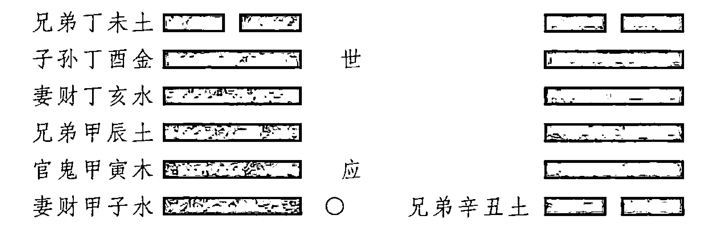

午月己巳日占卜妻子的病情，得到山天大畜变为风天小畜的卦象：

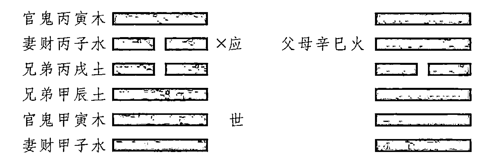

未月戊午日占测家宅，得乾为天变为风天小畜的卦象：

父母壬戌土 [世]
兄弟壬申金
官鬼壬午火 [动○] → 父母辛未土
父母甲辰土 [应]
妻财甲寅木
子孙甲子水

壬午年巳月甲戌日占测功名，得到山地剥变为火地晋的卦象：

妻财丙寅木
子孙丙子水 [世]
父母丙戌土 [动×] → 兄弟己酉金
妻财乙卯木
官鬼乙巳火 [应]
父母乙未土

如求财遇否之临而占八，乙卯日而得财。访友遇遁之节而占七，壬申日而会友。尚有己巳之静而应于癸卯日者，亦或验之也。静而独发，以值以合；动而独静，以值以冲。然必杂取用神忌神，而当其爻象者，则信无失矣。独动独静之法，则犹古昔之占验云。

注：如寅建己亥日占求财，得否之临，卯财长生，兄破不克妻爻，主应有财，不得于癸卯而得于乙卯者，日值干支财也。未建丙午日占访友，得遁之节，应爻在壬申，是以壬申日遇。巳建乙丑日占子归，得睽之咸，而应丁卯日至。盖一爻之静，不惟验于相值，亦验相冲；一爻之动，不惟应于相值，尤应相合。决日之秘，仍看用爻。

如果占卜求财时，遇到天地否变为地泽临的卦象，通过数字为八的爻——唯一不变的那一个阴爻推断，可知在乙卯日得财。占测访友事宜，遇到天山遁变为水泽节的卦象，通过数字为七八的爻——唯一不变的那一个阳爻推断，可知将在壬申日见到友人。尚有由独静的己巳爻而应验癸卯日的情况，也可能偶尔发生。五爻皆静而一爻独发，则以是否值日、是否与日辰相合为依据；五爻皆动而一爻独静，则以是否值日、是否与日辰相冲为依据。但是还必须兼而考虑用神和忌神。如果其一恰好位于该爻，则所占断的内容就可以确定无疑了。通过独动、独静之爻来占断的方法，是古人从占验中总结出来的。

注：例如在寅月己亥日占测求财，得天地否变为地泽临的卦象，妻财爻卯木长生于日辰，兄弟爻申金逢月破，而不能克妻财爻，兆示着应有财可得。但不得于癸卯日，而得于乙卯日，这是因为妻财爻值日的缘故。

在未月丙午日占测访友，得到天山遁变为水泽节的卦象，应爻在壬申——独静之爻，所以在壬申日相遇。

在巳月乙丑日占测儿子归期，得火泽睽变为泽山咸的卦象，而应验于丁卯日到家。因为一爻独静的情形，不仅仅应验在相值的日子，也可应验在相冲的日子；一爻独动的情形，不仅仅应验在相值的日子，更应验在相合的日子。决断日期的秘要，仍在于用爻。

寅月己亥日占测求财，得天地否变为地泽临的卦象：

| 本卦 | 动静/世应 | 变卦 |
|---|---|---|
| 父母壬戌土 | ○应 | 兄弟酉金 |
| 兄弟壬申金 | ○ | 子孙亥水 |
| 官鬼壬午火 | ○ | 父母丑土 |
| 妻财乙卯木 | 世 | |
| 官鬼乙巳火 | × | 妻财卯木 |
| 父母乙未土 | × | 官鬼巳火 |

未月丙午日占测访友，得到天山遁变为水泽节的卦象：

| 本卦 | 动静/世应 | 变卦 |
|---|---|---|
| 父母壬戌土 | ○ | 子孙子水 |
| 兄弟壬申金 | 应 | |
| 官鬼壬午火 | ○ | 兄弟申金 |
| 兄弟丙申金 | ○ | 父母丑土 |
| 官鬼丙午火 | ×世 | 妻财卯木 |
| 父母丙辰土 | × | 官鬼巳火 |

巳月乙丑日占测儿子归期，得火泽睽变为泽山咸的卦象：

| 本卦 | 动静/世应 | 变卦 |
|---|---|---|
| 父母己巳火 | ○ | 兄弟未土 |
| 兄弟己未土 | | 子孙酉金 |
| 子孙己酉金 | 世 | |
| 兄弟丁丑土 | × | 子孙申金 |
| 官鬼丁卯木 | ○ | 父母午火 |
| 父母丁巳火 | ○应 | 兄弟辰土 |

或曰，独发独静，止为吉凶告兆也。如求财遇财旺而有财，求官遇官旺而有官，行人遇用神生克而定其迟速，病人遇用神衰旺而决其死生，然后以独发独静之爻定其时，则每有验。此为论之中也。

注：独发独静可以定时日、察事应，若遂以定吉凶，则须审用爻，不可执也。

## 【今译】

有人认为，独发或独静的爻，只是为相关吉凶告示征兆罢了。例如求财时，以遇到妻财爻旺相为有财的征兆；求官时，以遇到官鬼爻旺为有官的征兆；占测行人时，则根据用神被生还是被克，而判定归来的快慢；占测病人时，根据用神的旺衰，来决断他的生死。然后再通过独发或独静的爻，来确定应验时日，则往往会有应验。这是比较合适的观点。

注：通过独发、独静之爻，可以确定时日、考察应验的内容，但如果要确定吉凶，则须审视用爻，不可执著。

## 两现章第三十

## 【原文】

夫用神之两现，将何主焉？必以其有伤无伤而定取舍也。舍其有伤，取其无伤，则可得一其主也。法所谓“用得其用则吉，不得其用则凶”，是故舍其无用而取其有用也。若两求之，则吉凶不定矣。

注：伤谓旬空、月破、冲散、克伤之类。

## 【今译】

如果一卦之中有两个用神，以哪一个为主呢？此时必须根据有伤无伤来确定取舍。舍弃有伤的，留取无伤的，就可以得到一个主要的了。占卜的规则中，有所谓“用得其用则吉，不得其用则凶”的说法，所以舍弃无用的，而留取有用的。如果两爻都用，则就会吉凶不定了。

注：伤，是指旬空、月破、冲散、克伤之类。

## 【原文】

然一动一静之用，犹有别焉，舍静取动，以动为事之兆也。不能得用神于飞爻，而求用神于伏象者，舍飞从伏，必以日、月、动爻之扶挈用之。

注：飞用被伤，当索伏用，日、月、动与配，相生而从，相克而舍。

## 【今译】

然而一卦当中两个用神，一为动爻一为静爻的情形，又有所不同，此时要舍弃静爻而取动爻，因为“动”是事物吉凶变化的先兆。由于不能从飞爻中得到用神，而要从伏爻中寻求用神，即所谓“舍飞从伏”，此时必须以得到日建、月建或动爻的扶掣为依据，来选择用神。

注：如果飞卦中的用神受伤，则应当在伏卦中寻找用神，以日建、月建和动爻与之相配，如果相生则可以选用，如果相克则舍弃不用。

## 【原文】

后时生旺死绝，亦以不伤之神为论。是故未丑为用，而丑空未实，而败于丑月者，谓未实而丑破之也。

注：后来日期，取配无伤用神，不可并索。如亥建成午日占脱货，得大过，遇子月价贵，遇丑月价贱，是论丑破未，而不论建丑也。

## 【今译】

判定“后时”的生旺死绝，也以不伤的用神为依据。所以如果以未丑爻为用神，而丑逢旬空，未则不空，而所占之事败于丑月的原因，就是因为未虽然实但却被丑冲破——丑未相冲。

注：因为后来事发的日期，与用来选取无伤的用神的日期，不能同时选择。例如在亥月戊午日占测出货，得泽风大过的卦象，妻财爻未土得日建午火来生故相合，所以以未土为用神。遇到子月出货价就高，遇丑月出货价就低，这是考虑丑能冲破未，而不是考虑丑是月建。

| 六亲干支 | 爻象 | 备注 |
|----------|------|------|
| 妻财丁未 | [爻象符号] | |
| 官鬼丁酉 | [爻象符号] | |
| 父母丁亥 | [爻象符号] | 世 |
| 官鬼辛酉 | [爻象符号] | |
| 父母辛亥 | [爻象符号] | |
| 妻财辛丑 | [爻象符号] | 应 |

## 【原文】

夫鬼神之于筮不妄动、不徒现，必有所告也。是以卜男婚而两官者，竟相求也；卜女婚而两财者，交相与也。词讼两官，则非一狱之事；失脱两鬼，则是三同之偷。仕路两官而再加署赦，考场两父而复试文章。官主也，父头也，营谋重之而系两头两主；妻财也，子福也，身命逢之而多财多福。忧害二鬼而戒内外之惊，理财二妻而得往来之息。子孙两现而占嗣者，膝下有真假之嗣；兄弟两现而占交者，座前有名实之友。

注：卦中用爻两现，推之人事，必有其象，用则喜而忌宜称也。

## 【今译】

鬼神（变化莫测的情势、卦象）在占卜的过程中，从来不会妄动，也不会徒劳地显现，一定有所告示。所以占测男婚（嫁女）时，如果遇到两个官鬼爻，则说明有竞争者求婚；占测女婚（娶妻）时，如果遇到两个妻财爻，则说明与两个女子同时交往；占测诉讼时，如果遇到两个官鬼爻，则说明不只一场官司；占测失脱时，如果遇到两个官鬼爻，则是发生了同时同地对同一物的偷盗；占测仕途时，如果遇两个官鬼爻，则意味着身兼两职，并且增加办公地点；占测考场事宜，如果遇到两个父母爻，则说明文章需要复试。

官鬼为主宰，父母爻代表头绪，在占测经营谋求时，如果重复出现，则说明主事不一，头绪多端。妻财为财物，子孙为福德，占测身命时，如果遇到其重复出现，则兆示着多财和多福。占测忧虑伤害时，如果遇到两重官鬼，则要戒备家内家外的惊悸；占测理财时，如果遇到两重妻财，则说明生意在往来之间都赚钱；占测子嗣时，如果遇到出现两个子孙爻，说明有亲生和非亲生的子女；占测交际时，如果遇到出现两个兄弟爻，说明有真假两种朋友。

注：如果卦中出现两个用神，推论到人事上，一定有对应的现象，如果为我所用则好，如果为我所忌则应当加以关注。

## 【原文】

卜居官遇乃二氏之同居，营葬鬼遇乃二亡之合葬也。所以戒文书者，父重而有文章之论也；忧官鬼者，鬼重而有连绵之祸也；恶兄弟者，兄重而有繁兴之费也。鬼伏鬼为新旧之病，官化官为起倒之词。

注：两现之象，最不易明，故详列于此，因事求之。

## 【今译】

占卜居所时，如果遇到两个官鬼爻，说明是两家同住；占卜丧葬时，如果遇到两个官鬼爻，说明是两位死者合葬。文书需要戒惧，原因是如果遇到两个父母爻，则说明可能将有因文章而起的争论。官鬼需要忧虑，原因是如果遇到两重官鬼，则说明可能有祸事接连而来。之所以不喜欢兄弟，原因是如果遇到两重兄弟，则说明可能产生繁多的消耗。官鬼爻一飞一伏，在占测疾病时，对应着新旧两种疾病；由官鬼化出官鬼，在占测词讼时，为反复无常。

注：用神两现的征象，对应的吉凶最不易明了，所以详细罗列于此，以便读者查对取用。

## 【原文】

盖两现于飞伏者，则取较之；两现于变互者，则勿取较也。其升、观二分之卦，八纯二土之象，皆有成格，故无烦别论，亦以两现之法为用云尔。

注：二分八纯，卦有一定，及得于变互者，皆不同两现之论。

## 【今译】

用神重复出现在飞卦和伏卦里的，则需取而较其优劣；重复出现在变卦和互卦的，则就不能如此比较了。至于升、观之类的二分的卦，以及八纯卦中的坤、艮二土的象，都有确定的格式，所以不需要另加讨论，也比照用神两现的法则即可。

注：二分八纯卦有一定之规，以及用神出现在变卦和互卦中的，都不能按用神两现来看。

# 易冒 卷四

## 长生章第三十一

## 【原文】

天地万物，始于无明，绝后而胎也。

注：无明，即释氏所谓无明缘行、行缘识、识缘名色，十二因缘之类也。绝则无物，犹无明也；胎则有形，犹缘名色也。

## 【今译】

天地万物，起始于无明，在绝灭之后，又重新进入胎生的状态。

注：“无明”就是佛家的所谓由无明到行，由行到识，由识到名色等的十二因缘之说。这个过程相当于五行寄生十二宫的从绝到胎。绝就是无物，相当于无明；胎则是开始具备了形体，相当于名色。

### 【补充】

- 十二因缘是佛家说明有情生死流转过程中因果相续的十二个阶段，即：
1. 无明——无始烦恼。指无始以来，妄识于事理迷暗愚痴，无所明了，故名无明。
2. 行——所造作之善恶诸业。指由无明为缘，遂引起造作种种善恶事。以上两支，属过去因缘。
3. 识——本识揽渧。此为一期生死之开端。
4. 名色——识暖胚团。名指心识（初投胎之神识），色指形体（父精母血凝成之胚团）。
5. 六入——扶尘具形，指眼等六根而言。在母胎十个月中，由名色逐渐六根成长完备，于出胎后，对六尘境界有互相涉入的作用，故名六入。
6. 触——根摄境界，接触之义。即出胎与外境相接触。
7. 受——苦乐舍感，即是领受之义。以上五支，总为五蕴报身，即过去因缘（无明与行）所引生之现在苦果。既有此五蕴假身，则炽然起惑造业，随之又成现在因缘，将引生未来之苦果。
8. 爱——因受生著，即是贪爱。
9. 取——因执追求，即妄取也。贪欲转盛，于一切境，广为追求，是名为取。此为贪污欲境的一种强烈趋求。
10. 有——业牵后有。由爱取二支惑，遂发种种善恶之业，感生未来有生有死之果报。以上三支，爱取又为缘，有支又为因支，因缘和合，又生未来之果。如是有因有果，故名为有。
11. 生——倒识投胎。此身寿命终时，第八识在一切有情中，依其业力牵引，再去投胎受生，此为未来受报之一种活动。
12. 老死——生后苦死，即衰老死亡。即未来之身又渐老而死。自生至死，其间不免种种忧悲苦恼，此为未来受报之一种结果。

## 【原文】

三位而生，七位而旺，十位而死，十二位而终始焉。

> 注：法不以胎为始，而以长生为始者，以其未现形象也。

长生法：金生巳，木生亥，火生寅，水土生申，以掌上顺数可晓。假如火长生在寅，从寅上起，逆行，卯上沐浴，辰上冠带，依次逆行；木长生在亥，从亥上起，余可类推。

## 【今译】

五行自受气（绝）开始，经过三位而后生，经过七位而旺，经过十位而为死，经过十二位的变化，开始终而复始的新循环。

> 注：不以胎为始，而以长生为始，是因为事物在胎的阶段还没有形象。

长生法的规律是：金生于巳，木生于亥，火生于寅，水、土生于申，按照掌上地支分布顺数即可。假如火长生在寅，则从寅开始逆行，在卯上沐浴，在辰上冠带，依次逆行下去；木长生在亥，则从亥上开始逆行。其余可以此类推。

如图所示：

## 十二长生指掌图

（图片略）

## 【原文】

其所取用者，莫重于生绝，故金遇巳而不克，土遇巳而不生。

> 注：十二位取用，最重生绝二端，即五行生克，不及生绝。故金遇巳而得生，土遇巳而言绝也。

## 【今译】

就其所发挥的作用而言，没有比长生和绝（受气）更重要的了，所以金遇到巳（火）而不会被克，土遇到巳（火）也不会被生。

注：十二位的作用，最重视长生和绝，即使五行生克作用，也不及长生和绝重要。所以金遇到巳火而得生助，土遇到巳火而遭灭绝。

## 【原文】

临官帝旺，用神乃昌。是故临官则食禄，天元禄之所授也；帝旺则位中，将星之所立也。长生曰日长，帝旺曰正旺，二者孰能胜之！

注：天元禄法：四位临官，即为禄位。如甲木生于亥，顺行四位，临官在寅，是甲禄在寅矣；乙木生于午，逆行四位，临官在卯，是乙禄在卯矣；丙戊生寅，顺行临巳，是丙戊禄巳矣。余仿此。将星之法，以中神为主，子午卯酉，正中位也。申子辰，子为将星。余仿此。

## 【今译】

到值临官和帝旺的时候，用神才能旺盛。所以以临官为食禄，即所谓的天元禄。帝旺则位于三合中位，是将星对应的位置。长生即日益增长，帝旺即正值旺盛，这两者谁能战胜它们！

注：天元禄——天干禄位的规则是：四位为临官，即为禄位。例如甲木生于亥，自亥开始顺行四位至寅，则临官在寅，所以甲的禄位在寅；乙木生于午，自午开始逆行四位至卯，则临官在卯，所以乙的禄位在卯；丙戊生于寅，由寅顺行四位到巳，因此丙戊以巳为禄位。其余以此类推。将星的规则是，以三合中间地支为主。子、午、卯、酉，位于三合正中。例如申子辰合水局，子为将星；寅午戌合火局，午为将星之类。

## 【原文】

若沐浴、冠带、衰、病、胎、养，则不胜五行之生克。病渐及于不神，养将需于有力，盖见生吉而见克凶。是故水败于酉为假败，火胎于子为伪胎。木胎在酉，论克不论胎；金衰在戌，论生不论衰也。

注：此言十二位，唯长生、临官、帝旺为重，余位稍轻，还以五行生克为断。

## 【今译】

至于沐浴、冠带、衰、病、胎、养等的影响，则弱于五行的生克关系。其中“病”几乎不发挥作用，“养”要作用则需要“有力”，即遇相生则吉，遇相克则凶。所以水败于酉位为假败——酉金生水，火胎于子位为伪胎——子水克火。木胎在酉，也是论克不论胎——酉金克木；金衰于戌，则论生不论衰——戌土生金。

注：这是在说，十二位中，只以长生、临官、帝旺三位为重，其余作用轻微，仍以五行生克关系为推断的依据。

## 【原文】

死墓之法，临死无救，则必死矣；临死又克，则过死矣。绝亦如之。墓而有刑，如击如发；墓而无冲，为匿为藏。

注：爻神投死日、月、变爻之上，或日、月、变爻内有一生之，则死而未死、绝而未绝也。既死又克，则为已死。无生无克，准克之半。凡用入墓，喜刑喜冲。

## 【今译】

关于死墓的规则是：如果遇到死位，又没有救助，则必死无疑；如果遇到死位，又被克制，则比死更为严重。绝也是如此。入墓而遇克，则如激励、如催发；入墓而无冲，则意味着隐匿、伏藏。

注：爻神在日建、月建、变爻上遇到死位，如果日建、月建、变爻中，另有一个能生它，则为明死而实未死、明绝而其实未绝。既遇死位又被克制，则为已经死了。既无来生也无来克，等同于受到一半力量的克制。凡是用神入墓，则喜欢遇到刑冲。

## 【原文】

盖用爻生绝于日辰之上者特重，生绝于月建之上者有分。夫月，令也，日，天也，轻重缓急不侔矣。

注：生绝月建，日重而月轻也。

## 【今译】

日辰为用神的长生、绝位的特别重要。生、绝于月建之上的，则还要依据五行的生克关系有所区分。月建只代表时令，日主则象征着上天，二者的轻重缓急不能同日而语。

注：生、绝于日辰重，于月建轻。

## 【原文】

伏爻生绝于飞，动爻生绝于变，其法犹类日也，然有真伪之辩焉。本卦动爻，难言生绝，故已动伤金而生土，亥发火熄而木荣，有同体之观焉。

注：动爻化出之变爻，伏神本位之飞爻，如空如破，则非生非绝矣，故曰真伪。卦爻一本，专论生克，不当参以长生十二法也，故曰同体。

## 【今译】

伏爻生绝于飞爻，动爻生绝于变爻，其规则与绝于日辰相似，但又有真伪的区别。同一卦中的动爻之间，不考虑（长生十二法的）生、绝关系，所以巳（火）爻发动，则会伤害金爻而生助土爻；亥（水）爻发动，则火爻将熄而木爻向荣。这是因为将其（同一卦中的动爻）视为一个整体的缘故。

注：动爻变化出的变爻，伏爻对应的相同位置上的飞爻，如果逢旬空、月破，则既不能为生，也不能为绝，所以才有真伪的区别。一卦之中的爻本自同源，所以彼此之间只论五行生克，不应当参究于长生十二法，所以叫做同体。

## 【原文】

卜筮之道，归重支神，不分阴阳，同其生死，此其准也。若五行之家，析干支，分阴阳，则阳生阴死，阴死阳生，而长生亦异。盖五行阴阳，皆投胎于母而后养焉。

注：丙为日，丁为月，皆投胎于子，自天开于子，而日月昭焉。日月即人物之仰依也，故先以火胎于子为法，养丑而生寅也。日出而作，日入而息，丙既生寅，人亦生寅也。阴阳不可同立，男女不可无别。丁寄生于酉，故下言祖母族抚之。盖阳干有十二位之用，阴干惟重死生，必欲分求，但以阳顺阴逆为法。

## 【今译】

卜筮之道，推重地支，且不分阴阳，用同一规律来论其生死，这是基本准则。如果是五行家，通过将干支分解，区分出阴阳，则同一地支在同一位上，属性为阳时生为阴时则死，属性为阴时死为阳时则生，因此长生的位置也随阴阳变化而不同。五行无论阴阳，都先投于母胎，而后进入养的过程。

注：如丙火为日（阳），丁火为月（阴），都胎于子。这就如同自从天在子位开辟，日月——丙丁就高悬在天上了。日、月是人和万物所仰仗和依靠的，所以先以“火”的规律胎于子，然后养于丑，而生于寅。人类日出而作，日落而息，丙既然生于寅，人也随之生于寅。但阴阳不可并立，男女之间不能没有区别。丁寄生于酉，所以下面说由祖母代为抚养。总的来说，阳干有寄生十二位的用法，阴干则只重于死生，如果一定要分别求其相应的十二位，则要按阳顺阴逆的法则来推算。

### 【补充】

通过天干将五行分为阴阳，阳顺行，阴逆行，阳生阴死。阳代表生聚，以进为进，所以主顺；阴代表退散，以退为进，所以主逆。由此长生、沐浴就有了阳顺阴逆的区别。四季按时更替，当退则必然要退，当进则必然要进，所以地支流行于十二月中，生旺墓绝又有一定之规律。阳的生处就是阴的死处，此消彼长，这是自然规律。

以甲乙为例，甲为阳木，对应的是流行于木中的生气，所以生于亥而死于午；乙为阴木，为木之枝叶，接受天时给予的生气，所以生于午而死于亥。木在亥月枝叶剥落——从外部接受的生气消散，同时内部的生气已开始聚敛，为来春萌发汇集生机，所以木长生于亥。木在午月，正是枝叶繁盛之时，甲为什么死？这是因为外表虽然繁盛，内部的生气已经发泄殆尽，所以木死于午。乙木与此相反，在午月枝叶繁盛之时，为生；在亥月枝叶剥落之时，为死。阳对应的是（精）气，阴对应的是（物）质，气与质当然不同。以甲乙为例是这样，其他则可以此推知。

附“阴阳顺逆生旺死绝之图”如下：

| 巳 | 午 | 未 | 申 |
| :--- | :--- | :--- | :--- |
| 壬庚戊丙甲 绝生禄病 癸辛己丁乙 胎死旺败 | 壬庚戊丙甲 胎败旺死 癸辛己丁乙 绝病禄生 | 壬庚戊丙甲 养冠衰墓 癸辛己丁乙 墓衰冠养 | 壬庚戊丙甲 生禄病绝 癸辛己丁乙 死旺败胎 |
| 辰 |  |  | 酉 |
| 壬庚戊丙甲 墓养冠衰 癸辛己丁乙 养墓衰冠 |  |  | 壬庚戊丙甲 败旺死胎 癸辛己丁乙 病禄生绝 |
| 卯 |  |  | 戌 |
| 壬庚戊丙甲 死胎败旺 癸辛己丁乙 生绝病禄 |  |  | 壬庚戊丙甲 冠衰墓养 癸辛己丁乙 衰冠养墓 |
| 寅 | 丑 | 子 | 亥 |
| 壬庚戊丙甲 病绝生禄 癸辛己丁乙 败胎死旺 | 壬庚戊丙甲 衰墓养冠 癸辛己丁乙 冠养墓衰 | 壬庚戊丙甲 旺死胎败 癸辛己丁乙 禄生绝病 | 壬庚戊丙甲 禄病绝生 癸辛己丁乙 旺败胎死 |

注：表中的禄指临官，败指沐浴。

## 【原文】

既分男女，男顺而长生，女逆而寄生，以至临官食禄之地，乃见其功。

注：盖阴阳干支，至临官而成功。丙临官于巳，巳即有丙也，丁临官在午，午即有丁也。

## 【今译】

既已分出阴阳男女，则男沿顺序而长生，女沿逆序而寄生，到达临官食禄的位置，才发挥出其作用来。

注：即阴阳干支之间，到临官形成组合时而成就其功。如丙的临官位是巳，因此巳就是丙的临官；丁的临官在午，午就是丁的临官。

## 【原文】

男既长大，应合婚姻。惟寅丙远赘子辛之妻，而养戊己者，戊之长生于寅，己之寄生于酉，皆曰祖母抚之，独此附其姑。然五行或同位，或相间，穷理反经而道尽矣。

注：丙既生寅而长大，理合择配，丙合于辛，宜配辛女。当卯无辛，远逆寄生于子之辛女，赘为夫妇。天之造物，非定有常。火生土而土胎子也，养于丑，故戊土生于寅，己土寄生于父姊，丁长酉之姑，而各自成也。戊既长大，宜合癸，配卯中癸水娶之。土生金而金胎于卯也，养于辰，庚金长生于巳，辛金寄生于子，则祖母之族而抚焉。庚既长大，合午乙为妻，金生水而水胎于午也，养于未。壬水长生于申，癸水寄生于卯。壬既长大，合酉丁为妻，水生木而木胎于酉也，养于戌。甲木长生于亥，乙木寄生于午。甲既长大，合子己为妻，木生火而火胎于子也。亥天地之终，子天地之始，己辛之女，皆是子而嫁赘。盖男女皆自天生，五行或同位，或相间，穷其理而返诸常，可曲尽阴阳之道。法曰：

子中癸己更加辛，丑中己癸复阴金，寅品甲木兼丙戊，卯中乙木癸水临，辰中戊土藏乙癸，巳中丙火戊加庚，午中丁火连乙己，未中己土亦逢丁，申内庚金坤壬水，酉内辛金丁己寻，戌中戊土辛丁位，亥中壬水甲木生，地支内有天干伏，天地人元仔细分。

## 【今译】

男子既然长大，理应求合婚姻。寅丙娶妻要远途入赘子辛之女，而养戊己的原因，是戊的长生位是寅，己的寄生位在酉，都是由祖母抚养的，而依附于其姑。然而五行要么同位，要么相间，穷理反经之后，就可以尽悉其道了。

注：丙生于寅而长大之后，理应择其配偶。丙与辛相合，且一阴一阳，应当配辛女为妻。但是在卯位没有（阴金）辛，于是从卯逆行到在子位寄生的辛女，入赘为夫妇。上天造化万物，并非僵固于常规。火生土，而土却胎于子（水），养于丑（土）。所以戊（阳）土长生于寅，己（阴）土则寄生于父亲的妹妹处，丁长生于酉的姑姑处，而各自长成。戊既长大，应当与癸相合，应当娶卯中的癸水。土生金，而金胎于卯，养于辰。庚金长生于巳，辛金寄生于子，则要由祖母来抚育。庚既已经长大，合配午乙为妻，这是金生水而水胎于午、养于未的缘故。壬水长生在申，癸水寄生在卯。壬既已长大，合配酉丁为妻，这是水生木而木胎于酉、养于戌的缘故。甲木长生于亥，乙木寄生于午。甲既已长大，合配子己为妻，这是木生火而火胎于子的缘故。亥对应着天地的终结，子对应着天地的起始，己辛二女，都是由子而出嫁或入赘。男女都是由上天所生，五行或者同位，或相间隔，在穷尽其中的道理之后，再返回到人伦常道上，就可以曲尽阴阳变化之道。

### 【补充】

以上道理涉及地支中所藏天干的问题，故附“地支内所伏天干图”如下：

| 地支 | 所藏天干 | 备注 |
|---|---|---|
| 巳 | 庚、戊、丙 | 庚禄、戊禄、丙禄 |
| 午 | 己、丁 | 乙生 |
| 未 | 乙、丁、己 | |
| 申 | 庚、壬 | 庚禄、壬生 |
| 辰 | 癸、乙、戊 | 水墓 |
| 酉 | 辛 | 己、丁 |
| 卯 | 乙 | 癸生 |
| 戌 | 辛、丁、戊 | 火墓 |
| 寅 | 戊、丙、甲 | 甲禄、戊禄、丙生 |
| 丑 | 辛、癸、己 | 金墓 |
| 子 | 癸 | 辛生 |
| 亥 | 甲、壬 | 甲禄、壬禄 |

## 【原文】

唯土之长生不一者，以地旺起甲申，申中有坤土，故土长生于申。若分阴阳，则戊生于寅，己生于酉。而金木水火之内，皆不可以无土。始知土德之用，接续五行，分寄而旺，无往而不生者哉。

注：土神之生，不一其所，土神之位，相杂而处，所以五行不可无土也。

## 【今译】

土的长生位不固定，根据地旺于甲申，而申中有坤土来论，所以土长生于申。如果分阴阳来看，则戊土生于寅，己土生于酉。而在金木水火之中，都不可以没有土。由此可知土的功用，是接续五行成一整体，因此分别寄于金木水火之中而旺，因此是无所不生的。

注：土的长生，不固定于一处，土的位置也与其他四行相杂而处，所以五行不可以无土。

## 官鬼章第三十二

## 【原文】

或曰阳为官，阴为鬼；复曰旺为官，衰为鬼；又曰官鬼为系解，系爻为制爻。大凡喜之为官，恶之为鬼；用之阳则官，用之阴则鬼。名异而用同也。卦不应无，亦不宜动。

注：官鬼不必以旺衰阴阳分，但用则为官，忌则为鬼。然官亦可凶，鬼亦可吉。

## 【今译】

关于官鬼，有人以阳为官，以阴为鬼；也有人以旺为官，以衰为鬼；还有人以系解为官鬼，这里的系爻就是克制爻的意思。大致来说，就是为我所喜欢的就称之为官，为我所厌恶的就称之为鬼；用之于阳的则为官，用之于阴的则称为鬼。名目虽然不同，而作用都是相同的。在卦中不应没有官鬼，但也不宜位于动爻。

注：其实官鬼不必以旺衰阴阳来区分，只要以为我所用的为官，为我所忌的为鬼即可。但是官也可能带来凶祸，鬼也可能带来吉祥。

## 【原文】

动而逢冲，动而有制，动而无助，犹不动也。有而空，冲而散，化而冲，犹不有也。卦中虽无而伏于世爻动爻之下，变而临于日建月建之上，则无犹不无也。

注：此辩其虚实强弱之分也。

## 【今译】

官鬼为动爻，但是却动而逢日冲，或者动而遇到制伏，或者动而没有生助，则等同于不动。卦中有官鬼，但是却逢旬空，或遇冲散，或被化冲，则等同于没有。相反，如果卦中没有官鬼，但是却隐伏在世爻或动爻的下面，或者出现在变爻上，而又临于日建、月建之上，则等同于有。

注：这是在说明区分官鬼的虚实、强弱的方法。

## 【原文】

空而动者，谓之半空；动而破者，谓之全凶。有云吉则不吉，凶则更凶，则以大白虎所临也。

注：破本无为，因大白虎煞临之，其凶愈甚。

## 【今译】

逢旬空而动的，叫做半空；动后遭破，叫做全凶。针对这种情形，有所谓即使是吉也不吉，如果凶却更凶的说法，则是因为白虎加临的缘故。

注：逢月破本来已经不能有所作为，因为白虎煞加临于其上，就更加凶险了。

## 【原文】

其象在天为鬼神、为雷霆，在地为庙宇、社稷、厅衙、尸骨、妖邪、虫蚁，在身为主张、权柄、魂魄、识见、疾病，在家为香火、主宰、宗祖、魇倒，在国为仇敌、乱臣，在任为爵级，在事为讼非、为祈祷、为夫婿、为阻滞束缚。

注：六亲惟鬼爻为象最多，所谓体物不遗也。

## 【今译】

官鬼的征象，在天上对应的，是鬼神，是雷霆；在地上对应的，是庙宇、社稷、官府衙门、尸骨、妖邪、虫蚁；表现在自身上时，对应的是主张、权柄、魂魄、见识、疾病；在家庭中对应的，是香火、主宰、祖宗、魇祷；在国家政治中对应的，是仇敌、乱臣；在官任上对应的，是官阶；对应的事件，是是非诉讼、祈祷、夫婿、阻滞、束缚等。

注：六亲当中，只有官鬼象征的事物最多，即所谓体物不遗——体现于所有事物之上。

## 【原文】

故身命无鬼，谋望失主，处世无恒；功名无鬼，进取无成，升迁未遂；家宅无鬼，主无君德，耗散多端；谋望无鬼，事无主断，关说徒劳也。

注：此言用鬼，鬼不宜无也。

## 【今译】

占测身命时，卦中没有官鬼，则说明一生欲求不定，为人处世不能持之以恒；占测功名时，卦中没有官鬼，则说明想进取而不会成功，想升迁而不能如愿；占测家宅时，卦中没有官鬼，则说明一家之主没有治家的为君之德，家财耗散多端；占测谋求时，卦中没有官鬼，则说明所谋之事无人主断，因而徒费口舌之劳。

注：这是说占测与官鬼有关的事宜时，卦中不宜没有官鬼爻。

- ① 魇祷 (yǎn dǎo)：指做噩梦和祈求神灵。OCR原文“魇倒”应为“魇祷”之误。
- ② 主断：负责判决。
- ③ 关说：代人陈说，从中给人说好话。

## 【原文】

疾病无鬼，须看用爻。用伤则祈祷无灵，用强则不禳¹而愈。婚姻无鬼，须分男女。女占有少寡之嫌，男占则我非其匹。求财无鬼，须分主客。同本而权落他人，空拳²而我无遭遇也。自逃则易以潜身，捕逃则难于觅迹，失物则勿以诬人，祷祀而神不降，请托而言不从，事以类推也。

注：此言无鬼，各有吉凶之辩也。

## 【今译】

占测疾病时，卦中没有官鬼，则须要根据用爻来占断。如果用神受伤，则即使祈祷也不会灵验；如果用神强壮，则无须禳解也会痊愈。占测婚姻时，卦中没有官鬼，则须要分男女来看。如果是女子占夫，则有少年守寡的嫌疑；如果是男子占妻，则说明自己与对方不般配。求财时，卦中没有官鬼，则须要分主客来考察。如果主客同本——应爻为兄弟，则说明事权将落入他人之手；如果两手空空——世爻逢空，则说明自己没有得财的际遇。占测自己逃亡时，卦中没有官鬼，则说明容易潜逃；占测追捕逃亡者时，卦中没有官鬼，则说明难寻其踪；占测丢失的物品时，卦中没有官鬼，则要小心不要冤枉了别人；占测祈祷和祭祀时，卦中没有官鬼，则说明鬼神不肯降临；占测请托别人时，卦中没有官鬼，则说明对方不肯应允。其他以此类推。

注：这是说卦中没有官鬼，各有吉凶不同的区别，不能一概而论。

## 【原文】

故宫鬼者，事之主也，祸之端也。出入行藏，贵乎静而勿动；兴词构难，畏其动而即成。盖凡防害及身，喜其无鬼；求事益己，利在有官。学者辨之。

## 【今译】

所以官鬼是事物的主宰，是祸患的缘起。在占测出入行藏时，则贵其静而不动；在占测有人与自己争讼时，则最怕官鬼发动，且动后立即就成败局。总的来说，就是在防范灾祸伤害自己时，则喜欢卦中没有官鬼；在谋求补益于自己的事时，则以卦中有官鬼为有利。

- ① 禳：祈祷消除灾殃。
- ② 空拳：徒手，空手。

## 绝生章第三十三

## 【原文】

用爻属木，申日占而绝，水爻动而生，因名绝生，犹穷地而遇援也。

盖绝生之法有五：用神受日月之克，遇动爻之生，一也；受动爻之克，遇变爻之生，一也；受变爻之克，遇动爻之生，一也；伏用受日月之克，遇飞爻动爻之生，一也；伏用受飞爻动爻之克，遇日月之生，一也。此五者，皆谓之绝处逢生也。

## 【今译】

如果用爻属木，则在申日占卜为遇绝，如果同时有属水的爻发动而相生，叫做绝生——绝处逢生，犹如在穷极之地而遇到了救援。

绝处逢生分为五种：一是用神被日建、月建克制时，遇动爻来生；二是被动爻克制时，遇变爻来生；三是被变爻克制时，遇动爻来生；四是出现在伏卦中的用神，被日建、月建克制时，遇飞爻或动爻来生；五是用神出现在伏卦中，被飞爻或动爻克制时，遇日建、月建来生。这五种情形，即所谓绝处逢生。

## 【原文】

其不能生者有三：用神自受破散，不能生者一；飞爻动爻生我者受破散，不能生者二；变爻生我者受破绝，不能生者三。忌神亦以此参之。

## 【今译】

其中不能生的情形有三种：一是用神自身（干支而非五行属性）逢月破，或被日辰冲散的；二是来生我的飞爻、动爻逢月破，或被日辰冲散的；三是来生我的变爻逢月破，或化绝于日的。忌神也同样适用此法。

## 【原文】

身命世绝而逢生，虽困必亨，虽夭必寿。文科重父，武试重官，遇之者几落孙山，终登龙虎。男婚用财，女姻用鬼，遇之者后成秦晋，始则参商①。

## 【今译】

占测身命时，如果世爻绝处逢生，则即使目前困顿，日后也必然亨通，即使眼下有夭折之象，也必定能长寿。占测文章科举时，父母爻绝处逢生，占测武科考试时，官爻绝处逢生，遇到这种情况的，即使看似要名落孙山了，最终却能考中。占测婚姻时，男子求占以妻财爻为用神，女子求占以官鬼为用神，如果绝处逢生，说明终将结成秦晋之好，但最初感情并不和睦。

- ① 参商：参星与商星。两星不同时在天空出现，因以比喻亲友分隔两地不得相见，也比喻人与人感情不和睦。

## 【原文】

鬼为我病，病退复进；用乃病身，危而得安。讼而又讼，官鬼遇日月之生；忧而不忧，子孙逢动变之助。出行世遇者安，行人应遇者还。占仕宦因众罚而增秩，占货财将亏折而居赢。捕逃而应逢，如鱼脱网；修道而世值，如龙飞天。

注：名，谓官爻遇之；利，谓财爻遇之。

## 【今译】

官鬼对应的是我的病痛，所以占测疾病时，如果用爻官鬼绝处逢生，则说明病情虽然退去，还会复发；用爻对应的是病人的身命，如果绝处逢生，则说明虽然危险但终得安康。诉讼反复不断，是因为官鬼爻因遇日月建，而绝处逢生的缘故；本应忧虑却不必忧虑，是子孙爻遇到动爻或变爻的生助，而绝处逢生的缘故。占测出行的，如果世爻遇绝处逢生的，则会平安；占测行人归期的，如果应爻遇绝处逢生，则说明将中途而回。占测官场时，世爻遇绝处逢生，则说明会因为其他人受惩罚而升职；占测生意时，世爻遇绝处逢生，则说明在即将亏本时而赢利。占测捕捉逃犯时，应爻绝处逢生，则如同鱼从网中逃出，再难追捕；占测修道成果，如果世爻绝处逢生，则如龙飞于天，超凡入圣。

注：求功名，则希望官爻绝处逢生；求利，则希望财爻绝处逢生。

## 【原文】

内卦遇之，家宅衰而将旺；外卦遇之，人口减而复增。内为邦畿，外为政事，盖国犹家占。其为吉也，犹旱遇雨；其为凶也，如火复炎。然唯日月之绝为真绝，日月之生为真生，又不可不知也。

## 【今译】

内卦绝处逢生，则兆示着家宅虽然衰落，但即将兴旺；外卦绝处逢生，则兆示着人口虽然在减少，但终将重新增加。占测国家时，内卦对应的是京都及其附近，外卦对应的是政务，即与家宅的占测方法类似。绝处逢生对应于吉利时，犹如久旱遇雨；对应于凶险时，则犹如火灾死灰复燃。然而只有绝于日建月建的才为真绝，因日建月建而生的生才是真生，这一点又不可不知。

## 合冲章第三十四

## 【原文】

闻之①和则合，击则冲。合主事之成，冲主事之败。吉则宜合，凶则宜冲。

## 【今译】

地支之间，相互和悦，则为相合，相互抵触，则为相冲。相合兆示着事情的成功，相冲兆示着事情的败退。占测吉事则适合遇到相合的情形，占测凶事则适合遇到相冲的情形。

### 【补充】

地支间的六合：子与丑合，寅与亥合，卯与戌合，辰与酉合，巳与申合，午与未合。
地支间的相冲：子午相冲，丑未相冲，寅申相冲，卯酉相冲，辰戌相冲，巳亥相冲。

## 【原文】

筮得六冲，其名卦冲，无往而不散也，言多乱，事多变，行多违，谋多阻也。筮化六冲，其名变冲，占事主无后也，约婚而不终，结义而不信，营求而不遂也。卦冲谓之前冲，变冲谓之后冲。倘前六合而后六冲，又其甚已。

注：卦冲有三：正卦冲，之卦冲，合处逢冲也。

## 【今译】

占卜时得到六冲卦，就叫做卦冲，遇到卦冲则没有不被冲散的，占言则言语多乱，占事则事情多变，占行则行为多相违逆，占谋则所谋多受阻滞。占卜时得到卦化六冲的结果，就叫做变冲，占事则兆示有始无终，占婚约则兆示终不能履约，占义则兆示朋友不守信义，占营求则兆示不能遂愿。卦冲指的是起卦时就有的冲，变冲指的是变卦后出现的冲。如果起卦是六合，变卦却是六冲，那就更糟糕了。

- ① 闻之：用于句首引发下文，无实意。

## 【原文】

前合后冲，始繁华而终憔悴；前冲后合，初更张而卒和调；前合后合，伙伴契而讼狱缠，始终结而不解；前冲后冲，谋望难而官非散，亲疏背而不从。爻冲有五：日冲则动，空冲则实，动冲则散，化冲则失，自冲则败也。爻合有四：静合为起，动合为绊，化合为援，自合为好也。

注：化冲，巳动化亥也；自冲，卦中子午两动也，亦论强弱。化合、自合，反是而推。

## 【今译】

前合后冲，兆示着所占之事开始时虽然繁华，结局却很凋敝困顿。前冲后合，兆示着所占之事开始时会有变故，但最终将走向调和。前合后又合，在占测伙伴时遇到，则意味着彼此默契；在占测狱讼时遇到，则意味着官司缠身。先冲后又冲，在占测谋求时遇到，则意味着难以如愿；在占测官司时遇到，则意味着很快消散；在占测亲疏关系时遇到，则意味着相背弃而不相从。

爻冲有五种：静爻遇日冲则动，逢旬空之爻遇冲则实，动爻逢冲则散，动爻化冲则失，本卦自冲则败。爻合有四种：静爻逢合则为起，动爻逢合则为绊，动爻化合则为援，本卦自合则为好。

注：所谓化冲，例如巳（火）爻为动爻，动后化为亥（水）爻；所谓自冲，例如一卦中，分别有子（水）、午（火）两个动爻，也要论其强弱。化合、自合，与此相反可推知。

## 【原文】

独夫①六合遇日辰冲害于世应之上者，其名合冲，犹功之几成而败，财之既得而失，婚之几从而违，谋之几就而变，不可居也。不言冲合者，既败不可成，既解不可交，既失不可得也，即得之亦他应也。

注：如午建丙子日占婚，得兑之节，卦虽六冲，其日月合世应，变成六合，以为始悖而终就。及后二家皆得偕。此占不成，故不贵也。

- ① 独夫：用于句首引发下文，无实意。

## 【今译】

占卜时得到六合正卦，而世爻和应爻却遇到日辰冲害的情形，叫做合冲，兆示着事情即将成功却遭失败，财富即将得到而又失去，婚姻几乎结成而终于违约，所谋之事几乎成就却生变故，总之不能居有。不讨论冲合的原因，是既然已经失败就不可能再成功，已经分开就不可能再相交，已经失去就不可能再得到，即使得到也必然另有其他的原因。

注：例如午月丙子日占测婚姻，得兑为泽变为水泽节的卦象，正卦兑虽然属于六冲卦，但是因为日建、月建分别与世爻和应爻相合，而又变成六合卦，据此就断为：开始相悖，终将相就。后来两家都很满意。但是，这一占测在道理上不成立，所以不足为贵。

## 【原文】

且有爻之合处逢冲者，财鬼冲害忌婚姻，父官冲害忌功名，子妻冲害忌谋生，然而视世应冲害者则稍轻矣。故合处逢冲，前贤专主世应也。

## 【今译】

还有合处逢冲出现在其他爻上的情形，则妻财和官鬼被冲不利于婚姻，父母和官鬼被冲不利于功名，子孙和妻财被冲不利于谋生。但是，与世爻与应爻被冲相比，爻上合处逢冲的影响则要轻一些。所以对于合处逢冲，前代贤人只关注于世、应两爻。

## 随墓章第三十五

## 【原文】

夫随墓有五：一曰命墓，二曰世墓，三曰化爻墓，四曰卦身墓，五曰世身墓。此五者有轻重之分也。

注：本命临鬼而墓于日为命墓，世爻临鬼而墓于日为世墓，或命、世及卦身、世身临鬼而化入墓爻为化爻墓，卦身临鬼墓于日、世身临鬼墓于日为身墓也。

## 【今译】

所谓随鬼入墓有五种情况，分别是：命墓、世墓、化爻墓、卦身墓和世身墓。五种之间又有轻重之分。

注：本命——当事人的生年干支，临于官鬼而又墓于日辰的叫命墓。世爻为官鬼而又墓于日辰的叫世墓。本命或世爻、卦身，以及世身临于官鬼而又化而入墓的叫化爻墓。卦身爻临官鬼而又墓于日辰的，及世身爻临官鬼又墓于日辰的叫身墓。

## 【原文】

命之随鬼入墓，乃为大凶，谓鬼命并现也。若现于日、月、变、伏之位而非矣。

注：命墓必命乘鬼同现一爻始真，若临日、月、变、伏，皆非也。

## 【今译】

本命随鬼入墓——命墓乃是大凶之象，叫做鬼命并现。如果出现在日建、月建、变爻、伏爻上则不是了。

注：命墓必须是本命和官鬼出现在同一爻上才是真，如果是出现在日、月、变爻、伏爻上，则都不是。

## 【原文】

世之随鬼入墓，自占者凶，代占者忌，视命墓少间尔。

注：世墓，自占代占皆忌。如巳月癸未日占寅命妻病，得大畜之蒙，乃妻命墓而世亦随墓。后五月妻亡，夫亦继亡，所谓代占者忌尔。

## 【今译】

世爻随鬼入墓——世墓，自己占卜的人遇之则是凶兆，代别人占卜的人也忌讳遇到它，与命墓相比略逊一筹。

注：世墓，无论自己占卜的人，还是代别人占卜的人，都忌讳遇见。例如在巳月癸未日，占测以本命为寅的妻子的病情，得山天大畜变为山水蒙的卦象，妻子的本命寅木墓于未日，而世爻也随鬼入墓。五个月后妻子去世，不久丈夫也相继而亡。这就是所谓“代占者忌”的意思。

## 【原文】

化爻随鬼入墓，与命墓世墓无差等，而有真伪。火官戌墓，辰日冲而成伪，戌月实而作真。戌空自伪，戌破非真。

注：化爻墓须分真伪。

## 【今译】

化爻——化出之爻随鬼入墓，与命墓、世墓在分量之上没有差别，但有真假之分。属火的官鬼入戌墓，如果遇到辰日被冲，则成了假墓；如果遇戌月填实，则成为真墓。如果戌逢旬空则为假，如果戌逢月破也不是真墓。

注：化出之爻随鬼入墓，必须辨别清楚真伪：以逢月破、旬空、日辰冲散的为假，以无病的为真。

## 【原文】

卦身之墓，现于卦者是；世身之墓，空于世者非。此二者惟占讼词、狱禁、疾病、忧疑、户役、动作、潜逃、投充、斋戒之事忌之。然遇鬼旺则凶，官衰则减，视世墓、化墓则轻尔。

注：卦身因卦而成，故有身则是；世身因世而起，故世空则非。盖大小身墓，有忌有不忌也。

## 【今译】

卦身墓，只有出现在卦上才是真；世身墓，如果世爻逢空则不是。身墓和世墓，只忌讳在占卜诉讼、坐牢、疾病、忧疑、户役、动作、潜逃、投充、斋戒等事时遇到。它们的凶险程度，遇到官鬼旺相时则更凶，遇到官鬼衰弱时则减弱，与世墓、化爻墓相比则轻。

注：卦身是因卦而成的，所以其入墓以出现在卦上的为真；世身是因世爻而起的，所以世爻逢空则世身入墓为假。总的来说，对这两种身墓，有的事情忌讳，有的则不忌讳。

## 【原文】

且夫月破旬空之鬼，而临本命世爻之墓，官非灾病，见空破而垂毙，毙而又墓，故为凶占；若避患、忧害、防非，见空破而祸消，祸消而随墓，何凶也？

注：事已及身，空破随墓最忌；事未及身而先事忧防，则空破随墓非忌。

## 【今译】

逢月破、旬空的官鬼，而又临命墓、世墓，则兆示着官司、是非和灾病。因为逢旬空、月破已经是垂死之象了，垂死而又入墓，所以是大凶之兆。但如果是占测避患、忧害、妨非，逢旬空、月破兆示着祸患消散，祸患已经消散而随鬼入墓，又何凶之有？

注：如果所占之事已经及身，则最忌讳逢月破、旬空的官鬼入墓；如果所占之事并未及身，只是提前忧虑和防范，则不忌讳逢月破、旬空的官鬼入墓。

## 【原文】

夫身命逢之，一世应多灾疾；婚姻遇此，中途定见刑伤，占分男女命墓也。

注：不论世鬼，不拘空破，女命墓戒娶，男命墓戒嫁。

## 【今译】

占测身命时遇到它，兆示着一生多灾多病。占测婚姻时遇到它，兆示着中途一定会出现刑伤，占测时要分男女命墓。

注：不论世爻官鬼，也不拘于旬空月破，女命入墓则不可娶，男命入墓则不可嫁。

## 【原文】

求官履仕途而不反，出行登平道而遭屯。行人病于他乡，产妇厄于暗室。公役有桎梏之辱，兴造有妨犯之凶。偷关逾险而蹈网罗，出族谋差而受羁绁。

注：随墓统忌，若兴造偷逾，空破稍可。

## 【今译】

占测求官时遇见，则兆示着步入仕途就无法回返；占测出行时遇见，则兆示着在平道上也要遭受困顿。占测出行之人时遇见，则兆示着会病在他乡；占测产妇时遇见，则兆示着会难产。占测出公役时遇见，则兆示着有身披刑具的耻辱；占测修造时遇见，则兆示着有因妨碍和冒犯他人而起的凶祸。占测偷渡关隘时遇见，则兆示着难免自投网罗；占测从家族出走谋取差事时遇见，则兆示着到处受到羁绊。

注：随鬼入墓，在占卜各种事宜时都忌讳出现，只是在占卜修造和偷渡时，如果逢旬空、月破，还勉强可以。

## 【原文】

求财被溺于狭邪之地，占穴或犯夫古冢之尸。

注：二者只言世墓。

## 【今译】

占测求财时遇随鬼入墓，则兆示着将沉溺在花街柳巷之中；占测坟墓时遇随鬼入墓，则兆示着或许会冒犯古墓里的尸体。

注：这两条是只针对世墓而言的。

## 【原文】

盖凡以官鬼为忌神者，遇之不祥，空破稍轻；以身命为先务者，遇之亦不祥，而空破反重。此皆以日辰化爻之墓为法，他不同论云。

## 【今译】

总之，凡是以官鬼为忌神的占卜，遇随鬼入墓则不祥，逢旬空、月破可稍微减轻一些；凡是以身命为根本的占卜，遇随鬼入墓也不吉祥，而又逢旬空、月破的，反而更严重。这些都是以日辰或化爻入墓为准，其他情形不可相提并论。

## 助伤章第三十六

## 【原文】

助鬼伤身，以世爻受鬼克，而鬼长生于日，是为引祸以自害。世亦称身，实世而非身也。夫世爻，卦之宰也，占之主也，问者之身也，故曰伤身。然官鬼遇空破者弗能伤，世爻逢旺相者弗能伤。

## 【今译】

所谓助鬼伤身，是指世爻受到官鬼爻的克制，而官鬼又长生于日辰。这是引祸自害。世爻也称为身，但实际上是世爻而非世身。世爻是一卦的主宰，是占卜的关键，对应于前来占卜者自身，所以叫做伤身。但如果官鬼遇旬空、月破则不能形成伤害，世爻逢旺相也不能被伤身。

## 【原文】

虽曰长生，临于岁、月、动、变之位者则非。虽长生于日，而已日之巽、申日之革则非。虽曰助鬼，而午日之坎、酉日之离则非。是以前贤举申日之离、寅日之咸、亥日之泰者为法。
注：五行大生谓之真生，巽鬼革鬼非大生，坎鬼离鬼非长生，所以有间。

## 【今译】

虽然以官鬼长生为条件，但长生于岁、月建、动爻、变爻之位的则不行。虽说是长生于日辰，但在巳日占得的巽卦、申日占得的革卦则不算。虽说是生助官鬼，但在午日占得的坎卦、酉日占得的离卦则不算。所以前代的贤人在论及助鬼伤身时，往往列举申日的离卦、寅日的咸卦、亥日的泰卦讲解其规则。因为在这三个例子中，官鬼都既克制世爻又长生于日辰。

生于日辰，且没有其他因素干扰，是名副其实的助鬼伤身。

注：官鬼长生于日辰，只有符合五行相生关系的大生才是真生。上述巽卦、革卦中的官鬼不是大生，上述坎卦、离卦中官鬼并非长生于日辰，所以都不是真的助鬼伤身。

```
兄弟卯木  ████████ ○世      妻财未土  ████████ ████████
子孙巳火  ████████          ████████ ████████
妻财未土  ████ ████  ×      父母亥水  ████████      世
官鬼酉金  ████████    应    ████████ ████████
父母亥水  ████████  ○      妻财丑土  ████ ████
妻财丑土  ████ ████  ×      兄弟卯木  ████████      应
```

## 【原文】

占身命者认祸为福，比匪为良，因财丧身，贪色亡命。妻妾不贤而归夫咎，奴仆肆逆而累主殃。

注：以财为利，以鬼为害，天下之害皆伏于利，理固然也。

## 【今译】

助鬼伤身在占测身命时，意味着把祸患当做福德，将匪类认作贤良，因贪恋财、色而丧命。在占测妻妾时，意味着因为妻妾不贤而给丈夫带来祸患；在占测奴仆身命时，意味着奴仆横行不法，而连累主人遭殃。

注：人们以财为利，以鬼为害，却不知天下之害都隐伏在利中，这是当然之理。

## 【原文】

国占为奸臣聚敛，为宦官专恣；师占为将病防刺，及自兵之叛；占家者，主人贪利忘害，求益遭损。鬼临雀起非，临武被劫，临虎见丧，临蛇而惊。娶妇则主妇不贤，收仆则主仆怀叛。若女占夫而官星为用者，遇之反吉也。占官骤升，占武即发。

注：大抵用官吉而用财凶，世爻尤凶也。

## 【今译】

在占测国事时，意味着奸臣聚权敛财，或宦官专权横行；在占测军事时，意味着将帅生病、防备刺客，以及军队哗变；在占测家事时，意味着主人贪利忘害，因奢求增益而反遭减损。官鬼爻对应的六神是朱雀时，兆示着将起口舌是非；是玄武时，兆示着将被人打劫；是白虎时，兆示着有丧事；是螣蛇时，兆示着将遭到惊吓。在占测娶妇时，意味着未来的主妇不贤惠；在占测收仆时，意味着未来的仆人将背叛主人。如果是女子占测夫婿，且以官鬼为用爻的，遇到助鬼伤身反而吉祥。占测其官运，则意味着骤然升迁；占测其军功，则意味着马上就会出现。

注：大概说来，以官鬼为用爻时遇助鬼伤身则吉，以妻财为用爻时遇助鬼伤身则凶，以世爻为用爻时更凶。

## 【原文】

占讼有重责之忧，占失有再偷之虑。投军脱役，鱼为饵钩；昧事修方，步遭荆棘。求财有妄求之害，出行有行险之虞。离尘修戒，障业未除；公役参房，杖笞难免。占监狱，囹圄之灾未满；占疾病，枕席之患未离。奉神神怒，安灵灵哭。占怪怪真，占梦梦实。避祸祸必临，防害害必至。总之以鬼为忌者，助伤固凶，即以官为用者，亦嫌其克世。静迟动速，旺大衰小，惟空破散则吉也。

## 【今译】

助鬼伤身出现在占测诉讼时，则有遭受重责的可能；出现在占测失窃时，则有再次被盗的可能；出现在占测投军脱役时，则意味着像鱼被饵所勾一样难以逃脱；出现在占测昧事修方时，则意味着像走入荆棘一样举步维艰；出现在占测求财时，则有妄求的危害；出现在占测出行时，则有行险犯难的忧虑；出现在占测出家修行时，则说明尚有障业未除；出现在占测服公役时，则意味着难免被杖打；出现在占测监狱服刑时，则意味着牢狱之灾并未完结；出现在占测疾病时，意味着仍要继续卧病在床；出现在占测奉神时，则意味着神灵发怒；出现在占测安灵时，则意味着亡灵在哭泣；出现在占测怪异时，则意味着怪异的征兆将成为真事；出现在占测梦境时，则意味着梦境将变成现实；出现在占测避祸时，则意味着祸害必将来临；出现在占测防备灾害时，则意味着灾害必将到来。总之，以官鬼为忌的占卜，遇到助鬼伤身固然凶险，即使是以官鬼为用神的，也嫌它克制世爻。官鬼为静爻则应验来得迟缓，为动爻则应验来得迅速，旺相则祸害较大，衰弱则灾祸较小，只有逢旬空、月破，或被日辰冲散时，则吉。

## 局会章第三十七

## 【原文】

何谓之局？物有始终，故谓之局也。何谓之会？物必有丽，故谓之会也。
注：生乃物之始，藏乃物之终，既成始终，故谓之局。如卯木生亥墓未，为木局是也。若亥卯未而会，物必有丽也。

## 【今译】

什么叫局？任何事物都有始有终，所以叫做局。什么叫会？任何事物都要有所附丽，所以叫做会。
注：“始”就是事物的产生，“终”就是事物的收藏，形成了由始到终的完整过程，所以叫做局。例如卯木长生于亥水而墓于未土，形成木局。如同亥卯未会聚在一起一样，这是任何事物的存在都必然有所附丽的缘故。

地支三合会局有四种：申子辰会成水局，巳酉丑会成金局，寅午戌会成火局，亥卯未会成木局。

## 【原文】

夫局会有成不成之分，当明化不化之义，然后得局会之秘也。中神主也，失其主则不能会，伤其中则不能局。是以火神局会，以午为要，午不失伤，即寅戌失一，而亦局会也。伤其始者，局会之力小；伤其终者，局会之力存；终始不伤，局会之力大矣。

> > 注：始失长生故力小，终失墓藏故力犹存，得三位皆全，其力更大。午会为火，寅戌虽会，而土木本质，则不随火变也。

## 【今译】

三合局的会聚有成与不成的区别，为此要明白化与不化的道理，然后才能得到局会的秘要。在会成一局的三个地支中，位居中间的是一局之主，失去了这个主就不能会聚，伤了中间的这个地支就不能成局。所以在火局中，以“午”字为关键，“午”字不缺、不伤，即使“寅”、“戌”二字缺少一个，也是局会。这就是所谓的待时而会——待到所缺的地支对应的年月日时而会。对应于始（长生）的地支受伤，则局会的力量就小；对应于终（墓存）的地支受伤，则局会的力量还在；如果对应于始终的两个地支都不受伤，则局会的力量就大了。

> > 注：缺少“始”，则是“中神”失于长生，所以力量较小；缺少“终”，则是“中神”失于墓藏，所以力量依然存在；如果三个地支都存在，则力量更大。以午为核心会成的局是火局，寅木、戌土虽然与午会聚，但各自木与土的本质，并不随火而发生变化。

## 【原文】

局会有三，一曰动会，二曰变会，三曰伏会，则必由日月而悬之也。动会者，周流六虚而皆会也；变会者，交重一爻而相会也；伏会者，发动飞爻而相挚也。

> > 注：凡局必得日月有一在局，始成动会，如寅建戊戌日用官，得乾之既济是也；变会，如戌建甲寅日用官，得遁之乾是也；伏会如卯建戊寅日用父，得大畜之离是也。

## 【今译】

会局的方式有三种，分别是动会、变会和伏会，必须有日主或月建临于其上，作为前提条件。动会，动爻会聚成局；变会，动爻和其所变出之爻会聚成局；伏会，飞爻发动与伏爻之间存在生助关系，并因此而与伏爻会聚成局。

> > 注：无论会成哪一局，都必须有日建或月建位于局中，即组成一局的三个地支，至少有一个与日建或月建中的一个相同，才能形成动会。例如在寅月戊戌日以官鬼为用爻占卜，得乾为天变为水火既济的卦象：

| 六亲 | 爻象 | | 六亲 | 爻象 |
| :--- | :--- | :--- | :--- | :--- |
| 父母戌土 | ━━━━ | ○世 | 子孙子水 | ━━　━ |
| 兄弟申金 | ━━━━ | | | ━━　━ |
| 官鬼午火 | ━━━━ | ○ | 兄弟申金 | ━━　━ |
| 父母辰土 | ━━━━ | 应 | | ━━　━ |
| 妻财寅木 | ━━━━ | ○ | 父母丑土 | ━━　━ |
| 子孙子水 | ━━━━ | | | ━━　━ |

月建寅木与日主戌土都在动爻上，同时午火也是动爻，所以三个动爻才得以会成寅午戌火局。

变会，例如在戌月甲寅日以官鬼为用爻占卜，得到天山遁变为乾为天的卦象：

| 六亲 | 爻象 | | | 六亲 | 爻象 |
| :--- | :--- | :--- | :--- | :--- | :--- |
| 父母壬戌土 | ━━━━ | | | ━━━━ | |
| 兄弟壬申金 | ━━━━ | 应 | | ━━━━ | |
| 官鬼壬午火 | ━━━━ | | | ━━━━ | |
| 兄弟丙申金 | ━━━━ | | | ━━━━ | |
| 官鬼丙午火 | ━━　━ | ×世 | | 妻财寅木 | ━━━━ |
| 父母丙辰土 | ━━　━ | × | | 子孙子水 | ━━━━ |

日建寅木是动爻午火变出之爻，于是动爻与其所变之爻得以会成寅午戌火局。

伏会，例如在卯月戊寅日以父母为用爻，得到山天大畜变为离为火的卦象：

| 六亲 | 爻象 | | | 六亲 | 爻象 |
| :--- | :--- | :--- | :--- | :--- | :--- |
| 官鬼寅木 | ━━━━ | | | ━━━━ | |
| 妻财子水 | ━━　━ | 应 | | ━━　━ | ━━　━ |
| 兄弟戌土 | ━━　━ | × | | 子孙酉金 | ━━━━ |
| 兄弟辰土 | ━━━━ | | | ━━━━ | |
| 伏父母午火 官鬼寅木 | ━━━━ | ○世 | | 兄弟丑土 | ━━　━ |
| 妻财子水 | ━━━━ | | | ━━━━ |

世爻寅木临日主且为动爻，寅木助伏爻午火，因此二者与动爻戌土得以会成寅午戌火局。

## 【原文】

变失始者其局假，伏得生者其局真。是故子变辰者非，午伏寅者是也。日月悬之，悬始吉而悬终凶也。是故申月悬子则是，戌月悬午则非也。
注：如戌建己酉日用官，得谦之泰，以戌月午变寅爻，当成火局。然寅值空，乃失其始；戌月悬午，是墓非生。则此火局休囚，不成会矣。如申建甲辰日用财，得履之睽，子伏申下，财乃长生，申为月建，谓之悬始，则水局旺相，故成会尔。余仿此。

## 【今译】

变爻不能发挥“始”的作用，即不能生助其动爻的，其会成之局是假的。伏爻得到飞爻的生助，其会成之局为真的。所以子水爻动而变辰土的就是假局，午火爻下伏于寅木爻的就是真局。日月建出现在局中，如果临于“始”的位置，在局中起生的作用，则吉；如果临于“终”的位置，在局中起墓的作用，则凶。所以，申月的月建申金出现在以子水为核心的水局中，则所成之局为真局；戌月的月建成土出现在以午火为核心的火局中，则所成之局为假局。

注：例如在戌月己酉日以官鬼为用爻占卜，得地山谦变为地天泰的卦象：

| 兄弟酉金 | -- -- |  | -- -- | |
| --- | --- | --- | --- | --- | --- |
| 子孙亥水 | -- -- | 应 | -- -- |  | |
| 父母丑土 | -- -- |  | -- -- |  | |
| 兄弟申金 | ——— |  | ——— |  | |
| 官鬼午火 | -- -- | × 应 | 妻财寅木 | ——— | |
| 父母辰土 | -- -- | × | 子孙子水 | ——— | |

因为是在戌土月，动爻午火变为寅木爻，应当成火局。但是寅正值旬空，乃是“失其始”——失去长生作用。月建成土出现在午火局中，其作用是入墓而不是长生。因此这个火局休囚，无法会聚成局。

例如在申月甲辰日以妻财为用爻占卜，得到天泽履变为火泽睽的卦象：

| 兄弟戌土 | ——— |  | ——— | |
| --- | --- | --- | --- | --- | --- |
| 伏妻财子水 子孙申金 | ——— | ○ 世 | 兄弟未土 | -- -- | |
| 父母午火 | ——— |  | ——— |  | |
| 兄弟丑土 | -- -- |  | -- -- |  | |
| 官鬼卯木 | ——— | 应 | ——— |  | |
| 父母巳火 | ——— |  | ——— |  | |

妻财子水伏在申金下面，伏爻妻财为得长生。申金为月建，叫做“悬始”——起长生的作用。因此这个水局旺相，故成会局。其他以此类推。

## 【原文】

> 盖局会之道虽纷，而生克之理若一。故失中乃失主，失始乃失生，失终乃失墓，则轻重昭矣。

## 【今译】

会局的规则虽然纷繁，但生克的道理始终不变。所以缺少中间的一个地支，则为缺少根本；缺少起始的一个地支，则为缺少长生；缺少最终的一个地支，则为缺少墓藏。由此则三者的轻重缓急就昭然若揭了。

## 刑害章第三十八

## 【原文】

拟议之三而后刑，故曰三刑，非实有三也。夫刑同杀，故曰西曹①，由西而始也。
三刑之法，以金局之神，而巡②西方之位，所谓巳酉丑而乘申酉戌也。金木水火，五行之顺也；西北东南，四方之次也。以金木火水之正，而刑西北东南之邪，则亥卯未而乘亥子丑，申子辰而乘寅卯辰，寅午戌而乘巳午未矣。乘则刑之，上下相对，循环相加，此三刑之立法也。孟党孟刑，仲党仲刑，季党季刑，以故有寅巳申、丑戌未、卯子、子卯、辰午酉亥之名也。于是乎，有金刚火强，自刑其方，水局刑木，木局刑水之议。苟曰必三始刑，则卯子子卯之无礼刑，辰午酉亥之自刑，岂必三也？是故三刑之名，不可以三泥也。
注：孟党寅巳申亥，仲党卯午酉子，季党辰未戌丑。

## 【今译】

因为需要拟议再三才能动用刑罚，所以称为三刑，并非真的有三种刑罚。刑与杀属同类，所以又称为“西曹”，由西方而起始。
三刑的规则，以三合金局的三个地支，巡行于西方的方位之上，即所谓以巳酉丑乘驭申酉戌。由金木而水火，是五行的顺序；由西北而东南，是四方的次序。依次用金木火水的正气，去刑罚西北东南的邪气，则可形成用亥卯未乘驭亥子丑，用申子辰乘驭寅卯辰，用寅午戌乘驭巳午未的关系了。乘驭则施以“刑罚”，位置彼此之间上下相对，循环相加，这就是三刑的确立规则。孟党由孟党来刑，仲党由仲党来刑，季党由季党来刑，所以才有寅刑巳、巳刑申为无恩之刑，子刑卯、卯刑子为无礼之刑，丑刑未、未刑戌、戌刑丑为恃势之刑，辰刑辰、戌刑戌、丑刑丑、未刑未为自刑这样的一些名目。于是又有金性刚烈，火性燥强，自刑其方，水局刑木、木局刑水的说法。如果说一定要有“三”（个地支）才能叫做刑，那么卯子、子卯之间的无礼之刑，辰午酉亥的自刑，哪里有三个地支？所以对于三刑这个名字，不可拘泥于“三”这个数字。
注：所谓孟党即指寅巳申亥——三合局中的第一个地支，所谓仲党即指卯午酉子——三合局中的第二个地支，所谓季党即指辰未戌丑——三合局中的第三个地支。

+   ① 曹：古代分科办事的官署。
② 巡：巡察。

## 【原文】

三刑之法，墓亦赖之。刑则墓开，刑而兼冲，其力更大。
注：夫墓得刑冲，犹锁得钥，故曰墓开。然不及冲，故刑而不冲者轻，刑而兼冲者重。酉建庚申日用财，得困之兑，是谓真刑。

## 【今译】

三刑这种规则，墓也依赖于它。墓遇刑则开，遇刑又兼相冲，其力量更大。
注：临墓时遇到刑、冲，就犹如锁得到了钥匙，所以叫做墓开。但是刑不如冲的力量大，所以如果只有刑而不相冲的则影响较轻，刑而又冲的则影响较重。
例如在酉月庚申日以妻财为用爻占卜，得泽水困变为兑为泽的卦象：

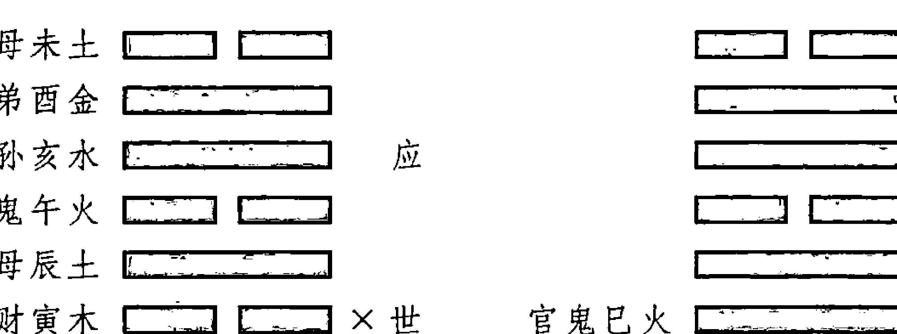

酉金月妻财寅木受克，又被日辰申金冲散。因此，动爻寅与其变爻巳火，以及日辰申，就构成了三刑。

## 【原文】

夫刑之为象，于物若毙，于心若忧，于事若滈①，犹退神之例，而不及旬空月破之凶也。身命遇之，恐骨肉之相残；婚姻遇之，惧门第之相压。官忧内丧，病防带疾。官克世而问讼，五克世而问疏，若世刑而大凶也。
注：身命谓世及用爻遇之，男娶谓财、女嫁谓官遇之。

## 【今译】

刑的征象，反应在生物上为濒死，反应在心理上为忧患，反应在事情为浅薄低俗。其作用类似于退神，但没有逢旬空、月破那样凶险。在占测身命时遇到——世爻或用爻遇刑，恐怕会骨肉相残。在占测婚姻时遇到——妻财或官鬼遇刑，则要当心来自对方门第的压迫。在占测居官时遇到，则有内丧的忧虑。在占测疾病时遇到，则须防备身已染病。官鬼克制世爻，则意味着要被问责诉讼不公；五爻克制世爻，则意味着要被问责工作疏忽。如果世爻受刑，则是大凶之兆。
注：凡占身命，就得看世爻和用爻是否遇刑。占婚姻，男子取妻时得看财爻是否遇刑，女子出嫁就得看官爻是否遇刑。

① 滈：浅薄。

## 【原文】

夫害者，夺吾之好为害也。上、下、四方曰六，故名六害，举天地之内而言也。相合曰好，相冲曰夺，相恶曰害，是故冲吾之合，则犹夺吾之好，吾故恶之，而与相害也。故子合丑而未冲，所以子、未为害尔。六合则有六冲，六冲则有六害，此六害之立法也。
注：古亦称穿心六害。

## 【今译】

所谓害，凡抢夺我的相好对象的都为害。上下四方合计为六，所以称为六害，是将天地包括在内的意思。彼此相合的称为相好，相冲的称为夺，相互厌恶的称为害。也就是说，冲与我相合的地支，就犹如抢夺我的相好的对象，我因而厌恶它，而与之相害。所以，子与丑合，而未与丑相冲，因此子与未为相害关系。五行之间有六合就有六冲，因而也就有六害。这是六害的基本规则。
注：六害古时候也称为穿心六害，即子未相害，丑午相害，寅巳相害，卯辰相害，申亥相害，酉戌相害。如图所示：

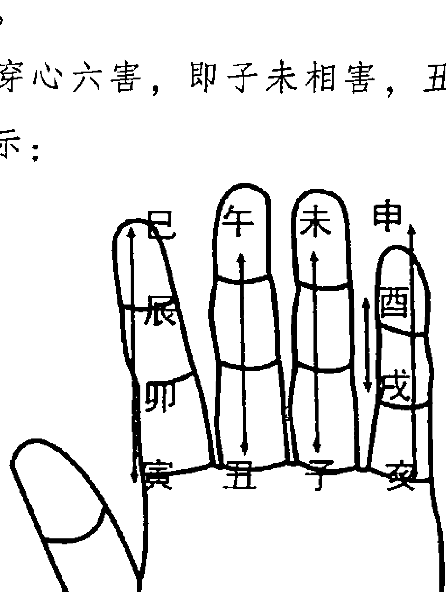

## 【原文】

然有生害，有克害。其为象也，心恶而面好，外悦而内仇，此相生之害也。我克彼者，我强而彼弱，志①相恶尔；彼克我者，彼刚而我柔，力被制尔。然亦不及六冲之甚也，然亦必兼合冲生克而考之。三刑六害，当别用爻，非以卦象云尔。
注：大抵六害重克害，克害重用爻世爻，及应克世。若姤、恒、小畜、益卦，虽存六害之名，当察其用而权之。

## 【今译】

然而六害又分为生害和克害。形象地说，心中虽然厌恶，但表面上却作出相好的姿态，外表看似相悦，内心则是仇恨，这就是相生的害——生害。如果是我克制对方，则是我强而他弱，只是在志趣上相互厌恶而已；如果是对方克制我的，则是他刚强而我柔弱，则只是在力量上被他制服而已。然而也不如六冲的作用大，但也必须兼顾合、冲、生、克的关系来综合考察。三刑和六害，应当区别用爻的情况，而不是根据卦象来定的。
> 注：大致来说，六害之中以克害为重，克害中又以用爻和世爻被克制，以及应爻克世爻为重。至于天风姤、雷风恒、风天小畜、风雷益等卦，卦中虽然有六害的关系，但是应当考察占卜时的用爻，来加以权断。

① 志：意向。

## 诸星章第三十九

## 【原文】

神宿之法，灾祥非一，吉凶之验，别演乃殊。有以天象列星而入易者，有以人事占星而入易者，然要无不出乎干支阴阳生克衰旺之情，或年或季或月或日或时或局之例，以辩其有用无用、轻力重力焉。其有星之名，而无所本者，不敢列也。
> 注：天象，如角亢房，二十八经星也；如木火土金水，五纬星也；如贪狼巨门，九曜星也；人事，如天喜①天医、天厨、天狱之类是也。虽星煞杂陈，各有所本，否则俗传无验也。

## 【今译】

星宿在易卜中的作用，对应的灾祸祥瑞并不统一，所应验的吉凶也根据不同的推演而不同。有的是以天象列星而入卦的，有的是以人事占星而入卦的。但是，其要旨无不是以天干、地支的阴阳、生克、衰旺关系，按照年份、季节、月、日、时，或者会局形成的定例，来辨别其有无作用、力量轻重。那些虽存有名目，但却没有具体所指的，不在此列。
> 注：天象列星，包括五星、九曜、二十八宿。五星即五纬星，指金木水火土五大行星。九曜即北斗七星——贪狼、巨门、禄存、文昌、廉贞、武曲、破军，外加左辅、右弼二星的总称。二十八宿，即所谓经星，是用来观察和记录天体运行的周天二十八个星座，包括东宫苍龙所属七宿角、亢、氐、房、心、尾、箕，南宫朱雀所属七宿井、鬼、柳、星、张、翼、轸，西宫白虎所属七宿奎、娄、胃、昴、毕、觜、参，北宫玄武所属七宿斗、牛、女、虚、危、室、壁。如图所示：

> ① 天喜：星相术中的说法。日支和月建相合，如正月逢戌日、二月逢亥日，是为吉日，谓之天喜。

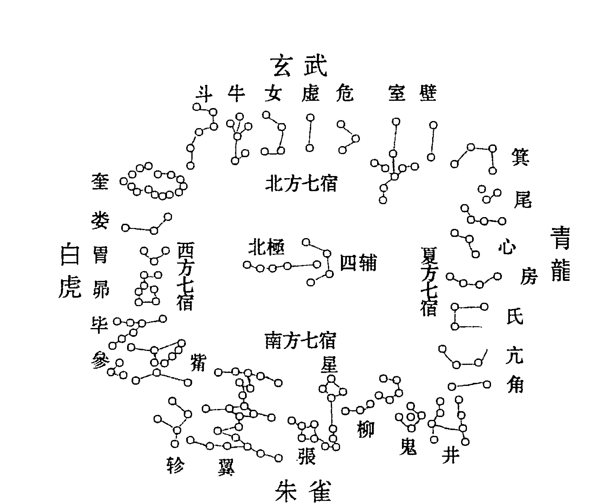

人事占星，是指与人类关系紧密的星宿，如天喜、天医、天厨、天狱之类。虽然星煞的名目杂乱繁多，但必须各有所本，否则就是俗传而无应验。

## 【原文】

如经星入易，乾之上九降参，又降镇星，唯岁时身命之占用之；九曜之立，曰贪狼、曰巨门、曰禄存、曰文昌、曰廉贞、曰武曲、曰破军、曰左辅、曰右弼是也，唯婚姻、才貌、坟茔、屋宅之占用之。
> 注：法曰：
月月常加戊，时时起破军。
破军前两位，世俗少知闻。

两位，即左辅右弼也。斗柄即破军。如寅建午时占，以戌加寅起，至午时在戌，以戌上为破军，亥是左辅，子是右弼也。

## 【今译】

将经星——二十八宿纳入到易卜时，在乾卦的上九爻降参宿，也降镇星（土星），但是只有在占测岁时和身命时，才能用到。九曜即所谓贪狼、巨门、禄存、文昌、廉贞、武曲、破军、左辅、右弼等九星，只在占测婚姻、才貌、坟茔、屋宅等的时候用到。
> 注：运用九曜的规则是：
月月常加戊，时时起破军。
破军前两位，世俗少知闻。

其中，“两位”是指左辅、右弼。斗柄就是破军。例如在寅月午时占卜，则以戌推动寅一起起行，顺行至午时，寅位在戌，则以戌为破军星，戌前两位的亥、子分别为左辅、右弼。

## 【原文】

紫微垣以危室之分起子也，天市垣以尾箕之分起寅也，太微垣以翼轸之分起巳也，唯造化之占用之。此天象立星之略也。
注：三垣皆以正月起顺行。

## 【今译】

紫微垣从危、室二宿之间起于子位，天市垣从尾、箕之间起于寅位，太微垣从翼、轸之间起于巳位。只有在占测有关造化之事时，才用到它们。以上就是如何在易卜中确立星神的大略。
注：三垣都以正月为起始而顺行。

## 【原文】

天德之星，正月起亥而顺行。盖天之德泽，从天门而降，亥为天门，因以名之。天干天德，寅建在丁，卯建在申，盖人事天功，阴阳相助也。
注：天德正月起亥，顺行。干德法曰：

+   正丁二申宫，三壬四辛同，
+   五亥六甲上，七癸八寅从，
+   九丙十居乙，子巳丑庚逢。

天德即天道，阴阳两互，抚祐八荒，孟季保生墓之人元①，四正用阳贵之协力。故寅内人元丙，天与丁助之；卯内人元癸，天与阳贵坤中壬水助之；辰内人元癸，天与壬助之；巳内庚，天与辛；午内乙，天与阳贵乾中甲木助之；未内乙，天与甲也。余六位仿此。历日所载坤、乾、艮、巽，即申、亥、寅、巳尔，其土德周遍，故不列天德也。此法用天干，如寅建丁亥子孙发动，以丁为天德也，利用防非。

## 【今译】

天德星的位置，从正月在亥位起，然后按右旋顺行。因为上天的德泽从天门而降，亥就是天门，天德也因此而得名。天干天德，寅月在丁，卯月在申，反映了人事与天功、阴与阳之间的互相辅助。
注：天德星的位置，从正月在亥位起，然后按右旋顺行。
干德的口诀是：

+   正丁二申宫，三壬四辛同，
+   五亥六甲上，七癸八寅从，
+   九丙十居乙，子巳丑庚逢。

天德就是天道，即通过阴阳的互动，福佑天下万物。孟党（寅巳申亥）和季党（丑辰未戌）月保在本支下长生、入墓的天干，四正（卯午酉子）月借用阳贵人的协力。所以寅内的人元是丙，因此天德与丁就协助它；卯内的人元是癸，因此天德与阳贵人坤中的壬水协助它；辰内的人元是癸，因此天德与壬协助它；巳内的人元是庚，因此天德与辛协助它；午内的人元是乙，因此天德与阳贵乾中的甲木助它；未内是乙，因此天德与甲协助它。其余六位以此类推。
历书上所载的坤、乾、艮、巽，其实就是申、亥、寅、巳，因为位于土的附近，为土德所及，因此不列在天德之内。这一规则所用的是天干，如寅月丁亥日子孙发动，以丁为天德，有利于防止错误。

## ## 【原文】

月德自未而顺行。未为广寒宫，太阴之府，是以始之。天干月德，寅午戌建而举丙，亥卯未建而举甲，巳酉丑月德在庚，申子辰月德在壬。太阴之德，亦其助也，盖以午丁而丙助，卯乙而甲扶焉。
注：古法以子为帝座，午为端门，卯为雷门，酉为佛境，亥为天门，巳为地户，申为神门，寅为鬼路，辰为天罗，戌为地网，丑为黄泉杀，未为广寒宫也。四德俱主福荫，能逃刑免难。

## ## 【今译】

月德从未上起，右旋顺行。未对应的是广寒宫，是太阴（月亮）的府地，所以月德从这里开始。天干月德的位置是：寅、午、戌月月德在丙，亥、卯、未月月德在甲，巳、酉、丑月月德在庚，申、子、辰月月德在壬。太阴（月亮）表现出的特性，也是它的辅助功能。午、丁有丙来扶助，卯、乙有甲来扶助。
注：古来相传的法则是：以子为帝座，午为端门，卯为雷门，酉为佛境，亥为天门，巳为地户，申为神门，寅为鬼路，辰为天罗，戌为地网，丑为黄泉杀，未为广寒宫。上述四德的特性都以福荫为主，因此能协助逃脱刑罚，免除灾难。

## ## 【原文】

天乙贵人有阴阳之别。阳贵始自天王立甲子而顺求之，阴贵始自地王起甲申而逆求之。贵人之用，不犯于君王贵人之行，不践人于罗网。甲合己而在子，己以子为阳贵；乙合庚而在丑，庚以丑为阳贵；丙合辛而在寅，辛以寅为阳贵；丁合壬而在卯，壬以卯为阳贵。辰为天罗，逾而不入。戊合癸而在巳，癸以巳为阳贵。午为端门，越而弗对。己合甲而在未，甲以未为阳贵；庚合乙而在申，乙以申为阳贵；辛合丙而在酉，丙以酉为阳贵。戌为地网弗履。壬合丁而在亥，丁以亥为阳贵。子为帝座弗犯。癸合戊而在丑，戊以丑为阳贵。阴贵亦然。
注：法曰：

+   甲羊戊庚牛，乙猴己鼠头，
+   丙鸡丁猪走，壬兔癸蛇游，
+   六辛骑猛虎，阳贵用斯求。
+   甲牛戊庚羊，乙鼠己猴乡，
+   丙鸡丁猪位，壬蛇癸兔藏，
+   六辛乘骏马，阴贵用心详。

六壬数，巳至戌用阳，亥至辰用阴，未当。当以子至巳用阳，午至亥用阴。易筮不分阴阳。

## ## 【今译】

天乙贵人有阴阳的区别。阳贵人起始自天王甲子而顺求，阴贵起始自地王甲申而逆求。贵人的功用，是保证不冲犯君王和贵人出行，不自行撞入于天罗地网之中。甲与己合而在子，因此己以子为阳贵；乙与庚合而在丑，因此庚以丑为阳贵；丙与辛合而在寅，因此辛以寅为阳贵；丁与壬合而在卯，因此壬以卯为阳贵。辰为天罗，因此越过而不进入。戊与癸合而在巳，因此癸以巳为阳贵。午为端门，因此越而不与之相对。己与甲合而在未，因此甲以未为阳贵；庚与乙合而在申，因此乙以申为阳贵；辛与丙合而在酉，因此丙以酉为阳贵。戌为地网，要越过而不能踩踏。壬与丁合而在亥，因此丁以亥为阳贵。子为帝座，因此要越过不能触犯。癸与戊合而在丑，因此戊以丑为阳贵。阴贵也是一样。
注：口诀是：

+   甲羊戊庚牛，乙猴己鼠头，
+   丙鸡丁猪走，壬兔癸蛇游，
+   六辛骑猛虎，阳贵用斯求。
+   甲牛戊庚羊，乙鼠己猴乡，
+   丙鸡丁猪位，壬蛇癸兔藏，
+   六辛乘骏马，阴贵用心详。

亦即：
阳贵人的位置是：甲干在未（羊），乙干在申（猴），丙干在酉，丁干在亥，戊、庚在丑，己干在子，辛干在寅，壬干在卯，癸干在巳。
阴贵人的位置是：甲干在丑（牛），乙干在子（鼠），丙干在酉，丁干在亥，戊、庚在未，己干在申，辛干在午，壬干在巳，癸干在卯。在六壬数中认为，由巳到戌用阳，由亥到辰用阴，并不恰当。应当由子到巳用阳，由午到亥用阴。易卜则不分阴阳。

## 【原文】

福星贵人，即食神星也。甲之五遁，丙为食神，故寅为福；乙之五遁，丁为食神，丑亥为福星也。
注：法曰：

+   甲虎乙猪牛，丙同犬鼠游，
+   丁鸡戊猴走，己羊庚马头，
+   辛蛇癸逐兔，壬日占龙楼。

## 【今译】

福星贵人就是食神星。甲的五遁，丙为食神，所以寅为福星贵人；乙的五遁，丁为食神，所以丑亥为福星贵人。
注：口诀是：

+   甲虎乙猪牛，丙同犬鼠游，
+   丁鸡戊猴走，己羊庚马头，
+   辛蛇癸逐兔，壬日占龙楼。

亦即：甲干的福星贵人在寅（虎），乙干在亥（猪）丑（牛），丙干在戌子，丁干在酉，戊干在申，己干在未，庚干在午，辛干在巳，壬干在辰，癸干在卯。

## 【原文】

天厨贵人，禄上生禄，是为天厨。甲之五遁，禄于丙寅，寅上之丙，复禄于巳，故甲以巳为天厨；癸之五遁，禄于壬子，于上之壬，复禄于亥，故癸以亥为天厨也。
注：法曰：

+   甲丁蛇位号天厨，丙鼠壬鸡癸伴猪，
+   乙戊辛干皆向马，己猴庚虎福神殊。

右二星主禄食。

## 【今译】

天厨贵人，禄位上再生出的禄位，就是天厨。甲的五遁中，以丙寅为禄位，而寅上的丙，又以巳位禄位，所以甲以巳为天厨；癸的五遁中，以壬子为禄位，而子上的壬，又以亥为禄位，所以癸以亥为天厨。
注：口诀是：

+   甲丁蛇位号天厨，丙鼠壬鸡癸伴猪，
+   乙戊辛干皆向马，己猴庚虎福神殊。

即天厨贵人的位置是：甲丁在巳（蛇），丙干在子（鼠），壬干在酉，癸干在亥，乙戊辛干在午，己干在申，庚干在寅。
上述两星——福星、天厨都主管禄食。

## 【原文】

天元禄者，临官则食禄。甲木生亥，临官于寅；乙木生午，临官于卯；丙戊生于寅，临官于巳；丁己生于酉，临官在午。阴阳顺逆，各以类推。
注：天元禄法：从临官而得，四位临官，即名禄位。如甲木生亥，顺行四位，临官在寅，故甲禄在寅；如乙木生午，逆行四位，临官在卯，故乙禄在卯之类。

## 【今译】

天元禄，即值临官位则食禄。甲木长生于亥，临官位在寅；乙木生于午，临官位在卯；丙戊长生于寅，临官位在巳；丁己生于酉，临官位在午。按照阳顺阴逆的规律，其他可以类推。
注：天元禄的取法：天元禄是由临官而得的，自长生位开始第四位是临官位，就是所谓的禄位。例如甲木长生于亥，顺行四位，临官位在寅，所以甲的禄位在寅。又如乙木生于午，逆行四位，临官位在卯，所以乙的禄位在卯。

## 【原文】

天地财，遁甲以戊己为五马六财，而戊己坐辰巳之上，故正月以辰为天财，巳为地财，顺而终之，乃天地财也。
注：马，即财也。法曰：

+   正七起龙蛇，二八马羊家，
+   三九循申酉，四十犬豕牙，
+   子午鼠牛索，丑未寅卯查，
+   遁甲因戊己，问利自当沙。

## 【今译】

天地财，遁甲中以戊己为五马六财，而戊己坐在辰巳上，所以正月以辰为天财，巳为地财。以此顺推至十二月，就是所谓的天地财了。
注：马就是财。口诀是：

+   正七起龙蛇，二八马羊家，
+   三九循申酉，四十犬豕牙，
+   子午鼠牛索，丑未寅卯查，
+   遁甲因戊己，问利自当沙。

即：正月和七月的天财为辰（龙），地财为巳（蛇）；二月和八月的天财为午，地财为未；三月和九月的天财为申，地财为酉；四月和十月的天财为戌（犬），地财为亥（猪）；六月和十二月以寅为天财，卯为地财。

## ## 【原文】

文章德业，必临官设政，三岁后而吾道始昌，因曰文昌。甲禄在寅，逾三位而已是也。辛则不然，逾三位而当子，子为帝座，弗敢犯之，物不可盈，藏于文库，是以辛以戌为文昌也。
注：法曰：

+   甲蛇乙马号文昌，丁己寻鸡辛犬方，
+   庚猪癸兔壬从虎，丙戊扬猴最吉祥。

盖火墓在戌，离为文明，故曰文库；金墓于丑，金为兵革，故曰武库也。

## ## 【今译】

文章和德业，必须临官设政之后，经过三年以上的时间，所倡导的策略才能昌盛，所以叫做文昌。例如甲的禄位（临官）在寅，经过三位是巳，即甲的文昌在巳。辛则不是这样，辛自临官位顺数三位是子，子为帝座，不敢冒犯它，并且事物不可盈满，须藏于墓库，所以辛以戌为文昌。
注：口诀是：

+   甲蛇乙马号文昌，丁己寻鸡辛犬方，
+   庚猪癸兔壬从虎，丙戊扬猴最吉祥。

即文昌之位是：甲的文昌在巳，乙的文昌在午，丙的文昌在戌，丁己的文昌在酉，戊的文昌在申，辛的文昌在戌，壬的文昌在寅，庚的文昌在亥，癸的文昌在卯。
火墓在戌，离为文章光明，所以叫文库；金墓于丑，金为兵革，所以叫武库。

## ## 【原文】

位中居尊，谓之将星。故亥卯未将星在卯，而攀辰鞍，驾巳马。马前六害，以警跸①也；害前华盖，备旌幡也。将后七神，甲士后劲②也，而劫煞、灾煞、天煞、地煞、年煞、月煞、亡人煞以名焉。是以华盖为首星，劫煞为尾星，而将卫在中也。
注：将星法起中神，子午卯酉，正中位也，故亥卯未，将星在卯，辰为攀鞍，巳为驾马。马前为六害午也，害前为华盖未也。将后为七煞，自申至寅七位是也。

① 警跸：古代帝王出入时，于所经路途侍卫警戒，清道止行，叫做警跸。
② 后劲：古时指行军时殿后的精兵。

## ## 【今译】

位在中央，身居尊位的叫做将星。所以在亥卯未中，将星在卯，而以辰为所坐之鞍，以巳为所骑之马。马前的六害——午，充当警戒侍卫；害——侍卫前的是华盖——未，负责整备旌旗幡盖。将星后的七神，是殿后的精兵，从申到寅分别称为劫煞、灾煞、天煞、地煞、年煞、月煞、亡人煞等。所以十一个地支以华盖为首星，以劫煞为尾星，而把将星护卫在中间。
注：将星是位于中的地支，子午卯酉，即所谓的中位，所以亥卯未中，将星是卯，辰是鞍，巳为驾马。马前是六害午，害前是华盖未。将后是七煞，即自申至寅七位。

## 【原文】

天马，即乾马也，正月午始，循环行之。此星惟利升迁之卜。驿马亦从将星而推也。如寅午戌，将星在午，则以未为攀鞍，申为驾马矣，行人要星也。
注：正月用乾四爻为天马，二月五爻申，循环用之。法曰：

+   正七还骑马，二八向猴申，
+   三九须从犬，四十鼠相侵，
+   五十一当寅上，六十二定归辰。

天马文人用上，丧病者嗔，盖病者马向天游，是上丧服也。驿马法曰：

+   寅午戌马居申，亥卯未马在巳，
+   申子辰成居寅，巳酉丑马在亥。

## 【今译】

天马就是乾马——推天马用乾卦，而乾卦又以天为象。正月从午爻开始，循环顺推。天马只在占卜升迁时出现为有利。驿马也根据将星来推定，例如寅午戌将星在午，则以未为鞍，以申为驿马。驿马是占测行人状况时重要的星神。
注：天马的推法是：正月用乾四爻午为天马，二月用五爻申，依次循环顺推。即：正月、七月在午，二月、八月在申，三月、九月在戌，四月、十月在子，五月、十一月在寅，六月、十二月在辰。
天马星适于文人占卜时使用，不适合有丧病在身的人使用，因为病人的马向天走，是在上丧服。
驿马的位置是：寅午戌的驿马在申；亥卯未的驿马在巳，申子辰的驿马在寅，巳酉丑的驿马在亥。

## 【原文】

且天喜之为星也，孟春¹建寅，则喜在戌；仲春建卯，则喜在亥；季春建辰，则喜在子。盖以成为喜也。喜神之用，遁甲所专。遁甲者，拒庚而藏甲也。惟丙丁制之，故甲己五遁得丙寅，则喜神在寅也；乙庚五遁得丙戌，则喜神在戌矣。
注：成喜之法，寅到戌而成，卯至亥而成，辰至子而成也。余可类推。法曰：
春戌夏丑为天喜，秋辰冬未三三指。
喜神法曰：
甲己东北乙庚乾，丙辛独位向坤言，
丁壬二日离宫上，戊癸东南喜事连。
若喜神位值子孙动者，出行顺利，其他动止亦宜向之也。

① 孟春：春季的第一个月。

## 【今译】

天喜星，初春的寅月，天喜星在戌；在仲春的卯月，天喜星在亥；在季春的辰月，天喜星在子。这也就是以相成为喜的意思。喜神的使用，为遁甲所专有。遁甲是拒庚而藏甲的意思。因为有丙丁的克制，所以甲己五遁得丙寅，所以喜神在寅；乙庚五遁得丙戌，所以喜神在戌。
注：以成为喜的规则是，寅到戌而成，卯到亥而成，辰到子而成。其余以次类推。
口诀是：
春戌夏丑为天喜，秋辰冬未三三指。
即春天开始时，天喜星在戌；夏天开始时，天喜星在丑；秋天开始时，天喜星在辰；冬天开始时，天喜星在未。每季的其他两个月，天喜星分别在顺序的两位。
天干喜神的位置口诀是：
甲己东北乙庚乾，丙辛独位向坤言，
丁壬二日离宫上，戊癸东南喜事连。
即：甲己的喜神在寅，乙庚的喜神在戌，丙辛的喜神在申，丁壬的喜神在午，戊癸的喜神在辰。
若天喜星位于子孙爻上时，表示出行顺利。位于其他变爻上时，适宜先看喜神所在的方向。

## 【原文】

天赦，与人更新也。作历之初，首于冬至甲子，故冬至甲子为天赦。春首戊寅，夏至甲午，秋首戊申，刑罪之占，得逢解网也。天解，春以寅，夏以巳，秋以申，冬以亥。盖木绝于申，寅能破之，是为天解。

> 注：先王以二及春秋首日大赦天下，故后世以是日为天赦。天解，凡以绝为我难，冲则天去我难也。

## 【今译】

天赦星，其作用是给人更新的机会。最初创制的历法，起始于冬至甲子日，所以冬至甲子为天赦。其余还有春季的首日戊寅、夏至日甲午、秋季的首日戊申也为天赦。在有关刑狱的占卜中，如果遇到天赦星，意味着可以得到解脱。天解星，春季在寅，夏季在巳，秋季在申，冬季在亥。因为木绝于申（金），而寅因为与之相冲而能破它，所以以寅为天解。

> 注：上古的先王在夏至、冬至，及春秋两季的首日大赦天下，所以后世以这些日子为天赦星。天解星，因为五行以绝为灾难，而冲绝则是上天消除了我的灾难。

## 【原文】

月解，太阴也。自戌而辉，行南周天之半，以照北极，故九、十月在午，正、二月在申也。剪刈①根萌，则息非宜。喝散，春木根萌在亥，巳能刈之，是为喝散。

> 注：月解法，九、十月午，子、丑月未，正、二月申，三、四月酉，五、六月戌，七、八月亥。两月一位，谓上施下仰。九十月午者，午施子仰也。午自亥极，施仰乃见。冲断生根为喝散。夏火生寅，用申冲寅；秋多生巳，用亥冲巳。法曰“春巳夏居申，秋猪冬到寅”是也。

## 【今译】

月解星，就是太阴——月亮。月亮从戌位开始照耀，行到南周天的一半时，而照耀北极。所以九月、十月月解星在午，正月和二月在申。剪割根株和萌芽，不宜停息。喝散，如春木萌发于亥水，而巳能剪除它，这就是喝散。

> 注：月解星出现的规律是：九月、十月在午，十一月、十二月在未，正月和二月在申，三月、四月在酉，五月、六月在戌，七月、八月在亥。九月、十月在午，则午施恩，子仰望。冲断生长的根基叫做喝散。夏火生于寅木，用申金冲寅木；秋多生于巳火，用亥水冲巳火。所以喝散的口诀是：春巳夏居申，秋猪冬到寅。即春、夏、秋、冬分别以巳、申、亥、寅为喝散。

## 【原文】

天医，上帝之司，救疗之神也。本在遁甲，相丙而御庚，即丁神也。好生为心，故不

> ① 剪刈（yì）：剪割。

践于寂灭之地，乃更位焉。周岁而复命，始岁而复化。活曜，上帝命司生之神也，因随帝而出于震焉，为胎育子息之占。

注：以五虎遁，正月甲遁觅丁神，得丁卯丁丑，故正月以丁卯为天医，余丁丑。二月乙遁得丁亥。三月丙遁得丁酉，乃弗居而易丑，故三月则以丁丑为天医。夫酉为佛境，乃寂灭日沉之地，故弗居。四月丁遁得丁未，五月戊遁得丁巳，六月己遁复得丁卯余丁丑，七月庚遁复得丁亥，八月辛遁复得丁酉，违酉从丑，九月壬遁复得丁未，十月癸遁复得丁巳，十一月甲遁复得丁卯，十二月乙遁复得丁亥。终焉，还命上帝，岁复如是也。《发微》、《通书》以天喜为天医，误矣。法曰：

> 天医正卯二猪临，三月随牛四未寻，
五蛇六兔七居亥，八丑九羊十巳存，
十一再来寻卯上，十二亥上作医人。

活曜法，正月从卯顺行。

## 【今译】

天医，是天帝的医官，是主管救人疗病的星神。本来在遁甲，辅佐丙而控御庚，即丁神。天医星以好生为其心性，所以不临于寂灭之地——丁酉，于是更换位置。周行一年而回来复命，新年伊始重新出游行化。活曜是天帝命其掌管生育的星神，于是随天帝而出于震位，占测怀胎、育子时遇到则大吉。

注：根据五虎遁法，正月甲遁，找丁神，得到丁卯丁丑，所以正月以丁卯为天医，剩下丁丑；二月乙遁，得到丁亥；三月丙遁得到丁酉，不能居于此处，因而改为丑，所以三月以丁丑为天医。丁酉为佛家的“寂灭日沉之地”，所以不居于此处。四月丁遁得到丁未；五月戊遁得到丁巳；六月己遁又得到丁卯，剩下丁丑；七月庚遁又得到丁亥；八月辛遁又得到丁酉，不能居于此处，因而改为丑；九月壬遁又得到丁未；十月癸遁又得到丁巳；十一月甲遁又得到丁卯；十二月乙遁又得到丁亥。年终，向天帝复命，新一年仍然如此出行。《发微》和《通书》中，以天喜为天医，是错误的。其口诀是：

> 天医正卯二猪临，三月随牛四未寻，
五蛇六兔七居亥，八丑九羊十巳存，
十一再来寻卯上，十二亥上作医人。

活曜的规则是，正月从卯开始，然后依次顺推，如二月辰、三月巳之类。

## 【原文】

雷火之煞，大利功名，盖雷能动物，即长生也。寅午戌月起于寅，申子辰月起于申，是以立之。震为旌旗煞，故起卯。逆征四围①，是谓旌旗。

> ① 圄（yǔ）：边境。

注：草木萌生，雷霆动惊，盖震之德，能普化万物也。其法正寅二亥，三申四巳，循环三复是焉。然网罗同之。上天之为心，惟以生道杀物，是名网罗万物也，独捕叛用之。旌旗，春卯、夏午、秋酉、冬子。

## 【今译】

雷火煞，非常有利于功名，因为雷能催动万物生长。寅、午、戌月起于寅，申、子、辰月起于申，因此确立此星。震为旌旗煞，所以起于卯。因其征讨四方，所以叫做旌旗。

注：春天草木萌生，雷霆发动，即震的德性，能普化万物。雷火煞的推法是：正、五、九月在寅，二、六、十月在亥，三、七、十一月在申，四、八、十二月在巳。网罗星与它位置相同。上天的心性，只以生生之道杀物，所以叫做网罗万物。只有在占卜追捕叛逃时才用它。旌旗煞，春天在卯，夏天在午，秋天在酉，冬天在子。

## 【原文】

天耳天目，以子坎为耳垂，以午离为目眦①。目视上，故始天门，以亥、申、巳、寅为次；耳听下，故始地户，以巳、寅、亥、申为次。耳目司视听，故动而音信当至。耳目本吉宿，以用则将迎而成，故逆行焉。

注：以四季行四位，春巳、夏寅、秋亥、冬申，天耳也；春亥、夏申、秋巳、冬寅，天目也。

## 【今译】

天耳星和天目星，以子位的坎卦为耳垂，以午位的离卦为眼眶。眼睛看上面，所以天目起始于天门，以亥、申、巳、寅为次序；耳朵听下面，所以起始于地户，以巳、寅、亥、申为次序。耳、目是掌管视听的，所以如果位于动爻之上，则意味着将有音信到来。耳、目二星本来是象征吉祥的星宿，但因为在使用时要迎向目标，所以逆行。

注：对应于四季的位置是，天耳春季在巳，夏季在寅，秋季在亥，冬季在申；天目春季在亥，夏季在申，秋季在巳，冬季在寅。

## 【原文】

天罡煞，寅卯辰巳之谓也。因生求生，谓生作而得生息，亦渔猎之吉神也。天犬吉而顺戌，犬猎益宜之。天猪、天鼠、天牛，凶而逆亥子丑，牧养忌之。

注：以寅午戌月为火局，火生于寅，是谓生而起也。二卯三辰四巳，巳酉丑为金局金

① 眦 (zì)：眼眶。

生于巳，是得生而已也。复寅而三重之，则周一岁矣。天犬正月从戌顺行，猪、鼠、牛正月从亥子丑逆行也。猪忌畜豕，鼠忌养蚕，牛忌牧犊，嫌值鬼同发。

## 【今译】

天罡煞，即是对寅、卯、辰、巳的称谓。它是因生求生的意思，即通过生作而得到生息，也是占卜渔猎时的吉神。天犬星是吉神，位次自正月从戌开始顺行排定，适合在占卜犬猎出现。天猪、天鼠、天牛星是凶神；其位次分别自正月从亥、子、丑开始，逆行排定，在占测牧养时忌讳其出现。
注：例如寅午戌月，月建地支属于火局，火生于寅木，这是从生而起。其后第二位是卯，第三位是辰，第四位是巳，巳酉丑属于金局，而金生于巳，这是酉金生于巳火。再从寅开始，重复三遍，就周行一年了。天犬星从正月所在的戌开始顺行。天猪、天鼠、天牛三星，从正月所在的亥、子、丑开始逆行。占养猪忌讳天猪，占养蚕忌讳天鼠，占放牛忌讳天牛，同时忌讳位于为官鬼的动爻。

## 【原文】

大螣蛇之别号曰勾陈煞，以其将相冲中王也。暗金以每季藏金局，故巳酉丑为暗金。破碎谓金库在丑，以金局自悖逆而出之，四轮复数之，则失藏聚，是名破碎，为家国之多耗也。
注：正月自辰起逆行，专务惊滞。暗金以巳酉丑，自正月四轮复数是也。亦名红纱，产妇之忌。破碎以丑酉巳，自丑月起四轮复数，乃破碎也。丑为金库，故始之。
法曰：
辰戌丑未月在丑，寅申巳亥月在酉，
子午卯酉月在蛇，逆破如何财顺有。

## 【今译】

大螣蛇的别名叫勾陈煞，以其可能相冲于中王——勾陈的缘故。暗金煞是由于每季藏金局而形成的，所以以巳酉丑为暗金。破碎是指金库在丑，因为金局自己悖逆而掘出来，重复四次，则失去所藏之物，所以叫破碎。破碎出现，意味着家庭或国库虚耗巨大。
注：大螣蛇勾陈煞的推法是，从正月对应的辰开始逆行，即正月辰、二月卯、三月寅之类。其功用就是惊悸迟滞。暗金的推法是，将巳酉丑组合，从正月开始重复四次。暗金也叫红纱，是占测产妇时所忌讳的。破碎的推法是，将丑酉巳组合，从丑月开始重复四次。丑为金的墓库，所以从这里开始。其口诀是：
辰戌丑未月在丑，寅申巳亥月在酉，
子午卯酉月在蛇，逆破如何财顺有。

## 【原文】

月破日耗，大耗而小耗随之。季废①为荒芜，月废为空，空衰为月煞。
注：正月起申顺行为大耗，起未顺行为小耗。荒芜之法，春巳酉丑，夏辰申子，秋卯未亥，冬寅午戌。月空之法，寅午戌月壬废为空。月煞之法，壬水衰于丑，故丑为月煞。亥卯未月庚废戌煞，申子辰月丙废未煞，巳酉丑月甲废辰煞，历日可考。

## 【今译】

月破日，即日值月破，此时日月相冲，叫做耗，又叫大耗。大耗之后又有小耗相随而到。每季的废日为荒芜，每月的废日为空，空衰为月煞。
注：大耗的起法是：从正月对应的申开始，顺行。小耗的起法是：从正月对应的未开始，顺行。
荒芜的确定方法是：春季以巳酉丑日为荒芜，夏季以辰申子日为荒芜，秋季以卯未亥日为荒芜，冬季以寅午戌日为荒芜。空的确定方法是：寅、午、戌月以壬日为废日，巳、酉、丑月以甲日为废日，申、子、辰月以丙日为废日，亥、卯、未月以庚日为废日。月煞的确定方法是：壬水衰于丑土，所以丑为月煞。以此类推，亥、卯、未月庚金日为废，戌土日为煞；申、子、辰月丙火日为废，未土日为煞；巳、酉、丑月甲木日为废，辰土日为煞。

## 【原文】

物满而破，破而后开，天贼之义也；随贼而吠，天狗也，其义欲除之、执之、收之。春之天贼，辰满酉破寅开也；秋之天贼，戌满卯破申开也。未坤之府，丑能击之，故地贼出丑而逆行焉。巳为双女宫，本荧惑之神也，天烛由此而顺行焉。天火即火所胎也，盖火神顺鉴四域，岁三复焉。
注：法曰：

+   正龙二鸡三虎乡，四羊五鼠六蛇藏，
七犬八兔九猴位，十牛子马丑猪忙。

是天贼也。天狗随之冲击也。地贼，谓穿窬②之辈也。法曰：天烛正月起蛇宫，荡荡顺行数至龙。主火灾也。天火，以寅午戌月火局胎于子。四域，子午卯酉四正也。五九月又起子，故一岁三复。

① 废：因死因而无用，谓之废。例如春乃木神用事，因为金克木，所以金因而无用，故以金局为废。

② 穿窬（yú）：打洞穿墙行窃。

## 【今译】

物已满盈则必然要破，破后则开，这是天贼星出现的义理。紧随贼后而吠的是天狗，是要除掉、抓住、收捕天贼的意思。春季的天贼，辰满、酉破、寅开；秋季的天贼，戌满、卯破、申开；夏季的天贼，未满、子破、巳开；冬季的天贼，丑满、午破、亥开。未是坤的位置，丑能冲它，所以地贼从丑位起始而逆行。已在双女宫，是执掌火的星神，因此天烛星由此起始顺行。天火即火所“胎”的位置，火神顺行照耀四方，一年循环三次。

注：天贼星的口诀是：

+   正龙二鸡三虎乡，四羊五鼠六蛇藏，
七犬八兔九猴位，十牛子马丑猪忙。

即：正月在辰，二月在酉，三月在寅，四月在未，五月在子，六月在巳，七月在戌，八月在卯，九月在申，十月在丑，十一月在子，十二月在亥。天狗就是随之相冲——与天贼相的地支。地贼，就是打洞行窃的小贼。

天烛星的口诀是：天烛正月起蛇宫，荡荡顺行数至龙。即正月从巳宫开始，顺行到十二月至辰。天火，以寅午戌月火局“胎”于子水的规律类推。四域，即子午卯酉四正位。如前，正（寅）月起于子，五（午）、九（戌）月又起于子，所以说一年循环三次。

## 【原文】

天官符即临官之位也。以年局临官于中宫起寅巳申亥，进三位而复退起中宫，顺行九宫①。若与鬼动，则成词讼之凶。阳生曰生气，阴生曰死气，以阳主生而阴主杀也。五子遁②七位之庚午，上庚克甲为官符，是以从午起官符，随死气顺行为死气官符也。春寅，岁之始也，法艮卦寅宫持世，乃为锤门官符，下而反复是也。

注：以相指③一节起坎宫一白、二节坤宫二黑、三节震宫三碧、四节巽宫四绿，君指④四节为中宫五黄、无名指四节为乾宫六白、三节兑宫七赤、二节艮宫八白、一节离宫九紫，乃外九宫也。如子年乃水局临官，于亥入中宫，即十月在中宫顺行，即十一月在乾，十二月在兑。进三复退，即是本年正月入中宫，二月乾，三月兑，四月艮，五月离，六坎，七坤，八震，九巽，乃终。设如七月占，若鬼动坤宫，为天官符也。此从年

+   ① 九宫：乾宫、坎宫、艮宫、震宫、中宫、巽宫、离宫、坤宫、兑宫。其中，乾、坎、艮、震属四阳宫，巽、离、坤、兑属四阴宫，加上中宫共为九宫。
② 五子遁：即日上起时法，古人又叫五鼠遁元、五子遁元。在六十甲子中，每个地支用五次，每天从子时开始，共有五个不同天干的子时，所以叫五子遁元。
③ 相指：左手食指。
④ 君指：左手中指。

起。生气正月从子顺行，死气及官符从午顺行。岁始若苏未起，有锤门之意，用艮卦自上而下。法曰：

+   正七虑行村，二八鼠当门，
三九居戌位，四十弄猴孙，
五十一骑马走，六十二跳龙门。

## 【今译】

天官符，即五行临官的位置。以年局临官，从中宫起寅巳申亥，进三位又退而起于中宫，顺行九宫。如果与官鬼爻同为动爻，则意味着因诉讼而起的凶灾。阳生叫生气，阴生叫死气，这是因为阳的特性主生、阴的特性主杀的缘故。五子遁的第七位庚午，上庚金克甲木为官符，所以从午位起官符，因其是随死气顺行，所以为死气官符。春天的寅月是一年的开始，效法于艮卦以世爻寅木为官鬼，为锤门官符，是从下而复起的意思。

注：以相指的第一节为坎宫一白作为起始，第二节为坤宫二黑，第三节为震宫三碧，第四节为巽宫四绿；以君指的第四节为中宫五黄，无名指的第四节为乾宫六白，第三节为兑宫七赤，第二节为艮宫八白，第一节为离宫九紫。这就形成了所谓外九宫。例如，子年乃时水局临官，从亥开始进入中宫，即十（亥）月在中宫，然后顺行，即十一（子）月在乾，十二（丑）月在兑。进三位再退回中宫，以本年的正月入于中宫，依次是二月入乾宫，三月入兑宫，四月入艮宫，五月入离宫，六月入坎，七月入坤，八月入震，九月入巽宫结束。假如在七月占卜，如果鬼爻为动爻，因为七月为坤宫，而成为天官符。这就是从年而起的意思。生气官符自正月从子起，顺行；死气官符自正月从午起，也顺行。一年之始犹如虽已复苏却未兴起，有锤门之意，所以艮卦的运用是自上而下。口诀是：

+   正七虑行村，二八鼠当门，
三九居戌位，四十弄猴孙，
五十一骑马走，六十二跳龙门。

即其位置是：正月、七月在巳，二月、八月在子，三月、九月在戌，四月、十月在申，五月、十一月在午，六月、十二月在辰。

## 【原文】

绝止足履，则忧禁怕天狱。寅午戌月绝于亥，巳酉丑月绝于寅，是为天狱。逆践于地网，为地狱煞也。坎为血卦，丑为刃库，血因刃上，故正三五七九鼠月，以丑寅卯辰巳午为血刃。刃相对，偶袭奇，复名血忌。血因忌上，故二四六八十腊月，以未申酉戌亥子为血忌。羊刃纵前之利器，势同荷戈，禄前一位，妻孥①所畏。

① 妻孥 (nú): 妻子儿女。

注：绝为天狱，如申子辰水局绝巳之类。法曰：

> 正月逢亥二月申，三月随蛇四月寅，五月循环绝于亥，周而复始定其神。

戌为地网，故地狱自正月起戌逆行，法曰：

> 正牛二未三寅虎，四猴五兔六鸡灾，七辰八戌九月巳，十猪子马丑鼠来。

血忌之星同血刃，针灸占之定不偕。

禄前一位为羊刃。如甲禄在寅，则右顺卯为羊刃；乙禄到卯，则左逆寅为羊刃；丙戊禄巳，则右顺午为羊刃；丁己禄午，则左逆巳为羊刃。法曰：

> 乙逢寅动当为刃，辛见申摇岂不凶，丁己忌巳癸忧亥，兄弟相加偶必重。

近世不分阴阳顺逆，概以禄前一位为刃，至有误认乙禄到卯，辰为羊刃之说，特为正之。

## 【今译】

临于绝止之位，则有遭禁之忧和对天狱之惧。寅、午、戌月（火局）绝于亥水，巳、酉、丑月（金局）绝于寅木，这就是天狱。逆行于地网之上，就是地狱煞。坎为血卦，丑为（金）刃的墓库，所以正、三、五、七、九、十一月，分别以丑、寅、卯、辰、巳、午为血刃。与血刃相对的地支，因为是以偶袭奇，所以又叫血忌。所以二、四、六、八、十、十二月，分别以未、申、酉戌、亥、子为血忌。羊刃是纵容前方的利器，势如扛在肩上的戈戟（容易伤害到后面），在禄位前一位，为占测妻子儿女时所畏惧。

注：绝为天狱，如申子辰水局绝于巳之类。口诀是：

> 正月逢亥二月申，三月随蛇四月寅，五月循环绝于亥，周而复始定其神。

即：正、五、九月的天狱在亥，二、六、十月的天狱在申，三、七、十一月的天狱在巳，四、八、十二月的天狱在寅。

戌为地网，所以地狱星自正月从戌起而逆行，即正月在戌、二月在亥、三月在子之类。

血刃、血忌的口诀是：

> 正牛二未三寅虎，四猴五兔六鸡灾，七辰八戌九月巳，十猪子马丑鼠来。

血刃和血忌出现在针灸治病的占卜中，为不吉。

禄位的前一位是羊刃，例如甲禄位在寅，则右旋顺行，以卯为羊刃；乙禄位在卯，则左旋逆行，以寅为羊刃；丙戊的禄位在巳，则右旋顺行，以午为羊刃；丁己禄位在午，则左旋逆行，以巳为羊刃。口诀是：

乙逢寅动当为刃，辛见申摇岂不凶，
丁巳忌巳癸忧亥，兄弟相加偶必重。

不过近世不分阴阳顺逆，一概以禄位前一位为羊刃，以至有人误以为乙的禄位在卯，即以辰为其羊刃，所以特此加以指正。

## 【原文】

阳陷于阴曰阴煞，正月起坎之初爻，循环上下，是避害之要也。死而折之，名曰折煞，故寅午戌以酉为折，申子辰以卯折也。方养未几，即受暴折，春木养戌，而辰折之，是名浴盆煞。咸池煞者，别名桃花，盖以沐浴为桃花，沐浴败垢，淫污败德，因以名之。

注：君子为小人之陷曰阴煞，若带鬼动，当防害也。法以正七寅、二八辰、三九午、四十申、五十一戌、六十二子，即习重坎之象也。以火局死于酉、水局死于卯，如二六十月午为折煞，巳酉丑月子为折煞。如火养在丑，为未暴折是也。法曰：春辰夏未秋逢戌，冬季推来在丑神。盖以摧尸煞同，亦暴折之义也，小儿忌之。咸池煞以寅午戌月火局沐浴于卯，亥卯未月木局沐浴于子，法曰：

+   寅午戊，兔从卯里出；
亥卯未，鼠子当头忌；
申子辰，鸡叫乱人偷；
巳酉丑，跃马南方来。

## 【今译】

阳陷于阴叫阴煞，其位置是自正月起始于坎卦的初爻，然后循环上下，是占测避害时重要的星煞。死位为折，叫做折煞，所以寅午戌（火局）以酉为折煞，申子辰以卯为折煞。刚养不久，就被暴折，例如春木养于戌位，而被辰暴折之类，叫做浴盆煞。咸池煞又叫桃花，是因为以沐浴为桃花的缘故。沐浴虽然可以除去尘垢，但污秽却能败德，所以这样称呼它。

注：君子被小人所构陷，叫做阴煞，如果临于为动爻的官鬼，应当防犯小人陷害。阴煞的推法是：正月、七月在寅，二月、八月在辰，三月、九月在午，四月、十月在申，五月、十一月在戌，六月、十二月在子。此即重复习坎的卦象。

以火局死于酉、水局死于卯为例，所以二、六、十月（木局）以午为折煞，巳、酉、丑月（金局）以子为折煞。又例如火局养在丑，因此以未为暴折。口诀是：春辰夏未秋逢戌，冬季推来在丑神。即：春季在辰，夏季在未，秋季在戌，冬季在丑。与摧尸煞相同，也是暴折的意思，占测小儿时特别忌讳。

咸池煞（败神）的依据是寅午戌月火局沐浴于卯、亥卯未月木局沐浴于子之类。口诀是：

寅午戌，兔从卯里出；
亥卯未，鼠子当头忌；
申子辰，鸡叫乱人偷；
巳酉丑，跃马南方来。

即咸池煞位置是：寅午戌月在卯（兔），亥卯未月在子，申子辰月在酉，巳酉丑月在午。

## 【原文】

衰而憔悴，反复悲泣，是名天哭。当墓曰丧门，扣墓曰吊客。丧车，以绝位为亡人，所乘者乃丧车也。盖冬水以巳绝，乘午为丧车。五墓者，即墓神也，故春木墓未，夏火墓戌。三坁者，叠土墓上，故春以丑为坁，取第三位之土，故曰三。五者，五行墓也。

注：憔悴谓衰也。寅午戌月火局衰在未，巳酉丑月金局衰在戌。三复悲泣，故正未二申三酉四戌，五复未而再三，因名天哭。

以寅午戌月墓戌，亥卯未月墓未，申子辰月墓辰，巳酉丑月墓丑。如正月戌为丧门，则辰为吊客。冲象扣也。法曰：丧车春鸡夏鼠来，秋卯冬午好安排。二法皆忌疾病。以土冲土曰叠，自未戌数丑曰第三。法曰：丑辰未戌三蚯煞，羊犬牛龙五墓寻。

## 【今译】

逢于衰位而憔悴，反复悲泣，因此叫天哭星。正当墓位叫丧门星，扣墓叫吊客星。丧车，因为以绝位代表死去的人，其所乘的就是丧车。例如冬水绝于巳，（巳）乘午，午为丧车。五墓即墓神，即春木墓于未、夏火墓于戌等。三坁，取自叠土于墓上之象，所以春以丑为坁，因为取墓后的第三位土，所以叫三坁。五墓的“五”，就是五行入墓的意思。

注：憔悴叫做衰。寅午戌月火局衰在未土，巳酉丑月金局衰在戌土，申子辰月水局衰在丑土，亥卯未木局衰在辰土。再三悲泣，是指正、五、九月都在未，二、六、十月都在申，三、七、十一月都在酉，四、八、十二月都在戌，因此叫天哭星。

因为寅午戌月火局墓在戌，亥卯未月木局墓在未，申子辰月水局墓在辰，巳酉丑月金局墓在丑，所以正、五、九月以戌为丧门星，以辰为吊客。其他以次类推。扣，就是冲的意思。

丧车的口诀是：丧车春鸡夏鼠来，秋卯冬午好安排。即：春季在酉，夏季在子，秋季在卯，冬季在午。上述两条，都忌讳出现在关于疾病的占卜中。

以土冲土叫做叠，自未、戌数至丑叫做第三位，口诀是：丑辰未戌三蚯煞，羊犬牛龙五墓寻。即三坁煞的位置是：春季在丑，夏季在辰，秋季在未，冬季在戌。五墓即为未、戌、丑、辰。

## 【原文】

近前曰孤，近后曰寡，而孤寡之煞以传。寅卯辰月，巳孤丑寡也。前阻曰关，后绝曰锁，而关锁之法以立。申酉戌月，亥关未锁也。

注：失聚失类，如无依倚。巳丑，前后非类也。法曰：寅卯辰，巳孤丑寡；巳午未，申孤辰寡；申酉戌，亥孤未寡；亥子丑，寅孤戌寡。若男前女后之意。阻绝其前后曰关锁，法曰：

> 春关牛与蛇，夏锁龙猴嗟，秋忌羊猪位，冬犬虎交加。

## 【今译】

以四季所属三支为一整体，近而在其前面的叫做孤，近而在其后的叫做寡，由此就产生了孤、寡煞。例如寅卯辰月，以巳为孤，以丑为寡。在前面阻隔的叫关，在后面断绝的叫锁，由此就产生了关、锁煞。例如申酉戌月，以亥为关，以未为锁。

注：不能相聚又不同类，犹如无依无靠。例如巳、丑，与前后都非同类。其规则是：寅卯辰月，以巳为孤，以丑为寡；巳午未月，以申为孤，以辰为寡；申酉戌月，以亥为孤，以未为寡；亥子丑月，以寅为孤，以戌为寡。这是取男在前女在后的意思。

阻绝前后叫关锁。口诀是：

> 春关牛与蛇，夏锁龙猴嗟，秋忌羊猪位，冬犬虎交加。

即：春季关锁在丑巳，夏季关锁在辰申，秋季关锁在未亥，冬季关锁在戌寅。

## 【原文】

自春建而妄行，不由径，不从道，游行四方，往必败矣，故名往亡。夫寅而卯，径也，不从而巳，非道也；自卯而辰，自辰而巳，径也，不从而午而未，非道也。行者之戒也。以子丑寅而归孟仲季，非时也。非时而归，所以忌也，故归忌名之。绝路空，遇水则路绝。甲己五遁，壬癸加申酉，故申酉为绝路。震仰盂，像舟。木绝于申，为覆舟煞。舟绝则覆，故自申起而顺，为覆舟；冲舟为浪，故自寅起而顺，为白浪。

注：正月起寅逆行，则二月当行于卯，乃越径妄行，直游巳申亥而返卯；复不由径，直游午酉子而返辰；复不由径，直游未戌丑而穷焉。往亡法曰：

> 正寅二巳三申位，四猪五兔六马悲，七鸡八鼠九辰忌，十羊子犬丑牛危。

子丑寅，是天地人三才，盖子月当子而反孟寅，丑月当丑而反仲子，寅月当寅而反季丑，为非时归忌，后三巡亦然。法曰：

> 寅申巳亥牛相犯，子午卯酉虎相攻，辰戌丑未须防鼠，爻逢归忌路途凶。

绝路空法曰：

> 甲己申酉最为愁，乙庚午未不须筹，丙辛辰巳何劳问，丁壬寅卯一场忧，戊癸子丑高堂坐，如犯空亡莫远游。

木绝申为覆舟，正月从申顺行；寅冲申为白浪，正月从寅顺行。

## 【今译】

从春天的第一个月寅月开始而胡乱行走，不顺由正路，不依照规律，游走于四方，如此而往必败，因此叫做往亡。例如从寅到卯是正路，却不依此途径到巳，则为非道，即不合乎规律；从卯到辰、在辰到巳是正路，但却不顺由此路而到午到未，则为非道。这是占测行者时需要戒惧的。以子丑寅而分别返归于孟寅、仲子、季丑，是不符合时间规律的。非时而归是应当忌讳的，所以叫归忌。绝路空亡，是取路遇水而绝之意。例如甲己五遁，壬癸加申酉，所以申酉为绝路。震卦的形象如同仰口朝上的碗，像船。木绝于申，所以为覆舟煞。舟木绝则会翻覆，所以自申开始顺行，为覆舟煞；冲击船的是浪，所以从正月自寅起开始顺行，是白浪煞。

注：往亡，正月起寅顺行，则二月应当行于卯，然后越过路径限制，而胡乱行走，直接游走到巳、申、亥而返回到卯；又不由正路，直接游走到午、酉、子而返回到辰；又不由正路，直接游走到未、戌、丑终结。往亡的口诀是：

> 正寅二巳三申位，四猪五兔六马悲，七鸡八鼠九辰忌，十羊子犬丑牛危。

即：正月在寅，二月在巳，三月在申，四月在亥，五月在卯，六月在午，七月在酉，八月在子，九月在辰，十月在未，十一月在戌，十二月在丑。

子丑寅，对应于天地人三才，子月应当返于子却返回到孟寅，丑月应当返于丑却返回到仲子，寅月应当返回到寅却返回到季丑，因此是非时而归的忌讳，所以叫归忌煞。后三巡也是如此。口诀是：

> 寅申巳亥牛相犯，子午卯酉虎相攻，辰戌丑未须防鼠，爻逢归忌路途凶。

即归忌煞的位置分别是：寅申巳亥月在丑，子午卯酉月在寅，辰戌丑未月在子。其作用是使归途更为凶险，因此为占行人归家时所忌。

绝路空亡的口诀是：

> 甲己申酉最为愁，乙庚午未不须筹，丙辛辰巳何劳问，丁壬寅卯一场忧，戊癸子丑高堂坐，如犯空亡莫远游。

即：甲己五遁在申酉，乙庚五遁在午未，丙辛五遁在辰巳，丁壬五遁在寅卯，戊癸五遁在子丑。如果绝路空亡则忌远游。

木绝于申为覆舟煞，自正月从申起顺行；寅冲申为白浪煞，自正月从寅起顺行。

## 【原文】

鹤神白天而降，始践于艮。奇门甲子坎局，己酉艮局，因从己酉下地，循环八方。四维六日而更，四正五日而迁，第四十五日上天而居于房北，复五日而入房中，合衍母之数也。复二日迁南，先阴后阳，合少阴之数也。复三日而迁西，合少阳之数也。复一日而迁东，合太阳之数也。复四日而迁中宫，合太阴之数也。戊申居中，然后甲子周矣。若鬼摇是宫，出行是戒。

注：鹤神，即游神也。

## 【今译】

鹤神自天而降的时候，最初落脚在艮卦（艮为山）。在奇门中以甲子为坎局，己酉为艮局，所以从己酉下地，循环于八方。在四维的位置上，各停留六天然后迁移；在四正的位置上，各停留五天然后迁移；第四十五日返回到天上，居于房宿的北面；再经过五天则入房宿。这样就合于大衍数五十。再两天而迁移到南方，先阴后阳，这是为了合于少阴数——八。再过三天而迁到西方，以合于少阳数——七。再过一天而迁到东方，以合于太阳数——九。再过四天而迁到中宫，以合于太阴数——六（各自相加为十）。戊申居中，由此六十甲子就完备了。如果官鬼在这一宫中，且为动爻，则不利于出行。

注：鹤神即游神。

## 【原文】

五符者，即天符也。设政而受天符，天符之前十一神，天曹、地符、风伯、雷公、雨师、风云、堂符、国印、天关、地匝、天贼也。

注：以阴阳禄起五符，阳顺阴逆，周行十二位。盖以甲禄在寅为法，寅乃五符，墓前陈部曲，部曲即天曹也。未及三位，而复锡符焉，故天符为金舆，地符为玉辇。风伯乃巽位，雷雨云神骢驱之。未九位而锡大命，乃堂符国印也。亥为天关，子为地匝，置武库以征不仁，故终天贼，又名陀罗星。弗误于满破开之天贼也。此从日起。

## 【今译】

五符就是天符。天符是由天干设政而起的。天符之前的十一位，依次是天曹、地符、风伯、雷公、雨师、风云、堂符、国印、天关、地匝、天贼。

-   衍母：古代的一种计算方法，即求定母（已知的数字）的最小公倍数。这里指河图中心位置的两个数——五与十的最小公倍数，即大衍之数五十。
-   巽位：风神之位，巽即巽二郎，传说中的风神。
-   骢（cōng）：青白杂毛的马，泛指马。

注：五符起于十天干各自对应的阴阳禄位，然后按阳顺行、阴逆行的规则，周行十二位。例如甲的禄位在寅，寅就是五符，墓位的前面是部曲，部曲就是天曹。行不到三位又得赐地符，所以天符为金舆，地符为玉辇。风伯是风神之位，雷、雨、云神驱驰于前。不到九位又得赐大命，即堂符和国印。亥为天关，子为地匣，用于设置武器仓库，以征伐不仁道的人，所以终结于天贼，又名陀罗星。不要误以为是前述满、破、开序列中的天贼星。这些都是从日起的。

## 【原文】

罡魁之将有十二，体辰戌而用巳亥，天罡、太乙、胜光、小吉、传送、从魁、河魁、登明、神后、大吉、功曹、太冲也。罡魁临鬼动，祸患暴作，罡主讼而魁主盗也。

> 注：天罡正月起巳顺行，河魁正月起亥顺行，余十将不司卦内吉凶，故不详注。

## 【今译】

天罡、河魁等月将共有十二位，都是以辰戌为体、以巳亥为用的。此十二位分别是：天罡、太乙、胜光、小吉、传送、从魁、河魁、登明、神后、大吉、功曹、太冲。天罡、河魁临于官鬼且为动爻，则意味着祸患会突然发作，其中天罡对应于诉讼，河魁对应于盗贼。

> 注：天罡自正月起于巳，然后顺行十二位；河魁自正月起于亥，同样顺行。其余十将不关系卦内的吉凶，故不详细解释。

## 【原文】

太岁之神，始作甲子。阴阳相扶，吉星居焉；偏党好恶，凶星立焉。寅为鬼路，故十二年丧门以寅为始。申为神门，故十二年白虎以申为始焉，飞廉附之。盖克我者为官鬼，子受辰克，故十二年以辰起官符，且居五位，五鬼附之。岁之冲曰岁破，栏杆附之。戌亦克子，三合丧门，故名吊客，天狗附之。巳为六阳之终，亥为六阴之极，故巳始死符，亥始病符也。阴之扶阳，天之造物，故三元四利，十二年以丑起太阳，卯起太阴，未起龙德，酉起福德，顺行为法也。

注：四利三元法：一太岁，二太阳，三丧门，四太阴，五官符，六死符，七岁破，八龙德，九白虎，十福德，十一吊客，十二病符。此从年起也。三元谓上元、中元、下元也。四利谓四吉星，太阳、太阴、龙德、福德也。巳亥宫无吉宿，以阳终阴极也，其附四凶，非在三元旧序。又有月上飞廉，正月从申逆行；月上五鬼，正月从寅逆行之法。飞廉因白虎亦起申，五鬼因鬼路亦起寅。

## 【今译】

太岁神君与甲子同时产生。太岁确立后，根据阴阳相扶助的关系，吉星的位置就确立了；根据偏党好恶的关系，凶星的位置就确立了。

寅为鬼路，所以在十二年中，丧门星从寅位开始。申为神门，所以十二年中，白虎煞从申位为始，而飞廉依附于它。因为在卦中克我的为官鬼，而子水受到辰土的克制，所以十二年中，从辰开始起官符，并且在第五位，五鬼依附于它。与太岁相冲叫岁破，栏杆依附于它。戌土也克子水，冲申子辰三合水局的丧门星，所以叫做吊客，而天狗依附于它。巳为六阳的终点，亥为六阴的终点，所以死符起始于巳，病符起始于亥。阴扶助阳，是上天确定的法则，所以三元四利，在十二年中，以丑对应太阳，以卯对应太阴，以未对应龙德，以酉对应福德，依次顺行。

注：四利三元的规则是：一太岁，二太阳，三丧门，四太阴，五官符，六死符，七岁破，八龙德，九白虎，十福德，十一吊客，十二病符。这是根据年份确定的。三元是指上元、中元和下元，四利是指太阳、太阴、龙德、福德四吉星。巳亥宫没有吉宿，是因为分别是阴阳的终极的缘故。其所附为四凶，并不在三元的旧序。又有月份上的飞廉，自正月从申开始逆行；月份上的五鬼，自正月从寅开始逆行等规则。飞廉是因为依附于白虎的缘故，而起自申；五鬼是因为鬼路的缘故，而起自寅。

## 【原文】

古人名星之始，或因事而著，或依义而成，或像象而立，必有所本，其无本而妄传者，于吉凶无验，虽多不述也。大凡吉星之行多顺，凶星之行多逆；地支之星以月为凭，天干之星以日为主。年星虽列，远而较轻；时星间陈，倏而易逝。唯日月之用尊焉。占星之法，多视其类，非类则弗亲也；各伺其动，不动则不伺也。然必以用神为主而星辅之，吉以益其吉，凶以甚其凶，而后无偏泥之诮焉。学者辨之。

## 【今译】

古人为星神命名的时候，或者是根据事件而著其名，或者是根据义理而成其名，或者是根据形象而立其名，总之必有所依据，至于那些没有根据而妄传其名的，对于吉凶也没有应验，虽然还有很多，也不再陈述了。大致说来，兆示吉祥的吉星，其运行多是顺行，凶星的运行则多是逆行；属于地支的星神，以月亮为根据；属于天干的星神，以太阳为主宰。与年有关的星神虽然被罗列出来，但是因为关系较为久远，所以作用也较轻；时的星神虽然也间或地被提及，但其作用短促而容易消逝。只有有关日、月的星神地位较高。星神用于占测的规则是：注重观察彼此间的亲类关系，不是同类则不相亲；观察其临于动爻时的情形，如果不动则不必观察。然而又必须以用神为主，而以星神作为辅助，用爻吉以之增益其吉，用爻凶以之加重其凶，这样就没有偏废与拘泥的问题了。读者于此须加注意。

## 卦验章第四十

## 【原文】
以爻而取占应者，谓之用神；以卦而取占应者，谓之卦验。卦验专于卦而不专于爻也。
注：以卦名而断吉凶，昔贤所讥，然古又有以卦义断而验者，不可违也。

## 【今译】
根据爻象来取断的吉凶，叫做用神；根据卦来取断的吉凶，叫做卦验。卦验注重于卦，而不注重于爻。
注：通过卦名来占断吉凶的方式，被过去的贤士所讥讽。但是古代又有通过卦义来占断吉凶的，也是不可否认的。

## 【原文】
婚姻忌三冲，则不索用神之衰旺；邦畿征伐忌内反伏而不凭子孙；迁居忌外反伏吟，而不凭鬼静；占病主属化墓绝者，虽用旺而凶。此皆先卦而后爻也。
注：五者尤为专忌，卜者常泥于用神而失之。

## 【今译】
占测婚姻时，忌讳出现卦冲、爻冲和日月冲等三冲，如果遇到，则不用看用神的衰旺了；占测国事和征伐时，忌讳出现内卦反吟或伏吟，如果遇到，则不以子孙、官鬼爻的状况为凭据。
占测迁居时，忌讳出现外卦反吟和伏吟，如果遇到，则不以官鬼爻静为根据。占测疾病时，如果主属化墓绝的，即使用神旺相也必然是凶。这都是要先考虑卦，后考虑爻的情形。
注：这五种情况尤其需要禁忌，可惜占卜之人常常拘泥于用神，而错过了对它们的注意。

## 【原文】
是故筮晴雨者，得乾离则晴，得坎兑则雨。非此，然后察父母子孙以为晦霁也。筮坟茔者，遇巽风坎水，乃为大凶，以其犯风水而冲也。独秋后占地得坤，春前占山得艮，反为吉兆。蛊有虫蚁，井有水泉，明夷有伏尸。非此，然后索世爻福神以为凶吉也。
注：风水最忌六冲。若卜平地，秋后三气得坤卦，卜山地，春前一气得艮卦，反吉，弗论六冲。

## 【今译】
占测天气晴雨的，如果得到乾、离二卦则为晴，得到坎、兑二卦则为雨。如果卦象不是这样，则要观察父母、子孙爻的旺衰，来判断晴雨。占测坟茔时，如果遇到巽风、坎水两卦，则为大凶之兆，因为卦义犯“风水”二字，又都属于六冲卦。只有在立秋之后，占测位于平地的坟茔时得到坤卦，在立春之前，占测位于山地的坟茔而得到艮卦，才非但不凶，反而为吉兆。

得到蛊卦意味着未来将有虫蚁之患，得到井卦说明其下必定有泉水，得到明夷卦意味着其下还有伏尸。如果所得的不是上述这些卦，才需要通过世爻和子孙爻来确定吉凶。

注：占测风水时最忌讳六冲卦。如果是占测在平地，在秋后的三个节气里，得到坤卦；如果是占测在平地，在春前的一个节气里，得到艮卦。反而吉祥，而不论是否为六冲卦。

## 【原文】
出师征伐，遇明夷，有覆军之败，遇坎、蹇、困，防汔地之困，若此者，不复论子官也。求财，遇萃曰亏本；出行，遇节、艮、坎、明夷曰不吉；狱讼，遇大壮与夬曰得理，遇坎、蹇、明夷曰有囹圄；筮病，遇明夷、既济、丰、节而土鬼独发曰死。
注：推之京房，萃为缺数，余卦皆昔贤所验。

## 【今译】
在占测出师征伐时，遇到地火明夷卦，则有全军覆没的可能；遇到坎为水、水山蹇、泽水困等卦，要防备陷缺水之地。遇到这样的卦象，则不必考虑子孙、官鬼爻的状态。占测求财时，遇到泽地萃卦，则为亏本的征兆；在占测出行时，遇到水泽节、艮为山、坎为水、地火明夷等卦时，不吉；占测狱讼时，遇到雷天大壮与泽天夬时，叫做得以申理，遇到坎为水、水山蹇、地火明夷卦时，则有身陷囹圄之忧；占测疾病时，遇到地火明夷、水火既济、雷火丰、水泽节等卦，而且以土爻为官鬼独自发动，则必死。

注：根据京房的观点，萃为缺数，所以是亏本的征兆。其余各卦都是被过去的贤士所验证过的。

## 【原文】
筮婚姻，咸、恒、节、泰者吉，变冲不吉；睽、革、解、离者凶，化合亦凶。后嗣有无，昔筮大畜而得子，筮蒙而得子，筮涣而得孕，曰腹内怀人也；筮大有、同人及乾与剥而有双胎，曰丙戊两胎于子也。

注：昔商瞿将如齐，四十未嗣，夫子蓍之，得大畜九三，后有五丈夫子。《周易》蒙训为童蒙，《补遗》云涣腹中怀人。以上诸卦，皆凭卦断而不及爻用，前贤往有成验。

## 【今译】
占测婚姻时，遇到泽山咸、雷风恒、水泽节、地天泰等卦则吉，但是如果变冲则不吉；遇到火泽睽、泽火革、雷水解、离为火等卦则凶，即使变出的卦逢合也仍是凶。占测有无子嗣的，过去曾有占得山天大畜卦而得子，占得山水蒙卦而得子，占得风水涣卦而怀孕，叫做“腹内怀人”的案例；还有占得火天大有、天火同人以及乾为天和山地剥等卦，而有双胎，叫做丙戊同时胎于子的案例。

注：当初商瞿在将要去齐国的时候，四十岁了还没有子嗣，孔子为他占了一卦，得到的是山天大畜卦的九三爻，后来果然有五个儿子。《周易》将“蒙”字解释为待启蒙的儿童，《易林补遗》中说涣卦是腹中怀有孩子之象。以上这些卦，都是只凭卦象来占断，而不涉及爻的作用，而前代的贤人都有已经有所验证。

## 【原文】
且有因卦象而取义，因卦义而利用者。如筮国，得否泰，则君子小人可知；得损益，则丰荒可见。筮道业，得艮、复、咸、无妄而成心学；筮儒业，得贲、旅、坤、离而焕文章；筮科第，得乾、震而魁黄甲。上疏岂宜屯蹇？面圣最喜晋升。

注：夫子自筮得旅，筮贲而忧文胜。坤离为文章，震乾得第，皆旧传也。

## 【今译】
还有根据卦象而取义，再根据卦义而加以利用的。例如占测国事时，如果得到否、泰二卦的，则可知君子和小人各自所在了；如果得到损、益二卦，则是丰收还是灾荒就可知了。占测道业时，得艮为山、地雷复、泽山咸、天雷无妄等卦，则说明可以成就心学修养。占测儒业时，得到山火贲、火山旅、坤为地、离为火等卦，则说明能够焕发出文采。占测科举时，得到乾为天、震为雷两卦，则有可能科举夺魁。

-   ① 道业：佛道教化事业。
-   ② 心学：思想修养。
-   ③ 黄甲：科举甲科进士及第者的名单，因用黄纸书写，故名。

占测上疏怎么可以得到水雷屯卦或者水山蹇卦？占测见君面圣，最喜欢遇到火地晋和地风升二卦。

注：孔子为自己占卜得到火山旅，得到山火贲卦时则忧虑文饰太过。坤、离两卦都有文章之意，震、乾能得及第，这些都是出于旧传。

## 【原文】
如噬嗑之日中为市，而宜于贾肆；涣之木在水上，而利于江河。离以佃鱼，随以驾马，益以农田，睽以锄乱。如艮、离、咸、蛊，占蚕而有收；噬嗑、鼎、颐，占畜而主烹。占起造，以大壮为吉；占父母病，以大过为凶。防火得离，防盗得坎，防非得噬嗑与讼，防害得明夷、小过与损，皆卦忌所列也。
注：右卦亦旧传所载，时有征验，然兼察用象更确。

## 【今译】
又如火雷噬嗑卦有在太阳中天之时进行集市贸易之象，所以适宜商贾店铺经营；风水涣有木在水上之象，因此有利于渡过江河；离有结网捕鱼之象，因此有利于渔猎；泽雷随有用牛马驾车拖运重物之象，因此适宜驾驭马匹；风雷益有耕种之象，因此有利于农田；火泽睽有张弓搭箭之象，因此有利于平定祸乱。另外艮为山、离为火、泽山咸、山风蛊等卦，在占测养蚕时遇到，则意味着丰收；火雷噬嗑、火风鼎、山雷颐等卦，在占测生畜时遇到，则主烹杀。占测盖房时，以得到大壮卦为吉；在占测父母病情时，以得到泽风大过卦为凶。占测防火而得到离为火卦，占测防盗得到坎为水卦，占测防止是非而得到火雷噬嗑和天水讼，占测防害而得到地火明夷、雷山小过与山泽损卦，都在古来的卦忌范畴。

注：上述卦验也是来自于旧传，虽然时常有所应验，但如果兼看用神则更为确切。

## 【原文】
且有古史所记占验者，如观之否，而妫育嗣于姜；归妹之睽，而晋依秦婚而复国。

注：陈敬仲奔齐，后大为田氏。晋公女为秦穆夫人，后依秦而复晋。

## 【今译】
况且有古代的史书所记载的占验案例，例如由占卜所得风地观变为天地否的卦象，而推断出妫姓的后人将生育在“姜”，并最终统治姜姓的国家；由占卜所得雷泽归妹变为火泽睽的卦象，而推断出晋国将通过与秦国的姻亲关系而复国。

注：据《左传·庄公二十二年》记载，陈厉公生敬仲时，以《周易》占卜，就得到了上述卦象。后来敬仲逃到齐国，其子孙在齐国的势力逐渐壮大，最终在陈国灭亡后，取代齐国原来的姜姓国君，而统治齐国。

按：原文“晋公女为秦穆夫人，后依秦而复晋”一句，恐有误。因为此处的“晋公”应是晋文公重耳，但重耳是因为娶了秦穆公的女儿，才得以回国为王的。而据《左传·僖公二十五年》记载的晋文公辅助周王室复国时，进行的那一次相似占卜，所得的卦象也是“大有之睽”，而不是“归妹之睽”。

## 【原文】
困之大过而夫陨，不利室家；出师遇复而射目，不利应敌。

注：陈文子言夫从风，风陨，不利娶妇，崔氏后败。射目，晋伐楚也。

## 【今译】
得到泽水困变为泽风大过的卦象，兆示着丈夫将会死亡，因此不利于在占卜家室时出现。如占测出师作战，而得到复卦（无变爻），则兆示着会射伤其眼睛，因此不利于迎战之敌。

注：《左传·襄公二十五年》记载，齐棠公死，崔武子前去吊丧，为其遗孀棠姜美貌所动，就想娶她。占卜，得到“困之大过”。占卜者认为是吉卦，陈文子却说：“下卦由坎变为巽，坎为夫，巽为风为妻，有‘夫从风，风陨妻’的征象，因此不可娶。”崔武子不听陈文子的劝阻，坚持娶了棠姜，结果身败名裂。

“遇复而射目”是指晋楚鄢陵之战的事情。《左传·成公十六年》记载，战前晋侯占得了没有动摇的复卦。卜官认为是吉兆，因为卦辞说“南国蹙，射其元王，中厥目”。在后来的战斗中，果然射中了楚王的眼睛。

## 【原文】
屯之比而得名，屯之豫而得国，遇蛊而敌败，遇泰而谋成。

注：毕万筮仕于晋，得屯之比，见《左传》。晋公子重耳筮适秦而得屯之豫。秦伯伐晋得蛊，晋公子复国得泰。右卦聊述旧闻，然与金钱筮义，断亦少殊，不宜执一而断也。

## 【今译】
占得水雷屯变水地比的卦象，意味着可以得到声名；占得水雷屯变雷地豫的卦象，意味着可以得到国家；占得山风蛊卦，意味着敌国将会失败；占得地天泰卦，则意味着谋求将会成功。

注：《左传·闵公元年》记载，毕万在到晋国去做官之前，占了一卦，得到“屯之比”的卦象。后来因功被封于魏，成为魏国的先祖。

晋公子重耳在去秦国之前，占卜是否还能拥有晋国时，得到“屯之豫”的卦象，后来果然重返晋国，做了国君，即著名的晋文公，并成为春秋五霸之一。

《左传·僖公十五年》记载，秦穆公在伐晋前，卜得蛊卦，爻辞说：“千乘三去，三去之余，获其雄狐。”后来果然应验，打败了晋国。

《国语·晋语》记载，晋公子重耳在离开秦国回晋国之前，占卜是否能够成功回国，得到地天泰卦，后来公子重耳果然得到了晋国。

以上卦验都是来自古籍中的记载，与掷钱装卦得到的占断内容也大同小异，不应当偏执其一。

## 【原文】

又有以德以位，配蓍而昌；失德逆天，得吉而亡者。子仪应乾五之大人，晦庵守天山之肥遁，宋祖筮离而违方，明宗得乾而复国。南蒯得坤之六五而反败，志逆天也；穆姜筮艮之八二而兆凶，戒失德也。

注：古人亦有筮吉得凶之事，德不足以配蓍也。先师星元于出妻者得泰而言凶，劝之终合；瞽于健讼者得豫，戒勿终讼，不听而凶。泰豫本吉，而筮者志凶，则吉凶反应，此亦足为占者之戒也。

## 【今译】

又有因为品德和地位，与蓍得的卦像相配，才能带来昌盛；因为失于道德，逆于天理，而虽然占得了吉卦，却仍会导致灭亡的原则。例如唐代的郭子仪曾经占得象征君权的乾卦九五爻。朱晦庵（朱熹）谨守所占得的天山遁卦上爻的寓意——“肥遁，无不利”，即从容隐退，没有不利。宋太祖占得象征南方的离卦，却反向先征服北方。明宗占得象征君王的乾卦，而得以恢复国家。南蒯虽然占得坤卦的六五爻，却反而失败，因为他的意愿违背了天道（《左传·昭公十二年》记载，南蒯想要背叛季平子，占卜，得坤卦六五爻，爻辞是“黄裳元吉”。南蒯以为大吉，对子服惠伯说：“我想做一件大事，怎么样？”子服惠伯说：“……《周易》不可以用来占问冒险侥幸之事。否则即使筮得的卦是吉的，也不会应验。”后来南蒯果然失败）。穆姜占得艮卦八二，即全卦只有六二爻不动——八为少阴，却得凶，是上天在惩戒其失德（《左传·襄公九年》记载，鲁宣公之妻、成公之母穆姜，与大夫叔孙侨如私通，又于成公十六年，合谋想废掉成公。失败后叔孙侨如出逃，穆姜被迁到东宫。穆姜初迁东宫时，占问命运，得到艮卦变为随卦的卦象。史卜者认为，这是她很快就迁出东宫的征兆。穆姜却说不可能，因为其行为与随卦的卦辞中的元、亨、利、贞相违背。后来她果然死在那里）。

> 注：古人记录中也有占得吉卦却得凶的事例，这是事主的品德不足以与卦象相配的缘故。先师星元先生给人占测休妻时，得到地天泰卦却说是凶兆，劝说其最终合好；我在为执著于诉讼的人占得雷地豫卦时，劝他不要争讼下去，不听，结果得到凶祸。泰、豫两卦本来都是吉卦，但是问卦的人的心态凶顽，因此吉凶的应验反转了。这也是足以为占卜之人引以为戒的。


## 易图 卷五

## 类总章第四十一

【原文】
卜筮之道，因象以见吉凶。吉凶之见，因事以兆趋避。趋避之兆，乃系用神。用神所系，殊途而同归，万变而一致。辨之不详，而吉凶趋避不得其正矣。
注：此言卜筮大法，以用神为本。

【今译】
占卜之道，是根据卦与爻的征象来显示吉凶；吉凶又根据所占事物的不同，兆示出不同趋避之策；而这些趋避的征兆，乃是体现在用神上的。所以用神是殊途同归、万变一致的焦点。如果对其辨识得不够详尽，那么吉凶趋避就无法正确判断了。
注：这里是说，占卜的基本原则是以用神为根本。

【原文】
用神之法，或以卦，或以爻，或以内外，或以世应，或以五行六亲而考，或以八卦六神而占，然后以年、月、日、时经之，飞、伏、互、变纬之，旺相、建、生、空、破、散、绝、进、退、刑、害消息之。大抵舍静求动，舍衰求旺，舍病而求不病，而吉凶之轻重迟速应矣。
注：此言用神不一，止执六亲者不广也。

【今译】
用神的取用方法，或者以卦为用神，或者以爻为用神，或者以内、外卦为用神，或者以世爻、应爻为用神，或者根据五行、六亲来考察，或者根据八卦六神来占断，然后以年、月、日、时为经，以飞爻、伏爻、互卦、变卦为纬，以旺相、建、生、空、破、散、绝、进、退、刑、害等为损益增减变化的依据，来对其所含的信息进行整理分析和判断。大致来说，选取用神的原则，是舍静而求动，舍衰而求旺，舍病而求不病，从而吉凶的轻重、应验的快慢就各有其应了。
注：这是说用神的取用并不固定，只以六亲为用神的思路不够宽广。

【原文】
其法，先辨卦，后辨爻。卦有卦用，爻有爻用。卦用有八：一内外，二冲合，三反伏，四墓绝，五归游，六卦候，七卦义，八卦验。何谓内外？如占家而内为人、外为宅，内宜守、外宜迁也。何谓冲合？如三冲之卦，天人不交，始终不协，六合之卦，贤亲夹辅，人事顺成也。
何谓反伏？反吟而心反事悖，伏吟而神忒气分，唯国占师占人宅之忌也。何谓墓绝？如震化坤，木墓未而绝申，离化乾，火墓戌而绝亥，唯国占师占身命住基疾病之凶也。何谓归游？归魂主不出，游魂主无定也。何谓卦候？候逢旺相，不以日冲为破，卦值死囚，不以日建而兴，唯邦畿人宅之占也。何谓卦义？如筮晴雨喜乾离之晴，占坟茔畏风水之卦也。何谓卦验？如筮涣而言腹内怀人，噬嗑而言日中为市也。此卦用也。故用有取于卦者，先卦而后爻也。
注：此专重卦体论也。卦候所司者远，故不以日为兴废。如震当旺相，虽值酉日而震不破；坎当死囚，虽遇子日而坎仍死也。

## 【今译】

基本原则是：先辨析卦象，后辨析爻象。因为卦有卦的功用，爻有爻的功用。
卦的功用反映在八个方面：一是内外，二是冲合，三是反吟伏吟，四是墓与绝，五是归魂和游魂，六是卦候，七是卦义，八是卦验。什么叫内外之用？例如占测家庭时，内卦对应着家人，外卦对应着家宅，内卦以安静为好，外卦以变动为好。什么叫冲合之用？例如占得三冲之卦，象征天人不交，意味着事物始终不协调，而占得六合之卦，则意味着有贤良、亲和的人前来相助，人与事都能顺利成功。什么叫反伏之用？反吟兆示着心性相反、事理相悖，伏吟兆示意志委靡、气势分散，在有关国家、军事以及人的住宅时忌讳其出现。什么叫墓绝之用？例如占得震卦而变为坤卦——坤卦中含有未、申二支，而震木墓于未，绝于申；占得离卦而变为乾卦——乾卦中含有戌、亥二支，而离火墓于戌，绝于亥。在有关国家、军队、身命、宅基地、疾病的占卜中，是大凶之兆。什么叫归游之用？是说归魂卦预示着不宜外出，游魂卦兆示着事物变化无定。什么叫卦候之用？比如卦候逢旺相，不以被日辰所冲为破；卦候正值死囚，也不会因逢日建而兴旺。卦候只是在关于京都、住宅的占卜中比较重要。什么叫卦义之用？例如占卜天气是晴是雨，卦象遇到乾、离意味着是晴天，遇到坎、兑意味着是雨天，在占测坟茔时，忌讳遇到巽为风、坎为水两卦，诸如此类。什么叫卦验之用？例如占得风水涣卦，就说腹内怀了胎儿，占得火雷噬嗑卦，就说是在中午招集集市，诸如此类。这些都是卦的功用。因此用神有取之于卦的情况，占卜时要先看卦，后看爻。

注：以上是专就卦的功用而言的。卦候所执掌的时间范围较远，所以不以与日建的关系作为其兴废的依据。例如震木正当旺相时，即使正值酉金日，震木也不会被冲破；坎水正当死囚时，即使遇到子水日，坎水也仍是死。

## 【原文】

次辨爻。爻用有六：一世应，二两身，三六亲，四六神，五爻位，六变互。
何谓世应？世本应末，世主应人，成卦之主宰也。何谓两身？一卦身，二世身，卦身较重也。何谓六亲？财官父兄子，用之各有主也。何谓六神？龙雀勾蛇虎武，忌之各有司也。何谓爻位？如初为地，上为天，五为君，二为臣，因事有属也。何谓变互？动则观其变，静则占其互，因用而求也。此爻用也。故用有取于爻者，舍卦而从爻也。
注：此专重爻象论也。

## 【今译】

其次是辨析爻象。爻的功用反映在六个方面：一是世应，二是两身，三是六亲，四是六神，五是爻位，六是变互。什么叫世应之用？世爻对应着根本，应爻对应着枝末；世爻对应着主，应爻对应着人。世爻合应爻是成卦之主宰。什么叫两身之用？一是卦身，二是世身，相对而言卦身比较重要。什么叫六亲之用？即妻财、官鬼、父母、兄弟、子孙，运用它们来对应各种不同的事物关系。什么叫六神之用？即青龙、朱雀、勾陈、螣蛇、白虎、玄武，代表各种需要顾忌的由它们执掌的事物。什么叫爻位之用？例如初爻象征大地，上爻象征上天，五爻象征君主，二爻象征臣子，根据事类的不同而各有所属。什么叫变互之用？爻动——为动爻时则观察其变化的过程和结果，爻静——为静爻时则用它在互卦中对爻来占断，根据不同的需要而选择。这是爻的功用。因此用神有取之于爻的情况，此时则舍弃卦而用爻。
注：以上是专就爻象而论。

## 【原文】

然成卦之主，世应为重。其忌亦有十：有空、有破、有绝、有散、有墓、有动、有合冲、有随墓、有助伤、有升降进退。空则无成，破则多败，绝则多困，散则全失，墓则难举，动则多变，合冲则将成而败，随墓讼病之恶地，助伤灾患之凶征，进升如火之始燃，退降如木之方落，此其象也。故事须我成必以世，官以官成，文以文成，而世空则不成；事因人得必以应，财以财得，文以文得，而应空则不得。故用有取于世应者，舍卦爻用象而从世应也。
注：此言世应为卦主，故又详其所忌。

## 【今译】

然而就构成一卦的主体而言，仍是以世爻和应爻为重。相关的忌讳有十种，分别是：旬空、月破、死绝、冲散、入墓、发动、合冲、随鬼入墓、助鬼伤身和升降进退等。占卜时，如果遇到旬空则意味着没有成就，遇到月破则意味着多遭失败，遇到死绝则意味着多有困顿，遇到冲散则意味着完全失败，遇到入墓则意味着计划难以启动，遇到是动爻的则意味着事物多有变故，遇到合处逢冲的则意味着事情在将成之时转向失败，遇到随鬼入墓的是诉讼和疾病陷入险恶的征兆，遇到助鬼伤身的是遭逢灾患的凶兆。进神与上升，意味着发展趋势犹如火刚刚开始燃；退神与下降，则犹如树木刚刚落叶。这些就是十忌的征象。
所以，如果事情必须由我来成就时，必须要根据世爻来占断，虽然官运要通过官鬼爻来成就，文才要通过主文才的父母爻来成就，但是如果世爻逢空，则就不能有所成就；如果事物是通过（依靠）别人而得到的，则必须要根据应爻来占断，虽然财物通过妻财爻而得到，文才通过父母爻而得到，但是如果应爻逢空，则就不能得到。所以用神有取之于世爻或应爻的情况，此时就要舍弃卦象，又舍弃其他的爻象，而以世爻或应爻为依据。

注：这一段专谈以世应为卦主，所以又特别详说有关它们的种种避忌。

## 【原文】

若万类之求，六亲为用。用不可胜纪也，各以其类求之。有用神则必有忌神，忌则喜静、喜衰、喜制；有用神必有元神，元则喜动、喜旺、喜生。故六亲之中，官鬼多凶，然有无鬼无气之嫌；父母为劳，然有无父无头之喻。六亲之中，财福为吉，亦为求名之恶客；兄弟无功，亦为子福之元神。此六亲用也。故用有取于六亲者，亦略世应而从六亲也。

注：此言六亲为用主，故须明其元忌。

## 【今译】

通常关于世间万物（人事）的占求，以六亲作为用神。因为具体的用神——事物不可胜数，因此必须将其归入不同的分类。有用神就会有忌神，对于忌神，喜欢它处于静止、衰败、受制的状态；有用神又必定有元神，对于元神，则喜欢其处于发动、旺盛、相生的状态。所以六亲当中，官鬼虽然多有凶兆，但是卦中无官鬼则有无气的嫌疑；父母虽然有劳苦之意，但是又有卦中无父母爻，则事情无头绪的比喻。在六亲中，虽然常以主财的妻财、主福的子孙为吉，但同时也是占卜求名时的凶恶因素；兄弟虽然往往兆示着没有成就，但却是子孙福德的元神。这就是六亲的功用。所以用神有取于六亲的情况，此时就要略过世爻和应爻，而以六亲为依据。

注：以上谈以六亲为用神，所以必须明了与其相应的元神和忌神。

## 【原文】

是以察鬼神之情，莫亲于动变。变能克动象，动不能生变象；动能生本卦之静爻，变不能克本卦之静爻。变爻空破死绝，动爻不受其生克矣；动爻空破死绝，变爻生则救而克愈凶矣。唯一爻独发，尤贵知微。此动变之当察也。

注：此言用爻之后，动变为重，变爻止与本动爻为生克，近泛及本卦静爻者非。

## 【今译】

所以考察神鬼莫测的变化之机，没有比动爻和变爻更接近的了。变爻能生、克动爻，而动爻却不能生、克变爻。动爻能生、克本卦的静爻，但变爻却不能生、克本卦的静爻。如果变爻逢空、破、死、绝等状况，则动爻就不受它的生、克了；如果动爻逢空、破、死、绝等状况，变爻回头相生则得救，回头相克则更凶。如果只有一个动爻，尤其需要了解其精微之处。就是动爻、变爻所应当被考察的地方。

注：以上是说，在确定以爻为用神之后，则以动爻、变爻为重，变爻只与本卦中相应的动爻存在生克关系，如果将这种关系就近推广到本卦的静爻上，则是错误的。

## 【原文】

搜用神之方，莫备于飞伏。伏克飞者出，飞生伏者得，飞克伏者灭，伏生飞者没，飞伏比和者拔，飞神空者易推，伏神空破死绝者不举，而出不出分焉。是以伏神灭没者，虽临日月而不取也；飞神破散，伏神虽生旺而无功也。先用世下伏，次动下伏，次静下伏。此飞伏之当搜也。

注：此言用爻之求，飞伏为详，虽临日月不取，止用虚悬日月也。此灭没破散，言其静也。

## 【今译】

搜寻用神的方法，没有比飞伏之法更为完备的了。伏爻克制飞爻，则能出露；飞爻生助伏爻，伏爻则能得气；飞爻克制伏爻，伏爻则会死灭，伏爻生助飞爻，自身则会隐没；伏爻与飞爻比和，则易于引拔；飞爻逢旬空，则易于推定；伏爻逢空、破、死、绝的则无用。由此，伏爻能否出露就得以区分了。所以伏爻死灭或隐没的，即使正值日建、月建也不能取为用爻；飞爻逢月破、日散的，伏爻即使正处生旺，也没有功用。先用世爻下的伏爻，其次是动爻下的伏爻，再次是静爻下的伏爻。这就是飞伏所应当被仔细搜寻的地方。

注：这是说用爻的寻求，以飞伏之法最为详实。所谓“虽临日月不取”，是防止以虚悬的日建、月建为用神。此处的灭、没、破、散，都是针对静爻而言的。

## 【原文】

定旺衰之权，莫专于日月。日月之象，为君主，为将令，爻爻孰能忤之？故虽旺动世应之爻，莫不咸服其化。日月克之，动变生之，云贪生而忘克；动变克之，日月生之，如被溺而得援。日建不受三旬之破，月建不落一旬之空，化克破而无伤，化空退而不碍。故月建以旺、相、休、囚、死之法为主。须知金生之内有克，土绝之内有生也。日将以长生十二法参之。月冲破，日冲散；月重克，日重绝；日有随墓助伤，而月则无也，故日尤亲。此日月之当权也。

注：此言旺衰专凭日月，月重旺、相、休、囚、死五法，日重长生、帝旺、墓绝也。

## 【今译】

确定旺衰的权力，没有比日建、月建更大的了。日月对应的征象，分别是君主和将令，哪个爻能够忤逆于它？所以即使是正值乘旺相而发动的世爻和应爻，也无不要服从它的变化。为日建、月建所克，即使有动爻、变爻来生的，也叫做贪生忘克；被动爻、变爻所克，如果得日建、月建来生，则如同在溺水时得到救援。临日建之爻，月破不超过三旬；临月建之爻，旬空不过一句。临于日建、月建的爻，即使变后逢化克、化破，也不会受到伤害，逢化空、化退也没有妨碍。

月建以区分旺、相、休、囚、死五种状态为主。但必须知道金生水，生中有克；土绝于巳，但绝中有生。日建则以长生十二法为参究的工具。与月建相冲叫破，与日建相冲叫散。考察月建时重视相克关系，考察日建时则重视遇绝。日建有随鬼入墓、助鬼伤身的问题，而月建则没有，所以日辰的关系更加亲密。这就是日建、月建所应当被权衡的地方。

注：这是说旺衰的确定，取决于日建、月建，月建侧重于运用旺、相、休、囚、死五法，日建则侧重于长生、帝旺、墓绝等十二法。

> 【原文】

于是而辨其合冲，有卦爻之分。卦六冲，始即冲也；合处逢冲，冲其中也；合处变冲，冲其后也。若爻合而冲，成而解也；爻冲而合，战而和也；动合而绊，静合而起也。故合法有三：有生合、克合、刑合，盖生合吉而克合凶，刑次之。

> 【今译】

接下来应当辨析合与冲的关系，又有卦和爻的区别。卦为六冲，则开始就冲——卦自身的六爻两两相冲；合处逢冲，冲其相合的过程；合处变冲，冲在变化之后。如果爻合而遇冲，预示着事情在将成之时而败；爻冲而遇合，预示着先战而后和；爻发动而逢化合，预示着会遭受羁绊；爻静而逢合，则预示着即将兴起。所以合的规则有三种，即生合、克合与刑合。大致来说，遇生合则吉，遇克合则凶，遇刑合次凶。所谓生合，即如寅亥之合，亥水生寅木；克合，即如子丑之合，丑土克子水；刑合，即如巳申之合，巳火刑申金。

> 【原文】

冲法有五：相扶而冲者谓之暗动，一也；相绝而冲者谓之散，不及暗动，二也；相胎而冲者，我克为动，克我为散，三也；胎绝之冲，旺相为动，休囚为散，四也；暗冲之散胜动冲之散，动散无暗散敞，五也。
暗动之象，吉凶祸福，隐然而来；暗散之象，吉凶祸福，默然而去也。自冲有三：谓卦内动爻自相冲也，力相敌者皆散，一也；临日月不散，二也；一旺一衰，则衰散而旺动，三也。此合冲之当分也。

注：此言合冲轻重，冲法尤详《日冲》本篇。

## 【今译】

冲的规则有五种：一是相扶而冲的情形，叫做暗动；二是相绝而冲的情形，叫做散，散不如暗动；三是相胎而冲的情形中，如果我克对方则是动，如果是对方克我则为散；四是胎绝之冲，如果是临于旺相则为动，如果是临于休囚则为散；五是暗冲之散，其力量胜过动冲之散，动冲之散不如暗冲之散破败的彻底。暗动对应的征象是吉凶祸福隐然而来，暗散对应的征象是吉凶祸福悄然散去。本卦的自冲有三种：一是卦内动爻之间彼此相冲，如果力量相当，则同时被冲散；二是爻临日建、月建，则即便逢冲也不散；三是如果两爻，一个正值旺相，一个正值衰弱，则遇冲后衰爻将被冲散，旺爻为动。这些是合冲中所应当辨析的地方。

注：这是在说不同种类的合与冲之间的轻重区别，冲法尤可详见《日冲》篇。

## 【原文】

于是而辨其月破旬空。旬空之法有八：月破而空，谓之坏空，一也；月克而空，谓之全空，二也；月生日克，日生月克，谓之克空，三也；无生无克，谓之安空，四也；日月独生，谓之半空，五也；日月生扶，谓之旺相空，旬内空而旬外实，六也；日冲则实，动空则实，月建临之则实，皆谓之填实空，七也；动空而遭破，纵动无功，空冲而遇绝散，虽冲不力，八也。若伏藏之空、阴阳之空、旬首旬尾之空，数学所有，然非所深论也。月破之法有三：破临鬼动而凶，破临动冲而无，一也；临日不破，二也；遇时不破，三也。此空破之当分也。

注：此言空破深浅，遇时月破之爻，及后值月而不破也。

## 【今译】

接下来应当辨析旬空和月破。旬空有八种：一是既逢月破又逢旬空，叫做坏空；二是既逢月克又逢旬空，叫做全空；三是逢旬空但得月建相生而被日辰所克，或得日辰相生而被月建所克，叫做克空；四是既没有来生，也没有来克，而逢旬空的，叫做安空；五是逢旬空，且只得日建、月建其中之一来生的，叫做半空；六是逢旬空，但同时得到日建、月建生扶的，叫做旺相空，在旬内为空，在旬外则为实；七是逢旬空，遇日冲则能填实，发动后而能填实，因为临于月建而被填实的，都叫做填实空；八是指逢旬空，发动后而遭逢月破，因此动而无功的，及被日冲而遇绝散，因此冲而无用的情形。至于所谓伏藏之空，阴阳之空，旬首旬尾之空，虽然是象数学中包含的内容，却不是需要深究的。月破的规则有三种：一是月破临于作为动爻的官鬼爻上，则为凶兆，如果月破临于动冲，则会被化无；二是临于日辰的爻，则没有月破之说；三是所谓的遇“后时”而不为破。这是在旬空、月破上应当分辨清楚的地方。

注：这是在说旬空、月破各有深浅的差异。所谓的“遇时不破”是指，虽然占卜时爻逢月破，但因为后来事情发生的时间正值月建而不为破。

于是而参之刑害局化。刑害之法，仍权于五行之生克为轻重。子卯之刑，刑轻而生重也；酉戌之害，生深而害浅也。盖刑为耻辱，害为怨离也。局化之法，局用其中支，化重其日干，故我遇破、空、绝、散，是云徒合；有寅戌而无午，是名假局。六气用常，五运用特。爻干不发，则无运本。日干不合，则无化因。此刑、害、局、化之难执也。

注：此言刑、害、局、化四法，参用而不可执也。

## 【今译】

接下来应当参考刑、害、局、化等方面。所谓三刑六害，仍是根据五行生克关系来权衡轻重。例如子卯之间的相刑关系，相刑为轻而相生为重；酉戌间的相害关系，相生的关系更深，而相害的关系较浅。刑为羞辱，害为怨恨背离。所谓三合局和天干五化的规则是，在会局中起关键作用的是中间的地支，在五化中侧重的是日干。所以如果我（中支）遇到月破、旬空、死绝、冲散等，叫做徒合——即使形成合局也是徒劳；有寅戌而无午这样的情形，叫做假局。六气（地支）经常被用到，五运（天干）则只有在特殊情况下才用。因为爻的天干不发动，则气运就没有根本。与日辰的天干不合，则就没有化气的因由。这就是刑、害、局、化难以把持的地方。

注：这里是说，刑、害、局、化四种方法，可以参考使用，但不可过分执著于其间。

## 【原文】

于是而参之六爻星煞。六爻之用，必以六亲为本。子孙驾青龙而称庆，玄武失官鬼而非偷。星煞吉凶，必以爻神为本。贵人见而官文两陷，未遂凌云；子孙空而天喜①乍临，岂皆梦日②？此六爻星煞之难泥也。

注：此言六爻星煞，参看而不当泥也。

## 【今译】

接下来应当参考六爻和星煞。六爻的运用，必须以六亲为根本。子孙爻恰逢六神中的青龙，则必有喜庆之事；玄武不在官鬼爻上，则不能形成偷窃之兆。星煞所对应的吉凶，必须以爻神为根本。例如，虽然有贵人出现，但是主官运的官鬼爻和主文章的父母爻都处于衰弱之中，因此不会成就凌云之志；如果子孙爻逢旬空，即使有天喜星莅临，又岂是得子之兆？这是六爻与星煞不能拘泥的地方。

注：这里是说，六爻和星煞可以参看，但不应当拘泥。

① 天喜：即天喜星，纣王自焚于摘星楼后，被姜子牙封为“天喜星”，主持人间婚嫁等事宜。

② 梦日：古代迷信，谓梦日是生贵子的吉兆。

合而论之，则用爻为独重。尝总其吉凶轻重而辨之，盖十有八法焉。一曰日神，二曰月将，言用临日月也。三曰旺，日月之扶也。四曰相，日月之生也。五曰生，生言贪生忘克，转转来生也。六曰变生，七曰动生，变生亲而动生疏也。八曰安，无伤而无泄也。八者用爻全吉之象也。九曰有玷①，或日克而月生，或月克而日生，吉之半也。十曰旺相空，吉之又半也。十一曰安空，有生无克，求多不得而未至丧也。此用爻半吉之象也。十二曰泄气，谓日月动爻皆泄用爻之气，物不生矣。重于安空，有生仅全，有克乃没。十三曰死气，虽不遇空破，而日月动爻或一再克之，而无明暗之生，亦重于安空也。十四曰日破，日月克伤，时令休囚，爻神被冲，破其半矣，又重于死气也。十五曰月破，破而尚存其质也。十六曰克空，日月动爻克之且空，是无救也。十七曰竟无，谓日月飞伏变互，皆不得其用爻，又重于克空矣。十八曰散，谓动逢日爻变动之冲而散，虽救之无从，是谓大凶。此用爻凶陷之象也。本此而精研之，而后吉凶之轻重无惑矣。

注：此看用爻十八法，最为卜筮之要，唯竟无若当时相及一象来生，犹胜于死气。

## 【今译】

总而言之，用爻在吉凶的推断中，作用最为重要。如果依照轻重不同，将影响其吉凶的因素总括起来，则有十八种，依次是：一曰神，二月将，是指用爻临于日建、月建。三旺，指得日建、月建相扶——五行属性旺于日建、月建。四相，指得日建、月建相生。五生，这个生是指贪生忘克，或婉转来生的生。六变生，是指得变爻回头来生。七动生，是指得本卦动爻来生。相对而言，变生亲切，动生疏远。八安，即指既无伤也无泄的情形。上述八种是用爻全吉无凶的状态。九有玷，要么是被日建所克而得月建相生，要么是被月建所克而得日建相生，只有半吉。十旺相空，其吉再次减半——只有四分之一。十一安空，有相生但没有克，虽然所求多不能得，但还不至于丧乱。上述是用爻半吉的状态。十二泄气，指日建、月建以及动爻都泄用爻的气，万物不能生存的情形，泄气比安空更严重，即使得到生助也仅能保全，一旦遭克，就会覆灭。十三死气，指虽然没有遇到旬空、月破，但是日建、月建、动爻却接连来克，又无明动暗动的爻来生的情形，死气也比安空严重。十四日破，指被日建、月建克伤，于时令又值休囚，爻神又被日冲，其破散已经过半的情形，月破比死气更严重。十五月破，虽逢月破但还有所存在。十六克空，既受日建、月建、动爻的克制，而又逢旬空，这种情况无救。十七竟无，指在日建、月建、飞爻、伏爻、变爻、互爻中都找不到用神的情况，比克空更严重了。十八散，指动爻逢日辰和变爻、动爻之冲而散，因而无从救护的情形，是大凶之象。上述是用爻凶险陷没的状态。据此而仔细研究之后，则可对吉凶的轻重变化不再迷惑了。

注：上述是考察用爻的十八种规则，是占卜中最为重要的内容。

① 玷 (diàn)：瑕疵，缺点。

明于此而吉凶之占，刻期而定矣。刻期之法，卦无用而值日成，忌爻动而填用灭，主象空而冲可获，用爻旺而墓乃收，绝逢生而出焉，衰遇扶而成矣。

注：此定日刻期之秘。忌爻动而用避之，佳其避也，后用值填实，反宜慎之。

## 【今译】

明白了上述原理，对于吉凶的占断，就可以确定严格的时限了。刻期——决定应期的规则是，如果卦中没有用爻，则在所值之日成事；如果忌爻发动，则到用爻值日建而填实的日子，可能会覆灭；用爻逢旬空，则在逢冲之日所求可获；如果用爻旺，那么在入墓的日子应当收藏；如果用爻绝处逢生，则事物将在“生”时出现；如果用爻衰弱而遇扶助，则所谋之事将在“扶”时成就。

注：上述是确定应期的奥秘所在。忌爻发动则用爻应当设法归避它，因为以归避为佳，所以后来在用爻值日建填实的时候，反而应当慎重。

明于此而先圣之旨无遁情矣。先圣之旨，未索其善而先索其不善，未搜其利而先搜其不利。盖既无其不善，而后索其善而善之；既无其不利，而后搜其利而利之。此卜筮之秘也。瞽以凉德①，不幸而盲于目，幸从师友得闻圣贤之遗书，竭②神明之通变，敢自惜其一得，而使微言遂成绝学乎？唯后之学易者，毋以小道忽也。

注：此总看卦爻用象大法也。

## 【今译】

明白了上述道理，则先圣的意图就无所隐遁了。先圣的意图是，在尚未去寻找什么是好之前，而先寻找什么是不好；在尚未去搜寻什么是有利的之前，先去搜寻什么是不利的。即在没有不好的前提下，去寻找什么是好，然后再进行完善；在已经没有不利的前提下，再去搜寻有利的，并设法获得其利。这是占卜的秘要。

注：本篇是汇总考察卦、爻以及用爻的主要规则。

## 国事章第四十二

> 【原文】
注：内详迁都、建庙、择后、立储、改制、享国诸问。

【今译】
本章包括了关于迁都、建庙、择后、立储、改制、享国等方面的卜问。

> 【原文】
为国之要，必以进忠良，为万民之福，故福爻不可失也；必以退奸宄①，去四海之疾，故鬼象不可动也。
注：凡国占皆喜福临，而恶鬼动，此其大象也。

【今译】
治国的关键，必以进用忠良，作为万民的福祉，所以主福德的子孙爻不可以没有；同时又必须斥退奸佞，如同是去除国家的疾病，所以官鬼爻不可为动爻。
注：凡是占测国事，都喜欢子孙爻出现，而厌恶官鬼爻发动，这是其基本原则。

> 【原文】
是以内为邦畿，外为人民，卦宫安旺而国祚长，爻象合和而宗社久；冲莫见于正之，合莫被于破害，则天下和平，而国家奠安矣。
注：次观旺衰动静合冲。

【今译】
内卦对应着京都区域，外卦对应着人民。卦宫如果安静而旺，则意味着国祚绵长；爻象合和，则意味着宗庙社稷能够长久。相冲不出现在本卦和之（变）卦之中，相合关系不遭逢月破、刑害等，则天下就会和平，国家就会安定。
注：其次再看卦与爻的旺衰、动静、合冲等。

## 【原文】

皇陛亲占，以世爻为主象，宜临日月生扶；臣下筮国，以九五当尊位，忌随墓空破。
亲占而应合世者，后德著于樛木①；臣占而二持福者，母仪冠于掖庭②。
注：臣子占五为君，二为后，故云。

## 【今译】

皇帝亲自占问时，以世爻为用神，此时世爻宜于得到日、月建的生扶。由臣子占测国运时，则以九五作为象征君主的尊位，因而忌讳遇到随鬼入墓，或旬空、月破之类。皇帝亲自占卜时，而应爻合于世爻的，则意味着皇后有柔顺之德；由臣下占卜时，遇到同时出现两个子孙爻，则意味着皇后能够统领后宫。
注：如果是臣子进行占卜，则以五爻对应于君主，以二爻对应于皇后。

## 【原文】

推之爻位，初为国本，二为士人，三乃万方之守牧③，四为九州之屏藩，上为宗庙之爻。俱恶鬼而喜福，喜安旺而恶动摇。推之六亲，鬼者，国之患也，又为巨寇；福者，国之储也，又为良臣；财者，国之赋也，又为阉寺④；兄弟者，国之聚敛也，又为宗支；父母者，山川城郭也，又为诏令。
注：观其所临所属，如鬼动乾宫，西北有事，福临三位，守牧得人之类。

## 【今译】

体现在爻位上，初爻对应着国本——百姓，二爻对应着士人，三爻对应着地方主官，四爻对应着屏藩诸侯，上爻对应着宗庙。都厌恶官鬼而喜欢福德，喜欢安静而旺相，忌讳发动变化。
体现在六亲上，官鬼象征着国家的忧患，对应着天下之巨寇；福——子孙象征国家的储君，对应着良臣；财——妻财象征国家的税赋，对应着宦官；兄弟象征国家在搜刮财货，对应着皇室宗亲；父母象征山川城郭，又对应着诏令文书。
注：考察它们所临的位置、所属的内容，就可推知国事了。例如官鬼爻在乾宫卦中发动，则说明国家的西北有事；福爻——子孙爻为第三爻，则说明地方主官选用得当。

+   ① 樛（jiū）木：枝向下弯曲的树。
② 掖庭：宫中旁舍，妃嫔居住的地方。
③ 守牧：指郡守州牧一类的地方长官。
④ 阉（hūn）寺：古代宫中掌管门禁的官，后指太监、宦官。

是以鬼空内而无内畔，鬼发外而有外攘。近五而防佞臣，附三而戒酷吏，患在二而士横，患在初而民困。虎官不发于金乡，则无干戈；武鬼不扬于水地，则无泛潦。如火鬼螣蛇，岁忧火患；土官朱雀，年虑蝗灾。 注：凡鬼发内外、何宫、何位、何属，皆宜慎之，干蛊防奸，庙算①当豫也。

## 【今译】

官鬼爻在内卦而逢旬空，则说明没有内乱；官鬼爻在外卦且为动爻，则说明有来自外部的扰攘。如果官鬼爻靠近五位，则说明需要防备奸佞之臣；出现在三爻上，则要戒惧出现酷吏；出现在二爻上，则说明天下士人强横；出现在初爻上，则说明百姓生活困顿。如果附有白虎的官鬼，不是属性为金爻的动爻，就不会有战事发生；如果附有玄武的官鬼，不是属性为水的动爻，就不会有水灾。如果属火的官鬼又临螣蛇，则当年必须慎防火灾；属土的官鬼又临朱雀，则说明当年要为蝗灾而忧虑。 注：凡是官鬼爻发动，其相应的内外、方位、层级、事物，都应当慎重。整饬秩序，防备奸佞，当局者务必事先筹划妥当。

## 【原文】

子孙遇木而旺相，岁稔②桑麻；妻财遇土而兴隆，年丰田野；父母值巳午而见，当启文明。子在青龙，则文士彬彬；子临白虎，则武功烈烈。动朱雀，善弹劾之章；摇玄武，懿③宫闱之德。勾陈得田畯④之喜，螣蛇籍使臣之力。 注：凡福临五行六亲六神，俱是祯⑤应，故福摇玄武，亦为后宫之美。

## 【今译】

子孙位于属性为木的爻，而值旺相的，意味着这一年桑麻会丰收；妻财位于属性为土的爻，而值旺相的，意味着这一年粮食会丰收；父母位于巳午火爻上的，意味着应当启迪社会的文明；子孙爻临青龙的，意味着文士们文质兼备；子孙爻临白虎的，则意味着武功显赫；子孙爻为动爻又临朱雀的，意味着弹劾得当。子孙爻为动爻又临玄武，意味着后宫

+   1. 庙算：朝廷或帝王对战事进行的谋划。
2. 稔：庄稼成熟，引申为丰收之意。
3. 懿：美好。
4. 田畯：农神，泛指农民。
5. 祯（zhēn）：吉祥。

德行美好；临勾陈，则意味着有来自农业方面的喜庆；临螣蛇，则意味着得到来自使臣的辅助——外交得力。

注：凡是福德临于五行、六亲、六神，所得都是吉兆。所以即使是临玄武而发动，也是兆示着后宫的美德。

## 【原文】

如问迁都，犹迁居也，当以外旺为凭，鬼兴为忌。如问建庙，犹奉灵也，当以三冲六坏鬼动鬼疾鬼克为忌。

注：迁都建庙，皆忌贞冲、悔冲、合处逢冲之例。六爻太庙所属，故不可破散；鬼为太灵，故不可鬼动、鬼空、鬼散及鬼克世也。

## 【今译】

占问国家迁都，和普通人占问迁居一样，应当以外卦旺为凭据，以官鬼发动为忌讳。占问国家建庙，和普通人占问奉灵一样，应当以三冲、六害、鬼动、鬼疾、鬼克为忌。

注：迁都建庙，都忌讳内卦冲、外卦冲、合处逢冲等。上爻对应着太庙，所以不能逢月破、日散；官鬼对应着太庙中供奉的神灵，所以不能为动爻、逢旬空、被冲散，以及克制世爻等。

## 【原文】

择后犹婚姻也，财在何宫，当应何所。

注：如财在申爻，当得晋女，财在内卦，当应本乡。

## 【今译】

占问选择皇后，和普通人占问婚姻是一样的，通过妻财在哪一宫，来占断应当应验在什么地方。

注：例如妻财在申爻，则应当选取来自晋地的女子；妻财出现在内卦，则应在本乡——选取本地女子。

## 【原文】

立储喜子孙跨于日月，改制忧官鬼发于强梁。若占享国几何，以岁为纪，有岁则一位一元，再之亦一位一元。然必考其本宫之旺衰、鬼象之动静，方可推而定也。

注：岁司年历国祚，如己亥年，得丁亥太岁，有六元之运，又以内卦参之，鬼动权之，方可推也。

[PAGE 205]

## 【今译】

占测设立储君时，喜欢子孙爻临日建、月建；占测改制时，如果官鬼乘正值旺相而发动，则让人忧虑；占测君王能够在位的时间，以太岁对应纪元，有太岁则一位对应着一个纪元，再遇时仍以一位为一纪元。但是必须考察其本宫的旺衰、官鬼的动静情况，才能最终确定。

注：太岁专司国运的时间，例如在己亥年占卜，得丁亥太岁，则意味着有六个纪元的国运，还要参考内卦的状况，权衡官鬼、动爻的状态，才能最终推定。

## 【原文】

闻之先贤曰：“以正得国、以德守国者常，以力得国、以暴守国者不常。”天命之矣，宁俟筮哉？且天授之学者仁知，人授之学者象数，安能以人授之学，测天命之微？唯述旧闻，以备昭格，占者慎之。

## 【今译】

听先贤们说：“以正道得到国家、以德行守卫国家的能够长久，以武力得到国家、以暴政守卫国家的不会长久。”国运早已由天命决定了，难道还用等占卜吗？况且上天所传授的学问是仁和智，而人所传授的学问是象与数，怎么能用人传授的学问，来占测天命的精微呢？只是陈述过去的旧闻，以备参考罢了，占者一定要慎重对待。

## 军机章第四十三

## 【原文】

注：内详立营、攻守、水陆、迅速、遣将、用计、拜将、用间、问守、问战、问款、问降、时日、防守、防刺、行刺、内应、火攻、因粮、讨战、沿剿、求援、求济、救援、守城、敌来、被困等问。

## 【今译】

本章包括对立营、攻守、水陆、迅速、遣将、用计、拜将、用间、问守、问战、问款、问降、时日、防守、防刺、行刺、内应、火攻、因粮、讨战、沿剿、求援、求济、救援、守城、敌来、被困等方面的占问。

## 【原文】

国事之大，莫大于用兵。古圣王慎之，盖尽人力以应天功，亦尝谋于蓍而作外也。出师之要，先分彼我，形成主客，专以世应为凭。统论安攘①，则以福鬼而断。世为我，应为敌，喜世强而制应；福为兵，鬼为寇，宜于旺而克官。庙算胜负于是见矣。
注：兵占先观世应，世克应则胜，应克世则负，世应比和则胜负难分等，世生应者我怯，应生世者彼让。复考子孙为我兵，旺相发动则勇往，休囚空破则不摈②；鬼为彼贼，旺相强梁，休囚披靡。如世坏，虽克应动子孙，亦曳甲而归；若应坏，虽克世动官鬼，亦夺旗而返。

## 【今译】

国家的重大事情中，没有比军事更重大的。古代的圣王慎于用兵，但为了尽人力以应和上天的功业，也曾经求助于卜筮而决定是否出师。占测出师的要点，首先要分清敌方和我方，形成主与客的关系，因此只以世爻与应爻为依据。如果是笼统地谈论平定祸乱，则以福爻与鬼爻为占断的依据。世爻对应于我方，应爻对应于敌方，因此喜欢世爻旺强，而能克制应爻；福爻对应着兵勇，鬼爻对应着贼寇，因此适宜福爻旺强而克制官鬼。所谓战前预测胜负，就由此可见。

注：关于军事的占卜，首先要看世爻和应爻，如果是世爻克制应爻，则兆示胜利；如果是应爻克制世爻，则兆示失败；世与应比和，则兆示着胜负不分；世爻生应爻，则兆示着我军怯懦；如果是应爻生世爻，则兆示着敌军将避让。然后再考察子孙爻代表我方的兵勇，如果正值旺相且发动，则兆示着临战将勇往直前；如果正值休囚、旬空、月破，则兆示着将溃不成军。官鬼对应于贼寇，如果正值旺相，则说明难于战胜；如果正值休囚，说明将望风披靡。如果世爻被坏，即使能克制应爻，而且有子孙爻发动，也必将丢盔弃甲大败而归；如果是应爻被坏，即使其能克制世爻，而且有官鬼发动，我军也会夺旗奏凯而归。

## 【原文】

如问立营下寨，安危凭鬼，而内外毋墓绝反伏空破，犯则麾③幕不安；两象毋冲击，犯则将士离心，不可次舍。
注：筮兵次舍④，最忌鬼摇，恐为敌人劫掠。最恶内卦犯疾，及六冲、上下乖离。

## 【今译】

如果占问立营下寨，则其安危要以官鬼为依据，而内外卦不可遇墓、绝、反吟、伏吟、旬空、月破等，如果犯忌，则营帐不安宁；本卦与变卦不可相互冲击，如果犯忌，则将士离心，不可扎营驻扎。

注：占卜军队的住宿，最忌讳官鬼发动，恐怕被敌人劫掠。最厌恶内卦存在问题，以及六冲、上下卦相冲犯等情况。

## 【原文】

问城攻守，兵行水陆，战利迟速，及遣将用计，意在必胜，皆以世应占之。若朝廷拜将，及择人用间者，乃三军之大任，必仁勇达变，当以宾应辨也。

注：六占皆论胜负，惟忌世坏及应克世，而随官人墓、助鬼伤身，主有覆军之败。惟用间不同，类于嘱托，应爻空破散绝，机谋泄漏；应爻克冲世位，乃反奸之徒。君著任将，亦如用间之法。盖古之用兵，莫大于求将，莫难于用间，或内结骨肉，或谊兼师友，故用宾应也。

## 【今译】

占问城池的攻守、行军的水陆路线、战事进程的快慢，及调兵遣将、运用计谋等，其意图都在于必胜，因此都以世爻、应爻为依据来占断。如果占问朝廷选派将领，以及寻找人选充当间谍时，乃是事关三军的大任，其人必须要既仁爱、勇敢，又通达善变，所以应当以应爻为依据来判定。

注：上述六种占问，都是在考虑胜负问题，因此忌讳遇到世爻败坏，以及应爻克制世爻等情形，而随官入墓、助鬼伤身，则预示着将有全军覆灭的惨败。只有占问用间时不同，选用间谍类似于嘱托，应爻如果逢空、破、散、绝等，兆示着机谋泄漏；应爻克冲世爻，意味着乃是反间谍。君主占卜选任将领，也如同用间的规则。因为自古用兵，没有比选将更重要的了，也没有比选用间谍更困难的了，因此要么在内有骨肉亲情，要么兼有师生、朋友的情谊，所以要用应爻。

## 【原文】

问守问战，当以胜负分彼我；问款①问降，当以忠奸察应爻。
时日利战，得时而我利；防守无虞，鬼动而来侵。应克世为蚕食也。
注：得应坏世克应，则成百战百胜之功；世坏应克世，则忍三战三怯之耻。敌降于己，己款于敌，皆察应爻真伪，忌应克世。若卜日时之占，如用兵于秋时，则利金爻持世；出师于亥日，则利火爻属应也。

> ① 款：归顺。

## 天时章第四十四

## 【原文】
注：内详占雷、占风、占雾、占雪、占水、占冰六问。

## 【今译】
本章包括占雷、占风、占雾、占雪、占水、占冰六个方面的占问。

## 【原文】
晴雨之占，不可以自试其术而轻渎鬼神。如亢旱而求雨，霪雨而祈晴，心切民瘼①，圣贤来告矣。凡有所占，法宜分请。卜晴者，法以子孙为日月，盖日月照临万宝②以成，故取财元也，或当于发动、现于旺相、值于日月，则天将霁矣。
注：“分请”谓意在祈晴，意在祈雨。晴以子孙为用，雨以父母为用，则易辩也。

## 【今译】
关于晴雨天气的占卜，不可以因为要试验自己的能力法术，而轻易亵渎鬼神。如果是因为酷旱而需要求雨，因为连天的霪雨而需要祈求转晴，心系百姓的痛苦，那么定有圣贤之人来告了。凡是有所占问，所用规则应当根据请求的内容而定。占求转晴，以子孙象征日月，有日月照耀，万物才得以养成，所以取为妻财的元神。因此当子孙处于发动、旺相或正值日建、月建的时候，则天就要转晴了。
注：所谓“分请”，是说意图是在祈求转晴，还是在祈求降雨。如果是祈求转晴，则以子孙爻为用爻；如果是祈求降雨，则以父母爻为用爻。这样就容易分辨了。

## 【原文】
卜雨者，法以父母为天地，盖天地闭而日月掩，父动子伤，故取子忌也。父母旺动而雨速，衰动而雨小，冲散将雨复晴，暗动雨将作，月破作而无雨，化克将止，化子孙雨中日月，化兄弟雨后风生，化鬼则雷雨并至，化父则霪霖③更作也。
注：祈晴察子象，亦同此推之，不出旺衰动静合冲而断也。

## 【今译】
占问求雨的，以父母象征天地，因为如果天地闭塞，则日月就会被掩蔽，父母发动则子孙就会被伤害，所以取为子孙的忌神。
如果父母爻正值旺强而发动，则雨急；如果父母爻正处衰弱而发动，则雨小；如果被冲散，则意味着在即将下雨的时候，又重新转晴；如果遇暗动，则意味着即将下雨；逢月破，则意味着虽然有所兴作，但终究没有雨；逢化、逢克，则意味着雨即将停止；化子孙爻，则意味着在雨中仍可以看见日月；化兄弟爻，则意味着雨后将要起风；化官鬼爻，则意味着雷雨同时到来；化父母爻，则意味着雨水连绵不绝。
注：占求转晴的，要考察子孙爻像，推断方法与此相同，也不外乎旺衰、动静、合冲等因素。

## 【原文】
古人常以水为雨，火为日，阴为晦，阳为霁，世为地，应为天，未为尽善，必察子父临水火阴阳世应之位，而后定焉。若执而言之，则夏必多晴，冬必多雨，甲申午空不晴，甲寅子空不雨哉？是以夏火父动而雨霖，冬水子兴而日出，不可惑也。
注：此言父母子孙为重，水火阴阳不能泥也。如午建辛卯日占晴，得睽之未济，雨至己酉日方霁，则可法矣。

## 【今译】
古人常以水象征雨，以火象征太阳，以阴象征晦暗，以阳象征晴朗，以世爻象征大地，以应爻象征上天，并没有达到完善的程度，还必须考察子孙和父母临于上述水、火、阴、阳、世、应时的情况，之后才能进行占断。如果执著于上述说法，那么夏季就一定多是晴天，冬季一定多是雨天，甲申旬就会因为午火逢空，而不会有晴天，甲寅旬就会因为子水逢空，就不会下雨了吗？所以，夏季会因为属性为火的父母爻发动而下雨，冬季会因为属性为水的子孙爻发动而照出太阳。不能被迷惑。
注：这里是在说，要以父母、子孙爻的情况为重，不能拘泥于水、火、阴、阳这些说法。例如在午月辛卯日占求转晴，得到火泽睽变为火水未济的卦象：

| 爻名 | 符号 | 备注 |
| :--- | :---: | :--- |
| 父母巳火 | ──────── | |
| 兄弟未土 | ──　── | |
| 子孙酉金 | ──────── | 世 |
| 兄弟丑土 | ──　── | |
| 官鬼卯木 | ──────── | |
| 父母巳火 | ──────── | ○应 |
| | | 官鬼寅木 ──　── |

父母爻巳火得到月建的比助和日辰的生助，又因为化寅木而得回头相生，因此意味着会阴雨连绵。果然雨一直下到己酉日才放晴。这是一个可以效法的案例。

## 【原文】
虽云父雨子晴，而有卦象合冲之法，则不拘于二者。是故得乾离者，日月照于九天，得坎兑者，滂沱遍于四野，此从卦断也。夫六合则云迎而雨降，六冲则晦散而日升；先冲后合，昼晴而夜雨，先合后冲，朝晦而午霁，此从合冲断也。故从合冲断，则用爻为轻，从卦象断，则合冲又轻，不可不知也。
注：此言卦象及冲合为重，父母子孙不能执也。如申建甲寅日占雨得旅，次日大雨，卦虽无父，因六合而乙卯值父故也。

## 【今译】
虽说占测求雨要用父母爻，占测晴天要用子孙爻，但是又有卦象合冲的规则，此时则不考虑此两者。所以占得乾、离二卦的，意味着日月照耀于九天之上；占得坎、兑二卦的，意味着到处是大雨滂沱。这是根据卦象而占断的。卦逢六合，则意味着云朵密合雨水降临；卦逢六冲，则意味着阴云散尽太阳高升；先冲后合，则意味着白天晴朗夜晚下雨；先合后冲，则意味着早晨阴晦，中午转晴。这是根据合冲关系来占断的。所以根据合冲占断时，则爻的作用就不重要；根据卦象占断时，则合冲关系又变得不重要。不可不了解其间的关系。
注：这是在说应当以卦象及冲合关系为重，不能一味执著于父母、子孙。
例如在申月甲寅日占问求雨，得火山旅卦：

| 六亲 | 爻位 | |
| :--- | :---: | :--- |
| 兄弟巳火 | ▅▅▅▅▅ | |
| 子孙酉土 | ▅▅　▅▅ | |
| 妻财酉金 | ▅▅▅▅▅ | 应 |
| 妻财申金 | ▅▅▅▅▅ | |
| 兄弟午火 | ▅▅　▅▅ | |
| 子孙辰土 | ▅▅　▅▅ | 世 |

结果在第二日下雨。卦中虽然没有父母爻，但是因为是六合卦，而乙卯（次日的干支）值父母，所以会下雨。

## 【原文】
天地之鬼神曰雷霆，以官鬼像之；天地之呼吸曰风云，以兄弟像之；生育我者天地，以父母像之；滋百果草木之生者日月，以子孙像之；收天地之阴晦者虹霓，以妻财像之。
注：鬼爻为雷霆，则雹同推；兄弟为风云，则沙同推。

## 【今译】
天地的鬼神是雷霆，在卦中用官鬼来象征；天地的呼吸是风云，在卦中用兄弟来象征；生育我的是天地，在卦中用父母来象征；滋养各种草木的是日月，在卦中用子孙来象征；收敛天地阴晦的是彩虹，在卦中用妻财来象征。
注：鬼爻象征雷霆，则冰雹也为其象；兄弟象征风云，沙尘也同为其象。

## 【原文】
筮风有无，惟以兄弟之衰旺；筮风顺逆，当以比肩之克生。雾以比肩，雪以父母。喜而求诸有，忌而求诸无。兼摄他事，又以义起。
注：如子建丙申日，客来忧雪，得无妄之否，是日不雪，客至。乃用卜行人，应克世故来也。若以父动为雪则惑。大抵用爻在占者意之所重。

## 【今译】
占问有没有风，只以兄弟爻的旺、衰为依据；占问风的顺逆，则以兄弟的生、克为依据。占问起雾则以兄弟为用爻，占问降雪则以父母为用爻。喜欢它则求其出现，忌讳它则求其不出现。如果还涉及其他事物，则又根据义理来推断。
注：例如在子月丙申日，因为有客人即将到来，而担心下雪不能来，占得天雷无妄变为天地否的卦象：

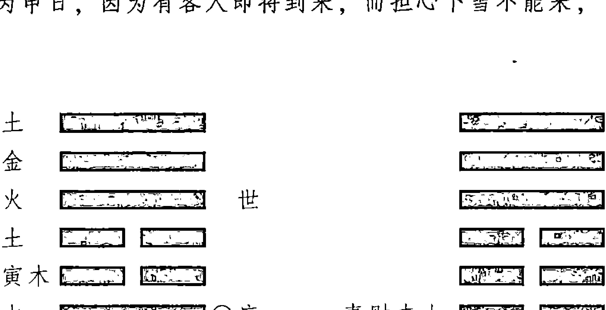

根据卦象推断，当天没有雪，于是客人到来。这是在用卜问行人的方法，因应爻克世爻，所以客人会到来。如果以父母爻发动为下雪的征兆，则错了。大致来说，用爻的选择，以占卜者意图中所侧重的内容为依据。

## 【原文】
冰与水，驾舟者常占。若父旺动，水平行而长驱；如父破空，冰连结而不进。盖舟车以父为用也。
注：冰水无阻，舟车易进，冰水有阻，舟车难前，故反以父母为用。如占久晴害田，久雨害蚕，则财福为用。余以类推。

## 【今译】
冰情与水情，是驾舟人经常占问的对象。如果父母爻正值旺强而发动，则意味着水面平静，可以长驱直进；如果父母爻逢月破、旬空，则意味着冰面连结，不能前进。这是因为占问舟车时，以父母爻为用神。
注：如果水和冰没有阻碍，则舟车易于行进；如果有阻，则难以前行。所以反以父母爻为用爻。如果是占问因久晴无雨有害庄稼、因久雨不晴有害蚕桑，则以妻财和子孙爻为用爻。其他以此类推。

## 【原文】
叩天何日雨者，父母逢生遇冲所值之期也；何日晴者，子孙当见之神也。而占法或以月卜，或以日卜，或以旬卜，或以时卜，不可溷①也。如巳爻子孙，巳日晴，而后巳日雨。
注：① 溷（hùn）：扰乱。

者，故宜分请。问天道者，当如是也。

注：当见，谓干支皆值也。如庚辰年，瞽初游武林，霉雨不止，午建甲申日，顾观察①忧民禾，命占晴，得渐之涣。

申动子孙，当日不霁，及丙申日子孙当见，而后大晴。然卦内无财，秋成应饥，盖其属意占晴，意在秋成，故无财亦验尔。天道渺茫，晴雨非遍，常有河北霁而河南晦者，是以占所占之地，祷所祷之期，分请之法，宜如是也。

## 【今译】

占问哪一天下雨的，应在父母爻逢生、遇冲所值的日期；占问哪一天放晴的，应在子孙干支对应的日期。而占问的规则，或是根据月建，或是根据日建，或是根据旬，或是根据时辰，不可混淆。例如以巳爻为子孙，则意味着在巳日放晴，而后来的巳日又有下雨的，所以应当分清所祈请的内容。占问天道，理当如此。

注：所谓“当见”，是指干支都正好值临——都相同。例如庚辰年，我初次来到武林，阴雨连绵不止。午月甲申日，顾观察使忧虑百姓的庄稼，命我占问哪一天放晴，得风山渐变为风水涣的卦象：

| 官鬼辛卯木 | ▅▅ ▅▅ | 应 | ▅▅▅▅▅ | | |
| --- | --- | --- | --- | --- | --- |
| 父母辛巳火 | ▅▅▅▅▅ | | ▅▅ ▅▅ | | |
| 兄弟辛未土 | ▅▅ ▅▅ | | ▅▅ ▅▅ | | |
| 子孙丙申金 | ▅▅▅▅▅ | ○世 | 父母戊午火 | ▅▅ ▅▅ | ▅▅ ▅▅ |
| 父母丙午火 | ▅▅ ▅▅ | × | 兄弟戊辰土 | ▅▅▅▅▅ | |
| 兄弟丙辰 | ▅▅ ▅▅ | | ▅▅ ▅▅ | | ▅▅▅▅▅ |

子孙申爻为动爻，当日不晴，到丙申日子孙爻当见——干支一同值日，才会大晴。但是卦内没有妻财，因此秋天的收成应当是饥年，因为其占问转晴的意图，是在关心秋天的收成，所以没有妻财也会应验。

天道深远难测，晴雨又不能遍布大地，常有河北晴而河南阴的情形，所以只能占问所要占问的地方，祈求所要祈求的日期，分清所祈请的内容，是必要的。

① 观察：观察使。

## 岁事章第四十五

## 【原文】
注：内详丰荒、田蚕、兵凶、疾疫、水旱、分野诸事。

## 【今译】
本章包括丰荒、田蚕、兵凶、疾疫、水旱、分野等事。

## 【原文】
岁之成熟为丰，时之安平为泰。夫丰所谓天施地育，物阜民饶，故取用以财，盖万物以财为象也。是以财有气而五谷登，财无病而百果结。
注：占丰歉以财，占治乱以鬼，此岁占大象也。

## 【今译】
一年的五谷成熟为丰，时局的安平为泰。丰是所谓上天施予、大地育成、物阜民饶的事情，所以取妻财为用神，因为万物在卦中是用妻财来象征的。所以妻财有气则五谷丰登，妻财无病则各种果蔬都能结实。
注：占问丰歉以妻财为用爻，占问治乱以官鬼为用爻，这是占问岁事的概要。

## 【原文】
财实火木，利春夏之耕；财值水金，宜秋冬之树植。子空则蚕妇徒劳，财陷则农夫失望。
注：以时以象言之，子为蚕，田为财也。

## 【今译】
如果妻财属性为火、木，则有利于春夏两季的耕种；如果属性为水、金，则有利于秋冬两季种植树木。子孙爻逢空，则意味着蚕妇将会徒劳无功；妻财爻如果失陷，则意味着农夫将会失望。
注：这是以时令、象征来说的，子孙对应着养蚕，妻财对应于农田生产。

## 【原文】
夫鬼为时之祸患也，宜静不宜动，动则四方多难；最不利于金官，恐干戈满地；亦不宜于土鬼，防瘟疫流行。水为淹没之灾，木为桑麻之难，火为焦枯之患，及炎火之忧也。

动兼螣蛇，非妖兴闾里，则痘损婴儿；动兼勾陈，非螟蝗害稼，则土地多荒；动兼白虎，非兵革顿起，则虎豹来游；动兼青龙，寒暑失时，而花果谢实；动兼朱雀，主流言横议，而民口难防；动兼玄武，主雀耗鼠损，而弭盗无术。是以五行六爻，皆不可值鬼动也。
注：龙本属吉，鬼扰起凶也。

## 【今译】
以官鬼为时局的祸患，因此在占问时局时宜静不宜动，动则意味着四方多难；最不利的是出现属性为金的官鬼，恐怕会导致四处暴乱；也不宜于出现属性为土的官鬼，否则就要预防瘟疫流行。官鬼属性为水，则预示着有水淹之灾；属性为木，则预示着桑麻产业将遭灾害；属性为火，则要担心会发生火灾。
官鬼发动并临螣蛇，预示着不是有妖孽在闾里作怪，就是有婴儿因出痘而夭折；如果发动且临勾陈，预示着不是庄稼遭受蝗灾，就是土地多被撂荒；如果发动且临白虎，预示着不是突然兴起兵乱，就是有虎豹出没；如果发动且临青龙，则预示着寒暑变化有悖于节令，以至花果凋零；如果发动且临朱雀，则预示着社会上流言横议泛滥，舆论难以控制；如果发动且临玄武，则预示着粮食遭受鸟雀、老鼠的消耗，而平息偷盗又不得力。所以占测时局时，五行和六兽都不可值于发动的官鬼爻上。
注：青龙本来属于吉神，因官鬼的扰动而兴起凶相。

## 【原文】
财化鬼者，薄于西成；鬼化财者，难于东作；官化子者，则有致治①之政；子化官者，则有兆乱之机。
注：鬼化财，虽难于东作而有收，不如化鬼之甚也。

## 【今译】
妻财化官鬼的，则意味着秋天的收成将受损失；官鬼化妻财的，意味着春天的耕种将有困难；官鬼化子孙的，则说明有使国家承平的政策；子孙化官鬼的，则意味着导致动乱的机缘。
注：官鬼化妻财，虽然会给春季耕作带来困难，但仍所有收成，不如化官鬼那么严重。

## 【原文】
若筮天下则丰歉不均，所以动于巳而楚荒，摇于震而东乱也。
注：乾分冀州，坎分幽州，艮分青州，震分兖州，巽分徐州，离分扬州，坤分荆州，
① 致治：使国家在政治上安定清平。

兑分雍州，中为豫州也。盖中宫附入坤分，如九星天禽，附入天芮之意也。子分齐，丑分吴，寅分燕，卯分宋，辰分郑，巳分楚，午分周，未分秦，申分晋，酉分赵，戌分鲁，亥分魏也。盖鬼动是分，则是地多难，其所在所临之官爻，亦有小厄，但静则不甚尔。

## 【今译】
如果所占问的是整个天下的岁事，则因为各地丰歉不均，所以地支为巳的官鬼发动，则说明楚地将有饥荒；官鬼出在震卦而动的，意味着东方将有祸乱——按八卦九宫和十二地支分野来推求。

注：八卦九宫中，乾的分野为冀州，坎的分野为幽州，艮的分野为青州，震的分野为兖州，巽的分野为徐州，离的分野为扬州，坤的分野为荆州，兑的分野为雍州，中宫的分野为豫州。中宫附入坤的分野，如同九星天禽附入天芮。十二地支中，子的分野为齐，丑的分野为吴，寅的分野为燕，卯的分野为宋，辰的分野为郑，巳的分野为楚，午的分野为周，未的分野为秦，申的分野为晋，酉的分野为赵，戌的分野为鲁，亥的分野为魏。官鬼动于哪一分野，相应的地方就会多灾；那些仅仅是被官鬼所在所临的地方，也有小难，只是因为安静，则不那么严重罢了。

## 【原文】
是以鬼从初而物杀，鬼从二而民瘼，鬼从上而天怒，鬼从三而吏苛，于五君忧，于四臣辱。其法惟以财实为丰穰，鬼动为荒乱，其义如此。

注：鬼动是位，妖作是处，虽静不凶，亦有小疾。

## 【今译】
所以，官鬼出现在初爻，则意味着品物受损；出现在二爻，则意味着百姓要遭受痛苦；出现在上爻，则意味着上天会怨怒；出现在三爻，则意味着官吏苛毒；出现在五爻，则意味着君主将会忧郁；出现在四爻，则意味着大臣将蒙受侮辱。因此，规则中以妻财生旺为丰收之象，而以官鬼发动为荒芜动乱之象，其义理就在于此。

注：官鬼发动在这一位，则妖孽就作乱于此处，即使因为安静不动而不致带来凶祸，也会有小的问题。

## 身命章第四十六

## 【原文】
注：谓我身受命于天也，此宜有专问，则授命如响。内详寿夭、富贵、道业、妻子、趋避、大限、小限之法。

## 【今译】
身命，是说我的身体乃是受命于天的意思，因此应当有专门的占问，才能够准确地得到神明的反馈。本章包括了占问寿夭、富贵、道业、妻子、趋避、大限、小限的方法。

## 【原文】
告圣贤曰：我生成败得失亨困何如？即世爻不可病也。世爻不病，则成而不败，得而不失，亨而不困矣。故曰：世乃平生之本也。
注：一生成败，独世主张。无休囚伤退，谓之无疾；有空破散绝，谓之有病。若父子夫妇弟兄请占，当分用神。

## 【今译】
向圣贤祷告说：我一生的成败、得失如何？是亨通还是困顿？占问有关身命的事宜时，世爻不可有病。如果世爻无病，那么就只会成而不会败，只会得而不会失，只会亨通而不会困顿，所以说世爻是占问平生之事的根本。
注：一生的成败，都是由世爻来决定的。没有休、囚、伤、退等状况，叫做无疾；有空、破、散、绝等状况，叫做有病。如果是父子、夫妇、弟兄关系代为占问，则应当选取不同的用神。

## 【原文】
随官入墓、助鬼伤身，常防病患；伏吟反吟、化居墓绝，难免迍邅①；正冲悔冲，合处逢冲，终多得失。此平生之概也。
若有专筮，则有特告焉。筮曰：寿夭何如？则破散空冲定之夭，日月旺相定之寿。旬空限绝，天克地冲，是其考终也。推而深之，虽日月可知也。自占凭世，六亲凭用，旧专执父母为寿者非也。
注：旬空，谓后来年旬空限绝，谓后来行绝限。如戊子生人，丁丑寅建辛亥日占自寿，得师，世爻绝亥生寅，其寿未已，及戊子年孟秋令寝，乃甲申旬空午，子岁破午，十年后行午限绝亥，庚申又破寅生，是以终也。余仿此。

## 【今译】
如果遇到随官入墓，或助鬼伤身，则要时常防备病患；如果遇到伏吟反吟，或化墓化绝，则难免困顿不顺；如果遇到正卦逢冲、悔卦逢冲、合处逢冲等情况，则意味着终究会多有损失。这是占问平生的基本原理。

如果要占问某个单独的事项，则有专门的兆示。
例如占问长寿还是夭折，则如果逢月破、日散、旬空、被冲，就注定会夭折；如果值日建、月建，或旺相，就一定会长寿。逢旬空、绝限，遇天克、地冲的年份，就是其寿命终结之时。由此深入推究，则即使是去世的具体月、日也是可知的了。自己占问，要以世爻为依据；代六亲占问，则要以用神为依据。过去只以父母对应寿命的做法，是错误的。

注：旬空，是指后来的年份逢旬空、限绝，也是指后来的年份行绝限。例如，在戊子年出生的人在丁丑年寅月辛亥日占问自己的寿命，得到地水师卦：

```
父母癸酉金  ▅▅ ▅▅  应
兄弟癸亥水  ▅▅ ▅▅
官鬼癸丑土  ▅▅ ▅▅
妻财戊午火  ▅▅▅▅▅  世
官鬼戊辰土  ▅▅▅▅▅
子孙戊寅木  ▅▅ ▅▅
```

世爻戊午绝于亥，而长生于寅，说明其寿命没到尽头，到戊子年孟秋时才能寿终正寝。这是因为在甲申旬世爻午火逢空，在子年午逢岁破，十年后行午限而绝于亥，庚申又冲破寅木的来生，所以命终。其余以此类推。

## 【原文】
筮曰：我能贵乎？官父贵之本也。以学而得名者，必父爻之高明；以功而得名者，必官象之昌隆。以位而卜其禄之尊卑，以会而卜其成之岁月。
以八卦为方隅①，以五行为司属，以六神为班列②。金为兵刑，水主河海，土主税赋，火主礼仪，木主考工。乾为西北，巽为东南。三为守牧，五为台省③。龙为文翰④，虎为武卫，雀为言路，元⑤为水利，陈为地土，蛇为使节。生旺则得，死墓则失。而官制代更，则随义而起也。

注：以文章取进，则专用父母，贡举亦然；以事例擢拔，专用官鬼，从武袭爵亦然。官立四五之位则显，文临当现之年则第，官值生旺之岁则拜，五行为司，八宫为方，六神为职，六爻为级。

+   ① 方隅：四方和四隅。
② 班列：朝班的行列，以品级和职务类别来划分。
③ 台省：御史台和中书、门下、尚书三省。指中枢决策机构。
④ 文翰：公文信札。
⑤ 元：元武，即玄武。

## 【今译】
如果占问能否显贵，那么要以官鬼和父母为占断的依据。凭借学问而得名望的，一定是因为父母爻的不凡；凭借武功而得名望的，必须官鬼爻呈现昌隆之象。根据爻位可以推算官位的高低，根据三合会局可以推算成就的时间。以八卦对应其所在的方位，以五行对应其所执掌的事类，以六神对应其所在的班列。金执掌军事、法律，水执掌水运、水利，土执掌税赋，火执掌礼仪，木执掌建筑制造。乾对应于西北，巽对应于东南。三爻对应于地方主官，五爻对应于中央阁员。青龙代表文职事务，白虎代表军事事务，朱雀代表舆论劝谏，玄武代表水利工程，勾陈代表土地，螣蛇代表使节。如果正值生旺，则意味着能得其所主；如果正值死墓，则意味着会失其所主。至于具体的官僚制度，则是随着时代的变迁而更改，则可比照实际意义，对应于现实的名目使用。

注：如果是凭借文章求取晋升的，则专以父母爻为占断的依据，占问贡举也是同样；依照成例得到晋升的，则专以官鬼爻为占断的依据，占问从军、袭爵也是同样。官鬼在四、五爻的位置则意味着能够显贵，到与父母爻干支同值的年份则能及第，官鬼值生旺的年份就会被任用。以五行代表司，八宫代表方位，六神代表职业，六爻代表品级。

## 【原文】
筮曰：我能富乎？财福富之本也。生平之挥霍者财，旺则有余；生平之安乐者福，强则多庆。惟有财而无福者富而忧，有福而无财者贫而乐。然必以身受之，故世爻不可伤也。
注：问富贵先看世象生旺，世空无成，世破不享，世散绝则不终也。

## 【今译】
占问能否富有，要以妻财和子孙作为占断的依据。生平所挥霍的是财，因此妻财旺则说明一生财富有余；生平所得的安乐是福，因此福爻强则说明平生多有福泽。只是，只有妻财而无子孙的，说明虽然富有但却另有忧愁；只有子孙而无妻财的，则是虽然贫寒但却快乐。但是财和福都是要通过自身来承受的，所以世爻不可受伤。
注:占问能否富贵的，要先看世爻是否生旺。世爻如果逢空，则意味着不会有所成就；世爻如果遭破，则意味着虽有富贵但无法享用；世爻如果逢日散、死绝，则意味着富贵有始无终。

## 【原文】
且问道而忌六冲，问妻而忌财陷，皆不可以世空也。问子而忌子虚，旺相则多，休囚则少，空散则刑，克冲则暴，带吉神而贤良，加凶神而顽劣，跨身世而迈种①，登日月而

① 迈种：勉力树德。

昌荣。占兄弟者亦如之。

注：若世爻被子孙冲克，则男女忤逆。凡问父母更有兄弟否，则视兄弟，其他皆卜子孙。

## 【今译】
占问修道，则忌讳卦逢六冲；占问妻妾，则忌讳妻财爻空陷。这二者都不可以是世爻逢空。占问儿孙，则忌讳子孙爻虚弱，如果正值旺相，则意味子孙众多；如果正值休囚，则意味子孙稀少；遭遇旬空日散，则意味子孙会受刑伤；遭遇克、冲，则意味子孙会遇凶暴；如果带吉神，则意味子孙为贤良之人；如果带凶神，则意味子孙为顽劣之人；在世身和世爻上同时出现的，则意味子孙为品德高尚之人；临日建、月建的，则意味子孙能够荣昌。占问兄弟也是如此。

注：如果世爻被子孙爻冲克，则意味儿女忤逆。凡是占问父母是否还有兄弟的，则以兄弟为用神，其他的都以子孙为用神。

## 【原文】
如问趋避，则福为我所趋，鬼为我所避。官鬼克世者，不以贵言也。火鬼克身而忧焚，水官伤世而患溺，带白虎则避兵凶，加玄武则防盗贼，虽青龙亦恐惑于酒色也。所以鬼属之物不可食，鬼发之宫不可适。丑鬼戒牛，卯鬼戒兔，戌为疯犬，午为狂驴。鬼发兑而毋呢少妇，鬼发乾而毋近老僧。鬼发雀符而防官非之扰，鬼发陈蛇而招轻诺之凶。发于离而目翳①，发于震而足跂②。于金则病肺，于火则病血。鬼发游魂而莫近于新所，鬼发归魂而莫还于旧乡。生合世之方宜往，克冲世之方宜回。生合之人可交，克冲之人宜远也。

注：以五行六神八宫诸星及十二支所属鬼动，近取诸身，远取诸物，而趋避得矣。

## 【今译】
占问如何趋吉避凶，则以福神指示我所应趋附的事物，以官鬼指示我所应规避的事物。此时，出现官鬼克世，则不能仅仅将官鬼视为权贵。如果是属性为火的官鬼克世爻，则要小心被烧伤；如果是属性为水的官鬼克世爻，则要当心溺水。如果加带白虎，则要躲避兵祸；如果加带玄武，则要防备盗贼；即使加带的是青龙，也担心可能会被酒色所迷惑。所以官鬼所对应的东西不能吃，官鬼发动的方位不能去。官鬼地支为丑，则要戒惧牛；官鬼地支为卯，则要戒惧兔；官鬼地支为戌，则要戒惧疯狗；官鬼地支为午，则要戒惧狂驴。官鬼发动于兑宫，则不要亲近少妇；发动于乾宫，不要接近老僧。如果官鬼发动又临朱雀的，则要防范官司是非；如果临陈蛇，则要防范轻易承诺而招致凶祸。如果官鬼

① 翳：眼角膜上所生障碍视线的白斑。
② 跂（qí）：多出的脚趾。

发动于离卦，则意味着会患白内障；如果发动于震卦，则意味着脚上会有多出来的脚趾。官鬼发动在金爻上，则说明肺部会生病；发动在火爻上，则说明血液会发生病变。官鬼在游魂卦中发动，则意味着不要靠近新居；官鬼在归魂卦中发动，则意味着不要回到旧地。遇生合世爻的方向，适宜前往；遇克冲世爻的方向，则适宜返回。与世爻生合的人可以交往，克冲的人则要远离。

注：上述是说，如果官鬼发动，则以其所属的五行、六神、八宫、诸星及十二地支取象，近取之于身，远取之于物，则如何趋吉避凶就可以明白了。

## 【原文】
夫艮发子爻，利修身于山谷；乾兴福象，宜砥节于朝堂。巽求花果之财，震觅舟航之息，兑以酒食之资，坤以庄田之益。动于木上，应守业于桑麻；摇于水中，宜治生于江海。火向炉煅之肆，金趋玉石之门。而土惟诚信，耕耘可也。
常谓虎财宜屠，雀财宜优①，龙财宜乐②，麟财宜技③，蛇财宜商④，武财宜肆⑤。无财而有官者，技善巫医；无官而有财者，运宜商贾。

注：福乃财之源，财乃利之主，故财福所适八宫六神五属，皆为资生之处、功业之乡。如子发乾宫，殿折庭诤，亦无祸也，不可以子动伤官为言。若专问仕途，仍复为忌。

## 【今译】
子孙发动于艮卦，有利于在深山中修行；发动于乾卦，则有利于在朝堂上砥砺气节；发动于巽卦，则有利于通过种植花草果木求财；发动于震卦，则有利于通过经营舟船航运获利；发动于兑卦，则有利于靠经营酒菜赚钱；发动于坤卦，则有利于靠经营农庄田产获利。子孙发动于木爻上，意味着应当从事桑麻产业；发动于水爻上，则意味着适宜在江海上谋生；发动于火爻上，则意味着应当经营铁匠铺；发动于金爻上，则意味着应当进入玉石行业；如果发动于土爻上，土以诚信为德，因此可以靠种田为生。临白虎的妻财，对屠户有利；临朱雀的妻财，对优伶有利；临青龙的妻财，对乐工有利；临勾陈的妻财，对匠人有利；临螣蛇的妻财，对行商有利；临玄武的妻财，对开设店铺有利。如果卦中没有妻财却有官鬼，则说明适宜学习巫卜、医学；如果没有官鬼而有妻财，则说明适宜从事商贾。

注：福爻是财富的源泉，妻财是利益的主宰，所以妻财和福爻所在的八卦、六神、五

+   ① 优：古代指演剧的人。
② 乐：乐工——善于音乐的人。
③ 技：指匠人，工匠。
④ 商：指行商。
⑤ 肆：店铺。

行等，都是能够谋生之处、立业之地。例如子孙发动于乾卦，即使在朝堂上直谏敢谏，乃至触犯龙颜，也没有祸患。而不可认为，是子孙爻动会伤及官鬼之象。但如果是专门占问仕途，遇到这种情况，则又是大忌。

## 【原文】
世临子孙者，恬澹宽和，宜僧宜道；世临官鬼者，英雄勇悍，宜武宜文；世临父母者，是谓生我于劳；世临妻财者，是谓溺我以豫①；世临兄弟者，是谓义利相胜也。

注：父母为劳碌之神，故像操持；妻财为饶豫之像，故戒骄溺；兄弟以义相亲，以利相疏，占者义利持中，否则主贫也。

## 【今译】
世爻临子孙的，说明为人恬淡宽和，适于为僧为道；世爻临官鬼的，说明为人有英雄气概，勇敢强悍，既适宜作武将也适宜作文官；世爻临父母的，叫做“生我于劳”——一生劳碌；世爻临妻财的，叫做“溺我以豫”——用逸豫安乐淹溺我；世爻临兄弟的，叫做义与利相互制约。

注：父母象征着劳碌，所以有操持之象；妻财象征着丰饶安逸，因此要戒惧骄溺之情；兄弟之间因为义而得以亲近，因为利而疏远，所以占问者最好在义与利之间保持中庸，否则会导致贫困。

## 【原文】
世折于木者，修仁以植之；世崩于土者，立信以培之。世空而安者，莫若离尘；世空而动者，莫若奋志。动而冲散戒骄盈，动而生扶善结纳。

注：此勉人迁善之法。盖五行具五常②，木仁金义火礼水智土信是也。设如木爻持世，或遇空破散绝，谓于仁有亏，非天即疾，苟能修仁以植其木，则夭疾可延③也。其他类推。

## 【今译】
世爻被木所克的，可以通过修仁德来扶植；世爻被土所克的，可以通过树立信誉来增厚。世逢空又安静的，则不如远离红尘；世爻逢空而发动的，一定要奋发心志。世爻动而逢冲的，则要力戒骄傲自满；世爻动而逢生扶的，则要善于结交。

注：这是勉励人改过迁善的办法。五行分别具备五常的德性，即木为仁，金为义，火

+   ① 豫：安乐，舒适。
② 五常：仁、义、礼、智、信。
③ 延：延缓。

为礼，水为智，土为信。假如木爻持世，或遇到空、破、散、绝等情况，称为在仁德方面有亏欠，不是早夭就是生病，如果能够修仁德以扶植其木，那么早夭或疾病就可以延缓。其他情况以此类推。

为礼，水为智，土为信。比如木爻为世爻，如果遇到空、破、散、绝等状况，则说明在仁德方面有亏损，因此将不是夭折就是生病，但如果真的能修仁德，来扶植其缺损的木德——仁，那么夭折和疾病的出现就可以延缓。其他以此类推。

## 【原文】

无父母曰孤而依，无子孙曰独而继。无妻财而有子孙者，孕于他妇；无父母而有弟兄者，胞于异母。官坐世者大纲整，财坐应者妻德备。卦空破而出寒微，宫旺相而产豪富。官父伏而有气者，成名于暮年；财福藏而无伤者，起家于晚岁。

注：无六亲，此言其大象，或伤于前，或损于后，不可执也。

## 【今译】

卦中没有父母爻的，叫做孤，要依靠他人；卦中没有子孙爻的，叫做独，要继养他人。没有妻财而有子孙的，则说明子孙是由其他妇人孕育的；没有父母而有弟兄的，则说明兄弟是异母所生。官鬼位于世爻的，说明纲常家法严整；妻财位于应爻的，说明妻子妇德完备。卦逢旬空月破，则将有身世寒微的后人；卦逢旺相，则将有豪富的子孙。官鬼和父母伏藏而有气的，说明将会在晚年成名；妻财和子孙伏藏而没有伤的，说明将会在晚年发迹。

注：关于卦中没有六亲的情形，这里只言其大略，或是因为受伤于前，或是有损于后，不可过分拘泥。

## 【原文】

两官者兼御之官，两父者再试之第，两身者再立之基，两财者再婚之约，两子孙者男女嫡庶，两兄弟者手足同异①也。

注：其详备两现章中。

## 【今译】

卦中有两个官鬼的，意味着将有兼有的官职；有两个父母爻的，意味着要再试才能及第；有两个卦身的，意味着有再次立业的根基；有两个妻财的，意味着将会再婚；有两个子孙爻的，意味着既有儿又有女，既有嫡出也有庶出；有两个兄弟爻的，意味着兄弟不合。

注：详见《两现》章内容。

① 同异：异议。亦指立异议。

## 【原文】

变官而登日月之上，则是意外之官；变财而人旺相之中，则非望内之财也。动克世而多尤①，动生世而多助。进神则祸福愈彰，退神则吉凶渐已。用神遇绝生者，先困后亨；用神遇有无者，始华终悴。

注：此言吉凶征②胜之道，卦无官鬼，非善求名，若变有日月官爻，当应特遇爵禄；世财逢绝，生平失利，如或长生，则先败而后成。盖动生世，好我者多；动克世，恶我者众。

## 【今译】

变卦中的官鬼临日建、月建，则是指将得到意外的官职；变卦中的妻财正值旺相，则是指将得到预料之外的财物。动爻克世爻，则意味着将多有过失；动爻生世爻，则意味着将多得辅助。化进神，则意味着无论祸福，都会更加显著；化退神，则无论吉凶，都将渐渐消散。用神遇绝处逢生的，意味着将会先遭困顿，后又亨通；遇到有用神却等于没有的，则意味着经历了开始的繁华之后，最终将变得憔悴。

注：这里是说吉凶转变之道。卦中没有官鬼，原本不利于求功名，但是如果变卦中有临日建、月建的官鬼爻，则应当应验在获得特殊的爵禄；世爻、妻财逢绝，通常意味着生平失利，但是如果正值长生，则意味着先败落而后成功。动爻生世爻，意味着喜欢我的人多；动爻克世爻，意味着厌恶我的人多。

## 【原文】

犹有犯六害而手足参商，犯三刑而骨肉仇敌。贵人、文昌、天喜、天禄及诸星有吉，亦必因吉而后求之；羊刃、天贼、官符、天狱及诸星有凶，亦必因凶而后索之。语云：“八卦成例，五行先之，六亲随之，六神象之，诸星辅相之。”吉凶相称，扶阳抑阴，遏恶扬善，而后可以筮趋避之验也。

注：此言星煞吉凶，若用神得地，然后以吉星符之；用神失位，然后以凶星象之。如丙戌子建戊申日，戊午生人，占身得小过之艮，世命投墓，本主寿夭，其午上有天贼、玄武、羊刃、大白虎之临，后戊子季秋为贼所杀，可见因其凶而像之也。倘或身命求贵，官临日月，而同白虎羊刃，则应“太阿可握，兵衡可操”矣。故曰六神像之，诸星辅相之。法宜如此。

## 【今译】

还有，犯六害，则意味着兄弟决裂；犯三刑，则意味着骨肉之间将成仇敌。贵人、文昌、天喜、天禄及其他星神，虽然带有吉祥，也必须在用神得吉的前提下，再去加以考察；羊刃、天贼、官符、天狱及其他星神，虽然预示凶险，也必须在用神失位的情况下，再去加以验证。古语说：“八卦构成卦例，五行为首要，六亲随之后，六神来象征，诸星来辅助。”吉凶要相互称量，扶持阳刚抑制阴柔，遏制邪恶弘扬善良，然后通过占筮来探求趋吉避凶的方法才会有效验。

注：这里是说星煞的吉凶，如果用神得地，然后才以吉星来符合它；如果用神失位，然后才以凶星来依随它。例如在丙戌年子月戊申日，戊午年出生的人占问自身，得雷山小过变为艮为山的卦象：

世爻和本命入墓，原本意味着短寿，午上又有天贼、玄武、羊刃、白虎等凶煞加临，后来在戊子年秋天被贼寇所杀。可见，星煞是因于用神自身的凶险而出现的。倘若是占问身命求显贵，那么因为官鬼临于日月，所以同样的白虎、羊刃，就成了“太阿可握，兵衡可操”的应征了。所以六神依随于它，各星神辅助于它。理当如此。

① 尤：过失，罪过。
② 征：争取，争夺。

虑；羊刃、天贼、官符、天狱及其他诸星，虽然带有凶灾，也必须在用神得凶的基础上，再去加以考虑。古语说：“通过八卦形成卦例，选用五行推断吉凶关系，随后使用六亲、然后再运用六神象征的内容，最后参考各星煞的吉凶因素。”如果结果是吉凶相当，那么通过扶阳抑阴、遏恶扬善的原则，就可以得到最终如何趋利避害的结论了。

注：这里是说星煞的吉凶，如果用神得地，然后才以吉星来符合它；如果用神失位，然后才以凶星来依随它。例如在丙戌年子月戊申日，戊午年出生的人占问自身，得雷山小过变为艮为山的卦象：

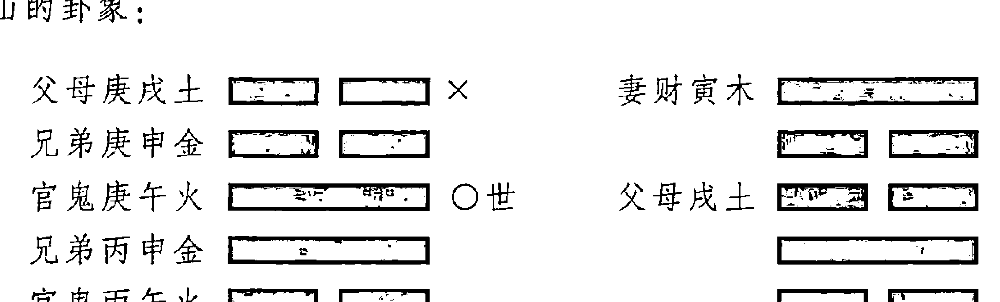

世爻和本命入墓，原本意味着短寿，午上又有天贼、玄武、羊刃、白虎等凶煞加临，后来在戊子年秋天被贼寇所杀。可见，星煞是因于用神自身的凶险而出现的。倘若是占问身命求显贵，那么因为官鬼临于日月，所以同样的白虎、羊刃，就成了“太阿可握，兵衡可操”的应征了。所以六神依随于它，各星神辅助于它。理当如此。

## 【原文】

大限自贞之初爻，以顺巡乎悔之初爻，悔之初爻以顺巡至乎伏之初爻，伏之初爻以顺巡乎贞之初爻。阴阳之数，九变乃还，故九十复归贞初。三世再始，无变从互，去闰从时。有言胎元体骨之别，乃谓初生，筮而以告也。年五十而筮之，则所往成败利钝①以历，吉凶何求？

《易》云“占事知来”，则必以所筮日时而始推初爻也。其吉凶，以空破为危，冲散为戒，遇用为得，会忌为失，生合则顺，克冲则逆。

五年中加以小限齐之，是筮之日而始发于世爻，顺而上下，周而循环，一年一位，其吉凶亦法式于大限。

而再以岁齐之，其吉凶以虚而喜实，绝而喜生，无而喜见如此。

注：法曰：大限五年一位，始自初爻；小限一载一位，起自世爻。弥月婴儿，筮用此例，其余少壮，皆以所筮之日时，起大限小限于初爻世爻也。无变用互，从时，以占时节气为准。如今占惊蛰，则以来年惊蛰为一年也，闰不算。《易》之所谓“占事知来”，不占往也。大限以小限参之，小限以岁月参之，虚宜实，绝宜生，无宜见而已。大小之限，俱忌空破散绝克冲及忌神之地，宜日月旺相生合及元神之乡。如己丑寅建庚午日，己巳命

占贵，得损之剥，卯官发见，当第辛卯，然大限巳文书化未兄弟，小限三年在子，是岁失利；后甲午榜，大限在卯，小限亦在卯，乃元神之乡，其年中式。余仿此。

盖大限、小限、流年，必先考流年之用忌，次详大限之休咎，复索小限之吉凶。其轻重有等级，占者审之。

盖其限同也，其占殊也。是以筮上而用于父母，伯叔同焉；筮下而用于子孙，甥侄同焉；筮室家而用于妻财，仆妾同焉；筮手足而用于弟兄，宗娣同焉。丈夫用官，良朋用应，而不可错审也。用神是定，造化乃分，然筮者无侥幸之心，无固必之意，而后神告之矣。

## 【今译】

大限从内卦的初爻开始，顺行到外卦的初爻，再从外卦的初爻顺行到伏卦的初爻，再由伏卦的初爻顺行到内卦的初爻。阴阳之数，经历九次变化才会返还，所以九十复归内卦的初爻。巡游三次之后重新开始，没有变卦就用互卦，去掉闰月，以占时节气为准。至于胎元体骨的区别，是指降生之初，进行这样占问，才会得到相应的兆示。如果年已五十才来占问，则过往的成功或失败、顺利或挫折都已经经历，还求什么吉凶？《周易》说“占事知来”，即占问的目的是为了了解未来，所以必定以进行占卜的日期对应于初爻作为起始，然后开始顺推。

其吉凶，以逢空、破为危险，以逢冲散为戒惧；以遇到用神为得，以遇到忌神为失；遇到生合则为顺，遇到克冲则为逆。五年当中，又以小限作为辅助。小限从进行这次占问的日期开始，起始于世爻，顺行上下，周而复始地循环进行，一年对应一位，其吉凶的推断与大限相同。然后又以岁月来辅助，其吉凶是以逢虚的则喜欢被填实，遇绝的则喜欢得生，没有的喜欢出现罢了。

注：大限五年对应一位，起始于初爻；小限一年对应一位，起始于世爻。对于满月的婴儿，占问时依照这个规律进行，其余的人，无论老少，都从占问的日时，分别对应于初爻、世爻，开始顺推大限和小限。没有变卦就用互卦，根据时令纪年，以占问时的节气为准。例如占问时是惊蛰，就以到来年惊蛰为一年，闰余的日子不计算在内。《易经》上所谓“占事知来”，是指不占问过往。大限以小限作为参考，小限以岁月作为参考，逢虚的应当填实，逢绝应当得到相生，没有的应当出现，如此而已。

大小限都忌讳遇到空、破、散、绝、克、冲以及忌神，适合临日建、月建、旺相，以及遇到生合、元神等。例如在己丑年寅月庚午日，己巳年生人，占问能否得贵，得到山泽损变为山地剥的卦象：

| 宫位       | 六神   | 六亲         | 爻位 | 动变情况       |
| :--------- | :----- | :----------- | :--- | :------------- |
| 应         |        | 官鬼寅木     |||                |
|            |        | 妻财子水     |||                |
|            |        | 兄弟戌土     | ○    |                |
| 世         |        | 兄弟丑土     |||                |
|            |        | 官鬼卯木     | ○    | 父母巳火       |
|            |        | 父母巳火     | ○    | 兄弟未土       |

官鬼卯木爻发动，本应当在辛卯年及第。然而大限文书巳火化兄弟未土，小限三年在子，因此这一年失利；后来再次应试甲午年的考试，此时大限在卯，小限也在卯，属于遇到元神，所以在这一年考中。其他以此类推。

总的来说，大限、小限、流年，必先考察流年的用神和忌神，其次是详细考察大限的休咎，再次是看小限的吉凶。其对吉凶的影响，是有轻重等级之分的，占卜者应当了解。

因为虽然运限是相同的，但是占问的内容却不同。所以，占问父母时以父母为用爻，占问伯父、叔叔也一样；占问子女时以子孙为用爻，占问外甥、侄子也一样。占问家室、奴仆时以妻财为用爻；占问兄弟时以弟兄为用爻，占问同宗的兄弟姐妹也一样；占问丈夫时以官鬼为用爻；占问朋友时以应爻为用爻。不能弄错了。用神确定之后，造化才会分明。只要占卜者不存侥幸之心，不固执于必须之意，而后神明就会告示吉凶了。

## 年运章第四十七

【原文】圣人作《易》，以前民用，使天下知吉凶，而为趋避也。故虽圣哲，不废蓍龟。然占者须分远近，或筮三年，或筮今岁，皆以世爻为本。故世爻旺者身安，鬼爻静者灾息。随官入墓、助鬼伤身，则讼起而疾作也；反吟伏吟、化居墓绝，大病将至也。此年运之要也。

注：反吟伏吟墓绝，当察主属，若身系长男，伏吟则恶，身属中女，反吟则凶之类，非是皆不忌也。

【今译】圣人创制《周易》，是为了让人们在行事之前运用，以预知吉凶所在，从而明白趋避之道。所以即使是圣哲，也不完全排斥占卜。然而，占卜必须分清时间的远近，如果占问三年之内的事情，或者就是本年的事情，则都以世爻为根本。所以世爻值旺相的，就会身心安泰；官爻静而不动的，就会没有灾害。遇到随官入墓、助鬼伤身的，就会有官司产生、疾病发作；遇到反吟伏吟、化居墓绝的，则说明大病即将到来。这就是占问年运时的要点。

注：遇到反吟、伏吟和墓绝时，应当考察其主属关系。如身为长男怕遇伏吟，身属中女怕遇反吟之类，此外都不忌讳。

【原文】且世空有谋而虚望，世破无故而致灾。动则劳，静则逸。冲为行未举而先疑，散为事未成而随败。旺相则事每顺成；休囚则往多淹滞。

注：年运占法，实系世爻，若日月生扶，旺相安静则吉，空破散绝，休囚发动则少安也。

## 【今译】

世爻如果逢空，则意味着即使有所谋划，也将归于空想；世爻如果逢破，则意味着会无故而招灾。世爻如果为动爻，则意味着劳碌；世爻如果为静爻，则意味着安逸。世爻如果逢冲，则意味着行动尚未进行，就先产生疑惑；世爻如果遇散，则意味着事业尚未成功，就归于失败。世爻如果正值旺相，则意味着事情每每顺利而成；世爻如果正值休囚，则意味着事情往往拖沓迟滞。

注：关于年运的占法，系于世爻，如果得到日、月的生扶，或正值旺相而安静，则预示着吉祥；如果遇到空、破、散、绝等状况，或正值休囚而发动，则预示着缺少安宁。

## 【原文】

犹有得坎艮而忌出行，得屯蹇而忌拜疏，得井而难迁，得遁而不进，得姤而毋耽女色，得无妄而毋事妄求，得小过而毋留怨于小人，得兑而毋纵其口，则占者之戒也，然必因鬼动而推之。

注：此以卦象趋避，然必兼鬼爻发动，若鬼静则莫将卦名推祸福也。盖官鬼为年运之忌神，谓不宜老；世爻为年运之用神，谓不宜病。

## 【今译】

尤其要注意，占得坎、艮两卦，则忌讳出行；占得水雷屯、水山蹇两卦，则忌讳去拜访并不亲近的人；占得水风井卦，则意味着难以迁移；占得天山遁卦，则意味着不可进取；占得天风姤卦，则须警戒不要耽于女色；占得天雷无妄卦，则须警戒不要有非分的要求；占得雷山小过卦，则须警戒不要得罪小人；占得兑卦，则须警戒不要信口开河。这些对占问者的告诫，但必须因为官鬼发动，才能以此推断。

注：这是以卦象来推断趋避之道的，但必须兼有鬼爻发动的事实。如果官鬼安静不动，则不要根据卦名来推论祸福。因为官鬼是占年运时的忌神，因此不适合以老阳、老阴出现——为动爻；世爻是占年运时的用神，所以不适合有空、破、散、绝等问题。

## 【原文】

然鬼发之卦，及鬼发之爻，亦有戒也。动于坤，则老母、土田、文章、坵墓、大舆，而缘于祸；动于坎，则江河、丛棘、盗贼、酒食、心病、耳痛，而兆诸殃；动于震，则舟车、旌旗、仙道、长子、尚武、宿怒①，而生其咎；乾常应朝庭、寺院、西北、乘马、折舆之忧；巽常应风姨②、悍妇、园林、利赂、鸡鹅之病；艮为童稚、坟塚、阉寺、狗啮、虎惊之由；是以目昏、腹大、戈兵、甲胄、南行而受患者，起之离；花柳、轻狂、师尼邪惑、以言而取怨者，起之兑也。伸八卦之象，像万类之形，而趋避兆矣。

> 注：此以广八卦为祸福趋避之象，余可引而申之。

## 【今译】

在官鬼发动时，所处的卦，以及所处的爻中，也蕴含着需要警戒的内容。官鬼如果在坤卦中发动，则老母、田土、文章、坟墓、大车等，可能会有祸患；如果在坎卦中发动，则在江河、丛棘、盗贼、酒食、心病、耳痛等方面，可能会有相应的灾难发生；如果在震卦中发动，则在舟车、旌旗、仙道、长子、尚武、旧怨等方面，可能会出现问题；如果在乾卦中发动，则在朝庭、寺院、西北、乘马、翻车等方面，可能会有忧虑；如果在巽卦中发动，则在风灾、悍妇、园林、财利、鸡鹅等方面，可能会遭受损伤；如果在艮卦中发动，则幼童、坟墓、宦官、被狗咬、被虎惊等方面的问题，就可能由此而发；如果在离卦中发动，则是眼病、腹大、戈兵、甲胄、南行而受难等问题产生的根源；身染花柳、为人轻狂、被僧尼邪惑，或因言语而招致怨恨的，则是官鬼在兑卦中发动的结果。拓展延伸八卦的征象，使之对应于世间万物，则可以了解关于趋避之道的兆示。

> 注：这是在说，如何通过拓展八卦使之成为祸福趋避之象的例子，其余可以引而申之。

## 【原文】

以六神而分，龙喜、虎丧、雀非、武盗、蛇惊、勾滞之别，以六爻而分老长幼之等。盖鬼动于五，父不安，动于初，子不宁也。

> 注：龙曰喜，虎曰丧，雀曰非，武曰盗，螣蛇虚浮，勾陈迟滞也。初子二妻三弟兄，四母五父上祖也。

## 【今译】

根据六神来区分，则有临青龙则带喜，临白虎则带丧，临朱雀则有是非，临玄武则有盗贼，临螣蛇则带惊，临勾陈则多迟滞的区别。根据六爻来区分老少长幼的等序。即如官鬼动于五爻，则父亲不安；动于初爻，则儿子不宁等。

> 注：龙代表喜，虎代表丧，雀代表是非，武代表盗贼，螣蛇代表虚浮，勾陈代表迟滞。初爻对应于儿子，二爻对应于妻妾，三爻对应于弟兄，四爻对应于母亲，五爻对应于父亲，上爻对应于祖上。

## 【原文】

> 以六亲之化，而分父母、兄弟、妻子之疾，及为我难。盖弟兄化鬼而鹡鸰①飞，鬼化子孙而麟趾②戚，鬼化财而牝鸡鸣晨，财化鬼而孤雄啼夜也。

注：子孙化鬼，卑幼兆灾；鬼化弟兄，手足召祸；鬼化父母，忧及尊长；父母化鬼，患发文书也。此重独发。

## 【今译】

根据六亲所化，来区分父母、兄弟、妻子等方面的问题，以及给我带来的灾难。兄弟化官鬼，则意味着兄弟友爱不再；官鬼化子孙，则意味着子孙悲戚；官鬼化妻财，则意味着妻子专横；妻财化官鬼，则意味着因妻子去世而孤独。

注：子孙化官鬼，则意味着晚辈或幼儿有灾；官鬼化兄弟，则意味着手足召祸；官鬼化父母，则意味着长辈将有忧虑；父母化官鬼，则意味着忧患起于文书。这都是针对独发而言的。

## 【原文】

> 以世应分彼我，以傍间为连勾，以阴阳为现在将来，以旺衰为大小，以星煞为事端，此避凶之道也。

注：世鬼自己之祸，应鬼他累之祸，傍间鬼勾连之祸。阳现阴隐，旺大衰小，星煞以符其事。如桃花，则妇人之祸；若天贼，则穿窬之害也。他以类详。

## 【今译】

通过世爻、应爻来区分别人与自己，以邻爻、间爻对应其起勾连作用的人，以阳爻、阴爻分别对应于现在和将来，根据旺、衰来判断事情的大小，通过星煞来分析事情的原由。这就是如何避凶的方法。

注：世爻为官鬼，则说明祸患是由自己造成的；如果应爻为官鬼，则说明是受到他人连累；如果邻爻和间爻为官鬼，则说明是因为起勾连作用的人而得祸。官鬼为阳爻，则说明祸在现在；官鬼为阴爻，则说明祸患尚为隐伏。正值旺相，则说明祸患较大；正值衰弱，则说明祸患较小；通过星煞来突出其事由。例如遇到桃花煞，则是有与妇人有关之祸；遇到天贼星，则是盗贼为害。其他以此类推。

① 鹡鸰 (jí líng): 比喻兄弟友爱，急难相顾。亦作“脊令”。
② 麟趾：比喻子孙昌盛。

## **【原文】**

夫官爻静旺，宜以求名；财福生扶，宜以问利。子旺贵人，诞儿跨灶①；应财生世，得妇齐眉。盖爻神得地②，鬼象不兴，此趋吉之道也。

注：世既旺矣，鬼既静矣，然后索卦爻上下，或何象持世应、临日月、居发动、分生克，以为吉可趋也。

## **【今译】**

官鬼和父母爻均为静爻且都值旺相，则适宜占求名望；妻财和福爻得到生扶，则适宜占求财利。子孙爻正值旺而遇贵人，说明所生的儿子将胜过父亲；应爻为妻财且生助世爻的，说明能娶到举案齐眉的妻子。即如果爻神处于适宜的状态，而官鬼又不动，这就是如何趋吉的办法。

注：在世爻处旺相、官鬼为静爻的情况下，然后再看卦爻上下，哪一爻是世爻或应爻，哪一爻临日月建，哪一爻为动爻，以及爻之间的生克关系，由此即可知趋吉之道了。

## **【原文】**

大抵年运之占，避凶为先，趋吉为次。故吉欲其自无而有，则必年运之生旺用神也；凶欲其自有而无，则必年运之制伏忌神也。以吉忌推衰旺，以岁月合③世爻。巳世逢亥月而遭迍，酉世逢辰年而得济，乃其法也。审此，而吉凶趋避之道，思过半矣。

注：如时下乏嗣，年运内逢子生，当岁即孕；时下构讼，年运内逢官鬼墓绝，其词乃灭；如卦中有元官之发，年运内值岁而方见；如世爻落空，年运少利，后值太岁，是年诸事可图也。先求避凶，后求趋吉，一动一静，不可忽也。

## **【今译】**

概而言之，占测年运的时候，以避祸为首要目的，然后才是趋吉。所以，对于吉兆希望是从无而有逐渐生成，因此就必定是占问年运时，用神正值生旺；对于凶兆则希望它从有而无逐渐消退，因此就必定是占问年运时，忌神正逢制服。以是吉是忌来推定运道的旺衰，以岁月来考量世爻。例如巳火为世爻，则逢亥水月就会遭遇困顿；酉金为世爻，则逢辰土年就会得到助益。明白了这个道理，吉凶趋避之道就基本了解了。

注：例如目前缺少子嗣，如果在年运内能遇到子孙爻得生，则意味着当年就会怀孕；目前正有官司缠身，如果在年运内能遇到官鬼逢墓绝，则意味着官司会消解；如卦中有元神或官鬼发动，需要在年运内遇到相应的流年才会显现；如世爻落空，则年运内少利，等到太岁填实之年，那一年诸事方可图谋。先求避凶，后求趋吉，一动一静，不可忽视。

① 跨灶：比喻儿子胜过父亲。
② 得地：发迹。
③ 合：交锋。

玄武的官鬼发动，则在年运内值岁的时候才会显现；如果世爻逢空，则说明年运不利，但到后来太岁值年时，在这一年各种事情都可以谋求。先求避凶，后求趋吉，一动一静，不可忽视。

## 卜居章第四十八

## 【原文】

注：内详新旧居、还旧、合新、共居、创造、兴修、年月、匠工、庙宇、道场、公署、馆地、蚕室、仓栈、贾肆等问。

## 【今译】

本章包括对新旧居、还旧、合新、共居、创造、兴修、年月、匠工、庙宇、道场、公署、馆地、蚕室、仓栈、贾肆等方面的占问。

## 【原文】

日之所作，夜之所息，出入无不由中①，当先求其安，后择其利。故官鬼于居为殃害、为妖孽、为火盗、为官丧，动则有其事也。已住之居卜内卦，未住之居卜外卦，不遇正冲悔冲合冲、反吟伏吟、墓绝空破，而逢旺相胎没之卦则吉。卦司气象②，气象旺而家业昌；鬼司祸殃，祸殃作而门户警。

注：卜居之法，先察卦临旺相，后问福财。

## 【今译】

白天出而兴作，夜晚入而停息，所出入的都是居住之处。因此应当先求其安全，而后再求其有利。所以官鬼在占卜居处时，对应的是祸害、是妖孽、是水火盗贼、是官丧，只要发动，就意味着会有相应的事情发生。现已居住的处所，对应于内卦；尚未居住的处所，对应于外卦。占卜时不遇到本卦冲、变卦冲、合处逢冲、反吟伏吟、墓绝空破等状况，而逢旺相胎没之卦的，则会吉祥。卦执掌着气象的变迁，气象兴旺则预示着家业昌盛；官鬼执掌着祸殃，祸殃兴作则预示着家庭需要警惧。

注：占问居所时，首先要考察卦是否临旺相，然后再考察福爻、妻财的状况。

① 中：指宫禁之内。
② 气象：指能预示吉凶的云气变化。

## 【原文】

如鬼动于火，天垂荧惑之殃；鬼动于水，地受横流之害。雀非武盗，蛇怪虎丧。在世则主人少安，在应则宅毋失利。盖以鬼动何爻，而兆祸之报也。
注：五行所司，木鬼主风波，土鬼主瘟疫，金鬼主兵丧。六神所司，青龙鬼为喜伪，勾陈鬼为田荒。六爻所司，初井二灶三床席，四为门户，五为路为人，六为栋宇墙壁。鬼若动此，祸则从之。

## 【今译】

如果官鬼发动于火爻，则上天就会降下火灾；发动于水爻，则地上就会遭受水灾。发动而临朱雀则意味着有是非，发动而临玄武则意味着有盗贼，发动而临螣蛇则意味着有怪异发生，发动而临白虎则意味着有丧事出现。作为世爻而动，则意味着主人缺乏安宁；作为应爻而动，则意味着女主人丧失财利。即根据官鬼发动在什么爻上，来推断将出现什么灾祸。
注：根据五行的执掌，属性为木的官鬼，对应着风波；属性为土的官鬼，对应着瘟疫；属性为金的官鬼，对应着兵丧。根据六神的执掌，临青龙的官鬼，对应着喜伪诈；临勾陈的鬼，对应着田荒。根据六爻位置的执掌，初爻对应着井，二爻对应着灶，三爻对应着床席，四爻对应着门户，五爻对应着路为人，六爻对应着栋宇墙壁。官鬼如果在这里发动，则祸患就由此而来。

## 【原文】

卜基之形，父母旺而房屋宽，官鬼实而厅堂整，妻财丰而仓厨盈，子孙破而廊厢损，兄弟陷而墙垣倾，世应空而村乡冷。
注：父母覆庇，屋之象也；官鬼宾客，厅之象也；妻财饮食，厨之象也；子孙卑小，披之象也；兄弟护卫，厮之象也。

## 【今译】

占问房屋的形态时，如果父母爻当旺，则房屋应当宽敞；官鬼爻当旺，则厅堂形状整齐；妻财爻当旺，则仓库、厨房丰满；子孙爻遭月破，则回廊、厢房损坏；兄弟爻失陷，则意味着墙垣倒塌。如果世爻、应爻逢空，则意味着所在村庄人烟稀少。
注：父母有覆盖、荫庇的功用，因此是房屋的征象；官鬼为宾客，因此是厅堂的征象；妻财有提供饮食的功用，因此是仓厨的征象；子孙为卑小，因此是廊厢的征象；兄弟有护卫的功用，因此是墙垣的征象。

## 【原文】

旧居久否，三冲及游魂、世动世空而难为长策；新居吉否，三冲鬼动、外卦病伤而未是乔迁①。复还旧居，虽未并②而占内卦；会合新居，虽已就而卜外爻。
注：冲则不长，游则不定，空则不处，动则不留也。外卦病伤，如反伏吟、卦墓绝也。旧居重还，亦占内卦，新居虽得，亦察外卦。

## 【今译】

占问旧居是否适合久住的，如果遇到卦、爻、日月相冲，以及游魂卦、世爻发动、世爻逢空等状况，则意味着难以持久；占问新居是否吉利的，如果遇到三冲、官鬼发动，以及外卦病伤等状况，则意味着不适合迁入。占问返回旧居，即使房屋没有完成，也要看内卦；占问会合到新居，即使房屋已经建成了，也还是要看外卦。
注：逢冲则意味着不能长久，逢游魂则意味着不能安定，逢空就意味着不能常住，发动则意味着不能停留。外卦有病伤，即指诸如反吟、伏吟、卦逢墓绝等。重回旧居，也要占测内卦；新居虽然已经妥当，也要考察外卦。

## 【原文】

与人共居，应空破而不我顾，应冲克而非我从，贞悔合冲，朝入室而暮操戈之人也。
注：亲人共居，属在用神，他人共居，属在应爻。

## 【今译】

占问与他人共同居住时，如果应爻逢旬空、月破，则意味着对方不顾念我；应爻逢冲逢克，则意味着对方不顺从我；本卦与变卦合处逢冲，则意味着对方是个很快就会反目成仇的人。
注：占问与亲人同住，要根据用神占断；占问与其他人（非亲属）同住，要根据应爻占断。

## 【原文】

卜创造③，利在安久，亦忌三冲。内衰而鬼动也，卜兴修防有妨碍。官克世而犯阴阳，鬼值动而起灾咎。选择年月，鬼动以为忌，克世以为凶。匠工，应坏为拙，克世为诈，六冲则不终也。
注：造作兴修，皆忌鬼发。

- ① 乔迁：鸟儿飞离深谷，迁到高大的树木上去。贺人迁居或贺人官职升迁之辞。
- ② 并：具备。
- ③ 创造：建造，制造。

## 【今译】

占问与建造有关的事宜，因为以能够安稳长久为有利，因此也忌讳遇到卦、爻和日月三冲。在占问兴建时，内卦衰弱而且官鬼动的，则要防备有不利的事情发生；官鬼爻克世爻的，则会触犯阴阳；官鬼发为动爻，则会引起灾祸。占问选择年月时，忌讳官鬼发动，以官鬼克世爻为凶兆。占问工匠时，如果应爻有病，则说明其技艺拙劣；如果应爻克世爻，则说明其为人奸诈；如果逢六冲卦，则说明其工作有始无终。
注：凡是占问与造作兴修有关的事宜，都忌讳官鬼发动。

## 【原文】

卜居庙宇，专①忌鬼发；占建道场，专喜福兴；占兴公署，官旺而爵迁，世空而解仕。卜馆地重文书，鬼动不可；占蚕室重子孙，官空是宜；占仓栈、优场、浴室、贾肆者，专务于财，无他求也。是故居求安，事求顺，谋求济，所以鬼发则不安，卦反则不顺，用失则不济，此卜居之法也。
注：卦反者，如三冲反伏墓绝空破之类。用失者，如心之所求，为财用财，为官用官之类。

## 【今译】

占问寄居寺庙的，都忌讳官鬼发动；占问兴建道场的，都喜欢福爻发动；占问建造公署，官鬼当旺的，则意味着官爵会得到升迁；世爻逢空的，则意味着将被解职。占测学校地址的，则侧重于父母爻，且官鬼不可发动；占问建蚕室的，则侧重于子孙爻，而官鬼爻适合逢空；占问仓库、货栈、戏院、浴室、商店的，则要专看妻财状况，因为这些场所，除此别无他求。因为居住则希望平安，行事则希望顺利，谋划则希望成功，所以官鬼发动则意味着不安，卦遇三冲、反伏、墓绝、空破等则意味着不顺，用神失位则意味着不成功。这就是卜居的基本规则。

① 专：全，都。

## 茔葬章第四十九

## 【原文】

注：内详地师、觅地、定穴、寿地、停厝、安灵、合附、买地、卖地、托守、修培、选日诸问。

## 【今译】

本章包括对地师、觅地、定穴、寿地、停厝、安灵、合附、买地、卖地、托守、修培、选日等方面的占问。

## 【原文】

古之卜地，以安亲之遗体，而非有他求。然一体①之感，安危亦应后裔。所以子孙为祭祀，而不可衰也；世为主穴，而不可虚也。斯二者，地理之要也。
注：喜子孙遇日月旺相则喜，逢空破散绝则凶。复以世爻实而不虚，旺而不病，始可言善。盖空非真，散是风、蚁、沙、水，破为伤损，冲经开凿，临鬼为古墓也。

## 【今译】

古人通过占卜来确定墓地，目的是安葬亲人的遗体，而没有其他的祈望。但是因为存在血脉相连的感应，所以其安危也会应验到后人身上。所以子孙（爻）作为承担祭祀义务的后人，不可以衰弱；世爻对应于主穴，因此不可以虚空。这两个方面，是占问墓葬时的重点。
注：子孙爻如果临日建、月建，正处旺相则为喜，如果逢旬空、月破、冲散、墓绝等则为凶。同时还要世爻满足充实而不虚空，当旺而没有病的条件，才可以说好。因为逢空则说明墓址不是真龙穴，散则意味着将有风、蚁、沙、水，破则意味着有损伤，冲则说明墓地经过开凿，临官鬼则说明墓址所在地曾是古墓。

## 【原文】

是故巽为风，坎为水，乾为石，兑为沙，离为蚁，蛊为虫，井为泉，明夷为伏尸，此八者，风水之卦忌也，虽世与子孙皆旺，不能为吉。且坟以久为利，墓以安为臧②，所以贞悔遇冲，合处逢冲，大则洪泛陵夷，小则迁移更改，随官入墓，忌有古冢，皆不用也。
注：以世随鬼入墓，属土尤甚，右卦忌、爻忌，虽世实子旺不用也。

## 【今译】

巽卦代表风，坎卦代表水，乾卦代表石，兑卦代表沙，离卦代表蚁，蛊卦代表虫，井卦代表泉，明夷卦代表伏尸，这八卦是占测风水时的卦忌，即使世爻与子孙都当旺，也不能认为是吉兆。况且坟丘以能恒久不坏为有利，墓室以平安稳妥为好，所以本卦或变卦遇冲，或合处逢冲，大而言之会有洪水将坟陵夷为平地，小而言之将来也会迁坟改葬。如果卦遇随鬼入墓，则要忌讳曾有古墓于此。所以上述种种，都不可用作墓址。
注：世爻随鬼入墓，且属性为土，尤为严重。占问风水时，如果遇到上述这些卦忌、爻忌，即使是世爻充实、子孙旺相，也不能用作墓址。

① 一体：关系密切或协调一致，犹如一个整体。
② 臧：好。

## 【原文】

是故卜地之秘，不遇卦忌，不遇三冲，不遇世墓，世爻实而子孙旺者，尽善矣，尽美矣。子孙旺而官父得地者贵，子孙旺而财得地者富。子孙旺而遇帝旺者多男，子孙旺而遇长生者多寿。子孙旺而遇羊刃白虎者出武夫，子孙破者出残疾，子孙空者出僧道，子孙绝者覆宗嗣，子孙散者主生离。子孙休囚，而带孤神寡宿者出四茕①；子孙休囚，而带玄武咸池者出淫奔。子孙受伤于外卦及游魂者，主暴死他乡；子孙坏而带刃虎及金鬼独发者主戮，坏而及水火独发者主水灾火厄，坏而带符狱武贼者主盗讼。
注：此专察子孙衰旺，定其吉凶。

## 【今译】

所以占测墓地的秘要在于，在不遇到卦忌、不遇到三冲、不遇到世爻入墓的前提下，如果世爻充实，子孙旺相，就算尽善尽美了。如果子孙正值旺相，而官鬼和父母也得地的，则兆示墓地能给后人带来尊贵；如果子孙正值旺相，而妻财得地的，则兆示墓地能给后人带来富裕；如果子孙正值旺相，而遇帝旺的，则兆示墓地能使后人多生男孩；如果子孙正值旺相，而遇长生的，则兆示墓地能给后人带来长寿。如果子孙正值旺相，而遇羊刃、白虎等星神的，则兆示墓地能使后人中出现武夫。子孙逢破的，兆示着将出身有残疾的后人；子孙逢空的，兆示着后人中将出僧人道士；子孙逢绝的，兆示着后人将断绝子嗣；子孙被冲散的，兆示着后人将遭受生离之痛。如果子孙正值休囚，又带有主孤寡神宿，则兆示着后人将遇到鳏寡孤独四茕的命运；如果子孙正值休囚，又带有玄武、咸池的，兆示着将出与人淫乱私奔的后人。如果子孙爻位于外卦或游魂卦，并受伤的，兆示着将有暴死他乡的后人。如果子孙爻已坏，又带有羊刃、白虎等神煞，以及同时有属性为金的官鬼爻独发的，兆示着后人中将有被杀戮的；子孙爻已坏，同时又有属性为火或水的官鬼爻独发的，兆示着将后人遭逢火灾或水灾；子孙爻已坏，同时又带官符、天狱、玄武、天地贼等星煞的，兆示着将后人遭逢盗贼和诉讼等事故。
注：这是专门通过考察子孙爻的衰旺，来判定吉凶的。

## 【原文】

卜地之形，青龙空而左凹，白虎动而右凸，玄武陷而后虚，朱雀冲而前杂，间爻旺而明堂宽，上爻空而水口缺，勾陈实而来龙端，螣蛇冲而去路裂，应克世而案山高，应值空而中心侧。
注：以六神、六爻、世应分形势，以旺崇、衰卑、空虚、破碎、散乱、绝伤、冲损、动昂、合和、生世为助、克世为欺、坐鬼为尸。

## 【今译】

占测墓穴周边的形势，如果青龙所在爻逢空，则墓穴左侧凹陷；白虎所在爻发动，则墓穴右侧凸起；玄武所在爻失陷，则墓穴后面空虚缺乏依靠；朱雀所在爻逢冲，则墓穴前面杂乱。间爻旺强，则说明明堂宽广；上爻逢空，则说明水口缺少关拦；勾陈所在爻充实，则说明前来结穴的龙脉形态端正；螣蛇所在爻逢冲，则说明去路断裂；应爻克世爻，则说明案山高强；应爻逢空，则说明墓穴的中心偏侧。
注：依据六神、六爻、世爻、应爻的状态，来区分形势——处旺则高，处衰则低，逢空就虚，逢月破则破碎，遭日散则乱，遇绝就有伤，逢冲就有损坏，发动则昂扬，遇合就和顺，生世爻则为助益，克世爻则为欺凌，坐鬼则为伏尸。

## 【原文】

旧传二为穴，乃地中爻也；蛇为穴，处穴之物也。此非通义。故专以世为主穴者，则变而不穷。于是乎金官持世，穴碍石岗；水官持世，穴入泉渠；木官持世，穴发竹木；火官持世，穴伏蛇虫；土官持世，穴乱坟塚。此必以子孙失位而云也，旺则不泥，虽临亦轻。盖以六兽六爻占其形，世占其穴，子占其福定矣。
注：二爻为穴，只有寅辰午亥丑巳卯，而十二支不全。巳曰蛇必在初爻，惟其不化，故法以世为穴，以其能变通也。鬼在世为穴病，若子孙日月旺相，则不拘焉，谓其可修补尔。大抵神与爻考其形势，世与福考其真伪。

## 【今译】

过去曾有以二爻对应墓穴，因为它是象征三才中地的中位；以蛇（巳）爻对应墓穴，因为蛇是穴居之物等说法。但这不是通用的道理。所以只有以世爻为主穴，才能应变无穷。于是，属金的官鬼为世爻，则意味着墓穴被石岗妨碍；属水的官鬼为世爻，则意味着墓穴被泉和渠的水流侵入；属木的官鬼为世爻，则意味着墓穴上长出竹子和树木；属火的官鬼为世爻，则意味着墓穴被虫蛇侵扰；属土的官鬼为世爻，则意味着穴场周围将被挖沟掘塚。这些都必须以子孙失位为前提，如果子孙爻当旺则不必拘泥，即使遇到这些情况，影响也很轻微。总之，通过六兽和六爻占测穴场的形势，根据世爻来占测墓穴的状况，通过子孙爻来占测其福荫，是确定不变的。
注：以二爻对应墓穴的，只有寅、辰、午、亥、丑、巳、卯等爻，并不是十二地支都适用；以巳即蛇代表墓穴，必须是在初爻，因为难于变通，所以以世爻代表墓穴，因为这样能够变通。官鬼为世爻时意味着墓穴存在问题，但如果子孙、日月旺相，则可以不拘于此，因为可以形成修补的缘故。大致来说，通过六神和爻位来考察其周边形势，通过世爻和福爻来判断龙穴的真假。

## 【原文】

卜地师美恶，先重其学，应不可破空；后重其心，应不可克世。父母旺而应爻虚，博览长而眼力短也。卜得地有无，有父母而有，无父母而无，及世不可空，空则有而不遇也。卜在何方，察所属之方，火南而水北；在何处，察所居之卦，艮山坤野，巽园坎沼；在何时，父母实而世合之期也。
注：觅地以世陷父空为戒，何方何所何时皆宜分卜。设或并祝，如瞽丁亥寅建丁未日，为父母觅地得否，世空不遇，及后辛卯五月始得，九月葬于朱村。验其卯岁实世，未附西南，五月合未得之，建戌葬之。互渐内得艮，未在坤，山足平原之所也。复如癸巳岁戊建癸丑日，筮有地遇大畜，本岁不得，至来春正月，就地于南山，亦午父居艮，实寅世之征。

## 【今译】

占测堪舆师的好坏，首先重视他的学识，所以应爻不可以逢月破、旬空；其次重视他的心地，所以应爻不可以克世爻。如果父母爻当旺，但应爻空虚，则说明堪舆师长于学识——博览群书，但实践的眼力却较差。占问是否有理想的墓地，所得卦中有父母爻，则意味着有；所得卦中没有父母爻，则意味着没有。但同时世爻又不可以逢空，如果逢空，则意味着即使有也找不到。占问要找的墓地在什么方位，要考察父母爻所属的方位，属性为火则在南方，属性为水则在北方。占问要找的墓地在什么地方，则考察父母爻所在的卦，在艮卦则在山地，在坤则在旷野，在巽则在园林，在坎则在沼泽。占问什么时候可以找到理想的墓地，则要以父母爻充实而世爻逢合的时候为期。
注：寻找墓地时，以世爻失陷、父母逢空为戒。关于墓地的方位、所处的环境、找到的时间，都应当分别占卜。假如要一并占问，例如我在丁亥年寅月丁未日，为父母寻找墓地而进行的占卜，得到天地否卦：

| 爻位 | 六亲 | 五行 | 爻象 | 备注 |
|---|---|---|---|---|
| 第六爻 | 父母 | 戌土 | ▅▅▅▅▅ | 应 |
| 第五爻 | 兄弟 | 申金 | ▅▅▅▅▅ | |
| 第四爻 | 官鬼 | 午火 | ▅▅▅▅▅ | |
| 第三爻 | 妻财 | 卯木 | ▅▅ ▅▅ ▅▅ ▅▅ | 世 |
| 第二爻 | 官鬼 | 巳火 | ▅▅ ▅▅ ▅▅ ▅▅ | |
| 第一爻 | 父母 | 未土 | ▅▅ ▅▅ ▅▅ ▅▅ | |

因为世爻（卯木）逢空，因此找不到墓地，到后来辛卯年五月才得到，在九月葬于朱村。应验了卯年填实世爻之空，未则符合墓在西南的结果；五月午与未合，因此在此时得到；在戌（九）月埋葬。在互卦渐中，内卦为艮，父母爻未在坤卦中，所以穴在山脚平原地带。
又如在癸巳年戌月癸丑日，占问是否有合适墓地，遇到山天大畜卦：

| 爻位 | 六亲 | 五行 | 爻象 | 备注 |
|---|---|---|---|---|
| 第六爻 | 官鬼 | 寅木 | ▅▅▅▅▅ | |
| 第五爻 | 妻财 | 子水 | ▅▅ ▅▅ ▅▅ ▅▅ | 应 |
| 第四爻 | 兄弟 | 戊土 | ▅▅ ▅▅ ▅▅ ▅▅ | |
| 第三爻 | 兄弟 | 辰土 | ▅▅▅▅▅ | |
| 第二爻 | 官鬼 | 寅木 | ▅▅▅▅▅ | 世 |
| 第一爻 | 妻财 | 子水 | ▅▅ ▅▅ ▅▅ ▅▅ | |

结果是在本年得不到，到来年春天正月，在南山得到合适的墓地。也是因为父母午火位于上卦艮中，需要正月（寅月）填实世爻寅木的征象。

## 【原文】

占穴上下，当以世爻推之，占穴吉凶，亦以子孙为断。
注：世在初二地穴宜下，世在三四人穴宜中，世在五六天穴宜上。

## 【今译】

占问龙穴位于高处还是低处，应当根据世爻来推断。占问龙穴的吉凶，要根据子孙爻来推断。
注：如世爻在初、二两位，则是地穴，位置应当偏低；在三、四两位，则是人穴，位置应当适中；在五、六爻，则是天穴，位置应当偏高。

## 【原文】

占六亲寿地，各以用爻，旺相为吉，而恶鬼动。若占地之臧否，仍以世爻子孙断之。
厝①柩于地，寄棺于庙，安灵于家，并灵喜怒，其法一也。惟亡者安而生者乐，则官鬼忌动空破，喜宁静生合，不可克世，而为吾灾害也。助鬼伤身，随官人墓，及正冲合冲变冲者，则不问官鬼如何，而直言不吉。若合葬傍埋，吉凶取用，同于地理。买地同谋望，卖地同脱货，托守同用人。改作裒益②，选择年月，意在得吉，则世旺子兴；意在避凶，则官克鬼动。
注：买地，遇正冲合冲，及卦无官鬼、空世应者不就。卖地以财为用，托守以应为凭。改作修方，如值助伤随墓、官克世爻动者，毋修。

## 【今译】

占问六亲的墓地，则以各自为用神，以正值旺相为吉，而忌讳官鬼发动。占问龙穴的好坏，仍要根据世爻、子孙来推断。占问将灵柩浅葬待迁、将棺椁寄放于寺庙、在家中停灵，以及占神灵的喜怒等，其原则都是一样的。只是希望死者得到安宁，生者得到喜乐，所以忌讳官鬼发动，或逢旬空、月破，而喜欢它安静，以及逢生遇合，但不可克世爻而成为我——占问者的灾害。遇到助鬼伤身、随官入墓及正冲、合冲、变冲等状况，则不必考虑官鬼如何，就可以直接断定为不吉。如果是占问合葬一墓，或埋在旁边，其吉凶的占断与占问墓地相同。占问买地等同于谋求所望，占问卖地则等同于出货，占问托人守墓等同于用人。占问修正坟墓、选择年月等，如果意在求得吉利，则要世爻旺相，子孙发动；如果意在规避凶祸，则要注意官鬼的克害，以及其发动的情况。
注：占问买地时，如果遇正冲、合冲，以及卦中没有官鬼、世爻、应爻逢空的情况，则不能买。占问卖地时，以妻财为用爻。占问托人守墓时，要以应爻为依据。占问修整坟墓时，如果遇到助鬼伤身、随鬼入墓、官鬼来克、世爻发动的情况，则不要修整。

① 厝（cuò）：停柩，把棺材停放待葬，或浅埋以待改葬。
② 袤（póu）益：增加和减少。

## 【原文】

且夫坤艮之占，随时而凶吉；用爻之法，随事而变迁。故常①以茔墓为千百年之大事，男女命之相关，卜者以诚，断者宜慎。若谋人之成穴，破人之吉地，地理得而天心怒，鬼神所不告也。
注：风水以六冲为戒，然春前占山之艮，秋后占地之坤，不可例言凶也。

## 【今译】

况且，遇到坤、艮二卦时，其兆示的凶吉也随时令而不同；用爻的方法，要随具体事情而变化。自古以来，墓地就是关系千百年，与其后人命运相关的大事。所以问卜的人要诚心，占断者要慎重。如果谋求别人已经选定的坟穴，破坏人家的吉地，即使合乎地理，上天也会愤怒，鬼神也会有所告示的。
注：占问风水忌讳遇到六冲卦，但是春天以前，占问山地墓穴时得到艮卦，或是在秋后占问平地墓穴时得到坤卦，则不可以一律认为是凶兆。

① 故常：旧规，常例，习惯。

## 家宅章第五十

【原文】
家宅，一家之趋避也，莫不以安为乐、以顺为道，故宫鬼戒其动也。夫克我为鬼为难，动则难作，所以象像而为祸也。是以水鬼动而远河川，土鬼动而莫堵宅，金鬼动而慎刀针，木鬼动而徒种植，火鬼动而防回禄，武鬼发而戒亡财，白虎为丧服之忧，朱雀为讼辞之虑，螣蛇现怪异之端，勾陈起土田之畔。惟青龙利爵级文章，不利胎产及进丁口也。
注：青龙吉神，以同鬼发故不利，恐害生于喜尔。

【今译】
家宅，是一家人的趋避之处，因此莫不以家宅安稳为乐、以顺利为道的。所以在占测家宅时，忌讳官鬼发动。按照六亲的定义，克我的是官鬼，也是为苦难，因此一旦发动则意味着苦难发生，并以所对应的征象转化为不同的灾祸。所以属性为水的官鬼发动，则要远离江河；属性为土的官鬼发动，则不要堵宅；属性为金的官鬼发动，则要当心刀、针；属性为木的官鬼发动，则会徒劳地种植；属性为火的官鬼发动，则要防备火灾。临玄武的官鬼发动，则要戒备丢失钱财；临白虎的官鬼发动，则会有家人去世的忧虑；临朱雀的官鬼发动，则要考虑预防诉讼；临螣蛇的官鬼发动，则可能有怪异的事件发生；临勾陈的官鬼发动，则要防备因土地引起的纠纷。只有临青龙的官鬼发动，则有利于爵位和官职的升迁，但不利于生育及增加人口。
注：青龙是吉神，因为与官鬼一同发动所以不利，即担心灾害诞生于喜庆之中。

【原文】
动于坤艮，坟墓有疑；摇于兑乾，天神弗喜。震巽祸育于舟楫，棺椁停家；坎离患生于耳目，井灶失所。
注：此言鬼动八宫之象。震为棺，巽为椁，鬼动是卦，则应停棺寄椁之不安；坎为井，离为灶，鬼动是卦，则应井灶之不利。余可类推。

【今译】
官鬼动于坤、艮两卦之中，说明家族的坟墓存有疑问；动于兑、乾两卦之中，说明天神不高兴；动于震、巽两卦之中，灾祸孕育于舟船之上，或棺椁却要停在家中；动于坎、离两卦之中，说明祸患将起于眼睛和耳朵，或水井和炉灶位置不当。
注：这是在说，官鬼分别动于八宫时所对应的征象。震的征象是棺，巽的征象是椁，官鬼在这一卦中发动，则兆应着有寄存棺椁的不安；坎的征象是井，离的征象是灶，官鬼在这一卦中发动，则兆应着有关水井和炉灶的不利。其余可以类推。

【原文】
丑丧耕牛，午失良马。巳酉为蛇鸡之怪，人常齿目之灾；卯申为丧柩之凶，家主肝肺之病。子为鼫鼠①舞庭堂，而家不祥；亥为神浆②耽③口腹，而主亡德。雀飞戌上，有狂犬啮足之虑；武人未中，有烹羊亡赂之叹。寅戒山林，有惊狼虎；辰休动作，恐犯社坛④。
注：此言十二支鬼动之象。申为凶丧，卯为灵枢，鬼动是爻，则丧柩之碍；雀乃是非，武乃失脱，临鬼动于戌未之爻，则犬羊缘祸也。

【今译】
官鬼发动于丑爻，则会丢失耕牛。官鬼发动于午爻，则会丢失良马。官鬼发动于巳爻、酉爻，则意味着会有关于蛇和鸡的怪异事件，而家人也会常有与眼睛、牙齿有关的伤病。官鬼发动于卯爻、申爻，则意味着会有家人去世的凶祸，一家之主也会有肝、肺方面的疾病。官鬼发动于子爻，则意味着会因为有黄鼠狼作怪，而导致家宅不吉祥。官鬼发动于亥爻，则意味着会因贪恋甘露美酒沉溺口腹之快，而导致一家之主失德。带有朱雀的官鬼发动于戌爻，则会有疯狗追咬的忧虑。带有玄武的官鬼发动于未爻，则会有烹羊失财的嗟叹。官鬼发动于寅爻，则要戒惧山林，可能因为虎狼而受到惊吓；官鬼发动于辰爻，则不要进行建筑兴作，以免冲犯了土地神。
注：这是在说，官鬼发动于十二支时，所对应的不同征象。申为凶丧之象，卯为灵枢之象，官鬼发动于此爻，则意味着有丧葬方面的妨害；朱雀乃是是非之象，玄武乃是失脱之象，因此临于官鬼且发动于戌、未爻，则有与犬和羊有关的灾祸。

【原文】
又有鬼动于二老六子，而定其灾也。
注：乾为父，坤为母，震为长男，巽为长女，坎为中男，离为中女，艮为少男，兑为少女。如鬼动、鬼化及变爻鬼现，在坤为老母之灾，在震为长男之疾。变爻如革之咸，丙辰鬼入少男，当病幼子也。

+   ① 鼯鼠：黄鼠狼。
② 神浆：甘露。
③ 耽：同耽，沉溺。
④ 社坛：古代祭祀土神之坛。

【今译】
又有根据官鬼动于二老和六子卦，而推断什么人将遭受灾病的。
注：乾代表父，坤代表母，震代表长男，巽代表长女，坎代表中男，离代表中女，艮代表少男，兑代表少女。官鬼无论动、化，以及在变爻出现，如果在坤卦，则是老母的灾祸；在震卦，则是长男的问题。变爻如泽火革变为泽山咸：

官鬼丁未土 ▭ ▭
父母丁酉金 ▭ ▭
兄弟丁亥水 ▭ 世
兄弟己亥水 ▭ ▭
官鬼己丑火 ▭ ▭
子孙己卯木 ▭ ○应 官鬼丙辰土 ▭ ▭

官鬼丙辰爻入少男艮卦，所以应当为害幼子。

【原文】
又有乾首、坤腹、震足、巽股而定其病所也，有乾马、坤牛而定其亡畜也。
注：近取诸身，远取诸物，鬼动是卦，乃为是厄。坎耳离目、艮手兑口，身之象也；震龙巽鸡，豕坎离雉，艮狗兑羊，物之象也。若能引申，亦犹如是。

【今译】
又有根据乾为首、坤为腹、震为足、巽为股等关系，来推断疾病发生在什么地方的；有根据有乾为马、坤为牛等，来推断所丢的牲畜的。
注：卦所对应的象，近取自于自身，远取自于万物，官鬼发动于这一卦，就会产生与其对应的征象有关的灾难。例如坎对应于耳，离对应于目，艮对应于手，兑对应于口，这是取自于身的征象；震对应于龙，巽对应于鸡，坎对应于豕，离对应于雉，艮对应于狗，兑对应于羊，这是取自于物的征象。如果能继续引申，也是如此。

【原文】
又有离南坎北，而定其凶方也。
注：鬼动乾卦，莫行西北；官兴巽卦，毋往东南；兑鬼凶西，震鬼祸东；坤西南，艮东北之谓。鬼摇是卦，则为是方之咎。

【今译】
又有根据离南坎北的原则，来推定凶险的方向的。
注：即官鬼动于乾卦，则别去西北；动于巽卦，则不要前往东南。以及兑卦对应于西方，震卦对应于东方，坤卦对应于西南，艮卦对应于东北之类。官鬼在哪一卦发动，则相应的方位就有凶祸。

【原文】
又有上老下幼、五父二妻、四母三弟，而六爻分其不利也。
注：如上爻鬼，老者不安；初爻鬼，少者不宁。五为父，四为母，动鬼多灾；二为妻妾之未康，三为手足之致疾尔。

【今译】
又有根据上爻对应老人，下（初）爻对应儿童，五爻对应父亲，二爻对应妻子，四爻对应母亲，三爻对应弟兄，而通过六爻来推断对谁不利的。
注：例如上爻为官鬼，则意味着家中老人不安；初爻为官鬼，则意味着家中的年轻人不安宁。五爻对应于父亲，四爻对应于母亲，官鬼在此发动则父母多有灾难；官鬼在二爻，则意味着妻妾不健康；官鬼在三爻，则意味着兄弟得病。

【原文】
又有世五为宅长，应二为宅母，而宣其灾祥也。此五行、六神、八卦、十二支及六爻之义也。
注：世为夫，应为妇，五为宅长，二为宅母。鬼若临而动之，及空破散绝，则知其灾。

【今译】
又有以世爻、五爻为一家之长，以应爻、二爻为女主人，进而推断其灾祥的。上述都是五行、六神、八卦、十二地支及六爻自身所具的义理。
注：世爻代表丈夫，应爻代表妻子，五爻代表宅主，二爻代表宅母。官鬼如果位于其上而发动，以及本身逢空、破、散、绝等，则可以知道他要有灾祸了。

【原文】
随官入墓、助鬼伤身，谓其主难；伏吟、反吟、墓绝，谓其所属人之难。何命临鬼，何命随墓，何爻空破，何象动散，何命化对，何用伤害，则其为之灾。
注：凡随墓助伤，皆世爻之病，故曰主人有难。反伏墓绝，巽化反吟，长女之灾，乾化伏吟，老父之病，故曰所属之人有难。临鬼，如巳鬼蛇命者有难。命墓，如寅卯鬼墓未，则虎兔命者有殃。空破，如五爻空为父病，二爻破为妻厄。动散，如子爻动鼠命不祥，六爻散仆丁不利。化对，如未爻化鬼，羊命者厄；寅鬼冲申，猴命者疾。伤害，如子孙受伤，则卑幼迍遭；父母被害，则尊长忧厄。或断其何人之咎，而使知趋避。

【今译】
占测家宅时，遇到随官入墓、助鬼伤身的，叫做主难；遇到伏吟、反吟、墓绝等状况，叫做其所对应的人的难。什么本命临官鬼，什么本命随鬼入墓，什么爻逢旬空、月破，什么爻动散，什么本命化对，什么用神受到伤害，则就是什么人将有灾难。
注：凡是随官入墓和助鬼伤身，都是世爻的问题，所以说是一家之主有难；遇到伏吟、反吟、墓绝时，如果是巽化反吟，则是长女的灾难，如果是乾化伏吟，则是老父的祸害，所以说是所对应的人有难。临鬼——爻临官鬼，例如巳爻为官鬼，则以蛇为本命的人有难。命墓——本命随鬼入墓，例如寅卯爻为官鬼而墓于未，则以虎、兔为本命的人有难。空破——爻逢旬空、月破，例如五爻逢空，则是老父的祸害；二爻遇月破，则是妻子的厄运。动、散，例如子爻发动，则以鼠为本命的人不祥；六爻冲散，则仆人将不利。化对，例如未爻化官鬼，则以羊为本命的人将遭厄难；寅爻的官鬼冲申，因此以猴为本命的人将有疾病。伤害，例如子孙爻受伤，则家中的晚辈幼儿身处困顿；父母爻被害，则家中的尊长将会忧愁。推断出是什么人的咎难，则可以使之知道趋避之道。

【原文】
子孙化鬼而卑幼病，妻财化鬼而妻妾灾。父母化鬼为长上之忧，弟兄化鬼为手足之忌。自筮而世爻化鬼、代占而应爻化鬼，皆所戒也。岂惟鬼动，化鬼亦戒焉；岂惟鬼化，而鬼入之卦亦戒焉。所以艮鬼由离，而少男抱恙；乾鬼入巽，而长女生殃。岂惟鬼入之卦如此，而鬼临之爻亦戒焉。所以龙乐虎丧、雀非武失、勾田塍怪，及世爻位，虽不鬼动，若鬼临之，遇生旺时，则其祸亦见，但不及动与持世之力尔。夫六神之为将，虽不鬼临，若发动持世，遇生旺之时，亦兆吉凶。月建六神力参之。
注：大小六神，吉凶类应，不惟值鬼，若发动，若持世，后遇生旺之时，乃见其事端。而大六神与相殊者，谓事端应于值月合月之时，兆祸福大而缓，不可执一而失权。如大玄武在戌动，当应卯丑之盗。

【今译】
子孙化官鬼的，则意味着晚辈幼儿会生病；妻财化官鬼的，则意味着妻妾会有灾；父母化官鬼的，则为主人和长辈的忧患；弟兄化官鬼的，则为兄弟所忌讳。为自己占卜，而遇到世爻化官鬼，或代人占卜而遇到应爻化官鬼，都是应当戒惧的。岂止是官鬼发动，化出的官鬼也值得戒惧；又岂止是化出官鬼，有官鬼化入的卦也值得戒惧。所以艮卦中有由离卦化出的官鬼，则意味着幼子将有病患；乾卦中的官鬼化入巽卦，则意味着长女要遭殃。

岂止是官鬼所化入的卦如此，官鬼所临的爻也要戒惧。所以能带来喜乐的青龙，能带来丧乱的白虎，能带来是非的朱雀，能带来失脱的玄武，能带来土地纷争的勾陈，能带来怪异的螣蛇，以及世爻位，即使不是官鬼发动于此，只要是官鬼爻，又遇到生旺之时，则其相应的灾祸也会出现，只是没有发动与持世时的力量大而已。六神作为神将，即使不临于官鬼，只要为动爻或世爻，在遇到生旺的时候，也会兆示相应的吉凶。值月建的六神的力量，可以参考而知。
注：所谓大小六神，从月起的为大，从日起的为小，其对应的吉凶内容相似，不止是值官鬼，临于动爻、世爻，后来又遇到生旺的时候，才能显现其所对应的事物。大六神的不同之处，在于事端应验在值月、合月的时候，造成祸福的规模大而持续时间长，不可拘泥一点而失去权衡。例如大玄武在戌爻上发动，应当兆应在卯月或丑月有盗贼。

【原文】
岂惟六神，亦稽①星煞。天火天烛主火，天贼地贼主盗，官符天狱主讼狱，丧门主丧，天喜主喜，贵人主贵，文昌主文，天厨主禄，咸池主酒色，血刃主血疾，折煞主跌蹼②，驿马主行，怪爻主怪之等。故吉事之星宜其动，宜其持世，宜其附用爻；凶事之星忌其动，忌其持世，忌其临鬼爻。事见当月，而吉凶可推也。
注：当月，如酉动天贼，是卯酉之期。法曰：怪爻季是两头居，仲月还须二五知，四孟谓当从人起，动为有也静无之。《左传》怪由人兴，故孟月始人爻，并发则应。

【今译】
岂止是六神，星煞也是如此。天火和天烛对应于火灾，天贼和地贼对应于盗贼，官符、天狱对应于官司和牢狱，丧门对应于死丧，天喜对应于喜乐，贵人对应于显贵，文昌对应于文章，天厨对应于禄位，咸池对应于酒色，血刃对应于血疾，折煞对应于挫折，驿马对应于出行，怪爻对应于惊怪，等等。所以对应于吉祥之事的吉星，适宜发动，适宜临于世爻，适宜临于用爻；对应于凶险之事的凶星，则忌讳其发动，忌讳其临于世爻，忌讳其临于官鬼爻。相应的事件应验在当月，而吉凶也可以由此推断。
注：所谓当月，例如天贼星临于酉爻且为动爻，则以卯、酉月为应验之期。口诀是：
怪爻季是两头居，仲月还须二五知，
四孟谓当从人起，动为有也静无之。
即：怪爻，每季的季月（第三个月）要从初、上两爻起，每季的仲月（第二个月）从二、五爻起，每季的孟月（第一个月）从卦的三、四爻起，四发动才算有，安静的就算没有。
《左传》说，怪是因人而起，所以孟月起于人爻，一同发动就会应验。

【原文】
卦无父母，不免堂上③之忧；卦无子孙，不免膝下之凄；卦无妻财，不免臣妾之患；卦无弟兄，不免手足之寒；卦无官鬼，则不免谋事无成，而临财多耗也。而六亲空破散、世应空破散同推尔。
注：用神无位，犹用神有病也，故与空破散同，即空破散皆谓有病，所以世应有病，则宅父宅母之患。大抵筮家宅者，用为诸人，因其有病而言疾；鬼为诸祸，因其有动而言殃。

+   ① 稽：到。
② 跌蹼：喻指挫折和灾难。
③ 堂上：指父母。

【今译】
卦中如果没有父母爻，则难免要为父母忧虑；卦中如果没有子孙爻，则难免要为子孙忧虑；卦如果没有妻财爻，则难免要有因臣妾而起的忧患；卦如果没有兄弟爻，则难免会缺少兄弟的协助；卦如果没有官鬼爻，则难免会谋事不成，而在钱财上多有耗费。而六亲逢旬空、月破、日散，世应逢旬空、月破、日散，也可依例而推。
注：用神无位就相当于用神有病，所以与逢旬空、月破、日散相同，也就是空、破、散都可称为有病。而世爻、应爻有病，则是宅父宅母（男女主人）的大患。大致来说，占卜家宅的，用神对应于不同的家庭成员，根据用神的有病，来说不同的人有灾病；官鬼对应于不同的祸端，根据官鬼的发动，来说有不同的灾祸。

【原文】
有或为功名而筮家宅，当戒世空以索官爻，盖家宅恶鬼，功名喜官，又参之人事故也。故为兴作而筮家宅，则以修方占之；为兵寇而筮家宅，则以避兵占之；为妖怪而筮家宅，则以巫祟占之；为盗逃而筮家宅，则以逃亡占之；为迁徙而筮家宅，则以下居占之；为疾病而筮家宅，则以用神占之。为子而筮，则以子言；为贫而筮，则以财言；为出入而筮，则以出入言；为育植而筮，则以财福言；为不孝而筮，则以孝悌言。事类固纷，头绪非一，随其所事而参之。

【今译】
如果是为求功名而占测家宅的，应当避免在世爻逢空时以官鬼为用神，这是因为占测家宅时忌讳官鬼，占问功名时则喜欢官鬼，而二者之间又夹杂有人情世理的缘故。因为建房而占测家宅的，则按修造来占测；因为兵寇之患而占测家宅的，则按躲避兵患来占测；因为妖怪作祟而占测家宅的，则按巫祟来占测；因为盗逃而占测家宅的，则按逃亡来占测；因为迁徙而占测家宅的，则用卜居的方法；因为疾病而占测家宅的，则要根据用神来占断。因为子孙而占测家宅的，则以子孙爻为用爻；因为贫穷而占测家宅的，则以妻财为用爻；因为出入而占测家宅的，则按出入来占测；因为畜养和种植而占测家宅的，则要考察子孙和妻财；因为儿女不孝而占测家宅的，则按孝悌来占测。事情的类别固然纷杂，头绪多端，因此必须根据具体的内容来参究。

【原文】
有言家宅，将以阴阳二居并筮于其中，则以内为宅，外为人，初为基，上为墓，其卦爻戒反伏墓绝空破，及鬼动摇于卦象。然基墓之占，终当专筮也。
注：鬼爻动内，宅室之灾；鬼爻动外，人丁之咎。发初基不安，发六墓不宁也。

【今译】
有人说占测家宅，应当将阴阳二宅放在一卦之中一并占测，于是以内卦对应家宅，以外卦对应家人，以初爻对应宅基，以上爻对应坟墓。在占测时，其卦爻忌讳出现反吟、伏吟、墓、绝、空、破，以及官鬼发动等。但是关于宅基和坟墓的占测，终究还是应当分别进行。
注：官鬼爻发动于内卦，则是房屋有灾；官鬼爻发动于外卦，则是人丁有难。发动在初爻，则宅基不安；发动于上爻，则家族的坟墓不宁。

## 【原文】
> > 家之所概，井灶、门户、道路、屋宇、厅堂、仓库、厢廊、墙垣之属，空可实之，破可补之，动可改之，冲可合之，此趋避之小也。
注：父母屋宇，官鬼厅堂，弟兄墙厮，妻财仓库，子孙廊厢，盖空可以实其处，破可以补其所，动可以改其方，冲可以连其间。凡人事可挽回者，皆吉凶之小。若夫吉凶之大，丁口、消长、利名、官灾、火盗、忧喜、育植、与求等事，皆以子为福，鬼为祸，则顺天命之祥休也。

## 【今译】
家宅所包括的内容，不外乎井灶、门户、道路、屋宇、厅堂、仓库、厢廊、墙垣等，空虚可以填实，破损可以补救，变动可以修改，被冲可以弥合，这些都是有关趋避的细小内容。
注：父母爻对应屋宇，官鬼爻对应厅堂，弟兄爻对应墙垣，妻财爻对应仓库，子孙爻对应廊厢，逢空可以再填实，逢破可以再补足，发动可以改变方位，逢冲可以联合其间隙。凡是通过人力可挽回的，都是吉凶影响的次要内容。至于吉凶影响巨大的，如人口、消长、利名、官灾、火盗、忧喜、育植、与求等，都是以子孙为福，以官鬼为祸来推断，才能顺应天命而得到吉祥。

## 【原文】
> > 家之所概，内外旺相而生者兴，内外休囚而克者败，反伏空破墓绝者灭门，世应日月旺相生合而带吉神者昌。子孙旺而后裔贤，妻财旺而生业起，官鬼空而香火微。父动勤劳，兄动累比。贞悔合冲及游魂归魂，而往返之念多；世身动空，而行止之惑。
注：人克宅吉，宅克人凶。空，如甲申旬空离是也；破，如夏至月破坎是也。贞悔六冲，合处逢冲，及游魂归魂五者，心憧憧①也。世身空动，怀进退不果也，盖空主退，动主进尔。

## 【今译】
占测家宅时，所包括的主要内容是：内外卦正值旺相而相生的，则兴旺；内外卦正处休囚而相克的，则衰败。遇到反吟、伏吟、空破墓绝的，则会灭门。世爻、应爻、日建、月建正值旺相、生合而带有吉神的，则昌盛。子孙爻当旺，则后人贤明；妻财当旺，则生活、家业兴起；官鬼逢空，则子嗣微弱；父母爻发动，则勤于劳作；兄弟爻发动，则会受到连累。遇本卦与变卦合处逢冲，以及游魂卦、归魂卦，则心思不定反复多变；世身动而逢空，则在行动上进退不定。
注：人克宅则吉，宅克人则凶。空，例如甲申旬则空离——离火逢空；破，例如夏至（午火）月破坎——坎水遭破。遇到贞悔卦六冲、合处逢冲，以及游魂卦、归魂卦等五种情形，意味着心思摇摆不定。世身逢空而动，则意味着进退不果断，即以空对应于退，以动对应于进。

① 憧憧：摇曳不定。

【原文】
木逢鬼虎发，而有寄丧；逢金克世，而有飞讼。雀武交加而有讼盗踵至，发于兑巽而妇女生言。勾陈财陷恐退田，腾蛇兄动恐博戏。玄武、咸池摇阴卦，与官鬼持世者，溺妓亡家。青龙、天喜、父母、文昌，与贵人动生世者，崇文华国。福德持世，动乾加华盖者，积善之室；父母旺相，带青龙持世者，堂构①之隆也。
注：木为棺椁，鬼为亡，虎为丧，三者相并而动，故云有柩停家。若鬼虎雀并金而动克世者，亦云凶横词讼相干也。

【今译】
木爻逢临白虎的官鬼而发动，则意味着有寄丧的苦恼；临白虎的官鬼逢金爻而克世爻的，则意味着有意想不到的官司。官鬼同时临于朱雀、玄武的，则意味着官司和盗贼接踵而至；如果发动于兑、巽两卦之中，则意味着有关于妇女的风言风语。妻财逢勾陈而失陷，则意味着恐怕会损失田产；兄弟逢腾蛇而发动，则意味着恐怕会沉溺于赌博。阴卦逢玄武、咸池而发动，以及官鬼为世爻的，则意味着因为沉溺于娼妓而败家；临青龙、天喜、父母、文昌与贵人等星神的爻发动，而生世爻的，则意味着文采卓绝盖世。福爻为世爻，发动于乾卦，且有华盖加临的，则意味着是积善之家；父母正值旺相，且带青龙而为世爻的，则意味着有丰隆的继承财产。
注：木为棺椁之象，官鬼为亡人之象，白虎为凶丧之象，三者同时出现在一处而发动，所以说会有灵柩停在家里。如果官鬼、白虎、朱雀和金爻一起发动而克世，也认为会有飞来的官司。

【原文】
财，家之业也。木司织，火司冶，水司渔，土司耕，金司釜也。子孙跨世子孝，克世

① 堂构：比喻继承祖先的遗业。

妻财象征着家庭的产业。属木则以纺织为业，属火则以冶炼为生，属水则以捕捞为生，属土从事耕种，属金则以锅釜（餐饮）为生。子孙爻为世爻，则子孙孝顺；克世爻，则子孙忤逆。妻财为世爻，则妻子能干；克世爻，则妻子凶悍。父母克冲世爻，则子孙虽然孝顺，但父母并不快乐；兄弟生合世爻，则弟兄之间友爱而恭敬。上爻来克世爻，则意味着臣子尊大而主上卑弱。一爻和四爻同时来侵扰，则意味着邻里不和睦。临白虎之爻来攻击，则意味着经常遭受暴力。应爻与兄弟要来攻击我，则可能会受到同辈朋友的牵累。应爻与妻财同时来欺凌我，则可能会有来自亲属的怨隙。内、外卦的官鬼同时发动，则有开门揖盗引狼入室的人。暗鬼、伏鬼同时发动，则有同室操戈的事情发生。只有卦象安静，世爻充实，或来生世爻的爻发动，才会得到人的援助和上天的护佑。

注：四爻对应于左邻、前邻，一爻对应于右邻、后邻。又有以世爻前面的爻为前邻、左邻，世爻后面的爻为后邻、右邻的。如果来克世爻，则说明不喜欢自己；如果临白虎的官鬼克世爻，则意味着要身遭横祸。暗鬼，是指官鬼暗动而克世爻；伏鬼，是指官鬼伏露而克世爻。世实，是指世爻逢日建、月建而旺相。

## 【原文】
世投他外，我附于人；应归亲内，人趋于我。两官一家二宰，两父一宅二居，两财有异业，两弟有良朋，两福有成才养子也。虎吼应象而妻党丧，龙跃傍爻而庶房喜。世财应官为赘妻，世子应鬼为赘婿。应财外现为远娶，应子内财为他继。

## 【今译】
世爻生合应爻，则意味着我将依附于人；应爻生合世爻，则意味着别人将趋附于我。

> ① 朋俦：同辈，伴侣。
② 戚党：亲属。
③ 开门揖盗：比喻接纳坏人，自取其祸。

如果卦中有两个官鬼，则意味着一家而有两个主人；如果卦中有两个父母爻，则意味着一座宅第有两家同住；卦中有两个妻财爻，则意味着有不同的产业；卦中有两个兄弟爻，则意味着有好友；卦中有两个福爻，则意味着有成才的养子。应爻临白虎而发动，则意味着妻族失势；傍爻临青龙而发动，则意味着庶出的房头有喜庆。世爻为妻财而应爻为官鬼，则意味着将入赘于妻子家；世爻为子孙而应爻为官鬼，则意味着将招到入赘的女婿。应爻为妻财，且出现在外卦中，则意味着将从远方迎娶妻子；应爻为子孙，且出现在内卦，则意味着将做他人的继父。

## 【原文】
鸡犬猪羊牛马，锄犁釜甑①舟车。畜宜有气，物宜无坏。鹅鸭附于鸡，猿猫附于犬，鱼猪鹿羊，骆牛骡马也。动而生则增，破而克则减，空则无，遇旺则胎也。巳子利育蚕之室，午财利贩马之家。父母旺而舟车固，木财旺而犁锄新，金爻克而釜甑破。火爻二而灶非一，水爻塞而渎②未疏。金爻发而闻钟鼓之声，木裘龙兴而有台榭之起。土化土而有凿辟之工，父化父而有经文之典。

## 【今译】
家宅中尚有鸡、犬、猪、羊、牛、马等牲畜，锄、犁、釜、甑、舟、车等器物。牲畜宜于有生气，器物宜于没有损坏。鹅、鸭附于鸡（酉），猿、猫附于狗（戌），鱼附于猪（亥），鹿附于羊（未），骆驼附于牛（丑），骡子附于马（午）。爻发动而得来生，则预示着相应种类的牲畜的增加；遇破而来克，则预示着减少；逢空，则说明没有；遇旺，则预示着怀胎。巳爻为子孙，则有利于养蚕的人家；午爻为妻财，则利于贩马的人家。父母爻当旺，则预示着车船牢固；属性为木的妻财当旺，则说明犁和锄是新的；属性为金的爻被克，则预示着锅甑将会破碎；如果有两个火爻，则说明炉灶不只一个；属性为水的爻如果室塞，则水渠没有疏通；属性为金的爻发动，则预示着可以听到钟鼓之声；属性为木的爻逢青龙而发动，则预示着有台榭将被建起。土爻化土爻，则预示着有开凿的工程；父母爻化父母爻，则预示着有堪称典范的文章。

## 【原文】
且夫合于财为柜，合于世应为门，合于间为窗。冲于父为梯，父化父为楼。居六为园，居三为圹，鬼墓为灵。初爻财墓为藏金，鬼墓为伏尸。水克火而灶基湿，金克木而神座裂，土克水而地窨泥，木克土而墙堵缺也。

注：财为物，合包财之爻者为柜，如节申爻乃柜也。世应为主宰，若门，门锁合之爻乃为门闩，如大有酉爻乃闩也。间爻之合乃窗，如泰子寅爻为窗也。若日辰冲合本象即是，不必求他，如巳日乾卦，午间申爻为窗之类。凡父爻之冲为梯，如坎寅爻是也。父母所居，六为郊野，乃象园；三为壶①，乃象圹；化父，乃象楼也。鬼墓，如姤戌爻为灵也。财墓，初爻否之未象是也。鬼墓，升之丑象是也。若未日贲之鬼墓，戌日节之财墓皆然。

+   ① 甑（zèng）：古代蒸饭的一种瓦器。
② 渎：水渠。

## 【今译】
此外还有，以与妻财相合的爻为柜，以与世爻、应爻相合的爻为门闩，以与间爻相合的爻为窗。以冲父母的爻为梯，以父母化父母的爻为楼，以为父母爻的上爻为郊园，以为父母爻的三爻为墓穴，以官鬼入墓所入的爻为魂灵，以为妻财之墓初爻为藏金之地，以官鬼入墓所入的爻为伏尸。遇到水克火，则意味着炉灶的地基潮湿；遇到金克木，则意味着神龛的座基开裂；遇到土克水，则意味着地窖里泥泞；遇到木克土，则意味着墙壁会有缺损。

注：钱财是物体，因此能合而包之的就是柜子，例如在水泽节中，妻财巳火与父母申金相合，所以申爻就是柜。世爻、应爻是一卦的主宰，类同于闩，因此能像闩与锁一样相合的爻就是门闩，例如在火天大有中，世爻为辰，应爻为巳，而酉与巳合，所以以酉为门闩。与间爻相合的是窗，例如在地天泰中，间爻为亥丑，分别与初爻子和二爻寅合，因此以子、寅为窗。如果与日辰冲合，就可判断为窗户，而不必再考察其他关系，例如在巳日占得乾卦，则午为间爻，以申爻为窗。凡是冲父母爻的爻就是梯子，例如坎卦的寅爻，冲父母爻申，所以是梯子。

父母爻所在的位置，六位代表郊野，于是象征郊园，三代表壶奥之地，乃是坟墓的征象，父母化父母的乃是楼的征象。鬼墓，例如在天风姤中，以火爻为官鬼，火入墓于戌，所以以戌爻为灵。财墓，例如在天地否中，以木爻为妻财，木入墓于未，所以以初爻未土为藏金。鬼墓，例如在地风升中，以金爻为官鬼，而金墓于丑土，所以以丑土为伏尸。另外，以日辰未为山火贲的鬼墓，以日辰戌为水泽节的财墓，都是如此。

+   ① 壶 (kǔn): 引申指内宫，也用以比喻事理深微隐奥的地方。
② 气象：事物的情况、态势。

## 【原文】
大抵家宅之要，务丁口之宁休。官灾火盗之情形，气象②消长，利名得失，忧喜育植与求，及男女长幼日有时行之事，则子福宜近，鬼祸宜远。此卜筮之大法也，斯为得其旨矣。

## 【今译】
总的说来，占测家宅的要点，在于务求能使家庭成员安宁吉祥。至于官司、灾祸、火灾、盗贼的情形，事态的消长变化，名利的得失，所忧、所喜、所养、所植、所求，以及家中男女老少日常发生经历的事，则以子孙福神适宜亲近，而官鬼祸端适宜疏远为原则。这是占卜的基本原则，体现了其主旨。

# 易冒 卷六

## 婚姻章第五十一
【原文】
注：内详赘婿、配仆、倩媒、纳妾、冲喜、去留、就姻、择地、成否、聘仪、妨害、年地、杂婚十三问。

【今译】
本章包括对赘婿、配仆、倩媒、纳妾、冲喜、去留、就姻、择地、成否、聘仪、妨害、年地、杂婚等方面的占问。

【原文】
克我为官，像夫，为男子；我克为财，像妇，为女人。官男财女，定理也。男占女婚，妻财为要；女占男姻，官鬼为先。虽父母弟兄朋友为之卜，亦以财妇而官夫也。所以官爻旺相，女家之吉占；财象兴隆，男子之良配。官空绝，而妇择夫者多寡；财破散，而夫择妇者终鳏。贞卦逢冲，初已难成；悔冲合冲，后终分拆。三冲之象，离散悖逆，虽财官备而非吉占。随官入墓，谓之不寿；助鬼伤身，谓之不贤。
注：如男家占女，女命随墓；女家占男，男命随墓是也。其他不论。

【今译】
克我的是官鬼，象征丈夫，是男子；我克的是妻财，象征妻妾，是女子。所谓官男财女，是确定之理。所以男人占问与女人结婚，以考察妻财为要；女人占问与男人联姻，以考察官鬼为先。即使是父母、弟兄、朋友代为占卜，也要以妻财为妇，以官鬼为夫。所以官爻正值旺相，是女方占问时的吉兆；妻财正值旺相，说明该女子是男子的良缘。女子占测选择丈夫时，遇到官鬼逢空、绝的，则未来很有可能成为寡妇；男子占测选择妻子时，遇到妻财逢月破、日散的，则未来终究会是鳏夫。本卦逢冲，则意味着婚姻在一开始就已经难以成功；变卦逢冲，或合处逢冲，则意味着婚姻最后还要分开。如果遇到三冲，则意味着将会离散、悖逆，即使妻财和官鬼都已完备，也不是能带来吉祥的占问。遇到随官入墓，叫做不寿——寿命短暂。遇到助鬼伤身，叫做不贤——不属贤良。
注：如果是男家占测女方，要考虑女命随墓。反之，女家占测男方，则要考虑男命随墓。其他不论。

【原文】
若咸、恒、节、泰为吉，惟合冲变冲而不宜；睽、革、解、离为凶，虽用备化合而不吉。
注：如咸、恒、节、泰，若不遇合冲变冲，虽财官衰陷，随鬼助伤，皆不为凶，所谓用神未胜于卦验也。

【今译】
遇到泽山咸、雷风恒、水泽节、地天泰等卦是吉兆，只是遇到合处逢冲、变冲则会变为不吉。遇到火泽睽、泽火革、雷水解、离为火等卦是凶兆，即使用神完备而化合也仍是不吉。
注：咸、恒、节、泰等六合卦，如果不遇到合冲、变冲，即使妻财、官鬼衰弱失陷，或遇到随鬼入墓、助鬼伤身，都不是凶兆，即所谓用神敌不过卦验的意思。

【原文】
以应定其门闾①，以间分其媒妁。
注：男占则以应为女家，女占则以应为男家。坐青龙积善之室，居贵人游宦之家。旺相富豪，休囚贫乏。空散有疑惑而无主张，破绝少殷勤而多冷落。阴爻发动，画断②自于女人；阳象交重，孚信③从于男子。生世者亲亲④相悦，克世者彼彼相索也。近世间爻，为我信之媒；近应间爻，为彼信之妁。空散则不得力，破绝则不为情⑤，生助克欺，彼我皆然也。独发动有变更难易之作尔。

【今译】
根据应爻来推断对方家门背景，根据间爻来考察媒妁的好坏。
注：男子占问则以应爻代表女家，女子占问则以应爻代表男家。应爻临于青龙，则说明是积善之家；临贵人，则说明是官宦人家。正值旺相，则说明家道豪富；正值休囚，则说明家道贫穷。逢旬空、日散，则说明心中存有疑惑而没有主张；遇月破、死绝，则说明态度冷漠。阴爻发动，则意味着女方会提出分手；阳爻象征着交往深入，而其诚信则来自男子。应爻生世爻，则意味着关系亲近而彼此相悦；应爻克世爻，则意味着关系疏远而一再索求。

靠近世爻的间爻，对应的是我所信任的媒妁；靠近应爻的间爻，对应的是对方所信任的媒妁。间爻逢旬空、日散，则说明不得力；如果遇破绝，则说明不配合。相生则说明能相助，相克则说明会欺诈，对于双方都是一样。如果间爻独自发动，则说明有改变难易的事件发生。

+   ① 门闾：家门，家庭，门庭。
② 画断：割断，断绝。
③ 孚信：信用，信誉。
④ 亲亲：爱自己的亲属，引申为亲近。
⑤ 为情：即作人情，徇私。

【原文】
以八卦而推容貌。
注：男占女，以财所居之卦宫。如财在乾，仪容端正，质性聪明，有丈夫之风，谓配天德也；财在坤，体貌稳重，气度含洪①，有母后之贤，谓符地德也。震雷之性，动而有威；巽风之体，变而好胜。坎多志巧，离多激烈。艮为端笃，工于针镂；兑为悦柔，善于言语。女占男，以官所居之卦宫。若官居乾，其人从容敬慎，性直而貌壮；用神在坤，其人和悦卑谦，言实而行朴。震好激扬②，常抱英雄之志；巽好贪慕，屡专货利之求。坎之智识藏乎内，官疾者短于忠信；离之聪明现乎外，官实者长于文章。艮有技才，其行戒于转石；兑有异巧，其言流于悬河。

盖六子之性有短长，二老之德无偏倚。更以用爻衰旺参之，旺从其长，衰见其短也。

【今译】
根据八卦来推断对方的容貌。
注：男方占问女方容貌，以妻财所在的卦宫为依据。例如妻财在乾卦，则说明容貌端正，资质聪明，有男子的风范，叫做配天德；在坤卦，则说明体态容貌稳重，气度包容博厚，有皇后一样的贤德，叫做符地德。妻财在震卦，则说明具有雷霆之性，好发动而有威风；妻财在巽卦，则说明有风的体性，善变而好胜；在坎卦，则说明富于志趣、机巧；在离卦，则说明性情激烈；在艮卦，则说明为人端正笃实，而长于针线女工；在兑卦，则说明为人喜悦而柔和，善于言语。女方占问男方容貌，以官鬼所在的卦宫为依据。如果官鬼在乾卦，则为人从容敬慎，性格直爽，体貌魁梧；如果用神（即官鬼）在坤卦，则为人和悦谦逊，语言切实，行为质朴。在震卦，则为人好激扬，经常胸怀英雄之志；在巽卦，则为人好贪求羡慕，屡屡能经商获利；在坎卦，则说明是智慧见识深藏于内的人，如果是官鬼有病的，则会忠信不足；在离卦，则说明是聪明表现在外的人，如果官鬼充实的，则擅长文章；在艮卦，则有技艺天赋，但是行为要防备不要作转石为雷之类的卖弄；在兑卦，则说明具有非凡的智巧，但常常口若悬河夸夸其谈。

总的来说，六子卦的特性各有短长，而二老卦的品德没有偏颇。此外还要根据用神的衰旺来参究，如果当旺则取用其长处，如果临衰则取其所短。

+   ① 含洪：即含弘，包容博厚。
② 激扬：激动振奋。

【原文】
以六神而察才情。
注：《补遗》曰：“财值青龙，形骸秀丽；蛇临妻位，情性虚浮。白虎乃悖逆之星，玄武是风流之宿。朱雀巧辞饶舌，勾陈持重寡言。”此言男占女也。“官位青龙，情性文巧；蛇临鬼象，言行虚讹。白虎乃武勇之夫，玄武为奸雄之性。勾陈敦纯多技，朱雀辞辨能书。”此言女占男也。然亦必考用神为先，而后系①焉。如官旺临玄武，则为杰士；官绝临玄武，则为奸人。余仿此。

【今译】
根据六神来考察对方的才情。
注：《易林补遗》上说：“妻财正值青龙，则容貌和体态秀丽；螣蛇临妻财，则情性虚浮。白虎乃是象征悖逆的神煞，玄武是象征风流的星宿。朱雀代表巧于辞令而多嘴，勾陈则意味着性格持重而寡言。”这是在说男子占问女方。“官鬼位临青龙，则情性文雅而智巧；螣蛇临于官鬼，则言行虚伪。官鬼临白虎，则说明是勇武之夫；临玄武，则说明有奸雄的心性。官鬼临勾陈，则意味着性格敦厚纯朴而多技艺；官鬼临朱雀，则说明能言善辨而长于文章。”这是在说女子占问男方的才情。但是也必须先考察用神，而后才能进行相关的推断。例如官鬼当旺而临玄武，则意味着是才智杰出的人；如果官鬼绝而临玄武，则意味着是奸人。其他以此类推。

【原文】
以五行而观德行，诸宿而验行藏②，则用象无遗矣。
注：金偏刚杀，木遂慈祥，水务智勇，火好文章，土持诚信。用神实者，备是五常；用神损者，反是五德也。诸宿亦然。用神登马，旺相勤趋，休囚游荡也；用神随羊，日月英雄，空破暴横也。破军为疾，文昌为美，廉贞为戾，贪狼为巧，武曲为丑，巨门禄存庸，左辅右弼为纯，咸池为淫，天触为疵，天喜为贤，陀罗为悍，盖皆以用神虚实为言也。大抵嫁娶吉凶，主于财官；男女妍媸③，主于卦象神宿。其用如此。

【今译】
根据五行来考察其德行，根据各星宿来检验其本性，则用爻的征象就都考察无遗了。
注：例如属性为金，则性格偏刚而好杀；属性为木，则顺遂慈祥；属性为水，则以智慧、勇武为特性；属性为火，则擅长文章；属性为土，则为人诚实守信。如果用神坚实，则具备这五种常德；如果用神损坏，其品德与此相反。各种星宿的作用也是一样。用神临驿马的，如果当旺相是勤于进取之象，如果正值休囚则是四处游荡；用神临羊刃的，如果正值日建、月建，则意味着有英雄气概，如果逢旬空、月破则意味着性情暴躁蛮横。破军对应着疾病，文昌对应着美丽，廉贞对应着乖戾，贪狼对应着智巧，武曲对应着丑陋，巨门禄存对应着庸碌，左辅右弼对应着纯洁，咸池对应着淫荡，天触对应着疵痕，天喜对应着贤良，陀罗对应着强悍等，都要根据用神的虚实，来具体推断。大致地说，占问嫁娶的吉凶，取决于妻财和官鬼爻，而男女美丑，则由卦象和神宿决定。使用方法如上所言。

+   ① 系：关联。
② 行藏：行迹，底细，来历。
③ 妍媸：美好和丑陋。

【原文】
然父母不可沦也，子孙不可溺也，妻财不可摇也，官鬼不可没也，世应不可空也，比福不可动也，夫妇不可二也，阴阳不可悖也。
注：父母为主婚人。男占女无父母，则叔伯主婚；女占男无父母，则礼文① 赡薄②。子孙陷则艰嗣，官鬼空则难成，妻财动公姑③参差，男女皆同也。世空我有退心，应空彼无从志，破散动冲亦主变。男占女逢二官，或疑复许；女占男遇二财，或恐再求。财化财，官化官，俱为夫妇有二。男占女，宜世阳应阴，世升应降；女占男，宜世阴应阳，世降应升。反之则为阴阳相背。以上诸义，虽非婚姻吉凶之主，然见此象，亦应人事。

【今译】
占问婚姻时，父母爻不可沦灭，子孙爻不可溺没，妻财爻不可以发动，官鬼爻不可沉没，世爻、应爻不可逢空，兄弟、福爻不可以发动，夫妇不可以两现，阴阳不可相悖。
注：父母为主婚之人。男子占测娶妻时没有父母爻，则要由叔伯主婚；女子占测嫁人时没有父母爻，则说明婚礼寒酸。子孙爻失陷，则未来子嗣艰难；官鬼逢空，则婚姻难成；妻财发动，则公婆意见不一致。上述几点，无论男女占问都一样。世爻逢空，则说明我有退婚之心；应爻逢空，则说明对方没有相从之意。遇破、散、动、冲等状况，也预示着将有变化。男子占测娶妻，如果遇到两个官鬼爻，则可能是许嫁了两家；女子占测嫁人，如果遇到两个妻财爻，则恐怕对方同时向两家求婚。妻财化妻财，官鬼化官鬼，都说明夫妇可能有二心。男子占测女方时，适合遇到世爻为阳，应爻为阴，而且世爻升应爻降的情形；女子占测男方时，适合遇到世爻为阴，应爻为阳，且世爻降应爻升的情形。反之，则为阴阳相背。上述内容，虽然不是推断婚姻吉凶的主要依据，但是出现这些征象，也会应验在人事上。

+   ① 礼文：指礼乐仪制。
② 赡（dàn）薄：贫寒，不丰厚。
③ 公姑：丈夫的父母，亦称公婆。

【原文】
夫赘婿，同于断嗣，则用于子孙，空散非衰老之托，破绝非成立之人，旺实为贤，动冲不定也。配仆，同于取奴，则用于妻财，是以拱合生扶，忠诚效力，散空破绝，偷惰难亲，命墓三冲，皆不我助也。请媒，同于托人，则用于应，而冲不能合，克世则有所私也。
注：以应爻为所托，故空则不力，破则不专，旺相为我则重，休囚助己则轻，冲世为误事，克世为存欲，合处逢冲，成而复解。此数者，媒之戒也。

【今译】
占问招入赘女婿，等同于占断子嗣，因此以子孙爻为用神。如果逢旬空、日散，则说明不是可以托付衰老的人；如果遇到破绝，则说明不是能够成长自立之人；如果正值旺相充实，则说明是贤良之人；如果发动或逢冲，则说明性情不定。占测配置仆人，等同于占断收奴，因此以妻财爻为用神。所以如果得到生合拱扶，则说明仆人能忠诚效力；如果遇到散、空、破、绝，则说明仆人好偷懒惰，难以相亲；如果遇到本命入墓或三冲等，都说明仆人不能帮助我。占问聘请媒人，等同于占断托人，因此以应爻为用神。如果逢冲意味着不能成就婚事；如果克世爻，则意味着有所隐私。
注：以应爻对应所托之人，所以逢空则说明不得力，遇破则说明不专心。如果正值旺相，则助我力量大；正值休囚，助我力量小。克世爻则说明存有私心，合处逢冲则说明最初虽成而后重又解散。上述几条，是寻找媒人时需要警惕的。

【原文】
若纳妾，视其所重，重贤用财，重嗣用子。冲喜则兼详六亲，为长用父，为幼用子。或不谐而问去留，生合可留，克世宜去，命随鬼墓者夭，贞冲合冲者散。
注：人心去而不留，势同覆水，留则变生，筮者宜正告也。

【今译】
如果是占问纳妾，则要看其所看重的内容。如果看重为人贤良，则以妻财为用神；如果是看重子嗣，则以子孙为用神。如果是为了冲喜，则要同时考察六亲。如果是为了长辈，则以父母为用神；如果为了孩子，则以子孙为用神。如果因为夫妇不和，而占问是否离婚，则遇到相生相合的则为可留，遇到世爻被克的则应当离去。遇到本命随鬼入墓的，则意味着夭折；遇到本卦冲或合处逢冲，则意味着将会离散。
注：人心一旦离去，则不可再留，就如同覆水难收，如果强行挽留就会产生变故，因此占卜的人应当正面相告。

【原文】
就婚是家，卦冲应坏，不可相依；克世游魂，岂为久处？择是地结婚，则同婚姻占。

## 【今译】

占问与某一家族结成婚姻时，如果卦逢相冲，或应爻败坏，则说明其家不可相依；如果遇到世爻被克，或遇到游魂卦，又岂是能长久相处之兆？选择与某地的人家结成婚姻，则等同于占问婚姻。如果是占问是否安宁，则忌讳官鬼发动。如果是占问婚姻的取舍，则等同于占问谋望，卦中不能没有妻财和官鬼。如果是占问礼仪厚薄，则等同于占问馈资，要以妻财和应爻为依据。

注：男子占测女方时，如果没有妻财，则说明婚姻不成；女子占测男方时，如果没有官鬼，也说明婚姻不成。贞卦合处逢冲，或世爻、应爻逢空，都在忌讳之列。如果应爻当旺，妻财也当旺，则说明聘礼丰厚；入宫应爻值衰，妻财也值衰，则说明聘礼微薄。

## 【原文】

娶疑妨害，用神旺相，则我人之福；财神空破，则此妇之刑。

注：占用有二：如娶妇为父母病，疑妇妨害，得父母旺，则父母之福，非其妨也；娶媳为夫妻病，疑媳妨害，得妻财旺，则媳妇之良，非其刑也。

## 【今译】

疑心因娶妻产生妨害而进行占问的，如果用神正值旺相，则说明所娶之人，是我或他人的福源；如果妻财逢旬空、月破，则是这个妇人造成的妨害。

注：用神的选取有两种：如果娶妻而父母生病，因疑心是该女子造成的，占问时以父母爻为用神，如果父母当旺，则所娶是父母的福源，不是他们的妨害；娶儿媳而夫妻生病，因疑心是儿媳所致，占问时以妻财为用神，如果妻财当旺，就说明儿媳贤良，不是她造成的伤害。

## 【原文】

何地，男官女财，卦宫为远近；何年，生合年月为迟速。来求乎，应病则不来；来辞乎，应实则不辞。

注：用神在内则近，在外则远，坎北离南，震东兑西，亲宫本处，他卦别乡之类。用神长生帝旺，空填破实之期。若吉凶之大，仍看财官。

- 从违：取舍。
- 亲宫：亲宫卦，即八纯卦。

## 【今译】

占问地点，占问男方时以官鬼为用神，占问女方时以妻财为用神，所处的卦、宫对应着远近。占问年份，根据生合的年月来判断快慢。占问是否求婚时，如果应爻有病则意味着不来。占问是否来辞婚时，如果应爻坚实则意味着不来。

注：如果用神在内卦则在附近，如果在外卦则在远方。在坎卦说明在北方，在离卦说明在南方，在震卦说明在东方，在兑卦说明在西方。如果在亲宫卦则说明在本地，如果在其他卦中则说明在其他地方。用神正值长生、帝旺，或空破被填实的时候。如果要考察吉凶的重要内容，还要看妻财和官鬼。

## 【原文】

娶离妇，谋强婚，妇妓女，虽曰同占，而以害患为忧；欲再适、遂私约，虽曰同占，而以阻拦为戒。俱忌鬼应克世，以及随、助、动官也。

注：此同避患，以官鬼为忌。

## 【今译】

占问迎娶离异的妇人，谋划强逼成婚，纳妓女为妇，虽说等同于占问婚姻，但是要顾及是否带来患害；占问再嫁、完成私定婚姻，虽说等同于占问婚姻，但是应当戒惧遭到阻拦。都忌讳官鬼、应爻克制世爻，以及遇到随鬼入墓、助鬼伤身、官鬼发动等状况。

注：这等同于占问避患，所以以官鬼为忌讳的对象。

## 【原文】

是故婚姻为人道之始，正家之本。筮者以敬，告者以诚，一言而关吉凶离合，吾尝慎之。

## 【今译】

婚姻是人道的起始，是端正家道的根本。因此占问者要心存敬畏，断卦者要心存诚信。因为一句话就可能关系到婚姻的吉凶、离合，我曾经就非常慎重。

# ## 胎产章第五十二

## 【原文】

注：内详虚实、胎安、母安、防堕、产期、男女、稳婆、乳母、寄乳、产地、易育、求嗣诸问。

## 【今译】

本章包括虚实、胎安、母安、防堕、产期、男女、稳婆、乳母、寄乳、产地、易育、求嗣等方面的占问。

## 【原文】

胎产人道之大，子孙继世之本，故以子孙为用。筮胎虚实，专重子孙；唯卜母孕，则凭弟兄。其他长幼尊卑，代身而祝者，皆以子孙为用也。未胎而占孕，重青龙天喜之动；间月而占，则独求子孙。旺相生扶则成胎，空破散绝则非孕。

注：未间月而筮，如青龙天喜动，虽子孙伏，亦断有孕；已间月而筮，若子孙空，虽青龙天喜动，亦断无孕。盖子孙但以有为喜，神宿必以动为喜。总言未间专重龙喜，已间独重子孙。

## 【今译】

怀胎生育是关乎人伦的大事，是子孙延续的根本，所以以子孙爻为用神。占问胎儿虚实，则只考察子孙爻。只有占问母亲怀孕时，才以弟兄爻为依据。其他无论长幼尊卑，只要是代别人占问的，都以子孙爻为用神。尚未怀胎而占问受孕的，则看重临青龙、天喜的爻发动；已经间月而占问的，则只考察子孙爻，如果正值旺相，或得生扶，则意味着能够成胎，如果逢空破散绝的，则说明不是怀孕。

注：尚未间月而占问，如果临青龙、天喜的爻发动，即使子孙伏藏，也要断为有孕；已间月而占问的，如果子孙逢空，则即使临青龙、天喜的爻发动，也要断为无孕。以子孙爻来占断，只以有——上卦为喜；以神宿来占断，则必须以发动为喜。总而言之，未间月时占问只看重临青龙、天喜的爻，间月后占问则只看重子孙爻。

## 【原文】

或筮胎安，亦重子孙，不空不破则成人，若绝若冲难足月。筮产母身安，鬼动则灾生，用伤则病作。临官入墓，须防抱病猝亡；助鬼伤身，惟恐带胎同丧。如出游求身安，用旺鬼静则喜；求胎安，则忌卦冲胎空虎动也。

注：胎安重子爻，母安忌鬼发及用旺为喜。如占母孕，则父母为用，他人代求，则妻财为用，皆忌本命随官入墓。产母自问，并忌助鬼伤身。出游，有为身为胎两义。

- 胎：三月而胎。
- 人道：指人伦。
- 足月：在子宫里达完整的正常妊娠期。

## 【今译】

占问胎儿安康，也要以子孙爻为依据。子孙爻不逢空不遇破，则意味着能够成人；如果遇绝、遇冲，则意味着难以足月。占问产妇身体安康的，如果遇到官鬼发动，则意味着有灾难发生；如果用神受伤，则意味着生疾病。如果随鬼入墓，则须防备因病猝死。如果遇到助鬼伤身，则恐怕会带着胎儿一起丧命。如果孕妇出游，占问求自身安康，则以遇到用神旺相、官鬼安静为好；如果占求胎儿安康，则忌讳遇到卦冲、胎空、白虎发动等状况。

注：占问胎儿安康，则以子孙爻为重；如果占问母亲安康，则忌讳官鬼发动，而以用神旺相、官鬼安静为吉兆。如果占问母亲怀孕，则以父母爻为用神，如果是其他人代为占求，则以妻财爻为用神，都忌讳本命随官入墓。如果是产妇自己占问，则还要忌讳助鬼伤身。如果是占问出游，有为产妇和为胎儿两种考虑。

## 【原文】

如问堕胎，合冲、前冲、后冲、胎空、胎破、虎动必犯其厄，然亦察之子象。子孙坚固，虽遇此而不伤；子孙破克，虽不遇此而难保。

注：卦冲则不缔结，胎坏则不坚固，虎动乃为血神，三者有一，当应堕漏。若子孙日月旺相，虽见其兆，终不丧胎。如申建辛亥日占孕，得兑之困，败血三日后复完胎。故子孙为要。

## 【今译】

占问是否会堕胎时，遇到合处逢冲、前冲、后冲、胎空、胎破、白虎发动等状况，则必定会遭逢厄运，但也要考察子孙爻的状况。如果子孙爻坚固，则即使遇到这些状况，也不会受伤害；如果子孙爻逢破遇克，则即使不遇到这些状况，也难保全胎儿。

注：遇卦冲则意味着不能缔结，胎坏则意味着不坚固，白虎发动则是血神，这三者只要有其一，就应当断为将会堕胎。如果子孙临日建、月建，或正值旺相，则即使遇到了这些征兆，最终也不会丧失胎儿。例如在申月辛亥日占问胎孕，得兑为泽变为泽水困的卦象：

```
父母未土 ||| 世        |||  
兄弟酉金 |||           |||  
子孙亥水 |||           |||  
父母丑土 ||| 应        |||  
妻财卯木 |||           |||  
官鬼巳火 |||   O       妻财寅木 |||  
```

子孙爻亥水得月建长生，又值日建，因此虽然官鬼巳火化妻财寅木回头相生，导致孕妇败血，但在三日后胎儿依然完好。所以子孙爻才是关键。

## 【原文】

如占产期迟速，卦冲、胎破、虎摇，曰当产矣。胎值旬空之时，世值胎养之日，子遇长生之辰。如子无而遇有，空而遇补，破而遇实，墓而遇冲，较量轻重，以定其期，定时亦然。此概占也。如限期而卜产，则但以卦冲、胎冲、虎摇者，定其当产。

注：或以月分，或以旬分，但卦冲、胎疾、虎动，则是月是旬当产。复以日时定之。倘概筮何时，则以卦冲、胎疾、虎动为近，否则为远。而以世爻胎养、空补、破实、绝生、墓冲、无有之日时定之，及胎值旬空者，否则为远之考也。如申建丁未日占产得艮，三日己酉戌时则育，此世胎养之应也。人占夫占，皆从此论，唯产母自占，则以子孙为重。如午建甲寅日，自筮身孕得大过，后庚午日产，应子孙值日，此以子孙为法也。墓而遇冲，火子戌日，逢辰而诞是焉。或曰产妇以财分，婴儿以子分，日时以世分，概占如此，若独筮期，当专用子。

## 【今译】

占问产期的快慢，如果遇到卦冲、逢胎破、临白虎发动，则当天就应当生产了。具体的时间是：胎值旬空之时，世爻值胎养之日，子孙爻遇长生之辰。如果是子孙爻在卦上没有，而存在于日建、月建上，或者逢旬空而遇填实，或者逢月破而遇补、入墓而遇冲的情况，则须比较其轻重，来确定生产的日期，确定时辰也是如此。这是进行笼统的占测时使用的方法。如果是限期占问产期，则只以卦冲、胎冲、虎摇来确定其生产的时间。

注：对产期的判断，或者以月为单位，或者以旬为单位。仅仅是遇卦冲、胎破、白虎发动，则说明应当在某月、某旬生产。然后再确定具体的日与时。如果仅仅是宽泛地占测产期，则以遇卦冲、胎破、白虎发动为产期将近的征兆，否则就还为时尚早。而以世爻逢胎养、空补、破实、绝生、墓冲、无有等对应的日与 时，来具体确定，以及胎值旬空等，否则为较远的考虑。

例如在申月丁未日占测产期得艮为山卦：

| 卦象 | 世应 | 六神 |
|------|------|------|
| 官鬼丙寅木 | 世 | 玄武 |
| 妻财丙子水 | | 白虎 |
| 兄弟丙戌土 | | 螣蛇 |
| 子孙丙申金 | 应 | 勾陈 |
| 父母丙午火 | | 朱雀 |
| 兄弟丙辰土 | | 青龙 |

第三日——己酉日戌时生产。这是应验在“世爻值胎养则生”上的例子。无论别人代为占测，还是丈夫自己占测，都适用这一规则。只有产妇自己来占测时，则要以子孙爻为重。

例如在午月甲寅日自己占问身孕，得到泽风大过卦：

```
妻财丁未土 ▅▅ ▅▅
官鬼丁酉金 ▅▅▅▅▅
父母丁亥水 ▅▅▅▅▅ 世 伏午火子孙
官鬼辛酉金 ▅▅▅▅▅
父母辛亥水 ▅▅▅▅▅
妻财辛丑土 ▅▅ ▅▅ 应
```

在后来的庚午日生产，应在“子孙值日之期生产”这一条上。这就是以子孙爻为依据的例子。入墓而遇冲、子孙爻属火则生在戌日、逢日辰而诞生等，都是以子孙爻为依据的。

有人说占测产妇情况，则以妻财为用神；占测婴儿情况，则以子孙为用神；占测日时，则以世爻为用神。笼统来说确实如此，但如果专门占问产期，则应当只以子孙爻为用神。

## 【原文】

如定男女，先以卦之阴包阳者为男，阳包阴者为女，坎离自包同焉。其次以动爻阴变阳者为男，阳变阴者为女。子为宰主，爻分等次。其三非包非动而安静者，则以子孙属阳为男，属阴为女。阴阳并现，轻重相持，飞伏皆空，单拆定义。盖有出外而家内已生者，独举子孙属阴阳而定之，不以卦包动变言也。占母以弟兄而言，代身亦举子孙而决之。

注：欲定男女，其法有三：一曰卦包，二曰动变，三曰子属。如坎、大过、小过、咸、恒，谓之阴包阳；离、颐、中孚、益、损，谓之阳包阴。谦、豫、履、小畜、升、萃、无妄、大畜则非。

卦包之后，则考动爻，变阳为男，变阴为女。若二爻动则主上爻，三爻动则主中爻。四五爻皆动，则主阴阳属多之爻。六爻动及阴阳等动，则主内卦变爻，或中有子动者，竟取子孙变，以定男女也。

动变之后，卦静则考子孙，阳男阴女定之。如或两观，舍其疾而用其不疾；如或飞无而伏复空，则以伏神子孙单拆而分男女，不可因空破而他求也。

如戌建戊辰日占男女，得归妹，亥子属阳值空，后应生男不育。

尝有两现子孙，皆属旺相，及大有、乾、剥、同人，乃应双胎。《海底眼》：“两爻旺相喜神扶，必是双胎天赐与。”

夫阴阳相包，男女成胎之时也；动变者，摩荡化育之功也。故先泥子孙者非是。出外而家内已生，专务子孙属阴阳。盖物既生成，当考形体，岂以卦包动变而言之哉！

## 【今译】

占问胎儿是男是女。首先，卦象如果是阴包阳的卦，则可推断为男孩；如果是阳包阴，则可推断为女。坎、离两卦虽然在经卦时自包，也同样处理。其次，以动爻由阴变阳的为男孩的征象，以由阳变阴的为女孩的征象。以子孙爻为主宰，以爻位来分等次。其三，所得之卦既不是包卦，又没有动爻时，则以子孙爻的属性来推断，属阳的是男孩，属阴的是女孩。

阴阳同时出现（两个子孙爻），且轻重相当，或者在飞卦、伏卦中都没有子孙爻的，则通过单拆（通过投掷铜钱成交时，得一奇为单，得一偶为拆。详见《成交章第二》）来确定。有出门在外而家内孩子已出生的，此时占测孩子的性别，则只根据子孙爻的阴阳属性来推断，而不考虑卦包、动变等因素。如果占问母亲所怀的孩子，则根据兄弟爻来推断。如果代其他人占问，则都以子孙爻为依据。

注：占断胎儿的性别，一共有三种方法，分别是：卦包、动变、子属。例如坎、大过、小过、咸、恒等卦，其卦象为阴包阳；离、颐、中孚、益、损等卦，则为阳包阴。但是谦、豫、履、小畜、升、萃、无妄、大畜等卦，则不是包卦。

在考察卦包之后，再考察动爻。变为阳爻的就意味着是男孩，变为阴爻的就意味着是女孩。如果二爻是动爻则看上爻；如果三爻是动爻则看中爻；如果四、五爻同为动爻，看阴阳两种属性中为数多的爻；六爻是动爻，以及发动的阴阳爻数相等，则看内卦的变爻，如果其中有子孙爻为动爻的，则直接根据子孙的变爻来占断男女。

在考察完爻的动变之后，因为卦静没有动爻，则考察子孙爻，根据子孙爻属阳为男孩，属阴为女孩的原则来占断。如果同时出现两个子孙爻，则舍弃其中有病的，而用没有病的；如果飞爻中不出现，同时伏爻子孙又逢空，则根据伏神子孙的单拆来推断男女。不可因逢空、破而到其他地方寻找。

例如在戌月戊辰日占问男女，得雷泽归妹卦：

子孙爻亥水属性为阳，而逢旬空，后来果然生了个男孩，但未能养育成人。

也有同时出现两个子孙爻，且都正值旺相的，以及得到火天大有、乾为天、山地剥、天火同人等卦象，乃是双胞胎的应兆。《海底眼》中说：“两个子孙爻都旺相，又有喜神相扶助，必定是天赐的双胞胎。”

所谓阴阳相包，反映的是男女成胎时的征象；动变，反映的是阴阳二气摩荡化育的功能。所以在此之先，就拘泥于子孙的是错误的。主人出门在外，而家中产妇已经生育，此时占问男女，则只考虑子孙爻的阴阳属性。因为事物既然已经生成，则应当考察其已有的形体，岂能再根据卦包和动变来判断呢？

# ## 【原文】

稳婆好恶，察应与财，空破无能，旺生得力。然切戒应爻克子，恐妨我之儿；应爻克财，恐害我之妻。不独占而带观之，夫占近应之间爻，自占近世之间爻，及或五爻，亦不可克妻克子，而空破也。

注：财为妇人，应为所用之人，盖收生以护子妻，应爻不宜值父兄也。产内兼问，若间五破空，冲克财子，则曰化婆有犯。

# ## 【今译】

占问稳婆——接生婆的好坏，要考察应爻与妻财。如果逢空破，则说明稳婆无能；如果当旺、来生，则说明稳婆得力。然而切忌出现应爻克子孙，因为害怕她会伤害到婴儿；以及应爻克妻财，因为害怕她会伤害到妻子。如果不是专门占问，而是附带了解，由丈夫来占问，则考察靠近应爻的间爻；由产妇自己来占问，考察靠近世爻的间爻，或五爻。但也不可以克妻财、子孙，而逢空破。

注：妻财对应产妇，应爻对应所用之人——稳婆，目的是接收生命，同时保护妻子，所以应爻不宜是父母或兄弟爻。同其他事一并占问，如果间爻、五爻逢空破，或者冲克妻财、子孙，则说明稳婆不可靠。

# ## 【原文】

乳母好恶，察财与应，空破多病，生旺无殃。最忌合冲卦冲，不能终始其哺；应爻克冲子位，不免妨犯其儿。卦无亥子，后乳将少，而儿缺食也，坤艮宫之无亥子者尤甚焉。然应克世而有难意，应值鬼而有机谋，应咸池而好酒色，应玄武而喜窃偷。然所占若吉，未为大害。

寄乳于人，当以子身为重，喜其生扶旺相，不宜空破绝冲。命随鬼墓，子丧他家，卦遇鬼摇，儿病外室，不可寄乳也。寄乳而问乳母之吉凶，如择乳母之法。

注：问乳母则论财应，问寄乳则重子孙，来乳去乳，好恶同义。

# ## 【今译】

占问乳母的好坏时，要考察妻财与应爻。如果逢旬空、月破，则说明身体多病；如果得生当旺，则不会有妨害。最忌讳遇到合处逢冲、卦冲等状况，因为不能由始至终地完成哺乳；如果应爻克、冲子孙爻，则意味着难免会妨害到婴儿。如果卦中没有亥、子爻，则恐怕后来会乳汁减少，以致婴儿缺少食物，如果在坤、艮二宫而没有亥、子爻的，则更为严重。如果应爻克世爻，则说明乳母有为难之意；如果应爻值官鬼，则说明其为人有机谋；如果应爻逢咸池，则说明乳母好酒色；如果应爻值玄武，则说明乳母好窃偷。但是如果占问（乳母好坏）的结果吉祥，上述内容并不是大问题。

占问将孩子寄养于他人来哺乳的，应当以子孙爻为重，因此喜欢其得到生扶，或正值旺相，而不宜遭逢空、破、绝、冲等。如果本命随鬼入墓，则意味着婴儿将丧命在乳母家中；如果卦遇官鬼发动，则意味着婴儿将病在别人家里。这两种情况，不可寄养在他人家里哺乳。寄乳而占问乳母吉凶的，方法和选择乳母一样。

注：占问乳母好坏，则要考察妻财、应爻。占问是否适合寄乳，则要以子孙爻为依据。无论请人来哺乳，还是送去别人家哺乳，乳母的好坏的标准都是一样。

## 【原文】

产地安危，最嫌鬼动。财福两象，不宜一伤。

注：卜地而产，惟用旺鬼宁为善，命随鬼墓大忌之。

## 【今译】

占问生育地点的安危时，最怕官鬼发动。妻财和子孙（福）爻，一个都不宜受伤。

注：占测地点进行生育的，只以用神当旺而官鬼安静为好，而以本命随鬼入墓为大忌。

## 【原文】

若生后而问易育，喜子孙旺相。防疾忌官鬼交重，及命随鬼墓也。

注：用旺稚子有根，鬼静则婴儿无疾。

## 【今译】

如果是在生产之后，占问婴儿是否容易养育，则喜欢子孙旺相。占问防止疾病时，忌讳官鬼交重，以及本命随鬼入墓。

注：用爻当旺则年幼的孩子生命根基厚实，官鬼安静则婴儿没有疾病。

## 【原文】

若乏嗣而求子，独索子孙。旺相生扶，得之速也；伏藏安静，得之迟也；空破散绝，未之有焉。然不可世空，乃吾身之不能；问妻应空，问妾财空，是妻妾之身不育也。何年可得子，子孙胎养生时兆萌矣。何妇可生，弟兄所属命姓。子现于外者，利于外生；子伏于内者，利于内育；子现玄武咸池，及非世应之位，应于侍婢外遇。盖子嗣有无，虽有定命，惟盛德能立命焉，占者勉之。

注：楚中商人王氏者，四十乏嗣，癸未卯建辛未日，卜嗣得否，言其无子。以阴功劝之，后果轻财好施，及乙酉鼎革，有感，力行善事。丁亥仲春甲申日来杭，复卜后嗣得萃，子遇长生，许得二子。彼曰：“前言无后言有何也?”予曰：“公必树德矣。”彼颔之而去。及子寅年连生二男，岂非盛德格天之报如影随形乎?学易者，当勉人为善；求嗣者，当法之以造命也。

## 【今译】

如果因为缺乏子嗣，而占求子孙的，则专以子孙爻为依据。如果正值旺相而得生扶，则意味着很快就会得子；如果伏藏而安静，则意味着需要等待很久才能得子；逢空、破、散、绝，则意味着无子可得。但不可世爻逢空，否则就是自身不能生育；如果占问妻子，而遇到应爻逢空，占问小妾，而遇到妻财逢空，则说明是妻、妾不能生育。占问哪一年可以得子，则在子孙遇胎、养、长生的时候，就能怀孕了。占问哪位妇人可以生育，则是看兄弟爻的属性来确定姓氏。子孙爻位于外卦，则有利于在外面生育；子孙爻位于内卦的，则有利于在家里生育；子孙爻临玄武、咸池，以及出现在不是世爻、应爻的位置上，则应验在侍婢或外遇身上。

总之，有无子嗣虽是命中注定，但是只有盛德才能立命，占求子嗣的人应当自勉其力。

注：楚地有位姓王的商人，四十岁了还没有子嗣。在癸未年卯月辛未日，占求子嗣，得天地否卦，显示其没有子嗣。以多积阴德相劝，后来他果然轻财好施。到乙酉年改朝换代，他有所感悟，开始力行善事。在丁亥年仲春甲申日来到杭州，又一次占问后嗣，得到泽地萃卦：

| 爻位 | 爻象 | 备注 |
|------|------|------|
| 父母未土 | ▅▅ ▅▅ |      |
| 兄弟酉金 | ▅▅▅▅▅ | 应   |
| 子孙亥水 | ▅▅▅▅▅ |      |
| 妻财卯木 | ▅▅ ▅▅ |      |
| 官鬼巳火 | ▅▅ ▅▅ | 世   |
| 父母未土 | ▅▅ ▅▅ |      |

子孙爻亥水遇日长生，应允他将得到两个儿子。他说：“以前说没有，后来又说有，这是为什么？”我说：“您一定立德了。”他点头离去了。到子寅年，连生了两个男孩。这岂不是盛德感动上天，而得到的回报如影随形而至的例证吗？学易的人，应当勉励他人行善；求子嗣的人，应当效法此人来改造命运。

## 抚养章第五十三

## 【原文】

注：内详继养、抚养、收养、投养、入继诸问。

## 【今译】

本章包括继养、抚养、收养、投养、入继等方面的内容。

## 【原文】

抚养有二。我有子而欲继养于人，最忌三冲，为有初鲜终之象，非长幼之寡恩，是上下之逆德①。命随鬼墓，往必病焉；子孙爻坏，去必丧焉。此三者，不可继也。
注：继是家者，子孙旺为康宁，卦爻合为孝慈。

## 【今译】

抚养有两种情况。一是我有子女，而想将其交给他人继养，占问此种情况时，最忌讳遇到本卦冲、变卦冲和日月动爻冲等三冲，否则就是有始无终之象，不是同辈长幼之间缺少恩义，就是长辈对晚辈背弃仁德。如果遇到本命随鬼入墓，则说明过继后必定会生病；如果遇到子孙爻损坏，则说明过继后必定会丧命。总之，凡是遇到这三种情况，就不可以继养给他人。
注：占问继养于他人之家，以遇到子孙爻当旺为康宁之兆，卦爻相合才会有父慈子孝的结果。

## 【原文】

我无子而欲抚人之子，则以子孙为用。福神之旺，能慎终②于华首③；子爻生我，善养老于衰颜。三冲则无始终，空散则无成立，命墓则有夭折，此三者不可抚也。僧道受徒，朋友立孤，亦同此义。
尚有衰老无倚，弱幼无归，雌单无养，壮贫无赖，我欲收养者，皆以应克世爻为戒。

- 1. 逆德：背弃仁德。
- 2. 慎终：指居丧能尽礼。
- 3. 华首：白首，指老年。

妇女用财，长上用父，卑幼用子，远宗近表，亦用于应，皆莫克世，及用遭空破散，是其自濡于溺，而我济无功也。三冲者，先胶漆而后冰炭，助伤者，朝琴瑟①而暮干戈，所以戒也。应动多南北之心，应退多去来之志。归魂常思旧所，游魂每念新乡。

注：应克世，则恩多成怨；用被坏，则劳而无功。
①琴瑟：比喻朋友的融洽情谊。

## 【今译】

另一种是我自己无子，而想抚养别人的孩子。占问这种情况，则以子孙爻为用神。如果子孙爻当旺，则说明能够养老送终；如果子孙爻来生我，则说明在晚年能够得到赡养。如果遇三冲则预示着有始无终，如果逢空、散则预示着孩子难以长大成人，如果遇到本命入墓则预示着会夭折。这三种情况，则不可以抚养。僧道占问收徒，朋友占问托付孤儿，也与此相同。

此外还有衰老而没有倚靠、年幼贫弱而无处归附、单身女人而无人供养、壮年贫寒而无所依赖的人，我想要收养时，占问时都要戒惧出现应爻克世爻的情形。占问收养妇女，则以妻财为用神；占问收养长辈，则以父母爻为用神；占问收养晚辈，则以子孙爻为用神；占问收养远亲或表亲时，也以应爻为用神。都不可克世爻，同时用神也不可遇旬空、月破、冲散等，否则就是他们自己慵懒自弃，我虽去救助也不会有所功用。卦遇三冲，则预示着最初关系如胶似漆，最终却形同水火；遇到助鬼伤身，则预示着早晨还和如琴瑟，晚上就会突起干戈。因此都是需要戒惧的情况。如果应爻发动，则说明其心思多变；如果应爻化退，则说明其有离去的念头。如果遇到归魂卦，则说明对方思念故里；如果遇到游魂卦，则说明对方经常见异思迁。

注：应爻克世爻，则预示着恩义往往反而会成为怨恨；用神被损坏，则预示着会徒劳无功。

## 【原文】

夫应克世而驾鬼动者为甚。武鬼动而揖盗，雀鬼动而戒非。螣蛇生连蔓之忧，白虎兆亡命之祸。天烛以火失事，咸池以淫乱心。因害而避，因利而趋，在生克之间也。

注：应爻带鬼克世，其凶尤甚。复视其与何神何宿来克来生。如官父龙贵生世，益我以荣；财福生世，益我以利。克世反视，纵青龙亦以奸昧为。

## 【今译】

应爻克世爻而临官鬼，同时又发动的，则更为严重。临玄武的官鬼发动，则预示着抚养的是开门揖盗之人；临朱雀的官鬼发动，则要防备引来口舌事非；临螣蛇的官鬼发动，则预示着从此忧患不断；临白虎的官鬼发动，则预示着会惹上亡命之祸；临天烛星的官鬼发动，则要防备火灾；临咸池的官鬼发动，则要防备因为淫荡而祸乱心志。根据可能的祸害而归避，向着有利的方向而趋赴，完全在对应爻与世爻之间生克关系的把握上。

> 注：应爻带有官鬼来克世爻，其带来的凶险尤其严重。还要看它与哪种神宿一起来克、来生。如果官鬼、父母遇青龙和贵人而又来生世爻，则能在我求贵时带来帮助；如果妻财、福爻来生世爻，则能助我获利。如果来克世爻，则与此相反，即使值青龙，也以奸佞愚昧来论。

## 【原文】

又有我孤贫而筮投养于人者，用神克世，而莫我顾也；三冲无久惜之情，四病有兴尽之憎，则不可归也。

> 注：凡言四病，即空破散绝。占投养者，当戒是三也。

## 【今译】

又有因自己孤贫无靠，而占问想就养于人的，如果用神克世爻，则说明对方不顾念我。如果遇到三冲，则说明顾惜之情不会持久，遇到空、破、散、绝四病，则预示着在兴尽之后便会产生憎恶之情，因此不可归附。

> 注：所谓四病就是指空、破、散、绝。占问投养的人，应当戒惧遇到上述三种情况。

## 【原文】

又有彼乏嗣，而入继于人者，有义继利继之分。继义世旺我往而昌，世坏我人而困也；继利则财坏无得，应空无望也。三冲不睦，游魂不一，鬼动而讼。继成若谋事，继争如夺缺。
是以卦冲合冲，世空应空，鬼失财失，不能成也；应爻克世，不胜夺也。

## 【今译】

又有占问对方没有子嗣，而我入继于其家的，可分为义继和利继两种。占问义继时，如果世爻当旺，则说明我会因为入继而得昌隆；如果世爻损坏，则说明我会因为入继而陷入困顿。占问利继，如果妻财损坏，则意味着无所得；如果应爻逢空，则说明没有希望入继。如果遇到三冲，则意味着将来不会和睦；如果遇到游魂卦，则说明不专一；如果遇到官鬼发动，则说明将来会起官司。占问入继能否成功，等同于占问谋事；占问因入继而相争，等同于占问夺缺。所以遇到卦冲、合处逢冲、世爻逢空、应爻逢空、官鬼和妻财失陷，则说明入继不成；如果应爻克世爻，则争夺失利。

## 痘疹章第五十四

## 【原文】

注：内详见痘、趋避、疏密、出期、何人、大象六问。

## 【今译】

本章包括见痘、趋避、疏密、出期、何人、大象六个方面的占问。

## 【原文】

夫痘疹亦天灾也，是名天花，亦名圣疮，动关童命，敢忽神筮？未花而问，以鬼为信，盖鬼空根芽未萌，鬼静气机①未动，鬼散虽流行而不及也。破静而甲不坼②，破动而病或殊，鬼绝则未生花也。
注：以鬼为病，问痘即痘也。月破非应有痘，鬼动是当有病，乃或癍麻疮毒，未为正痘，故曰病殊。
① 气机：指植物的生机。
② 甲坼（chè）：草木发芽时种子外皮裂开。

## 【今译】

痘疹也是一种天灾，因此叫天花，又称圣疮，动辄就关系到儿童的性命，岂敢疏忽对它的占问？在未得天花时占问，以官鬼为依据（用神）。如果官鬼逢空，则说明天花的根芽尚未萌发；官鬼安静，则说明其气机未动；官鬼遇冲散，则说明天花即使开始流行，也不会被波及到。如果官鬼逢月破而安静，则意味着不会发天花；如果官鬼逢月破而发动，则意味着病情特殊；如果官鬼逢绝，则说明没有出天花。
注：在占卜中以官鬼对应疾病，因此在占问天花时，官鬼就对应于天花。如果官鬼遇月破，则说明不应有天花；如果官鬼发动，则意味着应当有病，或者可能是出癍麻疮毒，而不是正痘，所以说病情特殊。

## 【原文】

鬼动将见，鬼冲将开，鬼旺将起。当月当日，则是月是日而出也。
注：官鬼值日月当见，如丑建乙卯日占有花，得履之同人，当日见标。复一人亦占履之睽，及次年二月始痘。盖卯鬼发动故应速，卯鬼安静故应迟。

## 【今译】

如果官鬼发动，则预示着天花将要出现；官鬼遇冲，则预示着天花将要开花；官鬼当旺，则预示着天花将要兴起。官鬼如果正值月建、日建，则说明将在此月此日出痘。

注：官鬼值日建、月建时应当出现，例如在丑月乙卯日占问是否有天花，得到天泽履变天火同人的卦象：

| 左卦 | 右卦 |
|------|------|
| 兄弟戌土 | |
| 子孙申金 世 | |
| 父母午火 | |
| 兄弟丑土 × | 妻财亥水 |
| 官鬼卯木 ○应 | 兄弟丑土 |
| 父母巳火 | |

因为官鬼卯木正临日建，且化为月建丑土，所以当日就出花。

又有一人也来占问，得到的是天泽履变火泽睽的卦象：

| 左卦 | 右卦 |
|------|------|
| 兄弟戌土 | |
| 子孙申金 ○世 | 兄弟未土 |
| 父母午火 | |
| 兄弟丑土 | |
| 官鬼卯木 应 | |
| 父母巳火 | |

官鬼卯木虽然正临日辰，但并不是动爻，而子孙申金又化未土，得回头生而克官鬼，所以到第二年二月才出天花。

总之，官鬼发动，则应验来的迅速；官鬼安静，则应验来的迟缓。

## 【原文】

当岁而索鬼象之得失，有二而考一爻之虚实。

注：官鬼若值太岁，或遇空破休囚，则言未出，后虽日月会同，亦未可言有。如己亥年辰建辛未日占有痘，得同人，亥鬼旬空，终岁康宁，则不可以太岁为鬼而当年应痘也。如卦有两鬼，一空一动，则以其动，一强一弱，则以其强，皆应当出，乃谓考一爻虚实尔。

## 【今译】

如果官鬼正值太岁，则要考察官鬼的得失。如果有两个官鬼，则只考察一爻的虚实。

| 六亲 | 干支 | 五行 |
| :--- | :--- | :--- |
| 子孙 | 壬戌 | 土 |
| 妻财 | 壬申 | 金 |
| 兄弟 | 壬午 | 火 |
| 官鬼 | 己亥 | 水 |
| 子孙 | 己丑 | 土 |
| 父母 | 己卯 | 木 |

因为官鬼爻亥水逢旬空，因此可以断定，全年都会健康安宁，则不能以太岁为官鬼，而断为当年出痘。

如果卦中有两个官鬼，一空一动，则以动爻为用神；一强一弱，则以强为用神。都是应当出痘的征兆，所以说考察一爻的虚实。

## 【原文】

世由己招，应由人召。内为本乡之行灾，外为他处之流祸。往避而得痘，游魂鬼摇；来归而不得痘，归魂鬼静。伏鬼有气者亦见也。

注：官鬼动，而天花开矣。在世则为特发，在应则为缠染，在六爻童仆起根①，在三爻兄弟继种。内为本境，外为他乡。游魂为往，归魂为来。盖鬼空于内，本境无事；鬼空于外，他乡可避。鬼动归魂，回家有痘；鬼空游魂，往外得免也。大抵鬼爻旺相，虽伏亦萌；鬼爻休囚，虽现亦息。
① 起根：原由，起端。

## 【今译】

官鬼动于世爻，说明病由己出；官鬼动于应爻，则说明是由别人传染。官鬼动于内卦，说明是本乡流行的灾祸；官鬼动于外卦，则说明是从其他地方流行过来的灾祸。去往某处躲避反而得痘的，一定是官鬼在游魂卦中发动的缘故；回到本乡却不得痘的，一定是官鬼静处在归魂卦中的缘故。伏卦中的官鬼如果有气，也会出现天花。

注：官鬼发动，则天花就会开了。在世爻发动，则意味着是自己独自开花；在应爻发动，则意味着是被传染而开花。如果官鬼在六爻，则说明童仆是传染源；如果在三爻，则说明从弟兄处被传染。官鬼发动在内卦，说明是本地流行；在外卦，说明是外地流行。游魂卦代表去往，归魂卦代表归来。官鬼在内卦且遇旬空，则说明本乡没有天花；官鬼在外卦且遇旬空，则说明可以到外地躲避。官鬼在归魂卦中发动，则意味着回家将会得痘；官鬼在游魂卦中逢空，说明到外地去就会免于得痘。大致来说，官鬼如果旺相，病症即使是隐伏的，也已经萌生了；如果官鬼正处休囚，则天花即使已经出现了，也会平息下去。

## 【原文】

占花疏密，询鬼旺衰。以八卦而分手足，以六爻而定身形，以五行而著颜色。乾首坤腹，五晦二腓，金白火赤可类也。
注：盖鬼为痘，若临日月旺相生扶，花必稠密；如值空破休囚死绝，痘必疏朗。凡鬼动何宫，则定花丛何处；如不动，审旺何爻。如发艮宫手臂密，如动兑宫口颊多，坎离上身，震巽下身。旺在初爻，先有于足；旺在六爻，始发于面。五爻胸背，二爻腿膝，三四腰股心腹。火鬼发，其色红紫；金鬼动，其色虚白；水鬼发，其色黑陷。木为杂细，土为肿大。然必论用神生死，而后定之吉凶。故水鬼动而主象旺者，痘见黑钉，后复收功<sup>①</sup>。然痘症多变，设遇用象破空，或值何鬼发动，则变此症而丧。如未建甲辰日占子痘，得屯之革，于戊申日乃变脾病而不治。余仿此。
> ① 收功：取得成功。

## 【今译】

占问出花的疏密时，要考察官鬼的旺衰。通过八卦来区分手足位置，通过六爻来区分身体的部位，通过五行来确定颜色。即诸如乾卦对应头部，坤卦对应腹部，五爻对应后背，二爻对应小腿，金对应白色，火对应红色之类。
注：以官鬼对应着痘疹，所以官鬼如果临日建、月建，或正值旺相，或得生扶等，则意味着开花一定稠密；如果正值空、破、休、囚、死、绝等，则意味着出痘一定稀疏。凡是官鬼发动于哪一宫，则相应的位置就会开花密集；如果不发动，则要看当旺在哪一爻位。例如发动在艮宫，则手臂密集；发动于兑宫，则口颊处较多。坎、离两宫对应上身，震、巽两宫对应下身。如果在初爻而当旺，则首先出现在脚上；如果在六爻而当旺，则首先出现在脸上。五爻对应的是胸背，二爻对应的是腿和膝，三四爻对应的是腰、股、心腹。如果属火的官鬼发动，则说明颜色红紫；如果属金的官鬼发动，则说明颜色虚白；如果属水的官鬼发动，则说明颜色黑而下陷；如果属木的官鬼发动，则说明颜色杂乱而细小；如果属土的官鬼发动，则说明痘疹肿大。但是必须根据用神的生死来占断吉凶。所以属性为水的官鬼发动，但用神的状态正处旺强，则痘疹出现黑钉，而后逐渐痊愈。但痘症复杂多变，如果遇到用神逢月破、旬空，那么看哪一种官鬼发动，就意味着会变为哪种相应的病症而丧命。例如在未月甲辰日占问儿子的痘疹，得到水雷屯变为泽火革的卦象：

| 兄弟子水 ▅▅ ▅▅ | ▅▅ ▅▅ |
| --- | --- |
| 官鬼戌土 ▅▅▅▅▅ 应 | ▅▅▅▅▅ |
| 父母申金 ▅▅ ▅▅ × | 兄弟亥水 ▅▅▅▅▅ |
| 官鬼辰土 ▅▅ ▅▅ × | 兄弟亥水 ▅▅▅▅▅ |
| 子孙寅木 ▅▅ ▅▅ 世 | ▅▅ ▅▅ |
| 兄弟子水 ▅▅▅▅▅ | ▅▅ ▅▅ |

用神子孙爻寅木逢旬空，官鬼爻辰土正值日建而发动，因为辰对应着脾脏，长生于申，所以在戊申日变为脾病，结果不治。其他以此类推。

## 【原文】

如问痘见何人，鬼当本命，鬼化卦宫者应之。考六亲之化鬼，及鬼化之六亲，则痘是人也。然亦必鬼旺动而发焉。

注：一家之内，以官鬼值何人本命，则曰是人有痘。又鬼动艮宫，则曰少男；鬼化离象，则曰中女；财爻化鬼，则曰奴仆；鬼象化子，则曰孩提。大抵务于鬼爻旺动而言也。

## 【今译】

占问痘疹出现在什么人身上，官鬼正值其本命，以及官鬼所在的卦宫所对应的人就是应验之人。考察六亲化为官鬼的，和官鬼化为的六亲，痘疹就出现在相应的人身上。然而也必须是官鬼当旺而发动，才会发病。

注：在一家人中，根据官鬼正值哪一人的本命，则断定此人将出天花。另外，官鬼发动于艮宫，则说是幼子将出天花；官鬼化为离卦，则说是中女将出天花；如果妻财化官鬼，则说是奴仆将出天花；官鬼化子孙，则说是家中的孩子将出天花。大致来说，都务必是针对官鬼当旺而发动的情形而言的。

## 【原文】

如问孩童何时见痘，当官鬼之年月日，及生旺官鬼之年月日则痘也。上下鬼而填其虚，变伏鬼而实其质。

注：远近分卜，问何岁则以年计，问何时则以月计。先以填实，次以生旺年月断之。若卦有两鬼，或一空一实，反以填补空鬼为期；卦无一官，或伏爻变爻有者，当以变伏之鬼所值为期也。

## 【今译】

如果占问孩子什么时候出痘，则是以正值官鬼的年、月、日，以及生、旺官鬼的年、月、日为出痘的日期。同时存在上（卦）下（卦）两个官鬼时，以填实其空虚的年、月、日为出痘的日期。对于变卦、伏卦中的官鬼，以其正值的年、月、日为出痘的日期。

注：时间的远近应当分开占卜，占问年份则以年来计算，占问月份则以月来计算。先根据填实官鬼旬空，其次再以生旺官鬼的年月来推断。如果卦中有两个官鬼，而且一空一实，则反而以填实逢旬空的官鬼的干支为期；卦中没有官鬼，但在伏爻或变爻中有的，应当以变爻或伏爻的官鬼所值的干支为期。

## 【原文】

既痘而筮，大象之吉凶，七日之内，三冲是戒，谓“花未开而先谢”也。卦属反伏墓绝，与命随鬼墓，虽用旺难治。四忌之外，再考用神。盖鬼旺而用旺，花丛而根固乃吉；鬼坏而用坏，花悴而根枯乃凶。生旺用神之日，为有成时；当冲鬼象之辰，为有变期也。大抵感不感务乎鬼，害不害务乎用。鬼化鬼者痘后痰，交加动者痀痘相参也。

注：此专务用爻而言吉凶，不复论鬼衰旺。若用爻有生扶救助，鬼旺无非花密；鬼爻填实冲动，无非防变；鬼化鬼及用化鬼，无非痘后余毒；交加鬼发，或别病相乘而已，未至大害也。
① 丛：聚集。
② 痀 (cù)：疹子。

## 【今译】

已经出痘而占问吉凶的，如果在七日之内，则要戒惧遇到三冲，否则就叫做“花未开而先谢”。如果卦遇反吟、伏吟、墓绝，以及本命随鬼入墓的状况，即使用神正值旺相也难以救治。在这四忌之外，再考虑用神。如果官鬼当旺而用神也当旺，则说明痘疹聚集，根本牢固，乃是吉兆；如果官鬼损坏而用神也损坏，则说明痘花憔悴，根本枯槁，乃是凶兆。凡是生旺用神的日子，为有成的日期；冲犯官鬼的日子，为有变化的日期。大致上说，是否感染取决于官鬼，是否有害在于用神。出现官鬼化官鬼的，意味着存在后遗症；两个官鬼交加发动的，则意味着疹子和天花相互参杂。

注：以上是专门根据用爻而推断吉凶，不再考虑官鬼的衰旺。如果用爻得到生扶救助，即使官鬼当旺，也无非是天花比较密集；即使官鬼填实或冲动，也无非是要防止变化；官鬼化官鬼，以及用神化官鬼，无非是天花过后，尚有余毒；官鬼交加发动，也无非是可能有别的病症同时发作了。都不至于有大的妨害。

## 疾病章第五十五

## 【原文】

注：内详症候、防疫、真假、成疾、养病、避暑六问。

## 【今译】

本章包括了症候、防疫、真假、成疾、养病、避暑六个方面的占问。

## 【原文】

夫死生有命，不可祷也；疾病在人，不可忽也。慎于未病，君子之道也；既疾，可不筮其吉凶而调剂之？命随鬼墓，不治之疾也。

注：如戌建甲辰日占子病，生年己亥，得同人，卦中子孙旺相，六爻安静，病应不死，然亥命随官入墓，法主大凶。后其疾不死，未半年溺水而亡。

## 【今译】

所谓死生有命，是不能靠祈祷改变的；疾病却在人为，因此不可以疏忽。在未得病以前谨慎对待，固然是君子之道；已经患病之后，又岂能不卜问其吉凶，而加以调剂呢？如果本命随鬼入墓，则是不治之症。

注：例如在戌月甲辰日占问儿子的病情，儿子生于己亥年，得到天火同人卦：

| 爻位 | 六亲 | 方框 | 标注 |
| :--- | :--- | :--- | :--- |
| 第六爻 | 子孙戌土 | ▅▅▅▅▅ | 应 |
| 第五爻 | 妻财申金 | ▅▅▅▅▅ | |
| 第四爻 | 兄弟午火 | ▅▅▅▅▅ | |
| 第三爻 | 官鬼亥水 | ▅▅▅▅▅ | 世 |
| 第二爻 | 子孙丑土 | ▅▅ ▅▅ | |
| 初爻 | 父母卯木 | ▅▅▅▅▅ | |

卦中的子孙爻正值旺相，而且六爻安静没有动爻，因此虽然有病，但应当不至于死。但本命亥水随鬼入墓，是大凶之象。所以，后来虽然没有死于疾病，却不到半年就溺水而亡。

## 【原文】

卦属反伏墓绝，亦不治也，即能治亦成疾矣。病未久者，三冲而愈；病已久者，三冲而亡。此三者不论用神衰旺也，外此则专重用神矣。如遇动散、月破、克空、日破、受伤无援、脱气者危，遇日月动变有一能救者，危而复安。

注：动散，如卯建丙寅日占子病，得渐之观是也；月破，如癸卯岁卯建壬子日占予妻病得离，遂亡本月是也；克空，如酉建丁未日，占父病得未济是也；日破，如戌建辛酉日，占夫病得渐是也；受伤无援，如子建戊子日占弟兄，得鼎之旅，一占弟兄得离，皆为受伤无援；脱气，如戌建戊辰日占己病，得萃之讼，乃为脱气。以上七法系大凶，得日月动变有一能救者，则反观之。

## 【今译】

卦属反吟、伏吟、墓绝的，也是不治之兆，即使能够救治，也会成为顽疾。患病的时间不长，占问时卦遇三冲，则意味着能够痊愈；如果患病的时间已久，占问时卦遇三冲，则意味着将会死亡。在这三种情况下，不考虑用神的衰旺问题，此外则要以用神作为占断的根据了。如果用神遇动散、月破、克空、日破、受伤无援、脱气等状况，则意味着病情危重；如果遇到日、月、动、变中有一个能够救助的，则能够转危为安。

日建、月建，动爻、变爻中，能够遇到其中之一来救护的，就意味着能够转危为安。

注：动散，例如在卯月丙寅日占问儿子的病情，得到风山渐变为风地观的卦象：

| 六亲 | 原卦爻位 | 标记 | 变卦爻位 |
|------|----------|------|----------|
| 官鬼卯木 | ▅▅▅▅▅ | 应 | ▅▅▅▅▅▅ |
| 父母巳火 | ▅▅   ▅▅ |   | ▅▅   ▅▅ |
| 兄弟未土 | ▅▅   ▅▅ |   | ▅▅   ▅▅ |
| 子孙申金 | ▅▅▅▅▅ | ○世 | 官鬼卯木 ▅▅   ▅▅ |
| 父母午火 | ▅▅   ▅▅ |   | ▅▅   ▅▅ |
| 兄弟辰土 | ▅▅   ▅▅ |   | ▅▅   ▅▅ |

用神子孙爻申金为动爻——发动，与日辰寅木相冲——冲散。

月破，例如在癸卯年卯月壬子日占问我妻子的病情，得到离为火卦：

| 六亲 | 爵位 | 标记 |
|------|------|------|
| 兄弟巳火 | ▅▅▅▅▅ | 世 |
| 子孙未土 | ▅▅   ▅▅ |   |
| 妻财酉金 | ▅▅▅▅▅ |   |
| 官鬼亥水 | ▅▅▅▅▅ | 应 |
| 子孙丑土 | ▅▅   ▅▅ |   |
| 父母卯木 | ▅▅▅▅▅ |   |

用神妻财爻酉金与月建卯木相冲——逢月破，因此死于当月。

克空，例如在酉月丁未日占问父亲的病情，得火水未济卦：

| 六亲 | 爵位 | 标记 |
|------|------|------|
| 兄弟巳火 | ▅▅▅▅▅ | 应 |
| 子孙未土 | ▅▅   ▅▅ |   |
| 妻财酉金 | ▅▅▅▅▅ |   |
| 兄弟午火 | ▅▅   ▅▅ | 世 |
| 子孙辰土 | ▅▅▅▅▅ |   |
| 父母寅木 | ▅▅   ▅▅ |   |

用神父母爻寅木被月建酉金所克，同时又逢旬空。

日破，例如在戊月辛酉日占问丈夫的病情，得风山渐卦：

| 六亲 | 爵位 | 标记 |
|------|------|------|
| 官鬼卯木 | ▅▅▅▅▅ | 应 |
| 父母巳火 | ▅▅   ▅▅ |   |
| 兄弟未土 | ▅▅   ▅▅ |   |
| 子孙申金 | ▅▅▅▅▅ | 世 |
| 父母午火 | ▅▅   ▅▅ |   |
| 兄弟辰土 | ▅▅   ▅▅ |   |

用神官鬼卯木与日辰酉金相冲——被日冲破。

受伤无援，例如在子月戊子日占问兄弟的病情，得到火风鼎变为火山旅的卦象：

兄弟巳火 ██████ ██████
子孙未土 ██████ ██████ 应
妻财酉金 ██████ ██████
妻财酉金 ██████ ██████
官鬼亥水 ██████ ████ ○世 兄弟午火 ██████ ██████
子孙丑土 ██████ ██████

用神兄弟爻巳火同时被日、月建子水所克，又有动爻官鬼亥水发动来克，而没有救援。

脱气，例如在戊月戊辰日占问自己的病情，得到泽地萃变为天水讼的卦象：

父母未土 ██████ ██████ ○ 父母戌土 ██████
兄弟酉金 ██████ ██████ 应 ██████ ██████
子孙亥水 ██████ ██████ ██████ ██████
妻财卯木 ██████ ██████ ██████ ██████
官鬼巳火 ██████ ██████ × 世 父母辰土 ██████
父母未土 ██████ ██████ ██████ ██████

临官鬼的世爻巳火泄气于日、月建，父母爻又动化进神，进一步泄气，得不到援助，所以为脱气。

以上七种情形都属于大凶之兆，但如果能得到日建、月建、动爻、变爻其中之一来生，就会变凶为吉了。

## 【原文】

考之占验，四灭没不死，十卦不死，无鬼无财不死，身空命空不死，凶煞不死，则其所以死者，必用神死则死，用神生则生尔。注：灭没，春需蒙、夏观蛊、秋剥节、冬旅临是也。十卦，明夷、观、贲、大畜、丰、同人、蛊、夬、需、临是也。凶煞，三丘、五墓、丧车之类。如占父病，六月得观，何从而死？用居日月，卦无财鬼，何凶？盖用坏无鬼，虽祷不祐；用旺无鬼，不祈亦康。无财用绝，天禄已终；无财用旺，饮食少进尔。甲子旬空亥，则亥命不可问病；寅月破申，则申命不可占疾乎？故应不为戒。身空，有世爻卦身可凭；本命不现，有变卦伏爻可取。大抵专务用爻，以定生死安危，诚得易旨也。神煞尤轻。

## 【今译】

考证占验的案例，就会发现，四种灭没并不兆示死亡，十卦也并不兆示死亡，没有官鬼、妻财也不会兆示死亡，遇到身空、命空也不会兆示死亡，凶煞也并不兆示死亡。则能够兆示死亡的，必定是用神死则人就死，用神生人就能生而已。

注：灭没，指春季的水天需、山水蒙二卦，夏季的风地观、山风蛊二卦，秋季的山地剥、水泽节二卦，冬季的火山旅、地泽临二卦。十卦，指地火明夷、风地观、山火贲、山天大畜、雷火丰、天火同人、山风蛊、泽天夬、水天需、地泽临等十卦。凶煞，指三丘、五墓、丧车之类。

例如占问父亲的病情，在六月得风地观卦：

| 爻 | 标注 |
|------|------|
| 妻财卯木 | ▬ |
| 官鬼巳火 | ▬ |
| 父母未土 | ▬ 世 |
| 妻财卯木 | ▬ |
| 官鬼巳火 | ▬ |
| 父母未土 | ▬ 应 |

尽管亥、卯、未月以未为丧门，但用神父母要正值月建而旺，怎么会死呢？用神如果正值日、月建，即便卦中没有妻财、官鬼，有什么凶呢？反之，如果用神已坏，而又没有官鬼，即使祈祷也不会得到护佑；如果用神当旺，而没有官鬼，即使不祈祷也会痊愈。没有妻财爻而用神又遇绝，则意味着天赐的福禄已经终了——即将死亡；没有妻财爻但用神当旺，则只是饮食略微减少而已。在甲子旬亥逢空，则本命为亥的人不可以占问病情；在寅月申遇破，则本命为申的人也不可以占问病情吗？所以应该没有这样的规矩。身逢空，还有世爻卦身可以作为依据；本命不出现，还有变卦伏爻可以取用。总的来说，只以用爻为依据，来推断生死安危，的确是深得《周易》的要旨。至于神煞，就更轻了。

## 【原文】

> 尝试土鬼独发，而祷于疾病者，九死一生。或曰用有气，则祷土以回生，用无援，则开墓以葬死，良可信也。

注：《天元赋》曰：“土煞俱兴，定作黄泉之客。”《补遗》云：“夏论土爻临鬼动，多凶少吉祸难禳。”大抵东南土薄，有犯土忌，禳土得生者，十有六七；西北土厚，不畏土禁，所以祈而无功也。

## 【今译】

如果在属土的官鬼独发的情况下，为病者祈祷——占问病情，结果一定是九死一生。因此有人说，如果用神有气，则在属土的官鬼独发的情况下祈祷，可以起死回生；如果用神没有援助，则可以挖好墓穴等待埋葬死者了。这的确是可信之言。

注：《天元赋》上说：“土与官鬼一起发动，一定会走上黄泉之路。”《易林补遗》上说：“夏天如果土爻临官鬼而发动，则凶多吉少，祸患难以禳除。”大致来说，东南部土层微薄，因此如果犯了土忌，通过禳土而得生的概率有十分之六七；西北部土层肥厚，因此如果不畏惧土的禁忌，祈祷也没有什么功用。

## 【原文】

游魂归魂，保于旅而不保于家；震、巽、坤、艮，危于老而不危于少；女终男穷，非宜壮年之问也。

注：游往归来，病于客旅，道途不忌；震为棺，巽为椁，艮为琢，坤为墓，衰年大忌，有备更凶；未济归妹，壮岁非宜。然亦兼用神而参。

## 【今译】

占得游魂卦或归魂卦，如果在旅途则可保全，如果在家反而不保；震、巽、坤、艮四卦，会危害到老人，而不会危害到少年；女终男穷二卦，不利于在针对壮年人的占问中遇到。

注：游魂对应去往，归魂对应归来，如果病于客旅的人占问，得到这两卦，则说明在旅途中没有妨害；震为棺，巽为椁，艮为琢，坤为墓，这些都是老人占问病情时的大忌，有备则更凶；未济和归妹两卦，壮年人占问时不宜出现。但也须要兼看用神而参究。

## 【原文】

忌神摇矣，元神动焉，谓之二生也；元神动矣，仇神摇焉，谓之两病也；忌仇动矣，元神暗摇，生之道也；元忌动矣，用神明坏，死之途也。

注：如未建丙申日占母病，得同人之噬嗑，申乃忌神，本来克卯，亥乃元神，动泄忌神之气，而生卯木用爻，是为二生；卯建乙卯日占妻病，得同人之咸，子动生财，本谓元神助我，卯木仇神相克戌爻，更多一病也；如未建壬寅日占夫病，得同人之既济，兄子皆动，伤官应笃，寅申冲财，暗发生亥，后病得起；如卯建丙寅日占子身，得坤之损，卦有父兄发动，未来救子，然酉金明受日绝月破，所以不能救也。余仿此。

## 【今译】

忌神发动，元神也发动的，叫做二生；元神发动，仇神也发动，叫做两病；忌神和仇神都发动，元神又暗动的，那是求生之道；元神和忌神都发动，而用神又明显损坏的，则是死亡之路。

注：例如在未月丙申日占问母亲的病情，得天火同人变为火雷噬嗑的卦象：

申金为忌神，本来克用神卯木，亥水是元神，因为亥水发动而泄忌神申金之气，而来生卯木用神，这就是二生——连续相生。

在卯月乙卯日占问妻子的病情，得到天火同人变为泽山咸的卦象：

子孙戌土发动，生用神妻财申金，本来属于元神生助用神，但仇神卯木来克戌土爻，反而多了一病。

在未月壬寅日占问丈夫的病情，得天火同人变为水火既济的卦象：

兄弟与子孙爻同时发动，来伤官鬼用神，本来应为病情加重，但是寅木与申金相冲，所以日辰冲妻财，使之暗动生官鬼用神亥水，所以后来得以痊愈。

又如在卯月丙寅日占问儿子的病情，得到坤为地变为山泽损的卦象：

卦中有父母、兄弟同时发动，未土来救子孙酉金，但子孙爻酉金与日建寅木、月建卯木相冲——明受日绝和月破，所以不能救。

其他以此类推。

## 【原文】

飞爻之用神绝，伏爻之用神生，非危也；内卦之用神亡，外卦之用神存，非危也；卦爻之用神无，日月之用神有，非危也。

注：如寅建丙寅日占弟兄，得乾之需，申飞用爻，日破月破，而不知酉伏戌下，火生土而土生金，故曰非危也；如辰建辛卯日占子身得未济，外未虽旬空，内辰当月建，后愈；如午建戊寅日占妻身得既济，卦内虽无用爻，月午日寅，元用并观，当月病愈。

## 【今译】

如果飞爻上的用神遇绝，但伏爻上的用神却得来生的，不是危险之兆。内卦的用神无用，但外卦的用神却可用的，不是危险之兆。卦爻上没有用神，但日建、月建上却有用神的，也不是危险之兆。

注：例如在寅月丙寅日占问弟兄的病情，得到乾为天变为水天需的卦象：

| 原卦 | 变卦 |
|------|------|
| 优兄弟酉金 父母戌土 ○世 | 子孙子水 |
| 兄弟申金 | 父母戌土 |
| 官鬼午火 ○ | 兄弟申金 |
| 父母辰土 应 | 官鬼午火 |
| 妻财寅木 | 父母辰土 |
| 子孙子水 | 妻财寅木 |

申金是飞爻上的用神，但却遇月破、日破，却不知伏爻上的用神酉金，伏于戌土之下，官鬼午火发动生父母爻戌土，而戌土又来生伏爻上的用神酉金，所以说不是危险之兆。

又如在辰月辛卯日占问儿子的病情，得到火水未济卦：

| 爻 | 标注 |
|------|------|
| 兄弟巳火 | 应 |
| 子孙未土 |  |
| 妻财酉金 |  |
| 兄弟午火 | 世 |
| 子孙辰土 |  |
| 父母寅木 |  |

位于外卦的用神——子孙爻未土虽遇旬空，但内卦的用神辰土却正当月建，所以后来痊愈。

又如在午月戊寅日占问妻子的病情，得到水火既济卦：

| 爻 | 标注 |
|------|------|
| 兄弟子水 | 应 |
| 官鬼戌土 |  |
| 父母申金 |  |
| 兄弟亥水 | 世 |
| 官鬼丑土 |  |
| 子孙卯木 |  |

卦内虽然没有用神妻财爻，但是月建为午火，日建为寅木，因此元神和用神同时出现，所以在当月病就痊愈了。

## 【原文】

> 犹有日月动爻克用，是谓不救，而用爻得化生扶，非危也。日月动爻，与用神不生不克，而用神化克则危矣。故曰用神有一生则生，有一死则死。

注：此言用神化生化克为最要法，然变爻亦宜无病，乃真有救。如未建甲辰日占子身，得咸之蹇，日月克用大凶，而用化兄弟长生，是乃不死。戌建戊申日占父身，得艮之蛊，用爻独发当生，以化绝于亥遂不救。

## 【今译】

还有，日辰、月建与动爻来克用神的，本来这叫做无可救药，但用爻得化生扶的，就不是危险的征兆了。日辰、月建、动爻，既不来生也不来克用神，而用神却化克的，则是危险的征兆了。所以说，用神有一处得生，则病人就得生，用神有一处死，则病人就必死。

注：这是说用神的化生化克是最重要的占断依据。但是变爻也应当无病，才是真的有救应。例如在未月甲辰日占问儿子的病情，得到泽山咸变为水山蹇的卦象：

日建辰土和月建未土，克用神亥水，是大凶之兆，但用神化为兄弟申金得长生，于是不会死。

在戌月戊申日占问父亲的病情，得艮为山变为山风蛊的卦象：

用爻父母午火独发，本来应当可以生存，但是因化亥水而绝，于是不救。

## 【原文】

> 卦无用神，云谓凶兆，然得元神动则不死，以其趋生也。忌神动而用神伏反吉，以其避克也。虽然，亦必得日月之救焉。

注：如酉建戊申日占妻身，得睽之损，卦无用爻，本非吉兆，喜得子孙发动，及冬病愈，是谓趋生也。如亥建甲申日，亦占妻身，得姤之升，忌神发动，本是凶兆，喜用神不现，伏于月建之下，后交子月壬辰日，病势渐解。盖申子辰会水局，忌神合为元神，是谓避克也。

## 【今译】

卦中没有用神，被认为是凶兆，但是如果能够得到元神发动来生，就不会死，取其趋生之意。如果忌神发动，则用神伏藏反而是吉，取其避克之意。虽然如此，也必须得到日建、月建的救助。

注：例如在酉月戊申日占问妻子的病情，得到火泽睽变为雷泽损的卦象：

卦中没有用神妻财爻，本来不是吉兆，幸得子孙爻酉金发动，所以到冬天的时候，病就痊愈了。这就是所谓的趋生。

例如在亥月甲申日，也占问妻子的病情，得到天风姤变为地风升的卦象：

忌神兄弟申金发动，原本是凶兆，幸而用神不出现，而是隐伏在月建之下。后来在子月壬辰日，病势逐渐消解。这是因为申子辰会水局，忌神因此合为元神。这就是所谓的避克。

## 【原文】

如问危时，其法有三：当鬼之日月其休乎，占父母则非，一也；忌仇之神跃，用神之爻潜，见用神则休，二也；用神月破，危于是月，用神日破，危于是日，用神失气，危于是时，用神亡援，危于是期，三也。

注：凡病遇官鬼所值之日月当凶，惟占父母不论者，盖以官鬼为元神也。忌神仇神皆动，用神潜伏避克，遇用神值日月之时，出而受仇忌之伤，所以当凶。日破月破，越是月破，危于是月；日破危于是日；用神失气，危于是时；用神亡援，危于是期。用神失气，谓用神受克绝之时；用神亡援，谓元神遭破散之际，皆所以当凶尔。如寅建庚子日占子病，得夬之革，酉金绝寅死子，其疾不疗，后壬寅日症变，甲寅日乃绝，谓值独发甲寅鬼也。已建戊午日占子病，得小过之大壮，及癸亥日而亡，因亥月破更凶，是谓忌仇动用神潜伏，及亥日出现，则受伤矣。假或申月占此，过亥子日后，所伏用神得月长生，其病可痊。子建甲寅日占父身，得乾之同人，忌动当凶，次日节变小寒，丑月土旺，至下岁孟春方绝，木旺土虚，用神失气尔。子建己未日占自身，得未济之睽，世遇月破，其病不治，寅动生午似可救，而不知次日庚申，冲散元神，是夕遂卒。大抵破坏元神之日，生助忌神之期皆凶。

## 【今译】

如果占问病危的时间，则有三种方法：一是官鬼所值的日、月，但是占问父母的除外。二是忌神、仇神发动，而用神潜藏的，则是用神出现之日。三是如果用神逢月破，则是本月；如果用神逢日破，则在当天；如果用神脱气，则在受克绝之时；如果用神失去援助，则就在那个相应的时辰。

注：凡是疾病遇到官鬼所值之日、月就是最凶险的时候，只是在占问父母的时候不论，这是因为此时以官鬼为元神的缘故。忌神和仇神同时发动，用神原本通过潜伏躲避被克，所以遇到用神所值的日、月之时，用神就会出而受到仇神、忌神的伤害，所以此时最凶险。逢日破、月破的，度过这个月、日就会消解。如果用神失气，则病危就在用神受克、绝的时候；如果用神失去援助，则病危就在元神遭受破散的时候。

例如在寅月庚子日占问儿子的病情，得泽天夬变为泽火革的卦象：

用神子孙爻酉金绝于寅木月，死于子水日，所以无法救治。后来在壬寅日症状变化，到甲寅日死亡。这是正值独发的官鬼甲寅的缘故。

在巳月戊午日占问儿子的病情，得到雷山小过变为雷天大壮的卦象：

结果到癸亥日时死亡，因为在亥月遭破而更凶。这是因为忌神和仇神同时发动，而用神原本潜伏，但到亥日出现而受伤的缘故。假如是在申月占得这一卦，那么过了亥子日后，伏藏的用神得月建长生，病还是可以痊愈的。

在子月甲寅日占问父亲的病情，得到乾为天变为天火同人的卦象：

忌神寅木发动，用神土爻失气，本来应当是凶兆。但第二天节气变为小寒，而丑月土旺，直到下一年孟春才遇绝，所以只是木旺土虚、用神失气而已。

在子月己未日占问自己的病情，得到火水未济变为火泽睽的卦象：

世爻午火遇月破，说明病症不能救治。寅木发动而来生午火似乎可救，但却不知，第二天是庚申日，申金冲散了元神寅木，所以在这天晚上就去世了。

大致来说，凡是破坏元神和生助忌神的日期，都是病情危重的时候。

## 【原文】

如问安日，其法有六：用神困矣，得生而病康；用神空矣，得实而病愈；用神破散，逾日月而可保；墓开而疾退；鬼制而患消；用现而身起也。此六者，病安之辰也。
注：凡用休囚，病退于生扶之日；用爻空陷，病退于填补之期；用爻破散，病退于逾是破散之时；用爻墓，病退于开墓；用爻潜，病退于现起。子孙值日，疾患渐安，惟占夫占官不论。大抵子孙值日，医药效而祷祈灵；官鬼司辰，灾患变而神思困也。

## 【今译】

占问痊愈的日期，有六种方法，分别是：如果用神正值衰困，则在得生之时痊愈；如果用神逢空，则在被填实之时痊愈；如果用神逢破散的，则过了相应的日月就可以保全；如果用神入墓，则在逢冲之日疾病退去；官鬼被克制之时，病患可以消去；用神出现的时候，就可以起身痊愈。上述六点，就是病情转安痊愈的时间。

注：凡是用神正值休囚，则病症消退在其得生扶之日；如果用爻空陷，则病退于被填补之期；如果用爻破散，则病退于越过破散的时候；如果用爻入墓，则病退于开墓之时；如果用爻原本潜伏，那么病退于其出现之时。如果子孙爻值日建，则疾患会逐渐转安，只是占问丈夫、官员时除外。大致来说，子孙爻值日建，则说明医药有效而祈祷有灵；官鬼爻临日辰，则说明灾患发生变化而心神困顿。

## 【原文】

夫筮己疾，世乃用神，随墓助伤，墓绝反伏，虽旺而遇一则凶；筮人疾，应乃用神，随墓反伏墓绝，虽生而一不可遇也。用神之法，主虽少而用父母，仆虽老而用妻财，宗虽五服而用尊卑，表虽三党①而用宾应，仕虽密而用官，师虽疏而用父。

注：宗姓虽五服之远，称叔用父，称侄用子也；表姓虽以三党之近，占必以应为用，惟岳父母、舅父母，则用父爻也；凡占现任虽密，不用应而用官；凡占师傅虽疏，不用应而用父。

## 【今译】

占问自己的疾病时，以世爻为用神，随鬼入墓、助鬼伤身、入墓遇绝、反吟、伏吟等状况，即使世爻正当旺相，只要遇到其中之一，就是凶兆。占问别人的疾病，则以应爻为用神，随鬼入墓、反吟、伏吟、入墓遇绝等，即使应爻生旺，也不可遇到其中的任何一个。用神的取用，主人即使年龄很小，也要以父母爻为用神；仆人虽然老迈，也要以妻财为用神；即使是远至五服的宗亲，也要按尊卑选择用神；表亲即使是近为三党，也要以应爻为用神；官员即使关系亲密，也要用官鬼为用神；凡是占问师傅，即使关系疏远，也不能用应爻，而要用父母爻为用神。

注：对于同姓的宗亲，即使关系已超过五服，也因为以叔相称，而要以父母爻为用神；以侄相称，而要用子孙爻为用神；表亲即使近在三党之内，占问时也必以应爻为用神，只有占问岳父母、舅父母时用父母爻；凡是占问现任官员，即使关系亲密，也不能用应爻，而必须用官鬼为用神；凡占师傅，即使关系疏远，必须用父母爻而不能用应爻。

① 三党：指父族、母族、妻族。

## 【原文】

卜妇人者，姑姨姊妹之外，皆推同类，用妻财也；卜同辈者，宗弟兄之外，皆为异本②，用应爻也。

注：凡妇人称类多，姑姨之亲，亦看父母，姊妹之从，同推弟兄，此外皆用财爻；称弟兄而非宗服者，是不同本，皆用应也。

② 本：本宗族。

## 【今译】

占问女性的，除姑、姨、姊、妹之外，都推为同类，以妻财为用神；占问同辈的，除同宗的弟、兄之外，都是不同宗族之人，以应爻为用神。

注：关于女性亲属的称谓种类繁多，姑和姨的亲属关系来自于父母，姊妹关系类似于弟兄，所以除占问姑姨用父母爻为用神，占问姊妹时用兄弟爻为用神之外，都以妻财为用神；以兄弟相称，但不是宗族五服之内的，就不是同族，所以都以应爻为用神。

## 【原文】

臣占其君，用九五，宗人之臣，代君而用也；君占其臣，用应爻，为吾辅也。于阉寺则用财矣；将占其卒用子孙，以制鬼也；于师弟①谊用子矣。用神之法，卜筮屡误，告于圣贤，不可不审也。

注：凡臣占君，不分贵戚异姓黎庶，皆以九五为用；宗人之官，占其本主，则从朝廷长幼为用。如太子臣占太子，则以朝廷之储君用子；皇弟兄之臣占皇弟兄，以朝廷枝叶用弟兄；太后臣占太后，以朝廷占用父母也。余仿此。筮家用神，常有两惑，致吉凶不验，故详之，他用亦推此。

## 【今译】

臣子占问其君主，以九五爻为用神。如果是皇室宗亲的私臣占问，则相当于代替君主进行占问，并以此来选取用神。君主占测其臣子，则以应爻为用神，因为臣子是我（君主）的辅弼。占问宦官则以妻财为用神。将军占问其士卒，则以子孙爻为用神，用以克制官鬼。对于老师和弟子关系，应当用子孙爻为用神。选取用神的规则，在占卜中经常有错误，在求告于圣贤的时候，不能不审慎。

注：臣子占问君主，不分贵戚、异姓还是黎明百姓，都以九五爻为用神；皇室宗亲的家臣，在占问其自己的主人时，则以朝廷的长幼关系来取用神。例如太子的臣占问太子，则根据太子是朝廷之储君，而以子孙爻为用神；皇弟兄的私臣占问皇弟兄，则根据皇弟兄是朝廷的枝叶，而以兄弟爻为用神；太后之臣占问太后，则根据朝廷的关系，以父母爻为用神。其余以此类推。占卜者选取用神，常有错误，导致对吉凶的占断不能灵验，所以详细列出来，其他的用神也可以由此推知。

## 【原文】

夫鬼者，病之源也，祟之状也。是以鬼旺而重，鬼衰而轻。鬼动患骤而变，鬼合灾染而缠，鬼散而疴将解，鬼空而病未真。日破月破，以分其半成也；在内在外，以分其表里也；居变居伏，以分其新旧也。

注：问有，病半成，问无，病半解，内里外表，变新伏旧之义。

## 【今译】

在卦象中，官鬼是疾病的根源，是各种邪祟的表征。所以官鬼旺相则意味着病情严重，官鬼衰弱则病情轻，官鬼发动则病患骤来而善变，官鬼逢合则说明疾病是被传染所致，官鬼遇冲散则意味着病情将消解，官鬼逢空则不是真患病。逢日破、月破，以区分只有半成的情形；通过在内卦还是在外卦，来区分病症出现的表里。通过观察官鬼是发动还是冲散，就可以分辨出疾病是骤来还是即将消解。

注：如果占问是否有，则官鬼逢日破、月破，说明病为半成，占问是否无病的时候，则说明是半退。官鬼在内卦，则病在里；在外卦，则病在表；在变卦，则是新病；在伏爻，则是旧病。

## 【原文】

流于六爻，以分其一身也；摇于八宫，以分其四体也；属于五行，以分其五脏也；现于六神，以分其七情也。

注：《卜筮元龟》：

- 鬼在初爻两足伤，二爻双腿患非常，三爻腰股常轻软，四爻心腹及胸堂，五爻脏腑司喉咽，六爻头上患为戗。
- 乾为头兮坤为腹，巽为腰兮震为足，兑为口兮艮为背，坎为耳兮离为目。
- 喉病金兮木四肢，风邪疼痛起黄形，辰戌胃胸生呕逆，丑为肚腹未为脾，火动热极三焦咳，血腥眼目及疮痍，水鬼发寒因冷得，泄泻虚劳耳肾衰。

有为火鬼病于心、小肠命三焦，水鬼病于肾膀胱，金鬼病于肺大肠，木鬼病于肝胆，土鬼病于脾胃也。

# 解云：

- 虎自兵丧哀痛由，龙贪酒色爱风流，忧愁思虑居玄武，夹带怀胎谓值勾，恼怒焦烦朱雀噪，惊惶恐怖伴蛇游。

## 【今译】

根据官鬼所在的爻位，来区分身体的部位；根据官鬼发动的卦宫，来区分在身体上的分布；根据五行属性，来区分不同的脏器；根据所临的六神，来区分不同的性情。

注：《卜筮元龟》上说：

官鬼位于初爻则病在双足，位于二爻则病在双腿，位于三爻则病在腰股，位于四爻则病在心腹及胸堂，位于五爻则病在脏腑和喉咽，位于六爻则病在头上。

> 《黄金策》上说：
> 乾对应头部，坤对应腹部，巽对应腰部，震对应足，兑对应口，艮对应背部，坎对应耳朵，离对应眼睛。

> 《海底眼》上说：
> 官鬼属金则是喉病，官鬼属木则病在四肢，诸如风邪疼痛之类；官鬼地支为辰、戌则病在胃、胸，会产生呕逆感；官鬼地支为丑则病在肚腹，官鬼地支为未则病在脾；官鬼属火而发动，则是三焦热极，有咳嗽、眼睛血腥、生疮等症状；官鬼属水则会因冷而发寒，会有泄泻、虚劳、耳肾衰弱的症状。
> 又有认为官鬼属火则病在心、小肠、三焦，官鬼属水则病在肾膀胱，官鬼属金则病在肺、大肠，官鬼属木则病在肝、胆，官鬼属土则病在脾、胃也。

解说：
官鬼值白虎则因为兵丧而衰痛，值青龙则贪酒好色，值玄武则容易忧愁思虑，值勾陈则狡猾多虑，值朱雀则恼怒烦躁，值螣蛇则惊惶恐怖。

## 【原文】

来于世者病由己，来于应者病由人，来于间者中内之病也。鬼伏何神，缘何事而萌病；何神化鬼，因何事而兆疾。盖父母劬劳①也，妻财饮食也，子孙淫乐也，兄弟气怒也，官鬼邪妖也。初筮之防疾也，用坏病起，鬼发病作。时灾之行，专用于鬼，发动疫扰其室，惟修省以俟。何命犯鬼，是天祸也；何神化鬼，是人作也；鬼化何人，是流灾也。随墓助伤，大凶可畏。病从何起，盖吉凶生乎动者也，鬼从爻动，乃察其鬼，盖鬼为祸也；鬼爻独发，乃考其宫，盖独发有专也。卦象安静，乃察其外，盖祟孽由外人也；卦如无鬼，乃考伏鬼之飞爻。

注：动爻为起病之方，如离卦卯动，病自东来。若鬼同爻动，则以鬼爻为起病之方，如离卦亥卯皆动，病由西北来也。若鬼独发，索其动于何宫，则是方招祸，如离亥独发，病自南始。若六爻俱静，当考外卦，如离象之静，从南地缠染。惟卦无官鬼，则以伏鬼上飞爻为方，如《补遗》言。家人西北蒙灾之由，或卦有官，而动爻多者，先索忌爻之方，无忌则考外卦也。

## 【今译】

官鬼来自于世爻，则说明病是由自己而得；官鬼来自于应爻，则说明病是由外人传染而得；官鬼来自于间爻，则说明病来自身边的人。官鬼伏于什么爻神之下，就因为什么事而生病；什么神化为官鬼，病就因什么事而来。父母爻对应于劳苦，妻财对应于饮食，子孙对应于淫乐，兄弟对应于气恼，官鬼对应于妖邪。占问如何预防疾病时，如果用神损坏，则预示着病症将起；如果官鬼发动，则病患发作。占问时疫的流行，专以官鬼为依据，如果发动则预示着病疫将波及到自家，只能修身反省以等待命运的降临。

如果谁的本命冲犯官鬼，则是谁的天祸；如果哪个爻神化为官鬼，则相应的人会因人为原因而患病；官鬼化为什么人，则此人就会遭受流灾——感染疾病。如果遇到随鬼入墓、助鬼伤身，则是可怕的大凶之兆。占病从何处而来，因为吉凶往往产生于动爻的变动，所以如果官鬼和其他爻一起发动，则考察官鬼爻，因为官鬼对应着疾病；如果官鬼爻独发，则考察其所在的卦宫，因为独发已经具有专司了。如果卦象安静，则要考察外卦，因为祟怪孽障往往来自于外人；如果卦中没有官鬼，则要考察官鬼所伏的飞爻。

注：动爻对应着起病的方位，例如离卦中卯爻发动，则预示着病从东方来。如果官鬼和其他爻一同发动，则以官鬼为疾病来自的方位，例如离卦中亥爻、卯爻都发动，则预示着病从西北而来——亥爻为官鬼，亥对应的方位是西北。如果官鬼爻独自发动，则要考察它发动的卦宫，相应的方位就是病来之方，例如离卦中亥爻官鬼独发，则病从南方而来。如果六爻都安静，则应当考察外卦，例如离卦中六爻都是静爻，则病从南方蔓延而来。如果卦中没有官鬼，则根据伏于官鬼之上的飞爻，来确定方位，如《补遗》中所言。家人在西北蒙受灾病的原因，如果卦中有官鬼，而且同时有多个动爻的，则先判断忌神的方位，没有忌神则考察外卦。

① 勰（qú）劳：劳累，劳苦。

## 【原文】

是以乾兑鬼兴，而祸因寺庙；艮坤官发，而患系丘陵；坎离南北，震巽园林。木鬼砍伐之由，金鬼刀兵之恐，土鬼开辟之妨，水为江河，而火为城市也。武因酒色风寒，龙为讴吟①歌舞，雀为争斗气怒，虎为哭泣哀丧，蛇自惊来，而勾自跌起也。

注：如未建癸卯日占身病，得乾之小畜，世旺日克，但难愈而不死。鬼发乾宫，其人入市谒亲不遇，路见僧友聚语，陡值马触而践其股乃病。盖乾为僧，勾陈为跌，午官为马。若执于寺院，则未然也。如寅建丁卯日占己病，得节之临，世遇长生，卯月病愈。武鬼动于坎宫，其人捕鱼致疾。若必曰坎为江河，则未然也。酉建己酉日占父病，得归妹之解，鬼爻独发，是父母元神，亥日即愈。而火鬼螣蛇，在馆闻火大惊致疾。若必曰火鬼城市，乾兑寺庙，则未然也。是日有占子病，亦得归妹之师，子爻伏，得日月生，虽危不死，及冬而愈。巳午两鬼皆动，上鬼值青龙咸池，病由酒色而犯。若必曰震巽园林，则亦未然。毋执一，唯理之当，及人心之灵善推尔。

## 【今译】

所以如果官鬼在乾、兑宫中发动，则预示着病患会因寺庙而起；在艮、坤宫中发动，则预示病患与丘陵有关；在坎、离宫中发动，则与南北方位有关；在震、巽宫中发动，则与园林有关。木鬼对应砍伐的缘由，金鬼对应刀兵的恐惧，土鬼对应开辟的妨害，水鬼对应江河，而火鬼对应城市。白虎因酒色风寒致病，青龙因讴吟①歌舞致病，朱雀因争斗气怒致病，白虎因哭泣哀丧致病，螣蛇因惊吓致病，勾陈因跌倒致病。

注：例如在未月癸卯日占问自己的病因，得到乾为天变为风天小畜的卦象：

```
父母戌土          世        白虎
兄弟申金
官鬼午火          ○        勾陈
父母辰土          应
妻财寅木
子孙子水
```

世爻当旺而受日克，因此只是难以痊愈，但不会死。官鬼发动于乾宫，此人到市井中去见亲戚但没有见到，却在路上遇到作和尚的朋友，正在相聚说话的时候，突然被马撞倒并踩踏到大腿而患病。因为乾对应于僧侣，勾陈对应于跌倒，官鬼的午对应于马，因此如果执著于官鬼在乾卦中发动，就应病起于寺院，则错了。

又如在寅月丁卯日占问自己的病情，得到水泽节变为地泽临的卦象：

```
兄弟子水             父母酉金        青龙
官鬼戌土          ○  兄弟亥水        玄武
父母申金          应  官鬼丑土        白虎
官鬼丑土
子孙卯木
妻财巳火          世              朱雀
```

世爻巳火遇长生，因此在卯月痊愈。临玄武的官鬼发动于坎宫，此人是因为捕鱼致病。如果一定要说官鬼发动于坎宫，则病患应当来自江河，就错了。

又如在酉月己酉日占问父亲的病情，得到雷泽归妹变为雷水解的卦象：

```
父母戌土          应
兄弟申金
官鬼午火
父母丑土          世              玄武
妻财卯木
官鬼巳火          ○  妻财寅木        螣蛇
```

官鬼巳火独发，是父母爻的元神，因此在亥日即痊愈。属性为火的官鬼而临螣蛇，其病是因为在学馆听到火警，受到大惊所致。如果一定要说属性为火的官鬼发动，则应当因城市而患病，而且发动于乾、兑宫，应当发自于寺庙，就错了。

同一天有人占问儿子的病情，得到雷泽归妹变为地水师的卦象：

```
父母戌土  ▅▅ ▅▅ 应           ▅▅ ▅▅ 
兄弟申金  ▅▅ ▅▅             ▅▅ ▅▅ 
官鬼午火  ▅▅▅▅▅ O      父母丑土 ▅▅ ▅▅ 青龙 咸池
父母丑土  ▅▅ ▅▅ 世             玄武
妻财卯木  ▅▅▅▅▅             ▅▅▅▅▅ 
官鬼巳火  ▅▅▅▅▅ O      妻财寅木 ▅▅▅▅▅ 螣蛇
```

本卦中没有子孙爻，但是得日月相生，所以虽然危险，却不至死，到冬天即痊愈。巳、午两个官鬼都为动爻，外卦中的官鬼临青龙咸池，因此病由酒色而起。如果一定要说发动于震、巽卦，则应当来自于园林，就错了。

因此推断病因，不能执著一辞，只要义理恰当，以及心思灵活，善于推衍而已。

① 讴吟：歌唱吟咏。

## 【原文】

有问症发是真，盖鬼实则是，鬼虚则非也。有筮患其成疾，随墓助伤，已成疾矣；用神若坏，其疾奚能疗乎？卜养病于外者，随墓助伤、世折鬼动不可也。避暑于此者，亦由是也。

注：官鬼空破散绝谓之虚，旺相生扶谓之实，用神空破绝散则成疾，旺相生扶则不成疾。

## 【今译】

占问发作的症状是否意味着真病时，总的来说，如果官鬼充实则是真，如果官鬼空虚则不是。占问所患之病是否已经成疾时，如果遇到随鬼入墓、助鬼伤身，则说明病已成疾了；如果用神损坏，病患又怎么能救治？占问在外养病的，不能遇到随鬼入墓、助鬼伤身、世爻损坏以及官鬼发动的情形。占问在此地避暑的，也是一样。

注：官鬼遇旬空、月破、日散、死绝的叫做虚，正值旺相、生扶的叫做实，用神遇空、破、绝、散则意味着疾病形成，如果正值旺相生扶则不会成疾。

## 【原文】

故鬼动为致祸之由，福动为远灾之要。福神可趋，祸神可避。是以发坎则莫贪于酒食，发兑则莫迷于欲色。震忌登舟，巽忌入园。乾不可以好僧室，艮不可以悦山居。坤弗食牛，离因嗜炙也。

注：若子孙发动于是宫，则此处利福，与前反视。

乾利僧堂坤利田，坎宜江海艮宜山，
离乐文章兑嗜酒，震喜舟车巽园园。

## 【今译】

所以官鬼发动是导致患病的原因，福爻发动则是远离灾病的关键。福神是可以趋附的对象，祸神——官鬼是应当规避的对象。所以，官鬼发动于坎卦，则不要贪恋酒食；发动于兑卦，则不要迷恋情欲女色；发动于震卦，则忌讳乘船；发动于巽卦，则忌讳进入园林；发动于乾卦，则不可以留连于寺庙僧侣之间；发动于艮卦，则不可以喜欢在山中居住；发动于坤卦，则不要吃牛肉；发动于离卦，则会因嗜好烤肉而患病。

注：如果是子孙发动于某一卦宫，则对应着在此方面将有利有福，与上述官鬼的影响正相反。
子孙爻发动于乾宫，则与寺庙接触有利；发动于坤卦，则有利于在田野活动；发动于坎宫，则适合到江海上去；发动于艮卦，则适合山居；如果发动于离卦，则有利于文章燕乐；如果发动于兑卦，则有利于嗜酒；如果发动于震宫，则适合驾车乘船；发动于巽卦，则有利于游乐于园圃之间。

## 【原文】

犹有占父病而鬼动于坤，其母随之而疾，占子病而鬼化于巽，其女继之而灾，则爻变之鬼亦然也。所以疾病之章，不离乎用爻鬼象。

注：何宫鬼动，及鬼变何宫，则言其人亦防灾病。如寅建辛酉日占女身，得巽之涣，子遇长生，其女不死。然鬼动化入坎宫，甲寅旬中坎空，中男相继而病。及甲申旬化午子空，中男反亡。卯建丙辰日占次女痘，得革之咸，月建子孙，次女无事。然内化艮，丙辰官鬼居少男宫，其后少男亦痘。盖占疾病，生死凭于用爻，趋避变易救治之门，皆系鬼爻详察。

## 【今译】

还有在占问父亲的病情时，遇官鬼发动于坤卦，结果其母亲随之而病的，有在占问儿子的病情时，遇官鬼化于巽卦，结果其长女随之而病的，则说明爻变的官鬼也是一样。所以在关于疾病的占问中，始终离不开对用神和官鬼的考察。

注：哪一卦宫的官鬼发动，以及官鬼变后在哪一卦宫，则说明相应的人要慎防灾病。
例如在寅月辛酉日占问女儿的病情，得巽为风变为风水涣的卦象：

```
兄弟卯木          世
子孙巳火          ○  父母亥水
妻财未土
官鬼酉金          应
父母亥水
妻财丑土
```

因为用神子孙爻巳火遇长生，所以女儿没有死亡的危险。但官鬼发动，变后进入坎宫，而在甲寅旬中坎逢空，结果其排行中间的儿子随即患病。到甲申旬化出的子孙爻午火逢空，因此儿子反而死了。

又如在卯月丙辰日占问次女的痘疹，得泽火革变为泽山咸的卦象：

```
官鬼丁未土   ⚋⚊⚊⚊⚊           ⚋⚊⚊⚊⚊
父母丁酉金   ⚊⚊⚊⚊⚊           ⚊⚊⚊⚊⚊
兄弟丁亥水   ⚋⚋⚋⚋   世        ⚋⚋⚋⚋
兄弟己亥水   ⚋⚋⚋⚋           ⚋⚋⚋⚋
官鬼己丑土   ⚋⚊⚊⚊⚊           ⚋⚊⚊⚊⚊
子孙己卯木   ⚊⚊⚋⚋⚋   ○应  官鬼丙辰土   ⚋⚊⚊⚊⚊
```

月建正临子孙己卯，因此次女不会有事。但是内卦化为艮卦后，丙辰爻官鬼居于少男（艮为少男）宫，所以后来其小儿子也出了痘。

总的来说，占问疾病时，推断生死要以用爻为依据，而关于趋避、变易、救治的办法，则要依靠对官鬼的考察。

## 医药章第五十六

## 【原文】

注：内详占药、占医、治病、用药、往医、行道六问。

## 【今译】

本章包括对药品、医生、治病、用药、往医、行道等方面的占问。

## 【原文】

闻之称贤曰：“达则愿为良相，不达则愿为良医。”君子以之行志，人子教其须知，吉凶从违，可不慎与？凡占医药，以子孙为用，临日月为上，旺相次之，休囚为下，空破散绝为庸医也。无子而药不良，强官而病不治。子强官弱，烈日销冰；子弱官强，铅刀攻玉。财动鬼静，子动无功也。伏鬼根不除，化鬼病转变，空鬼老医药。世鬼兴隆，则吾病曲折；应鬼旺相，则彼药跷蹊。

注：当审子官强弱，如鬼值日月，虽子遇生扶，亦未尽善，必较子可服鬼，方是吉占。鬼空避子，药不中病，故云“老”也。世鬼病难速愈，应鬼医诈难信。

## 【今译】

古代的贤者曾经说：“如果能够显达则愿成为一个良相，不能显达则愿成为一个良医。”君子以此来实现志向，为人子女者应当知晓其中的道理，对于吉凶的抉择，怎能不慎重呢？凡是占问医药，以子孙爻为用神，临日月建为最好，旺相次之，休囚为差，如果子孙爻遇旬空、月破、散、死绝，则代表是庸医。没有子孙爻则药物不良，官鬼爻强旺则疾病难以治愈。子孙爻强而官鬼爻弱，就像烈日融化冰雪；子孙爻弱而官鬼爻强，就像用铅刀去雕琢玉石。如果妻财爻发动而官鬼爻安静，那么即使子孙爻发动也没有功效。官鬼伏藏，则病根不能根除；官鬼发动化出其他爻，则病情会发生转变；官鬼旬空，则代表医药老到（或指医药无效）。世爻临官鬼，则我的病情曲折复杂；应爻临官鬼，则对方的医药蹊跷可疑。

注：应当仔细审察子孙爻与官鬼爻的强弱，如果官鬼爻值日月建，即使子孙爻遇到生扶，也未必尽善尽美，必须子孙爻足以克制官鬼，才是吉利的占断。官鬼爻旬空而避开子孙爻的克制，则药物不能切中病灶，所以说“老”（指医药无效或老练的庸医）。世爻临官鬼则病难以迅速痊愈，应爻临官鬼则医者欺诈难以信赖。

医。”因此医药对君子来说，可以以之践行自己的志愿，对于普通人来说，是人皆须知的常识，因此关于医药的吉凶取舍，能不慎重吗？

凡是占问医药方面的事宜，都以子孙爻为用神，如果临日建月建则说明是良医，正值旺相则次之，如果正值休囚则能力偏低，如果逢空、破、散、绝则说明是庸医。

卦中没有子孙爻，则说明药品不好；如果官鬼旺强，则说明病症无法救治。如果子孙爻旺强，而官鬼衰弱，则犹如烈日销冰一样药到病除；如果子孙爻衰弱，而官鬼旺强，则犹如铅刀割玉一样难见成效。如果妻财发动而官鬼爻静，则即使子孙爻发动，也不会有任何功效。官鬼伏藏，则意味着病不能除根；如果有化出的官鬼，则意味着病状将会转变；官鬼逢空，则意味着要困于医药。如果为世爻的官鬼正值旺相，则说明我自己的病症多有起伏；如果为应爻的官鬼正值旺相，则说明对方拿来的药有蹊跷。

注：占问医药时，应当审视子孙和官鬼的强弱。如果官鬼正值日建、月建，即使子孙爻遇生扶，也不能得到好的结果，必须是子孙爻可以制服官鬼，才能是吉兆。官鬼逢空，则能够归避子孙爻，因此是药不对症的征象，所以上文说“困”。世爻逢官鬼，则说明难以速愈；应爻临官鬼，则说明医生诡诈难信。

## 【原文】

夫应指医人，非占克效。是故应空不得遇，应破不得专，应散则识见反惑，应克世则好利多诈，世应冲则绝续不终也。占药水，子旺宜汤，土旺宜丸，火炙、金针、木末以为像。火鬼喜凉药，木鬼喜风药，土脾、金肺、水肾以为像。占医也，考子孙之属，木东金西、乾僧坤妇以为像。

注：子为药而鬼为病，卜用何药，卜是何病，则用此法。若卜是药吉凶，用子孙衰旺，无执子孙属土，宜用丸药。如卯建辛酉日占医，得离之贲，未土子爻，真空四败，焉能丸药有功？卜筮宜用何方向人，则用此法。若独占则用子孙。设问僧医，得乾而子空，岂可言吉？

## 【今译】

应爻对应于医生，并不是是否有效的征象。所以应爻逢空，则意味着遇不到医生；如果应爻逢月破，则意味着不能专用；如果应爻遇日散，则意味着理论和实践不能结合反而迷惑；如果应爻克世爻，则说明医生好利多诈；如果世爻与应爻相冲，则治疗过程有始无终。占问药剂，如果子孙爻旺，宜用汤药，如果土爻旺则宜用药丸，火对应艾灸、金对应针灸、木对应药末作为征象。火鬼则喜用凉药，木鬼则喜用风药，土对应脾、金对应肺、水对应肾作为征象。占问医生，要考察子孙爻的五行属性，木对应东方金对应西方、乾卦对应僧人坤卦对应妇人作为征象。

① 灸：烧，中医的一种医疗方法。用艾叶等制成艾炷或艾卷，烧灼或熏烤人身的穴位。
② 末：细的粉末。
③ 凉药：指败火、解热的中药。
④ 风药：医风湿病的药。

终。占问药水——医药的种类，如果子（水）正值旺相，则适合用汤药；如果土当旺，则适宜用丸药；如果火当旺，则适宜用灸；如果金当旺，则适宜用针；如果木当旺，则适宜用粉末状的药。如果官鬼属火，则应当用败火的药；如果官鬼属木，则应当用治风湿的药；如果官鬼属土，则是脾脏有病；如果官鬼属金，则是肺部有病；如果官鬼属水，则是肾脏有病。占测医生，要考察子孙的属性，木代表东方，金代表西方，如果属乾宫则意味着医生是和尚，如果属坤宫则意味着医生为女性。

注：子孙爻对应于医药，官鬼对应于疾病，占问用什么药和占问是什么病时，则用上述规则。如果是占问某种药的吉凶，则以子孙爻的衰旺为依据，此时不要拘泥于子孙属土则宜用丸药的说法。例如在卯月辛酉日占问医药，得到离为火变为山火贲的卦象：

子孙未土，逢真空、四败，什么药也难救，丸药又怎么能有功效呢？

占问适合用来自何方的何种人物为医生，则可用上述规则。如果是专门占问某一医生，则以子孙为用神。如果所占问的本身就是个僧医，占得乾卦，但子孙爻逢空，又岂能说是吉兆？

## 【原文】

医问疾可疗乎，以应为先务，盖应为病人，应坏随墓，其病不治。若占六亲，仍以用神为断。医问是药奏功乎，亦以子孙为用，福强鬼弱而奏效也，子虚鬼实而无功。
注：亦如占药。

## 【今译】

医生占问疾病是否可治，以应爻为首先要考察的对象，因为此时应爻对应的是病人，因此应爻如果损坏，或者随鬼入墓，则说明无法救治。如果占问的是六亲，则仍以用神为推断的依据。医生占问某种药是否有效，也以子孙为用神。如果子孙爻旺强，官鬼衰弱，则说明能够奏效。反之，如果子孙爻虚弱，官鬼却充实，则说明无效。
注：和占问医药一样。

## 【原文】

医问往医利乎，则以世应而推。应克世者寡情，爻无财者薄赠，空有欺志，破无专心，散冲无终。医问道行，财官强而利名遂。故医药不精，不足以利物；求医不慎，不足以疗生。己弗误人，亦弗自误也。

【今译】
医生占问前去治病是否有利，则要根据世爻、应爻的情况来推断。如果应爻克世爻，则说明对方刻薄无情；六爻中没有妻财，则说明赠予（诊费）微薄；如果逢空，则说明对方有相欺之心；如果遭破，则说明对方用心不专；如果遇散、冲，则说明诊疗过程有始无终。医生占问道行，如果卦中妻财、官鬼同为旺相，则意味着能够名利双收。所以医药之术不精，不足以利于外物——救治别人；求医不谨慎，则不足以治疗求生。自己不要去误人，也不要自误。

## 鬼神章第五十七

## 【原文】
古之祀，祭非其主不尸①，鬼非其类不馨②，故无越祭、无渎祀也。后世乃以有祟而禳福而祈者，而鬼神繁兴矣。虽然，吉有神相，凶有鬼凭，史传所载，非尽诬也。欲知鬼神情状，则亦以筮而得之。夫天神地祇，则以官鬼而类其象，象而像之，其不外乎二仪、四象、五行、八卦，及六神、诸星以形之，有无以度之，上下以位之。索其鬼神之性，鬼神之司，及鬼神所由成，而可推矣。
注：性，索其鬼神生前偏好之性；司，索其鬼神上帝命司何事；成，索其以何因缘而成鬼神也。

## 【今译】
古代的祭祀，如果不是要祭祀的主要对象，就不设立他的神主，如果不是在祭祀之列的鬼神，就不念诵他的名号，所以既无僭越之祭，也无轻慢之祀。后世因为有邪祟作怪，而进行的禳灾祈福，所以鬼神日渐繁杂。虽然如此，吉的背后仍旧有神的辅佑，凶的背后也仍旧有鬼的作用，史传上所记载的内容，也不全是虚言。要了解鬼神的情状，则也要通过占卜来得到。占问天上的神、地上的祇，在卦中则以官鬼作为其征象。通过征象来模拟其情形的方法，则不外乎阴阳两仪、老少四象、五行、八卦以及六神和各种星煞来显露，通过官鬼的有无来测度，通过所处爻位的上下来区分其地位的高低。再探索鬼神的性情、专司以及由来，就可以推断其情状了。
注：性，是指探索其在成为鬼神之前，即生前的性情偏好；司，是指探索其成为鬼神之后，上帝命其专司什么事；成，是指探索他是因为什么因缘而成鬼神的。

① 尸：立神像或神主。
② 馨：喻长存的英名。

## 【原文】

夫官鬼之爻属阳则阳神也，属阴则阴神也。
注：官鬼属阴，如王母、大悲、水母、太山、天妃、陈周、圣妃、蚕母、子母、催生、太君、娘娘之属，亦当因地、因神、因事而考之，此则举其略尔。盖有神同而名异，曰因地，如在北为子母娘娘，在南为太君娘娘。男女相别，曰因神，为何事曰因事。如问蚕，得阴官乃蚕母也。

## 【今译】

如果官鬼爻属阳——是阳爻，则就是阳神，属阴——是阴爻，则就是阴神。
注：官鬼是阴爻，对应的是诸如王母、大悲、水母、太山、天妃、陈周、圣妃、蚕母、子母、催生、太君、娘娘之类的神祇，但也应当根据具体的地方、具体的神、具体的事来考察，这里不过列举其大略而已。有神祇相同但名目各异的情况，这叫因地，如在北方称为子母娘娘的，在南方则称为太君娘娘。男女相别叫因神，所为何事叫因事。例如占问养蚕，得到阴爻官鬼，就是蚕母。

## 【原文】

属金，则武神也。
注：官鬼属金，如天将、关帝、伍公、岳王、元坛、总官、七煞、金刚、伤司、丧煞之属，盖方隅①有称元帅将军金甲之神，及威武斗勇成神者，皆可类推。

## 【今译】

官鬼属金，则对应的是武神。
注：官鬼属金，对应的是诸如天将、关帝、伍公、岳王、元坛、总官、七煞、金刚、伤司、丧煞之类的神祇。地方上有称为元帅、将军、金甲之类的神，以及因为威武斗勇而被奉为神明的人，都可以据此类推。

## 【原文】

属水，则河海江神也。
注：官鬼属水，如普陀、真武、云台、北斗、海神、龙王、河神、大王、杨将、施相、天妃、晏公、祠山、周王、汪公、水母、水圣、井神、池神、水伤神之属，及由水成神可类。盖九河百川，方隅各有所司之神，黎庶尊称，各有相别，随占人之民俗土风，以五行、八卦、六神、诸星象而像之，则射的②矣。大抵水火之神，灵显者多，无能细陈，

① 方隅：四方和四隅。
② 射的：用箭射靶。

方隅各异，犹若漕河尊大王，东海尊天妃，南河尊周王，洞庭尊湘妃，鄱阳小姑，长江杨四将军，各有所分也。

## 【今译】

官鬼属水，则对应的是江神、河神和海神。
注：官鬼属水，对应的是诸如普陀、真武、云台、北斗、海神、龙王、河神、大王、杨将、施相、天妃、晏公、祠山、周王、汪公、水母、水圣、井神、池神、水伤神之类的神祇。因为水而成神的，也可以以此类推。在九河百川诸多河流之间，四方和四隅各有专司的神祇，黎民百姓对他们的尊称也各有区别，因此要随前来占的人的民俗土风，通过五行、八卦、六神、诸星来显其征象，就可以准确推断了。
大致说来，水火之神有灵应的较多，不能详细陈述，而且各地各有差异。比如在漕河一带尊崇大王，而东海地区则尊崇天妃，南河又尊崇周王，洞庭湖区则尊崇湘妃，鄱阳湖周边尊崇小姑，长江流域则尊崇杨四将军，各有其分别。

## 【原文】

属木，则文神也，及倚草附木之妖也。
注：官鬼属木，如东岳、家堂、山神、树神、五圣、园神、九良、茶筵、三茅、九天、鲁班、花神、三郎、道君、文昌、南木神之属，及方隅有凭依山木、树木、器皿成神者，皆可类推。

## 【今译】

官鬼属木，则对应的是文神，以及依附于草木的妖类。
注：官鬼属木，对应的是诸如东岳、家堂、山神、树神、五圣、园神、九良、茶筵、三茅、九天、鲁班、花神、三郎、道君、文昌、南木神之类的神祇。散见于各地依托于山木、树木、器皿而成神的，都可以以此类推。

## 【原文】

属火，则火神也，生育雷电之司也。
注：官鬼属火，如离神、电神、南斗、火雷、韦陀、元坛、华光、五神、五赫、三煞、灶神、旗蠹、炉神、炮神、香火、南堂、利市、生育神之属，及由火成神可类。

## 【今译】

官鬼属火，则对应的是火神，执掌着生育和雷电的职责。
注：官鬼属火，对应的是诸如离神、电神、南斗、火雷、韦陀、元坛、华光、五神、五赫、三煞、灶神、旗蠹、炉神、炮神、香火、南堂、利市、生育神之类的神祇。因火而成神的人、物，都可以以此类推。

## 【原文】

属土，则土神也，及山川社稷之司也。

注：官鬼属土，如地祇、太岁、城隍、社稷、土神、庙神、宅神、伽蓝、皮肠、当境、本家土地之属，及由地方功勤为神俱是。盖土部神灵，圣号曹名非一，有飞游、作犯、斫伐、坟墓、坑厮、金神、吟神、伏尸、螣蛇、天曹诸称，当以八宫、六神、诸星，配合辨别。若白虎土官，乃断金神七煞。大凡西北土厚，惟知有地祇；东南土薄，故多土曹之号也。所以因人、因地、因事，通变多端尔。

## 【今译】

官鬼属土，则对应的是土神，及执掌山川、社稷的神祇。

注：官鬼属土，则对应的是诸如地祇、太岁、城隍、社稷、土神、庙神、宅神、伽蓝、皮肠、当境、本家土地之类的神祇，及在地方上因为有功绩而成神的人都在其列。归属土部的神灵，名号官职各不相同，有飞游、作犯、斫伐、坟墓、坑厮、金神、吟神、伏尸、螣蛇、天曹等称谓，应当根据八宫、六神、诸星等来配合辨别。如果白虎临于属土的官鬼之上，则可断为是金神七煞。总得来说，西北土层肥厚，因此只知道有关于大地的神祇；而东南土层浅薄，所以大多是与土地有关的官职名号。所以都是因人、因地、因事而变通多端而已。

## 【原文】

生前好勇之鬼，言其性故属金，或亡于干戈锋镝之下，及病丧于喉、肺。义利言其成鬼，故金类之。成鬼而能有善，上帝命其所司。若位于西方，权于秋令，主于兵事，则金象而考也。

注：此察鬼神所由来。金鬼，其鬼必生前好勇，以性言之，其鬼亡于刀兵；以成鬼神言之，其神所司何事，或水或火或土或金或木；以所司属言之，如关岳神勇义属金，七煞丧煞，体金司煞属金也。遁甲七煞乃庚，是谓体金。

## 【今译】

生前好勇的鬼魂，依性情而言属金。他们要么死于干戈、刀剑、箭矢之下，要么病死于咽喉、肺部的疾病。由于是因为义与利而成鬼，所以将其归入金类。成鬼之后又能有所擅长的，上帝就命其执掌此类事务。如果位于西方，行权于秋季，职责又侧重于军事，就根据金的征象来推究。

注：这是考察鬼神的由来。属性为金的鬼，作为鬼魂来说其生前必定好勇，因此以性情而言，其鬼魂一定是死于刀兵；就所成为鬼神而言，则要看其成神之后专司什么事，要么属水，要么属火，要么属土，要么属金，要么属木；就其所司的职责而言，如关公、岳飞等神因为专司勇义而属金，七煞丧煞则是因为以金为体专司煞杀而属金。遁甲七煞因为是庚支，所以叫做以金为体。

## 【原文】

生前谋利于水，或亡于江海风波汤卤之中，及病丧于腰、肾、茶、酒，凡司河泊舟楫，则水象而考也。

注：凡出身显圣，亦可推之，则变化无穷矣。大慈显道南海，三官生受龙神，仿此。

## 【今译】

生前通过与水有关的事业谋利，最终死于江海、风波、汤卤之中，以及病死于腰、肾、茶、酒的，如果成神后专司江河湖泊，以及舟船的，就根据水的征象来推究。

注：凡是出身显灵的，也可以通过水象来推断，这样就变化无穷了。大慈显道南海，三官生受龙神等，都可以以此类推。

## 【原文】

生前陶情花乡，立业桑麻，或亡于笞杖树木之下，丧于捆缚、疯癫，凡司栽植砍伐，则木象而考也。

注：凡两可不能一见，当审累重①，如南木神应水官者，体木司水也。

## 【今译】

生前陶情于花乡，或以桑麻为业，或者死于笞杖、树木的打压之下，或因为捆缚、疯癫而死，成神之后执掌栽植、砍伐事宜的，就根据木的征象来考察。

注：凡是出现模棱两可不能统一——体用不同的现象时，应当审视其多重内涵。例如南木神应于水官，就是以木为体，而以水为用——执掌水事。

## 【原文】

生为炉煅之事，死于烈焰疮痍、血衄②胎产，凡司鼎釜孕育，则火象而考也。

注：宜推而广之，五行六神诸星配之。

## 【今译】

生前从事炉火煅造的，或者死于烈焰、疮痍、失血、胎产的，成神后又执掌鼎、锅、孕育的，就根据火的征象来考察。

注：适宜推而广之，用五行、六神、诸星等与之配合。

① 累重：堆积繁多，厚重。
② 衄(nǜ)：鼻出血，泛指人体各部位的出血。

## 【原文】

生前土技农耕，死于瘟疫脾胃土石之难，凡司动作，则土象而考也。
注：惟灵显东南。

## 【今译】

生前以土工、农耕为业，或死于瘟疫、脾胃疾病，以及土石灾难的，成神后又执掌发动、造作的神祇，就从土的征象来考察。
注：只显灵于东南。

## 【原文】

法有以动为鬼，阳男阴女之分，午南子北之来。一动一鬼，三动三鬼。爻以鬼皆动，则以鬼属之方为方，鬼属之数为数也。
注：鬼静爻动考动爻，鬼动爻动考鬼爻，动与爻计，鬼与数计，如鬼动值土，断五鬼也。

## 【今译】

在考察鬼神的规则中，还有以动爻代表鬼的，有阳爻动为男，阴爻动为女的区分，并以午对应南，以子对应北，来推算鬼神前来的方位。一爻发动就有一个鬼，三爻发动就有三个鬼。如果其他爻和官鬼爻都动，则以官鬼爻的地支对应的方位，为鬼神所在方位；以官鬼爻的地支对应的数，为鬼神的数量。
注：官鬼静而其他爻发动，则考察动爻；官鬼发动其他爻也发动，则考察官鬼爻。考察其他动爻时以爻位来计算，考察官鬼爻时以所对应的数来计算，例如属土的官鬼发动，因为土对应的数是五，所以断为五鬼。

## 【原文】

鬼爻发动，考之宫也；卦爻俱静，求之外也。无鬼索伏，考之飞爻；伏鬼若空，务之修德也。
注：鬼爻独发，以八宫考鬼，爻与鬼皆静，以外卦考鬼；鬼爻隐伏，以鬼上飞爻考鬼；鬼伏复空，乃无鬼祟，惟修德而已。此专考鬼，非断神也。

## 【今译】

官鬼爻发动，要考察所在的卦宫；如果卦中的爻都不动，则要考察外卦。卦中没有官鬼，则要寻找伏爻中的官鬼，然后考察飞爻；如果伏爻中的官鬼逢空，则要专心修养德行。
注：如果是官鬼爻独自发动，则以八宫来考究所对应的鬼；如果其他爻和官鬼都静，则以外卦来考究所对应的鬼；如果官鬼隐伏，则根据官鬼上面的飞爻来考察；如果伏爻的官鬼逢空，则说明没有鬼神作祟，只要修养德行即可。这是专讲如何考察鬼，而不是对神的推断。

## 【原文】

夫一官鬼而专于五行，二官鬼而专于六神，动官鬼而专八卦，乱官鬼而专诸星，世官鬼而专六爻也。

注：卦有一官，以五行像之。卦有二官，以六神像之。如下临白虎，则曰武神；上临青龙，则曰树神也。卦有动鬼，以八宫像之，如鬼动乾，则曰天神，如鬼动坤，则曰地祇也。卦爻乱动，或中有官动，以何星临官像之。此专断神也。

## 【今译】

只有一个官鬼，则用五行来推断；有两个官鬼，则用六神来推断；对应发动的官鬼，则用八卦来推断；对于被扰乱的官鬼，则用诸星来推断；对于位于世爻的官鬼，则用六爻来推断。

注：卦中有一个官鬼，以五行来确定其归属。卦中有两个官鬼，以六神来确定其归属。例如下临白虎，则是武神；上临青龙，则是树神。如果卦中有官鬼发动，则以八宫来确定其归属。例如官鬼动于乾宫，则是天神；动于坤宫，则是地祇。如果卦中各爻乱动，其中可能也包括有官鬼发动，则根据临于官鬼的星煞来确定其归属。这是专讲如何推断神祇的。

## 【原文】

神鬼有殊，考求无二，是故宫动乎乾，谓干①天神，谓冲寺庙，父老僧人之鬼，王侯都厦之灵也。动乎坤，谓渎地祇，谓妨坟墓，母妪之鬼，后妃之神也。震东方也，九天之神，道之宗，蚕桑舟车之司也，辱身折足之鬼，雷火部之威灵也。巽东南也，其司风波镇海之神也，花果园林之祟，长女之魄也。坎北方也，在天为北斗，在地为北极，百川四海恒河之灵，其广大也。盖天下水火之神，确乎其不可易也。离火德也，于星荧惑，于土庶曰香火，于家曰灶，于骨肉曰中女之鬼也。艮为山神，为五岳，为荒冢，及童儿之鬼也。兑为西方，释之宗也，咒咀之孽，尸祝②之诳，师尼之鬼，酒色之邪也。

注：言官鬼独发，卦爻皆静，以八宫象断如此。

## 【今译】

虽然神与鬼是有区别的，但考求的方法却无二致。所以如果官鬼发动于乾宫，则可断为触犯了天神，冲犯了寺庙，以及父老、僧人的鬼魂，或者王侯、都邑、大厦的神灵；官鬼发动坤宫，则可断为亵渎了地祇，妨害了坟墓，以及母亲、老妇的鬼魂，或者后妃的神

① 干：触犯。
② 尸祝：古代祭祀时对神主宰祝的人，主祭人。

灵。震宫对应的是东方，是九天的神灵、道家的宗主、蚕桑车船的主管，以及受辱、断脚的鬼魂，属雷火部的威灵等。巽对应的是东南，是执掌风浪和镇海的神祇、在花果园林中的作崇的妖、仙，以及长女的魂魄。坎对应的是北方，在天上对应于北斗，在地上对应于北极，是执掌江河大海的神灵，职司广大。天下的水火之神，是确实而不可变更的。离是火德，在星宿中对应的是荧惑——火星，对于人来说对应的是香火——子孙后代，对于家庭来说，对应的是炉灶，在骨肉——子女中，对应的是中女的魂灵。艮对应的是山神，是五岳，是荒坟，是儿童的魂灵等。兑对应的是西方，是佛教的宗源，是诅咒带来的灾害，是尸祝引起的迷惑，是师、尼的魂灵，以及死于酒色的邪魔。

注：在官鬼爻独自发动，卦中其他爻都静的情况下，要根据官鬼所处的卦宫象推断，就是这样。

## 【原文】

初爻井崇，井中之鬼，司居之神也；二爻灶崇，灶下之亡，司境邑之神也；三爻家堂之崇，闺壹①之鬼，司都郡桥埠之神也；四爻门户之崇，关隘之神；五爻道路之崇，王侯之神；六爻坟墓之崇，慈悲之尊，奴仆之亡也。世于初者，家神也；世于二者，土神也；世于三，为园神；世于四，为五神②；世于上，为山神也。

注：言卦得一鬼，现在何爻，及世鬼居何象，以六爻象断如此。

## 【今译】

初爻对应的是井崇，即是井中的鬼，及执掌居所的神；二爻对应的是灶崇，即为灶下的亡灵，及执掌境内城镇的神；三爻对应的是家堂崇，是内室中的女鬼，及执掌郡县桥埠的神祇；四爻对应的是门户崇，是执掌关隘的神祇；五爻对应的是道路崇，是王侯的神灵；六爻对应的是坟墓崇，是慈悲的尊神，及奴仆的亡灵。世爻位于初爻的，说明是家神；世爻位于二爻的，说明是土神；世爻位于三爻的，说明是园林神；世爻位于四爻的，说明是五神；世爻位于上爻的，说明是山神。

注：卦中只有一个官鬼，以及作为世爻的官鬼，根据其出现的爻位，以六爻对应的征象来推断其神祇的方法，就是这样。

## 【原文】

青龙之为象也，司喜庆财利之神，东方圣贤，文班之师相，为桃李之妖，胎产之鬼

① 闺壹：泛指女子所处的内室。亦借指女子。
② 五神：五方之神，指 勾芒、祝融、后土、蓐收、玄冥，亦称五行之神。也。朱雀亦离神也，司词讼、纠善恶，掌交易，主生育，守①端门②，权中鼎，或言语之干天曹③，或囹圄之妄冤鬼也。勾陈一土神也，司禾黍，主社稷，为工巧之亡，折跌之鬼也。螣蛇属火，黄帝之左右也，为妖邪怪异之扰，飞游砍伐之神，绳结惊狂之鬼也。白虎为金甲之神，为丧服之崇，兵凶虎横，称呼元帅者像焉。北方玄武，强梁之神，盗贼之鬼，河井之亡，妓女之魄也。

注：卦得二鬼，上临何神，下临何神，以六神像断如此。

## 【今译】

以青龙为征象的，有执掌喜庆、财利的神祇，有来自东方的圣贤，有文职的师相，以及桃李之间的妖仙，和事关胎产的鬼；朱雀也即离卦之神，对应着执掌词讼、纠善恶、掌管交易、执掌生育、把守端门、权衡中鼎的神祇，以及因语言冒犯朝廷，或因身陷囹圄中而冤死的鬼魂；勾陈是土神，对应着执掌禾黍、社稷的神祇，以及工匠的亡灵，和骨折跌打而死的鬼魂。

螣蛇属火，是黄帝的左右，对应着扰乱世人的妖怪邪异、飞游砍伐的神灵，以及因为绳结惊狂而死的鬼魂。以白虎为象的，有所谓金甲之神，有丧服之祟，以及像穷兵猛虎一样凶横，号称为元帅的鬼神。北方的玄武，对应着强梁之神、盗贼的鬼魂，以及在河里井中的亡灵和妓女的魂魄等。

注:卦中有两个官鬼，上临什么神，下临什么神，要根据六神来推断，其方法就是如此。

## 【原文】

父母为祖先，妻则为臣妾，兄弟为手足之缠，子孙为儿女之孽，世是本宗，应是异姓。

注：六亲有动，则以六亲像断如此。惟化鬼及独发者尤甚。世，本家鬼也；应，他姓亡也。

## 【今译】

父母对应于祖先，妻财对应于臣妾，兄弟对应于手足的纠缠，子孙对应于儿女的孽障，世爻对应于本宗，应爻对应于外姓之人。

注：六亲发动，则根据六亲的征象来推断鬼神，方法即如上述。只是化出和独发的官鬼，影响更加严重。世爻动，说明是本家之鬼；应爻动，说明是外姓的亡魂。

- ① 狩：同“守”。
- ② 端门：南门。
- ③ 天曹：天上的官署，此处应引申为人间的朝廷。

## 【原文】

犯亥子，则天将斗神可祷也；犯巳午，则火德财神可禳也。树神东岳，乃寅卯之官；佛氏丧车，乃申酉之象。辰戌为处处之土神，丑未为家家之地鬼。

注：十二支神值鬼，则以十二支像断如此。

## 【今译】

官鬼在亥、子，则要向天将、斗神祈祷；官鬼在巳、午，则可以通过祭拜火神、财神来禳解。树神和东岳神，对应的是寅卯的官鬼；官鬼在申酉，是触犯佛陀和丧车的征象。辰戌对应于各地的土神，丑未对应于每家的地鬼。

注：关于十二支神所值的鬼神，则要根据十二支的征象来推断，方法如上。

## 【原文】

犹有官鬼现于贵人者，冠冕之神也。天喜者，利市吉庆之神也；丧门，丧服神也。天火、火德、天触、灶司、天贼，强梁劫夺之亡；天狱，笞杖徒流之鬼。官符主讼，羊刃司兵。驿马为商旅之冤，天河为沉溺之屈。华盖，僧道也；咸池，娟妓也。暗金，产妇也；血蚓，血鬼也。太岁，土德；刀针，斩绞伤也。丘墓，坟茔之咎；丧车，棺椁之殃；折煞，折跌之鬼。飞廉游神，将星武神。天医医神，天马马踏。浴盆，婴童之溺；摧尸，伏尸之祸、孤神、绝嗣之鬼。太阴月德，受福于王母；太阳天德，赖祐于上帝也。

注：鬼值何宿，则以诸星像断如此。天河水库，乃天之浩府，故正自辰，逐月顺行；刀针金宿，正月当自乾起，故始亥顺行也。余详诸星章内。

## 【今译】

还有官鬼临贵人，对应的是冠冕之神；临天喜，对应的是利市吉庆之神；临丧门，对应的是丧服之神；临天火、火德、天触、灶司、天贼，对应的都是因为强梁劫夺而死的亡灵；临天狱，对应的是因鞭笞杖击、徒刑流放而死的鬼魂；临官符，对应的是因争讼而死的鬼魂；临羊刃，对应的因刀兵而死的鬼魂；临驿马，对应的是商旅的冤鬼；临天河，对应的是淹死的屈魂；临华盖，对应的是僧道的魂灵；临咸池，对应的是娟妓的魂魄；临暗金，对应的是产妇的鬼魂；临血蚓，对应的是血鬼；临太岁，对应的是具有土德的神祇；临刀针，对应的是因为斩、绞、伤害而死的鬼魂；临丘墓，对应的是来自坟茔的灾咎；临丧车，对应的是来自棺椁的祸殃；临折煞，对应的是因为骨折、跌伤而死的鬼；临飞廉，对应的是游神；临将星，对应的是武神；临天医，对应的是医神；临天马，对应的是因马踏而死的魂灵；临浴盆，对应的是溺水而死的婴孩的魂魄；临摧尸，对应的是伏尸、孤神，以及绝嗣之人的鬼魂；临太阴，对应的是月德，预示着将从王母处得到赐福；临太阳，对应的是天德，预示着将从天帝处得到赐福。

注：官鬼临于什么星煞，就根据该星煞来推断是什么鬼神，方法如上。天河水库，是天之浩府，故正自辰，逐月顺行；刀针金宿，正月当自乾起，故始亥顺行也。余详诸星章内。

## 【今译】

天庭中的水面浩大之地，所以自正月以辰为起始，逐月顺行；刀针属金宿，因此自正月应当以乾为起始，所以从亥开始顺行。其余见《诸星章》。

## 【原文】

夫四穹之内，无处而非鬼神。然有方隅风俗之所尊，地水火风之所司，或显一乡，或征一国，难以繁陈。语谓：“千古而上，未有之神何所知？千古而下，再成之神何所拟？”察鬼神者，但以五行八宫，变化而像之，以为后学之范，虽今古可通也。必实指鬼神而泥之，则诬矣。
大抵神多为祐，鬼多为祟。盖灾病之来，多因自孽，若不洗心悔过，以除孽本，徒聚巫陈牲以媚鬼神，鬼神未必享也。况烹杀生命，以祈我之命，是益重其孽也。故曰“祭祀莫善于解禳，解禳莫善于修身”，此之谓也。吾于鬼神章，曾三致戒云。

## 【今译】

四穹之内，无处没有鬼神。但是有因为各地风俗不同，而形成的不同崇拜，和在地水火风等方面各有专司，有的显达于某一地区，有的得到一国的崇拜，难以详细陈说。正所谓：“在人们所知的历史之前，就已经存在的神灵，如何能够知道？从今而后再出现的神灵，又怎样来拟定？”所以考察鬼神的人，只要根据五行、八宫，灵活变化突显其征象，作为后学者的样板，也就可以贯通古今了。如果拘泥于一定要指出某一具体鬼神，那就错了。大致来说，神大多提供护佑，鬼则多作祟害人。因为灾病的来临，大多是起因于自己的孽障，因此如果不净心悔过，以铲除孽障的本源，仅仅是聚集巫祝、陈列牺牲，以谗媚鬼神，鬼神也未必来享用。何况杀害其他的生命，来为自己的命运祈祷，本身就是加重了原本的罪孽。所以说“祭祀莫善于解禳，解禳莫善于修身”，就是这个意思。我在《鬼神章》中，曾经再三提出告诫。

## 易冒

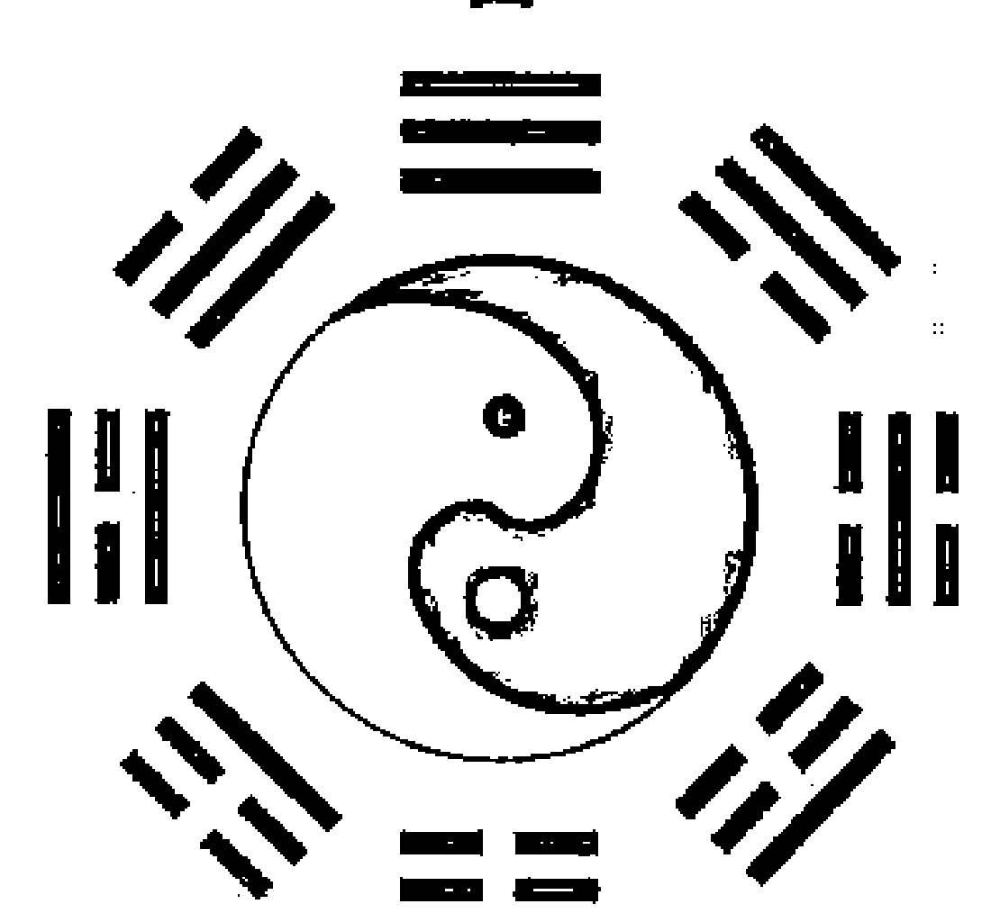

## 易冒 苍它

## 学业章第五十八

## 【原文】
注：内详九流、百工、何业、成业、执役、业牙、丹炉、符咒、修养九问。

## 【今译】
本章包括对九流、百工、何业、成业、执役、业牙、丹炉、符咒、修养九个方面的占问。

## 【原文】
君子以习其学，百工以肄其业。学儒者，父爻实而声名振，世体空而德业迂；从九流者，官鬼备而人慕，妻财旺而利丰。从百工者，以财为用也。
注：学能庇身，故父母为文书。官鬼为声誉道望，妻财为利息，财官两备，其业必丰。

## 【今译】
君子要修习其学问，工匠要练习其技艺。占问学习儒学的人，如果父母爻坚实，则意味着会声名大振；如果世爻逢空，则意味着道德的修行上将迂缓曲折。占问靠各种才艺为生的，如果官鬼完备，则意味着会受人尊重；如果妻财旺相，则意味着收益丰厚。占问工匠的，则以妻财为用神。
注：学问能庇护自身，因此以父母爻对应文书。官鬼象征着声誉和名望，妻财对应于财利，所以妻财和官鬼两者都完备，则其所从事的职业必然收益丰厚。

## 【原文】
如百工未业而筮何从，得金财而利金玉之工，水财而利水泽之技，火财为机织、裁剪、陶镕，土财为农田、泥土、砂石，木财为花园、樵采、桑麻。财发坎而利于豕酒，妻突离而宜于陶炉，震巽为舟车转运之谋，乾兑为玩好敲槌之事，艮喜樵夫，坤乐农父也。
注：以财值何属、财动何宫断之，玩好为宝贝金玉，敲槌为铜铁工也。

- 1. 肄（yì）：练习，学习。
- 2. 九流：指各种才艺。
- 3. 玩好：供玩赏的奇珍异宝。

## 【今译】
工匠在选定职业之前，占问从事哪一行业。如果妻财的属性为金，则说明适合从事金玉加工；如果妻财的属性为水的，则说明适合学习与水泽有关的技术；如果妻财的属性为火，则说明适合从事机织、裁剪、制陶、冶金等工作；如果妻财的属性为土，则说明适合从事农业、泥土、砂石之类的工作；如果妻财的属性为木，则说明适合从事园林、樵采、桑麻等职业。如果妻财发动于坎宫，则有利于从事养猪和造酒；如果发动于离宫，则有利于从事陶冶和炉火；如果发动于震、巽，则有利于从事车船运输；如果发动于乾、兑，则有利于从事工艺品和金属加工；如果发动于艮宫，则适合做樵夫；如果发动于坤宫，则适合做农民。
注：即根据妻财的五行属性，以及妻财发动于哪一卦宫来推断，玩好是指各种金玉宝贝，敲槌是指钢铁加工。

## 【原文】
天医为医，驿马为商，贵人为役，天罡为渔，朱雀为优①，白虎为屠，青龙为翰②，螣蛇为戏，勾陈为匠，玄武为幕。以财旺宜趋，财衰宜避也。
注：以财值诸星六神符之。役，隶卒③也；幕，幕宾也。旺财所值，是业能兴；衰财所临，此业不发。倘卦无财爻，则以子孙为财元神，动离宜陶，并雀宜优也。

## 【今译】
妻财临天医，对应于行医；临驿马，对应于经商；临贵人，对应于作役吏；临天罡，对应于渔猎；临朱雀，对应于作优伶；临白虎，对应于作屠户；临青龙，对应于以文章为生；临螣蛇，对应于从事杂技百戏；临勾陈，对应于作匠人；临玄武，对应于作幕僚。均以妻财正值为可以趋赴，以妻财衰弱为应当回避。
注：这是根据妻财所临的星煞来推断的。役，是指差役；幕，是指幕宾——参谋顾问之类。妻财旺相，说明从事这个职业能够兴盛；如果衰弱，则说明从事这个职业不会发达。倘若卦中没有妻财爻，则以子孙爻为妻财的元神，发动于离卦则适合制陶，临朱雀则适合作优伶。

## 【原文】
成业者，世空则无成，卦六冲而有半途之废；执役④者，财官旺则利归其室，官克世而有补作之忧；业牙⑤者，财官旺则客集其门，应象空而有张罗之叹。学丹炉而用财，学符咒而用官，学修养而用世，此则有别，其他百艺，皆以财为用也。

注：符咒求灵通，故用官；修养求长生，故用世。其他工巧技能，专以资身立家，故执妻财为用。

## 【今译】
占问是否能够成业的，如果世爻逢空，则意味着不能学成；如果卦逢六冲，则意味着半途而废。占问服役的人，如果妻财、官鬼都正值旺相，则意味着可以回家；如果官鬼克世爻，则意味着可能会被延长服役期。占问作牙商的人，如果妻财、官鬼都正值旺相，则意味着会顾客盈门；如果应爻逢空，则会有门可罗雀的叹息。占问学习炼丹，以妻财为用神；占问学习运用符咒，以官鬼为用神；占问学习修炼养性的，以世爻为用神。除此之外，占问学习其他各种技艺，都以妻财为用神。

注：学习符咒要求得神灵通感，所以以官鬼为用神；学习修炼养性是要求自己长生，所以以世爻为用神。学习其他技能，都是为了供应自己和家庭的需要，所以以妻财为用神。

## 【原文】
> 盖问业在于趋利，因业之利而辨诸用，则用神随业而移，吉凶昭焉。

## 【今译】
总的来说，占问职业意在求利，因此要根据职业所带来的利益，来辨别用神，则用神就能随职业的不同而变化，相应的吉凶就昭然可见了。

## 治经章第五十九

## 【原文】
注：内详性经、专经、著书、诗画、参禅、明传、演法、修谱八问。

## 【今译】
本章包括对性经、专经、著书、诗画、参禅、明传、演法、修谱八个方面的内容。

## 【原文】
古人受书，经学尚焉，此义理之源，亦科名之藉。故宫文两旺，而名荣经术，世空而白首无成。概问何经，则以五行分之：金为《春秋》，以其义也；土为《易》，以其信也；火为《礼》，以其文明也；木为《诗》，以其被乐也；水为《书》，以其出洛也。虽然，概问不如专筮之明，考其官文旺实，并临岁月，而遇擢可期。
注：概筮，以文书属何爻，旺则宜趋，衰则宜避。专筮，惟官文喜旺，世爻忌空。

## 【今译】
古人读书，以经学为尚，这既是义理的根源，也是求得科举功名的凭藉。所以如果官鬼和父母都正值旺相，则意味着能够因经学而获得声望和显荣；如果世爻逢空，则意味着直到白发皓首，也没有成就。如果大略地占问应当修习什么经，则以五行来区分：金对应于《春秋》，它有义的特性；土对应于《周易》，它有信的特性；火对应于《周礼》，它有文明的特性；木对应于《诗经》，因为它能演奏音乐；水对应于《尚书》，因为它浮出了洛书。虽然如此，大略的占问不如专问来得明了。通过官鬼和父母都处旺实，并临于年、月，则意味着擢升之期不远了。
注：概占时，根据父母爻的五行属性推断。如果当旺，则说明适合修习；如果当衰，则说明不适合修习，应当回避。专占时，以官鬼和父母爻旺相为好，世爻忌讳逢空。

## 【原文】
夫筮改经，犹卜求名，父官旺而名成，世爻空而不遇①。治经经成，著书书成，文与世象，不宜一空；笔耕书佣②、卖文卖画，父与财爻，喜其两得。

## 【今译】
占问改学其他经书，等同于占问求名。如果父母和官鬼爻同时当旺，则意味着能成名；如果世爻逢空，则意味着不能成名。要想治经而经学有成，著书而书籍有成，则父母与世爻，一个也不能逢空；如果占问以笔代耕，靠卖书、卖文、卖画为生，则父母与妻财爻同时出现为好。

## 【原文】
欲参宗禅之奥，戒六冲而世空。欲述古今之文，明圣贤之传，忌世空而文陷。欲演天书之秘，亦戒世空六冲。文陷而道伪，官旺而名高。欲修祖宗之谱，父旺而流芳，世空六冲不成也。盖学而求道，在乎成身，则六冲世空为戒；学而求进，在于成名，则象文爻宜旺。占者审之。

## 【今译】
要参习禅学的奥妙，则要戒惧卦逢六冲，以及世爻逢空。要评述古今文章，阐明圣贤所传的，则忌讳世爻逢空，以及父母爻失陷。要推演天书的秘奥，也要戒惧卦逢六冲，以及世爻逢空。如果父母爻失陷，则说明所修之道为伪学；如果官鬼旺相，则会名望高扬。要修祖宗的谱系，如果父母旺相，则说明能够流芳后世；如果世爻逢空，或卦逢六冲，则意味着修不成。学而求道的，意在成就自身修养，因此以卦逢六冲和世爻逢空为戒；如果是学而求进，则意在成名，因此以父母爻当旺为宜。进行占卜的人，要审视清楚。

## 延师章第六十

## 【原文】
注：内详附学、相资、同坐、馆安、蒙读、寄读、成师、邀游、访遇九问。

## 【今译】
本章包括对附学、相资、同坐、馆安、蒙读、寄读、成师、邀游、访遇九个方面的内容。

## 【原文】
亲师择友，学业所尚，故以文书为用爻。不宜休囚，休囚有伴食①之讥；不宜空破，空破无师资之益；不宜散绝，散绝多作伪②之嫌。且三冲来往，难收一岁之功；游魂改移，定有二家之志。
是以文书居日月之上，则师严而道尊，成人有德；临旺相生扶，则循循而善诱，名实兼收。动衰变旺，先惰而后勤；动旺变衰，先严而后懈。父化退而倦劝，父化进而克振，父化父而殊经，父化财而贾儒也。父化官则有显贵之交，父化兄则有追随之友，父化子孙则高闲好道，多物外之心。旺而克世，学问有责成之功；衰而克世，馆餐有求全之意。兄弟动多争主，子孙动多附从。官动高名，财动重利。
唯父为子而延师，然后以应为西席③，以世为东家。应生世者，主宾相成；应克世者，游从④不易。应空其意不留，应动其心不一，应破散其体不宁。而世动世空，则吾心先倦。然进德修业，必系文书，故父母之爻，不可一病。故应爻旺而父爻衰，不受切磋之益。

> 注：自占场爻为用，父占兼应为详。盖应乃师之身体，父乃师之德业也。

## 【今译】
延请老师和选择学友，是学习过程中的重要内容，因此以父母爻为用神。不宜正值休囚，否则会被讥笑为陪衬摆设；也不宜逢空遇破，否则就无法从老师那里获益；也不宜逢散绝，否则就会缺乏创新。如果遇三冲，则意味着往来频繁不定，难以收到一整年的功效；如果遇到游魂卦，则兆示着变更，说明其一定会有改投别家的想法。
所以父母爻值日建、月建，则意味着为师严格，道学高深，有能成就人才的品德；如果正值旺相、得生扶，则意味着教学循循善诱，名实兼备。如果父母爻因为发动，而由衰弱变为旺相，则意味着虽然最初懒惰，后来会变得勤奋；如果父母爻因为发动，而由旺相变为衰弱，则意味着开始时虽然严厉，后来则变得懈怠。父母爻化退神的，则意味着倦于劝导；化进神的，则意味着克于提振；父母爻又化出父母爻的，则意味着教学内容非一般的经典；父母爻化妻财，则意味着老师只需求财；父母爻化官鬼，则意味着能有显贵的朋友；父母爻化兄弟，则意味着能有追随自己的朋友；父母爻化子孙，则意味着喜欢修道，纵情物外。父母爻当旺而克世爻，则意味着能够通过督促而成就学生的学问；如果当衰而克世爻，则意味着在饮食上求全责备。如果兄弟爻发动，则意味着争强好胜；如果子孙发动，则意味着容易随声附和。官鬼发动，则意味着名望高；妻财发动，则意味着看重财利。
只有在父母占问为儿子请老师时，以应爻为老师，以世爻为东家自己。如果应爻来生世爻，则意味着宾主能够相互成全；如果应爻克世爻的，则意味着不容易交往。应爻逢空，则意味着不愿留下；应爻发动，则意味着用心不专一；应爻逢破散，则意味着其身体不健康。而世爻发动、世爻逢空等，则意味着东家先已倦怠。但是提高道德、修习学业，必定与文书紧密相关，所以父母爻不可有任何毛病。所以应爻旺相而父母爻衰弱，则意味着不能从切磋中受益。

> 注：自己占问以父母爻为用神，如果由父亲代占，则要兼看应爻。因为应爻对应的是老师的身体，父母爻对应的是师之品德学业。

## 【原文】
父母为师，尊其道也；世应主宾，言其体也。贤愚优劣，专察父爻。若百工学艺，技而非道，专凭应象，唯六合及应旺生世为吉。是故应空其技不精，应破散其制作①不备，应墓绝其艺不巧也。应克世而多役使需求，三冲而不能久处。

> 注：道贵博学专用文，技贵异巧专用应。

## 【今译】
以父母爻为老师，是为了尊重师道；以世爻、应爻分别对应主、宾，是为了说明老师与东家之间的关系。因此要了解老师的贤愚优劣，则专察父母爻。如果占问工匠学艺，则其所学是技艺而不是道，所以要根据应爻来推断，只以卦逢六合，以及应爻旺相而生世爻的为吉兆。所以如果应爻逢空，则说明师傅的技艺不精；如果应爻逢破散，则说明师傅的技术不全面；如果应爻逢墓绝，则说明师傅的手艺不巧妙。如果应爻克世爻，则说明师傅役使和需求过多；如果卦遇三冲，则意味着不能久处。
注：道以博学为贵，因此以文书（父母爻）为用神；技以奇异巧妙为贵，因此以应爻为用神。

## 【原文】
卜附学①者，以学为先，亦看文书，忌三冲父陷。兄动克世，则学友轻狂；应爻克世，则主家重利。卜相资②者，友而非师，则看应象。喜六合生身，恶三冲克世。喜生扶旺相，忌空破散绝。
若同坐有功，馆地有益，又看文书。馆地之安，世爻毋空破散绝，而鬼象莫之交重，则安宁可居，而随墓助伤，亦有灾咎也。若蒙读之安，惟取子孙旺相，而鬼动命墓不宜也。附亲远学，离乡寄读，及入学诹吉③，皆同此占，兼看文书之旺衰也。
延师成否，贞冲合冲，世空应空，及无官而不成。邀师远游，父占应坏而不从，子占父坏而师不诺也。访师遇乎，指其人也，应空六冲，则不得其门也。
生我者亲，成我者师，可不慎乎？

## 【今译】
占问附带时，因为仍以求学为先，所以也要根据父母爻来推断，忌讳其遇到三冲、失陷等状况。如果兄弟爻发动而克世爻，则说明学友轻狂；如果应爻克世爻，则说明主家重利——收费高。
占问相资的，因为占问的对象是朋友，而不是老师，因此要以应爻为考察对象。喜欢遇六合卦，或者日月动爻来生世爻，忌讳遇到三冲和应爻克世爻的情形；喜欢遇到生扶旺相，忌讳逢空、破、散、绝等状况。
如果占问同坐学友是否有帮助，以及学馆所在地是否有助益，则又要以父母爻为用神。占问学馆地点的安宁时，如果世爻不逢空、破、散、绝，官鬼又不与之交重，则意味着安宁可居；如果遇到随鬼入墓、助鬼伤身，则意味着会有灾乱。

- ① 附学：旧时谓附入他人家塾读书。
- ② 相资：相互凭借、帮助。
- ③ 谘（zōu）吉：选择吉日。

如果占问幼童读书能否安顺，则只取子孙旺相为吉兆，而官鬼发动以及本命入墓，则意味着不适合。占问依附亲属到远方求学，或者离开家乡到外面去寄读，以及选择入学吉日的，都与这种占问一样，但同时要兼看文书爻的旺衰。

占问聘请老师能否成功，如果遇到本卦冲、合处逢冲、世爻逢空、应爻逢空，以及没有官鬼的情形，则意味着不成。占问邀请老师一道远游，父母代为占问时，如果应爻损坏，则意味着不同意；儿子占问时，如果父母爻损坏，则意味着不答应。占问拜访老师能否遇到时，因为对象是某一个人，所以如果应爻逢空，或者卦逢六冲，则意味着无法见面。

生我的是父母，成就我的是老师，选择老师时能不慎重吗？

## 卜馆章第六十一

## 【原文】

注：内详何地、何时、就馆、开馆、附学、代馆、辞馆、荐馆、攘馆、选刻、卜徒、幕馆、商馆十三问。

## 【今译】

本章包括对何地、何时、就馆、开馆、附学、代馆、辞馆、荐馆、攘馆、选刻、卜徒、幕馆、商馆十三个方面的占问。

## 【原文】

问馆有无成否，喜六合生世，恶三冲应空。问馆何地，以应为方，在坎兑而近水，在震巽而入林，在坤艮为山野，在离为城市，在乾为大都灵宫①也。应居父母，则诗书礼乐之家；应居官鬼，则仕宦吏胥之宅。居妻财为商贾，居兄弟为同侪②，居子孙则清闲道德③之门也。

以阴阳而分男女之延，以内外而分远近之请，以游魂归魂而分本土他境。以六神分景色，诸星为人事也。问得馆何时，实世生世合世，则其期也。

注：应带青龙，其地在长林丰草；玄武，其家在水畔池傍；朱雀，闹市烟村④；白虎，荒乡僻境；勾陈，近于田野故茔；螣蛇，依于往来工艺舟车也。贵人为官，驿马为商，华盖为僧，天财为贾，天猪为屠。余以类求。

> ① 灵宫：指寺庙，或对住宅的美称。
> ② 同侪：同伴，伙伴。
> ③ 道德：僧道修行的功夫、法术。
> ④ 烟村：指烟雾缭绕的村落。

## 【今译】

占问学馆（职位）的有无、成否时，喜欢遇到六合卦，和世爻逢生的卦，忌讳遇到三冲，以及应爻逢空等状况。占问学馆在什么地方，则根据应爻推断。如果应爻在坎、兑卦中，则说明靠近水边的地方；如果应爻在震、巽卦中，则说明在树林中；如果应爻在坤、艮卦，则说明在山野；如果应爻在离卦中，则说明在城市；如果应爻在乾卦，则说明在大都会的寺庙中。如果应爻在父母爻上，则说明是在书香门第；如果应爻在官鬼爻上，则说明是在官宦人家的宅邸；如果应爻在妻财爻上，则说明是在商人家中；如果应爻在兄弟爻上，则说明是在同伴家中；如果应爻在子孙爻上，则说明是在恬淡清修的人家。根据应爻的阴阳来区分延请者的男女，根据应爻的位置——内外卦，来区分地点的远近，根据游魂、归魂卦来区分是在本地还是在外地。根据应爻所临的六神来区分周围的景色，根据应爻所临的星煞来推断人事。占问找到学馆的时间，世爻遇填实、遇生、遇合之时，就是找到学馆之期。

注：应爻带青龙，则在草木丰盛之地；带玄武，则在河边湖畔；带朱雀，则在闹市或繁华的村落；带白虎，则在荒僻的乡野；带勾陈，则靠近田野古墓；带螣蛇，则靠近舟车往来之地。贵人对应于官宦，驿马对应于行商，华盖对应于僧道，天财对应于坐贾，天猪对应于屠户。其他的推类而求。

## 【原文】

既延而问就馆之吉，三冲则砚席①难终，财陷则束修②未腆③。应空无尊道之志，克世有慢师之嫌，应破散绝有怠学之心，唯六合财旺应生为吉。

馆已定矣，如我处而身安心定乎？则随墓助伤，不可犯也；世用空破散绝，不可遇也。官鬼不可动也，动则以五行八宫、六神诸星详之。游魂不久，三冲不定。

注：鬼静无戒，鬼动有忌。艮由童仆产祸，兑由妇女生言，乾坤防老翁妪之憎，震巽慎小工技之谗，坎惊盗，离惊火，八宫之约举也。金丧，火非，土病，水失，木折。咸池淫，天贼盗，官符讼，驿马迁，五行诸星之约举也。六神亦然：玄武遗亡，朱雀毁谤，龙败事于嗜酒，虎失利于兵丧，勾陈咨趄④遁闷，螣蛇浮躁惊惶。

> ① 砚席：借指读书写作或执教之处。
> ② 束修：即束脩，十条干肉。最初指旧时常用作馈赠的一般性礼物。后经《论语》，引申为入学敬师的礼物，及学生致送教师的酬金。
> ③ 腴：丰厚。
> ④ 咨趄（zī qiě）：犹豫徘徊貌。

## 【今译】

已经得到延请，占问前去就馆的吉凶。如果遇到三冲，则意味着教学工作将半途终结；如果妻财失陷，则意味着酬金不丰厚；如果应爻逢空，则意味着没有尊重道学的心志；如果应爻克世爻，则意味着对老师轻慢；如果应爻逢破、散、绝等状况，则意味着学生懈怠于学业。只有遇到六合卦、妻财旺相、应爻来生世爻，才是吉兆。已经决定就馆，占问去后能否身安心定，则不可遇到随鬼入墓、助鬼伤身等状况，也不可遇到世爻和用神逢空、破、散、绝等情形。官鬼爻不可发动，如果发动，则要根据五行、八宫、六神、诸星等来详细考察其征兆。如果卦遇游魂，则说明不会长久；如果遇到三冲，则说明心神不定。

注：官鬼安静则无需戒惧，官鬼发动则有忌讳。发动于艮宫，则有由儿童、仆人产生的灾祸；发动于兑宫，则有由妇女产生的谗言；发动于乾宫、坤宫、则须提防招惹到老头、老妇人的憎恨；发动于震宫、巽宫则要谨慎提防小人的谗言；发动于坎宫，则有因盗贼而产生的惊扰；发动于离宫，则会因火灾而受惊。上述是关于卦宫的大略。属金的官鬼发动，则有死丧的危险；属火，则有是非；属土，则有病患；属水，则有失窃；属木，则有折损。临咸池的官鬼发动，则有淫乱之事；临天贼，则有盗贼；临官符，则有官司；临驿马，则有变迁。上述是关于五行、诸星的大略。根据六神来推断也是如此。临玄武的官鬼发动，则意味着遗亡；临朱雀，则意味着遭到毁谤；临青龙，则意味着因为嗜酒坏事；临白虎，则意味着因兵乱损失财利；临勾陈，则意味着心绪烦闷；临螣蛇，则意味着浮躁惊惶。

## 【原文】

设帐①来从乎？应空则负笈②无徒，财虚则馆毂③不盛。问附来者，同于设帐；问代席者，同于成馆。若筮辞馆，以应为主人。应克世而不从，应空散破绝而不遂。主不从，虽六冲不能解；主不遂④，虽游魂安可辞。惟应实及不克世者，可以去也。

筮荐馆，类于仗托，贞冲应坏则不力，克世则不忠。筮攘⑤馆，犹于夺婚，应破散空，彼谋不遂，克世而为其所夺也。

## 【今译】

占问开馆授徒，是否有学生来时，如果应爻逢空，则意味着虽然满腹经纶，也没有学生；如果妻财虚弱，学馆的收入不丰盛。占问前来依附办学的老师，等同于占问开馆。占问代课老师，等同于占问成馆。占问辞馆——辞职，则以应爻对应于主人。如果应爻克世爻，则说明主人不同意；如果应爻逢空、散、破、绝，则意味着不顺利。如果主人不同意，即使卦逢六冲，也无法解聘；主人不顺利，即使卦遇游魂，又怎么能辞职。只有应爻坚实又不克世爻，才能够成功辞去。占问推荐到学馆教学，类似于占问仗托。如果遇到本卦逢冲、应爻损坏的情形，则意味着推荐者办事不力；如果遇到应爻克世爻的情形，则意味着推荐者不真诚。占问攘馆，犹如占问夺婚，如果应爻逢破、散、空，对方的图谋不能实现；如果应爻克爻，则意味着将被对方夺去。

> 1. 设帐：指设馆授徒。
> 2. 负笈：背着书箱，形容所读书之多。
> 3. 毂（gǔ）：俸禄。
> 4. 不遂：不顺利。
> 5. 攘：侵夺，偷窃。

## 【原文】

有问选文刻书，其用有二：名用父母，利用妻财。卜徒好恶，其用亦二：三教谊同父子，故用子孙；百工业以求利，故凭应象。然执贽①之后，有子孙应象之分，束修未行，则皆从应象。此三教百工同也。应克世而其人矫冏，应空破散而其人下劣。三冲而无恒心，财空而无礼币。

## 【今译】

占问选择文章刻印书籍时，用神的选择有两种：如果为求名，则以父母爻为用神；如果为求利，则以妻财爻为用神。占问徒弟的好坏，用神的选择也有两种：在儒、道、佛三教之中，师徒之间谊同父子，所以以子孙爻为用神；在各种工匠行业，目的在于求利，所以以应爻为用神。但见面之后，又有以子孙还是应爻为用神的区分，未交学费的，则都以应爻为用神。这一点是三教和百工相同的地方。如果应爻克世爻，则说明其人矫情而欺冏；如果应爻逢空、破、散，其人才智低下拙劣。如果遇三冲，则说明没有学习的恒心；如果妻财逢空，则说明没有礼金。

> ① 执贽（zhì）：犹执挚。古代礼制，谒见人时携礼物相赠。此处仅为拜见。

## 【原文】

若筮馆于衙幕，及同业于富豪，财官世应，喜其生合，忌彼空冲。若筮遇于何地，则不以应而财，财生之方，财动之宫，乃可图也，财属五行，乃其象也。六神诸星参之。注：财动论宫，如财动乾宫，宜趋西北；财静论生，如财属金爻，利涉东南；妻财临水，遇鱼盐之业、江海之滨；妻财临木，遇花果之行、山林之所。土觅田野，火觅城市，金觅玉石。武水龙木，虎兵雀市，蛇商勾医，天医医使，华盖僧从，皆以财考也。纳人之请，世应为先；服人之事，财利为务。

## 【今译】

占问到官办的学校教书，以及共同到富豪家教书，则妻财、官鬼、世爻、应爻，都喜欢能够相生相合，而忌讳遇空、遇冲。如果占问在何地会有际遇，则不以应爻为用神，而以妻财为用神。妻财遇生的方位、妻财发动的卦宫所对应的地方，才可以图谋。妻财的五行属性，就是其征象。同时再以所临的六神和星煞来参考。

注：如果妻财发动，则要以所在的卦宫为依据来推断，例如妻财动于乾宫，则适合去西北；妻财安静则论生，例如妻财属性为金，则有利于到东南方；妻财属性为水，则在从事鱼盐之业的江海之滨有际遇；妻财属性为木，则在从事花果养殖的山林之乡有际遇；妻财属性为土，则应当去田野中寻找；妻财属性为火，则应当到城市中寻找；妻财属性为金，则在金玉行业中寻找。临玄武，则与水有关；临青龙，则与树木有关；临腾蛇，则是经商的；临勾陈，则是医生；临天医，则是医生使者；临华盖，则是僧人仆从。接受别人的邀请，首先要考虑世爻和应爻；为别人做事，则以财利为目的。

## 功名章第六十二

## 【原文】

注：内详发年、考时、发案、收试、补廪、廷试、武试、封荫、投縻、从军、委署、草野、求名、仕途、大象、升信、何时何期、何方何地、升官、筮官、补官、援例、久任、身安、荐奖、开复、上书、献策、条陈、虑参、防后、大计、告养、履危、揭参、交代、杂职、裁缺、公议、国务四十问。

## 【今译】

本章包括对发年、考时、发案、收试、补廪、廷试、武试、封荫、投縻、从军、委署、草野、求名、仕途、大象、升信、何时何期、何方何地、升官、筮官、补官、援例、久任、身安、荐奖、开复、上书、献策、条陈、虑参、防后、大计、告养、履危、揭参、交代、杂职、裁缺、公议、国务等方面的占问。

## 【原文】

国家以文章取士，则凡大小试，皆以文书为用，故父母喜日月旺相，恶破散绝空。飞而无助，虚抱经纶；伏而有填，定升廊庙①。安乡遇克，将飞而坠；绝处逢生，已弃复收。象凶而吉者遇其时，象得而失者违其令也。唯文书临建临破，不同此例。得名在我，世不可空；主试在公，官不可失。

> ① 廊庙：殿下屋和太庙。指朝廷。

注：求名者，以父母为用爻，官备世实则吉。飞而无助，如未建辛亥日，得渐是也。伏而有填，如午建戊午日，得大畜是也。安乡受克，如亥建甲寅日，得乾是也。绝处逢生，如申建乙巳日，得震之随是也。遇其时，如卯建丁亥日占秋试，得大过之井是也。违其令，如寅建辛亥日占春试，得师之坤是也。遇时，谓考期官文值月建；违令，谓考期官文值月破。若文书以象学业，今值月建，后逢月破不坏，今值月破，后值月建不全。

## 【今译】

国家通过文章考试来取用读书人，所以凡是占问大小考试，都以文书——父母爻为用神。所以喜欢父母正值日建、月建，或正当旺相，而忌讳其逢破、散、绝、空等。如果父母爻为飞爻（在本卦中出现）但却没有生助的，则意味着将空怀满腹经纶。如果虽然在伏爻中出现，但却有日、月建填实，则意味着定然会进入朝廷。安静而遇到克制，则意味着在即将飞腾时而坠落。如果遇到绝处逢生，则意味着在已经放弃时，而又被收录。卦象原本凶险，但结果却吉祥的，是因为遇到了有利的时日的缘故。卦象原本显示能够成功，但最终却是失败的，是由于违背了时令的缘故。只有文书——父母爻临日建、月建或逢月破时，与此不同。求取功名在于自己，因此世爻不可逢空；主持考试在于公家，所以官鬼不可失陷。

注：占问求取功名时，以父母爻为用神，同时官鬼完备、世爻充实则是吉兆。

所谓“飞而无助”，例如在未月辛亥日占问，得到风山渐卦：

| 六神 | 伏神 | 本卦 |  | 变卦 |
| :--- | :--- | :--- | :--- | :--- |
| 玄武 |  | 官鬼卯木 | ▅▅ ▅▅ 应 |  |
| 白虎 |  | 父母巳火 | ▅▅▅▅▅ |  |
| 螣蛇 |  | 兄弟未土 | ▅▅ ▅▅ |  |
| 勾陈 | 子孙申金 | 子孙申金 | ▅▅▅▅▅ 世 |  |
| 朱雀 | 父母午火 | 父母午火 | ▅▅ ▅▅ |  |
| 青龙 |  | 兄弟辰土 | ▅▅ ▅▅ |  |

卦中有巳火、午火两个父母爻，但被日辰亥水冲克，所以不利。

所谓“伏而有填”，例如在午月戊午日占问，得到山天大畜卦：

| 六神 | 伏神 | 本卦 |  | 变卦 |
| :--- | :--- | :--- | :--- | :--- |
| 玄武 |  | 官鬼寅木 | ▅▅▅▅▅ |  |
| 白虎 |  | 妻财子水 | ▅▅ ▅▅ 应 |  |
| 螣蛇 |  | 兄弟戌土 | ▅▅ ▅▅ |  |
| 勾陈 |  | 兄弟辰土 | ▅▅▅▅▅ |  |
| 朱雀 | 官鬼寅木 | 官鬼寅木 | ▅▅▅▅▅ 世 |  |
| 青龙 | 父母午火 | 妻财子水 | ▅▅▅▅▅ |  |

卦中没有父母爻，在伏爻上的父母午火，伏在寅木之下，但正值日建、月建，所以得利。

所谓“安乡受克”，例如在亥月甲寅日占问，得到乾为天卦：

| 六神 | 伏神 | 本卦 |  | 变卦 |
| :--- | :--- | :--- | :--- | :--- |
| 玄武 |  | 父母戌土 | ▅▅▅▅▅ 世 |  |
| 白虎 |  | 兄弟申金 | ▅▅▅▅▅ |  |
| 螣蛇 |  | 官鬼午火 | ▅▅▅▅▅ |  |
| 勾陈 |  | 父母辰土 | ▅▅▅▅▅ 应 |  |
| 朱雀 |  | 妻财寅木 | ▅▅▅▅▅ |  |
| 青龙 |  | 子孙子水 | ▅▅▅▅▅ |  |

父母属土且安静，但受日辰寅木的克制，因此不吉。

所谓“绝处逢生”，例如在申月乙巳日占问，得到震为雷变为泽雷随的卦象：

| 六神 | 伏神 | 本卦 |  | 变卦 |
| :--- | :--- | :--- | :--- | :--- |
| 玄武 |  | 妻财戌土 | ▅▅ ▅▅ 世 |  |
| 白虎 |  | 官鬼申金 | ▅▅ ▅▅ × | 官鬼酉金 | ▅▅▅▅▅ |
| 螣蛇 |  | 子孙午火 | ▅▅▅▅▅ |  |
| 勾陈 |  | 妻财辰土 | ▅▅ ▅▅ 应 |  |
| 朱雀 |  | 兄弟寅木 | ▅▅ ▅▅ |  |
| 青龙 |  | 父母子水 | ▅▅▅▅▅ |  |

虽然父母爻子水绝于日辰巳火，但卦中官鬼爻申金发动来生，所以在放弃后又被录用。

所谓“遇其时”，例如在卯月丁亥日占问秋试，得到泽风大过变为水风井的卦象：

| 六神 | 伏神 | 本卦 |  | 变卦 |
| :--- | :--- | :--- | :--- | :--- |
| 玄武 |  | 妻财未土 | ▅▅ ▅▅ |  |
| 白虎 |  | 官鬼酉金 | ▅▅▅▅▅ |  |
| 螣蛇 |  | 父母亥水 | ▅▅▅▅▅ ○ 世 | 官鬼申金 | ▅▅▅▅▅ |
| 勾陈 |  | 官鬼酉金 | ▅▅▅▅▅ |  |
| 朱雀 |  | 父母亥水 | ▅▅▅▅▅ |  |
| 青龙 |  | 妻财丑土 | ▅▅ ▅▅ 应 |  |

卦象虽凶，但父母爻亥水值日建，同时又发动化出旺于秋季的官鬼申金而回头来生，所以反而得吉。

所谓“违其令”，例如在寅月辛亥日占问春试，得到地水师变为坤为地的卦象：

| 六神 | 伏神 | 本卦 |  | 变卦 |
| :--- | :--- | :--- | :--- | :--- |
| 玄武 |  | 父母酉金 | ▅▅ ▅▅ 应 |  |
| 白虎 |  | 兄弟亥水 | ▅▅ ▅▅ |  |
| 螣蛇 |  | 官鬼丑土 | ▅▅ ▅▅ |  |
| 勾陈 |  | 妻财午火 | ▅▅ ▅▅ 世 |  |
| 朱雀 |  | 官鬼辰土 | ▅▅▅▅▅ × | 妻财巳火 | ▅▅▅▅▅ |
| 青龙 |  | 子孙寅木 | ▅▅ ▅▅ |  |

父母酉金绝于月建寅木，且囚于春季，而官鬼辰土发动又化绝和日冲。

遇时，是指考期、官鬼、父母正值月建；违令，是指考期、官鬼、父母正逢月破。以文书爻象征学业，如果现在值月建，即使以后逢月破也不会损坏；如果现在逢月破，即使以后值月建也仍不健全。

## 【原文】

有谓六冲不吉，曰否，或应阻其考也。有谓合处逢冲不吉，曰否，或临试而值变也。有谓悔冲不吉，曰否，或虑得名而有事也。有谓随墓助伤不吉，曰否，或名成而疾病惊惶相缠也。有谓二分不吉，曰否，或求名而两适两就也。有谓兄动不吉，无非夺标之嫌；子动伤官，无非嘱托之辈；财动克父，无非贿赂之夫。唯在官文两强，仍可得志。科举古占，得乾震则吉。乾天震雷，以应元首声名。然皆凭于父摇官发，化变飞腾，若父失官空，宁辞沦落也。

注：以上八者，求名虽不宜见，若得官文旺备，或先阻碍，而后成名。

## 【今译】

有人认为卦逢六冲则为不吉之兆，错，但或许会应验在阻碍其考试上。有人认为遇到合处逢冲则为不吉之兆，错，但或许在临考时发生变故。有人认为变卦逢冲则为不吉之兆，错，但或许应该顾虑因得名而有变故发生。有人认为遇到随鬼入墓、助鬼伤身则为不吉之兆，错，但或许会在成名后有疾病惊惶缠身。有人认为占得二分卦则为不吉之兆，错，但或许为了求名而需要去两处学习。有人认为兄弟发动则为不吉之兆，其实无非是有竞争者而已；有人认为子孙发动就会克伤官鬼，其实无非是有人暗中嘱托；有人认为妻财发动就会克伤父母，其实无非是有人行贿罢了。只要官鬼和父母两爻都正处旺强，仍旧可以得志。有关科举的古代占例，认为占得乾、震两卦则为吉兆，因为乾象征着天，震象征着雷，一次来对应获得元首的声名。但实际上，还是依靠父母、官鬼两爻发动，经过化变而得飞腾的，如果父母爻失陷，官鬼爻逢空，则宁愿推辞考试也不要落榜了。

注：以上八种，虽然在占问求名时不适合遇到，但如果官鬼、父母两爻旺相而完备，则或许最初会有阻碍，但后来终将成名。

## 【原文】

是故拔元拔首，父母建于日月；补增①补廪②，妻财并于丰隆。世居父旺，曾经揣摹之成；应坐父兴，当赖风簷之助。动衰变旺，喜后劲之文；动旺变衰，惜强弩之末。进神则上其名，退神则下其等。爻爻相助，文章粲于斗牛③；象象来生，姓氏悬如日月。两官两父，旺则连登，衰则再试也。猝病怀忧，诚是随官入墓；越规受恐，宁非助鬼伤身？

> ① 补增：补入增生。 明、清制，学中生员，于正额外增广的名额叫增广生员，简称增生。
> ② 补廪：补入廪生。廪生即“廪膳生员”，中国明、清两代称由府、州、县按时发给银子和补助生活的生员。
> ③ 斗牛：二十八宿中的斗宿和牛宿。

父坏而带螣蛇，近忧降辱；财动而临白虎，远应丁忧①。衰居龙雀，长诗词而短文章；废坐勾元，廪诵读而耽酒色。世投月破，恐病阻试期；身犯旬空，忌心慵②尘务。有气有伤，小有瑕疵之戾；无根无倚，大嫌荒谬之篇。

## 【今译】

所以要在考试中名列前茅，父母爻必须值日建、月建；如果是补入增生、廪生，则妻财也必须同时处于旺强的状态。如果世爻居于父母而且旺相，则意味着因为曾经揣摹过试题而成功；如果应爻为父母爻而发动，则意味着应当依赖别人的帮助。父母爻因发动，而由衰弱变为旺相，则意味着得力于有后劲文章；如果父母爻因发动，而由旺相变为衰弱，则意味着因为文章虎头蛇尾而失败。化为进神，则意味着名次会提高；化为退神，则意味着文章被降等。如果每一爻都来相助，则说明文章比星宿更加璀璨；如果每一爻都来相生，则意味着声名鹊起，如日月高悬。如果卦中有两个官鬼，或者两个父母爻，如果都值旺强，则意味着能连登科甲，如果衰弱，则意味着需要再次考试。如果突然生病而心情忧虑，则一定是随鬼入墓的缘故；因为越轨而遭受惊恐，岂能不是助鬼伤身的结果？父母爻损坏而且临螣蛇，则意味着不久就会因为受辱而忧愁；如果妻财发动而临白虎，则意味着将来会丁忧在家。如果正值衰弱而临青龙或朱雀，则说明长于诗词而短于策论；如果值废而临勾陈、玄武，则意味着废弃学业，而沉湎于酒色。如果世爻逢月破，则恐怕会因病而错过考试日期；如果卦身逢旬空，则要当心身心懈怠，或者被俗务纠缠。用神有气而有伤，则意味着文章仅仅是小有瑕疵；如果用神既无根又无倚靠，则说明文章荒谬。

> 1. 丁忧：遭逢父母丧事。旧制，父母死后，子女要守丧，三年内不做官、不婚娶、不赴宴、不应考。
> 2. 心慵：心意懒散。

## 【原文】

如筮发迹何年，官衰补助其官，父衰补助其父，两现而强其弱，一伏而露其藏，实世而是其时也。

注：如父旺官衰，以助官之岁为期；官旺父衰，以补文之年为发。官文两现，若有一衰，则生助所弱之爻，如酉建壬戌日得革，丑年发甲是也。官文一伏，后遇露其藏，如亥建乙卯日得旅，而辛卯发科是也。既问第而复问年，或世空当应实世爻之岁。

## 【今译】

占问发迹的年份，如果官鬼衰弱，则以官鬼得到补助之时为期；如果父母衰弱，则以父母得到补助之时为期；如果同时出现，则以其中衰弱的一个得到补助之时为期；如果用神有气而有伤，则意味着文章仅仅是小有瑕疵；如果用神既无根又无倚靠，则说明文章荒谬。

## 神伏藏，则以其得以出露之时为期；如果世爻逢空，则以其被填实之时为期。

注：如果父母爻当旺，官鬼衰弱，则以能扶助官鬼的那一年为期；如果官鬼当旺，而父母爻衰弱，则在能补益父母爻的那一年发迹。如果官鬼、父母爻同时出现，如果其中有一个衰弱，则以能生助衰弱之爻的那一年为期。例如在酉月壬戌日占问，得到泽火革卦：

|  | 官鬼未土 | 阴爻 |  |
| :--- | :--- | :--- | :--- |
|  | 父母酉金 | 阴爻 |  |
|  | 兄弟亥水 | 阳爻 | 世 |
|  | 兄弟亥水 | 阳爻 |  |
|  | 官鬼丑土 | 阴爻 |  |
|  | 子孙卯木 | 阳爻 | 应 |

官鬼未土和父母酉金同时出现，结果在丑土年考中。

又如在亥月乙卯日占问，得到火山旅卦：

|  | 兄弟巳火 | 阳爻 |  |
| :--- | :--- | :--- | :--- |
|  | 子孙未土 | 阴爻 |  |
|  | 妻财酉金 | 阳爻 | 应 |
|  | 妻财申金 | 阳爻 |  |
|  | 兄弟午火 | 阴爻 |  |
|  | 子孙辰土 | 阴爻 | 世 |

卦中既没有官鬼，也没有父母爻——用神伏藏，结果在辛卯年用神出露的时候中第。

既占问能否中第，又占问中第之年，如果世爻逢空，则应当应在填实世爻的那一年。

## 【原文】

筮考何时，维司官鬼；发案①何时，兼详父爻。收试遗生，专依系象。空散无怜才之心，破绝少广罗之量。最忌克世，虑有杀刑。

注：凡按考独视官，发案挂榜，并视官文。系象即官爻也，带病不收，克世即怒。

## 【今译】

占问何时去考试，只以官鬼为用神；占问何时发榜，则要兼顾考察父母爻。占问招收落榜生，则要以官鬼为用神。如果逢空散，则意味着没有怜惜考生之心；如果逢破绝，则意味着缺少广罗人才的气量。最忌讳的是克制世爻，恐怕会有刑杀。

注：凡是占问考试，都只以官鬼为用神；占问发榜，则要同时兼顾官鬼和父母。所谓系象，就是指官鬼，如果带病则意味着不招收，如果克世爻就是正在发怒。

① 发案：案件判定后予以宣布。此处引申为公布结果。

## 【原文】

有粮可补，世空财坏，嫌无；允廪可帮，鬼克官亡，嫌驳。成乎同于谋事，攘乎类于夺物也。

注：官空破而及克世爻，是文宗①不允。指是缺而能成，贞合冲、世应空、财官失，则不就。忧人来攘，顶名寄籍同类。应不克世，无相夺也。

## 【今译】

本来可以得到国家的粮食补助，但如果世爻逢空，或者妻财损坏，则就有可能没有了。本来可以转为廪生而得到帮助，但如果官鬼被克亡，则会被驳回。占问成否，等同于占问谋事；占问是否被攘夺，等同于占问夺物。

注：官鬼逢空遇破，甚至克世爻，则说明文宗不应允。本来已经指定名额而能够促成，但如果遇到本卦合处逢冲，世爻、应爻逢空，妻财、官鬼失陷等，则最终还是不成。如果担心别人来侵夺，则与占问是否被人冒名顶替相似。如果应爻不克世爻，则没有人来侵夺。

① 文宗：明、清时称提学、学政为文宗。亦用以尊称试官。

## 【原文】

廷试擢第②，专以官鬼旺相为要。日月并见而论元，时令旺相而高第。世不宜空，文不宜陷。官爻旺而岁五生，利见召对③之荣；文鬼坏而随三墓，忧有不测之辱也。最嫌子动，为卑我品秩④。复忌兄摇，为夺吾上第⑤。官伏动扶，疑得位而未任；卦冲世破，恐临试而不前。官绝遇生，偶逢新例之擢；父衰得助，复有考选⑥之荣。

注：此以官鬼为甲第⑦，父母为对策。岁五，即岁君五爻。三墓，即命墓、世墓、身墓也。

## 【今译】

占问廷试能否及第，则只以官鬼旺相为要。如果正值日建、月建，则有可能中状元；如果正值时令而旺相，则可以得到较高的名次。同时世爻不宜逢空，父母爻不宜失陷。如果官鬼爻当旺，并得到岁君或第五爻来生，则有可能得到皇帝召见问对的荣耀；如果父母爻损坏，并随命墓、世墓、身墓，则恐有不测之辱。最忌子孙爻发动，为卑下我之品级次序。又忌兄弟爻发动，为他人夺我之上等名次。官鬼爻伏藏而又得动爻生扶，疑是已得职位而尚未赴任；卦逢冲克，世爻遭破，恐怕临到考试时裹足不前。官鬼爻处绝地而得生助，是偶然遇到新条例而被擢用；父母爻衰弱而得到帮助，是又通过考选而获得荣耀。

② 擢（zhuó）第：科举考试及第。
③ 召对：君主召见臣下令其回答有关政事、经义等方面的问题。
④ 品秩：泛指等第、次序，或官品与俸秩。
⑤ 上第：考试成绩中的第一等。
⑥ 考选：通过考查或考试选用人员。
⑦ 甲第：明、清时称进士。

## 【原文】

和官鬼已损坏，而又遇到三种入墓，则要当心遭受意外的折辱。最厌恶子孙爻发动，将使我的等级降低。同时也忌讳兄弟爻发动，将侵夺属于我的好名次。官鬼伏藏，但有动爻扶助的，意味着可能得到官位却不能赴任；如果卦遇三冲，或世爻遭破，则要当心临考时不能向前。如果官鬼绝处逢生，则意味着会因为恰逢新的条例，而偶然进士及第。如果父母爻衰弱，而得到生助的，则说明还有通过考选入仕的荣誉。

注：这里是官鬼对应于进士及第，以父母对应于对策文章。所谓岁五，就是岁君和第五爻；三墓，就是命墓、世墓、身墓。

## 【原文】

武试贵乎官，英雄得录用也。世不空而父不陷，便利虎闱①。请荫请封，戒五爻之伤世，及官鬼之克身。父乃玉牒②，不可破空；世是谋躬，不可虚陷。

注：如为父母子妻，则世空不忌。

## 【今译】

占问武试，以官鬼为主进行推断，因为是要让英雄得以录用。但也要世爻不逢空，父母爻不失陷，才有利于武试。占问请求荫封时，要戒惧第五爻克伤世爻，以及官鬼克身。父母对应于皇帝的诏书，因此不可逢月破、旬空；世爻是谋事之人——当事人，因此不可虚陷。

注：如果为父母、妻子、子孙请求，则不忌讳世爻逢空。

① 闱：科举时代对考场、试院的称谓。
② 玉牒：古代帝王封禅、郊祀的玉简文书。

## 【原文】

投麾③效力，贞冲鬼动则不录，官爻空破散绝则不用。为名则官旺为佳，为利则财官并重。世不可病，官不可克。入伍从军，以身命为要。世象强良④，冒锋镝而成功；官爻旺相，拔行伍而拜爵。官爻克世，助伤随墓，弗宜见之。署篆⑤委镇者，筮成类谋差，世应空、贞合冲，及官不可病。筮利同服役。官坏财虚，徒劳驰骤；官来克世，且虑衅生。匹夫好勇，而筮曰：吾生平功名何如？若官旺则有特授之官，世空则成妄想之咎。随官入墓，助鬼伤身，则戒覆家亡躯之祸，当勉于守正也。

注：后世用才无方，亦备此占。

③ 麾：将帅。
④ 强良：即强梁。强劲有力，勇武。
⑤ 署篆：署印。因官印皆刻篆文，故名。

## 【今译】

占问投身将帅麾下效力，如果遇到本卦逢冲、官鬼发动，则意味着不被录用；如果官鬼逢空、破、散、绝的，则意味着不被重用。如果是为了求名，则以官鬼逢生旺为佳；如果是为了求利，则要同时考察妻财与官鬼爻。同时世爻本身不可有病，而官鬼也不可来克世爻。占问入伍从军，则以身命为要。所以如果世爻有强梁之象，则意味着能够冒刀锋箭雨而成功；如果官鬼爻旺相，则意味着能够从行伍中被擢拔出来拜受官爵。至于官鬼克世爻、助鬼伤身、随鬼入墓等，则不宜遇见。占问官职委任的，如果是占问成否，则类似于占问谋职，忌讳世爻、应爻逢空，以及本卦合处逢冲，同时官鬼不能有病。如果是占问得利与否的，则等同于占问服役。如果官鬼损坏，妻财虚浮，则意味着只是徒劳驰骋；如果官鬼来克世爻，则还要防备祸由此生。好勇的匹夫占问生平功名如何，如果官鬼旺强，则意味着有特别授予的官职；如果世爻逢空，则只是妄想而已；如果遇到随官入墓、助鬼伤身等，则要戒惧可能有家破人亡的祸患，应当勤勉于谨守正道。

注：后世如果任用人才无方时，也可使用上述占卜办法。

## 【原文】

既食禄于天家<sup>①</sup>，而筮仕途，皆以官为用神。喜居日月，人仰照临；喜居旺相，物沾时雨；喜值生扶拱合，如倚长城而驰康庄。忌值破空散绝，空则失职，破则败事，绝则解任，散则削籍矣。子孙动而防公议<sup>②</sup>，别衰旺以定重轻；兄弟发而减俸粮，分喜忌以言凶吉。长生临官，而知宦境之远达；帝旺临官，而知仕路之升迁；衰墓死绝，而知官道之否。进神则升爵升阶，退神则降禄降级。变墓绝而动生扶，日月克而动变生，皆为安象。泄气动而元神静，升信杳然；元神发而用象摇，迁音乃至。

注：子乃官之忌神，动则克官。若官旺子衰，或有小过；或子旺官衰，乃受其祸。兄弟非官鬼所忌，但嫌克官之元神，应见罚俸降级之忧。爻得官鬼独旺，不用元神，亦当顺利升擢。卦中或遇子财皆动，官得三象贪生，反属大吉。

## 【今译】

已经食禄于帝王之家（出任官吏），而占问仕途的，都以官鬼为用神。喜欢值日建、月建，就如同人们得到日月的照耀；也喜欢正值旺相，就如同万物得到应时的雨水；喜欢其正值生扶、拱合，就如同倚靠在长城上、奔驰在康庄大道上。忌讳遇到破、空、散、绝等，逢空则意味着失职，逢破则意味着败事，逢绝则意味着被解职，逢散则意味着被削去官籍。

<sup>①</sup> 天家：指帝王家。
<sup>②</sup> 公议：公众的议论，舆论。

如果子孙发动，则要当心舆论，通过其衰旺状况来推断问题的轻重；如果兄弟爻发动，则意味着俸禄被削减，根据喜忌来推断吉凶。如果官鬼遇长生，则可预知官场前景高远豁达；如果遇官鬼遇帝旺，则可预知将得到升迁；如果遇到衰、墓、死、绝，则可预知仕途艰难。官鬼化进神，则意味着升官晋爵；化退神，则意味着降级降薪。如果变爻逢墓绝，但却有动爻生扶，或虽然被日建、月建所克，但却有动爻变爻相生的，都是安稳之象。泄气之爻发动，元神却安静的，则意味着升迁的消息遥遥无期；元神发动，而用神也发动，升迁佳音才会来到。

注：子孙爻乃是官鬼的忌神，因此如果发动则会克制官鬼。如果官鬼旺而子孙衰弱，则意味着可能有小过失；如子孙旺而官鬼衰，则意味着必然受到祸害。兄弟爻不是官鬼所忌讳的，但是因为克制官鬼的元神，因此应验在罚俸降级等忧虑上。如果六爻中只有官鬼当旺，则不用元神也应当能够顺利升擢。如果遇到卦中子孙、妻财爻皆发动，官鬼因此而得三爻贪生忘克，反而属于大吉。

## 【原文】

自占，世爻盖不可空，空则当升而未迁，有位而无司，在任而居闲，带罪而立功也。他占则否。随官入墓，助鬼伤身，仕宦之所忌也，衰旺皆凶。六合六冲，非仕宦之所忌。冲而旺相，三月之淹①；合而休囚，五年之滞。犹有晋升为吉，屯蹇为凶，亦不可遗也。

注：凡占晋升屯蹇四象，值言吉凶，无论官鬼。

## 【今译】

自己占问，世爻不可逢空，否则即使应当升职也得不到调动，虽然有官位也没有职权，虽然在任也如同居闲，或者是戴罪立功。如果是他人代为占问则不然。如果遇到随鬼入墓、助鬼伤身等，则是占问仕途时的大忌，无论衰旺都是凶兆。但是不忌讳遇到六合卦，或六冲卦。逢冲而正值旺相，则意味着几个月的迟滞；如果逢合而正值休囚，则意味着要停滞数年。此外还有占得火地晋、地风升两卦为吉兆，水雷屯、水山蹇两卦为凶兆，也是不可遗漏的。

注：凡是占得晋、升、屯、蹇四卦，就可以直接推断吉凶，而无须再考察官鬼的情况。

① 淹：滞，久留。

## 【原文】

问升迁，卜得日月之官，则超迁也；得旺相之官，则平升也；得休囚之官，则未转②也。旺相而动尤速也，休囚而静更迟也。遇空失望，遇破阻谋，遇散枉求，遇绝难始，遇世空而弗遂其占也。毋谓官伏，得助亦升；毋谓子动，得日月亦升；毋谓冲合，得交重亦升；毋谓随助，得旺相亦升。

注：专考官爻，代占不忌世空。

## 【今译】

占问升迁，如果遇到官鬼正临日建、月建的，则意味着会得到越级升迁；如果正值旺相，则意味着会得到正常的升迁；如果正值休囚，则不升迁。如果官鬼正值旺相而发动，则会尤为迅速；如果正值休囚而安静，则意味着更加迟滞。如果官鬼遇空，则会失望而归；如果遇破，则意味着会因为受人谋划而被阻；如果遇散，则意味着枉费心机；如果遇绝，则意味着灾难由此而始；如果遇到世爻逢空，则意味着不能如愿。不要说官鬼伏藏则不利，只要得到生助也能升迁；不要说子孙爻发动则不利，只要官鬼得临日建、月建也能升迁；不要说遇到冲合则不利，只要官鬼发动也能升迁；不要说遇到随鬼入墓和助鬼伤身则不利，只要官鬼得旺相也能升迁。

注：这里是强调，占问升迁只考察官鬼的状态，但是别人代占，则不忌讳世爻逢空。

② 转：迁移，例如转业。

## 【原文】

其升何时，值月为法，逢生旺而会推，遇扶助而高擢。再筮日期，世实官崇，非复他日也。

注：如两官一强一弱，其弱值月则升。如亥建壬戌日占迁得丰，季冬始升是也。一官必求值月，可以占验。如长生临官，得官有气，亦可升迁。生助之月亦然，而不若值月为最，长生次之。

## 【今译】

占问升迁的时间，首先考虑月份，以官鬼值月建为依据。此外，官鬼逢生旺时，意味着会得到推荐；逢扶助的时候，会得到提升。其次再占测具体日期，就是世爻被填实、官鬼值生旺的日子，没有其他日期。

注：如果有两个官鬼，一强一弱，则在弱者值月建的时候升迁。例如在亥月壬戌日占问升迁，得到雷火丰卦：

| 六亲 | 爻象 | 世应 |
| :--- | :--- | :--- |
| 官鬼戌土 | ▅▅ ▅▅ | |
| 父母申金 | ▅▅ ▅▅ | 世 |
| 妻财午火 | ▅▅▅▅▅ | |
| 兄弟亥水 | ▅▅▅▅▅ | |
| 官鬼丑土 | ▅▅ ▅▅ | 应 |
| 子孙卯木 | ▅▅▅▅▅ | |

卦中有两个官鬼，其中戌爻旺强，丑爻衰弱，因此到冬季的第三个月——丑月时才升迁。

如果卦中只有一个官鬼，则必须在其值月建时可以应验。如果官鬼临长生，则属得官有气，也可以升迁。得生助的月份也一样，但是不如最重要的值月建，和次之的临长生。

## 【原文】

其升何方，官属为法，属金而当升任于西上，属木而当治事于东方，属水而当齐民于北海，属土而当秉政于中央，属火而当为化于南隅也。

注：不拘官爻衰旺，及十二支神，大略以五行分之多验。如戊建戊申日占何方得革，以支神言，则以丑官东北，未官西南，后应擢河南中土。其他仿此。

## 【今译】

占问升迁到什么方位，则以官鬼的五行属性为根据。如果官鬼属金，则升任到西方；属木则升任到东方，属水则会到北方的水边去作地方官员，属土则意味着能够到中央参与决策，属火则会到南方去推行教化。

注：例如在戊月戊申日占问升迁方位，得到泽火革卦：

```
官鬼未土 ▅▅ ▅▅
父母酉金 ▅▅▅▅▅
兄弟亥水 ▅▅▅▅▅ 世
兄弟亥水 ▅▅▅▅▅
官鬼丑土 ▅▅ ▅▅
子孙卯木 ▅▅▅▅▅ 应
```

卦中同时有两个官鬼，根据地支所对应的方位，丑土对应的是东北，未土对应的是西南，后来应验为升任到中间的河南。其他以此类推。

## 【原文】

若独发离宫，关南柱石；单摇坎卦，塞北屏藩。其在巽也，兴教化于东南；其在乾也，立功名于西北。兑当陇蜀，震偏齐鲁。艮行辽蓟之漠，坤来秦晋之疆也。

注：凡独发，则以八宫断方数，其他则以五行断地利也。举天下而言之，弗拘乡任①。

## 【今译】

如果官鬼独自发动且位于离宫，则意味着是镇守关南的柱石；如果位于坎宫，则意味着是塞北的屏藩；如果位于巽宫，则意味着在东南振兴教化；如果位于乾宫，则意味着在西北建立功业；如果位于兑宫，则意味着在甘肃、四川一带；如果位于震宫，则意味着在齐鲁一带；如果位于艮宫，则意味着在蓟辽一带的荒漠；如果位于坤宫，则意味着在陕西、山西一带的边疆。

① 乡任：在乡里的职任。

注：凡是官鬼独自发动，则根据八宫来推断方位，其他则根据五行属性来推断。要针对全国而言，不要拘于乡里。

## 【原文】

一世官则以禽宿为分野，一伏官则以飞神为地方。然占官而不占世也，既仕以官为象，而不执世。

注：卦中一爻官鬼复居世上，当用演禽①二十八宿分属、何处、禄仕②是也。如亥建戊寅日，卜升方得同人，亥官居世，京房降宿危星，后擢齐地分野。卦内无官，当求伏官之上飞神，以为任所是也。如酉建乙巳日占升方得颐，丙戌世伏己酉官，后擢西北。余仿此。

## 【今译】

如果卦中只有一个官鬼，而又居于世爻，则应当根据所临的星宿来区分其任职的地方；如果卦中没有官鬼，但在伏爻中有官鬼，则根据其飞神来推断方位。但是只考察官鬼，而不考察世爻，因为已入仕宦就以官鬼为征象，就不能再强调世爻了。

注：卦中只有一个官鬼，而又居于世爻，应当用演禽之术，根据二十八宿来推断分属、地方、官职等。例如在亥月戊寅日占问升任的方位，得到天火同人卦：

官鬼亥水居于世爻之上，按照京房的方法，应当临分野在齐的危星（宿），后来果然被升迁到那里。
又如在酉月乙巳日占问升任的方位，得到山雷颐卦：

伏爻中的官鬼酉金，所对应的飞神是世爻戌土，后来被升迁到戌所对应的西北。其他以此类推。

① 演禽：占卜的一种，以星、禽推测人的禄命吉凶。
② 禄仕：为食俸禄而居官。

## 【原文】

归魂屡复旧任，游魂尝履新途。六冲伏藏则远，六合出现则近。内近地而外远方，初接壤而六边鄙也。

注：凡卦中只一官爻，在内为近，在外为远；初爻近，六爻远。余爻类推之。若遇内外两官，则考其卦，游魂六冲伏藏应远，归魂六合出现应近。盖一官以内外分远近，两官以卦象分遐迩。

## 【今译】

遇到归魂卦，则意味着屡屡回到原来任职的地方；遇到游魂，则意味着要到新的地方去。如果卦遇六冲，而官鬼伏藏，则意味着在远方；如果卦遇六合，而官鬼出现，则意味着在附近。如果在内卦，则在附近；在外卦，则是远方。在初爻，则意味着在与现任地接壤的地方；如果在六爻，则意味着在边疆贫鄙的地方。

注：凡是卦中只有一个官鬼的，在内卦为近，在外卦为远；在初爻为近，在六爻为远。其余以此类推。如果遇到内卦和外卦各有一个官鬼的情况，则要考察卦象。如果是游魂卦、六冲卦，以及官鬼伏藏的卦，则意味着在远方；如果是归魂卦、六合卦，以及官鬼出现的卦，则意味着在附近。也就是说，只有一个官鬼，则根据其所在的位置——内外卦来区分远近；如果有两个官鬼，则要根据卦象来区分远近。

## 【原文】

有指而筮：得是地乎？贞冲合冲，官坏世空，则非食禄之方。有卜考选升调而筮：得是官乎？世实官旺，则为应拜之职。

注：考职选官，升任调缺，或指是地是官，而筮同此法。

## 【今译】

已有所指，而占问是否能得到那个地方时，如果遇到本卦逢冲、合处逢冲、官鬼损坏、世爻逢空等情况，则说明不是应当任职的地方。针对有所预期的考选升调官职，占问能否得到这个职位时，如果世爻坚实，官鬼旺相，就是应当得到的官职。

注：占问考职选官，升任调缺时，如果指定的地点、指定的官职，占问的方法与此相同。

## 【原文】

概占当得何官，则专察官爻，以八卦而别其属之部曹①。

注：乾为天官，古称冢宰，属朝廷禁内杂职，及厩马之司。坎为冬官，古称司空，总河总漕之务，司台谏，属天下之水利者。艮为阍寺，司晨门②之吏，防御备卫之僚，治狱禁，属矿藏宝库钱局之类也。震为春官，古称宗伯，师傅太子东官，或总试总裁，及司宗庙祭祀礼乐文章之官也。巽为天使，及司上林、奉命申四方者，上差之僚佐也。离为夏官，古称司马，专耳目之权、纠弹之事，一为端门之辅，修史之文明也。坤为地官，古称司徒，司天下农事，有土之官也，疆场社稷之任，母后之内臣尔。兑为秋官，古称司寇，司言语，职刑罚，通章疏，主上赡之事也。

## 【今译】

泛泛地占问能得到什么官职，则只考察官鬼爻，根据八卦来区分所属的部曹。

注：乾对应的是天官，古时叫冢宰，管辖朝廷宫禁内的杂职，以及马厩、马匹的管理。坎对应的是冬官，古时叫司空，总管河流水道，执掌台谏，管辖天下以水为利的人。艮对应的是门吏，也就是执掌城门开关的官吏，负责防御保卫的官员，管理监狱，管辖矿藏、宝库、钱局等。震对应的是春官，古时叫宗伯，是负责教育东宫太子，或总管考试、裁定，以及掌管宗庙祭祀、礼乐文章的官员。巽对应的是上天的使者，包括管理上林苑、奉命申告天下四方的官员，以及上差的幕僚等。离对应的是夏官，古时叫司马，执掌监视侦察的权力，和纠察弹劾事务，也可作端门的辅佐，以及修定史书等象征文化昌明的工作。坤对应的是地官，古时叫司徒，主管天下的农耕，有封土的官员，肩负驰骋疆场维护社稷重任的官员，以及母后的内臣等。兑对应的是秋官，古时叫司寇，主管言论，负责刑罚，通报奏疏，以及供应天子膳食的事务。

① 部曹： 明、清代，指各部司官之称。
② 晨门： 掌管城门开闭的人。

## 【原文】

以六爻而辨其位之高卑。

注：凡官在初爻为散缺，一为本乡官守；在二爻为县邑，一为谏议大臣、相国学士；在三爻为守牧，一为三司首领，及大衙门随从之官；在四爻为司道，一为九卿六曹，及近君之臣也；五乃君象，非臣所居，惟代天巡狩之官，及钦命钦差者当之；六爻为贵戚之乡，及宗庙功勤之臣、高尚之士、辅相王府之官，四围之股肱也。武途封职，其义相类。

## 【今译】

根据六爻来辨别职位的高低。

注：官鬼在初爻意味着或者是散缺，或者在本乡任职；在二爻意味着或者是在县城任职，或者是谏议大臣、相国、学士等高官；在三爻意味着或者是守牧，或者是三司首领，以及大衙门的随从官员；在四爻意味着或者是司道，或者是九卿、六曹，以及君王身边的臣子；五爻是国君的征象，不是臣子所能居处的位置，只有代天巡狩的官员，以及钦差大臣可以担当；上爻是贵戚，以及位列宗庙的功臣、高尚之士、王府中的辅相、天子周围的股肱之臣等。如果是武官占问封赏的职位，其道理与此类似。

以五行而分其官之职掌。

注：凡金官必司兵事，或执刑衡。木官必司工务、礼乐苑囿、车舆舟楫，及桑麻、制造之事。水官必司江淮河海，及水利盐务、税饷漕储。火官必司文章、参劾、祭祀，及冶铸、喉舌之权。土官必司土地农田、社稷边疆，及陵寝、屯守之柄也。

根据五行来区分所执掌的事务。

注：官鬼属性为金，意味着必定掌管军事，或者执掌刑罚。官鬼属性为木的，意味着必定掌管工务、礼乐、苑囿、车舆、舟楫及桑麻、制造等方面的事务。官鬼属性为水，意味着必定掌管江淮河海，以及水利、盐务、税饷、漕运等事务。官鬼属性为火，意味着必定掌管文章、参劾、祭祀，以及冶炼铸造、舆论等方面的事务。官鬼属性为土，意味着必定掌管土地、农田、社稷、边疆，以及陵寝、屯守等方面的事务。

以六神诸监①，而参考其官之政事。

注：青龙则其政清耀，文章诗赋清花之府也。朱雀则其政剖断，谏议善恶，折辨是非，言路②之官也。勾陈则其政田土，兴教劝农，治寇保民，一方之牧也。螣蛇则其政传宣，往来驰骤，浮沉体察，差遣之利也。白虎则其政威武，掌生杀之权，秉军旅之事，刑罚之宰也。玄武则其政水利，司捕司谋之象也。文昌为翰林，官符为有司③，天马为钦差，天狱为禁吏。斗木獬④，巡方⑤之官也；尾火虎⑥，兵权之主也；星日马⑦，圣传之司也；亢金龙⑧，文章之相也。大抵五行六爻八宫为经，六神诸星为纬以参之。

- ① 监 (jiàn)：照耀，引申为星宿。
- ② 言路：旧指人臣向朝廷进言的途径。
- ③ 有司：官吏。古代设官分职，各有专司，故称。
- ④ 斗木獬：即斗宿，二十八宿之一，北方七宿第一宿。属水，为獬。为北方之首宿，因其星群组合状如斗而得名。
- ⑤ 巡方：指天子本人或派大臣巡察四方。
- ⑥ 尾火虎：二十八星宿之一，属火，为虎。为东方第六宿，尾宿九颗星形成苍龙之尾。
- ⑦ 星日马：二十八星宿之一，为日，为马。为南方第四宿，居朱雀之目。鸟类的眼睛多如星星般明亮，故由此而得名“星”。
- ⑧ 亢金龙：亢星为二十八星宿第二宿，亦为苍龙第二星，苍龙颈星之精，全名金龙。

根据所临的六神、诸星，来参考推断其所负责的政务。
注：如果临青龙，则其政务清明光辉，是以文章诗赋为主、清雅虚华的官职；临朱雀，则其政务是从事谏议善恶、折辨是非，是言官；临勾陈，是以振兴教化、鼓励农耕、整治贼寇、保护百姓为务的地方主官；临螣蛇，则其政务是往来驰骋传递信息，上下考察，是被差使的官员；临白虎，则其政务有威武之象，执掌生杀大权，要么负责军旅事务，要么是主管刑罚的官员；临玄武，则其政务是掌管水利事宜，或者是负责抓捕和计谋的官员。临文昌，则为翰林；临官符，则为官吏；临天马，则为钦差；临天狱，则为狱吏；临斗宿，则为巡方的官员；临尾宿，则为掌握兵权的官员；临星宿，则为传达圣旨的官员；临亢星，则为职掌文章的官员。大致来说，以五行、六爻、八宫为经，作为主要推断的依据，以六神、诸星为纬，用来进行参考。

日月以像之，世应以度之，君臣以位之。是故独发论宫，一爻论位，两现而求诸属，俱无而考诸伏与变。伏占飞神，变占八宫。伏变之法，亦可离位属也。欲知当世之官守，以象求之，虽代有更名，理不远矣。
注：凡官临日月建，若非社稷之臣，定是直节①科道②之官。官爻持世为正印，临应为左右之职。五爻为君，非御史而当宠幸之臣；二爻为大臣，为宰相，而为国家之仪表。官爻独发，但论八宫；官爻一位，但论六爻；官爻两现，但论所属；卦无官鬼，则求伏上飞神，以位属辨之。卦有动象，则求所变官爻，以八宫别之。

通过临日建、月建来突出其征象，根据位于世爻、应爻来测度其主次，通过君臣之义来推断其职位。所以如果是官鬼独发，则根据所位于的卦宫来推断；如果只是一爻（不动），则根据爻位来推断；如果同时有两个官鬼，则根据五行属性来推断；如果卦中没有官鬼，则要考察伏爻中的官鬼，和变卦中的官鬼。其中官鬼伏藏时，要考察飞神；考察变卦中的官鬼，则要以卦宫为依据。考察伏爻、变爻的方法，也可以离开爻位和属性。要知道在当代所对应的官职，则根据卦象、爻象来考察，虽然时代之间有名目的变更，但其中的道理变化不大。
注：凡是官鬼临日建、月建，意味着不是社稷之臣，也是正直的科道官员。官鬼为世爻，意味着为正职；官鬼为应爻，意味着为副职。五爻对应着君位，意味着不是御史，就是正受宠幸的臣子；二爻对应于大臣，意味着不是宰相，也是代表国家仪表的官员。如果是官鬼独发，则只以卦宫为依据来推断；如果只是一个官鬼爻，则要考察爻位；如果官鬼两现，则只以五行属性为依据；卦中没有官鬼，则考察伏与其上的飞神，通过其位属来推断。卦中有动爻，则看变出的官鬼爻，并依据卦宫来推断。

- ① 直节：谓守正不阿的操守。
- ② 科道：明、清时六科给事中与都察院各道监察御史统称“科道官”。

补官起服①，援例纳粟②，戒世空而反遁也。图差代役，选缺参房，问成乎？冲不利谋也，世不利空也，官不利坏也。问财则不利财虚，问辱则不利官克世也。或筮久任乎？三冲游魂则不久，官坏而罢职，世空而解组③，官克世而参谪。或筮履任身安乎？随墓助伤，及任乃病；世破鬼发，临政抱灾也。

注：久任以官为官，身安以官为病。卜筮用爻，妙在变尔。

占问补官、起复、纳粟的，要戒惧世爻逢空，否则虽有机会，自己却会放弃。占问图差代役、选缺参房，能否成功，如果逢冲则不利于所谋，同时也不是适合遇到世爻逢空、官鬼失陷等状况。占问财利的，不宜妻财虚空；占问荣辱的，如果官鬼克世爻则不利。占问是否能够久居其位的，如果遇到三冲或游魂卦，则意味着不能长久；如果官鬼损坏的，则会被罢官；如果世爻逢空，则会被解职；遇到官鬼克世爻的，意味着将被弹劾贬谪。占问任职期间是否能够身安的，如果遇到随鬼入墓、助鬼伤身，则意味着到任就会生病；如果世爻逢破而官鬼发动，则意味着在处理政务时遭逢灾祸。

注：占问能否久任时，官鬼对应的是官职；占问身安时，官鬼对应的是疾病。占卜时选择用爻，关键在于变通。

求荐奖，而遇官文破坏，恐荐贤之不力；鬼象克世，虑奖饰之非真。世值空亡，求荣不遂，望擢难任。谪官开复，亦同此推。

注：民间坊匾、旌表、冠带、衣巾、乡贤、乡饮等事同类。

占求推荐和表彰，如果遇到官鬼、父母爻损坏，则恐怕推荐不得力；如果官鬼克世爻，则要顾虑表彰不真实。如果世爻逢空，则意味着对荣誉的追求不能如愿，希望得到提拔的愿望也难以实现。占问被贬谪官员重得任用，推断方法与此相同。
注：占问能否得到民间坊匾、旌表、冠带、衣巾、乡贤、乡饮等荣誉，也与此相同。

- ① 起服：犹起复。古代官吏有丧，服未满而起用。
- ② 纳粟：明、清两代富家子弟捐纳财货进国子监为监生，可直接参加省城、京都的考试，称纳粟。
- ③ 解组：解除印绶。

面圣上书，叩阍献策，遁不可遇也。见六冲而上下睽隔①，受五克而披②君逆鳞，五位伤而忠言逆耳。若条陈于将相，喜官兴而忌克世也。
注：五克，谓五爻克世；五位，谓五爻空破绝散也。

占问觐见君主、上书、上门献策等时，遁卦是不能遇到的。如果遇到六冲卦，则意味着会上下隔阂不通；如果世爻受到五爻的克伤，则意味着触及圣讳，而冒犯龙颜；如果五爻受伤，则意味着忠言逆耳。如果是占问向将相上条陈，则喜欢官鬼发动，但忌讳其克世爻。
注：五克即指五爻克世爻，五位，即指五爻逢空、破、绝、散等。

- ① 睽隔：别离，分隔。
- ② 披：披露，打开。

夫在任而防参罚，恶子动而好官兴，世空则离任。离任而虑后患，好子动而恶官兴，世空则无事。大计③之间，求官鬼之无瑕，索世爻之有气。官临日月生扶，定膺卓意廉能之选，子孙动而有降职之忧，兄弟摇而有罚俸之议。兼逢官破，致仕④还乡。养亲给假⑤，告病休官，若官克世而被恶；官爻破绝空散，谁明高蹈⑥之怀？世象随墓助伤，反受风尘之缚。任乱地而求身安，随墓助伤、世穷鬼发非祥。任危邦而求爵显，官隆世实则吉。
注：设如治河防决，忌鬼动鬼克；抽税征商，忌应空财坏。考卷有瑕用父母，征徭有无用妻财，在占者志此用此，志彼用彼也。

在任时占问防备被参劾处罚时，忌讳子孙发动，而喜欢官鬼发动，如果世爻逢空，则意味着将会离任。离任后占问防备后患时，则喜欢子孙发动，而忌讳官鬼爻发动，如果世爻逢空，则说明不会有事。在大计期间占问，则要祈求官鬼爻没有任何伤病，而期望世爻有气。如果官鬼临日建、月建生扶，则意味着一定能入选观念高明、廉洁能干的官吏之选，子孙发动则意味着有降职的忧虑，兄弟爻发动则意味着有罚俸的非议。如果官爻又逢破，则意味着辞职还乡。因奉养亲人而准予休假，因病告老还乡，如果官爻克世爻，则意味着被厌恶憎恨；官爻处于破、绝、空、散的状态，谁能明白（占问者）超脱的情怀？世爻的卦象随鬼入墓、动爻来助伤官，则反而会遭受尘世俗务的束缚。在混乱的地方任职而祈求自身平安，但随鬼入墓、世爻衰微、官鬼发动，这不是吉祥之兆。在危险的邦国中而祈求爵位显赫，官爻隆盛、世爻坚实则是吉利的。

- ③ 大计：明、清两代考核外官的制度叫大计，每三年举行一次。
- ④ 致仕：辞职。
- ⑤ 给假：准予休假。
- ⑥ 高蹈：隐居、隐士，引申为超脱。

列；如果子孙发动，则有降职的忧虑；如果兄弟爻发动，则有停发俸禄的动议；如果官鬼同时又逢月破，则意味着只能辞官还乡。占问请假养亲、以患病为名辞官的，如果官鬼克世爻，则意味着招来恶意；如果官鬼逢空、破、散、绝等，则意味着无人理解超脱的胸怀；如果世爻遇随鬼入墓、助鬼伤身，则意味着被世俗事务束缚。任职于混乱之地，而占求身安时，如果遇到随鬼入墓、助鬼伤身，以及世爻休囚而官鬼发动，则是不祥之兆。如果任职于不安宁的国家，而占求高官显爵时，如果官鬼旺相而世爻坚实，则是吉兆。

注：如果是在治河时，占问防溃决，则忌讳官鬼发动，以及官鬼克世爻；如果占问向商人征税，则忌讳应爻逢空和妻财损坏。占问考卷是否有瑕疵时，以父母爻为用神；占问是否会被征发徭役，以妻财为用神。用神的选择，在于占问的诉求，诉求在此则以此为用神，诉求在彼则以彼为用神。

凡公揭参疏，犹词讼也，先占上意从违，次考应爻生克。何时交代，官鬼墓绝、子孙生值以为期；何时官来，毋拘士庶僚役，官鬼生旺以为实。觅人代署，应空谁为代之。或从官，或从人，用爻当晰也。

注：官来，指其爵也；人代，指其人也。用爻微细如此。

占问揭发、弹劾，犹如占问诉讼，首先要占问上司（君主）的意向，其次再考察应爻的生、克关系。占问何时交接工作，则以官鬼爻值墓绝、子孙值生的日子为期；占问新官员何时到来，无论普通百姓还是官吏占问，都以官鬼生旺之时为期。占问找人代理公务，如果应爻逢空则无人能代。是以官员为占问对象，还是以人为占问对象，在选择用爻时要明确。

注：占问新官的到来，所指的是他的官职；找人代理，所指的是人。用爻的选择就是如此精细。

太医、僧纲、道纪，所喜惟官旺财备，所戒乃鬼克世空，以及随助也。

注：凡占杂职皆同此。

占问太医、僧纲、道纪等，喜欢官鬼生旺，同时妻财出现，所要戒惧的是官鬼被克、世爻逢空，以及随鬼入墓和助鬼伤身等。

注：凡是占问杂职，都与此相同。

衙门裁革，止察官爻；公议短长，惟求鬼象；国务行止，专从五位也。

注：官旺则不裁。公议将行之事，鬼破则中止。兴革损益，得君命为行止，五爻克世，则不行也。

占问衙门的裁撤，只考察官鬼爻；占问公议的长短，也只以官鬼为依据；占问国务推行与否，则只以五爻为依据。

注：官鬼旺强，则意味着不会裁撤。公议将要推行的事，如果官鬼遇月破，则意味着会中止。国家的变革损益的决策，来自于君主的判断，因此如果五爻克世爻，则意味着不能推行。

## 用人章第六十三

古之治国者，莫难于知人。知人善任，而庶事有济，况于营家治生者乎？

任仆以财为用，任人以应为尊。三冲则鲜克①有终，克世则中怀不利。任长以父，任幼以子，任士以福，任臣以应，因其任而为用也。以生世为忠良，克世为奸恶。空则无能，或不为我力；散则无心，或不从我用。破不一向，绝不先劳也，纵生世而不得其力。

任文以父，任贾以财，任畜牧以子孙，任交游以兄弟，而应象皆不可病。盖应为根本，艺为枝叶，应空破，虽父旺而不文。

自古以来，在治国的事务中，没有比知人更难的。如果能够知人善任，则各种事务都能顺利完成，更何况是治家和谋生呢？

占问选任仆人，则以妻财为用神；占问任用其他人，则以应爻为考察对象。如果卦遇三冲，则意味着很少能有始有终；如果遇到用爻克世爻，则意味着怀有不利于已的心思。如果占问任用长辈，则以父母爻为用神；如果占问任用读书人，或年幼的人，都以子孙爻为用神；占问任用臣下，则以应爻为用神。总之根据任用对象的不同，来选择用神。

如果用神生助世爻，说明其人是忠良；如果用神来克世爻，则意味着其人奸恶。如果用爻逢空，则意味着其人要么无能，要么不肯为我出力；如果用爻遇散，则意味着其人要么不用心，要么不听从于我。如果遇破，则意味着不能始终如一；如果遇绝，则意味着不能争先工作。即使用神生世爻，也意味着不能得力。

- ① 克：能够。

占问选任文人时，以父母爻为用神；占问选人从事商贾时，以妻财为用神；占问选人从事畜牧业时，以子孙爻为用神；占问选人一同出游时，以兄弟爻为用神。但是应爻都不能有病。因为应爻对应于对方的人，是根本，而其技能则是枝叶，所以应爻如果逢空破，即使父母爻旺强，也不能文。

六亲之推，父母为才能，弟兄为诡诈，子孙为善良，妻财为术技，官鬼为强梁也。先忠后佞者，子化官；先奸后义者，鬼化财也。
注：必因生克，而后言吉凶。

以六亲作为推断的依据时，父母对应的是才能，弟兄对应的是诡诈，子孙对应的是善良，妻财对应的是技艺，官鬼对应的是强梁。如果子孙爻化为官鬼，则预示着其人先忠诚而后变为奸佞；如果官鬼化出妻财，则预示着其人最初奸诈而后变得忠诚。
注：必须根据生克关系，然后才能推断吉凶。

六神之推，带青龙而生，则得弹铗①之贤；随青龙而克，则惟藏刀之诈。虎生世者，刚而直；虎克世者，勇而暴。雀生世者，辩而忠；雀克世者，佞而奸。武生世者，智而敏；武克世者，巧而贼。螣蛇生克，分损益之虚浮；勾陈克生，分善不善之迟滞也。
注：若来生世，虽凶亦吉；如来克世，虽吉为凶。

以六神作为推断的依据时，如果用神值青龙而来生世爻，则说明其人有弹铗之贤；如果值青龙而来克世爻，则说明有笑里藏刀的奸诈。如果值白虎而来生世爻，则说明其人刚强而正直；如果值白虎而来克世爻，则说明为人勇悍而残暴。如果值朱雀而来生世爻，则说明其人善辩而忠诚；如果值朱雀而来克世爻，则说明其人奸诈而巧言谄媚。如果值玄武而来生世爻，则说明其人智慧而机敏；如果值玄武而来克世爻，则说明其人虚伪而狡猾。如果值腾蛇而来生世爻，则说明其人虽虚浮但有益；如果值腾蛇而来克世爻，则预示着其因虚浮而招损。如果值勾陈而来生世爻，则说明其人虽迟滞但善良；如果值勾陈而来克世爻，则说明其人非但迟滞而且不善。

注：来生世爻的，即使是凶神也会带来吉祥；来克世爻的，即使是吉星也会带来凶险。

- ① 弹铗：弹击剑把。铗，剑把。齐人有冯谖者，贫乏不能自存，使人属孟尝君，愿寄食门下。孟尝君曰：“客何好？”曰：“客无好也。”曰：“客何能？”曰：“客无能也。”孟尝君笑而受之曰：“诺。”左右以君贱之也，食以草具。居有顷，倚柱弹其剑，歌曰：“长铗归来乎！食无鱼。”左右以告，孟尝君曰：“食之，比门下之客。”居有顷，复弹其铗，歌曰：“长铗归来乎！出无车。”左右皆笑之，以告，孟尝君曰：“为之驾，比门下之车客。”于是乘其车，揭其剑，过其友曰：“孟尝君客我。”后有顷，复弹其剑铗，歌曰：“长铗归来乎！无以为家。”左右皆恶之，以为贪而不知足。孟尝君问：“冯公有亲乎？”对曰：“有老母。”孟尝君使人给其食用，无使乏。于是冯谖不复歌。（见《战国策》）

动于八宫，则察八宫之情；坐于五行，则推五行之性。星煞详之，衰旺考之，则人之贤不肖，可藉蓍而得也。注：八宫专论独发，五行六神诸星，惟论用爻所值。如动于乾，生世为刚健，克世为骄恣；发于坤，生世为柔顺，克世为阿逢；在震，生世为正直，克世为暴戾；在巽，生世为伶俐，克世为风从；在坎，生世为智巧，克世为奸险；在离，生世为明识，克世为浮燥；在艮，生世为笃实，克世为疑滞；在兑，生世为和悦，克世为谄佞。水之为贤曰智，为不肖曰贼；火之为贤曰急，为不肖曰纵；木之为贤曰慈，为不肖曰懦；金之为贤曰刚毅，为不肖曰强横；土之为贤曰敦信，为不肖曰愚蠢也。驿马之生也，勤于趋走；克也，数于往来。天财之生也，善于生息；克也，善于贪攘。官符之生也，长于智谋；克也，长于讼斗。咸池之生也，能于工技；克也，溺于酒色。生世，则有益于己而为贤；克世，则有损于己而为不肖。

如果用神发动，则根据所发动的卦宫来推断；如果静止，则以所具有的五行属性来推断。然后再根据衰旺状况，以及所临的星煞来参究，这样人的贤良与不肖，就可以通过占卜知道了。
注：八宫是只有用爻一爻独发时才要考察的，而五行、六神和星煞，也只讨论为用爻所值的。例如用神发动于乾宫的，如果来生世爻则为性情刚健，如果来克世则为骄纵放肆；发动于坤宫的，如果来生世爻则为性情柔顺，如果来克世爻则为阿谀逢迎；发动于震宫的，如果来生世爻则为生性正直，如果来克世爻则为暴躁乖戾；发动于巽宫的，如果来生世爻则为聪明伶俐，如果来克世爻则为见风使舵；发动于坎宫的，如果来生世爻则为智慧机巧，如果来克世爻则为奸诈阴险；发动于离宫的，如果来生世爻则为明理而有见识，如果来克世爻则为浮躁；发动于艮宫的，如果来生世爻则为忠厚老实，如果来克世爻则为疑惑呆滞；发动于兑宫的，如果来生世爻则为性格和悦，如果来克世爻则为谄媚邪佞。属性为水，为贤时叫智慧，为不肖时叫狡诈；属性为火，为贤时叫迅速，为不肖时叫放纵；属性为木，为贤时叫慈善，为不肖时叫懦弱；属性为金，为贤时叫刚毅，为不肖时叫强横；属性为土，为贤时叫敦信，为不肖时叫愚蠢也。驿马来生世爻，说明此人勤于奔走；来克世爻，则说明此人过于往来频繁。天财来生世爻，说明善于生息获利；来克世爻，则说明善于贪婪攘夺。官符来生世爻，说明长于智谋；来克世爻，则说明长于诉讼争斗。咸池来生世爻，说明能于工艺技艺；来克世爻，则说明沉溺于酒色。来生世爻，那么对自身有益而为贤；来克世爻，则对自身有损而为不肖。

## 测隐章第六十四

注：内详喜怒、害助、测物。

本章包括对喜怒、害助、测物三个方面的内容。

事多蒙昧，迹涉嫌疑。人心之诚伪喜怒，物象之有无完缺，善筮者，亦可以意得之。

事情大多蒙昧不明，种种迹象也会让人产生疑惑。人心有诚实、虚伪、欢喜、恼怒，事物包括有、无、完整、缺损等，对于善于占卜的人来说，也可以推测出其实情。

故筮诚伪者，专察用象。疏则用应，亲察六亲。用空则不实，用破散则非真，用绝则其习不坚，用动则其操不笃。化于生扶子孙，善而可亲；化于克冲官鬼，恶而宜避。

占问诚实虚伪的，只考察用神。关系疏远的以应爻为用神，关系亲密的就以六亲为用神。用神逢空则说明为人不实，如果逢破散也不真诚。如果用神遇绝，则说明其习性不坚定；如果用神发动，则说明其操守不笃信。如果用神化于生扶的子孙爻，则说明善良而可亲；如果化于克冲的官鬼爻，则为人险恶而应当躲避。

测人喜怒，用神冲克世爻，则怨恶相加；空散破绝，则忧喜无实①。居白虎而生世，怒而不任；居青龙而克世，喜不相及。卦冲而爻生，外怒而内悦；卦合而爻克，先喜而后嗔。喜怒之占，生克则为重，冲合则为轻。筮为我害乎？克世者是。筮为我助乎？生世者是。然逢空破散绝，则损益咸虚。

占测别人的喜怒，如果用神冲克世爻，则说明既怨恨又厌恶；如果逢空、散、破、绝，则意味着无论喜忧，都未必是真实的。如果用神值白虎而来生世爻，则说明虽然恼怒，但不会向我发泄；如果用神值青龙而来克世爻，则虽然喜悦，但与我无关。如果卦逢冲而爻相生，则说明表面虽然恼怒，内心却喜悦；如果卦逢合而爻相克，则意味着虽然最初是喜悦，但后来却会嗔怒。关于喜怒的占断，以生克关系的影响为重，以冲合关系的影响为轻。

占问是否会伤害我，如果用爻来克世爻，则会。占问是否是我的援助，如果用爻来生世爻，则是。但是如果用爻逢空、破、散、绝，则无论损、益，都是虚的。

测物有象：父像文书，财像珍宝，鬼像妖孽，子孙像飞走之物，兄弟像工力之事。有无完缺，以用神衰旺、虚实、破散断之，则物无遁情矣。

占测事物时，有固定的征象：父母对应的是文书，妻财对应的是珍宝，官鬼对应的是妖孽，子孙对应的是能飞能走之物，兄弟对应的是需要人力完成的事。事物的有无，及完整与缺损，则根据用神的衰旺、虚实、破散来推断，则事物的情况就无所隐藏了。

## 收雇章第六十五

注：内详雇工、倩人、去恶、防夺、防非、防病诸问。

本章包括对雇工、倩人、去恶、防夺、防非、防病等方面的占问。

## 【原文】

凡占收雇，三冲不久。收仆备驱役之使，财为用神。是以财神空，身虽从而心不向；财神破散，轻疾病而重丧亡；财神绝衰，不得其用；财神旺而生合世身者，以手足以奉腹心；财神旺而克冲世者，此干仆而加弱主。故未收而占臧否，止忌三冲财病，虽克不嫌。已收而占去留，亦忌三冲财动，克世当去。

注：未收之时，财疲生世，吉而不吉；财健克世，凶而不凶。已收之后，如问忠奸去留，克世则负己，生世则尽公，岂能执吉神克世不凶乎？

## 【今译】

凡是占问收仆、雇工，如果卦遇三冲，则意味着不能长久。收仆的目的是以备自己驱使之用，以妻财为用神。所以如果妻财逢空，则说明身体虽然跟随，但心却不向着主人；如果妻财遇破散，轻则意味着得疾病，重则会死亡；如果妻财衰绝，则意味着不得其用；如果妻财爻当旺而生合世身，通过手足的工作，而奉献其真心；如果妻财当旺而克冲世爻，则意味着强奴欺弱主。所以在未收之前，占问仆人的好坏，只忌讳卦遇三冲和妻财有病，除此以外即使克世爻也没有关系。如果是已收之后，占问仆人的去留，也忌讳卦遇三冲和妻财发动，同时如果克世爻，则应当辞去。

注：未收的时候，妻财疲散而生世，说明即使是吉也不得吉；如果妻财强旺而克世，虽然是凶，但也不会凶。已收之后，占问忠奸决定去留，如果克世爻则意味着有负于己，来生世爻则意味着会竭尽心力，岂能说因为是吉神克世也不凶呢？

## 【原文】

察其性情，专于用象，金刚、火强、水智、木仁、土信也。青龙能文，朱雀能言，白虎暴戾而玄武奸，勾陈迟钝而螣蛇浮也。八宫辨之，诸星配之。

注：用爻独发而论也。在乾志高，在坤性顺，震直巽奸，坎暗离明，艮讷兑佞也。角有蛟志，尾有虎性，奎有狼心，星有骥德也。随生克衰旺，而言吉凶。

## 【今译】

占测奴仆的性情，则只以用神为依据。属性为金则刚烈，属性为火则强干，属性为水则智慧，属性为木则仁爱，属性为土则敦信。如果值青龙则善于文章，值朱雀则善于言词，值白虎则暴戾，值玄武则奸诈，值勾陈则迟钝，值螣蛇则虚浮。再依根据卦宫来分辨，用星煞来参考。

注：上述是针对用神独发的情况而言的。发动于乾宫，则志向高远；发动于坤宫，则性情柔顺；发动于震宫，则为人正直；发动于巽宫，则为人奸诈；发动于坎，则为人暗昧；发动于离，则为人明慧；发动于艮宫，则为人木讷；发动于兑，则为人佞邪。

临角宿，意味着有蛟龙之志；临尾宿，意味着有虎性；临奎宿，意味着有狼心；临星宿，意味着有良马的品德。要根据生、克、衰、旺等来具体地推断吉凶。

## 【原文】

游魂用空者，则有逃亡之变；归魂用破者，则有回赎之嫌。二父二官，事或两头之系；三刑三破，身常四体之灾。世空我疑，间动防阻也。

注：三破，谓岁月日之破。

## 【今译】

如果卦遇游魂，或用神逢空的，则可能有逃亡的变故；如果遇归魂，或用神逢破的，则有被赎回的可能。卦中有两个父母、两个官鬼的，则说明事情可能决定于两个方面；如果遇到三刑、三破，则意味着身体经常有伤病。如果世爻逢空，则说明我有疑虑；如果间爻发动，则要防备有阻碍。

注：所谓三破，就是岁破、月破和日破。

## 【原文】

雇倩①人工，则应为用神。应破绝则不能美其终，应空散而不能谋其始。三冲无定，克世无良。倩蚕织之妇，妇女从财，财不可坏；雇倩从应，应不可病。应来克世，恐害吾事；合冲变冲，不可久留；八纯六冲，不可暂用也。欲其去，应克世而不去；欲其来，应受阻而弗来。人可信矣，不为夺乎？应克世而被争。人可用矣，不受非乎？官动官克而被讼。人可用矣，不有病乎？命墓、应坏、鬼动而患病。

## 【今译】

占问雇请人工，以应爻为用神。如果应爻逢破、绝，则结局不会完美；如果应爻逢空、散，则难以争取其开始工作。如果遇三冲，则说明心思不定；如果应爻克世爻，则说明为无良之人。如果占问雇请从事蚕织的妇女，则以妻财为用神，妻财不可损坏。同时占问雇请又必须以应爻为依据，所以应爻不可以有病。如果应爻来克世爻，则有可能坏我的事；如果遇到合处逢冲和变卦遇冲，则说明不可久留；如果遇到八纯、六冲卦，则即使是暂时也不能用。

希望其离去时，如果应爻克世爻，则意味着不离去；希望要雇的人能来时，如果应爻受到阻碍，则说明不能来。某人已经可以信任了，占问是否会被别人夺去时，如果应爻克世爻，则意味着被人争夺。某人已经可用了，占问是否会受到是非时，如果官鬼发动，或者官鬼克世爻，则意味着会被诉讼。某人已经可用了，占问是否会有病时，如果遇到本命入墓、应爻损坏，或官鬼发动，就意味着会有病。

① 雇倩：出钱雇请。

## 易昌卷八

## 理财章第六十六

## 【原文】

注：内详干谒、囤积、贾肆、托本、寄货、公门、博戏、借贷、觅物、订会、巫医、优倡、工技、缘募、迎客、脱产、行险、索逋夺报、发伏、造作、脱置诸问。

## 【今译】

本章包括对干谒、囤积、贾肆、托本、寄货、公门、博戏、借贷、觅物、订会、巫医、优倡、工技、缘募、迎客、脱产、行险、索逋夺报、发伏、造作、脱置等方面的占问。

## 【原文】

凡趋利之占，皆以妻财为用，因事而求，偶兼他象。是故干谒①宜官，财官不可丧气；商旅忌鬼，官鬼岂宜交重。

注：行商若财爻旺相，或鬼动不值雀武蛇虎，亦为有利。倘妻财空破，即应讼盗惊灾。

## 【今译】

凡是以趋利为目的的占问，都以妻财为用神，根据占求事情的不同，偶而兼顾其他。所以占问干谒时，要以官鬼爻为用神，妻财和官鬼都不可无气；占问经商旅行本来就忌讳官鬼，官鬼岂能发动。

注：占问行商时，如果妻财旺相，即使官鬼发动，只要不值朱雀、玄武、螣蛇、白虎四神，也可以视为有利。但如果妻财逢旬空、月破，则意味着会遇到官司、盗贼的惊扰。

## 【原文】

囤积审脱时衰旺，养育种植类之。脱于春者，宜木象之乘财；售于冬者，恶火爻之为用。

注：当考所筮之时，亦宜财神有生扶，无破坏，后复遇时，方得厚利。倘占时原属破散，失救援，纵后遇时，亦利薄也。

## 【今译】

占问囤积，要考察用神在脱货时的衰旺，占问养育、种植的与此类似。如果在春天脱货，则适宜遇到属性为木的妻财；要在冬天出售的，则忌以火爻作为用神。

注：应当考察占问的时间，也应当对妻财有生扶，没有破坏。以后再旺于出售的时间，才能获得厚利。如果在占问的时间，用神就已属于破散无援了，即使旺于出售的时间，也只能得到薄利。

① 干谒（yè）：对人有所求而请见。

## 【原文】

财审有蒂，遇时则芳；财神无根，遇时亦常。脱时有定则考时，脱时无定则随占。

注：如贾肆之业，止论时下占财衰旺，不可以后来日时为应。

## 【今译】

如果妻财确实有根蒂，遇到当旺之时才会开花；如果妻财没有根蒂，即使遇到当旺的时候也只能平常。如果有确定的脱货时间，则考察脱货的时日；如果脱货的时日不定，则依据占问的时间推断。

注：比如商店这种行业，只考虑占卦时妻财的衰旺，不能以后来的时间为依据。

## 【原文】

贾肆之问，亦利久长；托本寄货之问，又利始终。故三冲有始而无终；应爻破散，先忠而后佞；应爻空绝，先亲而后疏；应爻克世，怀叵测而侵没也。四者有一，纵财无克破，亦弗用之。

注：凡占业得财神旺相，如无伙伴，虽遇三冲，但不久而亦有利可为。惟托寄遇冲，断无终始，财虽旺相，不可行也。

## 【今译】

占问商店时，也以能够长久经营为有利。如果占问合伙、寄卖的，也以有始有终为有利。所以如果遇三冲，则意味着有始无终；如果应爻逢破散，则意味着对方起初忠实，后来变为奸佞；如果应爻逢空绝，则意味着起初彼此亲近，后来逐渐疏远；如果应爻克世爻，则意味着对方心怀叵测，侵吞钱物。凡此四种，只要遇到其中之一，即使妻财不受冲、克，也不能用他。

注：凡是占问经营事业，遇到财神旺相的时候，如果没有经营伙伴，即使遇到三冲，也只是不长久，但也有利可图。只是有合作伙伴的，如果遇冲则绝对没有始终，因此即使妻财旺相，也不可行。

## 【原文】

趋利公门，当控官心喜怒；求财博戏，须详应象克生。

注：官鬼空破，乃官不重也；若克世主有刑责，故财虽旺不吉。应爻克世，乃彼胜我也，财虽旺，必先赢后输。

## 【今译】

占问从官方求利，应当能够掌控官员的喜怒。占问通过博彩求财，必须详察应爻的生克关系。

注：如果官鬼逢旬空、月破，则说明官员不重视；如果官鬼克世爻，则意味着会受到刑罚、责难，所以即使妻财旺相，也不能视为吉兆。如果应爻克世爻，则意味着对方战胜我，所以即使妻财旺相，也一定是先赢后输。

## 【原文】

借贷戒应空，是谓虚诺；觅物忌世空，是谓难得也。畋猎如之。

注：买货若遇世空，妻财虽有在卦，亦主难买。

## 【今译】

占问借贷，忌讳应爻逢空，否则意味着对方只是空头许诺；占问寻找东西，则忌讳世爻逢空，否则意味着难以得到。占问打猎也是一样。

注：占问买货，如果遇到世爻逢空，则即使妻财出现在卦上，也意味着难以买到。

## 【原文】

复观所求，当分其用。飞走之灵，不用财而用子孙；衣服舟车之具，不用财而用父母。订会类于谋事，贞合冲则不聚，世应空则不会，财官陷则不成也。为人说合亦然。若筮得会，财当日月可获也；若筮有终，三冲应坏克世非良也。

注：财当日月，如酉建丁酉日占庚子日摇会，得水地比，果获之是也。再如寅建乙卯日占何时得会，遇丰之离，其后午月方获，是财当月也。余仿此。

## 【今译】

然后再看所求的东西，来区分用神的选择。如果所求的是会飞会走的生灵，则不用妻财，而以子孙爻为用神；如果是衣服舟车之类的用具，则不用妻财，而以父母爻为用神。占问约定摇会，等同于占问谋事，如果本卦合处逢冲，则意味着不能相聚；如果世爻或应爻逢空，则意味着不会；如果妻财、官鬼失陷，则意味着会不成。占问为人说合，也是一样。占问得会的时间，则在妻财值日建、月建时可得；占问对方是否始终一贯，如果遇三冲，以及应爻损坏、应爻克世爻，则意味着不是贤良之辈。

注：妻财值日建、月建的，例如在酉月丁酉日占问庚子日的摇会，得水地比卦：

| 六亲 | 爻象 | 标注 |
| :--- | :--- | :--- |
| 妻财子水 | ▅▅ ▅▅ | 应 |
| 兄弟戌土 | ▅▅▅▅▅ | |
| 子孙申金 | ▅▅ ▅▅ | |
| 官鬼卯木 | ▅▅ ▅▅ | 世 |
| 父母巳火 | ▅▅▅▅▅ | |
| 兄弟未土 | ▅▅▅▅▅ | |

妻财子水得日辰、月建酉金相生，又值摇会日的日建，所以果然摇中。

又如在寅月乙卯日占问何时得会，得到雷火丰变为离为火的卦象：

| 六亲 | 爻象 | 变爻标注 | 变爻 | 爻象 |
| :--- | :--- | :--- | :--- | :--- |
| 官鬼戌土 | ▅▅ ▅▅ | × | 妻财巳火 | ▅▅▅▅▅ |
| 父母申金 | ▅▅ ▅▅ | 世 | | ▅▅ ▅▅ |
| 妻财午火 | ▅▅▅▅▅ | | | ▅▅▅▅▅ |
| 兄弟亥水 | ▅▅▅▅▅ | | | ▅▅▅▅▅ |
| 官鬼丑土 | ▅▅ ▅▅ | 应 | | ▅▅ ▅▅ |
| 子孙卯木 | ▅▅▅▅▅ | | | ▅▅▅▅▅ |

虽然妻财午火得属木的日建、月建相生，但到午月的摇会才得财，因为此时妻财爻值月建。其余以此类推。

## 【原文】

巫医之利也贵名誉，官鬼为专；优倡之利也贵鼓舞，亦官鬼为务。工技之于人事也贵情好，忌应克世；僧道之于缘募也贵悦从，恶应爻空。行次①迎客，彼空谁来；脱产求交，应空谁与也。交有所指，则同谋事矣。

注：或兼用官，或兼用应，而财神不可脱也。

## 【今译】

占问通过巫、医之术求财，以名誉为贵，所以以官鬼爻为用神；占问通过优伶倡妓行当求财的，以善于煽动为贵，也以官鬼为用神；占问通过技艺求财，对于人事而言则是以交情偏好为贵，所以忌讳遇到应爻克世爻的情形；占问僧道化缘募捐，则以对方喜悦随从为贵，因此忌讳应爻逢空。旅店占问迎客，如果应爻逢空，谁会来呢？改行而占求将产业交付出去，如果应爻逢空，能卖给谁呢？如果交付的对象已有所指，则等同于占问谋事。

注：无论是兼或的以官鬼为用神，还是兼或的以应爻为用神，妻财都是不可缺少的。

① 行次：谓旅途暂居的处所。

## 【原文】

若行险求财，此非营生之本，未言其利，先明其害也。助伤随墓而害大，应克世而途遇强梁，官克世而路遭罗网。鬼爻发动，虎卧当道，欲往何哉！加元武为寇盗之凶，加朱雀为斗争之患，勾陈为拦阻之人，螣蛇为风波①之骇，白虎为灾疾之危，惟青龙可以凶而吉也。

注：非分之求，凶多吉少，常身家俱殉，故有戒词。

## 【今译】

如果是冒险去求财的，这本身不是谋生的根本，所以在谈论利益之前，必须先明了其危害。如果在占问时遇到助鬼伤身、随鬼入墓，则意味着危害巨大；如果应爻克世爻，则意味着会路遇强梁；如果官鬼克世爻，则意味着中途被捕捉；如果官鬼发动，则意味着有老虎横卧于路上，怎么能前行。如果临玄武，则预示着会遇盗贼；临朱雀，则预示着会与人发生争斗；临勾陈，则预示着会遇到前来拦阻的人；临螣蛇，则预示着会有遭逢风波的惊骇；临白虎，则预示着会有疾病的危险。只有临青龙，预示着可以逢凶化吉。

注：非分的谋求，终究凶多吉少，经常会身家俱失，所以才有这样的劝戒之词。

## 【原文】

索逋②者，应克世为负心；夺报者，兄爻动为攘光。脱者宜动，留者宜静。发伏藏者宜伏而现，假造作者宜变而建。

注：发伏，如开矿淘沙取藏之类。假造作，如木匠土工针线机织之类。财临变爻，复值日月建为吉。

## 【今译】

占问催讨欠债的，如果应爻克世爻，则说明对方负心不还；占问削夺报酬，如果兄弟爻发动，则意味着会被侵夺殆尽。占问欲脱离的，则用神宜发动；占问欲留下的，则用神适宜安静。占问发掘伏藏之物的，则用神适宜先伏藏而后能出现；占问建筑造作的，适宜临变爻而值日建、月建。

注：所谓发伏，是指类似开矿、淘沙之类的工作。所谓假造作，是指木匠、土工、针线机织之类的工作。妻财为变爻，同时又值日月建。

## 【原文】

财逢合而当遇，财逢冲而当起。货入宜衰则易买，货出宜旺则得价。财逢生旺当征贵，财逢衰病当征贱也。

注：此言货价贵贱，收发之宜。

## 【今译】

妻财如果逢合，则意味着会有所际遇；妻财如果逢冲暗动，则意味着会有所兴起。占问进货时，妻财宜于衰弱，这样则意味着能更容易地买到；占问出货时，妻财宜于旺相，这样则意味着能得到高价。妻财爻生旺，意味着价贵；妻财衰病，意味着货贱。

注：这是在说货价的高低，以及收货出货的时机。

① 风波：风浪。

② 索逋：催讨欠债。

## 【原文】

财爻绝，得生则脱；财爻空，得填则获；财爻破，得补则复；财爻无，见时而得。财爻旺，墓库而收；财爻衰，得旺则长也。化进神者日增，化退神者日减。利厚者财化生，利薄者妻化克也。

注：此言财爻生克补救之法。

## 【今译】

妻财爻遇绝，如果能逢来生，则可以卖掉；妻财爻逢空，如果能被填实，则能够获利；妻财爻逢破，如果能够补足，则会复原；在卦中没有妻财，则在其出现日建、月建上的时候，能够得财。妻财当旺，则在其入墓时，应当收敛；妻财衰弱，则在其旺相时，则会增长。妻财化出进神，则意味着日渐增益；妻财化出退神，则意味着日益衰减。妻财化生，则意味着利厚；妻财化克，则意味着利薄。

注：这是在说通过妻财爻生克关系进行补救的方法。

## 【原文】

游魂财旺宜行，归魂财衰宜止。六冲宜改图而得利，六合宜墨守而生财。坐世遂本地之求，居应称他乡之脱。现于间爻，中途反生息也。

注：此言脱货之利。

## 【今译】

卦遇游魂而妻财爻正值旺相，则意味着适于前往；如果卦遇归魂同时妻财又值衰弱的，则适宜停止。卦遇六冲，则意味着适于通过变革而获利；如果卦遇六合，则适合墨守现状而得财。如果妻财位于世爻，则适合在本地销售；如果位于应爻，则适合在外地出货；如果出现在间爻，则中途反而产生利润。

注：这是在说怎样卖货最有利。

## 【原文】

财衰于内，买宜近乡；财休于外，置宜远所。衰而旺，其价先屈而后伸；旺而变衰，其物先金而后土也。卦无财而财且衰，价贱而不得买；卦无财而财且旺，价贵而不能买。惟现而衰，满心得置；叠而旺，遂意得脱。

注：此言置货之宜。

## 【今译】

妻财在内卦而衰弱，则说明适宜就近上货；如果在外卦而正值休囚，则说明适宜到远方进货。如果由衰弱而变为旺相，则说明其价钱先低而后高；如果由旺相而变为衰弱，则说明货物由黄金变成粪土（价格大跌）。卦中没有妻财，而位于其他地方的妻财又衰弱的，则说明价格虽然便宜，但却买不到；卦中没有妻财，而位于其他地方的妻财却正值旺相的，则说明价格太贵，而不能买。只有妻财出现在卦中，同时又正处衰弱的，才能得到称心的货品；妻财重叠而旺相，意味着能够称心地销售。

注：这是在说应当如何进货。

## 【原文】

脱货何为吉方？财生之处也。独发求宫，重见求属。置货何为吉方？世生之所而已。

注：此言置脱吉方。

## 【今译】

占问在哪里销售最吉利，则应在妻财得生旺的地方。如果妻财一爻独发，则根据所处的卦宫来推断；如果是重叠出现，则根据五行属性来推断。占问在哪里进货最吉利，则应在世爻得生旺的地方。

注：这是说选择进货和出货的吉利方位。

## 【原文】

问何货为善？无是法也，当分类占之。间有筮焉，财旺则以妻财所属，财病则以子孙所属，五行六神而考也。类金者玉石像焉，类水者鱼盐像焉，类火者陶冶像焉，类木者百果像焉，类土者五谷像焉。青龙木利，喜庆为用也；白虎金利，丧屠为用也；玄武水利，酒食为用也；朱雀火利，市肆为用也；螣蛇人事之利，出人为用也；勾陈土之利，农田为用也。有指而求，无自妄也。

注：问者意属何类，然后以象像之，万弗自逞聪明，以妄言语而误趋避也。

## 【今译】

占问什么货好，没有固定的规则，应当根据货物分类占问。间或有占问的，如果妻财旺相，就根据妻财所属，如果妻财有病，则根据子孙爻所属的五行、六神等来考察。如果五行属性为金，适宜于玉石之类；属水，适宜于鱼盐之类；属火，适宜于陶制冶炼之类；属木，适宜于百果之类；属土，适宜于五谷之类。临青龙适宜因木得利，适合从事喜庆之事；临白虎适宜因金得利，适合从事丧葬和屠宰；临玄武适宜因水得利，适合从事酒食生意；临朱雀适宜因火得利，适合经营店铺；临螣蛇适宜因人事得利，适合从事交际借贷之事；临勾陈适宜因土得利，适合从事农田耕作。有专指的占问，不要妄加建议。

注：必须首先了解问卦的人属意于哪一类，然后再根据卦、爻之象来考察，千万不能自恃聪明，而妄加建议，结果误导他人的方向。

## 【原文】

夫子孙生我财，喜有而不喜无；官鬼耗我财，喜安而不喜摇；兄弟克我财，喜静而不喜动；父母为辛劳，喜抑而不喜扬。凡益财者宜其动，损财者宜其静也。

注：此言六亲喜忌。

## 【今译】

子孙爻来生妻财，因此喜欢它有而不喜欢它无；官鬼爻消耗妻财——妻财生官鬼，因此喜欢它安静，而不喜欢它发动；兄弟爻克妻财，因此喜欢它静定，而不喜欢它发动；父母象征着辛劳，所以喜欢它处于抑制（休囚）状态，而不喜欢它处于张扬（旺相）状态。总之，凡是有益于妻财的爻，则宜于发动；凡是有损于妻财的爻，则宜于安静。

注：这是在说对六亲的喜与忌。

## 【原文】

传言得萃，而经营折本，当为占者之戒云。

注：京子传以萃数缺无补，因戒占求财，兴贩尤忌。

## 【今译】

《传》中说，占得泽地萃卦，就意味着经营会亏本，应当引起占问者的注意。

注：《京房易传》中认为泽地萃卦数缺而无法补足，因此要戒惧会导致经营亏本，占问贩卖时尤其需要忌讳。

## 桑田章第六十七

## 【原文】
注：内详种植、召耕、佃田、耕牛、蚕利、叶价诸问。

## 【今译】
本章包括对种植、召耕、佃田、耕牛、蚕利、叶价等方面的占问。

## 【原文】
田之用财，言其耕得也；桑之用子，言其育利也。是故占西成之稔，财实则丰，财虚则荒也。所以五谷熟，为财爻之有助；百果成，为妻象之无伤。卦验得丰，古称大有。

## 【今译】
占问田产，以妻财为用神，是就其要通过耕作来获得而言的；占问桑蚕，要以子孙为神，是就其需要通过育蚕来获利而言的。所以占问秋天粮食是否丰收时，如果妻财坚实，就意味着会丰收；如果妻财虚陷，则意味着是荒年。所以五谷成熟，是妻财有生助所兆示的征象；百果成熟，是妻财无伤病所兆示的征象。根据卦验，如果占得雷火丰卦，则是大有年——丰收年。

## 【原文】
夫官鬼天殃也，殃不宜作，作则为稼穑¹之害矣。是故火鬼动而司亢旱²，水鬼发而司淹没，土司蚁，金司蝗，木司风而及萎秕也。初爻田也，二爻种也，三爻为秧，四爻为苗，五为谷子，上为耕夫，鬼发于是，则为是灾。鬼发初而田原瘠，鬼发二而种复植，三爻鬼动而荑稗³欺，四爻鬼发而虫蠹疾。风雨阻其结也，五象鬼兴；病厄困其力也，六爻鬼作。

① 稼穑（sè）：耕种和收获。泛指农业劳动。
② 亢旱：大旱。
③ 荑稗（tí bài）：荑、稗为二草名，似禾，实比谷小，亦可食。

## 【今译】
官鬼代表着天灾，作为灾祸不宜发动，否则就会给农业带来灾害。所以属火的官鬼发动，意味着将有大旱；属水的官鬼发动，意味着将有洪涝；属土的官鬼发动，意味着将有蚁灾；属金的官鬼发动，意味着将有蝗灾；属木的官鬼发动，意味着将有风灾，导致庄稼枯萎或不饱满。初爻对应田地，二爻对应种植，三爻对应秧，四爻对应苗，五爻对应谷子，上爻对应耕夫。官鬼发动于哪一爻，相应的对象就会有灾祸：发动于初爻，则田地贫瘠；发动于二爻，则需要二次种植；发动于三爻，则为黄稗所欺；发动于四爻，则会发生虫害；发动于五爻，则会应为风雨，而影响庄稼结实；发动于上爻，则意味着农夫本人因灾病而无力耕作。

## 【原文】
若夫稻宜早晚，种宜蔬果麻豆，皆察财象逢时。春树而秋收者，金财之宜；夏植而冬遂者，水财之利也。召人之耕，应为彼，财为息也。应爻空破散绝，则荒吾田；财爻空破散绝，则薄我息。克世则负己，三冲而无恒。惟应生合而财旺相，则得上农之助。若耘人之田，惟以财为利。筮耕牛，五爻、子爻不可病也，鬼爻不可动也，爻属、生属不可人鬼也。注：病谓破空，生属即丑爻也，爻属，五为牛也，值鬼有病。

## 【今译】
占问稻谷种植宜早还是宜晚，以及适宜种植蔬菜、水果还是麻与豆，都要考察妻财与时令的关系。妻财爻属金，则适宜种植在春天种植、在秋天收获的作物；妻财爻属水，则有利于种植在夏天种植、冬天收获的作物。占问召人来耕种，应爻对应于对方，妻财对应于收益。如果应爻逢空、破、散、绝，则意味着将会荒废我的田地；如果妻财爻逢空、破、散、绝，则意味着收益少。如果应爻克世爻，则意味着对方有负于己；如果卦遇三冲，则意味着不能恒久。只有应爻生合世爻，而妻财又正值旺相，则意味着会得到上等的农夫来帮助。占问耕种别人的土地，只以妻财为用神，对应于利益。占问耕牛，则第五爻和子孙爻都不能有病，而且官鬼不可发动，爻属和生属都不可临官鬼。注：所谓病，只是逢月破、旬空。生属就是指丑（牛）爻，爻属中，以五为牛，即第五爻和丑牛爻不可为官鬼爻而有病——官鬼象征着疾病。

## 【原文】
是故蚕以子为用，实则多获，虚则少成。盖子孙空破，而忧筐簇之虚；福德生扶，而喜结缫之实。筮坎兑者，虽子旺而徒劳；筮艮离蛊咸者，虽子衰而倍常也。

## 【今译】
占问养蚕，以子孙爻为用神，如果坚实则意味着多有收获，如果虚浮则意味着收入少。如果子孙逢空破；则要为筐中空虚而忧愁了；如果子孙爻得生扶，则会因为蚕茧饱满结实而欢喜。占得坎、兑两卦的人，即使子孙爻当旺也是徒劳；如果占得艮、离、山风蛊、泽山咸等卦的人，即使子孙爻衰弱，收入也会倍于平常。

## 【原文】
官鬼，蚕之病也，病不可发。或现于卦，或现于爻，或现于五属，或现于六神，因事以趋，随事以避。是以坤艮之鬼，其室不宜；乾兑之鬼，其釜不利。巽震惊风雷之暴，坎离恐水火之殃也。初爻之鬼，病在种也；上爻之鬼，病在茧也。二为箱，蚕细之时也；五为筐，蚕大之日也。鬼发于是，岂无变乎？三爻人也，四爻叶，鬼发于是。岂非人困而叶悴乎？
注：何宫何爻，鬼动益甚。

## 【今译】
官鬼对应于蚕病，作为疾病的征象，官鬼不可发动。至于出现在不同的卦、爻位、五行以及六神上，则要根据具体情况来趋避。所以官鬼出现在坤、艮宫，则说明蚕室不合适；出现在乾、兑宫，则说明锅灶有问题；出现在巽、震二卦，则会遭受风雷暴虐的惊吓；出现在坎、离二卦，则恐怕会有水、火之灾。
官鬼出现在初爻，则病出在蚕种上；出现在上爻，病出在蚕茧上。二爻对应的是蚕箱，即指蚕尚细小的阶段；五爻对应的是筐，即蚕长大之后的时日。官鬼如果在这两爻上出现，岂能没有变故？三爻对应的是养蚕人，四爻对应的是桑叶，官鬼出现在这里，怎么能不是人受困厄、桑叶枯萎的征兆？

## 【原文】
水伤湿曰青，金伤饥曰白，火伤热曰焦，木伤风曰折，土伤气曰黄，鬼发于是，则有是病。
注：此释鬼现五行之义，青谓湿青，白谓亮白，焦谓细小，折谓软死，黄谓萎黄。

## 【今译】
五行属水，则可能伤于湿，叫青；属金，则可能伤于饥，叫白；属火，则可能伤于热，叫焦；属木，则可能伤于风，叫折；属土，则可能伤于气，叫黄。官鬼出现在这里，就会有这种病。
注：这是解释官鬼出现在五行属性上的意义，青即湿青，白即亮白，焦即细小，折即软死，黄即萎黄。

## 【原文】
龙不可以闻歌唱，雀不可以见喧哗，虎不可以动悲泣，武不可以触秽污，勾陈不可以徒箱筐，腾蛇不可以历倾覆。

注：此释鬼现六神之义。如鬼现支神，则已有蛇游，子有鼠舞，午为蚁食，酉为鸡啄，亦以戒焉。

## 【今译】
官鬼值青龙，则意味着蚕不可以听到歌声；值朱雀，则意味着蚕不可以听到喧哗；值白虎，则意味着蚕不可以听到悲泣声；值玄武，则意味着蚕不可以接触到污秽之物；值勾陈，则意味着不可以换箱、筐；值腾蛇，则意味着不可以颠倒翻覆箱、筐。

注：这是解释官鬼出现在六神上时的意义。如果官鬼出现在不同的地支上，则出现在巳爻，可能有蛇；出现在子爻上，则可能有老鼠；出现在午爻上，则可能被蚂蚁吃；出现在酉爻上，则可能被鸡啄。这些都需要防备。

## 【原文】
复求得利者，专用妻财；复求同育、更种、买蚕、育所，专用子孙。

注：蚕财，以财为用，同育、更种、买蚕、育处，皆以子孙为用。

## 【今译】
占问收益的，以妻财为用神；占问同育、换种、买蚕、育所等的，只以子孙爻为用神。

注：占问养蚕得到的财，以妻财为用神；占问同育、换种、买蚕、育所等的，都以子孙爻为用神。

## 【原文】
夫桑叶，货物也。是故财爻旺相，其贵如金；财爻休囚，其贱如土。盖金土之贵贱，亦随日月时而移也。月以月计，日以日计，时以时计，亦随其占而考也。财旺于内，贵卖于近；财旺于变，贵于后也。

注：概占何时贵贱，以财旺之时为贵，财衰之时为贱。若计限时日月而卜，直以财旺为贵，财衰为贱也。迟早贵贱，以财旺之日月为贵，财衰之日月为贱。

## 【今译】
桑叶是一种货物，所以占问桑叶时，如果妻财旺相，则说明其贵如金；如果妻财正值休囚，则贱如土。贵如金、贱如土的价格波动，也是随着月、日、时而变化的。月以月来计算，日以日来计算，时以时来计算，也是根据占得的卦象来考察。如果妻财爻内卦，则说明近期价格较高；如果妻财爻旺于外卦，则说明日后价格会上涨。

注：大略地占问何时贵、何时贱，则以妻财爻当旺之时为贵的时间，以妻财爻衰弱之时为贱的时候。限定时、日、月而占问，如果妻财旺相，则意味着该时价贵；如果妻财衰弱，则意味着该时价低。占问贵贱出现的早晚，则以妻财当旺的日月为贵的时候，以妻财衰弱的日月为贱的时候。

## 【原文】
叶可尽与①？子孙旺而叶尽。叶可余与？妻财丰而叶余。
注：问叶可能尽，盖子旺蚕好，则叶可能食尽。蚕食外尚有叶多乎？财旺则是年桑叶茂盛，故应有余也。

## 【今译】
占问桑叶可以吃尽吗？如果子孙旺强，则意味着桑叶被吃尽。占问桑叶能有剩余吗？如果妻财旺强，则意味着桑叶有余。
注：占问桑叶能否吃尽，因为子孙爻旺强说明蚕好，所以桑叶能被食尽。占问在蚕食之外，是否还有桑叶剩余，因为妻财旺强，则意味着当年桑叶茂盛，所以应当有余。

## 畜养章第六十八

## 【原文】
夫禽兽之物，以子孙为属者，以其蓄利之源也。或用于财，或用于子。其法有二：盖求物身命则用子，以物取利则用财。卦属爻属生属，而载于五行者察之。官鬼之神，是为物之灾也；白虎之煞，是为物之屠也。畜养之筮忌之。
注：官鬼为疾，白虎为刀砧，并忌。

## 【今译】
禽兽既是以子孙延续的，也是进行畜牧的利润来源，所以占问时，或以妻财爻为用神，或以子孙爻为用神。选择的方法有两种：如果占问其身命的，则以子孙爻为用神；如果占问通过它取利的，则以妻财爻为用神。将卦属、爻属，以及动物本身的属性，都纳入五行中进行考察。官鬼对应于动物的灾病，白虎煞星对应于牲畜的屠宰，所以在关于蓄养的占问中都忌讳它们。
注：官鬼对应于疾病，白虎象征着宰杀，同为忌讳之列。

## 【原文】
是故牧马牧牛，鬼不可动于乾坤之宫，鬼不可人于五六之爻，鬼不可现于丑午之位。然后考子孙之衰旺，而白虎无拘，盖耕牛厩马，纵病而弗屠也。鸡、鸭、鸟、鹅之属，则以子孙为物身，旺肥衰瘠，空散则亡，破绝则死也。初爻是其位也，酉是其命也，皆忌鬼犯；虎为其宰，鬼为其疾，皆不可动。
注：此言畜禽消长肥瘠。若贩鸡哺鸭求财，当以财神为用。

## 【今译】
所以占问放马牧牛时，官鬼不可发动于乾（马）、坤（牛）二宫，也不可位于五（牛）、上（马）两爻，也不可以出现于地支为丑（牛）、午（马）的爻上。然后再考察子孙爻的衰旺，而不必关注白虎，因为耕牛和马，即使病了也不会宰杀。至于鸡鸭鸟鹅之类，则以子孙爻对应于其身体，子孙爻当旺相则肥，子孙爻衰弱则瘦，子孙爻空散则会逃亡，子孙爻逢破绝则意味着会死亡。初爻是它们对应的爻位，酉是它们的本命，都忌讳官鬼出现；白虎象征着被宰杀，官鬼象征着疾病，因此都不可发动。
注：这是在说畜禽的死生和肥瘦。如果占问通过贩鸡哺鸭求财，则应当以妻财为用神。

## 【原文】
猫、犬、彘、豕、羊、鹿者，莫不以鬼依二三四爻，寅、午、未、戌、亥之位为凶，发于坎、兑、艮之宫为不利，而子孙喜旺、白虎喜宁也。
注：二爻猫犬，三爻彘豕，四爻羊鹿，寅猫午鹿之属是也。

## 【今译】
占问猫、犬、彘、豕、羊、鹿等，无不以官鬼位于二、三、四位，以及地支为寅、午、未、戌、亥的爻为凶兆，以官鬼发动于坎、兑、艮等宫为不利，而喜欢子孙正值旺相且临白虎的爻安静不动。
注：二爻对应于猫犬，三爻对应于彘豕，四爻对应于羊鹿。寅对应于猫，午对应于鹿，未对应于羊，戌对应于犬，亥对应于彘豕（shǐ）。

## 【原文】
夫鬼守于亥者鱼必消，困于申者猴死。所以养鱼而信以财考，养黄鸟、斗虫而信以利求，畜牝而今以息问也。当复计其时尔。
注：不惟以财为用，复当考其获利之时，如夏畜秋斗则喜金财。

## 【今译】
如果官鬼位于亥爻，则鱼一定消损；如果位于申爻，则猴一定会死。占问养鱼，要以妻财为用神；占问养黄鸟、斗虫的，也要以妻财为用神。占问蓄养母畜的，也要以妻财为用神。只是还应当考虑时间。

注：不仅以妻财为用神，还应当考察获利的时间。例如夏天蓄养斗虫，秋天进行争斗，则喜欢遇到属金的妻财。

## 【原文】
是故卜禽兽之肥瘠死生者，专物之身而言也，务用子孙。若以禽兽之畜养而待趋利者，专人之得而言也，因曰务用妻财。

## 【今译】
所以占问禽兽的肥瘦生死的，是针对动物的身体而言的，所以务必以子孙爻为用神。如果是占问通过畜养而等待求利的，则是针对人的收益而言的，所以务必以妻财爻为用神。

## 丁产章第六十九

## 【原文】
注：内详寄户、投图、归甲、清漏、交纳、散派、违限诸问。

## 【今译】
本章包括对寄户、投图、归甲、清漏、交纳、散派、违限等方面的占问。

## 【原文】
立户成丁，置业归产，止畏征科①之累也。故宫鬼为徭役，不可动，不可克，动烦而克累也；不可随墓助伤，随助有飞差突派也。惟鬼静福兴，而安居乐业。或筮寄户，或筮投图，专察应象。应空不容，克世多累，世空无成，三冲不久。并分丁产、收回图甲、清漏粮赋，皆以助伤随墓为恶，鬼动克世为凶。交纳易乎？官克世而难也。散派难乎？世克应而易也。违限安乎？鬼动官克而危也。

① 征科：征收赋税。

## 【今译】
男子成家立户，置办产业，就怕受到征收赋税的拖累。所以对应于徭役的官鬼不可以发动，也不可克世爻，官鬼发动则徭役繁多，克世爻则为其所累；也不可遇到随鬼入墓、助鬼伤身，否则就意味着会被派到突如其来的差役。只有官鬼安静而子孙爻发动，才预示着能安居乐业。
占问寄户、投图，则只考察应爻。如果应爻逢空，则意味着对方不收容；如果克世爻，则意味着多受对方的连累；如果世爻逢空，则没有成就；如果遇三冲，则意味着不能长久。占问并分丁产、收回图甲、清漏粮赋，都忌讳遇到助鬼伤身和随鬼入墓，而以官鬼发动而克世爻为凶兆。占问交纳是否容易，如果官鬼克世爻，则意味着困难；占问摊派是否困难，如果世爻克应爻，则意味着容易；占问违背期限能否安全，如果官鬼发动，或者克世爻，则就危险。

## 户役章第七十

## 【原文】
注：内详谋差、顶役、脱役、助役、卸役、讼役、避役、防患诸问。

## 【今译】
本章包括对谋差、顶役、脱役、助役、卸役、讼役、避役、防患等方面的占问。

## 【原文】
役有不同：有我求之役，有官派之役，有利之役，有不利之役。皆役于官也，故喜忌皆用官爻。求而有利者以役为利，则财旺官备为吉，以官坏克世为凶。凡盐漕河赋之差，吏胥吏卒之辈，官能荣之，故宫不可空也；官能辱之，故宫不可克也；官能利之，故财不可无也。随官入墓、助鬼伤身，为公门之大忌焉。

## 【今译】
差役有所不同：有我想争取的，有官派的，有于我有利的，也有对我不利的。但都是为官府服务，所以无论是喜是忌，都以官鬼爻为用神。争取而有利于己的，因为是以差役谋利，所以以妻财当旺而官鬼完备为吉兆，以官鬼损坏或克世爻为凶兆。凡是服盐务、漕运、修河等徭役，以及充当吏胥吏卒等的过程中，官员能使之显荣，所以占问时，官鬼不可逢空；同时官员也能使之受辱，所以官鬼不可克世爻；官员还能使之得利，所以不可以没有妻财。但是遇到随官入墓、助鬼伤身，则是占问在公门服役时的大忌。

## 【原文】
筮谋差之成，贞冲、合冲、世空、官失，为不就也。顶役之成，世空、应空、贞冲、合冲、官失，而不偕也。派而不利者，以役为害，是以问役轻重，官克世而役加，官持日月旺相，役必多、徭必苛也；休囚则少，空散则免也。破分动静，动有而静无也。随墓助伤，亦应大凶；得逢空破，反为得免。脱役除名，官克而不宥；官空破散，嫌释我无主；官临旺相，忌制我方强。故凡官不可克，不可极，不可没也。

注：极，谓极旺；没，谓失没。《补遗》云：官鬼克身难脱役，子孙持世易除名。

## 【今译】
占问谋差是否能成，如果遇到本卦逢冲、合处逢冲、世爻逢空、官鬼失陷等地，则意味着不成。占问顶替别人的徭役是否能成，如果遇到世爻逢空、应爻逢空、本卦逢冲、合处逢冲、官鬼失陷等情形的，都意味着不成。

官派而不利于己的差役，则是以徭役为害，所以占问徭役轻重，如果官鬼克世爻，则意味着徭役加重；如果官鬼临日建、月建而旺相，则意味着徭役必定既繁重又严苛；如果官鬼正值休囚，则意味着工作较少；如果逢空散，则意味着会被免除。官鬼逢月破时，分为动静两种情况，如果发动则为有，如果安静则为无。如果遇到随鬼入墓、助鬼伤身，也是大凶之兆。如果能遇到官鬼逢空破的情况，反而意味着能够得以免除。

占问脱役除名，如果官鬼克世爻，则意味着得不到宽宥；如果官鬼逢空、破、散，则嫌弃其意味着没有人做主宽释我；如果官鬼临旺相，则忌讳其意味着制约我的一方正强。所以官鬼不可克世爻，不可太旺，也不可失没。

注：极，即极旺；没，即失没。《易林补遗》上说：“官鬼克身，则难以摆脱徭役；子孙爻为世爻，则容易被除去姓名。”

## 【原文】
若求人助役，须应生世，如应空破散者无助。若觅人卸役，须世克应，如应空官克者无门。若讼官得理，克世非宜，如官空破散者无益。盖公以官，而私以应也。

注：私处求应生，公断①戒官克，应空谁相怜，应克孰为力。

①公断：官府判决。

## 【今译】
占问求人助役，则必须应爻来生世爻，如果应爻逢空、破、散，则意味着无人来助。
占问找人推卸徭役，则必须世爻克应爻，如果应爻逢空，或者官鬼克世爻，则意味着没有门路。占问告官能否得理，不适合遇到官鬼克世爻的情形，如果官鬼逢空、破、散，则意味着争讼无益。占问公断，以官鬼为用神；占问私了，以应爻为用神。
注：占问私下处置时，则希望应爻来生世爻。占问官府判决时，则戒惧官鬼克世爻。如果应爻逢空，有谁会可怜？如果应爻克世爻，有谁能尽力？

## 【原文】
卜潜踪避役乎？鬼旺则役来，鬼克世则捕我矣。卜当役防患乎？官动官克则多累矣。唯卦静而子动，二占之吉也。
注：避役防患，皆喜子忌官。

## 【今译】
占问能否藏匿行踪逃避徭役，如果官鬼旺强，则意味着徭役还会来到；如果官鬼克世爻，则意味着会来捕捉我。占问在服徭役时防患，如果官鬼发动，或者克世爻，则意味着多受连累。只有卦象安静，而子孙发动，才是上述两种占问的吉兆。
注：占问避役与防患，都喜欢子孙爻，而忌讳官鬼爻。

## 【原文】
大抵役而趋利好财官，役而免害恶鬼旺及动官克世。避役而喜失其鬼，谋役脱役而不喜失其鬼，用神无执一也。
注：谋役脱役，无鬼难为主焉。

## 【今译】
大致说来，占问以趋利为目的而服的徭役，则喜欢妻财和官鬼爻；如果是为了在徭役中避免灾害，则忌讳官鬼旺相，以及官鬼发动而克世爻。占问逃避徭役，则喜欢官鬼不出现；占问谋求徭役、解脱徭役，则不喜欢没有官鬼。所以选取用神时不能固执不变。
注：无论是谋求徭役，还是设法脱去徭役，如果没有官鬼，则难以做主。

## 合分章第七十一

## 【原文】
人事分合，或以义合，或以势分。已分而欲合，向合而求分。主于自为①，皆以世为用；主于为人，则以所主之人为用。旺相生扶则吉，破空散绝无成。以世为主者，忌助伤；以人为主者，忌命墓。此其大象也。

注：专务用旺。

## 【今译】
人事的分合，或以道义而合，或因情势而分。或者已经分开而希望复合，或者一向好合而想分开。如果主要是为自己着想，占问时以世爻为用神；如果主要是为别人着想，则根据所为之人来选择用神。如果用神旺相，或得生扶，则是吉兆；如果用神逢破、空、散、绝的，则意味着不成。以世爻为用神的，忌讳遇到助鬼伤身；以别人为用神的，忌讳遇到本命入墓。这是占问人事分合的概要。

注：专门以用神的旺相为吉兆。

## 【原文】
是以为己而分合，则世为之主；为手足而分合，则弟兄为之主；为卑幼而分合，则子孙为之主；为臣妾而分合，则妻财为之主。以主象无伤，财福生旺，而为居家之吉。既分合而占所事之利钝，则各以用象占之，如居则同宅占，如业则同财占。大抵分事求胜，胜无忌动；合事欲和，和则戒变。

所以变于朱雀阴官，而言生中薵②；变于玄武阳官，而隙开暗欺。故君子宜广其心也。

## 【今译】
所以，为了自己的利益而分合的，则世爻就是其主宰——用神；为了兄弟的利益而分合的，则以兄弟爻为用神；为了晚辈的利益而分合的，则以子孙为用神；为了臣妾的利益而分合的，则以妻财为用神。以用神没有伤病，同时妻财和子孙正值生旺，才是居家的吉兆。如果已经分合了而要占问所行之事的利弊，那么各以其用神来占断，比如占居家则同于住宅的占法，比如占事业则同于财运的占法。大体上，关于分离的事宜求取胜，既胜就不怕变动；关于聚合的事宜希望和睦，既和就要防止改变。

所以，如果变动出现在朱雀配阴官（如螣蛇等），则会有言语滋生内室（妻子）的是非；如果变动出现在玄武配阳官（如白虎等），则会因缝隙而引发暗中的欺诈。因此君子应当放宽心胸（来应对）。

- ① 自为：为自己。
- ② 中薵：内室。指闺门以内、妻子。

祥征兆。如果分合已经完成之后，占问事情是否顺利，则根据具体的事项来选择用神。例如占问居住，则等同于占问家宅；如果占问置业，则等同于占问求财。大致来说，在“分”的过程中，是以追求胜过对方为目的，占问能否得胜，不忌讳用神发动；在“合”的过程中，是以追求和顺为目的，占问能否和顺，则忌讳用神变动。

如果变出的是属阴而值朱雀的官鬼，则意味着会有因为女人参与产生的怨言；如果变出的是属阳而值玄武的官鬼，则意味着会因为暗中欺瞒而产生嫌隙。所以君子应该宽广其胸怀。

## 出纳章第七十二

## 【原文】
出纳之交①，兼参人己。我与人曰出，我受人曰纳；问彼弃亦为出，问彼受亦为纳也。是以我业当出，卦冲财坏而毋留；我屋当出，卦冲鬼动内坏而非我居；其货当出，卦冲财旺而及时。当纳而反是。

筮彼屋脱否，应实父完则脱；彼业与货脱否，应实财完则脱。筮彼纳否，贞冲、应动、应坏则不纳也。欲纳其物而无祸者，类防讼也；欲纳其物而无争者，戒应克也。

注：随墓助伤、鬼动官克谓有祸，应克世谓有争。

## 【今译】
占问出纳交易，要兼顾参究别人与自己的情况而定。我将财物给予别人叫出，我接受别人的财物叫纳。占问别人的放弃也叫出，占问别人的接受也叫纳。因此，占问我的产业是否应当出时，如果遇到冲卦、妻财损坏等情况，则意味着不能留；占问我的房屋是否应当出时，如果遇到冲卦、官鬼发动、内卦败坏等，则意味着这里不再适合我居住；占问我的货物是否应当出时，如果遇到冲卦、妻财旺相，同时又符合时令时，则意味着应当出货。如果是占问是否应当纳入，则与此相反。

占问对方的房屋卖不卖，如果应爻坚实，而父母爻完备，则意味着能卖；占问对方的产业与货物卖不卖，如果应爻坚实，而妻财完备，则意味着能卖。占问对方是否能够纳入时，如果遇到本卦逢冲、应爻发动、应爻损坏，则意味着不会收纳。占问纳入对方的东西而没有祸患，等同于占问防讼；占问纳入对方的东西而没有争端的，忌讳遇到应爻克世爻。

① 交：贸易。

注：遇到随鬼入墓、助鬼伤身、官鬼发动、官鬼来克，都意味着将有祸患。如果遇到应爻克世爻，则意味着有纷争。

## 【原文】
欲脱其产而图更置者，世空父坏则不得也；欲脱其货而财不耗者，财实则不散也。筮送物求纳，六冲、应动、应坏则不纳也。财化退而不纳财货，子化退而不纳牲禽。若应克世者，空破则怒靡，静实则罄，收而不报也。

注：父母退不受书文，官鬼退不受图像，兄弟退不受双对物也。

## 【今译】
想卖掉现有的产业而重新购置的，占问时，如果遇到世爻逢空、父母损坏，则意味着办不到；想卖掉货物而钱财不受损耗的，占问时，如果遇到妻财爻坚实，则不会散失。送东西给别人，而希望对方接纳的，占问时，如果卦遇六冲、应爻发动、应爻损坏等情形，则意味着不会接受。如果遇到妻财化退，则意味着不接收财物；如果遇到子孙化退，则意味着不接收牲畜和禽类。如果遇到应爻克世爻，同时应爻又逢空破，则意味着会发怒；安静而坚实的，则意味着就此完结——收下而没有回报。

注：父母化退意味着不接受书文，官鬼化退意味着不接受图像，兄弟化退意味着不接受成双成对的物件。

## 【原文】
大抵出利交重，不嫌用坏；纳利用变，卦喜静生。此出纳之分也。

## 【今译】
大致来说，占问出让时，以发动为有利，而不怕用神损坏；占问纳入时，适宜用神为变爻，而卦则喜欢安静相生。这是占问出纳时的不同处。

## 取质章第七十三

## 【原文】
注：内详劫质、存亡、还期诸问。

## 【今译】
本章包括对劫质、存亡、还期等方面的占问。

## 【原文】
有质而取，何用擗筮？事在季世①，物情②难测，则卜吉而往。先审用爻，人以六亲，物随用象。凡舟车、房屋、服御③之物多用父，凡土田、货贝、宝玩之具多用财，凡禽兽生动之类多用子孙。

## 【今译】
有抵押而去赎取，又何必占卜？但在衰世之中，物理人情都难以预测，则需要占卜得吉之后再前往。首先要选择用神，如果对象是人，则以六亲来区分；如果对象是物品，则根据各自对应的征象来区分。凡是占问舟车、房屋等各种供役使的物品，大多以父母爻为用神；凡是占问田地、货物、财产、宝玩之类，大多以妻财爻为用神；凡是占问禽兽之类的活物，大多以子孙爻为用神。

## 【原文】
平交④取质，应克世而有攖心，贞合冲、世应空而无成事。官虚用坏，岂得全归？若驱掳劫质，又异平交。先考用象安危，后察官应生克。鬼兴而难脱虎穴，随助而或陷泥犁⑤。故人物存亡，察用神而可见；来归时日，用生扶而有期。

## 【今译】
占问在平交中取质的，如果遇到应爻克世爻，则意味着对方有侵夺之心；如果遇到本卦合处逢冲，世爻、应爻逢空，则意味着事情不成；如果官鬼虚陷、用神损坏，岂能全部赎回？如果是占问是否会被驱掳劫夺抵押物，则又与平素之交不同。要先考察用神的安危，然后再考察官鬼、应爻的生克。如果官鬼发动，则意味着难脱虎穴；如果遇到随鬼入墓、助鬼伤身，则有可能会有死亡的危险。所以，人和物的存亡，可以通过考察用神来了解，而归来的时日，则要以用神得生扶之时为期。

## 【原文】
大抵信质情兼交与，故忌克世；劫质势比蒙难，最喜官空。此其分也。

- ① 季世：末世，乱世，衰世。
- ② 物情：物理人情，世情。
- ③ 服御：使用，役使。
- ④ 平交：平素之交。
- ⑤ 泥犁：佛教语。梵语的译音，意为地狱。

大致来说，占问是否能信任抵押，其情形类似于占问交往，所以忌讳用神克世爻；占问是否会劫夺抵押物，其情势如同占问蒙难，所以最喜欢官鬼逢空。这就是二者之间的区别。

## 备物章第七十四

## 【原文】
注：内详井灶、床、寿具、杂物、奉公、托人诸问。

## 【今译】
本章包括对井灶、床、寿具、杂物、奉公、托人等方面的占问。

## 【原文】
器用之设，成家所需，而备物之大有三：一曰井，二曰灶，三曰床。此饮食居处所关，不可忽也。故筮之者，以爻位为用，以官鬼为灾，以三冲为不久。井之位曰初爻，以其穴地也；灶之位曰二爻，以其中馈¹也；床之位曰三爻，以其人事也。皆不可克世，谓其犯吾；皆不可受伤，谓其失利；皆不可依鬼，谓其生难；皆不可动官，谓其作祸也。井之开闭，灶之修作，床之安造，犯此而凶，值福而吉。

## 【今译】
器物用品的准备，是构建家庭所必需的，其中最重要的三项是：一井，二灶，三床。这三样关系到饮食起居，因此不可疏忽。在占问这些器用时，以爻位为用神，以官鬼象征灾变，如果遇到三冲，则意味着不能长久。

井的位置在初爻，因为它在地下；灶的位置在二爻，因为它提供家人的饮食；床的位置在三爻，因为它关系人事。这三爻都不可克世爻，否则就认为是冲犯于我；也都不可受伤，否则就会失去其利；都不可是官鬼爻，否则就意味着会产生相应的灾难；更不可以有官鬼发动，否则就会兴作其相应的灾祸。占问井的开凿与关闭、灶的修砌、床的安造，如果遇到上述情形，就是凶兆。子孙爻如果位于相应的爻位，则是吉兆。

① 中馈：指家中供膳诸事。

## 【原文】
若置寿具占喜忌，宜用旺鬼安。占妨犯魇倒，忌鬼克鬼动、随墓助伤。如筮舟车，喜久喜利喜安，而忌卦冲财坏也。置锄犁网罟者，惟以利也，专之以财。占戏具者，备美用父，取利用财。置炮矢者，意在伤人，专之以世应。备物置用以物而推，衣饰多用父母，仪像则用官爻。奉公置造，官坏世空，及鬼克世者，不善其功；托人置造，应坏财虚，及应克世者，不得其用也。

## 【今译】
置办丧葬用具时，如果占问喜忌，则适宜用神旺相，官鬼安静。如果占问妨犯、魇倒，则忌讳遇到官鬼克世爻、官鬼发动，以及随鬼入墓、助鬼伤身等。如果占问车船，则喜欢其能恒久、获利、安全，所以忌讳遇到卦冲、妻财损坏等情形。购置锄犁网罟的目的，就是为了获利，所以只以妻财为用神。占问戏服道具的，如果是占问是否完备美丽，则以父母爻为用神；如果是占问能否获利的，则以妻财爻为用神。购置火炮、弓箭的，意在伤人，所以要考察世爻与应爻。占问各种筹备购置的物品，根据各种物品的不同而以此类推：占问衣服饰物，大多以父母爻为用神；占问礼物、塑像，则以官鬼爻为用神。占问奉公命而购置制造的物品，如果遇到官鬼损坏、世爻逢空，以及官鬼克世爻的情形，则意味着不能得到赞许；占问托人购买或制造的物品，如果遇到应爻损坏、妻财虚陷，以及应爻克世爻等情形，则意味着无法使用。

## 营谋章第七十五

## 【原文】
注：内附嘱托。

## 【今译】
本章内附带有关于嘱托的占问。

## 【原文】
夫谋事在人，营求不一，皆物交物而成也。故六冲则不交，合而冲则将交而散。应空散，则彼心不附；世空散，则我意先慵。唯世应破绝，犹得其半；官鬼失而谋无主，此占者之忌也。

注：破绝有形，空散无迹。

## 【今译】
人们在谋求事物时，虽然目的各异，但却都是通过物与物的交易联系而完成的。所以如果卦遇六冲，则意味着无法产生联系；如果合处逢冲，则意味着在即将交接时而被冲散。如果应爻逢空、散，则说明对方的心意不赞同；如果世爻逢空、散，则说明自己的心意先倦怠。只是如果世爻、应爻逢破绝，却还能有一半的可能；如果官鬼失陷，则会导致谋求没有了主体，这是占问营谋时的大忌。

注：逢破、绝，意味着尚有形象存在；如果逢空、散，则意味着完全失去了踪迹。

## 【原文】
故自力可成，莫观其应；因人成事，莫观其世。止问成否，但忌空冲；兼问吉凶，并求用旺。谋文用父，谋利用财，释患用子。

注：占己谋不论应，占彼谋不论世。问成占谋，问吉凶占用。

## 【今译】
所以占问自己可以完成的事时，不要去考察应爻的情况；如果占问靠别人来完成的事时，不要去考察世爻的情况。如果只是占问成否，则只忌讳遇到旬空、相冲；如果还兼问吉凶，则要同时考察用神旺衰。如果谋求与文章有关的事情，则要以父母爻为用神来占问；如果是谋利，则要以妻财爻为用神来占问；如果是谋求摆脱祸患，则要以子孙爻为用神来占问。

注：占问自己的谋划，不考虑应爻；占问对方的谋划，不考虑世爻。占问吉凶，则考察用神。

## 【原文】
筮嘱托者，随所用神，或用官，或用应，或用六亲，皆忌空，空则不力；皆忌破，破则无功；皆忌六冲克世，则疑阻生衅；随墓助鬼，则不利公廷。旺衰以分其力之大小，合冲以定其情之向背。化进则勇于事，化退则倦于行。五行六神以断其情性，然勿主吉凶也。

注：金坚直，木从容，水曲折，火燥烈，土诚信。龙和，虎勇，雀再三，武婉转，勾端实，蛇缠绵。此五行六神从生旺言也，空破反之。

## 【今译】
占问嘱托，则随所用的用神状态而定，无论用神是官鬼、应爻，还是六亲，都忌讳逢空，否则就意味着不得力；都忌讳逢破，否则就意味着没有效果；也都忌讳遇到六冲卦，以及用神克世爻的情形，否则就难免会因疑惑阻碍而产生事端。如果遇到随鬼入墓、助鬼伤身，则不利于公廷。然后根据旺衰状态，来区分力量的大小，根据合冲来确定情感的向背。如果化出进神，则意味着会办事有力；如果化出退神，则意味着行动倦怠。根据所属的五行、六神，来推断情性，但是不要以此来推断吉凶。

注：属金则性情刚直，属木则性情从容，属水则性情曲折，属火则性情燥烈，属土则性情诚信。临青龙则性情平和，临白虎则性情勇猛，临朱雀则思维缜密，临玄武则性情婉转，临勾陈则性情端正笃实，临螣蛇则性情缠绵。这是就正值生旺而言的，如果逢空破则与此相反。

## 【原文】
盖凡谋事之来者，法以谋望而并求用神；谋事之去者，法以谋望而不求用神。求于己者世，求于人者应。有交忌冲，无交不忌冲。惟官鬼乃谋之主也，俱不可失焉。盖凡专问嘱托则重体，专问所谋则重用，问嘱托而兼求用神者，体用两全，事无不吉。然嘱托体病，虽用得位无成。故本占为得，不可贰也。

## 【今译】
凡是谋求事情到来的，与占问谋望的方法相同，但同时还要考察用神；谋求事情过去的，与占问谋望的方法相同，只是不必考察用神。占问依靠自己的事，要考察世爻；占问依靠别人的事，要考察应爻。如果有交易的过程，则忌讳相冲；如果没有交易的过程，则不忌讳相冲。官鬼对应于谋事的主宰，因此无论哪种情况，都不能没有官鬼。专门占问嘱托的，则侧重于卦体；专问谋求的，则侧重于用神。占问嘱托时，而兼顾考察用神的，则可以做到体用两全，才能杜绝不吉的隐患。但是占问嘱托时，如果卦体有病，则即使用神状态良好，也不会成功。所以说，以专属的占问结果为准，不可以混淆。

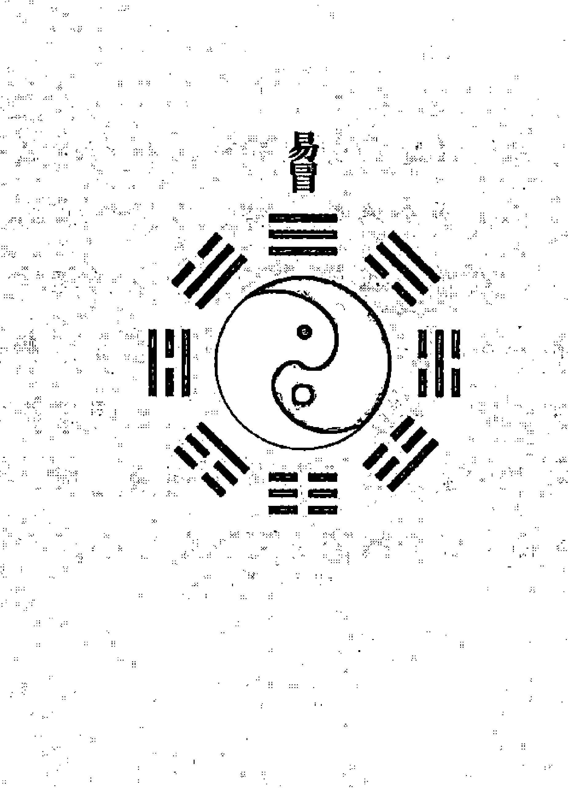

## 易冒 苍九

## 出行章第七十六

## 【原文】
注：内详同行、成行、求事、利方、筮风、关隘、旅寓诸问。

## 【今译】
本章包括对同行、成行、求事、利方、筮风、关隘、旅寓等方面的占问。

## 【原文】
不虞之备，君子所诫；行路之难，自我纪①之。是故风波盗贼、疾病讼非之患，皆以官鬼为大忌。鬼爻安静，利四海之翱翔；官鬼交重②，几③半途之颠蹶④。

武鬼发而忧盗贼，雀鬼发而备讼非，虎鬼动生疾病，蛇鬼动惊风波，勾陈鬼发而不可刻期⑤，青龙鬼发而不可溯豫也。车马之祸者，鬼发乾震也；风波之患者，鬼发巽坎也。艮鬼防患于山间，坤鬼避凶于野外，离鬼戒心于市肆，兑鬼留意于庵祠。

水鬼不宜舟楫，木鬼不宜车舆，土鬼不宜步担，金不宜兵，火不宜爨⑥。午驴，酉酒，木东，金西也。咸池为妇女之患，劫煞为诓骗之欺，耳目为音信之讹，天贼为窃偷之害也。凡动一鬼，主应一祸，所以出行无鬼，而言永臧也。

注：鬼动五行，则有五行之忌；鬼动支神，则有方属之凶。故午官为驴马之跌，木鬼为舟船之风。鬼动诸星，亦有是戒也，惟无鬼无虑尔。

## 【今译】
对意外之事有所准备，是君子所给予的告诫；行路的艰难，则要自己去处理。所以风浪、盗贼、疾病、诉讼等祸患，都以官鬼为大忌。如果官鬼爻安静，则可以遨游四方；如果官鬼爻发动，则几乎要半途遭遇困顿挫折。

武官鬼发动要担忧盗贼，朱雀官鬼发动要防备诉讼，白虎官鬼发动易生疾病，螣蛇官鬼发动会惊起风波，勾陈官鬼发动而不能限定时限，青龙官鬼发动而不能迟疑犹豫。车马之祸，是因为官鬼发动在乾卦和震卦；风波之患，是因为官鬼发动在巽卦和坎卦。艮宫官鬼要在山间防患，坤宫官鬼要在野外避凶，离宫官鬼要在市井街肆戒心，兑宫官鬼要在庵堂寺庙留意。

水鬼不宜乘船，木鬼不宜乘车，土鬼不宜徒步挑担，金鬼不宜兵器，火鬼不宜烧火做饭。午官鬼与驴马有关，酉官鬼与酒有关，木官鬼方位在东，金官鬼方位在西。咸池星主妇女之患，劫煞星主诓骗之欺，耳目星主音信之讹，天贼星主窃偷之害。凡是有一个官鬼发动，就主一个相应的灾祸，所以出行没有官鬼，就可说是永远安宁了。

- ① 纪：处理。
- ② 交重：即发动，爻指老阴——阴动，重指老阳——阳动。
- ③ 几：接近，达到。
- ④ 颠蹶：困顿挫折。
- ⑤ 刻期：限定时限。
- ⑥ 爨（cuàn）：烧火做饭。

果官鬼爻发动，则就会在半路上发生变故。

值玄武的官鬼发动，则会有盗贼侵扰之忧；值朱雀而发动，则要防备争讼是非；值白虎而发动，则意味着会生病；值螣蛇而发动，则意味着会受到风浪的惊吓；值勾陈而发动，则意味着不能限定时限；值青龙而发动，则要当心，不可沉溺于逸乐。兆示车马之祸的，是官鬼发动于乾、震两卦；兆示风浪之患的，是官鬼发动于巽、坎两卦。官鬼发动于艮宫，则要防备来自山间的祸患；发动于坤宫，则在野外时要注意避凶；发动于离宫，则要对市井存有戒心；发动于兑宫，则要留意于庵祠。

官鬼属性为水，则意味着不宜乘船；属性为木，则意味着不宜乘车；属性为土，则不宜挑担徒步而行；属性为金，则不宜动刀兵；属性为火，则不宜生火做饭。此外还有官鬼位于午爻，则不宜使用驴子；位于酉爻，则不适合饮酒；官鬼属性为木，则意味着不宜去东方；属性为金，则不宜去西方等。官鬼临咸池，则意味着妇女的祸患；临劫煞，则意味着会遭到戏虐、欺骗；临天耳、天目，则会因为信息的讹传而遭殃；临天贼，则意味着会被偷窃。凡是有一个官鬼发动，就会有一种相应的祸难会应验，所以占问出行时，如果卦中没有官鬼，则可谓万事大吉。

注：官鬼发动于不同的五行属性之上，则有根据五行衍生出来的忌讳；官鬼发动于不同的地支，则有不同种类的凶祸。所以官鬼发动于午爻，则在乘驴马时会跌伤；官鬼发动于水爻，则在乘船时会遇到风浪。官鬼发动于各星煞之上，也有相应的戒惧，只有在没有官鬼的时候，才没有需要顾虑的。

## 【原文】
于是而察用象。自筮世不可病，卜人用不可伤。空则诸谋无成，破则一身染疾。绝则愆期，散则他适。世墓者不出，化退者不行。静而冲者，被邀而游；动而合者，被绊而留。游魂多不定之游，归魂难越境之步也。

注：投墓、化退、静冲、动合，皆指世爻。游魂行远，归魂行近，或以心志言也。

## 【今译】
在此基础上，再考察用神。如果是自己占问，则世爻不能有病；如果是占问别人，则用神不能受伤。如果用神逢旬空，则各种谋划都不会成功；如果逢月破，则意味着全身都会患病。如果用神遇绝，则会耽误期限；如果遇日散，则意味着应当到别处去。如果遇到世爻入墓，则意味着不能出行；如果用神化退神，则意味着不能成行。如果安静而逢冲，则会应他人之邀出游；如果用神发动而逢合，则意味着会因事务的羁绊而留下。如果卦遇游魂，则意味着行程大多不定；如果卦遇归魂，则意味着还未离境就会返回。

注：所谓投墓、化退、静冲、动合等，都是针对世爻而言的。游魂卦意味着行程遥远，归魂卦意味着行程较近，也有可能是针对人的心愿而言的。

## 【原文】
世随官墓，则阻滞之事生；世持弟兄，则伴侣之朋至。世畜妻财而有赍①粮，世会父母而有裹囊，世坐子孙而远近亨途②。昔传明夷、节、艮、坎四卦为出行之戒，今列随墓助伤二象为伤外之忧，虽用强鬼静亦忌焉。

注：释六亲持世之义，并四卦二象，慎不可犯。

## 【今译】
如果世爻随鬼入墓，则意味着会发生阻滞的事情；如果世爻位于兄弟爻，则意味着会有出行的朋友；如果世爻就是妻财爻，则意味着会得到资助；如果世爻位于父母爻，则意味着盘缠充足；如果世爻就是子孙爻，则无论远近都是坦途。过去认为地火明夷、水泽节、艮为山、坎为水等四卦，是占问出行时所忌讳的。现在又罗列出了随鬼入墓、助鬼伤身两种情形，认为是在受伤之外的忧患。遇到上述这些状况，即使用神旺相，官鬼安静，也要谨慎不可触犯。

注：解释六亲在世爻时兆示的意义，以及遇到四卦、二象，要慎重不可触犯。

## 【原文】
于是而筮同行之良者，以应为用，来克来冲，不可与同。且空散无顾我之情，破绝有悖谋之恶。同于亲属，则求用象。同而筮安，朓③世索鬼。于是而筮我出成否，坏世不出，虚鬼不出，墓、退、归魂不出。筮同行之出成否，贞合冲则不偕，世应病则不偕，官鬼失则不偕。筮行时，则用为出行之身，动则逢生，静则逢冲，坏则逢补，其期可定也。

## 【今译】
占问同行之人的好坏时，以应爻为用神。如果应爻来克、来冲世爻，则意味着不可与之同行；如果逢旬空、日散，则说明没有顾念我的情感；如果遇破绝，则意味着有阴谋悖逆的险恶用心。如果是与亲属同行，则要考察相应的用神。已经决定同行而占问是否安全，则要考察世爻和官鬼爻。在此基础上占问我能否成行，如果遇到世爻损坏、官鬼虚浮、入墓、化退神，以及归魂卦，则意味着不能出行。占问同行者能否成行，如果遇到合处逢冲，世爻、应爻有病，官鬼失陷，则意味着不能同行。占问出行时间，则用神代表出行之身，如果用神发动，则逢生旺之时；如果安静，则逢冲旺之时；如果损坏，则逢补益之时，这样就可以确定日期了。

- ① 赍（jī）：资助。
- ② 亨途：坦途。
- ③ 朓（chēng）：正视。

处逢冲、世爻或应爻有伤病、官鬼失陷等，则意味着不能出行。占问出发的时间，则以用神象征出行者的身体，如果发动，则以其逢生之时为出发之期；如果安静，则以其逢冲之日为出发之期；如果损坏，则以其得到补益之时为出发之期。

## 【原文】

于是而筮求事者，亦察用爻。求事于科第，则考诸文书；求事于升迁，则考诸官鬼，而毋世空也；求事于寻访，考诸用爻；求事于货利，考诸财象。耑①于事而不耑于出行也。

于是求事而筮方隅之利者，则察子孙当生旺之方；出行而筮趋避之时者，则避官鬼当日月之期。

于是而筮遇风，则察兄弟，克世则逆，生世则顺；实而大，强而狂，弱而小，虚而息也。夫日，天也。日生则天顺，兄克则风逆。筮有风不戒乎，则察鬼象，动有覆舟之祸，静无折帆之殃，而世爻生旺者无咎。

注：顺逆务于弟兄，而日参之。兄生日克，其风横顺；兄克日生，其风横逆。

## 【今译】

占问出行所求之事能否实现的，也要考察用神。如果出行的目的是科第，则以父母爻为用神；如果是为求升迁，则以官鬼为用神，但世爻不可逢空；如果出行的目的是寻访，则要根据对象的不同，考察不同的用神；如果是为求货利，则以妻财爻为用神。总之是专注于所求之事，而不是专注于出行本身。

占问什么方位对所求之事有利，则要考察子孙爻得生旺的方位。出行而占问应当趋避的时间，则要规避官鬼所值的日、月。

占问行程中遇到的风，则要根据兄弟来推断。如果兄弟爻克世爻，则意味着是逆风；如果来生世爻，则是顺风；如果兄弟爻坚实，则意味着风大；如果正值旺相，则预示着狂风；如果衰弱，则说明风小；如果虚浮，则意味着风停。日辰代表着天。得日辰来生，则意味着天顺；兄弟爻克世爻，则意味着风逆。占问有风是否需要戒备，则要以官鬼爻为依据。如果官鬼爻发动，则意味着有翻船的灾祸；如果官鬼爻安静，则连折断风帆的危险都不会有。而世爻生旺，则能完全没有咎害。

注：风向的顺逆，要以兄弟爻为依据，同时参靠日辰。如果兄弟爻来生而日辰来克，则风横来而顺；兄弟爻克而日辰来生，则风横来而逆。

## 【原文】

于是而筮关隘，亦察鬼爻。应克世者，定多阻隔；官克世者，必犯羁征；子旺官空，游行①如意。越境贩挟，皆同此占。

于是而筮旅寓之安，世坏疾生，鬼动寇至。世身生旺，即次②之宁；龙福合扶，遭逢之庆。

① 游行：流利不拘。
② 次：旅行所居止之处所。

## 【今译】
占问关隘的通行，也要考察官鬼。如果应爻克世爻，则必定多有阻隔；如果官鬼克世爻，则意味着多受羁绊盘剥；如果子孙爻旺相，而官鬼爻又逢空，则可以一切顺遂如意。占问越境贩卖、非法夹带时，都与此相同。
占问旅居过程中是否安全，如果世爻损坏，则意味着会生病；如果官鬼发动，则意味着有贼寇前来。如果世身生旺，就意味着馆舍的安宁；如果临青龙的子孙遇相合相扶，则意味着会遇到喜庆之事。

## 行人章第七十七

## 【原文】
注：内详旅约、途会、安危、存亡、利钝、音信诸问。

## 【今译】
本章包括对旅约、途会、安危、存亡、利钝、音信等方面的占问。

## 【原文】
行者未还，卜筮谐③至。亲用六亲，疏用应象。用爻无病而来归，用爻克世而速至。此其大象也。若用逢空破散绝，不特归期杳然，亦主行人灾病；若别见无伤之用，则从无伤断之。
注：用爻遇此四者，行人必阻；若他爻飞伏之间，别有用神得令，亦可言归。如戌建癸酉日占弟兄得夬，三爻兄弟月破，因有阻事，而未爻兄弟无病，后遇丁丑，冲动未爻，其弟乃还。又如子建庚寅日，妻占夫得困之兑，午官空破，应夫未还，然巳官伏寅下长生于日，独发是爻，是日乃至。故别有用爻在飞伏间，亦可取验。
③ 谐：办妥,办成功。

## 【今译】

出行之人尚未回来，占问是否能平安回来。如果对象是亲人，则以六亲为用神；如果关系疏远，则以应爻为用神。如果用神没有病，则会到来；如果用爻克世爻，则会很快到来。这是其概要。如果用神逢空、破、散、绝，则意味着非但归期渺茫，还兆示着在外之人有灾病。但如果在别处有没有伤病的用神，则可以按照用神无伤的情形来推断。

> 注：用神遇到空、破、散、绝的，意味着行人必定在外受阻；如果其他的爻，或飞爻或伏爻中，另有与时令相合的用神，也可以据此推断为归来。例如在戌月癸酉日占问兄弟，得到泽天夬卦：

父母未土 ▅▅ ▅▅
子孙酉金 ▅▅▅▅▅ 世
妻财亥水 ▅▅▅▅▅
兄弟丑土 ▅▅ ▅▅
官鬼卯木 ▅▅▅▅▅ 应
妻财子水 ▅▅ ▅▅

第三爻兄弟爻辰土逢月破，于此可以推断为有阻碍归来之事。但另一兄弟爻未土没有问题，所以后来再遇丁丑日，冲动未爻的时候，弟弟就回家了。

又如在子月庚寅日，妻子占丈夫的归期，得泽水困变为兑为泽的卦象：

泽水困：
父母未土 ▅▅ ▅▅
兄弟酉金 ▅▅▅▅▅
子孙亥水 ▅▅▅▅▅ 应
官鬼午火 ▅▅ ▅▅
父母辰土 ▅▅▅▅▅
妻财寅木 ▅▅ ▅▅ × 世 官鬼巳火 ▅▅▅▅▅

官鬼午火逢旬空、月破，应当指其丈夫尚不能归来。但伏于寅木下的官鬼巳火，长生于日辰，并且独发，所以在这一天必定回来。所以说另有用爻在飞爻、伏爻的，也可以用来作为推断的依据。

## 【原文】

故用逢暗动，而乡心发矣；用值爻重，而舟车发矣；动临日月，是日月当返矣。动化退神，班马①而不进；动化进神，望云而疾驰。静逢合有结伴之还，动逢合有攀辕之阻。冲化冲者，心改易于别途；游魂化游魂者，志徘徊于他国也。
如概筮归期，先求用象无伤。世克用而未来，用克世而速至。比和云缓，相生云迟。
用虚以实至，破以补至，绝以生至，无以有至，衰以旺至也。
① 班马：离群之马。

> 注：已建己酉日，概占仆来何辰，得剥之旅，世生用不能即到，卯财发动，寅财旬空，后及甲寅日乃至，是空以实来也。辰建甲辰日占弟兄得大有，世生用主来迟，后应乙卯日到，乃静以冲来也。辰建戊寅日占弟兄得困，用克世当速，然酉爻旬空，当应申酉日到，然而次日乙卯，冲实用神，是辰乃至。此又以生克辨迟速也。

## 【今译】

所以用神如果暗动，则说明已经产生思乡的念头；如果发动，则说明已经上路；如果发动而临日建、月建，则当月、当日就应当返回。如果发动而化退神，则说明游离不进；如果发动而化进神，则说明会归心似箭疾驰而来。如果安静而逢合，则意味着是结伴而还；如果发动而逢合，意味着会因临行时的挽留而受阻。如果逢冲又化冲，改变主意去向别处；如果由游魂卦而化游魂卦，则意味着其心志流连徘徊在异国他乡。
如果笼统地占问归期，则要先求用神没有损伤。如果世爻克用神，则意味着尚未归来；如果用神克世爻，则意味着很快就到。如果用神与世爻比和，则意味着回来得缓慢；如果用神与世爻相生，则意味着回来得很晚。如果用神虚浮，则在其变为坚实的时候归来；如果用神逢月破，则在其被补足的时候归来；如果用神遇绝，则在其逢生的时候归来；如果卦中没有用神，则在用神出现的时候归来；如果用神衰弱，则在其值旺相的时候归来。

> 注：例如在巳月己酉日，占问仆人在什么时候到，得到山地剥变为火山旅的卦象：

妻财寅木 ▅▅▅▅▅ ▅▅▅▅▅
子孙子水 ▅▅ ▅▅ 世 ▅▅ ▅▅
父母戌土 ▅▅▅ ▅▅ × 兄弟酉金 ▅▅▅▅▅
妻财卯木 ▅▅ ▅▅ × 兄弟申金 ▅▅▅▅▅
官鬼巳火 ▅▅▅▅▅ 应 ▅▅▅▅▅
父母未土 ▅▅▅▅▅ ▅▅▅▅▅

世爻生用神，因此不能马上就到。妻财卯木发动，另一个妻财寅木逢旬空，后来到甲寅日才到。这是用神逢旬空，而在其填实的时候归来的例子。

> 又如在辰月甲辰日占问弟兄的归来，得火天大有卦：

官鬼巳火 ▅▅▅▅▅ 应 ▅▅▅▅▅
父母未土 ▅▅ ▅▅ ▅▅ ▅▅
兄弟酉金 ▅▅▅▅▅ ▅▅▅▅▅
父母辰土 ▅▅▅▅▅ 世 ▅▅▅▅▅
妻财寅木 ▅▅▅▅▅ ▅▅▅▅▅
子孙子水 ▅▅▅▅▅ ▅▅▅▅▅

世爻辰土来生用神兄弟爻酉金，预示着归来迟缓。后来在乙卯日回来。这是用神安静，在其逢冲之日回家的例子。

再如在辰月戊寅日占问弟兄归期，得泽水困卦：

| 爻位 | 爻象 | 标注 |
|------|------|------|
| 父母未土 | ■■■■■■ | |
| 兄弟酉金 | ■■■■■■ | |
| 子孙亥水 | ■■■■■■ | 应 |
| 官鬼午火 | ■■■■■■ | |
| 父母辰土 | ■■■■■■ | |
| 妻财寅木 | ■■■■■■ | 世 |

用神兄弟爻酉金克世爻，因此应当很快就到。但是酉金逢旬空，应当在申酉日到。然而第二天乙卯，冲实了用神，所以次日归来。这是又根据生克来辨别回来得快慢的例子。

## 【原文】

用之动者，三合而来；用之暗兴，六合而返。用处静者，遇冲而旋；用之墓者，得开而晤也。地发，彼方就道；足发，当日乃还；门户动，此处逢迎也。动速静迟，古今之大义；冲疏合亲，卜筮之常理；游魂出，归魂人，卦爻之定象也。卦身合月合日，是欢迎之会；卦爻独发独静，亦突见之期。

注：凡得归象，先要用爻无病则验。不拘旅卜家卜，凡归人则准归魂，游人则准游魂。独发者，如坤之复，末日行人乃至；独静者，如巽之噬嗑，卯日行人乃至。若临用神，更为验占。

## 【今译】

如果用神发动，则在其遇三合成局时，就会归来；如果用神暗动，则在其遇六合时，就会返回。如果用神安静，则在遇冲时回转；如果用神入墓，则在被冲开的时候，就会相见。如果用神发动于地爻——二爻，则说明对方刚刚上路；如果用神发动于象征足的初爻，则说明当天就返还；如果用神发动于象征门户的四爻，则说明就在这里相逢。发动则意味着迅速，安静则意味着迟缓，这是古今一贯的基本义理；相冲则意味着疏远，相合则意味着亲近，这是占卜的常理；游魂象征着外出，归魂象征着进入，这是卦爻的定象。卦身合月合日之时，则意味着是欢迎会面之期；卦爻独发独静，也是突然相见的时间。

注：凡是占问归来，首先要用神没有伤病才能应验。无论是旅人还是家人占问，占问归来的人，则依据归魂卦；占问远游的人，则依据游魂卦。

独发的卦，如坤为地变为地雷复：

| 爻位 | 六亲 | 干支 | 五行 | 世应 | 变爻 |
| :--- | :--- | :--- | :--- | :--- | :--- |
| 上爻 | 子孙 | 酉金 | 金 | 世 | 父母亥水 |
| 五爻 | 妻财 | 亥水 | 水 | | 官鬼丑土 |
| 四爻 | 兄弟 | 丑土 | 土 | | 子孙卯木 |
| 三爻 | 官鬼 | 卯木 | 木 | 应 | 兄弟巳火 |
| 二爻 | 父母 | 巳火 | 火 | | 妻财未土 |
| 初爻 | 兄弟 | 未土 | 土 | × | 妻财子水 |

兄弟爻未土发动，所以在未日行人归来。

独静的卦，如巽为风变为火雷噬嗑：

| 爻位 | 六亲 | 干支 | 五行 | 世应/动变 | 变爻 |
| :--- | :--- | :--- | :--- | :--- | :--- |
| 上爻 | 兄弟 | 卯木 | 木 | 世 | 妻财未土 |
| 五爻 | 子孙 | 巳火 | 火 | ○ | 官鬼酉金 |
| 四爻 | 妻财 | 未土 | 土 | × | 妻财辰土 |
| 三爻 | 官鬼 | 酉金 | 金 | ○应 | 兄弟寅木 |
| 二爻 | 父母 | 亥水 | 水 | ○ | 父母子水 |
| 初爻 | 妻财 | 丑土 | 土 | × | 父母子水 |

只有兄弟卯木一爻独静，所以卯日行人归来。

## 【原文】

如限期而筮，或以年，或以月，或以旬，或以日。世克用而迟，世用相生而缓；世应比和、用克世而速也。限期之筮，神告尤亲。

注：限期而占，用神破空散绝则不至，世克用则不至。用神坚固，然后以克世为速；比和次之，半限可至；用生世则次之；世生用又次之，及限方来。

## 【今译】

如果是限定时间占问，无论限定的是年、月、旬，还是日，如果世爻克用神，则意味着归期迟；如果世爻与用爻相生，则意味着归来缓慢；如果世爻与应爻比和，或者用神克世爻，则意味着归来得迅速。对于限定时间占问，神的告示尤其准确。

注：限定期限占问，如果用神逢破、空、散、绝，则意味着不会回来，世爻克用神也不回来。如果用神坚实，以用神克世爻的情况，回来得最快；其次是用神与世爻比和的情形，到期限的一半就可以回来；用神生世爻，则再次之；世爻生用神又次之，要等到限期才能回来。

## 【原文】

行旅之约，应坏而爽信也，惟不空不散、不破不绝，必如期而至。问迟速，则如行人之断焉。中途之会，六冲而不见也；应空不信，纵信而殊途；世空不待，纵待而背①路。
① 背：避开，离开。

如卜日时来，以实应为法；见以实世为法，卦身合时为法。

> 注：以六冲世应空为戒。世应不病，则卦身合日相遇；世应病，则实世应之日相遇。

## 【今译】

占问关于旅行的邀约，如果应爻损坏，则意味着对方会爽约。只有应爻不逢空、散、破、绝，才会如期而至。占问迟速，则与推断行人的方法相同。占问中途的约会，如果卦遇六冲，则说明不能相见；如果应爻逢空，则说明对方不守信，即使守信也会走错路；如果世爻逢空，则说明我不能等待，即使等待也会错过了道路。占问何时前来，以应爻被填实之为期；占问何时相见，则以实爻被填实、卦身合时为期。

> 注：忌讳遇到六冲卦和世爻、应爻逢空。如果世爻、应爻没有病，则在卦身逢合之日相遇；如果世爻、应爻有病，则在世爻、应爻被填实之日相遇。

## 【原文】

盖筮行者之来否，则以虚实言；行者之迟速，则以生克言；行者之安危，则以用象言，而官鬼为之眚也。随鬼反伏墓绝，旅人之凶兆也，各以用象定之。
水鬼动者，风浪惊心；金鬼发者，兵戈夺气。火为飞延①之事，木为舟楫之累，土为步担之欺、济用之阻也。玄武，细人也；螣蛇，匪朋也；青龙，良伴也。白虎为灾，勾陈为阻，朱雀为非也。
① 延：引长，延长。

## 【今译】

总之，占问行人归来与否的，则要以虚实为根据；占问行人快慢，则要以生克为根据；占问行人安危，则要用神为根据，同时参考对应于疾病的官鬼爻。如果遇到随鬼入墓、反吟、伏吟、墓、绝等，都是旅人的凶兆，分别根据用神的征象来判定。
属性为水的官鬼发动，则意味着有风浪惊心；属性为金的官鬼发动，则意味着有兵戈挫伤锐气；属性为火的官鬼发动，则意味着有意外的延请之事；属性为木的官鬼发动，则意味着受到舟船的拖累；属性为土的官鬼发动，则意味着受到脚夫的欺骗、费用不足的阻碍。玄武对应的是小人，螣蛇非朋类，青龙对应的是良伴，白虎对应的是灾难，勾陈对应的是阻厄，朱雀对应的是是非。

## 【原文】

用化鬼者，恐涉于非径；鬼化用者，恐陷于泥途。兑鬼咸池，乐酒色而忘返；坎官驿马，飘江海而难归。乾鬼惑于琳宫①，巽官耽于逐利，离淹②市井，震病舟舆，坤艮阻山野之象也。
① 琳宫：仙宫。
② 淹：滞留，久留。

若筮久客之存亡，专用而不专鬼也。用神存则存，用神亡则亡。存谓有本，亡谓无根。三忌果真，乃作他乡之鬼。

注：犯三忌则亡，一曰命墓，二曰反伏墓绝，三曰空破绝散是也。

## 【今译】

如果用神化出官鬼，则恐怕会走上错误的道路；如果官鬼化出用神，则恐怕陷入艰难之旅。官鬼位于兑宫而临咸池，则意味着沉湎于酒色而忘返；位于坎宫而临驿马，则意味着会漂泊在外难以归来；官鬼位于乾宫，则意味着会被所谓仙道而迷惑；位于巽宫，则意味着沉湎于追逐利益；位于离宫，则意味着淹留于市井之间；位于震宫，则意味着病在车船上；位于坤、艮两卦，则意味着受阻于山野之中。

如果占问出行已久的人的存亡，则只考察用神，而不考察官鬼。如果用神尚存，则说明其人还在；如果用神已亡，则说明其人已亡。尚存是指有本，已亡是指无根。如果确实触犯了三忌，则意味着成为他乡之鬼。

注：犯三忌就是亡，所谓三忌是指：本命入墓，用神反吟、伏吟、墓绝，用神逢空、破、绝、散。

## 【原文】

筮行者在是地乎，求用爻之有也。动则他趋，空则别处。散犹空，冲犹动也。行者仕乎？官旺则仕，官空未仕也。行者娶乎？财现则娶，用病未婚也。行者得利乎？喜财神之旺也。行者他适乎？忌用象之囚也，受阻不他如，受病不更往。曾有遇乎？六冲不遂其求，用空不称其志也。

## 【今译】

占问行人是否在这个地方，首先要保证卦中有用神。如果用神发动，则意味着去了别处；如果逢空，则意味着在别处。遇散和逢空一样，逢冲和发动一样。占问行人是否当官了，如果官鬼当旺，则意味着当官了；如果官鬼逢空，则意味着没有当官。占问行人是否娶妻了，如果妻财出现，则意味着娶了；如果用神有病，则意味着没有。占问行人是否得利了，则喜欢妻财当旺。占问行人是否去往别处了，忌讳用神值休囚，否则要么因为受阻不能到别处去，要么因为受病而无法再前行。占问行人是否曾有际遇，如果卦逢六冲，所求不能如愿；如果用神逢空，则不能称心。

## 【原文】

如筮音信，专察父爻。父病无书，旺动将至，受冲被拆，化空乃遗。并于朱雀则速，并于勾陈则迟，并于青龙则吉，并于白虎则凶。螣蛇为泛①愣②之词，玄武为幽秘之语。占彼寄书乎，先用而后父，用殆不书，父虚无信。书寄有财乎？先用而后财，用空无寄，财空无物也。信之有无，以空以动；书之到日，以合以生。
① 泛：一般的。
② 愣：直言。

大凡行者之吉凶，疏以应象，亲以用象；行者之得失，得以用爻，求以妻爻。

## 【今译】

占问行人的音信，则要以父母爻为依据。如果父母爻有病，则意味着没有书信；如果正值生旺而发动，则意味着音信将到；如果父母爻受冲，则意味着书信被拆损；如果化空，则意味着信被丢失。父母爻临朱雀，则意味着来得迅速；临勾陈，则来得迟缓；临青龙，则意味着内容吉祥；临白虎，则意味着是凶信；临螣蛇，则说明信中是普通的直白语言；临玄武，则说明信中多是隐秘的言语。占问对方寄信了吗？则要先考察用神，然后再考察父母。如果用神损坏有病，则意味着没有寄；如果父母虚浮，则也没有信。占问寄回的书信中有钱财吗？则要先考察用神，然后再考察妻财。如果用神逢空，则说明没有寄；如果妻财逢空，则说明其中没有财物。书信的有无，根据父母爻的逢空和发动来推断；书信来到之日，则以父母爻逢合、逢生之时为期。

大凡占问行人的吉凶，如果关系疏远，则以应爻为用神；关系亲密的，则以六亲为用神；占问行人的得失，如果占问所得，则要考察用神；如果占问所求，则要考察妻财。

## 舟车章第七十八

## 【原文】

注：内详雇觅夫占及舟楫宜忌。

## 【今译】

本章包括雇觅人夫，以及舟楫禁忌等方面的内容。

## 【原文】

舟车致远，筮有戒心，故欲其有利，先求无患。凡舟车之误、灾疾之扰、盗贼之虞，莫不以鬼动为戒。助伤世病，不宜自身之适；命墓用坏，岂利他人之行？
注：先忌鬼兴，次察用象。

## 【今译】

车船是帮助人们到达远方的工具，占问的人往往有戒惧之心，所以想从中得利，要先追求其没有伤害。凡是关于车船的延误、灾病的搅扰、盗贼的忧虑，无不与官鬼发动有关。如果遇到助鬼伤身、世爻有病等情形，则不利于自身出行；如果遇到本命入墓、用神损坏，则不利于他人出行。
注：首先忌讳官鬼发动，其次再考察用神。

## 【原文】

> 木鬼交重，弗恃舟车之利；午官发动，无乐驴马之驰。跌也，折煞并之而兴；劫也，贼武因之而动；争也，朱雀与之而翔；惊也，螣蛇同之而张。惟官鬼安宁，用神旺相，则舟车骡马，所适而安。
注：释鬼动之义。纵鬼动青龙，恐致祸于旅舍；鬼动勾陈，恐遇阻于道途；鬼动白虎，恐受惊于兵革也。

## 【今译】

属性为木的官鬼发动，则不要依赖车船的便利；地支为午的官鬼发动，则不要乐于驴马的奔驰。跌伤，是因为官鬼临折煞而发动带来的；被抢劫，是因为官鬼临天贼、玄武而发动带来的；纷争，是因为官鬼临朱雀而发动带来的；惊恐，是因为官鬼临螣蛇而发动带来的。只有官鬼安宁，而用神又正值旺相，则车船骡马才是安全的。
注：解释官鬼发动的意义。即使是临青龙的官鬼发动，也要担心会在旅舍中遭受祸患；临勾陈的官鬼发动，则要担心会在路途中遇阻；临白虎的官鬼发动，则有可能遭受兵革的惊吓。

## 【原文】

> 故觅舟车，世空父坏则少；觅骡马，世空子坏则难。舟车完善欤？父坏而敝。骡马壮健欤？子旺而良。卜舟车之来载，应坏父破则无期；卜骡马之来迎，应动子兴而疾至。
注：舟车属父，骡马驴属子，应为舟子仆夫，旺良衰敝，静迟动速。

## 【今译】

占问寻找车船时，如果世爻逢空、父母爻损坏，则意味着车船数量稀少；占问寻找骡马时，如果世爻逢空、子孙败坏，则意味着难以找到。占问车船是否完善时，如果父母损坏，则意味着破旧；占问骡马是否健壮时，如果子孙爻旺相，则说明健壮。占问车船来接载时，如果应爻损坏、父母爻逢破，则意味着遥遥无期；占问骡马来迎接时，如果应爻发动、子孙爻兴旺，则很快就会到来。
注：车船属于父母爻，骡马驴属于子孙爻，应爻代表船夫仆夫，旺相为良、休囚为敝，安静则迟、发动则速。

## 治筑章第七十九

【原文】

注：内详杂修及差委、雇工。

【今译】

本章包括对杂修、差委、雇工等方面的占问。

【原文】

横流之害，古传所纪，故防河而治筑，同于防患，不泥水象，专察官爻。故鬼旺、鬼克、鬼动、随墓、助伤，筮水患，则未决当决，已决未息也；筮堤防，则未成难筑，已成当溃也。故堤岸之筮，父母为用，旺相则固，空破则倾。经始而筮何时成功，喜实世实父之期；刻期而筮是时成功，忌六冲世空父坏之象。此其概也。

注：① 横流：大水不循道而泛滥。 ② 决：水深而广。

【今译】

江河泛滥的危害，自古见诸史书，所以占问为防止河水泛滥而进行的治理、修筑，等同于占问防患，因此不能拘泥于水象，而要以官鬼爻为推断的根据。如果占问水患时，遇到官鬼旺相、官鬼克世爻、官鬼发动，以及随鬼入墓、助鬼伤身等状况，则即使尚未决口，也预示着必定会泛滥；倘若已经决口，则意味着水患尚未平息。如果占问堤防，在没有筑成的时候占问，则意味着难以建筑；在已经筑成之后占问，则预示着将会溃决。占问堤岸，以父母爻为用神，如果正值旺相，则说明坚固；如果逢旬空、月破，则意味着会倾塌。已经开始修筑，而占问何时能成功，则以填实世爻和父母爻之日为期；如果指定期限而占问此时能否成功，则忌讳卦遇六冲、世爻逢空、父母爻损坏等状况。这是占问此类问题的概要。

【原文】

大官奉敕，小官奉命，吏民奉差，官爻不可病，并冲克世位。若官吏因河工而筮利钝，则反以官为重，官旺世实则纪录升荐，官伤世空及随墓助伤则罪戾降责。若民夫苦役而筮吉凶，则以官为忌。旺动克世，劳苦无期；命墓助伤，忧虞不测。

故凡修塘、修坪、修闸、修圩，及治路、治水、兴营城堡者，皆以父为用爻，世实父旺而成。如忧妨犯，及苦徭役者，皆以鬼为忌象，旺动克世，及随助而凶。凡筮差委雇工，皆以应为用，应旺实则有成，克世则无良，六冲则难成也。

注：① 河工：指修筑河堤、开浚河道等治河工程。 ② 纪录：纪，通“记”。官吏有功绩或犯有过，记录在案，以为其后升迁、黜罚之依据。 ③ 差委：派遣，委派。

【今译】

大官奉的是君主敕令，小官奉的是上司的命令，衙吏和百姓奉的是差役，所以官鬼爻不可有病，同时也不可冲克世爻。如果官吏因为治河工程而占问利弊得失，则以官鬼为主要的推断依据。如果官鬼旺相，而世爻又坚实，则意味着能够记录在案，得到升迁举荐；如果遇到官鬼损伤、世爻逢空及随鬼入墓、助鬼伤身等，则意味着会因为罪过而被降职责问。如果是民夫因为苦于劳役而占问吉凶，则忌讳官鬼。如果官鬼正值旺相而发动，又来克世爻，则意味着劳苦远没有终结之期；如果本命入墓、助鬼伤身，则恐怕还会遭逢不测。

凡是占问修塘、修坪、修闸、修圩，以及治路、治水、修建城堡的，都以父母为用神，如果世爻坚实，而父母爻旺相，则说明会修筑成功。如果是占问妨犯，及苦于徭役的，都以官鬼为忌讳的对象，如果遇到官鬼旺相、官鬼发动、官鬼克世爻，以及随鬼入墓、助鬼伤身等，都是凶兆。占问委派、雇工，都以应爻为用神，如果应爻旺相坚实，则会有成绩；如果应爻克世爻，则说明对方是无良之辈；如果卦遇六冲，则难以成功。

## 捕逃章第八十

【原文】

注：内详遁地、成捕、人诱、同游、不遗、讼逃、许觅、责人、丧节、反噬、私害、将逃、逃安、存亡、为僧、求名、自归、恩抚十八问。

【今译】

本章包括对遁地、成捕、人诱、同游、不遗、讼逃、许觅、责人、丧节、反噬、私害、将逃、逃安、存亡、为僧、求名、自归、恩抚十八个方面的内容。

【原文】

女子小人，古称难养，若其盗逃，同于叛主，法所难宽也。捕逃之占，唯世克应则易获，应空则深涧之逃，应克世则负隅之逝，六冲则交臂而失，世空则裹足不前。此四者，未知能获也。

注：六冲、世空、应空，及应克世，四者如一不犯，则可擒矣。

【今译】

自古以来就认为，女子和小人为难养的对象。如果他们盗物而逃，则等同于背叛主人，是法所难容的犯罪。占问捕逃，如果世爻克应爻，则意味着容易捕获；如果应爻逢空，则意味着向深山丛林中逃亡；如果应爻克世爻，则意味着会负隅顽抗至死；如果卦遇六冲，则意味着失之交臂；如果世爻逢空，则意味着自己裹足不前。遇到这四种情况，则不知道是否能捕获。

注：六冲、世空、应空及应克世，这四种情况，如果任何一种都不犯，则可以捕获。

【原文】

逃人悖内而向外也，故以外卦为所逃之方。坎水为外，则在北方，或江河之侧、渔父之家、盗贼之林；离火在外，则在南方，或炉冶之傍、市肆之中，文学艺术之舆。震于树木、舟船、车舆、砍伐之属，巽于花园、薪草、桑麻、妇女之类。艮是山岳、岩石、樵猎之所依，兑以池沼、庵尼、酒食之所赖。乾为寺庙、都下、城垣之近，驴马驱驰；坤为社稷、坟墓、郊野、田园之迹，耕牧追随也。

注：此言八卦居外之象。言之所传者浅，象所示者深，然因其象而测之，亦难执一也。如子建辛丑日，有占婢逃得节，外坎宜匿水侧酒家，而不知已堕于井。如巳建甲辰日，卜子亡得泰，外坤宜藏寡妇之室，而不知相遇于岳家。夫井，水也，岳家，亦外姻也，其可实指乎？然亦不离其象尔。学易者，当以己之灵机，而深研极索也。

【今译】

凡是逃跑的人，都是背叛于内而心向于外的，所以以外卦对应所逃的方向。如果外卦是坎水，则意味着逃往了北方，可能在江河附近、渔夫之家，或者盗贼的团伙之中；如果是离火，则意味着逃往了南方，可能在火炉冶炼作坊、市井之中，或者混迹于文学技艺的人中。震对应的是与树木、舟船、车舆、砍伐等有关的地方或职业，巽对应的是与花园、薪草、桑麻、妇女等有关的地方或职业。艮对应的是与山岳、岩石、樵夫和猎人等有关的地方或职业，兑对应的是与池沼、尼姑、酒店、餐馆等有关的地方或职业。乾对应是的寺庙、京都、城垣附近的地方，从事与驴马驱驰有关的职业；坤对应的是社稷、坟墓、郊野、田园附近，从事耕夫、牧人之类的工作。

注：这是在说八卦作为外卦时所对应的征象。语言所能传达的内容比较肤浅，征象所能显示的内容比较深远，但是即使是根据其征象而推断，也难以固执一辞。例如在子月辛丑日占问婢女逃亡，占得水泽节卦。外卦为坎卦，按说应当藏匿在水边或酒家，但却不知道，其实已经落进井里了。又如在巳月甲辰日占问儿子逃亡，得到地天泰卦。外卦为坤，按说应当藏匿在寡妇家中，却不料在岳母家遇到。井就是水，岳母家也是外姓姻亲，怎么能实指呢？但终究也没有脱离其征象。学易的人，应当以自己的心灵的机巧，来深入研究探索。

【原文】

盖六爻静而求外卦，一爻动而求独发，言逃人之心，成谋于是也。故宫鬼动而投仕宦，子孙动而投僧道。妻财动而投妇女，或佣于商贾；兄弟动而党间游，或逐行伍；父母动而栖技艺，或附舟车。青龙，迹于良善书礼喜庆之家；朱雀，践于优伶字画闹谊之次；螣蛇，乐于赌博浮荡跳梁之场；白虎，匿于屠宰哀丧行伍之内；玄武，迷于盗贼酒食花柳之门；勾陈，藏于乡庄坟墓之间，及修砌穿凿之群，而进退彷徨，淹留恐惧。卜捕叛，则触公差也。

注：此以独发之爻为方，临于六亲、六神之象如此。盖玄武之神，利逃不利捕，勾陈之将，利捕不利逃，故曰触见公差。

【今译】

如果六爻都静的时候，考察外卦。如果只有一爻发动，则要根据独发的爻来推断，因为逃亡者的心境，以及所指定的谋略都体现在其上。所以如果官鬼发动，则意味着投身于仕宦之家；如果子孙发动，则意味着投身于僧道之间；如果妻财发动，则意味着投奔了妇女，或受雇于商贾；如果兄弟爻发动，则可能隐身于其朋友中间，或者选择了从军；如果父母发动，则可能栖身于技艺行业，或者在车船上。

临青龙的爻发动，则可能隐匿在善良、知书达礼、喜庆的人家；临朱雀的爻发动，则可能隐匿在优伶、书画匠出没的热闹场所；临螣蛇的爻发动，则可能隐匿在赌场等轻浮放荡又强横的场所；临白虎的爻发动，则可能隐匿在屠宰、丧葬行业，或者军队里面；临玄武的爻发动，则可能沉迷于盗贼、酒食玄以及妓院等地；临勾陈的爻发动，则可能隐匿在乡村、庄园、坟墓之间，以及从事修砌挖掘的人群中，而处于进退彷徨、淹留恐惧之中。如果占问捕叛，则涉及公差了。

注：这是根据独发之爻来推断方位，临于六亲、六神时所对应的征象即如上述。其中临玄武时有利于逃亡而不利追捕，临勾陈时有利于追捕而不利逃亡，所以说有碰上公差。

【原文】

盖乱动而求用爻之在何宫，杂用而求用爻之在何卦，用伏而求飞，用二而求亲，伏无而求应也。

注：自占，外卦以下皆陈逃人之方。设如卦爻乱动，当求用爻居于何宫，在乾以乾断，在坤以坤断。若用神杂于爻神乱动，当求用神化入何宫，化坎以坎断，化离以离断也。苟或乱动而卦爻无用神，当求所伏用爻之上飞神之方是也。倘或伏无用爻，然后以应象占其所居之宫，在震巽则以震巽断，在艮兑则以艮兑断是也。其有用爻两现，一用动则以其所化之宫，两用皆动皆静，则以其出现为亲、伏藏为疏也。偶皆伏藏，则以外卦之用占方，庶几乎得有归一之法。

【今译】

如果卦爻乱动——不止一爻独发，则应当考察用神在哪一宫；在乱动的爻中包含有用神，则要考察用神化入了哪一卦；如果用神伏藏，则考察相应的飞神；如果同时存在两个用神，则考察与其关系最为亲密的一个；如果伏爻中也没有用神，则考察应爻。

注：自己占问，上述从外卦以下的内容，都可以告示逃亡者的方位。假如卦中的爻乱动——不是独发，则应当考察用神位于哪一宫，如果在乾宫则根据上述关于乾卦的征象来推断，在坤宫则根据坤卦的征象来推断。如果用神与其他爻一样乱动，则应当考察用神发动后，化入了哪一宫，化入坎宫则根据坎卦的征象来推断，化入离则根据离卦的征象来推断。如果卦爻乱动，但卦中又没有用神，当考察伏藏的用神上面的飞神的方位。倘若伏爻中也没有用神，就要考察应爻居于哪一宫，如果在震、巽宫则根据震、巽卦的征象来推断，在艮、兑宫就根据、兑卦的征象来推断。同时有两个用神出现的时候，如果只有一个发动，则考察其所化入的卦宫；如果两爻都动或都静，则以出现的为亲，以伏藏的为疏。如果两个用神都伏藏，则根据外卦来推断方位。这样规则就得到了统一。

【原文】

世亡应逃，内亡外逃，盖不可主而可兼也。亲人之逃，专之于用；他人之逃，专之于应。故父子、兄弟、夫妇、男女以亲合，虽悖亲而务用；友朋、师徒、奴仆、邻交以义合，已背义而务应，不可惑也。

注：传云：“世为亡兮应为失，外为逃失内为亡。”所以宜世克应、内克外也。然亦非主断，如世克应而应空，其何从而得获也？常占主仆之讼，用世应而验，则友朋以下，用应可推。

【今译】

概而言之，世爻对应于失主，应爻对应于逃亡者；内卦对应于失主，外卦对应于逃亡者。但是不可以此专断，只是可以穷尽其中的情理，如果占问亲人的逃亡，则只考察用神；如果是占问他人的逃亡，则只考察应爻。父子、兄弟、夫妇、男女之间，是因亲缘关系而聚集在一起的，所以即使是有悖于亲情，也必须要考察（根据六亲选定的）用神；朋友、师徒、奴仆、邻交之间，是因为义而聚集到一起的，所以已经背离了义，就只能考察应爻。这是不可迷惑的。

注：书上说：“世爻对应于失主，应爻对应于逃亡之人；外卦对应于逃失的人，内卦对应的是失主。”所以在占问中，适宜出现世爻克应爻、内卦克外卦的情形。但也不是专断，例如虽然是世爻克应爻，但如果应爻逢空，又怎么能捕获呢？

经常在占问主仆之间的争讼时，通过世爻、应爻的关系来推断，而得到应验。由此看来，朋友以下——更疏远的关系，根据应爻是可以推断的。

【原文】

间有遇诸于途者，六冲是也；间有不意而擒者，六合是也；间有自还者，归魂是也；间有去久而来者，化合是也；间有来而复去者，化冲是也。游而归者心收，归而游者志荡。然亦必其用神不克世、不空亡，而后可也。

注：用实生世，终有会期；用爻克世，卒无见日。

【今译】

偶尔也有与逃亡者在路上不期而遇的，这是卦逢六冲的征应；有在不意间而擒获的，这是卦逢六合的征应；有逃亡者自己返回的，这是卦遇归魂的征应；有离去已经很久，之后又回来的，这是遇到化而逢合的征应；也有回来之后又再次逃走的，这是遇到化而逢冲的征应。由游魂卦化出归魂卦的，说明其心已经收敛——不会再逃；由归魂卦化出游魂卦的，说明其心志摇荡不定——有可能再次逃亡。但这也必须是在用神不克世爻、不逢旬空的前提下才可以。

注：如果用爻坚实而来生世，则意味着终将有相会的时候；如果用神克世爻，则意味着永无相见之日。

【原文】

卜遁此地，专索用爻。用如动冲，则非留于是处；用若空破，则未及于是方，弗往求之。占成捕何时，世生应克之期。若六亲之逃而归，则反以用神生旺而现，世爻旺合而见，卦身合而遇也。盖我仇用败，我亲用旺，不同论也。

注：为仇恶于己，则俟彼败之时而可获，故喜应克；为亲于我，则求用神生旺，与世身相合而来也。

【今译】

占问是否逃遁于某地的，则只通过用神来考察。如果用神发动、逢冲，则说明不是停留在此；如果用神逢旬空、月破，则说明没有到过这里，不用去寻找。占问何时能捕获，则以世爻逢生、应爻遇克之时为期。如果是占问逃亡的亲属何时归来，则反而在用神值生旺的时候出现，在世爻当旺而逢合的时候相见，在卦身相合的时候相遇。即对于是我的仇人的，则以用神衰败为期，是我的亲人的，则以用神当旺为期，不能一并而论。

注：作为自己的仇恶对象，则等对方衰败之时才可以捕获，所以喜见应爻被克；作为自己的亲近对象，则希望用神能够得生值旺，并与世身相合而来。

【原文】

是人诱与？应克世而被诱也。彼同游与？应用备而比行也。

注：即应克世，而空破散绝亦非，应用一病亦非。如卯建丙辰日占仆与友同行，得否，卯财持世，戌应暗兴，后果同行都下。

【今译】

占问是否是被人引诱而逃亡，如果应爻克世爻，则说明是受到了引诱。占问是否是结伴同行，如果应爻和用神完备，则说明是同行。

注：即使是应爻克世爻，但如果遇到空、破、散、绝，也说明不是被诱；应爻和用爻有一个有病，也不是同行。例如在卯月丙辰日占问仆人与朋友同行，得天地否卦：

| 描述 | 标记 |
| :--- | :--- |
| 父母戌土 | 应 |
| 兄弟申金 | |
| 官鬼午火 | |
| 妻财卯木 | 世 |
| 官鬼巳火 | |
| 父母未土 | |

用神——妻财卯木，同时还是世爻，应爻戌土暗动，后来果然一同去了京城。

盗逃不遗，财爻失所而不可复有也。讼逃有益，官鬼莫无。盖空散不为我而遘求①，破绝不终事而停息。随墓助伤及官克世者，犹抱薪而救火也。非是，然后以捕逃之法断焉。
注：详见词讼篇内关犯章断。

盗贼逃跑后，占问财物是否能不损失，如果妻财不出现，则意味着财物不可复得。占问将逃亡者告官是否有益，此时卦中不能没有官鬼。如果官鬼逢空散，意味着不会为我谋求追捕；如果官鬼遇破绝，则意味着事情未完就停下来了；如果遇到随鬼入墓、助鬼伤身，以及官鬼克世爻的，则说明方法不当适得其反。如果不属于上述情形，则可以按照占问捕逃的方法推断。
注：详见后面的《词讼章八十二》。

许为我觅，则以应象虚实言之。若责人觅逃，则用捕逃之法。
注：责成是人寻还逃者，戒世应空、应克世及六冲也。

如果官府许诺为我寻找，则根据应爻的虚实来推断。如果是责成他人寻找逃亡者，则按照捕逃的方法来推断。
注：占问责成某人寻找逃亡者，则忌讳遇到世爻、应爻逢空、应爻克世爻，以及六冲卦等状况。

妇逃丧节与？财实未苟也。不群匪党而反噬与？随墓助伤、官克鬼动，后必罹其害也。不生戕害与？助鬼伤身，及应克世者，卒有犯上狱长之逆也。未逃而筮其将逃与？用克世而萌叛心，用空破而无实事。
注：专问其将逃，忌用实克世则逃，用空破不成。若兼问挽留为益，又喜用实。

占问妇女在逃亡后是否丧失了贞节，如果妻财爻坚实，则意味着没有行苟且之事。占问是否因为不与盗匪同流合污而被伤害，如果遇到随鬼入墓、助鬼伤身、官鬼克世，或官鬼发动，则意味着日后一定会遭到伤害。占问是否会戕害别人，如果遇到助鬼伤身，以及应爻克世，则意味着终将有犯上弑长的逆行。尚未逃跑而占问其是否将要逃亡，如果用神克世爻，则意味着会萌生叛逆之心；如果用神逢空破，则意味着不会变成事实。
注：专门占问其是否将要逃亡，忌讳遇到用神坚实而克世爻，否则就会逃亡；用神逢空破，则意味着不能成功。如果同时还占问挽留——以挽留为有益，又喜欢用神坚实。

亲人逃而安乎？命墓鬼动，有穷途日暮之忧；用实卦安，有即①次无虞之好。卜其存亡，独以用神生坏而断也。为僧道乎？用病而无成。求名利乎？用实而有得。不寻自归者，用坏而忘归，用克世而终身之叛也。逃归复留，同于收雇；回心恩抚，同于用人。
注：用爻克世，叛恨不归；用象破空，漂流难返。惟用实生世，终得自来。复留恩抚，忌三冲财坏。

占问逃亡的亲人是否安全，如果遇到本命入墓、官鬼发动，则有穷途末路之忧；如果用神坚实，卦象安静，则有意味着吃住无忧。占问其存亡，则只以用神的生、坏状况来推断；占问是否做了僧道，如果用神有病，则意味着做不成；占问是否求到了名利，如果用神坚实，则有得。占问是否会自己回来，如果用神损坏，则意味着迷途忘归；如果用神克世爻，则意味着是终身的背叛。占问逃归后是否重新留用，等同于占问收雇；占问回心后是否施与恩抚，等同于占问用人。
注：用爻克世爻，意味着背叛而怨恨不会回来；如果是用神逢破、空，则意味着是在外漂流难以返回。只有用神坚实而来生世爻，则意味着终将自己回来。占问重新留用和施恩抚慰，则忌讳遇到三冲和妻财损坏。

故捕逃者，以世克应为主，以世生应克之期而得；捕盗者，以子克官为法，以子孙当日月之期而获。盖逃以应为象，盗以鬼为象，此其辨也。

所以占问追捕逃亡的，以世爻克应爻为主旨，以世爻逢生、应爻遇克之时为捕获之期。占问追捕盗贼，则以子孙爻克官鬼为原则，以子孙值日月之时为捕获之期。也就是说，逃亡者以应爻为其征象，盗贼则以官鬼为其征象，这是二者之间的区别。

① 即：走近去吃东西。

斗胜章第八十一

本章包括对斗讼、斗获、夺人、擒人、来斗等几个方面的占问。

私斗角胜，善良所戒，或不得已而应之。彼我之势，止凭世应，不从六亲。
注：世已应人，胜负察世应强弱而已。事至讼斗，骨肉如仇雠，即六亲皆用世应。

私自争斗，较量胜负，原本是善良人的禁戒，但偶尔也有不得已而应对的时候。如果占问彼此的态势，则只以世爻与应爻为推断的依据，而不采用六亲。
注：世爻对应的是自己，应爻对应的是他人，占问胜负，只要考察世爻与应爻的强弱而已。如果事情发展到了争讼打斗的程度，即使骨肉也势如仇敌了，所以即使是占问六亲，也都根据世爻与应爻推断。

应克世而逢败，彼胜而折；世克应而逢败，我胜而亏。应生世而人伏，世生应而已降，比和两释，出师一理。
注：败，谓空破散绝，及受日月克制。

如果应爻克世爻而逢败，则意味着对方虽然会获胜，但也会有所折损；如果世爻克应爻而逢败，则意味着我虽然会获胜，但也会有所折损。如果应爻来生世爻，意味着对方会臣服；如果世爻来生应爻，则意味着自己会投降；如果世爻与应爻比和，则意味着争斗会化解。和占问出师是同一道理。
注：败，即指逢空、破、散、绝，以及受日建、月建的克制。

斗而涉讼乎？鬼爻是司。斗而有获乎？财爻以辩。斗以夺人，应克难归；斗以擒人，用现可得。筮彼来斗乎？应空应破而不前。占何日利斗乎？世生应克而得胜。应发五而要①于路，应发三而斗于门。
注：应动何爻，则从此地相击。初为乡党，六为郊野，二为庭内，四为户外②也。

占问争斗是否会涉及官司时，要以官鬼爻为依据来推断；占问争斗是否有收获，要根据妻财爻的状况来分辨。占问通过争斗来抢人，如果应爻克世爻，则意味着难以夺回来；占问通过争斗来抓人，如果用神出现，就意味着可以捉到。占问对方是否来斗，如果应爻逢空或逢破，则意味着不会前来；占问某一天是否有利于争斗，如果世爻逢生，或应爻遇克，则意味着自己能取胜。如果应爻在五爻上发动，则意味着在路上发生争斗；如果发动于三爻，则在门前发生争斗。
注：应爻发动于哪一爻，则对方就从相应的地方来攻击：初爻对应于乡里，上爻对应于郊野，二爻对应于庭内，四爻对应于户外。

动坎而斗于泽畔，动离而斗于市井。乾兑寺庙，坤艮山野，震巽林木之下。玄武暗刺，朱雀明诤。青龙笑刀之谋，白虎怒戈之取。勾结其怨，蛇连其党。子孙有少助，父母有老随。兄以群队，财以妇女，鬼以法术之诈。兵者，不得已而用，况于乡邻之斗乎？筮者慎之。

应爻发动于坎宫，则意味着争斗会发生在水边；发动于离宫，则意味着争斗会发生在市井；发动于乾、兑两宫，则意味着争斗会发生在寺庙中；发动于坤、艮两宫，则意味着争斗会发生在山野；发动于震、巽两宫，则意味着争斗会发生在林木之下。应爻临玄武，说明对方会暗箭伤人；临朱雀，说明会当面诤讼；临青龙，说明对方有笑里藏刀的阴谋；临白虎，说明对方会发怒而使用武器；临勾陈，则意味着会因此结怨；临螣蛇，说明对方会同党羽而来。如果应爻同为子孙爻，则意味着有少年相助；如果同为父母爻，则意味着有老人相随；如果同为兄弟爻，则意味着会成群结队而来；如果同为妻财，则意味着妇女参与；如果同为官鬼，则意味着会使用法术欺诈。
武力，是在不得已的情况下才使用的，何况是乡邻之间的争斗呢？因此占问者一定要慎重。

① 要：迎接，迎候。
② 户外：作为与室内有区别的室外。

词讼章第八十二

本章包括对审期、终讼、兴词、忱讼、讼师、用人、允驳、回关、遏讼、请卷、夤缘、禁责、离狱、息讼、杂问、官问等方面的占问。

人有窒于中，因忿而讼，讼则受命于上，故以官爻生克为胜负，不以世应强弱分曲折焉。官来生世，易雪我冤；鬼来克世，难伸我屈；不生不克，无辱无荣。然我讼而喜官旺相，忌值破空；彼讼而好鬼破空，恶居旺相。亦以生克参之也。
注：胜负专察官爻，莫执世应。结讼分彼己，则官爻分喜忌，然生世衰旺俱吉，克世衰旺俱凶。

人有窒烦阻塞于心中，因忿恨难解而导致诉讼。一旦诉讼则要听命于官上，所以占问时，根据官鬼对世爻的生克，作为推断胜负的依据，而不是通过世爻与应爻的强弱对比来判断是非曲直。如果官鬼来生世爻，则说明我的冤情易于洗雪；如果官鬼来克世爻，则说明我的冤情难以伸张；如果既不来生，也不来克，则意味着既无辱也无荣。如果是我起诉对方，则喜欢官鬼旺相，忌讳官鬼逢月破、旬空；如果是对方起诉，则最好官鬼能逢破、空，而忌讳其正值旺相。也要依据生克关系来参究。
注：占问胜负，则只考察官鬼，不要考虑世爻和应爻。结成诉讼，则有彼此之分，因此官鬼也有了相应的喜与忌的分别。但只要官鬼来生世爻，则无论其是衰是旺，都是吉兆。相反，如果来克世爻，则无论衰旺都凶。

先发者，不忧官之在世，而喜官之在应；后发者，不喜官之在应，而忧官之在世。相生尤吉，相克愈凶。此世应之辨生克也。
注：以世应生克分胜负者，此则论之。如世爻值鬼，本不为胜，若克应爻，是官为我而责彼乃吉；应爻坐鬼，理应我赢，倘克世位，是官悦彼而攘己乃凶。总言生克，先官鬼而后世应也。

首先发起诉讼的一方——原告占问时，不用担心官鬼在世爻上，但更喜欢官鬼在应爻上；被告在占问时，不仅不喜欢官鬼在应爻上，而且还要担心官鬼在世爻上。如果相生则更加吉祥，如果相克则更加凶险。这是指世爻与应爻之间的生克关系。
注：通过世爻与应爻之间的生克来区分胜负的办法，在此给予了论述。例如世爻值官鬼，原本是不能胜的，但如果克应爻，则是官长为我而责罚他的征象，所以吉；应爻值官鬼，理应是我赢取官司，但是倘若来克世爻，就是官长喜欢对方而排斥我的征象，所以凶。总而言之，所谓的生克，必须先要是官鬼爻，而后再考虑是否是世爻或应爻。

官鬼生应，彼得理也；官鬼克应，彼失利也；官鬼空散，讼不成也；官鬼破绝，词不终也；官生世应，两宥之宽；官克世应，两败之辱也。
注：既论官爻生世克世，此言生应克应，胜负明矣。

如果官鬼生应爻，则意味着对方会得理；如果克应爻，则对方会失利；如果逢旬空、日散，则意味着官司打不成；如果遇破绝，则意味着官司没有终结；如果同时来生世爻和应爻，则会宽宥双方；如果同时克世爻和应爻，则会蒙受两败俱伤的羞辱。
注：已经论述了官鬼来生世爻、来克世爻时的推断方法，这里又论述了来生应爻和来克应爻时的推断方法，至此胜负的推断就完全清楚了。

鬼位三传，事干台宪；官兴二间，情属牵连。长生为经年之讼，帝旺乃折狱①之期。动鬼变鬼，而权②案更三；上官下官，而衙门非一。摇于世应，而忿志未休；伏于主宾，而讼根不息。化进神者，下而上，小而大也；化退神者，急而缓，重而轻也。
注：此章专言官鬼。若官在年月日之上，其讼或干三法及上司；官在间爻发动，恐因牵连，或傍观相累。官爻倘遇日月长生，则事必经年屡月；临官帝旺，即得三尺③剖断；
+   ① 折狱：判决诉讼案件。
② 权：唐以来的称试官或暂时代理官职为“权”。
③ 三尺：指法律。古时把法律条文写在三尺长的竹筒上，故称法律为“三尺法”，简称“三尺”。

旬空月破，则终两姓交和。鬼动化鬼，非一官审问；官复见官，是叠举讼词。官动应爻，彼有再控之心；官动世爻，我有重告之志。鬼伏世应动爻生扶之下，则讼根未断。惟灭没之伏，则无兴也。

如果官鬼位于三传上，则意味着官司可能触及到御史台；如果官鬼位于两个间爻上，意味着是因为受到了牵连。如果官鬼遇长生，则意味着官司长久不决；如果正值帝旺，则意味着到了判决的时候。官鬼发动后仍变出官鬼，则意味着主审官员变换不定；如果上下卦中都有官鬼，则说明经历的衙门不止一个。如果官鬼位于世爻或应爻而发动，则说明怨恨之心未平；如果官鬼位于世爻或应爻而伏藏，则说明引起诉讼的根源尚在。官鬼化进神，则意味着诉讼自下而上，由小变大，不断升级；官鬼化退神，则意味着官司由激烈而舒缓，由严重而趋于轻微。
注：这一段专门论述官鬼。如果官鬼位于年、月、日（三传）上，则意味着官司可能会打三法司，触及到高级的官吏；如果官鬼发动于间爻，则恐怕是因为囚徒的牵连，或者是因旁观而受到连累。官鬼如果遇日建、月建长生，则意味着官司经年累月而不决；如果官鬼值帝旺，则意味着将得到一个判决；如果逢旬空、月破，最终双方讲和。如果官鬼发动化出官鬼，则意味着不只一个官员审问；在官鬼之上还有官鬼，则说明是一再上告。如果官鬼在应爻上发动，则说明对方有再次上告之心；如果官鬼发动于世爻，则说明我有重新起诉的愿望。如果官鬼伏于世爻、应爻以及动爻，和得生扶之爻之下，则意味着诉讼的根源未断。只有是不出露的伏藏，才意味着不会再兴起。

大壮为得理，明夷为禁，坎为狱，无问生克，占讼之忌也。六冲曰战斗，得官空而冰释；六合曰处和，见官旺而株牵也。
注：三卦为讼宜忌。官空六冲，反易散息；官旺六合，反难调停。盖先官鬼而后冲合也，即合冲变冲同义。

占得雷天大壮卦，则兆示着得理；占得地火明夷卦，则兆示着被拘禁；占得坎卦，则兆示着会入狱。不必问生克关系，这是占问诉讼时的卦忌。卦遇六冲叫做战斗，如果官鬼逢空，则反而会冰释前嫌；卦遇六合叫做处和，如果官鬼旺相，反而会形成株连。
注：上述三卦是占问诉讼时应当忌讳的。官鬼在六冲卦中逢空，官司反而容易消散平息；官鬼在六合卦中旺相，反而难以调停。也就是说，要先考虑官鬼，再考虑卦的冲合。即使是合冲、变冲，也是一样。

随官人墓，为囹圄桎梏之刑；助鬼伤身，乃罪罚鞭笞之辱。二者与官鬼克世，凡有干于公门之役者皆忌也。
注：不特词讼，凡事干衙门官长，悉忌此三者。

如果遇到随官入墓，则意味着会身陷囹圄，遭受刑罚的桎梏；如果遇到助鬼伤身，则意味着要遭到身受鞭笞的侮辱。这两者与官鬼克世，凡是关系到官府、官员及衙役的占问，都忌讳遇到。
注：不特指占问词讼，凡事只要关系到衙门官长的，都忌讳遇到这三种情况。

骨肉忿争，主仆构逆，六亲之谊已绝，故从应不从亲。然既讼于官，亦先论官而后论应。
注：有云内肉相讼，止占世应，然既讼于官，则胜负又系于官，不系于应。

如果骨肉之间兴起忿恨争讼，或者主仆之间发生叛乱，则说明六亲的情谊已经断绝，所以在占问时，要以应爻为用神，而不以六亲为用神。但是，已经诉讼到了官府之后，也要先考虑官鬼，然后再考察应爻。
注：虽然有骨肉之间相互诉讼，只考虑世爻、应爻的说法，但是一旦诉讼到了官府，则胜负就又取决于官鬼爻，而不取决于应爻了。

夫子孙为解释之神，喜其持世，则刑罚何加，罗网自脱。当于爻重，罪罚蠲除①，当于日月，冤情昭雪，孰比其吉焉。父母为词状关提②之用，不可坏，坏则不从；不可再，再则不一；不可破，破则无始；不可空，空则无终。我举宜动，彼举宜静。妻财为贿赂之神，喜其持世，则情夺理而居胜，惟动有行贿之费。弟兄为党证干连之象，独发而多费，间发而多人，持世则干众，动应则鼓谋，克世则有私击之虞，傍摇有公举之论。是象一无益于讼，不现仍伤。
独官鬼为狱讼之用神也，是非曲直与夺胜负总司之，小大之狱，皆生吉而克凶，不可忽也。是故六神，因官生克而别喜怒，诸星亦因官生克而辨吉凶，皆不可离于是矣。
① 蠲（juān）除：废除，免除。
② 关提：为追捕逃犯发到各地的公文。

子孙爻具有化解消释的功能，因此在占问时，喜欢子孙爻在世爻上，这样的话怎么会受刑罚，即使落入法网也会自然解脱。如果发动，则意味着罪罚会被解除；如果临日建、月建，意味着冤情会昭雪。有什么比这更吉利？父母对应的是诉状批捕文书的功用，因此不可以损坏，否则就不肯听从；不可重复出现，否则就不止一次；不可逢月破，否则就没有开始的征兆；也不可逢空，否则就没有结果。如果是占问我起诉别人，则适宜父母爻发动；如果是占问别人起诉我，则父母爻适宜安静。妻财对应的是贿赂，因此喜欢其位于世爻之上，这意味着可以靠人情，强词夺理而胜诉，只是如果发动，则意味着要有行贿的费用。兄弟爻对应的是结党串供相互牵连的征象，如果一爻独发，则意味着多有耗费；如果发动在间爻，则意味着涉及多人；如果位于世爻，则意味着关系到众人；如果发动于应爻，则说明对方会鼓动谋划；如果来克世爻，则意味着有可能实施暗害；如果发动于旁爻，则说明有舆论压力。总之，兄弟对诉讼没有一点益处，但如果不出现也有伤害。只有官鬼是占问狱讼时的用神，执掌是非曲直、与夺胜负的最终决断，无论小大狱讼，都以官鬼来生世爻为吉，以其来克为凶，因此不可疏忽。所以，六神要根据官鬼的生克来区别其所代表的喜怒，诸星要根据官鬼的生克来区别其所代表的吉凶，都不可离开官鬼。
注：这是在说六亲的征象，虽然各有所司，但大致来说，子孙和妻财如果是世爻，则能兆示吉祥，而官鬼爻是最重要的一爻。六神和各星煞，并不是以临于动爻，就兆示着凶祸。只有临于官鬼爻之上而发动，然后才能显现其所对应的吉凶。如果所临的官鬼爻来生世爻，则即便其上六神和星煞是凶兆，也不会带来凶祸，例如白虎、螣蛇、天牛、地狱等都不必忌讳；如果所临的官鬼爻来克世爻时，临于其上的朱雀意味着须要申详，勾陈意味着要身陷囹圄，白虎意味着要被杖责，螣蛇意味着要戴枷锁，青龙意味着要交罚金赎罪，玄武意味着要从重判决，天狱意味着要有牢狱之灾，驿马意味着要被流放，羊刃意味着要被刺配。

是故世应察彼己之情，亦不可寘②而弗论也。应空彼不欲净，或将遁也；世空我不好竟，或怀怯也。官克应而应空，如荷①弓而射鱼；官生世而世空，如操笱②而搏狸。应破，彼有天殃之降；世破，我忧人疾之缠。求衰旺则强弱可称，考生克则刚柔可较。其为用如此，此其大象也。
注：官克应当应彼输，然应空彼避其锋；官生世当应我赢，然世空我失其机。应若月破，彼必有他祸相报；世如月破，我有别事之累。旺为强，衰为弱，以力言之。应克世为彼刚，世生应为我柔，惟世克应、应生世者反之。所谓世应为用如此。
① 申详：向上级官府详细呈报。
② 寘 (zhi)：同“置”。

所以根据世爻和应爻来考察彼此情况的办法，也不可完全置之不理。如果应爻逢空，则说明对方不愿争讼，或许将会退缩；如果世爻逢空，则说明我不愿再角逐下去，或许已经心怀怯意。如果官鬼克应爻，但应爻却逢空，则如同用弓箭来射鱼；如果官鬼来生世爻，但世爻却逢空，则如同拿着捕鱼的工具去抓狐狸。如果应爻逢破，则说明对方必遭天灾；如果世爻逢破，则我要当心疾病的纠缠。根据爻象的旺衰，就可以推断出强弱的对比，考察生克关系，则就可以比较出刚柔的不同。这就是世爻与应爻作用的概要。
注：官鬼克应爻，原本应当对方输，但是如果应爻逢空，则对方就能避开锋芒；官鬼生世爻，原本应当我赢，但是如果世爻逢空，则意味着我将失去机会。应爻如果逢月破，则说明对方一定有其他灾祸的报应；如果世爻逢月破，则我一定有其他事的连累。旺即为强，衰即为弱，这是就力量而言的。应爻克世爻，则说明对方刚强；世爻生应爻，则说明我柔和。如果世爻克应爻、应爻生世爻的，则刚好相反。世爻、应爻的作用就是如此。

何日断狱？当于日月之官。何时终讼？当于墓绝之鬼。别③胜何日？则以世生应克为良。释免何时？则以子孙填值为宥。
注：以官长生为讼始，临官帝旺为审决，死墓绝为散讼时也。凡问见官何日为胜，则以世爻逢生、应爻遇克为胜，世爻遇克、应爻逢生为不胜。欲官释免，则以子孙填值之日、官鬼制伏之辰，定能赦宥。

占问审理的时间，则以官鬼值日月之时为期。占问结案的时间，则以官鬼值墓绝之时为期。占问哪一天见官比较好，则以世爻逢生、应爻遇克之时为好。占问得到赦免的时
+   ① 荷：背或扛。
② 笱（gǒu）：竹制的捕鱼器具，口大窄颈，腹大而长，鱼能入而不能出。
③ 别：辨别。

间，则以子孙填实或值日之时为得到宽宥之期。

注：以官鬼长生之时，为讼案的开始；以临官帝旺之时，为审理判决之时；以官鬼墓绝之时，为结案的时间。凡是占问见官以哪一天为好，则以世爻逢生、应爻遇克之时为好，以世爻遇克、应爻逢生之时为不好。想要求得官府的赦免，则在子孙填实或值日，以及官鬼被制伏之时，一定能被赦免。

## 【原文】

有问兴词胜负吉凶，亦属于官。兴词准行，喜官动实而恶其破空也。官克世者，控告无门；父爻空破，批行失意。忧讼来侵，占同防戒，惟官不作及不克世，弗遇随助，何患相加？纵应克世，有谋亦已也。

注：问准词，官爻空破散绝，及克世不准。执行专论文书，若上告批下衙门，父母如遇空破，虽官鬼动实，纵准而不批是衙门也。如告亲提，官克世为不从，或有两官，常有批下僚者。

## 【今译】

占问写诉状打官司的胜负吉凶，也要根据官鬼来推断。如果希望状词能够被批准，则宜于官鬼发动而坚实，忌讳官鬼遇破、空、散、绝等。如果官鬼来克世爻，则意味着控告无门；如果父母爻逢旬空、月破，则意味着在执行过程中不合心意。因为担心有诉讼来侵扰，则如同占问防戒，只要官鬼不发动、不来克世爻，也不遇到随鬼入墓和助鬼伤身等，能有什么忧患呢？即使是应爻克世爻，也是有所谋划后就自行停止了。

注：占问是否会批注状词，如果官鬼遇破空散绝，以及来克世爻，则意味着不会批准。占问执行，则要考察文书——父母爻，如果上告而批复给下一级的衙门执行，父母爻遇到旬空、月破，即使状词被批准，也不会批给所希望的衙门。请求亲自提取，如果官鬼克世爻，则意味着不准许；如果有两个官鬼，则常有批给下级僚属的。

## 【原文】

讼师美恶，询诸父母。日月旺相，善移生死之文；发动生扶，能转是非之笔。若值破空，安能取胜？随助官克，乃以自戕。干证保勘，趋使抱告，皆以应爻为用。克世为忌，破绝不忠，空散不力，六冲生背叛之心，而随助官伤，反为我害。

- ① 兴词：撰写并呈递状词。
- ② 干证：与讼案有关的证人。
- ③ 保勘：担保。
- ④ 抱告：明、清制度，原告可委托亲属或家人代理出庭，称抱告。

注：讼师用文书，奔走用应。应视其有用，故不可破空；无欺为良，故不可克世；一心为美，故不可六冲；用于公所取胜，故不可随墓助伤官克世尔。

## 【今译】

占问讼师的好坏，则要通过父母爻来考察。如果父母爻要值日建、月建或旺相，则说明讼师能写出改变生死的状子；如果父母爻发动而遇生扶，则意味着有能颠倒是非的文笔。如果父母爻逢破空，怎么能够取胜？如果遇到随鬼入墓、助鬼伤身、官鬼来克等，则意味着是自取其害。占问证人、保人、联络人、代理人等，都以应爻为用神。忌讳其来克世爻，如果逢破、绝则意味着不忠心，如果逢空散则意味着不得力，如果卦逢六冲则意味着会产生背叛之心，而遇到随鬼入墓、助鬼伤身以及官鬼损伤，则说明反而会成为我的妨害。

注：占问讼师，以文书（父母爻）为用神；占问其他协助奔走的人，要以应爻为用神。目的是要其有作用，所以不可逢破空；以不欺诈为好，所以不可来克世爻；以能够一心一意为美，所以不可遇六冲；因为要用于在官府取胜，所以不可遇到随鬼入墓、助鬼伤身以及官鬼损伤等。

## 【原文】

招详允乎？官病不允，官动不纳，六冲上下不信，乌能允乎！招详能驳乎？官克世而不从驳，破绝则已，空散则消，乌能驳乎！惟官动实，则驳矣。复部允驳，亦犹是也；复疏允驳，易官用五也。

注：此就筮者之意为断，复疏则以五爻为用，如上占法。

## 【今译】

占问招供能否被认可，如果官鬼有病，则不被认可；如果官鬼发动，则不被接纳；如果卦遇六冲卦，表示上下失信，又怎么能认可！占问招供后是否能辩驳，如果官鬼克世爻，则意味着不听取辩驳；如果官鬼遇破、绝，则意味着已经停止；遇空、散，则意味着已经消散了，又怎么能辩驳！只有官鬼发动而坚实，才能得以辩驳。占问上书部堂之后的允驳，与此相同。占问对上疏的批复是否能够辩驳，则不用官鬼而改为用第五爻为用神。

注：这是针对占问者的意向而推断的，占问复疏则以五爻为用神，占断方法同上。

## 【原文】

住提、回关、停词、遏讼，喜官之无，而恶官之有也。鬼发则不能停遏，鬼克则不能住回。惟子动而鬼静，则受无事之福矣。鼠牙¹复举，祇缘助鬼伤身；株蔓重牵，端恶随官人墓。不可不戒也。

注：大抵以官鬼安静破空为吉，发动克世为凶。

¹ 鼠牙：指讼事或引起争讼的细微小事。

## 【今译】

占问住提、回关、停词、遇讼等，喜欢卦中没有官鬼，而厌恶出现官鬼，如果官鬼发动，则意味着不能停词遇讼；如果官鬼克世爻，则意味着不能住提回关。只有子孙爻发动，而官鬼安静，才能享受无事之福。细微小事而重新控告，是遇到助鬼伤身带来的征应；如果再度受到牵连，则是因为遇到随官入墓带来的征应，因此不可不小心戒备。

注：总的来说，以官鬼安静或逢破空为吉兆，而以其发动或克世爻为凶兆。

## 【原文】

请卷者，文书为用也。上下请提，破绝不允请，空散不从提，制爻克世，提请俱违。

注：请提文卷，皆系父母，考其虚实以定吉凶。复以官爻不克世，及无破空，方得顺尔请提。

## 【今译】

占问请提案卷，则以文书——父母爻为用神。分请、提两方面来推断，如果父母爻遇破绝，则意味着不允调阅；如果逢空散，则意味着不允许提走。如果官鬼克世爻，则无论是提还是请都不允许。

注：占问请提文卷，都以父母爻为依据，通过考察它的虚实来推定吉凶。同时还要官鬼爻不克世，以及不逢月破、旬空，才能顺利请提。

## 【原文】

攀缘嘱托，意在听从。六冲则逆其意，而或见嗔；官克则逆其耳，而或有欲。若空若破、无力无功；如旺如生，有情有意。如托私人，应不可坏，不可六冲、克世有损无成。若问官倩，亦同前断。

注：问官从否看官象，问人可托看应象，俱忌克世六冲。

## 【今译】

占问攀援嘱托（官员），目的在于能够听从。如果卦逢六冲，则说明违逆对方的心意，甚至会因此被责怪；如果官鬼来克世爻，说明语言不顺其耳，但可能另有所求。如果官鬼遇空，则意味着对方没有这个能力；如果官鬼遇破，则不会有功效；如果官鬼逢生、旺，则说明对方有情有意。如果占问委托私人，则应爻不可损坏，也不可遇到六冲卦，如果应爻克世爻，或有损伤的，都意味着没有成效。如果占问央求官员，则同前面的推断方法一样。

注：占问官员是否能听从，则要考察官鬼爻；占问某人是否可以托付，则要考察应爻。都忌讳来克世爻，和遇到六冲卦。

## 【原文】

忧禁忧责，官旺动而克世为难免。离狱息讼，皆忌官爻克世。息讼官不可动，离狱官不可无。求六亲离狱，则兼用无伤。

注：离狱鬼坏鬼空，亦不能出。求六亲，兼看六亲生旺则出。

## 【今译】

因为担心被囚禁、责罚而占问，如果官鬼当旺发动而来克世爻，则意味着难免其难。占问出狱和息讼时，都忌讳官鬼来克世爻。其中占问平息诉讼时，官鬼不可发动；占问出狱时，卦中不能没有官鬼。占问六亲出狱，则还要求用神没有损伤。

注：占问出狱，如果官鬼损坏或逢空，也不能出来。占问六亲，要同时考察六亲，如果正值生旺则会出狱。

## 【原文】

远关人犯，事系于官，而亦兼捕逃也。

注：关犯若官克鬼坏，为彼地官吏不我用情；六冲、世应空及应克世，其犯难捕，皆不能来。

## 【今译】

占问在远方关押的人犯，取决于官鬼爻，同时也要兼顾考虑捕逃。

注：占问关押犯人，如果官鬼克世爻或自身损坏，则意味着当地的官吏不关心我的事；如果卦遇六冲，或者遇到世爻、应爻逢空以及应爻克世爻等情况，则意味着人犯难以捕捉。这两种情况下都不能押解来。

## 【原文】

申讼夺婚，亦系于官，而兼防夺婚也。

注：索婚官克鬼坏，公论不允，应克世为彼夺去，财坏不能归来，俱莫能成就。

## 【今译】

申诉他人夺婚，也取决于官鬼爻，而兼用占问防夺婚的推断方法。

注：占问索婚，如果官鬼爻来克坏，则意味着在公论中不被允许；如果应爻克世爻，则意味着被对方夺去；如果妻财爻损坏，则意味着不能归来。总之都不能成就。

## 【原文】

以讼取财，仗官为力，而兼用索逋也。

注：取财官克鬼坏，官不相为也，即为矣，若财坏亦难求。

## 【今译】

占问能否通过诉讼取得财物，也需要依仗官鬼爻的力量，而兼用占问追讨欠债的推断方法。

注：占问取财，如果官鬼爻来克坏，则意味着官府不会相助，即使帮助了，如果妻财爻损坏，则也难以求得。

## 【原文】

力绵扳役，仗官为力，而兼用彼助也。

注：扳役官克鬼坏，官不听也。即听矣，若应克世及应空财坏，则亦莫能助我。

## 【今译】

力量绵薄而扳役，同样需要倚仗官鬼的力量，而兼用占问彼助的推断方法。

注：占问扳役，如果官鬼爻来克坏，则意味着官长不肯听从。即使听从了，如果遇到应爻克世爻，或应爻逢空、妻财损坏等状况，也是爱莫能助。

## 【原文】

昭雪复名，仗官为力，而兼用我得也。所以用爻相兼为法者，有是五也。

注：复缺，官克鬼克，官不从也。即从矣，如遇世空则莫亦能复。

## 【今译】

占问昭雪冤情、恢复名誉，要倚仗官鬼的力量，而兼用占问我得的推断方法。其中用神为推断依据的，是以五爻为用神的时候。

注：占问恢复官职，如果官鬼克世爻，则意味着官长不顺从。即使顺从，如果遇到世爻逢空，也不能恢复。

## 【原文】

大罪不死，在用神之旺相；大害不绝，在主象之生扶。若行险陷人，鬼神所怒，虽鬼静爻安，当直告其凶。

注：或有既定重罪，占其生死，刑定不复论官，专看用神，有救无事。六亲困狱，防有欲害者，若主象生扶，大数未尽，奚能害哉！或占行险陷人，以官鬼发动克世为戒，倘有卜者，当直言其凶，虽得鬼静，或天夺其鉴，而故益其疾，必致大祸，占者宁不戒之？

## 【今译】

得大罪而能不死，则是用神正值旺相带来的征应；逢大害而能不绝，是用神得到生扶带来的征应。如果占问行险陷人，则为鬼神所怒，即使官鬼安静、卦爻安宁，也应当直告其凶。

注：已经定了重罪，而占问生死，因为刑罚已经确定，因此不再考虑官鬼，而专注于考察用神，如果有救则会没有事。如果是六亲被困在狱中，而占问防止被害，如果用神得生扶，则说明寿数未尽，怎么能被加害！如果占问冒险去陷害他人，则忌讳遇到官鬼发动而来克世爻的情形。倘若有占这问的人，应当直接告诉他其行为的凶险，即使官鬼安静，上天也不会原谅他，而会故意加重其痛苦，直至形成大祸，占问的人怎么能不戒止呢？

## 【原文】

居官缘事①，占官占讼二分；在宦忧议，部覆②部议一理。申诉里甲③，私评用应，涉讼用官也。

注：凡有当仕心怀事累，占法有二：一曰无累官乎，则官旺世实为吉；一曰不累我乎，则官克鬼动为凶。或占有事及部，问曰部议重轻，则官克鬼动为忌；问曰部议与官无害，则以官旺世实为喜，复疏亦然。斯二者常或相背，当详其问神之旨，祝云为官，祝云为累，其吉凶乃定矣。申里甲，一谓其公处，故应克世有曲，应坏无断，六冲不终；一谓其成讼，故宫克鬼动，定干有司。二者亦随其占而断也。

- ① 缘事：因事，借端。
- ② 部覆：旧时中央各部的覆文。
- ③ 里甲：明代州县统治的基层单位。

## 【今译】

身居官场因担心事端而占问，有占问官位和占问诉讼的区分；在官场上要担心评议，等同于占问部覆、部议。占问在里甲中的申诉时，如果仅仅是民间的评议，则以应爻为用神；如果涉及诉讼，则以官鬼为用神。

注：凡是身居官位，而担心为事所连累，占问的方法有两种：一种是占问是否会累及官位，如果官鬼正值旺相，世爻坚实，则为吉兆；另一种是占问是否会累及我自身，如果官鬼发动，官鬼来克世，则为凶兆。如果有事情涉及各部的，占问部议的重轻，则忌讳遇到官鬼发动或来克世爻；占问部议是否妨害到我的官位，则喜欢出现官鬼旺相、世爻坚实情形。占问复疏也是同样。这两种占问的结果往往相背，因此应当明晰占问者的意图，关注的是官位还是连累，这样吉凶才能确定。占问申诉里甲，一种叫做公处——民间的公议，所以如果应爻克世爻，则意味着要受委屈；如果应爻损坏，则意味着没有决断；如果卦遇六冲，则意味着没有结果；另一种是成讼——起诉至官府，所以如果官鬼来克世爻，或官鬼发动，则意味着一定会触怒官吏。这两种情况，也随具体情况来推断。

## 【原文】

大凡讼内之用爻，莫离于官鬼。官鬼之取舍，则因事而求之。是故行喜动，止喜静，避喜空，解喜衰，息喜绝也。求为我力，则不可无；忧为我难，则不可有。事事恶其伤己，一一好其生世。以像形事，以事配义，吉凶得矣。然健讼破家，不可长也，《易》曰“不永所事”，圣人之戒深矣！

注：词讼同用官爻，而有喜忌之分，明于事义，而吉凶不爽矣。然三褫其服，众讼成师，不祥之气，由此而长也，占者戒之。

## 【今译】

大凡占问与诉讼有关的事情时的用神，都离不开官鬼爻。但是对官鬼的取舍，却要根据具体事情而定。所以希望能够推进，则喜欢官鬼发动；希望停止，喜欢官鬼安静；希望避害，则喜欢官鬼逢空；希望消解，则喜欢官鬼衰弱；希望息讼，则喜欢官鬼遇绝。占求官府对我有益，则卦中不可以没有官鬼；如果担心官府为难于我，则卦中不可有官鬼。占问任何事情，都忌讳官鬼克世爻；占问每一件事情，都喜欢官鬼来生世爻。根据卦象、爻象来类比事情的变化，再根据事情的变化配合相应的义理，则吉凶关系就明了了。但是过分执著于诉讼，难免会使家道破败，因此不能长久。所以《周易》在天水讼的爻辞中说“不能长久进行”，圣人的劝诫太深远了！

注：占问词讼都以官鬼为用神，但是各有喜、忌的区分，只要明白事情的义理，就可以确保吉凶判断的正确。然而“讼”的爻辞中说，即使善于诉讼能够得胜，甚至因此而得到封赏，也会在一朝之间，被三次剥夺官服——没有好的结果。同时《序卦传》中又说：诉讼必然导致众人奋起，因此随之而来的就是象征战争的地水师卦。因此不祥的风气，即由争讼而助长。占问者必须要持有戒惧之心。

## 失物章第八十三

【原文】
注：内详覆露、见获、是彼是我、起赃、讼盗诸问。

【今译】
本章包括对覆露、见获、是彼是我、起赃、讼盗等方面的占问。

【原文】
失物之占，各以用象。货物用财，禽兽用子，舟车衣服用父母，仪像用官鬼，此用象当分也。
注：失物各以用爻像之，或衣服匿珍宝于中，则用财不用父。又当以轻重权之。余以类推。

【今译】
占问丢失的物品，要分别选择不同的用神：如果是货物，则以妻财为用神；如果是禽兽，则以子孙爻为用神；如果是舟车衣服，则以父母爻为用神；如果是各种画像、造像，则以官鬼为用神。
注：失物以用爻来象征。如果是其中藏有珍宝的衣服，则以妻财为用神，而不用父母爻。也就是说应当按照轻重的不同，来权衡用神的选择。其余以此类推。

【原文】
筮盗者，则察鬼象。伏鬼为隐贼，动鬼为明贼，阳男阴女，内为内而外为外也。暗动暗人而明出，旺多衰少，完巧而缺拙也。内外鬼而连结，贞悔鬼而交通。
注：贞悔，指世应也。凡遇世应内外之鬼，有连结交通之谋。

【今译】
占问盗贼，则要考察官鬼爻。如果官鬼伏藏，则意味着是隐贼；如果官鬼发动，则意味着是明贼。官鬼在阳爻，说明是男贼；官鬼在阴爻，说明是女贼。位于内卦，则为内贼；位于外卦，则说明是外贼。如果官鬼暗动，则意味着是暗中进入，而明着出去。如果官鬼旺相则说明贼多，衰弱则贼少。如果官鬼完备，则说明手段巧妙；如果缺损，则拙劣。如果内卦、外卦都有官鬼，则说明内贼外贼相勾结；如果贞爻、悔爻都是官鬼，则说明内贼外贼相互串通。
注：此处的贞悔，是指世爻和应爻。凡是遇到世爻与应爻同为官鬼，或者内外卦都是官鬼，则意味着有互相勾结的情况。

## 【原文】

以五行之属，而度其情形。

注：金鬼乃穿凿添桥而入，木鬼乃锄挖钻缩而进，火鬼乃飞腾跳跃而来，水鬼乃隐伏暗昧而至，土鬼乃杂酒筵匿池塘而偷也。

## 【今译】

通过官鬼的五行属性，来测度盗窃的情景。

注：官鬼属性为金，则意味着盗贼是通过穿凿墙壁，或架设桥梁进入的；官鬼属性为木，则意味着盗贼是通过锄挖钻洞进入的；官鬼属性为火，则意味着盗贼会飞腾跳跃而来；官鬼属性为水，则意味着盗贼是隐伏到天黑而入的；官鬼属性为土，则意味着盗贼是混杂在酒筵的人群中，或隐匿在池塘里，然后进行偷窃的。

## 【原文】

以八宫之鬼，而别其方隅。

注：动于何宫，则以何方来也，暗动亦然。如鬼爻安静，则水鬼为北，火鬼为南，两鬼论外，伏鬼论飞方也。鬼生之方，则窝赃之处；财伏何地，是藏物之所。

## 【今译】

通过官鬼所在的卦宫，来辨别盗贼方位。

注：官鬼发动于哪一宫，就意味着从哪个方位来，即使是暗动也是一样。如果官鬼安静，则官鬼属水，从北方来；官鬼属火，从南方来。如果同时有两个官鬼，则考察外卦；如果官鬼伏藏，则考察飞爻的方位。来生官鬼的方位，就是窝赃的地方；妻财伏藏的方位，就是藏匿物品的地方。

## 【原文】

以六神之司，而别其状貌。

注：青龙为少俊，白虎为狂勇，朱雀为巧辨之夫，玄武为计谋之贼，勾陈似端笃而不良，螣蛇竟①虚浮而不实，踪迹莫可测也。

¹ 竟：完全。

## 【今译】

通过官鬼所临的六神的职司，来辨别盗贼的行状、相貌。

注：青龙对应的是少年俊才，白虎对应的是张狂勇猛之人，朱雀对应的是善于巧辨之夫，玄武对应的是工于计谋之贼，勾陈对应的是貌似端正忠厚实则不良之徒，螣蛇对应的是虚浮不实、行踪难测之辈。

## 【原文】

何时覆露？鬼爻败绝之期。何日见获？财爻生旺之辰也。物匿何处？审其方也。用伏而察飞爻，用飞而察亲宫，用悔而察贞爻，用二而察主爻也。
注：财伏论飞神之方，财现论本宫之方，变财论动爻之方，两财论世爻、卦身、世身、内卦为主爻。飞伏变象无财，是无踪也，何复方其方哉！

## 【今译】

占问盗贼暴露的时间，则以官鬼败绝之时为期。占问被捕获的时间，则以妻财值生旺之时为期。占问赃物藏匿的地方，考察其方位，如果用神伏藏，则考察飞神；如果用神出现在飞爻上，则考察所在的卦宫；如果用神是悔爻，则要考察贞爻；如果同时有两个用神，则考察主爻。
注：如果妻财伏藏，则考察其飞神所对应的方位；如果妻财出现，则考察本宫的方位；如果妻财是变爻，则考察相应的动爻的方位。如果有两个妻财，则以为世爻、卦身、世身、在内卦的为主爻，进行考察。如果在飞爻、伏爻、变爻中都没有妻财，则意味着已经没了踪迹，又有什么方位可求呢？

## 【原文】

分其所也，用在初爻地与井，用在上爻坟与野，二索于灶，三索于房，四索于门，五索于道。在应索闺阁之中，在世索近身之器。在内索内，在外索外也。
注：财爻出现安静，然后以世应内外及六爻考之。

## 【今译】

区分藏匿的场所。如果用神出现在初爻，则说明藏在地下或井中；位于上爻，则说明藏在坟墓与郊野之中；位于二爻，则要到炉灶中寻找；位于三爻，则说明藏在房中；值四爻，则在房门附近寻找；位于五爻，则说明藏在道路上。如果位于应爻，则应当在闺阁中寻找；如果位于世爻，则在其近身的器物中寻找。位于内卦，则在家中寻找；位于外卦，则到外面去寻找。
注：在妻财出现并且安静的前提下，再根据其所处的世爻、应爻、内外卦以及六爻爻位来考察。

## 【原文】

化父变父，及飞是父者，当觅以箧①柜；是财者，当觅以货物；是兄者，当觅以墙垣；是鬼者，当觅以香火；是子者，当觅以廊厢庵寺之所也。

注：此必以用伏之飞、用化之爻、化用之象则论，其他则否也。

¹ 箧（qiè）：箱子。

## 【今译】

如果用神化为父母爻、变出父母爻，以及飞神是父母的，应当在箱柜中寻找；如果是妻财，则应当在货物中寻找；如果是兄弟爻，则应当在墙垣附近寻找；如果是官鬼，则应当在供奉神佛的地方寻找；如果是子孙爻，则应当在廊厢庵寺中寻找。
注：这是说必须是用神伏藏的飞爻、用神化出的爻、化出用神的爻，才能进行考察，其他则不然。

## 【原文】

是彼盗与？应克世而是盗。是我遗与？世爻衰败而自遗也。
注：应不克世，非此人也；世不受损，非干我误也。

## 【今译】

占问是否就是这个盗贼，如果应爻克世爻，则说明就是这个盗贼。占问是否就是我丢失的东西，如果世爻衰败，则说明正是自己遗失的。
注：如果应爻不克世爻，则说明不是此人；如果世爻不受损害，则不是我丢失的。

## 【原文】

起赃擒盗，子旺有制，鬼动为凶，助伤官克随墓，则贼横而反噬也。讼官索物，务用其鬼，生世而理，官病财空官克世，则徒劳而自辱也。大易慢藏有戒，击柝致严，君子贵先事而慎也。
注：擒盗喜子旺克鬼，讼盗喜官实财旺，反是而凶。

## 【今译】

占问起获赃物，捉拿盗贼，如果子孙爻正值旺相，则说明能够控制；如果官鬼发动，则难以实现；如果遇到助鬼伤身、官鬼克世爻、随鬼入墓等，则意味着反而受到伤害。占问诉诸官府追索物品，务必以官鬼为用神，如果来生世爻，则能得到很好的处理；如果遇到官鬼有病、妻财逢空，或者官鬼克世爻，则非但徒劳无功，反而会自取其辱。《周易·系辞传》中有“慢藏诲盗”（财物收藏不严，引诱盗贼来偷）的告诫，和“重门击柝，以待暴客”（设置重门，击柝巡视，严防盗贼）的建议。因此君子贵在事先有所预防。
注：占问擒拿盗贼，喜欢子孙爻当旺而克官鬼；占问起诉盗窃，则喜欢官鬼坚实，妻财当旺。如果与此相反，则是凶兆。

易冒 卷十

神听章第八十四

【原文】
注：内详彼报、彼沮、誓神、防蛊诸问。

【今译】
本章包括对彼报、彼沮、誓神、防蛊等几个方面的占问。

【原文】
怨毒于人甚矣，不能伸于人，而求伸于神，亦人情之常也。鬼神之告，专用官爻。

【今译】
对某人怨恨已深，但又无法向人申诉，于是就向神申述，这也是人之常情。占问神的告示，要以官鬼爻为用神。

【原文】
官克应者，将行罚恶之诛；官克世者，不受不臣之诉。随官入墓，戢火反焚；助鬼伤身，倒戈自灭。是以神聪不我聪，为空散故；神明不我明，为破绝故。非神听之或违，多肤诉之不实。

【今译】
如果官鬼克应爻，则意味着即将进行惩罚罪恶的行动；如果官鬼克世爻，则说明神明不接受不够虔诚的申诉。如果遇到随官入墓，则意味着本想灭火而反被焚；如果遇到助鬼伤身，则是倒戈自伤。神明不为我表现出其自身聪明神通，是官鬼逢空、散、破、绝时所带来的征应。并不是神明洞察力的错误，而多是由于浅薄的申诉有不诚之处。

【原文】
报之速者，六九也；报之迟者，七八也。报之暗者，冲击也；报之轻者，休囚也。应受月破，天将亡之；应受旬空，神夺其魄；应受散绝，恶贯之盈；应随鬼墓，天网之密。

注：应克破受其罚，鬼临生旺是其期。

【今译】
报应来得快，是由于官鬼是动爻；报应来得晚，是因为官鬼是静爻。报应来得隐暗，是官鬼受到冲击的缘故；报应来得轻微，是因为官鬼正值休囚。如果应爻遇月破，意味着上天将让他灭亡；如果应爻逢旬空，意味着鬼神将夺走其魂魄；如果应爻逢散绝，说明对方已经恶贯满盈；如果应爻随鬼入墓，则意味着对方难逃天网。

注：应爻被克、逢破，意味着对方将受罚。官鬼临生旺之时，就是其受罚之日。

【原文】
筮彼咒诅，犹避祸之占也。鬼动神怒，官克害成；随墓助伤，而天亡我。惟子孙旺而官鬼衰，则直在我，而神鉴之。

【今译】
占问对方的咒诅，等同于占问避祸。如果官鬼发动，则说明神明已经震怒；如果官鬼克世爻，则说明危害已经形成；如果遇到随鬼入墓、助鬼伤身，意味着天将亡我。只有子孙爻当旺，而官鬼衰弱，则说明公理在我这边，而且神明也已明鉴。

【原文】
筮誓庙，鬼静乃安，官动克世、随墓助伤，定受背盟之罚。筮防蛊，子世无忧；官动世病、随墓助伤，应遭埋蛊之毒。鬼祸奸人，神无曲庇，筮者审之。

【今译】
占问到寺庙里许愿，如果官鬼安静，则意味着平安；如果遇到官鬼发动、官鬼克世爻、随鬼入墓、助鬼伤身等，则意味着一定会受到背弃誓约的惩罚。占问防巫蛊，如果子孙爻在世爻上，则意味着可以高枕无忧；如果遇到官鬼发动、世爻有病、随鬼入墓、助鬼伤身等，则意味着会遭到埋蛊的毒害。鬼总是降祸于奸邪之人，神也不会错误地庇佑，占问者要审慎！

注：埋蛊：指埋藏以巫术诅咒害人用的木偶等物。

侍神章第八十五

【原文】
注：内详停厝、举殡、奉神、撤像、辨塚、辨骸六问。

【今译】
本章包括对停厝、举殡、奉神、撤像、辨塚、辨骸等几个方面的占问。

【原文】
侍神者，谓安神于家，奉先于庙，以安神灵，而庇人宅。奉而安，犹人事之宁休；奉而感应，犹人事之遂求。

【今译】
侍奉神明，是指在家里安置神位，在庙中供奉祖先，以达到安抚神灵，庇佑家人、宅第的目的。奉神而希望神明得到安宁，和人事中的安宁、喜乐一样；奉神而希望神明有所感应，如同人事中的实现请求一样。

【原文】
故侍神之筮，大忌三冲鬼动，主神不安；亦嫌克世，主人不宁。空则无降格之诚，破则有怨恫之虑，散绝则精爽难凭，随墓助伤则灾害并至。

【今译】
所以关于侍神的占问，最大的忌讳，是遇到三冲和官鬼发动，意味着神灵不安；也厌恶遇到官鬼克世爻，意味着家人不宁。如果官鬼逢空，则说明没有降临的诚心；如果逢破，则有被神明怨恨的忧虑；如果逢散绝，则说明其心意难定；如果遇到随鬼入墓、助鬼伤身，则意味着灾害会一齐到来。

【原文】
故鬼爻既安，而后征祥：福兴而人丁盛，财旺而积贮饶，临禄贵而有官爵之庆。

【今译】
所以首先必须官鬼安静，然后才能去求取吉祥，如果子孙发动，则意味着人丁兴盛；如果妻财爻旺相，则意味着积蓄丰饶；如果官鬼临禄马、贵人，则意味着有加官进爵的喜庆。

【原文】
鬼爻不安，即以致戾：白虎动而病丧，螣蛇动而惊扰，雀武动而有讼盗之虞也。

【今译】
如果官鬼爻不安宁，就有可能导致乖戾：如果官鬼临白虎而发动，则意味着有病、丧之事；临螣蛇而发动，则意味着会受到惊扰；临朱雀、玄武而发动，则意味着分别有争讼、盗贼的忧虑。

【原文】
世空缺我躬之礼，应空疏人事之虔，内外官，而有人巳之圣像；变伏鬼，而有新旧之神仪，游魂自此迁彼，归魂自彼迁此也。

【今译】
如果世爻逢空，说明自身缺少礼数；应爻逢空，则意味着有他人疏忽的问题。内、外卦都有官鬼，则说明有别人和自己分别供奉的神像；如果变爻、伏爻中有官鬼，则说明有新旧两个神像。如果卦遇游魂，则意味着应当从这里迁到那里；如果卦遇归魂，则应当从那里迁到这里。

【原文】
犹有六爻克鬼，仆役慢神；鬼生二爻，神佑妾妇也。欲其神之神者，莫神于克诚；欲其先之安者，莫安于克孝。

【今译】
如果上爻克官鬼，则说明是仆役怠慢神灵；如果官鬼来生二爻，则说明神明保佑妾妇。要想其供奉的神灵有神验，没有比真诚更能使其灵验的；要想其祖先安息，没有比尽孝更有效的。

【原文】
推之停棺厝柩，必求其亡魄之安，亦以官鬼为用，是以卦象三冲，则死者不宁，而生者不福。鬼动，亡魄摇而人心荡；克世，福机息而祸兆萌。空则先灵不欲，破则先灵不悦，散则先灵不集于是也。惟卦合官静，始为尽善；若随墓助伤，乃为大凶。

【今译】
推广到占问停棺厝柩上，必定是求得亡魂的安息，因此也以官鬼为用神。所以如果卦象遇三冲，则意味着死者未得安宁，而生者也不能得到福佑。如果官鬼发动，则意味着亡魂作祟，导致生者内心惊恐；如果官鬼克世爻，则意味着福佑的机缘已经停息，而灾祸已经萌生；如果官鬼逢空，则说明亡灵不同意；如果逢破，则说明亡灵不高兴；如果官鬼逢散，则说明亡灵不汇集于此。只有卦逢六合而官鬼安静，才是尽善尽美的状态；如果遇到随鬼入墓、助鬼伤身，则更是大凶之兆。

【原文】
举殡何如？不戒冲也。惟以亡灵之悦，故弗宜克世鬼动；年命顺利，故弗宜随墓助伤。故鬼病，虽财神福神动而不吉；鬼安，虽父兄忌象动而不凶也。故未奉而筮当奉，已奉而筮当撤，亦犹是也。

注：举殡出宅，是离其亲，故冲不戒。出而安，父兄动不凶；出而不安，财福动不吉。

【今译】
占问出殡，不忌讳逢冲。只以亡灵喜悦为目的，所以遇到官鬼克世爻，或官鬼发动，则为不宜。又希望年命顺利，所以遇到随鬼入墓、助鬼伤身，则为不宜。所以如果官鬼有病，即使妻财、子孙发动，也不吉利；如果官鬼安静，即使父母、兄弟忌神发动，也不为凶象。尚未奉神而占问是否应当供奉，以及已经供奉神而占问是否应当撤除，也是同样。

注：举殡出宅，是要离别其亲人，所以即使逢冲也不戒。（灵柩）出宅而（官鬼）安，则即使父母、兄弟发动，也不是凶兆；（灵柩）出宅而（官鬼）不安，则即使妻财、福爻发动，也不会吉祥。

【原文】
若迷而筮塚墓骸骨之真伪者，则以六亲之用爻辨，不以官鬼辨也。

【今译】
如果由于迷失而占问坟墓中骸骨的真伪，则以相应的六亲为用爻来辨别，而不以官鬼为判别的根据。

辨胜章第八十六

【原文】
注：内详神降、卜祟、卜鬼、求福诸问。

【今译】
本章包括对神降、卜祟、卜鬼、求福等几个方面的占问。

【原文】
凡延高僧忏诵道术禳灾，下至巫祝之用，所占无指，则用子象；所占有指，皆察应爻。空破散绝，则浮伪难亲；生扶安旺，则真诚可仗。进勤而退怠，动则心多往来。故应临父母则道高，临子孙则德备，临财而具威仪，临官而格鬼神，临兄弟而左右助法。临龙善而虎恶，勾重而蛇轻，雀辨而武讷。上卦为高，下卦为卑。喜其庇身，岂宜克也？

【今译】
凡是延请高僧忏诵，或用道术禳灾，包括使用巫蛊祈祷等，如果在占问时没有具体所指，则以子孙爻为用神；如果占问时有具体所指，则都以应爻为考察对象。如果用神（应爻）逢空破散绝，则意味着其人虚浮伪诈，难以亲信；如果得生扶、安静或正值旺相，则说明其人真诚而可以倚仗。如果化进神，则为人勤勉；如果化退神，则做事懈怠。如果用神发动，则说明其心性往来多变。所以，如果应爻为父母爻，则说明其道行高深；如果是子孙爻，则说明品德高尚；如果是妻财爻，则说明其人具备威仪；如果是官鬼爻，则说明其人能够感通鬼神；如果是兄弟爻，则说明有人助其作法。临青龙则为人善良，临白虎则为人险恶，临勾陈则为人持重，临螣蛇则为人轻浮，临朱雀则善辩，临玄武则木讷。位于上卦则高傲，位于下卦则谦卑。原本是喜欢其能庇佑身命，因此岂能适合来克？

注：威仪：佛教语。谓行、坐、住、卧为四威仪。泛指举止动作的种种律仪规范。
注：格：感通。

【原文】
卜曰：神明降乎？鬼空则不降，鬼破则不喜，鬼散则不留，鬼动则鉴，鬼克则罚，随墓助伤则祸也。惟鬼静为善。卜其为祟乎？鬼动则是。卜其是鬼乎？空破散绝则非。求神邀福，子象旺而福来；求神佑病，用爻旺而病去。祈寿祈名，祈财祈子，各以用爻而推。

【今译】
占问神明是否能降临，如果官鬼逢空，则意味着不会降临；如果官鬼逢破，则说明鬼神不喜欢；如果官鬼逢散，则不会停留；如果官鬼发动，则说明鬼神将会鉴察；如果官鬼来克，则意味着将受到责罚；如果遇到随鬼入墓、助鬼伤身，则将有灾祸降临。只以官鬼安静为好。占问鬼神是否作祟，如果官鬼发动就会。占问其是这种鬼吗？如果官鬼逢空破散绝，则不是。占问求神赐福，如果子孙爻当旺，则意味福祉会来。占问求神护佑病人，如果用神当旺，则意味着疾病会消去。占问祈寿、祈名、祈财、祈子的，分别根据各自的用爻来推断。

【原文】
夫卜道行之真，系于应象；察鬼神之应，系于官爻。淫祀谄神，有道所戒，况妖巫鬼史，妄言祸福哉？君子慎之。

【今译】
占问道行的真假，取决于应爻；占问鬼神的回应，取决于官鬼。过分地祭祀谄媚神灵，为有道之人所戒，更何况巫师灵媒之类，妄言祸福呢？因此君子要审慎对待。

机兆章第八十七

【原文】
注：内详何怪、驱置、怪息、有妖、是怪五问。

【今译】
本章包括对何怪、驱置、怪息、有妖、是怪五个方面的占问。

【原文】
祸福之来，机必先兆，或征于梦寐，或见于物变。筮之者，莫不以子孙为福，官鬼为祸。然吉凶悔吝生乎动，鬼动而祸随。若空散则非真，破绝则无害。若动，虽破亦凶；若随助，虽静亦凶。若旺相犹动，若克世犹动，而终不及动也。

注：以随助、鬼动为首戒，鬼克鬼旺次之，而鬼遇空散绝，或怪或梦，皆不成凶也。

【今译】
祸福的来临，必定事先有所兆示，或者出现在梦中，或者体现于事物的变化上。对此进行占问时，都以子孙爻对应于福祉，以官鬼爻对应灾祸。然而吉凶悔吝的变化，产生于变动之中。如果官鬼发动，则灾祸就会随之而来。如果逢旬空、日散，则说明灾祸并不是真的；如果遇破绝，则说明灾祸没有危害。但如果官鬼发动，则即使遇月破，也会带来凶险；如果遇到随鬼入墓、助鬼伤身，则即使官鬼安静，也能产生凶祸。如果官鬼旺相，则类似于发动；如果来克世爻，也类似于发动，但终究不如发动凶险。

注：以随鬼入墓、助鬼伤身和官鬼发动为最需要忌讳的状况，官鬼克世爻和官鬼旺次之。而如果官鬼遇空、散、绝，则或者有怪异，或者有惊梦，都不构成凶祸。

【原文】
然则动其凶乎？主何应也？青龙为哀乐之计，朱雀为词讼之牵，白虎为丁口之丧，玄武为盗贼之警，勾陈为土田之祸、坟墓之干，螣蛇为连累之殃、惊忧之恐。木因树艺而致灾，金缘刀斧而生疾，火有焚烧之难，水为波浪之沉，土有瘟疫之眚也。以八宫而分所避之方，以诸星而分所趋之事。

注：乾兑不可以西行，震巽不可以东去，坎离蒙水火之厄，坤艮招产业之非也。驿马不可以途行，咸池不可以女色。天喜戒游婚娶之家，丧门忌投缟素之室。天狱鬼动，猝防刑狱之殃；地贼官兴，忽犯穿窬之盗。浴盆忧损婴儿，丧车虑妨骨肉也。其他类推。

【今译】
占问官鬼发动是否凶险，应验在什么事上时，临青龙意味着有关于哀伤与快乐的差异，临朱雀意味着有词讼的牵连，临白虎意味着有人口的丧失，临玄武意味着有盗贼，临勾陈意味着有来自田土的祸患、对坟墓的冲犯，临螣蛇意味着受到连累、惊扰。属性为木，则会因种植而招来灾祸；属性为金，则会因刀斧而生病；属性为火，则会有被焚烧之难；属性为水，则会遇波浪而沉没；属性为土，则会感染瘟疫。此外还可以根据八宫来区分需要规避的方位，根据诸星来区分可以趋附的事情。

注：官鬼发动于乾、兑两宫，则不可以西去；发动于震、巽两宫，则不可以东去；发动于坎、离两宫，则会蒙受水火的厄难；发动于坤、艮两宫，则会招来有关产业的是非。临驿马，则不可以出行；临咸池，则不可以近女色；临天喜，则不能参与婚庆之事；临丧门，则不能参与丧葬之事；临天狱而发动，则有猝不及防的牢狱之灾；临地贼而发动，则会忽然遇上小贼的偷盗；临浴盆，则有可能损伤婴儿；临丧车，则有可能妨害骨肉。其他以此类推。

注：树艺：种植，栽培。
注：穿窬 (yú)：挖墙洞和爬墙头。指偷窃行为。

【原文】
以六亲而分所属之迍，是以化父母而堂上少康，变妻财而闺中多故，入子孙而丁幼疮痍，之兄弟而门墙琐栝，化官鬼而灾祸相乘也。持世，祸由己召；临应，患自人招。游魂不可出，归魂不可入。内为内祸，外为外殃。

注：八宫诸星六亲由鬼动而言。

【今译】
通过六亲来区分是什么人的困顿。所以官鬼化父母，则意味着双亲身体欠安；如果变出妻财，则意味着闺中女眷多有变故；如果化为子孙，则意味着家中的幼儿受伤病；如果变出兄弟爻，则意味着门墙琐栝；化出官鬼爻，则意味着灾祸相连。如果官鬼同为世爻，则说明祸患是由自己招来的；如果官鬼同为应爻，则说明祸患是由他人招来的。如果卦遇游魂，则意味着不可出门；如果卦遇归魂，则意味着不可回家。位于内卦，则说明是内部之祸；位于外卦，则说明是外部的灾害。

注：上述关于八宫、诸星、六亲的内容，都以官鬼为前提。

【原文】
其应祥也，父母贵人动，主进文章；子孙青龙动，主进金帛；妻财天喜动，主进臣妾；兄弟六合动，主得良朋也。

注：若鬼爻静休，遇有此动，始征其祥。

【今译】
能够征应吉祥的情形，父母爻临贵人而发动，预示着能够增进文章功名；子孙临青龙而发动，预示着能增进金帛；妻财临天喜而发动，预示着能得到臣仆、妻妾；兄弟遇六合而发动，预示着能得到益友。

注：只有官鬼安静，或正值休囚，遇到上述爻发动，才能征应相应的吉祥。

【原文】
独占何怪，则用鬼爻，阳为物怪，阴为鬼怪。鬼生何方？从斯现也。鬼属何支？从斯象也。鬼属何神？从斯物也。鬼化化鬼，从斯类也，而吉凶不属焉。

注：凡问是何怪，此则不占怪爻，当占鬼象。若鬼属阳，于象有形为物怪，乃精妖也；若鬼属阴，于象无形为鬼怪，乃障孽也。如金鬼长生在巳，或起东南，或从土出。木鬼或出没自水，水鬼或搬弄其金。火鬼其怪属火，或常显红光；土鬼其怪属土，或常飞沙走石。鬼居龙蛇，常如龙蛇变化；鬼居朱雀，空虚若有声。鬼居勾陈、墙垣若有人；白虎血光，玄武秽气也。父母化鬼，先灵不安；鬼化父母，榱栋不吉。子孙变化，儿童之鬼、禽兽之精；妻财变化，臣妾之亡、宝藏之祟。兄弟为壁堵匿妖，官鬼为香火怀怒也。其吉凶弗系于此。

注：斯：这，这个，这里。

【今译】
单独占问是什么怪，则以官鬼为用神。如果官鬼是阳爻，则意味着是物怪；如果官鬼属阴，则意味着是鬼怪。占问官鬼长生在什么方位，就从这里出现；官鬼属于什么地支，就具备什么征象；官鬼临什么神，就类似于什么物体。官鬼化出，或化为官鬼，就应验在相应的类别的事物上。但与吉凶没有关系。

注：占问是什么怪，则不考察具体的怪爻，而应当考察官鬼。如果官鬼属阳，则是有形的物怪，是妖精；如果官鬼属阴，则是无形的鬼怪，乃是孽障。例如官鬼属金，其长生在巳土，预示怪要么起于东南，要么出自土石之中；官鬼属木，则可能在水中出没；官鬼属水，则可能跟金属有关；官鬼属火，则为火怪，常显有火光；官鬼属土，则经常飞沙走石。官鬼临青龙和螣蛇，则其怪经常会像龙蛇一样变化；官鬼临朱雀，则经常感到在寂静中似乎有声音；官鬼临勾陈，则总感到墙垣处好像有人；官鬼临白虎，则可能带有血光；官鬼临玄武，则总有秽气之感。如果父母化官鬼，则是先人的灵魂不安；如果官鬼化父母，栋梁不吉。如果子孙与官鬼之间有变化关系，则是儿童的鬼魂，或禽兽的精妖；如果妻财与官鬼之间有变化关系，则是臣仆和妻妾的亡灵，或者是宝藏在作祟。兄弟爻对应的是墙壁中藏匿的妖怪，官鬼对应的是所供奉的神灵怀有怒气。至于吉凶与此无关。

【原文】
驱之何如？官动鬼旺克世，不可驱也。置之何如？鬼静无克，置之可也。何时怪息？鬼墓绝之期也。此室有妖乎、有鬼乎？鬼虚则无，鬼实则有，随墓助伤则害人，官动鬼克则暴厉也。筮是妖是鬼，亦同此占。

注：所占不一，皆以鬼辨。

【今译】
占问是否可以驱除，如果遇到官鬼发动、官鬼旺相，或者官鬼来克世爻的情形，则意味着不能驱除。占问是否可以置之不理，如果官鬼安静，而不克世爻，则说明可以置之不理。占问怪异何时平息，则以官鬼逢墓绝之时为期。占问这个房间里是否有妖精、鬼怪，如果官鬼虚空，则意味着没有；如果坚实，则有。如果遇到随鬼入墓、助鬼伤身，则意味着会危害人；如果遇到官鬼发动、来克世爻等，则说明其性情凶暴。占问是否是特定的妖精、鬼怪，方法相同。
注：虽然所占问的内容不一，但是都根据官鬼来辨别。

【原文】
吾闻月明星晦，邪不胜正，占者正心修德，而妖孽自消矣，何惑于怪与梦哉！

【今译】
我听说月明则星晦，始终是邪不胜正，所以只要占问者能够端正自己的用心，修养自己品德，妖孽自然就会消灭，又怎么能为鬼怪和梦境所惑？

戒防章第八十八

【原文】
注：内详防讼、防火、防盗、防疫、防毒诸问。

【今译】
本章包括对防讼、防火、防盗、防疫、防毒等几个方面的内容。

【原文】
吾闻祸福相倚伏者也，先机之戒，君子所慎。故应为人也，鬼为害也。应克鬼克，殃必作焉；随墓助伤，祸之大者。惟子动而有排难之人，世空而无受祸之地。察其虚实而定之。

注：以鬼为害，动则害作，旺大衰小。如应克世，及官克世，本为害将切我，若得破空绝散，谓之无实害也，故曰虚实而定。

【今译】
我听说祸福是互相倚伏的，事先兆示出来的警戒，是君子应当慎重对待的。所以在占卜中，以应爻对应于人事，以官鬼代表祸害。如果遇到应爻来克，或官鬼来克，则意味着祸患必将发生；如果遇到随鬼入墓、助鬼伤身，则将遭逢大祸。只有子孙爻发动，才意味着会有帮助排忧解难的人；如果世爻逢空，则说明没有能遭受灾祸的地方。通过考察其虚实，来做出最终的推断。
注：以官鬼代表祸害，如果发动则说明祸害发作，旺相则大，衰弱则小。如果应爻克世爻，以及官鬼克世爻，原本是意味着祸害将会伤及到我，但如果此时世爻逢破空绝散，则没有实际的危害。所以说要考察其虚实，才能判定吉凶。

忧害而有指，则兼应爻；忧害而无指，则专鬼象。出往而忧害，鬼应克世，皆不可往也。
注：无所指，则不必论应爻。私行苟免，而鬼应俱不可克世也。

## 【今译】
占问有具体所指的祸害，则要兼顾考察应爻；如果占问无具体所指的祸害，则只考察官鬼。准备出行、前往时，因为担心伤害而进行占问，如果官鬼或应爻来克世爻，则意味着不能前往。
注：如果没有具体所指，则不必考虑应爻。因私出行占问能否免于灾祸，则官鬼、应爻都不能克世爻。

## 【原文】
概言防害，以鬼为端。以言语而产祸者，朱雀之鬼发也；以婚姻淫乐而兆殃者，青龙之鬼发也。勾陈为工巧之由，螣蛇为虚诳之害，玄武为真盗之谋，白虎为假命之连也。木鬼者，戒入深木；土鬼者，防立岩墙。金毋往来于行伍，火毋行坐于窑圹，水毋跳跃于舟船也。坎为水难，毋执弓轮；离为火灾，毋食鳖蟹。震有舟车之寇，巽有妇女之奸。乾兑为僧室庵堂，或以重宝美酒而淫心；坤艮为郊野山林，或以老妪妖童而惑意也。
注：此专言鬼临六神、五行、八宫如此。

## 【今译】
笼统地占问防害，则以官鬼为推断的依据。因言语、音信而招致祸害的，是临朱雀的官鬼发动到来的征应；因婚姻或淫乐而遭殃的，是临青龙的官鬼发动到来的征应。勾陈对应的是工匠、技巧的因由，螣蛇对应的是虚浮、诬妄的危害，玄武对应的是盗贼的阴谋，白虎对应的是假借命令的牵连。木爻为官鬼，则不要深入森林；土爻为官鬼，则不要站在岩石和墙壁下；金爻为官鬼，则不要与军队、军人交往；火爻为官鬼，则不要驻留于窑场之中；水爻为官鬼，则不要船上跳跃。官鬼发动于坎卦，意味着有水难，同时也不要拿弓箭、车轮；发动于离卦，意味着有火灾，同时也不要吃螃蟹和鳖；发动于震卦，意味着有来自车船上的盗贼；发动于巽卦，意味着有来自妇女的奸邪；发动于乾、兑两卦，则对应着来自僧室庵堂的祸害，或者是被重宝、美酒淫乱了心志；发动于坤、艮两卦，则可能有来自郊野、山林中的灾害，或者是被老妪、妖童所迷惑。
注：上述是说官鬼临时，六神、五行、八宫代表的征象。

## 【原文】
若夫防讼之占，专务官鬼。或云应克世而有讼心，如官爻空，而无主讼也。鬼克谓之讼侵，鬼动谓之讼起。
注：应克世为挟怨怀仇，若官不克世，鬼爻安静，亦无讼也。

## 【今译】
如果是占问防讼，则只考察官鬼爻。有人说，如果应爻克世爻，则意味着有诉讼之心。但是如果官鬼逢旬空，则意味着没有主持诉讼的人。如果官鬼克世爻，则预示着有诉讼的侵扰；如果官鬼发动，则意味着有诉讼发生。
注：应爻克世爻，意味着对方心中怀有怨恨，但如果官鬼不克世爻，且官鬼安静，则也不会有诉讼发生。

## 【原文】
防火防盗，皆为人之害也。子动则吉，鬼动则凶，然亦必以官鬼为先务也。暗动者，火非天灾，而盗非大寇。动而冲者安，破而动者凶。鬼动而克世者，有焦烂网罗之厄也。始自何方，八卦求之；发于何时，生旺考之；息于何时，墓绝司之。
注：坎北离南，震东兑西之谓。如火鬼，寅午月为生旺；如水鬼，辰巳月为墓绝。

## 【今译】
占问防火防盗，都是人的灾害。如果子孙爻发动，则吉；官鬼爻发动，则凶。但也必须先考察官鬼。如果官鬼暗动，则失火的原因不是天灾，行窃的盗贼不是大寇；如果官鬼发动，但又逢冲，则意味着平安无事；如果逢破而发动，则是凶兆；如果官鬼发动而来克世爻，则有陷入罗网、让人焦头烂额的厄难。占问祸害来自何方，则根据八卦来推断。占问发生在什么时候，则以官鬼正值生旺之时为期。占问什么时候平息，则以官鬼正值墓绝之时为期。
注：坎卦对应于北方，离卦对应于南方，震卦对应于东方，兑卦对应于西方。如果火爻为官鬼，则在寅午月为生旺之时；如果水爻为官鬼，则在辰巳月为墓绝之时。

## 【原文】
夫忧灾疫之流，世旺鬼安，天灾不及；忧药毒之虑，世实鬼静，则彼计难行。
注：若占人毒我虚实，则忌应克世、官克世、随墓助伤，则彼欲密谋也。

## 【今译】
占问灾疫的流行，如果世爻旺相，官鬼安静，则说明天灾不会及身。占问是否被人毒害，如果世爻坚实，官鬼安静，则意味着对方的计划难以实行。
注：占问别人毒害我的虚实，则忌讳遇到应爻克世爻、官鬼克世爻，以及随鬼入墓、助鬼伤身的情形，否则就说明对方正想密谋此事。

# 潜避章第八十九
## 【原文】
注：内详避地、兵侵、兵来、避荒讼、避人害、兵害、谋害诸问。

## 【今译】
本章包括对避地、兵侵、兵来、避荒讼、避人害、兵害、谋害等方面的占问。

## 【原文】
> 明哲保身，贤者避地，况涉末流，可不审处①。大抵福神得位，则随地桃源；鬼象繁兴，则弥天荆棘。随官入墓，仰干城②而罹兔罝③；助鬼伤身，轻同舟而逢敌国。鬼空鬼散，王道荡平④；鬼破鬼休，天心厌乱。故鬼旺而能静，虽昆火⑤已逼，而玉石能全。唯鬼破而动，谓虎煞相随，而豺狼当道。此大象也。

注：唯大白虎与月破同位，盖官鬼为兵，白虎为煞，故虽月破更兆其凶。

## 【今译】
明哲善于保身，贤者懂得避地，何况身处末世，怎么能不审慎。大致来说，在占问的时候，只要福神——子孙爻得位，则随处都是世外桃源；如果官鬼旺相、发动，则意味着到处都是荆棘。如果遇到随鬼入墓，则意味着被护卫者出卖而被捕；如果遇到助鬼伤身，则意味着被同舟共济者所攻击。如果官鬼逢旬空、日散，则意味着王道畅行于天下；如果官鬼遇破、休，则说明天心厌乱，天下将治。所以官鬼旺相，但能安静，则意味着即使烈焰逼近，玉石也能保全。只有官鬼逢月破而发动，才叫做虎煞相随，而豺狼当道。这是占问潜避的概要。

注：因为白虎与月破同位，官鬼代表着兵，白虎象征着凶煞，所以虽然遇月破，却更加凶险。

+   ① 审处：审慎处理。
② 干城：比喻捍卫或捍卫者。
③ 兔罝（jū）：捕兔子的网。《诗经·周南·兔置》中有“赳赳武夫，公侯干城”一句。
④ 荡平：平坦。
⑤ 昆火：昆仑山之火，借指烈火。语本《尚书·胤征》：“火炎昆冈，玉石俱焚。”

## 【原文】
筮何方趋避，专忌鬼方，喜临子地。筮是地避兵，唯以鬼静为良，尤忌世爻化鬼。
注：忌鬼方，喜子地，如巳午子孙宜南方，申酉官忌西也。世化鬼爻，此地将来恐生不测。若所化之鬼，得空破散绝无事。若卦中无鬼，最为宁静。

## 【今译】
占问应当趋避的方位，则忌讳去官鬼爻对应的方位，而喜欢去子孙爻对应的方位。占问在某地避兵祸，只以官鬼安静为好，尤其忌讳遇到世爻化官鬼的情形。
注：忌讳官鬼对应的方位，喜欢子孙爻对应的方位。例如巳午为子孙爻，则说明适合去南方；申酉为官鬼爻，则忌讳去西方。如果世爻化官鬼，则说明此地将来恐怕会发生不测之事。如果所化出的官鬼，逢空破散绝，则没有问题。如果卦中没有官鬼，则最宁静。

## 【原文】
兵来侵乎？无鬼无侵，鬼静无害。或随墓，或助伤，或发动克世，如火之燎原，当求早避。若旺相安静，震邻之恐；随助空散，履危而安。兵由是来乎？无鬼无兵，旺多衰少。破或分行，散来复去。动来则速，暗动悄行。
注：当审其虚实动静生克而断之，盖吉内有凶，凶内有吉，凡筮皆然也。

## 【今译】
占问军队是否会来侵扰，如果卦中没有官鬼，则意味着没有侵扰；如果官鬼安静，则说明无害；如果遇到随鬼入墓、助鬼伤身，或者官鬼发动而克世爻，则说明兵祸的伤害将如烈火燎原，应当及早躲避。如果官鬼旺相而安静，则意味着只有震动邻里的惊恐；如果遇到随鬼入墓、助鬼伤身，但却逢旬空、日散，则意味着即使身处险境也会安然无恙。占问军队是否从某地来，如果卦中没有官鬼，就说明没有兵；官鬼正值旺相，则说明兵多；官鬼正值衰弱，则说明兵少。如果官鬼逢月破，则意味着可能分开行进；如果官鬼逢散，则说明来了又离去。如果官鬼发动，则来得快；如果暗动，则是悄然而来。
注：应当根据其虚实、动静、生克等，来做出推断。吉中有凶，凶中带吉，对于所有的占问都是一样的。

## 【原文】
如因荒而避，则察财爻。避荒投熟，以财旺则可安生，不以官鬼言也。如因讼而避，因盗而避，因罗网而避，因计陷而避，皆以鬼为祸，而子为福也。空与静，正离涂炭之危；动而克，反入虎狼之穴。世空我无受祸之地，子发天有降祐之方。唯助伤随墓者，则莫逃于数也。
注：鬼忌克世，子喜持世，鬼宜静，子宜动。

## 【今译】
如果是占问避饥荒，则要考察妻财爻。逃避饥荒投奔粮食丰收之地，如果妻财当旺，则意味着可以安生，所以不根据官鬼来推断。如果是占问躲避诉讼、盗贼、追捕、设计陷害等，都以官鬼爻代表祸害，以子孙爻象征福祉。如果官鬼逢空旬，或安静，则意味着（躲避）正好能脱离危险；如果官鬼发动而克世爻，则意味着（躲避）反而落入了虎狼的巢穴。如果世爻逢空，则说明我没有能遭受祸害的地方；如果子孙发动，则意味着上天会降下福佑。如果遇到助鬼伤身、随鬼入墓，则意味着在劫难逃。

注：官鬼忌讳其克世爻，子孙喜欢其同为世爻，官鬼适宜安静，子孙适宜发动。

## 【原文】
避居此地，有人害否？应克世而起谋心，助伤身而陷不测。鬼动而犯群凶，福摇而多善侣。避从是路，有人害否，亦同此占。

注：二者卦静福兴，所履而安。

## 【今译】
占问避居于此，是否有人加害。如果应爻克世爻，则说明对方已经开始谋划；如果遇到助鬼伤身，则将陷于不测；如果官鬼发动，则会遭逢被群起而攻的凶险；如果子孙爻发动，则意味着周围多是善良之人。占问沿这条路躲避，是否有人加害，也同样推断。

注：占问这两个问题，如果卦象安静，子孙爻发动，则意味着所到之处都安全。

## 【原文】
有问兵之为何害也，鬼克以属、鬼动以化而言之。盖变父母而毁房屋，变子孙而掳子弟，变妻财而淫妇女，变官鬼而召群凶，变兄弟而斥财货也。火鬼焚烧，水鬼淹溺。金鬼恣杀戮之惨，木鬼扰桑麻之务，土鬼屯山岳之毒。

注：以鬼居五行之属，化六亲之分而推之。

## 【今译】
占问军队会带来什么祸害，如果官鬼克世爻，则根据官鬼的五行属性来推断；如果官鬼发动，则根据其化出的爻来推断。如果变爻为父母，则会损毁房屋；如果变爻为子孙，则会抢人口；如果变爻为妻财，则会奸淫妇女；如果变爻为官鬼，则会召来成群的凶顽之徒；如果变爻为兄弟，则会抢夺财物。如果火爻为官鬼，则会造成焚烧；水爻为官鬼，则会造成淹溺死亡；金爻为官鬼，则会造成惨烈的恣意杀戮；木爻为官鬼，则会干扰桑麻生产；土爻为官鬼，则会造成困于山岳之中的毒害。

注：是指根据官鬼的五行属性，以及化出的六亲来推断。

## 【原文】
有问人之生何谋也，以应察其情，以鬼察其害焉。青龙为舟敌之险，朱雀为文巧之辞，白虎以武勇而怯人，玄武以淫邪而诱己，螣蛇以邀结，勾陈以牵累也。鬼内内害，鬼外外害。乾鬼以僧害，坎鬼以盗害，兑鬼以酒害，震鬼以杖害，离鬼以火害，艮狗巽鸡，坤将妪为害也。

注：应得彼情，鬼察我害。以六神临应察其奸，以八卦动鬼见其害。鬼居六爻为郊野害，五爻为道路害，三四为门户害，初二为邻里害。

## 【今译】
占问别人有什么计划，则可以通过考察应爻来了解他的意图，通过考察官鬼来了解将造成的危害。此时，青龙对应的，是通过舟船实施敌害的危险；朱雀对应的，是华丽奇巧的言辞；临白虎，说明是武力恐吓；临玄武，是想以淫邪来诱惑；临螣蛇，说明是想邀请、交结；临勾陈，说明是想通过其他事来牵累。官鬼位于内卦，则说明是来自内部的祸患；位于外卦，则是来自外部的伤害。官鬼位于乾宫，则会被僧人所害；位于坎宫，则会被盗贼所害；位于兑宫，则会被酒所害；位于震宫，则会被棍棒所害；位于离宫，则会被火所害；位于艮宫，则会被狗所害；位于巽宫，则会被鸡所害；位于坤宫，则会被老妇人所害。

注：通过应爻了解对方的意图，通过官鬼了解我受到的伤害。通过所临的六神了解其奸谋，通过官鬼发动的卦宫了解其加害的途径。此外，如果官鬼位于上爻，则意味着灾害发生在郊野；位于五爻，则发生在道路；位于三、四爻，则发生门户之间；如果在初、二爻，则发生在邻里家。

# 道业章第九十
## 【原文】
注：内详择师、传法、主持、纲纪、募缘、法会、斋戒七问。

## 【今译】
本章包括对择师、传法、主持、纲纪、募缘、法会、斋戒七个方面的占问。

## 【原文】
孔孟之道，以五伦①为体，以经世为用。困亨夷险，有各尽之道，何以筮为？若弃家人道，拔俗修真，爱网②难除，至人③难遇，自是大丈夫事，岂同流俗人之筮？然道有道缘，业有业障，亦常于筮而得之。

> 注：割爱离尘，一念万年，何用筮耶？然所处安危，择师邪正，亦赖圣贤告我。

## 【今译】
孔孟之道，以君臣、父子、兄弟、夫妇、朋友五种伦理关系为主体，以治理国事为其功用。面对困顿与亨通，平坦与艰险，都有各自的处置之道，何必要求借助于占卜？如果出家修道，超拔于世俗，追求修养真性，但是因为情网难除，很难修炼成得道之人，但这也是大丈夫自己的选择，又岂能像俗人一样占问？但是道有道缘，业有业障，也经常需要通过占卜来了解。

> 注：隔绝情爱，脱离凡俗，一念万年，何须占问？但是所处之地的安危，所择之师的邪正，也靠圣贤来告示。

## 【原文】
何名道缘？福神是也。何名业缘？鬼爻是也。故子孙持世而道成，官鬼爻重而障重。而世不可病也，病于破，多疾多灾，修落傍门；病于散绝，自暴自弃，心慵半路。随墓助伤，则身陷泥犁之地。世生世旺，则心开日月之光。此其大象也。

> 注：专忌鬼动，及世爻破、散、绝为三戒，世动亦主不宁。

## 【今译】
什么对应于道缘？是福爻——子孙爻。什么对应于业缘？是官鬼爻。所以如果子孙爻同为世爻，则意味着修道能成功；如果官鬼爻发动，则说明业障深重。同时世爻不可以有病，如果逢月破，则意味着会多灾多病，最后堕入旁门左道；如果世爻逢散、绝，则意味着将自暴自弃，半途而废。如果遇到随鬼入墓、助鬼伤身，则会陷入地狱般的境地；如果世爻得生，或正值旺相，则内心会像日月一样明亮，大彻大悟。这是占问道业的概要。

> 注：最忌讳官鬼发动，以及世爻逢破、散、绝。同时如果世爻发动，也预示着不能安宁。

## 【原文】
然世空有喜恶之辨也，三冲有宜忌之分也。出家而三冲世空，为超然物外，如孤鹤横空；求道而三冲世空，为尘务撄心，如困鱼失水。
注：卜出世，三冲谓解网，世空谓无挂碍。若卜入道，则空无成也。

## 【今译】
然而世爻逢空又有好坏之别，卦遇三冲也有宜忌之分。如果是在占问出家时，遇到三冲和世爻旬空，则意味着超然物外，如孤鹤冲天；如果是在占问求道时，遇到三冲和世爻旬空，则兆示着被世俗事务搅扰心志，如同困鱼又失去了水。
注：占问出家，如果遇三冲，则意味着解脱罗网；如果世爻逢空，则意味着没有挂碍。如果占问入道，则意味着徒劳无功。

## 【原文】
何年道成？世临日月之期。何地法隆？世临生合之地。乱动非清修之象，游魂无戒定①之心。
注：道业成身②，专凭世位，世病、乱动、游魂俱忌。

## 【今译】
占问什么时候能修成道业，则以世爻临日建、月建之时为期。占问在什么地方道法兴隆，则在世爻临生合之处。如果六爻乱动，则不是能够清修的征象；如果卦遇游魂，则说明没有戒定的决心。
注：占问道业修身，只以世爻为推断的依据，如果世爻有病、乱动，或卦遇游魂，都在忌讳之列。

## 【原文】
刻期取证，指日还丹③，世空则无成，六冲则多阻，世病则九仞④井弃，鬼发则一丈魔高。唯世旺福兴，而丹成悟彻。
注：止问求道，世空、世病、六冲、鬼动为四戒。

## 【今译】
占问在制定的期限能否取得开悟的实证，或者指定日子能否得道，如果世爻逢空，则意味着不会成功；如果卦逢六冲，则预示着阻碍重重；如果世爻有病，则功败垂成；如果官鬼发动，则意味着道高一尺魔高一丈，终究没法克服魔扰。只有世爻旺相，子孙发动，才能达到得道、彻悟的境界。

注：如果是只占问求道，则有世爻逢空、世爻有病、卦逢六冲、官鬼发动四种禁戒。

## 【原文】
故择师，同师占也，父临日月为名师，世空恐吾不能受教。受徒传法，同继嗣也，子逢生旺为法器①，命墓恐彼不能传持。

注：云游同出行，然有访道求利之别，各兼用象。

## 【今译】
占问择师，则与师占中介绍的方法相同，如果父母爻临日建、月建，则意味着是名师，但是如果同时世爻逢空，则说明我无缘受教。占问收徒传法，等同于占问继嗣，如果子孙爻逢生旺，则意味着是可造的传人，但如果同时本命入墓，则他恐怕不能传持。
注：占问云游等同于占问出行，但有访道和求利的区别，用神的选择因而也不同。

## 【原文】
过此以往，应缘倡道，遂多名利之求矣。住持如占宅也，三冲鬼动而当退；纲纪如筮仕也，世空官坏而无成；募缘同求财也，应空财陷而徒往；法会如设馆也，应空鬼动而多损。

## 【今译】
除此以外，各种诸如应缘倡道之事，就大多是为了追求名利。占问住持如同占问家宅，如果遇到三冲，或官鬼发动，就应当退避。占问纲纪如同占问入仕，如果世爻逢空，或者官鬼败坏，则意味着不会成功。占问募缘等同于占问求财，如果应爻逢空，或妻财失陷，而意味着徒劳无功。占问法会等同于占问设馆，如果应爻逢空，或官鬼发动，则意味着多有损耗。

## 【原文】
筮持斋戒，专务用神，自占以世为本。用旺鬼静，则始终不渝；三冲用坏，则半途改辙。
注：若筮开斋破戒，当无吉占，世坏鬼动尤凶，戒之而已。

## 【今译】
占问持斋戒，只考察用神，但是自己占问以世爻为根本。如果用神旺相，同时官鬼安静，则意味着始终如一不会改变；如果遇到三冲，或用神败坏，则意味着半途而废。

注：如果占问开斋破戒，应当没有吉祥的结果，如果世爻损坏、官鬼发动，则尤为凶险，所以要禁戒这种行为。

## 【原文】
夫金木，释道也；升降，成败也。
注：西方属金，乃肃杀之地，故以释氏像之，况自西来，当属乾兑申酉。所以金爻及乾兑之宫，福动则吉，鬼动则凶。东方属木，乃化育之所，故以道宗像之，且行东土，当属震巽寅卯。故以木爻及震巽之宫，官动为恶，子动为善也。卦有升降之爻，如八月得升，则世是升爻；八月得泰，则世是降爻，秋分后四阴升而三阳降之由也。世居升爻，可以入圣，谓之成；世居降爻，不能越凡，谓之败。然无病则吉，有病则凶。

## 【今译】
金、木，分别象征着佛家和道家；升降，象征着成败。
注：西方的属性为金，是肃杀之地，所以用佛教来象征，何况佛教本来就自西方而来，应当从属于乾、兑卦，申、酉金。所以如果金爻，以及在乾、兑两宫的子孙爻发动，为修佛者的吉兆；以这样的官鬼发动，为其凶兆。东方的属性为木，乃是生化孕育的地方，所以用道教来象征，何况道教又盛行于东方，应当从属于震、巽卦，寅、卯木。所以如果木爻，以及位于震、巽宫的官鬼发动，为修道者的凶兆；而以这样的子孙爻发动，为其吉兆。卦中有升降的爻，例如在八月占得地风升卦，则世爻就是升爻；如果在八月占得地天泰卦，则世爻就是降爻。这是因为秋分之后，在四位的阴爻呈上升态势，而在三位的阳爻处于下降的态势。世爻是升爻，则意味着可以出凡入圣，能够成功；如果世爻处于降爻的位置，则不能超脱凡俗，因此会失败。但是，只有世爻无病，才能兆示吉祥，有病则是凶兆。

## 【原文】
子官，善恶也。父母摇而得典策^①之誉，兄弟动而犯贪嗔之戒，妻财发而有萦家之心。
注：子孙动，夙有善根，或因缘福德之隆，或高贤徒众之侍。官鬼动，原有恶孽，或灾障之缠，或调达^②之扰。父母带吉神动，则我书文后得名誉；带凶神动，主法嗣多聚散也。弟兄吉动，当遇良朋善友，但道风③清苦；凶动，常多贪嗔之累。妻财吉动，道供盈余；凶动，妇女缠绊。

+   ① 典策：记载典章制度等的重要册籍。
② 调达：佻达，轻浮。
③ 道风：谓诸凡道家之教义及其生活实践等。

## 【今译】

子孙与官鬼分别对应着善与恶。父母爻发动，则意味着会因为著述而获得荣誉；如果兄弟爻发动，则意味着会触犯贪、嗔的戒律；如果妻财爻发动，则意味着有眷恋家眷之心。

注：子孙爻发动，说明前世就有善根，要么会有隆盛的因缘和福德，要么会有高明贤达的徒众服侍。如果官鬼发动，则说明前世就有恶业孽缘，因此要么被灾障纠缠，要么因为轻浮而受到干扰。

父母带吉神而发动，则意味着我将因撰写典籍而获得名誉；如果带凶神而发动，预示着门徒多有聚散。如果兄弟爻带吉神而发动，则意味着会遇到好朋友，但修道的生活比较清苦；如果带凶神而发动，则意味着经常被贪、嗔之心而拖累。如果妻财带吉神而发动，则供养丰盛有余；如果带凶神而发动，则会有妇女纠缠。

## 【原文】

螣蛇尘障不除，勾陈夙缘不断。白虎玄武，灾盗之由；朱雀青龙，才名之士。盖必因鬼动而为凶，福动而为吉也。

注：如朱雀摇鬼为是非，动福为名誉之类。

## 【今译】

螣蛇意味着尘世业障不除，勾陈意味着前世的因缘不断。白虎、玄武，象征着灾、盗的因由；朱雀、青龙，象征着才名之士。必须因为临官鬼而发动，才做凶的推断；在临子孙而发动的情况下，则做吉的推断。

注：例如官鬼临朱雀发动，则意味着是非，但若临子孙而发动，则意味着获得名誉。

## 【原文】

惟得复、咸、艮、无妄而安宁者，修行之吉占也。孔孟之学，几成功名之捷径，自姚江①而后，道风妙然②。若有豪杰之士起，继绝学明圣道，亦以此章占之。

注：四易专释心学。大抵三教必以正心为根，筮修行得此者，不拘福鬼冲合，直言其吉也。然安静如之，变动复非尔。圣学无求道者，故道业止详二氏，三教道同占同也。

- ① 姚江：指王守仁。明王守仁创立心学，因其出生于余姚姚江之滨，又因初学者多为邑中之士，因而称为“姚江学派”。又王守仁号“阳明”，故又称“阳明学派”，简称“心学”。  
- ② 妙然：精微深远貌。

## 【今译】

占得地雷复、泽山咸、艮为山、天雷无妄四卦卦象宁静的，则是占问修行时的吉兆。孔孟之学现在几乎成了求取功名的捷径，自从姚江学派兴起之后，学风变得精微而深远。如果将来有豪杰之士兴起，来继承圣人之学，申明圣人之道，则也可以根据本章来占问。

注：上述来自《易经》的四卦注重于阐释心学。大致来说，儒、道、佛三教都以正心为根本，所以占问修行，得此四卦的人，无须考虑子孙、官鬼的冲合关系，就可以直接断言是吉兆。但必须是卦象安静才可以，如果变动则又不同。钻研圣人学问的人没有求道的，所以占问道业，只涉及佛、道两家。然而三教道理相通，因此占断方法也相同。