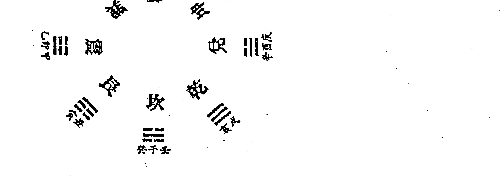
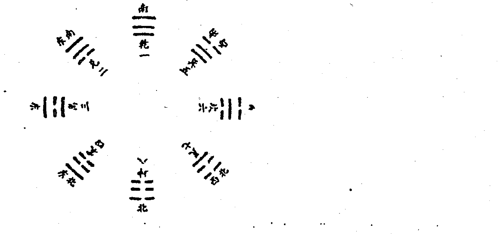

# 易占新枝志

中国哲学文化协进会出版

# 易占新技法

刘昌明 著

中国哲学文化协进会出版

- 书名: 易占新技法
- 作者: 刘昌明
- 总监: Alex Cho
- 编辑: 袁偲珍
- 横字排版: 万宝国际发展公司
- 电话: (852)81046178
- 出版人: 曹展硕
- 出版: 中国哲学文化协进会 九龙旺角亚皆老街43-49号雅佳楼6字47号
- 电话: (852)26183861 26188861
- 传真: (852)26181277
- 网址: www.168k.com 或 www.zhouyi.net
- 电子邮箱: 168@168k.com
- 印刷: 彩艺印刷公司
- 发行: 利源书报社 九龙旺角洗衣街245-251号地下 23818251
- 国际书号: 962-7943-57-6
- 定价: 25.00元

版权所有

本书任何部分之文字及图片未经出版人书面许可，不得以任何方式抄袭或翻印。

# 前言

时乖运蹇，大半生才有余钱营造安乐窝，费时将近一年。在此期间，全国广大易友、学员均多次来电、来函催我写书，不得已只好将平时学习心得集编成册，以慰同行。

书中除《细搜寻始见真谛》、《不可忽视物象的作用》、《卦理与变易断卦》等篇曾在邵伟华先生主编的《周易与应用》内刊上发表以外，其余几篇均属首次公开。书中所举实例真实，有案可查，运用的占断技法是多方面的，没有系统地分出条款，望同行自行体会理解。

水平有限，错误难免，望同行们不吝赐教。

刘昌明
庚辰年季秋

# 刘昌明先生简介

刘昌明先生生于一九五三年。祖籍，湖南省临澧县四新岗镇青林村。由于其父信奉佛道两教，对其影响极深，从小对五术玄学、文艺等均产生极大兴趣。头脑灵活，思维敏捷。

一九七一年，高中毕业后，招工进入县文工团工作。一九八二年调入县塘关工商所。工作期间，大量结识社会上命相职业人士，虚心求教，并拜民间术数高手为师。一九九〇年前后，开始系统地对周易预测、四柱预测等术数进行研究，广交易友。一九九四年，参加邵伟华先生在鄂州开办的周易预测函授班学习，同年，被常德市易学研究会吸收为该会会员，任理事。一九九六年，应邀参加邵伟华先生举办的中国首届周易应用学术研讨会，并在邵伟华先生主编的《周易与应用》内刊（96.5期）上发表题为《断卦取象趣例》一文。一九九七年，为邵伟中先生破译所著《四柱预测例题剖析》书中“马倒禄斜”秘诀，因此，与邵伟中先生结识。（注：后来，邵伟中先生所著《四柱预测答疑汇编》书中“马倒禄斜的破译”一文里，已将真实姓名隐去，本人现存有当时破译的打印件）。一九九八年春，被邵伟中先生聘请至该中心担任函测预测员，至一九九九年年底。在此期间，又在邵伟华先生主编的《周易与应用》内刊（99.1期，99.8期，99.10期）上分别发表题为《弦外音不得不察》、《卦理与变易断卦》、《细搜寻始见真谛》等文章。

现居家中，潜心研究易理命理。并与本地区同行开设湘北民俗文化研究室，对外开展预测教学业务。

# 目录

- 前言 1
- 刘昌明先生简介 2
- ### 第一章 专题论述 1
    - 弦外音不得不察 1
    - 不可忽视物象的作用 12
    - 心虔诚多占亦有验 19
    - 推以往以证将来 27
    - 决吉凶卦名须参断 36
    - 用神两现各司其职 46
    - 无故六亲不相叠 52
    - 六爻亦有得地说 59
    - 卦理与变易断卦 67
    - 断卦取象趣例 70
    - 异曲同工 72
    - 六十四卦卦名意象 76
- ### 第二章 杂占 89
    - 福临日月货源多 财爻得生终获利 89
    - 女患绝症无钱医 娘尽母爱沿街讨 91
    - 原神发动生用神 冲中逢合猫又回 93
    - 日月财官临旺地 世临动爻登高科 95
    - 妻财月破生意死 兄爻暗动又破财 96
    - 财旺用空工资少 夫星不临婚难就 98
    - 带鬼出门有虚惊 财世空破无饮食 100
    - 犹豫皆因世逢破 出破之日定起程 102
    - 妻财发动被兄克 即有口舌又耗财 104
    - 太岁贪合不克世 父官两旺工作稳 106
    - 财爻月破被兄克 妻子赌气回娘家 107
    - 合作者从中捣鬼 广东佬私下进货 110
- ### 第三章 六爻预测精髓 113
    - 第一节 八宫卦序 113
    - 第二节 装卦步骤 113
    - 第三节 卦爻 117
    - 第四节 六亲 137
    - 第五节 六神 神煞 155
    - 第六节 年 月 日 时 160
    - 第七节 其他 169
    - 第八节 爻的层次 172
    - 第九节 测来意 173
    - 第十节 解卦 175
    - 第十一节 断卦 178
    - 第十二节 断应期 189
    - 六爻诸占定位 194
    - 火珠林 195
    - 六十四卦精义 197
    - 写在前面的话 204
    - 具体断阳宅秘诀 205
    - 三刑四库 211
    - 断车辆 213
- ### 第四章 先天八卦与后天八卦 214
- ### 第五章 断六亲生肖详解 216
    - 一、断父母之生肖 216
    - 二、断子孙之生肖 216
    - 三、断兄弟姐妹之生肖 216
    - 四、断妻妾女友生肖 217
    - 五、断丈夫、男友生肖 217
- ### 第六章 六十甲子纳音表
- ### 第七章 实践卦例
    - 动静论
    - 虚实论
    - 内外论
    - 阴阳论
    - 空亡论
    - 旺衰论

# 第一章 专题论述

## 弦外音不得不察

在当今深化改革开放的年代，周易预测越来越被众多的人们所认识，这是件大好事。但是在众多的求测者中，部分人对周易预测的要素不太了解，往往在预测时不愿把实情直说，或故意隐瞒真象，这样给预测者（由其是我们预测水平不高的）在预测过程中造成一定难度，如果粗心大意，往往把卦断错。因此这就要求我们必须加强基本功的锻炼，在预测中理论结合实际，从卦象、卦数、卦理等多角度、多层次的认真分析卦象，才能立于不败之地，在人们中间树立起预测者的形象。本人在实际预测中经常碰到这样的情况，开始失误较多，后来吸取教训，总结经验，认真学习周易预测的理论，断卦时反复分析卦象，多层次、多角度寻找信息，总算摸到了一点经验。下面是我在实际预测中碰到的几个实例，由于预测水平不高，错误之处在所难免，望专家及同行们斧正。

## 测工作却是躲避公安

98年10月28日上午（农历戊寅年九月初九日）我正在与一名求测者进行四柱预测，忽然，来了两名陌生的年轻女子，说是请我预测。由于四柱预测尚未结束。我便客气地让她们坐下等待，待四柱预测完毕之后，问：“你们俩想测什么事？”“想测一下能不能找到工作。”“来，请这边坐”，我叫她们坐在我对面的座位上，令其中一名女子摇卦，摇得卦象为（艮为山）卦，当即我将卦排在纸上。

壬戌月戊申日 (寅卯空)

**艮为山**

| 爻位 | 六亲 | 爻象 | 六神 |
| :--- | :--- | :--- | :--- |
| 官鬼寅木、 | 世 | | 朱雀 |
| 妻财子水： | | | 青龙 |
| 兄弟戌土： | | | 玄武 |
| 子孙申金、 | 应 | | 白虎 |
| 父母午火： | | | 螣蛇 |
| 兄弟辰土： | | | 勾陈 |

排完卦一看，该卦静卦六冲，谋事不顺。测找工作，看父、官两爻，卦中父母午火，休囚于月令，病于日辰，原神官鬼寅木持世休囚旬空，受日建冲克，找工作恐怕没有希望，但应爻子孙申金为日建入卦临白虎冲世，必有它凶。

于是，我便改变原有测找工作的思维模式，开始重新分析卦象。官鬼持世，必有忧虑之事。父母爻休囚，官鬼爻空破，为无业人员。官鬼朱雀临于世位，为九流之人，凭嘴皮子吃饭。日建子孙申金白虎在应爻冲世，为公安机关，为擒捉，目前官鬼世爻旬空，11月3日（甲寅）出空，必受申金冲克。

审视卦象之后，我说：“看你们俩年纪轻轻，倒还蛮会说谎啊！”“没有啊，我们是来找工作的。”我见他们还是不肯说实话，便严肃地说：“从卦象中显示的信息看，你们俩没有正当职业，以前的所谓工作，干的不是很光彩的事，现在公安机关正在捉你们，对不对？”几句下来，只见这两名女子目瞪口呆，然后相互对了一下目，问：“您看看能不能躲掉。”我说：“从卦象分析，11月3日你们必定被捉，我看你们倒不如早点回家，到当地公安机关自首，免得罪上加罪”。

在卦象显示的真实情况之下，两名女子不得不以实情相告。原来，这两名女子一名姓苏，一名姓陈，是本县新安镇效区的待业青年，为生活之计，在新安镇某歌厅当歌女，为了多挣钱，不惜本人身家性命，干起了卖淫生涯，有时甚至于老板的歌舞生意而不顾，专和男人鬼混，最后导致与老板发生争吵，罢工不干。在这种情况下，老板不得不向当地派出所报告了她们的不轨行为。昨天由于她们离开了歌舞厅，派出所的干部扑了一个空，没有抓住她们。从卦象中发现，这两名女子均在十五、六岁就开始卖身生涯，至于后来是否被捉，由于新安镇离县城较远，不得而知。

## 测财运为的退赃赔款

98年12月8日下午（农历戊寅年十月二十日），一老年妇女偕同一中年妇女来到我的生意营业处，老年妇女进门便问：“请问您是不是姓刘。”我说：“是，找我有什么事。”落座后，那中年妇女说：“想测一下财运”，为准确起见，我又问，“是想做什么生意，还是想开门面，或是外出求财？”“都不是，就测财运”。看来她们对周易预测的要素不大了解，但从话中可以得知，是问终身财运，或是目前财运不好。于是，我叫她静下心来，开始摇卦，摇得卦象为《山地剥》卦：

甲子月己丑日 (午未空)

**山地剥**

| 爻位 | 六亲 | 爻象 | 六神 |
| :--- | :--- | :--- | :--- |
| 妻财寅木、 | | | 勾陈 |
| 子孙子水、 | 世 | | 朱雀 |
| 父母戌土： | | | 青龙 |
| 妻财卯木： | | | 玄武 |
| 官鬼巳火： | 应 | | 白虎 |
| 父母未土： | | | 螣蛇 |

卦象列出，我见卦中子孙子水临月建入卦持世，妻财寅木得月令之生，为世旺、财旺、福旺。财运不错，为什么还来预测财运呢？来者必有他意，为慎重起见，我不得不重新审视卦象。

卦中子孙子水为月建入卦持世临朱雀，妇女测卦，子孙旺而持世，必伤夫。卦中应爻官鬼巳火临白虎，受月建、世爻之克，难道是他们婚姻上出了问题？财官失地则婚上有灾，卦中世、财均旺，也不对？官鬼巳火临应爻，在内卦二爻上，丈夫有灾这是肯定的，什么灾？卦得《山地剥》，剥者，群阴剥阳之卦，腐蚀堕落之象。子孙子水临月建入卦持世，为司法机关，看到这里，我已心中有数，抬起头来，便对两位妇人说：“从卦中显示的信息来看，你们今天来恐怕不是问财，但也与财有关。”二位不语，我又指着中年妇人说：“你丈夫是个当官的，是副职，所站的位置较好，有受赠行为，十月份起司法机关对他进行了审查或处罚，你所问的财运恐怕是退了赃，而认为是你退了财，实际这不是你的财，是不义之财。”二位仍然不语，隔了一会儿，老年妇人说：“明天再来测她丈夫的吉凶，谢谢您！”说着便站身走了。

第二天中午，两名妇女果然来了，中年妇女又要求用卦测丈夫的吉凶，进而又测丈夫的四柱，通过四柱看，得知其夫今年命、运、岁财星合印，形成伤官见官，必有丢官罢职之事。
也许是自知不太光彩的缘故，自始至终这两名妇女没有透露姓名，也没有证实所测之事，只是问了一句会不会坐牢。

## 测回家测出妻子患病

98年3月13日下午（农历戊寅年二月十五日）在鄂州中心住读的学员，《浙江日报》社记者高××自占何日回家，摇得卦象为《山风蛊》之《火风鼎》卦：

乙卯月己未日 (丑空)

| 山风蛊 | 火风鼎 | 六神 |
| :--- | :--- | :--- |
| 兄弟寅木、应 | 子孙巳火、 | 勾陈 |
| 父母子水： | 妻财未土：应 | 朱雀 |
| 妻财戌土× | 官鬼酉金、 | 青龙 |
| 官鬼酉金、世 | 官鬼酉金、 | 玄武 |
| 父母亥水、 | 父母亥水、世 | 白虎 |
| 妻财丑土： | 妻财丑土： | 螣蛇 |

高××列好卦象之后，便与学员们共同分析，有的学员说：“财动化鬼，此次归家路上有小偷，注意钱财。”还有的学员说：“官鬼持世临月破，不利启程，动则有灾”……。彼此争执了一会，高××见仍无结果，便将卦象拿来给我看，“刘老师，请您帮我分析一下，看什么时候能回家？”当时由于笔测任务较紧，累得我头有些发昏，既然学员找到我了。也只好放下手中的钢笔，接过高××列好卦象的笔记本，仔细地为他审视卦象。

世临官鬼酉金，月冲为破，蛊卦为扫魂卦，世冲有动象，主占者已有归意。破待合，待出现，填实之日为应期，3月16日（辛酉）必要启程。但卦中财动化破化鬼，动必有因，难道真有小偷？古有“妻财临阳爻发动为财，临阴爻发动为妻子、为女人”之说，妻子定然有事，卦得《蛊》之《鼎》，蛊，疾病之卦；鼎，熬药之象，妻子生病了，卦象显示无疑，生的是什么病呢？《蛊》卦中互《雷泽归妹》，妻财戌土在兑卦之上爻，卦象《兑》耗泄妻财戌土，主、变卦中又重重酉金官鬼亦盗泄妻财，病必在肺部，况卦中又震巽重叠，主风、主寒，其妻必患重感冒，酉金官鬼月冲为破，易碎者非金属物品，应为玻璃制品对妻不利，有克害。看先卦象之后，我说：“你后天就要回家。家里妻子已经患了重感冒，室内还有一玻璃制品对妻子不利。”高××听后说：“我马上打电话回家，看您测得对不对。”由于当晚有事没有打电话，第二天高××从电话中得知，妻子确实患了重感冒，在测卦的当天，带病帮助别人辅导舞蹈，由于头昏站立不稳，摔倒在地上的时候，胸口撞在家中玻璃鱼缸的菱角之上。

辛酉日，高××果然启程归家，后得知一路平安。

## 细搜寻始见真谛

一般来讲，一组卦象的形成，其所测事物吉凶的信息标志，较为明显，易于判断。但有些卦象并非如此，所测事物吉凶的信息标志不够明显，或是不太引人注目。象这类卦象，预测中分析卦象时，往往对事物吉凶能够起决定性作用的关键所在，最易造成疏忽，稍有不慎，就会判断失误，差之毫厘，失之千里。

实际预测中，当一组卦象形成之后，必须冷静头脑，精心搜寻卦中所含的多种信息，进行全面地、仔细地分析，反复推敲，从而得出正确结论，准确无误地判断事物吉凶，为求测者当好参谋，指导事物的顺利进行。只有这样，才能使周易预测这门古老的决策学科发扬光大，取信于人，真正达到弘扬易学之目的。

## 麻烦出在爻位上

九九年三月二十三日，县食杂街某少妇特来请我预测歌厅的生意，摇得《地水师》之《兑为泽》卦。

己巳月庚申日（丑空）

**地水师 　 兑为泽 　 六神**
父母酉金：应　 官鬼未土：世　 螣蛇
兄弟亥水×　　父母酉金、　　勾陈
官鬼丑土×　　兄弟亥水、　　朱雀
妻财午火：世　 官鬼丑土：应　 青龙
官鬼辰土、　　子孙卯木、　　玄武
子孙寅木×　　妻财巳火、　　白虎

卦象一经列出，其店内生意红火，人头攒挤的热闹场面，活生生地显现在卦中。《师》之《兑》卦其卦名意象有顾客盈满，欢聚一堂，放声高歌，一展歌喉之意。

妻财午火持世，临月建旺地，虽子孙寅木发动相生，但刑逢冲，不利久远，但目前生意红火可知。

三重官鬼爻齐来夹世，临朱雀、青龙、玄武，唱歌的，喝酒的，寻花问柳的，均来光顾，客满为患，妻财午火持世临青龙，店主人满面春风，迎接不暇，热情周到。

初爻子孙寅木临白虎发动，为年轻人、小辈、顾客，与日、月构成三刑逢冲，还有打架争斗的。

“你目前店内的生意又不是不好，还问什么生意？”
“生意确实红火，另外几家的生意都不如我。但是，现在有点麻烦，您看怎么办？”少妇证实了生意红火的预测，又给我出了一道新课题。

麻烦出在哪里？

五爻兄弟亥水居坤宫，发动临勾陈而逢月破，不劫财、破财之事可以排除。

四爻官鬼丑土旬空，旺动化破而临朱雀，顾客中虽有五音不全的，但开的是歌厅，尽管不堪入耳，为了“金戈戈”忍而听之，算不上麻烦。

三爻妻财午火静化官鬼丑土，旺空居变卦《兑》《否》之间临青龙，边唱歌边喝酒，这也无伤大雅。

对了，看来麻烦就出在二爻官鬼之上。

二爻官鬼辰土居坎宫临玄武，阳居阴位在宅爻，此官鬼爻的图谋，不需多言，明眼人一看便知。

“从卦中看，目前你与一男顾客有暧昧关系，这恐怕就是你今天来预测的主要目的，也就是你所说的一点麻烦吧！”
少妇脸上泛起了微红，面带几分羞色。
“您分析得很对。其实，我们干服务行列的，对顾客都是服务热情周到，哪里知道，这人却自作多情，以为对他有意。近些日子，他每天晚上转钟了还打来电话纠缠不清。现在，我担心的是，长期这样下去，要是被丈夫知道了，那可不是闹着玩的。”
辩解也好，真情也好，不用管它。少妇前来预测的目的已经明白，预测应该就此划上句号。
之后，我便针对此事，与其谈了一些与人际关系、社会交往有关的问题，劝其早日斩断情丝，以免后患，少妇听后，感激非常。

## 玄机尽在空亡中

“刘老师，请你帮我断一个卦好不好？”九九年四月十二日上午，县农校校办工厂的负责人朱老师进门后，从口袋里掏出一张纸条递给我说。我接过纸条，见纸条上写着：

己巳月戊寅日 （申酉空）

**泽山咸　 天山遁**
父母未土×应　 父母戌土、　 朱雀
兄弟酉金、　　 兄弟申金、应　 青龙
子孙亥水、　　 官鬼午火、　 玄武
兄弟申金、世　 兄弟申金、　 白虎
官鬼午火：　　 官鬼午火：世　 螣蛇
父母辰土：　　 父母辰土：　 勾陈

“你测什么事？”我问。
“准备今天送货出门，但我看卦中世爻与日、月构成三刑，怕路上有麻烦。由于学易不精，自己拿不定主意，特来求您指教。”

朱老师由于以前送货，在路上经常遇到无理罚款和乱收费的麻烦，伤透了脑筋。故现在每次送货之前，自己都要摇卦一占，看看吉凶再走。

“请教不敢，我们来共同分析，您请坐。”二人落座之后，开始对卦象进行分析。

测出门，看路上是否有麻烦，应以官鬼爻为用神。卦中官鬼午火临月建旺地，又得日辰之生，与世爻兄弟申金紧贴相克。兄弟申金持世临白虎，与日、月构成三刑。应爻为收货方，又发动化进神。乍看卦中信息，此次送货出门，确有诸多不吉。

沉思半晌，突然，我发现了卦中的妙处：“没问题，今天可以走！”“道理何在？”“你再仔细看看。”朱老师看了一会卦象，还是没有发现卦中的玄机。

接着，我为其分析卦象说：“俗话说，吉处藏凶，凶中有吉，凶卦之中必藏其吉，不可轻易放过，你看，戊寅日，申酉旬空，卦中兄弟申金旬空持世，官鬼午火再旺又岂奈我何？此所谓避空难克。五爻为道路，兄弟酉金静化兄弟申金，静空化空又值月破，出门之人，道路逢空，畅通无阻，来去安然，何来麻烦纠缠？世爻兄弟申金静空不动，不能与日、月构成三刑。世为马星，被日辰冲实，冲起，今日申时你必走无疑。日辰带财神世，为财来就我，应爻为世爻之财库，早已动开，此去应有现款带回，应生世，说明对方对你多方关照，使你受益。”

“据你分析，今天去得？”“去得，保你一路平安，满载而归。”我又为其壮胆。朱老师听后，这才心里踏实了许多。

断完今天出门送货的吉凶，尚有余兴，故又为其断了此次送的是什么货。

子孙亥水为货物，被月建冲破，然又被日辰合起，我问“你今天送去的货是最近赶制的，仓库原本无货，对不对？”“是这几天赶制的。”子孙亥水居兑卦，兑为金属物品，圆而有缺，有口，兑又为小，亥居其中，此货物应该为能够溶水，体积不大的金属物。我说：“你今天送的这批货，应该是金属零件，与机械有关，里面能装水，或是油的东西，是不是？”“很对，是汽车零件，滤油器。”

两天后，朱老师满面笑容地来告诉我：“这次送货如你所测，一切都顺利，钱也拿回来了，对方对我们帮助很大。”

## 病因就在床位上

我的弟子，县农机监理站干部杨某，九九年六月二十四日上午，打来电话，说是他一位亲戚的女儿，今年正月初八日结婚，婚后十多天就开始生病，一直病情反复，不能治愈，问是否有办法查出病因。我说，得由她自己摇卦后再查。午饭后，杨某和他亲戚母女来到我处，摇得《火地晋》之《离为火》卦。

辛未月己丑日 (午未空)

|        | 离为火       | 火地晋     |
|--------|--------------|------------|
| 官鬼巳火、 | 官鬼巳火、世 | 勾陈       |
| 父母未土： | 父母未土：   | 朱雀       |
| 兄弟酉金、世 | 兄弟酉金、   | 青龙       |
| 妻财卯木× | 子孙亥水、应 | 玄武       |
| 官鬼巳火： | 父母丑土：   | 白虎       |
| 父母未土×应 | 妻财卯木、   | 螣蛇       |

查病因，以官鬼爻为用神，卦中官鬼巳火两重，且休囚不动，但有内卦寅卯未三合财局之生，世爻兄弟酉金入墓于日辰，受官鬼爻之克。火鬼克世，病在心经，卦中子孙子水伏于初爻之下，被日、月、飞爻之克，子水为血液，故病在心血。

> “目前，你的病似乎与心脏、血液有关，农历四、五月比较严重，对不对？”

> “对，医生说贫血，又有时发高烧，四肢酸软无力，可就是治不好，”

少妇证实了病症的判断。

病情明显，但又长期不能治愈，其中必有原因，原因出在何处？

子孙子水伏藏，被日、月、飞爻之克，为药不对方或用药无效之兆，内卦亥卯未三合财局，为太岁入卦冲世，世爻墓于日辰，一年多灾。古有初井二灶三床席之说。卦中卯木居床爻位发动，临玄武合局冲世，玄武主淫乐，世爻青龙被床爻冲而入墓，青龙主房事，子孙子水为肾水，被日、月、飞爻之克，又世爻与太岁相刑，为犯太岁，病因应该出在今年结婚不利，与房事太多之上。

面对初婚少妇，又有亲属在旁，怎么好说？

犹豫一会之后，我说：

> “今年不应该结婚，你的病因起于肾上，应该请中医治本培元才对。”

> “是肾脏有病？”

少妇的母亲问。

> “对，其表现症状有小便色黄，便结，头晕目眩，腰腿酸软无力，失眠，面色苍白，发烧心慌等。”

我说。

> “你说得很对，有时脸上还泛黑色，好怕人的！”

少妇的母亲证实说。

> “一定是肾亏伤了元气所引起的，希望抓紧治疗，节制房事。”

听了我的预测，母女俩高高兴兴地走了。

后来，听说改用中医治疗，病情有了明显好转。

## 不可忽视物象的作用

吉与凶，成和败，是一切事物发展的必然规律。吉凶成败的概念是依附于一切事物的发展而产生，没有事物的存在与发展，吉凶成败这一概念也就不复存在。

周易预测，自汉代易学大师京房发明火珠林预测法以来，均遵循与运用卦中的五行生克，刑冲合害，六亲六神等诸多因素，来推断事物的吉凶成败。但是，在我们的实际预测操作过程中，某些卦例仅凭以上因素判断，总觉得有些不够全面，或是难以达到预测事物的真正内核，在这些卦例中，事物或物象是产生吉凶成败的关键所在，故而断卦时对于事件物象的具体分析与判断，也是不可忽视的一个重要环节。只有这样，才能使我们对于所测事物的本质，更清晰，更明了，从而测出发生事物吉凶成败的根本原因，为求测者排忧解难，才是我们预测的真正目的。

## 病根源于树木上

九九年五月初七日，县城关个体水果经营者欧某，因儿子近期经常生病，不知是何原因，心中有些焦急，因此，特来请我预测，查其儿子生病的原因，摇得《火泽睽》之《天火同人》卦。

庚午月癸卯日 （辰巳空）

| 火泽睽 | 天火同人 | 六神 |
|--------|----------|------|
| 父母巳火、 | 兄弟戌土、应 | 白虎 |
| 兄弟未土× | 子孙申金、 | 螣蛇 |
| 子孙酉金、世 | 父母午火、 | 勾陈 |
| 兄弟丑土× | 妻财亥水、世 | 朱雀 |
| 官鬼卯木○ | 兄弟丑土： | 青龙 |
| 父母巳火、应 | 官鬼卯木、 | 玄武 |

父测于病，以子孙爻为用神。卦中子孙酉金持世，临月建午火之克处死地、又被日辰卯木冲破，虽有卦中原神兄弟爻重重发动夹世夹用，但兄弟未土被月建所合，动而被合，谓贪合忘生，兄弟丑土月生日克，又被卦中官鬼卯木为日辰入卦发动紧贴相克，也无力生助用神。

兄弟丑土又为子孙酉金之墓，动开而将其收入墓中，墓为医院，居三爻为床位，故卦中已明显的反映出其子已经住进医院的信息。

分析卦象之后，我对欧某说：“从卦象中反映的信息来看，你儿子现在已经住进了医院，病情较为严重，不知是否正确。”

欧某说：“是对的，今天早上我把他送进医院，办完住院手续之后，就到您这儿来了。您能从卦中看出我儿子是患的什么病吗？”

“好吧，试试看。”答应了欧某的要求之后，我又开始对卦象进行分析。测疾病，以官鬼爻为用神。卦中官鬼卯木为日辰入卦临青龙发动冲世冲用，木主风寒金主肺，用神子孙酉金被月克日冲，动爻又冲，从这点可以推断，其子应该患有伤风感冒之疾。

但官鬼卯木临青龙发动，对三爻兄弟丑土也有克害，兄弟丑土虽有月建之生为旺，但克多生少，也是有病之信息。三爻为腹部，丑土为脾胃，临朱雀发动主炎症，由此看来，其子的肠胃以及消化系统也有疾病。

本人不是医生，对于病理医理一窍不通，不知伤风感冒与肠胃、消化系统的疾病是否有联系。但我认为，两病同时发作的可能性不是很大，其病必有先后之分。古有“阳动主过去之事，阴动为未来之事”的说法。官鬼卯木临阳爻发动冲世冲用，说明其子伤风感冒的疾病应该发生在前。兄弟丑土临阴爻发动被官鬼卯木之克，肠胃、消化系统的疾病应该发生在后。

> “依卦中所反映的信息来看，你儿子以前患有伤风感冒的病，或是高烧咳嗽。但是今天住院恐怕不是因为伤风感冒，而是肠胃有病，消化不良。”

> “您分析得很对，前几次是伤风感冒，高烧咳嗽的情况都有。这次感冒刚好，肠胃病又犯了。”欧某证实了病症的预测之后又问：“他以前一直身体都很结实，从不生病，为什么今年经常生病，这是什么原因？”

什么原因？我想小孩生病无非是由于天气变化，受了凉，或是饮食不卫生等原因造成的，除此之外，还有什么？莫非……

对了，原因就出在这里，我突然眼睛一亮，把目光又重新盯在了二爻官鬼卯木之上。

书云：“二爻为宅，五爻为人。”官鬼卯木临爻阳居二爻阴位之上，不当位，又发动冲世冲用，克害兄弟丑土，其子生病的原因一定与房屋的环境有关。

官鬼卯木临青龙为树木，居于兑卦之中，兑主杀伐拆毁，又丁卯纳音为炉中火，按以上信息综合分析，应该有死树木对其子不利。

青龙为左方，内卦为后面，由此可知，其房屋的左后方必有树木被砍伐或毁坏。分析至此，我问欧某：“最近你是不是在你家的左后方砍了树木，或是树木被毁坏？”
“有，前不久，我家左后方的一棵白杨树枝风刮倒了，现在还压在我家的房顶上，由于忙于生意，一直没有时间动它。”欧某回答说。
“你儿子近期经常生病与这棵白杨有关，应该早点清除才好！”
“原来是这棵树的原因，我今天回家一定把它清除掉！”
卦象分析至此，我和欧某都为找到了其子生病的根源而感到高兴。欧某又问，“麻烦您再看看我儿子什么时候出院？”我说：“生病的根源已经找到，只要你及早把树木清除掉，你儿子不出巳午日就会有出院的可能。”
断完了卦象，欧某连声道谢之后，匆匆地回家清除树木去了。
三天后，欧某特地来告诉我，预测的当天，他把白杨树给清除了，第二天，也就是甲辰日，儿子就出了院，现在病也好了。

## 故障出在水塔中

九九年七月初五日，县某单位职工李女士，日其父新办一家制氧厂，在试机生产时，不能制氧，经多次检修，始终查不出原因，导致不能正常生产，造成损失上万元，故专程来找我，请求预测该厂吉凶，以及何时能够正常运转，摇得《泽风大过》之《火风鼎》卦。

壬申月己亥日 (辰巳空)

| 泽风大过 | 火风鼎 | 六神 |
|----------|--------|------|
| 妻财未土× | 子孙巳火、 | 勾陈 |
| 官鬼酉金○ | 妻财未土：应 | 朱雀 |
| 父母亥水、世 | 官鬼酉金、 | 青龙 |
| 官鬼酉金、 | 官鬼酉金、 | 玄武 |
| 父母亥水、 | 父母亥水、世 | 白虎 |
| 妻财丑土：应 | 妻财丑土： | 螣蛇 |

测办厂吉凶，以父母为用神。该卦父母爻两现，以世爻父母亥水为用神。父母亥水月生日拱，又得卦中妻财来土与官鬼酉金发动连环相生，用神有力。五爻为君位，为上级领导，临官鬼发动生世，说明其父办厂得到了上级领导的大力支持。用神旺相，表明厂房成厂址是新近开辟的。“从卦中的信息来看，你父亲这次办厂，建厂的地址是新开辟的，办厂的过程中，得到了各方面人士的支持，特别是上级领导对他的支持不小。”

“您说得很对，办厂过程中，县委书记，县长曾多次视察，和我父亲谈话，非常支持我父亲办厂。”李女士证实了以上预测又问：“您看这个厂今后前景如何？”

测企业前景，经济效益以妻财爻为用神，卦中妻财未土日、月均不临旺地，虽发动化子孙巳火回头生，但子孙巳火旬空，被日辰冲实不空，也需待时临旺才能发挥作用。

看了卦象后我说：“今年，由于下半年财爻与子孙不旺，故很难有明显的效益，明年是庚辰年，妻财临旺，上半年妻财爻与子孙爻都临旺地之时，经济效益一定能好起来，而且可以持续至2003年。”

“谢您的吉言，希望如此。”说到此，李女士情绪又急转直下，心思重重地问：“可是眼前的难关怎么过，我父亲这大半生的心血可都贴进去了，现在老不能制氧，每天损失上千元，您是否能帮助测测，工厂的生产到底什么时候能正常运转？”

预测工厂的生产何时能够正常运转，首先必须找出使工厂生产不能正常运转的根本原因，找出了原因，故障一经排除，工厂的生产自然就会正常运转。

工厂能否生产是以机械能否正常运转为前提，那么，预测能否正常运转，必须以父母为用神。卦中父母亥水得生得助，全无克耗，物极必反，此为卦中之病。主卦子孙午火不上卦，伏于世爻父母亥水之下，受日辰飞爻之克，全无生助，子孙爻为技术，为财源，财源被克，故尔不能投入生产，看来问题的根源就出在父母爻之上。

> 你父亲的制氧厂应该是机械设备上有毛病，加上技术力量不足，因此造成不能正常生产。

> 确是技术力量不足，机械设备进行了多次检修，但是都找不出原因，不知问题出在哪里？

卦得《大过》之《鼎》卦。《大过》卦其卦象有上缺，中圆而下有脚的金属物体之象，父母爻亥水旺之太过居于其中，变为《鼎》卦，亦有物体竖立，上圆而中空，下有立架之象，二者综合推断，故障应该与水塔有关，但我不知制氧厂是否有水塔，故问李女士：“制氧厂有没有水塔之类的设备？”“有，今天正准备清理水塔。”“这就对了，故障就在水塔之中。”我肯定地说。

什么时候能够排除故障？”李女士听我这么一说，似乎黑暗中见到了一线光亮，顿时精神振作地问我。

于是，我边分析卦象边对李女士说：“现在父母爻水太旺，如果不采取措施，顺其自然，必须要到寅卯或巳午日，病神逢耗泄，冲克之时才能排除故障。但我有一个使其早日清除故障的办法，明天要你父亲找一个属蛇的技术工清理水塔，因巳火可冲去亥水，午时子孙爻出现，可以正常运转，保你能够出氧。”

> “要是明天能出氧，我一定来感谢您！”

李女士把属蛇的年份都记在纸上，高兴地走了。预测就此结束。

一个星期之后，李女士的一位朋友蒋某，带其丈夫来我处预测时说：

> 这几天小李没时间来，特地要我来向您道谢，并反馈信息。就在预测的第二天他父亲采纳您的建议，找了一个属蛇的技术工清理水塔，果然上午十一点多钟就出氧了。

## 心虔诚多占亦有验

自古卜筮之规，均遵循“初筮告，再三渎，渎则不告”之原则。主张一事只占一卦，不可多占，在先民们的思想中认为，多占则亵渎神灵，神则不告。拿现在的观点来分析，其理由主要是多占则卦中反映的信息不够统一，难于决断。后至明代易学大师野鹤老人通过大量实际预测验证，认为若初筮遇事不明，可改日再占，这就充分说明，古之定法也不是永恒不变的。穷则变，变则通，通则久。这也是周易的内在核心，是一切事物发展的必然规律。实际预测中，常会遇到求测者对于所测事物始终放心不下，一而再再而三的要求测个究竟，处于这种情况之下，我认为只要求测者心地虔诚，而所测事物确系紧急，或事关重大，一般来讲，多占亦有应验，若求测者，心中无事，或是所测之事无关紧要，加上占卦时又心不在焉，不仅多占不验，即使只占一卦，也未必应验。

## 学习资料何时到

在参加邵伟华老师周易预测函授班学习期间，九五年的五月初五日上午八点多钟，同期易友胡某前来找我，要求帮助解答函授资料中的几个疑难问题。当我接过资料一看，发现这一期的函授资料我还没有收到。在为其解答资料中的问题之后，便打电话至鄂州中心，询问我的资料是否发出，对方回答已经发出。既然发出，为何迟迟不能收到？心中有些疑虑，故按打电话的时间起得《水雷屯》之《泽雷随》卦，测函授资料到底何时能收到。辛巳月甲子日 (戌亥空)

| 水雷屯 | 泽雷随 | 六神 |
|--------|--------|------|
| 兄弟子水： | 官鬼未土、应 | 玄武 |
| 官鬼戌土、应 | 父母酉金、 | 白虎 |
| 父母申金× | 兄弟亥水、 | 螣蛇 |
| 官鬼辰土： | 官鬼辰土：世 | 勾陈 |
| 子孙寅木：世 | 子孙寅木： | 朱雀 |
| 兄弟子水、 | 兄弟子水、 | 青龙 |

预测函授资料何日到，以父母爻为用神，卦中父母申金发动，休囚于月令死于日辰，为不利之兆，但动而与世爻子孙寅木相冲，用神冲世为资料可以到手之信息。

为何迟迟不到，其原因出在何处？

用神父母申金发动化空化破，又日、月不临旺地，此为不利因素之一，用神冲世，虽为可得之象，但用神父母申金动而被月建合住，故尔不能准时到手，此为不利因素之二。

那么函授资料到底什么时候能到手？

用神发动化破，破待合，合破之日为应用。用神发动又被月建合住，合待冲，冲破合局之时，也为应期，二者综合分析判断，函授资料应该在丙寅日，合破冲用之时可以到手。

卦象就分析判断至此，只等丙寅日函授资料一到，就算此卦预测准确。

五月初七日（丙寅）的早上，我打开了商店的大门之后，便注视着街道上的过往行人，盼望着邮递员早点到来。大约八点多钟，邮递员果然来了，心想，今天我的函授资料马上就可以到手了。只见邮递员送完了左右邻居的报纸刊物及信件之后，骑上自行车，一溜烟地走了，连招呼也没有和我打一声，使我落得一场空欢喜。

为什么今天函授资料还不能收到，莫非是我的卦象分析错了，于是我又翻开纪录本，重新分析卦象，觉得没有错，应该这样分析，可眼前的事实摆着，没有应验，这是为什么？

无奈只得再占一卦，当时摇得《水雷屯》卦。

辛巳月丙寅日 (戌亥空)

| 水雷屯 |        |
|--------|--------|
| 兄弟子水： | 青龙   |
| 官鬼戌土、应 | 玄武   |
| 父母申金： | 白虎   |
| 官鬼辰土： | 螣蛇   |
| 子孙寅木：世 | 勾陈   |
| 兄弟子水、 | 朱雀   |

天下之事竟有如此之巧，甲子日的时间卦是《水雷屯》之《泽雷随》，今天摇卦又得《水雷屯》，还是以父母申金为用神，用神被日辰之冲，转而用神又冲世，世爻临日辰旺地，该卦反映的信息，还是应该今天收到函授资料，可是，邮递员就是没有送来，怎么解释？

一时解释不通，故尔，自认为卦象不准，只好搁置一旁，不去管它。

已经是下午快五点钟的时候了，我爱人公司的电工邓某，来到我经营的商店中抄电表，顺手从手提袋中拿出一封信递给我。

> “刘师傅，批发部那边今天有你的一封信，我过来抄表，就顺便给你带过来了。”

“好，谢谢您！”我接过信一看，信封上面的通信地址是湖北鄂州，再打开信封，不由我惊喜万分，惊的是卦象已经应验，喜的是函授资料终于到手了。“什么时候送到的？”我问。

“不太清楚，大概是上午吧！”邓某抄完电表走了。

高兴之余，我想，预测虽然对了，但只能算测对一半，为什么应在这个时候，为了查个究竟，我又翻开记录本，认真分析今天的卦象。

原来是用神父母申金日冲为动，但被月建之克处死地，用神不旺，必待临旺之时为应期，故放在批发部，要到申时用神临旺才能到手。看来不是卦中的信息有错，还是本人的预测技术水平跟不上的原因。

## 工作调动能否如愿

九五年八月十九日中午，刚吃完午饭，电话铃突然响起，我拿起话筒一问，原来是常德市档案局干部蒋女士。她说，现在有消息说，让她调动工作，想请我预测一下，看有没有调动的希望。我说：“好吧，您等十分钟后再打电话听结果。”当时，我放下话筒，按打电话的时间，起得时间卦为《山水蒙》之《风水涣》卦。

乙酉月丁巳日 （寅卯空）

| 山水蒙 | 风水涣 | 六神 |
|--------|--------|------|
| 父母寅木、 | 父母卯木、 | 青龙 |
| 官鬼子水× | 兄弟巳火、世 | 玄武 |
| 子孙戌土：世 | 子孙未土： | 白虎 |
| 兄弟午火： | 兄弟午火： | 螣蛇 |
| 子孙辰土、 | 子孙辰土、应 | 勾陈 |
| 父母寅木：应 | 父母寅木： | 朱雀 |

列出卦象之后，我便认真地分析卦象。测工作调动，以官鬼爻为用神，卦中官鬼子水发动月生日克无妨，但不利动而化兄弟巳火，为用神化绝，此为不利因素之一。

父母爻为工作关系，个人档案，或是上级的调令，卦中父母寅木被月令之克处死地，又墓于日辰，旬空，表明工作关系，本人档案仍然存在库中，动不了，或是没有调令下来。

分析至此，蒋女士的电话又打来了，我只得在电话中边分析卦象边告诉她预测结果。

> 从卦中反映的信息来看，你这次调动工作的事，恐怕难得成功。

“您再仔细看看，因为这个消息是一位领导透露给我的，应该不会有假。”听蒋女士的语气，似乎对这次调动有十足的把握。

卦得《蒙》之《涣》卦，《蒙》者，为疑惑不前之卦，《涣》有好事消散之意，结合蒋女士测调动工作一事分析，意味着此事不了了之，一场好事最终成为泡影之义。卦名意象与卦中信息基本一致。

“我已经认真地分析了卦象，不会错，这次工作调动确实不会成功。”我肯定地回答。

“如果继续在原单位工作，今后又会怎样？”蒋女士又问。

测工作调动之卦，以世爻代表原单位，以应爻代表调动之单位。卦中子孙戌土持世，虽月令休囚，但有日辰拱扶，又有原神兄弟午火被日辰合起，紧贴相生。子孙持世，官鬼不旺，说明单位比较自由松散，工作不太紧张，应爻父母寅木，休囚又旬空入墓于日辰，说明调动的单位不太好，父母爻为劳碌之神，工作比较辛苦，或是条件差。

“从卦中的信息来看，你现在的单位应该很好，工作也不太紧张，自由自在，而想调去的单位，不是环境不好就是条件差，依我看，应该就在原单位工作的前途要大一些。”“刘师傅，您分析的单位情况是对的，好，谢谢您。”

由于时间关系，蒋女士不得不挂断了电话。

当天晚上，已经是八点多钟了，我正准备关上商店的大门回家休息，电话铃又响起来了，拿起话筒一问，又是蒋女士打来的电话。“刘师傅，下午单位的领导专门来调查了解我的工作情况，看样子有可能调动，麻烦您再帮我测一次好不好，”犹豫了片刻之后我说：“好吧，你等一下。”我当时拿出了纸笔，快速地按时间起得《山泽损》之《山雷颐》卦。

|      |      |          |
| :--- | :--- | :---     |
| 乙酉月丁未日 |      | （寅卯空） |
| 山泽损 | 山雷颐 |          |
| 官鬼寅木、应 | 官鬼寅木、 | 青龙 |
| 妻财子水： | 妻财子水： | 玄武 |
| 兄弟戌土： | 兄弟戌土：世 | 白虎 |
| 兄弟丑土：世 | 兄弟辰土： | 螣蛇 |
| 官鬼卯木○ | 官鬼寅木： | 勾陈 |
| 父母巳火、 | 妻财子水、应 | 朱雀 |

卦中用神两现，以官鬼卯木为用神，官鬼卯木旬空，发动不为空，但不利月破入日墓又化退，用神衰弱至极。

再看卦中父母巳火日、月也不临旺地，又静化妻财子水回头克，也有调令难以到手之象。

“小蒋，我看你还是死了这条心吧，这个卦中的信息也表明工作调不动。”

“又是调不动，您没有看错吧！”蒋女士还是不相信。

“卦中兄弟爻四重，党多势众，兄弟爻多必有争夺，我看这次调动有被他人取而代之之兆。”我又分析卦象说。

“今天明明是了解我的情况，怎么会是他人呢？”

“因为卦中信息是这样反映的，所以我只能这样告诉你。”

“这样吧，等星期六那天，我专程来临澧，麻烦您再测一次行不行？”

“好，您来吧！”看来蒋女士是不到黄河心不死。

预测结束了，我也该关门回家休息去了。

三天后，也就是八月二十日（星期六），蒋女士果然乘车来到临澧，专程来预测工作调动的情况。进门落座之后，便迫不及待地要去铜钱，诚心地摇得《风天小畜》之《乾为天》卦。

乙酉月庚戌日 (寅卯空)

| 风天小畜 | 乾为天 | 六兽   |
|----------|--------|------|
| 兄弟卯木、 | 妻财戌土、世 | 螣蛇 |
| 子孙巳火、 | 官鬼申金、 | 勾陈 |
| 妻财未土应 | 子孙午火、 | 朱雀 |
| 妻财辰土、 | 妻财辰土、应 | 青龙 |
| 兄弟寅木、 | 兄弟寅木、 | 玄武 |
| 父母子水、世 | 父母子水、 | 白虎 |

用神官鬼爻不上卦，以月令官鬼为用神。官鬼酉金临月令为旺，有原神妻财未土发动之生，卦中官鬼酉金伏于妻财辰土之下，与飞爻相生相合，看似有调动之希望。

但不利世爻父母子水月生日克，又动出妻财未土相克，世爻与父母爻被克，怎能调动。应爻为调去之单位，发动克世。也说明接受单位有了变化。虽月令官鬼爻旺而生世，这只能说明原单位的领导对其较为看重而矣。

又《小畜》卦有留住之意，变《乾》卦六冲，更表明事情不会成功。看完了卦象，我对蒋女士说，“事不过三，你三次的预测结果都反映出这次工作不能调动，我看再就不用预测了，还是安心地在原单位工作吧！”

“今天的卦象又是调不动？”“调不动！”我又不厌其烦地把卦中的信息给她重新分析了一遍，蒋女士这才定下心来，相信了我的预测。

至今，蒋女士仍在常德市档案局工作，一直没有调动。据说这次调动确实被人取而代之。

## 推以往以证将来

《断易大全》书中云：“爻在卦前言未来,爻在卦后言过去,六爻先以卦为身,然后看其爻发处。”以及其它一些筮书中所言：“阳动主过去之事,阴动主未来之事”等。均说明周易预测不仅可以预测事物的未来吉凶,其过去所发生的事物吉凶,卦中亦有残留信息,只要我们准确地把握与运用五行生克制化,刑冲合害,以及卦象、卦理、卦义等诸多预测手段,对卦象进行认真分析,其以往所发生的事物吉凶,就会清楚地显现出来。

预测就是为了避免,在我们实际预测过程中,有些人不懂这一道理,预测归预测,预测过后,该怎么干仍然怎么干。在他们的心目中,认为“是祸躲不脱,躲脱不是祸,倘若命该如此,也就只有听天由命罢了。有的人则认为随便掷几次铜钱,就讲得神乎其神,未必有那么神奇,信则有,不信则无,对所测事物吉凶持有侥幸心理。吉利时,不好好把握时机,发展事业。有灾有祸时,不主动地避灾躲祸,因而使周易预测失去了本来意义。

为了使求测者对于所测事,能够真正的达到趋吉避凶之目的,我认为对于卦中所含残留信息,很有必要为其测出,这样,才会使求测者在大量以往已发生事物吉凶的事实面前,不得不对目前所测事物吉凶引起高度重视,真正使其达到求测之目的,把握命运,趋吉避凶。

## 脏手难卜好卦

九九年三月二十四日上午,本县城关一伙年轻人在我经营的歌厅内玩耍时,其中一金姓青年请求我说:“刘师傅,这几天我准备出门,请您帮我看看这次出门之后财运怎么样？”“想预测？”“对？”“那就请你摇个卦吧！”交待了摇卦的要领之后,金某便诚心地摇出《中孚》之《乾》卦。

己巳月辛酉日 （子丑空）

| 风泽中孚 | 乾为天 | 六兽 |
|---|---|---|
| 官鬼卯木、 | 兄弟戌土、世 | 螣蛇 |
| 父母巳火、 | 子孙申金、 | 勾陈 |
| 兄弟未土× | 世父母午火、 | 朱雀 |
| 兄弟丑土× | 兄弟辰土、应 | 青龙 |
| 官鬼卯木、 | 官鬼寅木、 | 玄武 |
| 父母巳火、应 | 妻财子水、 | 白虎 |

出门求财,以妻财爻为用神,卦中财不上卦,子水妻财伏在五爻父母巳火之下,绝于月令与飞爻。又被兄弟未土持世发动化父母午火回头生,兄弟丑土发动化进神旺克。

“你的手气(运气)也太差了,怎么就卜出这么一个卦。”“怎么样?”听我这么一说,金某有些迫不及待地追问。“我看你这次出门,不但无财可求,还恐与人发生争斗口舌。农历三、四、五、六月只图平安,莫要想求财为上。”

说完之后,我抬起头来看了看金某的脸色,似乎对我的预测有些不乐意。为了征得其对我的预测信奉,不得不对该卦进行信息搜寻,断出其以往发生之事,来验证预测的准确性,从而引起金某对此次出门求财不利的高度重视。

日、月与卦中丑土三合子孙局,冲克内卦二爻官鬼卯木,兄弟旺动,子局冲官,必有违法之事。“你在九三年(癸酉)为钱财之事,冒犯了官府,有违法行为。”

“你继续说，”金某不露声色。

卦中兄弟未土，丑土均临旺地发动，九四年甲戌，流年与动爻构成三刑。

“九四年，你有牢狱之灾。”
“这也算得出来？”金某对我的推测有些惊异，开始心血来潮。
“你再仔细看看，连几年还有一些什么事。”

解释了能测出以往发生之事的原因，我又继续为其边分析卦象边说：“九五年，乙亥，流年冲动父母巳火；世爻得生，刑满释放，该年求财见财。去年戊寅，流年与五爻寅巳申构成三刑临勾陈，别人违法，与你有牵连，但没有酿成大祸，卦中子孙局冲官，兄弟爻旺动克财，你的求财方式，应该是与官府、公安机关对着干的行业。（实际是偷，抢之事，不好明说。）如果说，我推断你以往所发生的事不错的话，断你这次出门求财不利，也应该不会错，希望你谨慎从事，不要惹出麻烦，对自己、对社会都不太好。”

金某证实了以往之事推断准确之后，感慨地说：“命里只有八角米，走遍天下不满升，我这一辈子只怕也难得发财。”

农历六月，金某从广东回来，两手空空，口袋布挨布，见到我之后说：“经过你预测之后，在外不敢乱来，钱也没有捞到，只好回来受穷。”

## 世克动财求财难

九九年的四月初七日，县百货大楼的女职工刘某经人介绍，特来请我预测运气：“刘老师，听说您的周易预测挺准的，请帮我测一测运气好不好！”“能不能帮您测准说不定，不过可以试试看。”我让其摇卦，当时摇得《天水讼》之《风水涣》卦。

己巳月癸酉日（戌亥空）

| 天水讼 | 风水涣 | 六兽 |
|---|---|---|
| 子孙戌土、 | 父母卯木、 | 白虎 |
| 妻财申金、 | 兄弟巳火、世 | 螣蛇 |
| 兄弟午火〇世 | 子孙未土： | 勾陈 |
| 兄弟午火： | 兄弟午火： | 朱雀 |
| 子孙辰土、 | 子孙辰土、应 | 青龙 |
| 父母寅木：应 | 父母寅木： | 玄武 |

测运气，全观卦中信息，分析六亲旺衰。

卦中兄弟午火持世，得月建拱扶临旺地发动，又化未土回头合。妻财申金虽月合日拱，但不利兄弟午火发动相克。兄弟爻临阳爻动，占者以前曾有破财耗财之举。

“你今年财运不佳，特别是四、五、六月，多耗财，开销之事。”

“您说得很对，上半年我开了一家南货店，钱没有赚到，什么房租、税金等，照样还是要开支，生活都保不到。您看，我打算出门做生意，情况怎样。”刘某问。

卦中妻财申金被月建合起，子孙辰土被日辰合起，均为有力，且子孙爻为土，占者出门做生意，应与土有关的行业较为合适。

世爻兄弟午火发动，为世动克财。为人跟财赶，求财辛苦，农历九、十、冬月世爻临墓绝，财爻亦不旺，难有效益。

“你做的生意应该与土有关，而且是较大的生意，对不对？”

分析了卦中信息之后问。

“是推销瓷砖，生意不大也不小。”

“卦中信息表明，做这方面的生意，人很辛苦，但是获利不大，冬季几乎没有财。”

我看不做为好。

刘某听了我的预测判断，似乎有些不满意，又问：“您能从卦中看出我以前的事情吗？”

“可以试试看。”我见刘某有些不太相信我的预测，只得为其测一测以前发生之事。

“九二年，流年壬申，妻财临于旺地，你有恋爱之举。九三年，癸酉，妻财旺世爻酉午逢破，应该结婚，不知是否正确。”

“很准，很准，你继续说。”

既然卦中这一信息准确，可见其它信息应该也不会错，于是，我又为其分析其它信息。

“子孙戌土旬空，九四年，甲戌、流年出空，内卦子孙辰土带合逢冲，且辰土临青龙，主喜事，该年应生子。”

“对，这年我生了一个女孩。”

“九六、九七年，丙子，丁丑与世爻兄弟午火，子午相冲，丑午相害，本人或兄弟姐妹有灾，世临勾陈，应该是病灾。”

“这两年，我弟弟患直肠癌。断得真准！”刘某见我断了几件事，心情激动地说。

“九八年，戊寅，与五爻妻财申金，月建巳火构成三刑，五爻为夫位，你丈夫应该为钱财之事与人发生争斗，而且还破了财。九九年己卯，父母爻临太岁，财源被克，求财艰难。”

卦象分析至此，刘某所测运气之事基本结束，但是，刘某见预测准确，兴趣很浓，又连连催促说：“还能测出什么，麻烦您再看看。”

“预测以前所发生的事件，是为了证实为你所测以后之事的准确性，其它就不必测了吧！”我有些不愿为其再测，一是怕测多了不准，对方不相信今后所测之事，二是多测无非是一些旁门左道，离题太远。

“您是怕不给您付钱，是不是？保证不会少您分文。”

我见刘某死活纠缠，不得已又为其分析卦象。

“主变卦兄弟爻五重，虽财爻申金有日辰拱挟不弱，但卦中官鬼不上卦，有群比争财之象，你家兄弟姐妹五个，为钱财之事，或家中产业有争执，或各怀私心。”

“兄弟姐妹刚好五个，相处只是平常。”刘某证实说。

“二爻为宅，被月生四合又临青龙，你家门庭热闹，来往人客较多，父母寅木为房厦，休囚又被日辰之克，寅为三数，你家应该是旧房三间。青龙为左，辰为水库，居坎宫，说明你家左方有水井一口。”……

哆哆嗦嗦，我为其从风水角度又断了一些事之后，刘某均证实准确，再也不好意思继续追问。

“我今天算是太开眼界，周易预测竟有这么神奇，佩服、佩服。”刘某边说边付给我预测服务费，并说：“我绝对相信你预测我今年下半年生意不太好的情况，谢谢，谢谢！”

## 离婚必有原因

九九年八月十八日下午，朋友于某的儿媳妇带来一龚姓女士，请我预测婚姻，当时摇得《火山旅》之《火天大有》卦。

| 癸酉月壬午日 | (申酉空) |      |
|--------------|----------|------|
| 火山旅       | 火天大有 |      |
| 兄弟巳火、   | 兄弟巳火、 | 螣蛇 |
| 子孙未土：   | 子孙未土： |      |
| 妻财酉金、应 | 妻财酉金、 |      |
| 妻财申金、   | 子孙辰土、世 | 朱雀 |
| 兄弟午火×   | 父母寅木、 | 青龙 |
| 子孙辰土×世 | 官鬼子水、 | 玄武 |

女士预测婚姻，以官鬼爻为用神。该卦官鬼不上卦，官鬼亥水伏于妻财申金之下，申金旺空不算空，为飞来生伏得长生，用神旺于月建又得生有力。

但不利忌神子孙辰土持世发动，得兄弟午火日辰入卦之生，幸有月建酉金与世爻辰土相合，动而逢合，谓之合住，官鬼亥水暂不受克。

又卦中动爻，世爻，与日月构成辰午酉亥自刑，用神与世爻均在刑害之中。种种迹象表明，其婚姻已出现危机。

“你目前想离婚是不是？”

“能不能离掉？”一语中的，从龚女士的问话中可以知道，判断是准确的。

闹离婚必有原因，其原因出在何处？卦得《火山旅》，有旅居、旅行。出门在外之意。世爻居于辰土之上，辰为东南方，近水处。《旅》卦大象内为《艮》，有门面之象，外为《离》而中互《兑》，子孙持世，均有文化娱乐之意。

子孙辰土发动临玄武化出官鬼子水日冲暗动，与世爻子辰半合。《旅》大象也为六冲，虽表明婚姻离不了，女人合多，并非好事。

“从卦象分析，你们的婚姻缘份还有，暂时离不了。你现在没有在家，应该在东南方的近水处，在一个娱乐场所工作。目前应该与一个男士有暧昧关系。”

“对，我现在是在温州一个娱乐场所工作，至于……”说到隐私之处，龚女士似乎有些不好意思证实，其实，我心中早已有数，至此，我又顺藤摸瓜地分析卦象。

书云：“动则生吉凶”，卦中兄弟午火发动化父母寅木临青龙回头生，虽目前寅木日月处死地无力，但兄弟午火得日辰拱扶自旺。间爻为中间人，知情者，生世爻而克应爻。月令酉金为官鬼亥水之原神，为男方的家长，与世爻子孙辰土相合。由此可以推断：目前有朋友或知情者劝其离婚，而男方家长对其比较看重，而使得下不了决心。

“现在有人劝你离婚，我看这不是好心，希望你千万不要听信，而且你丈夫的家长也不会同意，他们对你很器重。不过，今年农历十月，由于亥水，与世爻，日月构成自刑，你们夫妻之间定会发生矛盾，请你一定要妥善处理好内外关系。”

龚女士听了我的分析，只是点头地笑了笑，没有作答。

另外，从卦中反映的信息来看，辛巳年，仇神临于旺地，冲用神而生忌神，原神被合，应防婚姻破裂，但考虑龚女士正处于五心不定的时候，故没有告诉她。

一番闲谈之后，龚女士又问：“能不能从卦中看出其它情况，比如财运，丈夫的运气等？”我说：“可以。”

八月占得《火山旅》卦，大象处死地，父母爻卯木不上卦，伏于世爻子孙辰土之下，月冲为破。

“首先分析你的家庭情况，你家父母的经济条件不太好，九三年父亲应该有灾，来自子宫方或是伤灾。九六年，酉卯冲加子卯刑，父母有病灾。近两年，虽无大灾，但由于不和，免不了夫妻争吵，又与世爻子孙辰土相害，给子女造成心理压力。”

“对，是这样，九三年，我父亲由于经济问题破产了，九六年生病，近几年夫妻间确实不团结。对子女不利。

“官鬼亥水虽伏藏，但有飞神之生，财官不弱，九三年，财爻临于旺地，生官鬼爻而与世爻相合，该年底该是结婚的年代。世爻与子孙辰土动化官鬼，第一胎应该流产。九四年，流年冲动变卦中辰土，辰土临乾宫居阳爻而得应，应该生一男孩。九二、九三年以及九五、九六年，财富临旺地，你丈夫运气很好，财运也不错。”

“我们是九三年结的婚，第一胎只有三个月就流产，现在是一个男孩。那几年财运还可以，爱人工作也顺利。”“还能看些什么？”龚女士听得入了神，迫不及待地继续往下追问。

“子孙辰土持世，说明你现在是自由人，九四年辰戌相冲，太岁冲世，子孙临旺而克官鬼，这年你应该离开单位，去年戊寅年，与卦中马星申金相冲，应该去年出门。近几年，由于卦中财爻临旺地，在外财运也不错。”

“对，我是九四年离开单位的，在县城做了几年生意，就是不赚钱，所以，去年就到温州去，现在财运还可以，今后呢？”

明年、后年，除婚姻不顺之外，财运仍然可以，希望抓住时机，但也要注意婚姻，“至于卦中的信息，还有很多，今天就断到这里，以后再说吧！”

“好，谢谢您！”龚女士听了我的预测，很高兴地走了，至于今后的情况还有待验证。

## 决吉凶卦名须参断

六十四卦,每卦有一卦名,它是我国古代先哲们依据卦象、卦理,卦义等而制定,卦名是一个卦中象、数、理的高度概括。实际预测中,一组卦的卦名意象,对于所测事物的吉凶,有着强烈的倾向性,它会给预测者从某个角度,或是某个方面,有一种较明显的暗示,甚至,对于所测事物吉凶,卦名意象就已经显露无疑。因此,我们在实际预测过程中,千万不可忽视卦名意象的重要性。

周易的核心在于变通,结合卦名意象判断事物吉凶,也应遵循变通之原则,不可执一,食古不化。一组卦的卦名组合,不是随意的,预测时,应针对所测事物,将其视为是所测事物的一个整体信息,或是所测的运行轨迹,在原卦名意象的基础上,充分发挥联想,广开思路,拓展卦名意象,以求达到与所测事物的吉凶相接近,结合卦中五行生克等诸多因素,进行全面的综合分析、排除其它因素的干扰,单刀直入地切中要害,使我们的预测水平达到精益求精。

## 忧散喜生

县文化大世界陈女士,因其儿子大学毕业后,尚未安排工作,近期,亲友们为其多处活动,心想安排在县广播电视局工作,但不知能否如愿,心中没底,故于九五年七月十日特来我处请求预测,当时摇得《雷水解》卦。

癸未月戊辰日        （戌亥空）
雷水解
妻财戌土：        朱雀
官鬼申金:应       青龙
子孙午火、       玄武
子孙午火:        白虎
妻财辰土、世     螣蛇
兄弟寅木:        勾陈

预测能否参加工作,应以官鬼爻为用神,兼看父母爻。卦中官鬼申金得日、月之生为旺,世爻妻财辰土临月建旺地,又得日辰拱扶。为世旺妻财旺,但不利父母子水不上卦,伏于初爻寅木之下,入墓于日辰,又受月令之克,虽有“旺相能生衰父”之说,但爻入墓,难以受生,故兆示目前参加工作的时机尚未成熟。

“你儿子参加工作的事,由于卦中父母爻不旺,近几天恐怕难以办成。”

看了卦象之后,我对陈女士说。

“您再仔细看看,今后还有没有希望,现在广播电视局的两个领导我们都打了招呼,莫非还有什么变化?”

可怜天下父母心,陈女士听我这么一说,心中焦急地连连追问。

卦得《雷水解》其卦名意象有春雷行雨,忧散喜生之义,结合陈女士为儿子预测参加工作之事,可理解为顺天得时,问题最终能够得到解决,心痛可以消除之意。

用什么方式去解决,什么时候能够得到解决,这是该卦预测成败的关键所在。

六爻妻财戌土旬空,被日辰冲实、冲起,官鬼申金得妻财戌土之生,此种信息暗示着陈女士的儿子要想参加工作,还需花钱买嘱官方,方可如愿。

“据卦中信息显示,你儿子要想参加工作一事顺利进行,还得花钱打点。”

“花钱买嘱官方，不知你以前是否开始行动？”

“没有，没有，因为广播电视局领导的家属和我亲友的关系都很好，我看，不花钱应该没有问题的。”陈女士自信地说。

“依我看，还是花点钱的好，免得节外生枝，而且今天就要开始行动。”我诚心地奉劝了陈女士几句。

“好！俗话说，儿女身上好安钱，忙忙碌碌大半辈子！还不是为了儿女，只要有希望，花点钱也值得。”陈女士这下可拿定了主意，又问：“您看什么时候能得到招工的消息？”

父母爻为工作关系，个人档案。为录取通知，卦中父母子水伏藏，被月建之克又入日墓，农历七月十三日交秋，进入七月令，初爻飞神兄弟寅木被月建冲破，伏神易于引拔，用神父母子水与日辰申子辰三合为旺，于日、用神出现，三合局中神有力，实为应期。

“从卦中诸多因素判断，你儿子招工的事，应该在七月十八日有消息。”

“只要有这么一天，那我就谢天谢地！”

预测就此结束，陈女士高兴地走了，并打算当天晚上就花钱去走关系。

后来，陈女士专程来向我反馈了信息。

就在预测后的第三天，情况有了变化，今年全县正规录取大学毕业生，有三百多名需要安排工作，由于县直各单位工作人员基本饱和，给大学毕业生的工作安排造成了困难，因此，县政府研究决定，所有自费生暂时不予安排工作。但陈女士的儿子，由于提前走了关系，又加上广播电视局的领导与其亲友关系要好，故而，被破格录用，接到通知的时间，刚好是七月十八日。

事与愿违

九七年的四月二十三日上午，县交电大厦职工张女士，因其女儿今年参加高考，不知能否考上大学，心中没底，故特来请我预测，当时摇得卦象为《火泽睽》之《天水讼》卦。

| 乙巳月辛未日 | （戌亥空） |
| :--- | :--- |
| 火泽睽 | 天水讼 |
| 父母巳火、 | 兄弟戌土、 | 螣蛇 |
| 兄弟未土× | 子孙申金、 | 勾陈 |
| 子孙酉金、世 | 父母午火、世 | 朱雀 |
| 兄弟丑土： | 父母午火： | 青龙 |
| 官鬼卯木、 | 兄弟辰土、 | 玄武 |
| 父母巳火○应 | 官鬼寅木：应 | 白虎 |

预测高考，应以官鬼爻为用神，兼看父母爻。官鬼爻旺相，功名垂手可得，父母爻旺相，成绩居于榜首。

卦中官鬼卯木休囚于月建，又入墓于日辰，原神妻财子水伏于兄弟未土之下，兄弟未土为日辰入卦发动，飞来克伏，官鬼爻原神被克，无有生助。

子孙爻为剥官之神，预测工作与升学之事，最怕子孙持世。该卦恰恰子孙酉金持世，得父母巳火与兄弟未土临日、月同时发动，连环相生，根深蒂固。

“从卦中的信息分析，你女儿今年高考，恐怕希望不大，要充分作好落榜的思想准备。”

“不会吧，她的考试成绩全校第六名，您是不是看错了？”张女士对我的预测判断有些怀疑。

“信不信由你，我只是依卦而断。”听张女士这么一说，我虽嘴上说依卦而断，但还是担心判断失误，故不得不重新结合卦名意象进行综合分析。

卦得《火泽睽》之《天水讼》。《睽》者，有虎落陷井之义，《讼》为事与愿违之象，结合张女士预测女儿高考之事，可理解为升学之事将会陷入困境，不可能如愿以偿，卦名意象与卦中所反映的信息基本一致。

“你女儿的高考成绩不错，这是事实，卦中也有反映。”接着，我又为其分析卦象说：“卦中父母巳火代表你女儿的成绩，虽临月建旺动，为月建入卦发动，表明成绩不错，但不利五爻兄弟未土发动，三爻兄弟丑土日冲暗动，又得父母巳火之生，为他人受益之兆。兄弟爻为夺标之恶客，表明竞争激烈，又加上该卦子孙持世有生无克，依我看，名落孙山已成定局。”

张女士听完我对卦象的分析之后，似乎有些不太高兴，不知是为此次女儿高考不能如愿以偿而惋惜，还是不相信我的预测，而对我有些不满意。

秋后，高考的招生工作已经结束，一天，张女士来到我处，对我说：“当时，我对你的预测确实十分怀疑，认为没有测准。因为那时由于我女儿的分数比较高，学校打算保送去省医科大学学习，后来，另外一名学生、省政府有关系，也想保送医科大学，故而，把我女儿的名额给挤掉了。今天看来，你的预测是准的。”

盗贼险恶

九五年七月二十七日未时，我去学校为孩子办完入学手续后，回到家里，听妻子说，刚才有一名妇女找我预测，我问，是来预

测什么事的，妻子说，这名妇女没有说明原因，只是说等一会再来。为解心中疑团，当时，我按时间起卦，测其来意，得卦为《坎为水》之《风水涣》卦。

| 甲申月乙酉日 | (午未空) |
| :--- | :--- |
| 坎为水 | 风水涣 |
| 兄弟子水×世 | 子孙卯木 | 玄武 |
| 官鬼戌土、 | 妻财巳火、世 | 白虎 |
| 父母申金： | 官鬼未土： | 滕蛇 |
| 妻财午火：应 | 妻财午火： | 勾陈 |
| 官鬼辰土、 | 官鬼辰土、应 | 朱雀 |
| 子孙寅木： | 子孙寅木： | 青龙 |

时间卦，应该首看卦象，该卦主卦重坎，为体用比和之卦。卦逢比和，按常规断法，应该没有问题。但变卜为体生用，为泄气之象，不吉。一凶一吉如何断法？这里必须结合社会现象，通常一个人要是没有什么事，是不会来预测的。

卦得《坎为水》之《风水涣》卦，《坎》者，盗贼险恶之卦；《涣》财物耗散之象。用卦为巽，为生意，为利市三倍，巽卦泄体，从这点可判断为生意上有被盗失财之兆。

再结合六爻分析，测来意，卦身应该作为参考，坎卦卦身为兄弟亥水。卦身临日、月旺地，兄弟爻为劫财之神，这位妇女为破财之事前来预测，卦身亦有显示。

卦中兄弟子水持世，得日月之生又临玄武发动，兄弟爻临玄武发动，卦中也有被盗失财的信息。

另外，妻财午火旬空失令，死于日辰，原神子孙寅木又被月建冲破，午时，财爻为时辰出空、出破，被兄弟子水临玄武发动相冲，乃为失财之时。

卦象分析至此，就等这名妇女前来应证。

一个多小时过后，这名妇女果然来了，一进门我就对她说：“你今天中午应该被小偷盗走了钱财，或是物品，所以才来找我预测的，对不对？”

“是啊，你是听谁说的？”这名妇女很奇怪地问我。

我说：“我没有听谁说，是用八卦测出来的。”

“那请您帮我测一测，还能找得回吗？”

根据财爻休囚旬空，子孙寅木月破之信息，我说：“卦中信息表明，很难找回，而且一点线索都没有。”

“哎！真倒霉。”听了我的预测判断之后，这名妇女便滔滔不绝地讲起了事情发生经过。

“我是县购物中心的营业员，在家电柜工作，今天领导要我们上街出摊。中午，有三个人来到摊位前，说是要买彩电，试了机之后，便买了一台价值四千多元的彩电就走了，在换班吃午饭的时候，我去点钱，发现买彩电付给我的这一笔钱少了一千多元。当时，那三个人明明是付给我四千多元，怎么突然少了这么多？”

“好，你不用说了，我全都明白了。”听到这里，我已经清楚了事情的真相，便问这名妇女：“那三个人给你付款的时候，是不是来回点了多次，而且你也点了一次？”

“是啊，当时点得清清楚楚的。”

我见这名妇女还是不明白这其中的诡计，便把小偷如何变换手法抽钱的方法告诉了她，这时，她才恍然大悟，连声叫苦：“上当了，上当了！”

人魂分离

九五年十月三日的早上，我刚打开生意店面，县湘北大修厂的干部罗某与其兄长特地赶来，请求预测其岳母的近病吉凶，当时摇得卦象为《天水讼》之《风水涣》卦。

| 丁亥月巳未日 | （子丑空） |
| :--- | :--- |
| 天水讼 | 风水涣 |
| 子孙戌土、 | 父母卯木 | 勾陈 |
| 妻财申金、 | 兄弟巳火、世 | 勾陈 |
| 兄弟午火○世 | 子孙未土： | 青龙 |
| 兄弟午火： | 兄弟午火： | 玄武 |
| 子孙辰土、 | 子孙辰土、应 | 白虎 |
| 父母寅木：应 | 父母寅木： | 螣蛇 |

预测岳母疾病吉凶，应以父母爻为用神，卦中父母寅木临应爻，被月建合起为旺，但不利入墓于日辰，书云：“近病逢合则死。”但是仅凭这一判断，恐怕不够全面，故还应该寻其它的佐证。

卦得《天水讼》之《风水涣》，《讼》者，天水相违之卦，《涣》，人魂分离之象。卦名意象含有其岳母将不久于人世的信息。

再看卦中信息，讼卦，官鬼爻卦中不现，书云：“鬼不上卦病难医。”其岳母的病情沉重可知，另外，还有兄弟午火发动临青龙得生，盗泄用神父母寅木之气，更是雪上加霜。

分析过了卦象，我对罗某说：“你岳母的病情非常沉重，应该好生看护才是。”

“您看还能活多久？”罗某问我。

卦中父母寅木入墓于日辰，又有兄弟午火发动盗泄，虚弱之极，按一般常识推断，入墓逢冲之日为应期。

看了卦象之后，我说：“明天是申日，用神墓地逢冲，将要离开人世。”

罗某听了我的预测，便立即打电话通知家里人，以及亲属，准备安排岳母的后事去了。

第二天中午，见罗某身穿孝服，在商店内购买办理丧事的用品之后，又特地来反馈了信息。

说是其岳母死于昨天上午巳时，后经分析，应午日巳时者，为冲开合神，用神入墓，被泄。

气绝人亡

我妻子的同学，余市镇政府干部刘某，九五年十月二十九日上午，在我经营的商店内购买物品，闲谈中请求我预测其母亲的病情，当时摇得卦象为《风水涣》卦。

戊子月乙酉日 （午未空）
风水涣

| | |
| :--- | :--- |
| 父母卯木、 | 玄武 |
| 兄弟巳火、世 | 白虎 |
| 子孙未土： | 螣蛇 |
| 兄弟午火： | 勾陈 |
| 子孙辰土、应 | 朱雀 |
| 父母寅木： | 青龙 |

子测母病，应以父母为用神，卦中父母爻两现，以离世爻近者为用神。

父母卯木与月建子水生中逢刑，又被日辰相冲，多主不吉，看了卦象之后，我问刘某，

“你母亲病了多久？”

“已经好长时间了，一直不能起床。”刘某说。

卦得《风水涣》，事物终结之卦，气绝人亡之象。结合刘某预测母亲久病，官鬼爻不上卦，病情严重，又父母卯木用神被冲，书云：

“久病逢冲则死。”

卦象分析至此，我便对刘某说，

“你母亲的病情严重，恐怕是不治之症了。”

“您看什么时候去世？”

我见日辰冲用，便对刘说：

“今天恐怕就要离开人世，你应该马上回家才好。”

“未必有这么凑巧，一测就死！”

站在一旁的刘某之妻有些不太相信我的预测。

我又见卦中兄弟午火被月建冲破，便补充了一句，

“你母亲去世的时候，你们兄弟姐妹之中，有人不能送终。”

“好吧！要是我母亲去世之后，一定来你商店买商品，并反馈信息。”

预测结束之后，刘某拿着购买的物品走了。

三天之后，刘某的妻子特地来反馈信息，进门后对我说：

“你这个卦测得好准，他母亲真的当天下午五点多钟就死了。临死之前，他弟弟去接医生，等他弟弟回来的时候，母亲早已去世，确实没有送终。”

注：以上卦例中，多处出现《风水涣》卦，但针对所测事物的不同，其卦名意象，亦有变化，这就是所谓卦名意象的活变，希望大家在其中领略法窍。

用神两现各司其职

用神两现的卦例，这在易占的实际操作过程中，会经常碰到，如何正确选取用神，一般来讲，均遵循古代筮书中“舍其闲爻而用持世，舍其无权而用月日，舍其安静而用动爻，舍其不破而用月破，舍其不空而用旬空。”等原则进行选取。然而，在我们的长期易占实践中，遵循这些原则选取用神，在某些卦例之中，或是在占断某种特定事物吉凶的时候，似乎还不是很全面，或者说，不完全正确。

书云：“易卦不妄成，神爻岂乱发。”

一组卦的排列组合，它的每一个爻的出现，都不是偶然的，不管是旺相休囚，动变生克，还是旬空月破，生旺墓绝，都有着它的特定含义，或者说，它都含有其所占事物吉凶的信息，只是反应的角度不同而已。一个卦中，两个用神的出现，它也不是随意的，其中必有原因。可以肯定地说，它的出现，一定会从另外一个角度，把所占事物的吉凶反应出来，给占断者更清晰，更明了地指出了多角度的占断信息。因此，我认为，占断时，如果出现用神两现的这种卦例，不管是两个用神的旺衰如何，或是有与以上古代选取用神之原则不相符的情况存在，它都含有所占事物吉凶的信息，占断时，二者必须结合同看，不能重此轻彼，或者舍此而专用于彼，只有这样，才能找出所占事物发生吉凶的根本原因。

用其一的原则，这是很不公平的，或者说，对这个卦例的占断分析是不够全面的。

卦中仅有六亲，而所占事物万千。一个六亲所代表的事物不只一种，这在古代筮书中讲得很清楚。仅以妻财爻而论，它既代表钱财、妻妾、饮食，又代表为我所用之物品，佣人、职员……凡此种种，在占断时，如果卦中出现两个妻财爻，若合去一个妻财爻不看，而专用一个妻财爻，这是否有些过于单调，或是不够全面呢？据此，充分说明，用神两现的卦例，若是舍去一个用神，而专用一个用神是不行的，往往你舍去的那个用神，则是决定事物吉凶的关键所在，占断时务必同时参断，千万不可搁置一旁，置之不理。

下面我们来分析几个卦例。

丙戌月辛丑日（辰巳空）
山泽损

官鬼寅木、应	螣蛇
妻财子水：	勾陈
兄弟戌土：	朱雀
兄弟丑土：世	青龙
官鬼卯木、	玄武
父母巳火、	白虎

这是一位开发廊的女子请我占断目前婚姻状况的实例。卦得《山泽损》静卦，女子占婚姻，以官鬼爻为用神，兼看世爻与妻财爻。卦中官鬼寅木与官鬼卯木同时出现，均不临空破，为用神两现的卦例，若按古代筮书中“舍其闲爻而用其世应”之原则，应舍去二爻官鬼卯木，专以应爻官鬼寅木为用神。

现在我们就以舍一用一的取用原则，对该卦占断分析如下：

以官鬼寅木为用神，休囚于日月，原神妻财子水被月建成土所克，处死地，虽有日辰丑土来合，也是合中带克，原神无力，自身不保，岂有生助官鬼寅木之能，用神力量不足可知。再看世爻，兄弟丑土持世，得月建日辰拱扶为旺，卦中形成了衰官克旺世，官鬼寅木对世爻兄弟丑土望成其及，心有余而力不足，卦中信息为世爻旺相，而财死官衰，由此，可以断定，应爻克世，此婚姻为对方先发起，或主动追求，而追求之结果，是谈不成功。

该卦占断至此，似乎可以终结了，大家可以静心地思考一下，再将自己置身于以上占断的情景之中，这位女子诚心诚意，恳求你占断目前婚姻状况，三个铜钱捧在手中，而且要求甚严，好不容易才占得一卦，结果，所得到的就是一句话。“谈不成功”你说，她能满意吗？不善言谈者，也许可以打发她走人，着于言谈者，她一定会问：“为什么谈不成功，是我的原因，还是对方的问题，或者是家长的反对？”作为易占者，求占者问你，你总不能不给予答复吧！怎样答复，以什么为依据给予答复，若按以上的用神取舍方法，我看是很难给予一个圆满地答复的。

下面是我按用神两现，二者均看的原则，对该卦进行占断的现场分析实录。

卦得《山泽损》卦，损者，耗也，顾名思义，该女子目前婚姻有些不顺，考虑得很多，费尽心思。

卦中官鬼寅木与世爻相克，克者，追求之象，分析至此，我对这位女子说：“目前，你已经有男友追求，而且你自己也正为此事考虑，”“对，现在是有一个当兵的正在追求我，您看谈得成功吗？”女子问。

我见卦中妻财子水被日月之克处死地，官鬼原神无力，且自身又处休囚之地，世爻又有日月拱扶为旺，世爻旺相而财死官衰，为婚姻谈不成功之信息，于是，我对这位女子说：“你的这次婚姻，从卦中表明的信息来看，很难谈成。”“为什么？”这位女子对我的占断步步紧逼。于是，我又开始沉思，对该卦进行信息搜寻，卦中官鬼爻两现，内卦官鬼卯木的出现，不是随意的，必有所指。官鬼卯木居于二者之上，古代筮书中有以二爻为家宅的论述，现官鬼卯木临之，且阳居阴位，为不当位，又有玄武加临，虽与世爻紧贴相克，但又与月建戌土作合。不当位，表明是名不正、言不顺，玄武者，阴私暗昧之事，与月建作合，为有妇之夫，另外，外卦妻财子水临勾陈又与日辰相合，为贪合忘生，不生应爻官鬼寅木，种种迹象表明，该女子目前婚姻谈不成功，其根本原因在于本人用心不专。卦象分析至此，我对女子说：“此次婚姻谈不成功，原因就出在你自己身上，你现在与一有妇之夫相好，因此而阻碍了你的正常婚姻，不知是否正确。”

“这都看得出来？”该女子对我的占断感到有些惊奇，然后讲出了她的真实情况。“我现在确实有一个有妇之夫在身边，但不知是否能够与他成为正果，那个当兵的人才也好，现在不知答应的好，还是不答应的好。哎！您看，我能和这个有妇之夫结合吗？”

“肯定不能结合，希望你另择对象！”作为易占者，对于这种现象，即使卦中有所反应，也不要告诉她，这是有关公共道德，社会文明之大事，应以劝人为善为本，千万不可为虎作伥。

己巳月丁丑日 (申酉空)
风地观之水天需

| 风地观 | 水天需 |
| :--- | :--- |
| 妻财卯木○ | 子孙子水：青龙 |
| 官鬼巳火、 | 父母戌土、玄武 |
| 父母未土：世 | 兄弟申金：世白虎 |
| 妻财卯木× | 父母辰土、螣蛇 |
| 官鬼巳火× | 妻财寅木、勾陈 |
| 父母未土×应 | 子孙子水、应朱雀 |

这是我县水电局某干部求我占断今年生意成败情况的一个卦例。占断生意成败，以妻财爻为用神。该卦妻财卯木用神两现，而且都发动，常规的取用之法，应以离世爻相近的那个妻财卯木为用神。若以这种方法推断，得出的结论，应该是今年生意不会成功，或者是多败少成。而我在为其占断时，则采取用神两现，二者同看的方法，下面是占断时的现场记录。

卦得《风地观》之《水天需》，观者，静守，待时而动，需，停滞不前，综合两个卦名意象，可以推断，求占者目前心中已经有了生意目标，只是没有开始运作罢了。

卦中妻财卯木用神两现，一爻临于外卦巽宫发动化子孙子水回头生，一爻临于内卦坤宫休囚于日月发动，生紧贴之官鬼爻巳火。很明显，卦中显现的信息为有两处业务，但只有一处业务能做成。看完卦中信息，我说：“到目前为止，你应该有两处业务在手，但是，从卦中信息表明，只有一处能做成功。”“对，是有两笔业务，两笔什么业务，哪笔能成，哪笔不能成，能给我一个详细的答复吗？”求占者的这个要求是合情合理的，并不过份。

于是，我又对卦中信息进行分析，内卦妻财卯木临坤宫，坤者，土也。且内三爻均震动变为乾卦，乾者，西北方，外卦妻财卯木虽也休囚，但发动化子孙子水回头生，临于巽宫，巽、利市三倍，生意之象，变子水正北方。分析完卦象，我又说：“从卦中信息来看，你目前的两笔业务应该是一笔为土建业务，一笔为生意业务，土建业务在西北方，由于卦官临日月旺地，业务很大；生意业务，在正北方，卯木临巽宫，均有木象，应为农副产品，财爻虽休囚于日月，但临巽宫又化回头生，业务也比较大，将来土建业务不会成功，农副产品生意在今年十一月可以进财。”“你分析得很有道理。”求占者说：“目前，我心中确实装有两笔业务，一笔是山西修建公路的业务，一笔是陕西的烤烟生意，恰好是一个在西北，一个在北方，看来，西北方的公路业务是做不成了。”“内卦妻财卯木居于三爻，三爻为门户，为家中，为手头，现休囚无气，又去生官鬼巳火，官鬼巳火动而化出妻财寅木，从这点上可以看出，你目前手头资金不足，仅有的一点钱又要打点金融部门，想得到经济上的帮助，我看这一点恐怕行不通。”我为其继续解释说。

“很正确，现在手头的确很紧，正在多方想办法筹备资金。”卦的占断，就此可以告一段落，后来据求占者自己反馈信息，十一月份，做烤烟生意，一次就赚了十多万元。

## 无故六亲不相叠

所谓六亲相叠，是指一个卦中同一五行的六亲，二者相邻出现，这种情况都是出现在卦中三爻和四爻，六十四卦中，象这类卦象，共有十六组之多，它们分别为：兄弟爻相叠之卦有《水山蹇》、《天水讼》、《泽火革》、《山天大畜》、《山泽损》、《风泽中孚》、《地雷复》、《地泽临》、《地天泰》共九卦；妻财爻相叠之卦有《火山旅》、《火风鼎》、《风天小畜》、《风雷益》、《山雷颐》共五卦；子孙爻相叠之卦有《雷水解》共一卦；官鬼爻相叠之卦有《水风井》共一卦。

由于六亲相叠之爻居于一卦之中心，占据了卦中的主导地位，是卦中信息强档，对所测事物吉凶的主体信息倾向，有着极其重要的影响。在我们实际预测的过程中，常会遇到这些卦例，断卦时，对于这种六亲相叠的卦，千万不可等闲视之，必须首先考虑六亲相叠的含义，再结合卦中其它如五行生克，卦气衰旺等多方面因素进行判断，从而得出正确的预测结论。

以下是本人实际预测中，所遇到的几个六亲相叠的实例：

## 鬼爻相叠病缠绵

县政府的饮食员夏某，身患疾病，久治无效，九五年起，开始学练中功，以求达到祛病健身之目的。但是，练了一段时间，毫无效果，疾病依然祛之不退。九月十九日，夏某经中功学员介绍，特地请我为其预测疾病情况，当时摇得卦象为《水风井》之《雷风恒》卦。

丁亥月丙午日 （寅卯空）

| 水风井 | 雷风恒 | 六神 |
| --- | --- | --- |
| 父母子水： | 妻财戌土：应 | 青龙 |
| 妻财戌土○世 | 官鬼申金： | 玄武 |
| 官鬼申金× | 子孙午火、 | 白虎 |
| 官鬼酉金、 | 官鬼酉金、世 | 螣蛇 |
| 父母亥水、应 | 父母亥水、 | 勾陈 |
| 妻财丑土： | 妻财丑土： | 朱雀 |

自己预测疾病，应以世爻为用神。卦中妻财戌土持世，休囚于月建，又得日辰之生无妨，但不利世爻发动化出官鬼申金，更甚者，还有卦中三、四两爻官鬼相叠临白虎发动盗泄世爻之元气，由此可以清楚地看出，夏某被疾病折磨的状况，是何等的利害。

“根据卦中的信息来看，你现在疾病比较严重，而且身体很虚弱，不知是否正确。”

“我生病已经有一年多了，花费了六千多块钱的药费，但就是吃药没有效果，也不知是什么原因，你能看出我是患的什么病吗？”

夏某证实了疾病严重的判断又问我。

预测病症，以官鬼爻为用神，卦中官鬼重叠，官鬼申金发动化午火临日辰回头克，申金为大肠，临坎宫亦主泌尿系统，有午火回头克制，疾病不明显，或是有所好转。

官鬼酉金居巽宫，有脏股之疾，巽为风，酉金为骨，为寒。以此综合判断，夏某的病，应该是感了风寒所引起的筋骨疼痛之疾。

“你的病应该是因感了风寒，所引起的浑身筋骨疼痛。”

“你说得很对，我现在就是浑身筋骨不舒服，就象绳子捆住一样，有时连头都抬不起来，学中功的有些学员，说我是中了邪，您看是不是有这么一回事？”

测卦就象剥笋一样，你有问我有答，一层一层地慢慢分析，既然夏某提及中邪主事，周易预测也有鬼神篇，只得为其分析以求使其达到心里平衡。

《洞林秘诀》云：“全主刀伤水主溺”。三、四爻为门户，谓之鬼临门户，出门撞见，官鬼酉金又居巽宫，为东南方，据此信息我为夏某分析说：“从卦中信息显示，你起病应该是出门后，在东南方，擅见刀枪杀死带血之人以后，开始发病，不知是否有这么一回事？”

夏某略一回忆，马上说：“太对了，那天，我休假回家，天下着小雨，恰好这天处决犯人，我骑着自行车路过矮架山的时候，正碰上犯人家属收尸上车，一路上，我心里有些发慌，自行车摇摇幌幌老实骑不稳，后来在一个下坡的地方摔倒在路旁的水沟里，回家之后，就开始生病，直到现在都治不好，您看是不是这个枪毙的犯人在找我的麻烦？”

“不要相信这一套迷信的说法，那是你心虚紧张，又加上感风寒之后所患的疾病，还是应该抓紧治病为上。”

我为其解释说。

“可是吃药没有效，怎么办？”夏某对我说的话有些不相信。我说：“治病先治本，如果你光服止痛药，而不祛风寒，活血，钱花得再多，恐怕也无济于事，建议你应该改服中药，以祛寒活血为主。”

夏某听了我的解释，似乎明白了其中道理。

后来，听知情者说，夏某改用中药治疗，病情有了好转。

## 兄弟重叠妻有灾

九七年四月十八日，县司法局的干部王某，由于在司法局干了多年，有些厌倦情绪，心想调动一下，到一个新的环境里去工作，但不知能否调动，故尔，特地找我预测工作调动情况。当时，摇得卦象为《地泽临》之《雷泽归妹》卦。

| 乙巳月丙寅日 | （子丑空） | |
| --- | --- | --- |
| 地泽临 | 雷泽归妹 | 六神 |
| 子孙酉金： | 兄弟戌土：应 | 青龙 |
| 妻财亥水：应 | 子孙申金： | 玄武 |
| 兄弟丑土 × | 父母午火、 | 白虎 |
| 兄弟丑土： | 兄弟丑土：世 | 螣蛇 |
| 官鬼卯木、世 | 官鬼卯木、 | 勾陈 |
| 父母巳火、 | 父母巳火、 | 朱雀 |

预测工作调动，一般必须先有调令，或是将本人档案，工作关系调出，故我的方法是首看父母爻，也就是说以父母爻为用神，兼看官鬼爻。

卦中父母巳火临月建旺地，又得日辰之生，单位不错，工作也干得很好。官鬼卯木持世坐兑官屈居于二爻不当位，才华难以施展，有力使下上，分析至此，我对王某说：“从卦中信息看来，单位很好，你工作也干得出色，不过就是有点大材小用，你想调动工作，恐怕也就是因此缘故。”

“哎，一言难尽，这些话都不用说了，您看看，到底有没有调动的希望。”王某似乎有满腔怨气，但又不愿吐露。

我见其连连催促，很想知道能否调动的预测结果，便又开始分析卦象。

卦得《地泽临》之《雷泽归妹》，《临》者，为近期迫临之卦，《归妹》，有所求不顺之象，结合王某预测调动工作，说明其想调动的心情迫切，但最终这件事不会如愿以偿。

再看卦中信息，卦中父母巳火虽旺，但静而不动，无冲无克，世爻官鬼卯木又临勾陈，也为动不了之信息。

“依我看，尽管你思动心切，但是恐怕一时难以调动，请你不要多费神为好。”

“您再仔细看看，不要分析错了。”

王某有点不相信我的预测，反复强调，要我仔细分析卦象。

这时，我便盯住卦中兄弟丑土，居于卦中三、四爻相叠，虽为旬空，但根据旺不为空，屠坤宫发动又化午火回头之生，动则生吉凶，兄弟爻为劫财主神，临白虎发动，劫财之凶。

再看卦中妻财女众，月冲为柱，有日辰合起，看似无妨。古有妻财临阳爻为财，临阴爻为妻之说。五爻又为道路，妻财亥水在五爻逢冲被合，又居坤宫失地。种种信息表明，其妻子近期应该有灾，且阳爻持世，表明事情已经发生。

农历三月，辰土与妻财之原神相合，子孙酉金贪合忘生，赛财亥水又人月建之墓，兄弟丑土得月建拱扶，应期应该在三月。

“关于工作调动的事，我已经很认真地为您分析了，但我从卦中发现，你妻子上个月好象在出门的路上有灾，不知是否正确？”

“很对，很对，我妻上月去株洲进货，路上发生车祸，受了伤，测工作也能测出我妻的灾，真神奇。”王某感到很惊奇地说。

我说：“只要你诚心摇卦，其它主事的残留信息，是可以反应出来的。”……

后来得知，王某仍在县司法局工作，始终没有调动。

## 子孙重叠生意火

九九年五月四日，我县城关的个体汽车司机周某，经人介绍，特来请我预测近期开车的财运以及吉凶，当时摇得《雷水解》卦。

| 庚午月庚子日 | （辰己空） | |
| --- | --- | --- |
| 雷水解 | | 六神 |
| 妻财戌土： | | 螣蛇 |
| 官鬼申金：应 | | 勾陈 |
| 子孙午火、 | | 朱雀 |
| 子孙午火： | | 青龙 |
| 妻财辰土、世 | | 玄武 |
| 兄弟寅木： | | 白虎 |

预测财运，以妻财爻为用神。卦中妻财两现，根据舍其闲爻，用其特世的原则，以妻财辰土为用神。

妻财辰土旬空，旺空不为空。卦中三、四爻子孙午火重叠，加大了信息的明显度，临月建旺地，又被日辰之冲暗动，财福两旺，兆示周某生意顺手。

“你目前的生意很好，旅客也多，还问什么财运？”

我见卦中子孙福神临月建旺地暗动生世、生财，蛮有把握地问。

“现在生意确实可以，但我听别人说，去年你为湘运的裴师傅测过，悦他不能开车，开车必有大祸，今年正月初六，他运送一车打工的人去深圳，结果方向盘失灵，自己撞死在深圳了。为了安全起见，所以，特来请您预测。”

明白了周某的预测目的，我便又开始寻找卦中信息。

开车之人，主要是要看道路上是否安全。该卦五爻官鬼申金持应，书云：“路上有鬼休出门”。说明周某有在路上发生事故的可能。

喜官鬼申金死于日月无气，目前无灾，但至农历七月，官鬼申金临月建旺地之时，应引起注意。

“从卦中的信息来看，你目前基本平安，但至农历七月，应该注意路上有事。”

“有办法解除没有？”周某听了预测之后问我。

我说：“预测就是为了避免，只要多方面注意，小心驾驶，即使有灾，也会大灾化为小灾，减少损失。”

俩人谈话至此，我又发现卦中初爻兄弟寅木临白虎与世爻妻财辰土紧贴相克，应有破财主事。

农历正、二月，为兄弟爻临月建旺地之时，且兄弟寅木又与五爻官鬼申金相冲，道路逢冲，必有事故。

于是，我对周某说：“你好象在正、二月有破财耗财之事，而且也与开车有关，对不对？”

“有这么一回事，那是今年正月底，在跑长沙的路上，一名女精神病人乘我的车，在汽车行进的途中，她突然跳车，结果摔死在路上，害得我赔了一万元钱，反正正月、二月人不行时。”

卦得《雷水解》，这是你麻痹大意造成，难怪别人。不过今后一定要注意，开车时不能三心二意，不然则还有发生事故的可能。”

我反复地提醒周某，目的是让其七月份引起重视。

它于后来七月是否有灾，由于没有得到信息反馈，不得而知。

## 六爻亦有得地说

凡是学习过四柱预测的易友们，都非常清楚，当一个命局排好之后，首先就是选取该命局的用神，而选取用神之原则是以日干为中心，看其是看得令、得地、得生、得助以及命局的寒湿燥热，然后，根据日干衰旺，选出对日干有通关、调候、扶抑等作用的合适五行，作为该命局的用神，以用神之喜忌，进而评判该命局的吉凶祸福。

统观历来六爻诸书，对于卦中所测事物之用神，只言其旺相休囚于月连，生旺墓绝于日辰，（用神得令与否）得日、月建克合拱扶，（用神得助与否）得动爻生克与化回头生克，（用神得生与否）而独不言其用神得地与否。我们生活在大千世界之中，一切事物所发生的吉凶，均与天时、地理环境、人缘关系等诸多因素，有着密切的联系，因此，我认为，六爻预测中的用神，亦应有得地失地之说。

卦中用神所属卦宫，是用神所处的地理环境，卦宫对卦中用神的生克拱扶，还是盗泄其气，有一定的影响力，在进行周易预测的过程中，卦宫对卦中用神的影响力，应将其视之为用神的得地与否看待，做为判断事物吉凶的一个重要条件进行参断，这样，才会使所测事物吉官更接近于事实，以及更清楚、准确地判断出事物发生吉凶是来源于天时、地理环境、还是人缘关系。

### 仇神发动生忌神 忌神冲实必离婚

胡某，县城关工商所职工黄某之妻，钉子厂职工，因其工厂效益不佳，频于破产，故自动辞去工作，去海口谋求职业。九三年六月二十日，回家休假时，特来请我预测婚姻吉凶，当时摇得卦象为《水雷屯》之《风雷益》卦。

己未月壬子日 （寅卯空）

| 水雷屯 | 风雷益 | 六神 |
| --- | --- | --- |
| 兄弟子水 × | 子孙卯木、应 | 白虎 |
| 官鬼戌土、应 | 妻财巳火、 | 螣蛇 |
| 父母申金： | 官鬼未土： | 勾陈 |
| 官鬼辰土： | 官鬼辰土：世 | 朱雀 |
| 子孙寅木：世 | 子孙寅木： | 青龙 |
| 兄弟子水、 | 兄弟子水、 | 玄武 |

卦象排出之后，稍看卦象，胡某婚姻不顾的信息，一目了然。

“唉！我看你的婚姻确实不顺得很啦！”未曾分析卦中的细节，我摇着头对周某说。

胡某见我如此一说，便急着要问结果：“你看今后会是什么情况？”

“莫急，让我慢慢与你分析卦象。”于是，我开始仔细分析卦中信息。

妇女预测婚姻，以官鬼爻为用神，卦中官鬼爻两现，根据舍其闲爻，用其世应之原则，以应爻官鬼戌土为用神，官鬼戌土临月建旺地无妨，但原神不上卦，妻财午火伏于三爻官鬼辰土之下，睹生飞神。官鬼戌土孤独无援，仅月上拱扶，为得父母之力。

女子测婚，最忌子孙持世，子孙爻为剥官之神，子孙爻持世，必有伤夫之兆。该卦子孙寅木持世，又自坐震宫临青龙，得卦宫与六神之拱扶，伤夫之信息极明，更甚者，还有上六爻兄弟子水坐坎宫临白虎，得生得助，为日辰入卦生助子孙寅木。世爻子孙寅木与应爻官鬼戌土相克，此为婚姻不顺的信息之一。

书云：“卦逢两官无财，遇着不死则离。”该卦官鬼爻两现，妻财不上卦，又主、变卦与月建总共官鬼爻五重，均来耗泄世爻，世爻旬空，衰明胡某本人心无主见。主卦妻财午火伏于三爻官鬼辰土之下，种种信息表明现在胡某在外地有与其它男人相好的迹象，且有的还是有妇之夫。此为婚姻不顺的信息之二。

主卦为《水雷屯》，上坎下震，为纯阳之卦，纯阴纯阳之卦，婚姻多主不顺，有阴阳不协调之义，此为婚姻不顺的信息之三。

另外，该卦初爻、六爻均为兄弟子水，首尾为兄弟爻所包，而且六爻兄弟子水发动助忌。六爻为远方，外地，兄弟爻为同辈人，表明外地有同辈人，公开鼓动要其离婚。

因胡某与我相识，卦象分析至此，我不得不向她直说，“从卦象中的信息看来，你在海口另有所爱，而且受朋友们唆使，要你离婚，因世爻目前旬空，你心里有些不踏实，还拿不定主意，是不是？”

“对，是这样。”胡某毫不隐瞒地说，接着又问我：“你看什么时候能离婚。”

“离不离婚靠你自己把握，当然卦中也有离婚的信息。”我又为其分析卦象说：“目前，世爻临于空地，虽兄弟爻发动相生，但空不爱生，按冲空、出空为应期的原则推断，农历七月，也就是下个月，恐怕有离婚的举动。”

“离就离，反正是没法过下去了。”胡某的话说得很干脆，似乎是吃了秤砣铁了心。

后来得知，胡某于预测当月的月底就上法院签了字，农历七月正式办理了离婚手续，便又匆匆赶往海口市“工作”去了，至今仍在海口市没有回来。

### 卦得明夷无好景 爻死化绝要下岗

四新岗镇政府干部张某，由于为镇办企业贷款之事，合同有关领导，在我开办的歌厅内消费过，现在，镇政府见其款来贷到，反倒花了一大笔钱财，要清查账目，故于九九年五月九日，特来找我开发票，以便报帐。尔后，张某又请我为其预测今年是否属于下岗对象，当时摇得卦象为《地火明夷》之《山火贲》卦。

庚午月乙巳日（寅卯空）

| 地火明夷 | 山火贲 | 六神 |
| :--- | :--- | :--- |
| 父母酉金 × | 子孙寅木、 | 玄武 |
| 兄弟亥水： | 兄弟子水： | 白虎 |
| 官鬼丑土：世 | 官鬼戌土：应 | 螣蛇 |
| 兄弟亥水、 | 兄弟亥水、 | 勾陈 |
| 官鬼丑土： | 官鬼丑土： | 朱雀 |
| 子孙卯木、应 | 子孙卯木、世 | 青龙 |

预测是否属于下岗对象，由于涉及官位，权力与工作，应以官鬼爻与父母爻作为用神，卦中官鬼爻两现，以官鬼丑土世爻为用神，官鬼丑土居坤宫得地，又有日月之生为旺，张某工作环境优越可知。

再看父母爻，卦中父母酉金临坤宫得生，父母爻与官鬼爻均为得地，卦中信息显示，张某在镇政府是有权有势之人。

书云：“辰戌丑未为杂官。”张某身为政府干部，而分派主管企业，为杂官卦中亦有显示。

条件如此优越，是否属于下岗对象？

卦得《地火明夷》之《山火贲》，《明夷》有日落西山之象，《贲》为通察光明之窟，结合张某预测是否属于下岗对象，有好景不长，必须通过一段黑暗之后，才会有前途光明之兆。

再看卦中信息，父母酉金发动，被日月之克处死地，又自化子孙寅木为化绝地。日月为君，为上级，为中央政策，父母爻为工作，为权力，由此综合判断，张某之权力、工作，有因中央政策的制约，不得不逼其下岗的信息。

分析卦象之后，我对张某说：“从卦象显示的信息来看，中央的政策对你很不利，下岗之事，恐怕是在劫难逃。”

“您看什么时候下岗？”张问。

我见卦中世爻与官鬼丑土，逢六月来土之冲，世与官鬼爻逢冲之时，便是下岗之日，说：“我看今年农历六月，恐怕就要下岗了。”

“从目前的形势看，让我下岗的可能性很大，中央有政策，这也不怨谁。”张某听完预测判断之后，便匆匆地回四新岗镇去了。

农历六月底，张某来反馈信息说，确实已经下岗，并打算井出经商，自谋生路。

后来得知，张某下岗后，在津市市开设美容厅，生意红火。

### 财官死绝婚已离 用化进神再婚期

九五年五月二十七日，县综合公司的女职工田某，专程来到我做生意的地方请我为其预测婚姻，当时摇得卦象为《山天大畜》之《风天小畜》卦。

壬午月丙戌日（午未空）

| 山天大畜 | 风天小畜 | 六神 |
| --- | --- | --- |
| 官鬼寅木、 | 官鬼卯木、 | 青龙 |
| 妻财子水×应 | 父母巳火、 | 玄武 |
| 兄弟戌土： | 兄弟未土：应 | 白虎 |
| 兄弟辰土、 | 兄弟辰土、 | 螣蛇 |
| 官鬼寅木、世 | 官鬼寅木、 | 勾陈 |
| 妻财子水、 | 妻财子水、世 | 朱雀 |

女子预测婚姻，应以官鬼爻为用神，卦中官鬼爻两现，以世爻官鬼寅木为用神。

官鬼寅木死于月建，休囚于日辰，又自坐乾宫，被卦宫之克，且有妻财子水发动，但原神被月建冲破，自坐艮宫，被卦宫之克，日辰克，又化出父母巳火，为自化绝地，虽有如无。

卦逢两财爻，两官爻，为财官重叠，有各立门户各成家之信息。

阴阳反错，亦主婚姻不顺，该卦世占阳爻，应居阴爻，官鬼持世，妻财临于应爻，卦象与六亲均为阴阳反错之象。另井，卦得《山天大畜》，上艮下乾，为纯阳之卦。统规以上多种信息，田某的婚姻极度不顺。卦中财官两爻均死绝无气，说明以前之婚姻已经不复存在。

分析了卦象，我说：“你的婚姻已经离了，还来测什么婚姻？”

“婚姻是不存在了，值我搏测一测今后的婚姻会是怎样。”田某证实了离婚的判断，并表明预测的目的。

我见卦中官鬼爻休囚于日月，妻财子水发动，破散又化绝地，更有甚者，财官又均自坐卦宫失地，还有兄弟辰土被日冲暗动克财，种种迹象表明，田某的再婚之期渺茫。于是，我对田某说：“我看你现在不要考虑再婚之事，时间还比较遥远。卦中官鬼寅木化官鬼卯木在六爻临青龙为喜，化进者，以进神为应期，农历九九年己卯，用神自旺之年，到时有成婚之兆。”

田某听了我的预测判断，心中有些不太愉快，沉默了好大一会才起身离去。

九九年六月，听原剧团的人告诉我：田某与剧团一位比她小十岁左右的男人结了婚，而且感情还很好。

## 兄得天时他赚钱 父被冲克我回家

九七年的腊月十四日，某预测中心的总经理打来电话，特邀我明年开春去其中心工作，由于对其中心，以及该总经理的为人等情况不够了解，不知去后情况怎样，故自占一卦决疑，当时摇得《风雷益》之《天雷无妄》卦。

癸丑月己未日（子丑空）

| 风雷益 | 天雷无妄 | 六神 |
| --- | --- | --- |
| 兄弟卯木、应 | 妻财戌土、 | 勾陈 |
| 子孙巳火、 | 官鬼申金、 | 朱雀 |
| 妻财未土 × | 子孙午火、世 | 青龙 |
| 妻财辰土：世 | 妻财辰土： | 玄武 |
| 兄弟寅木： | 兄弟寅木： | 白虎 |
| 父母子水、 | 父母子水、应 | 螣蛇 |

预测不曾相识之人，以应爻为用神，卦中兄弟卯木临应爻，墓子日辰与动爻妻财未土，又自坐巽宫得地，对方赚钱的手腕高明，而且得地理环境与同辈兄弟相助之力。

注：此处妻财未土发动，不作应克动财看，应爻墓于财库，为钻钱眼。

应持兄弟与世爻相克，劫我钱财，说明对方邀我前去，内心不实，利用我为其赚钱而已。

对方水平如何？应以父母爻为用神，卦中父母子水被日月之克处死地，又有卦中妻财来土发动化回头生之克，水平如何，相信大家心里也很清楚。

如果说我明年去其中心工作，情况又是怎样？测工作也以父母爻为用神，农历正、二、三月，旺财有兄弟爻临流月之克，不制父母爻，工作平安。四月，财爻得生，父母爻被克处绝地，工作不利。五月，财爻得生，父母子水受克遭冲，又卦变六冲，有离开其中心之兆。

九八年二月，我去某中心工作，开始工资仅有500元，说是适用三个月以后，就拿提成工资，可是，到了三个月后，众多的条条框框的制度都来了，特别是工资上卡得更严。五月初，又加上本人预测的命局返回了一些，听了许多不客气的闲话，故不得不于五月初就离开了这位总经理的预测中心。

此卦当时预测后，也没有放在心上，后来，在翻阅预测笔记时，偶尔发现，该卦竟预测奇准。

## 卦理与变易断卦

周易预测，遵循的是阴阳之理，运用的是五行生克，万变不离其宗。简易、变易、不易、不可执着刻意。实际预测中，应着于捕捉信息，在不违背易理的原则下，充分发挥联想，广开思路，只有这样，才会减少失误，快捷明了的判断出事物吉凶。

本人学易不精，更无经验所谈，现将预测实践中运用卦象，卦理以及弃卦不用而直用五行生克断事的实例，提供给大家，未加总结，也许是巧合，敬请各位名师高手批评指正，不吝赐教。

## 解卦象梦断牙痛

95年春天的某个晚上，本人偶得一梦，梦见参加邵伟华老师举办的周易预测面授班学习，课余时间，许多学员聚集一起，谈论学习感想，其中一名学员拿出一张稿纸，上画一卦，说：“谁能断出此卦的吉凶？”听说后，我抬头一看，见稿纸上画的是《泽火革》卦，转眼观其面孔，观他嘴角处似有生疮的痕迹，我便沉思分析卦象，《泽火革》卦，上兑下离，兑为口，离为火，离火克兑金，有口中炎症之象。兑有牙象，实用八卦图中兑居西方，右方，数二。之后，我说：“这卦是断你自己的病，你现在牙痛，而且是右边的第二颗，对不对？”这位学员听后，睁大着双眼，惊异地说：“太神了，太神了，你断得真准。”

## 用五行妙论输赢

95年夏天，一日，我妻子约了一伙人在家打麻将，进行中有人问我：“刘师傅，您看今天谁赢？”“不说，不说，说了我们心里着急！”其中有人反对。我说：“好，我不说，我把输赢写在纸上，打完之后，你们自己看行不行？”“好，你先写上”。大家都表示赞同。

于是，我用四人的衣服颜色开始分析，时值夏天，四人上身穿白色衬衣，我把白色衬衣按金之五行看待，再把金之五行对照四方之五行，运用生克原理判断如下：西方、两金比和，为赢家，南方，夏天旺火克金，输得最惨，东方，北方处休囚之地，输赢不大。写在纸上之后，放在卧室的写字台上，干我自己的事去了。

晚饭时分，战斗结束，他们拿出我写好输赢结果的纸条一看，互相对号入座之后，都说测得很准。

## 摇兑卦巧占抓阄

96年初夏，四位朋友在我经营的歌厅内闲聊，中午时分，该进午餐了，四人约定去餐馆就餐，但谁都不愿出钱，一位朋友对我说：“老刘，你做几个纸团，上写三个“不出钱”，一个“出钱”，今天谁抓住写有“出钱”的那个纸团就该谁结帐。”“行，行”，看来他们都报赞同，我便依言而行，做好之后递给他们，“你摇个卦先断一断，看今天谁结饭帐。”另一个朋友又出馊主意。高兴之下，我很快答应下来，开始摇卦，当时摇得《兑》卦，装好卦之后，仔细一想，坏了！一卦断四人吉凶，用神怎么取？沉思片刻，突然灵机一动，《兑》主饮食，合乎卦义，出钱者破财主象，卦中兄弟酉金为破财之神，酉属鸡，破财之人必属鸡无疑。我问：“你们谁属鸡？”“我属鸡！”一位朋友快速答道。我说：“今天出钱的就是你。……”已有两位朋友将纸团抓在手中。第三位轮到属鸡的朋友了，只见他迟疑地在两个纸团之间，用手来回比划一会，说：“就抓这个！”顺手抓起其中一枚，打开一看，只见“出钱”二字的纸团确被他抓住。众位朋友哈哈大笑。另一朋友问我：“我也属鸡，为什么没有抓着？”我说：“不答者不应卦”。

## 用日时妄说生死

96年秋，某午日未时，刚吃过午餐，我站在歌厅门外抽烟，见街道上三个人用一辆人力车拉着一个病人快速的往县人民医院方向而去，当时，我略加思索之后，便对妻子说：“你看，这个时辰他们送病人去医院，病人肯定活不了！”“别胡说，你不又是活神仙！”妻子对我妄断有些不满，我争辩说：“看他们行走甚急，病人病情肯定严重，卦书中有‘近病逢合则死’的断语，此时进院，日时午未相合，怎么不死？”……

大约一个时辰之后，人民医院方向响起了鞭炮声，我出门一看，果然是先前那几个人推着人力车，用被子捂着死人，哭哭啼啼地打街上经过。

后得知，死者是我妻子单位职工高某的父亲，死于脑溢血。

## 论卦理推演业务

99年2月的某个晚上，在鄂州与我同房的白某，说刚才有一位家乡朋友，打来电话问，现在西南方有一笔业务，不知能否谈成，请求预测，我问：“你给他怎样断？”白某说：“当时我没有灵感，没给他预测。”“你那位朋友问的是一笔建筑业务吧？”我说。“对呀，你怎么知道？”白某有些惊奇。我解释说：“他不是告诉你了吗？”西南方属坤，坤为土、为大地，不是建筑业务还有什么？”“能成功吗？”白某继续问我，沉思片刻，我说：“西南方为坤，晚上九点之后来电话，为亥时，亥为西北，为乾卦，二者构成《地天泰》卦，泰者，小往大来之卦，本为有益，但不利三爻动，主卦泄气，成功的可能性不大。”白某听后点头称是。不知后来业务是否谈成，分手后没有联系，不得而知。

## 断卦取象趣例

### 例一
我省五十年代知名作家李经淳，（现住本县杉板乡）常来我处闲谈，九五年春的一天，来我处后，要我为其刚出生的孙女预测吉凶，当他还没有把整个意思说完，我就说：“你不用讲了，你的孙女没有足月就生了，生下时很小，体质也差，对不对？”李惊奇地说：“很对，很对，的确只有八个月就生了，也不大，体质差，你没有起卦，怎么就断出来了，而且还很准呢？”我说：“我已起了卦，只是你不知道而已！”

解：李说话时，在孙儿孙女上结巴，孙儿为少男，孙女为少女，因此，取象为“损”卦。损者，不足月也。因所生为孙女，故取内卦兑为用，兑在春天休囚，兑又为小，所以，有以上之断。

### 例二
九五年七月的某天晚上，县环卫工人某老妇，要我预测与一同事的口角何时了结。我说：“与你发生口角的那位，和你家是大门对大门，早七天前，你们还吵了一次。”她说：“很对。”我又说：“目前看，你们之间不是为了什么大事，但一时也了结不了”

解：老妇人边问边以手拍自己的腿，手为艮，腿为屋，取缘为“颐”卦，颐者，口舌，争论之象，但不是大事，艮有门象，震倒看也有门象，故而有此一断。

### 例三
九五年夏季，县一中退休老师黄某，来我营业处，他说只花十元钱要买我三条毛巾，当我同意后，他就开始选择。此时还有很多人在场与我闲谈，约二十分钟左右，黄把选好的毛巾抹成一团说：“刘老师，你能说出我手中有多少毛巾吗？”我说：“两条半，但毛巾没有半条，其中有一条要小一些。”黄打开一看，果然其中一条小些。

解：当黄问我时，我第一眼就见他一脚站在台阶的二阶上，一脚跨在台阶的三阶上，故断其两条半。

### 例四
九四年七月，为配合县生命科技学校气功学习，我为县离退休老干部讲易经课，当时有一学员要我预测他邻居有一拖拉机手因打架而被判劳教四年，看何时能回。我要他说一个字预测，他说了一个“回”字。当时，我把这个“回”字写在黑板上看了看说：“这个字浑然来分，是一个整体字，不好起卦”。所以，只好用测字的方法来断。我把中间那个“口”的上下两横用手抹去，说：“此人四个月好能回，但需走关系方可。”那位学员问：“为什么？”我说：“很简单”，“回”字在内部打开缺口，不是个四字吗？”所谓内部，乃是走关系无疑。后来得知，这位机手果于四个月后保外就医而回。

## 异曲同工

本人对测字术未加深人研究，只是偶尔运用它与朋友们测测，作为一种文字游戏，但每测一字，却无意中应验奇准。充分说明，测字术确有其研究价值，它属于周易预测的一个分枝，与周易预测有异曲同工之妙。下面是本人日常生活中运用测字术与朋友们预测的几个实例，不当之处，敬请名师指正。

### “不”字占丈夫几时回还
桃江县个体经营户胡某，在本县城关做生意的时候，八八年秋天，出外收帐已经是半个月没有回家了，家里妻子见人未归，信不至，不知吉凶，心急如焚，到处找算命先生算命，找了几个算命先生，均含糊其词，吉凶与归期不知结果。我见其心中焦急，便要她说个字，测测归期，她开口说出一个“不”字。分析字形之后，我说：“今天是农历八月十七日，”不“字拆开是”十八不出头“，你丈夫今晚必归，不要急，在外没有危险。”第二天早上，当我上街做生意的时候，果见胡某夫妻双双挑着一担货物，上街做生意的来了。

### “安”字断兄长何日归家
浏阳县张某在我县城关经营沙发材料，九五年秋，其兄去广州进货，一个多里期没有回来，张某有些放心不下，特来找我，写下一个“安”字，请我测测其兄长的吉凶，以及何日能归，分析字形之后，我说：“你兄长这次去广州，如果没有带女人，就是在广州为其它的女人之事耽误了时间，因“安”字下部明显”女“字。今天是甲寅日，‘安’有‘寅’字头，你兄长今天要回，下见‘女’字为阴，一天之中，阳为白天，阴为晚上，所以，应该晚上到家。”张说：“我嫂嫂也同去广州，一定是陪她玩去了。”

当天晚饭后，大约七点半钟，我上街散步时，果见张某的兄长回来了，正在车上卸货。

### “来”字解目前婚姻吉凶
文化市场管理人员，老朋友徐某之子，九一年夏天的一个早上，特来我家，请求预测婚姻，他随手写了一个“来”字，我按过稿纸分析字象后对他说：“‘来’字有多人之象，目前你妻子恐怕是另有所爱。中间是一‘木’字，所爱者姓氏中定带‘木’字，或‘木’旁。‘木’字去掉下面左右两笔，是一个‘十’字，且下边左右两笔为‘分’字头，兆示你们农历十月应防婚姻破裂。”徐某之子听后，有些快快不乐。当时，我急着要去做生意，安慰他几句之后，便打发他走了。

当年冬天的某日，偶尔与徐某见面，谈及他儿子婚姻之事，徐说：“那时他老婆与一姓‘宋’的男人相好，为此夫妻经常打架吵闹，农历十月，他们离婚了，哎！总算是一种解脱。”

### “聚”字析恋爱近况如何
九五年夏，有一天，我父亲从乡下上街来了。午饭后，来到我经营的商店休息，准备回乡下，这时，有一年轻女子，来到店内，写下一个“聚”字，请我预测婚姻近况，我分析字象之后，对她说：“你目前婚姻上处境困难，‘聚’字分开有嫁聚之象，但‘嫁聚’二字均缺胳膊少腿的，说明你目前婚姻未就。”“我回去了。”

此时，我父亲站身要回乡下，我送走父亲之后，将这一外应结合进去又说：“你以前谈的对象（老的）吹了。”“来，买包烟。”刚说至此，打西南方来了一位青年男子找我买烟，卖完烟后，我又结合这一外应说：“小姐，请你不要心急，今年农历七月，西南方会有男朋友找你，到时候准能谈成。”测完后，这位女子高兴的走了。

一年之后，我去书店买书，偶尔碰到这位女子。“刘师傅，你的字测得好准。”由于时间太久，我对她没有印象，觉得有些奇怪。她解释说：“去年你说我七月有西南方的男朋友找我，那时，我确实谈成了，准备今年结婚。”好大一会，我才回忆起来，“啊，你就是测‘聚’字问婚姻的。”……

### “中”字推退财是何原因
县气门厂青年全某，九六年秋的某天，手拿一张纸条，来到我经营的商店中，问：“刘师傅，我今天退了财，你看这个‘中’字，能测出退财的原因吗？”当时，我按过纸条，看了字象之后说：“‘中’字拆开，中留‘口’字，有官户主象，中间一竖为行走路线，应该是小偷从南方而来，翻窗入室，盗走钱财，往北方而去。”“多少，能看得出吗？”他继续追问。我说：“‘口’为方形，有坤象，得八数，一竖代表一，坤有重浊之义，应放在下一位，恐怕是一点八数吧！”全某听后竖起大拇指说：“太神了，确实盗走了一千八百元钱。”

半月之后，听小全说，原来是他的一个熟人，因盗窃判刑。今年秋天，刑满后，从南方某农场回来，身无半文，生活无着落，想找他借钱，但又没有找到人，只得翻窗拿走了他的钱，并答应以后一定还他。

### “找”字查儿子出走情况
老朋友高某之子，九四年，在常德师专念书期间，突然出走，不知去向。高某得知消息之后，非常着急，特来找我，写下一个“找”字，要我测测儿子的去向，我为其分析字象之后说：“‘找’字有手拿凶器，大动干戈之兆，你儿子是为打架之事出走的，对不对？”高某点头称是，问：“现在何方，什么时候回来？”我继续分析字象说：“‘戈’者，有离象，离为南方，你儿子往南方去了。左边‘手’为艮卦，右边‘戈’为离卦、艮七离三，十天后，你儿子能回，但你写一个‘找’字，必须要你出马，不找难回。”十天之后，听高某说，他儿子是在学校拿斧头与人打架后，害怕学校处分而出走，跑到海口市过境时，由于没有边防证，而被扣押，后家中得知消息，才去海口市边防站花钱把他接回，回到家中，刚好十天。

### “群”字测女儿高考中否
九七年夏，我在某音响店购买歌碟，老朋友周某也来该店租影碟，闲谈中，顺便问起他女儿今年高考情况，他说：“那你随便说个字测测看。”周某顺口说了一个“群”字，我略加思索，分析字象之后说，“你女儿今年已经考上，还问我干什么？”周某追问我说：“怎么解释？”我说：“很简单，‘羊’字为未，与今年太岁相冲，逢冲则动，动而为‘君’，岂有不考上之理？”周某点头说：“是考上了，考上省音乐学院声乐系。”

## 六十四卦卦名意象

### 乾为天
六龙御天之卦，广大包容之象。
天道、王道、为君之道，阳刚之美，刚健旺盛。
乾者，健也。大哉乾元，荫复无偏，元运造化，万物资始，云行雨施，变化不言，东西任意，南北安然。

### 天风姤
风云相济之卦，君臣会合之象。
邂逅相遇、相会，阴长阳消。
姤者，遇也，以阴遇阳，以柔遇刚，本无所谓，而卒然值之，不期而遇。占者得之所谋无不吉也。

### 天山遁
豹隐南山之卦，近善远恶之象。
逃避、退隐、隐遁、退避、消失。
遁者，退也，外遁之时，阳道欲亏，恶事即起，善事欲衰，欲进欲退，疑虑难为，以小判大，君子避之。

### 天地否
天地不交之卦，人口不圆之象。
闭塞不通、闭塞、黑暗、处境不利，前途不通。
否者，塞也，天地不交，阴阳闭塞，夫妇不和，别寓南北，君子道消，小人道长，人物乖违，不通之象。

### 风地观
云卷晴空之卦，春风竞发之象。
观者，仰视，展示，周游观览。
观者，观也，观国之光，风立地上，万物荣昌，财不破散，爵禄加彰。

### 山地剥
去旧生新之卦，群阳剥尽之象。
剥落、剥削、蚀烂、浸蚀。
剥者，落也，山高岌岌，其形似剥，阴道将盈，阳道衰弱，卦临九月，霜叶凋落；人寓财散，求官失爵。

### 火地晋
龙剑出匣之卦，以臣遇君之象。
晋长、上升、前进、日出地上。
晋者，进也。日出于地，柔而上升，巡运照耀，升进其明，居官益位，病灭福生，利见王候，任意必享。

### 火天大有
金玉满堂之卦，大明中天之象。
日丽中天，最大的官有，大有收益，伟大的事业。
大有者，宽也，柔得尊位，官禄日实，掩恶扬善，丰财和义，广纳包容，成物之美，自天佑之，吉无不利。

### 坎为水
船渡险滩之卦，外虚中实之象。
重险重陷，陷阱、水险、艰难险阻，重重艰险。
坎者，陷也，逢流则注，遇坎则止，出入艰难，随坎不已，阴悉伏匿，共相谋计，千里辞家，始免遁否。

### 水泽节
船行风横之卦，寒暑有节之象。
节利、节省、约束、节操、制止，适可而止。
节者，止也。天地得节，四时所成，节以制度，俭以丰盈，内忧外悦，不出户庭，于身谨节，无不康宁。

### 水雷屯
龙居浅水之卦，万物始生之象。
开始，困难，萌芽，充满生活的艰难，事物萌生的艰难。
屯者，难也，象屯之时，动则难生，如常之物，先易后争，时方屯难，切忌远行，婚姻即吉，谋望不享。

### 水火既济
舟楫济川之卦，阴阳配合之象。
完成，成功，由大而小，事业已经完成。
既济，合也，水火相遇，会合之义，住渡得船，成功必济，所求必从，所欲必遂，斯不失时，谓之既济。

### 泽火革
豹变为虎之卦，改旧从新之象。
改革、变革、革命，转移方针。
革者，改也，改故就新，变易之道，交易其所，君子豹变，时有不遇，并宜改革，守旧则凶，从新则吉。

### 雷火丰
日丽中天之卦，背阴向阳之象。
盛大、丰满、丰盛。
丰者，大也、日中见斗，幽而不明，此事适大，隐映其形，水中见日，无所取呈，求财来得，事卒难明。

### 地火明夷
凤凰垂翼之卦，出明入暗之象。
日入地中，光明，负伤，韬晦时期，光明入于平地。
明夷者，伤也，火入地中，掩伤明德，君子有厄。三日不食，文王之难，困于羑里，百凡谋望，且直止息。

### 地水师
天马出群之卦，以寡伏众之象。
军队、战争、兵众、军队建设，忧劳，动众。
师者，众也，独行越师，最不宜动，君子有命，小人勿用，其相克伐，政道成讼，天马出群，寡而伏众。

### 艮为山
游鱼避网之卦，积小成高之象。
停止，山岳，静止，停留阻止。
艮者，止也，纯艮危危，安静无亏，时止则止，时移则移，钱财散失，失在小儿，寻求不得，东北宜之。

### 山火贲
猛虎负嵎之卦，光明通泰之象。
装饰、打扮、文饰、光明。
贲者，饰也，光彩煊赫，火色含丹，文章交错，应杂其间，进退荣益，束帛戋戋，小有攸往，刚柔不偏。

### 山天大畜
积小成高之卦，龙潜大壑之象。
制止，欲进，大积蓄，大阻止。
大畜者，聚也，刚健笃实，积聚丰隆，居官食禄，建立其功，论讼有益，道理亨通，利涉大川，后吉先凶。

### 山泽损
凿石见玉之卦，撮土为山之象。
减少、损失，损盈益虚。
损者，益也，损上益下，后易先难，本非走失，事主忧官，必损而已，何以为安，动往有孚，或可无咎。

### 火泽睽
猛虎陷井之卦，二女同居之象。
乖离、乖违，互相背离，背道而驰。
睽者，背也，老不相得，作事乖违，两姓相近，大事非吉，小事无远，白舌相争，财散人离，病者难愈，行者不归。

### 天泽履
如履虎尾之卦，安中防危之象。
实践、履行、步履不安。
履者，礼也，如履虎尾，防患宜深，薄冰之患，戒慎兢兢，安中防危，忧中望喜，眇而能视，跛而能履。

### 风泽中孚
鹤鸣子和之卦，事有定期之象。
忠诚、诚信、信而有实、心中诚实、忠诚之心。
中孚者，信也，天地养育，万物安居，泽被草木，信及豚鱼，利涉大川，厄难消除，君子议狱，缓治徐舒。

### 风山渐
高山植木之卦，积小成大之象。
渐进，循序渐进，渐渐前进。
渐者，进也，渐进之义，动静皆宜，食无求饱，款曲随为，婚姻和合，行人将归，即日相见，开门待之。

### 震为雷
震惊百里之卦，有声无形之象。
震动、威惧、地震、恐惧、奋发图强。
震动，动也，重雷发响，百里飞声，无事之者，愕然而惊，求谋和遂，官爵难成，空闻其声，不见其形。

### 雷地豫
鸾凤生雏之卦，万物发生之象。
喜悦，安乐，和乐，悦服快乐，乐于团结奋斗。
豫者，悦，雷出于地，开蛰鼓翌，天地顺动，日时不忒，先王制礼，殷荐宗德，凡事无疑，上下悦泽。

### 雷水解
春雷行雨之卦，忧故喜生之象。
解脱，解除，缓解，艰难化散，困难解除。
解者，散也，出于危难，恶事消散，狱讼可释，共相歌赞，忧财不聚，婚不和谐，人如隔面，久患在床，今当病患。

### 雷风恒
日月长明之卦，四时不没之象。
恒久恒常，长久，永恒，经常恒久，夫妇之道。
恒者，久也，长久安静，不动不良，四时变化，天道之常，日月运转，普照其光，君子以立，不易其方。

### 地风升
灵鸟翱翔之卦，显达光明之象。
上升，发达，高升，高大，升腾上进。
升者，进也，木生于土，萌芽渐长，积小成大，升进其面，宜见主公，褒奖以赏，出阖向明，亨通之象。

### 水风井
玉藏探渊之卦，守静安常之象。

### 水井、用贤、维持现状

井者,静也,邑乃可改,井不可移,安身易动,守道无亏,所作于人,且宜修之,逃亡难得,没有归期。

### 泽风大过

寒木生花之卦,本末俱弱之象

过多,过度,太过,阳过盛,大的过度,非常行动。

大过者,祸也,四阳过盛,上下不胜,栋桡之象,事卒难明,两刑两克,所求不成,枯杨借生,自灭之征。

### 泽雷随

良工琢玉之卦,如水推车之象

随从,随和,追随,随顾和同,跟随。

随者,顺也,上刚下柔,随时之义,改故鼎新,众美俱至,士子得宫,宜增禄位,百事颇顺,吉无不利。

### 巽为风

风行草偃之卦,上行下效之象

进入,谦虚行事。

巽者,顺也,乃顺成天,动用相尚,消息交通,无诸蔽障,恶事不同,风飘其响,所作随顺,进达之象。

### 风天小畜

匣藏宝剑之卦,密云不雨之象

力量寡弱,小的积蓄,小的阻碍。

小畜者,塞也,密云不雨,夫妻反目,信息不通,出行却伏,求事不成,迟而未速。

### 风火家人

人海求珠之卦,开花结子之象

### 家道兴隆，一家人，家庭伦理，家庭关系

家人者，同也，阴阳得位，夫妇克隆，田禾增广，财人本官，婚姻之道，以存始终，不求自合，寡庆融融。

### 风雷益

- 鸿鹄竭风之卦，淌水添坷之象
- 受益，增益，奋发有为
- 益者，损也，风雷相举，益道始然，小人达情，刑狱之愆，君子位变，见善则迁，利有攸往，行人速还。

### 天雷无妄

- 石中蕴玉之卦，守旧安常之象
- 不虚伪，无希望，理应如此，顺乎自然
- 无妄者，天灾也，天雷震响，惊怖如摧，痛无与药，家鬼兴威，先凶后吉，百凡谋望，居安虑危。

### 火雷噬嗑

- 日中为市之卦，颐中有物之象
- 咬合，咬断，荆罚，强硬态度
- 噬嗑者，吃也，上下相合，物在颐中，饮食之事，聚会相延，财爻持世，求之不难，所有事理，内外俱安。

### 山雷颐

- 在隐深潭之卦，近善远恶之象
- 休养，求口实，谨言节食，摄取营养
- 颐者，养也，谨言节食，能养其身，震动艮止，万物皆春，恶事消散，不害于人，君子戒慎，动土得宜。

### 山风蛊

- 三虫食血之卦，以恶害义之象

腐败惑乱，事物败坏，革新

蛊者，事也，干父之蛊，任用于先，三虫在器，阴害相连，厌眯之事，其疾难痊，求谋欲起，虑恐相干，官鬼持世，忧病忧官。

### 离为火

飞禽遇网之卦，大明当天之象

随着，附雨光明，明丽，上升的太阳

离者，丽也，光明美丽，不利出师，二鸟同飞，雄失其雌，婚姻未合，易起官非，口舌相尚，财故人离。

### 火山旅

如鸟焚巢之卦，乐极衰生之象

旅行，不安定，旅居，在外经商。

旅者，客也，长途落落，羁旅凄凄，火行山上，逐草高低，如鸟焚巢，无枝可栖，虽无先笑，后有悲啼。

### 火风鼎

调和鼎鼐之卦，吉旧取新之象

食器，养贤士，因败致功，鼎新，供养

鼎者，定也，鼎象九州，和羹之器，变生为熟，以成香味，鼎乃易溢，不宜争事，官鬼持世，求官不利。

### 火水未济

竭海求珠之卦，忧中望喜之象

未完成，不成功，事业尚未完成，由小而大。

未济者，失也，水火不交，刚柔失位，出事未成，多有壅滞，如狐渡水，必濡其屋，积小成大，谓之来济。

### 山水蒙

人藏烟草之卦，万物始生之象

### 蒙昧，启蒙教育，闭塞

蒙者，昧也，蒙以弊正，山下有泉，回旋反复，迷闷连生，多忧过失，病患相缠，欲进欲逼，疑惑不前。

### 风水涣

顺水行舟之卦，大风吹物之象

涣散，离散，灾害涣散，分离

涣者，散也，逐波随水，患难将消，恶事离身，狱讼出牢，利涉大川，舟楫遥遥，出入无滞，福德滔滔。

### 天水讼

从鹰避免之卦，天水相违之象

争论，诉讼，违远不亲，争辩，打官司，犯交涉

讼者，论也，天道西往，水脉东流，求事未遂，心常怀忧，争讼宜止，可用和休，或得或失，敬畏无咎。

### 天火同人

游鱼从水之卦，管鲍分金之象

集结，和同，与人亲和，与人结合。

同人者，亲也，人于外地，交结情深，同心之言，其臭如兰。二人同心，其利断金。所求皆得，无不称心。

### 坤为地

生载万物主卦，博厚无疆之象

柔顺，静守，地的危害，为臣之道，地道臣道，为臣之灾。

坤者，顺也，乃顺承天，万物资生。用动则浊，用静则清，利于西南，贞于东北。所作有顺，万物皆成。

### 地雷复

淘沙见金之卦，反复往来之象

复归，复来，生机复明，复生，恢复。

复者，反也，内动外顺，举动无违，反覆徘徊，内悦外顺，无人无灾，世应相舍，迁官益财，失而复得，往而复来。

### 地泽临

凤入鸡群之卦，以上临下之象。

临下，迫临，宽容相助，临近，迫近。

临者，大也，以大临小，以上临下，内柔外和，人非欺诈。居官进升，人口和雅。纵有灾害，不能相惹。

### 地天泰

天地交畅之卦，小往大来之象

亨通，泰安，通泰，吉祥，通达，天地相交

泰者，通也，天地交泰，阴阳和光，麒麟悉出，丹风来翔。小人道灭，君子道昌，求谋顺遂，恶事消亡。

### 雷天大壮

羝羊触藩之卦，先曲后顺之象。

壮大，隆盛，阳气大壮。

羝羊触藩，其道难全，令人刚强，已成过愆，非利勿贪，知命通天，道宜贞固，善其大焉。

### 泽天夬

神剑斩蛟之赞，先损后益之象

决裂，断开，排除，决去，除掉，失掉。

夬者，决也，乾兑相刑，恶闻其声。文字契约，事易未成。必须刚断，始得吉亨，善者无咎，恶者改更。

### 水天需

霭中天之卦，密云不雨之象

踌躇，期待，潜待不进，等待时机。

需者，须也，云霭行于天，见险不翦，身将有危，恐被勾连。大事欲至，忧虚悬悬，光亨贞吉，利涉大川。

### 水地比

众星拱北之卦，水行地上之象

相亲，依附，亲比欢乐，和平相处

比者，和也，抚临万国，内通外流，水行于地，本性和柔。先王制礼，以亲诸侯，和柔贞吉，百事无忧。

### 兑为泽

江湖养物之卦，天降雨泽之象

取悦，喜悦，泽润万物，欢喜，相聚

兑者，悦也，泽润万物，恩惠兆民，居上爱下，悦而忻忻，利有攸往，无不亨贞，然尤戒慎，君子思诚。

### 泽水困

河中无水之卦，守巳待时之象。

穷困，困境，受穷，困乏，被困扰。

困者，危也，水在泽下，万物不生，君子穷困，小事滥盈，三山幽谷，向暗背明，占者有难，守而无争。

### 泽地萃

鱼龙会聚之卦，如水就下之象

聚集，会聚，聚会丰盛，会萃

萃者，聚也，内外喜忧，上下俱柔，万事善息，宜保牛羊，他人克己，终不成忧。利禄悠悠。求谋有济，解释忧愁。

### 泽山咸

山泽通气之卦，至诚感神之象

### 感应，交感和合，夫妇之道

感者，感也，天地感应，万物和平，男女感应，夫妇廉宁，感应之事，无有不享。

### 水山蹇

飞雁衔芦之卦，背明向暗之象

艰难险阻，跛足，困难，踏步，难行。

蹇者，难也。利往西南，不得东北，向暗背明，多有壅塞。求事未遂，尚多疑惑。

### 地山谦

地中有山之卦，仰高就下之象

谦和，忍让，谦虚，恭顺，不自满

谦者，退也，谦而受益，满而受亏，谦谦君子，尊人自卑。利用谦逊，万事无违。

### 雷山小过

飞鸟遗音之卦，上逆下顺之象

小的过度，小的超出，阴顺阳困

小过者，过也，飞鸟翩翩，音彻于天。进则有咎，退则无愆，多忧过失，疾病相缠，出人不利，必有灾殃。

### 雷泽归妹

浮云蔽日之卦，阴阳不交之象。

婚嫁，少女出嫁，女子有归宿。

归妹未吉，其道将穷。天地不交，闭塞不通。有殃有咎，无始无终。所作不顺，必见其凶。

## 第二章 杂占

### 福临日月货源多，财爻得生终获利

我县郊区的农村妇女顾某，意欲储藏柑桔，打算春节期间出售，但由于柑桔属于鲜货水果，不暑保管，弄不好就会造成亏本。心中拿不定主意，故于九五年九月十四日早上，特地请我为其预测储藏柑桔是否有利可图，当时摇得卦象为《山水蒙》卦。

丙戌月辛丑日(辰巳空)

山水蒙

- 父母寅木、 螣蛇
- 官鬼子水: 勾陈
- 子孙戌土:世 朱雀
- 兄弟午火: 青龙
- 子孙辰土、 玄武
- 父母寅木:应 白虎

预测谋利主事，应以妻财爻为用神，卦中妻财酉金伏于子孙戌土世爻之下，得日月飞爻之生。(注:此处入白墓，作收藏看，不以墓论)书云:“子孙持世事无忧”财旺福旺，健藏柑桔之事应该说没有问题，有利可图。

妻财酉金伏子世爻之下，有将本求财主容，说明顾某是现钱买现货的交易。

那么，收购的价格应该是多少？子孙爻为财源，临日月旺地柑桔的货源充足。妻财酉金得日月，劫爻之生为旺，表明收购价格有些偏高。

卦中子孙两现，顾某有多处挂勾。联系货源的信息。但内卦子孙辰土旬空，表明近处所联系的地点不会成功。

子孙戌土临月建旺地，居外卦，为西北，很明显，顾某最后能够收购到柑桔的地方，应该是离家较远的西北方。

子孙爻为土，根据五行之数，收购的价格应该为0.5元多一点，为什么要断0.5元多一点，因为财源临旺，据经验，旺者虚超过原五行数，衰者应低于原五行数。

既然判断有利可图，那么，年底能买什么价？《蒙》卦，外艮内坎，艮为七，坎为六，合计一十三，年底，顾某柑桔有1.30元出售的信息。

分析完了卦中信息，我把卦中信息所显示的事情如实地告诉了顾某，颇某听说有利可图，心里非常高兴。

九六年正月，顾某又来请我预测年运，反馈了储藏柑桔的信息。说是坎购时价格偏离，最后在观山（西北方）才买成功，年底，以1.30元的价格出售，还不到春节，就一抢而空，确实赚了钱。

### 女患绝症无钱医，娘尽母爱沿街讨

邓某，是我县官亭乡的一位易学爱好者，九七年的四月二十日，前来我处与我探讨周易预测的奥秘。大约下午一点多钟，当我俩谈得兴趣正浓之时，见一位老妇人手拿一张年轻少妇的六寸照片，来到我的商店门口，说是她女儿身患白血病，家里为女儿治病，已经是治得钱财一空，可现在白血病还是没有治好，现在女儿住在县人民医院，无钱输血，没有办法，只好沿街乞讨，讨点钱为女儿治病，可怜天下父母心，听这位老妇人这么一说，真是催人泪下。但是，当今社会上打着幌子讨钱行骗的人确实很多，这位老妇人说的话是真是假，我与邓某对其举动有些怀疑，于是，便按时间起了一卦预测真假，当时起得卦象为《兑为泽》之《水择节》卦。

| 乙巳月戊辰日 | （戌亥空） |   |
|--------------|------------|---|
| 兑为泽       | 水泽节     |   |
| 父母未土:世  | 子孙子水:  | 朱雀 |
| 兄弟酉金、   | 父母戌土、 | 青龙 |
| 子孙亥水○   | 兄弟申金:应 | 玄武 |
| 父母丑土:应  | 父母丑土:  | 白虎 |
| 妻财卯木、   | 妻财卯木、 | 螣蛇 |
| 官鬼巳火、   | 官鬼巳火、世 | 勾陈 |

预测这位老妇人讨钱为女儿治病是真是假，首先应分析卦中子孙爻是否被冲克。
该卦子孙亥水为用神，虽动空不为空，但被月建冲破又入日墓，尽管化出变爻兄弟申金回头生，但用神衰弱至极，逢生不起，墓为医院，卦中信息表明，这位老妇人的女儿确实住进医院。

官鬼巳火属月建与卦中用神子孙亥水相冲，巳火为心脏，亥水为血液，且子孙亥水坐兑宫为白，故可推断为其女儿确系患有白血病。

从卦象中显示的信息看来，这位老妇人说的是真情，于是，我与邓某便每人给了她5元钱，以示赞助，权作我们的一点心意。

者妇人接过钱之后，连声道谢，然后又去别家讨钱去了。后获悉这位老妇人的女儿九九年还健在。

### 原神发动生用神，冲中逢合猫又回

孩子们喜欢玩猫，玩狗，这是天性。我儿子也不例外，九七年春，我家养了一只花猫，儿子每天放学回来，总要逗它玩耍一会。六月二十九日巳时，由于儿子与花猫玩耍之后，放回笼子时，忘了关笼门，花猫跑掉了。发现后，一家人找了一会，不知去向，为此，我按走失的时间起了一卦，预测花猫是否还能找到，当时起得卦象为《风火家人》之《风山渐》卦。

- 了未月丙子日（申酉空）
- 风火家人 风山渐
- 兄弟卯木、 兄弟卯木、应 青龙
- 子孙巳火、应 子孙巳火、 玄武
- 妻财未土： 妻财未土： 白虎
- 父母亥水、 官鬼申金、世 螣蛇
- 妻财丑土：世 子孙午火： 勾陈
- 兄弟卯木○ 妻财辰土： 朱雀

时间卦，首先应分析卦象。该卦主卦为体生用，为泄气之象，为花猫走失的信息，变卦体克用，为花猫有找回的信息，但需迟一些时候。

用卦为离，有网象，正好花猫是关在一个鸟笼里面的，卦象与实事相符。初爻发动变为艮卦，艮有门象，亦说明儿子确实忘记关住笼门，而导致花猫走失。

变卦为失物的所在。该卦初爻发动变为艮卦，艮为东北。说明花猫是在东北方起失，花猫现在也应还在东北方。

(实际鸟笼确实放在我家东北方。)

分析了卦象，再看六爻。预测畜养动物，以子孙爻为用神，卦中子孙巳火与世爻相生，虽休囚于日月，但有兄弟卯木，原神动于卦中之生，有花猫不失之象。

世爻妻财丑土月冲为破，被日辰子水合起，不破，但世爻静化子孙午火，被日辰冲破又被月廷合起，为冲中逢含，故断定花猫未时有找回的可能。

午饭过后，我回家办事的时候，突然听到猫的叫声，跑出门一看，果见花猫自己又跑回来了。

(但不是找回来的，与预测有些不符)

### 日月财官临旺地，世临动爻登高科

集贸市场个体经营户高某，因以前儿升学考试时，请我预测能否升学，预测准确，故九二年的五月二十日，又请我预测女儿今年能否考上高等学校，当时描得卦象为《天风逅》之《乾为天》卦。

丙午月丁卯日 (戌亥空)

| 天风逅 | 乾为天 |
|父母戌土、 | 父母戌土、世 | 青龙
|兄弟申金、 | 兄弟申金、 | 玄武
|官鬼午火、应 | 官鬼午火、 | 白虎
|兄弟酉金、 | 父母辰土、应 | 螣蛇
|子孙亥水、 | 妻财寅木、 | 勾陈
|父母丑土×世 | 子孙子水、 | 朱雀

列好卦象之后，我为其开始分析卦象。

预测升学考试，以官鬼爻，父母爻为用神。读卦官鬼午火临月建旺地，又得日辰财爻卯木之生，官鬼爻旺相，功名有望。

卦中父母爻两现，根据合其静爻，取其动爻的原则，以世爻父母丑土为用神，父母丑土发动月生日克，卦中再无动爻之克，应爻官鬼午火临月建旺地生世，生父母爻，又得朱雀临世之生。为父、官两旺之卦。

其它兄弟爻，子孙爻均处空破死绝之地，种种信息表明，高某之女今年升学有望，定能考上高等学校。

后来，听高某反馈信息说，其女儿已经收到了长沙某大学的录取通知书。

### 妻财月破生意死，兄爻暗动又破财

经县文化大世界经理张某的介绍，迎宾路个体橡胶经营户蔡某于九五年五月二十七日，特来请我预测近期生意的运气如何，摇得卦象为《水天需》之《风天小畜》卦。

壬午月丙戌日 （午未空）

| 水天需 | 风天小畜 |
|妻财子水× | 官鬼卯木、 | 青龙
|兄弟戌土、 | 父母巳火、 | 玄武
|子孙申金:世 | 兄弟未土:应 | 白虎
|兄弟辰土、 | 兄弟辰土、 | 螣蛇
|官鬼寅木、 | 官鬼寅木、 | 勾陈
|妻财子水、应 | 妻财子水、世 | 朱雀

预测近期生意运气，以妻财爻为用神，卦中妻财两现，以发动之爻为用神。上六爻赛财子水月冲为破，又被日辰戌土之克，占者目前生意处于极度不利的时期，卦中显示明确。

> “你现在生意很不好，不知判断是否正确？”分析了卦象我问。

> “对，就是生意很不好，才来请您预测。”

日辰戌土与三爻兄弟辰土相冲，为暗动，兄弟爻暗动，必劫其财，且上六爻妻财子水月破又化官鬼，也为耗财之象。

> “据卦中的信息看，你农历三月，应该退了财，近期，在行政管理部门也花了一些钱。”

> “农历三月，有一伙人假装买货，套去我三千多元，当时还一点都不知道，后来清点营业款时才发现。近期，又上交税欺四百多元。”蔡某听了我的预测，证实说。

应爻为顾客，卦中妻财子水临应爻，被日辰克，又有兄弟爻辰土暗动克，卦中兄弟爻四重，兄弟为门面，为同行竞争的对手，为群比争财之象。卦中信息表明蔡某所处的地理环境极度不利，因此，造成近期生意不景气，这是必然的。

好在子孙申金持世，待财爻出破之后，农历七月开始，特别是十、冬月，妻财临于旺地，生意一定有所回升。

断完卦象，我告诉蔡某：“不要心急，七月之后生意会有所好转，下半年会明显地好子上半年。”

蔡某听了我的预测，心情比较愉快，后来，听文化大世界张某说，自七月以后，生意有所回升。

### 财旺用空工资少，夫星不临婚难就

县烟草公司职工蒋女士，九九年五月十五日下午，请我预测其女儿的近期情况，摇得《雷火丰》之《山火贲》卦。

| 庚午月辛亥日 | （寅卯空） |  |
| 雷火丰 | 山火贲 |  |
| 官鬼戌土× | 子孙寅木、 | 螣蛇 |
| 父母申金:世 | 兄弟子水: | 勾陈 |
| 妻财午火○ | 官鬼戌土:应 | 朱雀 |
| 兄弟亥水、 | 兄弟亥水、 | 青龙 |
| 官鬼丑土:应 | 官鬼丑土: | 玄武 |
| 子孙卯木、 | 子孙卯木、世 | 白虎 |

母亲测女儿吉凶，以子孙为用神。

卦中用神子孙卯木休囚旬空，被外卦寅午戌三合财局临月建旺地而盗泄，虽有日辰之生，但休囚旬空，逢生不起。

> “你女儿现在运气不太好，既不得天时，又不得地利，若是在南方工作，更是雪上加霜。”

分析卦象之后我说。

> “现在正在广东打工，你看她财运怎么样？”蒋问。

二爻官鬼丑土为子孙卯木之财，得外卦三合财局之生，工作单位虽非国营，其经济效益应该不错。单位红火不等于打工妹有钱，财与用神不生不合，用克财为人跟财赶，焉有所得。

> “你女儿打工的单位看来经济效益不错，但就是打工的工资太低，恐怕连生活都难以维持。”

“今天上午还给她寄去了两千元钱。”略略停顿之后，蒋说：“还请你看看她的婚姻情况怎么样？”

“试试看吧！”你女儿今年多大？我问。

“二十四岁。”

卦中五爻申金为子孙卯木之官，被寅午戌三合财局之克，子孙卯木与父母申金均不临旺地，目前婚姻未就。于是，我为其分析卦象说：“九三年，流年癸酉，夫星临太岁冲卦中用神，这年你女儿应该有男孩追求，由于用神旬空，卦中无动爻生，失去了机会，近几年，夫星流年不现，婚姻很难成功，现在还是光杆司令一个。”

“九三年是有广东本地的一个男孩追她，后来是她自己不同意的。这几年确实谈一个吹一个，唉！也不知几时谈得成功。”

卦中用神子孙卯木，今年流年出空填实有力，八月，官鬼临月建旺地冲克用神，应有男孩追求。我说：“不用着急，等今年八月以后再说吧！”

“八月真要是谈成了，我可得好好感谢你。”

断先她女儿的琐事之后，我余兴未了。

见卦中寅午戌三合财局旺克世爻父母申金，三合局中神午火临阳爻发动，主过去之事。去年，流年戊寅冲世爻父母申金，父母申金居五爻尊位逢冲受克，我问：“去年，你家应有孝服，是你父亲去世了吧？”

“对呀，这也能看得出？”

我说：“只要你诚心预测，近期所发生的大事，其卦中均有残留信息，是可以测得出的。”

### 带鬼出门有虚惊，财世空破无饮食

“刘伯伯、刘×呢？”“还没有起床”。

九九年六月十九日八点多钟，我刚打开生意门面，儿子的几位同学就来了，问过我之后，便去我家叫起了儿子。儿子到店内对我说：“爸爸，今天同学们聚合，我和他们玩去了。”“玩去可以，但不能玩水、早去早回啊！”儿子答应了我的要求，我又对他的几位同学交待了一番，这才让他们离去。

走了之店，心里总觉得有些放心不下，于是，我按时间起了一卦，看他们此去聚会的情况如何，路上有无危险。当时正好是九点过四分，起得《风火家人》之《山火贲》卦。

| 辛未月甲申日 | （午未空） | |
| :--- | :--- | :--- |
| 风火家人 | 山火贲 | |
| 兄弟卯木、 | 兄弟寅木、 | 玄武 |
| 子孙巳火○应 | 父母子水： | 白虎 |
| 妻财未土： | 妻财戌土：应 | 螣蛇 |
| 父母亥水、 | 父母亥水、 | 勾陈 |
| 妻财丑土：世 | 妻财丑土： | 朱雀 |
| 兄弟卯木、 | 兄弟卯木、世 | 青龙 |

时间卦，首先应分析卦象，谆卦之主卦用卦巽木生体卦离火，虽巽宫之卦，六月处休囚之地，但用生体，应以吉断。

互卦《火水未济》体互为坎卦克体，但时值六月，坎水处死地受克，主互变卦中又没有乾，兑之卦生助坎水，由此可以推断，儿## 犹豫皆因世逢破 出破之日定起程

九九年的六月十五日早上，我刚打开生意店面的大门，县农校的朱老师又来找我：“刘老师，又要给您添麻烦，这有一个卦，请您帮我分析一下。”我就知道，他是无事不登三宝殿，接过朱老师手中的纸条一看，卦是昨天摇的，纸条上写的是：

辛未月己卯日      （申酉空）
雷泽归妹          山泽损
父母戌土×应      妻财寅木、应      勾陈
兄弟申金：        子孙子水：        朱雀
官鬼午火○        父母戌土：        青龙
父母丑土：世      父母丑土：世      玄武
妻财卯木、        妻财卯木、        白虎
官鬼巳火、        官鬼巳火、        螣蛇

“这是我邻居一位女青年摇的卦，昨天，岳阳一家宾馆来电话催她去报到上班，她心里有些犹豫，拿不定主意，要我帮她测测，我看卦中世爻月破，又被日辰之克，月建，应爻与世爻三刑，怕有不吉，又不敢断言，所以，特来请教。”

很明显，朱老师的分析是错误的。预测意图已经清楚，我便开始分析卦象。
测工作，以官鬼爻为用神，兼看父母爻。卦中寅午戌三合官鬼局生世，表明对方催促女青年前去报到上班，是有诚意的。
父母丑土持世，月冲为破，官鬼午火合局，日辰卯木贪生忘克，不克世爻，世破不受官鬼午火之生，女青年不愿接受邀请，或是犹豫不决，卦中的信息已经显示。

> “这个女青年好像自己不愿意去上班，是不是？”
“岳阳宾馆里是要她去给服务员带班，当师傅，她是不太想去。”
“上班是肯定会去的，只是时间还没有到，不宜动身。”
“对方要她明天就去。”
“明天去不了！”我肯定地回答。
“为什么？”朱老师紧追不舍。
“来，你看这卦中的信息。”我又开始分析卦象。

此卦世逢月破，尽管官鬼午火合局生世，催她前去报到，但世破不受生，本人暂时无心前去，破待合，待出破，填实，公历8月8日世爻出月不被，可以启程。应爻发动，表明对方有变化，官鬼午火动而化墓，对方负责人现已出门，强去难见。子孙亥水伏藏，卦中不现。表明服务员也还没有找到，或是人员不齐。卦中父官两旺，单位应该是很正规的国营单位。

> “哎呀，看不出，这个卦中还有这么多名堂，看来，要学好周易预测非一日之功，谢谢，谢谢！”

断完卦象之后，朱老师满意地走了。
后来，朱老师专程转告了预测后的一些情况。岳阳方的领导在催促女青年上班之后的几天里，确实出门去了，服务员也没有找齐，立秋的那天，这位女青年便起程去岳阳宾馆上班去了。

## 妻财发动被兄克 即有口舌又耗财

张某，是我县专门为集贸市场商业人员跑株洲武汉进货的专车司机，因前几年，我为其预测的准确度很高，故九九年农历三月二十六日夫妻俩又专程来请我预测当年开车的吉凶，以及一年财运情况，当时摇得卦象为《泽天夬》之《天风姤》卦：

己巳月癸亥日（子丑空）

| 泽天夬 | 天风姤 | 六兽 |
|--------|--------|------|
| 兄弟未土 × | 兄弟戌土、 | 白虎 |
| 子孙酉金、世 | 子孙申金、 | 螣蛇 |
| 妻财亥水、 | 父母午火、应 | 勾陈 |
| 兄弟辰土、 | 子孙酉金、 | 朱雀 |
| 官鬼寅木、应 | 妻财亥水、 | 青龙 |
| 妻财子水 ○ | 兄弟丑土： | 玄武 |

预测开车吉凶，应综合分析。世爻、官鬼爻、父母爻，以及五爻均应考虑，统观全卦信息。
该卦子孙酉金持世被月建之克，休囚，但自坐兑宫，得天时，卦中兄弟未土发动化兄弟戌土为化进神，生助世爻，月建巳火贪生忘克，世爻不受其克。
应爻官鬼寅木月建休囚，被日辰合起，又得妻财子水，动空不为空，发动相生为旺，但古法有静不制动之规，故于兄弟未土无济于事，仅贴近之爻兄弟辰土被制，兄弟爻被克制，说明其它车辆有危险，这是难免的。
开车之人，长年奔跑在道路之上，五爻为道路，五爻是否吉利是关键，卦中五爻子孙酉金持世，得兄弟未土发动，不被月建父母巳火之克，子孙爻为福神，居五爻临旺，故可判断一年无车祸危险。
但是，五爻有螣蛇加临，虚惊之事难免。卦中世爻与官鬼爻均临阳爻，主过去之事，正、二月官鬼爻临于旺地，那么虚惊之事应该已经发生，分析至此，我翻开万年历，查找正、二月的寅卯日，发现正月十六、十七是寅、乙卯日，于是，我对张某说：“今年农历正月十六、十七日，你应该有一场虚惊，或忧虑之事。”
张某夫妻反复思索回忆，说：“很对，那是今年出车第三天，我与别人的车相挂，把车身给挂坏了，那刚好是正月十七，您看今后还会出事吗？”
“不会不会，今年开车基本平安，不过，应该小心为好，虚惊之事还是有的。”

分析预测了开车的吉凶，我又开始为其分析今年财运情况。
测财运以妻财为用神，卦中妻财两现，根据舍其静爻取其动爻的原则，以初爻妻财子水为用神。初爻妻财子水动化空不为空，但不利化出兄弟丑土，化回头合带克，又有六爻兄弟未土发动临月建之生化进神之克，兄动克财，今年必有破财耗财之举。
兄弟未土临阴爻发动，主未来之事，动而化进，进为兄弟戌土，农历九月，冲动卦中三爻兄弟辰土临朱雀，辰戌丑未群比夺财，该月应有口舌之争，耗财破财之举。
分析至此，我对张某夫妻说：“今年财运基本可以，农历的七、八、十、冬财运较好，但是，九月要防争执和破财之事。希望你们多加小心。”
“谢谢您的提醒，一定小心。”
张某夫妻听完了预测结果，高兴地走了。
后至农历九月，由于当时有三辆车跑株洲和武汉，大家都没有什么生意，于是就打算停开一辆，而停开的这辆车的费用就由开动的两辆车分补。一天，他们在本人的歌厅里争论了大半天，最后决定由张某和另外一名司机分补费用，确实既发生口角又破了财。

## 太岁贪合不克世 父官两旺工作稳

我县司法局干部王某，因其女儿安排在县交警大队工作，尚未定编，由于近期中央有对公务员实行裁减定员的精神，担心女儿工作不稳，故于九九年四月十二日，特地来请我预测女儿的工作是否稳妥，摇得卦象为《雷泽归妹》之《火泽睽》卦。

己巳月戊寅日 (申酉空)

| 雷泽归妹 | 火泽睽 | 六神 |
|----------|--------|------|
| 父母戌土×应 | 官鬼巳火、 | 朱雀 |
| 兄弟申金： | 父母未土： | 青龙 |
| 官鬼午火、 | 兄弟酉金、世 | 玄武 |
| 父母丑土：世 | 父母丑土： | 白虎 |
| 妻财卯木、 | 妻财卯木、 | 螣蛇 |
| 官鬼巳火、 | 官鬼巳火、应 | 勾陈 |

预测工作单位是否稳妥，以官鬼爻为用神，兼看父母爻。
卦中官鬼爻两现，以临月建之爻官鬼巳火为用神，用神又得日辰寅木之生，父母丑土持世，月生日克，有六爻父母戌土动化回头生拱扶，父官两旺。
今年太岁己卯，与世爻相冲，表明中央政策对其不利，但有戌土发动合之，卯木贪合忘克，亦为有利之兆。
五爻兄弟申金为争夺之对手，喜逢旬空，又被日辰冲破，综合全卦信息，其女的工作很稳定，没有调离，或辞退的迹象。

> > 之后，我对王某说：“你女儿现在的单位很稳妥，不会有什么变化，请放心。”
后来，听王某说，其女儿一直没有调动，工作平稳。

## 财爻月破被兄克 妻子赌气回娘家

九九年的腊月初四日下午，我在家里自己绘制明年盖房的平面图，突然电话铃响了，我拿起话筒一问，原来是安徽的老朋友邓某，说是妻子要和他离婚，现在已经回娘家去了，故自占一卦，以决吉凶，求我帮助分析一下卦象，接着，把卦象在电话中告诉给我，说等十分钟后再问结果。当时报给我的卦象为《风天小畜》之《水泽节》。

丁丑月丁卯日 （戌亥空）

| 风天小畜 | 水泽节 | |
| :--- | :--- | :--- |
| 兄弟卯木、 | 父母子水： | 青龙 |
| 子孙巳火、 | 妻财戌土、 | 玄武 |
| 妻财未土:应 | 官鬼申金:应 | 白虎 |
| 妻财辰土○ | 妻财丑土： | 螣蛇 |
| 兄弟寅木、 | 兄弟卯木、 | 勾陈 |
| 父母子水、世 | 子孙巳火、世 | 朱雀 |

凡男子预测婚姻之事，都以妻财爻为用神。该卦妻财爻两现，通常应以舍其静爻取动爻之原则，以妻财辰土为用神。但我认为在这一组卦中，不能这样看，应以应爻妻财未土为用神，此理出于《黄金策》书中以应爻为妻的论断。而间爻妻财辰土应另当别论。卦中妻财未土被月建冲破，又有兄弟卯木居巽宫临日辰发动，化父母子水回头生，还有青龙加力，为日辰入卦发动克用，用神受克，月破，百般不利，实为凶兆，结果妻子一去不复返。

神妻财未土有克无生，此为邓某婚姻极度不顺之信息。
以前婚姻基本平稳，为什么现在突然提出离婚？其中必有原因。
卦中妻财辰土临阳爻发动，世爻父母子水为桃花，与月建子丑相合，与日辰子卯相刑，桃花带合逢刑，又入动墓于妻财辰土。且妻财辰土之下，又伏官鬼酉金，由此推断，邓某曾有与其他有夫之妇相好的举动。
月建丑土合世爻而冲应爻，月建为上司，为单位，表明为其另外撮合婚姻之人应该是单位上的朋友。
另外，用神妻财未土，虽月破，但静化官鬼申金，亦表明其妻也有外心相绕。
导致夫妻闹离婚的原因，卦中的信息基本上就是这些。那么最终能否真正离婚？
卦得《风天小畜》之《水泽节》，《小畜》为信息不通，夫妻反目，求事不成之卦，《节》有节制止，于身谨节，无不康宁之义，且变卦又为六合，卦象信息显示，邓某夫妻的婚姻最终还是离不掉，或还有牵挂。
什么时候能够和好？
妻财未土月破，破待合，待出破为有用，明年农历五月午火合起妻财未土，冲动世爻父母子水，兄弟卯木发动生午火：不克用神，是为应期，故卦中显示明年五月有夫妻重新合好之信息。

卦象分析至此，邓某的电话也打来了，我拿起话筒说：“你妻子今天要与你决裂这是必然的，因有日辰入卦克用，又加上用神月破，但据我分析，你们夫妻间都有外心相绕，而且你以前与一有夫之妇有关系。”

> “没有，没有，是她与以前的男人有关系，你看离不离得了？”邓某又问我。我想，这卦中的信息如此明显，为何不承认，是我断错了？不会。

> > 因为你占的卦为《风天小畜》之《水泽节》卦，为夫妻反目之卦，但变出六合卦。《节》有节制、制止，单身过苦日子的含义，暂时难以和好，明年农历五月，有重新和好的希望。
“有可能，因明年五月她小孩升学，需要我为其活动。刘老师，你我不是外人，直说了吧。以前，我确实另有所爱，是单位同事介绍的，你断卦真厉害，什么事也瞒不过你。”这一事实，邓某最后还是承认了。
“我不过是依卦中信息而断，这没有什么。”断完了卦象，邓某非常感激地挂断了电话。

## 合作者从中捣鬼 广东佬私下进货

己卯年的冬月二十七日，是我从湖北鄂州邵伟中先生预测中心工作后，回家休息的第二天，早上，我还没有起床，家里的电话铃就响起来了，拿起话筒一问，原来是县水电局的职工张某，听说我已经回家，要来请求预测今年一笔烤烟生意的近况。大约一个多小时之后，张某骑车来到了我家，一番闲聊之后，话归正题，张某说：“今天特地来请您测一测我那位合作人，到底背着我赚了多少钱，另外，看一看下一步生意应该如何去做。”
“到底赚了多少，我可测不出，不过，合作者是否在搞你的鬼，我看是可以测出的。”边说我边拿出铜钱让他摇卦，当时，张某摇得卦象为《山水蒙》卦。

丙子月庚申日 (子丑空)
山水蒙
父母寅木、 螣蛇
官鬼子水： 勾陈
子孙戌土：世 朱雀
兄弟午火： 青龙
子孙辰土、 玄武
父母寅木：应 白虎

预测合作者的情况，以应爻为用神，该卦父母寅木居坎宫临应爻，为合作者，被日辰申金之冲，临白虎暗动与世爻相克，卦象显示二人合作确有不愉快之事。
日辰申金为财，冲动应爻寅木，寅木又为驿马暗动，很明显，合作者是利欲熏心，为财而驱使暗地行动。寅木暗动又与邻爻子孙辰土相克，辰土为财源，说明合作者暗地行动之目的，除本人想获利以外，意欲断绝张某的生意财路。
分析了这一信息之后，我对张某说：“从卦中反映的信息看来，你的那位合作者，确实对你不实心，有暗地捣鬼，私下赚钱的行动，而且对你的生意有很大的影响。”

> “您继续分析近期的生意情况吧！”张某点头说。

于是，我又对其生意近况进行分析，烤烟生意是属国家的专卖物资，故合作方应以官鬼为用神，卦中官鬼子水居五爻旬空，虽旺空不为空，但我认为，旬空总有不尽人意之处，且卦得《山水蒙》，《蒙》者，蒙昧不明之象，结合张某的烤烟生意，表明接收单位，合作方领导没有明确表态，或是态度不够明朗，卦中财不上卦，也说明生意难以做成，或做成功有一定的难度。

> “从卦象看来，你现在合作的单位，似乎没有明确给你表态，或是表现不够积极，对吧？”分析卦象之后我问。
> “对，我现在挂勾的单位是桑植县烟草局，单位领导确实没有明确表态。如果我不和他们合作，另找客户，您看怎样？”证实了这一预测，张某又问。

卦中妻财酉金伏于世爻戌土之下，冲飞合伏之爻为子孙辰土，那么二爻子孙辰土应为另找的客户，子孙辰土居坎宫临玄武，有偷偷干的信息，从这点可以推测，这个客户应为私人老板，经营烤烟是不合法的。分析至此，我说：“你另找的客户应该是东南方，或是近水处的一个私人老板。”

> “对，是广东的一个私人老板，也就是和我合作的那个人也找过的这个老板。”听张某这么一说，
> “这就对了，应爻父母寅木暗动克制邻爻子孙辰土，你这次的价格，由于合作人的插手，肯定有所下跌。”
“很对，很对，这次议的价格，确实与原来议的价格低了很多。好的，原来是他从中捣鬼，今后有机会，定不轻饶他。哎，您看什么时候能获利？”
“很明显，辰土冲飞合伏为应期，明年农历三月定可获利。”
张某沉思了一会说：“看目前形势，明年三月做完这笔生意的可能性很大，看来你的预测是可信的。”
预测至此结束，至于后来是否确在三月做完这笔生意，因时间没到，有待应验。

### 第三章 六爻预测精髓

## 第一节 八宫卦序

- 一、八卦
乾金天父1 兑金泽少女2 离火中女3 震木雷长男4
巽木风长女5 坎水中男6 艮土山少男7 坤土地母8

- 二、八卦属性
阳卦：乾 震 坎 艮
阴卦：坤 兑 离 巽

- 三、八卦旺衰
卦气旺：春震巽木 夏离火 秋乾兑金 冬坎水 四季坤艮土
卦气衰：坤艮土 乾兑金 震巽木 离火 坎水

## 第二节 装卦步骤

- 一、写上卦名 年月日三传干支 月破空亡
- 二、纳入干支
乾震坎艮刚卦明，巽离兑坤卦为阴
子寅辰午初爻定，丑卯巳未初爻寻，刚顺刚逆隔单轮
- 三、安世应 认八宫
八卦之首世六当，以下初爻轮上扬
游魂八卦四爻立，归魂八位三爻详

乾宫 属金
乾为天、天风姤、天山遁、天地否、风地观、山地剥、火地晋、火天大有

坎宫 属水
坎为水、水泽节、水雷屯、水火既济、泽火革、雷火丰、地火明夷、地水师

艮宫 属土
艮为山、山火贲、山天大畜、山泽损、火泽睽、天泽履、风泽中孚、风山渐

震宫 属木
震为雷、雷地豫、雷水解、雷风恒、地风升、水风井、泽风大过、泽雷随

巽宫 属木
巽为风、风天小畜、风火家人、风雷益、天雷无妄、火雷噬嗑、山雷颐、山风蛊

离宫 属火
离为火、火山旅、火风鼎、火水未济、山水蒙、风水涣、天水讼、天火同人

坤宫 属土
坤为地、地雷复、地泽临、地天泰、雷天大壮、泽天夬、水天需、水地比

兑宫 属金
兑为泽、泽水困、泽地萃、泽山咸、水山蹇、地山谦、雷山小过、雷泽归妹

- 四、安六亲
生我者为父母，比和者为兄弟，我生者为子孙
我克者为妻财，克我者为官鬼 （顺序相生，隔位相克）

| 宫位 | 父母 | 兄弟 | 子孙 | 妻财 | 官鬼 |
|---|---|---|---|---|---|
| 乾兑宫属金 | 土 | 金 | 水 | 木 | 火 |
| 坎宫属水 | 金 | 水 | 木 | 火 | 土 |
| 坤艮宫属土 | 火 | 土 | 金 | 水 | 木 |
| 离宫属火 | 木 | 火 | 土 | 金 | 水 |
| 震巽宫属木 | 水 | 木 | 火 | 土 | 金 |

- 五、安六神
初爻起：甲乙日青龙，丙丁日朱雀，戊日勾陈，己日螣蛇，庚辛日白虎，壬癸日玄武
- 六、安卦身
子午持世身居初爻，丑未二爻，寅申三爻，卯酉四爻，辰戌五爻，巳亥六爻
- 七、装好卦后要查明以下条件
①各爻的旺相休囚
②旬空、月破
③冲合
④用神、原神、忌神
⑤暗动
⑥变爻回头生克冲合
⑦日辰、月建

### 纳甲预测具体步骤

- 甲、察看用爻与动爻、静爻所属之五行的生克及旺衰；
- 乙、辨明用爻与月建、日辰的生克冲合；
- 丙、分析卦中六爻所属地支的六甲空亡；
- 丁、审视月建、日辰及卦中六爻所属地支的六甲空亡；
- 戊、明确六亲在卦中的动、静及生克旺衰。

一、卦得六爻后，安好五行、六亲、世应动变爻，用神不上卦时，要查出伏神。

二、年、月、日及旬空、月破要正确，卦中最为紧要。

- 1.太岁——当年岁君，掌一年之大权，代表天时。若测当年运势，世爻切忌与岁君相冲，冲犯岁君，主一年中多不顺利。
- 2.月令——月建掌一月之权利，专论旺相休囚，代表地利。
- 3.日建——日辰不论久远，到底有权，代表人和。能生克、扶拱、冲起、暗动、冲散六爻任何一爻，实为六爻之主。

三、世爻为我，应爻为对方，官生合最吉。世应切莫临空，世空自己没有把握，不实在；应空他意虚假难同。

四、六爻不喜动变太多，主事情麻烦不顺。

五、取用神：父、兄、子、财、官，用神旺相为佳。

六、如用神遭忌神克，日辰去克制忌神，或动爻牵制忌神，还算有救，断事先难后易。

七、装好卦后，宜先注意有没有特殊的卦象，如六合、六冲卦等。

### 八、用神强弱判断：

- 1. 用神临月、日作长生，最旺；如遇休囚、忌神发动，也不能够构成多大危害。
- 2. 用神动化回头生，以强论。
- 3. 原神发动生用神，次强。
- 4. 用神化回头合，中吉；冲开用神依然有用。
- 5. 用神化进神，增强用神的力量。
- 6. 用神动化回头克，普通。
- 7. 用神化退神，削减用神力量。
- 8. 用神墓绝、动化空，以弱论。

九、在卦中能灵活掌握运用忌神、原神、用神之间的变化，就易掌握断卦方向。

十、用神衰弱，被月建日辰克制，爻中纵有动爻相生，也没有多大用处。

十一、用神被月建日辰伤克，不论旬空伏藏，始终受制无处可避，如无日月伤克，独遇卦爻中忌神发动来伤，若用神爻旬空伏藏不受其克，谓之避克，待冲开忌神之日其凶自可散去。如用神出现爻中，难免受其克，故曰避之则吉。

## 第三节 卦爻

### 一、主卦 变卦

- 1. 主卦——在有动爻的卦中，依据爻变规定，第一次形成的卦为主卦。也称前卦、正卦、飞卦。
- 2. 变卦——在有动爻的卦中，依据爻变规定，第二次形成的卦为变卦。也称后卦、之卦。

### 二、生 克 冲 合 拱 扶 并 引 拔 刑

- 1. 生——生助 促进 金生水 水生木 木生火 火生土 土生金
  六亲相生 父生兄 兄生子 子生财 财生官 官生父
  凡是用神、元神适宜于逢生：月建生、动爻生、动化回头生。
- 2. 克——克制 克服 金克木 木克土 土克水 水克火 火克金
  六亲相克 父克子 子克官 官克兄 兄克财 财克父
  凡是忌神仇神适宜逢克：月日克动爻克动化回头克，逢一克为吉。若此四克，用神元神俱逢一克，他处不见生扶者，则为凶兆，古吉乐极生悲，古凶事须急急回避。
- 3. 冲——冲动 冲散 子冲 丑冲 寅冲 卯冲 辰冲 巳冲
  午 未 申 酉 戌 亥
- 4. 合——利好 友好 子合 亥合 戌合 酉合 申合 未合
  丑 寅 卯 辰 巳 午
- 5. 拱——拱合 爻遇拱则有助 子拱亥 卯拱寅之类
- 6. 扶——扶助 爻遇扶则有力 亥扶子 寅扶卯之类
- 7. 并——卦爻地支与日辰相同，该爻即为日辰并之，即称临日。
- 8. 引——指日辰、月建拱、扶、升之伏神。
- 9. 拔——指日辰、月建冲、克（应含拱、扶、合）飞神。
- 10. 刑——刑害 寅刑巳 巳刑申 子卯相刑 丑戌相刑 未辰相刑 辰午酉亥自刑 爻遇生扶拱合好比时雨滋苗，爻遇克害刑冲好比秋霜杀草。引拔言伏神易出。

### 三、生旺墓绝

|      | 生 | 旺 | 墓 | 绝 |
| :--- | :--- | :--- | :--- | :--- |
| 金   | 巳 | 酉 | 丑 | 寅 |
| 木   | 亥 | 卯 | 未 | 申 |
| 火   | 寅 | 午 | 戌 | 亥 |
| 水土 | 申 | 子 | 辰 | 巳 |

如主事爻（即用神）属木，若在亥日占卦，即是主事爻长生于亥日。若卯日占卦，木旺于卯。若在未日占卦，木墓于未。如在申日占卦，木绝于申。其余仿此。

又如，主事爻属水，卦中动出财爻者，亦为主事爻遇长生；动出父母爻，谓之主事爻入动墓；卦中动出申金者，谓之主事爻逢绝。

又如，主事爻属木，动而化出亥水者，谓之化长生；动而化出卯木者，谓之化旺；动而化出未土者，谓之化墓；动而化出申金者，谓之化绝。余仿此。

土爻长生于申。

### 2. 主事爻遇生旺墓绝有三类情况：

- ①主事爻与占日的关系；
- ②主事爻与卦中动爻的关系；
- ③主事爻动与变爻的关系。

### 3. 卦爻地支五行与什么去对应生旺墓绝

- ①以日辰地支为对应。生旺墓绝于日辰者，如用爻属金，在巳日占之即是长生于日辰，在酉日占之即为旺于日辰，在丑日占之即为入墓于日辰，在寅日占之则绝于日辰也。
- ②与卦中动爻相对应。生旺墓绝于动爻者，如用爻属金，卦中有巳爻发动，即为长生于动爻；有酉爻动谓之过旺，有丑爻动谓之入动墓，有寅爻动即为逢绝也。
- ③爻中本爻以变出之爻为对应。生旺墓绝于变爻者，如用爻属金，动而变出巳爻者，谓之动化长生；动而变出酉爻者，谓之化旺；动而变出丑爻者，谓之化墓；动而变出寅爻者，谓之化绝也。
- ④伏爻以本爻位之飞爻为对应。
- ⑤动爻还有入卦中其它爻墓之说。

### 4. 生旺墓绝四种情况：

- ①虽然用爻逢墓、绝为最凶，但假若墓、绝又逢旬空，则此墓、绝非真墓、绝。反之，用爻逢生、旺最吉，但生、旺若逢旬空，则此生、旺亦不实。遇此情况，皆不可以真生、旺、墓、绝断之。
- ②金虽长生于巳，宜须金爻旺相，或日月、动爻有生扶，再遇巳日占卦，或是卦中动出巳爻，或是金爻变动而化出巳火，皆谓之真遇长生；倘若金爻休囚无气，再遇巳、午火多者，烈火煎金，论克不论生，此则不利。金爻虽入墓于丑，若得未冲动，此则入墓逢冲，或卦中土多生金，论生不论墓也。
- ③土爻虽绝于巳，必须休囚无气，又逢巳爻，谓之绝也。若土爻旺相，或得日月、动爻生扶，或动爻化巳火，再遇巳爻者，巳火反能生土，则论生不论绝也。
- ④巳爻虽长生于寅，倘若日、月、动爻及变出之爻，又逢申金克，谓之三刑会聚，则论刑不论生也。

### 5. 绝处逢生。

卦虽遇墓、绝，应注意其有无生、旺之转机。如用神为木爻，申日占卦而绝，但若水爻动则生。此谓“绝生”，犹如绝处逢生，或穷途末路而遇援。

### 绝生之得，需如下条件：

- ①用神虽受日月之克，但又遇动爻之生。
- ②用神虽受动爻之克，却有变爻之生，或虽受变爻之克，又遇动爻生之。
- ③伏神或用神受日月之克，但又遇飞神或动爻之生。
- ④伏神、用神受飞神或动爻之克，但又遇日月之生。

如遇以上四种情况，不可轻言墓、绝，皆有“绝处逢生之机”。

### 6. 墓绝应用于占病：

- ①世爻临官鬼，而占卦之日正逢其墓、绝之日，谓之“世墓”或“世绝”，自古占大凶。
- ②若代人问病，用神之爻此日正逢墓或动而化墓，亦凶，谓之“命墓”。
- ③若世爻、身爻或用神于占卦之日动而化入墓爻，谓之“化爻墓”，问病，凶卦。
- ④卦身之爻临官鬼，而占卦之日入墓，谓之“身墓”，问病，凶卦。

### 四、旺相休囚死

当令者旺　所生者相　生我者休　克我者囚　我克者死

|      | 旺 | 相 | 休 | 囚 | 死 |
| :--- | :--- | :--- | :--- | :--- | :--- |
| 春   | 木 | 火 | 水 | 金 | 土 |
| 夏   | 火 | 土 | 木 | 水 | 金 |
| 秋   | 金 | 水 | 土 | 火 | 木 |
| 冬   | 水 | 木 | 金 | 土 | 火 |
| 四季 | 水 | 木 | 金 | 土 | 火 |

凡遇旺相之爻，倘被日辰及动爻克制，目下虽荣华得令，过时必衰。休囚之爻，如得日辰及动爻生扶，目下虽不能逞志，遇时仍然得意。又凡遇死爻，亦并作休囚看。

### 五、卦爻（动爻 静爻）

变：指老阴×变少阳 化：指老阳○变少阴

爻变，有变回头之生，有变回头之克。凡用神及元神宜变回头之生，不宜变回头之克。忌神及仇神宜变回头之克，不宜变回头之生。

六爻安静，旺相之爻可以克休囚之爻，亦可以生休囚之爻。

卦有动爻，能克静爻；而静爻不能克制动爻。

凡卦有动爻，动而必变，变出之爻能生克冲合本位之爻，不能生克冲合它爻与本位之动爻。

独发——一卦之中，五个爻不动，只一爻动。若卦中六爻有一爻明动，有一爻遇日辰冲而暗动者，不为独发。倘卦中六爻安静，只有一爻遇日辰冲之而暗动，亦为独发。

独静——五个爻俱动，一个爻不动。

独发与独静，表现事情之成败与迟速。生者事成，克者事败；静者迟，动者速。但须以用神为主，独发、独静为参考，若弃用神而只取独发独静，乃舍本而逐末。

尽发——一卦之中，六爻俱动。如龙跃九霄，云腾致雨。

尽静——一卦之中，六爻安静，又无日辰来冲爻暗动。如潭深千尺，水不扬波。

一般来说，动爻少者，事情头绪清晰；动爻多者，事物纷杂且反复曲折。在古断中，务必以用神及世爻为主，尽静与尽发仅供参考。

卦变生克墓绝 卦之变者：有变生、变克、变墓、变绝、变比和。得验者，凡遇卦变克者，不论用神衰旺，皆以凶推。

### 卦爻在一卦之中所遵循的原则是：

- 1. 动爻、静爻都受日辰影响，可以分析其长生、帝旺、墓、绝；
- 2. 动爻、静爻都受月建影响，有旺、衰表象；
- 3. 动爻能克制、生扶静爻（一般情况下如此，但应视其旺相休囚和卦中的生克制化细究之，以及所测事之长远共参之）。
- 4. 旺相之静爻能克制、生扶衰弱之静爻；
- 5. 动爻、静爻都受日辰、月建的克制、生扶；
- 6. 动爻不能生克变出之爻，变爻能生克冲合它的动爻。一般原则，在具体问题中要活变。

### 六爻安静诀

卦遇六爻安静，须看用神与日辰，日辰克用及刑冲，其事最当谨慎。

更在世应推究，忌神切莫加临，世用临及元神，作事断然昌盛。

### 六爻乱动诀

六爻乱动事难明，须向亲宫看用神，用若休囚遭克害，须知此事费精神。

### 六、动爻变爻 回头生 回头克

动爻是由本爻与变爻组成的。动爻以本爻与变爻产生的合力，在卦中表现自己；变爻只作用于本爻，使本爻的力量发生变化。

- ①变爻与本爻地支相同，为化伏吟。
- ②变爻与本爻五行相同，为化进神、化退神、化反吟。
- ③变爻地支生本爻地支，为化回头生，本爻得助力量增强。
- ④变爻地支克制本爻地支，为化回头克，本爻受伤无力。
- ⑤变爻地支与本爻地支相冲，不论生克，皆为反吟。
- ⑥变爻地支不生克本爻，本爻化墓、化绝。如水爻化辰为墓，化巳为绝。

### 七、进神 退神

进神、退神，是指爻的变化。吉事应化为进神，凶事应化为退神。

### 1. 进神

指爻动而化进，如亥化子 寅化卯 巳化午 申化酉 丑化辰 未化戌 戌化丑

用神、原神化进者，事物将向前发展，如春临草木，天天增绿。忌神化进者，我之敌人如虎添翼，对我危害升级加倍。

### 化进原则：

- ①动旺相而化旺相，乘势而进；
- ②动休囚而化休囚，待时而进；
- ③动爻、变爻有一值休囚，待旺相之日而进；
- ④动爻、变爻有一逢空破，待填实之日而进。

### 2. 退神

指爻动而化退，如子化亥 卯化寅 午化巳 酉化申 辰化丑 未化辰 戌化未

化退者，事业倒退，如秋临花草，日渐凋零。宛如风卷残云，呈衰退之势，即使旺相也如同虎头蛇尾。所忌者宜于化退。

用神、原神化退，为我之不利，无成无得；忌神化退，则有利于我，从此摆脱凶危之忧。

### 化退原则：

- ①动旺相而化旺相，或有日月动爻生扶，近事得时而不退；
- ②动休囚而化休囚，及时而退；
- ③动爻、变爻有一旺相，待休囚之日而退；
- ④动爻、变爻有一逢空破，待填实之日而退；

### 3. 化进、化退三法

把动化与日月联系起来，另有化进三法：

- ①动爻旺而变得日月之助，乘时得位，谓之大进；
- ②动爻遇日月而变空破，谓之不进；
- ③动爻破散而变日月，我位既失，何以能进？谓之不能进。

### 化退三法：

- ①动爻休囚而变亦休囚，是仍从流忌返，谓之实退；
- ②动爻与占卦之日、月同，而变出之爻逢空破，我德俱备，谓之不退；
- ③用爻被日辰冲散而化日、月，溃破难收，咨嗟何及，安能退，谓之不及退。

### 八、反吟 伏吟

### 1. 反吟 有两种：

- ①卦反吟 卦变者，内外卦全动而反伏者，同一卦也。指变卦与本卦地支相冲。是以后天八卦方位而设定的，也即是：
  乾卦变坤卦 坤卦变乾卦 离变坎 坎变离 艮变坤 震变兑 乾变巽 相互冲击
  乾卦（西北）变巽（东南） 巽卦变乾 姤卦变小畜 小畜卦变姤
  坎（正北）卦变离（正南） 离卦变坎 既济变未济 未济变既济
  艮（东北）卦变坤（西南） 坤卦变艮 剥卦变谦 谦卦变剥
  内卦反吟 巽变观 观变巽 主家庭人口不安
  外卦反吟 观变坤 坤变观 主在外之人不利
  内外反吟 升变观 观变升 无妄变大壮 主内外俱不安宁之象。

- ②爻反吟 指变爻与本卦地支相冲。实际上，不论发生在内卦还是外卦，只有巽与坤两单卦互变时才能发生。
  丑爻变未 未爻变丑 卯爻变酉 酉爻变卯 巳爻变亥 亥爻变巳

### ③反吟之象征内涵及其应用

其特点都是卦中出现了相互冲击现象。象征着在卦象这个环境中，出现了暴乱与战争。想做成一件事何等艰难，势必要反复多次。用神如不临反吟，虽谋事反复波折，终能成功；用神临反吟化回头克者，则谋事主凶。

反吟主冲击悖逆，动乱反复不安宁之象。内卦反吟而内不宁，居宅不安；外卦反吟则外不安，主动荡不安。内卦反伏，内则不安；外卦反伏，外则不宁。内外反伏，内外不安之象也。用神化回头克者大凶。用神旺相而无伤克者，则主成而败，败而成。有而即无，无而即有。得而失，失而得。来而又去，去而又来。聚而散，散而聚。动而思静，静而思动。测财物，聚散不定；测生意经营兴衰起伏，往来不定；测疾病主反复；测婚姻反复波折难成；测出行中途而返或一事无成；测行人外卦反吟主行人归而转移。测工作事业功名，若用神旺相者，主往复调迁而提升；若用神休囚失陷者，则升而贬降、降而复升、最终贬降。测天气则晴而雨、雨而晴；测彼此之形势者，内卦反伏，我乱他安定；外卦反吟，则他乱我安定。占已经久远之事者，目前就有变动。占出行，行至中途亦返，即使到彼，一事无成。占行人，外卦反伏者，用神旺相，必归；不然亦移他处。在外之人占家宅者，内卦反伏，家中人口不安。占疾病，愈而又病。占盗贼官非，见而又见。占天时，晴而即雨，雨而又晴。以用神旺相不变冲克者，虽则反伏，事之必成。唯恐用神而化回头之冲克者，又是卦变，大凶之象。

### 2. 伏吟

- ①伏吟 指变爻与动爻地支相同，只有爻伏吟一种。实际上，不论发生在内卦还是外卦，只有乾卦与震卦互变的情况，就产生伏吟，因为乾、震两卦的纳支完全相同。
- ②伏吟卦如内外伏吟者，有内外忧郁呻吟之象。得之，为忧郁压抑，悲伤呻吟，忧患难解，有反复。亦有内卦动变伏吟，内则呻吟；外卦动变伏吟，外则不宁。诸事皆不如意，动如不动，焦恼呻吟。占名者，久困宦途，淹留仕路。占利者财源耗散，水利消折。占坟宅舍，主欲迁不能，守之无益。占婚姻，忧而不乐。占疾病，久病呻吟。占口舌官非，事之难结。占出行，难于动移。占行人，在外忧郁。占彼此形势者：内卦为我，外卦为他。内伏吟吾心不遂，外伏吟他意不安。然伏吟而较反吟者，反吟有冲有克，用神受克得祸不轻。凡得伏吟之卦，大象吉者（用神旺相且生扶多冲克少），待冲开用神之年、月、日之时可获解脱，其志则伸；用神休囚，冲开之年月，忧郁而已。如不察用神之旺衰，概以反吟为畏途，迂也。动则好，小动屈而不伸。

### 九、随鬼入墓 助鬼伤身 无鬼无气

- 1. 随鬼入墓 金鬼入丑墓 木鬼入未墓 火鬼入戌墓 水土鬼入辰墓
  若用爻或世爻临官鬼值金爻者，逢丑即为随鬼入墓。
  若世用空破而入墓者，必待填实之月日而见凶；倘墓爻被日月动爻冲破者，即为破墓，必应于填实墓爻之月日而见凶。盖入墓之爻自然不能得势，必待冲开，方能当值。

  入墓有三：
  随鬼入日墓 如世用临鬼属金，在丑日占之，即随鬼入墓于日辰。
  随鬼入动墓 世用如金鬼，卦中有丑爻发动，即随鬼入动爻之墓。
  随鬼入化墓 世用临金鬼，动而变为丑爻者，即为随鬼入化墓。

  随鬼入墓有三论：
  ①身世随鬼入墓 指卦中身或世爻居官鬼爻入日辰之墓。
  ②命随鬼入墓 指占得之卦中官鬼爻的地支恰好此人的本命（生年太岁），而官鬼爻又入日辰之墓。

  以上三墓，不问何占皆非吉兆。屡试而得验者，自古看世爻旺相者非真。代占看用神，用神旺相非真。墓神被日、月动爻冲破，亦非真。墓破即如破网，容易而出。只有世爻用爻休囚被克而又入墓者是也。世爻、用爻随鬼而入日墓、入动墓，或动而化墓，亦是休囚无气始见凶危；若旺而有扶，亦有解救。

  占功名 世爻旺得地而随鬼入墓者，冲开墓库之年月成名；若世爻空破休囚者，始终难成之象。

  占身命 世旺得地而随鬼入墓者，冲开墓库之年发达；若世爻空破休囚，终身寂寞，如日月之无光也。

  占婚姻 世旺而入墓者，必须财爻有气而生世，乃冲墓之月日而成，休囚空破难许成功。

  占胎产 财子两爻旺而随鬼入墓者，冲开墓库之月日而生；如财爻空破休囚，妻遭产厄；子孙空破休囚，子必危之。

  占疾病 世用旺而随鬼入墓者，冲墓之月日即愈。休囚空破者，冲开墓库之月日而危。

  占出任出行 世旺得地而随鬼入墓者，冲开墓库之日、月遂心；若世爻休囚空破者，多见去而不返。

- 2. 助鬼伤身

  生助官鬼者，不过妻财也；伤身指官爻为忌神冲克身世。因此，卦中官鬼为忌神时，妻财不宜发动，动则衰鬼变成旺鬼，遇之其势更凶。

  占身遇之，须防目下有灾；若财带桃花又临玄武，恐其人色欲过度，必致伤身，或宠妾众多。

  占婚遇之，亦不为吉，世为男家鬼为夫，自克自家本为不美，更遇财爻发动生助鬼爻，纵使成就必主其妇不贤不孝，不和兄弟。

  求官遇之，官鬼带贵人克世，乃日转升之象；若鬼带劫杀克世，财动生之，必主身有灾祸。

  占讼遇之，他人广发资财，嘱托官方，主官司不顺我必输，乃以直作曲之象，大凶。

  占产遇鬼克世，二爻妻财发动，乃母之命必克子，主怀胎之后常不安，亦主难产难养。

  占失脱遇之，因财露见，动人眼目，故失，须防再求，又恐是自失之后，被人获去，事出偶然见财起谋，非故意来偷也。

  占求财遇之，鬼带大、小耗，必主此财求得之后，非官即病，耗散财帛费用。

  占出行遇之，因财忽有阻滞。

  占宅遇之，乃财多害己也；若鬼带白虎凶神，必因财有病；若鬼临朱雀，必因财致讼。又云：家有不贤之妻，多招祸殃。

  占病遇之，若占父母必致倾危，其余问病亦主沉重绵绵，必难脱体；若作本命占，或因财致病，或房事过频，乃大凶之兆。

  以上诸事若得子孙发动解救，可反凶为吉、变祸为祥。

- 3. 无鬼无气

  鬼者，无形而有用，卦中不可无，宜静不宜动。带吉神动，亦能为福；加凶煞动，无不为殃。

  占身 无鬼，资财聚散无常，多招兄弟嫉妒。
  占婚 无鬼，婚难成，纵成，夫当天折。占讼 无鬼，无官主张，其事难成。
  占官 无鬼，功名难就，卦中纵有贵人，终为贵而无位。
  占失脱 无鬼，必是自遗失，不然贼亦难获。
  占求财 无鬼，兄弟必争权，主在他人手下求财，财亦薄。
  占宅 无鬼谓之无气。鬼者财之主也，财虽旺，必有主张，然后能聚；无鬼则无主也，必主破耗多端，资财不聚。
  占病 无鬼，必无叩告之门，乃天年命尽也，其病难疗。

  唯有占产、出行、行人、田蚕 无鬼，方为大吉兆也。

### 十、世爻应爻

卦中世爻代表自己，为我方；应爻代表他人，为对方。

凡自己占出行吉凶、职务升迁、资财情况、有无灾祸、疾病等损益自身者，皆以世爻与用神为主象。凡占问一般朋友、仇人敌国、九流术士以及不便称谓者，如某物、某建筑物、出行的目的地等，均以应爻为用神。

一卦莫不以世爻为主。世爻宜旺不宜衰，更不宜犯月破。大多数情况下，也不宜空亡。世应相生相合，是谓宾主相投，则吉；相冲相克，可见两情不睦，则凶。世应相生须宜他生我，相克还须我克他。若世爻去生扶他爻，则泄自己之气。应位遭伤不利他人之事，世爻受制岂宜自己之谋。世应比和，谋为可用；世若空亡，百事难成。若忌爻动旺者，世反宜落空。

在预测双方关系时，世爻空为我心不实，应爻空为他人不实。世应俱空，彼此皆无准实，合作不成。求财、求官、求学等事，宜用神生合世爻，不宜用神生合应爻。

### 诸爻持世诀

- - 世爻旺相主安康，作事亨通大吉昌，谋望诸般皆遂意，纵他刑害不能伤。
- - 父母持世事忧否，身带文书及官鬼，夫妻相克不和同，到老用求他姓子。
- - 子孙持世事无忧，官鬼从今了便休，求失此时应易得，营生作事有来由。
- - 鬼爻持世事难安，占身不病也遭官，财物时时忧失脱，骨肉分离会合难。
- - 财爻持世益财荣，若问求财定称心；更得子孙临用上，官鬼从他断不成。
- - 兄弟持世克妻财，忧官未了事还来，鬼旺正当防口舌，身强必定损其财。

### 世应生克 动静 空亡诀

世应相生则吉，世应相克则凶，世应比和事却中，作事谋为可用。应动他人反变，应空他意难同；世空世动我心慵，只恐自家懒动。

### 一、间爻

间爻 即世爻与应爻之间的两个爻。

它们象征着你与目的地、你与目标、你与竞争或合作者之间的一切有利和不利因素（或人物）。间爻得时而为忌神，主做事多沮滞，为断绝、为离间、为诽谤。凡为我忌更不宜发动。间爻得时为用，测婚为谋人，词讼为中证，造作为工人。凡为我用，宜逢生助而不宜空破。生助有力，空破无功。若间爻发动，所问之事多阻。

## 十二、六合 六冲

(一)六合卦
如占得否卦，内外六爻自行相合是也，也称六合卦。

六合之卦有八个：
- 火山旅
- 山火贲
- 地雷复
- 雷地豫
- 地天泰
- 天地否
- 水泽节
- 泽水困

节困旅贲复豫否，泰同呼六合名。莫谓此间俱尽善，临机须欲审来占。

若六合卦遇日辰冲害于世爻、应爻之上，此谓之“合冲”。如戌日占得泰卦，因为辰戌相冲，即形成合冲之卦。遇合冲卦，占功名多近乎成而失败，问财既得而失，问婚将成而复败，行就而又生变。需看世爻、应爻是否旺相，或得月建生扶，凡有此者，皆可以减缓或化解其冲力。

| 丑 | 寅 | 卯 | 辰 | 巳 | 午 |
|---|---|---|---|---|---|
| 子合 | 亥合 | 戌合 | 酉合 | 申合 | 未合 |

相合之法有六种：
① 日月合爻
卦中静爻、动爻与日、月合。如丑月占得坎卦，世爻子水与月建丑相合。

② 爻与爻合
爻与爻合，相合的两个爻必须都动（明动、暗动均可），若有一爻不动就不叫化合。如占得大地否卦，世、应二爻俱动，卯与戌合是也。

③ 爻动化合
卦中动爻与其化出之爻自行相合是也。如占得坎卦，世爻丑土动，化出子水，子与丑自行相合是也。

④ 卦逢六合
六合卦，如大地否卦，内外六爻自相合是也。

⑤ 六冲卦变六合卦
主卦是六冲卦，而变卦是为六合卦。如乾卦是六冲卦，若外卦三爻俱动，乃是乾之泰卦，谓之六冲变六合是也。

⑥ 六合卦变六合卦
主卦是六合卦，而变卦也为六合卦。如占得旅之贲卦，谓之六合变六合是也。

### 2. 爻合情况
所谓爻合，是谓静而逢合谓之合起；动而逢合谓之合绊；爻与爻合谓之合好；爻动而化合谓之化扶；化合为援；自合为好。（可参看五种爻冲）爻静或日月动爻合者而变为动，得合而起，即使爻值休囚，亦有旺相之意。爻动或日月动爻合者，谓之动逢合而被绊住，反不能动之意。爻动与动爻相合，乃得动爻主动来合我，与我合好相助之意。爻动化出之爻，回过头与原动爻相合者，谓之化扶得到爻扶助之意。

凡得诸合，用神旺相，诸占皆以为吉。占名名成，占利利就，占婚必成，占身发迹，占宅兴旺，占风水聚气藏风，占求以遂心合意。然必用神有气相宜，用若失陷无益。卜书曰：万事若得三六合，诸事必得，久远有始有终。但宜吉事逢之，事之必就；不宜凶事逢之，事之结果得难预料。故须审其来占之事。然亦有日辰相合，月建相冲，谓之合处逢冲，如冲忌神、合用神者，主吉；若冲用神、合忌神者，命主凶。

凡得六合者，诸占皆宜以世、用为主，用神旺相者吉，用若失陷者无益。

### 3. 六合之作用
> 爻之合者，静而逢合谓之合起，动而逢合谓之合绊，爻与爻合谓之合好，爻动而化合谓之化扶。
爻静或与日、月动爻合者，得合而起，即使爻值休囚亦有旺相之意。

爻动作合：爻动或与日、月动爻合者，谓之动逢合而绊住，反不能动之意。

动与动合：爻动与动爻相合，谓他来合我，与我和好相助之意。

爻动化合：爻动与变出之爻合者，名谓回头合，谓之化扶，得他爻从助之意。

六合变六合：如复卦变泰者是也，此卦逢六合，已为吉兆，变而又合，谓始终作合，吉而又吉，独占讼狱冤事忧，患者不宜，占产难生，再兼用神受制者更为凶兆。

### 4. 合中带克论
子与丑、卯与戌、巳与申，此三种相合，为合中带克。如旺相得日、月生扶帮比，或卦中动爻生之，是作合论也；如休囚失令，被月、日克之，或卦中动爻克之，是作克论也。

### (三)六冲卦
乾、坤、震、巽、坎、离、艮、兑、大壮、无妄。

占得六冲卦，称之谓“卦冲”。无论占任何事，皆无往而不散。遇事多变故，行动多违初衷，运筹决策之谋屡屡受阻，总之是难如人意。

如果本卦虽非六冲卦，但变卦化六冲卦，此谓“变冲”。占事无结果，问婚姻最终不能成合，交友则结交密终无信而散，求利则空喜一场，总之最终难以遂志。唯六冲卦遇诉讼则可冲散化解。如欲息事宁人，遇此占则吉。

卦之遇冲有三种情况：
- 本卦冲
- 变卦冲
- 合处逢冲

如先得六合卦，后变六冲或合冲之卦，主所问之事先兴旺后衰败。先得六冲卦，后变六合卦，主所问之事先波折而后合顺。若本卦为六合卦，又变得六合卦，问官司最怕此类卦，主诉讼缠身，始终无法摆脱。若本卦六冲卦，又变出六冲卦，问财问婚等断难成功。但需看用神是否得长生旺相，或是逢旬空、月破等，若卦以飞伏之神断之，更需细察。

### （四）爻之六冲
子冲、丑冲、寅冲、卯冲、辰冲、巳冲、午冲、未冲、申冲、酉冲、戌冲、亥冲。

六冲之法有六：
① 日、月冲爻
② 爻与爻冲
③ 动爻变冲
本卦动爻变而爻冲，如逢仇敌。
④ 六合卦变六冲
如否卦变无妄之类，凡事主始吉终凶。
⑤ 卦逢六冲
即六冲卦。
⑥ 六冲变六冲
内外变动爻相冲，逢之主上下不和，至亲反目，谋事始终不就，若用神再逢克者，大凶之兆。

冲者散也。凡吉事宜于冲散，占吉事而不宜冲。亦必兼用神而言，用神旺相虽冲不败，用神失陷凶而又凶。六合卦变六冲者，用神若旺，始吉终凶，图事难成，有始而无终也。

爻冲之法有五：
① 爻逢月冲为月破；
② 爻旺逢日冲为暗动；
③ 爻休囚而遇日冲，谓之日破；
④ 动爻化回头冲，如逢仇敌；
⑤ 爻与爻冲，谓之相击。

爻冲情况：
① 日冲则动。
主要指世爻、应爻或身爻、用神等，与日辰相冲而动。
② 空冲则实。
如卦中世爻、应爻、身爻或用神等虽遇旬空，但得日辰冲动，此则逢空而不空。
③ 动冲则散。
指卦中爻有变动而与用神或世、应等成冲者。
④ 化冲则散。
如卦中巳动化亥、子动化午之类。如用神或世爻、应爻、身爻等变动化冲，则问财问官问婚等不利。问病须看所问是新病陈病，新病可愈，陈病则凶。
⑤ 自冲则散。
自冲即卦中两爻变出子午之类而自相冲克，以此问事，主败。

### 4. 六冲之作用
爻遇月冲为月破。旺相之爻遇日冲为暗动。休囚而遇日冲谓之日破。

动爻自化回头冲如逢仇敌。爻遇爻冲谓之相击。

暗动
静爻为兴旺之象，日辰冲它叫作暗动。静爻休囚，日辰冲它叫作日破。

暗动之爻有喜有忌：有喜者，用神休囚，得元神暗动来相生；忌神在卦中是明动，得到元神暗动而生用神。这些都可以说是喜事。有忌者，用神休囚，无它爻来扶助，如果遇忌神暗动来克害用神，这些都是占卜所忌讳的。占卜认为，暗动是福来而不知，祸来而不觉。又说，吉凶全现动爻上，也会有急缓的不同。因果报应是不分急缓的。

动散
古以日辰而冲动爻，谓之冲散。又以爻动冲爻亦能冲散。但冲旺相之爻而不散，冲有精气之爻同样冲而不散，休囚者间有被冲散的时候，也是千百次里有一二次。为什么会这样呢？神兆机于动，动一定有原因，虽则今日受制，而后逢值日而不会散。

冲者散也。凡凶事宜于冲散，占吉事而不宜。亦必兼看用神而言，用神旺虽冲不碍，用神失陷凶而又凶。可对照爻之六合参看。

遇六冲卦，占事皆以为凶，冲近病与词讼得之反为吉。然亦有日辰相合、月建相合，谓之冲中逢合。如合用神冲忌神，谋望之事先难后易；若合忌神冲用神，凶而更凶矣。

## 十三、爻之三合化局

1. 三合局
申子辰合化水、寅午戌合化火、亥卯未合化木、巳酉丑合化金。

皆取生、旺、墓三态为合。合局之秘在于中神，伤其中神者合局不成；中神临休囚墓绝之日月，如不临日辰合局难成。如：寅午戌合化火，午火被克伤，合局难成；寅木如有伤为伤其“始”，合局之力小；戌土如有伤为伤其“终”，合局之力犹存；三者都无伤，合局之力大。

### 2. 三合局构成的五种形式（包括暗动）
- ① 一卦之内，有一爻动，合局可成；
- ② 卦中有两爻动，一爻不动，可成合局；
- ③ 内卦初爻与三爻（或外卦四爻与上爻）动，动而变出之爻，可成三合局；
- ④ 动爻及其变爻可以日、月构成合局，日月为动爻之墓或动化回头克者，合局不成；
- ⑤ 卦中两爻与日辰成合；或仅一动爻可与日、月构成合局。

总之，三合地支俱全，其一空破者待实空、实破日月成局，若有逢墓待冲墓时成局，可成之局如两个相同之爻都动者，必待冲、合之日成局（冲或合去一个，留存一个）。

### 3. 三合局的应用
三合局的断法同六合，喜事宜合，愁事不宜合。

三合局的形成象征三种不同类别的力量相互作用，最后以一种方式表现出来，好比形成了一个集团，力量很大，因此其合成结果（局之五行）与用神关系至关重要，生合为吉，冲克为凶。然而，其吉凶祸福还是要以用神为本，如用神虽在局内，但被旺神伤克，又无生扶，仍以凶断。

三合局之应用：须世爻在局内为吉；不在局内，亦以三合局生世爻为吉，反之则凶。其次看用神，占事而合成财局，叫“财库”。若财库生世，利我方生财；生应，利对方发财。合成子孙局，当主生财。若合成兄弟局，则主破财耗散。占官，合成财局生官，合成子孙局则伤官。占诉讼，若成官局则官司无终结之日等。

三合局有吉有凶：如占功名，合成官局，谓之官旺；合成财局，财旺生官；倘若合成子孙局者，乃伤官之神也。如占求财，合成财局者，谓之财厚；合成子孙局者，谓之子局生财；倘合成兄弟局者，乃破财耗财阻隔之神也。如占祖茔家宅，宜父母爻而合局也。如占夫妻婚姻，官财旺而合向。凡占求谋、喜庆之事，宜于成局永远坚牢。若占官讼忧疑而成合局者，终身缠结，其心难于消释。但三合其局者，必要世爻在局者为美；若不在于局内，须要局生世爻为吉，局克世爻为凶。三爻若有两爻动不成其局，须待后之补凑合成其局，谓之虚以待用。一爻明动一爻暗动，亦作两爻动。三合局中有一爻空破者，待填实之日月成之；有一爻入墓者，待冲开之日成之。凡得三合，名利、婚姻、家宅、风水，用神旺者，无不为吉，必要世爻在局为美；若不在局内，须要局生世爻为吉，克世爻为凶。如占财，财局生世利于我，财局生应利于他。占出行，用神在三合之内，被合而留。占行人，用神在三合之内，被合不回。又有内卦、外卦而成三合局者，须分内外。如占家宅，若居外宅，不宜外卦克内；若居内宅，须要内卦生外。又如占彼此之形势者，内卦为我，外卦为他。外卦合局而生内卦者为吉；克内卦者为凶。

## 十四、爻之三刑

- 子刑卯、卯刑子，无礼之刑；
- 巳刑申、申刑寅、寅刑巳，恃势之刑；
- 丑刑戌、戌刑未、未刑丑，无恩之刑；
- 辰辰、午午、酉酉、亥亥，自刑。

相刑判断：相刑，卦爻中动变而成，卦爻与日、月也可构成三刑。三刑寅刑巳、巳刑申、申刑寅具全，才称为三刑。三子可刑一卯，一卯可刑三子，但二卯一子不刑，一子二卯也不相刑。

三刑有贪合忘刑、贪生忘刑之别。

相刑为刑害之事，主凶灾，既主伤害疾病，又主牢役之灾。凡占测遇世、用神遭刑者，要遵纪守法，处事小心为佳。

## 第四节 六亲

### 一、六亲

1. 六亲：父母、兄弟、子孙、妻财、官鬼（邻位相生，隔位相克）

2. 六亲之间的生克关系
① 相生（滋养、帮助）：父生兄，兄生子，子生财，财生官，官生父。
② 相克（克制、驱使）：父克子，子克官，官克兄，兄克财，财克父。

### 二、用神

1. 用神
预测之事所用爻，即所测的人或事，是占何人、事物的主要对象、核心，如求财就以妻财爻为用神。凡用神不现，可以日辰月建或变出之爻为用神。倘日辰月建变爻皆非用神者，须于本宫首卦寻找伏神代之。

2. 用爻有四处生克冲合
① 月建能生克冲合
② 日辰能生克冲合
③ 卦中有动爻能生克冲合
④ 用爻自身动而变出之爻能回头生克冲合

以上这四处若得全来生合用神者，为全吉。若有三处相生，一处相克亦以吉断。若有两处相生，两处相克，就须看旺衰决定之：如生用神之爻旺相者，则以吉断；克用神之爻旺相者，可作凶推。倘这三处相克，一处相生，若得相生之爻旺相，亦可谓之“克处逢生”，凶中得解；若生爻休囚，为有生之名无生之实，与四处同来克一样看待，断诸事大凶。

### 3. 各种占法的用神规定
① 自占以世爻为用神（即用爻）；
② 占他人以应爻为用神，欲其吉者宜四处相生。欲其衰者，宜四处以冲克；
③ 占兄弟以兄弟爻为用神，宜相生，怕相克，若临月破旬空者，亦用四处生克，俱是生多克少为吉，克多生少为凶；
占妻及求财，最宜多克兄弟爻，少生兄弟爻，并逢月破旬空者为吉；
④ 占妻妾仆人，以妻财爻为用神。忌神旬空月破，宜生不宜克，亦按四处生克查看，多生少克为吉；克多生少为凶。凡占金银、买卖皆以妻财爻为用神；
⑤ 占子孙以子孙爻为用神，忌临月破旬空，喜全相生，怕克。亦按四处生克查看，生多吉，克多凶；
⑥ 占功名以官鬼爻为用神，官鬼为用爻忌临月破旬空，亦查四处生克，生多吉，克多凶；占鬼祟妖邪、乱臣、贼患，亦以官鬼爻为用。

### 3. 用神之象征
① 父母
为生我者，象征生养、庇护我的一切人和事。代表父母、父母辈份的所有亲属，大地、城池、房屋、单位、田地、坟墓、车船、行李、文书、文章、学校、考试、合同、资料、信息、技术、辛劳操心等。

能凶能吉，遇财则伤本身，逢官则增光辉。动则伤子孙，生扶兄弟。化鬼身迂举，化财回头克，化兄弟为泄气，化子反不伤子。若持世主身劳。
是一个看气质、个性、性格取向的爻位。
是看生命、健康的特定爻位，一生之顺利与险阻、灾难，在工作事业上的成功与失败、顺利与事故，事业运、工作，精力强衰等。
父母是一个人伤财气的爻，因父克子，占买卖劳心费力，少盈利。占病妙药皆难有救。
父克子，与子孙不相容，子息不利，少子息，绝子绝孙。占胎问病为凶至，老还求他人子。牲口绝种，禽畜损伤或死亡，有克畜杀畜之能，能驯畜。为鱼网猎具。在战争中有损兵折将之说。
父爻又代表雨，下雨、雨具、水、雨水成灾、水灾、霜、雪、冰、雹、浓云重雾、日月掩藏一切不利因素，又称为“劫财之神”。代表兄弟姊妹，同辈亲友，谋我财或破我财者，阻力、虚诈、破耗、口舌、是非等。
不能为曜并不能大凶。应举夺标为忌神，官非阴贼耗钱财。发动则克财生子。化父爻忧惊，化财财不来，化官身有灾，化子却如意。
这是个干众之爻，往往易出现想取代我之人，与我争夺之人，与我打斗之人。为手足相争、门户之争。因此此爻多是非。是一个看感情世界的特定爻位。择友、谋伴，认识别人，人际关系，交际能力，对人的态度，为对方，是否与人结仇。
此爻是劫财之神。兄爻发动易劫财，有谋财之心，贪财，见财起意，劫去资金，不想投资。有些贪财，贪污财物，诈索财物，强索财物，抢劫财物。象赌博之事，争财利，争钱财，分钱财。财散而不易聚，易破费财，有货物则难脱手，总是折价、降价、折本、赔老本，减俸，减薪水，财轻而少，不值钱，或生意不如意，有竞争有人夺，生意冷清，好使钱，用费大，开支大，大费钱财，破财，失财，甚至破产。兄爻也是夺粮神，对粮食有损伤损坏，它食性强，贪吃或少进，不吃东西，吃不下东西，消化不良，粮食歉收，易闹饥荒。
是一个干系众人之爻，为干众之事。好义，好义气（兄旺为好义气）。事端比较复杂，往往有理不明，有理也说不清，有理也不容分辨（因兄克财，财为理）。在占讼，我方财爻持世受克时大凶，主败北。
为手脚，手臂、胳膊、腿、脚、肩，与口有关，牙。
为吹，为风，风吹，大风小风，犹如狂风，为风灾，为台风，为云。
看感情世界的特定爻位。情绪，性欲强、色强，见女人易见色起意，贪恋酒色，或与女友不和，或夺人之女友，或迟婚，伤妻，夺人夫妻，屡屡出现与妻反目、与妻分离，离婚的现象。
为门户，有时为人小便处、卫生间，墙壁。

② 妻财
象征我能控制和驱使以及能为我用的一切人和物。
- 代表妻子
- 情人
- 兄弟之妻
- 朋友之妻
- 男女仆人
- 钱财
- 求财
- 买卖
- 财运
- 利润
- 收入
- 食物
- 物品遗产
- 资金
- 利润
- 固定资产

为文书之杀：不太想读书，不喜读书，少学少才，考试难。与父母不相容，父母难存。破主业，动土、租借新旧宅不利，不利起造。出行行人司机不顺或易有阻，车易损坏、失车、车祸等。财为理，有理，理直气壮；好物理，数学。为晴、晴天，为旱、干旱、旱灾。
财爻虽是吉神，唯占父母及文书则不吉，官见之遇兄损，遇子则吉。动则克父，生鬼化官忧戚戚，化子美哈哈，化父宜家长，化鬼常灾旺。

③ 官鬼
象征约束、克制，加害于我，让我操心、忧虑的一切人、事、物。
- 代表官方
- 上司
- 女人之丈夫
- 丈夫之兄弟
- 官职
- 工作
- 事业
- 功名
- 心机
- 伎俩
- 盗贼
- 病灾
- 险阻
- 忧患
- 惊恐
- 事故
- 灾难
- 痛苦
- 死人
- 雷电等。

克世不灾则祸来，助鬼伤身祸难言。为凶处多，为福处少。
官鬼从来克兄弟，婚姻未就生滞疑，
病同门庭祸祟来，耕种蚕桑皆不利，
出外逃亡定见灾，词讼官非有囚系，
买卖财轻赌博输，失脱难寻多暗昧。

④ 子孙
象征取悦于我、能为我排忧解难、给我带来快乐的一切人和物。代表儿女、孙子女、学生、徒弟、部下、打工人员等晚辈，游乐、游玩、娱乐，抓捕盗贼者、医生、僧道术士、宗教场所、药物、生殖器等，六畜、水陆空动物、客户等生财之源和生财之道，凡属子女之辈，腹中胎儿、怀孕、生产（此爻强生产不用忧），生儿女的问题，逢之者无不为吉，遇之者莫能为凶。动则生财克鬼。化父田蚕旺，化财利倍荣，化鬼忧病产，化兄必相争。又为福德之人，若持世乃事无忧。独占坟宅者忌之。解忧、避灾都以子孙爻为用神，它无忧无虑，心无挂碍，忧疑尽去；飞殃横祸化为尘，是平息事端的能手，平稳和平的象征，往往能逢凶化吉，消解灾难，能使官事不兴与和解或缓解，能使罪人罪名开解，或刑场免死，减刑罚。为喜悦之神，能解忧化愁，是解忧之神，故为善于解忧化愁之人，故为解忧忘怀之物，为酒，酒店，好酒，疑心尽去事无忧。
这一爻往往出现易学者、五术者、气功爱好者、巫师、神汉、半仙、符咒、道观寺院、宗教场所和宗教问题，也易出现艺术之人，出现很多自由业人员。
看高不高兴，为福、福门、福神、福气。
为日、太阳、光明，主晴、白天；月、月亮、光明之象。
为星、斗、星斗光明，为顺风。

子爻：看爱好什么，看心理、精神的特定爻位。情绪、精力。
子爻与钱财极有关联，代表利用已有的财去理财生财，偏向纯投资的钱财。凡求财测财必重视子爻。子爻能生财，子爻强则将本经营为吉。子爻为财之本（本钱）且为财源、财路，为生意中的客户、借钱处的银行。能使价钱上升。为顺、顺风。
子爻如动起来，往往会对工作不利，工作事业上不顺或受阻，或停止，或没工作；为待业人员、自由人员，或退休、降职，工作变换，要从新，要做第二职业。
子爻对官爻的影响很大，易产生恶性影响，它动起来不利于求官求名，往往名落孙山，不成名，落榜，不上进，这时去谒贵求官多不顺；对婚姻不利，因它是伤官克夫之神，未婚者难成或不成，已婚者不和、克夫、伤夫、生离死别，是一丈夫离之或死去之妇，为寡妇。不怕盗匪，失物可得，易捕盗，捉小盗快。制鬼制盗有奇能，鬼祟潜行而不出，是个捕盗捉鬼能手，有时为捕盗人（官方）。
子孙又称“福神”，主消解灾难、平息事端，使你无忧虑、逍遥自在，故它表示娱乐用品、游乐场所等。

4. 用神宜旺
不一定反映在四时旺，只要得到用神临日月或遇日月动爻、变爻，遇长生、帝旺都是旺。
5. 用神化吉
凡是用神、元神变动化的爻，可以回头生本爻、化长生、化帝旺、化扶助、化日月，都是变化为吉。
6. 用神化凶
凡用神、元神变动化出的爻，回头克、化绝、化墓、化空、化鬼、退神，都是变化为凶兆。
7. 用神泄气
如用神值金，卦中有水爻发动，金即贪生于水而泄自己之气，有原神相救者方可。

> **用爻泄气诀**
> 用逢泄气动摇摇，作事消束不遂头，
> 最喜元辰相救助，忌神发动切须愁。

### 8. 用神两现
凡卦中有两爻同为主事之神，即为用神两现。而在预测时，只用一个用神。两个用神爻，取何为出？用神两现取用原则：
+   ①舍其闲爻，而用临世、临用；
②舍其休囚，而用旺相；
③舍其被伤，而用不伤；
④舍其安静，而用动爻；
⑤舍其远离，而用近近（两用爻条件相同，取离世爻近者，谓远水不解近渴）；
⑥舍其不空不破，而用旬空、月破；
⑦舍其无权，而用月日者。

天机尽泄于有病之间，断法总在于医药之处。

在判断一卦之吉凶时，以临世应旺相不空破、不受伤害者为用，观其卦之吉凶；断应期时，则以空破、受伤者为用；在综合分析其它情况时，二者必须兼顾，被舍去之用神，并非无用之物，如《易冒》所云：现于卦中之用神，不妄动，不徒现，必有所告也。如女卜婚出现两官，为竞相求也：男卜婚出现两财，为交相予也。卜仕途遇两官而加署衔，卜考试遇两父而复试文章。

曲炜认为：要根据实际找准对应点（即选准用神）。
如测生意求财，财爻两现可能是两笔财：一个在内卦、一个居外卦，可能是一个本地财，一个外地财。此时就不能只取一个财爻为用，两个都要看，只看其一就不全面。如果已知条件：求测者只是一笔钱，若求测者是在外地求财，则取外卦之财爻为用，去内地求财则取内卦财爻为用。
如求官，官爻两现，是身兼数职之象。内卦之官为现在的官位、官级，外卦之官为欲求之官。因外卦之官爻位比内卦官爻位高。问提升之事，以外卦之官为用。若不问提升，看能否保证官位不降之类的，若官爻两现，世爻临官或世爻在上卦，上卦之官为本身之官位，下卦之官为降级之官。看上爻之官是否破损、无气，上卦之官为用神，若无气受伤，说明官位要下降。至于降多少级，看下卦之官与上卦之官间隔多少爻位来定。测升职理同于此。

如测朋友外出何日回，兄弟爻两现，以外卦之兄弟爻为用，看人之吉凶，因为外卦主外，符合朋友在外这一事实，当然也不可忽视内外之兄弟，可作辅助参考作用。

### 9. 主象
就是决定事情吉凶的爻。自古卦中世爻为主象，又叫主事爻，如父母、兄弟持世，则父母、兄弟为主事爻。

### 10. 六亲用神
+   一看世爻旺相发用，忌应爻刑墓克世。不畏冲，春夏大壮卦是也。若月建持世或日辰生扶世，日辰冲克应爻却喜之。
+   二看世下财有无。用官伏世下忌伏财，用财伏世下忌伏官，却要日辰生扶用爻。如用官要官爻值日或透文书。用财妻财值日，或子孙值日生财。假令子爻为财，申金旺相值日为子孙生财。假令亥爻为官，木旺值日为文书，事也成。
+   三看财官出现。旺相有气成，休囚无气不成，若日辰旺相生用却成。假令酉爻为财出现，春夏未必是也。子见子、亥见亥为比，能生能克。子见亥、亥见子为不比，不能生不能克，此者乃一家之事也。
+   四看财官旺相伏于何爻之下。用官喜伏官鬼父母之下，忌伏财下；用财忌伏兄弟、官鬼之下。须是财官透出值日辰，或日辰旺相克上鬼爻。
+   五看忌爻持世。用官忌子持世，用财忌兄持世。须是日辰旺相透出用爻，方不畏，亦费力中得。
+   六看一爻独发。用官官旺相伏藏，动要生世。用父母旺相伏藏要生世。用财财旺相伏藏要生世，用子旺相伏藏出现动亦有，若用爻出现或休囚皆忌动。

### 11. 用神歌诀
### 用爻出现诀
用爻出现在亲宫，纵值休囚亦不凶，更得生扶兼旺相，管教作事永亨通。

### 用神不上卦或落空亡诀
用神如无或落空，就将本卦六亲攻，动爻生用终须吉，若遇交重克用凶。

### 用爻伏藏诀
用在旁宫号伏藏，若遭刑克定非祥，纵然生旺无刑克，作事平平不久长。

### 用爻空亡诀
用在旁宫不断空，空如出现却为空。忌神最喜逢空吉，用与元神不可空。春土夏金秋见木，三冬逢火是真空。旬中占得真空卦，纵吉须知到底空。

### 六亲持世歌
父母持世及身宫，旺相文书喜信逢，田宅禾苗皆遂意，占胎问病却成凶。子孙持世为福神，事成忧散谷财盈，占胎问病重重喜，谒贵求官反不亨。官鬼持世必得官，文书印信两相看，占婚问病俱凶兆，破宅伤财身不安。阴为妻妾阳为财，持世持身总称怀，商贾田蚕收百倍，若占病产鬼为胎。阳为兄弟阴姊妹，所问所谋皆退悔，又使凶神同位临，到头不遂空劳费。

### 身爻喜忌诀
身上临官不见官，所忧毕竟变成欢，目前凶事始须急，紧急还来渐渐宽。身临天喜与青龙，定期喜事入门中，若逢驿马身临动，出外求谋事事通。身爻切忌入空亡，作事难成且守常，化入空亡尤要忌，劝君安份守家邦。

### 六亲变化歌
父母化父母，文书定不许；化子进人丁，化鬼身遂举，化财宅长忧，兄弟本身取。父化父兮文不实，凡事艰难事非一；父化子兮宜退散，纵然忧病反为吉；父化兄弟多口舌，用求宛转须重叠；父化财兮交易利，家长不宁求事拙；父化官兮家损失，求官必得迁高职；卦无父母事无头，更在休囚空费力。兄弟化兄弟，凡占无所利；化父父忧惊，化财财未遂，化官身有灾，化子却如意。兄化兄兮家不足，兄化财兮财反复；兄化官兮休下状，占病难医须见哭；兄作文书和解求，先忧后喜主无忧；兄化子兮忧可散，若望行人有信投。子孙化子孙，人财两称情；化父田蚕旺，化财加倍荣，化鬼忧病产，兄弟必相争。子化子兮阴小凶，举讼与官理不同；子化官兮防祸患，占病忧疑尽不中；子化父兮防产妇，无中生有多头绪；子化兄兮事不固，险诈人情疑莫去。妻财化妻财，钱龙入宅来；化官忧戚戚，化子笑哈哈，化父宜家宅，化兄当破财。财化子兮好旺财，财化财兮妇主灾；财化官兮防走失，财化文书事可谐。财化兄兮财少成，相知嫌疑勿交亲；财化子兮宜守旧，人情险诈宜当心。官化官为禄，求官宜疾速；化财占病凶，化父文书遂，化子必伤官，化兄家不睦。官化官兮病未安，见贵求官事尽难；官化文书官未用，交加争竞鬼相干；官化子兮忧自除，常占小口必须危；官化兄兮朋友诈，委托人去不似初；官化财兮财自伤，赌博交易尽无望；卦中无鬼休谋事，官爻不见事空亡。

## 六亲发动诀
父动当头克子孙，病人无药主昏沉，姻亲子息应难得，买卖劳心利不存，观望行人书信动，论官下状理先分，问仕求名俱得利，失物逃亡要诉讼。子孙发动伤官鬼，占病求医身便痊，行人买卖身康泰，婚姻喜美是前缘，产妇当生子易养，词讼私和不到官，谒贵求名休进用，劝君守份听乎天。官鬼从来克兄弟，婚姻未就生滞疑，病困门庭祸祟来，耕种蚕桑皆不利，出外逃亡定见灾，词讼官非有囚系；买卖财轻赌博输，失脱难寻多暗昧。财爻发动克文书，应举求名总是虚，将本经营为大吉，亲姻如意乐无虞，行人在外身将动，产妇求神易解除，失物静安家未出，病人伤胃更伤脾。兄弟爻重克了财，病人难愈未离灾，应举夺标为忌客，官非阴贼耗钱财。若带吉神为有助，出路行人尚未来；货物经商消折本，买婢求妻事不谐。

## 碎金赋
子动生财，不宜父摇；兄动克财，子动能解。财动生鬼，切忌兄摇；子动克鬼，财动能消。父动生兄，忌财相克；鬼动克兄，父动能泄。鬼动生父，忌子交重；财动克父，鬼动能中。兄动生子，忌鬼摇扬；父动克子，兄动无妨。子兴克鬼，父动无妨；若然兄动，鬼必遭伤。父兴克兄，子动无忧；若然子动，父命难留。父兴克子，财动无事；若是鬼兴，其子必死。鬼兴克兄，子动可救；财若交重，兄弟不久。兄兴克财，鬼兴无碍；若是父兴，财遭克害。

## 六亲生克
+   生我者为父母
+   我生者为子孙
+   克我者为官鬼
+   我克者为妻财
+   比和者为兄弟

父母→兄弟→子孙→妻财→官鬼→父母
顺序相生，隔位相克。

## 通玄赋
易爻不妄成，神爻岂乱发。体象或既成，无者形忧色。始须论天喜，次看贵人方，三合百般吉，禄马最为良。爻动始为定，次吉论空亡。彭城有密诀，切记不可忘；子落空亡忧远行，病值空亡宜作福。久病空亡身下亡，财落空亡难把捉。鬼遇空亡官事停。妻值空亡要有厄。室女空亡外有情，宅值空亡忽作福。父母空亡忧病生，兄弟空亡不得力，子孙空亡主伶仃。四冲主冲并，刑害俱主伤。世应俱发动，必然有改张。龙动家有喜，虎动主有丧。勾陈朱雀动，须忌有文章。日动忧尊长，辰动损儿郎。阳动男人滞，阴动女人殃。出行宜世动，归魂不出疆。应动值三合，行人立回庄。占宅青龙旺，豪富冠一乡。父母爻兴旺，为官至候王。天喜若持世，公事定无妨。勾陈克玄武，捕贼不须忙。父病嫌入杀，空亡母不长。无鬼病难疗，鬼旺主发狂。请看考鬼历，祷谢得安康。占婚嫌财死，占产看阴阳。若要问风水，三四世吉昌。长生沐浴诀，卦卦要审详。分别各门类，无物不包藏。

## 不全爻象各卦歌
伏羲始画八卦时，龙马负图河出龟；文王重为六十四，卜筮推凭龟与蓍。试论泰复夬需旅，鼎解大畜豫贲推，十卦本来无父母，若卜父母非所宜。更有观剥恒升井，大过六卦兄弟亏，若占兄弟切须忌，纵无大患主灾危。遁履姤孚渐蹇涣，屯睽既济革明夷，小过咸蒙并蹇卦，十六卦中妻财亏。无子亦有十六卦：二过否蛊并颐随，大畜贲观中孚井，遁升归妹晋损儿。小畜未济家人卦，更逢旅讼涣益颐，八者之中皆无鬼，求官谒贵岂相宜。五位各须兼备有，二十之卦报君知：乾坤节丰谦大有，艮震比临无妄师，大壮兑困噬嗑萃，同人坎与八纯离，父母妻财兄与弟，子孙官鬼为五位。大凡有吉无则凶，更须筮者心多智；此篇不过为总断，后有象爻宜熟玩。请君细绎此篇诗，他时视此皆筌蹄。

## 三、飞神 伏神（用神不现）
### 1. 飞神、伏神概念
卦中（包括变卦）找不到与预测之事相对应的用神，查看日、月地支属性也与所需用神不同，就到本卦所在宫的首卦——八纯卦（六亲全备）中找出与所需用神相同的地支，将它写在与本卦位置对应的爻旁。

从八纯卦中借来的这个用神称为“伏神”，在此爻位置上的本卦地支称为“飞神”。

如占得大风姤卦，若占妻财则财爻为用神。姤卦系乾宫一世卦，今卦中六爻无寅卯妻财，故用神不上卦。如果是在寅卯日月占卦，则以日月为用神；但若不在寅卯日月占卦，则需在本宫第一卦乾卦内寻找，取来伏于姤卦之下。于是，姤卦二爻之亥水为“飞神”，乾卦第二爻寅木妻财为“伏神”。亥水生寅木，此谓“飞”来生“伏”，木长生在亥，故得长生。所以，用神不现，便以“伏神”作用神，“伏神”遇生扶便作吉断。

### 2. 飞神、伏神之象征
伏神——就像一个寄人篱下的落魄者。他的目的是有朝一日东山再起。因此，他不敢去做惹主人生气的事，以免被驱出门，他必须一方面设法使主人对自己好，压抑自己发展；另一方面又不能过多地把精力用在为主人做事上，只有这样才能达到发展自己的目的。当然，除自己自强不息（旺相）之外，还须别人的帮助（日、月、动爻生扶）。

飞神——就是那个收留伏神的主人，他不在家（空亡），自然一切由伏神说了算，他若奄奄一息（月破）情况也差不多一样，伏神盼望的就是他永远如此或被公差抓走（被冲开）。

### 3. 伏神之取用（伏神有用、无用）
#### ① 飞伏之关系
**飞伏生克吉凶歌**
伏克飞神为出暴，飞来克伏反伤身。伏去生飞名泄气，飞来生伏得长生。爻逢伏克飞无事，用见飞伤伏不宁。飞伏比和为有助，伏藏出现审来因。

#### ② 伏神有用：
+   A. 伏神得日、月、动爻及飞神生扶；
+   B. 伏神旺相，而飞神逢旬空月破、墓绝并休囚；
+   C. 伏神遇日、月、动爻冲克飞神。

#### ③ 伏神无用：
+   A. 伏神无逢休囚无气，又被日、月及旺相飞神冲克；
+   B. 伏神墓绝于日、月和飞神；
+   C. 伏神休囚，又值旬空、月破。

#### ④ 伏神之取用
凡用神不现，先看日月是否足为用神，是则取之。若无，再看变卦有无用神，如有之，必旺相方可取之；倘若月克日冲而散者，仍不能取之。最后再看伏藏之用神旺相否，能否引拔出现。
伏神问题是六爻预测的难点之一，亦是断卦深层功夫。处理经验：主卦没出现用神，无论日、月、变爻有无用神，都要把本宫首卦对应的伏神借来参考（牵涉应期问题更应如此），取用原则按用神两现原则对待。
将伏神之原则推而广之，如测工作调动“驿马”不现时，查伏神参断，本宫没有去他卦寻找，实践证明此法在断卦中是很有参考意义的。卦中用神不现，伏神是否有用，就成了判断关键。首先看飞神与伏神的关系，再查看与年、月、日及卦中诸爻与伏神的关系。伏神就好比一个寄人篱下的落魄者，他今后能否有出头之日，首先取决于收养他的小环境（飞神），其次再看社会这个大气候（年、月、日三传和卦中诸爻）。

#### ⑤ 广义飞伏观点及其应用：
飞宫（即本卦）六爻皆为飞神，其下各有伏神（即本宫八纯卦之六亲），然而，“六爻都有旺伏神，唯有世下为最要”。除了世下之外，就是用爻下的伏神（包括用神下的伏神）。
+   出现旺相，为久为远；伏藏有气，只利暂时。财伏鬼乡，买卖遭殃；日辰福德，方始荣昌。用财伏兄，口舌相侵；若在世下，旺相可成。财伏父母，旺相得半；财伏子孙，有气必满。用鬼伏兄，同类欺凌；若不虚诈，人不一心。鬼伏财乡，因财有伤；官吏阻节，独发乖张。鬼伏父母，举状经官；若财世上，求之不难。鬼伏子孙，去路无门；官乘旺相，透出可分。官鬼伏官，小人作难；若亲见贵，方须开颜。伏神为鬼最难除，后遇旺生依旧发（世下伏鬼）。伏神为财现有财，十二所属可安排，看取八卦生肖出，定知准拟在他怀。

凡得世下伏财之卦，说明本人已有财或有变财之物。做生意买卖者，财伏世下而卦中无财，即货未脱手；非生意买卖人测财，飞神之下伏财，并非存货，而是多种因素构成的财，待伏神出现时得之。

## 四、原神（元神）忌神 仇神
### 1. 概念
原神：为生用神之爻。若得旺相，或临日月及旺动化回头生者，诸占皆吉。
忌神：为克用神之爻。以衰静为宜，若见旺动，诸占大凶。
仇神：克制原神不能生用神、反生忌神而克用神之爻。

### 2. 用神、原神、忌神、仇神四者关系
不管占何事，第一步先要确定用神，次看用神是旺相休囚。第二步看原神生扶用神否？第三步看忌神动而克害否？
> 原神——克——→仇神
> 生↓       ↓生
> 用神——克——→忌神

### 3. 原神、忌神、仇神之象征
如把用神比作一株秧苗，那么原神就是它的根蒂，给它提供营养使它开花、结果，而忌神就是那可以根除它的锄头，仇神则是使用锄头的人。由此可见，秧苗的现状并不十分重要，重要的是是否有一个赖以壮大的根蒂，锄头可以不怕，只要根扎的深（原神旺相发动），这锄头（忌神）反而有松土助长之作用。忌神、原神同动，忌神贪生原神而忘克用神，忌神的贪生忘克反而使原神根深蒂固，吉兆加倍。

### 4. 原神、忌神、仇神之旺衰、取用
+   1. 概述：卦中用神旬空月破、休囚衰弱或伏藏不现，若有原神动而生之合之，或月建日辰作原神生之，待用神出旬填破或值日，所求必遂。如用神虽旺而原神休囚动，或被日月克制，皆不生用，此谓用神根蒂破伤，不仅无益，反而有损。仇神衰弱被克为吉。
+   2. 原神有用有以下情况：
    - A. 元神旺相，或临日月、动爻生扶者；
    - B. 元神发动，动化回头生、化进神者；
    - C. 元神长生帝旺于日辰者；
    - D. 元神与忌神同动者；
    - E. 元神旺动临空化空者（动空不为空）。
    动不为空，皆遇冲空、实空之日而有用也。故以为占。能生用神者以上五条，乃有力之元神也。诸占皆吉。
+   3. 原神虽现，不能生用神者，元神无用有以下情况：
    - A. 元神休囚不动；或动而休囚又被克伤者；
    - B. 元神休囚，动化退神者；
    - C. 元神衰而又绝者；
    - D. 元神入三墓者（日墓、动墓、化墓）；
    - E. 元神休囚化绝、化克、休破、化冲者。
    以上见生不生，为无用之元神也，虽有如无。

### 元神歌
元神出现志扬扬，用伏藏兮也不妨，须要生扶兼旺相，最嫌冲克及刑伤。

### ④ 忌神动而克害用神者，忌神有用
+   A. 忌神旺相，或逢日月动爻生扶，或临日月者；
+   B. 忌神动化回头生、化进神者；
+   C. 忌神旺动临空、化空者；
+   D. 忌神长生帝旺于日辰者；
+   E. 忌神与仇神同动者。
以上之忌神者，如斧钺之忌神也，诸占大凶。

### ⑤ 忌神虽动而不能克害用神者，忌神无用有以下情况：
+   A. 忌神休囚不动，或动而休囚又被日月动爻克伤者；
+   B. 忌神静临空、破者；
+   C. 忌神入三墓者；
+   D. 忌神衰动，化退神者；
+   E. 忌神衰而又绝者；
+   F. 忌神化绝、化克、化破、化冲者；
+   G. 忌神与元神同动者。
上述忌神乃无力之忌神，诸占化凶为吉。

### 忌神歌
看卦先须看忌神，忌神宜静不宜兴，忌神急要逢冲克，若遇生扶用受刑。

以上论元神、忌神有力无力者，亦要用神有气；若用神无根，虽元神有力亦难生，忌神无力何足喜。

## 第五节 六神 神煞
### 一、六神
1.  **青龙** 属木 主吉。其性淳厚，有吉无恶。龙动家有喜，龙动而逢凶亦难掩其吉庆。
    主仁，象征“真龙天子”。青龙临吉神发动，必有财喜之事临身；若临忌神克世用发动，多主破耗、乐极生悲、酒色生灾之事。
    主腾飞，如飞机。青龙代表人物特征为仁慈、高贵、聪明、美丽、和颜悦色等，特别是旺相者更显著。
2.  **朱雀** 属火 主是非，好讼。动则文书印旺，克世招口舌，生用音信至。
    象征多嘴的鸟儿。为音信、文章、信息；为口舌、诉讼、焦躁、干旱等。代表人物为能言善辩、依靠讲话或写文章为业、以文字形式管理者，急于言辞，多招诽谤者，以旺衰与临吉神而定。
3.  **勾陈** 属土，主田产工程。勾连不利索之事。
    主信实。象征神秘的大地。为田土之神，主阴晦、隐伏，迟滞、埋藏、住宅（尤其值父母爻时）、产业、庄稼等，又主牢狱、官司、牵连、捕人的公差等。一般不宜发动，其造成的不幸（官司，牢役等）是长期的。如发动得生扶世用，他反得其益；如占捕贼之事，偏喜勾陈临子孙发动。代表人物为稳重、信实、保守、固执、行动迟缓、不爱动、不善表达、不爱显示自己等。
4.  **螣蛇** 属土，主虚惊。有始无终更少信，持木落空休道吉，逢冲之日莫逃亡。
    主虚浮。象征与腾蛇有关的信息，主缠绵、棘手、虚惊、忧疑、哄诈之事。临兄弟为狡诈贪婪之客，临官鬼为邪祟，如刑克世用发动，必怪梦阴邪暗里攻。代表人物为虚伪虚浮、狡猾、多心机少信实、内心猜忌等，又主缠绵、罗嗦、不爽快、反复等。
5.  **白虎** 属金，主丧。好勇逞强，志恒无谋，动遇吉神不害其吉。若临金爻，谓之白虎衔刀，持金克伤人口，遇火生身便无妨。
    主威。象征披甲虎将，与战争、死亡分不开。白虎又称血神，主杀伐、服丧，凶猛、灾祸、哭啼、暴卒等。值爻发动，必伤六亲，尤其是值金旺相发动，定有大伤大灾，唯独占产喜白虎临吉神发动。白虎最怕遇火，逢火其威顿减。代表人物为刚强、凶勇、豪爽、剽悍、好战喜斗、心狠、果断、气势汹汹等。
6.  **玄武** 属水，主贼盗。暗昧私情，性啬奸狡，吝小失大。
    象征水。主潮湿、井坑、暧昧、阴私、奸淫、盗贼、狡猾、计谋、风流、投机等。临兄弟为劫财奸诈；临官鬼为盗贼、赌徒、骗子、投机者等；值墓主昏蒙；临官鬼发动克世用，非奸邪即遭偷贼；生世用者，邪无侵或得小利。在经济预测中，为狡猾之客、投机或部分服务行业、暗地营谋等。代表人物为狡猾、投机、风流、漂亮、阴谋者、盗贼、赌徒、骗子等。

### 六神吉凶歌
+   青龙百事尽和谐，朱雀文书公事来，勾陈克世争田土，螣蛇入梦十分乖，白虎主多惊与厄，若言玄武失其财。

### 六神空亡诀
+   青龙空亡家虚喜，朱雀空亡讼得理，勾陈空亡无勾连，螣蛇空亡怪异己，白虎空亡病可痊，玄武空亡盗贼死。

### 六神歌断
+   发动青龙万事通，进财进禄福无穷；临凶遇杀都无碍，唯忌临金与落空。朱雀交重文印旺，杀神相并漫劳动；是非口舌皆因此，持水临空却利公。勾陈发动忧田土，累岁屯邅与杀逢；持水落空方脱洒，纵饶安静亦迷蒙。

##
年建天符

即太岁爻 子年即看子爻，土管一年之事

- 天符青龙木，发去加官禄；在外益资财，内摇生眷属。
- 天符朱雀火，文书非小可；杀并是非生，内摇家事琐。
- 天符勾陈土，田蚕十分许；杀并事勾连，螣蛇同类取。
- 天符白虎金，经营不称心；杀神如并者，祸患定来侵。
- 天符玄武水，阴私并贼鬼；若干吉神交，变忧而成喜。

## 月建直符

正月寅爻 二月卯爻例 主管一月之事

- 月建为青龙，动则不雷同；内摇人口旺，外动禄财丰。
- 前三为朱雀，爻书不待约；吉助有升迁，杀爻遭系缚。
- 后三为玄武，所谋皆不许；在外损钱财，在家忧宅主。
- 对官为白虎，凡占当忌取；外动有忧惊，内摇生疾苦。
- 后一为勾陈，连连碎事侵；旺相龙为咎，休囚福祸深。
- 螣蛇正辰起，逐月逆流行；内外皆有咎，空亡却称情。

## 日建传符

子日子爻 动管一日之事

- 日建加青龙，财禄喜重重；朱雀宜施用，勾陈事未通，
- 螣蛇多怪异，白虎破财凶，玄武阴私挠，应在日辰中。

### 二、神煞

- 1.天乙贵人 为吉星，有解危救难、逢凶化吉、贵人帮助之作用，但临忌神发动为凶。

甲戊兼牛羊 乙己鼠猴乡 丙丁鸡猪位 壬癸兔蛇藏 庚辛逢马虎，此是贵人方

（如甲日戊日庚日占卦，爻中见丑即是贵人，其余仿此。）

- 2. 天德贵人  正丁二中宫  三壬四辛同  五亥六甲上 七癸八寅逢  九丙十归乙  子己丑庚中
- 3. 天元禄  甲禄到寅  乙禄到卯  丙戊禄居巳  丁己禄居午 庚禄居申  辛禄在酉  壬禄在亥  癸禄在子
- 4. 天 喜  春戌  夏丑  秋辰  冬天
- 5. 驿 马  又称大马。为吉星，主动，有奔波、劳累之象。军人或常出外者多带马星。在预测出行（出国等）、工作调动以及离婚时，卦中驿马是能否成行的条件之一。驿马出现，临用神发动、暗动（或发动冲用神）是成行之兆。驿马不现或静而与他爻、日、月相合，皆为不利成行之兆。
- 6. 桃 花  又称咸池。卦中用神临桃花，不论男女均属漂亮、风流之辈。逢动、合者难免有浮乱之象。

| 日 支 | 申子辰 | 巳酉丑 | 寅午戌 | 亥卯未 |
|-------|--------|--------|--------|--------|
| 驿 马 | 寅     | 亥     | 申     | 巳     |
| 桃 花 | 酉     | 午     | 卯     | 子     |

- 7. 往 亡  为凶星。测出行遇之，不利，尤其是应爻、世必遇之。

| 月份 | 正 | 二 | 三 | 四 | 五 | 六 | 七 | 八 | 九 | 十 | 十一 | 十二 |
|------|----|----|----|----|----|----|----|----|----|----|------|------|
| 往亡 | 寅 | 巳 | 申 | 亥 | 卯 | 午 | 酉 | 子 | 辰 | 未 | 戌   | 丑   |

以测卦之月为主，六爻见行则足。

以上神煞，唯贵人、禄神、驿马、天喜，于卦中时有关系。然亦不能独操祸福之权，用神旺者，见之益吉；用神休陷，虽有如无耳。

- 8. 四 冲 辰戌丑未为四冲，纵然占吉也为凶，
或是相生或兄弟，也为被破事无终。

- 9. 四 极 子午卯酉为四极，凡占百事皆无益，
虽然世应得相生，亦定多凶主少吉。

- 10. 月 德 寅午戌月在丙 亥卯未月在甲
巳酉丑月在庚 申子辰月在壬

- 11. 天 医 正七十一月卯 二八十二亥 三九丑 四十未 五十一巳

- 12. 十干天赦 正戊二丑三辰宫 四未五酉六卯强
七子八午九寅位 十月巳上大吉祥
十一申上十二亥 此神持世永无妨

- 13. 四季天赦 春戊寅 夏甲午 秋戊申 冬甲子 凡占百事凶中化吉

## 第六节 年 月 日 时

### 一、日辰 月建 太岁

#### 1. 三传概念和象征内涵

年、月、日，古人称“三传”，在断卦中尤为重要。
用神为果实，日辰是树的干支，月建为根系，太岁是树生长的土地。
视所测之人、事的具体情况，年月日还可以分别依次象征或代表：

- 天时 地利 人和 皇帝 府州之官 县官
- 高级法院 中级法院 初级法院
- 跨国公司 大中型公司 小型公司

#### 2. 日辰

日辰——指占卦的日子。日辰为六爻之主宰，司四时之旺相，能制服旺相之动爻和变爻，在四时俱旺，操生杀之权，与月建同功。

日辰冲旺相之静爻，为“暗动”；冲休囚之静爻，为“日破”。爻之旺而静者，被日辰冲之则为暗动，会变得愈有力；爻之衰弱而静者，被日辰冲之则为日破，愈加无用。日辰冲空即起，冲合即开。衰弱之爻，能被日辰生扶拱合，如时雨滋苗；强旺之爻，能被日辰克害刑冲，似秋霜杀草。爻遇旬空，为日辰冲起而成为用神，谓之冲空而实。爻逢合住，遇到日辰相冲，则能使之化解，谓之合处逢冲是也。但凶神合住，占者最喜逢冲；而吉神合住化解，则不宜逢冲也，逢冲不利。爻之衰弱者，日辰能生之、合之、旺之；同类者能比之、扶之。爻之强旺者，能刑之、冲之、克之、绝之、墓之。旺相之爻而动，被日辰冲之愈动，爻衰而动被冲之则散。有书云：爻逢月建、日冲而不散，是明知当令不畏日冲。及至讲论祸福，不拘旺相休囚，一概俱以散论，最重者是爻散。独我屡试偏不应乎散。神兆机于动，动则必验，并不见其散也。旺相之爻裁冲之愈强，休囚无气者间乎有散。亦百中仅一二也。爻逢月破而不破，遇冲克以无伤。爻临日建月冲不破，月克无伤。逢动爻克，亦不为害；化回头之克，亦不为殃。似此之强如山岗，似与月建同权，中天日丽旺相之极。生多克少，锦上添花；生少克多，寡不敌众。爻临日建，卦中有动爻生扶，如锦上添花。爻临日生，与月建动爻来克者，似寡不敌众。假设卯月卯日占卦，爻临卯木，谓之逢破不破。假如爻中有动爻变出申酉之金，或卯木动化为申酉，此谓寡不敌众。破以为破，伤以为伤。余仿此。

在具体占断过程中，暗动之爻亦作动爻看，可以生扶冲克合，与动爻具有同等的动力。

暗动有喜有忌：用神休囚，得原神暗动以相生；忌神明动于卦中，原神暗动而助用神，此皆谓用神得力，可作吉断。若用神休囚无助，又得忌神暗动克之，可作凶断。

### 日辰之功用主要有：

1. 决定六爻之长生、帝旺、墓、绝等十二状态。
2. 能生、扶、拱、合起休囚之爻，并能冲、克、伤旺相之爻。
3. 冲旺相之爻使之暗动，又能冲休囚之爻使之破散。能冲克飞神，提拔伏神。
4. 能冲旺空之爻为不空，能冲墓库，释放库藏之爻，使之活动。
5. 能冲开合住之爻，又能合住发动之爻。
6. 爻临日辰，月冲不破。
7. 卦中用神不现，可作用神。

### 日 辰 诀

> 问卦先须问日辰，日辰克用不堪亲，
> 日辰与用相生合，作事何愁不称心。

#### 3. 月建

月建——月将，即月令，为一卦之提纲，掌一月之权，司三旬之令。当权得令，操持万卜之提纲，巡察六爻之善恶。月令能助卦爻之衰弱，能挫爻象之旺强，制服动变之爻，扶起飞、伏之用。月将乃当权之主帅，即万卜以之为纲领。爻之衰弱者，能生之、合之、比之、拱之、扶之，衰而亦旺。爻之强旺者，能冲之、克之、刑之，旺而亦衰。卦中变爻克制动爻者，月建能制服变爻。卦有动爻克制静爻者，月建亦能制服动爻。用神伏藏被飞神压住者，月建能冲克飞神，生助伏神而为用也。爻逢月合而有用，爻逢月破而无助。月建合爻则为月合，乃有用之爻也。月建冲爻即为月破，则无用之爻也。月建不入爻亦为有用，月建一入卦，愈见刚强。卦无用神，即以月建作为用神，不必寻伏神也。月建入卦，动而作元神者，为福更大。动而作忌神者，为祸更深。不入卦者缓之，则是一般的祸福。爻值月建为旺相，虽逢旬空，当谓“逢空不空，逢伤无害”，古有此说，我试不然，在旬空内者毕竟为空。

凡用神或世爻得月令生扶，可化解卦中伤克，逢绝而不绝，逢冲而不散，逢旬空而不空。用神逢此则吉。

月建临原神、用神者，得福尤深；若为忌神者，则得祸非浅。

### 月建之功用主要有：

1. 决定六爻旺衰。月建不入卦亦为有用，一旦入爻愈见刚强。
2. 能生、扶、拱、合起受伤之爻，并能克、伤得势旺相之爻，使之状态发生变化。
3. 能冲克飞神，提拔伏神。
4. 卦中用神不现，可作用神。
5. 月建之爻逢旬空而不空，逢伤而无伤，不怕动爻伤克。

### 月建四时旺相休囚气态表

| 四季 | 春 |   |   | 夏 |   |   | 秋 |   |   | 冬 |   |   |
| :--- | :--- | :--- | :--- | :--- | :--- | :--- | :--- | :--- | :--- | :--- | :--- | :--- |
| 月份 | 正寅 | 二卯 | 三辰 | 四巳 | 五午 | 六未 | 七申 | 八酉 | 九戌 | 十亥 | 十一子 | 十二丑 |
| 节气 | 立春 | 惊蛰 | 清明 | 立夏 | 芒种 | 小暑 | 立秋 | 白露 | 寒露 | 立冬 | 大雪 | 小寒 |
| 旺气 | 寅 | 卯 | 辰 | 巳 | 午 | 未 | 申 | 酉 | 戌 | 亥 | 子 | 丑 |
| 次旺 | 卯 | 寅 | 丑未 | 午 | 巳 | 辰戌 | 酉 | 申 | 丑未 | 子 | 亥 | 辰戌 |
| 相气 | 火巳午 | 火 | 金 | 土 | 土 | 金 | 水 | 水 | 金 | 木 | 木 | 金 |
| 余气 |   | 寅卯 |   |   | 巳午 |   |   |   |   |   | 子亥 |   |
| 休囚 | 金水土 | 申酉子 | 水火 | 水金木 | 子亥申 | 水木 | 土水火 | 丑未寅 | 水木 | 火土金 | 火土金 | 木火 |
| 尤气 | 辰戌 | 亥丑未 | 戌 |   | 酉寅卯 | 丑 | 辰戌 | 卯巳午 | 辰 |   |   |   |

天象吉凶 大象吉者，从斯而泰；天象凶者，出月遭屯。

1. 克少生多为天象吉；克多生少为天象凶。
2. 天象虽凶，在日内还许不会遭凶，出此月就会遭受其殃。
3. 用神遇月建吉象，得福不浅；忌神逢月建吉象，得祸不轻。

此言用神临月建，并无他爻来伤克者，所占皆吉。忌神临月建，而用神休囚无他爻救助者，诸占皆凶。

4. 月建生扶忌神，乃助纣为虐；克制元神，乃断路截粮。
5. 忌神克害用神，得月建克制忌神者，名为有救。或月建反生忌神，助纣为虐也。
6. 用神衰者，遇时则发。如用神临火，冬占不旺，待到春来则旺矣，谓之物穷则变。又如正月占卦，用神临寅木月建，谓之大旺，若到秋又遇辰土冲克亦有破财，谓之器满则倾。
7. 用神得元神之生扶，月建又生元神，可谓吉而又吉；倘月建克制元神者，枭神强夺食也。

日辰月建生克关系 逢绝不绝，逢冲不散。日生月克，兼看生扶；日克月生，兼看冲克。月将当权，岂能衰绝；旺相如刚，岂能冲散。月克日生，还靠生扶而越旺；月生日克，逢他削而亦衰。

#### 4. 太岁

太岁——系天子之象，司一年之事，若临忌神发动，冲克世用，主一年破耗灾凶，尤其是加临五爻更显著，变爻为回头克也是如此，所以“最恶者岁君，宜静不宜动。”然而，若是动来生合世用，则主一年之中连增喜庆。

岁破 如甲子年占卦，用神之爻逢午火，子午相冲，此谓“岁破”。

岁合 如甲子年占卦，用神之爻逢丑土，子丑相合，此谓“岁合”。

虽遇岁破、岁合，而断其吉凶，主要依据日月之生克冲合及旬空等。故古筮者对岁君一般不太重视。

太岁的用法：测年运（流年、来年、近几年）时和强调当年概念时的预测，太岁的作用比日、月大。企业卦太岁所临爻的爻位和六神同地支代表的六亲一样，有着不同的象征，如五爻临玄武，则为当年领导层贪污腐化严重等。预测近期（几个月或更短）事情涉及不到年的概念时，太岁的作用很小，有时不予考虑。预测重大事件不论其涉及时间长短，都必须参考太岁的作用。

#### 5. 时辰

摇卦是在一定的时空场中进行的，故时辰对卦也有一定的影响。

时辰——司日内顷刻之权，可以衡量六爻在本日内的生旺墓绝之状态，也可以与六爻论生、克、冲、合以及时间之空亡，但绝不能离开月、日之根本。

### 二、月破（白虎杀） 实破 填实

月破——月建所值地支与卦中之爻所值地支相冲。如丑月占卦，用神之爻正值未，此用神即逢月破。

地支相冲：子午 丑未 寅申 卯酉 辰戌 巳亥

| 月份 | 正寅 | 二卯 | 三辰 | 四巳 | 五午 | 六未 | 七申 | 八酉 | 九戌 | 十亥 | 十一子 | 十二丑 |
|------|------|------|------|------|------|------|------|------|------|------|--------|--------|
| 月破 | 申   | 酉   | 戌   | 亥   | 子   | 丑   | 寅   | 卯   | 辰   | 巳   | 午     | 未     |

用神若临月破则不吉，忌神临月破则难以造成伤害。

动爻临月破能生扶或伤克用神，变爻临月破能生扶或伤克动爻；动爻或旺相之爻，眼前虽破而出月不破。今月破，出破之月或逢合之日则不破。若破而安静，再值旬空，又休囚衰弱，且无日辰动爻生扶，这才算是真逢“月破”。

月破者，如根枯、身虚，逢克速见伤残，逢生一时难起。所谓“枯根逢生不起，虚身见风摇坠。”用神值破，测病为身体虚弱至极；测其它也是晦气非常。所以用神、原神忌逢月破，忌神、仇神最宜月破。月破之爻，安静又无日、年及动爻生扶，虽有若无（谓真破）；若此爻发动或有生扶，日下虽破，出月不破，实破之年、月、日不破；逢与之相合之年、月、日不破。

白虎煞——月破临白虎忌神发动。有时是很凶的，断卦时不可轻视，因为月破为衰之极，物极必反，故此，忌神值月破发动，有穷凶极恶之象。

实破——月破之爻待出月之后，遇到与此爻地支相同之月为实破之月（或年）。

填实——月破之爻与日辰相同，为填实。月破之爻遇月辰填实，不作月破论。

### 三、旬空 值日

#### 1. 旬空概念及其象征内涵

- ①概念 旬空 一旬之内无天干相配之地支，如甲子旬戌亥空等。

若遇以下情况，不可轻言其“空”：

A. 占卦得月建而值旬空，此谓“建空”。建空不但不空，反而有用。
B. 卦中动爻值空叫“动空”。动空不空，反而为动。
C. 若逢旬空，又得日辰来冲，为“冲空”。若有旺相生扶，此谓“填实”。若又得伤克，乃谓“不全填实”。
D. 旺爻值旬空，谓“旺相空”。必再以日辰之生克参之：日辰若生扶，谓“真旺相空”；日辰若克之，谓“克空”；日辰泄气，则谓“半空”。
E. 若日月及动爻皆不来克空爻，此谓之“安空”。若日月及动爻来生空，叫“援空”。

安空与援空皆遇空，而不可轻言其“空”。

若占卦得月破而值旬空，叫“破空”。若绝于占卦之月，又值旬空，就叫‘绝空’。

真空：春土夏金秋是木，三冬逢火是真空。月破值空；无气（休囚、墓绝）安静值空；伏藏被克值空。如春天木旺来克土，若用神值土爻而又逢克，此便是真空。破空、绝空、真空，此三空皆直接与月建有关。

但若得日辰或动爻生扶，又成“援空”。遇援空，若问谋事或谋财成否，皆可有转机。

若三空再逢日辰或动爻来克，此即“伤空”。遇伤空，谋事不成，谋财难成功，此为最忌之空。

故旬空之说，其关键在于日、月及动爻的相互生克关系，其中日与月最重要，而动爻次之。

> 古云：火空则发，土空则陷，金空则响，水空则流，木空则折。

- ②象征 旬空者如常态下的水，因故化作了水蒸汽或变成了冰，而不能食用。化作汽的，跑到空气中，再也无法寻回，此为“真空”也；变成冰的，环境一改可以再变回水，此为“有用之空”也。以此比喻，就不难理解“空中有实”、“实中有空”、“无故自空”、“避空”等说。
- ③有用之空 旺不为空，动不为空；有日月、动爻生扶不为空；伏藏旺相不受克不为空。
- ④旬空之应用 “真空”为无用之空，爻逢之虽有若无。“有用之空”，待出空填实（或受冲）之年、月、日为有用（用神、原神、忌神、仇神同论）。视所测之事急缓定应期，如测长久或无定期之事，逢空太多不吉，若人象吉（生扶多、冲克少），则可用填实或冲空之年、月为应期而予吉断。

凡求谋世空者，多表现为“犹豫不实在心中，心怠意懒不主动，勇往进取无决心，踌躇徘徊志不明。”世空我不实，应空他意虚，更不宜世应动而化空，皆主空忙无得之象。

凡遇事需躲避逃脱，或需放弃、断绝，或希望一些带来祸害的事情不出时，遇旬空皆吉。若谋事，求财或占婚姻成否，或问升迁及寻人在否等等，用神之爻皆不可遇旬空。以谋事为例，世爻逢旬空，所问之事不会成功；若应爻逢旬空，则对方之意亦难以实现。

世空，测行人速归，测本人近病速愈（用神遇之同断）。

#### 2. 值日

值日——旬空之爻待出旬后，遇到与地支相同的那天，为值日。

### 四、日冲 暗动 日破 冲实 冲散

日冲——日辰冲卦中之爻也。以日辰与爻之关系，又有墓冲、胎冲、绝冲、克冲四说之称。

暗动——旺相之爻受日冲，为暗动，犹如宝马催征。
暗动者，如萌、如启、如击、如动，为暗中行事，“福来不知，祸来不觉”。不论用神、原神、忌神、仇神，其作用与动爻同，暗动的力量虽不如动爻大，然作用却很大，原因就在于一个“暗”字。太岁和时辰与爻相冲，不以日辰同断。

日破——休囚之爻受日冲，为日破，犹如弱草风吹。
冲实——旬空之爻受日冲，为冲实，犹如人在熟睡中被惊醒。
冲散——动爻受日冲，为散。

这是古人的看法，应视具体情况分别断之。如果此动爻休囚又化坏（退神，回头克、墓、绝等），受冲为散，如同旬空一样不能起作用，倘若此动爻旺相又不受克，受日冲应以更旺断之，犹如快马加鞭。

### 五、墓 胎 绝 克 四冲

- 1. 辰戌丑未为四墓位 故辰与戌、丑与未相冲为墓冲。因五行相同，不论旺衰，静遇为暗动，空遇为冲实，动遇为更旺。古人以辰为土之库，我以为大地之土无墓库可言。
- 2. 子午卯酉为四胎位 故子与午、卯与酉相冲为胎冲。旺相遇之为暗动（静爻）、为更旺（动爻），休囚遇之为日破（静）、为冲散（动），旬空遇之为半实。
- 3. 寅申巳亥为四绝地 故寅与申、巳与亥相冲为绝冲。纵然旺相遇之，静不能为暗动，空不能为全实。
- 4. 冲中带克谓之克冲，子、酉之日为克多冲少，申、亥之日绝克兼重，寅、巳之日绝少冲重。

## 第七节 其 他

### 一、归魂 游魂

在八宫卦中，由初爻世到五爻世，世位都在上升。到了第七卦游魂、第八卦归魂，世位下降，出现反常之象。因此，游魂、归魂皆主反常之象。

#### 1. 游魂卦

主变，是前进途中出现后退现象。

得游魂之卦，心无定向，迁变不常，诸事不长久。

- 占终身 无安家落业之处
- 占出行 行止不安
- 占行人 游遍他乡
- 占家宅 变动无常
- 占坟墓 亡灵不安。

#### 2. 归魂卦

主复，是跑了一圈又回到起跑线（与伏吟卦类似）。

得归魂之卦，诸事拘泥不得，难以安宁之象。拘泥而难行，保守而难变，变则复原，我欲出而不得出。

- 占出行 难以动身
- 占行人 动不远，即日
- 占家宅 宁静
- 占坟墓 亡灵安
- 问病 怕游归，陈旧病最忌

不论是遇游魂卦还是归魂卦，皆为不顺畅之象。

以上只是游归两卦的特点，不主吉凶。凡占断吉凶祸福，必须以用神生克为主，再参考此断。

### 二、独发 独静

独发——五爻不动、一爻独动，谓之独发。若卦中有一爻明动。动，有一遇日辰冲者，不能作为独发。如六爻安静，内有一爻被日辰冲动者，亦算独发。
独静——五爻俱动，唯一爻安静，谓之独静。
独发、独静之爻，不论旺相休囚，不受其它卦爻克制，而克制生扶他爻，唯受日、月控制，然独静、独发不过观事之成败迟速，至于吉凶当推用神。

## 世应空动

世容空亡人有难，应落空亡后有殃，
世应空亡忧疑决，世动家有阻，应动女有殃。

## 六爻俱静

卦值六爻俱静，且看用与日辰，
日辰克用及冲刑，其事宜当谨慎。
更把世应推究，忌神切莫加临；
世应临用及元辰，生旺断然昌盛。
旁爻克象察飞神，克应随宫配六亲，
将本谒人须用静，脱货占来动是贞。

-   官用爻不动：将本营运、放债抽拈、买物停场、赌斗撼钱、图谋赴试、现任官员、上书投谒、守旧常占、娶妻买婢、林宅坟田、住庵谒人

## 六爻俱动

六爻乱动事难明，须向亲宫看用神，
用若休囚遭克害，莫将前诀费精神。

-   宜用爻动吉：取索借债、诗书请客、生产求归、脱货赎解、官员待次、散愉散灾、改易叙职、告剐于求、行人远信、出外迁居、脱诛失缚

## 论独发乱动

独发易取，乱动难寻，先看世应，后看浅深。

-   一看世上旁爻坐财旺相，忌应爻克世。
-   二看世下亲爻，财官喜静。
-   三看何爻最旺为用神，发动要生世。
-   四看独发之爻，旺神最忌休日事。

官用官鬼为正，父母为辅。用妻财为正，子孙为辅。凡财官喜蛙相俱动，官私两用皆有成。

## 出现爻象重叠

出现重叠，还须旺相，若乘土爻，夏看勾象。

## 子孙独发

子孙独发，为退为散，若乘旺相，亦可求财。
子孙为伤甘之神，发动能脱事，若旺官求财，出现更看变爻。
子孙又为九流中贵人、福隐医药蚕命之人。

## 兄弟独发

兄弟独发，为诈为虚，若乘旺相，财破嗟吁。
凶不凶，吉不吉，若旺相生口舌忧疑破财，如出现发动，更看得如何，人怕化出鬼爻。

## 父母独发

父母独发，重叠艰辛，若乘旺相，文书可成。
父母为文书舟车桥城屋宅。父母为文书之神，大忌出现独发，若补职求书，取其得旺相发动可成，休囚不准。

## 妻财独发

妻财独发，损书伤父，若乘旺相，婚姻可成。
妻财为官父母印绶。

## 官鬼独发

官鬼独发，为欺为盗，若临吉旺，功名可望。
官鬼为官吏，若求名利遇吉神必主身清高，若临凶神必主兴讼贼盗邪崇害之人气。

## 第八节 爻的层次

### 一、爻的第一层次 日辰 月建

日辰、月建是各个爻的旺衰来源，各爻的生克权大小，主要根据此爻在日、月处于什么状态来衡量。日辰、月建对卦中任何一爻都行生、克、拱、合的作用，日辰、月建的生克权最大，为第一层次爻。

### 二、爻的第二层次 变爻

变爻——是主卦发动之爻变出在变卦中的同位爻。
变爻除了对本位动爻有生克拱合的作用外，对主卦其它爻也有生克拱合的作用，变爻可以生克主卦中的动爻和静爻。变爻的生克权大小取决于日辰、月建，受日辰、月建制约。当变爻对本位动爻有生克合冲作用时，有优先生克权；当变爻对本位动爻没有生克合冲关系时，它就会对主卦中其它旁爻产生生克合冲作用。

### 三、爻的第三层次 主卦中的动爻 暗动之爻

动爻在主卦中能生、克、合、冲同层次的动爻，也能生、克、冲、合上卦中的静爻，但动爻受制于日辰月建及变爻，尤其是本位变爻，动爻无权生克日月及变爻。
在日辰对爻只冲不克的条件下，静爻处于日破与暗动的临界状态，如有动爻或变爻生扶则为暗动，若有动变爻克、泄、耗此爻则为日破。

### 四、爻的第四层次 静爻(伏藏之爻)

卦中静爻受制于其它三个层次：
静爻只能生、克同层次的静爻，而不能生、克动爻。

### 五、爻层次的转换

卦中的爻，无论是动爻、静爻、变爻，有时出值日或月建，这叫日月入卦。这时的静爻、动爻、变爻的层次也随之发生改变，相当于第一层次爻。但值日、月建的静爻不发动，对卦中的动爻也无生克权，也不被动爻、变爻所克伤。同理，动爻值日、月，也不被变爻所克伤。当然，这是暂时的原象，待更变日、用建，主克之爻上升为第一层次爻时，也可以先伤原象值日、月建的第一层次爻。爻值日、月建上升为第一层次爻，并不具有第一层次爻的权力，只是具有第一层爻的力量。

## 第九节 测来意

### 来情诗

> 卦中多者取来意，或向空亡无处寻，
> 又看世爻冲去克，于中一事破来心。

看以以上之爻所临之六亲为何，结合所临之六神参考断之。如官鬼求官、争论、失物、疾病等。其它六亲依此类推。还应把动爻（暗动）、月破和外应等信息都考虑进去，这样会使判断结果更准确些。

### 《洞林秘诀》论来意

> 时来下意占生成，前人虽说不曾明。
> 卦生为鬼日舌灾，祸福文书及破财。
> 若值生爻是子孙，便作儿孙谓息论。
> 父母逢生田宅舍，或是文书信印也。
> 忽遇生爻是兄弟，事涉知朋并友契。
> 若非来意占其事，日下决然当见此。
> 更能轻重加减看，凡事决然当剖断。

卦生者，卦身所生之爻也。如乾为天：卦身在巳，卦身所生之爻为土出父母。
按所生之爻所临六亲之象征，再结合六神之特性旺衰，便可知为何事。若卦中不现，可按伏神原则取之；若两现皆不空，可谓两事。

### 占来意休囚旺相吉凶要诀
（旺相胎没死休囚废）

欲知卜者来何意，先看旺相休囚气；
旺相婚姻宜官职，休囚争财官位退。
身居世上欲行游，鬼更当门官病忌，
胎没怀胎犯鬼神，阴私逃避失财人。
外发胎生人觅己，内动旺相己求人。
日月生合从吉说，若知刑害则凶陈。
身在财乡欲觅财，亦忧父母及妻灾。
变入空亡奴婢走，定知丧死祸来临。
日辰生卦及其世，多占父母及其身；
卦与世爻生日者，应卜妻育及子孙；
卦与世爻同与日，必须六畜及婚姻；
卦世与日无相克，应占坟墓弟兄亲；
日克世爻占丧事，并占怪异及相论。
游魂世应自相克，卜心无定为他人。
世应日月破并刑，官灾盗贼死亡惊；
若不与人争相讼，却有亡财哭泣声。
应来克世人谋己，世动克应己谋人：
旺相相生官作碍，休囚带杀鬼相侵。
阴世月前事未至，阳爻月后事先过；
但能仔细寻其意，卦中何事不包罗。

经验体会：
预测来意，关键在于把所占之卦综合分析一下，看哪种信息最明显，这个明显之信息，所反应的事就是来占者要问之事。

-   ①看世应、动爻（包括暗动）。
-   ②看世应动爻所值六亲和六神的象征含义。
-   ③看日月对世应动爻之克害刑冲三合局等。
-   ④看卦象（兑为口舌、喜悦，震巽为车等），世、应、动爻所在的支位（如五爻为道路、君位等）。
-   ⑤有时还要兼看外应等信息。
-   ⑥由本人自己摇卦，卦象比较明白。

## 第十节 解卦

### 一、天时——用神的外部环境（生旺墓绝）

1. 天时（年月日时）

2. 卦象 卦义
内卦为己、为家、为本地、本乡，外卦为他、为远处、远方。内为亲，外为疏，尤其是本宫内卦（归魂），他宫外卦。
卦象如：兑（指单卦）卦：旺者为喜悦，衰行为口舌等。
卦义如：屯表示初始之艰难；师表示出征前的吉凶未卜等。

3. 用神的外部环境（天时）的确定
①根据预测内容确定用神（包括世应）；
②判断用神外部环境的吉凶（生旺墓绝）
世应、用神所忌：“空”则无成，“破”则多败，“绝”则多困，“散”则全失，“墓”则难举，“动”则多变。

### 二、地利——用神的内部条件（生克冲合）

1. 地利
①世（身）、应体现的内部环境 世为我之所在，以为对方之所在，卦身是一卦之灵魂。
②卦中诸爻体现的内部环境 卦中诸爻（包括用神）之间以及诸爻与年月日之间的生克冲合关系，是由所临地支五行的生克冲合具体体现的。生与克，冲与合
③爻位体现的内部环境 卦中的爻位，只有其象征意义，见“六爻诸占定位”。

2. 外部环境的确定
①分析用神与世（身）关系 凡用神持世临身为吉，忌神持世临身凡求多阻、困难重重。
②分析用神与卦中诸爻之间的关系
诸爻与用神之间共有原神、忌神、仇神和泄气四种关系，其中以发动之爻影响最大。（见“六亲发动诀”）若发动之爻多现，则要详查是否有三合局，是否连续相生等。
③天时、地利的不可分性

### 三、人和——制约用神的其它因素

1. 用神发动和六神体现的“人和”

2. 一些具体规定体现的“人和”

①卦化回头克 指八纯卦互化回头克，共有五种情况：
乾兑卦动化离卦 离卦动化坎卦 坎卦动化艮坤卦
艮坤卦动化震巽卦 震巽卦动化乾兑卦

②绝处逢生 克处逢生
卦爻如绝于日辰，卦中动爻生助该爻，该爻即为绝处逢生。
如巳日占卦，卦中亥爻绝于日辰巳，卦中有金爻动而生亥水，亥爻即为绝处逢生。
酉日占卦，卦中寅爻被克，卦中又有子水动爻生寅木，寅爻即为克处逢生。
卦爻一方面绝于变爻，另一方面又得日、月、动爻生助，为绝处逢生。
卦爻一方面被动爻、变爻克制，另一方面又得日、月、动爻生助，为克处逢生。
绝处逢生、克处逢生为有解救之象，忌神临之以先吉后凶推之。用神、原神临之以吉推之。

③合处逢冲 有三：
+   A. 凡得六合变六冲 如占得旅之乾卦，主卦六合而变卦六冲是也。
+   B. 日、月冲爻 如辰酉日占婚得否卦，否为六合卦，今世被日冲，此为合处逢冲。又如卯日求财占得旅卦，旅为六合，今应爻临财被日冲，此为合处逢冲。如子日占得未济卦，世爻和五爻都动，构成午未相合，日辰冲未，此也是合处逢。如丑日占夫病得姤之小畜卦，用爻午火动而化未土相合，此也是合处逢冲。
+   C. 动爻变冲 如占夫病得复之孚卦，用神寅动与五爻亥动相合，但亥动化巳回头冲之，此为合处逢冲是也。

④冲中逢合 有二：
+   A. 凡得六冲变六合
+   B. 日、月合爻
+   C. 动爻变合
冲中逢合与合处逢冲类似，只是冲中逢合先冲而后又用相合，与合处逢冲先合后冲相反。

> 书云：卦遇合处逢冲，谋事不利，多为先成而后散。卦遇冲中逢合，喻作事先难后易，谋事先散而后成。然而，占卦凡遇冲中逢合、合处逢冲，不看用神是不对的。应以用神为主，只有少数情况可不看用神，即可决断吉凶。

⑤三刑临世用
世用与动爻、日月构成三刑者，最不利。求事不成，求婚必散，占物不好，占病危厄，占讼有刑害。预测者遇之，宜守不宜攻。

⑥用神克世 忌神生世
用神克世爻，是所求之事就我（不宜去生合应爻，谓之厚彼而薄于我）。是凶是吉要视用神而论。如求财、娶妻以财爻为用神；古行人宜用神克世；求药子孙为用神，用神旺而无伤来克世爻，所求必得，以吉断。诉讼以官鬼为用神，用神克世，必为凶。若占功名，官鬼克世，一般是非灾即祸（还要视卦中具体情况而定）。占盗贼、忧疑、病症，俱以鬼为用神，用神克世，必为凶。
忌神生世，或旺、动合世、皆不为吉。忌神克用神之爻，用神被克，世爻受生、受合，又何益之有？

⑦爻随日辰变坏
古人云：卦中之爻临日辰，一般为吉，衰者视旺，空不为主，破不为破，然有一种情况另当别论。如子日占卦，卦中子爻为用神（或忌神），出临日辰，若此爻动化空、化绝、化克，此谓“日辰变坏”，而凶反见于当日（若是忌神则吉，反见当日）。此论不完全对，倘若子爻休囚孤立无援，则此话正确；若子爻有月建之生、动爻之生，此活则不正确。这种情况正好演变成克处逢生或绝处逢生。

## 第十一节 断卦

### 一、粗简断法

起卦装卦完后，可用此法粗断：
1. 防忧虑患者，若得子孙持世者，无忧。官鬼爻持世，忧疑难医，须加意防之。
2. 占功名者，若得官鬼持世，即许成名。子孙持世，且宜待时。
3. 占求财，妻财持世财可得，兄弟持世财难求。
4. 疾病，若是六冲卦：近病不约而愈，久病神药难医。

### 二、断易总论

且如四时之旺相，实专八卦之吉凶。春木旺而夏火炎，秋金坚而冬水盛。
木火兼用于春天，火土用事于夏月，金水专三秋之令，水木主一冬之权。
临用爻为福不浅，临忌爻为祸非轻。
先定时官出现伏藏，次论支神休囚旺相。
父母辅佐于官鬼，子孙辅佐于妻财。
父母于官鬼同气相求，子孙于妻财同声相应。
私用以妻财为主，公用以官鬼为尊。最忌动摇，大宜安静。
出现旺相，可为远日之图；有气伏藏，只利暂时之用。
用爻无气伏藏，急要日辰生合。
日辰旺相，方能生合相扶。用爻休囚，最怕逢空冲克。
旺相能克休囚，休囚难克旺相。爻重能克单拆，单拆难克爻重。
伏藏不论旬空，出现怕临月破。
用官忌子孙持世，求财忌兄弟临身。
财官若遇生扶，谋望并无阻滞。身世若无救助，所为必主参商。
兄弟动摇，买婢求财空费力。子孙兴发，求官应举枉劳心。
父母为饕餮之神，兄弟为克剥之鬼。
寻常占卜，不宜父母爻重；一应谋为，皆忌兄父发作。
鬼动祸起，切莫与人交争。财动耗财，甚勿与人争讼。
父母动劳心劳力，兄弟兴为诈为虚。
用官宜伏父母，用财宜伏子孙。
官伏子孙，用官必无成就；财伏父母，用财一半亏伤。
用财伏官，怕侵匿之扰；用官伏兄，怕阻隔之挠。
用父伏财皆为患，用财伏兄总不中。
用神要拱合生扶，忌神须刑冲克破。
散官治病，全赖子孙；兴讼求名，须凭官鬼。
日舌是非争竞，为缘兄弟爻兴；谋为重叠艰辛，皆因父母爻动。
应动事变，托人相反不相从；世动理亏，凡事改求宜改作。
世应相生，人扶助；世应相克，事迟疑。
应空吉凶不成，间动谋为多受阻。月建临于用爻，作事无成病不痊。
八纯克世克用，作事有始无终。五墓临世临身，问病一生九死。
明用爻之得失，定事体之吉凶。
求安求乐求长久，最宜爻象安；图借图赊图脱卸，看取用爻兴旺。
休囚发动，事体迟疑；旺相若兴，事情急速。
世临五墓，如醉如痴；用值三刑，遭伤遭损。
略言机妙，全在推详。
外演爻辞，定六亲之象；内占八卦，决百事之疑。
洞烛纤毫，包罗万象，下通人事，上应天时。

### 三、卜易论断总决

先须看明爻之动变，卦之冲克，当知占何事，以何爻出用神；再看元神、忌神、仇神，四时旺相休囚，日月生克及旬空月破，竹教凭断有准矣。
如占功名，得旺官持世，或日月动爻作官星生合世爻，求名犹如拾芥。倘遇子孙持世，或子孙动于卦中，无论占考试卜迁升，皆如水中捞月。
如占财气，若得妻财持世，或日月动爻作子孙生合世爻，或官鬼持世则可动生之，或父母持世财动克世，求财均易。若遇兄弟持世，兄爻发动，或世临旬空月破者，无财。
若如占一年月令（即流年），现任官，宜官星持世，财动生之（变动之财爻，与世爻相生也），皆主占祥。若遇官鬼相克，日月动爻作子孙冲克世爻，或作官鬼冲世爻，或世爻空破，或官爻空破，或世动化回头克，及子孙爻持世，皆为凶兆。士民占月令，最喜财爻及子孙爻持世，管许一岁亨通。若遇官鬼持世，得日月动爻作财星，生合世爻者，更主吉吕。若无财动生合世爻，而官鬼持世者，必见灾殃。倘世破世空，及鬼动克世者，多见凶灾。兄爻动而克世者，口舌破财。
总而言之，官民占流年，合世之月则吉，冲世之月则凶。皆不宜世爻变鬼，及动化回头克，又不宜财动化父，父化财变，鬼化父母，见则必有长上之灾。兄弟变官鬼，或鬼变兄弟，官防手足之危。财化鬼，鬼化财，财化儿，儿化财，主伤克妻妾婢仆。子化鬼，鬼化子，父化子，子化父，主小口有伤。
青龙天喜持世生世主有喜。虎鬼发动主孝服。腾蛇朱雀临兄鬼，动而克世者，须防日舌。玄武临兄鬼动而克世者，防贼搭及阴人缠扰。
如占避讼累、防仇害，及航海、旅行、深入险地、投宿寺庙营房，经营贸易、误买盗赃，或防火灾、瘟疫、虎狼、寇盗，或虑险偷关，或恐招灾惹祸，或误吞毒物，或已定重罪，扶占病问医，凡遇防灾虑患，但得子孙持世，及子孙动于卦中，或世动变出子孙，或世动化回头相生，或官鬼动而相生，即使身落虎口，管许安如泰出。唯忌官鬼持世、克世，灾祸必侵。世动化鬼，及化回头克者，祸已验身。避之不及。世爻空者无忧，破者不利。
占病，凭患者之身份而断。如自己占病，若得世爻旺相，或日月动爻生合世爻，或子孙持世，或子孙动于卦中，不拘久病、近病，立保安康。近病而世值旬空，或世动化空，或卦逢人冲及卦变六冲，不须服约，即可安康。久病者，遇官鬼持世，或日月动爻克世，或世值旬空月破，世动化空、化破，或卦逢六冲，或世动化鬼及化回头克者，速宜医治，迟则无救。
占父母病，以父母为用神。若得父爻旺相，或日月动爻生父母，或父动化旺，不拘久病、近病，求神服药，立见安宁。近病者，父母爻值旬空，父动化空，或卦逢六冲，可不约而愈。久病者，父爻值旬空月破，或父动化空、化破，化财、财化父母，或卦逢六冲及卦变六冲，或父爻休出又破，日月动爻冲克，病必凶险，速求良医疗治。
占兄弟病，若得兄爻旺相，或临日月，或日月动爻相生，或兄动化旺化生，不拘病之远近，立许平安。近病，遇兄爻值旬空，及动而化空，或扑逢六冲，卦变六冲，服药即愈。久病者，兄爻值旬空月破，及动而化空、化破，卦逢六冲，卦变六冲，兄动化鬼，或兄爻休囚被日月动爻冲克，急急服约，迟则难以治疗。
如占子孙病，遇子孙爻旺相，或临日月，及日月动爻生合，或子孙爻化回头生、化旺，不拘病之远近，服约即愈。近病者，子孙爻值旬气，及动而化空，卦逢六冲，卦变六冲者，可不约而愈。出痘者，不宜六冲。久病者，子孙爻旬空月破，及动而化空、化破，卦逢六冲，卦变六冲，子孙爻动而化鬼，鬼化子孙，父化子，子化父，及日月动爻冲克，速宜医治，迟则难治。
如占妻病者，以财爻为用神。财爻旺相，或临日月，或日月动爻相生，或财爻化子孙及化帝旺者，不拘病之远近，治之即愈。近病者，妻财逢旬空，及动而化空，或卦逢六冲及卦变六冲，不约可愈。久病者，财爻逢旬空用破，及动而化空、化破，卦逢六冲，或财动化鬼，鬼化财，兄弟化财，财化兄弟，病凶难治。

### 四、分类占断

1. 占身命 要点：首先看世爻，因为世为身，自占或代占都如此。然后再依据其它爻的旺衰占推断其它人或事。
凡占身命，要以世爻为重；查看旺衰，推断福禄吉凶。
世旺有助，必主有福有寿；世衰受制，非夭即是贫穷。
世爻入墓，此人痴呆愚笨；世居空位，终身做事无成。
卦逢六合，一生通达如意；若遇六冲，做事有始有终。
女子遇合，轻浮淫荡之象；男子逢合，多主俊秀聪明。
安静无病，其人家门和顺；乱动冲克，必主残伤亲情。
子死妻空，刑妻丧子之兆；贵临禄到，一生衣禄丰盈。
官动持世，必然唯为兄弟；兄弟持世，必然克害妻宫。
财动持世，必然刑伤父母；父动持世，必然子孙难兴。
子动持世，有福却损官运；咸池临身，多主出身贫穷。
白虎持世，狠毒刚愎自用；玄武临身，为人卑吝奸雄。

2. 占求财

#### ①占求财

要点：以财爻为用神。喜财旺、身旺、福旺。
财旺福旺终如意，财空福绝难称心。
生合世爻财易得，世去克财反难寻。
父兄皆动无妙象，财福俱无妄劳神。
兄弟持世难求财，兄多反不克财身。
兄弟化鬼刑克世，无财可求口舌临。
鬼若化财克世吉，财若化鬼祸临身。

#### ②占买卖

要点：注意世应。喜世应相生合，忌世应相冲克，世应俱空买卖难成。
占做买卖看世应，忌相冲克宜合生。
世空应空各有悔，世应俱空一场空。
岁持兄鬼财耗损，若临财世宜财荣。
日辰动爻若合财，必被他人握手中。
欲知何人六亲定，父主尊长同辈兄。
世应值兄休放债，兄鬼间发必主凶。
应落空亡难索借，福旺持世六畜兴。

3. 占婚姻

要点：取用神：男占以妻财爻为用神；女占以官鬼爻为用神。
看卦象：卦得咸、恒、节、泰，婚姻利顺；
得睽、革、坎、离及八纯、游魂卦，均行离婚之兆。
看世应：世应相生相合为美，若遇刑冲克害主凶；六合卦吉，六冲卦凶。
财官多现：男占财多，女占官多，均主再婚再嫁或婚不专一，有外遇之类。
财官空亡：男占财空主妻失，女占官空主夫丧。
男占忌兄弟持世：兄克财；女占忌子孙持世：子克官。
男占妻财为用神，女占官鬼为用神。
男占妻，世宜阳；女占官，世宜阴。
阴阳失位婚不顺，世应生合情意深。
子孙持世克夫主，兄弟持世克妻身。
世动男家有进退，应动女家心不贞。
男占财世主妻死，女占卦身忌鬼临。
男占两财主再娶，女占两官主再婚。
男占财空主妻失：女占官空夫难存。
财伏空鬼望门寡，临虎动克丧夫君。
财伏墓下主生离，财伏鬼下有男人。
刑冲克害如刀锉，八纯游魂闹离婚。

### 4. 占病症

要点:取用神。以官鬼爻为病:官鬼爻属木是肝病,属火心病,属土脾胃病,属金肺病,属水肾病。
以子孙爻为大夫、医药。子孙爻旺相,生合用神,主大夫热心,药物有效;反之主病难治。
六合六冲:病近逢冲即愈,久病逢冲即死;久病逢合即愈,近病逢合即死。六冲变六冲是断病中的最凶之类。

断病先须看主象,若遇生扶病无妨。
克害刑冲病沉重,用壮有扶忌太刚。
遇绝化绝呈死兆,绝处逢生危转康。
子孙空绝药无效,世临福神最为良。
父动克子为大忌,用临三刑入鬼乡。
卦中无鬼病难疗,鬼若旺相主发狂。
世爻坐鬼难安泰,随鬼入墓必死亡。
鬼化长生病难愈,用动化魁难久长。
鬼逢空亡防不测,卦逢伏吟主悲伤。

### 5. 占出行

要点:注重世爻。出行宜世爻发动,得归魂卦难动身,卦逢合有事绊住。
鬼地墓乡不要去:克世之地为鬼地,世墓之地为墓乡。
也有看应爻是否为鬼地或墓乡。

出行世爻要兴旺，最怕空亡与刑伤。
世伤应位无阻挡，应克世爻阻塞强。
子孙发动伴侣好，鬼爻兴旺歹徒狂。
出行最宜世爻动，卦得归魂难出疆。
世动变鬼行有厄，兄动持世防不良。
宜去财方与父向，最忌鬼地与墓乡；
水世西方为父向，土世北水为财方。
金世惕方为鬼地，火世戌方为墓乡。
八纯应空君莫往，驿马发动越重洋。

### 6. 占行人

要点：取用神。动克世速回，静生身归迟，被合有事绊住，空破墓绝凶。

- 行人方向行两种：
1. 看用神所属五行：如用神是午火，安静，去南方；如午火发动变出酉金，先往南行，后转向西方。
2. 世为方，应为所。即世所居宫是行人去的方向，应所居宫是人在的场所。如姤卦，丑土持世，丑在巽宫，巽属东南，人去东南方；此卦应爻是午火，午火是官鬼，行人正当官的人家。

世宫为方，一爻独发才可取方。归魂八纯，互换宫取：即乾互换坤，坎互换离，艮互换兑。乾艮宫在山，坎近水，兑奴婢家。怎么互换呢？如占得乾去行坤，人在西南坤方；又如占得兑，往东北艮方寻；艮则往西兑方寻。

用神出现，以旺为方；用神伏藏，以生为方：丑东北，辰东南，未西北，戌西北。

### 7. 占失物

要点：以财爻为用神。以官鬼为盗贼。卦中无鬼或官鬼爻空亡，没有被盗；鬼入墓，盗贼深藏；日来克鬼，贼心惊疑；日辰与鬼相合，必有窝藏之主。

断盗贼方向：以鬼爻所居五行断。如鬼爻属木从东方来，鬼爻属水从北主来……

以子孙爻为公安人员，旺相，破案有利；休囚，则相反……

- 失物以财为用神，丢失禽畜用子孙。
- 子孙持世物不失，财逢墓空难找寻。
- 世应比和是虚惊，财在内卦向家人。
- 失物最怕财化鬼，鬼要化财物尚存。
- 父兴兄动物难找，鬼要化财物恰存。
- 父兴兄动物难找，子动财静必回门。
- 以官鬼爻为盗贼，子孙爻为捕贼人。
- 鬼在阳爻为男性，鬼居阴爻是女人。
- 鬼爻五行论行状，确定面貌看六神。
- 要问鬼从何方来，鬼爻五行仔细分：
- 鬼爻属木东方来，鬼爻属火南来人，
- 鬼爻属金从西入，鬼爻属木北方人。
- 要问鬼往何处去，动出之爻是贼身。
- 寻贼踪迹看外卦，后天八卦方位分：
- 外卦为乾西北向，外卦为坎北方寻，
- 外卦为艮去东北，外卦为震东方寻，
- 外卦为巽去东南，外卦为离南方寻，
- 外卦为坤去西南，外卦为兑西方寻。
- 欲问失物藏何处？要从财爻入墓分：
- 财爻属金物在丑，财爻水上物在辰，
- 财爻属木物在未，财爻属火戌宫存。
- 卦遇八纯贼逃远，亲戚是成遇归魂。
- 欲问何时能破案？克害刑冲鬼日辰。

### 8. 占官讼

要点:取用神,注重看世应。世为己,应为对方(不分原告被告),相生相合为合好,相克相冲相刑为争讼:世爻入墓,入狱之象:世爻变鬼,因官司丧命。

以官鬼爻为法制机关:无官爻,官家不理;官爻多现,多方干涉;官克世,我不利;官克应,他不宁。
以父母爻为状子:父母爻生世,对我有利;临应,对他方有利。
以财爻为理:临世或生扶用神,对我有利。
以子孙爻为贵人:子孙持世,官事了解。

占讼注重看世应,世应强弱定输赢:
世强我胜他必败,应强他胜我受刑。
应为对头宜死绝,世为原告宜长生。
相生相合终和好,世应比和忌官兴。
相克相冲欺凌象,世应坐鬼各遭凶。
应动他方多机变,世空我方欲息争。
世爻入墓或变鬼,须防丧生在狱中。
若得福神刑冲库,目下即当出牢笼。
父为状子若多现,几度词兴才能成。
兄在间爻必于众,理直气壮看财生。
卦无子孙无人救,消散讲和福要兴。
罪名轻重看官鬼,旺则罪重衰则轻。

### 9. 占功名

要点:以官鬼或父母爻为用神(凡父母持世,则以父母爻为用神,其余则以官鬼爻为用神),自占或代占均如此。

官鬼爻为官职;父母爻为文书官印,也叫印星。
父为印绶,有气旺相得志。官鬼兴隆,定居高位之官。
父母空亡,休望上司差选。官爻隐伏,莫思官位升迁。

岁君合世，承奉天恩雨露；日月冲财，刑害世爻丧权。
五爻生世，喜得凌云之志。卦克世爻，必主官职不安。
世动逢空，任政难以久远。世动克鬼，求名妄费机关。
卦静世空，离休退休之兆。身空无救，当虑命丧九泉。
兄爻化鬼，同僚纷争不睦。子孙六重，面临削职罢官。
土爻持世，修理城垒之仕；火爻持世，出任文职官员；
水爻持世，巡守江滨之职；金爻持世，执掌生杀大权，
木爻持世，主管工科司建。官职大小，皆随旺衰而言。

## 第十二节 断应期

断应期的实质就是治病。病的种类、医治法：
动为病以合来医；静为病以冲来治；衰是病，待值日临旺相时得治；空是病待冲空，出空时得治；入墓是病，出墓时得治。

### 一、基本原则

1. 用神不动（或静卦），应期多为用神值日，或冲用神之日。
2. 用神发动，逢值日、逢合之日为应期。
3. 用神重叠过旺，逢墓、逢冲克之日为应期。
4. 用神衰绝者，遇生、遇旺之日为应期。
5. 用神入三墓者，待墓被冲开之日为应期。
6. 用神遇六合（动而被日月、动爻、变爻合住）行，待冲开之日为应期。
7. 用神月破者，逢填合（实破、合月破）为应期。
8. 用神旬空者，待出旬值日或被冲实之日为应期。
9. 用神旺相（或被生扶）受克者，冲去忌神为应期。用神休囚受克又无生扶，忌神逢生之日，为大凶之应期。
10. 化进神者，逢值、逢合为应期。如寅化卯，吉凶应于寅或亥。
11. 化退神者，忌神值冲为应期。如卯化寅，占凶应于寅或申。
12. 发动爻不论用神、忌神、元神，有应动爻之日月，有应变爻之日月。
13. 世空元神动，必待世爻出空后方成；世衰元神静，必到元神逢冲日成。
14. 卦中出现独发、独静之爻，须以独发、独静之爻为应期。

以上所述，可根据卦的具体情况（有时还要参考外应），决定事情缓急，远事定之以年月，近事定之为日时，须反复推敲才能掌握此法。

### 二、吉的应期

1. 用神得原神动而相生，但原神入墓或旬空，待原神出墓出空之日应吉。
2. 用神弱，待旺相日、月应吉。
3. 用神旺相安静，待日、月冲动之时为应期。
4. 用神旺动，逢合多之时为应期。
5. 用神太旺、太多，待合或墓库之日、月为应期。
6. 用神逢冲，待合之日、月为应期。
7. 用神逢合，待冲动之日、月为应期。
8. 用神入墓、旬空，待出墓、冲空、出空之时为应期。
9. 用神伏藏旺相，待引拔出现之时为应期。
10. 用神安静、旬空，出空、逢冲之日应占。
11. 用神旬空发动，出空之时应吉。
12. 用神旬空被冲，出空、逢合之时应吉。
13. 用神旬空发动被冲，谓之冲实，测近期事以本日为应期。
14. 用神旺相被日辰合，或日辰值用神，测近期事可以本日为应期。

### 二、凶的应期

一般多数是在忌神旺相，用神受克严重之时为应期。有时卦中有原神动而生用，逢原神被制时为凶的应期。

有时测不吉之事，不可以确定具体日期，如测工作调动。

在只有一个动爻的卦中，应期往往就是动爻、变爻所值的月、日。正应了古人一句话“神兆基于动”。

### 三、应期断法

在判断中最后所要得的结论，就是应验日期。

易成之事，多在生用神时开始应验。

交易事成获益时，多在用神行运五行之月日时。

不易成之事，多在生忌神开始应验。

应凶期，在忌神行运行月日时。

远断年月，近断日时，应期有一定断法：

1. 用神爻旺相不动，等待日辰冲动时。
2. 日辰临之，或日辰临之动来生合世身，即以本日断之。
3. 若用爻合住，当以冲开之日期断之；或用爻休囚必生旺之日期，能成其事。
4. 用爻受刑，则以制煞日月断之。
5. 用爻得时旺动而又遇生扶者，此为大旺。当以墓库月日断之。
6. 用爻无气发动而遇生扶，即以生扶月日断之。
7. 用爻入墓，当以冲墓、冲用之月日断之。
8. 用爻旬空安静，即以出旬、逢冲之日断之。
9. 用爻旬空发动，即以出旬之日断之。
10. 用爻旬空发动被合，即以出旬冲日断之。
11. 用爻旬空安静被冲，即出旬合日断之。
12. 用爻旬空发动逢冲，谓之冲实，即以本日断之。

断日期之法，不可执一，宜融通变。

### 四、各门类应期

- 静爻逢值逢冲　如主事爻子水爻临子水，不是动爻，后来到子日、午日事情应验了。
- 动爻逢合逢值　如主事爻临子爻发动，后来到丑、子日事情应验了。
- 太旺者逢墓逢冲　如主事爻临午火，又遇巳月日占卦；或卦中巳午火爻太多。后来逢到亥子日，事情应验了；又有戌日应验的，是火入墓。
- 衰绝者遇生遇旺　如主事爻属金，在巳午月日占卦，就是休囚无气，后来逢到土月日，或者到秋令当时，立即变旺。
- 入三墓俱喜冲开　如主象临午火，在戌日入墓，后来遇到辰日冲开，则应验了。
- 遇六合亦宜相击　如主事爻与日月作合；或与动爻合；或动而化合；可能凶也可能吉，要等到冲开的日子才会应验。又如主事爻临子与丑作合，后来到午未日应验。
- 月破喜逢填合　如子月占卦，土生爻临午火，是月破，后逢未日应验。这叫破而逢合。又到午日应验的，是填实的日子，则不破矣。
- 旬空最爱填实为吉　大象凶而受克，要防克而逢生。如用神临辰，既无日月动爻来生，这是大凶。再遇到寅卯爻来克制，到寅卯日则凶。
- 大象吉而受克，须待克神受克　假设用神临辰土，得日月生扶是大象吉。如被寅卯克害，后来逢申酉日，冲克神则为吉。
- 大象凶而受克，须防克者逢生　如用神临辰土，即无日、月、动爻之生，乃为大象凶也。再逢寅卯克制者，后逢寅卯亥日则凶。
- 元神来助来扶，须看用神旺衰。
- 忌神来克来冲，观乎元神旺衰。
- 化进神逢值逢合 如申爻动化为酉，乃是进神。为祸或为福，有在申月日应验的，有在巳月日应验的。
- 化退神忌值忌冲 如酉动化申，有应申月日，有应寅月日。
- 间有应验于独发独静。
- 间有应验于变爻动爻 如爻临戌土，变出酉爻，有的在戌日，有的在酉日应验。
- 勿谓爻之不验，远近当分 事情有远近急缓的区别。远事以年月定发生日期，近事可定具体应验的日时。间有占远事而近事应验，占近应远，占月应年，占日应时，不可不知。
- 倘遇卦意之不明，再占是个办法 卦意恍惚，不能妄下结论，要再占一卦。
- 世爻空元神动，须待元神逢值 如甲辰旬占求财的事，得到困之坎卦，结果在亥日发了财。
- 世爻衰元神静，必然元神逢冲 如秋天占图谋不轨，占得困卦，后逢巳日事情成了。

# 六爻诸占定位

| 事项 | 六爻 | 五爻 | 四爻 | 三爻 | 二爻 | 初爻 |
| :--- | :--- | :--- | :--- | :--- | :--- | :--- |
| 国 事 | 太庙 | 天子 | 公侯 | 大夫 | 士子 | 庶民 |
| 鬼 神 | 天神 | 社司 | 土地 | 家先 | 出命 | 井神 |
| 求 谋 | 国事 | 官事 | 人事 | 家事 | 身事 | 心事 |
| 身 命 | 乐隐 | 谋为 | 发达 | 竖立 | 成童 | 胎养 |
| 六 亲 | 祖宗 | 父 | 母 | 兄弟 | 妻 | 小口 |
| 身 体 | 头发 | 面五官手 | 胸背 | 腹 腰臀 | 股膝 | 足 |
| 家 宅 | 栋宇 | 人 | 门户 | 床 | 灶 | 井 |
| 迁 徙 | 省道 | 州府 | 县郭 | 场镇 | 市井 | 乡村 |
| 稼 穑 | 田夫 晚禾 | 收成 早禾 | 秋苗 豆 | 夏苗 麦棉 | 苗秧 | 谷种 |
| 六畜 | 马 主人 | 牛 人力 | 羊 | 猪 水草 | 犬猫 犁 | 鸡鸭鹅 栏 |
| 占 雨 | 天 | 雨 | 雷 | 风 | 闪电 | 云 |
| 占 晴 | 日 | 月 | 虹 | 霰 | 露 | 云 |
| 婚 姻 | 祖宗 | 父母 | 外氏 | 婿约 | 媒约 | 自身 |
| 胎 产 | 公姑 | 收生 | 夫身 | 看生 | 胞胎 | 产母 |
| 考 试 | 考场 搜检 | 试官 复试 | 誊录 道考 | 三篇 府考 | 二篇 县考 | 一篇 |
| 乡会试 | 棘闱 终场 | 主考 试官 | 考房 监察 | 三场 同年 | 二场 伴人 | 一场 己身 |
| 官 禄 | 执政 | 朝仕 | 监司 | 长官 | 曹官 | 吏人 |
| 赴 任 | 任所 | 道路 宾师 | 牛马 车船 | 家眷 | 伴侣 | 行李 |
| 谒 贵 | 大贵 | 中贵 | 朝贵 | 州省贵 | 县贵 | 乡贵 |
| 出 行 | 地头 | 旅店 | 门户 | 伴侣 | 己身 | 足 |
| 谋 望 | 国事 | 官事 | 人事 | 家事 | 身事 | 心事 |
| 求 财 | 店舍 | 道路 | 舟车马 | 行李 | 伴侣 | 己身 |
| 买 卖 | 地头 | 店舍 | 中途 | 行李 | 伴侣 | 行货 |
| 开 店 | 财路 | 主人 | 店屋 | 基业 | 伴侣 | 心事 |
| 疾 病 | 头脑 黄泉 | 心肝 棺木 | 肺脾 福德 | 腰足体骨哭声 | 皮肉 吊客 | 五脏 丧门 |
| 斩 殴 | 官司 | 刀枪 | 挺杖 | 拳手 | 骂詈 | 口舌 |
| 讼 狱 | 圣驾 挺杖 | 部台 枷锁 | 监司 牢狱 | 州郡 曹官 | 县 官吏 | 耆保 县门 |
| 逃 亡 | 外省 | 州府 | 在县 | 在镇 | 在市 | 在乡 |
| 盗 贼 | 外省 | 州府 | 县道 | 市镇 | 邻里 | 家贼 |
| 遗 失 | 珠玉 | 金玉 | 铜铁 | 绫罗 | 绸绢 | 布帛 |

# 火珠林

## 麻衣道者

易中明义 四若成易 八卦为体 三才变化 六爻为义
六亲根源 卦定根源 六亲为主 爻究旁通 五行而取
财官辅助 财官异路 可辨五乡 用有辅助 类可忖量
（用官以父辅 用财以子辅）

独发乱动 独发易取 乱动难寻 先看世应 后审浅深
世应相克 旁爻持世 旺相得地 应与动爻 不克方是
公私用事 阴阳最妙 次策推排 官用取官 私用取财
出现伏藏 出现旺相 为久为远 伏藏有气 只利暂时
占财伏鬼 财伏鬼乡 买卖遭伤 要辰福德 方始荣昌
占财伏兄 用财伏兄 口舌相侵 若在世下 旺相可成
财伏父母 旺相得半 财伏子孙 有气必满
占鬼伏兄 用鬼伏兄 同类相侵 若不虚诈 人不一心
占鬼伏财 鬼伏财乡 因财有伤 官吏阻节 独发乖张
官伏父母 鬼伏父母 举状经官 若财世上 求之不难
官伏子孙 鬼伏子孙 去路无门 官乘旺相 透出可分
官鬼伏官 官鬼伏官 小人作难 若亲见贵 方许开颜
出现重迭 出现重迭 还须旺相 若乘土爻 更看勾陈
子孙独发 子孙独发 为退为散 若乘旺相 亦可求财
兄弟独发 兄弟独发 为诈为虚 若乘旺相 财破嗟吁
父母独发 父母独发 重迭艰辛 若乘旺相 文书可成
官鬼独发 官鬼独发 为欺为盗 若临吉神 功名可望
妻财独发 妻财独发 生鬼伤父 问病难瘳 占亲无路
占身命 世爻为命 月卦为身 得则富贵 失则贫贱
占形性 外卦为形 内卦为性 若占其人 以用而定
占运限 大小二限 从初世起 阳顺阴逆 六位周流
占婚姻 喜合婚姑 世应宜静 财官旺相 婚姻到成
占孕产 孕看财爻 胎加龙喜 旺相为男 休囚是女
占科举 科举功名 于求进职 皆取官多 旺相必得
占谒贵 官鬼为主 世我应彼 世应相生 得遇和喜
占买卖 财福出现 买卖必利 世应相生 交易可成
占求财 财有扶世 求之不难 财空鬼旺 千水万山
占博戏 博戏斗禽 福旺物真 财为利息 鬼动不赢
占出行 远行出入 出旺大吉 鬼旺多凶 持身最吉
占行人 行人用财 鬼动必灾 应爻土鬼 无透不来
占逃亡 逃亡看世 失物看财 财动物出 去动难来
占逃亡方位 世宫为方 应宫为所 归魂八纯 互换宫取
占失物鬼祟 阳鬼为男 阴鬼为女 若是伏藏 反对而取
占贼盗 若有两爻 可别单拆 忽有独发 邻中可测
占鬼神 休因为鬼 旺相为神 本象家亲 他宫外人
占词讼 举讼兴词 要官有气 若是被论 休囚却利
占脱事散忧 脱事散忧 子孙旺相 世动自消 一成凶象
占疾病 凡占疾病 应药世身 若坐墓鬼 病主昏沉
病忌官鬼 以财为禄 以鬼为祟 鬼爻旺相 独发大忌
病忌父兄 主爻伏鬼 或伏兄弟 或伏父母 旺相大忌
占医药 以应为医 以子为药 鬼爻旺相 大忌独发
占家宅 家宅吉占 专用福神 财旺子空 岂无嗣续
占人口 福应生世 为我后裔 兄动财空 断不可继
占起造迁移 起造迁移 财静人安 鬼发招祸 迁动俱难
占渔猎 福兴财旺 前程可望 财鬼虚临 出枯海旷
占坟墓 安坟立陵 福旺家兴 鬼旺宜火 葬防后人
占朝国 世应相得 君臣用心 六位无克 万国咸宁
占征战 出兵交战 鬼贼财粮 鬼旺彼胜 子旺我强
占天时 若问天时 须详内外 互换干合 方明定体
占天道晴雨 每日之事 十干要精 壬癸动雨 丙丁管晴

# 五行类数

| 金 49 | 水 16 | 木 38 | 火 27 | 土 5 10 |
| :--- | :--- | :--- | :--- | :--- |
| 子 1 | 丑 10 | 寅 3 | 卯 8 | 辰 5 | 巳 2 |
| 午 7 | 未 10 | 申 9 | 酉 4 | 戌 5 | 亥 6 |
| 酉4申9 | 寅3卯8 | 子1亥6 | 巳2午7 | 辰戌5 | 丑未10 |

# 六十四卦精义

1 乾 乾下乾上 天 阳刚 健 君 父 光明正大。利群子，女人宜谨慎，阴邪之人 事必败。头脑、暴病、肺病。

2 坤 坤下坤上 地 阴柔 柔顺静守。只宜辅佐，凡事先迷后得，宽宏大量方成功。腹部、肠胃慢性病。

3 屯 震下坎上 艰难灾难 先难后易。凡事停滞不宜妄动，凶者有十年之难。血灾，耳鼻、肝硬化。

4 蒙 坎下艮上 蒙昧蒙蔽 蒙昧闭塞,启蒙教育。凡事不明,宜向上求教凶者有牢狱之灾。头晕、神经病、传染病。

5 需 乾下坎上 等待时机 需待不进。急于求成者必败, 宜饮食娱乐行业,出远门、出国。慢性病、头晕、脑溢血。

6 讼 坎下乾上 避免争讼 争讼官司。口舌是非难免,宜和解:牢狱之灾。 病症变化剧烈,脑神经、肾虚、高血压。

7 师 坎下坤上 用兵打仗 众多 忧劳动众。军人、首领、长子占吉,不利争议,有刑罚、土祸。肿瘤、胃肠、心脏之疾。

8 比 坤下坎上 亲近团结 比和欢乐。先易后难,凡事宜前不宜后。肝胆酸痛风湿之疾。

9 小畜 乾下巽上 以小畜大 停止不前。宜守静。夫妻反目,离婚十有八九。胸部、子宫、性病。

10 履 兑下乾上 礼 践踏 行事小心. 步履不安。危处有救, 冒险家,三起三落,工伤事故。肝胆、足疾。

11 泰 乾下坤上 通畅安宁 否极泰来 统一和谐,通泰吉祥。大吉大利,防物极必反。消化系统、感冒,老人占病为死兆。

12 否 坤下乾上 阻塞不通 否极泰来。防官司、盗贼,人不睦,宜安份守常。肝胃、食道癌症,耳鼻、呼吸系统疾患。

13 同人 离下乾上 同类同族 出兵打仗 同心同德。利合伙,绝私心大吉。利出远门出国;凶者三年不兴和灾屯。肾病、重者死兆。

14 大有 乾下离上 阳光普照 万物丰收 大有收获。天佑之,吉无不利。不利出行。感冒、高烧、肺疾。

15 谦 艮下坤上 谦虚谦让 谦和忍让。利涉用,在外获益。

## 写在前面的话

“真传一句话，假传万卷书。”我从事八卦预测历经苍桑岁月，集多年断卦的经验挖掘整理了一套六爻八卦断阳宅的方法和技巧，应该说坐出朝向的确定，内外五行类象信息，各种煞气，爻位之间的变化关系以及煞气所产生的影响，都讲得一清二楚，尤其对三刑四库的含又及用法专门做了解释，同时，对如何用六爻八卦断车辆也顺便做了点窍。招招好用，应验准确，称的上是高层技法。由于这些技法都属于定津性的东西，无须卦例来辅助解释，学者只要死记硬背灵活应用就行了。如果你真正掌握了这些技法，就完全可以成为断阳宅的高手。为了使有缘的人能充分领略易学的高层境界，我现在将这些绝招公开同好，旨在真正推动现代易学文化的进一步发展，使易学文化在指导人们社会生活过程中，发挥更好的作用。

李继成

壬午年春写于草堂

吉祥。狂妄自大者必败。抑郁之症，肝胆疾和旧病复发。

16. 豫 坤下震上  厌倦懒惰  欢快和乐  愉悦快乐。宜娱乐业，凡吉顺意，防乐极生悲，忌色。胃肠、肝胆、性病。

17. 随 震下兑上  随从  追寻目标  随顺和同。阴邪小人必败。女占失丈夫和小子。风湿酸痛。

18. 蛊 巽下艮上  邪淫女子  败坏之事  事物败坏。主刑罚，纠纷争讼。男女惑乱，女惑男，宜守正可免灾。肝胃癌症，败血症、血灾。

19. 临 兑下坤上  居高临下  邻近  宽容相助。凡事大有作为，快速来临。若逢八月定有凶事。肝胃病，有邪祟相侵。

20. 观 坤下巽上  观察认识  周游观览。出国旅游作贵宾，凡事先审实而后行。肺肾疾。

21. 噬嗑 震下离上  咬合  强硬排难。主官非争讼，刑狱罗身，凡事小心谨慎守正道。食道癌，需动手术。

22. 贲 离下艮上  文饰打扮  文饰光明。装饰、文章大吉。消化系统、贲门癌症之兆。

23. 剥 坤下艮上  扑击  倾倒剥落  剥落蚀烂。须防不测之灾临，动则有伤，静则无咎头足之疾，病危之险，肺、皮肤、性病。

24. 复 震下坤上  失而复得  阳气回复  生机反明。凡事反复不定，虚惊，到冬至节起化凶为吉。旧病反发，胃肠、妇科疾。

25. 无妄 震下乾上  妄乱  掌握规律  真实无虚  无法预料顺乎自然。虚惊、灾难临头，需守静，不宜妄动。间脑之疾，有工伤、车祸之兆，宜慎之。

26. 大畜 乾下艮上  大积畜  阻止畜养  积小成多。行藏动止皆如意，利出男远行，离祖成家大吉。肝胆、妇科之疾。

27. 颐 震下艮上  保养休养  谨言节食。颐养从正，防酒祸口舌是非。胃肠、嘴、咽喉、食道之疾。

28. 大过 巽下兑上  大的过错  势将颠覆。心有余而力不足。占婚男女年龄差距大。神经病，肠胃疾。

29. 坎 坎下坎上  下陷重重险难  凡事不通。防盗贼骗子，官司争讼水厄，有三年之灾难。占病危，易患心脏肾病、高低血压病。

30. 离 离下离上  附丽  光明  防火灾、触电；大忌婚姻，离异；利文书。心脏、眼疾。

31. 咸 艮下兑上  伤害  感应  交感和合。阴阳通畅，宜贞正，否则有色情纠纷。胸部、肺病、性病。

32. 恒 巽下震上  持之以恒  男女间恒久  经常恒久。所行无阴，长久安静，不动为良。肺病、咳嗽、感冒，需急治，防转为慢性病。

33. 遁 艮下乾上  遁豚小猪  隐退  逃避  凡事宜退，小人陷害，口舌官非临门的衰运至，上辈死别，妻子有厄。肺、肠胃、骨疾。

34. 大壮 乾下震上  戕伤害  阳刚强壮  强盛壮大。非份勿食，事业波浪式，退守谦和反吉祥。急性肺炎，脑、足有疾。

35. 晋 坤下离上  晋戡侵伐  上升  前进  日出文明。晋为晋升进步，最利升官考学，并有贵人长上提拔。肠胃、神经衰弱等患。

36. 明夷 离下坤上  鸣雉  光明被伤害  日入地中  官非口舌，凡不阻滞，遇事迷惑。防火灾电击盗贼工伤流血。疾病大凶，肺、肝胆、骨髓病，伤残，开刀见血。

## 具体断阳宅秘诀

世在二爻化父母及内外两重父母爻，主有两处房屋，同时也主有两个文凭、双重职业(要细辨父母爻旺衰进退)

三爻四爻临亥子水，主家中有暗井或暗室，或庭院中有鱼缸。

应临财福空亡，谋事不成。

应化出财来，生合世身主有意外之财。

外卦有木生合世爻，主宅中有大树蔽荫。

三爻鬼动临玄武，必有病人卧床，或有因女人引起的官非之灾。

金福动，屋有镜照人，主病灾。

日辰刑穿三爻，有月日光照床，为凶。

父母在三四爻临宅，门前靠街市。

鬼旺财空，门庭热闹而利薄。

鬼在艮宫克世，家中必有做牢之人。

鬼在坤宫克世，家中必有凶死之人。

财化财与世身相生合或双财夹身，必是双妻。

二爻化空，宅主生下没奶吃(官鬼持世，父母空伏)。

鬼化鬼在二爻，二进院或有二厅。

火化火在二爻必是龟头屋，或房顶有烟筒，主子孙衰败老人有头痛之疾。

披头煞临白虎，家中出神经病人或头痛无治。(拔头煞是六爻临水与月日相冲克)

风波煞临玄武，宅中必有水灾死人。(风波煞是三爻临木，与月日相冲克)

父母临应动生合世身及双父夹身，主有两重父母，或拜师认父。

五爻临官鬼受月日冲，主邻居做风水伤害于我。

五爻克世，有路冲宅，大凶。如临虎、蛇更凶。

五爻化空，家中人口衰败。

五爻坐官鬼，临青龙，说明家中父辈有做官之人，为大吉。

五爻坐官鬼临白虎，为犯白虎大煞，主伤灾，车祸、牢灾。也主家中祖坟风水不好，家中必有少年坟。

六爻冲克世爻宅爻，主有墙角或别的房梁射宅冲门，大凶。

六爻只要官鬼化子孙回头克，不论子孙旺衰，均有车祸，牢灾或手术之灾。

六爻位为风水口、为宗庙、为栋梁，最怕空亡，空者凶也。

卦无子孙主不信佛，也主阴盛阳衰，宅中灾事不断，男孩少，女孩多。

二爻克冲世身，主宅主人不爱做饭。

父母爻持世，主不信佛道。若子孙伏鬼下动克世身，必有旧愿未还。

财宜静不宜动，动则破耗，主要有病或有后悔之事。

世爻与日辰同克宅爻或应爻飞人二爻，或应爻与世爻相同，或变爻应爻与二爻同，均主与外姓人同住。

内三爻父化父，主家人必有二姓三名之人。

兄伏父下在二爻，主两姓同住一门。

应爻飞二爻与财爻相生合，主招外人入宅为夫。

二爻为宅，最怕冲克，冲克必破财，或住不长久。

鬼在二爻动为催尸杀，逢着必命归黄泉。

二爻父母空亡，主家中女多男少，有绝后之患。

二爻逢空发动，为绝户之家，无后代传人。

父母爻临勾陈旺，祖上是务农之人，并豪贯一方。

若父母爻临青龙而旺，主祖上有做官之人(特别是在六爻位)

鬼在初爻动，主宅下有伏尸；鬼在六爻动，主窗木栋梁之中有棺木，或坟地之土。

三爻克四爻，主宅院有偏门。

三爻冲四爻，门门相对，一箭穿心。主易得心肺之疾，败财。

朱雀临父在三、四爻，多主正房开有两门(主夫妻均有桃花之事)。

玄武临三四爻，门上有漏洞。

三四爻俱发动，主门要去旧换新或门向有变动。

兄弟空亡无大门。

主卦兄弟空，右边门破旧，支卦兄弟空，左边门破旧。

三爻论香火，不宜四爻逢土，逢之门庭不干净。

卯木若临三爻上，神堂干净有灵性。

鬼临宅空动，主有大难临头。

太岁临宅空动，人口必伤。

白虎临宅空动，人死马倒。

三爻四爻临勾陈或蛇、虎爻，又临土金，说明两肋有坟，为小鬼推磨，又称两阴加一阳，主家中不安宁、破财、牢灾。

若二爻动土鬼临之，主屋后有坟为阴赶阳，家中出现凶死病死之人。

五爻六爻临土鬼动，开门见坟，为阳赶阴，主损伤小口，车祸临门。

二爻为厨房，临财福旺相发动说明家业昌隆，休囚，家业不旺而平常。

二爻临父灶房新建。

二爻临子孙增进产业。

二爻临兄弟，家中有口舌争斗之灾。

二爻临官鬼，家中有病，伤，官灾。

二爻临青龙，寅卯年见喜事。

二爻临勾陈，家中不进财。

二爻临朱雀，家中有口舌是非。

二爻临蛇虎，家中有伤，病，官灾。

二爻临玄武，家中易招盗贼。

二爻虎鬼动，必有脓血之灾。

二爻克三爻主门窗相对。

三爻冲克二爻，为路冲灶，也主床灶相对，主官非，败财。

五冲二爻，灶台错位，调整为宜。

三动冲福，宅内有破窗。

六爻合三爻，房子有天窗。

艮宫子水冲三爻，床下有鼠洞。

三爻金福旺，房中有明镜，动化火者其镜昏暗，受月日冲为破镜。

三爻四爻，父化官，官化父，皆主家有官非之事，但旺则官非，衰则口舌。雀父动文书尊长之讼，雀福动少年僧道之讼，雀财动阴人钱帛之讼，雀兄动手足朋友之讼，雀伏鬼化鬼牵连飞来之讼。

论宅基以卦身为用，旺相基大，休囚基小，属阳基方，属阴基圆临乾艮基高，临坎兑低洼，临震近闹市林木，临巽近花园竹木，临坤平阔，临离干燥高上。

白虎克青龙，西高东低，青龙旺白虎衰东高西低，朱雀克玄武，前高后低，玄武克朱雀后高前低，金遇勾陈生，中间高四边低。

前高后低，西高东低，中间高四边低，统称三不遇宅，败财，败人丁，凶象。

白虎临三爻冲克青龙之爻，必有死亡之灾。

虎在四爻主门外白虎大煞，大凶之象，主家中败财三年。

朱雀在三、四爻临月日而旺冲克宅爻或世爻，主家中有刑灾，说明门向大凶，应调改。

玄武合四爻，说明家有反弓水，也叫黄泉水，大凶之象。

腾蛇临三、四爻，其路为反弓路，大凶。

青龙临三、四爻，其路有情，为路抱宅，大吉。

朱雀临水在初爻动，主家中有牢狱之灾，或出刀枪之鬼。（此为雀投江人必亡）

初爻为前邻，四爻为后邻，二爻为左邻，三爻为右邻，邻居的定位要看变爻。（也有三左，四右，五前，六后之说）

白虎临父动，必是搭角屋或活板房。

玄武临父动，主有搭建的草棚或简易屋。

青龙临衰爻动，为前窄后宽。如走后门，则变为三不遇宅，大凶。

墓绝二方（指世爻）怕开门，开门必死当家人。

房多人少，累主人，伤掌门人，主凶。

房大门小，气口窄，易患心肺之疾，主凶。

门对窗把人伤，窗对门必死人。

房后乃福、禄、寿三山，宜高起，不宜低洼，宜实不宜空。更不宜有明水，逢之则凶。（福对子孙，禄对财，寿山直把命来排）

阳宅：以山为骨，金为骨，木主神经，门主神经，水为龙脉，为宅气。

桥梁：青龙或白虎坐艮、坎、乾卦，均有桥梁之象。以旺衰定大小，以五行定方位。

定宅之山向，以世爻为用，以相冲者为向道，此在世爻旺静日辰生扶则依此断。若世爻动或受日辰冲克，则以世前一爻相生者定向，若世前一爻与世相克，则以世后一爻定向，取对冲方位定向道（定坐出朝向，还要看三、四爻，看朱雀、玄武，不可拘泥一法，要综合推断）

外五行之煞气：凡日辰带父爻冲克宅世者为屋宇相妨，日辰带财冲克宅世者阳则楼屋户女墙，阴则厨房闺房仓库相妨也，日辰带兄冲克宅世者，旺则门户，衰则坑厕，日辰带福冲克宅世者，街道廊亭，桥梁相妨也，日辰带鬼冲克宅世者、牌楼、墙角、厅廊、庙宇相妨也。

未住者以外卦五爻为宅，内卦二爻为人也，外卦旺相者吉，休囚死绝凶。如若迁居，人克宅可迁，宅克人不可迁，比合可迁，又世克应新不如旧，应克世旧不如新，世应比合，可守可迁，世爻俱空，新旧具凶也，卦冲变合迁后吉，卦合变冲迁后凶，世居五爻者宜迁。

看财之旺衰：二爻财化财临青龙，财化福临青龙，官化财临青龙均是大吉之宅。

财化兄，财化鬼，财化休囚死墓绝，均是先富而后贫。

主卦无财变卦有，是先贫后富之宅。

主卦有财变卦无，是先富后贫之屋。

得财主宅，又以内三爻之财动来生合世爻，或财动合库生世，均属旺财之宅。

外卦之财宜旺不宜动，动若生世属得财之财，动生它人属散财之宅。

太岁、月、日为三传，若克世爻、宅爻、父母爻、主此宅大凶。

二爻克四爻，勾陈克玄武，门前有十字路，为刀剪煞，大凶。

《宅经大全》曰：“六爻上下俱官鬼，鬼旺之时人俱亡”。

宅爻临蛇，不管是否临世爻都有真蛇在，或梦见蛇。

二爻有官鬼，房子底下或宅基有坟，地支或入墓地点及跟鬼爻相合的爻是坟的方位。

宅中动土如是兄弟爻，家里破财，或妻子有病。如果是子孙土爻，生财发财。如果财爻是土，是父母有病。如果家有当官的，掘子孙土爻，其官被掘掉克掉。

辰戌丑木动化回头克，是宅内被挖坑，回头生地有填平的坑。

寅巳申三刑，有寅申路，有巳亥路，路口就是三叉型，均为弯曲路。丑未戌也是三叉路，也为胡同不正，街道不直，易出刁民和脏官如果再临卯月，合着戌地，到戌地为不通的丁字路。

另外，阳爻动，其象是口、孔、洞的标志，也是伤痕符号。占病，在人体排列的对应部位有受过伤、扎过针，动过手术、留有疤痕等信息。占风水，老阳表示在房子或坟墓上对应的部位有孔透气，具体位置以六爻排列论高低、上下。动爻是所在位置将革除改造，或必须革除改造才能免灾避祸的固定符号。老阴符号与老阳相同。

### 三刑四库

1. 寅巳中三刑:寅与巳刑是生刑的一种关系，那么在木火旺的时候是申金吃亏，如果在上半年打官司，卦中只有寅巳相刑官司有救，因寅巳是刑生的关系。如果卦中三刑全，(申代表经济，已代表诉讼，木代表原告)，在上半年打官司要破大财，甚至有牢狱之灾，但在申酉日官司打不起来，因为小酉冲破巳火的原神，故打不起来。
2. 丑未戌三刑是代表刑穿，是不吉之象，代表事情不成。
3. 辰戌丑未为四冲又为四库，就是逢吉也变凶。

辰丑土与戌未土，是不同性质的二种土，辰丑为水库，戌未为火库，逢木火旺，辰土也为干土。

如果测病:官鬼或用神为土坐坤、艮，特别是官鬼爻临辰丑土在二、三爻或五、六爻可断是瘤，如果戌未土则是癌，因辰丑土为凉性，戌未土为火性。

辰土化丑土，未土化辰土有治好的可能。如果在艮坤辰化未，在下卦男的是泌尿系统，女的是子宫癌。因辰为二合性，但化未土为火性，在三四爻为胃癌，五六爻为肝癌。上卦、下卦有坤、艮土为癌细胞扩散。如果上卦为戌未土，下卦有辰丑亦是。

4. 子卯刑问题不大，它是一种生刑关系。
5. 三刑中只要有一个是空亡，事更不利。故三刑怕空亡，空而刑事不成。

三刑化空亡，如官鬼空(只要临官鬼)是骗局，签合同是假的，故三刑化空亡临鬼是骗子。

6. 测病，若子孙是申金巳火，临白虎，多主手术之象，阳动主过去开过刀，阴动主以后要开刀。

二爻巳火化巳火，主小腹手术之象，有时辰土化卯木，回头克，也是手术，这是八卦活变的道理。

### 三刑生身：

父母爻刑而生身，因父母爻代表的是文书、项目、头绪，所以多指有文上之喜，或项目多，头绪多而乱。若测项目则因刑而成，如成则经济效益差；兄弟爻刑而生身，因兄弟爻代表的是朋友、比肩、同事，所以多指关系广泛，朋友多，帮忙的人多，而且讲久气。但因刑在帮助作用上总有些不利；官鬼爻刑而生身，因官鬼爻代表的是势力和权贵，也代表管理，所以多指有贵人帮忙，权势大，也说明项目上得到当官的帮忙，还说明被领导重用，工作压力大，管理工作得到加强；子孙爻刑而生身，因子孙爻代表的是福德、财源，所以多指多路来财，财源滚滚，且都是正当之财；妻财爻刑而生身，因妻财爻代表的是财帛、金钱、女人，所以多指财旺官旺，晋级提薪，又指身边的女人多，且争风吃醋，出指婚姻不顺，或身体有病。

### 三刑克身：

父母爻刑而克身，因父母爻代表文书、诉状、房产、车船，所以多指因文书、车船、房产项目而遭殃；兄弟爻刑而克身，兄弟爻代表比劫、朋友，所以多指受朋友、兄弟、同事之害或连累，或朋友间反目为仇，或被抢劫破大财，或打架斗欧而引起官非口舌、伤灾；官鬼爻刑而克身，官鬼爻代表管理、约束、灾祸，所以多指有官非口舌、伤灾、病灾、牢灾，或在管理上出问题；子孙爻刑而克身，子孙爻代表医院、法纪，所以多指丢官罢职、官非、手术之灾；妻财爻刑而克身，妻财爻代表财帛、金钱、女人，所以多指财的来路不正或因不义之财而招灾引祸，或因女人而惹祸，或父母有灾，婆媳不合，婚姻不顺。

## 断车辆

1、取父母爻为用神。
2、父母爻在三、四爻旺为小车。
3、父母爻在初爻二爻旺为大巴车。
4、土为用神为大货车（因土为库是装货的故为大车）。
5、五爻申酉金动或旺，不论为何六亲均为车辆（指不论是子孙爻、父母爻、财爻等六亲）。
6、申酉金为车，不受日月克均为白色，受日月克为乳白色，受月日生为新车，受月日克为旧车，月生日克为半新车。
7、寅卯均指绿色、深绿色、天蓝色，寅主大车卯主小车，卯木主豪华轿车。（卯为桃花主漂亮好看，如果临宅爻主房屋装修豪华，卯有经过修剪之意。）
8、用神受日月生均为新车，受动爻生为翻新车。
9、巳午火为用神为红色车。
10、申酉金为父母爻，月上或日上为巳午火，那么说这车是两种颜色，起码有白色、红色，日月都是巳午火，则车头是红色车身为白色。
11、亥子水为黑色，土为黄色，土旺者为暗黄色，土弱为黑色。
12、卦中刑冲克父母爻，在五爻为方向盘失灵，在四爻发动机有病，在三爻油箱有病或无油，二爻冲克车辆是破轮胎。
13、五爻为方向盘，主卦的父母爻受克，左方向不好，变卦的父母爻受克指右方向失灵，其余类推。
14、鬼爻发动，官伤兄弟，父伤子孙，车祸大并死人，若鬼动化父此车辆耗财。

# 第四章 先天八卦与后天八卦

先天八卦传说为伏羲所创，其八卦序数为乾一、兑二、离三、震四、巽五、坎六、艮七、坤八，称为先天八卦数。先天八卦对应方位为乾正南，兑东南，离正东，震东北，巽西南，坎正西，艮西北，坤正北，因其为伏羲氏所创，故又称为伏羲八卦。其诀为“天地定位，山泽通气，雷风相薄，水火不相射。”

后天八卦传说为周文王所创，所以也称为文王八卦。其八卦序数为坎一、坤二、震三、巽四、（中五）、乾六、兑七、艮八、离九，称为后天八卦数。后天八卦对应的方位为，乾西北含戌乾亥；坎正北含壬子癸；艮东北含丑艮寅；震正东含甲卯乙；巽东南含辰巽巳；离正南含丙午丁；坤西南含未坤申；兑正西含庚酉辛。

先天为体，后天为用。先后天八卦原来并无图形，后来宋代易学名家邵康节先生根据《易经》对八卦的文书描述而绘制成图。取先天八卦序数，后天八卦方法合成。

> > 邵康节先生云：先天非后天，则无以成其变化，后天非先天，则不能以自行也。

先天之根本加上后天之变化相互配合，两者相辅相成，先天为体，后天为用，熟练的掌握好先后天八卦，是断好卦的必不可少的基础。

# 第五章 断六亲生肖详解

### 一、断父母之生肖

父母之生肖，一般与其爻干支同类。如父得甲寅爻，母得乙卯爻，若不犯刑破空克，则断父之生肖属虎，母之生肖属兔。若犯年同日时四值刑破空克，则以三合局或六合局以断之生肖，结合本爻所处卦宫或变卦卦宫以推之。如父母爻为甲寅，则甲与己合，可断己年所生。三合局断之午戌为属马狗，六合为亥，可断属猪。具体断何一属相则须结合卦宫而断。

### 二、断子孙之生肖

子孙为我之所生者，古法断子孙之生肖以纳音断之。纳音表见下章节。如子孙爻临甲子乙丑爻，其纳音为金，如三传（年月日）正值子孙位或生合子孙位，则断之申酉年所生属猴属鸡。若四值犯刑破空克，或子孙爻自刑（辰午酉亥），则多以三合六合断之，如子孙爻甲子、乙丑，纳音为申酉金，则以巳辰断之，（巳合申，辰合酉。）或子辰（申子辰合）、巳丑（巳酉丑合）断之，具体为何一属相，亦以子孙爻座于何卦宫断之。（以上断子孙生肖之法仍古法，以我的经验直接看子孙爻之六合，三合局，六冲结合卦宫所断较验。）

### 三、断兄弟姐妹之生肖

兄弟爻若值三传以本爻断之，若被四值刑害克破者，以三合六合局断之。其法与断父母生肖同。

### 四、断妻妾女友生肖

凡断妻妾女友生肖，以本爻或六合六冲断之，若财旺值三传，以本爻断之，空者、为忌神者多以冲者断之，如财爻丑土，可断属未羊之类，亦有以三合局断者，主要须结合卦宫而断，此为要法，必须熟练掌握先后天八卦方可。（主要看财爻或应爻断，亦有少例以相刑者断之。）

### 五、断丈夫、男友生肖

其法与断妻妾女友生肖法同理，以官鬼爻断之，亦有以应爻断者，卦之组合不同取用亦不尽相同。

（注：三传即指年、月、日。四值即指年、月、日、时。）

# 第六章 六十甲子纳音表

| 金 | 甲子、乙丑、海中金 甲午、乙未、沙中金 | 壬寅、癸卯、金箔金 壬申、癸酉、剑锋金 | 庚辰、辛巳、白腊金 庚戌、辛亥、钗钏金 |
| --- | --- | --- | --- |
| 水 | 丙子、丁丑、涧下水 丙午、丁未、天河水 | 甲寅、乙卯、大溪水 甲申、乙酉、泉中水 | 壬辰、癸巳、长流水 壬戌、癸亥、大海水 |
| 火 | 戊子、己丑、霹雳火 戊午、己未、天上火 | 丙寅、丁卯、炉中火 丙申、丁酉、山下火 | 甲辰、乙巳、佛灯火 甲戌、乙亥、山头火 |
| 土 | 庚子、辛丑、壁上土 庚午、辛未、路旁土 | 戊寅、己卯、城墙上土 戊申、己酉、大驿土 | 丙辰、丁巳、沙中土 丙戌、丁亥、屋上土 |
| 木 | 壬子、癸丑、桑松木 壬午、癸未、杨柳木 | 庚寅、辛卯、松柏木 庚申、辛酉、石榴木 | 戊辰、己巳、大林木 戊戌、己亥、平地木 |

# 第七章 实践卦例

**例一** 午年、寅月、己巳日（戌亥空）73年生女测得

《风泽中孚》 之 《山泽损》 卦六神
官鬼卯' 官鬼寅' 勾陈
父母巳○ 妻财子" 朱雀
兄弟未"世 兄弟戌" 青龙
兄弟丑" 兄弟丑" 玄武
官鬼卯' 官鬼卯' 白虎
父母巳'应 父母巳' 螣蛇

断有一位69己酉年生属鸡的男人追求，验。
断为两婚之命，前夫是72壬子年生属兔，验。

解析：断有一位69己酉年生男人追求是因为二爻官鬼卯木在兑宫，兑宫有酉金冲卯，故断此男人酉年所生，与之年纪相若者为69己酉年。二爻官鬼卯木合克世爻未土，故是被男人追求。
此卦两官无财，是婚姻不顺有二婚之卦，上爻官鬼卯木化退神寅木，又与世变之爻戌土做合，与世爻同宫，此仍其夫，化退神，是为已离婚之象。子卯相刑，断其夫72壬子年生，此仍特殊之卦。因婚姻不顺，可用子卯相刑断生肖。（注：有数例子卯相刑之卦断夫妻之生肖应验。）

**例二** 69年生男测

巳年、壬辰月、庚子日（辰巳空）
得《地水师》 之 《风山渐》卦 六神
父母酉×应 子孙卯' 螣蛇
兄弟亥× 妻财巳' 勾陈
官鬼丑” 官鬼未” 朱雀
妻财午×世 父母申’ 青龙
官鬼辰○ 妻财午” 玄武
子孙寅” 官鬼辰” 白虎

断 98 戊寅年生一男孩属虎，妻子是 69 己酉年生，属鸡，验。

解析：子孙爻寅木化出艮卦，艮卦有寅木，又临白虎，故断孩子寅年生属虎，98 戊寅年正是其生育年龄，故断 98 年生，子孙爻寅木在初爻，又坎卦化艮卦，故断是男孩。
此卦因财爻持世，故取应爻妻位断其妻属相，应临酉金，化卯木冲之，但得月令辰土生合，但辰土旬空，故以本爻酉金断之生肖，与之年纪相若者为 69 己酉年。

**例三** 一女同志让其表哥报 31 两数预测其表哥 62 年生。

午年、卯月、己亥（辰巳空）

《火天大有》 之·《山天大畜》 六神
官鬼巳’应 妻财寅’ 勾陈
父母未” 子孙子” 朱雀
兄弟酉○ 父母戌” 朱雀
父母辰’世 父母辰’ 玄武
妻财寅’ 妻财寅’ 白虎
子孙子’ 子孙子’ 螣蛇

断有三个女人，一个属猴，一个属猪，一个属虎，属虎者为其妻，属猴者长相丑。验。

解：上爻寅木妻财在艮宫，艮宫对冲为坤宫，坤宫有申金冲寅，故断属猴，临勾陈，长相丑，内卦二爻寅木妻财为其妻，在乾宫，后天乾仍先天之艮宫，为寅之宫位，又临白虎，故断其妻属虎。变卦二爻寅木在乾宫为情人，为外面的女人，乾宫有亥水临日辰合寅木，故断此女人属猪，皆应验，具体断该人流年运气请参考著作《年运卦断法详解》。注：原卦二爻妻财寅木用先天艮宫而断属虎，变卦二爻寅木妻财用后天乾宫而断属猪，此仍先后天体用的灵活应用之处。读者如有不解之处，可来信本中心，本人将在《卜易真解释疑》一书一并解答。

**例四** 女测卦（约20来岁）

巳年、申月、己酉日（寅卯空）

| 《天火同人》 | 《风火家人》 | 六神 |
|--------------|--------------|------|
| 子孙壬戌'应  | 父母辛卯'    | 勾陈 |
| 妻财壬申'    | 兄弟辛巳'    | 朱雀 |
| 兄弟壬午○    | 子孙辛未"    | 青龙 |
| 官鬼己亥'世  | 官鬼己亥'    | 玄武 |
| 子孙己丑"    | 子孙己丑"    | 白虎 |
| 父母己卯'    | 父母己卯'    | 螣蛇 |

此女约二十来岁，结合卦象，断其男友74甲寅年生属虎，验。解：官鬼爻己亥，岁破，故断寅年所生，官鬼亥水在离宫，离之先天在震，震宫含甲卯乙，甲己合，震为木，寅亦为木，寅亥合，且甲寅年岁与之相若，故断其男友74甲寅所生。（应爻戌土之三合局有寅午之生肖亦可结合而断，因官爻持世，应爻亦可参断男友，戌在乾宫，亦为先天之乾亦为后天之离宫，离宫虽有午火与戌合，但午火与官爻亥水没有合冲关系，故不断属午马。）

**例五** 70年生男报59测妻

巳年、申月、癸丑（寅卯空）

| 《风天小畜》 | 《风火家人》 | 六神 |
|--------------|--------------|------|
| 兄弟卯'      | 兄弟卯'      | 白虎 |
| 子孙巳'      | 子孙巳'      | 螣蛇 |
| 妻财未”应 | 妻财未” | 勾陈 |
| 妻财辰’ | 父母亥’ | 朱雀 |
| 兄弟寅○ | 妻财丑” | 青龙 |
| 父母子’世 | 兄弟卯’ | 玄武 |

断其妻是属羊的，其所交女友多，最少五位，其中有属龙和属牛的，验。（反馈其妻是 79 己未年生属羊，有属龙和属牛的女友。）

解析：此卦财爻日月主变共五，又临土爻，故断其女友多，最少五位。以应爻未土妻财为其妻，未土虽日破，但在巽宫，巽之先天在坤，坤宫有未土为之正位，又持勾陈土神，故断其妻属羊。财爻辰土在乾宫，对冲为巽宫，巽宫为辰土本位，故断一女友属龙，变卦丑土财爻虽在离宫，但临日辰合世，故直断属牛。

**例六** 68 年生男测

午年、卯月、壬辰日（午未空）

《泽地萃》 之 《水地比》 六神
父母未” 子孙子” 白虎
兄弟酉’应 父母戌’ 螣蛇
子孙亥○ 兄弟申” 勾陈
妻财卯” 妻财卯” 朱雀
官鬼巳”世 官鬼巳” 青龙
父母未” 父母未” 玄武

断：其妻 72 壬子年生属鼠，92 壬申年亥月生一孩子属猴，94 甲戌年又生一孩子属狗。验。

解：世爻巳月得月令卯木生之，子孙爻亥水发动三爻卯木，卯木临月通关生巳火世爻，故世爻巳火偏旺，财爻卯木为忌神，坤宫之先天为后天之坎，坎宫有子水刑卯木，故断其妻 72 壬子年所生，子孙爻亥水发动化申金回头生之，申金在坎宫，后天之坎为先天之坤，坤宫有申金为正位，故断其子生于 92 壬申年，亥月是子孙爻临月为应期。上爻子孙虽入日辰墓库，但在坎宫得卦气相扶，好比是孩子受孕于胎中之象，戌年冲开辰库，子水得出，故断 94 甲戌年生一子。

**例七** 男测运（20 多岁）

午年、辰月、己酉（寅卯空）

| 《火泽睽》 之 《火风鼎》 | 六神 |
|---|---|
| 父母巳’ | 勾陈 |
| 伏财子兄弟未” | 朱雀 |
| 子孙酉’世 | 青龙 |
| 兄弟丑 × | 玄武 |
| 官鬼卯’ | 白虎 |
| 父母巳○应 | 螣蛇 |

断其妻 77 丁巳年生属蛇。

解：二爻妻财亥水在巽宫，入月库，巽宫有巳火冲亥出库，故断其妻丁巳年生。

**例八** 74 年生男测，报 36 两数

壬午年、辰月、戊午日（子丑空）

| 《火水未济》 之 《火风鼎》 | 六神 |
|---|---|
| 兄弟巳’应 | 朱雀 |
| 子孙未” | 青龙 |
| 妻财酉’ | 玄武 |
| 兄弟午 × 世 | 白虎 |
| 子孙辰’ | 螣蛇 |
| 父母寅” | 勾陈 |

断其妻或亲密女友是75年所生属兔。反馈前女友是75年生，其妻是74年生。断97丁丑年寅月结婚，同年生子属牛，98戊寅年寅月其妻堕胎，2000庚辰年其妻再堕胎，验。

解：财爻酉金化酉金于离宫，离之先天在震宫，震宫有卯木冲之，故断有75乙卯年生女人，四爻为妻位，但与月令合，变爻酉金亦可看做情人，故而做此断之，初爻寅木父母化子孙爻丑土，父母爻代表结婚证，故断97丁丑年寅月结婚，人之结婚而生孩子为顺理成章之事，五爻子孙未土为其子与日辰作合，入月库，97年丑土冲未，解之，故断97年生孩子，实际是丁丑年丑月生一男孩，因五爻为长子之位。断98戊寅年寅月堕胎是因为初爻寅木父母化子孙爻临勾陈，此为子孙爻受克，临勾陈煞有堕胎之象或孩子养不活之象，故而断之。庚辰年堕胎是因为二爻子孙辰土化官鬼临螣蛇恶神之故，子孙化官鬼亦为堕胎或孩子养不活之象。但此两子孙爻并非五爻未土子孙爻所代表之子，故断是其妻堕胎而非断为其子养不成。

**例九** 74年生女测

午年、辰月、辛未日（戌亥空）

| 《泽风大过》 | 之 | 《泽天夬》 | 六神 |
|--------------|--|------------|------|
| 妻财未” | | 妻财未” | 螣蛇 |
| 官鬼酉’ | | 官鬼酉’ | 勾陈 |
| 父母亥’世 | | 父母亥’ | 朱雀 |
| 官鬼酉’ | | 妻财辰’ | 青龙 |
| 父母亥’ | | 兄弟寅’ | 玄武 |
| 妻财丑×应 | | 父母子’ | 白虎 |

断有一男友属龙，一男友属兔或属鸡，反馈有一男友属龙，有一男友属兔，还有一男友属猴。

解：属龙者，是三爻官鬼酉金在巽宫，又化出辰土，故断属龙，属兔或鸡是因为五爻官鬼酉金在兑宫，兑宫酉金属鸡，对冲为震宫，震宫有卯木冲之，卯木与世爻亥水半合，故断属兔或属鸡。（属猴者是申酉金官鬼比和。）

**例十** 午年、乙巳月、甲辰日（寅卯空）52生女测

《坤》之《既济》六神
子孙酉"世 妻财子" 玄武
妻财亥× 兄弟戌' 白虎
兄弟丑" 子孙申" 螣蛇
官鬼卯×应 妻财亥" 勾陈
父母巳" 兄弟丑" 朱雀
兄弟未× 官鬼卯' 青龙

断 76 丙辰年生一个孩子属龙，80 庚申年生一个孩子属猴，反馈 76 年生一男孩，80 年生一女孩。

解：上爻子孙酉金在坤宫，坤之先天为巽，巽宫有辰土合酉金，故断一孩子属龙，76 丙辰年是其生育年龄，变爻子孙申金在坎宫，坎之先天在坤，此爻又是坤宫所化，故断 80 庚申年生一孩子。

**例十一** 午年、巳月、甲辰日（寅卯）72年生男子预测

《雷泽归妹》
父母戌"应 玄武
兄弟申" 白虎
官鬼午' 螣蛇
父母丑"世 勾陈
妻财卯' 朱雀
官鬼巳' 青龙

断有一位 75 年生属兔女友，验。

解：财爻卯木在兑宫，兑之对冲为震，震宫有卯木为本宫爻，故断其女友75年生属兔。

**例十二** 午年、巳月、己亥日（辰巳空）一位20多岁男青年预测

| 卦爻 | 变卦 | 六神 |
|------|------|------|
| 妻财未 × | 妻财戌' | 勾陈 |
| 官鬼酉' | 官鬼申' | 朱雀 |
| 父母亥'世 | 子孙午' | 青龙 |
| 官鬼酉' | 妻财辰' | 玄武 |
| 父母亥' | 兄弟寅' | 白虎 |
| 妻财丑 × 应 | 父母子' | 螣蛇 |

断之一友女76丙辰年生属龙，一女友82壬戌年生属狗。二女友79未年生属羊，验。

解：变爻辰土妻财在乾宫，对冲为巽，巽宫有辰土本爻，故断有一76丙辰年生女友，初爻妻财丑土在巽宫，巽之先天在坤，坤宫有未土冲之，故断有79未年生女友，上爻未土财爻在兑宫，兑亦为羊，故此财爻亦为79未年生女友。变爻妻财戌土在乾宫，为乾宫本爻，故此财爻为戌年生之女友，与其年纪相若为82壬戌年。

**例十三** 82 年生女求测，写 23 两数。

午年、巳月、庚子日（辰巳空）

| 卦爻 | 变卦 | 六神 |
|------|------|------|
| 官鬼未" | 官鬼戌" | 螣蛇 |
| 官鬼酉' | 父母申" | 勾陈 |
| 父母亥'世 | 妻财午' | 朱雀 |
| 兄弟亥' | 兄弟亥' | 青龙 |
| 官鬼丑" | 官鬼丑" | 玄武 |
| 子孙卯'应 | 子孙卯' | 白虎 |

断之有四位男朋友，其中一位属兔75年生，一位属羊79年生，反馈是有四位男友，一位属兔75年生，一位属羊79年生，一位属马78年生，一位属龙76年生。
解：变爻戌土官鬼在震宫，震宫有卯木合之，故有一男友75乙卯年生，上爻官鬼未土在兑宫，故断属羊，与之年纪相若者为79己未羊。

**例十四** 68年生男预测

己卯年、午月、庚子日（辰巳空）摇得

《风泽中孚》 之 《山风蛊》 六神

| 卦象 | 变卦 | 六神 |
| --- | --- | --- |
| 官鬼卯' | 官鬼寅' | 螣蛇 |
| 伏财子父母巳○ | 妻财子" | 勾陈 |
| 兄弟未"世 | 兄弟戌" | 朱雀 |
| 伏子申兄弟丑× | 子孙酉' | 青龙 |
| 官鬼卯' | 妻财亥' | 玄武 |
| 父母丑○应 | 兄弟丑" | 白虎 |

断：有一小孩95年生属猪，有一小孩97年生属牛，实际95年生一男孩，97年生一女孩。

解：财爻代表妻子，应爻亦代表妻位，断卦须两者兼看。应爻95亥年岁破，表示其妻恐有破伤之灾，因应爻临白虎，白虎亦主血光之象。但这年财爻临旺地，表明其妻这年安然无恙。应爻动化出丑土坐巽卦，丑土有生殖系统之象，巽亦有生殖系统之象。受冲主破身生孩子，丑土又为子孙爻之库，故断其妻这年生子，换言之，亦即断其子95亥年生属猪。
子孙爻申金伏于兄弟爻丑土之下，97年丑土太岁入卦，兄弟丑土发动化子孙爻酉金，故而这年一定生孩子。申月，子孙爻透出时生一女。（有些卦不以子孙爻之合值来断生肖，而是以卦象直接推断生孩子之年来推生肖，这些是比较特殊的断法之一。）

**例十五** 79年生男测

庚辰年、辰月、甲辰日（寅卯空）

| 《泽雷随》 | 之 《火雷噬嗑》 | 六神 |
|------------|------------------|------|
| 妻财未×应   | 子孙巳’          | 玄武 |
| 官鬼酉○     | 妻财未”          | 白虎 |
| 父母亥’     | 官鬼酉’          | 螣蛇 |
| 妻财辰”世   | 妻财辰”          | 勾陈 |
| 兄弟寅”     | 兄弟寅”          | 朱雀 |
| 父母子’     | 父母子’          | 青龙 |

1.  最少交过五位女友，其中比较亲密的有一位女友属鸡是81年所生。（财爻为土，日月主变共六）妻财辰土财爻持世化辰土于震宫，对冲为兑宫，兑宫有酉金合辰，故断有一女友属鸡，与其年纪相若为81辛酉年。
2.  有一位女友是78年生属马的，在家排行最少。（应财未土发动变离卦，原卦兑宫中庚酉辛没有爻与未土冲合，兑之先天巽宫辰巽巳亦没有与未土冲合之爻，而变卦离宫有午火与未土作合，故断一位女友是78戊午年所生。居兑宫为少女，其实此女有二位哥哥，其排行居末。）
3.  目前的女友是77年生属蛇。（因其所言与目前女友谈恋爱，遭女方父母反对，卦中父母爻亥水冲巳火子孙爻，又子孙爻巳为应爻动变，故断目前女友77年生属蛇。）

**例十六** 某小姐预测（76年生）

庚辰年、子月、丙午日（寅卯空）

## 例十七 71年生女预报23两字预测

庚辰年、庚辰月、戊戌日(辰巳空)

| 《泽火革》 | 之 | 《雷火丰》 | 六神 |
| :--- | :--- | :--- | :--- |
| 官鬼未” | | 官鬼戌” | |
| 父母酉○ | | 父母申” | |
| 兄弟亥'世 | | 妻财午' | |
| 兄弟亥' | | 兄弟亥' | |
| 官鬼丑" | | 官鬼丑" | |
| 子孙卯'应 | | 子孙卯' | |

断丈夫是72壬子年生属鼠，验。

> （二爻官鬼丑土为丈夫，在离卦，离卦丙午丁没有与丑土合冲，离之对冲为坎宫，坎有壬子癸，子水与丑土作合，故断其夫属鼠，与其年纪相若为72壬子年。）

## 例十八 81年生女预测，写32两数

庚辰年、庚辰月、丁酉日（辰巳空）

### 《火泽睽》 之 《天泽履》

| 左列 | 右列 |
|------|------|
| 父母巳' | 兄弟戌' |
| 兄弟未× | 子孙申' |
| 子孙酉'世 | 父母午' |
| 兄弟丑" | 兄弟丑" |
| 官鬼卯' | 官鬼卯' |
| 父母巳'应 | 父母巳' |

断男朋友是75年生属兔，验。

> （此卦官鬼卯木在兑宫，兑宫有酉金冲卯，本可断属鸡，但酉金为忌神，与兑相冲为震宫，震宫有卯木本爻，世爻酉金旺，酉金为忌，卯木为喜，故不断属鸡而断属兔，与之年纪相若者为75乙卯兔。）

## 例十九 己卯年、丑月、甲子日（戌亥空）81年生女预测运气。

### 《风水涣》 六神

| 左列 | 右列 |
|------|------|
| 父母卯' | 玄武 |
| 兄子巳'世 | 白虎 |
| 伏财酉子孙未” | 腾蛇 |
| 伏官亥兄弟午” | 勾陈 |
| 子孙辰’应 | 朱雀 |
| 父母寅” | 青龙 |

断在亥月谈一位71年生属猪的男朋友，这男人已有老婆，子月你们已分手。有一位84年生属老鼠的弟弟，父亲疼爱弟弟。验。

解：亥水宫爻伏于坎宫，坎为中年男人，亥属猪，故断男朋友是71辛亥年生。断有一位弟弟，是兄弟爻午火在坎卦，坎为中男，而世在巽卦为长女，故为其弟，坎宫有子水冲午火爻，故断其弟是84甲子年所生。

## 例二十 林小姐写 28 两字预测。

庚辰年、卯月、甲申日（午未空）

| 《泽地萃》 | 《水地比》 | 六神 |
|------------|------------|------|
| 父母未” | 于孙子” | 玄武 |
| 兄弟酉’应 | 父母戌’ | 白虎 |
| 子孙亥○ | 兄弟申” | 螣蛇 |
| 妻财卯” | 妻财卯” | 勾陈 |
| 官鬼巳”世 | 官鬼巳” | 朱雀 |
| 父母未” | 父母未” | 青龙 |

断：你的男朋友是属蛇的，反馈准确，其实她和男朋友都是属蛇的。只是他男朋友比她本人大了一轮生肖。

解：官鬼巳火持世在坤宫，坤之先天为巽，巽宫有巳火本爻，故断其男友属蛇。世爻亦主本人，其本人亦属蛇。其本人为丁巳蛇，男朋友为己巳蛇。

## 例二十一 一女孩(约 20 来岁)写 8、3 两数预测。

庚辰年、辰月、丁酉日（辰巳空）

《地火明夷》 之 《水火既济》

父母酉” · · 兄弟子”
兄弟亥 × · · 官鬼戌’
官鬼丑”世 · 父母申”
兄弟亥’ · · 兄弟亥’
官鬼丑” · · 官鬼丑”
子孙卯’应 · 子孙卯’

断：你最少交过五位男朋友，现在的男朋友是 79 年生属羊的。验。

解：卦中官爻日月主变共五，又为土爻，土数亦为五，故断有交过五位男朋友，官鬼丑土持世为喜神，故与男朋友感情好，在坤宫，坤宫有未土冲丑，故断之男友属羊，与其年纪相若者为 79 年己未羊。

## 例二十二 辛巳年、卯月、辛巳日（申酉空）80 年生女写 6、8 预测

《水地比》 之 《坎为水》

妻财子”应 · 妻财子”
兄弟戌’ · · 兄弟戌’
子孙申” · · 子孙申”
官鬼卯”世 · 父母午”
父母巳 × · · 兄弟辰’
兄弟未” · · 官鬼寅”

断：99 年交一男朋友，是 79 年生属羊的，感情很好。验。

解：此卦官鬼卯木持世，临月而不旺，因世官卯木化午火泄气，动爻父母巳火紧贴动而泄之，又在巳年巳日，故而世爻偏弱，99年己卯临太岁而旺，故此年交上男朋友，官持世为喜神，故与男友感情好。官爻卯木化午火，午火在坎宫，坎之先天在坤，午未合，未亦在坤宫，且卯未半合，故断男友属羊，与之年纪相若为79未羊。

## 例二十三 李小姐求测

辛巳年、卯月、甲午日(辰巳空)

| 《地水师》 | 《地雷复》 | 六神 |
|------------|------------|------|
| 父母酉"应 | 父母酉" | 玄武 |
| 兄弟亥" | 兄弟亥" | 白虎 |
| 官鬼丑" | 官鬼丑" | 腾蛇 |
| 妻财午"世 | 官鬼辰" | 勾陈 |
| 官鬼辰○ | 子孙寅" | 朱雀 |
| 子孙寅× | 兄弟子' | 青龙 |

断：追求你的男人多，有两个是属牛或属羊的，有过一个属鸡的，清明节后还会有一个属鸡的男人追求你，且这个属鸡的男人是个有老婆的人。果验。

实际此女的丈夫属牛，有一属牛的情人感情很深，现有一属羊的男朋友，有过一属鸡的男朋友但交往不久，清明节后又有一属鸡的已婚男人爱她很深。（注：此女有一属马已故初恋男朋友当时没有断出来，现在研究此卦，世爻午火化官鬼辰土临勾陈是有此象。午火化鬼化空，又持勾陈恶煞，卦中有此象。只是当时由于卦技不精没有断出来。）

解：官爻丑土在坤宫，坤宫对冲为艮宫，艮宫有丑土本爻，故属牛，坤宫有未土冲丑爻，故属羊。辰土官爻在坎宫，坎之先天在兑宫，兑宫有酉金合辰，故属鸡，辰土旬空，目下与属鸡的已不交往。变爻辰土官爻为以后的事，为世爻所化，是身边的人，在震宫，震之对冲亦为兑宫，兑宫有酉爻合辰，故属鸡。辰月辰土出空故辰月被身边属鸡的男人（同事）所爱。

## 例二十四 某小姐预测(约20来岁)

庚辰年、辰月、己亥日(辰巳空)

《泽风大过》 之 《水风井》

| 列1 | 列2 |
|------|------|
| 妻财未" | 父母子" |
| 官鬼酉' | 妻财戌' |
| 父母亥○世 | 官鬼申" |
| 官鬼酉' | 官鬼酉' |
| 父母亥' | 父母亥' |
| 妻财丑"应 | 妻财丑" |

断：有过几位男朋友，最近一位是属猴的。验。

解：三鬼夹世，且生世，是男友多之象，爻动主近事，世爻发动化官鬼申金，在坎宫，坎为坤之先天，申为坤宫爻，故断最近所交男友属猴。

## 例二十五 某女报3、9两数测运，其71年生

庚辰年、辰月、庚子日(辰巳空)

《火天大有》 之 《雷天大壮》

| 列1 | 列2 |
|------|------|
| 官鬼巳○应 | 父母戌" |
| 父母未" | 兄弟申" |
| 兄弟酉' | 官鬼午' |
| 父母辰'世 | 父母辰' |
| 妻财寅' | 妻财寅' |
| 子孙子' | 子孙子' |

断其丈夫是 63 年生属兔，验。

解：应爻官鬼巳火为其丈夫，动化父母爻戌土，戌土在震宫，震宫有卯木合戌土，故断其夫属兔，官鬼化父母爻戌土，父母爻为年纪大，故推某夫为 63 癸卯年生。

## 例二十六 一位 1944 年生学员自测卦例

壬午年、寅月、辛亥日（寅卯空）

| 《坤》卦 | 六神 |
| :--- | :--- |
| 子孙酉“世 | 腾蛇 |
| 妻财亥” | 勾陈 |
| 兄弟丑” | 朱雀 |
| 官鬼卯”应 | 青龙 |
| 父母巳” | 玄武 |
| 兄弟未” | 白虎 |

断解：这个卦是学习班上一学员自测的卦例，在课堂上学员们让我当场所断，当时断了十多条，断他的一个儿子是 76 丙辰年所生属龙，一个儿子是 73 癸丑年所生属牛，另有一位养不成，是女儿，断其妻是 47 丁亥年生属猪。皆准验。

这个卦难度比较大，子孙酉金代表一个孩子，因持世，（或与世同阴阳）测卦人是男人，所以是男儿，酉在坤宫，坤为巽之先天，辰酉合，故断属龙，76 年是其生育年龄，故断 76 丙辰年生此子。本卦为静卦，故卦中巳酉丑合局可断为别的孩子，丑土中藏辛金与酉中之辛金同阴阳为另一儿子，（丑土生金。）丑土在坤宫，对冲为艮宫，艮宫有丑土本爻，故断另一子属牛。因巳酉丑合局之力比酉金爻力大，故此子比酉金所代表之子年长，所以断为 73 癸丑年。巳火代表另一子，因巳中藏庚金，但巳火日破，月令相刑，临玄武水克，故此子有养不成之象，庚与辛不同阴阳，故为女儿。

财爻亥水代表其妻，寅亥合，但寅木空亡。亥水临日辰，故断属猪本爻，亥在坤宫，坤为年纪大，他本人44年出生，故断其妻47丁亥年所生。（详细断解请参考拙作《一卦多断实例解》。）

## 例二十七 一位75年生男测年运

午年、寅月、辛亥日（寅卯空）得

### 《火泽睽》 之 《山天大畜》卦 六神

| 列1 | 列2 | 列3 |
| :--- | :--- | :--- |
| 父母巳' | | 官鬼寅' | 腾蛇 |
| 兄弟未" | | 妻财子" | 勾陈 |
| 子孙酉〇世 | | 兄弟戌" | 朱雀 |
| 兄弟丑× | | 兄弟辰' | 青龙 |
| 官鬼卯' | | 官鬼寅' | 玄武 |
| 父母巳'应 | | 妻财子' | 白虎 |

断：有过一位比较亲密的女朋友是73年生属牛的，验。

解：五爻妻财子水在艮宫、艮宫有丑土合之，故断属牛，与之年纪相若者为73癸丑生。初爻子水财爻亦有此象，因初爻子水财爻在乾卦，后天之乾为先天之艮宫，艮宫有丑爻合子水，故而断之。

## 例二十八 化解法附例

某先生妻子将近产期，忽然妻子身体不舒服，医院检查是血脂高，医院要求其妻打针把孩子催生，否则孩子难保，其找我预测，是否有人做法害他。

壬午年巳月壬辰日（午未空）摇得

### 《水风井》 之 《水天需》 卦六神

| 列1 | 列2 | 列3 |
| :--- | :--- | :--- |
| 父母子" | | 父母子" | 白虎 |
| 妻财戌'世 | | 妻财戌' | 腾蛇 |
| 伏子午官鬼申" | | 官鬼申" | 勾陈 |
| 官鬼酉' | | 妻财辰' | 朱雀 |
| 父母亥'应 | | 兄弟寅' | 青龙 |
| 妻财丑× | | 父母子' | 玄武 |

断：你家门前东南方有人造作，影响到自己不利，必是动土所致。验，反馈是上午他老家门前右方（坐酉向卯宅）有人动土挖墙基，（是巳方），中午他老婆身体就不舒服。

解：三四爻临官鬼，为官鬼临门户，无病也有灾，且四爻官鬼申金被月令巳火合之暗动，巳火为东南方，持勾陈恶煞，勾陈暗动有动土之象，且初爻又是丑土发动，故断是动土所致。

### 教其化解之法于下：

用红布包住小铜猴一个，用红钱捆住，埋丑方，用红布包前先用火烧猴子，因时间紧急，故教其于第二天（癸巳日）午时操作，以自家房子为中心，在外面丑方不远处埋之，埋后堆一小土堆，似坟状。埋下后第二天他告诉我，其妻检查已正常，不久后顺产下一个肥娃娃。

用铜猴者，为卦中忌神官鬼申金，丑方为鬼墓，巳午日时者为火克金，红布包猴同理，此为送鬼入墓之法，余屡用屡验，其它五行化解之法同理，多用冲鬼之日送其入墓方，望得此法者宝之，勿传匪人。

## 动静论

所谓动静，是指卦中之爻的安静或发动，（包括暗动）凡发动之爻，须分清喜忌，以明辨吉凶。譬如占财，不能一见兄弟发动都作凶论，或一见子孙发动均作吉判。重要的是要看发动之爻对世爻是否有益。

一、世爻旺喜抑制时，凡发动之爻克、泄、耗、合绊世爻，以吉论。此时，必在动爻所代表的六亲事物方面应吉。反之，动爻生扶世爻，则会在六亲所代表的事物方面应凶。

二、世爻弱，喜生扶时，动爻生扶世爻，则会在动爻所代表的六亲事物方面应吉。反之，则会在动爻所代表的六亲事物方面应凶。

三、爻为喜用神时，动而化进、化回头生，其吉必大最忌动化入墓、化回头克、回头合绊，此为先吉后凶，或似吉非吉之象。

四、爻为忌神时最忌化进、化回头生。如动化回头克、回头合绊、或动化入墓，为先凶后吉，凶中有救。

五、动与被动

卦中任意一爻发动，都会引起卦变。动爻在外卦则外卦变，动爻在内卦则内卦变。卦变则为引起静爻被动的发生爻变。我们把动爻称为主动，把跟随变化的静爻称为被动。在具体占测事物时，可以理解为：由于某个事物的变化，而影响到其他事物不得不随着发生变化。当然，被动的变化有吉有凶，一切由卦之喜忌来决定。

### 例：卯月壬申日测运，占得《大畜》之《巽》卦。

| | | |
|---|---|---|
| 、 | 寅官鬼 | 、卯官鬼 |
| 应× | 子妻财 | 、巳父母 |
| 、、 | 戌兄弟 | 、、未兄弟 |
| 、 | 辰兄弟 | 、酉子孙 |
| 世、 | 寅官鬼 | 、亥妻财 |
| ○ | 子妻财 | 、、丑兄弟 |

此卦世爻以生扶为吉。

用神：子、寅

忌神：辰、戌

分析：
1. 寅木官星持世，卯月不弱，能干之人。应爻子水动来生世，有地位。子水弱，地位不高，为官不大。
2. 辰土为忌而贴身，兄弟无靠，知心朋友不多。
3. 四爻子水妻财动而生世，子水弱，目下财运不好。子动化出巳火，二〇〇一年有大的耗财、损财之事。壬午年，午冲子，财运仍然不理想。
4. 子水为偏妻，在外有情人。子动化丑土回头合绊，与一个有夫之妇有染。
5. 主卦无亥水，夫妻感情不好。世爻变出亥水回头生合，感情虽不和谐，但不是离婚命。

这是为一个陌生的男士而测，测后，我问是否如此，该男士说都正确。并说我没有让你算婚姻，为何连婚姻情况也能带出来？

本卦世爻最喜财来生合，初爻子水动而化回头合，情人必是有夫之妇。卦中本来没有亥水正财妻星，应断婚姻不吉，但由于子水的发动，世爻化出亥水来合，这种变化应解释为：由于情人的（主动）出现，（被动的）妻子反而关心，故而不会离婚。

实际情况是：该男士是某厂厂长，辛巳年经营不善，扔掉几十万。本人有情人已经好多年，欲同妻商量离婚，妻子根本不同意。

若按传统断法，财动生世大吉，子水妻财动化回头合，妻子有了情夫。显然是本末倒置。

本节提示：要理解主动与被动的概念，主动与被动的关系可叙述为：由于什么的变化，而导致什么不得不跟着变化。

## 虚实论

### 一、五行虚实

卦有六爻，最多可纳六个不重复的地支，那么，十二个地支总要有几个不上卦，我们把上卦的五行称为实神，（伏神纳入实神的范围）把不上卦的五行称为虚神。

在具体占断事物时，属于同一五行，虚神与实神是有着一定的差别的，不能一概以喜火，或喜木来论。假定寅木实神为吉，当卯木虚神出现时不一定能同等应吉。同理，喜巳火者，虚神午火出现时也不一定应吉。不能同等应吉或应凶的道理就在于：每个字都有其特定的组合和作用方式。如：巳能合绊酉丑，午火却不能合绊酉丑，巳火能冲亥水，午火却不能冲亥水。其他五行以此类推。

一卦即成，判定世爻旺衰之后，要知道世爻最喜什么字？最忌什么字？最喜之字为虚神时，则会在此字对应的六亲事物方面应凶；最忌之字为虚神时，则会在此字对应的六亲事物方面应吉。

> 概括起来就是：最喜欢的东西而没有，必定难以获得这个东西；最忌讳的东西不现，这无疑是一件好事，反而容易得到这方面的东西。

### 二、近年，不少易友根据四柱预测的原理，把八卦完全演变成八字命局的推算方式，即：把世爻当作日元，一切以与世爻的五行生克来定六亲。克世爻者为官鬼，生世爻者为父母，比世爻者为兄弟，世爻所克者为妻财，世爻所生者为子孙。而卦中原有的卦宫五行属性以及六亲统统弃置不用。

可以肯定，这种以五行生克制化为基础的占断法，立论是正确的。但把卦中原有的六亲一概弃而不用，难免有顾此失彼之嫌。

笔者把卦中原定的六亲称为实神，把以世爻为主定出的六亲称为虚神。那么，在具体占测事物如何区分和运用呢？卦中原有的六亲及其所代表的事物，应视为命中的、公认的、正统的东西。后者则是非正统的事物。假定世爻喜官，而卦中没有，应看作在政界无官可言。而卦中却有克制世爻的五行，克我者为官，旺而得力时，可解释为老板、企业家之命。如喜父母，卦中没有，难有正规的、国家承认的学历，如有生世之五行可用，可解释为在某方面具有专长或自学有成就等。其他六亲以此类推。

本节提示：掌握两种虚实在不同情况下的运用，以正确判断求测者的运气和社会环境。

## 内外论

所谓内外，内指内卦，外指外卦。

在传统的预测方法中，有所谓的“用神两现”问题，当被测的事物两现于卦中时，必定一个在内卦，一个在外卦。在传统的取用之法里，有取离世爻近者为用，有取其旺相者为用，有舍其不空而专用空者，有舍其不破而专用破者，所有这些方法，都有不完善的地方。

实际上，用爻两现于卦中，是用爻在内外卦中两种不同的表现状态，根本不存在用那个而不用那个的问题。

譬如：《地风升》卦
    、、酉官鬼
    、、亥父母
世 、、丑妻财
     、 酉官鬼
     、 亥父母
应 、、丑妻财

升卦测妻财，有两个丑土；测父母，有两个酉金。在具体分析时，两个用爻都要看。假定男占妻，内卦丑土应断为妻子在家中，辛苦能干，一心操持家务。外卦丑土妻财可断为妻子在社会上地位不高，只是一个普通的人。（酉金官鬼泄丑土，无官，工作不理想；亥水父母耗丑土，辛苦之状。）

上例中两个用爻完全相同，当两个用爻五行属行相同，而阴阳不同时，取用可参考阴阳论。

本节提示：两个同一阴阳属性的用爻出现时，不存在取那个为用的问题，可以以两种不同的状态进行叙述。

## 阴阳论

在过去的易占诸书中，经常会看到这样的话：阴变阳如何如何，阳变阴如何如何。究竟是指爻的属性变化，还是指五行的阴阳变化？最终也没有定论。为什么没有定论？说不清道不明的问题，自然不会有结论。

笔者通过大量的实践总结，认为在人事占断方面，应以五行的阴阳属性为准，用于区分是同性，还是异性。如父母、兄弟姐妹、儿子等。而阴爻和阳爻则是反映所占测的人事后天存在的状态。

五行属性：子、寅、辰、午、申、戌为阳；巳、卯、丑、亥、酉、未属阴。

那么，怎样在卦中分辨性别呢？原则上，与世爻同一阴阳属性者，与占测者为同一性别，与世爻阴阳属性相反者，则是异性。

阴阳的运用还可以用于区分正财与偏财（男命之妻和情人、后妻）、正官与偏官（女命之丈夫和情夫、后夫）。

男命：与世爻阴阳属性相异的妻财为妻子，与世爻阴阳属性相同的妻财为情妇或妾。

女命：与世爻之阴阳属性相异之官鬼为丈夫，与世爻阴阳属性相同为情夫。

当然，在断卦时有一个喜忌的区分问题，不能一看有与世爻相同之妻财或官鬼，就认为必有情人。还有一个十分重要的概念：当卦中没有正偏之分时（包括伏神、变卦），那么，偏亦论正。

本节提示：掌握男女、偏正的区别，以正确判别六亲之关系。

## 空亡论

空亡是六爻预测中最重要的技法之一，卦爻出现空亡时，卦中原有的格局将被打破，爻与爻之间的作用关系也要发生新的变化。譬如，三爻空亡时，就等于这个字暂时不存在，那么，二爻就可以与四爻进行直接作用。如是飞神空亡，伏神也将出现与邻近的卦爻进行作用。

动爻化空时，变出之爻因空暂时不与动爻作用，出空后，其将对动爻发生作用，或生、或克、或吉、或凶，视动爻与世爻之喜忌关系而定。

在本章第二节飞伏论中，笔者讲到一个卦例，癸卯日占得《风水涣》，断半月前有口舌即纠纷，用的就是空亡的原理。测卦时为癸卯日，癸卯日是甲午旬中最后一天，往前推十几天，正是甲申旬，甲申旬中午未空。《涣》卦午未空亡时，伏神酉金财星与亥水官鬼齐出，冲耗世爻巳火，故断有口舌纠纷之事。

在分析卦爻的作用关系时，用神空亡时，必在空亡之爻对应的六亲事物方面应凶：忌神空亡时，必在空亡之爻对应的六亲事物方面应吉。

用神空亡时，出空之时又逢旺为应吉的日期：忌神空亡时，出空旺相之时为应凶的日期。应吉或应凶的程度，要以全卦的作用关系而论。

另外一个重要的概念：卦中有空亡之爻时，有时会影响到世爻的旺衰变化，从而导致喜忌的变化。

### 本节提示：掌握卦中之爻空亡时爻与爻之间出现的新的组合作用关系，以及飞神空亡，伏神得出后与邻爻的作用关系。

例：壬午年卯月乙酉日，某男占运，得《姤》卦。

- 、戌父母
- 、申兄弟
- 应、午官鬼
- 、酉兄弟
- 、亥子孙
- 世、、丑父母

本卦世爻本以生扶为吉，但乙酉日测卦，属甲申旬，午未空亡，应爻午火不生世爻，世爻无生，只能从弱，喜抑制。

用神：亥、酉、申、戌

忌神：午

### 分析：

- 1. 寅木妻财伏于世爻之下，克世为吉，财运好，家中有存款。
- 2. 寅木为妻，夫妻感情好，妻子十分关心自己。
- 3. 有一男孩，学习较好。
- 4. 丑土为父，父亲能干，身份健康。戌土为母，父母感情较差，母不如父。
- 5. 本人有理想的工作，目下工作也很顺利。
- 6. 午月，午火官星临太岁出空，生世不吉，单位人事要发生改变，工作也将有不利的变化，要提前做好思想准备。

该男士说：所测家庭情况均正确。本人现在某机关单位工作，听说入夏要进行机构改革，心中没底，特来预测一下。

## 旺衰论

断卦的第一步是先辨别世爻的旺衰，以确定对世爻是生扶还是抑制，从而再分出喜忌。

一卦即成，世爻的旺衰是相对稳定的，不会因流年、流月、流日、流时的作用而发生变化。就像四柱八字一样，日干的用神或忌神，是由命局本身决定的，而不是大运和流年决定的。

占卦的年月日时，对卦中世爻、用忌神起着增力或减力的作用。

现将世爻旺衰的判别方法叙述如下：

- 一、八纯卦中，除艮卦外，其他七卦世爻以从弱喜抑制论，艮卦世爻则喜生扶。
- 二、卦中五个爻都不生扶世爻时，世爻从弱，喜抑制。如《晋》、《剥》等。
- 三、世应比和
    - 1、世应比和以旺论。有邻爻生从旺。
    - 2、应爻空，看邻爻，有生论生，无生论抑。
- 四、应爻生世
    - 1、有邻爻生，从旺。无邻爻生，亦喜生。
    - 2、应爻空，看邻爻，有生则论生，无生则论抑。
    - 3、世爻空，以弱论，喜生扶。
- 五、应爻克世、绊世、泄世
    - 1、世有邻爻生，弱而喜生。邻爻空，从弱。
    - 2、世无邻爻生，从弱。
    - 3、应爻空，看邻爻。有邻爻生，喜生；无邻爻生，从弱，喜抑制。
    - 4、世爻空，有邻爻生，喜生扶；无邻爻生，从弱。
- 六、世克应
    - 1、邻爻生世，从旺，喜生。
    - 2、世空，有邻爻生，以弱论，喜生。无邻爻生，从弱。
    - 3、应空，有邻爻生，喜生；无邻生，从弱。
    - 4、卦无生扶，从弱。
- 七、只有一个邻爻生世爻时，邻爻空亡，世爻从弱。

本节提示：世爻非抑即扶，只有两种状态，当个别卦判断不清世爻的旺衰时，可以采用试断的方法。试断时，应取应爻或世爻的邻爻来论，因为只有应或邻爻对世爻的作用力最大，应事比较明显。试断时间应以以往的年月来检验论之。本书中有这样的卦例，请注意阅读。