# 术数上册

# 古今图书集成术数丛刊

- 太乙金镜全书
- 奇门遁甲大全
- 大六壬类集

郑同 点校

华龄出版社

## 古今图书集成术数丛刊简介

《古今图书集成术数丛刊》是以《钦定古今图书集成·博物汇编·艺术典》中所收的古代中国术数类部分为底本，经数年精心校勘而成。共有卜筮、星命、相术、堪舆、术数、选择等六个部分，并附收了折字、挂影、射覆等。全书绝大部分内容都是《四库全书·子部·术数类》所未曾收录的文献资料，现在看来，更具特殊的研究价值。全书简体横排，分类详细，结构严谨，体例完备，收录广泛，图文并茂，是迄今为止所出版的规模最大、内容最丰富、资料最完整的简体排校本术数图书。本丛书的出版，是对中华五千年文明一个侧面的梳理，更是为当今传统文化研究者提供了一个不可或缺的宝库。

# 卷一 术数汇考一

## 太乙淘金歌

### 叙

太乙者，太极也。二目者，两仪也。大小四将者，四象也。合其数而为七者，七政也。日月五星，垂象于天，知乾坤否泰，明岁时灾祥。黄帝则以成书，传于后世，而元妙幽微，习者亦寡。愚与呆子牟生用六陈子坐谈，或谓兵机神秘，不可得而闻也。愚曰：法固有在，所贵先知。先知者，三式耳。愚校三式，编《太乙时成》，以《淘金歌》为捷旨，纪验灾祥，用之于兵，无不刻应。其知天、知地、知人，岂特知彼知己而已哉！时天启七年丁卯正月十八日，巴西刘养鲲书于桐梓公署。

### 数命源流太乙入局法

黄帝元年上元头，五元六纪除为则。盖黄帝生而神灵，气合造化，正位之始，命大挠占斗建而作甲子，命风后瞻微垣以作是书。天地之气，至此清明。衣冠文物，至此大备。所以即位元年之始，正为上元，甲子之首也。每太乙一元，该七十二局。盖太乙宫行二十四，天地支分十二，天目行度数十八，合三象齐一，故以七十二局为一元，五元合而为三百六十年。数为六纪。六十年为一纪，即甲子一周也。六纪而为三百六十年是也。与数齐一，合周天之数，故为一运终，始置上元。今将黄帝元年为始，细列后来各上元年于下。

## 太乙三年一宫游，

夫太乙者，水位也。遇土即止，故避而不入中五也。河图之数，五十有五，而太乙之数去五，止用五十也。错综而成八宫，盖上驾天一生水而地六，故为乾也。下驾地二生火而天七，故为兑也。左驾天三生木而地八，故为艮也。右驾地四生金而天九，故为离也。故一宫为乾在西北，二宫为离居正南，三宫为艮居东北，四宫为卯居正东，五宫居中，太乙不入。六宫为酉正西，七宫为坤居西南，八宫为子居正北，九宫为巽居东南，并八间神申戌亥丑寅辰巳未，共十六神，所以统天地之气，测天地之候也。

## 二十四年一周毕。

太乙游行八宫，每宫住三年。二十四年为一周者，周而复始，不入中五。一天二火三为鬼，四木六金坤在七。八水九巽中应五，神宫定位天机秘。

乐产曰：太乙理治，以明人事，已知未来。王者得一以为天下正，故差一宫以就乾也。

- 一乾，天门也。主冀州。文昌临之，若关囚，有迫胁君父之象。
- 二离，火门也。主荆州。太乙临之，诛将相。
- 三艮，鬼门也。主青州。始击临之，主后妃宠嬖进用中宫，有兵事之象。
- 四震，日门也。主徐州。及胡兵，始击临之，西戎侵扰。
- 六兑，月门也。主雍州。客大将临之，南蛮来侵扰。
- 七坤，人门也。主梁、益。主大将临之，其分有兵革灾发。
- 八坎，水门也。主兖州。太乙临之，大臣被诛，青、徐有乱。
- 九巽，风门也。主扬州。客大将临之，主北狄侵扰。

大乙仍须甲子求，诸将皆当依此识。

求甲子者，以上元甲子为始推算也。诸将者，二目并主客大小将也。求上元者，截至元世祖至元元年甲子为上元第一纪起算是也。自帝尧甲子至正统甲子，共六十三甲子。

此二解互相参考，则差一元六十年。

### 求天目

天目上元起于申，

天目者，文昌也。照鉴万物，故云天目。居斗魁之前，为台辅之象，在天为阳，号文昌，属主将之首。乃荧惑之星，建南方，旺夏三月，上元甲子岁起申。

依数顺行十六神。阳局天地重留算，阴局艮巽亦重轮。

天目文昌，自上元甲子岁，起武德，顺行十六神，阳遁至乾坤，重留一算；阴局至艮巽，重留一算，俱十八年一周天。以太乙入局之数，用十八累除之。不及者，命起武德行，阳遁乾坤，重留一算；阴遁遇艮巽，重留一算。惟乾坤重之，余则一位一算，数尽处为天目所在。

假令第二丙子元辛丑年，太乙入二十六局，以十八除之，余八数。初起武德顺行，历乾重留一算，则八至丑宫为天目也。余仿此。

子为地主丑阳德，艮称和德吕申寅。高丛卯位太阳辰，大炅为巽巳大神。大威是午天道未，大武为坤武德申。酉宫太簇戌阴主，阴德大义乾亥神。

> > 《律历志》云：太极运三辰五星于上，而元气转三统五行于下。而太易流行，分布四维，行于十二支辰，故有十六神名。

### 求计神

子岁计神寅上起，丑牛寅鼠逆周流。

计神者，岁星之使也。图计之宿，为太乙烛笼，用以筹度军国动静、主客胜负，为二目之首，四将之源。上元甲子岁，起于吕申，逆行十二支，不用四维，故子年常加寅，丑年常加丑，寅年子，卯年亥，辰年戌，巳年酉，午年申，未年未，申年午，酉年巳，戌年辰，亥年卯，逆行十二次为一周也。

假令辛丑年，则计神在丑是也。余仿此。

### 求客目

次求客目因何向？计神用加和德上。下看天目所临辰，其宫便为始击将。

始击者，地目也。属客将之计，乃填星之精，建中央之气，旺四季之月，常以计神加和德艮，顺行十六神，看天目所临之下，为始击将，乃客目也。盖地目由天目而生，计神加和德者。艮乃鬼门，司幽冥之事，以计神加之，可以计谋阴暗秘密之事，度军国存亡之动静，察主客胜负之机微也。

假令辛丑年便以计神加丑和德艮上，则天目临艮，乃客目在艮。余仿此。

### 求主客算

二目投算复如何？只观其中数几多。八宫起八七宫七，间神起一数不过。顺行数至太乙前，得算之数是其源。满十去之余零者，便为大将宫自然。

此求主客大将之算也。求主算者，视天目何在。如在子艮卯巽午坤酉乾八正宫者，各依宫分起算，顺数所过宫分间神，不用至太乙前一宫止，通得几数，乃主算之数也。如在丑寅辰巳未申戌亥八间辰者，皆初一算起，至顺数所过宫数间神，不用至太乙前一宫止，得数，乃主大之算。弃十不用余零者，主大将宫也。凡得数，以十去之，零一则大将在一宫，零二在二宫是也。余仿此。

求客算者，视始击所在，亦如主算法。顺行所至太乙前一宫，是客算也。盖太乙者岁君之象，算主宫前而止者，是以尊君之义而不敢凌越也。

假令太乙在一宫，天目在申申，系间神初起一算，顺行除所过间神，历酉属六宫，通得七数，乃主算得单七也。太乙在一宫，不敢越过乾也。

### 求大将宫

若也自一至于九，随得便为诸将首。十算仍将九去之，余零大将依宫究。

此求主客大将之宫也。天目所在，数至太乙前一宫止，得数，乃主大将之宫。始击所在，数至太乙前一宫止，得数，乃客大将之宫。如三数，即大将在三宫；四数，即大将在四宫也。如或一十、二十、三十者，则以九除之。不及者，大将宫也。大抵不及十与零。凡见一则在一宫，见二则在二宫。余仿此。

假令第二丙子元辛丑年太乙在一宫，阳德为天目，乃间神初起一算，历艮卯巽午坤至酉止，通得三十二，乃主算也。则主大将在二宫，客目则在艮，顺数至太乙宫前，客算得三十一，乃客大将在一宫也。余仿此。

### 求参将宫

三因大将满十去，余零参将契于天。客将还从客目数，主将由主法如前。

由天地二目所数主客二大将，三因乃为主客二参将。如大将在三宫而三因之，则参将在九宫也。

### 释将

假令第二丙子元辛丑年主大将在二宫，则主参将在六宫；客大将在一宫，则客参将在三宫也。余仿此。

### 入式之法要有八

- 第一，先推积年在何上元，属何甲子，得数多少，以七十二除之，视太乙在何局。
- 第二，详太乙所到何宫，不令越犯。
- 第三，详天目所在何宫，以定诸将。
- 第四，详计神属在何神，用加和德，以求始击。
- 第五，详天目所到宫与间神位，起算至太乙前止，取主算，以求大将。
- 第六，详始击所临宫与间神位，起算至太乙前止，取客算，以求客大将。
- 第七，详上下二目所到别宫分，则以宫数为首起算历数所过数，至太乙前一宫止，看得算多少。如在间神初起一算为首顺数所过宫数间神，不用至太乙前一宫，看得数多少。如二目临太乙宫。只算本宫便住。
- 第八，详二目所积之数，满十去之。余零者，大将所住之宫也。

### 杜塞

有算无门又无将，名曰杜塞不可向。只因五算出无缘，为将记此是榜样。

凡主客数得单五十五、二十五、三十五者，名杜塞。所向不通。由太乙不入中五，则主客大小将俱无所主。若主算得杜，则将败兵亡，须切忌之。岁计遇之，不可出兵，只宜固守，吉否则凶。

假令陈后主祯明三年己酉，系第一甲子元四十六局，其年太乙在九宫，吕申为天目，主算得单五，则主算杜塞。后主当修德慎政则可，乃遣萧摩诃等妄弄兵事，遂至败亡。

### 关囚

主客大小将既知，亟定关囚格对是。

立式有关囚、格、对。关囚谓太乙同宫为囚。数齐为关，天目入太乙宫为囚，不利主人。岁计遇关囚，大凶，主有崩亡纂狱之事，将为奔败之祸。若天目主客大小诸将与太乙同宫，总名曰囚。若在易绝之地，大凶；在绝阳绝阴之宫，大臣诛。凡诸将与太乙同宫，近天目者，谋在内及同姓；近地目者，谋在外及异姓。算和，谋成；算不和，内挟谋不成。若主囚而客对格战，则客胜；若客囚而主对格战，则主胜。如文昌囚，始击将格，客胜。格对者，谓对冲太乙之宫也。客目与客大小将冲太乙之宫为格，主目与主大小将冲太乙之宫为对。详见下文。

主客忽然同一位，客关主人最可忌。为将便须切记之，先起为良后灾至。

谓主客大小将相值同宫，数齐为关。关之为义，将相自相嫉忌，事不由君而相攻克，以算多者胜，和者胜。大抵先有主而后有客，主不能关客也。当此时，宜先举者胜。

汉献帝建安二十四年己亥，系第一甲子元三十六局。其年太乙四宫，天目在大武，计神在高丛，始击临大威，客算得二十七。大将在七宫，与天目同宫，此乃客关主目也。故蜀、魏、吴不尊献帝，自相攻伐。关侯攻樊城，破曹仁，吕蒙袭荆州，破关侯，乃先举者胜也。

诸将若同太乙宫，名曰囚兮有悲泣。

天目主客大小四将与太乙同宫，号曰囚。囚者，拘系而执之之义。主有奔亡篡狱之祸，若在易绝之地，大凶；在绝阳绝阴之地，自败宦官之算。和者成；不和者谋不成也。行兵遇囚；所当之将有凶。宜避之也。

梁元帝承圣三年甲戌，系第一甲子元第十一局。其年太乙在四宫，高丛为天目，主算得单四，主将在四宫。此即齐数为关，同宫为囚，元帝身被俘戮也。

### 格

格在太乙望始击，只此一名须秘密。

始击与主客大小将与太乙宫对为格。格，言上下相格。变易其君之义，臣挟君主之象，若在绝阳之宫，必败。岁计遇之，人君不利有为。

梁简文帝大宝二年辛未，系第一甲子元第八局。太乙在三宫，天目在阳德，计神在天道，始击临大武。此年始击格太乙，侯景逼梁主禅位于豫章王，寻弑之。

### 对

天目若冲太乙宫，号曰对兮必无忒。文昌宫与太乙宫相冲为对，主大臣怀二心，君逐忠良，将吏奸回，民多沮诈，以不逊君故也。晋惠帝永兴元年甲子，系第二丙子元四十九局。太乙在一宫，天目临大炅，与太乙宫对，其年刘渊诳归。

## 掩¹

客目太乙同为掩，客非利兮定遭邅。始击掩主最为凶，算不利兮殃此年。始击将与太乙同宫为掩。掩者，掩袭击杀之义。岁计遇之，王纲失序，君弱臣强，不然外郡侵伐，盗贼蜂起，如在绝阳之乡，为人君凶；绝阴之宫，则大臣诛。隋炀帝大业七年辛未，系第一元甲子六十八局。太乙在八宫，大神为天目，天道为计神，始击临地主，格掩太乙。其年王纲繁苛，徭役频兴，烟尘蜂起，天下骚动。

① 掩者，阴盛阳衰。阴掩阳也。君弱臣强，如太阳之蚀、犹王纲失序、上替下陵之谓也。

### 击

若在左右鸣为击，内外仍分后与先。击者，上凌下替击搏之谓。乃始击在太乙先后一宫也。在前为外击，在后为内击。外击则诸侯逆命，大臣悖叛，外夷侵凌；内击则主同姓内宦后妃之属专权背叛。间神急，正宫缓。岁计遇之，凶，不利先举。汉安帝延光二年癸亥，系第五壬子元第十二局。太乙在四宫，天目在太阳，计神在高丛，始击临寅，在太乙后一位间神之宫内击。是年内官张让、段珪等专政卖官，诛戮大臣也。晋安帝义熙十四年戊午，系第四庚子元十九局。太乙在八宫，天目在武德，计神亦在武德，始击艮三宫，在前一宫外击。是年赫连据长安，刘裕废帝。

## 迫²

文昌主客大小将，太乙前后慎勿向。此为宫迫太乙尊，间神之道更凶论。遇此之时须守分，用将行兵去不存。文昌主客大小四将在太乙前后一宫者皆为迫。在宫为宫迫，在辰为辰迫。宫迫灾缓，辰迫灾急。在前为外迫，在后为内迫。迫者，逼迫挟持之义。上不以道驭下，下不以义忠上，上下凌迫，有挟持之象。外迫大臣逆命，内迫或后妃同姓之属有谋算。和者谋成，不和者谋不成。若在绝阳之地，先胜后败，用将行兵，去不回也。岁计遇迫，人主忌之。晋简文帝咸安元年辛未，系第三戊子元四十四局。太乙在八宫，阳德为天目，外辰迫；主算三十三，主大将三宫，外宫迫，是年桓温废帝。汉成帝阳朔元年丁酉，系第三戊子元第十局。太乙在四宫，天目在吕申，主算单一，内辰迫。其年姻戚王氏专权，内通宫室。

② 迫者，逼迫之义。上不以道御下，下不以忠事上，上下相凌，迫挟之象也。

### 提挟

次论提挟灾难测，太乙天目挟于客。客与太乙挟主凶，用兵遇此行多厄。提挟者，推势挟持之义。主客二目，或一与太乙在正宫为提，在间神为挟。主文臣专权之象。算和，凶；不和，死。文昌与太乙挟客，客凶；始击与太乙挟主，主凶也。晋安帝隆安元年丁酉，系第三戊子元七十局。太乙在九宫，天目在天道，主算得三十，主大将三宫。计神在大神，始击临高丛，客算单四，客大将四宫。太乙与主将挟客于四宫，则主胜而客败也。是年魏主拓跋珪图中山，破慕容鲜。大忌挟持太乙宫，为将用之丧其躬。此谓主客将挟太乙宫也。客大将、客参将或客目挟太乙。则客将死；若主目、主大小将挟太乙，则主将死。如遇提挟，不可兴师出战，战必败。为将者慎之。汉献帝建安三年戊寅，系第一甲子元十五局。太乙在六宫，天目在大威，计神在地主，始击临大武，客算得单七，客大将在七宫，客参将在一宫，乃客挟太乙，不利为客。是年曹操攻吕布，杀之。操得为主之道也。

### 四郭固

经中更有四郭固，不离提挟在其中。四郭固者，经中皆不直指。盖固者执滞不通之谓。乃客主大小将皆提挟或囚迫掩击为四郭固，盖重叠之语也。岁计遇之，主有篡弑之事。此内外环围迫挟君父之象。人君宜修德政，远谗佞，纳忠良，求直谏也。汉灵帝中平二年乙丑，系第一元甲子第二局。太乙在一宫，太簇为天目，主算单六，主大将在六宫，主参将在八宫。此提挟也。客目临阴，主客算得单一，客大将在一宫，客参将在三宫。此掩击也。乃主客二目并主客大小将提挟掩击太乙宫，是四郭固也。是年黄巾反乱，董、曹兵起。

### 门发将具

仍看五将发不发，三门具时听细说。客目击将将有囚，主目发时君欢悦。五将发者，太乙为监将，文昌为主目将，始击为客目将，主目所生为主大将，客目所生为客大将，是谓五将。值关囚、挟迫、格对等向为不发，若不值，是为发也。三门者，开、休、生也。如主将发，又会三门之下，此大吉也。文昌之宿若无迫，始击纵横不对格。谓之将发喜来迎，大利兴师宜远征。此复解上文五将发不发之意。文昌与主大小将无囚迫挟者为主将发，利为主也。若始击与客大小将无掩击格挟者为客将发，利为客也。反此皆为不发。发则宜扬兵出战，攻击取胜；不发则宜屯兵固守，潜以待隙为吉。

### 八门起例

常以开门加太乙，各门临处有凶吉。杜死惊伤有灾沴，开休生下欢盈溢。凡阳遁，皆以开门；阴遁，皆以杜门。为直事，常加太乙宫。二遁皆顺行八三四。以开、休、生、伤、杜、景、死、惊为序，视主将在开、休、生门下者吉。如岁计占用三门下分野，物阜民安，不然则灾沴作矣。假令第三丙子元辛丑年二十六局，其年太乙在一宫，便以开门加乾一宫，顺行则休临坎，生临艮，伤临震，杜临巽，景临离，死临坤，惊临兑是也。余仿此。又法：二遁直事所加则异，八门定向则同。以上十条皆释局之要旨，人能触类究理，则天意明于上，人事验于下矣。开门为直使，加太乙一宫，顺行则休门临正北，生门临东北，死门临西南。此阳遁例也。夏至后用阴遁。太乙初起，九宫为首，次八、七、六、四、三、二、一为序。天目起寅，亦顺行，遇艮巽，重留一算。计神起申，亦逆行十二支，求始击将。计神仍加和德上，顺行十六神，视天目下为始击将，自二目所在，亦顺行，数至太乙前一宫止。为主客算，乃大将宫，弃十不用余。一数乃一宫也，二数乃二宫也。大抵阴阳遁惟时计用之余岁月日三季皆不用也。凡太乙在宫，八门直事，计神所在，主目位次，皆以阳遁对冲，推客目并八门定向与遁皆同。各依宫数顺算正宫间神，悉如阳遁法。对冲者，一九对、二八对、三七对、四六对是也。假令夏至后庚子日寅时用事，仍以甲子日起算，积至庚子日，得三十七算。夫太乙者，人君之象，不可得而凌犯。盖天目者主将，我之辅翼也。在太乙同宫，曰关，曰囚，由臣之入于宫掖也。君暴则臣诛，臣奸则君弑，各相衰旺，以定之也。如在太乙前后一宫者为迫，由臣之迫胁君父，以犯阙廷，则诸侯逆命，臣下反叛。理也。与太乙宫冲，冲则名为对，此不逊君也。主大臣怀奸。阴蓄异志，与夫客目、客将，我之仇敌也，可远而不可近。同宫曰掩，则有篡弑之祸。冲宫曰格，则多侮犯之虞。挨宫之前后者，通名曰击，则侵凌畿甸，毁渎朝廷，是不期而然矣。宫前曰外击，乃异姓王臣之辈；宫后曰内击，乃后妃阉寺之类。皆详其衰旺易和而休咎自不容逃矣。

### 数主阴阳

一三七九属单阳，不宜出军可自防。二四六八十单阴，伏匿隐藏作主强。一、三、五、七、九，数为阳；二、四、六、八、十，数为阴。若太乙主客二目在阳宫，数得阴为和；在阴宫，数得阳为和。和则利攻战。不和则利固守潜伏。经曰：能识奇伏，转祸为福。斯之谓也。十四十八为上和，将军更有喜情多。二十三逢祯祥见，经中更有说次和。二十九并三六二，塞休兵静偃干戈。下和十二连十六，二十七兮有资福。又占三十四为祥，三十八兮多天禄。十四、十八、二十三为上和，国有祯祥，主客二目得此为将者大利。二十九、三十二、三十六为次和，天下休兵，兆民丰乐。十二、十六、二十七、三十四、三十八为下和，岁计遇之，人民安乐。汉文帝元年壬戌，系第五壬子元七十一局。太乙在九宫，天目在大武，主算得二十九，乃为次和。是年天下安平，兆民富庶。十一十三三十七，单孤之阳主为灾。二十四兮客算凶，兵家遇此号孤阴。十一、十三、三十七为孤阳，不利主人。二十四为孤阴，不利为客。

### 宫数易和

一是纯阳九绝阴，二方之气最凶深。次二与八为易气，三七为和最须记。四六为绝正旺乡，若遇休关灾自至。一属乾，阴极而绝于阳。九属巽，阳极而绝于阴。阴阳到此而穷极，此为绝阳绝阴之数，得此最极。二为离，应午；八为坎，应子。子午为冬、夏二至之首。阴减而阳生，阳消而阴长，乃阴阳将易之数也。三属艮，而三阳用事，万物欲苏也。七属坤，三阴用事，万物将成。此阴阳相生之数也。四属震而应卯，六属兑而应酉，乃春秋之分，阳盛交而衰，阴盛交而败。卯为阳气正而盛，酉为阴气正而盛，主各逢客，自招祸也。若主因格而主凶。太乙在阳绝之地，遇囚关迫击者，则主大凶也。

### 天变

岁计单一至于九，天有变兮生灾咎。彗见从来灾渗生，雷电四时还总有。天变谓彗孛飞流出现，五星差度，雷电霜雹非时，云霞变怪推日月薄蚀也。谓太乙初入宫一年，主算得一二三四五六七八九，或关囚格对，及阴阳不和，则有天变也。又曰：无天则有天变，谓算无十也。若遇午而下上不相连接，则有灾变出现，尤重人君，冢宰当之。宋仁宗庆历八年戊子，系第三戊子元第一局。太乙在一宫，初入一年，天目在申，主算得单七，是为天变。其年无云而震者五，夏竦免相，不利冢宰也。

### 地变

十一十二二十二，三十二分号无地。十三十四二十三，三旬之数尽合记。二十一并二十四，两旬一二相连次。三十一同三十三，三十四逢亦须记。太乙经中乃明载，算没五兮号无地。年忧地震预年知，虫虎山河为变异。以上为无地之算。为算不及五，主地震山崩，海溢河竭，飞蝗竟天，人民相食之变，应司空之象也。谓岁计逢十一、十二、十三、十四或二十一、二十二、二十三、二十四，及三十一、三十二、三十三、三十四，皆为无地之算。号曰地变。更遇关囚掩迫，绝气相死，尤凶。鲁襄公二十四年，即周灵王二十三年，壬子，系第五壬子元第六十局。太乙在六宫，天目在子，主算得二十三，是为无地。其年大水，人民大饥。

### 人变

单十二十三四十，口舌妖言交杂人。谓之人变好修禳，莫待临期有悲泣。主算得单十、二十、三十、四十，谓之人变。主有口舌妖言，盗贼聚起，兵丧流亡，怪异瘟疫，大人庶人之象也。魏明帝孝昌四年戊申，系第五壬子元五十七局。太乙在三宫，天目在阴主，主算得单十。是年盗贼蜂起，尔朱荣反，应人变也。

### 三才足

若得十六二十六，名曰三才天地足。十八十九二十九，国有祯祥天降福。算得十六、二十六、三十六、十七、二十七、十八、二十八、三十八、十九、二十九、三十九，岁计遇此，即有祯祥，民安年丰，为三才俱足之算。若无关囚、掩迫、格对、提挟等，则应祯祥也。汉高祖七年辛丑，系第五壬子元五十局。其年太乙在一宫，天目在六神，主算得十六。是年长乐宫成，四海偃戈，人民安乐，礼乐初兴，知皇帝之贵也。

### 评十数

一二为宫占在君，阴阳和合气氤氲。一为正宫，二为比宫。岁计遇此，占在君，算和，无囚迫，则人君有庆；不和，囚迫，则天变有忧也。后赵石勒建平元年庚寅，系戊子元第三局。太乙在一宫，天目在阴主，主算得单一。其年石勒称号即位。缘天目迫太乙宫为急，故享国不久，国亦寻灭。

三四徽兮宗庙尊，和与不和细区分。三为正徽，四为比徽。有变在宗庙，算和，则有增饰，迁神主，加尊号；不和，更囚迫掩击，则主废陷。新莽建国三年辛未，系第三戊子元四十四局。太乙在八宫，天目在阳德，主算得二十三。是年王莽修饰太庙，追赠伊祖尊号。缘主大将宫迫太乙，迫后宗庙遂废毁也。

五六为羽后妃属，吉凶便益依经局。五为羽，六为比。羽占在后妃，算和，无囚迫、击挟等则有庆立之吉；反之，则有丧废之忧也。汉惠帝元年丁未，系第五壬子元五十六局。太乙在三宫，天目在太簇，主算得十五。杜塞不通，兆在后妃。是年吕氏专政，戚姬遭人彘之祸。唐睿宗景云元年庚戌，系第三戊子元二十三局。太乙在九宫。天目在阴德，主算得十六，天目对太乙在九宫。是年韦后毒中宗而遭诛。

七八商音应子孙，数中得此细重论。七为商，八为比。商岁计得此，占在子孙，无关掩囚迫等，则太子有成立之象；算不和，更兼囚迫关格，则有废黜之忧也。唐中宗景龙元年丁未，系第三戊子元二十局。太乙在八宫，天目在太簇，主算得单七。其年太子重浚诛，武三思被左右所杀。

九十自来属角音，岁计临之算庶人。九为角，十为比。角，占在庶人，算和，无囚迫，民安物阜；若不和，更值囚迫等，则疫疠饥馑，人民流亡。晋穆帝永和八年壬子，系第三戊子元三十五局。太乙在一宫，天目在地主，主算得三十九。算不和，兼天目宫迫太乙宫。是年兵戈疫疠天下，人民流荒。算数气和无囚迫，乐产经中应自神。此总结上文之意。是数计之数，各以类占。若无掩击、囚、迫、关格、提挟，则各有喜庆；反之，则各有凶灾也。

### 主客定计

为客最难详定计，便以合神加太岁。文昌临处审根源，依数算来太乙前。亦如主客推之法，是为定计各军全。得此故为偏助客，关囚格对类前篇。定计者，是为客重审之算。盖以客难而主易，是以再审而用之。定计若无关格掩击等咎，为客大利。用年则以年支合加太岁。用月则以月支合加月建，用日则以日支合加日支，用时则以时支合加时支。顺行十六神，看文昌所临之下，是为定计之目，即于本目下起数，亦如前求主客数法。命之得算而为客定计大将之宫，是以重而审计，以助客之吉也。合神者，如子与丑合，寅与亥合，卯与戌合，辰与酉合，巳与申合，午与未合是也。汉献帝建安五年庚辰，系第一甲子元十七局。太乙在七宫，天目在大武，主算得单七。主大将在七宫。乃关而又囚。计神在阴主，始击在大义，客算得二十七。客大将在七宫，此乃主客同关。经曰：主不能关客。又见客算长利深入，便以庚辰年合神酉加太岁辰位。天目临吕申，起算太乙前，十六乃为定计目也。计大将在六宫，计参将在八宫是也。此局利于为客，故颜良攻刘延，关侯救刘延，二家皆屯黎阳。此乃陈兵原野，旗鼓相望，先动为客，故关侯先动而斩颜良于万众之中也。余仿此。

### 审主客

主客前后如何断？备此歌中条条贯。平安之岁八方宁，先起客兮合天算。后起为主合古义，蛰鸟猛兽潜其迹。掩人不备暗中窥，累岁用兵战必克。此言主客先后之义也。审动静之机，察吉凶之兆，推威德之应，若陈兵原野，旗鼓相望，先动为客，后应为主。若安居之时，相征相战，先举者为主，后应者为客。王希明曰；审天道顺逆，必须先定主客之算。若主客算善，三门俱，五将发，阴阳和，利于兴师，所向必克；若主客算恶，三门不具，五将不发，阴阳不和，陈师必凶，所向必败。又须明主客动静而分吉凶。若算长，和，必胜；若算短，不和，必败。凡太乙所在，明天道顺逆、主客动静之用。夫主者，兵所归也。客者，兵所举也。大抵安居之代，四境宁静，先起为主，如蛰鸟猛兽，敛身弭后，掩人之不备也。但为主，不必求定计。大抵主客机微，最难辨认，动静万状，变化无穷。或有变客为主，亦有化主为客，非可胶柱论也，在智者临机推测。而本经言陈兵原野，旗鼓相望，先动为客，后应为主，此言彼我兵皆出疆，两营相对，彼若先动，我守彼攻，此我主而彼客也。我若先动，彼营未动，则我客而彼主也。至于安居之代，先举为主，后应为客，此变客为主也，其道非止主客之论。诚使彼兵先举，临我边疆，营垒久待，我兵出攻，彼反为主，我反为客，此先举为主也。或彼虽先起，我有预备，来则战，彼虽先举，犹客也。如此其可概论哉！要不过静则为主，动则为客也。

### 论浅深

算长宜利于深入，为将行兵宜急速。算短觑长利浅攻，误用之时救无及。算长者，利深入，行兵宜急。算短者，利浅攻，行兵宜缓。数得十以上为长，以下为短。客算长而主算短，则主败；客算短而主算长，则客败也。

### 定胜负

将将相关多恐惧，一泉二蛟林二虎。为将先须细辨论，五行相克谨搜寻。二目纳音何以定？主来克客主军赢。客克主兮主不利，若也同音三阵平。此为主客诸将相关也。犹一林居二虎，一泉住两蛟，其势必争而分胜负。谓太乙主客各有胜衰，势不两立，若不得已而战，以二目纳音决之，取五行生克为用，谓武德、太簇、阴德属金，吕申、高丛、太炅属木，大义、地主属水，大神、大威属火，和德、太阳、天道、大武、阴主、阳德属土。假令主目在高丛卯木上，客目在阳德丑土上，木克土，主胜客败；若客目在阳德丑土上，主目在武德申金上，金土相生，阴阳和同，战必和解也。

### 岁乙相格

太乙太岁如相格，举动兵戈有忧结。太乙格太岁之年，主有兵戈。元女曰：岁乙相格，主有兵戈之患。详见下文。太岁忽居未与申，三宫太乙格为津。彗星若见东北隅，助太岁兮喜复新。若见西南为囚迫，疾病兵丧多凶厄。太乙在三宫，太岁临未申，为格对，当彗出东北助太岁，有庆。我比虽有格战，灾亦轻。如第一甲子元辛未、壬申、乙未、丙申、己未、庚申，第二丙子元癸未、甲申、丁未、戊申、辛未、壬申，第三戊子元乙未、丙申、己未、庚申、癸未、甲申，第四庚子元丁未、戊申、辛未、壬申、乙未、丙申，第五壬子元己未、庚申、癸未、甲申、丁未、戊申：此三十也。太乙移来在四宫，酉年为格灾难测。当应太白出西方，兵宁道泰强家国。木星东北不为祥，岁月灾迍为兵革。太乙在四宫，太岁在酉，当为太白出西方助太岁。东国前败，西国后败。彗星东见，却主崩亡民流，兵革疾疫也。如第一甲子元癸酉、丁酉、辛酉，第二丙子元乙酉、己酉、癸酉，第三戊子元丁酉、辛酉、乙酉，第四庚子元己酉、癸酉、丁酉，第五壬子元辛酉、乙酉、己酉年是也。若也太岁居于午，太乙八宫相格苦。南方或有荧惑星，助太岁兮为甘露。辰星北现变为凶，兵革崩亡伤旱雨。太乙在八宫，太岁在午，当有荧惑出南方助太岁。其占北国先败，南国后败。若辰星北出，则反为兵革崩亡，时雨不调，若伤民疫，为灾尤甚。如第一甲子元壬午、丙午、庚午，第二丙子元甲午、戊午、壬午，第三戊子元丙午、庚午、甲午，第四庚子元戊午、壬午、丙午，第五壬子元庚午、甲午、戊午年是也。岁次加临戌亥年，太乙居九最迍邅。五谷丰登何宿现，彗星为出巽方边。更兼挟迫恶疾疫，人民寥落为兵迁。太乙在九宫，太岁次戌亥，彗星出乾助太岁。五谷丰登。若出东南，则反主民亡兵革，瘟疫流行也。如第一甲子元丙戌、丁亥、庚戌、辛亥、甲戌、乙亥，第二丙子元戊戌、己亥、壬戌、癸亥，丙戌、丁亥，第三戊子元庚戌、辛亥、甲戌、乙亥、戊戌、己亥，第四庚子元壬戌、癸亥、丙戌、丁亥、庚戌、辛亥，第五壬子元甲戌、乙亥、戊戌、己亥、壬戌、癸亥是也。

### 五福 十神

五福太乙行次宫，乾艮巽坤末兼中。四十五年移一位，上元甲子起一宫。每宫常住四十五，除之不及，命起一宫，主四十五年，满则交入二宫。唐太宗贞观八年甲午，是年五福入中宫，故京洛之分，四十年物阜民安，而有贞观之治也。自贞观八年甲午起，至明天启三年癸亥止，凡九百九十年。以二百二十五年为一周，两除为四百五十，四除去九百，尚余九十年。以宫法二除去九十，自天启甲子起，五福入艮宫，至丁卯，四年矣。

### 大游

大游太乙最为凶，入宫逆数见形踪。七六四三二一九，数论原来八是终。三十六年移一位，上元起七逆回宫。大游太乙，天地凶神，逆游八宫，不入中五。起自七宫，三十六年移一宫，十二年治天，十二年治地，十二年治人者。察人君善恶，二百八十八年一周，复起七宫，所临邦国之分，主水旱兵荒、流亡恶事。智者宜预避之。经曰：大游在阳宫，蜀汉可全身。大游在阴宫，辽东不用兵。大游在一八三四，为治阳宫，则西南巴蜀之地无凶事。若在九二七六，为治阴宫，则辽东之间无事。七六四三二一九八，此大游所行之序。自始建甲子起，一积至所用之年，以二百八十八累除之，余者不及数。命起七宫，主三十六年，满则交入六宫。又主三十六年，满则交入四宫也。隋炀帝大业元年乙丑，是年大游入三宫，艮地为青州之分，自陈、隋以来，连年灾旱兵戈，民人死伤无算。查自大业元年乙丑入三宫算起，至天启四年甲子止，共一千二十年。以小周法三除去，尚余一百五十六算。又以官法三十六数四除之，零一十二算。入八宫子地，至天启七年丁卯，十五年矣。太乙统宗，自后唐明宗长兴元年庚寅岁大游入七宫起，至天启三年癸亥止，共六百九十四算。以小周法二除之，尚余一百一十八数。又以三十六官法三除之，尚零十算，顺行则在乾一宫，已十年，自甲子至丁卯年，已十四年。俱与淘金歌顺逆不同，俟考。

### 三基

三基太乙行宫别，君主三十为定则。臣基三岁民基一，君臣午上为初说。民基起戌是根源，顺行十二为真诀。三基者，君、臣、民基也。盖君基太乙，人君之象，圣人南面而治，顺天之道，治天之位，故起午宫也。臣基太乙同起午宫，顺行十二支，三年移一宫，三十六年一周，复起午宫。盖君臣承赞王业，不可相离之象，故君臣同起午也。民基太乙起于戌宫，顺行十二支，一年移一宫，十二年一周，复起戌宫。盖人君化民而治，庶民不可与人君同行也。金镜式云：凡三基，太乙所在之邦，不可攻伐，主钝兵挫锐，惟遁世者利往其国也。君基太乙者，人君之象。若所临之国主守而强，五谷丰登，兵强将勇，远近归服，所临分野，若人君修德，上浃天道，下合人心，王化升平，民登富寿。若妄行徭役，窃弄兵戈，重征赋税，广营宫室，此为不浃天道，反为水旱灾异也。自上元甲子起卯邦，顺行十二支，每三十年移一宫。君基太乙于天启三年甲子入辰宫。臣基太乙者，辅佐之象。所临之邦，当生义士忠臣，文武辅佐。所在分野，人民富寿，五谷丰登。自上元甲子起午宫，行十二支，每三年移一宫，三十六年一周。复起午邦，以三十六累除之，不及者起午。臣基于天启三年甲子入戌宫，三年至丁卯，入亥宫。民基所临之邦，其民富寿，五谷丰登，无兵戈疫疠之患。自上元甲子起戌，顺行十二支，每一年移一宫，积算以十二累除之，十二年一周，起戌。民基卯年在丑。

### 图邦二十计三

### 四神 绛宫 明堂 玉堂

## 术数

次第推求四太乙，水火金木为殃疾。每常三岁移一宫，上元甲子起于一。九宫尽后接绛宫，通共十二为原则。

四神太乙者，乃天乙水气之元神，立纲正纪，所在之分，有道之邦则昌，无道之代则凶。如其方不吉，人主谨德慎政，则改为吉；不然，兵革水旱，人民相食。

自上元甲子起一宫，顺行十二宫，每三年移一宫，三十六年一周，复起一宫也。

- 一、二、三、四、五、六、七、八、九、绛、明、玉，十二宫之次序也。自上元甲子积至所用之年，以三十六累除之，不及者命起一宫，每三年移一宫，顺行也。

## 天乙

天乙太乙乃金精，顺次推排十二宫。甲子上元从六起，三年一徙顺行踪。

天乙太乙，即乾宫真一之气，取六宫逆金之气，其体属金，肃杀万物，兵革相徙。所临之邦，即有胜负，谓金有决断之气。所在分野，兵戈大起。

自上元甲子起六宫，顺行十二宫，每三年移一宫，三十六年一周，复起六宫。

- 六、七、八、九、绛、明、玉、一、二、三、四、五，此天乙所行之序也。自上元甲子起，至所用之年，以三十六累除之，不及者命起六宫，每三年移一宫，顺行也。

## 地乙

地乙死丧最凶言，上元甲子九宫九。顺行十二宫中序，三年亦易亦如前。

地乙太乙者，六己土神也，掌握方隅，所守之土舍，主兵戈饥荒，人民流亡。若临无道之邦，凶灾尤甚。所临分野，五谷不收，兵革水旱尤旺四季之宫。

自上元甲子起九宫，顺行十二宫，每三年移一宫，三十六年一周，复起九宫。

- 九、绛、明、玉、一、二、三、四、五、六、七、八，此地乙所行之序也。自上元甲子，积至所用之年，以三十六累除之，不及者命起九宫，每三年移一宫，顺行也。

自上元甲子，积至所用之年，以三十六累除之，不及者命起九宫，每三年移一宫，顺行也。

### 直符

直符旱涝厄虫蝗，阴旺尤甚作灾殃。上元甲子元从五，十二宫中顺数详。

直符太乙者，阳元之火神也，天地之使星，天遣观察人间善恶，掌万民祸福。若临无道之邦，兵革水旱，蝗虫饥馑，人民流亡，赤地千里，若乘生旺之宫，为灾尤甚。

自上元甲子起五官，顺行十二宫，每三年移一宫，三十六年一周，复起五官。起法五、六、七、八、九、绛、明、玉、一、二、三、四，此直符所行之序也。自上元甲子，积至所用之年，以三十六累除之，不及者命起五官，顺行，每三年一宫也。

### 阳九

太乙阳九灾要算，四千五百六十看。一元为首灾甚明，天急斯时宜修善。又有四百五十六，亦有灾兮小数足。小元必定是饥荒，大数终时天下哭。

此乃阳九厄六之期，以四百五十六年为一元，十元为一大元，乃四千五百六十年。自始有甲子之年除起，值小元临终，饥馑兵荒；值大元临终，天下荒荒，厄会之期矣。凡入厄会之期，大则百年，小则旬岁之灾。

自始有甲子，积至所用之年，得数以四百五十六年累除之也。

### 阴六

太乙在厄要参详，二百八十八数当。大厄之末别有数，四千三百二十殃。小厄尽时灾较可，大厄穷终都会亡。

此乃阴六厄会之期，以二百八十八为小厄，十五小厄乃一大元，计四千三百二十年也。小元临终，犹有旬载之凶；大厄终时，则有百年之乱也。

自始有甲子，积至所用之年，得数以二百八十八累除之是也。

### 十二宫分野

| 一宫冀州 | 二宫荆州 | 三宫青州 |
| 四宫徐州 | 五宫豫州 | 六宫雍州 |
| 七宫梁州 | 八宫兖州 | 九宫扬州 |
| 绛宫交州离 | 明堂益州坤 | 玉堂幽州艮 |

### 释太乙式仪

昔者燧人氏仰观斗极而定方位，庖羲氏因而画八卦。逮乎黄帝受命，创制式仪，为体三重，上青、中赤、下黄，天地人备矣。天有十二次，地有十二辰，旋斡十二中并罗合六神，以定神位也。

## 释运式仪①

第一，详太岁所在辰。
欲求计神合神，故先计之。计神者，太岁在寅，计神在子，以次逆行十二辰，俱十二年一周。

第二，详太乙所在宫。
以算求之而得其数，备在前术也。

第三，详何神为天目。
天目者，文昌将是也。以算求之，从武德行十六神，遇阴德、大武，重留一算，而得所在。阴德为乾，大武为坤，乾为天门，坤为地户。天目之神，行至天门地户之方，以伺其命，故重留一算以待之。

第四，详何神为计神。
欲加和德宫，求客目计，以立始击将也。

第五，详以计神加和德之宫。
和德为艮宫之名。艮为鬼门，方求幽冥吉凶之初，故曰鬼门。神户以计谋之，加和德宫，文昌将临之，所得为始击将也。文昌将为主人，始击将为客是也。曰主而得客之义也。

第六，视天地二目各在何所。
文昌将名上目，亦曰天目，属主计用之也。始击将名曰下目，亦曰地目，属客。天有动而机无穷。客主静，故始击将属客，客计用之也。配天者地也，静以待之。主注静，故文昌之将属主，配地。然求之曰：主以待客也。其上下二目，亦总名之曰天目。

第七，直算求客主将所在。
先视天目所在，为主人计之首。天目在正宫，从正宫数所起；若在间神数，从一起。常左门依宫数数于地位来，至太乙之宫止。所得之数，名为主算。次计神加和德宫，视上天目所临，为始击将。在正宫，从正宫数起；若在间神，从一数起。常左行数于地位来，亦至太乙之宫止，名曰客算。盖算者，筹算之谓。二目者，二相之谓。是二相定筹于算上，以禀君命；而行太乙法人君，故至太乙宫前止而算之数也。故算多者、长者胜，少者、短者负也。

### 第八，论主客置算以命大将。

凡算得十则置一，算得二十则置二，算得三十则置三，算得四十则置四，算若得十六，弃十置六，余者皆去其整以取其零数者，为大将之宫也；因而三之，则参将所在之宫也。

### 第九，论定计所在。

定计即重审客也。为客难先起不易故也。常以太岁合神，加太岁所合，视下所临为定计，置算立大小将，不同前法也。

## 太乙式不同①

一宫在乾，主冀州、并州。若文昌将关囚，必有相迫挟之义。

乾者，君之位也。文昌将关囚，是谓相佐迫挟之象。

二宫在离，主荆州、豫州。太乙临之，人君诛将相。

离者，南方之卦，明堂之位也。故太乙在离宫，犹人君处明堂布政。人君当审顺逆，察正邪，则诛戮应之。

三宫在艮，主青州。主后妃。始击将临之，嬖宠进官，中兵起。

客之所在，以应所冲；主之所在，以应所临。始击将即客上将，在艮宫，其应在坤。乾为父，坤为母，故坤为纯阴之卦，主后妃。又坤属土，主中宫，始击主后兵，是以嬖宠进中宫，兵起也。

四宫在震，主徐州。若始击临之，西戎侵。

始击属客，以应所冲。其冲兑，兑主雍州之郊，有西戎在焉，故主西戎侵也。

六宫在兑，主雍州。若客大将临之，南楚侵。

客大将所临，以应所冲。兑冲震，震主徐州之郊，而有南楚，故主南楚侵。始击临之亦然。

七宫在坤，主梁州、益州。若主大将临之，梁益兵起。

主大将所应，即在所临。临坤，主梁、益州兵起。

八宫在坎，主兖州。太乙临之，大臣诛。

坎者，北方之卦，紫微宫帝庭之所，太乙居之，向明而治，以考善恶。为名二目因对大臣悖逆，人君诛之也。

九宫在巽，主扬州。若客大将临之，北狄侵。客大将所在，以应所冲。巽冲乾，主冀州、并州之郊，西北狄在焉。故主北狄侵。

八、三、四、九为阳宫，二、七、六、一为阴宫。一宫为纯阳，九宫为纯阴。

五月一阴，至戌月单阴，至亥月纯阴。戌、亥一宫之地故曰纯阴也。十一月一阳，至辰月单阳，至巳月纯阳。辰巳九宫之地。故曰纯阳也。

四、六为绝，二、八为易。

四卯六酉，春秋分位，阴阳气别，故曰绝气二八为易，二午八子。冬夏二至之位，阴阳之气交易之始，故曰：易气太乙，与掩迫关击，在易绝之地，皆凶。

### 八门所主

天有八门，以通八风。地有八方，以镇八卦。仍取纪纲，从其年，即各随其门吉凶而行矣。

开门以远行，拓土开疆，宜西北出师，建旗帜，立城隍，凡举百事，吉。

休门宜进伐，聚众理兵宜北行，凡举百事，战伐大胜。

生门宜营建，拜官宜东北行，吉。战伐大胜，凡百事吉。

伤门宜渔猎，讨捕见血之事行，掩袭刑杀向方，吉也。

杜门宜隐伏，讨伐恶逆，不宜战伐出军，坚守待敌，吉。凡举百事，凶。

景门宜振扬，士卒及突围不敢战，宜和亲。向南出，吉。凡举百事，大凶。

死门宜死丧，弋猎埋葬，向西南行，吉。宜固守，不利战斗，大败。

惊门宜攻城，击战扬兵宜西行，吉。宜伏兵掩袭。凡举百事，凶。

又八门，开、休、生三门大吉，景门小吉，杜、伤、死门大凶，惊门小凶。吉门有气，大吉；无气，中平。凶门有气，大凶；无气，中平。

### 释十六神所主

> > 《尔雅》曰：气和为玉烛。《律历志》曰：太极运三辰五星于上，而元气转三统五行于下。大易之一气分为二，谓刚柔也。化而为四时，谓春夏秋冬也。行于十二次，四维代序不同，是为十六神也。

乾神曰阴德。秋交将变，阴气大行，故曰阴德。

亥神曰大义。建亥之月，六阴皆备，阴之义大，故曰大义。

子神曰地主。建子之月，阴气尚行，一阳初生于下，与地为主，故曰地主。

丑神曰阳德。建丑之月，二阳用事，见龙在田，阳德施普，故曰阳德。

艮神曰和德。冬春相交，阴阳气和，群物方生，故曰和德。

寅神曰吕申。建寅之月，木之气旺，万物初生，吕屈者申，故曰吕申。

卯神曰高丛。建卯之月，木气大旺，万物初出而布地丛，故曰高丛。

辰神曰太阳。建辰之月，阴气退藏居天位，故曰太阳。

巽神曰太炅。大明之甲也。春夏相交，盛暑方至，阳气大，故曰太炅。

巳神曰大神。

午神曰大威。建午之月，阳气上行，一阴初生，逼于阳。阳气盛极，天地交酷，故曰大威。

未神曰天道。建未之月，二阴用事。是坤之六二，直方大。象曰：直方大，习无不利，地道光也。故曰天道。金照曰：建未之月，火能生土，土于此旺。故未曰天道也。

坤神曰大武。金火相交，阴气始令，杀伤万物，故曰大武。

申神曰武德。建申之月，金之气旺，万物将死，荞将生，故曰武德。

酉神曰大簇。建酉之月，阴气大旺，万物皆熟，大有品族，故曰大簇。

戌神曰阴主。建戌之月，阳气居藏，阴气居天位，故曰阴主。

### 释始击将临四七之舍

始击将者，荧惑之精，随岁之所加，临二十八舍于岁中，各有所主之事。

东方七舍：角，大人有忧兵亡。亢，有疾病之灾。氐，内有大灾。房，将相有忧。心，太子诸王有忧。尾，后宫有惊。箕，士卒流亡。

北方七舍：斗，关梁闭塞。牛，籴贵岁饥，牺牲鸟死。女，后妃疾，火灾。虚，诸侯有变，更改政令，有赦，王哭泣。危，岁多疾病，兵起。室，岁不收。壁，文章发。

西方七舍：奎，神为蘖。娄，山林有贼，道路不通。胃，五谷不登。昂，胡人疾病，燕兵起。毕，边兵刑罚。觜，牛马急行。参，宫室有移动，事将有忧。

南方七舍：井，有水灾。鬼，民安疾病。柳，民流亡。星，忧火灾。张，礼义多变。翼，阴阳失序，雨水。轸，有大丧。

## 释定曰将主八门之方

八门占吉凶，定计推灾变。此八门直事，加定计大将之宫，以占九州之灾变。开门临处，所向通达。休门临处，疾病灾伤。杜门临处，闭塞不通。景门临处，火光怪异。死门临处，死丧埋葬。惊门临处，惊恐民流。

### 十一神所属

- 始击，火。 定计，水。 主大将，金。 文昌，土。
- 太阴，水。 太乙，金。 主参将，水。 合神，水。
- 客大将，水。 计神，金。 客参将，水。

### 附：八方风

乾坎艮上有风至，利客先举莫留停。震巽离宫信风至，后举为主定成功。坤风谋败两不利，风来兑上客伏兵。主宜备设方获吉，过此之时必见凶。

### 又

太乙不值文掩迫，将发门具顺阴阳。更得算和中上下，百事逢之总吉昌。

# 卷二 术数汇考二

## 太乙局

### 求甲子年岁计太乙

自上古天皇上元甲子起，至大明天启四年甲子，计一千零一十五万五千五百四十一年。以周法三百六十累除之，余三百零一算，以七千二元法除去四次，以作四元，剩一十三算。则太乙入第五壬子元十三局。又以宫法自乾离艮震各留三算，剩一算，系今下元甲子太乙入兑宫一年，理天也。

### 阳遁十三局

- 太乙六宫①
- 计神寅宫
- 文昌大炅
- 主算十八
- 主大将八宫
- 主参将四宫
- 始击太阳
- 客算十九
- 客大将九宫
- 客参将七宫

### 求甲子月计太乙

自上古天皇上元甲子起，至大明天启四年正月丙寅月，积一千零一十五万五千五百四十一年减一，以月法十二乘之，得一万二千一百八十六万六千四百八十算。以周法三百六十累除之，至天启三年十月癸亥止，除尽无余。另加十一月、十二月、正月三数，则丙寅月是太乙入第一甲子元三局，在乾一宫理人也。

### 阳遁三局

- 甲子月 一局乾宫 乙丑月 二局乾宫
- 丙寅月 三局乾宫 计神坎宫
- 文星阴主 主算一算 主大将一宫
- 主参将三宫
- 始击大义 客算四十 客大将四宫
- 客参将二宫

### 求甲子日计太乙

求天启三年十一月初八甲子日，则以魏太武始光元年起，至今癸亥闰十月三十日止，计一千二百年。用十二月法乘之，得一万四千四百个月。以闰月法三十二分五十七秒归除之，得四百四十二个月。加前月，实通共一万四千八百四十二个月。以日平法二十九日五十三分零六秒乘之，得四十三万八千二百九十三算，零者不用。以六十甲子法累除之，余五十三，系自甲子日起至闰十月三十日丙辰也。又将四十三万八千二百九十三算，加十一月初一至初八日八算，以大少周法三百六十累除之，余一百八十一算。以局法七十二除之，二次剩三十七，乃太乙第三戊子元三十七局。又将三十七算以宫法二十四除之，止剩一十三算。自乾一宫、离二宫、艮三宫、震四宫各留三算外。余一算。则此日太乙在兑六宫，理天也。

### 阳遁三十七局

- 太乙兑宫
- 文昌武德 主算一算 主大将一宫
- 主参将三宫
- 始击大武 客算七算 客大将七宫
- 客参将一宫
- 天启七年六月二十九日甲子，又从一元甲子起一局，太乙在一宫。

### 求甲子时计太乙

癸亥年十一月初一日交冬至，后初八日遇甲子日。遁得甲子时。用阳遁起。则此时太乙人第一甲子元第一局，在乾一宫，理天也。

### 阳遁一局

- 太乙一宫 计神寅宫
- 文昌武德 主算七算 主大将七宫
- 主参将一宫
- 始击大武 客算十三算 客大将三宫
- 客参将九宫

### 太乙十精定风晴雨露

一、天皇主御万灵，与太乙合，主日晕、大风。合在旺相之地，风遍天下。合在东方，日晕，大风。合在西方，日晕，有云气。合在南方，日色大晕。合在北方，日色阴昏。

以下凡遇击迫等局，皆有变色。

天皇与大尊主，大阴雨，日月有变。

天皇飞鸟合，阴雨。

天皇与五风合，有疾风起。

天皇与太乙计数合，有风雨。

二、帝符天节之使与太乙合，日晕，风。若合在太乙旺相之地，小雨，小阴，云与疾风卒起。

三、天时维星之使与太乙合，在旺相之地，有风云卒起，或即阴雨。

四、大尊黄星之长与太乙合，在旺相之地，大阴雨，寒。若在八宫，日晕。合在六宫，阴晕。合在二宫，大阴，晕。合在四宫，日晕。

大尊与飞鸟合，天温，小雨。

大尊与帝符合，阴雨，大昏。

大尊与天目合，阴雨。

五、飞鸟七星之使与太乙合，在旺相之地，天星有变，非在旺相之地，则有大风。

与太乙合，风从其下来。

飞鸟与天时合，有阴风。合在九六宫，日晕。

飞鸟与三风五风合，有大风。

六、五行五星之使与太乙合，在旺相之地，暴风，大寒，云气昏暗，或雨阴。

五行与天目合，天出大风，阴变，月变。

五行与八风合，小阴雨。

五行与大尊合，日月变色，小阴。

五行与天时合，大阴昏，风云起。

七、八风毕星之使与太乙合，在旺相之地，云气小雨。

合在阴宫，为雨。合在阳宫，为风。

八风与五风合，阴。

八风与三风合，天昏。

八风与天时合，阴昏，日月有变。

八风与天皇合，大风，疾阴，日月有变。

八风与帝符合，阴雨。

八、五风箕星之使与太乙合，在旺相之地，日月有变，连阴，暴风雨作。

五风与大尊合，小阴雨，日月有变。

五风与飞鸟合，疾风。

五风与帝符合，有大风。

五风与天目合，大风。

五风与天日合，大阴，小风。

九、三风心星之使与太乙合，在旺相之地，日月无光，寒云四起。三风与天目合，大阴雨。

三风与天时合，小阴雨。

三风与飞鸟合，疾风云起，日月有变。

三风与五风合，小阴。

三风与大尊合，小阴雨，有冲，日晕。

三风与帝符合，小阴。

三风与天皇合，天阴，小风。

### 十、太乙五元七十二局之数。

- 数与太乙合，日晕，大风。
- 数与太乙冲，日晕，风起。
- 数得三十，大风，日晕。
- 数得四十，阴雨，黄雾。
- 数得五十，与天目旺相合，日晕。
- 数与太乙挟天目，阴雨，日晕，大风。
- 数与飞鸟合于六八九，日晕。
- 数与天地并，日晕。天为一，地为九。
- 数与主计合，日晕。
- 数与天地相当，大风。天为上，地为下。
- 数与太乙飞鸟合，疾风。
- 合者数同，冲者相对。一九二八是也。又一十为一，迫击风雷，若天目冲太乙，当雨不雨，诸星冲天目，旱。

### 太乙十精

太乙九宫，不入五合，八三四九，阳宫。三九者，阳之阳也。一六七二，阴宫。二六者，阴之阴也。数同为合，相对为冲。阳明阴晦，击迫风雷，合多阴雨，冲多晴晕。五行消息，衰旺轻重。旺相则盛衰废减半合。太乙为最，天目次之。与天目冲则雨不成。冲合各半，有晦有明。太乙上一层，定前三甲子；次一层，定后三甲子。合一百八总六甲子五元七十二局，为三百六十周，纪之数也。

### 衰旺立成

|   | 旺 | 相 | 胎 | 没 | 死 | 囚 | 休 | 废 |
|---|---|---|---|---|---|---|---|---|
| 立春 | 八宫 | 三宫 | 四宫 | 九宫 | 二宫 | 七宫 | 六宫 | 一宫 |
| 春分 | 三 | 四 | 九 | 二 | 七 | 六 | 一 | 八 |
| 立夏 | 四 | 九 | 二 | 七 | 六 | 一 | 八 | 三 |
| 夏至 | 九 | 二 | 七 | 六 | 一 | 八 | 三 | 四 |
| 立秋 | 二 | 七 | 六 | 一 | 八 | 三 | 四 | 九 |
| 秋分 | 七 | 六 | 一 | 八 | 三 | 四 | 九 | 二 |
| 立冬 | 六 | 一 | 八 | 三 | 四 | 九 | 三 | 七 |
| 冬至 | 一 | 八 | 三 | 四 | 九 | 三 | 七 | 六 |

### 十精定局

| 太前三乙元 | 后三乙元 | 天目 | 天皇 | 帝符 | 天时 | 大尊 | 飞鸟 | 五行 | 八风 | 五风 | 三风 |
|---|---|---|---|---|---|---|---|---|---|---|---|
| 甲子一元 | 一百八十一起 | 申 | 申 | 戌 | 寅 | 八 | 一 | 一 | 二 | 一 | 三 |
| 一 | 六 | 酉 | 酉 | 乾 | 卯 | 六 | 二 | 八 | 三 | 三 | 七 |
| 一 | 六 | 戌 | 戌 | 亥 | 辰 | 二 | 三 | 三 | 四 | 五 | 二 |
| 二 | 七 | 乾 | 乾 | 子 | 已 | 四 | 四 | 九 | 五 | 七 | 六 |
| 二 | 七 | 乾 | 乾 | 子 | 午 | 八 | 五 | 七 | 六 | 九 | 一 |
| 二 | 七 | 亥 | 亥 | 丑 | 未 | 六 | 六 | 一 | 七 | 二 | 五 |
| 三 | 八 | 子 | 子 | 艮 | 申 | 二 | 七 | 八 | 八 | 四 | 九 |
| 三 | 八 | 丑 | 丑 | 寅 | 酉 | 四 | 八 | 三 | 九 | 六 | 四 |
| 三 | 八 | 艮 | 艮 | 卯 | 戌 | 八 | 九 | 九 | 一 | 八 | 八 |
| 四 | 九 | 寅 | 艮 | 卯 | 亥 | 六 | 一 | 七 | 二 | 一 | 三 |
| 四 | 九 | 卯 | 寅 | 辰 | 子 | 二 | 二 | 一 | 三 | 三 | 七 |
| 四 | 九 | 辰 | 卯 | 巽 | 丑 | 四 | 三 | 八 | 四 | 五 | 六 |
| 六 | 一 | 巽 | 辰 | 已 | 寅 | 八 | 四 | 三 | 五 | 七 | 六 |
| 六 | 一 | 已 | 巽 | 午 | 卯 | 六 | 五 | 九 | 六 | 九 | 一 |
| 六 | 一 | 午 | 巽 | 午 | 辰 | 二 | 六 | 七 | 七 | 二 | 五 |
| 七 | 二 | 未 | 已 | 未 | 已 | 四 | 七 | 一 | 八 | 四 | 九 |## 术数

| 太前乙 | 太后乙 | 天目 | 天皇 | 帝符 | 天时 | 大尊 | 飞鸟 | 五行 | 八风 | 五风 | 三风 |
| :---: | :---: | :---: | :---: | :---: | :---: | :---: | :---: | :---: | :---: | :---: | :---: |
| 七 | 二 | 坤 | 午 | 坤 | 午 | 八 | 八 | 八 | 九 | 六 | 四 |
| 七 | 二 | 坤 | 未 | 坤 | 未 | 六 | 九 | 三 | 一 | 八 | 八 |
| 八 | 三 | 申 | 坤 | 酉 | 申 | 二 | 一 | 九 | 二 | 一 | 三 |
| 八 | 三 | 酉 | 坤 | 酉 | 酉 | 四 | 二 | 七 | 三 | 三 | 七 |
| 八 | 三 | 戌 | 申 | 戌 | 戌 | 八 | 三 | 一 | 四 | 五 | 二 |
| 九 | 四 | 乾 | 酉 | 乾 | 亥 | 六 | 四 | 八 | 五 | 七 | 六 |
| 九 | 四 | 乾 | 戌 | 亥 | 子 | 二 | 五 | 三 | 六 | 九 | 一 |
| 九 | 四 | 亥 | 乾 | 子 | 丑 | 四 | 六 | 九 | 七 | 二 | 五 |
| 一 | 六 | 子 | 乾 | 子 | 寅 | 八 | 七 | 七 | 八 | 四 | 九 |
| 一 | 六 | 丑 | 亥 | 丑 | 卯 | 六 | 八 | 一 | 九 | 六 | 四 |
| 一 | 六 | 艮 | 子 | 艮 | 辰 | 二 | 九 | 八 | 一 | 八 | 八 |
| 二 | 七 | 寅 | 丑 | 寅 | 巳 | 四 | 一 | 三 | 二 | 一 | 三 |
| 二 | 七 | 卯 | 艮 | 卯 | 午 | 八 | 二 | 九 | 三 | 三 | 七 |
| 二 | 七 | 辰 | 艮 | 卯 | 未 | 六 | 三 | 七 | 四 | 五 | 二 |
| 三 | 八 | 巽 | 寅 | 辰 | 申 | 二 | 四 | 一 | 五 | 七 | 六 |
| 三 | 八 | 巳 | 卯 | 巽 | 酉 | 四 | 五 | 八 | 六 | 九 | 一 |
| 三 | 八 | 午 | 辰 | 巳 | 戌 | 八 | 六 | 三 | 七 | 二 | 五 |

| 太前乙 | 太后乙 | 天目 | 天皇 | 帝符 | 天时 | 大尊 | 飞鸟 | 五行 | 八风 | 五风 | 三风 |
| :---: | :---: | :---: | :---: | :---: | :---: | :---: | :---: | :---: | :---: | :---: | :---: |
| 四 | 九 | 未 | 巽 | 午 | 亥 | 六 | 七 | 九 | 八 | 四 | 九 |
| 四 | 九 | 坤 | 巽 | 午 | 子 | 二 | 八 | 七 | 九 | 六 | 四 |
| 四 | 九 | 坤 | 巳 | 未 | 丑 | 四 | 九 | 一 | 一 | 八 | 八 |
| 庚子元 | 一 | 申 | 午 | 坤 | 寅 | 八 | 一 | 八 | 二 | 一 | 三 |
| 六 | 一 | 酉 | 未 | 申 | 卯 | 六 | 二 | 三 | 三 | 三 | 七 |
| 六 | 一 | 戌 | 坤 | 酉 | 辰 | 二 | 三 | 九 | 四 | 五 | 二 |
| 七 | 二 | 乾 | 坤 | 酉 | 巳 | 四 | 四 | 七 | 五 | 七 | 六 |
| 七 | 二 | 乾 | 申 | 戌 | 午 | 八 | 五 | 一 | 六 | 九 | 一 |
| 七 | 二 | 亥 | 酉 | 乾 | 未 | 六 | 六 | 八 | 七 | 二 | 五 |
| 八 | 三 | 子 | 戌 | 亥 | 申 | 二 | 七 | 三 | 八 | 四 | 九 |
| 八 | 三 | 丑 | 乾 | 子 | 酉 | 四 | 八 | 九 | 九 | 六 | 四 |
| 八 | 三 | 艮 | 乾 | 子 | 戌 | 八 | 九 | 七 | 一 | 八 | 八 |
| 九 | 四 | 寅 | 亥 | 丑 | 亥 | 六 | 一 | 一 | 二 | 一 | 三 |
| 九 | 四 | 卯 | 子 | 艮 | 子 | 二 | 二 | 八 | 三 | 三 | 七 |
| 九 | 四 | 辰 | 丑 | 寅 | 丑 | 四 | 三 | 三 | 四 | 五 | 二 |
| 一 | 六 | 巽 | 艮 | 卯 | 寅 | 八 | 四 | 九 | 五 | 七 | 六 |
| 一 | 六 | 巳 | 艮 | 卯 | 卯 | 六 | 五 | 七 | 六 | 九 | 一 |

| 太前乙 | 太后乙 | 天目 | 天皇 | 帝符 | 天时 | 大尊 | 飞鸟 | 五行 | 八风 | 五风 | 三风 |
| :---: | :---: | :---: | :---: | :---: | :---: | :---: | :---: | :---: | :---: | :---: | :---: |
| 一 | 六 | 午 | 寅 | 辰 | 辰 | 二 | 六 | 一 | 七 | 二 | 五 |
| 二 | 七 | 未 | 卯 | 巽 | 巳 | 四 | 七 | 八 | 八 | 四 | 九 |
| 二 | 七 | 坤 | 辰 | 巳 | 午 | 八 | 八 | 三 | 九 | 六 | 四 |
| 二 | 七 | 坤 | 巽 | 午 | 未 | 六 | 九 | 九 | 一 | 八 | 八 |
| 三 | 八 | 申 | 巽 | 午 | 申 | 二 | 一 | 七 | 二 | 一 | 三 |
| 三 | 八 | 酉 | 巳 | 未 | 酉 | 四 | 二 | 一 | 三 | 三 | 七 |
| 三 | 八 | 戌 | 午 | 坤 | 戌 | 八 | 三 | 八 | 四 | 五 | 二 |
| 四 | 九 | 乾 | 未 | 申 | 亥 | 六 | 四 | 三 | 五 | 七 | 六 |
| 四 | 九 | 乾 | 坤 | 酉 | 子 | 二 | 五 | 九 | 六 | 九 | 一 |
| 四 | 九 | 亥 | 坤 | 酉 | 丑 | 四 | 六 | 七 | 七 | 二 | 五 |
| 六 | 一 | 子 | 申 | 戌 | 寅 | 八 | 七 | 一 | 八 | 四 | 九 |
| 六 | 一 | 丑 | 酉 | 乾 | 卯 | 六 | 八 | 八 | 九 | 六 | 四 |
| 六 | 一 | 艮 | 戌 | 亥 | 辰 | 二 | 九 | 三 | 一 | 八 | 八 |
| 七 | 二 | 寅 | 乾 | 子 | 巳 | 四 | 一 | 九 | 二 | 一 | 三 |
| 七 | 二 | 卯 | 乾 | 子 | 午 | 八 | 二 | 七 | 三 | 三 | 七 |
| 七 | 二 | 辰 | 亥 | 丑 | 未 | 六 | 三 | 一 | 四 | 五 | 二 |
| 八 | 三 | 巽 | 子 | 艮 | 申 | 二 | 四 | 八 | 五 | 七 | 六 |

| 太前乙 | 太后乙 | 天目 | 天皇 | 帝符 | 天时 | 大尊 | 飞鸟 | 五行 | 八风 | 五风 | 三风 |
| :---: | :---: | :---: | :---: | :---: | :---: | :---: | :---: | :---: | :---: | :---: | :---: |
| 八 | 三 | 巳 | 丑 | 寅 | 酉 | 四 | 五 | 三 | 六 | 九 | 一 |
| 八 | 三 | 午 | 艮 | 卯 | 戌 | 八 | 六 | 九 | 七 | 二 | 五 |
| 九 | 四 | 未 | 艮 | 卯 | 亥 | 六 | 七 | 七 | 八 | 四 | 九 |
| 九 | 四 | 坤 | 寅 | 辰 | 子 | 二 | 八 | 一 | 九 | 六 | 四 |
| 九 | 四 | 坤 | 卯 | 巽 | 丑 | 四 | 九 | 八 | 一 | 八 | 八 |
| 一 | 六 | 申 | 辰 | 巳 | 寅 | 八 | 一 | 三 | 二 | 一 | 三 |
| 一 | 六 | 酉 | 巽 | 午 | 卯 | 六 | 二 | 九 | 三 | 三 | 七 |
| 一 | 六 | 戌 | 巽 | 午 | 辰 | 二 | 三 | 七 | 四 | 五 | 二 |
| 二 | 七 | 乾 | 巳 | 未 | 巳 | 四 | 四 | 一 | 五 | 七 | 六 |
| 二 | 七 | 乾 | 午 | 坤 | 午 | 八 | 五 | 八 | 六 | 九 | 一 |
| 二 | 七 | 亥 | 未 | 申 | 未 | 六 | 六 | 三 | 七 | 二 | 五 |
| 三 | 八 | 子 | 坤 | 酉 | 申 | 二 | 七 | 九 | 八 | 四 | 九 |
| 三 | 八 | 丑 | 坤 | 酉 | 酉 | 四 | 八 | 七 | 九 | 六 | 四 |
| 三 | 八 | 艮 | 申 | 戌 | 戌 | 八 | 九 | 一 | 一 | 八 | 八 |
| 四 | 九 | 寅 | 酉 | 乾 | 亥 | 六 | 一 | 八 | 二 | 一 | 三 |
| 四 | 九 | 卯 | 戌 | 亥 | 子 | 二 | 二 | 三 | 三 | 三 | 七 |
| 四 | 九 | 辰 | 乾 | 子 | 丑 | 四 | 三 | 九 | 四 | 五 | 二 |

## 卷二
### 术数汇考
二九

## 术数

| 太前乙 | 太后乙 | 天目 | 天皇 | 帝符 | 天时 | 大尊 | 飞鸟 | 五行 | 八风 | 五风 | 三风 |
|---|---|---|---|---|---|---|---|---|---|---|---|
| 六 | 一 | 巽 | 乾 | 子 | 寅 | 八 | 四 | 七 | 五 | 七 | 六 |
| 六 | 一 | 巳 | 亥 | 丑 | 卯 | 六 | 五 | 一 | 六 | 九 | 一 |
| 六 | 一 | 午 | 子 | 艮 | 辰 | 二 | 六 | 八 | 七 | 二 | 五 |
| 七 | 二 | 未 | 丑 | 寅 | 巳 | 四 | 七 | 三 | 八 | 四 | 九 |
| 七 | 二 | 坤 | 艮 | 卯 | 午 | 八 | 八 | 九 | 九 | 六 | 四 |
| 七 | 二 | 坤 | 艮 | 卯 | 未 | 六 | 九 | 七 | 一 | 八 | 八 |
| 八 | 三 | 申 | 寅 | 辰 | 申 | 二 | 一 | 一 | 二 | 一 | 三 |
| 八 | 三 | 酉 | 卯 | 巽 | 酉 | 四 | 二 | 八 | 三 | 三 | 七 |
| 八 | 三 | 戌 | 辰 | 巳 | 戌 | 八 | 三 | 三 | 四 | 五 | 二 |
| 九 | 四 | 乾 | 巽 | 午 | 亥 | 六 | 四 | 九 | 五 | 七 | 六 |
| 九 | 四 | 乾 | 巽 | 午 | 子 | 二 | 五 | 七 | 六 | 九 | 一 |
| 九 | 四 | 亥 | 巳 | 未 | 丑 | 四 | 六 | 一 | 七 | 二 | 五 |
| 一 | 六 | 子 | 午 | 坤 | 寅 | 八 | 七 | 八 | 八 | 四 | 九 |
| 一 | 六 | 丑 | 未 | 申 | 卯 | 六 | 八 | 三 | 九 | 六 | 四 |
| 一 | 六 | 艮 | 坤 | 酉 | 辰 | 二 | 九 | 九 | 一 | 八 | 八 |
| 二 | 七 | 寅 | 坤 | 酉 | 巳 | 四 | 一 | 七 | 二 | 一 | 三 |
| 二 | 七 | 卯 | 申 | 戌 | 午 | 八 | 二 | 一 | 三 | 三 | 七 |

| 太前乙 | 太后乙 | 天目 | 天皇 | 帝符 | 天时 | 大尊 | 飞鸟 | 五行 | 八风 | 五风 | 三风 |
|---|---|---|---|---|---|---|---|---|---|---|---|
| 二 | 七 | 辰 | 酉 | 乾 | 未 | 六 | 三 | 八 | 四 | 五 | 二 |
| 三 | 八 | 巽 | 戌 | 亥 | 申 | 二 | 四 | 三 | 五 | 七 | 六 |
| 三 | 八 | 巳 | 乾 | 子 | 酉 | 四 | 五 | 九 | 六 | 九 | 一 |
| 三 | 八 | 午 | 乾 | 子 | 戌 | 八 | 六 | 七 | 七 | 二 | 五 |
| 四 | 九 | 未 | 亥 | 丑 | 亥 | 六 | 七 | 一 | 八 | 四 | 九 |
| 四 | 九 | 坤 | 子 | 艮 | 子 | 二 | 八 | 八 | 九 | 六 | 四 |
| 四 | 九 | 坤 | 丑 | 寅 | 丑 | 四 | 九 | 三 | 一 | 八 | 八 |
| 壬六子元 | 一 | 申 | 艮 | 卯 | 寅 | 八 | 一 | 九 | 二 | 一 | 三 |
| 六 | 一 | 酉 | 寅 | 卯 | 卯 | 六 | 二 | 七 | 三 | 三 | 七 |
| 六 | 一 | 戌 | 卯 | 辰 | 辰 | 二 | 三 | 一 | 四 | 五 | 二 |
| 七 | 二 | 乾 | 卯 | 巽 | 巳 | 四 | 四 | 八 | 五 | 七 | 六 |
| 七 | 二 | 乾 | 辰 | 巳 | 午 | 八 | 五 | 三 | 六 | 九 | 一 |
| 七 | 二 | 亥 | 巽 | 午 | 未 | 六 | 六 | 九 | 七 | 二 | 五 |
| 八 | 三 | 子 | 巽 | 午 | 申 | 二 | 七 | 七 | 八 | 四 | 九 |
| 八 | 三 | 丑 | 巳 | 未 | 酉 | 四 | 八 | 一 | 九 | 六 | 四 |
| 八 | 三 | 艮 | 午 | 坤 | 戌 | 八 | 九 | 八 | 一 | 八 | 八 |
| 九 | 四 | 寅 | 未 | 申 | 亥 | 六 | 一 | 三 | 二 | 一 | 三 |

| 太前乙 | 太后乙 | 天目 | 天皇 | 帝符 | 天时 | 大尊 | 飞鸟 | 五行 | 八风 | 五风 | 三风 |
| :---: | :---: | :---: | :---: | :---: | :---: | :---: | :---: | :---: | :---: | :---: | :---: |
| 九 | 四 | 卯 | 坤 | 酉 | 子 | 二 | 二 | 九 | 三 | 三 | 七 |
| 九 | 四 | 辰 | 坤 | 酉 | 丑 | 四 | 三 | 七 | 四 | 五 | 二 |
| 一 | 六 | 巽 | 申 | 戌 | 寅 | 八 | 四 | 一 | 五 | 七 | 六 |
| 一 | 六乙丑 | 巳 | 酉 | 乾 | 卯 | 六 | 五 | 八 | 六 | 九 | 一 |
| 一 | 六丙寅 | 午 | 戌 | 亥 | 辰 | 二 | 六 | 三 | 七 | 二 | 五 |
| 二 | 七丁卯 | 未 | 乾 | 子 | 巳 | 四 | 七 | 九 | 八 | 四 | 九 |
| 二 | 七 | 坤 | 乾 | 子 | 午 | 八 | 八 | 七 | 九 | 六 | 四 |
| 二 | 七 | 坤 | 亥 | 丑 | 未 | 六 | 九 | 一 | 一 | 八 | 八 |
| 三 | 八 | 申 | 子 | 艮 | 申 | 二 | 一 | 八 | 二 | 一 | 三 |
| 三 | 八 | 酉 | 丑 | 寅 | 酉 | 四 | 二 | 三 | 三 | 三 | 七 |
| 三 | 八 | 戌 | 艮 | 卯 | 戌 | 八 | 三 | 九 | 四 | 五 | 二 |
| 四 | 九 | 乾 | 艮 | 卯 | 亥 | 六 | 四 | 七 | 五 | 七 | 六 |
| 四 | 九 | 乾 | 寅 | 辰 | 子 | 二 | 五 | 一 | 六 | 九 | 一 |
| 四 | 九 | 亥 | 卯 | 巽 | 丑 | 四 | 六 | 八 | 七 | 二 | 五 |
| 六 | 一 | 子 | 辰 | 巳 | 寅 | 八 | 七 | 三 | 八 | 四 | 九 |
| 六 | 一 | 丑 | 巽 | 午 | 卯 | 六 | 八 | 九 | 九 | 六 | 四 |
| 六 | 一 | 艮 | 巽 | 午 | 辰 | 九 | 七 | 一 | 一 | 八 | 八 |

## 卷二
### 术数汇考二

| 太前乙 | 太后乙 | 天目 | 天皇 | 帝符 | 天时 | 大尊 | 飞鸟 | 五行 | 八风 | 五风 | 三风 |
| :---: | :---: | :---: | :---: | :---: | :---: | :---: | :---: | :---: | :---: | :---: | :---: |
| 七 | 二 | 寅 | 巳 | 未 | 巳 | 四 | 一 | 一 | 二 | 一 | 三 |
| 七 | 二 | 卯 | 午 | 坤 | 午 | 八 | 二 | 八 | 三 | 三 | 七 |
| 七 | 二 | 辰 | 未 | 申 | 未 | 六 | 三 | 三 | 四 | 五 | 二 |
| 八 | 三 | 巽 | 坤 | 酉 | 申 | 二 | 四 | 九 | 五 | 七 | 六 |
| 八 | 三 | 巳 | 坤 | 酉 | 酉 | 四 | 五 | 七 | 六 | 九 | 一 |
| 八 | 三 | 午 | 申 | 戌 | 戌 | 八 | 六 | 一 | 七 | 二 | 五 |
| 九 | 四 | 未 | 酉 | 乾 | 亥 | 六 | 七 | 八 | 八 | 九 | 四 |
| 九 | 四 | 坤 | 戌 | 亥 | 子 | 二 | 八 | 三 | 九 | 六 | 四 |
| 九 | 四 | 坤 | 乾 | 子 | 丑 | 四 | 九 | 九 | 一 | 八 | 八 |
| 一 | 六 | 申 | 乾 | 子 | 寅 | 八 | 一 | 七 | 二 | 一 | 二 |
| 一 | 六 | 酉 | 亥 | 丑 | 卯 | 六 | 二 | 一 | 三 | 三 | 七 |
| 一 | 六 | 戌 | 子 | 艮 | 辰 | 二 | 三 | 八 | 四 | 五 | 二 |
| 二 | 七 | 乾 | 丑 | 寅 | 巳 | 四 | 四 | 三 | 五 | 七 | 六 |
| 二 | 七 | 乾 | 艮 | 卯 | 午 | 八 | 五 | 九 | 六 | 九 | 一 |
| 二 | 七 | 亥 | 艮 | 卯 | 未 | 六 | 六 | 七 | 七 | 二 | 五 |
| 三 | 八 | 子 | 寅 | 辰 | 申 | 二 | 七 | 一 | 八 | 四 | 九 |
| 三 | 八 | 丑 | 卯 | 巽 | 酉 | 四 | 八 | 八 | 九 | 六 | 四 |术数

| 太乙 | 太乙 | 天目 | 天皇 | 帝符 | 天时 | 大尊 | 飞鸟 | 五行 | 八风 | 五风 | 三风 |
|---|---|---|---|---|---|---|---|---|---|---|---|
| 三 | 八 | 艮 | 辰 | 巳 | 戌 | 八 | 九 | 三 | 一 | 八 | 八 |
| 四 | 九 | 寅 | 巽 | 午 | 亥 | 六 | 一 | 九 | 二 | 一 | 三 |
| 四 | 九 | 卯 | 巽 | 午 | 子 | 二 | 二 | 七 | 三 | 三 | 七 |
| 四 | 九 | 辰 | 巳 | 未 | 丑 | 四 | 三 | 一 | 四 | 五 | 二 |
| 六 | 一 | 巽 | 午 | 坤 | 寅 | 八 | 四 | 八 | 五 | 七 | 六 |
| 六 | 一 | 巳 | 未 | 申 | 卯 | 六 | 五 | 三 | 六 | 九 | 一 |
| 六 | 一 | 午 | 坤 | 酉 | 辰 | 二 | 六 | 九 | 七 | 二 | 五 |
| 七 | 二 | 未 | 坤 | 酉 | 巳 | 四 | 七 | 七 | 八 | 四 | 九 |
| 七 | 二 | 坤 | 申 | 戌 | 午 | 八 | 八 | 一 | 九 | 六 | 四 |
| 七 | 二 | 坤 | 酉 | 乾 | 未 | 六 | 九 | 八 | 一 | 八 | 六 |
| 八 | 三 | 申 | 戌 | 亥 | 申 | 二 | 一 | 三 | 二 | 一 | 三 |
| 八 | 三 | 酉 | 乾 | 子 | 酉 | 四 | 二 | 九 | 三 | 三 | 七 |
| 八 | 三 | 戌 | 乾 | 子 | 戌 | 八 | 三 | 七 | 四 | 五 | 二 |
| 九 | 四 | 乾 | 亥 | 丑 | 亥 | 六 | 四 | 一 | 五 | 七 | 六 |
| 九 | 四 | 乾 | 子 | 艮 | 子 | 二 | 五 | 八 | 六 | 九 | 一 |
| 九 | 四 | 亥 | 丑 | 寅 | 丑 | 四 | 六 | 三 | 七 | 二 | 五 |
| 一 | 六 | 子 | 艮 | 卯 | 寅 | 八 | 七 | 九 | 八 | 四 | 九 |

| 太乙 | 太乙 | 天目 | 天皇 | 帝符 | 天时 | 大尊 | 飞鸟 | 五行 | 八风 | 五风 | 三风 |
|---|---|---|---|---|---|---|---|---|---|---|---|
| 一 | 六 | 丑 | 艮 | 卯 | 卯 | 六 | 八 | 七 | 九 | 六 | 四 |
| 一 | 六 | 艮 | 寅 | 辰 | 辰 | 二 | 九 | 一 | 一 | 八 | 八 |
| 二 | 七 | 寅 | 卯 | 巽 | 巳 | 四 | 一 | 八 | 二 | 一 | 三 |
| 二 | 七 | 卯 | 辰 | 巳 | 午 | 八 | 二 | 三 | 二 | 三 | 七 |
| 二 | 七 | 辰 | 巽 | 午 | 未 | 六 | 三 | 九 | 四 | 五 | 二 |
| 三 | 八 | 巽 | 巽 | 午 | 申 | 二 | 四 | 七 | 五 | 七 | 六 |
| 三 | 八 | 巳 | 巳 | 未 | 酉 | 四 | 五 | 一 | 六 | 九 | 一 |
| 三 | 八 | 午 | 午 | 坤 | 戌 | 八 | 六 | 八 | 七 | 二 | 五 |
| 四 | 九 | 未 | 未 | 申 | 亥 | 六 | 七 | 三 | 八 | 四 | 九 |
| 四 | 九 | 坤 | 坤 | 酉 | 子 | 二 | 八 | 九 | 九 | 六 | 四 |
| 四 | 九 | 坤 | 坤 | 酉 | 丑 | 四 | 九 | 七 | 一 | 八 | 八 |

日计合并在九宫。

日之计数，同居风雨阴浓。在九宫，昏。在六宫，日晕。帝符太乙同宫，日晕，有风。帝符与天目合，小阴风，或日月有变。

帝符与太乙合在阳宫，晴，旱。合在阴宫，为雨。凡天时、五行、八风、五风，皆仿此。凡合在旺相之合，则如其应也。

自甲子起，岁计三百六十年一周。月计三十年一周，三百六十个月。日计一年一周，三百六十日。时计一月一周，三十日，共三百六十时。

又日计加和德宫，占太乙所行宫。从天目看遇掩迫风雨。太乙数即五子元十二局数也。数若与太乙合，日晕有风；与太乙冲，日晕，风起。

先看岁计，其年为雨为旸，次看月计，同旸则其月多晴，同阴则其月多雨。若有雨旸，则雨旸减半。又次看日计，先看其月雨旸，亦从前法辨之。

# 卷三 术数汇考三

## 太乙局

### 时计阴遁成局①

### 太乙阴遁一局

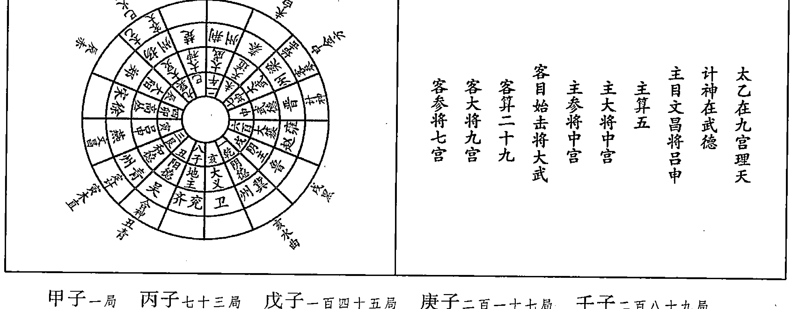

甲子一局 丙子七十三局 戊子一百四十五局 庚子二百一十七局 壬子二百八十九局

此局算得太乙九宫，理天，天外助客。

此时声息，有贼人即寇。有自相执杀者。有将兵多从西南来。闻事吉虚凶实，敌使不可信。奸细入觇。贼出入俱临休囚气，可以伏兵攻击。

文昌寅，在内地。可攻外。

主算单五，杜塞不通，且无门，主二将固守不出。

始击七宫，关客参，有同类相谋侵凌之祸。客算二十九，长和，将吏全。太乙助，可以举兵征伐。客大将九宫，值囚，有拘执奔败之祸。不利有为。又乘休气，不宜出兵攻战，宜运策遣将，伏兵攻击。

客参将七宫，受制于始击，不利有为，乘囚气。

> ① 共七十二局。一局至十八局。

出兵举赤旗，列锐阵，此称神之术也。出向南地，向算而出也。战向北，乃背算之道也。奇兵安坤地，此始击大杀之方也。战备西南，避大杀之气。辰巳方可伏兵，乘掩迫之气也。风云飞鸟从西北来。有大战者，太乙之杀气也。风云飞鸟从算而来，背算而冲者，得天助，宜顺击之也。

客将行兵，车骑在前，步兵在后，大将居中，鼓噪登高而出，向东南行，遇敌勒兵向西北，先举兵攻击，此为客先起之义。

### 太乙阴遁二局

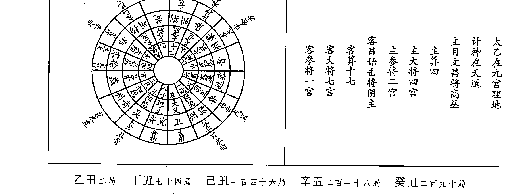

乙丑二局 丁丑七十四局 己丑一百四十六局 辛丑二百一十八局 癸丑二百九十局

此局算得太乙九宫，理地，地有倾陷，山有崩颓，水有泛涨，天外助客。

此时声息有惊，贼人不寇而窥觇。有将兵多从西北来。闻事吉虚凶实，敌使言实，奸细人觇。

文昌四宫，在内地，可攻外。又内迫，有近臣外戚攻外，因主大，有同类相谋。
主算四，单阴，不和，短而无将吏。又不得地利，不宜举兵深入攻战。
主大将四宫，值内迫，文昌因，不利有为。乘王气，不宜出兵攻战，宜固守。
主参将二宫，值外迫，大臣内外连谋，举事攻内。乘囚气，不利有为，宜固守，不宜用兵。逼迫之时用兵，主客俱败。

出兵举赤旗，列锐阵，出向正东，战向正西，奇兵安卯地，战备东方，辰巳方可伏兵。风云飞鸟从西北冲太乙方来，急大战。风云飞鸟从正东方来冲，向正西去，此得天助，急宜顺而击之，大胜。

主将行兵，步卒在前，车骑在后，大将居中，静默而出，向正东行，遇敌，勒兵向西，伺彼先举，然后举兵攻击，此为主人后起之义。始击在戌。

客算十七，重阳，长而不和，太乙虽助，不宜大举征伐，宜浅近攻击，军中防火。

客大将七宫，发，乘囚气，不宜举兵战斗攻伐，然军中防火灾。缺水浆。

客参将一宫，值格。凡事格易。夷狄侵掠。不利有为，乘休气。出兵举白旗，列方阵，出向西南，战向东北，奇兵安戌地，战备西北，辰巳方可伏兵。有风云飞鸟从西北冲太乙方来，急宜准备有战。风云飞鸟从西南来，向东北去，为天助，宜顺急击之，大胜。客将行兵，车骑在前，步兵在后，大将居中，鼓噪急出，向西南行，遇敌旋兵向东北，先举兵攻之，为客人先起。

### 太乙阴遁三局

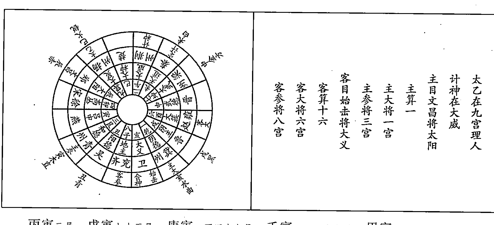

- 丙寅三局
- 戊寅七十五局
- 庚寅一百四十七局
- 壬寅二百一十九局
- 甲寅二百九十一局

此局算得太乙九宫，理人，天外助客。

此时声息有庆，夷人入贡或降。有将兵多从西北来。闻事吉实凶虚。敌使不可信。奸细不入。贼初入临休气，可击；贼去临相气，不可攻。

文昌辰，在内地，可以攻外。内辰迫，近臣内戚攻外。主算一，单阳不和，短而无将吏，不宜深入大举征伐。主大将一宫，值格，主上下欺，因自败。乘休气，不利有为，不宜出兵攻战，止宜固守。

主参将三宫发，乘相气，可率锐兵浅近攻击，亦可捷胜，不宜深入，算短故也。

出兵举黑旗，列曲阵，出向西北，战向东南，奇兵安辰地，战备东南，辰巳方可伏兵。风云飞鸟从西北冲太乙方来，急备大战。风云飞鸟从西北方来，向东南方去，为天助，宜顺击之，大胜。主将行兵，步卒在前，车骑次之，大将居中，静出向西北行，遇敌旋兵向东南，伺彼先举，而后举兵攻击。

始击在亥。

客算十六，长和，得太乙助，将吏全，可以大举深入，缓攻克胜。客大将六宫，发，乘死气，不宜出兵攻击。

客参将八宫，发，乘相气，可率锐兵先驱，攻战必获捷胜，树功。出兵举白旗，列方阵，出向正西，战向正东，奇兵安亥地，战备西北，辰巳方可伏兵。有风云飞鸟从西北方冲太乙宫。急备大战。风云飞鸟从正西方来，冲向正东方去，为天助，急顺击之，大胜。客将行兵，车骑在前，步兵次之，大将居中，鼓噪急出，向西行，遇敌提兵向东，先举兵攻击，此为客人先起。

### 太乙阴遁四局

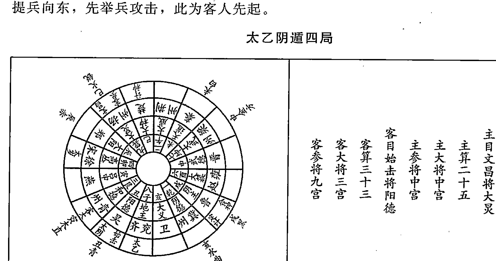

丁卯四局 己卯七十六局 辛卯一百四十八局 癸卯二百二十局 乙卯二百九十二局

此局算得太乙八宫，理天，天有变异，天内助主。

此时声息，贼入寇，有将兵多不和，从东北来。闻事吉虚凶实。敌使不可信。奸细入觇。有私通外夷者。贼来临相气，不可犯；贼去临死气，可以掩击。

文昌九宫，在外地可攻内，囚客参将，有同类相谋。

主算二十五，杜塞无门，主二将不出。

始击在丑。

客算三十三，重阳长而不和，虽可以深入速攻，不能成功。军中慎火灾，乏水。

客大将三宫，值外迫，大臣举事攻内。不利有为。乘休气，犹可出兵指挥将士攻击，不宜亲自出战。

客参将九宫，受文昌制，不利有为，乘休气。

出兵举青旗，列直阵，出向东北，战向西南，奇兵安丑地，战备东北，亥子丑方可伏兵。飞鸟风云从南冲太乙宫，急备大战。风云飞鸟从东北来，冲西南去，顺击之，大胜，得天助之道也。

客将行兵，步卒在前，车骑在后，大将居中，静出向东北行，遇敌掣兵向西南，先举兵击之，此客人先起之义也。

## 术数

### 太乙阴遁五局

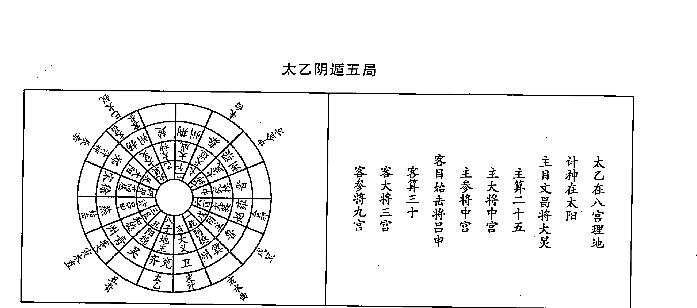

- 戊辰五局
- 庚辰七十七局
- 壬辰一百四十九局
- 甲辰二百二十一局
- 丙辰二百九十三局

此局算得太乙八宫，理地，天内助主。

此时声息，有贼，有奸细来觇。有将兵多而不和，从东北来。闻事吉实凶虚。敌使不可信。贼兵出人乘王相气，不可触犯。有私通外夷者。文昌九宫，在外地，可攻内，因客参将，有同类相谋。

主算二十五，杜塞无门，不通，主二将不出。始击在寅。

客算三十，孤阳长而不和，不宜举兵深入，宜浅近截击。客大将三宫，值外迫，大臣举事攻内。不利有为。乘相气，可运策发兵，按伏攻击。

客参将九宫，受制文昌，不利有为。乘休气，犹可出兵浅近邀击，以获小捷。

出兵举青旗，列直阵，出向东北，战向西南，奇兵安寅地，战备东北，亥子丑方伏兵。有风云飞鸟从正南冲太乙方来，急备大战。风云飞鸟从东北来，冲向西南方去，为天助，宜急顺击之，大胜。客将行兵，步卒在前，车骑在后，大将居中，静出向东北行，遇敌勒兵向西南。先举兵攻击，为客先起。

### 太乙阴遁六局

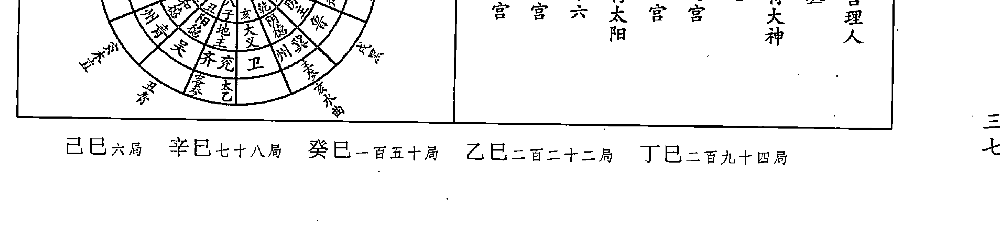

- 己巳六局
- 辛巳七十八局
- 癸巳一百五十局
- 乙巳二百二十二局
- 丁巳二百九十四局

此局算得太乙八宫，理人，天内助主。
此时声息，在敌人人寇。有将兵多不和，从东南来。闻事吉虚凶实，敌使不可信。奸细不入。贼初人临王气，不可攻；贼去临囚气，无备，可追击。文昌已在外地，可攻内。

主算十七，重阳长而不和，太乙虽助，不宜大举深入。
主大将七宫发，乘囚气，不宜出兵攻战，宜发兵按伏截击。
主参将一宫，值内迫，有近臣外戚攻外，乘休气，宜陈兵固守，不宜出兵攻战。
出兵举白旗，列方阵，出向西南，战向东北，奇兵安巳地，战备东南，亥子丑方宜伏兵。有飞鸟风云从正南方来，急备战。有风云飞鸟从西南来，冲东北方去，为天助，宜顺击之，大胜。
主将行兵，车骑在前，步兵在后，大将居中，鼓噪急出，向西南行。遇敌旋向东北，伺彼先举，而后举兵攻之。
始击在辰。

客算二十六，重阳，长而不和，不宜大举征伐。又以重阴，军中防水厄。
客大将六宫，发，乘死气，宜固守，不宜出兵攻战。
客参将八宫，值囚，有拘执奔败事，不利有为。乘相气，不宜出兵攻战，宜陈兵固守。
出兵举白旗，列方阵，出向正西，战向正东，奇兵安辰地，战备东南，亥子丑方伏兵。风云飞鸟从正南冲太乙方来，急备有战。风云飞鸟从正西方来，冲正东方去，为天助，宜急顺击之，大胜。客将行兵，车骑在前，步卒在后，大将居中，鼓噪急出，向正西行，遇敌兵向正东，先举兵攻击。

### 太乙阴遁七局

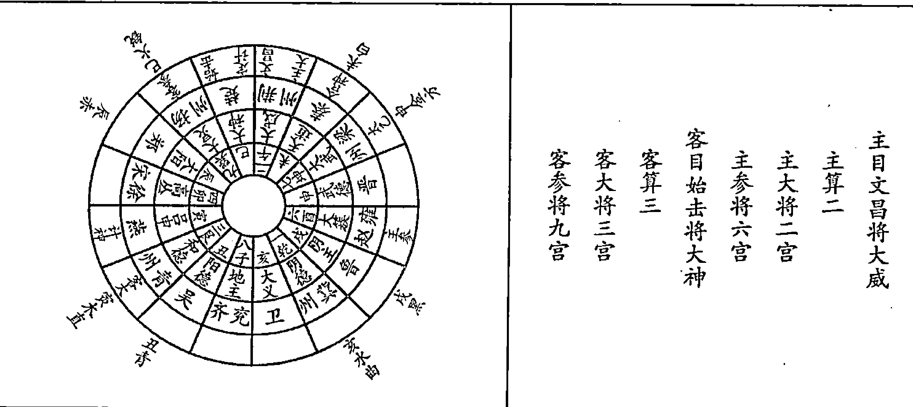

- 庚午七局
- 壬午七十九局
- 甲午一百五十一局
- 丙午二百二十三局
- 戊午二百九十五局

此局算得太乙七宫，理天，天有变异，天内助主。

此时声息虚惊，贼来不寇而觊。兵少无将，从东南来。敌使不可信。奸细不入。贼出入皆乘休囚之气，可以攻击。

文昌午宫迫，近臣贵戚在内地，攻外。上相谋易大将。主算二，单阴，不和，短而将吏不全。不利为主。太乙虽助，亦不宜深入交战。

主大将二宫，值内迫而无气，不宜举兵深入交战，惟可勒兵拒敌，不利有为，乘囚气故尔。

主参将六宫，外迫，大臣举事攻内。乘死气，不宜攻战。出兵举黄旗，列圆阵，出向正南，战向正北，奇兵安正南方，战斗备南方，未申方可伏兵。风云飞鸟从东北方来，急备有战。风云飞鸟从正南方来，向正北方去，此得天助，宜顺而击之，大胜。

主将行兵，步卒在前，车骑在后，大将居中，静默而出，向正南行，遇敌旋兵向正北而驻，候其先举而后应之，此得主人之义。始击在巳。

客算三，单阳，短而不和，又缺将吏，不利为客。太乙不助，不宜举兵深入，恐兵中乏水。

客大将三宫，格，盗来侮，事格，易乘相气，不利有为。可以按伏窃发取胜，不宜明攻。

客参将九宫，虽发而乘休气，宜扬兵拒敌，不宜交战。出兵举青旗，列直阵，出向东北，战向西南，云鸟风从东北方来，急宜准备有战。云鸟风从东北方来，向西南去，此为天助，宜顺击之，大胜。客将行兵，步卒在前，车骑在后，大将居中，静默而出，向东北方行，遇敌旋兵向西南，先举击之，以应为客之义。

### 太乙阴遁八局

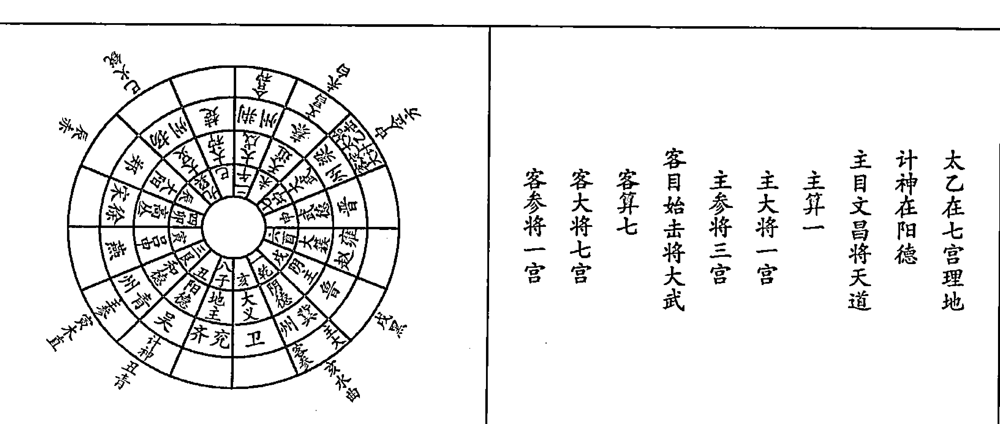

- 辛未八局
- 癸未八十局
- 乙未一百五十二局
- 丁未二百二十四局
- 己未二百九十六局

此局算得太乙七宫，理地，天外助客。

此时声息，有贼，贼来入寇，宜防慎。兵少无将而勇锐，鼠窃从西南方来。敌使言虚不可信。奸细不入。贼初至临因气，可出其不意而掩击；贼去临休气，无备，亦可伏兵邀击。
文昌未在外地，可攻内。内辰迫，近臣贵戚攻外。
主算一，单阳，短而不和，无将吏，不利为主，不宜出兵深入攻战。
主大将一宫，关客参而不发，有同类相攻。不利有为。乘休气，可以驻兵拒敌，不利深入，宜遣兵按伏窃发截击。
主参将三宫，迫格。凡事格易，虽乘相气，不利有为。或扬兵拒贼，或按伏截击，不宜明战头。
出兵举黑旗，列曲阵，出向西北，战向东南，奇兵安未地，战备西南，未申方可伏兵。云鸟风从东北方来，急备有战。云鸟风从西北方来，向东南方去。为天助，宜顺而击之，大胜。
始击七宫，掩太乙，有盗起掩袭劫夺事。
客算七，单阳，短而不和，无将吏，不利为客。不宜举兵征伐。客大将七宫，值太乙、始击因，有拘执奔败事。不利有为，乘因气。客参将一宫。关主大。不利有为，乘休气。

### 太乙阴遁九局

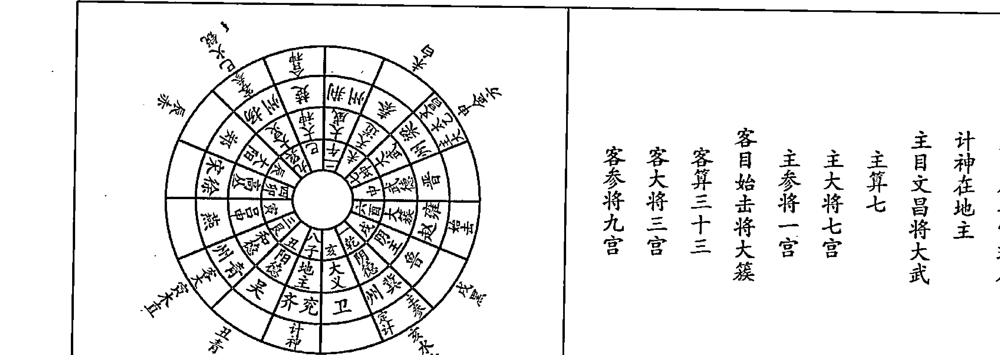

壬申九局 甲申八十一局 丙申一百五十三局 戊申二百二十五局 庚申二百九十七局

此局算得太乙七宫，理人，天外助客。
此时闻声息，有贼，贼来远寇不得利。贼兵有将无谋，从西方来。敌使不可信。奸细不入。贼初至临因气，宜出奇急击之，可胜；贼去临休气，可以从兵邀击。
文昌七宫，在外地，可攻内。囚太乙宫，有拘击奔败之事。
主算七，单阳，短而不和，无将吏，三门不具，不利为主。不宜大将自出，只宜参副出兵。不宜深入近出速攻。主大将七宫，囚近将，自谋同类。又乘囚气，不利为主。宜固守营塞，不宜出兵战斗。

主参将一宫，发，乘休气，可出兵近便邀截，不宜远追。出兵举白旗，列方阵，出向西南，战向东北，奇兵安西南方，战斗备西南，未申方可伏兵。云鸟风从东北冲太乙而来，急备有战。云鸟风从西南方来，向东北方去，此为天助，宜顺而击之，大胜。

主将出兵，车骑在前，步兵次之，大将居中，鼓噪出门，急向西南行，遇敌驻兵，候彼先动而后应之，此为主算之义。

始击六宫，外击，有盗贼兵围逼迫事。

客算三十三，重阳，不和，不宜出兵，止宜深入急攻，不宜迟缓。又军中乏水，防火灾。

客大将三宫，格，凡事格易，不利有为。出兵恐有僭臣相抗，虽获胜而无功，可以扬兵拒敌固守。

客参将九宫，发而乘休气，不利有为。不宜出兵，固守可免难。出兵举青旗，列直阵，出向东北，战向西南，奇兵安正西方，战斗备西方，未申方可伏兵。云鸟风从东北冲太乙方来，急备大战。云鸟风从东北方来，向西南去，为天助，宜顺而击之，大胜。

客将出兵，步卒在前，车骑在后，大将居中，静默而出，向东北行，遇敌旋兵西南，先击，此应为客先举之义。

### 太乙阴遁十局

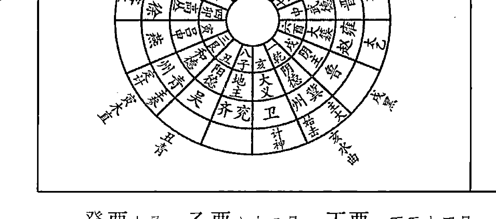

- 太乙在六宫理天
- 计神在大义
- 主目文昌将武德
- 主算一
- 主大将一宫
- 主参将三宫
- 客目始击将阴德
- 客算三十四
- 客大将四宫
- 客参将二宫

癸酉十局 乙酉八十二局 丁酉一百五十四局 己酉二百二十六局 辛酉二百九十八局

此局算得太乙六宫，理天，天有变异，天外助客。

此时闻声息，有贼，贼入寇，有杀将之祸。贼兵众。奸细不入。贼兵那至下营，临死气，宜出其不意。有将来，远从西北。敌使言实可信。掩击可胜。贼去有备，有伏兵，宜防慎。

文昌申，在外地，可攻内。内辰迫，有贵戚内臣攻外。主算一，单阳，短而不和，无将吏。不利有为。不宜大举征伐，宜近攻候，不宜深入。

主大将一宫，为始击掩。乘休气，不宜出战，战必败死。主参将三宫，发，乘相气，不宜出兵交战。

出兵举黑旗，列曲阵，出向西北，战向东南，奇兵安申地，战斗备西南，申酉戌方可伏兵。云鸟风从正东来，急备有战。云鸟风从西北来，向东南方去，为天助，宜顺而急击之，大胜。

主将出兵，步卒在前，车骑在后，大将居中，静默而出，向西北行，遇敌驻兵，伺彼先动，勒兵向东南交战，此应为主之义。

始击一宫，掩主大。

客算三十四，长和，宜出兵征伐。

客大将四宫，格，主上下格易。不利有为。乘王气，可扬兵拒敌，不宜交锋斗战。

客参将二宫，发而乘囚气。

出兵宜举赤旗，列锐阵，出向正东，战向正西，奇兵安乾地，战斗备西北方，申酉戌地可伏兵。云鸟风从正东来，急宜准备有战。

云鸟风从正东来，向正西方去，此为天助，宜顺而急击之，大获，大胜。

客将出兵，步卒在前，车骑在后，大将居中，静默而出，向东行，遇敌旋兵向西，先举兵击之勿后，此应为客先举之义。

### 太乙阴遁十一局

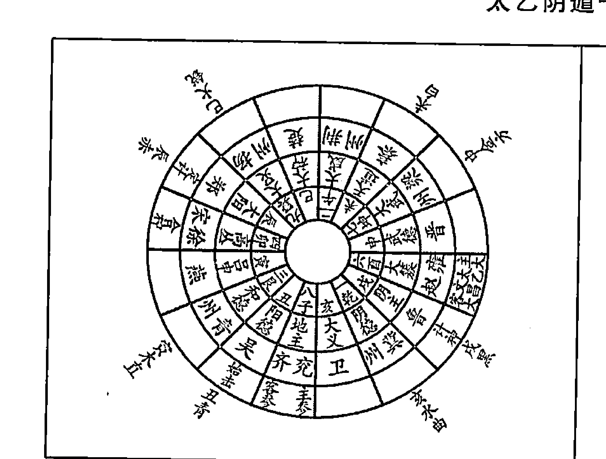

- 太乙在六宫理地
- 计神在阴主
- 主目文昌将大簇
- 主算六
- 主大将六宫
- 主参将八宫
- 客目始击将阳德
- 客算二十六
- 客大将六宫
- 客参将八宫

甲戌十一局 丙戌八十三局 戊戌一百五十五局 庚戌二百二十七局 壬戌二百九十九局

此局算得太乙六宫，理地，天外助客。文昌酉，在外地，可攻内。囚太乙宫，关主客大将，为四郭固之时，有拘击之事，奔败之祸，大凶。

主算六，单阴，短而不和，无将吏。不利为主。不宜出兵。主大将六宫，囚关客参将。

# 卷四 术数汇考四

## 太乙局

#### 时计阴遁成局①

大，有同类相谋。乘死气，在绝气，大凶。主参将八宫，关客参，不利有为，乘相气。始击在丑。客算二十六，长而不和，在四郭固之时，不宜出兵。客大将六宫，囚关，有杀害奔败之事。在绝气，大凶，乘死气。客参将八宫，关主参，乘相气。经云：囚者，拘击执正之义。诸将与太乙同宫，或近将自谋同类。乐产云：文昌与太乙同宫，不利为主。宋琨云：主客二将犯文昌宫为关，如一林二虎，一泉二蛟，势不两立，则以二目所临之神五行决之，盛衰可见，死生可知。淳风云：四计大小将同宫为关，多算胜，少算不胜。算和者胜，不和者负。然算裔为关，如单九、十九、二十九，又有长短、和不和之分。是局也，以主客相关，当客胜。以算论之，主算短，客算长，亦客胜。以气数论之，主客皆乘死气，无胜负。以主客所临宫神论之，主大将属金，宫神亦属金，为主；客大将属水，为相，亦无胜负。以二目宫神五行决之，则文昌宫属金，始击宫属土，土生金，则又当和解，亦难以此决之。愚谓主将金，客将水，当以气数，于四季休旺决之。胜负定。以春三月属木，主大金克木为囚，则主大将气衰矣，当败；客大水生木为休，则客大将气亦衰矣，亦当败，俱无偏胜。夏三月属火，主大金乘死气，金又败在午，则主将之败无所逃矣；客大水克为乘囚气，则客将之败亦难逃外矣。秋三月属金，主大金乘王气，当胜；客大水受金之生，又乘相气，亦当胜，二将胜负亦未可决。冬三月属水，客大将水为相气，主大金将为休气，则当客胜而主负明矣。出兵遇此，先候风云助与不助，不须论八门吉凶，惟以四季气数决定。在春则主将败，客将庶可逃遁。在夏则主客俱败，无可逃者。在秋主将胜而客将亦难逃也。何以然？秋令金，主将金，见金为王，秋尤王，则将吏同心，士卒勇锐，有进死之荣，无退生之辱，虽算短，必可胜而难解矣。客将属水，借金之生为相，如两将相关胜负，一林二虎，岂有相让者？然客将必须得拔能脱难。以此论之，主客胜负明矣。冬令水王，客将之胜必矣。主将气休，其负可知。握兵机者，遇此四固之时，岂可不熟思决之？一或有谬，二军之命何如哉！

### 太乙阴遁十二局

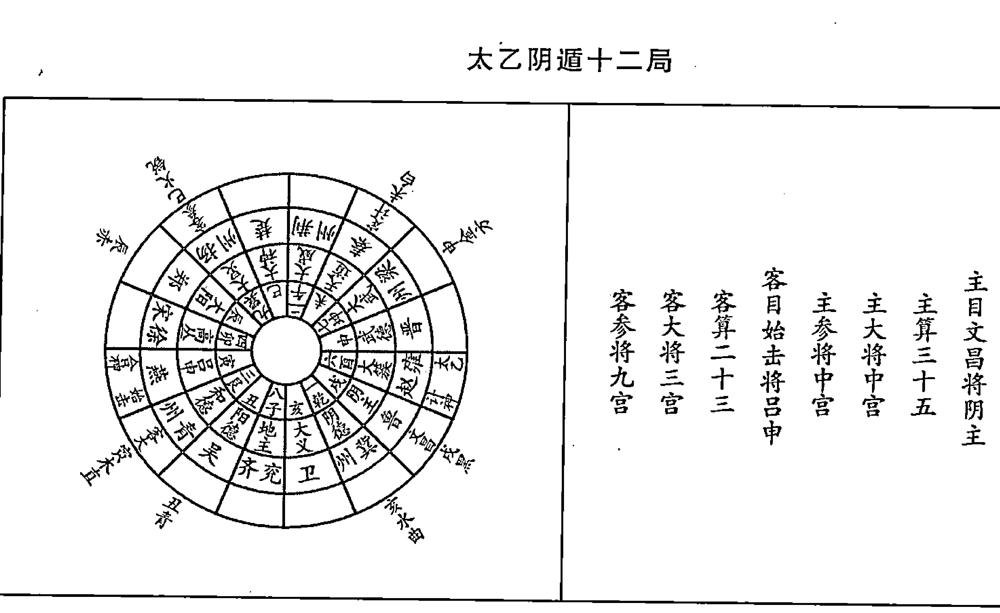

太乙在六宫理人 | 计神在大簇 | 主目文昌将阴主 | 主算三十五 | 主大将中宫 | 主参将中宫 | 客目始击将吕申 | 客算二十三 | 客大将三宫 | 客参将九宫

乙亥十二局 丁亥八十四局 己亥一百五十六局 辛亥二百二十八局 癸亥三百局

此局算得太乙六宫，理人，天外助客。

此时声息，有庆，外夷人贡。有将兵和来远，从东北方来。使臣言实。奸细不入。夷人初至，临死无备；夷兵去，亦无备。

文昌戌，在外地，可攻内，外辰迫，有大臣举事攻内。

主算三十五，杜塞不通，又无门，主二将不出，不宜出兵，宜坚壁固守待时。

主二将不出。

始击在寅，乘王气。

客算二十三，长和，宜举兵征伐。

客大将三宫，发而乘相气，宜大振兵威，以防敌人，不可出战。

客参将九宫，发而乘休气，宜守不宜战。

出兵举青旗，列直阵，出向东北，战向西南，奇兵安寅地，战斗备东北，申酉戌地可伏兵。云鸟风从正东来，急备大战。云鸟风从东北方来，向西南方去，此为天助，宜顺而击之，必获大胜。客将出兵，步卒在前，车骑在后，大将居中，静默而出，向东北行，遇敌旋兵向西南，先击不可后也，此应客兵先起之义。

### 太乙阴遁十三局

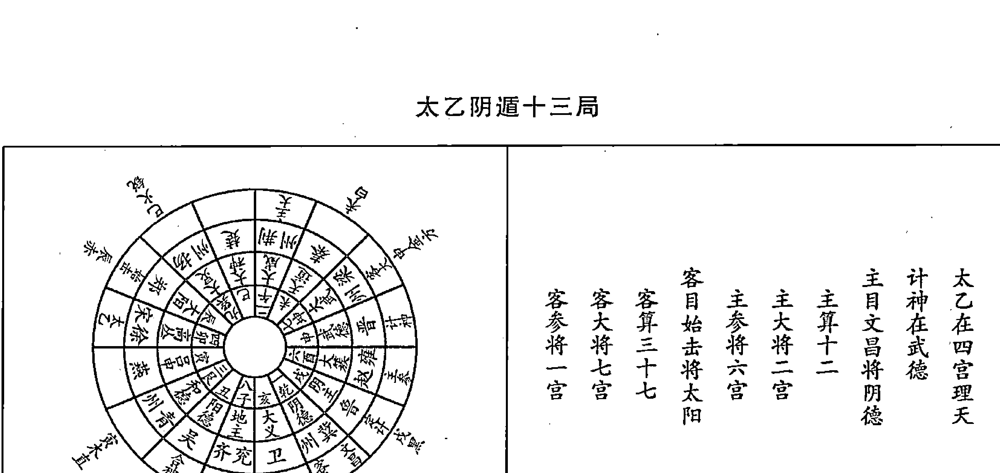

丙子十三局 戊子八十五局 庚子一百五十七局 壬子二百二十九局 甲子三百一局

此局算得太乙四宫，理天，天内助主。

此时声息，有贼，贼来人寇。有将兵多从东南方来。使臣言实。奸细来觇。有私通外夷者。贼初至临王气，不可遽攻；贼去临相气，有伏兵后备，不可邀截。

文昌一宫，在内地，可攻外。因客参，近将谋同类。

主算十二，上和，宜举兵征伐，或吊伐。主大将二宫，发，乘囚气。

主参将六宫，格。凡事格易，不利有为。乘死气，不可出兵攻击，宜固守。

出兵举黄旗，列圆阵，出向正南，战向正北，奇兵安乾地，战斗备西北方，寅卯辰方向可伏兵。云鸟风从正西来，急备有战。云鸟风从正南方来，向正北方去，此为天助，可顺而击之，大胜。

主将出兵，步卒在前，车骑在后，大将居中，静默而出，向正南行，遇敌旋兵向北驻扎，伺彼先动，然后击之，乃应主人之算。

始击在辰外，辰击，有贼兵攻围逼迫，事急。

客算三十七。重阳，长而不和，不宜大举征伐。军中乏水，防火厄火攻。

客大将七宫，发，乘囚气，不宜出兵征伐。

客参将一宫，受制于文昌为囚，不利有为。休气可持，主守营，不宜轻挑出战。

出兵举白旗，列方阵，出向西南，战向东北，奇兵安辰地，战斗备东南，寅卯辰方伏兵。云鸟风从正西来，急宜准备有战。云鸟风从西南方来，向东北方去，为得天助，可顺而击之，大胜。

客将出兵，车骑在前，步卒在后，大将居中，鼓噪急出门，向西南行，遇敌旋兵向东北，先击不宜后也，先则为客，后则为主矣。

### 太乙阴遁十四局

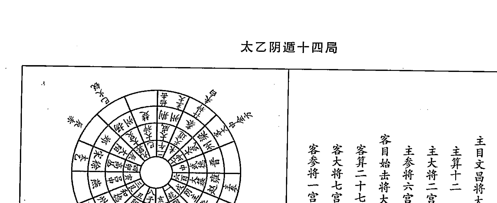

丁丑十四局 己丑八十六局 辛丑一百五十八局 癸丑二百三十局 乙丑三百二局

此局算得太乙四宫，理地，天内助主。

此时声息，有庆，夷人入境不寇，大将宜慎之。有将兵多从南方来。使臣言实。奸细不来。贼初入临囚气，无备；贼去，有伏兵以备。

文昌亥，在内地，可攻外。

主算十二，上和，太乙、文昌内助，可以举兵征伐。

主大将二宫，为始击所掩，宜整兵守营，不宜交战，乘休气。

主参将六宫，格。凡事格易，不利有为，乘死囚气。

出兵举黄旗，列圆阵，出向正南，战向正北，奇兵安亥地，战斗备西北，寅卯辰地可以伏兵。云鸟风从正西来，急备大战。云鸟风从正南来，向正北方去，此得天助，宜顺而击之，大胜。

主将行兵，步卒在前，车骑在后，大将居中，静默而行，向正南出门遇敌向正北，勒兵以伺彼先举，而后应之，此以为主人候敌应之义。

始击二宫，掩主大。

客算二十七，长和，可以举兵征伐。

客大将七宫，为主二将所挟，又乘囚气，不利有为。宜固守。

客参将一宫，发，乘休气。

出兵举白旗，列方阵，出向西南，战向东北，奇兵安午地，战斗备南方，寅卯辰方可以伏兵。云鸟风从西南方来，急宜准备大战。云鸟风从西南方来，向东北方去，此为天助，宜击之，大胜。

客将出兵，车骑在前，步卒在后，大将居中，鼓噪出门，向西南急行，遇敌旋兵向东北，急攻先举。

### 太乙阴遁十五局

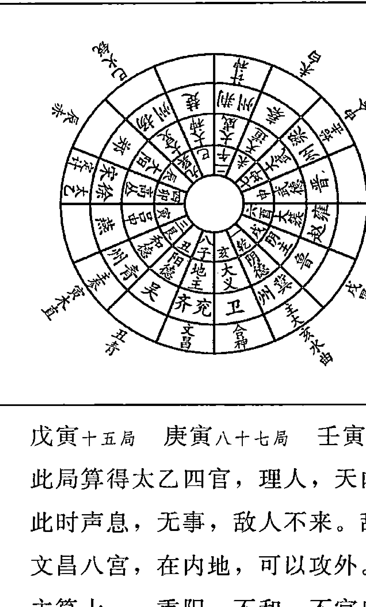

- 太乙在四宫理人
- 计神在大威
- 主目文昌将地主
- 主算十一
- 主大将一宫
- 主参将三宫
- 客目始击将大武
- 客算二十五
- 客大将中宫
- 客参将中宫

戊寅十五局　庚寅八十七局　壬寅一百五十九局　甲寅二百三十一局　丙寅三百三局

此局算得太乙四宫，理人，天内助主。

此时声息，无事，敌人不来。敌使不入。奸细不入。

文昌八宫，在内地，可以攻外。

主算十一，重阳，不和，不宜出兵征伐。

主大将一宫，发，乘休气，宜守不宜战，宜静不宜动。

主参将三宫，值内迫，有贵戚大臣攻外，虽不利有为，然乘相气，犹可近境攻击。

出兵举黑旗，列曲阵，出向西北，战向东南，奇兵安子地，战斗备北方，寅卯辰地可以伏兵。风云鸟从西来，急准备有战。风云鸟从西北方来，向东南方去，此得天助，急击之，大胜。

主将出兵，步卒在前，车骑在后，大将居中，静默缓行而出，向西北行，遇敌按兵向西北行，伺彼先举兵攻击。

始击七宫。

客算二十五，杜塞无门，不通。客二将不出，宜坚壁固守待时，不宜妄动。

### 太乙阴遁十六局

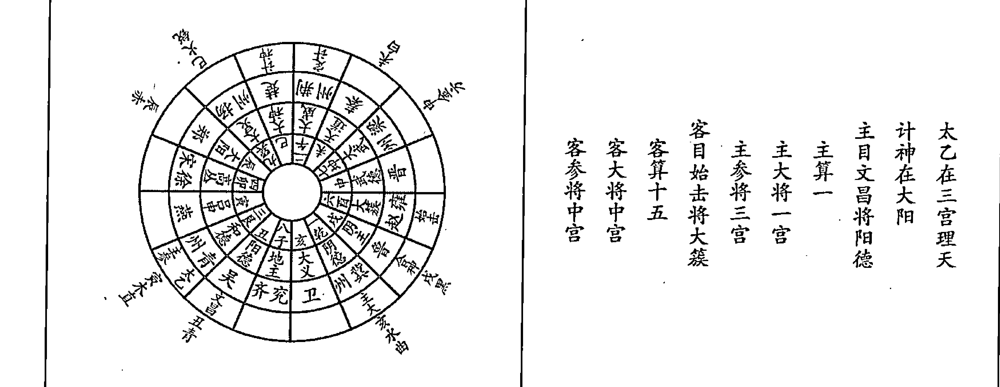

己卯十六局　辛卯八十八局　癸卯一百六十局　乙卯二百三十二局　丁卯三百四局

此局算得太乙三宫，理天，天有变异，天内助主。

此时闻声息，无事，贼兵不来。奸细不入。

文昌丑，在内地，可攻外。内辰迫，有内臣贵宦有事攻外。

主算一，单阳，不和而短，无将吏。不宜举兵征伐。

主大将一宫，发，乘休气，可以整兵拒敌，不宜攻战。

主参将三宫，乘相气，值囚，有拘执奔败事。不利有为。

出兵举黑旗，列曲阵，出向西北，战向东南，奇兵安丑地，战斗备东北方，丑寅地可以伏兵。风云鸟从西南方来，急宜准备有战。风云鸟从西北方来，向东南方去，宜顺而击之，必胜。

主将出兵，步卒在前，车骑在后，大将居中，静默而出，向西北方行。遇敌按兵，伺彼先动而后应之，不可先举。

始击在酉。

客算二十五，杜塞无门，不通。客二将不出，宜坚壁固守。

### 太乙阴遁十七局

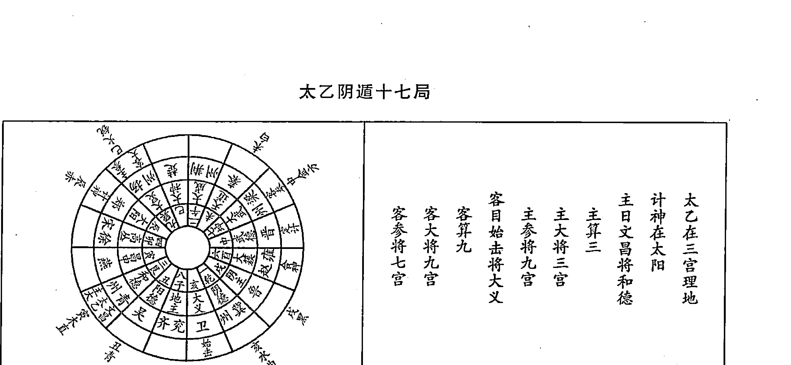

庚辰十七局 壬辰八十九局 甲辰一百六十一局 丙辰二百三十三局 戊辰三百五局

此局算得太乙三宫，理地，天内助主。

此时声息，有贼人寇规。有兵无将。鼠窃贼临相气，初人有备，不可战。敌使不可信。奸细不来。此局主客用兵俱败，守之为可。

文昌三宫，在内地，可攻外。因太乙宫，有拘执奔败事。

主算三，单阳，不和，短而无将吏，又不得地利，不宜出兵征伐。

主大将三宫，囚近将，自谋同类。乘相气，宜守不宜用兵。

主参将九宫，关客大有猜忌，攻击侵夺。不利有为。又乘休气，不宜妄动取败，俱宜固守。

出兵举青旗，列直阵，出向东北，战向西南，奇兵安艮地，战斗备东北，丑寅方可以伏兵。风云鸟从西南方来，急备有战。风云鸟从东北来，向西南去，为天助，顺而击之，必可大胜。

主将出兵，步卒在前，车骑在后，大将居中，静默徐行而出，向东北行，遇敌勒兵向西南驻扎，伺彼先举，然后应之。

始击在亥。

客算九，单阳，不和而短，缺将不利，不宜出兵征伐。

客大将九宫，关主参，又乘休气，不宜深入，宜整兵拒敌，不利有为。客参将七宫，格而乘囚气，凡事格易，不利有为。

出兵举赤旗，列锐阵，出向东南，战向西北，奇兵安亥地，战斗备西北方，丑寅地可伏兵。云鸟风从西南来，冲太乙官，急备大战，云鸟风从东南方来，向西北方去，此为天助，宜急击，大胜。

客将出兵，车骑在前，步卒在后，大将居中，鼓噪急行出门，向东南行，遇敌旋兵向西北，先举而攻之，不可缓也。

### 太乙阴遁十八局

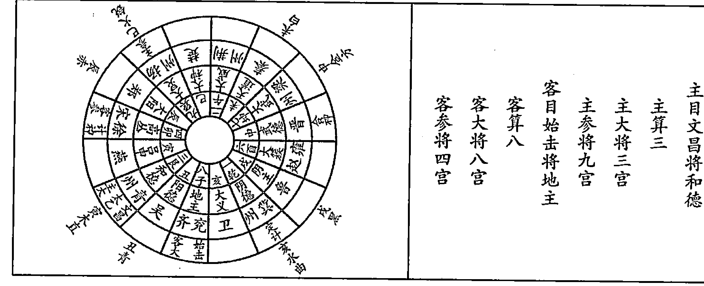

辛巳十八局 癸巳九十局 乙巳一百六十二局 丁巳二百三十四局 己巳三百六局

此局算得太乙三宫，理人，天内助主。

此时声息，有贼，贼入寇，兵少无将。鼠窃从北方来。敌使言实。奸细不入。

贼初入乘相气，其营不可攻；贼去无伏兵，无备，可以截击。

文昌在艮，内地，可以攻外。囚太乙宫。有拘击奔败事。

主算三，单阳，不和，无将吏，不利，将副不宜出兵征伐，宜遣小校相援伏击。

主大将三宫，值囚，不利有为。乘相气，可以整兵拒敌，不利攻战。主参将九宫，发，乘休气。

出兵举青旗，列直阵，出向东北，战向西南，奇兵安艮地，战斗备东北，丑宫地可以伏兵。有风云飞鸟从西南来，急备大战。风云飞鸟从东北方来，向西南去，宜顺击之，大胜。

主参将出兵，步卒在前，车骑在后，大将居中，静默而出，向东北行，遇敌勒兵驻扎，伺彼先举，然后旋兵向西南应之。

始击八宫，内击，有盗贼兵围逼迫事，在易气宫。

客算八，单阴，不和，无将，不利为客。不宜举兵征伐。

客大将八宫，值内迫，有近臣贵戚攻外，不利有为。乘相气，亦有相谋之者，不宜出兵，宜整兵固守。

客参将四宫，值外迫，有僧臣攻内，不利有为。虽乘王气，宜伏兵窃发邀击，不利明攻。

出兵举黑旗，列曲阵，出向正北，战向正南，奇兵安子地，战斗备北方，丑寅方可伏兵。有风云飞鸟从西南来，必有大战。云鸟风从正北来，向正南方去，为天助，顺而击之，大胜。

客将出兵，车骑在前，步卒在后，大将居中，鼓噪出门，急向北行，遇敌旋兵向南，先击不可后也，必应为客先举之义也。

#### 太乙阴遁十九局

① 十九局至三十六局。

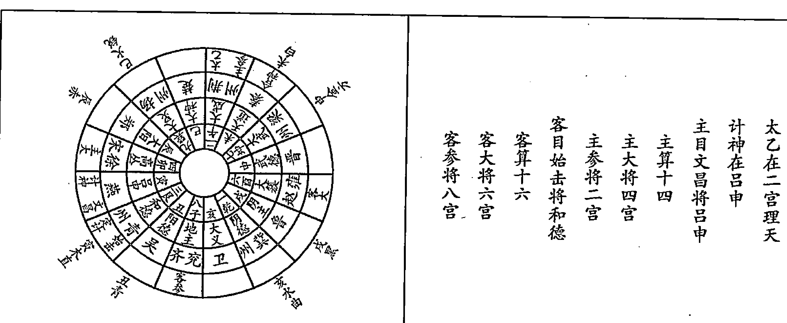

壬午十九局 甲午九十一局 丙午一百六十三局 戊午二百三十五局 庚午三百七局

此局算得太乙二宫，理天，天外助客。

此时声息，有庆，夷狄入贡。兵多而有将，从东北方来。夷初人，临囚气，无备，可攻。敌使言不可信。奸细不人。贼去临王气，不可邀击。

文昌寅，在内地，可以攻。

主算十四，上和而长，宜兴师吊伐。

主大将四宫，发而乘王气，可以大举兵卒，深入贼境，徐缓攻击，必获大胜，立功。

主参将二宫，囚，有拘执奔败事。又乘囚气，不利有为。不宜出兵用事，如或妄动，必有伏兵拘执之事。

出兵举赤旗，列锐阵，出向正东，战向正西，奇兵安寅地，斗战备东北，巳午未地可以伏兵。有风云飞鸟从正北来，急备大战。云鸟风从我军后冲敌方去，为天助，顺而击之，大胜。

主将行兵，步卒在前，车骑在后，大将居中，静默缓行出门，向正东遇敌勒兵驻扎，伺敌先举而后应之，乃为主人之义也。

始击三宫。

客算十六，长和，太乙助，宜兴师征战。

客大将六宫，发，乘死气。

客参将八宫，值格。凡事格易，夷狄兵侵，不利有为。不宜出兵，用事乘相气。

出兵举白旗，列方阵，出向正西，战向正东，奇兵安艮地，战斗备东北方，巳午未方可以伏兵。有风云飞鸟从正北来，急宜准备，必有大战。风云鸟从正西来，向正东方去，此为天助，急宜顺击之，大胜。

客将出兵，车骑在前，步卒在后，大将居中，鼓噪出门，向正西疾行，遇敌疾旋兵向东，先举不宜后也，此应客人之算。

### 太乙阴遁二十局

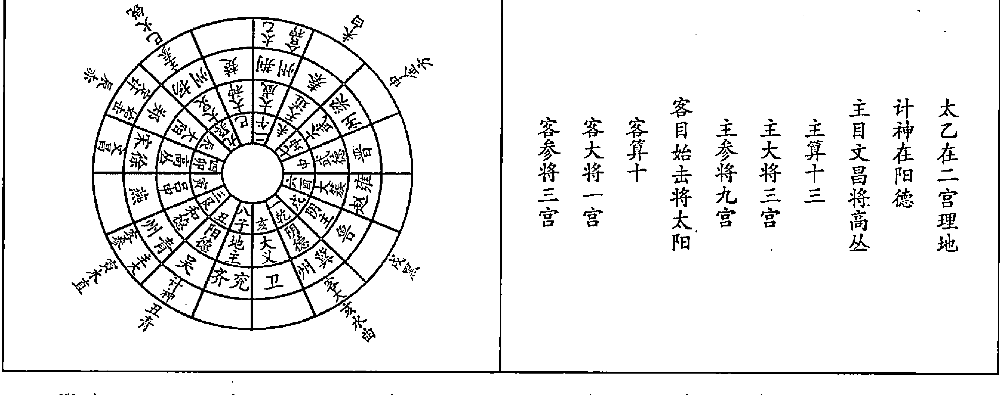

癸未二十局 乙未九十二局 丁未一百六十四局 己未二百三十六局 辛未三百八局

此局算得太乙二宫，理地，天外助客。

此时声息，有庆，贼来人贡。有兵无将，从东南来。敌使言不可信。奸细不入。贼初入无备，可攻，出境有伏兵备后，不可攻。

文昌四宫，在内地，可以攻外。

主算十三，重阳，不和，不利出兵征伐。军中防火乏水。

主大将三宫，值关客参，主同类自相攻。不利有为。乘相气，不宜出兵征战，宜扬兵拒敌。

主参将九宫，值内迫，有近臣贵宦攻外。不利有为。又乘休气，不宜出兵，妄举必败，宜固守待时。

出兵举青旗，列直阵，出向东北，战向西南，奇兵安卯地，战斗备正东方，巳午未方可以伏兵。风云飞鸟从正北方来，急备大战。风云飞鸟从东北方来，向西南方去，为天助，急顺而击之，必胜。主将行兵，步卒在前，车骑在后，大将居中，静默而出，向东北行，遇敌勒兵向西南驻扎，伺彼先举，然后攻之，此为主之义也。

始击在辰。

客算十，孤阳，不和，不利大举征伐。

客大将一宫，发，乘休气，宜出兵近邀，不宜深入。

客参将三宫，值关主大，不利有为。乘相气，宜出兵。

出兵举黑旗，列曲阵，出向西北，战向东南，奇兵安辰地，战备东南，巳午未地可以伏兵。风云飞鸟从正北方来，急备有战。风云飞鸟从西北方来，向东南方去，为天助，可顺而急击之，大胜。

客将行兵，步卒在前，车骑在后，大将居中，静默而出，向西北而行，遇敌旋兵向东南，先举不可后也，此应为客。

### 太乙阴遁二十一局

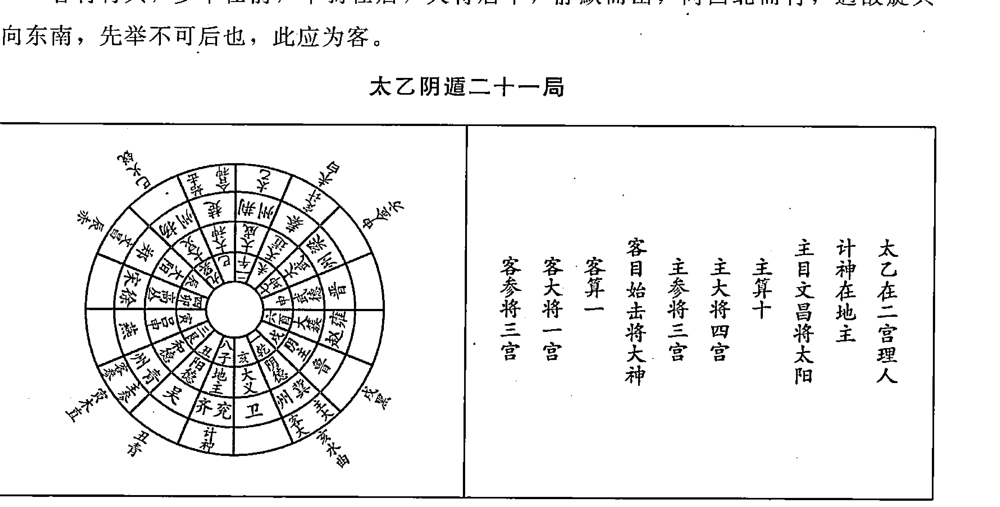

甲申二十一局 丙申九十三局 戊申一百六十五局 庚申二百三十七局 壬申二百九局

此局算得太乙二宫，理人，人有变异，多妖言残毁，天外助客。

此局为四郭固之时，如一林二虎，互相力拒。在春夏时，主客俱败。在秋时，主人胜，客人败。在冬时，客胜主败。虽乘王气，亦无如之何也。惟坚守不妄动为上策，凡举动则败在目前也。文昌辰，在内地，可以攻外。

主算十，孤阳，不和，无卒，不利为主。为四郭杜固之时，不宜出兵。

主大将一宫，关客大，同类猜忌攻击，不利有为，乘休气。

主参将三宫，关客参，乘相气，不利有为。

始击在巳内，辰击，有盗贼兵起攻围逼迫事。不利有为。客算一，单阳，不和，又无将吏，不利为客，宜坚壁固守待时。

客大将一宫，关主大，不利有为，乘休气。

客参将三宫，关主参，不利有为。有边兵为乱，乘相气。

### 太乙阴遁二十二局

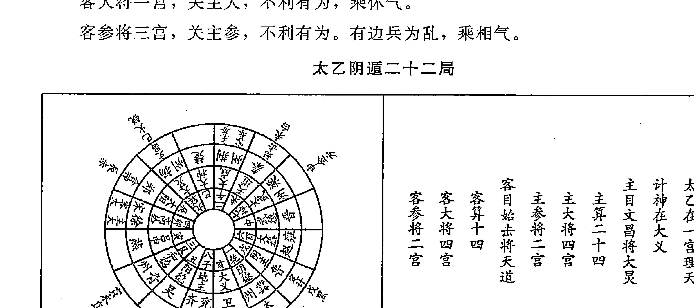

## 术数

乙酉二十二局 丁酉九十四局 己酉一百六十六局 辛酉二百三十八局 癸酉三百一十局

此局算得太乙一宫，理天，天内助主。

此局较量，主长客短，为利主。客算和，主算不和，又为客胜，不可以算为据也。

又以二目宫神五行决之，文昌在九宫，属木；始击在天道，属土。木克土，为主人胜。

又主算长，客算短，虽和，一不及二，和不及长，主必可胜，客必难逃其咎也确矣！

文昌九宫，在外地，可以攻内。对太乙，大臣怀奸，下人欺诞，不利有为。

主算二十四，长而不和，二将关，四郭固闭，宜坚壁固守待时，不宜躁动。

主大将四宫，关客大，如一林二虎，势不两立。不利有为。乘王气，不为妄动。

主参将二宫，关客参，如一泉二蛟，势不两立，不利有为。乘囚气，不宜出兵。

始击在未。

客算十四，上和，宜守不宜动。

客大将四宫，关主大，乘王气，不利有为。

客参将二宫，关主参，乘囚气，不利有为。

### 太乙阴遁二十三局

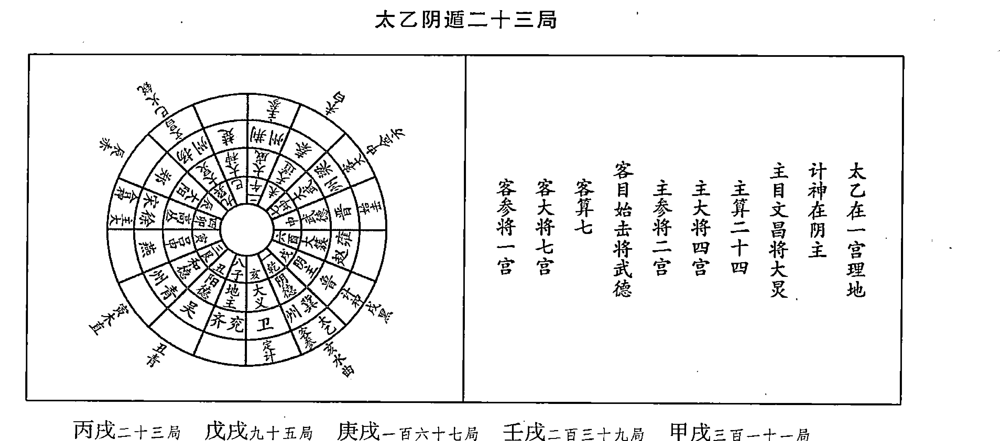

- 丙戌二十三局
- 戊戌九十五局
- 庚戌一百六十七局
- 壬戌二百三十九局
- 甲戌三百一十一局

此局算得太乙一宫，理地，天内助主。

此时声息，有贼入寇，宜防慎，不得利。贼少无将，鼠窃从西南来。闻事吉虚凶实。敌使言不可信。奸细不入。贼初至无备，可攻，贼去有伏兵备。

文昌九宫，对太乙一宫，闭贤，下人欺罔。在外地，可以攻内。

主算二十四，重阴，长而不和，不宜大举征伐。军中防水灾。

主大将四宫，发，乘王气，可以出兵，微得利，即可回兵。主参将二宫，发，乘囚气，出兵不可贪战，速宜收兵。

出兵举赤旗，列锐阵，出向正东，战向正西，奇兵安巽地，战备东南，戌亥方可伏兵对敌。有风云飞鸟从东南来，急备交战。风云飞鸟从正东来，向正西去，此为天助，急顺击之，大胜。

主将行兵，步卒在前，车骑在后；大将居中，静默而出，向正东行，遇敌即旋兵向正西驻扎，候彼先举，然后攻之。

始击在申。

客算七，单阳，不和，短而无将，不利为客。不宜出兵征伐。

客大将七宫，发，乘囚气，出兵，算中无将，不利大将。惟宜运谋发兵拒敌，不宜攻战。

客参将一宫，值囚，有拘执奔败事。不利有为，惟可卒兵为之，又乘休气，亦不宜交战。

出兵举白旗，列方阵，出向西南，战向东北，奇兵安申地，战备西南，戌亥方可伏兵。有风云飞鸟从东南来，急备大战。风云飞鸟从西南方来，向东北方去，为天助，急顺击之，大胜。

客将行兵，车骑在前，步卒在后，大将居中，鼓噪急向西南行，遇敌旋兵向东北，先举击勿后，以应为客先举。

## 太乙阴遁二十四局

| 丁亥二十四局 | 己亥九十六局 | 辛亥一百六十八局 | 癸亥二百四十局 | 乙亥三百一十二局 |
| :--- | :--- | :--- | :--- | :--- |

此局算得太乙一宫，理人，天内助主。
此时声息，有贼寇近机而惨。兵多无将，鼠窃从西北来。敌使不可信。奸细不入。贼初人无备，可击，贼去有伏兵备，不可攻。闻事吉虚凶实。

## 术数

文昌巳，在外地，可以攻内。
主算十六，长和，将吏全，可以大举征伐，深入缓攻。

主大将六宫，内值迫，有近臣贵戚攻外，不利有为。又乘死气，虽算和，太乙内助，可以扬兵拒敌，不宜交战。主参将八宫，外值迫，有大臣举事攻内，不利有为。虽乘相气，不宜交战，惟可遣人邀击。

出兵举白旗，列方阵，出向正西，战向正东，奇兵安巳地，战备东南，戌亥方可以伏兵。风云飞鸟从东南方来，急备交战。云鸟风从正西来，向正东去，为天助，宜顺而急击，大胜。

主将行兵，车骑在前，步卒在后，大将居中，鼓噪急出门，向正西方行，遇敌驻兵，伺彼先举，即旋兵向正东击之。

始击在戌，内击，有盗兵攻围逼迫事。

客算一，单阳，不和，短而无将吏，不宜举兵征伐。

客大将一宫，值囚迫，有拘执奔败事，不利有为。虽乘休气，可以陈兵待敌，不宜交战。

客参将三宫，发而乘相气，可以出兵浅近邀击，不宜深入迟缓。出兵举黑旗，列曲阵，出向西北，战向东南，奇兵安戌地，战备西北，戌亥方可伏兵。云鸟风从东南来，急备有战。风云飞鸟从西北方来，向东南去，得天助，急顺击之，大胜。

客将行兵，步卒在前，车骑在后，大将居中，静缓而出，向西北行，遇敌即旋兵向东南，先击之，乃是客兵先起。

## 太乙阴遁二十五局

戊子二十五局 庚子九十七局 壬子一百六十九局 甲子二百四十一局 丙子三百一十三局

此局算得太乙九宫，理天，天外助客。

此时声息，有庆。闻事吉实凶虚。夷人入贡不为寇。夷兵多而有将。客挟主大，有惊无害。敌使谪诈，从西北来。奸细不入。贼初临，乘休气，无备，可攻；贼去有伏兵防备，不可邀击。文昌午，在外地，可以攻内。外辰迫，有大臣举事攻内。

主算三十一，重阳，长而不和，不利征伐。军中防火乏水。

主大将一宫，值格，不利有为。又受挟，乘休气，宜陈兵待敌，不宜出兵攻战。

主参将三宫，发而乘相气，可以率兵深入，疾攻助胜而速回兵，算不和也。

出兵举黑旗，列曲阵，出向西北，战向东南，奇兵安正南，战备正南，辰巳地可以伏兵。有风云飞鸟从正北方来，急备大战。风云飞鸟从西北方来，向东南方去，宜顺而急击之，大胜。

主将行兵，步卒在前，车骑在后，大将居中，静出向西北行，遇敌旋兵向东南驻扎，伺彼先举，然后应之。

始击在亥。

客算十六，长和，将吏全，可以大举吊伐。

客大将六宫，发而乘死气，不宜出兵攻战。

客参将八宫，发，乘相气，可以大率兵卒深入，缓攻取胜。出兵举白旗，列方阵，出向正西，战向正东，奇兵安亥地，战备西北方，辰巳地可伏兵。有风云飞鸟从西北方来，急备大战。风云飞鸟从正西方来，冲向正东方去，宜顺而击之，大胜。客将出兵，车骑在前，步卒在后，大将居中，鼓噪急行出门，向西行，遇敌旋兵向东，先击，乃客兵先举之义，不可后也。

## 太乙阴遁二十六局

己丑二十六局 辛丑九十八局 癸丑一百七十局 乙丑二百四十二局 丁丑三百一十四局

此局算得太乙九宫，理地，天外助客。

此时声息，有贼来远寇，损主大将。兵少无将，鼠窃从东北来。闻事吉实凶虚。奸细不入。贼来无备，可掩击；贼去有伏兵备后，勿攻。

文昌未，在外地，可以攻内。

主算三十，孤阳，长而不和，缺将，不利为主。太乙又不助，不宜出兵斗战，惟宜固守。军中防火。

主大将三宫，受掩始击，不利有为。乘休气，宜运筹帷幄，不可出战交锋，若或妄动，必战败而死。

主参将九宫，值囚，有拘执奔败事。不利有为。乘休气，惟陈兵拒敌，不宜攻战，有拘执之祸。

出兵举青旗，列直阵，出向东北，战向西南，奇兵安未地，战备西南方，辰巳地可伏兵。风云飞鸟从西北冲太乙而来，急备大战。风云飞鸟从东北来，冲向西南去，为天助，宜顺而急击，大胜。

主将行兵，步卒在前，车骑在后，大将居中，鼓噪急行出，向东北方，遇敌勒兵向西南驻扎，伺彼先动，而后应之。

始击三宫，掩主大。

客算七，单阳，不和，短而无将，不利为客。虽有太乙内助，不利出兵攻战。

客大将七宫，发，乘囚气，算中无大将，不利有为。惟可运谋遣将，不宜攻战。

客参将一宫，值格。上下格易，夷狄兵侵，不利有为。乘休气，不宜出兵攻战，宜于近地扬兵拒盗，若出战，必先胜后败。

出兵举白旗，列方阵，出向西南，战向东北，奇兵安辰地，战备东北，辰巳地可伏兵。有风云飞鸟从西南冲太乙方来，急备大战。风云飞鸟从西南方来，向东北去，宜顺而急击，必胜。

客将行兵，车骑在前，步卒在后，大将居中，鼓噪急行而出兵，向西南行，遇敌旋兵向东北，先击，此为客先举之义。

## 太乙阴遁二十七局

- 太乙在九宫理人
- 计神在大咸
- 主目文昌将大武
- 主算二十九
- 主大将九宫
- 主参将七宫
- 客目始击将高丛
- 客算四
- 客大将四宫
- 客参将二宫

- 庚寅二十七局
- 壬寅九十九局
- 甲寅一百七十一局
- 丙寅二百四十三局
- 戊寅三百一十五局

此局算得太乙九宫，理人，天外助客。

此时声息，有贼人寇，有自相仇杀者，兵少无将，不得利，从正东来。敌使言诈不可信。奸细不入，贼人无备，可以掩击；贼去临囚气，亦无伏兵防备，可以攻截。

文昌坤，在外地，可以攻内。因主参，有近将自谋同类。

主算二十九，长和，太乙不助，可以举兵深入缓攻。

主大将九宫，为太乙所囚，乘休气，有拘击之事。不利有为。不宜深入远举，宜据险隘以扼敌，值挟，或客小将可擒。

主参将七宫，文昌制，乘囚气，不利有为。

出兵举赤旗，列锐阵，出向东南，战向西北，奇兵安巽地，战备西南，辰巳方可伏兵。风云飞鸟从西北方来，急备有战。风云飞鸟从东南方来，冲向西北方去，此得天助，顺而击之，大胜。

主将行兵，车骑在前，步卒在后，大将居中，鼓噪从高地而出，向东南行，遇敌旋兵向西北驻扎，伺彼先举，然后应之。

始击四宫，外击，有盗贼兵围逼迫事，关客大。

客算四，单阴，不和，短而无将，不宜举兵征伐。

客大将四宫，值迫而受制于始击，乘王气，不利有为。宜坚壁固守待时，若妄动必败，且有谋易之事。

客参将二宫，值迫，有内臣贵宦攻外。乘囚气，受主将挟，不利有为。宜忍耻固守，若妄动，恐受擒于人。

出兵举赤旗，列锐阵，出向正东，战向正西，奇兵安卯地，战备东方，辰巳方可伏兵。有风云飞鸟从西北太乙方来，急备大战。风云飞鸟从正东方冲向正西去，为天助，宜顺击之，大胜。

客将行兵，步卒在前，车骑在后，大将居中，静出向正东行，遇敌旋兵向正西，先击之勿后也。

## 太乙阴遁二十八局

辛卯二十八局 癸卯一百局 乙卯一百七十二局 丁卯二百四十四局 己卯三百一十六局

此局算得太乙八宫，理天，天外助客。

此时声息无，闻事吉实凶虚。敌人不来。奸细不入。

文昌申，在外地，可以攻内。

主算八，单阴，不和，短而无将，不利举兵征伐。

主大将八宫，值囚，有拘执奔败，不利有为。乘相气，算中无将，不宜出兵攻战，宜运筹遣将。

主参将四宫，发，得太乙助，乘王气，宜率奇兵浅攻近击，据险邀尾，可以助胜。

出兵举黑旗，列曲阵，出向正北，战向正南，奇兵安申地，战备西南，亥子丑方可伏兵。风云飞鸟从正南方来，急备有战。风云飞鸟从正北方来，冲向正南方去，为天助，宜顺而击之，大胜。

主将行兵，车骑在前，步卒在后，大将居中，登高鼓噪出门，向正北方行，遇敌旋兵向南驻扎，伺彼先动，而后击之。

始击九宫。

客算，杜塞无门，二将不出，宜坚壁固守待时，不宜妄动。

## 太乙阴遁二十九局

- 客参将中宫
- 客大将中宫
- 客算十五
- 客目始击将天道
- 主参将一宫
- 主大将七宫
- 主算七
- 主目文昌将大簇
- 计神在太阳
- 太乙在八宫理地

- 壬辰二十九局
- 甲辰一百一局
- 丙辰一百七十三局
- 戊辰二百四十五局
- 庚辰三百一十七局

此局算得太乙八宫，理地，天内助主。

此时声息无，闻事吉实凶虚。贼人不来。奸细不入。

文昌酉，在外地，可以攻内。

主算七，单阳，不和，短而无将，不宜举兵征伐。

主大将七宫，发，乘囚气，及算中无将，不利有为。宜设策遣将，不宜出兵攻战。

主参将一宫，内值迫，有贵戚近臣攻外，又乘休气，不利有为，宜固守可也。

出兵举白旗，列方阵，出向西南，战向东北，奇兵安酉地，战备西南，亥子丑方可以伏兵。云鸟风从南方冲太乙而来，急备有战。云鸟风从西南方来，冲东北方去，此为天助，急顺击之。

主将行兵，车骑在前，步卒在后，大将居中，鼓噪急行出门，向西南行，遇敌旋兵向东北驻扎，伺彼先举，而后击之。

始击在未。

客算，杜塞无门，客二将不出，宜固守待时，不宜妄动。

## 太乙阴遁三十局

癸巳三十局 乙巳一百二局 丁巳一百七十四局 己巳二百四十六局 辛巳三百一十八局

此局算得太乙八宫，理人，天内助主。

此时声息有，闻事吉虚凶实。贼寇近境，有兵无将，鼠窃从西南方来。奸细不入。

贼入临相气，不可攻战；去临休气，无伏兵备，可击。

文昌戌，在外地，可以攻内。

主算二，单阴，不和，短而无将吏，不利有为，不宜举兵征伐。

主大将二宫，值格，不利有为。上下失和。乘因气，算中无将，惟宜运谋设策，伏兵邀击，不宜出兵攻战。

主参将六宫，发，乘死气，算中无偏将，亦不宜出兵攻战。

出兵举黄旗，列圆阵，出向正南，战向正北，奇兵安戌地，战备西北，亥子丑地可伏兵。风云飞鸟从正南方冲太乙方去，急宜准备大战。风云飞鸟从正南方来，冲向正北方去，为天助，宜顺而急击之，大胜。主将行兵，步卒在前，车骑在后，大将居中，静出向正南而行，遇敌旋兵向北驻扎，伺彼先举，而后应之。为主人后起之义。

始击在申。

客算八，单阴，不和，短而无将，大将不宜举兵征伐。

客大将八宫，值因，有拘执奔败。乘相气，算中无将，不宜出兵，宜发兵按伏邀击。

客参将四宫，发，乘王气，宜率兵近境，东声西击，或冲其中，或击其尾，可以取胜。

出兵举黑旗，列曲阵，出向正北，战向正南，奇兵安申地，战备西南，亥子丑方可伏兵。有风云飞鸟从正北方来，向正南去，宜顺击之，大胜。

客将出兵，车骑在前，步卒在后，大将居中，鼓噪登高而出，向北方行，遇敌旋兵向南，先举击之，不可后也。此应客兵先起之义。

## 太乙阴遁三十一局

- 甲午三十一局
- 丙午一百三局
- 戊午一百七十五局
- 庚午二百四十七局
- 壬午三百一十九局

此局算得太乙七宫，理天，天外助客。

此时声息无，闻事吉实凶虚。夷狄来贡。兵多有将不和，从西来。敌使言实。奸细不入。贼初至，临休气，可掩击；去，临相气，有伏兵防备，不可犯。文昌一宫，在内地，可以攻外。关主参，近将自谋同类。

主算二十七，长和，将吏全。太乙虽不助，亦可举兵深入贼境，缓攻取胜。主大将七宫，值囚，有拘执奔败事。乘囚气，不利有为。宜守城运策，遣兵追击可获胜。

主参将一宫，受制于文昌，乘休气，不利有为，不宜出兵攻战。

出兵举白旗，列方阵，出向西南，战向东北，奇兵安乾地，战备西北，未申方可伏兵。有风云飞鸟从东北方冲太乙而来，急备大战。风云飞鸟从西南冲向东北方去，为天助，宜顺而急击之，大胜。主将行兵，车骑在前，步卒在后，大将居中，鼓噪急行出门，向西南行，遇敌勒兵向东北，伺彼先动，我后应之。为主人后起也。

始击在戌。

客算二十八，长而不和，将吏全。太乙助，可以深入缓攻取胜。

客大将八宫，发，乘相气，可以兴师，大举深入贼境，徐缓攻击取胜，然军中防水灾。

客参将四宫，发，乘王气，可以举兵深入缓攻，既胜，即宜收兵，算不和也。

出兵举黑旗，列曲阵，出向正北，战向正南，奇兵安戌地，战备西北，未申方可伏兵。风云飞鸟从东北来，急备大战。风云飞鸟从我军后来，冲向敌军去，为天助，宜急顺而击之，大胜。

客将行兵，车骑在前，步卒在后，大将居中，鼓噪急出门，向正北行，遇敌旋兵向正南，先击，以应客兵先起之义。

## 太乙阴遁三十二局

乙未三十二局 丁未二百四局 己未一百七十六局 辛未一百四十八局 癸未三百二十局

此局算得太乙七宫，理地，天外助客。

此时声息，有庆，狄兵入贡。有将兵多不和，从正北来。敌使不可信。闻事吉实凶虚。奸细不入。贼初入临囚气，可击；贼去，有伏兵备，不可攻。

文昌亥，在内地，可以攻外。

主算二十七，长和，三才将吏全，可以举兵深入缓攻。

主大将七宫，值囚，有拘执奔败事。乘囚气不利有为。宜设策遣伏，待敌而发，可以小胜，不宜出兵攻战。

主参将一宫，发，乘休气，不利有为。宜整兵守城，不宜出战。风云飞鸟从东北方来冲太乙宫，急备大战。

出兵举白旗，列方阵，出向西南，战向东北，奇兵安亥地，战备西北，未申方可伏兵。风云飞鸟从西南方来，向东北方去，为天助，宜顺而击之，大胜。

主将行兵，车骑在前，步卒在后，大将居中，鼓噪急行出门，向西南行，遇敌提兵向东北驻扎，伺彼先举，然后应之。为主人后应。始击八宫，阳客参，同类自谋，不宜举事。

客算二十六，长而不和，将吏全，亦可深入缓攻；重阴之算，军中防水厄。

客大将六宫，发，值迫，不利有为。乘死气，不宜出兵攻战，宜固守。

客参将八宫，受始击制，不利有为。乘相气，宜扬兵拒守，不宜出战。出兵举白旗，列方阵，出向正南，战向正东，奇兵安正北，战备北方，未申方可伏兵。风云飞鸟从东北来，急备大战。风云飞鸟从正西来，向正东去，为天助，急顺击之，大胜。

客将行兵，车骑在前，步卒在后，大将居中，鼓噪急行出门，向正西行，遇敌旋兵向东，先率兵攻击，此为客先举也。

## 太乙阴遁三十三局

丙申三十三局 戊申一百五局 庚申一百七十七局 壬申二百四十九局 甲申三百二十一局

此局算得太乙七宫，理人，天外助客。

此时声息，有贼来入寇。有将兵多从东北来。敌使言实。奸细入觇，有私通外夷者。闻事吉实凶虚。贼初人临囚气，可掩击；贼去临王气，有伏兵，不可攻。

文昌子，在内地，可以攻外。关主参将，客大，有近将自谋同类。

主算二十六，重阴，长而不和，将吏全，亦可举兵攻伐；重阴，军中防水厄。

主大将六宫，值迫，必有大臣攻内。乘死气，不利有为。惟可扬兵拒敌，不宜出兵攻战。

主参将八宫，受制于文昌，有同类忌。乘相气，不利有为。犹可出奇兵，按伏窃发而取小利，不宜大举征伐。

出兵举白旗，列方阵，出向正西，战向正东，奇兵安正北地，战备北方，未申地可以伏兵。风云飞鸟从正东北来，急备大战。风云飞鸟从正西方来，冲向正东方去，为天助，急宜顺而击之，大胜。

主将行兵，车骑在前，步卒在后，大将居中，鼓噪急行出门，向正西行，遇敌提兵向正东，伺彼先动，然后应之。

始击三宫，格，有蛮夷侵掠，先胜后败。

客算十八，长和，将吏全。太乙助，可出兵吊伐。

客大将八宫，值关主参，不利有为。乘相气，可以出兵指挥攻击取胜。

客参将四宫，发，乘王气，可率奇兵深入缓攻取胜。

出兵举黑旗，列曲阵，出向正北，战向正南，奇兵安艮上，战备东北方，未申方可伏兵。风云飞鸟从东北向太乙而来，急备大战。风云飞鸟从正北方来，向正南方去，急宜顺击之，大胜。

客将行兵，车骑在前，步卒在后，大将居中，鼓噪急行出门，向北行，遇敌旋兵向南，先举兵击之，此为客之义。

## 太乙阴遁三十四局

丁酉三十四局 己酉一百六局 辛酉一百七十八局 癸酉二百五十局 乙酉三百二十二局

此局算得太乙六宫，理天，天外助客。

此时声息。有贼入寇。有将兵多从东来。奸细不入。闻事吉实凶虚。敌使不可信。

贼来临死气，可掩击；贼去乘囚气，可追击。

文昌丑，在内地，可以攻外。

主算二十六，重阴，长而不和，亦可出兵攻伐。军中防水厄，重阴故也。

主大将六宫，值囚、关，有执奔败事。乘死气，不利有为。不宜展阵交锋，宜固守。

主参将八宫，发，乘相气，可乘大将之权，率兵深入缓攻，得胜即宜收兵，算不和也。

出兵举白旗，列方阵，出向正西，战向正东，奇兵安丑地，战备东北，申酉戌方可伏兵。风云飞鸟从正东方来冲，向正西方去，急备大战。风云飞鸟从正西方来，冲向正东去，此为天助，宜顺而击之，大胜。

主将行兵，车骑在前，步卒在后，大将居中。鼓噪急出，向正西行。遇敌勒兵向正东，伺彼先举，而后应之。

始击四宫，格，政事格易，盗侮其主，蛮夷侵掠。

客算二十二，重阴，不和，得太乙助，可以出兵攻战。

客大将二宫，发，乘囚气，不利有为。宜用策遣兵邀击，可获小胜，不宜交战。

客参将六宫，值囚关，有同类相谋，不利有为。又乘死气，不宜出兵攻击，宜固守。

出兵举黄旗，列圆阵，出向正南，战向正北，奇兵安卯地，战备东方，申酉戌地可伏兵。有风云飞鸟从正东冲太乙而来，急备大战。风云飞鸟从北方来，冲向南方去，为天助顺而击之，大胜。客将行兵，车骑在前，步卒在后，大将居中，鼓噪而出，向正南行，遇敌旋兵向北，先击，为应客人用兵之义。

## 太乙阴遁三十五局

戊戌三十五局 庚戌一百七局 壬戌一百七十九局 甲戌二百五十一局 丙戌三百二十三局

此局算得太乙六宫，理地，天外助客。

此时声息，有贼贡而觇。无将兵少，从东南来。闻事吉虚凶实。敌使言不可信。奸细不入窥觇。有私通夷人者。贼初至临死气，可伏兵掩击；贼去临休气，无伏兵防备，可截击。

文昌艮，在内地，可以攻外。囚客参，近将自谋同类。

主算二十五，杜塞无门，二将不出。始击在巳。

客算十，孤阳，不和而短，不宜举兵征伐。

客大将一宫，外值迫，有大臣举事攻内，不利有为。乘休气，可以整兵固守，不宜出兵攻战。

客参将三宫，受制于文昌，不利有为，乘相气。

出兵举黑旗，列曲阵，出向西北，战向东南，奇兵安巳地，战备东南，申酉戌方可伏兵。有风云飞鸟从正东冲太乙而来，急备大战。风云飞鸟从西北来，冲向东南方去，为天助，宜顺击之，大胜。客将行兵，步卒在前，车骑在后，大将居中，静出向西北方行，遇敌旋兵向东南，先举击之，此应客兵先起之义。

## 太乙阴遁三十六局

- 己亥三十六局
- 辛亥一百八局
- 癸亥一百八十局
- 乙亥二百五十二局
- 丁亥三百二十四局

此局算得太乙六宫，理人，天外助客。此时声息，有夷狄入贡。兵少无将，从正南来。闻事吉虚凶实。敌使言实。奸细不入。贼初至临死气，可攻击；贼去临相气，有伏兵，不可攻。文昌艮，在内地，可攻外。主算二十五，杜塞无门，主二将不出，坚壁固守。始击在午。客算九，单阳，不和，短而无将，不宜出兵征伐，惟运谋伏兵邀击，有小胜。客大将九宫，发，乘休气，算中无将，不宜出兵，惟运伏兵，有小胜。客参将七宫，值迫，有近臣贵宦攻外，不利有为，乘囚气。出兵举赤旗，列锐阵，出向东南，战向西北，奇兵安午地，战备正南，申酉戌地可伏兵。有风云飞鸟从正东方来冲，向正西方去，急备大战。风云鸟从西南方来，冲向东北方去，为天助，宜顺击之，大胜。客将行兵，车骑在前，步卒在后，大将居中，从高地鼓噪出门，向西南行，遇敌旋兵向东北，先举攻击，以应为客先起之义。

# 卷五 术数汇考五

## 太乙局

## 时计阴遁成局①

## 太乙阴遁三十七局

庚子三十七局 壬子一百九局 甲子一百八十一局 丙子二百五十三局 戊子三百二十五局

此局算得太乙四宫，理天，天有变异，天内助主。此时声息，无事，贼人不来。闻事吉实凶虚。奸细不入。文昌寅，在内地，可攻外。内臣迫，有近臣贵戚攻外。主算一，单阳，不和，短而无将吏，不宜举兵征伐。主大将一宫，发，乘休气，算中无将，不利有为。不宜出兵攻战，宣扬兵拒敌。主参将三宫，内值迫，虽乘相气，算中缺将吏，不利有为，不宜征伐。出兵举黑旗，列曲阵，出向西北，战向东南，奇兵安寅地，战备东北方，寅卯方可伏兵。风云飞鸟从正西来冲太乙宫，急备有战。风云飞鸟从西北方来，向东北方去，此为天助，急宜顺而击之，大胜。

> ① 三十七局至五十四局。

主将行兵，步卒在前，车骑在后，大将居中，静默而出，向西北方行，遇贼旋兵向东南，伺彼先举，然后攻之。此为主人后起。始击在七宫。客算三十五，杜塞无门，客二将俱不出，宜固守。

## 太乙阴遁三十八局

| 客参将 | 客大将 | 客算 | 客目始击将 | 主参将 | 主大将 | 主算 | 主目文昌将 | 计神在 | 太乙在 |
| :--- | :--- | :--- | :--- | :--- | :--- | :--- | :--- | :--- | :--- |
| 九宫 | 三宫 | 十三 | 阴主 | 二宫 | 四宫 | 四 | 高丛 | 天道 | 四宫理地 |

辛丑三十八局 癸丑一百十局 乙丑一百八十二局 丁丑二百五十四局 己丑三百二十六局

此局算得太乙四宫，理地，地有变异，天内助主。此时声息，有贼来贡而觇。有兵有将从西北方来。闻事吉虚凶实。敌使言实。贼出入有伏兵防备，不可攻击。奸细不入。文昌四宫，在内地，可攻外。囚，有崩亡拘执之事。主算四，单阴，不和，短而缺将吏，不利为主，不宜出兵征伐。主大将四宫，发，值囚关，乘囚气，又云王气查。主参将二宫，发，乘囚气。出兵举赤旗，列锐阵。出向正东，战向正西，奇兵安卯地，战备正东，寅卯辰方可以伏兵。有风云飞鸟从正西冲太乙而来，急备有战。风云飞鸟从正东方来，向正西方去，为天助，顺击之，大胜。主将行兵，步卒在前，车骑在后，大将居中，静出向正东方行，遇敌旋兵向西，伺彼先举，然后为主后起。始击在戌。客算十三，重阳，不和，不宜举兵征伐，军中防火。客大将三宫，值迫，乘休气，宜陈兵拒守，不宜交战。客参将九宫。出兵举青旗，列直阵，出向东北，战向西南，奇兵安戌地，战备西北，寅卯辰方可伏兵。风云飞鸟从正西冲太乙而来，急备有战。风云飞鸟从东北方向西南方去，为天助，顺而击之，大胜。客将行兵，步卒在前，车骑在后，大将居中，静默而出，向东北行，遇敌勒兵向西南，先举攻击，以应奇兵先举之兆。

## 太乙阴遁三十九局

- 客参将六宫
- 客大将二宫
- 客算十二
- 客目始击将大义
- 主参将一宫
- 主大将七宫
- 主算二十七
- 主目文昌将太阳
- 计神在大威
- 太乙在四宫理人

壬寅三十九局 甲寅一百一十一局 丙寅一百八十三局 戊寅二百五十五局 庚寅三百二十七局

此局算得太乙四宫，理人，天内助主。此时声息，有贼来寇。有将兵多从西北方来。闻事吉虚凶实。敌使不可信。奸细不来。贼初至临王气；不可攻战；去，有伏兵防备，不可掩追。文昌辰，在内地，可攻外。臣迫，大臣举事于内。主算二十七，长和，宜大举师旅，可以出兵征伐。主大将七宫，发，乘囚气，宜运谋发兵，按伏邀击，不宜对敌攻战。主参将一宫，发，乘休气，宜固守拒敌，不宜出兵攻战。出兵举白旗，列方阵，出向西南，战向东北，奇兵安辰地，战备东南方，寅辰方可以伏兵。风云飞鸟从正西方来，急备有战。风云飞鸟从西南方来，向东北方去，为天助。顺击之，大胜。主将行兵，车骑在前，步卒在后，大将居中，鼓噪急行出门，向西南方行。遇敌旋兵向东北，伺彼先举，而后应之。始击在亥。客算十二，上和，宜举兵征伐，深入缓攻。客大将二宫。发，乘囚气，不宜举兵深入缓攻，宜近便邀击，可以获胜建功。客参将六宫，格，乘死气，宜整兵守城，不宜出兵攻战，宜固守。出兵举黄旗，列圆阵，出向正南，战向正北，奇兵安亥地，战备西北，寅卯地可以伏兵。风云飞鸟从正西方来，急备有战。风云飞鸟从正南来，向正北方去，为天助，顺击之。大胜。客将行兵，步卒在前，车骑在后，大将居中，静出向正南行，遇敌旋兵向正北，先举击攻，以应客兵先起不可后也。

## 太乙阴遁四十局

癸卯四十局 乙卯一百一十二局 丁卯一百八十四局 己卯二百五十六局 辛卯三百二十八局

此局算到太乙三宫，理天，天内助主。此时声息，有贼寇近境，兵少无将，从东北方来。闻事吉虚凶实。敌使不可信。奸细不入。贼出入俱有伏兵防备，不可攻。文昌九宫，在外地，可攻内。囚主参，有同类相谋。主算三十三，长重阳，不和，不宜举兵征伐，军中防攻，乏水。主大将三宫，值囚关，有拘执奔败事，不利有为。乘相气，不宜出兵攻战，可以发兵按伏邀击。主参将九宫，受制文昌，又乘休气，不利有为，宜拥兵固守寨，不宜用兵举事。出兵举青旗，列直阵，出向东北。战向西南，奇兵安巽地，战备东南，丑寅方可伏兵。风云飞鸟从西南来冲太乙宫，急备大战。风云飞鸟从东北来，冲向西南方去，为天助，顺而急击之，大胜。主将行兵，步卒在前，车骑在后，大将居中，静出向东北行，遇敌旋兵向西南，伺彼先动，而后应之。始击丑，内辰击，有盗贼兵围逼迫事。客算一，单阳，短而不和，又无将吏，不宜大举深入。客大将一宫，发，乘休气，不利有为。可以遣兵巡哨固守，不宜用兵征伐。客参将三宫，值囚关，乘相气，不利有为，不宜出兵，固守而已。出兵举黑旗，列曲阵，出向西北，战向东南，奇兵安丑地，战备东北，丑寅方可伏兵。风云飞鸟从西北方来，向东南方去，为天助，宜顺击之，大胜。客将行兵，步卒在前，车骑在后，大将居中，静出向西北行，遇敌旋兵向东南，先举击之，以应客兵先起。

## 太乙阴遁四十一局

甲辰四十一局 丙辰一百一十三局 戊辰一百八十五局 庚辰二百五十七局 壬辰三百二十九局

此局算得太乙三宫，理地，天内助主。此时声息，有贼来贡而觇，宜备。有将兵多从东北方来。闻事吉虚凶实。敌使言实。奸细不入。贼兵来则有备，不可攻；去则无备，可截击。文昌九宫，在外地，可攻内。囚主参，有同类猜忌攻夺。主算三十三，重阳，长而不和，不宜大举征伐，军中防火，重阳算耳。主大将三宫，值囚，有拘执奔败事，不利有为。乘相气，宜运筹决胜，发兵邀击，不宜出兵攻战。主参将九宫，受制于文昌，乘休气，有猜忌事。宜整兵固守，不宜攻战。出兵举青旗，列直阵，出向东北，战向西南，奇兵安巽地，战备东南，丑寅方可伏兵。风云飞鸟从西南来冲太乙宫，急备大战。风云飞鸟从东北方来，冲西南方去，为天助，顺而击之，大胜。主将行兵，步卒在前，车骑在后，大将居中，静出向东北行，遇敌旋兵向西南，伺彼先举，然后应之。始击在寅，外辰击，有盗贼兵围逼迫事。客算三十八，长和，将吏全，可以举兵征伐。客大将八宫，内值迫，近臣内戚攻外，不利有为。乘相气，宜设策按伏邀击，不宜出阵攻战。客参将四宫，外值迫，大臣举事攻内，不利有为。乘王气，不宜攻战，指挥士卒暗邀近击。出兵举黑旗，列曲阵，出向正北，战向正南，奇兵安寅地，战备东北，丑寅方可伏兵。风云飞鸟从西南方来冲太乙宫，急备大战。风云飞鸟从正北方来，冲向正南方去，顺而击之，大胜。客将行兵，车骑在前，步卒在后，大将居中，鼓噪急出，向正北方行，遇敌旋兵向正南，先举兵攻击。

## 太乙阴遁四十二局

乙巳四十二局 丁巳一百一十四局 己巳一百八十六局 辛巳二百五十八局 癸巳三百三十局

此局算得太乙三宫，理人，天内助主。此时声息，有庆，敌来有贡，兵众有将，从东南方来。闻事吉虚凶实。敌使不可信。奸细入觇。贼出入俱临相气，有伏兵备，不可攻击。主算二十五，杜塞无门，主二将不出。始击在辰。客算二十四，长和，将吏全，可以大举征伐。客大将四宫，外值迫，大臣举事攻内。乘王气，可以出兵攻击，得利即还，不可再举，有前胜后败之辞。客参将二宫，发，乘囚气，不宜出兵攻战，宜固守。出兵举赤旗，列锐阵，出向正东，战向正西，奇兵安巳地，战备东南。丑寅方可以伏兵。有风云飞鸟从西南方来冲太乙宫，急备大战。风云飞鸟从东方来，冲向正西方去，宜顺而击之，大胜。客将行兵，步卒在前，车骑在后，大将居中，静默而出，向东行，遇敌旋兵向正西，先举兵攻击，应为客先举不可后也。

## 太乙阴遁四十三局

丙午四十三局 戊午一百一十五局 庚午一百八十七局 壬午二百五十九局 甲午三百三十一局

此局算得太乙二宫，理天，天外助客。此时声息，有盗贼入寇，兵少无将，从东南方来。闻事吉实凶虚。敌使可信。奸细不入。贼初入临囚气，无备，可击；贼出临王气，有伏兵，不可攻。文昌午，在外地，可攻内。囚关，近将自谋同类。主算二，单阴，不和，短而无将吏，不宜大举征伐。主大将二宫，值囚关，有拘击奔败事，不利有为。乘囚气，不宜出兵攻战，宜运谋遣将浅近邀击，必获小利。主参将六宫，发，乘死气，宜固守，不宜出兵攻战。出兵举黄旗，列圆阵，出向正南，战向正北，奇兵安午地，战备南方。已午未方可伏兵。风云飞鸟从正北方冲太乙宫，急备大战。风云飞鸟从正南来，向北去，宜顺击之，大胜。主将行兵，步卒在前，车骑在后，大将居中，静出向正南行，遇敌旋兵向正北，伺彼先举，然后应之，为主人后起。始击巳，为击，有盗兵围逼迫事。客算一，单阳，短而不和，无将吏，不宜大举深攻，只宜浅近截击。客大将一宫，发，乘休气，宜整兵守寨，不宜出兵攻战。客参将三宫，发，乘相气，宜出兵攻战，得胜即止，不宜再举，算短不和故也。出兵举黑旗，列曲阵，出向西北，战向东南，奇兵安巳地，战备东南，已午未方可伏兵。风云飞鸟从正北方冲太乙而来，急备大战。风云飞鸟从西北来，向东南去，宜顺击之，大胜。客将行兵，步卒在前，车骑在后，大将居中，静出向西北行，遇敌旋兵向东南，先击之。此应为客先举之义。此局主客俱无将吏用兵，主客俱伤。

## 太乙阴遁四十四局

丁未四十四局 己未一百一十六局 辛未一百八十八局 癸未二百六十局 乙未三百三十二局

此局算得太乙二宫，理地，天外助客。此时声息，有贼入寇，不得。有将兵多从西南来。闻事吉实凶虚。敌言不可信。奸细不入。贼初至临囚气，可掩击；贼去临相气，有伏兵，不可攻。主算三十九，重阳，长而不和，可以出兵攻伐，防慎火灾。主大将九宫，内值迫，近臣贵戚攻外，不利有为。乘休气，可以运谋发兵邀击，宜速不宜迟缓。主参将七宫，外值迫，受掩，不利有为。乘囚气，可以陈兵自守，不宜出战，战必败死。出兵举赤旗，列锐阵，出向东南，战向西北，奇兵安未地，战备南西，巳午未方伏兵。风云飞鸟从正北来，急备有战。风云飞鸟从东南方来，冲西北方去，为天助，宜顺击之，大胜。主将行兵，车骑在前，步卒在后，大将居中，鼓噪登高地出行，向东南，遇敌勒兵向西北，伺彼军先举，我后应之，为主后起也。始击七宫，掩主参，外击，有盗兵围迫。客算三十八，长和，可以大举征战。客大将八宫，值格，不利有为。乘相气，宜定策发兵攻击，不宜出兵攻战。客参将四宫，发，可以举兵深入缓攻，得胜即回，不宜再举。算中乘死气，有先胜后负之辞。出兵举黑旗，列曲阵，出向正北，战向正南，奇兵安坤地，战备西南，巳午未地伏兵。可伏兵。风云飞鸟从正北来，急备大战。风云飞鸟从正北来，冲正南去，为天助，宜顺而击之，大胜。客将行兵，车骑在前，步卒在后，大将居中，鼓噪急出，向正北而行，遇敌旋兵向正南，先举兵击之，以应为客先起。

## 太乙阴遁四十五局

- 戊申四十五局
- 庚申一百一十七局
- 壬申一百八十九局
- 甲申二百六十一局
- 丙申三百三十三局

此局算得太乙二宫，理人，天外助客。此时声息，有庆，贼来人贡或降，兵多，有将而不和，从正西来。闻事吉实凶虚。敌使言实。奸细不入。贼初至乘囚气，可击；贼去乘王气，有备，不可攻。文昌七宫，在外地，可攻内。外宫迫，有大臣举事攻内。主算三十八，长和，可以大举征伐。主大将八宫，值格，上下欺诞，夷伙侵掠，不利有为。乘相气，可以运谋设策，遣兵攻击，不宜出兵攻战。主参将四宫，发，乘王气，可以举兵深入，缓攻得胜。出兵举黑旗，列曲阵，出向正北，战向正南，奇兵安坤地，战备西南方，巳午未方可伏兵。有风云飞鸟从正北来，急备大战。风云飞鸟从北方来，冲向南方去，为天助，宜顺击之，大胜。主将行兵，车骑在前，步卒在后，大将居中，鼓噪急出，向北行，遇敌旋兵向南，伺彼先举，而后攻击。为主人后应。始击在六宫。客算三十一，重阳，长而不和，太乙助，亦可以举兵深入征伐。客大将一宫，发，乘休气，不宜举兵深入，宜伏兵截杀。客参将三宫，主挟，乘相气，不可出兵攻战，宜陈兵固守。出兵举黑旗，列曲阵，出向西北，战向东南，奇兵安酉地，战备西方，巳午未方可伏兵。有风云飞鸟从正北方来，急备大战。风云飞鸟从西北方来，向东南方去，为天助，宜顺击之，大胜。客将行兵，步卒在前，车骑在后，大将居中，鼓噪急出。向西北方行，遇敌旋兵向东南行，先举兵击之。

## 太乙阴遁四十六局

- 太乙在一宫理天
- 计神在大义
- 主目文昌将武德
- 主算七
- 主大将七宫
- 主参将一宫
- 客目始击将阴德
- 客算一
- 客大将一宫
- 客参将三宫

己酉四十六局 辛酉一百一十八局 癸酉一百九十局 乙酉二百六十二局 丁酉三百三十四局

此局算得太乙一宫，理天，天有变异，天内助主。此时声息，有贼人大寇，主参将宜将之，贼兵少，无将而锐，从西北来。闻事吉虚凶实。敌使不可信。奸细不入。贼初入临休气，可击；贼去临相气，有伏兵，不可击。文昌申，在外地，可攻内。主算七，单阳，不和，短而无将，不宜出兵攻伐。主大将七宫，发，乘囚气，算中无将，不利有为。宜运谋遣兵，按伏待贼窃邀击，不宜对战。主参将一宫，值囚，始击掩，乘休气，有拘击奔败事。惟宜陈兵守寨，不宜出兵，战必败死。出兵举白旗，列方阵，出向西南，战向东北，奇兵安申地，战备西南，戌亥方可伏兵。风云飞鸟从东南方来，急备大战。风云飞鸟从西南来，向东北去，宜顺击之，大胜。主将行兵，车骑在前，步卒在后，大将居中，鼓噪急出，向西南行，遇敌勒兵向东北行，伺彼先举，然后攻而应之。始击一宫，掩，有盗贼兵起掩袭劫杀事。客算一，单阳，不和，短而无将吏，不宜举兵征伐。客大将一宫，囚关，不利有为。乘休气，不宜出兵攻击，宜伏兵暗截。客参将三宫，发，乘相气，可率强兵浅近邀击。算中无将吏，不宜深入攻战。出兵举黑旗，列曲阵，出向西北，战向东南，奇兵安乾地，戊亥方可伏兵。风云飞鸟从东南来，急备大战。风云飞鸟从西北来，冲向东南去，为天助，宜顺击之，大胜。客将行兵，步卒在前，车骑在后，大将居中，静出向西北行，遇敌旋兵向东南，先举兵攻击。此客兵先起之义。

## 太乙阴遁四十七局

| 客参将 | 客大将 | 客算 | 客目始击将 | 主参将 | 主大将 | 主算 | 主目文昌将 | 计神在 | 太乙在 |
| :--- | :--- | :--- | :--- | :--- | :--- | :--- | :--- | :--- | :--- |
| 六宫 | 二宫 | 三十二 | 阳德 | 八宫 | 六宫 | 六 | 大簇 | 阴主 | 一宫理地 |

庚戌四十七局 壬戌一百一十九局 甲戌一百九十一局 丙戌二百六十三局 戊戌三百三十五局

此局算得太乙一宫，理地，天内助主。此时声息，有贼欲入贡，欲寇，主参慎之。有将兵多从东北来。闻事吉实凶虚。敌使不可信。奸细入境窥探，有私通者。贼出入俱临休气，可伏兵邀击。文昌六宫，在外地，可攻内。内迫，囚主大、客参，有近将自谋同类。主算六，单阴，不和，短而无将，不宜举兵征伐。主大将六宫，内值囚迫，近臣内戚攻外，内外连谋。文昌囚，不利有为。乘死气，宜遣兵伏击，不利出兵攻战。主参将八宫，值迫，大臣举事攻内，不利有为。乘相气，宜率兵守隘，邀击首尾获胜。出兵举白旗，列方阵，出向正西，战向正东，奇兵安正西，战备正西方，戊亥方可伏兵。风云飞鸟从东南方来，急备大战。风云飞鸟从正西方来，冲向正东方去，为天助，顺击之。大胜。主将行兵，车骑在前，步卒在后，大将居中，鼓噪急出，向正西行，遇敌勒兵向正东，伺彼先举，我后击之。始击在丑。

客算三十二，长和，可以大举征伐，深入缓攻。
客大将二宫，发，乘囚气，不宜出兵攻战，宜按伏邀击。
客参将六宫，内值囚迫，乘死气，宜运筹设策，发兵按伏暗击。
出兵举黄旗，列圆阵，出向正南，战向正北，奇兵安丑地，战备东北，戌亥方可伏兵。风云飞鸟从东南方来，急备大战。风云飞鸟从正南来，冲向正北方去，为天助，顺而击之，大胜。
客将行兵，步卒在前，车骑在后，大将居中，静出向正南行，遇敌旋兵向正北，先举兵击之。

## 太乙阴遁四十八局

辛亥四十八局 癸亥一百二十局 乙亥一百九十二局 丁亥二百六十四局 己亥三百三十六局

此局算得太乙一宫，理人，天内助主。

此时声息，有贼近境，窥觎不寇，兵多有将，从东北来。闻事吉实凶虚。敌使言实。奸细入境，有私通者。贼人临休气；贼去临囚气，无伏兵。可以攻击。

文昌戌，在外地，可以攻内。内臣迫，近臣贵戚攻外。

主算一，单阳，不和，短而无将吏，不宜举兵征伐。

主大将一宫，值囚，有拘执奔败事，不利有为。乘休气，算中无将，宜运谋遣将攻击，不宜攻战。

主参将三宫，发，乘相气，可率锐兵浅近邀击，不宜出对战，算中无将吏故也。

出兵举黑旗，列曲阵，出向西北，战向东南，奇兵安戌地，战备西南，戌亥方可伏兵。风云飞鸟从东南方来，急备大战。风云飞鸟从西北来，冲向东南去，乃天助，宜顺而击之，大胜。

主将行兵，车骑在后，步卒在前，大将居中，静默而出，向西北行，遇敌勒兵向东南，伺彼先举，然后攻击，以应为主后起之义。

始击在寅。

客算二十九，长和，将吏全，可以举兵深入缓攻取胜。

客大将九宫，值格，凡事格易，不利有为。乘休气，不利出兵，宜运筹遣将，亦可助胜。

客参将七宫，发，乘囚气，不利出兵攻击，宜伏兵邀击。

出兵举赤旗，列锐阵，出向东南，战向西北，奇兵安寅地，战备东北，戌亥方可伏兵。风云飞鸟从东方来，急备大战。风云飞鸟从东南方来，向西北方去，得天助，宜顺而击之，大胜。

客将出兵，车骑在前，步卒在后，大将居中，鼓噪急出，向东南行，遇敌旋兵向西北，先举兵攻击，此为客人先举。

## 太乙阴遁四十九局

太乙在七宫理天
计神在武德
主目文昌将阴德
主算十六
主大将六宫
主参将八宫
客目始击将太阳
客算一
客大将一宫
客参将三宫

壬子四十九局 甲子一百二十一局 丙子一百九十三局 戊子一百六十五局 庚子三百三十七局

此局算得太乙九宫，理天，天外助客。

此时声息，有贼入寇，来疾去速；无将兵少，从南方来。闻事吉虚凶实。敌使不可信。奸细入境窥，有私通者。贼入无备，可攻；贼去有伏兵，不可击。文昌乾，在内地，可攻外。对太乙，上下欺罔，关客大。

主算十六，长和，将吏全，可以举兵征伐。

主大将六宫，发，乘死气，可以遣将出征，不宜出阵交锋，乘死气故也。

主参将八宫，发，乘相气，宜出兵攻战及邀击取胜。

出兵举白旗，列方阵，出向正西，战向正东，奇兵安乾地，战备西北，辰巳方可伏兵。风云飞鸟从西向太乙而来，急备大战。风云飞鸟从正西方来，向正东方去，为天助，宜顺击之，大胜。

主将行兵，车骑在前，步卒在后，大将居中，鼓噪急出，向正西方，遇敌旋兵向正东，伺彼先举，然后应而攻之。

始击辰，内辰击，内有盗兵困逼事。

客算一，单阳，短而不和，又无将吏，不宜深入浅近攻截。
客大将一宫，值格，上下格易，夷狄侵掠，不利有为。乘休气，宜设策发兵邀截，不宜出兵攻战。
客参将三宫，发，乘相气，宜率奇兵往来邀击，可以克胜，亦不宜深入，算短故也。
出兵举黑旗，列曲阵，出向西北，战向东南，奇兵安辰地，战备东南，辰巳方可伏兵。风云飞鸟从西北向太乙而来，急备大战。风云飞鸟从西北方来，向东南方去，为天助，宜顺急击之，大胜。
客将行兵，步卒在前，车骑在后，大将居中，静出向西北行，遇敌旋兵向东南，先举击之。

## 太乙阴遁五十局

- 癸丑五十局
- 乙丑一百二十二局
- 丁丑一百九十四局
- 己丑二百六十六局
- 辛丑三百三十八局

此局算得太乙九宫，理地，天外助客。
此时声息，有贼入寇，受挟可擒，兵有将而不和，从正南方来。闻事吉虚凶实。敌使不可信。奸细不入。贼初入乘休气，无备，可攻；贼出乘粗气，有伏兵，不可攻。
文昌亥，在内地，可攻外。
主算十六，长和，将吏全，可以举兵征伐。
主大将七宫，发，宜出兵遣将攻击，不宜出阵交锋，乘死气故也。
主参将八宫，发，乘相气，主挟，宜率奇兵深入缓攻，取胜而成大功。
出兵举白旗，列方阵，出向正西，战向正东，奇兵安亥地，战备西北方，辰巳方可伏兵。风云飞鸟从西北向太乙而来，急备大战。风云飞鸟从正西来，冲向正东方去，为天助，顺而击之，大胜。
主将行兵，车骑在前，步卒在后，大将居甲，鼓噪急出，向正西行，遇敌勒兵向正东，伺彼先举，而后击之。

始击在午，外宫击，有盗贼兵逼迫事。
客算三十一，重阳，长而不知，不可攻伐，又言亦可再攻。
客大将一宫，值格，上下格易，夷狄侵侮，不利有为。乘休气，宜遣将攻击，不宜出阵交锋。
客参将三宫，发，乘相气，宜率锐卒深入疾攻，可以取胜。
出兵举黑旗，列曲阵，出向西北，战向东南，奇兵安亥地，辰巳方可以伏兵。风云飞鸟从西北而来，急备大战。风云飞鸟从西北来，向东南去，为天助，宜顺击之，大胜。
客将行兵，步卒在前，车骑在后，大将居中，静出向西北行，遇敌旋兵向东南，先举兵击之。

## 太乙阴遁五十一局

- 甲寅五十一局
- 丙寅一百二十三局
- 戊寅一百九十五局
- 庚寅二百六十七局
- 壬寅三百三十九局

此局算得太乙九宫，理人，天外助客。
此时声息，有贼入寇，有仇杀者，兵多有将，从西南来。闻事吉虚凶实。敌使不可信。奸细不入。贼人临休气，出临囚气，可以掩击。
文昌子，在内地，可攻外。
主算十五，杜塞不通，主二将不出。
始击七宫。
客算二十九，长和，将吏全，可以出兵征伐。
客大将九宫，值囚，有拘执奔败事，不利有为。乘休气，可以运谋发兵按伏邀击，不宜出阵对战。
客参将七宫，关受始击制，乘囚气，不利有为，宜用兵，不宜自出。
出兵举赤旗，列锐阵，出向东南，战向西北，奇兵安坤地，战备西南，辰巳方可伏兵。有风云飞鸟从西北方来，急备大战。风云飞鸟从东南方来，冲向西北方去，为天助，宜顺而击之，大胜。

客将行兵，车骑在前，步卒在后，大将居中，鼓噪急出，向东南行，遇敌旋兵向西北，先举兵攻击。

## 太乙阴遁五十二局

| 内容 |
|------|
| 太乙在八宫理天 |
| 计神在大神 |
| 主目文昌将阳德 |
| 主算三十五 |
| 主大将三宫 |
| 主参将九宫 |
| 客目始击将大簇 |
| 客算七 |
| 客大将七宫 |
| 客参将一宫 |

- 乙卯五十二局
- 丁卯一百二十四局
- 己卯一百九十六局
- 辛卯二百六十八局
- 癸卯三百四十局

此局算得太乙八宫，理天，天外助客。

此时声息，有贼入贡，欲寇，宜备，有兵无将，从正西方来。闻事吉虚凶实。敌使不可信。奸细入觇。贼人临相气，不可攻；贼去临死气，可伏击。

文昌丑，在内地，可攻外。外辰迫，大臣举事攻内。

主算三十三，重阳，长而不和，不宜大举征伐，军中防火厄。

主大将三宫，值迫，不利有为。乘相气，逼迫之时，不宜用兵，宜固守。

主参将九宫，发，乘休气，可率锐骑按伏待敌而发击之，大胜。

出兵举青旗，列直阵，出向东北，战向西南，奇兵安丑地，战备东北，亥子丑方可伏兵。风云飞鸟从正南向正北而来，急备大战。风云飞鸟从东北方来，冲向西南方去，为天助，宜顺击之，大胜。主将行兵，步卒在前，车骑在后，大将居中，静出向东北行，遇敌旋兵向西南，伺彼先举，然后攻之。

始击在西。

客算七，单阳，不和，短而无将，不宜深入攻击。

客大将七宫，发，乘囚气，不利有为，不宜出兵攻战，宜伏兵邀击。

客参将一宫，内值迫，近臣内戚攻外，不利有为。乘休气，宜固守。

出兵举白旗，列方阵，出向西南，战向东北，奇兵安酉地，战备正南。亥子丑方可伏兵。风云飞鸟从正南来，急备大战，风云飞鸟从西南方来，向东北方去，为天助，宜顺击之，大胜。

客将行兵，车骑在前，步卒在后，大将居中，鼓噪急出，向西南行，遇敌旋兵向东北，先举兵击之，为客先起。

## 太乙阴遁五十三局

丙辰五十三局 戊辰一百二十五局 庚辰一百九十七局 壬辰二百六十九局 甲辰三百四十一局

此局算得太乙八宫，理地，天内助主。

此时声息，有贼寇近境，而躁去速，兵少无将，从西北来。闻事吉虚凶实。敌使不可信。奸细入觇，有私通外夷者。贼入临王气，不可攻；贼去临囚气，可截击。

文昌三宫，在内地，可攻外，外宫迫。

主算三十二，长和，将吏全，太乙助，可以大举师旅征伐。

主大将二宫，值格，上下格易，不利有为。乘囚气，不宜出兵攻战，宜固守。

主参将六宫，发，乘死气，不宜出兵攻战，宜固守。

出兵举黄旗，列圆阵，出向正南，战向正北，奇兵安艮地，战备东北，亥子丑方可伏兵。有风云飞鸟从南方来，急备大战。风云飞鸟若从正南方来，向正北方去，此天助，顺击之，大胜。

主将行兵，步卒在前，车骑在后，大将居中，静出向南行，遇敌勒兵向北，伺彼先举，然后举兵击之，此为主人后起。

始击亥，内辰击，有盗贼兵围逼追事。

客算一，单阳，不和，短而无将吏，不宜举兵征伐。

客大将一宫，内内值迫，近臣内戚内外连谋攻外，不利有为。乘休气，逼迫之时用兵，主客俱败。

客参将三宫，外宫值迫，大臣举事于内，不利有为，乘相气。

## 太乙阴遁五十四局

丁巳五十四局　己巳一百二十六局　辛巳一百九十八局　癸巳二百七十局　乙巳三百四十二局

此局算得太乙八宫，理人，天内助主。

此时声息，有贼入寇，有水火自败，兵少无将，从正北方来。闻事吉虚凶实。敌使不可信。奸细不入。贼来临相气，不可击；贼去临休气，可邀击。

文昌三宫，在内地，可攻外。外迫，大臣举事攻内。

主算三十二，长和，将吏全，太乙助，可以大举征伐。

主大将二宫，值格，凡事格易，不利有为。乘囚气，不宜出阵交锋，宜运谋遣兵邀击可胜。

主参将六宫，发，亦乘死气，可以指挥士卒出兵，不宜攻战。

出兵举黄旗，列圆阵，出向正南，战向正北，奇兵安艮地，战备东北，亥子丑方可伏兵。有风云飞鸟从正南方来，急备大战。风云飞鸟从正南来，冲向正北去，此为天助，宜顺击之，大胜。

主将行兵，步卒在前，车骑在后，大将居中，静出向南行，遇敌旋兵向北，伺彼先举，然后击之。

始击八宫，掩太乙，因格太主盗贼兵掩袭劫掠，又近将自谋同类。

客算八，单阴，不和，短而无将，不可举兵攻伐。

客大将八宫，值囚，有拘执奔败事。乘相气。不利出兵，宜遣兵浅近截击。

客参将四宫，发，乘王气，宜率锐兵往来截击，可以克胜，算短不宜深入缓攻也。

出兵举黑旗，列曲阵，出向正北，战向正南，奇兵安正北，战备北方，亥子丑方可伏兵。有风云飞鸟从南来，急备大战。风云飞鸟从北方来，冲入南方去，为天助，宜顺击之，大胜。

客将行兵，车骑在前，步卒在后，大将居中，鼓噪急出，向北方行，遇敌旋兵向南，先击之。

# 卷六 术数汇考六

## 太乙局

## 时计阴遁成局①

## 太乙阴遁五十五局

戊午五十五局 庚午一百二十七局 壬午一百九十九局 甲午二百七十一局 丙午三百四十三局

此局算得太乙七宫，理天，天外助客。

此时声息，有贼人，大寇，兵多有将，从东北来。闻事吉虚凶实。敌使言实。奸细不入。

文昌寅，在内地，可攻外。

主算十六，长和，将吏全，可大举兵卒，深入吊伐。

主大将六宫，外值迫，大臣举事攻内，不利有为。乘死气，不宜出兵对战，宜运谋遣将截击。

主参将八宫，值格，关客大，有同类相谋。乘相气，可以发兵按伏邀击，不宜出阵攻战。

> ① 五十五局至七十二局。

出兵举白旗，列方阵，出向正西，战向正东，奇兵安寅地，战备东北方，未申方可伏兵。风云飞鸟从东北方来，急备大战。风云飞鸟从正西来，冲人正东方去，为天助，宜顺击之，大胜。

主将行兵，车骑在前，步卒在后，大将居中，鼓噪急出，向正西行，遇敌旋兵向正东，伺彼先动，然后攻之，为主后起之义。

始击三宫，格，政事格易，夷狄侵攻。

客算十八，长和，将吏全，得太乙助之，可举兵深入，缓攻取胜。客大将八宫，值格，关主参，不利有为。乘相气，亦宜出兵指挥士卒攻击，不宜出阵斗战。

客参将四宫，发，乘王气，可以出兵攻战，及按兵四面埋伏齐发，可获大胜。

出兵举黑旗，列曲阵，出向正北，战向正南，奇兵安艮地，战备东北，未申方可伏兵。风云飞鸟从东北来，急宜准备大战。风云飞鸟从正北方来，向正南方去，为天助，顺而击之，大胜。

客将行兵，车骑在前，步卒在后，大将居中，鼓噪急出，向正北行，遇敌勒兵向正南，先举兵击之。

## 太乙阴遁五十六局

太乙在七宫理地
计神在阳德
主目文昌将高丛
主算十五
主大将五宫
主参将五宫
客目始击将太阳
客算十二
客大将二宫
客参将六宫

- 己未五十六局
- 辛未一百二十八局
- 癸未二百局
- 乙未二百七十二局
- 丁未三百四十四局

此局算得太乙七宫，理地，天外助客。

此时声息，有庆，贼初人临囚气，贼去临死气，俱可按兵攻击。闻事吉实凶虚。

贼人贡而觎，有兵有将而和，从东南方来。敌使言难信。奸细来觇。

文昌卯，在内地，可攻外。

主算十五，杜塞无门。

主二将坚壁固守。

始击在辰。

客算十二，上和，宜出兵攻伐。

客大将二宫，内迫，大臣举事攻内。乘囚气，不利有为，宜陈兵固守。

客参将六宫，外迫，大臣举事攻内。乘死气，不利有为，不宜出阵交战，逼迫之时用兵，主客俱败。

## 太乙阴遁五十七局

庚申五十七局 壬申一百二十九局 甲申二百零一局 丙申二百七十三局 戊申三百四十五局

此局算得太乙七宫，理人，天外助客。

此时声息，有庆，贼入贡而觊，兵寡无将，从东南方来。闻事吉虚凶实。敌使不可信。奸细不入。贼初入乘囚气，可击；贼出乘休气，可攻。

文昌辰，在内地，可攻外。

主算十二，上和，将吏全，可以兴兵征伐。

主大将二宫，值迫，近臣贵戚内外连为攻。乘囚气，不利用兵，宜陈兵固守。

主参将六宫，值迫，大臣举事攻内。乘死气，不利有为，宜固守。出兵举黄旗，列圆阵，出向正南，战向正北，奇兵安辰地，战备东南，未申方可伏兵。有风云飞鸟忽从东北方来，急备大战。风云飞鸟从正南来，冲入正北方去，为天助，宜顺击之，大胜。

主将行兵，步卒在前，车骑在后，大将居中，静出向正南方行，遇敌旋兵向正北，伺彼先动，我后攻之。

始击在巳。

客算三，单阳，不和，无将吏，太乙虽助，不宜深人大举。

客大将三宫，值格，上下格易，夷狄侵扰，不利有为。乘相气，宜遣兵伏击，得利即止，不可再举，有先胜后败之戒。

客参将九宫，发，乘休气，可以出兵按伏攻截，得胜即止。

出兵举青旗，列直阵，出向东北，战向西南，奇兵安巳地，战备东南，未申方可伏兵。风云飞鸟从东北方来，可急备大战。风云飞鸟从东北来，向西南去，为天助，急顺击之，大胜。

客将行兵，车骑在前，步卒在后，大将居中，鼓噪急出，向东北行，遇敌勒兵向西南，先举兵攻击，此为客先举之义。

## 太乙阴遁五十八局

辛酉五十八局 癸酉一百三十局 乙酉二百二局 丁酉二百七十四局 己酉三百四十六局

此局算得太乙六宫，理天，天外助客。

此局主客气俱齐，不分胜负。以算论之，主算长而和，而将吏全，客算单阳不和，短而无将吏，宜主人胜，客人负。以二目宫神论之，文昌属木，始击属土，亦主人胜而客人负。然在春三月，主将客木为囚，客将生木为休，主客俱不利。夏三月，主将金，败在午，夏月金气衰，又克我为死，主人乘死气；客将水，水克火为囚，客人亦乘囚气，亦无胜负。秋三月，主将金王，客将水相，相不如王，其客败主胜必矣。冬三月，主将金，生水为休，主人乘休气；客将水，水见为王，客人乘王气，客人必胜而主将必败也。又三月、四月，木长王，主目木能克土，金主将，金亦生在巳，此两月以二目之气较之，则主人必胜，客人必败，更不须究三门具不具，出入凶不凶，如此以理论之，则胜负可定矣。

文昌九宫，在外地，可攻内。

主算十八，长和，将吏全，可以出兵攻击。

主客相关，为四郭固闭，不利有为。

主大将八宫，关客大，将相自猜忌侵攻，乘相气。

主参将四宫，关客参，乘相气。

始击在未。

客算八，单阴，不和，无将，不利出兵举事。

客大将八宫，关主大将八宫，乘相气。

客参将四宫，关主参，乘王气，又主边兵作乱，不利有为。

## 太乙阴遁五十九局

- 壬戌五十九局
- 甲戌一百三十一局
- 丙戌二百三局
- 戊戌二百七十五局
- 庚戌三百四十七局

此局算得太乙六宫，理地，天外助客。

此时声息，有贼入寇，不得利，兵少无将，从西南方来。闻事吉虚凶实。敌使不可信。奸细不入。贼入临死气，可掩击；贼去临休气，亦可击。

文昌九宫，在外地，可攻内。

主算十八，长和，将吏全，可以大举兴兵征伐。

主大将八宫，发，乘相气，宜率劲兵深入贼境，缓击徐攻，所向无敌，可获全胜，建树奇功。

主参将四宫，值格，上下格易，不利有为。然乘王气，可以按兵策应，大将亦助威振兵，声闻事外国。

出兵举黑旗，列曲阵，出向正北，战向正南，奇兵安巽地，战备东南，申酉戌方可伏兵。风云飞鸟从正东来，急宜准备大战。飞鸟风云从正北方来，冲向正南方去，为得天助，宜顺而击之，大胜。

主将行兵，车骑在前，步卒在后，大将居中，鼓噪急出，向正北行，遇敌旋兵向正南，伺彼先举，然后攻击，以应主人后起。

始击申，辰击内，有盗贼兵围逼迫事。

客算一，单阳，不和，短而无将吏，不宜举兵征伐。

客大将一宫，值迫，大臣举事攻内。乘休气，宜陈兵拒敌而已，不宜出阵斗战。

客参将三宫，发，乘相气，宜出兵攻战，得捷即宜收兵，算短不和也。

出兵举黑旗，列曲阵，出向西北，战向东南，奇兵安申地，战备西南，申酉戌亥方可伏兵。风云飞鸟从东方冲太乙而来，急备有战。风云飞鸟从西北方来，向东南方去，为天助，顺击之，大胜。客将行兵，步卒在前，车骑在后，大将居中，静默而出，向西北行，遇敌旋兵向东南，先举兵攻击之，以应为客先起。

## 太乙阴遁六十局

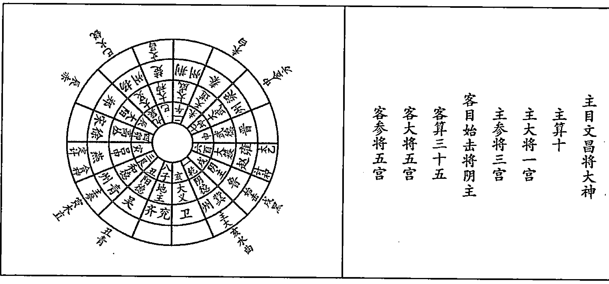

- 癸亥六十局
- 乙亥一百三十二局
- 丁亥二百四局
- 己亥二百七十六局
- 辛亥三百四十八局

## 术数

此局算得太乙六宫，理人，人多口舌。

此时声息，有虚惊，贼有警不入。奸细不入。闻事吉虚凶实。

文昌巳，在外地，可攻内。

主算十，孤阳，不和，不宜大举征伐。主大将一宫，值迫，大臣举事攻内。乘休气。不宜出兵攻战，宜固守。

主参将二宫，发，乘相气，可出兵攻战，宜设策应兵，四野遇敌，俱发兵，可胜。

出兵举黑旗，列曲阵，出向西北，战向东南，奇兵安巳地，战备东南，申酉戌地可伏兵。有风云飞鸟从正东方来，急备有战。风云飞鸟从西北方来，向东南方去，为天助，宜顺而击之，大胜。主将行兵，步卒在前。车骑在后，大将居中，静出向西北行，遇敌旋兵向东南，伺彼先举，而后应之。

始击在戌，辰击，有盗贼兵围逼迫事急。

客算三十五，杜塞无门。

客二将不出，坚壁固守。

## 太乙阴遁六十一局

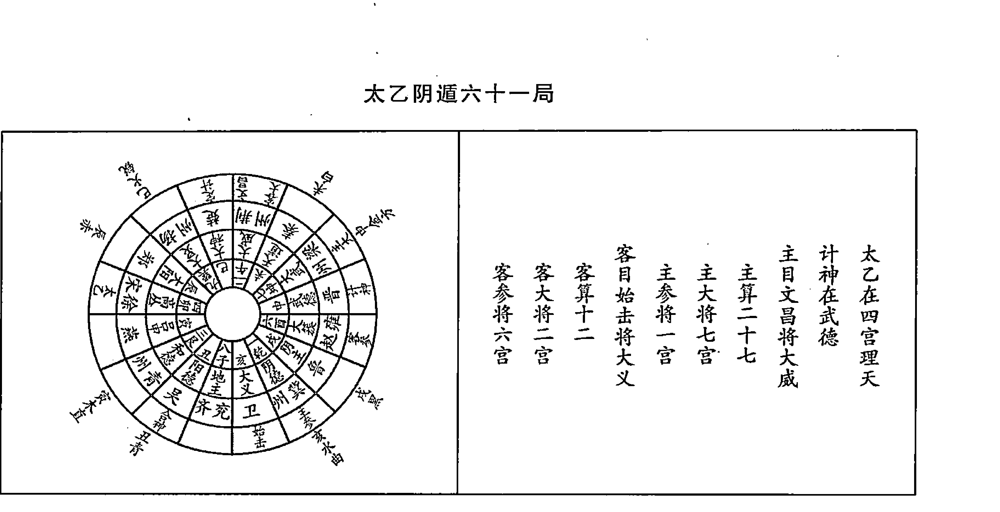

- 甲子六十一局
- 丙子一百三十三局
- 戊子二百五局
- 庚子二百七十七局
- 壬子三百四十九局

此局算得太乙四宫，理天，天内助主。

此时声息，有贼人贡，宜备。有兵有将，从西北来。闻事吉虚凶实。敌使不可信。奸细入觇，有私通外夷者。贼人临囚气，可攻；贼去临王气，不可追。

文昌二宫，在外地，可攻内。关客大，有私通外国。

主算二十七，长和，将吏全，太乙助，可以举兵征伐。

主大将七宫，发，乘休气，不宜出兵攻战，宜遣兵按伏助胜。

主参将一宫，发，乘休气，宜出兵，指挥士卒攻击，不宜出战。

出兵举白旗，列方阵，出向西南，战向东北，奇兵安午地，战备正南，寅卯方可伏兵。风云飞鸟从正西来，可急备大战。风云飞鸟从正西来，向东北去，顺而击之，大胜。

主将行兵，车骑在前，步卒在后，大将居中，鼓噪急出，向西北行。遇敌旋兵向东北，伺彼先举，我后击之。

始击在巳亥。

客算十二，上和，可以举兵攻伐。

客大将二宫，受制于文昌，同类相谋，不利有为。乘囚气，不宜出兵攻战，宜固守。

客参将六宫，值格，上下格易，夷狄侵掠。乘死气，不宜用兵举事，宜固守待时。

出兵举黄旗，列圆阵，出向正南，战向正西，奇兵安亥地，战备西北，巳午未方可伏兵。风云飞鸟从正西来，急备有战。风云飞鸟从正南来，冲向正北去，为天助，急顺击之，大胜。

客将行兵，步卒在前，车骑在后，大将居中，静出向正南行，遇敌旋兵向北，先举兵攻击，以应为客先起。

## 太乙阴遁六十二局

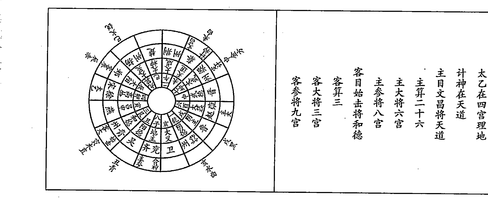

- 乙丑六十二局
- 丁丑一百三十四局
- 己丑二百六局
- 辛丑二百七十八局
- 癸丑三百五十局

此局算得太乙四宫，理地，天内助主。

此时声息，有贼无害，贼人寇挟主，慎之。兵少无将，从东北方来。闻事吉虚凶实。敌使言实可信。奸细不入。

贼出入皆临王相气，不可攻击。

文昌未，在外地，可攻内。

主算二十六，重阴，长而不和，将吏全，太乙助，可以出兵攻伐，军中宜慎水患。

主大将六宫，值格，大臣抗衡，凡事格易，不利有为。乘死气，不宜出兵攻伐，宜固守。

主参将八宫，发，乘相气，宜出兵战及按伏夹攻取胜。

出兵举白旗，列方阵，出向正西，战向正东，奇兵安未地，战备西南，寅卯辰地可伏兵。有风云飞鸟从正西来，冲向正东去，为天助，顺击之，大胜。

主将出兵，车骑在前，步卒在后，大将居中，鼓噪急行，向正西行，遇敌掣兵向正东，伺彼先动，我后举兵攻击，此为主后起之义。

始击在艮，掩客大。

客算三，单阳，不和，短无将吏，不利有为，不可举兵深入。

客大将三宫，外值迫，乘相气，可以遣兵按伏，出其不意而暗击之，不宜明出攻战。

客参将九宫，内值迫，乘休气，宜陈兵固守，不宜出战，逼迫之时，用兵必败。

出兵举青旗，列直阵，出向西北，战向西南，奇兵安艮地，战备东北，寅卯辰地可伏兵。风云飞鸟从正南来，急准备大战。风云飞鸟从东北方来，向东南方去，为天助，顺击之，大胜。

助，宜顺击之，大胜。客将行兵，步卒在前，车骑在后，大将居中，静出向东北行，遇敌旋兵向西南，先举兵攻击，以应为客先起。

## 太乙阴遁六十三局

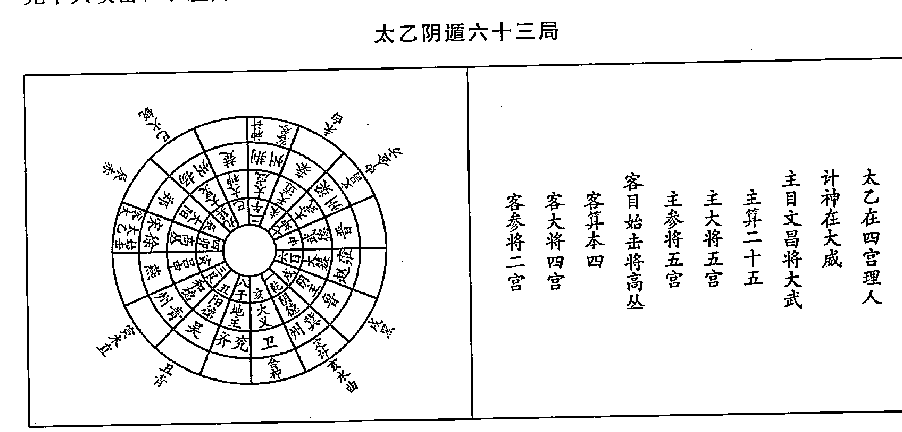

- 丙寅六十三局
- 戊寅一百三十五局
- 庚寅二百七局
- 壬寅二百七十九局
- 甲寅三百五十一局

此局算得太乙四宫，理人，天内助客。

此时声息，有贼大寇入境，有兵无将，从正东来。闻事吉虚凶实。敌使不可信。

奸细不入。贼初人乘王气，不可攻；贼去临休气，无备，可掩兵攻击。文昌七宫，在外地，可以攻内。

主算二十五，杜塞不通，无门。主二将不出。

始击四宫，掩，有掩袭之事，盗贼兵起，在绝气。

客算四，单阴，不和，短而无将吏，太乙不助，不宜举兵征伐。

客大将四宫，值囚，有拘执奔败事，不利有为。乘王气，不宜出兵攻战，宜陈兵固守及按伏截杀。

客参将二宫，发，乘因气，可以出兵，按伏兵卒，待敌而发，可以助胜，不宜明攻。

出兵举赤旗，列锐阵，出向正东，战向正西，奇兵安卯地，战备正东，寅卯方可伏兵。有风云飞鸟从正西来，急备有战。云风飞鸟从正东来，冲向正西去，为天助，击之，大胜。

客将行兵，步卒在前，车骑在后，大将居中，静默而出，向正东行，遇敌旋兵向正西，先举兵击之。

## 太乙阴遁六十四局

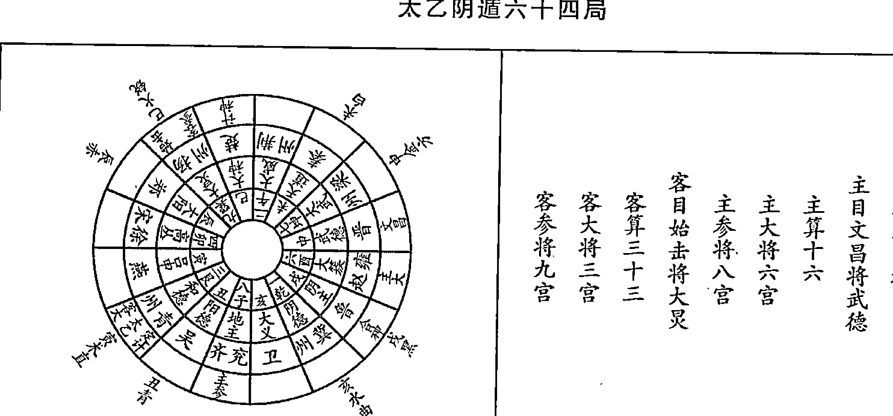

- 丁卯六十四局
- 己卯一百三十六局
- 辛卯二百八局
- 癸卯二百八十局
- 乙卯三百五十二局

此局算得太乙三宫，理天，天内助主。

此时声息，有庆，贼入寇，有自相仇杀者。有兵将多不和，从东南来。闻事吉虚凶实。敌使不可信。奸细不入。贼初人乘相气，不可攻；贼去乘死气，无备，可邀击。

文昌申，在外地，可攻内。

主算十六，长和，将吏全，太乙助，可以大举攻伐。

主大将六宫，发，乘死气，不宜出阵交锋，宜固守。

主参将八宫，内值迫，近臣内戚攻外，不利有为，可率兵按伏邀击取胜。

出兵举白旗，列方阵，出向正西，战向正东，奇兵安申地，战备西南，丑寅方可伏兵。风云飞鸟从西南来，急备有战。风云飞鸟从正西来，冲向东方去，为天助，宜顺击之，大胜。

主将行兵，车骑在前，步卒在后，大将居中，鼓噪急出，向正西行，遇敌旋兵向正东，举兵击之。

始击九宫，掩客参，主同类相谋。

客算三十三，重阳，长而不和，可以出兵。

客大将三宫，值因，有拘执奔败事，不利有为，可以发兵邀击，不宜出兵攻战。

客参将九宫，受制于始击，不利有为。乘休气，可以发兵截击，不宜攻战。

出兵举青旗，列直阵，出向东北，战向西南，奇兵安巽地，战备东南，丑寅方可伏兵。风云飞鸟从西南来，急备大战。风云飞鸟从东北方来，向西南方去，为天助，急顺击之，大胜。

客将行兵，步卒在前，车骑在后，大将居中，静出向东北行，遇敌旋兵向西南，先举兵击之。

## 太乙阴遁六十五局

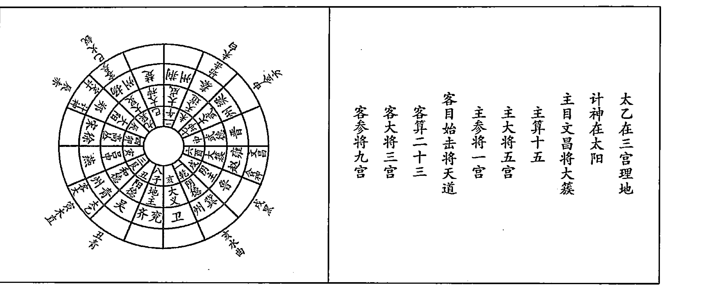

- 戊辰六十五局
- 庚辰一百三十七局
- 壬辰二百九局
- 甲辰二百八十一局
- 丙辰三百五十三局

此局算得太乙三宫，理地，天内助主。

此时声息，有贼入寇，又有贡者，兵多有将，首受死。闻事吉虚凶实。敌言不可信。奸细不入。贼从西南方来，贼入临相气，不可攻；贼去临死气，可击。

文昌六宫，在外地，可攻内。

主算十五，杜塞无门。主二将不出，宜固守。

始击在未。

客算二十三，长和，将吏全，宜举兵深入，以图大胜。

客大将三宫，值囚，有拘执奔败事，不利有为。虽乘相气，不可举兵运谋遣将攻击。

客参将九宫，发，乘休气，只可列兵，不可与战。

出兵举青旗，列直阵，出向东北，战向西南，奇兵安未地，战备西南，丑寅方可伏兵。风云飞鸟从西南来，急准备大战。风云飞鸟从东北方来，向西南方去，为天助，宜顺击之，大胜。

客将行兵，车骑在前，步卒在后，大将居中，鼓噪急出，向东北行，遇敌旋兵向西南，先举兵攻击。

## 太乙阴遁六十六局

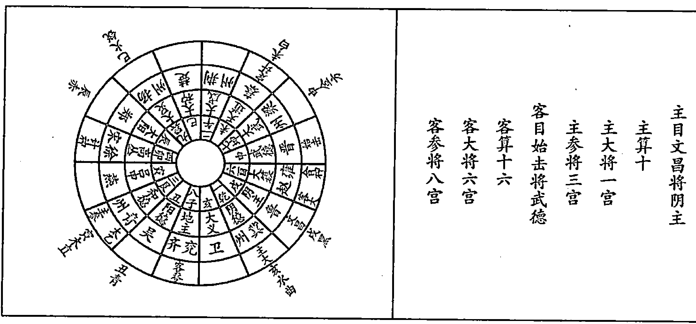

- 己巳六十六局
- 辛巳一百三十八局
- 癸巳二百十局
- 乙巳二百八十二局
- 丁巳三百五十四局

此局算得太乙三宫，理人，人有妖言，互相残害，天内助主。

此时声息，有庆，四夷入贡，兵多有将，小将受拘或死，从西南来。闻事吉虚凶实。敌使不可信。奸细不入。敌人乘相气，不可攻；贼出乘囚气，可击。文昌戌，在外地，可攻内。

主算十，孤阳，不和，太乙助之，宜列兵御寇，不宜攻战。

主大将一宫，发格挟，乘休气，不宜攻战，宜设兵按伏，可利。

主参将三宫，囚，有拘执奔败事，不利有为。乘相气，止宜固守。

出兵举黑旗，列曲阵，出向西北，战向东南，奇兵安戌地，战备西北，丑寅方可伏兵。风云飞鸟从西南来冲太乙，急备大战。

主将行兵，步卒在前，车骑在后，大将居中，静出向西北行。遇敌旋兵向东南，伺彼先举，然后举兵攻击。

始击在申。

客算十六，长和，可以深入缓攻取胜。

客大将六宫，发，挟主大，乘死气，可以运谋遣将，深入其境，缓攻取胜，宜斗战。

客参将八宫，外值迫，披挟。乘相气，可以陈兵固守，不宜出战。

出兵举白旗，列方阵，出向正西，战向正东，奇兵安申地，战备西南，丑寅方可伏兵。风云飞鸟从西南来，急备大战。风云飞鸟从正西来，冲正东方去，为天助，宜顺而击之，大胜。

客将行兵，车骑在前，步卒在后，大将居中，鼓噪急出，向正西行，遇敌旋兵向正东，先举兵击之。

## 术数

九八

## 太乙阴遁六十七局

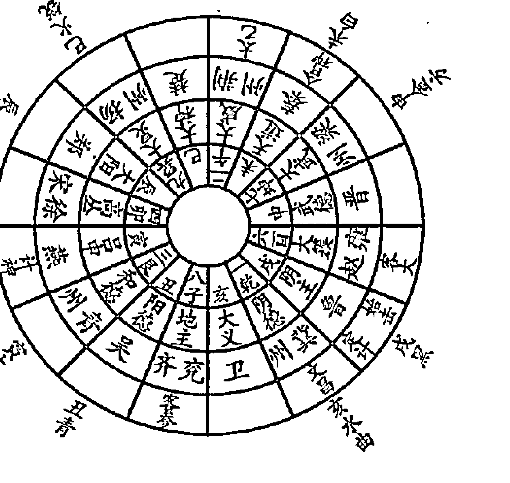

| 项目 | 内容 |
| :--- | :--- |
| 太乙在二宫理天 | |
| 计神在吕申 | |
| 主目文昌将阴德 | |
| 主算二十七 | |
| 主大将五宫 | |
| 主参将五宫 | |
| 客目始击将阴主 | |
| 客算二十六 | |
| 客大将六宫 | |
| 客参将八宫 | |

- 庚午六十七局
- 壬午一百三十九局
- 甲午二百一十一局
- 丙午二百八十三局
- 戊午三百五十五局

此局算得太乙二宫，理天，天外助客。

此时声息，有贼人寇无利，伤文臣。有兵有将，从西北方来。闻事吉虚凶实。敌使言实。奸细不入。贼初人临因气，可掩击；贼去临王气，不可攻。

文昌一宫，在内地，可攻外。

主算二十五，杜塞无门，主二将固守不出。

始击在戌。

客算二十六，重阴，不和，将吏全，太乙助，可以举兵征伐。军中防水患。

客大将六宫，发，乘死气，不宜举兵攻战，宜运谋遣将截击。

客参将八宫，值格，凡事格易。乘相气，不利有为，宜发兵按伏暗击。

出兵举白旗，列方阵，出向正西，战向东南，奇兵安戌地，战备西北，巳午未方可伏兵。有风云飞鸟从正北来，急备有战。风云飞鸟从正西来，冲向正东去，为天助，宜顺击之，大胜。

客将行兵，车骑在前，步卒在后，大将居中，鼓噪急出，向正西行，遇敌旋兵向正东，先举兵攻击，此为客先举之义。

## 太乙阴遁六十八局

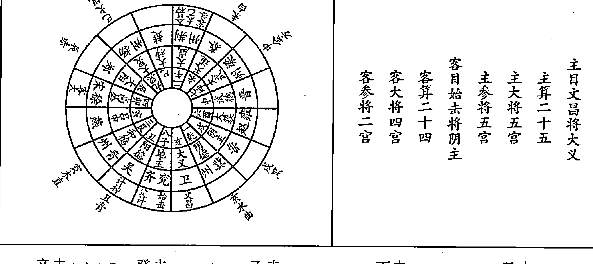

- 辛未六十八局
- 癸未一百四十局
- 乙未二百一十二局
- 丁未二百八十四局
- 己未三百五十六局

此局算得太乙二宫，理地，天外助客。

此时声息，有贼人寇，又有降者，兵多有将而不和，从正北来。闻事吉虚凶实。敌使不可信。奸细入窥，有私通外夷者。贼出人俱乘囚死之气，可以攻击。

文昌亥，在内地，可攻外。

主算二十五，杜塞无门，主二将固守不出。

始击八宫，格，凡事格易，夷狄侵掠，不利有为。

客算二十，重阴，长而不和，将吏全，太乙助，可以举兵征伐。防水患。

客大将四宫，发，又乘王气，可以率兵深入敌境，徐缓攻击，得胜即回，不宜贪攻，算不和故也。

客参将二宫，值囚，有拘执奔败事。又乘囚气，不宜出兵攻战，宜陈兵固守。

出兵举赤旗，列锐阵，出向正东，战向正西，奇兵安子地，战备正北，巳午未方可伏兵。风云飞鸟从正北来，急备大战。风云飞鸟从东方来，冲正西方去，此为天助，宜顺而击之，大胜。

客将行兵，步卒在前，车骑在后，大将居中，静默而出，向正东行，遇敌旋兵向正西，先举兵攻击，应为客先举之义。

## 太乙阴遁六十九局

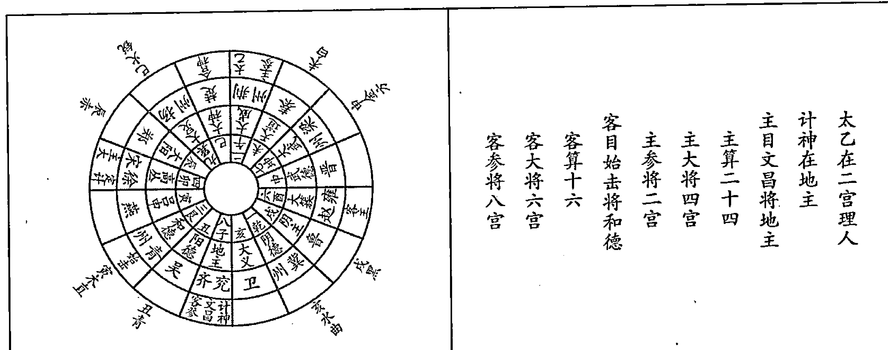

- 壬申六十九局
- 甲申一百四十一局
- 丙申二百一十三局
- 戊申二百八十五局
- 庚申三百五十七局

此局算得太乙二宫，理人，天外助客。

此时声息，有庆，外夷入贡，先有警。兵多有将，从东北方来。闻事吉虚凶实。

敌使不可信。奸细人，有私通外夷者。

文昌八宫，在内地，可攻外。将吏扶奸，同类相谋。

主算二十四，长而不和，将吏全。亦可举兵攻伐。防水灾，重阴固也。

主大将四宫，发，乘王气，可以率兵深入敌境，缓攻取胜，得利即回，不可久驻，算不和故也。

主参将二宫，值囚，有拘执奔败事，不利有为。又乘囚气，不可出兵攻战，宜固守。

出兵举赤旗，列锐阵，出向正东，战向正西，奇兵安坎地，战备北方，巳午未方可伏兵。有风云飞鸟从正北来，急备大战。风云飞鸟从正东来，冲向正西去，为天助，急宜顺击之，大胜。

主将行兵，步卒在前，车骑在后，大将居中，静出向正东行，遇敌勒兵向正西去，伺彼先举，然后动兵击攻，此为主人后起。

始击在三宫。

客算十六，长和，将吏全，太乙助，可以大举吊伐。

客大将六宫，发，乘死气，不宜出兵，宜设策按伏，发兵邀击，亦可取胜。

客参将八宫，值格，凡事格明勿，夷狄侵掠，又受制文昌，虽乘相气，犹不可出兵攻战，宜固守。

出兵举白旗，列方阵，出向正西，战向正东，奇兵安艮地，战备东北，巳午未方可伏兵。风云飞鸟从正北来，急备有战。风云飞鸟从正西来，冲向正东去，为天助，急宜顺击之，大胜。

急顺击之，大胜。客将行兵，车骑在前，步卒在后，大将居中，鼓噪急出，向正西行，遇敌提兵向正东，先举兵击之，此为客兵先起。

## 太乙阴遁七十局

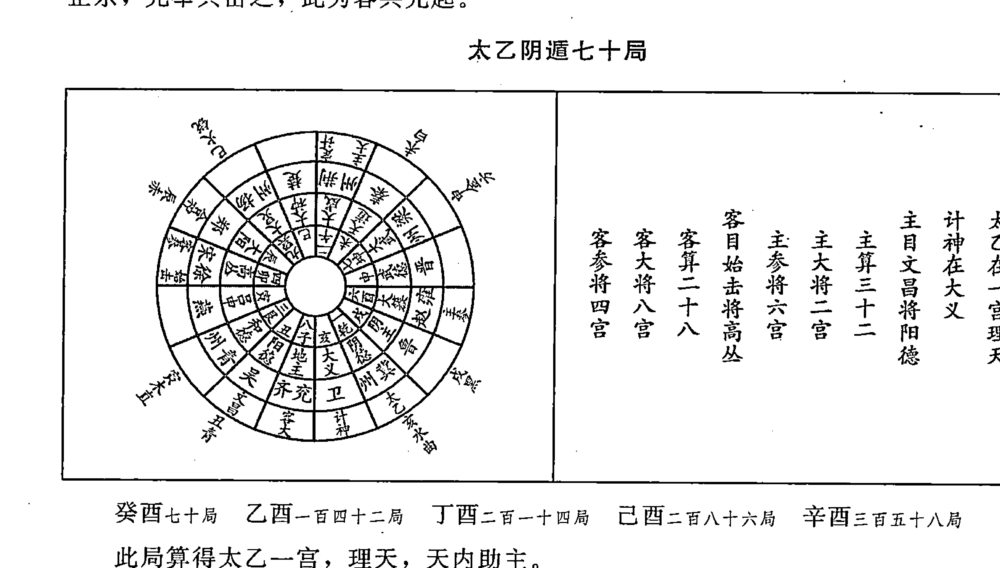

| 项目 | 内容 |
| :--- | :--- |
| 太乙在一宫理天 | |
| 计神在大义 | |
| 主目文昌将阳德 | |
| 主算三十二 | |
| 主大将二宫 | |
| 主参将六宫 | |
| 客目始击将高丛 | |
| 客算二十八 | |
| 客大将八宫 | |
| 客参将四宫 | |

- 癸酉七十局
- 乙酉一百四十二局
- 丁酉二百一十四局
- 己酉二百八十六局
- 辛酉三百五十八局

此局算得太乙一宫，理天，天内助主。

此时声息，有夷狄人贡，有兵自仇杀者，多有将不和，从正东来。

闻事吉虚凶实。敌使不可信。奸细不人。

文昌丑，在内地，可攻外。

主算二十三，长和，将吏全，太乙助，宜事征伐。

主大将二宫，发，乘因气，不宜出兵攻战，宜运谋设策，发兵按伏邀击，可以取小胜。

主参将六宫，内值迫，近臣内戚攻外。

乘休气，不利有为，宜固守。

出兵举黄旗，列圆阵，出向正南，战向正北，奇兵安丑地，战备东北，戌亥方可伏兵。有风云飞鸟从东南来，急备大战。风云飞鸟从正南来，冲正北方去，为天助，急顺击之，大胜。

主将行兵，步卒在前，车骑在后，大将居中，静出向正南行，遇敌旋兵向正北，伺彼先举，而后举兵攻击。

始击四宫，掩客参，将有同类相谋。

客算二十八，重阴，长而不和，将吏全，亦可深入缓攻。军中防水患。客大将八宫，外值迫，大臣逆命，内外连谋攻内，不利有为。乘相气，可以设策指挥军士暗击，不宜出兵攻战。

客参将四宫，受始击制，不利有为。乘王气，可陈兵固守待时。

出兵举黑旗，列曲阵，出向正北，战向正南，奇兵安卯地，战备正东，戌亥方可伏兵。风云飞鸟从东南方来，急备有战。风云飞鸟从正北方来，冲向正南方去，为天助，急顺击之，大胜。

客将行兵，车骑在前，步卒在后，大将居中，鼓噪急出，向正南行。

遇敌旋兵向正南，先举兵击之。

## 太乙阴遁七十一局

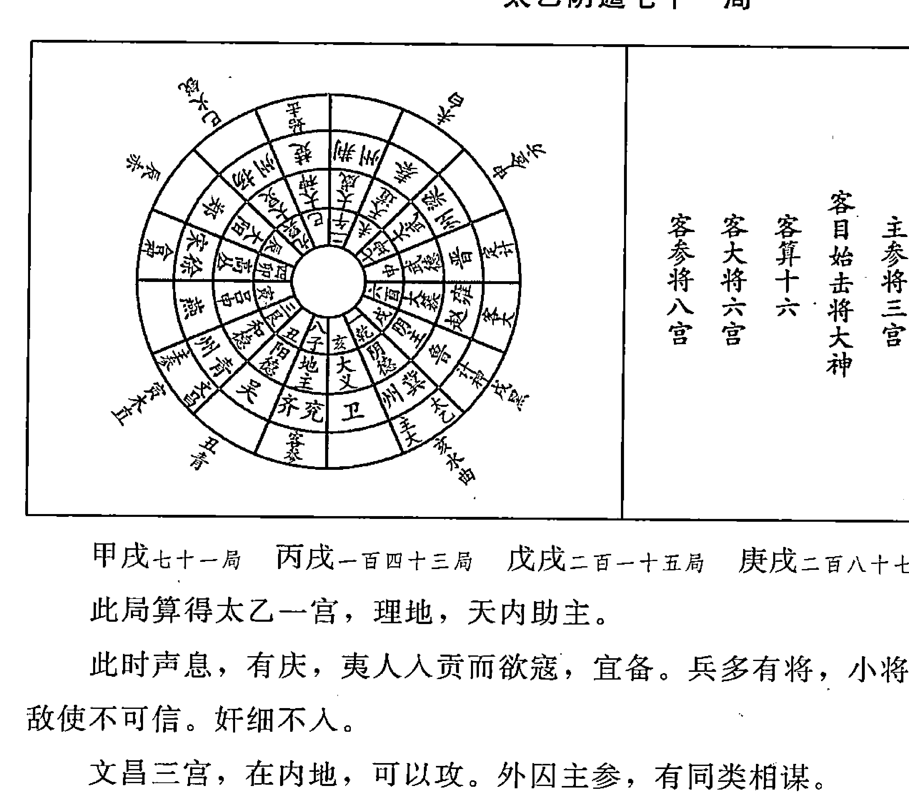

| 项目 | 内容 |
| :--- | :--- |
| 太乙在一宫理地 | |
| 计神在阴主 | |
| 主目文昌将和德 | |
| 主算三十一 | |
| 主大将一宫 | |
| 主参将三宫 | |
| 客目始击将大神 | |
| 客算十六 | |
| 客大将六宫 | |
| 客参将八宫 | |

- 甲戌七十一局
- 丙戌一百四十三局
- 戊戌二百一十五局
- 庚戌二百八十七局
- 壬戌三百五十九局

此局算得太乙一宫，理地，天内助主。

此时声息，有庆，夷人入贡而欲寇，宜备。兵多有将，小将受擒。闻事吉虚凶实。敌使不可信。奸细不入。

文昌三宫，在内地，可以攻。外囚主参，有同类相谋。

主算三十一，长而不和，将吏全，太乙、文昌内助，可以深入速攻，算重阳，军慎火灾。

主大将一宫，值囚，有拘执奔败事，不利有为。又乘休气，不宜出兵攻战，宜运筹遣兵邀击，有小胜。

主参将三宫，受制于文昌，不利有为。乘相气，可率兵守隘游击，亦有小捷。出兵举黑旗，列曲阵，出向西北，战向东南，奇兵安艮地，战备东北，戌亥方可伏兵。风云飞鸟从东南方来，急备有战。风云飞鸟从西北方来，冲向东南方去，顺而击之，大胜。始击在巳。

客算十六，长和，将吏全，可以深入缓攻克胜。

客大将六宫，内值迫，有近臣外戚连谋攻外，不利有为，乘死气。客参将八宫，值迫，不利有为。乘相气，逼迫之时用兵，主客俱败。

此局客算虽长和，将则不利，只宜固守，不宜出兵攻战，战必败。

## 太乙阴遁七十二局

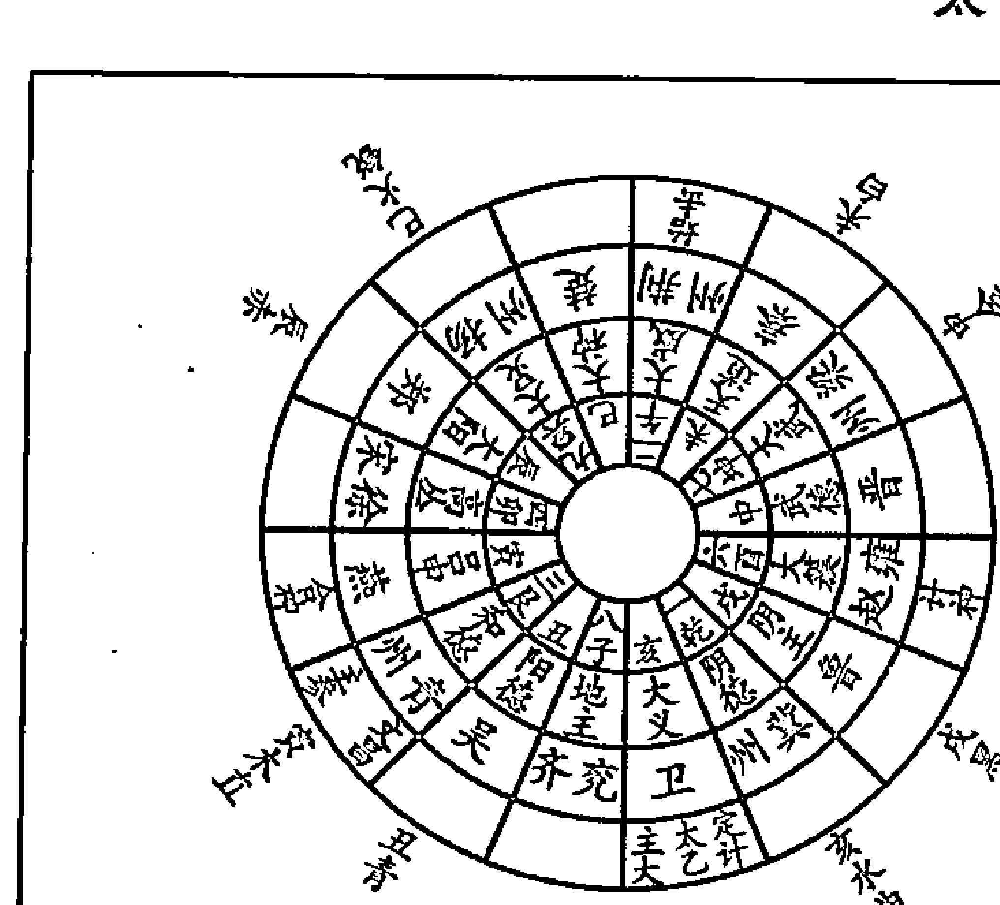

| 项目 | 内容 |
| :--- | :--- |
| 太乙在一宫理人 | |
| 计神在大簇 | |
| 主目文昌将和德 | |
| 主算三十一 | |
| 主大将一宫 | |
| 主参将三宫 | |
| 客目始击将大威 | |
| 客算十五 | |
| 客大将五宫 | |
| 客参将五宫 | |

- 乙亥七十二局
- 丁亥一百四十四局
- 己亥二百一十六局
- 辛亥二百八十八局
- 癸亥三百六十局

此局算得太乙一宫，理人，天内助主。

此时声息，有贼潜入寇，兵少将柔。闻事吉虚凶实。奸细不入。贼出人乘休气，可攻。

文昌三宫，在内地，可攻外，囚主参。主算二十一，重阳，不和，不宜出兵。防火有水。

主大将一宫，值囚，有拘执之事。乘休气，出兵不振，宜固守。

主参将三宫，值文昌制，乘相气，主同类相攻，出兵不成功。

出兵举白旗，列方阵，出向西北，战向东南，奇兵安东北地，战备东北，戌亥方可伏兵。风云飞鸟从东南方来，急备大战。风云飞鸟从西北方来，冲向东南方去，为天助，宜顺击之，大胜。

主将出兵，车骑在前，步卒在后，大将居中，鼓噪急出，向西北行，遇敌旋兵向东南，先举兵攻之，风云飞鸟从西北方来，有战。宜固守。

客算十五，杜塞无门，客二将不出。

始击在午。

此局为七十二局之终，亥为十二支之终，亦为五穷数也。七十二为一元之终，一百四十四为太岁十二支之终，二百一十六为乾策之终，二百八十八为太游八卦之终，三百六十为五元六纪之终。

凡上官出兵，以及冠、婚、丧、祭、经商等百事，皆无所利，而况兵家大事乎！

# 卷七 术数汇考七

## 太乙局

#### 时计阳遁成局①

##### 太乙阳遁一局

- 甲子一局
- 丙子七十三局
- 戊子一百四十五局
- 庚子二百一十七局
- 壬子二百八十九局

此局算得太乙在一宫，理天，天内助主，天有变异。

此时贼从西南来。敌使不可信。奸细不入。贼入乘休气，可击；去乘旺气，不可犯。

文昌在外地，可攻内地。

主算单七，单阳，无天，有兵无将，太乙虽助，不宜大举征伐。

主大将七宫，客目掩，乘囚气，宜整兵固守，不可展阵交锋，必死败。

主参将一宫，囚，乘休气，不宜出兵交锋，妄动必受拘执，宜固守。

出兵举白旗，列方阵，出向西南，战向东北，奇兵安申地，伏兵利戌亥时，战备西南。风云飞鸟从东南来，冲向太乙宫，急备大战。风云飞鸟自我阵后冲入敌阵去，为之天助，宜顺而击之，大胜。主将行兵，车骑在先，步兵次之，大将居中，急躁而出，向西南，战向东北。伺敌先举，然后应之，此为主后应之道。

始击在七宫，掩主大。

客算十三，重阳。

客大将三宫，发，乘相气，宜举征伐，深入缓攻取胜。

客参将九宫，格太乙，凡事格易，乘休气，不利有为，宜固守。

出兵举青旗，列直阵，出向东北，战向西南，战备西北，奇兵安坤地，伏兵利戌亥时。飞鸟风云从东南来，冲向太乙宫，急备大战。飞鸟风云自我阵后来，冲入敌阵去，为之天助，宜顺而击之，大胜。

客将行兵，步兵在前，车骑次之，大将居中，静出向东北行，遇敌提兵向西南，先举击之，乃为客先举之道也。

##### 太乙阳遁二局

- 乙丑二局
- 丁丑七十四局
- 己丑一百四十六局
- 辛丑二百一十八局
- 癸丑二百九十局

此局算得太乙在一宫，理地，天内助主。

此时声息，有敌人自西北方入寇。闻事吉虚凶实。敌使不可信。贼来乘休气，可击；去乘相气，不可追击。

文昌在太簇，内宫迫，在外地，可攻内，大臣逆命。

主算单六，重阴，不和，短而无将，不宜举兵征伐。

主大将六宫，迫主目关，不利有为。乘死气，不宜出兵攻战，固守不失。

主参将八宫，迫，乘相气，客挟，不利有为，亦当固守。

出兵举白旗，列方阵，出向正西，战向正东，战备西方，奇兵安酉地，伏兵利戌亥时。风云飞鸟从东南来，冲向太乙宫，急备大战。风云飞鸟自我阵后来，冲向敌阵去，为之天助，宜顺而击之，大胜。

主将行兵，车骑在先，步兵次之，大将居中，急躁而出，向正西，遇敌提兵向正东，伺敌先举，然后应之。始击在戊，内击，山林有盗。客算单一，单阳，无地，短而无将吏，不宜举兵征伐。客大将一宫，囚，乘相气，有拘执奔败事。宜西北固守，不可妄动。客参将三宫，发，乘休气，宜率兵浅进，拒守要害，伏兵击其首尾，取胜即回，算短不可久攻深入。出兵举黑旗，列曲阵，出向西北，战向东南，战备西北，奇兵安戊地，伏兵利戌亥时。风云飞鸟自东南来，冲向太乙宫，急备大战。风云飞鸟自我阵后冲入敌阵去，为之天助，宜顺而击之，大胜。

客将行兵，步卒在前，车骑在后，大将居中，静出向西北方，遇敌旋兵向东南。先举击之，乃为客之道。

##### 太乙阳遁三局

- 客参将六宫
- 客大将二宫
- 客算十二
- 客目始击将大义
- 主参将一宫
- 主大将七宫
- 主算二十七
- 主目文昌将太阳
- 计神在大威
- 太乙在四宫理人

- 丙寅三局
- 戊寅七十五局
- 庚寅一百四十七局
- 壬寅二百一十九局
- 甲寅二百九十一局

此局算得太乙在一宫，理人，天内助主。此时声息，有贼入寇，逼迫自西北方来，将吏全。敌使言可信。贼人乘休气，去乘囚气，皆可击。文昌在戌，外地，可攻内地。内辰迫，大臣逆命。主算单一，单阳，无地，短而无将吏，太乙虽助，不利为主，不宜大举征伐。主大将一宫，囚，乘休气，不利有为，不宜举兵征伐，轻动有拘执之咎。主参将三宫，发，乘相气，可以伏兵拒敌，浅进攻战取胜。出兵举黑旗，列曲阵，出向西北，战向东南，战备西北，奇兵安戊地，伏兵利戌亥时。风云飞鸟自东南来，冲向太乙宫，急备大战。风云飞鸟自我阵后来，冲入敌阵去，为之天助，宜顺而击之，大胜。主将行兵，步卒在前，车骑在后，大将居中，静出向西北，遇敌提兵向东南，伺敌先举，然后应之。

始击在亥，文章兴，兵火发。
客算四十，孤阴，将吏全，太乙不助，可以举兵征伐。
客大将四宫，发，乘旺气，宜率兵深入敌境，缓攻取胜立功。
客参将二宫，发，乘囚气，可以陈兵拒敌，不宜远出深入。

出兵举赤旗，列锐阵，出向正东，战向正西，战备西北，奇兵安亥地，伏兵利戌亥时。风云飞鸟自东南来，冲向太乙宫，急备大战。
风云飞鸟自我阵后来，冲入敌人阵去，为之天助，宜顺而击之，大胜。

客将行兵，车骑在前，步卒次之，大将居中，急躁而出，向正东，遇敌提兵向西，先举击之，乃为客先起之道。

##### 太乙阳遁四局

- 丁卯四局
- 己卯七十六局
- 辛卯一百四十八局
- 癸卯二百二十局
- 乙卯二百九十二局

此局算得太乙在二宫，理天，天外助客。
此时声息，有警，贼入东北方。敌使言虚。奸细不入。贼人乘囚气，可击；去乘休气，亦可追。

文昌在乾，内地，可攻外。
主算二十五，杜塞无门，主二将固守不出。
始击在阳德，并太阴，臣失爵禄，关梁闭塞，后妃怀二。

客算十七，重阳，厄火，不宜大举征伐，而防火灾。

客大将七宫，外迫，大臣逆命，举事攻内。乘囚气，不利有为，惟宜坚壁固守，不宜出兵攻战。

客参将一宫，关，乘休气，自相谋并，不利有为，不宜出兵征伐。出兵举白旗，
列方阵，出向西南，战向东北，战备东北，奇兵安丑地，伏兵利巳午未时。风云飞鸟从正北来，冲向太乙宫，急备大战。风云飞鸟从我阵后来，冲向敌人阵去，为之天助，宜顺而击之，大胜。

客将行兵，车骑在前，步卒次之，大将居中，急躁而出，向西南，遇敌提兵向东北，先举兵击之，乃为客先起之道。

##### 太乙阳遁五局

| 项目 | 内容 |
|------|------|
| 太乙 | 在二宫理地 |
| 计神 | 在阴主 |
| 主目文昌 | 将阴德 |
| 主算 | 二十五 |
| 主大将 | 中宫 |
| 主参将 | 中宫 |
| 客目始击 | 将吕申 |
| 客算 | 十七 |
| 客大将 | 四宫 |
| 客参将 | 二宫 |

戊辰五局 庚辰七十七局 壬辰一百四十九局 甲辰二百二十一局 丙辰二百九十三局

此局算得太乙在二宫，理地，天外助客，上将连谋。

此时声息，有贼从东北方来。闻事吉实凶虚。敌使不可信。奸细不入。贼有将兵和，来乘囚气，去乘死气，皆可追击。

文昌在乾，内地，可攻外地。

主算二十五，杜塞无门，主二将固守不出。

始击在寅，后妃怀二，士卒流亡。

客算十四，上和，无地，宜举兵征伐。

客大将四宫，发，乘旺气，宜举兵深入敌境，缓攻取胜，建立大功。

客参将二宫，囚，又乘囚气，不利有为。惟宜固守，妄动则主拘执。

出兵举赤旗；列锐阵，出向正东，战向正西，战备东北，奇兵安寅地，伏兵利巳午未时。风云飞鸟从正北来，冲向太乙宫；急备大战。风云飞鸟自我阵后来，冲向正西去，此为天助，宜顺而击之，大胜。

客将行兵，步卒在前，车骑在后，大将居中，静默而出，向正东，遇敌旋兵向正西，先举击之，为客之道。

##### 太乙阳遁六局

己巳六局 辛巳七十八局 癸巳一百五十局 乙巳二百二十二局 丁巳二百九十四局

此局算得太乙在二宫，理人，天外助客。

此时声息，有警，有将兵不和，从东南方来。敌使不可信。贼之细作不入。

贼来乘囚气，去乘旺气，来可截击，去不可追犯。

文昌在亥，在内，可攻外。

主算二十五，杜塞无门，主大小将固守不出。

始击在辰，民多病。

客算单十，孤阳，无人。

客大将一宫，发，举兵攻战获胜，但乘休气而数不和，不宜深入久攻。

客参将三宫，发，乘相气，宜率兵攻击，取胜即止。

出兵举黑旗，列曲阵，出向西北，战向东南，战备东南，奇兵安辰地，伏兵利巳午未时。风云飞鸟从正北来，冲向太乙宫，急备大战。风云飞鸟从我阵后来，冲向东南方去，乃为天助，宜顺而击之，大胜。

客将行兵，步卒在前，车骑次之，大将居中，静默而出，向西北，遇敌提兵向东南，先举击之，大胜。

##### 太乙阳遁七局

太乙在三宫理天 计神在武德 主目文昌将地主 主算单八 主大将八宫 主参将四宫 客目始击将大神 客算二十五 客大将中宫 客参将中宫

庚午七局 壬午七十九局 甲午一百五十一局 丙午二百二十二局 戊午二百九十五局

此局算得太乙在三宫，理天，天内助主，天有变异。

此时声息，无贼，奸细不入。

文昌在子，内地，可攻外地。迫太乙，大臣逆命，关主大将，同类相谋，不利有为。

主算单八，单阴，无天，短而无将，不宜大举征伐。主大将八宫，迫太乙，关主目，同类相谋，不利有为。乘相气，宜拒守要害，伏兵邀击，取胜即止。

主参将四宫，迫，乘旺气，可以伏兵击其首尾，取胜即止。

出兵举黑旗，列曲阵，出向正北，战向正南，战备正北，奇兵安子地，伏兵利丑寅时。风云飞鸟从西南来，冲向太乙宫，急备大战。风云飞鸟自我阵后来，冲入敌阵去，为之天助，宜顺而击之，大胜。

主将行兵，车骑在前，步卒次之，大将居中，鼓噪而出，向正北行，遇敌提兵向正南，伺敌先举，然后应之，大胜。

始击在巳，阴阳失序，多雨水。

客算二十五，杜塞无门。

客大小将不出中五，不宜妄举。

##### 太乙阳遁八局

辛未八局 癸未八十局 乙未一百五十二局 丁未二百二十四局 己未二百九十六局

此局算得太乙在三宫，理地，天内助主，地有变异，水旱不均。

此时声息，贼自西南方来，来乘相气。去亦乘相气，皆不可犯。敌使言虚。奸细不入。

文昌在丑，内地，可攻外地。内辰迫，大臣逆命，举事攻外。

主算单一，单阳，无地，不宜大举征伐。

主大将一宫，发，乘休气，不可出兵攻击，算中无将吏，不利有为，可以伏兵截击。

主参将三宫，囚，轻动则有拘执奔败事。乘相气，固守不失。

出兵举黑旗，列曲阵，出向西北，战向东南，战备东北，奇兵安丑地，伏兵利丑寅时。风云飞鸟从西南来，冲向太乙宫，急备大战。风云飞鸟自我阵后来，冲入敌人阵去，为之天助，宜顺而击之，大胜。

主将行兵，步卒在前，车骑次之，大将居中，出向西北，遇敌提兵向东南，静默后应，乃为主之道。

始击在坤，格太乙，盗侮其君，牛马急走。

客算二十二重阴，而长，可以举兵征伐。

客大将二宫，发，乘囚气，宜按兵伏击取胜，不宜大举深入。

客参将六宫，发，可以陈兵拒敌策应。乘死气，不宜大举。

出兵举黄旗，列圆阵，出向正南，战向正北，战备西南，奇兵安坤地，伏兵利丑寅时。风云飞鸟自西南来，冲向太乙宫，急备大战。风云飞鸟自我阵后来，冲入敌人阵去，为之天助，宜顺而击之，大胜。

客将行兵，步卒在前，车骑次之，大将居中，静出向正南，遇敌旋兵向正西，举

##### 太乙阳遁九局

太乙在三宫理人
计神在大威
主目文昌将和德
主算单三
主大将三宫
主参将三宫
客目始击将大簇
客算十五
客大将中宫
客参将中宫

- 壬申九局
- 甲申八十一局
- 丙申一百五十三局
- 戊申二百二十五局
- 庚申二百九十七局

此局算得太乙在三宫，理人，天内助主，太岁格，主有奔败事。

此时声息，无贼，敌使、奸细皆不来。文昌在三宫，在内，可攻外地。因太乙宫，有拘执奔败事。

主算三，单阳，不和，无地，无将吏，不宜大举征伐。

主大将三宫，囚关为争明自败，不利有为，乘相固守，无拘执之事。

主参将九宫，发，乘休气，可以出兵拒守要害，伏兵攻击。

出兵举青旗，列直阵，出向东北，战向西南，战备东北，奇兵安艮地。伏兵利丑寅时。风云飞鸟自西南来，冲向太乙宫，急备大战。风云飞鸟自我阵后来，冲入敌阵去，为之天助，宜顺而击之，大胜。

主将行兵，步卒在前，车骑次之，大将居中，静出向东北，遇敌提兵向西南，伺敌先举，然后应之。

始击在酉，嬖宠进宫。

客算十五，杜塞无门。

客大小将固守不出。

##### 太乙阳遁十局

- 癸酉十局
- 乙酉八十二局
- 丁酉一百五十四局
- 己酉二百二十六局
- 辛酉二百九十八局

此局算得太乙在四宫，理天，天内助主，天有变异，四序不和。

此时声息，有贼自西北方来。敌使不可信。奸细不入。贼来乘旺气，去乘旺气，皆不可犯。

文昌在吕申，内地，可攻外地。内辰迫，大臣逆命，举事攻外。

主算一，单阳，无地，短而无将吏，不宜举兵征伐。

主大将一宫，始击掩，又乘休气，不宜举兵，战必死败。

主参将三宫，迫，乘相气，不宜举兵，固守不失。

出兵举黑旗，列曲阵，出向西北，战向东南，战备东北，奇兵安寅地，伏兵利寅卯辰时。风云飞鸟自正西来，冲向太乙宫，急备大战。风云飞鸟自我阵后冲入敌阵去，为天助，宜顺而击之，大胜。

主将行兵，步卒在前，车骑次之，大将居中，静出向西北行，遇敌旋兵向东南，伺敌先举，然后应之，乃为主之道。

始击在一宫，掩主大将。

客算十二，无地，宜举兵征伐，算中在囚气宫，不可久战，取胜即止。

客参将六宫，格太乙，乘死气，凡事格易，敌人侵掠，不利有为，严加固守。

出兵举黄旗，列圆阵，出向正南，战向正北，战备西北，奇兵安乾地，伏兵利寅卯辰时。风云飞鸟自正西来，冲向太乙宫，急备大战。风云飞鸟自我阵后来，冲入敌阵去，为之天助，宜顺而击之，大胜。

##### 太乙阳遁十一局

甲戌十一局 丙戌八十三局 戊戌一百五十五局 庚戌二百二十七局 壬戌二百九十九局

此局算得太乙在四宫，理地，天内助主，地有变异，水旱为厄，牺牲多死，五谷不登。

此时声息，贼入寇。闻事凶实吉虚。奸细入，有私通于外者。敌使言不可信。贼来乘旺气，不可犯；贼去乘休气，可击。

文昌将在四宫，内地，因太乙宫，关客大将，为四郭固，有拘执之事，奔败之祸，大凶。

主算四，单阴，无地，无将吏，不利有为。

主大将四宫，因太乙宫，关主目客大，虽乘旺气，不利有为，同类相谋。

主参将二宫，关客参，乘囚气，不利有为。

始击在丑。

客算四，单阴，无地，无将吏，不宜举兵。

客大将四宫，因太乙宫，关主目、主大，乘旺气，宜坚壁固守，不慎，主有拘执奔败杀害之事。

客参将二宫，关主，乘囚气，不利有为。

此局曰四郭固。主客大将因关，二小将又关，皆不利征战。以二目所临宫神言，文昌木制，始击土，然文昌受囚关，亦皆不利。以时序论，主将秋胜，客将冬胜。

##### 太乙阳遁十二局

- 太乙在四宫理人
- 计神在高丛
- 主目文昌将太阳
- 主算三十七
- 主大将七宫
- 主参将一宫
- 客目始击将吕申
- 客算单一
- 客大将一宫
- 客参将三宫

乙亥十二局 丁亥八十四局 己亥一百五十六局 辛亥二百二十八局 癸亥三百局

此局算得太乙在四宫，理人，天内助主，上凌下僭。

此时声息，有贼入寇逼迫，无将吏，兵少。敌使不可信。奸细不入。贼从东北方来，来乘旺气，去乘囚气，来不可触犯，去不可掩击。

文昌在太阳，内地，可攻外。外辰迫，大臣逆命，举事攻内。

主算三十七，算长，将吏全，可以举兵征伐。

主大将七宫，发，宜出征战，深入缓攻，乘囚气，取胜即止。

主参将一宫，关客大，乘休气，不利有为，宜固守。

出兵举白旗，列方阵，出向西南，战向东北，战备东南，奇兵安辰地，伏兵利寅卯辰时。风云飞鸟从正西来，冲向太乙宫，急备大战。风云飞鸟自我阵后来，冲入敌阵去，为天助，宜顺而击之，大胜。

主将行兵，车骑在前，步卒次之，大将居中，急躁而出，向西南，遇敌旋兵向东北，伺敌先举，然后应之，乃为主之道。

始击在寅。

客算一，单阳，无地，无将吏，兵少，不宜举兵征伐。

客大将一宫，关主参，乘休气，不利有为，宜固守。

客参将三宫，内宫迫，不宜大举，乘相气，可以拒守要害，击其首尾，取胜，不可久敌。

出兵举黑旗，列曲阵，出向西北，战向东南，战备东北，奇兵安寅地，伏兵利寅卯辰时。风云飞鸟从正西来，冲向太乙宫，急备大战。风云飞鸟自我阵后来，冲入敌阵去，为之天助，宜顺而击之，大胜。

客将行兵，步卒在前，车骑次之，大将居中，静出向西北行，遇敌提兵向东南，
先举兵击之，乃为客之道。

##### 太乙阳遁十三局

丙子十三局 戊子八十五局 庚子一百五十七局 壬子二百二十九局 甲子三百一局

此局算得太乙在六宫，理天，天外助客。

此时声息，有庆，贼人，从东南方来。敌使言实。奸细人觇，有私通于外之人。贼人乘死气，可伏兵截击；去乘相气，不可追犯。

文昌在大炅，内地，可攻外地。关客大，主有私通于外之人。

主算十八，上和，将吏全，宜大举征伐。

主大将八宫，发，乘相气，宜率兵深入敌境，缓攻取胜，建立大功。

主参将四宫，格太乙，凡事格易，不宜大举，可以陈兵策应，按兵伏击取胜。

出兵举黑旗，列曲阵，出向正北，战向正南，战备东南，奇兵安巽地，伏兵利申酉戌时。风云飞鸟自正东来，冲向太乙宫，急备大战。风云飞鸟自我阵后来，冲入敌阵去，为天助，宜顺而击之，大胜。

主将行兵，车骑在前，步卒次之，大将居中，急躁而出，向正北，遇敌旋兵向正南，伺敌先发，然后应之，乃为主之道。

始击在辰，大人有忧。

客算十九，重阳，厄火，不宜征发，军中防火灾。

客大将九宫，关文昌，乘休气，不利有为，宜固守。

出兵举赤旗，列锐阵，出向东南，战向西北，战备东南，奇兵安辰地，伏兵利申酉戌时。风云飞鸟自正东来，冲向太乙宫，急备大战。风云飞鸟自我阵后来，冲入敌阵去，为天助，宜顺而击之，大胜。

客将行兵，车骑在前，步卒次之，大将居中，急躁而出，向东南行，遇敌旋兵向西北，先举兵击之。

##### 太乙阳遁十四局

丁丑十四局 己丑八十六局 辛丑一百五十八局 癸丑二百三十局 乙丑三百二局

此局算得太乙在六宫，理地，天外助客，上凌下僭。

此时声息，贼自正南方来。有兵无将。

敌使言实。奸细不入。贼来乘死气，可击；去乘相气，不可犯。

文昌在巳，外地，可攻内地。

主算十，孤阳，无人，不利有为。

主大将一宫，外宫迫，大臣举事攻内。乘休气，不利有为，不宜出兵攻战。

主参将三宫，发，乘相气，可以率兵攻战，取胜即止。

出兵举黑旗，列曲阵，出向西北，战向东南，战备东南，奇兵安巳地，伏兵利申酉戌时。风云飞鸟自正东来，冲向太乙宫，急备大战。风云飞鸟自我阵后来，冲入敌人阵去，为天助，宜顺而击之，大胜。

主将行兵，车骑在前，步卒次之，大将居中，急躁而出，向西北行，遇敌旋兵向东南，伺敌先举，然后应之。

始击在午，主火灾。

客算九，单阳，无天，有兵无将，不宜大举。

客大将九宫，发，乘休气，宜举兵征伐，取胜即止，不宜深入远举。

客参将七宫，迫，乘囚气，不利有为，宜固守。

出兵举赤旗，列锐阵，出向东南，战向西北，战备正南，奇兵安午地，伏兵利申酉戌时。风云飞鸟自正东来，冲向太乙宫，急备大战。风云飞鸟自我阵后来，冲入敌人阵去。乃为天助，宜顺而击之，大胜。

客将行兵，车骑在前，步卒次之，大将居中，急躁而出，向东南行，遇敌旋兵向西北，先举兵击之，乃为客之道。

## 太乙阳遁十五局

戊寅十五局 庚寅八十七局 壬寅一百五十九局 甲寅二百三十一局 丙寅三百三局

此局算得太乙在六宫，理人，天外助客。

此时声息，贼自西南方来，损我偏将，宜慎。贼有兵无将。敌使言不可信。奸细不入。来乘死气，去乘囚气，皆可追击。

文昌在大威，外地，可攻内。

主算九，单阳，无将，太乙不助，不宜大举深入。

主大将九宫，乘休气，将发，宜用谋击截取胜，不可大举久敌。

主参将七宫，迫击掩关客大，乘囚气，宜固守，轻动则凶。

出兵举赤旗，列锐阵，出向东南，战向西北，战备正南，奇兵安午地，伏兵利申酉戌时。风云飞鸟自正东来，冲向太乙宫，急备大战。风云飞鸟自我阵后来，冲入敌阵去，为天助，宜顺而击之，大胜。

主将行兵，车骑在前，步卒次之，大将居中，急噪而出，向东南行，遇敌提兵向西北，伺敌先举，然后应之，乃为主之道。

始击在坤，内击，大臣逆命。

客算七，单阳，无将，不宜大举征伐。

客大将七宫，掩关主参，乘囚气，不利有为，宜坚壁固守，有相谋执献之凶。

客参将一宫，迫太乙，乘休气，宜严防固守。

出兵举白旗，列方阵，出向西南，战向东北，战备西南，奇兵安坤地，伏兵利申酉戌时。风云飞鸟从正东来，冲向太乙宫，急备大战。风云飞鸟自我阵后来，冲入敌阵去，为天助，宜顺而击之，大胜。客将行兵，车骑在前，步卒次之，大将居中，噪出向西南行，遇敌旋兵向东北，先举兵击之，乃为客之道。

卷七 术数汇考七

二一九

## 太乙阳遁十六局

太乙在七宫理天，计神在大义，主目文昌将天道，主算单一，主大将一宫，主参将三宫，客目始击将大簇，客算三十三，客大将三宫，客参将九宫

己卯十六局 辛卯八十八局 癸卯一百六十局

此局算得太乙在七宫，理天，天外助客。天有变异，五行错乱，二曜亏蚀，霜雹为殄。

此时声息有庆，贼自正西方来，有兵有将，敌使言虚，奸细不入。贼来乘囚气，去乘休气，皆可击。

文昌在未在外地，可攻内。内攻，迫大臣逆，举事，攻外。主算一，单阳无地，不利有为，不宜大举征伐。

主大将一宫发，乘休气，算短，太乙不助，不宜出兵，宜拒守要害，伏兵击其首尾，取胜即止。

主参将三宫，格太乙，关客大，不利有为。上下格易，同类相谋，宜固守。

出兵举黑旗，列曲阵，出向西北，战向东南，战备西南，奇兵安未地，伏兵利未申时。风云飞鸟自东北来，冲向太乙宫，急备大战。风云飞鸟自我阵后来，冲入敌阵，去为天助，宜顺击之，大胜。

主将行兵，步卒在前，车骑次之，大将居中。静出向西北行，遇敌提兵向东南，伺敌先举，然后应之，乃为客之道。

始击在西，岁不登。

客算三十三，长重阳，厄火乏水，不利有为，不宜大举。

客大将三宫，格太乙，关主参，上下格易，同类相谋，乘相气，宜遣小将，伏兵拒守要害，截其首尾，自宜固守，客参将九宫，发乘休气，宜拒敌，不宜大举征贼，兵威不振故也。

客将行兵，步卒在前，车骑次之，大将居中，静出向东行，遇敌旋兵向西南，先举兵击之，乃为客之道。风云飞鸟自正东来，冲向太乙宫，急备大战。风云飞鸟自我阵后来，冲入敌阵去，为天助，宜顺而击之，大胜。

## 太乙阳遁十七局

+   太乙在七宫理地，计神在阴主，主目文昌将大武，主算单七，主大将七宫，主参将一宫，客目始击将大义，客算二十七，客大将七宫，客参将一宫

庚辰十七局 壬辰八十九局 甲辰一百六十一局 丙辰二百三十二局 戊辰三百五局

此局算得太乙在七宫，理地，天外助客，主地震。
此时声息，贼从西北来，敌使不实，奸细入觇，有私通于外者。贼出入皆乘休囚之气，可掩击。
文昌在坤，囚太乙宫，关主客，大将，为四郭固，有拘执奔败，事大凶。
主算七，单阳不和，无将，太乙不助，不宜大举征伐。
主大将七宫，囚关客大，乘囚气，同类相谋，不利有为。
主参将一宫，关客参，乘休气，不利有为。
始击在亥，文昌典兵，火发。
客算二十七，在四，国固时，不宜征伐。
客大将七宫，囚关主大将，乘囚气，有同类相谋杀害之事，宜固守。
客参将一宫，关主参，乘休气，不利有为。
此局算得主目主客大将囚关主客小将，又关乃四郭固之时，皆主不利，以算数言，客算长，太乙助而生，克不能胜主。以二目宫神论之，文昌土始击水，土制水，当主胜。以二将言，皆居坤土之位。客大水受土制，主大金得土生，当主胜。然数短而太乙不助，此时主客皆宜固守。

## 太乙阳遁十八局

> 太乙在七宫理人
计神在大簇
主目文昌将大武
主算单七
主大将七宫
主参将一宫
客目始击将地主
客算二十六
客大将六宫
客参将八宫

+   辛巳十八局 癸巳九十局 乙巳一百六十二局 丁巳二百三十四局 己巳三百六局

此局算得太乙在七宫，理人，天外助客，岁多疾病，士兵生逆。

此时声息有警，贼从正北来，敌使不可信，奸细不入，贼来乘囚气，可击。去乘旺气，不可犯。

文昌在坤外地，可攻内地。因太乙关主，大不利有为。主算七，单阳，短而无将，不宜大举征伐。

主大将七宫，囚关，乘囚气，同类相谋，不利有为，宜固守，不宜妄举。

主参将一宫，客挟乘休气，不宜妄举，宜固守。

出兵举白旗，列方阵，出向西南，战向东北，战备西南，奇兵安坤地，伏兵利未申时。风云飞鸟自东北来，冲向太乙宫，急备大战。风云飞鸟自我阵后来，冲入敌人阵去，为天助，宜顺而击之，大胜。

主将行兵。车骑在前。步卒次之。大将居中宫。急噪而出向西南遇敌。旋兵向东北，伺敌先举，然后应之。

始击在子。

客算二十六，重阴，厄水，防水灾。

客大将六宫，迫大臣逆命。乘死气，不利有为，宜振兵固守。

客参将八宫，掩虽乘相气，不利有为，宜固守。

出兵举白旗，列方阵，出向正西，战向正东，战备正北，奇兵安子地，伏兵利未申时。风云飞鸟纵正东来，冲向太乙宫，急备大战。风云飞鸟自我阵后来，冲入敌阵去，为天助，宜顺而击之，大胜。

# 卷八 术数汇考八

## 太乙局

## 时计阳遁成局①

## 太乙阳遁十九局

壬午十九局　甲午九十一局　丙午一百六十三局　戊午二百三十五局　庚午三百七局

此局算得太乙在八宫，理天，天内助主，太岁格，天有变异，彗孛飞流，霜雹为殄。

此时贼从东北方来，有将兵多，敌使言实，奸细不入，贼来去皆乘相气，不可轻犯。

文昌在申，外地可攻内地。

主算八单，阴不和，有兵无将，太乙虽助，不宜大举征伐。

主大将八宫，因有拘执，奔败事，乘相气固守无失。

主参将四宫，发乘旺气，宜率兵大举策应，大将取胜即止。

出兵举黑旗、列曲阵出。向正北战，向正南战，备西南奇兵，安申地伏兵，利亥子丑时。风云飞鸟自正南来，冲向太乙宫，急备大战。风云飞鸟自我阵后来，冲入敌阵去，乃为天助。宜顺而击之大胜。

①　十九局至三十六局。

主将行兵：车骑在前，步卒次之，大将居中噪出。向正北，遇敌旋兵向正南，伺敌先举然后应之。
始击在艮外击。
客算三十二，长和将吏全，兵和可以举兵征伐。
客大将二宫格，乘囚气，算长而和，可以陈兵拒敌取胜。
客参将六宫，挟主目，乘死气虽发不可大举，止可陈策应伏击取胜。
出兵举黄旗、列圆阵出。向正南战，向正北战，备东北奇兵，安艮地伏兵，利亥子丑时。风云飞鸟自正南来，冲向太乙宫，急备大战。风云飞鸟自我阵后来，冲入敌阵去，为之天助，宜顺击之大胜。
客将行兵：步卒在前，车骑次之，大将居中静出。向正南行，遇敌旋兵向正北先举击之。

## 太乙阳遁二十局

癸未二十局 乙未九十二局 丁未一百六十四局 己未二百三十六局 辛未三百八局

此局算得太乙在八宫，理地，天内助主，太岁格，民多疾病。

此时声息，贼自东南方来，敌使不可信，有私通于外者，奸细入觇，贼退去，乃乘囚气可击，来乘相气不可犯。

文昌在酉，外地可攻内地。

主算七单，阳不和，短而无将，不宜大举征伐。

主大将七宫，发乘囚气，宜伏兵攻击取胜，不宜大举深入。

主参将一宫，迫大臣逆命举事攻外，乘休气不利有为。

出兵举白旗、列方阵出。向西南战，向东北战，备正西奇兵，安酉地伏兵，利亥子丑时。风云飞鸟自正南来，冲向太乙宫，急备大战。风云飞鸟自我阵后来，冲入敌人阵去，为天助；宜顺而击之大胜。
主将行兵：车骑在前，步卒次之，大将居中，急噪而出。向西南行，遇敌提兵。向东北伺敌，先举然后应之。
始击在辰。
客算二十六，三才具将吏全。纯阴厄水，防水灾，可出轻兵袭击。
客大将六宫，受制于文昌，乘死气不利有为，宜坚壁固守。
客参将八宫，囚有拘执，奔败事，乘相气固守不失。
出兵举白旗、列方阵出。向正西战，向正东战，备东南奇兵，安辰地伏兵，利亥子丑时。风云飞鸟从正南来，冲向太乙宫，急备大战。风云飞鸟自我阵后来，冲入敌阵去，为天助，宜顺而击之大胜。
客将行兵：车骑在前，步卒次之，大将居中噪出。向正西行，遇敌提兵。向正东先举击之。

## 太乙阳遁二十一局

甲申二十一局 丙申九十三局 戊申一百六十五局 庚申二百三十七局 壬申三百九局

此局算得太乙在八宫，理人，天内助主，大旱火灾。

此时声息，有贼从东方来，将吏全，敌使不可信，奸细不入，贼来乘相气不可犯，贼去乘死气可追击。

文昌在戌，外地可攻内地。

主算二单，阴无地，将吏不全，不利有为，不宜大举征伐。

主大将二宫，对太乙不利有为，上下格，易乘囚气不可展阵交锋。

主参将六宫，客挟乘死气，不利征伐，宜固守。

出兵举黄旗、列圆阵出。向正南战，向正北战，备西北奇兵，安戌地伏兵，利亥子丑时。风云飞鸟从正南来，冲向太乙宫，急备大战。风云飞鸟从我阵后来，冲入敌阵去，为天助，宜顺而击之大胜。
主将行兵：步卒在前，车骑次之，大将居中静出。向正南行，遇敌旋兵向正南，伺敌先举，然后应之。
始击在巳主旱。
客算十七，重阳厄火。
客大将七宫，主挟乘囚气，不宜大举征伐，算长亦可奇伏取胜。客参将内迫，乘休气，不宜大举，亦可陈兵击截。
出兵举白旗、列方阵出。向西南战，向东北战，备东南奇兵，安巳地伏兵，利亥子丑时。风云飞鸟自正南来，冲向太乙宫，急备大战。风云飞鸟自我阵后，冲入敌人阵去，为天助，宜顺而击之大胜。
客将行兵：车骑在前，步卒次之，大将居中，急躁而出。向西南行，遇敌提兵，向东北先举击之，乃为客之道。

## 太乙阳遁二十二局

+   - 太乙在九宫理天
- 计神在天神
- 主目文昌将阴德
- 主算十六
- 主大将六宫
- 主参将八宫
- 客目始击将天道
- 客算三十
- 客大将三宫
- 客参将九宫

乙酉二十二局  丁酉九十四局  己酉一百六十六局  辛酉二百三十八局  癸酉三百一十局

此局算得太乙在九宫，理天，天内助客，始击并太阴，文昌对太乙，后妃怀二，大臣闭塞贤路。

此时声息，贼自西南方来，敌使言实，奸细不入，贼来乘休气去，乘旺气去，不可犯，来可截击。

文昌在乾，内地可攻外地。臣下失礼，闭贤用贿。

主算十六，下和将吏全，宜大举征伐。

主大将六宫，发乘死气，宜运谋遣，发征战不宜自举。
主参将八宫，发乘相气，宜大举深入，缓攻取胜。
出兵举白旗、列方阵出。向正西战，向正东战，备西北奇兵，安乾地伏兵，利辰巳时。风云飞鸟自西北来，冲向太乙宫，急备大战。风云飞鸟自我阵后来，冲入敌阵去，为天助，宜顺击之大胜。
主将行兵：车骑在前，步卒次之，大将居中噪出。向正西，遇敌提兵，向正东伺敌，先举然后应之。
始击在未，川渎满溢，并太阴内外连谋。
客算三十，孤阳不和，宜举征伐。
客大将三宫，发乘相气。宜展阵交锋，取胜即止，不宜深入。算不和也。
客参将九宫，囚乘休气，有拘执，奔败事，宜固守不出。
出兵举青旗、列直阵出。向东北战，向西南战，备西南奇兵，安未地伏兵，利辰巳时。风云飞鸟自西北来，冲向太乙宫，急备大战。风云飞鸟自我阵后来，冲入敌阵去，为天助，宜顺而击之大胜。客将行兵：步卒在前，车骑次之，大将居中静出。向东北行，遇敌旋兵，向西南先举击之。

## 太乙阳遁二十三局

+   - 太乙在九宫理地
- 计神在太阳
- 主目文昌将阴德
- 主算十六
- 主大将六宫
- 主参将八宫
- 客目始击将武德
- 客算二十三
- 客大将三宫
- 客参将九宫

+   - 丙戌二十三局
- 戊戌九十五局
- 庚戌一百六十七局
- 壬戌二百三十九局
- 甲戌三百一十一局

此局算得太乙在九宫，理地，天外助客，客目并太阴，内外连谋，主目对太乙，臣下失礼。

此时声息，有贼从西方来，有将兵多，敌使言实，奸细不入。贼来乘休气，可击去。乘旺气不可犯。

文昌在乾，对太乙上下格易。

主算十六，将吏全，宜举征伐。

主大将六宫，发乘死气，宜运谋遣，发征战不宜自举。

主参将八宫，发乘相气，宜大举深入，缓攻取胜。

出兵举白旗、列方阵出。向正西战，向正东战，备西北奇兵，安乾地伏兵，利辰巳时。风云飞鸟自西北来，冲向太乙宫，急备大战。风云飞鸟自我阵后来，冲入敌阵去，为天助，宜顺而击之大胜。

主将行兵：车骑在前，步卒次之，大将居中噪出。向正西行，遇敌提兵。向正东，伺敌先举然后应之。

始击在申，并太阴牛马急行。

客算二十三，长和太乙助，将吏全，兵多宜大举征伐。

客大将三宫，发乘相气，宜率兵亲出，深入敌境，缓攻取胜。

客参将九宫，因乘休气，不宜出征，宜固守。

出兵举青旗、列直阵出。向东北战，向西南战，备西南奇兵，安申地伏兵，利辰巳时。风云飞鸟自西北来，冲向太乙宫，急备大战。风云飞鸟自我阵后来，冲入敌阵去，乃为天助，宜顺而击之大胜。客将行兵：步卒在前，车骑次之，大将居中静出。向东北，遇敌提兵。向西南先举击之。

## 太乙阳遁二十四局

丁亥二十四局 己亥九十六局 辛亥一百六十八局 癸亥二百四十局 乙亥三百一十二局

此局算得太乙在九宫，理人，天外助客。

此时声息，自西北来，将吏全。敌使言实，奸细不入，贼来乘休气可击，贼去乘旺气不可犯。

文昌在亥，内地可攻外地。

主算十六。下和，将吏全，太乙不助，不宜大举征伐。

主大将六宫，客挟乘死气，不利有为，宜固守。

主参将八宫，发乘相气，宜率兵深入，缓攻取胜。

出兵举白旗、列方阵出。向正西战，向正东战，备西北奇兵，安亥地伏兵，利辰巳时。风云飞鸟自西北来，冲向太乙宫，急备大战。风云飞鸟自我阵后来，冲入敌阵去，乃为天助，宜顺而击之大胜。

主将行兵：车骑在前，步卒次之，大将居中，急噪而出。向正西行，遇敌旋兵。向正东，伺敌先举然后应之。
始击在戌，山林有盗，道路不通。
客算十七，太乙助，宜举征伐。
客大将七宫，发乘因气，兵威不振，可以拒伏要害，截击首尾取胜。
客参将一宫格，乘休气，不可大举，可以陈兵策应。
出兵举白旗、列方阵出。向西南战，向东北战，备西北奇兵，安戌地伏兵，利辰巳时。风云飞鸟自西北来，冲向太乙宫，急备大战。
风云飞鸟自我阵后来，冲入敌阵去，为天助，宜顺而击之大胜。
客将行兵：车骑在前，步卒次之，大将居中，急噪而出。向西南，遇敌提兵。向东北，先举兵击之，乃为客之道。

## 太乙阳遁二十五局

+   - 戊子二十五局
- 庚子九十七局
- 壬子一百六十九局
- 甲子二百四十一局
- 丙子三百一十三局

此局算得太乙在一宫，理天，天内助主。
此时声息，贼人寇逼迫，自西北方来，敌使言实，奸细不入，贼来去皆乘休囚之气，可击截。
文昌在子，在内地可攻外地，外宫迫大臣，举事攻内。
主算三十九，纯阳，厄火不和。将吏虽全，不宜大举。
主大将九宫格，上下格。易乘休气，客挟不利有为，宜固守。
主参将七宫，发乘因气，兵势不振，宜按兵伏击取胜，不宜大举深入。
出兵举赤旗、列锐阵出。向南战，西北战，备正北奇兵，安子地伏兵，利戌亥时。
风云飞鸟自东南来，冲向太乙宫，急备大战。风云飞鸟自我阵后来，冲入敌人阵去，为天助，宜顺而击之大胜。
主将行兵：车骑在前，步卒次之，大将居中噪出。向东南行，遇敌提兵。向西北，伺敌先举然后应之。
始击在亥，外击外国侵凌，上将逆命。
客算四十，孤阴不宜大举。
客大将四宫，发乘旺气，宜大举深入，缓攻取胜。
客参将二宫，主挟乘囚气，不利有为，宜固守。
出兵举赤旗、列锐阵出。向正东战，向正西战，备西北奇兵，安亥地伏兵，利戊亥时。风云飞鸟自东来，冲向太乙宫，急备大战。风云飞鸟自我阵后，冲入敌阵去，乃为天助，宜顺而击之大胜。
客将行兵：步卒在前，车骑次之，大将居中静出。向正东，遇敌提兵。向正西，先举兵击之。

## 太乙阳遁二十六局

+   - 己丑二十六局
- 辛丑九十八局
- 癸丑一百七十局
- 乙丑二百四十二局
- 丁丑三百一十四局

此局算得太乙在一宫，理地，天内助主，地有变异，寒暑失时，水旱不均。
此时声息，贼自东方来，敌使言虚，奸细不入，贼来乘休气可击去，乘相气不可犯。
文昌在丑，在内地可攻外地。
主算二十二，数和，可以大举征伐。
主大将二宫，发宜整兵大举缓攻深入，乘囚气取胜即止。
主参将六宫，迫乘死气，不利有为，宜固守。
出兵举黄旗、列圆阵出。向正南战，向正北战，备东北奇兵，安丑地伏兵，利戊亥时。风云飞鸟自东南来，冲向太乙宫，急备大战。风云飞鸟自我阵后来，冲入敌阵去，为天助，宜顺而击之大胜。
主将行兵：步卒在前，车骑次之，大将居中静出。向正南，遇敌旋兵。向正北，伺敌先举然后应之。
始击在艮。
客算三十一，杂重阳不和，不宜大举征伐。
客大将一宫，囚乘休气，不利有为，妄动则有拘执，奔败事，宜固守。
客参将三宫，击掩自相谋，并不利有为，乘相气，宜固守不失。
出兵举黑旗、列曲阵出。向西北战，向东南战，备东北奇兵，安艮地伏兵，利戌亥时。风云飞鸟自东南来，冲向太乙宫，急备大战。风云飞鸟自我阵后来，冲入敌阵去，为天助，宜顺而击之大胜。
客将行兵：步卒在前，车骑次之，大将居中静出。向西北行，遇敌旋兵。向东南先举击之。

## 太乙阳遁二十七局

庚寅二十七局 壬寅九十九局 甲寅一百七十一局 丙寅二百四十三局 戊寅一百一十五局

此局算得太乙在一宫，理人，天内助主，岁旱火灾。
此时声息，贼自正东方来，有自相执杀者，敌使言诈，奸细不入，贼来去皆乘休死之气，可掩击。
文昌在艮，内地可攻外地。
主算三十一，重阳不和，不利有为，不宜征伐。
主大将一宫，囚乘休气，有拘执，奔败事，宜坚壁固守。
主参将三宫，客挟文昌关，乘相气，固守不失。
此局主目与大小将囚关，不利太乙，虽助算，长不和，不可轻举妄动，宜固守。
始击在卯。

# 卷九 术数汇考九

## 太乙局

#### 时计阳遁成局①

## 太乙阳遁二十八局

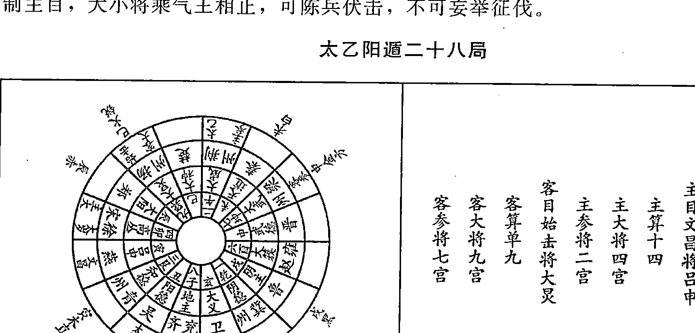

- 太乙在二宫理天
- 计神在大义
- 主目文昌将吕申
- 主算十四
- 主大将四宫
- 主参将二宫
- 客目始击将大炅
- 客算单九
- 客大将九宫
- 客参将七宫

辛卯二十八局
癸卯一百局
乙卯一百七十二局
丁卯二百四十四局
己卯三百一十六局

客算二十八，重阴不和，不利有为。

客大将八宫，外宫迫主挟，不利有为，乘相气，宜固守不失。

客参将四宫，掩防自相执杀，不利轻举，乘王气固守不失。

此局客亦不利大举，客参受击，掩客大又受迫挟，太乙不助，算不和，虽客目宫制主目，大小将乘气王相止，可陈兵伏击，不可妄举征伐。

此局算得太乙在二宫，理天，天外助客。

此时声息，贼有自相执杀者，从东南方来，攻围逼迫，兵将不和，敌使言不可信，奸细不入，贼来去乘囚死之气，皆可击截。

文昌在寅，内地可攻外地。

主算十四，上和，宜大举征伐。

主大将四宫，发乘王气，宜率兵大举深入敌境，缓攻取胜建立大功。

主参将二宫，囚客挟，乘囚气，不利有为，轻动则有拘执，宜固守。

出兵举赤旗、列锐阵出。向正东战，向正西战，备东北奇兵，安寅地伏兵，利巳午未时。风云飞鸟自正北来，冲向太乙宫，急备大战。风云飞鸟自我阵后来，冲入敌阵去，为天助，宜顺而击之大胜。

主将行兵：步卒在前，车骑次之，大将居中噪出。向正东行，遇敌旋兵。向正西，伺敌先举然后应之。

始击在巽。

客算九单，阳不和，有兵无将，不利大举征伐。

客大将九宫，掩主挟，乘休气，有自相谋执之凶，严加固守。

客参将七宫，迫乘囚气，不利有为，宜固守。

出兵举赤旗、列锐阵出向东南战，向西北战，备南奇兵，安巽地伏兵，利巳午未时。风云飞鸟自北来，冲向太乙宫，急备大战。风云飞鸟自我阵后来，冲入敌阵去，乃为天助，宜顺而击之大胜。

客将行兵：车骑在前，步卒次之，大将居中，急躁而出。向东南行，遇敌旋兵。向西北，先举击之。

## 太乙阳遁二十九局

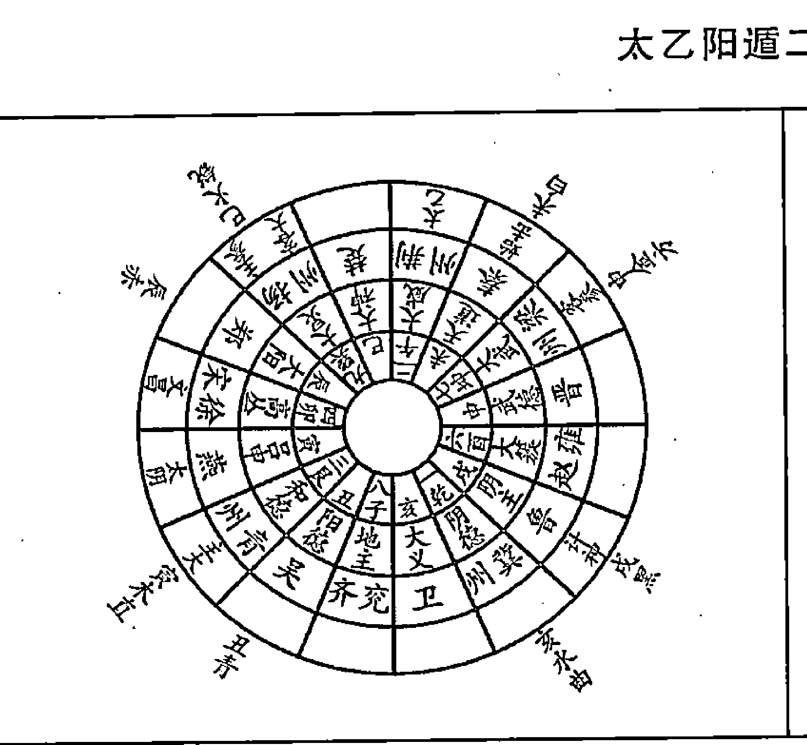

| 太乙在二宫理地 | 计神在地主 | 主目文昌将高丛 | 主算十二 | 主大将三宫 | 主参将九宫 | 客目始击将天道 | 客算三十九 | 客大将九宫 | 客参将七宫 |
| :--- | :--- | :--- | :--- | :--- | :--- | :--- | :--- | :--- | :--- |
| 太乙在二宫理地 | 计神在地主 | 主目文昌将高丛 | 主算十二 | 主大将三宫 | 主参将九宫 | 客目始击将天道 | 客算三十九 | 客大将九宫 | 客参将七宫 |

壬辰二十九局
甲辰一百一局
丙辰一百七十三局
戊辰二百四十五局
庚辰三百一十七局

此局算得太乙在二宫，理地，天外助客，地有变异，地震民多病。

此时声息，有贼入寇，攻围逼迫，从西南方来，将吏全，兵多。敌使言诈。奸细不入，贼来去乘囚死气皆可掩击。文昌在卯，内地可攻外地。

主算十三，重阳厄火无地，不宜大举。

主大将三宫，发乘相气，宜率兵深入缓攻取胜即回。

主参将九宫，迫太乙关，客大乘休气，不利有为，宜固守。

出兵举青旗、列直阵出。向东北战，向西南战，备正东奇兵，安卯地伏兵，利巳午未时。风云飞鸟从正北来，冲向太乙宫，急备大战。风云飞鸟自我阵后来，冲向敌阵去，为天助，宜顺而击之大胜。

主将行兵：步卒在前，车骑次之，大将居中静出。向东北行，遇敌旋兵。向西南，伺敌先举然后应之。

始击在未，外击太乙。

客算三十九，重阳厄火，不利大举。

客大将九宫，迫太乙关，主参乘休气，不利有为，宜固守。

客参将七宫，迫太乙，乘囚气，不宜征伐，宜固守。

出兵举赤旗、列锐阵出。向东南战，向西北战，备西南奇兵，安未地伏兵，利巳午未时。风云飞鸟自正北来，冲向太乙宫，急备大战。风云飞鸟自我阵后来，冲入敌阵去，为天助，宜顺而击之大胜。

客将行兵：车骑在前，步卒次之，大将居中，急躁而出。向东南行，遇敌旋兵。向西北，先举击之。

## 太乙阳遁三十局

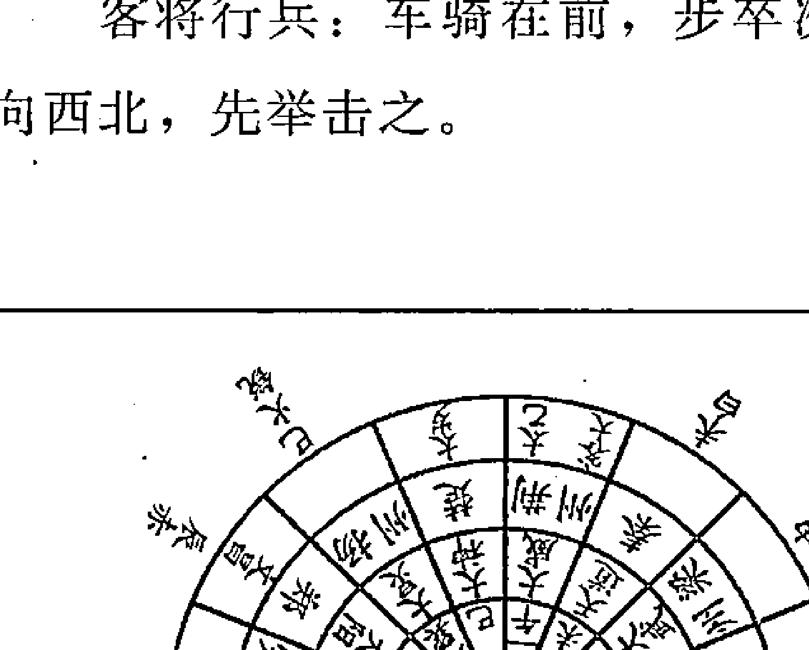

- 太乙在二宫理人
- 计神在大簇
- 主目文昌将太阳
- 主算单十
- 主大将一宫
- 主参将三宫
- 客目始击将武德
- 客算三十二
- 客大将二宫
- 客参将六宫

癸巳三十局
乙巳一百二局
丁巳一百七十四局
己巳二百四十六局
辛巳三百一十八局

此局算得太乙在二宫，理人，天外助客，人有变异，口舌谣言，相为残害。

此时声息，有贼从西南方来，敌使不可信，奸细不来，贼来去乘囚气，皆可掩击。

文昌在辰，内地可攻外地。

主算十，孤阳无人，不宜远举深入。

主大将一宫，发乘休气，宜率兵攻击，取胜即止。算短气休，兵威不振。

主参将三宫，发乘相气，宜大举深入，取胜建功即止。

出兵举黑旗、列曲阵出。向西北战，向东南战，备东南奇兵，安辰地伏兵，利巳午未时。风云飞鸟自正北来，冲向太乙宫，急备大战。风云飞鸟自我阵后来，冲入敌阵去，为天助，宜顺而击之大胜。

主将行兵：步卒在前，车骑次之，大将居中静出。向西北行，遇敌旋兵。向东南，伺敌先举然后应之。

始击在申。

客算三十二，算长于主，可以征伐。

客大将二宫，囚乘囚气，不利有为，止可遣发截击，不可自举妄动，有拘执之凶。

客参将六宫，发乘死气，不宜大举，可以拒守要害，伏截取胜。

出兵举黄旗、列圆阵出。向正南战，向正北战，备西南奇兵，安申地伏兵，利巳午未时。风云飞鸟自正北来，冲向太乙宫，急备大战。风云飞鸟自我阵后来，冲入敌阵去，为天助，宜顺而击之大胜。

客将行兵：步卒在前，车骑次之，大将居中静出。向正南行，遇敌提兵。向正北，先举击之。

## 太乙阳遁三十一局

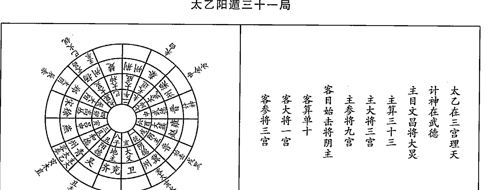

甲午三十一局
丙午一百三局
戊午一百七十五局
庚午二百四十七局
壬午三百一十九局

此局算得太乙在三宫，理天，天内助主。

此时声息，贼自西北方来，敌使言不实，奸细不入，贼来乘相气，不可犯。去乘囚气，可追击。

文昌在巽，在外地可攻内地。

主算三十三，纯阳，不宜大举征伐，虽长而不和。

主大将三宫，囚太乙宫，关客参不利为，作同类相谋，有拘执事。乘相气，宜固守不失。

主参将九宫，受制于文昌，乘休气，不可展阵交锋。

出兵举青旗、列直阵出。向东北战，向西南战，备东南奇兵，安巽地伏兵，利丑寅时。风云飞鸟自西南来，冲向太乙宫，急备大战。风云飞鸟自我阵后来，冲入敌阵去，乃为天助，宜顺而击之大胜。

主将行兵：步卒在前，车骑次之，大将居中静出。向东北行，遇敌提兵。向西南，伺敌先举然后应之。

始击在戌，下臣为孽，山林有盗。

客算十，孤阳。不宜大举征伐。

客大将一宫，发乘休气，宜按兵伏击首尾取胜，不可大举。

客参将三宫，太乙囚主大关，不宜妄举，乘相气，固守不失。

出兵举黑旗、列曲阵出。向西北战，向东南战，备西北奇兵，安戌地伏兵，利丑寅时。风云飞鸟自西南来，冲向太乙宫，急备大战。风云飞鸟自我阵后来，冲向敌人阵去，为天助，宜顺而击之大胜。

客将行兵：步卒在前，车骑次之，大将居中静出。向西北行，遇敌旋兵。向东南，先举兵击之。

## 太乙阳遁三十二局

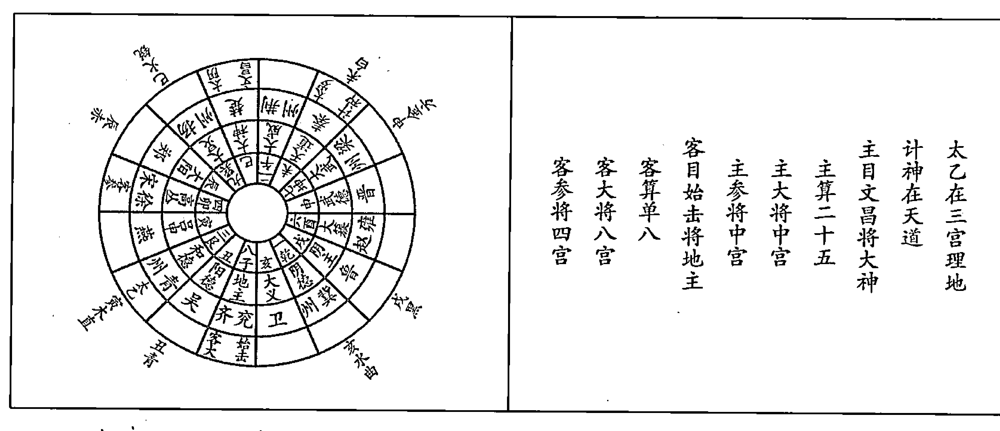

- 乙未三十二局
- 丁未一百四局
- 己未一百七十六局
- 辛未二百四十八局
- 癸未三百二十局

此局算得太乙在三宫，理地，天内助主，太岁格，文昌并太阴。臣下连谋，有兵役之事。

此时声息，贼围逼迫，贼亦有自相执杀者。敌使言可信，奸细不入，贼来乘相气不可犯。去乘休气可追截。

文昌在巳，外地可攻内地。

主算二十五，杜塞无门。

主大小将，皆不出中五宫，不可妄举，宜固守。

始击在子，诸侯有忧，改政令行赦宥。

客算八单，阴和。有兵无将，不宜大举征伐。

客大将八宫，内迫击，掩不慎，恐有拘执。乘相气，固守不失。

客参将四宫，外迫。不利大举，乘王气，宜按兵伏击首尾取胜即止。

出兵举黑旗、列曲阵出。向正北战，向正南战，备正北奇兵，安子地伏兵，利丑寅时。风云飞鸟自西南来，冲向太乙宫，急备大战。风云飞鸟自我阵后来，冲入敌人阵去，乃为天助，宜顺而击之大胜。

客将行兵：车骑在前，步卒次之，大将居中噪出。向正北行，遇敌旋兵，向正南，先举兵击之。

## 太乙阳遁三十三局

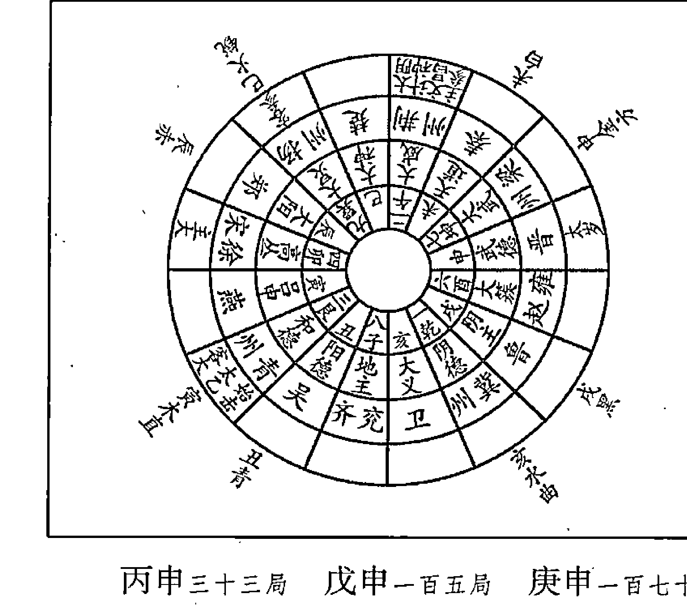

- 太乙在三宫理人
- 计神在大威
- 主目文昌将大威
- 主算二十四
- 主大将四宫
- 主参将二宫
- 客目始击将和德
- 客算单三
- 客大将三宫
- 客参将九宫

- 丙申三十三局
- 戊申一百五局
- 庚申一百七十七局
- 壬申二百四十九局
- 甲申三百二十一局

此局算得太乙在三宫，理人，天内助主，太乙击掩太阴，并天目，内外连谋。有兵戈事。客大三宫囚主。地震。

此时声息，有贼自东北方来，攻围逼迫，亦有自相谋执者。敌使言虚，奸细不入，贼来乘相气，不可犯。去乘死气，伏去击截。

文昌在午，并太阴。主有连谋，外地举事攻内。

主算二十四，重阴不和，重阴厄水，不利有为，不宜大举征伐。

主大将四宫，外迫受客挟，不宜征伐。乘旺气，宜拒敌不失。

主参将二宫，受制于文昌，乘囚气，不利有为，宜固守。

出兵举赤旗、列锐阵出。向正东战，向正西战，备正南奇兵，安午地伏兵，利丑寅时。风云飞鸟自我阵后来，冲入敌阵去，为天助，宜顺而击之大胜。

主将行兵：步卒在前，车骑次之，大将居中静出。向正东行，遇敌提兵。向正西，伺敌先举然后应之。

始击在艮，掩太乙，上凌下僭。

客算三单，阳不和。无将吏，不宜大举征伐。

客大将三宫，囚掩，不利有为，自相谋，并拘执。乘相气，固守不失。

客参将九宫，主挟，乘休气，不利有为，宜固守。

出兵举青旗、列直阵出。向东北战，向西南战，备东北奇兵，安艮地伏兵，利丑寅时。风云飞鸟自西南来，冲向太乙宫，急备大战。风云飞鸟自我阵后来，冲入敌阵去，为天助，宜顺而击之大胜。

客将行兵：车骑在前，步卒次之，大将居中静出。向东北行，遇敌提兵。向西南，先举击之。

## 太乙阳遁三十四局

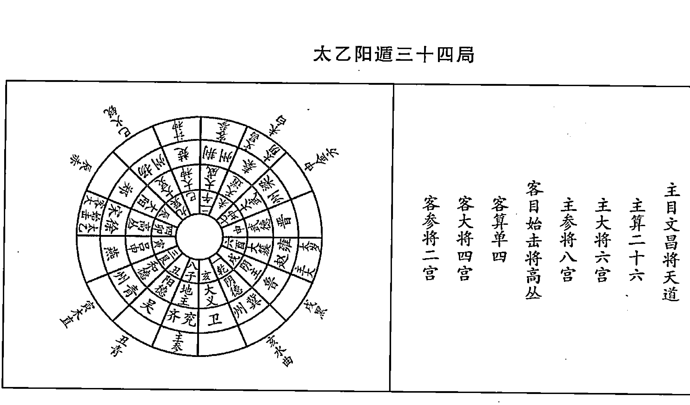

丁酉三十四局
己酉一百六局
辛酉一百七十八局
癸酉二百五十局
乙酉三百二十二局

此局算得太乙在四宫，理天，天内助主，太岁格，客目掩主大对，客大囚文昌，并太阴。内外连谋，上凌下僭，此局不美。

此时声息，寇来逼迫，兵不和，无将。从正东方来，敌使不可信，奸细不入，贼来乘旺气，不可犯，去乘休气，可击。文昌在未，并太阴在外地，连谋攻内。

主算二十六，三才具，将吏全，太乙助，可以举兵征伐。

主大将六宫，对太乙。乘死气，不利有为，宜固守遣击。

主参将八宫，发乘相气，宜大举深入，缓攻取胜，建立大功。

出兵举白旗、列方阵出。向正西战，向正东战，备西南奇兵，安未地伏兵，利寅卯辰时。风云飞鸟自我阵后来，冲入敌人阵去，为天助，宜顺而击之大胜。

主将行兵：车骑在前，步卒次之，大将居中，急噪而出。向正西行，遇敌提兵。向正东，伺敌先举然后应之。

始击在卯，掩太乙，客大上将，慢侮同类谋并。

客算四单阴。无将吏，太乙不助，不宜大举征伐。

客大将四宫，囚掩。不利有为，有拘执，奔败事。乘王气固守不失。

主参将二宫，发乘囚气，不可应敌，展阵交锋，止可按兵伏截首尾。

出兵举赤旗、列锐阵出。向正东战，向正西战，备正东奇兵，安卯地伏兵，利寅卯辰时。风云飞鸟自正西来，冲向太乙宫，急备大战。风云飞鸟自我阵后来，冲入敌人阵去，为天助，宜顺而击之大胜。

客将行兵：步卒在前，车骑次之，大将居中静出。向正东，遇敌旋兵。向正西，先举击之。

## 太乙阳遁三十五局

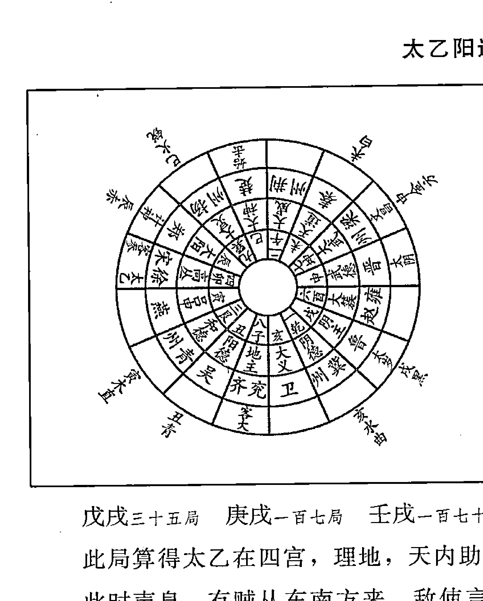

- 太乙在四宫理地
- 计神在太阳
- 主目文昌将大武
- 主算二十五
- 主大将中宫
- 主参将中宫
- 客目始击将大神
- 客算二十八
- 客大将八宫
- 客参将四宫

戊戌三十五局
庚戌一百七局
壬戌一百七十九局
甲戌二百五十一局
丙戌三百二十三局

此局算得太乙在四宫，理地，天内助主。

此时声息，有贼从东南方来，敌使言虚，奸细不入，贼来乘王气，不可犯。去乘囚气可击。

文昌在坤，外地可攻内地。

主算二十五，杜塞无门。

主大小二将，不出中宫，宜固守。

始击在巳，多雨水。

客算二十八，重阴。将吏全，可以征伐。

客大将八宫，发乘相气，宜率兵深入敌境，缓攻取胜即止。算长而不和也。

客参将四宫，因乘王气，有拘执，奔败事，不可轻举妄动，宜固守。

出兵举黑旗、列曲阵出。向正北战，向正南战，备东南奇兵，安巳地伏兵，利寅卯辰时。风云飞鸟从正西来，冲向太乙宫，急备大战。风云飞鸟自我阵后来，冲入敌阵去，为天助，宜顺而击之大胜。

## 太乙阳遁三十六局

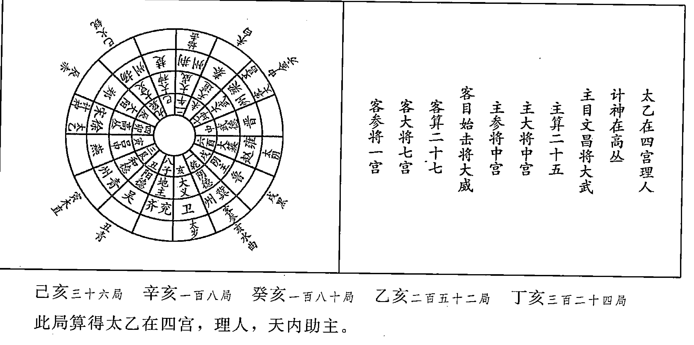

己亥三十六局
辛亥一百八局
癸亥一百八十局
乙亥二百五十二局
丁亥三百二十四局

此局算得太乙在四宫，理人，天内助主。

此时声息，奸细入觇，有私通于外之人。敌使言实，贼正南方来，来乘王气，不可犯。去乘相气，不可击。

文昌在坤，外地可攻内地。

主算二十五，杜塞无门。

主大小二将，皆不出中五宫，宜固守。

始击在午，礼义多变。

客算二十七，长和。兵多将吏全，宜大举征伐。

客大将七宫，受文昌制，不宜远举深入。又乘囚气，止可遣兵攻伐。

客参将一宫，发宜展阵交锋取胜，乘休气取胜即止，不可久敌。

出兵举白旗、列方阵出。向西南战，向东北战，备正南奇兵，安午地伏兵，利寅卯辰时。风云飞鸟自正西来，冲向太乙宫，急备大战。风云飞鸟自我阵后来，冲入敌人阵去，为天助，宜顺而击之大胜。

客将行兵：车骑在前，步卒次之，大将居中噪出。向西南行，遇敌提兵。向东北，先举兵击之，乃为客之道。

## 太乙阳遁三十七局

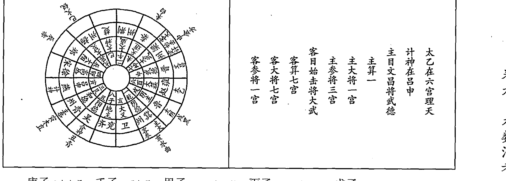

- 太乙在六宫理天
- 计神在吕中
- 主目文昌将武德
- 主算一
- 主大将一宫
- 主参将三宫
- 客目始击将大武
- 客算七宫
- 客大将七宫
- 客参将一宫

- 庚子三十七局
- 壬子一百九局
- 甲子一百八十一局
- 丙子二百五十三局
- 戊子三百二十五局

此局算得太乙六宫，理天，天有变异，彗孛飞流，霜雹为害。二曜亏食，五星失度，地震，天外助客。

此时声息，有贼入寇损将，宜慎。有兵无将，有仇杀者，从西南来，闻事凶实吉虚。敌使不可信，贼出入皆乘囚死之气，可按兵攻击。

文昌申，在外地可攻内。内辰迫宗室大臣攻外。

主算一单，阳无。天不和，短而无将吏，太乙不助，不利为主，不宜大举征伐。

主大将一宫，外迫大臣，逆命举事攻内，关客参。不利有为，乘休气，不宜展阵交锋，宜运谋发兵，按伏击其首尾。

主参将三宫，发乘相气，宜率兵浅近。拒守要害，八面伏兵，截其归路，待敌而发，可以取胜即回。算短不和耳。

出兵举黑旗、列曲阵出。向西北战，向东南奇兵，安申地战，备西南伏兵，利申酉戌时。风云飞鸟从东来，冲太乙宫，急备大战。风云飞鸟从我阵后来，冲入敌阵去，为天助，宜顺击之大胜。

主将行兵：步卒在前，车骑次之，大将居中静出。向西北行，遇敌提兵。向东南，伺敌先举，然后击之。

始击在七宫，内击盗贼，兵围逼迫。

客算七单，阳不和，无将，太乙助，不宜举兵征伐。

客大将七宫，内迫宗室，近臣，攻外受制，不利有为。又乘囚气，不宜出兵攻战，宜固守。

客参将一宫，外迫关主大将，而同类相谋，不利有为，乘休气，宜发兵于浅近，按伏截击，不宜交战。

出兵举白旗、列方阵出。向西南战，向东北奇兵，安坤地战，备西南伏兵，利申酉戌时。飞鸟风云从正东来，冲太乙宫，急备大战。风云飞鸟从西南来，冲向东北方去，为天助，宜顺击之大胜。

客将行兵：车骑在前，步兵次之，大将居中，鼓噪急出。向西南行，遇敌旋兵。向东北，先举兵击之，为客人先起。

## 太乙阳遁三十八局

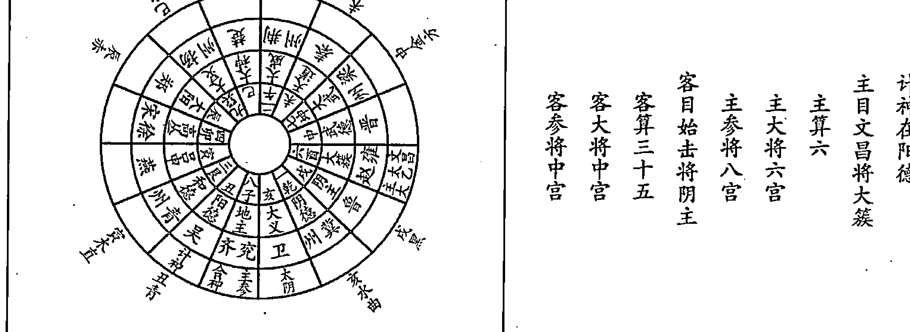

辛丑三十八局
癸丑一百一十局
乙丑一百八十二局
丁丑二百五十四局
己丑三百二十六局

此局算得太乙六宫，理地，天外助客。

此时声息，有外夷入贡，奸细入觇。从西北来，闻事凶实吉虚，贼不入寇。

文昌酉，在外地可攻内，囚太乙宫，有崩亡拘执，奔败事绝气。

主算六单，阴不和，短而无将，不宜举兵征伐。

主大将六宫，直囚关为争明自败，不利有为，乘死气，不宜出兵攻战。
主参将八宫，发乘相气，可以率兵攻战，兼可伏兵待敌而发取胜。
出兵举白旗、列方阵出。向正西战，向正东奇兵，安酉地战，备西方伏兵，利申酉戌时。风云飞鸟从正东，冲太乙而来，急备大战。风云飞鸟从正西来，冲向东方去，为天助，宜顺而击之大胜。
主将行兵：车骑在前，步兵在后，大将居中，鼓噪急出。向西行，遇敌旋兵。向东，伺敌先举，然后举兵攻击。
始击在戌，外击诸侯侵凌；臣、子生逆；外国侵侮；山林有盗；内苑有兵。
客算二十五，杜塞无门。
客二将，固守不出。

## 太乙阳遁三十九局

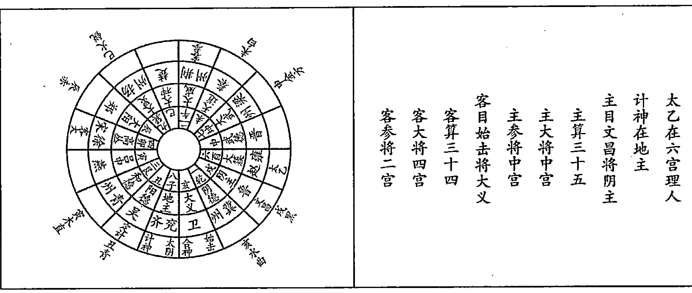

壬寅三十九局
甲寅一百一十一局
丙寅一百八十三局
戊寅二百五十五局
庚寅三百二十七局
此局算得太乙六宫，理人，天外助客。
此时声息，有庆四夷入贡，有将兵，多从西北来，闻事吉实凶虚，敌使言实，奸细入觇，贼初人可击贼，去不可追击。
文昌戌，在外地可攻内，外辰迫大臣逆命举事攻内。
主算二十五，杜塞无门。
主二将，固守不出。
始击在亥，文章兴兵火发。
客算三十四，长和。将吏全，太乙助，可以大举兵卒深入敌境，缓攻克胜，建立大功。
客大将四宫直格，太乙主上下格，易盗侮其君蛮夷侵掠，不利有为，然乘王气，虽有格易之事，亦可率兵深入攻战，然事多阻。客参将二宫，发乘囚气，可以陈兵拒敌，不宜远出攻战。

出兵举赤旗、列锐阵出。向正东战，向正西奇兵，安亥地战，备西北伏兵，利申酉戌时。有风云飞鸟从正东，冲太乙而来，急备大战。风云飞鸟从正东，冲向西方去，为天助，急宜顺而击之大胜。

客将行兵：步卒在前，车骑次之，大将居中，静默缓出。向东行，遇敌勒兵。向西，先举兵击之，乃为客先起之道。

## 太乙阳遁四十局

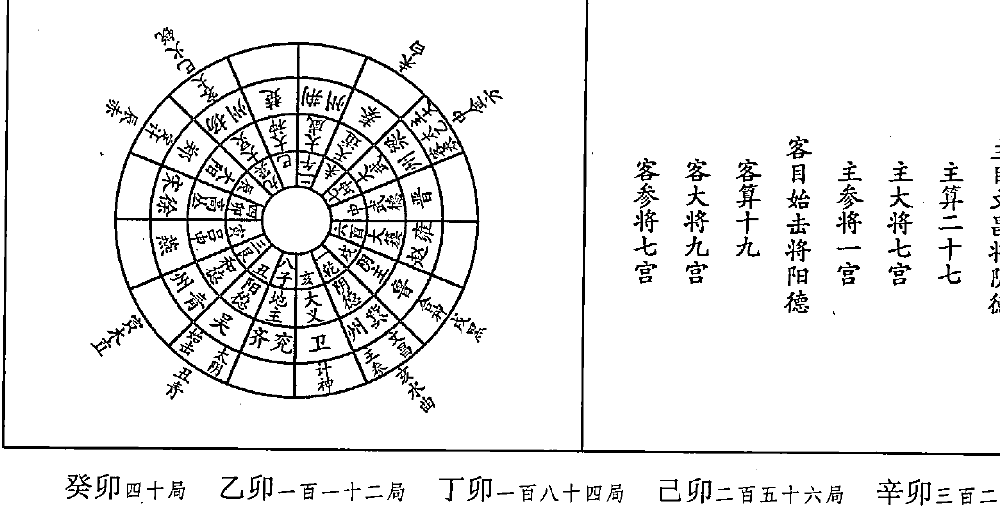

- 癸卯四十局
- 乙卯一百一十二局
- 丁卯一百八十四局
- 己卯二百五十六局
- 辛卯三百二十八局

此局算得太乙七宫，理天，天外助客，梁冀兵起，北狄犯井冀。

此时声息，急贼大入寇。有将兵，多不和。从东北来，闻事凶实吉虚，敌使不可信，贼兵出入皆乘囚死，可按伏邀击。

文昌一宫，在内地可攻外，因主参有自谋，同类者臣迫君上。

主算二十七，长和。可以大举征伐，当年宜有筑坛拜大将者。

主大将七宫，直囚乘囚气，有拘执，奔败事，不利有为，不宜举兵征伐，宜发兵据要害，伏兵邀击。

主参将一宫，受制于文昌，乘休气出兵而军威不振。惟宜陈兵拒敌，按伏截击，不宜交战。

出兵举白旗、列方阵出。向西南战，向东北奇兵，安乾地战，备西北方伏兵，利未申时。有飞鸟风云从东北，冲太乙宫而来，急备大战。风云飞鸟从西南来，冲向东北去，为天助，急宜顺而击之大胜。

主将行兵：车骑在前，步兵次之，大将居中，鼓噪急出。向西南行，遇敌旋兵。向东北，伺彼先举，然后举兵攻击。

始击在丑，并太阴，臣失爵禄，关梁闭塞。

## 太乙阳遁四十一局

客算十九，长而不和，重阳厄火，不宜大举征伐，军中防火灾而乏水。
客大将九宫，发乘休气，可以出兵指挥将吏攻战，不宜躬自交锋。
客参将七宫，直囚关同类自相猜忌，攻夺又乘囚气，宜固守，不宜出战。
出兵举赤旗、列锐阵出。向东南战，向西北奇兵，安丑地战，备东北伏兵，利未申时。风云飞鸟从东北来，冲太乙宫，急备大战。风云飞鸟从我军上来，冲向敌阵上去，为天助，宜顺而击之必大胜。
客将行兵：车骑在前，步兵次之，大将居中，登高鼓噪急出。向东南行，遇敌旋兵。向西北，先举兵攻击。

- 太乙在七宫理地
- 计神在阴主
- 主目文昌将明德
- 主算二十七
- 主大将七宫
- 主参将一宫
- 客目始击将吕申
- 客算十六
- 客大将六宫
- 客参将八宫

甲辰四十一局 丙辰一百一十三局 戊辰一百八十五局 庚辰二百五十七局 壬辰三百二十九局

此局算得太乙七宫，理地，天外助客。

此时声息，有庆四夷来贡，酋长受羁，有将兵多，从东北来。闻事吉实凶虚，敌使不可信，贼人乘囚气可击，贼去乘王气不可追。

文昌一宫，在内地可攻外，臣迫君上。

主算二十七，长和，可以大举征伐，当年宜筑坛而拜大将。

主大将七宫，直囚有拘执崩亡，奔败事，不利有为，乘囚气，不宜出兵交战，宜设策按伏暗攻可胜。

主参将一宫，受制于文昌，不利有为，乘休气，宜发兵截击，不宜交战。

出兵举白旗、列方阵出。向西南战，向东北奇兵，安乾上战，备西北伏兵，利未申时。飞鸟风云从东北，冲太乙来，急备大战。风云飞鸟从西南来，冲东北去，为天助，宜顺而击之大胜。

主将行兵：车骑在前，步兵次之，大将居中，鼓噪急出。向西南行，遇敌旋兵。向东北，伺彼先举，然后举兵攻击，为主人后起。始击在寅，并太阴。臣失爵禄，民饥畜死。

客算十六，长和，太乙助，可以举兵征伐。
客大将六宫，外迫大臣，逆命举事攻内，不利有为，又受挟乘死气，惟宜坚壁固守，不宜出兵攻战，战必受擒于人。
客参将八宫，发乘相气，可以大总兵率深入敌境，缓攻取胜，以立大功。
出兵举白旗、列方阵出。向正西战，向正东奇兵，安寅地战，备东北伏兵，利未申时。风云飞鸟从东北，冲太乙而来，必有大战，急宜准备。飞鸟风云从我军上，冲向敌人军上，急宜顺而击之大胜。
客将行兵：车骑在前，步兵次之，大将居中，鼓噪急出。向西行，遇敌提兵。向东，先举兵击之。

## 太乙阳遁四十二局

太乙在七宫理人 计神在大簇 主目文昌将大义 主算二十七 主大将七宫 主参将一宫 客目始击将太阳 客算十二 客大将二宫 客参将六宫

- 乙巳四十二局
- 丁巳一百一十四局
- 己巳一百八十六局
- 辛巳二百五十八局
- 癸巳三百二十局

此局算得太乙七宫，理人，天外助客。
此时声息，有庆四夷来贡，有将兵多，从东南来，闻事凶实吉虚，敌使不可信，贼出入俱乘囚气，可以攻击，小将被擒。
文昌亥，在内地可攻外。
主算二十七，长和，可以大举征伐，是年拜大将。
主大将七宫，直囚有拘击奔败崩亡事。
又乘囚气，不利有为，不宜出兵攻战，宜运筹遣将。
主参将一宫，发乘休气，宜发兵守隘，按兵埋伏，出其不意，待敌而发，可获小胜。
出兵举白旗、列方阵出。向西南战，向东北奇兵，安亥地战，备西北伏兵，利未申时。有风云飞鸟从东北来，冲太乙宫，急备大战。风云飞鸟从我军上，冲敌上去，为天助，急顺击之大胜。

主将行兵：车骑在前，步兵次之，大将居中，鼓噪急出。向西南行，遇敌旋兵。向东北，伺彼先举，而后应之。

始击在辰，民多病。

客算十二，不和，太乙助，可以举兵征伐。

客大将二宫，内迫室宗后戚近臣攻外，不利有为，乘囚气。

客参将六宫，外迫大臣逆命举事攻内，内外连谋，不利有为，乘死气。又受挟于主二将出战，恐受擒于人，宜固守不出。

## 太乙阳遁四十三局

- 丙午四十三局
- 戊午一百一十五局
- 庚午一百八十七局
- 壬午二百五十九局
- 甲午三百三十一局

此局算得太乙八宫，理天，天有变异，日月多昏，阴雾害物，雨水连绵，地震，太岁格，天内助主。

此时声息，有警贼不入寇，有火灾，有将兵，多不和。从东南来，闻事吉实凶虚，敌使言不实，贼来乘相气，不可攻。贼去乘囚气，可追击。

文昌八宫，在内地可攻外。因太乙宫，关主大有同类相谋。

主算八单，阴不和，短而无将不宜大举征伐。

主大将八宫，因关易气，有崩败拘执，不利有为，乘相气，宜出兵拒险，守隘伏兵，邀击可胜。

主参将四宫，发乘王气，可以率兵近境攻击胜。

出兵举黑旗、列曲阵出。向正北战，向正南奇兵，安子地战备，正北伏兵，利亥子丑时。风云飞鸟从正南，冲太乙而来，急备大战。风云飞鸟从正北来，冲正南去，为天助，宜顺而击之大胜。

主将行兵：车骑在前，步兵次之，大将居中，鼓噪急出。向北行，遇敌勒兵。向南，伺彼先举，然后举兵攻击。
始击在巳，阴阳失序，兖州分，大旱火灾。
客算十七，重阳不和，不宜大举征伐。
客大将七宫，发乘囚气，可以出兵，指挥将士攻击，不宜举战。
客参将一宫，内迫大臣专政宗室近臣攻外，不利有为，乘休气，可以发兵，按伏掩击，不宜交战。
出兵举白旗、列方阵出。向西南战，向东北奇兵，安巳上战，备东南伏兵，利亥子丑时。风云飞鸟从正南，冲太乙而来，急备大战。风云飞鸟从西南，冲东北去，为天助，宜顺而击之大胜。

## 太乙阳遁四十四局

- 太乙在八宫理地
- 计神在天道
- 主目文昌将阳德
- 主算三十三
- 主大将三宫
- 主参将九宫
- 客目始击将大武
- 客算十四
- 客大将四宫
- 客参将二宫

丁未四十四局 己未一百一十六局 辛未一百八十八局 癸未二百六十局 乙未三百三十二局

此局算得太乙八宫，理地，宗庙灾，天内助主，天下旱。

此时声息，有庆外夷人贡，有将兵多，从西南来，闻事吉实凶虚，敌使不实，贼出入皆乘王气，不可触犯。

文昌丑，在内地可攻外，外辰迫大臣逆命举事攻内。

主算三十三，长而不和，重阳厄火，不宜大举征伐，有惊，可以拒敌，防火攻火灾而乏水。

主大将三宫，外迫。不利有为，乘相气，可以出兵，指挥将士攻击。宜速不宜缓。

主参将九宫，发乘休气，可以出兵，拒守要害，伏兵攻击。

出兵举青旗、列直阵出。战东北战，向西南奇兵，安丑地战，备东北伏兵，利亥子丑时。风云飞鸟从正南来，冲太乙宫，急备大战。风云飞鸟从东北来，冲西南去，为天助，宜顺击之大胜。

主将行兵：步卒在前，车骑次之，大将居中静出。向东北行，遇敌提兵。向西南，伺彼先动，然后举之。
始击在坤。
客算十四，上和。可以大举师旅深入缓攻弔伐。
客大将四宫，发乘王气，宜率三军深入敌境，缓攻克胜，以成大功。
客参将二宫，直迫又格，太乙主政事格，易盗，侮其主。蛮夷侵掠，不利有为，又乘囚气，不宜出兵攻战，惟宜固守。
出兵举赤旗、列锐阵出。向正东战，向正西奇兵，安坤地战，备西南伏兵，利亥子丑时。风云飞鸟从正南来，冲太乙宫，必有大战，急宜准备。风云飞鸟从我军上来，冲敌兵去，急宜顺而击之，此天助也，必大获大胜。
客将行兵：步卒在前，车骑次之，大将居中，静默而出。向东行，遇敌旋兵。向西，先举兵击之。

## 太乙阳遁四十五局

戊申四十五局 庚申一百二十七局 壬申一百八十九局 甲申二百六十一局 丙申三百三十三局

此局算得太乙八宫，理人，天内助主，地震。

此时声息，有贼人即寇损，利副将，有兵无将，不和。从正西来，闻事凶实吉虚，敌使不可信，贼初人乘相气，不可犯。贼去值死气，可截击。

文昌三宫，在内地可攻外，外宫迫大臣逆命举事攻内。

主算三十二，长和。将吏全，太乙助，可以大举深入，缓攻取胜以成大功。

主大将二宫格，太乙在死地，易气之宫，乘囚气，有僭臣抗衡，更易政事，败而伏诛，不利用兵将相慎之。

主参将六宫，直始击掩，又乘死气，不宜出兵，交战战必败死。

此局主算，虽长和，太乙助主，二将皆直掩格，囚死之气，不宜为主，不可出兵，惟固守可也。

始击六宫，掩主参边兵，征讨旱蝗。

客算七单，阴不和，短而无将，不宜大举征伐。

客大将七宫，发乘囚气，算中无将，不利为客，惟宜固守，不宜出兵。

客参将一宫，内迫宗室近臣攻外，不利有为。乘休气，不宜出兵，攻战宜发兵，按伏掩击，可获小捷，不宜再战。

此局主客俱不利，用兵宜固守，待时可也，凡举兵皆败辱，宜慎之。

## 太乙阳遁四十六局

- 己酉四十六局
- 辛酉一百一十八局
- 癸酉一百九十局
- 乙酉二百六十二局
- 丁酉三百三十四局

此局算得太乙九宫，理天，天外助客，徐州南楚兵起。

此时声息，有庆四夷人贡。奸细人。有将兵多，从西北来。闻事吉实凶虚。敌使不可信，贼初人，乘休气，可攻贼。去乘相气，不可追击。

文昌寅，在内地可攻外。

主算五，杜塞无门。

主二将，固守不出。

始击在一宫格，大臣奸欺闭贤，夷狄侵掠。

客算十六，长和。将吏全，太乙助，可以大举征伐而成功。

客大将六宫，发乘死气，宜运谋遣将，不宜出兵交战。

客参将八宫，发乘相气，可以率兵深入敌境，缓攻取胜，以成大功。

出兵举白旗、列方阵出。向正西战，向正东奇兵，安乾地战，备西北伏兵，利辰巳时。有风云飞鸟从西北来，冲太乙宫，急备大战。风云飞鸟从我营上，冲向敌去，急宜顺而击之。必获大胜。

客将行兵：车骑在前，步兵次之，大将居中，鼓噪急出。向西行，遇敌掣兵。向东，先举之，乃为客兵先起也。

## 太乙阳遁四十七局

庚戌四十七局 壬戌一百一十九局 甲戌一百九十一局 丙戌二百六十三局 戊戌三百三十五局

此局算得太乙九宫，理地，无地。洪水横流，山崩地陷，地震非常，地生妖怪，岁歉民流，天外助客。

此时声息，虚惊贼人不寇而觑。无将有兵而不多。从东北来。闻事凶实吉虚。敌使不可信，贼出入乘囚气，可以按兵掩击。

文昌四宫，在内地可攻外。内迫宗室近臣，攻外囚主，大客参有同类，猜忌相谋。

主算四单，四单阴不和。短而无将吏。太乙不助，不宜大举征伐。

主大将四宫，内迫受文昌制，不利有为，乘王气，可以运谋设策发兵。拒守要害。伏兵掩击，可获小胜。

主参将二宫，外迫大臣逆命举事攻内，在易气宫，不利有为，而乘囚气，不可出兵攻战，迫时用兵，主客俱败，宜固守。

辰巳时。飞鸟风云从西北来，冲太乙宫，急备大战。风云飞鸟从正北方来，冲向正南方去，为天助，顺击之大胜。

客将行兵：车骑在前，步兵次之，大将居中，鼓噪急出。向北行，遇敌旋兵。向南，先举兵击之。

## 太乙阳遁四十八局

辛亥四十八局 癸亥一百二十局 乙亥一百九十二局 丁亥二百六十四局 己亥三百三十六局

此局算得太乙九宫，理人，太岁格，天外助客。

此时声息，无奸细人，敌人不来，倘若来时，乘囚气，可掩击。从东北来，闻事吉实凶虚。

文昌辰，在内地可攻外，内辰迫大臣逆命举事攻外。

主算一单，阳不和，短而无将吏，不宜举兵征伐。

主大将一宫直格，太乙主上下格，易盗侮其君，夷狄侵掠，乘休气，不利有为，不宜出兵攻战。

主参将三宫，发乘相气，可举兵浅近攻击，按兵截杀取胜。

出兵举黑旗、列曲阵出。向西北战，向东南奇兵，安辰地战，备东南伏兵，利辰巳时。风云飞鸟从西北来，冲太乙宫，急备大战。风云飞鸟从我军后来，冲入敌阵去，为天助，宜顺而急击之大胜。主将行兵：步卒在前，车骑次之，大将居中，静缓而出。向西北行，遇敌提兵。向东南，伺敌先举，然后举兵攻击之。

始击在寅，兵起士卒流亡。

客算五，杜塞无门。

客二将，固守不出。

## 太乙阳遁四十九局

- 太乙在一宫理天
- 计神在吕申
- 主目文昌将大炅
- 主算二十四
- 主大将四宫
- 主参将二宫
- 客目始击将太阳
- 客算二十五
- 客大将中宫
- 客参将中宫

壬子四十九局　甲子一百二十一局　丙子一百九十三局　戊子二百六十五局　庚子三百三十七局

此局算得太乙一宫，理天，天内助主，其年水灾。

此时声息，虚惊敌人不来，奸细入觇，从东南来，敌使不可信，闻事吉实凶虚，贼来乘休气可击。

文昌九宫，在外地可攻内，对太乙。大臣奸不忠，妨贤用贿，臣下失礼。

主算二十四，长而不和，将吏全，太乙助，可以出兵深入缓攻，亦不宜大举。军中防水灾，重阴故也。

主大将四宫，发乘王气，可率三军深入敌境，缓攻取胜，得胜即宜班师，算不和故也。

主参将二宫，发乘囚气，可以陈兵策应大将，不宜展阵交锋。

出兵举赤旗、列锐阵出。向正东战，向正西奇兵，安巽地战，备东南伏兵，利亥子丑时。风云飞鸟从东南，冲太乙而来，急备大战。风云飞鸟从我军阵后来，冲入敌阵去，为天助，兵威急宜顺而击之大胜。

主将行兵：步卒在前，车骑次之，大将居中，静缓而出。向东行，遇敌掣兵。向西，伺彼先举兵击之，此为临主人后起。

始击在辰，大人忧兵起。

客算二十五，杜塞无门。

客二将，固守不出。

## 太乙阳遁五十局

- 太乙在一宫理人
- 计神在地主
- 主目文昌将大威
- 主算十五
- 主大将中宫
- 主参将中宫
- 客目始击将大武
- 客算十三
- 客大将三宫
- 客参将九宫

- 癸丑五十局
- 乙丑一百二十二局
- 丁丑一百九十四局
- 己丑二百六十六局
- 辛丑三百三十八局

此局算得太乙一宫，理地，天内助主，有大旱水灾，荆冀二州为甚。
此时声息，无敌国人不来，奸细入觇。从正南来，闻事吉实凶虚。
文昌巳，在外地可攻内，对太乙，大臣奸欺闭贤，政事格易。
主算十六，长和，将吏全，太乙助，可以大举征伐。
主大将六宫，内迫宗室近臣攻外，不利有为，乘死气，不利出兵，宜固守。
主参将八宫，外迫大臣逆命内外连谋，举事攻内，不利有为，乘相气，宜陈兵拒敌，不宜展阵交锋，经云逼迫之时，用兵主客俱败，惟宜固守待时，不宜用兵。
始击在午，有火旱，荆冀并之分火旱。
客算十五，杜塞无门。
客二将，宜守不出。

## 太乙阳遁五十一局

- 太乙在一宫理人
- 计神在地主
- 主目文昌将大威
- 主算十五
- 主大将中宫
- 主参将中宫
- 客目始击将大武
- 客算十三
- 客大将三宫
- 客参将九宫

- 甲寅五十一局
- 丙寅一百二十三局
- 戊寅一百九十五局
- 庚寅二百六十七局
- 壬寅三百三十九局

此局算得太乙一宫，理人，天内助主。

此时声息，有警贼入寇，有兵有将，鼠窃。从西南来，闻事吉实凶虚，敌使不实，贼来乘休气可击，贼去乘王气不可犯。
文昌午，在外地可攻内。
主算十五，杜塞无门。
主二将，固守不出。
始击在七宫。
客算十三，重阳不和，不宜大举征伐，军中防火乏水。
客大将三宫，发乘相气，可以率兵还境迎敌，先举克胜，既胜即止，不宜再进，算不和也。
客参将九宫，内值迫又格，太乙宫，不利有为，又乘休气，止可以出兵策应大将，不宜攻战。

出兵举青旗、列直阵出。向东北战，向西南奇兵，安坤地战，备西南伏兵，利戌亥时。有风云飞鸟从东南来，冲太乙宫，急宜准备，必有大战。风云飞鸟从我阵后来，冲敌兵而去，此为天助，宜顺而急击之大胜。

客将行兵：步卒在前，车骑次之，大将居中，静缓而出。向东北行，遇敌掣兵。向西南，先举兵击之，为客先起。

## 太乙阳遁五十二局

| 太乙在二宫理天 | 计神在大义 | 主目文昌将天道 | 主算三十九 | 主大将九宫 | 主参将七宫 | 客目始击将大簇 | 客算三十一 | 客大将一宫 | 客参将三宫 |
|---|---|---|---|---|---|---|---|---|---|

- 乙卯五十二局
- 丁卯一百二十四局
- 己卯一百九十六局
- 辛卯二百六十八局
- 癸卯三百四十一局

此局算得太乙二宫，理天，大旱，天外助客，南蛮兵起，扬州分多。
此时声息，虚夷狄入不寇，有将兵，多不和，从正西来，闻事吉实凶虚，敌使言实，贼初入乘囚气，可掩击贼。去乘王气，不可触犯。
文昌未，在外地可攻内，外迫大臣逆命举事攻内。
主算三十九，重阳长而不和，天下旱多、火灾。出兵举事宜速，不宜缓。军中防火、攻火灾，无水。

主大将九宫，内迫宗室近臣攻外，不利有为，乘休气，宜运谋，发兵拒险截击，不宜出战。

主参将七宫，外迫大臣逆命内外连谋，不利有为，乘囚气，宜固守，不宜出兵。
出兵举赤旗，列锐阵出。向东南战，向西北。有飞鸟风云从我军后来，冲入敌阵去，为天助，急宜顺而击之必胜。

主将行兵：车骑在前，步卒次之，大将居中，登高鼓噪急出。东南而行，遇敌旋兵。向西北，伺敌先举，然后我举兵攻击，乃主人后起也。

始击在酉，岁不登有兵。

客算三十一，长而不和，重阳厄火略，宜出兵拒敌；不宜大举征伐，乏水。

客大将一宫，发乘休气，宜出兵拒守要害，发兵按伏截首尾。

客参将三宫，发乘相气，可率锐兵深入边方，遇敌挑战，攻击可以获胜。

出兵举黑旗、列曲阵出。向西北战，向东南奇兵，安酉地战，备正西伏兵，利巳午时。飞鸟风云从正北来，冲太乙宫，急备大战。飞鸟风云从西北来，冲向东南去，为天助，宜顺而击之大胜。

客将行兵：步卒在前，车骑次之，大将居中，静缓而出。向西地行，遇敌勒兵。向东南，先举兵击之，为客先起。

## 太乙阳遁五十三局

丙辰五十三局 戊辰一百二十五局 庚辰一百九十七局 壬辰二百六十九局 甲辰三百四十一局
此局算得太乙二宫，理地，岁不登，天外助客，天子坐明堂而诛不道。

此时声息，虚敌人不入，奸细入境，从西北来，闻事吉实凶虚，贼人乘囚气可攻。
文昌七宫，在外地可攻内，又外迫大臣逆命举事攻内。
主算三十八，长和。可以大举深人，缓攻。
主大将八宫，外迫又格，太乙宫政事格，易在易气，凶将有犯宪章者，不利有为，乘相气，可以运谋遣将征伐，不宜出兵交锋。
主参将四宫，发乘王气，可以率兵深人敌境缓攻，士卒勇锐，所向克捷，以成大功。
出兵举黑旗、列曲阵出。向正北战，向正南奇兵，安坤地战，备西南伏兵，利巳午未时。风云飞鸟从正北来，冲太乙宫，急备大战。风云飞鸟从我阵后来，冲入贼阵去，为天助，急宜顺击之大胜。主将行兵：车骑在前，步卒次之，大将居中，鼓噪急出。向北行，遇敌旋兵。向南，伺敌先举，然后举兵攻击。
始击在亥，大人逆谋。
客算二十五，杜塞不通。
客二将，固守不出。

## 太乙阳遁五十四局

- 太乙在二宫理人
- 计神在大簇
- 主目文昌将大武
- 主算三十八
- 主大将八宫
- 主参将四宫
- 客目始击将地主
- 客算二十四
- 客大将四宫
- 客参将二宫

丁巳五十四局 己巳一百二十六局 辛巳一百九十八局 癸巳二百七十局 乙巳三百四十二局
此局算得太乙二宫，理人，天外助客。
文昌七宫，在外地可攻内，外迫大臣逆命举事攻内。
主算三十八，长和。可以大举征伐。
主大将八宫格，太乙政事格，易盗悔其君，夷狄侵掠，关击不为掩，不利有为，乘相气。
主参将四宫，关客大自猜，忌攻。凌在易气，不利有为，乘王气。始击八宫格，## 卷十 术数汇考十

## 太乙局

## 时计阳遁成局①

### 太乙阳遁五十五局

戊午五十五局
庚午一百二十七局
壬午一百九十九局
甲午二百七十一局
丙午三百四十三局

此局算得太乙三宫，理天，地震，天内助主，嬖宠入宫，兵起。

此时声息，有凶贼入寇，攻围逼迫，有兵无将，从东北来，闻事凶实吉虚，贼使不实，贼人乘相气，不可迎击，贼去乘死气，可追剿。

文昌申，在外地可攻内。

主算十六，长和，将吏全，太乙助，可以大举三军深入，缓攻克胜。

主大将六宫，发乘死气，不宜统兵出战，宜运谋发兵，按截其尾可胜。

主参将八宫，内迫宗室近臣攻外，不利有为，乘相气，可以拒守要害，遣兵伏守，贼人归路邀击。

出兵举白旗、列方阵出。向正西战，向正东奇兵，安申地战，备西南伏兵，利丑寅时。飞鸟风云从西南，冲太乙而来，急备大战。
风云飞鸟从我军后来，冲入敌兵去，为天助，急顺而击之大胜。
主将行兵：车骑在前，步兵次之，大将居中，鼓噪急出。向西行，遇敌旋兵。向东，伺彼先举，然后举兵攻击，此为主人后起。
始击三宫，掩有掩袭劫夺事，又同类相谋。
客算三单，阳不和，短而无将吏，虽太乙助，不宜大举征伐。
客大将三宫，直因有拘执，奔败事，不利有为，乘相气，犹可发兵，按伏截杀。
客参将九宫，发乘休气，宜陈兵拒敌，不宜交战，兵威不振故也。
出兵举青旗、列直阵出。向东北战，向西南奇兵，安艮地战，备东北伏兵，利丑寅时。风云飞鸟从西南，冲太乙而来，急备大战。风云飞鸟从东北来，冲向西南去，为天助，急顺击之大胜。
客将行兵：步兵在前，车骑次之，大将居中，静缓而出。向东北行，遇敌掣兵。向西南，先举兵击之。

### 太乙阳遁五十六局

己未五十六局 辛未一百二十八局 癸未二百局 乙未二百七十二局 丁未三百四十四局
此局算得太乙三宫，理地，天内助主。
此时声息，有庆四夷来贡，有将兵多，奸细人，从东南来，闻事吉实凶虚，敌使不可信，贼出入俱王相，不可触犯。文昌六宫，在外地可攻内。
主算十五，杜塞无门。
主二将，固守不出。
始击在辰，民疫。
客算二十四，长和，将吏全，三才具，可以出师深入贼境，缓攻大胜。客大将四宫，外迫大臣，逆命举事攻内，不利有为，乘王气，可以拒守要害，发兵按伏，邀击而胜。

客参将二宫，发乘囚气，不宜出兵攻战，宜陈兵保城拒贼。

出兵举赤旗、列锐阵出。向正东战，向正西奇兵，安辰地战，备东南伏兵，利丑寅时。风云飞鸟从西南来，冲太乙宫，急宜准备，必有大战。风云飞鸟从我阵后来，冲向敌兵去，此为天助，我威宜顺击之大胜。

客将行兵：步卒在前，车骑次之，大将居中，静缓而出。向东行，遇敌提兵。向西，先举兵击。此为两军相对，为客先起之义。

### 太乙阳遁五十七局

庚申五十七局 壬申一百二十九局 甲申二百一局 丙申二百七十三局 戊申三百四十五局

此局算得太乙三宫，理人，无人，人有变异，口舌妖言，互相残害。

人生妖怪，天内助主，青荆二州，大旱火灾。

此时声息，无奸细人，四夷来贡，有将兵多从东南来，闻事吉实凶虚，贼来乘王气，不可攻。

文昌戌，在外地可攻内。

主算十孤，阳不和，不利为主，不宜大举征伐。

主大将一宫，发乘休气，宜出兵指挥将吏攻战。

主参将三宫，直因有拘击，奔败事，不利有为，可以拒守要害，发兵按伏截击。

出兵举黑旗、列曲阵出。向西北战，向东南奇兵，安戌地战，备西北伏兵，利丑寅时。有风云飞鸟从西南来，冲太乙宫，急备大战。飞鸟风云从西北方来，冲东南去，为天助，宜顺击之大胜。主将行兵：步卒在前，车骑次之，大将居中，静缓出门。向西北行，遇敌旋兵。向东南，伺敌先举，然后举兵击之。

始击在巳，有大旱火灾。

客算二十五，杜塞无门。

客二将，不出。

### 太乙阳遁五十八局

太乙在四宫理人
计神在大神
主目文昌将阴主
主算十二
主大将二宫
主参将六宫
客目始击将天道
客算二十六
客大将六宫
客参将八宫

辛酉五十八局 癸酉一百三十局 乙酉二百二局 丁酉二百七十四局 己酉三百四十六局

此局算得太乙四宫，理天，太岁格，天内助主，徐州南楚兵起。

此时声息，有警敌来，不寇而规，有将兵多从西南来，闻事吉实凶虚，敌使不可信，贼来乘王气不可犯，贼去乘死气可截击。

文昌一宫，在内地可攻，外臣迫上。

主算十二，下和，太乙助，可以出兵征伐。

主大将二宫，发乘因气，可以出兵，阵前指挥将士攻击，或按伏兵截击，不宜交战。

主参将六宫，关客大格，太乙政事格。

易改朔变服，不利有为，乘死气，有同类攻谋，不宜用兵，宜固守。

出兵举黄旗、列圆阵出。向正南战，向正北奇兵，安乾地战，备西北伏兵，利寅卯辰时。飞鸟风云从正西来，冲太乙宫，急备大战。风云飞鸟从我阵后来，冲入敌阵，为天助，宜顺击之大胜。

主将行兵：步卒在前，车骑次之，大将居中，默缓而出。向南行，遇敌提兵。向北，伺彼先举，然后攻击之。

始击在未，并太阴。

客算二十六，长而不和，不可大举，惟出轻兵深入袭击便回，军中可防水灾。

客大将六宫关格，有僭臣抗衡，不利有为，又乘死气，不宜用兵举事，宜固守可也。

客参将八宫发，乘相气，可率精兵深入缓攻取胜，既得利即回。不宜再举。算不和也。

出兵举白旗、列方阵出。向正西战，向正东奇兵，安未地战，备西南伏兵，利寅卯辰时。有风云飞鸟从正西来，冲太乙，急备大战。风云飞鸟从正西来，冲向正东去，为天助，宜顺击大胜。

客将行兵：车骑在前，步兵次之，大将居中，鼓噪急出。向西行，遇敌旋兵。向东，先举攻之。

### 太乙阳遁五十九局

壬戌五十九局 甲戌一百三十一局 丙戌二百三局 戊戌二百七十五局 庚戌三百四十七局

此局算得太乙四宫，理地，天内助主，北狄犯其冀。

此时声息，虚惊贼来，不寇而觇，有将兵多从西南来，闻事吉实凶虚，敌使不实，贼来乘王气，不可攻。贼去直休气，可追击。

文昌一宫，在内地可攻外。臣下迫上。主算十二，下和，太乙助，可以大举兵征伐。

主大将二宫，发乘因气，宜运谋发兵，按伏截其归路，可胜不宜交战。

主参将六宫直格，大臣专政。凡事格，不利有为，又乘死气，宜固守，不宜出兵。

出兵举黄旗、列圆阵出。向正南战，向正北奇兵，安乾地战，备西北伏兵，利寅卯辰时。风云飞鸟从正西来，冲太乙宫，急备大战。风云飞鸟从正南来，冲向正北去，为天助，宜顺击之大胜。

主将行兵：步卒在前，车骑次之，大将居中，静缓而出。向南行，遇敌旋兵。向北，伺彼先举，而后攻之。

始击在申，并太阴移宫室，将叛畜死。

客算十九，重阳不和，不可举兵征伐。

客大将九宫，外迫大臣，逆命举事攻内，不利有为，又乘休气，可以拒守要害，发兵按伏截击，不宜交战。

客参将七宫发，乘因气，不宜出兵攻战，宜陈兵固守。
出兵举赤旗、列锐阵出。向东南战，向西北奇兵，安申地战，备西南伏兵，利寅卯辰时。风云飞鸟从正西来，冲太乙宫，急备大战。风云飞鸟从我军后来，冲入彼阵去，为天助，我威急顺击之大胜。
客将行兵：车骑在前，步兵次之，大将居中，登高噪急出。向东南行，遇敌提兵。向西北，急先击之。

### 太乙阳遁六十局

太乙在四宫理人
计神在高丛
主目文昌将大义
主算十二
主大将二宫
主参将六宫
客目始击将阴主
客算三十
客大将三宫
客参将九宫

癸亥六十局 乙亥一百三十二局 丁亥二百四局 己亥二百七十六局 辛亥三百四十八局
此局算得太乙四宫，理人，天内助主，地震，文昌亥，在内地可攻外。
主算十二，上和，太乙助，可以举兵征伐。
主大将二宫，发乘因气。
主参将六宫格，政事格易，不利有为，乘死气。此局主算和主大将，发乘因气，出兵即败，主参将格，乘死气，尤不宜，用兵固守可矣。
始击在戌，山林有盗贼，路不通。
客算十三，重阳不和，不宜大举征伐。军中防火灾。
客大将三宫，内迫宗室，近臣攻外，不利有为，乘相气。
客参将九宫，外迫大臣，逆命举事攻内，不利有为，乘休气。
客算不和，客二将皆迫，不利有为，迫时用兵，主客俱败，虽乘王相之气，亦不可用兵，慎之。

### 太乙阳遁六十一局

甲子六十一局
丙子一百三十三局
戊子二百五局
庚子二百七十七局
壬子三百四十九局

此局算得太乙六宫，理天；天外助客，岁不稔。

此时声息，有庆四夷来贡，奸细入，有将兵多从西北来，闻事吉实凶虚，敌使言实可信，贼来乘死气，可掩击。贼去乘王气，不可犯。

文昌八宫，在内地。

主算三十三，长而不和，宜举兵征伐，重阳防火乏水。

主大将三宫，发乘相气，可以大率兵士深入敌境缓攻，士卒勇锐，所向克捷而成大功。

主参将九宫，发乘休气，兵威不振，不宜交战，宜整兵策应。

出兵举青旗、列直阵出。向东北战，向西北奇兵，安坎地战，备正北伏兵，利申酉戌时。风云飞鸟从东来，冲太乙宫，急备大战。风云飞鸟从我阵后来，冲入敌阵去，为天助，宜顺而急击之大胜。

主将行兵：步卒在前，车骑次之，大将居中，静出。向东北行，遇敌旋兵。向西南，伺敌先举，然后我兵击之。

始击在亥，大人匿谋。

客算三十四，长和，太乙助，可以大举征伐。

客大将四宫直格，政事格易，蛮夷侵掠，不利有为，乘王气，可以出兵，指挥将士攻击，不宜亲战。

客参将二宫，发乘因气，可以率兵拒守险隘，伏兵待敌而发，亦可获胜。

出兵举赤旗、列锐阵出。向正东战，向正西奇兵，安亥地战，备西北伏兵，利申酉戌时。风云飞鸟从东来，冲太乙宫，必有大战，宜准备。风云飞鸟从东来，冲向西方去，为天助，宜顺击之大胜。

客将行兵：步卒在前，车骑次之，大将居中，静出。向东行，遇敌勒兵。向西，先举兵攻击之。

### 太乙阳遁六十二局

太乙在六宫理地
计神在阳德
主目文昌将阳德
主算二十六
主大将六宫
主参将八宫
客目始击将和德
客算二十五
客大将中宫
客参将中宫

乙丑六十二局
丁丑一百三十四局
己丑二百六局
辛丑二百七十八局
癸丑三百五十局

此局算得太乙六宫，理地，天外助客，嬖宠入宫，兵起。

此时声息，无夷狄不来寇贡，贼人乘死气，可掩击，奸细不入，闻事吉实凶虚。

文昌丑，在内地可攻外。

主算二十六，长而不和，重阴厄水。不宜大举征伐。军中防水灾。主大将六宫，值有拘执，奔败，不利有为，乘死气，宜固守，不宜用兵。

主参将八宫，发乘相气，宜率兵深入缓助攻胜，既胜即回，不宜再举，算不和故也。

出兵举白旗、列方阵出。向正西战，向正东奇兵，安丑地战，备东北伏兵，利申酉戌时。有风云飞鸟从东，冲太乙宫，急备大战。风云飞鸟从我阵后来，冲入敌阵去，为天助顺而击之大胜。

主将行兵：车骑在前，步兵次之，大将居中，鼓噪急出。向西行，遇敌旋兵。向东，伺彼先举，然后举兵攻击，此为主人后起。

始击在三宫。

客算杜塞无门。

客二将，固守不出。

### 太乙阳遁六十三局

太乙在六宫理人
计神在地主
主目文昌将和德
主算二十五
主大将中宫
主参将中宫
客目始击将高丛
客算二十二
客大将二宫
客参将六宫

丙寅六十三局 戊寅一百三十五局 庚寅二百七局 壬寅二百七十九局 甲寅三百五十一局
此局算得太乙六宫，理人，天外助客，西戎兵起。
此时声息，有贼入寇，有将兵多从东来，闻事凶实吉虚，敌使不可信，贼出人俱乘死气，可以攻击。
文昌三宫，在内地可攻外。
主算二十五，杜塞无门。
主二将，固守不出。
始击四宫格，政事格易，蛮夷侵掠，格对太乙诸王忧。
客算二十二，长而不和，不宜大举征伐。军中防水灾，或雨阻。重阴厄水故也。
客大将二宫，发乘囚气，可以拒险，发兵按伏，邀其首尾得利即回，算不和也。
客参将六宫，囚有拘执，乘死气，不宜出兵固守。
出兵举黄旗、列圆阵出。向正南战，向正北奇兵，安卯地战，备东方伏兵，利申酉戌时。风云飞鸟从正东，冲太乙宫，急备大战。风云飞鸟从我阵后来，冲入敌兵去，为天助，急宜顺击之大胜。
客将行兵：步卒在前，车骑次之，大将居中，静出。向南行，遇敌提兵。向北，先举兵击之。

### 太乙阳遁六十四局

太乙在七宫理天
计神在大义
主目文昌将吕申
主算十六
主大将六宫
主参将八宫
客目始击将大炅
客算十一
客大将一宫
客参将三宫

丁卯六十四局  己卯一百三十六局  辛卯二百八局  癸卯二百八十局  乙卯三百五十二局

此局算得太乙七宫，理天，天外助客。

此时声息，有惊贼不入寇。有兵无将，从东南来，闻事吉实凶虚，敌使不实，贼人乘囚气，可攻。贼去乘王气，不可犯。

文昌寅，在内地可攻外。

主算十六，长和，宜大举征伐。

主大将六宫，外迫大臣，逆命举事攻内，不利有为，乘死气，不宜出兵攻战，宜坚固守。

主参将八宫发，乘相气，可以率兵深入敌境缓攻取胜，必获克捷而成功。

出兵举白旗、列方阵出。向正西战，向正东奇兵，安寅地战，时备东北伏兵，利未申时。有风云飞鸟从东北来，冲太乙宫，急备大战。风云飞鸟从我阵后来，冲入敌阵去，为天助，急顺击之大胜。

主将行兵：车骑在前，步兵次之，大将居中，鼓噪急出。向西行，遇敌提兵。向东，伺彼先举，然后我兵攻之，为主人后起。

始击九宫。

客算十一，重阳不和，太乙助，不宜大举征伐。

客大将一宫，发乘休气，不宜展阵交锋，宜拒守要害，发兵邀击首尾。

客参将三宫值格，上下格易，夷狄侵掠，不利有为，乘相气，可以出兵，按伏待敌而发，可以获捷。

出兵举黑旗、列曲阵出。向西北战，向东南奇兵，安巽地战，备东南伏兵，利申未时。风云飞鸟从东北，冲太乙而来，急备大战。风云飞鸟从西北来，冲向东南去，为天助，顺击之大胜。

客将行兵：步卒在前，车骑次之，大将居中静出。向西行，遇敌旋兵。向东南，先举兵击之，为客先起。

### 太乙阳遁六十五局

戊辰六十五局
庚辰一百三十七局
壬辰二百九局
甲辰二百八十一局
丙辰三百五十三局

此局算得太乙七宫，理地，天外助客。

此时声息，虚惊，奸细入觇，贼不寇，有兵无将，鼠窃。从西南来，闻事凶实吉虚，敌使不实，贼初人可攻，贼去不可犯。

文昌卯，在内地可攻外。

主算十五，杜塞无门。

主二将，不出。

始击在未，外攻击，有兵围逼迫事。

客算一单，阳不和，短而无将吏，不宜举兵征伐。

客大将一宫，发乘休气，兵威不振，不宜展阵交锋，宜拒守要害，伏兵邀击。

客参将三宫值格，上下格易，蛮夷侵掠，不利有为，乘相气，可以率兵按伏截击首尾。

出兵举黑旗、列曲阵出。向西北战，向东南奇兵，安申地战，备西南伏兵，利未申时。风云飞鸟从东北，冲太乙而来，急备大战。风云飞鸟从我阵后来，冲入敌阵去，此为天助，宜顺而击之大胜。

客将行兵：步卒在前，车骑次之，大将居中静出。向西北行，遇敌提兵。向东南，先举兵击之，此为客人先起。

### 太乙阳遁六十六局

己巳六十六局 辛巳一百三十八局 癸巳二百一十局 乙巳二百八十二局 丁巳三百五十四局

此局算得太乙七宫，理人，天外助客。

此时声息，有庆四夷来贡。奸细人，有将兵多从西南来，闻事吉实凶虚。敌使不可信，贼来乘囚气出入，皆可掩击。

文昌辰，在内地攻外。

主算十二，下和，宜大举征伐。

主大将二宫，内迫宗室，近臣攻外，又关客参，不利有为，乘囚气。主参将六宫，外迫大臣，逆命举事攻内，不利有为，乘死气，经曰：迫时用兵，主客俱败，又乘囚气，慎之。

始击在申，外击臣子生逆，外国侵侮，移宫室。

客算三十四，长和，将吏全，太乙助，宜举兵征伐。

客大将四宫，发乘王气，宜大举三军深入敌境缓攻，取胜，士卒勇锐，效力所向无敌。

客参将三宫，内迫，不利有为，又关同类相谋，乘囚气，宜陈兵策应主将，不宜出战。

出兵举赤旗、列锐阵出。向正东战，向正西奇兵，安申地战，备西南伏兵，利未申时。风云飞鸟从东北方，冲太乙宫，宜准备，必有大战。风云飞鸟从我军阵后来，冲向敌阵上去，为天助，我威宜顺而击之大胜。

客将行兵：步卒在前，车骑次之，大将居中静出。向东行，遇敌掣兵。向西，先举兵击之。

### 太乙阳遁六十七局

庚午六十七局
壬午一百三十九局
甲午二百一十一局
丙午二百八十三局
戊午三百五十五局

此局算得太乙八宫，理天，天内助主。

此时声息，有虚惊，贼人不寇而觎，有兵无将，鼠窃，从西北来，闻事吉实凶虚，敌使言实，贼人乘王气，不可攻击。

文昌九宫，在外地可攻内。

主算二十五，杜塞无门。

主二将，固守不出。

始击在戌，臣下为孽，内苑有兵。

客算二单，阴不和，短而无将吏，不利为客，不宜举兵用事。

客大将二宫值格，政事格易，蛮夷侵掠，不利有为，又乘囚气，不宜出兵攻战。

客参将六宫，发乘死气，亦不宜用事。

此局主将杜塞，客大将格而乘囚气，客参发而乘死气，俱不宜用兵，宜固守待时。

### 太乙阳遁六十八局

辛未六十八局
癸未一百四十局
乙未二百一十二局
丁未二百八十四局
己未三百五十六局

此局算得太乙八宫，理地，天内助主，有大水，兖州甚。
此时声息，有惊贼入近境寇。有兵无将，不和，从北来，闻事凶实吉虚，敌使不可信，贼入乘相气，不可击。贼去乘休气，可追击。
文昌已，在外地可攻内，并太阴。
主算十七，重阳不和，不宜大举征伐。
军中防火乏水。
主大将七宫，发乘囚气，宜陈兵固守。
主参将一宫，内迫宗室，近臣攻外，不利有为，乘休气，宜固守，二将俱不可用兵。
始击八宫，有盗贼、兵起。霜雹为沴，民疫籴贵，畜死牛贵。
客算八单，阴不和，而无将。不宜举兵征伐。
客大将八宫，值囚有拘执，奔败事，不利有为，乘相气，不宜出兵。算中无将也。宜发兵按伏，截攻可胜。
客参将，发乘王气，宜率兵战斗，既得胜即回，不宜再举，算短不和故也。
出兵举黑旗、列曲阵出。向正北战，向正南奇兵，安子地战，备正北伏兵，利亥子丑时。风云飞鸟从南来，冲太乙宫，急宜准备，必有大战。风云飞鸟从我军阵后来，冲向敌阵去，为天助，宜顺击之大胜。
客将行兵：车骑在前，步卒次之，大将居中，鼓噪急出。向北行，遇敌旋兵。向南，先举兵击之。

### 太乙阳遁六十九局

太乙在八宫理人
计神在大威
主目文昌将大威
主算十六
主大将六宫
主参将八宫
客目始击将和德
客算三十二
客大将二宫
客参将六宫

壬申六十九局  甲申一百四十一局  丙申二百一十三局  戊申二百八十五局  庚申三百五十七局
此局算得太乙八宫，理人，天内助主，有私通外国不轨事。

文昌未，在外地可攻内，并太阴。群丑对太乙，大臣怀奸，闭贤自谋同类。主算十六，长和。可以举兵征伐。主大将六宫，关客目，不利有为，乘死气。主参将八宫，囚有拘执，奔败事，不利有为，乘相气。始击三宫，外击盗兵攻围，外国侵侮，嬖宠人官兵起。客算三十二，长和。可以举兵征伐。客大将二宫格，上下格易，蛮夷侵掠，不利有为，乘囚气。客参将六宫，关主目有同类相谋，不利有为，乘死气。此局名四郭杜，谓四门杜塞，关梁不通也。主客四将并，二目俱各关囚对击将，乘囚死之气，不利有为，不宜妄动，宜坚壁固守可也。

## 太乙阳遁七十局

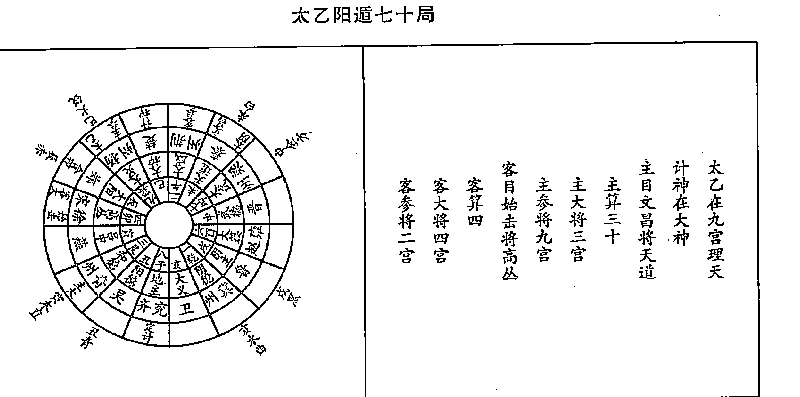

- 癸酉七十局
- 乙酉一百四十二局
- 丁酉二百一十四局
- 己酉二百八十六局
- 辛酉三百五十八局

此局算得太乙九宫，理天，天外助客，西戎兵起。

此时声息，有凶贼入寇，有兵无将，从东来。闻事凶实吉虚。敌使不可信，贼出入乘休囚气，可以攻击。

文昌未，在外地可攻内，并太阴。

主算三十，孤阳不和，不宜举兵征伐，宜近境相机。

主大将三宫，发乘相气，可以出兵攻战，既得胜即宜收兵，不宜深入，算不和故也。

主参将九宫，值囚击，内有兵围事，在宗室近臣，又因客大有叛臣，宫中火灾，不利有为，又乘休气，不宜出兵战斗，宜固守。

出兵举青旗、列直阵出。向东北战，向西南奇兵，安卯地战，备东方伏兵，利辰巳时。风云飞鸟从西北，冲太乙而来，急备大战。风云飞鸟从我阵后来，冲入敌阵去，为天助，宜顺而击之大胜。

主将行兵：步卒在前，车骑次之，大将居中静出。向东北行，遇敌提兵。向西南，伺彼先举，然后击之。

始击在高丛。

客算四单，阴不和，不利为客，又无将吏，不利出兵举事。客大将四宫，内迫又受制于客目，不利有为，乘王气。

客参将二宫，外迫大臣，逆命举事攻内，乘囚气，不利有为。

## 太乙阳遁七十一局

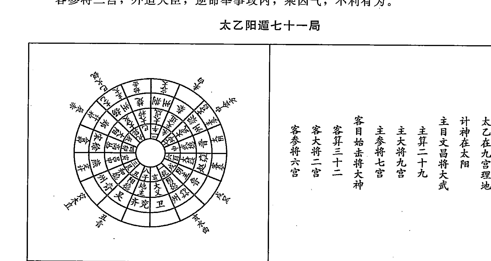

- 甲戌七十一局
- 丙戌一百四十三局
- 戊戌二百一十五局
- 庚戌二百八十七局
- 壬戌三百五十九局

此局算得太乙九宫，理地，太岁格，天外助客，扬州分大旱火灾。

此时声息，有庆四夷来贡，奸细入，有将兵多，从东南来，闻事凶实吉虚，敌使不可信，贼出入俱乘休气，可以攻击。

文昌七宫，在外地可攻内，囚主参有同类相谋，将相忌之。

主算二十九，长和。可以举兵征伐。

主大将九宫，值囚有拘执，奔败事，不利有为，乘休气，不宜大举攻战，宜陈兵固守。

主参将七宫，受制于文昌，不利有为，乘囚气，宜发兵邀其首尾，不宜交战。

出兵举赤旗、列锐阵出。向东南战，向西北奇兵，安坤地战，备西南伏兵，利辰巳时。风云飞鸟从西北，冲太乙宫，必有大战，宜急备。风云飞鸟从东南来，冲西北去，为天助，急顺击之大胜。

主将行兵：车骑在前，步兵次之，大将居中，登高鼓噪急出。向东南行，遇敌旋兵。向西北，伺敌先举，然后举兵攻之。

始击在巳，外辰击。

客算三十二，长和，太乙助，可以举兵征伐。

客大将二宫，外迫大臣，逆命举事攻内，不利有为，乘囚气，宜固守，不宜出兵攻战。

客参将六宫，发乘死气，亦宜固守，不利出兵攻战，战必败死。

## 太乙阳遁七十二局

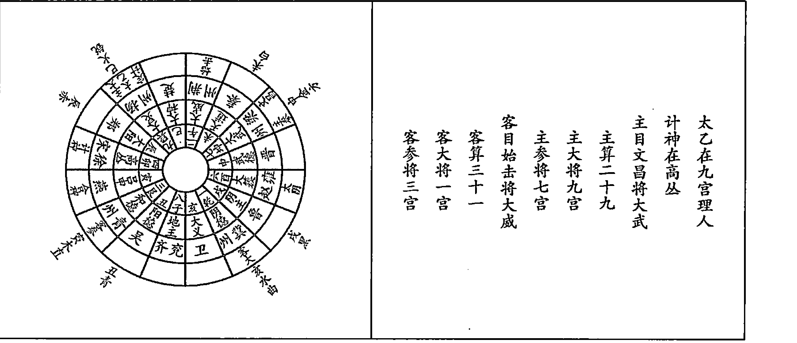

乙亥七十二局 丁亥一百四十四局 己亥二百一十六局 辛亥二百八十八局 癸亥三百六十局

此局算得太乙九宫，理人，天外助客，扬荆二州大旱火灾。

此时声息，有凶贼入大寇，有将兵多，从南来，闻事凶实吉虚，敌使不可信，贼来乘囚气可攻，贼去乘相气不可攻。

文昌七宫，在外地可攻内，因主参近将自谋同类。

主算二十九，长和，将吏全，可以举兵征伐。

主大将九宫，值囚有拘执，奔亡事，乘休气，不利有为，不宜用兵，宜固守。

主参将七宫，受制于文昌，乘囚气，不利有为，不宜用兵，二将休囚，一值囚一受制，算虽和，孰敢许其交战乎。兵家胜负：一欲算和、二欲气胜，而取胜必矣。

始击二宫，外击有兵围逼迫事在易，气凶。

客算三十一，长而不和，太乙助，亦可出兵攻战，宜深入而速攻。军中防火灾乏水。

客大将一宫值格，上下格易，不利有为，乘休气，可以运谋设策，发兵布置，不宜出战。

客参将三宫，发乘相气，可以大举士卒深入速攻取胜，获捷即，宜收兵，不宜再进，算不和故也。

出兵举黑旗、列曲阵出。向西北战，向东南奇兵，安午地战，备正南伏兵，利辰巳时。风云飞鸟从西北，冲太乙而来，急备大战。风云飞鸟从我军后来，冲入彼阵去，为天助，急宜顺而击之大胜。

客将行兵：步卒在前，车骑次之，大将居中，静默而出。向西北行，遇敌旋兵。向东南，先举兵击之。

# 卷十一 术数汇考十一

## 太乙人道命法一

### 太乙真诀祖数

- 中元甲子 起于嘉靖四十三年
- 一亿二千六百九十四万四千四百五十分
- 下元甲子 起于天启四年
- 一亿三千零八万九千九百五十分
- 上元甲子 此未来甲子也①
- 一亿三千三百二十三万五千四百五十分②

太乙数为三式之首，有岁、月、日、时四计。此日计太乙人道论命之说也。岁、月、日、时皆有祖数，乃演纪上元起于天地开辟之初，距今年今月今时所用之数。如岁计，算至嘉靖四十三年，中元甲子祖数一千○三十五万五千四百八十一。算若月计，则每年有十二个月，则月计祖数十二倍多于岁计矣。若日计，则每年有三百六十五日，有奇是日计祖数多于岁计者三百六十五倍。有奇艰于布算。故用截法，或起于周敬王几年，或起于隋开皇几年之类为始。而积至中元甲子，共若干年因积算。该若干万日，分以为日计之祖数，即中元甲子之祖数也。次递加六十年之总日，分为下元、为上元各祖数。

> ① 即康熙二十三年。② 一作三百六十三日五四五。

### 岁实数法

| 甲子 | 乙丑 | 丙寅 | 丁卯 | 戊辰 | 己巳 | 庚午 | 辛未 | 壬申 | 癸酉 | 甲戌 | 乙亥 | 丙子 | 丁丑 | 戊寅 | 己卯 | 庚辰 | 辛巳 | 壬午 | 癸未 |
| :--- | :--- | :--- | :--- | :--- | :--- | :--- | :--- | :--- | :--- | :--- | :--- | :--- | :--- | :--- | :--- | :--- | :--- | :--- | :--- |
| 三百六十五万二千四百二十五分 | 七百三十万零四千八百五十分。十万。四千八百五十 | 一千零九十五万七千二百七十五分。百七十五万七千二十 | 一千四百六十万零九千七百分。二十万。九千七百 | 一千八百二十六万二千一百二十五分。三百八十六万二千二百五十 | 二千一百九十一万四千五百五十分。三百一十四万五千五百五 | 二千五百五十六万六千九百七十五分。三百一十四万五千五百五 | 二千九百二十一万九千四百分 | 三千二百八十七万一千八百二十五分 | 三千六百五十二万四千二百五十分 | 四千零一十七万六千六百七十五分 | 四千三百八十二万九千一百分 | 四千七百四十八万一千五百二十五分 | 五千一百一十三万三千九百五十分。七十三万九百五十 | 五千四百七十八万六千三百七十五分。四百三十八万六千三百 | 五千八百四十三万八千八百分。八十三万八千八百 | 六千二百零九万一千二百二十五分。四百四十九万一千二百 | 六千五百七十四万三千六百五十分。九十四万三千六百五十 | 六千九百三十九万六千零七十五分。四百五十九万六千零七 | 七千三百零四万八千五百分。一百○四万八千五百 |

| 甲申 | 乙酉 | 丙戌 | 丁亥 | 戊子 | 己丑 | 庚寅 | 辛卯 | 壬辰 | 癸巳 | 甲午 | 乙未 | 丙申 | 丁酉 | 戊戌 | 己亥 | 庚子 | 辛丑 | 壬寅 | 癸卯 |
| :--- | :--- | :--- | :--- | :--- | :--- | :--- | :--- | :--- | :--- | :--- | :--- | :--- | :--- | :--- | :--- | :--- | :--- | :--- | :--- |
| 七千六百七十万零九百二十五分。四百七十万九百二十 | 八千零三十五万三千三百五十分。百五万三千三百五十 | 八千四百万零五千七百七十五分 | 八千七百六十五万八千二百分 | 九千一百三十一万零六百二十五分 | 九千四百九十六万三千零五十分 | 九千八百六十一万五千四百七十五分 | 一亿零二百二十六万七千九百分 | 一亿零五百九十二万零三百二十五分 | 一亿零九百五十七万二千七百五十分 | 一亿一千三百二十二万五千一百七十五分 | 一亿一千六百八十七万七千六百分 | 一亿二千零五十三万。二十五分 | 一亿二千四百一十八万二千四百五十分。四百五十八万二千四百 | 一亿二千七百八十三万四千八百七十五分。五百四十三万八千 | 一亿三千一百四十八万七千三百分。百八十八万七千三百 | 一亿三千五百一十三万九千七百二十五分。五百九十三万九千 | 一亿三千八百七十九万二千一百五十分。百九十九万二千 | 一亿四千二百四十四万四千五百七十五分。五百六十四万四千 | 一亿四千六百零九万七千分。二百九万七千 |

| 甲子 | 乙丑 | 丙寅 | 丁卯 | 戊辰 | 己巳 | 庚午 | 辛未 | 壬申 | 癸酉 | 甲戌 | 乙亥 | 丙子 | 丁丑 | 戊寅 | 己卯 | 庚辰 | 辛巳 | 壬午 | 癸未 | 甲申 | 乙酉 | 丙戌 | 丁亥 | 戊子 | 己丑 | 庚寅 | 辛卯 | 壬辰 | 癸巳 | 甲午 | 乙未 | 丙申 | 丁酉 | 戊戌 | 己亥 | 庚子 | 辛丑 | 壬寅 | 癸卯 | 甲辰 | 乙巳 | 丙午 | 丁未 | 戊申 | 己酉 | 庚戌 | 辛亥 | 壬子 | 癸丑 | 甲寅 | 乙卯 | 丙辰 | 丁巳 | 戊午 | 己未 | 庚申 | 辛酉 | 壬戌 | 癸亥 |
| :--- | :--- | :--- | :--- | :--- | :--- | :--- | :--- | :--- | :--- | :--- | :--- | :--- | :--- | :--- | :--- | :--- | :--- | :--- | :--- | :--- | :--- | :--- | :--- | :--- | :--- | :--- | :--- | :--- | :--- | :--- | :--- | :--- | :--- | :--- | :--- | :--- | :--- | :--- | :--- | :--- | :--- | :--- | :--- | :--- | :--- | :--- | :--- | :--- | :--- | :--- | :--- | :--- | :--- | :--- | :--- | :--- | :--- |
| 一亿四千九百七十四万九千四百二十五分。 五百七十四万五千 | 一亿五千七百四十万一千八百五十分。 二百二十万四千八百五十分 | 一亿六千五百五十六万一千二百七十五分。 二百二十七万五千四百二十五分 | 一亿七千三百七十二万一千六百五十分。 二百三十四万五千五百 | 一亿八千一百八十八万二千零二十五分。 二百四十一万五千七百五十分 | 一亿九千零四万二千四百分。 二百四十八万五千五百分 | 一亿九千八百二十万二千七百七十五分。 二百五十五万五千六百二十五分 | 二亿零六百三十六万三千一百五十分。 二百六十二万五千五百 | 二亿一千四百五十二万三千五百二十五分。 二百六十九万五千四百七十五分 | 二亿二千二百六十八万三千九百分。 二百七十六万五千四百五十分 | 二亿三千零八十四万四千二百七十五分。 二百八十三万五千四百二十五分 | 二亿三千九百零万四千六百五十分。 二百九十零万五千五百 | 二亿四千七百一十六万五千零二十五分。 二百九十七万五千五百二十五分 | 二亿五千五百三十二万五千四百分。 三百零四万五千五百 | 二亿六千三百四十八万五千七百七十五分。 三百一十一万五千四百七十五分 | 二亿七千一百六十四万六千一百五十分。 三百一十八万五千四百五十分 | 二亿七千九百八十万六千五百二十五分。 三百二十五万五千四百二十五分 | 二亿八千七百九十六万六千九百分。 三百三十二万五千四百五十分 | 二亿九千六百一十二万七千二百七十五分。 三百三十九万五千四百二十五分 | 三亿零四百二十八万七千六百五十分。 三百四十六万五千四百五十分 | 三亿一千二百四十四万八千零二十五分。 三百五十三万五千四百二十五分 | 三亿二千零六十万八千四百分。 三百六十零万五千五百 | 三亿二千八百七十六万八千七百七十五分。 三百六十七万五千四百七十五分 | 三亿三千六百九十二万九千一百五十分。 三百七十四万五千四百五十分 | 三亿四千五百零八万九千五百二十五分。 三百八十一万五千四百二十五分 | 三亿五千三百二十四万九千九百分。 三百八十八万五千四百五十分 | 三亿六千一百四十万零二千七十五分。 三百九十五万五千四百二十五分 | 三亿六千九百五十六万零四百五十分。 四百零二万五千四百五十分 | 三亿七千七百七十二万零八百二十五分。 四百零九万五千四百二十五分 | 三亿八千五百八十八万一千二百分。 四百一十六万五千四百五十分 | 三亿九千四百零四万一千五百七十五分。 四百二十三万五千四百二十五分 | 四亿零二百二十万零一千九百五十分。 四百三十零万五千五百 | 四亿一千零三十六万二千三百二十五分。 四百三十七万五千四百七十五分 | 四亿一千八百五十二万二千七百分。 四百四十四万五千四百五十分 | 四亿二千六百六十八万三千零七十五分。 四百五十一万五千四百二十五分 | 四亿三千四百八十四万三千四百五十分。 四百五十八万五千四百五十分 | 四亿四千三百零零三千八百二十五分。 四百六十五万五千四百二十五分 | 四亿五千一百一十六万四千二百分。 四百七十二万五千四百五十分 | 四亿五千九百三十二万四千五百七十五分。 四百七十九万五千四百二十五分 | 四亿六千七百四十八万四千九百五十分。 四百八十六万五千四百五十分 | 四亿七千五百六十四万五千三百二十五分。 四百九十三万五千四百二十五分 | 四亿八千三百八十零五千七百分。 五百零零万五千五百分 | 四亿九千一百九十六万六千零七十五分。 五百零七万五千四百七十五分 | 五亿零一百一十二万六千四百五十分。 五百一十四万五千四百五十分 | 五亿零九百二十八万六千八百二十五分。 五百二十一万五千四百二十五分 | 五亿一千七百四十四万七千二百分。 五百二十八万五千四百五十分 | 五亿二千五百六十万零七千五百七十五分。 五百三十五万五千四百二十五分 | 五亿三千三百七十六万七千九百五十分。 五百四十二万五千四百五十分 | 五亿四千一百九十二万八千三百二十五分。 五百四十九万五千四百二十五分 | 五亿五千零零八万八千七百分。 五百五十六万五千四百五十分 | 五亿五千八百二十四万九千零七十五分。 五百六十三万五千四百二十五分 | 五亿六千六百四十万零九千四百五十分。 五百七十零万五千五百分 | 五亿七千四百五十六万九千八百二十五分。 五百七十七万五千四百七十五分 | 五亿八千二百七十三万零二百五十分。 五百八十四万五千四百五十分 | 五亿九千零八十九万零六百二十五分。 五百九十一万五千四百二十五分 | 五亿九千九百零五万一千分。 五百九十八万五千四百五十分 | 六亿零七百二十一万一千三百七十五分。 六百零五万五千四百二十五分 | 六亿一千五百三十七万一千七百五十分。 六百一十二万五千四百五十分 | 六亿二千三百五十三万二千一百二十五分。 六百一十九万五千四百二十五分 | 六亿三千一百六十九万二千五百分。 六百二十六万五千四百五十分 |

此每年一岁之实积。如甲子一年积三百六十五万二千四百二十五分，乃古历，岁实三百六十五日二十四刻二十五分。其法以万分为一日也。乙丑两年则积七百三十〇日四十八刻五十分，至癸亥六十年，则积二万一千九百一十四日五十五刻矣。此六十年一周，甲子之总数。以加中元祖数，为下元祖数。再加下元祖数，为上元祖数。又恐艰于布算，亦用截法。如六十年共积二万一千九百一十四日五十五刻，用天数七百二十日累减之至，不满七百二十日而止存三百一十四日五十五刻，为六十花甲一周应加之截数。故中元祖数一亿二千六百九十四万四千四百五十分加入三百一十四万五千五百，便成一亿三千〇〇八万九千九百五十分，而为下元之祖数，再加一个三百一十四万五千五百，便为上元之祖数一亿三千三百二十三万五千四百五十分也。明此理则上推递减，下算递加，可以至于无穷矣。

# 卷十一 术数汇考十一

### 二十四气成数

| 节气 | 数值 |
| :--- | :--- |
| 冬至 | 三百六十五万二千四百二十五分 |
| 小寒 | 一十五万二千一百八十四分三十七秒半 |
| 大寒 | 三十万零四千三百六十八分七十五秒 |
| 立春 | 四十五万六千五百五十三分一十二秒半 |
| 雨水 | 六十万零八千七百二十七分五十秒 |
| 惊蛰 | 七十六万零九百二十一分八十七秒半 |
| 春分 | 九十一万三千一百零六分二十五秒 |
| 清明 | 一百零六万五千二百九十分零六十二秒半 |
| 谷雨 | 一百二十一万七千四百七十五分 |
| 立夏 | 一百三十六万九千六百五十九分三十七秒半 |
| 小满 | 一百五十二万二千八百四十三分七十五秒 |
| 芒种 | 一百六十七万四千零二十八分一十二秒半 |
| 夏至 | 一百八十二万六千二百一十二分五十秒 |
| 小暑 | 一百九十七万八千三百九十六分八十七秒半 |
| 大暑 | 二百一十三万零五百八十一分二十五秒 |
| 立秋 | 二百二十八万二千七百六十五分六十二秒半 |
| 处暑 | 二百四十三万四千九百五十分 |
| 白露 | 二百五十八万七千一百三十四分三十七秒半 |
| 秋分 | 二百七十三万九千三百一十八分七十五秒 |
| 寒露 | 二百八十九万一千五百零三分一十二秒半 |
| 霜降 | 三百零四万三千六百八十七分五十秒 |
| 立冬 | 三百一十九万五千八百七十一分八十七秒半 |
| 小雪 | 三百三十四万八千零五十六分二十五秒 |
| 大雪 | 三百五十万零二百四十分零六十二秒半 |

此书所用，尚是古时历法数目。故细推生日干支，偶有未符。如第一冬至下该是一岁之始，未有日分，而云三百六十五万二千四百二十五分者，乃自上年冬至距今年冬至整整一岁实数。三百六十五日二十四刻二十五分以起一岁之根，次将此岁实平分作二十四分，得一十五日二千一百八十四分三十七秒半，为一个节气之数，名曰气策。如小寒则于冬至之数，加一个气策，然满一岁实便该减去，而止用其零。故亦用截法，竟于小寒之下，写一个气策，曰一十五万二千一百八十四分三十七秒半次再加一个气策，便是大寒之三十〇万四千三百六十八分七十五秒。由此递加，即得各节气之数。

### 释十二神

### 推小游法

置天数以太乙宫，周二十四累去之，至不满之数。命起亥一、午二、寅三、卯四、酉六、申七、子八、巳九，不入中五八宫，顺行每宫舍三算，算尽处即本日小游所在之宫也。

如天数五十七，以太乙宫周二十四，去之余九算。命起亥一宫，舍三算；午二宫，舍三算；寅三宫，舍三算；算尽得太乙小游在寅宫三日。余仿此。

### 推文昌法

置天数满目，周一十八累去之至不满之数。命起申宫，算外每宫舍一算，顺行十六宫，值乾坤二宫重留一算，算尽处凡遇乾寄亥，艮寄寅，巽寄巳，坤寄申，得文昌所在之宫也。

- 十六宫 申、酉、戌、乾、亥、子、丑、艮、寅、卯、辰、巽、巳、午、未、坤。

如天数五十七满目，周一十八累去之余二算。命起申宫一算，酉宫一算，戌宫一算，算尽即文昌本日在戌宫也。

### 推计神法

置天数满计，周十二累去之至不满之数。命起寅宫，算外逆行十二神，得算尽处，即计神所在之宫也。

- 寅、丑、子，亥、戌、酉、申、未、午、巳，辰、卯。

如天数五十七满计，周十二累去之余九算，命起寅一、丑二、子三、亥四、戌五、酉六、申七、未八、午九得算尽，计神在午也。

### 推始击法

视计神所在之宫，照十六宫顺数至文昌所临之宫，得几数。又从艮宫数起对某数止，即始击所在之宫也。

如计神在午，文昌在戌，即从计神午上顺数至文昌戌宫，得六宫，神再从艮宫顺对六宫数去，得巳宫止，即始击在巳宫也。余仿此。

十六宫神，即文昌法内十六神也。

## 推主大将①

视文昌所在之宫，数至太乙前一宫止，看经几正宫，即宜将宫数为算数，合成若干，为主算。去十用零，即为当生日主大将所在之宫也。若天目文星在间，辰亦作一算起，余辰不作算，只以正宫论，若主算撞十亦作一算。

如文昌在戌，太乙小游在艮，即文昌戌宫作一数，次乾宫一数，次子宫八数，合成十数，得主算十。撞十作一，即主大将在乾，寄于亥宫下，天盘亥宫。

### 推主参将

视主算多寡，三因之，亦去十用零，撞十作一，二十作二，三十作三，为主参将所在之宫也。

如主算得十，三因之得三十。撞十作一，三十作三，即主参将在艮三宫，艮寄寅下，天盘寅宫。

## 术数

## 推客大将②

视始击所在之宫，数至小游后止宫，止其所经之宫，得数合成为客算，去十用零，为客大将所在之宫也。

如始击在巳，小游在艮，即从始击巳宫，间辰作一数，次午二，次坤七，次酉六，次乾一，次坎八止。合成二十五数，得客算二十五，为客大将入中宫，杜寄于戌，即为客大将在戌宫也。

### 推客参将法

视客算若干，三因之，去十用零，与主参同法。

如今客大将二十五，杜寄于戌，今客参在辰宫也。凡主客二算，遇杜塞中五之数，五寄于辰、戌、丑、未四间，辰之中。其理傅会姑从统宗七十二局立法。

主算五，寄于戌。十五寄于未。二十五复寄戌。三十五寄于丑。主参，取对冲。

客算五，寄于辰。十五寄于未。二十五寄于戌。三十五寄于丑。客参，取对冲。

> ① 并主算。

> ② 并客算。

### 推四神法

置天数满四神，周三十六，去之至不满之数。命起亥宫，顺行九宫四土，每宫舍三算，算尽处即得四神所在之宫也。

如天数五十七，以四神周三十六，去之至不满之数，余二十一为四神节法。命起亥一宫，舍三算；午二宫，三算；艮三宫，三算；震四宫，三算；酉六宫，三算；申七宫，三算。算尽得四神在申宫，三算也。余仿此。

### 推飞符法

置前用天数，满四神，周去之至四神节法。命起辰宫，每宫舍三算，算尽处即得飞符所在之宫也。

如前四神节法二十一，命起辰、酉、申，子、巳、戌、未，算尽得飞符在未也。

### 推天乙法

置四神节法，命起酉宫，顺行每宫，舍三算，算尽处得天乙所在之宫也。

如四神节法二十一，命酉、申、子、巳、戌、未、丑，得天乙在丑也。

### 推地乙法

四神节法，命起巳宫，如前每宫舍三算，顺行十二宫，算尽处即得地乙所在之宫也。

如四神节法二十一当行七宫，命巳、戌、未、丑、亥、午、寅，算尽止得地乙在寅宫也。

此四项俱用将神节法，满四神三十六累，去之至不满之数为四神节法。四神太乙起于亥，飞符起于辰，天乙起于酉，地乙起于巳，皆顺行十二宫，每宫舍三算，算尽处即是各神所在之宫也。

## 十二宫神①

亥、午、寅、卯、辰、酉、申、子、巳、戌、未、丑。

### 求太乙论命日计歌

> 太乙人道求日计，必须先推元会世。一千空百十五万，更加五五四一继。开辟一阳冬至始，天启下元甲子例。下推每年宜加一，岁周相乘盈差隶。二十五日二乙二，还有五分同减积。七百二十累除之，分明将神节法出。复满旬周六十去，甲子算外命冬至。任他距古积浩繁，九子推源一何易。

### 甲子元七十二局数为天数，局为地数

| 甲子 | 乙丑 | 丙寅 | 丁卯 | 戊辰 | 己巳 |
| :--- | :--- | :--- | :--- | :--- | :--- |
| 甲子一局数 乙丑二局数 丙寅三局数 丁卯四局数 | 乙丑二局数 丙寅三局数 丁卯四局数 戊辰五局数 | 丙寅三局数 丁卯四局数 戊辰五局数 己巳六局数 | 丁卯四局数 戊辰五局数 己巳六局数 庚午七局数 | 戊辰五局数 己巳六局数 庚午七局数 辛未八局数 | 己巳六局数 庚午七局数 辛未八局数 壬申九局数 |

### 丙子元七十二局

| 庚午 | 辛未 | 壬申 | 癸酉 | 甲戌 | 乙亥 |
| :--- | :--- | :--- | :--- | :--- | :--- |
| 丙子七十三局 丁丑七十四局 戊寅七十五局 己卯七十六局 | 丁丑七十四局 戊寅七十五局 己卯七十六局 庚辰七十七局 | 戊寅七十五局 己卯七十六局 庚辰七十七局 辛巳七十八局 | 己卯七十六局 庚辰七十七局 辛巳七十八局 壬午七十九局 | 庚辰七十七局 辛巳七十八局 壬午七十九局 癸未八十局 | 辛巳七十八局 壬午七十九局 癸未八十局 甲申八十一局 |

### 戊子元七十二局

| 丙子 | 丁丑 | 戊寅 | 己卯 | 庚辰 | 辛巳 |
| :--- | :--- | :--- | :--- | :--- | :--- |
| 戊子 一百四十五数 己丑 一百四十六数 庚寅 一百四十七数 辛卯 一百四十八数 | 丙子 一百四十九数 丁丑 一百五十数 戊寅 一百五十一数 己卯 一百五十二数 | 丙申 一百五十三数 丁酉 一百五十四数 戊戌 一百五十五数 己亥 一百五十六数 | 丙辰 一百五十七数 丁巳 一百五十八数 戊午 一百五十九数 己未 一百六十数 | 甲申 一百六十一数 乙酉 一百六十二数 丙戌 一百六十三数 丁亥 一百六十四数 | 甲辰 一百六十五数 乙巳 一百六十六数 丙午 一百六十七数 丁未 一百六十八数 |
| 壬辰 一百四十五数 癸巳 一百四十六数 甲午 一百四十七数 乙未 一百四十八数 | 壬子 一百四十九数 癸丑 一百五十数 甲寅 一百五十一数 乙卯 一百五十二数 | 壬申 一百五十三数 癸酉 一百五十四数 甲戌 一百五十五数 乙亥 一百五十六数 | 壬辰 一百五十七数 癸巳 一百五十八数 甲午 一百五十九数 乙未 一百六十数 | 庚子 一百六十一数 辛丑 一百六十二数 壬寅 一百六十三数 癸卯 一百六十四数 | 庚申 一百六十五数 辛酉 一百六十六数 壬戌 一百六十七数 癸亥 一百六十八数 |
| 丙申 一百四十五数 丁酉 一百四十六数 戊戌 一百四十七数 己亥 一百四十八数 | 丙辰 一百四十九数 丁巳 一百五十数 戊午 一百五十一数 己未 一百五十二数 | 甲子 一百五十三数 乙丑 一百五十四数 丙寅 一百五十五数 丁卯 一百五十六数 | 甲申 一百五十七数 乙酉 一百五十八数 丙戌 一百五十九数 丁亥 一百六十数 | 壬子 一百六十一数 癸丑 一百六十二数 甲寅 一百六十三数 乙卯 一百六十四数 | 壬申 一百六十五数 癸酉 一百六十六数 甲戌 一百六十七数 乙亥 一百六十八数 |
| 庚子 一百四十五数 辛丑 一百四十六数 壬寅 一百四十七数 癸卯 一百四十八数 | 庚申 一百四十九数 辛酉 一百五十数 壬戌 一百五十一数 癸亥 一百五十二数 | 戊辰 一百五十三数 己巳 一百五十四数 庚午 一百五十五数 辛未 一百五十六数 | 戊子 一百五十七数 己丑 一百五十八数 庚寅 一百五十九数 辛卯 一百六十数 | 丙申 一百六十一数 丁酉 一百六十二数 戊戌 一百六十三数 己亥 一百六十四数 | 丙辰 一百六十五数 丁巳 一百六十六数 戊午 一百六十七数 己未 一百六十八数 |
| 甲辰 一百四十五数 乙巳 一百四十六数 丙午 一百四十七数 丁未 一百四十八数 | 甲子 一百四十九数 乙丑 一百五十数 丙寅 一百五十一数 丁卯 一百五十二数 | 壬申 一百五十三数 癸酉 一百五十四数 甲戌 一百五十五数 乙亥 一百五十六数 | 壬辰 一百五十七数 癸巳 一百五十八数 甲午 一百五十九数 乙未 一百六十数 | 庚子 一百六十一数 辛丑 一百六十二数 壬寅 一百六十三数 癸卯 一百六十四数 | 庚申 一百六十五数 辛酉 一百六十六数 壬戌 一百六十七数 癸亥 一百六十八数 |
| 戊申 一百四十五数 己酉 一百四十六数 庚戌 一百四十七数 辛亥 一百四十八数 | 戊辰 一百四十九数 己巳 一百五十数 庚午 一百五十一数 辛未 一百五十二数 | 丙子 一百五十三数 丁丑 一百五十四数 戊寅 一百五十五数 己卯 一百五十六数 | 丙申 一百五十七数 丁酉 一百五十八数 戊戌 一百五十九数 己亥 一百六十数 | 甲辰 一百六十一数 乙巳 一百六十二数 丙午 一百六十三数 丁未 一百六十四数 | 甲子 一百六十五数 乙丑 一百六十六数 丙寅 一百六十七数 丁卯 一百六十八数 |

### 庚子元七十二局

| 壬午 | 癸未 | 甲申 | 乙酉 | 丙戌 | 丁亥 |
| :--- | :--- | :--- | :--- | :--- | :--- |
| 庚子 二百一十七数 辛丑 二百一十八数 壬寅 二百一十九数 癸卯 二百二十数 | 庚申 二百二十一数 辛酉 二百二十二数 壬戌 二百二十三数 癸亥 二百二十四数 | 戊辰 二百二十五数 己巳 二百二十六数 庚午 二百二十七数 辛未 二百二十八数 | 戊子 二百二十九数 己丑 二百三十数 庚寅 二百三十一数 辛卯 二百三十二数 | 丙申 二百三十三数 丁酉 二百三十四数 戊戌 二百三十五数 己亥 二百三十六数 | 丙辰 二百三十七数 丁巳 二百三十八数 戊午 二百三十九数 己未 二百四十数 |
| 甲辰 二百一十七数 乙巳 二百一十八数 丙午 二百一十九数 丁未 二百二十数 | 甲子 二百二十一数 乙丑 二百二十二数 丙寅 二百二十三数 丁卯 二百二十四数 | 壬申 二百二十五数 癸酉 二百二十六数 甲戌 二百二十七数 乙亥 二百二十八数 | 壬辰 二百二十九数 癸巳 二百三十数 甲午 二百三十一数 乙未 二百三十二数 | 庚子 二百三十三数 辛丑 二百三十四数 壬寅 二百三十五数 癸卯 二百三十六数 | 庚申 二百三十七数 辛酉 二百三十八数 壬戌 二百三十九数 癸亥 二百四十数 |
| 戊申 二百一十七数 己酉 二百一十八数 庚戌 二百一十九数 辛亥 二百二十数 | 戊辰 二百二十一数 己巳 二百二十二数 庚午 二百二十三数 辛未 二百二十四数 | 丙子 二百二十五数 丁丑 二百二十六数 戊寅 二百二十七数 己卯 二百二十八数 | 丙申 二百二十九数 丁酉 二百三十数 戊戌 二百三十一数 己亥 二百三十二数 | 甲辰 二百三十三数 乙巳 二百三十四数 丙午 二百三十五数 丁未 二百三十六数 | 甲子 二百三十七数 乙丑 二百三十八数 丙寅 二百三十九数 丁卯 二百四十数 |
| 壬子 二百一十七数 癸丑 二百一十八数 甲寅 二百一十九数 乙卯 二百二十数 | 壬申 二百二十一数 癸酉 二百二十二数 甲戌 二百二十三数 乙亥 二百二十四数 | 庚辰 二百二十五数 辛巳 二百二十六数 壬午 二百二十七数 癸未 二百二十八数 | 庚子 二百二十九数 辛丑 二百三十数 壬寅 二百三十一数 癸卯 二百三十二数 | 戊申 二百三十三数 己酉 二百三十四数 庚戌 二百三十五数 辛亥 二百三十六数 | 戊辰 二百三十七数 己巳 二百三十八数 庚午 二百三十九数 辛未 二百四十数 |
| 丙辰 二百一十七数 丁巳 二百一十八数 戊午 二百一十九数 己未 二百二十数 | 丙子 二百二十一数 丁丑 二百二十二数 戊寅 二百二十三数 己卯 二百二十四数 | 甲申 二百二十五数 乙酉 二百二十六数 丙戌 二百二十七数 丁亥 二百二十八数 | 甲辰 二百二十九数 乙巳 二百三十数 丙午 二百三十一数 丁未 二百三十二数 | 壬子 二百三十三数 癸丑 二百三十四数 甲寅 二百三十五数 乙卯 二百三十六数 | 壬申 二百三十七数 癸酉 二百三十八数 甲戌 二百三十九数 乙亥 二百四十数 |
| 庚申 二百一十七数 辛酉 二百一十八数 壬戌 二百一十九数 癸亥 二百二十数 | 庚辰 二百二十一数 辛巳 二百二十二数 壬午 二百二十三数 癸未 二百二十四数 | 戊子 二百二十五数 己丑 二百二十六数 庚寅 二百二十七数 辛卯 二百二十八数 | 戊申 二百二十九数 己酉 二百三十数 庚戌 二百三十一数 辛亥 二百三十二数 | 丙辰 二百三十三数 丁巳 二百三十四数 戊午 二百三十五数 己未 二百三十六数 | 丙子 二百三十七数 丁丑 二百三十八数 戊寅 二百三十九数 己卯 二百四十数 |

# 壬子元七十二局

| 戊子 | 己丑 | 庚寅 | 辛卯 | 壬辰 | 癸巳 |
| :--- | :--- | :--- | :--- | :--- | :--- |
| 壬子 一局 二百八九数 | 丙辰 五局 二百九三数 | 庚申 九局 二百九七数 | 甲子 十三局 三百一数 | 戊辰 十七局 三百五数 | 壬申 二十一局 三百九数 |
| 癸丑 二局 二百九十数 | 丁巳 六局 二百九四数 | 辛酉 十局 二百九八数 | 乙丑 十四局 三百二数 | 己巳 十八局 三百六数 | 癸酉 二十二局 三百十数 |
| 甲寅 三局 二百九一数 | 戊午 七局 二百九五数 | 壬戌 十一局 二百九九数 | 丙寅 十五局 三百三数 | 庚午 十九局 三百七数 | 甲戌 二十三局 三百十一数 |
| 乙卯 四局 二百九二数 | 己未 八局 二百九六数 | 癸亥 十二局 三百数 | 丁卯 十六局 三百四数 | 辛未 二十局 三百八数 | 乙亥 二十四局 三百十二数 |

### 甲子元七十二局

| 甲午 | 乙未 | 丙申 | 丁酉 | 戊戌 | 己亥 |
| :--- | :--- | :--- | :--- | :--- | :--- |
| 甲子 一局 三百六一数 | 戊辰 五局 三百六五数 | 壬申 九局 三百六九数 | 丙子 十三局 三百七三数 | 庚辰 十七局 三百七七数 | 甲申 二十一局 三百八一数 |
| 乙丑 二局 三百六二数 | 己巳 六局 三百六六数 | 癸酉 十局 三百七十数 | 丁丑 十四局 三百七四数 | 辛巳 十八局 三百七八数 | 乙酉 二十二局 三百八二数 |
| 丙寅 三局 三百六三数 | 庚午 七局 三百六七数 | 甲戌 十一局 三百七一数 | 戊寅 十五局 三百七五数 | 壬午 十九局 三百七九数 | 丙戌 二十三局 三百八三数 |
| 丁卯 四局 三百六四数 | 辛未 八局 三百六八数 | 乙亥 十二局 三百七二数 | 己卯 十六局 三百七六数 | 癸未 二十局 三百八十数 | 丁亥 二十四局 三百八四数 |

### 丙子元七十二局

| 庚子 | 辛丑 | 壬寅 | 癸卯 | 甲辰 | 乙巳 |
| :--- | :--- | :--- | :--- | :--- | :--- |
| 丙子 一局 四百三十三数 丁丑 二局 四百三十四数 戊寅 三局 四百三十五数 己卯 四局 四百三十六数 | 庚辰 五局 四百三十七数 辛巳 六局 四百三十八数 壬午 七局 四百三十九数 癸未 八局 四百四十数 | 甲申 九局 四百四十一数 乙酉 十局 四百四十二数 丙戌 十一局 四百四十三数 丁亥 十二局 四百四十四数 | 戊子 十三局 四百四十五数 己丑 十四局 四百四十六数 庚寅 十五局 四百四十七数 辛卯 十六局 四百四十八数 | 壬辰 十七局 四百四十九数 癸巳 十八局 四百五十数 甲午 十九局 四百五十一数 乙未 二十局 四百五十二数 | 丙申 二十一局 四百五十三数 丁酉 二十二局 四百五十四数 戊戌 二十三局 四百五十五数 己亥 二十四局 四百五十六数 |
| 庚子 二十五局 四百五十七数 辛丑 二十六局 四百五十八数 壬寅 二十七局 四百五十九数 癸卯 二十八局 四百六十数 | 甲辰 二十九局 四百六十一数 乙巳 三十局 四百六十二数 丙午 三十一局 四百六十三数 丁未 三十二局 四百六十四数 | 戊申 三十三局 四百六十五数 己酉 三十四局 四百六十六数 庚戌 三十五局 四百六十七数 辛亥 三十六局 四百六十八数 | 壬子 三十七局 四百六十九数 癸丑 三十八局 四百七十数 甲寅 三十九局 四百七十一数 乙卯 四十局 四百七十二数 | 丙辰 四十一局 四百七十三数 丁巳 四十二局 四百七十四数 戊午 四十三局 四百七十五数 己未 四十四局 四百七十六数 | 庚申 四十五局 四百七十七数 辛酉 四十六局 四百七十八数 壬戌 四十七局 四百七十九数 癸亥 四十八局 四百八十数 |
| 甲子 四十九局 四百八十一数 乙丑 五十局 四百八十二数 丙寅 五十一局 四百八十三数 丁卯 五十二局 四百八十四数 | 戊辰 五十三局 四百八十五数 己巳 五十四局 四百八十六数 庚午 五十五局 四百八十七数 辛未 五十六局 四百八十八数 | 壬申 五十七局 四百八十九数 癸酉 五十八局 四百九十数 甲戌 五十九局 四百九十一数 乙亥 六十局 四百九十二数 | 丙子 六十一局 四百九十三数 丁丑 六十二局 四百九十四数 戊寅 六十三局 四百九十五数 己卯 六十四局 四百九十六数 | 庚辰 六十五局 四百九十七数 辛巳 六十六局 四百九十八数 壬午 六十七局 四百九十九数 癸未 六十八局 五百数 | 甲申 六十九局 五百一数 乙酉 七十局 五百二数 丙戌 七十一局 五百三数 丁亥 七十二局 五百四数 |

### 戊子元七十二局

| 丙午 | 丁未 | 戊申 | 己酉 | 庚戌 | 辛亥 |
| :--- | :--- | :--- | :--- | :--- | :--- |
| 戊子 一局 五百五数 己丑 二局 五百六数 庚寅 三局 五百七数 辛卯 四局 五百八数 | 壬辰 五局 五百九数 癸巳 六局 五百十数 甲午 七局 五百十一数 乙未 八局 五百十二数 | 丙申 九局 五百十三数 丁酉 十局 五百十四数 戊戌 十一局 五百十五数 己亥 十二局 五百十六数 | 庚子 十三局 五百十七数 辛丑 十四局 五百十八数 壬寅 十五局 五百十九数 癸卯 十六局 五百二十数 | 甲辰 十七局 五百二十一数 乙巳 十八局 五百二十二数 丙午 十九局 五百二十三数 丁未 二十局 五百二十四数 | 戊申 二十一局 五百二十五数 己酉 二十二局 五百二十六数 庚戌 二十三局 五百二十七数 辛亥 二十四局 五百二十八数 |
| 壬子 二十五局 五百二十九数 癸丑 二十六局 五百三十数 甲寅 二十七局 五百三十一数 乙卯 二十八局 五百三十二数 | 丙辰 二十九局 五百三十三数 丁巳 三十局 五百三十四数 戊午 三十一局 五百三十五数 己未 三十二局 五百三十六数 | 庚申 三十三局 五百三十七数 辛酉 三十四局 五百三十八数 壬戌 三十五局 五百三十九数 癸亥 三十六局 五百四十数 | 甲子 三十七局 五百四十一数 乙丑 三十八局 五百四十二数 丙寅 三十九局 五百四十三数 丁卯 四十局 五百四十四数 | 戊辰 四十一局 五百四十五数 己巳 四十二局 五百四十六数 庚午 四十三局 五百四十七数 辛未 四十四局 五百四十八数 | 壬申 四十五局 五百四十九数 癸酉 四十六局 五百五十数 甲戌 四十七局 五百五十一数 乙亥 四十八局 五百五十二数 |
| 丙子 四十九局 五百五十三数 丁丑 五十局 五百五十四数 戊寅 五十一局 五百五十五数 己卯 五十二局 五百五十六数 | 庚辰 五十三局 五百五十七数 辛巳 五十四局 五百五十八数 壬午 五十五局 五百五十九数 癸未 五十六局 五百六十数 | 甲申 五十七局 五百六十一数 乙酉 五十八局 五百六十二数 丙戌 五十九局 五百六十三数 丁亥 六十局 五百六十四数 | 戊子 六十一局 五百六十五数 己丑 六十二局 五百六十六数 庚寅 六十三局 五百六十七数 辛卯 六十四局 五百六十八数 | 壬辰 六十五局 五百六十九数 癸巳 六十六局 五百七十数 甲午 六十七局 五百七十一数 乙未 六十八局 五百七十二数 | 丙申 六十九局 五百七十三数 丁酉 七十局 五百七十四数 戊戌 七十一局 五百七十五数 己亥 七十二局 五百七十六数 |# 庚子元七十二局

| 丁巳 | 丙辰 | 乙卯 | 甲寅 | 癸丑 | 壬子 |
|------|------|------|------|------|------|
| 戊申（六百四十九局） | 甲辰（六百四十八局） | 庚子（六百四十七局） | 丙辰（六百四十六局） | 壬子（六百四十五局） | 甲辰（六百四十四局） |
| 己酉（六百四十八局） | 乙巳（六百四十七局） | 辛丑（六百四十六局） | 丁酉（六百四十五局） | 癸巳（六百四十四局） | 己丑（六百四十三局） |
| 庚戌（六百四十七局） | 丙午（六百四十六局） | 壬寅（六百四十五局） | 戊戌（六百四十四局） | 甲午（六百四十三局） | 庚寅（六百四十二局） |
| 辛亥（六百四十六局） | 丁未（六百四十五局） | 癸卯（六百四十四局） | 己亥（六百四十三局） | 乙未（六百四十二局） | 辛卯（六百四十局） |
| 壬子（六百四十五局） | 戊申（六百四十四局） | 甲辰（六百四十三局） | 庚子（六百四十二局） | 丙辰（六百四十一局） | 壬子（六百四十局） |
| 癸丑（六百四十四局） | 己酉（六百四十三局） | 乙巳（六百四十二局） | 辛丑（六百四十局） | 丁酉（六百三十九局） | 癸巳（六百三十八局） |
| 甲寅（六百四十三局） | 庚戌（六百四十二局） | 丙午（六百四十局） | 壬寅（六百三十九局） | 戊戌（六百三十八局） | 甲午（六百三十七局） |
| 乙卯（六百四十二局） | 辛亥（六百四十局） | 丁未（六百三十九局） | 癸卯（六百三十八局） | 己亥（六百三十七局） | 乙未（六百三十六局） |
| 丙辰（六百四十局） | 壬子（六百三十九局） | 戊申（六百三十八局） | 甲辰（六百三十七局） | 庚子（六百三十六局） | 丙辰（六百三十五局） |
| 丁巳（六百三十九局） | 癸丑（六百三十八局） | 己酉（六百三十七局） | 乙巳（六百三十六局） | 辛丑（六百三十五局） | 丁酉（六百三十四局） |
| ... （共72行） |

# 壬子元七十二局

| 戊午 | 己未 | 庚申 | 辛酉 | 壬戌 | 癸亥 |
|------|------|------|------|------|------|
| 壬子（六百四十九局） | 丙辰（六百四十八局） | 庚子（六百四十七局） | 壬子（六百四十六局） | 甲辰（六百四十五局） | 戊申（六百四十四局） |
| 癸丑（六百四十八局） | 丁巳（六百四十七局） | 辛丑（六百四十六局） | 癸丑（六百四十五局） | 乙巳（六百四十四局） | 己酉（六百四十三局） |
| 甲寅（六百四十七局） | 戊午（六百四十六局） | 壬寅（六百四十五局） | 甲寅（六百四十四局） | 丙午（六百四十三局） | 庚戌（六百四十二局） |
| 乙卯（六百四十六局） | 己未（六百四十五局） | 癸卯（六百四十四局） | 乙卯（六百四十三局） | 丁未（六百四十二局） | 辛亥（六百四十局） |
| 丙辰（六百四十五局） | 庚申（六百四十四局） | 甲辰（六百四十三局） | 丙辰（六百四十二局） | 戊申（六百四十局） | 壬子（六百三十九局） |
| 丁巳（六百四十四局） | 辛酉（六百四十三局） | 乙巳（六百四十二局） | 丁巳（六百四十局） | 己酉（六百三十九局） | 癸丑（六百三十八局） |
| 戊午（六百四十三局） | 壬戌（六百四十二局） | 丙午（六百四十局） | 戊午（六百三十九局） | 庚戌（六百三十八局） | 甲寅（六百三十七局） |
| 己未（六百四十二局） | 癸亥（六百四十局） | 丁未（六百三十九局） | 己未（六百三十八局） | 辛亥（六百三十七局） | 乙卯（六百三十六局） |
| 庚申（六百四十局） | 甲子（六百三十九局） | 戊申（六百三十八局） | 庚申（六百三十七局） | 壬子（六百三十六局） | 丙辰（六百三十五局） |
| 辛酉（六百三十九局） | 乙丑（六百三十八局） | 己酉（六百三十七局） | 辛酉（六百三十六局） | 癸丑（六百三十五局） | 丁巳（六百三十四局） |
| ... （共72行） |

## 卷十二 术数汇考十二

# 太乙人道命法二

# 起例

一下祖数，又下岁实数，再下节数，次加本人生日节后之日数。

每节后数至生日止，一日加一万，除本生日不算，将前四项之数并之用七百二十除之，不尽者天数也。次将天数用七十二除之，不尽者为地数即局数也。再将地数用十二除之，不尽者人数也。

有此三数，方能定神将之方。

始定天盘，次安命位，加以日时。

天盘、命位、时元总以时辰为主。

再下身元，然后排十六神之位，加以十格，细推化曜，配以神煞，而终身之大象全焉。

运有大游真数百六流年，再加限例，加以阳九百六行宫。

外有流年，神式流年，卦体而行年备矣。

如戊辰年、丁巳月、辛未日、庚寅时。

上元甲子数一亿三千三百二十三万五千四百五十。

戊辰年一千八百二十六万二千一百二十五。

小满一百五十二万二千八百四十三分七十五秒。

后八日八万。

以上共一亿五千三百一十万零四百一十八分七十五，以七百二十减之。

# 减法

| 一 | 七七四七一八六七三五五六六四七三二 | 二二二四二六八一八二二三二四二六二八一 | 零 |
| 二 | 七七四七一八六七三五五六六四七三二 | 二二二四二六八一八二二三二四二六二八一 | 零 |
| 三 | 七七四七一八六七三五五六六四七三二 | 二二二四二六八一八二二三二四二六二八一 | 零 |
| 四 | 七七四七一八六七三五五六六四七三二 | 二二二四二六八一八二二三二四二六二八一 | 零 |
| 五 | 七七四七一八六七三五五六六四七三二 | 二二二四二六八一八二二三二四二六二八一 | 零 |
| 六 | 七七四七一八六七三五五六六四七三二 | 二二二四二六八一八二二三二四二六二八一 | 零 |
| 七 | 七七四七一八六七三五五六六四七三二 | 二二二四二六八一八二二三二四二六二八一 | 零 |

| 亿 | 千 | 百 | 十 | 万 | 千 | 百 | 十 | 零 |
|---|---|---|---|---|---|---|---|---|
| 一 | 三 | 三 | 二 | 三 | 五 | 四 | 五 | 零 |
| 二 | 一 | 八 | 五 | 六 | 二 | 一 | 二 | 三 |
| 三 | 五 | 四 | 零 | 一 | 零 | 四 | 一 | 八 |
| 四 | 四 | 九 | 九 | 一 | 二 | 九 | | |
| 五 | | | | | | | | |
| 六 | | | | | | | | |
| 七 | | | | | | | | |

# 起例歌诀

太乙天盘逆挽轮，本人生月转时宫。

先画地盘，顺布十二宫。将本人生月支加生时支逆行布十二宫，不论男女阴阳皆逆行，取天左旋之义也。

命垣年建加月建，虚数生时按下验。阴阳逆顺有定元，命诀干支日上见。

用本人生年支加生月支虚数至生时支止便是安命之宫，须看生日干支，阴阳以分顺逆。阳男顺数，阴男逆数，阴女顺数，阳女逆数。

命兄妻子与帛田，官奴疾福相父现。身宫轮背命垣行，月加日兮时上寻。

将本人生月支加生日支虚数，至生时支止，便是安身之宫。如命顺布则星逆行，命逆行则身顺布，男女皆然。

飞禄年干居生位，本人日上纵横配。飞马时干同一理，游行背禄是其拟。甲乙长生归亥神，戊己从来依午成。

飞禄下长年，干长生之宫，阳男阴女顺，阴男阳女逆安之。飞马下时，干长生之宫，禄顺则马逆，禄逆则马顺安之。顺逆俱以生人之日干为主，用年干者非也。

凡禄到官，禄宫住三年，余皆一年一宫，马逢疾厄宫，则住三年，余只一年。

# 天盘地盘二十宫图

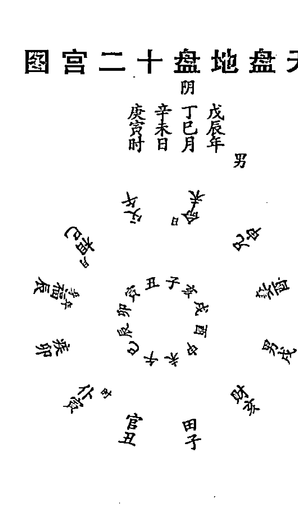

# 定天盘

将本人生月支加生时支逆行布十二支，不论男女阴阳皆逆行，取天左旋之义。假如以己月加于地盘寅时之上，逆布午于地盘之丑。次未在地盘之子。次申在地盘之亥，直至辰在地盘之卯，为天盘之十二宫也。

# 定命宫

用本人生年支加生月支，看生日干支阴男逆女顺阳男顺女逆，数至生时，即命宫。假如以辰年加己月，地盘上看生日是辛未，阴男宜逆，即于地盘巳上起辰逆数，地盘辰上是巳。地盘卯上是午。次寅上是未，丑上是申，直至未上是寅。生时即命宫立地盘未宫也。次从一命宫起顺布，二兄弟、三妻妾、四男女、五财帛、六田宅、七官禄、八婢仆、九疾厄、十福德、十一相貌、十二父母。

# 定身宫

将本人生月支加生日支，如命顺，则身逆；如命逆，则身顺。数至生时支便安身宫。假如以己月加地盘生日未上看，前安命是阴男逆数者，今便从未上起巳顺数，申上午，次酉上未次戌上申，直至辰上寅是生时，便安身宫。

# 定飞禄飞马

飞禄看年干长生宫起，以日干阴男逆女顺、阳男顺女逆，定其顺逆；飞马看时干长生宫起，顺逆与飞禄相反。假如戊辰年，戊禄起午，阴男逆行；庚寅时，庚马起巳，阴男顺行，以后每宫一年飞禄逆行，惟遇官禄，则住三年；飞马顺行，惟遇疾厄，则住三年。

# 定黑符

看时干定皆一宫一年以论流年。假如庚寅时，则黑符在申顺行。

# 定五福

看天数，今一百八十八下天盘申宫。

# 定三基

君基看天数，今一百八十八下天盘辰宫。
臣基地数，今四十四下天盘子宫。
民基看人数，今八下天盘巳宫。

# 定局数①

看地数，今四十四，即用四十四局，查七十二局内第四十四局，所开主算三十三，客算十四。以下各神一一查明，照天盘写于地盘之内。

假如四十四局小游在天盘子宫，四神在天盘寅宫，直至客参将在天盘午宫，然后看天盘各星所临对地盘是何宫，分以断吉凶。

# 定大游真限

看时支，从六合支辰行起。

假如寅时生，则寅与亥合，从亥宫行限起至七岁止，次八岁入寅宫至十八岁止，次十九岁入巳宫至二十二岁止。逐宫一一查明，次看宫限有何星神，以断此限数年之吉凶。

# 大游限起法

以正时所合之支起，限行之下于地盘，各宫多寡先后不等，详列于后。

| 亥 | 戌 | 酉 | 申 | 未 | 午 | 巳 | 辰 | 卯 | 寅 | 丑 | 子 | 生时以下入地元位 | 子四年 | 丑五年 |
| :--- | :--- | :--- | :--- | :--- | :--- | :--- | :--- | :--- | :--- | :--- | :--- | :--- | :--- | :--- |
| 寅一 | 卯三 | 辰二 | 巳四 | 午七 | 未六 | 申五 | 酉六 | 戌五 | 亥七 | 子四 | 丑五 | | 卯六年 | 酉六年 |
| 巳五 | 辰五 | 未八 | 子八 | 亥四 | 申一 | 戌十 | 午三 | 丑十 | 寅八 | 卯七 | 酉一 | | 辰七年 | 午七年 |
| 子十 | 未一 | 申三 | 卯一 | 寅五 | 戌六 | 丑五 | 亥十 | 酉六 | 巳二 | 辰九 | 午八 | | 未七年 | 亥七年 |
| 卯二 | 申六 | 戌八 | 辰三 | 巳九 | 丑一 | 午五 | 寅一 | 子三 | 未五 | 申十 | 亥二 | | 申八年 | 寅十一年 |
| 辰四 | 戌一 | 丑三 | 未三 | 子四 | 酉七 | 寅六 | 巳五 | 寅一 | 辰五 | 戌四 | 寅六 | | 戌九年 | 巳四年 |
| 未十 | 丑六 | 酉九 | 申四 | 卯六 | 午四 | 亥五 | 子九 | 巳四 | 未七 | 酉十 | 卯七 | | 亥十一年 | 申五年 |
| 申五 | 酉三 | 午六 | 戌四 | 辰八 | 亥一 | 寅四 | 卯五 | 未七 | 卯二 | 戌六 | 五五 | | 戌五年 | 亥六年 |
| 戌十 | 午九 | 亥三 | 丑四 | 未四 | 寅二 | 巳十 | 辰四 | 子九 | 午六 | 亥三 | 辰四 | | 戌五年 | 亥六年 |
| 丑五 | 亥六 | 寅六 | 酉六 | 申九 | 卯六 | 五五 | 未十 | 卯四 | 丑二 | 寅十 | 未五 | | 亥六年 | 寅十一年 |
| 酉六 | 寅四 | 巳六 | 午九 | 戌四 | 子六 | 卯五 | 申七 | 辰四 | 酉一 | 卯七 | 申五 | | 子七年 | 卯十二年 |
| 午七 | 巳六 | 子七 | 亥四 | 丑七 | 卯十 | 辰七 | 戌十 | 未八 | 寅一 | 辰八 | 酉六 | | 丑八年 | 辰十三年 |
| 亥八 | 子五 | 卯五 | 寅七 | 酉九 | 辰七 | 未七 | 丑十 | 申八 | 午一 | 巳一 | 戌八 | | 寅九年 | 巳十四年 |
| 五八 | 五八 | 五八 | 五八 | 五八 | 五八 | 五八 | 五八 | 五八 | 五八 | 五八 | 五八 | | 戌十年 | 未十五年 |

① 即定文昌等十二神方位。

周而复始。

### 大运

## 当生卦

推值事之爻，以当生受炁之辰，阳用初升之例，阴用六降之法也。
其法用本人生日生时之干支，并纳音五行之数相并毕，再加天地成数，总得若干，以甲子周六十除之，余不及六十者，从本人生日退一位逆数去至算尽处，得何干支为受炁也。
大抵阳象则从初位而上升；阴象则从六位而下降。总之；凡遇阳爻主事九年，每值阴爻主事六载也。
至于后天变卦，只变一爻，以成卦不更移动耳，行运位次总同首卦例，当生卦明平生分定进退之事，变动卦乃立业之限也。

## 限例太乙

即命宫十五，兄二十①，妻三十一②，男三五半③，财四十④，田四五⑤，官宫六十⑥，奴六四半⑦，疾七一半⑧，福八二半⑨，相九六半⑩，父百○六⑪。

### 大运

下地盘先于生月之宫住五年，然后移宫各住十年，阳男阴女顺，阴男阳女逆。

### 大游限

下地盘正时之合宫，起限行之，即真数行度也。

| 丑五 | 酉六 | 午七 | 亥七 | 寅十一 | 巳四 |
|---|---|---|---|---|---|
| 子四 | 卯十三 | 辰十二 | 未六 | 申五 | 戌五 |

周而复始。

- ① 五年。
- ② 十一年。
- ③ 四年半。
- ④ 五年半。
- ⑤ 五年。
- ⑥ 十五年。
- ⑦ 四年半。
- ⑧ 八年。
- ⑨ 十二年。
- ⑩ 十五年。
- ⑪ 十年半。

# 阳九限

先从化炁之宫住若干年，次则每十年行一宫，男顺女逆行之。单取当生之日干，化炁五行，各从生方而起，值吉则吉，逢凶则凶。如甲己日化土生于午后，午宫起限住五年，至六岁方移至次宫也。乙庚日化金其数四，生于巳宫；丙辛日化水其数一，生于申宫；丁壬日化木其数三，生于亥宫；戊癸日化火其数二，生于寅宫。

# 百六限

单取生日、生时之天干地支及纳音，三项所积生成之数。再加大衍之数，总得若干，六十除之，不尽者，从生日起退一位逆行至算尽处，得何干支、为受炁，以此化炁。五行用水一、火二之长生宫起限，每十年一移，男顺女逆行之。

# 小运

# 流年卦

查平生所得卦数，再加行年所得命数，六十四除之，不尽者为流年值限之卦也。大抵即以当生卦为主，而一岁再加一卦。如主卦乾，而一岁即坤之象也。

# 爻

以四金之终身例求之，次以先天定爻衍之也。

# 真运

下地盘取岁干化合，五行从地盘位上顺行一年一宫。先于化合五行长生宫数上住若干年，然后行去化合五行，即水一、火二之类。看流年冲合，以详灾福。

# 小运

下地盘即小壬之法也。男起丙寅顺行，一年一位。女起壬申逆行，一年一位也。

# 限元

下地盘从天命位起，一年一宫，阳顺女逆。

# 百六小限

依大限例，但男逆女顺，一年一移也。数至本人行年位即为小限所在之宫，便起正月也。如小限顺则月建逆耳，再加飞星之吉凶，以断灾福则奇验也。

# 三合

合化：甲己化土。
长生：水长生在申，土生在午。
先天：水一，火二，木三，金四，土五。起小限用此。
后天：水七，火九，木十一，金十三，土十五。日时干支、纳音用此。

# 天地

成数：即大衍，五十有五。

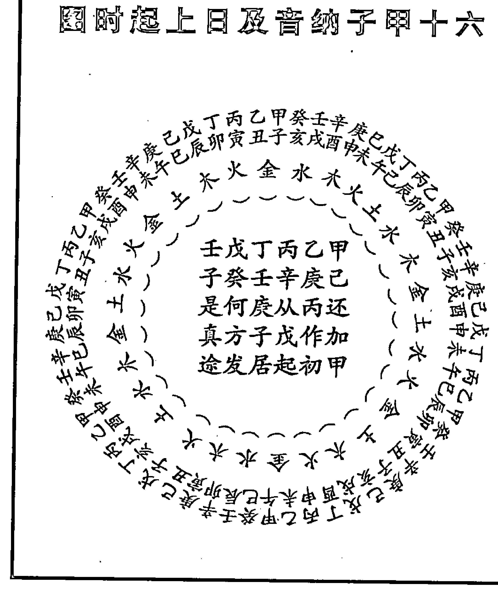

| 阴阳 | 干支 | 所属 | 干支 |
| :--- | :--- | :--- | :--- |
| 子阳 | 甲阳 | 子水 | 甲木 |
| 丑阳 | 乙阴 | 丑土 | 乙 |
| 寅阳 | 丙阳 | 寅木 | 丙火 |
| 卯阳 | 丁阴 | 卯木 | 丁 |
| 辰阳 | 戊阳 | 辰土 | 戊土 |
| 巳阳 | 巳阴 | 巳火 | 巳 |
| 午阴 | 庚阳 | 午火 | 庚金 |
| 未阴 | 辛阴 | 未土 | 辛 |
| 申阴 | 壬阳 | 申金 | 壬水 |
| 酉阴 | 癸阴 | 酉金 | 癸 |
| 戌阴 | | 戌土 | |
| 亥阴 | | 亥水 | |

# 起小限法

自本人生日干支，生时干支，纳音五行之数，再加天地成数，总得若干数，以甲子周六十除之，余不及六十者，从本人生日退一位，逆数去至算尽得何干支，为受炁。受炁天干须看合化五行，从地盘长生宫照先天数起小限。

# 小限例¹

须分男子阳逆阴顺，女人反之。数至本人行年住处，即是小限所在之处。即从小限上起正月，如小限顺则月建逆，小限逆则月建顺。再看飞星之吉凶，以断灾福则奇验也。

大限则阳男顺，阴男逆。

其行宫之法：长生起首之宫，只主先天本数或水一土五，满此限则或二或六之数行至次宫也。是此方每宫看十年耳。

# 起大限小限式

如辛未日庚寅时，辛七、未八，加纳音十五，共三十，庚八、寅七，加纳音十一，共二十六。总之得五十六，加天地生成五十五，共一百一十一，内去甲子一周六十，存五十一。从辛未日退后数五十一日，得壬戌日，为受炁之日。天干壬化水在地盘长生亥宫起三年，从此每宫三年轮去，名为百六大限。

若从亥宫起男逆、女顺一年一宫移去，名百六小限也。

再从小限之宫起正月，男顺女逆，一月一宫布，去看逐月飞星吉凶。

# 安身命宫杂论

> 术数

- 凡阴阳二命顺行者，不拘何年、月、日、时，命垣之位总不离乎，天盘本命所属之宫也。
- 凡阴阳二命所属与生时同属者，不拘何月生人，其命垣二位即是天盘本命所属之宫也。
- 凡阴阳二命顺行者，其十二时所生之人，各宫神将分列坐位皆同，虽依时移宫安命，其实十二宫之神永不移耳。
- 所不同者，唯空亡二宫与夫诸神之落宫衰旺尔，至若日元一宫之神，则确乎其不移也。
- 凡推查正时之刻者，天数地数人数三者并无加减，惟天盘则前后移一位耳。
- 如欲推上刻，将子字照原式在地盘退后一宫。
- 如欲推下刻，将子字照原式在地盘顺进一宫。
- 命宫如顺安者，总不离原生之命支位也。如逆转者，则宫位前后更易之。
- 如原式命宫在天盘之午位者，欲推上刻，则安于天盘之辰位；欲推下刻，则安于天盘之申位是也。
- 身元凡顺行者：如原式在地盘寅宫者，欲推上刻，则在地位之丑上是。欲推下刻，则在地位之卯上是也。
- 凡逆行者：如原式在地盘寅宫者，欲推上刻，则在地位之卯上是。欲推下刻，则在地位之丑上是也。

一九六在地位之丑上是也。

# 十二宫诸星合图

| 主大位身命长生格 | 如福主在亥格 | 地乙全戌宫断 | 福臣共一位宫 | 君臣担格 | 禄寿同夹格 | 身命独旺是高寿格 | 身命独旺是元神难亦是 | 地乙全申断 | 始击酉 | 小游酉 | 主大酉 |
| :--- | :--- | :--- | :--- | :--- | :--- | :--- | :--- | :--- | :--- | :--- | :--- |
| 五福 | 名如正格 | 又福福德宫 | 得三基 |  |  | 往见为前后主人相或风声之听已 |  |  |  |  |  |
| 君基 | 名如全格 | 又三合有君基主拜相 | 用高寿格客名三基 |  |  | 见前主人相或风声之听已 |  |  |  |  |  |
| 天乙 | 丙戊生人断格 | 三合有君基主拜相 | 定是金门格 |  |  |  |  |  |  |  |  |
| 主大 | 全名如福在亥格 |  | 客名三基 |  |  |  |  |  |  |  |  |
| 五福 | 丙戊生人断格 |  |  |  |  |  |  |  |  |  |  |
| 君基 | 名如正格 |  |  |  |  |  |  |  |  |  |  |
| 天乙 | 全名如福在亥格 |  |  |  |  |  |  |  |  |  |  |
| 客大值身命长生 | 古今业也主值人 |  |  |  |  |  |  |  |  |  |  |
| 容大宜身命神仙格 |  |  |  |  |  |  |  |  |  |  |  |
| 始击同身命长生格 | 地乙同戌宫 |  |  |  |  | 文昌 |  |  |  |  |  |
|  |  |  |  |  |  | 君基 |  |  |  |  |  |
|  |  |  |  |  |  | 五福 |  |  |  |  |  |
|  |  |  |  |  |  | 臣基 |  |  |  |  |  |
|  |  |  |  |  |  | 小游 |  |  |  |  |  |
|  |  |  |  |  |  | 小文 |  |  |  |  |  |
|  |  |  |  |  |  | 君基 |  |  |  |  |  |

# 诸星在身命合格断

# 高寿格

福星守福德是也，身命见五福独旺亦是，小游独旺无星杂亦是。

# 正贵格

君基临亥、子上谓之居帝座上，有文昌辅之，主文字立身扬名，若化作禄，主干元官星者，主大贵。

# 君臣庆会格

须在身命即落陷宫亦好，在戌、午、亥、子尤佳。更有别星三五相聚主碌碌，盖杂乱无主也。如在生人禄上，又名上重格，主今古豪杰。

# 君前臣后格

如君在子、臣在亥是也。在身命宫主人相，不然亦主风宪之任。如倒置，则不贵，若三五星杂乱，则名屯蒙格，主不贵。

# 君臣朝会格①

如君在子、臣在午是，倘君午臣子谓之颠倒不贵；君在亥、臣在巳同。

# 福引尊君格

命身有福星，后一位见君是也。

# 福君朝元格

如君基在亥，五福在巳是也。

# 正重格

如五福在亥，君基、臣基得一位在巳是也。

# 福君拱夹格

如身命在亥，君在戌，五福在子是也。如不拱身命而拱财，主多财，贵显夹官禄亦主贵。

# 长生格

如身命在亥，见小游客参，身命在申，见客大主参，余仿此。

# 神仙格

如身命单见客大临旺是也。又云客大在卯，云可步也。

# 历数贵格

如身命在辰、戌，丑、未见地乙是也。更会吉神，主大贵。

# 旺金贵格

如身命在酉，见主大是也。若同文昌必夺魁，三合见亦是。

# 铸印威权格

如身命在酉，始击临之是也。

# 三基得用格

三基居福德，定是金门客。

# 两府格

丙辛生人，身命见客大，文昌临旺是也。

# 金玉格

主大在酉，不问身命，主豪杰为吏。

# 长生格

小游在亥，谓之长生。三合见天乙，主大为吏人，有吉星立身高。

# 金克木格

小游在酉，化天元禄主，谓之金克木，为吏也。一生眉不伸，有亦恐无。

# 君臣担负格

如君在戌，臣在子，身命在亥是也。若身命有五福，更贵三合。有民基亦贵。

# 相傅格

此福臣共一位，又三合君基主拜相。

# 孤立格

此官禄有飞符或有君臣引用，亦主极品之贵。

# 禄马同临格

飞禄、飞马夹命或身宫俱主贵。

# 君臣夹福格

君基、臣基夹五福在身命宫，大贵不可多得。

# 宿秀格

地乙在命，主乞化，若有吉星在申、酉、戌上，却又主为阴阳二宅。

# 图之位得宫二入神六十

| 天君 乙基 科化 名资 主大 科科 名名 | \|\|飞始 符击 入入 庙庙 | \|\|小臣 游基 禄化 库资 | \|\|臣君 基基 化化 资资 | 地主容主计民文五 乙大神大基昌福 科科科科科科科科 名名名名名名名名 \|\|入入 庙庙 科科 名名 |
| :--- | :--- | :--- | :--- | :--- |
| --- | --- | --- | --- | --- |
| 四地容民文臣五 神乙大基昌基福 入入入入禄禄入 侍侍庙庙库庙 入 侍 \|\|\|\|主大 入庙 |  |  |  |  |
| --- | --- | --- | --- | --- |
| 客小 游游 入入 庙庙 | \|\|地始计臣君 乙击神基基 入入入入入 庙侍庙庙庙 |  |  |  |
| --- | --- | --- | --- | --- |
| 飞始小 符击游 科科入 名名侍 | \|\|天主文君五 乙大昌基福 入入入禄禄 庙侍庙库库 | \|\|四主客文民臣君 神小大昌基基基 入入入入入入化 庙庙庙侍侍侍资 | \|\|客小计文臣君 参游神昌基基 科科入入化化 名名庙庙资资 科科 名名 |  |

# 十格

小游宫，同始击曰掩。

小游宫，同文昌，客主大小将曰囚。

小游宫一位或前或后，有始击曰击。

始击在主大小将傍亦是。

小游宫前后一位，有文昌及主大小将曰迫。

小游对宫，有始击，客大小将曰格。

小游对宫，有文昌，主客大小将曰对。

始击同主大小将曰关。

文昌同客大小将曰关。

算同亦然。

客主大小将自同宫。

文昌始击同太乙宫，主客四将又自相关，名四郭固。

三局 十一局 十七局 六十六局

客参同文昌宫，客参同主大宫名四郭杜；

主参同始击宫，主参同客大宫名四郭杜；

算五亦然。

已上计五项。

太乙文昌挟客名曰提挟；

二局小游文昌挟始击；

太乙始击挟主名曰提挟；

三十五局小游始击挟文昌；

三十九局小游始击挟主小；

又有二日与四将挟太乙；

二十九局始击客大挟小游；

主客二目并大小将互相自挟也。

二十四局互相自挟；

文昌主大小将会太乙，挟始击客大小将。

十三、六十、六十三、主小文昌挟始击。

三十二，小游主小挟客小。

六十五，主小文昌挟客小。
四十九，文昌主大挟始击。
始击客大小将会太乙，挟文昌主大小将。
四十六，始击客大挟主大小
文昌始击相对曰争衡。
始击同君曰掩。
余五附驾名囚。
隔一宫辰而附之，始击之击也。
余五附之，名迫同而寻。
格者对也外将之总忌。
对者冲也，内将之通名，六格者，由君位而立也。
关亦同宫也，不列君位缘，相将之互同。合算如之。
四郭固者，谓二相掩囚，又值四将相关也。
四郭杜者，二参互同相位，二参互同大宫也。算五亦然。
至于提挟，乙昌挟客，乙击挟主也。
此正十格之所以立也。
外有始击同主大小者，亦有掩名其实相关也。
附主大小之间者，亦名击焉。
文始相将，争衡而立。
四将同宫，关格而鸣。
挟者挟也，将曰挟太乙也。又有主客二目并大小将互相自挟也。
大抵提挟之名，外三会乙以挟内，内三会乙以挟外也。

# 太乙神各宫位失加凶之图

| 宫阴目二 宫阳目二 | 宫阴目二 | 宫阳目二 | 宫阴目二 宫阳目二 |
| :---: | :---: | :---: | :---: |
| 亥 天道 乾阳 太乙 九天 文昌 大游 太岁 | 丑 阳德 | 子 地主 太乙 阳宫 | 戌 阴主 |
| 辰 太阳 | 巳 | 申 九天 太乙 阳宫 | 酉 太簇 阴宫 绝气 分 |
| 卯 高丛 阳宫 太乙 绝气 分 | 寅 | 丑 阳德 | 子 地主 太乙 阳宫 |
| 宫阳目二 | 宫阴目二 | 宫阳目二 | 宫阴目二 宫阳目二 |

凡太乙文昌，始击在阳宫，得三九奇数，谓之纯阳。
其数自临为重阳。故三十三、三十九为重阳之算也。
得四八偶数，谓之杂阴。
其数自临为阳中重阴。故二十四、二十八与阴偶之数并为杂重阴。故二十二、二十六为杂重阴之算也。

凡太乙文昌始击在阴宫，得二六偶数，谓之纯阴。
其数自临为重阴。故二十二、二十六为重阴之算也。
得一七奇数谓之杂阳。
其数自临为阴中重阳，故十七、十一为重阳，与阳奇之数并为杂重阳。故十三、十九、三十一、二十七为杂重阳之算也。

上和者，乃阴阳自和之数，其相配为和中之和。故十四、十八为上和之算也。
一、四、八皆阴阳自和之数。

中和者，乃阴阳独立之数，其阴阳之数相并而为和。故二十三、二十九、三十二、三十六为次和之算也。

二、六、三、九皆阴阳独立之数。

下和者，乃阴阳独立之数，与阴阳自和之数相配亦为和。故十二、十六、二十一、二十七、三十四，三十八为下和之算也。

上和之算，天地庆会，阴阳交通，士人高第，宦者荣迁，庶人财帛丰盛，田畴广盈。

中和之算，福禄迁崇，灾咎不作。

下和之算，福平安吉，平生幽雅，财禄滋实。

值此三和之算，虽遇九六灾限，则反凶而成吉也。

算得杂重阳之数，为穷蹇驳杂之人，值运穷数极阳九百六灾限之年，则有囚困、刑狱、瘟疫之厄，不然则卒中风、邪暴亡，长幼哭泣，宜修德禳之。

算得杂重阴之数，为飘流驳杂之人，值运穷数极阳九百六灾限之年，则有流离失所，非横阴暗，不明之祸凶则致命。

算得阴中重阳之数，为阴乱其阳，乃波浪驳杂之人，多经验阻，更带囚迫，乃风狂之徒，有刑狱之厄阴人。逢之产厄、血崩，若值运穷，数极阳九百六灾限之年，凶不可逃也。

算得纯阳之数，为人太过，刚暴，乃阳之过也。值运穷数极阳九百六灾限之年，则有横暴之厄、金银失散，轻则悲哀，重则绝灭。

算得纯阴之数，为人不及柔狠，乃阴之过也。值运穷数极阳九百六灾限之年，则有刑囚徒配夭伤之祸，女人得之，为不正乱礼而遭害也。算得三才无算，更逢掩击囚迫格，再兼星煞相克，主为人有妨，六亲破业败家，多为不正之事也。

无天数者，少而伤父、破产、失业、金帛丧废，小不习礼，大不守正之人也。

算中无十为无天，自单一至九算是也。

无地数者，少而伤母、破废田宅，而损妻也。

凡算中无五，为无地，单一、单四十一、十四、二十一至二十四、三十一至三十四皆是也。

无天数者，有家不立，有官不守失人之所在，官致有刑责，金玉荡散，在士庶言而无信，行多虚诈，衣禄常不及也。

无一为无人，自十算二十、三十、四十是也。

三才俱无算者，得一算而带囚是也。灾祸尤甚。

此算得三才中有关缺三字二位算者，命宫虽有高强之位，又有福星临之，亦不免于刑狱之灾，或常患痈毒疮癣及瘟疫之疾。

以理通变为要。

# 七百二十总算成例

| 一二三四五六七八九十三一二三四五六七八九十四 | 三百一二三四五六七八九十三一二三四五六七八九十三 | 一二三四五六七八九十二一二三四五六七八九十二 | 一二三四五六七八九十一二三四五六七八九十一 | 一二三四五六七八九十九一二三四五六七八九九百 | 一二三四五六七八九十八一二三四五六七八九九十八 | 一二三四五六七八九十七一二三四五六七八九九十七 | 一二三四五六七八九十六一二三四五六七八九九十六 | 一二三四五六七八九十五一二三四五六七八九九十五 | 一二三四五六七八九十四一二三四五六七八九九十四 | 一二三四五六七八九十三一二三四五六七八九九十三 | 二百一二三四五六七八九十一二三四五六七八九九十二 | 一二三四五六七八九十九一二三四五六七八九九十九 | 一二三四五六七八九十八一二三四五六七八九九十八 | 一二三四五六七八九十七一二三四五六七八九九十七 | 一二三四五六七八九十六一二三四五六七八九九十六 | 一二三四五六七八九十五一二三四五六七八九九十五 | 一二三四五六七八九十四一二三四五六七八九九十四 | 一二三四五六七八九十三一二三四五六七八九九十三 | 一二三四五六七八九十二一二三四五六七八九九十二 | 一二三四五六七八九十一二三四五六七八九九十一 | 一百一二三四五六七八九十一二三四五六七八九九十二 | 一二三四五六七八九十九一二三四五六七八九九十九 | 一二三四五六七八九十八一二三四五六七八九九十八 | 一二三四五六七八九十七一二三四五六七八九九十七 | 一二三四五六七八九十六一二三四五六七八九九十六 | 一二三四五六七八九十五一二三四五六七八九九十五 | 一二三四五六七八九十四一二三四五六七八九九十四 | 一二三四五六七八九十三一二三四五六七八九九十三 | 一二三四五六七八九十二一二三四五六七八九九十二 | 一二三四五六七八九十一二三四五六七八九九十一 | 一二三四五六七八九十九一二三四五六七八九九十九 | 一二三四五六七八九十八一二三四五六七八九九十八 | 一二三四五六七八九十七一二三四五六七八九九十七 | 一二三四五六七八九十六一二三四五六七八九九十六 | 一二三四五六七八九十五一二三四五六七八九九十五 | 一二三四五六七八九十四一二三四五六七八九九十四 | 一二三四五六七八九十三一二三四五六七八九九十三 | 一二三四五六七八九十二一二三四五六七八九十二 | 一二三四五六七八九十一二三四五六七八九九十一 | 一二三四五六七八九十九一二三四五六七八九九十九 | 一二三四五六七八九十八一二三四五六七八九九十八 | 一二三四五六七八九十七一二三四五六七八九九十七 | 一二三四五六七八九十六一二三四五六七八九九十六 | 一二三四五六七八九十五一二三四五六七八九九十五 | 一二三四五六七八九十四一二三四五六七八九九十四 | 一二三四五六七八九十三一二三四五六七八九九十三 | 一二三四五六七八九十二一二三四五六七八九十二 | 一二三四五六七八九十一二三四五六七八九十一 |
| :--- | :--- | :--- | :--- | :--- | :--- | :--- | :--- | :--- | :--- | :--- | :--- | :--- | :--- | :--- | :--- | :--- | :--- | :--- | :--- | :--- | :--- | :--- | :--- | :--- | :--- | :--- | :--- | :--- | :--- | :--- | :--- | :--- | :--- | :--- | :--- | :--- | :--- | :--- | :--- | :--- | :--- | :--- | :--- | :--- |

术

数

| 七百一二三四五六七八九十二一二三四五六七八九十一 | 一二三四五六七八九十九一二三四五六七八九九十九 | 一二三四五六七八九十八一二三四五六七八九九十八 | 一二三四五六七八九十七一二三四五六七八九九十七 | 一二三四五六七八九十六一二三四五六七八九九十六 | 一二三四五六七八九十五一二三四五六七八九九十五 | 一二三四五六七八九十四一二三四五六七八九九十四 | 一二三四五六七八九十三一二三四五六七八九九十三 | 一二三四五六七八九十二一二三四五六七八九十二 | 六百一二三四五六七八九十一二三四五六七八九九十二 | 一二三四五六七八九十九一二三四五六七八九九十九 | 一二三四五六七八九十八一二三四五六七八九九十八 | 一二三四五六七八九十七一二三四五六七八九九十七 | 一二三四五六七八九十六一二三四五六七八九九十六 | 一二三四五六七八九十五一二三四五六七八九九十五 | 一二三四五六七八九十四一二三四五六七八九九十四 | 一二三四五六七八九十三一二三四五六七八九九十三 | 一二三四五六七八九十二一二三四五六七八九十二 | 一二三四五六七八九十一二三四五六七八九十一 | 五百一二三四五六七八九十一二三四五六七八九九十二 | 一二三四五六七八九十九一二三四五六七八九九十九 | 一二三四五六七八九十八一二三四五六七八九九十八 | 一二三四五六七八九十七一二三四五六七八九九十七 | 一二三四五六七八九十六一二三四五六七八九九十六 | 一二三四五六七八九十五一二三四五六七八九九十五 | 一二三四五六七八九十四一二三四五六七八九九十四 | 一二三四五六七八九十三一二三四五六七八九九十三 | 一二三四五六七八九十二一二三四五六七八九十二 | 一二三四五六七八九十一二三四五六七八九十一 | 四百一二三四五六七八九十一二三四五六七八九九十二 | 一二三四五六七八九十九一二三四五六七八九九十九 | 一二三四五六七八九十八一二三四五六七八九九十八 | 一二三四五六七八九十七一二三四五六七八九九十七 | 一二三四五六七八九十六一二三四五六七八九九十六 | 一二三四五六七八九十五一二三四五六七八九九十五 | 一二三四五六七八九十四一二三四五六七八九九十四 | 一二三四五六七八九十三一二三四五六七八九九十三 | 一二三四五六七八九十二一二三四五六七八九十二 | 一二三四五六七八九十一二三四五六七八九十一 | 一二三四五六七八九十九一二三四五六七八九九十九 | 一二三四五六七八九十八一二三四五六七八九九十八 | 一二三四五六七八九十七一二三四五六七八九九十七 | 一二三四五六七八九十六一二三四五六七八九九十六 | 一二三四五六七八九十五一二三四五六七八九九十五 | 一二三四五六七八九十四一二三四五六七八九九十四 | 一二三四五六七八九十三一二三四五六七八九九十三 | 一二三四五六七八九十二一二三四五六七八九十二 | 一二三四五六七八九十一二三四五六七八九十一 |
| :--- | :--- | :--- | :--- | :--- | :--- | :--- | :--- | :--- | :--- | :--- | :--- | :--- | :--- | :--- | :--- | :--- | :--- | :--- | :--- | :--- | :--- | :--- | :--- | :--- | :--- | :--- | :--- | :--- | :--- | :--- | :--- | :--- | :--- | :--- | :--- | :--- | :--- | :--- | :--- | :--- | :--- | :--- | :--- | :--- |

# 太乙人道论命要诀

太乙看数，先观命宫为主。

察其何星守命，旺陷何如。

次看对照及三方之神。

如命宫对照三方皆吉，乃以上格论之。

如命宫星陷，对照三方得吉，亦以好格论。

如命宫星吉，对照三方皆凶，当作常命论。

如命宫星陷，对照三方皆凶，乃下等论也。

再看身元，身元要在强宫，遇吉则吉，遇凶则凶，逢凶星，更落陷，则更凶。

若身元旺吉，而命宫衰，是为命否身泰，亦许安闲。至于命好而身衰，即如下贱之人财多身弱也，以身为重，命次之。

更看时元，言时元，乃晚年之象，子孙之爻，若遇星吉，主晚年发福，及子孙好。如时元星凶，主晚年收成不足。

大凡看数，若身、命、时宫皆是凶星，却在庙旺之地，依旧发福，更有吉星扶助，则变凶成吉。

于星先看五福，看数之法，祖数要下得的实，先看五福，次君基，次臣基，次民基。

一云以臣基为主，又云男命看五福，女命看臣基。大抵好星要在强宫，如星虽好，落在衰宫，终碌碌也。

论贵人于化曜，先看天元禄主，天元禄或临身命及对宫，与三方旺而入庙入侍或同吉星旺，命、身、生时星皆旺，则贵无疑矣。即无科甲星，而有吉星合照者，亦可许贵。如同凶混，不以贵论。

次看正官星、天元官星、偏禄主地元，福干元星。

若聚在身、命、生时或散在身、命、生时多是二、三品之贵，更乘旺可至一品，或聚在福德、官禄二宫亦贵。

如入命之星不旺，只化星及禄主在官禄、福德之宫，与夫身元、日时之位者亦作文秀命论。若但文星、贵星见于凶星，成吏命也。

论富命必看命宫之星旺相，或民基禄主福星人身、命、生时及田财福之宫，不贵即富。

巨富格：身、命见计神在四季宫，无杀混而财帛有吉神。

论贫命看命、身星陷及无气，又财帛逢凶，此贫命也。

身、命、日时旺陷相杂，非贵、非富、非贫、非贱，乃寻常命也。

身命逢掩击关囚无倚，此贱命也。

天元、地元、干元、官星、身、命、生时俱无一位，身、命又落在陷宫，则为下贱，为僧、道，乃无情之格也。

若是命空亡，身在衰乡，而有天元禄主者，必在空门立身，食僧道禄也。

# 身宫断

身宫要在福德乡，更会禄马最高强。

命坐禄马虽身陷，亦不可作平常断之。身坐禄马有吉星入格，多主一、二品之贵。

命、身坐禄马无吉星，有飞符却在官禄乡，多风宪之职。

妻妾之宫为人赘，相逢疾厄定为殃。

身居疾厄有四神，主为医，亦不免有暗疾缠扰。

如值空亡必孤寡，九流僧道细推详，更来奴仆宫中立，男非贵显女非良。

天元、地元、干元、官星、身、命、生时俱无一位，身、命又落陷宫，僧道之格。

命空亡，身在衰乡，而有天元、禄主，必在空门，食僧道禄。

身宫无四神，有别星化鬼，又落空亡，又地乙坐命，此乞丐格。

如飞始临身命，又福德官在空亡，多奴仆格。

飞始在身命，流年岁星对照，难免血光之灾。如贵人命有此二星，太岁冲之，更值真数，主有杀戮之厄。

还须看命元、日元、时元及禄马所临或衰、或旺，孰吉孰凶，消息断之，不可执一而论。

身在财帛宫，有五福或化、或不化，皆主财帛丰盈。如见飞符，则多聚多散。

- 术
- 数## 时日冲犯及衰败逢凶断

时日相冲人切忌，时日冲年寿不长。
五行衰处逢凶煞，必定其年到死乡。

| 亥 | 申 | 巳 | 寅 | 亥 | 申 | 巳 | 寅 | 亥 | 申 | 巳 | 寅 | 亥 |
|---|---|---|---|---|---|---|---|---|---|---|---|---|
| 止 | 七 | 六 | 六 | 九 | 五 | 二 | 五 | 五 | 四 | 止 | 四 | 一 |
| 三 | 止 | 三 | 七 | 二 | 百 | 止 | 百 | 七 | 十 |  |  |  |
| 百 | 止 | 百 | 止 | 百 | 止 | 百 | 止 | 百 | 止 | 百 | 止 | 百 |
| 止 | 百 | 止 | 百 | 九 | 三 | 十 | 九 |  |  |  |  |  |
| O | 四 | 八 | 三 | 七 | 十 | 六 | O | 四 | 十 | 十 | 六 | 止 |
| 三 | 十 | 十 | 十 | 十 | 八 | 十 | 四 | 十 | 止 | 三 | 止 | 此 |
| 子 | 酉 | 午 | 卯 | 子 | 酉 | 午 | 卯 | 子 | 酉 | 午 | 卯 | 子 |
| 二 | 七 | 五 | 六 | 止 | 六 | 一 | 五 | 四 | 四 | 七 | 四 | 止 |
| 三 | 三 | 三 | 六 | 二 | 止 | 二 | 止 | 百 | 九 | 三 | 二 |  |
| 止 | 百 | 止 | 百 | 百 | 止 | 百 | 止 | 百 | 止 | 百 | 止 | 百 |
| 止 | 百 | 止 | 百 | 百 | 五 | 十 | 十 | 十 |  |  |  |  |
| 二 | 六 | O | 五 | 九 | 三 | 八 | 二 | 六 | O | 十 | 五 | 八 |
| 岁 | 十 | 十 | 八 | 十 | 十 | 十 | 十 | 十 | 十 | 九 | 二 | 止 |
| 戌 | 未 | 辰 | 丑 | 戌 | 未 | 辰 | 丑 | 戌 | 未 | 辰 | 丑 |  |
| 四 | 六 | 七 | 六 | 止 | 五 | 止 | 五 | 六 | 四 | 九 | 三 | 二 |
| 三 | 五 | 二 | 八 | 二 | 止 | 百 | 百 | 五 |  |  |  |  |
| 止 | 百 | 止 | 百 | 百 | 百 | 止 | 百 | 止 | 百 | 止 | 百 | 止 |
| 百 | 止 | 百 | 七 | 十 | 十 |  |  |  |  |  |  |  |
| 八 | 二 | 七 | 十 | 五 | 九 | 四 | 八 | 二 | 十 | 四 | 七 |  |
| 十 | 十 | 十 | 三 | 十 | 十 | 十 | 十 | 十 | 一 | 止 | 止 |  |

## 五福天数例

十九算行一宫，看天数下天盘，从亥起顺行。

## 君基天数例

三十算行天一度，看天数下天盘，从戌上起顺。

| 未 | 辰 | 丑 | 戌 | 未 | 辰 | 丑 | 戌 |
| --- | --- | --- | --- | --- | --- | --- | --- |
| 止六 | 止五 | 止四 | 止三 | 三止二 | 百 | 三 |  |
| 百 | 百 | 百 | 百 | 百 | 百 | 二 | 十 |
| 六 | 七 | 八 | 九 | 止 | 一 | 十 | 止 |
|  |  |  |  |  |  |  | 此 |
| 申 | 巳 | 寅 | 亥 | 申 | 巳 | 寅 | 亥 |
| 止六 | 六止 | 五止 | 四止 | 三止 | 二 | 百 | 六 |
| 百 | 百 | 百 | 百 | 百 | 百 | 五 | 十 |
| 九 | 止 | 一 | 二 | 三 | 四 | 十 | 止 |
| 十 |  | 十 | 十 | 十 | 十 | 止 |  |
| 酉 | 午 | 卯 | 子 | 酉 | 午 | 卯 | 子 |
| 止七 | 止六 | 止五 | 止四 | 止三 | 二 | 百 | 九 |
| 百 | 百 | 百 | 百 | 百 | 百 | 八 | 十 |
| 二 | 三 | 四 | 五 | 六 | 七 | 十 | 止 |
| 十 | 十 | 十 | 十 | 十 | 十 | 止 |  |

## 臣基天数例

三算行一宫，看地数下天盘，从戌上起顺。

| 未 | 辰 | 丑 | 戌 | 未 | 辰 | 丑 | 戌 |
| --- | --- | --- | --- | --- | --- | --- | --- |
| 六 | 五 | 四 | 三 | 三 | 二 | 十 | 三 |
| 十 | 十 | 十 | 十 | 十 | 十 | 二 |  |
| 六 | 七 | 八 | 九 |  | 一 |  |  |
| 申 | 巳 | 寅 | 亥 | 申 | 巳 | 寅 | 亥 |
| 六 | 六 | 五 | 四 | 三 | 二 | 十 | 六 |
| 十 | 十 | 十 | 十 | 十 | 十 | 五 |  |
| 九 |  | 一 | 二 | 三 | 四 |  |  |
| 酉 | 午 | 卯 | 子 | 酉 | 午 | 卯 | 子 |
| 七 | 六 | 五 | 四 | 三 | 二 | 十 | 九 |
| 十 | 十 | 十 | 十 | 十 | 十 | 八 |  |
| 二 | 三 | 四 | 五 | 六 | 七 |  |  |

## 民基人数例

一算行一宫，看人数下天盘，从戌上起顺。

| 未 | 辰 | 丑 | 戌 |
|----|----|----|----|
| 十 | 七 | 四 | 一 |
| 申 | 巳 | 寅 | 亥 |
| 十 | 八 | 五 | 二 |
| 酉 | 午 | 卯 | 子 |
| 十 | 九 | 六 | 三 |

## 七十二局十二神方位表

算主 算客 游四天地飞昌 大小计击 客客皆下天盘

| 一子七 | 二丑六 | 三寅五 | 四卯四 | 五辰三 | 六巳二 | 七午一 | 八未九 | 九申八 | 十酉七 | 十一戌六 | 十二亥五 |
|--------|--------|--------|--------|--------|--------|--------|--------|--------|--------|----------|----------|
| 天无 三十 地无 亥亥酉巳辰申申寅寅巳 文主大化禄星 四主小化权星 | 天无 三十 地无 亥亥酉巳辰申申寅寅巳 文主大化禄星 四主小化权星 | 天无 三十 地无 亥亥酉巳辰申申寅寅巳 文主大化禄星 四主小化权星 | 天无 三十 地无 亥亥酉巳辰申申寅寅巳 文主大化禄星 四主小化权星 | 天无 三十 地无 亥亥酉巳辰申申寅寅巳 文主大化禄星 四主小化权星 | 天无 三十 地无 亥亥酉巳辰申申寅寅巳 文主大化禄星 四主小化权星 | 天无 三十 地无 亥亥酉巳辰申申寅寅巳 文主大化禄星 四主小化权星 | 天无 三十 地无 亥亥酉巳辰申申寅寅巳 文主大化禄星 四主小化权星 | 天无 三十 地无 亥亥酉巳辰申申寅寅巳 文主大化禄星 四主小化权星 | 天无 三十 地无 亥亥酉巳辰申申寅寅巳 文主大化禄星 四主小化权星 | 天无 三十 地无 亥亥酉巳辰申申寅寅巳 文主大化禄星 四主小化权星 | 天无 三十 地无 亥亥酉巳辰申申寅寅巳 文主大化禄星 四主小化权星 |

## 术数

| 六三亥 | 五三戌 | 四三酉 | 三三申 | 二三未 | 一三午 | 十三巳 | 九二辰 | 八二卯 | 七二寅 | 六二丑 | 五二子 | 四二亥 | 三二戌 | 二二酉 | 一二申 | 十二未 | 九十八午 |
| --- | --- | --- | --- | --- | --- | --- | --- | --- | --- | --- | --- | --- | --- | --- | --- | --- | --- |
| 五十二 杜 七十二 具才三 卯丑辰子卯申戌辰 午申亥 | 五十二 杜 八十二 具才三 卯丑辰子卯申戌辰 子卯 | 六十二 具才三 四 地无 卯丑辰子卯申戌辰 未酉子已卯 | 四十二 地无 三 地天无 寅未卯申寅午卯午酉 | 五十二 杜 八 天无 寅未卯申寅巳戌辰 | 三十三 地无 十 人无 寅未卯申寅巳 | 十三 地无 二十三 地无 午戌寅酉午辰亥寅酉申 | 三十 地无 九十三 具才三 午戌寅酉午卯寅巳戌未 | 四十 地无 九 天无 午戌寅酉午寅卯午酉申 | 一十三 地无 八十二 具才三 亥已午辰亥寅酉寅子 | 二十三 地无 一十三 地无 亥已午辰亥丑酉丑寅 | 九十三 具才三 十四 人无 亥已午辰亥子申寅卯 | 六十 具才三 七十 具才三 巳子亥卯丑亥酉辰子申 | 六十 具才三 三十二 地无 巳子亥卯丑亥酉辰子申 | 六十 具才三 十三 人无 巳子亥卯丑亥酉辰子申 | 二 地天无 七十 具才三 子申丑寅未戌午酉午已申 | 七 天无 六十二 具才三 子申丑寅未酉申亥辰酉 | 八 天无 二十三 地无 子申丑寅未申子卯寅午酉 |
| ... | ... | ... | ... | ... | ... | ... | ... | ... | ... | ... | ... | ... | ... | ... | ... | ... | ... |

| 三一子 | 八三丑 | 九三寅 | 十四卯 | 一四辰 | 二四已 | 三四午 | 四四未 | 五四申 | 六四酉 | 七四戌 | 八四亥 | 九四子 | 十五丑 | 一五寅 | 二五卯 | 三五辰 | 四五已 |
| --- | --- | --- | --- | --- | --- | --- | --- | --- | --- | --- | --- | --- | --- | --- | --- | --- | --- |
| 一 天无 七 地天无 酉亥酉巳辰戌丑未子亥卯午 | 六 天无 五十三 杜 酉亥酉巳辰戌丑未子亥卯午 | 五十三 杜 四十三 地无 酉亥酉巳辰戌丑未子亥卯午 | 九十二 具才三 九十 地无 申午申戌酉亥申亥丑酉申亥 | 七十二 具才三 六十 地无 申午申戌酉亥申亥丑酉申亥 | 七十二 具才三 二十 地无 申午申戌酉亥申亥丑酉申亥 | 八 天无 七十 具才三 子寅子未申子丑寅已未申卯午 | 八 天无 四十 地无 子寅子未申子丑寅已未申卯午 | 二十三 地无 七 天无 子寅子未申子丑寅已未申卯午 | 五十四 杜 六十 具才三 巳卯巳丑子寅辰午酉子酉 | 四 天无 八 地天无 巳卯巳丑子寅辰午酉子酉 | 一 地天无 五 杜 巳卯巳丑子寅辰午酉子酉 | 四十二 具才三 五十二 杜 亥辰戌亥已巳酉子丑午未 | 六十 杜 三十 地无 亥辰戌亥已巳酉子丑午未 | 五十三 地无 一十三 地无 亥辰戌亥已巳酉子丑午未 | 九十三 具才三 一十三 地无 午酉未午戌申子卯酉戌亥辰 | 八十三 具才三 五十二 杜 午酉未午戌申子卯酉戌亥辰 | 八十二 具才三 四十二 地无 午酉未午戌申子卯酉戌亥辰 |

## 流年飞星

飞星十六神看天整位，仍天盘。假令一岁流年五福在子，至六岁仍在子宫，交七岁始入丑宫。余仿此。

五福 阳土 君基 阳土 一星辰戌丑未九 年支顺行
子 丑六岁 五寅 一卯 二辰 三巳 四午 五未 六申 七酉 八戌 九亥
丑 五九岁 寅 六卯 七辰 八巳 九午 十未 一申 二酉 三戌 四亥 五子
寅 六九岁 卯 七辰 八巳 九午 十未 一申 二酉 三戌 四亥 五子 六丑
卯 五九岁 辰 八巳 九午 十未 一申 二酉 三戌 四亥 五子 六丑 七寅
辰 六九岁 巳 九午 十未 一申 二酉 三戌 四亥 五子 六丑 七寅 八卯
巳 六九岁 午 十未 一申 二酉 三戌 四亥 五子 六丑 七寅 八卯 九辰
午 五九岁 未 一申 二酉 三戌 四亥 五子 六丑 七寅 八卯 九辰 十巳
未 六九岁 申 二酉 三戌 四亥 五子 六丑 七寅 八卯 九辰 十巳 一午
申 五九岁 酉 三戌 四亥 五子 六丑 七寅 八卯 九辰 十巳 一午 二未
酉 五九岁 戌 四亥 五子 六丑 七寅 八卯 九辰 十巳 一午 二未 三申
戌 五九岁 亥 五子 六丑 七寅 八卯 九辰 十巳 一午 二未 三申 四酉
亥 六九岁 子 六丑 七寅 八卯 九辰 十巳 一午 二未 三申 四酉 五戌

## 始击 阳火 飞符 阴火 二星寅午戌巳九年余六年

| 子 | 丑 | 寅 | 卯 | 辰 | 巳 | 午 | 未 | 申 | 酉 | 戌 | 亥 |
| --- | --- | --- | --- | --- | --- | --- | --- | --- | --- | --- | --- |
| 子 六 丑 寅 卯 辰 巳 午 未 申 酉 戌 亥 子 | 丑 六 寅 卯 辰 巳 午 未 申 酉 戌 亥 子 丑 | 寅 九 卯 辰 巳 午 未 申 酉 戌 亥 子 丑 寅 | 卯 六 辰 巳 午 未 申 酉 戌 亥 子 丑 寅 卯 | 辰 六 巳 午 未 申 酉 戌 亥 子 丑 寅 卯 辰 | 巳 九 午 未 申 酉 戌 亥 子 丑 寅 卯 辰 巳 | 午 九 未 申 酉 戌 亥 子 丑 寅 卯 辰 巳 午 | 未 六 申 酉 戌 亥 子 丑 寅 卯 辰 巳 午 未 | 申 六 酉 戌 亥 子 丑 寅 卯 辰 巳 午 未 申 | 酉 六 戌 亥 子 丑 寅 卯 辰 巳 午 未 申 酉 | 戌 六 亥 子 丑 寅 卯 辰 巳 午 未 申 酉 戌 | 亥 六 子 丑 寅 卯 辰 巳 午 未 申 酉 戌 亥 |

## 文昌 阳土 臣基 阳土 民基 阴土 三星辰戌丑未六年余三年

| 子 | 丑 | 寅 | 卯 | 辰 | 巳 | 午 | 未 | 申 | 酉 | 戌 | 亥 |
| --- | --- | --- | --- | --- | --- | --- | --- | --- | --- | --- | --- |
| 子 五 丑 寅 卯 辰 巳 午 未 申 酉 戌 亥 子 | 丑 五 寅 卯 辰 巳 午 未 申 酉 戌 亥 子 丑 | 寅 五 卯 辰 巳 午 未 申 酉 戌 亥 子 丑 寅 | 卯 五 辰 巳 午 未 申 酉 戌 亥 子 丑 寅 卯 | 辰 五 巳 午 未 申 酉 戌 亥 子 丑 寅 卯 辰 | 巳 五 午 未 申 酉 戌 亥 子 丑 寅 卯 辰 巳 | 午 五 未 申 酉 戌 亥 子 丑 寅 卯 辰 巳 午 | 未 五 申 酉 戌 亥 子 丑 寅 卯 辰 巳 午 未 | 申 五 酉 戌 亥 子 丑 寅 卯 辰 巳 午 未 申 | 酉 五 戌 亥 子 丑 寅 卯 辰 巳 午 未 申 酉 | 戌 五 亥 子 丑 寅 卯 辰 巳 午 未 申 酉 戌 | 亥 五 子 丑 寅 卯 辰 巳 午 未 申 酉 戌 亥 |

术数

## 小游 阳木 亥卯未寅六年余三年

子 五三 丑五九 寅六十二 卯六十五 辰六十八 巳七十一 午七十四 未七十七 申八十 酉八十三 戌八十六 亥八十九
丑 五三 寅五九 卯六十二 辰六十五 巳六十八 午七十一 未七十四 申七十七 酉八十 戌八十三 亥八十六 子八十九
寅 五三 卯五九 辰六十二 巳六十五 午六十八 未七十一 申七十四 酉七十七 戌八十 亥八十三 子八十六 丑八十九
卯 五三 辰五九 巳六十二 午六十五 未六十八 申七十一 酉七十四 戌七十七 亥八十 子八十三 丑八十六 寅八十九
辰 五三 巳五九 午六十二 未六十五 申六十八 酉七十一 戌七十四 亥七十七 子八十 丑八十三 寅八十六 卯八十九
巳 五三 午五九 未六十二 申六十五 酉六十八 戌七十一 亥七十四 子七十七 丑八十 寅八十三 卯八十六 辰八十九
午 五三 未五九 申六十二 酉六十五 戌六十八 亥七十一 子七十四 丑七十七 寅八十 卯八十三 辰八十六 巳八十九
未 五三 申五九 酉六十二 戌六十五 亥六十八 子七十一 丑七十四 寅七十七 卯八十 辰八十三 巳八十六 午八十九
申 五三 酉五九 戌六十二 亥六十五 子六十八 丑七十一 寅七十四 卯七十七 辰八十 巳八十三 午八十六 未八十九
酉 五三 戌五九 亥六十二 子六十五 丑六十八 寅七十一 卯七十四 辰七十七 巳八十 午八十三 未八十六 申八十九
戌 五三 亥五九 子六十二 丑六十五 寅六十八 卯七十一 辰七十四 巳七十七 午八十 未八十三 申八十六 酉八十九
亥 五三 子五九 丑六十二 寅六十五 卯六十八 辰七十一 巳七十四 午七十七 未八十 申八十三 酉八十六 戌八十九

## 客大 阳水 申子辰亥六年余三年

子 五六 丑五九 寅六十二 卯六十五 辰六十八 巳七十一 午七十四 未七十七 申八十 酉八十三 戌八十六 亥八十九
丑 五六 寅五九 卯六十二 辰六十五 巳六十八 午七十一 未七十四 申七十七 酉八十 戌八十三 亥八十六 子八十九
寅 五六 卯五九 辰六十二 巳六十五 午六十八 未七十一 申七十四 酉七十七 戌八十 亥八十三 子八十六 丑八十九
卯 五六 辰五九 巳六十二 午六十五 未六十八 申七十一 酉七十四 戌七十七 亥八十 子八十三 丑八十六 寅八十九
辰 五六 巳五九 午六十二 未六十五 申六十八 酉七十一 戌七十四 亥七十七 子八十 丑八十三 寅八十六 卯八十九
巳 五六 午五九 未六十二 申六十五 酉六十八 戌七十一 亥七十四 子七十七 丑八十 寅八十三 卯八十六 辰八十九
午 五六 未五九 申六十二 酉六十五 戌六十八 亥七十一 子七十四 丑七十七 寅八十 卯八十三 辰八十六 巳八十九
未 五六 申五九 酉六十二 戌六十五 亥六十八 子七十一 丑七十四 寅七十七 卯八十 辰八十三 巳八十六 午八十九
申 五六 酉五九 戌六十二 亥六十五 子六十八 丑七十一 寅七十四 卯七十七 辰八十 巳八十三 午八十六 未八十九
酉 五六 戌五九 亥六十二 子六十五 丑六十八 寅七十一 卯七十四 辰七十七 巳八十 午八十三 未八十六 申八十九
戌 五六 亥五九 子六十二 丑六十五 寅六十八 卯七十一 辰七十四 巳七十七 午八十 未八十三 申八十六 酉八十九
亥 五六 子五九 丑六十二 寅六十五 卯六十八 辰七十一 巳七十四 午七十七 未八十 申八十三 酉八十六 戌八十九## 术数

| 子 | 丑 | 寅 | 卯 | 辰 | 巳 | 午 | 未 | 申 | 酉 | 戌 | 亥 |
| --- | --- | --- | --- | --- | --- | --- | --- | --- | --- | --- | --- |
| 三 一 丑 五 九 寅 五 七 卯 五 三 辰 五 一 巳 五 九 午 五 七 未 五 三 申 五 一 酉 五 九 戌 五 七 亥 五 三 | 五 九 寅 五 七 卯 五 三 辰 五 一 巳 五 九 午 五 七 未 五 三 申 五 一 酉 五 九 戌 五 七 亥 五 三 三 一 丑 | 五 七 卯 五 三 辰 五 一 巳 五 九 午 五 七 未 五 三 申 五 一 酉 五 九 戌 五 七 亥 五 三 三 一 丑 五 九 寅 | 五 三 辰 五 一 巳 五 九 午 五 七 未 五 三 申 五 一 酉 五 九 戌 五 七 亥 五 三 三 一 丑 五 九 寅 五 七 卯 | 五 一 巳 五 九 午 五 七 未 五 三 申 五 一 酉 五 九 戌 五 七 亥 五 三 三 一 丑 五 九 寅 五 七 卯 五 三 辰 | 五 九 午 五 七 未 五 三 申 五 一 酉 五 九 戌 五 七 亥 五 三 三 一 丑 五 九 寅 五 七 卯 五 三 辰 五 一 巳 | 五 七 未 五 三 申 五 一 酉 五 九 戌 五 七 亥 五 三 三 一 丑 五 九 寅 五 七 卯 五 三 辰 五 一 巳 五 九 午 | 五 三 申 五 一 酉 五 九 戌 五 七 亥 五 三 三 一 丑 五 九 寅 五 七 卯 五 三 辰 五 一 巳 五 九 午 五 七 未 | 五 一 酉 五 九 戌 五 七 亥 五 三 三 一 丑 五 九 寅 五 七 卯 五 三 辰 五 一 巳 五 九 午 五 七 未 五 三 申 | 五 九 戌 五 七 亥 五 三 三 一 丑 五 九 寅 五 七 卯 五 三 辰 五 一 巳 五 九 午 五 七 未 五 三 申 五 一 酉 | 五 七 亥 五 三 三 一 丑 五 九 寅 五 七 卯 五 三 辰 五 一 巳 五 九 午 五 七 未 五 三 申 五 一 酉 五 九 戌 | 五 三 三 一 丑 五 九 寅 五 七 卯 五 三 辰 五 一 巳 五 九 午 五 七 未 五 三 申 五 一 酉 五 九 戌 五 七 亥 |

| 子 | 丑 | 寅 | 卯 | 辰 | 巳 | 午 | 未 | 申 | 酉 | 戌 | 亥 |
| --- | --- | --- | --- | --- | --- | --- | --- | --- | --- | --- | --- |
| 三 三 丑 五 三 寅 五 三 卯 五 三 辰 五 三 巳 五 三 午 五 三 未 五 三 申 五 三 酉 五 三 戌 五 三 亥 五 三 | 五 三 寅 五 三 卯 五 三 辰 五 三 巳 五 三 午 五 三 未 五 三 申 五 三 酉 五 三 戌 五 三 亥 五 三 三 三 丑 | 五 三 卯 五 三 辰 五 三 巳 五 三 午 五 三 未 五 三 申 五 三 酉 五 三 戌 五 三 亥 五 三 三 三 丑 五 三 寅 | 五 三 辰 五 三 巳 五 三 午 五 三 未 五 三 申 五 三 酉 五 三 戌 五 三 亥 五 三 三 三 丑 五 三 寅 五 三 卯 | 五 三 巳 五 三 午 五 三 未 五 三 申 五 三 酉 五 三 戌 五 三 亥 五 三 三 三 丑 五 三 寅 五 三 卯 五 三 辰 | 五 三 午 五 三 未 五 三 申 五 三 酉 五 三 戌 五 三 亥 五 三 三 三 丑 五 三 寅 五 三 卯 五 三 辰 五 三 巳 | 五 三 未 五 三 申 五 三 酉 五 三 戌 五 三 亥 五 三 三 三 丑 五 三 寅 五 三 卯 五 三 辰 五 三 巳 五 三 午 | 五 三 申 五 三 酉 五 三 戌 五 三 亥 五 三 三 三 丑 五 三 寅 五 三 卯 五 三 辰 五 三 巳 五 三 午 五 三 未 | 五 三 酉 五 三 戌 五 三 亥 五 三 三 三 丑 五 三 寅 五 三 卯 五 三 辰 五 三 巳 五 三 午 五 三 未 五 三 申 | 五 三 戌 五 三 亥 五 三 三 三 丑 五 三 寅 五 三 卯 五 三 辰 五 三 巳 五 三 午 五 三 未 五 三 申 五 三 酉 | 五 三 亥 五 三 三 三 丑 五 三 寅 五 三 卯 五 三 辰 五 三 巳 五 三 午 五 三 未 五 三 申 五 三 酉 五 三 戌 | 五 三 三 三 丑 五 三 寅 五 三 卯 五 三 辰 五 三 巳 五 三 午 五 三 未 五 三 申 五 三 酉 五 三 戌 五 三 亥 |

| 子 | 丑 | 寅 | 卯 | 辰 | 巳 | 午 | 未 | 申 | 酉 | 戌 | 亥 |
|---|---|---|---|---|---|---|---|---|---|---|---|
| 辰戌丑未三年余二年 | | | | | | | | | | | |

## 卷十二 术数汇考十二

| 子 | 丑 | 寅 | 卯 | 辰 | 巳 | 午 | 未 | 申 | 酉 | 戌 | 亥 |
|---|---|---|---|---|---|---|---|---|---|---|---|
| 巳酉丑申三年余二年 | | | | | | | | | | | |

## 客参 阴木 亥卯未寅三余二年

| 子 | 丑 | 寅 | 卯 | 辰 | 巳 | 午 | 未 | 申 | 酉 | 戌 | 亥 |
| --- | --- | --- | --- | --- | --- | --- | --- | --- | --- | --- | --- |
| 子 五三二 五八十一 丑 五三三 五八十五 寅 五三三 五八十七 卯 五三五 五八十九 辰 五三七 五八十一 巳 五三九 五八十三 午 五三十一 五八十五 未 五三十三 五八十七 申 五三十五 五八十九 酉 五三十七 五八十一 戌 五三十九 五八十三 亥 五三十一 五八十五 | 丑 五三二 五八十一 寅 五三三 五八十五 卯 五三五 五八十七 辰 五三七 五八十九 巳 五三九 五八十一 午 五三十一 五八十三 未 五三十三 五八十五 申 五三十五 五八十七 酉 五三十七 五八十九 戌 五三十九 五八十一 亥 五三十一 五八十三 子 五三三 五八十五 | 寅 五三二 五八十一 卯 五三三 五八十五 辰 五三五 五八十七 巳 五三七 五八十九 午 五三九 五八十一 未 五三十一 五八十三 申 五三十三 五八十五 酉 五三十五 五八十七 戌 五三十七 五八十九 亥 五三十九 五八十一 子 五三十一 五八十三 丑 五三三 五八十五 | 卯 五三二 五八十一 辰 五三三 五八十五 巳 五三五 五八十七 午 五三七 五八十九 未 五三九 五八十一 申 五三十一 五八十三 酉 五三十三 五八十五 戌 五三十五 五八十七 亥 五三十七 五八十九 子 五三十九 五八十一 丑 五三十一 五八十三 寅 五三三 五八十五 | 辰 五三二 五八十一 巳 五三三 五八十五 午 五三五 五八十七 未 五三七 五八十九 申 五三九 五八十一 酉 五三十一 五八十三 戌 五三十三 五八十五 亥 五三十五 五八十七 子 五三十七 五八十九 丑 五三十九 五八十一 寅 五三十一 五八十三 卯 五三三 五八十五 | 巳 五三二 五八十一 午 五三三 五八十五 未 五三五 五八十七 申 五三七 五八十九 酉 五三九 五八十一 戌 五三十一 五八十三 亥 五三十三 五八十五 子 五三十五 五八十七 丑 五三十七 五八十九 寅 五三十九 五八十一 卯 五三十一 五八十三 辰 五三三 五八十五 | 午 五三二 五八十一 未 五三三 五八十五 申 五三五 五八十七 酉 五三七 五八十九 戌 五三九 五八十一 亥 五三十一 五八十三 子 五三十三 五八十五 丑 五三十五 五八十七 寅 五三十七 五八十九 卯 五三十九 五八十一 辰 五三十一 五八十三 巳 五三三 五八十五 | 未 五三二 五八十一 申 五三三 五八十五 酉 五三五 五八十七 戌 五三七 五八十九 亥 五三九 五八十一 子 五三十一 五八十三 丑 五三十三 五八十五 寅 五三十五 五八十七 卯 五三十七 五八十九 辰 五三十九 五八十一 巳 五三十一 五八十三 午 五三三 五八十五 | 申 五三二 五八十一 酉 五三三 五八十五 戌 五三五 五八十七 亥 五三七 五八十九 子 五三九 五八十一 丑 五三十一 五八十三 寅 五三十三 五八十五 卯 五三十五 五八十七 辰 五三十七 五八十九 巳 五三十九 五八十一 午 五三十一 五八十三 未 五三三 五八十五 | 酉 五三二 五八十一 戌 五三三 五八十五 亥 五三五 五八十七 子 五三七 五八十九 丑 五三九 五八十一 寅 五三十一 五八十三 卯 五三十三 五八十五 辰 五三十五 五八十七 巳 五三十七 五八十九 午 五三十九 五八十一 未 五三十一 五八十三 申 五三三 五八十五 | 戌 五三二 五八十一 亥 五三三 五八十五 子 五三五 五八十七 丑 五三七 五八十九 寅 五三九 五八十一 卯 五三十一 五八十三 辰 五三十三 五八十五 巳 五三十五 五八十七 午 五三十七 五八十九 未 五三十九 五八十一 申 五三十一 五八十三 酉 五三三 五八十五 | 亥 五三二 五八十一 子 五三三 五八十五 丑 五三五 五八十七 寅 五三七 五八十九 卯 五三九 五八十一 辰 五三十一 五八十三 巳 五三十三 五八十五 午 五三十五 五八十七 未 五三十七 五八十九 申 五三十九 五八十一 酉 五三十一 五八十三 戌 五三三 五八十五 |

## 术数

## 计神 阴土 辰戌丑未六年余三年

| 子 | 丑 | 寅 | 卯 | 辰 | 巳 | 午 | 未 | 申 | 酉 | 戌 | 亥 |
| --- | --- | --- | --- | --- | --- | --- | --- | --- | --- | --- | --- |
| 子 五三二 五八十一 丑 五三三 五八十五 寅 五三五 五八十七 卯 五三七 五八十九 辰 五三九 五八十一 巳 五三十一 五八十三 午 五三十三 五八十五 未 五三十五 五八十七 申 五三十七 五八十九 酉 五三十九 五八十一 戌 五三十一 五八十三 亥 五三三 五八十五 | 丑 五三二 五八十一 寅 五三三 五八十五 卯 五三五 五八十七 辰 五三七 五八十九 巳 五三九 五八十一 午 五三十一 五八十三 未 五三十三 五八十五 申 五三十五 五八十七 酉 五三十七 五八十九 戌 五三十九 五八十一 亥 五三十一 五八十三 子 五三三 五八十五 | 寅 五三二 五八十一 卯 五三三 五八十五 辰 五三五 五八十七 巳 五三七 五八十九 午 五三九 五八十一 未 五三十一 五八十三 申 五三十三 五八十五 酉 五三十五 五八十七 戌 五三十七 五八十九 亥 五三十九 五八十一 子 五三十一 五八十三 丑 五三三 五八十五 | 卯 五三二 五八十一 辰 五三三 五八十五 巳 五三五 五八十七 午 五三七 五八十九 未 五三九 五八十一 申 五三十一 五八十三 酉 五三十三 五八十五 戌 五三十五 五八十七 亥 五三十七 五八十九 子 五三十九 五八十一 丑 五三十一 五八十三 寅 五三三 五八十五 | 辰 五三二 五八十一 巳 五三三 五八十五 午 五三五 五八十七 未 五三七 五八十九 申 五三九 五八十一 酉 五三十一 五八十三 戌 五三十三 五八十五 亥 五三十五 五八十七 子 五三十七 五八十九 丑 五三十九 五八十一 寅 五三十一 五八十三 卯 五三三 五八十五 | 巳 五三二 五八十一 午 五三三 五八十五 未 五三五 五八十七 申 五三七 五八十九 酉 五三九 五八十一 戌 五三十一 五八十三 亥 五三十三 五八十五 子 五三十五 五八十七 丑 五三十七 五八十九 寅 五三十九 五八十一 卯 五三十一 五八十三 辰 五三三 五八十五 | 午 五三二 五八十一 未 五三三 五八十五 申 五三五 五八十七 酉 五三七 五八十九 戌 五三九 五八十一 亥 五三十一 五八十三 子 五三十三 五八十五 丑 五三十五 五八十七 寅 五三十七 五八十九 卯 五三十九 五八十一 辰 五三十一 五八十三 巳 五三三 五八十五 | 未 五三二 五八十一 申 五三三 五八十五 酉 五三五 五八十七 戌 五三七 五八十九 亥 五三九 五八十一 子 五三十一 五八十三 丑 五三十三 五八十五 寅 五三十五 五八十七 卯 五三十七 五八十九 辰 五三十九 五八十一 巳 五三十一 五八十三 午 五三三 五八十五 | 申 五三二 五八十一 酉 五三三 五八十五 戌 五三五 五八十七 亥 五三七 五八十九 子 五三九 五八十一 丑 五三十一 五八十三 寅 五三十三 五八十五 卯 五三十五 五八十七 辰 五三十七 五八十九 巳 五三十九 五八十一 午 五三十一 五八十三 未 五三三 五八十五 | 酉 五三二 五八十一 戌 五三三 五八十五 亥 五三五 五八十七 子 五三七 五八十九 丑 五三九 五八十一 寅 五三十一 五八十三 卯 五三十三 五八十五 辰 五三十五 五八十七 巳 五三十七 五八十九 午 五三十九 五八十一 未 五三十一 五八十三 申 五三三 五八十五 | 戌 五三二 五八十一 亥 五三三 五八十五 子 五三五 五八十七 丑 五三七 五八十九 寅 五三九 五八十一 卯 五三十一 五八十三 辰 五三十三 五八十五 巳 五三十五 五八十七 午 五三十七 五八十九 未 五三十九 五八十一 申 五三十一 五八十三 酉 五三三 五八十五 | 亥 五三二 五八十一 子 五三三 五八十五 丑 五三五 五八十七 寅 五三七 五八十九 卯 五三九 五八十一 辰 五三十一 五八十三 巳 五三十三 五八十五 午 五三十五 五八十七 未 五三十七 五八十九 申 五三十九 五八十一 酉 五三十一 五八十三 戌 五三三 五八十五 |

## 年干化曜起例歌

### 天元官星

辛壬年生，五福成名，乙庚主将，戊己臣民。丁甲小游，丙人客将，戊癸伐星，俱有威望。

### 干元

干元一位看年干，戊己君臣分类研。

### 父母星

得其益荫。
父母来生年干位，庚辛臣民各从类。

|      | 甲   | 乙   | 丙   | 丁   | 戊   | 己   | 庚   | 辛   | 壬   | 癸   |
|------|------|------|------|------|------|------|------|------|------|------|
| 天元官星 |      | 小游 | 主大 | 客大 | 小游 | 民基 | 主大 | 五福 | 五福 | 始击 |
| 干元星   | 小游 | 客参 | 始击 | 飞符 | 君基 | 臣基 | 主大 | 天乙 | 客大 | 主参 |
| 父母星   | 客大 | 主参 | 小游 | 客参 | 始击 | 飞符 | 臣基 | 民基 | 主大 | 天乙 |

## 日干化曜起例歌

### 天元禄主

禄主化炁推，甲己是君基。乙庚从主大，丙辛客大宜。丁壬小游贵，戊癸始击奇。命中如遇此，名姓达天墀。更看宫衰旺，以定官高卑。

### 偏禄

复有偏禄主，亦可作维持。臣基好甲乙，辛壬五福绥。计文六己禄，以定官高卑。

### 官星

官位从来克日十，壬癸民臣丙四言。

### 妻财

妻财日克己四神，甲乙臣民依此寻。七干阴阳从类起，上与父母一般陈。主大发财。

### 忌星

甲己化土忌小游，乙庚日兮始击愁。丙辛地乙从来忌，丁壬天乙最为忧。戊癸号火惟嫌水，四神之位理同求。忌星，大嫌入官禄。

### 鬼星

日鬼壬计癸地乙，阴阳从类反官防。鬼星，大忌入命。
凡鬼、忌二星在身、命、日时之宫，主为人懒散，作事有头无尾，或恃聪明而不钻研。大抵在财帛，则忌财帛。临福德，则忌其福，立妻妾内人，难德容双美，居子息，则男女多迍，入官禄，则忌官禄也。

## 日干化曜表

|      | 甲   | 乙   | 丙   | 丁   | 戊   | 己   | 庚   | 辛   | 壬   | 癸   |
|------|------|------|------|------|------|------|------|------|------|------|
| 天元禄主 | 君基 | 主大 | 客大 | 小游 | 始击 | 君基 | 主大 | 客大 | 小游 | 始击 |
| 偏禄   | 臣基 | 臣基 | 民基 | 臣基 |      |      |      |      |      |      |
| 官星   | 天乙 | 主大 | 四神 | 客大 | 客参 | 小游 | 飞符 | 始击 | 民基 | 臣基 |
| 妻财   | 臣基 | 民基 | 主大 | 天乙 | 客大 | 四神 | 小游 | 飞符 | 始击 | 民基 |
| 忌星   | 小游 | 始击 | 地乙 | 天乙 | 四神 | 小游 | 客参 | 始击 | 飞符 |      |
| 鬼星   | 主大 | 天乙 | 客大 | 四神 | 小游 | 客参 | 始击 | 飞符 | 计神 | 地乙 |

## 日支化曜歌

润下二客福星为，
炎上君文二曜存。
从革日支民主大，
君基臣基始击评。
皇恩日马对冲位，
依法求之 类自神。

## 日支化曜表

命宗作君基文四吉。

|      | 亥卯未 | 申子辰 | 巳酉丑 | 寅午戌 |
|------|--------|--------|--------|--------|
| **皇恩星** | 亥     | 申     | 巳     | 寅     |
| **地盘营** | 亥     | 申     | 巳     | 寅     |
| **地元福星** | 臣基 始击 | 客大 客参 | 民基 主大 | 君基 文昌四神 吉 |

## 诸星入十二宫庙旺表

| 贵人 | 君基 | 子 | 文昌 | 民基 | 臣基主大小游 | 入侍 | 子丑寅 | 四神 | 主参天乙 | 入庙 | 客大文昌 小游五福 | 子丑寅卯辰巳午未申酉戌亥 |
|------|------|----|------|------|--------------|------|--------|------|----------|------|----------------------|--------------------------|
|      | 君基 | 巳 | 四神 | 地乙 | 客大         | 五福 | 辰     | 客大 | 客参民基 飞符 客大 | 主大主大君基文昌臣基 | 计神计神臣基 |                          |
|      | 君基 | 未 |      |      |              |      |        |      |          |      |                      |                          |
|      | 君基 | 中 |      |      |              | 始击 | 戌     | 地乙 | 臣基     |      |                      |                          |
|      |      | 亥 |      |      |              |      |        |      |          |      |                      |                          |

## 科名禄库赦文官分诸星

|      | 文昌 | 小游 | 赦文此帝王格 | 未   | 辰臣基 | 寅小游 | 丑五福君基 | 禄库 | 亥小游文昌客参计神 | 客大主参计地乙 | 申五福君基臣基民基文昌 | 巳主大天乙 | 寅飞符始击 | 科名 |
|------|------|------|--------------|------|--------|--------|------------|------|--------------------|----------------|------------------------|------------|------------|------|
| 对更在天门 | 申为人门 | 亥为天门 | 小游         | 文昌 |        |        |            |      |                    |                |                        |            |            | 主大 |
|      | 寅为鬼路 | 巳为地户 |              |      |        |        |            |      |                    |                |                        |            |            |      |

## 鞭策星

文昌主大名鞭策，天元禄主号科甲。
此宿逢之自显荣，科甲之年自然合。
对宫禄马亦来冲，君臣文主还相从。
飞禄行度官禄宫，文阵扫魁谁与共。
飞马不困八难位，一朝衣锦称荣贵。

若科甲年无此星，不准中式。

## 论飞禄飞马

凡飞禄飞马并者，仕人必荐拔，或对照者，逢科甲年则及第，不问克陷衰旺，皆利。若非科甲年，亦主近贵发福，常人遇之，定发财福。官禄宫中见飞禄，发贵成名荣九族，飞马不困八难宫，鹍飞霄汉朝天域。

流年遇五凶，此岁须当慎，禄宽马紧时，男女皆同认。煞逢禄马限，五凶光灿烂，一梦入南柯，长夜何时旦。命坐禄马虽身陷，亦不可作平常断之。

身坐禄马有吉星入格，多主一、二品之贵。

命身坐禄马无吉星，有飞符却在官禄宫，多风宪台察之职任。

## 论空亡

命落空亡，为人性好闲静。若吉凶星相杂，为性不常。

若命空亡，身在衰乡，而有天元、禄主者，必在空门立身，食僧道禄也。

大凡天元、地元、千元、官星、身、命、生时俱无一位，身命又落在陷宫，则为下贱，为僧道，乃无情之格也。

身宫空，主离乡背井，倚草附木，贴闲补空，狂荡飘蓬，轻浮怠慢，脱东算西，行止无定，宿食寺观，凑合修缉，传书度信，歌妓杂剧。

年、月空，主初生无依，祖居无倚，父母刑伤，身不自立，六亲间离，多招阻滞。

生日空，主妻伤子损，碌碌区区，成败进退，多忧少乐。

生时空，主鳏寡孤独，烦恼哀虑，思愁抑郁，饥饱劳逸，风痨瘫痪无善终。

空亡人限破田庄，妻子须防有损伤，财帛不惟多散失，更愁寿算入泉乡。

金空则鸣火空发，水空日夜流不息，不惟财宝积如山，官禄重重无断绝。

# 卷十三 术数汇考十三

## 太乙人道命法三

## 十六神吉凶赋

欲究太乙，宜明十六神。先推身命之吉凶，再察日时之衰旺。君基尊重，福禄资生；五福包藏，财帛冠世。四神一曜最主清贫，飞符一星多生偃蹇。臣基专任按法，为执古之人。民基好德去灾，享悠长之福。诚以始击大恶，文昌最仁。主大秉性清奇，临相貌则威严无匹；小游善于记识，在身命则诚伪莫摇。计神历仓库之职任，客大统旅众而驰驱。主客二参困人成事，天地两乙半世迍邅。小游客大，少女无男。始击计神，克亲损己。四神地乙，被刺多谋；天乙飞符，贪名无赖。五福遇臣基，必登相位；小游逢计宿，御史提刑。文昌地乙心胸，似江海之深；民基计神，金玉积仓箱之厚。客大主参，足恩多礼；君基四神，惜言不恳。文昌飞符，自知难达；客参五福，破祖离居；主大民基兮，流浪无定；臣基始击兮，清廉不污。飞符与二客同宫，身无进地。主大共四神同位，兵佐皇图。可怜遭横死，皆因飞四之逢；堪叹尔聋盲，只为地天之遇。臣基始击临未上，无问尊卑；君基飞符会寅宫，育痴男女。锦鞯绣勒者，计神辰方遇文宿。玉带金鱼者，主大酉地同始星。欲知贵后剥官，计始之临天禄；因何富中破产，飞符之来命元。心毒貌慈，主参天乙。身骄意傲，地乙小游。文星照计神，利济而有权；小游会臣基，高明而劝赏。小游同主大，巳上荣华；始击见计神，辰中恬淡。天乙四神跨于离，蹈水赴火；地乙五福宴于酉，自缢投河。客参始击，一世颠连；主参飞符，终身羁绊。民基天乙会，四神助以贵；君基飞符同，五福因而殃。地乙在田庄，总富而有限；飞符在财帛，聚散乃不常。

## 十六神分合吉凶总断

每以生时身命，为富贵之分。衰旺休囚，有贫贱之别。君臣五福关身命，舜禹一堂；文计镇星在日时，伊汤千载。文昌计神，跨合凤池，高掌丝纶；五福臣基，同宫驾序，批还敕诏；主客同福临身命，皇华绣衣而一道观风；始击君基获福星，乌府论列而两行侍从。真数会始，则鬼路难逃。大游际文，而雄飞可必。禄马遇鞭策，虽九万里皆在下风。计民合福星，则百万贯充塞宇宙。主大客大，名帅副得局，则多宜斧钺之威；天乙地乙，号孤星失位，则难得子孙之荫。禄元不欲离局，福曜不喜孤临。此其大略也，更须详明焉。

## （五福）

### 五福总论

五福太乙属土，实上天赐福之神也。所临分野，无盗贼、兵戈、饥僮、疾疫之祸。在人身命日时，主五福兼备，聪敏正直。负挺特之资，秉超卓之气。天才颖悟，学识精微。道德崇高，功业超著。为国柱石，作世范模。负不世才，建非常功。天神不犯，地兵不损。更会吉星逢旺，必大贵。

## 旺陷例

五福阳土星，旺辰戌丑未。福申亥，陷寅卯。

## 化曜

- 天福
- 十福
- 天解
- 天医
- 天星

### 五福赋

福星阳土之精，上天赐福之神。忌临宫于寅卯，喜安位于坤申。陷更杂凶，孤贫困苦旺。坤申还集，吉福德科名。人身命，正当四季之宫，身多福寿；加官禄，适临亥子之位，职掌权衡。见君星王侯之位，逢臣曜宰辅之勋。会民兮，只财厚而难贵；遇飞兮，乃后衰而先兴。同四神，为鄙吝之宿；见天乙，乃贪滥之星。逢小游，贵而常保；并地乙，富而不仁。会文昌，贵为卿相；同主大，尊为大臣。小将兮，则近贵而发；客小兮，同游宦而兴。遇计神，财盈禄厚；遭始击，胆大心英。会客大于旺宫，宣威沙漠；临官禄之要地，武镇边城。直符冲关，更居陷乡，必行凶而为盗；伐宿会合，又临亥子，喜驰骋而多淫。入福德之宫，还多寿考；居疾厄之位，无病终身。流年随宫分发达，大游依岁数升腾。照田宅进产业，居财帛添宝珍。

### 五福临十二宫分歌

子宫五福号天奇，遇之身命日时宜。只怕木神相聚合，一生作事不逢时。喜生春夏，秀气所钟，秋冬逢陷，穷困夭亡。

丑宫五福最清幽，此位从来拱斗牛。身命逢之多福寿，管教一世享优游。

寅宫五福曰天丧，衰陷难教福寿昌。若有伐星符会此，纵然富贵亦难长。主被山林恶物所伤，及脓血之疾。若同地乙，主安贫乐道。

卯宫福至号天休，福浅灾深怨与愁。任是同宫临吉曜，资财星散总难留。主祖业难居身，多流落，虽同吉星，财亦难聚。

辰宫五福号天昌，富贵荣华姓氏香。若得三基文宿合，青衫脱却换黄裳。辛、壬、丙、午生人遇之必贵显。主一生少疾病，亦多安乐。

巳宫五福主远游，清闲懒散亦风流。情和只是口头恶，离祖方能遂所求。主离祖发福，丙辛生人则贵。

午宫福到号天明，身命逢之心志灵。只为火炎成土燥，得成名处却无成。主远离父母或父母不全。

未宫五福号天权，吉曜加时富贵全。易姓更名定荣显，他年侍御在金銮。日生则贵，夜生平平，亦要更姓改名。

申宫五福实为强，若会文昌更显扬。年少青灯苦勤读，传胪及第锦衣郎。主禀性正直，深谋远虑，化为科名星，更得吉聚，主黄甲先登，康宁寿考。

酉宫五福号天荣，赫奕声名众所宗。君宿文星更同住，豹变龙骧上九重。会君基王侯之尊，文昌宰辅之贵，强星混杂，破格不贵，凶星尤忌。

戌宫五福名极旺，化成大吉号天忠，不惟名利俱昌大，抑且身安衣禄丰。必得祖宗荫下富贵，名高利厚。

亥宫五福最为安，天门得地乃朝元，独行定是英雄客，职任元戎镇九边。独行为权谋星，乃英雄豪杰，文武全才。最忌飞始混杂，则减福力矣。

## 上中下三等断

五福丑辰申亥上，中巳戌午鼠羊鸡。寅卯宫中推下等，申科丑禄庙居辰。辛壬遇者天元禄，日时身命最为奇。天资颖慧如神悟，器大才宏福寿齐。上利公卿居宰辅，三基相遇世间稀。中多富贵民司牧，堆金积玉又何疑。下等清幽非俗客，一生淡薄也相宜。既知本位衰和旺，还须三合辨精微。

### 五福在身命日时宫杂论

五福如何定，难为一概陈。五行从水土，十干喜壬辛。要守时兼日，宜临命与身。太阳辰入庙，武德申科名。显禄须逢丑，危灾遇卯寅。酉生还得用，富贵两全人。五福临宫福最多，吉星环拱意如何。不惟福寿兼全格，绝号当途第一科。身命生时值福星，人间富贵总超群。儿孙荣显家门旺，福比乔嵩寿比椿。五福之星最是奇，人生若值福崔巍。若是更来身命上，腰悬玉带挂金鱼。福星拱福应天阶，功镇边陲将相才。帝座若逢当正拜，虎貔旌旆入三台。五福申辰福寿长，那堪更在斗牛乡。惟是卯寅灾蹇滞，一生贫困以安常。

## （君基）

### 君基总论

君基太乙属土，又名贵人星，又名科名星，为紫微大帝。诸星之主，群曜之尊，执掌权衡，较量天地人间之事。所在分野，无兵戈盗贼。人民安乐，五谷丰登；在人身命日时，主科甲巍峨，职任清显，尊居宰辅，位列三台，秉性威严，立身纯正；若身命日时无此星，虽贵不能近君，或累举不登科。

四柱相并则福厚，在旺位临年月上者，早年发福，日时上者，中晚成名。

若与凶星同宫，必然旺中有失，为遁世真仙。

君基一名科甲星，又名贵人星，主高科贵显，然须要吉星相辅，方能大贵。若独行无辅，为有君无臣，乃君命不行，则不能贵。如空陷，则为僧道，乃九流之命，在陷同凶，乃市廛之命。至于福君挟夹身命，福君朝会君臣，朝元入十大贵格也。

君基属土，富贵之星，正直聪明，学术精工。遇旺科名贵显，无陷则宰辅公卿。旺地逢凶，清高隐士。空亡刑克，非道即僧。若在女命，子贵夫荣。

一云：居禄主为叛逆臣，见身元为克薄子，逢禄马死于非命。

## 旺陷例

君基阳土星，旺辰、戌、丑、未，福申、亥，陷寅、卯。

## 化曜

紫微、太阳、天贵。

### 君基赋

惟君基之一曜，斡璇玑之十神。会五福于申辰，贵而寿考；同臣基于丑戌，际会风云。民基为财宝之星，庭集珠履；行度在官禄之上，名覆金瓯。在仆马兮，堆金积玉，难言乎贵；照子孙兮，浮花浪蕊，当反为忧；飞符不喜相逢，人有犯上之性。居禄主作叛逆之臣，见身元乃克薄之子。逢禄元则死于非命，值福德则亡于恶病。立相貌则五岳有伤，合财帛则一生鄙吝。四神有清修之操，相逢为道荫之星。非神仙乐道之人，则温雅幽闲之士。

### 君基临十二宫分歌

子位君基号正崇，偏生别室喜相逢。若加参从同宫位，父正须教母异踪。主科名荣贵，虽无吉星相扶。亦是衣禄自然。又同丑宫论。

丑位君基号殿元，如心称意足田园。平生操履无亏欠，夫妇荣华子息全。同文昌，则入相，腰金衣紫清华重禄。无吉星亦衣食丰余，且有后福。

寅位君基号毛头，家计徒夸富者俦。始积金珠终久败，更兼名位亦难求。禀性刚烈，多主军门横死。有吉星亦主兵权。

卯位君基号天亏，百计俱无亦何施。名利到头成就晚，亲情不协更分离。主恩残义薄，喜怒不常。衰废无寿，不利远行。

辰位君基号天璇，清厚为人享福缘。念寡怜贫犹自可，又能宽大保长年。必是异路骤发功名久远。

巳上君基号地官，吉曜同此性偏宽，若逢五福来同位，富贵功名耸众观。若逢始击，不免劳碌。

午宫君基号天基，兴废从来火旺离。土到此宫多躁暴，谋心未息贵心机。士子、馆阁、清职、庶人。主财丰
因何弑逆与离宫，游伐符星天厄同。自是数穷来恶运，伐高何处觅元凶。丑未寅卯是离宫，纵有伐星果何用。身宫池醉伐星高，国破家亡因女宠。

未位君基号天垣，素有家资享福缘。若与文臣相会合，曰名曰禄两俱全。主贵，食天禄临事，威猛性达。市井得之。骤发无后。

申位君基号玉堂，宫宫旺相主文章。文昌主大相加会，绿鬓声名四海香。化科名贵人，必登黄甲。主清华之职。黑头宰相。

酉位君基号天罡，秋夜生人元气强。志大心劳何日了，尽教名利两相妨。生于夏秋则安宁，春冬劳碌，或为医卜方士丹客。

戌位君基号玉华，谟谋自是合中佳。吉星相助资财厚，天使声名播远遐。主财丰富，清高慕仙，子孙功名福禄，得君眷顾。

亥上君基号天权，不管人间福禄缘。若遇周天诸忌宿，又防身寿不长绵。甲、己生人，则多福禄。

## 上中下三等断

君基四季号端门，中利亥兮巳子申。酉午卯寅推下等，照人身命贵超群。若遇凶星来会合，清高处世作仙真。如逢吉曜同临照，台省公卿近至尊。上利经纶为宰辅，中居词翰亦沾恩。如临下等兼空陷，规矩方知艺术人。职任公卿得令名，只缘身命值斯星。若临四季无凶破，玉殿金銮作贵人。巳申亥上贵英贤，出入机关巧百端。声誉自能扬海内，几多威望耸人观。君基本性自然高，家业丰隆应富豪。若值申宫并巳亥，当年定自作官僚。君基为福最称奇，身命逢之福禄齐。若在旺乡时与日，他年龙虎拜丹墀。旺宫，谓四季及亥、子宫也。

四柱身宫及命宫，君星居旺福隆崇。年月初兮日中主，时为末限利名通。

### 君基星杂论

君基尊居亥子间，丑寅时诞实为难。更须母德临坤位，文武高排左右班。不阶尺土有人民，亭长谁知是帝星。若得君基临福德，将军又出紫微庭。君王何事喜神仙，意在蓬莱万万年。无奈四神居福德，清高天乙又同躔。君基天乙在命，四神在福。

君居官禄命辰戌，伐符临照并地乙。前勾后缕两三逢，五宅三居依法律。多少穷人有君躔，如何天禄竟难沾。只因落在空陷位，凶会浮生只市廛。

### 君基失陷

庶民何必用君星，官贵方知此曜临。若是此星居恶弱，斯人不过受廛氓。君基时贵在空亡，僧道当由此处详。三台如无四神照，又将寒士作商量。

### 君基在时空亡

君基带德近天位，艺术逢之亦豪贵。看看待诏金马门，荣拜天恩由技艺。荣华富贵度平生，五福君基共计神。何事不曾沾寸禄，只因飞伐又临身。五福君基在命，飞伐在身。

一点君星人帝宫，伐前符后福临东。身居天位时为德，乱世英雄可令终。身居八煞将星高，疆上驰名惯六韬。君宿南面端受职，伐星又要禄宫遭。富贵中年不自知，幼年贫贱果何如。君星盖为亏刑极，五福生来却在时。始击君基难共居，功成名遂果何如。只因五福来相救，变祸为祥福有余。君始同身命，五福拱之。

臣弑其君子弑父，符伐君星同一处。主将相对命如何，又向将军快驰骛。君始在身命，主大拱之。

此星幸矣出尘缘，身命安排地与天。生怕君基同伐宿，一生狱讼受迍邅。飞符游伐与同居，剥职休官祸有余。纵得文昌来救助，几回仕路暗嗟吁。君基、小游、又飞伐。

君基文昌福有余，计神主客更相扶。身宫命运逢三合，也教敷陈皋禹谟。君基、文昌、计神、主大。

巳酉之气最无气，君基何用临斯位。若逢地乙与飞符，多是愚顽凶恶辈。君基、飞符、地乙在巳、酉。

君基同主客，文宿更居身。未论三公贵，先看五马荣。

## 术数

## （臣基）

### 臣基总论

臣基太乙属土，又名太阴，又名招摇。此星在紫微垣，辅佐上帝，下辖二十八宿。乃上天六官之长，斡旋造化之机，执持威福之柄。在人身命日时，不克陷，无凶宿同宫，为人心性纯朴谨信，临事不苟，聪明正直，英萃文秀。秉超卓之气，立挺特之资。贵极人臣，常亲帝座。最忌五凶同宫，主文而不秀，更忌小游。

得旺则三台贵显，无陷则执掌权衡。旺中逢吉，必然卿监郎官；逢凶遇陷，定是文而不秀。

## 旺陷例

臣基阳土星，旺辰戌丑未。福申亥，陷寅卯。

## 化曜

太微、太阴。

### 臣基赋

臣基阳土，喜临申辰之位；招摇吉宿，怕立寅卯之宫。会镇星，富贵两全；逢紫微，风云庆会。民基号财宝之宿；同局有青云平步之才；飞符号凶暴之星，临官遭退职停禄之咎。君同要旺，虽贵而心狠性严；始并陷宫，虽强而刑外克内。四神号曰孤星，而有清修之德；居身命禄元，而有贤节之名。天乙有威武之心，地乙有雄强之性。同照不克而不陷，斯有大仁而大德。小游为正直之星，不贪不妒；文昌乃文才之曜；最贤最明。有登金门之贵，为秉麾钺之臣。四海皆兄弟，一视而同仁。主大乃帅门之格，酉宫为节度之权。资质巍峨而才德莫测，文武经纬而英雄始专。主参为帅府之臣，计神乃财库之职。陷宫则无可无否，旺位则有见有职。见官禄官封海外，遇福德侯门傅师。始击有勇锐之志，主性不良；天乙见身命之宫，仁者有勇。客大则为外帅，最有才德。在朝为令史之官，在外掌按台之职。客参有退休之志，命元有慵懒之心。为人无臧否之别，在身时为依附之人。居婚宫不宜外族，立仆位自贱而荣。入福德福必依倚，临财帛财发因人。

### 臣基临十二宫分歌

子宫臣基名天逸，作事疏通亲少力，纵然名利早如心，不若勤求厚利积。富贵深谋亦云寡合。

丑位臣基号碧光，生来荣耀便非常。身虽闲散心多虑，主作员郎与监郎。甲己生人贵显，夜生性不躁，日生多忧不宁。

## 臣基

寅上臣基木益荣，自如一宿好安身。半清半浊半文雅，方得平生聚宝珍。
会吉星，男科名，女封号。春夏永寿，秋冬贫天。

卯位臣基人木宫，禀性原来不众同。言辞磊落声名秀，只利移居不利。
必是早离父母，克害六亲，或刑父母。限数忌之，丧祸之应，中防夭折。

辰宫臣宿挂金章，生气相逢喜倍常。自是精神不尘俗，更逢吉曜富田庄。

巳上臣基不合宜，天废为名主目亏。身命逢之忧血疾，若居疾厄更凶危。
主当权无功，依享他人之福，至老身心不宁。在身命，有血光之疾。

午位臣基对君基，地道无成不得宜。百倍威风当减等，先虚后实可前知。
生于秋冬之间，则贵显，主持帅权。

未上臣基曰贵桓，生来端的是英贤。吉星相会功名显，飞始相逢福力偏。
不问男女，主清孤克子，若会吉星，则贵显。

申位臣基曰黄堂，禀性虚灵终莫强。声誉蔼然腾海内，女清男贵寿而昌。
主少年发达，三方星杂照作富论。

酉位臣基曰不周，生愁口眼见亏休。为人作事多成败，且见心高未有头。
会吉星方丰衣食。喜玩好。

戌位臣基曰荐文，文昌相会动乾坤。清闲燕逸无荣辱，权国经邦节钺存。
主文武兼备，威烈酷刑。

亥位天门臣入宫，营谋指画满胸中。若逢君宿同宫分，清朝早人位三公。
主刚烈、正直，位极人臣。

## 上中下三等断

臣基上戊未丑辰，子午亥申中等分。卯酉巳寅为下等。最宜六己命生人。
身命日时无陷克，爵高位显极人臣。四神天地凶星会，减贵倾荣秀不文。

上等公卿亲帝座，若非守土必丝纶。中居廊庙琴堂任，下等清幽艺术名。
一云：上等中书为辅佐，中等递运最劳形。若逢下等多庸俗，技术舟车仆隶人。
在酉、子、巳宫多招暗疾，若非木石伤残，必带疤痕点痣。

居壬、戊、申、丑，必主文明。

妻奴宫处世尘埃，身命官禁庭显贵。

臣基科甲成名早，频建功名相位新。惟忌妻宫与仆位，空劳尘世祸相侵。
人生身命值臣基，乘旺何忧发福迟。衣食绵绵不劳力，钓衡大任以优为。

衣锦腰金入庙堂，不为公相也丞郎。臣基最喜居身命，必主荣华得富强。
土宿臣基纯厚称，天才颖悟学渊深。若临四杜逢宫旺，少年应是作公卿。
臣基临旺世间稀，位跻公卿结主知。声誉播传天下晓，姓名书记太常旗。

不谗不佞更聪明，骨鲠尤能察狱情。且是恤孤兼念寡，安民阜国享升平。乘旺在亥，主历清华之任，为公卿。察狱讼，有富国安民之庆。

## 臣基星杂论

臣基如共四神来，文计兼全日主排。身命时中逢亥子，定膺爵土至三台。

臣基四神在亥、子，会文计，同在亥、子宫，主得水利，或羽姓人扶富贵。

臣基亦是贵人星，旺位须教一点明。臣后君前文计会，便看垂手取功名。

臣后君前会文计。

臣基本是贵人星，文计游星共吉神。四季宫逢称得地，清华声誉出王庭。

臣文游计同在四土位。

君臣庆会合为官，何以时为贫贱看。盖为星躔俱退伏，福星官禄了无干。

君臣同陷。

天乙如同妙绝伦，为文为武总超群。更逢主大同临照，极品高官荫子孙。

臣基天乙同在申酉会主大，同申酉宫至武贵，商姓人扶发福。五金中得利，更逢主大王侯之命。

为臣何不面天颜，只为君星位向闲。若更臣基居晦没，此生名位极艰难。

五福科名在命垣，身居禄库庙居辰。文昌主大三基并，必是当年食禄人。

文昌主大计臣同，四柱临之在旺宫。更逢客大真为贵，身列公侯将相中。

臣文计或会主或会客。

臣基一宿独居申，主大当权助四神。定是弃文来就武，雄文伟略肃边尘。

臣基、主大、四神在申。

臣基一宿多犹豫，天乙刚数宜相遇。君星更在禄元来，必挟飞龙正乾御。

臣基、天乙、君禄元。

名位因何知假手，小游臣基命宫守。文昌落在无力方，福德之宫福星有。

臣基、小游在身命福居福。

世禄何由得见知，须将五福父宫推。君基又向当头立，主大当权仔细推。

文星遇贵命宫臣，何故还非食禄人。只为空亡逢五鬼，此生却好作公身。

五刑何事及王侯，家破身亡作楚囚。无奈臣基同伐宿，飞符三合又同游。

臣会飞伐。

山中宰相果何如，不事王侯不济时。只为四神并尊曜，仙风道骨乃真师。

臣基四神。

臣基临戌为入庙，人相皇家正年少。必须午位有君基，寅上文昌三合照。

臣基在戌，君基文昌三合。

臣基文昌居馆阁，主将貔貅共沙漠。若逢福德落空亡，无成典吏多贫薄。
功名何事拾芥易，官禄臣星身命贵。伐星若也反相生，兵甲之中是科第。
心中本拟十分忠，何事当年不善终。只为飞符同始击，三方持刃向身宫。
伎俩多端占九流，符文二宿好追求。臣基不合同居退，汩汩劳生不自由。
臣基不可遇飞符，重则文身轻则徒。若得福星又临贵，却因事贵足珍珠。
击星为主遇臣基，戊癸生人又卯时。不是提刑持玉节，定为台谏立丹墀。
华盖空亡遇贵人，文昌权贵又同臣。此身必是为僧道，也要君基三合临。
臣基伐宿若相同，牢狱安身不善终。若得福星来解救，反为吉庆却无凶。

## （民基）

### 民基总论

民基太乙属土，又名财富星，为上帝食禄之神。掌管禄库之事，在人身命日时，主财禄丰盈，金玉堆积，良田千顷，亦可纳粟求名，安分有百年安乐，一生利实名虚，临旺则享福悠长，失陷仅虚名远播。遇吉而名望播扬，逢凶则事多翻覆。

田财逢旺，镃基广厚。寅卯宫陷，困塞孤寒。

民基身命日时宫，自是家肥福禄丰。若到田财并临旺，大而富贵小从容。
仓廪富盈巨富翁，田连阡陌粟陈红。陶朱猗顿无奇术，不过民基守命宫。
民基虽不到官勋，积玉堆金亦可成。能取百年身快乐，更兼身内有虚名。

## 旺陷例

民基阴土星，旺子丑辰未申，陷寅卯酉。

## 化曜

少微、财宝、富星。

### 民基赋

民基为独富之星，在人为财宝之宿。若临三元之上，必为致富之人。居福德宫，多田广宅；立财帛内，积玉堆金。在田宅宫，三代富足；入官禄位，一世荣华。会五福，为朝廷之客；遇君基，则辅弼之臣。见臣基，乃清高之位；遇飞符，为剥禄之人。在婚宫，刑破而困外；居禄上，财散而可怜。四神则为僧道，天地则有怪名。小游财不积，半成半败；天乙性好贤，有礼有仁。文昌则富贵清显，家丰而好学；主大则田宅丰厚，爱礼而享荣。主参则乐贤好士，计神则多算善营。居旺所谋必遂，临衰所望无成。始击害众成家，易成易败；客大运船行陆，极昌极荣。会财帛家兴在外，见官禄贵不可言。居嗣位过房庶出，值妻宫再醮再婚。临父母则重拜照，相貌必堂堂。在仆马济济蹄轮，临命元英雄盖世，入禄元富贵百年。见禄勋而乘旺，仕路亨通；遇刑克而失位，生涯窘迫。未可一定，须在详推。

### 民基临十二宫分歌

- 子位民基号天通，财宝丰盈府库充。身命日时如相遇，家财山积永无穷。财禄丰而功名薄。
- 丑位民基号碧精，平生作事更能成。福文若也来相会，禄显名高职更清。主福禄双全，富贵清显。
- 寅位民基号少财，劳禄身心事难遂。六亲无靠致奔波，吉星如会亦可贵。劳力、劳心，自幼创业，逢吉星亦可小贵。
- 卯位民基号通疏，满屋金珠莫道无。只因刻薄无情义，致令破败室空虚。主为人刻薄，无情，以致破败，到老无成。
- 辰位民基号天权，素有家资享福缘。若得吉星同立旺，必然富贵涉他乡。民基临辰生六戊，积玉堆金财必厚。还须身命不空亡，福德之宫福星在。
- 巳上民基可安身，地户原来属万民。名为天遁闲官兮，职掌资财帝阙亲。主幼年有权职司财赋，然不免劳心、力。只是有子不得力。
- 午位民基号土光，精神洒洒秀声扬，多因徽姓成家计，吉曜相扶乃积仓。与吉星，主远徙，虽仕不近君。旅途安康，因徽姓人发达。
- 未位民基守枢宫，多是经邦掌籍官，外郡亦当为禄吏，君基相助有恩封。主义，尊难交交人，不长恩，人不足，小辈反怨，口大心小，言不行。
- 申位民基号太常，男人俊秀女人强。成家多得阴人力，横发资财富贵长。
- 酉位民基人皆忌，作事无成多困滞。平生力役尚无寻，更往他乡离祖地。日生主清秀，近贵发福；夜生衣禄不备。
- 戌位民基名阴晦，作事不成多窒碍。不惟颠倒任西东，若是子宫忧后代。一生劳力，有虚名，阴命损胎，阳命腰疾。
- 亥位民基号天清，作事多应要速成。俊士遇之声价重，帝王亲问用调羹。只是多好淫欲，遇灾即解。

## 上中下三等断

民基上亥申子辰，中巳丑未午戌论。卯酉寅宫为下等，六戊生人禄主星。身命日时逢此宿，粟红贯朽富豪称。上等司农漕运总，中能计度会经纶。下等开张宜邸店，田畴货利善经营。民基利实主虚名，旺在子丑申未辰。若逢寅卯兼酉位，可怜零落受清贫。

### 民基星杂论

有土从来有此民，普天率土属吾君。庶人只可言田宅，职带官阶是守臣。

家国如逢福德星，民基一点又分明。三方若也无飞伐，何用临洮万里城。不阶尺土定乾坤，卸却戎衣位至尊。自是君基居福德，民星拱北共朝元。一同文轨混山河，一位民基看若何。飞符若临国家位，争城争地用兵多。职高守土立藩方，拱北民星一点光。自北自南随地分，更将文武细推详。民带飞符遇破军，定为典吏与公身。文昌相见乘亏晦，点污身形锦绣纹。民基来临子息宫，更兼五福与之同。二星若也无亏退，官诰多因受子封。土厚南方非赘疣，人生疾病莫他求。如何貌竦神偏秀，盖为身宫有小游。姓名自小挂军中，食禄何曾有战功。天德临身飞入命，民基地乙又同宫。职方守土便身亡，身命之宫木宿强。三合四神光又现，必然消渴致膏肓。男儿发福得妻财，妻位民基却入来。更有文昌同入庙，因妻食禄奋尘埃。似贵不贵分天禄，君民相会诚为福。只因福德落空亡，一生多见穷途哭。民基喜吉忌凶星，主大文昌与计神。飞始若来相混杂，世间只是作常人。凡民基与四神、天乙、地乙、飞符、始击同宫，主破败祖业，困乏孤贫，多历风霜艰难辛苦，一凶星一破，惟始击五破。限数逢之，主财发事顺。

## （文昌）

### 文昌总论

文昌太乙属土，又名进贤星，一名天目，乃文明之宿，掌判十神之祸福也。在人身命日时，与四柱相并，主量洪志大器，远机，深学术，精微天姿俊逸，抱仁义清高之德，负经纶济世之才，职居文翰，任历清华。此星有吉星相辅，方能如愿，若是独行，当在上庠出身，或州县教职，如值空陷，亦是文才之秀士。又云陷于寅卯，非农圃之徒，即工师之匠，若会凶星，多为刀笔之书吏。又云：逢疾凶更陷，老困沟渠。

## 旺陷例

文昌阳土星，旺辰戌丑未，福申亥，陷寅卯酉。

## 化曜

天目、天辅、文书。

### 文昌赋

文昌贵宿，文华词藻。在人身命，禄寿清高。喜逢五福，为贵为荣；更值君基，作卿作相。臣基乃太傅之曜，民基乃官库之象。见飞符乘旺，平步青云。逢恶曜同途。老困沟壑。乘旺乃亥子之地，居陷是寅卯之方。非农父之流，必工师之匠。四神兮文章清秀而不俗，天地兮僧道孤高而可为。居奴仆位上，必刀笔持雄。非空门之五戒，定文书之一员。小游兮学堂博问，得局则丹桂飘香。受制将荒芜门户。主大作天魁禄主，为衣锦，不为学士之格，亦是状元之命。主参席专师傅，计神职司诰制。始击浩然其气，禄上壮哉，其财独喜。午戌之宫，贵无二位。若临亥巳之上，禄享三台。客大文章美丽，主大词源沛来。

### 文昌临十二宫分歌

- 子位文昌难得逢，君子亨嘉名利通。若有四神来会合，定当清绝冠文雄。若合照福君，诸吉神，主文章冠世。
- 丑位文昌辅帝君，笔端三峡显文明。更逢春夏旺生处，凌烟阁上立功勋。若同君福在命，侯伯之贵。喜生春夏，不利秋冬。小游同文而不秀。
- 寅上文昌果何如，好学无成未足奇。若是夜生仍富贵，姓名终必达天墀。夜生安享福寿，日生多忧。再同土神，六亲离散，财物成败，劳碌苦辛。
- 卯上文昌未足忻，天败为名志未伸。主大相扶方吉利，守分方安晚自荣。
- 辰上文昌重阙开，少年平步上云阶。计神更与同宫分，职掌天书傅御才。主聪明、英俊，如逢计神，必清贵显达。
- 巳位文昌天禄名，如逢旺火却光荣。小游若也来相克，盖世文章总不成。若生春夏富贵荣迁，秋冬贫贱孤寒带疾。父母宫遇，必先克父。
- 午位文昌号上班，独得锦绣耀乡关。四神设要相会立，多好栖身泉石间。夜生名显，日生多忧，而病少乐不遂。与四神同，多为修行之人。
- 未位文昌最吉祥，豹变荣为昼锦堂。若得吉神来聚会，少年高折桂枝香。日生智识明远，贵禄重重。
- 申位文昌都吏名，生平涵养气津津。福君相会位高显，早发荣华耀二亲。若会君福，负不世之才，立非常之功，历任清华。
- 酉位文昌独自居，自专自是性拘拘。若无吉宿相资助，至老终为一腐儒。主自为妄大，若会福君，仍是大贵。独行必秀而不实。
- 戌上文昌禁苑称，平生作事速于成。文章早发闻朝野，岂特青衫遇一经。夜生必权贵显达，日生主破祖劳神，多辛苦。
- 亥上文昌辅帝王，生来伶俐饱文章。若得吉星来相助，看取荣身步玉堂。主文章冠世，入翰苑精学，天文、术数名利两全，终身富贵。

## 上中下三等断

文昌丑亥申辰上，子巳午未戌中居。寅卯酉宫为下等，在人身命必文魁。若立旺宫逢吉曜，三台八座拜丹墀。上等权衡国柱石，中居廊庙翰林儒。下等九流亦贵显，多闻博学利名奇。
辰戌丑未兼申亥，更有吉星相聚会。日时身命若逢之，翰苑文章冠海内。
文昌入庙须临旺，必是英秀仕中人。五福三基相扶助，清华文萃作公卿。
在亥宫。

### 文昌星杂论

南极星腾一点光，此星为贵是文昌。入垣入局无亏晦，帝里驰名翰墨香。
陷却文昌失位行，为儒到老也无成。福居华盖君星见，僧道从知是此星。
小游天厄持飞刃，或向官符立身命。定罹刑宪作囚徒，更主一生脾胃病。
无心富贵隐山林，在亥三基同照临。不是神仙来下界，驱神役鬼是真人。
多巧皆从指下生，千丝万缕费经营。文昌亥子身逢计，监将偏从午位行。
水土木刑同战地，动多虚诈及奸谋。不惟猾吏罹刑宪，常与狂徒一例忧。
与小游并刑克，在四神之地。
掌中模范乃甄陶，水土营生不惮劳。文宿主参同日照，从来此数实难逃。
君星居午文昌子，臣基临申背飞始。必然两府主声名，若逢主大又知兵。
方得为官又复停，文昌为在晦宫行。身居无气天干水，官禄宫中伐犯君。
身命文昌合是儒，如何产地性顽愚。四游不合三方照，土厚申辰气不苏。
克妻破祖子螟蛉，退晦交亏失位行。更会伐星并主大，必然痼病致伤生。
飞身直入紫微垣，亥上文昌贵莫言。若得民基为福主，少年必是镇名藩。
伐宿若来妻子位，福德之宫天与地。必为僧道守孤贫，虽有文昌何所贵。
文昌之宿居紫微，何幸生人在日时。不是抱蟾攀桂子，也应美誉出天姿。
文昌陷地只虚名，到老为儒名未成。纵有吉神来助力，得官不久又消停。
文昌一位贵人星，清显高名定出群。金马玉堂终有路，少年平步上青云。
在亥子身命官。
人生逢旺进贤星，性格聪明迈古今。笔走龙蛇飞万丈，声名洋溢著儒林。
文昌自是文章贵，头角峥嵘登上第。行年运数若相逢，腾播声名盈海内。
印绶双全四海钦，盐梅辅主立功勋。英雄响应边方事，始显文章人庙廷。

## （计神）

### 计神总论

一名财宝星，又名天机星，乃图计之宿也。为太乙烛龙之神，能量天地人间之事，布算岁月日时，能知风雨雷电，日月盈虚。在朝为度支郎，在野为转运使，在人身命日时为财宝星，主千变万化，百谋百中；与吉神相并，贵显清高；与凶神相会，虚名虚利，一生财物不聚，多能计较度量，至老操持忧虑，劳力劳神。喜立旺宫，料事多中，为监司或主财之职，又或转运货物，资生财利，忌临卯寅陷地。

## 旺陷例

计神阴土星，旺辰、戌、丑、未，陷寅、卯。

## 化曜

天机、天宝、财星。

### 计神临十二宫分歌

- 子位天机果是奇，吉曜同临世所稀。金玉满堂还寿考，曰名曰利总相宜。为人机巧直捷，又文雅，男女皆然；主财禄丰盈，田园广厚，逢吉星大贵。
- 丑位计神名天侍，计较有余人莫比。奉公取利利名荣，更遇吉星尤发贵。秋冬生人，骤发荣贵。官高极品，深谋远虑。
- 寅位计神曰阴鬼，千谋百计不荣身。只宜掌握他人物，少年偃蹇不由心。
- 卯上计神天耗星，多思多虑漫纷纷。公私阻厄时时有，亲戚无依骨肉分。在襁褓，家业失散，作事千谋，百变难逃困苦，财散而后聚。
- 辰位计神最荣昌，入庙安然号月堂。曰士与农皆吉利，民丰财物主文章。主机谋，远虑，作事聪明，科甲早发，贵显朝堂，必先贫后富。
- 巳上计神偏不喜，虽曰天聪终有虑。半生作事一无成，多为终身运数否。必先成后败，作事奸诈，克妻伤子，晚景凄惶，仕途困穷遭贬。
- 午宫计宿守边宫，名利资财不甚丰。用尽机谋方吉泰，但交亲友不从容。主孤独，歇灭，作事奸巧，见他人之财帛，如己物，百计搜求。
- 未宫计宿号琴堂，富贵名高四海香。家道兴隆财丰盛，更多权柄服他方。主财物丰盈，利路通达，生有荫庇，至家不艰，难会吉星，贵显出众。
- 申宫计宿偏多福，天庾为名是若何。富贵不求随分得，英名洋溢遍山河。主科名高显，富贵双全，夜生多为权帅。
- 酉宫计宿号淹延，挠乱疑谋在中年。晚景却教膺福寿，镃基随分富田园。日生不利，夜生好。主财物耗散，家业漂流。心性狂荡，言语不实。
- 戌宫计宿号都堂，衣禄丰盈姓氏香。权重志高人钦仰，一生安乐又荣昌。必作财库之职，钱谷之任。日生不吉，夜生多富贵。
- 亥宫计宿拱君台，动作勤谋事有成。只利功名权禄位，百年丰富又光荣。主机谋出众，为豪杰之士。帝王亲问，名达天庭。

## 上中下三等断

计神四季值为上，子午酉申巳亥中。寅卯二宫为下等，计算营为自不同。
身命日时凶陷少，必然富贵有仪容。若遇凶星来破吉，虚名虚利总成空。
上等总司督领贵，中能计度主财丰。下等公庭监艺术，造作推扶干运功。
度量之星是计神，旺宫丑未戌和辰。不值凶星与克陷，资财转运甚丰盈。
计居旺位多良策，若遇凶神枉费心。万事到头无一得，虚劳计较费精神。

### 计神星杂论

命值天机多富豪，名扬中外福坚牢。财流贯朽谁能似，更主机深志气高。
计神值陷主忧疑，身命逢之定足悲。一世经营尝兀兀，所谋何事不攒眉。
计神一宿甚清高，机变权谋富略韬。仕路显荣依日月，官居馆阁显英豪。
计神旺位主清高，文居馆阁武英豪。仕路超群须显赫，当亲君福入丹霄。
晦伏交宫计忌临，如添主将却伤身。四神天乙盲聋哑，飞伐相逢克六亲。
计神克陷岂为良，五煞相逢不可当。家业萧条身寂寞，若逢飞始重刑伤。
计神恶绝最须忌，奸盗邪淫是暗徒。身命日时若遇此，男妨妻妾女妨夫。
计神若被一凶侵，才学机谋枉用心。财物散如秋后叶，一生难免俗尘撄。
计神辰戌并丑未，度支转运分外内。在人却是财宝星，主将最宜与同位。
流通财计足军民，五福居辰计在身。夹辅君星居北极，此身端许列朝绅。
劳力劳心事不成，四神飞伐太无情。三方合照成凶会，役役谋生少利名。
秘策奇谋是计神，最能谋己又谋人。臣基禄主来相会，白简风霜凛缙绅。
身为巨猾得高官，游计当从劫煞看。禄主将星居酉上，定如韩信拜登坛。
天乙地乙计神同，武断乡方气概雄。若有君文来救助，诗书亦见日新功。
心镜虚明察隐微，计神天乙两相依。臣基若也临田宅，财利丰饶家道肥。
一派资财绝异丰，计民五福到申宫。君星若不临官禄，只是乡邦一富翁。
身命空亡遇计神，十无一得枉劳神。福宫若更逢天乙，寂寞孤贫难立身。

## （小游）

### 小游总论

太乙之星也。元始混沌七变而生太乙。太乙者，水星也。逢土则止，故不入中宫九经，以统天地之气变化，以测天地之候。化为阳木，乃岁星之精，是以旺于东方也。在亥为科名，未为禄库，寅为入侍，卯为入庙。丁壬生人为天元，禄主在人身命日时，秉旺位，主文章秀丽，学业精微；功名超著，禄位显达；负不世才，立非常功。立陷宫，多为刀笔之吏；因贵成名，文而不秀；又或头面带破，肢体有伤。

## 旺陷例

小游阳木星，旺亥、卯、未、寅，陷申、酉。

## 化曜

天枢、监将、木星。

### 小游赋

太乙小游为监将，临于寅卯为庙旺。见五福兮权柄归己，遇君基兮食禄自天。若三星合宫，大富大贵。臣基有简介之名，民基有慷慨之度。地乙则秉性执迷，叹一生之多苦。文昌秀而不实，在卯亥达而早阻。照身命不克而不陷，有威仪多礼而多文。逢主大之印权，颜子天年何太短。见主参之辅宿，淳风神术信须传。计神则所谋难就，始击则操修不贤。客大为外帅，主女人有权柄；禄元为晚发，嗣位主子迟延。若临福德，贵当专阃。更在禄勋，禄主迁升。联客参为泛滥之星，会为技术之士。照福德兮，寄食于外邦。在子孙兮，螟蛉之派裔。居财帛为商旅。若陷因为败废，在官禄而乘旺，官居僚佐，照禄主而受克，福为使介。婚宫兮花烛两明，父母兮萱堂必再。欲究贵贱，此其大概。

### 小游临十二宫分歌

- 子上小游天足名，不清不秀不安平。化为禄主犹之可，若遇凶星寿早倾。春夏生人衣食安宁，若生秋冬，带疾伤神，会吉神，可免凶星口舌。
- 丑上小游号华堂，中岁功名亦奋扬。闲暇优游情性急，衣冠严雅姓名香。主爱洁净新鲜，好修饰，财物虚耗聚散不常，甲己人遇之，头面破相。
- 小游之星最喜寅，旺相荣华异众人。且是襟怀不尘俗，功名富贵得全身。日生贵显，甲第高科。夜生近贵，掌财招好子。
- 小游居卯最清奇，金殿文章四海知。若是禄元尤妙甚，荣华挺特应昌期。春夏生人享福、发贵、有权。秋冬时逢四墓，主高寿，若女人身命逢之，好为娼耻不相宜。
- 小游辰位碧文星，文学清高过众人。若是丁壬人值此，中年荣贵作朝臣。日生清贵发福于异乡。
- 小游居巳乃为良，景福为名衣禄昌。若是丁壬值禄位，少年当作紫衣郎。主有明权或符篆，法师鬼神自伏，艺精孤独。秋冬生力穑辛苦。
- 小游午上号天章，作事威权一世昌。举措定教无滞碍，清闲学道也相当。主艺精技巧而孤独，秋冬生劳碌辛苦。
- 玉辇未宫遇小游，此宫遇吉主封侯。权高爵贵人间少，紫绶金章第一流。主权高清善，明刑狱法，不乱用，会吉星方大贵。
- 小游申宫最不喜，金来伐木岂相宜。淹蹇无聊多执滞，公门休向作生涯。主多是非，不利公门，作事上下不睦，若天元官星千元星亦可免咎。
- 小游酉上不堪逢，作事谋为欠始终。早岁已遭肝肾病，刑流难免贮财空。

## 上中下三等断
小游亥卯未寅上，午辰子戌数中评，巳酉丑申为下等，在人身命喜强临。文君吉宿相同会，超著功名贵出群，天地等凶来破吉，功因遇贵亦成名。上等总督居方面，中为都辖总权能，下等艺术精通日，制造修营事业明。又云：亥卯未寅为旺宫，科名贵显。巳酉及申乃陷地，花酒飘蓬。又云：亥卯必监司之任，未寅称将相之功，陷位刀笔公门，主多能艺术。大抵正己正物，以己律人者也。

## 小游星杂论
小游木宿德难纯，食禄多财自有因。恻隐仁慈人见喜，四时常与物维新。小游临旺主科名，庙在高丛禄在寅。临命临身神自佑，不劳余力作公卿。七元真数最幽元，入庙当为将相权。不作朝郎作卿监，忽然平步上青天。小游金地主身孤，男命穷途更独居。若是有妻妻不正，女流守寡定无夫。尤忌四神同，女命多为婢妾。小游文计共居寅，可以荣身入翰林。今值庚辛位亏极，徒为技艺更伶仃。亏晦交宫遇小游，必为艺术占儒流。文昌若见以儒断，主大如逢艺术流。小游临亥曰科名，巳位相逢又有臣。更得文昌在官禄，朱颜绿鬓位公卿。主参客大与同宫，台谏监司职位隆。若是伐星受金制，巡边奉使立奇功。位列监司是旺乘，都缘亥上曰科名。直须文计来相助，倘若逢君入翰林。监将休教遇计神，疾成消渴早亡身。请从酉上分明看，伐不来时又不真。已矣瘟黄不令终，符枢星入身宫。伯夷有节身何在，伐宿因知亦在中。晦退交宫作九流，命居子午可追求。福星伐宿如临照，又作军中一教头。血污游魂不得归，身居羊刃命飞来。小游克命如临卯，天伐应难免震雷。男儿形相不周全，天地四神符共躔。伐星偏若同分野，定主颠狂心病连。小游酉上莫遭逢，天乙飞符更煽凶。彗宿对躔尤可畏，肺痨常带血光终。小游遇贵作妻星，日合初非是正婚。若是妻宫五福照，荣封邑号达君尊。

# 卷十四 术数汇考十四
## 太乙人道命法四
### （主大将）
#### 主大将总论
主大将属阳金，又名魁星，又名节钺星，太乙之精也。称上目，秉大将生杀之权，掌禁苑侍卫之职，为天子之号令。在人身命日时，主禀性果敢，学问高明，智谋敏捷，经略出众，可以安邦建国，破敌冲锋。居旺，则文高甲第，武掌兵刑，为守土之方，面屏藩王室，惟威权之服众，勇冠群雄。巳、酉、丑、申号科名，而贵为将相；寅、午、戌位曰蹇滞，而蹭蹬孤贫。恶宿并加，须防兵阵之厄。陷空相遇，梦魂旅舍飘零。

## 旺陷例
主大将，阳金星，旺巳酉丑申，陷寅午戌。

## 化曜
天权、太白、魁星。

#### 主大将临十二宫分歌
主大子宫号富润，守静安闲是宿缘。经籍未尝违左右，执持生杀镇三边。主掌机密之权，日生必大贵。

主大丑宫名总持，厚重端严不妄为。文治邦家武专阃，清名富贵两相宜。主镇静之权，与君福同会者，兵权万里。

寅宫主大名天损，纵然先富后须贫。平生作事多屯蹇，若遇飞符损寿龄。主泛滥多贪，离乡之应。凶星冲破主水厄。

卯宫主大号天尘，志气飘飘人仰钦。限遇运逢财禄进，身临坐镇福威深。

主大辰宫名库珠，富贵荣华可自如。谋为更改多宜外，暗合那堪寄积储。会吉星，主吉。会凶星，主凶。

天统星居巳上宜，乃文乃武运谋机。安边镇国成功绩，若见文昌衣锦归。主文武两全，先贫后富。

主火偏嫌守午宫，若逢飞始更加凶。主客参来人刁诡，不犯徒流也是穷。不问男女，主争斗盗伤，身体亏残。

未上名为上吉星，寿龄自是吉相亲。飞符若不同宫分，名重英豪冠世人。主聪明智慧秀气所钟。

主大申宫号紫阳，文居台阁武边疆。为人多是精神俊，富贵声名远播扬。主兵权万里，机密生杀之权。

酉宫主大实堪夸，玉仲为名积富奢。若遇文昌同此位，香名四海接黄麻。同五福为两府之格。

主大堪怜在戌方，名为吊客主刑伤。薄亲损己多成败，财物犹如雪见汤。主破祖离乡，若会凶星，不得善终。

亥宫主大本来佳，益寿令人作事奢。立德平生多富贵，更兼名利不虚花。主子孙成行，贵显。

## 上中下三等断
主大巳酉丑申上，亥辰子卯未为中。寅午戌宫为下等，在人身命有声名。能消始击凶星难，怕与凶星共一宫。上等辅臣为将相，中参侍卫掌兵刑。下等军功族校贵，不然仆卒陷害生。

掌握天枢节钺高，命身见此必英豪。若居庙地乘生旺，二十年前衣锦袍。

主星巳酉丑申存，武烈文清侯伯尊。火局若临时运值，官非疾病亦相寻。

#### 主大将星杂论
主大名为太白星，酉宫入庙福庚辛。若同五福居申酉，虎略龙韬作侍臣。运数相逢主将临，威名烜赫实惊人。入庙必为台谏客，边方亦作虎符臣。五福文昌三合宫，逢基值计蔼春风。能通吏事并儒术，名利无初却有终。主将星高克命宫，为奴为婢走西东。天元又向丁丑取，何以谋生只困穷。身在空亡马上安，前驱负弩历艰难。将星落陷全无力，莫把将军一例看。主客伐星相会严，必主持节为奉使。第七宫中仔细推，小游为禄却居子。午宫若与小游同，肢体伤残不令终。若更伐星同此位，每愁身命殒兵锋。文昌计神同一位，文武全才身极贵。孤虚华盖两相逢，僧道寒儒并术士。岁月兵间老不知，只因主将定盈亏。更兼飞伐临官禄，两字黥徒断莫疑。天乙地乙同居子，前后夹持有飞始。若非军旅阵中亡，往往行年困法死。民基主大在金乡，身命逢之福庆长。若到午宫多夭折，终身决定损锋芒。官宫若得将星来，更有文昌喜气催。三合君臣相会聚，名魁金榜位三台。主将偏能制伐星，主居申酉伐居寅。君基又向阳明位，入则为台外使臣。亏折从来是戊宫，飞符切莫到其中。行年地乙如相会，家业都归一炬空。主将在陷见飞符，羊刃重逢死裂肤。若或正丁二坤位，鹰扬堪笑在乡闾。主将星高田宅位，身居德马又逢贵。此生役役为他人，何时得到清闲地。伏刃休教遇小游，刃宫身命最堪忧。此星若作吊梁客，遗臭乡闾笑不休。福协君基贵，威加始击洪。计神文宿协，文武两全功。

### （客大将）
#### 客大将总论
客大将属水，吉星也。与主将分权治事，戡定祸乱，清平海宇。深谋远虑，辅佐圣明。在人身命日时，主为人刚烈，性快，易喜怒，正直公平，口无含伏，心无毒害。好神仙修炼，喜他邦富贵，宜游宦。临旺宫会吉星，功名超著，显达边邦；或为巨商大贾，游行四方。若丙辛生人，化为天元禄，主福禄更厚，必能定乱平危，安镇边隅，而立大功。

亥宫为人侍，申位主科名。入庙须临子，禄库却居辰。远虑添监将，深谋协计神。三基五福助，安险立功勋。凶神若相犯，须从旺相寻。破家何所有，强项不堪亲。屡被官刑扰，频遭祸患侵。吉神不得遇，偃蹇过平生。

## 旺陷例
客大阳水星，旺申子辰亥，陷戌未丑。

## 化曜
天帅、外将、将星。

#### 客大将临十二宫分歌
子宫客大为入庙，英名扬显多荣耀。君基五福若相逢，将相功勋人罕到。若独立，主动中有静，静中有动，经商得财，有吉星辅，一品之贵。

丑宫客大名暗陌，作事多疑难辐辏。奔波劳苦主迁移，祖有镃基亦消瘦。

寅宫客大号厄星，平生衣禄仗他人。一生贫困无依藉，谋望徒多辛与勤。主财帛耗散，多招官非，有耳肾疾。若逢飞始，主死于非命。

卯宫客大晦多迍，宝镜尘埋不遇春。暗里不知人面目，乍兴乍废总无成。主困穷，言语不实，富而后贫，破祖流落，父子异苗。会吉，可保富贵。

辰宫客大称最贤，名显家豪号金鞭。若无飞始同临会，名利俱成福禄全。逢福君，主科甲及第，官居宪台两府之命。日生如是，夜生则否。

巳宫客大无所利，多动多疑多执滞。空门若也得逢他，或出或居多得地。利为僧道，主强悍，视他人之财如己之物，性偏好胜，成败不一。

午上名为玉辇来，命宫见此喜安排。随缘名利人多羡，家有珍珠进横财。有非常之名，不测之灾。侍御外帅得权。有心肺之疾，或作九流之业。

未宫客大未为良，百计千谋总未强。散尽资财还未了，一生奔走受凄凉。主一生困苦，或为僧道，游艺歌舞。

申宫客大号玉堂，还宜出入走江乡。资财厚载多如意，富贵清高不可量。主英俊显达，或为边帅，文武全才，一品之贵。文为台谏，武任边方。

酉宫客大不相和，变幻无端号激波。定有水灾当戒慎，早宜修禳莫蹉跎。日生吉，夜生性弱，有始无终。若贵必有大灾。

戌宫客大号平权，遇吉惟须积善缘。衣禄丰盈名利盛，滔滔安享镇长年。为四海游说之客。作事成败不长，有始无终。

客大荣居亥上名，生来福禄自相成。衣冠不但夸鲜丽，马上传呼号玉婴。主掌生杀，抚镇边隅定乱除奸，为当时权帅。

## 上中下三等断
客大上亥申子辰，中等丑未酉兼寅。午卯戌巳为下等，日时身命喜相临。四方商贾声名震，外任功名禄位盈。上等边方为节度，中参巡尉掌漕荣。下精艺术九流辈，陷能歌舞伎方行。申子辰亥为旺宫，丙辛人遇福尤崇。深谋远虑人难测，定乱除奸立大功。

#### 客大将星杂论
客星最喜遇臣基，南北东西亦自宜。贸易有无兴厚利，安身鼓腹乐熙熙。五福科名在命身，丑居禄库庙居辰。文昌主大三基并，必是当年食禄人。动作迁移在外生，只因客大照其身。主游福德身居仆，阿女常呼阿秀名。客大亥子自成福，何幸君基同一宫。事上临民皆通变，定应涉世作英雄。客大相逢伐宿来，道途失意损资财。若逢劫煞临身命，一命刀兵去不回。君基主大会同宫，福寿从来享万钟。封赠又能居上品，方知五福共相逢。主大如逢在亥方，流年奉使出要荒。必须伐宿临身贵，更有民基在旺乡。客大民基与小游，有权有柄又多谋。众人宾服来相请，便是当年霸者流。一叶孤舟寄此身，四神亥子甚分明。马为福德咸池命，女子风尘男人军。四神太乙与文昌，客大同宫定不祥。女子风尘血光厄，男儿破荡定刑伤。将星必可为边将，客大星高有威望。三合若遇四神来，僧道立身好高尚。申子辰人在亥宫，飞符伐宿又相逢。此身往往成孤立，名挂囚书死狱中。

> ① 或“巳午戊宫存，丑未卯寅酉，乃下（等）”。

客大独居身与命，边官宰辅前缘定。若临旺处久安邦，但遇陷宫兴废论。神仙原是此星为，符法通灵世所希。若得君臣来辅合，子房出作帝王师。客大之星会四神，位加君宿入天庭。臣基不到民基到，又是宫中汉客星。客大之星属水神，最嫌身近命相亲。父母子孙宫内值，多应此子是螟蛉。横发资财天一方，六庚遇此必为商。若还指拟人成就，缘木求鱼亦渺茫。戡乱安邦讨战功，丙辛人值福尤隆。易嗔易喜性偏快，庶出螟蛉笑语中。

### （主小将）
#### 主小将总论
主参属水，吉神也。实为副帅之星，在人身命日时，主近贵成名，立业兴财，发福，最能办事，便言语。但祸福不能自专，乃因人成事倚，人为生，衣食仰仗于人，临于卯、辰之方，名万水朝东格，亦主贵显。

会吉星，为文秀之极，更立旺，主依附贵人成名，发福，或为吏书。

申、子、辰、亥生人，主富贵，大忌与小游、天乙、飞符、始击同宫，多是下贱轻浮之辈，乃依富得财，因贵得名者也。

若立旺会吉，实有协济匡襄之才，失陷逢凶得中，有失，虽有功名，不过偏裨微贱也。

又云：逢凶遇陷，堪宜辅从之勤。女命逢凶，定是偏房婢妾。

## 旺陷例
主参阴水星，旺申、子、辰、亥，陷戌、未、丑。

## 化曜
天翊、天参、天喜。

#### 主小将临十二宫分歌
子宫最利是主参，乘旺身居紫绶间。名利定依官贵发，文为词馆武安边。会五福三基诸吉星，主登科甲。见凶星，主武贵。冬生尤大贵。

丑宫号曰玉门安，只利于民不利官。飞始临之为败绝，喜神同处却多欢。日生夭折劳苦，夜生男女皆荣贵。

寅宫参将号超群，到处为家到处亲。官宦多迁民别祖，吉凶还向数中分。主气血自用，好搬是非。

卯宫参将不宜逢，天晦为名便不终。凡事多成更多败，可怜骨肉又西东。主阴谋、损官、性僻、执拗，或貌有亏。若丙辛生人，名万水朝宗主贵。

主参玉辇到辰宫，自是依人得显荣。若问成家宜在外，不拘南北与西东。名水归东海格，更有吉星相扶，主掌丝纶之任。会凶，则贫穷夭折。

主参巳上不曾闲，潦倒营谋道路间。士庶逢之多废产，先成后败立身难。主眼目之疾，是非日有。

午宫水宿喜相随，福禄来亨更足财。管干多因贵人力，虚而不实行多乖。主得外财，但为人狂诈不实，亦多心血不足之疾。

主参到未恶难当，孤苦伶仃走异乡。技艺之能因糊口，贫穷方免入缁黄。

主参最喜入申宫，化了科名福禄荣。曰武曰文推吉助，五凶最忌与之逢。得吉星相辅，乃贵文星，为文武星，为武。若会凶，又为下贱之格。

主参酉宫名沐浴，阴贵人扶方发福。虽劳心力福悠长，一见凶神又不足。主得阴贵人力，而享福悠久，只是身心多操持。

戌宫参将不可居，破祖离乡失所依。更见始飞同位住，牵连盗贼起灾非。会吉星，主得他乡人力扶持。逢凶，则有盗贼牵连之害。

翼居亥上号天魁，说道谈元众所推。自有高人为荐拔，敬他妙用好施为。逢福君，主科甲之贵，必提携上进。日生，文武出群；夜生，贫困夭折。

## 上中下三等断
主参亥子申辰上，巳午酉寅中位分。丑卯未戌为下等，全凭相助有声名。身命日时逢此宿，商音资助利名成。身宫到也飘零客，年月逢之破祖应。日宫成败妨妻子，时位加临困亦深。三合对宫推仔细，吉凶消长乃分明。上等金书为辅佐，中应费力与劳神，若居下等多庸俗，技艺舟车仆隶人。

#### 主小将星杂论
主参依附贵人成，福禄荣华显姓名。切忌凶星同度照，得中有失旺中倾。主参福力本来轻，乘旺须当倚贵人。若遇凶星同克陷，为奴为婢一无成。主参水将与君评，祸福由来别有因。吉曜临之贫转富，凶神一遇富还贫。主参阴水名天奕，申上科名为小吉。文昌若与陷宫同，学究穷年无了日。陷位参星身命居，招人议论被人欺。更防盗贼钱财失，官讼难明事可疑。天奕从来游骑称，更居旺地福星临。限数逢之多际遇，为官为吏可成名。主参临旺地，必赖贵人成。凶煞如相犯，灾轻亦作军。参将难自立，衣食且营营。若不倚人活，多为废疾翁。

### （客小将）
#### 客小将总论
客参属木，亦副将之星，又名旅星、孤星、从星、柔弱星、泛滥星。在人身命日时，福力本轻，不能自立，必须依贵发福成名，或是富豪提携引拔，或干吏得官，或为人掌管财物，因而获利。旺则为巨商大贾，得四方之财，亦或因游艺而得厚利。总之，副参之星，乃因人成事者也。

大抵客参在人身命，宜出游，不宜坐守。若三合会吉，又主威镇边方，称他乡远方富贵。如立陷逢凶，则漂流困苦。若女命临之，他乡远配。若与五福、君基同会亥、卯、未、寅宫，或是木命生人见之，作贵格论。如同立陷宫，则泛滥飘蓬，不能自立，倚人为生。若与四神及天地或飞始，又同立衰乡者，必为盗贼或为乞丐。

## 旺陷例
客参阴木星，旺亥卯未寅，陷申酉。

## 化曜
天从，天喜。

#### 客小将临十二宫分歌
- 客参居子名天否，作事无终亦无始。纵然名利在身宫，多不到头中路止。会吉星，近贵发福。上人成就，异路功名。
- 客参居丑号天轻，足计多谋人所钦。衣食从容财更足，还因游艺得功名。参将本来吉，逢凶始见乖。聪明为活计，伶俐作生涯。逢凶，主言不实，行不果，乃僭伪之徒。
- 客参寅位贵而昌，近贵成名号玉堂。基业本来称富厚，于今名利两相当。主英发聪敏，得贵人成就功名。春夏生，主早贵。秋冬生，主孤独，多疾病。
- 客参在卯号官星，庙旺何愁不显名。衣锦不须归故国，东西南北好安身。主近贵及出入王侯之家，掌权发号施令，侍从参谋，或为家臣及兵符印信首领之职，喜春夏日间，忌秋冬夜间，同上断。
- 客参辰位最相宜，立业还宜近水居。若遇飞符为下贱，飘流无定总支离。主依贵成家，为人聪明利便。但是僭伪之徒，言行不实。
- 客参巳位曰天伤，只见萧条不见昌。困苦多般难度日，仍教流落在他乡。
- 客参午位号天休，百事无成到白头。淹蹇更多灾与疾，一生衣食不能周。
- 客参居未号天琼，官贵相扶获显荣。中末限星临此处，命身凶会必贫穷。主得贵人之力，而获名利。在穷途亦好辨。
- 客参临申实可悲，肢体伤残面目亏。若在九流还不碍，自甘清苦利毛锥。主肢体有伤，面目不全。或为医卜九流。
- 萍踪四海转飘蓬，盖为参星到酉宫。只好作奴常近贵，不然劳碌受孤穷。主隶卒近贵。或在市廛，碌碌贫苦。
- 客参福力本无多，戌上安身没奈何。纵有吉星来护助，平生惟有受奔波。
- 客参居亥福星饶，富贵荣华是尔曹。公子宴闲谈笑共，要求名利敢辞劳。主侍贵显，或为监押差遣公吏，日生秀而不实，夜生贵显智高。

## 上中下三等断
客参上亥卯未寅。中平子丑与戌辰。酉申午巳为下等，艺游商贾外方荣。身命日时逢此宿，必因人助始成名。上等外边督赞画，中商技艺远方行。下等市廛为俗子，不然困苦也甘贫。

#### 客小将星杂论
客参星宿本来佳，近贵成名更起家。主得富豪相赞助，吉星三合乃荣华。客参属木旺东方，倚赖他人作栋梁。只恐凶神临照处，终身定是受凄惶。客参阴木外朝帅，亥上科名应得利。飞符五福计神同，只作市廛小经纪。客参星与主参同，每每随星降吉凶。三五凶星来共照，为奴作婢走西东。从星居旺亦为奇，斡运机谋智有余。不论为农与为贾，自然通泰出亨衢。客参太乙号孤神，大抵难为是六亲。运仗吉扶招利禄，临时遇恶损亲人。若逢月日多残疾，兄弟须知异姓人。更遇岁君互交换，求名落职在逡巡。柔弱星辰本不祥，若临陷地更多殃。人生身命如相值，缺乏厨粮主饿亡。客参福力轻，不可合凶神。凶神若相会，衣食常不遂。区区俯仰人，平生不能贵。更临绝陷地，清贫过一世。旺则为商旅，财福乃立至。

### （始击）
#### 始击总论
始击属火，凶神也。又为伐宿，又为酒色星，乃荧惑之精。太乙之初，始有其神，实系元始击搏之气也。东出曰彗，南出曰始击，西出曰孛，北出曰太乙，临人身命曰时，主性刚强好多杀，多拗口恶，早离父母，幼失祖业，四柱若犯，父母早见刑伤，若临寅、午、戌、巳，必从武途贵显。又云：当大贵亦好声色，如立陷宫，下贱之辈。乙庚生人逢之，主淫荡狼藉，机诈百出，患痈疽脓血之疾，及水灾，或颠狂，或因斗犯牢狱之厄，须作福修禳方，可免凶。惟戊癸生人，化为天元禄，主权贵，显功名远，大陷宫不忌。六子生人遇之，如得五福，主大救助，虽有厄，终不凶夭。

大抵此星，须分大小气数，以年为运，月为气，日为禄，时为马。如日时带禄马，命身无克陷囚迫，在寅、午、戌、巳必大贵。

又云：命逢始击者，克亲破祖刑伤，异姓螟蛉庶出。乙庚命遇，必须修禳；戊癸命遇，多招富贵。寅主科名之骤发，戌招财，福自天来，巳为入侍，午为入庙，有出将入相之权。寅、午、戌、巳旺宫，权衡辅佐。日时身命立陷，恶死非刑。

一元分造化，搏击始为初。凶星为第一，临野九州灾。须防身与命，更忌日兼时。恃势情多欲，血光疾污身。凶深殃九族，祸浅克双亲。限数若逢此，必为泉下人。官禄疾厄中不宜见，主中风盲聋喑哑。见五福，可以免凶。

若限数逢之，官员罢职，庶人退财，公吏遭刑。会客大，则更的。见飞符同限其年岁终之月，不论老少，必主暴卒，轻则风肿残疾。

#### 始击临十二宫分歌
子宫始击号为囚，身命逢之百种忧。挠括是非公府患，又防父母不相投。主家业耗散，平生孤苦贫乏，强顽而虚假，阴谋害物，有汤火毒疾。

始击来居丑位中，名为赤道带祥容。仍防骨肉无恩眷，吉宿相资家道丰。主财物先见耗散，祖业凋零，一生劳苦，晚年方得资财有余。

始击偏宜寅上藏，变凶为吉号黄堂。不惟禄厚人多福，职显身高意亦强。若独立，主科甲贵显两府之格，戊癸生人更佳。

始击卯宫号太华，半忧半吉也亨嘉。不利运逢并限遇，恐防公诉起私家。主先败后成，早年贫苦，晚景安乐，发财发福。大限临之，孝服连绵。

始击辰宫暴败名，平生多是犯官刑。若为戊癸天元主，福禄多应致显荣。主性傲，无知愚鲁，志大心高，有官刑之辱，到老无成，戊癸生，因祸得福。

始击星宜在巳宫，福神添集喜相逢。仍嫌限数会于此，不免官司口舌中。主富贵双全，福禄安享。

午上始击号天冲，福禄逢之自显荣。武镇边疆能保国，化为禄主福尤隆。主功名富贵，骤然而发。

始击未宫未为喜，家资破散余无几。蹇滞萧条受苦辛，不是刑妻定克子。

申宫始击号改端，灾祸临头何日安。百计千谋总虚假，贪心无厌定遭官。主性强悍，视他人之财如己物，贪心不厌。

酉宫始击未为祥，迟钝多因学不强。清淡家贫方可守，若还富足主颠狂。主一生成败作事，多虚不实。

始击平安占戌宫，荣华威重号天堂。吉星相与同宫住，名利相期服四方。主良田万顷，金玉千箱，富贵两全，更食天禄。

始击之星临亥方，名高业重忌亲房。是非当见灾危甚，纵读诗书名不香。主贫贱，一生飘流，多招灾祸，病不离身。

## 上中下三等断
始击上巳寅午戌，丑卯中等数分明。亥未酉申辰子下，戊癸生人禄主星。

旺地名利多骤发，陷宫灾害岂能伸。五福主大方能解，余星不敢与之争。
上等功名威武大，中能统督职兵刑。下等四方奔走士，江湖游艺乐耕耘。
星之最凶名始击，火位相逢化为吉。若更命宫来吉神，限数值之成大业。
此论戊癸生人。
始击凶星亦不同，若临寅午戌兴隆。戊癸命宫同此宿，定然节钺作英雄。
戊癸生人逢始击，寅午戌已成贵职。若逢客大四神临，旺处乖张得处失。
寅午戌兼巳，始击喜临之。事业高千古，声名振一时。
中能安百姓，外可统全师。戊癸天元禄，扶持更合宜。

## 始击星杂论

四柱三基五福高，自然名利两相饶。飞符始击如相照，不是螟蛉命不牢。
荧惑之星火速追，若逢客四定为灾。关囚掩击兼临陷，任是高官落职来。
公吏失权遭杖责，庶人口舌又消财。日时身命如俱犯，修德禳之免祸胎。
伐宿击星最为凶，戊癸人逢乃有功。身旺煞高身有印，君星不犯重重重。
辛酉生人畏伐星，更嫌火命带悬针。官符合并须流配，路死应须马上寻。
争帝争王起草莱，伐星为到午宫来。民南君北文昌亥，有土有民此有财。
宿出东方曰彗星，乃为灾曜祸非轻。小游天乙如同到，妻子当年亦受刑。
偏方割据逞英雄，伐共民星在命宫。若更君星寅卯上，项王垓下楚歌终。
宫中便有伐星名，此宿难逢戊癸生。更有吉星相辅助，威风凛凛握强兵。
自是皇朝一直臣，如何牢狱反亡身。臣基一宿因居晦，伐宿同来却在寅。
宿出南方名始击，旺位逢之富无敌。若是主参来共居，断是奴仆生篡逆。
此星何以为财亡，伐宿同民凶莫当。伐旺若逢民恶绝，事方如意便堪伤。
始星若是到西方，孛宿为名祸莫当。主大当生为禄主，却携三尺镇边疆。
兵刃如林肯出头，计神持刃与同游。伐星若作天元主，战伐常封万户侯。
此星居北果何如，太乙为名自不虚。酒色之中须戒慎，不然身命早嗟吁。
莫大威权是伐星，只嫌亥子与庚辛。若遇主将来相制，变祸为祥保此身。
无端一死不分明，刺客奸人误此身。自是客参同晦弱，又嫌身命刃宫行。
伐星寅位当骤发，若在艮宫好符法。更持羊刃镇鬼门，精通六丁并六甲。
几阵腥风血染魂，立身朝夕向屠门。伐星为到砧刀位，命弱那堪见四神。
金马玉堂登显贵，击星临望建新功。若逢陷绝兼囚克，修德禳之可免凶。
始击官宫与福宫，逢之生旺福兴隆。九州四海英才出，五岳三山秀气钟。
人生始击在生时，三岁还多父母遗。若有福天临巳午，胞胎襁褓必分离。

## （飞符）

## 飞符总论

飞符属火，凶神也。一名困厄，又名直符。照人身命日时，主破祖离乡，身孤六亲无靠，克害妻子，财物破散，心性慵懒，多学少成，孤贫之命。又主禀性刚暴，不受屈处。若临四火旺地，主武烈英豪，或为边帅。又云：文为台谏，武镇边疆。又云：会福君，文为台谏兼武。立陷宫，性僻奸诈，好酒狂诞，难学易忘，处事头绪多端。妨父母，克六亲。心雄胆大，无始终，不守信。纵得五福、三基救助，但免贫困，而富贵不久，盖星多刑害也。惟寅、午、戌、巳，则变凶成吉。若亥、子、卯、酉，主成败飘蓬，多招暗疾，骨肉刑伤。女命胎产之厄，男命水火之残。

## 旺陷例

飞符阴火星，旺寅午戌巳，陷亥子。

## 化曜

天符、直符、天极、天殃、火星。

## 飞符临十二宫分歌

- 飞符在子名天哭，衣食不多无显禄。家居改革祖基迁，若逢吉宿灾不足。
  主离乡背井，六亲无靠。见五福三基，可免凶咎。
- 飞符入丑最堪娱，天乙为名主身孤。身若带时血滞疾，或伤脾胃或痈疽。
  主为小校兵隶或宰杀。亦是破祖孤独。
- 飞符寅位号天旋，变祸为祥衣禄全。运若逢时仍忌扰，或生疮毒苦忧煎。
  主握总戎之职，日生功名清显，夜生夭折多败。
- 飞符临卯名沐浴，作事不成多不足。生人身命或逢之，僧道九流妨骨肉。
  主衣食劳碌，歇灭多凶，必遭刑狱，挠括小人侵害。
- 飞符辰上号天滞，是非家计汤浇雪。若还从参来相会，作事无成又窘迫。
  主熔铸炉冶，得火之利，有刑害，多是非。
- 飞符巳上号天医，只利功名不利私。官贵值之多得意，庶人何以慰心思。
  主兵权骤发，不久亦退败。或为提调班首。
- 飞符午上最难逢，元帅威名自不同。福禄自然天与足，但防骨肉有西东。
  主强项威猛，足计多谋，为兵符宣制首领。日生贵显有权。
- 飞符未上名天失，作事多废无定日。宜为僧道方无害，士庶闻之遭辱叱。
  主临事不密，能说他人，不能自虑，或为军营书吏司总。
- 飞符申上号破星，直须仙箓保全身。更逢吉曜来相助，亦可名为善守人。
  主财物破散不常。多成败。若会吉星，主得外人财帛。
- 飞符酉上号暗堂，若逢身命有刑伤。平生多晦何时了，家事浑如雪见汤。
  又主身孤离乡。
- 飞符戌上宝阁称，不惟去祸且荣身。福君同到尤为吉，作事无疑名利成。
  主边帅方面首领。日生有功名，亦不长，多暗昧，子少女多。
- 飞符亥上多不喜，败坏财物皆如此。一生作事更多疑，果是凶神名绝体。
  主孤独刑伤，见吉星，亦难免，纵有二三子，传家惟一见。

## 上中下三等断

飞符上巳寅午戌，中为丑未与申辰。下临亥子并卯酉，日时身命忌相临。纵有吉星来解助，亦知富贵不悠深。上等督提纲领贵，中能营掌会施行。下为流荡飘零客，终始奔波受苦辛。
天上凶星号直符，若临分野立焦枯。人生身命逢囚迫，性烈心雄胆气粗。
年月日时怕相逢，资财破散一朝空。饥馑为奴终乞丐，飘蓬无定任西东。
阴谋计较多淫荡，不利行船怕水灾。更有几般霜刃死，多因飞宿命中来。

## 飞符星杂论

飞符坐命是官符，必受王刑毁发肤。若有赦文星宿见，虽然带讼罪应无。
飞符遇吉共居寅，暗有声名遇贵人。定得阴人成就力，腹心相助获珠珍。
心灵性慧自超群，冠世文章四海闻。食禄岂同常格贵，或文或武著儒勋。
飞符始击名困厄，冲身冲命冲时日。饶他伶俐与聪明，终作飘流浪荡客。
祖业不利缘何事，为有飞符在命元。更少吉星来救解，奔波劳碌走无边。
纵得高官无厚禄，或遭刑克在衰宫。只宜云外为僧道，高卧林泉众所宗。
飞符凶煞主灾危，祖业全消散作灰。流落飘蓬犹自可，克妻害子更相催。
飞符照命是凶星，金水深兮木土轻。行年二限如相遇，定生疾病与官刑。
飞符凶曜临旺宫，六乙生人身命逢。从来始破终无害，破过之时后亦丰。
君基为福助飞符，亥子之方有若无。更有凶神来混杂，祖宗虽达亦防诛。
飞符火宿最为凶，假是流年四柱逢。若在亥宫并子局，英雄总是一场空。
巳午还同五福居，日时身命类相须。不因炉火成家业，徽姓之人助力维。
果敢武严暴烈雄，君基客大四神同。吉神相助还同旺，平地荣华富贵从。
飞符亥子最为凶，只忌来临身命宫。别安身命多吉会，又将符法达天聪。
民基飞符凶与吉，祖业须防暗消灭。旺位逢之亦可丰，陷地临时有灾厄。
有妻死别又生离，天厄来同便可推。更有客参同此位，身亲奴婢属天机。
播迁乡土若飘蓬，伐宿来临客大同。更有雷轰并木压，照天一炬业归空。
离祖伤妻命至孤，身宫多是带飞符。若来旺位枢星共，骤发功名在外都。莫把凶星一例看，飞符往往作高官。生时带煞身临德，衣绣浸寻来獬冠。飞符乘旺遇三基，入仕何愁官品卑。若是文星文位见，若为武宿武中推。飞符偶喜遇文昌，更见三基并吉祥。不作元戎临塞漠，必司刑宪凛风霜。

## （四神）

## 四神总论

四神属水，凶星也。在人身命日时，主财物不聚，作事歇灭，孤独无依，乃僧道高尚之士。若在家，定是妻迟子晚。或三合对照，会吉星，亦可作贵格论，如立旺地，主仕宦清贵，多历河海舟船之任。在申、子、辰、亥宫，名宿秀格，主秉性孤独，纵有心腹之交，不能终友谊。在卯为万水朝东格，非立旺，亦医术高尚之士，或鱼盐商贾。在沐浴宫，春夏生人，为人花柳，秋冬生，则为渔人，或舟师。在煞位，则吏人、狱卒、刽子、屠沽。在陷宫，败财破祖，子身无依，茶坊酒肆之徒。在寅、午、戌、巳方，为克火，又是财丰安享之命。得羽音人力，立旺亦显达，能守己，为清高之士。总之，聚散之星，进退无常，九成九败。

## 旺陷例

四神阴水星，旺申子辰亥，陷戌未丑。

## 化曜

- 天厄
- 天哭
- 白衣
- 孤星
- 沐浴
- 贯索
- 呻吟
- 水星。

## 四神临十二宫分歌

四神居子号天宜，伶俐聪明性格奇。更有吉星相聚会，平生衣禄自饶余。主聪明颖悟，逢五福、三基，主爵禄丰厚，丙辛生人尤美。
四神居丑名天喜，赋性多能复多艺。若逢吉宿到斯宫，限数逢之身亦贵。主得商贩鱼盐之利，及舟船水洋之财。
四神寅上不相宜，淹蹇萧条作事迟。天乙更来同位处，凶行横祸日相随。主性凶好杀，流落他乡，修船、补漏、竹木、雇载之工。
四神卯上号烧炉，当改根基别处图。若是独行无大患，何忧疾病与悲呼。主得水利，及舟船雇觅，行商之类。逢飞始，主痨疾伤残。
四神辰位主荣华，名号金鞍实可夸。心性聪明人莫及，只防子息见虚花。会吉星，有调羹之美。主酒肆、茶盐、巨商、大贾，财富丰盈。
四神巳上号天渊，绝气为名合此言。不利六亲并子息，宜僧宜道守当年。少年离亲随聘，或庶出。主下贱，弄巧歌舞调笑之辈，日生主富贵。
四神午位号幽微，水火相和财谷宜。旺地逢之多显达，文昌到也更何疑。利口才舌辩。日生乃富贵，情性忠良，财帛多，主先散后聚。
四神居未不相成，别祖离宗号失荣。身命逢之多改革，游年当此弟兄分。主裁剪、技巧、匠作，走富贵之家。夜生辛苦无依，日生亦贵，相貌异常。
四神申位喜相临，秀气所钟人敬钦。若是文昌来会合，清闲富贵福悠深。会吉，功名显达。
四神酉上天月星，多成多败不安宁。家财散后声名淡，语默施为假似真。主善言语，作事机巧，贵人敬爱。日生衣禄绵远，夜生贫困伤残。
漂蓬无依号天休，戌上四神多诡谋。祖业得来如瓦解，是非难定莫贪求。奔波四方。
亥上四神名本源，初岁伶仃老自安。若是文昌在三合，骨肉荣华得异缘。主近天颜，禄位高显，善谈笑，好下问，临险成福。

## 上中下三等断

四神上亥申子辰，中午丑卯酉宫寻。巳寅未戌为下等。日时身命莫相临。
纵有吉星多主贵，凶星相聚最无情。上等功名荣水利，中等周游野店迎。下等伶俐多技艺，笑谈歌舞善修营。
富贵谁能并，文章孰与伦。申辰亥子地，光大显家门。四神水宿土宫临，福禄消除祸患侵，纵有吉星无爵位，也须忧闷损精神。
在亥子清闲富贵，在申辰职位高强，戌未丑定离乡井，寅巳宫家产难存。女命逢之，更值陷宫，奸淫泛滥。

## 四神星杂论

四神若遇贵人星，喜欣亥子及申辰。德重道高人仰慕，山中高卧旧纶巾。
四神本合是孤神，得地翻然作贵人。三合臣基文计助，此身何虑困红尘。
游计何须遇四神，此星相会定劳神。水灾火患成痨瘵，终作穷人与废人。
损气伤人是计神，四神何用又临身。若非脾胃生浮肿，捉月游魂问水滨。
四神文昌同失位，医卜羽流并技艺。当生主将是禄元，薄有才名须遇贵。
行年孝服更离乡，飞伐俱来致不祥。击宿若还同禄主，更名易姓得田庄。
君基四神亥子丑，禀性聪明世希有。文昌小游同计神，皆有扶持爵禄有。
九流僧道格何从，天厄来临福德宫。不作丹霞方外客，也须异术动三公。
贯索还来身命临，遭逢此处必惊人。丧门吊客并为助，父母妻孥必殒身。
日时身命值斯星，疑谋猜虑乱纷纷。如逢陷地生痨瘵，脏腑之灾恐有刑。

## （天乙）

## 天乙总论

天乙属金凶神也。又名天镇，又名天锋，实为孤独之星。在人身命日时，主破祖离乡，平生蹇滞，心性耿介，高尚寡合，不和人情，六亲不睦，终身无靠，性强气傲，身孤不苟。又主刚明果断，所谓仁义而利薄者也。在申子辰三方，便合金白水清格，主近大贵发福，亦有权贵显。在巳酉丑三方，便合才学富贵格，谓金神得金局也。在寅午戌三方，金入火乡名销铄格。主有疾病是非，拮据难亲易疏。在亥卯未三方，化为天暗星，乃不贵，三合照吉星，亦可富贵。如无，则破祖身孤，与人往来多招是非，不和人情，更见凶星，宜作福修德禳之，方可无大患，而发福亦迟。若主旺宫，则武士贵显，巳丑兮，名为将相，申酉兮，果敢功勋。陷地居之，则平生蹇滞，凶星聚会，主僧道清名，吉曜同宫，才名显著，恶绝并立，阵死遭刑，女命逢之，主产难堕胎之害。

## 旺陷例

天乙阴金星，旺巳酉丑申，陷寅午。

## 化曜

- 金乙
- 天虎
- 天裸
- 天锋
- 白虎
- 金星

## 天乙临十二宫分歌

子上名曰天骥星，之生遇著有虚名。三基五福同三合，富贵荣华驰令名。主破祖虚花，中年成败，克子刑妻，游方食禄。逢飞殆诸凶，则困苦劳神。
丑宫天乙实清奇，天帅威权最所宜。志气昂昂人敬服，果然豪杰不卑微。主武职贵显，阴谋有毒。五金中得利。女命有灾厄。
天乙寅方号怒涛，若同飞殆寿难高。江乡踪迹无依靠，别立门庭方富饶。求谋有利，主得外财。春夏生，则多富而相貌甚美。会凶星，主漂流下贱。
卯宫天乙名暗财，劳力劳心善作为。若遇飞殆临其地，金谷资财似火吹。主技艺及绣造、裁剪、针匠，求利生财。夜生须谨防因财受害之事，不则饥寒。
天乙辰宫号天宪，舞文弄法多更变。若非身病与人伤，终值公非残首面。主炉冶得利，或山林采取五金八石生财。会吉星，主贵但奸猾。
巳宫天乙号金章，百计千谋力量强。不特声名扬四海，生平浩气姓名芳。秋冬气秀，馆阁之贵。主炉火烧炼，显名成就兴家。
天乙凶星在午方，名为天戳主残伤。独行自是宜屠宰，若见凶星有祸殃。主幼失父母，蹇滞惟悴，不得善终。日生有生杀之权，夜生贫困夭折。
未为天暴受苦辛，生来成败费经营。播迁事业方安定，只是为人性不平。主九流巫术，得大人敬爱。然多小人是非，憎嫌拮据。
天乙申宫号玉旌，吉星同会称心情。边陲武术威名重，千载黄河一鉴清。主武职边将，会三基五福，主科甲台谏。春夏荣华，秋冬偃蹇，女命如之。
酉宫天乙在金方，凛凛威风肃纪纲。凶曜不来相混杂，纵有微灾亦吉星。威镇边疆，武贵之格。
天乙戌宫为望云，生来无利亦无名。为人狂妄还遭谤，虚诈偏多灾祸侵。主幼失父母，克子害妻。老见孤单破相。
亥宫天乙号名星，吉宿如临事事亨。士宦逢之临大限，前程显耀乐升平。主祖业耗散，中年成败。

## 上中下三等断

天乙上申巳酉丑，中居亥卯未子辰。寅午戌宫为下等，富贵多因险处生。身命日时遭破败，平生孤独主劳神。上等功名荣显贵，九流艺术在中平。无依下等多淹滞，困苦刑伤甚不宁。

## 天乙星杂论

民基天乙共居申，富贵之家有此身。利厚名轻无横逆，何妨五福反居寅。
人间最苦是孤身，天乙原来居命身。纵有祖居多破败，可怜终日苦伶仃。
生逢天乙无依靠，衣禄从来未得亨。不作佣人求度日，也须技艺得偷生。
天乙金星凶可知，忌临身命在生时。更遇三刑并六害，将来横死不全尸。
天乙五福同旺地，日时身命数相际。定因贵显得成名，积玉堆金说奇遇。
天乙属金会伐星，不为盗贼乃为兵。无端起讼遭刑宪，立命原来在卯寅。
天镇天锋是此星，却来巳上化科名。往往灵人不灵己，终由异路得微名。
发达多因立旺宫，却来五福与相同。更兼主将三合见，眼望旌旗捷报荣。
天乙小游居巳午，更有伐星同一处。身在胞胎须失父，不是螟蛉妾是母。

## （地乙）

## 地乙总论

地乙属土，凶神也。实为鳏寡之星。在人身命日时，主孤僻自强，禀性耿介，奔波劳苦，克妻害子，衣食不周，有刑狱之厄，及痈疽血光之灾。亦好山林。乘旺颇敦厚，重义，异路功名，多骤发，若修德，必致大贵。立陷主体亏，手足眼口不全，性恶奔波。若无吉星救解，则多病遭刑，破祖妨亲，不招兄弟。若立旺位，逢五福、三基相助，必主贵人，成就功名，多生财禄，又主好天文、地理、术数及明医卜之艺，钦动公卿。
地乙之星明历数，数为阴土主坟墓。阳宫亦解算天文，阴宫地理多奇遇。亦须逢旺。
地乙凶星悖不和，好行杀戮动干戈。身命如逢绝陷地，孤贫蹇滞奈之何。主好杀，倔傲无情。

## 旺陷例

地乙阴土星，旺子丑辰未申，陷寅卯酉。

## 化曜

天袅、天狗、土星。

## 地乙临十二宫分歌

子宫地乙号贪官，利已伤人定不安。还加众恶同相济，离背亲婚祸患牵。日生贵，夜生不利，主明天文、地理、术数。亦与辰宫同论。
转祸为祥丑上安，平生衣禄有何难。金章紫绶功名显，莫作寒窗冷眼看。因远游发福，或镇守边隅之职。
寅上名曰厄会孤，宗亲不利叹穷途。为人性烈多权变，虚诈难交情义疏。纵见吉星，亦主贫困、孤单、多灾疾，或庶出鳏寡。
卯宫地乙最伤心，死别生离祸患侵。仁义乖疏下流辈，四神若会疾相侵。主家破财散，到老辛苦。或痨疾或僧道。会吉星，衣食稍丰。
地乙辰宫玉骑飞，化凶为福理精微。吉星会也方称妙，不见凶星始道奇。主耿介孤高，中年发福，为富贵格，或为守土之官。会凶星，衣食不足。
巳宫地乙谩嗟咨，劳力劳神过虑思。兄弟不堪情谊薄，到头名利晚成迟。吉星扶助，当骤发，或为医卜之流，逢凶则无倚。
午宫地乙不宜临，陶铸生涯多苦辛。若要清闲身自在，不戴黄冠定作僧。主装塑窑灶，磁器土物。或为僧道医士。
未宫地乙号班头，利已还须苦志求。竭力经营成事业，从来祖业不曾留。干办食禄，自立贵显。
地乙居中号紫微，声名不薄少灾非。若还五福来相会，衣食丰盈造帝扆。主秉性重厚，能言语，多风流。财帛耗散而不聚。
酉宫地乙名宫怨，妻子不全家业变。飞符始击或来同，不惟抱疾还贫贱。主游艺、流荡、赌嫖、猖狂，刑克妻子，下贱之辈。
戊宫地乙若相逢，玉树为名气象雄。衣禄到头终有望，也成名利也成功。主富厚，财谷丰盈。通天文地理历数。
亥宫地乙号清台，历数通灵不妄裁。食禄天厨权职重，吉神聚会乃英才。主贵显丰富若妄自尊大，贪名恋禄，反受辱矣。

## 上中下三等断

地乙四季皆为土，中等巳申子侵。卯酉寅为下等，日时身命莫相临。男孤女寡防刑害，痼疾沉疴作废人。上等孤高边外贵，中能陶铸艺工能。下多流落风尘内，抱疾随缘莫强行。
在辰戌身荣富足，居寅卯蹇滞淹留。卯酉主孤寒，寅卯主劳困。女命逢之，好颜色，善歌谣。

## 地乙星杂论

地乙凶神性不和，好行杀戮用干戈。人生若值临身命，蹇滞孤贫没奈何。
午上此星为白虎，若临身命堪愁楚。岁冲飞刃或相逢，生世颠狂立身苦。
地乙五福莫居寅，破业亡家婢所生。若是命身多吉宿，凶神化解却安宁。
地乙文昌若遇君，飞符带印主临兵。莫将一例凶星看，杀曜当权是贵人。
地乙文昌亥子位，最喜臣基来聚会。吉星若见禄主星，青罗紫绶称荣贵。
性洁山陵寄此生，孤高耿介独能行。文昌更与君基会，食禄清廉亦显荣。
四神地乙主离乡，更见飞符水火伤。家业自然多破败，终身不免道途亡。
若逢地乙向东行，半是灾危半苦辛。作事乖张无所著，一生劳碌向公门。
土宿三基地乙神，最嫌宫分卯兼寅。吉星聚会相和解，丑未辰戌旺欣欣。
天乙为灾若会同，行年一见便生凶。饶君天禄丰盈厚，抱疾遭刑不善终。

# 卷十五 术数汇考十五

## 太乙人道命法五

## 二神同宫格

### 五福 君基

五福喜同君基星，功镇寰区驰俊名。更临辰戌丑申未，必然台阁作公卿。
五福君基同旺位，一生富贵两全人。行年限数如相会，财进添丁禄位盈。
在子、丑、辰、巳、亥。
五福君基同入庙，黄甲科名正年少。裂土分茅富贵尊，功业崇高握权要。
福君同一位，端拱事天皇。甲己为禄主，辰戌入庙堂。
名标龙虎榜，择善侍君王。富贵人间少，千仓与万箱。
加旺位，必登科甲，福最大，禄最高，将相之才，王侯之贵。拱夹身命大贵。
又云：君基亏刑极，而五福在时，主中年富贵。
一云：在酉，王侯之尊。在四土及申，主公卿。在亥、子、巳上，亦富贵。

### 五福 臣基

当生五福臣基会，纯厚温良世所稀。官禄宫中星更吉，明良际会步天衢。
如加旺相，必登相位，贵极大臣。官禄宫中星吉，主拜相。
《经》云：福君同位，宰辅之勋。

### 五福 民基

五福民基主发财，兴隆家业祖传来。若居陷位寅卯上，名微禄薄却无灾。
如旺，主安享之福甚厚，但不能大显，只可纳粟。求名为民父母，惟得大富，金玉满堂，粟陈贯朽之象。
又云：福民相会，为朝廷之客照。财帛化富星在妻宫，主妻禄。
在子息无亏退，主受子封。忌入寅、卯位，主名微禄薄，却无灾晦。

### 五福 文昌

五福文昌富贵高，若临旺地作英豪。日时身命如相遇，德行清华众所超。

五福文昌同旺处，必作文章秀丽人。若随龙门并亥子，定膺上第得功名。
五福文昌聚会，姓名早岁馨香，馆阁丝纶美任，平生爵禄非常。
如加亥、子，主科甲入相。又主德行清华。

## 五福 计神
流通财计足军民，五计同来立命身。安内攘夷多显绩，青云直步入枫宸。
五福清华福最高，计神如共定英豪。平时日命如逢著，富贵双全衣锦袍。
加旺，主文章冠世，财富名高，定膺极品之荣。

> 《经》云：福计同会，禄财丰厚。

## 五福 小游
福游照处临官旺，当是英豪俊迈人。更得喜神来辅合，多因简拔立功名。
加旺，主科甲高显，贵极人臣，得角音姓氏人之力。

福游二位入青龙，交互相临寅卯宫。带得骑龙兼亥子，英年富贵位三公。

> 《经》云：福游同会，贵而常保。又主权柄归己。

在亥、子宫，大贵；在寅、卯宫发福。
一云：同在卯位，不主富而主劳苦。

小游金地立身孤，男命穷途更独居。若是有妻妻不正，女流守寡定无夫。

福游位相同，不宜申酉宫。木因金所克，零落与飘蓬。
临申、酉，为恶绝陷地，多主刑克，漂流异乡，多受困苦。尤忌四神同，女命多婢妾。

## 五福 主大将
五福主大两吉神，旺位公侯科甲名。文居两府兼将相，凶会边方作辅臣。

五福同主大，申宫科甲高。共居辰酉位，横发贯英豪。
加旺在申、酉、丑位，乃是两府之命，公侯之贵。
又云：同在辰亦然。若会凶星，主为边帅，剪除祸乱，清平宇内旌节，辅臣之尊。

## 五福 客大将
五福客大两喜同，申子辰亥自天钟。威灵贤帅因时起，蓬岛真仙应运逢。
加旺，必是贤帅，或作真仙，乃出世应运之人。居四水位上，享至厚之福。
又云：加旺宣威沙漠，临官禄之要地，武镇边城。

## 五福 主小将
五福主小会，端居庙旺中。为文与为武，须假贵人荣。申子辰亥住，富贵福兼隆。
加旺于四水位上，能助五福之德，必与大贵，作参谋，假力行权，得大人之助而享福。
又云：限数逢之多际遇，为官为吏可成名。若在陷宫应是仆，会同文昌书吏人。

## 五福 客小将
五福客参将，成名在他乡。应得贵人力，威权立纪纲。如亥、卯、未能助五福之德，随贵人游宦，获财发福。假力行权，多得赞助，而无惊忧，福依他人也。
又云：主他乡成名，或游宦而兴，木命人更的。大抵主破祖离居。

## 五福 始击
五福始击旺宫临，戊癸人逢大显名。官禄吉同真贵显，直登云路作名臣。五福客目如相会，俱在旺乡贵不移。始击若旺五福衰，一生未免尘埃埋。五福若旺始击衰，亦作英雄居上客。切须仔细认根基，吉凶响应无差忒。恶星对照卯同寅，亦可安宁保此身。不必更论成与败，不为大富不为贫。伐宿禄元逢五福，舞文弄法能润屋。瘠人肥已了无情，堪笑盛衰成反覆。

五福与始击，同须分清浊，吉凶盖五福，旺申至丑。始击旺，寅至未加旺，多因战功立身，成名发福。如戊癸两千生人遇之，定主科甲及第，当朝一品，出将入相之荣。加于申、酉、戌、亥、子、丑位者应之，此系福旺始衰也。官禄吉尤的。如居陷地，多为九流术士。居于寅、卯、辰、巳、午、未方者应之。
一云：福旺始衰，申、辰宫也。福衰始旺，寅、巳宫也。
又临亥、子，驰骋多淫。

## 五福 飞符
福飞南方四火位，临旺武功获显贵。性执多刚不可当，还因炉冶得厚利。飞符先向命宫躔，五福虽来却后天。名利晚年方遂意。可怜困苦在初年。福飞水位不为良，面目股肱须见伤。虽有吉神来救护，临终难免恶声扬。
喜四火位，主先衰而后兴。加旺，主武职威显，或因符策发福，必得徽音姓氏人力赞助，获财福，飞符在巳、午应之。
又云：飞符在寅会吉亦富。
又云：飞符先到，五福后到，主名利，晚年方遂。
在水位，主面目有伤，更主性暴，不得令终，更主克妻害子。
又云：主性好杀戮丑行，豺虎狼狈手足，头面带疾。
飞符在卯，与五福同名，为恶绝居于命位，而天元属水者不寿。
又同在卯，主行法。
又云：五福在晦伏宫，与符厄同住，应凶恶，无知识。
又云：五福见飞始，主减其福，虽富贵不久。

## 五福 四神
五福四神临旺位，日时身命总相宜。鱼盐水利舟船发，申子辰兼亥上推。还得徵音人助力，为人钦敬福相随。

湖海生涯要问津，四神临亥是其人。如何又作华封客，五福生时却在身。

五福四神同旺宫，日时身命类相逢。不因羽姓人成福，自是鱼盐水利中。

四神临命号孤神，五福同来却在申。必是清闲林下客，火炉丹灶妙通灵。

四神四季中，生逢入命宫。儿孙招疾苦，自己亦终凶。

四神四土位，困厄作灾危。纵有儿和女，终身未可期。

五福同四神，为鄙吝之宿。加旺，又得水数更值。丙辛生人，必历江湖河海之职，水中获利，及鱼盐舟船之财。在申为丹客。在寅、卯，人主困苦。
若有凶星混杂，主多学少成，性情流荡，九流僧道之象。大忌土位，不利子孙，自不善终。
如五福居晦伏，人主多疾病。
如会君基于身命日时之上，不犯凶星、混杂，定是清贵受福之格，亦多高尚之士，人所钦敬悦服。
更同主大，则兵权统众之象。

## 五福 天乙
天乙如居巳午间，更逢五福实为难。此为铸印清奇格，定列皇朝作大官。
加旺，必于五金中发福得财，更在巳、酉、丑、申之宫，乃从革之象，主兵权万里，若得金数，必获商音姓氏之力。

五福天乙居火位，男偷女盗损其身。长怀贫贱遭凌辱，纵有千金不济贫。

福天同在午，胞胎失父，襁褓失母，长大强项无羁，多受贫贱，频遭凌辱，少年夭折，不得善终。

五福与天乙，炎炎巳午存。胞胎失父母，襁褓或离亲。强巧徒劳虑，贪心不济贫。何须问凌辱，难得保终身。

金神天乙细推详，天乙同来入旺乡。主大更逢得金数，清华正色立朝堂。

## 五福 地乙
五福同宫地乙居，日时身命数相须。丝绵财帛独无事，宫姓之人借力扶。

五福相会地乙星，最宜身命旺宫临。更有文昌计神会，辅佐君王盖世勋。

五福地神居寅卯，生身奴婢为螟蛉。破祖亡家身浪荡，飘蓬流落一孤身。

木宫福地大非良，男子飘蓬走异乡。女子风尘为婢妾，夫君纵有亦为娼。
加旺，必山田中得利发福，或布帛菽粟丝绢之类获利。若遇土数，得宫音人力荣显禄位，必因天文、地理、历数显达扬名，主田园千顷，金玉满堂。忌寅、卯，主贱，主庶出克母或母恶疾，离祖，为卒伍飘流孤子。女为婢妾为娼。如身命吉星照，可安宁，亦出家命。
又云：五福在寅，主安贫乐道。在申，主衣食丰近贵。在酉，自缢投河。

## 君基 臣基
君基太乙最难逢，入庙须当禄仕崇。若得臣基来辅佐，定知不久位三公。
君臣庆会世间稀，女命逢之亦后妃。若是男子遇旺位，虞廷稷契及皋夔。
名曰庆会立旺，位科甲入相，贵极人臣。三合见之，亦得用，主贵显。若遇陷逢空，福星官禄俱不吉，应主功名退，损事业萧条。臣在亥，三公命。
子、丑、戌际会风云。如君子臣午相对，主先虚后实。生于秋冬则贵显。如君居闲，臣居晦没，主功名难遂。

## 君基 民基
君基民曜最为良，福禄荣华在少年。官福禄德吉星助，纳粟登科列朝班。
民基性秀近贤君，财福丰隆基业新。异日须当作台辅，初年职任每亲民。
名禄之格也。
又云：庭集珠履加旺，主少年俊秀，财旺生官，为民父母，必假贵人之力而发福。如官禄福德宫吉，可纳粟为官。
又云：为辅弼之臣，福德空主穷。在未主有恩封。

## 君基 文昌
君基文宿中三元，朝中极品列真仙。天元禄主人身命，内阁一品掌朝权。
生时身元见君基，文昌吉宿又相随。更得主参相助力，为官列土镇华夷。
加旺，主少年甲第，多因状元入相，晚岁增荣。
在亥子，名为帝座，主文字立身扬名。
若化禄，主干元官星，主大贵。

## 君基 计神
计神在命本为奇，更遇君基旺位宜。若有吉星来辅翼，身安心苦估明时。
君基计神临旺宫，同心同德立大功。文居台阁武封拜，名扬四海沾君恩。
加旺，主深谋远虑，料事多中，言听计从。主文武两全，外则决胜千里，内则馆阁之贵，治国安民。再看三方冲照，及官禄福德之官星，以决文武。

## 君基 小游
君基小游在旺乡，富贵功名不可量。若居申酉克妻子，操持可悯受凄凉。
君基小游同恶地，或文或武总成空。妨妻害子身孤独，衣食奔波落窘中。
加旺，主心纯性慧，谋略超群，为国柱石，然不免心强好胜。
又云：在寅、卯，为恶绝，不能功名，更主妨妻克子，身孤窘迫。若立陷宫，文而不秀，武而不威。

## 君基 主大将
君基主大最难逢，万里封侯定显荣。五福文昌三合照，一举成名朝野惊。
金神主大将，偏喜遇君基。旺位相逢著，公侯命最奇。
加旺，主兵权万里，封侯之贵。若三合五福、文昌，主名魁天下，出将入相之功勋。
如五福在父宫，主世禄。

## 君基 客大将
君基客大福招摇，威镇边方志气高。济困扶危四方惧，攘夷安内勇多枭。
君基逢客大，凛凛柏台仙。骨鲠居清贵，忠言动九天。
加旺，有贤师翼圣之德，削除祸乱之威，主为台省或边帅，天子待之以礼。加亥、子，主贵显，更主忠直正大。

## 君基 主参
君基本是贵人星，主参逢之上辅成。功名富贵得人力，一生造化始安宁。
加旺，主近贵发福，假令行权，乃帷幄之耳目，必大人成就功名，或为边将，或为游说王侯之客。

## 君基 客参
君基资福与客参，游宦功名在远方。借贵外差求名利，一生活计始安然。
加旺，必因游宦发福，或缘外国成名，富贵须假贵人之力而得，多为内侍近臣，享福悠久。
又云：客小在四水位，或木命生人，见之尤的。
又云：母多异迹。

## 君基 始击
君基始击掩为凶，岂可同临身命宫。僭伪无稽不成事，炎炎不久损霜锋。
君基本是贵人星，始击同宫实可惊。性暴刚强孤僻执，阴谋害物损生灵。
君基伐宿十分凶，何事名成利又丰。主大一星居福德，酉为身命在其中。
名曰掩击，有子弑父，臣弑君，篡逆劫杀之义也。若在身命四柱，有孤僻强项之性，阴谋害物之心，志毒气刚，无耻僭伪，男贪酒色，女好淫妖。限数逢之，或遭国法牢狱之灾，及因阴人有流徒血光之厄。乙庚生人，灾祸尤甚，宜修德以禳之。戊癸生人，庶几可免。

## 君基 飞符
君飞临旺位，出世近天光。更有吉星会，身荣坐庙堂。
飞宿君基亥子方，必为贼盗犯刑伤。更逢客大来相战，身死刀兵或法场。
加旺，主心明性慧，英武刚断，有辅佐圣明之才，掌握宇宙之能。若临陷宫，则性情悖逆淫欲，诈伪猖狂无耻。经云：君符同宫，常有犯上之性。
又云：会于寅宫，育痴男女。
又云：居亥子方而飞伐同者，主性凶悍奸诈，应防诛戮，重则夷灭值凶数。会凶星者更的，逢客大主参，必主争战，身死兵伤。

## 君基 四神
四神君基同一位，切忌当生衰旺乡。清洁虽然同水旺，还须贫窘在缗黄。
君基四神临旺宫，功名富贵有声名。弃职归湖学范蠡，无拘无束乐天真。
君基四神理三元，中主须应禄位迁。更加五福同临照，此是人间第一仙。
名曰道荫星，必为遁世真仙。《经》云：非神仙乐道之人，则温雅幽闲之士。
又云：君四会同惜，言不愚。
又云：在亥、子、丑，主智慧颖达，文华清秀，更见五福方的。如在旺乡，亦作贵人命看，终是高尚挂冠，学佛修仙。性厚纯朴，清洁潇洒，盖君基有遗世之心。四神乃孤洁之宿，此九流之命也。会吉星，享福亦厚。逢凶星，动有纪律，高僻执拗。若立陷空，恶弱会凶，市廛命也。或贫窘缗黄。忌土位。主性悖逆，淫欲阴狡，狂放无耻。不利舟船，多水厄。再见飞始，有刑狱血光，不得善终。

## 君基 天乙
君基天乙福为真，喜逢巳酉丑与申。局中若是遇金数，必作天子耳目臣。
君基天乙金位真，文科武烈贵人身。计神会合为台谏，主将威权万里名。
君基天乙火宫殃，奸狼心机豺与狼。阴谋有失君须记，必犯兵刑致死亡。
加旺，为人刚柔相济，文章挺特。科甲巍峨，必四金位方妙，丑更好。再得吉星相会，或计神，必作台谏。如逢主大，名魁天下，为国建功，丑上更的。立午宫，乃奸细小人，狂猬自任，劲气不伸，多死兵阵。逢始击，法死大忌也。

## 君基 地乙
君基地乙福渊源，守土山林司牧官。平素性情多重厚，福星相会掌朝端。
地乙君基值寅卯，为人耿介极难亲。登山陟岭防颠扑，痈肿浮灾终及身。
君基乘木不堪论，地乙从来忌卯寅。更有小游崖到此，沿门叉手去求人。
地乙君基人旺乡，命宫身位细推详。更兼五福或文计，品荫官资世代昌。
性重机深不浪施，规模法则士中奇。文计二神同相助，镇边守隅亦可为。
如加旺，为人重厚、纯正，有古人风，必为守土、牧民之职。会文福，三台之贵。会文昌、计神，必有镇守边塞之权。然亦不久远。忌寅、卯，主为人诡诈，或耿介难亲。

## 臣基 民基
臣基星若会民基，仕宦亲民自特奇。百里岂惟曾出宰，十年五马禄交驰。
加旺，主富贵双全，若会文昌五福，乃世间贤辅英豪，财帛万贯。无文昌，必有禄而无位，文秀命也。
又云：乃清高之位，有青云平步之才。

## 臣基 文昌
臣基吉宿会文昌，词馆中间姓字香。若逢旺位无刑克，纳诲须当入庙堂。
加旺，主高科贵显，翰林之职，禄秩二品，会四季宫更的。
又云：为才文之曜，乃太傅之星，一视同仁，最贤最明。

## 臣基 计神
旺位臣基同计神，机谋无敌富无伦。要知历任当官处，不理资财也牧民。
臣基若是同计神，更会文昌入命排。日时身中逢亥子，定膺爵土位三台。
加旺，主大富贵，乃是宠幸之权，或司户部钱粮，为财库监司，或牧民之任。不可同小游，为之又文而不秀。若会文昌，立亥子之宫，必大贵。
得四神，主获鱼盐水利。

## 臣基 小游
小游臣基临旺地，德行规模人所视。更加吉宿两相扶，行看早登科甲第。
巨基小游同旺宫，惠爱仁慈众所宗。更得吉星来相辅，少年黄甲喜登龙。
小游臣基临恶绝，失志蹇滞或颠狂。纵有文昌来列位，残疾终当木石伤。
臣基旺位小游来，清贵为时俊伟才。五福文昌相接引，儿孙继踵上云阶。
臣基小游申酉位，失目无光口不开。中位若逢防此厄，更忧纷乱遇官灾。
加旺，主智识高明，器量宏远，必登黄甲。若在亥、子、未宫，历任清远，更有吉星相辅，为三台八座之贵。得五福、文昌尤妙。在巳上，更得文昌在官禄，主少年公辅著，正直之声，有狷介之名。立陷或空及恶绝衰乡，功名蹭蹬。在申、酉，主平生淹蹇，颠狂失志，盲聋喑哑，或为木石所伤，或遭官刑，或肝肾之疾，或面目破伤。
一云：臣基忌小游。

## 臣基 主大
主大与臣基，相逢旺位时。貔貅十万众，谋略智才奇。
加旺，乃文武全材，为国柱石。《经》云：资质巍峨，才德莫测，文经武纬，英雄专帅阃之任，节度之权。

## 臣基 客大
臣基客大同临旺，边方生杀有威名。或掌禁军侍卫职，还作皇家亲信臣。
加旺，主为边帅，掌威权生杀之柄，安内攘外，或掌禁军侍卫，亲信之臣。经云：
主为外帅，最有才德。在内为令史之官，在外掌按察之任。
立陷主贸易。

## 臣基 主参
主参福禄本非隆，幸得臣基旺位同。富贵必赖贵人力，侯门赞助得身荣。
加旺，最利武职，作侯门掌管，而获官禄荣身。经云：为帅府之臣。

## 臣基 客参
臣基若与客参同，乘旺亦可得武贵。乃是中军号令官，临陷依人度年岁。
加旺，主为军门中军举号施令之职，或参谋把总。立陷，不能自立，倚人为生；多飘蓬泛滥。

> > 《经》云：为人无臧否之别，命元有慵懒之心，志在退休也。在身元时元，依附他人。

## 臣基 始击
臣基始击本不谐，若非陷地亦无灾。更加吉曜相扶助，祸患消除福禄来。
臣基始击在命宫，陷害可怜有官刑。不幸却为囹圄客，终当凶死不全身。
巳亥申宫臣宿临，皆为贵达主峥嵘。莫教伐曜相关照，口舌官非累及身。
名悖逆格。若在寅、午、戌、巳，亦有贵秀，然旺中有失，富贵不久。若临陷宫，多官府之挠，牢狱之厄。
又云：主刑外克内。伐在火位，又戊癸生人，卯时生，主大贵。伐在寅，为臣，亦遭狱亡。
又云：臣基在官禄身命贵伐星相生，主科第。
一云：臣伐相会，主口舌是非。
一云：有勇锐之志，其性不良。
一云：主清廉不污。
一云：主不善终。

击星为主遇臣基，戊癸生人遇卯时。不是提刑持玉节，定为台谏立丹墀。

## 臣基 飞符
飞符巳午旺宫游，烜赫功名世早求。若是君基文宿助，男儿威望定封侯。
臣基飞符亥子辰，火乘水位主伤人。孤踪漂泊无依倚，女产男刑为血神。
加巳、午、戌，主颖达果敢，襟怀宽广，更得吉星扶助，定发富贵，仕禄高显，得徽音姓氏之力，然亦先破后成，中道退位。忌亥、子、酉、辰凶，重则文身，轻则徒，或被人害，更主孤独，漂流离祖，克妻害子女，多产难。
又云：同居要地，虽贵而心狠性严。

臣基不可遇飞符，重则文身轻则徒。若得福星又临贵，却因事贵足珍珠。

## 臣基 四神
四神同亥子，多作富豪翁。亦可食天禄，经营必自丰。

四神居旺乡，水利岂能量。更得臣基助，行看食禄长。

四神因土克，臣基何所为。主人多泛滥，处世甚灾危。

女子情多滥，男儿酒色迷。须防肝肾病，厌世亦由之。

臣基四神若同来，临旺仍将富贵排。职掌水利船桥任，羽音人姓又添财。

臣四本忌土宫投，无义无情逐水流。更遇凶星来掩迫，田园卖尽走他州。

> 经云：臣四同会，有清修之德，在身命禄元，有贤节之名。加旺，主清华富贵，职掌水利，或得羽音人扶。四并尊曜，主兵，又云山中宰相。在亥、子，亦可贵，利为商，或得羽音人力。大忌土位，更有凶星掩迫，主破祖漂流，男荡女淫，多肝肾之疾，或水灾而终。

## 臣基 天乙
臣基天乙立金宫，文官武将总超群。更逢主大同临旺，极品官资荫子孙。

臣基天乙临戌止，身命之宫若见此。旺宫吉宿更相加，禁苑清华衣挂紫。

天乙臣基火旺宫，传尸痨疫每相从。男为卒伍多贫贱，凶恶应亡战阵中。

天乙午巳方，须忧肢体伤。若还刑害重，一死定非常。

喜申、酉、戌，更会吉，主贵显。加旺在身命，乃仁者之，有勇，主临事有决，可托生死，定嫌疑济，患难如古仁人，身虽懦弱，心必果敢刚决，乃英雄翘楚。三合对照亦是。臣基蕴藉纯厚，似无能为。逢天乙，相辅而有刚明决断。忌寅、午、巳，主性凶恶，肢体不全，多招刑狱，生为卒伍，死主枉魂，或痨疫疾病，多主贫贱，或战斗而死。

## 臣基 地乙
臣基地乙旺宫逢，五福君基亦喜同。复得吉星来拱会，应知禄位至三公。

性好山林乐有余，天文地理静中稽。善能辅佐王侯志，衣禄清高显俊奇。

土来木位是凶方，一世忧煎坟墓伤。疾病缠绵家业废，驼腰跛足不离床。

> 《经》云：臣地同会，有雄强之性，主化武贵。加旺，当天文、地理、数学、医术动，贵致位显荣，亦乐山林，乃清高之士。会五福君基大贵。
在寅、卯，主残疾，须防驼腰跛足。在四季宫，主清高孤洁。会四季宫，亦主清高孤洁。若遇吉神，主官姓人扶发福。

## 民基 文昌
民基一宿会文昌，名姓须沾翰墨扬。真数吉星相遇合，名魁多士喜非常。

民基乘旺日时安，若遇文昌贵可言。更见计神同照处，多才措画万千般。
相生若得是民文，名誉资财总十分。文若无民空曰秀，民无文秀必家殷。
民基财宝正偏宜，积玉堆金父母遗。若是文星在克陷，平生发禄也应迟。
因何守土作文官，文宿民基同位看。大游禄马同相会，名魁多士有何难。
命宫文计与民星，科甲巍峨得大名。若也不居亏晦地，他年职任可专城。
加旺，主富民登贵，为民父母，乃先富后贵之象。陷则书写发福，若文陷发达也迟。
在亥，主少年镇名，藩民为福主者应。

男儿发福得妻财，妻位民基却入来。更有文昌同入庙，因妻食禄奋尘埃。

## 民基 计神
民基喜与计神同，况又遭逢四季宫。岂惟媲美陶朱富，更有田文并石崇。
计神福禄自丰盈，若得科名更有声。民基若也来同位，当为辅世救民人。
民基本是田园利，那更计神同一位。居辰定作富豪翁，只恐平生少荣贵。
民基若与计神会，积玉堆金富财利。文昌官禄得相逢，又主少年登甲第。
满堂金玉说家豪，计宿民基数内招。钟鼓不能以自乐，只因三合客星高。
计为禄元，加旺，名财宝相聚，主良田万顷，金玉满堂，当纳粟求名，喜能斡旋，经营百中。
《经》云：主多算，善营，居旺，所谋必遂。居衰，所望无成，多贪嫉妒，费力劳心。辰位，主大富，计为禄元者，应若会文昌在官禄宫，又主少年甲第。

## 民基 小游
民基已是资财旺，可喜相逢又吉神。但须假得贵人力，必增福禄进前程。
民基小游恶绝宫，双亲克陷定孤身。更逢凶杀来刑并；必是中年横死人。
民基助旺兴，那堪遇此神，须因贵人力，遂有禄相亲。
经云：民游会合，有慷慨之度，但半成半败，主财不聚。加木局位，主财名双美，因贵荣身。
会恶绝，生克亲。孤身更会，凶，主中年横死。

## 民基 主大将
民基主大在金乡，身命逢之福最强。若到午宫多夭折，更防凶煞损锋芒。
《经》云：民主同会，主田宅丰厚，爱礼而享荣。加旺，居官掌财宝之权衡，乃文武双全之俊杰。居陷，逢凶忌，临兵阵之间，忌午位，主夭折，主流浪无定。

## 民基 客大将
民基客大若相逢，商贾生财比石崇。游行外郡增福禄，羽音人助更兴隆。

## 民基客大将同亥子，旺宫当作富豪郎。福禄试问从何得，必自经营至巨商。
临四水，主离乡发福，游商外郡得禄，喜朋友扶持，或得水利，必作巨商大贾，多富足，还得羽音人力。遇刑克而失位，生涯窘迫。

## 民基 主参
民基本是富财星，主参相会福便轻。行藏未必能自立，享用须当倚贵人。
加旺，作侯门之谋士，富家之从客，依人享福。
又主乐贤好士。

## 民基 客参
民基若是同客参，发福须教在远乡。依人财本为商贾，成家立业有何难。
加旺，主远乡发福，成家必依人财，本为商贾。

## 民基 始击
始击星若会民基，岂可相同身命时。慎管财物多倾害，散财方得免灾危。
伐星闪闪遇民基，多是因财起乱离。奴仆位中枢宿在，仆偷财帛走边区。
始击遇民基，相逢身命时。谨防财物上，萦绊有灾危。

> 《经》云：主害众成家，易成易败，必因管干财物。破家害命。知天者，肯廉洁自守，散财修福，可以免害。民恶绝伐旺者应。一云：割据英雄。

## 民基 飞符
飞符旺位遇民基，文武全才有作为。仕禄功勋必骤发，定是英豪富贵儿。
飞民若向陷宫临，祖基破败不能存。平生好与人争竞，临老官刑恐及身。
守土如何定武臣，伐星禄主最分明。飞符临命持羊刃，凛凛霜锋致损身。
加四火，主获田宅财宝，更见吉神，能文能武，富贵双全。
加四水，主男女破败，不孝，夭折刑伤，财物破散。
民基飞符凶与吉，祖业须防暗消灭。旺位逢之亦可丰，陷地临时有灾厄。

## 民基 四神
民基四神立旺乡，水利经营主作商。中年亦可食天禄，财帛盈余福满堂。
民基四神陷宫临，破家流落异乡人。生来若不为奴婢，也向人家度乃身。
民基土宿克四神，更在丑戌未与辰。漂流下贱无依倚，没世独贫受苦辛。
祖财何所有，流落在他乡。奴婢犹为幸，穷途更苦辛。
巳午防盗贼，灾祸不离身。更须防悖逆，死不出公门。
忌四土加四水位，主富盛。会吉定然食禄，必主水利兴家。或喜为商。居陷，主财物耗散，异乡流落，或为奴婢，或非良家所生，主孤贫辛苦。
身命木宫，主消渴病。《经》云：主为僧道。

## 民基 天乙
民基天乙旺宫临，必是武贵显荣身。财禄盈余家富厚，奴婢成行富贵人。
天乙火位号为鬼，更兼火宿来飞始。一生祸患横伤多，刑恶刀兵死狱里。
金人酉丑最超群，文武官清有重名。不特田园多称遂，兼之府库足金银。
民基与天乙，当作富家郎。吉星临照处，天禄寿俱长。
情性好贤，有礼有仁。又云：主性。
加四金，必生于富贵之家，金宝盈积，家业丰盛，驱役奴婢，必从武贵荣身，得商音人力而发福。
会吉，有天禄而寿长。如申、酉、丑人最利，即五福在寅不忌。
加午宫，必迍邅夭折，多为盗贼，死于狱中。巳亦忌。

## 民基 地乙
民基地乙若相会，临于旺宫富无对。田园厚利积蓄多，更享安逸之富贵。
二土相逢四季乡，平生豪富足田庄。文昌若更来同旺，承荫名家学术郎。
土神同木位，奔走异乡人。财土无因有，终身受苦辛。
土神伤木位，况又遇民基。贫贱无衣禄，奔驰徒尔为。

## 文昌 计神
计神图计主财丰，更会文昌馆阁荣。切忌逢凶与克陷，一生名利尽成空。
计神最喜遇文昌，馆阁声名翰墨香。命度四神居戌上，一生无怪困科场。
四土宫中计宿良，旺宫偏喜见文昌。巍峨高列乌台贵，鲠直声名四海扬。
计神财宝星，居陷未为荣。若与文昌共，求财虚有名。
《经》云：计神在辰，定主锦鞯绣勒。一云：孤虚华盖两相逢，僧道寒儒并术士。
喜四土加旺，主学问渊博，机谋超群，乃豪杰英俊，贵入馆阁。又云：主利济而有权。
在辰，必入翰苑，清贵显达。居陷难求财。

## 文昌 小游
文昌小游旺宫临，科甲高显有声名。若逢恶绝为囚掩，定遭国法事非轻。
惟有文昌与小游，卯寅宫会实堪忧。客参同到须为丐，若带官符作楚囚。
加木局位，必学业精微，科甲高显。又云：在卯亥达而早阻。立申酉陷绝宫，虽文章冠世，不免尘劳，淹留困苦，还遭国法与囹圄。在巳，亦难上第，言秀而不实也。
经云：得局，则丹桂飘香，受制将荒，芜门户实博闻之士也。又云：惟照身命而不克不陷，斯有文而有礼。

## 文昌 主大将
诗书元帅领天兵，主大文昌同位行。主大更教为禄主，巡边奉使有威声。
主大文昌两相逢，猛士如林立战功。若在未宫同一位，提刑御史有威风。
主文章美丽，加旺定作元魁，文武全才，出将入相之官。在巳，主先贫后富，言晚年发迹也。在卯，若有才学可求荣。在未，主有提刑御史之职。

> 《经》云：禄马遇鞭策，虽九万里，皆在下风。

> 又云：文主作天魁，夺魁榜首。

> 又云：禄主为衣锦，宰辅何疑。

## 文昌 客大将
文昌客大若同临，科甲声名朝野闻。职任边方官两府，临陷官非事自寻。
丙辛客大遇文昌，富贵荣华翰墨香。他年异路成功业，自笑槐花举子忙。

> 《经》云：主词源沛然。加旺，主少年登科甲，声闻朝野。历任边疆，官至两府。

旺宫会吉，为帝王师。立陷宫，是非日有。

> 又云：利丙辛生人，主异路成名而荣贵。

## 文昌 主参
文昌本是文明宿，主参福力却轻微。二星相会必书吏，近贵兴家事可为。
加旺，作馆教之职，席师傅之任，与吉星三合对照，亦假贵食禄。同陷，主不第，为刀笔吏，有能近贵成名，或技艺九流。一云：水土营生。
掌中模范乃甄陶，水土营生不惮劳。文宿主参同日照，从来此数实难逃。
若伐在妻子位，福官见天地元乙，主为僧道。

## 文昌 飞符
飞符立旺遇文昌，更见三基倍吉祥。不作兵官临塞上，必司刑宪凛风霜。
侮文弄法智奸深，文与星符共照临。若在鬼门能禁鬼，飞符走篆是其人。

> 《经》云：文昌飞符，自知难达。

加旺，主文章清显。逢陷，为刀笔书吏。

## 文昌 四神
四神倘若遇文昌，不过平生巧异常。寅卯巫师可自许，其他医卜亦多长。
丹青一笔妙通神，盖为文昌遇四神。身命空亡计临福，天将斯诀付斯人。
加旺，必因医术荣身，亦主文章清秀。若立陷，艺巧绝常九流也。在四水，文名上达，利禄兴家。一云：在申，主福泽。在木，为医卜，主贵。四神在亥三合文昌，主异路功名。在午又日生，主不仕修行显达。

## 文昌 天乙
文昌若也遇天乙，身在九流多艺术。坤申之宫主阴阳，坎子之宫解音律。
主僧道孤高。加旺，文明刚烈，临事不惧，好谋而成。立陷，非吏书亦术士。

## 文昌 地乙
文昌地乙若逢君，飞符带印主临兵。奠将一例凶星看，杀若当权是贵人。
主僧道孤高。加旺，主明医卜术数，成名贵显，文秀聪明。
立陷，必幼失父母，虚名虚利，更会凶，为狂放多许多奸。

> 《经》云：文地同会，必胸似海之深。

## 计神 小游
计神小游同在辰，御史提刑立大名。主将若来居酉上，营分细柳逞威声。
小游临亥位，最喜计神同。若在四季上，相扶亦不凶。
加旺，为典法之官。一云：在辰，主提刑御史，四季俱不妨，亦喜亥。衰则多思劳神，所谋难就。

## 计神 主大
计主相聚旄头贵，名播寰区最超异。出师持节掌兵权，侍从公卿贵无比。
计神辰戌并丑未，度支转运分内外。在人却是财宝星，主将最宜与同位。
喜金水二局，主兵权万里，文能武勇，智略过人，持节掌兵，出将入相。在四季位，主财宝。计晦伏，主伤身。会天四，盲聋哑。会飞伐，克六亲。

## 计神 客大
计神客大同一位，舟车横发谁能比。却于清禁作谋臣，张良从游赤松子。会旺，主为边帅武臣显贵，深谋远虑，智识不凡。

## 计神 主参
计神主参若同临，执掌财谷有声名。发号施令贵因武，凶星一犯为仆人。加旺，为武职发号施令，近贵成名。立陷，权诈不实。会凶，则为贱。

## 计神 客参
计神若与客参，会，游客兴利得小贵。陷宫无一凶星到，刀笔言词多献媚。计神客参若相同，主参为吉客参凶。客参如到非良仆，主参副之仆必忠。加旺。主游客兴利、发福。会吉，为承驿之官。逢陷，不会凶，必与人作谋士，刀笔言词享福。

## 计神 始击
始击本来恶，那堪遇计神。谋人反被害，难保善终身。同宫不利谋人，主被人谋害，或擒捉盗贼，而反伤。经云：欲知贵后，剥官计始之临天禄。一云：辰中恬淡。经云：兵刃如林肯出头，计神持刃与同游，伐星若作天元主，战伐常封万户侯。一云：克亲损己。

## 计神 飞符
计神飞符若同临，机谋变动又多能。财物破耗家难遂，百千计较一无成。加旺，主机谋百出，变动能为，亦是文而不秀，秀而不实，财物多，主破散，凡事皆虚计较不成。计晦伏，主克六亲。又云：主消条，计神克陷者应。

## 计神 四神
计宿四神若同来，鱼盐水利却兴财。必须立在旺相位，陷地漂流又苦哉。加旺，主深谋远虑，足智多机，必兴鱼盐舟船之利。逢陷，漂流失业，事多虚而不实，家道难成。一云：主萧条。计晦伏，主盲聋喑哑，脾胃浮肿等疾，或水亡。损气伤人是计神，四神何事又临身。若非脾胃生浮肿，捉月游魂问水滨。

## 计神 天乙
富贵之家生此身，必全财宝富商人，计天若也同旺位，定因武职显荣身。
主武职，又主萧条。加旺，乃深谋有断之人，心镜虚明，能察隐微。立陷，主虚名虚利。
更得臣基在田宅主富。

## 计神 地乙
计神地乙若逢之，规模机巧不妄施。更明术数天文理，立旺边方职统师。
立旺亦武贵。
一云：主明术数、天文，智识不凡，妙算神机，百发百中，贵人皆敬，亦得山林土产之利，法度可施。
主萧条，计神克陷者应。

## 小游 主大将
小游主大格囚凶，岂可同临身命宫。逢旺得时灾祸免，遭逢恶绝法难容。
同宫名囚有拘急之义，盖主大为权星帅星，小游名监将、帅星，二者相会，如水火不投，言不听，计不从，离德离心，主恐惧拘束，搐缩不决。
临旺相时，亦无大失。只是拘急，心不放怀。
《经》云：逢主大之印权，颜子天年何太短。
如同天乙临申酉恶绝之宫，必被木石所伤，面目不全，破相刑伤，颠狂残疾。如限数逢掩击、关囚，兼三才无算者，必遭囹圄国法。亏晦，为艺术立午，主残疾。主大伏刃大凶。

## 小游 客大将
小游逢客大，水木喜相生。长揖见天子，茅庐三顾荣。
加旺，主明远显达，有远虑。
陷绝，主久疾消渴，流落他乡。又云：少女无男。

## 小游 主参
主参星若会小游，立旺贵人相携游。临陷是非小人起，上下不睦主漂流。
加旺，主得贵人扶持，善逢迎阿谀。
立陷，主飘蓬是非。一云：多是仆隶之辈。
《经》云：见主参之辅宿，淳风神术信须闻。

## 小游 客参
又云：号孤星，难为六亲限。遇吉扶利，逢凶损六亲。

## 小游 始击
始击宫中见小游，生来悖逆死方休。文昌若与临身命，相识相知亦摆头。
伐宿休教遇小游，二星相遇即为仇。若居午上为羊刃，自缢身亡大可愁。
小游始击莫相逢，何况同归在命宫。自是主人多悖逆，非关国法不相容。
小游始击名为掩，寅宫同旺福不浅。若逢陷地主囹圄，就是神仙祸难免。
小游官禄主荣迁，伐宿当权最可怜。若不系身倚丛杂，必然服毒死蛮烟。
主操持不纯。加旺逢寅午，主调和鼎鼐，燮理阴阳。
又云：在午为羊刃，主缢亡。
立陷绝宫，则乖张孤僻，伤妻害子，不正之流，下贱之辈。

## 小游 飞符
小游临陷遇飞神，孤苦伶仃克二亲。更遇空亡在身命，必为僧道走风尘。
飞符凶星不可当，那堪小游同一方。不惟残疾身命值，限数逢之必夭亡。
监将从来是岁君，十分福厚是丁壬。飞符巽巳同身命，又作疯痨废疾人。
身命飞符与小游，行年限值更须忧。他乡卧病谁依倚，骨葬他方客梦愁。
主残疾。在午，主夭亡，纵是天元禄主入身命日时。更逢限数，亦遭死亡，须反复详玩，盖木死于午宫，烟灭灰飞。
旺则在外骤发功名，丁壬人有厚福。陷克二亲，主残疾疯痨。身命空为僧道。小游克命在卯，飞符在命，身带羊刃，主夭击。

## 小游 四神
小游吉宿会四神，医卜术数妙通灵。乐于山水远尘俗，立陷江湖流落人。
加旺，主医卜术数发福成名，喜山水清幽，不染尘事。
立陷，主漂流湖海。
又云：小游在金，主穷途独居。女命多为婢妾。

## 小游 天乙
天乙飞符占九宫，小游之星在其中。定主疯狂与瘫痪，请君无自逞雄风。
木星亏晦怕天乙，奴婢立身多不吉。倚人衣食度平生，六亲不得分毫力。
夹身命化天枢大贵。加旺，主刚明果敢，乘旺得时则贵，盖北辰前以太乙为右星，以天乙为左星，二曜如挟夹身命，乃卿相之贵。
在申酉为陷，更见飞符，主有疯狂瘫痪之疾，在巳午受克，主体残克父等应。
一云：木神忌金星，主无依倚人，为生六亲少力。
一云：小游同天乙，惺心无了日。一云：系贱格。

## 小游 地乙
小游地乙旺宫游，深明历数善运筹。陷宫强项不可近，衣禄艰难背义流。
《经》云：秉性执迷，叹一生之多苦。一云：主身矫意傲。乘旺，多得山林田园之利，善推历数，性宽怀广，主运筹帷幄。立陷，必伤手足，亏眼目，颠扑受伤，性情自伐，衣禄难求，强项不堪，背义忘亲之流。土神乙是伤寅卯，那是宫中见小游，强项难回须自伐，终身衣食苦难求。

## 主大将 客大将
主大客大同临旺，外为制帅内台谏。主大旺时福禄臻，客大旺时灾祸降。
同加亥、子、申、酉，主少年有英猛之勇，喜阵法，为边帅枢相宪台，外为制帅，内为台谏。二大同宫，谓之关，主旺则吉，客旺则凶。在申、辰，主科名，带兵权重，任丙辛人应。在官禄化节，钺星在金局，亦是名将帅星。
二大相逢在亥方，流年奉使出要荒。必须伐宿临身贵，更有民基在旺乡。

## 主大将 主小将
主参主大两同躔，禀性生来好自然。作事淹留更拘束，号为受杜困中年。
同宫名曰受杜，好安逸，落落寡合，事多淹留，心不放怀，多拘束，乐少忧多。
一云：因人成事。又云：足恩多礼。又云：主困中年。

## 主大将 客小将
主大若是会客参，二曜同宫名曰关。主大旺处福尤可，客参旺地必孤寒。
欲知奴仆命，主大客参同，五福三基都，陷了一生人。役走西东。名曰关主大旺则吉，参将旺则凶。必因外人破散家财，蹇滞不通，上下招怨，进退不能。
又云：主贱。不问男女，主争斗是非，以致伤身。

## 主大将 始击
剑提三尺逞风云，图霸图王事有成。盖为禄元逢始击，相从酉戌位中行。
主大如逢始击星，灾凶亦减获安宁。如逢火旺居寅午，不作屠沽亦犯刑。
主大始击若同宫，名曰相关应主凶。若同申酉丑宫上，变凶为吉有功勋。
若临巳午寅戌位，一生蹭蹬苦劳形。
主大逢始击，奸谋大不忠。
主大能解始击之凶，反变灾为祥。若同午位，①，则不能制，必主少年贫贱，而终富贵，仍是为人心性谲诈，有消渴痨瘵之疾。
① 一云四火。
在酉，主玉带金鱼。为禄，主在申酉威镇边疆，在寅午，不作屠沽，亦犯刑。会飞符，多主法死，不全其尸。一云：伐忌亥、子与庚、辛。又云：主大同始击，亲情多不识，故主啬吝。又云：主奸而不忠。

## 主大将 飞符
主大飞符相值时，凶神客目又随之。重重克战须遭横，刑狱沙场见弃尸。
凡事先失后得，若主大旺，每因强出头而损财物，多招是非。若飞符旺，更会伐星于身命日时宫中，必死军阵，不全其尸。如会照于五福庙胜之地，主大亦旺，一克一泄，化煞化权，贵为边帅翦乱人也。大忌巳、午宫，在戌为亏折。如夹身而命带悬针，主贫贱及犯刑。立陷，飞带羊刃，主裂肤有德神可解。又云：身无进地，行年地乙会，主破财。

## 主大将 四神
主大之宫会四神，水金生处可成名。鱼盐水利舟船发，僧道逢之亦称心。
主聪明智慧，秉性清奇，得鱼盐舟船之利。又云：兵佐皇图。居水命，更立四水位，亦可言贵。僧道值之，名高服众。临陷，必智大谋小。

## 主大将 天乙
主大之星逢天乙，二金立旺勇无敌。扫荡四海有威名，乙庚生人又贵极。
加旺，主勇猛过人，扫荡四海。乙庚生人，主大贵。化将帅星。

## 主大将 地乙
主大居旺地乙同，必明术数与天文。陷宫名利多蹭蹬，中年破败晚方成。
加旺，主山林田土，主领纲领，善明术数、天文，先贫后富。
立陷，必功名蹭蹬，中年成败，耗散财物。

## 客大将 主小将
主参客大也为关，算和为福陷凶残。君基也若来相会，应运还须作贵谈。
名曰关，招明非暗害，多争竞灾伤。须看二数和与不和，分衰旺，以定祸福。若会君基，又应运之人，主贵。赋云：客大主参，足思多礼。又云：主台谏职。

## 客大将 客小将
客参客大不宜同，如同其算入中宫。心性不长量又窄，淹留成败蹇难通。
必算入中五，为杜主凶，吉难明，人多量窄，禀交心性不长，朋友少，义志大心小，能言不能行。

## 客大将 始击
欲知客大数之真，始击不宜同命身。更值日时逢陷绝，男迷酒色女风尘。
客大始击同，水火不相人。流落向他乡，尸首终难觅。
主性烈坐处，亦动不然，主过房离祖，对照亦是自立发福，多偶然会合，意外成就，指拟难定。如客陷始旺，则破祖身孤，招讼凶亡，有消渴之疾，或战斗而死。立陷，男淫女娟，不然守寡。一云：劫杀会大凶。主流徒他乡，尸骨难觅。
播迁乡土若飘蓬，伐宿来临客大同。不是雷轰并木压，照天一炬业归空。
客大相逢伐宿来，道途失意损资财。若逢劫杀临身命，一命刀兵去不回。

## 客大将 飞符
客符立旺心雄烈，异术动人身显赫。若还立陷主无依，流落他乡遭困厄。
主性烈心雄，神术骤发，动人而得富贵，然在水局命方的。失陷，多险阻艰难，六亲鲜靠，有成败。一云：身无进地。又云：飞符客大，主飘蓬，雷轰木压火焚宅。

## 客大将 四神
二木立旺为巨商，发福游行在四方。会吉亦可以贵断。陷宫寄食于他乡。
旺为巨商大贾，游行四方，逢陷寄食他乡。更会吉，亦主贵，然水性太重，主男迷酒色，女陷风尘。又云：马在福德咸池，乃孤独入军之命。
客大四神皆入命，始飞天地坐身宫。游年恶曜如相混，下水投河殒此身。

## 客大将 天乙
客大天乙两相会，金水相生旺亦贵。奉使他方远宦游，陷为僧道九流辈。
主刚烈果断，生来孤独，游历四海。
逢旺，主作远宦，奉使他方。立陷，乃九流僧道。
若在家，则刑妻克子，至老受凄惶。

## 客大将 地乙
客地同宫水共土，浪迹他乡先破祖。更防手眼见伤残，为商失业多迍苦。
主破祖离乡，奔波外郡，为商失业，多招官司是非。亦主过房庶出。
在寅、卯，主手服破损之疾。

## 主小将 客小将
二参同会是名关，是非多见几时闲。若要遂心须立旺，阴人财物得何难。
主参星与客参同，每每随星降吉凶。若更五凶同合照，为奴作婢走西东。
化投军星，名曰关，主内外不和，多招口舌是非。
立旺，主得女人财物，及所谋阴喜之事。在亥上尤的。会同五凶，则奴仆命。

## 主小将 始击
主参与始击，同宫非所宜。谨防奴仆害，非横终及之。
主被奴仆伤害。立陷，必是下贱之辈，或为奴仆卒伍盗贼。

## 主小将 飞符
主参星若会飞符，三合逢之亦作奴。立在陷宫为乞丐，四神更见贱之徒。立陷乞丐命，即三合逢亦作奴。一云：主终身羁绊。

## 主小将 四神
主参四神同一处，滥于酒色行不顾。非贫即夭廉耻亏，陷为僧道数中注。主好酒色淫欲不正，非贫即夭。立陷，主为僧道。

## 主小将 天乙
主参星与天乙会，财富得来由近贵。技艺屠沽利可图，不若医官尊为最。主貌慈心毒，公门吏书，必先破败后方成就，亦防兴讼亡家，或因技艺屠沽中得财，或因医道成业。旺可因贵得财，衰则仆隶之辈。

## 主小将 地乙
主参忌同地乙居，乘旺近贵亦相宜。看管庄田或坟舍，陷为仆卒更偷儿。亦是近贵成就，衣食看管田庄，或居坟墓之傍。立陷，则贱，或为兵卒奴婢，下贱之流。

## 客参 始击
客参始击同为害，漂流不定财多散。更逢小人暗里谋，立陷难教不乞丐。立旺，主浪荡无定，财物聚散不常，多小人挠括，暗害破财，一世迍邅。立衰，乡主乞丐。身命刃更同晦弱，主刺死。

## 客参 飞符
客参切忌见飞符，流落他乡定作奴。陷宫便是街头客，旺吉同来主贵扶。主不能自立，漂蓬流落，奔走他乡，奴婢之格。陷为乞丐为贼。克妻。立旺会吉，有贵人扶助而成立。

## 客参 四神
客参不宜合四神，孤独无依俯仰人。心性漂摇无主见，若为僧道福方真。四神若与客参同，须知其人善脱空。百句千言无一实，说从西去又从东。主孤穷脱骗，心性流荡，无主俯仰于人，为僧道，高尚获福，立衰则贱。

## 客参 天乙
客参天乙不相和，金木相刑口舌多。更主机谋称诡诈，衰宫贫困奈如何。主无仁义，阴谋毒害，搬斗是非，有伤和气，立衰主下贱，卑微或乞丐。又号孤神，主六亲无靠。逢吉神犹有利，逢凶神主损亲人。

## 客参 地乙

客参地乙不宜逢，破祖离乡贫与穷。害子刑妻应不免，吉神相遇艺之荣。

主破祖离乡，贫穷劳碌，克子刑妻。会吉，主艺术，陷主贱。

## 始击 飞符

始击名为酒色星，男因惑溺女荒淫。飞符若更来同住，不犯流徒也作军。

妾生身命在陷宫，始飞居北亥方同。更兼地乙居田宅，天乙又逢宫禄中。

主旺从武事贵显，立衰乃下贱之辈，或流徒。会吉或为九流医卜之士。加亥、子，主为盗贼。飞为禄主，更名易姓，而得田庄。名祸起难消格，限数逢之，主惊天祸发，行年值此，主孝服离乡。若值凶数，更会凶星，主为盗贼或灭宗族。

飞符始击名困厄，冲命冲身冲时日。饶他伶俐与聪明，终作飘流浮荡客。

## 始击 四神

始击四神会，锋刃定灾危。君基如合照，富贵亦相随。

四神同始击，男命合为僧。女作娼妓断，淫风且大行。

主孤独，刑克六亲，是非日有，或盗贼，劫夺财宝而死，不然亦赴法场，缁黄则无害。伐带刀砧，主刑亡。女命值之，主为尼，不则娼妓多淫。

## 始击 天乙

始击天乙若同宫，金火相刑必有凶。铁锡多因善烹炼，不然废疾眼昏蒙。

行年孝服更离乡，飞伐同居致不祥。伐宿若逢为禄主，更名易姓得田庄。

击天同在卯，合照有君基。若作缁黄士，何愁厄与危。

乃无定见确守之人，盖天乙能自守，始击易失机，有肺经受伤，虚痨之疾。或目疾。命寅卯，不为兵为盗。主犯法。

## 始击 地乙

始击若还遭地乙，性刚好逞终无极。皆因陶瓦度朝昏，否则投军给衣食。

## 飞符 天乙

天乙岂宜会飞符，福君不见祸难无。僭伪灭宗性强暴，终遭死难或流徒。

禄主在身命化折伤星，主招刑狱官非，心怀悖逆，不和人情，多口舌，常有血光之疾，遭横祸，不得善终。或主僭伪致灭，宗族有福，君可化吉。

《经》云：飞符合天乙，亲情多不识。一名主悭吝。又云：贪名无赖。

## 飞符 地乙

性无仁义作事乖，飞符地乙怕同来。疾多消渴兼气血，他乡贫乏少资财。

主财物破散，离乡贫乏，多气血消渴之疾。

## 四神 天乙

四神天乙命难当，基址卑微主血光。不是狱中憔悴死，定遭刀刃阵中亡。

四神天乙性偏执，九流艺术主清高。小人暗里常相忌，只因寡合不通交。

四神天乙是孤星，荣旺亥宫申子辰。土宿若逢相照会，多应一世受艰辛。

主孤独，偏执不通，多招小人所忌，仁义俱伤，主为军卒好善，或为九流医术，清洁孤高。喜水忌土，主艰辛，在午化水疾风劳。

## 四神 地乙

四神地乙最凶悍，身命逢之主忧患。若非疾病久缠身，还应缧绁长留恋。

主诡诈不实，交人不长，多贫迫困苦。一云：主离祖，又防官非之累。

地乙在卯，主残疾多病。《赋》云：被刺多谋。

女命身宫喜逢，更福德逢福，主夫荣子贵。

## 天乙 地乙

天乙地乙若相遇，性强好杀无仁义。学艺方免不困滞，尤明历数五行理。

主假聪明，伪斯文，作事不实，多淹滞困苦，是非口舌，克妻害子，漂流浪荡，性强好杀，破家亡业，为人刚柔不和，然亦多技艺，明于历数五行。

一云：学艺不滞。一云：孤独失位无子。又云：主聋盲，半世迍邅。

一云：居子前后飞始夹持，主阵亡或法死。一云：行年会遭刑。

# 卷十六 术数汇考十六

## 三神同宫格

五福 君基 臣基
谓之舜禹一堂。

五福 君基 文昌
五福申位是科名，最喜君星与共明。天目一星又临照，必然平步到公卿。
在丑，侯伯之贵。在申、酉，主早发位公卿。
如福华盖文失位，主为事难遂，宜为僧道。

五福 君基 计神
荣华富贵度平生，五福君基共计神。何事不曾沾寸禄，只因飞伐又临身。
主仕途显赫。如福辰君子计申，主立乾坤。

五福 君基 小游
五福君基小游同，三吉星临势转雄。年少声名腾海内，前呼后拥作三公。
主三公之贵。

五福 君基 主大①
五福君基主大高，巍巍科甲必英豪。更逢申酉同宫位，横发亦须入甄陶。
大贵。

五福 君基 客大
客太子位一品贵，在辰亦主宪台两府。
喜日生，忌夜生。

① 君基一作臣基。

## 五福 君基 主参

主参在亥，主科名。日生贵，夜生夭折。

## 五福 君基 客参

同四水，或木命生人见之，作贵格论。

## 五福 君基 始击

始击君基难共居，功成名遂果何如。只因五福来相救，变祸为祥福有余。

> 《经》云：鸟府论列，而两行侍从。主公卿富贵见伐，主终身劳苦。

## 五福 君基 飞符

飞符戌上名利成。

> 又云：因而殃。

## 五福 君基 四神

主聪敏颖达，丙辛人水数旺，为水职。五福在申为丹客。有杂星，为九流。不犯杂，清贵受福。

## 五福 君基 地乙

旺为守土官。君基忌寅、卯。

## 五福 臣基 民基

立陷，主有禄无位，文秀之命。

## 五福 臣基 主大

五福臣基主大高，巍巍科甲必英豪。更逢申酉同宫位，横发亦须人甄陶。在申、酉、辰，主科甲。

## 五福 臣基 始击

无五福，不善终。

## 五福 臣基 飞符

主事贵而富。无福星，主法死。

## 五福 民基 计神

五福民基计神来，家业丰盈万贯财。若在陷宫同一处，财不丰盈却少灾。计民会五福，百万贯，充塞宇宙。申位，主富官禄宫，有君基主贵。

## 五福 民基 天乙

如天乙民基在申，即五福在寅，亦不忌主富。

## 五福 文昌 计神

五福本天禄，那更并文昌。再得计神助，终为馆阁郎。

## 五福 文昌 小游

福文游位共居辰，定作皇朝享福人。一点帝星来子位，此生必定掌丝纶。
亥辰一位福文游，三神一处复何忧。当年若值同科甲，不作公卿定作侯。

## 五福 文昌 客大

化将帅星。

## 五福 小游 始击

小游在子、午，为晦退，九流命也。福伐临之，又作军中教头。

## 五福 主大 客大

皇华绣衣而一道观风。

## 五福 主大 始击

五子生人遇之，虽有厄终不凶夭。

## 五福 主大 飞符

主大旺，贵为边帅，剪除祸乱人也。

## 五福 主大 四神

喜水，主统兵权。

## 五福 主大 天乙

喜四金天乙旺地，即三合主大亦贵，主大得金数大贵，忌巳午位贫凶。

## 五福 始击 天乙

主幼年流离。

## 五福 飞符 四神

飞福同卯，主行法，三合四神，医不效符效。

## 君基 臣基 文昌

君在未，主贵。君午臣戌文寅，主大贵。如君基三合见而华，盖空亡遇贵者，缃黄也。
如主大在官禄，主名魁金榜，位列三台。

## 君基 臣基 计神

君臣庆会本为稀，五福奇星喜辅之。更有计神同此位，明王千载觏昌期。

## 君基 臣基 主大

主大贵。

## 君基 臣基 客大

《经》云：君臣辅合帝王师。

## 君基 民基 始击

主偏方割据不成事。
又云：主五破。

## 君基 文昌 计神

君基计神与文昌，旺地逢之不可量。须要身命临此宿，才兼文武寿元长。
《经》云：才兼文武寿元长。

## 君基 文昌 小游

君基小游与文昌，旺位逢之福异常。若值日时身命上，能文能武福高强。
君基小游值生时，馆阁清华世所稀。更将文昌同旺地，腰悬金印掌兵机。
小游君宿与文昌，旺地相逢不易量。若得临身并临命，以文以武福舒长。
公侯之贵。

## 君基 文昌 主大

君在申，主入相。
又云：威镇华夷。

## 君基 计神 小游

君基小游主文章，计神相会愈加昌。若得临身并临命，非文即武福须彰。
大贵主将相。

## 君基 计神 天乙

金位为台谏。

## 君基 小游 地乙

在寅、卯，主贱或乞丐。

## 君基 主大 客大

君基同主客，文宿更居身。未论三公贵，先看五马荣。

## 君基 主大 始击

君向阳明位，主在申、酉，始在寅为台臣。又身在八杀始官禄，主武贵，主威名。

## 君基 主大 天乙

金位主威权万里。

## 君基 客大 主参

看二数和不和，以分衰旺祸福，乃应运人也。

## 君基 客大 四神

君基客大会四神，出世真仙无意名。挂冠高尚俟难友，天子虽尊岂得臣。

## 君基 始击 飞符

主弑逆。

## 君基 始击 四神

主富贵。

## 君基 始击 天乙

午位主法死。或废疾。缁黄不忌。

## 君基 飞符 地乙

巳酉最无气，君何临此位。若逢地与符，顽愚凶恶辈。
在巳、酉，主顽愚凶恶。

## 君基 四神 天乙

君王何事喜神仙，意在蓬莱万万年。无奈四神居福德，清高天乙又同躔。
在福德宫，主修仙。

## 臣基 文昌 计神

臣基亦是贵人星，旺位须教一点明。臣后君前文计会，便看垂手取功名。
在亥、子，必大贵。

## 臣基 文昌 小游

主早年公卿。臣巳游亥文，在官禄同。
在申、酉恶绝地，主残疾，目口有伤。如福德宫有君基，主有名位。

## 臣基 文昌 主大

臣基文昌居馆阁，主将貔貅共沙漠。若逢福德落空亡，无成典吏多贪薄。
主武贵。福德空，主无成贫薄。

## 臣基 文昌 客大

三星夹持，身近天位，时戊亥，主为帝王师。

## 臣基 文昌 飞符

伎俩多端占九流，符文二宿好追求。臣基不同居退，汩汩劳生不自由。臣君退，主困苦。

## 臣基 文昌 四神

主富贵。

## 臣基 文昌 地乙

臣为禄主，文昌亥、子，主大贵。

## 臣基 计神 小游

见小游破格，主不秀。

## 臣基 主大 四神

臣基在申，主武贵边职。

## 臣基 主大 天乙

喜申，酉、戌，主王侯之贵，有商音人扶发福，入巳、午、寅主贱。

## 臣基 始击 飞符

臣基在未，主清孤，克子，会吉，亦有功名。三方持刃向身宫，主不善终。臣基客小以下三星合，凶多吉少，不复详列，惟此最凶者，故特表出。

## 民基 文昌 计神

喜四季。主科甲贵。大游禄马同会主高中。

## 民基 文昌 地乙

逢四季，主富，更主承荫。忌寅卯。

## 民基 计神 客大

喜辰位主富。官禄宫有文昌，主少年甲第，入田宅，宜纳粟求名。三合见同。

## 民基 计神 始击

主聚散无常为贫。

## 民基 计神 飞符

化巡检星。五破。

## 民基 小游 客大

霸者流。

## 民基 小游 四神

职方守土便身亡，身命之宫木宿强。三合四神光又现，必然消渴致膏肓。

## 民基 主大 始击

民在旺，主大亥、子，始带贵在身，主奉使要荒。

## 民基 始击 飞符

始击禄主符持羊刃，武职不善终。

## 民基 飞符 地乙

有德临身，主食武禄。

## 民基 四神 天乙

助以贵。

## 文昌 计神 小游

居寅，翰林。申酉位，主伶仃。又云：见游为克名利空。遇五凶皆凶。文在子，游在午，计在身机匠。

## 文昌 计神 主大

主极贵。遇孤虚华盖，乃僧道术士寒儒。

## 文昌 计神 四神

入翰林。四神居戌困科场。计神在福宫，乃丹青。

## 文昌 小游 客参

文昌忌小游，主贱。带官符主犯法。

## 文昌 小游 始击

如飞伐持飞刃，官符在身命，主刑宪囚徒，更脾胃病。

## 文昌 小游 四神

主性顽愚，不秀。又主犯法。

## 文昌 主大 客大

客大禄主，主奉使巡边。

## 文昌 主大 始击

文昌退晦交亏，必主痦疾伤生。

## 文昌 主大 四神

主大禄主可小贵。

四神文昌同失位，医卜羽流并技艺。当生主将是禄元，薄有财名须遇贵。

## 计神 小游 主大

禄主在酉，主升坛为将。如主在酉，计游在辰，乃御史提刑之职。

## 计神 小游 始击

在酉主消渴早亡。如计神持刃，主作天元主，又主战伐受封。

## 计神 小游 四神

主贫穷病废。

## 计神 始击 飞符

主克六亲。

## 计神 四神 天乙

计晦伏，主盲聋哑。

## 计神 天乙 地乙

天乙地乙计神同，武断乡方气概雄。若有君文来救助，诗书亦肯作新功。主刚雄。

## 小游 主大 始击

主大在午，主殒兵锋。

## 小游 主大 天乙

如天乙在申、酉，必损面目，颠狂残疾，如限数逢十格三才无算，必犯法。

## 小游 客大 主参

主为台谏。

## 小游 客参 天乙

旺宫可言财，否则依人。

## 小游 始击 飞符

在身宫，主瘟黄不令终。

## 小游 始击 天乙

主幼失父，或螟蛉庶出。主妻子亦受刑。

## 小游 始击 地乙

在寅、卯主贫。

小游 飞符 天乙

在申、酉为陷，主瘫痪疯狂。天乙在南，又主损目。小游酉上莫遭逢天乙飞符，更煽凶伐宿对，躔尤可畏，肺痿常带血光终。

主大 客大 始击

旺主，奉使必小游为禄主，在子坐官禄宫者应。

主大 客大 飞符

身无进地。

主大 客大 四神

主僧道高尚。

主大 始击 飞符

在巳午宫，居身命日时宫，主死军阵。又早年贫贱法死。

客大 主参 始击

旺主巡边职。

客大 始击 飞符

在申、子、辰，主孤立及狱中亡，寅位死非命，限逢大凶暴卒，轻则残疾。

客大 始击 四神

立旺处乖张。戊癸生人在四火武贵余主病废。

客大 飞符 四神

孤独倚人，为活平生蹇滞无成。

主参 始击 飞符

在丑为败，绝不利于官。

主参 飞符 四神

主贼徒。

客参 始击 飞符

主贱飘流无定。

客参 飞符 四神

化乞丐星，主贱为乞丐。

始击 飞符 四神

日时居，主克妻伐为禄主，又主更名姓，获田庄劳心失利，行年孝服。

# 始击　飞符　天乙

巳、午，主犯法，寅夭，卯败，流年到，主缢孝服，离乡。

# 始击　飞符　地乙

残疾或贫困。

# 飞符　四神　地乙

主败路亡。

# 始击　飞符　四神

行年孝服更离乡，飞伐俱来致不祥。击星若还同禄主，更名易姓得田庄。

# 始击　飞符　天乙

天乙飞符始击同，火金相战主凶终。游年更有凶星到，梁上高悬一定逢。
游年凶到，主缢言凶终也。天乙巳、午主犯法，天乙寅主夭，天乙卯主败。又云：
主孝服离乡，言限到也。

## 五神合拱断

五福 君基 文昌 计神 伐星

主文武两全。

五福 君基 文昌 计神 地乙

在四季，主三台贵。

五福 君基 计神 飞符 始击

主无禄。

五福 民基 文昌 主大 客大

五福土星福最多，民基主大亦巍峨。文昌客大临身命当作功名第一科。

五福 飞符 四神 天乙 地乙

五福符四天地乙，僧道医卜并艺术。疾宫更有伐星来，水底游魂何处觅。

君基 臣基 文昌 计神 主大

君臣文计主，身命三合逢。更得居旺地，必是夺魁名。

君基 文昌 计神 小游 四神

主贵。君四在亥、子，主智慧。

君基 文昌 计神 主大 客大

主公卿。

君基 文昌 计神 天乙 地乙

诗书亦肯作新功。

君基 文昌 小游 始击 飞符

主落职。

君基 客大 主参 始击 飞符

主死沙场，或犯法。

臣基 文昌 计神 主大 客大

主大贵公侯将相。

臣基 主大 客大 主参 客参

主武贵。

主大 天乙 地乙 飞符 始击

天地乙俱在子，飞始前后夹持，主阵亡或法死。

## 六神合拱断

- 五福 君基 民基 文昌 主大 客大
入相。

- 小游 始击 飞符 四神 天乙 地乙
主形不全。或颠狂心病。

- 客大 始击 飞符 四福 天乙 地乙
行年凶。到水亡。

- 客参 始击 飞符 四神 天乙 地乙
同衰乞丐也。

- 五福 臣基 主大 客大 主参 客参
主武贵权重。

- 民基 文昌 计神 主大 飞符 始击
飞伐混作常人。

## 三基合拱断

- 五福 三基 文昌
五福辰，文昌亥，必公卿。丙辛生人尤贵显。

- 五福 三基 文昌 计神 主大
会福德官禄化贵星，主名利无初有终，三合见，无主大亦同。

- 五福 三基 文昌 计神 客大 飞符 地乙
在官禄化帝座皇后星。

- 五福 三基 文昌 主大
丑、辰位利主贵。

- 五福 三基 文昌 主大 客大
主食禄。五福在丑、辰利。

- 五福 三基 主大 客参
三基陷下贱。主旺吉，客旺凶。

## 五福 三基 客大

丙辛人贵，主安险立功勋。

## 五福 三基 主参

子宫主科甲，见凶主武贵。

## 五福 三基 始击 飞符

主名利通。

## 五福 三基 四神 始击 飞符

主蜈蚣，不则天。

## 五福 三基 天乙

主贵人成就，功名财禄。

## 五福 三基 四神

四神在子贵。丙辛生人尤贵，加客参同宫，化奴婢星。

## 三基 文昌

主隐士奇品。

## 三基 文昌 飞符

主大贵。

## 三基 飞符

旺主贵。

## 三基 地乙

主贵忌寅卯。

## 诸神在十二宫吉凶断

## 命宫

五福居旺，有福寿主贵显，享五福之造化，若会凶及临空亡陷地，乃九流僧道，清福孤高。 会吉曜，主贵极人臣。五福包藏，财帛冠世，当四季之位，身多福寿。

天元属水，命居东那，更枭符卯宫，守言在卯宫，无寿也。  又云：福曜不喜孤临。

君基临命乘旺位，得吉曜相扶，乃一品之贵，宽德多仁，不狡诈。  君基尊重，福禄资生，为人惜言语，尊重。  在女，则少春风。  臣基有吉星侍从，有辅佐之才，处己纯正，位极人臣。  若见始击，必贪财利己，多无厌之求。  主专任按法，为执古之人，为人本分谨言多犹豫。  巳上见，主目亏或血疾，至老## 兄弟宫

- 五福在兄弟宫，反为不美，此宫名极闲宫，兄弟富贵，我必卑微，将我福禄分减也。此宫若逢关囚迫格，必因兄弟致祸丧家。身必占长。
- 君基立旺，主棠棣生华，外合内差，盖兄弟贵，我定微弱，夺我福禄，分我财产。按：占卜家亦以兄弟上卦，为分我之财，大忌之。真皆衰世之论，不可为训也。
- 臣基必有姊而无兄，或姊妹多兄弟少。
- 民基主兄弟成家，合德合心。亦是外房富庶。
- 文昌主文秀才美，兄弟联芳。临陷，舞文刀笔。
- 计神主兄弟两母无益。
- 小游主长上多修仁德，兄弟和睦，亦主晚年弟众。
- 主大必居长难言兄弟。立陷，分房不义。
- 客大主两苗异母，不相和睦，多主嫉妒。
- 主参主原和睦，有隔脉两苗之手足。
- 客参主隔苗异穗，两母重出。
- 始击主妨兄弟，各自离散，孤兄独弟，不得力也。
- 飞符主两苗隔脉，异居不义，或多刑克，或二姓。
- 四神主离异不睦，或主兄弟沉沦。
- 天乙主兄弟寿不长，苗裔停脉，长兄刑克。
- 地乙主过房隔脉，孤立成人，于长不利，或自占长。
- 兄弟宫空，主刑害奸恶，兄弟各居酒友花朋游荡流走，克薄不义。

## 妻妾宫

- 五福主得妻力内助成家，更得外家财产资助。君基临之，德隆位尊，有人君之象。若是阀阅之家，乃极贵之妻，方应此星。不然定克首妻。如有四神同宫临，贵妻之本命，主妻性洁净，好道奉佛，心慈乐善。
- 臣基主能内治，必夺夫权，家业充实。在陷宫，主克妻。
- 民基主善治家，有蓄积得外家财。民基男女不相妨。又云：少阴居旺妻财盛，只恐妻家名不称。
- 文昌若在号孤星，男则无伤女有刑，若在陷宫还不碍，恐临丑未与申辰。文昌要与计神齐，若到妻宫妻早宜。主内治材美，婚诗礼之门。女命虽在陷宫，夫亦为文士。
- 计神主能内治，多才德，积蓄财物，亦妨中道伤克。
- 小游主妻性爱清洁尊贵，立陷必妨克。又云：小游女子多清洁，一生处世多狂惑。
- 主大必擅夫权，立旺主谐老，失陷逢凶苦重克。
- 客大主赘婿他门，不然重婚离散。
- 主参乘旺，必纳宠扶正掌家。会吉星因妻财致富，陷主克妻，两三妻方不克，又必须小配方美，亦主人赘。《经》云：主参参客两三次。旺宫无克亦无收。
- 客参主人赘，或纳宠妻妾二人，旺宫无克。
- 始击主妨三四妻。又云：始击守妻宫，飞符却更会。不奴须是婢，缱绻起淫风，吉星不临照，知是不善终。始击飞符会四凶，不相和顺又贫穷。三夫克尽为重配，三室俱亡还是凶。又曰：始击在妻宫主好色。
- 飞符主初婚，刑克年长，方谐白首，亦主不相和睦。
- 四神主清洁，德性沉静必克。不宜会水星，亦主流荡好淫，又主妨三五妻，或有妓尼之妻。又云：四神临之，一生寡若，更逢凶，三五妻。
- 天乙主中道刑妻，外家衰败，但善能持家，可谓中馈得人，有贞烈之风。年长则不克。天乙金神与地乙，琴瑟不和长戚戚，不然残疾亦相伤，妻若年高方配敌。
- 又云：枢从天地三合见，停了妻时再娶妻。地乙到妻宫，为人必有凶。不防三两个，不与己身同。地乙女良男有克，说与人间会者知。主宜长配，不然有病，刑伤二三妻。见吉则不克，如不克则不和。

## 子孙宫

- 五福主子孙贵显，晚景安乐，在日时有二子。
- 君基止一子：主极贵，若有三四个，则秀气散，反不能贵。更会凶得子艰。又云：得儿虽早长须刑。
- 臣基主女多男少，女长男小方宜。失陷逢凶，则子难育。
- 民基主子孙富厚，勤俭成家，逢旺有三子。又云：如落陷宫中道危。又云：民基子愚。
- 文昌主子孙博文，荣贵显达，逢旺有四子。又云：文昌在女号孤星，巳亥之间立外房。
- 计神主才学出众，二子多能。若立旺宫，必子息蕃衍。又云：隔脉。
- 小游主一子为贵。又云：小游主大，一子富贵，多者不秀。在巳、午、子宫，中道相抛。小游主大非同宫。
- 主大主男女精神，立旺主得五子，不旺只一子，一子必贵。
- 客大主寄养过房庶出，宜先育螟蛉，方存佳儿，旺则撑门顶户，陷必败业破家。又云：主生逆子，不然身是过房子。又云：客大两苗方保。
- 主客二参如合禀，两苗三姓可谐和，不是重时难得力，多生二子是无讹，若非妻有前夫子，也是前妻儿子多。
- 主参主二子良贵。有两苗之儿，隔脉之子。或长大而幼小，或庶出偏生，然晚年亦多子。
- 客参主庶出迟生，两苗隔脉。又云：可得二子，或过房。
- 始击主克子，犹可召义男。主克子息无数。又云：克一二方保。
- 飞符来并亦堪忧。言同五福三基相并，初得子而后丧之也。又云：主男女早年刑克，或一子必女多富贵。又云：主绝后。
- 四神申子一儿安，不在儿宫子也难。主早生难育，后得方保平安，仍是长子必克。又云：克三方保。
- 天乙主长子不利，寄名释道方保。
- 地乙主多灾，早生难育。地乙陷时子癈残。又云：四中保一。
- 子孙宫空主伤、夭、庶出、过房，残疾疯癫，不肖不仁，假名走闪，无依无靠。

## 财帛宫

- 五福逢旺有吉星辅佐，金玉满堂，粟陈贯朽。
- 君基主食，君禄得贵人恩惠，财帛作富翁。
- 臣基主财物丰盛，多得阴人之利，或外家之财。
- 民基主资财丰盛，粟陈贯朽，称大富翁。
- 文昌主因文字发财，书写获利，近贵成家，逢吉星则贵。
- 计神主财帛充实，善能计度生财利。
- 小游主财帛丰盛，只愁日用不足，此为隔年愁星也。立陷主成败。
- 主大主财发如涌泉，乃锦上添花也。
- 客大主游商得外财，经营得厚利，或伙计生财。
- 主参主外郡人扶持，得财因人成事，假力获利。
- 客参主得外人财，因人成事，或因贸易而获利。
- 始击必多是财帛，聚散无常。见飞符当慎盗贼，若居旺宫，又主骤然而发，亦主蓄积不久长，盖火星有始无终也。
- 飞符主蓄财，聚散不常，会始击，防贼盗之咎，旺又骤发。
- 四神主成败，聚散不常，立旺主财帛丰盈。
- 天乙主成败无常，虚而不实，先散后聚。此星名为隔年愁星。《经》云：富足饶余，只愁日用不足。立旺地亦多积蓄。
- 地乙主得田园之利，多成败，先散后聚。
- 财帛宫室，主家计萧索，财帛失丧，贼盗劫掠，走闪拐带，非横破败六畜伤损。
- 身在财帛宫，有五福，或化或不化，皆主财帛丰盈，见飞符则多聚多散。

## 田宅宫

- 五福祖业光荣，父母厚产，安享久逸。
- 君基更有吉星相辅，主良田万顷，大厦高堂，最怕空亡。
- 臣基必宽大，资产基业壮茂，宜朝北房宅最利。
- 民基主财富田多，若公凶主成败，主大第高门之宅。又云：安身若有客星来，不受祖宗立锥地。
- 文昌必因读书起家，或因文物书画立业。
- 计神主宅舍华丽美观，资业兴隆。如在陷宫，多暗计无成无败，福来稀。
- 小游立旺，主家业田茂地盛。值陷先盛后萧条。
- 主大主基业高耸，焕然日新，田宅得利，如涌泉之发。
- 客大主迁移更改，离祖成家，逢旺产业兴隆，有外人主家。陷则因人破产。
- 主参主基业壮盛，或依附祖父豪贵事业。
- 客参主离祖移家，依人享福。
- 始击主破祖业，而遭水火之厄。立旺地则无碍。
- 飞符主祖业更迁，应遭火厄，或有徙产之咎。
- 四神主近水歪曲不平，更改门户，离祖成家，享天厨之乐。
- 天乙主祖业消散，更立成家，生涯萧索，若立旺宫，必近山林，得五金之利。
- 地乙立旺主事业悠久。祖孙相继。陷则更迁。
- 田宅宫空，主借贷，赁房店，舍旅邸，荒门草舍，篱斜壁倒，火烧水溺，争夺废弃。

## 官禄宫

- 五福主官禄崇高，一生无惊惧若居，陷禄利难成亦多，困厄名轻禄薄。
- 君基主功名早发，科甲联登，亦要立旺吉星相辅，女人身元逢之，主金冠凤珮早光荣也。
- 臣基会吉星，必主大贵，逢陷多阴人是非聒絮。
- 民基会吉星，主纳粟求名，同凶星，则百无一成，喜辰、巳、申、酉宫。
- 文昌主文章冠世，朝野闻名，临陷因名败身。
- 计神为图计之职，与民兴利除害，名高位显，主早年声名。
- 小游在旺，一路功名到白头，喜生春夏，秋冬蹭蹬。
- 主大主清显，节大名高，朝野闻名，擢简第一。早年必发。
- 客大主游宦发福，或历边隅之任，或封王外国。同民贵不可言。
- 主参主得贵人提挈，成就功名，然要在旺乡，陷则不能自立。
- 客参旺主依贵食禄，事业须傍贵而成。陷则天亡。同游而乘旺，反居僚佐。
- 始击文士休逞名，为灾为祸信非轻，火局旺宫官节制，英雄韬略镇边城。主文士不宜，而武弁最喜，亦要立于旺乡方吉。
- 飞符逢旺会吉，主功名骤发，立陷必因名破家，此星名剥官煞，人士大忌，文名难就，惟利武途。
- 四神逢吉星，功名悠久，逢凶不利，庶人凶夭。
- 天乙凶星忌在官，如逢旺位吉多般，更得奇星在五马，伫看诏命下朝端。主武强文弱，做上不和。
- 地乙主禄位悠长，但不得大显。必文武双全。
- 官禄宫空，主狐假虎威，羊质虎皮，停罢宫观，私通求干巧言，歇灭除减远缺。

## 奴仆宫

- 五福最不相宜，主兄弟朋友奴仆有福，己身却无福矣。若临身日时旺乡，又主奴仆忠良，甚得力也。
- 君基必因仆人致祸败家，以尊星落贱宫故也。若得吉曜，又是白屋变成朱户。
- 臣基多遭亲友陷害，小人欺凌，因仆人致祸，败家。
- 民基主亲友扶持，得外郡人财。
- 文昌主亲友辅佐，文章成就，奴仆得力，临陷遭败。
- 计神主扶助家长，百计出众，在外相成。
- 小游立旺主作事威猛，有利主人，陷宫招非破败。
- 主大主得亲友扶助，奴婢自服，不敢外心，伙计得利生财，因外人成事，权气高豪强。
- 客大主得仆人之力，在外经营获利。
- 主参临旺主得力，立陷主愚蠢。
- 客参主得仆人之力，亲友扶持，交相助益。
- 始击主因奴破财，仆马有伤，亲友交情不长，多是非。
- 飞符主因亲友破财，或仆人生祸受害，仆马有伤。
- 四神主招亲友口舌是非，奴仆逃亡。
- 天乙主亲友寡情，施恩多怨，平生不负人，反多累己。旺位得他人扶持，立陷宫仆人多狼籍。
- 地乙主操心劳力不和顺，而有损伤。立旺得他人扶持。
- 奴仆宫空，主病亡衰败。奸诈侵欺，出尖祸头，为非作歹，走闪转变。

## 疾厄宫

- 五福主一生疾厄最少，即有疾亦无大害，逢难有救，亦多安乐。
- 君基主一生安康，灾除疾去，逢难即解。
- 臣基主阴盛阳衰，下元虚冷，胃中有火。
- 民基主五谷伤食，不成大患，逢灾有解。
- 文昌主有预防之备，灾不近身。立陷有心胃之疾。
- 计神主心性多思，多虑生灾，或因酒色厚味作疾。
- 小游慎目疾，立陷防木石所伤，肺肝之患。
- 主大主肺经受患，大肠之疾，因气作恼成病。
- 客大必因酒色，成下元虚损之咎。
- 主参主有气疾偏疝，下元虚冷，或因酒色成痨。
- 客参主肝家受伤，患眼目之疾，或因在外染病。
- 始击慎血光之厄，或心肺疯疾，瘫痪之咎，老来多病。
- 飞符主眼目有伤残，或痰嗽痨瘵，手足有损。
- 四神主下元虚冷，逢火星逢陷，眼目不明，血疾之患。多主小人拮据，一生困滞，形影孤单，亦多脾胃及疯疥之疾。
- 天乙主肝经之疾，眼目不明，血虚及疯瘫之咎。见臣基于午位，耳聋自闭，为殃尤甚。立于子位，主脚疾头风，不可当也。飞符同宫，主大肠痔患及癣疥汤火之厄。
- 地乙主有脾胃之患，风疾之咎。
- 疾厄宫空，主虚狂磨难，口眼喎斜，手足跛躄，麻瘢龟背，疯哑聋痴，瘫痨蛊癫，六指唇缺。

## 福德宫

- 五福主五福兼全，晚年荣贵，立陷宫空地，亦主平安有福。
- 君基主平生康泰，子孙贵显，老景荣华，而无惊扰。
- 臣基主子贵孙贤，晚景清幽，福寿高强。
- 民基主一生操持劳碌，至老不得安闲，若会吉星必享富贵之福，而晚景荣华。
- 文昌主文章富贵，享福悠久，上人见喜，子孝孙贤。
- 计神主心中常不足，性多贪逸。
- 小游主享福清幽，名擅史籍，德冠乡闾。
- 主大主享用无穷，晚景刚正发福，而气雄威。
- 客大主享福，因人身心操持，亦因更改获福，喜怒不常，又得义子之力而享福。
- 主参主福寿，依贵人之荫庇，立陷则福薄，主飘泊东西。
- 客参主相随游宦发福，或在外获利。
- 始击主男不孝，一生操持到老不闲。立旺宫稍高强。
- 飞符主出身微弱，劳力劳心，终身操持，灾福并行。
- 四神主孤独无靠，至老不得安闲，非僧道即九流。
- 天乙主孤高耿介，寡合清净，不染是非，能果断。若居辰、戌位，将来离祖自立规模。
- 地乙立旺，主祖业相承不移。立陷宫必孤单自处。
- 福德宫空，主僧尼道家，医术游谒，寒儒荡士，隐居闲散，逍遥清虚，淡泊浮禄，游艺岐路，倚贵托富。

## 相貌宫

- 五福主容貌威仪，春风和气，清奇雄伟。
- 君基相貌魁伟，秉性尊严服众，逢陷则面长而麻。
- 臣基主身体厚重，宽洪大量，而不俗，或面有麻。
- 民基主威仪重厚，立心勤俭。
- 文昌必清华文秀，高尚不俗。
- 计神主体相淳厚，喜爱洁净新鲜，度量宽大。
- 小游（阙）。
- 主大主体正刚烈，魁伟威仪服众，容貌尊严，非俗格。
- 客大主威严清秀，作事口直心慈，常招小人嫉妒，色亦常变。
- 主参主清奇自重，斯文之象。
- 客参主骨格清奇，言辞利便，通人肺腑，启人幽深。
- 始击主相貌赤色，性急躁，立陷主五岳有刑伤。
- 飞符主性急躁，尘俗愚蒙，立陷身体手足有伤。
- 四神主清奇风流，临陷会凶，主头面下元有伤。
- 天乙主清白方面，骨格清奇，旺相主白色，立陷带黑色，头面有伤，而重浊。见客大主黑色口大，眉清目秀。
- 地乙主纯厚，简言语，面带黑黄，立陷则相貌有伤。
- 天乙飞符入陷宫，更兼地乙与相同。驼腰龟背皆因此，旺相相逢乃不凶。
- 相貌宫空，主谈虚说空，形容破陋，肌体尪羸，短舟小楫，孤行独走，多忧多屈，偃蹇平生。

## 父母宫

- 五福主双亲遐算三代一门，得父母厚产，立陷地又是有名而无实，或得而自费。
- 君基主祖业兴隆，得父母遗产，最忌空亡。
- 臣基主母德高贤，家道严肃。
- 民基主得父母财产厚业，逢空陷则不实。
- 文昌主三代文华诗书，根本宗派声名。
- 计神主得父母财，或外家财物，若陷克母离祖。
- 小游主祖业悠久，父母厚荫，在旺相主祖孙相继，立陷家业漂流，入土位，父先伤。
- 主大立旺主寿永福全，家业丰盛；值子年月，三代名家；人身命日时立旺，必主力大而武勇过人。
- 客大主过房庶出，或两姓成人。又云：客大来父母。飞伐更相逢生时，必是离乡井，四野纷纷兵火中。
- 主参主重拜父母，或过房庶出。
- 客参主主重拜父母。
- 始击主父母不利，若立旺，父母不善终。
- 飞符主父母早年离别，或不得荫庇。
- 四神主少失父母，或庶出过房，及有异母之别。
- 天乙主过房庶出，或先克母。
- 地乙主父母贤德，教子有方，或重母，或庶出。一云：先克父。
- 父母宫空主伤克，不利六亲，过房异姓，抛弃分离，诈冒邪伪，隐匿不明。

## 十六神临女人身命日时断

- 五福临身命在旺位，或与三基文计诸吉同宫，及三合拱照。五福时元或在申，更居夫位有芳名。吉星相辅尤为美，金阙荣封号淑人。闺门多福非小比，财积丰盈端可拟。女命福星福德居，三从四德加无已。女命禄元逢五福，初年莫叹多劳碌。夫荣子贵在中年，此身必处黄金屋。五福临命福最多，闺门得遇贵如何。不惟寿考还安逸，紫诰荣封一品科。

## 临身命二宫或夫位

- 身命或夫位，得之有大名。吉神如辅佐，荣号有封称。不因夫命显，子贵定非轻。飞符同临照，侍贵在金门。少须承祖荫，殃败失夫情。又云：在四土位，及亥、子位，主将来守寡。
- 五福若乘旺，初年受苦辛。中末却安逸，终为福寿人。最忌凶星杂，五福临卯寅。何须问反覆，聊以保终身。

## 君基

- 君宿清高与四神，女人最喜在当生。若教伐宿来临犯，未免无夫倚贵人。
- 只说君基是贵妻，如何却又是师尼。四神不合先临照，孤寡空亡坐日时。
- 女命临旺乃沉静有德，聪敏智慧，治内之贤人。若福宫逢吉，享福悠长，不惟作贵人妻抑，且作贵人母。
- 君基临夫位在旺宫主贵。
- 一云：将来淫乱。

## 臣基

- 女命臣基亥未申，承坤母后贵无伦。君星即不临夫位，也是荣封花诰人。
- 女命见臣基最佳，若临戌、亥、申、未在身命日时，贵不可言。臣基有承顺之德，臣道之正，戌、亥属乾，为天门，未、申属坤为母道，有坤顺之德，所以极贵。若凶星交会临恶绝之地，或为妾为婢，断法须活看，不可执泥。

## 民基

- 民基女命逢之，必主有权能执持，禄元相会坤道之隆。若独立会吉星，必多财富，而善操持。若落陷宫逢凶曜，必有花魁之号若，更临奴位遇恶星，必为柳陌之人。

## 文昌

- 文昌女子临身命，宦门才德定超群。治家有法无私曲，夫荣子贵寿绵龄。
- 主生宦门，有文秀之才，贤德超群，定作贵人妻，又为贵人母。又主智巧心灵。

## 计神

- 计神入女命，主性躁，多是非，却有好子孙到老喜。劳碌不爱安闲。

## 小游

- 女命何须遇此星，欺夫克子一无情。天元若见乙庚命，困苦艰难度此生。
- 主性躁而不好华。

## 主大将

- 主大将女命值之，主机巧助夫，而擅夫权，若在陷必患咳嗽。或会凶星，主产厄或投河自缢，以金神流入火，重叠加临，故作灾也。

## 客大将

- 客大入女命临旺，主性慧多智，巧夫必荣贵。若居陷会凶，非青楼之女，即是僧尼，须在家持素好佛。

## 主小将

- 主参立旺为侧室掌权持家。会吉星必扶正，或填房。见凶星必作婢子仆妇，作妾亦不正。会禄马福神，主富而安享。

## 客小将

- 临女命主为妾或侧室，及填房。逢旺会吉，则在富贵之家享福，或从偏房扶正掌家，而有权。若立陷宫，主为婢女仆妇，见飞姶为青楼之女，或主他乡远配。

## 始击

- 女命花街中立身，不应伐宿旺宫行。咸池主大临夫位，送往迎来不暂停。
- 如何始击便妨夫，盖为夫宫已带孤。若是贵人小游合，偏方邂逅雪肌肤。
- 生逢飞始妨夫主，定是于夫必有伤。往往与人为别室，看来此命本非良。
- 女人飞始如逢墓，倚傍他人立身苦。羊刃相逢杀带针，丑貌恶形终失所。
- 伐宿临夫福有余，小池会养化龙鱼。盖缘戊癸生人见，又有文昌子位居。

## 飞符

- 亥子卯酉呼天极，切忌身命日时临。损子克夫犹祸浅，更防血气损妊娠。
- 女命飞符乙四临，少年辛苦困春心。倘教向道寻因果，华盖空亡认纳音。
- 若立旺宫会吉星，主少年辛苦，或侍贵金门，晚年方享厚福。一云：临夫位主侧室不良。

## 四神

- 女命当生遇四神，文昌一宿又同行。君居福德身逢贵，花诰中间列姓名。
- 四神地乙本为凶，女命身宫却喜逢。若遇福宫逢五福，夫荣子贵喜重重。
- 四神星在陷宫居，落在风尘度日时。三合小游文主大，看来只是主生离。
- 四神主守己寡合，女命得之，清洁贤淑。

## 天乙

- 天乙临于女命位，填房入舍每因偷。旺宫亦可丰财禄，否则依人不是由。
- 女人得之，主刚烈自处。立陷宫，刑克六亲，至老孤立。

## 地乙

- 地乙女命见之，主性尊严沉重，好专权柄，亦富足，但恐寿不长。
- 若同君基、臣基、飞符为最佳，盖女以安静守己为德，见君臣、飞地，此四位同宫，或三合或散在身命日时，乃沉静谨守有德之女。一云：女命好颜色，善歌舞。

## 流年诸飞星吉凶断

- 三合关照，皆为飞吊。遇吉则吉，逢凶则凶。
- 《五福赋》云：流年随宫分发达，大游依岁数升腾。官吏加职，庶民发财，谋望得利。
- 君基：官吏加职，士登科第，人发财。

臣基：官吏进职，庶人进财。

民基：主吉庆进财，帛事事顺。

文昌：官吏受恩加职，士发科甲，庶人发财，得文书交易之利。

计神：主发福，商民发财。

小游：旺位发福发财，士登科，官吏加职。

主大：官吏受恩加职，士登科甲，庶人发财。

客大：出入谋望吉庆，商民发财。

主小：贵人扶持出入近贵。

客小：进人口喜庆，谋望得财，遇凶无成。

始击：主血光肿毒，或风气疾及官非破财之事，四火则利。

飞符：主眼目之患，腰足寒热，火光之厄。

四神：主孝服哭泣，及脾胃之咎，或泻痢，气疾水肿。

天乙：主官非刑狱血光，破财及眼目昏花之疾。

地乙：主刑克上下，脾胃之患，疟疾之咎，痘疹痧麻之事。

# 卷十七 术数汇考十七

## 奇门遁甲

### 烟波钓叟歌句解上

> 阴阳逆顺妙难穷，

夫阴阳者，太极静而生阴，动而生阳。

> 《易》曰：无极之前，阴含阳也；有象之后，阳含阴也。

> 孟子曰：“天时不如地利，地利不如人和。”

天时谓时日、支干、孤虚、王相之属也。甲子旬，戌亥为孤，辰巳为虚，是以空亡为孤也，对宫为虚也。王相如东方木旺于卯之类。春属木，甲乙木生，丙丁火相。金到这里衰，所以孤。孤者，无辅助之意。今说四废。然水为母，木为子，子实则母虚，水到此，所以虚。此兵家用时日，有天德、月德、方位法也。唐李靖用兵，精风角孤虚是也。其用非一。兵家八门遁甲，逐时分休、生、伤、杜、景、死、惊、开方向。立太乙局，逐日分主客胜负，又出城布阵，逐时占斗柄。所指之方乃向天罡，而背鹤神也。又如六壬遁甲，以支加支，范蠡占岁、占兵，皆其属也。如周武王犯岁星以伐商，魏太祖以甲子日破慕容之类是也。战阵之法，背孤击虚则吉。此则好谋而图成，则有周悉万全之计。天地终始，一十二万九千六百年为一元之数。分为十二宫，每宫有一万八百年为一会之数。天开于子，地辟于丑，人生于寅，闭物于戌。天数到戌，则不复有人；天数到亥，则周十二会，以为大数，而天地混矣。终则复始，循环无穷。天地再造，故先有阴，而后有阳也。逆顺者，

> 吕望曰：“冬至已后，阳爻升进，用阳遁顺行其生气；夏至已后，阴爻起发，用阴遁逆行其杀气。”

元妙微深，难穷其理也。

二至还乡一九宫。二至者，冬至、夏至是也。一者坎宫，九者离宫也。冬至一阳生于子，故冬至节居一宫也；夏至一阴生于午，故夏至节居九宫也。

> 《天文志》云：天形南高北下，日出高故见，入下故不见。大若张盖，四边垂下，半覆地上，半在地下，日月旁行绕之。日近而见为昼，日远而不见为夜。冬日行地中深，故夜长而昼短；夏日行地中浅，故夜短而昼长。六阴极盛，一阳来复，谓之冬至；六阳剥尽，一阴始生，谓之夏至。

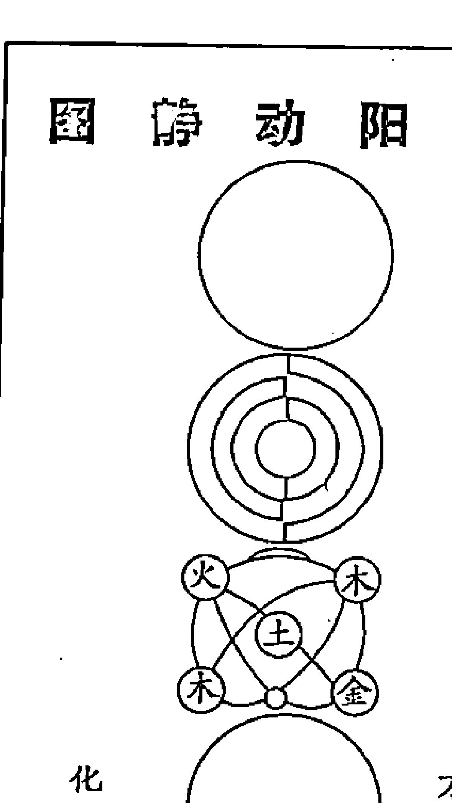

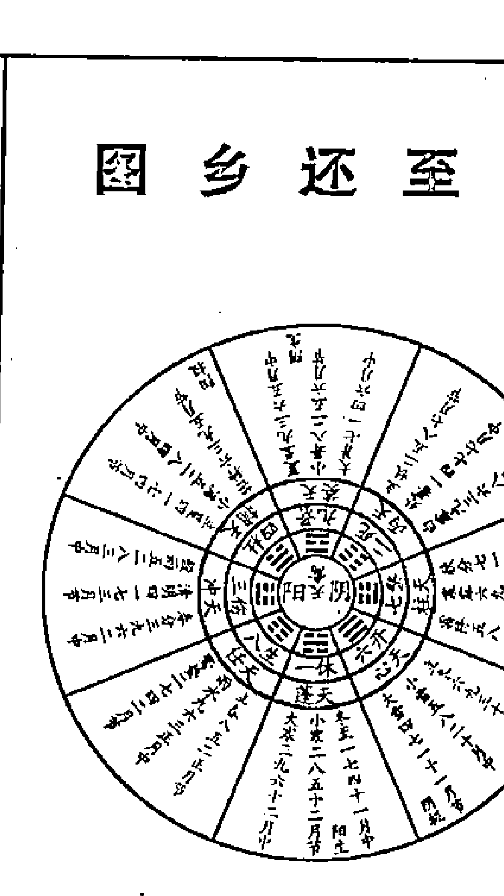

> 邵子曰
冬至子之半，
天心无改移。
一阳初动处，
万物未生时。
元酒味初淡，
大音声正希。
此言如不信，
更请问庖牺。

## 阳遁歌

冬至惊蛰一七四，小寒二八五同推。春分大寒三九六，芒种六三九是真。
谷雨小满五二八，立春八五二相随。立夏清明四一七，九六三从雨水期。

## 阴遁歌

夏至白露九三六，小暑八二五重逢。秋分大暑七一四，立秋二五八流通。
霜降小雪五八二，大雪四七一相同。处暑排来一四七，立冬寒露六九三。

| 冬至      |        | 夏至      |        |
|-----------|--------|-----------|--------|
| 阳遁式    |        | 阴遁式    |        |
| 上候      | 一局图 | 上候      | 九局图 |
| 中候      | 七局图 | 中候      | 三局图 |
| 下候      | 四局图 | 下候      | 六局图 |

若能了达阴阳理，天地都来一掌中。

理者，朱文公曰：“未有天地之先，先有此理。”能明遁法，一理、二气、三才、四象、五行、六甲、七曜、八门、九星，皆在于掌握之中起也。

## 轩辕黄帝战蚩尤

黄帝姓公孙，又曰姬姓，讳轩辕。有熊国君，少典子也。母见电光绕枢星，感而生帝于轩辕之丘，因名轩辕。阴阳激曜曰电。枢星，北斗第一星也。帝生而神灵，弱而能言，幼而徇齐，长而敦敏，成而聪明。是时神农氏世衰，诸侯相侵伐。炎帝榆罔弗能征。于是轩辕习用干戈，以征不享，诸侯咸来宾从。炎帝榆罔侵陵，诸侯益叛之。轩辕修德治兵，与炎帝榆罔，战于阪泉之野，克之。

## 涿鹿经今苦未休。

涿鹿乃郡名，属北平，今涿州也。蚩尤姜姓，炎帝之裔也。好兵喜乱，作刀戟大弩，以暴虐天下。蚩尤铜铁额，其额坚如铜铁也。谙阴阳，能起昏雾迷军士。雾，乃阴阳蒙冒之气。轩辕作指南车，上有楼，四角刻木为龙，又刻仙人于上，车虽回转，手常指南。用子午盘针，以定四方，与蚩尤战于涿鹿。遂擒蚩尤，戮于中冀，曰绝辔之野。于是诸侯咸归轩辕，遂推代神农氏为天子，是为黄帝。

## 偶梦天神授符诀，登坛致祭谨虔修。

黄帝梦大风；吹天下之尘垢皆去。又梦人执千钧之弩，驱羊万群。帝寤而叹曰：“风为号令，力政者也。土去而后在也。天下岂有风姓后名者哉？夫千钧之弩，异力也。马牛数万群，牧民为善者也。天下岂有姓力名牧者哉！”《龙甲书》云：“黄帝致祭于天，有感。夜三更时分，忽见轩辕丘上，神光缭绕，天鼓大震。当召纪官，同往视之。乃彩凤自天降，衔玉匣一端，长九寸按九宫，阔八寸按八卦。黄帝启匣视之，中有天篆文册，龙甲神章，一十八籍，命容神明正其字。乃知是除奸绝邪，灭叛安邦之书，帝遂喜。得天时以立丘山为土德王，命羲和占日，尚仪占月，车区占风，大探深五行之情，占斗纲所建。于是始作甲子，容成造历，隶首算数，苍颉制字，伶伦制律，吕车区占星气，容成兼而总之。

## 神龙负图出洛水，彩凤衔书碧云里。

彩凤衔书，即上文龙甲神章也。龙负图者，乃伏羲时龙马负图。龙马者，天地之精，其为形也。马身龙鳞，故谓之龙。马高八尺五寸，长颈，骼上有翼，蹈水不没，圣人在位，负图出于孟河也。洛水者，乃洛书出于神。禹治水时，神龟负文呈瑞而于背，九数。《春秋纬》乃云：“河以通乾出天苞，洛以流坤吐地符。河龙图发，洛龟书感。河图有九篇，洛书有六篇。”轩辕之时，未有此事。今云神龙负图出洛水者，总河图洛书而言也。洛虽未出书，而风后演教，与之暗合也。解下文。

黄帝龙图①之命，② 遣风后演之而为遁甲，造式三层，以法三才。上层象天而置九星，中层象人以开八门，下层象地以分八卦，以镇八方。随冬夏二至，立阴阳二遁，一顺一逆，以布三奇六仪。风后因伏羲先天之卦。乾起于南，以序而生三子；坤起于北，以序而生三女。《系辞》曰：“天尊地卑，乾坤定矣。”盖乾南坤北，天地自然之定位。故乾父居南，阳气以生以降而生物。故乾一索而生长男震，在东北；再索而生中男坎，居正西；三索而生少男艮，居西北。阳老归息于中宫也。坤母居北，阴气以升而生物。故坤一索而生长女巽，在西南；再索而生中女离，居正东；三索而生少女兑，居东南。阴老而归息于中宫也。天数以阳出阴入。出者，自数多而出于数少也。入者，自数少而入于数多也。盖天开于子，为天地之原。夫万物从微至著，始发于子上，为一。以生序行于西南巽上，而为二。行于正东离上，而为三。行至东南兑上，而为四。既而息于中宫，而为五。此阴数，自少顺行至多，而为入也。夫阴极则阳生，既而生自于中宫。逆西北艮上而为六，逆行正西坎上而为七，逆行东北震上而为八，逆行正南乾上而为九。天数以九八七六为顺，地数以一二三四为逆。今阳顺则阴逆，阳而成九宫，正合后天洛书之数也。

夫万法莫不出于河图。河图之数，天一生水，地六成之，居北；地二生火，天七成之，居南；天三生木，地八成之，居东；地四生金，天九成之，居西；天五生土，地十成之，居中。生数不可移，成数可移。天一之水，天三之木，天五之土，皆阳动所生，不待作为。故天一即居正北，合洛书之坎一。天三即居正东，合洛书之震三。天五即居中央，合洛书中五也。地二之火，地四之金，乃阴静之生也。阴者，女人之象，不能自立，必从夫而立焉。地二必偶天一而成三。火有形而无质，其气虚，必加数补之。三三而得九，处于南方，而合离九之数也。故地四必偶天三而成七，金有形有质矣，不须重之，即七数居西方，而合洛书兑七之数焉。生数不可移，但可以配偶而各居于本方也。成数可移，天道左旋，折河图南方成数天七，补东南隅之空，加七七四十九数，以除五九四十五，止为四数，合洛书之巽四，故居东南焉。以河图北方之成数地六，补西北隅之空，加六六三十六数，合洛书之乾六，故居西北焉。以河图东方之成数地八，补东北维之空，加上八八六十四数，除六十不论，止用四数，加一倍，再加四算，乃二四数得八，合洛书艮八之数，故艮居东北也。以河图西方之成数天九，补西南维之空，加算九九八十一数，除八十不论，止用一数，加一倍，算得二数，合洛书坤二之数，故坤居西南也。然而东西方之成数，用加一倍算，南北不用加倍者，亦以东西之气，与南北之气不同。盖南极、北极为天地之枢纽。天与七政，昼夜行而不息。此针之所以指南，有以见东西之气常动而实，南北之气少动而虚也。盖指南北之气抵极旋轴，不若东西气之升降轮转。南北之数不用加倍者，盖南北之有极也。关子明曰“河图、洛书相为表里，八卦、九章相为经纬”是也。又谓“河图合洛书，先天合后天”者，此也。

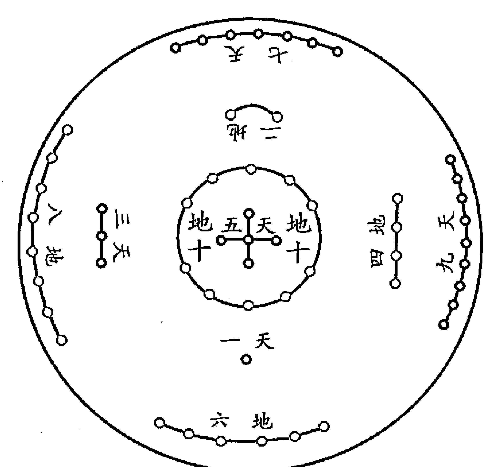

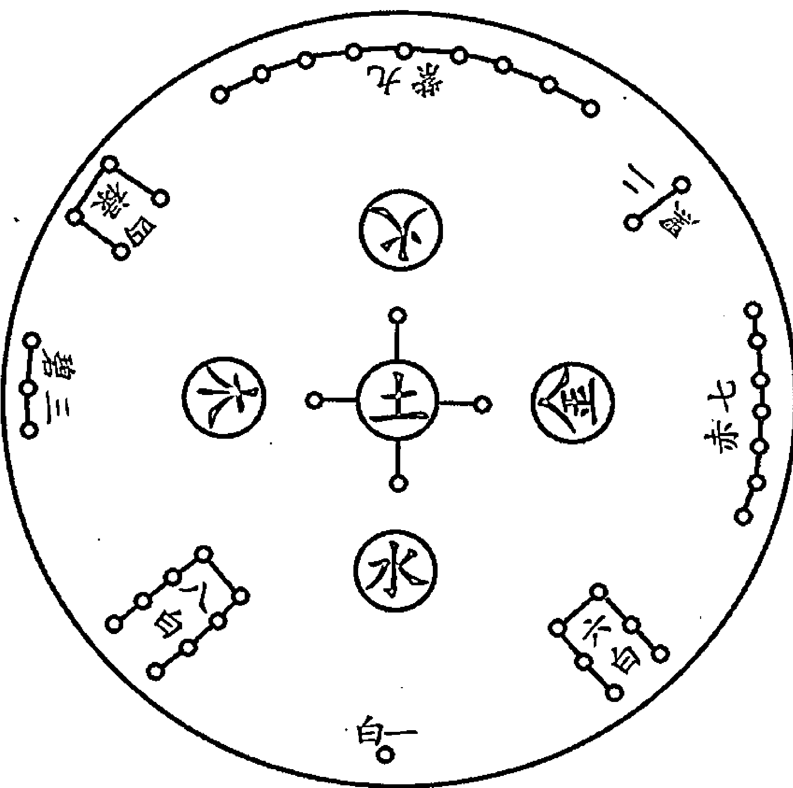

龙马出于孟河，高八尺五寸，长颈，骼上有翼，旁有垂尾。圣人在位，天不爱道，地不爱宝，龙马出焉。

尧沉壁于洛，元龟负书出焉，背上赤文朱字。

天锡禹书，神龟负文而出，列于背，有数，皆九。

## 因命风后演成文，遁甲奇门从此始。

帝得风后于海隅，登以为相；得力牧于大泽，进以为将。风后作《兵法》十三篇，《孤虚法》十二卷，始立遁甲一千八十局。遁者，隐也。幽隐之道。甲者，仪也。遁为直符，谓六甲六仪也。天乙之贵神也。常隐于六戊之下，盖取用兵机微之理，通于神明之德。故以遁甲为名也。奇者，乙、丙、丁为三奇也。门者，休、生、伤、杜、景、死、惊、开之八门。详见下文。

## 一千八十当时制。

刘朴庵：“太元作用，三元六甲，名台吉奇。”书云：“四千三百二十条，神仙节冗归简。”盖节四千三百二十之繁，而归于一千八十之简也。

论古法，黄帝始创奇门，有四千三百二十条，乃一节管三元；① 每元管六十局。② 三元计一百八十局。③ 一岁二十四节，计四千三百二十局。夫一岁二十四节，一节管三元，乃十五日，一百八十时，十节一千八百时，二十节乃三千六百时，其四节又该七百二十时，是一岁二十四节，共得四千三百二十时。故有四千三百二十局也。风后又制奇门，为一千八十局，乃一节三元，为四十五局。风后约冗归于简也。夫一节管三元，一元十五局，管一百八十时，三元四十五局，此一节四十五局，二十节得九百局，其四节又得一百八十局，是共该一千八十局，一千八十个时也。由是观之，是风后又总黄帝四局，一局也。

四个一千八十，共是四千三百二十局也。夫一岁三百六十日，每日一十二时，一百日该一千二百时，三百日则该三千六百个时，其六十日又该七百二十个时。以七百二十，总前三千六百个时，共得四千三百二十时。此硬例也。风后奇门，以八卦管八节，一节管三气，一气管三候，分天地人元，一候五日，七十二候共三百六十日。乃撮四候，而共看六十时成一局，七十二候，共三百六十日，共成一十八局，共一千八十时，故立一千八十局。

## 太公删成七十二。

至周时，有吕尚者，东海上人，穷困年老，渔钓至周。西伯将猎，卜之，曰：“非龙、非彲、非熊、非罴、非虎、非貔，所获霸王之辅。”果遇吕尚于渭水之阳。太公谙兵法，善布奇门，删成一节三元，乃是一个节气分天地人三元，节三候也。如冬至上元阳一局，冬至中元阳七局，冬至下元是阳四局。余仿此。此一节分三元，二十四节分得七十二元，故立七十二活局，立太公为军师，助周伐纣也。

+   ① 上元中元下元各五日，三元共十五日，一百八十时也。
② 乃一元五日，足六十时，乃六十局奇也
③ 乃一节管三元，一元管五日，三元共十五日，五日六十时，十五日一百八十时，故有一百八十局也。

## 逮于汉代张子房，一十八局为精艺。

张良字子房。彼有黄石公，知秦亡，汉之将兴。故以书授子房于邳圯，扶高祖得天下，封子房为留侯。子房删捷，冬至十二节为阳九局，夏至十二节为阴九局，一岁计之一十八局。此活局，又捷径也。夫十八局，七十二局，皆不能越一千八十局矣。作硬局，则该一千八十局；作活局，则有七十二局。然一十八局之图，虽简而时则仍有一千八十也。是乃风后之法则，万世不易也。先论风后，一节管三元，四十五局难看。解释：予尝考之，四千三百二十者，乃一节管三元，六十时，三元乃三百八十时，此硬数也。风后一千八十局，一节三元四十五，乃折算之，一元六十三元，该一百八十也。此一元四之一，该十五，四个十五乃六十也。三元该四十五也。乃是算数之说，夫一元该六十时。今止云十五时为局，则是撤去四十五时，焉有此理，其实乃是合取四节之元，而看十八局之一局也。如冬至上，惊蛰上，清明中，立夏中，此四候共看阳遁一局也。

先须掌上排九宫，
坎一、坤二、震三、巽四、中五、乾六、兑七、艮八、离九，乃九宫也。天有九星以镇九宫，地有九宫以应九州，其式托以灵龟洛书之数，戴九履一，左三右七，二四为肩，六八为足，五十中宫者，土火之子，金之母，所寄理于西南坤位也。坎一白水居正北，坤二黑土居西南，震三碧木居正东，巽四绿木居东南，中五黄土居中宫，乾六白金居西北，兑七赤金居正西，艮八白土居东北，离九紫火居正南。

> > 起例诗曰：坎居一位是蓬休，内死坤宫第二流。
> 更有冲伤并辅杜，震三巽四总为头。
> 禽星死五开心六，惊柱常从七兑游。
> 更有生任居艮八，九寻英景问离求。

纵横十五在其中。

+   - 洛书之数，东三、南九、北一、西七、中五。
- 东直三宫，巽四、震三、艮八，共得十五数。
- 南北中三宫，离九、中五、坎一，共得十五数。
- 西直三宫，坤二、兑七、乾六，共得十五数。
- 南横三宫，巽四、离九、坤二，共得十五数。
- 东西中三宫，震三、中五、兑七，共得十五数。
- 北横三宫，艮八、坎一、乾六，共得十五数。
- 东北中西南三宫，艮八、中五、坤二，共得十五数。
- 东南中西北纵三宫，巽四、中五、乾六，共得十五数。
- 直过合十五，纵过合十五，横过合十五，对过合十五，乃天地万世不易之数。

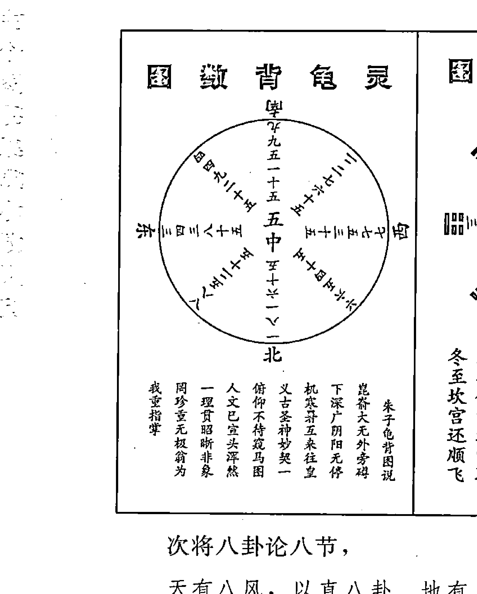

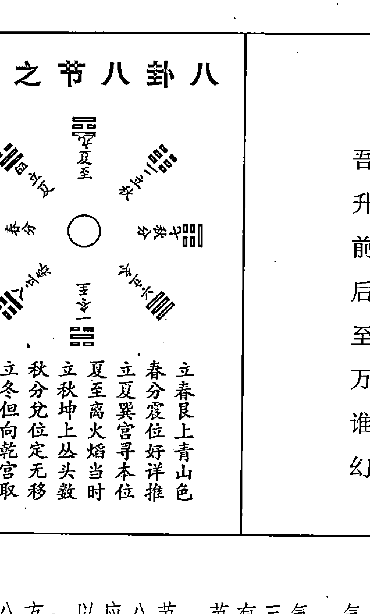

> > 朱子曰
> 吾观阴阳化，
> 升降八纮中。
> 前瞻既无始，
> 后际那有终。
> 至理谅斯存，
> 万世与今同。
> 谁云混沌死，
> 幻语惊盲聋。

次将八卦论八节，

天有八风，以直八卦。地有八方，以应八节。节有三气，气有三候。如是八节，以因之成二十四气。更乘之，七十二候备焉。

| 冬至一宫坎卦 | 立春八宫艮卦 |
| 春分三宫震卦 | 立夏四宫巽卦 |
| 夏至九宫离卦 | 立秋二宫坤卦 |
| 秋分七宫兑卦 | 立冬六宫乾卦 |

十一月建子，乃冬至气，阴极阳生也。子为天正，周以为岁首也，配地雷复卦。十二月建丑为地正，商以为岁首也，配地泽临卦。正月建寅为人正，夏以为岁首也，配地天泰卦，乃三阳开泰也。自汉武帝以来，并用夏正建寅之月为岁首也。八节：立春、惊蛰、清明、立夏、芒种、小暑、立秋、白露、寒露、立冬、大雪、小寒也。

一气统三为正合。

气者中气，雨水、春分、谷雨、小满、夏至、大暑、处暑、秋分、霜降、小雪、冬至、大寒也。《经》云：“冬至小寒及大寒，天地人元一二三。立春雨水并惊蛰，依艮顺增八九一。春分清明并谷雨，但起震宫三四五。立夏小满芒种气，四五六兮列成列。夏至小暑及大暑，九八七兮还退数。立秋处暑并白露，从二却行于一九。秋分寒露及霜降，七六五兮依此向。立冬小雪并大雪，六五四兮依此诀。”

统三者，一节分三元，即三候。又曰：三者三甲也。上局仲甲，谓甲己之日，夜半子时，乃甲子时。丙辛之日，日中甲午时是也。此时关格刑德在门，用兵先举者败，不可出入，利以逃亡，主客并凶。

中局孟甲，谓戊癸之日，平旦甲寅时，乙庚之日，晡时甲申是也。此时阳气在内，阴气在外，利藏兵固守，不可出师，利主不利客。

下局季甲，谓丁壬之日，食时甲辰、甲己之日。黄昏甲戌，此时阳气在外，阴气在内，利出兵动众，百事吉，利客不利主。

> 又云：六甲之日，夜半子二甲皆合，谓今日是甲直符，与时皆是甲，故名三甲合也。

阴阳二遁分顺逆，一气三元人莫测。

冬至后用阳遁，顺飞于坎一宫起，如冬至上元阳一局顺遁，甲子戊起一宫，甲戊己二宫，甲申庚三宫，甲午辛四宫，甲辰壬五宫，甲寅癸六宫，丁奇七宫，丙奇八宫，乙奇九宫，乃仪顺奇逆也。夏至后用阴遁，逆飞于离九宫起，如夏至上元，阴九局逆遁，甲子戊起于九宫，甲戊己八宫，甲申庚七宫，甲午辛六宫，甲辰壬五宫，甲寅癸四宫，丁奇三宫，丙奇二宫，乙奇一宫，乃逆仪顺奇也。九星为直符，八门为直使，有顺阳使逆行阴，经术不显，隐伏之事也。

一节分三元，子、午、卯、酉为上元，寅、申、巳、亥为中元，辰、戌、丑、未为下元。若不明三元，用奇不准，主有不测也。

> 起例诗曰：甲己庚辛壬癸顺，阳仪丁丙乙逆行。
休门随君顺数去，甲子起时当仔细。
阴转六仪当逆推，乙丙丁奇顺而随。
门随始时同逆起，休门排位顺风吹。

五日都来换一元，

甲子至戊辰五日，为上元。己巳至癸酉五日，为中元。甲戌至戊寅五日，为下元。己卯至癸未五日，为上元。甲申至戊子五日，为中元。己丑至癸巳五日，为下元。甲午至戊戌五日，为上元。己亥至癸卯五日，为中元。甲辰至戊申五日，为下元。己酉至癸丑五日，为上元。甲寅至戊午五日，为中元。己未至癸亥五日，为下元。

接气超神为准的。

超者，越过也。神者，进神也。甲子、己卯、甲午、己酉乃进神，为符头。接，迎接也。气者，节气也。超神者，谓节气未到，而甲子、己卯之符头先到，为之超。接气者，谓甲子、己卯之符头未到，而节气先至，为之接。

引证：如淳祐六年丙午，前四月十三日壬申，交立夏节，而本月初五日是甲子已到，即以立夏节用，立夏前九月矣，则合前初五日起超在先，借用立夏上局奇，自初十日己巳，为立夏中局奇，自甲戌五日，用立夏下局奇。乃先得奇，后交节，为速，谓之超神，速者也。

又如淳祐七年丁未二月二十三日，虽交清明节上局奇，然二十五日方是己酉，方用清明上局奇，此乃先交节而后得奇，为接，故谓接气迟。至二十四日戊申，仍用春分下局。此是已交本节，而奇星尚用前节也。

又如其年六月二十八日己酉，交立秋节，正直节与日辰同到，其日即是立秋上局，谓之正授奇。凡换奇，皆甲子时换也。

须知闰奇之法，方能超接得真也。

积日以成闰月，积时以成闰奇。超接正授闰有法，分金定刻难明局。以五日一换，遇一节气，通换六局。凡一月节气，必三十日零五时二刻，以三十分六局，以余五时二刻置闰，超神不过十日。遇芒种、大雪，超过九日，即置闰也。假如丙戌年五月初一日己卯，至初九日丁亥巳刻，过九日于置闰，即用初一日己卯作芒种上超局，初六日甲申作芒种中局，十一日己丑作芒种下局。毕于此重用一局，作三奇闰法，以十六日甲午作芒种闰奇，此超神置闰之法也。二十四已交夏至，是谓置闰，借夏至七日，其五月小尽，至六月初二日己酉，方作夏至。上局初七日甲寅作夏至中局，十二日己未作夏至下局，以为接气奇也。闰奇之法，每遇芒种、大雪二节内，如是超过九日，即合置闰以归，每节气所余五时二刻也。盖奇以冬、夏二至，分顺逆。故于二至之前，置闰以均其气，无不应也。但近世俗师不知超接正闰之法，止接成局，以择奇门日时，盖缘上局，反作下局，颠倒错乱，俱无应验。一旦以为不足信，则是起例不明，置闰无法，非局之不验真，择焉不精故也。

## 认取九宫为九星，

+   - 天蓬贪狼主坎一宫属水。
- 天芮巨门主坤二宫属土。
- 天冲禄存主震三宫属木。
- 天辅文曲主巽四宫属木。
- 天禽廉贞主五中宫属土。
- 天心武曲主乾六宫属金。
- 天柱破军主兑七宫属金。
- 天任佐辅主艮八宫属土。
- 天英右弼主离九宫属火。

八门又逐九宫行。

## 九宫配八门永定例：

坎宫蓬星休门，艮宫任星生门。震宫冲星伤门，巽宫辅星杜门。坤宫芮星死门，附中宫禽星坤。离宫英星景门，兑宫柱星惊门，乾宫心星开门。

九宫逢甲为直符，八门直使自分明。

如阳遁一局，甲子时起坎一宫，即以坎宫天蓬为直符，休门为直使。甲戌时起坤二宫，即以天芮为直符，死门为直使。甲申时起震三宫，即以天冲为直符，伤门为直使。甲午时起巽四宫，即以天辅为直符，杜门为直使。甲辰时起中五宫，即以天禽为直符，配以死门为直使。甲寅时起乾六宫，即以天心为直符，开门为直使。余例仿此。

符上之门为直使，十时一位堪凭据。

遁取时旬甲头为直符，如阳遁一局，甲子在坎宫，天蓬为甲子时直符，则休门即为直使，管至癸酉十时住。甲戌在坤宫，天芮为本时直符，则死门即为直使，管至癸未十时住。又换甲申符头在震，天冲为本时直符，则伤门即为直使，管至癸巳十时住。又易甲午在巽，天辅为直符，则杜门为直使，管至癸卯十时住。又换甲辰在中宫，天禽为直符，则死门为直使，管至癸丑十时住。又易甲寅在乾宫，天心为直符，则开门为直使，管至癸亥十时住。阳一局六十时足，而又他局。余局仿此。阴遁同例，以逆推。

## 直符常遣加时干

九星，蓬、任、冲、辅、英、芮、柱、心、禽也。为直符常随时干。

假如冬至上元，阳遁一局，图内乙庚日、丙子时，其地盘甲申泊三宫，天冲管事，乙庚日申时乃甲申时也，就是冲三直符，故此直符，常遣加时干也。

> 《奇仪总要歌》云：“星符每逐时干转，直使常随天乙奔。”同此意也。永定阳遁顺仪逆奇，阴遁逆仪顺奇，皆主论也。

## 直使逆顺遁宫去

八门：休、生、伤、杜、景、死、惊、开，为直使也。原天盘上休在坎，生在艮，伤在震，乃三宫之定位也。假如冬至上元阳一局，图内乙庚日申时，就以伤门为直使，乃时干甲申居三宫也。阳遁顺飞，阴遁逆飞，故云“直使逆顺遁宫去”。

## 六甲元号六仪名

> 《符应经》云：“六甲者，天之贵神也。常隐于六仪之下。六仪者，戊、己、庚、辛、壬、癸也。”甲子同六戊，甲戌同六己，甲申同六庚，甲午同六辛，甲辰同六壬，甲寅同六癸。

## 三奇即是乙丙丁

三奇者，按《经》云：“日乃木之华，阳之精所成，乙木为日奇也。”本理按：《经》云：“正月日出于乙，故以乙为日奇。”丁火，南方离明之象，老人星，凡形见于丁位，故以丁为星奇。月照交到丙而下明，故以丙为月奇也。六乙属太阳，六丙属太阴，六丁属星曜，乃三光也。

遁甲之法，以甲乃太乙人君之象，为十干之首，常隐六仪之下，故谓之遁甲。所畏者，庚金能克甲木，庚为七煞之仇也。乙乃甲之妹，甲以乙妹妻庚，乙庚合而能救甲，故乙为一奇。丙乃甲之子，丙火能克庚金而救甲，故丙为二奇。丁乃甲之女，丁火亦能克庚金而救甲，故丁为三奇。

> 《经》云“天上三奇乙丙丁”者，出于贵人之干，德游行十二支辰。以阳贵人顺行，先天坤卦起子，则乙德在丑，丙德在寅，丁德在卯。三干之德相联，而无间断，以阴贵人逆行。后天坤卦起甲，则乙德在未，丙德在午，丁德在巳，三干之德相联，亦无间断。余六仪贵人所涉，或间天空，或间罗网，皆不相联。盖三奇能制凶煞者，以其出于贵人之干，德为吉也。贵取坤卦者，以“黄中通理”也。

甲位既尊，戊位同甲，乙、丙、丁三干无间，而为三奇，取其德明，故以日、月、星为号，以其德能照临者也。故甲、乙、丙、丁、戊五阳时，善神治事为吉也。

## 阳遁顺仪奇逆布，阴遁逆仪奇顺行

冬至后十二节，惟用阳遁顺布六仪，逆布三奇，星符亦随时干行。

假如冬至阳一局，图内坎上起甲子戊，坤上甲戌己，震上甲申庚，巽上甲午辛，五中宫甲辰壬，乾上甲寅癸，兑上丁奇，艮上丙奇，离上乙奇，乃仪顺去奇逆行也。夏至后十二节，惟用阴遁逆布，六仪顺布，三奇星符亦随时干行。假如夏至阴九局，图内离九宫起甲子戊，艮上甲戌己，兑上甲申庚，乾上甲午辛，五中宫甲辰壬，巽上甲寅癸，震上丁奇，坤上丙奇，坎上乙奇，乃仪逆奇顺行也。

## 吉门偶尔合三奇，值此虽云百事宜

开、休、生，即北方之三白，为最吉，乃三吉门，合乙、丙、丁三奇。其中合得一位，共临之方，乃三奇之妙。此时宜出兵征讨，发号施令，修造、埋葬、婚娶、安社稷、化人民，百事大吉之兆。《五总龟》云：“大抵要得开、休、生三门，则用事为吉，更有三奇临之，可用无疑。如得门不得奇，亦可用。得奇不得门，终非吉。奇门俱不得，即凶。当以其大小轻重程等而用之。”

## 更合从傍加检点，余宫不可有微疵

如得开、休、生三吉门，又合上下盘三奇是也。此时此宫有奇门，虽吉，然须检点，三盘上所加，余七宫，凶星所在，未可以此即为全吉。

如合天、地、人三遁，鸟跌穴，龙反首，知三、天辅，玉女守门，三奇所及，游六仪、义和，制伏欢、怡等，故为吉也。

如合火入金，金入火，虎猖狂，龙逃走，雀入江，蛇天矫，避五，击刑，制损明，入墓，反伏吟，格勃飞，天乙，天网，门迫之类，则为凶也。

## 三奇得使诚堪使

> 葛洪曰：“若得三奇得使，尤宜其良。”谓在六甲之上，自得所使之奇。甲戌、甲午乙为使，甲子、甲申丙为使，甲辰、甲寅丁为使。

假如阳遁三局，乙庚之日丁亥时，此时六乙日奇，下临九宫甲午，是为乙行得使。

假如阴遁三局，丙辛日壬辰时，此时六乙日奇，下临九宫甲午，是为乙奇得使。又如阳遁五局，丙辛之日己亥时，此时丁奇下临四宫，合甲辰为丁奇得使也。

三奇得使，其法以天上甲子起，中间一宫而行，则乙奇到甲戌，丙奇到甲子，丁奇到甲寅。地下甲子起戌，地者，妇人之道，不能自立，必假夫而立。故甲戌假对宫坤辰上起甲，则乙奇在甲午，丙奇在甲申，丁奇在甲戌，取对冲，故奇甲辰也。

## 三奇得使图

（此处应有图示，文本描述如下）

乙奇加甲午
丙奇加甲申
丁奇加甲辰
是谓三奇得使
最为吉也

又例：甲为君位，三奇乃宰辅，避旺地，只居生库官，为自得所使也。自午起甲，顺行，则乙奇到未，木库宫也。自戌起甲，顺行，则乙奇到亥，长生宫也。自子起甲，顺行，则丙奇到寅，火生宫也。自申起甲，顺行，则丙奇到戌，乃火库也。丁奇亦属火，又属金。丙既居生库宫，则丁火金之临官宫也。六甲遇之非小补。

> 《经》曰：“时加六甲，一开一合，上下交接。”又曰：“能知三甲，一开一合；不知三甲，六甲尽合。”六甲者，甲子、甲戌、甲申、甲午、甲辰、甲寅也。阳星加时为开。阳星：天蓬、天任、天冲、天辅、天禽。阴星加时为合。阴星：天英、天芮、天柱、天心。六甲之时，合时百事凶，开时宜战斗，往来百事吉。又曰：“甲为青龙，利以远行。将兵客胜，闻忧无，闻喜有。宜谒尊上，见贵人有喜。移徙、嫁娶百事吉。不可行遣怒及鞭杖事。”假如阳遁九局，甲己之日，黄昏得天任阳星，加时为开，百事吉。若无奇门，合得此局，亦得次吉，乃小补云。

## 乙马逢犬丙鼠猴，六丁玉女骑龙虎

乙奇加甲午为马，加甲戌逢犬也。丙奇加甲子为鼠，加甲申为猴。丁奇加甲辰为龙，加甲寅为虎。谓三奇得使，最为吉也。

> 《经》曰：“时加六乙，往来恍惚，与神俱出。”谓六乙为日奇，宜从天上六乙出。既随日奇，恍惚如神，人无见者，将兵客胜，闻忧无，闻喜有。行逢饮馔，移徙入官，市贾嫁娶吉，不可行遣怒、鞭杖、嗔责事。

假令冬至上元阳一局，甲己之日，天蓬为直符，至乙丑时，六丁在九宫，以直符加时干。此时天上六乙下临一宫，出北方吉。

> “时加六丙，莫兵莫往。”

此时候主厌伏兵灾。将兵闻忧无，闻喜有。入官得仙，市贾有利。丙为日奇，又为天威，丙火以销金，精兵不起。若攻伐者，从天上六丙出，既挟月奇，又乘天威，丙火相随，故曰“厌伏兵灾”。假令冬至下元阳四局，甲己之日，平旦平寅，此时六丙下临六宫，宜出西北方吉。

六丁为三奇之灵，凡出入用兵，战斗皆吉。故曰：“能知六丁，出幽入冥，至老不刑。刀虽临颈，犹安不惊。”六丁者，六甲之阴神，丁卯之神，字文伯。丁丑之神，字文孙。丁亥之神，字文公。丁酉之神，字文通。丁未之神，字文卿。丁巳之神，字巨卿。凡斗争出入行来，六丁之神常呼其名，所谓三奇之灵。六丁者，丁卯为甲子之阴，故也。丁奇入宫，会甲辰、甲寅，乃六丁骑龙虎也。天盘六丁，加地盘甲寅、甲辰是也。

> “能知六丁，出幽入冥，至老不刑。刀虽临颈，犹安不惊。”

又曰：时加六丁，出幽入冥，又六丁为太阴，可以藏形，人皆不见，敌人不敢侵将兵，主胜，闻忧喜各半，可以请谒，利嫁娶及阴私事，入官商贾吉。

假令立夏下元，阳遁二局，甲己之日，夜半甲子时，日出丁卯时。此时六丁在东北，直符天芮，加时干，即六甲下临二宫，出西南方吉。

## 又有三奇游六仪，号为玉女守门扉

三奇游六仪者，乃天上三奇乙丙丁，地下三奇甲戊庚，游于甲子戊，甲戌己，甲申庚，甲午辛，甲辰壬，甲寅癸，此六仪也。《三元经》曰：“三奇游六仪，利以宫建宴会喜乐之事。”

> “三奇游六仪，利以宫建宴会喜乐之事。”

玉女守门者，谓丁为玉女，而会天乙直使之门也。如阳遁一局，顺仪逆奇，地盘丁在兑，而以天乙直使休门，加之甲子时休门起坎，乙丑时休门到坤，丙寅时休门到震，丁卯时休门到巽，戊辰时休门到中，己巳时休门到乾，庚午时休门到兑，地盘丁奇兑上。故甲子旬庚午时，为玉女守门也。

又接前数，辛未时休门到艮，壬申休门到离，癸酉休门到坎，直使十时一易，甲戌时以死门到坤，为直使，乙亥时死门在震，丙子时死门在巽，丁丑时死门在中宫，戊寅时死门在乾，己卯时死门到兑，地盘丁奇兑上。故甲戌旬己卯时，为玉女守门也。

甲申时以伤门直使震宫，乙酉时伤门到巽，丙戌时伤门到中，丁亥时伤门到乾，戊子时伤门直使到兑，地盘丁奇兑上。故甲申旬戊子时，为玉女守门也。

又累累数至甲午时，以杜门直使在巽，乙未时杜门到五，丙申时杜门到乾，丁酉时杜门直使到兑，地盘丁奇兑上。故甲午旬以丁酉时，为玉女守门时也。又累累数去，到甲辰时，以死门直使到中宫，乙巳时死门到乾，丙午时死门直使到兑，地盘丁奇兑上。故甲辰旬丙午时，为玉女守门时也。又累累数去到甲寅时，开门直使到乾，乙卯时开门直使到兑宫，地盘丁奇兑上。故甲寅旬乙卯时，为玉女守门时也。

| 甲子用庚午 | 甲戌用己卯 | 甲申用戊子 |
| :--- | :--- | :--- |
| 甲午用丁酉 | 甲辰用丙午 | 甲寅用乙卯 |

甲子用庚午者，甲子同六戊，用五子元遁，戊癸逢壬子，起壬子七数而见戊字。故甲子用七数庚午也。

甲戌用己卯者，甲戌同六己，用五子元遁，甲己还加甲，起甲子六数而见己字，故甲戌用六数己卯也。

甲申用戊子者，甲申同六庚，用五子元遁，乙庚丙作初，起丙子五数而见庚字，故甲申用五数戊子也。

甲午用丁酉者，甲午同六辛，用五子元遁，丙辛生戊子，起戊子四数而见辛字，故甲午用四数丁酉也。

甲辰用丙午者，甲辰同六壬，用五子元遁，丁壬庚子居，起庚子三数而见壬字，故甲辰用三数丙午也。

甲寅用乙卯者，甲寅同六癸，用五子元遁，戊癸逢壬子，起壬子二数而见癸字，故甲寅用二数乙卯也。

> 若作阴私和合事，请君但向此中推。

四户以月建加本时，却随除危定，开在何处，即是地四户。若与天三门同宫，尤吉。

| 天罡辰 | 太乙巳 | 胜光午 | 小吉未 |
| :--- | :--- | :--- | :--- |
| 传送申 | 从魁酉 | 河魁戌 | 登明亥 |
| 神后子 | 大吉丑 | 功曹寅 | 太冲卯 |

## 天三门之图

（此处应有图示）

《入式歌》云：天乙会合女阴私。所谓天乙会合，和阴私之事。要在三奇临六仪，与三奇吉门，合太阴太冲从魁小吉，加地四户，是谓福食，远行出入皆吉。地四户者，除定危开也。

假如正月建寅，卯上除，午上定，酉上危，子上开，更得三奇临之大吉。二月则从卯上起建也，凡阴谋事，用太阴太冲小吉，从魁加地四户而去，解见下文。

| 看授时历 | 十一月丑十二月子 | 九月卯十月寅 | 七月巳八月辰 | 五月未六月午 | 三月酉四月申 | 正月亥二月戌 | 太阳过宫 |
| :--- | :--- | :--- | :--- | :--- | :--- | :--- | :--- |
| | | | | | | | |

> 天三门兮地四户，问君此法何处。太冲小吉与从魁，此是天门私出路。地户除危定与开，举事皆从此中去。

## 地四户之图

（此处应有图示）

天门有三，乃从魁、小吉、太冲三位也。起法以月将加本时，即寻从魁、小吉、太冲三位，为天三门也。起月将法，以授时历看，审订太阳过宫，方可选用。如去年十二月大寒节，某日时刻日躔元枵之次，太阳在子，以神后出将加用时。世俗但知登明为正月将，却不知登明是亥，犹待雨水节后，某日时刻，日躔娵訾之次，太阳方过亥宫，以登明天月将方可用。

| 年月日时同 | 加寻地四户 |
| :--- | :--- |
| | |

> 六合太阴太常君，三辰元是地私门，更得奇门相照耀，出门百事总欣欣。
阳时利击，阴时宜掩，阳先举，阴后交。凡欲击者，为破而击之。掩者，密而去之。

其败军宜向六合下走得出也。假如以六合、太阴、太常为三辰，依图推之，看在何方。日支自亥至辰为阳，用阳贵人，阳贵人用上一字，自巳至戌为阴，用阴贵人，阴贵人用下一字。假如丁亥日，亥为阳日，丙丁猪鸡位，则亥猪为阳日贵人，须用贵人加亥上，顺数去，却看六合、太阴在何处，即是地私门。此只论日，不论时，然须得奇门，方可用。一例审太阳过宫，以月将加用时，顺寻本日贵人，起星求地私门。

## 地私门阳贵顺行之图

（此处应有图示）

## 地私门阴贵逆行之图

（此处应有图示）

太冲天马最为贵，卒然有难难逃避。但当乘取天马行，剑戟如山不足畏。
天马即太冲也，审月将过官，即以月将加用时，顺寻看太冲在何方，即天马方也。
言遇紧急危难，仓卒之间，难得奇门，但乘取天马而去，则虽剑戟如林，亦能避其祸也。

## 天月将

| 正月亥 | 二月戌 | 三月酉 | 四月申 | 五月未 | 六月午 |
| :--- | :--- | :--- | :--- | :--- | :--- |
| 七月巳 | 八月辰 | 九月卯 | 十月寅 | 十一月丑 | 十二月子 |

## 地月将

| 正月寅 | 二月卯 | 三月辰 | 四月巳 | 五月午 | 六月未 |
| :--- | :--- | :--- | :--- | :--- | :--- |
| 七月申 | 八月酉 | 九月戌 | 十月亥 | 十一月子 | 十二月丑 |

## 天马方吉时定局于后

| | 以授时历看审订 太阳过官方可选用。 太冲天马方 | 子时 | 丑时 | 寅时 | 卯时 | 辰时 | 巳时 | 午时 | 未时 | 申时 | 酉时 | 戌时 | 亥时 |
| :--- | :--- | :--- | :--- | :--- | :--- | :--- | :--- | :--- | :--- | :--- | :--- | :--- | :--- |
| 正月 | 登明将太冲天马方 | 辰 | 巳 | 午 | 未 | 申 | 酉 | 戌 | 亥 | 子 | 丑 | 寅 | 卯 |
| 二月 | 河魁将太冲天马方 | 巳 | 午 | 未 | 申 | 酉 | 戌 | 亥 | 子 | 丑 | 寅 | 卯 | 辰 |
| 三月 | 从魁将太冲天马方 | 午 | 未 | 申 | 酉 | 戌 | 亥 | 子 | 丑 | 寅 | 卯 | 辰 | 巳 |
| 四月 | 传送将太冲天马方 | 未 | 申 | 酉 | 戌 | 亥 | 子 | 丑 | 寅 | 卯 | 辰 | 巳 | 午 |
| 五月 | 小吉将太冲天马方 | 申 | 酉 | 戌 | 亥 | 子 | 丑 | 寅 | 卯 | 辰 | 巳 | 午 | 未 |
| 六月 | 胜光将太冲天马方 | 酉 | 戌 | 亥 | 子 | 丑 | 寅 | 卯 | 辰 | 巳 | 午 | 未 | 申 |
| 七月 | 太乙将太冲天马方 | 戌 | 亥 | 子 | 丑 | 寅 | 卯 | 辰 | 巳 | 午 | 未 | 申 | 酉 |
| 八月 | 天罡将太冲天马方 | 亥 | 子 | 丑 | 寅 | 卯 | 辰 | 巳 | 午 | 未 | 申 | 酉 | 戌 |
| 九月 | 太冲将太冲天马方 | 子 | 丑 | 寅 | 卯 | 辰 | 巳 | 午 | 未 | 申 | 酉 | 戌 | 亥 |
| 十月 | 功曹将太冲天马方 | 丑 | 寅 | 卯 | 辰 | 巳 | 午 | 未 | 申 | 酉 | 戌 | 亥 | 子 |
| 十一月 | 大吉将太冲天马方 | 寅 | 卯 | 辰 | 巳 | 午 | 未 | 申 | 酉 | 戌 | 亥 | 子 | 丑 |
| 十二月 | 神后将太冲天马方 | 卯 | 辰 | 巳 | 午 | 未 | 申 | 酉 | 戌 | 亥 | 子 | 丑 | 寅 |

总论太阳过宫法：天三门，地四户，地私门，太冲天马同例。

# 卷十八 术数汇考十八

## 奇门遁甲

### 烟波钓叟歌句解下

## 天气将

| 正月雨水壬 | 二月春分乾 | 三月谷雨辛 | 四月小满庚 |
| :--- | :--- | :--- | :--- |
| 五月夏至坤 | 六月大暑丁 | 七月处暑丙 | 八月秋分巽 |
| 九月霜降乙 | 十月小雪甲 | 十一月冬至艮 | 十二月大寒癸 |

## 地气将

| 正月立春子 | 二月惊蛰亥 | 三月清明戌 | 四月立夏酉 |
| :--- | :--- | :--- | :--- |
| 五月芒种申 | 六月小暑未 | 七月立秋午 | 八月白露巳 |
| 九月寒露辰 | 十月立冬卯 | 十一月大雪寅 | 十二月小寒丑 |

## 天符经

| 正月娵訾亥 | 二月降娄戌 | 三月大梁酉 | 四月实沈申 |
| :--- | :--- | :--- | :--- |
| 五月鹑首未 | 六月鹑火午 | 七月鹑尾巳 | 八月寿星辰 |
| 九月大火卯 | 十月析木寅 | 十一月星纪丑 | 十二月元枵子 |

三为生气五为死，胜在三兮衰在五。能识游三避五时，造化真机须记取。
《三元经》曰：“天道不远，三五反复。知三避五，恢然独处。”三为生气，故游三也。五为害气，故避五也。三为威，五为武。盛于三，衰于五。匹马双轮，无有返期。
假令冬至上元，阳遁一局，甲己之日夜半生，甲子至平旦丙寅时得三，此时生气，宜举百事，至食时，戊辰时得五，此时害气凶，百事不宜，故避五也。阴遁仿此。

一本云：直使加震宫，三为生宜向之；直使加中宫，寄二宫为死，宜避之。

又云：重阳有重吉，谓大将在三宫，重阴有重凶，谓大将在七宫也。三乃数吉也。七乃位凶也。

就中伏吟为最凶，天蓬加着地天蓬。

九星伏吟：上盘天蓬，加地盘天蓬，乃九星仍在本宫不动，谓之伏吟。孝服，损人口。直符伏吟：上盘甲子，加地盘甲子。六仪准此。

> 汤谓云：“甲子来加甲子为伏吟，不宜用兵，惟宜收敛货财。”凡六甲之时，门符皆是伏吟。

> 一本云：“天盘天蓬，加地盘天蓬，为伏吟。最凶。余不与。”

假令冬至上元阳遁一局，甲己之日，夜半生，甲子时，天蓬直符加临一宫，时干在一宫，此名门符皆伏吟也。

天蓬若到天英上，须知即是反吟宫。

九星反吟者，天盘一宫上蓬星，加地盘九宫英星上，为反吟。余八宫同此。直符反吟，谓上盘甲子加下盘甲午，上盘甲戌加下盘甲辰。遇奇门盖之，不见凶害，不然灾祸立至。

> 汤谓曰：“子来加午为反吟，此时不利举兵动众，惟宜散恤仓库之事。”凡星符对冲，皆反吟。

假令冬至上元阳遁一局，甲己日乙丑时，六乙在九宫，以天上天蓬直符，加临时干在九宫，即是直符反吟。

八门反复皆如此，生在生兮死在死。假令吉宿得奇门，万事皆凶不堪使。

生门在八宫，门不离宫，谓之伏吟。若生门移在对宫，谓之反吟。门若遇此，虽得奇不可用。

假令冬至上元阳遁一局，甲己之日，以日晡申时，休门在九宫，直使休门加之，即是直门反复也。

六仪击刑何大凶，甲子直符愁向东。戊刑在未申刑虎，寅巳辰辰午刑午。

六甲地支相刑与自刑也。如：甲子见卯，甲戌见未，甲申见寅，甲寅见巳，为相刑。甲辰见甲辰，甲午见甲午，为自刑。

> 葛洪曰：“六仪击刑者，谓六甲直符，加所刑之地也。”甲子直符加卯，卯刑子也。甲戌直符加未，戌刑未也。甲申直符加寅，申刑寅也。甲午直符加午，午自刑也。甲辰直符加辰，辰自刑也。甲寅直符加巳，寅刑巳也。

> 郭璞论三合之刑：“金刚火强，各刑本方。水流趋东，木落返本。”

> 王璋曰：“甲子直符加三宫，甲戌直符加二宫，甲申直符加八宫，甲午直符加九宫，甲辰直符加四宫，甲寅直符加四宫，皆为六仪击刑。”

## 论三奇入墓与击刑

假令冬至上元阳遁一局，甲己之日夜半生甲子为直符，至日出卯时，是六仪击刑也。至庚午时，以甲子直符加六庚于三宫，即六仪击刑时也。其时极凶，不可用事。

三奇入墓好思推，甲日那堪见未宫。丙奇属火火墓戌，此时诸事不须为。更兼天乙来临二，月奇临六亦同论。

此乃乙丙奇临六宫在戌，谓之入墓，不但奇临之，遇丙日见戌字亦是。

王璋曰：“三奇入墓者，谓六乙日奇下临六宫，六丙月奇下临六宫，六丁星奇下临八宫。乙奇下临二月，亦是。是谓三奇入墓也。”

又云：傍人入墓也。

假如阴遁四局，丙辛日平旦庚寅时，六丙月奇下临六宫，是谓月奇入墓。凡遇三奇入墓，纵有奇门，不可举兵，百事皆凶。

《经》云：“三奇入墓何时辰，丙奇乾上乙临坤。或遇乙奇居戌上，还加丁向丑中存。”丁乃阴火，死在寅，墓在丑也。

王璋曰：“丙丁奇入一宫，乃火入水池；乙奇入六宫，乃木入金乡。三奇受制，万事不可举也。”

本理按：五行生旺，论阳生阴死，丙火生于寅，丁火生于酉，阳顺阴逆。丁火生酉逆行，沐浴申，冠带未，临官午，帝旺巳，衰辰，病卯，死寅，墓丑，绝子，胎亥，养戌。逢禄为临官，丙禄巳，巳乃丙火之临官。丁禄在午，午乃丁火之临官。丁墓在丑，艮八宫是墓。丁奇临艮八宫，是丁奇入墓。戌非也。此乃论阴阳之正理。又如甲木生于亥，未为库，乙木生于午，沐浴巳，冠带辰，临官卯，帝旺寅，衰丑，病子，死亥，墓戌，阴库不在未，在戌也。所以削去雷取之讹也。

又有时干入墓宫，课中时下忌相逢。戊戌壬辰兼丙戌，癸未丁丑一同凶。

葛洪曰：“三奇者，谓丙戌时为月奇入墓之时。”又曰：“凡遇乙庚日丁丑时，为丁奇入墓，黄昏是丙戌，故为月奇入墓。”

《三奇渊源》云：“六丁本火之精，化而成金，在震最明，生于丑，没于辰，前世名晓星者是也。”

又朱子断曰：“启明金星在西日，出则东见，即太白是也。”故丁丑时亦为星奇入墓。

- 丙戌时丙属阳火，火墓在戌。
- 壬辰时壬属阳水，水墓在辰。
- 丁丑时丁属阴火，火墓在丑。
- 癸未时癸属阴水，水墓在未。
- 戊戌时戊属阳土，土墓在戌。
- 己丑时己属阴土，土墓在丑。

故戊己中央之土，赖母而生，所以戊同丙火生于寅，己同丁火生于酉。已上六时，干辰入墓，亦不可用。

## 论五不遇时

五不遇时龙不精，号为日月损光明。时干来克日干上，甲日须知时忌庚。

葛洪曰：“五不遇时者，谓刚柔日相克，而损其明，纵有奇门，不可行，百事凶。”

| 甲日庚午时 | 乙日辛巳时 | 丙日壬辰时 | 丁日癸卯时 | 戊日甲寅时 |
| 己日乙丑时 | 庚日丙子时 | 辛日丁酉时 | 壬日戊申时 | 癸日己未时 |

此乃时干克日干，名为本主不和，极凶。旧选择书内差，载时支克日干，所以不准。今本理校正历府通书，悉皆改正刊行。

截例诗曰：时干克日有灾危，甲日从午逆数之。若到戊亥便越过，百事不宜莫用之。

又起例曰：甲日怕庚己怕乙，乙辛庚丙最为殃。丙壬丁怕癸时恶，辛丁壬愁戊不良。戊畏甲兮君莫用，癸应嫌己莫相当。

五不遇时者，即时干克日干，阳干克阳干，阴干克阴干也。

## 论太阴与诈门

奇与门兮共太阴，三般难得总加临。若还得二亦为吉，举措行藏必遂心。

阳遁直符前二宫，为太阴。阴遁直符后二宫，为太阴。谓奇门与太阴，三者不能皆同。若得二者，亦吉，遇之可伏兵也。古经云：“择门，凡欲经求万事，宜休、开、生不合乙、丙、丁，即吉。”又取阴门相助，谓之三诈。凡太阴六合九地宫，助奇者，全备用之，有十分之利。若三门合三奇，无诈宫，谓之有奇无阴，得七分之利。若三门无奇，谓之有阴无奇，犯者不利。若三门合三奇，下临太阴宫，名曰真诈。若三门合三奇，下临九地宫，名曰重诈。若三门合三奇，下临六合宫，名曰休诈。

已上诈门，嫁娶、远行、商贾，大吉利也。真诈：宜施恩便，隐遁求仙。重诈：宜进人口，取财拜官授爵。休诈：宜合药治疫，祛邪祈禳之事并吉。若杜门合丁己癸，下临九地，名曰地假，宜潜伏。此三时加杜门者，可以藏形。若杜门合丁己癸，下临太阴宫，利遣人间谍、探事。若杜门合丁己癸，下临六合宫，利逃亡。若景门合乙、丙、丁，临九天，名曰天假，乙为威德，丙为威武，丁为太阴。三奇之灵，宜陈利便进谒干求。若伤门合丁己癸，下临九池，名曰神假，利葬埋。若惊门合六合，下临九天宫，名曰人假，利捕逃亡。若太白入荧惑，己在其下，必获已上，五假各取其，宜随事用之。

## 论亭亭白奸与天乙

更得直符直便利，兵家用事最为贵。常从此地击其冲，百战百胜君须记。

王璋曰：“亭亭者，天之贵神，背而击其冲为胜。推之法，常以月将加时，神后下为亭亭所居也。”

假令五月用寅时将，小吉加寅，即神后临未，为亭亭之在未也。白奸者，天之奸神，合于亥巳格，于寅申当合之时，俱背之当格，与不格。合与不合者，背亭亭向白奸。推之法，以月将加用时，寅午戌上见孟神，即是白奸之位。常行寅申巳亥四孟位也。

假令正月将，登明加午时，则孟神临午，即白奸之在午也。又如四月用巳时，以月将加巳，则孟神临寅，即白奸之在寅也。他仿此。昔者曹操行兵，用此法，百战百胜。孟神者，即寅、申、巳、亥也。

天乙之神所在宫，大将宜居击对冲。假令直符居离九，天英坐取击天蓬。

汤谓曰：“第一胜天乙宫，天上直符乘天乙宫，上将居之，用兵击其冲，百胜也。”

按《万一诀》云：“若在阳遁，即用天上直符所居宫；若在阴遁，即用地下直符所居宫。上将居之，而击其冲，胜。”

- 第二胜九天宫。阳遁天上直符后一为九天，阴遁地下直符前一为九天。我军立九天之上，而击其冲，则敌人不敢当我之锋。
- 第三胜生门宫，谓生门合三奇之吉宫。上将引兵从生门击死门，百战百胜。
- 又曰：背亭亭向天门一胜，背月建二胜，背生击死三胜，大同小异也。

假令大寒上元阳三局，甲己日丁卯时，天上直符乘六丁，临九宫，正南为天乙宫，为第一胜也。九天四宫东南第二胜也。生门与丁奇合七宫正西第三胜也。

假令阴八局，甲己之日平旦时，地下直符在八宫东北，天乙宫为第一胜也。九天在三宫正东，第二胜，生门临六宫西北第三胜也。

有五不可击。

汤谓曰：“第一不击天乙宫，二不击九天宫，三不击生门宫，四不击九地宫，五不击直使宫。”已上皆不可击。

假令阳八局，丙辛日辛卯时，天乙在坤二宫西南，生门在三宫正东，九地在四宫东南，直使在八宫东北，已上并不可击，我军居之，必雄胜。

假令阴七局，甲己之日丙寅时，天上直符临九宫正南，九天在二宫西南，生门在一宫正北，九地在七宫正西，直使在五宫寄二宫西南，已上不可击，我军居之，必雄胜。

注云：上将居之，引兵而击其冲，百战百胜。按《万一诀》云：“若在阳遁，即用天上直符所居之宫；若在阴遁，即用地下直符所至之宫，而击其冲，则百战百胜也。”

## 论阴阳时与太阴九天九地

甲乙丙丁戊阳时，神居天上要君知。坐击须凭天上奇，阴时地下亦如之。

《三元经》曰：“五阳时利以为客。当为客之时，利先举兵，高旗鸣鼓，耀武扬兵，以决胜。谓时下得甲、乙、丙、丁、戊五干善神治事，可以出军征伐、远行、求财、立邦国、化人民、临武事、入官、移徙、嫁娶、起造，百事皆吉。此时逃亡者，不可得。”故《经》云：“直使之行，一时一易，行阳时利以为客。”故曰“得阳者飞而不止”。阳五干在子午之东部，生气也，故为利客先举。

假令甲己之日夜半生甲子时，自甲子时至戊辰时，得甲、乙、丙、丁、戊，是五阳时利，为客先举，不拘阴阳二遁，如此例也。

又云：“阳时神在天，宜用天盘；若在地，宜用地盘，上奇。”

又云：“五阳时在天上，即居天上直符之宫，而击其冲。”

又《经》云：“天盘星克地盘星，在四时旺相，日时有本色，云气在其方，来助客胜。地盘星克天盘星，在四时旺相，日时有各方本色，云气在其方，来助主胜。”

若见三奇在五阳，偏宜为客自高强。忽然逢著五阴位，又宜为主好裁详。

己、庚、辛、壬、癸、午，阴时。

汤谓曰：“五阴时，利以为主之时，利后举兵，低旗衔枚，待敌而后动，以决胜。”

谓时下己、庚、辛、壬、癸五干，恶神治事，不可拜官、移徙、婚姻、出行、兴造、举百事。逃亡可得。宜画策密谋，集武备、祷祀、祈福。《经》云：“直使之行，一时一易，行阴利以为主。”故曰“得阴者伏而不起”。阴五干，阴在子午之西部杀气也。故利主后动。

假令甲己之日夜半生甲子，自巳至酉时，得己、庚、辛、壬、癸，是五阴时，利以为主，宜后举，不拘阴阳二遁，皆如此例。

直符前三六合位，太阴之神在前二。后一宫中为九天，后二之神为九地。

太阴起例，布星随本时，直符宫，直符、螣蛇、太阴六合白虎、元武、九地、九天。阳遁，直符宫所到之宫，加活局，直符顺布星。阴遁，直符宫所到之宫，加活局，直符逆布星。

本理曰：
九天九地秘通神，
太阴六合定乾坤。
能知此诀备于我，
肯把三门别立根。
出向奇门分造化，
人于心上起经纶。
守攻城负凭于此，
道不虚行只在人。

九天之上好扬兵，九地潜藏可立营。伏兵但向太阴位，若逢六合利逃形。

本理按：《孙子本义》云：九地者，幽隐之至深也。九天者，刚健之至极也。藏于九地，言守之至深动于九天，言攻之至极也。九天乃天之杀伐之气，运在此方，亦可借此气，扬兵威武。九地乃地之蒙晦之气，运在此方，亦可以借此气，遮藏形迹。太阴之中，可以逃亡。冬至后阳遁顺天上直符所临之宫，后一为九天，后二为九地，前二太阴，前三六合；夏至后阴遁逆天上直符所临之宫，前一九天，前二九地，后二太阴，后三六合。

假令阳遁上元一局，甲己之日丙寅时，天上直符临八宫，后一九天临一宫，后二九地临六宫，前二太阴临四宫，前三六合临九宫。

假令阴遁上元九局，甲己之日丙寅时，此时天上直符临二宫，即前一九天临七宫，前二九地临六宫，后二太阴四宫，后三六合三宫。其法甲上加直符，以二、三、六、七为吉，一、四、八、九、五官为凶。

## 论天地人三遁

天地人分三遁名，天遁月精华盖临。地遁日精紫云蔽，人遁当知是太阴。

上盘六丙，中盘生门，下盘六丁，谓之月华之蔽。上盘六乙，中盘开门，下盘六己，谓之日精之蔽。上盘六丁，中盘休门，下盘太阴，谓之星精之蔽。

生门六丙合六丁，此为天遁自分明。

《经》曰：天遁者，生门合六丙月奇，下临六丁，为天遁。此时得月华之所蔽故也。假令阳遁四局，乙庚之日，日入为乙酉时，天心为直符，加时干六乙，开门为直使，加时干七宫，即生门与丙月奇合，下临六丁于一宫，是天遁也。

假令阴遁六局，戊癸之日晡时，天蓬为直符，加时干六庚，休门为直使，加时干四宫，即生门与丙月奇合，临六丁于九宫，为天遁。

开门六乙合六己，地遁如斯而已矣。

《经》曰：“地遁者，开门与六乙日奇合，临地下六己，为地遁。”此时得日精之蔽。

假如阳遁一局，丙辛之日，日出时辛卯时，天冲为直符，加时干六辛，伤门直使临一宫，日奇临六己，于二宫是地遁也。

休门六丁共太阴，欲求人遁无过此。

《经》曰：人遁者，休门与六丁星奇合，前二太阴为人遁。此时得星精之蔽。

假令阳遁七局，乙庚之日夜半丙子时，天任直符，加时干六丙，生门加一宫，即休门与六丁星奇合，前二太阴六宫，为人遁也。

要知三遁何所宜，藏形遁迹斯为美。

已上三遁，最宜隐遁，人莫能窥。盖三遁上盘，既挟日、月、星精之蔽庇佑而天遁；下盘合丁，乃三奇之灵；又为六甲之阴，谓奇门相合，有如华盖之覆体也。地遁下盘临六己，为六合之私门，又为地户。谓奇相临，有如紫云之盖体也。人遁下盘临太阴者，阴暗之象。孙子云“难知阴”，盖阴晦不能观万象。谓奇门阴宫相合，有如阴云之障蔽也。右三遁之时，凡用事、兴兵、施为、出入、修营、宫室，万事吉利。

## 论九遁

- 云遁者，天上六乙合地下六辛，临开、休、生三吉门，为云遁也。
- 风遁者，天上六乙合开、休、生三门于巽宫，为风遁也。
- 龙遁者，乙奇合三吉开、休、生门于坎宫，为龙遁也。一云：乙奇合休门坎。
- 虎遁者，天上六乙合地下六辛，临休门到艮宫，为虎遁也。
- 神遁者，天上六丙合九天生门也。
- 鬼遁者，六乙合九地于杜门也。

已上合天地人名九遁用奇者，不可不知。

## 论庚丙格勃

庚为太白丙荧惑，庚丙相加谁会得。

庚金生于巳，得禄临官于申，旺于酉，乃西方金星，号太白星。丙火生于寅，得禄巳，旺于午，南方火德，号为荧惑星。“谁”字即指庚丙而言，谓或上盘之庚，加会下盘之丙，或上盘之丙，加会下盘之庚也。

六庚加丙白入荧，天庚加地丙，乃金入火乡，而受克，凶乃对敌，宜防贼。

赤松子曰：“太白入荧，白五可破，南北恐有大祸。”

汤谓曰：“此时宜防贼来。”假令清明上元，用阳遁四局，甲己之日，日晡时为壬申时，此时六壬在八宫，得天心直符，为六庚加临六丙于二宫，即太白入荧惑也。

六丙加庚荧入白。天丙加地庚，火入金乡，此时闻贼当退避。赤松子云：荧入白，太白上下相击，内往外灭，以谗贼陷。汤谓曰：此时贼退。又曰：二星相入，凶气横任，得奇门慎勿行此星若也，移方去金火之神，是恶神上盘丙加下盘庚也。假令小满上元，用阳遁五局，丙辛之日黄昏时为戊戌时，此六戊在五宫，得天冲直符，为六丙下临六庚于七宫，即荧惑入太白也。《奇门大全》云：“丙加下庚也。此时战，宜回避，不宜冲击。占贼来，信必虚诈。”

白入荧兮贼即来，汤谓曰：“庚为太白，丙为荧惑，若此时对敌，宜防贼来。”上盘六庚加下盘六丙是也。诗曰：“天上六庚加六丙，太白入荧贼欲来。”天庚加地丙，乃金入火乡而受克，凶。乃对敌，宜防贼来。

赤松子曰：“太白入荧，白五可破，南北亦有大祸。”

汤谓曰：“此时防贼来。”假令夏至中元阴遁三局，乙庚之日平旦戊寅时，此时六庚在一宫，以天内直符，加时干于三宫，即六庚下临六丙于二宫，即太白入荧惑，又天心天柱到离宫，亦是金入火乡也。

荧入白兮贼须灭。赤松子云：“荧入太白，上下相击，内往外灭，以谗贼陷。”

汤谓曰：“此时贼退。”

又曰：“二星相入，凶气横任，得奇门，慎勿行。此星若也移方去金火之神，是恶神，此时战斗，贼自恐必退也。”天盘六丙加地盘庚是也。

又曰：“六丙及来加庚上，真贼逃避不为灾。”

假令阴遁六局，甲己之日丙寅时，六丙在八宫，以天心直符加时干，即六丙下临六庚于四宫，此为荧惑入太白，占贼不来，天英、景门到七六宫，亦是火入金乡。

丙为勃兮庚为格，格则不通勃乱逆。天丙加地庚为勃，天庚加地癸为格。

汤谓曰：“六丙所加，皆名勃。勃者，乱也。谓天上六丙临年、月、日、时之干，直符类同，六丙所加之义。凡举百事用兵遇勃，主纲纪紊乱，凶也。”《经》曰：“丙丁值为勃，火星焚大屋。移室且安然，独自闻愁哭。”又云：“庚加年、月、日、时干，假尔为客，不宜争，统兵领众避。此时唯用固守，不宜行。百事遇之，凶莫测。”

丙加天乙为直符，天乙加丙为飞勃。

汤谓曰：“天上六丙，加地下当年、月、日、时干者，勃。勃者，乱也。天上六丙，临年、月、日、时干，直符类同，六丙所加之义也。凡举事用兵遇勃，主纲纪紊乱也。”

假令冬至中元阳遁七局，丁壬之日，日映丁未时，此时六丙在五宫，寄在二宫，以直符天内加时干六丁于四宫，即六丙临六丁于四宫，此名时勃也。右凡遇六丙、六庚之为，直符加时干，则十时皆为勃格，四时审而用之。

## 论伏干飞干格

庚加日干为伏干，天乙伏干格。《三元经》曰："六庚为太白，加日干，即为伏干格。此是主客斗伤，皆不利。"又曰："日干若遇六庚，临此名伏干格，相侵若是斗战，须不利大都，为主必遭擒。"

假如小满上元阳遁五局，甲己之日壬申时，六壬在九宫，即天柱为六庚，下临九宫，见今日甲午为天柱，六庚所加也，此为天乙伏干格。

日干加庚飞干格，日干及临庚，飞干格偏明；争战还不利，为客最平平。

《经》曰："今日之干，加六庚飞干格，此时战斗，主客两伤。"

假如小满上元阳五局，甲己日庚午时，此时甲子五宫寄二宫，以直符天禽，加时干六庚于七宫，即得六甲，下临六庚于七宫，此名飞干格也。

加一宫兮战在野，同一宫兮战于国。庚加日干，日加庚俱不利。如庚加一宫，或天盘庚，或地盘庚，同一宫，皆主战不利。

天乙格，六庚加天乙，凶战于野。六庚加天乙者，谓临天乙所居之宫也。

天乙太白格，谓天乙与六庚同宫，战于国凶，天乙与六庚同宫者，谓天乙、直符与六庚同行，加时与太白格，利野斗。若直符加六庚，宜固守伏藏。凡遇诸格之时，用兵主客俱不利，占人在否，格则不在，占人来否，格则不来。

## 论伏宫飞宫格

庚加直符天乙伏，庚加直符宫，伏干格为宗，交锋多不利，为客以成功。

《三元经》曰："六庚加直符，名为天乙伏宫格。此时主客皆不利，战斗交兵气自衰。占见人不在，占来人不来。"

《奇门大全》曰："上庚加下直符，此时主客皆不利。六庚加天乙直符，本宫为伏宫，此时不利用兵，宜野迎敌。"

假令立春下元阳二局，甲己日壬申时，此时六壬在六宫，以天上天内为直符，加时干六壬于六宫，即得天辅为六庚，下临直符天内于二宫，此名天乙伏宫格也。

直符加庚天乙飞，飞宫是何星，直符加六庚；两敌不堪争，为主似还赢。

《三元经》曰："直符加六庚，名天乙飞宫格。此时主客皆不利。"

《奇门大全》云："上盘直符加下庚，此时同前，遇天乙直符加六庚之上，此时固守，出则大将遭擒。"

假令春分中元阳遁九局，甲己之日，日中午时，此时六庚在二官，天英为直符，以天上直符，加时干庚于二官，即得天英为直符，下临二官见六庚，此名天乙飞宫格。

## 论大格刑格等

庚加癸兮为大格，太白庚加癸，图谋未可通；求人终不见，端坐即还营。

汤谓曰：“六庚加癸，名曰大格时也。谓天上六庚，临地下六癸，此时不可用，百事凶。遗亡亦不可得，求人即不在，反招其咎。”

大格不宜远行，车破马死，造作人财破散。

假令秋分下元阴遁四局，甲己日丙寅时，此时六庚在二官，以直符天辅，加时干六丙于六宫，即得天内六庚，下临六癸于八官，此名大格也。

加己为刑最不宜。六庚加六己，赤地须千里；远行车马堕，军兵半路止。

汤谓曰：“六庚加六己为刑格，谓天上六庚，加地下六己，此时出军，车破马伤，中道而止，士卒逃亡，慎勿追之，返招凶咎。”

《奇门大全》云：“六庚加六己，求谋主失名，破财、疾病。”

假令大寒上元阳遁三局，甲己日丙寅时，此时六庚在五官，寄二官，以直符天冲加时干六丙于一官，即得天禽，为六庚，下临六己于四官，此名刑格。

加壬之时为上格，又嫌岁月日时逢。六庚加六壬，谓之上格。一云：伏格，当此之时，并不宜行师。

《经》云：“六庚，当年太岁之干名，曰岁格，此时用事凶。”

《奇门大全》云：“六庚加今岁干，如甲子年，庚加甲子也，大凶。六庚加年、月、日、时干，动有凶格，闻客先败，占家，年为父母，月为兄弟，日为己身，时为妻。男占遗失，随其日、月应兆获。”

假令辛丑年立春中元阳遁五局，岁干在辛，以甲己之日，日入癸酉时，六庚在七官，以直符天禽，加六癸于一官，即见天柱六庚，下临六辛岁干于八官，此名为岁格也。

### 论月格

《三元经》曰：“六庚加月朔格，为凶时也。”

假令立春上元阳遁八局，月朔干在甲己，甲己日丁卯时，此时六庚在一官，以直符天任，加六丁于五官，即得天蓬为六辛，下临月朔干六己于九宫，此名月朔格也。

### 论日格

《经》曰：“六庚加当日日干名，曰日干格，此时大凶。”

假令小暑下元阴五局，日干在甲己，己日丙寅时，以天禽为直符。加时干六丙于七官，即六庚在三官，下临日干己于四官，此名日干格。

### 时格

《经》曰：“六庚加本时干者，为时格，亦名伏吟格。此时六庚在四官，以直符天辅加时，不可举兵用事，大凶。”

术数

假令小寒上元阳遁二局，丙辛日己丑时，六庚在四宫，以直符天辅，加时干六己于三宫，此为时格也。凡六庚为直符，其十时皆为时干格也。

更有一般奇格者，六庚谨勿加三奇。此时若也行兵去，匹马只轮无返期。

六庚加丙丁奇，天英景为下克上，先举者凶，无返期。六庚加乙奇，冲辅伤杜上克下，先举者胜。匹马只轮，能敌万人。

## 六癸加丁蛇天矫

六癸加六丁，天矫迷路程；忧惶难进步，端坐却不营。

六癸加六丁，六癸在天盘，六丁在地盘，为蛇首，反为雀，谓癸属水，为北方，玄武龟蛇，丁属火，故癸加丁为螣蛇天矫。

> 王璋曰：“天上六癸，加地下六丁，名螣蛇天矫，此时百事不利。”

假如冬至下元阳遁四局，丙辛之日半夜生戊子时，此时六癸在九宫，以直符天心，加时干六戊于四宫，即得天英为六癸，下临六丁于一宫，是为螣蛇天矫也。虽有奇门临之，亦主虚惊不宁。

## 六丁加癸雀入江

丁属火，为朱雀，癸属水，故丁加癸为朱雀投江。

> 《奇门大全》云：“丁加癸，主文书牵连，或失脱文书，占家有惊恐，怪异梦，用兵防奸。”

> 王璋曰：“天上六丁，加地下六癸，名朱雀投江。此时百事皆凶。”

六丁加六癸，朱雀入水流。口舌犹未罢，官事使人愁。

> 又曰：“或有诉讼，自陷刑狱。或闻火起，不必往救。”

假令夏至中元阴遁三局，甲己日壬申时，此时六丁在六宫，以直符天冲，加时干六壬于八宫，即六丁，下临六癸于七宫，是为朱雀投江也。

## 六乙加辛龙逃走

金为太白，乃白虎，木为青龙，金克木，为龙虎相战，凶。青龙乙加辛，金木不相亲。神龙方也遁，乐云不求嗔。盖乙属木为青龙，故乙加辛为青龙逃走。

> 王璋曰：“六乙加六辛，名青龙逃走。此时不宜举兵，主客反伤，用百事凶。”

> 《奇门大全》云：“六乙加辛，此时举兵动众，主失财、遗亡、破败。”

> 又云：“六乙加庚亦是。”

假如立秋上元阴遁二局，丙辛之日己亥时，六乙在二宫，以直符天任，加时干六己于一宫，即六乙，下临六辛于八宫，此是青龙逃走。

王璋曰：“天上六辛，加地下六乙，名曰白虎猖狂，此时不宜举事，主客两伤。婚姻、修造，大凶。”

《奇门大全》云：“举动出入战斗，必有惊诈。”

假令小暑中元阴遁二局，甲己之日壬申时，此时天芮直符，加天盘六辛，下临于三宫，原乙在三宫，是为白虎猖狂也。

请观四者是凶神，百事逢之莫措手。

夫天干阴阳和则吉，不和则凶。如阳千克阴干为合，如甲克己，即甲与己合。阴干克阳干为官星，如甲受辛克，即以辛为官。阳遇阳克，阴受阴克，皆为不和。乙辛丁癸四干，皆属阴克，其祸不救，故不可用也。

丙加甲兮鸟跌穴，

天盘丙加地盘甲子，乃飞鸟跌穴大吉。

赤松子曰：“进飞得地，云龙聚会，君臣燕喜，举动皆利。”

王璋曰：“此时从生而击死，百战百胜定无疑。”

葛洪曰：“六丙加六甲，名飞鸟跌穴。阴阳二遁，此时为百事利。出兵、行营、举造、葬埋，大吉。”

假令大寒阳遁九局，甲己之日辛未时，此时六丙在七宫，以直符天英，加时干六辛于九宫，即六丙，下临六甲于九宫，此名飞鸟跌穴。解曰：丙加六甲，在门上是也。利远行、出兵，百事吉，大人、君子利，小人凶，从生击死，一敌万人。

甲加丙兮龙返首。

天上甲子加地丙，名青龙返首。

葛洪曰：“此局吉，宜举百事，虽无吉门卦局，亦可用事。”

阴阳二遁，此时可以出兵行营，举造利为，百事皆吉。若合奇，最为良也。

假令冬至上元阳一局，甲己之日丙寅时，六丙在八宫，以天上甲子天蓬直符，加时干六丙于八宫，得天蓬为六甲六丙在八宫之上。此名青龙返首。解曰：六甲加丙，在门上是也。利见大人、求名、举兵，利客，扬威万里，出入利此时，从生击死，一敌万人。

只此二者是吉神，为事如意十八九。

言前二局，飞鸟跌穴，青龙返首，之大吉也。若得奇门，行兵出战大胜，求名遂意，求财利益，造葬嫁娶，百事如意也。

六丁加六甲三奇吉，六丁加六乙天运气吉。

六甲加六乙二龙相争凶，六甲加六戊青龙受困凶，六壬加六庚群虎入穴凶。

八门若遇开休生，诸事逢之总称情。伤宜捕猎终须获，杜好遨遮及隐形。

开门，宜远征讨，见君求名，所向通达。

休门，宜和进万事，治兵习业，百事皆吉。

生门，宜见人营造，求财获宝。

伤门，宜渔猎讨捕，行逢盗贼。

杜门，宜逖遮隐伏，诛伐凶逆，凡出去迷闷。

景上投书并破阵，惊能擒讼有声名。若问死门何所主，只宜吊死与行刑。

景门，宜上书遣使，突阵破围。

死门，宜行刑诛戮，吊死送丧，行者遇病。

惊门，宜掩捕斗讼，攻击惊恐。已上八门，内有开、休、生三门吉，宜出其下。若更合三奇吉宿，为上吉。五凶门不可出其下，宜避之。

蓬任冲辅禽阳星，英内柱心阴宿名。

昔黄帝命风后作太乙雷公式九宫法，以灵龟洛书之数，而错一位，以一居乾，以八居坎，以三居艮，以四居震，以九居巽，以二居离，以七居坤，以六居兑，以八、三、四、九为阳宫，故蓬任冲辅配此四宫，而属阳也。以二、七、六、一为阴位，故英内柱心配此四宫，而属阴也。盖以艮燥、坤湿、巽暑、乾寒、震阳、兑阴、离火、坎水而分阴阳也。

释九星所主：天蓬、天任、天冲、天辅、天禽五星属阳。天英、天芮、天柱，天心四星属阴。

> 《太乙书》谓：“太乙在阳宫，辽东不用兵。”正以坎、艮、震、巽为阳宫，辽东艮地也。“太乙在阴宫，蜀汉可全身。”离、坤、兑、乾，为阴宫，蜀与汉正中，在西南及西方之地也。

辅禽心星为上吉，冲任小吉未全享。大凶蓬芮不堪使，小凶英柱不精明。

大益枢京，天辅武曲纪星。执庆刚昱，天禽廉贞纲星。总承符允，天心文曲纽星。已上三位，乃北斗武曲、廉贞、文曲三吉星，为大吉也。

疑华好化天冲，破军关星。英明集华，天任星。已上二星，乃北斗破军英明星，为次吉宿也。

阴袭大衍，天蓬隐光右弼星。阳琮孚庆，天芮洞明左辅星。乃左辅右弼星，为恶曜大凶之宿。若得奇门，亦不可用。

照冲动令，天英贪狼太星。通元须变，天柱禄存真星。乃贪狼禄存二宿，半凶之星，得奇门亦可用。宗庙、洪范、五行、水城，专言贪狼为上吉，却不知贪狼为凶星也。《地理大全》论云：“狼，狼虎也，所以扫去宗庙不准。”

大凶无气变为吉，小凶无气一同之。

> 《三元经》云：“刚下得天辅、天禽、天心星为大吉，时下得天任、天冲为次吉，得天蓬、天芮为大凶，得天柱为小凶。天英亦为小凶。”更以五行旺相言之。若大凶之星，得旺相之气则小凶，若小凶星，得旺相之气则中正。

吉宿更能逢旺相，万举万全功必成。若遇休囚并废没，劝君不必进前程。

凡吉宿，亦要遇旺相，若遇休囚、废没，亦不可用。《经》曰：“若上吉次吉星，无旺相气则中平，乘旺相气则大吉，乘死休气则为凶，详审用之。”

假令冬至时得天任吉宿，又乘旺气，则上吉也。

要识九星配五行，各随八卦考羲经。坎蓬星水离英火，中宫坤艮土为营。乾兑为金震巽木，旺相休囚看重轻。

此以九星配五行，又随伏羲《周易》后天文王八卦而推之。《金函宝鉴》云：“大哉乾坤交合，体父母生成之道；阴阳品配，定男女方位之居。银河转运乾坤定，上下交合，遂生六子。乾父交于坤母，一交而得长男震，二交而得长女巽，再交而得中女离，三交而得少女兑。以震、兑为主，坎、离为用，乾、坤、艮、巽寄于四维故乾位西北坤位西南，艮司东北，巽司东南，震南兑西，离南坎北，乾刚兑柔为二金，震阳巽阴为二木，坤湿艮燥为二土，坎润下离炎上，不可二也，夫金木形也，水火气也，形有差别气无精粗，此或一或二之所以分也，凡在显者则阳包阴，在晦者则阴包阳也。”

## 论九星吉凶所主

-   天蓬宜安抚边境，修筑城池。春夏左将大胜，秋冬凶，亡其士卒，利主不利客，嫁娶凶，移徙失火，斗争见血，入官逢盗贼，修营宫室、商贾皆凶。
-   天柱宜屯兵自固，隐迹埋形，将兵，车破马伤，士卒败亡，不宜移徙、入官市贾，宜嫁娶、修造、祭祀。
-   天心宜疗病合药，将兵秋冬胜，得地千里，春夏不利嫁娶、入官、筑室、祠祀、商贾。秋冬吉，春夏凶，利见君子，不利小人。
-   天冲宜出报仇，春夏左将胜，秋冬无功，不宜嫁娶、移徙、入官、筑室、祠祀、市贾。
-   天辅宜蕴身守道，设教修理，将兵春夏胜，得地千里，嫁娶多子孙，移徙、市贾、入官、修营，春夏有喜。
-   天任宜请谒通财，将兵四时吉，万神助之，敌人自降，嫁娶多子孙，入官吉；移徙、筑室凶。
-   天芮宜崇尚受道，交纳朋侪，受业师长吉，不可用兵，嫁娶、争讼、移徙、筑室，秋冬吉，春夏凶。
-   天禽宜祭祀求福，断灭群凶，将兵四时吉，百福助之，不战用谋，敌人畏服，赏功封爵，移徙、入官、祠祀、商贾、嫁娶吉。
-   天英宜出入远行，饮宴作乐，利嫁娶，不宜出兵、移徙、入官、筑室、祠祀、商贾。

假令冬至上元阳遁一局，甲己之日半夜生甲子起一宫，顺行至丙寅时，在三宫，时下得天冲宿值，宜出师报仇，春夏乘旺也。假如夏至阴遁，大暑中元，阴遁一局，甲己之日壬申时，以甲子时起一宫，顺布三奇，逆布六仪，则壬申时到乾得天心宿值，宜疗病合药，将兵乘金旺气胜，掠地千里，春夏不利，秋吉，宜见君子，不利小人。

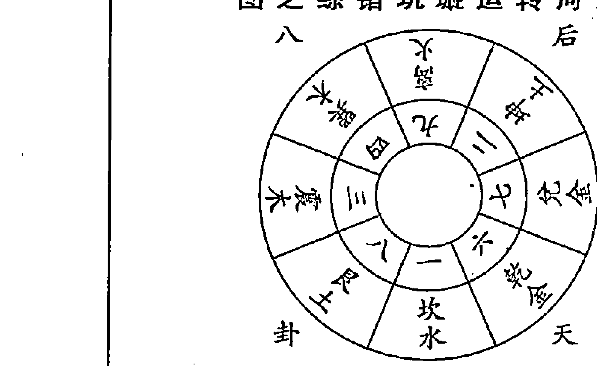

> 诗诀：
十道单兮四角双，
惟将五数在中央。
任他戊己存乎内，
五气行兮自发扬。
五气，乃五行也。

与我同行即为相，我生之月诚为旺。废于父母休于财，囚于鬼兮真不安。
《三元经》曰：九星休旺者，谓九星各旺于我生之月，相为同类之月，死于生我之月，囚于官鬼之月，休于妻才之月。
九星所属：天蓬水宿，天芮土宿，天冲木宿，天辅木宿，天禽土宿，天心金宿，天柱金宿，天任土宿，天英火宿。
假令水宿号天蓬，相在初冬与仲冬。旺于正二休四五，其余仿此自研究。

| 星宿 | 休旺描述 |
|---|---|
| 天蓬水宿 | 相于亥子月同类也，俱属水。旺于寅卯月我生也，水生木。废于申酉月生我也，金生水。休于巳午月我克也，水克火。囚于辰、戌、丑、未月克我也。土克水。 |
| 天英火宿 | 相于巳，午月同类也，俱属火。旺于辰、戌、丑，未月我生也，火生土。废于寅、卯月生我也，木生火。休于申、酉月我克也，火克金。囚于亥、子月克我也。水克火。 |
| 天冲天辅木宿 | 相于寅、卯月同类也，水见木。旺于巳、午月我生也，木生火。废于亥、子月生我也，水生木。休于辰、戌、丑、未月我克也，木克土。囚于申、酉月克我也。金克木。 |
| 天柱天心金宿 | 相于申、酉月同类也，金见金。旺于亥、子月我生也，金生水。废于辰、戌、丑、未月生我也，土生金。休于寅、卯月我克也，金克木。囚于巳、午月克我也。火克金。 |
| 天芮天任天禽土宿 | 相于辰、戌、丑、未月同类也，土见土。旺于申、酉月我生也，土生金。废于巳、午月生我也，火生土。休于亥、子月我克也，土克水。囚于寅、卯月克我也。木克土。 |

已上十二支所属，亥、子水，寅、卯木，巳、午火，申、酉金，辰、戌、丑、未土。此五行也。

## 急则从神缓从门，三五反复天道亨

> > 《三元经》曰：谓有事不暇择时，并三奇吉门，当天乙所在宫，及直符之神宫而去，谓之从神，自然获吉，盖直符甲子，常从六戊，是为天门，事急，则从天上六戊下去，事缓，则可待时三奇吉门而去。

假令冬至阳遁一局，甲己之日丙寅时，此时天乙加六丙于八宫，直符在一宫，若有急事，可向东北天乙下，及正北直符六戊下去皆吉也。

又曰：神谓如甲子蓬星日，丙寅时，甲子六仪头，以甲子天蓬星，休加地盘六丙上，即从奇下出去。如事急，欲出路，或在军阵，中门又不通，只寻吉神下去。事缓，可以就吉门，奇而往也。三者，三奇也。五星吉，英、任、冲、辅、心也。或门凶无奇，又无吉星，反伏无处吉，事又急迫，须向北斗下，默念三奇咒。云言不得三吉奇门，但从三奇所临方出，百事吉。所谓吉则从神也。

阴阳二遁有闭塞，八方皆无门可出，即依玉女法，凡甲子时、甲午时，在内利主，甲申时在门两损，甲辰、甲戌，在外利客。

> > 《符应经》：“若无奇门出，紧即依张良以筹加出天门地户而出也，吉利。”

## 十干加伏若加错，入库休囚吉事危

时加六戊，乘龙万里，莫敢呵止。六戊为天门，又为天武，宜以远行万里，百事吉。戊为天门，凶恶不起，当从天上六戊出，挟入天门，故曰：“乘龙万里”。凶恶不敢害，鸡不鸣，犬不吠，将兵客胜，闻忧无，闻喜有，利以远行、市贾，小人惊走亡命。

假令立春中元阳五局，甲己之日戊辰时，此时六戊在五宫寄坤二，以直符加时干，即六戊临二宫出西南吉。时加六己，如神所使，不知六己出被凶咎，己为六合，此时宜为阴谋秘密之事，当从天上六己出，不宜市贾，为显扬之事，隐匿如神所使，不知六己者，谓为显赫，必逢休咎，又为地户，独出独入，无有见者，将兵闻喜无闻忧，有利以出官、嫁娶。小人利亡命惊走。若占人，有逃亡、阴私之事。

时加六庚，抱木而行；强有出者，必见斗争。谓庚为天狱，此时凶强，有出者，必遇刑罪。故曰：“能知六庚，不被五木；不知六庚，误使入狱。”或被凌辱，将兵主胜，不利客，利屯营固守。闻忧有，闻喜无。市贾道死，物伤无利，入官嫁娶凶。六庚之时，惟宜固守，能知六庚之时，谓此时已下至六癸时，不宜出动。

时加六辛，行遇死人；强有出者，罪罚缠身。此时行来出入并凶。强有出入，斧钻在前，行为在累。故曰：“能知六辛，所往行来；不知六辛，多被杻械。”又辛为天庭，罪网自缠，将兵主胜，不利客，可行刑，决罪人，不宜嫁娶，入官、市贾、问疾。

时加六壬，为吏所禁；强出入者，飞祸将临。此时不可远行出入，百事凶，强出必有牢狱。壬为天牢，怨仇所稽，将兵主胜，利伏藏邀遮，不宜入官、移徙、嫁娶、逃亡。病者，进退不死。

时加六癸，众人莫视；不知六癸，出门见死。此时凶，不利，出入皆凶。宜隐遁求仙，亡命绝迹。当从天上六癸下，出入不见。故曰“众人莫视”。又癸为天藏，利以伏匿、逃亡，将兵主胜。闻忧有，闻喜无。不宜出官、市贾、嫁娶、移徙、入室凶，疾病者重，遗亡不得。

三奇嫌入，墓门嫌泊；墓官三位，有消停门。克下宫为障碍，时干克日干为损明。六仪受刑，天干日支神犯上，更忌支辰及伏吟，出兵发令恐紧急，加错三奇，入墓休囚，及犯十干伏吟等项，须吉返凶也。

十精为使用为贵，起宫天乙用无遗。

> 葛洪曰：“逾出于五土，归于九一者，为十也。”要精于九一之谓。阳遁阳使，起一终于九；阴遁阴使，起九终于一。天乙直使起宫异，所谓值门相冲也。阴阳二遁，各有二使。

假令冬至后，阳使起休门，阴使起景门，阳使起休门。故曰：直门相冲，今知用遁，自冬至后一百八十二日六十二分半，历子午之东部，阳气用事，惟阳遁阳使。夏至后一百八十三日六十二分半，历子午之西部，阴气用事，惟阴遁阴使。

> 古经云：“冬至后用阴使，夏至后用阳使，经述不显，隐伏之事也。”是穷天地侔造化，以通神明，以类万物之情。三光之回旋，四季之往复，一消一息，或升或降，而运之于无形，布之于无象。有所不见，以俟后人。若能谙此理，用之为贵也。

天目为客地为主，六甲推兮无差理。观君莫失此元机，洞彻九宫扶明主。

卯为天目，酉为地耳，又有六甲旬中，天目地耳推者，出兵日也。宝日为上吉，谓干生支也。如甲午日，甲木生丙火是也。义日次吉，谓支生干也。如甲子日之类，甲木子水，水生木也。和日为次吉，谓干支比和也。如壬子日之类，壬水子水和同也。制日为中平，谓干克支也，如甲戌日之类，甲木戌土，木克土也。伐日为极凶，谓支克干也。如甲申日之类，甲木生金，金克木也。

> 《素经》云：“潜居抱道，以待其时。”若能通于遁法，君不圣明，不能进扶直言；其国衰败，事不能行其政；隐身闲居，躲避衰乱之亡；抱养道德，以待兴盛之时。扶佐明主，名香万古。此乃时至而成功。不遇明君，隐迹埋名，守分闲居。若是强行，必受其累，亦无功成也。

宫制其门不为迫，门制其宫是迫雄

> 《经》曰：“吉门被迫，则吉事不成；凶门被迫，则凶事尤甚。”

宫制其门是凶迫，门制其宫是吉迫。门生宫为和，宫生门为义。

假令开门临三宫，休门临九宫，生门临一宫，景门临七，六宫为吉，门被迫则事不成。

假令伤门、杜门临二宫，八宫死门临一宫，惊门临三四宫为凶，门被迫，则为凶尤甚。

天网四张无路走，一二网低有路踪。三至四宫行人墓，八九高强任西东。

> 《三元经》曰：“天网四张，万物尽伤，此时不可举兵，为百事凶。”又曰：“神有高下，必须知之。”谓时得六癸之神，必有高下也。又曰：“但将天乙居何地，尺寸低而匍匐之。”谓得癸时神符高下。天乙在三四宫，谓之尺高，遇之不可出，出必伤。若被客围，却从卯、未、酉三宫看，合何门。奇可破，出无妨。

假令天乙在一宫，其神去地一尺，在二宫，去地二尺，皆天上六癸之下，即天乙所加之宫也。当此时必须匍匐，而以右手肩两而前行，过十步吉。若天网高三尺以上，可以消息避之，为天网过人。故准此。如天上六癸加一宫，即为一尺高也。五尺以上无碍矣。《万一诀》曰：天网四张时，谓时下得六癸也。癸酉、癸未、癸巳、癸卯、癸丑、癸亥，是为天网有高低者，若有急事，有此时不得不得行，当以高行而出。

假令大暑下元用阴遁四局，乙庚之日，日出时为己卯，此时天上六癸在八宫，以天芮直符加于二宫，得天任为六癸，下临八宫，即天网高八尺矣。阳遁此例。

> 《奇门大全》云：“天网四张，动众出兵，忌逢。若急事避难作法，一人独出，追兵至此，即自反伤。”

天网者，天上六癸之下是也。其神有高下，在坎高一尺，在坤二尺，震三尺，巽四尺。逾此者，本高不可出也。

如天上六癸直符，加地上一、二、三、四宫，为尺寸低，人即可扬声而去。若临六、七、八、九宫，为尺寸高，天网四张，不用也。时下得此，百事凶，天网四张，此时万事不宜，须合奇门吉，宿亦不宜用。

如破阵，欲取道出，宜两臂横负刀，则呼天辅之名，匍匐而出，则天网自败，无所伤矣。临六、七、八、九宫，其尺寸过人，犹不可用。将兵虽当隐伏，若敌人来攻，当自溃败。

天网四张不可当，此时用事有灾殃。若是有人强出者，立便身躯见血光。虫禽尚自避于网，事忙匍匐出门墙。假令立分丙辛日，时用禺中另四张。禺中，即癸巳时也。

节气推移时候定，阴阳顺逆要精通。三元积数成六纪，天地未成有一理。

一年分四季、八节、二十四气、七十二候。

三元例：乃冬至小寒及大寒，天地人元，一，二、三已载前。一节统三为正宗，下纪乃天支一周十二数，六纪是地支六周得七十二数。以一卦流三节为三元，则共成二十四气。以一节十五日分三候为三元，则共成七十二候。故云“三元积数成六纪”。六纪，乃七十二候之数也。凡一月，节有三候，气有二候。如正月立春节十五日，则东风解冻，蛰虫始振，鱼涉负冰，为三候也。雨水气十五日，则獭祭鱼，候雁北，草木萌动，为三候也。

> 《奇门总要歌》云 “三元超遁游六甲”，亦同此意。所以天地造化，乃一定之理数也。

请观歌里精微诀，非是贤人莫传与。

此歌中之语，句句如神，字字有妙，非是贤者，不可妄传，恐有小辈得诀，入诱小人，为害不浅。遁甲之文，黄帝之师风后，留传太公，至于子房。晋朝盗乱，发子房冢，于木枕中，得此秘文。上有誓诫，曰：不许传于不仁之人。若非其人，必受其殃。得其人而不传，亦受其殃。晋尚书郭璞撰《青囊经》，亦编入《遁甲星奇》一篇于内。此文乃济世之宝，藏之如珍也。弘治乙卯解至丁巳春月重解，至正德戊辰年春方注解类编成册。章贡后学池本理书。

# 卷十九 术数汇考十九

## 奇门遁甲

### 景祐遁甲符应经纂

直符加时干之所在，直事天乙之游宫是也。然后以直符加时干，谓所用之时干也。如甲子为六戊，甲戌为六己，甲申为六庚，甲午为六辛，甲辰为六壬，甲寅为六癸是也。以直事临得宫，以所用之时为头，看阴阳逆顺数之。如庚子时至庚子住，辛丑时至辛丑住，即知八门所在。三奇所临，更有天上之星加地下之宿，如此则伏刑格，反跌击墓相入之事，吉凶之方皆可见矣。

甲加丙，为青龙反首，万事吉利。丙加甲，为飞鸟跌穴，万事吉利。乙加辛，为青龙逃走，万事大凶。辛加乙，为白虎猖狂，万事皆凶。丁加癸，为朱雀投江，行兵溃散，万事皆凶。癸加丁，为螣蛇夭矫，万事凶恶。丙加庚，为荧惑入太白，万事大凶。庚加丙，为太白入荧惑，万事大恶。戊加子，为伏吟。八门，六甲不动也。子加午，为反吟，不可用，大凶。以直符加庚，为飞宫格。庚加日干，为飞干格。以直符加刑，为击刑。① 直符加刑上，为刑格。② 乙奇加坤，为入墓。③ 三奇入墓为凶时，时干贼日亦凶。

天乙直符所临，为天网时，下得癸，不宜举事。若临一、二、三、四、五宫，为天网，低走者、不远逃者，被获。若临六、七、八、九宫，为天网，高走者、远逃者，不获。

加甲门合吉，甲加乙吉，加丙吉，加丁吉，加戊吉，加己吉，加庚吉，加辛吉，加壬吉，加癸吉。

加甲门合吉宜财。乙加甲凶，加丙吉，加丁半吉，加戊吉，加己半，加庚凶，加辛凶，加壬吉，加癸半。

1.  如甲子为直符，加卯上是。
2.  如击刑例取之。
3.  丁同。又或日加艮。

## 释求天正冬至日辰

置距所求，积年自演纪。上元甲子距今，大宋景祐元年甲戌，岁积一千一十五万四千九百五十算外。上考往古，每年减一算；下验将来，每年加一算。以岁实三百八十三万五千六十八乘之，为炁积。分满日法，一万五百余之，为积日，不满为小余。其积满纪法，六十去不尽，为大余。命起甲子，算外即所求。天正冬至日辰，若求诸炁大小余者，置冬至大小余，每炁加一一十五日，小余二千二百九十四分半。小余满一万五百从大余，大余满纪去之。命甲子算外，即诸炁日辰及小余数终。

## 释诸求发敛加时

置其气小余，加中星辰法四百三十七分半，乃以辰法八百七十五除之，为辰数不满。以刻法一百五除之，为刻又不满。为分其辰数，命起子初，算外即得其气，发敛加时辰刻及分。

## 释求天正十一月经朔日辰

置天正冬至炁，积分满朔，实三十一万七十一秒，二十四去之不尽。减炁积，分满日法，一万五百余之，为积日，不满为小余。其积日满纪法，六十去之不尽，为大余。命起甲子，算外即天正十一月，经朔日辰及小余。若求诸朔日者，以朔策二十九日，小余五千五百七十一秒，二十四气累加之。秒满百，从小余；小余满一万五百余日，从日分。满纪法去之，命甲子，算外其朔日辰及余其有进退者，但命日辰为定也。

## 释天乙直使起宫异门

王璋曰：“天乙直使起宫异门者，谓门相冲也。”阴阳二遁各有二使，假令冬至后阳使起一宫，阴使起九宫，夏至后阴使起一宫，阳使起九宫。故曰：“起宫异门相冲”。冬至已后，阳使初起，休门直事，阴使，起景门；夏至已后，阴使起景门，阳使起休门，故曰“直门相冲”。

今之用遁者，自冬至已后一百八十二者，六十二分半，历子午之东部，阳气用事，惟用阳；使夏至过后一百八十二者，六十二分半，历子午之西部，阴气用事，惟用阴使。古经云：“冬至后用阴使，夏至后用阳使，则不显鬼神隐伏之事。”故也。

## 释一顺一逆时应节变

葛洪云：“冬至炁应阳使顺行，阴使逆行；夏至炁应阴使顺行，阳使逆行。”时应节变者，全用算法，各求二至加时炁应，以明之毕。二十四气各求加时，炁用遁起，超神接气，得精微之要。使吉凶有凭，用之无误矣。

## 释二遁直符合于中宫

葛洪曰：“合于中宫者，谓阳遁阳使，冬至上元甲己之日夜半生，甲子初辰起在一宫，历五时至戊辰在中宫，阴使起九宫逆行，历五时亦至戊辰，亦在中宫。阴遁阴使，夏至上元甲己之日夜半生甲子，初起九宫，历五时，戊辰在中宫，阳使起一宫，历五时，戊辰亦在中宫，故曰合也。”

## 释二遁出于四六

葛洪曰：“出于四六者，谓子时至巳时，阳使出于六，阴使出于四，故曰出于四六也。”

## 释二遁逾于五七归于九一

道，半北为阴道。夏至后，五宫半北为阳道，半南为阴道。凡直使在五宫之时，利客不利主。

## 释八门所主

开门宜远行征讨，所向通达；休门宜集万事，治兵习业；生门宜见贵人，营造百事；伤门宜渔猎捕讨，行逢盗贼；杜门宜邀遮隐伏，诛伐凶逆；景门宜上书遣士，突破阵围；死门宜行刑诛戮，吊死送葬；惊门宜掩捕斗讼，攻击惊恐。

以上八门，有开、休、生三门，宜出其下。若更合三奇吉宿，最为上吉。五凶门不可出其下，须避之可也。

## 释九星吉凶

> 《三元经》曰：“时下得天辅、天禽、天心为上吉，天任、天冲为次吉，天蓬、天芮为大凶，天柱、天英为次凶。更以五行旺相言之，若大凶之星得旺相，即小凶；若小凶之星得旺相，及吉门吉星，无气则中平。”

以意审之，假令冬至后时下得天任吉宿，乘相气为上吉也。忽乘死囚，又为中平矣。

## 释九星休旺

> 《三元经》曰：“九星休旺，谓九星各旺于我生月，相于同类月，死于生我月，囚于官鬼月，休于财月。亥子水，寅卯木，巳午火，申酉金，辰戌丑未土。金、水、木、火、土，①金、木、土、水、火。②克我鬼，我克财，生我者父母，我生者子孙。”

假如天蓬星是水星，旺于寅、卯月，相于亥，子月，死于申、酉月，囚于辰、戌、丑、未月，休于巳、午月是也。

## 释九星所主

天蓬星名子禽，常主一坎水休门。
主杀人，惟利客。又曰：春夏用之，军大胜，秋冬用之有灾凶。

天芮星名子成，常主二坤土死门。
受道结交天芮星，行兵值此结其宗。半道相逢雷雨作，出军败将百无功。

天冲星名子翘，一云翅，常主三震木伤门。
宜报仇攻击。又曰：天冲之宿星之英，用时逢此主昌荣。更得三奇合此宿，折冲千里振天声。

天辅星名子卿，常主四巽木杜门。
天辅之时宜设礼，行军千里振天威。

天禽星名子公，常主五中央土。
上将功臣封爵禄，鞠旅陈师敌自亡。

天心星名子襄，常主六乾金开门。
上将提兵功百胜，不宜春夏恐凶临。

天柱星名子韦，又子由，常主七兑金惊门。
天柱藏形并固守，权兵挥武总无功。

天任星名子申，又子章，常主八艮土生门。
天任之时宜庆贺，主将提兵功奏凯。

天英星名子然，又子威，常主九离火景门。
天英出入事虚强，战斗之时大吉昌。
若欲远行出门者，皆从吉门向方，呼其星之名，而出行六十步，左回太阴中大吉。
五阳时宜出行，若吉事从吉门，凶事从凶门，若生门宜见贵人，惊门宜掩捕是也。

## 释三甲合

上局仲甲，谓甲己之日夜半生甲子，丙辛之日日中甲午是也。此时关格刑德，俱在内用兵，若先举者败，不可以出入，利于逃亡，主客俱不利。
中局孟甲，谓戊癸之日平旦甲寅时，乙庚之晡时甲申是也。此时阳气在外，利藏兵固守，不可出，利主不利客。
下局季甲，谓丁壬之日入时甲辰，甲己之日黄昏甲戌是也。此时阳气在外，阴气在内，利出行动众，百事皆吉，利客不利主。
又六甲之夜半子时，三甲皆合，谓今日是直符并。时下是甲，故名之曰三甲合也。

## 释三奇得使

葛洪曰：若得三奇之使，尤益其良，谓在此六甲之上，自得所使之奇，甲戌、甲午，乙为使，甲子、甲申，丙为使，甲辰、甲寅，丁为使。

| 假令阳三局 | 并用此局，乙庚之日人定为丁亥时也，此时六乙日奇临九宫，甲午是为乙奇得使。 |
| :--- | :--- |
| 乙奇 丁庚 丙 己戊癸 壬辛 | |
| 丁亥时 | |
| 大寒上 | 芒种下 春分上 雨水下 |

| 假令阴三局 | 并用此局，丙辛之日食神是壬辰，六乙日奇，下临九宫，甲午是为乙奇得使。 |
| :--- | :--- |
| 丙奇 辛 丙 癸 己癸丁 壬 戊 壬 | |
| 壬辰时 | |
| 夏至中 寒露下 | 立冬中 白露下 |

| 假令阳五局 | 并用此局，丁壬之日，日中为丙午，此时六丙月奇，下临一宫，甲子是为丙奇得使。 |
| :--- | :--- |
| 丙奇 壬 戊 癸 丁庚己 乙丙辛 | |
| 丙午时 | |
| 小寒下 雨水下 | 小满上 立春中 |

| 假令阴五局 | 并用此局，丙辛之日，人定为己亥时，此时六丁星奇，下临四宫，甲辰是为星奇得使。 |
| :--- | :--- |
| 丁奇 壬 戊 癸 丁庚己 乙丙辛 | |
| 己亥时 | |
| 小寒上 雨水下 | 小满上 立春中 |

| 假令阴六局 | 并用此局，乙庚之日鸡鸣为丁丑时，此时六丙月奇，下临一宫，甲子是为丙奇得使。 |
| :--- | :--- |
| 丙奇 丁 己 癸 壬乙戊 庚辛丙 | |
| 丁丑时 | |
| 夏至上 寒露上 | 立冬上 白露上 |

假令阴六局同。

并用此局，乙庚日禺中为辛巳时，此时六丁星奇，下临八宫，甲寅是为星奇得使。

## 释三奇之灵

葛洪曰：“三奇之灵，宜以出行。”三奇者，六乙为日奇，六丙为月奇，六丁为星奇，与善神并开、休、生三吉门合，则为奇之灵也。三奇与三吉门，其中合共临之即是。吉道清灵，此时此方可以陈兵行营，征伐操练，扬兵耀武，发号施令，俱吉。又曰：宜求福、安社稷、化人民。

| 癸丁己 | 乙奇戊壬乙 | 丙庚辛 |
| :---: | :---: | :---: |
| | 己未时 | |
| **说明** | 假令冬至下元阳四局，戊癸之日日中为戊午时，此时戊在四宫，以直符天英加时干六戊，即休门合六丁星奇，下临六宫，西北方吉。 | |

王璋曰：“九天之上六甲子。
谓六甲为直符，当战斗之时，士众背直符，所临之宫，而击对冲，无不胜。故《经》云“扬兵九天之上”。所以甲为九天之上者，谓阳称乾，乾主壬甲，乾为天道上升，则甲至壬为九，故六甲为九天。以六甲皆称甲子者，是六甲之始，支干之长，皆称甲子故也。

### 九地之下六癸酉。

谓“六癸酉”为九地之下者，《易》称坤之六乙、癸，又坤为地道下降，从乙逆数至癸，亦九，故六癸为九地之下。六癸皆称癸酉，乃是甲子之中，故凡逃亡绝迹者，宜从六癸之方，避敌亦然。出入无人见者，以癸者阴干之中，故为九地而言六癸酉也。

### 三奇之灵六丁卯，

谓六丁为三奇之灵，凡出入用兵，战斗皆从天上六丁所临之方而去者，百事皆吉。故《经》云：“能知六丁，出幽入冥，至老不刑。刀虽临项，犹安不惊。”盖六丁者，六甲之阴神，各有名字：丁卯之神，字文伯；丁丑之神，字文翁；丁亥之神，字文公；丁酉之神，字文卿；丁未之神，字文通；丁巳之神，字庭卿。凡有用事，出入、六丁之时，宜合呼其神之字，当得庇佑。故云“三奇之灵”。六丁皆然，特举丁卯者，亦举甲子一句，以明前甲子也。

### 六合之中六己巳。”

谓六己之位，皆为六合之中，凡为阴谋秘密之事，宜从天上所临六己之方面出入。故《经》云“六合为私门，出入无有见者，故以己巳为六合之中”者，谓从甲数至己，六甲与己合，故为六合。六己巳者，亦举甲子一句之义也。

## 释九天九地太阴六合

张良曰：“九天之上，利以扬兵；九地之下，利以伏藏；太阴六合之中，可以逃亡。冬至阳遁，天上直符，后一九天，后二九地，前二太阴，前三六合；夏至后阴遁，天上直符，前一九天，前二九地，后二太阴，后三六合。”

| | 假令阳遁上元一局甲己之日平旦丙寅，天上直符临八宫，即后一九天，临一宫，后二九地，临六宫，前二太阴临四宫，前三六合临九宫。 | 太丙阴寅六九合天○九○地 | 假令阴遁上元九局甲己之日平旦，直符临二宫，即前一九天，临七宫前二九地，临六宫，后二太阴临四宫，后三六合临三宫。 |
| :--- | :--- | :--- | :--- |
| 六合○○九九天地 | 假令阳遁上元一局甲己之日平旦丙寅，天上直符临八宫，即后一九天，临一宫，后二九地，临六宫，前二太阴临四宫，前三六合临九宫。 | 太丙阴寅六九合天○九○地 | 假令阴遁上元九局甲己之日平旦，直符临二宫，即前一九天，临七宫前二九地，临六宫，后二太阴临四宫，后三六合临三宫。 |

## 释伏吟

汤谓曰：“子来临子为伏吟，此时不宜用兵，惟宜敛财货。”凡六甲之时，直门符皆是伏吟。

假令冬至上元阳一局，甲己之日半夜生甲子，天蓬直符皆临一宫，时干在一宫，休门直事在一宫，此时门伏吟皆伏吟。

## 释反吟

汤谓曰：“子来加午为反吟，此时不利举兵动众，惟利恤民散仓廪之事。”凡门符对冲对，皆是反吟。

| | 假令冬至上元一局甲己之日鸡鸣为乙丑时，此时六一在九宫，以天蓬加时干，即是直符反吟。其日，日晡为壬申时，此时九宫以直事一宫，休门加之，即是直门反吟。 |
| :--- | :--- |
| 壬甲乙申子丑辛乙己庚壬丁丙戊癸 | 假令冬至上元一局甲己之日鸡鸣为乙丑时，此时六一在九宫，以天蓬加时干，即是直符反吟。其日，日晡为壬申时，此时九宫以直事一宫，休门加之，即是直门反吟。 |

## 释遁甲利客

《经》曰：天蓬星水也加九宫火也，利于为客。若在秋冬之月，或壬癸亥子日，临战有黑云黑气从北来助战，大胜。

天心金、天柱金加三宫水、四宫木，利于为客。若在季夏并秋月，庚、辛、申、酉日临阵，有白色云气，从西北来助战，大胜。

天任土、天禽土、天芮土加一宫木，利于为客，吉。若在四季，戊、己、辰、戌、丑、未日，有黄色云气，从东北或西南来助战，大胜。

天辅木、天冲木二宫土，利于为客，吉。若在冬春之月甲、乙、寅、卯日，有青色云气，从东南来助战，大胜。

## 释遁甲利主

《经》曰：天英星火临一宫水，利于为主，吉。若在秋冬之月壬、癸、亥、子之日，有黑色云气从正北方来助战，大吉大胜。

天任土、天禽土、天芮土临三宫木、四宫木，利于为主，吉。如在冬春之月甲、乙、寅、卯日，有青色云气从东南来助战，大胜。

天辅木、天冲木星临六宫金、七宫金，利于为主，吉。如在季夏及秋月及庚、辛、申、酉日，有白色云气从西方来助战，大胜。

天蓬水临八宫土加二宫土，利于为主，吉。如在季月辰、戌、丑、未、戊、己日，有黄色云气从东北方或西南方来助战，大胜。

天柱金、天心金星如九宫火，利于为主，吉。如在春夏之月丙、丁、巳、午日，有赤色云气从南方来助战，大吉，大胜。

## 释门迫

《经》曰：宫制其门则不为迫，门制其宫则为迫。若吉门被迫则吉事不成，凶门被迫则灾尤甚。

假令开门金，临三宫木、四宫木，休门水临九宫火，生门土临一宫水，景门火临六宫金、七宫金，此为吉门被迫，则吉事不成。

假令伤门木临八宫土、二宫土，死门土临一宫水，惊门金临三宫木，此为凶门被迫，凶灾尤甚矣。

## 释天遁甲

天遁者，生门与六丙月奇合，临于六丁之上，为天遁。此时得月精之蔽。

| 乙酉时 戊乙 壬生 癸己丁 丙辛丙庚 | 假令阳遁四局，乙庚之日，日入为乙酉时，天心直符加时干六乙，开门直事加时七宫，即生门与六丙月奇临六丁于一宫，是为阳局之天遁也。 |
| :--- | :--- |
| 庚申时 庚生 辛丙 丙癸 丁壬己乙戊 | 假令立夏下白露下、寒露下、立冬上，并用阴遁六局，戊癸之日晡时为庚申时，天蓬为直符，加时干六庚休门，直事加四宫，即生门与六丙月奇合，临六丁于九宫，是为阴局之天遁也。 |

## 释地遁甲

地遁者，开门与六乙日奇合临于六己之上，为地遁。此时得日精之蔽。

| 辛庚丙 辛卯时 乙壬戊 乙丁癸 丙己 | 假令冬至上、惊蛰上、清明中、立夏中，并用阳一局，丙辛之日，日出时为辛卯时，天冲为直符，加时干六辛伤门，直事加二宫，即门与六乙日奇合，临六己于二宫，是为阳局之地遁也。 |
| :--- | :--- |
| 癸丁己 戊壬乙 丙庚辛 丙寅时 | 假令夏至上、白露上、寒露中、立冬中，并用阴遁九局，甲己之日平旦丙寅时，天英为直符，加时干六丙景门。直事加时七宫，即开门与六乙日奇合，临六己于八宫，是为阴局之地遁也。 |

## 释人遁甲

人遁者，休门与六丁星奇，合前二太阴，中为人遁，此时得星精之所蔽。

| 癸丁己 戊壬乙 丙庚丁 己巳时 | 假令冬至中、惊蛰中、清明下、立夏下并用阳遁七，为乙庚之日夜半丙子时，天任为直符，加时干六己，景门直事加时四宫，即休门与六丁星奇合，后入阴中，临六宫是为阳局之人遁也。 |
| :--- | :--- |

凡得三遁之时，出奇门，百事大吉。

## 释三奇入墓

> 葛洪曰：“三奇人墓者，谓乙未时为日奇入墓，乙为日奇，乙未墓在未，故为日奇人墓之时；丙戌时为月奇人墓，丙火墓在戌，故为月奇人墓之时也。丁奇亦丙火同。”

凡遇丙辛之日，日昳是为乙未日奇入墓之时。遇乙庚之日黄昏丙戌，是月奇入墓之时也。

> 王璋曰：“经所谓三奇入墓者，谓六乙日奇临二宫，六丙月奇临六宫，六丁星奇临六宫，谓之三奇入墓也。”

| 左部分 | 右部分 |
| :--- | :--- |
| 乙己时 辛庚丙 壬戊癸 丁 己  假令冬至上、惊蛰上、清明中、立夏中并用阳一局，丁壬之日映时乙巳，六乙日奇临二宫，为日奇入墓也。 | 丁丑时 乙戊壬 辛丙庚 己癸丁  假令夏至中、白露中、寒露下、立冬下并用阴三局，乙庚之日鸡鸣丑时，六乙日奇临二宫，为日奇入墓也。 |
| 庚寅时 戊己癸 壬乙辛 庚丁丙  假令大暑下、处暑中、秋分下、大雪上并用阴四局，丙辛之日平旦庚寅，六丙月奇临六宫，是为月奇入墓也。 | 辛卯时 辛亥丙 乙壬戊 己丁癸  假令冬至上元阳一局，丙辛之日日出辛卯时，六丁星奇下临于六宫，是为星奇入墓也。 |

凡遇三奇入墓，纵得吉宿奇门，不可做事，百事皆凶。

## 释六仪击刑

葛洪曰：六仪击刑者，谓甲子直符时加卯，子刑卯，卯刑子也。

甲戌直符加未，戌刑未，未刑戌也。甲申直符加寅，寅刑巳，巳刑申也。甲午直符加午，午自刑也。甲辰直符加辰，辰自刑也。甲寅直符加巳，寅刑巳也。

> 王璋曰：“甲子直符临三宫，甲戌直符临二宫，甲申直符临八宫，甲午直符临九宫，甲辰直符临四宫，甲寅直符临四宫。”

假令阳一局，甲己之日夜半甲子时，直符至日出卯时，是六仪击刑也。

假令至日昳未时，以直符甲子，加时干六辛于三宫，即是也。刑遁仿此。

## 释太白入荧惑

> 汤谓曰：“庚为太白，丙为荧惑。若太白入荧惑对敌，宜防贼来。”

| 乙 辛 己 戊 丙 癸 壬 庚 丁 | 假令夏至中元阴三局，乙庚日平旦戊寅时，六庚在一宫，以直符天芮加时干于三宫，即六庚下临六丙于二宫，此太白入荧惑也。 |
| :--- | :--- |

## 释荧惑入太白

汤谓曰：“丙为荧惑，庚为太白。若荧惑入太白斗，贼必两退还。”

| 庚壬 丁 壬辛 己 乙 丙 癸 戊 | 假令立冬上元阴六局，甲己之日平旦寅时，六丙在八宫，以直符天心加时干，即六丙下六庚临于四宫，此名荧惑入太白也。 |
| :--- | :--- |

## 释青龙反首

葛洪曰：“六甲加六丙，名青龙反首。凡阴阳二遁，此时可造，百事吉。若更合奇门，利攻战。出行最为良。”

| 辛 乙 己 庚 壬 丁 丙 戊 癸 | 假令冬至上元阳一局，甲己之日平旦为丙寅时，此时六甲在一宫，以甲子天蓬直符加时干六丙八宫，此名青龙反首也。 |
| :--- | :--- |

## 释飞鸟趺穴

葛洪曰：“六丙加六甲，名飞鸟趺穴。阴阳二遁，此时利为事，出行大吉。营造起动，皆为良美。”

| 壬 戊丙 庚 辛 癸 丙 乙 己 丁 | 假令中元阳九局，甲己之日日跌为辛未时，六丙在七宫，以直符天英加时干六辛于三宫，即六丙临六甲于九宫，此时名飞鸟趺穴也。 |
| :--- | :--- |

## 释天乙伏宫格

> 《三元经》曰：“六庚加直符，名天乙伏宫格。此时主客俱不利也。”

| 庚己丁 | 丙辛乙 | 戊庚癸壬 |
| :--- | :--- | :--- |
| | 假令下元阳二局，甲己之日日晡时为壬申时，此时六庚在四宫，以直符天芮加时干六壬于六宫，即六庚，即六庚下临六戊，直符二宫，此名天乙伏宫格。 | |

## 释天乙飞宫格

> 《三元经》曰：“直符加六庚，名天乙飞宫格。当此之时，主客俱不利。”

| 壬乙 | 戊癸 | 庚癸丙丁 |
| :--- | :--- | :--- |
| | 假令春分中元阳九局，甲己之日日中为庚午时，此时直符在九宫，以直符天英加时干，即直符下临六庚于二宫，此名天乙飞宫格。 | |

## 释天乙伏干格

> 《三元经》曰：“六庚名太白所加为格，若加日干，则为伏干格，凡遇此格，主客战斗，俱各不利。”

| 己丙辛 | 壬戊癸 | 丁壬庚乙 |
| :--- | :--- | :--- |
| | 假令小满上元阳五局，甲己之日日晡时为壬甲，此时六庚在七宫，以直符天禽加时干六壬于九宫，即六庚下临六甲，日干于二宫也。 | |

## 释天乙飞干格

> 《三元经》曰：“今日之干加六庚，为飞干格。此时战斗，主客两伤。”

# 卷二十 术数汇考二十

## 奇门遁甲

### 遁甲穿壬

| 天干排列 | 说明 |
|----------|------|
| 乙丙辛 壬癸 丁庚己 | 假令小满上阳五局，甲己日日中时为庚午，此时日干加在五宫配坤二宫，以直符天禽加时干六庚七宫，即日干六甲下临六庚于七宫，此名飞干格。 |

## 释岁格

> 《三元经》曰：“六庚加今太岁干，名岁格。此时大凶。”

| 天干排列 | 说明 |
|----------|------|
| 癸壬戊 己丁庚 辛乙丙 乙丙辛 壬癸 丁庚己 | 假令立春上元阳五局，岁干在辛，以甲己之日日入为癸酉时，此时六庚在七宫，以直符天禽加六癸一宫，即六甲下临六辛于八宫也。 |

## 释月格

> 《三元经》曰：“六庚加今月朔日，为凶时。”

| 天干排列 | 说明 |
|----------|------|
| 癸壬戊 辛乙丁 己丙庚 | 假令立春上元阳八局，月朔干在己，以甲己之日日出为丁卯时，此时以直符天任加六丁，即六庚在二宫，下临月朔六己于九宫，此名月朔格。 |

## 释日格

> 《三元经》曰：“六庚加今日日干，名曰日格。此时大凶。”

| 天干排列 | 说明 |
|----------|------|
| 己庚丁 癸戊壬 辛丙乙 | 假令小暑下元阴五局，日干在己四宫，甲己之日平旦为丙寅时，此时以天禽加时干六丙七宫，即六庚在三宫下临日干六己于四宫，此名为日格。 |

## 释时格

> 《三元经》曰：“六庚加时干，名为时格，亦伏吟格。此时不可举事，用兵大凶也。”

| 庚 | 己 | 丁 |
|----|----|----|
| 丙 | 辛 | 乙 |
| 戊 | 癸 | 壬 |

假令小寒上元阳二局，丙辛日鸡鸣为乙丑时，此时六已在三宫，以直符天辅加时干，即六庚下临六已于三宫，此为时格。

凡六庚为直符，即十时皆格也。

## 释大格

> 汤谓曰：“六庚加六癸，为大格。此时百事凶。谓天上六庚临地下六癸，此时不可举事，遗失不可求，不在。”

| 戊 | 己 | 丙癸 |
|----|----|------|
| 壬 | 乙 | 辛   |
| 庚 | 丁 | 丙   |

假令以直符天辅加时干六丙在六宫，即六庚下临六癸于八宫，此名大格。

## 释刑格

> 汤谓曰：“凡六庚加六己，为刑格。谓天上六庚加地下六己，此时车破马伤，中道而止，士卒逃亡。凡所行，皆凶。”

| 己 | 丁 | 乙 |
|----|----|----|
| 戊 | 庚 | 壬 |
| 癸 | 丙 | 辛 |

假令大寒上元阳三局，甲己之日平旦为丙寅时，此时六庚五宫而寄理坤二宫，以直符天冲加时干六丙，即六庚下临六己于四宫，此名刑格。

## 释青龙逃走

> 王璋曰：“六乙加六辛，名青龙逃走。此时不可造百事，凶。”

## 释白虎猖狂

王璋曰：“六辛加六乙，名曰白虎猖狂。此时不可举动百事，凶。”

## 释朱雀投江

王璋曰：“六丁加六癸，名朱雀入江。此时忌为百事。”

## 释螣蛇天矫

王璋曰：“六癸加六丁，名螣蛇天矫。此时所为不利。”

## 释时悖格

汤谓曰：“六丙所加此，名时悖。悖者，乱也。为天上六丙，临年、月、日、时干。直符类同，六庚所加之义，凡举百事用兵，遇悖，主纪纲紊乱，凶也。”

假令冬至中元阳七局，丁壬之日日映为丁未时，六丙在五官寄坤二宫，以直符天芮加时干，即六丙下临六丁于四宫，此名时悖也。
凡遇六丙六庚之宫，为直符加时干，即此时皆为悖凶时，宜审之也。

## 释遁甲五阳所利

《三元经》曰：“五阳利以为客，当为之时，即先举兵，高旗鸣鼓，耀武扬兵，以决胜。”谓时下得甲、乙、丙、丁、戊五千善神治事，可以出军、征伐、远行、求利、立国、建邑、安邦、立社稷、化人民、临武事、入官、移徙、嫁娶、造举百事，吉。逃亡者不可得。《经》曰：“直使之行，一时一易，行阳，利以为客。”故曰：“得阳者，飞而不止。”五干在子、午之东部，生气也。故利客先举。

假令甲己之日夜半时甲子，自子至辰时，得甲、乙、丙、丁、戊是五阳时，利为客，宜先举，不拘阴阳二遁，皆如此例也。

## 释遁甲五阴所主

《三元经》曰：“五阴时利以为主，即后举兵，低旗衔枚待敌，时至而后动，以决胜。”谓时下己、庚、辛、壬、癸五千恶神治事，不可拜官、移徙、婚姻、远行、造举百事，大凶。逃亡者可得。宜为密谋筹策，集会武略，祷祠宜福。《经》曰：“直使之行，一时一易，行阴，利以为主。”故曰：“得阴者，伏而不起。”五干在子、午之西部，死气也。故利主后动也。

假令甲己之日夜半时甲子，自巳至酉时，得己、庚、辛、壬、癸，是五阴时，利为主后动，不拘阴阳二遁，皆如此例也。

## 释之三避五

《三元经》曰：“天道不遂，三、五返复之。三避五魁。”然独处三为生气，故之三也。五为害气，故避五也。三为威，五为武，盈于三，衰于五，匹马只轮，有反无顾。

假令冬至上元阳一局，甲己之日夜半为甲子时，至平旦为丙寅时，得此之三时为生气，利百事。故曰：之三至食时为戊辰时，此五时为害气，故凶。百事不可举，故避之也。

## 释德威之时

葛洪曰：“六丙为威，六甲为德，利以为客，宜发号施令。入其国，犬不吠，马不鸣。回车止轮，折冲万里，不敢有声。兵来向者，还自灭形，贼必亡矣。天兵来助，敌人自恐。天兵扶行，敌人自惊。将兵征伐，为客大胜。若此时，不利为主，惟宜固守屯营，以待天时。”

## 释三奇游六仪即玉女守门时

《三元经》曰：“三奇游六仪，利以宫庭燕会，喜乐之事。”六仪者，六甲也。三奇者，乙、丙、丁也。谓乙、丙、丁游六仪之上，甲子旬有庚午，甲戌旬有己卯，甲申旬有戊子，甲午旬有丁酉，甲辰旬有丙午，甲寅旬有乙卯，此时玉女守门之时也。

## 释天辅时

《三元经》曰：“天辅之时，有罪无虞。斧锁在前，天犹赦之。”谓甲己之日，时下得己、庚、乙、丙、辛、丁、壬、戊、癸、己时，下得甲故也。假令甲己之日日中己巳，乙庚之日晡时甲申，丙辛之日日中甲午，丁壬之日食时，甲辰、戊癸之日平旦甲寅，是天辅时，此时有罪自释。

## 释天网四张

《三元经》曰：“天网四张，万物皆伤。此时不可举用，万物皆凶。”又“神有高低，必须知之”，谓时下得癸之时，神有高低也。假令天一在一宫，其神去地一尺，在二宫，高二尺，谓天上六癸之下，即天一所加宫也。当此之时，必须匍匐而去，左右肩刃而行，十步吉。若天高二尺，以上可以消息避之，为天网过人，故准此用之。

## 释四时所利

《三元经》曰：“春夏之节，杀气潜藏俱下，阳气在上也。若战斗对敌，利居内平野之地。冬秋杀气飞腾，居上阳气在下也。若对敌，利居外丘陵之地。盖乘其杀气也。”

## 释亭亭白奸

王璋曰：“亭亭者，天乙贵神也。背之而击其冲，大胜。其法以月将加时神，后不是。”假令正月登明为月将，加午即神后，临未为亭亭所在。又一法，子日在巳，丑日在午，顺行十二辰背之吉。“白奸者，天之奸人也。合于巳、亥格，于寅、申当合之时，俱背之当格之时，背亭亭向，白奸，其法以月将加时，寅、午、戌上见神，是白奸之位，常以寅、申、巳、亥为四孟。”假令正月登明为月将，加午即登明临子，即白奸在亥。此类推之。又法：寅、午、戌日在亥，亥、卯、未、日在辰，申、子、辰日在巳，巳、酉、丑日在申，背之吉。

## 术数

门异遁而同宫。
八门飞遁，生克亦随宫断，故伏吟则俱归本位。
毕五日而支干相续，尽三元而首尾交通。明拆补而归余闰，
每一节十五日二时零五刻，推拆归闰。上局闰于五日之后，中局闰于十日之后，下局闰于十五日之后。
审节中之所穷。详干支之起义，识伏遁之所从。
即春开冬阖之义。故万物化生于甲，孽息于子，茂盛于戊。
至消灭而成一纪，故甲戌常随六己。
戌为灭，己为理，有条贯而成纪，则渐消灭。
坚甲于申而身形更实，故甲申常随六庚；
庚主秋金，万物至秋而实，凡事亦然。
长大于午而更体益新，
午为长大，辛为更新。
必怀妊而后振动，故甲辰常随六壬。律途穷而揆革，故甲寅常随六癸。
寅为律，癸为揆，由生物之律途引而达之，而萌芽始揆藏而发。
乙为盘屈而萌，丙为昭著而炳，丁为长养而强。东阳之极为日，
乙居东为日奇，以日之东升。
离火之精为月，
丙居南为月奇，离日而明。
积阴之著为星。
丁为太阴星奇。
分日月星而为三奇，周一局六甲为六仪。列八卦而运八节，列九星而分九宫。是故五行之德，以地承天。
天一生水，地六承之。地二生火，天七承之。天三生木，地八承之。地四生金，天九承之。天五生土，地十承之。此河图之数，五行之始，谓天行炁之象，犹妻承夫之义也。
镇于五方，
北方阴炁所积，水居北；南方阳炁盛动，火居南；东方阳炁所生，木居东；西方阴炁所禁，金居西；中央吐纳万物，故土居中。
列为五色，
青居东，象木。赤居南，象火。白居西，象金。黑居北，象水。黄居中，象土。此五行正色也。从金生水而一白居坎，水还于地而二黑居坤，以水生木而三碧居东，木坏金炁而四绿居巽，五为天地之中，故土黄无变，从而生金，则得金之正色，而邻于水，从而受丁火，则受火之赤色而归兑，纳丙火，则受阴之凝结而归艮。水居北方，与南为对。离为阴火，积阴之著，映带于水，故其色为紫。

- 发为五声，
  - 宫土，商金，角木，徵火，羽水。

- 酿为五性，
  - 即仁、义、礼、智、信。

- 通为五味，
  - 通于口者酸、苦、辛、咸、甘。

- 动为六情。
  - 喜、怒、哀、乐、爱、恶。

喜居巳酉，
西方之情，喜行宽大。金生于巳，盛于酉，故巳酉得位而知喜。

怒征亥卯，
东方之情主怒，怒行阴贼。木生于亥，旺于卯，故亥卯见而征其怒。

哀占丑戌，
方之情主哀，哀行公正。戌为穷火，丑为穷金，金刚火强，各刑其下方，穷而无归则哀。火性主无私，金性方刚，则公正，故丑戌见而知哀。

乐归辰未，
上方之情主乐，乐行奸邪。阳气所萌，辰为穷水，未为穷木，木落返本，水流趋东，穷而傍出，奸邪生焉，故辰未见而知乐。

申子主好，
北方之情主好，好行贪狼。水生于申，盛于子，触地而皆行，触物而皆润，贪而无厌。故申子见而徵其好。

寅午主恶。
南方之情主恶，恶行廉正。火生于寅，盛于午，火性炎猛，无所容受，故寅午见而知恶。

杓指四方：东动，西齐，南任，北伏。
东主震动，故曰伤。西主洁齐，故曰惊。南主孕育，故曰景。北主潜伏，故曰休。
以斗杓所指而定四方正位也。

隅开四门，阖辟相倚，生死相承。
天门在戌亥之间，秋冬相交之际，由阖而开。地户在辰巳之间，春夏之交，由开而杜。人门在申未之间，秋夏之交，既成而死。鬼户在丑寅之间，春冬之交，死而复生。此八门之定位。

八门以立，九星以定，禽星居中，相时而出，上应星宿，下占地灵，参为三才，号曰天禽。

从古英豪，必炼合禽星，始能号召符门，周游八极，若天禽无主，符门不灵。

佐以八星，逐队而轮。

趋五飞乾，正使符游八宫。

逢坎而休，
禽土入水而休美。
入坤而死。
禽见坤土而收藏。
冲震而伤，
禽土入木而震动。
顺风而藏。
禽土入巽而闭塞。
因天之心，
禽土顺天而开物。
立地之维。
禽土入兑，生金坚刚而砥触。
孕育生机，
禽入艮土，孕而生物。
映发万汇。

阳德则舒，阴刑则惨。

甲乙丙丁戊，为阳为德；己庚辛壬癸，为阴为刑。

天禽为主，变化八方。运于六甲，

星符随六甲而转。

闭于六戊。

其法取稗草七节，不拘长短，或暗室之内，或星光之下，取气吸星宿光芒。每一茎稗草行六十六步，放入怀中。其六戊反闭法，载《真人炼星篇》与《六甲六丁篇》内。

遁于六己。

凡金木水火土五遁之法，手掐地户，瞑目运地户之炁，收入尾闾。随符而遁也。外有符有咒。

测于六壬。

壬占休咎最验，故奇门用遁皆推之。

六庚为贼，六辛为刑，六癸为网。直符所加，以主制客。若加符门，以客刑主。

凡占贼之有无，视六庚所临之方，克符则有，无克则无。旺则多而衰则寡。六辛为刑狱，六癸为天网。四张值符头属主，飞符属客，审其所加而避之。

缓则择其门户，急则审符所值。

缓审门之吉凶为出入，急就直符之宫，而用其生旺。

加八卦而考其时干，观变爻而趋避凶吉。卦则从门而加，

如休门居离，则为上坎下离。

爻因奇仪而易。

以奇仪所临之宫，照甲己子午九歌内数目，逢六除之而测其变化。

干为主之先兆。

如甲子戊五爻变，则就本卦变爻而定我克应。

支为客之所及。

如甲子六乙之宫为丑，数八除六，则就二爻而定敌克应。

倘干支而或同爻，视衰旺而知所历。

如戊五、辰五，主客同爻，则当以体用审其衰旺。

如游行之八卦，穷九变而不一。

静卦为主，一变加盘，二变奇仪，三变从支，四变日干，五变日支，六变去上下二爻，七变时干，八变时支，九变则就主客之体用推之。

窥六壬之伏匿，神将岂容惚悠。或从方位而推，

就所临之方位而推之。

或审时支而测。

是指外三传言也。其法以支上壬干临支为初传，壬遁之干为中传，甲辰之上临支为三传也。

四课兮主客攸分，

干为主，阴为客。

三传兮内外并出。

更看神煞加临，自然休咎有准。

千八十分元女所传，七百廿兮黄帝所立。汉代子房直符随乎时干，执一局而为则。

以直符加时干，只考验于一局。

一十八局兮错综乱变，审伏符兮考验于一。

但能考验伏吟之一星一门，而八门不能尽合。

分壬遁而二之，

从天乙而加飞宫，此受自黄石公者也。

用直符而代天乙，

## 术数

局既错乱，则六壬贵神不能合式，以直符代之，则出于九天，潜于九地，而人自莫能御也。

皆一时使用之法，非门星之极则，佐以洛书之数，按八门而向北，直符即天乙宫。据三奇而符门分布，合六壬而来意皆同。审卦爻之克应，识支干之所从。考以主局之定格，乃《烟波钓叟歌》并黄石公诸篇歌诀。

佐以壬课之吉凶。

以壬课诸书吉凶篇断。

每一时而宫九列，应四方八面以从容。或是壬申壬子日，对星步斗慎勿失。若是壬辰居中位，习炼天禽从此得。寅午戌日火星明，周遍八宫寻凶吉。天地大开此八门，名贤隐遁无踪迹。会得壬遁合羲文，七十二局神出没。八卦静应考图中，静考所加，如乾父、坤母之类。五行相属卦爻从。动求变爻之应。更就甲辰明感应，即六壬也。二十八宿逞威雄。奇门妙诀无过此，元女天机泄此中。共一十二卷，外加奇门、阴符、元女诸书，而遁甲之用始全矣。

### 八卦静应章

乾位西北亥戌之间，天之象也。体属金，性刚健，为元首，为君父，为尊长，为寒冰，为龙马，为木果。初爻主在地之应，如变巽，乃木被金克，斫而成器。中爻主人物之应，如变离，乃金逢火锻。上爻主在天之应，如变兑，乃破坏之金。其时主秋冬之交，其色金，得水气而白。

坎位北，阴气积水，天一所生，地六所成。性柔顺，主中男，为雨泽，为江河溪涧，为水族鱼龙，为鹿豕，为蒺藜丛棘，为桎梏悲号。初爻主在地中之陷井，变兑乃酒器、水器破坏之物。中爻主在人，酒醴盗贼。上爻主在天雨泽，变坤乃五谷之类、土水之物。三爻变巽，乃舟楫之类。其时主冬，其色水，居润下，易黑而白。

艮位东北丑寅之间，山之象也。体属土，质凝峙，为峥嵘沉重，为山径丘陵，为狗鼠虎狼狐兔，为瓜果草食，为童男幼子。初爻主在地之应，变离为火，成土石之器，草虫之属。中爻主人物之应，变巽为锄犁之具，变坤为山田土石。其时冬春之间，其色土，藏金气而白。

震位东，阳气生，木触动，冒地而出，为长男，为雷，为竹、木，为龙蛇，为禾稼五谷。性主动，质坚刚。初爻为在地之应，变坤为枝叶，草木初萌。中爻为人物之应，变兑为刀斧有柄之物，为英雄，勇猛搏噬。上爻为在天之应，为雷电虹霓，变离为中虚而光。其时主春，其色木，伤金气，易青而碧。

巽位东南辰巳之间，质属木，为风，为长女，为云雾，为鸡鹳，为草叶，为文明道术，为花卉桃李。其性主顺，以柔从刚。初爻为在地之应，蔬圃园林，变乾为金刀削过之木。中爻为在人之应，纨扇工巧，变艮木槌，为土上之木器。上爻为在天之应，风云散布，变坎为雨露长养之物。其时春夏之交，其色木，受辛金而绿。

离位南，阳气盛动，火之象也。其性烈丽而明，阴丽于阳，为中女，为炉灶，为鸡雉鱼鳖，为赤色果实，为花卉艳丽，为内柔而外坚。初爻主在地之应，变艮为砚石瓦器。中爻主人物之应，变坎为水火锻炼。上爻主在天之应，变震为旌，号长枪。其时主夏，其色火，映水气而紫。

坤位西南未申之间，地之象也。体属土，性凝重，顺以承天，归藏万汇。为母，为纯阴，为雾障，为圊，为牛马，为五谷蔬果。初爻为在地之应，土器瓦石，变震为锄犁陶冶之器。中爻为人物之应，变坎为水土相并之物。上爻为在天之应，障雾不明，变艮为砖瓦之类。其时夏秋之交，其色土，伤水气，易黄而黑。

兑位西，阴气所禁，体属金，刚中柔外。为少女，为口舌，为缺坏，为太阴星月，为雨泽井泉，为猿猴羊鹿，为时令果实。初爻为在地之应，金石毁折，变坎为酒器壶盏。中爻为人物之应，女妾妓巫，变震为乐器铜铁。上爻为在天之应，星月光灿，变乾乃整新贵器。其时主秋，其色金，受丁火，易白而赤。

### 门合八卦动应章

休主公事、秀才、僧道。生主谒贵、车马、衣锦、伤主、争斗、血光、罗网、伐木、绳索、渔猎、死亡、失脱。杜主牛马、斗打、牵连、阻塞、迷路。景主五色、文人、道士、虎狼、盗贼、风雷、公事、死主、渔猎、葬埋、绳索、争斗、孝服、哭泣。惊主马死、桥断、雷震、官事、人牢、捕捉。开主贵人、车马、珍宝。

- 开在乾，为贵重之器，出遇金银铜物玉环，遇一马，见诸物首。
- 在坎，为晦沉沦，出见水晶珠玉，或零碎合成雨露、鸦雁。
- 在艮，为土中金石，出见铜铁、走兽、珠石。
- 在巽，为可食之物，刀斧有柄之物，出遇木果、锄犁、金矢、鹰雕。
- 在震，为有声之物，出遇钟鼓、鹰雕、桃李杏栗。
- 在离，为锻金，出遇瘠马、荔榴、红果，味辛辣，见书信。
- 在坤，为衣裳之类，出遇冠带、金玉、重物、谷豆。
- 在兑，为铜铁损坏之物，出见刀斧、镜环、肺肝、剥落有壳物。
- 休在坎，为隐伏物，刀斧、鱼、盐、酒，雨露、卑湿、江湖、舟贼水中物。
- 在艮，为土石润泽，出见珠玉、豕鱼、酒瓶缸坛之类。
- 在震，为水木相成，酒器、江楼，出见盆桶、香艽、木耳、梅杏、菱莲。
- 在巽，为水中物，出遇鱼豕、酒肉、核果、海中物、水草之食。
- 在离，为水火交结、鼎烹、殽核、菱梅、盐酱、羹汤。
- 在坤，为水土相成，出见土器盛水、酒缸、米面。
- 在兑，为刀斧带口水金物，出见酒缸、鱼鳖、菱杏、有壳水物。
- 在乾，为酒筵器具、公庭讼诉，出见酒器、金钟、盛席。
- 生在艮，为田园、坟墓、瓦器、瓷缸、刚硬土石、虎狗、上刚下柔物。
- 在震，为木带土器，出见狐蛇、瓜笋、树根、猪蹄、牛足之类。
- 在巽，为草木风吹落地之物，出见蛇蚓、瓜果、野味、怪异。
- 在离，为土石器，中虚火形圆空物，火土相成物，熟食、山味。
- 在坤，为玉石土中硬物，出见蛇、蚓、芋笋。
- 在兑，为土石破缺物，出见兔、鹿、鸡、鸭、黔啄、皮壳剥落之物。
- 在乾，为刚硬成器之物，出见云雾、山障、晴霁、山果、虎狗。
- 在坎，为上尖下大、下临水岸物，出见蛇、鼠、水物、马饮、牛浴。
- 伤在震，为鬼神中物，竹木冲地蕃鲜，震惊不宁，出见雷震，日曝虚惊，多动少静，遇鼓食。
- 在巽，为工巧有声之具，出见乐器、龙蛇，食桃李山蔬。
- 在离，为文书、花叶有经纬之文，下尖而小，出遇驳马、赤果。
- 在坤，为萌芽初动，出见豆芽、蛇蚓、酸味。
- 在兑为金木相成有声物缺破，出遇乐器、饮金钟、伐木。
- 在乾，为茂林修竹，雷震电(动)，出见鹰雕、老马奔途、蟹龟。
- 在坎，为水中木器，出见舟楫、盆桶、鱼豕、鳞甲。
- 在艮，为乔林木杵仰攀之物，出见乐器、声振、山蔬。
- 杜在巽，为山林草木园圃，出见布帛、文禽鸡雏。
- 在离，为飘扬丽色、坟墓、员灶，出见僧尼、秀士、灯火、食鱼蔬。
- 在坤，为土中生物，出见乘载之物，寡妇发秃。
- 在兑，为书信文书琢削物，出见绳槌、金石、权衡、工巧器具。
- 在乾，为钟鼓、刀剑金中木外物，出见鹅鹤从西北唳风舞。
- 在坎，为破缺不全物，出见舟车、弓矢，饮食。
- 在艮，闻山中竹木声，出见飞鸟、笔墨器具、石中声音。
- 在震，为有声竹木器，山蔬、禽鹤。
- 景在离，为炉冶、文书、刚燥中虚物，出见龟鳖、牝牛、师巫、灯笼。

## 奇仪主应章

在坤，为文书、碗碟、瓷器，出见土器。
在兑，为弧矢、炉冶窑灶，出见干焙煎炒。
在乾，为文书、甲胄、干燥物。晴天出见霞电虹霓。
在坎，为水火激剥、废坏食味，煮而烘炙，五谷碎而成。
在艮，为瓦器、夜行之具，出见中空物、山禽、飞鸟。
在震，为甲胄、戈矛，出见槁木、蟹蚌之类干燥物。
在巽，为印信文书，出见炉冶、雉鸽燕雀、彩旗。

死在坤，为布帛、舆釜、瓦器、肥马、牛食、土中物。
在兑，为甑瓶、舆釜，出见屠牛鸡之类。
在乾，为方圆重器，出见屠宰、拔苗。
在坎，为布帛丝棉、秽物。
在艮，为坚刚土石、山兽、田具、牛马。
在震，为文书、田契，出见鸦鹊鹰鹞搏噬。
在巽，为文书、农具，见飞鸟翩翔。
在离，为炉灶、井陷、屠宰牛马。

惊在兑，为刀斧铜铁器，喜悦，出见有角兽，鳞介之物，能鸣。
在乾，为雨泽、星日、辛辣，出见狗马羊鹿成群奔溃。
在坎，为鱼鳖、水草，出见废井、崩池、羊鹿。
在艮，为阴私聚合，出见野兽奔逃、金石废器。
在震，为枪戟、长柄之金缺物，出见硬壳物。
在巽，为棺木、箭之镞类、乐器，出见飞鸟奔溃。
在离，为玲珑物，出见歌妓、伶人、金钗首饰。
在坤，为辛辣、宿藏之物，出主拾遗。

甲，数之始，六仪之宰，革故鼎新，重谋别用。
乙，为太阳之精，到乾，有黄衣缠钱及麻衣人应，或百日内，或一年，主进财物。
到坎，有皂衣人鼓声应，或执金银器，后七日内主进人口、财物，或色衣人来，主大发。
到艮，有双禽北来，或青衣人、水姓人送物应，或提铁器人，或渔人，或黑白禽，后一年内进财物，三年内大发。
到震，有渔猎人产妇应，或小儿三五成群，或武士持刀枪，或雷声、鼓声，三七日内进财帛，其东方有产难事，主大发。
到巽，有白衣人乘马，火惊，或小儿来，或树自枯死，或东方自缢，主大发，后一年内大发。
到离，有患目人及骑牛、白禽、犬、猪，或患足人来，或小儿牵牛来，黑白禽从东南飞来，三七日内进猪、犬，后一年内大发。
到坤，有孝衣人、鸡、犬、牛、马，雷震，或患双目人，或雷伤西方牛马，大发，二七日内进猪、鸡物，六十日内进契书。
到兑，有女人及持铁器人破缺损坏物应，或三五女人来，或东方人家牛马自损，三七日内进商姓人田地或生气之物。

丙，为太阴之精，利明不利暗，到乾，有黑衣人，见双飞禽，或南方人家女子产死，百日内进女子、财物。
到坎，有执杖人、白禽东方来，西方惊散，或黄白飞禽从西北来，东方人家火惊，大发，后六十日或一百二十日内进田地契书。
到艮，有小儿及持铁器人，见牛马，或青衣贵人过，或小儿啼哭声，或渔人，三七日内进金银、青色物，百日内进田契，一年内进白马。
到震，见武士、持铁人，闻雷声、鼓乐，或渔猎人，或小儿成群来，三九日内进生气物，一年内生贵子。
到巽，有色衣人、贵人应，闻锣鼓曲声，或南方有惊慌事，或火惊，主大发，七日内贵人到家，进色衣人财，进契书。
到离，黑黄二鸟应，田畔蚕丝见，七日内或六十日内进横财，一年内进田契，大发。
到坤，见皂衣人，闻东方鹊噪、鼓乐声，三七日内进女人、财物，一年内进绝户田地，大发。
到兑，有执杖人或抱小儿人，鼓声响，或艮、坤二方老人死，大发，七日内进财帛，百日进人口，一年内进田地。

丁，为玉女，得之者生，失之者死。若合壬遁发用更应丁加螣蛇，见马走丁加白虎，见孝服加太常，见术艺加太阴天后，见女人走加天空，见奴婢走加元武，见贼走加朱雀，见口舌斗争加勾陈，见兵戈动加青龙，见马奔腾加六合，见子孙远出加六庚，六辛为凶动。
到乾，执斧人、牵猪人应，三七日内进金银钱物，一百二十日或一年内进黑白生气物，大发。
到坎，见抱小儿人，西北黑风雨作，或西北方上有人自缢暴卒，大发，二七日内进黑色财物。
到艮，见小儿持青黄色器，或人持文书纸笔来，或小儿抱铁器，三七日内进青黄白色财物，一百二十日进人口契书。
到震，有人持牲酒来，南方禽应，或两女人从南来，又担酒至，七日主进黄白及牲畜物。
到巽，见小儿乘牛遇风雨，见人落水，三日内进人口，三七日内进横财。
到离，见赤衣人东方斫木，或青衣人至，或青鸟成群来，七日内有人送酒物，进人口，进财。
到坤，有黑禽飞，女人担水，或青衣人至，三七日内进水中物，此方水冲田破时发。
到兑，有人将纸笔，或张网人应，或黄鸟来，七日内进猪鸡，二七日进契书，艮、坤二方有人暴卒，火惊时发。

- 甲加六戊，见小童牧牛。
- 加六己，木见枯木、火灰。
- 加六庚，见刀斧铁器。
- 加六辛，见药杵、骡马。
- 加六壬，见鱼鳖相惊。
- 加六癸，见花果文兽。

## 支应章

- 子见坎，为鼠幅、水中物鱼蟹。
- 见艮，石灰、蚕丝、道术、孕妇、文人。
- 见震，邪奸、木炭、梯具、文墨、豆。
- 见巽，哭泣、文史、燕乐、蔬圃、绳索。
- 见离，文墨、衣裳、图画。
- 见坤，惊疑、僧道、邪私、珠玉、医、大豆、丝棉、布帛。
- 见兑，瓶盏、浴盆、螺鳖。
- 见乾，首饰、珠玉、师巫、僧尼。
- 丑见坎，珍珠、龟鳖。
- 见艮，牛、犀、象、土石器、车轮、表奏。
- 见震，枯物花榭、桑木。
- 见巽，荐席、车轮、鞋履。
- 见离，紫色物、皂色物。
- 见坤，饭食、六畜。
- 见兑，酒器、钩巨。
- 见乾，马驴、珍珠、宝石、首饰。
- 寅见坎，猫、葫芦。
- 见艮，虎、猫、砧。
- 见震，文章、椅桌、丛木。
- 见巽，道人、茄果、稻席。
- 见离，五色火盆、神像。
- 见坤，风、医、僧、苗。
- 见兑，宝刀、剑器。
- 见乾，吏、火、长毛狗、四角物。
- 卯见坎，狐、水陆具、木勺。
- 见艮，竹木、米、砚、狐、貉、兔、术人。
- 见震，竹床、木栗。
- 见巽，鼓、笛、管籥、幡竿、花木。
- 见离，笙簧、椒炉、马，驴、骡。
- 见坤，术人、晚稻、米、果。
- 见兑，盘盒、刀俎、杻械。
- 见乾，雷电云雾。
- 辰见坎，布网、蛟龙、水族、大盗。
- 见艮，碾碓、药饵、象。
- 见震，花卉、枷杻、茴香。
- 见巽，花卉、黄草、瓶晕、牛腥。
- 见离，砖瓦、骨角、茴香、龙蛇、虾蟆。
- 见坤，土石、米麦。
- 见兑，破皮、骨角、碓碾、瓷器。
- 见乾，布盆、甲胄盔、骡、海水。
- 巳见坎，蛇蚓鳝、泥物。
- 见艮，砖瓦、珠、玉石。
- 见震，乐器、花果、豆、屈曲物。
- 见巽，管籥、纨扇、蜂蝶、飞虫、禽。
- 见离，火烛、萤虫、麻雀、炉冶、炙煿。
- 见坤，锅、斧、口齿病、黍米、豆。
- 见兑，钱、铁、铛、铫、弓弩、瓷器。
- 见乾，犬、泥、蜥蜴、蟾蜍、角器、石臼。
- 午见坎，厨柜、蚕丝、病马。
- 见艮，獐鹿、豆、失脱上尖物。
- 见震，果豆、衣架、飞鸟。
- 见巽，鸦雀、蚕丝、衣服。
- 见离，绣缎、蝗、火食。
- 见坤，厨果、小赤豆、马咬人。
- 见兑，秬、茧、鸦窠。
- 见乾，鹿、马、狮头、兽头。
- 未见坎，蝗、海味。
- 见艮，甘美、香、麻、茶果。
- 见震，鹰、雁、鸠、鸦、药饵、橘柚、麻。
- 见巽，燕雀、钩帘。
- 见离遗
- 见坤，钩巨、麻麦、肉面、甘味。
- 见兑，酒器、盘盏、筵席。
- 见乾，印绶、祭肉、馒首、蝗。
- 申见坎，猿猱、蚌蛤。
- 见艮，磁石、碓磨。
- 见震，斧刀、杵臼、狮子。
- 见巽，丝棉、姜蒜、鸡鹅。
- 见离，熨斗、猿猴、文史。
- 见坤，绢帛、荞麦。
- 见兑，酒器、盘盏、筵席、刀剑、锁、镜、竹。
- 见乾、簪钗、画像。
- 酉见坎，鹁鸽、酒、醋糟、玉。
- 见艮、钱、铜、铅、石柱、碑碣、碓磨。
- 见震，鸡雉、姜蒜、麦。
- 见巽，乐器、古钟、鸡鸭。
- 见离，针、镜、肉、鸡。
- 见坤，刀、杖、果、麦。
- 见兑，金银、剑鞘、铜铁、酒、醋。
- 见乾，钗钏、首饰、玉石。
- 戌见坎，葫芦、缸瓮。
- 见艮，官吏、豺狼、石灰、砧堆。
- 见震，枷杻、果。
- 见巽，鞋、石、数珠、鸟窠。
- 见坤，五谷。
- 见兑，瓷盆、砖瓦、瓮、钟、剑、锁、鏊、锄。
- 见乾，朝服、印绶、都官、僧道。
- 亥见坎，酒、盐、酱、醋、鱼、龟鳖、猪、酢。
- 见艮，珠玉、图书、哭泣。
- 见震，梳、檐、梅杏。
- 见巽，坑、管龠、梅花、绳索、伞盖、笠杖。
- 见离，心疼、笔墨、图书、灯台、帐幔。
- 见坤，足、稻、黑豆、猪。
- 见兑，锁匙、瓮缸。
- 见乾，幞头、伞盖、猪瑜。

## 八门应

休门：若面君谒贵，选将兴师，安坟立券，竖造修方，上官选举，婚娶求财，出行战阵，出此门一里或百步，见僧尼道冠。十里或五里，见蛇鼠水物。三十里，见贵人、武将，或阴人身著蓝黄青碧之衣。四十里，故人亲识邀请酒肉为应，若竖柱、埋葬、斩草之时，西北有贵人来，或小儿骑马，春夏有雷声，百日内进横财，或宫羽姓人田产物业，后主子孙繁衍富贵生官。休门为建章号煞。

生门：凡事从此出者，八十步或八里，见贵人著紫皂衣。十五里，见公事官人、红巾色服、天使武将。六十里，见贵人车马，若竖柱、埋葬、斩草之时，闻鼓角歌笛声，西北一骑马人来，百日内因女人寄物不取，或西、南二方财物富贵两全，后主子孙繁衍，出明经、腰金衣紫之人。生门为仁德号成。

伤门：若采猎筌捕、讼讦、索债收财，出此门三十步或三里，见损伤之物。三十里，见斗打交讼血光之人，或凶人著皂衣。五十里，见盗贼、枷锁、囚犯免自咎，若嫁娶，主产死、移徙，见血光入官遭刑，行商被盗，上官失职，登科抹卷，求财不遂，谒见空回，若竖造、斩草、埋葬、立券，主兵刀伤人，损财失畜。官灾横祸，口舌产难，主百日内应。伤门为高阳号戕。

杜门：若掩捕逃亡，断绝奸谋，诛凶剪暴，判狱，填坑截路，避邪躲灾，出此门四百步或四里，见修筑、惊恐之事。二十里，男女身著碧皂绢褐之衣，相从而行。四十里，桥梁道路不通。六十里，见凶恶人，若竖柱、埋葬、立券、斩草、破土之时。牛羊在路旁，西南上有啾唧哭泣声，五杀小儿、长男妇，非横破财，失职降官，百日内应。杜门为耀武号拒。

景门：若上书献策干求，遣使招贤，谒贵承恩谢荐，出此门九十步。五六里，见祭赛鬼神事。九里，见遗亡失物，雨雪。二十八里，见惊忧事，或红衣人宴宾。三十里，见赤人大蛇。七十里，见水火失物事。若起造、埋葬、斩草、开门、嫁娶，主杀家长及小儿，官事逃亡败绝，商贾折本，远行、疾病、求财、争斗、出师、演武、征战俱不宜，主损兵折将。景门为赤帝号整。

死门：若采围渔猎、吊丧、行刑、决罪、起攒旧基，出此门三里或七里，见丧葬事。二里或二十里，见哭泣，疾病黄皂衣人，或杻械重囚、丧车，行师失律，交战折将，远行不归，上官失职，经商折本，嫁娶失偶，移徙伤人，竖造、埋葬、斩草、破土，有飞鸟乐部唱歌声，主百日内新妇少亡；家母死，人散财空。死门为审顺号止。

惊门：若捕盗、赌博、斗打、戏弄，出此门八十步，见惊怪事。十里，见阴人阻路，车伤马聚。三十里，见官杖，鸦鸣鹊噪，六畜抵触。四十里，见二人斗打则吉，如无自己应之，行师失律，战阵损兵，远行多病，求财有诈，移徙有怪异，嫁娶离散，上官招讼，科举空回，竖造、埋葬、斩草、破土，时有孝妇服、农夫、狂风雷电应。百日内主刑伤、非横失财、损离事。惊门为武雷号征。

开门：若谒贵面君，选将兴师，交战应举，上官赴任，出行嫁娶，求财开门，放水穿井，出此门六十步或六十里，见酒食欢悦、轿马二十里、贵人、武将、阴人乘马著紫衣。六十里，遇亲友邀请酒肉，行兵百战百胜，得地千里，竖造、埋葬、斩草、破土，主锣鼓旗枪，或妇人担伞，手执信物抱儿，后主子孙兴盛，富贵生官，百日内主进贵人、横财。开门为天启号辉。

## 九星应

凡天盘星受地盘克，利为主；如地盘星受天盘克，利为客。

天蓬属水，宜安抚边境，修筑城池，兴作土木，培垫堤防，屯兵固守，保障一方。秋冬亥子月日加九宫，利于客，可以捣巢破敌，掩其不备，若埋葬、立券、斩草，遇乙庚日时六乙日奇，加此星上，主雷电交横，大风一阵双鸟来，后主子孙兴旺，官禄不绝，其余须得奇门会合，方为全吉。天蓬即贪狼星。

天芮属土，宜屯兵固守，保障封疆，训练士卒，从师受道入山，兴作土木，利于悠久之事。四季申酉月日加一宫，利为客，加三四宫，利为主，若立券、埋葬、斩草、破土，遇甲己日时六丙月奇，加此星上，主二人乘马，或鹏鹤双来，后主子孙富贵，世代官禄，其余须得奇门会合方吉。天芮即巨门星。

天冲属木，宜选将出师，交战时宜鸣金击鼓，呐喊摇旗。春夏四五月日加二八宫，利为客，加六七宫，利为主，左将大胜。秋冬不得成功，止宜执仇捕捉，若嫁娶，离散；上官到任，文吏坠马；移徙，女人病死；竖造修方，三年不吉。惟离三山无祸。埋葬，主出少亡、残疾、痨瘵人。若会合奇门，则吉；不合，凶。天冲即禄存星。

天辅属木，最宜选将出师，交锋大战，捣巢破阵扫穴。春夏寅卯四五月日加二八宫，利为客；加六七宫，利为主。左右将俱大胜，得地千里。秋冬未得成功，嫁娶，多子孙；修造、埋葬，合巽离震坎四山，不出百日得横财；上官文迁武升，入官诉讼得理；有罪遇赦，斧钺在前，天犹赦之；应举高第，商贾出行得财。若得奇门会合，尤吉。天辅即文曲星。

天禽属土，最宜选将出师，交锋大战，鸣金击鼓，呐喊摇旗，四时皆吉。不战用谋，敌人自服。加一宫，利为客，加三四宫，利为主。又宜祭祀，驱疫遣祟，赏功受爵，拜将封侯，上官应举，远行，商贾，移徙，开门，求亲，谒贵，嫁娶，祀祷，入官，竖造中宫并二十四向，埋葬，立券交易，后主子孙世代登科。大吉。天禽即廉贞星。

天心属金，最宜选将出师，交锋大战，捣巢破敌，展土开边。秋冬得地千里，加三四宫，利为客，加九宫，利为主。左右皆大胜。又宜疗病合药，祈晴祷雨，逐邪驱祟，上官应举，受封袭爵，远行，商贾，开门，移徙，嫁娶，竖造、埋葬、斩草、破土，后主子孙繁衍，世登黄甲，官禄累代不绝，若合奇门，尤吉。天心即武曲星。

天柱属金，宜屯兵固守，训练士卒，坚壁筑垒养锐，待为客之时方可动也。秋冬亥子月日，加三四宫，利为客，加九宫，利为主。须合奇门方吉。妄动，主军破马伤，左右皆失利，宜藏隐蓄粮，其余纵得奇门，亦平吉也。天柱即破军星。

天任属土，宜立国邑，安社稷，化人民，纪大义，选将出师，交锋大战，四时皆吉，得地千里。春夏寅卯巳午月日加二八宫，利为客，加六七宫，利为主。若嫁娶，生贵子，上官速迁，应举中式，面君谒贵求财，一应俱吉。竖造、埋葬、斩草、破土，若与奇门会合，主子孙繁衍，世世科甲官禄，天任即左辅星。

天英属火，宜面君谒贵，上策干求，升迁应举，求财上官，嫁娶，若师用武。于四季巳午月日加六七宫，利为客，加一宫，利为主。惟竖造，主火光生产，主死，鬼神祭祀不享。诸凡合奇门者，化凶为吉，若埋葬、斩草、破土，合奇门者，主子孙超越寻常。天英即右弼星。

## 天干应

十甲以本日五子元遁推之。

六甲贵人为天福。阴日青衣妇女，阳日青衣男子应。三年内必得天禄。

六乙贵人为天蓬。阴日僧道九流星卜瞽目，阳日贵客高贤应。

六丙为天威。阴日贵人著青衣，骑赤马，阳日青衣、白马男子应。

六丁为玉女。阴日色衣美妇，阳日红衣美妇，坐车乘马应。二七日内，主得古器。

六戊为天武。阴日亲友歌乐宴会，阳日锣鼓旗枪应。半年内得武人财宝。
六己为明堂。阴日一男一女，白衣，阳日黄衣人应。半年内得贵人财帛。
六庚为天狱。阴日白衣孝子，阳日兵刑狱吏应。四十九日，得贵人文字。
六辛为天庭。阴日鸦鹊鸣叫，阳日白衣人应。一年内得财宝。
六壬为天牢。十里雷电雨雹。阴日皂衣人，阳日白衣女人抱瓶应。七十日内进人口。
六癸为天藏。又为天网。阴日孕妇，阳日渔父应。六十日内，得铜镜物。

## 地支应

- 子时，见女人吃食，或提担酒食、铜铁锡、瓷瓦器。
- 丑时，见皂衣人骑马，或贵人乘马，或公吏人。
- 寅时，见僧道，或公吏人担提棍杖。
- 卯时，见九流星卜，或皂衣人四人，手执杖。
- 辰时，见女子著青衣，手中必有所夸。
- 巳时，见渔人，或鱼鳖，或赤身赤脚人担提物。
- 午时，见提酒担食人，或女人合伴同行。
- 未时，见女人提担酒食果物。
- 申时，见带酒之人，或来送物，或问访，与人同行。
- 酉时，见女人相依说话。
- 戌时，见著青衣人或凶恶男女。
- 亥时，见青衣人，公讼人，或手持孝服之物，或寻物。

## 十干出门一里应

- 六甲，见孕妇手把青黄物。
- 六乙，见君子、术士、僧道、九流。
- 六丙，见拖牵生炁担物人。
- 六丁，见抱捧物人。
- 六戊，见挑担财物人。
- 六己，见叫唤口舌人。
- 六庚，见女人著孝衣，吉。
- 六辛，见小人买卖迟滞。
- 六壬，见空虚物。
- 六癸，见人持铁器出行，求财，吉。

## 门奇合应

乙会生门，路逢两鼠相斗，及孝衣人；百鸟、风云、微雨，车马来迎，破土埋葬，主子孙繁衍，科甲恩荣。
会休门，路逢牛马成群，或扛抬物具，埋葬、竖造，主子孙繁衍，世代官禄。
会开门，路逢执杖老人，或哭泣，红衣公吏，埋葬，竖造，主子孙富贵。

丙会生门，路逢患眼病脚人，或相斗打，埋葬、竖造，主子孙富贵。
会休门，五十里闻鼓乐声，埋葬、竖造，主子孙富贵。有乌鸟、风云、白鹤应。
会开门，路逢携杖老人，悲啼困苦，埋葬、竖造，主子孙富贵。

丁会生门，路逢鹰犬田猎，埋葬、竖造，主子孙繁盛，官禄不绝。
会休门，路逢皂衣人或女人，二十里应。埋葬、竖造，主子孙富贵。
会开门，路逢小儿执杖，戊癸时日与天英会。乌鸟、白鹤，雷鸣，主富贵。

## 壬奇合应

甲辰子，合贵人，出遇仆人解事，珍珠。合螣蛇、朱雀、见人溺水。合六合，见争竞。合勾陈，见淫妇。合青龙，见财。合太阴，见妻妾垂帘。合元武，见人散发。合太常，见布枷杻。合白虎，见猫。合天空，女子争竞。
甲寅戌，合螣蛇，见大讼。合朱雀，见公吏。合六合，见入狱。合勾陈，见斗讼。合青龙，见争财。合太阴，见婚嫁。合元武，遭囚。合太常，见印信。合白虎，见火。合天空，见奴婢。
甲子申，合天乙，见遗金。合朱雀，见公吏口舌。合六合，见媒妁、术士。合勾陈，见争竞失财。合青龙，见斗讼、诗客。合天后，闻生产、僧道。合元武，见盗贼。合太常，见开宴。合白虎，见穿井、斗讼。合天空，见孤寡哭泣。
甲戌午，合天乙，见执圭。合螣蛇，见妖鬼五色物。合朱雀，见官灾、飞鸟、驴。合六合，见媒妁。合勾陈，见公差。合青龙，见病人。合天后，见歌唱吟诗。合太阴，见披发。合太常，见筵会。合天空，见执笏、驴。
甲申辰，合螣蛇，见鱼龙。合朱雀，见人持服。合六合，见淫妇。合勾陈，见争讼。合青龙，见财惊。合天后，见啼哭。合太阴，见女人梳头。合元武，见争讼。合太常，见财喜或争斗。合天空，见哭泣。
甲午寅，合螣蛇，见角兽惊起。合朱雀，见文禽、官灾。合六合，见娉婷、术士。合勾陈，见酒醉、官讼。合青龙，见麻食。合天后，见女梳头、兵卒。合太阴，见阴人跣足。合元武，见披头。合太常，见恶人相争。合白虎，见病人。合天空，见哭泣、谎言、骂詈。

# 卷二十一 术数汇考二十一

## 奇门遁甲

### 八门吉凶诗克应断

> >开门欲得临照来，奴婢牛羊百日回。财宝进时地户入，兴隆宅舍有资财。
田园招得商音送，己酉丑年绝户来。印信子孙多拜受，紫衣金带拜荣回。
开门大吉，出行四十里内，见猪马，逢酒食，若治政，私人谋起。
开门宜远行，所向通达。
开门与乙奇临己，得月精所蔽，为地遁，百事吉。
开门临三四宫，金克木也，凶。

> >休门最好足钱财，牛马猪羊自送来。外口婚姻南上应，迁官职位坐京台。
定进羽音人产业，居家安稳永无灾。
休门宜修造、进取，并有所合。出五十里，见蛇鼠水物，吉。
休门宜和集万事。
休门与丁奇临太阴，得星精所蔽，为人遁，百事吉。
休门临九宫，水克火也，凶。

> >生门临著土星辰，人旺孳牲每称情。子丑年中三七日，黄衣捧笏到门庭。
蚕丝谷帛皆丰足，朱紫儿孙守帝廷。南上商音田地进，子孙禄位至公卿。
生门出行六十里，见贵人车马，吉。
生门宜见贵人，求事皆获。又宜婚姻，嫁娶上官吉。
生门宜见贵人，营造，百事吉。
生门与丙奇临戊，得日精所蔽，为天遁，百事吉。
生门临一宫，土克水也，凶。

> >伤门不可说，夫妇又遭迍。疮疼行不得，折捐血财身。
天灾人枉死，经年有病人。商音难得好，余事不堪闻。
伤门竖立、埋葬、上官、出行，俱不吉。只宜捕物、索债、博戏，吉。
伤门宜渔猎、捕捉盗贼，吉。

伤门临二八宫，木克土也，大凶。

杜门元属木，犯着灾损频。亥卯未年月，遭官入狱迍。

生离并死别，六畜逐时瘟。落树生脓血，祸来及子孙。

杜门出行六十里，见恶人，宜掩捕，断奸谋。如月奇临，主烽火。

日奇临，主弓弩。星奇临，主两女人身着青衫。此应三奇神也。

杜门宜邀遮、伏截、诛伐凶逆。

杜门临二八宫，木克土也，大凶。

景门主血光，官符卖田庄。非横多应有，儿孙受苦殃。

外亡并恶死，六畜也遭亡。生离并死别，用者要提防。

景门小利，宜上书献策选士。如出行三十里外，见赤文大蛇。七十里，有水火失物。如起造、嫁娶，杀宅长及小口。

景门临七宫，火克金也，凶。吉门被克，吉事不成。

死门之宿是凶星，修造逢之祸必侵。犯着年年田地退，更防人口损财凶。

死门宜行刑诛戮，吊死送葬，若射猎，出此门吉。远行、起造、嫁娶，主宅母死，新媳亡，大凶。

死门临一宫，土克水也，大凶。

惊门不可论，瘟疫死人丁。辰年并酉月，非横入门庭。

惊门宜博戏、捕捉、斗讼，吉。出行四十里，损伤道路，不通四十里，见二人争打则吉，如无，主惊恐，凶。

惊门临三四宫，金克木也，大凶。

## 八门反吟

休门加地盘天英，生门加地盘天内。

## 八门伏吟

上盘天蓬，加地盘天英。

上盘天内，加地盘天任。

## 九星吉凶诗断

天蓬水星，字子禽，居一坎宫。

讼庭争竟遇天蓬，胜捷威名万事同。春夏用之皆大吉，秋冬用此半为凶。

嫁娶远行应少利，葬埋修造亦嫌空。须得生门同丙乙，用之万事得昌隆。

天蓬时不宜嫁娶、移徙、斗争、入室及修宫室。

天内土星，字子成，居二坤宫。

授道结交宜内星，行方值此最难明。出行用事当先退，修造安坟发祸刑。盗贼惊惶忧小口，更宜因事被官嗔。纵得奇门从此位，求其吉事也虚名。

天内时宜授道结交，不可嫁娶言讼。移徙筑室，秋冬吉，春夏凶。

天冲木星，字子翘，居三震宫。

嫁娶安营产女惊，出行移徙遇灾迍。修造葬埋皆不利，万般作事且逡巡。

天冲时不宜嫁娶、移徙、入官、筑室、祠祀、市贾。

天辅木星，字子卿，居四巽宫。

天辅之星远行良，葬埋起造福绵长。上官移徙皆吉利，喜溢人财万事昌。

天辅时宜请谒、通财，四时吉。嫁娶多子孙，入官、移徙、筑室，吉。

天禽土星，字子公，居五中宫，附二坤居。

天禽远行偏宜利，坐贾行商俱称意。投谒贵人两益怀，更兼造葬皆丰遂。

天禽时宜远行、商贾、投谒、见贵、造葬，并吉。

天心金星，字子襄，居六乾宫。

求仙合药见天心，商途旅福又还新。更将迁葬皆宜利，万事逢之福禄深。

天心时宜疗病合药，不宜嫁娶。入官、筑室、祠祀、商贾，秋冬吉，春夏凶。利见君子，不利见小人。

天柱金星，字子申，居七兑宫。

天柱藏形谨守宜，不须远出及营为。万种所谋皆不遂，远行从此见凶危。

天柱时不宜入官、市贾，惟宜修造、嫁娶、祭祀。

天任土星，字子韦，居八艮宫。

天任吉宿事皆通，祭祀求官嫁娶同。断灭群凶移徙事，商贾造葬喜重重。

天任时宜祭祀求福，断灭群凶，四时皆吉。又移徙、入官、祠祀，商贾、嫁娶，吉。

天英火星，字子威，居九离宫。

天英之星嫁娶凶，远行移徙不宜逢。上官文武皆宜去，商贾求财总是空。

天英时宜蕴身守道，设教修礼。将兵，春夏胜。嫁娶，无子孙。移徙、上官、修营，皆吉，春夏用之，有喜。

## 九星反吟

上盘天蓬，加地盘天英。上盘天内，加地盘天任。

## 九星伏吟

上盘同地盘。主孝服，损人口。

## 三奇六仪吉凶总断

乙、丙、丁三奇，与开、休、生三吉门，其中各一临之，方为三奇之灵。此时此方，百事皆吉。

三奇六仪，天地之机。阴阳逆顺，至理元微。

三奇者，乙日、丙月、丁星也。六仪者，戊、己、庚、辛、壬、癸也。受甲者为仪，不受甲者为奇。

时加六甲，一开一阖，上下交接。

时下得甲申，为伏吟也。加阳星为开时，百事吉。加阴星为阖时，百事凶。

时加六乙，往来恍惚，与神俱出。

时下得乙巳，为日奇。凡攻击行来者、逃亡者，宜从天上六乙出，为与日奇相随，恍惚如神，人无见者，故曰“与神俱出”。六乙为蓬星，又为天德，百事宜利求利得闻喜。有移徙、入官、市贾、嫁娶，吉。若将兵，大胜，所向获功。人君宜施恩赏，不可遣怒，行鞭朴之事。

时加六丙，万兵莫往，王侯之象。

时下得丙，为月奇也。又为威火之象。火能灿烘，伏兵不起。凡攻伐，宜从天上六丙出，与月奇相遇。又挟威火，此类王侯。又丙为明堂，此时用事，逢忧不忧，闻言则喜。入官得迁，商贾有利，将兵大胜。又丙为天威，宜上号令。

时加六丁，出入幽冥，到老不刑。

时下得丁，为星奇。又为玉女，宜安葬、藏匿之事。若随星奇挟玉女，从天上六丁而兴，入太阴而藏，则敌人自不能见也。可请谒，利娶妇、入官、商贾，百事皆吉，无凶。若用兵，主大胜。六丁为三奇之灵，行来出入，宜从天上六丁所临之方出，百事吉利。

时加六戊，乘龙万里，莫敢呵止。

戊为天武，从天上六戊而出，挟天武，入天门，百事皆吉。逃走亡命，远行万里，无所拘止。又宜发施号令，诛恶伐罪，图远谋大事也。

时加六己，如神所使，出被凶咎。

己为地户，又为六合，宜隐谋私密之事，不可表暴彰露，强为之者，必获凶咎。入官、嫁娶、远行、造作、大段用事，皆凶。只宜市贾，将兵必弱。

时加六庚，抱木而行。强有出者，必有斗争。

庚为天狱，出被凌辱，市贾无利，入官、嫁娶，百事皆凶。将兵，客死主胜。

时加六辛，行逢死人。强有所作，殃罚缠身。

辛为天庭，不宜远行、诉讼、决刑狱、嫁娶、市贾、入官，不可问疾，诸事不利。

时加六壬，为吏所禁。强有出人，非祸相临。

壬为天牢，不可远行、入官、问疾病者，进退、移徙、嫁娶、逃亡，百事皆凶。此时用事，必有仇怨，为吏所呵，不可举兵，只宜严刑狱，平诉讼。

时加六癸，众人莫视。不知六癸，出门即死。

癸为天藏，宜求仙，远遁绝迹，从天上六癸而出，则众人莫见。不宜市贾、入官、迁除、嫁娶、移徙、入室，问疾病者重，又宜扬鞭朴之事。

## 三奇入墓

乙奇临二宫，木归未也。丙丁临六宫，火归戌也。

乙奇未时，及坤上木入墓，丙丁戌时，及乾上火入墓，纵吉宿临门，不可举百事。

## 六丙悖格

天上六丙，加年月日时干，并直符，皆名悖，不可用事，主紊乱。

## 六甲总断

甲子、甲午为仲甲，不可出人，利逃亡。

甲辰、甲戌为季甲，百事吉。

甲寅、甲申为孟甲，宜守家，不可出人，凶。

今日是甲直符，与时皆是甲，名为三甲合吉。

甲戌、甲午，乙奇临之。甲子、甲申，丙奇临之。甲辰、甲寅，丁奇临之。亦名曰“三奇得使”。

## 直符总断

甲加丙，名青龙反首，造举百事，皆吉。若得奇门，则出行最良。

丙加甲，名飞鸟跌穴，利为百事。

六癸亦为九地之下逃亡绝迹，从天上六癸所临之方出人，无人见者。

庚加直符，名伏宫格。直符加庚，名飞宫格，百事凶。庚加日干，名伏干格。日干加庚，名飞干格，凶。

庚加癸，名大格，不可举百事。加己，名刑格。时下得癸，名天网四张，不可造百事。

## 直符反吟

上盘甲子，加下盘甲午。上盘甲戌，加下盘甲辰。遇奇门盖之，不至凶害，不然灾祸立至。

## 直符伏吟

上盘甲子，加地盘甲子。六仪准此。

## 三遁

- 天遁：上盘六丙，中盘生门，下盘六丁，宜求财。
- 地遁：上盘六乙，中盘开门，下盘六己，宜求财。
- 人遁：上盘六丁，中盘休门，下盘六丙，宜求财。

## 天辅时

《三元经》曰：天辅之时，有罪无疑。斧钻在前，天犹救之。

甲己之日己巳时，乙庚之日甲申时，丙辛之日甲午时，丁壬之日甲辰时，戊癸之日甲寅时，是天辅之时也。凡此之时，有罪皆能释。

## 五不遇时

六甲地丁之时，阳星加之为开，阴星加之为阖。此时移徙、嫁娶，不可行谴怒鞭朴之事。行人不来。日中利远行。以甲日午时为庚午时，乙日为辛巳，丙日壬辰，丁日癸卯，戊日甲寅，己日乙丑，庚日丙子，辛日丁亥，壬日戊申，癸日己未，皆时干克日干，下克时兮损其明，名“五不遇时”。纵得奇门吉，不可做百事。

## 游三避五时

三为生气，利为百事，故曰“游三”。如甲己日用丙寅时之类。五为害气，百事皆凶，故曰“避五”。如甲己日用戊辰时之类。

## 时干入墓

乙未时，乙奇入墓。乙为木，木墓在未也。丙戌时，月奇入墓。丙为火，火墓在戌也。亦名三奇入墓，皆凶，不可举百事。

## 玉女守门时

庚午、己卯、戊子、丁酉、丙午、乙卯，三奇游六仪之上，名玉女守门时，利宫廷宴乐之事。

## 五阳时吉凶断

甲、乙、丙、丁、戊为五阳时，利为客，宜先举兵，扬旗鸣鼓，耀武扬威，以期决胜。五阳为喜神，治事可以出军征伐，远行求利，立国邑，安社稷，纪大义，临武事，人官、嫁娶、造举，百事吉。逃亡者不可得。

## 五阴时吉凶断

己、庚、辛、壬、癸为五阴时，利为主，宜后举兵，伏旗衔枚，待敌后动，以期决胜。五阴为恶神，治事不可张扬，凡拜官、移徙、婚姻、远行、造举，百事皆不可。宜为密谋筹策，祷祝求福。逃亡者可得。

## 十干人君所利时

甲为天福。此时人君宜行恩施惠，进有德，赏有功。
乙为蓬星。此时人君宜施恩赏德，敛恤无告。
丙为明堂。此时人君宜发号施令，以彰天威。
丁为太阴。此时人君宜安静居处，无使烦扰，不可行威怒谴谪事。
戊为天武。此时人君宜发号施令，行诛戮。
己为明堂。此时人君宜发明旧事，修封疆，理城郭。
庚为天狱。此时人君宜决断刑狱，诛戮奸邪。
辛为天庭。此时人君宜正刑法，奋怒制罪囚，不可为吉事。
壬为天牢。此时人君宜平诉讼，决刑狱，不可为吉事。
癸为天藏。此时人君宜扬威武，行责罚，积储藏，收敛吉。

## 六十甲子吉凶日

丁丑、丙戌、甲午、庚子、壬寅、癸卯、乙巳、丁未、戊申、己酉、辛亥、丙辰，皆干生支也，名宝日，上吉。

甲子、丙寅、丁卯、己巳、辛未、壬申、癸酉、乙亥、庚辰、辛丑、庚戌、戊午，皆支生干也，名义日，次吉。

戊辰、己丑、戊戌、丙午、壬子、甲寅、乙卯、丁巳、己未、庚申、辛酉、癸亥，皆干支同类也，名和日，次吉。

乙丑、甲戌、壬午、戊子、庚寅、辛卯、癸巳、乙未、丙申、丁酉、己亥、甲辰，皆干克支也，名制日，小凶。

庚午、丙子、戊寅、己卯、辛巳、癸未，甲申、乙酉、丁亥、壬辰、癸丑、壬戌，皆支克干也，名伐日，大凶。

## 四时通用八门捷法

凡每日出入用事，从开、休、生三门，大吉。

- 休门在乾：甲子、乙丑、丙寅、辛卯、壬辰、癸巳、戊午、己未、庚申
- 休门在离：丁卯、戊辰、己巳、甲午、乙未、丙申、辛酉、壬戌、癸亥
- 休门在艮：庚午、辛未、壬申、丁酉、戊戌、己亥、丙子、丁丑、戊寅
- 休门在震：癸酉、甲戌、乙亥、庚子、辛丑、壬寅、癸卯、甲辰、乙巳
- 休门在兑：己卯、庚辰、辛巳、丙午、丁未、戊申
- 休门在坤：壬午、癸未、甲申、己酉、庚戌、辛亥
- 休门在坎：乙酉、丙戌、丁亥、壬子、癸丑、甲寅
- 休门在巽：戊子、己丑、庚寅、乙卯、丙辰、丁巳

## 孤虚法

黄石公曰：“背孤击虚，一女可敌十人法。法：十人用时孤，百人用日孤，千人用月孤，万人用年孤，惟有时孤最验。”今立成于后。

| 甲子旬 | 孤在戌亥 | 虚在辰巳 |
| :--- | :--- | :--- |
| 甲戌旬 | 孤在申酉 | 虚在寅卯 |
| 甲申旬 | 孤在午未 | 虚在子丑 |
| 甲午旬 | 孤在辰巳 | 虚在戌亥 |
| 甲辰旬 | 孤在寅卯 | 虚在申酉 |
| 甲寅旬 | 孤在子丑 | 虚在午未 |

旺气十倍，相气五倍，休气如数，囚气减少，死气减半也。

## 五帝旺气坐向方位

正、五、九月，正南方面北，大胜。二、六、十月，正东方面西，大胜。三、七、十一月，正北方面南，大胜。四、八、十二月，正西方面东，大胜。

## 月建属九星出行诗诀

建计除阴满罗喉，平定水贪执水破。破木危阳成是土，收紫开金闭月孛。
建为青龙用为头，除是明堂黄道游。满为天刑平朱雀，定为金匮吉神求。
执为大德直黄道，破为白虎危玉堂。成为天牢坚固守，收为元武盗贼愁。
开临司命为黄道，勾陈为闭主亡流。黄道出行为大吉，行军斗战黑罢忧。
凡犯天刑者，出军必伤，主颠狂六畜死亡之事。
犯天牢者，人伤贼害，亡财失利。
犯元武者，亡财走失利，奴婢遭劫，贼伤胎孕也。
犯青龙者，父母、兄弟、长妇死入狱出逃亡贼主凶恶事。
犯朱雀者，因死见血光，亡财于地。
犯白虎者，治明堂。
犯天牢者，治玉堂，即此厌彼处以灾消，大有功。
伍子胥曰：凡远行诸事，不得往天庭、天狱、天牢三神，大凶。常乘青龙，历蓬星，凡出行，百恶不敢起，大吉。

## 大金刚神直日百忌诗诀

奎娄角亢鬼牛星，出军定是不还兵。若还远行逢贼盗，经求财利百无成。
发船定是遭沉溺，买卖交关不称情。穿井用工难见水，拜职为官剥重名。
婚姻仍主刑损害，出丧冲着损生灵。欲识星辰吉凶处，出在符天秘密经。

## 占贼方位

视元武所立神为来方，支临为去方。元武盗神乘天驿二马，盗贼从克方逾垣越屋而入，若无天驿二马，必穿穴而入。元武盗神与长绳元素煞并者，其贼跳屋，从天窗中缘绳索而下，元武盗立地方，从水窦中而入。

## 占何人为盗

元武属阳为男，属阴为女。有气为少，无气为老。次看何类为之：寅为吏人，卯为经纪人，辰、成为凶恶军人，巳为手艺人、店舍炉冶人，丑、午为旅客，申为过犯人，未为熟识人，酉为匠及金银、赌博、酒客，亥、子多水族。吉神，并者豪纵；子凶神，并因外家儿。

## 占晴

天辅为风伯，天英为火神。天辅乘旺相落离九，或克下落的宫，或克日时二干，主风晴。天英乘旺相落三四宫，或克日时二干，亦晴。天冲直时，伤门乾巽，上见大吉、小吉。勾陈、天后主晴。大抵白虎主风，元武主雨，再以顶盘八贵神兼看，无不验。其日期以落宫系何干定之。又阳星、阳干合于阳门之上，及有干元带合克日，晴阴星等克雨。

## 占雷占雪

太冲直时，伤临乾巽，上见蛇雀，从魁、太冲有雷。雪则乾、兑二宫主之，或天心乘壬癸干到兑，或天柱乘壬癸干到乾，皆主雪。各以落宫所得之干以定其期，或天蓬直时直使到巽，见天罡胜光日破，主雪中有雷。见后阴、元武、亥子、从魁，主大雪。朱雀、风伯、雨师有小雪，天蓬、六合、伤门为直使，同会震，主大雪久阴之象。

## 占升迁

开门加生旺宫，再有三奇德合吉格者，主升迁。再遇太岁月建乘吉神来生，高擢甚速。或吉格不旺相，或旺相无吉格，或旺相格各吉，太岁月建不来相生，亦为不利。

## 占征召

太岁为皇恩，月建为铨部，日干为自己，太岁、月建乘星同生。日干乘星、日干落宫得吉格局，主有皇恩庆应，反此不能。

## 占降罚

开到鬼废休囚之方，或上带击刑入墓，迫制无权，当有降罚之应。

## 占上官

依方所向，须细端详。如上官向东看东方所得宫神，各依向方宫神，以得吉格为主，得吉则必升迁，无吉格仪旺相责降其职。若无吉格星又休囚废没者，罢黜之象也。凡凶格、伏吟、返吟、飞勃、伏干、五不遇时、入墓等格，均为不利便，不必论其方向矣。

## 占官员历任归结

本官年干本命，地盘上乘吉星、吉门、吉格者，大利。若本方得吉格，余宫犯击刑、飞勃、伏格，及本干宫有劫杀丧门刑害者，不利。如无吉格，若得奇、得门、得星者荣归，不得者罢黜。乘凶格者，大不利。

## 占官员考绩

直符为天官，开门为官星，开门宫受直符宫克。又休囚废没、不得星得格者凶，旺相者罢职。得吉星者责降，不受直符宫克及相生者无事。

## 占新任地方远近内外安否

天禽落宫为畿，余为外地。各宫六仪上奇定其分野，遇甲戊同宫，阳日用甲，阴日用戊。开门落宫上有天蓬，则主盗贼。六庚向击，兵乱为荒。丙壬若遇水涝旱灾，不犯此者，自保安康。定州分野，各以本邦，或远或近，细审地方。

## 占新任官美恶并何处人

凡未有新官受治地方，欲预知为何处人，及人品美恶，以官星为主，上乘吉星为好人，乘凶星为恶人。

《灵禽经》曰：天辅文雅天任慈，天心忠厚正天禽。风离但凭冲到处，英星昏烈芮贪淫。奸诡天柱蓬大恶，九星飞布是精明。天干分野歌：甲蛮海外乙东夷，丙楚丁岱江淮离。戊已韩卫中河济，庚为秦地辛华期。壬为燕赵并魏兮，常山在癸不须疑。开门为官星。

## 占科名

凡占科名，以日干为士子，直符为主司，天乙为分司，景门为文章，直符宫克日干宫，天乙宫克日干宫，景门宫克日干宫，日干宫克门门宫及景门宫，休咎废没，俱主失意。如直符、天乙来生日干、景门，又得旺相者，必得科名，再遇三奇、吉门、吉宿于本人年干之上者，大利。

## 占殿试甲第

以太岁为天子，月建为主司，日干为士子，景门为策论，景落旺相之宫，上得三奇，并太岁、月建来生日干者，为鼎甲。不得三奇，而有太岁、月建来生者，为二甲。不生日干，又无三奇者，为三甲。

## 占小试

凡士子小试，以天辅为试官，日干为士子，六丁为文章，六丁得旺方，更兼天辅乘生，又得三奇及开、休、生、景四吉门者，为上吉。文星旺，试官生，不得三奇、吉门者，为大吉。文星虽旺，而试官不生，或试官生，而文星不旺，仅得中平。文星不旺，试官又克，幸有三奇、吉门者，为下。试官克害，文星不旺，日干又在休、囚宫，又无三奇、吉门，或得死门及诸凶格者，凶。

## 占考期

凡士子候考未知何期者，以天辅为试官，冬至自坎至巽为内，自离至乾为外，夏至自离至乾为内，自坎至巽为外。文星在内者，主上半年；在外者，主下半年。冬至后，以十一月至四月为上半年，夏至后，以五月至十月为下半年。更以所落宫分野以定日期，以十二支配八卦法决之。

## 占武试

占武试，以直符为试官，时干为士子，甲申庚为箭，甲午辛为红心，景门为策论，专以甲申庚落宫克甲午辛的宫，或相冲为箭中红心，再看景门得旺相，又与直符相生者，利。再有三奇、吉门、吉宿，加本人年干，大利。

## 占投武

天冲为武士，直符为帅主，直符宫生天冲宫，天冲宫生直符宫，主利；彼此相克，不利。天冲若作直符，大利；遇反伏吟，不利。

## 占称贷

直符为物主，天乙为称贷之人，各以所落的宫，分生克论之：直符生天乙，天乙克直符，必遂；直符克天乙，天乙生直符，不遂。

## 占合伙

地盘生门为财主。天盘生门落宫为伙计。地盘克天盘不成，天盘克地盘亦不利。天盘生地盘和美，利主，地盘生天盘全美。

## 占求财

须看生门落宫井，看上下二盘格局。《灵禽经》云：“生门之上好求财，上下两盘仔细猜。吉格吉星求必遂，一有不吉所求乖。休囚死废全无用，生旺相和事事谐。”

## 占得财

地盘时干在内地，上得三奇、休生二门，天盘甲子戊亦在内地，会开门，此财甚速；不会三门，所得主迟。又以本宫所得何支定期限，若时干与甲子戊俱在外，或一内一外，俱主迟，伏吟亦然，空亡终不得。

## 占婚姻

凡男家求妇，女家求婚，或方议结婚，或将为娶嫁，以乙为女，庚为夫，两处落宫相生合则成，相刑克则不成。又以天六合为媒人，如六合生乙，向女家，生庚，向男家。庚宫克乙宫，乙宫克庚宫，彼此互克者，不成。乙官带击刑，主女性凶恶；带德合，主性温良贞洁。庚带凶神，夫性暴烈；带德合，主浑厚。

## 占招赘

女招夫，须天盘六庚宫生地盘六乙宫，庚上得吉星，主夫性温良长久，反此，不利。男赘妇，须地盘六乙宫生天盘六庚宫，反此，不成。

## 占娶妇

乙为女，庚为婿，两宫相生比者，如期娶嫁，反此，有迁延。如丙庚加年月日时干，年月日时干加庚丙，不独迁延，更有他咎。

## 占交易

直符为买物之人，生门为所买之物。生门落宫为物，生门来生直符宫，其物得价有利。门与本符落宫相生为物，主相恋，其物难买，相克则已成交。直符宫得旺生生门宫，利卖者；生门宫生直符宫，利买者。凡欲买物，要卖主方得吉格者，有利；反此，不利。凡卖物，要买主之方得吉格者，利；凶格，不利。

## 占贸易

生门落宫旺相，再有吉星及三奇吉格，主买卖兴隆。如不合者，平常。若遇凶格，大不利。

> 经云：欲占春夏旺天冲，禽宿当权秋与冬。余星到处皆无利，若遇天蓬大有凶。

## 占利息

凡占贸易得利多少，须凭生门所临之宫。旺则多利，相则利平，休、囚利微，休囚有凶格，主消折。生门居旺相，再看甲子戊上乘何干，以决其数。

## 占放债

直符为财生，天乙为取财之人，生门为财神，各以生克旺相论之：直符克天乙，吉。天乙克直符，凶。天乙生直符，吉。直符生天乙，凶。生门与天乙同克直符，其财尽失；同生直符，子母俱全。生门与天乙有一生一克者，不全则迟。天乙财神得休囚气，虽生直符，终是无力，不全主迟。

## 占索债

伤门克天乙宫，去人实心任事。天乙宫克伤门，彼必争斗不服。伤门与天乙同生直符，子母全得；同来克直符者，不还。伤门生直符，克天乙，还；生天乙，克直符，不还。天乙旺相，克伤门，虽有不还；休囚，生伤门，虽有心还，无力量还，亦不全。若天乙乘庚辛，来克直符，有经官之事。直符克天乙，乘六丁，或景门加之四宫，亦有经官之事。甲子戊会开门，加内地时干，其债速还。

## 占争竞

凡财物争竞，符为争竞先动之人，为客；天乙为后动之人，为主。争钱财，青龙为主。争田产、五谷、衣物，生门为主。直符落宫旺相，六甲落宫与生门落宫交生直符，利客；天乙落宫与六甲生门又生天乙，利主。直符旺相，六甲生门生天乙，先动者得理，后动者得财。天乙旺相，六甲生门生直符，后动者得理，先动者得财。若财神不生两家，并两家来生财神，俱不得。

> 经云：来生两家各得半，旺相已生尚可多。

## 占词讼

直符为讼者，天乙为对者，开门为问官，惊门为讼神。开、惊二门俱克对者，则对者败；俱克讼者，则讼者败。一克动讼，一克对讼，则两败俱伤。开生讼者，惊克讼者，或开克惊生者，俱为不利，对者亦然。又直符、天乙旺相为胜，休囚为败。若直符生天乙，则讼者和；生直符，主对者求息，不必以二门定胜负矣。总以落宫决之。经云：二门胜败已安排，景合奇星讼不乖。若是惊伤会凶宿，死门合一大凶该。

## 占官事催提缓急

时干为己身，直符为官长，六丁为公文，直使为差。直符宫克天乙宫，六丁临于内地，其提缓；若直使临于内地，其提急。再有击刑，来意至急；三奇，至善。若相生，公差与官长见喜，相克，见怒。又看六庚为天狱，落休囚，易结；旺相，则主缠绵。经云：断狱须知庚上求，废于父母见才休。一逢旺相终难结，三奇至善可无忧。

## 占官事牵连否

本人日干为有事之人，庚为天狱，辛为天庭，壬为天牢。本人日干，以地盘为主，上三凶煞，以天盘定之。犯一星，与日干同害，定有牵连，再有击刑，定有责罚。得天网，仅枷锁临身，再有凶格等煞，连累甚重。若得三奇吉门、吉格，无碍。若不犯上庚辛壬癸，定不牵连。经云：天牢天狱地藏神，犯此虽清系不清。

## 占文状牵连否

顶盘朱雀落宫克时干落宫者，主有牵连，反此，无事。朱雀旺相克时干，连累甚重，休囚则轻。时干被克旺相者不妨，休囚则重犯，凶格重且凶甚。

## 占刑杖轻重

本人年命日干宫上星旺门，吉。并有三奇、吉格者，官员责降庶人罪轻。星不旺相，有三奇、吉门并诸吉格，或无三奇得吉门，并诸吉格与星旺相，主罪轻法。若无吉门，得星旺相，临三奇吉格者，罪稍轻，及己身。本命有三奇、吉格，门不吉，星不旺相，或星旺相，得三奇及诸吉格而门不吉者，罪主减等。或得三奇、吉格，星不旺，门不利者，罪重。如门奇星仪全不得，大凶。若本命日干犯击刑，必有刑罚之苦。

## 兴讼

丁为朱雀，为讼神，雀落阳干之宫，又落宫与天狱相冲，或乘景门，其讼必兴。若落阴干之宫，或投江入墓，不兴之象也。又临旺相之宫者，其讼大起落；休囚者，易结局也。

## 占状词

开为官长，景为文状。开到宫生景门宫，吉。景到宫生开门宫，不吉。景门宫克开门宫，吉。开克景，则不吉。又景落宫旺相，则吉；休囚废没，不吉。旺相生开门，吉；休囚废没克开门，不吉。

## 占罪人开释

地盘六辛为罪人，上乘吉星、吉门、吉格，再克开落之宫，或与落宫相生，全者释罪，主速；不备者，少迟。若开落之宫克六辛宫，再得休囚者，牵缠难解。又天网低，难释；天网高，则主释罪。

歌曰：天网四张无路走，一二网低有路通。

## 罪人轻重

开为问官，六辛为罪人，六壬为天牢。若开克辛宫，辛上又乘六壬，防有牢狱。二者缺一，则不为害。

## 囚出狱

壬为牢狱，所加地盘干为罪人。壬不独甲辰然，凡六甲旬中六壬时皆是。如甲子旬，即申为天牢之类也。他仿此。必地盘干上克六壬所得之支，再得开、生二门出，自速；不得二门者，主出迟。以受克之日为出期，又必得六丁时或六丁落宫生囚人之干，方看开、休、生三门也。

## 讼狱

六丙为本主，六庚为被治之人。六丙落宫克六庚落宫，丙又得其旺相，开为官长落宫，亦克六庚落宫，六庚再犯死门、凶星、死神、死气，休囚废没，其人必置于死。

## 占行期

为起行之人，日干为牵缠节制之人，开门为起行之期，若日干克制时干，不能行；时干克日干，即行。日干宫上下皆来克者，得行。若犹豫者，看时干在外为去，在内为不去。俱看开落宫下得何干，以定其期。

## 走失

时干为失主，八门物类为逃亡之物。上乘旺相、星宿，又乘六合，不可得。得休囚废没、星宿、九地、太阴，有人潜藏。九天，远走。元武，被盗。腾蛇，有人盘诘羁縻。朱雀，有信。勾陈，有内人相勾引而去。又看六庚，年格年，获。月格月，得。日、时亦同。又天网低，可获；高，不可获。

## 失财物

八门落宫得元武，有人盗去；不见元武，自己迷失。元武克八门物类宫，物类宫生元武宫，主人盗去。又看六甲旬中空亡，如落空亡，迷失或被盗，俱不能得。又在内四宫为宅中，外四宫失落甚远。地盘宫分论方向，地盘支干论日期。元武乘阳星，为男人；阴为女子，有气为少，无气则老。以武宫天地盘看，以干决衣服颜色。

## 渔猎

伤门为捕者，甲午辛为鹰，甲戌己为犬，甲寅癸为网。生克论得失，旺相休囚论多寡。天盘星克伤门宫，得物；伤门宫克天盘星，不得物。天盘生伤门宫，物主走脱；伤门宫生天盘，易得。上盘见甲戌，用犬；见甲午，用鹰；见甲寅，用网。地盘再休囚，上盘生旺，必多获，反此少捕鱼。专用甲寅落宫克伤门宫，易得；无克，寡得。

## 干谒

休门宫分为所见之人，时干宫为干谒之人。休门宫生时干宫，时干宫再有三奇，必主遂意。相克更无奇到，主不得见或不喜悦；彼此旺相，见；休囚，则不如意。所往之方得休门者，见；开、生二门，未能即见。余门不吉。

## 访友

凡访友寻人，以所往方地盘为主，天盘为客。要相生合，得吉门，去必相遇。若门凶，上下二盘相克，则不遇。庚逢年月日时为格者，主不遇。

## 访人

如所访者在东北，则看八宫所得地盘，主星生对冲宫乘星，反受对宫乘星克，皆主相遇。如东北、西南两方中有吉格，所求皆遂；凶格，不能。壬则相拒，丙则相见。

## 远人

直符为主，天乙为客，各看落宫相生者无关系，克直符者，主求有得。克天乙者，求主不遂，相比者可求。又甲落阳干为求财事，己落阳干为祈托事，景落阳干为文书事。

## 占寿

人以九十岁为率，每宫十年。天冲落宫与死门落宫远近，以定其数。天冲带旺相，一生无害。若休囚废没，常有坎坷。占者将已经过寿数除讫，以所得余宫岁数论断，阳遁顺行九宫，阴遁逆行九宫，年至三旬得四数除三十有十年而已。余仿此。

## 占病

天芮为病神，生、死二门为愈败，本人年干落宫得生门，不死；得死门，难愈。若年命休囚废没，再有凶星、凶格，大凶。余六门亦主缠绵，以天芮废没之月为愈期。占父母病，得年干入墓；同类病，得月干入墓；儿女病，得时干入墓，皆主大凶。又凶星、凶门加病人年干，更无救神，不可救。若凶星加奇门上、下干相救，可死中得生。若三奇、吉门星，更天地相合，不药可愈。

## 眼疾

离为目，九宫上得吉门、星、格；愈速；凶，则痊迟。吉凶不分，主缠绵而不重。

## 六畜病

看八卦类神，上得吉星、门、格者，主无损伤，反此，不利。

## 胎孕

凡占胎孕男女及产育难易者，以坤卦为主；坤上所得门为胎，天盘为产室。产室克门，子不存；坤克上门，胎不安。门克坤宫，孕妇常病。天盘克地盘，胎妇不安。得门属阳为男，阴为女胎。如伏吟，为子恋母腹，胎主稳而产难。见白虎，为血光神，其产甚速。门到坤宫，若为入墓，必是死胎。天盘星为门、宫二者之墓，不吉；为坤之墓，不利。母为门之墓，不利子。若吉带三奇更妙。

## 分居

坎、离二宫，为阴阳分位之始。如自十一月至四月尽为阳，以坎艮震巽为内，离坤兑乾为外；五月至十月尽属阴，以离坤兑乾为内，坎艮震巽为外。以年为父母，月为兄弟，日为己身，时为子息。按本局中干支推之，如居两处为分居，一处为不分。以宫分支干照岁月日时以定日期，以旺相休囚定吉凶。

## 迁移

凡迁移，方上得奇门三吉再时，天禽四季日皆吉，天辅春夏大利，天心秋冬大吉，其余星俱不利。各以来占时看何星为天乙定之。

## 嘱托

天乙宫为求托之人，直符为所求之人，直使为转托之人。符克使，不利；生直使，利。使克符宫，彼必不悦。生直符，虽依其言，不甚快利。直使生天乙，克直符，不成。直使生直符，克天乙，不利。符、使俱生天乙，或俱为天乙所克，其事济。有一不生，亦不济，各以落宫定之。

## 间谍

直使为主者，丙为自己，庚为仇人。以月将加本时，丙为直事所得及相冲，则动；不冲，不动。冲动则看庚与直使乘星，庚旺使囚无益，庚乘星克使星亦无益。相生无益，使乘星克庚乘星，方得。

## 行诈

六丙为己，六庚为敌，朱雀为谣。雀落旺地，六丙落宫克六庚落宫，或六庚落宫生六丙落宫，其术得行。若庚被丙克，在旺相之乡，或生六丙，不在休囚废没之地，主半疑半信。丙被庚克，或生六庚，不旺相者其术不行。如常人争讼私斗，亦欲行诈者，以日为自己，年为长辈，月为同类，时为晚辈，其占法同。

## 行人

以本人年命合当时局中干支为行人，以支宫为宅舍，左右为来人。迟速，如占东方人，得西方即来，北方不来，南方在路，其日期以地方远近旺相决之。如行人在甲子，生者在南方，若入坤、兑、乾，将来。过坎，即至。入艮震巽三方，又向他方，前遇克我之卦，半路有阻。再看吉凶神煞，以定安危。又天蓬、天芮俱主行人，千里外者看天蓬，千里内者看天芮。时下得蓬、芮为来，即以时干为来期。伏吟不来，反吟来。三奇吉门全于行人年干之上为便到。凶星干门，主有妨碍不来。又年格年来，月格月来，日格日到，时格时回，远看年月，近审日时。

## 请人来否

请人方向地盘干克天盘干，地盘星干又转内界，或所往方得开门，必来。如下不克上及上克下，地盘在本方宫，不得开门，主不来。所请方不落空亡，得日干格者，来。

## 谁去谁不去

凡同为一事，两人协之。或两人各为一事，看两人年干原宫上得何干乘之，如乘阳干者，去；乘阴干者，不去。俱乘阳干或俱乘阴干，俱去、俱不去应。又乘旺相之星，去速；休囚，则缓。

## 在外占家中安否

日干为主，十干生处为家。如甲木生在亥，亥寄乾宫之类，看乾宫地盘中无凶星、凶格者，家中平安。若有凶门星等格者，看克害何干，即依干之六亲决之。年知父母，月知兄弟，时则为妻子有咎也。

## 在外人安否

看外方上下二盘，得三奇吉门及诸吉格者，无不安稳；反此，定咎之轻重。

## 远信

六丁落宫为信，时干落宫内外为迟速。临外信迟，内主速。丁奇受制休囚，轻则信迟，重则无信。朱雀投江，永无音信。螣蛇夭矫，迟滞难前。六丁带三奇德合而有吉信。击刑若见，凶信。生骇入墓，何能望信？庚格见而难期。《元枢经》云：本人居地景门临，北地南占信息真。

## 在外投宿店吉凶

时干落宫遇蓬、芮、英、柱，俱主恶人，余五星皆吉。落宫克时干，主有侵害。时干落宫遇三奇吉门、吉格者，虽有恶意而不敢害。无吉格，但乘旺相，亦无碍。若时干犯凶星、凶格及休囚废没者，当主侵害。

## 水路舟船善恶

震三宫为船，天盘所得之星为船户。辅、禽、心为上吉星，任、冲半吉，蓬、芮、英、柱，大凶。

## 道途吉凶

时干所落前一宫，得天蓬，为贼盗；如无，不遇。时干所加本宫，得三奇吉门、吉格及旺相者，道途安稳。即前一乘蓬亦无妨。

## 占约期

年为尊长，月为同类，时后辈，日为己身。在直符前者先至，在直符后者后至。所落宫相生，至；相克，不至。俱在前后者亦然。伏吟阳星不至，格勃亦然。

## 占未曾出门先定回期

阳局天蓬在内四宫，前半年回；在外四宫，后半年回。阴局同。以落宫十二支位定所得某支，即以某支为限。

## 占回乡

凡人久在他邦，欲回家乡，未知得回否，及何日能回，本人年命占入局中落内界，主回。以地盘支干定其日期，如年命落在外界，虽有回家之心，终有牵缠。上得吉门、吉星，回家平安；上得凶星、门，回家有事。

## 占路逢同伴善恶

凡出行在外，中途遇伴，不知善凶，看地盘时干为己身，上得何星以定同伴，如禽、心、冲、辅、任，为吉人；蓬、芮、英、柱，为恶人。恶在得旺相时干居废没之地，主有侵害。如时干旺相、凶星废没，不敢害；俱旺俱废，亦不致害我也。如凶星害时干，得休、生、开并三奇吉格者，主被害。中有生意，时干旺相得刑格、凶格者，虽有侵，无妨。

## 占领文迟速

六丁与直使宫相生则速，相克则迟。又六丁在何宫相生，即以本宫支干定其日期。

## 占给假

直符为尊长，天乙为卑小。直符落宫克天乙落宫，天乙落宫生直符落宫，俱不准假。落直符宫生天乙宫，天乙宫克直符宫，准假。两宫相比者，不准。

## 应役

开为贵客，直使为己身。开门宫生直使宫，直使上又得三奇及旺相吉宿，大吉。与贵客宫相克，并凶星休囚，主凶。

## 起解

银粮，开生二门主之，上不可见天蓬诸凶等煞，及再克直使者，不利。解罪天上，六辛主之，须休囚不克直使，使宜旺相，及克六辛宫，或辛生直使者，平安。若使生六辛，防其欺蔽。如不相克制者，可期无事。六辛若带合元，须防逃走。不犯恶星、凶格，终始无遗。

## 解罪人

本人年命上乘六辛落宫得阳干，再受开落宫之克制，其解无疑；反此则未然。至于课逢不备，尚在辗转耳。

## 和事

庚、丙为两家相拘之人，甲子为和事之主。甲子落宫生两家或克两家，则和有准；一生一克者，不和之象也。若甲子在旺相客中，庚丙在休囚之分，亦当主和。

## 退役

如阳局，时干从乙丙丁三奇为退，若在六仪，时干主不能退。丙时该退，上见庚临，为之入荧，是主进而退亦不能。如阴局，时干得奇为进，得仪为退。或丙不临庚为入太白，凡事主退也。

## 公私归结

凡人事体缠绵、归结无期者，已到官为公事，未到官为私事，看时干落宫。时干在坎卦，生于子，为阳气始生之地，万物方动，事体不能归结；星旺门顺，方可归结。时干在坤卦，气乃土与地相连，阴阳交接，行不能行，止不能止。时干到震卦，生于卯，震厉成刚，震，振动也，事主大发。星旺门顺，可成。时干到巽，大往小来，始植者生荣，已萌者不长，新事不止，旧事渐消。时干到五，中央戊己之位，阳坤阴艮，复、姤接连，万物得之而生，理之而长，事不能结。时干在六卦，生于亥，阴气极也，纯阳初生，私事则消，公事则发。时干到七卦，生于酉，肃杀之令，万物老死。又兑者，说也，为口舌，为官讼，阴谋者事体当泄。又为天地赏善罚恶之地，万物至此而决，归结无疑。时干到艮，主进退无常。又艮者，止也，占人进退，不离其居。占事目前虽完，后必又发。时干到九卦，生于午，阳气分位，阴气生焉。刚处其外而能安居，阴柔在内而不能安分，主公事归结，私事将起，占人有不正之义也。

## 禾稼

天任落艮、震，主丰。再得青龙、六合、功曹、太冲，主四民乐业。若不落艮、震，主年歉。再以青神、月将分旱涝，如天任所在有蛇雀、巳午、天空、太乙，主旱；传送天后，主涝。又生门主麦，伤门主谷。看三奇、太常、功曹、贵人在生门宫，则收麦；在伤门宫，则收谷。

## 蚕

三奇吉门，吉宿全于金木之宫，为吉。须要下不克上宫及门，为良。若门吉星奇皆不至金木之宫，而更克上宫星及门，为无蚕。

## 捕盗

天蓬元武宫为贼盗，伤门宫为捕人，时干宫为物主。伤门落宫克天蓬元武宫，易寻。时干宫再克天蓬元武宫，易捕。若伤门宫生天蓬元武宫，不实捕捉。天蓬元武来克时干伤门，难获。伤门与天蓬元武同宫，时干再克，捕无不获。天蓬元武同宫，党羽必聚一处两处在四方，旺相难捕，休囚易获。乘六合，为大盗。天网低，可获；高，难捕。

## 捕亡

六合为逃人，伤门为捕人。六合宫生伤门宫，自归。克伤门宫，不可得。伤门宫克六合宫，易得；生六合宫，必有盗赂。伤门与六合同宫，有欺蔽。值年月日时格，则可获。天网在一、二、三、四宫，可获。在五、六、七、八、九宫，不可获。又人假合太白入荧同宫，必获。又阴时可获，阳时不可获。

## 捕罪人

开门为官长，直使为公人。罪人看年命，直使落宫空亡不得加临本人年命，其获速；一内一外，其获迟。空亡者不获，如甲子旬中空戌亥地盘，得甲戌己六合是也。

## 官长喜怒

开门为官长，时干为己身。开门宫克时干宫，被击刑。诸凶格者，责罚。有凶格不相克者，无碍。若占得六甲时名为天辅时或六丁时，虽有凶格及被克制，亦无碍，见尊长亦然。惟以年干为尊长。

## 蝗蝻

死伤惊杜临日干，主来；反此，不来。

## 种植

冲为花神之主，辅为树木之乡，各宜落宫得旺，旺则主生，休囚主死。生则为活，克则为死。吉格为生，凶格为死。旺相来生，兼吉格，盛茂之征；休囚来制，有凶格，草木枯焦。若吉凶相半者，先活后死，或先枯而后生。要知必长，须求壬、癸、戊、己四干头来生，自活不生者终死无昌。又得三为生，五归死气。又时干入墓不遇时，庚丙格勃俱不利。若值伏吟，阳星为吉，阴则凶。

## 人谋害

庚为仇人，甲为己身。庚落宫而克甲，谋害多迍。甲落宫而克庚，不谋自信。害则甲落宫而受击刑，不害要逢旺相，虽击刑亦无迍。庚金上下之星皆火，及甲申庚作直符，俱不能害。

## 遇难避方

凡有危难逃避者不知何处可去，当看杜门六丁、六癸、六己或六合宫天上太冲及生门所临之方。又生本时时干，此数者合一件则吉，再遇星吉三奇，大吉；反之，不利。

## 逃避可否

避兵看六庚，避贼看天蓬，避克讼者看六辛。时干为己身，六庚克时干，不加内地，不必避；加内地，不克时干，亦不必避。克时干，不加时干，不必避；如时干不克时干者，亦不必避。克时干，临内地，加时干，俱为当避也。天蓬、六辛同此。避仇人，先动者为客，为阳，六丙主之；后动者为主，为阴，六庚主之。客占以六庚落宫克六丙落宫，又临内地，当避；或克不临内地，或临内地不克，俱不必避。若六庚乘休囚之宿，加内，不必避；乘旺相之宿，加内，当避。主占看六丙同，惟丙下临六庚，凡事当退，亦不必避。

## 求师传道

所往之方，上得天芮，可遇明师。来生时干，传道无疑；来克时干，必不投合。时干或生或克，天芮亦无用。天芮方上有三奇吉门及诸吉格者，方为明师。

## 设教

辅为师长之星，直符为主者，天芮为弟子。直符宫生天辅宫，辅宫再得三奇吉门、吉格者，必谐；其余皆不安也。又天芮在旺相之宫，子弟必多；在休囚，少。往方得吉者，吉凶难亲。

## 烧丹

凡炼大丹及一切炉火之事，坎为真铅，休门主之；震为真汞，伤门主之；离为真砂，景门主之；兑为真金，惊门主之。其余乾金、艮土、巽木俱为杂气。又月将加本时，子为真铅，午为真砂，卯为真汞，酉为真金。其寅申巳亥俱为杂气。贵六为真汞，朱雀为真砂，太阴为真金，元武为真铅，其余天后、白虎、螣蛇、青龙俱为杂气。天蓬为真铅，天冲为真汞，天英为真砂，天柱为真金，其余芮、辅、禽、心、任俱为杂气，凡此俱会中五中，地盘得丙丁二火，天盘壬癸二水，是可成内，有杂气不成。

## 求仙

地盘本身日干为主，上得心、芮二星生门并六仪、三奇俱生日干，占时又得六癸者可求，若无心、芮二星，是无明师；有心芮二星，不得生门并六仪、三奇来生日干者，不能。

## 祈祷

凡祈祷雨泽、祭祀禳福一切书符作法造进表词之类，俱看天禽所在，下得神、鬼、风、云、龙五遁，方得效验；反此，不验。

## 鸦鸣

凡遇鸦鸣，急视景门，在直符前一，切迫来临；前二，口舌；前三，婚姻不然，争讼哄讲门庭；前四斗殴、财利相争。直符后一，事涉女人。后二，欺蔽淫欲奸萌。后三，亡失衣物牺牲。更寻六丙下值何神，河魁则贵有灾，六畜有伤。从魁在下，寡妇传音，上逢吉将，酒食邀迎。传送在下，人来觅物。小吉在下，妇女喜成。胜光在下，征召欢忻。太乙在下，大吏相寻。天罡在下，争斗讼死。太冲在下，酒食邀迎。功曹在下，庆贺祥臻。大吉在下，亲戚得朋。神后在下，事主奸淫。登明在下，吏索公文。又须听声过何方隅，吉门则吉，凶门则凶。

## 雀噪

看朱雀所临之下得何奇何门，以决其事。开门得奇，有亲朋至，或行人远归，或主酒食。休门盖奇，主有喜事、喜信及婚姻之事。生门盖奇，主得田宅、财物、头畜之事。若不得三门，及门迫奇墓，俱主无所系也。更看景门所临，吉格主有喜信，凶格则有忧信或小烦恼。

## 占怪异

怪异狗嚎、釜鸣、火灾、水灾、牝鸡晨鸣之类，以时干所加，下得三奇吉门、吉星、吉格者，平安。无奇门、吉星，犯凶格、凶星者，难无事。若吉多凶少，祸亦无妨；吉少凶多，岂能无碍？内为前半年，外生后半年，以八宫定其日期。

## 占梦

看地盘，梦时时干上门星俱凶，得三奇吉格或无三奇吉格星门俱吉者，皆非吉梦，然亦无凶。若得星门奇诸吉格，主大吉；反之，皆得诸凶者大凶，即吉梦亦当凶兆。若时值甲申，空亡即属幻景，无所关系也。

## 占动四体吉凶

眼属肝，为木，为震。耳属肾，为水，为坎。唇属土、坤。左臂属巽，右臂属坤。左足属艮，右足属乾。右胁属兑，左胁属震。背腹属中。以上本方得奇门吉格者，吉；不得者，平平；凶格者，凶。

## 又占病

悬系一法少人知，问人年甲病先知。男从坎上顺数起，女向离宫逆点推。数到病人年甲上，看他因病预先知。子午卯酉定是死，寅申巳亥不开眉。辰戌丑未恐霍乱，此是神仙病应机。震巽相逢手足麻，口中恶气眼生花。神天保愿来相助，若不相投气喘加。坤艮脾伤胸不开；心中结定滞凝怀。腹脐疼痛连腰腿，阴邪见怪有飞灾。乾兑多头痛，沉沉六脉微。冷积并冷气，其病在胸脾。坎离多呕逆，久治号难医。人虚常盗汗，饮食渐消除。

## 占阴宅

螣蛇为坟穴，为水口。勾陈为山，又为罗城。元武为明堂，又为水流来去。朱雀为对山，左砂青龙，右砂白虎。年庚岁月，即从时干起六神；祸福来情，皆从日干定六曜。内三爻，前三十年之过去；外三爻，后三十年之吉凶。

## 占功名

奇门临本命，养就瑚琏之器；勃格加行年，暂滞坑堑之论。芮、心、任、辅^①乔迁职，蓬、英、冲、柱纳奏名。英得三奇，位居南粤；蓬逢一白，贵主北京。柱、心为煞曜，剑锋耀日；冲、辅乃秀气，文光射斗。天禽合辅^②封节钺芮冲辅弼列陪臣。勃格生兮假名，威德克兮虚位。任居鬼户僧道之辈，心号天门医卜之流。有奇有门，名登虎榜；不迫不战，早步青云。左青龙，右白虎，休兼文武；景为文，开为武，心武辅文。星为求名之士，天盘为考官，为文章，如主克客，文合机，名易成；客生主，遇旧作文题，考官得意名首列。客克主，名难就。主生客，文失意，且虚费。若和合，名易就。得奇不得门，名不遇；得门不得奇，终必成名。遇凶格门，迫衰冲刑，因名败亡。凡占，以礼为主。占名要克体为官，占子孙要泄体。行人看前一宫，休息事看后一宫。直符乃类神之副，直使即体之副，类神在体上。

① 四驿马。

② 四星相辅。

## 又占行人

反吟受克不来，伏吟受克来。又看运门也。余照前法断看。主前一门天盘星克门生门俱来，门克星生星俱未来。行人自外飞入内，出行自内飞出外。出外自下而上，入内自上而下。阳时飞而不止，阴时伏而不起。体门前一宫，主动生不动克，动夹克凶。阳时天为头，阴时地为头。足克则动，头克则凶。阳时天上宫克门来，阴时地下门克宫来，生比不来；如临四隅，速来。又庚加日干，即至；日干加庚。主迟有阻；凶格临墓，永不来。又蓬合奇门，加九锦衣归里。英同天地，加一赦命留都。辅、冲合壬、癸，难免风波；柱遇格勃主官讼。任逢干兮遭鬼祸，心得奇兮遇贵人。九天九地，动用和谐；天乙太乙，谋求亨通。午年冲合景，江湖风月归洞府，未年心临七身人囹圄。酉年任勃二路逢劫贼，寅年辅格六途遭拐骗。心利医名，辅利竹木行舟，芮利牛马，蓬柱利猪羊。蓬得奇水泽鱼盐酒醋，芮合门布帛谷粟，英利文书，任利山林，柱利五金，冲利木植。酉日英加六旬日方至，辰月心八立地来。

## 术数

### 占雨

杜为雨师，英为电闪，辅为风伯，冲为雷公，蓬为水神。云雾临坎、兑、震，乘壬、癸二干，或柱冲同蓬，此临宫分。又必英、辅所落天上宫克地下宫，方主风雷雨，看落宫得何干以定日期。与直符近则雨速，远则雨迟，临坤主密云不雨临，三一七不乘水神亦无雨。英临日干时干，主晴。英与冲合克日时干，主雷电，或直使临坤，天禽直符，上见太冲、白虎、青龙、天罡、登明、神后，旺相者，多雨。又天禽直时、直使在坤上，见太冲、白虎、日鬼，主雨中电。

### 占出行

看体门，门克地，地克门，则动；地生门，门生地，则恋而不动。若所临地盘生合主事之体门，则动有益；刑冲破，害无益。运门乃本身吉凶，前一门则地头吉凶。士庶并外官，俱以运门为主；惟在京官，以前一门为主。

## 奇门元览释义

遁甲者何？天干凡十，甲为之首，统领诸干，至尊至贵。其所畏者，独庚金耳。故须遁匿其甲，勿使受克于庚。然乙为甲妹，可以配之，使其情有所牵；丙丁为甲男女，可以制之，使其势不得肆，故以乙丙丁为三奇。又十干中戊、己、庚、辛、壬、癸，乙、丙、丁皆专制用事，而甲无专位，与六干同处。甲子同六戊，甲戌同六己，甲申同六庚，甲午同六辛，甲辰同六壬，甲寅同六癸。又以六十花甲子布于九宫，起宫为甲子，遁一位为甲戌，又遁一位为甲申之类，皆有遁甲之义。独余乙、丙、丁无与同者，亦三奇之义也。八门者，休、生、伤、杜、景、死、惊、开也。九星者，天蓬、天芮、天冲、天辅，天禽、① 天心、天柱、天任、天英也。九星八门，在地盘原有定位，如休门天蓬属坎之类，此一定不易者。其在天盘，则随直符、直使所指，与地盘参错相值，而吉凶生焉。乙为日奇，丙为月奇，丁为星奇。三奇若遇休、开、生三门，谓之奇，与门合。休一在坎属水；开六在乾，属金；生八在艮，属土，即历家所谓三白也。又八诈门者，直符、螣蛇、太阴、六合、勾陈、朱雀、九地、九天是也。此直符随九星直符所指，阳则顺旋，阴则逆转。其中九天、九地、六合、太阴为吉，若得奇、得门而又直此四位，是为全吉。然又有反吟、伏吟、休囚、旺相、击刑、迫制之类，不可不察。神而明之，变而通之，存乎其人耳。