# 术数下册

## 太乙金镜全书
## 奇门遁甲大全
## 大六壬类集

# 古今图书集成术数丛刊

郑同 ◎ 点校

华龄出版社

## 古今图书集成术数丛刊简介

《古今图书集成术数丛刊》是以《钦定古今图书集成·博物汇编·艺术典》中所收的古代中国术数类部分为底本，经数年精心校勘而成。共有卜筮、星命、相术、堪舆、术数、选择等六个部分，并附收了拆字、挂影、射覆等。全书绝大部分内容都是《四库全书·子部·术数类》所未曾收录的文献资料，现在看来，更具特殊的研究价值。全书简体横排，分类详细，结构严谨，体例完备，收录广泛，图文并茂，是迄今为止所出版的规模最大、内容最丰富、资料最完整的简体排校本术数图书。本丛书的出版，是对中华五千年文明一个侧面的梳理，更是为当今传统文化研究者提供了一个不可或缺的宝库。


## 卷四十一 术数汇考四十一

## 大六壬类集

### 芜淫课
凡四课有克，缺一为不备，及日辰交互相克，为芜淫课。邵先生曰：课得不备，刚日从日上起第一课；柔日从辰上起第一课。凡见二阳一阴，为阴不备，如二男争一女。二阴一阳，为阳不备，若二女争一男。及日辰交互相克，各自相生是也。此夫妻皆有私通，两情相背，荒淫无度，故名芜淫。占者家门不正，事多淫乱。统小畜之体，乃琴瑟不调之课。

| 课式 | 解释 |
| :--- | :--- |
| 勾<br>辰<br>青<br>巳<br>空<br>午<br><br>勾 空 青<br>巳 辰 午 巳<br>辰 卯 巳 乙<br><br>午 未 申 酉<br>巳 辰 戌 亥<br>辰 卯 寅 丑<br>　丑 子<br>　螣 贵 | 象曰：“阴阳不备，交克最嫌。利名碌碌，狱病淹淹。阴微晴久，阳少雨添。行人未至，征战愁占。”如阳不备，用兵利为主，贼不来；阴不备，利为客，贼来不战，射物必缺。凡得三课为不备，又逢日辰交互相克，占事最凶。更乘凶将，尤甚，则应小畜九三“夫妻反目”凶象。或四课备神将吉，兼有救神，及课不备，无克不凶，事有迟延，夫妻拆散，终复团圆，则应小畜牵复吉之象。<br><br>如乙卯日午时未将，柔日从辰上起第一课。盖巳辰为辰之阴神，不复作日之阳神，此二阴一阳，不备，曰“芜淫课”。 |

如乙卯日午时未将，柔日从辰上起第一课。盖巳辰为辰之阴神，不复作日之阳神，此二阴一阳，不备，曰“芜淫课”。

| 又加乙亥日巳时子将，为阴不备课也。此二阳一阴。 | 如甲子日卯时亥将占，四课备，日辰交克，芜淫课。 |
| --- | --- |
| 勾<br>午后<br>丑<br>空<br>申<br><br>丑午午亥<br>午亥亥乙<br><br>贵子丑寅<br>螣亥<br>戌酉申未午<br>辰巳午未 | 六<br>戌<br>白<br>午后<br>寅<br><br>元青白六<br>辰申午戌<br>申子戌甲<br><br>贵丑寅卯<br>螣子<br>亥戌酉申未<br>辰巳午未 |

盖甲日，夫也；子支，妻也。甲欲从子忧申克，子就甲时畏戌侵。然申子又自相生，乃妻与人有私。夫上神为用，课传逢三合，主有他意，或私异姓，内外相好，各相背也。

### 订讹
不备，四课缺一，止有三课。有克照常，以克贼比涉等项论，但四课必须那动。刚日从日上起第一课，柔日从辰上起第一课，盖第一课为干阳，第二课为干阴，第三课为支阳，第四课为支阴。阴课缺一，为阴不周全；阳课缺一，为阳不周全。以四课之阴阳论，非以干支之阴阳论也。假如乙卯日午时未将，柔日从支上起第一课，辰卯巳辰巳乙午巳，盖四课先尽，先数两课，巳辰既作支之阴神，为第二课矣，岂可复作干之阳神为第三课乎？此二阴一阳为阳不备。又如乙亥日巳时子将，亦柔日从支上起第一课，午亥丑午亥乙午亥，午亥既作支之阳神，为第一课矣，岂可复作干之阴神为第四课乎？此二阳一阴为阴不备。故名不备。
占主不周全，物偏缺，病难愈，求望难成，行人未至。阳不备，兵讼利为主，贼不来；阴不备，兵讼利为客，贼必来，皆战不成。三传阳多，事起男；三传阴多，事因女。阳多晴久，阴多雨添。凡占，多以不周全意断。

## 观月经
四课如不备，其卦号芜淫。
此论日辰阴阳有不全，止三课备者，为芜淫卦也。
五月乙卯日，未将午时占。辰阳见天罡，
卯上见辰，为辰之阳神。

#### 太乙作阴神。
太乙在辰上，为辰之阴神也。

日上无阳类，
缘乙课在辰，辰上太乙，却被辰之阴神占了。

#### 二女兢男心。
本分皆有四课，二阳二阴。今止三课，太乙为日之阳神，却被辰之阴神占了，不可更作日阳。胜光为日之阴神，天罡为辰之阳神，是二阴一阳也，故曰“二女竞男心”。

假令乙亥日，子将巳时占。午为辰之阳，
一课亥乙、二课午亥、三课午亥、四课丑午。胜光为日之阴神，先被辰之阳神占了。

+   丑作午上兼。
大吉加午，为辰之神。

+   日阳还从亥，
乙课在辰，辰上见亥，为日之阳。

+   日阴无处添。
日之阴神被辰之阳神占了。

+   此名为不备，
四课止有三课，是二阳一阴之三课也。

+   双男竞妇兼。
二阳一阴之象，是二男争一女也。

主有奸淫事，逢时心意嫌。有救应无事，凶神刑狱淹。
> 三奇六仪，德神为救。
> 戊午龙宫课，两辰丁酉占。金鸡皆一例，丑末二辛添。
以上七日九课别责，是芜淫卦也。

### 心镜
阴阳不备是芜淫，夫妇奸邪有外心。二女争男阳不足，两男一女共耽淫。上之克下缘夫过，反此诚为妇不仁。阳为阴将阴处合，阴来阳处为刑临。① 若知其例看正月，甲子时加卯课寻。甲见天魁子传送，甲夫阳也子妻阴。甲将就子忧申克，子近甲时魁必侵。十干上神交互克，事乖夫妇失调琴。妻怀内喜私情有，申子相生水合金。
① 日为夫辰为妇。

子上见申金，金水相生，又三合也。妻与西南有外情也。

#### 解离卦

| 左 | 右 |
|----|----|
| 朱 酉<br>贵 亥<br>阴 丑<br>勾 朱<br>酉 未 亥 酉<br>未 巳 酉 丁<br>未 申 酉 戌<br>午 空 巳 亥 贵<br>辰 卯 寅 丑 | 凡夫妻行年冲克，及上下神互相克贼，为解离格。如夫年立午上见寅，妻年立子上见申，乃子上申怕午克，午上寅怕申克，上下互相克贼，天地解离，各有异心，故名解离。占者非断弦之凶，必有反目之兆也。<br><br>如三月丁巳日未时酉将，夫年立寅，妻年立午，值三合，逢春旺相气，为旺孕格。又如夫年立午，上见寅；妻年立子，上见申，夫妻行年上下互相冲克，为解离格。 |

## 观月经
夫妻天匹配，有难解离频。年命交相克，
妻行年上神克夫，夫行年上神克妻，是交相克也。
始终亦同陈。妻年行至午，夫年立于寅。六月申时占，妻逢配夫嗔。夫年上逢子，妻运仰观辰。
夫运寅上见子，妻运午上见辰。
辰逢克子水，的有解离迣。夫年反有克，与此一般伸。
夫行年上神克妻，妻行年上神亦同也。
递相淫情起，暗地使媒人。
此不与四课三传之事同。若两家行年相克，夫有外妻、妻有外夫，心余仿此。

### 心镜
解离之卦看行年，先须察地后观天。夫妻始终互相克，二月寅时课请占。妻年立子夫年午，神后须知克胜光。
神后子是妻天上行年；胜光是夫天上行年。此解论天上行年另一说。
午上功曹子传送，
夫年午上见功曹，妻年子上见传送。
递相伤残更何安。子水本来先克午，子上申金怕胜光。午上功曹怕申克，此为始终互相残。金盆覆水皆斯类，玉轸音悲是断弦。解离夫妻行年上，神将相克互相残。

# 术数

| 左 | 右 |
|----|----|
| 夫行年<br>丑 寅 卯 辰<br>子　　　巳<br>亥　　　午<br>戌 酉 申 未<br>妻行年 | 此课不干四课三传事，但夫妻行年相克者也。若无刑损，或夫有外妻、妻有外夫也。 |

### 毕法

| 左 | 右 |
|----|----|
| 辰<br>申<br>子<br><br>申 辰 戌 午<br>辰 子 午 申<br><br>酉 戌 亥 子<br>申 未 午 巳<br>未 午 巳 辰<br>年女 行 年男 行 | 真解离卦者，谓干克支上神、支克干上神，或夫行年又值此者，尤的。此时占人，必占解离事。已后例内唯详空亡而言之，则小畜九三“舆说辐，夫妻反目，不能正室也”之凶象。<br>甲子日干上午，甲木克支上辰土、子水克干上午火。<br>男行年三十五在子，女行年三十一在寅。 |

甲午日干上酉、支上丑，甲戌日干上亥、支上未，甲辰日干上亥、辰上丑，乙亥日乙上午、亥上丑，戊辰、壬辰、辛丑、庚戌并干上子，丁卯日干上丑，乙酉日乙上寅，辛酉日辛上卯，癸卯、己卯日干上辰，丙午日干上申，辛巳日辛上申，丁亥日干上巳，乙巳日乙上酉，癸未日干上亥。

芜淫与解离之所以分者，芜淫乃干支上神互克下；解离乃干支互克上神，至于年命互克，则同取。

### 曾门
夫妻行年，在上相克，在下相贼。夫以阳年为始、阴年为终，妻以阴年为始、阳年为终；终始相生为和合，终始相克为俱解。是谓无阴，天地解离，各有他心。定章曰：夫年立甲午、妻年立壬子；登明临午、上克下，太乙临子、下贼上。妻之阳年神后克午，此时天地解离，各有他心。所谓无阴者，无子孙也。天地解离者，言阳年为天上，阴年为地下。今登明加午，上克下；太乙临子，下贼上，故曰‘在上相克，在下相贼’。夫以阳年为始者，言天上胜光也；妻以阴年为始者，言地盘神后也。以神后制天上胜光，为始相克夫。以阴年为终者，言地盘胜光也。妻以阳年为终者，言天上神后也。以神后制地盘胜光，为终相克也，故曰‘俱解’。始为上，终为下，上下相克为‘刑伤’，上下相生为‘和合’。

| 左列 | 右列 |
|------|------|
| 夫年<br>亥子丑<br>戌酉申未<br>午巳辰<br>妻年后<br>妻年 | 正月午时占，夫年立酉，妻年立亥。夫以阳年为始，天上从魁；妻以阴年为始者，年上神天罡也。从魁与天罡相生为始吉，夫以地盘年上神为终者，功曹也；妻以阳年为终者，天上登明也，寅与亥相生为终吉，主夫妻和合也。 |

### 心镜
居天寡宿地孤辰，发用须依六甲旬。欲识空亡何宿定，甲戌旬中用酉申。甲戌旬中胃、昴、毕、觜、参为寡宿，居天上也；申酉为孤辰，在地下也。占人孤独离桑梓，财物虚无伴不亲。官位遇之须改动，出行访谒无亲人。所问百事皆无实，卒遭官司不害身。久病亦畏空亡。

### 袖中金
地盘空亡为孤辰，天盘空亡为寡宿。盖十干不到之地，五行脱空之乡，能减凶祸。主人孤独，离乡背井也。春巳午孤、子丑寡，夏申酉孤、卯辰寡，秋亥子孤、午未寡，冬寅卯孤、酉戌寡。此二卦各看发用，如春占巳午发用，即孤辰卦；子丑发用，即寡宿卦。余例仿此。总属亲情离散之象。若有奇仪、三光等救神者，反吉。

### 订讹
孤寡：旬中孤寡有三：发用值旬空，阳空为孤，阴空为寡，一也。发用地盘空为孤，天盘空为寡，二也。发用空为孤，末传空为寡，三也。四时孤寡有二：如春以巳为孤、丑为寡等，一也。春又以生我之水绝神在巳为孤、我克之土墓神在辰为寡，二也。十干不到之地，五行藏脱之乡；前去后空，阴惆阳怅。所谓孤辰寡宿，故名“孤寡”。占主孤独，离乡背井，官易位，财空手，婚断弦，孕虚有，出入防盗，日辰无气，最凶。孤辰，父母灾，亦主离宗弃祖；寡宿，妻子离，六亲叛。如旬孤寡，又并四时孤寡，为“空孤空寡”，更凶。凡值空亡，忧喜皆不成，托人多诈谋。望近事出旬可图，远事终难，时空事亦难成。或中传空，为“断桥折腰”，主事中止难就。或中、末俱空，为“移远就近”，动中不动，寻远人即在近也。初、中空，推末传。中、末空，取初传。以不空者，断吉凶。新病空病，久病空人。吉空反凶，凶空反吉。此课大端不吉。或遇三奇、六仪为救神，及遇太岁月将月建为孤寡再醮，又今日所坐，位值孤寡为用，曰“孤寡得位”。如庚日用申是也。皆主反祸为福，事前破后成。日辰年命不论空。又有纯空反实，或遇岁月日时冲起，为逢冲暗动，祸福皆成。

## 卷四十一 术数汇考四十一

### 观月经①

元课孤辰卦，四时辰上推。冬北亥子丑，寅卯的孤危。
南方巳午未，申酉是孤夷。春三寅卯辰，孤在巳午题。
秋天申酉戌，亥子作孤推。父子分离析，夫妻有生离。
忽然诸卦救，祸灭福相随。前孤后是寡，骨肉纵睽违。

### 寡宿卦②

前言说孤辰，此卦论寡宿。仿象孤辰推，在后相驱逐。
冬月申酉戌，发用无骨肉。夏天寅卯辰，亲情不和睦。
秋来午未占，春遇子丑宿。吉凶与孤同，有救祸反福。

### 度厄课

凡四课内，三上克下，或三下贼上，为度厄课。盖上为尊，下为卑；三上克下，则长欺幼，势必遭厄，为“度厄”。三下贼上，则长不正，幼乃凌长，为“度厄”。占者家宅欠利，老幼见灾。统剥之体，乃六亲冰炭之课也。

象曰：“事忧老幼，患病重来，家门不吉，骨肉尤乖。出军失利，行者多灾，类神旺相，祸去福来。”如发用阳神乘凶将，主伯叔尊长有灾。阴神，主姑娘幼小有灾。当应剥“不利攸往”之象。日用旺相乘吉将，主幼得长力，长得幼力，则应上九“君子得舆”之象。

| 如甲子日丑时申将占，三上俱克下，为幼度厄课。 | 又如壬申日子时未将占，三下俱贼上，为长度厄。 |
| --- | --- |
| 白寅<br>朱酉<br>元辰<br>寅未辰酉<br>未子酉甲<br>子丑寅卯<br>亥辰<br>戌巳<br>酉申未午<br>亥 | 元午<br>朱丑<br>白申<br>青贵朱元<br>戊卯丑午<br>卯申午壬<br>子丑寅卯<br>亥辰<br>戌巳<br>辰申未午 |

① 孤辰卦，名孤雁出群。
② 久病畏空亡。

### 订讹

度厄：三上克下，曰“幼度厄”；三下贼上，曰“长度厄”。三上克下，主卑小有厄难，故曰“幼度厄”。三下贼上，主尊上厄难，故名“长度厄”。

占主家门不吉，骨肉乖离。幼度厄，若子孙发用，凶神入墓，卑者更凶。长度厄，若父母发用，凶神入墓，尊者更凶。若仕者占，主事从邻邑发动，山雀合群，同气相亲之兆也。神将吉，因动成喜；神将凶，面合心离。或反有暗害。或与刑杀并及旺相气，凶易成。若与德合并不，不能害也。

此二课同下二课，俱以比者为用，俱不吉。然有赦。又不以凶断，如火克金，则水为赦之类。

## 观月经

三上来临下，根源长幼推。
四课之中，三上克下是长幼卦也。
子孙先发用，小者必低蕤。
甲乙日用起，火神发动也。是子孙低蕤，不利之名也。
父母相临用，凶神入墓悲。
甲乙日水神发用，是父母应也。土神发用，是妻财。木神发用，是比和兄弟。
此看三传末，诸卦总如斯。
诸卦入生、入死、入墓，吉凶在重审卦注定也。

### 度厄卦

三下制其上，六亲竟不虞，事还同长幼，凶即暗嗟吁。
今日何神发用，亲情与长幼卦同也。
生气逢欢乐，休囚下泪珠，五行皆如此，消息要工夫。
三传入生则欢乐，入死墓为忧愁。凡五行，务要精熟，则灾福自然见也。

### 袖中金

三上克下为长幼，三下贼上为度厄。长幼不利于小，度厄不利于大。再详神将吉凶、有赦无赦，酌而用之。

### 无禄绝嗣课

凡课四上俱克下，为“无禄课”。盖日神阴阳俱相克，不得其所，不免投辰上，两课辰上阴阳又相克，则无所投之路。占者多主孤独。如四上俱克下，为无禄格。主庶人不禄，有官罚职，轻者罚俸，重则削职。盖以上制下，臣子受殃，屈者难伸，对敌利客，讼宜先起者胜。惟火多克金，有水可救，其课统否之体，乃上下僭乱之课也。

象曰：“上克无禄，下克绝嗣。君臣悖逆，父子分离。求谋不遂，动作多疑。三传有救，方免灾危。”如神将凶，则应六三包羞凶象。神将吉，有救神，则应上九，先否后喜之象也。

如三月己巳日寅时酉将占，四上俱克下，为无禄格。

| 白午贵丑青申<br>午亥戌卯<br>亥辰卯庚<br>子丑寅卯<br>亥戌酉申未午 | 凡四下俱贼上，乃为绝嗣之格。乃主小人无礼暗算，横灾殃祸、病者死、逃者转匿、尊长见灾、战斗利主、讼宜后对、中年多子息、老后主孤独。<br><br>如正月庚辰日辰时亥将占，四下俱贼上，为绝嗣格。 |
| --- | --- |

### 订讹

绝嗣：四上克下。上不容下，而下难自存，故名“绝嗣”。

占主在上无礼，卑小不利，孕伤胎，病易死。占子病，必不起。奴婢逃，骨肉散。若旬空发用，来人必主独身而已。事起男子。兵讼先者胜。凡事动而必静。

无禄：四下贼上。以下犯上被上夺禄，故名“无禄”。

占主孤独，失业多刑伤，病必死。事起女人。兵讼后者胜。凡事静而必动。

此课神将凶，骨肉分离。若神将吉来意，主分财异居。

### 观月经①

四课俱临下，男鳏女寡孤。三传如有救，子必胜于吾。

四课俱临下者，为无禄卦。如发用是水神，末传得金神为救；发用是金神，三传见土神为救。神吾者，父也。其五行并用此断之。假令己未日亥将辰时占四上克下，取比用酉为金神发用，中传辰土生金为父，末传亥水为子，即有救也。虽是无禄卦，不言绝也。

首尾俱相制，临年子失途，切须看用数，到老不如无。

临年老也首尾初末传，若今日发用，土其神子水终传复见土神，此首尾相制也。假令午将甲寅日未时占，神后临丑下克上为用，是首制也。终传河魁土是尾制也。其神子水欲前就功曹为子，又下被大吉怒之，后欲亲从魁为母，又被天魁戊土上降殃祸。此占人必灾也。

### 心镜

四课上神俱克下，法式严时不可论。

四上克下，即法令严加，有屈不得伸雪也。

臣子受殃从此起，无禄如何独处尊。占人孤老谁扶侍，空室穷人岂得存。官门竞讼必当罪，对者应知理不伸。

### 袖中金

无禄，四上克下；绝嗣，四下贼上。上下之分，贵于忠恕。四下贼上，是无其尊，为不忠矣。四上克下，是不容其下，为不恕矣。若得此体，则主奴婢散失，子孙他之，孤子空室，上不能保其禄位，下不能友其妻子，不友不亲、不弟不义之耻焉。又曰：无禄，主动而必静，室家孤独，病不久，退官事不妨囚者，脱逃者获。凡事宜先举者。绝嗣，主静而必动，小人犯上，无礼之兆，暗横灾殃，病者易死，逃者转匿。凡事宜后施者。

### 曾门

四上克下，名曰无禄。室空无人，老而孤独。臣子受殃，六亲死亡。当此之时，战斗客胜，利以先举。

定章曰：父以子为下，君以臣为下，夫以妇为下，兄以弟为下，四课皆上克下，是为孤独。法曰：君欲害臣，父欲杀子，兄欲损弟，夫欲伤妻，主欲害奴，是空室无人也。

### 绝嗣卦

四下贼其上，名为绝嗣。凶，中年多子息。
五旬为中年，始有子也。
暮岁灭先宗。
五十以后，主老无子。初传发用是木，末传有水，为子孙救之也。
如末传见金，克木，即主绝后也。

假令甲寅日亥将午时占，即四下贼上，取未上子水为比，用子为水神，末传见戌土，克之，又是孤辰无依也。

又甲寅日亥将子时占，三传子亥戌亦是绝嗣。

假令己未日亥将午时占，即四下贼上，三传巳戌卯，初巳火发用，与今日巳土比，合中传戌土为子孙，末传卯木为父母，不得言绝嗣。为有救也。

假令庚申日亥将辰时占，三传戌巳子，初传戌土，中传巳火为母，末传子水为子，即当头救神，不得言绝矣。

有救同前例。

亦用前例救之也。

无医断后宗。

医者，救也。无医者，绝后也。

专看发用类，年月日时逢。

此年月日时，元首卦内注定也。

### 心镜①

四课下神俱贼上，绝嗣如何保二亲。妻背夫兮奴叛主，子弑父兮臣弑君。
孕长为男刑克子，定是失业孤恂人。事讼切忌于先起，却被番兮难诉陈。

### 袖中金

四上克下为无禄，四下贼上为绝嗣。上下之分，贵于忠恕。四下贼上为不忠，四上克下为不恕。

### 曾门

四下贼上，名曰“绝嗣”。亡其先人，后有孤子，战斗利主，必不利客。
定章曰：臣忠君子，孝亲为正。今皆下贼上，是为灭绝。法曰：臣害君、子弑父、妻害夫、奴反主、生男则伤父、生女则伤母。《经》曰：亡其先人是为孤子，此占利居家，不利为客访馆、训教子弟。

### 迭福课

凡八迭课，得五福为迭福课。如死气为用，旺气下胜。俯仰丘仇，带凶将刑害，传逢坟墓，下贼上，杀临日辰相克，为八迭格。用起初死终旺，子母相生，始凶终吉，年神制初，旺相临日辰，为五福格。此八凶者，为迭五吉者为福，故名“迭福”。盖时令死气发用为一迭；下为旺气所胜为二迭；上见丘墓为三迭；下见仇克为四迭；乘凶将为五迍；带刑害子为坟墓，星主死亡为六迍；下贼上为七迍；凶神临日辰相克为八迍。若用起死气末传旺相为一福；子逢凶、母带德解救之为二福；始为凶将，终有吉神为三福；初传见鬼贼、年命克制为四福，日神吉临旺相为五福。占事先凶后吉，统屯之体，乃雷雨解灾之课也。

象曰：“八迍并用，忧患将至。得病倾危，遭官坐死。营干不成，动作被累。五福相逢，变忧为喜。”如课遇八迍，占者大凶。则应屯上六，泣血涟如之象。或八迍变五福，主事先忧后喜，始终成就。则应屯初九，居贞之象。

如癸酉日午时亥将春占，未上死气，下为寅木所胜。俯仰丘仇，乘朱雀凶将，末传相气贵人，为迍福课。

### 订讹

五福：初传囚气，末传旺相，一也；子逢凶，母带德解救之，二也；初传凶将，末传吉神，三也；初传鬼，年命上神克之，四也；德临日上，五也。此五者，转祸为福之象，故名“五福”。

占主一切吉。

迍福八，迍课又得五福。假如癸酉日，午时亥，将春占课得午癸、亥午、寅酉、未寅传得未子，巳将得雀虎贵用死一迍；未下寅，春木太胜二迍；木墓在未，仰见其丘土，畏木克，俯见其仇三迍；将雀四迍；雀与刑合五迍；子临未，下贼上，又乘虎六迍；子得虚宿，主坟墓哭泣七迍；干上蛇，支上武，俱凶将八迍。初未死、末已相一福；末生初子投母二福；初雀末贵三福；巳受子克，得贵人救四福；癸德附戊、戊奇丙，午临日五福。迍中有福，故名迍福。

占主化凶为吉，先忧后喜。

### 订讹

八迍时令死气发用，一也；用被地盘旺气所胜，二也；俯仰见丘墓仇克，三也；乘凶将，四也；带刑，五也，下贼上，六也；见坟墓哭泣神，七也；凶神临日辰，八也。八者，濡滞忧患之象，故名“八迍”。

占主一切凶、病危遭官、坐死、谋无成。

小吉临寅，为用八迍。春土死用神，是死气一迍；未土临寅，寅旺木胜之二迍；木墓在未，仰见其丘，丘土畏木，俯见其仇三迪；朱雀为初传四迪；雀与刑并五迪；中传子，临未下贼上六迪；子为虚宿，与白虎同位七迪；午加癸，乘凶将螣蛇，又下贼八迪。

凡遇八迪，须得旺相、吉将相生为救。若其福力均，殃渐退，疾病瘥，官讼理得伸。

### 心镜

八迪五福详吉凶，以意推之无定神。欲别凶微吉有力，不然八五是常文。冲破休囚刑墓杀，恶将都看有几迪。旺相相生吉神赦，又视福之多少均。福力均时殃渐退，病瘥官事理得伸。

### 侵害课

凡课日辰六害相加，并行年为用，为侵害课。六者，父母、兄弟、妻子六亲也。害者，损也。如子畏午冲，直上穿心；见未合冲，助仇而为害也。害则似水壅滞、血气未行、事多阻隔。然子未为势家害。子加未，举事无终始，及官非口舌；未加子，营谋阻塞有灾。丑午卯辰，为少凌长害。丑加午，官病忧惊、夫妻不合；午加丑，事不明不就；卯加辰、辰加卯，主事虚声，争财有阻。寅巳申亥，为竞强争进害。寅加巳，主出行改动，退利进阻；巳加寅，主事艰阻，口舌忧疑；申加亥，事先的，后疑阻，必无终始；亥加申，图谋未遂，事无终始。酉戌为鬼害。酉加戌，阴小，逃亡，病凶；戌加酉，时有阻，病凶事。此害神主侵损、相害，故曰“侵害”。统损之体，乃防人暗算之象也。

| 六<br>寅<br>常<br>未<br>膝<br>子 | 六　常　膝<br>寅　未　子<br>未　子　子　丙<br><br>膝<br>子　丑　寅　卯<br>贵　亥　戌　酉　申　未　午　辰　巳 |
| --- | --- |

象曰：“六亲失靠，骨肉刑伤。财利潜害，疾病殴伤。求婚人破，出阵军殃。胎孕防堕，干谒不祥。”如六害神临日辰发用，又乘凶将恶杀。主侵害、凶祸，当应损九二“征凶”之象。若带合德善神吉将，课体虽阻而终成。当应损上九“利有攸往”之象也。如丙子日申时卯将占，子日未害，并用子，为侵害课。

### 订讹

侵害：干支害神，上下相加发用，临行年更的。子未为势家害，丑午与卯辰为少凌长害，寅巳与申亥为竞强争进害，酉戌为鬼，六处都能肆其侵损，故名“侵害”。

### 刑伤课

凡课中三刑发用并行年，为“刑伤课”。盖恶莫大于刑。刑主伤残，如寅巳申刑者，寅中有木火，巳中有土金，申中有金水，父子在位相伤，为无恩刑。寅刑巳，主举动险阻，官事灾害，彼刑我斗，前事生发。巳刑申，长幼不顺，先犯后成，彼刑我解，仇将恩报；申刑寅，人鬼残贼，男女相制，彼刑我动。丑戌未刑者，三宫皆土，兄弟以力相伤，为恃势刑；丑刑戌，主官鬼刑禁，尊贵、伤卑贱，有挠不明；戌刑未，少凌长，举事妻财凶；未刑丑，大小不和，或见丧服。子卯相刑者，水木母子，改节相伤，为无礼刑；子刑卯，主门户淫乱，死败，尊卑不睦；卯刑子，去明入暗，水路不通，子息不律。辰午酉亥自刑。寅申巳亥四冲，无亥；辰戌丑未四冲，无辰；子午卯酉四冲，无酉午；惟子卯互刑，是四位无所相刑，为自刑。主自逞高大，更改自害。受此四冲，缺一不全，欹而不正。三者各自相推，不齐着力，罚而相刑，刑必有伤，故名“刑伤”。若寻奴仆小人奔走去向，详支之刑神所临之方，追之必获。统讼之体，乃大小不和之课也。

| <pre>腾<br>午六辰<br>青<br>寅<br><br>元 腾<br>申戌辰午<br>戊子午庚<br><br>空<br>卯辰巳午<br>寅 未贵<br>丑 申<br>子亥戌酉</pre> | 象曰：“偏欹失位，家门不昌。胎孕欲堕，婚姻不良。征下顺利，斗上刑伤。谋为乖戾，凡事遭殃。”如刑神为用，或递互相加乘凶将临日辰，皆主伤残，人情不和。刑干男伤，人身不利；刑支女病，家宅不安。时刑干，忧，小口小人时下事不利。善刑恶，无忧；恶刑善，凶至。刑月建者，不可讼人；刑日神者，不可远行。干刑速，支刑迟。或上下相刑，遇日鬼，主公私之扰，尊长不分。凡事乖戾，谋干费力。忌小人见蛇；血支血忌，孕必堕胎，及血光灾。或辰自刑，又见辰乘凶将，主燥爆，挟刃自伤。或六处有神，作支之自刑；又作干鬼，结连三传，为鬼、为助刑。或伐德，甚凶。当讼上九“或锡鞶带三褫之”凶象。若遇德神、吉将，有气事有阻，终遂象。<br><br>如庚午日寅时子将占，午为支，刑临日用，为刑伤课。 |
| --- | --- |

凡偷盗、男女奔走，止论刑德。盖尊贵以德，卑贱以刑，故为“刑德格”。刑者，寅午戌日刑在巳午未方、申子辰日刑在寅卯辰方、巳酉丑日刑在申酉戌方、亥卯未日刑在亥子丑方。德者，甲己德寅、乙庚德申、丙辛戊癸德巳、丁壬德亥，阳德自处，阴德从阳。占奴仆寻刑，德胜刑易获，刑胜德难见。德刑不相克，见闭口课中。推寻常人占，但取天盘上德、刑下所加之地，以别贵贱去向之方是也。

如庚子日戊时亥将占走奴仆，支刑在卯下加寅，主去东北方追之可获；应在刑受克。金德，木刑也。若占贵人、君子，日德在申下加未，主往西南寻之可见；应德受生日时到也。其二者，配为德刑格。

### 二烦课

凡四仲月将遇四正及四平日，占得日月宿，加四仲斗罡，系丑未，为二烦课。四仲者，子、午、卯、酉也。日宿者，太阳躔度宫神也。正月起亥，逆行十二辰。月宿者，太阴星躔度宫神也。正月初一起室、二奎、三胃、四毕、五参、六鬼、七张、八角、九氐、十尾、十一斗、十二虚，每月初一移一宿，逐日数二十八宿，遇奎、张、井、翼、氐、斗宿重算，留一数尽。月宿住处，为太阴所在宫神。更详《七政历》细度为准。斗罡者，辰也。四正者，朔、望、弦、晦也。初一为朔、初八为上弦，十五为望、二十三为下弦月、终为晦。四平者，即四仲也。子平卯、卯平午、午平酉、酉平子也。如日月经仲宿度数多而有稽留，及天罡凶神交系丑未，贵人不得理事，则三光不明。德气在内，刑气在外，此二者，天地相并，故名“二烦”。占者，家有灾祸。统明夷之体，乃荆棘满途之课也。

| 螣子 阴酉 白午 | 象曰：“男遇天烦，命遭刑戮。女犯地烦，身受益毒。征战伤亡，疾病号哭。狱讼徒流，胎孕不育。”如将乘螣蛇，主忧恐；勾陈，主争斗；后合阴暗，白虎丧亡。此天地烦，并主男女俱有患。惟春夏可生，秋冬必死，当此之时，利居家，不利出行及干求事。凡百谋为造作，决招凶祸，则应明夷上六“后入于地，失则”凶象也。 |
| 勾子 卯午 六亥 寅丙 | 如九月初三丙午日午时卯将占，寅命行年在午月将为日宿躔氐二度、月宿躔氐五度，太阳太阴俱值卯宫，加午，为仲辰，为斗罡。临未二并，为天地烦，曰“二烦课”也。 |
| 寅丑 子亥 戌贵 卯辰 巳午 未申 酉 | |

凡日宿临四仲，斗罡系丑未，为“天烦格”。主男子犯法。盖男禁天烦，无抵四正朔、望、弦、晦，如春夏，男行年并日宿临卯午，主犯县官，刑囚见血及徒配之患。秋冬临酉子，有犯刀兵、刑戮、污葬之灾也。

凡月宿临仲，斗罡系丑未，为“地烦格”。主女子受灾。盖女禁地烦，无冲四平子、午、卯、酉，如春夏，女行年并月宿临卯午，主产难、流血、斗讼之愆。秋冬临酉子，有刑丧、犯法，死亡之残殃也。

勾子<br>膝酉<br>阴午

勾 常<br>酉子丑辰<br>子卯辰巳

女年<br>空<br>寅卯辰巳<br>丑 子未申<br>亥戌酉<br>男年

如三月十五己卯日子时酉将，男命行年在子日宿酉并临子，为加仲，罡下系未，为天烦格。又女命行年在午月宿卯并临午，为加仲，罡下系未，为地烦格也。

### 订讹

二烦：日宿临仲、斗，系丑未，曰天烦。月宿临仲、斗，系丑未，曰地烦。日月宿俱临仲、斗，系丑未，曰“天地二烦”。日宿者，太阳躔度也。正月起亥，逆行十二辰。月宿者，太阴躔度也。正月初一起室、二月初一起奎、三月胃、四月毕、五月参、六月鬼、七月张、八月角、九月氐、十月心、十一月斗、十二月虚，每一日行一宿，如遇奎、井、张、翼、氐、斗，皆重留一日，数至占日，即知月宿所在也。子午卯酉，为天地关格，四极之地，太阳太阴切忌临之。丑未，贵人之首也。斗罡凶神加临其上，使贵人不得理事。此门户闭塞，三光不明，德气在内，刑气在外，天翻地覆，莫大忧烦，故名“二烦”。

占主极凶，春夏尚可生，秋冬必死，百事祸散复至，殃及子孙。喜者反怒，解者更结，虽有吉神不救。日宿临卯午，为春夏天烦，男犯刑囚徒配；临酉子，为秋冬天烦，男犯刀刑，法死不葬；月宿临卯午，为春夏地烦，女产难、斗讼、血流；临酉子，为秋冬地烦，女犯重法，为男所杀。男女行年并，尤的。月宿遇重留者，更凶。大抵弦、望、晦、朔四正日，男行年抵日宿，主被吏执；子、午、卯、酉四仲日，女行年抵月宿，主被盗贼。假如壬子日午将卯时，四课寅壬、巳寅、卯子、午卯，三传午酉子。若正月十四占得此课，则为地烦。盖正月初一起室，数至十四日为柳，柳乃午宫宿是也。若六月初二占得此课，为天地二烦，盖午为六月，月将临卯，此日宿临仲，又六月初一起鬼，初二柳，柳乃午宫宿此。又月宿临仲，故名二烦也。二课俱斗系丑。

此课四仲月日及四正日占之，更的。然日月宿不发用者，不真。

附：日月宿临仲、斗，不系丑未，又名杜传。传行杜塞也。

### 心镜

日月宿行为四仲，此卦名为天地烦。更被斗罡加丑未，复以兼称为杜传。男行抵## 春酉将八课

乙卯、丁卯、己卯、辛卯、癸卯、庚午、戊午、壬午。并酉加午临仲发用，斗系丑未。

### 夏午将十二课

甲子、丙子、丁酉、己酉、庚子、壬子、癸酉、辛酉。并午加酉临仲发用，斗系丑未。

### 秋卯将三课

戊子、辛酉、己酉。并系卯加子发用，斗系丑未。

### 冬子将七课

丁卯、丁丑、丁酉、辛卯、丙午、己卯。并系子加卯发用，斗系丑未。

二十八宿角、亢、氐、房之类，正月起室，已见于前。假令正月初一日起室，二日壁，三日四日俱奎，五日胃，六日昴，七日毕，八觜、九参，初十日十一日俱井，十二鬼，十三柳，十四星，十五张，加四仲发用者，是也。

### 起月宿法

正室二奎三在胃，四毕五参六鬼期，七张八角九月氐，十心一斗十二虚。每日一宿，遇奎、张、井、翼、氐、斗，重留一日，遇本日星发用者，是地烦。地烦，又要斗系丑未，月宿加四仲发用是也。

### 月宿所属十二辰

| 辰（角亢） | 卯（氏房心） | 寅（尾箕） | 丑（斗牛） | 子（女虚危） | 亥（室壁） |
|---|---|---|---|---|---|
| 戌（奎娄） | 酉（胃昴毕） | 申（觜参） | 未（井鬼） | 午（柳星张） | 巳（翼轸） |

| 正月 | 十四 | 十五 | 十六 | 二月 | 十二 | 十三 | 十四 | 三月 | 初九 | 初十 | 十一 |
| 四月 | 初七 | 初八 | 初九 | 五月 | 初五 | 初六 | 初七 | 六月 | 初二 | 初三 | 初四 |
| 七月 | 初一 | 初二 |      | 八月 | 二十六 | 二十七 | 二十八 | 九月 | 二十五 | 二十六 | 二十七 |
| 十月 | 二十二 | 二十三 | 二十四 | 十一月 | 十九 | 二十 | 二十一 | 十二月 | 十五 | 十六 | 十七 |

丁丑昴星，丁亥、己卯、甲子、癸酉、丙子，昴星俯。己丑、丁酉、庚子、己酉、壬子、辛酉，并系午加酉为用，以上月内逢者是。

| 正月 | 初六 | 初七 | 初八 | 二月 | 初四 | 初五 | 初六 | 三月 | 初一 | 初二 | 初三 |
| 四月 | 初一 |      | 五月 | 二十九 | 三十 |      | 六月 | 二十六 | 二十七 | 二十八 |
| 七月 | 二十三 | 二十四 | 二十五 | 八月 | 十八 | 十九 | 二十 | 九月 | 二十六 | 二十七 | 二十八 |
| 十月 | 十四 | 十五 | 十六 | 十一月 | 十一 | 十二 | 十三 | 十二月 | 初八 | 初九 | 初十 |

乙卯、庚午、己卯、壬午；辛卯、癸卯、戊午、丁卯，并系酉加午为用，以上月内逢者是。

# 术数

| 正月 | 三十 |      |      | 二月 | 二十八 | 二十九 | 三十 | 三月 | 二十六 | 二十七 | 二十八 |
| 四月 | 二十四 | 二十五 | 二十六 | 五月 | 十九 | 二十 | 二十一 | 六月 | 二十三 | 二十四 |      |
| 七月 | 二十六 | 二十七 | 二十八 | 八月 | 十一 | 十二 | 十三 | 九月 | 初九 | 初十 |      |
| 十月 | 初六 | 初七 | 初八 | 十一月 | 初三 | 初四 | 初五 | 十二月 | 初一 | 初二 |      |

己卯、丁卯、丁丑、己丑、辛卯、丁酉、丙子，并系子加卯酉发用，如前月日内逢者是。

| 正月 | 二十二 | 二十三 | 二十四 | 二月 | 二十一 | 二十二 | 二十三 | 三月 | 十八 | 十九 | 二十 | 二十一 |
| 四月 | 十六 | 十七 | 十八 | 五月 | 十四 | 十五 | 十六 | 十七 | 六月 | 十一 | 十二 | 十三 | 十四 |
| 七月 | 初八 | 初九 | 初十 | 十一 | 八月 | 初三 | 初四 | 初五 | 初六 | 九月 | 初一 | 初二 | 初三 | 初四 |
| 十月 | 初一 | 初三 | 初十 | 十一月 | 二十七 | 二十八 | 二十九 | 十二月 | 二十四 | 二十五 | 二十六 | 二十七 |

戊子、己酉、辛酉、癸酉、乙酉、丁酉，并系卯加酉发用者，是。

子午卯酉四项，通计三十余课。值此月此日方是。假令正月二十二日已酉申时，月宿在卯，此日偶值已酉卯加子仲临仲发用，为地烦课也。

斗不系丑未者，名杜传课。四位俱闭，三光不明，德气在内，刑气在外，利于居家，不可远行。

假令戊将卯时，已卯日占，四月丙午日申将午时、六月癸酉日未将酉时，皆乃天烦杜传。

假令九月辰加酉初一日起氏，数十四日，乃月宿在戌庚戌日，戌加卯发用，是地烦杜传。

## 观月经

日宿加四仲，发用在其中。斗系丑兼未，天烦卦本宫。愆招男子罪，如何走西东，兵甲将诛戮，加刑忧命终。

### 地烦卦

月宿加四仲，地烦发用名。天罡临丑未，女子血光惊，产妇多忧惧，胎成子不成。传中有恶将，必定举哀声。

### 曾门

日宿临四仲，为天烦；月宿临四仲，为地烦。斗系丑未，为天地烦；不系丑未，则为杜传。当此之时，四位俱闭，三光不明，德气在内，刑气在外，利于居家，不宜远行。男子抵日，女子抵月。凡举百事喜者反怒，解者复结。殃及子孙，祸更复作。男禁天烦，无抵四正弦、望、晦、朔之日，以此举事，刑戮大惊；女禁地烦，无抵四平，子平卯、卯平午、午平酉、酉平子，以此举事，流血见腥。

定章曰：朔、望、弦、晦，日月加四仲占事，与九丑同。以举百事，必被殃也。又曰：日宿加午卯，为春夏天烦，男子囚禁，流血见官。日宿加酉子，为秋冬天烦，男子兵戮，法死不葬。月宿加卯午，为春夏地烦，女子斗讼流血。月宿加酉子，为秋冬地烦，女子斗讼，为男子所杀。二烦之禁，不可不慎。以举百事，主死亡。如二月朔日辛卯时加卯，天魁临卯为用，将得勾陈，主斗讼刑伤；次传天后，事因妇女；终见天空，耗散破灭。此时日月宿在魁下临仲，为二烦。并斗不系丑未，为杜传。此时德气在内，刑气在外，以举百事，必因妇人，斗讼刑伤，耗散家业，或被刑戮，大惊，殃及子孙。三月午时斗系丑未，曰天烦。四月二十七日巳时，名地烦。

### 天祸课

凡四立日，占得今日干支临昨日干支，或昨日干支临今日干支，为天祸课。盖立春日木旺水绝，立夏日火旺木绝，立秋日金旺火绝，立冬日水旺金绝。一年之内，只此立春、立夏、立秋、立冬四立日前一日，为四绝。如四立日干支神加绝神干支，或绝神干支加四立干支神，此四时之气，德绝用刑。如天刑时灾，人受其祸，故名“天祸”。占者动有凶咎，不可妄为。统大过之体，乃嫩草遭霜之课也。

象曰：“以新易旧，天有灾祸。咎事莫为，身宜谨守。战斗流血，造死丧偶，出行死亡，干谒空走。”如四立金日前一日，是火神相加，又发用，占者主火殃，或雷震天灾。木日水动，主水灾，或盗贼淫乱。木主屋梁崩折。金主兵戈战斗。土主土瘟墙壁险陷，更乘白虎，主死丧，元武失脱，朱雀口舌，勾陈争斗，带恶杀，必有不意凶祸，不出时节九十日也。或四立日值朔望先一日，月穷，为四废，并此四绝之日上，望见月宿，其凶尤甚。当此之时，不可出行造作等事，犯者大凶。当应大过九三“栋桡”之象也。

如正月立春甲申日绝日癸未寅加癸，为天祸课。

### 订讹

天祸：亦名四穷天祸。凡四立日占得，今日干支临昨日干支，或昨日干支临今日干支。立春日木旺水绝，立夏日火旺木绝，立秋日金旺火绝，立冬日水旺金绝，四立前一日为四绝。如四立日干支加绝神干支，或绝神干支加四立日干支，此四时之气，德绝用刑，日上日下，皆不愿处。如天行时灾，人受其祸，故名“天祸”。绝神为四时穷日，故亦名四穷天祸。

占主动凶，不可妄为，出行死，干谒不见，造葬更忌。如绝神是火，主火灾，或雷霆变异。水主水灾，或盗贼淫乱。木主屋倾。金主兵战。土主土瘟，或官司牵累，应验不出节内九、十日也。或四立日值朔、望先一日，为月穷，又为四废，并此四绝之日上，望见月宿，凶尤甚。

## 观月经

四立干上神，分明末日临，此名天祸卦，乖角竞相侵。
立春前一日，名水绝。立夏前一日，名木绝。立秋前一日，名火绝。立冬前一日，名金绝。立春之日，是甲，甲前一日是癸；癸是水末日也。甲日占得甲上见丑，是末日临也。言癸课在丑也，立夏之日是庚，前一日是巳，巳是木之末日，其庚日占事，干上得小吉，是末日临也。言巳课在未也，如癸丑日立秋前一日是壬，壬是火绝之日，癸日占得丑上见亥，言壬课在亥也。立冬之日是丁，前一日是丙，丙为金绝之末日也，丁日占事，未上见太乙，是末日临也。以丙课在巳，此是四立干上神，分明末日临也。大抵天祸，四立日干见昨日天干上发用者，是也。
火动烧人死，

若庚辛之日，为四立日见末日临之，又发用若火神动者，主雷霆逆祸事、天降火烧人，或天中有诧异之事。如庚辛为末日，又火神动者，主此灾祸。

水临劫盗深。

若水动，有水灾、贼盗，亦是家中浊滥而生凶祸也。丙丁为末日，又得水神发用者，课主贼盗也。

木因梁屋事，

若木动，主屋塌梁坠，下札而致死亡之事。如戊己为末日，见水神，主此灾祸也。

土动为争论。

壬癸日立春得未发用，见土神者，主此灾祸也。

金则兵戈乱，闹处起哀声。

如金动，主兵戈刀死刃伤。甲乙日立春，立春时得未发用，是金神主此灾祸也。

四立之日，是课妙用，切须熟读记之。

### 心镜

四立日占为百事，切忌干临向绝辰。

立春、立夏、立秋、立冬四立前一日，为四绝；前日干临今日干是也。

遇此是名天祸卦，天咎之灾四五旬。

经云：祸不出一节，一节四十五日也。

今日立春当乙酉，昨暮穷冬是甲申。假令乙酉戌时课，乙将临甲害凌人。欲知祸患缘何起，以将推之决是因。白虎死亡元武贼，官事追朱斗勾陈，天空作事主欺诈，若依此法岂逭迍。

| 左侧图表 | 说明 |
| :--- | :--- |
| 鬼申贵<br>财戊阴<br>父子常<br><br>丑 亥 申 午<br>亥 酉<br>未<br>乙<br><br>脸 贵 后 阴<br>丙未 申 酉 戊<br>戊 午天 未丁 申庚<br>己午 朱 中 已<br>辰乙<br>巳 六<br>门卯<br>辰 勾 卯青 寅空 丑白<br>寅甲 丑癸 子中 亥壬 | 天祸：四立日日干临前一日日干上。天寇：分至日日支临前一日日支上。创始值于干绝，旺极值于支离。<br>天祸主九十日，水绝水厄，火绝火灾，虎加病死，元加盗贼。天寇主四十五日，出行遭劫，造屋灾火，骨肉不相保，疫疠必相伤。遇之者，上天怒之咎也。<br><br>假令甲申旬乙酉日立春子将戌时。 |

### 天狱课

凡课囚死，墓神发用，斗系日本，为天狱卦。盖囚死者，时令囚死之气也。墓者，日库也。我克者，为死；克我者，为囚。夫死囚发用，主死丧囚禁之事。斗者，辰为罡也。日本者，日干长生位也。若日本强旺，生日有救；今日本又遭斗系，不能扶助。用神囚死，墓葬之气，如天降灾殃，致人罹狱难逃，故名“天狱”。占者，忧患相仍难解。统噬嗑之体，委靡不振之课也。

| 符号 | 解释 |
|------|------|
| 未<br>子<br>巳<br><br>未寅寅酉<br>戊酉申未 | 象曰：“日用迍邅，刑狱之愆。犯法难解，染病未痊。出行凶也，谋事徒然。兵家大忌，出军不旋。”如用神囚死，俯仰丘仇，斗系日本。或乙日，辰加亥孟神，忧父母；加卯仲神，忧同类；加未季神，忧妻子。或带刑杀灾劫，为真天狱。虽有青龙，莫能救止。或为魄化，奇系日本，凶祸尤甚。当此之时，不可出行及造作百事，皆凶。则应噬嗑上九“何校灭耳，凶”象也。然辰为天牢，成为地网，若罪囚人狱，喜见贵人临辰，成有履狱录囚之义。更日辰行年得子孙生气，德合解神吉将，为狱清平，则危中有救，忧中有喜，官讼得理，贼围可解。当应九四“得金矢，利艰贞吉”之象也。如乙酉日春占，未土死气发用，斗罡系亥，为天狱课。 |

### 订讹

天狱：发用死囚，斗系日本。日本者，干长生也。我克为死，克我为囚。死囚发用，巳主死丧囚系，又是斗罡凶神，临日本之上，如天降灾致，人罹狱难脱，故名“天狱”。

占主犯法入狱，病多死；出行用兵，一切造作，凶。如用神囚死作日墓，俯仰丘仇者，更的。丘，乃三丘；天盘见之，曰仰见其仇。仇，乃克制；下受地盘克，曰俯见其仇也。斗加日本，带刑煞灾劫，为“真天狱”。乃至死之地，虽有青龙莫救，或魄化为用，斗系日本，谓之“绞斩卦”。祸尤惨。

此课甚凶。主家有人系狱，如将得贵、龙、常、后，又不带灾劫等，变凶为吉。来意主望天恩事，有贵临辰戌，未入狱者遇之，则贵人不得地，不能察讼，讼凶。若罪囚在狱，喜见贵人，有履狱录囚之义。更日辰年上得子孙，乘生气，德解吉将，为天狱清平，危中有救，讼伸围解。

## 观月经

欲知天狱卦，发用死囚神。斗系加日本，相临犯法人。传中灾劫杀，刑害转生嗔。正墓加同类，灾迷受祸迍。

日本者，亥为甲乙之本，寅为丙丁之本，申为戊己壬癸之本，巳为庚辛之本 斗是天罡。若天罡加日本，又遇死囚神发用，三传逢劫杀、灾杀、刑害，更本命墓来临日，入狱刑诛，难有出期，或上祖曾遭诛戮者，应之。

### 心镜

占课用神当死囚，仰见其丘俯见仇。更值斗罡加日本，今日长生处，是也。

四凶天狱是其由。正月乙酉午时课，小吉临寅故曰丘。

未土是木之墓。

春占土死未为墓，土畏于寅又是仇。

未土被寅木克，小吉与木为仇。

乙生于亥将为本，

乙木生于亥，亥是本父母。

斗系亥当父母忧。

斗柄指亥，故当父母之忧。

临仲己身兄弟患，

斗指仲，兄弟忧。

加季儿孙妻妾愁。

孟亥、仲卯、季未，亥卯未，是木之位也。

登明小吉例难得，如火如木忌逢秋。

秋木，死火囚也。

行人不可此时出，百事能知不免忧。

# # 袖中金

| 左 | 右 |
| --- | --- |
| 寅<br>未<br>子<br>亥午寅酉<br>午丑酉乙<br>戌亥子丑<br>酉申未午巳<br>寅卯辰 | 天狱用神死囚，仰见其丘，俯见其仇，斗罡加日本，出行百事不吉，欲知天狱卦。<br>假令七月乙丑日巳加子。<br>此课功曹加酉，下贼为用，功曹为时之死气。又天罡临亥，是斗系日本。小吉加寅，是正墓临同类，寅为劫杀未墓，又是日刑。占人，家凶祸终年者也。 |

## 卷四十二 术数汇考四十二

## 大六壬类集

### 天寇课

凡四离日，占得月宿加离辰，为天寇课。盖春分、秋分卯酉月中，阴阳均分而离；冬至、夏至子午月中，阴阳俱至而离。四时之中，惟此春分、秋分、冬至、夏至，四至前一日为四离。乃阴阳生杀，多主盗贼。月宿者，乃太阴躔度之辰，正月初一起室，逆行二十八宿，每日约行十三度，所到之宫，辰为月宿。阴精刑杀，主盗。加此四离之辰，明中为盗。如天降凶寇，殃及于人，故名“天寇”。占事破坏，多值乱离。统蹇之体，乃时势多艰之课也。

| 未 酉 亥 | 象曰：“阴阳分离，气不得反。盗贼滋生，军兵惰懒，病者即亡，孕妇当产。出路死伤，婚姻拆散。”如月宿加离辰发用，祸事尤速。乘元武、勾陈，作游都、盗神，定主盗贼，来则必战。或乘虎作鬼劫，为真天寇，其凶尤甚。此时出行市买，主劫盗丧亡，百事不遂。则应蹇“险在前也”、“其道穷也”凶象。若占人年命见月宿加离辰，必己身欲为盗来问也。故月宿值太阳，日月并明，主盗贼败露，为败寇。当应蹇“见险能止大人济蹇”之吉象也。如癸卯日春分离辰、壬寅月宿在辰加寅，为天寇课。亦非发用。 |
| 未巳巳卯 巳卯卯癸 |  |
| 未申酉戌 午巳辰 卯寅亥子丑 |  |

### 订讹

天寇：分至日占得月宿临离辰。春分、秋分，阴阳均分；冬至、夏至，阴阳俱至。分至前一日为离，乃阴阳离拆，盗生盗杀之时。月宿详见二烦课中，即正月起室，二月起奎等是也。逢奎、井、张、翼、氐、斗，皆重留一日。数到四离日，若是月宿加之，当主寇盗。假如八月初五日丁酉秋分，辰将，酉时占事，初一角、初二亢、初三氐，氐该重留一日，初四仍在氐。初五房，房宿在卯，申为离辰而卯加之，是离辰上望见月也。月，乃金水之精，主刑杀。又乘四离盗气之辰，如天降凶寇，殃及于人，故名“天寇”。 占主凡事破坏，多值乱离，盗猖，兵败，病者死。孕妇即产是女而凶，出路死伤、婚拆散、营造见火灾，谋望不成，一动即有生分死别之象。虽有救神莫解，惟居家守静可也。月宿临离辰，不在课传，亦凶，发用更甚。乘元、勾作游都、盗神，盗必来，来必战。乘虎作鬼劫，为真天寇，凶尤甚。此时不可出行、市贾，主劫盗、丧亡，若占人年命见月宿加离辰，必己身欲为盗来问也。或月宿值太阳日月，并明主盗贼败露，为败寇。

## 观月经

分至四神上，蟾光月正临。 分至者，即春分、秋分、夏至、冬至四辰也。如二月初二日春分，是丁卯，先一日是丙寅。初五日卯时占，从奎数至昴，为初五酉是月宿用，戌将加卯时寅上得酉，是蟾光月正临也。凡此四日有之。 名为天寇卦，百祸俱来侵。 四课日辰上得月宿、太阴之星，举百事皆凶。 夫妻有离拆，君臣义不深。 主夫妻别离、君臣失义也。 传中虽有救，父子泪淋淋。 主离别、失财、破散，为四离课也。

- 假令寅日春分卯时占，寅上见离辰太阴，更得金神发用，即凶卦也。
- 假令午日夏至得巳为离辰，值月宿加午，更得水神发用者，以凶断之。
- 假令申日冬至将得未作太阴加申，更得火神发用，即凶也。其灾害，所主大概与天祸同。

### 心镜

阴阳生杀言分至， 阳至主生，阴至主杀。春分阳气，盗杀在卯，故榆荚落。夏至阴气，盗杀在午，故菁麦死。秋分阳气，旺杀在酉，故麦生。冬至阳气，初生杀在子，是根本，故兰菊生，萌芽动。此四者，名日朝气。不得久立也。 前之一日是离神。假令春分今日卯，离神昨日乃居寅。占时月宿在寅上，月宿，在二烦之卦注定。四离见月宿，离神地盘上看，月宿天盘上看。 详其多少悉殃人。月是积阴为杀气，离上逢之天祸速。非是行人去遭劫，即是修营害其身。

要知心，月狐在卯、危月燕在子、张月鹿在午，毕月乌在酉。遇此，乃真月宿也。

### 天网课

凡课占时，与用神同克日，为天网课。盖时为目前，用为事始，时用既为日鬼，如人举目见天网，故名“天网”。占者，凡事不能踊跃登高至远。统蒙之体，乃罗网在头之课。

| 左列 | 右列 |
|------|------|
| 子 寅 辰 午<br>寅 辰 午 庚<br>卯 辰 巳 午<br>寅 丑<br>子 亥 戌 酉 | 象曰：“天网四张，万物尽伤。产孕损子，逃亡遭殃。战有埋伏，病人膏肓。先凶有救，后获吉祥。”如占时与用同克日干，为天网。又天网正月起亥，逆行四孟天刑煞，春酉、夏子、秋卯、冬午，又天网辰也，地网戌也，入传凶甚。主官灾，口舌难消，出军被围难出，则应六四“困蒙吝”之凶象。若末传及年命有救神克初传，为解网，反凶为吉。则应蒙九二“子克家”吉象也。如庚辰日午时辰将午加庚用时，俱克日，为天网课。 |

| 左列 | 右列 |
|------|------|
| 酉<br>辰<br>亥<br>午 亥 辰 酉<br>亥 辰 酉 甲<br>子 丑 寅 卯<br>亥 戌 酉 | 凡日辰前一位为之天网，杀对冲为之地网。杀并日辰命年发用者为之罗网格。若遇丁马主官灾厄难，更以神将言其吉凶，再论末传年命有救神克初传，吉。如甲寅日辰将酉，时、用、酉俱克日，并目前冲位，为罗网格。 |

### 订讹

天网：时与用神俱克日。时为目前，用为事始。二处既皆日鬼，则至近之处先有所阻，如人举目见天有网，故名“天网”。

占主动见阻滞，不能踊跃登高而致远也。孕损子，战有埋伏，病在膏肓。金鬼主斗讼、疾病，水鬼忧女子病或讼，木鬼斗讼、钱财、毁伤，火鬼主火灾、惊恐、经官、对吏，土鬼争讼田地、坟墓事。传遇三煞，定主官灾，又遇灾劫，谓之人网。旺相克囚死，谓之“天网四张，万物尽伤”。与天网正月起亥，逆行四孟天刑，并春酉、夏子、秋卯、冬午，或天罗辰也，地网戌也，入传，凶甚。主官灾口舌难消，行军被围难出。若与天狱死奇并，必死。

此课凡占，凶。惟利田猎、行刑、追逃、捕盗，或日与中、末及年命有子孙及冲破克鬼者，为解网，反凶为吉。

### 观月经①

时用俱克日，百祸竟相逢。事多争斗竟，人伤祸必从。传中灾劫杀，犯法的难容。颠狂偏僻病，免得法场凶。

假令六月乙酉日酉时次客占，月将用大吉加酉一课申乙，二课子申，三课丑酉，四课巳丑，传送为用申，乃六月劫杀带灾杀，亦相气发用。传送克乙干酉，是死囚气。十一月将申入墓，因斗而亡；虽有青龙入墓难救。是大凶。

### 心镜

用起并时同克深，天网四张被灾临。经云：天网四张，万物被伤。庚辛占值日中课，火作初用火克金。用神得火，与时同克日。甲乙申时得传送，他皆仿此例须寻。问其忧事缘何发，消息天宫解客心。

天网发用，与正时同克日。天网四张，万物尽伤。动作过度，以遇天衅。若更三杀入传，定主官灾，虽有解神吉将，亦不能免其咎。惟畋猎、追亡、捕盗利耳。

### 天罗地网卦

日前一辰天罗真，对冲名为地网神。发用行年支干上，官灾病厄是其迍。朱雀火殃白虎病，螣蛇忧梦怪惊人。

### 订讹

罗网：日前一位为天罗，罗之对冲为地网。又日前一位为天网，辰前一位为地网。前位神覆盖遮隔，不得出头，故名“罗网”。

占主身宅，俱不便利；病危官灾，谋为多拙，遇丁马更凶。

此课得年命冲破罗网之神，为有救。

### 魄化课

凡白虎带死神、死气，临日辰行年发用，为魄化课。盖虎乃凶将，乘旺相气受制，不能为害。若遇死神、死气及时囚死之神，则为饿虎，定是伤人。如魄神受惊，化而飞散，故名“魄化”。死神正月起巳，死气正月起午，俱顺行十二辰，其神乘虎克日，占忌己身之灾，克辰门户之灾。统蛊之体，乃阴害相连之课。

| 白 戌 酉 申 | 象曰：“人身丧魄，忧患相仍。病多丧死，讼有忧惊。产孕伤子，征战损兵。谋而招祸，切莫远行。”如日墓乘虎，或魁罡作日墓，带死囚神发用，为虎衔尸，极凶。或在年命又为日鬼，乃自己丧魄，动则自寻死也。或日墓虎鬼临干，主身受殃，且凶速速。且墓虎临支克支，宅有伏尸作怪，或有形响虎。在阳忧男，在阴忧女。上克下，及日外丧；下克上，与辰内丧。或人年在魁、罡、蛇、虎之下，无冲克救解，决有身主死亡之殃。当应蛊虫在器六四“往见吝”之凶象。若虎临鬼门，虎阴神制虎，日辰年命处有冲克，及吉神救解，为魄化魂归，先忧后喜，则应上九“高尚其事”之吉象也。 |
| --- | --- |
| 申 酉 酉 戌 | |
| 酉 戌 戌 壬 | |
| 贵 | |
| 辰 巳 午 未 | |
| 卯 申 酉 | |
| 寅 丑 子 亥 戌 白 | 如壬戌日戌加壬为用，虎乘死神迫日年，为魄化卦。 |

### 订讹

魄化：白虎乘死神、死气，及囚死临日辰行年发用，又曰“墓乘”。虎作鬼加日，亦是。死神正月起巳，死气正月起午，俱顺行十二辰。虎乃凶神，乘旺相，自贪其旺，或受克制，皆难为害。若遇死神、死气，及时令囚死，则为饿虎，定是伤人。如魄神受惊消散，故名“魄化”。

占主凶病者，死。无病，亦有病讼忧惊。孕伤子，战损兵，谋为招祸，远行更忌。如日墓作鬼乘虎，或作魁、罡带囚死发用，为虎衔尸，更凶。若在年命上，主自寻死。并金神三杀，血支血忌，主刀下身亡。或木神天河地井相迫，必是自欲投水溺死，或为悬索勾绞，主自缢死。大抵虎克干防身，克支防宅，上克下外丧，下克上内丧。若在阳忧男，在阴忧女。如二月甲戌日课得戌甲午、戌午、戌寅午，三传戌午寅将，得虎乘天上死神，迫日辰，必有死丧事。午为阳，忧男子。下克上，内丧。又如六月壬戌日课得戌壬酉、戌酉、戌申酉，三传戌酉申将，得虎乘地下死神，迫日辰，必有死丧事。戌为阳，忧男子。上克下，外丧。

此课十分凶。若贵临鬼门，日辰年命得吉神，虎被冲克，为魄化魂归，先忧后喜。

# 术数

### 观月经①

白虎乘死神，死气临日辰。行年主有灾，殃病者不苏。死因为白虎，来临日用由。魄化魂消散，死亡病者愁。行年同位上，患者命难留。细意看年用，凶神祸病尤。

| 鬼戊白<br>鬼未阴<br>鬼辰蛇<br>亥寅未戌<br>寅巳戌癸<br>六朱蛇贵<br>寅卯辰巳<br>勾丑 午后<br>青子 未阴<br>亥戌酉申<br>空 白常元 | 假令正月癸巳日寅时占，戌加癸为发用，上克下，白虎乘死气来克癸水三传，又见天罗日之正墓也，将是腾蛇，此卦有死亡之事。若人行年至丑，必凶。依元首卦推之，万无一失。 |
| --- | --- |

白虎西方本是金，性专刑杀忌加临。若遇死神相会合，日辰年上见灾侵。遇此即名魄化卦，假若无病也昏沉。二月寅时甲戌日，胜光为虎是其阴。

- 甲上天魁、戌上胜光，是甲之阴神。
- 死神正巳二居午，死神正月在巳，顺行十二。
- 止怕相兼作害深。虎为死神，兼之相逼也。

六月未时壬戌日，天魁乘虎又加壬。六月死神来至戌，下逼行年依此行。贼上为内下克外，阳为男子女为阴。行年若遇魁罡立，身须逢害必加迍。用在阳忧男，在阴忧女。上克下为外丧，下贼上为内丧。行年在魁罡月下，自丧身躯也。

### 订讹

丧魄：正月末、二月辰、三月丑、四月戌，周而复始，加人行年或日辰发用，四土凶神能丧人魄，故名“丧魄”。占主病将死，壮健亦衰。

### 飞魂卦

游魂来加年日上，用起兼之恶将并。但是飞魂魂不定，行逢鬼魅祟神惊，若问杀居何所在？顺行正月起登明。

### 袖中金

飞魂丧魄，魂属阳，魄属阴，二者聚散去来之神。若干日辰行年上见者，壅滞魂魄之往来。若更值天乙逆行，白虎入传三传，隔角不见生气，健者忧衰病者忧死。

### 订讹

飞魂：正月起亥，逆行十二宫，加入行年或日辰发用。令人魂有飞扬千里之象，故名“飞魂”。占主夜多凶梦，鬼祟相侵，恍惚不宁。

### 三阴课

凡天乙逆行，日辰在后，用其囚死，将乘元虎，时克行年，为三阴卦。盖贵人逆治，日辰在后，阴气不顺，一也；用神囚死，动作无光，阴气不振，二也；将乘元虎，时克行年，阴气不利，三也。此三者，暗昧幽晦，故名“三阴课”。占者凡事不通，多有晦滞。统中孚之体，乃群阴党恶之课。

象曰：“动作困苦，百事沉沦。见官屈伏，占病多迍。仕忧禄位，男忌婚姻。求财破散，孕主女娠。”

如日辰三传始终，囚死带墓，时克行年，最凶。主公私事，皆不成。或丧魂游魂，五鬼伏殃，诸煞并临，其祸尤甚。丧魂杀正月起未，逆行四季；游魂杀正月起亥，逆行十二辰；天鬼伏殃杀正月起酉，逆行四仲。其杀并临日辰年命，占病必死，行兵多败。谋为及占家宅，主家破人离，百事凶殃。宜禳之。则应中孚六三“得敌，或鼓或罢，或泣”或歌之凶象。六处有救解神，末传旺相，则应九二“鸣鹤在阴，其子和之”之象也。

如正月癸丑日卯时子将占，人申命行年在丑，天乙乘巳加申，逆理天乙，日辰在天乙后，戊为死，乘白虎凶将，加癸为用，卯时属木，克人年丑土，为三阴课。

### 订讹

三阴：贵人逆治，日辰在后，一也；发用传终，各带囚死，二也；将乘元虎，时克行年，三也。三者俱主暗昧，无光幽阴之象。故名“三阴”。

占主暗滞沉沦，见官屈，伏病，多迍，名位失，财破，婚无就，孕生女。如日辰发用，带墓鬼克行年，最凶，公私事皆不成。或丧魂、游魂、天鬼诸煞，占病必死。

此课主凶。然六处有救解，未传旺相反之。

附：课传中六阴俱备者，名“六阴课”。利私谋，不利公干，昼传夜迷甚。

### 心镜①

天乙逆行为不顺，元白二神居日前。用中囚死复相克，时贼行年凶有残。

三阴任汝能行履，卦主精神人墓间。百事总乖家业散，纵使登科位不迁。

日辰见元武、白虎，为一阴；日辰在天乙后，为二阴；用神囚死，为三阴。

### 袖中金

天乙逆治，元白立于前，大旺克初日辰，囚死正时克行年，名曰“三阴”。为悔、为否、为杀、为消，凡事屯蒙，健人失志，喜事反凶。

### 订讹

四逆：用吉终凶，一也；用旺终衰，二也；天乙逆行，三也；传入天乙后，四也。四者皆属拂逆，故名“四逆”。

占主体隔绝，有头无尾，志意不遂，妻奴不顺。

### 龙战课

凡卯酉日占卯酉为用，人年立卯酉，为龙战课。盖卯月阳气南出，万物生；阴气北人，榆荚落。酉月阳气北入，万物凋；阴气南出，麻麦生。此阴阳出入之位，刑德聚会之门，时气分离，不可复合。如卯日占课遇卯为用，人年复立卯上；酉日占事，逢酉发用，人年并立酉上。此阴气主刑杀，阳气主德生，其体如龙，一生一杀，相战于门，故名“龙战”。主占事疑惑，反复不定。统离之体，乃门户不宁之课也。

### 订讹

龙战：卯酉日占卯酉上神发用，行年卯酉更的。卯月阳气南出，万物生；阴气北入，榆荚落。酉月阳气北入，万物凋；阴气南出，麻麦生。此阴阳出入，刑德聚会，其体如龙，一生一杀，相战于门，故名“龙战”。

占主疑惑反覆，门户不宁，出忌南行，入忌北行。合者将离，居者将徙，欲行莫行，欲止难止，婚阻孕不安，财不聚。如传入三交，贼来必战游神，并行人来，病反覆，官改动。或夫妻年立其上，主室家离散。兄弟年立其上，主争财异居。将得天后事起，妇人乘蛇、虎、元，犹加惊恐。

## 观月经

日辰是卯酉，所临作用神，名为龙战卦，进退事逡巡。

凡卯酉日占事行年在卯酉上，又遇卯酉入传，卯酉上发用者，是龙战卦。其余日卯酉上发用者，亦是龙战卦也。

父子难同室，夫妻亦不亲。

若是仲日神位发用在卯酉上，主分离之事也。

分财争内外，论盗在比邻。立秋乙卯日，辰时发用神，天罡临卯上，发用正含瞋。

假令乙卯日巳将辰时占，一课己乙、二课午巳，三课辰卯、四课巳辰，取辰加卯、下贼上发用，是天罡在卯也。

人年立卯酉，正是涉迷津。

人行年本命立卯，得此卦。其人应涉迷津也。

### 心镜

龙战元黄二八门，春生秋杀决于分。

二月建卯，春分生万物；八月建酉，秋分杀万物。卯是日出月入之门，酉是日入月出之门，但遇卯酉日占事用起其上，或人行年本命立卯酉者，则用此卦也。

燕至燕归离会兆，雷发雷收见潜因。

二月元鸟至以象会、八月元鸟归以象离。二月雷乃发声龙见德、八月雷始收声龙潜形。应离会之象。

如今卯酉日占事，行年用起立斯辰。

卯酉日占，或行年本命在卯酉上，或用神在卯酉上，是龙战卦也。

刑德两途俱合此，

二月春分生万物，主德；复有杀气盗刑，而榆荚落。八月秋分杀万物，主刑；复有德气盗施，而蒜麦生。故曰：刑德两途俱合此也。

出南入北忌遭连。行人进退心疑贰，兄弟乖张妻不亲。

### 袖中金

勾辰青巳空午

巳辰午巳
辰卯巳乙

空白常元
午未申酉
青巳 戌阴
勾辰 亥后
卯寅丑子
六朱蛇贵

卯酉日占事卯酉上发用，名曰“龙战卦”。卯酉天之私门，生杀有限，分社有期。雷动龙奔，示其有战，主人心疑惑，进寸退尺，动有乖离之象。

假令立秋乙卯日巳将辰时占，天罡加卯发用，凶。若行年又在卯酉者，尤凶。

### 曾门

二八门上，一为发用，欲行难行，欲止难止。人年立之，或分或异，刑德集聚，俱合于门。天地解离，不可复合。

定章曰：二月建卯，出万物之门；八月建酉，纳万物之门。日出卯、月生酉，此皆日月所游、万物所从，故曰：卯酉之辰，为二八之门。用起立此占人，欲行不得行、欲止不得止，以象刑德俱合于门。生者东南，入者西北。人年立卯，卯日占事，用起卯上，或人年立卯，以酉日占事，用起酉上。以此占人，动摇不安，夫妻年在上，室家分绝；兄弟年立之，争财异居。以应刑不应德，合者将离，居者将徙也。

丁卯日戊加卯用年在卯上，曰二门。是欲行难行，欲止难止。主室家分离，兄弟异居也。

### 死奇课

凡斗罡系日辰，阴阳发用，为死奇课。斗罡者，辰也。盖天罡为死奇，凶恶、厌翳之神，死囚带杀，所在者殃。如罡加四课之神，主死亡奇怪之事，故名“死奇”。月为刑奇，主刑杀，占者咸凶，故主疾病忧患。日奇为福德，主奸盗并息，反凶为吉。统未济之体，忧中望喜之课也。

| 左列 | 右列 |
|------|------|
| 元<br>辰<br>青<br>申<br>膝<br>子<br><br>申 辰 戌 午<br>辰 子 午 甲<br><br>酉 戌 亥 子<br>申 未 午 已 辰<br>丑 寅 卯 | 象曰：“辰为天罡，刑狱之曜。疾病死期，征战凶兆。论讼被囚，干贵失靠。婚嫁出行，祸患自招。”如带日鬼、日墓，灾劫恶煞，相并克贼，及乘白虎，为必死之兆。大凶。更临岁月之上，为三死课。祸尤凶。《经》曰：“三者尽伤，岁必受殃。”此天罡临日旬内忧，临辰月内忧，临岁岁内忧，孟忧二亲，仲忧己身，季忧妻奴，当应未济初六“濡其尾吝”之凶象也。若旺相德合相生，遇吉将，或六处有冲克救神及日奇，反吉。辰为月将尤美，为死奇回光，除祸为福。则应六五“有孚”吉象也。如甲子日丑时巳将占，辰为天罡，加子为用，死奇课。 |
| --- | --- |

### 订讹

死奇：天罡发用，月行度到角、亢之分，或月宿临太岁月辰，皆是。天上日、月、星三奇，天罡星宿为死奇；月宿为刑奇；日宿为德奇。盖白昼万物光辉，夜则鬼神不潜，奸盗为害。所以日主德、月主刑、星主死也。日宿即月将是也。月宿乃月躔度天罡，太阴同见，六处有月将照之，谓“死奇回光”。只有太阴刑奇单见，亦主病患。而又天罡、恶神并且无月将救援，定主死亡奇祸，故名“死奇”。

## 观月经

式加死奇卦，天罡日月论。死亡推斗下，忧患月中陈。日至能除祸，诸家卦备均。所生为父母，同类兄弟亲。墓处论妻妾，三奇推苦辛。斗临遭死损，月至忧患频。日到灾殃散，思量卦有神。

如甲乙亥为生，寅卯为类，未为墓是妾。如丙丁寅为生，巳午为类，戌为墓。戊己巳午为生，四季为类，辰为墓。庚辛日巳为生，申酉为类，丑为墓。壬癸日申为生，亥子为类，辰为墓。

### 心镜

天上三奇日月星，日为福德月为刑。

三奇皆灵奇也。日为福德者，日出则奸盗止，鬼神潜、恶兽伏、病者愈，故为福也。月为刑者，月夜曜也；则奸盗不止、鬼神不潜、恶兽不伏，病则剧，故主刑也。

星是死奇为北斗，更互加之各有灵。

星是死奇，为北斗星也。星斗之光，不及日月之曜，处暗之中奸盗不止也。

加孟所生忧父母，临仲为身及弟见。季上见之妻与子，看其臧否与谁并。

假令今日丙丁斗加寅为孟，所忧父母；临午为仲，所忧己身及兄弟；临戌是季，为妻子奴婢。寅是火生，午是火旺，戌是火墓，他例此。看何奇加何位，即可知之。

日主旬中辰月里，

奇加日吉，凶在旬内；奇加辰吉，凶在月内；遇奇，则吉凶有应。

岁上一年之内程。

奇在太岁，吉凶在一年之内应也。

星月独临当死患，

星奇主死，月奇主患。

其中日照免危倾。

星月之奇，虽主凶恶，若日辰太岁上或有日奇，则星月不能为灾殃也；盖日出则星月没故也。日奇者，月将也；是太阳，故曰“日宿”。月奇者，月宿也；是太阴，是二十八宿值日发用也。亦如二烦卦论也。

### 曾门

三光媞媞，更立三奇。斗为死亡，月为忧患。日为福德，孟为二亲。仲为己身，季为妻子奴婢。谓斗系之忧死亡，月照之忧疾病，日加之有喜庆。日太阳也。日加年，虽见斗、月，即免凶忧。日为旬期、辰为月期、岁为年期，三者不伤，岁中无殃；三者尽伤，岁中受殃。谓斗系今日日辰及岁辰也。

定章曰：日月星，谓之三光。悬象著明，为媞。若今日日月及斗并见，应天三奇，斗为凶神也。所系者死，月为刑气也；所临者忧，日为福德也，则能救之；所生为孟，所旺为仲，所死为季。

如甲乙日亥为所生，卯为所旺，未为所死。斗月临孟忧二亲，斗月临仲忧己身兄弟，斗月临季忧妻子奴婢。

### 订讹

死绝：日之死乡，又加死地之绝乡发用，如甲日午加亥发用是也。甲木死在午，午火绝在亥，故名“死绝”。

占主纪纲紊乱。壮者病，病者死，百事衰微凶败。

### 灾厄课

凡丧车、游魂、伏殃、病符、丧吊、丘墓、岁虎，发用者，为灾厄课也。盖丧车，一名“丧魂”，正月起未，逆行四季，为恶鬼临门，主病疾忧死、妇人产厄、非病有危。游魂，正月起亥，顺行十二辰，为鬼祟妖怪不祥，主精神惊恐、病患凶灾。伏殃者，正月起酉，逆行四仲，为“天鬼煞”，主殃祸所侵、伏兵杀伤。病符，旧太岁临支，克支，主合家病患，并天鬼时疫，并白虎死丧，甚凶；或临干支旺相，带日财贵人，即宜成合残年旧事。丧吊，岁前二辰为丧门，岁后二辰为吊客，若全加支干，或年命发用，主身披孝服；或并死气绝神，白虎临身，吊客入宅，主自身死亡，致宅人挂孝。白虎岁后四神，并旬虎临日辰，最为凶。并鬼病不可疗五墓者，金丑、木未、火戌、水土辰，主死丧病凶。三丘库墓冲位，并虎、雀丧门，有葬理事；临丑有墓田事。或丘墓人传，季神逢丁神将，凶。主恶祸、官病、凶灾，最速。此凶杀、灾殃、危厄，故名“灾厄”。统归妹之体，乃鬼崇作孽之课。

白 未 合 卯 后 亥 象曰：“家门厄会，妖孽为害。疾病死亡，财喜破坏。婚孕多凶，征战大败。行人不归，访人不在。”绝神如申子辰用巳类，取水绝在巳也。亦为墓门，为女灾，为劫煞，主孕凶，宜了绝旧事。血支，每月闭也。血忌，正丑、二未、三寅、四申，对位顺数。忌针刺并天空、沐浴为产。血支血忌，为破胎神，临产宜见胎神，绝前一位。羊刃，禄前一位，主兵刀血光，或值日用囚死凶将，并诸丧车恶杀，大凶。或青龙作日鬼，为幸中不幸，则应归妹“征凶，无攸利”之象。若病符女灾，虎墓囚死，日辰年命有冲克，及天地医救解，凶散为吉，病可疗。或白虎作长生，为不幸中之幸，则应初九“跛能履征吉”之象也。

如亥年正月将乙亥日卯时占未，为丧车。春占，死气，加亥乘虎。亥年未，为岁虎，曰“灾厄课”。

### 殃咎课

凡三传递克、日神将克战，或干支乘墓，为“殃咎课”。如己巳日三传巳申寅，初传克中、中传克末传、末克日干。如丙子日三传子未寅，末传克中传、中传克初传、初克日干，为递克，主他人欺凌，互相克害。为官宜自简束，防人论劾；常人有凶横之祸，或被邻人雷状攻讼。凡将克神，为外战，祸患易解；神克将，为内战，祸患难解。初遭夹克，凡占夹同类，身不自由，已受人驱策。夹财，财不由已费用，惟夹克鬼，反吉。将逢内战，主谋事将成，被人搅扰。天后内战为用，妻不和，或多病，余详天将言之。壬申日亥加辰，申加丑，为干支坐墓，乃心肯意肯，人宅甘受晦祸。丙寅日干上戌、支上未，为干支乘墓，主人宅皆不亨利。此例非殃祸，必过失之咎，故名“殃咎”。统解之体，内外凌辱之课。

| 未空子后巳 未寅申卯 辛 酉 卯 戌亥子丑 申未午巳辰 | 象曰：“五行克贼，征战凶祸。疾病增危，论讼反坐。官遭弹劾，人罹罪过。营干不成，出行不乐。”如三传递克，日干为凶，如末助初传克日，主他人教唆贼害。如三传下贼上，及日辰内战，主家法不正，致争窝犯，丑声出外，病讼极危。惟占官自慎，从微至著，迤逦转迁则吉，舍此皆凶。如墓神覆日，为天罗自裹，主命运衰弱，做事昏迷，常被人揶揄、亏算，宜醮谢本命星位免殃。如干支逢墓，两空亡可解。如三传众鬼虽彰，有制无畏。或春占，木旺克土，鬼自贪荣盛，无意兴灾；至夏秋，其祸仍发，如传财太旺，财反倾危；或冬占，水旺克火长上，主灾，但财自贪生旺，身弱难受；至身旺财衰之时，或可取。余仿此。<br>如辛酉日三传未子巳，初传末递克日干，为“殃咎课”。 |
| --- | --- |

### 订讹

殃咎：递克夹克、内战外战、乘墓坐墓，皆是。递克者，初克中、中克末、末克干，又末克中、中克初、初克干是也。夹克者，用神下既坐克上，又受将克，如午加亥将乘元武是也。外战者，三传皆将克神；内战者，三传皆神克将。乘墓者，干上、支上各乘墓神，如丙寅日丙上戌、寅上未是也。坐墓者，干下、支下各临墓神，如丙寅日巳加戌、寅加未是也。此等皆殃祸灾咎之兆，故名“殃咎”。

占主病讼危，营干、出行俱阻。末助初克日，主他人教唆贼害、官防论劾，常人有横祸，或被邻人连名攻诉。如三传下贼上，及日辰内战，主家法不正、丑声出外，惟占官细微谨慎，迤逦转迁则吉耳。夹克，如夹同类，身不自由，受人驱策。夹财，财不由已费用。惟夹鬼反吉。乘墓，主人宅各欠亨通；坐墓，主人宅自招晦祸。

### 伏殃卦

天鬼临从四仲神，建寅居酉逆相寻。行年日上来相用，殃伏兵伤乱杀人。

### 心镜

伏殃，即天鬼也。正酉、二午、三卯、四子，周而复始。如行年日辰发用，主殃伏兵伤。

### 订讹

伏殃：天鬼临日辰发用，或临年命发用。天鬼者，正酉、二午、三卯、四子，周而复始，发用伏藏、灾祸，故名“伏殃”。占主伏兵杀伤，或全家病，惟宜禳祷以除之。

### 九丑课

凡戊子、戊午、壬子、壬午、乙卯、乙酉、己卯、己酉、辛卯、辛酉十日，为九丑日。如四仲时占，丑临日，加四仲上发用，为九丑课。盖子、午、卯、酉，为阴阳易绝之神，有生杀之道。乙、戊、己、辛、壬，乃刑杀不正之位，三光不照。此五千四支，合而为九。丑乃岁终，物必纽结，丑恶同时，故名“九丑”。占事多凶。统小过之体，乃上下迍邅之课也。

| 白丑元亥后酉亥丑子寅丑卯寅乙卯辰巳午寅未丑申子亥戌酉 | 象曰：“刚日男凶，柔日女祸。重阳害父，重阴害母。婚姻有灾，造葬无补。诸事谋为，徒劳辛苦。”如刚日日辰在天乙前，为重阳，害父。柔日日辰在天乙后，为重阴，害母。上乘白虎，决主死亡。当此之时，不可举兵、远行、移徙、嫁娶、造葬、求谋万事。灾祸不出三年三月。更与大时正月起卯，逆行四仲，小时月建是也。二杀相并，祸不出月。或神将吉有解，或神将凶，再与大小时杀并，一切事皆不就，且多殃咎。则应小过上六“灾眚”之凶象也。如二月将乙卯日子时占，丑临支时，加仲，又加卯上发用，为九丑课。 |
| --- | --- |

### 订讹

九丑：戊子、戊午、壬子、壬午、乙卯、己卯、辛卯、乙酉、己酉、辛酉此十日占，丑临四仲发用是也。不发用而临支上者，亦是。四仲时占，更的。子为冬至，以阳易阴；午为夏至，以阴易阳；卯为春分，阳盛阴绝；酉为秋分，阴盛阳绝，此阴阳易绝之辰，有生杀之道焉。乙者，雷始震之日。戊己，北辰下降之日。辛者，万物断绝之日。壬者，三光不照之日。丑者，岁功既毕，诸神奏事，会集明堂，以考善恶。乙、戊、己、辛、壬五干，合子、午、卯、酉四支，为九。此等日遇丑，临仲，乃凶祸不美之兆，故名“九丑”。

占主大祸，臣叛子逆，奴欺妻背。不可举兵、嫁娶、移徙、起土、出行、埋葬。吉将祸浅，凶将祸深，祸不出三月三年。若与大小时并，不出月内。

## 观月经

阳日男凶，阴日女凶。重阳害父，重阴害母。日辰若与白虎并，主有死亡之事。

四辰连五日，九丑主恶声。四辰子、午、卯、酉。五日乙、戊、己、辛、壬，配子、午、卯、酉是也。

大吉将加仲，天灾莫举兵。远行人必死，嫁娶犯哀声。修造妨家主，迁移人口惊。殡埋妨长幼，买卖不能成。

大小两时并，大时者，正卯，二子，逆行四仲也。小时者，月建也。凶神在四平。三年与三月，不出大凶生。四平者，子平卯、卯平午、午平酉、酉平子，皆顺行此课。但看占日合此，便是也。

### 心镜

乙戊己辛壬五日，四仲相并九丑凶。大吉临其支干上，值此凶灾将及人。大小二时并相际，刚日男凶柔女速。重阳害父重阴母，刚日日在天乙前，为重阳害父。柔日日辰天乙后，为重阴害母。测祸天官决事因。大吉与朱雀并，主官讼口舌。与元武并，主失物或奸淫。与勾陈并，斗讼。白虎并，疾病。死亡，乃是天官决事因也。

不但纳妻并嫁女，最忌游行及出军。

### 鬼墓课

凡日辰墓神及日鬼发用，为鬼墓课。盖鬼者，贼也。阳见阳，阴见阴，为鬼。如甲日用申，乙日用酉，丙日用子，丁日用亥，戊日用寅，己日用卯，庚日用午，辛日用巳，壬日用辰、戌，癸日用丑、未，为鬼也。鬼多主事不美，谋望不成，且灾凶及己身。阴鬼星宿神祇，阳鬼公讼是非。

墓者，蒙昧也。如甲乙寅卯见未，丙丁巳午见戌，戊己辰戌丑未壬癸亥子见辰，庚辛申酉见丑。若用起丑加申、辰加亥、未加寅、戌加巳，为用起四墓格，或甲日未加寅，为墓神覆日，主人口灾晦。或丁卯日戌加卯，为干墓临支，主宅舍衰废，为关神尤甚。关神，春丑、夏辰、秋未、冬戌也。或壬寅，干上辰、支上未，为干支乘墓，人如在云雾中行也。家宅凋弊，凡占皆不亨快。如申加丑、亥加辰、寅加未、巳加戌，为自坐四墓格，乃人自招其祸，身心甘受昏迷，家宅愿假与人作践兑贷，终不能出脱。占病颠狂，行人失路。或甲申日寅加丑、申加未，为干支互换坐墓，乃彼此各招晦滞，不宜两相投奔。盖鬼主伤残，墓主闭塞不通，暗昧不振。凡事逢墓则止，此五行受鬼克贼，又加四墓，故名鬼墓。凡人占鬼入传及传墓，不吉。非官讼，必疾病。辰未为日墓，暗中有明，及夜墓坐日，亦吉。丑成为夜墓，昏昧自甚，日墓坐夜亦然。辰戌墓主，刚猛急速。丑未墓主，事迟延柔缓。统困之体，乃守已待时课也。

象曰：“五行克贼，死墓之乡。人丁多耗，家宅不昌。行人可至，病者如狂。谋为迟滞，捕盗深藏。”如鬼在日上发用，常人占事，多凶。或内有德神旺气，求官大利。或辰、戌、丑、未作日鬼，为魁罡，占科举必高中。余占，用神克日，吉凶相半，事多反覆而后成。鬼带恶杀，多主怪祸，举动不利。若寅加酉、巳加子、申加卯、亥加午为用，乃传墓入墓，自明投暗，如人下井，一脚深于一脚；健人必病，病人必死。或未加亥、戌加寅、丑加巳、辰加申，用墓加长生，旧事再发，讼断了又论，病痊了又作，事许了又悔，人喜了又怒，仇和了又怨。或生旺入墓，事成终止；墓人生旺，事废又兴。中传见墓，主进退求财，无百事不称意，合则晦甚。日鬼墓神俱发用，无气占病，大忌，乘虎必死。或财神、禄神、官星、长生中、末见墓，仕人不利。当应六三“困于石”之凶象。若日鬼盗气中、末逢墓，常人为喜。或鬼墓临日作生气，或自墓传生，或鬼墓有克制冲破，变凶为吉。病者生，囚者释。凡事先忧而后喜也。当应困“亨贞大人吉”之象也。

| 后辰空酉丑寅申丑酉辰丑申辰壬戌亥子丑酉申未午巳辰 | 如壬申日丑时午将，壬日属水，以辰为墓，又为日鬼，加日发用，为鬼墓。凡日辰墓神乘蛇虎，加卯酉，并人行年，为墓门开格。如日墓加卯为外丧，支墓加卯为内丧。出外宜迁葬，以禳之日墓加酉为内丧。支墓加酉为外丧。入内，宜合寿木以禳之，惟不可纳入此水火。木日辰有之，外有丁癸卯酉四日墓临卯酉，真墓门开格。或见丧吊、死神、死气，尤的。更发用囚死克贼，归墓何类神，以定何人丧也。 |
| --- | --- |

如壬戌日巳时丑月子将，命在戊子七月二十六日卯时生行年未交，生在酉上见辰墓将乘螣蛇，为墓门开格。

此课得一下贼上，为“重审课”，主女人祸从内起。三传递生，为“亨通课”，主举荐。初传午加壬，下克上；将逢天后，上克下，为财受夹克格，主财不由已费用。盖日为我子命，水旺冬令喜，戌支冲辰凶散，交生前四月内。生疗服药，危自可救。壬日以午为妻，乘时死气，火以戌为墓，加卯将乘白虎；妻辛卯六月命交生后行年，并临卯，正墓门开格，故因时患饮水不药身亡。予初以课传夹克妻财，财生官，官生印，印转生身，只谓破财加纳，岂果妻病，不服调理而死，财仍浪费，何其验效如是之神哉！录此以为记云。

### 订讹

鬼墓：干支上神发用，或作干鬼干墓，或作支鬼支墓。假如壬日辰加亥发用，既作日鬼，又作日墓，故名“鬼墓”。

占主一切凶。盖鬼者，贼也，主伤残。墓者，昧也，主暗塞。都不利谋望，家不昌，病凶财耗，盗难获。阳鬼公讼是非，阴鬼神祇星宿。墓有五格，日上得日墓，为墓神覆日，主人昏晦，乃命运衰弱，天罗自裹，宜醮禳之。辰上得日墓为干墓临支，主宅倾颓。或日上得日墓，辰上又得辰墓，为干支乘墓，人宅俱不利。或日下临日墓，辰下又临辰墓，为干支坐墓，乃自招祸身，心甘受昏迷，家宅愿顾与人作践，占病颠狂，行人失路，或日上得辰墓，辰上得日墓，为干支互换坐墓，彼此各招晦滞，不宜两相投奔。辰未为日墓，暗中有明。夜墓坐日，亦吉。丑戌为夜墓，昏昧自甚。日墓坐夜，亦然。辰戌墓主事刚速，丑未墓主事柔缓。墓临长生，旧事再发，讼断又起，病痊又作，事许又悔，仇解又生。生旺入墓，事成中止；墓入生旺，事废复兴。凡日辰墓乘蛇虎，加卯酉与行年并，为墓门开。如日墓加卯为外丧，辰墓加卯为内丧，出外宜迁葬以禳之。日墓加酉为内丧，辰墓加酉为外丧，入内宜合寿木以禳之。卯酉日墓临卯酉，为真墓门开。见丧吊死神死气尤的。更看发用、囚死、克贼、归墓是何类神，以定何人丧也。大都鬼墓发用无气，病最忌，乘虎必死。或财神、禄神、官星、长生在中，未见墓，仕人不利。

此课，常人更忌见鬼，鬼带恶杀更凶。惟内有德神、旺气，求官大利。或魁罡及丑未作日鬼，占科名高中。若日鬼发用，中、未逢墓，常人为喜。或鬼墓临日辰作生炁，或自墓传生，或鬼墓有克制冲破，或墓逢空，变凶为吉，病者生，囚者散，凡事先忧后喜也。

### 订讹

鬼呼：天盘作鬼，加地盘墓神是也。行年神将凶，更的。鬼临墓，则鬼为得地，引类呼朋，故名“鬼呼”。

占主壮者亦病。病必有祟事，多暗害，或连累人狱。

五坟四煞：① 五墓为坟，四神为煞，故名“五坟四煞。”

占主不可独行远出，出逢凶祸，或讼病相缠。

## 丧门卦 心镜

丧门正月未为之。② 四季流行逆数推。用在行年支干上，病人忧死健人衰。白虎若临转凶恶。所主之事，必无疑。

### 励德课

凡天乙立卯酉，为励德课。盖卯酉为阴阳交易之位，贵人由之而迁易。如日辰阴神在天乙前，贵人不得引从，则退阴主小吏退剥，盖小人恃势，不知谨身修德，则凶。若日辰阳神在天乙后，贵人前引而从则进阳，主君子进用，盖君子知机而能行仁布德，则吉。此天道福善祸淫，奖励有德。占利君子，不利小人。统随之体，乃反覆不定之课也。

|  | 象曰：“阳神前引，阴神后随。君子则吉，小人则危。阴神前立，阳神后居。小人得意，君子失机。”前既曰“阳后得贵人接引利君子”，此又曰“阳神后居君子失机”，何也？前乃止于阳后，今乃阴前阳后俱全，故云“君子失机”也。如阳前，则贵人得其接引。阴前，则贵人受其羁绊。阴在贵人前，讼则卑遭责；阳在贵后，灾则修德自愈。若贵立卯酉，阳前阴后，当应随六三“系丈夫失小子”之象。阴前阳后，当应随六二“系小子失丈夫”之象也。如戊子日申时午将占昼，丑加卯，为励德也。 |
| --- | --- |
| 丑亥酉申戌丑卯戊子卯戊卯寅贵丑子辰巳午未申酉戌亥 |  |

① 稼穑课作本日墓神乘凶将发用。
② 正月未逆行四季。

子亥戌亥子申酉子丑酉辛辰巳午未卯申酉寅丑子亥戌 | 夫天乙为门内君子，处事之所，小吏犯罪而到，如日辰阴阳俱在天乙后，为微服格。主君子迁官，小人退职，事体稍迟，大干则可，小处则不可也。如辛丑日寅时丑将。如日辰阴阳俱在天乙前，为蹉跎格。主小人进职、君子退位，事体稍迟，处小则可，大干不可。如庚申日课。 | 午辰寅辰壬辰午午申午庚卯辰巳午寅未丑申子亥戌酉

### 订讹①

励德：贵人临卯酉，卯酉为阴阳交易之位、贵人临之门户，摇动进退分焉。如干支阴神属卑，乃妄立贵人前，是小人恃势不谨，定当黜下，主小吏退剥。干支阳神属尊，乃退处贵人后，是君子谦冲循省，定当进用，主大吏升迁。此天道福善祸淫，奖励有德，故名励德。

占主反覆不定，理宜迁动官位。君子迁、小吏黜，庶人身宅不安，宜谢土神。

此课外有干支阴阳，俱在贵人后，为微服。君子升迁，小吏黜，事体稍迟，大干则可，小处不可也。有干支阴阳俱在贵人前，为蹉跎格。主小吏迁、君子黜，事体亦稍迟，小处则可，大干不可也。

### 观月经②

天乙立二八，卯酉日月门。贵神当其上，励德卦基根。日出卯为二门，入酉为八门，天乙立其上更详。日之阴阳二神、辰之阴阳二神，居前后者是也。

六月甲子日，寅时得此门。天乙立酉是八门也。

辰午阳在后，辰是辰之阳神，午是日之阳神，俱在天乙之后也。申戌阴前存。申是辰之阴神，戌是日之阴神，俱在天乙之前，正是天乙励德之卦也。

小吏犯剥退，官人转更尊。居官贪禄，小吏剥退也。忽然申时算，微服别一般。阴阳俱在后，君子赐朱栏。假令六月甲子日申时一课子甲、二课戊子、三课戊子、四课申戌，天乙立二门卯上，子为日之阳神，戌为日之阴神，戌又为辰之阳神，申为辰之阴神，俱在天乙之后也。主君子得之加官进禄。

小人逢此卦，四大不能安。天乙立二八阴阳在后，名凶卦，小人退职之象。

要知蹉跎体，阴阳翻在前。天乙立二八之门，其日辰阴阳居天乙之前者，名蹉跎卦也。君子灾迍闷，小人喜牵连。蹉跎卦，小人喜君子忧也。

### 心镜

励德阴阳何以分，卯酉将为日月门。天乙此时居位上，天乙立卯酉之上。贵贱尊卑位各陈。尊卑以陈贵贱位，失则尊卑之分紊矣。

阴妄立前阳处后，阴者，乃日辰之阴。第二课、四课属卑，不合妄居贵人之前，必主黜退。阳者，乃日辰之阳。第一课、三课属尊，不合居于贵人之后，必迁进也。大吏升迁小吏迍。庶人身宅忧移动，魂梦不安谢土神。二八之月，是祭祀社稷之月，故曰土神。

此课，《通龟》与《订讹》皆说不明，止曰“日辰阴神在天乙前”，而不说出阳神在何处。如俱在前，为蹉跎；如在后，为君子失机。止曰“日辰阳神在天乙后”，而不说出阴神在何处。如俱在后，为微服；如在前，亦为君子失机矣。此课止宜以四段定之：一曰，日辰阴阳俱在天乙前，为“蹉跎格”。主小人进职、君子退位。二曰俱在后，为“微服格”。主君子迁官、小人退职。三曰阳前阴后，君子则吉，小人则危。虽曰小人危，乃得阴阳之定位，小人如守分循理，亦获吉象。四曰阴前阳后，小人得意，君子失机。虽曰小人得意，盖阴在天乙前，贵人不得引从，则必退抑。其阴又小人恃势，不知谨身修德，必至于凶。虽曰君子失机，然阳乃贵人同类，贵人前引，则必进扶。其阳又君子知机，而能行仁布德，终当获吉。盖“小人得意、君子失机”者，其象也。其吉凶自取者，在人也。此理须明。

定章曰：天乙立卯酉之上，为二八门刑德之会，摇动不安，所居法有转移。阳立于阴者，在天乙之后也；阴立于阳者，在天乙之前也。

| 左列 | 右列 |
| --- | --- |
| 巳寅亥巳申辰未申亥未辛勾六朱蛇寅卯辰巳阴日阴支青丑午天乙空子未后日亥戊酉申白常元阴 | 假令七月辛亥日巳将申时小吉，加辛天罡为阴神传送，加亥阴得太乙。胜光为天乙立酉，逆行小吉传送，为日辰之阳神，居天乙之后；天罡太乙为日辰之阴，反居天乙之前，故曰“阴立天乙前，阳立天乙后”。阴阳错乱，居非其居，故曰“不安”。阳在阴位，今当进上；阴在阳位，今当黜下。以此占人，贵者将迁，下吏罢退，庶人居宅不安。励德言前后者，指天将而言，非论日辰午以未为前，已为后也。赋曰“天乙居中，后六前五”是也。 |

# 术数

## 卷四十三 术数汇考四十三

## 大六壬类集

### 盘珠课

凡太岁、月建及日、时并三传，皆在四课之中，曰“盘珠课”也。如甲子年七月乙巳日酉时，已将占岁、月、日、时，皆在四课之上，为“天心格”，主事远大非常，及干朝廷，可以成就。如辛亥日占三传，戌、酉、申皆在四课之上，为“回还格”，主谋为得遂，吉凶之事皆成。此二格合一，如盘中走珠不出于外，故名“盘珠”。统大壮之体，乃凤翔丹山之课也。

|  | 象曰：“三传四课，偶合异常。吉则成福，凶则成殃。贼不出境，行人还乡。阴私解释，事反不良。”如日用旺相神将吉大利，或四课不备，守旧动作亦吉。课体吉，诸事利，则应大壮“九二，贞吉”之象。外如反吟课，为远初传，太岁中末月日为移远就近，缓事为速也。或斩关课，日辰乘龙合及占时为用，中末传空，乃动中不动，寻远就近，惟柔日昴星伏匿不动耳。又如太岁加河魁，魁加岁，为重阴忧女。月建加天罡，罡加月，为重阳忧男。戌与岁加月，为阴覆阳，事在内；月与辰加岁，为阳覆阴，事在外。此时传及年命，虽吉亦凶。若盘珠课占病讼、生产、忧疑、解释，事反凶。日用囚死神将凶。凡事成祸，忧疑、难解，灾甚，则应大壮九二“小人用壮，贞厉，羝羊触藩，羸其角”之象也。 |
| --- | --- |
| 子亥戌戌亥子丑亥子丑甲辰巳午未卯申寅酉丑子亥戌 | 如庚戌年十二丑月甲子日丑时，子将占，子加丑为用，年、月、日、时，三传皆在四课之上，曰“盘珠课”。<br><br>如戊子日子时，未将占，三传俱在四课之上，为“回还格”。 |

### 订讹

天心：岁、月、日、时，俱在四课之上，或俱在三传之中，皆是也。传止有三，而四建偶或同宫，故有岁、月、日、时，俱在三传之中者。四建偶尔同聚，遭遇异常，若天作其合，有心成就者，然故名“天心”。

占主事远大非常，及于朝廷可立就。如三传年、月、日、时顺去，为移远就近，缓事速也。日用旺相神将吉，诸事利，贼不出境，行人回。若天空朱雀临太岁，主朝信即动尤的。

此课吉事成福，若占病讼、阴私、生产、忧疑、解释，事反凶。日用囚死神将凶，祸更难解。

### 全局课

凡课得三合俱在，传者为全局课。如三传申、子、辰，水局，名“润下格”，主沟渠、鱼网等事，占天阴雨；寅、午、戌，火局，名“炎上格”，主炉冶、文书等事，占天晴旱。春夏火旺相水囚死，秋冬水旺相火囚死。值旺相老凶少吉，囚死者，少凶老吉。用有气，孕生男。亥、卯、未，木局，“曲直格”，主般车，种植，利修造。巳、酉、丑，金局，名“从革格”，主兵戈金铁，利更改。春冬木旺相，金囚死；季秋金旺相，木囚死。值旺相经求利，值囚死坐守利。用无气，孕生女。辰、戌、丑，未名稼穑。季夏旺相，动作遂意；秋冬衰败，田墓有忧。此三方神全入传，同类一局，故名全局统大畜之体，乃同类欢会之课也。象曰：“三方会合，得成秀气。吉事必成，凶事难弃。尊长恩荣，常人财喜。利合婚姻，谋为大利。”如求财，传有财，财易得；有官，官易就。日用旺气相生，神将吉，大利，则应大畜“上九，何天之衢，亨”象。若日用衰水倒，主事迟逆。火并火鬼，主火灾。金并血支忌，忌行兵。木并木怪，土木压。戊己日用丑未，田宅事。丑戌未乘虎，病死、讼狱，则应“九二，舆说辐”象也。

### 观月经①

三传俱是水，润下水因由。申、子、辰三合，水生旺死也。申生水，子旺水，辰中死水。十杂之类，三者为传，润下卦也。后合奸情起，元武盗贼愁。天后并六合，奸情必有忧。忽然盗贼起，元武倍添愁。万般皆有忌，壬水任追游。纵有阴私事，救神立便休。课中奇仪等神为救，主吉，占雨宜用此课也。

### 心镜

立用传中申子辰，卦名润下水之因。占者必缘沟渎意，不然舟楫网鱼新。占胎定知是女子，疾病为殃谢水神。

### 袖中金

申子辰水局，主淹留屈伏，然终不能静也。主丛杂。凡三合若支子见，一神与六合，凡占必遂，全无阻滞。

### 邵公云

三传俱合课，若干支见，一神与中，一字作六合，凡谋必遂，全无阻滞。亦有人于中相助成合，俱求解事，则不能散。若见天将，六合亦妙。或一传与支干上，神作刑冲破害者，名“三合犯杀”。合如不合人情，美中有恶，俗谓“笑中藏刀”者也。

大抵五行正气，人于杂糅之体，三合是异方。三合生旺墓之神事，主丛杂不一，主关众谋。不然三处干事，委曲托人，与人相合之类。

### 订讹

润下：三传申子辰。水生申旺子墓辰，水性润泽就下，故名“润下”。

占主悠悠长久，事不急迫。亦主迟留屈伏，然终不能静也。木日生气，金日盗气，事多系舟楫沟渠网罟鱼鳖等。性就下，吉凶多下贱人当之，占讼亦牵连下人。占天雨，孕生女，病凶，以天罡作墓故也。宜祷水神。占宅虽不凶，亦不振。占文书不利，为克雀也。寻常水将水神多者，亦欠吉。三传喜顺，倒非水性，主事逆迟。大都润下，主事浮游不安。后合并定，主淫；元武并定，主盗。惟智者乐水，兼有润泽之象，宜施惠于人也。

### 观月经①

三传皆是火，炎上热冲天。利为窑冶事，文明炉火燃。五姓看宅上，切怕见行年。若到火炎上，火起主烧田。此主文书相害，以炉冶火烛争讼宅神者，即宫、商、角、徵、羽五姓之宅也。宫辰、商酉、鱼卯、羽子卦得炎上，若行年见宅，辰者必有大火起，是也。不但本家宅羽姓，行年自有火起也。

### 心镜

寅午戌为炎上卦，三传皆是火之名。日上象人为性急，釜鸣炉冶卜天晴。占人欲行忧口舌，妇人怀孕是男婴。

### 袖中金

寅、午、戌，火局，主多虚少实，所占明事反为暗昧。炉冶事来寻，大忌。戌加

① 炎上卦。

订讹
炎上：三传，寅、午、戌。火生寅旺午墓戌，火性炎蒸上行，故名“炎上”。
占主文书，金并主炉冶事。土日生气，木日盗气，火为日象，君宜奏对，得驿马贞位，为天子持权，仕人差遣快心；驿马贞位者，以罡加日建，视马上所得神为贞神，年命遇更吉。常人占，主口舌及宅不安。火鬼并火灾，朱雀并官讼，天空并屋坏，病者多热。或在于心见后，合妇人血病。占天大晴，占人性急文明，行人来，火性动也。失物藏窑炉处，事主急，枉图不遂，虚多实少，或朋党疏狂，鼓扇而成，先喜后嗔，先合后散，盖火焰焰不久成灰矣。忌戌加寅，为墓临生，盖火以虚而明实则暗，占事明反为暗。午加戌，主失马入墓故也。戌为狱神传墓，有讼狱事。壬癸日为财，其实是鬼，盖火生土，土能克水，名“子母鬼”。凡占主破骨肉，解破其事，大都炎上，利于见官，雪明皂白。秋夏占，为恃势，谋事成。庚辛日名带杀来意，主占病讼。如年命更乘火神，病死讼凶。辛酉日寅加辛为用，主因财成怨也。

观月经①
三传皆是木，其位名曲直。利为船车事，修造觅材植。震动虽然有，求财无壅塞。百事愁皆通，春占必好极。
春木旺，故好极也。

心镜
曲直东方是木形，三传亥卯未相并。占人杼机栽培木，病者因风致有萦。
亥、卯、未三传俱全，主风事也。

袖中金
亥卯未木局，木以水为根，占人主先屈后伸，亦有伐断及木植之事。秋冬气收敛，则曲直外伐而内实；春夏气发散，则曲直内伐而外柔。壬癸乙，准此。己日根固，丁日枝枯，辛日当做成器用，事主先曲后直。
甲、戊、丙、庚，四日无曲直。

订讹
曲直：三传亥卯未。木生亥旺卯墓未，木性曲折又直，遂故名“曲直”。
① 曲直卦。
占主进退未决，动则如意，不动不宁，盖木为震，主动也。火日生气，水日盗气，利用作舟车修营栽植。木以水为根，秋冬气敛，外伐内实；春夏气敷，外刚内柔。壬、癸、乙日，准此。己日根固，丁日枝枯，辛则成器论矣。春占最宜，自下传上则直，未加亥是也；自上传下则曲，亥加未是也。卯加亥先曲后直，卯加未先直后曲。先曲后直者始难终易，先直后曲者有始无终。木主风，风传事多不实。病因风，肝症宜托人求贵暗祷。凡亥加卯，作雀，望信未来雀内战也。亥加未，作蛇，内战主失财，未主桑绢之属。卯加未，作虎，身灾克命，尤应。未加卯，作后，阴人灾病，有离哭之兆。失物藏茂林，木器中曲直，作鬼讼主枷杻。
已日根固者，木得土为根也。丁日枝枯者，火脱木也。此以成局论也，若以日干论，则干己为官鬼，干丁为父母矣。大约君子吉，小人凶；润下，君子凶，小人吉。

观月经①
主头绪多端，先阻后当成。占宅，主更改阴人离。占讼，互换官吏，事求阴人。三传皆是金，从革卦生心。兵家为大忌，恐见血光临。求财获珍宝，远行利相寻。求财反复旺，百祸亦难侵。

心镜
巳酉丑为从革卦，兵革相持位属金。改故入新多别业，病伤筋骨肺痨侵。主阴人离别，占官主革故鼎新。

袖中金
巳、酉、丑，金局，主先从后革，占人将有兵革金铁之事，不可以更改。以上曲直、炎上、润下从革，日推磨者无休歇之事，一事去又一事来，往来不歇，必得吉。将用事，须得人引进方可。凡三合与连茹又四仲，须带众用十回五度，乃可曲直。先曲后直，从革；先从后革，炎上；有影无形，润下。往而不返，稼穑艰难，做事无头。

指要
《经》曰：“论从革一卦。”若旺相气与吉神并者，主有革变，为富贵之福。若与岁月相冲，与蛇虎并者，主死丧、兵革之凶。若日干囚死，有西行之兆，吉利。进从革者，酉、丑、巳。故有气则革而增进，无气则革而退失。主干事有萌而欲就，必主阻隔革变而不顺。

订讹②
从革：三传，巳、酉、丑。金生巳、旺酉、墓丑，既锻炼相从，又故旧可革，故
+  ① 从革卦。
② 凡从革，无丑、酉、巳。
名“从革”。
占主变动，革故鼎新，水日生气，土日盗气，丙丁日虽为财，若丑发用将见贵，常勾乃为降气却主父母灾，被恃势力之人，强抑而不得伸也。事先阻后就，若遇旺相气吉将并，主革变富贵；遇岁月破及蛇虎，主死丧、兵革。日干囚死有西行之兆。巳、酉、丑为顺，有气则革而进，无气则革而退。酉、巳、丑主萌芽欲就而又被隔，巳、丑、酉变而不顺又主革。酉加巳，为愁课，盖酉为秋，今肃杀万物愁苦。巳加酉，仕人差遣，改易常人，道路门户，改革不宁。或有阴人离别之象，占婚，大忌，仍以衰旺神将言之，大都从革，与金鬼并。遇秋作游，都定主金革，血光逃亡。遇从革藏山石道途之处，病在肺，在筋骨。讼有罪，三传见劫杀故也。求财获珍宝，远行隐避最宜。
此课虽宜改动更新，然值酉加巳、巳加酉，方孚改革之应。若火多金少，火旺金囚，或将得武后盗金气，即名从革，不革来意，主事欲动未能。如六癸日巳加癸酉发用，亦难以改动言也。将得六合，亦主欲动不动。凡巳加癸，止有勾空无六合。

稼穑卦 心镜
戊己日占用土神，
戊己日，占大吉、小吉，发用是也。
三传四季合斯文。
此名“稼穑”，缘从土，筑室开田墓宅因。

袖中金
戊己日用四季为传，土气重，主艰难之象。如壬癸日当为脱难煞，为物极则变，变则通也。久厄者，反有解散之意。无事常占，则名“鲸鲵归润”。凡事逼迫，不由己出，若遇雷神，方能变化。雷神者，太冲六合是也。六癸日伏吟同。

指要
游子稼穑亦名“五坟卦”不宜占病。巳上三交元胎，游子、稼穑，三体并由孟、仲、季之命名也。盖孟为隐伏，仲为进退，季为游动，皆属刑冲破害。况孟有孤神，仲有败煞，季有华盖，不可谓面前常见之体而忽之者也。

指窍
若顺三合，理势自然，申、子、辰为浊下，以和顺为义；寅、午、戌为炎上，以发达为名。亥、卯、未为曲直，当举直错诸枉，巳、酉、丑为从革，宜革故鼎新。三传稼穑田土稽停，若逆三合，事主乖违。子、申、辰为循顺贵无躐等，戌午、寅为就燥，行合中庸。未、卯、亥为正阳，发生之意。巳、丑、酉为发罡，肃杀之危。四土迎财，尚宜守旧。

订讹
稼穑：三传，辰、戌、丑、未，无丁马是也。土主稼穑事，故名“稼穑”。占主沉滞，戊己日更属艰难，惟壬癸日为脱难杀，谓物极则变，变则通危，反解散。常人占则名“鲸鲵归润”。凡事逼迫，不由自己，遇雷神方能变化，雷神者，太冲六合也。凡占多系耕农、土工、筑室、田宅事，若日辰年命乘死气为坟墓事，乘煞，坟墓不安。巳午加日辰，年命则理窑灶事，寅卯加为耕农，申酉加为修城筑室，亥子加为治沟河，六合青龙，为田宅交易，大凡为事迟钝，病者在脾。
此课如占田土发用，辰将得空贵勾常，主因田土争斗带众。盖天罡为部领之神勾陈，又住戊辰土，定主带众。如将不遇此，主两人争竞田土，甲乙日主争钱物，大都土气重带煞，冲破者，托人费力，谋事反覆。
此上五课，总名“三合”，又名“全局”，皆主事丛杂不一，伙众共谋，不然两三处托人干事，或一传与干支上，神作六合，及见天将六合者，凡谋必遂，名利皆宜，主人相助成合也。大都三合是无休歇之象，一事去又一事来，必得吉。将用事，须人引进，方可，但不利解散事。
五课外有寅、卯、辰亦作曲直，巳、午、未亦作炎上，申、酉、戌亦作从革，亥、子、丑亦作润下。

元胎课
凡孟神发用，传皆四孟为元胎课。盖四孟者，寅、申、巳、亥四生之局，又为五行受气之位，如木生于亥，火子受气，水生于申，木之受气之类。此元中有胎，故名“元胎”。占者事皆新意，统家人之体，开花结子之课。

| 左 | 右 |
| --- | --- |
| 申亥寅<br>申巳申巳 巳寅巳甲<br>申酉戌亥 未 子<br>午 丑<br>已辰卯寅 | 象曰：“三传长生，胎孕成形。官加恩爵，婚获娉婷。病讼淹滞，财利叠兴。行人敌贼，恋生不行。”恋生者如寅加巳，巳加申，申加亥，亥加寅；为进步长生，主事迟。如用值天后财爻，主妻必怀胎外，有妻财值生气胎神发用，主妻有孕，如正月戊己日用子，四月庚辛日用卯，七月壬癸日用午，占妻怀孕无疑。或年命见之，遇元胎尤的。或元胎带喜神吉将吉利远行，又经求名利百事皆吉，当应家人之四“富家，大吉”之象。若老少占病，为后世投胎之兆，最凶。或常占，遇三刑及凶神恶将，必有忧疑惊恐。父母用事，家中尊长见灾。或日用休囚天后落空，为元胎不育，家招干儿义女接续，当应九三“妇子嘻嘻，终吝”之象。 |

订讹
元胎：四孟神作三传，三传长生，为五行母气，此元中有胎，故名“元胎”。
占主事皆新意，有婴儿隐伏之象。最宜于产求官、求财、求婚，皆以长生，大利。病讼淹滞，行人不来，捕贼不获，恋生故也。若老幼占病，为后世投胎之兆，凶。寅加巳，巳加申，申加亥，亥加寅，为进步长生，主事速，又名病胎，盖上生下，为五行，病处，怀胎有忧。寅加亥，亥加申，申加巳，巳加寅，为退步长生，主事迟，又名生胎，盖下生上，乃身临长生之乡，怀胎大吉。发用财爻，得天后值生气胎神定，主妻有孕。如正月戊己日用子，四月庚辛日用卯，七月壬癸日用午，占妻怀孕无疑。年命见之，尤的。常占，遇三刑及凶将，必有忧疑惊恐，父母发用，尊长见灾，子孙空亡，为元胎不育。凡占无成更艰，子息天后空亡，因孕伤母。
此课虽系新鲜喜庆之兆，然多身喜心忧，盖为腹中有孕，心自悬悬也。事主远而多伏暗昧不通，触则成祸，若反吟课为绝胎。

观月经
五行受气处，四孟是怀胎。
三传见寅、申、巳、亥者，为元胎卦也。
寅中金受气，火生从此来。
寅中金绝，名曰“受气”，火生于寅。
木从申上起，水产五行推。
木受气于申，水生于申也。
金逢巳上生，水土却栽培。
水土巳上受气，金生于巳也。
登明上生木火，因此路开。
火受气在亥，木生于亥也。
欲知怀胎妇，因此卦中推。要知此端的，女人必有灾。
主妇人先有患，后有怀胎之事也。
或然无产妇，来占为求财。正月丙申日，申时卦作陪。孟秋申发用，寅亥俱一垓。
孟秋即申为初传，亥为中传，寅为末传。
学人依此语，求发不迟回。
三传俱孟，依此为元胎卦也。

指窍
巳、申、亥、寅：春，元胎者，生意已萌于中。夏，励阳者，机关略见于外。秋
者，四牡驱驰不息。冬者，全福行止亨通。若逆相加，势情为悖。三传亥、申、巳、寅，六合亦名六害。春元毓有，始勤终怠之形；夏秉弘钧，中正权衡之象；秋含义而无中生有；冬传庆而暗事将明。

心镜
三传俱孟是元胎，五行生处主婴孩。所占百事皆新意，或卜怀娠结偶来。
三传俱孟，是五行生处。应此卦，主怀胎及结偶之事。

袖中金
三传俱孟，名曰“元胎”。其像婴儿隐伏之状，利上不利下，事主远而多伏暗昧不通，触则成祸。申加己名，生胎为忧课，女人怀孕必的，安得不忧？巳加申为病胎，又名“怕课”，又名“四病课”，胎孕有病。安得不怕？生胎主事生新，病胎主疾病见虎，人传为验，然皆身喜心忧，事主四人共谋，终见灾异。又在临时消详，反吟四孟，为绝元胎也。
元胎有四，驿马龙雀，贵人大利。举人占试四孟是五行初气，事多迟缓，四马四禄俱吉。官员占差除是学馆有旺气，若辰、戌、丑、未，是亲民守土之位，无土是学馆。此四位用处不同，不可一例而推，谓有刑合冲破害克，如丙日亥申用，有克害必有害事。更见元雀勾定，有五件事。又寅日见巳申用，虽合于内，有冲有刑。盖申破巳，巳刑申也。占主刑中之合薄有所就，欲出行则可。大抵四孟须看人情状，如农樵小人，岂有学馆？如勾朱白必有讼事相交。或有病人也，如见日长生处用，主妇人胎产，更行年见龙，必生男子。见后元是女。螣惊虎，伤阴难产。勾有厄。惟朱空近产，只如寻常。巳作天后，亦主怀胎。已是螣蛇本宫太常，占病，主血疾。若巳作太阴，定伤血。如占妇人，多因产卧得之。若丈夫占病得此，是伤气。若见阴常，须有脓血。见青龙病，不吉。占官事见常阴白，皆有官厄。

连珠课
凡用神传，在一方相连作中末，为连珠课，如三传寅、卯、辰之类。盖中末传孟、仲、季神相连，若贯珠，故名“连茹”。茹，菜也。盖拔茅连茹，言其相牵引也。吉事占之，若连珠可爱，凶似连茹可恶。统复之体，乃山外青山之课也。
退连茹又名“失友格”，主事欲行不行，人情欠美。
象曰：“阴阳拱夹，奇偶有主。凶则重重，吉当累累。孕必连胎，事获交柰。时旱多晴，天阴久雨。”若传进宜进，贵顺事顺速成。值空亡则宜退，可以全身远害。传退宜退，贵逆迟阻。遇空亡则宜进，可以消灾避祸。或三传亥、子、丑，日、月、星奇全者，为三奇联珠，主万事合和。乘吉将尤吉，当应复六五“敦复，无悔”之象也。
如乙丑日酉时戌将占三传寅、卯、辰，为连珠课。
凡日辰前后夹定，三传在内，为夹定三传格。凡事进退，皆不由人，以其夹定故也。占病讼解除事，不利。问财喜并成合事，可为美也。如癸酉日亥加戌，庚子日戌加亥，甲午日辰加卯之类是也。凡日辰前后夹定，少一位为夹定。虚一格，凡事有小节不完，其势稍缓，或前虚一，主初时有阻，或后虚一，主将成小阻。如虚一位，是日财主财上不足，父母则长上不足。丁卯日干上申，三传辰、巳、午欠一未字，是子孙乘朱雀，主卑幼文字口舌不足。年命填实，不在此限。此三传被干支夹定，不能进退，毕竟吉凶，皆不散也。凡三传透出日干之外，为夹不住格。经云：夹住不住，留中有去。若进透出者，因进之太过，退透出者，因退之不及，如甲子日三传子、亥、戌是也。若干透出支，不利外动，事有回还；支透出干，不利于内，惟宜外动。或透鬼鬼在外有凶，透财财在外有破耗，余仿此。凡三传有支上发传朝日格，神吉传吉，主成合事，不求自至，无心中得。或神凶传凶，主祸来不测。及占病生产事忌，如丙寅日，干上午，三传辰巳午；戊寅日，干上午，三传辰巳午；壬寅日，干上戌，三传子、亥、戌之类是也。
凡三传有干上发传及他处发传，归支上。有支上自发用，相连作三传者，三传朝支格。如臣使君，子使父，不免俯就于人，被人抑勒不自由。旺相尤可，死囚更凶，利卑不利尊，利静不利动也。
如甲午日三传辰、巳、午，未传引入死地，缘何会好，占病必死，行人未来，以上图例仿此前。

### 订讹
连珠：或三传孟、仲、季相连。或三传岁、月、日相连。连如贯珠，故名“连珠”。占主吉凶，各重叠不已。进连珠事顺，退连珠事逆。

### 间传课
凡课间位作三传，为间传课。此顺间传十二格，逆间传十二格，其义各有所主，详具于后。盖间一位递作三传，故名“间传”。占者，顺主事顺，逆主事逆，统巽之体，乃阴阳升降之课也。
> >《象》曰：“间位相传，事多间阻。顺有登天，向阳出户。逆有回阳，励明顾祖。占者逢之，皆为吉课。”
如日用旺相神将吉，凡事吉利，则应巽“小亨。利有攸往。利见大人”之象。若日用休囚神将凶，则应上九“丧其资斧，贞凶”之象也。
如甲子日辰加甲，三传间位而行，为间传课，辰、午、申，亦名“登三天”之格也。

顺十二格
凡巳、午、未、申，四位皆为天，如间传，遇辰、午、申，为“登三天格”。盖龙登天则行雨，官登天位主迁转，惟忌空脱争讼，事情转大，占病症候弥深，贼来行人至，久旱则雨也。午、申、戌为“出三天格”，盖亢龙有悔，事情远大，出行失约，病讼皆凶也。盖戌为天头，有超三天之象矣。申、戌、子为“涉三渊格”，盖龙涉三渊不雨，贼涉三渊不来，病讼危险，目前阻隔。占官不吉，谋望不成也。戌、子、寅为“入三渊格”，盖亥、子、丑、寅属地，故有入三渊之象。凡举皆凶，如履春冰，蹈虎尾，其祸在前。或未传乘蛇虎，为鬼煞，病必死，祸尤凶也。子、寅、辰为“向阳格”，盖子属北方幽暗之乡，寅、辰乃日出之方，故有向三阳之象。凡举皆自暗入明，初凶后吉，病愈讼解，人情皆美也。寅、辰、午为“出阳格”，盖午后阴生，自寅传午，有出三阳之象。凡占灾咎相仍病讼，皆凶也。
丑、卯、巳为“出户格”，盖卯为门户，巳为地户，自丑传巳有人出户之象。凡占访人不在，行人出，利于望，君子升扬，小人狐疑而不吉也。卯、巳、未为“盈阳格”，盖卯巳为二阳，未乃阴之始。自卯传巳未，日中将反，阳已至盈，物极必反故也。凡事当急就之则吉，迟干则为凶也。巳、未、酉为“变盈格”，盖阳至午而盈，未为一阴，酉为二阴。自巳传酉，物满必缺，势过人衰故耳。凡占皆凶，占官被黜，占物非当时用者，占新病死、久病愈也，未、酉、亥为“入冥格”，盖酉亥日冥之时，有明消暗长之象。凡占事体速干，则可，缓则不及。时病讼凶，官不利，吉渐消而凶渐长也。酉、亥、丑为“凝阴格”，盖亥丑属北，冬令阴气凝结，有严霜冰坚之象。凡占有淫欲奸盗之事，多主幽暗及事之不明也。亥、丑、卯为“溟濛格”，盖亥丑阴极，卯为一阳，始生二阴之下，有明在溟濛时之象也。凡占事体不真，忧惧不宁，进退未决也。

逆十二格
寅、子、戌为“冥阴格”，盖寅为日出晓方，子、戌阴气旺盛。自寅传戌，有阳退入阴之象。凡占事自明入暗，凶。暗在前，犹防暗损，占官最为凶也。子、戌、申为“偃蹇格”，盖申亦阴方。自子传申，以阴入阴，历涉艰难，有重遭荆棘之象。凡举迷暗不明，行军被围，出入作为，亦不吉。戌、申、午为“悖戾格”，盖午为阴气，始生申、戌，乃阴之旺盛。自深退浅，逃祸不能，有勉强后退之象。占行人未至，占贼不来，做事成祸。申、午、辰为“凝阳格”，盖辰为一阳，申、午皆阴。自申传辰，阳凝在阴，有灾尚萦系之象。占事前者未了，行人来迟，占讼留连谋迟。午、辰、寅为
### “顾祖格”
+  盖午为寅之子孙，寅乃午之长生之地。自午传寅，子回顾母，有复旧庐之象。凡求财谋望，皆吉。占贼去行人来，惟庚日占病，凶。占官，大吉也。
辰、寅、子为“涉疑格”，盖阳主进，寅、子不进而反退。又自明退入暗处，有涉历疑难，莫知深浅之象。占事进退不决，行人未来，欲出不出，关渡防人贼埋伏，安营不吉。不可举兵用事，官病皆凶也。
+  丑、亥、酉为“极阴格”，盖阴主退。自丑传酉而终于极，有阴入阴之象。凡占有淫泆、酒色、奸乱等事病，主死讼，至省部，或淫乱而生疾也。亥主淫乱，酉主酒色耳。
亥、酉、未为“时遁格”，盖酉为太阴，未中丁，为玉女，利隐遁潜形。自亥传未，如人入幽暗求隐，有遁身之象。占行人不来，出行不行，捕盗不获，贼去不来，君子吉而小人凶也。
酉、未、巳为“励明格”，盖巳为阳明之地。自酉传巳，从暗入明，有历阴暗而后得明之象。凡举皆由勉强而后去，君子利取禄位，小人宜早营运也。
未、巳、卯为“回明格”，盖未为一阴，巳卯二阳。自未传卯，由阴至阳，有缺月渐回之象。凡事不可骤举，只宜迟进。久雨则晴，吉事渐成、凶事渐消也。
巳、卯、丑为“转悖格”，盖巳、卯二阳，丑乃纯阴。巳入丑避明向暗，以巧就拙，弃正归邪，事转悖戾之象，主家零，身怯怪梦。做事似邪魔，随事好出头，不知省检守分以安命也。
卯、丑、亥为“断涧格”，盖卯为一阳，丑、亥二阴。自卯传亥，一阳深入二阴，阳明断送，渐入深涧水底，有暗长明消之象。凡占君子退职，小人遇凶事者也。
以上阴阳各有三说，或以昼为阳，夜为阴，或以子、丑、寅、卯、辰、巳为阳，午、未、申、酉、戌、亥为阴，或以子、寅、辰、午、申、戌为阳，丑、卯、巳、未、酉、亥、为阴。

撞干格 撞支格①
凡日干支有期限，又为关隔，如三传通连日干，为“撞干格”。或初、末传撞日之关，主事急及我，若向前有为也。当三传自干支内发用，传出日辰之外，事虽急而终闲慢；或自干支外发用，传入干支之内，事先缓而后急也。辛巳日丑加卯，三传丑、亥、酉本是退间传，凡事偃蹇阻滞，缘被末传撞辛之关，所以先缓而后急也，吉凶如此。如三传通连日之支辰，为“撞支格”，盖初、末传撞支之隔，主事宜急倏，彼动而我应之也。或传带日贵日财为用，末传墓绝，大不利，贵人交易，因财而有所屈也。

六纯课
凡四课三传俱阳；如三传俱阴，为六纯课。如四课属阳，中一课发用，并中、末
① 干支前一位为关隔。

皆阳，为六阳课，宜尊贵。占天庭高尊事。初、中空君子畏之减力，常人赖之省力，末事得理。若四课阴，中一课发用，并中、末俱阴，为六阴格，宜卑下。占阴谋奸私事病者，死。此六者，阴阳皆纯，故名“六纯”。占孕阳男阴女，统革之体，乃天渊悬隔之象也。

《象》曰：“六阳动达，如登三天。私凶公吉，官遇升迁。六阴朦昧，似涉重渊。公凶私利，病患缠延。”如甲午日干上子，六阳遇退间传为倒拔蛇，名“悖戾”。及兼初传戌财引入中、末鬼乡，凡事艰辛，不免功劳。或夜传昼事有明白，或遇五阳，以人年命定之，或六阴遇丑、卯、巳为出户，卯、巳、未为盈阳，酉、未、巳为励明，未、巳、卯为回明。未可以昏迷断之，凶中有吉，则应革九五“大人虎变”之象。如己卯日酉加未，六阴遇昼，将入夜，昏迷尤甚。将乘后合元，支干遇盗气，弹射发用，坐空费力，不可言问，病必死。求望虚耗，或遇五阴，以人年命定之。夫五阴相续，盗气迯遁，脱去为源，消根断本，命缘不摄而死。凡占皆脱耗，则应革上六“小人革面征凶”之象也。

### 十杂卦

十杂看发用，本姓真不真？
辨人家，有两姓同居也。
寅中有生火，水土墓于辰。辰中有死水，生死有原因。
水土墓于辰，故辰中有杂水土也。
巳上有生金，土乃寄于申。
金长生在巳，水土生于申也。
未中有死木，
木墓在未，故有杂木也。
水乃便生申。
申中有杂水。
戌中有死火，
戌为火墓，故有杂火也。
木生亥上亲。
亥中有杂木。
金在丑中墓，
有杂金也。
十干辨假真。生杂本祖宗，死杂两姓人。
发用得本长生者，上祖是本姓也。如甲乙日用亥、戌、巳，壬癸日用申、庚、辛，用巳、丙、丁，用寅生杂卦也，故曰：生杂本祖宗。如甲乙日用未，丙丁日用戌，戊己、壬癸日用辰，庚辛日用丑，为死杂卦。家中有两姓人同居，故曰：死杂两姓人也。

### 心镜

### 甲与己合

戊己宫中忌木克，己来嫁甲合亲情。六月己回归军戊，瓜果虽熟色带青。六月木死土旺，己却归戊，故怀木胎。瓜果虽熟，尚带青色，为怀木胎也。

### 乙与庚合

甲乙东方木畏金，甲将乙妹去合庚。春时木旺乙归本，所以园木开琼花。东方木畏，西方金克，甲兄乙妹，将乙配与庚合，至春木旺。金因乙却还东方：木色青，金色白，乙怀庚胎归还，所以春开白花，是乙中有金。

### 丙辛合

庚辛性怯南方火，便以妹辛丙合同。秋间火死辛归去，枣赤霜刑叶落红。丙火死，辛归庚，刑杀万物，叶落枣亦成赤色带红，为辛临丙色，有火气也。

### 丁壬合

南方火畏北方水，故将丁妹配属壬，夏旺丁来归应丙，桑椹熟时带紫深。夏火旺，水因丁，怀水胎归丙。水黑火赤，相杂成紫，为丁中有水气也。

### 戊癸合

北方水惧中央土，戊癸成亲燕新妆。立冬水旺癸还舍，土孕严凝杀草黄。立冬水旺，土因癸，怀土胎而归，故杀百草。而有黄色，为癸中有土气也。

### 杂状课

凡课俱取初传动爻，以别五行纯杂、数目、物色为用，曰：杂状课。纯者，子、午、卯、酉四仲为纯。寅中有生火，一杂。辰中有水土墓，二、三杂。巳中有生金，四杂。申中有生土，五杂。未中有木墓，六杂。又申中有生水，七杂。戌中有火墓，八杂。亥中有生木，九杂。丑中有金墓，十杂。如寅卯为木春，寅怀火杂木，故卯为纯木也。季火金水皆然。惟土守中宫，分旺四季，每季前各旺十八日，总七十二日合而成岁，故辰中有余木，未有余火，戌中有余金，丑中有余水，各十二日。然四孟月怀胎，仲月娠，壮季月死墓葬，为五行十杂，纷纭众事，其应不同。

《象》曰：“五行阴阳，万物纯杂。凶视救神，吉防害鬼。数目日期，颜色物类。觅物寻人，克应可取。”如甲乙初用亥例，为生杂家是上祖本姓人居住，庚辛日用丑例，是死杂家有两姓同居也，如成为五数加未八数，吉凶应在五八四十日，或四个月也。旺相倍数，休囚减之，如正月将甲子日寅时占物色，午加酉为用，主上赤下白色也。

### 物类课

凡课俱取初传动爻，以别五行六亲，物类亲疏，旺相休囚为用，曰：“物类课”。如甲乙日日干及寅卯发用，为己身同类，占寅为兄，卯为弟。寅中甲为姐，辰中乙为妹。亥中甲为伯之兄弟，未中乙为叔之兄弟。子为父，亥为母，亥中壬为伯，丑中癸为叔。申中壬为长姑，辰中癸为小姑。申为祖父，酉为祖母。巳中庚金为伯祖，戌中辛金为叔祖。丑中辛金为祖姑，未墓为妻，辰为继妻，丑为妾，戌为婢妻，土生庚申，金为媒人。午为男，巳为女，寅中火为兄之男女，未中火为弟之男女，戌中火为姐妹之男女。生祖者为曾祖，生曾祖者为高祖。男生者为孙，孙生者为元孙。丙丁日火，戊己日土，庚辛日金，壬癸日水，六亲之类各仿此。推惟妻妾，则阳为妻，阴为妾也。若占父母，要父母出现，占子孙，要子孙出现。或父母兴旺则克子孙，兄弟兴旺必克妻。财旺相，相生吉，休囚刑克，凶。阳神下临阳宫，有德合为亲，入阴宫为疏；阴神下临阴宫，有德合为亲，入阳宫为疏。更以神将吉凶参详，则富贵贫贱，存亡应验，了然可见，此六亲吉凶之类也。如刚日用起阳神，旺相有气，加日上是新物；用起阴神，休囚无气，加日上是旧物。或甲日日辰见亥，乃木生，为生事，将来新物，应在父母；见卯，乃木旺，为目下事，主不新不旧之物，忧在同类，己身朋友；见未，乃木死处，为死事，主已过旧事及旧物，忧在妻奴下人。又刚日用神，在干前为未来，干后为过去，柔日用在干前为过去，干后为未来。或乙日属阴，妇德从夫，日上见辰为阳，是生新物；见未为阴，亦是新物。乃阴德在阳乙，庚化金辰巳金生处，未亦金冠带之位也。丑加日上为死故物，金死墓于丑也，此阴阳盛衰、生死新旧之类也。如初传旺相神将吉，末传因死神将凶，为始吉终凶事，先成后败。若初传休囚，神将凶带刑害，末传旺相神将吉，见合德救制，为始凶终吉。事先难后遂，此始终吉凶之类也。统节之体，乃蜃气楼台之课也。

子
亥
戌

子丑子丑
丑寅丑甲

卯辰巳午
寅      未
丑      申
子亥戌酉

象曰：“物以声应，方以类萃。六亲俱现，以用为主。旺相吉言，休囚凶语。始终吉凶，神将分取。”如甲乙推六亲见亥、卯，为今日族类也。或用起水神无气，乘凶将占者，当忧父母长上。及文书见，木神，忧己身兄弟；及同类争财事见土，为妻奴；及婚姻财产事推类神，见亥为猪，卯兔，未羊，及酒食之类，六畜有刑无气，主残伤；有气无刑，即生育。更神将凶吉旺相，相生休囚，逐类推之。

# 术数

如丙午日三月，占三传寅、午、戌，火局，与日辰同类为生物。占事必干新象，火有气谋为成就而速，秋冬火囚死事，稍缓成就，艰难中得。如乙日阴德从庚化金，金虽以土生，然死墓于丑，故辰临乙为新，丑临乙为故，盖丑中之土恶见乙中之木也，乙中之木恶见丑中之金也。如初传凶克，末传吉神，为始克终，所事困穷。或末传吉克，初传凶神，为终来克始，万事皆美。或将乘六合旺相，私事私心，囚死暗昧不明；螣蛇旺相，惊恐稍散，囚死倍起忧惶。凶将囚休，凶事至甚；吉将旺相，吉事永久。凶将乘旺相气不为凶，吉将乘囚休气不为吉。初传言事之始，末传决事之终。初末神将凶始终皆凶，则应节九二“不出门庭，凶”象；初末神将吉始终皆吉，则应九五“甘节，吉”之象也。

如甲寅日冬，占子水母旺气用为新气，曰：“物类课”也。

## 观月经

木火土金水，物类认疏亲。甲乙东方木，亥为父母身。
生我为父母，我生为子孙。克我为官鬼，我克为妻财。同类为兄弟姊妹，惟墓为妾也。

太冲与功曹，甲乙合三春。甲木为兄弟，姊妹乙为真。小吉为妻妇，己午作子孙。
甲来欲求己，庚便作媒人。外孙是丁火，与木为子孙。
甲以己为妻，己土生庚，金为媒人也。
其日是丙丁，父母配寅中。己午为身类，丁火姊妹宫。丙火兄弟是，河魁次妻同。
辰与丑未土，子孙有始终。辛来欲嫁丙，壬水作媒人。寻思己中土，外孙此处穷。
阳为子，阴为孙也。

假令戊己日，传送父母期。未土丑同类，兄弟戊中推。己土为姊妹，申酉子孙宜。
外孙辛上推，天罡小妻室。癸水欲妻戊，甲媒送信知。

若遇庚辛日，太乙父母师。申酉为同类，庚金兄弟知。辛来作姊妹，亥子子孙期。
癸日为外孙，丑墓小妻儿。乙来欲嫁庚，丙火作月冰。
乙木生丙火，火作媒，惟求阳干通信也。

其日是壬癸，传送父母居。辰墓为妻妾，亥子身类推。壬水为兄弟，姊妹癸相知。
寅卯子孙类，外孙乙不虚。丁来欲壬位，戊己土送书。媒者正妻子，取其正丈夫。细心分配定，墓上小妻居。

正妻者，甲乙见土，丙丁见金，戊己见火，庚辛见木是也。墓为小妻，木墓未，火墓戌，金墓丑，水土墓辰，六亲依此卦推之。

### 心镜

用神与日类须详，物气分明辨否臧。

立用之神与日有族类。
甲乙初传水为气，
甲乙木得水神为有气也。
占者当有父母匡。
若见木神为兄弟，同类之称为是可量。如逢小吉为妻类，
甲乙木见亥、卯、未，皆今日之族类墓，为妄也。
鹰雁妻奴及酒羊。亥猪卯兔甲乙类，旺相尤生墓已伤。

### 旺生物 墓死物

甲乙
亥 戌 酉 申 未 午 巳 辰 卯 寅 丑 子
壬水父 甲木兄弟之 丁火男女之 戊土妾婢 癸水小姑 乙木兄叔之 丁火男女之 己土妾 丙火女 戊土妻继 壬水伯 辛金祖母 庚金祖 壬水母 癸水叔 甲木兄姐 丙火男兄之 己土妾 辛金祖姑 庚金伯祖

丙丁
亥 戌 酉 申 未 午 巳 辰 卯 寅 丑 子
壬水祖 甲木伯 丁火兄叔之 戊土男兄之 辛金妾 庚金妾继 乙木小姑 丁火弟 丙火兄姐 戊土男 己土女 癸水叔祖 乙木叔 甲木父 丙火兄伯之 己土男弟女之 辛金妾婢 癸水祖姑 壬水祖母

| 子 | 丑 | 寅 | 卯 | 辰 | 巳 | 午 | 未 | 申 | 酉 | 戌 | 亥 |
|---|---|---|---|---|---|---|---|---|---|---|---|
| 戊己 | | | | | | | | | | | |
| | | 甲木 祖 | 乙木 祖母 | 乙木 祖叔 | | | 乙木 祖姑 | | 戊 甲木 伯祖 | | |
| | 丙火 伯 | | | 丙火 父 | 丁火 母 | 丁火 叔 | 丁火 姑 | | | | |
| 己土 兄叔 弟之 | | 戊土 兄伯 弟之 | | | | | 己土 弟 | | 戊土 兄 | | |
| 辛金 姊妹 男女之 | 辛金 女 | | 庚金 子 | | 庚金 兄伯 男女之 | | | 庚金 子 | 辛金 弟之 女 | 辛金 弟之 男 | |
| 癸水 妾婢 | 癸水 妾 | | | 癸水 妾婢 | | | 壬水 妾 | | | 壬水 妾继 | |

| 子 | 丑 | 寅 | 卯 | 辰 | 巳 | 午 | 未 | 申 | 酉 | 戌 | 亥 |
|---|---|---|---|---|---|---|---|---|---|---|---|
| 庚辛 | | | | | | | | | | | |
| | | 丙火 伯祖 | | | 丙火 祖 | 丁火 祖母 | 丁火 祖姑 | | 丁火 叔祖 | | |
| 己土 叔 | | 戊土 父 | | | | | 己土 母 | | 戊土 伯 | | |
| 辛金 妹 | | | | 庚金 兄伯 弟之 | | | 庚金 兄姐 | 辛金 弟 | 辛金 兄叔 弟之 | |
| 癸水 女 | 癸水 姐妹 男女之 | | | 癸水 男弟 男女之 | | | 壬水 男女之 | 壬水 男 | | | |
| 甲木 妾继 | 乙木 妾婢 | 乙木 妾婢 | 甲木 妾 | | | | | | | | |

| 子 | 丑 | 寅 | 卯 | 辰 | 巳 | 午 | 未 | 申 | 酉 | 戌 | 亥 |
|---|---|---|---|---|---|---|---|---|---|---|---|
| 壬癸 | | | | | | | | | | | |
| | 己土 叔祖 | | | 戊土 伯祖 | | | 己土 祖母 | | 戊土 祖 | | |
| 辛金 姑 | | | | 庚金 伯 | | | 庚金 父 | 辛金 母 | 辛金 叔 | |
| 癸水 弟 | 癸水 妹 | | | 癸水 兄叔 弟之 | | | 壬水 兄伯 弟之 | 壬水 兄姐 | | | |
| 甲木 子 | 乙木 女 | 乙木 男女之 | 甲木 男兄 女之 | | | | 乙木 男姊 女妹 之 | | | 丁火 妾婢 | |
| 丙火 妾 | | | 丙火 妾继 | 丁火 妾 | 丁火 妾婢 | | | | | | |

### 人类神

父母生气与日本，父兼德神母天后。妻责天后并财爻，神后之神亦为取。
兄弟姊妹责太阴，及兼兄弟之爻神。子孙六合子孙爻，太冲登明亦可寻。
奴责河魁及天空，婢责从魁太阴中。朋友单来责六合，以上人之类神从。

### 事类神

求官龙常及官星，求名文书朱雀中。干贵贵人婚天后，求财青龙财爻通。
衣服酒食责太常，雨责青龙晴天空。田土勾陈路白虎，以上事之类神名。
人事类神兼二三，以入传课为取用。若是皆入皆不入，不用兼神责将神。
如妻止去责天后，财爻神后不须论。不在课传为局外，所临地位看原因。
有气亦远无气难，旺相德合终可亲。

### 人身类神

甲胆乙肝丙小肠，丁心戊胃己脾乡。庚是大肠辛主肺，壬癸膀胱癸肾藏。
子肾膀胱耳腰液，丑脾腹兮与两足。寅胆风门筋脉发，卯肝血筋手背目。
辰皮肤肩暨背项，巳焦小肠面齿股。午心目神气与舌，未胃腹口唇齿户。
申为大肠筋骨间，酉肺口鼻声血路。戌乃命门膝胁胸，亥膀头髓二便呼。

### 农桑类神

木主谷禾及瓜果，当于寅卯位中寻。火主黍稷与红豆，巳午之位乃为亲。
午神又为蚕之命，螣蛇蚕象妙有因。土主麻与大黄豆，辰戌丑未为其根。
金主二麦八月时，申当别论酉为真。水主黑豆与稻菜，亥子之位所必云。
旺相德合为收成，死因克墓是所嗔。日辰农人辰禾类，生合吉将喜忻忻。
日克支上农事荒，支克日上禾必损。太岁上神生何类，即主何类收十分。
太常小吉为棉花，又在五行之外存。

### 十杂

| 子有癸水 | 丑有己土 有余癸水 有死辛金 | 寅有甲木 有生丙火 |
| :--- | :--- | :--- |
| 卯有乙木 | 辰有戊土 有余乙木 有死癸水 | 巳有丙火 有生庚金 |
| 午有丁火 | 未有己土 有余丁火 有死乙木 | 申有庚金 有生壬水 有生土 |
| 酉有辛金 | 戌有戊土 有余辛金 有死丁火 | 亥有壬水 有生甲木 |

《经》云：阴阳五行，中有十杂，其类异方，万物存焉。或得凶。或得吉，或得短，或得长，纷纷众事，其应不同，各怀其子，以救其穷，故曰：忧与不忧，传自相求。

### 颜色

甲青乙碧，盖青者东方正色，象木叶也。甲木畏金，以乙妹嫁庚金为妻，甲往召乙，乙怀金气以应甲，故有间色碧也。

丙赤丁紫，盖赤者南方正色，象火炎也。丙火畏水，以丁妹嫁壬水为妻，丙往召丁，丁怀水气以应丙，故有间色紫也。

庚白辛栗，盖白者西方正色，象霜露也。庚金畏火，以辛妹嫁丙火为妻，庚往召辛，辛怀火气以应庚，故有间色栗也。

壬黑癸绿，盖黑者北方正色，象水中泥淖色也。壬水畏土，以癸妹嫁戊土为妻，壬往召癸，癸怀土气以应壬，故有间色绿也。

戊黄己绛，盖黄者中央正色，象黄中通理也。戊土畏木，以己妹嫁甲木为妻，戊往召己，己怀木气以应甲，故有间色绛也。

子黑午赤，卯青酉白，寅碧申黑白；巳斑点，亥淡青，辰、戌、丑、未纯黄。寅卯为木，春旺时寅怀火，故卯为纯木，寅为杂木。巳午为火，夏旺时巳怀金，故午为纯火，巳为杂火。申酉为金，秋旺时申怀水，故酉为纯金，申为杂金。亥子为水，冬旺时亥怀木，故子为纯水，亥为杂水。土居中央，分旺四季，故春、夏、秋、冬，辰、戌、丑、未月；各寄旺十八日，四季共七十二日。五行之旺，各为三百六十日，以为一岁功成。故辰中有余木，未中有余火，戌中有余金，丑中有余水也。各十二日，木死于未，火死于戌，金死于丑，水死于辰，故四孟之月，为怀生气之所由也。四仲之月为正位，盛旺之所立也。四季之月，为死气葬送之所由也。是五行十杂，其应不同，阴阳五行，万物所存，吉凶之应，各以其类。或吉中有凶，或凶中有吉，征吉而有大凶，或征凶而有大吉。凶则视其所救，吉则视其所害。凶则有救不致于祸，吉而有害不及于庆。纯凶则祸成，纯吉则福生。言举百事，姓音不同，一云五情不同。时日神将上下不和，四时旺相，新故差别，和同则吉，乖异则凶，凶则有短，吉则有长。纷纷众事，其应不同者，言五行各有所利，各有所伤，故曰不同。各怀其子以救其穷者，土中有金，金中有水，水中有木，木中有火，火中有土，此怀子救母之谓也。万类消息，尽在其中，不可不明。

乙中金刑，己中之木，己中木刑，癸中之土，癸中土刑，丁中之水，丁中水刑，辛中之火，辛中火刑，乙中之金，是谓五刑也。

乙中之金，从魁传送是也。于物为斧斤，于人为下贱。土匠人形为头、口、咽喉、缺齿，于色为白，于怪为釜鸣。己中之木，功曹太冲是也。于物为船车树木，于人形有奇骨耸起，若病为臃肿，于色为青，于怪为音声，于畜为野兽驴兔。

癸中之土，辰、戌、丑、未是也。于物为砖瓦泥土类，于人形为大头，腹肿黄，四肢臃肿，于色为黄，于怪为风尘，垣壁崩颓，孔穴土聚，于畜为子母牛羊狐犬类。丁中之水，登明神后是也。于人形为肾，于色为黑，于怪为井沸，于畜为鼠猪。辛中之火，太乙胜光是也。于物为文书、皮毛、文章、炉冶、血光、飞鸟，于人形为髭发赤目，有苍缺损，股肿有疾，于色为赤，于怪为光明，于畜为马蛇，言十二辰以观亲疏也。

### 亲疏

日与辰，三六合者为亲，不合者为疏。

生日干者父母，如甲乙日以子为父，亥为母，壬癸为外翁姑，午为子，巳为女，丙火为外孙，寅为伯为兄，卯为叔为弟，甲为姊，乙为妹，辰、戌、丑、未为妻妾。

日干所克为正妻，如甲乙见土，丙丁见金，戊己见水，庚辛见木，壬癸见火是也。

以干之墓神为妾，如甲乙见未，丙丁见戌，庚辛见丑，戊己，壬癸日见辰是也。

妻前一位为媒人，己为甲妻，则己前庚与申为媒；乙为庚妻，则乙前丙与己为媒；辛为丙妻，则辛前壬与亥为媒；丁为壬妻，则丁前庚与申为媒；癸为戊妻，则癸前甲与寅为媒也。

日干所克干神为奴婢，如甲乙日，戊己丙丁日，庚辛之类。总之干属外，支属内，外翁姑，外甥，奴婢，皆以干言。

媒辰所合为亲家，如申为媒，则卯为亲家，乙庚合也；
己为媒，则戌为亲家，丙辛合也；亥为媒，则未为亲家，丁壬合也；
寅为媒，则未为亲家，甲己合也。
子日见亥，寅日见卯，日辰同气，为本家人。子见丑，丑见寅，为邻人。
十二支类神，不就日干而言者。

| 子为子息渔屠儿 | 丑为贤者又僧尼 | 寅婿道士更胥吏 | 卯术沙门长子宜 |
| -------------- | -------------- | -------------- | -------------- |
| 辰为魁卒凶顽恶 | 已朋长女为窑皂 | 妇人宫女蚕姑午 | 姑姨舅妹小吉时 |
| 申猎医巫银铁匠 | 少女婢妇姐从魁 | 卒奴吏官仆凶戌 | 幼子寇盗亥宫推 |

凡占动众，三合为兄弟朋友之众，同类为眷属之众，戌为部领之众，反吟连茹牵连之众。
亥中木为功曹太冲之父母，甲中木为兄姊，辰中木为弟妹，未中木为外孙。
寅中火为太乙胜光之父母，丙中火为兄姊，未中火为弟妹，戌中火为外孙。
申中水为登明神后之父母，壬中水为兄姊，丑中水为弟妹，辰中水为外孙。
巳中金为传送从魁之父母，戌中土为兄姊，丑中土为弟妹，辰未中土为外孙。
故曰：万物比类，以观亲疏也。
假令正月甲子日辰时，上是功曹临未为发用，上克下与日比，将得天后，传见从魁，将得勾陈，终于天罡，将得元武。以此占人法忧外孙事，因妇女斗讼相伤，终至亡遗偷盗，他仿此。

甲乙日日干及寅卯发用，为己身同类，占寅为兄，卯为弟，寅中甲为姐，辰中乙为妹。亥中申为伯之兄弟，未中乙为叔之兄弟。子为父，亥为母，亥中壬为伯，丑中癸为叔。申中壬为长姑，辰中癸为小姑。申为祖父，酉为祖母。巳中庚金为伯祖，戌中辛金为叔祖，丑中辛金为祖姑。未墓为妻，辰为继妻，丑为妾，戌为婢妾。土生庚申，金为媒人。午为男，巳为女，寅中火为兄之男女，未中火为弟之男女，戌中火为姐妹之男女。生祖者为曾祖，生曾祖者为之高祖。男生者为孙，孙生者为元孙。

凡十二支中亲属，论者不一，姑两存之。如甲乙日有取子阳水为父，亥阴水为母者，有取子中癸水为母，亥中壬水为父者，余说类此。

### 观月经①

凡事知新故，得之变生死。五阳德自处。甲、丙、戊、庚、壬各以本干为德，故曰：“五阳德自处”也。五阴德改移。夫自处德，妇从夫德，以阳为正。甲为己德合，庚与乙为德。丙与辛为宜，丁德配在壬。癸德配在戊，生死后篇推。甲生原在亥，未是死根基。丙生寅上是，死戌是分离。壬戊生传送，天罡见死悲。庚来生太乙，大吉死无疑。生加日辰上，凡事焕为新。死加日辰上，凡事更无新。假令甲乙日登明，加甲上为新，故曰：“焕为新”。如今日甲乙小吉，加甲为故，刚日以本干之生为新，死加日辰为故，故曰：“更无新”。前篇论生死，后法五行中。新来推旺相，凡事旺相，加日，是新事也。休囚死后终。凡休囚死，加日辰，是旧事也。其气两相见，新故一半通。或曰：日上旺相气，辰上休囚死气，其物新故相半，故名“新故一半通”也。传中先见者，此法续无穷。凡四课三传，先见者知新故，便以日辰推之，故曰“传中见事续无穷”。

### 心镜

新故阴阳不易分，刚柔异类辨斯文。刚日用阳及有气，是物装成不染尘。刚日用起阳神及有气神，加日上，并主生气，日物乃是新物；柔日用起阴及无气神，加日上，并主死气，物是旧物。柔须求德看临日，乙德居庚土是因。大吉临干为死旧，天罡加日是生新。假令乙日是柔，即乙德在庚生于土。天罡加日上，即生新物，大吉，临干上是死，旧物也。

### 袖中金

刚日用起阳，及有气神加。日并主发物，类柔日用起。阴及无气神，加日并主死。物及为旧物，旺相加日辰。为生新囚死，加日辰为旧。

### 拘铃卦

十杂拘铃，支干配合，色数以四时休旺断之。数目颜色言倍者，加一倍也。言进者，一十进一百也。

| 左边 | 右边 |
|------|------|
| 午<br>勾<br>卯<br>白<br>子<br><br>午 酉 申 亥<br>酉 子 亥 甲<br><br>青 勾 六 朱<br>寅 卯 辰 巳<br>空 丑          午 蛇<br>白 子          未 贵<br>亥 戌 酉 申<br>常 元 阴 后 | 甲子日亥将寅时占。<br>此午克酉为用，午是九数，酉是六数，色从赤白，春月火相，数宜加倍。甲己子午九，乙庚丑未八，丙辛寅申七，丁壬卯酉六，戊癸辰戌五，巳亥无干四。此一节论走失远近，物类多少，依此推之，甲己半青黄，乙庚碧绿竹，丙辛带赤白，丁壬暗惨黑，戊癸灰黄样，大干十敝居。 |

| 左边 | 右边 |
|------|------|
| 午<br>卯<br>子<br><br>午 酉 申 亥<br>酉 子 亥 甲<br><br>寅 卯 辰 巳<br>丑       午 未 申<br>子<br>亥 戌 酉 | 酉白子纯黑，卯青午赤逐。辰戌丑未黄，寅来绯碧服。申主白黑色，巳上斑点绿。亥来淡淡青，发用为骨肉。先乃穷颜色，次神言数目。正月甲子日，寅时来买卜。胜光加酉支，上下相驱逐。下神本白色，上神赤不黑。上神其数九，下神本管六。六九五十四，地理宜数足。旺相倍加进，囚死退数目。休者五十里，囚死者二十四里之半也，旺相五百四十里。不离反与覆。贼盗依数推，万数悉皆卜。六十四时卦中，从头尽检束。圣人言会者，神仙见骨肉。 |

### 观月经①

诸卦推始终，此卦最为良。初传为始位，末传是终乡。始吉兼终吉，万事达无妨。初凶末有吉，从空喜并强。初传因死刑害，天空、朱雀是。初传凶，末传见吉，将三合六合，青龙主喜事从空而来也。始吉终不善，先喜后乖张。初传见吉将良神，末传见三刑六害凶神者，主先吉后凶也。始吉终见破。遇克却馨香。消息皆如此，论情道理长。克永破也。

### 心镜

始终之卦再临时，神将相传为正义。始吉终凶终不善，先凶后吉庆相随。善恶等分无咎举，首末俱吉福大奇。中末克初无不利，始往克末忧害身。三传相生万事成，若或相克为鬼贼。用神生旺吉凶为方，来囚死为已往。

### 袖中金

论三传，初、中、末，即事有创始，有成终，方为始终有全。凡初传凶，终末吉能解之。三传凶，行年吉能解之。三传行年尽凶，则凶不可解也。

### 曾门

始之与终，传自相穷。进退轻重，何喜何怒。始吉终吉，自穷于吉；始凶终凶，自穷于凶。始吉终凶，先吉后凶；始凶终吉，先凶后吉。神将俱和，是为大吉。相克不和，名曰大凶。定章曰：终始即初终二传，以观吉凶。神将俱和，如子归母，为吉。神将不和，即仇怨，为凶也。

## 卷四十四 术数汇考四十四

### 大六壬类集①

#### 天文

凡占晴雨，坎为水，而壬、癸、亥、子、后、元，皆坎类也。离为晴，而丙、丁、巳、午、蛇、雀，皆离类也。坎临日辰及发用，主雨，离即主晴。巽为风，而辰、巳、勾、蛇，皆巽类也。震为雷，而甲、乙、龙、合，皆震类也。巽临日辰及发用，主风，震主雷。凡占雨，要亥子二神及青龙在课，传刑克日，或日上神者有雨，不然无雨。如丁卯日子加丁，申加卯，申子加水，来克丁火，即日雨。月建生扶亥子及龙，雨大；月建克制亥子及龙，雨小。亥子龙落休囚，则阴而无雨。亥子加于巳、午、未、申，巳午加于亥、子、丑、寅，是水升火降，主累日雨临，土受制无雨。居北方为退，居江湖无雨。青龙临，申酉主雨不以克制论。盖申为水母，酉为兑泽，若金旺与更大青龙所乘神，克日有雨。如壬辰日见土，龙是青龙，生旺升天，大雨。乘亥、子、丑、寅无雨，盖寅为人庙，亥、子、丑为游乐江湖，不能变化，并人墓无雨。凡占雨虽专看青龙，若虎临亥子，亦有大风雨。大抵龙虎须以投神合看，虎投甲、乙，先风后雨；龙投庚、辛、戊、己，先雨后风。子、卯相加，亦有雨。子为云，卯为雷也。后元合而人传，主雨。欲知雨期，以所用神加下辰为应期，如龙乘子加申，便以申为期。又如亥子加午，即以午为期。又专以青龙位下决之，临己巳日雨也。又以龙所乘神决之，乘神克日即雨。如壬癸日龙乘土是未，为风伯。凡占晴看巳午二神、蛇雀二将，在课传刑克日，或日上神者晴。土临日辰上，无克制，主晴。三传皆土，主晴。蛇雀加巳午上晴，天空加日辰上晴。凡久雨占晴，看巳午、蛇雀所临之地为晴期。

#### 地理

日为生人，辰为亡人。辰阴神，第四课，为坟陵亡人，庇荫子孙。以干支上神将论，穴中有无水蚁？吉凶如何？以辰阴上神将论，葬后子孙吉凶。以发用神将论，地势形局。以三传神将论，地势形局。柱山作穴，兼作元武。寅为左龙。申为右虎，亥冲巳为案山。朱雀各以四位上神将详之。未葬之坟，贵生旺；已葬之坟，忧动摇。时日月旺，月德天德临支，此上吉地，可葬。若已葬地，辰之阴阳，俱欲静而不动，欲安，不欲刑害。三六合，上下比和，大吉。若逢占时与亡命之驿马，主迁移不定。已葬未葬之坟，俱喜阳而忌阴。课传六阳神多，吉；六阴多，不吉。辰上之阴阳神旺相与辰相生合者，吉；休囚与辰相刑克者，凶。辰生日并辰上神生日者，吉；日生辰与日上神生辰者，凶。辰上卯与辰自相生不来，生日墓，虽不荫人，亦不生灾。大抵逢吉神将则吉，凶神煞即凶。吉神者，贵龙、常、阴、朱及传送、功曹、生气、天喜是也；凶神者，魁、罡、蛇、虎、勾、元、后、飞廉、破碎、天空、死神、死气、羊刃是也。辰之阴阳神，若得凶气煞，又刑冲破害者，凶。

### 选举

太岁干为考官，岁支为场屋，日干为举子，日支为题目，文字为榜案，四处有吉神带旺相即吉。进学进乡，以月建为主司会试，以岁破为主司殿试，以太岁为主司主司。带龙朱生日辰年命不空者，俱中兆也。小试以三传，分县、府、道；大试以三传，为三场考官。虽有分属，然俱看幕贵为主。如幕贵乘旺相生日辰年命，必中。旬首作幕贵，中高。如乙己日子申作幕贵是也。朱雀乘神作幕贵，文不中主司之意。选举全看幕贵，后以朱雀为类神，虽不入传，亦须寻讨。朱雀临午，名真朱雀。乘旺相入课，传无刑克，而生合日辰年命者，文章显名。又喜临东南方。若临亥子为投江，临西方为克战，主文字不畅。三传日生，中进。连茹俱生日者，中。天驿二马，天魁太常，为印绶。四位临日辰年命全备者，必中。日德加亥发用，为入天门，必中。丑中有斗，未中有鬼，斗鬼合为魁，丑未相加，在年命日干者，中。酉戌临年命日干相生者，中。甲戌甲辰旬内，得辰戌加日干年命相生，必中元。若殿试于甲辰旬内，占辰作太岁生干，状元无疑矣。六马并在六处者，中。然学试、省试重马不重禄，会、殿试重禄不重马。学试、省试专重文书，不重官鬼，以其克我也。会、殿试即拜官期也，当兼重矣。小试如进学及考科举，只干上三传旺相生合，朱雀俱有力。若乡、会试事大，必须元首、时泰、龙德、三光、三阳、三奇、六仪、铸印、乘轩、斫轮、富贵、官爵之课，方可断中。元台得吉将，中。

#### 占官爵

以日为人，辰为官职，岁为朝廷，月为部。文看青龙，武太常。寅天吏，申天城，河魁为印，太常为绶。凡占官，视太岁、月建，龙常、城吏、印绶、贵人、朱雀、日禄、天马，七。驿马入传，临日辰年命旺相生合者，主得官升迁。若有刑冲破害，墓绝空亡，皆不遂。最要官鬼透露，与其日辰旺，不如官鬼旺也。若官被子克，印被才克，皆不宜也。官要与禄兼看，日禄命禄临正时上，并吉神，主升迁。天驿二马与禄井亦主迁。元、后、蛇相值，主休官。日辰刑克又兼元、虎，主上官嗔怒。传顺得太岁发用，迁速。传送若乘马带丁，迁不如意。天空亦占官所忌，若已上迁疏者得天空发用，三传相生旺相，旦夕可得朝命。凡文以青龙为主象，立于旺地为吉，无气地为凶。临日辰年命为显，不临为晦也。与日辰相生长久，相克内外战不利。日生青龙主象，主外除，青龙生日主内补，又以主象落处为食禄地，又以禄临处为食禄地。日去主象为岁期，辰去主象为月期，主象生处为日期，克主象为时期。如甲子日青龙乘申立辰，从寅至辰为三年，从子至辰五位为五月，申所生为壬癸，亥子日，克申之时为丙丁巳午时。

#### 谒见

以日为我辰为人。若是贵人，即看天乙加临兼辰上并彼所居方神；若平人，即专看辰上并方神，天罡亦宜兼看。谒贵，视天乙无论入传，但所乘神生合日干并年命，主喜。见必会刑冲克，即不然贵临辰戌，主怒。若生，亦喜。若干才，初传便见才及青龙入传。干文字，要朱雀。酒食，要小吉。衣服，要太常。类神得地，即见。文官，青龙。武，太常。文人，朱雀。夫人，天后。妇人，神后。僧，传送。道，功曹。须干上与类神生合比和，为吉。日上克辰，他不出见我；辰上克日，日上生辰，见之无益。如甲戌日未加申，卯加戌，戌既刑未卯，为日刃。刑而且刃，见必怒。日上见空亡、天空、元武，我自不去；若辰上见之，彼不着意，即许亦虚。访人在否？用神与所往方神，合即在，不合不在。如用寅往戌亥午方，以午戌与寅为三合，亥为六合也。方上神见子午在家等见，申酉在路，行未在家，饮酒。罡加孟，人在家；罡加仲，在家等；罡加季，人在外不得见。

#### 家宅

干为人，支为宅，宅上神并三传，来生旺德，主大吉。若克害休囚，不可居，日上神亦要看，若生合乘旺即人安，相克刑害，不安。再以干上支上并看，生比合吉。若刑冲破害墓绝克战，凶；人宅利阳不利阴，阳旺阴衰，吉。课得阳备阴不备，人旺，宅不全。阴伤阳不伤，宅安。反之，否。干支上将，吉即安，凶即不凶。天乙是贵人之宅，龙合阴常富贵宅，蛇虎勾元，亡凶之宅，天空是奴婢畜产虚耗之宅。白虎乘发用旺相来生，日辰大发横财，但不久生气一退即败。凡买宅，看课传中龙合贵人与家长年命，相生吉，相克凶。人宅生旺有气，吉。否，凶。

#### 婚姻

以干为夫，支为妇，各乘旺生合吉。次看男女本命行年相生合，而用传类神俱吉，即全吉矣。若干支先已刑冲破害，即不必问命年矣。干上神克支上神，女家不肯；支上神克干上神，男家不愿。支生干，妇贪男；干生支，男贪妇。干支互生，两相情愿。干支俱旺，相对敌也。干支乘墓，彼此昏晦。干支上神相生，交易和合。干支上神相克，交易不成。日上克辰，我意不成；辰上克日，他意不就。日上见空亡、天空，我不欲成；辰上见之，他不欲成。若日上见青龙、六合，主成；见勾陈，主迟滞；见朱雀，主口舌；见白虎，主破败；见元武，主奸盗；见天后，主淫乱；见太阴，主暗昧；见太常，主酒食。类神得地，即成。凡婚姻，以天乙、青龙、六合、天后为吉神，以蛇、虎、勾、元为凶神。神将生合，吉；神将刑克，凶。

#### 胎产

未孕之先，要台神出现兼生气，方许有孕。既有孕，要台神旺相，方保不损。临产，又要台神空脱冲破，方可定期。以干为子，支为母。干受克，伤子；支受克，伤母。支生干，顺，易产。干生支，为逆，难生。三传生干吉，干生三传不利。喜台神作日才，又为月内生气，主妻有孕，如七月甲午旬、壬寅日，干上午发用，壬台在午，午为壬妻，七月生气在午也。丑为母腹，若临台神，即台在腹中之象，主孕。若丑值空，即复空，占孕必损，占产必生支。台神临支上，主孕。如寅台在酉，酉加寅是也。日台神临支，支台神临日，亦主孕。台神临妻，年命更的。元台主孕，却分三等，如寅加亥为长生，最吉。如巳为病，主孕，时有病或生子多病。加申为衰，生子衰弱。台神临长生，主孕，临产反主迟难，六合子类神也。临月受克，子凶，天后女类神也。临月死气受克，母凶。如死气三月申，四月酉，六合属木，加之即受克也。占产迟速，不要见三六合日时，主迟；要见空亡脱气并传退即易生。若进茹元台，子恋母腹，主迟难。台神临日或临日干，当日即生。台神值空受克，亦生。养神临占月克台神，主速。干加支是子母相恋，产迟。惟支加干，速。支为母俯首，以见其子也。五行逢绝处为绝台，主速，如巳亥寅申相加是也。欲定产期，专贵台神，刑破台神之日生，月内生气之日生，子爻长生日生。又以用神三合定其月，用刑冲定其日。天乙顺日生，逆夜生，胜光者，产神也。所临之下为产日期。辨男女，刚日干上得阳神，为比，生男。不比，生女。柔日干上得阴神，为比生女，不比生男。次看母行年，日上年上俱阳，即男。俱阴，即女。阴阳相参，又择有气决之。日上两课发用，为阳。上克下，主男。支上两课发用，为阴。而下克上，主女。如三传俱阴，又临阴地，阳极生男。

### 出行

以干为行人，要旺相吉将生合、二马加临，即吉。辰为道路，生日生年命，吉。反此，凶。日上神生合，用神，行速。若日辰生合行必缓，未行以辰为家，相恋故也。日辰上下相克，行；日干空亡，不行；日辰在天乙，前行；在后不行。三传递谓之回马不去，或空亡亦不行。日干传支不行，以支主静也。自生传墓速，自墓传生缓。墓神关神临日不行。若三传年命上神破墓关即行，不然待破冲月日可行也。若申酉卯加日辰年命定行，加白虎亦行。时空不行，时加日即行。伏吟不行，反吟已行。复还马在用传，行速三六合，主迟。出行要与日上相宜，方若克日，凶。日干见金，西行，吉。见木，宜东。以日为陆辰为水，看其上神将生合吉凶，刑冲生合年命，决之投宿。日为行客，辰为旅店，彼此生合即吉。失伴，胜光在天乙前，其人在前；在后，人即在后。

#### 行人

以日为行人，辰为家宅，日辰上神彼此生合，即来；刑克破害，必不来。日加辰上，辰加日上，乃为日辰相见，行人必至。若日辰相加同会末传，即日至，如戊申日申加戊未传，又申即刻会合，又癸巳日巳加癸未传，又巳主不至，何也？戊申相生而相会，癸巳相克故也。日干在东南酉临，即归；在西北卯临，即归。盖东南是昼遇，酉即暮，暮即有归意；西北是夜遇，卯即晓，晓即登程矣。又日在东南，传归东南，即来；日在西北，传归西北，迟来。东南明，西北暗也。辰上两课发用，来速。日上两课发用，来迟。发用见支，来速。见干，来迟。用加在支，当日可到。又用在支前，即来。以用临处为来期。若在支后，行人未动；又用在目前，为向日将至。在日后，为背日，不至。用见正时，与时归。日辰上，俱速归。三传与日辰相克害者，不来。初传空，其人在彼处，欲来不来。中空，若有马至，中途有阻。末传空，为行人足空，主来。更得末传上克下，旺相有气，谓之足动，行人至。行人本命行年加宅，为本命入宅，即归。年命若克支干，不归。年命入辰上二课发用，即来。入日上两课发用，来迟。年命发传或末传，即归日近，归期亦近。又专以类神占。入传课生合旺相，必至，以所临地盘为至期。如贵人视天乙父母，太常兄弟，太阴子孙，六合朋友，夫婿青龙，妇人天后，奴婢天空，贼奸元武，丧柩白虎，官吏天罡，斗卒勾陈，文书朱雀，舟车太冲。凡天官人庙，在日辰间发用，主在他乡住定，未归。天乙加卯酉或临日辰，或日辰发用天乙前，皆至。白虎为道路神，太岁为家宅神，虎旺临行年乘太岁，或与日辰合，或在初传，皆主速至。勾陈在日辰行年发用，皆不动。天罡乘马，虽不入课传，当日至。并马尤的传送发用，或加日辰，皆即至。又以卯酉二门为度限，子午二至为来期，如行人在寅、卯、辰、巳、午、未六方，以酉为限，子上神为至期。至在申、酉、戌、亥、子、丑六方，以卯为限，午上神至期。如占东方寅地，人仍在旧处未动，加南为已发，加酉为度限，而子上见何神，即为至期也。未度限，不可便决至期也。又卯酉二门上神，不宜与行年相克。天乙逆行，以天上行年逆还地下行年；天乙順行，以天上行年順還地下行年，是謂還家年。或過門、不過門。最怕門上神相克，主不歸。又怕本宮上神克之，亦不歸。如寅為行年加未，貴人逆治，隨貴人逆入門，卯門上見戌，戌中有辛金克之，不來。若貴人順治，即順行人門，酉門上見辰，不克，即來也。卯酉發用，行人已動，三合，日至。又專看二馬，馬加卯酉生日辰，速至。加日辰上，亦至，或信至。二馬並道路神，即至。二馬遇三合日，即至。又云：墓絕日至。但馬入廄，廄即午也，主不至。驛馬上克下，起身在途；下克上，束裝要行。遊戲二神加四仲、四季，速至；加四孟，不至。入課傳並二馬及生日辰，俱至；墓加支入人傳，即至；若自墓傳旺生旺，不至；傳墓入墓，至。占來期，三千里外將軍下。如亥子丑年在酉臨子，即子是至期。千里外看歲支下，五百里月建下，百里日干下，五十里時下，必度卯酉之限者，方用。行人在外，不知下落者，以行年所加之處旺相，與方神相生比和，見吉神即吉，反此即凶。占信息，以日干為占者用神，為行人，要日干與用神相合比和，有信；反此，無。又朱雀與信神在課傳者，有信，若乘二馬有速信。欲知信期，以朱雀信神所臨之辰為期也。以初傳為去時伴，末傳為歸時伴。以先天數加減論之，一、六水，二、七火。

#### 求財

財爻青龍俱要入傳，或臨日辰，若不出現犯空即不能獲也。二神亦要旺相，即財豐。休囚少逢比劫，即亦少矣。若發用是支之財，方為真財。如戊寅日辰發用，為支財求得辰上神及財神生日，無刑沖克害，可得，反此，不得。凡財宜旺相，與日辰年命相生，即易得。若土才臨在申酉，鬼取，反為災。如初傳財中末生助，或中傳財初末生助，俱吉。若純財太旺，恐化為鬼矣。若初財中末或墓，主財十倍，若財墓又防空破，主在庫中有失。如財墓加干得三傳，年命有破墓之神，可空手求財矣。日命祿上課傳更妙，所謂一祿勝十財也。日辰年命上見暗財吉，如甲遁得巳是也。土日得金局，金多生水亦是。又以財位數至青龍臨處位為幾分，以休旺加減。又生氣青龍即加倍算，死氣休囚即減半。所往方是午上得寅，行年寅上得戌，寅克戌，是方克年也，不利。若行年子上見申，是年克方也，大利。大端財爻青龍所落之方，往必有得。占買賣要類神入傳，買者要相生比合，則易得；賣要相沖克，則易脫。占借索只以日辰生克論，亦要財神旺相，若無氣，是彼人無刑克，彼人怒。占借物當以類神代財，凡博戲之財，一人占得吉將勝，二人占看行年，行年同，看方位。

#### 商賈

以干為人支為物，要類神出現，與日干相生克。相生買易得，相克賣易售。若無其類，不能成。類神有氣生旺，其物必貴，休囚必賤。辰生日，日克辰，有利；日生辰，無利；辰克日，折本，刑害尤甚；日辰俱吉，有利，反即否。正時亦不宜傷，傷即不吉。以日为买主，辰为卖主，日克辰买得，值日上神生辰上神买得，亦贵。辰上生日上肯，刑克不肯，日上刑克辰上，我不买。卖物以日为卖主，辰为买主，贵贱同前断，但物类买即要生我，卖即欲克我。课传上见空脱刑克墓绝，其物可卖，生旺反迟。凡人与我合作生意合本，视传课阴阳中，取六合与我相生比和旺相，吉；相克，财落空，凶。若在路卜吉凶，亦看六合有气，不落空亡，吉。再论贼盗，又以元武空亡劫杀等论。

#### 讼狱

以官鬼为听断之司，勾陈为切紧类神，以其判断之衡也。始入词，视朱雀，词已成，专责勾陈生克，以言胜负。日为词主，辰为对应。日克辰，我胜；辰克日，彼胜。日辰俱刑伤，两损。若日辰同位，以日上辰为我，建干为彼。若又同，即以建干为我，时干为彼。若又同，即以时干为我，将为彼。日生辰我求彼，辰生日彼求我。日得贵官助我，辰得贵官助彼。日克朱勾，我胜；辰克朱勾彼胜。朱勾克者，公吏屈折我。日上见鬼我受责，辰反此。日上见官，官只问我。日上见兄弟，我有强证，辰反是。并见者，牵连人。日上见子孙，我吉。若子孙生辰，他吉。辰上子生日，我吉。日辰见父，二家俱有文卷照证。日上见财我使钱。日辰俱财，俱有人情。日上空我，不欲词两空，即有解散。日辰上相生三人合比和必和。日上墓我事不明，或入禁，辰反是。用传生日，不论曲直事体，皆轻，克日带凶，将凶。三传有空亡讼解，初、中空解前不解后，末空则解。勾陈为主怕作鬼，克日克行年发用，带凶杀尤甚。然勾陈要看阴神，阴神化凶化吉。阴神得白虎，与勾陈俱有气，克干凶极。若勾凶而勾阴，得天乙吉神将生合日干者，可救。期候初传与日旺官旺，即决。问何日决绝？四课三传，刑战未已，未可言绝，必末传克用克鬼，必决。以日墓绝之下为绝期。凡天乙乘岁君、月建，不论入传，俱有恩赦。在二八门，亦赦。青龙天后生日有救。龙后并太岁亦然。加日辰门户立到。凡天乙太岁并皇书天喜等用传，天月德加日辰上下，皆有赦。占狱出门关神天牢天空入用传，或加日辰年命俱主人禁，见钥放勾陈发用，克日辰者禁，勾与日同主久禁，自生传墓者禁，自墓传生冲破墓日放辰戌加日主动，未入者禁。禁者，得放伏吟，不出反吟，斩关得出，占关即以日为我，辰为干事之人。日辰相生可谐，相克，否。占捕人，日克辰，勾陈克辰，追得出，反克，追不出。朱勾生辰，捕人受嘱；日上见朱勾乘空亡，捕人不力；辰上见空墓，寻不获。

### 疾病

凡占病吉凶，虽不离干支三传，而年命虎鬼，最为紧要。犹重在年上，行年有气，虽病重不死。故虎与鬼墓，专于年命二处推究，若鬼乘白虎克日年命者，极凶。干为人，支为病。如支为鬼来加干，是病克人，凶，人克病，吉。干上神最要紧，取其克术数

虎克鬼，吉。又怕支来窃我之气，如甲午日得火局之类。日干与本命相克，凶。如亥命午日，亥加丙上，凶。日本长生，日宜受克，日干上不宜见马。谓之游魂，凶。三传自旺方传入休囚死墓者，凶，反此，吉。自墓传生，虽干墓亦无妨。鬼若临旺，他自贪生下来，吉。我若休囚死绝，方是真鬼。鬼坐墓，极凶，如暗地陷阱，难以回避。若临克地，受制落空亡，不为凶。三传纯才生鬼，大凶。子为克鬼之神，多又泄气，年命日辰乘德克虎，须吉，亦分真假。如甲申日寅为德，缘遁庚，此德反为鬼也。甲子日申为鬼矣，遁壬生干不为鬼矣。墓畏夹合，如干上墓加入庙，天将夹墓，凶。如辰是墓见酉合，凶喜冲破，即吉。如丙丁日干上戌传，遇辰冲之吉，忌辰空无力。若年命上再有辰冲，凶即解矣。墓旺亦不为凶。如春占辰，为旺一专责白虎，不论。入传，若虎阴生虎，大凶，此克日年命者论。若阴与虎相克，主不死，虎与日年比者，病难愈，发用克虎即愈。虎加午为烧身，加申酉为自伏，不为灾。虎加岁，一年内在月，月内凶，岁前一位来年凶。魁罡作鬼乘凶煞临日辰年命，最凶。天德、月德、月合、天乙、月将俱为救神，不如生气更吉。干支年命落空亡，少壮新病愈，老弱久病凶。凡占不宜三合，病不得解。死气、死神、病符、死符，皆以鬼墓为主，详其生克、旺相休囚、刑空破害，以分吉凶。然课吉终吉，不可专泥神煞也。得病根由，以支为主，先看干来生支，如甲午日寅加午，乃禀受不实干加支被克。如甲申日寅加申，乃劳费力得之。又以干上决之，干上见天乙，病起忧劳辛之事。又有壬癸日，占白虎乘丁未断其往，妻家得病，盖以丁为妻，而未又克壬癸为鬼，故病。又曰：受虎克神为病因，如木虎病在脾。占寻医，视天地医所临之方请之。男女以魁罡加行年，于功曹传送下请医。如男子三十一岁，行年在申，以罡加申，则功曹在午，宜南方请医。如女三十一岁，行年在寅，以魁加寅，则传送在子，宜北请医。病期视日辰所喜，得某用神相扶，为愈期。所忌并相克，为凶期。总是课传之中日辰年命，得力救神临处，制鬼虎旺衰之日为准。占六亲，以干为尊支为卑，尊占卑要支神旺相也。

贼盗

日干为失主，元武为盗，元阴为盗神。以元武乘神，定盗之男女老少。元阴所乘，定盗之犯否生死。即盗之所在，天地盘相加，定其远近。盗神所生之方，为藏物之处。勾陈为捕获盗日期，皆以克武克鬼之时决之。太岁加元，贼走入京，月建加元，走入府州市井。元顺去远，元逆近潜伏。元武与阴神相克，有人出首。盗神与雀、勾、蛇、虎并，自败。与太阴六合并，有藏匿之处，难获。日辰三传，年命上有克盗盗神者，易获。元坐辰戌必败，若与相生捕人卖放。元武带死气亦败，元武乘月将名露形须生亦败。大抵元武坐日方即易获，夜即难获。勾陈克盗神，易捉；反是，则拒捕矣。勾生盗神，捕人纵贼；盗神生勾，捕人受贿。初传为贼，中为赃，末为捕人。初克末难捉，末克初易捉。加元武立戌，即西北方阴神，乃迁移藏匿之处。三传有一传不克，即是盗止处。一传生之亦然。视盗神所在，得神后在北方水泽之处，大吉。在北城池、雨坛、龙王庙等处，功曹在东方林木堤岸之所，太冲在东方竹木家或竹木匠。盗神上乘贵人旺相相生，在贵宦人家不可得获。若乘蛇生旺在富豪之家，虽多惊恐而不可得。若休囚在凶恶之家，相克即获。元武所乘阳神为男人，阴神为女人，有气为少壮，无气为老弱。乘寅为公吏，卯为经纪，辰成为军人，巳为手艺，午为炉冶。贼数目与岁月并者多人，又云贼去本家知伴数，谓元武与阴神相去也。如武乘戌加申，戌上见子相去五位，是五人也。旺即加之，如戌子加倍，如木为贼，非三即八之数。远近以盗神上下相乘论之，如子午九之说，以休旺辨远近。盗神是水，水生木旺相，其物必藏树林中，休囚即在草柴中。元武乘土，即甲乙日获之岁上神制元武，岁中得；月建上神制元武，即月中得。欲知物处，以元生处视之。如元是水，旺相，物在林中。东方休囚草柴中，死在柜中。余火为元，旺相，物在土中。

逃亡

逃亡，以日为人，辰为避所。日辰上神将，吉；生合比和去，大吉。日上旺相，吉；空亡见鬼贼，凶。传进宜前去，传退宜后逃。前神将吉宜前行。前见鬼莫进，后见鬼勿退。传生旺宜远遁，休囚宜近。日干生旺之方安居无咎，鬼方宜避。如甲乙日畏申酉，宜往，亥子方泄申酉之气或往，巳午方克申酉之鬼，是天上戊己之下，可以避难。如甲子旬辰巳为戊己，若六辛下被捉，辰戌发用，宜速行。丑未发用，宜伏藏勿动。斩关游子，宜逃。伏吟要日干所喜之天将入庙，吉。如申日龙庙于寅，阴庙于酉，宜避酉向寅。遇天关难脱，辰加子为天关，加午为地关，加卯为天格，加酉为地格。捉逃人，以干为己身，支与元武为逃者，看元武与用传年命，生克乘旺并吉凶神煞及其方向期候，照前捕盗占法。元武为逃人，元武所临为逃地，勾陈为捕者。元武加空亡，死。绝魁罡等煞，在外，病死难获。元武落父母方，其人必投亲戚；落鬼方在仕宦军伍家。元武入课传，出现主近，不出现主远。传进即去，传退即回。三传无捉获之神，难寻。中末传加支，自回。元武生日当日回。又看类神，如父母、兄弟、子孙、妻财爻是也。又尊者看太常，父看日之德，母天后，夫青龙，妻神后，兄弟子孙看六合。孙登明子妹太阴，以此为亲。朋友看六合，佣人朱雀，奴河魁，婢从魁，再察逃人年命所向，神将比和，在外安住？克害刑冲，奔走不安。

奴婢

干为主，支为仆，天上成为奴，酉为婢。所临地盘为奴婢。支生干比合，无刑冲破害类神旺相之方，不致休囚空墓，即吉。支与类加干克干为犯，主地生我得力，我生地难制。支上为奴婢本家，恶见刑害。贵人刑害被主凌辱；天后刑害，主母凌辱；太阴刑害，类相妒。奴婢不宜见丁，飞廉月厌，天驿二马，定主逃亡。

农桑

日为田主，为农人，为耕耘；支为田亩，为苗种类神。日上神旺相，吉，即农夫吉，否则迟滞不利；辰上神旺相，田苗茂盛，否，即欠丰日。辰上神比和生合则收。日克支上神，耕不如法；支上神克日，田禾虽盛，终致耗散。五谷类神，金主二麦，水主稻与黑豆，木主粱、谷、瓜、果，火主黍、赤豆、枣、栗，土主二麻。入课传临旺相，地主收。若不出现，或刑克空亡，不收。日生三传，耗费无成，三传生日，大利。五谷视太岁为丰歉。岁上之神宜与类神和合，刑克者，不收。岁上见魁罡，田不熟。次看天乙所乘神合其类者，主收。类神乘太冲从魁神后，大收，见亥半收。太乙苗而不实，丑未有蝗虫。五行不宜偏胜，金胜主螽贼，木胜主稀疏，水胜主腐烂，火胜主枯槁，土胜不收。占岁中宜何种，以月将加立春之时，视太岁上见何类神，详三传生克，以定所收多寡。

禽兽

日为人支，为物支，吉则物吉，看类神天盘临生旺，或本日长生之方带吉将，即物俱吉。或临死绝囚墓受克之方则物凶，凶将亦然。天地盘宜兼看，盖地盘乃物所属本命也。物类所临之神生干比和，则生长有利，克干则否。干克物，物即难长进。干生物，偿物债，无利益。类神所临刀砧，与血支血忌月厌死神死气，白虎主疾病死亡，带元武被盗类，入三传为吉。如牛羊犬属土，怕寅虎加临，类神寅猫、卯驴骡、辰鱼、午马、未羊、亥猪。凡买六畜，视类神本位有旺相气临之，可买。凡畜走失，以类神所临之方为方向，离辰远即路远。天乙顺行，责螣蛇逆行，责元武三传，有鬼蛇，武是人盗去，无即为走失。视日辰上神能制蛇元日鬼则获，反此不获也。辰生日自回，类神入日辰自回。反吟去远，伏吟未去。

蚕桑

以午为蚕，寅为茧，卯为丝，申为绵，辰为箔，巳为筐，未为桑，各要旺相见吉将者，吉。若见酉、戌、亥、子、丑，蚕皆不利。又以蚕姑行年上神与蚕命上神生比，吉；刑克，凶。若蚕房以蚕姑行年加太岁，看寅、卯、午、未、申下其房，吉。

怪异

神后为贪狼，专主怪事。神后加子即鼠怪，加丑鬼神怪，因类推之。

占人家有酒否

从魁为酒，日辰三传，有酉相生合无刑克，为有酒，若无酉，或酉落空亡，临天空元武，刑害克战，为无酒。旺多休少，未为酒缸。酉克日，主醉。生日半酣，辰为客，反此。

闻事

以辰上神克日上神为实，反此为虚。若初末见空亡及魁罡、太阴、空蛇临日辰上，皆虚。凶事视白虎，吉事视青龙，与今日比合即实，不比合即虚。

占扣门何人

日上见罡为凶徒戍卒，亥为征人，酉为女子，未为乞食，巳为乞儿，午请宴，卯人来佣力，寅吏，丑贵相召，申行客僧道，或以辰上神决之。

补占武举

以巳为弓申为箭，申加午必中红心。凡加四仲为中垛，加四孟中角，加四季为脱垛。若日之墓神临辰，主开弓，数箭必中。

六壬论行年

行年上神将旺相，吉将为吉，日克年神凶，年克日上神亦凶。落空不利，旺相吉，休囚凶。初传与年相生吉，带吉神与日克不利，带凶神与日生亦吉。见死神克日立死，见六害防阴谋囚气主囚系，见勾陈旺相相刑，主官事。遇寅卯白虎发用，乘金遥克日，主病凶。

论命

命克日，凡事不顺，相生即吉。见朱雀有音信，见白虎互克，主灾。二马临，宜出行，吉。勾陈主迟滞，五墓有灾。腾蛇主惊忧。太岁作贵人，不必入传，皆为有救，惟不救病，月将救人。入传为鬼，更凶。岁与相生德合，吉。相刑克害，一年灾。发用立见。王侯临支，家长不安。月建遇后，主怀六甲。岁破月破在日辰，主破失脱。岁用主一年，月发用主一月。正时与凶并，凡事不利落。本日空亡，主侵欺诡诈，为日马摇动迁移，冲日冲辰，不遑宁处，同日同辰，主迟滞。生日得他人惠乘贵，贵人接引；朱雀文书，六合婚姻，白虎远乡，图运天空，不实。又正时为先举，门日为外事，门辰为内事。门时与日合为外合，日害为外忧，与日同主外事迟滞。祸从外来。与干同主外和合事，辰即反之。为内时，为日空。凡事不成官司不害，为日劫主急速或为盗事，为日鬼主贼官事，为日墓主田土之事，日破主破财。三传论初为发端，假如正月占事，用起丑即为过去之事，用起寅即为目下之事，用起卯即为未来之事。中传为移易之门，如初凶中吉，移易其凶化而为吉。末为归计之门，如四月内占初中申酉，末传见午必至。五月事方结绝，以人命为变体门，命上所见其神将吉凶以变断。

凡太岁、月建加在空亡上，亦不作空断。用在日上二课发动为外事，主远去；辰上二课发用为内事，在目前。发用在第一第二，天乙顺行，吉凶俱速。用在三、四，贵逆。用在贵后，即迟。用在四名，蓦越事出陡然。凡占事以十日论之，初应一二三，中应四五六，末应七八九，余年月仿此。凡三传一阳二阴即阳，主事；二阳一阴即阴，主事。三传俱阳，即日上主事；俱阴，即辰上主事，皆详神将吉凶休旺。

婚姻占

婚姻之求也，必先于男。故择妇之占，犹当详之。青龙男也，夫也；天后女也，妻也；日阳男也，支阴女也。如青龙旺，则男为佳婿；天后旺，则女为佳妇。青龙之阳神上乘天乙则男为贵客，天后之阴神上乘太常，则女为贵妇。青龙所乘之神生后，或与后比和，则男益乎女；天后所乘之神生龙，或与龙比和，则女助乎男。此以龙、后而占男女之何如者也。日上神旺相，则男吉；辰上神旺相，则女吉。日上神乘天乙，则男贵；辰上神乘太常，则女贵。日上神生辰上神或比和，则男与女相得；辰上神生日上神或比和，则女与男相得。日之阳神旺相，则男家富；辰之阴神旺相，则女家富。此以日辰而上男女也。若夫龙、后所乘之神，刑冲破害而不相合，或落空亡而带孤寡，日辰上之神，刑冲破害而不相合，或落空亡而乘恶神。兼之。龙所乘神克后，与日上神克辰者，则为妨妇之男；后所乘神克龙，与辰上神克日者，则为损夫之妇，皆所当不议者也。何为成否之占？日上辰上神比和而三传，三六德合。如甲德在寅发用，是亥之类，暗合，寅中甲与己合。己日寅发用之类，与龙后所乘之神兼。日上辰上之神而无刑冲破害者，男家占则重辰上，女家占则重干上。六合所乘之神比和而无刑冲破害者，发用，龙合乘卯寅者发用，子加丑乘太常者，六合媒人也。三传比和相生，乘吉将而无空亡刑害者，三传成神、喜神并见，又乘龙合常后者，课传俱吉。而男女行年上神比和三六合者，课传俱吉。而斗罡加仲加季者，天后神后与今日干支三六合者，或日克合辰克合者，皆婚姻成就之占也。至成就之期远者，则以龙后之阴神为成年。近者，则定其月；又近者，则定其日也。出嫁之日则大吉，所临之辰是期也。三传初男、末女、中媒，欲其比和相生也。又日克合男家紧，辰克合女家紧。日上辰上神刑冲破害而不相合，龙后六合所乘之神，与日辰刑冲破害者，干支上下之神相克，干支上神互克。三传相刑而白虎发用者，天空空亡发用者，日干克天后，天后克日干者。日生三传后合不见者，男女行年上神刑害相克者，课传不吉而斗罡加孟者，男占而日财空亡，女占而日官空亡者，皆婚姻不成之占也。以天后所乘之神论，日克后则女不肯。后克日则男不允。

第一占女之邪正。如四课全备，辰上神旺相，三传吉神将者，正。四课阴不备，传见元合乘亥卯未酉，与天罡乘太阴者，邪。女命上神为日官乘贵常日德支德者，正。女命上神为神后乘元阴桃花煞者，邪。

第二占女人之情。

女子命上神属水则智慧，若乘恶神或下克，则谲诈，轻淫；属火则亢直，若乘恶神或下克则执拗散乱；属金则断制，若乘恶神或下克则好杀，贪欲；属土则持重，若乘恶神或下克则愚顽自用；属木则秀拔，若乘恶神或下克则倔强，难制。故凡不知女子年命者，则以天后所临地盘之神，照此例定之。

第三占女子之妍媸。

支上神乘贵则贵重美好，乘蛇面多红色有病，乘雀有目疾。如在巳午，反好。在亥子，面麻。在寅、卯、申，发少。在四季，则雀子斑。乘六合姣好，乘勾粗短，乘龙美而清瘦，乘空肥丑，乘白虎恶而丑，乘太常美而好酒，乘元黑而逸，乘阴后俱好。支上神为支，六害有残疾。面目四肢，以类神决之，如亥为首，戌为足之类。大概知其妍者，天后、神后，入课而旺相也。知其丑者，发用子加巳或加四季，与女子命上神见魁罡也。干长生为公姑，支长生岳父母。

第四占女之有子。

以太乙加女之本命而生月上神，为阳，主有子；生月下神，为阴，主无子。六合与命相生者，有子相克者，无子三传为日之伤食者，有子为日之父母者，无子子临命上，则先女而后男。午临命上，则先男而后女。

第五占当女入门之时。

以月将加之，视天后所乘之神，伤日之本，则公姑病；伤青龙所乘，则夫婿残；伤六合，则男女少；伤六畜之本，命，则六畜灾；伤财，则财退。反此而相生，则随其类而得助矣。如日上乘天后，支上乘六合，是未取而先通也。课传循环三合六合，是因亲而致亲也。日临辰上男就女家也，辰临日上女就男家也。子加申酉加寅，则男有二妇；申加子寅加戌，则女有二夫。巳亥相加发用，主两心不定，六合乘神克后，主强横夺妻。

所喜者，三光，三阳，六仪，元胎，连茹，高盖。
所忌者，狡童佚女，芜淫八专，孤寡绝嗣。

更有三四女子之当求，而未必何女为胜，则月将加时而据女子所居之地，天后所乘之神视之，如女居西北方，属水，天后乘申则宜矣，否则不宜。更有闻媒之议合，而未必其言之虚实，则月将加时而据六合所临之神，以孟、仲、季视之。合临孟，实；临仲，半虚实；临季，虚。成神正月巳顺四孟。喜神甲己日东北方，乙庚西北，丙辛西南，丁壬正南，戊癸东南。桃花煞甲子辰酉，寅午戌卯，巳酉丑午，亥卯未子。干长生为公姑，支长生岳父母。看其休旺，可知盛衰。

胎产占

占其孕之有无，日辰上神相合，三传旺相而发用为今日之子息者，虎后合入传而加干支者，发用辰魁乘元后与血忌乘六合，或蛇乘生气发用，子加丑乘白虎者，夫妇行年上神，为三六合德合生气者，或乘今日子息，无空亡六害者，太乙乘合临妇人行年者，孕主有。日辰上神刑冲三传，休囚空亡，而子息不见者，课名四绝，无禄绝嗣。而三传丑亥酉者，为传归西北极阴卦，夫妇行年上神刑害乘恶煞，而子息不见者，则孕主无。发用寅未相加，蛇虎作鬼，天鬼临支克日者，孕虽有而为鬼也。天后乘罡加日辰，与子息乘空武？或三传克日，传见天日煞者，子息乘死神死气空亡，与元胎乘蛇元虎者，孕必死。已亥日返吟，子息乘蛇勾作空亡六害者，孕必动。何以占其孕之男女，卑法甚多，悉皆虚谬，惟以孕妇行年上神决之，斯为的确。年上神是阳，则孕男；年上神是阴，则孕女。如视课传，只有二说：四上克下者为男，即范蠡所报者；四下克上者女。课传六阴者男，六阳者女，贵合龙常课传并见者，三传生日者，日辰上下相生旺相，又得吉神吉将太岁与日辰入传相生者，龙加正时发用者，则男女贤良；空勾元虎课传并见者，日辰上下刑冲破害者，又得恶将凶神太岁与日辰不入传，或入传而相刑，白虎加正时而发用者，则男女不肖。日上神吉，则男必佳；辰上神吉，则女必正。何以占其孕生期之吉凶？如干上神脱支上神，或三传脱支者，三传逢大煞空亡传退者，发用子加戌，又作血支血忌者，传内白虎乘子戌亥者，日辰入传而辰脱日干者，如丁酉日伏吟酉未丑之类，此传脱日也。天空乘日日生三传者，青龙乘酉为产门而逢冲动者。如卯酉相冲酉酉相刑之类，则生期速而易。干上神合支上神，或三传合支者，三传逢三六合及传送者，如亥子丑之类，发用血支血忌，冲动浴盆煞而无水者，勾武乘子亥者，日辰入传而辰合日者，课传循环而不见刑冲空脱者，则生期迟而难。其月期则以发用之三合定，如用神是亥，则卯未是所生之月。日期则以发用之刑冲定。如用神子，则刑卯冲午，主卯午日生。时期则以用后一辰定。如用子，则亥时是也。若天空、白虎乘日干之脱神发用，与今辰脱日干作大煞一无合者，则主当日生。其生日时则以今日之长生定。如甲日，则亥时生也。至于用胜光天罡之法，执一求之，鲜不误矣。日辰上神各旺相相生，乘吉神者，日辰上神不相克害者，三传龙合辰生日辰生三传者。或三传递生而不乘恶神者，妇人年上神旺相，乘吉神而干上吉，则以吉断也。或干上神克支上神，或六合克后神者，或墓神覆支不见刑冲者，或三传克支，蛇虎入传而支乘死气者，则损母。或支上神克干上神，或天后乘神克合神者，或墓神覆日而不见刑冲者，或三传克日，蛇虎入传而日乘死气者，则损子。或干支互克后合相刑而日辰上下四课三传并无一吉者，则母子俱伤。更有三传俱旺，末乘天后与课不备而日脱辰者，月不足而生也。发用空亡，传归实地，与阴日昴星伏吟无丁马，必过月而生也。贵神乘子、午、卯、酉加寅、申、巳、亥与壬戌日。伏吟乘天空者，双生也。传顺贵顺，或戌加亥者，顺生也；传逆贵逆，或亥加戌者，逆生也；辰戌乘蛇虎作月厌为用者，怪生也。伏吟不动，干支刑克，神将俱凶者，产不生也。伏吟、元武加日辰者，生而残疾也。庚辛日神后乘白虎与卯加辰作天空者，生而缺唇也。天鬼正月酉，逆行四仲。月厌正月戌，逆行十二支。血支正月丑，顺行十二支。浴盆春巳，夏寅，秋申，冬亥。占产宜见水，占病不宜见水，春辰、未、戌、丑。死神正月巳，顺行十二支。死气正月午，顺行十二支。产门，青龙乘酉。月厌正月戌，逆行十二辰。天狗同。申加巳、亥、辰、戌为用，名天盘地结，主凶。

春辰
夏未
秋戌
冬丑

丑
未
寅
申
卯
酉
辰
戌
巳
亥
午
子

戌
子
午
未
寅
卯
辰
亥
子
丑
申
酉

卷四十五 术数汇考四十五

大六壬类集

选举占

日上神主文也，日应试人也，辰上神场屋也，题目也。以三传言，初传初场，亦为应试人，中传二场也，亦为文章，末传三场也，亦曰主文。以十二辰言，子易申诗，亥书，卯《春秋》，巳《礼记》，午文酉武。廷试主文，太岁也；会试主文，月将也。乡试，岁破也。督学府县主文，月建也。天乙、青龙、六合、螣蛇、朱雀、太常，所喜也；勾陈、白虎、元武、太阴、天后，所忌也。天喜皇恩，五马印绶，所喜也；死气、病符、月厌，所忌也。三奇六仪，龙德富贵，所喜也；日墓空亡，休囚刑害，所忌也。日辰上下相生，乘吉神者，三传递生与生日者，三传克日而天官生日者，龙雀乘日上神发用作日德禄官而不陷空亡者，日上神作奇仪发用螣蛇末见青龙者，年命上神乘天喜而帘幕贵神见课传者，随所试而主文生日，或乘吉神在年命日上与发用者，皆可以占其名之有也。如日辰上下相克乘凶神，三传刑害无气乘凶神者，三传递克而克日者，勾、元、阴乘日神发用作日墓刑害者，墓神覆日辰传墓日者，空亡加日上与传用者，死气、病符、月厌见三传而无吉神者，雀落空亡，龙扫墓地，天空发用者，元神克日上神与白虎伤日者，年命上凶神恶将而课传俱空陷者，随所试而主文空亡，或克日乘凶将居年命上者，可以占其名之无也。

占中高下

廷试，太岁乘吉神生日，或作贵临干，发用五马交驰，印绶德禄皇恩并见，六阳足者，状元也；太岁乘吉神生日，或作贵临干，见中传三四马交驰，印绶德禄天喜并见，六阳钟一者，榜眼也；太岁乘吉神生日干作贵临干，见传末三四马交驰，印绶德禄天喜并见，六阳缺二者，探花也。日辰课传俱吉，而吉神并于初传者，一甲也；月辰课传俱吉，而吉神并于中传者，二甲也；日辰课传俱吉，而吉神并于末传者，三甲也。会试，月将乘吉神生日干，或作日贵临干，发用传见德禄、马、天喜者，元魁也，吉同上。而月将见于中传者，中于后也，末传者，又后也。乡试岁破乘吉神生日干，或作日贵临干，发用传见德、马、天喜者，亦元魁也，吉同上。而岁破见于中、末传者，中在后也。小试，月建乘吉神生日干，或作日贵临干，发用传见德禄、马者，批首也。龙朱旺相，月建乘吉作贵，见于中、末传者，一二等也。若禄神旺相，入课传则补廪，龙朱休囚，月建乘吉作贵，不入传者，三等也。如元胎、吉将、六合加子、未、辰卯，冒籍得也。天后、太阴乘日贵生日，阴私得也。朱雀乘神克主文，主文怒也。朱雀乘日无气，文字败也。朱雀乘亥子内战，防点污也。元武发用，防涂抹也。三传空亡，卷疏失也。

武举之法，日上发用与年命上遇大煞月煞，乘天空、白虎，太岁入传者，利。巳为弓，申为箭，午为马，三者并见。又乘吉神不犯空亡者，利。三传克日，羊刃、禄马并见者，利。其余则照此例观之可也。午为红心。

童生进学，要学堂申亥、乙午、丙寅、丁酉、戊寅、己酉、庚巳、辛子、壬申、癸卯。乘雀尤的。

### 行人占

如出门虽久而地近，则以月将加时，视天罡下之神，是孟未发是仲，半路；是季，则至。若天罡乘马，其至尤速。如远行人出久，则视四课内墓覆干支，二马乘支，是为入宅。类神乘支，支上见天罡，或行人本命临初传。初传是日之绝神，或初传是干，末传是支，或末传归干支上，末传是日墓，或乘二马，或末传戌加卯酉，或三传内见类神、游神临墓绝，或类神发用，类神乘干支之墓，或虎乘二马，皆主归。归期，则以游神下决之。如游神是子，子下寅，寅日至。行人久出，杳无音信。则视行人之行年，与今日之日干，要天盘日归地盘日，其归之顺逆准干贵神。贵神顺则自亥而子，贵神逆则自子而亥。若归从门上过，门上之神不克日，不克行年，及地盘干上之神不克干，不克行年，则其人必归。三千里外视将军煞下之神，如巳午未煞在卯，卯是子，则子月归也。千里外视岁支下神，五百里视月建下神，百里外视日干下神。必应行人出久，不知去向，视其行年之下神，则知从何方去。视行年之上神，则知从何处来。行年立处，下克上日，干落空亡墓绝者，死也。如行年卯去加午，则知从南方去；子来加卯。则知从北方来也。归而病者，则末传是墓而虎乘之也。归而无财者。则年命上与三传俱无财，或见财而落空，乘武归而不如意者，年命上乘败神也。如申命命上神是午之例，或贵喜二神见而空陷他，如课传内，日克初传，初传为日墓者，初传空亡，类神空亡，二马空亡者，马临长生者，马被合者，与夫天盘日要归地盘上日，而卯酉门上之神克日，与行年及地盘日上之神克日，与行年者，则以不归断。若为人稽留而不得归者，则视类神上所乘之神，断其何人所留。如类神是戌戌上加本日贵人，贵人所留也；戌上加酉，又乘太阴天后。是为妇女所留也。若以所至之方为乐地而不归者，则类神临长生旺乡，与驿马临长生也。若中道而止不能归者，刚日遇昴星发用戌加亥发用与发用关隔，或犯天车煞之类也。若病而不归者，行年值病符乘凶将马，临空亡之类也。若死而不归者，则本命值墓神乘凶将马，临绝空之类也。至于人未归而信先至，则信发用也。信未至而望信之期，则视信神、丁神而决也。如信神是酉加子，则子月日信至。行人虽寄信，信不至家，则信神见而空也。或闻口信之传，则视其不犯谩语煞，日上神不伤支上神，而后可为吉凶之实信也。若阴、虎、空、蛇四将乘辰戌加日上者，其信不实。

请人不知来否，以月将加时，天罡加于日上者，必至。罡加日前亦至，罡加日后不至。其人远，则如占行人之例，而视类神要天上类神转至地盘类神，如门上神及地盘类神上之神不克类神者，至克类神必不至。其来临，则以类神下决之。如类神是巳，巳加子，子日至。

唤下人不知来否，以月将加今日之辰上，视正时上所得之神决之。正时上见辰、戌、子、午即来，见寅、申、丑、未少顷，见卯、酉在道，而转见巳、亥，必不来。

与人期会不知遇否，以月将加时，天罡加今日支，必遇。加干前为已去，加干后为未来。贵人视天乙，官吏视寅，青龙朋友青龙卒吏勾陈医巫视申，僧、术士视卯，妇女视天后，仆兵视天空，婢视酉，太阴、媒妁视六合，小儿视卯，兄弟视太乙，姊妹视太阴生。今日干者，为父；生支为母。日干生者，阳男阴女。正财妻，偏财妾。

### 求财占

求财何以占也，占其求之有无，得之难易，数之多少。与夫财为何人所与，财为何物也。占其求之有无，取日干所克者为财，而课传俱有，财见。如甲乙日以戊己为财，而课传有辰、戌、丑、未是也。或日上神支上神命上神俱以下克上，而为日辰命之财。如日是寅上神是丑，支是子上神是巳，本命是酉上神是寅，所谓求财紧切，视三财者是也。或发用是暗财，而贵神作青龙。如酉以寅为财，而初传是亥寅木生于亥。又如酉以寅为财，初传是未而寅木库于未，皆所谓暗财也。而贵神又作青龙，或课传无一财而三传，为伤食。如丁日以金为财，而课传无申、酉三传是戌、丑、未而土能生金，财亦自出矣。或日财现于青龙之阴，或旺财临于行年之上，如行年是酉，春占上神，得寅卯是也，或日克初传，而三传递克，则占求财者，可必其有。若占求财而必其无者，虽有前项之吉神、吉将而落空亡也。如甲子旬中空戌亥戌亥之神将，虽吉亦主无财。若戌亥年月不作空论，或三传俱是财，而财多化鬼，或发用是日财而作天空，或课传俱无财而青龙入庙，入墓。如丙日占课传俱无金，青龙在寅伏不动。或在未入墓，或青龙乘空亡而日辰比肩劫财，凡此皆无也。占其得之难易，取支来生干则易，支来克干则难，财临卯酉则易，财临关隔则难。财为发用则易，干临财则难。德禄发用则易，伏吟返吟则难。支传干则易，干传支则难。干上支上和吉则易，干上支上背驰则难。其先难后易者，初来克干，而中末被干克也，求之宜缓；其先易后难者，初为干克，而中末来克干也，取之宜速。占其财之多寡，视财逢旺相则多财，遇休囚则寡。发用为财则多，中末为财则寡。类神现则多，类神反伏则寡。如求金银则宜酉见，求衣服则宜未见。太岁作财神而乘青龙则多，时日作财神而乘别将则寡。定以先天之数，如子午则二九十八、九九八十一，加以倍减之法。如子在冬则倍，在夏则减，而多寡明矣。占财为何人所与，视类神。如财乘贵神则贵人尊长之，财乘龙主富客之，财乘六合主牙僧之，财乘太阴主老妇或婢之，财乘元武主盗贼或牙人之，财引而伸之可也。占财为何等之物，亦视类神。财乘天后是水，利酒醋之，财乘天乙是田宅牛畜或桥梁之物，乘龙是公中书籍柴薪钱帛之物，乘六合是船车竹木之。财乘勾是田土之，财乘螣蛇是炉灶弓弩之，财乘朱雀是文字书籍之，财乘太常是衣服段匹定婚饮食之，财乘白铜铁刀剑丧具之，财乘太阴金银钱玉首饰钗镜之，财乘天空坟宅之，财乘元武鳞介畜类之，财亦有空手求之者，则财逢旺相适值旬空是也。亦有无心而获者，则太阴乘神作日财是也。至于求财之方，则视青龙所临之地，如青龙居午宜往南方。以求财之时日论，则视财爻所临之神，如财临太岁之上，则以年计，临月将、月建之上，则以月计，临日则本日，临时则本时。其以索债求财者，则详日辰时而推之。日为财，辰为债主，时为欠债人。如时上神生日，日上神生辰，或俱比和吉将，或辰上神克时上神，类神发用，索之必得，反此者无。其以博戏求者，则视支干。支为主，干为客，主克客，利；客克主，损。财皆视上神，若夫日上财为外财，辰上财为内财。财临伏吟则近，财乘二马则远，视何者之财为旺相，以求之亦可得也。

### 疾病占

一曰占其死生，二曰占其病症，三曰占其医药，四曰占其鬼祟。何以知其死生也？日为人，辰为病，日上神克辰上神，吉；辰上神克日上神，凶。如四课日辰俱墓，三传发用复墓而无刑冲者，白虎乘死神、死气克日而无救解者，白虎临日克日或辰作白虎克日者，年命俱墓复乘死气者，月厌、大煞、飞魂、丧车、哭神同死神、死气，填满课传内有克日者，青龙乘日马与元武乘浴盆煞加命上者，德禄发用加年命俱空亡者，辰上空为病空反愈，魁罡加日龙合阴入传者，为人占病而类神空亡者，皆为死之占也。其死之期，则以日干之绝神定。如甲乙日木绝，在申看申临何，长临岁不出一岁，临月不出一月，临日不出本日。一法男用功曹，女用传送，加行年上以魁罡下辰为死期。年命入墓而四课中有生气，三传俱绝而年命有气者，课传俱凶而类神在生旺之乡者，课传填恶煞而不来伤日干者，白虎乘神克日干而干上神反克虎者，白虎乘神克日支与支上神者，白虎乘神生日或日生白虎乘神与白虎作今日德神者，白虎虽入墓而加午上者，如甲日未为墓虎乘未，本凶。加于午上，则为烧身无畏。白虎克日而虎之阴神能制虎者，德禄发用不空亡者，皆为生之占也。其病之愈期，则以日之子孙定。如甲日占病，丙丁日愈。何以占其病症？日为人，辰为病，辰上神为受病之症，故当视辰上之神也。神后伤风肾竭，如天后乘之则男子精竭而女子血绝。亥，癫邪头风，元武乘之则目流泪。戌，腹痛脾泄，乘空则行步艰难。酉，喘咳劳伤，乘阳则发肺伤脾。申，男唇破，女孕危，乘虎则疮肿骨痛。未，伤食翻胃吐逆。乘常则气噎劳嗽。午，心痛目昏，乘雀则伤风下痢。巳，齿痛吐血，乘蛇则头面疮肿。辰，遗漏风瘫，乘勾则咽喉肿塞。卯，胸胁多风，乘合则骨内痛。寅，目疼，青龙乘之则肺胆胃疾。丑，气促伤残，乘贵则腰腿痿痹。更验十二辰所属，亥子水属肾，巳午火属心，寅卯木肝胆，申酉金肺。四土脾胃变通，则子膀胱也，巳亥头面也，寅申手足也，辰戌顶门也，丑未肩背耳也，卯大小肠，午营卫，酉肺肝胆也。何以占其医药？男以天罡加行年上功曹下是医神，寅下是子，则医在正北方。女以天罡加行年上传送下是医，医神能克制虎则善矣。何以占其鬼祟也？课传无鬼则无矣，有鬼以所乘天官占之。乘贵，则岳祠土地。乘蛇，淫祠，真武在东南方。乘雀，灶君火神。乘合，家先祠神。乘勾，道路孤魂，先分男女，次列八方。乘青，香火口愿。乘空，古庙神祠。乘虎横死，凶在申酉尤的，或系狱神。乘太常，新化先灵。乘元武，斗圣不安。乘阴，女姑阴降。乘后，水亡老妇旺相，则观音愿。白虎，乘卯，坊隅禁忌也。虎合乘四土，则丧家煞神也。螣蛇乘寅卯，自缢伤亡也。勾陈四土，土神作殃也。死气亦可参看，死气乘合家有柩也。余可例推，此鬼祟之占也。日干正时入墓主死，日干死绝亦然。

### 赌博占

发用从支即主胜，若干上弱再遁来合支，则客兵必降，赌同。占贼来否，看贼将马元武。

### 摇会占

要元武临财，三六合罡，填本日之鬼，为罡塞鬼户。

### 渡江过水占

渡江最怕支神伤，支水干陆两详。岁乘神后遭沉溺，干支临卯车橹伤。日遇罡冲风逆浪，支乘伤克恶泥殃。

渡江怕支上乘神克支，或支克支上神，主沉。子加太岁、太乙亦同。卯太常，主船车。若乘破岁入子宫，主沉没，被干支克伤亦同。

天河地井行船恶，土煞水龙过渡愁。支吉干伤舟可渡，污池罡指不须忧。

壬、癸、子为三河，卯、酉、辰为三井。有一河加井则不可渡。如亥加酉为河覆井，亥即壬也。丙子、癸丑、癸未为触水龙日，不可渡江。戊寅、己卯亦同。过污泥只向天罡下去，自得干路。天罡加孟，船头有补；加仲，中有补；加季，稍有补。

### 堪舆占地

### 龙下为主穴下宾，停匀生旺祖照均。

正时之下地盘为照山，对宫之下地盘为祖山，二者俱要停匀，不可偏胜。须从生克，以断其衰旺。

### 高下五行随数断，两山顾照穴情亲。

祖山、照山之尖平，方员、长短、厚薄，俱随五行断。其彼此照顾联络穴情，俱以理气衰旺断之。

### 一十二局为精义，两盘互察须详细。

看数不知看地盘者，如盲子测日也。合天地盘各十二局，为二十四气。故《雨血鬼哭赋》曰：“上下支兮合造化，二十四气分玲珑。”语妙！

### 拱禄拱富出公侯，拱贵拱文三台至。

拱禄局者，以正时为主。日干之禄与本命禄，在其左右也。拱富局者，正时为主。天盘左有青龙，右有白虎是也。拱贵局者，天盘左有贵人地盘，右有贵人是也。拱文局者，天盘左有紫微，地盘右有文昌是也。紫微子年在未，丑年在申，顺行禄前三位是文昌，惟有辛年在戌乡。

### 专禄朝天富贵隆，龙楼凤阁公卿第。

专禄朝天局者，正时得本年太岁并得日干之禄是也。龙楼局者，正时天盘左有青龙、贵人，地盘右有青龙是也。凤阁局者，正时天盘左有朱雀，地盘右有六合是也。三传惟中传为穴，若数局带正时，更临中传者，必主富贵之莹地也。

### 若临仓廪富非常，局到魁罡万事昌。

仓廪局者，正时天盘左有太常，地盘右有六合是也。魁罡局者，正时属巳加地盘酉，辰在天盘之左，戌在地盘之右，为魁罡局是也。

### 龙吟虎啸拖青紫，二水中分辞藻良。

龙吟、虎啸局者，正时天盘左寅带青龙，地盘辰带白虎是也。二水中分局者，正时值天空天盘左有青龙，右有白虎，地盘左有元武，中存太阴，右有天后是也。龙、虎在天盘合局，元武、天后在地盘合局，不得以元武、天后言水太过，而疑其地有水不可用也。

### 挂印将军成武库，仔细参之诚不误。

挂印将军局者，正时天盘白虎披戊己，地盘朱雀披丙丁。戊己土能生金，丙丁火又助朱雀，得此局者，知其必出武贵人也。

### 库乘青六并贵勾，一二三四定房数。

壬占阴宅，惟蛇、虎、天空、元武四者入传作贫贱看，若贵人、勾陈、六合、青龙更临墓库地者，当以富贵断房数，分孟、仲、季看。

### 但入库者便为良，乙青断贵勾六富。

断贵者，贵人、青龙。龙亦显贵之象。断富以勾陈为主，勾陈为土库，亦主富。六合为财，六合入库，亦以富断。

### 天后元武水法看，壬癸二神一并参。

元、后二煞，水象也。本支乘此二神，若加披干壬癸，或地盘更披壬癸，其穴中之水太甚。二者不必相兼，但以入传为论。

### 左近即为左倒左，右近须知右法传。

穴左遇之即为左近穴。右遇之即为右。近。倒左倒右，看其生克制化有益无益，不徒以水法详明为喜也。

### 本干要生地要制，一生一制方云是。

本宫要神生煞，煞生神。地盘要有制，方有用。又要看四时旺相若遇休囚，无制略好，遇旺相无制，便无用也。

### 纯生一派看汪洋，多制无情不如式。

水法天盘遇元武地盘，又遇天后披干，又值庚辛，此水必属一派汪洋。若盘中元、后休囚，或披干，或地盘又有戊己制之，必水，主无情也。

### 一湾辛水向东流，武曲之形在左收。

天后、元武临申酉，或披壬癸，在辰巳乃辛水向东流也。水法如斯，为左倒左，此大贵之局也。

### 水法如斯真足羡，位当一品拜公侯。

左武右文，水法倒左，当有武贵人之应。

### 半亩丰润抱唐蝉，文曲灵源获泰安。

天后、元武水，披壬癸干临于戌亥，此为水法倒右，坟地，主出文贵人，以为文曲灵源也。

### 左向右流归火库，富拟陶朱后裔繁。

戌为火库，左绕向右流，归于火库，则财必积聚。得此占者，其家必大富，渐至，不独出文曲贵人也。后人繁衍，又何疑焉。

### 乘舟占

青龙发用逢元武，四课披干带火燃。

凡占舟船以青龙、六合为主，兼看正时以水为用神，土为元神。水宜见而不宜多，披煞无水，舟即不行，而木无所养。水多带旺，则水泛滥而木漂流矣。是传中不可无土也，故以土为元神。如青龙发用此船也，地盘又值元武，此船遇水也，初传支却是辰、戌、丑、未披干。又是丙丁，此水木火土均匀，可称全吉，反是，或逢冲害克破行舟，即不利矣。

乘舟遇此为大吉，若逢壬癸不为全。

前此全吉之象，元武又旺，设若日干又遇壬癸，则不得为全吉，何也？传中原不可无壬癸，但水少土多，方为十全。又加本日干亦是壬癸，则水太旺，青龙必主泛流矣。故凡占行舟，其五行最要平和，元武、壬癸虽不遇冬旺，若乘凶太多亦为可虑。

六合青龙乘克害，篷桅篙桨未全完。

传中有青龙、六合，或逢本宫干支与地盘神煞克害，主篷桅篙桨等件不得完全。盖青龙、六合，亦篷桅篙桨船器之象也。

螣蛇若遇刑冲地，长江风浪必掀天。

若发用带螣蛇，遇刑冲渡江湖，必然风波掀天，随看本命之衰旺，以决其吉凶。

更值命中临死绝，波心难得保安然。

螣蛇入传遇日干克害，其支又为本命死绝之地，或支属本命却为日干之死绝，必主波心丧，亡无疑。

太常若到贵人地，神祇保护自然安。

发用若遇天盘太常，地盘贵人，或天盘遇螣蛇日干又复克害，而地盘却是贵人，或是太常，虽为危险中主有救也。

课内若逢龙会煞，劝君切勿上舟船。

龙会煞者，青龙临戌，白虎临辰是也。遇此煞临于发用者，切忌登舟，不利。冒昧者，必主身亡。

六合青龙逢退气，更临刑害不须言。

若六合、青龙二煞临于退气之支，如春月值金水，秋冬值火土之类，更逢刑害者，舟行决然不利也。

众鬼入传兼见戌，或临白虎阴乘元。

传中鬼旺，又临戌带白虎，或太阴地盘更遇元阴，上此船必遭盗贼，不可不慎。戌又名河魁，为破败盗贼之神。

此数须知为不吉，出行遇盗费周旋。

戌为河魁，鬼旺临之，又带白虎血神伏于其下，又有元武金水相助，主盗贼有害也。

发用巳申逢日马，风帆大利去如烟。

惟发用或巳或申或巳临申，俱乘日马者，主风帆大利获安也。盖巳为巽风，申为水母，风水相遭，彼此顺利。何快如之！

六青申酉临阴虎，官衙封锁不能前。

青龙、六合舟船之象，若此煞发用临申酉而干支又带鬼，其地盘又是太阴，舟船出外必被封拿。

子乘龙合临生旺，避金见水遇长年。

占船全要子孙旺，旺则生财。若带六合、青龙不见金而见水，则有用。盖有金则克木而船不完固。不见水则木无所养，而船亦无用。若见元武而木支被克，又为本日之死绝者，必主覆舟无疑矣。更详本命衰旺生死而言之。

四库若来与日合，舟行迟滞枉徒然。

支遇辰、戌、丑、未，又与日干作合者，船有迟滞停泊之患，须以冲库日为行动之期，然而终多迟滞。

文旺兄多为停泊，财临马旺利名牵。

文书太旺，兄弟太多，则有议论牵连阻滞，惟财旺临马，子孙带财则行动，主有利息。

青龙临库不为吉，惟宜生合忌刑冲。

青龙遇水旺不可无土，若传中无水，重见辰、戌、丑、未兼披亦属土，此船为不行。宜生合者，遇凶课生合日干本命也。忌刑冲者，凶课相冲克也。

太岁入传为大吉，日干本命要安全。

诸占忌太岁，惟舟行喜太岁，生合日干本命入传者佳，而日干本命尤宜安详。

传中进气行为速，如逢退气阻不前。

进气者，进连茹也；退气者，退连茹也。或末生至初亦为进气，初脱至末亦为退气。传中若遇此二项，分别言其迟速可也。

式中最忌逢支戌，披干带木却无妨。

河魁戌为破败之神，占舟船最忌青龙、六合临戌，占船恐有破损，若披木干克制，即属无妨。

### 盐务占

盐务文书即为引票，类神生合文书者，货物出脱甚迟；类神冲克文书者，货物出脱自速。自初传生至末传者名脱气，有财之衰旺，财若旺更带青龙者，脱货最利，财...不旺而带螣蛇者，脱之亦利，但不大耳。自末传生至初传者稍迟，然亦看财之衰旺，以决其脱之宜与不宜。天空为鱼盐之神，若临河魁者，主破败。若财传遇之，定主折本。天空临火土，干支带朱雀，更逢天喜福德驿马者，有利可寻。天空临水土，干支兼带螣蛇者，虽得利，亦主耗费无定。天空合财临驿马带青龙，支属亥子，干披壬癸，更遇风煞者，式中又无土制水又乘旺，必主长江风浪掀天，有覆舟之患。青龙为风帆，六合为船，若临巳加申者，巳为巽风，申为水母，风水相遭，如不逢截江煞，必主风水顺利，财物安稳。若带此煞，则舟有停滞之患，石矶之伤，更带螣蛇兼逢本命羊刃劫煞带财入传，又遇日干死绝戍带白虎、太阴加官鬼，披血刃双日者，必遭贼之杀戮。式中元武、天空临亥子，遁得壬癸干，其支上下皆空，或遇旬空，此名沉海底，大不祥也。若本命有气，或可独保性命，余一无存也。十二煞中，贵人、太常、勾陈、天空为主盐之神，财临贵人、太常发用，虽休囚后必有利。勾陈得价最迟，却吉祥安稳。天空不临破碎及河魁破败凶神者，亦有利可觅。螣蛇为卑贱之职，发用如临类神者，到底不吉，虽主贱买，亦主贱卖，不得利，且为游走之象。若临天罡化财加风煞破碎煞者，江行必险。六合、青龙固属船与篷桅，然亦是财神，若临旺相财，支与日干生合者，利主加倍。白虎、太阴凶宿也，何以言之？白虎主江上诸风，又为血神，太阴为血刃，又为妇女暗昧事，若二者带凶神加临衰弱之日干者，必有奇祸。惟日辰旺相，财星入传，并遇火制，则白龙、太阴反属血财秘笈，曰山君被克死为白镪、青蚨，此之谓也。太常遇吉则吉，遇凶则凶。若太常不逢生旺兼带华盖煞者，必主凶丧孝服。如遇火土生之，则为米谷，可以盐易之。又日常宿逢生，乃是稻、梁、黍、稷，亦此之谓也。元武、天后盐之本色也。若盐出所到江遇元武者不忌，切忌回载，遇元武临诸凶煞者，非遇水灾，即患盗贼，尤看衰旺以决其微甚。从来书中论元武以登明属元武本家，神后属天后本家，积疑千百年而松源道人正之，以子为元武本家，亥为天后本家。余尝怪之，松源正以秘本真说，余始释然。孟子午为相对之支，则朱雀元武应亦相对之煞。元武临子正对朱雀之午，不易之论也。亦如寅申相对，寅属青龙，白虎属申，其位亦相对。知此则凡以亥属元武本家者，皆传写书籍之误耳。不遇至人，真伪何以别哉？故真本有曰：误加天乙乱神祇。亦此之谓也。十二神中，惟朱雀为财神，为南方丙丁之宿，吉凶亦无大过。式中遇此，或为上司文书，或为本地方官告示，虽带凶神，不过申其禁令，久则淡然也。

### 游都鲁都

游都鲁都法最元，穿地寻尸见九泉。鲁都临处逢白虎，戊己原加辰戌间。常将月将地分数，两位相逢远近看。此是先贤真妙诀，千金莫与世人传。

金凤战赋

占贼之法妙难穷，起成课法自通灵。要知贼寇藏人马，游都鲁都两千称。
方为贼居将为寇，贵人为我主人兵。干是我军为里数，更知贼数百和零。
又言我财为我利，干若受克财须倾。四课之中神克将，不须努力用心勤。
若还行兵谋计策，寇兵一扫化为尘。课爻神将来克贵，我当谨备莫攻征。
方来克贵主细作，必有奸谋诱我军。贵神不克地方位，将军攻战莫消停。
将若刑方贼移动，晚间逃走似飞云。方若克将贼守寨，固然不动亦难通。
干克将兮兴人马，依行兵士将贼攻。神将刑干贼须胜，我当堤备不宜兵。
方来克干贼坚固，干若刑方我得赢。神若克干军宜使，干反克贵军不听。
贵神为将干为使，将位二方是贼兵。我克他时为战斗，他来克我不须攻。
地方名为游都将，对冲鲁都贼游兵。有人学精游都法，不须专念六韬文。
千卷万书惟此验，只此一卷应如神。一脉流传元妙诀，常将贼寇掌中擒。

论盗方路

甲寅乙卯丙巳空，丁午戊辰己戌中。庚申辛酉壬亥上，癸子十干定吉凶。
天地相合为去路，暗藏人马捉贼兵。若人会得鲁都法，捉将如同在掌中。

寻贼消息

丑未贼名大小分，传闻两耳实非轻。若人探觅寻卯酉，消息从来特此真。
此论月将加时，专看天盘上丑、未、卯、酉四字。凡六法以丑为小贼，未为大贼，丑为地耳，未为天干。如差人探密事，看天盘卯酉方出，可得消息。假令庚辰日巳将未时，丑在卯地，主小贼在东方；未在酉地，主大贼在西方。卯在巳地，酉在亥地，南东西北二处，可差人探事，余仿此。

来使虚实

敌使欲分真与伪，支干先克细详推。天空朱雀为奸诈，辰酉逢时主蔽亏。
此论月将加时，专看日上神与支上神相生为实信。若支干相克，主来使虚言。又看日干上或支辰上有朱雀、天空二将临之，主变诈不信。假令庚辰日巳将午时，庚课在申，申上见未土旺，辰上见卯木，乃木克土，主来使虚言不可信。又况天将、朱雀临辰，天空，临午，尤不可信也。若未在申上，午在辰上，寅在子上，为相生，其言可信，余仿此。

来人善恶

遥望人来未测详，神后加临孟是良。仲是商人季奸恶，欲逃正位去天罡。《经》曰：月将加时，神后落处断之，寅、申、巳、亥良人，子、午、卯、酉商客，辰、戌、丑、未奸恶细作之人。

兵将多少

国家兵数预先知，旺相相生更有余。休囚死十自散，先知一局候兵机。我比为旺我生相，我生自休君莫乱。克我为囚我克死，可载千军无更变。甲、己子午九，乙庚丑未八，丙辛寅申七，丁壬卯酉六，戊癸辰戌五，巳亥无干四。

方性强弱

发用何神方性知，假如子动北方知。性情定是多奸诈，急早堤防用力宜。此论专看发用之神，若是亥子水神，主北方之兵，巳午主南方之兵。若论其性，见申子为之奸邪，见亥卯为之阴贼，见寅午为之猛勇，见丑未为之公正，见辰戌为之奸诈。

大将居方

大将居方取亥宜，左为卯将右酉随。胜光前处为前将，神后临方是后推。春寅、夏巳、秋申、冬亥，六壬谓动于九天之上。如亥方不便位，即将春以寅为雄背之吉，夏以巳为雄，秋以申为雄，冬以亥为雄。如四位不便，再以年支天盘上背之吉。此大将居之。如神将又甲日用兵先举，红丙丁，黄色不须论。此论专看大将下营所居，方分以月将加时，看天盘上亥字落在何方，如在酉上，正西安营，大吉。如亥在卯上，正东安营，大吉。如亥在午上，正南安营，大吉。假令辛巳日巳将卯时，亥在酉上，为中军大将，正西安营吉。午为前将在辰地，卯为左将在丑地，酉为右将在未地，子为后将在戌地。如有警，大将居亥，左右前后将分兵击之，全胜，余仿此。

方分岁占

岁占方分莫狂嗟，阴岁须将小吉加。阳岁却从丑未并，传中机泄思神夸。如甲寅子上加青龙，卯酉寅上加青龙，辰戌丑上加青龙，巳亥午上加青龙。凡遇甲、戊、庚三日，就将贵神放在丑上，丑放在亥上，看月德临何地支，即知此时煞没。又看月将临何支，如在申对宫是寅，申寅二时吉，余仿此。

迷路寻出

山野林中忽觉迷，便将月将正时推。天罡百步还投未，投未前行道路知。
此论月将加正时，专看天盘上辰未二字决之。假令乙丑日前将酉时，迷路。此月将加时，辰加巳为东南，方就往。东南上，逢百步为止。此时辰在巽，未在坤，又从东南转向西南，往三百步，乃见天盘上未字加在申上，再逢八十步，方有路也。

渡河涉水

天河覆井渡河惊，水用寻罡水道通。支伤水涌前难渡，支吉不逢龙日亨。
其法月将加时，专看天盘辰、未、卯、子四字为天河。若天盘四字加临地盘，子、卯、辰、未，名曰“天河覆井”。此时渡河，主沉溺。又法：水在周围，看天罡加处为水道，如罡加孟勿前行，加仲勿中行，加季勿后行。又法：六壬以日干为陆路，日支为水路。若支不受克宜水路行。又看丙子、癸丑、癸未三日为水，尤日不可行船渡河。假令丁亥日巳将寅时，天盘未字为天河临地盘辰上，名天河覆井，不宜出兵渡河，余仿此。

觅水求粮

丑为粮草未为泉，卯未之间水道间。饥渴有时难共饮，将军且算莫愁颜。
此论月将加时，专看天盘上未、卯、酉三字为水泉。以丑为粮草，以卯为水道。若天盘丑字落处，就从起算往丑处进三百步，即见粮草。假令甲子日戊将卯时，未加子上，在北行三百步，有井泉。卯上加申，西南三百步，有水道。丑加午上，正南三百步，有粮草。

藏形遁迹

紫房华盖可藏兵，卯木从魁莫自惊。月将加时投此处，自然遁迹却成功。
此论月将加时，专看天盘上子、丑、卯、酉四处，如有事或藏兵于山林沟壑，自然掩袭，必得全胜。假令丙寅日午将辰时，子加戌宜西北藏百人，加丑东北藏千人，酉加未西南藏万人。此法不拘多少，可隐藏也。

水战

水战全凭风便方，日干未巳正堪详。白虎风神逢劫煞，飞廉大煞亦风乡。旺相乘煞风速起，休囚无煞息风狂。
巳为风门，未为风伯，白虎风神。若旺相逢劫煞、飞廉大煞，主大风暴起；休囚不乘煞主无风。大煞正月午逆行四仲。飞廉正月戌、巳、午、未、申、酉、辰、亥、子、丑、寅、卯。

虎神东传啸摧山，小吉相逢风迅迁。二神忽尔潜空宿，上克下兮风息焉。
虎乘寅为入林啸风，未为风伯乘虎，主大风。下克上，大风；上克下，虽有风亦小。

巳午雀居曲直课，煞推月日用辰干。更兼寅未相逢过，飓狂须索煞时间。
雀乘巳午为入巢，巢居主风，又热极生风也。寅为箕宿，好风。雀乘寅未，亦主大风月。风伯正月申，风煞正月寅，俱逆行十二支。

卷四十六 术数汇考四十六

大六壬类集

心机独悟

天文

先占不测之风云，泄尽元机之秘；复推晨夕之祸福，旁通玉简之元。课逢不备，以阴阳而分晴雨；卦遇局成，凭水火以定风云。金为水母多阴，曲直则风行四表；土为火子多晴，润下则雨沛诸乡。更详传墓传生，且看为仇为喜。
阴不备晴，阳不备雨。自生传墓晴，自墓传生雨。相生为喜，金雨，水雨，木火局，则晴；相克为仇，金水反晴，木火反雨。六阴极反晴，六阳极反雨。
风雷煞动，定拔木而摧山；云雨神临，必盈科而溢泽。丁神猛恶可怪，飞符迅速堪惊。马乘云雾化龙驹，霖霆漂泊；阳逢耳目并蛇雀，星月交辉。遇生则行，遇墓则止。
凡丁神发用，见金水则雨恶，见木则风恶，见雷煞则雷恶。飞符正月申顺行至丑，七月未逆行至寅。天马若与亥子元后并名化龙驹，主骤雨。天目春辰、夏未、秋戌、冬丑。若阳神并耳目发用，主晴。雷煞正月逆亥四孟。雷公寅逆四孟。凡金水遇长生则雨行，遇墓绝则雨止，以上言煞也。
亥子水润于天固雨，空土愁逢。巳午火离于地固晴，冲腾怕际。金神遭克雨无多，水神乘旺晴不久。
凡亥、子加临巳、午、未、申之上，则晴不久也。申、酉二金神有气则雨，无气则阴。寅、卯二木神有气则炎旱，无气则风。四土不雨，水神虽雨象不可。见土相克空亡相加，则反不雨矣。火神虽晴象，加丁神天、马相并，见蛇雀、太冲则雷电交作。有水神者雨，无水神者雷电而晴，以上言支辰也。
先看青龙为雨主，入江入庙非宜。次推白虎作风神，至野至山可畏。蛇入水化蛟龙，贵居云为神圣。蛇雀乘丁加卯，雷电霹雳飞腾。课传俱土逢阳，日月星辰照列。天罡阳晴阴雨，月建刚旱柔雷。阳将火神多亢旱，阴将水神必凝阴。要察刑冲，须明衰旺。
占雨以青龙为主，若在巳、午、未、申、酉之上，则龙飞天必雨矣，若在亥子江湖之内，则无雨。白虎若在寅、卯、辰、巳，则为跨山出林而风恶矣，在午、未、申、酉、丑、戌小风而已。蛇入亥子，则有化龙之象，主雨。贵人在亥子，则为行雨之神也。天罡加阳，主晴。又法：以月建加正时，如课传中火将阳神多则旱，水将阴神多则雨。见刑冲主动，水神冲神则雨动，火神冲则旱动，木刑冲则风动，土刑冲则霾动，金神冲则阴云动。衰则阴沉不久，旺则久，以上言天官也。

地理

辰阴乃山主，看坐向相生相合。
第四课坟茔也，上下相合是吉，地相刑克凶。日干主人之象，相生合，尤吉。
冲位为对案，察加临相克相生。
如第四课下一字是子，乃壬山午即对案，为丙向之类，亦须有气吉，无气凶。

坤庚辛乾
丁　　壬
丙　　癸
巽乙甲艮

歌曰：壬在子兮癸在丑，艮寅甲卯乙居壬。
巽巳丙午丁纳未，坤申庚酉不须论。
辛戌乾亥皆如法，天地移来一掌心。

上下皆合，定风完而气足。干支全损，必水涣而砂分。
干支神六合，地盘亦合，互生合，大吉。刑害者凶，亦主水走砂飞之象。
青龙左喜，不当落在空亡。白虎右忻，岂可临于刑害？
青龙不宜空亡，空亡则左畔之峰凹缺，招风矣。白虎若见刑害，则右边之峰不完。
凡第四课加天空、贵人逆行，则左青右白，风水全吉矣。
土神旺来龙不错，螣蛇落点穴无差。
土神四季墓神，如春辰春未之类，但临处为来龙之吉，螣蛇所在为穴。
水有之元之水，亥子壬癸遇元武。
水有之字元字之形，风水中最喜，若课见亥子或旬中之壬癸，见元武、天后以应之。
山逢合抱之山，未戌丑辰及土宿。
山有合抱之形为上吉，若土爻加第四课，再土宿，贵人、太常、天空、勾陈，即应此形矣。

家宅

凡看三传，察其益人益宅。更参诸格，究其伤日伤辰。所益不当年去克，有伤岂可命来生？
若三传生支克干，宜早卖宅。若生干克支，必无所居之宅。若传财生起干支之鬼者，主疾病破家，宜年命上乘神制之吉，支上乘脱气煞及被克者，或支临上受克者，皆无正屋可居。
禄马在干支，必人荣而家富；罗网裹身宅，定家破而人伤。
罗网不吉，若吉将生干支年命不过缠绵，不以凶断，干乘驿马，支乘禄神，主人宅荣华。若支乘马，必主动修迁也。乘罗网遇年命上冲，为有救。
干支乘鬼，物我遭伤。逢日刑而，尤畏三四遇官。病讼交至，见岁破以偏嫌。
干乘支鬼，支乘干鬼，或岁破作鬼克支，主一年不利，月破一月不利，空亡稍轻。
脱则赚诈盗贼，生则进益亨通。死则衰羸，墓则混沌。
干支各乘或互乘死神者，不可动用。
乘墓则身居云雾宅生尘，坐墓则宅假人残身招悔。
乘墓即干支乘墓互墓也，坐墓干坐支墓支坐干墓也。若此者，将宅借人任作践。
逢血厌而凶多，遇丧吊而吉少。
血支，正月起丑，顺行十二。血忌，正月丑，二月未，顺对冲是也。月厌，正从戌逆流。此三煞并临支上，名血厌入宅，更克支墓支，大凶，有堕胎血光之应。丧吊全逢，必有孝服。太岁前二位丧门，后二位吊客。
三交匿埋名之客，九丑妨元首之翁。
三传四仲，名三交，主隐匿逃亡。若乙、戊、己、辛、壬日逢四仲，丑加仲名九丑，主家长丧亡，远三年，近三月。
财忧父母，若化鬼而无妨。生愁子息，如变比而不忌。
三传俱财忧父母，见官鬼爻于干支年命上者，化吉。
支两傍为左右之邻，辰正射为对门之舍。
一是阳神，看家翁之否泰。二为阴将，验奴仆之慵勤。

求财

传财明休旺，喜生将而忌生官。
凡传财太旺，求之不得。若传见财，天将生助之，则大利也。传全财，生起日干之鬼，则因财致祸矣。
彼我看干支，宜遇合而恶遇害。
干已支彼，宜乘合、互合、上下合，则主客相投。若合中犯煞，又乘六害者，不可求也。
末助初传人暗助，支传干上利求谋。
凡未助初财者，有人暗助也。初传是支发用，末传归于干上，乃彼求我也，利求谋。
艰难避难，细详坐末之神。渡户渡门，宜验发端之将。
三传初、中空亡，末传为财者，艰难后得。三传官鬼脱气而干坐财爻之上，乃避难求财也。艰难之财在末传，避难之财在身下，故曰：详坐末之神也。
险鬼乘财财出险，最喜寻人。
三传全鬼，则无劫夺之患。若见一财，则变为真财矣。宜急取，稍迟，恐鬼伤人。财就干上，曰“财就人”。
绝神是利利宜绝，不当乘墓。
财临绝地，宜结绝财事。财若乘墓作墓，亦宜亟取。
闭口昂星皆少力，罗网无信总成空。
旬尾加旬首曰“闭口”。伏吟见丁马，为“无信”。
奇仪周遍，枯木逢春。
三奇：子戌午，申午子，辰寅两甲，奇是亥。六仪，旬首发用也。三传不离四课，曰“周遍”。
欲问成期，末传合位。
以财之合日，可得。末传合位上乘何神，亦同。末传寅，寅与亥合，亥上见申，便当申日到手。财未合上，神方到手。

行人

年命入宅，魂已归家。干克临支，身离彼土。
行人年命加支上，指日回也。干加支克支，行人来。
断桥则中途被阻，循环则不久归家。
中传空有阻。
支传干上干乘墓，生气青龙喜叠来。
支传干来，干传支不来。干乘干支之墓神者，行人来。青龙作生气，生神加干来，必有喜。
我求彼事彼逢关，死囚白虎凶骈集。
干伤支不至，四季关神发用，阻滞不至。关神乃春丑、夏辰、秋未、冬戌。白虎乘死囚气发用，名魂化，行人凶而不来。
天罗自裹，淹留而坐卧非宁。三六相呼，眷恋而资囊盈溢。
墓神与命相并临于干上，名“天罗自裹”。干墓作支华盖为用者，行人不回，在彼俱不如意。
退传则归，进茹则滞。
龙战则进退狐疑，反吟则去来不定。
卯酉日值卯酉发用，名龙战卦，行人不归遂意。
反吟主去来不一，归迟。
东走南行酉为速，西将北转卯非迟。
日在东南，看酉。酉如日暮，行人当至暮而归矣。
一说东南行人，看东南方起身，西方中途北方子，为冬至，行人当至也。日在西北，看卯，卯如日出。行人当离矣。又自西北起身，东方中途南方午，为夏至，行人当至矣。
近出看罡临而分前后，远行详魁值以别壅通。
天罡加在日辰前，远近将来赴会筵，天罡加在日辰后，纵然隔壁也无缘。戊为河魁，加亥有阻。

词讼

详干支以分彼此，凭官鬼以见输赢。
干乘鬼我伤，支乘鬼彼伤。传鬼太旺亦不克我，至休囚之时，方畏之也。若鬼爻上受天将克，下受地盘克，亦不为凶，坐落亦同。鬼坐绝地，宜结绝凶事。若绝鬼坐生地，词讼仍起。官鬼作岁破神，主大讼也。
子孙克鬼临日辰，而患门有救。
子孙加干支，有人解救，加年命，自己解释。白乘太乙，逢赦宥。
父母化鬼见传命，而祸地无伤。
此引鬼为生也。初官鬼，末父母是也。有三传官化为干支父母者。
害合析分解结，
干支乘合互合，主有讲解；乘害互害，暗相谋害。
旺败辨别浮沉。
乘旺并罗网，只宜静守，干支乘败气，彼此各有不法，同败露也。
空亡喜惧，墓库忻憎。
虎、勾、蛇、雀、元、羊刃、罗网，则喜空亡。龙、常、贵、六、德禄、财爻，则忌空亡。支墓临而本命并之，曰“天罗自裹”，事出白。致传墓入墓，干支乘墓互墓，主入狱之象。初传长生，末传墓神，自生传墓，有始无终。初墓末生，先迷后醒也。
贵罡杜鬼，如加年命以消殃。
地盘寅为鬼户，或贵人临地盘寅贵塞鬼户，虽众鬼上传亦不畏也。若加年命，有贵人解救。
虎鬼乘骐，若值日辰而祸炽。
骐者，驿马也。虎鬼乘驿马临日干年命，大凶甚速。若坐长生空墓，虎阴制虎，上下夹克，不然则祸在外方，凶无敌矣。
不凶而虎头蛇尾，非吉而雀入勾乡。
凡午加辰发用，为雀入勾乡，主非细之讼也。
赤乌犯岁君，螣蛇夹丘墓。
朱雀乘神克太岁，主得死罪达于朝廷。两蛇夹干墓，大凶，惟年命有神冲之可救。
丁动逢刃，而缧绁不免。龙阳生日，而刑辟蠲除。
凡金日逢丁神乘勾陈入传，在日干年命者，主官司。近唤羊刃乘神伤日干，罪必打死。凡月将临日干年命，解救得理，青龙乘生气亦同前。
二赦解凶殃分，地支各有属省。
干支三传，年命见之，有解救。皇恩，正月起顺行六阴。天赦，春戊寅、夏甲午、秋戊申、冬甲子。
五刑决罪戾辨，天将信无更疑。
五刑伤日有三等，一字刑乃干支。自刑，辰、午、酉、亥是也。子、卯相刑起二家，非理也。丑、戌、未乃恃势而致也，寅、巳、申、亥乃无恩而致也。讼见之，必受责木咎伽火杖血土徒。禁金针刃水流罚，更详天将金木水火土，刃咎流杖徒。
兔犬相加防吊拷，鸡蛇发用恐流离。
卯手戌足，手在上则拶指夹棍之刑，若足在上则逆为吊拷之刑也。酉巳相加为发用者，合成配字，主流于远方。
循环周遍，逐日缠绵。根断源消，其年破败。
三传不离四课，曰“循环”；干支乘旬首旬尾，曰“周遍”，占讼必无了期也。四课俱下生上，曰“根断源消”，虚耗无已，至破败贫穷。
格凶亦凶，课吉必吉。
年、月、日、时俱在四课，名“天心格”，主闻朝廷。三光三阳，逢凶化吉。
鬼绝处便见结绝，未散时定然解散。
如金爻是鬼当绝在寅，寅上得何神，是结绝之日也。末传对冲之神上乘何神，乃解散之日也。如末传是卯，对冲是酉，酉上得何神，则是解散之日也。

婚姻

凡占婚姻，先观彼此男干女支，孰相克而孰欲背阴阳年命，孰相加而孰欲成。
干加支男求女，支加干女求男。女命占得干加辰，男命占得支加干，来意占婚极验。女年在干，男年在支，乃先奸后娶。女年在男命，男年在女命，亦然。若见后合者，亦然。
递生干兮，当面有多人推荐。未助初兮，暗里有佳客扶持。
末传生初为日之财者，占婚尤的。
中间实者利媒妁，末传合处是成期。
初末空亡诸占无首尾，惟大利媒保，免不得两边脱漏以成也。一切喜庆之事，以末传合日为期。
三六合为百年之鱼水，干支刃为一世之薰莸。
财临旬后凤孤飞，鬼坐天中鸳独立。
财空妻不就，鬼空夫不就，才鬼若空亦不成。
传财生鬼，贪淫欲而致夫君于泉下。传财克生，恃凶狠而逆父母于庭中。
凡财局生起干上之鬼者，防克夫。全财克干支上，父母爻逆公姑，若无父母不论。
魁度门而风波起，丁乘马而喜庆生。
戌加亥，阻隔不成。壬癸日有丁神临干支年命者，即有娶妻之喜。
牛女乘常，利谐秦晋。财常加日，宜向冠裳。
丑中有牛宿，子中有女宿。凡丑子相加乘常，婚姻大利；凡财爻乘常，临干支者，来意必占婚。
干支逢后合，定先通而后娶。生气会青龙，定有吉而无凶。
主利夫。
后克干而夫早丧，龙克支而妻早亡。印绶为公姑之位，安可伤乎？盗气乃子息之宫，不当刑也。
天后乘神克父爻，主妨公姑。刑子爻，妨子息。
女貌妍媸，察后阴而立见。男材修短，评龙阴而即知。
天后之阴神以定女貌，性如金义，木仁，水智，火礼，土信，金清，木瘦，水肥，火尖，土浊之类，详天将吉凶、衰旺言之。查龙之阴神，同此。
四课无遥，婚不成而暧眛。九丑有克，事难就而惊忧。
无克无遥乃昂星也，不成；九丑有悲泣之声也，亦难成。
芜淫不顺而萧墙祸起，解离非利而心腹患生。
干上神克支，支上神克干，为芜淫卦，不利。干支上将互克，为解离卦，亦不利。
阳不足则二女争夫，阴不足则两男竞女。
如支有二课，干只一课，为阳不备也，二女争夫之象，二占俱不可用。
孤辰寡宿多妨害，狡童佚女主奸淫。
孤辰者，春巳、夏申、秋亥、冬寅为发用也。寡宿者，春丑、夏辰、秋未、冬戌亦不利。三传得卯、酉与后、合并之。又后、合占婚，先通后娶。
内战凶深难解结，外战祸浅易禁当。
地盘克用神，用神克天将，曰：内战。天将克用神，用神克地盘，曰：外战。俱不利占婚。

生产

干支相加，看生迟而生速。日辰相克，审伤母以伤儿。
干为子，支为母，如干加支上，乃子恋母腹，占胎稳，问产迟。支加干上，占胎即堕，占产即速也。若干支乘鬼，或互乘鬼，乃母子俱伤也。
二曜夹三传而气闭，旬尾加旬首而音难。
干支夹定三传，初、末再见六合，乃气闭乎中，子母不保。如母年命透出于支三传外者，可保无虞。旬尾加旬首发用，名闭口卦，必生哑儿。
内战外战分轻分重，进间退间详喜详忧。
进三间吉，退三间凶。
自裹天罗为可畏，如逢地网更堪惊。
干支乘前一位为天罗，干墓支墓临干上，产母年命又与干并，得此者难望生活。惟冲破空亡，乃可救也。
年命冲伤而怀孕者愁见，长生坐立而临产者忧逢。
母年命克胎神者，必小产。胎坐长生占孕吉，占产迟而且凶。
胎神临日，当日添丁。死气加年，其年损母。
胎神临于日干之上者，当日生子。产母年命见月内死气、死神、月厌者，主堕胎，母亦不吉。若生气作月厌，则速。
丑腹空而诞速，魁渡门而产迟。
丑为腹，丑加日立胎神上者，来意占孕极验，占产立生。魁渡难产，年命冲之，反速。

### 仕宦

六阳数足，功名显达果何如？二贵引从，卿相提携真罕绝。传神互克，须防台谏封章。课逢递生，定见公卿褒誉。退间则拔蛇于窟，进引则飞龙在天。

三传退间望功名，如拔蛇之难。进三间，进连茹，大吉。

将逢内战，官居名位胜粪黄。德入天门，莅任庭除过王谢。

地盘克用，用克天将，曰“将逢内战”，诸占皆忌，惟占功名为上达之象。三传全见下克上者，尤为进转迅速之象。“德入天门”，前程远大。

一详鬼曜，如逢白虎号催官。二察禄神，若值临支当替役。

白虎名催官符，喜财生助，忌坐墓乡，虎之阴神忌克白虎乘神。有干支夹禄者，二贵夹禄者，初、末夹禄者，最忌空绝。禄临支主权摄不正，受制于人，或替职役于人。

魁度天门龙化蛇，① 贵临鬼户蟾成龙。②

朱雀文章，若值退爻防黜落。

应试凶。朱雀临支加日干年命上，奏章防责黜，临午为真。朱雀加巳午未上，名翱翔上章，大吉。

天官举主，如临私户号蹉跎。

贵立卯酉为励德卦，日在贵后为微服，日在贵前为蹉跎，主淹留。若生日干之神者，亦名恩举主。

六处喜生旺，诸占忌墓绝。

诸家皆用父爻，贵人长生并为恩举主，忌传墓绝空亡，喜相生旺相。干支乘墓、互墓有冲即吉，惟库务不作墓论也。干支乘绝、互绝，俱不久之兆，若交代替职役，却喜见也。

看操觚染翰之文，龙宜有气。察执锐披坚之士，常要无空。

文看青龙武看太常，若临巳成为捧印，大吉。二神要旺相，若休囚墓绝，死气受克皆不吉。

诸侯看月将，军功视刑煞。功曹刀笔吏，印绶补身流。

侯伯看月建，军功查支前之刑，吏看功曹补身，替职役并袭爵看长生神，旺相死绝，如龙常例。

欲问迁期，各从其类。去干年而支月，所生日以克时。

如文看青龙，去日干几辰是几年迁，去支前几辰是几月迁。又以青龙所受生处是日，所受克处是时也。如戊子日卯时，占午为青龙，戊课在巳，去干一位是一年，支至午七位是七个月。午火生在寅，寅上见亥，亥中有壬，当在壬寅日。水克火所，当在亥子时也。

日与用神，生分内外。

龙、常生日克，龙、常克日干，在内任。龙、常克日，日干克生，龙、常在外任。

### 选举

帘幕贵逢，可望高登黄甲；魁罡将遇，必然稳步青云。

天罡首领之神，天魁文明之宿。有前后引从，二贵夹拱，必中魁也。若遇空，则无益。

牛羊鬼斗临干，敢轶郊祁；朱雀文章克岁，谩夸班马。

丑中斗宿，未中鬼宿，丑未相加，临日干年命，必中魁也。忌空。朱雀，文章之主也，太岁至贵之位也。相生，则中。相克，不称上意。

从魁端似亚元，辰未合为解首。

辰中有角宿，未中有羊宿辰。未相加临日干年命者，中解元。

万里风云生足下，兆化飞龙；数年泉石隐形踪，退潜虺蛰。

初蛇末龙，乃变化飞腾也。初龙末蛇，不吉。

六阳数足，相逢月将更光辉；两贵提携，若值末初犹称遂。

逢月将光辉，阴私不利。引比肩脱气，不可同看。

昏晦墓神覆日，奔波罗网缠身。

若是太阴，不以墓论。

喜德临乾，宜魁渡亥。

为德临干也。魁度亥，诸事不利，惟利科场。

旬首冠群英，须分五甲。

旬首加日干年命，必首荐也。如甲戊旬中戊即一等子，二寅，三辰，四午，五甲，申即空亡也，六等无疑。

真朱超品汇，当审三凶。

岁君幕贵乘丁驿伤时，主考变更难。真朱雀极美矣。一凶者克岁君，二凶者克幕贵，三凶者乘丁神驿马也，主更变不一。

格见天心，又掀天而揭地；局称消断，定垂首以丧神。

年、月、日、时俱在课传者，名天心格，贵显非常。如四课俱是下神生上神，如木断其根，水消其源，无本之象不能中也。或四课全见上生下者，名雨露润泽，必中无疑。

### 武事

张逍遥以武事，初人亦如文。人进身人仕，然后分文武。蛇蚓其形象，弓不当劣矣。黹参其属为，矢诚宜壮哉！

以巳为弓，申为矢，二神俱要旺相，空绝不利。

仲为中朵，孟号角花，午上红心可展。穿杨之技，季中白地，难施射虎之材。

申巳加四仲，箭中红心，加四孟即中角花，加四土不能中矣。

以四课之发传，为三四之箭数。

第一课发用一箭，第四课发用四箭，旺相加倍，休囚本数。

### 买卖

交车十等，须逢生合为宜。

十等者，克害刑冲与空墓脱气，原来总不如三交，必有二三事才合方才最可宜。

凡交车合财，宜以财交涉，最利。若交车三交，则因交涉而有二三事。交车脱气，并克害刑冲空墓，则不吉。

末助三般，若遇递生尤利。

末助初传作父财，若作官鬼便不谐。

互相生旺愁罗网，

干支互生，宜合本生意。干支乘旺则，守之为宜。所忌者，逢干支罗网。

如逢死墓怕关妻。

干支乘死气，互乘死气，不可谋生意。墓神在传中，传墓入墓，在干支上为乘墓，在干支下为坐墓，必昏晦折本，干墓并关神，主废弛。支墓作日财主折本。

旧事更新，病符井生加两曜。动中求静，禄神乘旺覆干支。

病符，旧太岁也，临干生干，临支生支，或为财爻，或为贵人，宜成合旧事也。乘月内生气更妙。

进步甚艰难，初中不利。生涯深遂意，昼夜相随。

初中空亡，未传为生为财者，于艰难中两进步，定有结果。二贵引从，三传引从，主有人提拔也。

登门渡门，内战外战。

生气会青龙，重重喜至；印财带常宿，屡屡兴隆；独足卦青龙，背上兴家；九丑课白虎，头前觅利。

乙戊己辛壬日逢四仲，丑又加仲，名九丑独足。诸事不利，惟利商贩行舟，九丑则折本矣。

闭口源消岂可用，天心周遍莫猜疑。传前当行，退间须止，妨生意只为多财，损资本盖因劫众。

三传皆兄弟则不利，纯财固可求，生意不久也。

归结合神成事业，财爻空绝损精神。

### 疾病

测病症受感之源，先详虎鬼。起沉疴临危之际，次看生龙。

白虎临干支三传年命者，视白虎不见白虎，官鬼爻同金为虎鬼，则病在肝，可治肺而不可治肝，余仿此。虎鬼空亡，不治自愈。龙乘生气生干，至危复生。

虎鬼驾马为可畏，如逢死墓病丧倾。

死墓加病丧上也，虎乘驿克干，大凶。虎乘绝为丧门，乘死气并丧车。虎乘、墓乘、病符作干支墓者，必死。

子孙加临名有救，若值贵医年命愈。

贵医加年命也，子为杀鬼之神，主有良医解救。若坐空墓，亦不能也。子爻属水，宜汤药。木散药，金宜针火灸，土丸药。

丧吊哭送姻亲俎，常加而分内外。

干支乘丧吊全者，主孝服临年命尤的。干鬼乘太常逢月内死气加干，主外孝；加支，主内服。支鬼加太常死气亦同。白虎、死气、羊刃、空亡入宅，亦内外孝至，虎阴制虎者无妨。

病符临传眷属亡，鬼动而详死详生。

病符克宅全家患，白虎死气尤凶。乘天鬼作日鬼，主瘟。

引鬼为生，切忌收魂神至。

三传皆鬼而干上为父爻者，有三传皆鬼而天将为父母爻者，俱名引鬼。为生病虽昏沉而不死，鬼受夹克亦不死，收魂神者，乃干墓乘元武是也。

因妻致疾，还防冢墓门开。

三传俱财，生起日干之鬼者，必因妻财致疾。

脱败见面虚赢，

干支乘脱气互脱气，主上吐下泻。四课俱上神生下神者，名根断源消，主痨瘵疾。

干支乘败互败，主因酒色以致虚弱。

鬼死逢而危笃。

官鬼全见干支互乘死气，主日渐危弱矣。

鬼户宜关人，若入而不利。天门怕渡贵，如登而反忻。

年命加寅乃人，入鬼户大凶。日干加上，亦凶。

一尸入棺愁易毙，两蛇夹墓病难除。

凡六合加申乘卯，又逢死气，名死尸入棺，占病必死。若无六合而乘生气，主病在床。六合，如六片棺板之象也。

忌支病血，妇人逢崩漏伤胎；常后因婚，男子遇筵席损胃。

年命日干上乘血支血忌二神，主生血病。常、后临支克干，病因屡酒食而起。

丁详金水，空验新陈。

金日逢丁多不救，水日逢丁，病因妻财而致。久病逢空亡必死，新病者生。

闭口绝食，忌末初之合；盖头孝帛，防年命之乘。

旬尾加旬首，名“闭口卦”，逢财禄神，主绝食而死。初传作六合，气塞于中，咽喉闭隔而死。妻占夫病，忌年命上乘太常华盖，日鬼死气吊客相并，为孝帛盖头必死。

蒿矢不可见金，浴盆岂宜有水。

蒿矢本力微，虽鬼贼而不凶。若申、酉太阴、白虎旬遁，庚辛为发用则凶。浴盆有水则可淹人，凡浴盆煞乘后、元加亥子俱是也。

自墓传生迷亦醒，虎头蛇尾病还轻。

初为干墓，末为干之长生，曰自墓传生。若自生传墓则凶，初传白虎，末传螣蛇，凶而不死也。

卢扁亦会杀人，医神乘乎天鬼；汤药不能愈疾，药物异于子孙。

太医乘虎鬼，主庸医害事。天医所生为愈期，金鬼忌针，木鬼忌散，水鬼忌汤，火鬼忌炙，土鬼忌丸。

恶德丧禄绝，喜贵福集身。

德禄忌坐空墓绝空亡，贵德临身，能消万祸。

生气死神，各有吉凶。循环周遍，不作祯祥。

生气克死气吉，反此凶。死气空吉，生气空凶。年命克死气吉，若克生气凶。二气不克愈缓，循环周遍，绵绵不休。

卯戌逆而风搐，子巳会而死亡。

卯为手，戌为足，戌加卯足在上，手在下，主癫痫风症也。

### 盗贼

占盗行藏须用鬼，元神生克以详因。卜赃得失但凭财，福德旺休而考证。官鬼为贼神，元武为贼人。财为赃有子孙生助，财终不失。财若无气，必失。来方看所立，去处详支临。元立处为贼来之方，其方之支加临之处，为贼去之方。如元武乘寅加亥，则从西北方也。其亥临申，向西南去也。逾垣屋者，因乘天马。穿窗牖者，由遇悬绳。元武并天马由屋上而下也，元武与长绳元素煞并者，必由窗牖中入也。居夜而越渡关梁，在昼而形影显露。元武临酉、戌、亥、子、丑之位为夜方，主难获。临昼方，定有人见形迹而易获也。丁马交加防远遁，太阳照耀便擒回。凡丁乘元武，来意必占贼也，得此贼必远遁。旬首获易，河魁捕难。如旬首乘元武退后四辰之方，捉贼即得。甲子旬乘元武退四位酉上也，河魁渡亥，难获。都将见贼，人鬼克元神公胜盗；家宅逢盗，脱官乘生气去还来。凡游都所在之下访盗即获，若官鬼克元武乘神，利捕捉，即获也。凡支上见脱气乘元武者，是家人盗窃也。若鬼乘月内生气在干支三传者，贼必再来。子孙赶贼鬼相冲，而自败自擒。凡六处得子孙爻为赶贼之神，易获。传中有官鬼相冲者，主贼自擒贼。发用为偷，中末传而为赃为吏。初空贼不可得，中空赃物不在，末空吏不用心。一数至阴知数目，五行生处物伏藏。元武立处顺数至阴神之位，得几辰即知几贼，以元武之阴神上所得之支辰为方向及相生之理言之，如元武立亥本是申，申上得巳，则东南方可寻物相生，则火生土物在高阜处得也。若元武空亡，主自失脱，非盗偷也。岁月克他而弥年弥月，日时伤彼而期日期时。年、月、日、时何字克得元武？即以此字决之。如年应在一年，月应在一月也，日、时仿此。闭口不可以问人，空亡何劳于寻物。

旬尾加句首，问人不开口，财爻落空，不必寻也。

若夫六处元武不克日，诸神顺布，日辰俱合，为自失，非人偷。

干支三传年命上无元武，或有元武不克日者，日辰上下相生，天乙顺布，主自失落，非人偷也。

卜乡邑斩关之寇，课见螣蛇；占家堂心腹之人，年乘元武。

欲知郡中有盗否，课传见元武、螣蛇则有盗，无此二神，即无盗。如家中有数十人同居，一人失物，则以众人年命凭之，乘元则偷。

阳为男，而阴则红颜女子。旺者少，而休为白发衰翁。

元武乘阳是男贼，乘阴必女人也。乘旺相少年休。囚气年老。孟老，仲中，季少。

追洁身之达士，详日德之加临。捕背主之逃奴，看支刑之落处。德克刑而易获，刑克德必难寻。

刑克德，贤愚俱不能见；德克刑，贤愚皆可见也。
子弟位属六亲，
父母即用父爻，夫吊鬼爻，妻用财爻，又用各人本命落处言之。
婢仆爻见异姓。
婢以太阴从魁，仆以天空河魁，仍用其本命落处，详言更验。仆类天空与戌同，婢看酉与太阴逢。更详本命归何向，远近方知的确踪。

若犯奸淫盗窃，当观天目贼神。
若犯奸盗而逃，又不用天空河魁矣。盗财当以盗贼法占之，若别故而逃，当以天目所在之下寻之可得。

自信则近，无依则遥。
自信以伏吟不动之象，返吟纯冲则远矣。伏吟刚日，自任阴日，自信无丁马、天马，逃去不远。

欲识里数之远近，当测河魁之方位。
以天魁离日前几辰，便是几数。旺相则以千百言之，体囚则以十零言之。

更详诸格之忻嗔，莫执一偏之识见。
若循环格，则去而复来。

### 自逃

裹天罗遭地网，将欲何之？

干乘墓命又乘墓，名曰“天罗自裹”。干支乘前一位同空冲，可逃。

塞鬼户登天门，庶可逃也。

登天门，劳于王事者不能逃。

# 术数

传凶干吉，号曰“避难逃生”。干子传鬼，名为“患门有救”。

干乘吉神不能得，传中之用，未免避之而自逃矣。或上乘既凶不可守，三传又凶不可趋，而日干坐合德禄旺气之方，可言避难逃生也。如三传皆鬼干乘子孙，为有救。

丁神马曜，最宜年命之宫。白虎宫爻，切忌日干之上。

金日逢丁凶祸动，乘元武因盗贼牵连而走见蛇、雀，因血灾文书而走见勾陈，因词讼而走驿马，宜生旺可逃。年命乘丁长生，可避也。虎鬼临干，凶甚，不可逃。若再三传逢空，坐生，坐墓，坐克，递阴制之，可逃。

有墓昏迷，尤忌两蛇来夹；无遥混沌，须防众虎纵横。

干支乘墓、互墓，自招昏晦，无所逃避。若年命冲之，可去。太阴不作墓论，昴星乃虎视卦，再逢白虎，有力难施。

喜生神月德之方，忌天目直符之位。

天目乃四相墓神也。如春戊、夏丑、秋辰、冬未长生，天德、月德、三神，若在何方，趋其处而避之可也。

直符甲日巳逆至戊日丑止，巳日午顺至癸日戌止，此二神方宜避之。

六辛克日殃非细，一犬当门村自深。

辛金乃白虎之象，如丙丁日忌六癸阴遁之鬼煞重，当以类推之，以上俱不能逃也。一犬当门，乃戌加亥也，主关隔不通。

斩关游子，海角天涯。内战天心，穷途路窄。

斩关魁罡龙合干支上，游子四土三传。丁马随魁罡乘六合加干支为用，乃真斩关四土，为三传见丁马，名游子，俱利逃亡。

远近但凭休与旺，屯凶盖畏墓兼空。

发用之神生旺宜远去，休囚宜近。传墓入墓，皆凶空亡。如陷阱一般进，茹空亡不宜逃退；茹空亡宜远去。

### 迁移

临身之禄不空，坐守而百福滋。至加人之网不破，动用而众祸集身。

禄神临干宜守旧，若空亡不必守矣，如三传初中传空亡，末有吉将，不得不进一步也。若禄乘元白亦不必守，干支各乘前一位为罗网，三传年命有冲为救，不宜动用。

前空后盗若果何如，静旺动罗忧非浅也。

三传空进不能矣，欲退而干坐鬼爻只得守拙，而已干支旺互旺，宜守旧，妄动则变为罗网。

出墓则离寇仇而归慈母，入墓则去衽席而就砥锋。

自墓传生，犹出狱也，利舍旧图新；自生传墓，犹入狱也，宜守旧。

天门杜鬼当已矣，鬼户门阗任所之。
天门杜绝，从旧居而谋事日拙矣，此亦可旁通于他事。
贵立乾宫神藏煞没，若临艮位鬼伏妖潜。
贵人坐亥为入天门，坐寅为塞鬼户。
二格不堪离旧屋，两争岂可就新庭。
二格者，周遍循环也，两争者，内战外战也，俱不可迁移。三传不离四课，有破碎墓冲蛇之神，有救。
再审出入之方，更察迁移之日。

### 趋谒

欲知谒贵之占，当验神将之吉。罗网须破，六阳公用自和谐。死墓当冲，六暗私谋应遂意。彼我之求，传支传干而可见。

初传发自干上，末传归于地支，以尊求卑，以我求彼也。若初传自支发用，末传归于干上，乃彼求我也。凡干加支，访人必见，若支上乘神生起干上之鬼者，反招大凶，不宜求谒。

干求之利，合三合六以推之。

三六合主神合道和。若上神三六合，地盘干支作六害者，名外好里差，不利，犯煞亦然。

前后逼迫，如逢禄旺，守为宜。

前后逼迫，曰“周遍”；干支加句首尾，曰“循环”。
伏乘丁马，是主动而非主静。反见天中，当见安而不见危。
伏吟本净，如丁驿、天马在传，宜迁。反吟主动摇，若传空不宜迁矣。
九丑披星带月，斩关袖手盘膝。
九丑主摇动不迁，即伤人口。天罡乘龙合加日，乃斩关也。若占时为发用，主动中不动，名“移远就近格”。将缓为速，若中末空亡亦然。又初见太岁，末见日月者，同。

蛇掩目而何之，墓笼身而安逞。

昂星乃伏匿课不利于，若干支乘墓、互墓皆凶，不宜动。

众鬼入传殃必笃，两蛇夹墓祸尤深。

柔日昂星名“虎视”，传见白虎，如二鬼并行，动守俱凶。如日之墓神上见，昼夜二蛇入者，同上断，两勾夹墓亦同。惟干支年命、三传空亡，不可进矣，退而逢脱气官鬼不能退矣。岂如守我之寂寥乎？若干乘旺禄，宜守动则失。

递互生扶，若值循环求必遂。

三传递生日干，循环周遍，末助初传生干，主干谒遂意，大利。初空末吉辛苦，何禁？尾上首加，艰难可畏。初、空、末吉，必涉艰难而后遂。三传全空，并退间无用。旬首上乘，旬尾为用，为闭口卦，决不与语也。天门忌阻，鬼户宜关。河魁渡亥凡事有阻。贵人、天罡坐寅，趋谒遂意。引从告谒偏谐，任信寻求乖戾。凡二贵三传，引从天干夹拱年命者，有贵人扶持也。若伏吟课阳日自任，可托于他人；阴日自信，可取必于自己，乃静象也。若丁驿入传，则无信。或允于先，亦失于后。

### 田禾

欲识农家事业，先观发用三传。金为面麦之神，种他谷则有虫蚀之患；水本稻粱之宿，植别苗则生腐烂之虞。

申、酉宜种麦，亥、子宜种稻。

木纵稀疏，嘉禾自茂。火防亢旱，黍豆偏宜。

寅卯木宜种禾谷，盖木能生五谷也。巳午火宜种赤豆、黍子。种别谷则伤旱也。

土乃生物之原，植麻最为有益。若论迟早之田，还究末初之吉。

辰、戌、丑、未宜种麻，若种他谷亦收，土为万物母也。初传早田，中传中田，末传晚田，忌空亡。

### 出行

先看丁神驿马，惟金愁火反殃深。

六处乘丁则动，惟庚辛日逢之则凶。见驿马尤速，丁较驿马更速。

次察天秤河魁，有合逢龙皆吉盛。

魁罡乘龙合在干支发用，名斩关卦，利远行。

中末逢空，发用占时宜远就。

若占时发用，中、末传空，名移远就近，动中不动。

艰难进步，头面逼迫去还来。

初、中空末作财爻，方可进取。若未凶则进何益？而干后脱空官鬼，亦不可进，守为吉也。

旺禄出门，翻撞罗网之内；墓空登路，径投云雾之中。动而有悔，日干所落不逢生；移本无心，年命到家遭会合。

日干加临之下，即所生之处也。若空墓刑克，俱忌本命临支，乃命恋宅，自己无欲动之心也。

羁绊孤程财墓鬼，丧亡道路死绝胎。

支墓神作干之财者，入传发用，主商贩折本，进退两难也。干支乘墓绝、互绝乘死，不利。支墓作干财商贩哭将来，干加死绝胎商贩扛回来。

### 香火

天乙乘鬼，断以神祇。天空作官，评为佛位。绘画诸真，莫非元武临课上；塑成众像，无非土宿入传中。
元武乃画像也。土宿、土将宜供塑像及土地神。
木将见金雕刻就，金神遇火炼熔成。巳午火神，朱书篆符。
以上看支为宅上乘何字，以断其供用神也。
宜生我扶我，时时冥府降祯祥。忌刑予害予，岁岁天曹降祸乱。
支上乘神生干合干，大吉。若刑克，即凶矣。

### 六畜

戌犬寅猫，见生旺自然生旺。酉鸡午马，逢衰赢定是衰赢。
犬戌，若戌加子，则走北方也。酉乃鸡鹅鸭之类。
丑未牛羊须逢龙位，猪驴亥卯怕见虎刑。
卯驴骡也，十二天将惟看青龙，见走失是也。猪驴忌见白虎。
养兔养雁，秦宋二宫逢暗曜；饲鱼饲鹿，楚周二位看伏星。
卯宋未秦，兔看卯，雁看未。
猎捕狼熊还寻鲁卫，攻捉狐雉再察西东。
狼看戌，熊看亥，卯正东卯中有心狐，酉中有土雉，落何方，于其处捉捕。

### 占命

大要以月将加正时，以人生日干支定其四课三传，以所乘之神定其吉凶。流年则以岁支合其月将，流月则以月合加月将。初传为初限，中传为中限，末传为末限。流年一传管四月，流月一传管十日。若将神课传上下相生，彼此相生，则为福；反此，则为祸。祸福之应，则以神将之所符者言之。
大命攸关于一日，终身所履尽三传。禄马并骤，荣显壮岁声名；罗网交加，偃蹇少年事业。遭逢顺逆，相生福祉悠远；遇合往来，互克灾咎牵长。朱螣飞曜，应知动则招愆；龙合加临，自是往无弗利。中末逢空，勤劳无咎；初中落陷，辛苦有归。
身以日为主，最宜生旺，切忌死囚干乘支马，支乘干禄，名曰“真富贵格”干支乘罗网，亦有自立之分，不能进谋之象。十二天将临干克干，各以类言，若三传全空，而干上逢旺禄，只宜坐守，动则有灾。

# 术数

德禄入天门，皇家梁栋。勾陈居帝位，阃外干城。潜龙衔驾，科甲英名。天马腾空，江湖道术。四进三空，徒觅封侯之志。马亡禄绝，空怀绣虎之才。孤寡则夫妻有刑，战斗则行止不一。奇神是展经纶，更详诸卦之吉；引从堪舒志气，还审众格之宜。

德禄入亥为用，名入天门。勾陈、太常乘太阴加干又入传者，主威武大显。青龙加巳、午、未、申，为飞天，作官星临干入传又顺生者，科名无疑。日马空亡，为马亡禄加绝空为禄绝，多主不寿。天上空亡并四时寡宿为用，名寡女，主妨夫。地下空亡并四时孤辰为用，名孤男，主妨妻，妻亦主早年不利。卯日用卯，年命入卯为龙战，酉日用酉，年命入酉为虎斗，主一身行事无定。三奇六仪，主科名大显。初、末三传为引从，主有人扶持引援。

九丑僧道，无依独足。姻亲寡赖，递互逢生。肥马轻裘历顺境，三六相合内外欣。庆遇良期，刑冲克害。弱草逢霜，绝败死囚。枯木望雨，墓库昏迷。颠倒逼迫，困苦流离。

凡乙卯、乙酉、戊子、戊午、己卯、己酉、辛卯、辛酉、壬子、壬午为九丑，日占得大吉，加干为九丑课不利百事，娶妻淫乱，妨害父母。凡发用下克上者，日干又下克者，名“逼迫煞”，主身不由己，受人驱驰。其余皆以三传上下相推。

印绶乘旺，祖父豪华过伦。盗气逢生，子孙贤淑拔类。妻带咸池，不闲礼义之守。子乘劫煞，多肆悖逆之行。父子刑害发用，非损克必至相夷；财官相合人传，非姻亲定由指腹。

生我者为父母，我生者为子孙。旺相刑破以天将决之，如贵人、龙、常生旺，即以贵断。我克者，为妻为财。正则为妻，偏则为妾。又以天后为妻，太阴为妾。咸池即桃花煞也，主内乱。财官在传相生合者，主亲上加亲，否则指腹为亲矣。

子乘白虎多刑克，父落空亡是死离。财逢夹克，难偕白发之缘。官遇长生，必显青云之器。无禄定防夭折之患，绝嗣恐成继续之忧。六亲长短，按生旺而即见。五伦贵贱，观神将而即知。

凡白虎为凶神，子孙、父母、妻财乘之，皆主有损早子。又加死绝上，必主绝嗣。空亡为陷没之神，父母落空亡，非早丧，必主远离，六亲亦然。无禄更乘凶将绝嗣，再得凶神，必主夭折绝嗣。六亲若乘吉将旺相定贤而且贵，死囚更带凶恶贱而愚。各详类言之。

### 占八字贵贱

男始以天罡，次以功曹，末以大吉加本命，视生月上神三复断之，俱不吉者，必微贱。若前吉后凶，中吉前后凶，皆为鄙人否泰之象。女人先以从魁，中以传送，末以小吉加本命，视生月上见功曹吉，见酉必兵死，各以天将言之。

### 占岁中吉凶

以太岁加本命、功曹、传送临行年者，主增官禄，广获财利。见天罡必有官灾疾病。又云：阳命以大吉，阴命以小吉。加于本命或功曹、太冲、胜光、天乙临行年者，其岁有庆贺事，若德神见者，所求遂心。又云：男以功曹，女以传送加本命者，看行年上有太岁与德支并者，益福添财。又以法加生月，看行年上罡魁，其年死丧官灾。经云：常以太岁加干支，魁罡加人年亦同。常以功曹加月建，著年、月、日、时大小三煞，加人年命者为凶死之兆。

### 百章歌

- 岁临本命事堪详，辰逢家长不安康。常人官府事乖张，君子天廷有吉祥。
- 岁破便为破碎神，天空元武莫相并。遗亡走失怪事频，干上逢来尤的真。
- 岁前五位岁宅君，后五须知岁墓神。蛇虎祸来有灾屯，门户阴小不安宁。
- 岁命相合岁里欢，三刑克害主凶残。月边见福月内安，日上逢吉日下看。
- 月破人情主不和，失财疾病扰求多。凡事不成争奈何？唯占释散可消磨。
- 月将独为福德神，能除灾祸祸难侵。忧事不成喜事成，本命逢米尤的真。
- 月将前克或后克，二位占来作此时。或进或退事何疑，退保无灾进吉期。
- 四句就占时说，假如亥为月将，则戌为前，子为后。若报此二时，占者进退俱吉，余可类推。
- 占财紧切视三财，日辰命上细推排。三传旺相克上来，定知凡事有和谐。
- 占财更喜视青龙，用起或来加命宫。如逢旺相相生处，须知财利喜重重。
- 青龙克日主破财，或因交财得祸作。白虎阴神克日，占病必死，空亡有救。
- 贵人用起卜时逢，干贵图求百事通。常人官事见重重，惟有功名喜气崇。
- 贵人不宜与日刑克，如遇刑克不可以官论。
- 时逢朱雀象文书，或求信息或问途。丙丁巳午又同居，秘密流传法不虚。
- 占时时里有灾祥，诸煞天官亦共详。克日为凶祸必伤，日财吉将定然昌。
- 日辰上见墓神加，病者无痊事可嗟。行人失约路途赊，若当时日便归家。
- 朱雀乘火、土、木神，为同类一气，更带太岁、贵人生日，主有印信之权。又云：朱雀为音信之神，为飞腾之象。如居末传，而六处更得天驿驿马，主有远行，或有远信。若在初传克日，急起口舌，倘作太岁，凶。
- 壬癸占来元武初，失脱遗亡事不虚。天后阴神看何如，水日须详水将居。
- 庚辛白虎作初传，便言占者病连绵。大阴女子缘成事，金将庚辛取类传。
- 三传克日是为亲，卯酉上临看何神。螣蛇朱雀应六丁，后户前门怪事频。
- 腾蛇与日相生亦吉，惟忌克日初传见怪梦，末传见主火烛。经云：初传怪梦心无定，末传火烛卦中推是也。
- 日上神与命上神，相生相合喜相亲。六害相逢事不成，三刑相克亦为屯。
- 日命相克分祸祥，日来克命喜相当。命还克日见灾殃，反覆推求理最长。三传俱克日之财，得此须知长上灾。
- 金日曲直必见乖，木来克土不和谐。
- 举一以例其余，所谓现卦防其克也。此不过因上日来克命，而类及之耳。
- 用起遥来克日干，救神制鬼却为欢。用子克丁为相残。丁上神逢辰又安。
- 下两句申说上两句。
- 胜光克日作腾蛇，阴人离散事堪嗟。若不休妻或淫邪，不然孕妇在其家。
- 乙庚用起见天罡，象主争夺须预防。更乘元虎定不良，或于失脱有灾殃。
- 乙庚日遁到辰上，有庚金。又乙寄在辰，辰中乙木与庚相克，故主乖张。
- 空亡克日事多端，走失人物有欺瞒。安闲守分免凶残，干事求财难又难。
- 《毕法注》：凡鬼空亦当有以制之，不然，虽无大凶，未免虚耗百出，即此谓也。
- 支中三合为亲眷，子日申辰即是亲。支神三合发用来，受克加刑骨肉灾。
- 天后阴小事萦怀，定知年内必见乖。
- 三传与支作三合局为亲属，主进人口之象。惟从革不同，反主阴人离别。
- 支破临支支上初，后阴妻妾不安居。空亡见退事不无，腾蛇失脱事同居。
- 朱雀临神克日支，定知宅上火殃随。不然门户讼官非，此法幽微奇又奇。
- 胜光为贵加支神，宅中发愿赛神明。辛日临亥最为亲，圣法流传事又真。
- 三传俱合是加临，支上皆同上下寻。成合喜事或婚姻，最是相宜望信音。
- 如巳加子，戊加卯，卯加申，上下俱合。
- 行人未至看三传，三传若顺未归还。刚日伏吟会时间，三传退逆见团圆。
- 五行遥合或德乡，贵人用处两相当。癸日弹射太乙方，望动须知有吉祥。
- 三传亥卯未相当，曲直为名春旺方。托人干贵见亲知，私祷暗求并吉祥。
- 百事皆详克应时，五行墓绝切须知。假令从魁为发用，便于丑寅为定期。
- 子并四季虎来临，小口频频灾祸生。岁为四季来加子，年中卑小命遭屯。
- 子来加巳为极阳，戊癸为合吉则昌。若逢蛇虎无福祥，合成不遂事乖张。
- 子一阳生，巳六阳绝。巳中有戊，子中有癸。乘吉则吉，乘凶则凶。
- 子丑相加事必成，更逢吉将转欢欣。旺相加临神合神，进取婚姻二事成。
- 庚辛并酉寅若临，寅辰甲日病相侵。卯加三位木就金，利遂名成两称情。
- 即斫轮数中之说，所主不同。
- 巳亥歉然不用疑，求谋轻得告君知。巳为双女亥双鱼，用起须知两事俱。
- 或望或动或音书，他人吉处别相扶。
- 巳亥为用，一止得两，纵，吉不能全。
- 寅卯辰上如见魁，戌加三位酒食推。旧事其中新事悲，虎临奴仆足病灾。
- 戌临寅、卯、辰三位乘吉将，主酒食。如乘白虎，若非足病，定主奴逃。戌为足，亦为奴也。
- 寅加酉上为初用，中末如同子未居。行人远至及音书，传墓为来有以夫。
- 寅、未、子三传占信必来，寅为文书，又自生传墓也。
- 胜光临亥德合乡，婚姻有象不相当。用立四绝病人亡，结绝旧事可商量。
- 午加亥上酉加寅，子临巳位卯临申。诸经名此为四绝，吉将相逢有信音。
- 午壬丁亥是德合，故主婚姻有象。因亥极阴无阳，火临亥绝，故主不成，惟宜结绝旧事。占病死下数句，俱蒙此类及。
- 申加巳上六合神，元胎生处用为真。六合内战子灾屯，不然媒妁拟婚姻。
- 年命上逢传送临，传送临时灾祸侵。更加白虎转昏沉，庚辛白虎位属金。
- 求贵先须看命乘，贵上神详命上神。合德相生便可亲，三刑克害事难成。
- 六合为和合之神，凡事主和合，占婚姻则为媒妁，惟不宜克战。如克日主合中有损，凡事俱不离此意。一说克禄主官事，若见财，主合中破财。
- 贵人冲处是天空，常人虚诈的难容。君子文书有始终，如占奏对喜相逢。
- 天空亦为奴婢，并支神来克日，主奴婢犯上。如天空临支克支，又主小儿奴婢并六畜之灾，或云天空止作日鬼加日，主患瘟疫时症。
- 螣蛇元武共青龙，三传俱见不为凶。龟蛇同类秋冬月，甲戊庚占润下从。
- 此三日占得润下卦，又秋冬月三神为得地转可言福。盖三神俱水中之兽，为同类尤喜见金水。
- 五行生处见青龙，财帛如意事相同。壬癸日占申上逢，丙丁火日功曹同。
- 酉作天空巳上临，次位须知传太阴。婢走财耗不称心，阴空一位理还深。
- 因为太阴本家，故言阴空同位，况又传见太阴尤的。
- 用起太阴何所宜，阴私得助理如斯。常人见处有忧疑，君子托人干事奇。
- 元武传来暗退财，盗贼淫泆事须乖。唯见功曹为一气，寅亥相合事和谐。
- 元武亥也，乘寅作合，故云。
- 天后受克死绝乡，母及妇女有灾殃。若不离死病在床，巳加亥位未卯方。
- 巳加亥火，绝地，未加卯土，死地。巳与未乘天后，准是天后为恩泽之神。如乘太岁生日，主有恩赦。更见皇恩天赦、天喜等神尤的。有官人及被禁人俱喜得之。不作太岁，但传用来生日干，凡事吉利，见天喜，主家有婚姻、胎孕喜事，惟不宜克日。如亥、子、卯、酉传用克日，多主奸私事。一说天后临沐浴之方，传用克日，亦同此断。
- 病符常来岁后居，支上逢之宅可虞。若临年上咎难除，蛇虎尤凶法不虚。若值病符必见灾，灾病仍防哭泣来。又克日辰凶更乖，吉来旧岁事和谐。
- 丧吊初传白虎乡，日辰逢之骨肉伤。若在他传有外丧，复寻年命细推详。
- 空亡用起喜无事，忧灾总有不为屯。托人虚诈无实情，要遂还须过一句。
- 天喜加临本命来，忧疑毕竟不为灾。君子迁官凡事谐，常人财利称心怀。
- 天马克日复临支，得此须知失脱时。后阴元武又来期，破财人口走东西。
- 家宅逢马宅主动，占讼马多官更众。
- 一说：元武乘戌，如同建干克日，主有一胡须人相害，在年上更的。又云：元武克日，主贼，或有只目人相害。如带二马劫煞，多主响马盗。又云：元武若能生日，反主阴私，中得横财。
- 生旺有要有不要，求谋有气病可疗。若占来人卒未来，问讼支蔓应难了。索债死绝债可迫，生旺追财财可期。三传若到日辰上，公然送至更无疑。
- 营生只要逢生旺，生旺经营有情况。生旺克我自送来，我克生旺宜求望。
- 久病末传要逢生，初神不畏须后亨。末忌空亡并入墓，其占便向九泉行。
- 暴病初传怕绝墓，若逢绝墓须忧惧。倘得空亡解神临，朝醒暮觉无他虑。
- 未禁切怕初绝墓，绝墓囚系必坚固。若得冲墓号出囚，纵然罪犯无忧惧。
- 已囚又怕末绝墓，绝墓常久住囹圄。初传即号名出狱，时人细细审其故。
- 不问已囚及未囚，墓留空亡狱不留。
- 钥所以开关，空则无匙，反主拘留。占讼，最怕勾陈建干克日，又从日上发用，主事情重大。若非日上发用，中、末二传，反有克勾陈者，亦不为凶。但恐日上发用作鬼，虽有吉神、吉将在，中、末二传，亦不为吉矣，未知是否。
- 占孕怕出空亡神，将来孤寡不旺人。不是财散与家亡，便作伶仃无势形。
- 占孕若见元胎进，所生之子是贵孩。
- 临产之课不要生，三传进生生定难。子在腹中须作梗，生下千难与万难。
- 产时传顺生易下，传递终是生子难。
- 日上之辰六害并，生时如隔万重山。
- 占孕占产两不同，产须冲脱孕合从。
- 占产空亡是生时，三传败绝最为奇。若还传递并生旺，纵使生时亦主危。
- 占孕六处皆虚脱，此子生下家计空。不然无能不似人，仔细数中辨分明。
- 行商与官大象同，亦看其方那处通。长生旺上寻其地，若加其处可居功。
- 天马驿马加年日，坐作不安当出入。若还出去即安身，坐在家中反生疾。
- 如二马带勾陈克日，主在外有官事，又当以神将参之。一说二马乘凶将克日，当主有人上门相害，此说亦通。

### 玉成歌

六壬妙法有灵机，干支神将辨安危。克冲刑破休衰害，七者之凶必定期。德合相生并旺气，此神相访福来随。将是神兮神是将，若得青龙便是寅。天乙十二神，便是十二将，如乙日见虎，便是德。又如甲子日见青龙入辰上两课，为外人入内，青龙即是甲，甲为干，主外；子为支，主内。日主尊外并人类，辰为卑内宅兼身。占时考校辰和日，是财是鬼是何神？见机两用艰难险，疑惑先难后易伸。知一每事须云近，遥克当传主远机。反吟占事休言定，往复双双每事靡。常占须主身离动，不动人情有怨欺。三交凶吉皆因内，昴星蛇虎定凶危。岁月受伤克为用，虎临丧吊哭声归。三刑为鬼人家破，日鬼用扶官职辉。墓神加日身灾滞，支临干上所为危。岁月死气加年命，相刑之月气归云。日鬼加临辰二课，门中官吏定相索。吉将遭伤求事阻，休囚传用总无成。时伤年命入传来，必然卒暴有惊忧。德神动处吉相随，若遭刑制见凶危。支上有鬼家移动，干若逢之人主忧。日课对隔主人离，内之值时宅破期。日两课上有对神隔将，主人口离散；辰两课上有对神隔将，主家宅移动。假如甲日以青龙为对神，龙亦甲也。如乘申加干上，既是日干冲位，且隔上之木神，又隔下之木位矣。故云：对隔支可类推，余日干支并仿此。四课相间干内外，传用冲支宅不宁。子孙阴劫同加日，逆乱欺凌尊上人。用将支类家中事，三合支神眷属亲。天空加未井为怪，兼主人遭疾病萦。从罡同虎住干支，宅内须言有孝人。白虎或乘日辰墓，来临内外亦丧屯。四课相间即间传，如丙辰日丑将亥时，四课相间。主外人官事，干内用婢是也。阴即太阴，劫即劫煞。传用天将与支同类，主内事，如巳午日见蛇、雀作用是也。传用与支三合为亲属，如占盗乘武，即是亲人为盗。天空煞加未上又复传用者。传带凶将冲支干，疾病人灾官事至。本音墓与虎蛇并，棺椁坟灾欲动兴。本音谓日辰之纳音，如甲子乙丑海中金，金墓在丑，丑上见蛇虎，主坟动。占身用与纳音详，相生有喜克灾殃。父母临干忧子孙，雀伤支日斗而喧。子息见时官事解，妻财尊位岂安康。水乘火将皆惊恐，蛇雀同传讦讼伤。卯为前二招唇舌，罡为朱雀招讼囚。荧惑加寅音信至，太阴为用主阴谋。天罡立用须干众，若加寅卯狱追收。昼夜贵人传共见，或同日德动高尊。天空立用事无凭，前四带合勾引情。后阴元发暗阴谋，传出贵前将主明。传出地盘贵人前。恶将从来只说凶，若逢生合却欢欣。贵游巳亥主反覆，罡加癸水主藏名。天罡、鱼龙之物临水则藏，假如癸酉日，辰加癸水用，则主逃藏是也。支干发用岁辰临，所属远大及朝廷。用立月将并月合，占要相成与交合。占时发用当日言，假如己亥日寅时，巳将寅加亥为用，占行人当日便至。太岁连茹二三年。假如己巳年甲戌日巳时，午将三传辰、巳、午事，主二三年方了。干支入传为事速，岁建并劫亦如然。旺相气发可立就，休囚死气皆未言。日阴辰阳与用合，更合吉将待求成。日辰相会无凶将，亦主他来相合因。三传带合须求事，类就其干众所占。如甲乙日见寅、卯，丙丁日见巳午，入传皆用众之事也。用与时伤干支凶，反来生日福兴崇。支用传干他托己，日用传支己托他。地足辰巳天头加卯酉，将乘蛇虎远行归。斩关游子身当动，支来日课亦如然。天驿二马为初用，参星白虎动行神。六合乘巳亥，主远行。更带二马或初传见道神，尤验。道神者，正庚、二辛、三甲、四癸、五壬、六乙、七丙、八丁、九戊、十己、十一庚、十二辛是也。元罡值财遭盗贼，若伤年命斗争因。或陷空亡须主失，劫亡下克盗为真。外财入内多财喜，忽然太旺货物起。伤破须看天上神，财入传来天将伤。官鬼下临财位上，阴私用事畏人彰。日往支辰亲识至，反遭刑克被凶侵。火主其明水主暗，失明只为火难任。月厌丁符与将空，伤干怪动好沉吟。生死二气常须用，飞魂丧魄畏来临。天鬼或与朱雀并，宅舍须忧火烛惊。关神动处身灾滞，飞祸之神忌所为。游都天盗并天贼，六辛便是五亡煞。鲁都不可漏商税，天喜相临福庆多。解神见之忧喜消，成神为用事皆成。天目家中有鬼神，迷惑始为终不记。亡刑凶并市遭终，金神四杀占来凶。凶将相并祸重重，吉神喜将不相生。喜事临之未必成，凶神凶将无贼害。忧疑却得见和平，灾深不离衰休克，灵验应须学至诚。

① 戊亥。
② 日月出入之门。
③ 外财遁干之财。
④ 天空也。
⑤ 正丑逆四季。

## 卷四十七 术数汇考四十七

## 大六壬立成大全钤

甲子起至癸酉止，计一百二十局，发用课格，悉按诸经集注，以备考核。贵人以甲戊庚牛羊分日暮旬空戌亥。内有发用。课格类神同局者，悉注见某局内。其断事，则与占课者年命刑冲德合相加为准，故不载。

### 甲子至戊辰

#### 甲子一局①

| 左（课体） | 右（课义） |
| :--- | :--- |
| 子 子 寅 寅<br>干支拱昼贵<br>德禄临身<br>元胎<br>自任<br>三刑 | 两贵差迭。夜贵居昼方，日贵居夜方。<br>六虎陈列病讼，皆畏仕宦怡悦。寅为尾火虎，初传及日干上下共三虎，申乃虎本家。末传上下二申并昼将虎，亦共三虎、合之，通共六虎。仕宦喜逢，名催官符至，又德禄临身，故怡悦。若常人占之，名马驮虎鬼，病讼皆凶。天时龙入庙无雨。<br>发用寅加寅，曰伏吟，俯伏本家，不能变动。②<br>又自任者阳日，神将不动不克，无所取择，自任已刚。③ 昼蛇曰生角。夜龙曰驱云。又入庙。 |

#### 甲子二局

```
丙甲 文子后白亥 子丑甲 重阴嘉适 宁甘没齿
甲子二局 知一 六仪
勾青 六辰巳午未空 退茹
朱卯 蛇 申白 重阴
滕寅 酉常
贵丑子亥戌武 回还
后阴
```

见生不生，三传生气。退人空乡，不如无生。互换无形，交车相生，丑实亥空，故云。尊上占病魂赴幽冥，以见生不生，不如无生也，故凶。若秋冬金水生旺，更旬可用，春夏金水无炁，则大忌。天时阴雨。

发用子加丑，曰鹊噪高枝。子、丑相合，问婚姻进取，吉。

三传子、亥、戊乃进中退，行人来出，行阻迁职。昼后加子，曰守闺，宜静，又动止多宜。夜虎加子，曰溺水，金沉水底，音书不至。

#### 甲子三局

```
甲孤 孤戊武戊子子甲 悼戾有迟悔之心
甲子三局 元首 斩关
不备 避难逃生
六勾
朱卯辰巳午青空
滕寅 朱未空
贵丑 申白
后子亥戌酉常
阴武
```

不待启齿，慨然而惠。支加干上，门相生也。 昼卜如言夜占仔细，昼天后临干，夜干临鬼虎，故昼如言夜仔细也。主家人触犯尊长。戊土在支，克干上子，水也。又主失脱。凡占虚声，全无成就之象，天时阴。

发用戌加子，曰豺狼遇猎。昼夜武曰遭囚，贼失势擒之可得。发用空财乘武，中传虎鬼，末传脱退，间传向后三空徒费无得，不如坐守。脚踏空亡，不宜前进。末助初财，必因自招其祸。

#### 甲子四局

```
庚 庚 午 酉 申 亥
蛇青午庚子酉子亥甲
酉癸丁
勾未卯丁刃
午庚
虎后子甲比
卯丁
朱六
滕寅卯辰巳勾
贵丑 午青
后子 未空
阴亥戌酉申白
武常
甲亥 甲子四局
元首 高盖
三奇
龙战
三交
```

生空亥，为干之生气旬空。鬼存酉，为支之败气克干。破败家门，自未之子克初之午，午火克酉金，酉金酉金克干木。临难闭口，旬尾酉也。作鬼，惟宜闭口，可以免祸。贵不施恩，贵临辰戌，自不得力。

发用午加酉，曰兔眠于圃，登科，婢先疑后利。昼午龙曰焚身，又曰无毛，损财休官，孕摇可免。一云拜官。夜午蛇曰飞空，休祥不辨，又主火光官灾。

#### 甲子五局

| 甲子五局 |
| --- |
| 甲戊 子坐 五局 虎遁 重鬼 炎上 |
| 辰申午戌子甲 |
| 甲孤 对空 丙 庚 脱午虎后 戊孤 马德 寅后虎 禄午庚 |
| 后阴 乙丑寅卯辰武 空童 蛇子 常巳常 斩关 朱亥 午白 六戊酉申未空 青孤 勾辰 |

支干反克，彼各相触，干上戊克子，支上申克甲。昼畏中传昼将乘虎。亡财失仆，三传火局脱气戊财类。奴仆居干上，财亡仆失。初合末后子上，又乘三合与西南申地有情事，主淫佚，但传火而伤申金，申金伤甲木，主先和后变，不久自露。天时晴明。

发用戊加寅，曰龙战于野，尊长不睦，凡事欺诈，稽留不利。 昼夜皆六曰星光掩月，酉、戌会走失。成为用，利旧事，乃众人事。为长者，利见大人。

#### 甲子六局

甲酉 甲子六局 比用 知一 |
| --- |
| 马德 禄丙 寅后虎未子酉甲 |
| 未辛 癸 官闭 口寅丙 戊 财辰武武 酉癸 |
| 后白 乙丑寅卯阴 幼厄 蛇子 辰武 俯丘 朱亥 已常 仰仇 六戊 勾酉申未午白 青空 |

彼已遇孽，酉加干，未加支，彼此受伤。无德可说，干乘闭口。惟忌交关。支动干鬼，必是家人，岂利交关？家道歇灭，干墓克支，且乘天空。禄马空墓，末财鬼乡，动流非宁。天时阴暗。

发用寅、卯、未，曰羊遇虎狼，行人至家长少损克妻后归财帛争讼旦天后，曰理发阴私。夜白虎，曰登山，又曰宝剑出匣。加天盘，主梁折。

#### 甲子七局

甲申 甲子七局 返吟 悬胎 |
| --- |
| 马德 禄丙 寅后虎午子申甲 |
| 中壬 壬 官申青蛇 贾丙 丙 马德 寅后虎 禄中壬 |
| 蛇乙 朱亥子丑寅后 无休 六戊 卯阴 明暗 勾酉 辰武 二虎 青申未午已常 格 空白 |

德绝禄废中传，官鬼往来克绝。以贵干贵丑未互临。君子宜占，常人深畏。支上庚午昼虎，名催官符。至仕宦官占，常人遇之病讼深畏，夜尤忌。天时晴风。

发用申、寅相加，曰岩松冒雪，又曰不改岁寒心。主灾不遂，占婚，媒人反覆。后加寅曰理发，夜虎甲子六局。占主远行、移动、争讼事。若来去空亡，又不然。神将吉，主赴省求恩转官之喜；神将凶，主损失，虽动无益，有重重惊怪。

#### 甲子八局

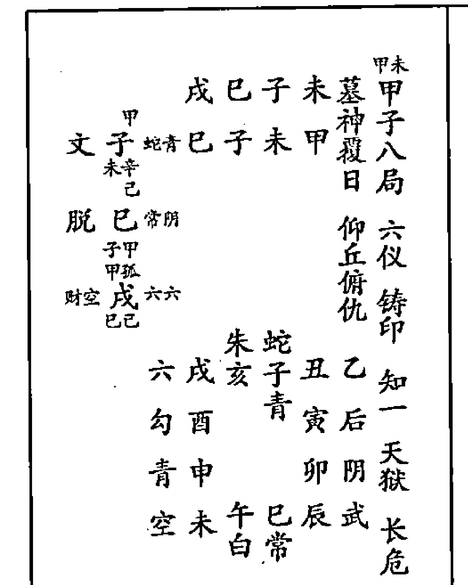

夜贵初害干上，夜贵初传子、亥。事小凶大，又墓神覆日，俯仰仇丘斗系日，本三下克上，天狱度厄也。行人未归，中传在支，复出他乡。彼此诅僧，干上未害支子，支上已害干寅，故云。如年命在未，必自招凶晦。天时先阴后晴。

发用子加未，曰春冰过日，主财帛产提挈怂快。且蛇曰坠水，从心所欲。夜龙曰入海，财喜亨通。

#### 甲子九局

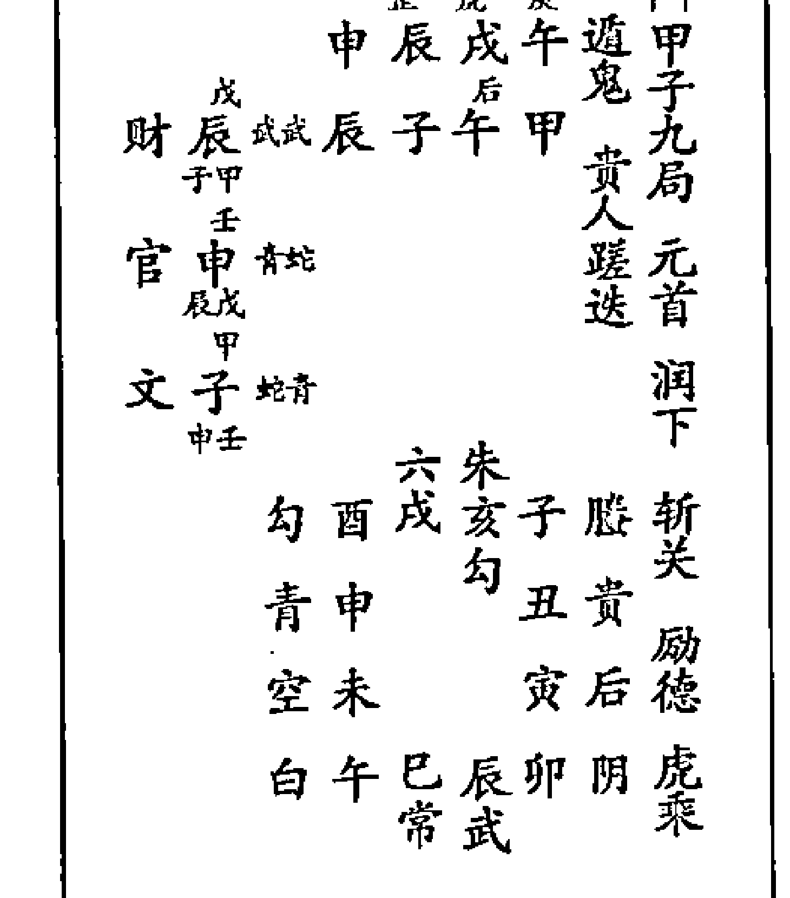

昼虎遁鬼，午脱遁鬼，乘虎伤干。传将俱水，幸传润下，制午生干。既历灾厄，然后美矣；如正历灾厄，遇救得生也。润下为父母现卦，主文书有气，忧疑皆散。但千克支上辰，支克干上午，天罡临宅，昼夜乘武，不宜占宅，子息无。天时阴雨。

发用辰加子用，曰龙投枯井，作武强盗。旦夜武曰失路，辰自制可获盗。支墓作干，财阻不亨通。

#### 甲子十局

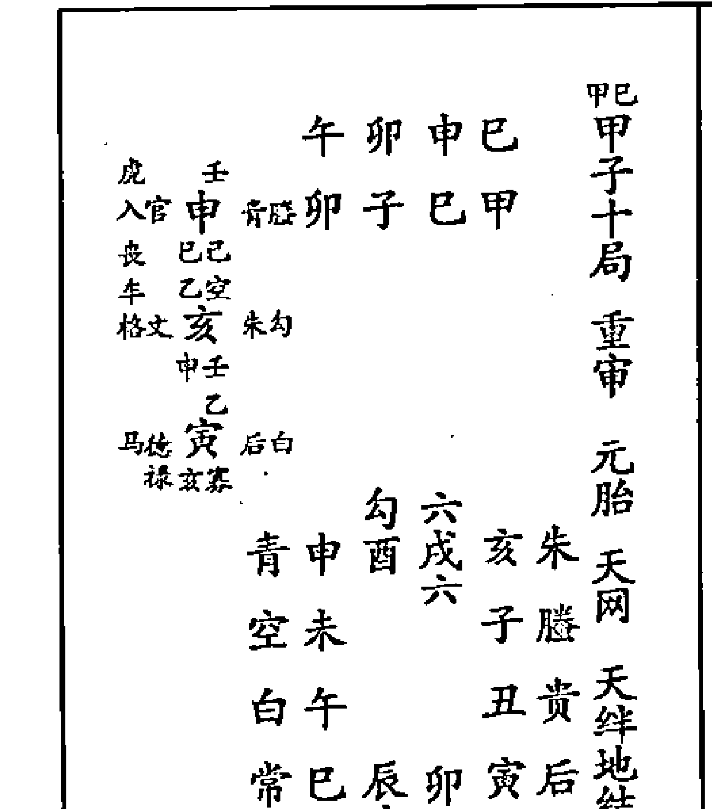

止宜散虑，初传官受干上已制中亥水生，末传之寅禄德俱空。两贵皆怒辰、戌，为履狱，常人得之喜畏煨尽，能解忧散虑。在仕宦，不宜也。支干俱刑，各乘脱气，又各值刑。家道难住，丁卯在支，刑宅。天时风晴。

发用申加已，曰蕴玉待价，亨通。又商贾道路，难阻。旦龙曰折角，主道路分。十干，又防损财失物，占官内战，上司不喜。子孙求名求财俱忌，且防失脱。

夜蛇曰衔剑灾祸甲，主官贵财丧，又金器鸣逃亡。

#### 甲子十一局

俯就 重审
辰 六 辰 午 寅 辰 甲
财 庚 六六 寅 子 辰 甲 天
脱 午 贵蛇
官 申 虎后
午 庚
空 未 白 常
青 午 申 酉 戌
勾 巳 阴 亥
六 辰 子
朱 卯 寅 丑
腾 贵
武不备
阴
后
贵登天门
斩关

至危至惊财爻发用，虎鬼居末，登三天卦，虎鬼在前，避难逃生喜寅加支，支生干禄，惟宜俯就，退身远害。勿恃午火与鬼为朋。中传，午虽制鬼，为救遁得庚金返与鬼为朋矣。常人遇之，病讼皆凶；仕宦逢之，职位兴隆。天时晴。
发用辰加寅，曰守石猿猴，吉庆，又宅内不和。乘六曰违礼，又曰失角犀牛，防因姻而讼。

#### 甲子十二局

重审 进茹
卯 六 丑 子 卯 甲
财 丑 六六 丑 子 卯 甲 亲观光于上国
子 巳 勾朱
子 午 贵蛇
巳 己
空 白 常
青 午 未 申 酉
勾 巳 戌 武
六 辰 亥 阴
朱 卯 寅 丑 子
腾 贵
懒取财
升阶

解释忧危，值此偏宜进茹卦。各值前辰守则为旺，又得末助初财。
享安然之运也，常人得此，喜中末皆火制鬼，故云。
求谋进取，寸步难移，仕宦逢之，不宜制官。倘若动谋变为网刃，又为脱气，故云。天时云半晴。
发用辰加卯，曰龙龟出水，主妻病木日又腰痛。弟兄同家各食，又主争奴婢。 乘合曰违礼，详上十一局。

#### 乙丑一局

伏吟 自信
辰 六 丑 丑 辰 辰 乙
财 勾 丑 丑 辰 乙 来去俱空
财 蛇 白
财 阴 阴
青 巳 空 白
勾 辰 未 申 常
六 卯 酉 武
朱 寅 戌 阴
腾 贵
斩关
稼穑

木克九土，三传上下六土，干支上二土，旦夜乘勾陈生阴、生虎，中传夜乘虎，末传丑夜阴。食伤病困，财多暗生余鬼。贪财生祸，因食伤身。贪财祸阻伏吟卦，末传空亡，白虎拦路，行中有阻。若以财祷贵，占病求神，庶免凶咎，不宜动用。
发用勾加辰，曰升堂，主有狱官勾牵。

#### 乙丑二局

| 乙卯
旺禄临身 | 亥子寅卯 |
| --- | --- |
| 丙甲
刑生子贵常子丑卯乙 |
| 败丑乙
丁癸 |
| 生空亥后武
子甲 |
| 丙壬 |
| 财空戊阴财
亥空 |
| 青
勾辰巳午未白 |
| 六卯
未
申常 |
| 朱寅
酉武
励德 |
| 滕丑子亥戌阴
贵后 |

彼此无礼，干卯支子，为无礼刑。禄丁难倚卯，为乙禄临身坐辰遁丁变害。凡占凶甚。支上子与丑合，他人逸乐，自己熬煎。三传生炁，退向空亡，见生返为大凶。婚姻为美，子加丑用，牛女相会。但占忧事，主散退空故也。

发用子加丑用，见甲子二局。旦贵乘子曰解息，属事于童仆。夜常乘子曰遭枷，必致决罚，初囚酒食起。

#### 乙丑三局

重审
时遁寡宿 | 酉亥子寅 |
| --- | --- |
| 丁癸
生空亥后武亥丑寅乙 |
| 玄乙 |
| 官酉武后
亥空 |
| 乙癸
癸辛 |
| 墓财酉虎蛇
百癸 |
| 勾
青
六卯辰巳午空 |
| 朱寅
六未白
寡宿 |
| 滕丑
申常 |
| 贵子亥戌酉武
后阴 |

虎墓幸随，行人病归。亥为生气，木墓在未。自生传墓，末遁虎鬼，故病归也。名还魂格，又还宿债。迤逦生之，又自末递生至初，迤逦生干，名还魂格。如先施恩于人，无心中却得际遇，此课主谋事始如花似锦，后变，有始无终。因干支乘合，寅实亥空，初生乘墓破也。

发用亥加丑，曰天时双鹤，又鹤鸣在阴。遂意吉昌，美对良材。贼自败露，桥梁肠泻。旦后曰治宜动，如十月主孕贵。夜武曰伏藏，又曰飞禽失巢。

#### 乙丑四局

重审
斩关
不备
稼穑
赘婿 | 未戌戌丑 |
| --- | --- |
| 丁乙
财丑蛇朱戌丑丑乙 |
| 辰戌 |
| 丙空 |
| 财空戊阴财
丑乙 |
| 乙癸
癸辛 |
| 墓财未白后
戌孤 |
| 六
勾
朱寅卯辰巳青 |
| 滕丑
常午空 |
| 贵子
未白
稼穑 |
| 后亥戌酉申常
阴武
赘婿 |

循环用布支加干，干传支循环用布，三传俱财。昼虎末墓，墓神遁辛鬼乘虎，若向前贪灾祸并出，若能坐待原，喜支来加干上门作财，是处此危疑，自来相顾但人宅坐墓甘招晦，凡事皆所自招。夜占戌来加支，斗斛成堆，主客不投。

发用丑加辰，曰车驾无鞔，争斗田土临日辰为农夫，又空亡日辰为田村。旦乘蛇曰盘龟，福善禄淫。夜乘龙曰盘泥，谋未遂。

#### 乙丑五局

巳 酉 申 子 首乙
脱己 有武酉丑子乙尾相五
财丑 蛇青见始终宜
官酉 武蛇从革
丑乙
朱六
膝丑寅卯辰勾察奸
贵子 白 已青
后亥 午空
阴戌酉申未白
武常

外勾里连，多被熬煎。干乘旬首，支乘旬尾。交车相合，各自乘败。三传金局为支会众鬼，故外勾云云也。众金归水，昼贵周全，干乘子为昼贵，窃三传金气生于水，水生干，主得上人恩惠力，故云。

发用已加酉，曰白波翻江，母无寿，败门户。又母终丧，外母入户死。已乘龙曰飞天，君子欲动。 夜乘蛇曰跣曰足。 干支皆败，三传鬼百事凶，岂众金生子，子为昼贵生干，反吉。

#### 乙丑六局

卯 申 午 亥 乙六
禄卯 武白申丑亥乙局重审知一铸印乘轩斫轮
空戌 朱朱
脱巳 白武
戌空
后阴
贵子丑寅卯武空
膝亥 辰常
朱戌 已白
六酉申未午空
勾青

生虚干亥鬼实，支申面前六害。干乘生空，支乘鬼实。仕宦占吉，仕人忻逢，常人深畏。夜因神愿，夜将支乘申贵，必是神愿，不可作鬼。禄动危矣，斫轮卦。卯为禄神受金制，已坐墓空不能救，故动必有灾。妻财子息，皆不宜占。

发用卯加申，曰枯木抽芳，名雕刻。门必光显，名利遂忌，武虎必损财。旦乘武曰窥户，家有盗贼。夜乘虎曰临门，折合讼争。罡入传加日 为用春秋，主喜。

#### 乙丑七局

丑 未 辰 戌 乙七
财戌 朱朱未丑戌乙局返吟重审斩关稼穑
财辰 常常
戌空
财戌 朱朱
辰戌
贵后
膝亥子丑寅阴青
朱戌 卯武
六酉 辰常
勾申未午巳白
青空

日墓未临支，占主宅伏。伏尸为怪喜，魁罡在传，不能为祸三传虽财俱陷，卦属返吟，甲子旬来去皆空，岂能动作？妻丧财遗，大忌。墓财不宜临支，主外商财羁绊以致难还。夜占乘虎，尤甚。

发用戌加辰 曰紫微离巢 春夏尤美 主僧归农，兄弟分争。乘朱曰投罗，乖错遗亡 又主讼狱官非。

十一曰日开口，主喧。

#### 乙丑八局

```
乙酉
丑八局
带归家
重审
励德
天狱
财爻
大获
戌丙
比寅 阴空午丑酉乙
酉癸
癸辛 财未 青后
寅丙
丙甲 文子 贵勾
未辛
膝贵
朱戊亥子丑后
六酉 寅阴
勾申 卯武
青未午巳辰常
空白
```

凶里藏利，迤逦而至，交互相脱，各逞其能。喜干酉金克寅木 寅木克未土，未土克子水，子水育乙木，故迤逦而至，否中生泰，凶里藏利也。昼将夹克寅坐酉旦乘阴。寅全无炁，日上有鬼，辰上有害，不吉。克干主疾病、牢狱、阴私、口舌。午乘天空名学堂，出教书，独独人生及主兴旺。发用寅加酉曰燧人钻火，托人求作，秋占远配。旦乘阴曰跣足，又思迁。夜乘空曰犯牢 又曰被制公私口舌。

#### 乙丑九局

```
乙申
丑九局
重审
从革
天网
闭口
乙癸
官酉 六蛇巳丑申乙
丁乙
财丑 后青
癸辛
子巳 白武
丑乙
朱膝
六酉戌亥子贵
勾申 丑后
青未 寅阴
空午巳辰卯武
白常
```

俗庶难任，病讼俱兴。干上申三传金局，众鬼交彰，为大忌。守官贵制，俸倍职升，仕宦逢之，申贵德临。身之官制之返，主禄位高迁也。昼陈伏，日虎临支而合内脱夜初遭夹克中墓酉无气。发用酉加巳曰凤栖梧桐，显达。旦乘合曰私窜，又云跣足，左右表里，阴私。夜乘蛇曰露齿，主祸福两途，又悲泣临门。

#### 乙丑十局

```
乙未
丑十局
重审
不备
稼穑
励德
干墓并关
秋占
癸辛 墓财未 青蛇辰丑未乙
戊戌
丙空 财戌 朱阴
未辛
丁乙
财丑 后虎
戊空
六朱
勾申酉戌亥膝
青未 子贵
空午 丑后
白巳辰卯寅阴
常武
```

支上辰干上未乘墓，如处云雾，彼此昏迷。么罗而归三传，稼穑纯财。遁得辛未在干，传财化鬼，宜难觅也。妻财共聚，喜干加支，以丑为财到处来，不如俯就宅下。发用未加辰，曰云笼半月，主争田财邻人。丑乘青曰无鳞，宜静。夜乘蛇曰入林进步，防患，又白头孝服事。夜占支乘常，出寡妇。

#### 乙丑十一局

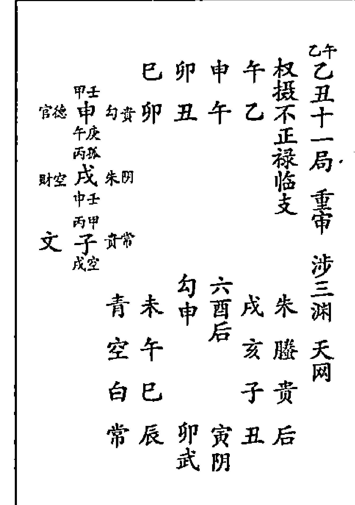

脱空昼迎，凡事平平。干为午脱，昼乘天空。又交车六害，各值死炁，故凡事平平。干贵官怒。昼贵在戌，入狱受制；夜贵在午。被伤。凶吉无成，中、末皆空。好恶俱无，不如俯就。支上旺禄，庶免空脱。申德加午，吉，中有凶，美中有恶，德反为怨，恐一切不可用，只宜休息万事。乘午上天空为学堂，出文人，支上卯乘武是贼，谨防走失。

发用申加午，曰野猿投火，忧疑。日乘勾曰趋户，主反覆勾连，又曰移河，吉。夜乘贵曰移途，宜干求。

#### 乙丑十二局

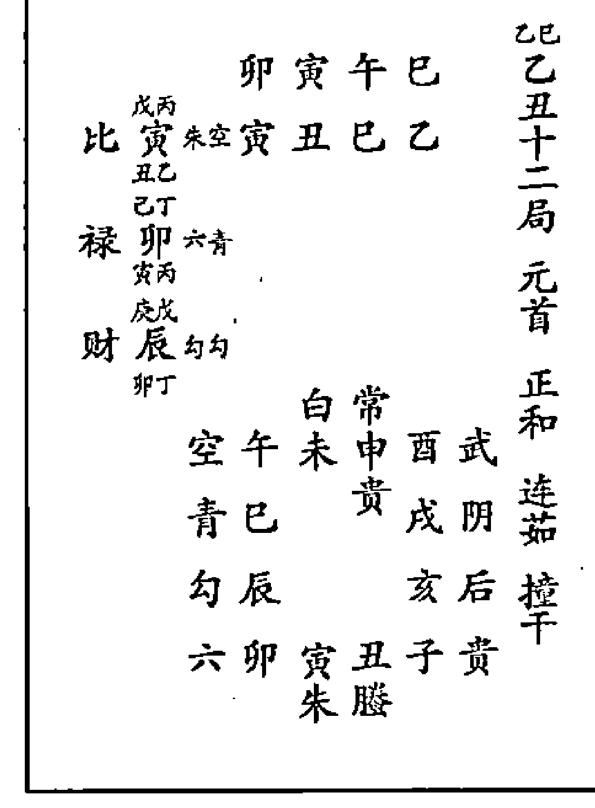

支干拱传，面前六害，脱干伤支，夹定三传。惟喜春占春木荣旺，先曲后直，其灾自潜。疑凶，凶有余月木不能伸，昼将六合居中，气填胸臆，胎产、病讼，皆畏。况乘前辰，动遭网刃，脱盗满前。若向后灾潜，向后一步，就财就禄。干已乘青名退化，自占不利。以直作曲，为子孙谋望。以才托卑幼，不可。支寅克支，兄弟争分，乘朱因讼穷传，干支夹住，比肩破财。

发用寅加丑，曰车得新轮，主万事重新。旦乘朱曰安巢，主文字远信至。夜乘空曰犯牢，又曰被制。

#### 丙寅一局

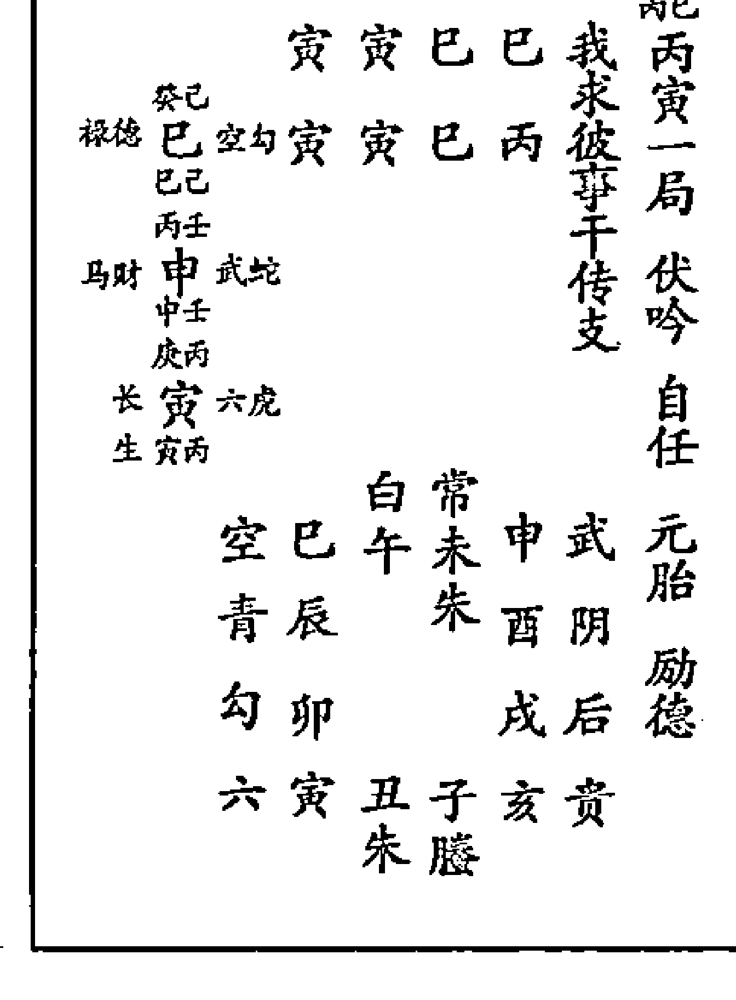

干传巳人支寅，我求干，彼求行人远归。禄初传财，中马生乘传聚，所卜皆宜，三传俱得。又末传助初禄，但嫌上下六害，如夜将旬首乘武，亦名闭口卦。

发用且已乘空曰受辱，又曰投绝，血痢。夜乘勾曰捧印持德，兵权万里。

#### 丙寅二局

| 盘面图示 | 解说 |
| :--- | :--- |
| 子 丑 卯 辰<br>戊甲 官子 地坻 丑 寅 辰 丙<br>丑乙 已真<br>官 亥 女胎<br>子甲<br>戊孤<br>壬阴 戊 后后<br>亥空<br><br>青辰 已 午 未 常<br>勾卯 申 武<br>六寅 酉 阴<br>朱丑 子 亥 戌 后<br>滕贵<br>丙辰 丙寅二局 重审 重阴 连茄 斩关 六仪 | 退空官鬼，三传润下，克干生支，我损彼益。喜巳上辰土能敌众鬼，又退向空亡。所谓众鬼虽多，全不畏也，病防再至。常人喜空仕宦。不宜连茹事体。缠绵，鬼多，恐病再至。子蛇夜常，牛女合位。夜占子加丑，丑乘常，牛女相会，六婚大吉。中、末空亡三传退，凡事有始无终。支上丑乘朱，家有举贤荐能之事，又邻争田牛。<br><br>发用子加丑用，详甲子二局。子乘蛇，详甲子八局。夜乘武曰散发，又曰过海，可捕盗，又进退叵测。 |

#### 丙寅三局

| 盘面图示 | 解说 |
| :--- | :--- |
| 戊 子 丑 卯<br>己乙 脱丑朱勾 子 寅 卯 丙<br>卯丁 伏蛇<br>已空 尸有<br>官空亥贵朱<br>丑乙<br>丁癸<br>财酉阴贵<br>亥空<br><br>勾卯 辰 巳 午 白<br>六寅 常 未 常<br>朱丑 申 武<br>滕子 亥 戌 酉 阴<br>贵后<br>丙卯 丙寅三局 重审 三奇 极阴 | 虽生丙上，卯寅土子难恃。虽各乘生气，俱为败神。且子卯相刑，子卯无礼，反为败神。切休见贵，中、末两皆空，干贵不利。此课主人宅倾颓，以阴退阴，极阴卦，事多幽暗。<br><br>发用丑加卯曰行舟陆地，主人诳，行滞暗利，先雨后雷。旦乘朱曰掩日，宜静。夜乘勾曰秉钺，又明堂，又入化，暗遭毒害。 |

#### 丙寅四局

| 盘面图示 | 解说 |
| :--- | :--- |
| 申 亥 亥 寅<br>已禄 空官亥贵朱 亥 寅 寅 丙<br>丙旺<br>马财 申武后<br>亥空<br>癸犯 已空常<br>中壬<br><br>勾青 六寅 卯 辰 已 空<br>朱丑 白 午 白<br>滕子 未 常<br>贵亥 戌 酉 申 武<br>后阴<br>丙亥 丙寅四局 蒿矢 病元胎 不备 自在 | 执弓忘矢，彼此乘生，下害上合。蒿矢逢金，幸值空亡。事声迤逦，声势虚张，实然无害，过此危疑。彼。来生己支加干生干，亦谓避难生也。切不可动谋，不则空喜实害矣。用空亡，凡占无当，过旬再图。克日主欺瞒。亥合亲人依居生支，凡事成进财产，修宅舍。<br><br>发用亥加寅，曰六神藏没。亥乘贵曰登天门，坦然安居。贵人田宅讼征召马更的。夜乘朱曰入水，宜守旧，不宜献书、口舌、信息，又疾病。 |

术数

九五四

#### 丙寅五局

午戌酉丑
戊后蛇戊寅丑丙
丙丑丙寅五局
重审
炎上
洗女
斩关
三奇

自墓初戊传生末寅，故生先迷后醒，以难变易，全无和气。上刑下刑，上丑戊相刑，下寅巳相刑。斩关格时遁三奇，君子贞利，否中生泰。炎上卦合，中犯煞日。妇丑不明，戊后加寅。凡事不振，墓神发用。荐举贤能，丑乘朱也，否主争田。主通奴妻戊中辛字丙合。戊坐寅，其墙仆乘后妇人怒，一名呻吟煞，主病落孕。
发用戊加寅用，详甲子五局。旦乘后曰褰帷。夜乘蛇曰浪打轻舟，梦寐妖邪。

#### 丙寅六局

辰酉未子
戊甲子蛇六酉寅子丙
丙子丙寅六局
元首
比用
六仪
幼厄

彼己灾殄，干子旬首。支酉旬末，彼此受伤。三传外战，三上克下卑者难当，自支克末，迤逦伤午，课虽外战，祸由内出。仕宦提防言者格，常俗忧重口相攻。干支生墓，事终难辨。寅坐未，巳空戊，各自坐墓，总有冤抑，甘受昏晦，终莫能辨。
发用子加巳，曰萱草生庭，荣华富贵，主淫，主聪明。又悲声曰辰上，为上房公婆。曰乘蛇曰坠水，从心无患。夜乘合曰反目，一云持笏，无礼之事夫妇不和。

#### 丙寅七局

寅申巳亥
庚丙生寅武青申寅亥丙
丙亥丙寅七局
返吟

交互虽密，合之无益。干上亥与支合生，支上申与干合刑，则可谓交互密而合却无益也。德禄鬼贼并无实迹，但上下六害各乘绝克，巳亥乘空是并，无实迹。返吟卦初末长生，中传财往来冲制难进退。
发用寅加寅，详甲子返吟。旦乘武曰入林和谐，夜乘龙，详甲子伏吟。

#### 丙寅八局

子 未 卯 戌
官 子 后 六 未 寅 戌 丙
禄德 巳 空常
子甲
戊孙
墓空 戌 蛇蛇
己巳
贵 后
膝 戌 亥 子 丑 阴
朱酉 六 寅 武
六申 卯 常
勾未 午 巳 辰 白
青空

两蛇夹墓，家道咒咀。干支彼此相刑，各自乘墓干墓又被两蛇相夹，喜戌旬空无畏，支乘辛未俯丘仰仇。昼勾夜阴，必主家宅咒咀不宁。熟视三传，初鬼坐干克害，中德禄，又子伤戌墓，末复临空，略无好处。

发用子加未，详甲子八局。旦乘后曰守闺，宜静。又动止多宜。又曰违悖煞，作事难成。夜乘合；详丙寅六局。

#### 丙寅九局

戊 午 丑 酉
丁癸
财破 酉 朱贵 午 寅 酉 丙
闭碎 己巳
口 己乙
子 丑 阴常
日癸
癸巳
禄德 巳 空勾
丑乙
滕 贵
朱酉 戌 亥 子 后
六申 阴 丑 阴
勾未 寅 武
青午 巳 辰 卯 常
空白

守死赔钱，干酉支午，皆死气。三传虽财，初酉破碎，昼将夹克，丑为财墓传入墓，必有赔费，夜将皆土助焉。又赖三传递生，故费而得助也。所得一贯，家费十千。支寅午脱，又被传金制之，耗而又损家道。熬煎所得，不偿所费。夏占似可。

发用酉加巳，详乙丑九局。旦乘朱曰昼翔，酉曰夜噪，官灾。夜乘贵曰入私宅，不宁。旺相赏赐囚死，嗔责讼有枷锁。

#### 丙寅十局

申 巳 亥 申
丙壬
马财 申 六蛇 巳 寅 申 丙
己亥
生空 亥 贵阴
中壬
庚丙
生长 寅 武白
亥空
朱 滕
六申 酉 戌 亥 贵
勾未 后 子 后
青午 丑 阴
空巳 辰 卯 寅 武
白常

递相荐引，支乘干禄，干乘支马，富贵卦也。自干发传，迤逦生日主有荐引。夜无凭准，夜将蛇虎阴，中末空亡遁，壬申财内藏，鬼用破身心，无所归也。屈尊就卑，干加支，支生干，又乘六合，惟宜俯就所谋和允，屈尊就卑，故然。

发用申加巳用将乘滕蛇，俱详夜甲子十局。日乘合曰纳彩，一云披发，主财离。病损婚因谋成欢。申乘合曰纳采，主交易外财婚姻并。又市买逃亡，官忌天喜曰披发，主争斗。

#### 丙寅十一局

```
午辰酉未
壬戊 脱辰白奇辰寅未丙
刃午青六
马财申六蛇
勾未申酉戌媵
青午 贵亥贵
空巳 子后
白辰卯寅丑阴
常武
丙未丙寅十一局 重审 斩关登三天 励德
```

壬申乘马，初脱中刃，末财乘马遁。得壬水为鬼见财难舍。欲待不取，财在眼前，如何舍得？得来何用添修瓦屋，但支墓脱干，得来财物必因添修宅费也。登三天卦，自微至显，纳粟奏名，以财干贵，俱吉。常人病讼。昼将寅乘武加子，名闭口卦。 发用辰加寅，详甲子十一局。 昼乘虎曰咥人，又夜行，又飞禽无翼。夜乘龙曰掩目，谋未遂。

#### 丙寅十二局

```
辰卯未午
壬戊 脱辰白奇卯寅午丙
禄德巳空勾
刃午青六
勾未六申酉朱
青午未申酉朱
空巳 戌媵
白辰 亥贵
常卯寅丑子后
武阴
丙午丙寅十二局 重审 连茹天狱升阶
```

第四课用，各值前辰彼此乘旺，动变网刃，干支拱传。第四课用，未与支共格，号朝天未归，干上百发百中，所为不出规模。 连茹卦，干支拱传，如气塞于胸，病讼皆畏。占产，定生哑子，母子俱凶。如年命在干支外，名透关格，先凶后吉。 发用辰加卯，曰龙龟，出入妻病。昼乘白，夜乘青，俱详上十一局。

#### 丁卯一局

```
卯卯未未
癸丁 败卯勾玄卯卯未丁
官子蛇武
禄午白六
白常 空巳午未申武
青辰 朱酉阴
勾卯 戌后
六寅丑子亥贵
朱蛇
丁未丁卯一局 伏吟
```

丁卯三重，古法六己辛丁临卯巳，辰刑冲处，三传辰该用。卯子卯所以支并，初末丁卯三重。·邵师云：辰刑冲处，三传辰该用，子卯午大体相仿。子水居中，动用非细，伏吟主静。重重丁神，必有非细之动。鬼贼须逢子水居中，动逢鬼贼，往返刑冲，岂能安逸？ 发用昼乘勾，曰临门，一云入狱，主眷口不和，门户负累之事。 夜乘空，按天空四仲，忌曰猛虎，出示须吉，将救。

#### 丁卯二局

| 左栏排盘 | 右栏文言解释 |
| :--- | :--- |
| 辛乙脱丑官空亥子甲青辰空白勾卯六寅朱丑螣子贵后丑寅巳午丁卯二局旺禄临身重审连茹三奇入墓未常申武酉阴戌后空白未申酉戌 | 禄任虎傍，午禄乘虎，遂不可守。勾恋寅乡，支寅长生，贪一粒粟，失半年粮。似丁恶传中，皆鬼生者少而克者多，如贪粒米而失半年粮也。连茹末传勾空，常人喜鬼空，仕人则不宜。午禄见白，名剥爵，占官不利；一名焚身，常人官灾疾病。已经反释并天喜，主婚姻。寅生加支，父母好发人。发用丑加寅，曰墓火焰天，不利父母。有孕，冬防病。昼乘朱曰安巢，详丙寅三乘寅。夜乘常曰衔杯受爵，主迁转，亦有财喜。 |

#### 丁卯三局

| 左栏排盘 | 右栏文言解释 |
| :--- | :--- |
| 辛乙脱亥官空酉财未玄空勾卯六寅朱丑螣子贵后亥丑卯巳丁卯三局重阴涉害极阴三奇辰巳午未常申武酉阴戌后空白午未申酉 | 课传俱阴，课传五阴，为极阴卦，事转沉吟。又退闲传，自明入暗，递相脱赚，干巳脱支，支上脱干，勿依贵人。中末空亡，两贵难依。干乘驿马破碎，昼临天空，谓踪迹无定，所谓入宅受脱，俱招盗，盗亦谓乱。发用丑加卯用，乘朱乘勾，俱详丙寅三局。 |

#### 丁卯四局

| 左栏排盘 | 右栏文言解释 |
| :--- | :--- |
| 戊甲官子蛇六子甲财酉阴贵丙庚禄午白武酉癸勾青六寅卯辰巳空白朱丑午白螣子未常贵亥戌酉申武后阴酉子丑辰丁卯四局蒿矢三交斩关龙战六仪 | 禄午乘夜元昼虎禄，主难恃，重遭鬼苦。支及初传，二子伤曰，中间癸酉闭口，凡事忍认，似可免咎。尚忧门户，支为宅乘子，子卯无礼相刑，为门暗之忧。虽交车六害，干上辰敌子水，为救神。发用子加卯，曰遇虎不猎，官非病凶。昼乘蛇曰坠水从心，无患。夜乘六，详丙寅六局。 |

#### 丁卯五局

| 左栏排盘 | 右栏文言解释 |
| :--- | :--- |
| 未亥亥卯子未亥卯卯丁生卯未辛亥乙未卯丁六勾朱丑寅卯辰青蛇子巳空乙亥午白后戌酉申未常阴武 | 课传循环，支加干，干传支，循环发用。事在隔关，发用空乡，事上关隔。木局休时，三传虽生，初、末空中传夜乘空，见生不生，不如灾生。昼将宜看昼将皆土，却赖传制。发用未加卯，曰锦浪拍天，又新月重圆。袖中自有封侯手，行看毫端锦拍天。昼乘常曰捧觞征召喜，又酣酒财帛，主妇人陪。夜乘阴曰看书，又传书，又半月云笼婚吉正，又破失朦蔽。 |

#### 丁卯六局

| 左栏排盘 | 右栏文言解释 |
| :--- | :--- |
| 巳戌酉寅丁卯六局重审斩关孤辰铸印姤戌后蛇戌卯寅丁基空卯巳马巳空常戌空卯子蛇六巳巳蛇子丑寅卯勾乙亥辰青后戌巳空阴酉申未午白武常 | 干上长生，干上寅木守则生。生无穷，守则无穷。动逢鬼墓，卯克戌，戌克后，将逢内战。初墓末鬼，中已受伤，与身比肩，皆不宜动。命忌丑空，惟占人年命，忌临丑位，乃中冲长生则不吉也。发用戌加卯，曰“彩凤飞云”，着锦闱里，僧还俗。昼乘后曰褰帷，长者哭声。夜乘蛇曰入冢解释。 |

#### 丁卯七局

| 左栏排盘 | 右栏文言解释 |
| :--- | :--- |
| 卯酉未丑丁卯七局返吟回还重审龙战励德癸丁生卯常空酉卯丑丁酉癸财酉朱乙卯丁癸丁生卯常空酉癸后阴乙亥子丑寅武蛇戌卯常朱酉辰白六申未午巳空勾青 | 满地皆丁，返吟互克。满地丁神，岂容少停？惊天动地岂得安宁？夏昼火厄，昼酉乘雀伤支。夏占酉为火鬼，必主家下。火鬼为灾，可用井底泥涂禳之。贵则夜迎，夜将酉为贵人，主得富贵之财。发用卯加酉？曰白波翻江，得金助，斩关吉。母无寿，败门户。又母终丧外，母入户死。昼乘常曰遗冠，主伤财。又女冠，如克支，父母不安。出颠狂，道士寡母，主家。夜乘空，详丁卯伏吟。 |

#### 丁卯八局

| 图表 | 说明 |
|------|------|
| 丁子<br>丑申巳子 丁卯八局<br>马巳空申卯子丁 重审<br>基戊蛇 铸印<br>生卯常空 乘轩<br>乙后<br>蛇戌亥子丑阴<br>朱酉 寅武<br>六申 卯常<br>勾未午巳辰白<br>青空 | 彼己各自乘克皆凶。空墓居中，末丁初马，铸印卦。马丁空墓，名破模走炉，以故铸印不成。事无定踪，凡谋不就。占官不利，病讼无畏。支上财助，干上鬼幸，坐下未土敌之。如狐假虎威，宜坐待，谋勿妄动。交合干后，主阴私交并。<br><br>发用巳加子曰萱草生庭，荣华富贵，主聪明，又悲声。昼乘空曰受辱，又技绝，血痢。夜乘常曰铸印。 |

#### 丁卯九局

| 图表 | 说明 |
|------|------|
| 丁亥<br>亥未卯亥 曲直<br>丁辛 未勾未卯亥丁 不备<br>位使卯丁 重审<br>辛亥 涉害<br>官空亥乙阴 见机<br>未辛 龙战<br>癸丁 自取<br>生卯常空<br>亥空<br>蛇乙<br>朱酉戌亥子后<br>六申 丑阴<br>勾未 寅武<br>青午巳辰卯常<br>空白 | 昼将皆土，脱丁传曲直却生，身会木局生，身制将使丁火不被土耗，好恶中半循环，贵嗔。干加支，支传干，课体循环，亥空贵空鬼，故贵嗔。喜干加支为生地，亦宜俯就避难逃生也。<br><br>发用未加卯，曰天马出群，主拜职，妇人利。昼乘勾曰人驿，主婚凶怪水日必争。夜乘朱曰临坟，又啄食利，求财婚姻有喜，又公讼文书，宜守旧，又功名未遂。 |

#### 丁卯十局

| 图表 | 说明 |
|------|------|
| 丁戌<br>酉午丑戌 禄临<br>己癸 酉朱乙午卯戌丁 支<br>财酉口午庚 贵临<br>庚甲 重审<br>官子后武 斩关<br>酉癸 三交<br>癸丁 权摄<br>生卯常空 不正<br>子甲<br>朱蛇<br>六申酉戌亥乙<br>勾未 后子后<br>青午 丑阴<br>空巳辰卯寅武<br>白常 | 交车眷恋，干支互合，合后在课，更真递相推荐。三传递生干火，主得重力推荐。自己昏迷，戊墓覆日，权摄可羡。丁之旺禄，午临支受生，屈尊俯就，宅中禄。<br><br>发用酉加午，曰少凤生维，名婢登堂。堂却专房美女，失瘗。昼乘朱曰夜噪，官灾。夜乘酉曰入私宅，不宁。 |

#### 丁卯十一局

| 左栏排盘 | 右栏文言解释 |
| :--- | :--- |
| 己癸 财酉 口<br>辛家<br>空 亥 乙阴<br>脱丑 用常<br>六朱<br>勾未 申酉 戊蛇<br>青午 亥乙<br>空巳 子后<br>白辰卯寅丑阴<br>常武<br>丁酉<br>丁卯十一局<br>重审<br>励德<br>凝阴<br>天狱 | 昼夜贵聚课传，贵人遍地，事无凭据。初才引入，中末空鬼，渐入幽暗。凡作无凭，用破身心无所归也。本身力弱，火生寅死酉绝生少；本身力弱，占病可虑。发用癸酉居日末助初才，惟宜坐守，闭口免厄。酉乘朱受夹克身，才不动安头生疮。发用酉加丁曰征雁衔芦，一门和顺，酒食宴会。昼乘朱。夜乘乙，俱详丙寅九局。 |

#### 丁卯十二局

| 左栏排盘 | 右栏文言解释 |
| :--- | :--- |
| 甲戊 脱辰 白青<br>辰卯 申丁<br>乙巳 马巳 空勾<br>辰戌 丙辰 禄午 六<br>巳巳<br>勾六<br>青午未申酉朱<br>空巳 戌蛇<br>白辰 亥乙<br>常卯寅丑子后<br>武阴<br>丁申<br>丁卯十二局<br>重审<br>连茹<br>斩关<br>升阶 | 夜占财退，干上虽财，三传俱火。夜将蛇临申，被比肩分夺，故退。必因同类痛者腰痛，申属腰。昼贵临戌，难恃。入戌无力。发用辰加卯，详丙寅十二局。昼乘虎，夜乘青，俱详丙寅十一局。 |

#### 戊辰一局

| 左栏排盘 | 右栏文言解释 |
| :--- | :--- |
| 丁巳 禄德 巳 勾朱<br>辰辰 巳戊<br>庚壬 长子 申 白后<br>生 申壬<br>甲丙 官马 寅 蛇青<br>寅丙<br>青空<br>勾巳午未申白<br>六辰 酉常<br>朱卯 戌武<br>蛇寅丑子亥阴<br>乙后<br>戊巳<br>戊辰一局<br>伏吟<br>自任<br>元胎 | 昼虎乘生甲为长生。夜龙鬼并寅为官，夜乘龙乃忧中致喜，乐里生悲。萧何在末，能败能成。大抵静吉动凶。仕宦昼不宜，若不守德禄，迤逦克伐，至末寅木里虽已生日，则暗里伤干，故曰成败萧何也。墓神守支，宅亦欠安。乘勾，详下发用。发用昼乘勾曰捧印，主出兵，权武职。若常人进财产。夜乘朱曰昼朔，音信至。 |

#### 戊辰二局

| 左列 | 右列 |
| --- | --- |
| 寅卯卯辰<br>乙丁 官卯朱勾卯辰辰戊<br>辰戊 甲两<br>马官 寅蛇青<br>卯丁 癸乙<br>比丑乙空<br>寅丙<br>勾青<br>六辰巳午未空<br>朱卯 蛇 申白<br>蛇寅 酉常<br>乙丑子亥戌武<br>后阴 | 鬼临干墓，支加干而墓，干支上卯为鬼，坐墓发用，名鬼呼，宜求门户。卯为门户，可告家神。冬，昼火灾，昼卯上乘雀。冬，占卯为火鬼煞，必有火光之惊，宜用井底泥涂灶禳之吉。病讼，如系三传四课，俱鬼退连茹，防病讼。<br><br>发用卯加辰，曰腐鼠卧，辄知命免凶，从良弃贱。昼乘朱曰安巢，迟滞沉溺，主文字，又主远信至。夜乘勾，详丁卯一局。 |

#### 戊辰三局

| 左列 | 右列 |
| --- | --- |
| 子寅丑卯<br>比丑乙空寅辰卯戌<br>财空 亥阴常<br>丑乙<br>脱日 酉常阴<br>亥空<br>六勾<br>朱卵辰巳午青<br>蛇寅 朱未空<br>乙丑 申白<br>后子亥戌酉常<br>阴武 | 彼己害克，彼此克贼，交互六害。丁子卯为支，寅身宅鬼在墓存，招呼病人，人与宅皆主动摇不安。夜传皆陷退，间传阴卦，中末旬空，夜占丑为天空，三传皆陷，静躁无益。<br><br>发用丑加卯，详丙寅三局。昼乘乙曰升堂，居本家，宜静投书，吉庆。夜乘空曰侍侧，诈尊长之言。 |

#### 戊辰四局

| 左列 | 右列 |
| --- | --- |
| 戊丑亥寅<br>甲两 马官 寅蛇青丑辰寅戊<br>巳 癸亥<br>财空 亥阴常<br>亥两 庚壬<br>长生 申白后<br>亥空<br>朱六<br>蛇寅卯辰巳勾<br>乙丑 六午青<br>后子 未空<br>阴亥戌酉申白<br>武常 | 守之见伤，寅为午鬼，临身发用。动入空乡，欲动中财自空，又居鬼乡。昼虎祛祸，赖未申。昼乘虎能克寅木，为救神，却亦坐空地无力为救，故动入空乡也。夜龙辅成，夜占乘龙，辅助寅木相成。支乘破碎，宅舍欠完。姓赵高牧杜，古之吏书。<br><br>发用寅加巳曰猛虎入城，虚惊远信。昼乘蛇曰乘雾。夜乘龙曰飞天，君子欲动。 |

#### 戊辰五局

| 左栏排盘 | 右栏文言解释 |
| :--- | :--- |
| 甲壬子蛇青子辰丑戌<br>庚壬申青蛇<br>生子甲<br>丙戊<br>墓辰武武<br>壬<br>后阴<br>乙丑寅卯辰武<br>蛇子巳常<br>朱亥午白<br>六戌酉申未空<br>勾青<br>戊丑<br>戊辰五局<br>重审<br>润下<br>六仪 | 上和下睦，面前六合。传课俱财，三六相呼。大利交合，传财极盛。春夏身旺，财弱。可取，尤吉。秋冬财旺，身弱难得，恐难担荷。三传递生，占婚有成。发用子加辰，曰敲冰取鱼。昼乘蛇曰乘龙。夜乘龙曰入海，财喜亨通。 |

#### 戊辰六局

| 左栏排盘 | 右栏文言解释 |
| :--- | :--- |
| 甲壬子蛇青亥辰子戌<br>巳巳<br>比未空乙<br>子甲<br>甲丙<br>马官寅后白<br>未辛<br>后阴<br>蛇子丑寅卯阴<br>朱亥辰武<br>六戊巳常<br>勾酉申未午白<br>青空<br>戊子<br>戊辰六局<br>重审<br>见机<br>察微<br>涉害<br>度厄 | 夜贵日登，虎鬼乘行。干支俱财，交互相代。亥空子实，三传递克。初遁甲子，夜末虎鬼，凶恶尤甚。初末拱贵，告贵却喜。正月子为妻财，生炁在子，妻胎。七月死炁在子，损孕。缀瑕占主两雄交争，经延岁月，人众牵连，宜才德煞，服人者吉。宜近君子远小人，止有一课。发用子加巳，详丙寅六局。昼乘蛇，详丙寅六局。夜乘龙，详甲子八局。 |

#### 戊辰七局

| 左栏排盘 | 右栏文言解释 |
| :--- | :--- |
| 丁巳<br>禄德巳常阴戌辰亥戌<br>癸空<br>财空亥朱勾<br>巳巳<br>丁巳<br>禄德巳常阴<br>亥空<br>蛇乙<br>朱亥子丑寅后<br>六戌卯阴<br>勾酉辰武<br>青申未午巳常<br>空白<br>戊亥<br>戊辰七局<br>返吟<br>绝胎<br>斩关<br>孤辰<br>比用 | 课传俱空，干支戌亥自空第二四课，又在空乡。行住无踪。我去被绝，中传居日，初末在彼，去绝卦，来往俱空。凡事指空话空，全无实迹。所谓空空如也，事休追。久病终凶，新病不成。发用巳加亥，曰春雷闪电，虽多事，只宜两事。伤亡贼惊，阴妇溺井作死炁。自缢宅中，必有缢鬼作祟。昼乘常曰铸印。夜乘阴曰伏枕。 |

#### 戊辰八局

| 左栏排盘 | 右栏文言解释 |
| :--- | :--- |
| 寅酉卯戌夜占<br>甲丙戊戊<br>驭寅后白酉辰戌戌局<br>癸癸重审<br>比未空乙斩关<br>己辛<br>丙壬<br>财子蛇青天网<br>未辛马驭<br>虎鬼<br>朱螣<br>六戌亥子丑乙<br>勾酉青寅后<br>青申卯阴<br>空未午巳辰武<br>白常 | 鬼虽潜伏，面前六害。戌空酉实发用，寅为官鬼幸坐，酉地受制，又传入墓，全然无炁。惟嫌夜卜寅鬼乘虎。三传皆下克上，窝犯。课传互克，自支上酉克寅，必是窝里犯出丑也。利害相逐吉。干外初鬼末财，利害相逐也。发用寅加酉，详乙丑八局。后昼虎，详甲子六局。 |

#### 戊辰九局

| 左栏排盘 | 右栏文言解释 |
| :--- | :--- |
| 子申丑酉<br>壬甲戊酉<br>财子蛇青申辰酉戌局<br>中壬润下<br>丙戊文仪<br>墓辰武武<br>甲子<br>壬庚<br>长申青蛇励德<br>生辰戊弹射<br>六朱<br>勾酉戌亥子蛇<br>青申勾丑乙<br>未寅后<br>白午巳辰卯阴<br>常武 | 交车作合，彼此相脱。已往之财，末助可夺。交车乘合，彼此被脱。三传润下，末助初财。最宜交涉，如先费而后得。春夏遇之身旺财弱，取之省力。秋冬财旺身弱，恐难得也。课传财盛，病必伤食。发用子加申，曰大石藏水。昼乘蛇，详丙寅六局。夜乘青，详甲子八局。 |

#### 戊辰十局

| 左栏排盘 | 右栏文言解释 |
| :--- | :--- |
| （图片引用） | 财初传向空禄，末传巳坐鬼乡，官鬼中寅落，皆不相干。执弓忘矢，弹射遇空，坐守忻欢。惟宜坐守干上，甲子长生，又能制鬼，故欢。发用亥加申，曰云卷遥空，凶将不凶，得龙大展。昼乘朱日入水，宜守旧，不宜献书。夜乘勾曰褰衣。 |

#### 戊辰十一局

| 左栏排盘 | 右栏文言解释 |
| :--- | :--- |
| （图片引用） | 初生申末财面前，虽乘六合，初传长生受克，末财夜遁，白虎甲鬼亦落空乡，生所好克所恶，俱无，两事俱乖。子遁虎鬼，金畏火煨，坐午。虽贵登天门，罡塞鬼户，但涉三渊，坐谋则吉，不利前行。发用申加午，详乙丑十一局。昼乘虎曰衔牒，又燕子归巢，无凶，行人欲至。又见讼事喜信，主刀兵。戊日轻无战，主和。又官员远事。夜乘后曰修容池湖。 |

#### 戊辰十二局

| 左栏排盘 | 右栏文言解释 |
| :--- | :--- |
| 用鬼传刃，舍益就损，屈尊居卑，甘受偃蹇。交互相生初传日鬼，中末羊刃，岂利前行？不守其生，来就支禄，屈尊就卑，被其支辰墓脱，是舍益就损，甘受偃蹇，终难展脱也。发用寅加丑，详乙丑十二局。昼乘蛇。夜乘龙，俱详戊辰四局。 |  |
| 戊午权投不正十二局别贡不备天网求受<br>午巳未午权投不正戊辰十二局别贡不备天网<br>求受空白后玄武勾巳六辰朱卯<br>蛇乙丑子后戊午午巳未午权投不正戊辰十二局别贡<br>不备天网求受空白后玄武勾巳<br>六辰朱卯蛇乙丑子后戊午午巳未午权投不正 |  |

## 卷四十八·术数汇考四十八

## 大六壬立成大全钤

### 己巳至癸酉

#### 己巳一局

| 左栏排盘 | 右栏文言解释 |
| :--- | :--- |
| 巳未巳巳一局<br>文印己青六巳巳未巳<br>癸巳己<br>子长申常乙<br>生申壬<br>丙丙<br>德长寅朱空<br>生癸丙<br>空白<br>青巳午未申常<br>蛇酉武<br>勾辰戌阴<br>六卯亥后<br>朱寅丑子蛇乙<br>伏吟<br>元胎<br>自信 | 德末寅印，初巳长生。中申三传，全遇君子。遇之利亨，求官赴选，权印双显。迤逦克伐，三传互克，寅为祸萌，至寅伤干，故寅为祸萌。见在朝官返不宜，见须合台。言之常人，尤畏众口雷攻。如占人年命，在申酉乘金制寅，则为末助。初生峻峻，中却得意。发用昼乘龙，详乙丑五局。夜乘合曰不谐一，又赘书。 |

#### 己巳二局

| 左栏排盘 | 右栏文言解释 |
| :--- | :--- |
| 卯辰巳午<br>官卯六青辰巳午己<br>戊戊<br>丙丙<br>德官寅朱空<br>卯丁<br>乙乙<br>亥丑蛇白<br>癸丙<br>青空<br>勾辰巳午未白<br>六卯未申常<br>朱寅酉武<br>蛇丑子亥戌阴<br>乙后<br>元首<br>退茹 | 旺禄临身，妄作遭刑，君子宜卜。遁乙丙丁，三奇三传官鬼，遁乙丙丁，仕宦逢之，科甲高第，禄位频迁；常人遇之，难当吉泰，病讼俱畏。喜旺禄临身，传课助生，坐守荣昌，妄动遭刑也。发用卯加辰，详戊辰二局。昼乘合曰入室。夜乘青曰击雷，又曰戏水，重重财喜。 |

#### 己巳三局

| 左栏排盘 | 右栏文言解释 |
| :--- | :--- |
| 丑卯卯巳<br>比丑蛇白卯巳巳己<br>卯丁<br>乙空<br>马空亥后武<br>财丑乙<br>子癸癸<br>败酉戊后<br>败口亥空<br>勾青<br>六卯辰巳午空<br>朱寅六未白<br>蛇丑申常<br>乙子亥戌酉武<br>后阴<br>自任<br>传墓入墓<br>重审<br>极阴<br>不备<br>三奇<br>龙战 | 支生幸马，支加干，干赖支生，幸矣。枉历，三传，中财空末，脱败空乡，以阴退间，三传丑恶，故曰枉历。乙丑夜虎，破败非浅。丑乙夜虎，临门发用。经云：虎乘遁鬼殃非浅，故破亡。发用丑加卯，详丙寅三局。昼乘蛇，详乙丑四局。夜乘虎曰在夜，又曰直视。 |

#### 己巳四局

| 左栏排盘 | 右栏文言解释 |
| :--- | :--- |
| 亥寅丑辰<br>丙丙德官寅朱空寅巳辰巳<br>巳巳乙空<br>马空财亥后六<br>亥丙壬壬<br>长生申常乙<br>亥空<br>朱寅卯辰巳青<br>蛇丑常午空<br>乙子未白<br>后亥戌酉申常<br>阴武<br>己辰已巳四局<br>蒿矢<br>病胎<br>励德<br>斩关<br>天狱 | 夜传俱空，万事无踪。勾欺蒿矢，委镞有功。发用蒿矢，本主虚惊。末申金带镞，诚为可畏，喜得中末传空，寅夜乘空，三传俱陷，万事无踪。干乘墓神，昼勾夜常相加，昏晦尤甚。发用寅加巳，曰猛虎入城，虚惊。远信乘空，巧匠良工，昼乘朱。夜乘空，俱详乙丑十二局。 |

#### 己巳五局

| 左栏排盘 | 右栏文言解释 |
| :--- | :--- |
| 酉丑亥卯<br>丁丁官卯六白丑巳卯己<br>未辛乙空<br>马财亥后六<br>卯丁辛辛<br>比未白后<br>亥空<br>朱六蛇丑寅卯辰勾<br>白<br>乙子巳青<br>后亥午空<br>阴戌酉申未白<br>武常<br>己卯已巳五局<br>元首<br>曲直 | 卯乘合虎，与盗为伍。干乘丁卯，昼合夜虎。传会木局，克干生支。虽有催官仕宦，名催官符，至上官赴任，或纳粟奏名，禄位高迁。常人遇之，被苦鬼贼纷纭，病讼皆畏。发用卯加未，曰鸡栖于埘，身多辅助，又伤妻财婚不成。昼乘六曰入室。夜乘虎，详乙丑六局。 |

#### 己巳六局

| 左栏排盘 | 右栏文言解释 |
| :--- | :--- |
| 未子酉寅<br>癸癸财酉六蛇子巳寅己<br>亥丙戊戊<br>墓辰常常<br>酉癸乙空<br>马空亥蛇六<br>财辰戊<br>后阴乙子丑寅卯武<br>空蛇亥辰常<br>朱戌巳白<br>六酉申未午空<br>勾青<br>己寅己巳六局<br>涉害<br>见机<br>无禄 | 课名无禄，四上克下，支干不睦，交车六害。彼此受伤，支助干鬼。家人丑恶，故不睦也。破败初连，中之墓空，财末后逐，三传自刑，凡谋欠遂。巳乘白虎在戌。父母现在，必有灾厄；父母已逝，墓必白蚁，以致不宁。发用酉加寅，曰猛虎陷阱，逢蛇虎解散。昼乘合。夜乘蛇，俱详乙丑九局。 |

#### 己巳七局

生乘元武，频失财钱。彼此被冲，不得安处。初末生气，昼虎夜去。坐落空乡，受制中传财空，故频失财钱也。所谋无实迹，三传返吟卦，来往俱空。三传陷没，所谋全无实迹也。

发用巳加亥，详戊辰七局。昼乘虎曰焚身，占灾祸反昌。夜乘武，详乙丑五局。

#### 己巳八局

循环无已，贵财临身。支乘空墓，三传皆居四课之上，循环相锁。

鬼助生气。铸印乘轩常，占深畏铸印卦，巳为生气，虽中传归墓，末传卯木，官鬼相助，仕宦喜逢，常人不宜。但中末空亡，破模走炉，春夏可占，秋冬无用，常人又吉也。

发用巳加子，详丁卯八局。昼乘白，详上己巳七局。夜乘武，详乙丑五局。

#### 己巳九局

传生空亥，索还魂债，三传全局脱气，却喜生干上。空亥水为财，名索还魂债。如我先施恩惠于人，指空话空，今却不意而得也。见在之财，岂可放乎？昼贵子临加申，夜贵必求两处贵人成事也。

夜贵临辰，嗔怪无言干不宜。

发用酉加巳用。昼乘六合。夜乘螣蛇，俱详乙丑九局。

#### 己巳十局

亥申丑戌 恩多怨深
壬壬 申 己 戌 己
长生 乙空
马空 亥 蛇武
财 申 壬
丙丙
官德 寅 阴空
亥空
六朱
勾申 西戌 亥蛇
青未 阴 子 乙
空午 丑后
白巳辰 卯 寅阴
常武

长生财德，三事无力。初申长生，坐已被克。中财空末，德落空亡，三事遇而不遇。昼夜推之变出，自初申金脱日，迤逦生至末传，寅木伤干，如人施惠于人，后成其害，此谓恩将仇报。赖有二申制其寅木，不能为害。两贵差忒，昼贵夜方，夜贵昼方，此谓差迭，干贵返视。
发用申加巳，夜乘青，俱详甲子十局。昼乘勾，详乙丑十一局。

#### 己巳十一局

酉未亥酉 龙战俯就
癸癸 酉 己
乙空
马空 亥 蛇武未 巳 酉 己
财 癸癸
乙乙
比 丑 后白
亥空
丁丁
官 卯 武青
丑乙
勾六
青未 申 酉 戌 朱
空午 后 亥 蛇
白巳 子 乙
常辰 卯 寅 丑后
武阴

弹射忘丸，空亥勿干。贵官两贵，差迭坐克，难以干求。降恶求生。中遁乙丑，夜将虎克传卯，鬼贼满前，溟濛卦。事尽阴暗，岂可进谋？干乘破败，尤不可守。喜干临支所，俯就求生。夜丑须看夜占，丑虎亦所当慎。破败神临宅，宜详其类神，是何人败家。
发用亥加酉，曰青云有路，婚成生女。昼乘蛇曰沉溺无灾，悲泣临门。夜乘武，详乙丑三局。

#### 己巳十二局

未午酉申 回还
壬壬 午 己 申 己
长生 未辛
壬壬 申 常乙
长生 未辛
庚庚 禄 午 空未
巳巳
白常
空午 未 申 酉 武
青己 乙 戌 阴
勾辰 亥 后
六卯 寅 丑 子 乙
朱蛇

辰之阴神，交车合旺，禄临支，昼虎在辰之阴神。及夫课名虎视。
三申并见干与初中。五虎纵横，凡占至惊危，卒难解释。仕宦逢吉，常人病讼凶。
发用申加未，曰箭羊角，求有获。昼乘常曰衔杯受爵，主迁转，又防逃亡走失。夜乘乙，详乙丑十一局。

#### 庚午一局

庚中 庚午一局 伏吟 自任 元胎
午 午 申 申 午午申庚
甲壬 马禄 申白后 戊丙 财寅 蛇青
丙 辛 巳 勾朱
生 己 勾已 午未 申白 六辰 乙 酉常 朱卯 戌武 蛇寅 丑子 亥阴 乙后 青空 空白 蛇阴

昼德乘虎，干上德禄，昼乘虎马。中财休取，献纳尤宜，不利商贾。中财生末鬼，止宜携财祷贵，纳粟奏名。常人遇之，课传三刑，财爻化鬼，岂利为商？干支拱捧夜贵，如年命在未，谓之帘幕临身，试必高第。见任返为不仕。夜占虎冲支上兽头，山石冲宅，不宁。

发用昼乘虎。夜乘后，俱详戊辰十一局。

#### 庚午二局

庚未 庚午二局 蒿矢 退茹 登庸 天网 回还
辰 巳 午 未 壬庚 官午 青蛇 未辛 巳 勾朱
生 午庚 庚戊 印辰 六六 缓已 勾青 六辰 巳午 未蛇 朱卯 申白 蛇寅 酉常 乙丑 子亥 戌武 后阴 申白 常武 回还

交关交车，相合宜尔。可疑蒿矢。蛇雀夜逢。五火焚毁，蒿矢卦。初、中及支三火，夜将蛇雀，共成五火，伤干，诚为凶甚。喜得未土，窃三传而育日干，宜鬼之中却得其意，惟宜坐待，不利动谋。申为德午，自刑三传俱火助刑伐德，小人猖獗，君子退惕。

发用午加未，曰满堂金玉，名播四海。昼乘龙。夜乘蛇，俱详甲子四局。

#### 庚午三局

庚午 庚午三局 涉害 顾祖 不备 斩关 乱首
寅 辰 辰 午 壬庚 官午 青蛇 申壬 庚戊 缓印 辰六六 午庚 戊丙 财寅 蛇青 辰戊 六勾 朱卯 辰已 午青 蛇寅 朱 未空 乙丑 申白 后子 亥戌 酉常 阴武

幸名顾祖，上门欺侮。可恨末寅，暗助其午。午为官鬼，寅为财末，助初传，止宜携财祷贵，纳粟奏名，占病求神。常人遇之，财爻化鬼，病讼不宜。乱首卦。支来克干上克下为用，退间传课休循环，是卑克尊。而尊不容下犯上凌，彼此反目也。此为末助初鬼，寅为教唆之人，词讼口舌。其人为公吏、道士、胡须人，属虎，或不姓人，以将决之。

发用午加申，曰良马生驹，红马登途，外病秋夏诏。昼乘龙。夜乘蛇，俱详甲子四局。

#### 庚午四局

庚巳 庚午四局 元首 病胎 天网
子卯寅巳
卯午巳庚
财 寅 蛇青
官 申 壬
空脱 亥 阴常
蛇 寅 卯 辰 已 勾
乙 丑 六
后 子 未 空
阴 亥 戌 酉 申 白
武 常

昼坐夜克干上巳，昼乘勾土将，为长生；夜乘雀火将，为鬼中财相助。讼凶官吉。仕宦逢之，以财生官；常人遇之，财爻化鬼，病讼深畏。亥喻萧何，末亥明克巳火，为救神。暗又遁丁亥，且旬空生火，好恶俱死。贵不悯恤，贵临辰戌，干之无力。发用巳加申，曰枯竹摇风，刑破合长生，先破后合，乘雀官讼。昼乘勾。夜乘朱，俱详戊辰一局。

#### 庚午五局

庚辰 庚午五局 涉害 见机 狡童 炎上 斩关
戊寅子辰
寅午辰庚
财 寅 后白
败官 午 白后
壬庚
丙孤
文空 戌 六六
乙 丑 寅 卯 辰 武 狡童
蛇 子 常 已 常 炎上
朱 亥 午 白
六 戌 酉 申 未 空 斩关
勾 青

自末生身，初勾信凭，倘于夜占，总是幽冥。彼此乘生，三传克日。喜干上辰窃火气育干，名引鬼为生，凶中得吉。止宜坐守，虽自末生身，但火局恐难凭信，夜将合后虎在传，武临日变为狡童，尽幽尽暗。助刑伐德炎上申午，详前利逃亡。发用戌加寅。昼夜乘合，俱详甲子五局。

#### 庚午六局

庚卯 庚午六局 知一 龙战 孤辰 比用
申丑戊卯
丑午卯庚
长官 巳 常阴
戊空
丙甲
脱 子 蛇青
乙 后
蛇 子 丑 寅 卯 阴 孤辰
朱 亥 白 辰 武 比用
六 戌 已 常
勾 酉 申 未 午 白
青 空

长生虽在，全无倚赖。丑为庚墓，卯作支败。卯为支败，乘干临丁，必因妻才而动。丑为干墓，在支脱害，彼此非宁。申巳长生，被戌墓子克，全然无气。官鬼父母，皆不可占。初空生未实脱动，止不宜，病讼皆深畏。发用戌加卯，详丁卯六局。昼夜乘六，详甲子五局。

#### 庚午七局

戊丙 戊丙 庚庚庚 午午午 子子子 申申申 寅寅寅
财 寅后白子午寅庚
中壬 甲壬 马禄 中青蛇 德寅丙
财 寅后白 申壬
蛇乙 朱亥子丑寅后回
六戊 空 卯阴
勾酉 辰武
青申未午巳常 空白

财虽可绝，干上寅为财，初末在日来绝，返吟卦，只可结绝财帛之事。七虎排列，若动取财物，三传上下，六重寅申，夜将共成七虎。如财在虎口，切勿取财。秋遭火爇，如秋占子为火鬼，昼乘蛇伤支，必家有火烛之惊，取井底泥涂灶上禳之。

发用寅加申用。昼后。夜虎，俱详甲子七局。

#### 庚午八局

戊戊 戊辰 辰武武亥午丑庚
生文 玄空 乙癸
旺刃 酉勾朱 神辰戊 戊丙
财 寅后白 癸癸
朱滕 六戊亥子丑乙 闭口
勾酉 青 寅后 独辰
青申 卯阴
空未午巳辰武 白常

生旺财气，三传皆值。交互乘害，干昼墓贵，支被空克。辰为生炁，酉乃旺神。寅木为财，三传皆遇。夜、武、雀、虎末取衰替，如夜将、雀、虎、武在传初生落空，中末遭制，寅木全然无气，岂可动谋？

发用辰加亥，曰丑妇照镜，主进退气疾，作武失败。为墓为鬼，主贼谋害哭泣。昼夜乘武，详甲子九局。

#### 庚午九局

庚戌 戊生 辰武武戌午子庚
子甲 甲壬 马禄 申青蛇 禄辰戊 丙甲
脱 子蛇青 申壬
六朱 勾酉戌亥子蛇 勾丑乙
青申 寅后德
空未 卯阴见机
白午巳辰 常武

脱干伤支，干乘实脱支，乘空墓，又三传润下，故脱伤。占失，无疑人身多病羸弱，舍宅崩颓失脱之事支上戊土能敌重水，但戊旬空其力，鲜矣！

发用辰加子昼夜武，俱详甲子九局。

#### 庚午十局

庚亥
庚午十局
重审
三交
首尾

乙癸
刃勾
酉勾朱
尾午庚
丙甲
脱勾
子蛇青
首酉癸
己丁
财卯阴常
予卯

子酉寅亥
酉午亥庚

勾六
青申酉戌亥朱
六
空未 子蛇
白午 丑乙
常巳辰卯寅后
武阴

财内藏丁，无礼相刑，必然凶动。休倚贵屏，三交卦。初刃在支，中脱末财，上遁旬丁，必因交涉，以致无礼相刑而凶动也。干乘亥，虽空脱可为救神，坐待少安，动最欠宁。贵临辰戌，难于依倚也。
发用酉加午，详丁卯十局。昼乘勾曰被刃，人有害。又病足难进。夜乘朱，详丙寅九局。

#### 庚午十一局

庚戌
庚午十一局
涉三渊
乱首
斩关
不备

甲壬
马德
申白后
禄子庚
丙空
空戊武武
中壬
丙甲
脱子后白
空

戊申子戊
见机
回还

白常
空未申酉戌武
青午 阴玄阴
勾巳 子后
六辰卯寅丑乙
朱蛇

申末中脱，自取其祸，乱首丧德。事绪萦纡，支又传干。病者难疴涉三渊，中生末脱皆落空，岂可前进？
发用申加午，详乙丑十一局。昼虎夜后，详戊辰十一局。

#### 庚午十二局

庚酉
庚午十二局
昂星
回环
虎视
转蓬

丙辰
生空
戌武武
未午酉庚
酉癸
癸辛
生未蛇乙
午戌
乙癸
刃酉常阴
申壬
空白
青午未申酉常
勾巳 后戌武
六辰 亥阴
朱卯寅丑子后
蛇乙

此课来情，未见虚惊。无中生有，然后安宁。虎视卦，皆主惊重。此四课俱生干支，三传不见虎鬼，不足为畏，但第四课上乘虎，无中生有，故有疑惧。大抵初中生炁，癸酉临干，惟宜闭口坐守，自然安宁也。
发用戌加酉，曰密云不雨，婢与奴走家不和，有伏尸。凶多吉少。昼夜乘武，详甲子五局。

#### 辛未一局

未未戊戊
生 乙辛 未后 未戊
墓 未辛
己乙 后
丑
丑乙
戊空
家 戊常常
空坐

蛇 巳 午 未 申 阴
朱 辰 青 酉 武
六 卯 戊 常
勾 寅 丑 子 亥 白
青 空

辛戊
辛未一局
伏吟
斩关
稼穑

自宅传人，彼求我身。守之上策，动则遭迍。自支传干，彼求于己，不待谋为，而自有成。三传稼穑卦，惟宜坐守，生意无穷。倘妄动，前途三刑遭迍不已也。

发用昼乘后，曰治事，宜动双。静动止多，宜妇人凶怪。夜乘龙，详乙丑十局。

#### 辛未二局

巳午申酉
官 鬼己 口用
长马 巳蛇六 午未 酉辛
生德 午庚
生 辰朱未
己
才 丁
财 卯蛇蛇

朱 辰 巳 午 未 后
六 卯 勾 申 阴
勾 寅 酉 武
青 丑 子 亥 戌 常
空 白

辛酉
辛未二局
蒿矢
连茹
正己
励德

闭口难言，遂往投传，所畏金火，以致凶占。干支乘胜，酉虽旺禄，但是闭口变为六害，支乘六合，主自己熬煎，他人逸乐，蒿矢卦。

初鬼中坐鬼乡，末丁卯三传四课，皆仕。官喜才生，官旺，禄位频迁，常人则财爻化鬼，病讼皆凶。

发用巳加午，曰野火烧茅，乘乙雀龙常，主文书必遂。昼乘蛇曰乘雾。夜乘合，详己巳一局。

#### 辛未三局

卯巳午申
官 午乙勾 巳未 申辛
中壬
父 辰朱未
午庚
庚丙
财 寅勾乙
辰戌

六 卯 辰 巳 午 乙
勾 寅 未 后
青 丑 申 阴
空 子 亥 戌 酉 武
白 常

辛申
辛未三局
元首
顾祖

巳午丙火，面前六合。初午支巳，及末丙寅。并来为祸，众鬼并来。取末寅财，只宜携金祷贵，纳粟奏名，仕宦逢吉，常人慎恶。取寅作财，末助初传，财爻化鬼。其灾难躲，病讼俱凶。若六月占午，为太岁将贵并用，为龙德卦。

发用午加申，详庚午三局。昼乘龙曰焚身，又无毛损财休官，孕摇可免，一云拜官，详甲子四局。夜乘勾曰反目，因他人连累。

#### 辛未四局

支生我躬，去寻脱空，惭赧而回，快乐无穷。干乘生，支乘墓，若不守生妄动，一步被初空脱耗盗不已。到处去来，不如坐守。又得支加干，兼中末俱来，继踵相生，快乐无穷。

发用亥加寅，详丙寅四局。昼乘虎曰溺水，金沉水，音书不至，有孕妇。夜乘六曰待命，图谋未遂。悬悬踌躇，幼子。

#### 辛未五局

午干乘丁，支乘丁卯双见，遍地鬼贼。先恶后善，喜传才局，助干伤支，携财祷贵。仕宦逢，宜携财祷贵，纳粟奏名。庶免灾殄。常人逢之，传财化鬼，病讼皆畏。更辛中末空亡，灾殄稍免。

发用卯加未，详己巳五局。昼乘六加卯曰入室。夜乘后曰临门。

#### 辛未六局

无禄可守，禄又闭口。君子恶之，彼已有咎。彼此受伤，面前六害，四上克下卦，名无禄，禄神酉闭口。又坐绝地，三传自刑上宜决绝事体。余占不利，仕宦尤可畏。

发用酉加寅，详己巳六局。昼乘六加酉，详乙丑九局。夜乘青曰在陆，谋未遂。

#### 辛未七局

未丑戊辰互辛辰
马癸巳 长德巳后武丑未辰辛
生官玄空己乙
墓丑白蛇未辛壬戌
生辰阴阴戌空
空白青亥子丑寅常
勾戌蛇卯武
六酉辰阴
朱申未午巳后
蛇乙

意欲来去，返吟之卦。初传驿马，日上天罡，皆主动摇，奈何互墓？但发用空乡，支互乘墓，各生墓上，彼此昏迷，甘招其晦。欲动不能，终难分辨。甘分登临，昼虎在支，宅下必有伏尸，以致为祟不宁。两贵坐克皆怒，干贵官怒。

发用巳加亥，详戊辰七局。昼乘后曰裸体。夜乘武，详乙丑五局。

#### 辛未八局

马德禄癸巳
长官巳后武子未卯辛
生子甲
戌空
空戊勾勾
辛丁
财卯武后
戌空
青空勾戌亥子丑白
六酉朱寅常
朱申卯武
蛇未午巳辰阴
乙后

上刑下刑，交互乘死，上下相刑，全无和气。昼失财婚，卯为妻财，带丁伤干。昼乘亥武，必主凶动，财婚之失。更无初气，那有旬丁，铸印卦。中末空亡已被戊墓子克，长生官鬼皆被煨烬，仕宦畏逢，在常人反吉。

发用巳加子，详丁卯八局。昼乘辰曰裸体。夜乘武，详乙丑五局。

#### 辛未九局

卯亥午寅
巳癸亥青六亥未寅辛
未辛辛丁
财卯武后
亥空
生未蛇白
卯丁
勾青六酉戌亥子空
朱申丑白
蛇未寅常
乙午巳辰卯武
后阴

昼财失散，动多灾难，面前六合，满眼皆财。干乘丙寅，中传丁卯，传财化鬼，止宜携财祷贵，纳粟奏名，常人逃之。昼卯乘武，必因凶动，财物散失。夜贵纯财，外徒好看。夜贵临干，初中空亡，外虽好看，内实无益。

发用亥加未曰白虹贯日，先否后吉。醴酒元浆，相调两便。昼乘青曰游江，因动，有非常之喜。夜乘合，详辛未四局。

#### 辛未十局

丑戊辰丑
己亥 脱空 武青未未丑辛
庚子 丑后白
己丑 戊空
己丑 后白
戊空
白常
空中酉戌亥武培本
青未 子阴 勾
勾午 丑后 奸
六巳辰卯寅乙
朱蛇
辛未十局别卖不备培本察奸

昼乘墓虎，弃迎贼伍，干加支，干上及中末三重丑土，虽为生气，实则墓神。昼占又乘虎。故不可守，遂弃之而投初传，又被元水盗脱，更闯入贼伍矣。留宿仍前，俯就免苦，及向中末虎墓重重，不若屈尊俯就于支，仍前留宿于课神之下，庶避难以逃其生也。发用亥加申，曰云卷瑶空，凶将不凶，得龙大展。昼乘青，详上九局。夜乘武，详乙丑三局。

#### 辛未十一局

亥酉寅子
庚丙 常乙酉未子辛
壬戊 阴未
庚甲 甲庚
壬戊 丙午
乙丙
朱六
蛇未申酉戌勾
乙午 亥青
后巳 子空
阴辰卯寅丑白
武常
辛未十一局弹射出三阳周遍

夜禄虎守，却宜闭口。彼此乘脱，交车六害。旺禄临支，但乘闭口。夜又白虎，遂不可守。倘居窘难，释然无咎。初传财支，克一作助克。末官鬼。干上子水，能制午火。常人遇之，喜鬼制窘，难中释然无咎。正宜守用，不利进取。仕宦逢之，官禄皆畏。发用寅加子，曰否极泰来，首折蟾宫之贵。昼乘常，详侧目。夜乘乙曰按几，贵怒于家按牍。

#### 辛未十二局

酉申子亥
丙壬 阴空申未亥辛
乙辛
己空 白武
戊空
丙壬 阴空
未辛
后阴
乙午未申酉武
蛇巳 戊常
朱辰 亥白
六卯寅丑子空
勾青
辛未十二局昴星冬蛇掩目回环

五虎昼逢，彼此乘脱，面前六害，支并初末二申，中及干上二亥。昼乘虎共五虎三传全害，首尾相仍，殃祸重重，凡占惊众重重。全作六害，夜稍从容。如在夜用，虎不在传，只作柔日、昴星、伏匿之象，中传空亡，断桥折腰，行中多阻，稍可从容。凡值惊天动地，双拳不敌四手。韩信人未央，其凶难免也。发用申加未，详己巳十二局。昼乘阴曰执正，利君子之贞，忌讼。一名阴谋，一名信神。妻有血光，或病中受胎。夜乘空曰鼓舌。

#### 壬申一局

左侧为壬申一局天盘、地盘、四课、三传及神煞排列图。标注有：亥（德禄、空常）、申（长生、武青）、寅（马脱、六后）、壬（亥）、壬申一局、伏吟、自任、元胎、寒宿、励德等。天盘排列：申 亥 亥 申，申 亥 壬。地盘排列：蛇辰，朱卯，六寅，勾丑，青子，亥（空），戌（白），酉（常），申（武），未（阴），午（后），巳（乙）。

尽德禄空，上下六害，干上禄德旬空，昼乘天空，故不能守。脱马末逢，末马脱气，亦不能动。长生乘武中及支上，长生上乘元武。守动弗容。发用亥加亥，详戊辰十局。昼空曰濡冠。夜常曰征召。

#### 壬申二局

左侧为壬申二局天盘、地盘、四课、三传及神煞排列图。标注有：戌（庚、官、空）、未（武）、酉（癸、常、空）、壬（亥）、壬申二局、元首、斩关、独辰、反驾等。天盘排列：午 未 戌 酉，申 戌 壬。地盘排列：蛇辰，朱卯，六寅，勾丑，青子，亥（空），戌（白），酉（常），申（武），未（阴），午（后），巳（乙）。

先鬼后空，干上戌，支上未，上下相刑。戌为壬鬼，昼乘虎伤身，所谓虎临干鬼，凶速，速喜空无害。退则有功。凡可勉励关隔，犹逢退连茹卦。支干拱传，戌发用，名魁度天门，未免关隔百。凡勉力猛退一步，就其长生，始得荣昌也，故曰退有功。发用戌加亥，曰寒马嘶风，出行胎防灾，父被殃为用，利旧事，乃家人事，为长者，利见大人。昼夜俱虎，详壬午二局。

#### 壬申三局

左侧为壬申三局天盘、地盘、四课、三传及神煞排列图。标注有：午（丙、财、后、武）、辰（甲、墓、蛇后）、寅（壬、马脱、六蛇）、壬（酉）、壬申三局、元首等。天盘排列：辰 未 午 酉，申 酉 壬。地盘排列：朱卯，六寅，勾丑，青子，亥（空），戌（白），酉（常），申（武），未（阴），午（后），巳（乙），辰（蛇）。

宅败人衰，各乘破败，彼此衰替，毕法云：干支皆败势倾颓。末助初财，幸顾祖卦，末助初财。阴人先退财，止宜坐取，但助起午火伤支，故主阴人先退，七月怀胎。如七月占午，为胎财生气，故喜必怀胎也。余占中墓未脱，酉乘闭口，又被午克，断然不利，独谋。发用午加申详庚午三局。昼后曰伏枕，夜武曰截路又不戒迁官。

#### 壬申四局

坐谋有益，下害上合。喜支来生干，彼来会己，故坐谋有益。动用费力，若动取初财，引入中脱末空，反费力。元武临人，稍有忧惕，但干乘六合，昼武夜虎，支却乘合，主身己熬煎，他人逸乐，故稍有忧惕也。尤幸申为日之长生，终无大咎。

发用巳加申，详庚午四局。昼乙曰受贺。夜乘阴，详戊辰七局。

#### 壬申五局

# 术数

所谋诓诈，支乘干墓，干乘官鬼，三传盗支。比子发用，羊刃与未六害合中犯煞，所谋欠利。妻财最怕兄弟现卦，妻财无占，惟利子孙。夜贵在日，昼贵居夜，虽贵居支畔，但巳居酉为夜地，卯居未为昼方，贵人差迭，事多参差。

发用子加辰，曰敲冰取鱼，乘常丑参差，乘后犯翁姑，悖逆。昼乘青曰入海，财喜亨通，谒官婚俱吉。夜六，详丙寅六局。

#### 壬申六局

重乎赍排，自初传至末育，干主众所，推荐以成其事，故云。夜损妻财，壬以午火为财，夜乘武，主妻财有损。惟妨长生，申为长生，申被午克丑墓，申全无气。凡占长生与生意，皆不吉。手卯足戌生灾，卯戌俱受下克，又各坐墓地，主昏晦。

发用午加亥，曰入水不溺，潜以待时，德合婚成，病凶。新生久死事，宜结局，忌新作武遗官伤畜。昼后曰伏枕鬼淫之象，如夹克防害眼落孕，走失破财，主思淫心痛。夜武，详乙丑三局。

#### 壬申七局

| 壬丙 甲申 | 申 寅 亥 巳 |
| :--- | :--- |
| 壬 | 申 寅 巳 壬 |
| 长生 | 申 寅 丙 壬 |
| 马脱 | 寅 武 蛇 |
| 空 亥 | 子 丑 寅 武 |
| 青 戌 | 朱 卯 阴 |
| 勾 酉 | 辰 后 |
| 六 申 | 未 午 巳 乙 |
| 朱 蛇 |  |

交车先结，交车相合，上下六害。前脱后脱，返吟初末，驿马脱气，动费不一。元合昼逢，昼将武合，在传支为泱女，必有阴私。两贵不悦，两贵受克，干贵不悦。喜财居干，首尾相助，亦可取还魂债。

发用寅加申，曰岩松冒雪，不改岁寒，心灾不遂。占婚媒人反覆。昼乘武，详丙寅七局。夜乘蛇，详甲子一局。

#### 壬申八局

| 甲戊 庚辰 | 午 丑 酉 辰 |
| :--- | :--- |
| 壬 | 丑 申 辰 壬 |
| 己癸 败 酉 | 勾 空 |
| 壬丙 马子 | 寅 武 蛇 |
| 空 白 子 | 丑 常 |
| 青 戌 | 六 寅 武 |
| 勾 酉 | 卯 阴 |
| 六 申 |  |

墓干墓支，彼此乘墓，名自昏迷。人晦宅衰，三传不美，动即灾危。华盖伤日，昼夜天后相夹，昏晦尤甚。中破败末脱气，三传不美，动亦灾危。行人不归，冤枉难伸。

发用辰加亥，详庚午八局。昼夜乘后曰毁装。

#### 壬申九局

| 丁辛 官 未 | 朱 勾 子 申 卯 壬 |
| :--- | :--- |
| 辛癸 德 亥 | 空 常 |
| 空 未 辛 |  |
| 癸丁 脱 卯 | 阴 乙 |
| 青 空 戌 | 亥 子 白 |
| 勾 酉 | 六 常 |
| 六 申 | 丑 常 |
| 朱 未 | 寅 武 |
| 蛇 午 巳 | 辰 卯 阴 |
| 乙 后 |  |

刑害无礼，下害上刑，全无和气。脱空复至，各乘脱气，三传盗日。夜将赖传，昼占废弛，昼将朱空阴空，空脱满前，主事废弛。如夜将皆土伤土，却赖传救。常人忻逢，仕宦畏遇。

发用未加卯，详丁卯九局。昼乘朱，详戊辰二局。夜乘勾，详丁卯一局。

#### 壬申十局

壬寅源消根断空喜实害弹射生胎壬申十局

乙己财巳朱亥亥壬寅寅戊壬长申合青生巳巳辛空禄亥青常空申壬

勾空六申酉戌亥青朱未白子白蛇午丑常富贵乙巳辰卯寅武俯就后阴

昼占必失，交车相合，蛇盘相害，外好里鄙。干上脱气，又昼乘元武，必有失脱。家道寂寂，空亥脱支，又乘天空。唯宜俯就，元胎卦，迤逦脱耗，岂利动谋？干加支却得长生，惟宜俯就。两贵坐刑无力。

发用巳加寅，曰瑞鹿怀胎，生美器。昼乘乙曰受贺。夜乘朱，详戊辰一局。

#### 壬申十一局

壬丑六仪壬申十一局重审孤辰向三阳励德

庚甲刃子白武戌申丑壬戊空壬丙马脱寅武后子甲甲戊墓辰后蛇寅丙

六勾朱未申酉戌青蛇午空亥空乙己子白后辰卯寅丑常阴武

两贵共处，笃疾可愈。以凶制凶，蛇冲虎去，虽下害上，刑喜向三阳。自暗出明，昼虎落空，罡塞鬼户，笃疾却愈。夜将支戌乘虎，金未辰蛇火，亦赖辰戌相冲，以凶制凶，凶即散也。巳加卯，两贵相会，宜求二处官贵相成事。

发用子加戌，曰夜行失盗，防凶。主婢仆有阴私，暗昧不明之阴事，小灾。昼白曰溺水，金沉水底，音书不至。夜乘武，详丙寅二局。

#### 壬申十二局

壬子天网壬申十二局周遍元首三奇连茹将泰

辛乙官丑常阴酉申丑壬子甲壬丙马脱寅武后丑乙癸丁脱卯阴乙寅丙

朱六蛇午未申酉勾乙巳青戌青后辰亥空阴卯寅丑子白武常

守之则旺，干旬首，支旬尾，首尾相见，各值前辰。守则为旺，动为网刃。动遭网刃，前脱后空，岂利动谋连茹。虽遁三奇，常人岂制鬼？仕宦返不宜。午女宜婚，丑加子牛女会，占婚成。喜中怅快，但中末脱空，丑克子，故喜中怅快。

发用丑加子，曰鹊噪高枝，为合问婚姻进取吉。加子退中进，三传丑、寅、卯，行人不来。若传子、亥、戌，乃进中退，行人来，出行阻，占职可迁。昼乘常，详丁卯二局。夜阴曰入内，尊卑相蒙，又女子病。

#### 癸酉一局

| 官 | 勾阴 | 空 | 白白 | 官 | 勾 |
| :--- | :--- | :--- | :--- | :--- | :--- |
| 癸丑 | 酉 | 酉 | 丑 | 丑 | 癸亥 |
|  |  |  |  | 卖宅备患 | 癸酉一局 |
|  |  |  |  |  | 伏吟 |
|  |  |  |  |  | 自信 |
|  |  |  |  |  | 稼穑 |
|  |  |  |  |  | 励德 |
| 后阴 |  |  |  |  |  |
| 乙巳 | 午 | 未 | 申 | 武 |  |
| 蛇辰 |  | 勾 |  | 酉 | 常 |
| 朱卯 |  |  |  | 戌 | 白 |
| 六寅 | 丑 | 子 | 亥 | 空 |  |
| 勾青 |  |  |  |  |  |

支干互生，交车相生，彼此和畅。华盖伤刑，丑为支墓临干，为华盖伤日，至人昏晦。三传俱上克干生支，主人衰宅盛。昼夜，占病先重后轻。中传昼夜乘虎落空，占病虽重后轻。中传断桥，凡事行中未免阻滞。

发用昼乘勾，详丙寅三局。夜乘阴上壬申十二局。

#### 癸酉二局

| 官 | 阴勾 |  |  |  | 癸子 |
| :--- | :--- | :--- | :--- | :--- | :--- |
| 未 | 申 | 亥 | 子 |  | 癸酉二局 |
| 财 | 午 | 后六 |  |  | 蒿矢 |
| 德财 | 巳 | 乙朱 |  |  | 渐唏 |
|  |  |  |  |  | 退茹 |
|  |  |  |  |  | 旺禄临身 |
| 乙后 |  |  |  |  |  |
| 蛇辰 | 巳 | 午 | 未 | 阴 |  |
| 朱卯 |  | 六 |  | 申 | 武 |
| 六寅 |  |  |  | 酉 | 常 |
| 勾丑 | 子 | 亥 | 戌 | 白 |  |
| 青空 |  |  |  |  |  |

守禄为良，干乘旺禄，守之为贵。动被传伤，若妄动谋，初传官鬼，中末来助。勿欺蒿矢，委镞坚刚。蒿矢遁得庚午辛未，委镞坚刚。射之必伤，反惹攢攻。如若坐守旺禄，财化鬼，鬼生申，申育日，递相推荐，生计荣昌也。止可携财祷贵，纳粟奏名而已。

发用未加申，曰文书千里。昼阴，详丁卯五局。夜勾，详丁卯九局。

#### 癸酉三局

| 官 | 阴常 |  |  |  | 癸亥 |
| :--- | :--- | :--- | :--- | :--- | :--- |
| 未 | 酉 | 亥 | 癸 |  | 癸酉三局 |
| 财德 | 未 | 乙阴 |  |  | 蒿矢 |
| 脱 | 卯 | 朱乙 |  |  | 龙战 |
|  |  |  |  |  | 回明 |
| 蛇乙 |  |  |  |  |  |
| 朱卯 | 辰 | 巳 | 午 | 后 |  |
| 六寅 |  | 阴 |  | 未 | 阴 |
| 勾丑 |  |  |  | 申 | 武 |
| 青子 | 亥 | 戌 | 酉 | 常 |  |
| 空白 |  |  |  |  |  |

矢传勿用蒿矢，传课无金。射物难中，不足为贵。昼若占之，苏宽病讼。课虽五阴，自暗向明。末克初鬼，凶为吉兆，病讼皆宽。干马末丁，动获金宝。

发用未加酉，曰花发斯年，争财，继母外嫁。乘常，主酣酒，财帛，妇人陪。昼乘阴，详丁卯五局。夜乘常，详丁卯五局。

#### 癸酉四局

| 癸戌战龙 戌酉四局 | 涉害 见机 乘轩 三交 高益 |
| :--- | :--- |
| 财 午 戊庚 后武午酉戌癸 | 卯午未戌 |
| 败 卯 乙丁 朱乙 | 戌庚 酉癸 |
| 禄 子 壬甲 青六 卯乙 | 午庚 |
| 朱蛇 | 六寅卯辰巳乙 |
| 后 | 勾丑 午后 |
| 青子 | 未阴 |
| 空亥戌酉申武 | 白常 |

全伤身宅，交互六害。各自乘虚，彼此受伤。戌空午实，彼凶己吉。夺财元后午为财上，乘武后分夺财，必有失。中脱末禄，无礼遭刑。午助戌克鬼在家中，支相伤干，求谒忌。彼凶己吉，上戌空午实也。发用午加酉，详甲子四局。昼后，详壬申六局。夜武，详壬申三局。

#### 癸酉五局

| 癸酉五局 自任 回还 | 元首 从革 阳不备 龙战 |
| :--- | :--- |
| 财 巳 丁己 乙阴巳酉酉癸 | 丑巳巳酉 |
| 官 丑 癸乙 勾朱 巳癸 | 丁己 |
| 败 酉 辛癸 常空 丑乙 | 酉癸 |
| 六朱 | 勾丑寅卯辰蛇 |
| 乙 | 青子 巳乙 |
| 后 | 空亥 午后 |
| 阴 | 白戌酉申未阴 |
| 常武 |

昼将皆土生金，传金，育身。土生传金，金生日干。回还曲折来生。皆谢众人，此课虽不宜动，却喜支加干生干，向干己，末传又归干上，名三会合，行人立至，父母皆卦，子孙无占。经云：三传虽金生日，昼占天将皆乘克日，面前作好，背后反为害。

发用巳加酉，详庚午四局。昼六曰受贺。夜阴，详戊辰七局。

#### 癸酉六局

| 癸酉六局 涉害 | 研轮 铸印 见几 |
| :--- | :--- |
| 脱 卯 乙丁 朱乙辰酉申癸 | 亥辰卯申 |
| 官 戌 壬空 白青 卯丁 | 丁己 |
| 财 巳 乙阴 戊空 |  |
| 勾六 | 青子丑寅卯朱 |
| 蛇 | 空亥 辰蛇 |
| 白戌 | 巳乙 |
| 常酉申未午后 | 武阴 |

两贵拱宅，昼传虎戌。熟视兔蛇，极不安逸。干墓临支，各辰生气。中传空鬼，昼乘虎伤干，虚惊难免，末亦落空乡卦，虽研轮三传欠利，两贵虽拱宅，卯坐克巳坐空墓，蛇兔不安。干贵无力，不若坐守长生，庶免凶咎。常人犹可，仕宦须防。

发用卯加申，详乙丑六局。昼朱，详戊辰二局。夜乙曰登车。

#### 癸酉七局

癸酉七局图表：包含酉卯丑未、癸酉七局、龙战、励德、回还等天将、神煞布局及课体标注。

三传身宅，夜将相克，满目旬丁，门户动匿。支及初末，丁卯三重，冲制家宅，故门户动摇。虽水日逢丁，但反复乱动，传财化鬼，如用夜将三传，日辰土将，五重伤日，只可携财祷贵。占病求神，谋望进取，止步休为。

发用卯加酉，详丁卯七局，一名破家煞，宅有水坑道荒凉，门户不谨。犯血支，忌丧吊等，堕胎破财失脱，昼阴曰微行，宜君子之贞。夜乙曰登车。

#### 癸酉八局

癸酉八局图表：包含未寅亥午、癸酉八局、知一、度厄、长危、天狱等天将、神煞布局及课体标注。

财干上，鬼初传，德三传。禄中传俱受，其坐下克，好恶皆无。又自支上寅木伤初，迤逦克伐，丑自内出。前引初末，后从未巳，足可解厄，不可升论也。

发用未加寅，曰羊遇虎狼，主脩眷枮椅。占病，妇人气人内，乃破碎之夫。昼乘朱，详丁卯九局。夜乘常，详丁卯五局。

#### 癸酉九局

癸酉九局图表：包含巳丑酉巳、癸酉九局、涉害、从革、见机、不备、龙战等天将、神煞布局及课体标注。

贵财不利，课体循环，交互相克干上，虽贵财遁得己，是破碎所以不利。俯就安逸，喜干加支，俯就求生作主。昼将生传，传金生日，昼土将生传，传育日干，隔二隔三，上人周济。

发用酉加日，详乙丑九局。昼勾，详庚午十局。夜空曰奸淫，巧说诳词，值奸人谋害。

#### 癸酉十局

癸辰两酉十拱首禄关不正

辰戊癸酉辰两贵夹拱癸酉十局 元首 稼穑 斩关 权摄不正

卯子未辰癸酉辰癸酉十局 元首 稼穑 斩关 权摄不正

丙戊丑乙巳辛辰戌官朱勾 勾青

六申酉戌亥空 白

朱未子白

蛇午丑常

乙巳辰卯寅武 后阴

交互徒然，夜禄乘亥，弃而欲动，重土为愆。交车相合，墓脱支，交互徒然。三传上下，俱土克干生支，主人口不利，宅舍广阔。天罡发传，弃而欲动，重土为愆，欲动不能。旺禄临支，昼虎夜武，禄亦危矣。

发用辰加丑，曰水浅，未舒。昼乘后曰毁装。夜乘蛇曰乘龙。

#### 癸酉十一局

癸卯回酉十一首户奇德

丑亥巳卯癸酉十一局 元首 出户 三奇 励德

癸乙丑常阴亥酉卯癸 坐空 脱财德

乙丁卯阴乙丑乙巳乙未卯丁 六勾空 青

朱未申酉戌青 蛇午亥空 乙巳子白 后辰卯寅丑常 阴武

昼夜贯聚，无屋可住。彼己怀脱，虎鬼空布。各乘脱气支上空亥昼天空，必家宅空虚，无屋可住。发用官鬼自坐空乡，出户卦，中末传两贵相加，必求二贵周全。

发用丑加亥，曰天时双鹤，美对良材，遂意吉庆。贼自败露，桥梁，肠泻。昼乘常，详丁卯二局。夜乘阴，详壬申十二局。

#### 癸酉十二局

癸亥宿酉十二审茹关潜

亥戌卯寅癸酉十二局 重审 连茹 斩关 龙潜

癸亥比马空常戊酉寅癸 禄子白武 官丑常阴 子申

朱六未申酉青 蛇午青 乙巳戌青 后辰亥空 阴卯寅丑子白 武常

三传拱定，行人归近。事不出屋，贼在此隐。干支拱传，事不出屋。未及支上官鬼，干及中传昼夜，亥武贼在此也。支前发用，寅近日干，行人亦动。空加空用，多虚少实。

发用亥加戌，曰寒马嘶风，出行，胎防灾，父被殃。昼乘空曰儒冠，占考利，又田土虚诈。夜乘常曰征召。

## 卷四十九 术数汇考四十九

## 大六壬立成大全钤

甲戌起至癸未，止计一百二十局。发用课格，悉按诸经集注，以备考核。贵人以甲戊庚牛羊，分旦暮旬空申酉，内有发用课格，类神同局者，悉注见某局内。其断事，则与占课者，年命刑冲德合相加为准，故不载。

### 甲戌至戊寅

#### 甲戌一局

| 甲寅 甲戌一局 伏吟 元胎 斩关 自任 |
| :--- |
| 戌戌寅寅 戊 戌 寅 甲 |
| 丙戌 禄德寅 蛇青戌戌寅甲 |
| 己辛 脱巳勾朱 |
| 壬孤 马官申白后 |
| 青空 勾巳午未申白 六辰 乙酉常 朱卯 戌武 蛇寅丑子亥阴 乙后 |

马载虎鬼，未传官鬼，昼乘白虎。昼占可畏，幸值空亡，常人欣逢，仕宦不宜。 夜生财费，昼禄乘蛇，遂不能守。向前一步，被巳脱盗，夜将干上，青龙被申克支上，初乘武财必有失。

发用昼蛇甲辰伏吟。夜青戊辰四局。

#### 甲戌二局

| 乙丑 甲戌二局 |
| :--- |
| 申酉子丑 申酉戌丑甲 |
| 甲丙 生子后白 |
| 丑丁 乙乙 生长亥阴常 |
| 子丙 甲甲 才戌武武 玄乙 |
| 勾青 六辰巳午未空 蛇 朱卯 申白 蛇寅 酉常 乙丑子亥戌武 后阴 |

奇仪既夹，常人难压，君子宜占。试登高甲，鬼临三四，幸值旬空，干支拱传，财生居申，遁乙丙丁，奇仪并至。君子高登，禄位频迁，常人难当，吉象。灾祸重兴，子加丑用，牛女相会，占婚则吉。

发用子加丑用，甲子二局。昼后丙寅八局。夜白壬申十一局。

#### 甲戌三局

甲子甲戌三局

午申戊子庚壬脱午青蛇申戊子甲空空戊庚才辰六六午壬丙戌禄德寅蛇青辰庚

六勾朱卯辰巳午青蛇寅 朱未空乙丑 申白后子亥戊酉常阴武

六位全阳，课传皆阳，利公干而不利私谋。常人散殃。马载虎鬼，支乘鬼虎，马乃旬空。常人最喜鬼空，仕宦不宜。催仟勿遑，催官符空亡，主上任返迟。 顾祖卦，初脱中才，末寅干乘生气，惟宜坐守，不宜动用。

发用子加甲用，庚午三局。昼青甲子十局。夜蛇甲子十局。

#### 甲戌四局

甲亥甲戌四局蒿矢病胎

辰未申亥壬孤马鬼中白后未戊亥甲亥乙己辛脱巳勾朱中空丙戌禄德寅蛇青巳辛

朱六蛇寅卯辰巳勾乙丑 六午青后子 未空阴亥戊酉申白武常

矢箭来伤，交互相克。蒿矢带金，则必惊恐。幸尔空亡，不能为害。居家闭口。支乘未墓作财，惟宜闭口。生计荣昌，长生临干，如若生计，却得悠远荣昌。

发用申加亥，曰遇贵方，举祸患相仍，乘马贵禄，一举成名。昼白，青戊辰十一局，又主刀兵甲日，争见血光。夜后曰修容池湖。

#### 甲戌五局

甲戌甲戌五局不备六仪重审炎上斩关赘婿狡童

寅午午戊甲甲才戊六六午戊戊甲寅戊戊壬脱午白后戊甲丙戌禄德寅后白午壬

后阴乙丑寅卯辰武常蛇子 常巳常朱亥 午白六戊酉申未空勾青

失脱来占，内外相连，亡财复至。宅盛人愆，支加干作才，引起三传火局，脱日生支，是谓面善内毒，诱我盗他，宅渐广而人渐衰也。喜得自未递生成财，亦名还魂债。亡财复至，切勿动谋。

发用戊加寅，详甲子五局。昼夜俱六甲子五局。

#### 甲戌六局

初末拱贵，尊长偏喜，鬼空虚惊，互相脱气。交车六害，互相脱气，初末拱丑，告贵最吉。酉虽空鬼，但自干上克末寅，迤逦克至支上，巳火复克酉金而伤日，是谓我欲谋他，返累于己。幸空无害。凡为须惊，利不可贪。

发用子加巳，详丙寅六局。昼蛇曰乘雾。夜青，详乙丑五局。

#### 甲戌七局

夜禄虎雄，寅木伤禄，夜乘白虎。鬼却乘龙申官，昼乘龙，又龙临申，名折角，一喜一悲，乐里成愁。细详好恶。来去俱空，返吟卦，木金皆空，好恶俱无。又支上财乘武，主有失脱事。

发用寅加申，详壬申返吟。昼后甲子六局。夜白甲子六局。

#### 甲戌八局

夜贵作墓，讼庭官怒。墓神覆日，俯丘仰仇。夜作贵人，与发子为官六害，故讼庭官怒也。井龙恃戌，幸末戌能刑干未，主难中救。枉者可惜，若非戌来刑未，枉者诚可惜哉！中传巳被戌墓子克，虽喜制脱气，不利占子孙。天狱铸印利君子，小人则不利。

发用子加未，详甲子八局。昼蛇夜青，俱甲子八局。

#### 甲戌九局

劳心取财 宅广人灾，未戌虽财，若向前贪，遂致三传脱干生支，故为宅广人衰之象。 宜乎作赘。喜干加支克为财，如与人作赘。耗盗索回，先虽脱耗，后却索回。凡宜俯就，先费后得。

发用寅加戌，曰龙战于野，不利。占女人，主男杀妇女守空闺，稽留欺诈。昼后，详丁卯六局。夜白曰登山、又宝剑出匣加天盘，寅卯梁折。

#### 甲戌十局

生中亥落空鬼，初申向空皆空 禄末寅被鬼申制攻，鬼攻三传，好恶俱无。全逢丁马。动意尤浓干乘脱气，支上丑破碎发用，驿克、丁马在课，必主动摇。但元胎空多实少，进前无益，必多迍滞，如用昼将，丑作贵人，临宅俯就求财。

发用申加巳详甲子十局。昼青乙丑五局，夜蛇曰乘雾。

#### 甲戌十一局

昼虎空亡，未申乘虎，虎鬼并临，其凶可知。临危弗殃，幸值旬空。 财乘遁鬼，辰遁庚金，财内藏鬼，贪财致祸。申金全伤，常人喜鬼空，仕宦不宜。虽然贵登天门，罡塞鬼户，前逢虎鬼，岂利前登？以邵子比用，取子向三阳，凡事有成。

发用辰加寅，详甲子十一局。昼夜皆六甲子十一局。

#### 甲戌十二局

| 子亥辰卯 甲卯 戊庚 才辰六六亥戌卯甲 卯巳 巳辛 脱巳勾朱 辰庚 庚壬 脱午青蛇 巳辛 | 甲戌十二局 连茹 升阶 三奇 比用 空 白 青午未 申 酉常 勾巳 后 戌武 六辰 亥阴 朱卯寅丑子后 蛇乙 |
| --- | --- |

昼贵盗体，初传虽财引人，中末脱气，又值网刃脱害不已。赖有亥子，如退守干旺，三四课亥子二水能助初财，长生在支，交车相合。相居和美，夜将常临。亥必家中婚姻喜庆及彩线酒肆食居之占，后更长进也。
发用辰加寅用。昼夜乘六，俱详甲子十一局。

#### 乙亥一局

| 亥亥辰辰 乙辰 戊庚 才辰勾勾亥亥辰乙 丁乙 生长亥后武 辛辛 马脱巳青六 | 乙亥一局 伏吟 斩关 自信 空白 青巳午未申常 勾辰 酉武 六卯 戌阴 朱寅丑子亥后 蛇乙 |
| --- | --- |

支夜三武，中传长生及支上下夜共三武。三勾可虑，初辰为财，遁得庚金昼夜勾陈及日上共三末马遁辛未巳，遁辛脱气，化鬼受制，又是驿马。时来相苦，伏吟卦，守动皆鬼，故相苦。只可以财告贵，占病求神，不利取财。昼将后在支，当俯就求生。
发用昼夜乘勾，详乙丑伏吟。

#### 乙亥二局

| 酉戌寅卯 乙卯 丙甲 才戊阴阴戌亥卯乙 亥乙 巳集 官酉武后 戊甲 甲孤 禄德申常乙 酉空 | 乙亥二局 回阴 旺禄临 元首 连茹 别谋改业 斩关 六仪 励德 青空 勾辰巳午未朱 六卯 申常 朱寅 酉武 蛇丑子亥戌阴 乙后 |
| --- | --- |

退入鬼藩，幸尔空焉，病防再至，杀号消魂。面前六合，旺禄临身，戌加亥用魁，度天门。凡事阻隔，连茹卦。退向鬼乡，空鬼满前，名为消魂煞，占病大忌。常人尤可，仕宦不宜。
发用戌加亥，详癸酉十二局。昼夜乘阴曰被察，谮姤怪异。

# 术数

#### 乙亥三局

未酉子寅
空官酉武后酉亥寅乙
玄乙
癸癸
口墓未白蛇
闭
辛辛
马脱巳青六、
未癸
勾青
六卯辰巳午空
朱寅 六未白
蛇丑 中常
乙子亥戌酉武
后阴
乙亥三局 蒿矢 厉德 寡宿 失友

交车相合，故为美善。所畏蒿矢，卦名蒿矢。自支酉金发用，蒿矢带金，遥伤日干，诚然可畏。必因交好中，以致不和也。熟视初传，全无威势，幸酉旬空，中落空乡，退间传未来制金，全无气，故不足畏，亦不宜用。
发用酉加亥，曰青云有路，婚成生女。昼乘武曰拔剑，九江盗贼攻贼，主贼怀怒，攻巳反伤。夜乘后曰倚户。凡遭克昴星别责，乘空落空，为初传发用，将乘武。凡占定立失脱，极验如神。

#### 乙亥四局

巳申丑
丁才丑蛇青申亥丑乙
辰庚
丙甲
戌阴朱
丑丁
癸癸
口墓未白后
闭戊甲
六勾
朱寅卯辰巳青
蛇丑 常午空
乙子 未白
后亥戌酉申常
阴武
乙亥四局 元首 三奇 稼穑 游子

交互克伐，三传俱财。不相顾接，财化为鬼。墓虎居末，生起支上，申金伤日。告贵事捷，正宜以财告贵。纳粟奏名，占病求神。倘若取财，财返祸矣。
发用丑加乘用，昼夜蛇贵，俱详乙丑四局。

#### 乙亥五局

卯未申子
癸癸
闭财未白后未亥子乙
口墓亥乙
己己
禄旺卯六白
未癸
丁乙
生长亥后六
卯己
朱六
蛇丑寅卯辰勾
乙子 白巳青
后亥 午空
阴戌酉申未白
武常
乙亥五局 曲直 见机 狡童 沐女 闭口

身墓初传，逢生末传。先迷后醒。自墓传生，必先历尽艰险后始荣，遇难成易。昼占墓虎，来克家宅。昏晦伶仃，课中子卯相刑，必主宅舍伏尸为怪，故然。兄弟见卦，妻妾无占。
发用未加亥，详丁卯五局。昼乘白曰登山，又在野夜乘后曰沐浴，衣服受克，男进曰宅妇人婚。

#### 乙亥六局

| 壬壬 | 脱午空闭 | 午亥 | 亥乙 | 丑午午亥 |
| --- | --- | --- | --- | --- |
| 亥乙 | 才丑后时 | 午壬 | 甲孤 | 官德申勾乙 |
| | 空丑丁 | 后阴 | 卯武 | 乙子丑寅空 |
| 蛇亥 | 辰常 | 朱戌 | 巳日 | 六酉申未午空 |
| 勾青 | | | | |

乙亥六局 重审 自任 不备 恩多怨深

中丁丑初脱午。 空鬼申居末，又被午克丑，墓鬼全无气。常人虽喜，仕宦不宜。幸逢支亥，加干长生，死而复活，避难逃生也。又自日生初，迤逦生至末申，返来伤日，名恩多怨深，因申空亡，不能为害。

发用午加亥，详壬申六局。 昼空曰识字，情伪难分，贼遁学堂。夜阴曰脱巾。又披发怀忧，文财暗动。

#### 乙亥七局

| 辛辛 | 才马巳白武 | 巳亥 | 戌乙 | 亥巳辰戌 |
| --- | --- | --- | --- | --- |
| 亥乙 | 长亥蛇六 | 才马巳白武 | | 乙后 |
| 蛇亥子丑寅阴 | 朱戌 | 青 | 卯武 | 六酉 |
| 辰常 | 勾申未午巳白 | 青空 | | |

乙亥七局 返吟 绝胎 回还

昼将凶恶，返吟首末，驿马遁得辛巳，昼乘白虎，仕宦逢吉，常人遇凶。夜须防失，夜将巳为脱气乘武，往来耗盗，总是失脱。动即呶呶。费用不一，如坐守戌财，身虽欠宁，犹可免祸。若妄动谋，则费用不一。

发用巳加亥，详戊辰返吟。昼白己巳返吟。夜武戊辰返吟。

#### 乙亥八局

| 戊戊 | 比寅明空 | 辰亥 | 酉乙 | 酉辰寅酉 |
| --- | --- | --- | --- | --- |
| 亥乙 | 祟未船后 | 口孽丙丙 | 生子乙勾 | 朱戌亥子丑后 |
| 六酉 | 勾 | 寅阴 | 卯武 | 勾申 |
| 青未 | 午巳辰常 | 空白 | | |

乙亥八局 重审 斩关 天狱 励德 不备

空鬼干遇，支乘实墓，用贵获财，迤逦克去。面前六合，干乘空鬼，支受实墓。虽仗干上官鬼克初，迤逦克去为财，但在险峻之中，必倚势方行，不若俯就支下，求其生而就其财，庶从容也。

发用寅加酉用。昼阴夜空，俱详乙丑八局。

#### 乙亥九局

未 卯 子 申
癸癸 未青后卯亥申乙
其用 口卯己
丁乙
生长 亥蛇六
未癸
己己
禄 卯武白
亥乙

朱蛇
六酉戌亥子乙
勾申 丑后
青未 寅阴
空午巳辰卯武
白常

乙亥九局
重审
曲直
权摄不正

官贵无补，禄乘元虎，宅虽旺临，昼乘元武。交车六害，克干脱支，昼贵落空，夜贵旬空，卯虽旺禄临支，昼元夜虎，禄主惊危。木局无金，多屈少伸。虽守干上空贵，终受克制虚惊。

发用未加卯，详丁卯九局。昼青，详己巳二局。夜乘后曰临门。

#### 乙亥十局

巳 寅 戌 未
癸癸 未青蛇寅亥未乙
口墓
才刑辰庚
丙甲
才 戌朱阴
未癸
丁丁
才 丑后白
戊甲

勾申
六朱酉戌亥蛇
青未 阴子乙
空午 丑后
白巳辰卯寅阴
常武

乙亥十局

钱财遍地，三传俱财，初墓、中墓，乡末丁丑。夜又白虎，得不偿失。所欲未得，所费至甚。两贵居空，子落空申，旬空无力，虎丁可畏，丑上虎丁更可畏也。

发用未加辰用。昼青夜蛇，俱详乙丑十局。

#### 乙亥十一局

卯 丑 申 午
甲孤
空德 申勾乙丑亥午乙
官壬壬
丙甲
才 戌朱阴
申空
丙丙
生子乙常
戊甲

勾六
青未申酉戌朱
空午 后亥蛇
白巳 子乙
常辰卯寅丑后
武阴

乙亥十一局
重审
涉三渊
孤辰

虎人朱雀，讼庭凶恶，不论空亡。面前六害，交互相克。申人午，名虎入雀，必有凶灾。总空亡不能解，占讼凶。贵难倚托，两贵皆坐克方，难以干贵。丁丑夜虎伤支，必家亦凶动，屋宇坍塌，人口欠宁。涉三渊卦，岂可前行。

发用申加午用。昼勾夜乙，俱详乙丑十一局。

#### 乙亥十二局

丑子午巳
丁丑蛇 子亥巳乙
子丙
戊戊
比寅 未空
丑丁
·己己
禄卯 六青
寅戊

白常 西武
空午 未申
青巳 乙戌 阴
勾辰 玄后
六卯 寅丑子乙
朱蛇

乙亥十二局
元首
连茹
将
泰
三奇

官贵无辅，夜禄乘虎，宅须旺临，昼乘元武。干支拱传，所谋皆成，但其中缺其一，位所欠者财神。如占人年命在卯宫或属龙，补完其缺，方得遂意也。

发用丑加子，详壬申十二局。昼蛇乙丑四局。夜乘白曰直视，又在野。

#### 丙子一局

子子巳巳
己辛
禄德 巳空常 子子巳丙
壬孤
财申 武后
庚戊
马长 寅六青
生

白常 申武
空巳 午未
青辰 阴酉 阴
勾卯 戊后
六寅 丑子亥乙
朱蛇

丙子一局
伏吟
自任
元胎

禄财错踪，昼空费用，寅木为生，夜虎凶动。德禄发用，昼乘空中才旬空末长生，夜乘驿马动必凶。申间空亡，断桥折中，多阻滞。若坐待昼寅乘合，未助初生，稍可安逸。

发用昼空，丙寅伏吟。夜常乘巳，戊辰返吟。

#### 丙子二局

戊亥卯辰
戊甲
罡戊后亥子辰丙
亥乙
丁空
才空 酉阴乙
戊甲
丙空
中空 申武蛇
酉空

空白
青辰巳午未 常
勾卯 六中 武
六寅 酉阴
朱丑 子亥戊后
蛇乙

丙子二局
连茹
回明
斩关
六仪
比用

病申死酉，墓戌绝亥。彼己不悦，病讼再兴，财如鬼摄，交互克伐，彼己不悦，戊加亥发用。凡占关隔干上，辰戌相冲，虽阻后通，病死墓绝，连茹全逢，病讼皆凶，中末财空。又被支上亥脱，虽财遍地，如鬼摄支上，亥伤干，干赖辰，土制亥，故不足畏，亦不相动也。

发用戊加亥，详壬戌二局。昼夜皆后，详乙丑三局。

#### 丙子三局

申戌丑卯
己丁
脱丑六勾戌子卯丙
卯己
己乙
官亥乙未
丑丁
丁空
才空 酉阴乙
亥乙

青空
勾卯辰巳午 白
六寅 常未 常
朱丑 申武
蛇子亥戌酉阴
乙后

丙子三局
重审
三奇
六仪
斩关
极阴

自败瘦瘠，面前六合，交互相脱，干乘败，主自身羸弱。墓神干支，墓戌克宅，家宅亦颓。乘旬丁旺退间，传初丁末，财虽自空，如指空话，空不意中，旧财可得。田财可得，财克干神，求财亦得。

发用丑加卯用，丙寅三局。昼朱夜勾，俱丙寅三局。

#### 丙子四局

午酉寅 | 丙子四局
刃午白武酉子寅丙 | 百空辛巳
脱生卯勾空 | 元首
午壬戊丙
官子蛇六卯巳 | 轩盖
勾青
六寅卯辰巳空 | 三交
朱丑 | 午白
蛇子 | 未常
乙亥戌酉申武 | 后阴

马载长生，酉财难侵，夜武昼虎，占婢逃身。初午刃遁，昼虎夜武伤日，中败末鬼递生，其午凶恶尤甚。支上酉虽是财，支乃支空败返伤干上长生，故财不可相侵。三爻卦酉乘阴，婢妾不宜长生。右干但乘马，心神不定，切不可动用。
发用午加酉，详甲子四局。昼乘虎曰焚身，灾祸反昌。夜武壬申三局。

#### 丙子五局

辰申丑 | 丙子五局
丙孤
才空申武后申子丑丙 | 弹射
子丙壬辰
脱辰青白 | 润下
中空戊丙
官子蛇六辰庚 | 励德
六勾
朱丑寅卯辰青空 | 孤辰
蛇子 | 已空
乙亥 | 午白
后戊酉申未常 | 孤辰
阴武

交车匪吉，交车相合，丑实申空，交之无益。屋财占失，申财旬空，昼乘元武化鬼，财必有失。三合六合。占官被黜，润下金鬼伤日，赖干上丑土能敌水局，又与三六合俱全，故三六相见，喜忻总然。带不生嗔一，常人吉官黜者，因初、中、空末墓也。凡占，主脱主失。
发用申加子曰大石藏水，乘阴妇人走失，祸侵阴损。昼乘武曰折足，贼失势，擒之可得。又横剑不利，盗贼害人，贼主现形。夜后曰修容池湖。

#### 丙子六局

寅未子 | 丙子六局
戊丙
官子蛇六未子子丙 | 不备
巳辛乙癸
脱未常阴 | 回还
子丙戊戊
马长寅六青 | 反常
生未癸 | 涉害
朱六
蛇子丑寅卯勾青 | 闭口
乙亥 | 辰青
后戌 | 已空
阴酉申未午白 | 绝嗣
武常 | 幼厄
乱首

课传上克四上克下长来伤卑 乱首丧德，又支乘伤干，初凌于尊，上凌下犯。采葛寻藤，三传互克，只知祸从外来，更不知酉加寅上，寅初酉伤致损，然实酉为之祸源。妻财作慝，酉中辛金乃丙之妻财，故妻财作慝。
发用子加巳，详丙寅六局。昼蛇夜六，俱丙寅六局。

#### 丙子七局

子 午 巳 亥
甲壬 午 子 亥 丙
刃午青武 子丙
官 子后六
午壬
甲壬
刃午青武
子丙
后 阴
乙亥子丑寅武
蛇戌 勾卯常还
朱酉 辰白
六申未午巳空
勾 青

丙子七局
返吟
三交
回还

德禄巳旺刃午并，皆煨烬；坐亥子乡，皆被下克日干，又乘亥鬼。到处去来，反吟克处，归又受其克。难退难进，往来不定。

发用午加子，曰孤雁逐群，无依闲居，多反覆，行人未至。昼青甲子四局。夜武壬申三局。

#### 丙子八局

戌 已 卯 戌
癸辛 已子戌丙
已空常 子丙
戊甲
戊蛇蛇
已辛
辛已
卯常空
戊甲
乙 后
蛇戌亥子丑阴 六
朱酉 寅武
六申 卯常 还
勾未午巳辰白
青 空

丙子八局
权摄不正
重审
铸印
乱首
回还
不备

自取其祸，干加支被支克，是不自尊。课传相锁，支复传干，循环相锁。两蛇夹墓，铸印卦，末助初生，干被中传两蛇夹墓，凡占不利。如年命在戌，名天罗自裹，昏迷尤甚。如在亥罡冲墓破，庶几稍可。德禄已何，可临支受克。占病，必腹中有积块不救。年命在戌死尤急，非辰冲破名，抱石投江。

发用已加子，详丁卯八局。昼空丙寅伏吟。夜常戊辰返吟。

#### 丙子九局

申 辰 丑 酉
丁癸 酉乙辰子酉丙
才空 已辛
已丁
脱 丑阴常
酉空
癸辛
禄德已空勾
丑丁
蛇 乙
朱酉戊亥子后
六申 阴丑阴
勾未 寅武
青午已辰卯常
空 白

丙子九局
重审
从革
寡宿

面前六合，辰实酉空。三传虽财，初、中空亡，末昼天空传财无踪，反有所失。如用夜将，皆生传金局得气，亦名取还魂。亡财再获，支乘墓虎，有伏尸两贵，坐临受克，干贵无力。

发用酉加已，详乙丑九局。昼朱夜乙，俱丙寅九局。

#### 丙子十局

| 左侧图表 | 右侧描述 |
|----------|----------|
| 午卯亥申<br>丙孤<br>才空申六蛇卯子申丙<br>己己<br>官亥乙阴<br>中空<br>戊戌<br>马长寅武白<br>生亥乙<br>朱蛇<br>六申酉戌亥乙孤辰<br>勾未 后 子后<br>青午 丑阴<br>空巳辰卯寅武<br>白常 | 己财先费，交互相生。干上虽财，但系旬空，故财有费。众人怀惠，喜得三传，递生有干，皆赖众所推荐，先费后成。倘居夜占，一事无济，夜将初中空末乘虎，徒为所荐，不能成济。支上子、卯无礼反目，宅亦欠宁。<br>发用申加巳，详甲子十局。昼六丙，寅六局。夜蛇曰乘雾。 |

#### 丙子十一局

| 左侧图表 | 右侧描述 |
|----------|----------|
| 辰寅酉未<br>丙未<br>壬庚<br>辰白青寅子未丙<br>寅戌<br>甲壬<br>午青六<br>辰庚<br>丙孤<br>申六蛇<br>午壬<br>六朱<br>勾未申酉戌蛇<br>青午 乙 亥乙<br>空巳 子后<br>白辰卯寅丑阴<br>常武 | 交互六害，各乘脱气。各怀彼此驱验。传脱初两空中刃末财，登三天卦，传人空乡，岂宜前进？全无倚赖，好恶前无。<br>发用辰加寅，详甲子十一局。昼白夜青，俱丙寅十一局。 |

#### 丙子十二局

| 左侧图表 | 右侧描述 |
|----------|----------|
| 寅丑未午<br>丙午<br>戊戌<br>马长寅武白丑子午丙<br>生丑丁<br>辛巳<br>生败卯常空<br>戊戌<br>壬庚<br>生脱辰白青<br>乡卯己<br>勾六<br>青午未申酉朱<br>蛇<br>空巳 戌蛇<br>白辰 亥乙<br>常卯寅丑子后<br>武阴 正和比用 | 支干拱族，面前六害。传纯木脱支生干，主人盛宅狭。干支拱传，所虚者一位禄，乃巳为德禄，如年命辰宫，可以补完，凡谋有成。<br>夜贵在中作空。昼贵坐戌履狱，干贵无力网刃，宜守旺，不利前行。<br>发用寅加丑，详乙丑十二局。昼丙寅返吟。夜白甲子六局。 |

#### 丁丑一局

辛丁
脱 丑朱常
庚孤
墓脱 戊后后
丁癸
脱 未常朱
丑丑未未 交车冲
丁丑一局 伏吟 三奇
白 常
空 巳 午 未 申 武禄
青 辰 朱 酉 阴
勾 卯 戌 后
六 寅 丑 子 亥 乙
朱 蛇

身动宅徙，彼投于己，自支传干。两丁拱墓，干居末五。虎遁丁支，丁丑拱戌，墓神居中，行中多滞，前路难通。静中动矣。伏吟至静，初末俱丁，干支相加，彼此相冲。静中生动，故身动宅徙，满盘脱气，岂利动用，尤仕官畏途。

发用昼朱丙子三局 夜常丁卯二局。

#### 丁丑二局

庚丙
官 子蛇武
丑丁
辛乙
德官 亥乙阴
马 子丙
庚甲
墓 戊后后
亥乙
亥子巳午
丁丑二局 重审 重阴
空 白
青 辰 巳 午 未 常连茹
勾 卯 六 申 武
六 寅 酉 阴
朱 丑 子 亥 戌 后
蛇 乙

昼禄虎边，各自乘合。交互六害，旺禄临身。昼乘白虎故不能守。遂谒投三传。随鬼初传，鬼勾入中绝末归墓，退茹欲脱不能。终受淹缠。如在秋冬，鬼贼当时，有事宜当杜绝，恐后再发。子加丑用，占婚成吉。

发用子加丑，详甲子十二局。昼蛇丙寅六局。夜武丙寅二局。

#### 丁丑三局

辛乙
官德 亥乙朱
丑丁
己空
才空 酉阴乙
亥乙
丁癸
脱闭 未常阴
口酉空
酉亥卯巳
丁丑三局 重审 时遁
青 空
勾 卯 辰 巳 午 白
六 寅 常 未 常
朱 丑 申 武
蛇 子 亥 戌 酉 阴
乙 后

遍地贵人，课传皆有酉亥。利见大人，昼贵居堂，以亥为德。命归卯地，课传五阴。如年命在卯，则六位纯阴矣。白亥退向酉、未时，遁卦欲行隐遁之象。自干迤逦生支化止，宜祷贵求神，不利求财，君子占吉。

发用亥加丑，详乙丑三局。昼乙戊辰三局。夜朱丙子五局。

# 术数

#### 丁丑四局

未戌丑辰
庚丙 官子蛇六戊丑辰丁
甲庚
脱辰青白
未癸
庚甲
墓戌后蛇
丑丁
六寅卯辰巳空斩关
朱丑白午白六仪
蛇子未常
乙亥戌酉申武
后阴

递生暗昧，交互乘墓。如己瞒他，却被他瞒己。各甘其晦，各又生墓，如有冤抑，心肯意肯。魁罡乘丁，虎视卦。魁罡垒值丁课末，末亦属丁，故云乘丁。如骑虎背，夜辰乘虎也。凡占，至危至惊，动坐皆非宁。
发用子加卯，详丁卯四局。昼蛇夜六，俱丙寅六局。

#### 丁丑五局

巳酉亥卯
乙辛 比巳空常酉丑卯丁
酉空
辛丁 脱丑朱勾
巳辛
己空
财酉阴乙
丑丁
六勾
朱丑寅卯辰青
蛇子空巳空
乙亥午白
后戌酉申未常
阴武

小利先施，大财必归。传空将土，重重娶妻。干乘生气，支乘败脱，三传化金从革，为日之财。初末皆空，如用夜将俱土，虽脱日却助财丰，所以不利先施。大财必归，故财有费而妻犯重也。财爻现卦，长上无占，互乘死气，尤忌远行。
发用巳加酉，详乙丑五局。昼空丙寅伏吟。夜常戊辰返吟。

#### 丁丑六局

卯申酉寅
癸己 败生卯空申丑寅丁
中空
庚甲
墓才戌后蛇
卯巳
己辛 比巳空常
戌甲
朱六
蛇子丑寅卯勾
乙亥青辰青
后戌巳空
阴酉申未午白
武常

木坐空金，斫朽木轮。事虽败坏，再造能成。逢乘长生，申空寅实。寅畏申制，赖申空亡，故无虑。斫轮卦，发用空乡，有木无金，难成雕刻，事须败坏。如秋及四季，金旺相更旬可用，互乘前辰，守财为旺，动亦网刃。
发用卯加申，详乙丑六局。昼勾夜空，俱丁卯伏吟。

#### 丁丑七局
```
丑未未丑
官亥乙未丑丑丁
已辛
丁癸
脱未勾阴
丑丁
辛丁
脱丑阴勾
未癸

后阴
乙亥子丑寅武
蛇戌勾卯常
朱酉辰白
六申未午已空
勾青
```

动意先有返吟相冲，未免先有动摇之意。主客相就，所喜干加支，支加干。怒意难忘，欢忻如旧。官鬼发用，干支四土相制。经云：已灾凶兆反无疑。常人喜制鬼，仕宦不宜制官。

发用丑加未，曰羝羊触藩，进退不通。谋望难成，吊丧行人，病俱不利。亥加巳曰白浪翻江。母无寿，败门户。母终丧外，母人户死。昼乙夜朱，俱丙寅四局。

#### 丁丑八局
```
亥午巳子
比已空常午丑子丁
子丙
庚甲
忌戊蛇蛇
已辛
癸巳
败生卯常空
戊甲

乙后
蛇戊亥子丑阴
朱酉六寅武
六申卯常
勾未午已辰白
青空
```

彼己不足，然后和睦。虽已恭免，惟终赖仆。交车六害，递互乘合。旺禄临支，反被所脱。子乘伤，赖有坐下未土敌水中传戌，虽墓神仍能制子，故丁不被子伤戌仆也，所以赖之。铸印未助，初传官吉，孕育病讼皆忌。

发用已加子，详丁卯六局。昼空丙寅伏吟。夜常戌辰返吟。

#### 丁丑九局
```
酉巳卯亥
才空酉朱蛇巳丑亥丁
已辛
辛丁
脱丑阴常
酉空
乙辛
比已空勾
丑丁

蛇乙
朱酉戌亥子后
六申丑阴
勾未寅武
青午已辰卯常
空白
```

传从革生，亥鬼克干，只可携财告贵，纳粟奏名，占病祷神。如若取财，则生祸患。夜将皆土无畏，虽为脱气，能制亥水，又生传，故鬼财足畏。两贵坐克受伤，难以告贵。亡财再至，亦喻还魂债也。

发用酉加巳，详丁丑九局。昼朱日乘雾。夜蛇戌辰伏吟。

#### 丁丑十局
```
丁戊丑十局
昂星 冬蛇掩目

丙壬 禄午青六辰丑戊丁 卯己 庚甲
墓干戊蛇后 未癸 甲戌
墓支辰白青 丑丁

朱蛇
六申酉戌亥乙 后
勾未 子后
青午 丑阴
空巳辰卯寅武 白常
```

支干各自乘墓，彼此昏迷，互临墓上，甘招其晦。昼占逢虎，魁罡累过，虎视卦逢虎，虽勇夫至此，不能踊跃。凡占惊甚，病讼皆畏。

两贵为邻，皆空难靠略无少补。

发用午加卯，曰龙蛇入屋，吉然。托人无成，有信息。又积善免殃。昼青甲子四局。夜六曰升堂通语，惊恐。

#### 丁丑十一局
```
丁酉丑十一局
重审 凝阴 天狱 励德

己亥 辛酉朱乙卯丑酉丁 未癸 辛乙
马德亥乙阴 官酉空 辛丁
脱丑阴常 亥乙

六朱
勾未申酉戌蛇 乙
青午 亥乙
空巳 子后
白辰卯寅丑阴 常武
```

身临空死，酉虽为财。干死支败，又是旬空。化为官鬼，求财不喜。

丁马俱逢中马未丁，皆主动摇五阴卦。乃以阴入阴，岂利前行？两贵宜尔，两贵相加。如携金祷贵暗求，且酉金乘干，败支死干，亦欠利也。

发用酉加未，详丁卯十一局。昼朱夜乙，俱丙寅九局。

#### 丁丑十二局
```
丁申丑十二局
重审 连茹 流金 孤辰

戊空 才申六蛇寅丑申丁 未癸 己空
才酉朱乙 中空 庚甲
墓干戊蛇后 酉空

勾六
青午未申酉朱 蛇
空巳 戌蛇
白辰 亥乙
常卯寅丑子后 武阴
```

守之财乏干，初中俱是财神，但旬空见如不见。进步陷没，向前一步，又值空乡，反有所费。墓神助财，幸墓在末助，主申酉不幸中幸。折本再发，财爻现卦，伤却支上。寅木生意长上，皆不可占。

发用申加未，详己巳十二局，昼六丙寅十局。夜蛇甲子十局。

#### 戊寅一局
| 寅 | 寅 | 巳 | 巳 |
| :--- | :--- | :--- | :--- |
| 禄信 | 巳勾朱 | 寅寅 | 巳戌 |
| 戊巳 | 戌寅 | 一局 | 元胎 |
| 自任 | 交重刑 | 两面刀 | |

青空
勾巳午未申白
六辰 酉常
朱卯 戌武
蛇寅丑子亥阴
乙后

连名状论，课六害，三刑三传互克。如在朝，仕宦须防连名状论。台阁上言，我求于彼，顺受和焉。干支幸宜屈身礼下，喜末助初生，顺受其和也。中传空行亦多阻，不宜妄动。虽为末助生初暗伤干，故有成败萧何之喻。

发用昼勾夜朱，俱戊辰伏吟。

#### 戊寅二局
| 子 | 丑 | 卯 | 辰 |
| :--- | :--- | :--- | :--- |
| 壬丙 | 才子后白 | 丑寅辰戊 | 丑辛 |
| 癸乙 | 才亥阴常 | 子丙 | 壬甲 |
| 比戊武武 | 亥乙 | | |

六辰巳午未空
朱卯 蛇申白
蛇寅 酉常
乙丑子亥戌武
后阴

戊辰
戊寅二局
重审
连茹
重阴
斩关

三奇六仪，三传俱才，遁乙丙丁，寅日仪神。在辰奇仪，人课君子，科第高甲，禄位频迁。凡谋可施，稍嫌幽暗。自子退入深阴，向后稍暗，常俗占才，尽有难当，吉象。献纳则可，病讼不宜。斩关昼驰，昼将罡乘合在干，名斩关，最利逃亡。

发用子加丑，详甲子二局。昼后丙寅八局。夜白壬申十一局。

#### 戊寅三局
| 戊子丑卯 | |
| :--- | :--- |
| 癸丁 | 比丑乙空子寅卯戊 |
| 卯己 | 癸乙 | 才亥阴常 |
| 丑丁 | 辛空 | 脱空酉常阴 |
| 亥乙 | | |

六勾
朱卯辰巳午青
蛇寅 朱未空
乙丑 申白
后子亥戌酉常
阴武

戊卯
戊寅三局
重审
励德
三奇
极阴

我就他晦，他中我计，天网恢恢，子卯狠戾。上下刑害，全然无礼。支助干鬼，必是家亲，极阴卦。初丁中财化鬼，末空三传欠利，但递互生墓，如我欲网他，却被他人已网于我，故天网恢恢，疏而不漏也。如有冤抑，甘招其晦，终难明白。

发用丑加卯，详丙寅三局。昼乙夜空，俱戊辰三局。

#### 戊寅四局
一位空申，岂胜两寅。守动皆祸，昼夜贵嗔。上合下害，乱首卦。支克干兼支上亥助家鬼，必矣！末中虽为救神，但身一位，又空干支，初传二寅却实焉，能为救。只可以财告贵，病祷神。设若别谋守动，皆祸。贵临辰戌，干贵无力。

发用寅加巳，详戊辰四局。昼蛇甲子伏吟。夜白甲子六局。

#### 戊寅五局
虎鬼夜全，夜占未鬼乘虎，主凶。斩关昼吉。昼古丁神临干，六合发用斩关，逢此外出最吉。我旺彼衰，干支相刑，三传火局，脱支生日。屋隘人添，故主人盛宅衰也。三合课干，丑午六害，合中犯煞，蜜中砒。又乘虎坐戌，主父母灾，或墓中生蚁，不宁。毕法云：太阳照武，宜擒贼，此例是也。辰将为的。

发用戌加寅用。昼夜乘六，俱甲子五局。

#### 戊寅六局
交互逢败，春夜火怪，鬼虽是寅，熟视何碍。交互乘败，空坏伤支。三传互克，使干上妻财，难进难退。末虽鬼，自坐墓乡何碍？如夏夜占酉，火鬼夜乘雀有火烛灾，用井底泥涂禳之。

发用子加巳，详丙寅六局。昼蛇丙寅六局。夜青壬申五局。

#### 戊寅七局
```
寅申巳亥
官寅后白申寅亥戊
中空
庚空
长脱申青蛇
生空寅戊
甲戌
官寅后白
中空
蛇乙
朱亥子丑寅后
六戌    卯阴
勾酉    辰武
青申未午巳常
空白
```

君子结义，淡淡如水，下害上合，交车相生。寅实申空，故如君子之交。生克既无，如斯而已。初未鬼中长生返吟，来去俱空，好恶皆无，虽有交合之名，后来有始无终，不过如斯。

发用寅加申，详壬申返吟。昼后夜白，俱甲子六局。

#### 戊寅八局
```
子未卯戊
壬丙
才子蛇青未寅戊戊
未癸
丁辛
生德巳常阴
庚禄子丙
壬甲
比戊六六
巳辛
朱蛇
六戊亥子丑乙
青
勾酉    寅后
青申    卯阴
空未午巳辰武
白常
```

德神反禄，戊墓子克，夜贵闭口，作墓临宅。上下相刑，全无和气。干乘甲戊癸未，夜贵作墓在支俯丘仰仇，宅必堕毁。中传己乃德禄生气，被戊墓子克，煨之已极。禄与长生，生意皆畏。

发用子加未，详甲子八局。昼蛇丙寅六局。夜青壬申五局。

#### 戊寅九局
```
戊午丑酉
癸丁
比丑乙空午寅酉戊
酉空
戊壬
败刃午白后
生
寅戊
辛空
败脱酉勾朱
空巳辛
六朱
勾酉戊亥子蛇
勾
青申    丑乙
空未    寅后回还
白午巳辰卯阴
常武
```

首空乡末旬空，皆各值脱气，自逞胜势。两虎居中，中及支尽虎，虎重虎视，逢虎力难施。凡谋惊甚，危甚。两贵勿恃，昼坐空，夜坐克。终守困穷，末酉破败空脱，终守困穷而已。酉支胎，午干胎，如夫妇年命在寅巳，主孕生女。

发用丑加酉，曰丝纶已布，妇女怨病，主虚。昼乙丙寅九局。
夜空癸酉九局。

#### 戊寅十局
| 课体 | 内容 |
| :--- | :--- |
| 申巳亥申俯<br>戊中<br>戊寅十局<br>重审<br>生胎<br>富贵<br>源消<br>根断<br>青申酉戌亥朱<br>空未子蛇<br>白午丑乙<br>常巳辰卯寅后<br>武阴 | 虚生天干，初传财散，祸乃自招，夜鬼凶悍。各乘脱气，申亦长生，旬空虚谬，弹射空乡，主财耗散。末实官鬼，夜乘虎尤凶。干加支被克俯就，不自尊大，自取其祸。发用申加已用。昼青夜蛇，俱甲子十局。 |

#### 戊寅十一局
| 课体 | 内容 |
| :--- | :--- |
| 午辰酉未<br>戊中<br>戊寅十一局<br>重审<br>斩关<br>登三天<br>狡查 | 自墓传生，虽末申生，申旬空克，乃见生不生，不如无生，终不能享。交互乘墓，递相冤抑，彼此昏迷。递相冤抑。两贵皆丁，心多更变，主事不一。虽贵登罡塞，然乘墓登空，亦难动。发用辰加寅用。昼夜乘六，俱甲子十一局。 |

#### 戊寅十二局
| 课体 | 内容 |
| :--- | :--- |
| 辰卯未午<br>戊中<br>戊寅十二局<br>重审<br>连茹<br>升阶 | 身宅罗网，守之有旺，干支拱传，纯火生身，生课荣昌。动作他谋，变为网刃。兜身身宅，彼此遭伤。许多恶况，又三传脱支生干，主人盛宅狭，彼向于己。发用朝元格、第四课，发用未爻归午上。占失物财，已出门生干，可还也。辰加卯用。昼夜皆六，俱甲子十二局。 |

## 卷五十 术数汇考五十

## 大六壬立成大全铃

### 己卯至癸未

#### 己卯一局
伏吟
三交
龙战

乙丁
官 卯六害卯卯未己
甲丙
才 子乙常
庚壬
谍 午空未

空白
青巳午未申常
勾辰 酉武
六卯 戌阴
朱寅丑子亥后
蛇乙

卯鬼交逢，昼合夜龙，皆是木神。支乃初传交并，伤日中传，财又助宅。随时闭口，癸未在日，灾祸难免，尤攻于中。子卯相刑，门户更防不利。如年命在辰，两勾夹墓，其昏晦尤甚。

发用昼六，曰入室非宅，凶等详右。夜青己巳二局。

#### 己卯二局
重审
连茹
三奇
入墓
励德

乙丁
比 丑蛇寅卯午己
庚戊
才 子乙常
丑丁
乙乙
才 亥后武
子丙

青空
勾辰巳午未白
六卯 朱申常
朱寅 酉武
蛇丑子亥戌阴
乙后

传遁三奇，所卜皆宜。动用尤可，退守无畏。干上乘禄，支又相助，三传俱财，遁乙丙丁。三奇君子试登高甲，禄位迁升。常人携金告贵，纳粟奏名，动作皆吉，婚姻尤美，讼病返忌。

发用寅加卯，曰莺立春花，速成晚悔，乘朱是秀才，克干伤人口。昼蛇乙丑四局。夜白曰直视，又曰在野。

#### 己卯三局
涉害
九丑
极阴
龙战

乙丁
比 丑蛇丑卯巳己
乙乙
才 亥后武
丑丁
癸空
贼脱 酉武后
空蛇

勾青
六卯辰巳午空
朱寅 六未白
蛇丑 中常
乙子亥戌酉武
后阴

身马宅丁，不容少停。元脱空败，阴极阳生。干马支丁，身宅动摇，昼蛇夜虎，支发用，凶动尤甚。中财遁乙，末空败乘武，五阴卦。退向阴方，喜昼将巳乘龙化为生气，阴极阳生日下，虽不猛发，向后荣昌，不宜动谋。

发用丑加卯，详丙寅三局。昼蛇丁卯六局。夜白曰直视，又曰在野。

#### 己卯四局
守墓厄塞，动值摇克。中末皆空，解忧是则。交亥互克，支上无礼，干上墓夜，又两常相夹，守则厄墓，虽是弹射，初财鬼乡，中空脱末生落空向前，好恶俱无，只可解忧散虑。

发用子加卯，详丁卯四局。昼乙曰登车。夜勾丁卯伏吟。

#### 己卯五局
上门见制，乱首支来克干，卑凌于尊，支上更助家鬼尤的。循环不已。干传支，课体循环，未及支财，三传俱鬼，只可携财告贵，占病祷神。若取财，鬼贼纷纷。昼贵临狱，休凭夜旬空亦如是，干贵难依。

发用未加亥，详丁卯五局。昼白辛未四局。夜后乙丑三局。

#### 己卯六局
生气居中，中传之巳。子克巳戌，墓巳不容，巳全无气。身边官鬼，干上寅虽鬼能盗，子克戌。于火生扶巳火有功处，难中得幸也。巳昼乘虎，主父母有灾。如无父母，必墓生白蚁，以致人口不能亨旺。

发用戌加卯，详丁卯六局。昼夜皆朱曰投罗。

#### 己卯七局
官鬼初末，来去俱空。见凶不凶，常人喜鬼空，仕宦忌官空。夏夜夏蛇，昼将支合干后，初末武事多淫浃。夏夜占酉乘蛇，为火鬼见支。火怪虚惊必防，火烛虚惊，井泥涂灶禳之。

发用卯加酉，详丁卯返吟。昼武夜白，俱乙丑六局。

#### 己卯八局
身子贵宅，申贵俱贵。干上贵作财，必得贵人之惠。夜贵昼惠，支上夜贵，旬空脱干伤支，必主有费。未来助初，卯木无畏，铸印卦。未助初生，卯不作鬼。如夜将申金脱人克宅，子乘陈，变作干害，必家中神位不齐，尊卑相压，邪正同处，人口灾衰。告贵，不宜申空。

发用已加子，详丁卯八局。昼白己已返吟。夜武乙丑五局。

#### 己卯九局
灾祸难遏，干上乙亥，财内藏鬼，遂不可守。投支又被支克，自取其祸。虎夜居末，支传入干，课体循环。末传卯木，夜乘白虎，仕宦逢之，催官符至。至常人遇，止可祷贵求神。自招其祸，何由免脱？若取财灾祸并至，一月，占死气。在未，兄弟不宜占病。

发用未加卯，详丁卯九局。昼青，详甲子十局。夜后乙亥五局。

#### 己卯十局
交车喜美，脱空初至。元印末逢，穿窬防备。交车相合，干被戌遁甲木刑克，支被午昼空脱耗，交车不美。初传空脱，中财空乡，末鬼昼乘武，三爻得此，故防穿窬之患。

发用酉加午，详丁卯十局。昼六乙丑九局。夜后日倚户。

#### 己卯十一局
弓在巳实，弹忘酉空，各乘脱气，弹射发用空乡。夜失亥，又乘武，须防失脱，尤甚。六阴全备，事尽昏迷，利阴谋，不利公。两贵受克，茫茫干贵，难以向靠。

发用亥加酉，详己巳十一局。昼蛇己巳十一局，夜武乙亥三局。

#### 己卯十二局
申己卯十二局重审连茹斩关虚贵干遇干上申乃长生，夜贵旬空俱脱，宅乘日墓，日墓临支，与支六害。拱之欠一，夹定三传，中央虽生，拱虚一位。惟禄难顾，禄宫欠缺，得占人年命在午，补实可问求禄。否则，凡谋未遂值网刃，岂利动谋？

发用辰加卯，详甲子十二局。昼夜皆勾甲子十二局。

#### 庚辰一局
```
甲孤 空德 禄
申 常后辰辰申庚
戊戊
马才 寅 朱青

辰辰申申
庚中
庚辰
一局
伏吟
斩关

空白
青巳午未申常
勾辰 酉武
六卯 戌阴
朱寅丑子亥后
蛇乙
```

空禄宜舍，申为德禄、旬空，遂不可守。元乘财马，中传财乘马生，末传巳火。仕宦喜财生官，常人逢之只可携金告贵。占病，祷神取财，则化鬼矣。官鬼长生，巳乘勾陈、土将为长生，夜将雀纯火。须用真假，官鬼尤的。

发用昼常，曰天德，一名捧印，主征召。又衔杯受爵，主迁转，亦有婚财喜。又名市贾生意，得财干乘白名持德，占武职吉，常人生忧。夜后曰修容池湖。

#### 庚辰二局
始贪物财，丁马遁来，详分昼夜，冬朱火灾。干乘夜贵，虽气生，但是闭口。及初、中皆财马居中，丁墓在末，若贪财而必有凶动。支上卯木冬为火鬼，昼将雀必防火烛之惊。

发用卯加辰用昼朱，俱戊辰二局。夜勾丁卯，伏吟。

#### 庚辰三局
彼已不和，各乘上克。寅来交啖，末财助初鬼伤干，故寅乃交啖之人。尊求卑下，休取财呵，只可携财祷贵、纳粟、奏名。倘取财，财化鬼矣。顾祖卦，自干传支，凡事未免屈尊礼于人。

发用午加申用庚子三局。昼青夜蛇甲子四局。

#### 庚辰四局

#### 庚辰五局

#### 庚辰六局

#### 庚辰七局

##### 课格
庚辰七局 返吟 绝胎 斩关 回还

##### 课体
| 分类 | 详细内容 |
| ---- | ---- |
| 干支初始 | 辰 戌 申 寅 |
| 干上神煞 | 戊戌 马才 寅 后白 戊辰 寅 庚 |
| 空亡标识 | 中空 甲空 |
| 贵神配置 | 空德 申 青蛇 禄 寅 戊 戊戌 |
| 支上神煞 | 马才 寅 后白 中空 |
| 十二将分布 | 蛇 乙 | 朱亥 子 | 丑 寅 后 |
| | 六戌 | 空 卯 | 阴 |
| | 勾酉 | 辰 武 |
| | 青申 未 | 午 已 常 |
| | 空白 |

动意虽初，满目空绝。夜逢七虎，惊不可说。初末干上马乘财，金生已绝寅，木生亥绝申，返吟来去俱空。满目空绝，欲动不能。夜将干上，初末虎六重及中传申共七虎，至惊至危。昼将支合干后，为淫泆卦，若男年在支，女年在干，必主私通。

发用寅加申，详壬申返吟。昼后夜白，俱甲子六局。

#### 庚辰八局

##### 课格
丑 庚辰八局 又财大获格 重审 前后引从格 因财致祸格

##### 课体
| 分类 | 详细内容 |
| ---- | ---- |
| 干支初始 | 寅 酉 午 丑 |
| 干上神煞 | 戊戌 马才 寅 后白 庚辰 丑 庚 |
| 空亡标识 | 酉空 癸亥 |
| 贵神配置 | 闲生 未 空 乙 口气 寅 戊 丙丙 |
| 支上神煞 | 脱 子 蛇青 未癸 |
| 十二将分布 | 朱 蛇 |
| | 六戌 亥 子 丑 乙 |
| | 勾酉 青 寅 后 |
| | 青申 卯 阴 |
| | 空未 午 已 辰 武 白常 |

己财先费，始获后利。初引未从，夜丁昼贵。初寅干前，末子干后，前后引从。干在中，虽丁墓临干，昼为贵人，又为之拱贵。如夜占，亦赖中未冲破其墓，不足畏也。传三下克干上，岂不应迁官职也？凡占主得贵人之力引荐，又以日干支初遯通克去，如以小利合本，向后必得大财。夜占墓神覆日冲无畏，必被妻伤其命，丑为旬丁作墓覆日是命运灾伤所致，不然娶恶妻，不孝父母。

发用寅加酉，详乙丑八局。昼后夜白，俱甲子六局。

#### 庚辰九局

##### 课格
庚辰九局 俯就 元首 润下 不备 斩关 励德

##### 课体
| 分类 | 详细内容 |
| ---- | ---- |
| 干支初始 | 子 申 辰 子 |
| 干上神煞 | 庚庚 生 辰 武武 中辰 子 庚 |
| 空亡标识 | 丙子 甲空 |
| 贵神配置 | 空德 申 青蛇 禄 辰 庚 丙丙 |
| 支上神煞 | 脱 子 蛇青 中空 |
| 十二将分布 | 六 朱 |
| | 勾酉 戌 亥 子 蛇 |
| | 青申 勾 丑 乙 |
| | 空未 寅 后 |
| | 白 午 已 辰 卯 阴 常武 |

课传循环，空脱在关。无心俯就，两贵难扳。各乘脱气发用，难为生气。润下兼中、末传空，空脱满前加仲为用，名关隔。干加支，支传干，课体循环，干被脱投支，俯就求生，贵难扳者，昼坐空克夜受克。

发用辰加子用。昼夜乘武，俱甲子九局。

#### 庚辰十局

| 戌 | 未 | 寅 | 亥 |
|---|---|---|---|
| 后白 | 辰 | 亥 | 庚 |
| 勾六 | 青申 | 酉戌亥朱 |
| 空未 | 六子 | 蛇 |
| 白午 | 丑乙 |
| 常巳 | 辰卯 | 寅后 |
| 武阴 | | |
| **注**: 戌未寅亥 (亥庚辰十局) 弹射生胎 | | |

夜贵闭口，干上脱气，反乘夜贵。但是闭口告贵，难吉。马负财走，发用寅为财。又乘驿马生，中传官鬼。幸尔逢生，空亡逐后，末申为德禄，坐长生，奈旬空，元胎卦。动止不能，有始无终。
发用寅加亥，得阴人财乘龙秀美。昼后夜白，俱甲子六局。

#### 庚辰十一局

| 申 | 午 | 子 | 戌 |
|---|---|---|---|
| 白后 | 午 | 辰 | 戌庚 |
| 生戊 | 武武 |
| 脱子 | 后白 |
| 白常 | 空未 | 申酉戌武 |
| 青午 | 阴亥 | 阴 |
| 勾巳 | 子后 |
| 六辰 | 卯寅丑乙 |
| 朱蛇 | | |
| **注**: 申午子戌 (戌庚辰十一局) 涉三渊回还涉害 | | |

初中泛浮，两虎堪忧。乘生生克，乐里成愁。干上虽生气，但生午火受克，乐里成愁，初中皆空，末子遁丙，夜乘虎伤日冲支，人忧宅惧。涉三渊，岂利前行？能坐待，却得支上午助戊生，稍安逸。
发用申加午，详乙丑十一局。昼白戊辰十一局。夜后修容池湖。

#### 庚辰十二局

| 午 | 巳 | 戌 | 酉 |
|---|---|---|---|
| 青蛇 | 已 | 辰 | 酉庚 |
| 闭生 | 未 |
| 口气午壬 |
| 禄德 | 申 | 白后 |
| 空白 | 青午 | 未申酉常 |
| 勾巳 | 后戌 | 武 |
| 六辰 | 亥阴 |
| 朱卯 | 寅丑子后 |
| 蛇乙 | | |
| **注**: 午巳戌西 (酉庚辰十二局) 蒿矢连茹 | | |

支干交会，交车相合。各乘旺刃，已实酉空。拱贵在内，蒿矢带金。申空无祸蒿矢金。又三四皆鬼诫凶喜。干支拱夜贵，居中末申空，虽惊不为害。
发用午加巳曰野火烧茅，乙雀龙常，文书必遂。昼青夜蛇，甲子四局。

#### 辛巳一局

```
巳巳戌戌
辛辛巳一局
伏吟
元胎
癸辛
生官巳蛇六巳巳戌戌
德长
丙空
官比申阴空
戊戌
才寅勾乙
乙后
蛇巳午未申阴
朱辰青酉武
六卯戌常
勾寅丑子亥白
青空
```

施情莫已，虽以巳为长生，中路而至，昼乘蛇三传三刑互克中路云云。凡事折腰，中传空也。中阻遇，中有滞，末传好恶，俱无能守。戊土得支助生。昼将常临干，宜开张茶酒，经纪生计，及婚姻喜庆事。虎冲支，宅上出石兽头，为害不宁。

发用昼蛇夜六，俱详丙寅六局。

#### 辛巳二局

```
卯辰申酉
辛酉辛巳二局
元首
六仪
斩关
励德
连茹
辛巳
才卯六蛇辰巳酉申
辰庚
戊戌
才寅勾乙
卯巳
己丁
墓丑青后
亥戌
蛇乙
朱辰巳午未后
六卯勾申阴
勾寅酉武
青丑子亥戌常
空白
```

人足乘丁，岂容少停？斩关夜将，万里行程。面前六合酉旺禄，自空变害退茹，初中俱财，未为足神乘丁，传财化鬼，俱斩关卦。卯为六合，寅为天梁，丁为玉女。又乘龙万里之翼天福逃者，在家凶，出外吉。

发用卯加辰，详戊辰二局。昼六日入室。夜蛇丁卯六局。

#### 辛巳三局

```
丑卯午申
辛申辛巳三局
重审
三奇
极阴
己丁
墓丑青后卯巳申辛
卯巳
己乙
马脱亥白武
丑丁
丁空
禄酉武白
亥乙
朱蛇
六卯辰巳午乙
勾寅六未后
青丑申阴
空子亥戌酉武
白常
```

申亦多空，墓盗须逢。家须富贵，丁马逢凶。交车相克，支上逢生，家必富贵；干上空申夜将空，空空如也。墓乘丁发用中马未禄，自空动必有凶，极阴卦。退旬空有始无终，岂利动谋？

发用丑加卯，详丙寅三局。昼青己巳二局。夜后曰临门。

#### 辛巳四局

| 天盘 | 地盘 | 六亲 |
|---|---|---|
| 亥 | 寅 | 辛未 |
| 寅 | 巳 | 辛巳四局 |
| 辰 | 未 | 弹射 |
| 未 | 辛 | 病胎 |
| 庚戌 | 才寅勾乙 | |
| 已辛 | 马脱亥白六 | |
| 己乙 | 寅戊 | |
| 丙空 | 比申阴空 | |
| 亥乙 | 六朱 |
| 勾寅卯辰巳蛇励 |
| 青丑 | 阴 | 午乙 |
| 空子 | 未后 |
| 白亥戌酉申阴 |
| 常武 |

彼己可守，各乘生气，彼此可守。贵临酉，户牖相克，故防门户之动。昼虎脱马，虽财引入中传，虎马相脱。夜虎闭口，未空亡，有费无成。干上癸未，夜乘虎，惟宜闭口坐待，可免实祸也。

发用寅加巳，详戊辰四局。昼勾甲子伏吟。夜乙辛未十一局。

#### 辛巳五局

| 天盘 | 地盘 | 六亲 |
|---|---|---|
| 酉 | 丑 | 辛午 |
| 丑 | 寅 | 辛巳五局 |
| 寅 | 午 | 元首 |
| 午 | 辛 | 炎上 |
| 甲壬 | 官败午乙常丑巳午辛 |
| 戌甲 | 庚戊 |
| 才寅勾乙 | 午壬 |
| 戊甲 | 坐本戊常勾 |
| 寅戊 | 勾六 |
| 青丑寅卯辰朱 |
| 后 | 巳蛇 |
| 空子 | 午乙 |
| 白亥 | 常戊酉申未后 |
| 武阴 |

将土传火，炎上纯火伤干，昼夜土将，窃其火气而育日干。常人脱祸，转祸为福。君子宜占官印相生，食禄荣昌。宅多倾堕，面前六合，丁墓支宅，故堕。

发用午加戌，详壬申十一局。昼乙曰受贺，君臣喜悦。以财交贵则可，不可干贵。夜常曰乘轩。

#### 辛巳六局

| 天盘 | 地盘 | 六亲 |
|---|---|---|
| 未 | 子 | 己巳 |
| 子 | 子 | 辛巳六局 |
| 巳 | 已 | 涉害 |
| 辛 | 乱首 |
| 乙癸 | 闭生未蛇白子巳己辛 |
| 口然子丙 | 庚戊 |
| 才寅常乙 | 未癸 |
| 丁空 | 禄酉六青 |
| 寅戊 | 白常 |
| 空子丑寅卯武绝 |
| 青亥 | 辰阴 |
| 勾戌 | 已后不备 |
| 六酉申未午乙 |
| 朱蛇 |

课传上克，名曰无禄绝嗣。彼己皆怕，就名混渎。各乘上克，彼己受伤，绝嗣卦。支来伤干，巳被戊墓，上克下墓，就门混渎也。如秋夜将子为火鬼乘雀克支，必有火烛之厄。

发用未加子曰春冰遇日，主财帛，提挈怂快产。昼蛇甲子十局。夜白曰登山。在野。

#### 辛巳七局

长生莫举，就辰浊土。失什得一，勿登贵堵。交互乘脱，初末巳为长生，昼夜水神克，又被亥乘马，在中冲制，难以为生，反有所费。喜辰临土，干就浊相生，故失什得一也。两贵坐克，干贵无力。 发用巳加亥，详戊辰返吟。昼后曰裸体。夜武，详乙丑三局。

#### 辛巳八局

课体斫轮，昼虎逢丁。自取乱首，凶动难停。面前六合，递互相生。卯为胎财，在干发用，斫轮卦。科业占利，但丁丑乘虎，攻申克卯，空不守财，投于支下被克，是自不尊大，取祸也。 发用卯加戌，曰鹤唳。于天魁克孕贵，又争财走失囚狱。昼武乙丑六局。夜后曰临门。

#### 辛巳九局

昼虎丁丑，凶动必有。禄空破碎，居家难守。交车六害，酉虽旺禄，空破在支，居家难守。中传墓遁，丁昼乘虎，必主凶动。干上寅木三传，分夺妻财，有损动作，欠宁。 发用酉加巳用。昼六，俱乙丑九局。夜青辛未六局。

# 术数

#### 辛巳十局

亥 申 辰 丑
丙孤
比 申 朱空 申 巳 丑 辛
巳 辛
己 乙
马脱 亥 青武
申 空
庚 戊
才 寅 常乙
亥 乙
朱 中 酉 戌 亥 青
蛇 未
常
子 空
乙 午
丑 白
后 巳 辰 卯 寅 常
阴 武
辛丑
辛巳十局
重审
生胎

昼虎墓丁，丑为墓遁，丁昼乘虎。暗祸来侵，如十月占大煞月厌，天日在丑，极凶极怪。宅中败散，反乘空申，夜将天空。夜贵真诚，喜贵人在末，初中递生，凡谋可成，元胎卦。初中空亡，心怀忧疑，进退未决。
发用申加巳，详甲子十局。昼朱曰利嘴怪异，经官词讼。夜空曰衔杯，受爵迁转。

#### 辛巳十一局

酉 未 寅 子
戊 戊
才 寅 常乙 未 巳 子 辛
子 丙
壬 庚
父 辰 阴未
庚 戊
甲 壬
官 午 乙勾
辰 丙
朱 六
蛇 未 申 酉 戌 勾
乙 午
白
亥 青
后 巳
子 空
阴 辰 卯 寅 丑 白
武 常
辛子
辛巳十一局
弹射
出三阳
根断

弹射助鬼，面前六害，各自乘脱，弹射卦。初传虽是财，却生末传鬼，是传财化鬼。赖干上有子水，能制午火。未土不甘财，仍可取，又支上午与未合，复伤子水，故未土不甘之者。
发用寅加子，详辛未十一局。昼常夜乙，俱辛未十一局。

#### 辛巳十二局

未 午 子 亥
甲 壬
官 午 乙勾 午 巳 亥 辛
巳 辛
己 癸
病 生 未 后青
午 壬
甲 空
比 申 明白
未 癸
后 阴
乙 午 未 申 酉 武
蛇 巳
空
戌 常
朱 辰
亥 白
六 卯 寅 丑 子 空
勾 青
辛亥
辛巳十二局
蒿矢
连茹
罗网

蒿矢带金，诚为凶恶。交互相克，发用遥伤。射中伤身。虚惊定有，干上赖有，亥水能制午火，末传申更旬空，初虽惊恐，守默因循，向后自然消散。常人忻逢，仕宦所忌。
发用午加巳，详庚辰十二局。昼乙辛巳五局。夜勾辛未三局。

#### 壬午一局

```
午午亥亥
壬亥
辛乙 壬午
禄德 亥空带 午午亥壬 一局
丙壬 伏吟
才午后六 自任
庚丙
刃子青武
后阴
乙巳午未申武励德
蛇辰 勾酉常
朱卯 戊白元胎
六寅丑子亥空
勾青
```

禄上空常，财禄可伤。倘若他谋，暗伤不睦。亥为德禄，在干发用，昼空夜常，土将见在之禄，恐难将守。如巳废旧，禄不意中，反有得也。支及中传，虽午为财末子为刃，又子午相冲，倘若动议，暗伤而不和睦也。发用昼空癸酉十二局。夜常曰征召。

#### 壬午二局

```
辰巳酉戌
戊戌
官戌白白 巳午戌壬
空败酉 常空
戊甲
戌空
马生申 武青
空酉空
乙后
蛇辰巳午未阴连茹
朱卯 申武
六寅 酉常六仪
勾丑子亥戌白
青空
```

关隔频频，亥为天门，戌为天魁，凡戌加亥上发用，是魁度天门。凡占阻隔，又在日上，故云。戌虎临身，昼虎相克，阻隔尤甚。追求生意，空亡后蹲，退向生方，那更旬空，见生无生，支上财爻，尤助官鬼，必是家亲，最忌取财求谒。发用戌加亥，详壬申二局。昼夜俱白，曰落阱，又闭目。

#### 壬午三局

```
寅辰未酉
壬酉
戊寅 六蛇 辰午酉壬
辰庚
庚丙
刃子六六
寅戊
庚甲
官戌白青
子甲
蛇乙
朱卯辰巳午后冥阳
六寅 阴未阴
勾丑 申武
青子亥戌酉常
空白
```

阳拱阳神干前后，申戌二阳神所拱。二贵为邻，支午上辰卯巳，二贵为邻。辰酉合定，酒色败身，冥阳卦。初脱中刃，末鬼三传，大利。虽面前相合，家必动摇。晦干乘空败亥，乃水神酉为嗜杯，故主酒色败身也。酉又少女为色。发用寅加辰日，落花遇雨，官司文书，到病在内。尫羸昼六曰乘辂，万事皆通。夜蛇甲子伏吟。

#### 壬午四局

```
子卯巳申
壬午四局
元首
病胎
乙辛
才巳乙阴卯午申壬
中空
壬戌
脱寅六蛇
巳辛
辛乙
禄德亥空勾
寅戊
朱蛇
六寅卯辰巳乙
孤辰
勾丑
后午后
青子
未阴
空亥戌酉申武
白常
```

虚生申乃旬空难靠。往谋脱耗，初传巳为财坐空乡，一传脱气，末坐脱方。天将宜详昼乘天空，若向前贪，所谋未得，所耗不已。昼贵坐克，勿告无力。发用巳加申，详庚午四局。昼乙曰受贺，君臣喜悦，以财交贵则可，不宜干贵。夜阴戊辰返吟。

#### 壬午五局

```
戊寅卯未
壬午五局
重审
炎上
六仪
励德
庚甲
官戌白时寅午未壬
戌戊
丙壬
才午后武
戌甲
壬戌
脱寅六蛇
午壬
六朱
勾丑寅卯辰蛇
青子
乙巳乙
空亥
午后
白戌
酉申未阴
常武
```

六合传合，递相互透。财化成鬼，凶难止遏。交车相合，彼此互脱，炎上财，干上未与支午六合，虽三六相呼见喜忻，但火局生起，未土为鬼，止宜携金祷贵，纳粟奏名，占病求神。若贩商取本，则传财化鬼。发用戌加寅，详甲子五局。昼白甲子六局。夜青戊辰四局。

#### 壬午六局

```
申丑丑午
壬午六局
重审
赘婿
九丑
不备
回还
丙壬
才午后武丑午午壬
亥乙
辛丁
官丑勾朱
午壬
戊空
马长申武白
空生丑丁
勾六
青子丑寅卯朱
空亥
蛇辰蛇
白戌
巳乙
常酉申未午后
武阴
```

支财就日，面前六害。支来作财，虽丰富，但支上乘脱必倾堕，或无正屋。夜元恐失，如夜将武在午，上下夹克，财必有失。熟视其中，自初迤逦递生至申，育干本吉。但申被午克，丑墓全无气，反吉为凶，占尊不利。发用午加亥用。昼后，俱壬申六局。夜武乙丑三局。

#### 壬午七局

```
午子亥巳
丙丙 才午蛇武子午巳壬
起乙
庚丙
刃子白六
午壬
丙壬
才午蛇武
亥乙
起 壬午七局 返吟 三交
白常
空亥子丑寅武励德
朱
青戌 卯阴
勾酉 辰后回还
六申未午巳乙
朱蛇
```

三财干初末三重，已被贼下贼。两贵坐克侵克，干之无力。昼旺虎临支，及中传子为旺刃，昼乘白虎，反复冲制。左右不得，虽钱财遍地不得也。
发用午加亥，详丙子返吟。昼蛇甲子四局。夜武壬申三局。

#### 壬午八局

```
辰亥酉辰
甲庚 基辰后后亥午辰壬
亥乙
已空
空败酉勾空
辰庚
壬戌
脱寅武蛇
百空
空白
青戌亥子丑常
六
勾酉 寅武
六申 卯阴
朱未午巳辰后
蛇乙
起 壬午八局 权摄不正 比用 斩关 不备 赘婿
```

彼已受伤，卑下难甘。彼此受伤，干被墓克，奔人支所而伤之，故卑下难甘。未免一动，天罡发用。盗贼多端，中空败未脱空乡，故云。不若俯就支下，亦为避难逃生，反得其所也。
发用辰加亥，详庚午八局。昼夜皆后曰毁妆。

#### 壬午九局

```
寅戌未卯
丁癸 官未朱勾戌午卯壬
卯乙
癸乙
马德亥空常
禄未癸
癸已
脱卯阴乙
亥乙
青空
勾酉戌亥子白
常
六申 丑常
朱未 寅武
蛇午巳辰卯阴
乙后
起 壬午九局 重审 曲直 斩关
```

人少宅宽，面前六合。脱干墓支，主宅合废更。三传脱干，生支曲直，主人衰宅广。虽费成欢曲直，却能制缚支上戌土，故虽费云云。三传俱脱，常人喜制鬼，仕宦反不宜。逃避尤安，斩关伏传，敌鬼，向前，并无阻碍，逃避尤安。
发用未加卯用。昼朱夜勾，俱丁卯九局。

#### 壬午十局

```
子 酉 巳 寅
己未
安生 酉 勾空 酉 午 寅 壬
戊午壬
戊丙
刃 子 白武
百非
癸巳
脱 卯 阴乙
子丙
勾 青
六 申 酉 戌 亥 空
朱 未 子 白宿
蛇 午 丑 常
乙 巳 辰 卯 寅 武
后 阴
壬午十局 重审 三交 寡宿
```

交互生意，干上寅生支，支上酉生干，终是不美。旬空作败，虽交生不美也。昼虎三交，夜防损己。四仲在传，三交卦。夜将合空，武后在四课，变为淫泱，必有阴私，奴婢损失。

发用酉加午，详丁亥十局。昼勾庚午十局。夜空癸酉九局。

#### 壬午十一局

```
戌 申 卯 丑
戊辰
空长 申 六青 申 午 丑 壬
生午壬
戊甲
官 戊 青白
中空
戊丙
刃 子 白武
戊甲
六 勾
朱 未 申 酉 戌 青辰
蛇 午 空 亥 空励德
乙 巳 子 白
后 辰 卯 寅 丑 常涉三渊
阴 武
壬午十一局 重审 孤辰 励德 涉三渊
```

丁与壬午，交车六害。干上丑为鬼喜丁丑，丁与壬合，求谒为良。虎人朱雀，申加午上，必有非细之灾。遇殃不殃，因申旬空中戌，官鬼落空。

发用申加午，详乙丑十一局。昼六丙寅十局。 夜青甲子十局。

#### 壬午十二局

```
申 未 丑 子
辛丁
官 丑 常阴 未 午 子 壬
子丙
壬戊
脱 寅 武后
丑丁
癸乙
脱 卯 阴乙
寅戊
朱 六
蛇 午 未 申 酉 勾连茹
乙 巳 青 戌 青三奇
后 辰 亥 空
阴 卯 寅 丑 子 白
武 常
壬午十二局 元首 连茹 三奇
```

交互相克凌虐，面前六害。盗脱不祥。三传脱干生支，人衰宅广。刃子昼乘白虎，脱耗动变，罗网相伤。

发用丑加子用夜阴，俱壬申十二局。昼常丁卯二局。

#### 癸未一局

| 癸丑 癸未一局 伏吟 元首 稼穑 游子 三奇 | 未未丑丑 戊 癸丁官丑勾阴 未未丑癸 壬甲 庚官戊白白 才 已癸 官未勾 | 后阴 乙巳午未申武 勾 蛇辰 酉常 朱卯 戌白 六寅丑子亥空 勾青 |

四丁分布干及初传，两重丁丑支及末传。末中二丁，水日逢丁，必主财动，俱入火库。中传成为火库，侥幸得财，即宜抽身退缩，切勿再顾。如若向前贪恋，遂财入库，引起三传鬼贼，刑冲太重，灾患顿出。自干传支，未免俯就于人。

发用昼勾丙寅三局。夜阴壬申十二局。

#### 癸未二局

| 癸子 癸未二局 弹射 退茹 旺禄临身 | 巳午亥子 丁辛 禄才已乙朱午未子癸 马壬午 丙庚 基辰蛇蛇 已辛 乙己 脱卯朱乙 辰庚 | 乙后 蛇辰巳午未阴 朱卯 六申武 六寅 酉常 勾丑子亥戌白 青空 |

干支下上，各自和畅。已火丙雀，俱财可向。交车六合，各乘和畅。弹射初传，已火中辰遁丙，昼蛇末卯乘雀，皆火为财，真财可向。又旺禄临身，动作坐叶麒麟吉胎，财临丈七月，占生气旺干，妻为孕喜，但贵人遍地不一。

发用巳加午，详辛未二局。昼乙壬午四局。夜朱戊辰伏吟。

#### 癸未三局

| 癸亥 癸未三局 弹射 转悖 | 卯巳酉亥 丁辛 德才已乙阴巳未亥癸 马未癸 乙己 脱卯朱乙 已辛 癸丁 坐本丑勾未 卯巳 | 蛇乙 朱卵辰巳午后 六寅 未阴 勾丑 申武 青子亥戌酉常 空白 |

课值五阴，贵不一心。末丁初马，动获资金。发用巳财乘马末丁丑，丁马在传水日逢之，动获金资。但各值绝神互克转悖，五阴向后幽暗，利私议不利公，遍地贵人，不一心也。

发用巳加未，曰万象回春。昼乙壬午四局。夜阴戊辰返吟。

#### 癸未四局

| 丑辰未戌 壬甲 官戊 白青 辰未戊癸 丑丁 乙癸 官未 阴常 戊甲 丙辰 蛇后 未癸 朱蛇 | 六 寅卯辰巳乙 勾丑 后午后 青子 未阴 空亥戌酉申武 白常 戊癸未四局 元首 稼穑 六仪 |

自干归家，我求于他。满前鬼贼，闭口为佳。干乘虎鬼，支乘墓蛇，三传皆土，鬼贼满前。仕宦吉，常人凶。自干传支，未免下气于人，癸未居中，凡为闭口，可免凶灾。
发用戌加丑，曰鸣鹤在阴，主人不生，逢卯外丧人内，昼虎壬午二局。夜龙曰登魁，小人争财。又为御雨，出入多劳，防凶。

#### 癸未五局

| 亥卯巳酉 丁辛 巳 乙阴 卯未酉癸 酉空 癸丁 丑 勾朱 已辛 辛空 酉 常空 丑丁 六朱 | 勾丑寅卯辰蛇 青子 巳乙德 空亥 午后 白戌酉申未阴 常武 酉癸未五局 涉害 从革 励德 |

三传育身，昼将生金。有官有印，俗庶难任。交互相脱，二传从革，盗支生干，人盛宅狭。昼将皆土，金为印，土为官，官生印，印生身，仕宦吉，常人恐难担荷返忌。又父母现卦伤支上卯，子息无。占冬占卯为火鬼，昼将雀，有火烛。
发用巳加酉，详乙丑五局。昼乙壬午四局。夜阴戊辰返吟。

#### 癸未六局

| 酉寅卯申 乙巳 脱卯 朱乙 寅未申癸 中空 壬甲 官戌 白青 卯巳 丁辛 传才巳 乙阴 马戊甲 勾六 | 青子丑寅卯朱 空亥 、辰蛇 白戌 已乙 常酉申未午后 武阴 癸中未六局 重审 斫轮 罗网 |

虚生干申，实盗支寅，交车相脱。贵多难告，贵人遍野，空墓何益！朽木难雕，斫轮发用空乡，有木无金，不能雕刻。妻财怎靠，中鬼乘虎，末己入墓，故难靠。网刃在前为害，不利动谋。又曰费有余而得不足。
发用卯加申，详乙丑六局。昼朱戊辰二局。夜乙曰登车。

# 术数

#### 癸未七局

| 未丑丑未 丑未未癸 癸未癸未七局 返吟 元首 官未朱常 丑丁 癸丁 官丑常朱 未癸 已癸 官未朱常 丑丁 | 白常 空亥子丑寅武乱首 朱 青戌 卯阴 勾酉 辰后德 六申未午巳乙 朱蛇 回还 励德 |

俱丁俱鬼，加临不美。暗以财交，论讼暗止。交互相加，干被支克，所以不美。传俱丁马，财土为鬼，只可携金祷贵，纳粟奏名，占病求神，论讼，暗求关节，必须用财方息。若动取财物，则众鬼攒攻，祸患继至。
发用未加丑，曰羚羊触藩，进退不通，谋望难成。吊丧开都，行人阻病，凶。昼朱丁卯九局。夜常丁卯五局。

#### 癸未八局

| 巳子亥午 癸午癸未八局 比用 铸印 丁辛 德才巳乙丙子未午癸 马子丙 壬甲 官戌齐青 已辛 乙巳 脱卯阴乙 戊甲 空自 | 青戌亥子丑常长危 勾酉 寅武 六申 卯阴 朱未午巳辰后 蛇乙 |

彼己唇吻，递在乘害。相交六合，变为和顺。铸印仕宦忻逢，病讼深畏。未助初财，宜论秦晋婚姻为美，干亦午火，克处回归，又受其克，目损心劳，妻财不宜。
发用巳加子，详丁卯八局。昼乙壬午四局。夜阴戊辰返吟。

#### 癸未九局

| 卯亥酉巳 癸巳癸未九局 涉害 从革 长危 寡宿 辛亥 空败酉勾空亥未巳癸 已辛 癸丁 坐本丑常阴 酉空 丁辛 马德巳乙未 才丑丁 青空 | 勾酉戊亥子白 常 六申 丑常 朱未 寅武 蛇午巳辰卯阴 乙后 |

人丰宅堕，传从革脱。支，生于利己，不利彼。我福他祸。昼将皆土生传，传金生我，官印双显。仕宦吉，常人忌，不可动谋。
发用酉加巳，详乙丑九局。昼勾庚午十局。夜空癸酉九局。

#### 癸未十局

| 癸辰 癸未十局 元首 稼穑 丑戌未辰 戊辰后蛇 戌未辰癸 丙庚 丑丁 已癸 闭官未朱勾 口辰庚 壬甲 官戌玄白 未癸 | 勾青 六申酉戌亥空 朱未 白 蛇午 丑常 乙巳辰卯寅武 后阴 斩关 回还 |

众情皆恶墓覆，日传皆鬼，仕宦吉，常人病讼畏。宜自相度。自干传支，凡事勉强俯就于人，闭口，癸未居中，免被凌虐。

发用辰加丑，详癸酉十局。夜蛇曰乘龙。昼后曰毁装。

#### 癸未十一局

| 癸卯 癸未十一局 弹射 亥酉巳卯 丁辛 才德巳乙朱酉未卯癸 马卯巳 已癸 闭官未朱勾 口巳辛 辛空 空脱酉勾空 未癸 | 六勾 朱未申酉戌青 蛇午 空 乙巳 后辰卯寅丑常 阴武 励德 变盈 源消根断 |

传及支干，四课三传，总下生上，销根断源。三传递生，课传五阴，凡谋恶况，物满已缺，势过人衰，极不利于动用。

发用巳加卯，曰野云出洞，木履弓弩。昼乙壬午四局。夜朱戌辰伏吟。

#### 癸未十二局

| 癸亥 癸未十二局 昂星 酉申卯寅 戊孤 空生申六青申未寅癸 未癸 甲戌 脱寅武后 丑丁 戊孤 空生申六青 未癸 | 朱六 蛇午未申酉勾 乙巳 青 后辰 空 阴卯寅丑子白 武常 虎视 转蓬 空亡 |

## 卷五十一 术数汇考五十一

## 大六壬立成大全钤

甲申起至癸巳止，计一百二十局，发用课格，悉按诸经集注，以备考核。贵人以甲戊庚牛羊分旦，暮旬空午未内有发用课格，类神同局者，悉注见某局内。其断事则与占课者，年命刑冲，德合相加为准，故不载。

### 甲申至戊子

#### 甲申一局

行人到户，未必欺侮。昼禄遁庚，末逢三虎。自干传支，是以礼不于人，而支辰克干，又是下欺上，故主欺侮。若占行人必到，寅为德禄遁，庚为鬼中巳，闭口而脱末，并支昼共三鬼，仕宦逢为催官符至，常人病讼凶。干乘支绝，支乘干绝，事久当结绝也。

发用。昼蛇夜青，俱甲子伏吟。

#### 甲申二局

递相蒙昧，交互乘墓，如我欲网他，却被他网我。两贵恃势相刑，彼此不悦。生计荣昌，喜三传俱水，脱支生干，主宅衰人盛。子孙乘废，父母现卦，子孙无占。

发用子加丑用。昼后夜白，俱甲子二局。

#### 甲申三局

宅内脱空，交互乘脱，各自乘败，嗣息飘蓬。午火旬空，发用毁支。庚赖此制，中才空乡，末传寅，末遁庚伤日，赖午火制庚，不为害。然后尊荣，干得子水生也。五阳课，如年命在戊，六阳全备，利公干，不利私谋。经云：皆败势倾颓。占身，气血衰；占屋宅，倾颓，不可许他人。
发用午加申，详庚午三局。昼青夜蛇，俱甲子四局。

#### 甲申四局

自支传干，交互相脱，彼此六害，各自乘合。彼求于我相向。自支传干，丁马交横。中禄鬼马，午未二丁，丁马交横，动摇未宁。闭口为上元胎，事绪阻滞。癸巳发用，惟宜闭口，各守其生为上。
发用巳加申，详庚午四局。昼勾夜朱，俱戊辰伏吟。

#### 甲申五局

魁干戊，罡支辰，并临。中末沉沦，行人立至。虎马庚寅斩关，本主远行。初传引起炎上脱干伤支，虽中末空，夜将寅乘虎马亦空，岂利前行？如能坐守，自末递生，至戌为财，先费后得，亦取还魂债。又罡日上并并辰上千里为期，必到来。
发用戌加寅用。昼夜皆六，俱甲子五局。

#### 甲申六局

交互乘旺，人旺宅，宅旺人，主客兄弟夫妇皆然。各临墓上，彼此昏迷，甘招其晦。动为罗网，坐守为旺，动则网刃兜身绕宅，岂可前行？中传无况，戌为财，巳为子，但乘闭口，又被戌墓末子克，全然无气，故中传巳火受伤。
发用戌加卯，详丁卯六局。昼夜皆六曰入室。

#### 甲申七局

| 左侧 | 右侧 |
|------|------|
| 申寅寅申权摄甲中<br>甲甲不申七局<br>返吟<br>乱首<br>无依<br>回还<br>绝胎 | 只缘不尊，干支相加，往来克绝，不自尊大，自取其祸，凶不可言。如逢夜卜，八虎跑源，三传寅申寅皆虎，夜将初末二虎，干上六申支寅遁庚乘虎共八虎。又遁庚寅，仕宦逢之，上任极速；常人逢之，病讼俱畏，凶不可言。<br><br>发用寅加申，详壬申返吟。昼后夜白，俱甲子六局。 |

#### 甲申八局

| 左侧 | 右侧 |
|------|------|
| 午丑子未<br>甲甲申八局<br>比用<br>天狱<br>三奇 | 干支墓临，各自乘墓。又未加干，俯丘仰仇。病讼难明，斗系日，本为天狱卦。人才通泰，宅渐兴荣，干支丑未俱临贵，即讼解冤伸，故人泰宅兴。春夏身旺，宜取财，但昼占天空乘空，多虚小实。夜占贵人与传子害，恐弄巧成拙，俱当仔细。经云：害贵讼直作曲断，如占讼，理直而曲，争小成大。墓覆日如处云雾，倘占人本命未生，名为天罗自裹，必星辰不利，宜醮禳免殃。<br><br>发用子加未，用昼蛇夜青，俱甲子八局。 |

#### 甲申九局

| 左侧 | 右侧 |
|------|------|
| 辰子戊午<br>甲甲申九局<br>元首<br>润下<br>励德 | 人盛宅隘，我成他败。干上脱空，三传可解。彼此乘脱传盗支生干，故人丰宅隘，匪不有初，切勿用舍。此别谋干上空末传水，并制生计，虽荣子孙，利息亦欠顺。<br><br>发用辰加子，用昼夜皆武，俱甲子九局。 |

#### 甲申十局

| 壬甲 官申青蛇亥 申 巴 甲 巳癸 丁丁 长亥朱勾 生中甲 丙戊 马德寅后白 禄亥辛 | 勾六 青申酉 戌 亥 朱 空未 六 子蛇胎 白午 丑乙回还 常巳辰卯寅后 武阴 |

克后脱交，贵怒畏初。马载庚虎，非细驰驱。各乘害脱，交车相生，先脱后交，如人合本而作营计。初传鬼中丁亥，末寅遁庚，夜乘虎马，主有非细之动。仕宦吉，常人凶。干上巳可敌申，惟宜坐待，不利动用。二贵履狱，干之难靠。
发用申加巳，用昼青夜蛇，俱甲子十局。

#### 甲申十一局

| 子戊午辰登 戊壬 才辰六六 戊申辰甲天 寅庚 庚空 脱午青蛇 辰壬 壬甲 官申白后 午空 | 白常 空未申酉戌武 阴 青午 亥阴 勾巳 子后 六辰卯寅丑乙 朱蛇 |

干支魁罡，本主动摇。中末空亡，登三天卦。事情远大，中末空亡，前进不能。移远就近，行者还乡。中脱末鬼，常人喜逢，仕宦不宜。贵登天门，罡塞鬼户。利于近为，不利远图。
发用辰加寅，昼夜六，俱甲子十一局。

#### 甲申十二局

| 戌酉辰卯 戊庚 才辰六六 酉申卯甲 卯巳 已辛 脱巳勾朱 辰庚 庚壬 脱午青蛇 已辛 | 空白 青午未申酉常 后 勾巳 戌武 连茹 龙战 六辰 亥阴 朱卯寅丑子后 蛇乙 |

人宅皆旺，各乘前辰，守则为旺，动遭罗网。夜占脱甚，中末巳午脱干伤支，彼此非吉。夜占雀蛇，皆必脱耗尤甚，岂利前进？坐守未助初财，费而可得。互坐墓上，交互坐墓，彼此昏迷，甘招其晦。又干乘支胎，支乘干胎，占孕吉。
发用辰加卯，昼夜六，俱甲子十二局。

#### 乙酉一局

| 左列内容 | 右列内容 |
|---|---|
| 庚壬 才辰勾 酉酉辰乙 乙乙 官酉 武后 己辛 禄卯 六青<br><br>酉酉辰辰<br>空 白<br>青巳午未申常<br>勾辰 蛇 酉武<br>六卯 戌阴<br>朱寅丑子亥后<br>蛇乙 | 乙辰<br>乙酉一局<br>伏吟<br>斩关<br>自任<br><br>可与交关，上下六合。酉鬼双攒，宅中奴婢，所以欺瞒。支及中传，二酉酉兑象，少女作鬼，昼武夜后，阴私隐慝，俱在支上，故有奴婢之败。未卯禄被系辰害禄亦难得，倘若坐守辰上之才，必须加谨，少可安济。<br><br>发用，昼夜皆勾，乙丑伏吟。 |

#### 乙酉二局

| 左列内容 | 右列内容 |
|---|---|
| 甲甲 绝妻中常亥申酉卯乙 德丙乙 癸空 丑未 白蛇 中甲 壬空 死脱午空未 未空<br><br>未申寅卯<br>青 空<br>勾辰巳午未白<br>六卯 朱 申常<br>朱寅 酉武 六仪<br>蛇丑子亥戌阴<br>乙后 | 乙卯<br>乙酉二局<br>蒿矢<br>励德<br>连茹<br>六仪<br><br>辛申并至，旺禄临身，遁得辛卯，君子所贵蒿矢支辰发用，二申委镞坚刚，中未白虎。自未生初，仕宦逢之催官符至，禄位重迁。身宅皆凶，常人可畏。木生亥死，午墓未绝，申三传全逢病，尤畏。<br><br>发用申加酉，曰迷而未醒。乘虎五月宜麦，余月灾病。昼常庚辰伏吟。夜乙乙丑十一局。 |

#### 乙酉三局

| 左列内容 | 右列内容 |
|---|---|
| 癸空 丑未 白蛇未酉寅乙 辛癸 脱巳 青六 未空 己辛 禄卯 六青 巳癸<br><br>巳未子寅<br>勾 青<br>六卯辰巳午空<br>六 未白<br>朱寅 申常<br>蛇丑<br>乙子亥戌酉武<br>后阴 | 乙亥<br>乙酉三局<br>弹射<br>寡宿<br>回明<br><br>昼虎墓身，勿近亲婚。取之既没，被枉难伸。支未虽财发用，二未乃墓，昼乘虎既向取之，旬空没溺，反被其墓屈枉难伸。<br><br>虎墓在宅，岂宜近亲？退向空脱，凡为皆欠利。<br><br>发用未加酉，详癸酉三局。昼白曰在野，又曰登山。夜蛇甲子十局。 |

#### 乙酉四局

面前丑午六害，里和酉辰，六合眷爱。若论财爻，初及干上，丑为支墓，末未干墓，昼乘白虎三传，虽财，彼明已暗。墓干生支，主自己昏迷，他人丰厚也。

发用丑加辰，曰车驾无鞔，争斗土田。昼蛇曰乘龙。夜青丙寅十一局。

#### 乙酉五局

满盘皆鬼，来生子水。宜远其财，忧变成吉。支乘鬼破宅舍有伤，中丑虽财，三传俱鬼。若贪财，众鬼攻攒，喜干得子空其金传而育日干。鬼贼之生，凶中吉惠，惟宜坐守，切忌动谋。又自日生，初巳迤逦生至末传，反伤日干，为恩多怨深，恩将仇报。

发用巳加酉，用昼青夜武，俱乙丑五局。

#### 乙酉六局

亥水乘丁，奔入宅庭。舍益就损，空脱交并。止三课，辰午酉亥。自刑全干上长生，乘丁难守，不宜奔入支宫被克，名舍益就损。

不守福德，自取其辱。自日生初迤逦生至末传克干，恩以仇报，末申被午克，丑墓全无气。常人喜制鬼，仕宦不宜。

发用午加亥，详壬申六局。昼空夜阴，俱乙亥六局。

#### 乙酉七局

三辛临卯，上下六合。内里交害，卯为旺禄。初末并支，共得三重，遁得辛金。所谋被恼，夜虎逢蛇。夜将虎更被中传酉乘蛇，往来冲制，所谋无成。禄难求饱，禄亦损伤。戌土临干，传干侵害，凡宜谨慎，切忌动谋。

发用卯加酉，用丁卯返吟，昼武夜白，俱乙丑六局。

#### 乙酉八局

三传空盗，切勿倨傲。就户欺凌，以德为报。初中空败六，空末脱气，故三传空盗。支酉加干克干，以卑临尊，寅为乙之兄。又就户受克，乃甘心结好，以德为报也。发用虽干墓，天狱卦，事多迍邅。秋占酉为火鬼，昼将乘朱雀伤日，须防火灾。

发用未加寅，详癸酉八局。昼青甲子十局。夜后乙亥五局。

#### 乙酉九局

人盛居狭，三传润下，脱支生干克干，墓支丑又助申，必是家鬼，切勿舍此妄动。贵多不协，贵人遍野，主事不一。将土传水，财印交接，大利求财及作生计，子息无占。

发用申加辰，曰白狩出山，逆子争臣。事主不顺，人心病迷。

#### 乙酉十局

| 丁空 基才未青蛇子酉未乙 辰壬 庚丙 才戊朱阴 未空 辛巳 才丑后白 戊丙 | 卯子戌未 六朱 勾申酉戌亥蛇 阴 青未 子乙 空午 丑后 白巳辰卯寅阴 常武 乙未 乙酉十局 重审 稼穑 游子 励德 |

两未当作干上支及初传墓乙，赖重怜恤，子害戌刑。丑冲渐吉，二墓致人昏暗不亨。喜未被中传戌刑，支上子未害末丑冲，皆为救神。如人在难中，得怜恤也。被其网墓，渐吉。如秋冬占未为关神，尤防阻隔，喜交互稍生。
发用未加辰，详乙丑十局。昼青夜蛇，俱甲子十局。

#### 乙酉十一局

| 甲甲 官禄申勾乙亥酉午乙 午空 丙丙 才戊朱阴 中甲 丙戊 败生子乙常 戊丙 | 丑亥申午 六仪 勾六 青未申酉戌朱 后 空午 亥蛇 白巳 子乙 常辰卯寅丑后 武阴 乙午 乙酉十一局 重审 涉三渊 |

空午脱干临身，宅乘丁马，贵来坐克，移易方亨。昼乘空，空空如也。空脱不已。初传鬼落空，中财鬼乡，末生冲克，两贵受伤。三传无益，支上马丁长生，惟宜移易就生，庶得亨通焉。
发用申加午，详乙丑十一局。昼勾辛未三局。夜乙辛巳五局。

#### 乙酉十二局

| 丁丁 丁亥后武戌酉巳乙 生成戊丙 丙戊 败生子乙常 亥丁 丁巳 生才丑蛇白 多子戌 | 亥戌午巳 六仪 白常 空午未申酉武 乙 青巳 戌阴 勾辰 亥后 六卯寅丑子乙 朱蛇 乙巳 乙酉十二局 重审 涉三渊 |

面前被盗，前路可造。因动逢生，庶绝虚耗。干上被脱，喜传俱水，窃支生干，得制已向前。步得其火生，又绝虚耗，如占家宅，虽人盛屋衰，亦不可舍此。径动酉实，为生气之源。
发用亥加戌，详癸酉十二局。昼后乙丑三局。夜武乙丑三局。

#### 丙戌一局

| 癸癸 禄德巳空勾 戊戊巳丙 丙戊一局 伏吟 元胎 自任 励德 丙甲 马才申武蛇 庚庚 长寅六白生 | 白常 空巳午未申武 自任 朱 青辰 酉阴 励德 勾卯 戌后 六寅丑子亥乙 朱蛇 |

财申禄巳长生，寅传内俱逢。居家昏暗，墓神在支，闭口安宁。五克三刑，动多迍邅。干占癸巳，惟宜闭口，末助初生，而却安宁。发用昼空夜勾，俱丙寅伏吟。

#### 丙戌二局

| 辛辛 败生卯勾空 戊戊辰丙 丙辰二局 元首 斩关 连茹 辰壬 戊庚 长生 寅六白 卯辛 乙己 生脱丑 朱常 贱庚 | 空白 青辰巳午未常 六 申武茹 勾卯 六寅 西阴 朱丑子亥戌后 蛇乙 |

退人生乡，进之亦强。壬辰在上，守则为殃。面前六合，彼此乘脱。三传俱木，克支生干，退逢生气。前进一步，就其旺神，进退皆吉。壬辰覆日，所以守见殃也。发用卯加辰，详戊辰二局。昼勾乘卯，丁卯伏吟。夜空丁卯伏吟。

#### 丙戌三局

| 己己 脱丑朱勾 申戌卯丙 丙卯三局 重审 极阴 卯辛 官亥乙朱 丑己 丁乙 才酉阴乙 | 丁 青空 勾卯辰巳午白 常 六寅 未常 朱丑 申武 蛇子亥戌酉阴 乙后 |

交加六合，我丰彼乏，卯木生干，申武脱支。二贵相救，事之废业，极阴卦。初破碎，中鬼末酉，虽财两贵相加，但伤干上生气，故事业废。发用丑加卯，用昼朱夜勾，俱丙寅三局。

#### 丙戌四局

| 亥 | 未 | 寅 | 丙 |
|---|---|---|---|
| 辰 | 未 | 戌 | 寅 |

昼贵蒿矢，告之委靡。生气临身，家人自毁。昼贵遥克，申金助水，蒿矢带金，射之必中。财化官，仕宦吉，常人宜告贵，不宜干上。寅木窃亥生日，中申明克暗助，支上未来，墓我生气，家有不肖人，自相毁坏。

发用亥加寅，用昼乙夜朱，俱丙寅四局。

#### 丙戌五局

| 寅 | 午 | 酉 | 丑 |
|---|---|---|---|
| 丑 | 午 | 戌 | 丑 |

将助财业，面前六害。三传从革，脱支为财。夜将皆土助，财尤丰。尽得尽缺，昼将雀空太阴在传，酉被丑墓巳克财，全无气。总拿归家，如汤浇雪。又支脱干，旺刃在支，昼虎日武分财夺禄，此财尽被。支辰所费，故归家云云。

发用酉加丑，曰：丝纶包布，妇女怨病，主虚。昼阴曰闭户。阴人当家，有产降生，又出入防忧，又金珠，阴有盗贼，又奴婢病孕，又云孕喜。夜乙丙寅九局。

#### 丙戌六局

| 子 | 巳 | 未 | 子 |
|---|---|---|---|
| 子 | 巳 | 戌 | 子 |

鬼来克身，甘分昏沉。禄虎闭口，病者丧魂。自末互克至初伤干，不得已而投支上，巳禄又被所墓甘分昏沉，终难展脱。巳禄闭口，病及贪禄，皆不宜。占寅长生，落空入墓，长上可畏。

发用子加巳，用昼蛇夜六，俱丙寅六局。

#### 丙戌七局

```
戊辰巳亥
丙戊七局
返吟
斩关
励德
回还
后阴
乙亥子丑寅武
蛇戌
勾卯常德
朱酉
辰白
六申未午巳空
勾青
```

三传闭口，初末巳，中亥在巳乡所作，凡事难言。壬虎夜走。
进退俱难返吟，往来受克，前后逼迫。人伤宅朽，亥水伤干，墓神在支遁，壬乘虎，人被伤，宅亦朽。
发用巳加亥，详戊辰返吟。昼空丙寅伏吟。夜常戊辰返吟。

#### 丙戌八局

```
申卯卯戌
丙戊八局
比用
六仪
斩关
不备
乙后
蛇戌亥子丑阴
朱酉
寅武
六申
卯常
勾未午巳辰白
青空
```

两蛇夹墓支，墓干，昼夜天将，皆蛇地盘。巳蛇本宫，抱石投江。采葛寻脑。申加卯，故细推丑墓申，申克卯，卯克戌，戌墓干互相暗攻，年命在戌，尤凶。在亥，昼虎冲破蛇墓，少免。凡占昏晦，祸卒难解。初财丑墓，午克妻财，不利。
发用申加卯，曰：山猿跳涧，有印绶金章之庆，主正母死，又寄胎重母。 昼六丙寅十局。 夜后曰修容池湖。

#### 丙戌九局

```
午寅丑酉
丙戌九局
重审
从革
蛇乙
朱酉戌亥子后
六申
丑阴
勾未
寅武
青午巳辰卯常
空白
```

夜将助财，交车六害。三传俱财，夜皆土将生助，尤丰，大利求财。唯长上灾，却盗支气。又伤寅木，昼武夜虎长生，无占。虎元加寅，金畏其财。如用昼将，初遭夹克，又被丑墓巳伤变虎，生而成殃，互克传墓人墓，妻财反畏。
发用酉加巳，详乙丑九局。昼朱夜乙，俱丙寅九局。

#### 丙戌十局

```
辰丑亥申
丙甲 才马申六蛇丑戌申丙
己癸 己丁 官亥乙阴
中甲 庚庚
长寅武白
生亥丁
朱蛇
六申酉戌亥乙
勾未 后子后
青午 丑阴
空巳辰卯寅武
白常
```

元胎生气，又被财制。迤逦育身，丁马交莅。交互乘脱，破碎在支，初财乘马，中官带丁，末传长生。昼武夜虎，皆主动摇。然三传递生，隔二隔三，上人举荐，但寅被申暗助明克，岂得安逸？成败皆申。又进元胎，虽主迟疑，先滞后通。

发用申加巳，详甲子十局。昼六丙寅十局。夜蛇甲子十局。

#### 丙戌十一局

```
寅子酉未向
丙戊 戊戊 官子后武子戌未丙阳
戊丙 庚庚
长寅武白
生子戊
壬壬
辰白青
才寅戊
六朱
勾未申酉戌蛇
青午 乙亥乙
空巳 子后
白辰卯寅丑阴
常武
```

空脱临身，鬼仇家人。墓呼病者，虎载壬辰。面前六害，干乘空脱，子为鬼，戌为墓。子加戌发用卦，名鬼呼。又在支上，必是家中人也。虽向三阳，壬辰乘虎在墓，常人岂可前进？病讼凶。

发用子加戌，曰：夜行失盗，有暗昧不明，主阴私、阴小之灾。昼后甲子二局。 夜武丙寅二局。

#### 丙戌十二局

```
子亥未午
己丁 官亥乙阴亥戌午丙
戊丙 庚庚
官子后武
癸丁
己己
脱官丑阴常
乡子戌
勾六
青午未申酉朱
空巳 蛇戌蛇
白辰 亥贵
常卯寅丑子后
武阴
```

昼贵人宅，结绝凶逆。旺气虽临，熟视何益！干虽乘午，旺刃旬空，又被传制，故无益。昼贵人宅传俱水，仕宦官位频迁，常人绝神发用，只可结绝。凶逆倘别谋，恐兴病讼也。

发用亥加戌，详癸酉十二局。昼乙巳十一局。夜阴曰裸形。

#### 丁亥一局

| 课式 | 解释 |
|------|------|
| 亥亥未未<br>辛丁<br>德亥乙阴亥亥未丁<br>丁空<br>官未常朱<br>辛己<br>官丑朱常<br><br>白常<br>空巳午未申武<br>青辰    朱酉阴德<br>勾卯    戌后<br>六寅丑子亥乙<br>朱蛇 | 身宅皆丁，干上未丁，神本宫支上亥，岂容久停？伏吟见丁。 递相蚕瞰，未伤支亥，亥克干丁。 惊怪交并，极惊极怪，发用官鬼干及中末，三土相制，常人喜制鬼，仕宦不宜也。 发用亥加亥，用戊辰十局。昼乙丙寅四局。夜阴曰裸形。 |

#### 丁亥二局

| 课式 | 解释 |
|------|------|
| 酉戌巳午<br>戊丙<br>悲戌后后戌亥午丁<br>亥丁<br>己乙<br>才酉阴乙<br>戊丙<br>戊甲<br>才申武蛇<br>酉乙<br><br>空白<br>青辰巳午未常<br>勾卯    六申武斩关<br>六寅    酉阴旺禄临身<br>朱丑子亥戌后<br>蛇乙 | 昼虎乘禄，旺禄临身，旬空乘虎，遂不可守。初墓墓宅，墓戌在支发用，魁度天门，凡谋阻隔。弃此寻财，中未虽财，春夏遇之，身旺财弱，可以向取。死痛凶厄，秋冬遇之，财旺身弱。火生寅死酉，必因财致祸，因食伤身。又成其害，岂可取之？ 发用戌加亥，详壬申二局。昼夜皆后乙丑三局。 |

#### 丁亥三局

| 课式 | 解释 |
|------|------|
| 未酉卯巳<br>己乙<br>才酉阴乙酉亥巳丁<br>亥丁<br>丁空<br>本未常阴<br>坐丑乙<br>乙癸<br>马比巳空常<br>未空<br><br>青空<br>勾卯辰巳午白<br>六寅    常未常还<br>朱丑    申武<br>蛇子亥戌酉阴<br>乙后 | 用遥传陷，自支归干。破碎临支，钱财聚散。交互相克，事主解离。弹射发用，酉金为财。但破碎临交，退向空亡，主钱财耗散。喜自支传干，彼求于己。自末递生，尤助其财，故散而复聚。传及干支，课体循环，欲明不明，事更幽暗。 发用酉加亥，详乙亥三局。昼阴丙戌五局。夜乙丙寅九局。 |

#### 丁亥四局

```
巳 申 丑 辰 丁辰
乙癸 马比 巳空常 申 亥 辰 丁 四局
中甲 壬庚 长 寅六青 生巳癸 辛丁 德官 亥乙未 实庚 勾青
六 寅 卯 辰 巳 空 斩关
朱 丑 午 白
蛇 子 未 常
乙 亥 戌 酉 申 武
后 阴
```

昼名斩关，干上天罡。闭口突出，大利逃亡。罡加日昼乘龙，初巳马，中寅天梁乘合，末丁亥玉女，斩关，得此大利。逃亡出外吉，在家凶。但癸巳发用，首尾相冲，必须闭口猛突，方出也。
发用巳加申，详庚午四局 昼空丙寅伏吟 夜常戊辰返吟。

#### 丁亥五局

```
卯 未 亥 卯 赘丁
丁癸 本 未常阴 未 亥 卯 丁 五局
坐亥丁 癸辛 财生 卯勾空 未空 辛丁 官德 亥乙未 卯辛 六勾
朱 丑 寅 卯 辰 青
蛇 子 巳 空
乙 亥 午 白
后 戌 酉 申 未 常
阴 武
```

人得传力，将传废宅。自取其祸，半厄半吉。干加支克支乱首，自取其祸。传木局脱支生干，人盛宅狭，昼将土又来克，故将与传并废宅也。干加支，支传干，课体循环，传生将脱，半凶半吉。发用未加亥，用昼常夜阴，俱丁卯五局。

#### 丁亥六局

```
丑 午 酉 寅 丁亥
壬孤 禄 午白武 午 亥 寅 丁 六局
亥丁 辛巳 脱 丑朱勾 午空 甲甲 才 申武后 丑巳 朱六
蛇 子 丑 寅 卯 勾
乙 亥 青 辰 青
后 戌 已 空
阴 酉 申 未 午 白
武 常
```

交关丑再，妻财废弛。禄无空亡，守之可矣。交车相合，空禄临支，占禄不宜。末传申金，丑墓午克，全然无气，妻财废弛，长生临干，守之最吉。
发用午加亥，详壬申六局。昼白丙子四局。夜武壬申三局。

#### 丁亥七局

```
改变双双，丁马俱载。论讼难断，闭口为良。巳双女，亥双鱼，初末皆已乘马，中丁亥返，得此往来不定，改变双双也。三传不离癸巳，论讼难诉，凡事闭口为良。发用巳加亥，详戊辰返吟。昼空丙寅伏吟。夜常戊辰伏吟。
```

#### 丁亥八局

```
壬辰及子，支干两水。引从虽逢，虎墓宜视。干上子水，支上壬辰，两水伤日，墓虎居宅，事皆深畏。但祈末引从地支，中传戌乘蛇，冲破墓神，如家宅久废，忽遇迁修而渐亨通也。铸印官迁，孕吉病讼，俱忧更喜。坐下未敌子，狐假虎威，宜坐谋辰将更妙。发用巳加子，详丁卯八局。昼空丙寅伏吟。夜常戊辰返吟。
```

#### 丁亥九局

```
人丰宅隘，支来伤干，卑凌于尊，喜化木局，脱支生干。昼失依赖，昼将纯土脱盗，日干亦赖传制土将，不能为耗。三传皆空。夜将驿马，如夜将初中空亡未乘天空，空空如也。独存亥水伤日，依旧阻验，未免受人抑勒。发用未加卯，用昼勾，详丁卯九局。夜阴丁卯五局。
```

#### 丁亥十局

| 丁亥十局 昴星 冬蛇掩目 炎上 斩关 | 四虎来咥，支末二寅。夜将乘虎，课虎视共四虎。宜守术业，干受墓脱，初空为不人之禄，中墓末长生在支。火局天盘，寅午戌临地盘，亥卯未木。受用不乏，初处困危，终遇生助，比弟现卦。妻财无占，昼占可，夜占凶。<br>发用午加卯，用夜六，详丁丑十局。昼青甲子四局。 |
| --- | --- |
| 巳 寅 丑 戌<br>丙 禄 午 青六 寅 亥 戌 丁<br>卯 辛<br>戌 丙<br>墓 戌 蛇后<br>未 空<br>壬 庚<br>长 寅 武白<br>生 丁<br>朱 蛇<br>六 申 酉 戌 亥 乙<br>勾 未 后 子 后<br>青 午 丑 阴<br>空 巳 辰 卯 寅 武<br>白 常 | |

#### 丁亥十一局

| 丁亥十一局 重审 凝阴 励德 回还 | 自日传辰，礼下求人。财为破碎，虽然未助初财，但酉为破碎，昼乘雀夹克。 妻伤婢身，妻伤财破，凝阴卦。事尽昏暗，利阴谋，不利公。为贵人遍地，干贵主不一。<br>发用酉加未，详丁卯十一局。昼朱夜乙，俱丙寅九局。 |
| --- | --- |
| 卯 丑 亥 酉<br>己 乙<br>才 酉 朱乙 丑 亥 酉 丁<br>未 空<br>辛 丁<br>德 亥 乙阴<br>官 酉 乙<br>辛 己<br>脱 丑 阴常<br>亥 丁<br>六 朱<br>勾 未 申 酉 戌 蛇<br>青 午 乙 亥 乙<br>空 巳 子 后<br>白 辰 卯 寅 丑 阴<br>常 武 | |

#### 丁亥十二局

| 丁亥十二局 重审 六仪 连茹 | 三传财喜，交车六害。人宅化鬼，传财化支上。子水为官鬼，止宜携财祷贵，纳粟奏名。仔细推详，余占则火生寅病，申死酉墓戌。病死墓矣，或贪财致祸，或因食伤身，占病大忌。<br>发用申加未，用己巳十二局。昼六丙寅十局。夜蛇甲子十局。 |
| --- | --- |
| 丑 子 酉 申<br>戊 甲<br>才 申 六蛇 子 亥 申 丁<br>未 空<br>己 乙<br>才 酉 朱乙<br>申 甲<br>庚 丙<br>墓 戌 蛇后<br>酉 乙<br>勾 六<br>青 午 未 申 酉 朱<br>空 巳 蛇 戌 蛇<br>白 辰 亥 乙<br>常 卯 寅 丑 子 后<br>武 阴 | |

#### 戊子一局

```
己癸 德巳勾朱 禄
壬甲 长生申白后
丙庚 马官寅蛇青
子子巳巳 子子巳戊
青空 勾巳午未申白 自任
六辰 酉常
朱卯 戌武
蛇寅丑子亥阴
乙后
```

昼虎甲申，夜龙马寅。迤逦克干，闭口免迍。交互克伐，解离频仍，不守德禄，持其在己之刚刑，于他人中传长生，申遁甲昼乘虎，末传鬼马，夜却乘龙，迤逦克干。一乐一苦，怒怒喜喜，不若坐守闭口之禄，又得未助初生，可免迍遭也。
发用昼勾夜朱，俱戊辰伏吟。

#### 戊子二局

```
壬丙 比戌武武亥子辰戌
辛乙 败脱酉常阴
戊丙 庚甲 长生申白后
勾青 六辰巳午未空斩关
朱卯 蛇申白
蛇寅 酉常
乙丑子亥戌武
后阴
```

墓神覆身，主人昏晦。丁处家庭，宅亦欠宁。发用元武魁度天门，事外关隔，中末脱气。盗贼后行，末传虎鬼遁乙丙丁，仕宦欣逢，常人最忌。
发用戌加亥，详壬申二局。昼夜皆武甲子三局。

#### 戊子三局

```
癸己 比丑乙空戌子卯戌
卯辛 癸丁 才亥阴常
丑己 辛乙 败脱酉常阴
亥丁 六勾 朱卯辰巳午青
蛇寅 朱未空阴
乙丑 申白
后子亥戌酉常
阴武
```

彼已遭苦，面前六合，各被上克。常防门户，卯酉冲丑加卯发用，贵人临门。仕宦如逢，荣耀宗祖。昼雀在干，中亥生助，中末及支，遁乙丙丁，故荣耀宗祖。常人难当，吉象变作极阴，病讼深虑。
发用丑加卯，详丙寅三局。昼乙夜空，俱戊辰三局。

#### 戊子四局

```
午 酉 亥 寅
甲庚 马官 寅蛇青 酉子寅戊
已癸 空丁
才亥 阴常
寅庚
庚甲 长申 白后
生亥丁
朱六
蛇寅卯辰巳勾
乙丑 午青
后子 未空
阴亥戌酉申白
武常
```

身及三传，皆被鬼觇，交互相脱，二寅伤人。莫持申酉，支及末传，二金虽为救神。甲乙尤添，那更甲，甲乙酉昼，甲虎三传递生。仕宦催官符至，赴任极速，若常人大凶。发用寅加巳，详戊辰四局。昼蛇夜青，俱甲子伏吟。

#### 戊子五局

```
辰申酉丑
丁癸 巳常阴 申子丑戊
禄德 百乙
庚甲
长申 青蛇
生于丙
癸己
比丑 乙空
已癸
后阴
乙丑寅卯辰武
蛇子 常巳常视
朱亥 午白
六戌酉申未空
勾青
```

昼龙遁甲，交车相合。昼中遁甲乘龙，在支伤干。有贵可压，喜得昼贵临干，能伏诸鬼，不敢侵犯。闭口随时，癸巳发用。闭口随时，庶免惊疑。虎藏槛柙，明虽无虎，昴星如虎在槛中，凡官酌量，不可轻为。又干乘虎在戌，主父母有灾，或墓中生蚁咎。发用巳加酉，详乙丑五局。昼常夜阴，俱戊辰返吟。

#### 戊子六局

```
寅未未子
壬戊 才子 蛇青未子子戌
已癸 已空
空比 未空乙
于戊
甲庚
马官 寅后白
未空
乙后
蛇子丑寅卯阴
朱亥 白辰武
六戌 已常不备
勾酉申未午白
青空
```

循环不外支加干，干加支，课体循环。凡事不出其外马载虎鬼，虎马在末，鬼在墓上，总亦可畏，切不可动谋。财自天来，面前六害，支来加干，进退难矣。支乘害克，必无正屋可居。三传互克，使我喜财。克处回归，又乘其克，难进难退。发用子加巳，详丙寅六局。昼蛇夜青甲子八局。

#### 戊子七局

| 课式 | 解释 |
|------|------|
| 子 午 已 亥<br>水 戊 戊 子 七局<br>子 午 已 亥<br>返吟<br>三交 空亡 回还<br>六戊 朱亥子丑空 勾酉<br>六戊 朱亥子丑空 青申<br>未午巳常 空白 | 身上财丁午亥，动即虚声，因财而动，初末两生，往来空陷。中传财旺，来去皆空。凶吉平，好恶无成，切勿动用。发用午加子，详丙子返吟。昼白丙子四局。夜后壬申六局。 |

#### 戊子八局

| 课式 | 解释 |
|------|------|
| 戊 巳 卯 戊 乱首 戊 子 八局 重审<br>铸印 回还 斩关 不备<br>朱 蛇 青 寅 后 卯 阴<br>六戊 亥子丑乙 勾酉 青申 空未午巳辰武 白常 | 传课循环，干加支，干传干。往赴财乡，千克支，人就财乡。干禄吉兆，禄临支亦被支克。鬼坐生方，幸有末助，初生卯木，不可作鬼。发用已加子，详丁卯八局。昼常夜阴，俱戊辰返吟。 |

#### 戊子九局

| 课式 | 解释 |
|------|------|
| 甲 辰 丑 酉 戊 子 九局 元首 润下<br>斩关 励德<br>六 朱 亥 子 蛇 勾<br>勾酉 戊亥子蛇 勾丑乙 青申 空未 寅后 白午巳辰卯阴 常武 | 夜雀从魁，会数生财。开博大获，卜宅兴灾。面前六合，润下干上，酉金生助，其财罡发用，如开博营计，必然大获。墓神伤支，占宅凶甚。酉为信神，夜雀，但会三传财，虽丰富文书，欠利。发用辰加子，详甲子九局。昼夜皆武甲子九局。 |

#### 戊子十局

| 左侧：局式图解 | 右侧：断语 |
| :--- | :--- |
| **纵向（上）**：戊中 戊子十局 嗣矢 三交<br>**横向（顶）**：午卯亥申 戌<br>**左侧小字**：乙辛 官卯阴常卯子申戌 子戊<br>戊孤 生刃午白后 卯辛 辛乙 败脱酉勾朱 午空<br>**中间**：勾六 青申酉戌亥朱 空未 子蛇<br>白午 丑乙 常巳辰卯寅后 武阴 | 初遥遥伤传空，凡占力轻，嗣矢带金，但传干上申金，虽然空地，有始无终，脱日亦喻救生。宅中失耗，支卯无礼，刑逢脱耗。休依贵庭，两贵辰戌，干贵无力。<br><br>发用卯加子，曰：遇虎不猎，妻亡，逃亡，投井。昼阴癸酉返吟。夜常丁卯返吟。 |

#### 戊子十一局

| 左侧：局式图解 | 右侧：断语 |
| :--- | :--- |
| **纵向（上）**：戊未 戊子十一局 重审 狡童<br>**横向（顶）**：辰寅酉未 戌<br>**左侧小字**：丙壬 基比辰六六寅子未戌 宾亥<br>戊孤 刃午青蛇 辰壬 戊甲 长申白后 生午空<br>**中间**：白常 空未申酉戌武登 阴<br>青午 亥阴三 勾巳 子后天<br>六辰卯寅丑乙 朱蛇 | 自墓传生，递互相欺凌。昼虎遁甲，细详好恶。利害交并，空未墓寅，鬼亦难兴。虽贵登罡塞发用，自墓传生，虎鬼在未，岂利前行利害云云。<br><br>发用辰加寅，详甲子十一局。昼夜皆六甲子五局。 |

#### 戊子十二局

| 左侧：局式图解 | 右侧：断语 |
| :--- | :--- |
| **纵向（上）**：戊午 戊子十二局 比用 连茹 罗网 九丑<br>**横向（顶）**：寅丑未午 戌<br>**左侧小字**：甲戊 官寅蛇齐丑子午戌 丑巳 乙辛 官卯朱勾 宾戊 丙壬 戊官辰六六 乡卯辛<br>**中间**：空白 青午未申酉常茹 后<br>勾巳 戊武网 六辰 亥阴九 朱卯寅丑子后 蛇乙 | 虚生空午无益，传逢日鬼木实，昼贵伤支，宅必欠宁。龙初合末，夜将贼三传纯木，脱支伤干，鬼贼纷纷。拱虚一位，生禄皆空。春夏鬼贼当时，名贪荣旺，有事乘速了绝。秋冬为饿鬼必伤人。吴释越，而越终灭吴。<br><br>发用寅加丑，详乙丑十二局。昼蛇夜青甲子伏吟。 |

## 卷五十二 术数汇考五十二

## 大六壬立成大全铃

### 己丑至癸巳

#### 己丑一局

| 己丑一局 | 伏吟 稼穑 空白 |
| :--- | :--- |
| **天地盘** | 丑丑未未<br>己未 |
| **四课** | 蛇白丑丑未己<br>一局 |
| **三传** | （不适用） |
| **十二将/贵人等** | 青巳午未申常<br>勾辰 酉武<br>六卯 戌阴<br>朱寅丑子亥后<br>蛇乙 |
| **课格/状态** | 伏吟，稼穑，空白 |

自支投干，彼来巳向，可畏之因，昼夜天将。比肩太重，课传三刑，蛇虎阴俱凶神，静中生动，故可畏也。发用昼蛇乙丑四局。夜白曰直视，又在野。

#### 己丑二局

| 己丑二局 | |
| :--- | :--- |
| **天地盘** | 亥子巳午<br>甲庚 |
| **四课** | 才子子丑午己<br>丑己<br>丁 |
| **三传** | 财亥后武<br>于戊<br>甲丙<br>比戌明阴 |
| **十二将/贵人等** | 勾辰巳午未白<br>六卯 申常<br>朱寅 酉武<br>蛇丑子亥戌阴<br>乙后 |
| **课格/状态** | |

用贵失禄，交车六合，各自和畅。旺禄临身，昼将天空，禄必有失。丁马相逐，贵发用传皆财。丁马居中，因财而动。文书不就，夜雀在干上，妾被传伤，文书不利长生，妾为凶。占婚极速，子加丑也。又交互乘胎，妻妾必怀孕。发用子加丑，详甲子二局。昼乙夜常乙丑二局。

#### 己丑三局

| 己丑三局 | |
| :--- | :--- |
| **天地盘** | 酉亥卯巳<br>乙丁 |
| **四课** | 才亥后武亥丑己己<br>丑己<br>癸 |
| **三传** | 财酉武后<br>壬<br>辛<br>本末白蛇 |
| **十二将/贵人等** | 坐巳乙<br>勾青<br>六卯辰巳午空<br>朱寅 未白<br>蛇丑 申常<br>乙子亥戌酉武<br>后阴 |
| **课格/状态** | |

宅用马丁，丁亥驿马，在支发用。迁移难存，主宅迁移，动摇不宁。临事闭口。课传五阴，事尽昏暗。生气在干昼乘龙，又被三传递生，至变复伤，必家有悖逆之人。逆翁姑，坏生意，只可闭口守生，不可贪财坏印。发用亥加丑，详己丑三局。昼后夜武，俱乙丑三局。

#### 己丑四局

| 己丑四局 | 昂星 励德 斩关 |
| :--- | :--- |
| **天地盘** | 未戌丑辰<br>甲戌 |
| **四课** | 才 子乙 戌丑辰巳<br>卯辛<br>戊壬 |
| **三传** | 基 辰 勾常<br>未空<br>甲丙<br>比 戌 阴朱<br>丑巳 |
| **十二将/贵人等** | 六勾<br>朱寅 卯辰 已青<br>常<br>蛇丑<br>午空<br>乙子<br>未白<br>后亥戌酉申常<br>阴武<br>己辰 |
| **课格/状态** | 昂星，励德，斩关 |

叠值魁罡，变作斩关，滞中忽动，远涉他乡，岂能安逸？在家尤凶。贵财发用，子临卯地。无礼相刑，须防干贵，欠利。柔日昴星，伏慝万状。

发用子加卯，详丁卯四局。昼乙乙丑二局。夜勾日沉载，又曰临官，托倚成刑，又为将军失马。

#### 己丑五局

| 己丑五局 | 涉害 从革 |
| :--- | :--- |
| **天地盘** | 巳酉亥卯<br>己癸 |
| **四课** | 闲生巳 青武酉丑卯己<br>酉乙<br>乙巳 |
| **三传** | 比 丑 蛇青<br>巳癸<br>癸乙<br>败脱酉 武蛇<br>丑巳 |
| **十二将/贵人等** | 朱六<br>蛇丑寅卯辰勾<br>白<br>乙子<br>已青<br>后亥<br>午空<br>阴 戌酉申未白<br>武常<br>己卯 |
| **课格/状态** | 涉害，从革 |

传及宅上，俱为脱诳。身既乘鬼，赖此降障。干上卯为鬼传，及交合成金局，虽为脱气能制卯。占病酉即良医，或自家人。不然神堂祈护，自愈。常人喜制鬼，仕宦不宜。

发用已加酉，用昼青夜武，俱甲子五局。

#### 己丑六局

| 己丑六局 | 重审 从革 研轮 |
| :--- | :--- |
| **天地盘** | 卯申酉寅<br>丁辛 |
| **四课** | 官 卯武白申丑寅已<br>中甲<br>甲丙 |
| **三传** | 比 戌 朱朱<br>卯辛<br>己癸<br>生 已 白武<br>戊丙 |
| **十二将/贵人等** | 后阴<br>乙子丑寅卯武<br>空<br>蛇亥<br>辰常<br>朱戌<br>已白<br>六酉申未午空<br>勾青<br>己亥 |
| **课格/状态** | 重审，从革，研轮 |

寅干上卯，初传二木，仕宦忻逢。灾祸相逐，常人深畏。夜贵神灵申长生，又夜贵能制官鬼，祛殃降福。常人遇之，家堂佑祸降福，仕宦反忌，交车网罗，彼此暗昧，不利动谋。

发用卯加申，用昼武夜白，俱乙丑六局。

#### 己丑七局

| 己丑七局 | 返吟 井栏射 |
| :--- | :--- |
| **左列** | 丑未未丑<br>己丑七局 返吟 井栏射<br>乙丁 蛇六未丑丑己<br>马财亥<br>己癸 辛空 空官未 青后<br>丑己 乙己 比丑 青后<br>未空 乙后 蛇亥子丑寅阴<br>青 朱戌 卯武<br>六酉 辰常<br>勾申未午巳白<br>青空 |
| **右列** | 德来相会，干加支，支加干。丁马并至发用，丁马为财，返吟得此。动可取财，却道遂意。守之无遂，支破临干。<br>发用亥加巳，详丁丑返吟。昼蛇己巳十一局。夜六辛未四局。 |

#### 己丑八局

| 己丑八局 | 比用 铸印 励德 权摄不正 |
| :--- | :--- |
| **左列** | 亥午巳子<br>己丑八局 比用 铸印 励德 权摄不正<br>己癸 生巳 白武午丑子己<br>子戊 甲丙 比戌 朱朱<br>己癸 丁辛 官卯 武白<br>戊丙 蛇乙 朱戊亥子丑后<br>勾 六酉 寅阴<br>勾申 卯武<br>青未午巳辰常<br>空白 |
| **右列** | 先冲后击，上下相冲，交车六害，各自乘合。交后有益，贵财临干，禄神在支。末助初生，官迁孕吉，病讼不宜。如砒在蜜，大抵合中犯害。<br>发用巳加子，详丁卯八局。昼白己巳返吟。夜武乙丑五局。 |

#### 己丑九局

| 己丑九局 | 涉害 从革 察微 |
| :--- | :--- |
| **左列** | 酉巳卯亥<br>己丑九局 涉害 从革 察微<br>癸乙 败脱酉 六蛇巳丑亥己<br>己癸 乙己 比丑 青后<br>酉乙 己癸 生巳 白武<br>丑己 朱蛇 六酉戌亥子乙<br>六 丑后<br>勾申 寅阴<br>青未 空午巳辰卯武<br>白常 |
| **右列** | 丁马载财，三传脱气，却生干上。亥乘丁马为财，多取还魂债格。传尽生来，启齿便有。做人先施恩惠于人，不待启齿，今却自远来相补报。闭口无灾，旬尾支上用末归癸巳，惟宜闭口，庶免灾迒也。<br>癸用酉加巳，用昼六夜蛇，俱乙丑九局。 |

#### 己丑十局

| 己丑十局 | 昂星 斩关 三奇 |
| :--- | :--- |
| **天地盘** | 未辰丑戊<br>戊己丑丑 戌己 |
| **四课** | 伏孤 禄午空朱<br>卯辛 甲丙 比戌朱阴<br>卯空 戊壬 墓辰常勾<br>丑巳 |
| **三传** | 六朱<br>勾申酉戌亥蛇<br>青未 阴 子乙<br>空午 丑后<br>白巳辰卯寅阴<br>常武 |
| **课格/状态** | 三奇，昴星，斩关 |

三奇昴星，空禄发用。昼乘空盗，须逢盗失，尤甚。魁罡干支，中末并视四重。斩关遇此，动不容停。时遁三传，全甲戊庚，君子常人，出外腾达，在家横防。发用午加卯，详乙丑十局。昼空乙亥六局。夜朱甲子四局。

#### 己丑十一局

| 己丑十一局 | 元首 迎阳 |
| :--- | :--- |
| **天地盘** | 巳卯亥酉<br>己酉丑丑 酉己 |
| **四课** | 丁辛 官卯武青<br>卯丑 丑己<br>己癸 生巳白六<br>卯辛 辛空 |
| **三传** | 本未青蛇<br>坐巳癸<br>勾六<br>青未申酉戌朱<br>空午 后 亥蛇<br>白巳 子乙<br>常辰卯寅丑后<br>武阴 |
| **课格/状态** | 元首，迎阳 |

败酉败巳，土干藏遁乙。卯木入宅，外勾干上，酉为支之三合，遁乙伤丑。里连支上，卯为干之三合克支，共为祸也。两贵坐克，烦剧干之无力，五阴事尽昏迷。发用卯加丑巳，巍峰枯木，外干心固，父妻亡母，患分田土。见土为隔，或七处有木助，为破隔。隔中得通，利逃亡吉。昼武乙丑六局。夜青己巳二局。

#### 己丑十二局

| 己丑十二局 | 元首 连茹 亦名曲直 |
| :--- | :--- |
| **天地盘** | 卯寅酉申<br>己申丑丑 申己 |
| **四课** | 丙庚 官寅朱空<br>寅丑 丑己<br>丁辛 官卯六青<br>寅庚 戊壬 其官辰勾勾<br>乡卯辛 |
| **三传** | 白常<br>空午未申酉武<br>乙 戌阴<br>青巳 亥后<br>勾辰 六卯寅丑子乙<br>朱蛇 |
| **课格/状态** | 元首，连茹，亦名曲直 |

三传辰阴，俱鬼克日。夜贵中乘在干，屏斥众鬼，虽彰全然不畏。伏蒙日贵为官，夜为神祐，利卜官职。仕宦禄位高迁，常人守则安逸。网刃在前，岂利动为？发用寅加丑昼乘朱，详乙丑十二局。夜空乙丑八局。

#### 庚寅一局

| 庚寅一局 | |
| :--- | :--- |
| **天地盘** | 甲甲<br>马德禄<br>禄 |
| **四课** | 才<br>寅蛇青<br>辛癸<br>长官 巳勾朱<br>生 |
| **三传** | 青空 |
| **十二将/贵人等** | 勾巳午未申白<br>乙<br>六辰<br>酉常<br>朱卯<br>戌武<br>蛇寅丑子亥阴<br>乙后 |
| **课格/状态** | |

禄马申扶身发用，两火井临昼将虎，中传寅乘火将生起，末传巳火官鬼乃长生。居官极品，仕宦大吉，庶事忧深，常人因财化鬼，病讼凶。交互乘绝，凡谋可失，又申虎冲支上，寅兽头例。
发用昼白夜后，俱戊辰十一局。

#### 庚寅二局

| 庚寅二局 | |
| :--- | :--- |
| **天地盘** | 丙戊<br>脱子后白 丑寅未庚<br>丑丁<br>丁丁 |
| **四课** | 脱亥 阴常<br>子戊<br>丙丙 |
| **三传** | 生戊 武武<br>亥丁 |
| **十二将/贵人等** | 勾青<br>六辰巳午未空三奇<br>蛇<br>朱卯<br>申白<br>蛇寅<br>酉常<br>乙丑子亥戌武<br>后阴 |
| **课格/状态** | |

昼贵墓身，夜贵墓庭，三传俱水，两丙一丁。两贵作支干墓，如我欲网他，却被他人网。巳未空乘空虎作，尤甚。三传虽水，时遁丙子。丙戌丁亥皆火，夜将子乘虎，凶尤甚，惟占婚利耳。
发用子加丑，用昼后夜白，俱甲子二局。

#### 庚寅三局

| 庚寅三局 | |
| :--- | :--- |
| **天地盘** | 壬孤<br>败官 午青蛇子寅午庚<br>申甲<br>庚壬 |
| **四课** | 生辰 六六<br>戊庚<br>才寅 蛇青<br>辰壬 |
| **三传** | 六勾 |
| **十二将/贵人等** | 朱卯辰巳午青颐祖<br>朱<br>蛇寅<br>未空励德<br>乙丑<br>申白<br>后子亥戌酉常孤辰<br>阴武 |
| **课格/状态** | |

虚忧必有，弃之不守。倘取钱财，祸患尤丑。交脱各败，初午伤干，赖空无害。末助初，只可携金告贵，占病求神。倘取财，因财生祸。喜支上子制午，若亥干上投于支下，可克。
发用午加申，详庚午三局。 昼青夜蛇，俱甲子十局。

#### 庚寅四局

| 庚寅四局 | 元首 元胎 回还 乐里生悲 |
| :--- | :--- |
| **天地盘** | 申 亥 寅 巳 |
| **四课** | 辛癸 官长 巳勾朱 亥 寅 巳 庚<br>生中甲<br>戊庚 才寅 蛇青<br>巳癸<br>丁丁 |
| **三传** | 脱亥 阴常<br>亥癸 |
| **十二将/贵人等** | 庚巳<br>蛇 寅 卯 辰 已 勾 回还 六 乙 丑 六 午 青 后 子 未 空 阴 亥 戌 酉 申 白 武 常 |
| **课格/状态** | 元首，元胎，回还，乐里生悲 |

干传于支，我求于彼。我就他宜，却得其财。亥末传虽解祸，明救暗助。生祸实为祸根，由斯交重六合，各乘和畅，癸巳临干，凡为闭口，可免失迍。

发用巳加申，详庚午四局。昼勾夜朱戊辰伏吟。

#### 庚寅五局

| 庚寅五局 | 涉害 炎上 斩关 狡童 |
| :--- | :--- |
| **天地盘** | 午 戊 子 辰 |
| **四课** | 丙丙 生 戊 六六 戊 寅 辰 庚<br>亥癸<br>壬空 败官 午 白后<br>戊丙<br>戌庚 才 寅 后白<br>午空 |
| **三传** | 庚庚<br>后 阴 乙 丑 寅 卯 辰 武 常 蛇 子 已 常 朱 亥 午 白 六 戌 酉 申 未 空 勾 青 |
| **课格/状态** | 涉害，炎上，斩关，狡童 |

始谋不畏，传火局伤日，诚可畏。动用非细，非细辰戌，干支也。喜辰上窃火气而离日干，又中末传空脱陷，先凶后吉。止宜守为上计，不利动谋。常人忻逢，仕宦反申金为德，巳火为刑。斩关遇此，忌助刑代德，利于小人，不利君子。

发用戊加寅，用昼夜皆六，俱甲子局。

#### 庚寅六局

| 庚寅六局 | 比用 研轮 |
| :--- | :--- |
| **天地盘** | 辰 酉 戌 卯 |
| **四课** | 丙丙 生 戊 六六 酉 寅 卯 庚<br>卯辛<br>辛癸 长 已 常阴<br>生成丙<br>丙戌 脱 子 蛇青<br>巳癸 |
| **三传** | 庚卯<br>乙 后 蛇 子 丑 寅 卯 阴 白 朱 亥 辰 武 六 戌 已 常 勾 酉 申 未 午 白 青 空 |
| **课格/状态** | 比用，研轮 |

丙子丙戌，五子元遁。中传合巳，会成火局。君子宜占忻逢，不宜庶士，常人大忌。交乘旺刃，递互罗网，癸巳居中。凡为各坐墓地，事终难进，闭口可免灾迍。网刃在头，岂可前行？

发用戊加卯，用丁卯六局。昼夜皆六甲子五局。

#### 庚寅七局

| 庚寅七局 | 赘婿 绝胎 回还 返吟 |
| :--- | :--- |
| **天地盘** | 寅 申 申 寅 |
| **四课** | 戊庚 才 寅 后白 申 寅 寅 庚<br>申甲<br>甲甲 马德 申 青蛇<br>禄 寅庚<br>戊庚 才 寅 后白<br>申甲 |
| **三传** | 蛇 乙 朱 亥 子 丑 寅 后 空 卯 阴<br>六 戌 辰 武<br>勾 酉<br>青 申 未 午 已 常<br>空白 |
| **课格/状态** | 赘婿，绝胎，回还，返吟 |

他来我家，支加干被干克。我去投他，干加支而克支，彼损我益。满目财禄，来绝卦。昼占传后龙，可以向取。夜贵蛇虎，遍地不佳，取即为灾。

发用寅加申，详壬申返吟。昼后夜白，俱甲子六局。

#### 庚寅八局

| 庚寅八局 | 比用 铸印 三奇 |
| :--- | :--- |
| **天地盘** | 子 未 午 丑 |
| **四课** | 丙戊 子 蛇青 未 寅 丑 庚<br>未空<br>辛癸 长 巳 常阴<br>生 子戊<br>丙丙 生 戌 六六<br>巳癸 |
| **三传** | 朱 蛇 六 戌 亥 子 丑 乙 青 勾 酉 寅 后<br>青 申 卯 阴<br>空 未 午 已 辰 武<br>白 常 |
| **课格/状态** | 比用，铸印，三奇 |

干支乘墓，彼此昏迷。昼夜贵遇未空丑实，喜为贵人，相冲解吉。丙子丙戌时遁，与巳同聚，合成大局。仕宦忻，常人畏。闭口居中，凡事不宜动谋。

发用子加未，用昼蛇夜青，俱甲子八局。

#### 庚寅九局

| 庚寅九局 | 元首 润下 励德 |
| :--- | :--- |
| **天地盘** | 戌 午 辰 子 |
| **四课** | 庚壬 生 辰 武武 午 寅 子 庚<br>子戊<br>甲甲 马德 申 青蛇<br>禄 辰壬<br>丙戊 脱 子 蛇青<br>申甲 |
| **三传** | 六 朱 勾 酉 戌 亥 子 蛇<br>勾<br>青 申 丑 乙<br>空 未 寅 后<br>白 午 已 辰 卯 阴<br>常 武 |
| **课格/状态** | 元首，润下，励德 |

人衰宅广，我赢彼旺，各乘脱死润下，盗干生支。官鬼午居家在支，全不相向。午火被制传尽，常人喜，仕宦畏。

发用辰加子，用昼夜皆武，俱甲子九局。

#### 庚寅十局

| 庚寅十局 | 重审 生胎 六仪 回还 |
| :--- | :--- |
| **天地盘** | 申巳寅亥 |
| **四课** | 庚寅十局 重审 生胎 六仪 回还<br>甲 甲 马德 禄<br>丁 丁 脱 亥 朱勾<br>戊 庚 才 寅 后白 |
| **三传** | 勾 六<br>青 申 酉 戌 亥 朱<br>空 未 子 蛇<br>白 午 丑 乙<br>常 己 辰 卯 寅 后<br>武 阴 |
| **课格/状态** | 重审，生胎，六仪，回还 |

害变六合，各乘亥脱。交车六合，大利生涯。丁马相杂发用，驿马中丁，递生末财。贵嗟覆狱，干贵无力。夜虎财踏，夜寅乘虎，亦不可取。发用申加巳，用昼青夜蛇，俱甲子十局。

#### 庚寅十一局

| 庚寅十一局 | 涉害 斩关 登三天 |
| :--- | :--- |
| **天地盘** | 午辰子戌 |
| **四课** | 庚寅十一局 涉害 斩关 登三天<br>庚 壬 生 辰 六六 辰 寅 戌 庚<br>官 午 青蛇<br>辰 壬<br>甲 甲<br>马德 申 白后<br>禄 午 空 |
| **三传** | 白 常<br>空 未 申 酉 戌 武<br>青 午 阴 亥 阴<br>勾 巳 子 后<br>六 辰 卯 寅 丑 乙<br>朱 蛇 |
| **课格/状态** | 涉害，斩关，登三天 |

全值魁罡干支，又登三天。身动非常，事情远大。呼吸动用，中官鬼下，德禄空亡，为移远就近。常人喜鬼空，仕宦不宜。虽贵登罡塞，生谋可用，动行无益也。发用辰加寅，详甲子十一局。昼夜皆六甲子十二局。

#### 庚寅十二局

| 庚寅十二局 | 重审 连茹 |
| :--- | :--- |
| **天地盘** | 辰卯戌酉 |
| **四课** | 庚寅十二局 重审 连茹<br>庚 壬 生 辰 六六 卯 寅 酉 庚<br>卯 辛<br>辛 癸<br>长 官 巳 勾朱<br>生 辰 壬<br>壬 空<br>败 官 午 青蛇<br>巳 癸 |
| **三传** | 空 白<br>青 午 未 申 酉 常<br>勾 巳 后 戌 武<br>六 辰 亥 阴<br>朱 卯 寅 丑 子 后<br>蛇 乙 |
| **课格/状态** | 重审，连茹 |

人宅皆旺，动遭罗网。干支坐墓，情怀不爽。三传俱人，脱支伤干，仕宦可，常人畏。如能坐待末助初生，亦有享用，但互临墓，干招昏晦，情怀不爽。发用辰加卯，用昼夜皆六，俱详甲子十二局。

#### 辛卯一局

| 辛卯一局 | 伏吟 自信 斩关 龙战 三交 |
| :--- | :--- |
| **天地盘** | 卯卯戌戌<br>辛戌 |
| **四课** | 才卯六蛇卯卯戌辛<br>戌戌脱子空阴 甲空官午乙勾败 |
| **三传** | （不适用） |
| **十二将/贵人等** | 蛇巳午未申阴<br>朱辰酉武<br>六卯戌常<br>勾寅丑子亥白青空 |
| **课格/状态** | 伏吟，自信，斩关，龙战，三交 |

交合辛美，上下相合，凡占和美。然后中传子卯无礼相刑，又脱干气，未传落空，变出支克干上戌，干克支上卯。尔既如然，我亦如然，解离之卦。始交时如花似锦，后来有始无终，故尔我云云。发用卯加，用己卯伏吟。昼六曰入室。夜蛇丁卯六局。

#### 辛卯二局

| 辛卯二局 | 重审 连茹 励德 天狱 |
| :--- | :--- |
| **天地盘** | 丑寅申酉<br>辛酉 |
| **四课** | 己巳丑奇后寅卯酉辛<br>己丁脱亥白武子戌 |
| **三传** | 蛇乙朱辰巳午未后<br>勾六卯申阴<br>勾寅酉武<br>青丑子亥戌常空白 |
| **课格/状态** | 重审，连茹，励德，天狱 |

禄乘夜虎，昼元变为六。每被忧煎，墓初脱中丁未挠，不得安然。金日逢丁，必有凶动，守动不宁，皆被墓脱忧煎也。支干拱传，退空一位，如命年亥上乘戌，作为三奇，科第魁名，仕宦吉庆。发用丑加寅，曰：墓火焰天，不利父母。有孕，交冬防病。

#### 辛卯三局

| 辛卯三局 | 涉害 九丑 极阴 |
| :--- | :--- |
| **天地盘** | 亥丑午申<br>辛中 |
| **四课** | 己巳丑奇后丑卯申辛<br>卯辛己丁脱亥白武 |
| **三传** | 丑己丁乙禄酉武白亥丁<br>朱蛇六卯辰巳午乙<br>勾寅未后<br>青丑申阴<br>空子亥戌酉武白常 |
| **课格/状态** | 涉害，九丑，极阴 |

申有旬丁，凶动不宁。昼夜天将，元虎交并。极阴卦。墓神发用，中传丁亥，昼虎夜元。末传旺禄，夜虎昼元，元虎交并，凶动不宁也。发用丑加卯，详丙寅三局。昼青己巳二局。夜后曰偷窥。

#### 辛卯四局

| 宫位/项目 | 内容 |
| :--- | :--- |
| **天地盘** | 酉 子 辰 未（天盘）<br>子 卯 未 辛（地盘） |
| **四课** | 辛 未 / 辛 卯 / 四 局 / 昴 星 |
| **三传** | 子（初传） → 卯（中传） → 未（末传）<br>（附注：戊戊、脱子、空未、卯辛、乙空、空生未后白、子戊、戊戊、脱子空未、卯辛） |
| **十二将/贵人等** | 勾（寅）<br>青（丑）<br>空（子）<br>白（亥）<br>常（戌）<br>六（卯）<br>朱（辰）<br>蛇（巳）<br>阴（午）<br>乙（未）<br>后（申）<br>武（酉） |
| **课格/状态** | 龙战、励德、回还 |
| **其他术语** | 常武、后还、乙、阴、勾、青、空、白、常、六、朱、蛇 |

虎视虚行，不合上害，各自乘刑。六害重迎，三传日辰，全作六害。极惊极恐。虎视夜未乘虎，凡占惊怪病讼，皆凶。实脱初末，虚生中未。

发用子加卯，详丁卯四局。昼空日在室，一云溺水。又张弓断弦防舟车。夜朱曰损羽，又曰投江。自伤难进灾退。

#### 辛卯五局

| 宫位/项目 | 内容 |
| :--- | :--- |
| **天地盘** | 未 亥 寅 午（天盘）<br>亥 卯 午 辛（地盘） |
| **四课** | 辛 未 / 辛 卯 / 五 局 / 比 用 |
| **三传** | 亥（初传） → 卯（中传） → 未（末传）<br>（附注：乙赛、生未后白亥卯午辛、空亥丁、辛辛、才卯六后、未空、己丁、脱亥白六、卯辛） |
| **十二将/贵人等** | 青（丑）<br>空（子）<br>白（亥）<br>常（戌）<br>勾（寅）<br>六（卯）<br>朱（辰）<br>蛇（巳）<br>后（午）<br>乙（未）<br>武（申）<br>阴（酉） |
| **课格/状态** | 曲直、察宿 |
| **其他术语** | 武阴、后、乙、阴、勾、六、青、空、白、常、勾、六、朱、蛇、后、乙、武、阴 |

财化为鬼，足下乘丁。交互乘脱，干上官鬼。三传俱财，末又丁亥，传财化鬼，只可携金祷贵，纳粟奏名。财散方成，将本求财，则为祸矣。昼如告贵，财散方成。午火在干，如夜勾常，必鬼为祟。

如昼占上乘，贵人乃是神，只不可作鬼。

发用未加亥，用丁卯五局。昼后乙亥五局。夜白曰在野，又登山。

#### 辛卯六局

| 宫位/项目 | 内容 |
| :--- | :--- |
| **天地盘** | 巳 戌 子 巳（天盘）<br>戌 卯 巳 辛（地盘） |
| **四课** | 辛 戌 / 辛 卯 / 六 局 / 重 审 |
| **三传** | 戌（初传） → 子（中传） → 寅（末传）<br>（附注：戊丙、本戌勾勾戌卯巳辛、坐卯辛、马长巳后武、生成丙、戊戌、脱子空未、巳癸） |
| **十二将/贵人等** | 空（子）<br>青（亥）<br>勾（戌）<br>六（酉）<br>白（丑）<br>常（寅）<br>武（卯）<br>阴（辰）<br>后（巳）<br>乙（午）<br>朱（未）<br>蛇（申） |
| **课格/状态** | 龙战、斩关、回还、乱首 |
| **其他术语** | 蛇、朱、乙、后、阴、武、常、白、勾、六、青、空 |

人就财所，切宜急取。传课循环，动意难阻。子克巳，巳克干，干又加支，克支为财。干传支，课体循环，惟宜急取，迟则反被卯克，戌被伤而回。魁罡发用，势不容巳，但中传巳为鬼长生，驿马被戌墓子克，全然无气，动意难阻也。

发用戌加卯，详丁卯六局。昼夜皆勾曰下狱，又佩剑凶慎起居。

#### 辛卯七局

| 天盘 | 地盘 | 天将 |
| :--- | :--- | :--- |
| 辛 才<br>卯 武<br>后 酉<br>乙 | 卯 酉<br>戌 辰<br>辛 辛<br>卯 七局<br>返吟<br>龙战<br>回还<br>权摄不正 | 空 青<br>亥 子<br>丑 寅<br>常 勾<br>戌 蛇<br>卯 武<br>六 酉<br>辰 阴<br>朱 申<br>未 午<br>巳 后<br>蛇 乙 |

交互六害，然后上下和会相合，先害后合，旺禄克支，宅内欠宁。

两贵受克不欢，干之无力。难施恩惠返吟，初未俱财，却伤干上生气。

发用卯加酉，详丁卯返吟。昼武乙丑六局。夜后曰临门。

#### 辛卯八局

| 天盘 | 地盘 | 天将 |
| :--- | :--- | :--- |
| 辛 才<br>卯 后<br>武 戌<br>丙 丙<br>甲 官<br>申 空<br>朱 卯<br>辛 己<br>己 毙<br>丑 蛇<br>白 中<br>甲 | 丑 申<br>申 卯<br>辛 卯<br>辛 卯<br>八局<br>重审<br>赘婿<br>励德<br>不备<br>回还 | 六 朱<br>勾 戌<br>亥 子<br>丑 蛇<br>空 青<br>酉 寅<br>乙 空<br>申 卯<br>后 白<br>未 午<br>巳 辰<br>阴 常<br>武 |

课传循环，财就人傍。丑墓申，申克卯，卯投与干，合和为财。取之宜速，但循环体，止宜急取，迟则传归丑墓，又被甲夺卯，又伤戌，反为祸矣。迟滞墓赘婿，支上乘克，必无正屋可居。

发用卯加戌，详辛巳八局。昼后乙丑六局。夜武曰临门。

#### 辛卯九局

| 天盘 | 地盘 | 天将 |
| :--- | :--- | :--- |
| 乙 生<br>未 蛇<br>白 空<br>卯 辛<br>己 丁<br>脱 亥<br>青 六<br>未 空<br>辛 辛<br>才 卯<br>武 后<br>玄 丁 | 亥 未<br>午 寅<br>辛 卯<br>辛 卯<br>九局<br>涉害<br>曲直<br>龙战<br>长皮厄 | 勾 青<br>六 酉<br>戌 亥<br>子 空<br>朱 申<br>丑 白<br>蛇 未<br>寅 常<br>乙 午<br>巳 辰<br>卯 武<br>后 阴 |

夜贵寅木，临干为财。支及三传助来，合成木局。中逢丁亥，金日逢丁，传财化鬼，只可携财祷贵，纳粟奏名。取即为灾，以本求财，则生祸矣。

发用未加卯，详丁卯九局。昼蛇甲子十局。夜白曰在野，又登山。

#### 辛卯十局

| 天盘 | 地盘 | 天将 |
| :--- | :--- | :--- |
| 辛 禄<br>酉 六<br>白 午<br>空 戊<br>戊 脱<br>子 空<br>阴 百<br>乙 辛<br>辛 才<br>卯 武<br>蛇 子<br>戊 | 酉 午<br>辰 丑<br>辛 卯<br>十局<br>午 卯<br>丑 辛 | 六 勾<br>朱 申<br>酉 戌<br>亥 青<br>蛇 未<br>子 空<br>乙 午<br>丑 白<br>后 巳<br>辰 卯<br>寅 常<br>阴 武 |

昼乘虎墓，身下合上，害美里生。嗔墓虎，病讼，畏凶。夜禄虚惊，旺禄空克，夜虎须惊。中传脱盗，末财乘武。三爻子卯相刑，前途欠顺。昼贵在支，空脱无形。发用酉加午，详丁亥十局。昼六乙丑九局。夜白曰临门，防折，人口争讼。

#### 辛卯十一局

| 天盘 | 地盘 | 天将 |
| :--- | :--- | :--- |
| 癸 癸<br>巳 后<br>武 卯<br>子 辛<br>乙 癸<br>未 蛇<br>白 巳<br>癸 丁<br>乙 酉<br>六 害<br>未 空 | 未 巳<br>寅 子<br>辛 卯<br>十一局<br>巳 卯<br>子 辛 | 朱 六<br>蛇 未<br>申 酉<br>戌 勾<br>乙 午<br>亥 青<br>后 巳<br>子 空<br>阴 辰<br>卯 寅<br>丑 白<br>武 常 |

遥克传空，蒿矢带金，传向空地。所作无踪，好恶俱虚。源涸根断，课传五阴，迤逦下生，流消其源。枝断其根，耗盗无穷。脱耗无穷，将空在日，脱之尤甚。动作更凶，病必死矣。脱空格。凡占干上脱乘天空，指天说地，无中生有，遥克空亡，如说。发用巳加卯，曰：野云出洞，木履弓弩。昼后曰裸体，夜武乙丑五局。

#### 辛卯十二局

| 天盘 | 地盘 | 天将 |
| :--- | :--- | :--- |
| 壬 生<br>辰 朱<br>朱 辰<br>卯 亥<br>辛 卯<br>辛 癸<br>癸 马<br>长 巳<br>蛇 六<br>德 生<br>辰 壬<br>官 甲<br>空 官<br>午 乙<br>勾 败<br>巳 癸 | 巳 辰<br>子 亥<br>辛 卯<br>十二局<br>辰 卯<br>亥 辛 | 后 阴<br>乙 午<br>未 申<br>酉 武<br>空 蛇<br>巳 戌<br>常 朱<br>辰 亥<br>白 六<br>卯 寅<br>丑 子<br>空 勾<br>青 |

丁火伤身，不合递生，主客眷恋。但丁临干，金日逢丁，为天头患。病必头疼，递互可恶。昼贵何踪？三传鬼昼，贵末空更。网刃在面，岂利前行？常人仕宦同如坐守。末助初生，虽有患，难得宁。发用辰加卯，详丙寅十二局。昼夜皆朱曰投罗。

#### 壬辰一局

| 项目 | 内容 |
| :--- | :--- |
| 天盘 | 丁 辛<br>亥 亥<br>空 常<br>辰 辰<br>亥 壬 |
| 地盘 | 壬 亥<br>辰 一局<br>伏吟<br>自任<br>励德 |
| 天将 | 后 阴<br>乙 巳<br>午 未<br>申 武<br>蛇 辰<br>勾 酉<br>常 朱<br>卯 戌<br>白 六<br>寅 丑<br>子 亥<br>空 勾<br>青 |

德禄丁亥，乘丁发用。贪财岂宁？水日逢丁，静中财动。及向取之。中末辰戌，昼夜蛇虎，分财夺禄。中逢墓克，仕宦欣逢，常人凶动。惟宜坐守，庶得少宁。戌虎末逢，戌虎冲支，如占家宅，必须安镇。

发用亥加亥，详乙丑三局戊辰十局。昼空癸酉十二局。夜常征召。

#### 壬辰二局

| 项目 | 内容 |
| :--- | :--- |
| 天盘 | 丙 庚<br>戌 戊<br>白 白<br>卯 辰<br>戌 壬 |
| 地盘 | 壬 戌<br>辰 二局<br>比用<br>斩关<br>连茹 |
| 天将 | 乙 后<br>蛇 辰<br>巳 午<br>未 阴<br>朱 卯<br>申 武<br>六 寅<br>酉 常<br>勾 丑<br>子 亥<br>戌 白<br>青 空 |

彼己倥偬，面前六合，彼此受伤，他轻我重。戊土在干发用，中末既生，舍厄可用。退向生方，但魁度天门，动多关隔。惟宜猛弃，方能就生。若冬占卯为火鬼，昼雀伤支，须防火鬼。

发用戌加亥，用昼夜，俱白壬申二局。

#### 壬辰三局

| 项目 | 内容 |
| :--- | :--- |
| 天盘 | 庚 壬<br>寅 寅<br>六 蛇<br>辰 壬<br>子 寅<br>未 酉 |
| 地盘 | 壬 酉<br>辰 三局<br>元首<br>冥阳<br>拱定 |
| 天将 | 蛇 乙<br>朱 卯<br>辰 巳<br>午 后<br>六 寅<br>未 阴<br>勾 丑<br>申 武<br>青 子<br>亥 戌<br>酉 常<br>空 白 |

交互相脱和顺，克支败干。间传拱定，三传夹定，支拱于前，所谋不出规谋。但退间传以阳入阴，凡为委曲匪由径也。夜占虎冲支寅，兽头冲制例。

发用寅加辰，详壬午三局。昼六甲子五局。夜蛇甲子伏吟。

#### 壬辰四局

| 天盘 | 地盘 | 天将 |
| :--- | :--- | :--- |
| 乙 癸<br>闭 才<br>巳 乙<br>阴 丑<br>辰 申<br>壬 口<br>中 甲<br>壬 庚<br>马 脱<br>寅 六<br>蛇 巳<br>癸 辛<br>丁 禄<br>德 亥<br>空 勾<br>资 庚 | 戌 丑<br>巳 申<br>壬辰四局 | 朱 蛇<br>六 寅<br>卯 辰<br>巳 乙<br>后 勾<br>丑 午<br>后 青<br>子 未<br>阴 空<br>亥 戌<br>酉 申<br>武 白<br>常 |

长生在干，难处。昼元夜虎，故不可处。闭口初传癸巳之财，马中寅丁未亥之财，动取三传递生。初传破碎在支，鬼临三四，动可取财，病讼忌鬼。元胎之卦，先滞后通。发用巳加申，详庚午四局。昼乙壬午四局。夜阴戊辰返吟。

#### 壬辰五局

| 天盘 | 地盘 | 天将 |
| :--- | :--- | :--- |
| 戊 戊<br>刃 子<br>青 六<br>子 辰<br>未 壬<br>辰 壬<br>戊 甲<br>长 申<br>式 白<br>生 甲<br>壬 甚<br>辰 蛇<br>后 中<br>甲 | 申 子<br>卯 未<br>壬辰五局 | 六 朱<br>勾 丑<br>寅 卯<br>辰 蛇<br>乙 青<br>子 巳<br>乙 空<br>亥 午<br>后 白<br>戌 酉<br>申 未<br>阴 常<br>武 |

干上未土，干鬼喜旬空，故无畏。支墓末位，三合之课。子未六害，合中犯煞，末传辰为墓故，病凶讼刑，病必因蹇讼，主淹留，行人立至。自旺传墓，行人却有归意。比肩太重，妻财损矣。发用子加辰，详壬申五局。昼青甲子八局。夜六丙寅六局。

#### 壬辰六局

| 天盘 | 地盘 | 天将 |
| :--- | :--- | :--- |
| 丙 孤<br>才 午<br>后 武<br>亥 辰<br>午 壬<br>亥 丁<br>辛 己<br>官 丑<br>勾 朱<br>午 空<br>戊 甲<br>长 申<br>式 白<br>生 丑<br>巳 | 午 亥<br>丑 午<br>壬辰六局 | 勾 六<br>青 子<br>丑 寅<br>卯 朱<br>蛇 空<br>亥 辰<br>蛇 辰<br>白 戌<br>巳 乙<br>常 酉<br>申 未<br>午 后<br>武 阴 |

不尊失序，干加支被支克。被下欺侮，不自尊，被下悔。三传递生，申长生，被午克，丑墓，全然无气。长上生计，无占，夜必亡财。午为胎财旬空，纵七月生气在午后，必有损。夜占武在午，财亦有失。怪临门户，墓乘蛇临酉，故门户生怪。亥禄被支墓克，无用。发用午加亥，用昼后，俱壬申六局。夜武壬申三局。

#### 壬辰七局

| 天盘 | 地盘 | 天将 |
| :--- | :--- | :--- |
| 乙 癸<br>闭 才<br>口 辛<br>丁 禄<br>德 亥<br>空 勾<br>乙 癸<br>闭 才<br>口 亥<br>丁 白<br>常 | 辰 戌<br>亥 巳<br>壬辰七局<br>励德<br>回还 | 空 亥<br>子 丑<br>寅 武<br>青 戌<br>朱 卯<br>阴 勾<br>酉 辰<br>后 六<br>申 未<br>午 巳<br>乙 朱<br>蛇 |

巳及丙丁，干及初末。三巳中丁，亥支丙戌。总是财星，水日逢斯，总是财星。秋冬遇之，身旺之际，可以取财。春夏遇之，财旺身弱，反有所费。两贵受克，病讼皆凶。斩关课名，戌在支上，乘龙返吟、斩关，大利逃亡。发用巳加亥，用夜阴，详戊辰返吟。昼乙壬午四局。

#### 壬辰八局

| 天盘 | 地盘 | 天将 |
| :--- | :--- | :--- |
| 壬 庚<br>马 脱<br>寅 武<br>蛇 酉<br>辰 辰<br>壬 官<br>未 朱<br>常 庚<br>辰 刀<br>子 白<br>六 未<br>空 | 寅 酉<br>酉 辰<br>壬辰八局 | 空 白<br>青 戌<br>亥 子<br>丑 常<br>勾 酉<br>寅 武<br>六 申<br>卯 阴<br>朱 未<br>午 巳<br>辰 后<br>蛇 乙 |

上门欺凌，面前六合。支辰华盖，墓克日干。丑昏且晦，欲避不能脱也。寅虽可靠，能克辰土，本为救神。但自坐克，不能为救，力难兴渠。三传下克，中末传空，向后好恶皆平。酉为败神，在支，家中亦有败坏，更防酒色之迷。发用寅加酉，详乙丑八局。昼武丙寅返吟。夜蛇甲子伏吟。

#### 壬辰九局

| 天盘 | 地盘 | 天将 |
| :--- | :--- | :--- |
| 丁 墓<br>空 官<br>未 朱<br>勾 申<br>辰 卯<br>壬 卯<br>辛 禄<br>德 亥<br>空 常<br>未 空<br>癸 辛<br>脱 卯<br>阴 乙<br>亥 丁 | 子 申<br>未 卯<br>壬辰九局 | 勾 青<br>勾 酉<br>戌 亥<br>子 白<br>六 申<br>丑 常<br>朱 未<br>寅 武<br>蛇 午<br>巳 辰<br>卯 阴<br>乙 后 |

夜将皆土，传末救护。常人忻之，君子深畏。六车六合，各自乘脱，传木局。盗日伤支，赖辰土申，能敌木局。如夜贵皆土伤干，赖传救，常人喜逢制鬼，仕宦制官。发用未加卯，详昼朱夜勾，俱丁卯九局。

#### 壬辰十局

| 天盘 | 地盘 | 天将 |
| :--- | :--- | :--- |
| 皮 丙<br>官 戌<br>青 白<br>未 辰<br>寅 壬<br>未 空<br>辛 丁<br>官 丑<br>常 阴<br>戊 丙<br>甲 壬<br>基 辰<br>后 蛇<br>丑 丁 | 戊 未<br>巳 寅<br>壬辰十局 | 勾 青<br>六 申<br>酉 戌<br>亥 空<br>朱 未<br>子 白<br>蛇 午<br>丑 常<br>乙 巳<br>辰 卯<br>寅 武<br>后 阴 |

互相吞生，夜戌虎盛。身幸乘寅，众鬼钦敬。交互乘克，寅是未空，蒿矢三传皆土戌。夜乘虎伤日，诚至凶。喜干乘寅敌鬼，乃赦神不作脱气，宜坐待，不利动谋。又传助伤德，占逃隐，小人利，君子忌。
发用戌加未，曰：重山欠利，后妇嫁争，婚病。昼青癸未四局。
夜白，壬申二局。

#### 壬辰十一局

| 天盘 | 地盘 | 天将 |
| :--- | :--- | :--- |
| 戊 甲<br>长 申<br>六 青<br>午 辰<br>丑 壬<br>生 未<br>空 皮<br>丙 官<br>戌 青<br>白 中<br>甲 皮<br>戊 刃<br>子 白<br>武 戊<br>丙 | 申 午<br>卯 丑<br>壬辰十一局 | 六 勾<br>朱 未<br>申 酉<br>戌 青<br>空 蛇<br>午 亥<br>空 乙<br>巳 子<br>白 后<br>辰 卯<br>寅 丑<br>常 阴<br>武 |

发用长生，丑午来憎。勿依未旺，戌虎来吞。面前六害，支破伤干，空财临支，发用长生。自坐空乡，被支上午克干上丑墓，全然无气。涉三渊，中戊鬼乘龙，末传旺神，遁戊乘虎，岂利动用乎？
发用申加未，详乙丑十一局。昼六丙寅十局。夜青，甲子十局。

#### 壬辰十二局

| 天盘 | 地盘 | 天将 |
| :--- | :--- | :--- |
| 辛 巳<br>官 丑<br>常 阴<br>巳 辰<br>子 壬<br>壬 庚<br>马 既<br>寅 武<br>后 癸<br>辛 脱<br>卯 阴<br>乙 | 午 巳<br>丑 子<br>壬辰十二局<br>元首<br>连茹 | 朱 六<br>蛇 午<br>未 申<br>酉 勾<br>青 乙<br>巳 戌<br>青 后<br>辰 亥<br>空 阴<br>卯 寅<br>丑 子<br>白 武<br>常 |

昼旺乘虎，那堪遁戌。休赖木旺，渠自受苦。交互相克，旺刃临干，遁戌乘虎，发用丑又鬼。中末二木虽救神，但遁庚辛金在内木被克，不能为救，连茹虚拱，一位网刃，岂利动谋？牛女相会，占婚却宜。
发用丑加子，用夜阴，俱丙申十二局。昼常丁卯二局。

#### 癸巳一局

| 天盘 | 地盘 | 天将 |
| :--- | :--- | :--- |
| 巳 巳<br>丑 丑<br>丑 勾<br>阴 巳<br>巳 丑<br>癸 戊<br>白 白<br>未 阴<br>勾 | 癸丑<br>癸巳一局<br>伏吟<br>自信<br>稼穑<br>励德 | 后 阴<br>乙 巳<br>午 未<br>申 武<br>勾 蛇<br>辰 酉<br>常 朱<br>卯 戊<br>白 六<br>寅 丑<br>子 亥<br>空 勾<br>青 |

五虎相攻。子并，初传，二丑，中传上下二戌，末传二未。旬空折半，共成五虎。闭口免凶。癸已在支，闭口可免灾咎。昼夜天将，戌乘白虎，仕宦催官符至，常人病讼皆凶。病讼垂逢。

发用昼勾丙寅三局。 夜阴壬申十二局。

#### 癸巳二局

| 天盘 | 地盘 | 天将 |
| :--- | :--- | :--- |
| 卯 辰<br>亥 子<br>脱 子<br>卯 朱<br>乙 辰<br>巳 子<br>癸 脱<br>子 寅<br>六 后<br>官 丑<br>勾 阴 | 好子<br>癸巳二局<br>元首<br>斩关<br>连茹<br>旺禄临身 | 乙 后<br>蛇 辰<br>巳 午<br>未 阴<br>六 朱<br>卯 申<br>武 六<br>寅 酉<br>常 勾<br>丑 子<br>亥 戊<br>白 青<br>空 |

递相克贼，交互克代，解离之卦。 禄临身披，夜将元食，若昼乘龙，诚为吉泰，难进难退，干支拱传退，连茹。初中脱气盗，末传官鬼课名，故后迫前逼。

发用卯加辰，用昼朱，俱戊辰二局。夜乙乘卯曰登车。

#### 癸巳三局

| 天盘 | 地盘 | 天将 |
| :--- | :--- | :--- |
| 丑 卯<br>酉 亥<br>官 丑<br>勾 朱<br>卯 巳<br>亥 癸<br>马 比<br>亥 空<br>勾 丑<br>巳 丑<br>生 酉<br>常 空 | 好亥<br>癸巳三局<br>重审<br>极阴<br>回还 | 蛇 乙<br>朱 卯<br>辰 巳<br>午 后<br>阴 六<br>寅 未<br>阴 勾<br>丑 申<br>武 青<br>子 亥<br>戊 酉<br>常 空<br>白 |

丑癸坐于克方，末酉虽败，坐于脱乡，丁马独在，中及干上，上乘亥马。千里之行，水日逢丁，行行千里，获财十倍。卯为贵德，加临巳上，两贵相加，极阴卦。惟宜暗求两处关节，却得贵人周济。

发用丑加卯，用昼勾夜朱，俱丙寅三局。

#### 癸巳四局

| 天盘 | 地盘 | 天将 |
| :--- | :--- | :--- |
| 壬 丙<br>官 成<br>白 青<br>寅 巳<br>戊 癸<br>丑 己<br>空 官<br>未 成<br>丙 丙<br>壬 忌<br>辰 未<br>空 | 亥 寅<br>未 戌<br>癸巳四局<br>斩关 | 朱 蛇<br>六 寅<br>卯 辰<br>巳 乙<br>后 勾<br>丑 午<br>后 青<br>子 未<br>阴 空<br>亥 戌<br>酉 申<br>武 白<br>常 |

干上戊及三传纯土，为众鬼皆彰。又交互相脱，诚为凶咎，凶祸难吉。宅中喜乘寅木，可敌仇冤。及喜中末传空，先凶后吉。

夜占申乘虎冲支上寅，必主宅上怪事不宁。
发用戊加丑，用夜青，俱癸未四局。昼白壬申二局。

#### 癸巳五局

| 天盘 | 地盘 | 天将 |
| :--- | :--- | :--- |
| 丁 癸<br>用 才<br>巳 乙<br>阴 丑<br>巳 酉<br>癸 口<br>西 乙<br>癸 己<br>官 丑<br>勾 朱<br>巳 癸<br>辛 乙<br>败 生<br>酉 常<br>空 丑<br>己 | 酉 丑<br>巳 酉<br>励德<br>俯就 | 六 朱<br>勾 丑<br>寅 卯<br>辰 蛇<br>乙 巳<br>乙 青<br>子 巳<br>乙 空<br>亥 午<br>后 白<br>戌 酉<br>申 未<br>阴 常<br>武 |

人就财乡，干乘破败，遂不能守。投就支生，支又为败。课传循环，末又传干，昼将皆土伤干。忧变怡颜，却赖三传窃土生日。

发用巳加酉，详乙丑五局。昼乙壬午四局。夜阴戊辰返吟。

#### 癸巳六局

| 天盘 | 地盘 | 天将 |
| :--- | :--- | :--- |
| 乙 辛<br>脱 卯<br>朱 乙<br>子 巳<br>申 癸<br>戊 甲<br>壬 丙<br>官 戊<br>白 青<br>卯 辛<br>丁 癸<br>用 才<br>巳 乙<br>阴 口<br>戊 丙 | 未 子<br>卯 申<br>癸巳六局<br>铸印 | 勾 六<br>青 子<br>丑 寅<br>卯 朱<br>蛇 辰<br>蛇 空<br>亥 辰<br>蛇 白<br>戌 巳<br>乙 常<br>酉 申<br>未 午<br>后 武<br>阴 |

交关车相，合为最美，财神已矣。旺禄克支，宅下欠安。生虎鬼龙，末传巳火重重被墓，妻财所畏。如何夜将戊鬼乘龙，申生乘虎，一悲龙克，一喜虎生。

发用卯加申，详乙丑六局。昼朱戊辰二局。夜乙曰登车。

#### 癸巳七局

皆马皆丁，初末皆财。丁马居中，水日返吟。动获资生，不容久停。贵两贵受克，难倚靠无力。财却丰望，二传财爻生助干上，未土为官，携财祷贵纳粟尤宜。彼此受伤，各自坐克。

发用巳加亥，用夜阴，俱戊辰返吟。昼乙壬午四局。

#### 癸巳八局

发用财空，夜武上下夹克，钱财累耗。午宫又被亥克，是克处回归。又受其克，故累耗。各值元辰，阴日冲后一辰，名元辰，俱怀凶暴，支上戌被末传辰冲，干上午被辰脱，故伤丁元辰，俱怀凶暴也。七月生气，在午，占产速，防胎损。

发用午加丑，曰：渡江野马，主文字，暗昧不明，涉历危。昼蛇甲子四局。夜武壬申三局。

#### 癸巳九局

财来贼我，支乘破碎，败不能守。加于干上为财，循环相锁，三合之卦。自支传干，彼向于我，将克昼将，俱土传金局生。仕宦逢之有官有印，革故鼎新，权双美。常人遇之，重口难播，凶中得利，美里防殃。财乘官鬼，纳献偏宜。

发用酉加巳，详乙丑九局。昼勾丙寅伏吟。夜空丙寅伏吟。

#### 癸巳十局

| 天盘 | 地盘 | 天将 |
| :--- | :--- | :--- |
| 庚 甲<br>申 六<br>青 申<br>巳 辰<br>癸 长<br>生 巳<br>癸 癸<br>乙 亥<br>空 常<br>马 比<br>申 甲<br>甲 庚<br>寅 武<br>后 亥<br>乙 | 亥 申<br>未 辰<br>癸巳十局<br>重审<br>生胎<br>六仪 | 勾 青<br>六 申<br>酉 戌<br>亥 空<br>白 朱<br>未 子<br>白 蛇<br>午 丑<br>常 乙<br>巳 辰<br>卯 寅<br>武 后<br>阴 |

墓干上乘辰克其身，支乘合，主自己昏迷，他人逸乐倚赖未寅，能克辰土不甘之者。初支两申反克，伤寅木而寅木不能制辰，诚恐救不能矣。发用六合，末传武后在干，淫泆卦。值男女德命干支，占婚，先有私，后成。
发用申加巳，用夜青，俱甲子十局，昼六丙寅十局。

#### 癸巳十一局

| 天盘 | 地盘 | 天将 |
| :--- | :--- | :--- |
| 己 未<br>官 未<br>朱 勾<br>未 巳<br>卯 癸<br>辛 乙<br>酉 勾<br>空 败<br>生 亥<br>空 常<br>马 比<br>酉 乙 | 酉 未<br>巳 卯<br>癸巳十一局<br>蒿矢<br>励德<br>寡宿<br>入晨 | 六 勾<br>朱 未<br>申 酉<br>戌 青<br>空 蛇<br>午 亥<br>空 白<br>乙 巳<br>子 白<br>后 辰<br>卯 寅<br>丑 常<br>阴 武 |

源涸根断，凡谋泛泛。迤逦脱耗，渐入幽暗。彼此乘脱，自干至末，俱是下生。迤逦脱耗，课传五阴，发用旬空，名源消其源，根断其根。凡谋虚泛，渐入幽暗，而无成就也。
发用未加巳，曰：万象回春。昼朱戊辰伏吟。夜勾戊辰伏吟。

#### 癸巳十二局

| 天盘 | 地盘 | 天将 |
| :--- | :--- | :--- |
| 己 未<br>官 未<br>朱 勾<br>午 巳<br>寅 癸<br>长 生<br>申 六<br>青 生<br>未 空<br>辛 乙<br>酉 勾<br>空 败<br>生 申 | 未 午<br>卯 寅<br>癸巳十二局<br>蒿矢<br>连茹<br>寡宿 | 朱 六<br>蛇 午<br>未 申<br>酉 勾<br>青 乙<br>巳 戌<br>青 寡<br>宿 后<br>辰 亥<br>空 阴<br>卯 寅<br>丑 子<br>白 武<br>常 |

蒿矢空亡，交车六害，发用蒿矢，反喜旬空无畏。前路佳祥，中末皆金，为生气也。寅元空午，支上午为财旬空，干上寅木脱气，昼乘元武，故失脱。须防子虎冲支，家宅不宁。

## 卷五十三 术数汇考五十三

### 大六壬立成大金铃

甲午起，至癸卯止，计一百二十局。发用课格，悉按诸经集注，以备考核。贵人以甲戊庚牛羊分旦暮旬空，辰巳内有发用，课格类神同局者，悉注见某局内。其断事则与占课者年命刑冲德合相加为准，故不载。

### 甲午至戊戌

#### 甲午一局

| 天盘 | 地盘 | 天将 |
| :--- | :--- | :--- |
| 丙 壬<br>午 午<br>蛇 青<br>甲 寅<br>禄 德<br>寅 甲<br>午 一局<br>伏吟<br>自任<br>元胎<br>壬 丙<br>马 官<br>申 白<br>后 | 午 午<br>寅 寅<br>甲 寅 | 青 空<br>勾 巳<br>午 未<br>申 白<br>贵 六<br>辰 酉<br>常 朱<br>卯 戌<br>武 滕<br>寅 丑<br>子 亥<br>阴 贵<br>后 |

不肯守禄，支脱干气，昼蛇，禄不能守。去投空谷，面前被已空脱。中传空名。断桥折腰，中多有阻。马载虎鬼，末传申乘虎马。仕宦催官符至，常人病讼，俱凶。末后相逐，如能俯就支下，虽为脱气，能制官鬼，庶几免祸，亦不利动谋。

发用昼蛇夜青，俱详甲子一局。

#### 甲午二局

| 天盘 | 地盘 | 天将 |
| :--- | :--- | :--- |
| 甲 庚<br>巳 午<br>丑 甲<br>败 生<br>子 后<br>白 甲<br>午 二局<br>比用<br>连茹<br>三奇<br>长 亥<br>阴 常<br>生 子<br>庚 甲<br>戊 财<br>戌 武<br>武 癸<br>记 | 辰 巳<br>子 丑<br>甲 丑 | 勾 青<br>六 辰<br>巳 午<br>未 空<br>滕 朱<br>卯 申<br>白 滕<br>寅 酉<br>常 贵<br>丑 子<br>亥 戌<br>武 后<br>阴 |

退遇生方，不利干进。进值空亡，夜将虎逢庚子，羑里成殃，交车六害。润下课生干克支，主人口丰隆，宅及子孙不利，子加丑，占婚吉。

发用子加丑，用昼后夜白，俱详甲子二局。

#### 甲午三局

| 宫位 | 盘式 | 文本说明 |
| :--- | :--- | :--- |
| 左侧 | <br>寅辰戌子<br>财 戊武武辰午子甲<br>官 申白后<br>脱 午青蛇<br>
六勾
朱卯辰巳午青<br>滕寅 朱 未空<br>贵丑 申白<br>后子亥戌酉常
阴武 | 甲子甲午三局涉害悖戾励德<br><br>夜子昼虎，生炁临干，夜乘白虎，初传虽财，中传官鬼，昼乘白虎，末传脱炁。城是凶神，退间倒拔蛇之难，岂利动谋？如能坐守，得末助初财。六阳数足，公为明取得，革故鼎新。<br><br>发用戌加子，用昼夜皆武，俱详甲子三局。 |

#### 甲午四局

| 宫位 | 盘式 | 文本说明 |
| :--- | :--- | :--- |
| 左侧 | <br>子卯申亥<br>马官 申白后卯午亥甲<br>脱 巳勾朱<br>禄德 寅蛇青<br>巳空<br>
朱六
滕寅卯辰巳勾
贵丑 午青
后子 未空
阴亥戌酉申白
武常 | 甲亥甲午四局蒿矢病胎<br><br>申为矢箭，射中非善。马载虎鬼，昼难脱免。卦虽蒿矢，发用申金。<br><br>昼乘虎马，射必伤重。凡占至惊喜，传空地，能坐待长生，在干窃金时日，先被惊危，后有生意，最不利动用。<br><br>发用申加亥，详甲戌四局。昼白夜后，俱详戊辰十一局。 |

#### 甲午五局

| 宫位 | 盘式 | 文本说明 |
| :--- | :--- | :--- |
| 左侧 | <br>戌寅午戌<br>财 戊六六寅午戌甲<br>脱 午白后<br>禄德 寅后白<br>午甲<br>
后阴
贵丑寅卯辰武<br>滕子 巳常<br>朱亥 午白<br>六戌酉申未空
勾青 | 甲戌甲午五局重审炎上回还斩关狭决<br><br>人衰宅旺，炎上，脱干扶支。他忤我向讼，宜顺他讼。喜火局制鬼，干加支，惟宜俯就仗彼力。官鬼不能为害，故宜顺他。病虚脱，长三传脱炁，能生成戌土为财，亦可取还魂之债，如占病，是虚脱后必难全，仕宦畏制官。<br><br>发用戌加寅，用昼夜皆六，俱详甲子五局。 |

# 术数

#### 甲午六局
甲申
甲午六局
元首
四绝
申丑辰酉
癸丁
官酉勾朱丑午酉甲
戊孤
空财辰武武
酉丁
乙巳
长亥朱勾
亥空
贵后
滕子丑寅卯阴
白
朱亥
辰武
六戌
已常
勾酉申未午白
青空

元财在中，交互相克，彼此欠和。中传财武乘亥，又是旬空，财必有失。末生坐空，末传长生，投干空墓，长上无占，干及初传。
丁神作鬼，初传丁酉，二重支上，丑土助克，必是家鬼，害家人也。故主动凶，重逢辰酉六合，三传自刑，卒难称意。
发用酉加寅，详己巳六局。昼勾，详庚午十局。夜朱，详丙寅九局。

#### 甲午七局
甲申
甲午七局
绝胎
回还
返吟
午子寅申
丙壬
禄德寅后白子午申甲
壬丙
马官申青蛇
寅壬
丙壬
禄德寅后白
中丙
滕贵
朱亥子丑寅后
空
六戌
卵阴
勾酉
辰武
青申
已常
未午
空白

支子乘蛇克，干申乘龙克，皆伤，彼此受伤。又坐克，方干落甲，支落子。舍就不可，返吟遇此，前逼后迫，进退难矣。彼此非良，秋占火鬼，子克午，更防火烛灾。
发用寅加申，课详壬申七局。昼后夜白，俱详甲子六局。

#### 甲午八局
甲未
甲午八局
比用
三奇
天狱
辰亥子未
甲庚
火生子蛇青亥午未甲
未乙
己非
脱空已常阴
子庚
甲庚
财戌六六
已空
朱滕
六戊亥子丑贵
青
勾酉
寅后
青申
卵阴
空未午已辰武
白常

交互彼已，交车六合。两边不利，墓干脱支。夜害未贵，人与发用，子为六害。讼遭官制，斗系日本，天狱深畏，初、末拱宅，引从何益，已被戌墓子克，又是旬空，子息大忌，中末传空，缓而解释。
发用子加未，用昼蛇夜青，俱详甲子八局。

#### 甲午九局
甲午
甲午九局
励德
回还
元首
求受
炎上
斩关
寅 戌 午 甲
戌 午 白
丙壬
禄德 寅白虎
戊戊
庚甲
脱 午
灾壬
甲戊
财 戌
午甲
六 朱
勾 酉 戌 亥 子 螣
青 申 丑 贵
空 未 寅 后
白 午 巳 辰 卯 阴
常 武
循环脱耗，支并三传，合火脱干，秋冬急暴，昼午夜寅，皆乘虎。春夏木旺，火相可作旺官，秋冬遇之为饿鬼。
身体频灾，家庭累盗，亦墓脱，家宅倾坠，彼此不顺，惟喜脱炁，生成戊还魂之债，未免屈身循环，俯就于人，稍可取财也。
发用寅加戌，详甲戌九局。昼后，详甲子六局。夜白，详甲子六局。

#### 甲午十局
甲巳
甲午十局
比用
生胎
子 酉 申 巳
壬丙
马官 申
巳空
己己
长 亥
甲丙
生 丙中
禄德 寅白虎
女己
勾 六
青 申 酉 戌 亥 朱
空 未 子 螣
白 午 丑 贵
常 巳 辰 卯 寅 后
武 阴
脱空碎破，丁鬼宅内，初马载申，生禄，后配丁酉，在支申发用，卦诫凶，干上巳为空脱破碎，能制官鬼，遂三传化为递生，初起末传，寅木德禄，巳火不可作。空脱实为救神，亦不可动用也。
发用申加巳，用昼青夜蛇，俱详甲子十局。

#### 甲午十一局
甲辰
甲午十一局
涉害
涉害
涉害
回还
涉害
登三天
戌 申 午 辰
戊孤
空财 辰
灾壬
庚甲
脱 午青蛇
辰空
壬丙
马官 申白虎
午甲
白 常
空 未 申 酉 戌 武
青 午 亥 阴
勾 巳 子 后
六 辰 丑 贵
卯 寅
朱 螣
空财动众，马载虎鬼。贵坐天门，辰塞鬼户，天罡发用，斩关动摇。
初空财引入，中脱，末传及支，虎马官鬼，自干传支，又登三天，虽贵坐天门，罡塞鬼户，仕宦忻逢，常人岂可前进？
发用辰加寅，昼夜六，俱详甲子十一局。

#### 甲午十二局
甲午十二局
重审
连茹
孤寡

戊孤
财辰 六六未午卯甲
空脱巳勾朱
辰空
庚甲空脱午青蛇
已空

青午未申酉常
勾巳 戌武
六辰 亥阴
朱卯寅丑子后
膝贵

支干拱传，空脱双全，行人在彼，耗盗忧煎。初传空财引人，中、末空脱破碎，网刃在头，虎鬼墓上，岂宜前进。墓神作财，临干支上，如在外，商贩必因折本，在彼忧煎羁留，占者遇之，当退步守旺就财，庶免前凶。发用辰加卯，详甲子十二局。昼夜皆六，详甲子十二局。

#### 乙未一局
乙未一局
伏吟
斩关
移箱

庚孤
财辰勾勾未未辰乙
癸乙
墓未白蛇
丁辛
财丑蛇白

青巳午未申常
勾辰 酉武
六卯 戌阴
朱寅 丑子亥后
膝贵

三传日辰，总类财神，俱财干上空辰。丑未支及，中传墓神，昼乘白虎。大吉末传，夜虎乘辛，占遇如商贩取本，必因贪财致讼，因食伤身，以致昏晦，自累羁留，不能亨旺。识者远其财，急流勇退，庶免迍邅。发用昼夜皆勾，详乙丑一局。

#### 乙未二局
乙未二局
昴星
励德
周遍
旺禄临身

丙戊
财戊阴未未卯乙
亥己
禄巳癸
闭旬
口咒辰空
壬甲
旬午空朱
首未蛇

青空
勾辰巳午未白
六卯 朱申常
朱寅 酉武
膝丑子亥戌阴
贵后

干上旬尾，支上旬始，首尾迂回，如环无端。常被虎视，卦名虎视，主常常忧惧。又互乘死炁，干上虽旺禄，不能开口，变为六害乘合，主自己熬煎。初戌为不入手之财，中六害，未脱炁，冬占掩目伏慝。伏慝万状，虽主助福神，亦勿远动，首尾相见，谋事成凶散。发用戌加亥，详壬申二局。昼阴曰裸形。夜阴，详乙丑三局。

#### 乙未三局
| 图示 | 文字说明 |
|---|---|
| 卯 巳 子 寅<br>巳 未 寅 乙<br>勾 青<br>六 卯 辰 巳 午 空<br>朱 寅 未 白<br>滕 丑 申 常<br>贵 子 亥 戌 酉 武<br>后 阴<br>乙亥三局 卯星 衰胎<br>长生 亥后武<br>比 寅朱空<br>脱 未乙 | 怀胎衰替，孟临季位，被其克脱。 嗣类支逢空亡而已，面前六害，彼此猜忌，传上生下，故曰衰替。至孕妇多疾，家道衰替，支上巳为子孙支空。占产生速，亦不长久，进长占事多沉慝，虚甚不和。<br><br>发用亥加丑，用昼后夜武，俱详乙丑三局。 |

#### 乙未四局
| 图示 | 文字说明 |
|---|---|
| 丑 辰 戌 丑<br>辰 未 丑 乙<br>六 勾<br>朱 寅 卯 辰 巳 青<br>滕 丑 午 空<br>贵 子 未 白<br>后 亥 戌 酉 申 常<br>阴 武<br>乙丑四局 重审 稼穑 斩关 励德 不备<br>财 丑蛇青<br>财 戌阴朱<br>墓 未白后 | 干就支所，皆财。财宜急取，稍缓反被支墓。迟昏却为祸也。<br><br>满眼皆财，墓神在末，辛丑临干可畏，传财化鬼，止宜交贵献纳，占病求神，妄动贪财，祸患踵至。<br><br>发用丑加辰，用昼蛇夜青，俱详乙丑四局。 |

#### 乙未五局
| 图示 | 文字说明 |
|---|---|
| 亥 卯 申 子<br>卯 未 子 乙<br>朱 六<br>滕 丑 寅 卯 辰 勾<br>贵 子 巳 青<br>后 亥 午 空<br>阴 戌 酉 申 未 白<br>武 常<br>乙未五局 元首 曲直 狡童 权摄不正<br>长生 亥后六<br>墓 未白后 | 贵临乙未，支乘干禄。仔细推之，无礼反目。支、害互刑，无礼反目，旺禄临支，昼合夜虎。乙木伤支，人虽盛旺，宅必倾堕。昼贵育干，惟宜坐守。贵人周济，不利动为。<br><br>发用卯加未，详己巳五局。昼六曰入室。夜白，详乙丑六局。 |

#### 乙未六局
| 左列 | 右列 |
|---|---|
| 酉 寅 午 亥<br>脱 午 空阴 寅 未 亥 乙<br>财 丑 后青<br>官 申 勾贵<br>贵 子 丑 阴 贵 寅 卯 武<br>膝 亥    辰 常<br>朱 戌    巳 白<br>六 酉 申 未 午 空<br>    勾 青 | 守有生路，支虽被克，干乘长生，如能坐守，生计荣昌。所忧散虑，初传午脱干，迤逦生，至末申金，却又伤日。恩多怨深，互将仇报。昼贵子落空亡。夜贵申临干之墓，常人喜利鬼贼，足可解忧，仕宦不宜。<br><br>发用午加亥，详壬申六局。昼空夜阴，俱详乙亥六局。 |

#### 乙未七局
| 左列 | 右列 |
|---|---|
| 未 丑 辰 戌<br>财 戌 朱未 丑 未 戌 乙<br>空财 辰 常常<br>财 戌 朱未<br>贵 后<br>膝 亥 子 丑 寅 阴<br>朱 戌    卯 武<br>六 酉    辰 常<br>勾 申 未 午 巳 白<br>    青 空 | 满目空财，传财俱是旬空去绝。往而不来，宅乘辛丑。辛丑在支，财化鬼昼后，故因妻致灾。或贪财伤身，欲诗不取，钱财满眼。取财过多，恐生灾厄。惟宜三省，可免劳费。卯为禄，乘鬼坐克，夜并虎，占病可畏。<br><br>发用戌加辰。昼夜朱，详乙丑七局。 |

#### 乙未八局
| 左列 | 右列 |
|---|---|
| 巳 子 寅 酉<br>马脱 巳 白武 子 未 酉 乙<br>财 戌 朱未<br>卯 武白<br>膝 贵<br>朱 戌 亥 子 丑 后<br>六 酉    寅 阴<br>勾 申    卯 武<br>青 未 午 巳 辰 常<br>    空 白 | 丁鸡抱蛇，干乘合，支乘害。酉丁夜蛇，酉属鸡，故丁鸡抱蛇，凡占，极凶极怪。初巳虽救神，旬空坐克申，坐克虚华。卯未传虽是禄，元昼虎夜相加，占禄大忌，铸印不成，仕庶不利。<br><br>发用巳加子，详丁卯八局。昼白，详己巳七局。夜武，详乙丑五局。 |

#### 乙未九局
卯亥子申
丁亥己亥 亥未申乙
长生 乙亥 未
阴禄 卯 亥白
口 癸乙
墓 未 背后
卯癸
朱滕
六酉戌亥子贵
勾申 丑后
青未 寅阴
空午巳辰卯武
白常

现六害交互，可生不生，亥墓未自亥传未。自生传墓，先醒后雾，为事之先，如花似锦，至末后昏晦迷踪，故有始无终。昼申在干为鬼，乘勾伤身，夜鬼贵德，相扶保护，干贵求神，阴灵保护。
发用亥加未，详辛未九局。昼蛇，详己巳十一局。夜六，详辛未四局。

#### 乙未十局
丑戌戌未回
癸乙
墓未 戌未未乙
辰空
丙戊
财戌 朱阴
未乙
丁辛
财丑 白后
戌戌
六朱
勾申酉戌亥滕
青未 子贵
空午 丑后
白巳辰卯寅阴
常武

辛鬼后墓，三传俱财。末传辛丑，传财化鬼，休卖田地，虽支辰华盖覆日，主人昏晦，亦喜作财，可以养身，最不可弃却田土宅舍。
循环三刑，支加干，干传支，课体循环，更值三刑，止宜携金告贵。
倘若贪财，因财受苦。行人不来，冤枉分诉难明。
发用未加辰，详乙丑十局。昼青，详丙寅十一局。夜蛇曰乘龙。

#### 乙未十一局
亥酉申午
甲丙
德官 申勾贵 酉未午乙
午甲
丙戊
财戌 朱阴
中丙
丙庚
败生 子甘常
戊戌
勾六
青未申酉戌朱
空午 亥滕
白巳 子贵
常辰卯寅丑后
武阴

丁鬼入宅，费用不一。尚可交关，贵勿悯恤，酉午名四胜，各逞其能。虽交车合，然彼此乘脱。又鬼乘丁在支，惊恐非宁。初鬼赖午制，常人喜仕宦，不宜中财鬼乡，末传昼贵，坐戌受克，两贵无力。
发用申加午，用昼勾夜贵，俱详乙丑十一局。

#### 乙未十二局
| 乙乙未十二局 蒿矢 连茹 |
| --- |
| 酉中未巳 官百 财成 丁巳 长生 |
| 白常 空午未酉武 青巳 戊阴 勾辰 亥后 六卯寅丑子贵 朱腾 |
| 丁乙 百武申未巳乙 财成 财 戊丑 丁巳 长生 胜 |

空脱实鬼，干上巳火旬空，不能制鬼，反为空脱。面前六合，鬼临三四，蒿矢纯金，庶俗深畏仕宦，宜占三奇，僭值遁乙丙丁三奇吉卦。

发用酉加申，用曰千里贵，随女嫁他乡。昼武曰拔剑。九江贼怀怒攻之，反伤，又盗贼。夜后曰倚户。

#### 丙申一局
| 丙丙申一局 伏吟 元胎 |
| --- |
| 申中巳巳 巳中中丙 百 财申武蛇 马生 |
| 白常 空巳午未中武 青辰 西阴 勾卯 戊后 六寅丑子亥贵 朱腾 |

禄空德亡，上下六合，巳旬空昼天空，故不能守。中并支申为财，昼将乘元，财必有失。末传长生，夜将虎。壬遁寅边，无生反害，守虽无实，动则凶矣。

发用昼空丙寅一局，夜勾，详戊辰一局。

#### 丙申二局
| 丙丙申二局 元首 连茹 斩关 |
| --- |
| 午未卯辰 午未中辰丙 卯生 马生 脱生乡壬 |
| 白常 空午未申武 青辰 巳未六 勾卯 申武 六寅 酉阴 朱丑子亥戌后 腾贵 |

退逢生处，进入空所。事到中门，寅在卯地为门。马载鬼虎，干乘空脱，支乘实生，前进就禄，奈旬宅退向生方，行至中传，得寅马，遁得壬，夜将虎。仕宦宜占，常人深畏。

发用卯加辰，详戊辰二局。昼勾夜空，俱详丁卯一局。

#### 丙申三局
| 丙丙申三局 重审 极阴 周遍 首尾相见 |
| --- |
| 辰午丑卯 脱丑 午申卯丙 官亥 财酉 |
| 白常 空午未申武 青辰 巳午常 勾卯 申武 六寅 酉阴 朱丑子亥戌后 腾贵 |

干上旬尾，支上旬始，干谒贵人，最宜启齿。各自乘败，午昼白虎，彼凶已吉，中末两贵宜干求，二贵虽有周济，极阴逢酉亥，酒色大忌。

发用丑加卯，用昼朱夜勾，俱详丙寅三局。

#### 丙申四局
| 左侧 | 右侧 |
|---|---|
| 癸亥<br>禄德 巳空常 巳申寅丙<br>空 中丙<br>庚壬<br>马长 寅六青<br>生巳空<br>官 亥贵朱<br>寅士<br>勾青<br>六寅卯辰巳空<br>朱丑 白 午白<br>滕子 未常<br>贵亥戌酉中武<br>后阴 | 人往就财，传课索回。所欲未得，所畏须来，下合上害，于加支克，支为财支。又传干巳成旬空，昼将天空，循环索回，所欲未得。支乘六合，干乘六害，官鬼在未，主自己熬煎，他人逸乐，畏须来也。<br><br>发用巳加申，详庚午四局。昼空，详丙寅一局。夜常，详戊辰七局。 |

#### 丙申五局
| 左侧 | 右侧 |
|---|---|
| 戊庚<br>鬼 子蛇六辰申丑丙<br>辰空<br>丙丙<br>财 申武后<br>子庚<br>壬孤<br>空脱 辰青白<br>中丙<br>六勾<br>朱丑寅卯辰青<br>滕子 空 已空<br>贵亥 午白<br>后戌酉中未常<br>阴武 | 事虽难行，亦有可成。惟宜姑行三六合，并润下伤干，赖丑能敌众鬼，虽多全不畏也。又丑与初子合三六，相呼见喜忻，总然带恶不生嗔。事虽难行，亦可成就。唯宜坐赖丑力，倘若动谋，妄取申财，谓传鬼化财，财险危也。致众鬼侵伤矣。<br><br>发用子加辰，详壬申五局。昼蛇，详甲子八局。夜六，详丙寅六局。 |

#### 丙申六局
| 左侧 | 右侧 |
|---|---|
| 戊戌<br>墓 戌后蛇卯申子丙<br>卯癸<br>癸亥<br>禄德 已空常<br>空 戊戌<br>戊庚<br>鬼 子蛇六<br>已空<br>朱六<br>滕子丑寅卯勾<br>贵亥 辰青<br>后戌 已空<br>阴酉申未午白<br>武常 | 彼巳干合，主刑无礼，反目。癸卯在支，遇事闭口，庶免灾咎为美。各自生墓，彼此昏迷。病绝药饵，四绝卦占病、讼俱忌，铸空传空，占官岂吉。中传禄，旬空入墓，子克戌掩，全然无气。<br><br>发用戌加卯，用昼后，详丁卯六局。夜蛇曰人家解释。 |

#### 丙申七局
| 申寅巳亥 | 丙亥<br>丙申七局<br>返吟<br>绝胎<br>励德<br>回还 |
| :--- | :--- |
| 庚壬<br>马长<br>生中丙<br>寅武青<br>寅申亥丙<br>丙丙<br>财申六后<br>寅壬<br>庚壬<br>马长<br>生中丙<br>寅武青<br>后阴<br>贵亥子丑寅武<br>滕戌<br>勾卯常<br>朱酉<br>辰白<br>六申未午巳空<br>勾青 | 上下相合，递互六害猜嫌，尽在和美之中，致生猜忌。<br>夜被鬼灾，初、末生炁往来，投绝干上，亥夜将省，必鬼为<br>灾。昼占昼，乃是神鬼怪，四绝卦，正事宜结绝。<br>发用寅加申，详壬申返吟。昼武，详丙寅七局。夜青，<br>详甲子一局。 |

#### 丙申八局
| 午丑卯戌 | 丙戌<br>丙申八局<br>元首<br>斩关 |
| :--- | :--- |
| 辛癸<br>闲生<br>口败戌戊<br>卯常空丑申戌丙<br>丙丙<br>财申六后<br>卯癸<br>己辛<br>脱丑阴勾<br>中丙<br>贵后<br>滕戊亥子丑阴<br>朱酉<br>六申<br>勾未午巳辰白<br>青空 | 彼己逢墓，彼此昏迷，两蛇夹干，病、讼俱凶。总年命<br>在亥辰，旬空不能为救。夜贵履狱，干贵无力。昼病须亡，<br>中入棺木。中传申昼乘合，三月死气在申，占病凶。申类妻<br>财灾尤的传，占亦作床，病未愈也。<br>发用卯加戌，详辛巳八局。昼常，详丁卯七局。夜空，<br>详丁卯一局。 |

#### 丙申九局
| 辰子丑酉 | 丙酉<br>丙申九局<br>重审<br>从革 |
| :--- | :--- |
| 丁丁<br>财酉朱贵子申酉丙<br>巳空<br>己辛<br>脱丑阴常<br>百丁<br>癸亥<br>禄德巳空勾<br>空丑辛<br>滕贵<br>朱酉戌亥子后<br>阴<br>六申<br>丑阴<br>勾未<br>寅武<br>青午巳辰卯常<br>空白 | 身乘夜贵，各乘死炁，人宅欠爽。昼财破碎，酉虽是<br>财，昼乘朱夹破碎。又会从革生支子鬼止，宜携财祷贵，纳<br>粟求名。如用夜将皆土生，传之脱炁反助财，宜乎假贷，先<br>费后得。<br>发用酉加巳，详乙丑九局。昼朱夜贵，详丙寅九局。 |

#### 丙申十局
丙申十局 重审 生元胎 赘婿 不备
寅 亥 亥 申 六 仪
丙 申 六 蛇 亥 申 丙 乐 里 生 悲 格
财 申 己 己 官 亥 申 阴 中 丙 庚 壬 马 长 寅 武 白 生 女 己
朱 胎
六 申 酉 戌 亥 贵 后
勾 未 子 后
青 午 丑 阴
空 巳 辰 卯 寅 武
白 常

长生末传财，初申贵中亥，下合上害，支来加干而却被克。夜贵蛇虎，太阴在传不美，变吉为凶。众口赞扬，昼占贵合元武，三传递生，无有穷已，隔二隔三，人推荐也。赘婿卦支上乘武，必无正屋可居。

发用申加巳，用夜蛇，俱详甲子十局。

#### 丙申十一局
丙未 申十一局 重审 斩关 三奇 向三阳
子 戌 酉 未 六 仪
戊 庚 子 后 武 戌 申 未 丙
戊 壬
马 长 寅 武 白
生 子 庚
空 脱 辰 自 胄
宾 壬
六 朱
勾 未 申 酉 戌 胎
青 午 贵 亥 贵
空 巳 子 后
白 辰 卯 寅 丑 阴
常 武

鬼在墓存，招呼病人，夜遁壬虎，勿视其寅。下合上刑，美中不足；虽向三阳，初传鬼在墓上，招呼病人，中传寅长生，遁壬夜乘虎，凶恶尤甚，末辰旬空，幸干未能敌子水，只宜坐守勿动谋。

发用子加戌，详丙戌十一局。 昼后，详甲子二局。
夜武，详丙寅一局。

#### 丙申十二局
丙午 申十二局 弹射 连茹
戊 酉 未 午
丁 丁 财 酉 朱 贵 酉 申 午 丙
中 丙 戊 戊
墓 戊 蛇 后
丁 丁 己 己 官 亥 贵 阴
戊 戊
勾 六
青 午 未 申 酉 朱
空 巳 胎 戌 胎
白 辰 亥 贵
常 卯 寅 丑 子 后
武 阴

身宅盛旺，下合上胜，各逞其能。各值前辰，守则为旺，动变网刃，申贵难凭，三传俱贵，主事不一。丙火虽财，死于酉，墓于戌，绝于亥，岂利前贪，亦勿退动。

发用酉加申，详乙未十二局。昼朱夜贵，俱详丙寅九局。

#### 丁酉一局
丁未
丁酉一局
伏吟
自信
励德

酉酉未未
财酉 酉酉未丁
脱未 勾朱
脱丑 阴常

青勾
空巳午未申六
白辰 酉朱
常卯 戌滕
武寅丑子亥贵
阴后

贵人之财，支上夜贵，为财发用。 远方寄来，虽系伏吟，上乘丁神，必是行动。 中末二土尤助，不待劳力两得，故主远方寄来。宅内阴灾，财虽丰厚，但支被丁神克，昼乘阴，而宅内阴人有灾。
发用昼朱，详丙戊五局。夜贵，详丙寅九局。

#### 丁酉二局
丁午
丁酉二局
弹射
连茹
三奇
六仪
回还

未申巳午
财申 申酉午丁
脱未 常朱
禄午 白六

空白
青辰巳午未常
勾卯 申武
六寅 酉阴
朱丑子亥戌后
滕贵

支传于干，彼向于己。干支拱传，不越模范，谓所谋也。 昼禄虎临弹射之财，三传递助，动获资金，虽旺禄临身，昼乘虎禄，伴虎眠守之情惨。
发用申加酉，曰迷而未惺，乘虎，五月宜麦，余月灾病。昼武，详丙子五局。夜蛇，详甲子十局。

#### 丁酉三局
丁巳
丁酉三局
别贡
不备
求受

巳未卯巳
脱丑 未酉巳丁
空比 已 空常
未乙
空比 已 空常
未乙

青空
勾卯辰巳午白
六寅 未常
朱丑 申武
滕子亥戌酉阴
贵后

干就支财，干往加支，俯就为财。破碎虚偕三重，如此虚忧心怀，但干乘巳，自空破碎，昼天空，别责卦，中、末俱归干上巳火三重，不能就财，空偕而回。把心不定，虚忧空想，占者遇之，惟在三思。弃大就小，宜礼下求财，不可首先错过也。
发用丑加卯。昼朱夜勾，俱详丙寅三局。

#### 丁酉四局

丁辰
丁酉四局
权摄
不正
元首
高盖
三交
龙战
斩关

卯 午 丑 辰
丙甲
禄 午 白武 午 酉 辰 丁
酉丁
癸癸
闭败 卯 勾空
口生 午甲
庚庚
官 子 蛇六
卯癸
勾 青
六 寅 卯 辰 已 空
朱 丑 白 午 白
滕 子 未 常
贵 亥 戌 酉 申 武
后 阴

交加相合和睦，脱空在干。 午神为禄，昼虎夜元，却实克支。匪美休卜，传虽生，无礼反目，变高盖为三交，交之不美，故休卜。
发用午加酉，详甲子四局。昼白，详丙子四局。夜武，详壬申三局。

#### 丁酉五局

丁卯
丁酉五局
元首
从革
励德
寡宿
飞战

丑 巳 亥 卯
乙墓
空比 已 空常 已 酉 卯 丁
酉丁
辛辛
脱 丑 朱勾
已空
己丁
财 酉 阴贵
丑辛
六 勾
朱 丑 寅 卯 辰 青
滕 子 空 已 空
贵 亥 午 白
后 戌 酉 申 未 常
明 武

破碎并空，宅上皆逢，家财已废，将助仍丰。丁午克支，辰酉金为财，但巳火旬空破碎，克支为用，故主家财废。三传从革，夜将皆土，生传废而仍丰财，爻现卦伤干上卯长上，无占。
发用巳加酉，详乙丑五局。昼空，详丙寅一局。夜常，详戊辰七局。

#### 丁酉六局

丁寅
丁酉六局
重审
斩关
寡宿

亥 辰 酉 寅
辛巳
马官 亥 贵未 辰 酉 寅 丁
德辰空
丙甲
禄 午 白武
亥己
辛辛
脱 丑 朱勾
午甲
朱 六
滕 子 丑 寅 卯 勾
贵 亥 青 辰 青
后 戌 已 空
阴 酉 申 未 午 白
武 常

昼名斩关，天罡在支。逃者不还，昼将龙万里翼也。干上寅乘合，人在私门，斩关遇此，大利逃亡。各逢生炁，主客丰隆。昼贵落辰，无力休干，午为旺禄，乘虎亥克丑亥，投于绝神，占禄不宜。
发用亥加辰，曰：船行风损，忧疑失脱。昼贵夜朱，俱详丙寅四局。

#### 丁酉七局

酉卯未丑
丁酉七局 返吟
丁
癸
闭败卯常空
口生酉丁
己
丁
财酉朱贵
卯癸
癸
闭败卯常空
口生酉丁
后阴
贵亥子丑寅武
滕戌
卯常德
朱酉
辰白
六申未午巳空
勾青
皆贵皆财，皆丁往来。凡谋岂定？行人即回。干乘支墓，支乘干败。卯亦无炁，被酉冲克，难进难退，支及中传，皆是丁酉，夜贵为财，但系返吟，往来不定，丁神虽动，来绝卦归家之象，行人即回也。
发用卯加酉，昼乘常，详丁卯七局。夜空，详丁卯一局。

#### 丁酉八局

未寅巳子
丁酉八局 涉害
丁乙
本未勾阴
坐寅壬
寅酉子丁
庚辰
官子后六
未乙
乙寡
空比巳空常
子庚
贵后
滕戌亥子丑阴
朱酉
六
寅武
勾未午巳辰白
青空
四下克上，名曰绝嗣。三传互克，内战自支，上寅克，初传未，未克子，子伤干。事必窝里相犯，丑声在外，破碎同空。又自初克至末，巳克酉金，巳乃旬空破碎，故主钱财损减，若坐身下，未土敌子水，喻狐假虎威，切忌动谋。
发用未加寅，详癸酉八局。昼勾，详甲子一局。夜阴，详乙丑八局。

#### 丁酉九局

巳丑卯亥
丁酉九局 元首
辛己
马德亥贵阴
官未乙
丑酉亥丁
闭败癸癸
口生卯常空
妃
丁乙
本未勾朱
坐卯癸
滕贵
朱酉戌亥子后
六申
阴
丑阴
勾未
寅武
青午巳辰卯常
空白
克身墓宅，交互相脱。两贵坐下，受克难靠。昼皆土，将窃干，脱干生支。所赖三传木局，可以制土扶干，鬼化生气，先恶后善，四课三传，皆五阴事幽暗。
发用亥加未，详辛未九局。昼贵曰列席。夜阴，详丁卯五局。

#### 丁酉十局

丁戊
酉丁
十局
蒿矢
斩关
三奇
六仪

卯子丑戌
官子后子酉戌丁
癸癸
用生卯常空
口爻子亥
禄丙甲
首旬午青六
尾坐卯癸

朱滕
六申酉戌亥贵
勾未 子后
青年 丑阴
空巳辰卯寅武
白常

墓干脱支，交车六害。身宅虚危，夜占子乘元武，家必被失盗。闭口而回，发用蒿矢，诚可畏惧。赖戊制不幸中幸，课传三交，满眼刑、破癸、卯居中，闭口可免非。

发用子加酉，曰夜行失盗，如乘贵淫乱，口舌、奴婢有暗昧不宁，阴私小灾。昼后曰倚户。夜武，详乙未十二局。

#### 丁酉十一局

丁酉
十一局
重审
赘婿
不备
凝阴

丑亥亥酉
回丁
财酉朱贵亥酉酉丁
未乙
己己
马官亥玄明
德丁
己辛
脱丑阴常
妃

六朱
勾未申酉戌滕
青午 亥贵
空巳 子后
白辰卯寅丑阴
常武

身宅皆贵，支加干作财名赘婿。干夜贵，支昼贵。循环无巳，旬干传支，课体循环。财自然来，末又助起，虽干丁支马，末助初财，传财化鬼，宜携财祷贵，占病禳神。如年命在申，必得三贵之力，试登魁甲不在申，为遍地贵人。凝阴卦，不宜动谋，居无正屋。

发用酉加未，详丁卯十一局。昼朱夜贵，俱详丙寅九局。

#### 丁酉十二局

丁申
酉丁
十二局
比用
连茹
斩关

亥戌酉申
辛巳
德官亥贵阴戌酉申丁
马戌戊
庚庚
官子后武
妃
辛辛
脱亥丑阴常
乡子亥

勾六
青午未申酉朱
空巳 戌滕
白辰 亥贵
常卯寅丑子后
武阴

传归绝墓，干上财支，及三传皆术火，生寅绝亥。商贾勿举，传鬼其上，财爻化鬼。商贾逢之，举动大凶。全赖奴仆，如能退守，幸支上戊土，敌制鬼戊奴也，故赖奴仆。

发用亥加戌，详癸酉十二局。昼贵，详丙寅四局。夜阴曰裸形。

#### 戊戌一局

丁朱
禄德 巳勾朱 戊戌巳戊
空
戊丙
长胱 申 白后
生马
官 甲壬
耗成 寅 蛇常
何败


戊戌巳巳
戊戌一局
伏吟
自任

青空
勾巳 午未 申白
六辰    贵    酉常
朱卯        戌武
螣寅 丑子 亥阴
    贵后

自初至末，迤逦侵代，德禄旬空，遂不能守。前贪长生，致惹互克三刑。昼将乘勾蛇，虎凶不可遏。如用夜将后，乃能弭猖獗。又得末助初，生不可动谋。

发用昼勾夜朱，俱详戊辰一局。

#### 戊戌二局

乙癸
闭官 卯朱勾 酉戌辰戌
口    辰空
甲壬
官 寅 蛇常
卯癸
比 丑 贵空
癸辛
突壬


申酉卯辰
戊戌二局
元首
斩关
连茹

勾青
六辰 巳午 未空
朱卯    膝    申白
螣寅        酉常
贵丑 子亥 戌武
    后阴

退人鬼乡，春夏遇之，鬼贼当时，事宜速了，免致后患，秋冬遇之，其木休囚，即为饿鬼，实患踵来。进向就禄，又是空亡。守身昏晦，墓神覆日。败酉坏门墙，干辰支酉，虽为六合，酉戌六害，门墙败坏。

发用卯加辰，昼乘朱，戊辰二局。夜勾，详丁卯一局。

#### 戊戌三局

癸辛
比 丑 贵空 申戌卯戊
卯癸
戊己
财 亥 阴常
丑辛
辛丁
败脱 酉 常阴
亥己


午申丑卯
戊戌三局
重审
极阴
劢德

六勾
朱卯 辰巳 午青
螣寅    朱    未空
贵丑        申白
后子 亥戌 酉常
    阴武

交车相合，可以彼生支乘长生，我忌干乘官鬼。破碎初逢极阴，发用破碎，中财末败，退入幽暗。闭口无畏，癸卯在干。惟宜闭口，可免灾迕。

发用丑加卯，详丙寅三局。昼贵夜空，俱详戊辰三局。

#### 戊戌四局

|  |  |  |  | 戌亥
戊戌四局
元首
元胎 |
| --- | --- | --- | --- | --- |
| 官 | 寅 朱蛇 | 未 | 戌 | 寅 |
| 财 | 亥 阴常 |  |  |  |
| 马长生 | 申 白后 |  |  |  |
|  |  |  |  |  |
|  |  膳 | 寅 卯 | 辰 已 勾 |
|  |  贵 | 丑  | 午 青 |
|  |  后 | 子  | 未 空 |
|  |  阴 | 亥 戌 酉 申 白 |
|  |  |  武 常 |  |  |

寅夜青龙，又是木神。身初两逢伤日。末传昼申，救神虽制，昼乘白虎，助寅尤凶，仕宦返喜。

发用寅加巳，详戊辰四局。昼蛇夜龙，俱详甲子一局。

#### 戊戌五局

|  |  |  |  | 戌丑
戊戌五局
蒿矢 |
| --- | --- | --- | --- | --- |
| 寅 | 后白 | 午 | 戌 | 丑 |
| 戌 | 六六 |  |  |  |
| 午 | 白后 |  |  |  |
|  |  |  |  |  |
|  |  后 | 阴 |  |  |
|  |  贵 | 丑 寅 卯 辰 武 |
|  |  膛 | 子  | 巳 常 |
|  |  朱 | 亥  | 午 白 |
|  |  六 | 戌 酉 申 未 空 |
|  |  |  勾 青 |  |  |

火局生身，本为吉卦。但发用蒿矢，又夜虎临寅，末并宅上，两午皆甲。凶神两甲，午乘虎干乘破碎，丑午六害，合中犯煞，灸内成殃，午又生炁，乘虎在戌，父母多厄，或墓蚁凶残。

发用寅加午，曰野火烧茅，官事文字。昼后夜白，俱详甲子六局。

#### 戊戌六局

|  |  |  |  | 戌子
戊戌六局
权摄不正
重审
三奇
不备
求受 |
| --- | --- | --- | --- | --- |
| 财 | 子 朱蛇 | 巳 | 戌 | 子 |
| 比 | 未 空贵 |  |  |  |
| 官 | 寅 后白 |  |  |  |
|  |  |  |  |  |
|  |  贵 | 后 |  |  |
|  |  膛 | 子 丑 寅 卯 阴 |
|  |  白 |  | 辰 武 |
|  |  朱 | 亥  | 已 常 |
|  |  六 | 戌  |  |  |
|  |  勾 | 酉 申 未 午 白 |
|  |  |  青 空 |  |  |

我求子，彼两身契美。夜虎临寅。昼占无畏，三传互克，子水被伤，进退难矣。末鬼夜虎诚可畏。昼乘后自坐墓，全然无炁不足虑。

干加支，比合为美。初末引从昼贵，告贵用事，吉。

发用子加巳，昼乘蛇，俱详丙寅六局。夜青，详乙丑五局。

#### 戊戌七局

戊亥
戊戌七局
返吟
绝胎

丁寡
禄德 巳 常阴
空 亥己
财 亥 朱勾
巳空
丁寡
禄德 巳 常阴
空 亥己

戊辰巳亥
辰戌亥戌

螣贵
朱亥子丑寅后
六戌 卯阴
勾酉 辰武
青申未午巳常
空白

我去彼绝，去绝者，火绝亥，水土绝巳。中传居日，初末绝乡。凡占，歇灭反吟，三传皆空。病讼皆凶，巳为德禄，生炁旬空绝克。行人被截，往来遭陷。
发用巳加亥，详戊辰七局。昼常主征召。夜阴曰裸形。

#### 戊戌八局

戊戌
戊戌八局
知一
斩关
不备
培本

庚丙
马长 申 青蛇
生卯癸
比 丑 乙空
申丙
败 戊甲
羊生 午 白后
刃死 丑辛

申卯卯戊
卯戌戌戌

朱螣
六戌亥子丑贵
勾酉 青 寅后
青申 卯阴
空未午巳辰武
白常

昼虎甲午，午生丑，丑生申，申克卯，卯克戌，戌奔干所墓，将午火遁甲，乘虎变日，彼此凶甚。申类最弱。申被午克丑墓，昼乘龙上下相加，如三月逢之，父母子孙占病，大凶。如用夜贵当权，初、末拱护，官必高升，亦可告贵用事。
发用申加卯，详丙戌八局。昼青夜蛇，俱详甲子十局。

#### 戊戌九局

戊酉
戊戌九局
元首
炎上
浃女
劢德

甲壬
官 寅 后白
戊戊
戊甲
生败 午 白后
炁刃 寅壬
壬戊
比 戌 六六
午甲

午寅丑酉
寅戌酉戌

六朱
勾酉戌亥子螣
青申 勾 丑贵
空未 寅后
白午巳辰卯阴
常武

寅并甲午，昼夜皆虎。酉金求救，火局焚去。交车六害，传虽炎上，会作生炁发用，并支二寅中午，昼夜虎干上酉能制。本为救神，被火局煨烬无用，乐里成愁，仕宦宜占，常人忌。
发用寅加戌，详甲干九局。昼后夜白，俱详甲子六局。

#### 戊戌十局

辰丑亥申
财亥 丑戌申戊  戌十局
官寅  弹射
空寅  生胎
青申酉戌亥朱
空未  子螣
白午  丑贵
常巳辰卯寅后
武阴

长生须弃，财引逢鬼，昼贵入宅，夜为破碎。长生申在干，才守却贪弹射之财，遂财化鬼乡，末旬空支上丑。昼为贵人，入宅能伏诸煞，倚用夜将，则为破碎。家必破空。如能坐守，夜申敌鬼，庶可安宁。
发用亥加申，详辛未十局。昼朱，详丙寅四局。夜勾曰褰衣。
若在丑未，有酒食田宅，又宜求财，主防小口。

#### 戊戌十一局

寅子酉未 中未
财子 戌未戌  戌十一局
官寅  重审
空辰  三奇
白常酉戌武
青午  亥阴
勾巳  子后
六辰卯寅丑贵
朱螣

夜贵午未身边，支反初传丙子六害焉。夜占讼，必屈抑难伸。
昼占罡塞鬼户，昼贵登天，虽向三阳，自暗出明，但初子生，中寅鬼，末又旬空，纵贵登罡塞，谋无阻碍，向后少益。
发用子加戌，详丙戌十一局。昼后夜白，俱甲子二局。

#### 戊戌十二局

子亥未午 戊午
财亥 戌午戌  戌十二局
财子  重审
比丑  连茹
空白午未申酉常
勾巳  戌武
六辰  亥阴
朱卯寅丑子后
螣贵

罗身网宅，各乘前辰。守则为旺，动则网刃遭厄。三传俱财，发用支上，财在家中。身旺财弱，可以取财，财旺身衰，多贪疲役，病必伤食，父母无占。
发用亥加戌，详癸酉十二局。昼阴曰裸形。夜常曰征召。

## 卷五十四 术数汇考五十四

# 大六壬立成大全铃

### 己亥至癸卯

#### 己亥一局

##### 己亥一局图表
| 六神/天干 | 地支 | 财/比/本/官 | 伏吟/元胎/自信 |
| :--- | :--- | :--- | :--- |
| 乙 | 亥 | 财 | 已未 一局 |
| 己 | 亥 | 破 | 伏吟 |
| 乙 | 未 | 白蛇 | 元胎 |
| 乙 | 丑 | 蛇白 | 自信 |
| 青 | 巳 | 空午 白未 | 申常 |
| 勾 | 辰 | 胎 | 酉武 |
| 六 | 卯 | | 戌阴 |
| 朱 | 寅 | 丑子 亥后 | 胎亥 |

元临才土，支财一位，夜乘元武。贼累相向，又被重土分夺。

昼占白虎入未，临身作用。传三刑虽不见伤，主暗中惆怅，不得安宁，妻才无克。

发用亥，用详戊辰十局。昼后夜武，俱详乙丑三局。

#### 己亥二局

##### 己亥二局图表
| 六神/天干 | 地支 | 财/比/本/官 | 元首/斩关/连茹/旺禄 |
| :--- | :--- | :--- | :--- |
| 甲戌 | 酉 | 比 | 已午 二局 |
| 癸丁 | 戌 | 亥午己 | 元首 |
| 壬丙 | 亥 | 戌后 | 斩关 |
| 庚乙 | 戌 | 戊 | 连茹 |
| 壬丁 | 中 | 市乙 | 旺禄 |
| 生 | 丁 | | 临身 |
| 青空 | | 勾辰 巳午 未白 |
| 六 | 卯 | 朱 | 申常 |
| 朱 | 寅 | | 酉武 |
| 腊 | 丑 | 子亥 戌阴 | 官后 |

弃禄尤宜，禄虽脱身，昼空守，则无益。关隔卑微欲动谋，魁度天门主关隔。魁居宅上，干支拱传。内缺一位，破败居中。

百无所依，常人略可，仕宦深畏。

发用戌加亥，详壬申二局。昼夜皆阴，详甲亥二局。

#### 己亥三局

##### 己亥三局图表
| 六神/天干 | 地支 | 财/比/本/官 | 萋矢/疫直/断问 |
| :--- | :--- | :--- | :--- |
| 丁亥 | 未 | 安官 | 已已 三局 |
| 己巳 | 酉 | 卯六青 亥巳己 | 萋矢 |
| 乙亥 | | 冲比 丑蛇白 | 疫直 |
| 卯空 | | | 断问 |
| 乙巳 | | 财亥后武 | 抱鸡 |
| 丑癸 | | | 不斗格 |
| 勾 | 青 | 六卯 辰巳 午空 |
| 朱 | 寅 | 六 | 未白 |
| 腊 | 丑 | | 申常 |
| 贵 | 子 | 亥戌 酉武 | 后阴 |

六阴俱全，主阴私万状。又未助初鬼，诚为可畏。空脱迤逦破败，丁酉干马，支丁乘酉，破败脱气。必主家中嗣婢破败，熬煎，喜萋矢发用，空乡似不足畏，但宜年命制水，绝生祸之象。

发用卯加巳，详癸未十一局。昼六曰入室。夜青，详己巳二局。

#### 己亥四局

| 左侧 | 右侧 |
|------|------|
| 巳申丑辰<br>己乙<br>马生 巳青六申亥辰己<br>己辰 己亥四局<br>丙孤 元首<br>官德 寅 朱空 元胎<br>己乙<br>乙辛 财 亥后武<br>寅空<br>六勾<br>朱寅 卯辰 巳青<br>膝丑 勾 午空<br>贵子 未白<br>后亥 戌酉申常<br>阴武 | 子上墓神，主人昏晦。虽喜自未而生，递生至初育午已，亦旬空，驿马，未足取信。欲脱不脱，夜将两常相加，昏迷尤甚。宜守家庭，支乘长生昼常，故宜守家中生意，向后荣昌也。<br>发用巳加申，详庚午四局。  昼青，详乙丑五局。  夜六，详丙寅六局。 |

#### 己亥五局

| 左侧 | 右侧 |
|------|------|
| 卯未亥卯<br>本坐 乾乙 未后未亥卯己<br>闭官口 丁癸 卯六白<br>财 亥后六<br>卯癸<br>朱六<br>蛇丑 寅卯辰勾<br>贵子 白 巳青<br>后亥 午空<br>阴戌 酉申未白<br>武常 | 彼己俱乘，癸卯伤干，未虎伤支。弃而就财，仔细推详，干内奔入支上，克支为财。循环不已，财化鬼会，木伤干支相传，课体循环，止宜献纳。倘恋财，必生灾。<br>发用未加亥，详丁丑五局。  昼白曰在野，又曰登山。夜后，详乙亥五局。 |

#### 己亥六局

| 左侧 | 右侧 |
|------|------|
| 丑午酉寅<br>禄午 空卯午亥寅己<br>亥己<br>乙辛 比 丑后青<br>午甲<br>壬丙 长申勾乙<br>生丑辛<br>后阴<br>贵子 丑寅卯武<br>空<br>膝亥 辰常<br>朱戌 已白<br>六酉 申未午空<br>勾青 | 交关和顺，禄神已昼，嗣及长上，占之有吝。交合虽顺，禄临支，提绝受克，煨烬殆尽。末申长生，又是子孙破干墓，子丑全然无气。<br>故嗣及长上，皆不宜占。寅虽鬼，赖生下未，墓不能伤干，亦喻狐假虎威，昼已乘虎入墓，父母及墓园灾，忌。<br>发用午加亥，详壬申六局。昼空夜阴，详乙亥六局。 |

#### 己亥七局

| 己亥七局 反吟 绝胎 寡宿 回还 | |
| :--- | :--- |
| 亥巳未丑 未传引从地支<br>己亥<br>马生 巳 白武<br>空亡 亥巳<br>丁巳<br>财 亥 螣六<br>巳空<br>己亥<br>马生 巳 白武<br>空亡 亥巳<br><br>贵后<br>螣亥子丑寅阴<br>朱戌 青 卯武<br>六酉 辰常<br>勾申未午巳白<br>青空 | 来去皆空，初及支，末巳为长生，旬空受制。长上己，乃生炁，须凶。中传妻财奴婢落空，昼蛇。当忧家中巳，又双女昼虎夜亥返吟，来去冲陷，不能安息，家中大小，所以须忧。<br><br>发用巳加亥，详戊辰七局。昼白，详己巳返吟。夜武，详乙丑五局。 |

#### 己亥八局

| 己亥八局 知一 铸印 斩关 | |
| :--- | :--- |
| 酉辰巳子<br>己亥<br>马生 巳 白武<br>空亡 子亥<br>甲戌<br>比 戊 朱雀<br>巳空<br>丁癸<br>闭官 卯 武白<br>口 戌戌<br><br>螣贵<br>朱戌亥子丑后<br>六酉 勾 寅阴<br>勾申 卯武<br>青未午巳辰常<br>空白 | 墓覆家庭，元虎为邻，贵财俱子，昼子临空，虽初未引从地支，被墓神覆克，前后蛇虎，家庭不宁，阴谋窃害，喜中传戌乘冲墓为救，但坐空无力。昼占干上子，为贵财生，贵人资助铸印，卦虽末，助初生，初甲俱空，谋为费力，只可指空话空险为不可，宜迁修家宅，则吉。<br><br>发用巳加子，详丁卯八局。昼白，详己巳七局。夜武，详乙丑五局。 |

#### 己亥九局

| 己亥九局 涉害 曲直 不备 赘婿 回还 | |
| :--- | :--- |
| 未卯卯亥<br>辛乙<br>本坐 未 青后卯亥亥己<br>卯癸<br>乙巳<br>财 亥 螣六<br>未乙<br>丁癸<br>闭官 卯 武白<br>口 戌亥<br><br>朱螣<br>六酉戌亥子贵<br>勾申 丑后<br>青未 寅阴<br>空午巳辰卯武<br>白常 | 财支亥就身，宫会成木局，恋则为凶。传鬼乘财，只宜早弃，止可献纳。免被贼通，贪则生祸循环，鬼贼纷纭，商贾大忌，赘婿支上乘脱，必无正屋可居。<br><br>发用未加卯，详丁卯九局。昼青，甲子十局。夜后，详乙亥五局。 |

#### 己亥十局

| 排盘 | 解释 |
|------|------|
| 已 寅 丑 戊<br>已 寅 丑 戊 已<br>官 寅 丑 寅 亥 戊 已<br>亥 己<br>己 寅<br>马 生 已 白 六<br>空 庚 寅 壬<br>长 壬 丙<br>生 申 勾 乙<br>生 已 空<br>勾 申 酉 戊 亥 膝<br>青 未 阴 子 贵<br>空 午 丑 后<br>白 已 辰 卯 寅 阴<br>常 武 | 巳类为弓，申象箭容。蒿矢带金，诚为凶咎。但中、末空，堕弓坠马，落箭荫箭。所作无功，干乘刑，支乘合。自已熬煎，他人逸乐。又交车相克，名为解离。占事先虽许允，后必更况不相顾。<br><br>发用寅加亥，详庚寅十局。昼阴夜空，俱详乙丑八局。 |

#### 己亥十一局

| 排盘 | 解释 |
|------|------|
| 卯 丑 亥 酉<br>比 丑 丑 亥 酉 已<br>亥 已<br>丁 癸<br>闭 官 卯 武 青<br>口 丑 辛<br>已 亥<br>马 生 已 白 六<br>空 庚 卯 癸<br>勾 未 申 酉 戊 朱<br>后 亥 膝<br>青 已<br>白 已 子 贵<br>常 辰 卯 寅 丑 后<br>武 阴 | 破败酉临身，那更又乘丁，昼合夜后，魇翳之神。更兼五阴柔日，凡占阴私，杳冥不明。丑土比肩，克宅发用，必至家中破败，暗损其财。中鬼闭口赖酉制。出户虽自暗投明，末空亦不能出。酉为己子人婢妾，家中必生败子，因酒色而破家财。<br><br>发用丑加亥，详癸酉十一局。昼后，详乙丑三局。夜白，详辛未四局。 |

#### 己亥十二局

| 排盘 | 解释 |
|------|------|
| 丑 子 酉 申<br>比 丑 白 子 亥 申 已<br>子 庚<br>丙 壬<br>德 官 寅 朱 空<br>丑 辛<br>丁 癸<br>闭 官 卯 六 青<br>口 寅 壬<br>白 常<br>空 午 未 申 酉 武<br>贵 戌 阴<br>青 已<br>勾 辰<br>亥 后<br>六 卯 寅 丑 子 贵<br>朱 膝 | 身夜贵，宅昼贵，拱贵俱伏，三传虽鬼贵力，亦赖申制三奇，又值进传连茹，遁乙丙丁。君子宜占，贵人反忌。各值前辰，守则为旺。动为网刃。<br><br>发用丑加子，详壬申十二局。昼蛇，详乙丑四局。夜白曰直视，又在野。 |

#### 庚子一局

```
甲丙
禄德申白后子子申庚
戊壬
马财寅蛇青
辛亥
空官巳勾朱
青空
勾巳午未申白
六辰 酉常胎
朱卯 戌武
滕寅丑子亥阴
贵后
```

两虎临禄，申为德禄，遁旬丙火，昼虎发用，遂不可守。中传财破，马逐乘蛇。末官鬼空破碎，常人喜，亦不可取财，仕宦不宜。

夜为嗣续，支上子，夜虎必被嗣息脱耗也。

发用昼白，详戊辰十一局。夜后曰修容，又池湖。

#### 庚子二局

```
丙戊
生戊武武亥子未庚
煞亥巳
乙丁
刃酉常阴
戊戊
甲丙
禄德申白后
酉丁
勾青
六辰巳午未空
朱卯 蛇 申白天狱
滕寅 酉常
贵丑子亥戌武
后阴
```

末传昼虎丙申禄，故难亲加用夜将，贵临身，宜守贵。先屈后伸，交互六害，魁度天门。凡占阻隔，作事难通。
中、末比肩，妻财虽怕遁乙丙丁，科甲高中。君子宜占，常人畏逢。

发用戌加亥，详壬申二局。昼夜皆武，详甲子三局。

#### 庚子三局

```
壬甲
败官午青蛇戌子午庚
申丙
庚孤
空生辰六六
丙午甲
戊壬
马财寅蛇青
辰空
六勾
朱卯辰巳午青
滕寅 朱 未空
贵丑 申白顾祖
后子亥戌酉常
阴武
```

彼己灾殄，各乘上克。寅财顾恋，助初午鬼来攻，只可携纳，常人取财，则生祸也。又寅空不能助鬼，徒为冤憎也。缙绅宜见。

发用午加申，详庚午三局。昼青夜蛇，俱详甲子四局。

#### 庚子四局

生破空鬼，已为长生，旬空破碎，变作日鬼。丁刃败气，酉为刃乘丁，在支而败支，彼此欠宁。重鬼攻损，三传不和，递生官鬼攻日。浮财可济，卯难财居，中传只可携财祷贵，倘若取财，则生祸矣。

发用午加酉，用昼青夜蛇，俱详甲子四局。

#### 庚子五局

三传支干润下，又兼昼夜天将，龙武、水蛇亦水中物，俱水盗身并脱日干。难向难舍，守虽生炁，又旬空奔人支，亦被脱，难进难退，终守家中，受其危。发用子孙，现官贵忌。

发用子加辰，详壬申五局。昼蛇夜青，俱详甲子八局。

#### 庚子六局

铸印研轮，皆利功名，但中巳火，官被子克，戌墓全然死力。常人逢吉，居官被出。财能救护，干生卯木。刑子去戌，助生官爻。凡占，须以财为救，死而复生也。夜贵在支，与人相生，宅却欠安。

发用戌加卯，详丁卯六局。昼夜皆六，详甲子五局。

#### 庚子七局

子午申寅 戊壬 马财寅后白午子寅庚 申丙 甲丙 禄德申青蛇 寅壬 戊壬 马财寅后白 中丙 朱亥子丑寅后 六戌 卯阴 勾酉 辰武 青申未午巳常 空白
庚子七局 反吟 绝胎 回还

财初末中有丙，往来不定，纳粟求名，支甲午，昼将虎反吟，课体阳神，亦可携财，告贵纳栗，奏名利公。病、讼常忌，常人取财，病、讼俱凶。

发用寅加申，详壬申返吟。昼后夜白，俱详戊辰十一局。

#### 庚子八局

戊巳午丑 辛家 空长巳常阴巳子丑庚 生子戊 丙戊 生戊六六 而巳空 已安 闲财卯阴常 口戊戊 朱滕六戊亥子丑贵 青勾酉 寅后 青申 卯阴 空未午巳辰武 白常
庚子八局 重审 铸印 天狱 寡宿

支合子丑，支克丑，克子，巳克庚，支车合，又见鬼。有凶有吉，仇及和谐，吉中祸出。初、中空亡，用昼相助，可以求名，夜将墓神覆日，凡谋昏暗。

发用巳加子，详丁卯八局。昼常夜阴，俱详戊辰七局。

#### 庚子九局

申辰辰子 庚辰 空生辰武武辰子子庚 而子庚 甲丙 禄德申青蛇 辰空 丙庚 脱子蛇青 中丙 勾酉戍亥子滕 六朱勾 青申 丑贵 空未 寅后 白午巳辰卯阴 常武
庚子九局 元首 润下 斩关 不备 孤辰

彼来投己，支加干，末传又归日上三会合，是来向己，但润下，又将皆水兽，脱耗不已。武在支，故盗贼之徒。不出邑里。子坐申，申坐辰，俱受下生，似有根源，不被脱尽，常人可以，仕宦不宜。

发用辰加子，用昼夜皆武，详甲子九局。

#### 庚子十局

包含干支神煞排盘和解说文字的表格。左侧为干支神煞排盘，右侧为文言文解说，内容涉及课体、吉凶、行动建议等。发用午加卯，详丁丑十局。昼白，详丙子四局。夜后，详壬申六局。

#### 庚子十一局

包含干支神煞排盘和解说文字的表格。左侧为干支神煞排盘，右侧为文言文解说，内容涉及课体、吉凶、宅舍等。发用辰加寅，用昼夜皆六，详甲子十一局。

#### 庚子十二局

包含干支神煞排盘和解说文字的表格。左侧为干支神煞排盘，右侧为文言文解说，内容涉及求财、行动、吉凶等。发用寅加丑，详乙丑十二局。昼蛇夜青，详甲子一局。

#### 辛丑一局

己辛
墓丑 丑丑戌戌
戊戊
空戌 丑丑戌辛
常常
乙乙
生未 后青

贵后
媵巳午未申阴
朱辰 酉武
六卯 戌常
勾寅丑子亥白
青空

辛丑一局
伏吟
自信
稼穑
斩关

宅上初传墓居，二重两边，如守家庭，昏晦相刑。不若舍此而动。前途俱土，生生无穷，重力生焉，虽有生意，子息无占。

发用昼青，详乙丑四局。夜后曰偷窥。

#### 辛丑二局

戊庚
脱子空阴子丑酉辛
丑辛
己己
马脱亥白武
子庚
戊戊
本坐戌常常
玄己

媵贵
朱辰巳午未后
六卯 勾 申阴
勾寅 酉武
青丑子亥戌常
空白

辛酉
辛丑二局
重审
连茹
三奇
天狱
励德

夜禄难守禄乘丁，昼武夜虎变六害。遂投贼寇，干支拱传，皆水盗日，故曰贼寇。支乘合，又作财神，主自己熬煎，他人财厚用。占婚，吉。

发用子加丑，详甲子二局。昼空，详辛卯四局。夜阴曰乘帘。

#### 辛丑三局

己巳
马脱亥白武亥丑申辛
丑辛
丁丁
禄酉武白
亥己
乙乙
生未后青

酉丁

朱媵
六卯辰巳午贵
勾寅 六未后
青丑 申阴
空子亥戌酉武
白常

辛申
辛丑三局
重审
时遁

面前六害，初马次丁，金曰逢丁，必有凶动。岂容少停，动用凶事，夜失须逢时遁卦，欲隐不能，夜武临支脱干，未免失脱之事。干乘比肩，倘能坐守，庶安逸。

发用亥加丑，详乙丑三局。昼白曰直视，详辛未四局。又曰在野。
夜武，详乙丑三局。

#### 辛丑四局

| 未戌辰未 | 辛未 |
| --- | --- |
| 空癸卯 官巳蛇武辰丑未辛 | 辛丑四局 |
| 德申丙 | 别贵 |
| 乙乙 | 斩关 |
| 生未后白 | 戊戊 |
| 乙乙 生未后后 | 戊戌 |
| 勾寅卯辰巳螣培基 |  |
| 青丑 阴午贵 厉德 |  |
| 空子 未后 |  |
| 白亥戊酉申阴不备 |  |
| 常武 |  |

昼将未后作生可托，若不守生，岂可投？支受墓名，为不受福德，岂宜动作？发用巳为官德，为空，昼蛇夜元，全无气。各自坐墓，彼此昏迷。如用夜将末乘，白虎夜恶，虽主刚猛，一发虎性，总见祸至。
发用巳加申，详庚子四局。昼蛇曰乘雾。夜武，详乙丑五局。

#### 辛丑五局

| 巳酉寅午 辛午 |
| --- |
| 德癸卯 官巳蛇武酉丑午辛 辛丑五局 |
| 官生酉丁 正 |
| 己辛 知一 |
| 墓丑青蛇 从革 |
| 己空 天网 |
| 丁丁 寡宿 |
| 禄酉武青 |
| 丑辛 |
| 勾寅卯辰巳螣 |
| 青丑 阴午贵 |
| 空子 未后 |
| 白亥 戌酉申阴 |
| 常武 |

空墓及丁，总是虚名。昼龙赖贵，身贼夜速。面前四蛇，交车六害，各乘败神，发用空鬼，中墓落空，末酉旺禄，临支上乘丁，挟交所墓，丁及墓神，皆无力也。如昼将贵人临身，能伏诸煞，夜则午火为鬼，三传全局脱支，人宅皆速。
发用巳加酉，详乙丑五局。昼蛇乘巳曰乘雾。夜武，详乙丑五局。

#### 辛丑六局

| 卯申子巳 辛巳 |
| --- |
| 辛癸 辛丑六局 |
| 闭才卯武后 重审 |
| 口申丑巳辛 斫轮 |
| 戊戊 铸印 |
| 本戊 勾勾 乘轩 |
| 坐卯癸 察微 |
| 德癸卯 |
| 长官巳后武 |
| 生空戊戊 |
| 白常丑寅卯武 |
| 青亥 辰阴 |
| 勾戌 巳后 |
| 六酉申未午贵 |
| 朱螣 |

土虽乘恩，彼力极轻。巳空卯败，戊墓齐并，面前六合虽系斫轮，利求名，但长生巳宫旬空，又卯败戊墓，全然无气。常人喜制鬼，凡占父母及官禄，皆不宜。
发用卯加申，用详乙丑六局。昼武，详乙丑六局。夜后曰临门。

#### 辛丑七局

天罡覆日，刑未为足，又来干上并。初发用，为日马。
斩关返吟，得此罡马，皆主动摇，但亥在空乡辰旬空，至急
至空。虚动难行。

又初末空口传实名，肩挑两头脱，岂利动谋哉！
发用未加巳，丁丑七局 昼蛇，详辛未九局。夜白，详
辛未四局。

#### 辛丑八局

干乘旬尾，克支。支上旬始，克干。解离首尾，交互相
擒。末传丑为干墓，生申遥克卯，到于干上，被辛金克回，
又受其克，故妻财主进退难矣。但干乘合，支乘害，他人熬
煎，自己逸乐也。成合吉，散释凶。

发用卯加戌，详辛巳八局。昼武，详乙丑六局。夜后曰
临门。

#### 辛丑九局

交相克战，禄丁难恋。天网恢恢，吉凶互见。面前六
害，干上寅克支，支上巳克干，如我欲谋害他人，却被他人
已害于我，所以天网恢恢也。酉禄发用，乘丁生克，昼合内
战，传墓入墓，上禄难恋。三传从革攒攻干上寅，必因妻
财，致众口争竞，吉凶互见。

发用酉加巳，昼乘六，详乙丑九局。夜青，详辛未
六局。

#### 辛丑十局

| 辛丑十局排盘 | 占断解释 |
| :--- | :--- |
| 未辰辰丑<br>干辛辛丑<br>乘丑十局<br>墓虎元<br>别占病<br>官癸癸<br>德长已后六辰丑丑辛<br>空生寅壬已辛<br>基丑白后戊戊己辛<br>基丑白后戊戊<br>六勾<br>朱申酉戌亥青<br>常<br>腾未子空<br>贵午丑白<br>后巳辰卯寅常<br>阴武 | 昼墓虎耽，各自乘墓，彼空我实。若此者，三支乘盖作干墓，覆日干，及中、末共为三丑。宅堕人悔，守德戒贪，昼乘虎发用，德又旬空，如能退守则稍安。倘不知修省，贪前生炁遂初，初传空鬼，及中、末墓虎伤害，祸患接踵而至。<br><br>发用已加寅，详壬申十局。昼后曰裸体。夜六，详丙寅六局。 |

#### 辛丑十一局

| 辛丑十一局排盘 | 占断解释 |
| :--- | :--- |
| 巳卯寅子<br>辛子丑十一局<br>用财卯武蛇卯丑子辛<br>口丑辛<br>德癸癸<br>官长已后六<br>空生卯癸<br>生未蛇青<br>煞已空<br>朱六<br>腾未申酉戌勾<br>贵午白亥青<br>后巳子空<br>阴辰卯寅丑白<br>武常 | 先交交车，相合后争。支丑克干上子，干辛又克支上卯，此后争。<br><br>实是上下相刑，事必交好。中以致不美，故笑里藏毒。冬夜火惊，卯在发用，乘蛇。冬占卯为火鬼，主火惊。中长生官，末生气俱空。常人宜，仕宦忌。<br><br>发用卯加丑，详己丑十一局。昼武，详乙丑六局。夜蛇，详丁卯六局。 |

#### 辛丑十二局

| 辛丑十二局排盘 | 占断解释 |
| :--- | :--- |
| 卯寅子亥<br>辛亥丑十二局<br>财寅勾乙寅丑亥辛<br>口癸壬<br>闭财卯六蛇<br>空壬孤<br>生财辰朱朱<br>煞卯癸<br>后阴<br>贵午未申酉武<br>空<br>腾巳戌常<br>朱辰亥白<br>六卯寅丑子空<br>勾青 | 脱气临日，面前六合，脱干克支，而又支克干上亥，干又克支上寅，合中实克干乘脱，夜武尤甚。夜占走失，必有是失。病讼课畏连茹，动止缠绵，病讼皆凶。取财宜疾，三传俱才，初在墓乡，末传旬空，可以急取，迟则难矣。<br><br>发用寅加丑，详乙丑十二局。昼勾，详甲子一局。夜乙，详辛未十一局。 |

#### 壬寅一局

```
寅寅亥亥
辛巳
禄德亥 空常寅 寅亥壬
壬壬
脱寅 六后
乙亥
空财巳 乙朱

壬亥
壬寅一局
伏吟
自任

后阴
贵巳 午 未 申 武
螣辰    勾    酉常
朱卯       戌白
六寅 丑子亥空
勾青
```

上下交合，既有两意契美。禄临干被乘，天空不能守。举意前贪，中及支二寅脱，末则落空，用破身心，无有所归。昼将六合居口，至有私通。故遭贼手。凡占，先用交合，后被脱盗无已。

发用昼空，详癸酉十二局。夜常曰征召。

#### 壬寅二局

```
子丑酉戌
庚庚
刃子 奇武 丑 寅戌壬
丑辛
辛巳
禄德亥 空常
子戊
庚戊
官戌 白白
亥己

壬戌
壬寅二局
知一
斩关
边茹
三奇

贵后
螣辰 巳 午 未 阴
朱卯    六 申 武
六寅      酉常
勾丑 子亥戌白
青空
```

上合下刑，虎临戊戌，身边并立，同欲相挟，初旺中禄，俱水退向干前，本欲相扶。但末又戌。其凶再及，干支拱传。凡占拥甚，如年命在支干外，名透关格，可免其凶，宜占婚。

发用子加丑，详甲子二局。昼青，详甲子八局。夜武，详丙寅二局。

#### 壬寅三局

```
戊子未酉
庚戊
官戌 白青子 寅酉壬
子庚
戊丙
马长申 武白
生戊戊
丙甲
财午 后武
中丙

壬酉
壬寅三局
元首
悖戾

螣贵
朱卯 辰 巳 午后
六寅    阴 未阴
勾丑      申武
青子 亥戌酉常
空白
```

先生后败，各乘生炁，岂知败神。末传午火，虽财休，赖助起。初传戌虎无奈，只宜携纳赴任，倘取财，财化鬼生祸。

发用戌加子，详甲子三局。昼白，详壬申二局。夜青，详癸未四局。

#### 壬寅四局

```
申亥巳申 富贵
空财巳乙朱亥寅申壬 壬寅四局 权授不正
中丙  元首
壬壬  元胎
脱寅六后 寒宿
巳空
辛巳
禄德亥空常 不备
癸壬
六寅卯辰巳贵 厉虚
勾丑 膳辰 巳贵
青子  午后 不备
空亥 戌酉申武 厉虚
```

干申生，被昼元夜乘虎攻。往就初旬空，中脱空。愿以午加支，被脱，名不守福德，舍益就损，终身困穷，下和上害。又支乘六合，干乘六害，主他人逸乐，自己熬煎。

发用巳加申，详庚午四局。昼乙，详壬午四局。夜朱，详戊辰一局。

#### 壬寅五局

```
午戌卯未 未
官戊白奇戊寅未壬 壬寅五局 重审
财午后武 炎上
脱壬壬
午甲
六朱
勾丑寅卯辰滕斩关
青子  已贵 励德
空亥  午后德
白戊酉申未阴
常武
```

传财化鬼戌，戌在支发用，昼将虎传炎上。又生干上未土，刃蜜休甜。昼虎求财，凶灾积累，下合上刑，虽三六相呼，但传财化鬼，只宜携纳，倘取财。则生祸。

发用戌加寅，详甲子五局。昼白，详壬午二局。夜青，详癸未四局。

#### 壬寅六局

```
辰酉丑午 午
财午后武酉寅午壬 壬寅六局 重审
官丑白朱 六仪
长申武勾
生丑辛
勾六
青子丑寅卯朱四绝
空亥  滕辰滕
白戌  已贵
常酉申未午后
武阴
```

因财求利，有妨生计。占长上，凶。甘招昏滞。干上午为财发用，迤逦生，至求为生炁，被午克丑墓，无用，如以财求利，后妨生计。及占长上，大凶。各生墓丑相脱败，甘招昏晦。七目占午，为胎才生炁，余夹克，主才费，不由己。

发用午加亥，详壬申六局。昼后，详壬申六局。夜武，详壬申三局。

#### 壬寅七局

壬
壬寅七局 返吟 绝胎
脱 寅 武 蛇 申 寅 已 壬
中丙
戊丙
马长申六白
生亥壬
壬壬
脱 寅 武 蛇
中丙
空亥子丑寅武
青戌 未卯阴
勾酉 辰后
六申未午巳贵
朱雀

饿财空耗，往来逢盗。面前六合，二贵坐克，无力难靠。上下相合，交车六害。马居中，首尾脱气，倘动谋，耗盗百出，用破身心无所归。能坐守，初、末虽脱，可生干，上空财亦名取还魂债。如先施惠于人，今指空话空，不意而得。
发用寅加申，详壬申七局。昼武，详丙寅七局。夜蛇，详甲子一局。

#### 壬寅八局

壬辰 壬寅八局 知一 三奇 斩关 华盖覆日
刃 子白六未寅辰壬
未乙
乙癸
空财已乙阴
子庚
庚戊
官 戊青龙
戊空
空 白 青戌亥子丑常
勾酉 寅武
六申 卯阴
朱未午巳辰后
螣贵

墓身墓宅，财亡妻失，辰空未实。发用旺刃，白虎昼逢。中传巳旬空，畏子克戌墓，全然无炁，妻用皆畏未空，好恶无成。
发用子加未，详甲子八局。昼白，详用于二局。夜六，详丙寅六局。

#### 壬寅九局

壬卯 壬寅九局 重审 曲直 周遍
官 未朱勾午寅卯壬
卯癸
辛己
禄德亥空常
未乙
癸癸
闭脱卯阴乙
口亥己
青空 勾酉戊亥子白
常 丑常
六申 寅武
朱未 午巳辰卯阴
滕 贵后

支乘旬首，干上旬尾，首尾相见，各乘脱气。三传脱日，却制官鬼，士庶欲之，制鬼。仕宦恶巳，不宜制官。又脱气生，起支上午火为贼，亦名取还魂债。子乘虎冲支，家宅不宁，各乘死气，岂利动谋。
发用未加卯，详丁卯九局。昼朱，详戊辰二局。夜勾，详丁卯一局。

#### 壬寅十局

| 壬寅十局 重审 元胎 | 彼加我边，下合上害，支来加干。末传又来，兼归干三须名会，名三会合。行人不间，远近即归，凡事有成。无益可占，但支上空财发用，长生坐干空，禄乘空，末盗日，元胎卦回生脱气不已。是一可占也。

发用申加巳，详甲子十局。昼六，详丙寅十局。夜青，详甲子十局。 |

#### 壬寅十一局

| 壬寅十一局 重审 斩关 汎女 孤辰 | 自墓传，生干上乘墓，克发用传。先迷后醒，中财末生，如人为事，至难致晦，历涉艰难，终尽一步，如遇长生，为难变易。卯为年命，卯上乘巳，昼夜贵加，必得两贵相成，周全以成事也。

发用辰加寅，详甲子十一局。昼后曰毁装。夜蛇曰乘龙。 |

#### 壬寅十二局

| 壬寅十二局 重审 连茹 | 前途空朽，脱盗在后，彼此无礼，逼迫难守。上刑下合，全然无礼。

进连茹，发用空墓。中、未俱财，传入空地及罗网在前，岂利动谋？退后一步，被支及外脱，又落戌地，受克制，前空后克，逼迫难守。干虽乘旺，昼将白虎，凡事三思，更防有咎。

发用辰加卯，详甲子十二局。昼后曰乘雾。夜蛇曰毁装。 |

#### 癸卯一局

| 课传 | 神煞/方位 |
| :--- | :--- |
| 癸卯一局 | 伏吟 自信 |
| 天乙 | 贵巳午未申武禄 |
| 天后 | 膝辰酉常励德 |
| 朱雀 | 卯戌白德 |
| 六合 | 寅丑子亥空 |
| 勾陈 | 青 |

经传八土，三传俱土，干上丑，昼丑夜未，各乘阵，共成八土，所以癸水最弱。喜得宅中卯木夜贵，可以制上御侮。如年卯寅，便全不畏，倘申酉，反制救神，不吉。中传虎临官，仕宦宜，病讼忌。

发用昼勾，丙寅三局。夜阴，详壬申十二局。

#### 癸卯二局

| 课传 | 神煞/方位 |
| :--- | :--- |
| 癸卯二局 | 重审 连茹 三奇 回还 |
| 天乙 | 贵后 |
| 螣蛇 | 滕巳午未阴 |
| 朱雀 | 卯申武 |
| 六合 | 寅酉常 |
| 勾陈 | 丑子亥戌白 |
| 青龙 | 空 |

夜禄难守，常占殃咎。昼亥天空，勾陈在丑，旺禄临身，昼龙尤加吉庆，但丑乘陈发用，末天空，三奇吉泰，连茹尤佳。仕宦宜大利，常人病讼频兴。夹定三传，末出于外，名透关格，做事先难后易。

发用丑加寅，详辛卯二局。昼勾，详丙寅三局。夜阴，详壬申十二局。

#### 癸卯三局

| 课传 | 神煞/方位 |
| :--- | :--- |
| 癸卯三局 | 涉害 极阴 不备 乱首 |
| 螣蛇 | 滕贵 |
| 朱雀 | 卯辰巳午后 |
| 六合 | 寅未阴 |
| 勾陈 | 丑申武 |
| 青龙 | 子亥戌酉常 |
| 空亡 | 白 |

昼将皆土生传，金传生日。神愈咒咀，阳不备，又极阴。非干阳，人窥算，必是鬼神为愆。传课循环，干加支，被支克，支又传干。灾出无路，虽水日逢丁陈在支发用，欲脱难，灾出无路也。

发用丑加卯，夜朱昼勾，俱详丙寅三局。

#### 癸卯四局

| 课传 | 神煞/方位 |
| :--- | :--- |
| 癸卯四局 | 元首 称籍 新关 权摄不正 |
| 六合 | 朱滕 |
| 勾陈 | 六寅卯辰巳贵 |
| 青龙 | 勾丑 后午后 |
| 空亡 | 青子 未阴 |
| 白虎 | 空亥戌酉申武 |
| 太常 | 白常 |

六合交互，脱离人土。屑就其禄，渐旺门户，交车六合，三传官鬼戌，昼虎在干发用，仕宦吉，常人忌。赖传向空亡，向后，灭力，喜禄临支将龙，必旺家门。若能弃却众土，俯就支上，求其旺禄，免遭鬼苦。

发用戌加丑，夜乘青，俱详癸未四局。昼白，详壬申二局。

#### 癸卯五局

| 课传 | 神煞/方位 |
| :--- | :--- |
| 癸卯五局 | 涉害 曲直 励德 |
| 六合 | 六朱 |
| 勾陈 | 勾丑寅卯辰滕 |
| 青龙 | 青子 贵巳贵 |
| 空亡 | 空亥 午后 |
| 白虎 | 白戌酉申未阴 |
| 太常 | 常武 |

干上虽是旬，丁酉水日逢，丁主动用助财。但三传脱气，若动贪求，必被传引往贼营。又合中犯煞，如蜜在砒。如能坐守，赖酉敌木局，免被脱耗。如用夜将，俱土伤日，却赖曲直。解释冤情，常人忻，仕宦忌。

发用未加亥，用昼阴夜常，俱详丁卯五局。

#### 癸卯六局

| 课传 | 神煞/方位 |
| :--- | :--- |
| 癸卯六局 | 知一 研轮 斩关 龙战 回还 |
| 勾陈 | 勾六 |
| 青龙 | 青子丑寅卯朱 |
| 空亡 | 滕辰滕 |
| 白虎 | 空亥 已贵 |
| 太常 | 白戌 |
| 天乙 | 常酉申未午后 |
| 天后 | 武阴 |

交互战伐，干支上神互克。不受福德，夜虎临身，脱空，鬼贼发用，子孙在于克乡，中鬼亦被卯克，末财旬空入墓，皆不利也。

发用卯加申，详乙丑六局。昼朱，详戊辰二局，夜乙曰登车。

#### 癸卯七局

| 课传 | 神煞/方位 |
| :--- | :--- |
| 癸卯七局 | 返吟 龙战 励德 |
| 白虎 | 白常 |
| 空亡 | 空亥子丑寅武 励德 |
| 青龙 | 青戌 |
| 朱雀 | 朱 卯阴 |
| 勾陈 | 勾酉 辰后 |
| 六合 | 六申未午巳贵 |
| 螣蛇 | 朱滕 |

夜贵闭口，宅乘丁酉，动既无财，尤不可守。丁酉居中，水月逢之，动可取财，但卯为夜贵闭口，首尾脱盗，倘动，谋财不得，反脱耗。

各乘上克动坐克方，返吟卦，来往进退逼迫也。

发用卯加酉，详丁卯七局。昼阴，详癸酉七局。夜乙曰登车。

#### 癸卯八局

| 课传 | 神煞/方位 |
| :--- | :--- |
| 癸卯八局 | 重审 六仪 |
| 青龙 | 青戌亥子丑常 |
| 空亡 | 空 |
| 六合 | 六 |
| 勾陈 | 勾酉 寅武 |
| 朱雀 | 六申 卯阴 |
| 螣蛇 | 朱未午巳辰后 |
| 天乙 | 滕贵 |

初、末拱巳，昼贵末墓，午申干支拱未，支墓干鬼，午虽财，自末遁克至初回，向干又受克，故午财勿顾心目，马匹堂房忌之。惟赖昼将合，为支上申金，干之长生。夜占申上遇虎，宅亦欠宁。

三传自刑，事多欠利。

发用午加丑，详癸巳八局。昼蛇，详甲子四局。夜武，详壬申三局。

#### 癸卯九局

| 课传 | 神煞/方位 |
| :--- | :--- |
| 癸卯九局 | 涉害 从革 寡宿 无禄 |
| 青龙 | 青空 |
| 勾陈 | 勾酉戌亥常子白 |
| 六合 | 六申 丑常 |
| 朱雀 | 朱未 寅武 |
| 螣蛇 | 滕午巳辰卯阴 |
| 天乙 | 贵后 |

四课被贼，俱是干克。课名元禄，五阴相继，事多昏晦。三传从革，克支生干，主人丰盈，必无正屋可居，或被弃其田也。如用昼将，皆土助传，传生今日，故主去祸近福。官印全逢，革故鼎新，仕宦尤吉。墓神覆支，宅舍欠亨。

发用酉加巳，详乙丑九局。昼勾，详庚午十局。夜空，详癸酉九局。

#### 癸卯十局

交互克贼，午实辰虚，禄子贵卯，财午丁酉也。并墓辰课，与传俱逢。如生守之，则彼墓克，终身皆晦。倘若动谋，前逢才禄，下贵皆可，逢则亨通，高盖乘轩，占官可用，实出狡童，病必游魂。

发用酉加申，详丁亥十局。夜空，详癸酉九局。昼勾，详庚午十局。

#### 癸卯十一局

人宅受脱，急防盗贼。诈伪耗脱，费而不直。自于支至于未传，皆是迤逦，下生上名。源销其源，枝断其根。课又五阴，尽昏尽晦。凡谋恶况，病讼皆凶。年命在寅上乘罡，得昼夜贵人，拱定魁星。仕必高甲，但后难涉，病劳瘵。凡占，脱耗日渐消除，甚验。

发用未加巳，曰万象回春。昼朱夜勾，详丁卯九局。

#### 癸卯十二局

前路皆空，凡事无踪。未免虚动，病讼频逢。罡发用斩关，卦不由己，势逼而动连茹，病讼俱凶。传空所作无踪，网刃在前，岂利动行，虽财助鬼，俱虚声，若能退守干上寅木，虽为脱气，可敌空鬼，庶稍安宁。

发用辰加卯，详甲子十二局。昼后曰毁装。夜蛇曰乘龙。

## 卷五十五 术数汇考五十五

### 大六壬立成大全铃

甲辰起，至癸丑止，计一百二十局。发用课格，悉按诸经集注，以备考核。贵人以甲戊庚牛羊分旦暮旬空，寅卯内有发用，课格类神同局者，悉注见某局内。其断事则与占课者年命刑冲德合相加为准，故不载。

### 甲辰至戊申

#### 甲辰一局

| 课传 | 神煞/方位 |
| :--- | :--- |
| 甲辰一局 | 伏吟 自任 元胎 孤辰 斩关 |
| 丙辰 | 马德交禄 |
| 己巳 | 脱 |
| 壬申 | 官 |
| 课格 | 辰辰寅寅 |
| 发用 | 贲 |
| 贵人 | 青空 |
| 勾陈 | 巳午未申白 |
| 六合 | 辰 酉常 |
| 朱雀 | 卯 戌武 |
| 螣蛇 | 寅 丑子亥阴 |
| 天乙 | 贵后 |

德禄干上，寅木俱空。昼虎鬼凶。火命解祸。土命畏逢寅，昼乘蛇发用，全无所依。中脱，末虎鬼，仕宦宜，常人忌。如年命在巳午制申，免祸如雀。四季上生申，其凶尤甚。支上乘财，若能俯就，可以荣身。

发用昼蛇夜青，甲子伏吟。

#### 甲辰二局

| 课传 | 神煞/方位 |
| :--- | :--- |
| 甲辰二局 | 比用 连茹 |
| 甲壬 | 财 |
| 子后白 | 卯辰丑甲 |
| 丑癸 | 阴常 |
| 乙辛 | 常 |
| 长生亥 | 阴常 |
| 甲庚 | 武武 |
| 财戌 | 武武 |
| 父辛 | 武 |
| 勾陈 | 青 |
| 六合 | 辰巳午未空 |
| 朱雀 | 卯 蛇申白 |
| 螣蛇 | 寅 酉常 |
| 天乙 | 丑子亥戌武 |
| 天后 | 阴 |

进损逢空，退益水方，俱作生气。末传占财，昼武必失。支乘害克上乘雀，冬占卯火鬼，昼火惊煞，纵空亡，必主火惊。昼将贵人，覆日作财，可以守贵求财，占婚，大吉。

发用子加丑，用昼后夜白，俱甲子二局。

#### 甲辰三局

| 课传 | 神煞/方位 |
| :--- | :--- |
| 甲辰三局 | 涉害 励德 赘婿 |
| 甲庚 | 才 戊 武武 |
| 子壬 | |
| 壬戊 | 官 申 白后 |
| 戊庚 | |
| 庚丙 | 脱 午 青蛇 |
| 申戊 | 六勾 |
| 朱雀 | 卯 辰 巳 午 青 不备 |
| 螣蛇 | 寅 朱 未 空 悖庚 |
| 天乙 | 丑 申 白 庚 |
| 天后 | 子 亥 戌 酉 常 |
| 天后 | 贅婿 |
| 天后 | 阴 武 |

屈尊就财。末助午来。五阳俱备。申虎尤乖子，虽生气临干，夜虎实败，若贪初财，引入中虎，未脱，必他人先以利诱我，后却为害。喜干加支，克支为财。又末助初，能俯就坐守，主有财，不利动用。悖庚五阳，全利公，不利私。

发用戌加子，用昼夜皆武，俱甲子三局。

#### 甲辰四局

| 课传 | 神煞/方位 |
| :--- | :--- |
| 甲辰四局 | 蒿矢 病胎 |
| 壬戊 | 官 申 白后 |
| 玄辛 | |
| 己乙 | 脱 巳 勾朱 |
| 申戊 | 丙孤 |
| 马德 | 寅 蛇青 |
| 空禄 | 巳 乙 |
| 朱六 | |
| 螣蛇 | 寅 卯 辰 已 勾 |
| 六合 | |
| 天乙 | 丑 午 青 |
| 天后 | 子 未 空 |
| 天后 | 亥 戌 酉 申 白 |
| 天后 | 武 常 |

干虽乘亥，干克支上丑，支克干上亥，名曰解离。发用，切勿自怠，蒿矢有镞，射必伤人。喜末空，又亥水窃申金而生干，故主病苏讼宽，事当速了，其忧尚在。元胎四生恋胎，恐难杜绝，其忧尚在。昼贵在支，可以解冤，夜为破碎，家必不完。

发用申加亥，详甲戌四局。昼白夜后，俱戊辰十一局。

#### 甲辰五局

| 课传 | 神煞/方位 |
| :--- | :--- |
| 甲辰五局 | 涉害 炎上 |
| 甲庚 | 才 戊 六六 |
| 亥空 | |
| 庚丙 | 脱 午 白后 |
| 戊庚 | 丙孤 |
| 马德 | 寅 后白 |
| 空禄 | 午 丙 |
| 后阴 | |
| 天乙 | 丑 寅 卯 辰 武 |
| 太常 | |
| 螣蛇 | 子 已 常 |
| 朱雀 | 亥 午 白 |
| 六合 | 戌 酉 申 未 空 |
| 勾陈 | 青 |

初传是戌，三传盗日，赖子发用，其课反吉。此课占法两取，以戌发用，寅克戌，遁金藏鬼，引入火局，盗日生支，主宅广人衰。又合中犯杀，主凶，邵师以日克戌不比，与丑相生为比，取三传水局，生干吉，故两取。

发用戌加寅，昼夜六，俱甲子五局。

#### 甲辰六局

| 课传 | 神煞/方位 |
| :--- | :--- |
| 甲辰六局 | 比用 |
| 庚丙 | 脱 午白后 |
| 亥辛 | |
| 己癸 | 才 丑贵空 |
| 午丙 | |
| 壬戌 | 官 申青蛇 |
| 丑癸 | 贵后 |
| 螣蛇 | 子 丑 寅 卯 阴 |
| 朱雀 | 亥 白 辰 武 |
| 六合 | 戌 已 常 |
| 勾陈 | 酉 申 未 午 白 |
| 青龙 | 空 |

交车相合，四课自刑，去煞留官，酉正官申，七煞酉临干，巳近于人，申被午克，丑墓金无气。仕宦忻欢，职位高迁，常人值此，病讼俱凶。灾患无端，长生在支，若能俯就，亦可避难逃生。

发用午加亥，详壬申六局。昼白，丙子四局。夜后，壬申六局。

#### 甲辰七局

| 课传 | 神煞/方位 |
| :--- | :--- |
| 甲辰七局 | 返吟 元胎 谒贵 出格 斩关 孤辰 回还 |
| 丙孤 | 马德 寅后白 |
| 空禄 | 申戌 |
| 壬戌 | 官 申青蛇 |
| 未空 | 丙孤 |
| 马德 | 寅后白 |
| 空禄 | 申戌 |
| 螣蛇 | 贵 |
| 朱雀 | 亥 子 丑 寅 后 |
| 空亡 | 卯 阴 |
| 六合 | 戌 辰 武 |
| 勾陈 | 酉 |
| 青龙 | 申 未 午 已 常 |
| 空亡 | 白 |

欲者寅，既陷空绝。恶者申，鬼荡坦在中临干。所逢百事，无些影响。返吟凶制诚凶，支助鬼，更骇家亲喜，来去俱空。凡事无踪，岂能动移？如夜占寅乘虎，水神乘虎。脾经受病，可治肝，不治脾。

发用寅加申，详壬申返吟。昼后夜白，俱甲子六局。

#### 甲辰八局

| 课传 | 神煞/方位 |
| :--- | :--- |
| 甲辰八局 | 涉害 长危 天狱 回还 |
| 丙孤 | 马德 寅后白 |
| 空禄 | 酉己 |
| 辛丁 | 墓 未空贵 |
| 寅空 | |
| 甲壬 | 败 子蛇青 |
| 丑丁 | 朱 腊 |
| 六合 | 戌 亥 子 丑 贵 |
| 勾陈 | 酉 卯 阴 |
| 青龙 | 申 空 未 午 已 辰 武 |
| 白虎 | 常 |

干禄发用，告免旬空。坐克无靠，三传俱下。克上鬼加支故。家私内战，天罡系亥，墓神覆日，传墓入墓，做事昏迷，行人立见，主归丁神临干，四月诸凶煞临未，占主大凶。如年命在未，为天罗自裹，自寻灾祸，惟醮谢。

发用寅加酉，详乙丑八局。昼后夜白，甲子六局。

#### 甲辰九局

| 课传 | 神煞/方位 |
| :--- | :--- |
| 甲辰九局 | 蒿矢 润下 不备 励德 |
| 壬戊 | 官 申 青蛇 |
| 中戊 | |
| 才 | 辰 武武 |
| 勾陈 | 西 戌 亥 子 蛇 |
| 青龙 | 申 丑 贵 |
| 空亡 | 未 寅 后 |
| 白虎 | 午 巳 辰 卵 阴 |
| 太常 | 武 |

笑里有毒，三合之中，子午相冲，合中犯煞。鬼贼满屋，支上发传也。蒿矢带金，射必惊。末助初传，午畏水局，干上午为救神。

又被润下克去，虽为生气，却制午火，长生可占，子孙不利。

发用申加辰，详乙酉九局。昼青夜蛇，甲子十一局。

#### 甲辰十局

| 课传 | 神煞/方位 |
| :--- | :--- |
| 甲辰十局 | 重审 元胎 |
| 壬戊 | 官 申 青蛇 |
| 乙辛 | 长 亥 朱勾 |
| 生 | 申 戊 |
| 丙 | 马德 寅 后白 |
| 空禄 | 亥 辛 |
| 勾六 | 酉 戌 亥 朱 |
| 空亡 | 未 子 蛇 |
| 白虎 | 午 丑 贵 |
| 太常 | 巳 辰 卯 寅 后 |
| 天乙 | 武 阴 |

初虽官鬼，赖得巳火克制，火作递生，宛转益己，忧实喜也。不利于彼，墓神临支，上乘丁神，如在四月，恶杀相聚，必主家宅动摇，岂利于彼，忧实为喜。元胎子孙临干，天后坐生，忧喜尚疑。

发用申加巳，详甲子十局。昼青夜蛇，俱甲子十局。

#### 甲辰十一局

| 课传 | 神煞/方位 |
| :--- | :--- |
| 甲辰十一局 | 涉害 斩关 登三天 疫童 |
| 戊甲 | 才 辰 六六 |
| 宾空 | 庚丙 |
| 脱 | 午 青蛇 |
| 展甲 | |
| 壬戊 | 官 申 白后 |
| 午丙 | |
| 白常 | 空 未 申 酉 戌 武 |
| 天后 | 阴 青 午 亥 阴 |
| 勾陈 | 巳 子 后 |
| 六合 | 辰 卯 寅 丑 贵 |
| 朱雀 | 蛇 |

支上午火可赖，能助初财。制末官鬼，事不出外，自干传支，课体循环，支辰加干上作财，故财自然来。昼占稍畏登三天，名贵登罡塞，昼为虎鬼，宜仕宦，常人忌。夜将子虎冲支，家宅惊怪不宁。

发用辰加寅，昼夜六，甲子十一局。

#### 甲辰十二局

| 课传 | 神煞/方位 |
| :--- | :--- |
| 甲辰十二局 | 重审 连茹 六仪 天罗 |

静则有旺，动遭网刃。昼下亡财，夜迎贼党。发用虽木，昼夜天将夹克引入，中、末并及，脱盗满前，如贪其财，必闯入贼营，财则不得，脱耗无已。网刃在头，岂利前进，如能退守，各乘其旺，免遭前厄。透关格会成火局，常人喜逢，占官却忌。如年命在卯，名天网自裹。

发用辰加卯，昼夜六，甲子十二局。

#### 乙巳一局

| 课传 | 神煞/方位 |
| :--- | :--- |
| 乙巳一局 | 伏吟 自信 六仪 斩关 |

交车相脱，虽系伏吟干上及初叠，遇天罡发用。身动难安，静不容已。夜被神挠，幸免伤残。末申昼乘常，必是贼。如用夜将乘贵乃神，仕宦喜，常人正宜坐待，赖支巳制申金，又能守本身之财，何可动用也。

发用昼夜皆勾，乙丑伏吟。

#### 乙巳二局

| 课传 | 神煞/方位 |
| :--- | :--- |
| 乙巳二局 | 元首 退茹 不备 俯就 |

元首为初，初中俱空。所谋无力，徒劳费力。面前六害，虽旺禄临身，但旬空干加支，贪初旺禄临身，徒妄作退茹，干又传支，未免向人求事，初、中空亡，所谋无力。

发用卯加辰，用戊辰二局。昼六曰入室。夜青，己巳二局。

#### 乙巳三局

| 课传 | 神煞/方位 |
| :--- | :--- |
| 乙巳三局 | |
| 丁癸 | |
| 闭才 | 丑 蛇白 |
| 口 | 卯 空 |
| 丁辛 | |
| 马长 | 亥 后武 |
| 生 | 丑 癸 |
| 乙巳 | |
| 官 | 酉 武后 |
| 亥辛 | |
| 勾青 | |
| 六合 | 卯 辰 巳 午 空 |
| 朱雀 | 寅 六 未 白 |
| 螣蛇 | 丑 申 常 |
| 天乙 | 子 亥 戌 酉 武 |
| 天后 | 阴 |

交车六害，空禄支被盗，四支俱空，二真二游。万里无踪，极阴用丑，昼蛇，必病不食，凡占难言。如夜将乘虎，所占全凶，中传长生，末又官鬼，退向阴中，岂利造用？

发用丑加卯，详丙寅二局。昼蛇，乙丑四局。夜白曰直视，又在野。

#### 乙巳四局

| 课传 | 神煞/方位 |
| :--- | :--- |
| 乙巳四局 | |
| 丁癸 | |
| 闭才 | 丑 蛇青 |
| 口 | 辰 甲 |
| 丙庚 | |
| 才 | 戌 阴朱 |
| 丑癸 | |
| 癸丁 | |
| 墓 | 未 白后 |
| 戌庚 | |
| 六勾 | |
| 朱雀 | 寅 卯 辰 巳 青 |
| 螣蛇 | 丑 常 午 空 |
| 天乙 | 子 未 白 |
| 天后 | 亥 戌 酉 申 常 |
| 天后 | 阴 武 |

干及三传，满目财喜。不偿所费。昼虎临墓，闭口无畏，中庚戌昼阴，末虎丁未墓，若向前贪财，则有费许多不美，如能勇退，惟守干上癸丑闭口之财，庶免灾厄。支乘空生，渐为之害，宅亦虚危。

发用丑加辰，用昼蛇夜青，俱乙丑四局。

#### 乙巳五局

| 课传 | 神煞/方位 |
| :--- | :--- |
| 乙巳五局 | |
| 乙巳 | 官 酉 武蛇 |
| 丑癸 | |
| 辛巳 | |
| 既 | 巳 青武 |
| 百已 | |
| 丁癸 | |
| 闭才 | 丑 蛇青 |
| 口 | 已 乙 |
| 朱六 | |
| 螣蛇 | 丑 寅 卯 辰 勾 |
| 天乙 | 子 白 已 青 |
| 天后 | 亥 午 空 |
| 天后 | 戌 酉 申 未 白 |
| 天后 | 武 常 |

蒿矢纯金，未助初鬼，诚为凶卦。尤赖蒿矢发用，酉金喜坐于墓乡，酉之本宫，又被巳克故。俯丘仰仇，伤其委镞，全然无力。

又赖昼贵临身，窃三传而育日干，凶。中反得其利。干支子与丑六合，比合为美，止称坐待，不宜动用。

发用酉加丑，曰丝纶已布，妇女怨病，主虚。昼武，乙未十二局。夜蛇，乙丑九局。

#### 乙巳六局

| 左图表 | 右文本 |
|--------|--------|
| 己子午亥<br>壬丙<br>脱巳空阴子巳亥乙<br>亥辛<br>丁癸<br>用才丑蛇青<br>口午丙<br>甲戌<br>德官申常贵<br>丑癸<br><br>蛇朱<br>乙子丑寅卯六<br>后亥空辰勾<br>阴戌巳青<br>武酉申未午空<br>常白 | 仕宦畏逢，常人免凶。夜休投贵，昼稍中庸。自干生，<br>初迤逦，至末返伤干，名恩将仇报，美中祸出。申又夜贵，<br>被午克，丑墓全无力。常人常制鬼，占官忌，及投贵人无<br>依。昼贵临，虽克支而生干，反乘长生干贵，营谋、坐守<br>皆宜。<br><br>发用午加亥，用壬申六局。昼空夜阴，俱乙丑六局。 |

#### 乙巳七局

| 左图表 | 右文本 |
|--------|--------|
| 己亥辰戌<br>辛乙<br>脱己白武亥己成乙<br>亥辛<br>丁辛<br>马长亥蛇六<br>生己乙<br>辛乙<br>脱己白武<br>亥辛<br><br>贵后<br>蛇亥子丑寅阴斩关<br>朱戊青卯武<br>六酉辰常回还<br>勾申未午己白察奸<br>青空 | 昼防病脱返吟，初、末脱气，昼虎占病，大忌。亥水难<br>托，亥虽长生火胜，水少又被戌制，无力敌己，所以难托。<br>夜被欺诈，武乘脱，合居中，淫秽之课，必有欺诈。奸私见<br>约，干上戊乘庚戌，只可以财献纳，岂利取财商贾。<br><br>发用己加亥，详戊辰返吟。昼白，己已返吟。夜武，乙<br>丑五局。 |

#### 乙巳八局

| 左图表 | 右文本 |
|--------|--------|
| 卯戊寅酉<br>戊孤<br>比寅明空戊己酉乙<br>丙己<br>癸丁<br>空墓未青后<br>寅空<br>丙壬<br>戊子贵勾<br>未丁<br><br>蛇贵<br>朱戊亥子丑后励德<br>六酉勾寅阴孤辰<br>勾申卯武<br>青未午己辰常<br>空白 | 面前六害克身，墓宅递互克贼。昼将三传夹克。动意难<br>已，势不由己而动。凶里获财，干被酉克，初寅迤逦克去，<br>如依官贵伏势前行，凶里得财而回。<br><br>发用寅加酉，用昼阴夜空，俱乙丑八局。 |

#### 乙巳九局

乙巳
官酉六蛇酉巳申乙
丁癸
才丑后青
百己
辛乙
脱巳白武
丑癸
朱蛇
六酉戌亥子贵
勾申
丑后
青未
寅阴
空午巳辰卯武
白常
乙中乙巳七局重审察奸从革

交车相合，虽逢两意契合，那支爻并三传会金伤干。靡不有初，鲜克有终。干上又是申金。如用夜占。贵德临身散祸，能伏诸煞，能消万祸。纵有重鬼，全不足畏。讼宜告贵，病可求神。如用昼将，占凶不凶，勾陈临身，占官虽吉，常人大凶。

发用酉加巳，用昼六夜蛇，俱乙丑九局。

#### 乙巳十局

癸丁
墓未青蛇申巳未乙
辰甲
丙庚
才戊朱阴
未丁
丁癸
闭才丑后白
口戌庚
六朱
勾中酉戌亥蛇励
青未
阴
子贵
空午
丑后
白巳辰卯寅阴
常武
乙未乙巳十局比用稼穑

拿财鬼随，三传皆财。生起支上，中金传财，化鬼求财，招祸止可，纳粟偏宜。欲求平善，请祷神祇。干上墓乘丁，夜蛇，至怪至凶。病宜祷神。如年命在未，天罗自裹，在午，为乘无气。如四月占，诸煞在未，凶甚。

发用未加辰，详乙丑十局。 昼青夜蛇，甲子十局。

#### 乙巳十一局

甲戌
官申勾女未巳午乙
午丙
丙庚
才戊朱阴
申戊
丙壬
败子贪常
戊庚
勾六
青未申酉戌朱调
后
空午
亥蛇
白巳
子贵
常辰卯寅丑后
武阴
乙午乙巳十一局重审涉三渊

两贵虽阻，俱被煨烬，全然无力。俱不可恃，全然无力，面前六合各脱气。所费百出，住宅移徙。干墓乘丁临支，如贩商取本，必在彼受墓，欲弃难舍，所欲不得，故有羁程。如上宅舍，必多怪现形，梦魂惊怪，可速迁移也。

发用申加午，用昼用勾夜贵，俱甲子十一局。

#### 乙巳十二局

```
未午午巳
癸丁
墓未白蛇午巳巳乙
午丙
甲戌
德官申常贵
未丁
乙巳
酉武后
中戌

白常
空午未申酉武
青巳    戊阴
勾辰    亥后求受
六卯寅丑子贵
    朱蛇
```

泥弹化石，弹射卦巳欲射彼墓，财官发用，昼虎申未俱金，射之有力，正宜守困，前迫后逼。又连茹，仕宦喜，常人遇之，退向空乡，前逢鬼贼逼迫，难进难退，如能坐守，得支加干，虽为脱气，却敌众鬼，处于危困而免灾也。

发用未加午，曰枯木生花，迁官有酒食成合。昼白在野，又登山风师墓坟后妇病绵。夜蛇，甲子十局。白头，主孝服事。

#### 丙午一局

```
午午巳巳
癸乙
禄德巳勾空午午巳丙
丙戊
马才申六蛇
庚孤
生长寅武白
空

青勾
空巳午未申六元胎
白辰    酉朱
常卯    戊蛇德
武寅丑子亥贵
    阴后
```

财中申禄，初巳长生，末寅三传，皆遇如花似锦。岂知昼总无成，巳乘空，又破碎。申乘武返有耗盗，寅空亡。始知花锦独存支上刃，却实好事无而恶事有，终若浮萍而无成就。

发用昼夜皆巳，丙寅伏吟。

#### 丙午二局

```
辰巳卯辰
辛寡
空败卯勾空巳午辰丙
辰甲
庚孤
空长寅六白
生
己癸
空脱丑朱常
乡

空白
青辰巳午未常不备
勾卯    申武
六寅    西阴培基
朱丑子亥戌后
    蛇贵
```

脚踏空亡，休忌生方。向前一步，食禄荣昌。连茹虽是生气，传皆空，不如无生。占长上生计，大凶。守被罡脱盗，亦虚耗。

如能前进一步，俯就支所，就旺食禄，却得荣昌。发用卯加辰，详戊辰二局。昼勾夜空，俱丁卯伏吟。

#### 丙午三局

丙午三局 重审 斩关
勾 卯 辰 巳 午 白
六 寅       未 常
朱 丑       申 武
螣 子 亥 戌 酉 阴
       贵 后
左侧小字:
己癸
脱丑朱勾
卯空
己辛
官亥贵朱
丑癸
丁巳
才酉阴贵
亥辛

生空受败，与辰六害。夜贵惠财，昼贵难赖。交车坐合，前面六害。支乘实脱，干乘空生，故受为败，昼勾夜空，空败尤甚。
退间传初丑，子孙空乡，受制中贵，坐克难赖，末夜贵成财，又克日上神却利，贵中求财，利阴谋，不利公干。
发用丑加卯，用昼朱夜勾，俱丙寅三局。

#### 丙午四局

丙午四局 蒿矢 三交 雨露润泽
子 卯 亥 寅
卯 午 寅 丙
勾 青
六 寅 卯 辰 巳 空
朱 丑       午 白
蛇 子       未 常
贵 亥 戌 酉 申 武
     后 阴
左侧小字:
戊壬
官子蛇六
卯空
丁巳
才酉阴贵
子壬
甲丙
刃午白武
酉己

四课无形，如生后生，遥克既在，好恶无成。干支寅卯，俱是生无，但空不如无生，四课子鬼遥伤幸空，故四课俱空，百事无踪。中财鬼乡，末刃动作无成，费有余，得不足也。
发用子加卯，详丁卯四局。昼蛇，甲子八局。夜六，丙寅六局。

#### 丙午五局

丙午五局 重审 斩关 炎上 长幼 決女
戌 寅 酉 丑 三奇
寅 午 丑 丙
六 勾
朱 丑 寅 卯 辰 青
蛇 子       巳 空
贵 亥       午 白
后 戌 酉 申 未 常
     阴 武
左侧小字:
戊庚
墓戌后蛇
寅午丑丙
实空
甲丙
刃午白武
戊庚
庚孤
空长寅六吉
生午丙

交车六害，丑实寅空火生，寅墓戌故。自墓传生，凡事先迷后醒，又昼将虎来庚。遁甲戊庚三奇，吉卦。但中传刃，昼乘虎，末传空，合中犯煞。凡事得意浓处，只可急流勇退，掉臂长行，若久贪则生祸。
发用戌加寅，详甲子五局。昼后，甲子六局。夜蛇，甲子伏吟。

#### 丙午六局

```
申丑未子
戊壬
官子蛇六丑午子丙
巳乙
乙丁
脱未常阴
子壬
庚狐
空长寅六青
生未丁

朱六
蛇子丑寅卯勾
贵亥 辰青
后戌 已空
阴酉申未午白
武常
```

虽前后引从地支，但三传内战，迤逦伤干，须防攒词，众口当攻，病、讼皆凶。昼占灾殄，昼贵履狱，夜贵落空。告贵徒然。交关眷恋喜，末寅空坐墓，无力催督，如能谨守，而后消历。子与丑合，尚有眷恋。
发用子加巳，用昼蛇夜六，俱丙寅六局。

#### 丙午七局

```
午子巳亥
甲丙
刃午青武子午亥丙
子壬
戊壬
官子后六
午丙
甲丙
刃午青武
子壬

后阴
贵亥子丑寅武
蛇戌 卯常
朱酉 辰白
六申未午已空
勾青
```

守皆遇鬼，全伤交互，彼已不美，往来受克，难进难退。遁得壬子居中，伤身毁宅。仕宦宜矣，常人大忌。
发用午加子，详丙子返吟。昼青，甲子四局。夜武，壬申三局。

#### 丙午八局

```
辰亥卯戌
壬甲
脱辰白白亥午戌丙
亥辛
丁乙
才酉朱贵
辰甲
庚狐
空长寅武青
生酉己

贵后
蛇戌亥子丑阴
朱酉 寅武
六申 卯常
勾未午已辰白
青空
```

两蛇夹墓，干乘墓，昼夜蛇。巳乃蛇本宫，故曰夹墓。主凶晦。
凶灾可恶。亥乃干鬼临支，克支喜罡发用，制亥冲戌破墓，难中为救，那更末寅长生，为蠹克辰，不能为救，其凶尚在。本日之长生，反兆蠹神矣。
发用辰加亥，详庚午八局。昼夜皆白，丙寅十一局。

#### 丙午九局

| 排盘图 | 解释 |
| :--- | :--- |
| 丙<br>午<br>九<br>局<br>重审 从革 斩关<br>酉<br>丙<br>戊<br>酉<br>丑<br>戌<br>寅<br>丁巳 才酉朱雀 戊<br>午酉丙<br>己乙 己癸<br>闭脱 丑阴常<br>口 酉己<parameter name="output_parameter_a">癸乙</parameter><parameter name="output_parameter_b">禄德 巳空勾</parameter><parameter name="output_parameter_c">丑癸<br>朱酉戊亥子后阴</parameter><parameter name="output_parameter_d">六申 丑阴</parameter><parameter name="output_parameter_e">勾未 寅武</parameter><parameter name="output_parameter_f">青午巳辰卯常</parameter><parameter name="output_parameter_g">空白</parameter> | 两贵坐克，心灰无力。夜将虽皆土克日，却助传财，可取还金贝魂之债。禄为破碎，中脱末禄，反为破碎，徒费心力，贪之何益？<br>宅凭尘埃，面前六害，支乘墓脱，空凭尘埃，三传会财，递生酉金，如用昼将，上下夹克，传墓入墓。<br>发用酉加巳，详乙丑九局。昼朱夜贵，丙寅九局。 |
| 丙<br>午<br>十<br>局<br>比用 生胎 借钱还债格<br>申<br>丙<br>午<br>申<br>亥<br>酉<br>子<br>丙戊 马才申六蛇酉午申丙<br>己乙 己辛<br>官亥贵阴<br>申戊 庚孤<br>空长寅武白<br>生亥辛<br>朱蛇六申酉戌亥贵后<br>勾未 子后<br>青午 丑阴<br>空巳辰卯寅武<br>白常 | 彼此乘财，交互相克，亥为昼贵，乃日之鬼官故。昼被鬼魔，夜贵相遇。酉为夜贵，作财临支，必主阴贵之惠。干乘申为财马，发用入课，三传递生，荐我者多，多得贵人之力推荐，财生昼贵，宜以财纳贵，常人遇之，传财化鬼。末传空破，初克为明克暗助。<br>发用申加巳，夜乘蛇，甲子十局。昼六，丙寅十局。 |
| 丙<br>午<br>十<br>一<br>局<br>重审 狡童 励德 天狱<br>申<br>丙<br>午<br>未<br>酉<br>戌<br>戊<br>丙戊 马才申六蛇申午未丙<br>午丙 戊庚<br>墓戌蛇后<br>申戊 戊壬<br>官子后武<br>戌庚<br>六朱勾未申酉戌蛇<br>青午 亥贵<br>空巳 子后<br>白辰卯寅丑阴<br>常武 | 支马申干丁未遁，丁马在课，主有动行，又交连相合，乃主客迎欢，但涉三渊，初传引入；末传鬼在墓，大凶。卦名鬼呼病者。动静无成。凡事必因财而动，以致灾祸，止宜坐守，切不可动用。<br>发用申加午，详乙丑十一局。昼六，丙寅十局。夜蛇，甲子十局。 |

#### 丙午十二局

```
申未未午
丙戊
马才申六蛇未午午丙
未乙
丁巳
才酉朱雀
中戊
戊庚
基戌蛇后
酉己
勾六
青午未申酉朱
空巳    戌蛇
白辰      亥贵
常卯寅丑子后
      武阴
丙午十二局弹射连茹不备培基
```

支加干，面前六害，申发用，午未，合力擒财。妻妾怀孕，干支及初俱在合乡，末助初财，占婚与孕，俱吉。但传财重，必因食伤致病，损塞心脾胃脘，宜开守则旺，动变网刃火，病死，酉墓戌故也。
发用申加未，详己巳十二局。昼六，丙寅十局。夜蛇，甲子十局。

#### 丁未一局

```
未未未未
丁丁
脱未常朱未未未丁
辛癸
脱丑朱常
戊庚
基戌后后
白常
空巳午未申武禄
青辰  朱酉阴德
勾卯    戌后
六寅丑子亥贵
      朱蛇
丁未一局伏吟自信禄存励德
```

初并干支，下未三重，更值刑冲伏吟，得此处静而动。戌为墓神在末，恃势刑干，奴仆休宠，一曰讼解病轻。太常、天后克日，必主婚姻喜庆。嫁娶之费，夜嫁娶费，一曰盗逃不获。传虽脱气，却制鬼贼，小人断踵，一曰行人来近。
发用昼常，丁卯五局。夜朱，丁卯九局。

#### 丁未二局

```
巳午巳午
癸墓
生败卯勾空午未午丁
辰甲
丙丙
禄午白六
未丁
丙丙
禄午白六
未丁
空白
青辰巳午未常
勾卯  申武
六寅    酉阴
朱丑子亥戌后
      蛇贵
丁未二局八专帷薄寡宿
```

四课四虎，干支中、末重逢午，虽旺禄临身，昼占四虎，凡占受惊受苦，欲就初生旬空，支败中、末又归日占，欲动不能，尽彼缠绕，费力千般，未免如故。
发用卯加辰，详戊辰二局。昼勾夜空，俱丁卯伏吟。

#### 丁未三局

丁巳
丁未三局 八专 寡宿

卯 巳 卯 巳
辛癸 用脱丑朱勾巳未巳丁
口 卯空
乙乙
马比巳空常
未丁
乙乙
马比巳空常
未丁

青空
勾卯辰巳午白
常
六寅
未常
朱丑
申武
蛇子亥戌酉阴
贵后

发用癸丑破碎，遁鬼伤日干支，四巳乘马，四马战起遍夜纵横，昼将如逢巳乘空，三传皆陷矣。全无定踪，一世飘蓬。

发用丑加卯，用昼朱夜勾，俱丙寅三局。

#### 丁未四局

丁辰
丁未四局 八专 三奇 斩关

丑 辰 丑 辰
辛辛 亥亥朱勾辰未辰丁
禄亥空
甲甲 脱辰青白
未丁
甲甲 脱辰青白
未丁

勾青
六寅卯辰巳空
白
朱丑
午白
蛇子
未常
贵亥戌酉申武
后阴

火生四土，干支中、末，天罡四重。夜将白虎，脱干墓支，主人衰临，宅舍昏遗，常人遇，可仕宦大吉。昼贵发用，空乡难靠，宅昏人苦，如用昼将，辰乘龙斩关，得此，主万里行程大利，逃亡出外吉，在家凶。

发用亥加寅，曰花卸再生。昼贵丙寅四局，主征召马更的，又贵人田宅讼。夜朱丙寅四局，主口舌信息，又疾病。

#### 丁未五局

丁卯
丁未五局 元首 曲直 励德

亥 卯 亥 卯
癸癸 败生卯勾空卯未卯丁
未丁
辛辛 官传亥乙朱
卯空
丁丁 本未常阴
坐卯辛

六勾
朱丑寅卯辰青
空
蛇子
巳空
乙亥
午白
后戌酉申未常
阴武

三传木局，克支生干，昼将皆土脱干，赖传本克支，故好恶中半。勿恶传生，初末中及支干，乘卯旬空，见生不生，反为败神，不可恋生，故正宜更，宜换四课，三传不外，名回环格。主事循环，淹滞难脱。

发用卯加未，详己巳五局。昼勾夜空，俱丁卯伏吟。

#### 丁未六局

丁
丁未六局
比用
孤辰

己己
才酉阴乙寅 午寅丁
寅空
甲甲
脱辰 青白
酉巳
辛辛
官德亥 乙朱
辰甲

朱 六
蛇子 丑寅 卯勾
青
乙亥 辰青
后戌 已空
阴酉 申未 午白
武常

昼贵临罡，夜贵空亡在寅，寅纵生身，孰视不藏。初酉夜乙乘财投绝生空，末传昼贵官鬼，入罡墓克，三传自刑。凡为岂利干上寅长生奈空，又被支墓，见生不生，动用徒劳，守久生意。

发用酉加寅，见己巳六局。昼阴，丙戌五局。夜乙，丙寅九局。

#### 丁未七局

丁丑
丁未七局
返吟
井栏射
八专
励德

乙乙
马比已 空常丑 未丑 丁
帷薄
亥辛
辛癸
闭脱丑 阴勾
口未丁
辛癸
闭脱丑 阴勾
口未丁

后 阴
乙亥子 丑寅 武
勾
蛇戌 卯常
朱酉 辰白
六申 未午已空
勾青

丁生四五发用，己虽马昼乘空，丑为破碎遁癸，中、末未支四重，明说暗，如昼占乘阴，脱又逢脱，更防虚诈，如夜占乘勾，共成八土。凡占殃咎，忧事不别处更来脱止一处，惟宜坐待。四鬼暗伤，赖丑敌鬼，凡事惟宜闭口。

发用昼空，丙寅伏吟。夜常，戊辰返吟。

#### 丁未八局

丁子
丁未八局
比用
铸印
长危

乙乙
马比已 空常子 未子 丁
子壬
庚庚
墓戌 蛇蛇
已乙
癸癸
空生卯 常空
败戊庚

乙 后
蛇戊亥子 丑阴
六
朱酉 寅武
六申 卯常
勾未 午已辰白
青空

克干害支，子遁壬水，昼又天后，并力伤害，狐喻子假，虎喻未威，赖坐下未，克害子水，不能伤日。略举动足，止宜坐守，不利动谋，离其未土，遂被子克。踏翻祸机，灾祸并侵，虽系铸印末空，破墓走炉，凡事无成。

发用巳加子，详丁卯八局。空常，载上返吟。

#### 丁未九局

```
卯亥卯亥
辛辛
官德亥乙阴亥未亥丁
未丁
癸癸
败生卯常空
玄辛
丁丁
本未勾朱
生卯空
蛇乙
朱酉戌亥子后
阴
六申
丑阴
勾未
寅武
青午巳辰卯常空白
丁亥丁未九局重审曲直
```

亥为贵德临身，会起木局，克支生干，如用昼将皆土脱日，全赖传木克去之力。贵德三传，如用夜占，何益传阴？中末虽生皆空，见生不生，反无益也。
发用亥加未，详辛未九局。昼乙，丙寅四局。夜阴曰裸形。

#### 丁未十局

```
丑戌丑戌
辛辛
官德亥乙阴戌未戌丁
中戊
庚庚
墓戌蛇后
未丁
庚庚
墓戌蛇后
未丁
朱蛇
六申酉戌亥乙
后
勾未
子后
青午
丑阴
空巳辰卯寅武
白常
戊戌丁未十局八专三奇斩关独足
```

干支中末四戌，墓之刑之，诚为凶课，岂知昼贵伤干，戌墓制。反为救应，不幸中幸。及伤夜贵，坐克其戌，依然为墓，幸中不幸。
发用亥加申，详辛未十局，乙阴，载上九局。

#### 丁未十一局

```
亥酉亥酉
己己
才酉朱乙酉未酉丁
未丁
辛辛
官德亥乙阴
酉己
辛癸
闭脱丑阴常
口亥辛
六朱
勾未申酉戌蛇
乙
青午
亥乙
空巳
子后
白辰卯寅丑阴
常武
丁酉丁未十一局重审励德凝阴
```

丁死于酉，破碎癸丑。两贵加临，事厄闭口。亥昼贵，酉夜贵，虽两贵相加，但遍地不一。干支初酉为夜贵乘财，又火死酉前，贪一步财，反化鬼。末癸丑破碎，伤日凝阴，岂利前行。凡占遇此，退首钳口，庶免灾咎。
发用酉加未，详丁卯十一局。昼朱夜乙，丙寅九局。

#### 丁未十二局

酉 申 酉 申
才申 六蛇申 未 申 丁
未 丁
巳 巳
才酉 朱乙
申 戊
庚 庚
才 亥 戊 蛇后
乡 白 己
勾 六
青午 未 申 酉 朱
空 巳 蛇 戌 蛇
白 辰 亥 乙
常 卯 寅 丑 子 后
武 阴

干支初中俱财，传入戌库，身旺才弱可求，财旺身弱反失，故主得财失财。戌月生气在中，妻必怀胎。申为虎，本家金属，肺将多火神夹克，故主伤风肺嗽。连茹卦末助为传，动止牵连，必讼绝复来。
发用申加未，详己巳十二局。昼六，丙寅十局。夜蛇，甲子十局。

#### 戊申一局

申 申 巳 巳
巳 勾朱 申 申 巳 戊
庚戊
长 申 白后
生
甲孤
马官 寅 蛇青
空
青 空
勾巳 午 未 申 白
六辰 乙 西 常
朱卯 戌 武
蛇寅 丑 子 亥 阴
乙 后

迤逦不和，上下相合，交生克脱，不守德禄，静中未动，以致前途三刑互克。败也萧何。末寅马助，初巳火生，暗克戊土作鬼。
成也萧何。萧何喻寅，但寅旬空，好恶俱无，亦名闲话，徒为冤憎。
发用昼勾夜朱，戊辰伏吟。

#### 戊申二局

午 未 卯 辰
空 官 卯 朱勾 未 申 辰 戊
辰 甲
甲孤
马官 寅 蛇青
空 卯 空
癸癸
空比 丑 乙空
乡 寅 空
口
勾 青
六辰 巳 午 未 空
朱 卯 蛇 申 白
蛇 寅 西 常
乙 丑 子 亥 戌 武
后 阴

脚踏空亡，墓神覆日，守身昏晦。岂容退步，随缘退后，俱是官鬼。肯舍危疑，喜得空亡，虎鬼为害。青云得路，幸未加支，就其生气，肯进一步，又得其禄。
发用卯加辰，昼乘朱，戊辰二局。夜勾，丁卯伏吟。

#### 戊申三局

辰午丑卯 戊卯
比丑乙空午申卯戊 戊申三局
卵空 重审
癸辛 极阴
才亥明常 励德
丑癸
辛己
脱败酉常阴
亥辛
六勾
朱卵辰巳午青
蛇寅 未空
乙丑 申白
后子亥戌酉常
阴武

占身卯戌，卜宅午申，各乘上克，彼此灾咎。总是上克，祸及常流，仕宦宜得。卯虽空破，末酉生中亥，亥生卯，暗有鬼神相助，仕宦宜，常人畏。如春占，夜将午，为火鬼乘蛇，必防火烛惊。

发用丑加卯，详丙寅三局。昼乙，戊辰三局。夜空，戊辰三局。

#### 戊申四局

寅巳亥寅 权授
马官寅蛇青巳中寅戊 不正
己乙
癸辛
才亥明常
寅空
庚戌
长申白后
生亥辛
朱六
蛇寅卵辰巳勾不备
乙丑 六午青
后子 未空
阴亥戊酉申白
武常 富贵
赘婿

尊就卑傍，彼己不臧，两贵抱恶，可解凶殃。各乘上克下，合干乘害克，主自己熬煎，他人逸乐。干被寅克，奔入支，虽彼己不臧，可避难逃生。三传递生官鬼；但初中空亡似虚，相助不能为害。如抱鸡不斗，可解凶殃，两贵辰戌，干贵无力。

发用寅加巳，详戊辰四局。昼蛇曰乘雾。夜青，乙丑五局。

#### 戊申五局

子辰酉丑 首尾相见
才子蛇青辰申丑戊 交车入墓
辰甲
庚戌
长申青蛇
生子壬
丙甲
墓辰武武
申戊
后阴
乙丑寅卵辰武
蛇子 已常
朱亥 午白
六戊酉申未空
勾青 重审
润下
斩关
周遍

干乘旬尾癸丑，支上旬首甲辰。首尾相见，卒难解释。递互乘墓暗昧，如我欲网他，却被网也。四季财喜，三传合财。又干丑合子，三六相呼，四季土旺，能胜其财。若冬月水旺，传财太旺，反财亏也。

发用子加辰，详壬申五局。昼蛇夜青，甲子八局。

#### 戊申六局

| 戊子 戊申六局 涉害 长生厄 | 巳申合美，以欲无礼，涉害登危，全无良矣。下合上刑，备乘死气。三传互克，以致子水克处回归，又受其克，使妻财难进难退。末寅鬼夜虎，喜空生墓，全无气，纵涉害，亦无畏矣。初末传拱，昼贵可以告贵。 |
| --- | --- |
| 壬 壬才 子 巳 乙 乙丁 比 未 空 乙 子 壬 甲 孤 马 官 寅 后 白 空 未 丁 戊 卯 未 子 蛇 青 卯 申 子 戊 乙 后 蛇 子 丑 寅 卯 阴 白 朱 亥 辰 武 六 戊 已 常 勾 酉 申 未 午 白 青 空 | 发用子加巳，详丙寅六局。昼蛇夜青，俱甲子八局。 |

#### 戊申七局

| 戊亥 戊申七局 返吟 绝胎 | 上下相合，交车六害。初与末皆官鬼，上乘白虎。虎鬼往来，俱绝空排，故不为畏。切勿贪财，亥虽才与寅合，占宜携财祷贵，占病求神。初贪亥水，生起寅来。寅乘虎在支被伤，如占家宅，必有损折患。 |
| --- | --- |
| 甲 孤 马 官 寅 后 白 空 申 戊 庚 戊 长 申 青 蛇 生 寅 空 甲 孤 马 官 寅 后 白 空 申 戊 申 寅 已 亥 朱 玄 子 丑 寅 后 孤 六 戊 空 卯 阴 辰 勾 酉 辰 武 青 申 未 午 已 常 空 白 | 发用寅加申，详壬申返吟。昼后夜白，甲子六局。 |

#### 戊申八局

| 戊戊 戊申八局 元首 斩关 | 下合上刑，美中不足。发用官鬼，虽凶旬空，又被申制，全无气。常人喜，仕宦不宜。赖系旬空，初中旬空，如论夜将，丑乘天空，三传俱空无踪，好恶皆无。 |
| --- | --- |
| 乙 窍 空 官 卯 阴 常 丑 申 戊 戊 庚 戊 长 申 青 蛇 生 卯 空 癸 癸 闭 比 丑 乙 空 口 申 戊 午 丑 卯 戊 朱 蛇 六 戊 亥 子 丑 乙 青 勾 酉 寅 后 青 申 卯 阴 空 未 午 已 辰 武 白 常 | 发用卯加戌，详辛巳八局。昼阴，癸酉返吟。夜常，丁卯返吟。 |

#### 戊申九局

辰子丑酉 戊申九局
丙甲
庚辰武武子中酉戊
子壬
戊戌
长申 青蛇
生辰甲
壬壬
才子 蛇贵
中戊
六朱
勾酉 戌亥子蛇
青申 勾丑乙
空未 寅后
白午 已辰卯阴
常武

破碎虽遇，钱财满路，传润下也。如身旺财弱，可取；财旺身弱，反有累。彼己乘脱，递互坐墓，各乘脱败，干又破碎，递互坐墓，各甘昏晦，如有冤抑，终难醒脱。

发用辰加子，昼夜武，俱详甲子九局。

#### 戊申十局

寅亥亥申 戊申十局
甲孤
马官 寅后白亥中中戊
空 亥辛
禄德 巳常阴
定空
戊戌
长申 青蛇
生巳乙
勾六
青中 酉戊亥朱
空未 六子蛇
白午 丑乙
常巳辰卯寅后
武阴

蒿矢朽木，虽系旬空，但未逢申，委镞坚刚，射之必伤。官迁庶忌。下合上害，各自乘脱，支来加干，未传又归干上。格居三会，行人有归，两贵辰戌，履狱无力。

发用寅加亥，详庚辰十局。昼后夜白，甲子六局。

#### 戊申十一局

子戌酉未 戊申十一局
壬壬
才子后白戊中未戊
戊庚
甲孤
马官 寅蛇青
空 子壬
丙甲
马辰 六六
亥空
白常
空未 中酉戌武
青午 阴亥阴
勾巳 子后
六辰卯寅丑乙
朱蛇

下合上刑，客主难就。虎载财支，发用虽财，坐于克方。夜虎坐起，中传鬼马未落空，故不得入手，空手而回，用碎己心，笑破人口也。

发用子加戌，详丙戌十一局。昼后夜白，甲子二局。

#### 戊申十二局

戌酉未午 戊申十二局
壬庚
比 戌武武酉中午戊
百已
辛巳
败脱 酉常阴
中戊
戊丙
刃午 青蛇
巳乙
空白
青午 未中酉常
勾巳 后戌武
六辰 亥阴
朱卯寅丑子后
蛇乙

戌乘亥武，加酉为用。必有阴私，戌为奴借，酉为婢走，各值前辰。

既撞网罗，岂利逃亡？奸逃束手，如占捕捉，不劳力自擒。各乘子酉，名曰四胜，刚曰虎视，动止惊恐。

发用戌加酉，详庚午十二局。昼夜皆武，甲子五局。

## 卷五十六 术数汇考五十六

## 大六壬立成大全钤

### 己酉至癸丑

#### 己酉一局

酉酉未未
癸己
脱己酉 武后酉 酉未己
辛丁
比未 白蛇
乙癸
比丑 蛇白
空 白
青巳 午未 申常 龙战
勾辰 蛇酉 武 察奸
六卯 戌阴
朱寅 丑子亥后
蛇乙
己未一局
伏吟
白信
龙战
察奸

静躁不常，干及中传，末乘三丁，未又来冲，伏吟遇此，静中动也。
失脱须防酉乘武在支发用也。动之逢中传虎有凶，闭口。末丑遁癸，故曰：才藏得意，勇退闭口，庶免刑伤。干支拱申为夜贵，如夜占，告贵最吉。
发用昼武，乙未十二局。夜后曰倚户。

#### 己酉二局

未申巳午 庚午
甲戊 比戊 阴阴中 酉午己 庚午
庚丙 禄午 空未 壬戊 长申 常己 生酉己
己午一局
昂星
励德
旺禄临身
青 空
勾辰 巳午 未白
六卯 朱申 常
朱寅 酉武
蛇丑 子亥 戌阴
乙后

天将辰阴，干禄临身，昼空虚诈不实。课体两甲，四虎相聚，支并未传，申为二虎，辰之阴辰昼虎，课名虎视，共四虎也。虎视逢虎，勇力难施。禄位空存，柔日昴星，稽留万状，病讼皆凶。占官忌，长生临支乘常，家必有婚姻喜庆，或开张彩铺，吉。
发用戌加亥，详壬申二局。昼夜皆阴，乙亥二局。

#### 己酉三局

巳未卯巳 丁亥
官卯 六合未 酉巳己 乙癸
比丑 蛇白
卯空
乙午
马财 亥后武
丑禄
勾 青
六卯 辰巳 午空 历虚
朱寅 六未 白
蛇丑 申常 不各
乙子 亥戌 酉武 狡童
后阴
己酉三局
断阔
润泽
蒿矢
斩关
历虚
不各
狡童

巳虽生气，但是破碎之神乘巳。三传无益，发用空官中，空乡末，虽财能助初鬼，岂利取财？舍此归家，干加支，被败脱，终受疲役，阳不备，又五阴，尽昏尽暗，亦名难受福德。
发用卯加巳，详癸未八局。昼六曰入室。夜青，乙巳二局。

#### 己酉四局

| 己辰 己酉四局 元首 龙战 高盖 励德 三交 |
| --- |
| 丙庚 禄午空朱午酉辰己 |
| 百己 丁癸 |
| 官卯六青 |
| 空午丙 |
| 甲壬 |
| 才子乙常 |
| 卯空 |
| 六勾 |
| 朱寅卯辰巳青 |
| 蛇丑 午空 |
| 乙子 未白 |
| 后亥戌酉申常 |
| 阴武 |

禄来生身，干禄临支，交车相生。交互忻忻，而又三传递助，夜传可用，如用昼，将中末空，初乘空，故必更句，大抵初虽交合，恐不利后，缘克支墓干，辰午自刑，夜又两常夹墓，三传刑冲落空，以致不能悠久。
发用午加酉，详甲子四局。昼空白识字。夜朱，甲子四局。

#### 己酉五局

| 己卯 己酉五局 涉害 从革 察奸 龙战 |
| --- |
| 己乙 生巳青武巳酉卯己 气酉己 |
| 乙癸 闭比丑蛇青 口己乙 |
| 癸巳 才脱酉武蛇 丑癸 |
| 蛇丑寅卯辰勾 |
| 乙子 白巳青 |
| 后亥 午空 |
| 阴戌酉申未白 武常 |

身既受克，破碎伤宅。三传全脱，劳心费力。彼此受伤，干乘空鬼，支上破碎，传脱气，徒劳费力耳。凡课中有鬼，子孙为救，无鬼为脱，干上鬼空，不劳金制，故为脱，不为救，常人可以，仕宦不吉。
发用巳加酉，用昼青夜武，俱乙丑五局。

#### 己酉六局

| 己亥 己酉六局 重审 斩关 三奇 |
| --- |
| 乙辛 马才亥蛇六辰酉寅己 辰甲 |
| 庚丙 禄午空阴 玄辛 |
| 乙癸 闭比丑后青 口午丙 |
| 后阴 乙子丑寅卯武 空 |
| 蛇亥 辰常 |
| 朱戌 已白 |
| 六酉申未午空 勾青 |

初财中禄，不从所欲。闭口临绝，钱财暗逐。干墓临支，与支生金，空鬼临身坐墓，虽与初亥生命，亥亦坐墓，中禄投绝，皆不从欲。若能通末丑闭口，其中钱财暗逐，巳坐墓昼虎，父母灾生意虚。
发用亥加辰，详丁酉六局。昼蛇，己巳十二局。夜六，辛未四局。

#### 己酉七局

| 己丑 己酉七局 返吟 龙战 |
| --- |
| 俱空俱鬼，何劳金制鬼，自者常人喜，仕宦反忌。如用昼将合元临门，天后居日，必主阴私，往来旬匿，逢私口闭。癸丑在干，惟宜闭口，免致失咎。 |
| 发用卯加酉，详丁丑返吟。昼武夜白，俱乙丑六局。 |

#### 己酉八局

| 己子 己酉八局 涉害 无禄 励德 |
| --- |
| 四下克上，课传内战。昼贵相见，未巳遁乙。昼乘虎，遁随鬼。 |
| 无禄灾殃，课传夹克。干幸贵子，能敌巳火，惟宜坐守，不利动用。 |
| 发用未加寅，详癸酉八局。昼青，甲子十局。夜后，乙亥五局。 |

#### 己酉九局

| 己亥 己酉九局 重审 九丑 曲直 三奇 狡童 |
| --- |
| 利刃置蜜，墓神在支，宅必欠亨，亥虽传财也，鬼欲待不取。财临身边，急舍不得乃取，引起众鬼，如日值蜜，舐之无益。只争慷慨，只宜携金祷贵，或以财散济众，灾自释。 |
| 发用亥加未，详丁丑返吟。昼蛇，己巳十二局。夜六，辛未四局。 |

#### 己酉十局

己卯
酉子丑戊
丁亥
官卯武青子酉戌己
己酉十局
空子壬
庚丙
禄午空朱
卯空
癸己
脱败酉六后
午丙
勾申酉戌亥蛇
六朱
青未
阴
子乙
空午
丑后
白巳辰卯寅阴
常武
蒿矢
三交
励德
斩关

交车六害，刑干脱支，发用弓矢斯张，幸而虚张，蒿箭何妨，那堪堕失，中禄空乡，末传委簇，昼被火伤，灰飞烟灭。惊恐无伤，止宜坐待，不利前向。
发用卯加子，详□子十局。昼武，乙丑六局。夜青，己巳一局。

#### 己酉十一局

乙癸
丑亥亥酉
丑后白亥酉酉己
己酉十一局
冲丑
口亥辛
丁亥
官卯武青
空丑癸
己乙
生巳白六
气卯空
勾六
青未申酉戌朱
空午
后
亥蛇
白乙
子乙
常辰卯寅丑后
武阴
元首
不备
示户
求受

阴私叠有，各乘脱气，支来盗干，虽系出户，课传五阴，六合后武，事多淫泆，中末皆空，独存初丑，闭口。凡事难言，如用昼将，末巳乘虎遁鬼，灾殃必重，难解难散，两贵受伤，皆丑。
发用丑加亥，详癸酉十一局。昼后曰偷窥。夜白曰直视，又在野。

#### 己酉十二局

乙辛
马才亥后武戌酉申己
戊庚
甲壬
才子乙常
亥辛
乙癸
才冲丑蛇白
子壬
白常
空午未申酉武
青巳
乙
戌阴
勾辰
亥后
六卯寅丑子乙
朱蛇
己申
酉十二局
重审
连茹
斩关
三奇

进进退退，三传润下脱，支与干作财，但被戊在支刑干，阑阻进退。
先忧后喜，遁乙丙丁似三奇，求财科第，职位高迁，误似讼禁，常人难当，畏病讼误，病脾传财，太胜伤脾，求财可矣。干乘长生，支乘六害，自己逸乐，他人熬煎。
发用亥加戌，详癸酉十二局。昼后，丁卯六局。夜武，甲子二局。

#### 庚戌一局

庚申 庚戌一局 伏吟 自任 元胎 斩关

戊戊 申申
甲戌 马德申 白后 戊戊 申庚
禄
戊孤
才寅 蛇青
空
辛乙
长巳 勾朱
生

青空 勾巳午未申白 六辰 酉常 朱卯 戌武 蛇寅丑子亥阴 乙后

昼禄虎齿，告贵难说。动陷鬼乡，弄巧成拙。干上德禄，昼乘虎马，静中生动，前进贪财，中空昼蛇及生末鬼伤身，弄巧成拙。动谋蹈此，不若俯就，支戌虽武，可为避难逃生。昼贵闭口，告贵难言。

发用昼白夜后，俱戊辰十一局。

#### 庚戌二局

庚未 庚戌二局 蒿矢 连茹 天狱

申酉 午未
壬丙 败官午 青蛇酉 戌未庚
未丁
辛乙
长巳 勾朱
生午丙
庚甲
生辰 六六
气巳乙

勾青 六辰巳午未空 天狱 朱卯 蛇申白 蛇寅 酉常 乙丑子亥戌武 后阴

发用蒿矢，传喜无金，未虽育午，乘丁凶动。巳午俱火，末火乡放俱火克身，常人深畏病讼，仕宦忻忻。又申德禄，末与支刑，三传炎上，助刑伐德，支又被酉脱害，主阴私口舌，火光灾急禳。

发用干加未，曰满堂金玉，名播四海。昼青夜蛇，甲子四局。

#### 庚戌三局

庚午 庚戌三局 权摄不正 元首 顾祖 不备 俯就

午申 辰午
壬丙 败官午 青蛇申 戌午庚
申戊
庚甲
生辰 六六
气午丙
才寅 蛇青
空辰甲

六勾 朱卯辰巳午青 朱 蛇寅 未空 乙丑 申白 后子亥戌酉常 阴武

末助初神，才爻化鬼，只宜交纳，倘取财则生祸。寅教唆，缘空不能相助，后必败露，乃徒为冤憎。屈尊礼下，干加支，得其生。故曰避难逃生，未免俯就于人。

发用午加申，详庚午三局。昼青夜蛇，甲子四局。

#### 庚戌四局

| 图表 | 解释 |
|------|------|
| 辰未寅巳 辛乙 巳勾朱未戌巳庚 生申戊 戌孤 才寅蛇青 空巳乙 丁辛 脱亥阴常 实空 朱六 蛇寅卯辰巳勾 乙丑六午青 后子未空 阴亥戌酉申白 武常 | 交互相生，大利合本，生计一毁，夜乘雀作官鬼，一誉干上，巳昼乘勾陈，土将长生，全是亥水。末亥明克，巳为救神，暗又递生作源，朝属长生。巳昼乘勾，暮属干鬼，巳夜乘雀，中末传空，子息又虚，喻胎不育，事终少济。\n\n发用巳加申，详庚午四局。昼勾，乙丑十一局。夜朱，辛巳十局。 |

#### 庚戌五局

| 图表 | 解释 |
|------|------|
| 寅午子辰 丙壬 子蛇青午戌辰庚 辰甲 甲戌 马岱申青蛇 禄子壬 戊甲 生辰武武 气中戊 后阴 乙丑寅卯辰武斩关 蛇子巳常 朱亥午白 六戊酉申未空 勾青 | 彼比乘生，名有生气，昼虎丙午，在支为殃。喜得传水，制鬼可去。仕宦占官，不吉。如有事，当速结。三合事多迟疑，宜防再兴。合中犯煞，更防再兴，宜绝后虑。\n\n发用子加辰，详壬申五局。昼蛇夜青，甲子八局。 |

#### 庚戌六局

| 图表 | 解释 |
|------|------|
| 子巳戌卯 丙戊 生戌六六巳戌卯庚 气卯空 辛乙 长巳常阴 生成戊 丙壬 脱子蛇青 巳乙 乙后 蛇子丑寅卯阴白回还 朱亥辰武 六戊巳常 勾酉申未午白 青空 | 交关相克，故曰致祸。巳长生被子克戌墓，故不生。我斫朽木轮，卯旬空，为朽木难雕，事当改作。卯为胎才，临生气，孕；死气，胎损。三传俱火，戌火库，巳火神，子落火乡，昼多火将，故三传俱火。占长上及病，大凶。财神空求财不得，反费已。\n\n发用戌加卯，详丁卯六局。昼晨皆六，甲子五局。 |

#### 庚戌七局

七空昼逢，四寅旬空。二申坐空，昼龙乘申坐空。释散灾凶，来去俱空，吉凶无成。干乘空绝，金绝寅，木绝申。身坐绝空，只可了结事体，不利谋为。元武临支，宅亦欠宁。

发用寅加申，详壬申返吟。昼后夜白，甲子六局。

#### 庚戌八局

昆弟及己，占病必死。两处昼逢，申在棺里。昼贵生干，反为破碎。墓日未午，遁丙昼虎，凶重发用，申被干克，丑墓又坐空，卯乘龙，在三月，主兄弟病危，缘中乘死煞，人棺故也。若坐待闭口免速，支乘空克，阴小无宁。

发用申加卯，详丙戌八局。昼青夜蛇，甲子十局。

#### 庚戌九局

被子息坏，交互相克，彼此有坏，润下脱日，必因子孙耗盗，以致身多懒懈。动作生方，却生支上，寅木为才，如先施恩惠于人，今却不意而得名。索还魂债，又干支坐于生方，名不被脱尽，六阳数足，利公干，不利私谋。

发用辰加子，详甲子九局。昼夜皆武同。

#### 庚戌十局

| 左侧 | 右侧 |
|------|------|
| 辰丑寅亥 戊孤 才寅后白 丑戌亥庚 空玄辛 长巳常阴 生寅空 甲戌 马德申青蛇 禄巳乙 勾六青申酉戌亥朱空亡 空未 子蛇 白午 丑乙 常巳辰卯寅后 武阴 | 庚戌十局 弹射 生胎 |

干上亥本脱却生，初传才先失后得。初财空，中鬼空，乡末马望风捕影。空费尽心力，欲得不能。两贵履狱常怒，好恶无益，干贵无力。
发用寅加亥，详庚辰十局。昼后夜白，甲子六局。

#### 庚戌十一局

| 左侧 | 右侧 |
|------|------|
| 寅子子戌向 丙壬 脱子后白子戌戌庚阳 戊戌 戊孤 空才寅蛇青 子壬 庚甲 生辰六六 气寅空 白常空未申酉戌武 阴 青年午 亥阴 勾巳 子后不备 六辰卯寅丑乙 朱蛇 | 庚戌十一局 重审 斩关 自在不备 |

支戌生庚，上门相助。坐守即亨，稍畏元武。武坐申名现形，不足为虑。止步休行，不宜妄动。向三阳，虽自暗向明，但初脱夜虎，中空昼蛇，末空乡。虽贵登罡塞，凡谋为无益。
发用子加戌，详丙戊十一局。昼后夜白，甲子二局。

#### 庚戌十二局

| 左侧 | 右侧 |
|------|------|
| 子亥戌酉 丁辛 脱亥阴常亥戌酉庚 戊戌 丙壬 脱子后白 亥辛 丁癸 闭墓丑乙空 口子壬 空白青午未申酉常 后 勾巳 戌武三奇 六辰 亥阴 朱卯寅丑子后 蛇乙 | 庚戌十二局 重审 连茹 三奇 |

三传脱日，交害互脱。三传盗日，凡占脱耗费不可言，凡谋费力。
病危讼凶，占官不吉。嗣婢恼意，酉为少女，作刃临日传子，必因嗣婢前辰，守则吉，动为网刃，岂利前行。
发用亥加戌，详癸酉十二局。昼阴曰裸形。夜常曰征召。

#### 辛亥一局

| 己辛 脱亥白武 | 戊庚 本坐 | 乙丁 生气 | 辛亥一局 伏吟 三奇 斩关 |
| :--- | :--- | :--- | :--- |
| 戊常常 | 未后青 | 辛亥 | |
| 蛇巳 | 午未 | 申阴 | |
| 朱辰 | 青酉武 | 戌常 | |
| 六卯 | 空白 | 勾寅丑子亥白 | 青空 |

干中末，皆生意特达。支并投初被脱。丁未凶动伏吟，俱此静中生动。又三刑心，因生意前途欠宁，故旅情未遇。
发用昼白，辛未四局。夜武，乙丑三局。

#### 辛亥二局

| 戊庚 本坐 | 辛亥二局 元首 连茹 | 辛酉 天狱 旺禄临身 |
| :--- | :--- | :--- |
| 丁己 禄酉武白 | 蛇乙 | 朱辰巳午未后 |
| 六卯 | 勾申阴 | 勾寅酉武 |
| 青丑子亥戌常 | 空白 | 回还 斩关 不备 |

子加支，支传干，课体循环，魁度天门，事多阻隔，禄临身，乘武虎，主禄难守。面虽六害，喜递互相生，故结好不忤。夜天空，奴戌婢酉失，空在末，武居中，奴婢相攛，须防失脱相生交互。
发用戌加亥，详壬申二局。乘常逆命。

#### 辛亥三局

| 甲丙 败官午 中戊 土甲 | 生辰 气午 丙庚 孤才寅 空辰甲 | 辛申 辛亥三局 元首 顾祖 权摄不正 |
| :--- | :--- | :--- |
| 乙勾酉亥申辛 | 朱蛇 | 六卯辰巳午乙 |
| 勾寅 | 六未后 | 青丑申阴 |
| 空子亥戌酉武 | 白常 | |

末虽助初，赖此旬无，徒为冤憎，权称虚拘。交车害禄被支脱，虽不助初财化鬼，只宜祷纳求神，常人亦赖，寅空不能助，午后必败露。又午官贵为权，寅财为虚，空不相助，故尔为虚。
发用午加申，详庚午三局。昼乙，辛巳五局。夜勾，辛未三局。

#### 辛亥四局

```
巴 申 辰 未
巳 蛇 武 申 亥 未 辛
马长 巳 蛇 武 申 亥 未 辛
生中 戊
庚狐
才 寅 勾乙
空 巳 乙
己辛
既 亥 白六
窑空
六 朱
勾 寅 卯 辰 巳 蛇 察奸
青 丑 . 午 乙
空 子 未 后
白 亥 戌 酉 申 阴
常 武
```

初丁马杂，投虎被脱，君子犹逃，常流怎活。各乘上生，但干上丁，发用马金，日逢必凶。动中空末，脱昼将虎，明克暗助，三火伤日，仕宦逢凶，常人畏甚。发用巳加申，详庚午四局。昼蛇曰乘雾。夜武，乙丑五局。

#### 辛亥五局

```
卯 未 寅 午
乙丁
生 未 后白 午亥 午辛
气 亥 辛
辛亥
才 卯 六后
未丁
己辛
既 亥 白六
卯空
勾 六
青 丑 寅 卯 辰 朱
空 子 . 已 蛇
白 亥 午 乙
常 戌 酉 申 未 后
武 阴
```

宅并身灾，丙午伤干，丁未克支，夜虎，人宅俱灾。鬼掠钱财，三传俱才，生起干上，午火官贵，只宜携金告贵，占病求神，此卜宜裁，倘取财，财化鬼。发用未加亥，详丁卯五局。昼后，乙亥五局。夜白曰在野，又登山。

#### 辛亥六局

```
丑 午 子 巳
甲丙
攻 官 午乙 常午亥巳辛
亥辛
己亥
忌 丑 白蛇
午丙
丙戊
比 申 朱空
丑癸
白 常
空 子 丑 寅 卯 武
乙 辰 阴
青 亥 已 后
勾戌 六 酉 申 午 乙
朱蛇
```

采葛寻藤，午丑伤身，丑行入墓。幽隐难成，夜武克身。丙午又迎上，干巳夜武，支又丙午，俱伤日，必主小人侵掠，初官迤逦，生末长生，岂被干克，丑墓其申，全然无气。四绝卦止，宜结绝旧事，新事无成也。发用午加亥，详壬申六局。昼乙夜常，辛巳五局。

#### 辛亥七局

```
亥 巳 戌 辰
癸乙
马长 巳 后武 巳亥 辰辛
马长 巳 后武
癸乙
生 亥 辛
空白
青 亥 子 丑 寅 常
勾戌 蛇 卵 武
六 酉 辰 阴
朱 申 未 午 巳 后
蛇 乙
辛辰 辛亥七局 返吟 绝胎 回还 察奸
```

两贵受克无，生值绝憾，初末长生，接绝受克，凡占皆凶。浊气所生，独存干上辰，坚刚土相生。所以失十得一，返吟变出，交互相克，事多不一。发用巳加亥，详戊辰返吟。昼后日裸形。夜武，乙丑五局。

#### 辛亥八局

```
酉 辰 申 卯
辛墓
木 卯 武后 辰亥 卯辛
空戌发
1 丙戌
比 申 朱空
卯空
己癸
用 墓 丑 白蛇
口 申 戌
青 空 子 丑 白
勾 戌 亥 朱
六 酉 寅 常
朱 申 卯 武
蛇 未 午 巳 辰 阴
乙 后
辛卯 辛亥八局 重审 励德 察奸
```

来情占失，卯即胎才，占产速生，占孕必失。昼武财 物，逼迫流陷，空末墓虎，病讼皆吉。夜贵受克，无力斫朽 木轮，卯空干支阴元，凡谋阴慝。发用卯加戌，见乙丑六局。昼武夜后同上。

#### 辛亥九局

```
未 卯 午 寅
乙丁
生 未 蛇白 卯亥 寅辛
气 卯 空
丁辛
脱 亥 青六
未丁
辛非
才 卯 武后
空亥 辛
勾 青
六 酉 戌 亥 子 空
朱 申 丑 白
蛇 未 寅 常
乙 午 巳 辰 卯 武
后 阴
辛亥 辛亥九局 比用 曲直
```

夜虎丁火，三传俱才，发用未夜乘虎。传财化鬼，金日 逢丁，交关何益？虽交车合，四课俱空。无财有祸，仕宦可 常占吉。发用未加卯，详丁卯九局。昼蛇夜白，乙巳十二局。

#### 辛亥十局

马上张弓，矢箭申空。幸脱孤矢，墓虎须逢。巳乘马发用，遥伤幸空乡，又末亥相制，全然不畏。中申妻钺，夜空俱无畏，干丑墓虎。凡占婚晦，病讼凶。如年命寅卯可救，先凶后吉，若在丑，凶恶尤甚。发用巳加寅，详壬申十局。昼后裸体。夜六，丙寅六局。

#### 辛亥十一局

才中卯德，未巳既空。虎墓独存，初丑又是闭口，病必定绝药食，恐丧其魂。凡占宜退，忌前进。面前六合，昼子乘空。发用丑加亥，癸酉十一局。昼白夜后，己酉十一局。

#### 辛亥十二局

故意相亏，亥来加干，故意相脱，喜得坐下，戌土能敌亥水，狐辛假戌虎威，不敢脱日，巳财既失，干支既脱，已被耗失。意外何希，中末空才，何以求得？又值网刃，岂利前进？丑加子，占婚吉。发用丑加子，详壬申十二局。昼青夜蛇，乙丑四局。

#### 壬子一局

```
辛辛
禄德 亥 空常 子子 亥壬
庚壬
刃 子 青武
癸未
脱 卯 朱乙
子子 亥亥
子子 亥壬
后阴
乙 巳 午 未 申 武 勉德
蛇 辰 酉 常
朱 卯 戊 白三奇
六 寅 丑 子 亥 空
勾青
壬亥
壬子一局
伏吟
自任
```

德禄幸临，而作发用，伏吟得此，静中生动。贪心再成，欲其兴旺，无礼遭刑。如人不守其禄，却贪前旺，岂知子卯相刑，未又空脱兼网刃，岂可前行？到处去来，不若守干上禄德。发用亥用，戊辰十局。昼空，癸酉十二局。夜常征召。

#### 壬子二局

```
庚庚
官戊白白 亥子 戊壬
亥辛
己己
生败 酉 常空
戊庚
戊戊
长 申 武青
生 酉 己
蛇 辰 巳 午 未 阴 斩关
朱 卯 申 武 不备
六 寅 酉 常 培基
勾 丑 子 亥 戌 白
青空
壬戌
壬子二局
权摄不正
元首
连茹
```

先疑后遂，佯输诈北。病讼逢斯，昼夜皆晦。戌临干用昼夜虎，凡占阻隔病讼，凶。前进就支旺，不若退后求生。占者宜猛舍此危疑，佯输诈北，退后一步，始得长生，未免先难后易也。发用戌加亥，昼夜虎，壬申二局。

#### 壬子三局

```
庚庚
鬼戌 白青 戊子 酉壬
子壬
戊戊
长 申 武白
生成 庚
丙丙
才午 后武
申戊
蛇乙
朱 卯 辰 巳 午 后 斩关
六 寅 未 阴 破败
勾 丑 申 武 临身
青 子 亥 戌 酉 常
空白
壬酉
壬子三局
元首
悖戾
```

宅上为初，昼卞难居，叵耐未午，助鬼遏趑。面前六害，败干克支，戌虎发用，宅凶退间，末才助初，只宜祷纳，常占求财生祸。又干上酉乘常相生，必因喜处婚姻，丝铺、酒肆，生计荣昌。发用戌加子，见甲子三局。昼白，壬申二局。夜青，癸未四局。

#### 壬子四局

```
壬中
壬子四局
知一
三交
高盖
午酉巳申
丙丙 才午 后武 酉子 申壬
酉己癸孤
脱卯 朱乙 午丙庚壬
刃子 青六 卯空
朱蛇
六 寅 卯 辰 巳 乙 高盖
勾丑
青子
空 亥 戌 酉 申 武
白常
```

夜遁戌虎，才空妻苦，中末皆空，败坏门户。虽交互生，干上长生遁戊，昼武夜虎反伤日，用午，昼后夜武被末子冲制受伤，故遭苦，中末子卯无礼，刑支上乘，败坏门户。又中末传空，岂利动谋？发用午加酉，详甲子四局。昼后，壬申六局。夜武，壬申三局。

#### 壬子五局

```
未中
壬子五局
涉害
曲直
励德
辰申卯未
丁丁 官未 阴常 申子 未壬
亥辛癸非
脱卯 朱乙
空未丁
辛辛 禄德 亥 空勾
卯空
六朱
勾 丑 寅 卯 辰 蛇
青子
空亥
白戌 酉 申 未 阴
常武
```

交车六害，丁癸干未临身，虽水日逢丁，动取财物。此财又近日不劳而得，但乘未上为鬼，暗旬遁戊加申，财如刃蜜，夜占为遁戊，申夜虎，皆美中不足，故喻刃蜜，三传脱气，制夜鬼。发用未加亥，乘阴常，俱丁卯五局。

#### 壬子六局

```
午中
壬子六局
重审
寅未丑午
丙丙 才午 后武 未子 午壬
亥辛辛癸
官丑 勾朱
午丙戊戊
长申 武白
生丑癸
勾六
青 子 丑 寅 卯 朱
空亥
白戌
常 酉 申 未 午 后
武阴
```

面前六合，三传遁生，育干似吉。夜申遁鬼，长生无气。但初午财夹克，身虽长生，午克丑墓，所以或下财亡。或缘妻婢此先以财交引荐，后致祸出，虽初末引从，支被丁未阴常克害，宅亦欠安。发用午加亥，昼乘后，丑申六局。夜武，壬申三局。

#### 壬子七局

| 子午亥巳 | 借钱还债格 | 壬子七局 返吟 | 三交 励德 回还 |
| --- | --- | --- | --- |
| 丙丙 才午 蛇阴 子壬 午壬 丙丙 才午 蛇阴 子壬 | 空亥 白常 子丑 寅武 青戌 朱 卯阴 勾酉 辰后 六申 未午 巳乙 朱蛇 | （表格内容含天干地支、六神等排盘信息） | （表格内容含天干地支、六神等排盘信息） |

两贵坐克无力，传财大获，满目钱财，身心疲疫。各自乘木，交互克上，虽财满目，如身旺财弱，纵蛇虎以凶制凶，开传大获必得；倘财旺身弱，蛇虎两来，去中迫后，损身心，无以所归。发用午加子，详丙子返吟，昼蛇辛巳五局，夜阴乙亥六局。

#### 壬子八局

| 戌巳酉辰 | 壬辰 壬子八局 重审 | 铸印 斩关 |
| --- | --- | --- |
| 乙乙 才巳 乙阴 巳子 辰壬 空戌 | 空白 青戌 亥子 丑常 勾酉 六 寅武 六申 卯阴 朱未 午巳 辰后 蛇乙 | （表格内容含天干地支、六神等排盘信息） |

两贵引从，再复旧俸，久处沉滞，忽然擢用。支华盖作干墓覆日，主昏晦，凡事不亨。喜初贵引从，中戊冲墓，末助初财，如久处沉沦，今忽擢用，复旧俸。凡占难中，得贵人引荐，如在八月，辰为月将，尤吉庆。发用巳加子，详丁卯八局。昼乙，壬午四局。夜阴，戌酉返吟。

#### 壬子九局

| 申辰未卯 | 壬卯 壬子九局 重审 | 曲直 励德 |
| --- | --- | --- |
| 丁丁 官未 朱勾 辰子 卯壬 空戌 | 青空 勾酉 戌亥 子白 常 六申 丑常 朱未 寅武 蛇午 巳辰 卯阴 乙后 | （表格内容含天干地支、六神等排盘信息） |

夜将皆土难受，却赖木局为救。常人喜，仕宦忌。如用昼卜，初末空，中乘空，俱空虚脱尤甚。占官虚谬，面前六害，脱干墓支，三传盗气。发用未加卯，见丁卯九局。昼朱夜勾，俱同上。

#### 壬子十局

课无涯岸，交互相脱，四课皆空。执弓忌弹，弹射为财，发用空乡，中酉受克，犹存末刃虚元，故凶。所以凶存吉散。发用午加卯，夜乘六，丁丑十局。昼蛇，甲子四局。

#### 壬子十一局

交车相合，克干脱支，自墓传生，发用空乡。交合相并，中财坐墓受脱，未长生，被午伤。劣猴戊申，午伤难靠。赢马午被脱盗难乘。岂利前进，后有成就。发用辰加寅，详甲子十一局。昼后毁装。夜蛇乘雾。

#### 壬子十二局

面前六合，连茹皆空。所喜支神作旺，来临干上。彼来就己，守则为旺，别有兴隆。倘欲别谋，空脱墓鬼，兼值网罗。失遭欺诳，岂可前进？发用寅加丑，详乙丑十二局。昼武，丙寅返吟。夜后，甲子六局。

#### 癸丑一局

```
丑丑丑丑
丑丑丑癸
自信 禄存 励德 乱首
已癸 丑勾阴 丑丑丑癸
戊庚 官戌 白白
乙丁 官未 阴勾
后阴
乙巳午未申武
蛇辰 酉常
朱卯 戌白
六寅丑子亥空
勾青
```

伏吟主静，但未丁未，是财动心，水日逢丁必动。那更三传俱土，凶祸来侵。中传虎鬼，仕宦宜临，催官符至，常人病讼，俱凶。癸丑在干，惟闭口可免灾。发用昼勾，丙寅三局。夜阴，壬申十二局。

#### 癸丑二局

```
亥子亥子
亥子癸丑
连茹 重审 旺禄临身
壬壬 子青武子丑子癸
丑癸
马比亥空常
子壬
壬庚 官戌 白白
女辛
乙后
蛇辰巳午未阴
朱卯 申武
六寅 酉常
勾丑子亥戌白
青空
```

旺禄临身，可用昼龙，子合丑共。牛女相会，宜婚。连茹居鬼，居末，如占公讼，故主动众。凡占，不可妄行。发用子加丑，详甲子二局。昼青，乙丑四局。夜武曰升堂，又立云。

#### 癸丑三局

```
酉亥酉亥
亥丑亥癸
重审 三奇 时遁
癸辛 马比亥空勾亥丑亥癸
丑癸
辛巳
败生酉常空
玄辛
己丁 官未 阴常
酉己
蛇乙
朱卯辰巳午后
阴 未阴
六寅 申武
勾丑
青子亥戌酉常
空白
```

丁未居末，水日逢财，自干发出，动心向取，自未迤逦，复生回干，故主行人出外，携财而至。末丁未与，中传己酉，俱攻亥水，难为亥类，凡占兄弟，不宜。发用亥加丑，见乙丑三局。昼空，癸酉十二局。夜勾曰褰衣，宜求财，若在丑未乡，酒食田宅。

# 术数

#### 癸丑四局

```
壬庚
官戌 白青 戌 丑 戌 癸
丑癸
己丁
官未 阴常
戊庚
丙甲
墓辰 蛇后
未丁

未戌未戌
癸戌
癸丑四局
元首
斩关
不备
稼穑
游子

朱蛇
六寅 卯 辰 已 乙
后
勾丑
后
午
青子
未阴
空亥 戌 酉 申 武
白常
```

谋财祸攻，丁未居中，水日财动。昼将虎戌为凶，在于发用。三传俱土，官鬼俱盛，宜占官职，催官符至，官位重兴，喜事重逢，常人病讼难当。发用戌加丑，夜乘青，癸未四局。昼白，壬申二局。

#### 癸丑五局

```
丁乙
德才 巳 乙阴 酉 丑 酉 癸
酉己
癸癸
官丑 勾朱
巳乙
辛己
败生 酉 常空
丑癸

巳酉巳酉
癸酉
癸丑五局
元首
从革

六朱
勾丑 寅 卯 辰 蛇
龙战
乙
青子
巳乙
励德
空亥
午后
白戊 酉 申 未阴
常武
```

将克传生，水土生，申败酉。又遁己酉败人，明败暗攻。传会金，脱支生干，主宅衰人盛。惟便缙绅，昼将皆土，土生日有官有位，主职位兴隆。发用巳加酉，见乙酉五局。昼乙，壬午四局。夜阴，戊辰返吟。

#### 癸丑六局

```
乙癸
脱卯 朱乙 申 丑 申 癸
申戊
壬庚
官戌 白青
卯空
丁乙
才德 巳 乙阴
戊庚

卯申卯申
癸中
癸丑六局
重审
斫轮
铸印
乘轩
空亡

勾六
青子 丑 寅 卯 朱
蛇
空亥
辰蛇
白戊
巳乙
常酉 申 未 午后
武阴
```

没溺财爻，末已被墓受伤。朽木难雕，卯空难雕，中戌官鬼，落空守制。两贵坐克，常怒无力，独干上长生，若能守旧，却得逍遥。发用卯加申，用乙丑六局。昼朱，戊辰二局。夜乙，日登车。

#### 癸丑七局

```
丑未丑未回还
癸未癸丑七局
返吟
元首

己丁 官未朱常 丑癸
癸癸
闭本 丑常朱 口坐未丁
己丁 官未朱常 丑癸

白常
空亥子丑寅武禄
朱
青戌 卯阴游
勾酉 辰后子
六申未午巳乙励德
朱蛇
```

四丁干支，初末临未，三传日辰，丑未皆土俱财鬼，如刃蜜难舐，因财而动，惹恶伤身，只可携财祷纳，占病求神，商贾大忌。干贵休休，两贵坐克无力，美中不美。发用未加丑，见癸未返吟。昼朱，丁卯九局。夜常，丁卯五局。

#### 癸丑八局

```
亥午亥午
癸午癸丑八局
重审

戊丙 才午蛇武午丑午癸
丑癸
癸辛 马比亥空勾
午丙
丙甲
癸辰后后 玄辛

空白
青戌亥子丑常
六
勾酉 寅武
六申 卯阴
朱未午巳辰后
蛇乙
```

午系财，亦胎类来临支制，又被未墓自刑互克，便干克处回归，又受其克。妻病财亡，难就难弃。凡占妻财，必马堂房眼目皆如是也。发用午加丑，见癸巳八局。昼蛇，甲子四局。夜武，壬甲三局。

#### 癸丑九局

```
酉巳酉巳
癸巳癸丑九局
涉害
从革

辛己 生败酉勾空巳丑巳癸
己乙
癸癸
闭本 丑常阴 口坐酉己
丁乙 才德巳乙朱
丑癸

青空
勾酉戌亥子白
常
六申 丑常
朱未 寅武
蛇午巳辰卯阴
乙后
```

人盛宅狭，三传从革，脱支生干。彼恶已益，利己未必利彼。众语来生用昼贵，土将生传，传生日，三传递生。官印赫奕，常人当靠贵依势，如自行，恐难当矣。发用酉加巳，见乙丑九局。昼勾，庚午十局。夜空，癸酉九局。

# 术数

#### 癸丑十局

鬼贼纷纭，天罗覆日，三传官末戌，昼蛇夜虎，仕宦催官升迁。常人病讼，凶不可闻。寅卯年命，赖贵塞鬼户，众鬼潜，恶兽避，先凶后吉，任意无阻。亦作妖氛，亦不私用。发用辰加丑，见癸酉十局。昼后曰毁装。夜蛇曰乘龙。

#### 癸丑十一局

拟贵告贵，初夜贵，中昼贵，末又巳乡俱贵。无依反主，事致委靡，仕多差委，托事无成。见在巳空亡，财未虽遁丁何济？乘土化鬼何济？卯死气脱干迤逦，脱去名源消根断，凡事暗里损坏。发用卯加丑，见己酉十局。昼阴，癸丑返吟。夜乙曰登车。

#### 癸丑十二局

支干及传，皆木脱干又空，克支满前，昼元临身发用，凡占必破子息耗盗，占病必是弱病虚脱，丑必淹延，不能脱步讼，脱死害，占官难成，如猛退方可，前进奈尤逢网刃。发用寅加丑，见乙丑十二局。昼武，丙寅返吟。夜后，辛未十一局。

## 卷五十七 术数汇考五十七

## 大六壬立成大全铃

甲寅起，至癸亥止，计一百二十局。发用课格，悉按诸经集注，以备考核。贵人以甲戊庚牛羊分旦暮旬空，子丑内有发用，课格类神同局者，悉注见某局内。其断事则与占课者年命刑冲德合相加为准，故不载。

### 甲寅至戊午

#### 甲寅一局

| 左侧 | 右侧 |
|------|------|
| 寅寅寅寅<br>甲甲<br>禄德寅蛇有寅寅寅甲<br>己丁<br>脱 巳勾朱<br>壬庚<br>马官申白后<br>青空<br>勾巳午未申白元胎<br>六辰 酉常<br>朱卯 戌武<br>蛇寅丑子亥阴<br>乙后 本 | 干支同宫，寅为德禄，临身发用。夜贵寅龙，吉庆有成，凡谋生守。昼占乘蛇，又不能守，前进被丁巳脱盗，再进逢马载虎鬼，更值二刑。所以动则相刑，仕宦催官符至，常俗病讼俱凶，人虎冲制干支，宅舍人口欠宁。发用昼蛇夜青，详甲子一局。 |

#### 甲寅二局

| 左侧 | 右侧 |
|------|------|
| 子丑子丑<br>甲丑<br>败生子后白丑寅丑甲<br>空丑空<br>乙癸<br>用长亥阴常<br>口生子空<br>甲壬<br>财戌武武<br>亥癸<br>勾青<br>六辰巳午未空孤辰<br>朱卯 蛇 申白<br>蛇寅 酉常<br>乙丑子亥戌武<br>后阴 | 丑虽为才，但空退逢亥子生炁，又落空亡。被未戌又来伤亥子，全然无气。凡谋不利，长上皆凶。生炁空，占病讼难当，元助伤陷，占讼，有理难伸。发用子加丑，用昼后夜白，俱详甲子二局。 |

#### 甲寅三局

```
甲子 戊子 戊子
财 甲壬 武武子寅子甲
子空 壬戌
马官申白后
戊壬 庚戌
脱午青蛇
申庚
六勾
朱卯辰巳午青
蛇寅 朱 未空
乙丑 申白
后子亥戌酉常
阴武
```

两水干支，二子坐空变败，故曰空润。虎鬼驿马，居中作梗，末传脱气。水上人言发用，虽财落空。脚踏不实，何足取信？退间向后，三空例拨蛇之难，岂利动用，能坐守，末助初财，尚可取用。发用戊加子，昼夜武，详甲子三局。

#### 甲寅四局

```
甲亥 甲寅四局 八专 帷薄
空财 丑乙空亥寅亥甲
辰丙
乙癸
闭长亥阴常
口生寅甲
乙癸
闭长亥阴常
口生寅甲
朱六
蛇寅卯辰巳勾
乙丑 六 午青
后子 未空
阴亥戌酉申白
武常
```

帏薄生涯，贵虚空财，迂回宛转，仍旧归来。发用昼贵为才但空喜，干支中末四重，亥作长生夜常，或婚姻喜庆，彩帛茶酒店，生计荣昌。到处去来，不如守干支长生。发用丑加辰，见乙丑四局。昼乙夜空，详戊辰三局。

#### 甲寅五局

```
甲戌 甲寅五局 重审 炎上
财 甲壬 六六戊寅戊甲
寅甲
庚戌
脱午白后
戊壬
丙甲
禄德寅后白
午戊
后阴
乙丑寅卯辰武
蛇子 常 已常
朱亥 午白
六戌酉申未空
勾青
```

木日三传，火局全盗。倘若动用无时，虚耗百出，即山积亦灰飞烟灭。若能坐守递至初财，亦喻还魂债，子息现官鬼无占，常人喜。仕宦忌。如用夜贵登天门，吉，祇神宜告。发用戊加寅，昼夜六，俱详甲子五局。

#### 甲寅六局

| 辛甲 官酉 朱勾 寅甲 戊丙 财辰 武武 癸辛 乙癸 闭长亥 朱勾 口生辰丙 |
| :--- |
| 辰酉辰酉 |
| 酉寅酉甲 |
| 甲酉 甲寅六局 元首 |
| 乙后 |
| 蛇子丑寅卯阴 |
| 朱亥 白 辰武 |
| 六戌 已常 |
| 勾酉申未午白 |
| 青空 |

酉为鬼，又破碎临干伤人。支作发用，又损宅庭，人伤宅损。如春夏夜乘雀防火，井泥涂灶禳之。中财鬼乡，末坐人墓，课传自刑，病讼俱凶。

发用酉加寅，见己巳六局。昼勾，详庚午十局。夜朱，详丙寅九局。

#### 甲寅七局

| 丙甲 禄德寅 后白 申 庚 壬庚 马官申 青蛇 寅甲 丙甲 禄德寅 后白 申庚 |
| :--- |
| 寅申寅申 |
| 寅申寅甲 |
| 甲申 甲寅七局 返吟 绝胎 |
| 蛇乙 |
| 朱亥子丑寅后六仪 |
| 六戊 空 卯阴 回还 |
| 勾酉 辰武 |
| 青申未午已常 |
| 空白 |

彼已遁伤，庚申乘马人宅，伤干克支。马载官鬼，寅为德禄。夜将乘虎，来往逼迫，不止一处，仕宦逢之，赴任极速。常人灾祸多端。

发用寅加申，见壬申七局。昼后夜白，俱详甲子六局。

#### 甲寅八局

| 甲孤 败生子 蛇合 未 空未已 己丁 脱已 常阴 子空 甲壬 财戌 六六 已丁 |
| :--- |
| 子未子未 |
| 子未寅未甲 |
| 甲未 甲寅八局 知一 铸印 |
| 朱蛇 |
| 六戊亥子丑乙 |
| 勾酉 青 寅后 无禄 |
| 青申 卯阴 孤辰 |
| 空未午已辰武 |
| 白常 |

干支乘墓，俯丘仰仇，彼此昏晦，斗系日本，天狱返滞。如年命在未，天罗自裹，必是命运蹇。初传子空作败，与未六害，中传巳类成墓子克，全然无炁。嗣息动灾未戌，脱乡坐害，守则昏迷更改，动亦不利。

发用子加未，用昼蛇夜青，俱详甲子八局。

# 术数

#### 甲寅九局

```
甲午甲寅九局八专励德不备
戊午戊午
壬庚马官申青蛇午寅午甲
辰丙戊戌
脱午白后
寅甲戊戌
脱午白后
寅甲
六朱
勾酉戌亥子蛇不备
勾
青申丑乙
空未寅后
白午巳辰卯阴
常武
```

干支中末，昼虎四排。虽虎喜午，能敌申金，却祸生财。常人喜制鬼，若求官，成事不宜。卒难称怀，止可坐守，不利动谋。

发用申加辰，见乙酉九局。昼青夜蛇，详甲子十局。

#### 甲寅十局

```
甲巳甲寅十局重审元胎
申巳申巳
戊庚马官申青蛇巳寅巳甲
巳丁乙癸
闭长亥朱勾
口生中庚
丙甲禄德寅后白
亥癸
勾六
青申酉戌亥朱
空未六子蛇
白午丑乙
常巳辰卯寅后
武阴
```

巳遁丁马申交并脱干盗日。岂容少停，用申官鬼驿马。堤防失脱，病赴幽冥。三传递生，求禄可用。但癸亥居中，末归亥地，元胎卦自明入暗，占病大忌。

发用申加巳，用昼青夜蛇，俱详甲子十局。

#### 甲寅十一局

```
甲辰甲寅十一局重审斩关登三天
午辰午辰
戊丙财辰六六辰寅辰甲
寅甲庚戌
脱午青蛇
辰丙壬庚马官申白后
午戊
白常
空未申酉戌武
阴亥阴
青午子后
勾巳
六辰卯寅丑乙
朱蛇
```

昼占可恶，初财中脱。再登一步，马载虎鬼，本为凶咎。所喜贵登天门，罡塞鬼户，任行无阻，仕官职位高迁，常人贵中得利，出行难返，病讼深畏。

发用辰加寅，昼夜六，俱详甲子十一局。

#### 甲寅十二局

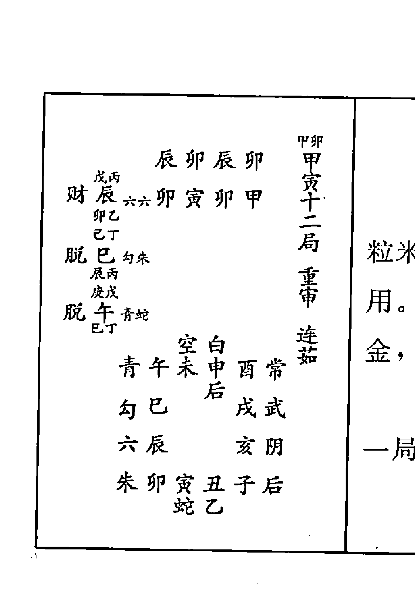

前脱后亡，连茹初虽财引人，中末脱。守之为强，贪一粒米，失半年粮，及向后退，又值空乡，网刃在前，岂利动用。如坐守干上旺神，又得末助初财，自然安静，火塍煨金，常人喜占官休任。发用辰加卯，见甲子十二局。昼夜六，俱详甲子十一局。

#### 乙卯一局

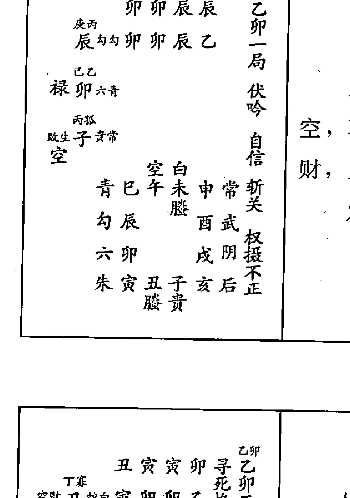

上下六害，中末互刑，彼已猜忌。渐变无礼，喜末子空，不能刑卯。昼贵子空，干之徒然。干禄得体，或守干上财，又或就支上旺禄，俱相得体。发用皆勾乘辰，俱详乙丑一局。

#### 乙卯二局

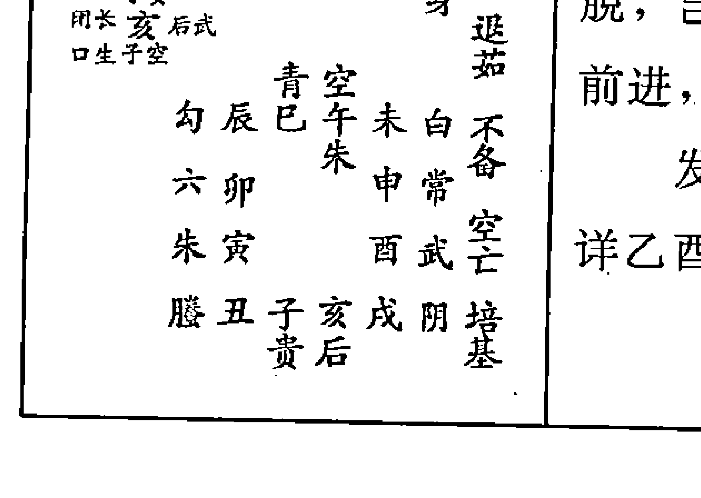

坐守我旺，进则无况，脚踏空亡，岂宜前向。退茹发用虽才，中、末皆空。见生不生，反大凶。进前一步，又被巳脱，岂宜进退？喜支加干，旺禄就身，坐守得亨。凡占催督前进，如后有坑，退后，脚下踏于空陷之地。发用丑加寅，见辛卯二局。昼蛇，详乙丑四局。夜白，详乙酉十一局。

#### 乙卯三局

| | |
| :--- | :--- |
| **亥丑子寅**<br>丁卯<br>财 丑蛇白丑卯寅乙<br>卯乙<br>丁癸<br>用长亥后武<br>口生丑空<br>乙辛<br>官 酉武后<br>癸癸<br>勾青<br>六卯辰巳午空龙战<br>朱寅 未白空亡<br>滕丑 申常<br>贵子亥戌酉武极阴<br>后阴 | 乙亥<br>乙卯三局<br>涉害<br>九丑<br>丑临支为财，中亥为长生，俱空。末传辛酉，独逢伤干。所恶辛酉满目。所欲丑亥无踪，极阴卦事尽昏暗，岂可近用？若能坐守，可稍宁。<br><br>发用丑加卯，克详丙寅三局。昼蛇，详乙丑四局。夜白曰直视，又曰在野。 |

#### 乙卯四局

| | |
| :--- | :--- |
| **酉子戌丑**<br>丁卯<br>财 丑蛇青子卯丑乙<br>空辰丙<br>财 戊阴未<br>丑空<br>癸己<br>墓未白后<br>戊壬<br>六勾<br>朱寅卯辰巳青禄<br>滕丑 午空空亡<br>贵子 未白<br>后亥戌酉申常励德<br>阴武 | 乙丑<br>乙卯四局<br>重审<br>九丑<br>四课初中，四处俱落空布。财归未未，鬼墓昼虎，倘若向贪，多虚少实，灾祸相滞。下害上合，下实上空，外好里芽槎，欲外合无凭。<br><br>内害可惧，昼贵支刑无益。<br><br>发用丑加辰，用昼蛇夜青，俱详乙丑四局。 |

#### 乙卯五局

| | |
| :--- | :--- |
| **未亥申子**<br>癸巳<br>墓未白后亥卯子乙<br>癸癸<br>己乙<br>禄卯六白<br>未己<br>丁癸<br>用长亥后六<br>口生卯乙<br>朱六<br>滕丑寅卯辰勾<br>贵子 巳青<br>后亥 午空<br>阴戌酉申未白<br>武常 | 乙子<br>乙卯五局<br>元首<br>曲直<br>稼穑<br>禄神中卯，墓神未墓发用。皆与虎并，未昼虎，卯夜虎。空贵昼子，生干徒然。所墓自墓传生，先迷后醒，惊疑历涉辛苦，终进一步，若遇长生，方得荣耀也。各生互生，亥实子虚，变为败神。<br><br>发用未加亥，见丁卯五局。昼白曰在野，又曰登山。夜后，详乙亥五局。 |

# 术数

#### 乙卯六局

```
乙卯六局
涉害
斩关
见机
己 戊 午 亥
脱 壬戊 空阴 戊 卯 亥 乙
妻 丁癸
财 丑后青
甲庚
官 申勾贵
丑空
后阴
贵子丑寅卯武见机
滕亥
辰常
朱戌
巳白
六酉申未午空
勾青
```

昼传皆空，初午乘空，中末旬空。夜贵初克，中墓落空无踪，所以占官不利。支乘财相合，常人坐守生计，庶速祸有功。干上长生，支上财自干生，初迤逦生，至末反克干，名恩将仇报。

发用午加亥，见壬申六局。昼空夜阴，详乙亥六局。

#### 乙卯七局

```
乙卯七局
返吟
龙战
容奸
回还
卯 酉 辰 戌
禄 乙乙 武白 酉 卯 戊 乙
官 酉乙
禄 卯武白
贵后
滕亥子丑寅阴
朱戌
青卯武
六酉
辰常
勾申未午巳白
青空
```

上下六害，交互相合返吟。初末旺禄，卯虎酉螣，往来冲制，禄遭危矣。酉临干支，夜占将蛇，夏令火鬼。更防家下火烛惊人，昼将元合用事，主多淫泱。

发用卯加酉，见乙卯七局。昼武夜白，详乙丑六局。

#### 乙卯八局

```
乙卯八局
重审
六仪
励德
丑 申 寅 酉
比 寅阴 空中 卯 酉 乙
墓 未甲 青后
财 丙孤
旺生 子青勾
朱戌亥子丑后
六酉
勾中
青未午巳辰常
空白
```

干上至未，迤逦征伐，祸里财至，互相伤灾。各乘上克，交互相代。三传上下夹克，递互克贼，仗干上酉克初寅，迤逦克去，如在官势行凶中得意，祸里财获。

发用寅加酉，用昼阴夜空，俱详乙丑八局。

#### 乙卯九局

```
乙卯九局
涉害
曲直
亥 未 子 申
墓 癸巳 青后 未 卯 申 乙
丁癸
闭长 亥蛇六
口生未己
乙乙
禄 卯武白
朱滕
六酉戌亥子贵
勾申
六丑后
青未
寅阴
空午巳辰卯武
白常
```

夜贵干上申，又乘墓克身。昼贵旬空虚陈。职禄恼怀，又初是土，中是长生，受土制，末禄虎元，所以家悔人迍，支助干鬼，总是家人，更忌求谒。

发用未加卯，见丁卯九局。昼青，详甲子十局。夜后，详乙亥五局。

# 术数

#### 乙卯十局

| 乙未 乙卯十局 涉害 龙战 三交 | 面喜上合，含毒下害。脱支墓干，常招耻辱。问吉问凶皆从，不欲鬼发用，坐火自焚，中贵旬空，末旺禄空，吉凶皆无，止守困，忌动谋。 |
| :--- | :--- |
| 官 酉 辛 六后 午 卯 未 乙<br>午戌 丙孤<br>败生子 贵常<br>空 酉辛<br>禄 卯 乙乙 武青<br>子空<br>勾 申 酉 戌 亥 滕<br>青未 阴 子 贵<br>空午 丑 后<br>白巳 辰 卯 寅 阴<br>常武 | 发用酉加午，见丁亥十局。昼六，详乙丑九局。夜后曰倚户。 |

#### 乙卯十一局

| 乙午 乙卯十一局 重审 涉三渊 | 两贵坐克无力。所求难得，各脱反盗，昼午天空，脱诈须慎。 |
| :--- | :--- |
| 官 德申 勾乙 巳 卯 午 乙<br>午戊 丙壬<br>财 戊 朱阴<br>申戊 丙孤<br>败生子 乙常<br>生成壬<br>勾 六<br>青未 申 酉 戌 朱<br>后 空午 亥 滕<br>白巳 子 贵<br>常辰 卯 寅 丑 后<br>武阴 | 昼支已乘，虎至惊危。丁马人宅鬼，发用坐克，中财乡，末空坐克，兼涉三渊，岂可前行，凡谋不慎。发用申加午，用昼勾夜乙，俱详乙丑十一局。 |

#### 乙卯十二局

| 乙巳 乙卯十二局 重审 连茹 斩关 不备 | 干乘丁，与马共动，则费用天罡。发用不由己，而身宅皆动，进退脱炁，耗盗无穷。末助初财，干加支，就旺禄，故宜屈尊求俸。 |
| :--- | :--- |
| 才 辰 勾勾 辰 卯 巳 乙<br>辰丙 辛丁<br>马脱巳 青六<br>辰丙 壬戊<br>脱 午 空朱<br>巳丁<br>白常<br>空午 未 申 酉 武<br>贵 青巳 戌 阴<br>勾辰 亥 后<br>六卯 寅 丑 子 贵<br>朱滕 | 发用辰加卯，见甲子十二局。昼夜皆勾，详乙丑伏吟。 |

#### 丙辰一局

```

癸丁
禄德 已空勾辰辰巳丙
丙庚
财 申武蛇
庚甲
马长 寅六白
生
空已午未申武
青辰酉阴
勾卯戌后
六寅丑子亥贵
朱滕
配丙辰一局
伏吟
元胎
斩关
励德

```

禄丁巳长生，空昼巳虎，夜寅纵横。丁巳发用，中才，末长生马，伏吟得此，静中俱动。空虎互克，三刑所作无成，若能坐待末助初作禄论，辰在支，宅欠宁。

发用昼空夜勾，详丙寅一局。

#### 丙辰二局

```

辛乙
败生卯勾空卯辰辰丙
庚甲
马长寅六白
生卯乙
己癸
脱丑朱常
空寅甲
空白
青辰已午未常
勾卯六申武
六寅酉阴
朱丑子亥戌后
滕贵
配丙辰二局
元首
连茹
斩关
不备
求受

```

面前六害，去辰脱干，还嗣息债。长生宁耐退，而卯寅虽克，支却生日。然后散虑，其虑白散。退末丑空，且喜脱气，又在长生，有生无害。

发用卯加辰，见戊辰二局。昼勾夜空，详丁卯一局。

#### 丙辰三局

```

己癸
脱丑朱勾寅辰卯丙
空卯乙
己癸
官亥乙朱
丑空
丁壬
财酉阴乙
亥癸
青空
勾卯辰已午白
六寅常未常
朱丑申武
滕子亥戌酉阴
贵后
配丙辰三局
重审
极阴
寡宿

```

两贵交会，各有利害。克支生干，人盛宅衰。昼夜贵加亥水，昼贵空亡休赖，交互乘害，发用空亡，末虽两贵，宜求两个，贵亥无用，凡占虚声，不宜前进，无成。

发用丑加卯，用昼朱夜勾，详丙寅三局。

#### 丙辰四局

| 戊丑亥寅 |      |      |      |
| --- | --- | --- | --- |
| 已癸 丑辰寅丙 |      |      |      |
| 官亥乙朱 | 寅甲 丙庚 |      |      |
| 财申武后 |      |      |      |
| 亥癸 |      |      |      |
| 癸丁 |      |      |      |
| 禄德巳空常 |      |      |      |
| 申庚 |      |      |      |
| 勾青 |      |      |      |
| 六寅卯辰巳空病 |      |      |      |
| 朱丑 | 午白 |      |      |
| 滕子 | 未常 |      |      |
| 贵亥戌酉申武 |      |      |      |
| 后阴 |      |      |      |

破碎关丑归庭，临支墓申耗散才，婚乘武。发用昼贵丑旬空，占告贵，不语沉吟，有屈无伸，错空非闭口。丙以申为财，中财鬼乡，未德禄去克，三传欠利，干上长生夜乘龙，余见荣昌，不宜妄动。

发用亥加寅，见丙寅四局。昼乙，详辛未十一局。夜朱，详乙丑十二局。

#### 丙辰五局

| 申子酉丑 |      |      |      |
| --- | --- | --- | --- |
| 戊孤 子蛇六子辰丑丙 |      |      |      |
| 空辰丙 庚庚 |      |      |      |
| 财申武后 |      |      |      |
| 子空 |      |      |      |
| 壬丙 |      |      |      |
| 脱辰青白 |      |      |      |
| 申庚 |      |      |      |
| 六勾 |      |      |      |
| 朱丑 寅卯辰青 励德 |      |      |      |
| 滕子 已空 孤辰 |      |      |      |
| 贵亥 午白 |      |      |      |
| 后戊 酉申未常 |      |      |      |
| 阴武 |      |      |      |

传鬼乘财，更值润下，四课皆空，丑能合敌，课传没溺，全然不畏。凶灾可释，常占解凶，仕宦不宜。如用夜将，六合发用，天后居中，三六相呼，子与丑共，外勾里连，夜多淫泆，惟宜坐守，不利动用。

发用子加辰，见壬申五局。昼蛇，详甲子八局。夜六，详丙寅六局。

#### 丙辰六局

| 午亥未子 |      |      |      |
| --- | --- | --- | --- |
| 甲戊 刃午白武亥辰子丙 |      |      |      |
| 亥癸 已癸 |      |      |      |
| 脱丑朱勾 |      |      |      |
| 空午戊 |      |      |      |
| 丙庚 |      |      |      |
| 财申武后 |      |      |      |
| 空空 |      |      |      |
| 朱六 |      |      |      |
| 滕子 丑寅卯勾 |      |      |      |
| 贵亥 青 辰青 |      |      |      |
| 后戊 已空 |      |      |      |
| 阴酉申未午白 |      |      |      |
| 武常 |      |      |      |

中末虚无皆空，坐守欠利独用，初午倘欲动用，即逢羊刃。昼贵在支，故曰归庐。乘闭口，干贵难语，申财被墓收，全然无炁，若占妻财，大忌。

发用午加亥，见壬申六局。昼白，详丙子四局。夜武，详壬申三局。

#### 丙辰七局

| 左侧 | 右侧 |
| :--- | :--- |
| 辰 戌 巳 亥<br>癸丁<br>禄德 巳空常 戊 辰 亥 丙<br>亥癸<br>已癸<br>闭口 亥乙未<br>口 已丁<br>癸丁<br>禄德 已空常<br>亥癸<br>后 阴<br>贵 亥 子 丑 寅 武 励德<br>滕 戌 勾 卯 常<br>朱 酉 辰 白 回还<br>六 申 未 午 已 空<br>勾 青 | 丙辰七局<br>返吟<br>斩关<br>励德<br>回还 |

满地皆丁，初末丁己，中坐巳乡，返吟得此，必主动摇，昼将动，遇贵临身干之，可有成。夜占不动，鬼墓难兴，如夜动，坐克乡元，为鬼贼墓，神在支，欲动不能，灾祸俱兴。

发用巳加亥，见戊辰七局。昼空，详丙寅一局。夜常，详戊辰七局。

#### 丙辰八局

| 左侧 | 右侧 |
| :--- | :--- |
| 寅 酉 卯 戌<br>庚甲<br>马长 寅 武 青 酉 辰 戌 丙<br>生酉辛<br>乙已<br>脱 未 勾 阴<br>癸甲<br>戊孤<br>空官 子 后 六<br>未已<br>贵 后<br>滕 戌 亥 子 丑 阴<br>六<br>朱 酉 寅 武<br>六 申 卯 常<br>勾 未 午 已 辰 白<br>青 空 | 丙辰八局<br>重审<br>斩关 |

酉为干财加支，辰酉相合。妻财虽美，面前六害，变之害己，众口一词，乘马遭耻，干乘墓脱两蛇，得年命冲破稍可，如戊天罗自裹，凶灾尤甚。三传上克互侵，素为不法，众口雷攻，初虽长生，乘马西制无用。

发用寅加酉，见乙丑八局。昼武，详丙寅七局。夜青，见辛未六局。

#### 丙辰九局

| 左侧 | 右侧 |
| :--- | :--- |
| 子 申 丑 酉<br>丁辛<br>财 酉 朱 贵 申 辰 酉 丙<br>已癸<br>脱 丑 胡 常<br>酉辛<br>癸丁<br>禄德 已 空勾<br>丑空<br>滕 贵<br>朱 酉 戌 亥 子 后<br>六 申 阴 丑 阴<br>勾 未 寅 武<br>青 午 已 辰 卯 常<br>空 白 | 丙辰九局<br>重审<br>从革 |

交关相合，利已从革，脱支为财，被乏巳益。昼贵初遭夹克，莫倚中末墓空，先聚后散，动费无成。夜将临干，顺动可用。金多水生，如年命再乘水神，传财化鬼，只可挽纳，占病求神，倘取财，反生祸矣。

发用酉加巳，见乙丑九局。昼朱，见乙丑九局。夜贵，见丙寅九局。

#### 丙辰十局

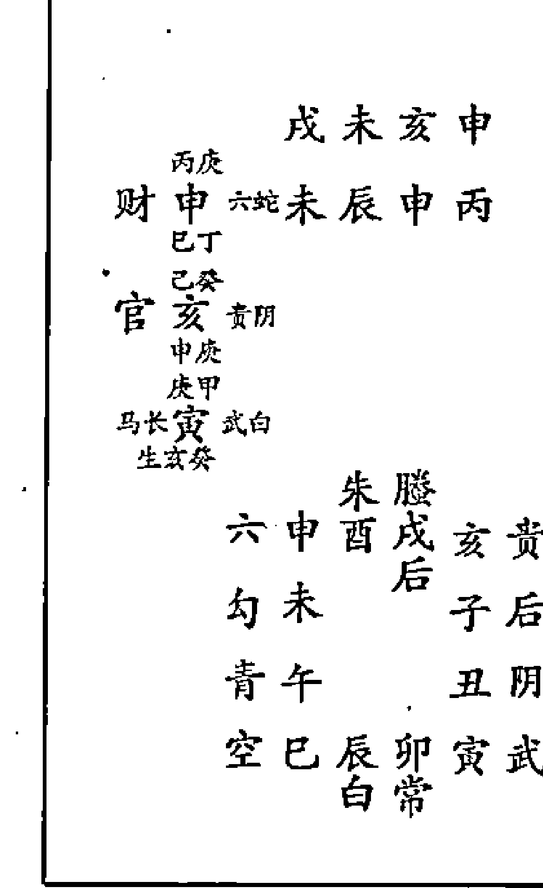

才初申贵，中亥长生末寅。三传递生，传内俱陈。迤逦相荐，凡占必主隔二、隔三，上人推荐，以成大事。倘遇夜将，则变成迍，初蛇，中、末阴虎，传空将恶，变喜成迍，干支交脱，难以凭准。

发用申加巳，夜乘蛇，俱详甲子十局。昼六，详丁丑十局。

#### 丙辰十一局

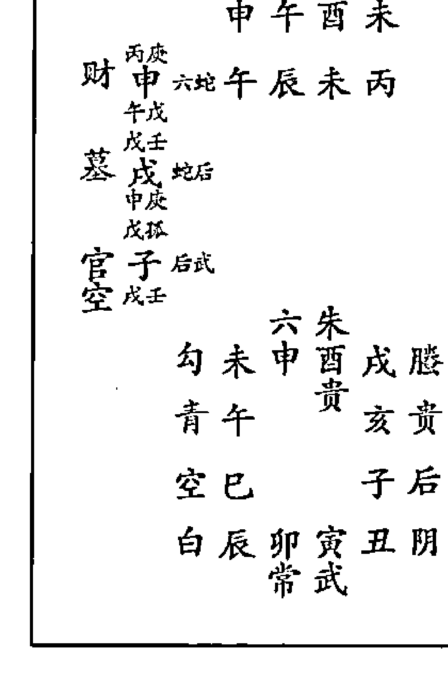

面前六合，生支脱干，初财末官，仕宦喜欢。引入中传，壬戌墓干。末武亥子，喻瞒传财化鬼，只可携祷占求，常人又涉三渊，岂利前行？若能坐守伏干上未，可敌官鬼，庶可安逸。

发用申加午，见乙丑十一局。昼六，见丙寅十局。夜蛇，见甲子十局。

#### 丙辰十二局

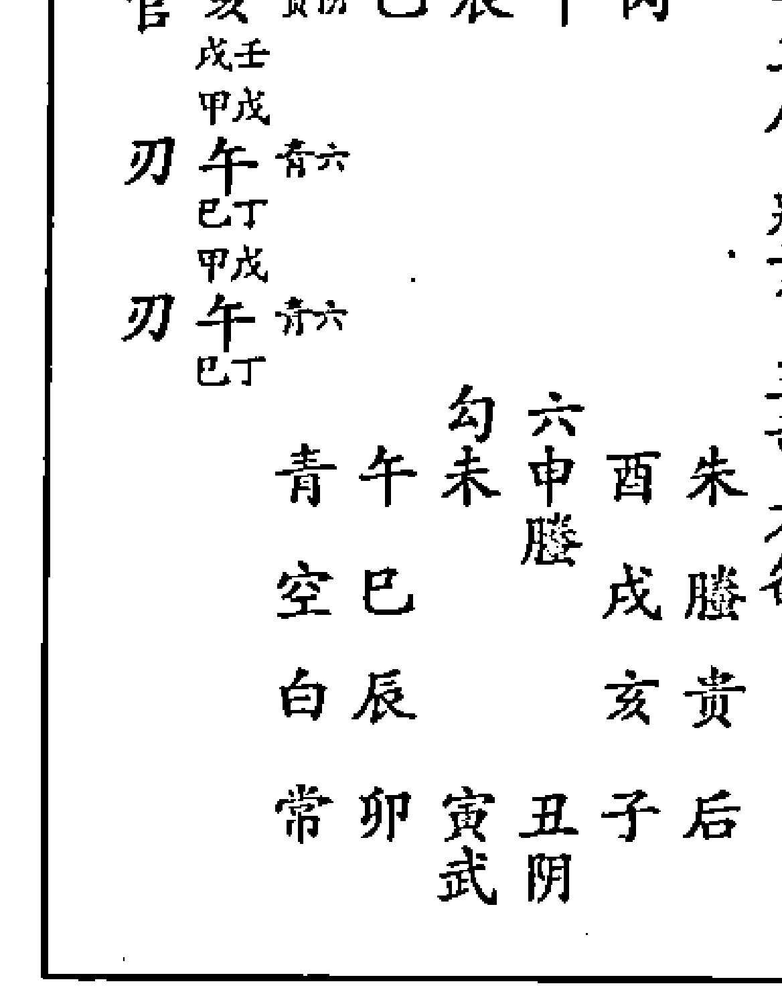

用亥昼为贵，及干中末午三重，昼乘旺龙。昼占即逢，坐谋大旺，遇贵有成。夜将亥乘太阴，变作鬼贼，午合变网羊刃。夜占须凶，凡事凶甚，未免俯就于人，终受困乏，不可动用。

发用亥加戌，见癸酉十一局。昼贵，见丙寅四局。夜阴曰裸形。

# 术数

#### 丁巳一局

丁未 丁巳一局 伏吟 元胎 励德
比 巳空勾 巳巳未丁
财 亥贵蛇 　
长生 寅六白 　
空巳午未申武
青辰　　酉阴
勾卯　　戌后
六寅丑子亥贵
　　朱滕

干支拱午，乃禄已遁，丁发用中，申才乘武，俸逐财，必有失。夜虎临末之长生寅，其性猛烈。丁已在支，发用双丁，其动速成。又兼三刑互克，伏吟本静，反生动摇，宦宜常人畏宜占食禄事嫌空。

发用昼空夜勾，详丙寅四局。

#### 丁巳二局

丁午 丁巳二局 元首 连茹 斩关 旺禄临身
败生 卯勾空 辰巳午丁
长生 寅六白
脱丑 朱常
空白白未常
青辰巳六　申武
勾卯　　酉阴
六寅　　戌后
朱丑子亥贵滕
　　滕贵

旺禄午昼，乘虎临身。昼夜虎寅，乘并居中，虽有生禄，动作惊危。身心费尽，略无少成，喜连茹初、中生炁，末空脱，亦在生方，费而有成，美中欠利。

发用卯加辰，见戊辰二局。昼勾夜空，俱详丁卯一局。

#### 丁巳三局

丁巳 丁巳三局 重审 极阴 不备 培基
脱 丑朱勾 卯巳巳丁
德亥贵未
闭口丑空
财酉阴贵
青空常
勾卯辰巳午白
六寅　　未常
朱丑　　申武
滕子亥戌酉阴
　　贵后

丁马俱现，人宅相恋，支加干，支乘生。亥水合亏，两贵相见。丁已在干，马居中须，言有动发用空脱，中落空受制，全然无炁，末虽两贵相加，五阴相继，利私谋，不利公动意有现。

发用丑加卯，用昼朱夜勾，俱详丙寅三局。

#### 丁巳四局

亥 寅 丑 辰
口 亥 朱 寅 己 辰 丁
马 戊 甲
财 申
癸 己
比 己
中 庚
丁 辰
丁 己 四 局
蒿 矢
三 奇
勾 青
六 寅 卯 辰 己 空 病
白 白
朱 丑
午 斩 关
滕 子
未 常
贵 亥 戌 酉 中 武
后 阴
昼值斩关，逃者不还，马射弧矢，委镞伤残，蒿矢带金，射必中斩关。龙头在日，马发用，末丁支寅乘合武，居中大利，逃者任意东西，出外吉，在家凶。
发用亥加寅，用昼贵夜朱，俱详丙寅四局。

#### 丁巳五局

酉 丑 亥 卯
德 辛 癸
闭 官 亥 乙 未 丑 己 卯 丁
口 马 卯 乙
丁 己
木 未
坐 癸
败 生 卯
未 己
丁 卯
丁 己 五 局
蒿 矢
曲 直
六 勾
朱 丑 寅 卯 辰 青 三 奇
空
蛇 子
己 空
乙 亥
午 白 德
后 戌 酉 申 未 常
阴 武
将脱昏将，皆土传生，曲直克去，土不能生。日虽蒿矢，无金惊人。但自末至，初位互克。迤逦伤身，课传五阴，暗似鬼贼相侵，事尽昏暗，凡占不顺。
发用亥加卯，曰花卸再生。昼乙曰登车。夜朱，详戊辰二局。

#### 丁巳六局

未 子 酉 寅
己 辛
财 酉 子 己 寅 丁
戊 甲
脱 辰
酉 辛
德 辛 癸
闭 官 亥 乙 未
口 马 辰 丙
丁 寅
丁 己 六 局
涉 害
幼 危
朱 六
蛇 子 丑 寅 卯 勾
青
乙 亥
辰 青
后 戌
己 空
阴 酉 申 未 午 白
武 常
交车六害，干实支空，夜贵酉金，怀克损寅长生。昼贵亥，虽生寅木，被墓克，其力极轻。秋子为火鬼，昼将蛇伤支火厄。课体四绝，三传自刑，凡谋欠顺。
发用酉加寅，见己巳六局。昼阴，详丙戌五局。夜乙，详丙寅九局。

#### 丁巳七局

乙丁比巳空常亥巳丑丁
亥癸德辛癸闭官亥乙朱口马巳丁
乙丁比巳空常亥癸
后阴乙亥子丑寅武
勾
蛇戌
卯常
朱酉
辰白
六申未午巳空
勾青

右侧列：
丁丑
丁巳七局
返吟
绝胎
励德

丑为脱空，宜弃而不可守。丁初末马，中亥及支，迭值夜动，文书昼助，因贵亥，为贵德，夜乘雀，必因官贵文书而动，凡占仗贵图则吉，常人占，反覆不利。
发用巳加亥，夜乘常，详戊辰七局。昼空，详丙寅一局。

#### 丁巳八局

乙丁比巳空常戌巳子丁
子空庚壬墓戊蛇蛇巳丁癸乙
败生卯常空戊壬
乙后蛇戊亥子丑阴
六
朱酉
寅武
六申
卯常
勾未午巳辰白
青空

右侧列：
丁子
丁巳八局
重审
铸印
斩关
回还

空鬼加身，实墓临庭，宅必欠亨，昼蛇凶恶尤甚。干上空鬼，虽主虚惊，坐下未土能制，亦喻狐假虎威，欲动，必不能动。守则虚惊，初空末实，先难后易，始费终成。
发用巳加子，见丁卯八局。昼空，详丙寅一局。夜常，详戊辰七局。

#### 丁巳九局

己辛财酉朱乙酉巳亥丁
辛癸
脱丑阴常
空酉辛乙丁
比巳空勾
丑空
蛇乙
朱酉戌亥子后
阴
六申
丑阴
勾未
寅武
青午巳辰卯常
空白

右侧列：
丁亥
丁巳九局
重审
丛革

两贵并排，干亥支酉。三传从革为财，如用夜将，皆土助财。贪财不已，生鬼为灾，夜将土生传，传生干上亥为鬼，兼二贵拱戌，如年在午，大利，试中魁。常人只可携赙纳奏，将本求财，主祸。
发用酉加巳，见乙丑九局。昼朱夜乙，详丙寅九局。

#### 丁巳十局

丁戊十局
重审
生胎
亥申丑戌
戊庚
财申六蛇申巳戊丁
己丁
丙辛癸
闭官亥乙阴
口马中庚
壬甲
长寅武白
生亥癸
朱蛇
六申酉戌亥乙后
勾未 子后
青午 丑阴
空巳辰卯寅武
白常

舍去疑虑，其财可取，因比求生，宜文宜武。墓神覆脱，主昏晦。喜初传财，在支发用，昼虽内战，却三传递生，如弃墓而就初财，却得二三处上人推荐成名。初财末武，以财取贵，后有长生。

发用申加巳，夜乘蛇，俱详甲子十局。昼六，详丙寅十局。

#### 丁巳十一局

丁酉十一局
重审
不备
凝阴
励德
酉未亥酉
己辛
财酉朱乙未巳酉丁
未己
丙辛癸
闭官亥乙阴
口马酉辛
辛癸
脱丑阴常
亥癸
六朱
勾未申酉戌蛇
青午 亥乙
空巳 子后
白辰卯寅丑阴
常武

酉为干妻财支之破碎，临干发用两贵，加贵人遍地，又传化财鬼，故夜贵多嗔，破财败婚。中传癸亥，昼贵闭口，坐败地，故力弱言轻，虽末助初财，丑空无力。凝阴卦以阴入阴事，主幽暗。

发用酉加未，见丁卯十一局。昼朱夜乙，详丙寅九局。

#### 丁巳十二局

丁申十二局
重审
退茹
权摄不正
未午酉申
戊庚
财申六蛇午巳申丁
未己
己辛
财酉朱乙
申庚
壬癸
墓戌蛇后
酉辛
勾六
青午未申酉朱
空巳 蛇戌蛇
白辰 亥乙
常卯寅丑子后
武阴

交车相合，旺禄临支，支已和顺，利求婚及合本营生，倘若求财，则必急进，迟则传财入墓，劳心费力。病讼因贪，三传俱财，因贪惹崇。昼贵履狱，休近。

发用申加未，见己巳十二局。昼六，见丙寅十局。夜蛇，见乙丑十一局。

#### 戊午一局

| | | | | | | |
|---|---|---|---|---|---|---|
| 巳 | 午 | 未 | 申 | 白 | 两 | 使 |
| 丁 | | | 乙 | | 刀 | |
| 禄德 | 勾 | 午 | | 午 | 巳 | 戌 |
| | 朱 | | | 巳 | 巳 | |
| | | | | | | |
| 长生 | 庚 | 中 | 白 | 后 | | |
| 官 | 甲 | 寅 | 蛇 | | | |
| 勾 | 巳 | 午 | 未 | 空 | 青 | |
| | | 乙 | | | | |
| 六 | 辰 | | 酉 | 常 | | |
| 朱 | 卯 | | 戌 | 武 | | |
| 蛇 | 寅 | 丑 | 子 | 亥 | 阴 | |
| | | 乙 | 后 | | | |
| | | | | | | |
| 戊 | 巳 | | | | | |
| | 戊 | | | | | |
| | 午 | 一 | 局 | | | |
| | | 伏 | 吟 | | | |
| | | 元 | 胎 | | | |

末助初生，迤逦相侵。伏吟本主不动，干上丁破碎，发用丁中传驿马，恃己之刚，伏辩凌人，以致三刑互克末传。寅明助巳为生，暗伤戊为鬼，故佛口蛇心，坐守不安，动用不吉，羊刃在支，虽生当畏。
发用昼勾夜朱，俱详戊辰一局。

#### 戊午二局

| | | | | | | |
|---|---|---|---|---|---|---|
| 辰 | 巳 | 卯 | 辰 | 权 | 戊 | |
| 乙 | 官 | 卯 | 朱 | 勾 | 巳 | 午 |
| | 层丙 | | | | | |
| 甲 | 官 | 寅 | 蛇 | 朱 | | |
| | 卯乙 | | | | | |
| 癸 | 比 | 丑 | 乙 | 空 | | |
| 寅甲 | | | | | | |
| 勾 | 青 | | | | | |
| 六 | 辰 | 巳 | 午 | 未 | 空 | 青 |
| | | 滕 | | | | |
| 朱 | 卯 | | 申 | 白 | | |
| 蛇 | 寅 | | 酉 | 常 | 备 | |
| 乙 | 丑 | 子 | 亥 | 戌 | 武 | |
| | 后 | 阴 | | | | |
| | | | | | | |
| 戊 | 辰 | | | | | |
| | 戊 | | | | | |
| | 午 | 二 | 局 | | | |
| | 权 | 摄 | 不 | 正 | | |
| | | 元 | 首 | | | |
| | | 退 | 茹 | | | |

墓神覆日，昏晦其身。 禄加宅，值丁神，盗脱不宁。发用卯木坐辰，鬼居墓上，名鬼招呼病人，又传俱鬼岂宜退向，春夏鬼旺，争当速了。秋冬木衰为穷，鬼则牵缠祸患，索系可恶。
发用卯加辰，昼乘朱，见戊辰二局。夜勾，详丁卯一局。

#### 戊午三局

| | | | | | | |
|---|---|---|---|---|---|---|
| 寅 | 辰 | 丑 | 卯 | | | |
| 癸 | 比 | 丑 | 乙 | 空 | 辰 | 午 |
| | 卯乙 | | | | | |
| 癸 | 闭 | 财 | 亥 | 阴 | 常 | |
| | 口 | 丑 | 空 | | | |
| 辛 | 败 | 脱 | 酉 | 常 | 阴 | |
| 癸 | 玄 | | | | | |
| 六 | 勾 | | | | | |
| 朱 | 卯 | 辰 | 巳 | 午 | 青 | 极 |
| | | 朱 | | | | |
| 蛇 | 寅 | | 未 | 空 | 寡 | |
| 乙 | 丑 | | 申 | 白 | 宿 | |
| 后 | 子 | 亥 | 戌 | 酉 | 常 | 励 |
| | 阴 | 武 | | | | 德 |
| | | | | | | |
| 戊 | 卯 | | | | | |
| | 戊 | | | | | |
| | 午 | 三 | 局 | | | |
| | | 重 | 审 | | | |
| | | 斩 | 关 | | | |

面前六害伤身，干卯墓宅，脱支克干。用传空域，初丑贵旬空受制，中财落空乡。末逢酉金脱败，然虽脱，能制卯。略无少益，如年命在辰，辰上乘寅为鬼，呼病凶。若命戊上乘申，制其寅木，不为害。
发用丑加卯，见丙寅三局。昼乙夜空，俱详戊辰三局。

#### 戊午四局

见处危险，支乘败生，干乘克害，又作发用。二寅未传，求申救援。却又迤逦生寅。因斯转助官说，仕宦喜逢隔二三。上人推荐，常人忌。助鬼一毁一誉，苦去甘来，乐里成愁，申之过也。

发用寅加巳，见戊辰四局。昼蛇，见甲子一局。夜青，见甲子一局。

#### 戊午五局

传火生身，夜占畏遁，甲寅乘虎，必须修身。谨行免祸伤身。炎上课本为印绶，但丑午六害，命中犯煞，美里成嗔，交车六害，寅实丑空，丑昼贵夜，空昼午乘虎墓上，主父母灾迍。

发用戌加寅，用昼夜皆六，俱详甲子五局。

#### 戊午六局

面前六合四课，皆空无形。外面好看，全无实迹，事迹难明，初末拱支，引之何益？干上子为胎财，被传互克，难进难退。夜虎甲寅居未木，力尤轻，虎寅坐墓，不足为虑，尤不可动。

发用子加巳，见丙寅六局。昼蛇夜青，详甲子八局。

#### 戊午七局

戊玄
戊午七局
返吟
三交
刃午白后
财子蛇青
空子庚
刃午白后
午子巳亥
子午亥戌
蛇乙
朱亥子丑寅后
空
六戌
卯阴
勾酉
辰武
青申未午巳常
空白

干乘实财，支乘空鬼，来往皆空，凡事无踪。午为生炁，又乘白虎，喜不足喜，凶不为凶，如秋子为火鬼，昼蛇防火烛厄。

发用午加子，见丙子七局。昼白，见丙子四局。夜后，见壬申六局。

#### 戊午八局

戊戌
戊午八局
知一
幼厄
斩关
墓辰武武
脱败酉勾朱
官寅后白
辰亥卯戌
亥午戌戌
朱蛇
六戌亥子丑乙
青
勾酉
寅后
青申
卯阴
空未午巳辰武
白常

传墓发用，脱中酉鬼寅末。三传可畏不美。财爻临支，故宜端坐家中。但支墓在干，公财夺禄，故坐食倍费，不可动谋。

发用辰加亥，见庚午八局。昼夜皆武，俱详甲子九局。

#### 戊午九局

戊酉
戊午九局
元首
六仪
斩关
励德
狡童
官寅后白
刃午白后
比戌六六
寅戌丑酉炎上
午酉戌
六朱
勾酉戌亥子蛇
勾
青申
丑乙
空未
寅后
白午巳辰卯阴
常武

面前六害，墓神脱支，败神脱干，虽传火为生，但夜虎临寅，遁甲发用。可见灾迍须慎。喜干上得酉能敌，然卒不能制寅者。传局火神焚酉，无力难施，仕宦吉，常人凶。

发用寅加戌，见甲戌九局。昼后夜白，见甲子六局。

#### 戊午十局

子 酉 亥 申
酉 午 申 戊
财 子 蛇青
空 酉 辛
官 卯 阴常
子空
勾六
青申酉戊亥朱
六
空未 子蛇
白午 丑乙
常巳辰卯寅后
武阴

贵坐克罡履狱，自干生初，迤逦坐来反伤日，施恩成怨，但中亦空亡，好恶俱无。独存初酉临支。此乃脱败，非常申长生，加干昼龙，九月占坐气在申，默似神助，日后生意渐昌。
发用酉加午，见丁亥十局，昼勾，见庚午十局，夜朱，见丙寅九局。

#### 戊午十一局

戌 申 酉 未
申 午 未 戌
比 戌 武武
中 庚
壬癸
中 子 后白
空 戊壬
白常
空未申酉戌武
阴
青午 亥阴
勾巳 子后
六辰卯寅丑乙
朱蛇

往来交姤，交车相合。虽互脱，但申是长生，可就在支发用，可以俯就，求其生财。唯忌贪向取末之财。旬空坐克，又涉三渊，苗而不秀，反有发用。
发用申加午，见乙丑十一局。昼白夜后，详戊辰十一局。

#### 戊午十二局

申 未 未 午
未 午 午 戌
官 寅 蛇青
丑空
戊戊
刃 午 青蛇
巳丁
戊戊
刃 午 青蛇
巳丁
空白
青午未申酉常
后
勾巳 戌武
六辰 玄阴
朱卯寅丑子后
蛇乙

彼来生己，面前六合，支来加干，又作生炁，兼中末俱午火。守之如意，不劳自成，生生不绝。倘若动谋，初传鬼午，网刃俱值，伤身罗宅，灾祸俱拥，动谋须慎。
发用寅加丑，见乙丑十二局。昼蛇夜青，俱详甲子一局。

## 卷五十八 术数汇考五十八

## 大六壬立成大全钤

### 己未至癸亥

#### 己未一局

| 己未一局 伏吟 稼穑 |
| :--- |
| 本年庚
坐未
比丑
比戌 |
| 未 未 未 未
未 已 未 已 |
| 空白
青巳午未中常独
勾辰 蛇 西武
六卯 戌阴
朱寅丑子亥后
蛇乙 |

支干同宫相逢，传三刑，缘中丑旬空，名断桥折腰。末虚刑事中有阻，好恶俱无。止论初传，故曰无依独足。昼占未，又乘虎与干支，共三重，终受惊险。凡占难行，如商贾宜水船，旱小车，独载应独足之意。
发用未用，乙卯一局。昼白夜蛇，俱详乙巳十二局。

#### 己未二局

| 己未二局 八专 帏薄 |
| :--- |
| 丁乙
官卯
禄午 空朱
禄午 空未 |
| 巳 午 巳 午
巳 午 巳 午 |
| 青空
勾辰巳午未白干
六卯 朱中常支乘
朱亥 酉武胎
蛇丑子亥戌阴
乙后 |

从革食禄，土眙午，又是禄干支中末，共四午发用。卯生午，午坐干，课又八专，革故鼎新。方才享福，贪禄荣昌。惟有昼将，大空在日。禄空占病必哭，防禄有失，动尤迍，当坐守。
发用卯加辰，见戊辰二局。昼六曰人室。夜青，详己巳二局。

#### 己未三局

| 己未三局 八专 帏薄 |
| :--- |
| 乙庚
比丑 地
卯己
马生 巳 青六
马生 巳 青六 |
| 卯 巳 卯 巳
己 未 己 己 |
| 勾青
六卯辰巳午空害宿
朱寅 未白
蛇丑 申常
乙子亥戌酉武
后阴 |

发用丑为破碎作空。昼蛇夜虎，凡谋费耗贫穷。下支中末四重，己遁丁，又是马遍地。昼将乘龙，万里翼神，虽为生气，全无定踪，一世飘蓬。
发用丑加卯，见丙寅三局，昼蛇，见乙丑四局，夜白曰直视，又曰在野。

#### 己未四局

发用癸亥，财神闭口。又在鬼乡，不得入手。干支中末四墓，昼将逢勾。彼此昏迷，进退难守，如夜将太常，夹墓尤殃。得年命在丑，伏戌冲辰，破其网墓，向后可救，若更在辰，天罗自裹，事终难脱。

发用亥加辰，见丙寅四局。昼后，详乙丑三局。夜六，详辛未四局。

#### 己未五局

卯死神，又鬼在干支发用，虎入夜占。亥虽财会，木局为传，宣传鬼为财，如夜将卯乘虎，其凶难免，常人仕宦，总受迍邅，退守犹可动用灾损。

发用卯加未，见己巳五局。昼六曰入室。夜白，见乙丑六局。

#### 己未六局

寅为鬼户，未中鬼宿，斯寅加于未，伤干克支，如入人鬼门。卦号离魂，酉金虽救神，不知初生末迤逦，生寅勿恃。返为生祸之根，课体四绝，三传自刑，病讼皆凶。凡谋不顺，巳乘虎坐墓，父母爻灾咎。

发用酉加寅，见己巳六局。昼六，见甲子五局。夜蛇，详甲子一局。

#### 己未七局

己丑
己未七局
返吟
帷薄
未丑未丑
己丁
马生 巳白武丑未丑己
亥癸
乙癸
比 空 丑后青
未杞
乙癸
比 空 丑后青
未杞
腾亥子丑寅阴
六酉辰常八专
勾申未午巳白
青空
初值巳火，发用丁马。投绝受克，昼虎夜元，动意难就难舍。

干支中末，四丑空破，又落丑宫，来往相值，动生破费，守空撞空。渐为贫者。

发用巳加亥，见戊辰七局。昼白，见己巳七局。夜武，详乙丑五局。

#### 己未八局

己子
己未八局
无禄
励德
铸印
干支胎神
巳子巳子
甲孤
财 空 子乙勾子未子己
己丁
马生 巳白武
亥子空
甲壬
比 戊朱朱
己丁
蛇乙
朱戌亥子丑后
六酉寅阴
勾申卯武
青未午巳辰常
空白
财既双空，子虽胎财，干支全遇，但是旬空。发用丁巳，与马生炁，丁马又在，空乡虚逢。末传卯鬼，宜助初财。转祸为福，孕育官吉，病讼畏逢。

发用子加未，见甲子八局。昼乙，见乙丑二局。夜勾，见己丑四局。

#### 己未九局

己亥
己未九局
重审
泆女
三奇
曲直
卯亥卯亥
乙癸
用财 亥蛇六亥未亥己
未杞
丁乙
官 卯武后
亥癸
辛杞
本 未背后
坐 卯乙
朱腾
六酉戌亥子乙
勾申丑后
青未寅阴
空午巳辰卯武
白常
干支发用，三水并立，上乘闭口。却与三传，合成曲直。及白取财，化鬼为灾，只可以财告纳。欲待不取，眼前急舍，不得可惜。

发用亥加未，见辛未九局。昼蛇，见己巳十一局。夜六，见辛未四局。

#### 己未十局

```
丑 戌 丑 戌 励德
财 亥 蛇武 戊 未 戊 己
比 戊 朱阴
比 戊 朱阴
勾 申 酉 戌 亥 蛇
青 未     子 乙 薄
空 午     丑 后 三奇
白 巳 辰 卯 寅 阴 斩关
常 武
己未十局
重审
八专
帷薄
三奇
斩关
```

一位财星，发用亥水。干支中末，四戌来争，争之不已。又戌刑于未，故致讼遭刑，妻财可畏，退守免凶。发用亥加申，见辛未十局。昼蛇，见己巳十一局。夜武，见乙丑三局。

#### 己未十一局

```
亥 酉 亥 酉
癸辛 败脱 酉 六后 酉 未 酉 己
癸辛 败脱 酉 六后
癸辛 败脱 酉 六后
勾 六
青 未 申 酉 戌 朱 后
空 午     亥 蛇 励德
白 巳     子 乙
常 辰 卯 寅 丑 后 武 阴
己未十一局
八专
独足
励德
```

此系独足，岂利远行。干支中末，俱酉脱败，迭逐不已。惟喜舟车，宜驾舟船，小车利顺。酉太阴，又婢妾，故尔婢逃妇，子息屋，阴人费用。发用酉加未，见丁卯十一局。昼六，见乙丑九局。夜后曰倚户。

#### 己未十二局

```
酉 申 酉 申
辛纪 本坐 长生 长生 未 白蛇 申 未 申 己
壬庚 申 常乙
壬庚 申 常乙
白 常
空 午 未 申 酉 武 薄
青 巳     戌 阴
勾 辰     亥 后
六 卯 寅 丑 子 乙 朱 蛇
己未十二局
八专
帷薄
```

发用比肩，昼虎夜蛇，未免虚应，干支中末，申金四重，虽类子孙，却是长生。夜贵昼常，必因贵人，喜庆酒食婚姻，或彩帛店礼仪，凡占如意。慈乌返哺，先费后荣。夜贵尤荣，生计悠长，卜官无用。发用未加午，见乙巳十二局。昼白夜蛇，俱见乙巳十二局。

#### 庚申一局

申虎乡，干支发用为三虎，昼又乘逢，共是四虎。伏吟生静，中寅财马，末已遁丁，所以动无少阻。又是丁马入传。刚日伏吟，行人回旋，传三刑，财化鬼，止宜携祷，不利求财。

发用昼白夜后，详戊辰十一局。

#### 庚申二局

初遭罗网，发用酉为网刃。倘若动谋，兜身绕宅，障难无那。如在秋占酉旺，夜将事贵，未为贵人临身。干支中未，四土相生，遇者得助最多，三处贵人资助，不待劳心，自成其美，或是神灵阴助，尤的。

发用酉加戌，用曰密云不雨。婢与奴走家不和，有伏尸，凶多吉少。

昼常曰券书。小麦始顺，终竟。夜阴见丙戊五局，阴人当家，有产降生。

#### 庚申三局

若取寅财，生起祸来，末助初鬼。财官相生，君子官哉！末助初，只可祷纳。常人忌财化鬼，伤干克支，彼此有损。亦忌捕奸盗告讦，恐惹连累相害。

发用午加申，见庚午三局，昼青夜蛇见甲子四局。

#### 庚申四局

```
辛丁   寅巳   寅巳   犯庚申四局
长生   巳勾朱 巳申   巳庚   元首
马财   寅蛇青        病胎
丁癸   亥阴常        雨露润光
脱     寅甲
朱六   蛇寅卯辰巳勾
乙丑          午青
后子          未空光
阴亥戌酉申白
武常
```

干乘丁巳发用，中传寅财，带马夜巳。克干昼勾，土生夜雀，丁巳夹克。丁初巳马，中寅俱迎，末之亥水，脱干生财，为明脱暗助，故能败能成。仕宦高迁，常人病讼俱凶。
发用巳加申，见庚午四局。昼勾夜朱，见戊辰一局。

#### 庚申五局

```
丙辰   子辰   子辰   庚辰庚申五局
脱子蛇青辰申   辰庚   重审
禄德申青蛇子空   庚丙   润下
生辰武武申庚   斩关
后阴乙丑寅卯辰武
蛇子    已常
朱亥          午白
六戌酉申未空
勾青
```

传课润下，盗气传递，初中逢空，独存干支，及末辰土三重。生炁无穷，若不坐守，动谋离其生炁，水脱源消根断，虚费百出，到处去来，不如守本身出意，快乐尤穷极，不利动谋。
发用子加辰，见壬申五局。昼蛇夜青，见甲子八局。

#### 庚申六局

```
丙壬   戊卯   戊卯   庚卯庚申六局
父戊六六卯申   卯庚   知一
卯乙   丁   官巳常阴   戊壬   无禄
丙辰子子蛇青   已丁
乙后蛇子丑寅卯阴
白
朱亥          辰武
六戌          已常
勾酉申未午白
青空
```

干上卯木，为财却生，中传鬼丁，丁巳中遇。子克巳戊，墓巳可恃。常人逢之，却祸除灾，仕宦不宜。独存卯财。任取无害。
发用戊加卯，见丁卯六局。昼夜皆六，见甲子五局。

#### 庚申七局

```
申寅申寅
戊甲 马财 寅后白 寅申寅庚
甲庚
禄德 申青蛇
寅甲
戊甲 马财 寅后白
甲庚
蛇乙
朱亥子丑寅后
空
六戌 卯阴
勾酉 辰武
青申未午巳常
空白
庚申七局 返吟 六仪 绝胎 回还
```

四财寅木，一禄中申。如用夜将乘虎，又马趋逐。四马并进，来往反复，动坐绝乡，彼此受促。凡事只可结绝，不宜妻财及禄。

发用寅加申，见壬申七局。昼后夜白，见甲子六局。

#### 庚申八局

```
午丑午丑
己乙 财卯阴常 丑申丑庚
戊壬
丁墓
空丑乙空
墓中庚
丁墓
空丑乙空
墓中庚
朱滕
六戊亥子丑乙 雨霖润泽
青
勾酉 寅后
青申 卯阴
空未午巳辰武
白常
庚申八局 八专 空亡
```

干支中末，四员昼贵。全然无气旬空。发用纵有浮财，夜占可畏。夜常中末空至，乃墓重重覆日，凡占婚甚，若年命丑，天罗自裹，占病大凶，邪淫逆礼，所以夜占可畏。

发用卯加戌，见辛巳八局。昼阴，见癸酉七局。夜常，见丁卯七局。

#### 庚申九局

```
辰子辰子
庚丙 生辰武武 子申子庚
甲庚
禄德 申青蛇
庚丙
丙孤
脱子蛇青
空中庚
六朱
勾酉戌亥子蛇 励德
青申 丑乙
空未 寅后
白午巳辰卯阴
常武
庚申九局 元首 润下
```

既初末空满前。水润下作三传。昼夜蛇龙武，俱水中兽将。不惟耗盗三合，又且缠绵。又金死子，干支末，三子坐守，稍可动用，凶。

发用辰加子，昼夜武，见甲子九局。

#### 庚申十局

| 庚申十局 |  |
| --- | --- |
| 丁癸<br>空墓丑戌丁癸<br>用脱亥中戌丁癸<br>用脱亥中戌<br>青申酉戌亥朱<br>空未<br>白午<br>常巳辰卯寅后<br>武阴<br>六戌亥朱<br>勾<br>六<br>空亡<br>源消根断 | 凡事缄默，可脱灾厄，事关贵人，甘受岑寂。发用贵人空履狱，不有其生，反被其墓。甘受云云。干支中末四亥，脱干盗支。凡事当退守缄默，制鬼可免灾，倘动用耗脱不已，常人可，仕宦忌。<br>发用丑加戌，曰鹤鸣在阴。昼乙夜空，见戊辰三局。 |

#### 庚申十一局

| 庚申十一局 |  |
| --- | --- |
| 丙孤<br>脱子后白戊申戊庚<br>戊壬<br>戊甲<br>马才寅蛇<br>子空<br>庚丙<br>生辰六六<br>杰寅甲<br>白常<br>空未申酉戌武<br>青午<br>勾巳<br>六辰卯寅丑乙<br>朱蛇<br>阴<br>后<br>向三阳<br>斩关<br>重审<br>洗女 | 戊寄宅身，驿马居寅。动逢子盗，末遇丙辰，初空子盗气，中财马空乡，末丙反伤，纵贵登罡塞，虽无鬼障碍向前，谋之何益？喜戌在干支，若能坐待，却有生意也。<br>发用子加戌，见丙戌十一局。昼后夜白，见甲子二局。 |

#### 庚申十二局

| 庚申十二局 |  |
| --- | --- |
| 丁癸<br>用脱亥中戌丁癸<br>乙辛<br>刃酉常阴<br>中庚<br>乙辛<br>刃酉常阴<br>中庚<br>空白<br>青午未申酉常<br>勾巳<br>六辰<br>朱卯寅丑子后<br>蛇乙<br>后<br>戌武<br>亥阴<br>三奇<br>八专 | 干支中末四酉，能坐守共旺则昌，彼此兴隆。若不守旺，倘若动，则被初亥脱，有伤。酉且则为羊刃，伤身毁宅，恐害非常。<br>发用亥加戌，见癸酉十二局。昼阴曰裸形。夜常曰征召。 |

#### 辛酉一局

上下六害，旺禄临支。但昼元夜乘虎，相随禄，主惊失，更防门户。干中末皆是土，前逢虽有生意。戌未刑，故争斗无时，动用尤可生生无亏。
发用昼武，见乙未十二局。夜白，详辛卯十局。

#### 辛酉二局

发用空丑虚墓，旺禄临身。夜乘元，昼乘元，交值变为六害。支申昼元夜空，天空酉戌皆奴婢，干支中末，戌酉四重，故重迭恼怀。皆因家下奴婢，从革别责，欲更难更。
发用丑加寅，见辛卯二局。昼青，见乙丑四局。夜后曰偷窥。

#### 辛酉三局

切勿取财，取得祸来，赍财告贵，卜比宜哉？比肩临干，生炁在支，未财助初，官贵只可祷纳，占病求神，倘取财则生祸，仕宦喜，常人畏。
发用午加申，见庚午三局。昼乙夜勾，见乙丑十一局。

#### 辛酉四局

```
卯午辰未
甲戊 官败 午乙带 午酉未辛 酉空
辛乙 财卯 六后 午戊 戊孤 空脱 子 空朱 卯乙
六朱 勾寅 卯辰 已蛇 高盖
阴 青丑 午乙 励德
空子 未后德
白亥 戌酉 申阴 三交
常武
```

未土乘虎，下害上合，克支生干。重重逢午，支及初传，二午伤身。欲水成功，中末刑冲，赖子制午。但空减力，略无小补，如坐待自末至支，迤逦生，未育干，虽乘虎，可受惊疑之生。

发用午加酉，见甲子四局，昼乙夜常俱，详辛巳五局。

#### 辛酉五局

```
丑巳寅午
癸丁 长已 蛇弑 巳酉午辛
生百辛 已朱
墓丑 青蛇
已丁
丁辛 禄酉 武青
丑空
勾六 青丑 寅卯 辰朱 后
空子 已蛇
白亥 午乙
常戊 酉申 未后
武阴
```

彼已遭伤，各乘上克。交互尤殃相伤。干乘昼贵，鬼依贵得力，支乘丁巳又破碎。昼蛇夜虎，宅怪难当，从革旺禄，在未被巳克，丑墓又落空乡，占奴婢兄弟俱伤。

发用巳加酉，见乙丑五局。夜武同。昼蛇曰乘雾。

#### 辛酉六局

```
亥辰子巳
已亥 马脱 亥背六 辰酉巳辛
辰丙
甲戊 败官 午乙带
亥癸
已朱 墓丑 白蛇
午戊
白常 空子 丑寅 卯武 斩关
乙
青亥 辰阴
勾戌 已后
六酉 申未 午乙
朱蛇
```

干乘丁马，破碎支上天罡。发用驿马，金日斩关，遇此动意，非常凶动。初传脱，中鬼败神，末空墓。三传不利，凡占凶恶，官庶皆殃。

发用亥加辰，见丁酉六局。昼青，见辛未九局。夜六，见辛未四局。

#### 辛酉七局

```
西卯戌辰
财 卯 武后 卯 酉 辛
禄 酉 六晴 卯 乙
财 卯 武后 酉 辛
空白 青亥子丑寅常
蛇 勾戌 卯武
六酉 辰阴
朱申未午巳后 蛇乙
辛辰 辛酉七局 返吟 斩关 龙战 回还
```

上下六害，交互六合，无碍卯类，妻来往逼迫，如已合必离，已离必合。昼将合居，中武窥户，门户奸私，须宜慎备。元合在内，丙辰在干，常占可畏。发用卯加酉，见丁卯七局。昼武，见乙丑六局。夜后日临门。

#### 辛酉八局

```
未寅申卯
生 然未 蛇白 寅酉卯辛
脱 子 空未
长 已 后武
生子空
青空
勾 戌 亥子 丑白
六 酉 寅常
朱 申 卯武
蛇未 午已 辰阴
乙后
辛卯 辛酉八局 涉害 长危 厉德 借钱还债格
```

干乙卯，支甲寅，财虽满前，取为祸端，身不安逸，众语攻攒，递互克贼，事多解散，自初迤逦互伐，至末丁巳伤身，凶动难安，只可携财祷贵，借钱还债，倘取财，必致众鬼攻攒，灾患并出，难救也。发用未加寅，见癸酉八局。昼蛇夜白，见乙巳十一局。

#### 辛酉九局

```
巳丑午寅
财 寅 常乙 丑酉寅辛
官 午 乙常
本 坐 戌勾内
勾青
六酉 戌亥 子空
朱申 丑白
蛇未 寅常
乙午 已辰 卯武
后阴
辛亥 辛酉九局 重审 炎上 九丑 六仪
```

传官相生，仕宦兴荣，常人释虑，阴私贵成。支乘墓虎，有伏尸干上，虽财炎上喜，自初生末育身，昼夜贵皆土，将官印相生，助成权柄，即阴私小事，皆遇贵成，常转祸为祥，仕宦职位兴隆。发用寅加戌，见甲戌九局。昼常夜乙，见辛未十一局。

# 术数

#### 辛酉十局

| 卯 子 辰 丑 | 辛丑 辛酉十局 弹射 九丑 励德 三交 |
|---|---|
| 辛乙 财卯武蛇子酉丑辛 子空 甲戌 官败子空阴 卯乙 丁辛 禄酉六白 年戌 | |
| 六勾 朱申酉戌亥青常 蛇未 子空 乙午 丑白三交 后巳辰卯寅常 阴武 | |

内酉戌实害，外子丑空合。为外好里芽槎，支乘空脱，干乘墓虎，四课及初皆空，万事无踪。表里皆虚，中鬼末禄，坐干克方，好恶皆虚。妻财昼乘，元武有失，见亦如无，动止空张，占病必死。

发用卯加子，见戊子十局。昼武，见乙丑六局。夜蛇，见丁卯六局。

#### 辛酉十一局

| 丑 亥 寅 子 | 辛子 辛酉十一局 元首 溟女 寡宿 出户 |
|---|---|
| 己亥 墓丑白后亥酉子辛 亥癸 辛乙 财卯武蛇 丑空 癸丁 长巳后六 生卯乙 | |
| 朱六 蛇未中酉戌勾 白 乙午 亥青宿 后巳 子空出户 阴辰卯寅丑白 武常 | |

各脱互脱，空上乘空，虽煞自墓传生。末见鬼丁，金日逢之，必主凶动，仕宦可，常人畏。如能坐待，仗子空水，能敌官鬼，虽受寂寥，可免灾迍。中财空乡，昼乘武，财须失，凶动难停。

发用丑加亥，见癸酉十一局。昼白夜后，见己酉十一局。

#### 辛酉十二局

| 亥 戌 子 亥 | 辛亥 辛酉十二局 不备 历虚 |
|---|---|
| 己癸 脱亥白武戌酉亥辛 戊壬 戊孤 脱子空阴 亥癸 己亥 空丑青后 墓子空 | |
| 后阴 乙午未中酉武 空 蛇巳 戌常奇 朱辰 亥白斩关 六卯寅丑子空 勾青 | |

亥子重脱，子丑墓空，事皆空脱。所以吉凶无踪，喜干加支，尊就卑幼。食其旺禄，才逢更赖，戌土以敌众水，庶免脱盗。

发用亥加戌，见癸酉十二局。昼白，辛未四局。夜武，见乙丑三局。

#### 壬戌一局

| 戊 | 戊 | 亥 | 亥 |
|---|---|---|---|
| 辛 | 癸 | 亥 | 空 |
| 戊 | 戊 | 亥 | 壬 |
| 丁 | 辛 |  |  |

干支初传，癸亥二重。虽系德禄，但是闭口，所以难言。支及中未，两戌一未。勾未夜虎，中戌为冤，仕宦催官，常人病讼，俱畏，岂利前进。
发用亥加亥，见戊辰十局。昼空，癸酉十二局。夜常曰征召。

#### 壬戌二局

| 申 | 酉 | 酉 | 戌 |
|---|---|---|---|
| 戌 | 壬 |  |  |
| 酉 | 戌 | 戌 | 壬 |

面前六害，脱支克干，支戌为卑。上门相欺，是卑凌尊，兼上克下为用，是卑凌尊而尊不容。戌加亥用，魁度天门，凡事阻隔，惟宜猛弃。退后一步，却得长生后随，人丰宅狭，子息无占。
发用戌加亥，昼夜皆白，俱详壬申二局。

#### 壬戌三局

| 午 | 申 | 未 | 酉 |
|---|---|---|---|
| 戌 | 壬 |  |  |
| 申 | 戌 | 酉 | 壬 |

交车六害，脱支生干，末传是寅，本为脱气，却损申酉，相制未助初为财，故喻寅为伐柯人，助其妻财，大利婚姻。
发用午加申，见庚午三局。昼后，见壬申六局。夜武，见壬申三局。

# 术数

一二八〇

#### 壬戌四局

| 图表 | 解释 |
|---|---|
| 壬申<br>壬戌四局<br>元首<br>病胎<br>辰未巳申<br>乙丁<br>财巳乙阴未戌申壬<br>申庚<br>壬甲<br>脱寅六蛇<br>巳乙<br>辛癸<br>闭德亥空勾<br>口禄寅甲<br>朱蛇<br>六寅卯辰巳乙<br>后<br>勾丑 午后<br>青子 未阴<br>空亥戌酉申武<br>白常 | 发用丁巳，昼贵水日逢丁，宜取财。夜占未乘太常，临宅作鬼。常主喜庆婚姻，必因喜中，以致不测。<br><br>干上申为父母，自末递生，支生申，乃省亲也。岂知支未常俱，鬼贼伤干，乘虎变害，故致病，惹鬼为祟。<br><br>发用巳加申，见庚午四局。昼乙，见壬午四局。夜阴，见戊辰七局。 |

#### 壬戌五局

| 图表 | 解释 |
|---|---|
| 未壬<br>壬戌五局<br>涉害<br>曲直<br>励德<br>还魂债格<br>寅午卯未<br>丁巳<br>官未阴常午戌未壬<br>亥癸<br>癸乙<br>脱卯朱乙<br>未己<br>辛癸<br>闭德亥空勾<br>口禄卯乙<br>六朱<br>勾丑寅卯辰蛇<br>乙<br>青子 巳乙<br>空亥 午后<br>白戌酉申未阴<br>常武 | 面前六合，支助干鬼，三传脱气生财。夜将午武在支，必失钱财，昼将其传，依然脱日。如夜将常贵勾皆土，为冤伤干。赖传曲直，休言传木局，盗气巧救祸之源，常人吉，占官忌。<br><br>发用未加亥，乘阴常俱，详丁卯五局。 |

#### 壬戌六局

| 图表 | 解释 |
|---|---|
| 壬午<br>壬戌六局<br>比用<br>子巳丑午<br>丙戌<br>财午后武巳戌午壬<br>亥癸<br>辛癸<br>官丑勾朱<br>午戌<br>戊庚<br>马长申武白<br>生丑空<br>勾六<br>青子丑寅卯朱<br>蛇<br>空亥 辰蛇<br>白戌 巳乙<br>常酉申未午后<br>武阴 | 巳加支成，巳为妻，戌类奴，合伤干，故作怪。支为卑幼，丁巳财被戌墓脱，乃子息计债，耗盗其财。干上午火发用，迤逦生，至末传离身。岂知申被午克，丑墓落空乡，乃徒费财，因此环无生计，长上病。<br><br>发用午加亥，昼乘后，见壬申六局。夜武，详壬申三局。 |

#### 壬戌七局

壬戌七局
绝胎 斩关 励德 回还 返吟
戊辰亥巳
乙丁 财巳乙阴辰戌巳壬
亥癸
辛癸
用德亥空勾
口禄巳丁
乙丁 财巳乙阴
亥癸
白常
空亥子丑寅武
青戌 卯阴
勾酉 辰后
六申未午巳乙
朱蛇

财内藏丁，丁巳二重，水日逢之，必主财动。岂知生起支辰，传财化鬼，役损身心，无所归也。鬼在支上，此是家人之鬼丑恶。鬼在三四，病讼濒临，以财还债，献纳则可，将本求财反祸。

发用已加亥，夜乘阴，俱详戊辰七局。昼乙，详壬午四局。

#### 壬戌八局

壬戌八局
知一 幼危 斩关
申卯酉辰
甲丙 墓辰后后卯戌辰壬
亥癸
己辛
生败酉勾空
辰丙
壬甲 脱寅武蛇
酉辛
空白
青戌亥子丑常
勾酉 寅武
六申 卯阴
朱未午巳辰后
蛇乙

面前六害，彼已制缚受伤。传墓覆干，又作发用，败脱辰墓，酉败寅脱。支上卯赖金制，不能为害。家宅又得，前后引从。人口衰弱，家道广阔，凡占，主胜客恶。

发用辰加亥，见庚午八局。昼夜，皆后曰毁装。

#### 壬戌九局

壬戌九局
重审 曲直
午寅未卯
乙己 官未朱勾寅戌卯壬
卯乙
辛癸
用德亥空常
口禄未巳
癸乙 脱卯阴乙
亥癸
青空
勾酉戌亥子白
六申 丑常
朱未 寅武
蛇午巳辰卯阴
乙后

交互六合，可亲传木局，如昼将本为脱气，必因交合，以致败费。如用夜将，皆土克身。三传虽曰败气，却赖能制土，名之为救神，交之有益，常人喜，占官忌。

发用未加卯，见丁卯九局。昼朱夜勾同。

#### 壬戌十局

| 辰丑巳寅 壬戌十局 蒿矢 稼穑斩关 |
|----------------------------------|
| 甲丙 墓辰后蛇丑戊寅壬<br>丑空<br>丁巳 官未朱勾<br>辰丙 庚壬 官戌玄白<br>未己<br>勾青 六申酉戌亥空<br>白 朱未 子白<br>蛇午 丑常<br>乙巳辰卯寅武 后阴 |

蒿矢彼射己，三传俱鬼诚凶，喜初在空乡，事主虚惊，交互克贼欺凌，寅实丑空。所赖身依寅木，虽脱气，实救神。众鬼难侵。

发用辰加丑，见癸酉十局。昼后毁装。夜蛇曰乘龙。

#### 壬戌十一局

| 寅子卯丑 壬戌十一局 重审 励德孤辰 向三阳 |
|------------------------------------------|
| 庚孤 刃子白武子戌丑壬<br>戊壬 空<br>壬甲 脱寅武后<br>子空 甲丙 墓辰后蛇<br>寅甲 六勾 朱未申酉戌青<br>空 蛇午 亥空<br>乙巳 子白<br>后辰卯寅丑常 阴武 |

面前六合，四课皆空，初中脱气，又在空乡。总是旬空，凡事无踪。独存末传，虽是墓克。却赖罡塞鬼户，鬼神伏，恶兽潜，任意纵横，谋为却，为阻碍。

发用子加戌，见丙戌十一局。昼白，见甲子二局。夜武，见丙寅二局。

#### 壬戌十二局

| 子亥丑子 壬戌十二局 重审 乱首斩关不备 |
|--------------------------------------|
| 辛癸 用德亥常亥戊子壬<br>口禄戊壬 庚孤 刃子白武<br>辛癸 中萃 官丑常阴<br>空子空 朱六 蛇午未申酉勾<br>青 乙巳 戌青<br>后辰 亥空<br>阴卯寅丑子白 武常 |

干加支初，克是不尊，其位就卑，克制情愿，屈身于人，甘受抑勒。干上中末旬空，初及支上亥，虽不空昼将，上乘天空。三传俱弃，空空如也。凡事无踪，新病不成，旧病返也，唯占婚吉。

发用亥加戌，乘空常俱，见癸酉十二局。

#### 癸亥一局

亥 亥 丑 丑
癸 丑 亥 亥 丑 癸
官 空
官 戊 白虎
官 未 勾
后 阴
乙 巳 午 未 申 武 励
蛇 辰 勾 酉 常 德
朱 卯 戊 白 寒
六 寅 丑 子 亥 空
勾 青

癸亥一局 伏吟 稼穑 励德 寒宿

略得便益，如若再为，人神并怒。病讼双随，自干发用，是我欲恃他势，刑于他人，但传俱鬼虎居中，仕宦催官，常人幸空。如得便益，不可再为，倘贪惹起众鬼刑，病讼俱凶。又为干支拱定日禄，最宜占食禄事。
发用昼勾，见丙寅三局。夜阴，见壬申十二局。

#### 癸亥二局

酉 戌 亥 子
癸 亥 二 局
元 首
斩 关
连 茹
旺 禄 临 身

虽系旺禄临身，幸逢旬空无用。去寻支戊，乘虎危厄，又坐发用，魁度天门，未免关隔，再追中传，又是败气。投末之元，方遇长生。失万得百，占者未免弃虚禄，就初鬼，被中败，受尽艰辛，末进一步，方遇荣昌，虽乘武耗而有生。
发用戊加亥，昼夜白虎，俱详壬申十二局。

#### 癸亥三局

未 酉 酉 亥
癸 亥 三 局
蒿 矢
不 备
回 还

发用蒿矢，诚为惊畏，破败临宅，家必隳废。初鬼遥克。所喜未乙，卯中丁巳，两贵扶同，迤逦递生，至支上酉育干。有如亡财之后，始获昼酉乘常，主家中婚姻庆筵，或开张彩肆等，生意荣昌也。
发用未加酉，见癸酉三局。昼阴夜常，见丁卯五局。

#### 癸亥四局

巳申未戌
癸戌癸亥四局
知一病胎
德财 巳乙朋申亥戌癸
马申庚
甲甲
脱 寅 六蛇
巳丁
癸癸
比 亥 空勾
寅甲
朱 蛇
六 寅 卯 辰 巳 乙 斩关
后
勾 丑
午 后
青 子
未 阴
空 亥 戌 酉 申 武
白 常

鬼龙生虎，戊鬼临干，夜龙长生，在支夜虎。怒喜喜怒，一则以喜，一则以怒。
如用昼贵发用，升擢乘丁，三传递生，必隔二隔三，上人推荐升擢，常人亦主动遇贵济提丁马之故。
发用巳加申，见庚午四局。昼乙，见壬午四局。夜阴，详戊辰七局。

#### 癸亥五局

卯未巳酉
癸酉癸亥五局
涉害励德
官 己己 未阴常未亥酉癸
亥癸
脱 卯 未乙
乙乙
杞
癸癸
比 亥 空勾
卯乙
六 朱
勾 丑 寅 卯 辰 蛇 曲直
乙
青 子
巳 乙
空 亥
午 后 幼厄
白 戌 酉 申 未 阴
常 武

破败临身，己未克辰，彼此不利，三传脱炁，却赖酉金，能制众木，不能盗日。占逢夜将，皆是土神，却生酉金离日。官鬼怕忻，仕宦官来生印，权柄双美，常人逢之，鬼助生气，凡占皆吉，坐谋有益，动用不宜。
发用未加亥，用昼阴夜常，俱详丁卯五局。

#### 癸亥六局

丑午卯申
癸申癸亥六局
知一轮
脱 卯 未乙 午亥申癸
申庚
官 戌 白青
卯乙
丁丁
财德 巳 乙朋
马戌壬
勾 六
青 子 丑 寅 卯 朱
蛇
空 亥
辰 蛇
白 戌
巳 乙
常 酉 申 未 午 后
武 阴

干上申昼，元夜乘虎临生，虽有惊疑，亦作生论。两贵坐墓，坐克无心。丁马全弱入墓，寸步难行。昼戌难任，虎鬼居中，仕宦催官，常人病讼，皆凶。交车六害，支克干神，家中妻财损蠹。发用卯加申，详乙丑六局。昼朱，详戊辰二局。夜乙曰登车。

#### 癸亥七局

| 左侧图表内容 | 右侧文字内容 |
|---|---|
| 亥巳丑未<br>癸<br>癸亥七局<br>返吟<br>绝胎<br><br>财德 巳 乙阴 巳亥未癸<br>马 亥癸<br>癸癸<br>闭比 亥 空勾<br>口 巳丁<br>马 丁丁<br>财德 巳 乙阴<br>丁癸<br><br>白常<br>空亥子丑寅武励德<br>青戌 朱 卯阴<br>勾酉 辰后<br>六申未午巳乙<br>朱蛇 | 三马三丁，支及初末，又是贵人。动止频频，反复相冲。贵情未定，两贵受克。宅破人迍，凡占宅舍非迁，必有凶动。虽水日逢丁，传财化鬼，只可祷纳求神，动谋取财则伤身。<br><br>发用巳加亥，夜乘阴，详戊辰七局。昼乙曰受贺。 |

#### 癸亥八局

| 左侧图表内容 | 右侧文字内容 |
|---|---|
| 酉辰亥午<br>午<br>癸亥八局<br>重审<br>斩关<br><br>财午蛇武辰亥午癸<br>丑空<br>癸癸<br>闭比亥 空勾<br>口 午戊<br>丙丙<br>墓辰后后<br>癸癸<br><br>空白<br>青戌亥子丑常<br>勾酉 六 寅武<br>六申 卯阴<br>朱未午巳辰后<br>蛇乙 | 四课三传之内，辰午酉亥俱自刑，非干他人抵触，乃自心生怨。两贵为邻，可以靠贵。家宅昏昧，墓神在支，昼夜天后，如七月血支、血忌，月厌在辰，宅舍必有怪凶，交易铺店等所作皆忌。<br><br>发用午加丑，见癸巳八局。昼蛇，详甲子四局。夜武，详壬申三局。 |

#### 癸亥九局

#### 癸亥十局

已 寅 未 辰
墓 辰后蛇寅亥辰癸
丑空
官未朱勾
辰丙
壬壬
官戌青白
未己
勾青
六申酉戌亥空
白
朱未
子白
蛇午
丑常
乙巳辰卯寅武
后阴
癸亥十局
元首
稷穑

墓覆日，克其身。发用三传，俱鬼共嗔。夜乘蛇虎，诚为凶课，颠狂可解。全赖支寅，必是家人能敌众鬼，如人已处颠危，后遇有救，常人退安，仕宦进荣。
发用辰加丑，见庚午八局。昼后曰毁装。夜蛇曰乘龙。

#### 癸亥十一局

卯 丑 巳 卯
本丑常阴丑亥卯癸
脱卯明乙
丑空
TT
财德巳乙未
马卯乙
六勾
朱未申酉戌青
空
蛇午
亥空
乙巳
子白
后辰卯寅丑常
阴武
癸卯癸亥十一局
抱鸡不斗格
涉害
出户不备
寡宿
励德

昼夜贵聚，丁马共处，助起空亡，循环灾厄，支乘空鬼，干乘实盗，干加支，支传干，课传循环，巳加卯，两贵相加，必干二贵周济，但自中传脱干，迤逦生起，初传空鬼伤日，只可携财祷贵，若动取财物，恐生祸矣。如能坐守，仗卯敌鬼，虽受其脱，可免灾厄。
发用丑加亥，详癸酉十一局。昼常，详丁卯二局。夜阴，详壬申十二局。

#### 癸亥十二局

丑 子 卯 寅
本丑常阴子亥寅癸
脱寅武后
丑空
乙乙
脱卯明乙
寅甲
朱六
蛇午未申酉勾
青
乙巳
戌青
后辰
亥空
阴卯寅丑子白
武常
癸亥癸亥十二局
脱空格
权摄不正
元首
连茹
寡宿
回还

交互相合和谐，官禄临支，干乘寅盗。初鬼中末并制，进遇脱气，唯宜脱灾，凡谋不利。昼常牛女，子丑相逢。婚遇良媒，如占讼，干上元武，贵而不宜，防人撞木钟脱骗。
发用丑加子，夜乘阴，俱详壬申十二局。昼常，详丁卯二局。

## 卷五十九 术数总论

## 南齐书

### 高帝本纪

史臣曰：按太乙九宫占推。汉高五年，太乙在四宫，主人与客俱得吉，计先举事者胜，是岁高祖破楚。晋元兴二年，太乙在七宫，太乙为帝，天目为辅佐，迫胁太乙，是年安帝为桓元所逼出宫。大将在一宫，参相在三宫，格太乙。经言格者，已立政事，上下格之，不利有为，安居之世，不利举动。元兴三年，太乙在七宫，宋武破桓元。元嘉元年，太乙在六宫，不利有为，徐、傅废荥阳王。七年，太乙在八宫，关囚恶岁，大小将皆不得立，其年到彦之北伐，初胜后败，客主俱不利。十八年，太乙在二宫，客主俱不利。是岁氐杨难当寇梁、益，来年仇池破。十九年，大小将皆见关不立，凶，其年裴方明伐仇池，克百顷，明年失之。泰始元年，太乙在二宫，为大小将奄击之，其年景和废。二年，太乙在三宫，不利先起，主人胜，其年晋安王子勋反。元徽二年，太乙在六宫，先起败，是岁桂杨王休范反，并伏诛。四年，太乙在七宫，先起者客，西北走，其年建平王景素败。升明元年，太乙在七宫，不利为客，安居之世，举事为主人，应发为客，袁粲、沈攸之等反，伏诛。是岁太乙在杜门，临八宫，宋帝禅位，不利为客，安居之世，举事为主人，禅代之应也。

## 容斋随笔

### 阴阳灾岁

洪氏曰：按《律历志》云：九岁为一章，四章为一部，二十部为一统，三统为一元，则一元有四千五百六十岁。初入元一百六岁有阳九，谓旱九年；次三百七十四岁阴九，谓水九年。以一百六岁并三百七十四岁，为四百八十岁。注云：六乘八之数，次四百八十岁，言阳九，谓旱九年；七百二十岁，阴七，谓次水七年；次七百二十岁，阳七，谓旱七年。又注云：七百二十者，九乘八之数，次六百岁，阴五，谓水五年；次六百岁阳五，谓旱五年。注云：六百岁者，以八乘八。八八六十四；又以七乘七，七八五十六，相并为一千二百岁，于易七八不变气不通，故合数之，各得六百岁。次四百八十岁，阴三；次四百八十岁，阳三。从入元至阳三，除去灾岁，总有四千五百六十年。其灾岁，两个阳九年，一个阴九年，一个阴阳各七年，一个阴阳各五年，一个阴阳各三年，灾岁总有五十七年。并前四千五百六十年，通为四千六百一十七岁，此一元之气终矣。如《律历》之言，此是阴阳水旱之大数也。所以止用七八九六相乘者，以水数六，火数七，木数八，金数九，故以此交互相乘也。以七八九六阴阳之数自然，故有九年、七年、五年、三年之灾，须三年、六年、九年之蓄也。然灾岁有阳七、阴七、阳五、阴五，此记直云三年、六年、九年之蓄，不云七、五者，此各以其三相因，故不言七五也。举六、三，则七年、五年之蓄可知。若储积满九年之后则腐坏，当随时给用也。

### 太乙推算

熙宁六年，司天中官正周琮言：据《太乙经》推算，熙宁七年甲寅岁，太乙阳九、百六之数，至是年复元之初，故经言太岁有阳九之灾，太乙有百六之厄，皆在人元之终或复元之初。阳九，百六当癸丑、甲寅之岁，为灾厄之会，而得五福太乙移入中都，可以消灾为祥。窃详五福太乙，自雍熙甲申岁入东南巽宫，故修东太乙宫于苏村；天圣己巳岁入西南坤位，故修西太乙宫八角镇。望稽详故事，崇建宫宇。诏度地于集禧观之东，于是为中太乙宫。时王安石擅国，尽变祖宗法度，为宗社之祸，盖自此始，虽太乙照临，亦不能救也。绍熙四年癸丑、五年甲寅，朝廷之间殊为多事，寿皇圣帝厌代泰安，以久疾退处。人情业业，皆有忧葵恤纬之虑。时无星官历翁考步推蹟，庸讵知非人元、复元之际乎！

## 荆川稗编

### 胡翰衡运论

皇降而帝，帝降而王，王降而霸，犹春之有夏，秋之有冬也。由王等而上，终乎闭物之始；由霸等而下，终乎闭物之终。消长得失，治乱存亡，生乎天下之动，极乎天下之变，纪之以十二运，统之以六十四卦。乾，天道也。健而运乎上；坤，地道也，顺而承乎下。天地既判，其气未交为否，既交为泰，始乎乾，讫乎泰。四卦统七百二十年，是为天地否泰之运。乾一索得男而为震，坤一索得女而为巽。震，长男也；巽，长女也。夫妇之道也，始成为恒，既交为益。乾再索得男而为坎。坎，中男也。坤再索得女而为离。离，中女也。中男、中女，夫妇之道，成为既济，既交为未济，乾三索，得男而为艮，艮少男也；坤三索得女而为兑。兑，少女也。少男、少女，夫妇之道成为损，既交为咸，是为男女交亲之运。男治政于先，女理事以承其后。男之治也，从父之道。大壮也，无妄也，长男从父者也。需也，讼也，中男从父者也。大畜也，遯也，少男从父者也。六卦统一千一百五十有二年，是为阳晶守政之运。女之治也，从母之道。观也，升也，长女从母者也。晋也，明夷也，中女从母者也。萃也，临也，少女从母者也。六卦统一千有八年，是为阴霾权行之运。坤，阴也，得阳育而生男。乾，阳也，得阴化而生女。男归于母，女应于父。豫也，复也，长男归母者也。比也，师也，中男归母者也。剥也，谦也，少男归母者也。六卦统九百三十有六年，是为资育还本之运。小畜也，姤也，长女应父者也。同人也，大有也，中女应父者也。夬也，履也，少女应父者也。六卦统一千二百二十有四年，是为造化符天之运。乾坤，父母之道也，必有代者焉。代父者，长男也。从长男者，中男、少男也。解也，屯也，中男从长者也。小过也，颐也，少男从长者也。四卦统六百七十有二年，内外以刚阳治政，是为刚中健至之运。阳刚至极，阴必行之。代母者，长女也。从长女者，中女、少女也。家人也，鼎也，中女从长者也。中孚也，大过也，少女从长者也。四卦统七百九十有二年，内外以阴柔为治，是为群愚位贤之运。阴随于阳为顺。丰也，噬嗑也，中女从长男者也。归妹也，随也，少女从长男者也。节也，困也，少女从中男者也。六卦统一千八百年，是为德义顺命之运。阳随于阴为不顺。涣也，井也，中男从长女者也。渐也，蛊也，少男从长女者也。旅也，贲也，少男从中女者也。六卦统一千八十年，是为惑妒留天之运。长男既息，为男之穷也。长女既息，为女之穷也。于是中男与少男相搏焉。蹇也，蒙也，二卦统三百三十有六年，是为寡阳相搏之运。阳之搏也，阴必随之。于是中女与少女会焉。睽，革也，二卦统三百八十有四年，是为物极元终之运。十二运上下万有一千七百八十载。阳来阴往，太乙临之，不浸则不极，不极则不复，复而与天下更始，非圣人不能也，圣人非天不生也，天生仲尼，当五伯之衰，而不能为太和之春者，何也？时未臻乎革也。仲尼殁，继周者为秦，为汉，为晋，为隋，为唐，为宋，垂二千年，犹未臻乎革也。混混棼棼，天下之生，欲望其为王，为帝，为皇之世，固君子之所深患也。余闻之广陵秦晓山，乃推明天人之际，皇皇帝伯之别，定次于篇。

## 论太乙六壬诸法

太乙、六壬、遁甲、禽演，皆选择时日之书也。太乙一星，在紫微宫阊阖门中，属水。天乙生水，故曰太乙。水为造化根柢，故太乙、六壬皆取义于水。遁甲亦太乙也。禽演起虚日鼠，虚亦水也。
天上十二辰分野，谓之天盘。地上十二辰方位，谓之地盘。天盘则随时转运，地盘则一定不易。以天盘之子加于地盘之子，则谓之伏吟。以天盘之子加于地盘之午，则谓之反吟也。六壬用月将者，日躔所在之辰也。斗建顺指十二辰，日逆行十二辰，相会而成岁。斗柄指丑，则日必躔子；斗柄指寅，则日必躔亥。故子与丑合，寅与亥合，推之六合皆然，言日躔与斗柄相应也。以月将加时，即申日临地盘，子位则为子时，临午位则为午时也。如正月日躔在亥，用午时，则是天盘之亥加地盘之午也。视日所加临，遂以其日所值支干在天盘上者，视其加地盘何辰以起上克、下克，则时之吉凶可知矣。此六壬以日躔为用也。①

# 术数

太乙奇门皆用九宫者，一坎、八艮、三震、四巽、九离、二坤、中五、七兑、六乾，盖洛书数而后天之卦也。九宫配以九星，盖北斗与元戈招摇而九也。太乙岁计则三年行一宫，日计则三日行一宫，月与时亦然。遁甲以六甲为太乙，六甲五日行一宫。太乙时计与遁甲时局，冬至以后，则自一宫顺行九宫；夏至以后，则自九宫逆行一宫。盖冬至日行自南而北为顺，春至日行自北而南为逆。然此日行之顺逆，而以为太乙行宫之顺逆，岂太乙亦暗随日行乎？抑太乙在紫微垣万古不动，非如日月五星然也？而以为遍历九宫，岂其形未尝动而气有游行乎？是皆未能穷其原也。然而太乙遁甲皆太乙为用则一也。或曰：太乙驾使斗柄，斗柄旋转天盘。冬至后，斗自北指南为顺；夏至后，斗自南指北为逆。是则太乙遁甲不主日躔而主斗柄。或为近之。然日躔方自南而北，则斗柄自北而南；日躔方自北而南，则斗柄自南而北。此亦相逆而成岁，非特顺行逆行十二辰之为逆也。②阴阳家曰：太阳所临，诸杀不忌。又曰：顺斗柄所击者胜。故选时日，不主日躔则主斗柄也。禽演以一宿直一日，盖起于历家，然未能穷其源也。其以日宿为他人，时为主人，盖起于翼奉日为客、时为主人之意。

## 图书编

### 奇门遁甲总叙

昔大挠造甲子，而天地之数管是矣。风后复演为遁甲，其法幽深隐秘，未易窥测，故谓之为遁欤？大约以六甲仪为直符，以二十四气为式局，而六戊之下，贵神攸处，然总之以乾、坤、坎、离、震、巽、艮、兑八卦，以一节二气分之，八节各起主卦。
冬至后阳遁，顺数，自一至九；夏至后阴遁，逆数，自九至一。冬至后顺布六仪，逆布三奇；夏至后顺布三奇，逆布六仪。所谓六仪者，即六甲也。三奇者，乙、丙、丁也。如六甲为直符直事，乙为日奇，丙为月奇，丁为星奇，戊、己、庚、辛、壬、癸为仪也。常以直事加时宫，即知开、休、生三门所临。又以直符加时于天上，三奇与开、休、生三门合则吉，无不利。九宫即九星也。盖天有九星，以镇九宫；地有九州，以应九土；取诸洛龟“戴九履一，左三右七，二四为肩，六八为足，五居中宫”之仪也。是遁甲法不过乘天之时日，择地之方向，使人皆知趋吉避凶云耳，岂行军避敌、伏匿逃形之怪术哉！

### 奇门布局法

遁甲之法，三重象三才，上层象天列九星，中层象人开八门，下层象地定八卦。九宫：天蓬及休门与坎相对，三才定位也。乙、丙、丁，三奇也。乙为日奇，丙为月奇，丁为星奇。戊、己、庚、辛、壬、癸，六仪也。一局六十时，六甲周流而甲子常同六戊，甲戌常同六巳，甲申常同六庚、甲午常同六辛，甲辰常同六壬，甲寅常同六癸，甲虽不用，而六甲为天乙贵神，常隐于六仪之下为直符，其发用实在此，故谓之遁。此大衍虚一、太元虚三之仪也。蓬、任、冲、辅、英、内、柱、心、禽，九星也，递为直符。休、生、伤、杜、景、死、惊、开，八门也，递为直使。二十四气直于八卦，坎则冬至、小寒、大寒，艮则立春、雨水、惊蛰，震则春分、清明、谷雨，巽则立夏、小满、芒种，离则夏至、小暑、大暑、坤则立秋、处暑、白露。兑则秋分、寒露、霜降，乾则冬至、小雪、大雪。四时分至及四立为八节，得八卦正气，故各为初、中、末三气从之，以分天地人元。又间六宫而行，各为中、下元也。冬至后十二气为阳遁，皆顺行；夏至后十二气为阴遁，皆逆行。二遁各占四卦，为节中之气各六，诸气一周八卦，岁事备矣。此以月取之也。五日一候，故遁法遇甲己易一局。盖自甲子至戊辰五日六十时足为上局，己巳至癸酉又五日六十时足为中局，甲戌至戊寅又五日六十时足为下局。三局，三才之道也。余如之。由是甲己加四仲皆为上，加四孟皆为中，加四季皆为下，三局定而六十甲子毕矣。上局则起上元，中局则起中元，下局则起下元，不易之法也。故凡日虽以气候相推，至三元先后不同，而三元始终日有多少，在经有超辰、接气、拆局、补局之法超、接不及而闰生焉。因日定局，因局起元，终不可易。此以日取之也。凡选日时，先分二遁，次定三局，方起三元，盖先看其日在何节气内合为某遁，次看其日在何甲己下合为某局，于是一本局起遁，冬至后为阳遁，顺布六仪，逆布三奇。夏至后为阴遁，逆布六仪，顺布三奇。其法自甲至癸，十干常以序行，如局逆顺，并先布三奇后布六仪，今皆反之。因指六甲为六仪而布局，及布三奇，并以乙、丙、丁为序，皆捷法也。布五寄理于二宫，此土长生于申之说也。九宫已布满则点出其时，旬头之甲在何宫，以其星为直符，以其门为直使，然后以加临法用之，寻本时枝落处加以直使，寻本时干落处加以直符加临已，乃视其时课大纲吉与凶，所作之方得不得休、开、生三门并天上三奇，必其时课吉，又得门奇，方可用事。此三开，即北方三白也。其所选时，每月先取四大时用之，诸法已通，必于此得吉。纵遇太岁、金神等杀，亦无害。凡行方者，尤宜用此。已有诸门可上，所向若为阴阳二寄家，以其宫为山，或为其坐向而选之，但于符应经，不可不详究也。遁甲一为课四千三百二十，古人约为千八十局，后修为七十二局，最后摄为图局十有八，可谓要矣。然为局尚多，莫若止一局，用盘子为简径，若又嫌盘子多事，则唯上指为妙。冬至用阳遁，顺行九宫，夏至后用阴遁，逆行九宫，总只是从天道也。天道，日也。

# 术数

太乙、六壬、遁甲、禽演，皆选择时日之书也。太乙一星，在紫微宫阊阖门中，属水。天乙生水，故曰太乙。水为造化根柢，故太乙、六壬皆取义于水。遁甲亦太乙也。禽演起虚日鼠，虚亦水也。
天上十二辰分野，谓之天盘。地上十二辰方位，谓之地盘。天盘则随时转运，地盘则一定不易。以天盘之子加于地盘之子，则谓之伏吟。以天盘之子加于地盘之午，则谓之反吟也。六壬用月将者，日躔所在之辰也。斗建顺指十二辰，日逆行十二辰，相会而成岁。斗柄指丑，则日必躔子；斗柄指寅，则日必躔亥。故子与丑合，寅与亥合，推之六合皆然，言日躔与斗柄相应也。以月将加时，即申日临地盘，子位则为子时，临午位则为午时也。如正月日躔在亥，用午时，则是天盘之亥加地盘之午也。视日所加临，遂以其日所值支干在天盘上者，视其加地盘何辰以起上克、下克，则时之吉凶可知矣。此六壬以日躔为用也。①
太乙奇门皆用九宫者，一坎、八艮、三震、四巽、九离、二坤、中五、七兑、六乾，盖洛书数而后天之卦也。九宫配以九星，盖北斗与元戈招摇而九也。太乙岁计则三年行一宫，日计则三日行一宫，月与时亦然。遁甲以六甲为太乙，六甲五日行一宫。太乙时计与遁甲时局，冬至以后，则自一宫顺行九宫；夏至以后，则自九宫逆行一宫。盖冬至日行自南而北为顺，春至日行自北而南为逆。然此日行之顺逆，而以为太乙行宫之顺逆，岂太乙亦暗随日行乎？抑太乙在紫微垣万古不动，非如日月五星然也？而以为遍历九宫，岂其形未尝动而气有游行乎？是皆未能穷其原也。然而太乙遁甲皆太乙为用则一也。或曰：太乙驾使斗柄，斗柄旋转天盘。冬至后，斗自北指南为顺；夏至后，斗自南指北为逆。是则太乙遁甲不主日躔而主斗柄。或为近之。然日躔方自南而北，则斗柄自北而南；日躔方自北而南，则斗柄自南而北。此亦相逆而成岁，非特顺行逆行十二辰之为逆也。②阴阳家曰：太阳所临，诸杀不忌。又曰：顺斗柄所击者胜。故选时日，不主日躔则主斗柄也。禽演以一宿直一日，盖起于历家，然未能穷其源也。其以日宿为他人，时为主人，盖起于翼奉日为客、时为主人之意。
奇门遁甲总叙
昔大挠造甲子，而天地之数管是矣。风后复演为遁甲，其法幽深隐秘，未易窥测，故谓之为遁欤？大约以六甲仪为直符，以二十四气为式局，而六戊之下，贵神攸处，然总之以乾、坤、坎、离、震、巽、艮、兑八卦，以一节二气分之，八节各起主卦。
冬至后阳遁，顺数，自一至九；夏至后阴遁，逆数，自九至一。冬至后顺布六仪，逆布三奇；夏至后顺布三奇，逆布六仪。所谓六仪者，即六甲也。三奇者，乙、丙、丁也。如六甲为直符直事，乙为日奇，丙为月奇，丁为星奇，戊、己、庚、辛、壬、癸为仪也。常以直事加时宫，即知开、休、生三门所临。又以直符加时于天上，三奇与开、休、生三门合则吉，无不利。九宫即九星也。盖天有九星，以镇九宫；地有九州，以应九土；取诸洛龟“戴九履一，左三右七，二四为肩，六八为足，五居中宫”之仪也。是遁甲法不过乘天之时日，择地之方向，使人皆知趋吉避凶云耳，岂行军避敌、伏匿逃形之怪术哉！
奇门布局法
遁甲之法，三重象三才，上层象天列九星，中层象人开八门，下层象地定八卦。九宫：天蓬及休门与坎相对，三才定位也。乙、丙、丁，三奇也。乙为日奇，丙为月奇，丁为星奇。戊、己、庚、辛、壬、癸，六仪也。一局六十时，六甲周流而甲子常同六戊，甲戌常同六巳，甲申常同六庚、甲午常同六辛，甲辰常同六壬，甲寅常同六癸，甲虽不用，而六甲为天乙贵神，常隐于六仪之下为直符，其发用实在此，故谓之遁。此大衍虚一、太元虚三之仪也。蓬、任、冲、辅、英、内、柱、心、禽，九星也，递为直符。休、生、伤、杜、景、死、惊、开，八门也，递为直使。二十四气直于八卦，坎则冬至、小寒、大寒，艮则立春、雨水、惊蛰，震则春分、清明、谷雨，巽则立夏、小满、芒种，离则夏至、小暑、大暑、坤则立秋、处暑、白露。兑则秋分、寒露、霜降，乾则冬至、小雪、大雪。四时分至及四立为八节，得八卦正气，故各为初、中、末三气从之，以分天地人元。又间六宫而行，各为中、下元也。冬至后十二气为阳遁，皆顺行；夏至后十二气为阴遁，皆逆行。二遁各占四卦，为节中之气各六，诸气一周八卦，岁事备矣。此以月取之也。五日一候，故遁法遇甲己易一局。盖自甲子至戊辰五日六十时足为上局，己巳至癸酉又五日六十时足为中局，甲戌至戊寅又五日六十时足为下局。三局，三才之道也。余如之。由是甲己加四仲皆为上，加四孟皆为中，加四季皆为下，三局定而六十甲子毕矣。上局则起上元，中局则起中元，下局则起下元，不易之法也。故凡日虽以气候相推，至三元先后不同，而三元始终日有多少，在经有超辰、接气、拆局、补局之法超、接不及而闰生焉。因日定局，因局起元，终不可易。此以日取之也。凡选日时，先分二遁，次定三局，方起三元，盖先看其日在何节气内合为某遁，次看其日在何甲己下合为某局，于是一本局起遁，冬至后为阳遁，顺布六仪，逆布三奇。夏至后为阴遁，逆布六仪，顺布三奇。其法自甲至癸，十干常以序行，如局逆顺，并先布三奇后布六仪，今皆反之。因指六甲为六仪而布局，及布三奇，并以乙、丙、丁为序，皆捷法也。布五寄理于二宫，此土长生于申之说也。九宫已布满则点出其时，旬头之甲在何宫，以其星为直符，以其门为直使，然后以加临法用之，寻本时枝落处加以直使，寻本时干落处加以直符加临已，乃视其时课大纲吉与凶，所作之方得不得休、开、生三门并天上三奇，必其时课吉，又得门奇，方可用事。此三开，即北方三白也。其所选时，每月先取四大时用之，诸法已通，必于此得吉。纵遇太岁、金神等杀，亦无害。凡行方者，尤宜用此。已有诸门可上，所向若为阴阳二寄家，以其宫为山，或为其坐向而选之，但于符应经，不可不详究也。遁甲一为课四千三百二十，古人约为千八十局，后修为七十二局，最后摄为图局十有八，可谓要矣。然为局尚多，莫若止一局，用盘子为简径，若又嫌盘子多事，则唯上指为妙。冬至用阳遁，顺行九宫，夏至后用阴遁，逆行九宫，总只是从天道也。天道，日也。

九星：蓬、内、冲、辅、心、柱、任、英。入禽食巨禄，文廉武破，辅弼皆斗之别名也，则太乙遁甲用斗无疑也。

## 卷六十 术数名流列传一

### 周

#### 伍员

按《越绝书》：昔者吴王阖闾始得子胥之时，甘心以贤之，以为上客，曰：“圣人前知乎千岁，后睹万世，深问其国，世何昧昧，得毋衰极？子其精焉。寡人垂意，听子之言。”子胥唯唯，不对。王曰：“子其明之。”子胥曰：“对而不明，恐获其咎。”王曰：“愿一言之，以试直士。夫仁者好，知者乐，诚秉礼者探幽索隐，明告寡人。”子胥曰：“难乎言哉！邦其不长，王其图之。存无忘倾，安无忘亡。臣始入邦，伏见衰亡之证，当霸吴厄会之际，后王复空。”王曰：“何以言之？”子胥曰：“后必将失道。王食禽肉，坐而待死。佞谄之臣，将至不久。安危之兆，各有明纪。虹蜺牵牛，其异女，黄气在上，青黑于下，太岁八会，壬子数九。王相之气，自十一倍。死由无气，如法而止。太子无气，其异三世。日月光明，历南斗。吴越为邻，同俗并土，西州大江，东绝大海，两邦同城，相亚门户，忧在于斯，必将为咎。越有神山，难与为邻，愿王定之，无泄臣言。”

#### 公孙圣

按《苏州府志·吴：公孙圣》：夫差兴兵与齐战，道出胥门，假寐姑胥之台，梦入章明宫，见两鉏蒸而不炊，两黑犬嗥以南，嗥以北，两鍉殖宫墙，流水汤汤，越其宫堂，后房鼓震籧篨，有锻工，前园横生梧桐。命太宰嚭占之，嚭曰：“美哉！王之伐齐也。章者，德锵锵也。明者，破声闻昭明也。两鉏蒸而不炊者，圣德气有余也。两黑犬嗥以南，嗥以北者，四夸服，朝诸侯也。两鍉殖宫墙者，农夫就成，田夫耕也。流水汤汤，越宫堂者，邻国贡献，财有余也。后房鼓震籧篨，有锻工者，宫女悦乐，琴瑟和也。前园横生梧桐者，乐府鼓声也。”吴王大悦而心不已，复召王孙骆问之，骆曰：“臣图浅不能占，东掖门帝长公孙圣多见博观，愿王问之。”王乃召公孙圣。圣伏地而泣，其妻谓曰：“子何性鄙？王急召，乃泣涕乎！”圣曰：“悲哉，子焉！知今日壬午，时加南方，命属上天，不得逃亡。非但自哀，诚伤吴王。吾受道十年，隐身避害，欲绍寿命，不意急召，中世自弃，故悲与子相离耳。”遂诣姑胥台。吴王告其梦，圣曰：“臣不言，身命全；言之，必死于王前。臣闻：章者，战不胜，败走傽偟也。明者，去昭昭，就冥冥也。入门见鉏蒸而不炊者，不得火食也。两黑犬嗥以南，嗥以北，黑，阴也。北者，匿也。两鰷殖宫墙者，越军入吴，伐宗庙，掘社稷也。流水汤汤，越宫堂者，宫室墟也。后房鼓震篴篴者，坐太息也。前园横生梧桐者，桐梧心空，不为用器，但为肓僮，与死人俱葬也。愿大王按兵修德，遣下吏肉袒徒跣，稽首谢于勾践，国可安存，身可不死。”吴王怒，顾力士石番以铁槌击杀之。

### 汉

#### 术

#### 嵩真

按《西京杂记》：安定嵩真、元菟曹元理，并明算术，皆成帝时人。真尝自算其年寿七十三。真绥和元年正月二十五日晡死，书其壁以记之，至二十四日晡时死。其妻曰：“见真算时长下一算，欲以告之，虑脱真旨，故不敢言。今果后一日。”真又曰：“北邙青陇上，孤槚之西四丈所，凿之入七尺，吾欲葬此地。”及真死，依言往，掘得古时空椁，即以葬焉。

#### 曹元理

按《西京杂记》：元菟曹元理，尝从其友人陈广汉。广汉曰：“吾有二囷米，忘其石数，子为计之。”元理以食箸十余转曰：“东囷七百四十九石二升七合。”又十余转曰：“西囷六百九十七石八斗。”遂大署囷门。后出来，西囷六百九十七石七斗九升，中有一鼠，大堪一升。东囷不差圭合。元理后岁复过广汉，广汉以米数告之。元理以手击床，曰：“遂不知鼠之殊米，不如剥面皮矣。”广汉为之取酒鹿脯数片，元理复算曰：“薯蔗二十五区，应收一千五百三十六枚。蹲鸱三十七亩，应收六百七十三石。千牛产二百犊，万鸡将五万雏。”羊、豕、鹅、鸭皆道其数。果蓏肴蔌，悉知其所。乃曰：“此资业之广，何供馈之偏邪？”广汉惭曰：“有仓卒客，无仓卒主人。”元理曰：“俎上蒸肫一头，厨中荔枝一盘，皆可为设。”广汉再拜谢罪，自入取之，尽日为欢。其术后传南季，南季传项瑤，瑤传子陆，皆得其分数而失元妙焉。

#### 数

### 后汉

#### 许杨

按《后汉书·方术传》：许杨字伟君，汝南平舆人也。少好术数。王莽辅政，召为郎，稍迁酒泉都尉。及莽篡位，杨乃变姓为巫医，逃匿他界。莽败，方还乡里。汝南旧有鸿却陂，成帝时，丞相翟方进奏毁败之。建武中，太守邓晨欲修复其功，闻杨晓水脉，召与议之。杨曰：“昔成帝用方进之言，寻而自梦上天，天帝怒曰：‘何故败我濯龙渊？’是后民失其利，多致饥困。时有谣歌曰：‘败我陂者翟子威，饴我大豆，享我芋魁。反乎覆，陂当复。’昔大禹决江疏河以利天下，明府今兴立废业，富国安民，童谣之言，将有征于此。诚原以死效力。”晨大悦，因署杨为都水掾，使典其事。杨因高下形势，起塘四百余里，数年乃立。百姓得其便，累岁大稔。初，豪右大姓因缘陂役，竞欲辜较在所，杨一无听，遂共谮杨受取贿赂。晨遂收杨下狱，而械辄自解。狱吏恐，遽白晨。晨惊曰：“果滥矣。太守闻忠信可以感灵，今其效乎！”即夜出杨，遣归。时天大阴晦，道中若有火光照之，时人异焉。后以病卒。晨于都宫为杨起庙，图画形像，百姓思其功绩，皆祭祀之。

### 晋

#### 韩友

按《搜神记》：韩友字景先，庐江舒人也。善占卜，亦行京房厌胜之术。刘世则女病魅积年，巫为攻祷，伐空冢故城间，得狸鼍数十，病犹不差。友筮之，命作布囊，俟女发时，张囊著窗牖间。友闭户作气，若有所驱。须臾间，见囊大胀，如吹，因决败之。女仍大发。友乃更作皮囊二枚，沓张之，施张如前，囊复胀满。因急缚囊口，悬著树，二十余日，渐消。开视，有二斤狐毛。女病遂差。

按《舒城县志》：韩友字景先，庐江舒人。受易会稽伍振。善占卜，能图宅相冢，亦行京房厌胜之术，诸效甚多，而消殃转祸，无不皆验。干宝问其故，友曰：“筮卦用五行相生杀，如按方投药治病，以冷热相救，其差与不差，不可必也。”友于元康六年举贤良，元帝渡江，以为广武将军。永嘉末卒。其治病人事绝奇。

#### 严卿

按《搜神记》：会稽严卿，善卜筮。乡人魏序欲东行，荒年多抄盗，令卿筮之。卿曰：“君慎不可东行，必遭暴害，而非劫也。”序不信。卿曰：“既必不停，宜有以禳之。可索西郭外独母家白雄狗，系著船前。”求索，止得驳狗，无白者。卿曰：“驳者亦足。然犹恨其色不纯，犹余小毒，止及六畜辈耳。无所复忧。”序行半路，狗忽然做声甚急，有如人打之者，比视已死，吐黑血斗余。其夕，序墅上白鹅头无故自死，序家无恙。

### 北魏

#### 李顺兴

按《陕西通志》：李顺兴，杜陵人。年十五。乍愚乍智，时莫能识。好饮酒，言未来事多验。萧宝夤反，召问曰：“朕王可几年？”对曰：“为天子有百年者，有百日者。”及宝夤败，才百日也。其党乃棒杀顺兴，置城隍。顷之起，活如初。尝卧太傅梁览家，以衣倒覆身上。及览通使东魏事觉，被诛，以衣倒覆如顺兴状。又尝乞骊山下废地于周文帝，帝曰：“何用？”曰：“有用。”未几至温汤，遇患卒。

### 北齐

#### 信都芳

按《北史·列传》：信都芳，字玉琳。河间人也。少明算术，兼有巧思，每精心研究，或坠坑坎。常语人云：“算历元妙，机巧精微，我每一沉思，不闻雷霆之声也。”其用心如此。后为安丰王延明召人宾馆。有江南人祖眶者，先于边境被获，在延明家，旧明算历而不为王所待。芳谏王礼遇之。睚后还，留诸法授芳，由是弥复精密。延明家有群书，欲抄集《五经》算事为《五经宗》，及古今乐事为《乐书》，又聚浑天、欹器、地动、铜乌、漏刻、候风诸巧事，并图画为《器准》，并令芳算之。会延明南奔，芳乃自撰注。后隐于并州乐平之东山，太守慕容保乐闻而召之，芳不得已而见焉。于是保乐弟绍宗荐之于齐神武，为馆客，授中外府田曹参军。芳性清俭质直，不与物和。绍宗给其羸马，不肯乘骑；夜遣婢侍以试之，芳忿呼殴击，不听近己。狷介自守，无求于物。后亦注重差、勾股，复撰《史宗》。芳精专不已，又多所窥涉。丞相仓曹祖珽

## 卷六十 术数名流列传一

### 北周

#### 许暉

按《北史·许遵传》：遵子暉，亦学术数。遵谓曰：“汝聪明不及我，不劳多学。”唯授以妇人产法，预言男女及产日，无不中。武成时，以此数获赏焉。

### 唐

#### 桑道茂

按《唐书·方技传》：桑道茂者，寒人，失其系望。善太乙遁甲术。乾元初，官军围安庆绪于相州，势危甚，道茂在围中，急语人曰：“三月壬申西师溃。”至期，九节度兵皆败。后召待诏翰林。建中初，上言：“国家不出三年有厄会，奉天有王气，宜高垣堞，为王者居，使可容万乘者。”德宗素验其数，诏京兆尹严郢发众数千及神策兵城之。时盛夏趣功，人莫知其故。及朱泚反，帝蒙难奉天，赖以济。李晟为右金吾大将军，道茂赍一缣见晟，再拜曰：“公贵盛无比，然吾命在公手，能见救否？”晟大惊，不领其言。道茂出怀中一书，自具姓名，署其右曰：“为贼逼胁。”固请晟判，晟笑曰：“欲我何语？”道茂曰：“但言准状赦之。”晟勉从。已又以缣原易晟衫，请题衿膰曰：“他日为信。”再拜去。道茂果污朱泚伪官，晟收长安，与逆徒缚旗下，将就刑，出晟衫及书以示。晟为奏，原其死。是时藩镇擅地无宁时，道茂曰：“年号元和，寇盗翦灭矣。”至宪宗乃验。道茂居有二柏甚茂曰：“人居而木蕃者去之，木盛则土衰，土衰则人病。”乃以铁数千钩埋其下，复曰：“后有发其地而死者。”大和中，温造居之，发藏铁而造死。杜佑与杨炎善，卢杞疾之，佑惧，以问道茂，答曰：“君岁中补外，则福寿叵涯矣。”俄拜饶州刺史，后终司徒。李泌病，道茂署于纸曰：“厄三月二日就飨，国兴家吉而身危。”会中和日，泌虽笃，强入。德宗见泌不能步，诏归第，卒。是日北军谋乱，伏士禽斩之。李鹏为盛唐令，道茂曰：“君位止此，而冢息位宰相，次息亦大镇，子孙百世。”鹏卒，后石至宰相，福历七镇，诸孙通显云。

按《剧谈录》：李司徒尝于左广效职，久未迁。晟闻桑道茂善相人，赍绢一匹，凌晨而往，时道茂倾信者甚众，造谒，多不见之。闻李公在门，亲自迎接，施设肴醴，情意甚专，既而问之，谓曰：“他日建立勋庸，贵盛无比，或事权在手，当以姓命为托。”李公莫测其由，但惭唯而已。请回所贶缣，换李公所著汗衫子，仍请于襟上书名，云：“他日见此相忆。”及泚之叛，道茂陷在贼庭。既克复京师，从乱者悉皆就戮，李公受命斩决，道茂将就刑，请致分雪之词，遂以汗衫为请，李公奏以非罪，遂令原之。

#### 卢山人

按《安陆府志》：卢山人，宝历中常往来于白洑南草市，时时微露奇迹，人不知测。贾人赵元卿从之游，乃频市其所货，设果茗，诈访其息利之术。卢觉，竟谓曰：“观子意，似不在所市，意欲何也？”赵乃言：“窃知长者埋形隐德，愿一垂言。”曰：“君归语主人，午时有非常之祸。若听吾言，当免。可告之：将午时有匠饼者负囊而至，囊中有钱二千余，以非意相干，可闭关，戒妻孥勿轻应对，及午必极骂，惟尽家临水避之，若尔，祸可免。”赵归语主人张，张亦素神卢生，及夕，伺之，果有人持钱叩门求籴，怒其不应，因击其户。张乃从后门率妻孥避去。其人乃行，越数百步，忽倒死，竟如卢生言，张乃免。

#### 娄干宝

按《云溪友议》：昔许负谓薄姬必贵，何颙谓曹瞞必杰，是挟天子而号令诸侯。其言所验，编于简牍。夫艺术于时者，不可不申扬赞。浙东李尚书闻娄女二人有异术，曰娄千宝、吕元芳。发使召之。既到，李公便令止从事家。从事问曰：“府主八座，更作何官？”元芳对曰：“适见尚书，但前浙东观察使，恐无别拜。”千实所述亦尔。从事默然罢问。及再见李公，公曰：“仆他日何如？”二人曰：“稽山竦翠，湖柳垂阴，尚书画鹢千艘，正堪游观。昔人所谓：人生一世，若轻尘之著草，何论异日之荣悴？荣悴定分，草敢面陈。”因问幕下诸公，元芳曰：“崔副使李推官，器度相似，但作省郎，止于郡守。团练李判官，自此大醉不过数场，何论官矣。观察判官，止于小谏，不换朱衣。杨支使评事，虽骨体清瘦，幕中诸宾福寿皆不如。卢判官，虽即状貌光泽，若比团练李判官，在世日月稍久，寿亦不如副使，与杨、李三人禄秩区分矣。”二术士所言，咸末之信，无以证焉。是后李服古不过五日而逝，诚大醉不过数场也。李尚书及诸从事验其所说，敬之如神。时罗郎中赴任明州，窦少卿赴台州，李公于席上问台、明二使君如何，千宝曰：“窦使君必当再醉望海亭，罗使君此去便应求道四明山，不游尘世矣。”窦少卿罢郡，再之府庭，是重醉也。罗郎中迁于海岛，故以学道为名，知其不还也。李尚书归义兴，未几薨变，是无他拜也。卢縿判官校理，明年逝于宛陵使幕，比李服古官稍久矣，为少年也。任毂判官才为补阙，休官归圃，是不至朱紫也。崔郎中止于吴兴郡，李郎中止于九江郡，二侯皆自南宫，止于名郡，是乃禄秩相参。独杨损尚书，三十年来两为给事，再任京尹、防御三峰、青州节度使，年逾耳顺，官历藩垣，浙东同院诸公，福寿悉不如也。皆依娄、吕二生所说焉。又杜胜给事在杭州日，问娄千宝曰：“胜为宰相之事何如？”曰：“如筮得震卦，有声而无形也，当此之时，或阴人之所谮。若领大镇，必忧慑成疾，可以修禳。”之后，杜公为度支侍郎，有直上之望，草麻待宣，府吏已上，于杜公门构板屋，将布沙堤，忽有东门骠骑奏以小疵，而承旨以蒋伸侍郎拜相，杜出镇天平，忧慑不乐，失其大望，乃叹曰：“金华娄山人之言果验矣！”欲令召千宝、元芳，又曰：“娄、吕二生，孤云野鹤，不知栖宿何所。”

注释表格：

| 序号 | 注释 |
| :--- | :--- |
| ① | 襄 |
| ② | 自言 |
| ③ | 正范 |
| ④ | 服古 |
| ⑤ | 任毂 |
| ⑥ | 损 |
| ⑦ | 縿 |
| ⑧ | 绍权 |
| ⑨ | 弘余 |
| ⑩ | 常之子也 |
| ⑪ | 自言 |
| ⑫ | 正范 |

### 后梁

#### 朱景瑰

按《苏州府志》：朱景瑰算术精妙，设肆盘门驿。贞明中，广陵王钱元璙镇吴，景瑰上书云：“到任当三十年安宁。”元璙命烛焚之，谓其说尚远，未之敬也。至天福庚子、辛丑间，忽记其事，召景瑰问之，曰：“算数定矣。”及期薨。

#### 颜规

按《苏州府志》：颜规本玉工，钱元璙尝召朱景瑰问算术遁甲事，规适解玉便厅，熟闻其说，他日质于景瑰，遂精其术。忠献王尝欲享庙，规上书言：“翌日利五鼓之前，如寅时则杜门在南，不可出入。”不听，果寅时车出南门，镟以钥坏，久不能启，遂破钥而出。王信其神验，遂以为军师。

### 后晋

#### 马重绩

按《五代史·马重绩传》：重绩，字洞微，其先出于北狄，而世事军中。重绩少学术数，明太乙、五纪、八象，三统大历。

### 宋

#### 窦俨

按《宋史·窦俨传》：宋初为礼部侍郎，卒年四十二。俨善推步星历，逆知吉凶。卢多逊、杨徽之同任谏官，俨尝谓之曰：“丁卯岁五星聚奎，自此天下太平。二拾遗见之，俨不与也。”又曰：“俨家昆弟五人，皆登进士第，可谓盛矣，然无及相辅者，惟偁稍近之，亦不久居其位。”卒如其言。

#### 石藏用

按《宋史·石扬休传》：扬休，字昌言，其先江都人，唐兵部郎中仲览之后，后从京兆。七代祖藏用，右羽林大将军，明于历数，尝召家人，谓曰：“天下将有变，而蜀为最安处。”乃去依其亲眉州刺史李淈，遂为眉州人。

#### 王白

按《续湘山野录》：太祖收晋，水侵河东之年，晋危，使伪命殿直程再荣间道人契丹求救兵。至西楼，叩于契丹宣徽使王白，曰：“南朝今收弊国，危蹙不保，乞师以救。”白深于术数，谓荣曰：“晋必无患，南兵五月十七日当回，晋次日必大济。”再荣因问他后安危之数，白曰：“后十年晋破，破即埽地矣。非惟晋破，而契丹亦衰，然扶困却犯中原，饮马黄河而返。”又曰：“晋破二十年后，契丹微弱，灭绝几无遗种矣。子但记之。”是时，王师果不克晋。殆后十年，当太平兴国四年，方平晋垒。又白尝谓契丹扶困再犯之事者，即太宗征渔阳旋兵，雍熙丙戊岁，会曹武惠彬伐燕不利，是年冬，虏报役，王师失势于河间，虏乘胜抵黄河而退，皆如王白之言。白，冀州人，年七十，语气方直，虽事契丹，尝谏曰：“南朝天地山河与虏不同，虽暂得一小胜，不足永恃。彼若雪耻，稍兴兵复燕、蓟，破榆关，而直趋滦河，恐穹庐毳幕不劳一践而尽。”契丹厌其语，欲诛之，盖赖其学术，年八十卒。

#### 邢敦

按《宋史·邢敦传》：敦。字君雅，不知何许人，家于雍丘。与宋淮、赵昌言交游甚厚。太平兴国初，尝举进士，不第，慨然有隐遁意。性介僻，不妄交友，耽玩经史，精于术数，工绘画，颇嗜酒，或游市廛，过客询以休咎，多不之语。里中号邢夫子。

#### 徐复

按《宋史·徐复传》：复，字复之，建州人。初游京师，举进士，不中，退而学易，通流衍卦气法。自筮，知无禄，遂亡进取意。游学淮、浙间数年，益通阴阳、天文地理、遁甲、占射诸家之说。

#### 王生

按《江宁府志》：宋术士王生，金陵人，瞽而善听声。丁晋公谓守金陵，王生潜听其马蹄声，曰：“参政月中必召，拜相。”果如其言。后真宗晏驾，谓充山陵使，王生来京师，俾听马蹄声，曰：“有西行之兆。”诸子责曰：“尔知相公充山陵使，有是说耳。”生出语人曰：“蹄西去而无回声，恐有他命。”后果罢相，分司西京，继贬崖州。

按《空同子》：王生善听声，闻丁公马蹄声，曰：“旬月必拜相。”又闻其蹄声，曰：“必出而西行。”皆验。

#### 费孝先

按《四川总志》：孝先，安仁人。至和初，尝游青城董正图学舍，坏其竹床，欲偿其值，正图曰：“成败有数，何偿焉。”孝先视其侧，书曰：“某月日为孝先坏。”遂大惊叹，因师事正图，授易学。孝先遂以术名闻天下。

#### 魏汉津

按《宋史·魏汉津传》：汉津，本蜀黥卒也。自言师事唐仙人李良号李八百者，授以鼎乐之法。尝过三山龙门，闻水声，谓人曰：“其下必有玉。”即脱衣没水，抱石而出，果玉也。皇佑中，与房庶俱以善乐荐，时阮逸方定泰津，不获用。崇宁初犹在，朝廷方协考钟律，得召见，献乐议，言得黄帝、夏禹为律、身为度之说。谓人主禀赋与众异，请以帝指三节三寸为度，定黄钟之律；而中指之径围，则度量权衡所自出也。又云：“声有太有少。太者，清声，阳也，天道也。少者，浊声，阴也，地道也。中声在其间，人道也。合三才之道，备阴阳奇偶，然后四序可得而调，万物可得而理。”当时以为迂怪，蔡京独神之。或言汉津本范镇之役，稍窥见其制作，而京托之于李良云。于是请先铸九鼎，次铸帝坐大钟及二十四气钟。四年三月鼎成，赐号冲显处士。八月，大晟乐成。徽宗御大庆殿受群臣朝贺，加汉津虚和冲显宝应先生，颁其乐书天下。而京之客刘昺主乐事，论太、少之说为非，将议改作。既而以乐成久，易之恐动观听，遂止。汉津密为京言：“大晟独得古意什三四尔，他多非古说，异日当以访任宗尧。”宗尧学于汉津者也。汉津晓阴阳术数，多奇中，尝语所知曰：“不三十年，天下乱矣！”未几死。京遂召宗尧为典乐，复欲有所建，而为田为所夺，语在《乐志》后即铸鼎之所建宝成殿，祀黄帝、夏禹、成王、周、召而良、汉津俱配食。谥汉津为嘉晟侯。有马贲者，出京之门，在大晟府十三年，方魏、刘、任、田异论时，依违其间，无所质正，擢至通议大夫、徽猷阁待制。议者咎当时名器之滥如此。

#### 耿听声

按《齐东野语》：耿听声者，兼能嗅衣物以知吉凶贵贱。德寿闻其名，取宫人扇百余，杂以上及中宫所御，令小黄门持叩之。耿嗅至后扇云：“此圣人也，然有阴气。”至上扇，乃呼万岁。上奇之，呼入北宫，又取妃嫔珠冠十数示之。至一冠，奏曰：“此有尸气。”时张贵妃薨，此其故物也。后居候朝门内。夏震微时，尝为殿岩馈酒于耿，耿闻其声，知其必贵，遂以其女妻其子，子复娶其女。时郭棣为殿帅，耿谒之曰：“君部中有三节度使，他日皆为三衙。”叩为何人，则曰：“周虎、彭辂、夏震也。”虎、辂时皆为将官，独震方为帐前佩印官。郭曰：“周、彭地步或未可知，震安得遽尔乎？”耿曰：“吾所见如此，可必也。”耿因为三人结为义兄弟。一日，耿谓虎曰：“吾数夜闻军中金鼓有杀声，兵将动，君三人皆当由此而显矣。”未几，开禧出师，虎守和州，辂为金州统戎，皆以功受赏。震则以诛韩功相继获殿岩。虎亦为帅，皆立节度使班，悉如耿之言。

#### 蔡元定

按《谈薮》：蔡元定，字季通，博学强记，通术数。游朱晦翁门，极喜之。詹元善尤重之，荐其传康节之学，命使定历，密院札令赴行在。蔡虽不应命，人犹以聘君称之。晦翁以道学不容于时，胡闳章疏并及蔡，谓之妖人，坐谪道州以死。蔡善地理学，每与乡人卜葬或改定，吉凶不能皆验。及贬，有赠诗者曰：“掘尽人家好丘陇，冤魂欲诉更无由。先生若有尧夫术，何不先言去道州。”

#### 廖应淮

按《建昌府志》：廖应淮，字学海，自号溟涬生。南城人。宋末布衣，抱负奇气，好研磨运气推移，及方技诸家。年三十游杭，扣阍投匦，疏丁大全误国状，配汉阳军。荷校行歌出国门，道傍人啧啧壮之。遇蜀人杜可久于汉江滨，祷营将为脱其戍籍，授以邵子先天易数，其算由先天起数，应淮神警，一问辄了，道士指画未到，辄先意逆悟，道士自以为不可及。常坐临安楼市大衍卜，卜已，辄闭楼危坐，取一甓按剑自锻之。当火少休，则危坐以为常。尝殿院曾颜子家索酒，饮酣抵掌放歌，坐者皆诧。见贾似道，直言宋鼎将移。语毕亦径出。国子监簿吴浚以先天易笺、阴符经、六花陈法质之，应淮掷其稿于地曰：“误天下国家者此书也！”浚欲从之受《易》，骂曰：“大莫大乎范围，精草精于曲成，若黄口儿可以语此，人皆邵子矣！”后以其数学授进士彭复之以传鄱阳傅立云应淮论后天尊羲画为经，姬辞孔系为传，黜文言、彖、象为九卿之辞。又曰：“说卦非圣人不能作，系辞上传类门人说卦耳，序卦直世儒之陋谈。”游宣、歙十年，著《元元集》、《历髓》、《星野指南》、《象滋说会谱》、《画前妙旨》，约十万言。其为人尚气使酒，难近。见易说传疏，不问浅深，辄讪笑以为乐，即程、张不免。宋文宪濂以为廖生聪明绝人，而未闻道，卒局于数云。尝为之赞曰：“睒生之为，胡乃玄且奇。生死括于一，矧兹造化机。鼛鼓死于追，渠略死于飞。一性无亏欠，百骸孰别离。人言可殉葬，天刑不受规。茫茫太虚中，何此一稊米。吾闻至人言，形动则影随。又闻大块噫，万窍风怒号。彼既不能应，此亦不能知。我相既未空，彼法安在哉。达人齐死生，朝闻夕死可。又何必以生为寄，死为归。死归苟无憾，生寄何足悲。廖子早闻道，生死无町畦。况有身后名，烨如星斗垂。”

神以著。征之古圣，匪程伊度。何以言之？卒沦于数。一曲之淹，不通其故。易道既泯，数亦不类。激赞于古，发我长唱。月出皎兮，在天之心。在天之心，何古何今。

### 元

#### 张康

按《元史·张康传》：康，字汝安，号明远，漳州湘潭人。祖安厚，父世英。康早孤力学，旁通术数。宋吕文德、江万里、留梦炎皆推重之，辟置幕下。宋亡，隐衡山。至元十四年，世祖遣中丞崔彧祀南岳，就访隐逸。彧兄湖南行省参政崔斌言康隐衡山，学通天文地理。彧还，具以闻，遣使召康，与斌偕至京师。十五年夏四月，至上都见帝，亲试所学，大验，授著作佐郎，仍以内嫔松夫人妻之。凡召对，礼遇殊厚，呼以明远而不名。尝面谕：凡有所问，使极言之。十八年，康上奏：“岁壬午，太乙理艮宫，主大将客、参将囚，直符治事，正属燕分。明年春，京城当有盗兵，事干将相。”十九年三月，盗果起京师，杀阿合马等。帝欲征日本，命康以太乙推之，康奏曰：“南国甫定，民力未苏，且今年太乙无算，举兵不利。”从之。尝赐太史院钱，分千贯以与康，不受，众服其廉。久之，乞归田里，优诏不许，迁奉直大夫、秘书监丞。年六十五卒。子天佑。

#### 李俊民

按《元史·李俊民传》：俊民，字用章，泽州人。得河南程氏传授之学。金承安中，举进士第一，应奉翰林文字。未几，弃官不仕，以所学教授乡里，从之者甚盛，至有不远千里而来者。金源南迁，隐于嵩山，后徙怀州，俄复隐于西山。既而变起仓猝，人服其先知。俊民在河南时，隐士荆先生者，授以邵雍皇极数。时之知数者，无出刘秉忠之右，亦自所为弗及也。世祖在潜藩，以安车召之，延访无虚日。遂乞还山，世祖重违其意，遣中贵人护送之。又尝令张仲一问以祯祥，及即位，其言皆验。而俊民已死，赐谥庄静先生。

#### 俞竹心

按《辍耕录》：术士俞竹心者，居庆元，嗜酒落魄，与人寡合，顺其意者，即与推算。醉笔如飞，略不构思，顷刻千余言，道已往之事极验，时皆以为异人。至元己卯间，娄敬之为本路治中，尝以休咎叩之，答曰：“公他日直至一品便休。”娄深信其说。弃职别进。适值壬午更化，俯就省掾，升除益都府判，改换押字，宛然真书一品二字。未几，卒于官所。此偶然耶？抑数使然耶？

#### 祝泌

按《饶州府志》：祝泌，字子泾，德兴人。得皇极数于西江廖应淮。咸淳十年，登进士第，历任饶州路三司提干，编修《壬易会元》。以年乞休，御赐观物楼扁，因建楼于居傍。元世祖登极，诏取不赴，遣甥傅立持书上之。所著有《观物解》、《六壬大占》、《祝氏秘钤》、《革象新书》。或曰：先生之学流于数。夫数，一理也。康节之学非欤？世祖首诏不赴，忠而不激，有未测其浅深者。

#### 陈梅湖

按《江宁府志》：梅湖，善皇极数，受知于元世祖。凡遇推卜，多以易数讽谏，朝臣咸敬之。官至江西宣慰副使。或问：“何不为诸子计？”曰：“吾数非其所当传，且命贫贱，令其粗知农事，足矣。”

#### 史春谷

按《江宁府志》：史春谷者，善推人休咎。大德间，客死当涂旅馆。遗书曰：“溧阳史春谷，数当尽于此，三日后遇孔君，仁人也，愿求棺殓归。”果有孔文升至，感其言，为之棺殓以归。

#### 龙广寒

按《辍耕录》：龙广寒，江西人，移居钱塘。挟预知之术，游湖海间，咸推为异人。或谓专持寂感报耳秘咒，故尔寂感，即俗所谓万回哥哥之师号也。《释氏传灯录》：师姓张，九岁乃能语。兄戍安西，父母遣问信，朝往夕返，以万里而回，号万回。又《护法论》：虢州阌乡张万回法云公者，生于唐贞观六年五月五日，有兄万年，久征辽左，相去万里，母程氏思其信音，公早晨辞母而往，至暮持书而还。《护法论》乃宋无尽居士张商英撰，必有所据。按此，则师之灵通容有之。广寒又行服气导引之法，常佩小龟十数于身，至晚仍解饲之。事母至孝，六月一日母生辰，方举觞为寿，忽见窗外梅花一枝盛开，人皆以为孝行所感。士大夫遂称之曰孝梅。赠诗者甚多，惟张菊存一篇最可脍炙，曰：“南风吹南枝，一白点万绿。岁寒谁知心？孟宗林下竹。”至治初间，广寒卒，时年百八岁，犹童颜绿发云。

> “南风吹南枝，一白点万绿。岁寒谁知心？孟宗林下竹。”

#### 吴钟山

按《松江府志》：吴钟山，不详其名，家于华亭钟贾山，遂以自号，人亦因而称之。善太乙日宫诸算术，自言其学得之父，其父一峰，江湖间推重其术，而钟山亦自秘，不轻以语人。会稽杨维祯至松江，钟山就见曰：“先生弃官已十年，数盈十必变，未有往而不复，屈而不信者。截自四十九年而往，为下筹曰：‘某年起某官，某年移某所，某年当调内，某年当致其事而去。’”后一如其言。维祯有《数说》以称述之。

## 卷六十一 术数名流列传二

### 明

#### 白鸥

按《凤阳府志》：白鸥，颍川卫人。质直有古侠士风，精数学，能断人生死，时刻不爽。会疫行，道死者相枕藉，遂弃所学，贾田储药，施不取偿。

#### 毛昇

按《武进县志》：毛昇，字伯时，御史节弟也。少颖慧，读书过目不忘，时称为神童。七岁丧明，未几遇异人，授以前知之术，玩物听声，大类邵子皇极之数，近在眉睫，远虽数千里，决人之死生、存亡、祸福、得失，若目睹而数之也。占者坌集，日不暇给，馈之则一无所受，声称藉甚。抚巡诸臣以上闻。永乐间，两召至京师。凡军国事有疑辄问之，无不神验。上喜甚，欲加显秩，昇辞曰：“臣赋命贫薄，不得禄食，获守本郡阴阳正术，足矣。”上益贤之。昇以老疾乞还，因命中使护行。宣德间，复召入，宠眷有加。方昇之少也，父母期以大成，忽失明，伤之特甚。昇赋一诗以慰父母，洒然自得，疑有夙慧云。

#### 从任

按《太平府志》：从任，字子重，少以诸生入太学，授江西按察司照磨。二年，升湖广黄州府经历。负奇气，兼嗜异书，于天官、律历、战阵、医药、太乙、奇门遁甲、六壬皆探得其要。尝与太史焦竑同舟至浔阳，暮，有傍舟相尾，知为盗也，一舟皆惧。任占之曰：“漏下三刻盗且去。”顷之，果如其占。在黄州，诸生簿试期，占者十七人，任独占方民昭、耿子健得隽，是科果登贤书。卜数之验多类是，焦竑叹曰：“子重之技，嵩真、隗照不能称绝矣！”

#### 倪光

按《宁波府志》：倪光，字应奎。少受《易》为举子业，已又感土木事，复兼读孙吴，讲击剑之术，毅然有古结客取河西之志。时时沉玩先天，忽朗然内觉，若有神授。自知不良于功名，遂悉弃去。观消息盈虚，辄能前知。偶过日者胡氏肆，见招牌悬“湖田”二字，因占之曰：“田者，墓田像也，湖立水傍而从墓田，其必以酒溺乎？”后胡氏果醉堕水死。遨游两京，名动诸公卿，皆争致说《易》。一日在杨公文懿所，忽中贵使至，光见一雀自庭树集于地，已复还集树，即谓其使曰：“汝来得非失马乎？六日当复。”使大惊。文懿因问故，光曰：“雀，踑跃物也。去树而集于地，舍所依也。已还集树，复归其所也。其集树也，自北而南，水数六也，故曰马失而六日复。”因复问马色，光曰：“以北水克南火，当黄而近于黑。”皆悉验。诸公神其术，咸以小康节呼之。后阁老万公安欲荐官之，光遽辞归。旅宿临清，中夜闻扣户声棘而辞哀，光厉声曰：“汝作歹，将丐生耶？”其人吐实，光曰：“南北东西，皆汝路也。”旦起，市已获盗。知县杨琦以诸生赴省试，辞光，光汲井，因曰：“寒泉食矣。”都宪王应鹏至光家，光奇之，问得庄字，光曰：“庄子开卷说鲲化，其应鹏飞九万里乎？”以杨氏甥妻之。张都宪楷闻有南都之命，其子露晓叩之，光时收画，遽迎门谓曰：“君翁将起用，被恩露必南都，然不久而收。”有产子者至而伞裂，其人失色，光曰：“伞裂而小人见，汝细君已育子，可喜矣！”其前知类多如此。平生不以殖产为事，所获即散之人。日偕洪兵部常、金太仆湜、严兵部端、宗宪部佑及散人李端、王政为社会，赋诗为乐，有“清风明月推帘户，只恐诗人伫立敲”之句。年八十，生而举殡，拟渊明自祭。杜牧志墓事，悬像设奠延庆寺，为诗自挽，群公属和。金太仆别画竹题诗为寿，有“举世称高士，关天合少微”之句。曰：“先生举殡，吾为写真。”其达生委命如此，人皆称为味易先生，所著有《味易诗集》，凡十二卷。

#### 吕雯

按《安州志》：吕雯，字夫章，景泰癸酉，举乡试。成化丙戌，吏部奉旨简国子生有才望能文者，授监察御史，雯居首选。然入台中，直谏有声，人所畏惮。精天文、地理、奇门六壬之术，诏监军征辽，指授方略，同总兵官赵辅进战有功，升通政司参议。弘治初，拜兵部左侍郎，卒于官。赐祭葬举祀于乡。

#### 孙绍先

按《无锡县志》：孙绍先，字振之。隐居横山，植花竹，好弹琴，素晓术数，庭有古松，每为人言：“吾与此松同寿。”及年七十有九，病笃，谓其子曰：“吾不死，松当先我七十日而陨耳。”又七年重九，大风拔木，松仆，绍先果于是冬卒。

#### 王若水

按《无锡县志》：王若水，字一清。神骨竦秀，博学而富有道术。其子为卜葬地于芙蓉山，若水易箦，乃谓两子曰：“五十年后，此山下有大水当吾家，可更之。”子为改卜以葬焉。比弘治末，蛟起山麓，淹为巨浸，推之正五十年矣。

#### 王泰

按《兖州府志》：王泰，济宁卫人。尝遇一老妪授以阴阳一篇，由是言人福祸，屡发屡中，人以为神。都御史马昂尝微服访泰，泰愕然，以为大贵人也。“公某月日必升兵部尚书。”果然。漕运都御史王洪就问，泰曰：“此去赴京，必有大祸。”后洪以笏击死乱政毛长随于朝，果被谪戍远方。泰又曰：“公至某处，当有诏命，仍理漕运。”果如所言。指挥卢杉金带自束复开者三，泰曰：“今夕决有锋刃之祸。”是夕，彬人舍人王鸾家，为鸾所杀。其神妙如此。

#### 屈亨

按《安陆府志》：屈亨，京山人。解康节梅花数，为诸生时以此著名。正德中，山东大盗刘六、刘七、齐彦辈自北方来，已达应山，逼近县境，有就亨叩者，词毕倚柱而立，亨曰：“无忧，以人倚木，休字也。”后贼果败去。他类此。

#### 王奇

按《浙江通志》：王奇，字世英，天台人。初为诸生，颖敏绝人，兼通天文、卜筮、星数之学。或曰有异传焉，然自得为多。游金陵，三原公在兵部方为权贵所尼，属奇筮之，曰：“公归矣。越三载，其起当铨衡乎！”已而果然。刑部逸重囚，奇筮，遇恒之大过，曰：“吾谓囹圄贼人矣，其焉逃之！”计其获日与时，皆不爽。陈指挥妻死将敛，其女病，问命于奇，奇曰：“女固无恙，其母亦且未死，后当生二子。即欲敛，必越午。”午时妻复生，后果生二子。王郎中应奎问命，奇曰：“火气太盛，若复之南，有至必有火灾。”后守台州，既上三月，郡中灾，十室九烬。王以疾去，后游欢谷山中，仰见天象，叹曰：“客星主急变，奈何？”越三日复观，则喜曰：“无事矣。”未几，刘瑾败。此数事其尤异者。奇性孝友，有所得，归付其弟以养母。母年九十，奇为儿态以悦之，有嘉果，必袖以献。在京时，馆人以事坐诬系狱，奇为直之。其妻夜招饮，闭门不赴，明日徙去之。奇不受室，以侄宗元为嗣。宗元亦有纯行，号西轩。奇卒，年八十七，邵尚书宝为志其墓。

#### 周述学

按《浙江通志》：周述学，字继志，别号云渊，山阴人。精于易历。弧割圆之学亡，唐顺之、顾应祥求其术而不得，述学竭其心思，别造为书，以注《元史》历经。西历有纬凌犯，述学会通其说，以中国之算测西域之占。古有日道、月道而无星道，述学推究五纬细行，为《星道五图》。又撰《大统、西域二历通议》，以补历之缺。自历以外，律吕、分野、山经、水志、算法、医宗、壬遁、风角、阵法、卦影、九流之学，莫不各有成书，凡千余卷，总名《神通大编》。嘉靖间，锦衣陆炳访士于沈练，礼聘至京。赵司马访以边事，述学曰：“今岁主有边兵，应乾艮。艮为青州、辽海，乾为宣、大，京师可无虞也。”已如其言。仇鸾欲致之，先几返越。胡宗宪征倭，私之幕中，谘以秘计，成功而退，不欲人知也。

#### 陈鲲

按《松江府志》：陈鲲，字雨化。性强记。会倭乱，遂习数学，尤精六壬，决策奇中。徐文贞公阶既谢政，值张博构狱，鲲占之，得六仪，曰：“其兆太阳当位，群阴乃伏，有两贵人佐之，某日夜半必获美信。”及期，报新邓被逐，夜漏二十刻也。张宫谕以诚未遇时，鲲成数，谓当大魁天下。徐文定光启、姚布政永济，皆于穷困中识之，后悉符合。其子三省、孙杰，能世其学。

#### 李莪人

按《江宁县志》：李莪人，名尚志，一字何事。负经济才，兵、农、典礼以及奇门遁甲之秘，无不深究。意不可一世，然韬光不露，冷然沉雄奇士也。尤究心老、易。孝廉王亦临尝集多士开社中林堂，延莪人坐皋比，讲经义，四方来听者履相错也。

#### 章星文

按《江宁府志》：章星文，字人龙，溧水廪生。通星纬、奇门之术，每试辄中，奇不胜书。年七十八，忽一日别亲友曰：“某日，吾逝矣！”果如期卒。

#### 邢有都

按《江宁县志》：邢有都，太史雉山公之犹子。不屑举子业，好读奇书。一见郭忠恕《佩觿》，遂熟记其序。楚词皆能背诵，兼考音韵，通切字法。尤喜星历算数，不由师传，独契其解，因自治漆球为浑天仪，及布诸算法，质之精于星历者，皆毫发无差。偶登友人姚允吉楼，望长干浮图曰：“此影可射而入也。”遂闭窗户，涂塞诸窍，止留一隙斜对日光，塔影果宛然入焉。亦异人也。

#### 曹仪庭

按《荆川府志》：曹仪庭，号高尚，江陵人。少为诸生，见时乱，遁迹田圃间，闭户不见贵介、俗人，尤究心河洛康节之学，读书彻夜不辍。生平每语人曰：“荆州空，陈执中。”人未有喻之者。及壬午闯贼陷荆时，知府乃陈执中。其前知如此。事嫡母王氏，曲尽孝养。训孤侄如子，乡人有为不义者，皆耻为其所知。

## 术数艺文

### 方术列传序

> 《后汉书》

仲尼称《易》有君子之道四焉，曰“卜筮者尚其占”。占也者，先王所以定祸福，决嫌疑，幽赞于神明，遂知来物者也。若夫阴阳推步之学，往往见于坟记矣。然神经怪牒，玉策金绳，关扃于明灵之府，封滕于瑶坛之上者，靡得而窥也。至乃河洛之文，龟龙之图，箕子之术，师旷之书，纬候之部，铃决之符，皆有以探抽冥赜，参验人区，时有可闻者焉。其流又有风角、遁甲、七政、元气、六日七分、逢占、日者、挺专、须臾、孤虚之术，及望云省气，推处祥妖，时亦有以效于事也。而斯道隐远，元奥难原，故圣人不语怪神，罕言性命。或闻末而抑其端，或曲辞以章其义，所谓民可使由之，不可使知之。汉自武帝颇好方术，天下怀挾道艺之士，莫不负策抵掌，顺风而屈焉。后王莽矫用符命，及光武尤信谶言，士之赴趣时宜者，皆驰骋穿凿，争谈之也。故王梁、孙咸名应图箓，越登槐鼎之任，邓兴、贾逵以附同称显，桓谭、尹敏以乖忤沦败，自是习为内学，尚奇文，贵异数，不乏于时矣。是以通儒硕生，忿其奸妄不经，奏议慷慨，以为宜见藏摈。子长亦云：“观阴阳之书，使人拘而多忌。”盖为此也。夫物之所偏，不能无蔽，虽云大道，其硋或同。若乃《诗》之失愚，《书》之失诬，然则术数之失，至于诡俗乎？如令温柔敦厚而不愚，斯深于《诗》者也；疏通知远而不诬，斯深于《书》者也；极数知变而不诡俗，斯深于术数者也。故曰：“苟非其人，道不虚行。”意者多迷其统，取遣颇偏，甚有虽流宕过诞亦失也。中世张衡为阴阳之宗，郎顗咎征最密，余亦班班名家焉。其徒亦有雅才伟德，未必体极艺能。今盖纠其推变尤长，可以弘补时事，因合表之云。

### 《灵棋经解》序

明 刘基

昔者圣人作《易》，以前民用灵棋象易而作也。易道奥而难知，故作灵棋以象之。虽不足以尽《易》之蕴，然非精于《易》者，又乌能为灵棋之辞也哉！灵棋之式，以三为经，四为纬。三以上为天，中为人，下为地。上为君，中为臣，下为民。以一为少阳，二为少阴，三为老阳，四为老阴。少阳与少阴为耦，而太阳与太阴为敌。得耦而悦，得敌而争，其常也。或失其道，而耦反为仇；或得其行，而敌反为用。其变也，阳多则道同而相助，阴多则志异而相争，君子、小人之分也。阴阳迭用，体有不同，而名随之异，变易之道也。《易》之取象，曰车，曰马，曰桷，曰矢，曰鬼，曰狐之类，推而达之，天下之物无不该矣。曰马矣而又化为龙，曰水矣而又以为云，变易之义也，非通天下之赜者不识也。故曰：“《灵棋》象《易》而作也。非精于《易》者不能也。”予每喜其占之验而病解之者，不识作者之旨而以世之卜师之语配之，故为申其意而为之言。若夫以黄石公之授张子房，则传无其文，史无其实，不敢从而附会之也。

### 进《壬易会元大占书》表

祝 泌

臣言：伏闻阴阳变化之妙，有气有象之殊，卜筮推策之书，通机通微之旨，必皆至理以参覆载之运，斯极神机而研事物之情。三易本刚柔之气，周流六虚；六壬法动静之宜，取合四课。观其设科，虽六壬之旨若不同；究其致用，则气象之求实一致。故气无定用，因象而用；象无定体，以气为体。易之气则天地推迁之象，即阴阳升降之气，《易》更三圣之述作，学者因不敢以轻议。壬沿三坟而晦蚀，习之乃至于自卑。谁知规天矩地，即方圆动静之基；日干辰支，乃乌兔推迁之纪，贵人法紫宫之主宰，日将本太阳之缠离。天内阳宫，则列官顺轨；地外阴道，则百辟逆缠。阳为德，阴为刑，吻合汉儒之论；夜多凶，画多吉，何殊扬之元！故事有从违，时有否泰，遵时而动，乃得其宜，随事而推，不容或过。斡璇玑以法大造，窥要会以定方来。圣人以此洗心，待时乘运；贤者由兹触智，观妙钩元。由象而通消息之理，体物以见屈伸之机。射覆逢占，间不容发，当名辨物，差不毫厘。至于厌伏不祥，转危为安，迎导善庆，触类而长，旨在雷公之蕴，传在元女之神，机参造化，则天是阴阳；事超庸常，乃地何险易。此前人之显迹，实旧记之特书。奚啻分别祸福，决将疑似哉！矧夫国有大疑，谋之君心，以及卿士，舆情未协，欲其大同而决于官占，宜与士民举动纤微，其为体统大小蕑异，可不明其纲概，复至泥于细微。恭唯皇帝陛下，得一继离，函三立极。提挈两仪之轨，辑穆七政之缠。兢业事几，洞见安危得失之兆；洪济国步，措置熙宁静密之图。端清燕以颐神，居紫辰而论道。审猷谋于虑蚤，访经纬以探微。审国事于渊默之府，同民患于枢机之变。度咨壬课，俯及愚蒙。臣学识疏庸，文穷气沮，黼黻皇猷而有歉，只承大问以凌兢。于阳日之安平，仅效小得；然中式之深奥，未有异闻。误蒙圣旨，俾作大占之集，鞠躬受命，勉强效书。首叙名局，次及事端，本正大之旨以为经，揆从违之机以著义，使有伦序，异以科条，悉芟鄙里之词，尽属体统之大。庶复兴于古道，免屑渎于圣经。缮录上陈，苟作有罪。臣诚恐诚惧，顿首稽首谨言。

## 术数纪事

《汉书·路温舒传》：温舒从祖父受历数、天文，以为汉厄三七之间，上封事以豫戒。成帝时，谷永亦言如此。及王莽篡位，欲章代汉之符，著其语焉。

《异苑》：后汉邓元，字康成，师马融，三载无闻，融鄙而遣还。元过树阴假寝，梦一老父以刀开腹心，倾墨著内曰：“子可以学矣！”于是寤而即返，遂精洞典籍。融叹曰：“诗书礼乐，皆已东矣。”潜欲杀元，元知而窃去。融推式以算元，元当在土木上，躬骑马袭之。元入一桥下，俯伏柱上，融踯躅桥侧，云：“木土之间，此则当矣，有水非也。”从此而归，元用免焉。一说：元在马融门下，三年不相见，高足弟子传授而已。常算浑天不合，问诸弟子，弟子莫能解，或言元。融召令算，一转便决，众咸骇服。及元业成辞归，融心忌焉。元亦疑有追者，乃坐桥下，在水上据履。融果转式逐之；告左右曰：“元在土下水上而据木，此必死矣。”遂罢追。元竟以免。

泰山高堂隆，字升平。尝刻邺宫屋材云：“后若干年，当有天子居此宫。”及晋惠帝幸邺宫，治屋者土剥更泥，始见刻字，计年正合。

管辂洞晓术数，初有妇人亡牛，从之卜，曰：“当在西面穷墙中，可视诸丘冢中，牛当悬头上向。”既而果得。妇人反疑辂为藏己牛，告官按验，乃知是术数所推。

《诸葛丞相集》：诸葛亮上先主书有云：“亮算太乙数，今年岁次癸巳，罡星在西方，又观乾象，太白临于雒城之分，主于将帅，多凶少吉。”按《太乙飞铃》云：生主自涪攻雒城，亮遣马良上先主书，已而军师庞统中流矢死。

《南齐书·太祖本纪》：宋帝禅位，太史令将作匠陈文建奏符命曰：“六，亢位也。后汉自建武至建安二十五年，一百九十六年而禅魏；魏自黄初至咸熙二年，四十六年而禅晋；晋自太始至元熙二年，一百五十六年而禅宋；宋自永初元年至升明三年，凡六十年。咸以六终六受。六，亢位也。验往揆今，若斯昭著。敢以职任，备陈管穴。伏愿顺天时，膺符瑞。”二朝百辟又固请。尚书右仆射王俭奏：“被宋诏逊位，臣等参议，宜克日舆驾接禅，撰立仪注。”太祖乃许焉。

《魏书·崔浩传》：太宗好阴阳术数，闻浩说《易》及《洪范》五行，善之，因命## 术数

其筮吉凶，参观天文，考定疑惑。综核天人之际，举其纲纪，诸所处决，多有应验，恒与军国大谋，甚为宠密。是时，有兔在后宫，验问门官，无从得入。太宗怪之，命推其咎征。以为当有邻国贡嫔嫱者，善应也。明年，姚兴果献女。

《唐书·郑虔传》：有郑相如者，自沧州来，师事虔，虔未之礼，问何所业，相如曰：“闻孔子称‘继周者百世可知’，仆亦知之。”虔骇然，即曰：“开元尽三十年当改元，尽十五年天下乱，贼臣僭位，公当污伪官，愿守节，可以免。”虔又问：“自谓云何？”答曰：“相如有官三年，死衢州。”是年及进士第，调信安尉。既三年，虔询吏部，则相如果死，故虔念其言，终不附贼。

《王勃传》：勃尝读《易》，夜梦若有告者曰：“《易》有太极，子勉思之。”寤而作《易发挥》数篇。又谓：“王者乘土王，世五十，数尽千年；乘金王，世四十九，数九百年；乘水王，世二十，数六百年；乘木王，世三十，数八百年；乘火王，世二十，数七百年。天地之常也。自黄帝至汉，五运适周，土复归唐，唐应继周、汉，不可承周、隋短祚。”乃斥魏、晋以降非真主正统，皆五行沴气。遂作《唐家千岁历》。

《尚书故实》：中书令河东公，开元中居相位，有张憬藏能言休咎，一日忽诣公，以一幅纸大书“台”字授公，公曰：“余见居台司，此何意也？”后数日，贬官台州刺史。

《芝田录》：贾耽精于术数，有一叟失牛，诣桑国师占。师曰：“尔牛在贾相公帽笱中。”叟迎公马首诉之，公笑取笱中，展盘据鞍作卦曰：“尔牛在安国观三间后大槐鹳巢中。”叟往探不见，傍有系牛，乃获盗牛者。

《北梦琐言》：盛唐县令李鹏遇桑道茂曰：“长宫只此一邑而已，贤郎二人，大者位极人臣，次者殒于数镇，子孙百氏。”后如其言，长男名石，出将入相，子孙两世，及第至今无间。次即讳福，歴历七镇，终于使相，凡八男，三人及第，至尚书给谏郡牧，见有诸孙皆朱紫，不坠士风，何先见之妙如是？

《杜阳杂编》：上欲西行，有知星者奏上曰：“逢林即住。”上曰：“岂可令朕处林木间乎？”姜公辅曰：“不然，但以地名亦应也。”及奉天尉贾隐林谒上于行在，上观隐林气宇雄俊，兼是忠烈之家，而名叶知星者语①，上因延于卧内，以采筹略之深浅，隐林于狮榻前以手画地，陈攻守之策，上甚异之。隐林因奏曰：“臣昨夜梦日坠地，臣以头戴日上天。”上曰：“日即朕也。此来事莫非前定。”遂拜为侍御史，纠劾行在，寻迁左常侍，后驾迁幸梁州，而隐林卒。

《幽闲鼓吹》：苗帝师困于名场，一年似得复落第，春景喧妍，策蹇驴出都门，赍酒一壶，借草而坐，醺醉而寐，久之既觉，有老父坐其旁，因揖叙，以余杯饮老父。愧谢曰：“郎君萦悒耻，宁要知前事耶？”苗曰：“某应举已久，有一第分乎？”曰：“大有事，但更问。”苗曰：“某困于穷变，一郡宁可及乎？”曰：“更向上。”曰：“廉察乎？”曰：“更向上。”苗公乘酒猛问曰：“将相乎？”曰：“更向上。”苗公怒，全不信，因肆言曰：“将相向上，作天子乎？”老父曰：“天子真者即不得，假者即得。”苗都以为怪诞，揖而去。后果为将相。及德宗升遐，摄冢宰三日。

宾客刘公之为屯田员外郎时，事势稍异，旦夕有腾越之势。知一僧有术数极精，寓直日邀之至省，方欲问命，报韦秀才在门外，公不得已，且令僧坐帘下。韦秀才献卷已，略省之而意色殊倦。韦觉之，乃去。与僧语不对，吁嗟良久，乃曰：“某欲言，员外必不惬，如何？”公曰：“但言之。”僧曰：“员外后迁，乃本行正郎也。然须待适来韦秀才知印处置。”公大怒，揖出之。不旬日贬官。韦秀才乃处厚相也，后三十余年在中书，刘转屯田郎中。

《东观奏记》：杜琼通贵日久，门下有术士李，① 琼待之厚。琼任西川节度使，马植罢黔中，赴阙至缺四字。西川。术士一见，谓琼曰：“受相公恩，久思有效答，今有所报矣。黔中马中丞，非常人也，相公当厚遇之。”琼未之信。术士一见，密于琼曰：“相公将有祸，非马中丞不能救。”琼始惊信，发日厚币赠之，仍令更为植于都下买宅，死生之计无阙焉。植至阙，方感琼，不知其旨。寻除光禄卿，报状至蜀，琼谓术士曰：“贵人至阙作光禄卿矣。”术士曰：“姑待之。”稍进大理卿，又迁刑部侍郎，充诸道盐铁使，琼始惊忧。俄而作相。懿安皇太后崩后，琼，懿安子婿也，忽一日，内榜子检责宰相元载故事，植谕旨，翌日延英上前万端营救。植素辨博，能回上意，事遂中寝。

《泊宅编》：金坛郎王裕福，唐人，术数颇工。又常云：“天运四百二十年一周，而七百甲子备位。天、地、人、江、河、海、鬼凡七，今正行鬼，后十八年复行天，当有异人应时而出。”又云：“唐明皇时，正行天元故也。”

《北梦琐言》：唐世长安有宗小子者，解黄白术，唯在平康狎游，与西川节度使陈敬瑄微时游处，因色失欢。他日，陈公遭谪出镇成都，京国乱离，僖宗幸蜀，宗生避地亦到锦江，然畏颍川知之，遂逆旅资中郡，消声敛迹，唯恐人知。寓应真观，修一炉大丹，未竟，宗生解六壬，每旦运式，看一日吉凶。无何失声，便谋他适。走至内江县，颍川差人吏就所在害之。所修药，道士收得，传致数家皆不利，人莫如何也。

梁司天监仇殷，术数精妙，每见吉凶，不敢明言，稍关逆耳，秘而不说，往往罚俸，盖惧梁祖之好杀也。

唐峰亦阆州人，有坟茔在茂贤草市。峰因负贩与一术人偕行，经其先茔，术士曰：“此坟茔子孙合至公相。”峰谓曰：“此节家坟陇也。”士曰：“若是君家，恐不胜福耶，子孙合为贼盗，皆不令终。”峰志之。尔后遭遇蜀先主开国，峰亦典郡，其二子道袭官，皆至节将，三人典郡。竟如术士之言，何其验也？

王蜀时阆州人何奎，不知何术而言事甚效，既非卜相，人号何见鬼。蜀之近贵咸神之。鬻银之肆有患白癫者，传于两世矣，何见之，谓曰：“尔所苦，吾知之矣。我为嫁媪，少镊钏钗篦之属，尔能致之乎？即所患可立愈矣。”白癫者欣然许之，因谓曰：“尔家必有他人旧功德，或供养之具存焉，亡者之魂无依，故遣为此祟，但去之，必瘳也。”患者归，视功德堂内本无他物，忖思久之，老母曰：“佛前纱窗，乃重围时他人之物，曾取而置之，得非此乎。”遽令撤去，仍修斋忏，其疾遂痊，竟受其镊钏之赠。何生未遇，不汲汲于官宦，末年祈于大官，自布衣除兴元少尹，金紫兼妻邑号，子亦赐绯。不之任，便归阆州而卒，显知死期也。虽术数通神，而名器逾分，识者知后主之政悉此类也。

嘉州夹江县人孙雄，人号孙卵斋，其言事亦何奎之流。伪蜀主归命时，内官宋愈昭将军数员旧与孙相善，亦神其术。将赴洛都，咸问其将来升沉，孙傀首曰：“诸官记之，此去无灾无福，但行及野狐泉已来税驾处，曰：‘孙雄非圣人耶’？此际新旧使头皆不见矣！”诸官皆疑之。尔后量其行迈，合在咸京左右，后主罹伪诏之祸，庄宗遇邺都之变，所谓新旧使头皆不得见之验也。愚同席备见说，故记之。

遂宁有冯见鬼，忘其名，似有所睹，知之吉凶。颖川陈绚为武信军留后，而刘令公知俊交替摭其旧事，叠有奏论，冯生谓：“颖川白府主虽号元戎，前无旌节，所引殆不久乎？幸勿忧也。”未逾岁，而彭城伏诛。有官人林泳者，本闽人也，尝谓僚友曰：“安有生人而终日见鬼乎？无听其袄。”冯闻之，甚不平。或一日，对众谓之曰：“阁下为官，多不克终，盖曾杀一女人为祟，以公禄寿未尽，莫致其便。我能言其姓名，公信之乎。”于是惭惧言诚于冯生，许为解其冤也。他皆类此。

《福建通志·王鏻传》：中军使薛文杰与内枢密使吴英有隙，英病在告，文杰讽鏻使巫视英疾，即收英下狱，命文杰劾之，英自诬伏，见杀。英尝主闽兵，得其军士心。军士闻英死，皆怒。是岁，吴人攻建州，鏻遣其将王延宗救之。兵行在道不肯进，曰：“得文杰乃进。”鏻惜之，不与，其子继鹏请与之以纾难，乃以槛车送文杰军中。文杰善术数，自占云：“过三日乃可无患。”送者闻之，疾驰二日而至，军士踊跃，磔文杰于市。闽人争以瓦石投之，脔食立尽。明日赦使者至，救之已不及。

《宋史·周克明传》：克明祖杰，僖宗在蜀，杰上书言治乱万余言。擢水部员外郎，三迁司农少卿。杰精于历算，尝以大衍历数有差，因敷衍其法，著《极衍》二十四篇，以究天地之数。时天下方乱，杰以天文占之，惟岭南可以避地，乃遣其弟鼎求为封州录事参军。杰天复中亦弃官携家南适岭表。刘隐素闻其名，每令占候天文灾变。杰自以年老，尝策名中朝，耻以星历事僭伪，乃谢病不出。龚袭位，强起之，令知司天监事，因问国祚修短。杰以《周易》筮之，得比之复，曰：“卦有二土，土数生五，成于十，二五相比，以岁言之，当五百五十。”龚大喜，赏赉甚厚。龚以梁贞明三年僭号，至开宝四年国灭，止五十五年。盖杰举成数以避害耳。

## 卷六十一 术数名流列传二

《王廷范传》：廷范性豪率，为江南转运使，有刘昂卖卜于吉州市，其言多验，谓延范曰：“公当偏霸一方。”后小将张霸告延范将谋不轨及诸不法事。休复驰奏之。太宗遣高品阎承翰乘传，会转运副使李琯暨休复杂治延范，具伏。与昂俱斩广州市。

《清波杂志》：辉尝过庭，闻祖父奉直得于陆农卿左丞，欧阳文忠公有记一事册子，亲题丙午年不入蜀，则人吴后见洪成季文宪公之孙，言文宪尝问邵泽民：“康节知数，公所闻如何？”曰：“无他语，临终但云：‘丁未岁子孙可人蜀’。”然建炎初，吴地亦不免被兵，独西蜀全盛，迄今为东南屏蔽，益信斯言。康节先天之数，世可希万一耶！

《龙川别志》：庆历中，西羌方炽，天下骚动，仁宗忧之。余杭徐复者，高人也，博通术数。有旨召之，上亲临问焉。复曰：“今日气运，类唐德宗居奉天时。”上惊曰：“何至尔？”复曰：“虽然，君德不同，陛下无深虑也。”上问所以，复曰：“德宗性忌刻，好功利，欲以兵伏天下，其德与凶运会，故犇走失国，仅乃免。陛下恭俭仁恕，不难屈己容物，西羌之变，起于元昊，陛下不得已应之，兵虽不解而神之知非陛下本心，虽时与德宗同，而德与之异，运虽恶，无能为也，不久定矣。”上称善，欲官之，不愿，赐处士号，罢归。复少时学六壬，闻州一僧善发课，州有一衙校偶问之，僧曰：“大凶，法当死于市。”校曰：“吾幸无他事，安至此？”僧曰：“君还家，夜漏将上，有一异姓亲叩门，坐未定，外有马相踶不解，取火视之，其一牝马也，有胎已堕，驹三足。若有此，君死无疑，不然亦不死也。”其人归候之，皆如僧言，大惊，且起问僧所以脱祸，僧曰：“吾元禳除法，惟有远行可以少解。”用其言，乞归农，州将怜而许之。遂为远行计，既登舟，适有事，当略还家，将登岸，与一人相遇，排之，堕水死。州知其故，以可愍，谳之，得减罪。复从僧学其术，僧曰：“吾术与君术无异，而所以推之者，则不可传也。”复曰：“姑告彼课日、时，吾自推之。”僧曰：“尽子思虑所至，子所不及，吾无如之何也。”复推之累日，尽得僧所见，而不见驹所堕三足。僧曰：“子智止此，不可强也。”终不复告。

《稿简赘笔》：邵尧夫精于易数，推往测来，其验如神，其母自江邻几家得此书，出为民妾而生尧夫，尝云其学惟先丞相申公与司马温公二人可传，先丞相以敏，温公以专，数皆以四，木、火、土、石为四行，以谓金水皆出于石也。皇、王、帝、霸为四运，《易》、《诗》、《书》、《春秋》为四经，悉符合以相配，撰《皇极经世》，其图画方、圆二象，或空其中，或以墨实之，数亦皆四。

《闻见后录》：殿中丞丘濬颇知数，熙宁十年秋，翰林学士杨元素贬官荆州，过池阳见之，濬曰：“明年当改元，以易步之，乃丰卦用事，必以丰字纪年。”如期改元。丰云。

《投辖录》：吕源子厚守吉州日，尝令修城掘土，得一旧棺，既舁置江中，始得石志于傍，乃昔人父葬其子者，其略曰：“略后十六甲子，东平公守此郡，吾儿当出而从河伯之游矣。”算术之精有如此者。又知夫世事莫非前定也。

《栾城遗言》：公中岁归自江南，过宋，闻铁龟山人善术数，邀至舟中问休咎，云：“此去十年如飞腾升进，前十年流落已过，然尚有十年流落也。”后皆如其言。

《鸡肋编》：楚州有卖鱼人，姓孙，颇能言时灾福，时呼孙卖鱼。宣和间，上皇闻之，召至京师，馆于宝箓宫道院。一日，怀蒸饼一枚，坐一小殿，时日高，拜跪既久，上觉微馁，孙见之，即出怀中蒸饼云：“可以点心。”上皇虽讶其意，然未肯接。孙云：“后来此亦难得食也。”时莫悟其言。明年遂有沙漠之行，人始解其谶。

《闻见后录》：高骈初展成都外城，后王氏、孟氏相继伪以为都，其更作奢僭之力，发地及泉也。近靖康年，帅卢立之亦增筑，期年，役甚大。至绍兴年，霖雨，北壁坏，摄帅孙渥才兴工，于数尺土下得高骈《石记》云：“刻置筑中，后若干年当出。”正与其年合。前累有大役不得者，数未契也。高骈好异术，岂亦有知数者邪？

# 术数

《癸辛杂识》：咸淳甲戌之春，余为丰储仓，久以病店不出，忽闻贾师宪丁母忧而出，凡朝绅以至景局皆往唁奠，送之江干。同官曾昭阳来问疾，因及此事，云：“师宪旦夕必再来。”余曰：“此公请归之章凡十余，今适有此，必不复来矣。”曾曰：“江西一术者，其言极神，前日来，尝扣之，云：‘此人不出今岁必再来，尚可洗日一番，然自此以往，凶不可言矣。’余深不以为然。至秋，度宗升遐，继而有溃师亡国之祸，果如其言，惜当时不曾扣问术者姓名也。”

陈预知者，有术。陈叔方作邑时，扣以事。陈令于心无事时人静室坐一二日却见问，节斋如其说，而后召之。陈使随意写诗文一两句而缄之，然后疏己所推为验。节斋所书“阳春布德泽”，以“王度日清夷”为对，陈出视之，不差，因语节斋曰：“君官职皆已前定，但遇事只可做五分。”节斋每用其说以自警也。

《元史·陆文圭传》：文圭为人，刚明超迈，以奇气自负。于地理考核甚详，凡天下郡县沿革、人物土产，悉能默记，如指诸掌。先属纩一日，语门人曰：“以数考之，吾州二十年后必有兵变，惨于五代、建炎，吾死当葬不食之地，勿封勿树，使人不知吾墓，庶无暴骨之患。”其后江阴之乱，冢墓尽发，人乃服其先知。

《阿荣传》：阿荣深于数学，逆推事成败利不利及人祸福寿夭贵贱，多奇中、天历三年春，策士于廷，阿荣与虞集会于直庐，慨然兴叹，语集曰：“更一科后科举当辍，辍两科而复，复则人材彬彬大出矣。”又叹曰：“荣不复见之矣，君犹及见之。”集应曰：“是士子之多，幸如存初言。今文治方兴，未必有中辍之理。存初国家世臣，妙于文学，以盛年登朝，在上左右，斯文属望。集老且衰，见亦何补耶？”阿荣又叹曰：“数当然耳。”集问何以知之，弗答。后三年卒。元统三年，科举果罢，至正元年始复，如其言。

《己疟编》：元主尝召一术士，问以国祚，对曰：“国家千秋万岁，不必深虑，惟日月并行乃可忧耳。”至是大明兵至而元亡。

## # 术数杂录

《谈录》：晋公尝言窦家二侍郎俨善术数，听声音而知兴废之未兆。《梦溪笔谈》六壬天十二辰：亥曰登明，① 为正月将；戌曰天魁，为二月将。古人谓之合神，又谓之太阳过宫。合神者，正月建寅合在亥，二月建卯合在戌之类。太阳过宫者，正月日躔诹訾，二月日躔降娄之类，二说一也。此以颛帝历言之也。今则分为二说者，盖日度随黄道岁差。今太阳至雨水后方躔诹訾，春分后方躔降娄，若用合神，则须自立春日便用亥将，惊蛰便用戌将。今若用太阳，则不应合神；用合神，则不应太阳。以理推之，发课皆用月将加正时，如此则须当从太阳过宫。若不用太阳躔次，则当日当时日月、五星、支干、二十八宿皆不应天行，以此决知须用太阳也。然尚未是尽理，若尽理言之，并月建亦须移易。缘目今斗杓昏刻已不当月建，须当随黄道岁差。今则雨水后一日方合建寅，春分后四日方合建卯，谷雨后五日方合建辰，如此始与太阳相符，复会为一说，然须大改历法，事事厘正。如东方苍龙七宿，当起于亢，终于斗；南方朱鸟七宿，起于牛，终于奎；西方白虎七宿，起于娄，终于舆鬼；北方真武七宿，起于东井，终于角。如此历法始正，不止六壬而已。

六壬天十二辰之名，古人释其义曰：“正月阳气始建，呼召万物，故曰登明。二月物生根魁，故曰天魁。三月华叶从根而生，故曰从魁。四月阳极无所传，故曰传送。五月草木茂盛，逾于初生，故曰胜光。六月万物小盛，故曰小吉。七月百谷成实，自能任持，故曰太乙。八月枝条坚刚，故曰天罡。九月木可为枝干，故曰太冲。十月万物登成，可以会计，故曰功曹。十一月月建在子，君复其位，故曰大吉。十二月为酒醴以报百神，故曰神后。”此说极无稽。据义理，予按登明者，正月三阳始兆于地上，见龙在田，天下文明，故曰登明。天魁者，斗魁第一星也，斗魁第一星抵于戌，故曰天魁。从魁者斗魁第二星也，斗魁第二星抵于酉，故曰从魁。② 传送者，四月阳极将退，一阴欲生，故传阴而送阳也。小吉，夏至之气，大往小来，小人道长，小人之吉也，故为婚姻酒食之事。胜光者，王者向明而治，万物相见乎此，莫胜莫先焉。太乙者，太微垣所在，太乙所居也。天罡者，斗刚之所建也。① 太冲者，日月五星所出之门户，天之冲也。功曹者，十月岁功成而会计也。大吉者，冬至之气，小往大来，君子道长，大人之吉也，故主文武大臣之事。十二月子位，北方之中，上帝所居也。神后，帝君之称也。天十二辰也，故皆以天事名之。

六壬有十二神将，以义求之，止合有十一神将，贵人为之主，其前有五将，谓螣蛇、朱雀、六合、勾陈、青龙也，此木、火之神在方左者。② 其后有五将，谓天后、太阴、真武、太常、白虎也，此金、水之神在方右者。③ 唯贵人对相无物，如日之在天，月对则亏，五星对则逆行避之，莫敢当其对，贵人亦然，莫有对者，故谓之天空，空者，无所有也。非神将也，犹月杀之有月空也。以之占事，吉凶皆空，唯求对见及有所伸理于君者，遇之乃吉。

十一将前，二火、二木、一土间之，后当二金、二水、一土间之。真武合在后二，太阴合在后三，合互神差，元理似可疑也。

《懒真子录》：洛中邵康节先生，术数既高，而心术亦自过人。

《搜采异闻录》：史传称百六阳九为厄会，以历志考之，其名有八：初入元百六曰阳九，次曰阴九，又有阴七、阳七、阴五、阳五、阴三、阳三，皆谓之灾岁，大率经岁四千五百六十而灾，岁五十七以数计，每及八十岁则值其一。今人但知阳九之厄。云经岁者，常岁也。

《西溪丛语》：百六，从上元甲寅，至今乾德四年丙寅，积年一万三千五百七十三，以通周法除之，得三通周，余六百一十三年，又除第一、第二百六，共五百七十三年，余年入第三百六。从贞观十六年壬寅，人第二百六，至吴乾贞三年己丑，第二百六数穷。又从吴大和二年庚寅入第三百六，至今乾德四年丙寅，已得三十七年，更二百五十一年，方入第四百六。

阳九，从上元甲寅，至今乾德四年丙寅，积年一万三千五百七十三，以通周法除之，得二通周，余四千四百五十三年，又以阳九数除之，得九，余年入第十阳九。从武德元年戊寅入第十阳九，至今乾德四年丙寅，已得三百四十九年，更一百七年，第十阳九数穷，重起第一阳九。

《云麓漫抄》：世世传遁甲书，甲既不可隐，何取名为遁？及读汉郎中郑固碑，有云“逡遁退让”，“遁”即“循”字，盖古字少，借用非独此一碑也。则知“遁甲”当云“循甲”，言以六甲循环推数故也。

① 斗杓谓之刚，苍龙第一星亦谓之刚，与斗刚相直。
② 方左谓寅卯辰巳午。
③ 方右谓未申酉亥子。

《游宦纪闻》：天地万物，莫逃乎数，知数之理，莫出乎《易》，知《易》之妙，惟康节先生。其学无传，观《皇极经世书》，概可见矣。此外有所谓太乙数，能知运祚灾祥，刀兵水火，阴晴风雨，又能以之出战守城，傍门小法，亦可知人命贵贱。渡江后，有北客同州免解进士王湜，潜心此书，作《太乙肘后备检》三卷，为阴阳二遁；绘图一百四十有四。上自帝尧以来，至绍兴六年丙辰，凡三千四百九十二年，皆随六十甲子，表以分野，如《通鉴》编年，前代兴亡，历历可考。然自古及今，应者虽多，不应者亦或有之。景祐间，命司天杨维德修《五福太乙占书》，考验行度，亦为精详。其间云：“自石晋天福四年己亥岁，入东北辽东分，至国朝雍熙元年甲申岁，入东南吴分，至天圣七年己巳岁，入西南蜀分。”后人继加考算，至熙宁七年甲寅岁，入中宫洛阳分，至宣和元年己亥岁，入西北西河分，至隆兴二年甲申岁，入东北辽东分，至嘉定二年己巳岁，入东南吴分，向后至甲寅年，入西南秦分。上来五福太乙所临之分，自合太平至治。今推而上之，后周宣帝元年己亥岁，至唐高祖武德六年癸未岁，五福太乙在西南，凡四十五年，中更隋、唐禅代之变，正在本宫分野。又自唐宣宗大中三年己巳岁，至昭宗景福二年癸丑岁，五福太乙在中宫，凡四十五年。中更僖宗广明黄巢之变，中国之祸甚惨。既曰五福所临，何为又却如此？本朝兴国九年，有方士楚芝兰言：“五福今照吴分。”上命建太乙宫于京城外之苏村，芝兰为春官正，又命宰臣张齐贤醮享之。然其所以不应者亦有说。王湜跋《肘后备检》，立论甚通，其说云：“后羿寒浞之乱，得阳九之数七。赧王衰微，得阳九之数八，桓灵卑弱，得阳九之数九，炀帝灭亡，得阳九之数十。周宣王父历而子幽，得百六之数十二。敬王时吴越相残，海内多事，得百六之数十三。秦灭六国，得百六之数十四。东晋播迁，十六国分裂，得百六之数极而反于一。五代乱离，百六之数三。此皆所应者也。舜、禹至治，万世所师，得百六之数七。成、康刑措四十余年，得百六之数十一。小甲、雍己之际，得阳九之数五，而百六之数九。庚丁、武乙之际，得阳九之数六，不降享国五十九年，得百六之数八。盘庚、小辛之际，得百六之数十。明帝、章帝继光武而臻泰定，得百六之数十五。正观二十三年。近世所谓太平，得百六之数二。此皆所不应者也。《福应集》云：唐武德七年甲申，五福太乙入中宫洛阳之分，继有正观之治。”遂以此为福应。然宣、懿、僖、昭之际再入中宫，而正观之治何不复举？又云：“唐昭宗天祐四年丁卯，四神太乙入六宫雍州之分，而昭宗禅位于梁。”遂以此为福应。然开元十六年亦入六宫，乃太平极治，与正观比。以至夏桀放于南巢，商纣亡于牧野，王莽篡汉，禄山乱唐，阳九百六之数皆不逢之，此其故何也？余尝深究其所以然者，周公问太公：“何以治齐？”曰：“举贤而尚功。”周公以之为强臣之渐。太公问周公：“何以治鲁？”曰：“亲亲而尚恩。”太公以之为浸弱之基。是以圣人推三代损益，而百世可知。大抵天下之事，因缘积累，固有系于人事，未必尽由天理。通天，地、人，曰“儒”，通天、地而不通人，曰“技。”拘然执此以为不可改易，乃术士之蔽，非儒者之通论。善言天地者以人事，善言人事者以天地，岂可蔽于天而不知人乎？古之善为政者，尚以知变为贤，况冥冥之中，奉行天地号令，或主吉，或主凶，皆本于天地之一气，安有固而不知变者。以尧、舜、禹为君臣，文、武、周公为父子，虽遇阳九百六之数，越理而降以祸，必不其然。自此而下，其他不能详知者，皆可以类推也。色不过五，五色之变不可胜观；声不过五，五声之变不可胜听。太乙不过十神、十精、四计之类。彼其周流于天地间，始而有终，终则复始，古既不异于今，今亦不异于古。然上古至治，终不可复，又中间盛衰兴废，亦不可循前而取，岂非人事之不齐，故应之者亦不一耶？术固有之。太乙考治人君之善恶，临有道之国则昌，临无道之国则亡，有天下国家者，可不谨哉！已上皆王说。盖太乙数中，专考阳九、百六之数，以四百五十六年为一阳九，二百八十八年为一百六。阳九，奇数也，为阳数之穷。百六，偶数也，为阴数之穷。大抵岁运值之，终有厄会。洪文敏公《五笔》中载阳九百六之说，与此不同。本朝康定庚辰、庆历辛巳间，西羌方炽，天下骚动。诏求有文武材可用者，参政宋绶、侍读林瑀，皆以徐复荐。复至，仁宗访以世务，复曰：“今年气运，类唐德宗居奉天时。”上惊曰：“何至尔耶？”复曰：“德宗性忌刻，其德与凶会。陛下恭俭仁恕，屈己容物，虽时与德宗同，而德与德宗异，运虽凶，无能为也。”此说正与王湜之论合，故并纪之。

《野客丛谈·随笔》云：世说郭景纯过江，居于昼阳墓，去水不盈百步，时人以为近水，景纯曰：“将当为陆。”今沙涨，去墓数十里皆为桑田。此说盖以郭为先知也。世俗《锦囊葬经》，为郭所著，行山卜宅兆者，即为元龟，然能知水之为陆，独不能卜吉以免祸乎？仆谓不然。一饮一啄，莫非素定，况生死之大乎？故术之精者，可以预知而不可以预计。景纯对王处仲谓：“今日必死，亦知吾数止此，无可奈何。”已是而果然。是景纯自度不能以人术胜天理也，孰谓卜吉可以免其非命乎？然世有禳灾延寿之理。则有一说，莫若修德。《读书杂抄·张衡传》注太乙下行九宫法，与戴九履一注数合，姑录于此。《易乾凿度》曰：“太乙取其数以行九宫。”郑元注云：“太乙者，北辰神名也。下行八卦之宫，每四乃还于中央者，北辰之所居，故谓之九宫。天数大分，以阳出，以阴入。阳起于子，阴起于午。是以太乙下行九宫，从坎宫始，自此而从于坤宫，又自此而从于震宫，又自此而从于巽宫，所行半矣。还息于中央之宫，既又自此而从乾宫，又自此而从兑宫，又自此从于艮宫，又自此从于离宫，则周矣。上游息于太乙、天乙之宫而返紫宫，从坎宫始，终于离宫。”

《宋史·刘敞传》：敞，字声伯，谏游幸疏曰：“且西太乙之役，佞者进曰：‘太乙所临分野则有福，近岁自吴移蜀’。信如祈禳之说，西北坤维按堵可也。今五六十州，安全者不能十数，败降者相继，福何在耶？武帝祠太乙于长安，至晚年以虚证受祸，而后悔方士之谬。虽其悔之弗早，犹愈于终不知悔者也。”

《荆川稗编》：《通考》载《灵棋经》二卷，晁氏曰“汉东方朔撰”，又曰“张良、刘安”，未知孰是。晋颜幼明、宋何承天注，有唐李远叙。归来子以为黄石公书，岂谓以授良者耶？按《南史》载“客从南来，遗我良财。宝货珠玑，金碗玉杯”之繇，则古之遗书也明矣。凡百二十卦。

晋襄城道人常法和所传《灵棋经》，或谓其先张子房受于黄石公，而东方朔得之，以为占兆者也。自淮南八公以后，秘而不传。至晋太康中，始有衣黄皮老翁以竹筒盛此经授法和。其法以十二棋刻一面，上中下各刻四棋，一掷计其所得一、二、三、四之数，一为阳，二为阴，三为重阳，四为重阴，以上、中、下分天、地、人三位，犹易三爻而成卦也。或有上、中而无下，或有中、下而无上，或有上、下而无中，或止一位，或漫而无字，凡一百二十五卦，虽以阴阳位次推断吉凶，而卦之别名自为一术，盖拟《太元》而识尤浅陋者也。然在《南史》，已载经中“客从南来，遗我良财。宝货珠玑，金碗玉杯”之繇，则此经自晋传来，信矣。《宋·艺文志》五行类有《灵棋经》一卷，其即《唐志》东方朔之占书乎？故晁氏曰“东方朔撰，晋颜幼明、宋何承天注，唐李远叙”。今观其繇皆鄙俚，类非晋、宋以前有道者文字，其必汉、魏之季五行家所作，而依托东方氏以为重欤？颜何之注，亦无取焉。若李远之叙，意亦偶因一时灵验而发耳。观元儒胡一桂著《翼传纠篇》历叙诸家卜筮之书，自太元以下洞林、皇极、元包、潜虚之类，无不论述，而独不及此经，得非以其无关于大道而不足录耶？

陈氏曰：自司马氏论九流，其后刘歆《七略》、班固《艺文志》皆著阴阳家，而天文、历谱、五行、卜筮、形法之属，别为数术略。其论阴阳家者流，盖出于羲和之官，敬顺昊天，历象日月星辰，拘者为之，则牵于禁忌，泥于小数。至其论数术，则又以为羲和卜史之流，而所谓《司星子韦》三篇，不列于天文而著之阴阳家之首，然则阴阳之与数术，似未有以大异也。不知当时何以别之？岂此论其理，彼具其术耶？今志所载二十一家之书皆不存，无所考究，而隋唐以来，子部遂阙阴阳一家，至董逌《藏书志》始以星占五行书为阴阳类，今稍增损之，以时日、禄命、遁甲等备阴阳一家之阙，而其他术数各自为类。马端临曰：“按陈氏之说固然矣，然时日、禄命、遁甲独非术数乎？其所谓术数各自为类者，曰卜筮，曰形法，然此二者独不本于阴阳乎？盖《班史·艺文志》阴阳家之后又分五行、卜筮、形法之书，虽不尽存，而后世尚能知其名义，独其所谓阴阳家二十一种之书，并无一存，而《隋史》遂不立阴阳门。盖隋唐间已不能知其名义，故无由以后所著之书续立此门矣。然《隋书》《唐书》及宋九朝史，凡涉乎术数者，总以五行一门包之，殊欠分别，独中兴史志乃用《班志》旧例，以五行、占卜、形法各自为门，今从之。

晁氏曰：自古术数之学多矣，言五行则本《洪范》，言卜筮则本《周易》。近时二者之学殆绝，而最盛于世者，葬书、相术、五星、禄命、六壬、遁甲、星禽而已。然六壬之类，足以推一时之吉凶；星禽、五星、禄命相术之类，足以推一身之吉凶；葬书之类，足以推一家之吉凶；遁甲之类，足以推一国之吉凶。其所知若有远近之异，而或中或否，不可尽信，则一也。

《岩栖幽事》：太乙、六壬、奇门，此三部书原本于《易》，但我辈知之不可习，习之想安静心；儿辈见之尤不当习，习之生务外损，惟稗官小说、山经地志时留案头，可以广异闻，可以代老友。

《日知录》：太乙之名，不知始于何时。《史记·天官书》：中宫天极星，其一明者，为太乙常居。《封禅书》：“毫人谬忌奏祠太乙方，曰‘天神贵者太乙，太乙佐曰五帝。古者天子以春秋祭太乙东南郊，用太牢，七日，为坛开八通之鬼道’。于是天子令太祝立其祠长安东南郊，常奉祠如忌方。其后人有上书，言‘古者天子三年一用太牢祠神三一：天一，地一，太乙’。天子许之，令太祝领祠之于忌太一坛上，此其方。”此太乙之祠所自起。《易乾凿度》曰：“太乙取其数以行九宫。”郑元注曰：“太乙者，北辰神名也，下行八卦之宫，每四乃还于中央。中央者，地神之所居，故谓之九宫。天数以阳出，以阴入。阳起于子，阴起于午。是以太乙下行九宫，从坎宫始，自此而坤宫，又自此而震宫，既又自此而巽宫，所行者半矣。还息于中央之宫，既又自此而乾宫，自此而兑宫，自此而艮宫，自此而离宫，行则周矣。上游息于太乙之星而反紫宫，行起从坎宫，终于离宫也。”《南齐书·高帝纪》案太乙九宫占历推自汉高帝五年，至宋顺帝升明元年太乙所在。《易乾凿度》曰：“太乙取其数以行九宫。”九宫者，一为天蓬，以制冀州之野。二为天内，以制荆州之野。三为天冲，其应在青。四为天辅，其应在徐。五为天禽，其应在豫。六为天心，七为天柱，八为天任，九为天英，其应在雍，在梁，在扬，在兖。天冲者，木也，天辅者，亦木也，故木行太过，不及，其书在青，在徐。天柱，金也，天心，亦金也，故金行太过，不及，其书在梁，在雍。惟水无应宫也。此谓以九宫制九分野也。《山堂考索》：“汉立太乙祠，即甘泉泰畤也。唐谓之太清紫极宫，宋谓之太乙宫。宋朝尤重太乙之祠，以太乙飞在九宫，每四十余年而一徙，所临之地，则兵疫不兴，水旱不作。在太平兴国中，太宗立祠于东南郊而祀之，则谓之东太乙；在天圣中，仁宗立祠于西南郊而祀之，则谓之西太乙；在熙宁中，神宗建集福宫而祀之，则谓之中太乙。”
