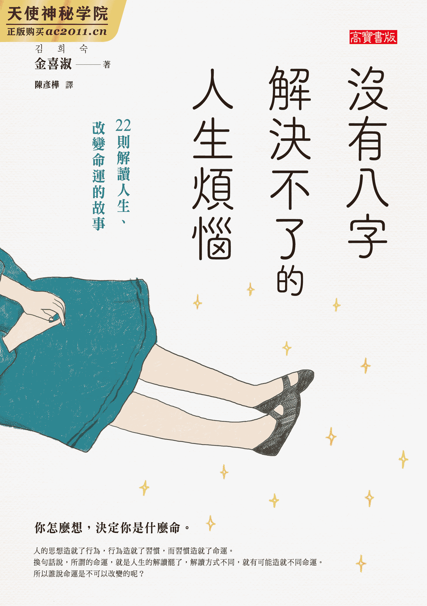

# 没有八字解决不了的人生烦恼

# 前言

生活过程即生命。思想造就了行为，行为造就了习惯，而习惯造就了命运。所谓的命运，我们可以把它想成是一张命运地图，又称八字命理地图。从中，我们观察自己在做什么事情，这一路是怎么生活的。以各种不同角度，仔细探究各个事件。换句话说，命运地图是人生的解读，换一种解读方式，可以帮助你打开新的运势。

十几年前，我向师父学习命理学的时候，师父帮我算了八字。那是我第一次详细了解自己的八字为何，既感到新奇，又令我绝望。我很惊讶，原来一个人的八字里面存在着个人专属的命运地图。同样，我也发现随着地图走着，我自己的欲望逐渐被燃起了。是故，我害怕。

地图的作用是帮人指引道路。命运地图就像是人生的设计图，它是未完成的。偶尔我们需要看一下命运地图，它告诉我们应往哪个地方？走着走着，可能会卡在哪里？或者，哪一条路才是捷径？这人生的设计图随时都有可能改变，而设计图有变化的时候，代表着你的命运也改变了。

我在师父代领下完成全部的基础命理课程后，开始从事算命的工作。师父说：熟识全部的理论之后，该从实战经验中学习了。因此，我半推半就地开始经营八字算命店铺。但开业不久，我就开始感到沉重的负担，因为我要对自己为他人解说的内容负起责任。

这些人为什么会找上我？他们的工作是？结婚了吗？现在的困扰是？在那些前来算命的人开口前，我必须要先开口向他们说话，这样才能得到他们的信赖。而唯有正确解读出他们现在的处境，我的建言与慰藉对他们也才有效。因此，当时主要是在学习如何累积经验，并正确猜想这些人们的苦恼。也因为如此，我发现自己的不足，故而督使自己大量阅读，不断学习再学习。开店后的前三年，我鲜少出门，除了一般日常生活外，将全部的精力投入在书里。

但我定期会去山上走走，这是我的排毒时间，排除那些人向我诉苦的“毒”。为了能够长期接受与听取他们的各种苦恼、悲伤与痛苦，我必须排出自己身体内所有的负面情感，否则这些负面情感累积在体内，将捆绑住我。所以我选择走向大自然。

大自然中，我拥有可以思考、把焦点放回自己的时间。一直以来，我以为过去的阅读都只是为了工作而读，但这些阅读其实无形之中也帮助了我的人生，让我培养出两位优秀的女儿，亦让我发现自己的命运地图，有了更明确的生活目标。虽说是在为他人学习，但其实是在为自己学习。

我的八字里，日主 1 在癸酉。以大自然为喻，它就像是石头底涌上的小泉水，又称为“石泉”，亦是佛祖手里的“井华水 2”。用一幅风景画来说明我的八字，那就是初春清晨在绿意盎然的森林里从石井冒出的泉水。

不过，想要在井里打水，就必须填满水源。不填水，只打捞的话，井很快就会逐渐干涸，剩下井底沙子，以及掺杂灰沙的“泥水”。往后，泉井再也不会有干净的井华水了。

我希望我能过着拥有井华水的生活。以内在而言，学习的目的是充实自己，借由伟人的建言和阅读，我回头反省过去的生活，并身体力行。学习和阅读让我维持体内清澈的泉水，并试着再填补更多的水，希望能暂时帮助那些找寻井水的人解解渴，以及提供他们一个可以稍微休憩的地方。

帮人算八字是我的工作。儿子入伍的问题、高一生女儿的学业问题、与爱人的争吵、经济上的困难以及烦闷的心病等等，每个人肩上都背负着这些芝麻般的小事。静静聆听他们的故事，协助他们一起寻找生活的光明，成为他们的朋友并提供建言，这就是我的工作。

在偏僻巷里的老式公寓，我听着人们隐藏心里的故事，和他们一起共享当下的心情。我们面对面坐着，我帮他们擦擦眼泪，告诉他们该怎么解决。即使被人贴上迷信骗人的偏见标签，备受他人无视，我还是要继续帮人算命。只要那些找来的人们可以因为我而获得小小的帮助，我做的这件事情就是有意义的。

而为了工作，每天不断学习，更致力于读解人们的心。这就是我的八字吧！指引他人走在命运地图上的工作是我的宿命。

命运地图有时候像个人生的指南针，它为大家引导生活的方向或目标。谘商的过程中，看见许多人因我的建言而获得帮助，让自己的生活变得更积极，我就在想倘若这些故事分享给更多人，会变得怎样？而分享给他人的方法，其中之一是写下来。将常常被询问到的问题和困扰，改用命理学的角度解析，并推荐相关的书籍给读者们，希望他们活得更贤明，并能解决人生的烦恼。

希望那些被人生烦恼所困的人们，希望在打开这本书之后，可以获得小小的启示，也借由汇聚各式各样人们先前的历练知识，找到读解人生、改变命运的捷径。

八字人文学家　金喜淑

* * *

### 第一章

# 没有人想要“空钱包”──工作、事业与财运

贫穷的人吃了一只母鸡，不是人得病，就是母鸡会得病。3

残害人们心灵的东西有三样：烦恼、争吵、“空钱包”，

虽然钱不是无所不能的，但相信不会有人想要空钱包吧，

因为身为人，衣食住以及金钱都是最基本的需求，

当然，因为有所欲求，工作、事业和财运方面的烦恼也就跟随而来。

* * *

#### #1 嘿！你是不是也在人生叉路上？

一个炎热夏天，一对母女前来谘询室。他们的问题大概是女儿辞去美容学院的工作，即将要和朋友一起开创新的事业，但母亲则希望女儿Ｐ小姐有个安定的工作，付出的努力有相应的收获就好。这个希望在女儿辞去工作的同时，破灭了。听了一会儿我和母亲的谈话，Ｐ小姐默默掉下眼泪，是因为我说的话让她取得慰藉吗？还是她回想自己过去四年的生活，不禁掉泪？无论如何，选择要不要辞掉工作去创业，那是她的人生，亦是她的苦恼，并非她母亲的决定。

◆　◆　◆

　　母：老师，我女儿打算要创业，麻烦老师帮忙看我女儿的创业运势如何？

　老师：预计开创什么类型的事业？

Ｐ小姐：我想要在朋友开的美甲店做接种睫毛的工作。朋友说我只需付一半的月租，就可以使用一部分的空间。他真挚诚心的邀请我和他一起工作。

　　母：我女儿之前在美容学院教了四年的课。那时她真的非常认真工作，现在突然辞掉，人生都毁了。

　老师：咦？人生都毁了？您女儿也才不过二十六岁，身为她的妈妈，您不该如此说吧！这年纪还没踏入社会的人比比皆是，怎能口出此言？

　　母：我的意思是她这么努力，最后迎来的却是不好的结果。

　老师：不好的结果？辞掉一份工作等同于人生毁了的不好结果吗？女儿就坐在旁边，您说这话言重了！有多少人因为不知未来的去向或还在就学而未能踏入社会，然而您女儿很庆幸地找到适合自己的工作，并认真做了四年，该知足感恩了！您不也知道人总会碰上某种因素，而辞掉一份工作或收掉一间店。所以，您认为她应该要一生都待在美容学院里讲课吗？

　　母：我不是这个意思。但，她也不是因为有其他更好的发展才要辞掉这份工作，反倒是因为工作一段时间后，对这份工作感到厌倦和热忱不再，才辞职的。况且，二十六岁也老大不小了吧？连一个正常职位都没有，就这样辞掉工作，实在令人操心。

　老师：您想过一个刚满二十六岁的女儿会很渴望拥有一个稳定的生活吗？您在这个年纪的时候，就已经规划好完整而稳定的生活了吗？同龄的朋友群里，还有许多人彷徨着不知道自己的出入在哪。或许，彷徨是必然的。因此，我认为她小小年纪就有一项专业技术并在一个职场上工作四年，是一件非常值得赞赏的事。人们在工作中，即使做着自己喜欢的事，仍会产生摩擦或有不想做的时候，不是吗？她毕竟不是赚钱的机器啊！人有感情、有不同的健康状况，是会随着心情或身体状况改变心意的。喜欢的事物本来就会改变，有时原本真的很喜欢的事情也会变得讨厌，反之，原本毫无关心或讨厌的事情也可能会在某一瞬间喜欢上它。不过，当你擅长某一件事情的话，理当会越做越享受的。女儿辞掉工作后，您都是以这样的方式责怪她吗？如果我是您女儿的话，我应该会很讨厌妈妈。

　　母：是的。曾几何时埋头苦干的工作说不做就不做，人生看来是毁了。我是这么对女儿说的，就希望她打起精神来。

　老师：您太过分了。上班领月薪才是成功的人生，辞职就是失败的人生。如此般的说法，在我听来是多么绝情且令人心痛。您说的这些话完全伤透了她的心。看，她在旁边听着我们的对话哭了。希望您别再对女儿说这些话了。她只是说要辞掉工作，结果自己的妈妈对自己说人生要毁了之类的话，让我很心疼。

　　母：二十六岁哪里年纪小了？这年纪该自立自强了。

　老师：当然，不同角度来想，年纪是不小了。但是，对于定论成功或失败，似乎太早了。她现在才刚要起步而已。在韩国，不！甚至全世界，有多少个人在二十六岁的时候就走向正确的人生道路？即使走在正轨，谁又能保证他的生活会一路平坦？您一路走来，人生里只有前进没有后退吗？贤人说“少年登科是不幸”，意指年少的成功应警惕。况且，您不也明白人生道路有曲有直吗？如果您过去的生活不是一直都是畅通无阻的，那为什么又要强求自己的女儿只能向前看，走在直线上呢？四年来，她认真努力过，现在仅仅是暂时让自己停下脚步，思考现在走的这条路是否真的为幸福之路，或给自己一个机会看看有没有别条出路，不是很好吗？

Ｐ小姐，你到朋友的美甲店做接种睫毛的工作，就把它想成是一段短暂的休息，以及寻找下一份工作的桥梁。虽然这段期间不会发生你母亲所望的伟大成就，但就以平常心去面对吧！当作是下一个工作的准备与练习。另外，我建议你可以到城市郊外附近旅行，回首过往四年的生活，放松一下自己的身心，再重新准备迈向未来吧！不必为了妈妈的督促而动摇。人在开车的时候，总会遇见在后方狂按喇叭一直叭叭叭要你快一点的驾驶人。如果你被那个喇叭声吓到，勐然往前开的话，是很容易发生事故的。故，我会选择在确保自己的安全之后，再往前开。当你觉得开得太急促，可能导致车祸的时候，你势必要缓下来。此外，匆忙踩下油门而真的发生车祸的时候，后方叭你的驾驶人必然不会为你负责。即使你指控后方的驾驶人，仍于事无补。所以呢，自己开车的时候，一定要在确保自己的安全后才能踩下油门。别忘了你才是驾驶自己人生的主人，就算别人一直催促你走快一点，也不能盲目地向前冲。每个人都有自己的速度，希望你能找到属于自己的人生速度。

在我看来，你能在这个年纪就认真地做好自己的工作，往后不管是怎样的事情，我相信都能做得好。你与那份工作的缘分已尽，潇洒离开吧！往后的运势不差，深思熟虑之后再开始也没关系。

##### ◎ 金喜淑的八字命运指引信 ◎

致　在一旁默默哭泣的Ｐ小姐：

你的泪真的很令我心疼。现今二十六岁，做了四年的美容学院讲师，代表你在二十二岁即出社会工作了。同龄朋友还在深造或休学迷惘的时候，你已经找到自己的出路并努力了四年。为此，我感到很骄傲。

决定要辞掉这份工作，并不会像你母亲所说的人生毁了。由八字看来，Ｐ小姐出生于“丙火”，代表天之太阳。出生的月份是冬天。冬天的太阳意指你的存在即能为他人带来光芒与温暖。因此，你身上拥有温暖的气息。

八字里，太阳旁的聪明才智、艺术才能、栽培学生和照顾别人的运势都不错，我们统称为“食伤运”。食伤运好的人代表深藏各种才艺，因此，可以轻松取得一份工作赚钱。假设我们一生里，手中的财物是来自于工作的结果。那么，食伤运便是影响结果的才能、技术和技巧等等。

虽然你的食伤运旺，但职场运弱，以至于必然发生职场变动。所以，我建议你着重在拥有自己的职业，非职场。拥有属于自己的职业，即使职场运势不断变动，亦不会过度动摇你的生活。其变动绝对不是因为你这段时间以来都不努力的关系。

河浣《可不可以不要努力》一书的作者就以此话安慰人：“努力不代表会有回报；不努力也不代表不会有任何回报。”

妈妈会向你埋怨的原因是看见自己的女儿过去以来的努力化成泡沫，对此她为你感到伤心，并不是不懂你的心意。父母总希望子女们可以过着安定的生活，因为大多数的父母皆生活在一个不安定的世代里，对他们而言，生活的基本条件是“安定”。

考古评论家高美淑于《在朝鲜活到百岁》中，就提及到父母不安的心理与年轻子女的欲望：“不管是上大学或就业，选择的理由都在于名校风气、对专业的执念、渴望成为公务员……，然而这些理由的源头皆来自于安定。青春，不！是人生目标，除了安定，还是安定。”

但是，难道打从一开始我们的人生就是追求“安定”吗？我不清楚。河浣也曾经说过，尽管我们非常努力认真准备一个安定的生活，还是会有失败的时候。

“我感受到的事情除了人生不能如我所愿以外，还有即使我苦恼一番做出了选择，其选择在某瞬间也可能会突然变得无意义。仿佛我很努力向某一个方向划桨，突然一大波浪席卷而来，把我卷到另一个地方。我相信我们的人生会依照心所想的方向前进，只不过我们也有可能是被波浪横扫的无力之人。”

我自己也经历过许多的风波。以我为例，证实了人也会有过不好、做不好的时候，但绝非是因为我们不认真努力。

“我们现在饱受折磨的理由是信任，因为‘努力’总是背叛我们。我做了‘这么多’，应该也要有‘这么多’的回报才对。这就是折磨的开端。任何时候，回报和付出的努力都不会是一致的。它可能比付出的努力少，也可能多更多，或者是一点报酬都没有。非常抱歉，这是事实。人说只要努力就一定可以的话是骗人的。你懂了吗？所以，千万别怪罪自己的努力不够。”

Ｐ小姐，请不要自责。也不要被母亲所说的话伤到。失败是珍贵的经验。二十六岁只是第一阶段，不是最后的尽头。

“请不要去惩罚自己当时的失败。请不要把失败的原因归咎于自己。自责不会让失败变成功。同样地，去责怪他人或怪自己的命运亦徒劳无功。我们最该做的是探讨失败的原因，想想下次应该要怎么做会更好。失败仅是带领我们迎向未来的阶梯之一。”

Ｐ小姐，从现在开始，不要去追寻你想要成为什么？而是思考你想做什么？职业和梦想完全不一样。不必非要将梦想成为你的职业。

“人不需要梦想或目标；没有所谓非去做不可的使命；更不用赋予生活某种意义存在。生活仅不过是活着就好，活着就是目标。活在当下，可能会赚钱、会和人相遇与离别、会创作，或参与政治。但却有人颠倒过来，为了赚钱！为了爱！为了艺术！诸如此类，设立好一个指标性的目标。过着这样的生活，你会发现结果却很空虚。因为目标本身就是一种妄想。”

植松努作家在《致说没有梦想的你》里告诉大家，人的梦想并非要很庞大，其段落如下：“梦想与工作是两回事。不用想得太复杂，你就能豁然开朗。梦想只是你单纯喜欢的、想做的事情。因此，不管梦想是什么，都很棒。你可以有很多个梦想。今天想吃咖哩，这样也是一个很棒的梦想。另一方面，所谓的工作，简单来说，它是帮助别人的事情，帮助这个社会。所以，任何一个工作都很好。这世上，有很多事情是得不到金钱但必须去做的。总而言之，梦想与工作都很单纯的。”

我认为事情不按理出牌地发生才是正常的。别哭！既然你选择另一条路，这次你就走慢一点，不要太认真，随意一点生活吧！往后，你的运势也会成为你的支柱。

#### #2 被金钱捆绑的复杂关系

随金钱而来的人际关系是很可怕的一件事。每当说到这，我就想起那对刚开业就来谘商的夫妻。他们是一对每个月领少少薪水并辛苦养育子女的夫妻。面对儿子即将大学毕业，女儿刚要做购物事业，夫妻俩为了资助他们，开了一间啤酒屋。但因为是不曾涉略过的领域，结果开幕没多久就结束营业了。说起来，从借钱的那一刻起就是一个错误，折磨着他们，造成他们的身体与心灵皆疲惫不堪。

◆　◆　◆

妻子Ｌ太太：我参加五个标会。加上标会，现在要缴纳的利息就有七种。标会里除了会长，其余都是借钱的人。虽然会头姊姊在我有困难的时候，会一点一点地借我钱。但是她总以会钱为由，监视我的生活，把我当成她的员工，叫我去顾她的店并随意使唤我。对我的家人，则如下人般的对待。借钱似乎成了我的报应。

　老师：我不是警惕过您了吗？有关金钱方面的运势不太好。

Ｌ太太：身不由己，不得不去借钱啊！为了解决跟姊姊借的钱和标会的钱，朋友介绍我其他的标会，预计下个月会加入。但是，会头姊姊故意打电话给那些要新开标会的人，到处宣传我是一个不按时缴交会钱的不良会员，要他们不让我加入。听说她都这样说我的坏话，怎么能这样？我该如何摆脱那个姊姊？

　老师：很伤心吧！但是，我建议您这次就忍一忍，毕竟还需要一点时间还钱，不是吗？等钱都还完之后，想说的话再一次说出来。古代中国有一名韩信将军，刀剑技术虽为天下第一，但在时机未成熟之时，亦曾受过屈辱从社区二流人士的胯下爬过。被金钱捆绑的权力关系里，未能还钱的一方似乎是不能创建自尊心的。

Ｌ太太：话是这么说没错，但我好生气。而且是我借钱，又不是我先生借的，为什么要把我先生当作下人，使唤来使唤去？

　老师：就是说啊！她的确缺乏人性，但在金钱上的人际关系里常有这种情形。我们常说金钱乃身外之物，但金钱却具有异常的力量。许多人缘都与金钱有关，大部分的人际关系亦伴随着金钱而来，现在你和会头姊姊的关系亦因金钱而起，不是吗？之后你加入的标会也将是一种被金钱捆绑的人际关系。现在的会头姊姊对您仍有恻隐之心，希望Ｌ小姐您可以过得更好一点。但是，新认识的会头可能单纯只是为了钱，故您的情况有可能会更糟。况且，二〇二〇年的运势里，您将有可能被人狠狠摆了一道，我建议您得从现在开始好好管理金钱与人际关系，这些事情才有办法如轻微的交通事故般，轻描淡写带过；倘若你寄望得到大笔的钱，则有可能发生重大事故。千万不要太相信新的会头，不如换一下管理金钱的方法吧？

Ｌ太太：听说他们的利息低，且又是那附近有规模的新标会。

　老师：人都会有运势。即使现在不错，一旦遇上阻碍，也是有可能承受不起的，所以才会有倒会或一些不胜债务而发生的事。此外，二十余年以来，您都是以标会管理金钱，得到的却只有欠债。我建议您现在该换一种生活方式了。

Ｌ太太：至今，我一直都是用标到的钱去还该先还的债务。

　老师：我劝您现在该好好思考哪一些才是该支出的地方。在先生每个月薪水的限度内管理基本开销，并将赚的钱存起来。假如金钱一直流出却又进不来，那现在的生活终究不得改善，仅会反复上演。

Ｌ太太：我没想这么多。只先想着要赶快还钱，要缴纳标会的钱。

　老师：以应付未来的名义去缴纳标会的钱或缴纳借贷的利息，是不对的。想着未来的资产，却耗损现在的生活品质。我认为您必须和先生一起讨论减少支出。

Ｌ太太：人常说随金钱而来的人际关系是很可怕的一件事，我真实体会到了。我会试着只参与两个新标会，剩下的钱另外做管理。

##### ◎ 金喜淑的八字命运指引信 ◎

致　辛苦的Ｌ太太：

最近过得很苦吧？每天被债追着跑，还受到威胁，每天早上应该很害怕睁开眼。心想着您该有多辛苦，才会想到用标会的方式还钱，真的为您难过。

观察Ｌ太太的运势，二〇一六年的开业是不幸的祸首。二〇一六年的运势是休息、玩乐，以及整顿原本的工作并好好待着的一年。这样的运势之下，应该要在稳定的工作上，守着自己的本。

另一个缘由是您开创的事业是未曾涉略过的新领域，本来二十几年来贩卖衣服都没有问题，自从开了啤酒屋之后，生活开始变得困苦了吧！

八字里，每个人都有自己命中注定的职业工作。Ｌ太太的天生职业是给予他人温暖的衣服，或者像是家具、书店等与树木相关的工作。这也就是为什么您在从事服饰业相关工作的时候，不会遇上极大的困难。

时机不对，外加做出未尝试过的投资创业，财运自然会差。且，您又不止是赌上自己的人生，甚至连同如日中天的二十岁女儿人生一并投入了。您太相信标会了。

金胜浩于《思考的秘密：沃尓沃的诞生，卖紫菜饭卷的 CEO》曾道：“任何人说要给我好处，都必须要备起戒心。”

“意外地，这世界里有好多人都在善发爱心，到处宣扬要帮人赚钱。到底他们是赚了多少钱，才有这样称霸天下的自负心，并满足于贩卖自己的赚钱秘诀来维生？我们不是上帝，不可能将所有人视为己见，分享一身的恩宠于同道之人们。这世上没有任何一个人会无条件地帮你赚钱，请铭记在心。所谓的人类，看重自己的利益胜于他人。然而，你却不能怪他。好比说，在这世上没有人比你更会照顾你的妻子和子女，即使是兄弟姊妹或父母……”

金钱不单是一项物品，金钱具有力量，人缘会随金钱流动。

朴趾源 4《热河日记》书中，其［黄金台记］一篇： “三盗贼一起挖坟，挖出金子。他们自言：‘今日如此辛劳，喜得金子，能不干一杯吗？’其中一位欣然起身拿酒去。一路上，大呼快哉！‘这是老天赐予的机会。三人分不如一人独吞。’默默在酒菜里下毒后，端回去。留在原地的两个突然起身，打死了端酒的那一个。两人大快朵颐，并兴高采烈分食金子。过没多久，两人死在坟墓旁。真悲惨。金子磙到路边，一定会有人捡十。捡到金子占为己有的人将对天道谢，却不知金子从坟墓挖来，是盗贼们被毒杀后留下的渔翁得利。他们亦无法知道经历风花雪月，往后还会有几千名人因金子而被毒杀。然，天下有人不爱黄金吗？” 5

其黄金入土前，亦有数千名人为它而死。过去的黄金等同于现今的金钱。这故事让我们思考现在手中的钱究竟是从何得来。

高美淑《金钱达人，同性共同体》的一段话，讲述金钱与人缘的关系：“每一种金钱来源都与人缘紧密相连。但是，我们不认为大部分的金钱与人缘是相伴而来。然而，那些金钱之间制造的各种事件与故事，不管金钱规模是大是小，甚至花的是小钱，都会引来非常难断开的人缘。”

朴趾源道：“突如其来得到的一笔大钱，亦需要保持戒心。”宛如在告诫那些中乐透的人们。

“我是这么希望的。希望让所有天下人知道获得黄金非为好事。没有黄金亦非为坏事。天上掉下来的一大黄金馅饼有如打雷、撞鬼般的可怕，像是路途上偶然碰见草丛爬出来的蛇，令人毛骨悚然、竖起头发，不得不向后却步。”

看见蛇，谁都会吓得退后一步。是以，突如其来的一笔钱更算不上横财。

Ｌ太太，好好打起精神！总之，势必要截断债的尾巴，才能断开因金钱而来的人缘。

高美淑作家曾这么说过：“金钱沿路涌进，因为这条路已经是由债铺成了。故，想成为富人的首要动作是阻断这条路的通行。不仅要清算债务，亦须清空自己欠债的心态。这样做，才能正常的存钱。存钱，它不是一个收益，它是一个如何管理其收益的手段。”

最后，下页是朴卢海诗人的一首诗。朗读诗词的同时，重新思考对债的想法吧！

［别欠债过日子］

钱比想像中来得慢；

钱比想像中去得多。

别借钱惹事。

失去信用，同时也失去人缘和意义。

债磙债，选择不幸，理所当然会被困住。

大人耳提面命，

任何情况下都别欠债过日子。

由于刷卡分期、分期利息、分期买卖，

讨厌欠债过日子的我们，精神慢慢瓦解。

家庭、公司、国家，甚至全世界，债台高筑，

抛弃了人，亦抛弃了意义。

* * *

#### #3 盲目跟进的话，财运怎么会好？

许多谘商者最关心的是自己的财运，每天都会有好几位专程来问自己的财运。生活和金钱到底多么关系密切？金钱为何物？能让谘商者们苍白着脸来找我诉苦。听着他们的故事，令我感到心疼，特别是那些对投资不做详细功课，看着别人做就跟着去做的人。投资是需要做功课的，盲目地将辛苦赚的钱或借来的钱随意投资，只会形成浪费。

P2P 信贷 6

Ｋ先生：二〇一七年由投资理财公司介绍，我拿了一小笔储蓄基金来投资。定期一年，但到了二〇一八年却因本金亏损而套牢。二〇一九年我能拿回本金吗？

　老师：今年的财运有达到平均值，下半年似乎有机会拿回本金。您在二〇一七年的运势不适合金融投资，于犯官灾与损财的一年，理当会产生损失。另外，自身未做任何功课，仅听取投资理财公司的花言巧语就做投资，绝对是利他不利己。银行、投资公司和证卷公司本质非亲切善待的，他们也是利用你们的钱来追求利益的存在，不是吗？以手续费的名义。故，亦常发生因手续费造成本金亏损的情况。

Ｋ先生：原来如此！我原本的想法是刚好手边有了一点积蓄，可以借机多赚一点零用金，才去投资。且他们说我可以短时间内赚到钱，就没特别考虑手续费的问题了。现在比预期领回的时间又过了一年，看着亏损的惨况，我只想能拿回本金就好。

　老师：观测您的运势，今年是有机会拿回本金的，再多等等吧！等待期间，建议您多阅览、学习投资相关书籍。

公寓贷款

Ｏ先生：我太太拿了我们和大姨子家的认股合约去申请买公寓。不巧地，我们中奖了。结果现在的月薪拿来供应孩子们读书和付现在居住的公寓贷款，再加这个额外的公寓贷款，手头非常吃紧。二〇一八年三月，我开始被金钱追着跑，现金已见底了。更惨的是，抽中的公寓因贷款制度，不得抛售贩卖，打算脱手的计划亦被限制住了。何时才有办法解决这个问题呢？我会有买卖运吗？

　老师：今年有买卖运，但其运势仅能让您处理现在的窘境。过去有段时间，大家都说成功申请到买公寓好比中乐透一样。但即使在不动产经济状况好的时候，仍有许多人未及时将公寓转卖出去，导致自己生活陷入困苦。房子卖不出去的原因除了与景气有关之外，自身财运的影响也很大。此外，未做好功课，盲目跟随他人做的投资必然会发生损失。不动产投资会受到政府政策和人口构造影响，投资前，一定要先了解这两个部分。假如您只是看见他人赚钱就跟着尝试，当然会陷入困境。今年的财运有好转，建议您在能处理问题的时候尽快解决。

* * *

##### ◎ 金喜淑的八字命运指引信 ◎

致　因投资亏损而受苦的Ｋ先生与Ｏ先生：

Ｋ先生的生辰八字为亥月（阳历十一月）的己土。己土代表田地。出生于冬天，故为冬天冰冷的田地。在冬天的田地上无法种植生命，必然需要代表温暖阳光的丙火辅助。土块结实才能蓄水，然要让土块变得坚实，理当也需要温暖的阳光。己土中，其水等于财物。二〇一九年为己亥年，大量的亥水将涌进。冰冷的田地上涌进洪水，全部的水袭卷而来。

但是，它不是财运涌来的一年，相反地，它是财物流出的一年。换句话说，它是会带来损财的运势。因此，运势不利于Ｋ先生进行投资。一直到二〇二二年才会有好运来。

Ｏ先生的生辰八字为卯月（阳历三月）的辛金，即为春天出生的闪亮宝石。其八字里有聪颖运。对八字为辛金的人而言，木代表财物和女性。他的八字里，木的气势很强，强烈的气势导致宝石（辛金）产生瑕疵。它是一个不能被金钱追着跑的八字。另外，必须注意由异性关系衍生的财物损失。

提前知道自己天生的八字命理有助于生活不会轻易陷入困难。偶尔，顺应天命是一个明智选择。

人们梦想成为富人与拥有富裕资产。罗勃特．Ｔ．清崎于《富爸爸，穷爸爸》提道：“想成为富人，就不能害怕失败。”

“我未曾看过一位高尔夫球选手不曾错失自己的高尔夫球。同样，我也没有看过一位陷入爱河的人不曾说过错话，以及一位富人不曾亏损过钱。大多人为何不能解决金钱问题，其原因是失去金钱的痛苦大于成为富人的快乐。因此，人们梦想成为富人，但更害怕失去金钱。”

不过，还有很多人在具备金融知识后，仍旧无法确保自己拥有富裕的资产。麦可．米尔肯（Michael Milken）“天生的”股票与债券投资能力在早期业界上获得认可。毕业于宾州大学华顿商学院，获得工商管理硕士学位的他，创建了一个属于他自己的成功投资秘诀，也就是“垃圾债券 7”。但如日中天的米尔肯却在一九九〇年因内部者交易之嫌，被判十年有期徒刑并科庞大的罚金。人们很好奇，能力好又聪明的麦可．米尔肯为什么会执着于内部者交易。事实上，唯有在操控内部者交易的买卖市场里，才有可能“完胜”。

郑哲进在《资本的不平等事实》里告诉大家一个看不见的经济流向：“活在现代社会的人大部分都被困于这个令人气喘吁吁的经济环境里，大家自然而然会观察经济状况。因此，我们会统察后再去行动，如：购买股票或债券、投资不动产、收藏黄金以及储蓄。我们必然先掌握经济流向后再去应对未来。然而，观察的时候一定要注意一项重要的变量──操控者的存在。切记，在市场里总会有不知名的人在一个众人看不见的地方，倚靠某一种势力，依照自己的意思操控着市场的经济流向。”

经济如人生，它有周期（cycle）。读懂周期的能力，我们称作“经济洞察力”。

“比方说，现在考虑购买公寓的人应该先观察未来不动产市场的动向，需要收集各方的论证与分析资料，如：住宅的供需预测、韩国的人口构造变化、现今住宅的合适性、本人的所得现况等等。但在此之前，我们需要做的第一件事其实是了解‘房市泡沫化与超级恐慌’的概念。换言之，我们一定要确认现在是否为不动产市场的最低点。”

想要拥有经济洞察力不仅需要具备正确的金融知识，还需要一个实现自我欲望的力量。我推荐一本可以帮助您累积金融知识的书籍──韩国银行出版的《为一般人准备的韩国银行小知识》。

“储蓄是在工作中获利的所得抵扣生活基本消费与未来支出后的剩余金钱。家庭经济里，储蓄包含存款、储蓄险、证券等各种金融资产及有形的不动产资产。投资的目的是为了让固有的资产收益产生额外的升值利润而进行买卖；投机则是利用短时间的价格变动获得庞大利润而进行的买卖。投机有股票投机、不动产投机等各种型态。”

自己掌控自己的命运与托付给他人的差异在于，如何善用自我欲望以及你对这世界解读了多少。投资与投机的差异亦同。希望大家能回头思考一下自我欲望并逃脱资本的骗术。

* * *

#### #4 事业运啊，你在哪？

近几年来，不仅是二、三十岁的人，全世界各年龄层的人不分男女老少，都会问一句：“我该做什么好？”人们都想找到一个钱赚得多、稳定又可以让自己开心的工作。然，职业的选择不单是为了未来，更需要注重自己的内心。以下是我与一位二十岁青年的对话。

◆　◆　◆

Ｌ先生：我有厨师证，曾经在大学附近和朋友开过店，但没几个月就收摊了。之后，透过各处朋友的介绍做了几个工作，也是很快就不做了。地方大学毕业，没有什么好看的资历，好不容易考到厨师证，但我不想往料理这条路走下去。请问我适合哪一种职业？

　老师：准备考厨师证的时候，应该是对这方面有兴趣才会去考执照，为什么不想往这条路发展？

Ｌ先生：一刚开始，觉得“主厨”这个职位很棒，且好找工作，所以才去报考。但我不是一位细心的人，我在料理的过程中也无法感受到料理带给人的喜悦。

　老师：料理是为了自己或他人的存在。我认为自己做的料理让某个人吃了之后可以享受到幸福，这才是真正的厨师。那么，你想做什么？

Ｌ先生：现在没有特别想做的事情。不过，已经看着父母的脸色好几个月，觉得自己实在是不能这样下去了。但投了好多履历，连一个面试机会都没有，自信心备受打击。

　老师：我研读的命理学中，有一种叫做先天性职业线。不过，刚好可以从事与自己的先天性职业相同工作的人，其机率仅有二、三成。命理学的先天性职业线可以告诉你在哪个领域工作会获得较高的满足感，它是你擅长做的事，不一定是你喜欢做的事。全世界的职业种类这么多，命理无法直接帮你指定，就算指定了，那也是你的八字运势早引领你走在那条路上了。

你想想看，古代帮人治病的“医员”属中阶级的人，但在现代，医生是上流社会阶级。可是，如果人工智能在未来变得更发达后，医生这项职业的瞻景则不一定了。有报导曾指出一个公司从有到无，平均为二十年；还有一句话说，没有一个可以奉献一生的工作。我相信父母们在养育子女的时候，把子女的生活、幸福与“工作、职场”连串在一起，所以规划子女未来的时候，任何事情都与工作和职场有关，因为他们只会教子女们一个公式：“工作、职场＝金钱＝幸福”。可见，相较于了解自己喜欢做的事与自己擅长做的事，人们大多寻找的是一份钱多安稳的工作。换句话说，大家在不了解自己的状态下找工作。大企业的薪水高，所以抢着挤进去；公务员铁饭碗，所以人人都想当。

但有工作和职场就能过着幸福的生活吗？近期出社会的青年们希望的公式其实是“工作、职场＝兴趣＝金钱＝成功”，在这个公式里面多了一个元素。

Ｌ先生：我准备过两年的公务员考试，纷纷落榜即放弃了。因为我并不是读书的料。考不上公务员后，觉得人生变得一片黑暗。

　老师：你的先天性职业线与技术方面相关，但不是料理方面，是更专业一点的技术，如：机械、金属、电器、设施装备等等。另外，你适合倚赖这项技术自己独立作业，以后一定可以自己开店。总结之，待在团体组织的职场生活里，不如自己出来当个自由业者更适合您。

Ｌ先生：我讨厌被绑在某一个地方工作。所以曾想过业务是不是比较符合我的性格？

　老师：不是，虽然业务需要跑来跑去，但对自尊心强的人来说，业务是一个很痛苦的职业。近期国家有开放很多公费的职业训练员名额，建议你可以借此考取技术相关资格证。

Ｌ先生：其实有朋友在开拖吊车，邀请我和他一起工作。

　老师：很好啊！趁机考个资格证。

Ｌ先生：我能胜任吗？

　老师：很多人自以为自己知道自己喜欢什么，但其实他们不知道。因为喜欢的事物多少都会有变化的。人们要努力去了解自己的优缺点，可以利用性向测验、心理测验或八字命理辅助了解自己的先天性职业线，并获得建言。我认为要真正了解到自己喜欢的是什么，那就必须要尝试每一件事情。况且，一个人喜欢的东西可能不只一个，尝试过了才知道。你在学习料理的时候，不也发现它看似是你喜欢的事情，但却不适合自己吗？每一种都去尝试，你就能找到自己享受的事情了。此外，二十几岁，是有资格到处去闯荡的年纪。能在二十几岁就找到自己真正喜欢的事物的人非常罕见，或许有些人已经找到了，但大部分的人在二十几岁的时候都还在各处体验找寻自我。因此，二十几岁是帮助你成为大人、了解自己的时间。别在意他人的眼光，先试了再说。在我看来，你的运势是渐入佳境的，虽然现在拥有的不比他人多，但一直抱持着对自己失望的态度绝对不行喔。

Ｌ先生：和老师聊过以后，我突然觉得未来的路途变得光明一些。过去这段时间，自信心受挫让我感到一片黑暗，现在似乎有一点生机了，好想赶快去挑战。

##### ◎ 金喜淑的八字命运指引信  ◎

致　正在寻职的Ｌ先生：

Ｌ先生的八字里，事业座落于代表移动之意的“驿马星 8”与技术的“食伤运”。五行运势属“金”，与职业相链接的话，意味着汽车、机械、金属和装备等等。在先天性职业线里找到的工作，自然可以持续做下去。

解读八字的时候，基本会看出生的年月日时四个支柱来观测这个人的先天大运。大运是指一个环境，它会让你成大器并走得长远。现在Ｌ先生的大运暂时埋没在云层里，受到坏运的影响，才未能见光。

但很快地云层就会消散。假设您在这段被埋没的时间把自己准备好，则在阳光显露之际，即能立即往前冲；倘若你等到阳光已照耀才开始准备，那将无法走得长远。如何看待黑暗时期的运势比阳光照耀的运势来临的时候更为重要，所以不能只是在黑暗期埋怨。对大家而言，好运来临当然是最好的，但是为什么要经历一段黑暗时期，这都是有原因的。

你的运势在三十岁会比二十岁好；四十岁又会比三十岁更好。虽然运势会渐入佳境，但不是斜坡式往上爬，它会一阶一阶地上去。

金英基等人共同合着一本讲述未来职业前瞻的书籍《提前迈步的未来潜力职业图》，书中第一章即揭开过去我们对职业的看法：“从小我们就听大人们说要读好书才有出息。所以，我们为了考上好大学而读书，选择大学科系的时候看的不是自己合不合适，而是成绩符不符合。然，大家为了拿到大学毕业证书，认真念完专攻科系后，毕业从事的工作与自己专攻科系不相关的人也很多。因此，他们理当无法享受自己的工作。”

近来，稍微会读书的青年们，将准备公务员考试视为人生必经之路，成为他们理所当然要去做的事情。

“看见韩国青年们执着于公务员考试与大企业面试的模样，令我感到羞愧。他们不去寻找自己喜爱的工作，无条件追求安定的工作，最后的结果必然是在五年内走上落魄之路。”

上述为全球投资鬼才吉姆·罗杰斯（Jim Rogers）曾经说过的一段话。

那，我该做什么才好？

“擅长比不擅长来得好，喜欢的比擅长的又更好。我们生存的这个世界千变万化，潜力职业的种类日日在变。现在名利双收的职业，大多数不保证未来仍会是名利双收。”

所以，应变这样的环境，我该怎么做？

“首先，你要获取各种经验，才能找到自己真正擅长或喜欢的事情。下一步，你要有不怕失败的挑战精神。不管是就职、创业或创新职业，在这个要身兼数职的世代里要有失败后仍勇敢站起来的力量与挑战精神。”

我想推荐几本与寻找职业相关的书给Ｌ先生。金爤道的《韩国趋势二〇一九》和金正求等人写的《二〇一九趋势笔记：生活变化的观测日记》。看完之后，自己可以向自己提问：我知道现在的趋势与我的生活有什么关联呢？从趋势中得到的提示能适用在我的生活里吗？金钱正流向何处？哪一些职业符合现在的趋势？

读完以后，建议您再看金英基《提前迈步的未来潜力职业图》。未来职业环境会如何变化？哪些工作会消失？又会创出哪些新的工作？透过专家的协助，仔细思考一下未来的瞻景。

赵英泰《指定的未来》一书说明低出生率导致高龄化的社会在十年后，人们因应人口变化的生存策略是什么。

读完罗伯．金索（Robert Kyncl）和曼尼．培文（Maany Peyvan）的《串流朋克：YouTube 商务总监揭密一百个超级 YouTuber 经营社群粉丝的爆红策略》之后，你也会发现 YouTube 频道支配了我们的生活，以及创作者新兴职业的产生。

以下是高名焕于《阅读成为销售之神》里的一段故事：

正信爷爷在九十五岁逝世之前，一生都在种柑橘。种植柑橘是有一套流程的：‘生出几片叶子的时候，几号叶片和几号叶片就要摘下来；树枝有几个的时候，就要剪掉几号树枝和几号树枝’遵守这个公式就能产出同样大小、色泽和味道的柑橘。一直遵照这个规则种植柑橘的正信爷爷，有一天产生了一个想法：‘为什么近代再也没出现过像莫扎特、贝多芬、萧邦、米开朗基罗、李奥纳多．达芬奇、苏格拉底、牛顿和爱迪生等类的人物？’爷爷经由种植柑橘一事，明白了。就像是我们接受同一种教育，大家都梦想着进入大企业或考上公务员。爷爷的柑橘树接受同样的规则种植，所以每一个柑橘都一样。所以，爷爷决定不摘叶也不剪掉树枝了。这时，发生一件惊为天人的事情。那就是诞生了一颗‘天才’柑橘。未曾尝过的美味柑橘们诞生了！

──福冈正信《一根稻草的革命》

Ｌ先生，在现有的职业里找到工作是一件很重要的事，但我仍希望你可以观望更遥远的未来。

“现在仍不晚。我可以在我擅长的领域里多学习一点、多练习几遍。可是，我最擅长的事情是什么？每个人都至少会有一个比十万个人更厉害的能力，我们必须找到它。料理、绘画、善待他人、找路、恋爱、摇呼拉圈、玩水枪、静静不动、快速网络搜寻……从大到小，我们都要找过一遍，一点细微之处都不能放过。找到擅长的事情之后，请不要立即否认无视它，要让它发扬光大，变成专属于你自己的事业。”

* * *

#### #5 谁不想“一夜致富”呢？

金钱没有实体，看似多的时候，却会减少；看似赚得很少，但又可能积少成多而聚成一大笔钱。幻想着命中能发一笔横财的人很多。您说有人好心地泄密商机给您，可是，那些人到底靠这个秘诀赚了多少钱？为什么要这么好心地告诉别人？最重要的是，单就相信他人的话而隐瞒太太做投资，是一件非常危险的事情。

◆　◆　◆

Ｙ先生：前几年我有来拜访过老师。那次是和太太一起来的。不知老师还记不记得？

　老师：抱歉，我不记得了。

Ｙ先生：老师，我现在要说的事情，能以客观的角度帮我分析吗？

　老师：当然。不管对方说什么，我都会以我专业的角度回答。

Ｙ先生：我太太投资某企业九十九万韩圜。然后，我又投资了九十九万韩圜。现在我太太的阶级是最高等级。之后，我瞒着太太又投入了一千九百万韩圜。

　老师：投入到哪里？

Ｙ先生：恕我无法直说。这个负责的教授很早就开始从事多阶段的放贷工作，然而这次他开发了一项很厉害的企划，预计很快就会申报登记于交易所。申报完成后，我们就可以赚很多钱了。所以，我隐瞒太太拿房子做担保，向银行申请一亿七千万韩圜的贷款。一旦资料审核通过拿到贷款，我就会跟教授一起投资。

　老师：这么说来，投资的总金额快两亿吗？

Ｙ先生：是的。我现在债务众多，每天上班过着战战兢兢的生活。这次希望可以来个人生大反转。一个月的时间和教授相处，我看到了这个产业的未来前瞻。

　老师：原来如此，既然您确信了它的潜力，为何还来找我？

Ｙ先生：我刚和一个药师见面，他和我一起投资了九十九万韩圜。但，他却劝我不要拿房子抵押贷款投资。贷款金马上就要下来了，这时候竟然产生了一些分歧，所以我才赶紧过来找老师谘询。

　老师：首先，从八字命理与运势的角度观测，您本人在二〇一八年运势里有财物移动的现象，故的确会发生财物相关的事情，但非全都是正向、积极的一面。今年为戊戌年。您的八字在戊戌年里会有“刑杀”的气息，因而发生破财之事。所谓的破财，即产生损伤，特别在二〇一八年七月，此气息最为旺盛。整体而言，今年需要小心钱财。男性的话，财运与异性关系或婚姻关系相互呼应，故可能会产生破裂，需先预想到离婚的可能性。即使不至于离婚，夫妻之间绝对会比其他时候更容易产生离别的危机，因此，隐瞒太太拿房子担保贷款是一件非常危险的事情。第二，由六壬学的角度观测此事的成败，现在的解盘上，并未浮出财物相关的讯息，反倒出现官灾 9 之事，最终这件事可能会以官司诉讼为结局。第三，用塔罗牌来算的话，负面的卡牌比正向的多，外加出现了死亡卡牌，果然，塔罗牌的结果也是对这项投资给了否定的答案。

Ｙ先生：这样啊！我不能成为富人吗？

　老师：是的，要成为富人有点困难。尤其是带着这种危险想法的人更难成为富人。

Ｙ先生：我的八字里没有一夜致富的命吗？我每周都买两万韩圜的乐透，上天的意思是要我别买了吗？

　老师：是的，把买乐透的钱省下来，存进户头里还比较好。

Ｙ先生：这结果真令人绝望。想着这次投资成功，可以还完债务并过着好日子，所以下定决心去贷款的说……。

　老师：贷款金下来之后，先还回去吧！如果立即还款，应该会产生一些违约金，你看，是不是已经看到破财的迹象了。现在你做的不是投资，它是投机，而且是不正常的投机。我喜欢看富人们写的书，但我从未看过拿房子贷款投资的富人。增益性事业的投资本身就具危险性，现在您相信一个不明的教授的话，在一个未成形的事业上投入所有资产，是非常不理智的行为。就算短期内赚取到利润，人是有欲望的动物，将一次的成功误认是永远的成功，被金钱诱惑之后，总有一天必然发生惨况。因为人的欲望源源不绝。唯有自己努力得来的“富”才不会有危险，并连带好事发生。倚靠他人之手得来的“富”，仿佛是沙漠般的海市蜃楼。

Ｙ先生：我知道了。我会努力偿还贷款金的！

　老师：请一定要这么做。我帮您算了八字、六壬学，以及塔罗牌，其预测结果都不乐观。稍一不慎，可能会导致家庭破碎。请务必尽快偿还。

Ｙ先生：谢谢老师。突然不知所措，正担心下一步的时候想起老师。今天来找您是对的。

* * *

##### ◎ 金喜淑的八字命运指引信 ◎

致　梦想一夜致富的Ｙ先生：

您的八字里藏有“官灾”之气息。所谓的官灾，我将它譬喻为“韩国银行”。韩国银行是负责坚守操控韩国货币流通的地方，每天都有庞大的金钱进进出出。

不过，韩国银行的金钱仅能近看而不得亵玩，庞大的金钱非个人所拥有。不管怎么说，自己口袋里的钱才是真正属于自己的钱。

犯官灾之人很容易会觊觎赚一笔大钱。八字里所谓的“正财”是正确的财物，如固定的月薪；然，所谓的偏财是偏歪的财物，如：不劳而获、乐透等，很容易让人陷入一夜致富的迷思。所以，偏财之人亦容易沉沦于赌博。

若能正确使用偏财运，您将能成为一个懂得施舍的人。像是在帮他人管理庞大的财务仓库，偏财是一种施舍他人的运势。Ｙ先生您现在用错偏财运了。

有偏财运的人应时时刻刻检测自己的钱是怎么赚来的？自己是不是有觊觎大钱让自己一夜致富的心态？以及，必须真心付出施舍的善为。古言：“积善之家，必有余庆。”意指累积善德的家庭必然会有喜事发生。有偏财的人应将上句作为自身的座右铭才好。

金美景讲师于《姊姊的毒舌》一书里，告诉读者金钱的区分方式，它可分为真钱、假钱与数字钱。真钱是我们用身体劳动赚来的钱；假钱好比是信用卡，属于他人的钱；另外，数字钱是看着数字来来回回的钱，如股票、月薪。

“月薪有两百万韩圜很好吧！每到发薪日，有些人总会很紧张，他们害怕信用卡公司自动扣缴了他们的卡费，故在月薪入帐后立马将现金提领出来。很多人都有这样的经验吧！缴完这张卡费和那张卡费，以及税金与保险费等等，最后剩下的钱只有十九万五千韩圜，这笔剩下的钱才是‘真钱’，两百万韩圜是‘假钱’。然他们大喊说：‘我快疯了！这点钱我要怎么生活？’于是，继续使用‘假钱’，也就是说，继续掏出口袋里的信用卡。这就是典型让大家使用‘假钱’的诈欺手法。问题是很多人都让这种状况成为习惯，每个月反复上演。一生都在使用‘假钱’交易的人，是不会懂得什么是‘真钱’的。”

这次您想要做的投资会让您的钱财与人际关系变得更糟。所谓的房子，虽然可用于当作赚钱的手段，但房子还有一个更大的意义：房子是家人居住的空间。人生中，家庭是最后的堡垒。约翰·阿姆斯特朗（John Armstrong）在《人生学校―如何不为钱发愁》书里提及房子的意义。

“近来，人们把房子当作投资的对象。他们像是在房子的钢筋水泥里存了一笔定量的钱后，最后又把房子转换回金钱。人的第一考量对象是金钱，建筑物仅是另一种长得奇怪、不同于纸币型态的金钱。但房子又被认定为“家”，家里面有着一起生活的回忆与情感。它是小时候的记忆，是一个表现个人色彩的空间以及培养感情的地方。当然，想要拥有房子就必须有钱。可是，钱不是人生的全部。钱是让人有能力去做美好事物的工具而已。”

您拿一个具有家庭意义的房子作为金钱贷款的担保，这是一个非常危险的行为。八字命理中，人人有一个财物运。

每一个人的财物运都不同。可分成有财物运和无财物运的人；再者，其运势大小亦有所区别，如：纸杯般的、汤碗般的、脸盆般的，或水桶般的大小。

其模样亦各有特色，甚至与方位、种类与时机皆有相关。每个人财运来的时机各所不同。故可得知，财物运须符合其有无、样貌、大小、位置、种类与时机，方能成为“富人”。

观测八字命理的财物运，即可得知成为富人是一件非常困难的事情。所以，我才说解读八字是一种人文学。现在您最该做的事情是管理现在手上的金钱。

哈福．艾克（T. Harv Eker）于《有钱人想的和你不一样》中，告诉读者养成管理金钱的习惯是一件很重要的事情。

“在资金汇集成一大笔钱之前，我们必须领悟到养成一个从小钱开始管理的习惯与技巧的重要性。人是一种习惯性的动物。请铭记在心！养成习惯很重要。更重要的是，从现在就开始吧！不久，管理下来的金钱将成为你现实的达成目标。”

现在开始也不晚。

#### #6 二十几岁，先别论生辰八字

这位声音纤细、满脸忧心忡忡的女子，让我很心痛，从她的声音里，我可以马上听出她内心满满的忧虑。她在自己想做的事情与身边周遭的人劝她去做的事情之间挣扎、困扰许久。彷徨的她，希望可以透过八字命理找寻人生的解答。这位学生的年纪仅不过二十二岁，即害怕自己走错路，所以期待八字命理能给她一个偷看答案的机会。

◆　◆　◆

Ｋ小姐：这次大学指考，我考上师范大学的地理学系。其实，去年已经我念了一年的工业大学电子电机学系，现在休学中。身边的人都跟我说为了将来的就业机会，应该要继续念工业大学。现在，我该怎么做才好？

　老师：为什么选择重考师范大学？

Ｋ小姐：本来是为了就业，以及刚好符合成绩才去念工业大学，但我一点都不觉得有趣。我想要从事教育孩子的工作，所以想问老师，我的八字适合当老师吗？

　老师：想要当老师的话，需观测八字的三个面向。首先，我们要先看有没有弟子运，Ｋ小姐的八字里，弟子运不差。再来，我们要看工作场所的职场运，Ｋ小姐的职场运在公家机关当任公务员，或者在大企业里就业都不错，八字也显示可尝试往教育职员方面发展。紧接着，我们要来看考试运，三年后，将有不错的考试运。

Ｋ小姐：太好了！我还担心我是不是白白重考了。

　老师：我很荣幸能够为你的梦想加持。虽然刚以八字的角度为你分析的结果是不错的，但老师这项职业并不轻松。由于现代社会的低出生率，导致学生人数逐年减少，想要考上老师不是件容易的事。

Ｋ小姐：我已经抱着必考上的觉悟了。

　老师：本来，二十几岁就不应该去论讨生辰八字。我的意思是二十几岁的时候别想着什么听天命，想做的就去做吧！您才不过二十二岁而已。不需在意其他人的意见，自己下定决心去做就对了。现在这个年纪是不管是什么事情，想做的都尽情去做吧！享受大学四年的生活后，再来挑战老师这项职业也不晚。

Ｋ小姐：好的。光是想像，我现在就激动不已了。

　老师：保持现在的心情。据某一调查，韩国学生毕业后找到的工作与大学科系有相关的人，其占比仅有百分之十。为工作读书也好，但现在试着去读自己喜欢的科系也很棒。因为这四年的学习是幸福的，这才是重要的。

Ｋ小姐：谢谢老师，让我知道我的挑战并非白费力气。您说的话让我有了力量。

##### ◎ 金喜淑的八字命运指引信 ◎

致　在梦想与现实之间烦恼的Ｋ小姐：

Ｋ小姐的八字是出生于冬天的大树，代表大树的“甲木”与教育相关。而Ｋ小姐你出生的时间为丙火，是培育树木的太阳，对于饱受风寒的冬天大树而言，很需要太阳的温暖。此外，火运可以自然带出木运，对木而言，火既是一朵花，亦是教育栽培的存在，代表您的弟子运与子女运。

Ｋ小姐出生于子月（阳历十二月），此月份对甲木而言，代表读书运。倘若你的八字里未带火的话，其冰冻的读书运将一无所用；但因为它与你八字里的丙火互相调和，所以将是一个很会读书的八字。你的八字各自互相协调，是非常好的八字合。

然，单有读书运与弟子运，不够能让人成为一位老师。仍需要观测你的职场运势，亦为学校运势。Ｋ小姐八字里的金运代表您的职场运，你的职场运不错，即使未在学校工作，在其他地方也能轻松就业。

还有一个最重要的是，你的八字里是否有一个能依自己所想方向前进的环境，这个环境代表您的大运流势。您的大运流势往温暖的南方，而南方是代表火的方向，故有助于树木开花。

整体观看Ｋ小姐的八字与运势，你拥有适合实现自我梦想的条件。况且你才二十二岁，在这个年纪，不需要去问上天的命运安排，想做什么都可以。

金秀英于《别停！由梦想开始重写》之中，她给彷徨青年们一个很好的忠告：“我们想要幸福，需要有两个先行条件：一是成为自己生活的主人；二是成为自己内心的主人。不过，有很多人认为自己拥有的环境与条件是一成不变的，所以他们才会把自己过得像碑女般。”

一个是大家都劝导去读未来好就业的工业大学，另一个是自己内心想当老师而去读的师范大学。这两者之间的交叉口路上，你需要认真思考的一个问题是：这是谁的人生？这个生活的主人是谁？

小说《德米安》里的鸟儿努力奋斗就是为了破蛋而出。在那之前，整个蛋壳就是鸟儿的世界。想要诞生，即必须打破世界，诞生的鸟儿就能往神之方向飞。那位神，名为阿布拉克萨斯（Abraxas），阿布拉克萨斯之神存在于自己的内心面。这故事告诉人们要倾听自己内心的声音，活出真实的自己。因此，为了成长，需要不断地在蛋壳里撞得头破血流，忍住其痛苦到蛋壳破碎为止。当那些被贴上标签的蛋壳破碎后，你将成为一名独立自由的鸟儿。

选择大家劝阻的那条路是需要很大的勇气，你需要战胜恐惧，一个叫做“万一失败的话怎么办？”的恐惧。不仅是Ｋ小姐会害怕，任谁在挑战的时候都会害怕。

“倘若是因为不知道大海多深而不敢往下跳，你将无法发现自己如太平洋宽阔的潜在力，一生脱离不了如独木舟大小般的舒适圈。人生要活得像碑女？还是主人？决定权在于你自己。”

二十二岁。正是独立成为自己生活的主人的时候。独立分为经济上的独立与精神上的独立。选择自己想要走的路是一种精神上的独立。

“全世界的人各自都以不同的方式生活，世界上所有事物有适合自己和不适合自己的。别成为一个因害怕失败而连尝试都不敢的傻瓜！”

Ｋ小姐该前往的地方是你自己的心之所向。眼前人生的交叉路口上，假如只能选择一条，那绝对是让自己幸福的那一条。

“无意识的世界比有意识的世界更无悔无憾、深入宽广。所以，每一件事不需要敲着计算机细算，就随着自己内心指引的方向大胆地向前去吧！”

金秀英是这么说的：“今天也许是我人生的最后一天。一直追求未来的成功，但今天一整天却不幸福的话，又有何意义？该怎么做，才能每天都过得幸福？”

### 第二章

# 爱不只是命运，也是能力──爱情运

大部分的人认为不需要学习爱。因为通常他们的爱情问题是我能不能“被爱”，而不是我能不能“爱人”。所以，他们仅在意自己能不能被爱？该怎么做才能让人疼爱？

另一个人们认为不需要学习爱的原因是，我们都把爱情问题视为“对象上的问题”，非“能力上的问题”。许多人是这么想的：“爱人”容易，但要找到自己爱的或爱自己的那个对象很难。而这是对的吗？

#### #1 爱淡了吗？──与恋人分手的未婚女性

你相信总有一天你会遇见你的梦中情人吗？

当与某一个人交往的时候，你会相信你们的相遇是命中注定的。至少，人们对于人与人之间的相遇是这么想的。

这世界有分“阴”和“阳”。正如铜板一样，亦有正面与反面。相遇的反面是离别。我想对那些受离别之苦，特地来谘商的人们说一句：离别不是谁的对或错。离别是自然而然发生，一个必然的过程。希望这世界上因分手而痛苦的恋人们可以不要太伤心。

◆　◆　◆

　老师：您和女儿Ｏ小姐一起过来吗？

　　母：我女儿和儿子在一个月内分别都与另一半分手了。对此，我太难过了。所以想来问老师他们还会有其他姻缘吗？

　老师：Ｏ小姐，您很心痛吧？

Ｏ小姐：是的，其实去年我和前男友有一起来找老师您算过八字。当时，您曾说过我和他今年有分手的运势，要我们多加注意一点，没想到我们最后还是走上分手一途了。

　老师：分手多久了？

Ｏ小姐：十五天了。我还去买老师的书来看。

　老师：谢谢，看完觉得如何？

Ｏ小姐：很有趣。但有关男女关系的内容较少。大概只有一篇吧？对这次的分手没有太大的帮助。

　老师：原来如此。早知道我就多写这方面的文章了。很抱歉，在您为离别而痛苦的时候不能帮助到您。

Ｏ小姐：下一本书再麻烦老师多着墨这方面的问题。请问今天可以连同前男友的八字一起帮我们看吗？

　　母：不，老师您不需要看那男人的八字。

Ｏ小姐：妈！为什么？我想要一起看啊！

　　母：打从一开始我就不满意那个男人，老师您只需要看我女儿何时还会有其他的姻缘就好。

　老师：说实话，母亲不应该插手管三十岁女儿的恋爱。现在经历离别痛苦的当事人是您女儿，不是吗？

Ｏ小姐：谢谢老师。请问老师知道男人们准备要分手的时候，会有什么行为、特征吗？

　老师：这我不太确定，也是透过阅读、谘商过程或亲身经验里略知一二。

Ｏ小姐：那依照老师的经验，男人在感情变淡的时候会有什么征兆？

　老师：恩，根据我的经验，

第一，男人对你没有关心的话，连一根手指头都不想动，绝对不会动手拿起电话。因此，打给你的电话通数越少，代表他对你越不关心。此外，也不会接女生的电话或检查传来的讯息，会刻意避开。

第二，他不会记得女生说过的话。去哪里？想吃什么？一起做什么事情？刚恋爱的时候，连再琐碎的小事都记得一清二楚；感情变淡之后，则是聊天说过什么内容都会忘。

第三，不会好奇你的日常生活。这是理所当然的，因为他对你没有关心了，所以不会问你在做什么。

第四，非常珍惜自己的东西。不会为你花钱或腾出自己的时间，连等你的时间都觉得浪费。也就是不会为了女生牺牲自己某一种事物。

第五，肢体接触渐少。对你的爱意已贫瘠，故装作没看见。

除此之外，笑容变少、使用戳人痛处的语气、变得很冷淡和无心，以及如果女生在气话之下说出分手的话，他就会真的和你分手。据我所知的，就这些了。不知道是否有帮助到您？

Ｏ小姐：有。他慢慢开始断掉联系的时候，我就应该要察觉到的。我还以为是他工作太忙了。

　老师：原来如此。很心痛吧？人说：女人善变，男人变心。不管您的前男友是否重新和您联络，他都不会是当初爱您的那个他了。已淡掉的感情即使重新复合，最后还是会在同样的状况里受伤。您就放下他吧！明年会有好的恋爱运，今年就先别急。

Ｏ小姐：好的，谢谢老师。谘商后，心情轻松许多。感谢老师让我知道前男友对我的感情早已淡了。

　老师：宽阔的世界里有这么多男人，您一定会遇到好的姻缘。

##### ◎ 金喜淑的八字命运指引信 ◎

致　现在正处于爱情试炼的Ｏ小姐：

我们可以透过八字配对的方式来预测男女的爱情历程。去年我帮Ｏ小姐与您的前男友配对了你们的八字，当时预测出两人大运流势将走向离别。然这个离别的原因不归咎于谁的错。两人从相遇相爱一直到离别，仅是一个自然发生的过程。是可谓，命运捉弄人。

Ｏ小姐八字里的“官星运”代表您的异性关系。对女性而言，官星既是职场运，亦为男人运、名誉运。官星的主要功能是统治与保护自己。您可以把它想成是一道围篱、一个组织、一条法律或一项规则。它将您绑在围篱里，由外部开始保护自己。然而，Ｏ小姐您现在尚未能遇见扮演这个围篱的男人。

结婚运势会受异性缘与子女运的影响。当两人八字相合或流年运势刺激到配偶宫的时候，就会结婚了。虽然Ｏ小姐的异性缘不错，但仍不到结婚的时机。您可把自己的人生想像成一台火车，您的前男友在上车没多久，即于下一站下车了。他仅不过是一位暂时与您度过美好时光的乘客罢了。

Ｏ小姐的人生列车仍继续驶行中。在另一个车站上，又会有其他乘客上车。在这台驶行的人生列车上下车的人们不仅是男人，还有朋友和同事，偶尔亦是家人。相遇与离别本存于同一时空，请不要自责自己没能事前发现对方早已变了心。

艾伦·狄波顿（Alain de Botton）写了一本小说《我谈的那场恋爱》讲述爱情萌芽（生成）到分手（消灭）的变化过程。

“失误，让你以为遇见了宿命般的爱情。然，那不是爱，而是让你产生这个人是命中注定的错觉。我爱过这个人。到头来，我们之间相遇或不相遇其实只是偶然，九十八万九千七百二十七之一的机率而已。当你有了这个想法之后，就不会有一定要和这个人共度时光的念头。换句话说，对他的情感将抵达终点。”

Ｏ小姐，任何一场恋爱里，爱人的那一个都会刻意放大自己所爱之人的优点。

“最可怕的事情是，你很难包容自己，却能无限将对方理想化。所谓的陷入爱河，是牺牲自我意识，抛开致胜心理。我们坠入爱河是希望对方不要发现自己的卑鄙、心软、懒惰、负能量、妥协、极致的愚昧。”

爱情总有伤心的时候，以及发现彼此爱好不一致的时候。

“两人须抱持同等的期待在交往。也就是说，各自都该处于相同的心理状态。假如一方抱持玩玩的心态，另一方想要的却是真挚的爱情，那是绝不能在一起。所有爱情的痛苦源头皆由不对等的心态开始生成。”

“爱情可能是一见钟情，但是消失时却不同等的速度。”

分手的前兆早已涵盖于爱情萌芽时。

“女人受到伴侣亲吻她的脖子、翻书或说笑话的方式所诱惑，但也会因同样的原因被激怒。似乎爱的终结已包含在其开端里，爱情的溃堤早已出现在创造之时。”

一旦某方失去了关心，另一方做得再多也无法挽回。

“除非双方都有意恢复沟通。当对话的魅力和诱惑消逝殆尽，只能惹恼对方，想要让爱情复苏的行为只会将爱闷死。此时不顾一切拼死拼活救回另一半的爱，结果只能倚靠浪漫恐怖主义，它是在毫无对策的情势下所出现的产物。”

注定要结束的时间来临。最终，我们回到了现实，燃烧殆尽的爱情是无法再挽回的。当您有强烈的愤怒、背叛、憎恶以及挫败情感的时候，您会怪罪断绝爱情的另一方，批判他。

“与其说是在利他主义与利己主义、道德与非道德之间，其实爱情的终结是出现在两个本质为利己性冲动之间的冲动。”

切断爱情的那一方就是比自己更坏，更不道德吗？Ｏ小姐，您爱过这个男人，所以您能说您比他更有道德，更善良吗？

“即使我的爱情里有了牺牲，但我甘愿这么做，因为我爱他。我不是殉教者 10，非为义务，我只是因为自愿而去做的牺牲。”

“为什么我们不能单纯彼此相爱就好？”

许多人都有这个疑问。我们有可能会因为爱情带来的痛苦而产生的悲观心态，而完全成为爱情绝缘体吗？

“爱情里，必然有痛苦。即使是一段不聪明的爱情，也会忘不了。爱情是不合理、不可避讳的。不幸地，它的不合理并不能成为反驳爱情的武器。”

令人讽刺的是，爱情就在我们周围不远。我们在一段新的、命运般的爱情面前，心情仍会悸动，又陷入爱河了。Ｏ小姐也将重十一段新的命运般的相遇。

* * *

#### #2 男人外遇，离开才是对的答案？──正宫妻子

结婚的基础是信任，而外遇会打破信任。因此，不管是先生或太太外遇都会造成家庭的动荡。不过，单是两人相爱是不能共组家庭的。如果说男女相爱的结晶是孩子，即使夫妻的感情变淡了，他们仍有义务共同养育孩子。所以，夫妻是超越恋人的情感，成为共同养育子女的伙伴。在共同生活的过程中，夫妻一方总可能会遇到新的异性出现。每当这时，离婚是唯一的选择吗？孩子要怎么办？

◆　◆　◆

Ｂ小姐：今年六月，我发现我老公有过外遇。

　老师：看似发生在二〇一六年到二〇一七年之间。

Ｂ小姐：是的，我老公是这么说的。最近，这件事让我很不舒服。

　老师：当然，您必然会有想离婚的念头。

Ｂ小姐：是啊！二十岁和他交往，等他当兵退伍，我们结婚一直到现在。这二十八年来，我的眼里只有他。在我知道他外遇的事实后，实在是太伤心了。

　老师：二〇一六年到二〇一七年之间，您与先生的关系是否有疏远？我想应该是有的。

Ｂ小姐：对。我们的感情一直都很好，但不知道为什么，那段时间只要他一靠过来，我就会推开他。

　老师：现在您会比刚发现他外遇的时候越来越难受，越觉得愤怒。一般女人在发现先生外遇的情感变化是：最初，不懂为什么自己要受到这样的委屈，迳而开始讨厌他；后来，开始怪罪自己为什么当初要推开他，害自己有不堪的遭遇，使自尊心受损；最后，演变成忧郁症或其他精神疾病。

Ｂ小姐：对。我现在真的好后悔为什么当时要把他向外推，不能原谅自己。而且，在我发现他外遇后，竟然还跟他一起生活了三个月。过节的时候，一起到婆家帮忙准备拜拜的食物，还带他一起回娘家。真的觉得自己好假。以前，在电视上看到或听到别人家发生先生外遇的时候，我一直无法理解太太们为什么还能跟他们一起生活下去？一定是脑子不正常。我曾经以为男人外遇的原因一定是夫妻间有什么问题，以及女方犯了什么滔天大错。但我自己却在知道他外遇后，没有马上离婚，并跟他一起生活已经过了三个月，令我难以置信。

　老师：如果另一半外遇的话，我通常是会劝导离婚的。三十几岁或四十岁初的女性，生活重心放在养育孩子身上，我会建议他们慎重考量后再决定是否离婚；但一位四十五岁后的女性，生活重心则该放在自己身上，您可以自己判断要不要离婚。如果自己真的很累很痛苦，是可以离婚的。只不过，两位似乎彼此都还相爱着。

Ｂ小姐：是的，我还爱他。他也正在努力弥补中。

　老师：您先生这次的外遇已成了过去式。他对您的爱深究不变。若您不理会两人长久累积下的深厚情感，毅然选择离婚。站在您的立场而言，首先，您将会被贴上离婚女的社会标签，并且需要在经济上独立。不过，这部分由运势来看，不会造成什么太大的问题。另一方面，您将产生心灵上的空乏。虽然不是每位离婚女性都会有心灵上的问题，但依我所见，您选择离婚的话，您的一生将活在深深的懊悔与孤独之中。

姑且不论您是否要离婚，现在您的八字运势里有一个新男性缘正在等着您。假设您最后选择离婚了，那您与其他男人见面是一件正常不过的事；反之，您最后选择不离婚，也许您会带给先生同样的伤害。会不会发生，我不能保证。这个新的对象有可能是有妇之夫，也有可能是离婚男子或单身汉。有妇之夫是其他女人的先生；离婚男是与您先生同样处境的男性；单身汉是尚未结过婚的男性。您想与哪一种男性交往呢？

Ｂ小姐：所以，我和老公并无不同？

　老师：是的，我的意思是：您离了婚也不一定能遇到更好的男人。当然，部分的人在离婚后也有可能遇到新的对象，过得更好。但在离婚后遇见更好的对象，是一件不容易的事。再者，这个世上最疼爱孩子的，还是亲生爸爸。既然两位彼此仍是相爱，你们在未来会过得更好的可能性相对较高。如果您心里仍想要离婚，那就离婚吧！在您的心中离婚。内心呐喊：我离婚了！这样或多或少对您会有点帮助。以及，您可以试着重新将您的先生视为另一个新对象来看待。

Ｂ小姐：我真的有办法继续和这个男人生活吗？现在我看到他就觉得讨厌，我没有信心可以做得到。

　老师：想讨厌就讨厌吧！您是该讨厌他。唯有继续讨厌他，您痛苦的感觉才能慢慢放下。过去您总以为这种事绝对不会发生在自己身上，可当您了解到原来自己也有可能遭遇到这种事之后，您的视野将变得更宽广，也就能释怀了。原来，发生这种事会促使人成长。

Ｂ小姐：我是真的没想过我会遭遇先生外遇的事情。我曾经很自豪，看不惯那些配偶外遇仍选择继续一起生活的人们，总觉得他们与我生活在不同的世界里。

　老师：这是一定的，因为没有人会预想自己会遭遇到不幸。大家都希望自己过得好。特别是女人。女人的想法是那个男人要爱我，我才会爱他，将自己的生活与爱情的标准放在他人身上。现在，别再把自己爱的标准放在对方身上了！只要我爱他，这就够了。不论对方的样貌，只要我爱，他就是我的主角。不是因为他对我好，或是他爱我，所以我才爱他；是因为我爱他，所以我要接受他的一切。

因对方的举动而产生动摇的爱情，不是一段真挚的爱情。先生外遇造成您的心情上的痛苦、不舒服。可是，您并不是真心想要与他离婚，我肯定您也没有离婚的勇气。何况，您还爱着他。已经发生的事情，您再怎么自责，事情发生就是发生了，回不去了。现在，您只需要以自己是否还爱他为考量的基准，您就能知道下一步该如何做了。试着去问您的内心深处吧！

Ｂ小姐：好的。我确定我还爱他，但我真的过得好累。

　老师：我建议您可以暂时与先生分居一阵子。待时间过，想必将可以重新与您先生一起度过圆满的日子。

##### ◎ 金喜淑的八字命运指引信 ◎

致　因先生外遇而考虑离婚的Ｂ小姐：

Ｂ小姐的八字是出生于戍月（阳历九月）的辛金。其戍代表三种意义，其一是丁火，它代表您的丈夫运。由于带火运的八字，您的丈夫运是被锁在一大片土地里，无法显现于外。

而问题出在于丁火旁的申金。申金藏有壬水，这两者正在进行一个隐密的结合。申金里的金运代表朋友、同事、兄弟姊妹或其他女人们。故您的八字暗示：自己男人会有外遇。从而得知，无论是先生或太太发生外遇，其错非都在外遇的人身上，有时是天注定的。

先生外遇就一定要离婚吗？

首先，借以法轮师父《师父致词》与张景东牧师《结婚：结了觉得痛苦，不结觉得孤单》这两本书提供建议给您：

“当先生违背当初的誓言，对太太做出不安分守己之事，对太太不仅是极大的伤害，甚至她会被困在受他人背叛的情绪里走不出来，产生痛苦。即使她努力要自己冷静下来，仍旧会在‘想和先生一起共度美好家庭生活’与‘他是一个怎么对我的人’两种正反心情间纠结而痛苦。因此，太太不能烦恼太久，必须尽快做出决定。如果真心不想和先生继续一起生活，那就离婚吧！纠结的时间越长，最先连累的是自己的人生，其次是对子女的影响甚大。自己的人生受损，由自己负责；但是，影响了孩子的成长，没人可以负责。”

“这世上，多少都有一些因先生或太太外遇而困扰的配偶者。我知道你们很痛苦，但也不能直接离婚。因为这样就失去了关系恢复的机会。也许，你们会认为‘我的心好累，为什么不能离婚？’。因为孩子，所以你需要战胜痛苦。”

Ｂ小姐，希望您不要沉沦于埋怨，回头看一下自己是一个怎样的太太和妈妈。

假设您接受了先生外遇的事实，未来会变得怎样？

“爱情不单纯。两人相吻相爱就是爱情吗？不，一个拥有恻隐之心的高层次爱情，那才是真正的爱。在一个可能会离婚的情况里选择不离婚，这也是一种爱。因为缺陷也是爱情的一部分。”

“别以伦理道德或法律追究先生的外遇，指责他抛弃了家庭。伦理、道德及法律不全然是对的。您就以人和人的缘分与真理，即可解决问题。”

站在 Ｂ小姐的立场，离婚的原因非常合理，但您亦不能忽视继续与对方一起生活的理由。我由结婚制度来说明，我相信您就会懂了。

“嚷嚷着结婚是一个让人的生活变得痛苦的制度，那都是借口。你想想看，那些在天上飞的风筝。风筝都怪它身上的那条线，让它不能好好飞。如果没有了那条线，它就能自由地飞了。所以，它向那条线说：‘拜托！请放开我’。如果线真的放开了风筝，会发生什么事？它真的可以依自我所愿自由飞高吗？不，当那条线放开风筝的瞬间，风筝就会掉进堤防里死了。线的作用是抓住重心，帮助风筝飞上天空。没有了线，风筝不仅不能奔上月球，最后只能落得掉进堤防死去的下场。”

的确，您先生犯了错。可是，您再往前一步，您就能看见整体未来的脉络与状况。请别顾着想着他背叛您而不断折磨自己，请以整体大局为先。

“别一直想着要怎么解决问题。放下吧！当你知道是从哪里开始掉进夫妻之‘井’，问题自然就会解决了。别担心冬天积满了雪，别急着清扫这些雪。时机到了，这些雪会自己融化不见。问题越想解决，越是纠结。放下问题，用爱去修复就可以了。”

“倘若你下定决心要一起与他生活，不论对方是否有外遇，你仅需想着‘不管发生什么事，我有我的权利’，好好去接受已发生的事情。并非要你将对方的外遇行为合理化，我希望的是找出让自己幸福的方法。一生都困在遭受另一半外遇的情境里受苦着，只会让自己的人生更苦。不如积极一点！撇开伦理道德，如何让自己过得更幸福才是最重要的。”

#### #3 结婚是让爱情在生活里延续下去──外遇的先生

一对夫妻来到谘询室。因先生外遇的关系，现在必须搬家。这位先生非常无耻，将所有的过错推向小三。整个过程中，坐在先生旁的太太，其悲伤的表情令我难以忘怀。太太一言不语，在想什么呢？不说也知道，太太的心已伤痛欲绝。对他们而言，结婚的真义是？我烦恼了许久，该怎么说才能安慰这位太太？

◆　◆　◆

　先生：我们想求问老师关于搬家的方位。

　老师：你们好像住在那个家没多久。

Ｋ太太：我们打算放下原本的房子，改住全租房。

　老师：先生去年的运势不太好，犯官灾。

　先生：其实我们是因为这个官灾，才急着要搬家。请问这个官灾会延续到何时？

　老师：这运势会一直延续到今年上半年。如果你们可以说明发生什么样的事情，我才有办法帮你们详细解说。

　先生：其实我有其他的女人，大概见了一个多月。后来，慢慢发现这个女人有问题，就提了分手。没想到那个女人性格大变。一开始交往的时候，还说会帮我守护家庭，只要让她待在我身边就满足了。没过多久，她开始有了贪念，打算破坏我的家庭，故我提了分手，她却威胁说要把我们两人之间的关系告诉我的家人，还要到我的公司宣扬给同事们知道。我想知道这女人会一直折磨我们到什么时候？正考虑是否走法律途径解决。

太太就坐在身旁，这位先生对于自己的外遇事件侃侃而谈，令人感到不舒服。相对地，太太仅是拿起卫生纸巾偷偷擦拭眼泪，一句话也不说。先生将外遇发生的过错一一推向外遇对象，表示自己也是个受害者。只有外遇一个月的发言，似乎也不值得让人信任。可是，我怕再次伤害到旁边的太太，所以非常小心的与先生谈及女人的问题。

　老师：您的外遇对象是真心爱您的吧？不然她怎么会在要分手的时候对您恋恋不舍。

　先生：她对我真的很好。天下有哪一个男人不会对向自己示好的女人心动呢？但在交往过后，我发现她的精神有问题，对每一件事情都非常执着。

　老师：男女在热恋初期都不会看见对方的缺点。此外，每个人在开始爱上某一个人的时候，都会执着在对方身上，因为她付出了所有真心。而您在她真心付出的时候，刻意保持适当的距离，只想要玩玩而已。万万没想到对方突然靠近过来，而她带来的负担和压力，让您误以为是她对您太执着，这样的您似乎有一点卑鄙呢。明知道对方真心爱您，您还是与她继续见面，然却因为她太靠近，突然害怕是否自己招惹错人了？打算赶紧抽身。所以女方产生自己被耍的感觉，才在一气之下想要威胁您。

　先生：嗯，应该是这样吧！我本来就打算暂时玩玩的，那女人也说只要待在我身边就满足了，所以就放下了戒心。

　老师：听到这里，我也有点生气了。虽然对方接近有妇之夫不是一件对的事，但一个男人把人和人之间的交往想得这么随便，给人无责任感的样子，对一个真心爱您的女人来说，当然会动怒。女人不是男人拿来解馋的花生。先生您虽然是抱持轻松娱乐的心情与她交往，但是对方在过程中爱上您了，越是爱您，对您的所有欲望越大。如果您及时安慰她的心情，也许就不会有今日之事，但您却在她想靠近您的时候，赶紧抽身逃走，不是吗？

　先生：她亲口说过她连自己都管不住，是如火花般的性格。因此，我才想说是短暂玩玩的。结果她却把事情搞大，像个跟踪者一样，跑到我家和公司闹了一番。

　老师：那女人真可怜，爱上一个卑鄙的男人，还为男人做出破格的行为，我为她的付出感到惋惜。除此之外，现在这瞬间最悲惨的就是您的太太，从刚刚到现在，我完全看不出来您对太太有任何的歉意。您现在最应该做的是放下所有身旁的事情来求得太太的原谅，但您却一点都没有考虑过太太的心情。虽然两位是周末夫妻，但我还是建议搬离那个女子所在之处会比较好。

　先生：我的梦想是回到乡下生活。因此，我不想放弃这个已有的房子。不能把这个房子当作别墅，一个月偶尔回去一两次吗？我不想处理掉它。

　老师：现在您最应该做的一件事情是恢复太太对您的信任。看您仍执意那栋房子的模样，我实在是无法谅解。您从未考虑过坐在您身旁静静听这些故事的太太，她的心境如何。相信这次应该是我有生以来最难进行的谘商了，在太太就坐在旁边的状态下探讨先生外遇的问题，真的太困难。太太不仅为了先生外遇，无奈的被迫搬家，再看到自己的先生把问题全盘推向第三者，如此卑鄙的模样，对先生是更加失望。听下来，倘若那女人没有起更多的贪念，是不是就会继续跟她见面？又或者，是您自己先厌倦了对方？无论是对太太或是那个女人，先生您都是个卑鄙之人。

##### ◎ 金喜淑的八字命运指引信 ◎

致　需要婚姻生活动力的Ｋ太太：

我帮您算了先生的八字，他出生于春天的甲木。八字为木的男人，其土运代表女人运。然，他的土运有两个，一个是出生的年份；另一个是出生的时间。出生年的土运代表结婚的太太；出生时的土运代表结婚后出现的女性。

整体而言，如果这个男人的收入不错，这个八字很容易发生女人问题。当他与出生时的土运女性交往，外表看似相合，其里却犯冲，故会有财产上的损失。

在八字命理学上，无法直言论断“合”与“冲”是好或是坏。因为合可能带来的是疾病，也有可能是与人的相遇。运势来来去去的过程中，有好有坏。万物皆有一体两面。

艾伦·狄波顿（Alain de Botton）就曾在《爱的进化论》一书中，谈及现实的爱与真正的爱：

“结婚：一项充满希望、慷慨大方且付出极度仁慈的赌局。参与其中的两个人在仍不清楚自己或对方是什么样的存在之下，就捆绑自己在无法想像并赋予期待的未来里。”

我们结婚是为了完成一个浪漫爱情。然而结婚后，原本的日常被各种大小琐事填满；彼此不能谅解的误会累积成堆；双方在互推过错里倦怠彼此；以及子女的养育问题与永远担心不完的金钱问题，最后爱情濒临界限。

“宛如曾以为死去很久的某一个自我，再次靠过来要求获取承认。”因此，他跟别的对象相遇。“对于自我独有的魅力抱持疑惧心态，唯有不断经由他人来刷存在感，这般令人怜悯的不安男子们”必然做出危险行为。

“极少有人外遇是出自于他们对配偶漠不关心。一个人通常必须深深关心自己的伴侣，才会愿意花费心力背叛对方。”男人辩解：“似乎就只是因为近来与太太连拥抱都做不到，对此一现象内心深处感到受伤又气愤。”

即使如此，男人们最渴望的是安全、稳定。他们无法放弃家人围绕在餐桌上，一起享用太太准备的晚餐，如此般的安逸、舒适。他们要守着和孩子嬉闹，以及和太太一起看着浪漫电视剧到睡着的日常生活。可是，同时男人们也对冒险充满了憧憬，在陌生的场所里，与不认识的人，暂时被激情、兴奋与火花吸引。

“我们浪漫的生活注定是要悲伤和不完美地结束。因为人是会随着两个完全相反的基本欲望拉扯摇晃的存在。令人困扰的是，我们亦拒绝承认乌托邦式的分裂，并天真的希望可以不付出代价就发现彼此的契合。这好比说是，自由思想家在追求冒险的同时，不会有孤单与混乱的时候；而结婚浪漫主义者希望性里有爱，激情与日常两者合而为一。”

即使与外遇而相遇的人生活过得再新鲜，你会发现那也只是本人在逃避自己的结婚问题，仅是一个无法拥有任何希望的假象。你亦会发现对每个人来说，拥抱伤痛是一件残忍的事。

“这世上不存在一个没有牺牲的完美解决方案。他知道冒险与安全是并存的。超越爱情的结婚生活与子女会消灭自然而然的性欲；反之，外遇会打破原有的结婚生活。即使这两种模式都很有吸引力，但你绝不可能成为自由思想家兼结婚浪漫主义者。他不轻看任一边的损失。”

现在Ｋ太太遭受先生的外遇，原本快乐的结婚生活被打破了，对先生有很大的失望吧！这时候，结婚制度可以发挥其力量。

“年轻的时候，结婚生活由情感（如：爱情、欲求、渴望、激情等）筑成。但是，这些情感因各种千变万化后而不再被一一注目的时候，两人仍然坚强地一年又过了一年，他们倚靠的是制度。结婚的理由存在于比内在情感更坚固、长久的现象当中：那就是最初的那项承诺，以及根本不在乎创造自己的两个人是否对日常生活满意的子女们。”

“结婚不是为了完成爱情而存在；它的存在是为了让爱情在变化多端的生活里延续下去。”

“结了婚，一起度过了难关，经常担心钱的问题，分别生了女儿和儿子，某一方外遇了，倦怠期来了，偶尔产生想要杀了对方或自己的念头等种种现象，这才是真正的爱情故事。”

永远的爱情与完美的另一半是不存在的。当然，也没有完美的人生。既然您知道暂时被欲望迷惑的先生也不会是完美的人，不如借此机会，希望这次事件能为两人的关系带来新的刺激。

#### #4 偷别人的幸福是不长久的──和有妇之夫交往的小三

该说天真？还是笨？一位常被人说“看起来年纪还小”的女子来到谘询室，表示她现在正与有妇之夫交往，幻想着能和他一起超越爱情，共度一生。算命生涯上，像这样的故事，我听了数万遍。巧的是，每位有妇之夫的手法都一样。这些年轻女子们听信了他们典型的谎言，得来的却只有被人背叛的伤害。

◆　◆　◆

　老师：八字的夫妻宫运势薄弱，离婚或未婚的可能性很高。现在还是未婚吧？

Ａ小姐：是的，我还未结婚。今年我的运势如何？

　老师：今年可能会发生干涉他人的事情，要小心犯官灾。

Ａ小姐：会有被告的事情发生吗？

　老师：不至于，但您犯官灾了吗？为什么？

Ａ小姐：其实我和有妇之夫交往了一年多。一开始，那个男人单方观察我，一直追着我跑，所以我就动心了。交往期间，他一直说会跟太太离婚，但我现在一点都感觉不出来他要离婚。

　老师：您相信他会离婚吗？有妇之夫最常挂在嘴边说的话：一、我和太太关系不好；二、我和太太分房睡；三、马上就会和太太离婚了。

Ａ小姐：其他人也是这样吗？他的确跟我说过跟太太的感情不好，所以打算要离婚的。

　老师：原来如此！不过，韩国的有妇之夫们比起外国，对离婚的想法还是很保守的。甚至是太太外遇，他们也会继续守着家庭的这道围篱。

Ａ小姐：我当然是信了。可是他每次都说要离婚，却一点都没有要离婚的动作。

　老师：假设他真的离婚，您打算和他一起生活吗？

Ａ小姐：是啊！

　老师：竟然！您有想过要怎么去相信一个曾经破坏过誓言的男人以及如何与他共度余生吗？您没想过在那个人离婚后，您成为他的太太，结果他又会再次抛弃离开您吗？已经抛过一次家庭，能保证不会有第二、第三次吗？只有您，对他而言是特别的吗？

Ａ小姐：我没想过这些问题。我只想着等他离婚，我要和他一起生活。

　老师：看来您是不太清楚。如果那男人因为您而离婚的话，您就成了他太太的罪人。并且，他真的抛家弃子来到您的身边，您也千万不能全然接受他。因为您会像他的太太一样，遭受背叛的机率很高。

Ａ小姐：我没有想过耶！我还传了简讯给他太太，把我们正在交往的事告诉她。

　老师：咦？告诉她要做什么？您又是怎么知道她的电话号码？

Ａ小姐：因为讨厌啊！一直说要离婚又不离婚。我又不是他的备胎。要分手，他又不愿意分，那男人实在是太讨厌了，所以一气之下，我就传简讯告诉他太太。

　老师：有妇之夫怎会舍得与年轻貌美的小姐分手呢？您这样的未婚女性拥有自己专业工作，他大可不必担心经济问题；以及，与未婚女性交往，对方不仅会对他好，还愿意为他花钱，又能一起共度春宵，最重要的是──不会发生和已婚妇女交往的问题。所以，他怎么可能说分就分呢？一直以来，许多来谘询的人们都有相同的状况，那就是她们身边的有妇之夫，每一个都说过会离婚。因此，她们特意来问我：他真的会离婚吗？哪时候会离婚呢？现在您也像她们一样，因为太生气、嫉妒、愤怒，所以作出了一些破格的举动。

Ａ小姐：其实我简讯发出去就后悔了。之后，他太太回传说要告我。我查了资料，虽然韩国刑法已删除通奸罪，但仍可以民事诉讼索赔。

　老师：是的。在民事法上，小小的线索也能请求损害赔偿。况且，这个线索还是本人提供的，这真的是您疏失了。

Ａ小姐：她真的会告我吗？

　老师：我想应该不会。她应该只是想吓阻您。而且，那位有妇之夫会帮您处理好的。假如他们夫妻俩真的因为您而离婚，当然会向您请求损害赔偿。但是，他们是不会离婚的。

Ａ小姐：几年前，那男人也曾经被太太发现外遇，但他都顺利解决了。可是，这次事情发生之后，那男人再也没和我联络了。

　老师：不会吧！事情演变成这样，您还在等待他的联系吗？

Ａ小姐：当初是他说喜欢我，追着我跑的，为什么现在连一通电话都没有？

　老师：我真的无言以对了。一个主动告诉男人太太说您的先生正在和我交往的女人，天下还有哪个男人会继续和她见面？男人外遇被发现之后，断绝联系的理由有两种：一种是保护女方，所以暂时讨好太太；另一种则是急忙地脱身离开。现在那个男人一定对造成这种局面的您感到荒唐与气愤，结果您却还想着他会联络您，我百思不得其解啊！

Ａ小姐：一方面期待他离婚会来找我；另一方面又很气他要离婚不离婚的，一边守着自己的家庭，一边和我交往。今天，我终于知道自己的不理智了。请老师为我祈祷能顺利度过这次事件。

　老师：与有妇之夫交往，他绝对不可能成为属于您的男人。有妇之夫要守护的东西太多了。他不能在您生病的时候，半夜跑来照顾您；您总是那一个等他的人；他更不可能把您摆在第一，您永远只能当他的第二顺位。别被骗了！有妇之夫说“我会离婚；我和太太感情不好”等的话，都只是他的花言巧语罢了。

##### ◎ 金喜淑的八字命运指引信 ◎

致　嫉妒他人幸福的Ａ小姐：

在帮Ａ小姐算八字之前，我先告诉您男人会外遇的八字是什么：有好几个女人运的八字；桃花运与华盖运 11 气势强的八字；桃花运、华盖运和女人运三者重叠的八字；以及一点都没有女人运的八字等都可能会外遇。这些八字的男人们对异性的好奇多，容易主动找上门。

您交往的这位有妇之夫，其八字全以“阴”气构成。出生于卯月（阳历三月）的丁火。卯木和丁火是桃花运。此外，癸水、乙木和酉金帮助桃花运的气息旺盛。是一个完全无法专心于一个女人的八字结构。结婚之后，必然产生夫妻问题。再者，这个八字的人喜欢漂亮年轻的女子。

Ａ小姐的八字反而是由强刚的“阳”气构成。出生于戊土，然其出生月份是亥水，亥水里藏甲木，即男人运。另外，己土坐在亥水上。己土代表与自己相似的女人。故，座落在己土下方，亥水里的甲木，等同于其他女人的男人。这也就是您会和有妇之夫产生姻缘的原因。甲木更喜欢己土，所以甲木不会是戊土的。

阳气旺盛的Ａ小姐不管再怎么多努力，那位有妇之夫也不会到您身边的。您的八字想要教导您的一件事：如何区分自己的与他人的。

辻仁成作家的《请爱我吧》与古斯塔夫．福楼拜（Gustave Flaubert）作家的《包法利夫人》各有这样的故事：

“爱情没有定义。因为我们不能正确知道爱情为何物，所以无法下定论。但，我渴望那个人是爱？还是情愫？都不是。那只是我的心境还悬在半空中不知所措的时候，被那个人抱住了。这就是我们常说的不伦。”

“这时候，她想起过往读过好几本书的女主角，一群不伦之恋的女人们开始在她的记忆脑海里唱着歌，诱惑她。她自己也加入了，实现了年轻时总是幻想的梦──典型的一段令人羡煞的爱情。”

问题是，爱是什么？我很认真爱过一个人，那就是真正的爱吗？开始有了这个疑问。

“一开始全神投入爱河之中，除了爱，其他都不会去想。但，像现在这样，觉得没有爱活不下去，那是否代表你在担心你对这份爱稍微变淡了？或产生了某种障碍？”

不安与焦躁，每天战战兢兢担心失去爱的时候，这个人就会开始向对方执着。

“身在爱情氾漤的现代，我认为要更真挚面对爱情才对。爱不就是从某种好奇心开始的吗？不懂幸福的我们，只不过是想要偷闻他人的幸福味道。这样的关系是持续不久的。所以，赶紧结束偷尝幸福味道的关系，对你应该是最好的。”

“爱怎能说变就变？”爱情包含生成与消灭。无论是哪方紧紧拉着，爱情依旧渐渐会淡掉。

“当他确定自己被她所爱的时候，就再也无顾虑之忧了。不知不觉，态度变了！不再对她说甜言蜜语，也不再对她有炽烈的爱抚。但她仍沉浸在两人永无止尽的爱里，没想到曾几何时，这份爱早已像冷水般，被江底的泥土吸干，浮出尽头。她不愿承认，所以付出更多的爱。因此，他反而越来越冷淡了。”

您会不假思索将您的自身存在告诉男方的太太，都是因为您对这份冷却的爱情感到危机意识。您对他的情感已经在心里有了怨恨，产生报复他人幸福、破坏他人家庭的欲望。然，这已经不是爱了。

“你现在正在看的只不是幻想，知道了吗？要去爱才行！恋爱晚一点也没关系，你现在要做的第一件事是去爱人。人与人之间的关系里一定能找到真挚的爱。当然，在你这个年纪，不止有合得来的才是爱。结婚之后，再慢慢爱上对方也可以。但是，死命抓住已冷却的对方是最不好的。人类不是工具吧？果然，人是需要一颗爱人的心，对吧？”

Ａ小姐，人有很多种幸福，各个都具有同样深重的意义。还未婚的您不必让这段与有妇之夫的爱情，将您珍贵的生活走向一锅泥水里。因为您是珍贵的存在。希望Ａ小姐别再觊觎他人幸福的滋味，找寻属于自己的幸福吧！

* * *

#### #5 别徘徊真爱假爱的阴阳魔界──为有夫之妇疯狂的小王

“欧爸 12！出大事了！我们一直担心的事情，终究还是发生了。我老公看到你传给我的讯息，他一定会去找你算帐的。拜托你跟他说是你喜欢我的，主动追我的，好吗？”

这是他们最后一通的电话内容。男子一副不解的表情，向我讲述故事的来龙去脉。接到电话的那天，在她先生的逼问之下，那女人说出男子的住所。紧接着，先生拿起刀子杀到男子的家中。男子向先生保证绝不会再和他太太见面之后，先生仅丢下一句要男子搬家的话，就走了。

事情已过了一个礼拜。男子说自己可以为了她，牺牲自己。不仅照她的意思和她先生说是自己主动追他太太，被她先生诬辱的言词和威胁也都为她忍下来了。可是，整周以来却越想越觉得呼吸困难，感觉像是被背叛了。

◆　◆　◆

Ｃ先生：老师，那女人是在玩弄我吗？

　老师：应该不是这样的。站在女方的立场，只有男方主动说是自己追她的，她才能躲过先生的斥责，因此，她才恳切拜托您这么说。

Ｃ先生：既然如此，她为什么过了这么久连一通电话都没打来？没有想过我会担心吗？

　老师：状况不允许吧！她的手机可能被先生没收，或她正在遭受先生各种找碴，忙着照顾自己都来不及了。

Ｃ先生：但换作是我，还是会想办法打一通电话报平安啊！无论是用公司电话或其他人的手机，至少我会试过所有的方法。我可以为她牺牲所有。她平时总像口头禅似的，一直说要和她先生离婚，尤其每次我提醒她注意一下手机，她总说：“到时候，离婚不就好了！”结果，东窗事发后，自己却逃之夭夭，断了联系。这分明就是在玩弄我。其实，手机事件发生前一晚，我突然有一股妒气上身。一想到她现在和先生在同一屋檐下的模样，让我有了坏心眼的想法：“哎！干脆让她先生知道我们在交往好了！”没想到隔天这个想法成真了。但是，心情却不是很好。

　老师：再怎么喜欢一个人，您也不能破坏对方的家庭啊！您这是嫉妒心态。一路走来，我遇过的谘商者们在这种情况之下，通常一开始是不安、郁闷，后来渐渐产生被人背叛的感觉。您现在的感受与那些分手的人一样，正在经历一段离别的情感变化。说是借口也好，厌恶对方的情绪可以帮助您度过这个难关。其他人在表示爱意的过程中被某些因素阻挡的时候，也会像疯了一样的呐喊，觉得自己快喘不过气。因此，不安、想念、后悔、讨厌、怨恨等五味杂陈的心情，让您现在心境混乱。

Ｃ先生：难道她没想过我接到这种电话会担心和受伤吗？每次想到这，我都觉得我被这个女人利用了。真的快要疯了！她怎么能让我喜欢上她、开始对她产生依赖后，就这样走了？

　老师：那位女子现在连守护自己的家庭都有困难了吧！不知道会被先生怎么样？一般女性外遇被发现的话，大部分会被先生折磨，像是受到先生的暴力相待，或在孩子面前指责：“你妈妈是一个不守妇道的女人！”看都不看她一眼吧！所以，您就别太埋怨她了。试着把您对她的心意放下。何况，您也有您的家庭要守护，不是吗？如果您太太知道自己先生外遇，会有多难过？情感的波动一定避免不了，但如果您好好去平息它的话，这一切将都会变好的。

Ｃ先生：因为太难受了！自己说可以为了她承受一切，却又埋怨她音信全无，以及怀疑自己被她利用。真讨厌这样的自己。

* * *

##### ◎ 金喜淑的八字命运指引信 ◎

致　徘徊真爱与假爱之间的Ｃ先生：

Ｃ先生的八字是出生于午月（阳历六月）的癸水男。出生季节是刚要变热的夏天。这个八字是由大树、小草、大石、田土和太阳组成。癸水里面一点都没有金运与水运的气息，是气非常弱的八字。

对Ｃ先生而言，八字里的午火代表女人、财物，以及桃花运。感情丰富的您非常受异性的欢迎。可是，无论是女人或财物，它们是需要力量守护的。由于您的八字气势弱，反而会造成异性关系与财务上的问题。观测这个八字，可以预想得到您在结婚后，在外仍会有女人，产生许多问题。我建议您勿太接近女色。

李起周《解语之书：爱不曾消失，只是尚未被解读》一书里，有这样一段故事：

“电影《纸之月》的女主角梨花是一位平凡银行员，过着平凡无奇的生活。突然有一天，在百货公司里冲动买了化妆品。因此，一时煳涂盗用银行客户的存款，掉进不可挽回的深渊并做出危险的越轨行为。电影名称《纸之月》是什么意思？过去日本刚有照相馆的时候，里面会挂着新月模样的假月亮，拍了很多怀抱月亮的家庭照。因此，纸之月意指与家人或恋人度过最美好幸福的时光。电影中最深刻的场面是：女主角梨花挥霍所有盗领的存款后，回家的路途上缓缓向上看着新月的那一画面。这一幕，导演是想让观众们去思考：‘用偷来的钱换来的幸福是真的？还是假的？’很难说。也许梨花的幸福不是真的，也不是假的，而是冒牌的。

冒牌的？听起来很像是假的。以商品为例，它就是很精致的仿冒品。冒牌品长得很像真品，有时候很难与真品分辨，甚至比真品更像真的。不过，冒牌品的寿命很短，有效期限不长。因为它不真实，总有一天它会原形毕露。不仅是商品，人也是，感情更是。”

现在Ｃ先生从这位有夫之妇得到的爱，是真的吗？还是家里的太太才是真爱？人的内心有分层次的。

某一层次上，您爱您的太太；另一层次上，您关心那位有夫之妇。在其他层次上，您其实意识到所有的事情。

我将您的心譬喻为一个可以上下到各层楼的升降机。艾伦·狄波顿（Alain de Botton）在《爱上浪漫》里有一段关于升降机的内容：

“每一层楼都有一件独特的事情发生。然而，升降机毫无根据的，并正在爬上每一层楼。”

非常遗憾的是，每一层楼都跟不同的人有关。

“短篇小说的巨匠──安东．帕夫洛维奇．契诃夫（Anton Chekhov）有一部戏曲作品，名为《樱桃园》。讲述十九世纪俄罗斯的封建贵族社会没落，新兴的布尔乔亚阶级崛起的过程。旧地主柳泊芙夫人结束她的豪华巴黎生活，一起和家人回到故乡定居。但他们剩下的只有即将要被拍卖的樱桃园。为什么是樱桃园呢？契诃夫在戏曲里加入樱桃园的理由是什么？我是这么想的：樱花盛开后，瞬时花雨纷落不见了，宛如我们短暂的人生。”

现在您对那位有夫之妇的情感，一瞬间也会像樱花般的消逝。

“人活着总会碰到要在陈旧与新颖之间做出选择的苦恼。走在一个没有正确解答的路上，最重要的应该是‘诚实’。人若只在乎他人的眼光与指引，别说是做出聪明的决定，最后生活只会走向毁亡。偶尔，你要需要翻开内心里盘旋的欲望与伤口，并将它们放在显微镜上仔细观察。说实话，‘诚实’很难做到，但你还是要去试试看。骗‘人’顶多被罚；骗‘自己’则会受到更加黑暗与沉重的刑罚，那就是──后悔。”

每个人都有一条适合自己的道路。Ｃ先生，现在这条炽热爱情的路不适合你，它是假的。

“电影或童话里的爱情是奇迹般的爱；现实中的爱情却这么庸碌。爱情不是万灵丹。有时候，爱情会给人无力感。爱情不仅不会让我们幸福，反而会因为它而过着痛苦的日子。爱情和铜板一样，具有两面性，它让我们掉入绝望的深渊里，但它也会是将我们从深渊打捞上来的绳子。不到毁亡的爱情促使我们变得更强大，这就是爱情的价值吧？”

现在您与有夫之妇的炽烈爱情把您推向了深渊。不仅是您，她先生在知道两位的关系后，同样产生极大的绝望与背信感。

希望您能够明白，现在在家的太太才是帮助您从深渊出来的绳子。请停止这份假的爱情吧！

### 第三章

# 改变想法，就能解开命运──本命

每个人在诉说自己的故事时，都会说：“我爱喜欢我的人。”

这是多令人心痛的一句话啊！这句话代表的意思是“成为他人欲求的对象可以获得刺激般的满足”或“我自己无法满足我的欲求”，或者，它更意味着“我不知道什么是爱，所以我不曾努力去寻找过爱”。总而言之，结论是“我不懂得如何爱自己，不知道自己的珍贵之处”。

#### #1 妈妈，请试着依赖另一半吧！

有育儿经验的人都知道，育儿不是普通累的事。常常需要不断哄着哭闹的孩子，以致自己的身心疲惫。有时好几个月只能偶尔眯眼睡一点，长期累积下来，患忧郁症的机率很大。想尽情的睡一觉、好好吃一顿饭、准时上厕所……，都是奢望。这时候，太太会需要先生的帮忙，一起共同带小孩。然而，爸爸和妈妈对孩子的看法从一开始就不一样，因此，想要解决这个问题不容易。

◆　◆　◆

育儿妈妈：我和我先生过去一年发生很多争执，我们两个有可能会离婚吗？

　　老师：你们争执的理由是什么？请问是因为您先生的个性过于敏感，或是他太像个妈宝吗？

育儿妈妈：有一部分是这样没错。发生任何事的时候，我先生都会先去找我婆婆而不自己解决。这不是一个大人该有的行为啊！

　　老师：是啊！那还吵些什么呢？

育儿妈妈：我们有一个还未满一岁的儿子。他虽然会帮忙打扫家里和做饭，可就是不愿帮忙带孩子。这样的情况，他还跟我说要生第二胎。请问老师，生第二胎的话，他会有改变吗？

　　老师：您先生不会有改变的。不，应该是说人不会改变的，尤其是长大成人的男人。

育儿妈妈：我已经请了十四个多月的育婴假，现在该复职了。他下班回家，都只顾着自己休息或坐到电脑前玩游戏，跟我说什么他只有这时间能玩游戏。我知道他工作了一整天，但我也是二十四小时在照顾孩子，吃也吃不好，睡也睡不好，甚至只是想洗脸或上厕所都没办法随心所欲。但他却一点都不在意。

　　老师：所以，社会上才会有“独自育儿”的妈妈存在。我想原因是出自于男女的想法出发点不一样。女人从怀胎开始，就要照顾肚子里的胎儿，而胎儿又是妈妈身体的一部分，因此，妈妈自然会视同身己的去照顾孩子；相反地，男人没有经历过生孩子的痛苦，面对眼前突然出现的新生命，虽说孩子是自己的骨肉，但其心灵深处仍无法接受，感到很陌生。这也是为什么两人一开始对孩子的情深不同。

另外，女人潜意识会认为自己要做好家事和带小孩，而男人认为只需要在旁协同。故，即使夫妻两人都要上班，男人们依然会认自己只是协同的角色。因此，太太指使先生的时候，他才会去做。男人不认为带孩子与家事是夫妻的共同责任。以女人的立场，理所当然会产生不满。

育儿妈妈：对，就是这样。他问我为什么要生气，并说他已经有帮我分担家事了，还有什么不满？我的孩子也是他的孩子啊！怎能说是帮我。他又说如果我觉得太辛苦的话，可以叫婆婆或我妈来帮忙顾小孩，这像话吗？

　　老师：如果他将自己认定是帮手的角色，他就能减轻自己的责任感。

育儿妈妈：既然他是这么想，怎能还要我生第二胎呢？除非他的想法改变，不然我不可能生第二胎。一个人边带小孩边做家事，太累了。我也是有工作的，好吗？

　　老师：是啊！育儿的责任大部分还是落在女性身上，所以现代社会不考量女性生孩子的处境，却一直向女性追究低出生率的问题，当然会无解啊！

育儿妈妈：再这样下去，我真想和他离婚。

　　老师：运势上，你们看起来是没有离婚运。但随着年纪的增长，你们需要更努力去改善这个问题。

##### ◎ 金喜淑的八字命运指引信◎

致　亟需先生支援的育儿妈妈：

您先生的八字是炎热夏天的丙火，火的运势很强。想要控管火运的话，您需要水，然他的八字里能冷却火热的水运只有一个―癸水。癸水的正下方是卯木，它将所有水分吸干，呈现没有水的状态。对您先生来说，水运代表子女和责任感。故，您先生现在尚未有子女的概念，理当他就不会想扛起家庭责任。

此外，若欲熄灭先生八字里的火运，则需要一个带湿气的土运。可惜，他的八字里没有土运。因此，他不太会去照顾或理解他人。您亦无法期待他能去照顾或理解他人，因为他天生是一个天下唯我独尊，只意识到自己的人。

太太您的八字是出生于己土，其正下方是夫妻宫，也就是主卧房。先生并未住在您的主卧房，您的主卧房里住的是子女。因此，生下孩子后，您和先生会分房睡，您的人生也将会把子女摆在第一顺位。

由八字就可观测到您与先生对孩子的依恋及想法不同。先生必须突破自己唯我独尊的想法，努力产生对孩子的依恋与责任心；太太您则需要偶尔将先生摆在您的第一顺位，照顾他。

太田敏正《我先生，可以成为一位育儿爸爸吗？》告诉读者如何改造新手爸爸或对育儿不关心的爸爸，创造幸福的家庭。

“女性本能可以感受到孩子一点一滴长大，渐渐成为一位妈妈；反之，男性缺乏可以认知到自己成为爸爸的机会。太太自觉到自己是一位妈妈的时机与先生自觉到自己成了爸爸的时机相差越大，夫妻之间的鸿沟则越深。”

因此，若想要让男性积极参与育儿的话，帮助他早一点创建自己成为爸爸的自觉性是很重要的。

“鼠爸爸只有和鼠宝宝生活在同一个地方的时候才能拥有新的脑细胞。所以，鼠宝宝一出生就和鼠爸爸分离的话，鼠爸爸的脑袋不会有任何变化。这个实验结果反映出太太若以各种理由回娘家生孩子、育儿的话，先生与孩子分离，往后他则将难以打开自己作为一个爸爸角色的开关。”

鼠爸爸的脑部是透过鼠宝宝的气味以及彼此的身体接触，产生新的脑细胞。那，人类的父性应该也是这么产生的。

“想要让一个男人成为爸爸，不能单靠角色与责任。与孩子共度时光是让男人领悟到自己是一位爸爸的最佳方法。想要打开他成为爸爸的开关，爸爸与孩子的相处是非常重要的关键。首先让爸爸抱着孩子，闻闻孩子散发出的气味，并闭上眼睛，听听孩子的哭声。早期要多制造一些机会让爸爸感受到孩子的存在，以及启动爸爸的五官感觉反应。”

女性也不是一开始就能接受自己成为妈妈的事实。因此，能在太太怀孕后即有自觉成为一位爸爸的男性更是稀少。女性怀孕期间，两人多做一些育儿相关的练习，有助于产生作为父母的自觉。

“我推荐一些夫妻互相讨论孩子未来的方法：

有了孩子之后，我们要怎么称呼彼此？

餐桌位子要怎么坐？

我的角色位置会变成什么样？

家事要如何分担？

未来希望孩子成为怎样的人？

我们的家庭教育方针是？

……

当意见分歧时，解决的方法不是‘好吧！就这么决定’，盲目妥协的话，最后可能带来纷争。这时候需要的是‘这样啊！原来你是这么想的，太让我意外了。幸好，我可以提前知道你的想法是什么。’等等的回应。”

虽然会有点不习惯，但孩子生下来之后，太太试着去倚赖先生吧！不要想着自己解决全部的问题，不习惯也要去试着拜托先生帮忙。

“如果一直都以原本方式处理的话，痛苦的只有自己。所以，试着放宽心交给爸爸吧！我知道他并不那么值得被信任，可是这时候你只要在后方默默关注他们，就能制造机会打开他的爸爸开关。”

爸爸的开关被打开之后，他不可能一下子就很会帮孩子换尿布或煮婴儿副食品等等，您必须要有耐心，慢慢教他如何带小孩和做家事。

“一般来说，男性很讨厌接收命令。每天在公司接收一堆上司的命令，回到家后，当然不会接受太太命令般的指使。所以，在拜托爸爸做什么事情的时候，绝对不要使用命令的口吻。”

当先生开始带小孩后，初期一定是陌生且容易连续失误的。如果您认为自己来比较快，中断了他学习当爸爸的机会，那这个开关将可能会再次关上。

“一开始，对于爸爸某种程度上的笨手笨脚，请睁一只眼闭一只眼，千万不要过去帮他。无论最后爸爸的成果如何，都要对他说声‘谢谢’，表达感谢之意，这是原则。基本上，全权交付给他、称赞他，先生也会有所成长。”

想看看您是否在教导先生变成一位爸爸的过程中，产生自己理想中的爸爸，如：

“为了担起家庭经济重任，每天在外努力工作，下班后仍会马上回家。

主动做家事，一起带小孩。

忍着自己的不满，聆听太太发几个小时的牢骚。

和孩子一起玩乐的时候，不忘对太太表达爱意。

偶尔会扮起黑脸斥责孩子，但不会对着太太指责。

向太太展现帅气的一面，对外面的女人一点也不理睬。”

天啊！这种男人存在吗？一般的男人其实大部分都有这些功能。

“他可以做所有育儿活动（除了哺喂母乳）、当妈妈发泄压力的沙袋，以及拥有一个维持家庭安稳的经济工作。”

但，爸爸也是人，您必须要有很技巧的去运用他的功能。

“不能使用过度：人疲乏的时候容易暴躁。

适时补充能量：吃饭皇帝大，能量不足的话，无法启动功能。

需要适度控制：放任偶尔会产生暴冲的可能性。

适量的休息：过度运转可能是造成故障的原因之一。”

努力让爸爸参与育儿活动的时候，还有一件事必须注意。那就是，如果他太沉浸在爸爸的角色当中，有可能会忘了自己作为先生的角色。妈妈也是。

“爸爸不仅是一位父亲、一位先生，也是一位男人。但假设他成为百分之百的父亲，那你们的夫妻关系则将会开始变质。这时候，他会忘了太太也是一位女性，只想着她是共同育儿的伙伴。如果一个男人对于身为男性的自觉意识变得薄弱，那他想要获得对方爱意的意欲也会随之消失。孩子喊着‘爸爸！’就去抱他哄他的日子在这长久的人生里仅占了几年而已，当时光飞逝，某刻开始孩子会更喜欢同龄的伙伴。最后，一个男人失去男性魅力，剩下无力感的中年大叔外貌，而夫妻彼此也不再是男女关系，家庭内仅剩冷清的氛围。如果你不想要有这般状况发生，建议再忙也要有夫妻两人单独相处的时间。”

爸爸妈妈的角色虽然很重要，夫妻之间不忘自己作为一个男性或女性，互相照顾的那份心才是最重要的。

#### #2 向前跑，也要练习感受幸福

樱花凋落，杜鹃花开。与渲染春晖的好天气相比，Ｊ小姐脸色凝重，来到了谘询室。穿着时尚且威风凛凛的她，一眼看就知道是个女强人，但她脸上的乌云看起来不仅仅是普通的身体疲惫。

谘商开始前，她叹了一口气，可以感受到一股达不到自我成就的空虚与乏力，因为一直以来只向前看的她，人生唯一的目标就是获得他人的称赞。

◆　◆　◆

Ｊ小姐：我如果没事做的话，就会产生不安、忧郁，甚至觉得自己是个失败者。因此，我不断给自己设立目标，努力去达成目标。目标达成之后，又会再计划下一个目标，把自己的人生搞得要死不活的。为什么我会这样？

　老师：您可以举例自己达成过哪些目标吗？

Ｊ小姐：上大学的时候，我的目标是全额奖学金。因此，我领了四年的奖学金并以全校第一毕业。毕业后，找到一份不错的大企业工作，公司需要哪些资格证，我都是第一个考取到的员工。

　老师：您是一位非常出色、有能力的人。为什么还会感到不安？

Ｊ小姐：我也不清楚。一旦达成目标，周围的人们都会称赞我、认同我的能力，对此我感到很自豪。但过不久，我又会开始焦虑了起来，必须要再找下一个目标。

　老师：请问您是否有其他的兄弟姐妹？

Ｊ小姐：我有一个姊姊和弟弟。因为生的老大是女儿，所以父母曾希望老二是儿子，但最后仍是女儿，他们对我有点失望。

　老师：原来您是家中的老二。其实，排行第二的孩子本来就比较不受父母疼爱。姊姊是老大，理当受到父母的寄望；而弟弟既是老幺又是儿子，父母自然会加倍疼爱。许多在家排行第二的人都必须要自己努力争取父母的爱，他们要做一些被人疼爱、称赞或认同的事情，才能证明自己的存在感。虽然本人可能未意识到，或是不认为是这样，但家中排行老二的人常有像您这样的现象。或许，这样的现象是正常的。

Ｊ小姐：啊！有可能。虽然父母不认为对我、姊姊和弟弟有差别待遇，但我在家中的位置的确有点暧昧。

　老师：所以，大家才说孩子的成长过程很重要。因为孩子需要得到父母的认可，他们才有被爱的感觉。孩子会主动去做那些受人称赞的事情，最终，因为自己做得好而获得他人称赞，产生了一点被爱的感觉后，又因为那份感觉稍纵即逝，很快地再次觉得不安，是吧？

您应该是大家常说的“称赞爱好者”吧！如同那些药物中毒的人，吃完药有好一点，但药效渐渐退散时，身体又开始觉得痛苦。

Ｊ小姐：称赞爱好者？第一次听到这个说词。但就如老师所说，如果同时有自己想做的事情和必须要做的事情，我倾向于选择后者。长期下来，我已经不知道我自己想做的事情是什么了。那么，我该怎么做才能觉得幸福与满足？

　老师：工作的时候，不要在意结果，试着练习享受过程吧！以我的人生经验来谈，心灵的空虚与缺乏感绝对无法由他人或外在世界填补，必须训练自己认同自我价值、爱自己、尊重自己，以及称赞自己。期待一个不工作也能获得的称赞，以及让自己于工作过程中找到乐趣的话，这样我想，您在奔向目标的这段时光，也许能变成幸福的时光了？

我认识一位朋友，他在高速公路上开车的时候，只要看到前面有一台车，他就会踩下油门加速。我问他：你为什么要开这么快？很危险。他说：我只要看到前面有车，就会想要跟上它。没有其他原因。跟到最后，他超越了那台车，然后又看到另一台车在前面，又继续想要跟上它。我问他：你为什么要这样？以自己的速度，悠悠哉哉的开车，看看外面风景，和乘车者一起聊聊天，不是很好吗？但他还是照原本的习惯，不断向前冲。直到抵达最终目的地，就过度疲劳而累倒了。对他来说，就是没有过程可言。

Ｊ小姐：真是有趣的朋友。他和我生活的方式很像。我自己也觉得自己一直不断的向前看，往前奔跑。

　老师：以您的八字来说，您会有很多事情要做，但却不会有什么结果。对此，您可能会感到更空虚寂寞。不过明年开始，您将会有二十年的运势可以品尝成果的滋味。即使没有他人的称赞或认可，您也将会有好事发生的。未来，不论是什么，都好好去享受过程的乐趣，并从现在开始练习感受幸福的滋味。倘若您能在目标达成前的过程中感受到幸福，其达成后的幸福时间也会变得更长。

Ｊ小姐：听起来，我应该就是老师所说的称赞爱好者。以后，我会多思考一下属于我自己的人生。

##### ◎ 金喜淑的八字命运指引信◎

致　从他人称赞里找寻幸福的Ｊ小姐：

Ｊ小姐的面相给人信任感，八字亦出生于代表信任的己土，土地扮演的角色是栽培植物。万物皆由土地开始孕育生命。

由于出生的月份是亥月（阳历十一月），刚好是农地秋收的季节，仓库里装载满满的谷粮，光是想像，都让人觉得丰饶。周遭环境的土壤宛如富饶的宽阔大平原，就八字看来，您的生活不愁吃穿。

土群意味着兄弟与子女。八字里的宽阔大平原，会让人想起大家一起共同生活的农业区。可是，各种土群之间会有竞争。小己土因大戊土的遮蔽而产生了阴影。所以，总是会有自己永远是第二顺位的感觉。这就是您为什么倾向重视结果，以及内心感到焦躁的原因。

不过，偶尔大山也会成为可靠的背景。如果您能意识到大山（戊土）是帮助田土（己土）遮挡大风的靠山，反而能够找到安定。由风水的角度来说，田土是一块宝地，无须对自己感到不安。

推荐您几本慧敏大师的书，如《越寂静，越明朗》、《对不完美事物的热爱》、《停下来，才能看见》，在这些书里，您可以寻求到很好的建言：

“人类同时存在‘想要展现给他人看的我’及‘发自欲望的我’，我们会在这两者之间产生冲突，这就是人生。

……

‘人类必须要这样活着’，在成长的路上，这种制式化的观念被灌输到我的脑海中，让我变成一个不足的人、有问题的人。看见那些不照着自认为的观念生活的人，我们容易去批评他，并变得自大。”

Ｊ小姐绝对不是一位不足之人。您不需要他人的称赞，您自身的存在就已足孕育世上的生命了。想从他人获得认同的心态反而会折磨您的内心，凡事皆以成果为优先，导致您与人之间的距离越推越远。这也是另一种欲望的样貌。

现在，您必须建起自信心，脱离不安，检视自己内心真正想要的事物。

“我们被人爱，不是因为做好一件事，而是因为我们的存在本身就足以被人爱。请爱惜自己、珍惜自己。有一点不足，一点失误，都没关系。即使不具备世界要求的完美，本质上，我们就是有价值且值得被爱的存在。”

“先爱惜自己，这世界才会开始珍惜你。请成为对自己好的人，宛如爱人般，今天和亲爱的‘自己’一起共度美好的时光吧！一起吃美食、看电影，以及欣赏美丽的风景。那些会花心思在爱人的行为，试着套用在自己身上。”

“我喜欢自己现在的模样，别人也才会喜欢我的模样。相反地，我对自己有所不满，他人对我也会不满。我希望成为我自己最大的粉丝……

就算是超高级名品的限量版，也会有几十个长得一模一样的。然而，‘我’是全球唯一的限量。请珍惜仅有一个的‘我’。”

Ｊ小姐，爱自己的方法有很多。拿名牌包、穿华丽的服装都不是最好的方法。平时生活里找寻自己喜欢的事物，并做一些专属为自己的事情，这就是爱自己的方法。自己要善待自己，世界万物也才会善待您。

“幸福元素里，最重要的成分是‘我是否有生活的主导权？’换句话说，现在我所做的这件事，非因应他人要求，而是我自愿的。这时，我们就能得到幸福。如果不能主导自己的生活，你不管做了哪些他人觉得有趣的事情，仍会感到痛苦。”

“看似很认真在玩的朋友们，其实，他们做事更有效能。拼死拼活工作的人们无法感受工作的乐趣，只会累积压力。”

“没有了我，这世界依旧照常运转。请放下你那颗以为没有我不行的自大心。”

“懂得自我满足，在折磨自己的时候，就会停下奋斗的脚步；懂得自我满足，就可以与你面前的人们一起享受美好时光；懂得自我满足，工作结束后，心里就不会留下任何疙瘩。”

#### #3 自由，是做自己生活的主人

有一句玩笑话是：屋主在造物主之上。

现代年轻人的最大梦想是成为屋主。这其实是一个悲伤故事，有位非常有缘的客人，他比谁都还要认真，大楼一层一层买下来。而我也在旁默默看着他，并支持他。然而，当房子越买越多，他和妻子Ｋ太太却渐渐失去快乐。成为人人称羡的包租公，明明是一件令人开心的事情，为什么他却变得不幸呢？

◆　◆　◆

Ｋ太太：我先生说要卖掉现在居住的公寓，搬到他买下的大楼的最高楼层，老师您看如何？

　老师：为什么要搬家呢？

Ｋ太太：搬过去后，方便管理大楼，家人们也能帮忙一起做事，我先生还可以有时间休息。

　老师：这栋大楼每一层预计要做什么？

Ｋ太太：地下一、二楼是小酒馆兼员工餐厅，虽然有聘雇员工，但几乎都是我负责管理；一楼预计要开咖啡厅和贩卖健康食品，老师您也知道，我儿子是智能障碍儿童，就要完成全部的教育训练了，需要有一个去处，因此，一楼计划经营一个咖啡厅兼儿子的工作职场；二楼与三楼是物流仓库使用中；四楼与五楼是室内高尔夫球场；六楼与七楼是物流企业入驻；八楼是我们预搬入的住家。这些都是我先生的计划。

　老师：上一次谘商的时候，您说只需花一点时间去顾室内高尔夫球场而已，但现在这样几乎事情都是由您负责了啊。

Ｋ太太：不知不觉就变成这样了，被绑住不得动弹。

　老师：为什么要过这样的生活？您不需过这样的生活啊！以前一边带小孩，一边陪在先生的身旁，是时间充足、金钱宽裕、生活从容的人，为什么现在要把事情搞得这么复杂呢？

Ｋ太太：我看起来很糟吗？其实，去年夏天开始，我每天都在哭，真的很想死了算了。不知道自己现在最想做的事情是什么，更不知道我到底为什么要活成这样，真的好累。“干脆和我先生离婚好了”诸如此类的想法一一浮现。

　老师：您现在生活的样貌不符合您本人原有的生活节奏。因为您至今未曾有过这般的生活，像劳动奴隶般的生活，癌症很容易复发。也许是您先生变了。

Ｋ太太：对。自从他下定决心要把大楼一层一层买下来，每天就只会喊着：钱钱钱，把所有精力都花在那栋大楼上。想赶紧搬家的原因也是为了要让我和女儿就近来帮忙。

　老师：女儿最好另外找寻一份自己的工作。

Ｋ太太：她也是这么说，不想和爸爸一起工作。

　老师：人们想要成为包租公的理由是希望打造一个不用努力工作就能赚钱的系统，并且利用剩余的时间与金钱过着丰裕的生活，享受悠闲，但您先生成为屋主后，不知不觉竟然让家人变得更不幸了。先生为了赚钱而疯；您忙碌到不能照顾健康，过着忧郁的生活；女儿明明有自己的梦想，却被迫要回家帮忙。

Ｋ太太：所以，我打算真的撑不住的话，就要和他离婚。女儿曾说过，她不能理解，也不满爸爸为什么要这样，把家人当作赚钱的机器。再这样下去，真怕我的癌症复发，我真的快要累死了。

　老师：依照您先生现在的状况，即使您癌症复发，比起担心，他比较可能会埋怨您生病不能工作。

Ｋ太太：对，所以我曾问他，你是不是不重视我了，只想着大楼？他不回应，像个陌生人。人的变化怎会如此大？

　老师：人睡觉的地方很重要。因为人的一生有三分之一的时间都在睡觉。我反对你们搬到八楼去住。首先，楼下传来的喧闹声，家人们必须全面接受，这样怎能睡得好？是一个不安宁的居住所。

Ｋ太太：我也很在意这个，所以才来找老师。而且，听说那个地方是流氓们的聚集地。

　老师：那栋大楼是每层拍卖的时候买下来的吧！通常拍卖的房子都不会有好事。家人住进这种地方不太好。况且，现在经营的大楼与居住的地方是分开的，就已经造成家人们之间的痛苦了。倘若再搬过去住，您的人生一定会被绑死，过得更痛苦，不是吗？

Ｋ太太：这个就是我先生想搬家的理由。

　老师：先生想钱想疯了，太太应不惜离婚也要试着阻止他。再这样下去，不仅是先生与太太的健康，整个家庭和睦都会被破坏。

Ｋ太太：我也是这么想的。我先生好像被钱给迷惑了，下定决心赚钱，结果赚得越多，欲望就越大。

　老师：请您告诉被钱迷惑的先生，赚越多，生活的品质越差。当金钱顺利涌上来的时候，我们必须更要小心。现在的你们已经比他人累积更多财富了，请您在身旁提点他别再要“更多！更多！”，家人们才能好好相处。希望你们可以再重新考虑搬家的事情。

##### ◎ 金喜淑的八字命运指引信◎

致　苦恼该如何继续生活的Ｋ太太：

您先生的八字是午月（阳历六月）出生的己土，即为邻近夏天季节里的田土，小己土与大戊土并排着。这是一个土运多的八字，然其土地上种植的树木仅有乙木，空地很多。夏日平原需要湿润的雨水让植物茁壮，而其流年大运正是雨淋之运。换句话说，正是您先生想要的运势，每一件计划好的事情都能一一实现，并有利于聚财。

Ｋ太太的八字是出生于申月（阳历八月）的己土。八字五行中，您的八字仅有三行。不过，这三行的运势都正在顺畅流动中。由火开始，火帮助土；土则帮助金，这是一个非常尊贵的八字，当然也是帮助聚财的八字。

您拥有这样的八字，即使当运势受到台风般的冲击，对您而言，也只不过是冷风过境。不过，您最大的缺失就是少了两行的运势，即健康运与配偶运。人的八字不可能是完美的。平时，最好可以观察看看自己八字里有的东西与没有的东西。

作者汤姆拉思（Tom Rath）和吉姆．哈特（Jim Harter）于《你的幸福可以测量》之中，曾说：

“大部分的人都是为了他人幸福或呈现幸福样貌给他人而生活，非为了自己的幸福。他们的人生不是一段找寻自我的怦然心跳之旅，而是不断向前奔跑，跑到能活得像他人一样。一直不断不断向前跑，却不知道自己要跑到哪？为什么要跑这么快？”

过去，您的家庭生活是很悠闲自在，以家人的幸福为优先。但自从开始买房之后，渐渐变成直线冲跑的生活了。经济上富裕了，生活速度也像被人追赶似的勉强加快。

“步调加快，相反的，富饶且有价值的生活密度越小。同时，看待生活的角度也会变得狭隘。生活密度是可以感受每一瞬间意义的强度；生活角度是可以观看不一样的生活面貌的各种观点或视线。只重视生活速度，觉得生活密度不重要，并不去思考生活角度的话，变得幸福的可能性则会是零。”

问题是，您先生在买下一层一层楼房的时候，产生强烈的快感。这种快感带给他一种中毒般的感觉。李施亨《来点血清素 13 吧！》一书里说明中毒与快感的关系：

“大众认为脑内啡（endorphin）是快乐物质，但那却是误解。脑内啡带给我们的欢乐高潮或激情的时刻，无法长期留存在日常生活中。这就是最大的问题，它不能为我们带来持久、经常性的快乐，但我们每个人都在期待这种快乐的时刻。所以，如果我们不去补充它的话，就会感到空虚与不安，这就是脑内啡上瘾现象。麻药、赌博、酒等等，经常饮用或碰触就会中毒。中毒会使你越想要更大、更持久、更经常性的东西，因为脑科学上，多巴胺与脑内啡是没有自制能力的。”

Ｋ太太您必须让现在的快速生活回到过去。为此，您需要阻挡向前快跑的先生。

金秀显《我要做自己：挑战旧思维、不被死脑筋绑架的生活清单》里，作者提供给刚成为大人与生活辛苦的人们一个活出自己的方法：

“为什么我们不敢去斗争？这要从不劝谏我们去自我探究或自问的社会文化开始说起。过去，我们的核心思想是道德崇高的儒教思想，告诉我们与周边环境与人们之间互相链接的相互依存关系。个人的整体性早已根据自己的角色决定好了。比起探究与自问，我们更重视学习并实践定好的角色扮演与人生道理。符合社会的人生样貌才是美好的生活。因此，对于创建自己的生活方式与哲学，我们感到很陌生，我们较熟悉合于社会和父母期许下的生活。活出自己，是为了让你可以在经验与探索里评判自我、决定自我的方法。”

每一个人都有活出自我的权利。从现在开始，不要在意他人眼光，倾听自己的心声吧！

借引刘时民作家于《我该怎么活》的一段话，鼓舞您：

“所谓的自由意识是一种精神态度与能力，让你意识到自己是自己生活的主人，并且可以自我创造想要的生活，以及自我认为这样的生活是对的。人类的尊严来自于这里。哲学家的谜之音：每个人都希望照自己的方式生活，不是因为它是最厉害的生活方式，而是因为它是自己想要的方式。”

“幸福不是抽象名词。它是普通名词，任谁在日常生活里都拥有幸福，且随时要获得多少就能获得多少。此外，它也是让人反复去努力实践就能全身感受到的动词。光用头脑想像，一动也不动的，只在心里感受到的并不是真正的幸福。身体力行、直接去实践事情的时候，幸福才能成为我们的生活。找寻会让我们怦然心跳的工作，并享受它；追求工作的满足，并累积经济财富滋润我们的生活；为了团体，欣然贡献自己的才能与物质；运动保持健康的身体；与亲近的人们创建珍贵的人际关系。这些难道不就是幸福的生活吗？”

“幸福的人们会集中在现在感受到的满足感。请不要只为了保障将来，勉强自己做讨厌的事情，忍受不幸的生活。现在幸福，未来才会幸福。成功的下一站不是幸福，现在幸福了，成功自然就会找上门了。勉强痛苦做自己讨厌的事、非做不可的事，甜蜜的未来不会来临的。俗话说：苦尽甘来，其实是苦尽痛来。我们现在、必须、无条件要幸福才行。”

* * *

#### #4 请给“离别”一些哀悼的时间

开业至今，我遇见了许多因爱情与离别而痛苦的人们。谘商的过程中，我扮演协助他们的角色：聆听他们的故事、安慰他们、提供意见以及指引他们。可是，总有一些父母们特别想要去参与干涉子女的爱情与离别。每次遇到这种情况，我就会想起某家儿子的呐喊：“我的感受不算什么吗？”

我能理解父母都希望孩子的路途顺遂，但是如果连子女面对离别的情感都要参一脚，对子女而言，有可能是更大的伤害。

◆　◆　◆

　母亲：请老师帮我看看，这女的和我儿子的八字合吗？

　老师：您儿子不是几个月之前才盖章离婚吗？这么快就要让他去相亲了啊？

　母亲：当然啊！我儿子多可怜，身边没个老婆该怎么生活啊？看着我儿子现在接受精神治疗和吃药的不堪模样，我好心疼啊！这女的可以吗？

　老师：是您儿子说想要交女友的吗？

　母亲：不是，我儿子说想要一个人静静，是我要他快点找个伴。自从他离婚后，看起来很痛苦。

　老师：您儿子的八字里，夫妻运势弱，故发生离婚、分居、周末夫妻、分房，或是老婆、小孩都在外地生活的机率高。特别是三十八岁以前结婚的话，他的夫妻运仍未完整。现在他才三十五岁，建议再多等一等。

　母亲：所以，这三年他都要一个人过吗？这模样我怎能看得下去？

　老师：您也看到儿子结婚不代表就可以过幸福的生活，不是吗？离婚也不全都是不幸的。与自己不合适的配偶硬着头皮共度不幸的结婚生活，不如自己一个人生活来得好。离别不代表会失去全部的东西，我们可以在离别中创造新的运势和机会。另外，人在经历某种离别的时候也代表他的运势暂时下滑，因此，在这个时候静静的等待是最好的应对方式。运势差时，遇见的新恋情是不美好的；好运来临时，好的恋情会随之而来。一个人的人生里，总是一直反复着相遇与离别。无论是离婚或死别，当一个人正在经历离别过程的时候，应该要有一小段的哀悼时光吧？离别的哀悼时光，意指整顿自己的心境，思考自己是否有需要反省或努力加强之处。我知道您很怜惜儿子，但请您给儿子一段时间整理心情，准备迎接新的恋情。还有，您儿子与这位女人的八字并不合。

　母亲：是吗？要再等一等吗？我怕他就这样下去，结果一直孤独到老。但我知道了，我会等。

##### ◎ 金喜淑的八字命运指引信  ◎

致　一位怜惜子女的母亲：

您儿子的八字是出生于未月（阳历七月）的庚金。周围土运的力道强。代表女人的木运有乙木和寅木。他的八字里，不是完全没有女人缘的。

但，欲想守护木，则需水运。在他的八字里，没有一滴水，因此夏日树木因干旱而口渴，正在枯萎中。对庚金而言，水是他的“食伤”，代表照顾心、理解力和表达能力等。可预想得到，他在结婚后，对太太照顾不足会导致夫妻不和。

此外，许多干巴巴的土也会造成问题。八字为庚金的人，土代表母亲、学习、文书等。金会把许多的土砌成土堆。站在属金的子女立场，过多的土（母亲的气息）是最大问题。溢满的母爱反而会让子女更痛苦。拥有这种八字的人，他的母亲绝对不能干涉子女的结婚生活。

金型璟在《好的离别》一书中，给予许多有关爱情与各种情感的建言：

“爱情结束时，有些人会瞬间变相产生暴力，向对方施展暴虐的言行。有些人会抓着对方，屡次纠缠；有些人会非常冷酷地离开，快速找寻下一段恋情；还有一些人会在离别之后到很遥远的地方，或者活在自我怪罪的意识中，做出自我崩坏的行为。不只是我，他人也不知道该怎么面对离别之后的生活。”

看着日复一日封闭自我的儿子，您曾说过希望有一本讲解如回面对离别的手册吧！

“这世界上必然有几项通用的离别面对方法，比如：忘却离开的那一个人是最好的；让自己活得忙碌一点，马上就会没事了；越是这个时候，越要开怀心胸、正向的过生活；一位成熟的人要学会安静独自处理悲伤和痛苦。不过，这些方法似乎不能让心灵的痛苦减少一点。不，反而让痛苦持续更久的样子。”

佛洛伊德首次提出：人若不能处理好离别，很容易得病。现在全身感受到痛苦的儿子，不管是对爱情或是离别，都还不太会处理。由于您的儿子在过去都是属于奉献的一方，故在他的爱情离别之时，您会因怜惜他，以至于无法轻易接受事实。令人身心瘫软，一口水都嚥不下去的离别痛苦，经历过的人都知道。

“不要说一些时间会解决一切的鬼话！”经历离别的儿子的呐喊似乎仍留在您的心里，造成痛苦。

“我们的心里根本不接受离别。对于离别，我们说不出口，并且将那些伤心痛苦挂嘴边的人们视为不懂控制情绪的未成熟之人，甚至我们不认为离别是一种经验，而是一种特别的失败。我们不说它是离别，而是失去爱。”

离别后，如果不能好好管理自己的情感，将会发生心理上的问题。

“大家都知道人类诞生与成长的力量是爱；同样，让人生病或心死的原因亦来自于失去爱或爱人。我们所有的心理问题都是在失去爱以后，不能好好解决情感丧失问题而发生的。”

这位母亲，请给您儿子一点时间。仅有在他能自立熬过离别痛苦之后，他才能开始遇见下一位新对象。在还未处理好情感的状态下与新对象见面，可能会发生其他的问题。您想想，经历死亡离别的时候，我们都需要哀悼的时间，现在您的儿子亦需要这段时间。

“哀悼的过程不是单次，而是从五到十种情感一层一层上去的。每一个情感阶段分界不清，不像楼梯般的有条有序，更不像一张图表，可以明显看见走向。相反，哀悼是‘无法图表化的情感聚集、混乱的情绪团’。哀悼的时候，来来回回，迂回在死巷口，看似不同又很相像的情感们，宛如螺旋式阶梯般的慢慢解开。最后，终于在某一刻到达那阳光照耀的出口。”

每个父母都希望子女在人生道路上永远顺遂。很庆幸的是，您儿子可以借由精神科心理治疗过程，使用部分的药品帮助他走出难关。请您多多与受伤的儿子一起共同感受悲伤的心情，家人的支持与帮助是他熬过离别伤痛的力量。

经历完这样的过程之后，您的儿子将会有新的生活与自我，也就会遇见新的对象了。

#### #5 从你先开始跳出数码黑洞

我们已无法想像没有智慧型手机的世界了，甚至无法生存在一个没有电子产品的世界。数码里的世界既华丽又有趣，不仅吸引大人，更剥夺孩子的精神与心灵。许多孩子一早起床，到晚上入睡前，整天都拿着智慧型手机。某天，一位担心高一儿子每天玩手机的妈妈来到了谘询室。在儿子该到处闯荡的年纪，却因为沉迷于手机，对外面的世界兴致缺缺，让妈妈看了很担心，很无奈。可是，我们又不能强迫他一定要抱着雄心壮志，对吗？

◆　◆　◆

谘商者：我儿子升高一了。每天沉迷于游戏，不出门。请问老师有什么办法可以解救他吗？

　老师：我先来帮您看看他的八字。八字里蕴藏强烈的“羊刃 14 与比劫 15”运，这两种运势代表固执和懒惰。另外，也意味着刀，可能会进医院做手术或身体受伤。

谘商者：他有嵴椎侧弯。弯曲的地方已经开始压迫脏器，造成内脏器官出问题。本该去医院接受治疗，但他又说不要。

　老师：带他去参加公共机关举办的治疗毒瘾计划，如何？

谘商者：他不听啊！只要我开口讲话，他就会爆粗口。很怕他又会埋怨我丢他去参加那种节目。

　老师：但您也不能放任不管吧？

谘商者：所以我才来找老师。他为什么会这个样子？何时可以打起精神来！

　老师：由八字的角度来看，他负责身心精神的气势正在破裂中。最快要到明年才会恢复。更准确一点，直到他二十二岁后，好运才会进来。而且，虽然运势会慢慢好转，但本人也应该要努力才对。

谘商者：他还未成年，总把我的话当耳边风，我也只能等了。

　老师：他和您是分开住吗？

谘商者：对，我、他爸和他三人各自分开住。我和他爸离婚了。

　老师：儿子的生活费和生活起居怎么解决的？

谘商者：生活费我会汇入到他的帐户，但他每次都只吃便利商店的食品和玩游戏。洗衣服是最大的问题，偶尔我会过去帮他洗。

　老师：他未来的读书运并不好，建议您好好跟儿子谈谈，至少要高中毕业。还有，建议家里装一个喷水池，衣服穿白色和黑色。二〇一九下半年，也就是从八月开始，让他去参加治疗计划会有效的。

谘商者：不知道他会不会听话。让他去爸爸家生活，如何？

　老师：会有帮助的，可以试着讨论看看。

谘商者：请问老师，我儿子原本的八字是什么样呢？

　老师：他的八字确实显示他会在这段期间犯毒瘾类的事情，以及缺乏流年大运，容易引发身体异常。不过二十一岁后，运势会有好转，一切都会变好，您可以趁势带他去医院治疗。

谘商者：我真的不知道该怎么办，所以才来找老师您。果然，只能等了。

　老师：以八字命理学的方式，让他交一个女朋友也是不错的方法，是能让您儿子走出家门的方式。或者，买一台相机给他，让他到处去拍照也不错。

* * *

##### ◎ 金喜淑的八字命运指引信◎

致　担心儿子游戏中毒的妈妈：

您儿子的八字是出生于申月（阳历八月）的辛金。其中，蕴藏了五个金运，算是不错的八字，不需要屈服于他人之下。然，其八字里没有能够控管金的火运，表示这个八字很强势。

他的出生时间是卯时（早上五点三十分至七点二十九分），为木的时运。一位金运的男人，其木代表父亲、女人、金钱、财物与工作成果。一个蕴藏许多金运的八字里有一个木的存在，两者会互相打架，因此，他会执着金钱、女人或成果。这也是他会执着于游戏的理由。现实世界里无法实现的愿望，透过游戏来得到成就感，导致他迷陷在一个假想世界。

最令人担心的是，您儿子的流年大运与期望是相反的。因为他如果想要守护唯一的木，需要水运，但现在却是走向火运中。运势的关系，造成他在学校的成就低，对于重视成果的他而言，低成就会让他自尊心降低。您的儿子需要一个能够尝到一点小成就的教育体制。面对不好的流年大运，则必须倚靠父母和自己的努力及耐力克服。

撰写《智慧型手机减重法》的奇成俊作家说：

“无法控制自己使用电子产品及沦陷于信息爆炸世界的现象，称为掉入数码黑洞现象。数码黑洞意指智慧型手机或其他电子产品使用者像掉入黑洞般的沉迷中毒。智慧型手机开机后，我们所有的精力全都被吸到手机黑洞里。”

而且，孩子们特别喜欢游戏。每到周末，从早到晚沉迷于游戏中的样子，令人担心。不管父母多大声吼叫，要他们不要再玩了，他们仍是敷衍过去，继续坐在电脑前或继续用手机。是什么样的心态让孩子如此沉迷游戏？

克里斯．拉文（Chris Ravan）和茱蒂．威廉丝（Judy Williams）共着《心理学的快乐》一书中说：

“玩电动游戏，既不会被他人称赞，也不会有任何犒赏，然孩子们却自愿去玩，是因为他们玩游戏与被人称赞或是得到犒赏无关，而是自己主动赋予玩游戏的动机，又称‘内在动机’。换句话说，热衷于游戏的孩子们对电动游戏赋予了内在动机。对他们而言，玩电动游戏的本体行为即是一种犒赏、娱乐的满足感，也能说热衷于这项活动就是他们得到的犒赏。因此，高度的内在动机促使他们持续进行这项活动。”

如果说沉迷游戏是自愿的内在动机，那必然不能轻易戒掉。所以，我们会变成什么模样？

“明明只是打开手机一下，却滑着滑着，时间不知不觉就过了。想说‘看一下网站首页新闻’，结果得把所有新闻都看过一遍才心满意足。流行手机上网之后，无论是新闻、购物或各类社群网站，通通链接在一起。手机打开一下，我们的精神和专注力宛如被黑洞吸走，沉沦于手机世界里了。”

沉迷游戏的孩子与低头族的成人无两样。

即使赋予他们各种解除数码上瘾的动机，最重要的是孩子本人要有这样做的“意欲”。

“为了达到某种成果，自我确信有能力做到某些事情的信念，称作‘自我效能（self-efficacy）’。”

所以，没有意欲的时候，刻意提高自我效能是一个很好的办法。

“怎么做才能提高自我效能？第一，了解一个成功人士的案例；第二，激励自己；第三，先试了再说。这三种方法，第三个属最有效的。”

“微软公司比尔．盖兹是 IT 领域及世界上最富有的人，但他会限制自己的孩子一天只能使用四十五分钟的电脑；十三岁后，才能拥有一台手机。甚至，大众皆知的智慧型手机创始者史蒂芬．贾伯斯于生前，不让自己的子女玩智慧型手机，更不曾让他们使用过 iPad。”

他们皆不让自己的孩子玩电脑与智慧型手机这点，值得让现代的我们去思考：孩子失去手机与电玩的控制力之前，父母是否也沦陷于数码中毒了呢？

#### #6 不知道该怎么办的时候，用共感的力量

职场女性有了小孩后，苦恼通常会伴随而来。比如育婴假请了一年，该托婴还是拜托父母？还是干脆辞职在家带小孩？韩国社会并不宽待在家带小孩的女性，因此许多人选择回到职场工作。然而，这些职业妇女心里某处又因工作忙碌而对子女教育抱持着罪恶感，每次听到孩子在学校出问题，心灵都会受到严重的打击。而孩子呢？通常根本不知道自己错在哪，更不会有自己做错的心态。

◆　◆　◆

谘商者：老师，我女儿在学校对朋友们骂脏话。

　老师：她主要都使用哪一些字眼？

谘商者：“疯了吗”、“去死吧”和“你疯了吧”等等。

　老师：这些，平时父母常说吗？

谘商者：嗯……我是常说“疯了吗”，但我想要表达的是“这件事太疯狂了”；我先生则是常说“你疯了吧”。

　老师：八岁孩子已经是会学父母说话的年纪。您知道这些你们说出口的话会带来什么影响吗？

谘商者：其他妈妈打电话来说我女儿对她家孩子说了这些话。您也知道，现在的孩子都会把朋友说的话记录下来，那位妈妈看到之后，打了电话过来。我向她道歉，并说会好好管教我的孩子。可是，那位妈妈说她孩子和其他孩子都玩得很好，唯独和我女儿玩的时候会变得很粗暴，所以要他们不要和我女儿一起玩。

　老师：什么！您很伤心吧！父母似乎对孩子们之间的事反应过度了。

谘商者：虽然我女儿说那些话是不对的，但听到他们不让我女儿跟大家一起玩的话，真的火冒三丈。再来，隔天又有另一个妈妈打电话过来，说我女儿在跆拳道道场上打了她家孩子，骂我女儿是流氓吗？

　老师：您女儿为什么要这样对待朋友呢？

谘商者：我问了女儿，她说只是想要跟他们玩，却被朋友们排挤。看着他们排挤自己，只顾玩他们的，所以觉得生气，就动手打了他们。

　老师：原来如此。真是令人伤心的故事。

谘商者：我猜是那几位妈妈们一起说好要孩子们不要和我女儿玩的。

　老师：您为何有此想法？

谘商者：那些妈妈们都是专职家庭主妇，常常办聚会，但我要上班，所以没能加入。而不让孩子和我女儿一起玩的妈妈们，都是加入聚会的那些妈妈。虽然我女儿说脏话是不对的行为，但让孩子们排挤我女儿，是不是太过分了？

　老师：是啊！您要不要去找那些妈妈们谈谈？

谘商者：不要。我已经道歉过好几次，不想再对他们那么低声下气了。和导师讨论后，隔天联络簿上写着：她和朋友们说好话，相处融洽。

　老师：老师有老师该做的事情，但我还是建议和那些妈妈们见面谈论比较好。现在她才八岁，国小一年级，往后还有六年的时间，加上国中三年，妈妈再放下一点身段吧。

谘商者：职场妈妈有什么罪？边工作边带小孩已经很累了，因为我不能融入他们就聚在一起要小孩们同时排挤我女儿，会不会太过分了？光用想的就觉得生气。我真的太气愤，但也没有地方可以让我诉苦，所以才来找老师您。

　老师：是啊！真的是令人伤心的事情。

谘商者：老师，请问您有办法改善我女儿暴躁的个性吗？

　老师：以八字命理学来说，这孩子拥有强烈的火运，推荐她可以去学书法修身养性。送去上礼仪课程或学游泳也是不错的方法，还有让她学习多跟人打招呼。

谘商者：我自己都不常和人打招呼了，孩子有办法吗？

　老师：那，妈妈也一起多学习吧！

谘商者：真的会有效吗？

　老师：用墨水写毛笔字是一个很棒的活动，写字会让人冷静下来，试着送她去上书法课吧！游泳也是一项亲近水的运动，很适合她。

谘商者：好的，我会试试看的。职场妈妈真辛苦啊。

##### ◎ 金喜淑的八字命运指引信◎

致　需要与孩子产生共感的妈妈：

孩子的八字是出生于未月（阳历七月）的丁火。其八字由木运与火运组成，一点水运都没有。故其性格容易感到焦躁不安，绝不会温顺他人，具有强烈自我主张。

妈妈的八字是出生于卯月（阳历三月）的丙火。甲木身旁有代表针的辛金。八字里有悬针煞 16 与鬼门关煞 17，且耐心不足、容易急躁烦闷，个性很难保持心里的平静。其八字的先天职业线是护士。

孩子与妈妈的八字都主体性很强又固执，所以各自都会认为自己才是对的，不尊重他人意见，且急躁、通融性不足。

接到导师或其他学生家长电话抱怨的时候，一般妈妈都会先教训孩子再说。因此，比起探究孩子的心理状态，更容易去责怪孩子不对的行为。然而，孩子哭着听妈妈的教训，会怎么想呢？

“妈妈怎么能这样，她应该要问我为什么这么做啊！被老师骂已经很伤心了，她应该要安慰我啊！是那小子先惹我的，我真的忍无可忍才动手的。妈妈不能连你都说是我的错。”

“孩子哭着说的话有许多种的含义。正确的向孩子的每一句话引发共感，才越能知道当时现场发生的状况。妈妈必然要有接受孩子所说的话并审视每句话的觉醒。然而，对一个错误想法或行为，我们要怎么引发共感呢？如果不把错误告诉本人的话，他是不是会一直往错的道路走？不需要有这种担心，因为妈妈需要引发共感的不是孩子的想法或行为，而是心，也就是情感。自我存在感或情感才是共感的重心。”

精神科医生郑惠新听取并分享许多人的内心之声。借由治愈企划［每个人都需要妈妈］传播共感的力量给大众们。其著作《你是对的》一书中，她说道：

“即使不赞同孩子拍打同学的行为，当下知道孩子的内心想法，立即感同身受，这就是共感。当孩子有了共感，不用指出他的错误行为，孩子本身也会很快地发现自己的错误。妈妈与孩子间可以在不留下不舒服或副作用之下，让孩子欣然接受所有状况的发生。因此，妈妈也没有什么好担心的了。”

即使某一个人的行动与想法和那个人的心情是不同的，也能引发共感。接受某一个人的共感，即使其接受者的心房关得很紧，还是可以动摇他的心，这就是共感的力量。

“妈妈接到老师的电话，认为是有必要严肃谈话的状况，因而打开与孩子的对话。这时的妈妈已经在了解孩子内心之前，自己判断对错与定下结论了。其实妈妈也没想到自己应该要去把握整件事的全貌，而是带着严肃的表情和定好的结论与孩子对话。这一刻，妈妈已经不是妈妈，她成了最终宣判的法官。目的是判决与处分，而非对孩子内心的好奇。”

您想孩子的心情会怎样？一个人的想法、判断与行动，即使错了，倘若有人可以慰问、好奇他的内心世界，再复杂的事件都能轻易解决。

“当有人与自己共感的时候，自己就能欣然接受该要承担的后果与代价。该负责的就会负责到底。原因是自己内心的冤屈被化解了。因此，‘人的内心永远是对的’这个理论不管何时何地都是对的。”

* * *

### 第四章

# 家，是一辈子的功课──亲缘运

家人，当然是一辈子要扛的业。但是，为了名为家人的花，贡献出我全部拥有的肥料，我自己这朵花会变得怎样？会有人帮我浇水施肥吗？

如果自己过得不好，即使家人之花开得盛大，内心之处仍感受不到花的美。

#### #1 放开亲子关系的拥有欲望

怀胎十月生下孩子，加上每天日夜照顾，对母亲而言，孩子好像非“他人”而是“自己的一部分”。因此，母亲时常忘记孩子是与自己不同的独立个体，故造就了有些母亲对孩子牺牲奉献，并以想获得报酬的心态去控制孩子的人生。人必然会有这样的心情，希望孩子都能一路顺遂，但孩子长大之后，是该放下这样的心情了。

◆　◆　◆

Ｓ太太：我不知道我女儿现在人在哪。

　老师：之前是住在哪里？

Ｓ太太：美国。

　老师：何时开始断联系的？

Ｓ太太：一个月前。

　老师：有什么迹象或契机吗？

Ｓ太太：我反对她的决定。我女儿说要跟女婿离婚，但我说不行。

　老师：喔？一个四十二岁的女儿是否离婚的事情，母亲似乎不该介入决定。

Ｓ太太：离婚之后，孙子要怎么办？

　老师：孙子的人生固然重要，但您女儿的人生也很重要，不是吗？为什么您反对她离婚？

Ｓ太太：女婿本来是高级公务员，但随着时间流逝，职位的未来状况变得很不明朗。因教授的退休保障好，说要当教授，就开始了他的进修。他先在韩国念完硕士学位，又到美国读书五年拿博士学位，现在好不容易录取教授一职。而我女儿本来也是公务员，后来离职跟着女婿到美国生活，一边打工一边做女婿的后盾。其实我女儿本来不打算一起去美国，是我跟她说要小心女婿外遇，要她着去看守着。现在女婿完成博士学位，找到教授的工作了，才要离婚？辛苦了半天，为什么要离婚呢？所以，我反对。要离婚早应该在他读完书之前，不是吗？

　老师：如果真的在女婿读完书之前，女儿说要离婚的话，您就会同意吗？

Ｓ太太：不会。女儿是说过几次不能再和女婿一起生活下去了。

　老师：其实这跟女婿读书无关，您女儿是真的与他不合，所以即使一起经历国念念书的日子还是想离婚。太太您来到这边的时候，是搭地铁来的吧？

Ｓ太太：是的。

　老师：想想当您想要搭乘老圃线，后来发现自己搭的是多大浦线 18 的时候，您就会明白了。您会选择继续搭乘多大浦线而浪费搭乘时间和金钱吗？不会的。你会下车转搭老圃线的，对吧？结婚生活不也一样吗？生活一阵子之后，忍受一阵子之后，真的不适合，就该从结婚列车下车。

Ｓ太太：那段时间的付出与辛苦就可惜了啊！还有，我的孙子该怎么办？结婚的时候，我拼命的反对他们，还是坚持结了婚，结果现在却说要离婚？

　老师：因为哪里不满意而反对了？

Ｓ太太：提亲的时候，发现亲家很不客气，看着亲家说话的样子，就是知道女婿会是一个不懂照顾人的人。另外，家庭经济环境也是非常不好的。

　老师：原来如此。但怎么说母亲都不该介入四十二岁女儿的婚姻生活。

Ｓ太太：为什么不行？首尔住的房子是我给的，他们还是公务员的时候，孙子也是我照顾的。如此劳费心思的，就是生怕孙子有什么闪失。还有，女婿去美国读书的时候，我也给了很多资助。

　老师：我看女儿的八字，不是一个做公务员的八字。

Ｓ太太：公务员也是我叫她去当的，毕竟是铁饭碗，是个安定的工作。女儿哭着说要去念医大，我不让她去。但也多亏我的大力支持，她才能考上名校。结果她过去二十年的埋怨，却在现在向我发泄了。说什么我过去不让她去念医大，现在公务员工作没了，所以要去创业，做与英文相关的工作。但被我反对后，她就断了联系。真是不孝女！

　老师：一路听下来，我发现您不仅反对女儿想要上的大学，亦反对女儿的婚姻，反对他们分居或离婚，现在又反对她从事新行业。如果是我，我也会害怕与母亲您来往。有哪一个子女会和一直反对自己想要做的事的母亲联系呢？

Ｓ太太：我这都是为了她好啊！

　老师：您在操控女儿人生的时候，她幸福了吗？女儿不是母亲声控的人偶，您为何要一直干涉她的人生？

Ｓ太太：在她还小的时候，我花了两百万韩圜让她补习进名校。以当时来说，两百万韩圜是不小笔的数目啊！还有，她结婚的时候，我买栋房子给她。我付出这么多，好歹也要有点回报吧！我付出了这么多，为什么她还不听我的话？离婚或创业，还要我拿首尔的房子做临时登录 19，我能看着我买的房子就这样没了吗？

　老师：父母给子女的付出，是为了得到什么吗？那不如不要给，让女儿自由过自己想要的生活，就不会发生她与您断联系的事情了，不是吗？

Ｓ太太：以后不会再联络我了吗？会和女婿离婚吗？

　老师：会联系您的，不过，只有在需要钱的时候。应该会离婚的，只是迟早的问题，很久以前他们的心理上就已经是离婚状态了。

Ｓ太太：也是。之前我到他们的首尔住家就发现是分房睡了，去美国的那五年果然也是分开睡。我这么费心费力扶养她长大，不是要让她给人利用的。她打工这么辛苦让女婿拿到博士学位，应该要有应得的报酬，为什么要离婚？

　老师：依我从八字的角度看来，他们夫妻俩已经没有办法一起生活了。他们都长这么大了，就让他们自己选择吧！您别一直把这件事往自己的心里去。过去，您反对了女儿所有自己想做的事情。现在无论是要离婚，还是自己创业，都让女儿自己决定自己的人生，放开她吧！唯有如此，您与女儿的关系才能恢复。

Ｓ太太：不行，我绝对看不惯她过这种生活。我花这么多钱在她身上，真是不孝。花了我的钱，却只想做自己想要做的事情，哪有这种人？

　老师：啊！您为何要如此紧抓不放呢？

* * *

##### ◎ 金喜淑的八字命运指引信◎

致　希望子女照自己期待的方式生活的Ｓ太太：

您个人的八字是出生于寅月（阳历二月）的甲木。天上太阳的丙火是您的“食神”，就女人而言，食神代表子女。春天的甲木上开了灿烂的花，梅花朵朵开。

华丽的丙火（子女）可以进名校让父母开心，但他却不会是一个在社会上名声大噪或尽孝道的子女。由于驿马星上座落外缘，父母与子女分开住，偶尔联络见面会比较好。您和子女的缘份应互相尊重彼此的生活。

至于您女儿的八字是出生于酉月（阳历九月）的庚金。出生的年与月份是天上的丙火和丁火。属金的人，其火代表先生。两个代表先生的“官星”混在一起。因与庚金相似的酉金上有丁火，表示先生会和其他女人产生关系。此外，她的夫妻宫里存有八字相克的气息，与第二个男人的姻缘也是薄弱的，不是一个配偶德善的八字。

对您来说，女儿非为独立的个体，而认为她是“您的一部分”。精神科医生文耀翰于著作《守好你的心理界限，疗愈你的内在小孩》中，说明“关系拥有欲望”的存在：

“人际关系的拥有欲望，不限于恋人或配偶，亦显现于亲子关系。父母会将生活的意义附着在子女的生活上，不断对子女注入自我的期待与欲望。”

四十二岁的女儿对自己的人生一直以来没有选择权，学校不是她自己想去的，而是母亲希望她去的那间；职场和结婚都是，全部都在母亲的声控之下过活，扮演着母亲的魁儡。

像您这般非常想要拥有强烈的人际关系的人的特征：

“一、透过人际关系，填补内心的缺乏与对生活的不满。

二、彼此的关系亲近后，反而遗忘对方是与我不同的独立个体。

三、越是亲近，对另一半产生越多非现实的期望，要求对方依照自我期待而行动。若对方未能符合期待，则会感到非常痛苦与觉得不幸，而将自己视为受害者，对方则是加害者。

四、希望对方能够理解自己，即使本人未开口，对方也能懂。

五、持着一个不对等的标准，完全不管对方真正想要的是什么。”

过去以来，您有看到您是怎么对待女儿的吗？在您一再又一再的欲求之下，持续和女儿维持的人际关系绝不会是水平性的。长期以来，母亲与女儿的这段关系不断地使彼此痛苦，却难以脱身。现在是该剪断这条枷锁了，对吧？

“这条线存在越久，就越不易断，反而更是纠结在一起。传说一段古老的故事──戈耳狄俄斯之结（Gordian Knot），讲述在佛里吉亚的旧都戈尔狄乌姆，有一辆戈耳狄俄斯的战车。战车被一条链子捆绑着。据说将其解开的人就能征服亚洲，但因绳结过于复杂，无人成功解开。亚历山大大帝听闻来到，便毫不犹豫的拔剑将其结噼为两半。被情感捆绑的人际关系，宛如戈耳狄俄斯之结，这个结象征着‘需要使用大胆的方法，才能解开的问题。’”

所以，女儿正在尝试截断被母亲使唤来使唤去的关系，不再依照母亲的指示生活，选择自己决定自己想要的生活，是吧？

您应该好好想想，过去是不是借由金钱作为控制女儿的武器了。虽然女儿不愿向母亲告知自己是否会离婚，以及未来的行踪，站在母亲的立场，是女儿背叛了您，但您女儿为了斩断这条枷锁，心情亦是非常的痛苦。

过去四十二年来，依照母亲的指示生活，现在下定决心要为自己的生活负起责任，勇敢选择活出自我，我想给您的女儿掌声。

Ｓ太太，您无法永远掌控女儿的生活。现在，请尊重女儿的情感、想法、兴趣，以及选择，她才能自立自强。

“父母做了很多牺牲，以为是‘为了孩子好’。说实话，父母比谁都希望子女幸福，这是再正常不过的事，父母的牺牲付出可以成为子女独立自主的踏板，那真的很万幸，但如果造成子女成为离不开父母的个体，就注定是一场悲剧了。”

究竟，母亲的牺牲奉献真的让女儿幸福了吗？您幸福了吗？

文耀翰医生是这么说的：

“父母应该是在孩子背后推动的人，不应该是站在孩子前方引导的人。”

#### #2 别抢了孩子的人生方向盘

我自己拥有一个女儿，生了一个孙子已经一岁了。这一年来，我领悟到了一些事：看着过去我曾照顾三十年的女儿，如今已成为妈妈，前后差异很大。成为妈妈的女儿变得贤慧了，在她身上看到我不曾发现的个性与能力，也令我大吃一惊。母女之间的关系一直是妈妈不断地照顾女儿，指示女儿往更好的道路上，深怕她进了社会吃亏。但，女儿啊，总有一天也要照顾某个人的。

◆　◆　◆

谘商者：我常和大女儿吵架，该如何是好？

　老师：都吵些什么？您大女儿的八字看起来不是会读书的。

谘商者：我也早放弃要她念书了。可是，感觉送去念高职感觉更不会读书，不如让她在会读书的朋友群里耳濡目染比较好，所以我让她念普通高中。但她完全感受不到读书的乐趣。

　老师：您女儿不会照您所期待好好念书的。尤其，现在她的运势与读书运距离甚远，假如她自动退学的话，不会去参加检定考，最后会仅剩国中学历。故您的最终目标应该是要让她好好完成高中学业。这孩子能拿到高中毕业证书，就是她尽最大的努力了。

谘商者：再怎么说好歹也要上个大学吧？

　老师：依她的八字，熬过大学四年拿毕业证书的可能性很小。即使考上大学，发生休学、退学等状况造成不能毕业的可能性很高。

谘商者：但我担心啊！为此，我和女儿常常吵架。

　老师：这孩子的八字能当一位专业人员，然这种专业不是在学校读书的那种，而是用身体亲身经历的，如：饭卷达人、专业美容师等。如果单靠学校成绩来判断她，她将成为输家。她在学校听一些脑海无法理解的课程，应该很辛苦，所以为了拿到毕业证书必须上的课程外，剩下的时间让她去学想做的事情会比较好。

谘商者：所以我做了。她说想学美容，我送她去美容学院，在那边学做指甲。

　老师：很好啊！

谘商者：但是她连想做的事情都不认真学，我才担心啊。

　老师：您在十八岁的时候，就定下自己的人生目标了吗？

谘商者：没有，单纯去上学而已。那个时候的我还不知道自己在干嘛。

　老师：您在十八岁的时候还不知道在干嘛，现在却对女儿唠叨说她不认真。您现在的身份非为父母的角色，而是一位学生家长。学生家长是为了孩子未来不断督促她前进的人；父母是去了解孩子的想法与行为，考量孩子是否幸福的人。许多父母都是以为了孩子好的名目，扮演着学生家长的角色。

谘商者：可我也放弃她念书了啊！她至少也要有很努力生活的样子吧。

　老师：看您的八字，您的个性不是那种说话温文儒雅的人吧。

谘商者：我也知道，所以常被人误会，常常因为讲话太直被人讨厌。

　老师：您将直白的说话方式原封不动地用在女儿身上，对于敏感的孩子来说，她会很受伤。

谘商者：我知道，但只要和孩子说话的时候，不知不觉就会变成这样。

　老师：一位四十七岁的母亲都有难以戒掉的缺点，您怎还能期待一个刚满十八岁，人生过不到一半的女儿做好每一件事呢？您说的再对，孩子听起来就是唠叨，妈妈说的话如同针一般，针针刺进孩子的心里。

谘商者：每次都太生气了，说话不自觉变刺耳，专挑狠毒、让人伤痛的言语，只是希望孩子能听懂我的话，改正自己。

　老师：我听下来，说话狠毒似乎成了您的习惯了，一部分也是为了自己发泄怒气。

谘商者：好像是吧。

　老师：这样下去，孩子长大成人后，很有可能会跟母亲您断了联系。看了这孩子的八字，是会与父母和兄弟姊妹分离的状态。虽然母亲的唠叨是为了孩子好，但您该放下对孩子的期待了，唯有如此，才可解决您与孩子间的问题。

谘商者：所以要我把她当成一个透明人，什么话都不说吗？

　老师：咦？为什么要把孩子当成透明人？您太极端了。没想到您除了说话狠毒，想法亦很极端，孩子该有多伤心？

谘商者：不是这样吗？

　老师：我的意思是放下对女儿的期待，别想着未来的女儿会怎样，好好珍惜在您身边的女儿，没有要您把她当透明人对待。尽管她读书差、不好好认真，她仍是您的女儿，那个对父母嚷嚷的宝贝女儿。希望您好好品味这份珍贵，看着孩子长大。

谘商者：我比较极端一点。

　老师：不是每个人在学生时期都能读好书。您在人生四十七年期间，不也知道学校读书不是人生的一切。孩子身上具有亲自动手学技能的专业能力，就别单靠读书成绩来评断她，好好观察她喜欢什么、关注什么，并支持她去做。有时候喜欢的事物会改变，那也是她在找寻自我道路的过程，请别责怪她，并且默默等待她。不管怎么说，女儿的人生要由她自己掌握方向盘，妈妈仅能当她人生汽车的燃料，为她加油，希望您别抢了女儿的方向盘，操纵她的人生。

##### ◎ 金喜淑的八字命运指引信 ◎

致　“首次当妈妈”的妈妈：

您的八字是出生于亥月（阳历十一月）的辛金。水代表您的子女。天上有两个小癸水；地上有一个大亥水。您孩子的气势比您还要强，会是一个妈妈难以管控的小孩。

代表自我的辛金是一个很锐利的金。故当具备表达能力的水流经过金的时候，说出来的言语会很冷淡，亦造成您说话直白的习惯，那些话一句句刺痛听者的心里。即使您说的话是对的、为对方好的，都会带给对方伤害。我诚心建议您需要练习委婉的表达方法。

您女儿的八字是出生于戍月（阳历十月）的戊土。大戊土有两个，外加戍土和辰土，集结起来成一座大山，代表您的女儿很固执。

秋天山上有枫叶才会美，但不知发生什么事，这座山是没有半点树木的光头山。木代表职场和学生时期在学校的表现，这与代表技术能力的辛金有关，意味您女儿讨厌读书并且该往专业技术方向走，需要找独立作业的工作。土代表信任与包容，这样的八字不需要跟别人一样，自己就可以活出精彩人生。

善明法师于其著作《来生我要当妈妈的妈妈》说道：“倘若是以妈妈的立场读这本书，是很抱歉也很自豪的；但若以女儿的立场，将会产生自己不曾想过妈妈的心情，对妈妈感到很抱歉。”

这本书的副标书名是“僧人写给全世界的女儿的心灵信件”，以下节录部分内容，相信您看了内心会有一股热流涌上。

“因为你，我想死也不行。你为什么要这样对待我……”

妈妈总是鞭打年幼爱哭的我，打了又打，实在是没什么力气，如柳条轻轻擦过般的痛。

非常瘦弱的妈妈……

妈妈说最怕一早睁开眼，因为她不忍丢下年幼的哥哥和我，想到妈妈当时坚持撑下来的年纪，大概是我现在这年纪吧！

妈妈的性命掌握在我手上，我的法师生命掌握在妈妈手上。

这就是活着的理由。不！是可以活着的理由。

庆幸的是，没有我的话，妈妈不能战胜痛苦。

现在妈妈能活着，是她一直不断咬牙撑住的结果。

妈妈为我而活，而我多亏了妈妈，才能脱离年幼无知的生活。

世上最有意义且重要的事情：第一个是生存；第二个是自我生存；

妈妈与我各自为了完成这两件事，彼此牵连，互相扶持。

就像二十年前，我们一起爬山的那一天，互相在前面拉或在后面推着对方前进。

虽然重到气喘吁吁，但我们将能带的行李全部都打包了。

会因为我不吃饭而担心的人，这世上除了妈妈，还会有谁？

谁会苦口婆心的对你们说这些话？

谁会全心全意的照顾你们？

⋯⋯

万物皆有妈妈。

牲畜、微生物都有了，何况是你们。

妈妈也曾对外婆闹过脾气吗？也做过一些不可理喻的事情吗？

听说这世界上只有向下的爱，没有向上的爱，所以这世界才可以延续。

要这个世界延续，就要有妈妈，还有为了顺应自然法则的坏女儿。

父母对子女期望的是，好好认真生活。

现在这一刻，流逝的过往，希望他们培养出解读痛苦的能力后，我的宝贝孩子不再哭了，过着顺遂的人生。

“好好读书”这句话的意思，不是要你们毕业于好大学，进入好职场，赚了很多很多的金钱；而是希望你们成为学识渊博的人，累积知识让自己的生活过得更聪明。

因此，它的意思是不要有痛苦，坚强地过活。

虽然父母说的“好好读书”，其涵义偶尔有点模煳，但积极的想，这句话含有“我的孩子不要有痛苦”的意思。

#### #3 以爱之名不是爱

想掌控成年子女恋爱史的父母比想像中多很多。问他们为什么要干涉子女的恋爱，他们回答只有一句：我是为他们好。然而，与其说是为了自己的孩子，不如说是在指责他们的恋人，担心他们的恋人没有好好对待自己的孩子。换句话说，父母为了自己的孩子，对别人家的孩子品头论足。我可以懂父母的心情，但人生没有正确答案，我想对那些不知道自己在干涉子女人生的父母说一句刺耳的话：您这么做，对孩子而言，是爱吗？

◆　◆　◆

故事一

谘商者：我儿子交了一个女朋友。

　老师：很好啊！四十六岁的儿子交到女朋友是值得庆祝的事。您儿子的八字里，女人缘较差，很有可能晚婚或结婚后发生离婚、分居、分房等各种状况。女人运的状况也不好，很容易遇见比自己差的另一半。此外，住在夫妻宫的不是女人，而是母亲。因此，母亲的气势会成为儿子恋爱或结婚的阻碍。我建议您别插手管子女的恋爱或结婚问题会比较好。拥有这般八字的儿子能交到女朋友，是多么万幸的事啊？他从二〇一七年开始有女人运。

谘商者：去年开始交往的样子。我现在和儿子一起住，看到他完全着迷于那女人，让我很担心。虽然他交女朋友是好事，但女生的年纪才二十一岁，不知道该怎么办，所以前来找老师谈。他们何时会分手？很怕对方会生了孩子，却丢下不管走了。如果跟我儿子差十岁，我还不会这么紧张，但她才二十一岁，刚脱离高中不久，该怎么办才好？

　老师：的确是太小了。不过，您儿子的八字与年纪无关，即使与四十几岁的女生交往，也不会太长久。

谘商者：请问我儿子的八字会克妻吗？

　老师：是的。三十六岁至四十一岁之间与女性交往，容易发生不好的事情。

谘商者：他三十五岁的时候，跟一个年纪比他大且有小孩的女人交往一年，结果有天晚上，那女人突然死了。那，我儿子的结婚运势如何？

　老师：很难说。我无法跟您保证您儿子何时结婚，他的结婚运势非常的不好，并且缔结的姻缘也维持不长久。

谘商者：那该怎么办？要怎么拆散他们？

　老师：我从旁观者角度来看，即使分明是一段能看到最后结果的姻缘，您也不该对一个四十六岁的儿子恋爱史指指点点。一个月？一年？甚至十年，不管他们的缘分多长，这都是儿子的事，不是吗？

谘商者：我这是担心那女生会不会生了孩子就抛家弃子。如果没有生孩子的话，就不会担心了啊！

　老师：还没发生的事情，就先提心吊胆的话，还有办法在这世上做任何事吗？

谘商者：但，两人的年纪差距这么大，我能不担心吗？我要好好想想该怎么拆散他们。

　老师：您别再干涉四十六岁儿子的生活了，即使他与年纪相差甚大的女子交往，请您祈祷他们交往的时候能幸福快乐就好了。每段姻缘都会有结束的时候，别事先就设定会有不好的后果，日日夜夜担心着，祝福他们交往顺利吧！他们正交往中，对方又是儿子喜欢的女人，您就别再介入他们的关系。除了祝贺，父母什么事都不能做。

谘商者：也只能这样了，儿子也不听我的话了。

　老师：是啊！您就好好祝福儿子的这段姻缘能够幸福美满。如果女方怀孕，也祝福他们顺利生下健康的孩子。就算已经看见这段姻缘的尽头，也请您祈祷孩子的妈能在身旁扶养到孩子长大，别一直想着希望他们分手。

故事二

谘商者：请问我儿子什么时候才有结婚运？

　老师：现在三十九岁，要等四十一岁过后会比较有结婚的可能。

谘商者：我儿子本来有一个女朋友，交往了几年，在今年初分手了。分手后，儿子听我的话去相亲，结果前女友又回来说想继续和我儿子交往。

　老师：女生回来，有什么好担心的？

谘商者：请老师帮我看看这女生的八字，他们能有幸福的结婚生活吗？

　老师：恩？这位小姐的八字的确有些令人担心的地方。个性方面，任谁和这位小姐结婚，生活都不会太好过。

谘商者：是吧？我们也是因为个性的关系，对她不甚满意。我儿子也说因为女生的个性关系，才要分手。

　老师：原来如此。八字来看，夫妻运不好，即使结婚了，令人担忧的地方不仅一两处而已。但这有缘份的两个人，不易断离啊！

谘商者：所以说他们分手、复合、分手、复合一直来来回回反复。有什么办法解决可以他们不断纠缠的状态？

　老师：这应该是三十九岁的儿子自己要看着办解决的事情吧？即使作为他们的父母，也不应该介入成年子女的恋爱。

谘商者：看着他们可能会进入一个不幸的婚姻里，我们作为父母，怎能不有所行动呢？

　老师：那也是儿子的选择，不是吗？即使对方的个性、八字合，或是职业或家境再好，结婚了之后，会离婚的人就是会离婚。请别事先猜测与担心就拆散他们。

谘商者：看到儿子抱薪救火的样子，我能不管吗？

　老师：您可以给予忠告或建议，但最后决定的人是您的儿子。一个大人应该要有责任承担自己选择的后果。父母或身边亲密的人以担心的理由而左右孩子的事情，我认为这是不对的。

谘商者：活了这么久，我们可以确信这样是错的。况且，孩子的事就是我的事，怎能静静地看着他们走错路呢？

　老师：您当然能以自我经验与累积的智慧向儿子提出建言。但是一位长到三十九岁的儿子已经不是您的孩子了，他是这个世界上与母亲分离的独立人格体了。我认为您必须尊重儿子的判断与选择。

特别是他的恋爱史，请不要介入。恋爱问题不是倚靠一般常识能解决的问题。父母连子女的恋爱问题都想掌控与干涉的话，就太过分了。即使他做出错误的决定，那也是他的人生，不是吗？母亲您六十年以来，所做的任何一个决定都是贤明的吗？曾经的失败与错误，让我们生长了智慧，不是吗？我们的子女们自然也会在失败与错误中成长，借此他们也才能获得智慧。

我诚心劝谏母亲在旁守护成年子女的恋爱就好。亲吻女方，或抱着女方在怀里睡，这些事都是儿子要做的事情，母亲是不能替代的。所以，请您在旁守护他们的爱情吧！

谘商者：这么说是没错，但我就放不下心。

　老师：我知道，父母总是操心孩子的事情。可是，请不要担心他们，为他们祈祷吧！祈祷儿子有好姻缘，和对方度过幸福美好的时光，这才是父母该做的事。请别以父母的标准衡量那位女子，她也是别人家的宝贝女儿。我们的孩子很珍贵，别人家的孩子也很珍贵。

##### ◎ 金喜淑的八字命运指引信◎

致　以爱之名介入子女恋爱与婚姻的母亲们：

案例一的儿子八字是出生于申月（阳历八月）的丙火，是秋天之阳。秋天之阳是让榖物熟成的珍贵能源，但是天上除了丙火之外，尚存一个丁火。天上的火焰炽热。

地上的亥水、申金和寅木等的驿马星们很活跃，代表会发生地震，摇摇晃晃的生活总是容易倒塌。想要有一个安定的家庭生活，似乎有点困难。

代表女人的金运不在他的太阳底下，而是在其他丙火与丁火之下，故这些女人都不是他的。随缘而来，又会随缘而去。看在父母眼里，儿子的生活令人觉得焦躁，可是，其实过得最辛苦的人是经历这般生活的儿子本人。对您儿子而言，这样的人生依旧是他珍贵的自我生活，父母应为他加油，支持他。

案例二的儿子八字是出生于亥月（阳历十一月）的丁火。代表太太的辛金有两个并列在一起，其中之一座落于相似丁火的巳火之上，意味着我的女人坐在其他男人上。

地上有亥水，三个驿马星排列一起，且巳火正在攻击其中一个。对八字为丁火的人来说，亥水代表子女。因此，拥有这个八字的人注定无法获得安定的家庭生活，能遇到好姻缘的机会也很少。八字里的夫妻运不好，必然要放弃和他人一样的生活，活出属于自己的姻缘法则，也就是：即使遇见的姻缘注定会离开，但它依旧是珍贵的。关注于生活的每一瞬间，就不会执着在来来去去的姻缘之中。

精神科医生伊莉莎白．库伯勒-罗斯（Elisabeth Kübler-Ross）和她的学生大卫．凯思乐（David Kessler）一起去见那些濒临死亡的人们，并共同著作这本书《用心去活：生命的十五堂必修课》，书中提及：“活着（Live）、爱着（Love）、笑着(Laugh)，以及学习(Learn)”四个元素。

“每天晚上回到家的儿子，会穿着女朋友买给他褪色丑丑的衬衫，坐在餐桌前。我担心邻居们看见儿子穿得这副模样，会被误会成是一个不让子女吃好穿好的父母，所以儿子晚上回来的时候，我总会从他的穿着开始骂，接二连三的找碴……，我们每天都是以这种方式一起生活。突然有天，我做了一个假设：‘万一儿子死的话，我的心情是？’心中不断写着可怕的剧本，甚至想像自己参加儿子的丧礼。我会帮儿子穿西装，不埋葬，因为他是一个不懂的穿西装打领带的孩子；或者，我会帮那孩子超级超级爱的破烂衬衫，并将他埋葬，借此来称赞他的精彩的一生。突然我才发现‘原来等到儿子过世后，我这才爱上孩子的原貌啊！’在他还活着的时候，我竟然未想到。因此，我才想到那件衬衫对儿子来说，是多么具有重大的意义。于是，那晚儿子回到家的时候，我对儿子说随你喜欢穿什么衬衫都好，我爱的是你的本质。抛下曾经想改变儿子以我所愿的样子生活的想法，爱他原貌，让我很幸福。现在我不再追求儿子要完美了，因为我懂得去爱他现在活着的样子。”

总结故事，父母不要依自己的口味衡量子女的恋爱对象，即使儿子喜欢的衬衫陈旧不堪，只要儿子喜欢，父母应给他认同。勿以为了他好的名义，在意他人眼光，以及要求他的恋爱对象符合父母的期望。

但父母的期望与要求终究会成为与子女产生冲突的种子。那父母不满意子女恋爱对象的时候，该怎么办？当爱情的主角是子女，父母扮演的角色是守护者。

“许多人领悟到自己是家庭的‘管理者’的时候，他们会发现其实自己与家人一点都不和谐。例如：在不理清状况之下就要担起父母与子女、兄弟姐妹们幸福的责任；解决家庭的冲突；借钱给家人；帮助家人找寻工作。现在，明白自己不是那个要负起承担的人，就能放下重担。”

是该放下，放下作为一位母亲或父亲的角色，父母才能将子女视为独立的一个人。我们总有一天会生病，无法再以父母亲的身份生活，这时候我们还能为子女的人生负责吗？

“天下妈妈的心意皆同，想要一直保护自己的孩子。妈妈在孩子绕着社区骑脚踏车的时候，不断的想抓住孩子，但这反而会影响孩子成功。于是妈妈明白了，她能为儿子做的最后一件事，就是在孩子实现愿望的同时，忍着自己想以爱之名保护孩子的冲动。我们等待孩子自己骑着脚踏车奔驰而来，这等待的时间好比是永远，最后孩子终于在角落找到平衡，骑到父母的面前。看着孩子如此消瘦苍白的样子，不曾想过他能成功学会骑脚踏车。然孩子却以灿烂的笑容，迎面而来。”

要父母压抑自己保护孩子的心意是一件不容易的事。我们都可以懂父母想要保护子女，所以会连成人子女的恋爱或婚姻都要干涉。但父母看似在保护孩子，其实是要把孩子放在自己的控管之下，这是一个将子女囚禁于父母围篱里的行为。父母与子女的生活应该保持距离才对。

“我们仍旧定好自己的基准，若对方不符合这个标准，我们就会训诫他；告诉对方过去犯错的行为造成自己多大的伤害；累积愤怒，仅看到爱人做错的地方；以附加自我情感的判断。想像未来的蓝图应该是怎么样，当计画或标准自由化的时候，爱就有了生命。爱会依照自己的方向移动，不受我们影响。反正我们从未成功的操纵爱的方向，不如就让它自然流动，也许它会带领我们到意想不到的佳境。”

父母和子女的生活不可能完美，而且以爱之名，假借拘禁子女的生活，并非是爱。

“定义爱的时候，必须学习如何表现一个不具幻想的爱。关系单纯的时候，接受各种经验学习的时候，我们的关系就能自由参与，并且平均分配。放下改变对方的欲望，其瞬间我们就可以感受到无幻想的爱之力量。不需制定计画；亦不需争吵或彼此操控对方。倘若我们执着于自己制定‘如果我不去掌控的话……’的规则与幻想里，是无法获得真挚的爱。请让他以自我样貌活吧！”

子女长大成人之后，父母的角色设定应调整。

“我们一生中，拥有好几个角色。我们虽然知道改变角色的方法，却不懂得回头看。配偶、父母、职场上司、好人以及叛逆儿等等，这些表面上的角色不一定都是好的或坏的。这些角色有可能在某一情况下是必须要有的角色。我们该做的事情是分辨这些角色当中，哪些符合我们，哪些不符合？仿佛在削洋葱皮，需要忍受削皮时造成的眼泪。”

#### #4 幸福的婚姻，是不需要父母插手的

父母最关心的事当然是子女的结婚大事莫属了，唯有子女结婚过好生活，父母才能放下照顾子女之心。然而，他们又不能不厌其烦地追问子女的恋爱历程，自然而然会把焦点放在对方的条件上，包括职场、经济、家庭背景等。也因此，他们常常不信任且到处比较各种对象。我其实很想问这些父母，难道满足这些条件而结婚的人就会过得幸福了吗？此外，父母对孩子自己选择的配偶指指点点，孩子会做何感想？

◆　◆　◆

谘商者：我女儿今年三十九岁。过去算命有说我女儿到了三十九岁会有结婚的可能。她现在有一个见过四、五次面的男人，想问老师，我女儿会跟这个男人结婚吗？

　老师：您女儿今年冬天开始，结婚运势渐渐变强。这时候，如果有交往的人，结婚的可能性很大。从他们两人的六种八字合看起来不坏，但男方虽有意愿结婚，女方却没有同样的情感。

谘商者：男方邀请我女儿去拜访他母亲，但我女儿还在犹豫该怎么做比较好。想请问老师，这时候父母给点建议是不是比较好？

　老师：您女儿似乎对男方也有一点好感，哪方面令她踌躇了呢？

谘商者：男方的工作好像是供食企业的厨师，虽然是属公司员工之一，但厨师这项职业本来就不稳定，最后势必得自己出来独立开餐厅，但亦不保证餐厅能经营得好，或是经营得好的话，我女儿是不是也要一起跟着帮忙？整体来看，经济上恐怕会产生困难。毕竟他不是一个平凡的上班族，厨师这项职业令人堪忧。

　老师：不过，就以男方立场，他的八字完全适合作为一个厨师。八字命理学中，有一句“业象代替 20”，男方的八字正好适合使用刀子或追求锐利的行业。另外，还有一个好运在未来等着他，怎么看都是前途光明。现在看似不怎么样，将来的运势将带给他更多好转的机会。性格也看似不错。

谘商者：我女儿通常见一个男人三、四次就会厌倦，唯独这次对这个男人动了心。所以，才会特别苦恼。

　老师：他们彼此都有姻缘，好好锦上添花，两人有机会走向礼堂的。但由于两人的夫妻运较弱，得多努力一些。尤其您女儿的变量较大。

谘商者：男方父母离婚的早，几乎是由母亲带大。我能猜测到家中母亲的权威有多大了。况且，男方的哥哥搬到郊外，大嫂常回娘家住，他势必得负责照顾母亲，住在同一个社区。假设我女儿跟他结婚后，会与婆婆、大嫂起冲突吗？

　老师：当然，多多少少有这个可能。但就您女儿的八字，无论嫁到哪一家，与婆家的人都会处得不太好。您女儿也不是一个容易屈服于他人之下的人。

谘商者：是这样没错。但若结婚之后，能与婆家分开住得远一些，也许就能减少冲突发生了啊！总结，男方的条件令人堪忧，还有一个令人在意的婆家。

　老师：哎唷！既然不满意对方的工作，又担心害怕与婆家起冲突。不要再跟他继续见面，不就好了？

谘商者：女儿都三十九岁了，错失了现在这个，结果遇到一个比现在这个更糟的男人结婚就不好了。老师您能帮我看这一个男人的八字合吗？

　老师：这位是谁？

谘商者：这是我女儿在与现在这个男友交往前有见过两三次的男人，因为女儿不满意就断联系了。以我来看，他既有中小企业的稳定工作，婆婆由大媳妇照顾着，整体条件皆很不错，我在想是不是要制造机会让他们重新见面。

　老师：两人看似没有什么缘份。既然都断了联系，那就是彼此不合意，是什么原因让您想让他们重新见面？

谘商者：这男生的条件都很好啊！

　老师：如果您执意对方条件的话，我没话说。但这两人之间完全没有爱意。

谘商者：那老师您可以再帮我看这一个男人吗？

　老师：他是哪里来的？

谘商者：他是一个上班族，本来想让他和我女儿相亲，男生说目前很忙，外加天气炎热，等秋天凉爽后再考虑。

　老师：听到他这种没诚意的答复，还想看他跟您女儿的八字合吗？

谘商者：如果对我女儿是好的，那当然可以等。

　老师：这男人自己过得很好，看似对结婚没什么兴趣。跟您女儿的八字亦不合。

谘商者：从旁听说这男人有相冲煞，不过慢慢会好转。

　老师：不管有没有相冲煞或其他，这男人的八字没有结婚的意思，对自己的独居生活不觉有任何不好的地方，当然也就不急着结婚了。

谘商者：到处算命都说我女儿今年有结婚运势，真的能顺利结婚吗？几月会遇到好男人呢？

　老师：没有人是完美的。您也说现在交往的男人是您女儿动心的男人，如果因为不满意对方的工作与家庭背景而反对，您女儿还能结婚吗？这世上存在符合所有条件的人吗？

谘商者：我们也不期望要很优秀的条件。听说这个男人性格不一般，八字里有很多个火，结婚后会现出本性，是吗？

　老师：咦！就算刚刚讲的那些条件都满足了，您还是对其他地方不满意啊！的确，这个人的八字含有许多的火运，但他的八字里另有足以灭火的气势。未来的运势慢慢流向于控制强烈火运的运势，预计会有不错的发展。人生初期，虽然看不见丝毫的展望，但能期待未来的运势。假设您真的对他的条件不满意，建议您就让女儿放弃他吧！

谘商者：我怕错过了，女儿会更晚结婚。

　老师：您女儿的运势本来就会晚结婚，或者结婚后遇到分离、成为周末夫妻的机率高，但其实无论男女八字合多好，或是相爱下而结婚，两人不努力的话，依旧有可能会离婚。请您建议女儿：别太在乎条件，跟着心走就对了。

谘商者：万一他们生活困苦，怎么办？

　老师：因噎废食吗？我自己结过婚，也离过婚。但我从不觉得自己不幸。这一切仅不过是人生的过程。不论在何种状态下，自己做了决定，并负起这个决定的责任，因而变得幸福的话，不论哪种生活都不差啊！如果您要对三十九岁女儿的婚姻要求这么多的话，不如让她自己一人生活会更好。结婚不是幸福钥匙。

谘商者：她也该跟大家一样，要结婚。既然要结，就要嫁给好对象，生了乖孙子，活得长长久久，无金钱上的烦恼，不和婆家交缠，简单的生活就好。这么想的话，当然会变得犹豫啊！父母对孩子不是都这样？放开现在这个，还会有更好的男人出现吗？如果没有更好的男人怎么办？想了想，所以才来找老师。如果女儿说喜欢的话，也许不会这么苦恼了。但是，她心里有一些芥蒂，不知该如何是好，作为父母应该怎么建议比较好，我真的不知道。还没结过婚的女儿，以及结过婚的我们，您也知道结婚是什么感觉。

　老师：我没有其他话可说了，恳请您能再多深思熟虑有关您女儿的婚姻。

* * *

##### ◎ 金喜淑的八字命运指引信 ◎

致　担心子女婚姻的母亲

您女儿的八字为出生于酉月（阳历九月）的丁火。代表丈夫的壬水在第一柱；癸水在第四柱，表示八字的丈夫运混杂在一起。另外，壬水下方有辰土，意味子女运。

代表夫妻宫的丁火下方是卯木，即妈妈。本应是夫妻的主卧房，里头的人非丈夫，而是妈妈。妈妈可能是女儿强烈的依靠，亦有可能会是操控女儿结婚生活的人。由于丈夫的位置离很远，并与妈妈在同一柱里，故妈妈会严重干涉女儿的结婚生活，或者丈夫必须要服侍岳母。

依照这个八字，父母是应先努力远离子女。因为主卧房是留给男女的夫妻空间，任一方的父母都不该侵犯这个空间。即使是父母，也没有权利。

卡尔．皮勒摩（Karl Pillemer）教授身兼社会学者与人类生态学的最高权威者，其著作《如果人生有地图：走过一千位人生专家的生命轨迹，带你找到更好的自己》提出幸福结婚生活的要素。本书收集一千位七十岁老人的经验谈，关于找到幸福结婚生活的智慧。

第一个是跟气味相投的人结婚。

“这里值得关注的是‘没有争吵或苦恼的理由’的标题。虽然我们常说夫妻因小事吵架，但这些小事其实根本来自于价值观。因此，吵架的核心理由是价值观差异的问题。假设太太买高级的高尔夫球竿，以及先生想要最新电子产品，这其中的争吵论点非于物品本身，而是双方对于金钱的看法、使用，以及认为家庭经济与个人欲望之间哪方比较重要的想法。因此，气味相投才是最佳的预防措施，提前预防发生争吵。”

在意对方条件之前，是不是应该先探究对方的价值观是什么？是否与自己的相符合？因为生活等于现实。

虽然有可能会被与自己价值观完全不一样的人吸引，但在一起生活之后，大大小小事件碰撞的机率会很高。结婚以后，认为要改变另一半过生活的人是最愚昧的。

人是不会变的。如果你有“他或她能改变的话……”这种想法，你必须重新审思这段关系了。改变自己都很困难了，怎么有办法去改变另一个人？

第二个是找寻一生的朋友。

“请选择一位可以一起舒服渡过时光，如朋友般的配偶吧！选择配偶的时候，千万不能因为被爱情蒙蔽而看不见友情。心脏扑通扑通跳的爱情与激情，过了一段时间后会熄灭的，即使这是大家所不愿意的。因此，沦陷在爱河之中有多深不重要，经历结婚生活后，彼此互相吸引的激情与全身发热的性欲逐渐消失，开始产生如同激情般重要或更重要的事情，才是应该思考的。”

人活着会发现每天都像老鼠的磙轮一样，平凡的日常填满了所有：早上起床去公司上班，下班回家苦恼晚餐要吃什么，这些就是生活。

“以人生贤者们的观点，结婚的对象一定要是朋友，且还是最要好的朋友。他们建议大家想一想什么样的人可以当作一生的朋友，并于其中找寻潜在的配偶对象。关系真挚地发展后，一定要彼此提问：‘万一我们不是恋人的话，会当朋友吗？’、‘满腔的热情消失麻木时，让我们继续在一起的原因是？’其答案绝对不能是孩子，而是友情。没有友情，那就别结婚了。这是非常简单的解答。”

第三个是双方彼此付出。

“千万别想说结婚是百分之五十对百分之五十！更不是百分之百。应该要是百分之一百一十。我们必须要明白百分之百绝对不是一个客观的数值。维持结婚生活的唯一办法就是两人互相为对方付出百分之百以上。”

有付出就要有收获的结婚生活是无法持续维持下去的。两个人互相无条件付出的时候，才能拥有美好的结婚生活。因此，选择对象的时候，如果先从对方的德善开始评量的话，其未来婚姻已经先产生问题了。选择配偶对象时，请不要做任何的计算。

“所谓的结婚，绝对无法拿尺测量，不会刚刚好是百分之五十的付出对百分之五十的收获。有时候是百分之九十的付出对百分之十的收获；但也有可能刚好相反。重要的是，必须常常付出才行，以及理解对方是与自己完全不同的个体。想像自己穿上对方的鞋子，换位思考。唯有如此，你才能拥有一个和平的家庭。你要想着‘付出是对的，付出就什么都解决了。’日子过久了，你会发现有自己付出的时候，亦有对方付出的时候。请不要计算谁获得更多。”

结婚后，两人是一个团队。分别在不同环境生长的两个人互相协力扶持，宛如两只马一起拉着一辆马车，配合彼此的脚步，共同协力之下，马车才能顺利往前进。

“有关结婚的事情，我有一个如珍视宝的故事要告诉我们的孩子。早上起床后，你应该要想‘我该怎么做才能让我的太太或先生可以展开更幸福的一天呢？’要观察对方，才能做到上面的想像。早上一起床，花费五分钟来为对方思考，你们的关系就会很不一样。彼此当作是站在同一条船上互相扶持的人，那么未来剩下的日子将会很好过。现在开始也不晚，早上起床，想想我要为人生中最特别的人做什么事吧！”

#### #5 成为孩子的后盾就好

现代就业难，但就业没有捷径。有一些人会在准备就业的途中，开创自己的事业；有些人则一开始就打算创业。也有很多人频频失败，遇到挫折或是自尊心受挫而忧郁。但是，我也是透过谘询工作之后才发现，那些累积的财富，必须经历过许多挫折与失败，方能成为坚固的资产。特别是四十岁以前，想要守护财富到老后生活，不是件容易的事。因此，我想对现在的年轻人们说：年轻时别怕失败。你们还有很多时间可以克服失败，东山再起。

◆　◆　◆

谘商者：我儿子到底该靠什么维生呢？担心他开业是否能成功，所以想来找老师问问。我儿子是一位刺青师，去年开了一间自己的工作室，帮客人刺青，还有授课。

　老师：他的八字看来，手艺是不错的。可是，他一旦开始了某件事情，不好的运也会跟着来。

谘商者：我们原以为开业后，一定会有客人和学生陆陆续续进出。虽说我们家是第一次创业，但在我看来，我儿子的手艺确实不错啊！因此，我想说收入可以与装修费相抵。

　老师：请问工作室租金多少？

谘商者：保证金一千万韩圜，月租一百万韩圜，以及装修费花了两千五百万韩圜。

　老师：哎！依这个运势来看，月租一百万很吃力喔！

谘商者：是啊！而且在韩国，刺青店还算是非法开业，警察时常过来巡视。最后，光是罚金就花了数百万。

　老师：这么吃紧的状况，建议你们还是收掉店面比较好。另外，您儿子喜欢装饰店面吧？

谘商者：对，不知道是不是手巧的关系，他很喜欢到处买一些漂亮的装饰品，所以装修费似乎又更贵了一些。

　老师：您儿子的这一点需要改善，对物质会有过多的热情。无论是人生或商店，不需要华丽的装饰，干净端庄即可。

谘商者：他现在放着工作室，正在服劳役代替罚金和滞纳金，人生看似失败了。孩子的爸看着他这个样子，对他感到失望，每天都骂儿子人生根本一塌煳涂。想请问老师，我儿子是否能过好生活？

　老师：收店拿回保证金，以及利用服劳役解决罚金问题。这样下来，你们损失的只有装修费用和这段时间。如果父母认为三十二岁的儿子人生这样是失败的话，他又怎能东山再起？他是外表看似坚强，内心却非常小心翼翼的人，内心伤口该有多大？三十八岁以后，您儿子的运势将会上升，请别太心急。他的八字里既有女人，亦有子女，也不会结不了婚的。

谘商者：是吗？我儿子听了一定会很开心。我们夫妻俩看着三十二岁儿子的一次创业失败，以为世界都要垮下来了。别人家的儿子或女儿都找到工作、结婚了，我家儿子却自食其力都有困难。

　老师：当然有人的子女一路都顺遂，但也有很多人较晚才找到自己的出路。年轻的失败不是失败，反倒会成了人生经验，帮助未来的生活发展。现在已经成功的人们当中，很少人是没失败过就成功的，那种人多半在新闻或书籍上才找得到。子女经历失败之际，最该要安慰鼓励他们的人是父母，若父母一直认为儿子是失败者，那您儿子该从何处获得力量呢？父母应该要相信自己的儿子，不然又有谁会相信他？

谘商者：说得甚是。可能是因为看到创业失败、损失惨重而觉得失望吧！忘了儿子脆弱的心灵。他的堂兄弟在美国创业，老师您觉得我儿子去美国帮忙，可以吗？

　老师：我极力推荐。到较远的国家工作，可以获得新的运势。请别因为儿子的一次失败而对他感到失望，人一生中总会有失败的时候，年轻时失败又怎样？拜托，请成为儿子坚强的后盾吧！

##### ◎ 金喜淑的八字命运指引信◎

致　不懂经商却资助子女开业的父母：

您儿子的八字是出生于巳月的己土，自我的下方住有代表技术的食神星―酉金，代表财物的癸水座落于巳火之下。这八字意味着利用技术获得财物。

三十岁的运势尚未时机成熟，直到了四五十岁后，运势流向金运与水运，届时将能聚集庞大的财富，所以现在必须等在技术成熟之时。

倘若运势不错，但却在未成熟之时抓住财富，外表看似很棒，但守不住财的机率很高。经历困难与失败的人才能变得更坚韧，那时进来的财富因稳固而不易流失。年轻时经历的困难与失败对未来的生活有帮助。您儿子的八字是可以期待未来的。

林熙性社长于《擦楼梯的 CEO》一书中，告诉读者一段有关经商的故事：

“老实说，商家的内心总是被烧得墨黑，天天心烦。今天生意不错赚得多，明天又可能生意不好亏损。我当然也和一般商家没什么不同。无论多么用心服务客人，连一件衬衫都卖不出去的时期是常常有的，还可能会遭遇到意想不到的灾难、不幸。满腔的工作抱负与热情，带来的结果却是一塌煳涂，遭遇到这样状况的人当然会觉得伤心，并瘫坐在地。这就是经商。一年内生意可以好到笑开怀的日子，用手指头都可以算得出来。有人因为发大财而欣喜，有人因落魄而伤心。一帆风顺，并不存在。人生历程不也如此？没有永远的平坦顺利。因此，好的时候就会好，坏的时候就会坏，尽早看清这样的事实，直接跳到下一个阶段就好了。如果你一直执着在‘为什么会不好’，当遇到事情不照自我意识发展的时候，它只会让你的心灵受创与变得不幸。”

经商光靠努力是不行的。不可能每天只会有好事发生，尤其是拿父母的资助创业的子女们，其对生意兴隆的渴望与迫切感较有可能不足。

“每种职业都一样，经商也不是说做就能做的，必须要有度过难关的决心与韧力。说要创业的人大多是因为期待赚很多钱，但我们不能只往上看山顶峰，也要往下看地底。你问那些创造成功神话的人们，他们都会很谦虚的说是运气好。运气百分之九十、努力百分之十，合起来共百分之百。但，百分之十的努力并不少，因为它与百分之九十的运气是相当的。请别忘记成功的背后是需要非常多努力的。”

每个人都想要成功赚很多钱，特别是创业的人会比就业的人期望更大。可是，问题就在于他们想找一条轻松的道路。

“想要成功赚很多钱的话，你应该要在乎的是自己的工作，而非自己所属公司的名号。你需要检视自己对自己的业务是否具有比他人更出色的竞争力，以及每天努力培养自己的实力。从南大门店员时期，我就非常的渴望赚大钱，想比其他店员销售更多的产品。因此，我观察其他店的前辈们工作的模式，致力于了解一个店员所需的竞争力是什么。当我观察完并明白是什么之后，立即付诸实践。”

做生意的时候，最重要的是调节自己的欲望与不安，您需要自我感到满足。

“起初，不想着赚大钱，只是希望踏出第一步打开未来的大门，那任谁都能创业。如果一开始就野心太大，过于猛冲，则容易半途而废。只要是能赚回成本的工作，不论是什么，开始做就对了。”

但是，并非所有的事情都能顺利。这世界上，会有没失败过的人吗？

“用心一点一点累积的努力瞬间化为泡沫时，人很有可能会迷失了生活方向。当你觉得该要丢弃的时候，无论是心情、庞大的资金或血汗的努力，都应该抛开，不带任何迷恋。因为这样做你才不会被绑住手脚，并顺利的跨越到下一个阶段，打开新的未来。”

“当我奔波整理完所有的事情之后，这才发现被追着跑赚来的钱有多空虚。故，我明白了。不要我追着钱跑，而是钱要追着我跑。过去，我实在是太鲁莽了。”

子女拿着父母赞助的资金开业，其失败率会特别高，除了经验和专业不足外，更主要的原因是对成功的迫切感不足。不过，失败一两次不代表人生的结局。经历的这些失败一个一个都会记在人生的错题笔记里。

“不要留恋已发生的事情，所谓的人生本来就是不可能一辈子平坦的。有些人会发大财，有些人会穷困落魄，而人生也不会只发生如意或不如意的事情，两者会穿插在人生里。品尝到甜头的时候，也有可能瞬间悲伤来临。

每个人的身边都围绕着失败，不能预测它何时来临……。但是，我们可以重新再来一次，因为失败不等于结果。即使后悔、受伤，那也都是过去的事了，不是吗？无论是成功或失败，都没有理由再纠结了，因为过去的已经过去了，所有的事情都会随时间流逝而成为了过去。”

### 后记

# 谘商后

案例一

谘商者：我将与老师谘商的对话录了下来，回家听了四遍。其中有一次，高三的女儿和我一起听完，我们聊到凌晨三点，并哭了。

　老师：我不知道您录音了。重新听完对话后，对您有帮助吗？

谘商者：谘商的时候，可以理解老师的意思。但又怕回到家会忘记，所以录了下来。首先，老师您说今年我会有钱进帐，所以很认真地找了工作，开始接受饮水机服务教育训练，考虑长期开创自己的事业。

　老师：很好啊！我也有朋友在做这个工作。

谘商者：老师还跟我说了几种可以招唤好运的方法，我现在很认真的在一个一个尝试中。您看，我衣服的颜色也是穿我八字里需要的颜色唷！

谘商者：做得很好。想法改变了，行为也会跟着改变；行为改变了习惯也会跟着改变；最后，习惯变了，命运也会变。您如此积极的想改变命运，我相信您真的可以改变命运的。

谘商者：老师说过我会有离婚运，所以和高三女儿听了录音讨论后，女儿说等她考完学测再决定。老师是说明年一月的时候会有离婚的可能性，故我决定冷静地等待六个月，并于这期间慢慢做离婚的准备：找到属于自己的工作、思考一些未来独立生活的方法，以及等女儿考完学测要教她如何照顾自己的生活起居。和老师谈完后，不仅自信心提升，心情也安定了许多。每次有困难或觉得烦闷的时候，我都会拿出录音档，再次听一遍。

　老师：我很高兴和您的谈话可以成为您的力量。

案例二

谘商者：我实在太郁闷了，所以打电话来找老师您。

　老师：您现在在哪里？

谘商者：我在济州岛。

　老师：什么事情让您如此烦闷？

谘商者：官司开打了，对方说他花钱请了最好的律师帮忙辩护，第一次公审日是在七月初，但我已经累了。

　老师：您不是说您很冤屈，不管输赢都要打官司，不是吗？这才刚开始，怎么能说累呢。

谘商者：我怀疑自己手上的资料是否能解开我的冤屈与争取我的权利。

　老师：您为什么变胆小了呢？据我认识的老板您是一位有上进心、正直、眺望未来，以及坚强的人，怎会突然口出此言。

谘商者：是吗？我最近的气势好像越来越弱了。

　老师：老板，您退一步，不就是为了海阔天空。准备第二人生的同时，为了往自我梦想及蓝图前进，好不容易休息了一年，所以气势才变弱了吗？

谘商者：好像是吧！虽然生活还过得去，但才正开始准备的我就被家里的人唠叨，所以似乎变得太心急了。

　老师：不过休息一年而已。我认识的老板您是在二十年间非常踏实将无变成有的人，现在仅是暂时休息的时间而已。这个休息也是为了调查、学习及准备自己的第二人生啊！曾经将无变成有的人，早已经历许多遍的历练，有何好担心的呢？我相信您一定可以做到，为什么您本人却忘了自己的潜力？千万别示弱，回到您最初的样子吧！

谘商者：今天我打这通电话是对的，本来很郁闷与不安，老师您又再次让我醒悟了。谢谢老师。

　老师：别担心。您的运势会让您再次发红发紫。官司资料都准备好了，会顺利解决的。加油！

谘商者：谢谢老师，今天打来真的是打对了！心情平复了许多。

很开心今天又是一个帮助他人的谘商日。人们心里有郁闷过不去的时候，都会打电话或亲自过来找我。他们为了不是听到某个解答，而是一些帮助解开烦闷心情的言语。每当这时，八字会给人共鸣与慰藉，帮助他们解决人生的苦恼。

希望我所做的八字命理谘询能够成为助人的工作，而那些我分享的人生谘商故事，任何时候都可以帮助他人产生勇气与力量。
