# 民国八十七年刊

去病改天缀

慈谿沈水去病狂雨爱资斜

# 法术破天机

# 慕言秋水老师材料

慕言秋水老师法术面授班资料

## 一、个人、工厂、商店求财法术

用品：用五色石块、12根辐条、十二块硬币（壹元的），五谷（大豆、高粱、玉米、谷子、小米、小麦各一斤，共五斤）

### 具体做法：

在夜间11点钟，各种物摆在宅神前（也就是灶王爷）上香，摆放供品（鸡、鱼、馒头五个、苹果五个、香蕉五个、桔子五个），供上白酒三杯，求灶王爷保佑发财，门口烧纸，烧香烧纸时心里怎么想就怎么说。一定要在烧纸时往地上敬撒白酒。

然后青色石块埋在东方、红色石块埋在南方、白色石块埋在西方、黑色石块埋在北方、黄色石块埋在中央外加十二块硬币。十二个车辐条还有五斤五色粮。

如果是楼房可用黄色布包上放在对应的四个方向和中央。

在上供时将斩煞除虚耗符贴在灶王爷跟前。如果有条件的可供个灶王爷牌位。每年的腊月二十三必须送走；初九请回来，如果不供灶王爷，符可直接贴在灶台旁即可。

### 灶王爷跟前贴的符：

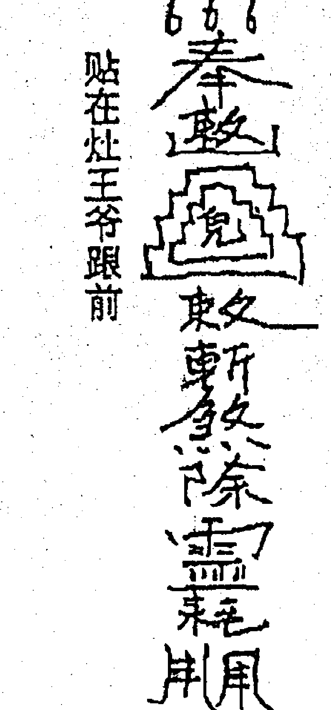

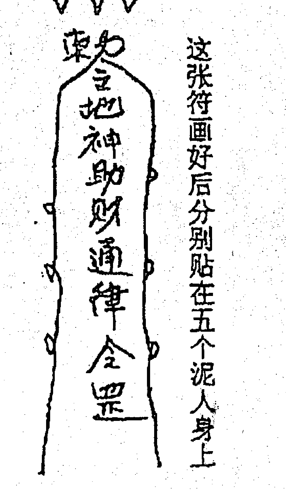

## 另有一种求财法术

取住宅的生气方的土5斤（以大门为主查生气方），取东方的河水（即长流水也叫青龙水），放上黄酒一瓶用河水和成泥，做成5个泥人。泥人干后贴上5个符（地神助财通符），埋在院子中心和院子的四正位，用5个龙龟（铜质更吉），龙龟在前，泥人在后4个方位立着埋。其余四个龙头龟头朝着院子中心，中心的龙头龟朝向主人住的房间。如在屋里龙头龟头朝主人卧室。所用之符在上边。

## 二、讨债的法术

钱借出去了要不回来怎么办，用讨债符三道，用纸壳把符糊上，写上欠债人的姓名或八字，两道符贴在床腿上，每天晚上用皮带抽打三下，叫着欠债人的名字，骂他，让他赶紧还钱。再用一道符，放在地上，用脚踏碾，叫他心里难受，一边用脚踏碾，一边叫他马上还钱。

## 三、要想发横财怎么办

在自己住的地方的周围布横财局，以月来找每个月的横财方位，在选好的方位上放上龙头龟和财神像，用运财符、五鬼发财符。

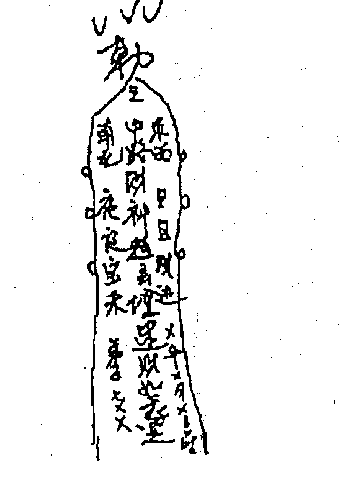

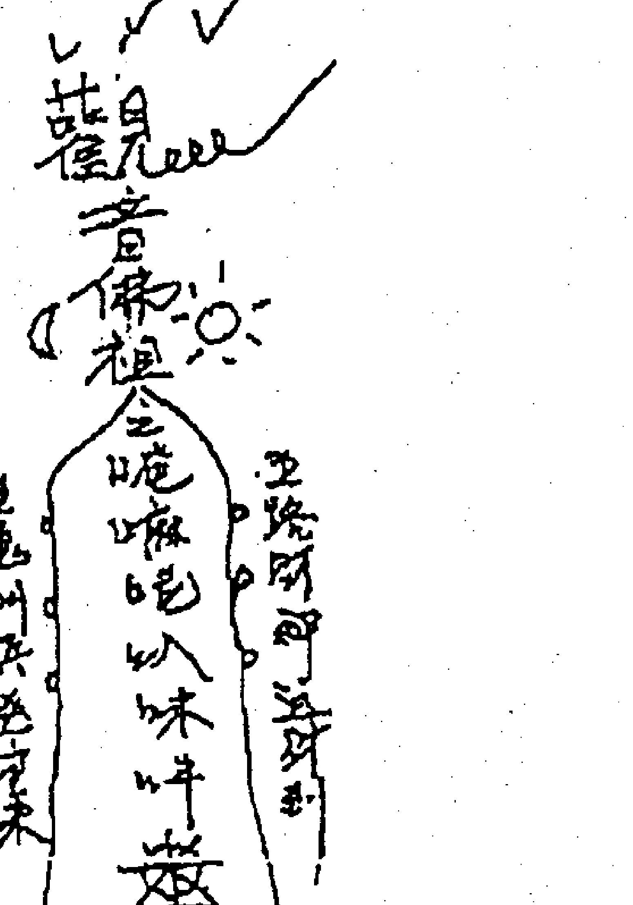

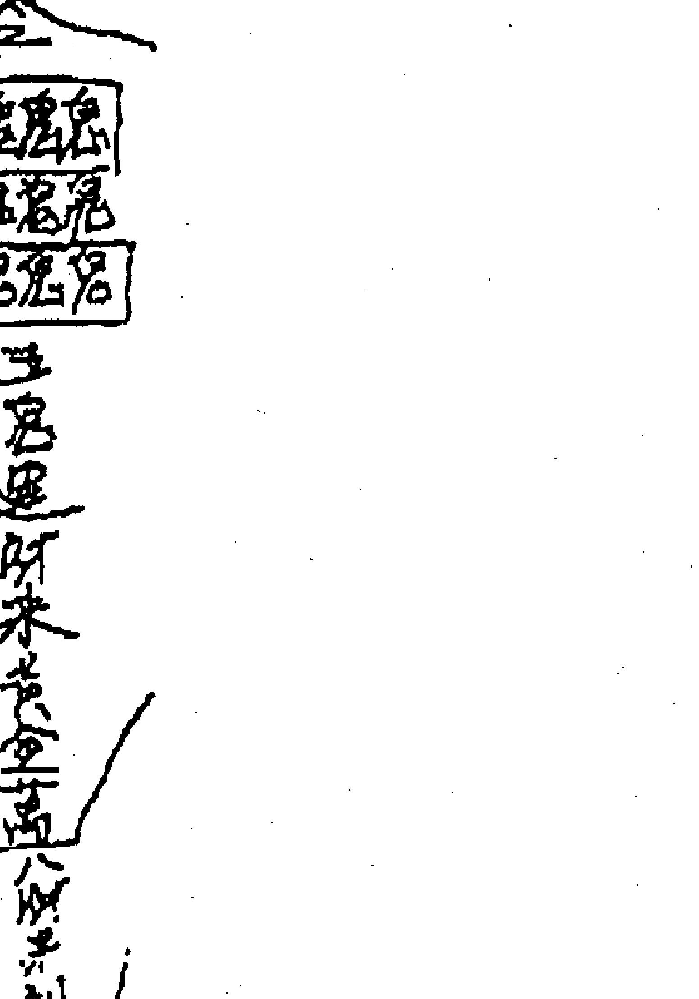

龙头龟需一对，在挖好的坑中把符烧化后放上龙头龟，两个龙头龟头对头放，还可以在挖好的坑中放上12生肖。还可以用自己住宅生气方位的土和泥制成小泥人，用八卦盘一个放进去，把5个泥人放在中间，泥人的形体必须全，用自己的中指血点心脏，叫他听指挥，帮忙把财运来。

## 以月查找横财神方位

+   子月在坎方、丑月在艮方、寅月在巽方、卯月在离方、辰月在坤方、巳月在乾方、午月在艮方、未月在坎方、申月在巽方、酉月在离方、戌月在坤方、亥月在乾方。

## 四、改天换运大法

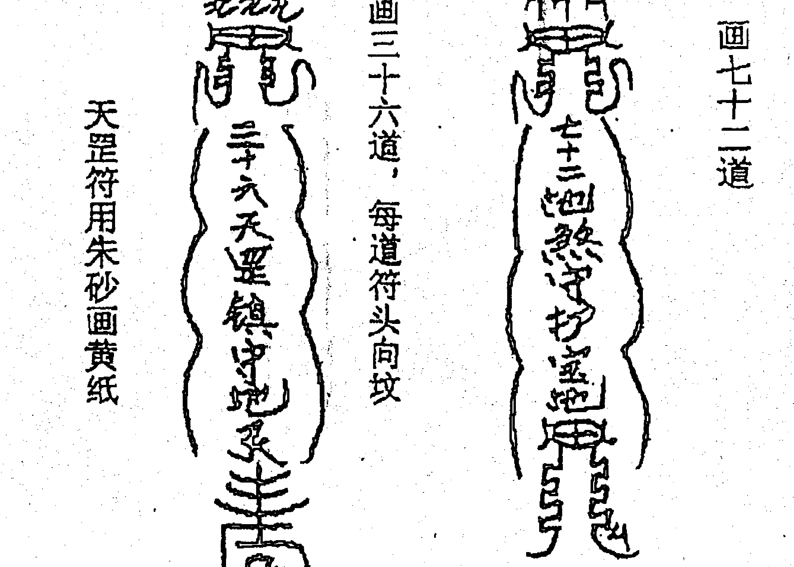

如果一个家庭中各方不顺，经常破财、出事、官司、伤灾等可用“改天换运之大法”改变家庭状况，使家庭财速发起来。在坟地的左边用上36道天罡符，右边用上72道地煞符，把符画好后到坟的左右两边挖开一条能放下符的沟，符头朝坟，每一张符压上一个一元钱的硬币，两边放好后用土埋上。然后烧香、烧纸、摆供品祭拜天地、各路神仙、北斗七星、南斗文星及天罡诚心请求神仙保佑、助我发财。这一切做完后，家人可从坟后边向前窜过，越窜的快、高越好，代表发的快、发的高。

## 五、临时旺财法

聚财咒如下：拜请八卦，财神来显灵，号令四面八方运财到吾家，助弟子 XXX 发财顺利，财源通四海，富贵达三江，八卦神君来显灵，令五路财神运财到，五鬼阴兵送宝来，吾奉老君律令，急急如律令。

这个咒念完后在手心画[符号]两只手都要画。画完后两手大拇指掐住中指指肚伸开手臂向前走十步，然后松开。这样求财还需找金柜、金库打开的日子，半夜子时做。在店铺、饭店、歌厅、超市等等买卖场所。在金库打开的方位烧纸上供。

每月月建日是金柜打开之日，每做一次必须查一次。

金库打开的方位查法如下：

+   - 子月子日在坎方、丑月丑日在西方、
- 寅月寅日在午方、卯月卯日在卯方、
- 辰月辰日在子方、巳月巳日在西方、
- 午月午日在午方、未月未日在卯方、
- 申月申日在子方、酉月酉日在西方、
- 戌月戌日在午方、亥月亥日在卯方。

## 六、家人口少，压不住宅子经常破财怎么办

可用青砖或大理石板刻上“雷霆”二字，埋在院子中间即可。

## 七、生意兴隆符

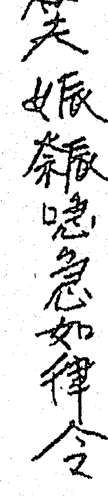

黄纸黑字画符，请神时加请五路财神、善财童子、招财童子、进宝童郎等，贴于门口，生意自然兴隆。

## 八、借风水发财方法

例如卖服装的，可用花瓶一个，装满九枝牡丹，花瓶里放穿地龙，叫人抱着花瓶到其它生意好的地方去玩，多玩一会。和别人说话的同时不要让别人知道或看出来。转三圈或九圈，然后抱着花瓶回来，放在自己开的店里或收银台上即可。这样就把别人的风水借来了。等别人店里的顾客多时再去，隔几天走一趟，一段时间后自己店的生意就好了。

## 九、家里存不住钱

## 找金柜

| 年/月/日 | 方位 |
| :--- | :--- |
| 子年 子月 子日 | 在子方 |
| 丑年 丑月 丑日 | 在西方 |
| 寅年 寅月 寅日 | 在午方 |
| 卯年 卯月 卯日 | 在卯方 |
| 辰年 辰月 辰日 | 在子方 |
| 巳年 巳月 巳日 | 在西方 |
| 午年 午月 午日 | 在午方 |
| 未年 未月 未日 | 在卯方 |
| 申年 申月 申日 | 在子方 |
| 酉年 酉月 酉日 | 在西方 |
| 戌年 戌月 戌日 | 在五方 |
| 亥年 亥月 亥日 | 在卯方 |

## 金柜的应用

假如2010寅年在家中午方修一个钱柜（用纸箱做也可以，用泥做也可以，或在院中修一个仓库也可以）。

把做好的金柜埋在左边时间星的金柜星的位置，住楼房的可用黄布包起来放在按时间所找的金柜星的位置即可。

## 十、长远求财符

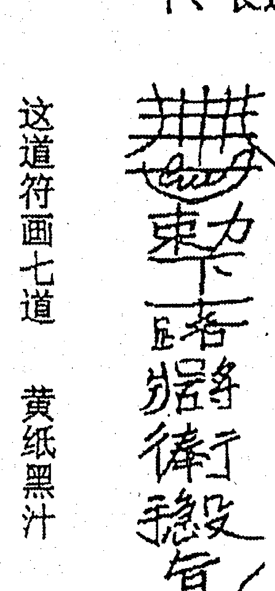

这道符画七道，黄纸黑汁。

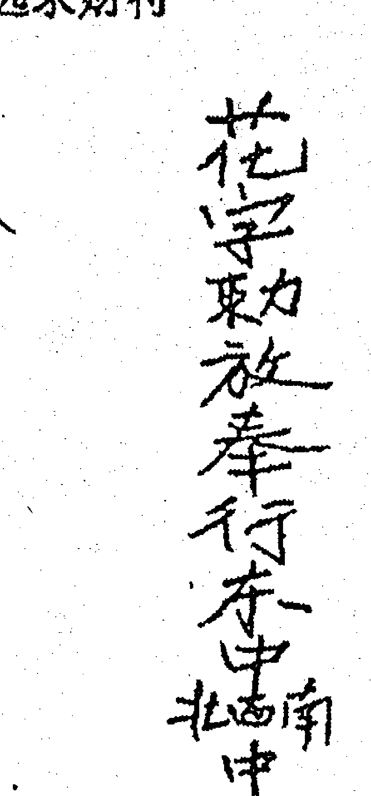

画一道，黄纸黑汁。

两道符共八道，用黄纸墨书。

多准备寿金、金元宝、银元宝、香。晚上在十字路口摆上供桌，摆上鸡、鱼、猪头、水果、酒。事先用金色纸糊两条裤子（以前穿的裤子也可以）或金柜，装上金元宝、银元宝同符子在十字路口一起烧掉。时间是晚上十一点。

> 咒语：一请阴兵、阴将。二请各方诸神圣，闻吾号令速速降临，启请奉行五路财神运财到，吾奉吕祖勒令，奉行神兵火急如律令帮XXX省，XXX县，XXX区，XXX小区，XXX人发财，快快发财。

念七遍咒，烧七道符一道画符，摆供品，上香，敬三杯酒。

发财后，每个月2日、16日到十字路口烧纸敬酒。答谢神灵。

## 十一、八卦聚财阵法

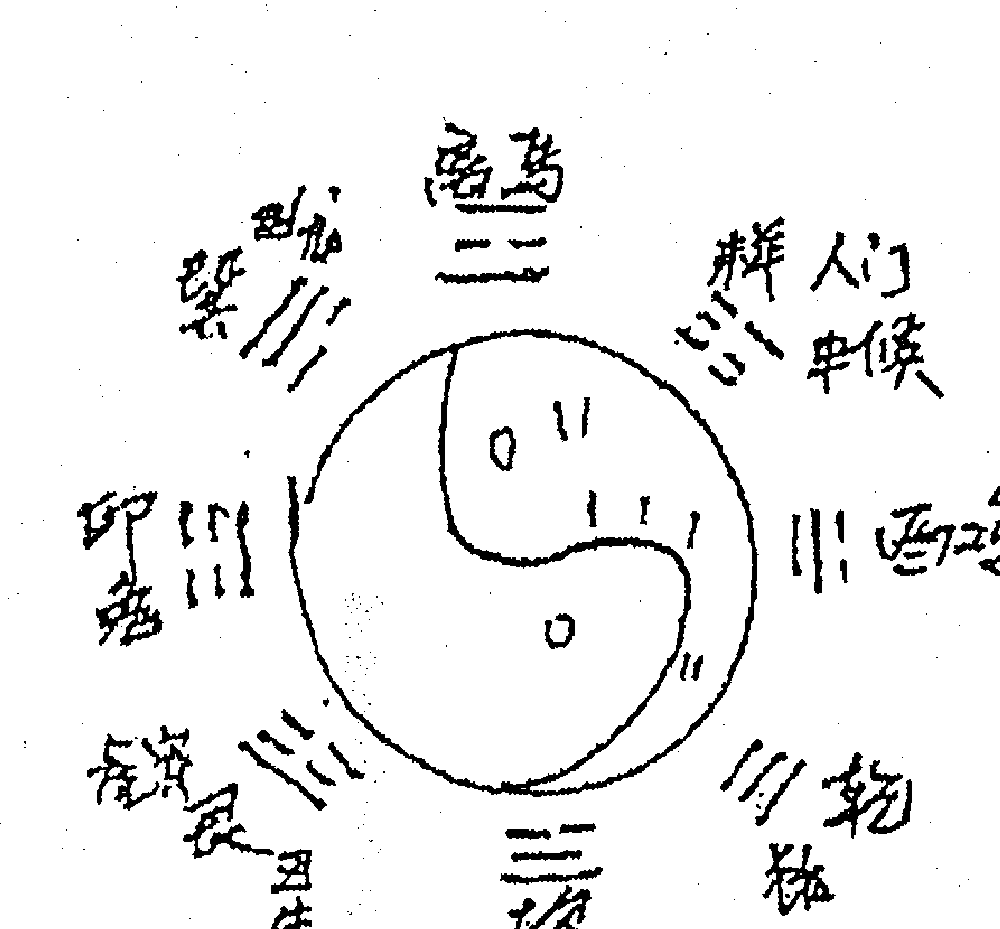

在院中央挖坑，用黄布3.6尺或一块青石板画上这个八卦图。买来的龙头龟放在中间，头朝向自己办公（或收银台）的地方，十二生肖（铜质最好）四周放在相对应的位置，面朝八卦的中心。八卦图下放一块罗盘。这是诸葛武侯八卦聚财阵。

开始念表文咒语：

> > 拜请八卦神、元、亨、利、贞显灵。
> 一请西北天神将，二请坎卦水龙神，三请艮卦山神降，四请震卦木星君，五请巽卦东南兵，六请离卦火龙神，七请坤卦地府君，八请兑卦金星降。
> 太极两仪阵中央，天兵神将左边立，六丁六甲右边随，天地鬼神听吾令，号令神鬼运财日夜不停，东方阴公来做法，号令地府库曹财库开，今日吾纸钱化阴财，收到吾化纸钱财库，库库满，金玉满堂如意来，阴欢阳喜各有利，招呼阳间吾发财。吾奉老君急急如律令。

咒语由老板念，老板念完后在自己的手心里写灵效二字即可。

### 天财星查法如下：

| 年/月/日 | 方位 |
| :--- | :--- |
| 子年 子月 子日 | 在坎位 |
| 丑年 丑月 丑日 | 在艮位 |
| 寅年 寅月 寅日 | 在艮位 |
| 卯年 卯月 卯日 | 在离位 |
| 辰年 辰月 辰日 | 在坤位 |
| 巳年 巳月 巳日 | 在乾位 |
| 午年 午月 午日 | 在坎与艮位 |
| 未年 未月 未日 | 在艮位 |
| 申年 申月 申日 | 在巽位 |
| 酉年 酉月 酉日 | 在离位 |
| 戌年 戌月 戌日 | 在坤位 |
| 亥年 亥月 亥日 | 在乾位 |

（月上与日上只是二子相连即可，也就是二字必须是相连的）

### 具体做法：

中药：金钱草7两、鸡血藤7两、地龙7两、仙鹤草7两这四味研磨备用。药量可根据沟的远近最大量可增加到3.6斤一味。

假如说这一天查的天才星位置在坎位，那就从天财星的位置上挖一条沟，洒上中药面，引向八卦图。

挖完坑后，老板必须往坑里敬酒，烧3600个以上金元宝，待灰凉后，下一个罗盘，只要是罗盘就可以，在四角摆放四个金蟾，把用石板刻的八卦放上，再围一圈放十二生肖，叫老板埋之。半夜子时起来念咒，在手心上画灵效二字。咒语每次念七遍，还要敬两杯酒。

## 十二、要想招标到手怎么办

首先了解此人的生辰八字、姓名，把此人的属相放入八卦阵中，把属于你要叫他帮忙的人的姓名放在此人属相的底下，到十字路口烧五色纸，越多越好。这跟找人帮忙一样使法。

## 十三、花钱卖官

+   1. 首先用罗盘到坟地里把罗盘放在坟头上，放好后找官对官的方位。
2. 用“马上封侯”的工艺品一对，一头一个。
3. 用学生考学的“黄甲符”在住宅的方位把此符埋在左边的里间里。
4. 用桃木板或大理石板刻上用之即可。另外身上带一道“天官赏甲符”（用黄布黑字或黄纸画叠三角形）。

时间：子年 子月 子日 在丑方

| 地支 | 方位 |
| :--- | :--- |
| 丑 | 在寅方 |
| 寅 | 在卯方 |
| 卯 | 在辰方 |
| 辰 | 在巳方 |
| 巳 | 在午方 |
| 午 | 在未方 |
| 未 | 在申方 |
| 申 | 在酉方 |
| 酉 | 在戌方 |
| 戌 | 在亥方 |
| 亥 | 在子方 |

## 十四、求官求富

贵人方位口诀：甲戊并牛羊，乙己鼠候多。丙丁猪鸡位，壬癸蛇兔藏。庚辛逢马虎，此时贵人方。

用罗盘放在坟头上，找出贵人的方位，在此方位放上龙头龟和贵人生肖。

例：癸年生人：可在本家的卯位、巳位埋上龙头龟即可。或龟上驮着兔和蛇，日子要选卯日己时。

求官者可以这样做，用八宅罗盘找出做官向官的位置，在这个位置上各埋一个“马上封侯”。

另：龙胆草3两、鸡血藤3两、金钱草3两、官桂3两。把这些中药分成两份，放在挖好的坑中，上面放上“马上封侯”，埋之大吉。

## 十五、八字命局求官

根据八字而定，不分喜忌

+   - 如果八字中辰成为官的话，可用山龙、地龙、沉香各三两埋在辰的位置。
- 如果命局中以丑土为官的话，可用赤石、金精、银精、鸡血藤、硼砂各三两埋在丑的位置。
- 如果命局中未为官的话，可用仙鹤草、穿地龙、人参各三两埋在未的位置。
- 如果命局中戌成为官的话，可用中药赤石、人参、肉桂各三两埋在戌的位置。

## 十六、六畜兴旺的法术：

地支行瘟病 当年大王

+   - 子年行瘟周大王，丑年行瘟赵大王，
- 寅年行瘟魏大王，卯年行瘟郑大王，
- 辰年行瘟楚大王，巳年行瘟吴大王，
- 午年行瘟蔡大王，未年行瘟宋大王，
申年行瘟齐大王，酉年行瘟鲁大王，
戊年行瘟越大王，亥年行瘟刘大王。

表文一：伏以弟子 xxx 来到 xx 地 xxx 人家，为其养猪场生旺来作法，假如是子年。

今年是子年，天上管猪部，朱星君及子年行瘟周大王及各位尊神，护佑弟子作法成功。

现在养猪的主人来扫猪圈，一扫东方甲乙木，二扫南方丙丁火，三扫西方庚辛金，四扫北方壬癸水，五扫粪屎归一处。

这时，养猪主人手拿雄鸡，用鸡冠血往猪食槽内点三滴血。

> 法师口念：瘟水不喝，瘤食不吃，日长千斤，夜长千万两，恭喜主人家槽槽肥猪六百斤到千斤。

### 具体做法与步骤

+   1. 不要叫别人看见;洗脸、漱口（穿衣等）
2. 把供品刀头酒果摆在养猪场
3. 主人点蜡烛、香、烧纸
4. 香燃烧尽后，主人扫五方
5. 主人点鸡血
6. 法师念表文，指示怎么做。

用灵符一道，化符在清水盆中，用一道帖在猪圈门上，用柳树枝杨树枝个七根，沾上水往猪圈四周滴。

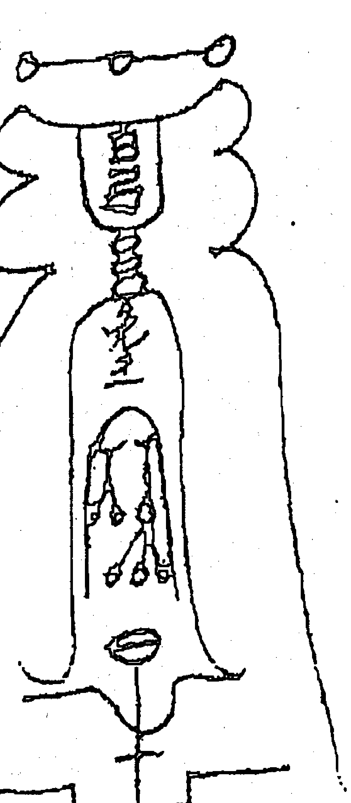

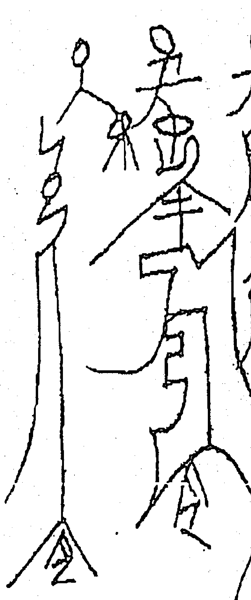

在给养猪场作法术时，在猪圈门口摆上一把刀头，敬上酒、供果、香、纸、活公鸡一只，金元宝黄纸一万；烧前念，请本门的先师、九天玄女娘娘、曾祖师、师爷、当年行瘟大王，凡是养猪场供上九天玄女像或之灵位，长年供。九天玄女娘娘她是管此事的神。

法术做完时，让当时在场的主人家或其他人抢吃供果，越快越好，目的是让猪长得快不得病。但在场的人不要吵不要喊（代表的是让猪吃食安稳）。

主人扫猪圈时从里面走，不要翻墙过去出来，如不这样以后猪会跳圈。做法时不论单月或双月，只找天医神将日，清早卯时开始做法。

口念：请到千千师、万万神将，念三遍，到猪圈门口点上蜡烛一根，烧上纸、烧香三枝。那一天不管有什么事情都不要发生争吵、打架。

### 天医神将查法：

+   - 寅月寅日在卯方
- 卯月卯日在亥方
- 辰月辰日在丑方
- 巳月巳日在未方
- 午月午日在己方
- 未月未日在卯方
- 申月申日在亥方
- 酉月酉日在巳方
- 戌月戌日在未方
- 亥月亥日在巳方
- 子月子日在卯方
- 丑月丑日在亥方

上半年用天师除灾符，下半年用驱邪大吉符。

天师除灾符

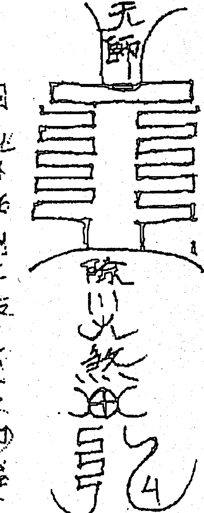

因 想不 拓 刘之 最 亡 西 宋 而 括

高 41 山 分 宽 23 山分

### 驱邪大吉符

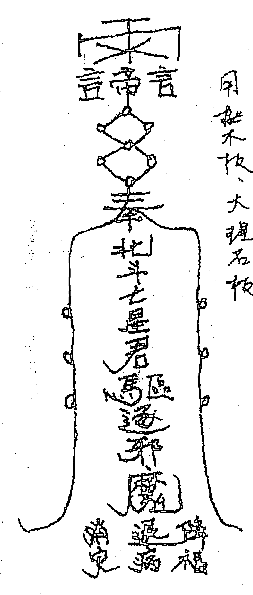

以上这些是使六畜兴旺之法术，其他可变通。

## 十七、催丁符

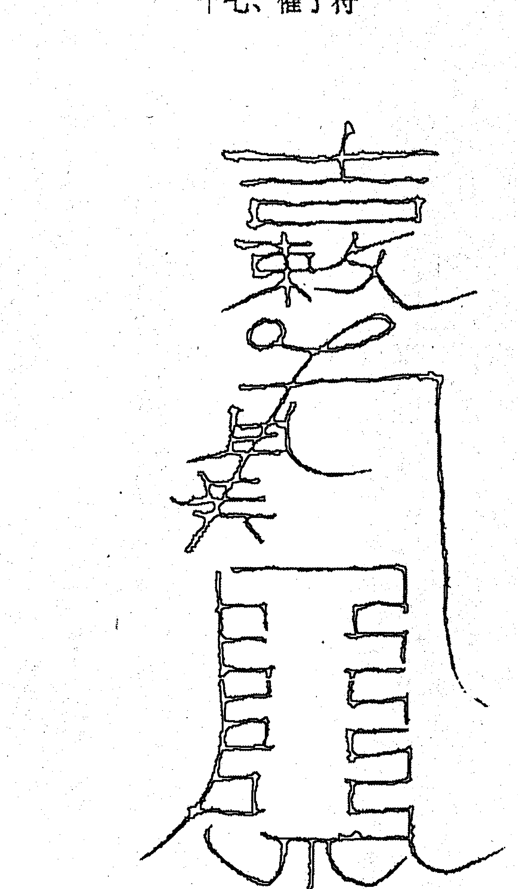

用桃木板把符刻上，放在生气方也可。用红布墨汁画上，放在妇人住的房间床下，褂子底下。床底下放康熙大钱一个，用红布盖上。这个催丁符很灵验。

在屋内生气方供送子观音，再用大理板刻上“九紫生辉”四个字，用朱砂鸡血与白茂画上，放在床下字朝上。

## 十八、催丁法

如犯白虎关或不怀孕，用如下方法可催生：

（在必须是身体健康如没有毛病者）先查宅子的生气方，以大门为查，用别人家能生孩子的妇女的衣服，必须是穿过的一件就行，或用钱买或用别的手段。

本人婆婆的鞋一双，大白纸一张，纸上画上五个人，写上年月日时，把这几样东西准备齐了（衣服、鞋、纸人）烧成灰用脸盆装上埋在住家房子的西北方。如果是楼房没有地方埋，可用黄布包上放在楼的生气位即可。

用催丁符一道埋在家中的生气方。

## 十九、养牛的法术

注：养牛的法术与养猪的法术不同的是上供不能用刀头。

养牛用的表文：今有一泗天下，南瞻部洲，亚细亚中华人民共和国xx省xx县xx村xxx信士，因养牛受损，请来弟子为其作法。

伏以弟子三叩首，请X年X大王，天上管牛部牛星君，及过往神灵，天上地下各位神尊护佑弟子作法成功。

### 现在东家举杯敬五方

一杯美酒敬中央，黄帝君受了此杯酒，养牛事业大兴旺，无灾殃。

二杯美酒敬东方，青帝君受了此杯酒，点化草儿青又青，又嫩又香，老牛吃此草，身肥体又壮。

三杯美酒敬南方，赤帝君受了此杯酒，灵光一闪，牛棚如温室，牛儿不受风寒之苦。

四杯美酒敬西方，白帝君受了此杯酒，秋粮饱满做饲料，粮美又香。

五杯美酒敬北方，黑帝君品尝了这一杯酒，点化河水化甘泉，老牛饮水有精神，日长千万斤。

这时手拿雄鸡冠血点牛槽，口中念叨，瘟水不喝，病草不吃，日长万斤，夜长千万两。恭喜东家圈圈老牛膘肥体壮，每头牛一吨以上。

符子用上边养猪使用的符子一样，其做法和养猪方法一样。在牛栏门口用黄布写上“供奉牛部星君之位”，然后摆供果，金元宝，雄鸡方法同养猪一样。

## 二十、电线杆在门前挡着对自己的住宅形成煞气怎么解决

（用粗铁丝把电线杆锁起来，用朱砂化画符或用砚台化解，即可。电线杆、高压线杆等也叫打人棒还叫赶客棒）

## 二十一、敬宅子或楼房的具体方法和步骤

如果家里有财神，可在家找个有能力的人，抱着财神，背上背着斧头。

如果家中有6个门，就叫主人准备12块红布，每个门2块，红布上写上财富二字，进门时左腿踏福，右腿踏财进来。在每块红布底下放上一个嘉庆大铜钱一个。

妇人抱着锅，锅里放大酱一袋（大将）、十根冰棍（天兵）、几根葱（代表孩子聪明）。孩子抱着文房四宝进房之后；把锅放煤气灶上，把里边的东西取出放上水就可以点火了。放在红布底下大钱可用红布包起压在箱子里即可，永远有福有钱。

在进房子之前“法师可用净水一碗，柳树枝沾水，在房子内四处洒，口念’大吉大利，主人万事顺利，吾奉老君之令赦。”

## 二十二、建土地庙的法术

每个屯都有土地庙，方位一般在两个方位；西南方（坤方：也叫地府）一个是在东北方艮方，土地老本性韩，不驻东北就驻西南。

+   1、建庙时法师必须念开地脉咒。

> 开地脉咒：
> 敕召五雷公，风火急相通
> 划开地户裂，阴气上腾空
> 太乙飞光耀，光映火雷冲
> 九天降真气，雷发震巽宫
> 吾令行符咒，摄罡乘九龙
> 绿波天有赦，致雨顷刻中
> 雷公火急起，雷公斩不容
> 邪妖碎沉泥，霹雳伐恶宗
> 稍违太乙令，摄汝上北酆
> 急急如律令

此咒最好打上黄表文；念完后烧了。

#### 2、建庙奠基仪式由村长敬酒，法师念如下咒语：

土地老爷坐庙堂，村民给您建庙房，保佑全村平安，人口安详无病殃无祸殃，日吉时良，破土动工，奠酒三杯，以表衷肠。
第一杯美酒上敬天，天恩浩荡益凡民，大地受恩似海洋，天布圣道普降凡尘。
第二杯美酒下敬地，土地老爷饮酒香，人神欢乐，大布恩光，村中人才兴旺，为民服务把权掌。
第三杯美酒敬天地人，村中男女老幼永安康，土地老爷布恩光，广置田庄纳干祥。

#### 3、土地庙建成后，土地爷要落座。落座时念咒，即土地咒：

此间土地神最灵，升天达地，出幽入冥，为吾关奏，不得停留，有功之日，名书上清。

## 二十三、修建破土动工奠基法术

破土动工奠基咒：(房子脚柱烂了，换脚柱也可用如下咒语)

> 伏以神在虚空，香火在炉中。凡民叩请，众仙神远降来临，大柱真香一心奉请，天地水库，三元三品，三官大地，上元一品，赐福天官，中元二品，赦罪地官，清须大地，普同普请速降来临，此界之内，恐有孤魂，远去它方，不留在此地，凡民弟子，代墨功得，普同普请速降来临，三天门外付秦土地，寒林会上，一切老幼孤魂，再请XX氏宗门，家先神幼上三教释迦佛，李老君孔圣人，中三教，观音者七层、文昌祖师，下三教祖土、汉朝洪州令得道鲁班先师、蔡伦纸匠人，在炉信香、一心奉请三家土府久垒离甄，大皇大帝，后宫紫英夫人，东方青帝土府神君，南方赤帝土府神君，西方白帝土府神君，北方黑帝土府神君，中央皇帝土府神君。土公土母土子土孙，肖家一宅，孟家一村，奉请高师祖王显，请曾师刘降壁，师爷张国方师傅，阴传阴教师，阳传阳教师，口传心教师，不传不教师，弟子顶敬，阴阳会上，七十二巧匠先师，千千祖师，万万师爷，请神在前，开壶三献上来，一献，二献，三献圆满。

> (一献酒要拜三拜，二献酒要拜六拜，三献要拜九拜)(要一壶酒四杯、第二壶酒满八杯、三壶酒满十六个杯，上下左右都要满)

一献酒向天空，二献酒洒向大地，三献敬人民，接着可以说，礼不重斟，今有大中国XXX省xx市县xx乡镇xx村xx人修宅建院，天无忌地无忌，年无忌，月无忌，日无忌，时无忌。弟子在此代墨下石百无禁，大吉大利。

用黄布墨汁画符。

符可贴室内，或烧化室内，或放在神宅身下。

春天到夏天白鱼在上，立秋到立冬黑鱼在上。

此卦用三尺三寸黄布画 上边这阴阳图（长和宽一样）（三尺三寸代表三十三层天）北斗为北斗七星 它的力量非常大

### 奠基仪式：

先在院子中心或房屋中心摆上供桌，如图：

1.  在开工的工地上或家宅的院中，找一个太极太中间插上一个杆把八卦图挂起。
2.  供桌上摆上猪头、鱼鸡、供水果类，上香、烧纸多买金元宝多者为吉。
3.  老板先上香，其次类推，老板娘也要上香敬。
4.  老板敬酒，一敬天 二敬地 三敬城隍 四敬土地爷 五敬过往的神灵。每样三杯。
5.  再念咒语，用大黄纸写上，大声念咒语完烧化。
6.  老板老板娘对供桌三拜九叩。
7.  在中央为龙身，大地为龙脉，龙道在西北，往西北敬三杯，往中央敬三杯，为龙身，再往东南献三杯，为龙尾。再拜上方，八卦符放在基石下。然后老板在供桌前中间位置，先挖第一铣土，挖一米见方的坑，中间用米写上“金玉满堂”四个字，然后下摆八卦盘，中间放龙头龟，龙头龟在中间 头向老板的办公室或家，周围摆上十二生肖，十二生肖头朝龙头龟。龙头龟和十二生肖铜质的，在下八卦盘以前先在坑内烧金元宝和纸，然后再写字和下八卦盘，八卦盘底下放四个乾隆大钱。
8.  一切弄完之后，老板先撒第一铣土，其他人随后。十二生肖按它在八卦位置上放。

也可用八卦盘，放在挖好的土坑中，按照十二生肖的位置放上买来的十二生肖，在整个院子或整个厂子或整个工地的四个方位中间时做法。

十二生肖可买60个，龙头龟可买5个。

每个地方的敬酒、烧纸、香，都是老板（也就是官最大的一个）先开始做，最后埋土时也是老板先开始。

敬完酒后，烧纸、金元宝，把这一切都做完后，把八卦挂起保平安。以上这些是开工的必须做的事情，如果不这样，出一样事情，那将是不可估量的损失。（凡是饭店、锅灶大、房子小或桌子少小）都是不发财的象征。

## 二十四、土地庙的位置来断事（罗盘的使用）

三合盘中

| 坐山 | 戊乾亥三山 | 巳 丙 午 丁 未 坤 申 庚 酉 |
| :--- | :--- | :--- |
| **戊乾亥巳上起** | 福 | 瘟 进 长 讼 官 上 生 |
| **丑艮寅亥上起** | 德 | 煜 财 病 讼 位 贵 吊 旺 |
| **甲卯乙寅上起** | 辛 | 戌 乾 亥 酉 子 癸 丑 艮 寅 |
| **辰癸巳坤上起** | 光 | 法 精 口 养 进 哭 孤 荣 少 |
| **丙甲丁丁上起** | 福 | 场 神 舌 殒 田 泣 寡 福 亡 |
| **未坤申寅上起** | 甲 | 卯 乙 辰 巽 |
| **庚酉辛庚上起** | 女 | 姻 乐 败 旺 |

## 二十五、搬家法术

1.  搬家尽量择日，定日子以纳音为水的日子。
2.  家中能力最强的人或是男主人，怀抱佛、财神或保家仙，背上背一把斧子。斧子用红布缠上。
3.  门内一面放一张一尺见方的红布，红布左侧写财字，右侧写福字，红布底下放嘉庆大钱，有几个门放几个，叫左腿踏钱，右脚踏福。
4.  女主人抱锅，锅内放一袋大酱，10根冰棍，几根大葱。
5.  孩子跟在父母身后，抱文房四宝，笔墨砚台，字典。
6.  全家人将各屋走遍。女主人将锅放在锅台上，然后将装水的器械都灌满水，再烧一锅开水，把“财福”和嘉庆钱拾起来包上，放在装钱的柜子里，然后亲朋好友再进屋。
7.  娘家给女主人买一条裤子。
8.  出门顺序，主要是第一次，年长者先出。

## 二十六、阳宅的用法：

用羊骨头8斤也粉成沫，和土一起制砖烧四块砖，每个砖上刻上甲字。用在房的正北面。等距离埋上加中药仙鹤草，如果是别的方向的房子，不管什么样的房子，都埋房子的后边。楼房没地方埋，可用黄布抱起来，放在楼房的北面，如坐向不正的也取北面，也可变通处理。

接龙脉之法，也叫接气法。 举例：酉山丙向例。根据来处理，把别处贵人处的气接到自己的坟中来。

中药：山龙、地龙、沉香、木香、杜仲。五种药粉成沫，这五种药量可大一点，从贵山处把气接过来。具体做法是，从贵山处挖开一条小沟一直挖到自己的坟跟前，在自己家坟的用罗盘找亥的位置埋上一个马上封侯，中药（皮15页？）桂、金钱草、龙胆草、鸡血脖各两，用在马上封侯的下面即可，求官求富贵快。

## 二十七、阳宅开工仪式

盖房子上梁应做法事，东北地区，中间梁下放一张桌子上摆供品，点上香，放在香炉里，里面盛高粱，斗里装上高粱，没有高粱时可装其它的五样粮，用一块红布盖之，斗里插上一杆秤，斗代表北斗，秤上有星代表七星（可放7个乾隆帝钱）。主人点上香，这七个钱可按一条直线这种形式放，用红绳二根，把线绳穿起来，挂在梁上，如果用八卦图的两边可用这两句话，人口平安，太公在此。如果是用八卦图可把八卦糊在梁上。

上梁前念上梁表文（兴工词），表文如下：

> 伏维日吉时良，大地开张，立地梦香，香烟上升直达天庭，虔心拜请神佛降临。
今有XX省xx市县xx乡镇xx村xx信士，为建居安身，特请弟子xx选立xx山xx向，于xx年xx月xx日x x时动工。
谨具财宝香帛，恭请历代地理化师降驾监导，并恭请在天过往神佛与本地，住在宫庙神佛，龙神后土，土地临阵，护助保佑干祥云集，百煞潜消。奉太公法旨，鲁班先师，急急如律令。

（上梁、盖各种厂房等都可用上述方式与方法。随时与当时的实际情况可变通。）

## 二十八、祭梁的口诀

伏维日吉时良，大地开张，祭上梁万事大吉昌，此梁生在深山万丈长，原来姓芳名金娘，x x 东家请汝作栋梁，鲁班先师亲手做，今日请汝进画堂，一匹红绸万丈长，包起太极分阴阳，乾南坤北，离东坎西，都是内中一点红，左手执起着手斧，右手进来右金鸡（用鸡冠上的血点在梁基尖上）。玉皇上帝报晓佳，点龙眼与天齐，点汝右眼眼精，点你左眼眼明，点你两眼日月清，日出光辉四海洋洋。

-   一对明灯龙虎湾，年年兴利凤凰池
-   一杯米酒敬梁头，子孙代代出公卿
-   两杯米酒敬梁尾，子孙代代做探花
-   三杯米酒敬梁中，子孙代代做富翁
-   四杯米酒敬梁光，子孙代代中状元。

-   口诀二：一杯清茶敬梁头，呼您代代子孙得武候
-   二杯清茶敬梁中，呼您代代子孙近五宫
-   三杯清茶敬梁尾，呼您代代子孙得官做。

又一种：伏维天地初开，阴阳交泰，一天星斗照入门，凤凰子孙架高堂，年月方位定吉昌，年煞归年，月煞归月，逢山山飞，逢水水漂，逢人大发，今日宅主喜洋洋，百子千孙，富贵临禄马，齐齐到，添财进人口，添进产业人丁旺，堆金积玉千万贯，子孙及第状元郎，腰悬金带进朝纲，执笃执印伴帝王。郭璞仙师亲驾临，汝荣华富贵寿更长，年通月利时吉时良，请鲁班仙师上金阶，架金桥，龙真穷地起高堂，牛马六畜满山岗，富贵田园日日进，儿孙代代生贤郎，添进产业谷满仓，良时吉时上金梁，玉堂年年大吉昌，发乎大发大旺。日吉时良正当时，诸天神圣来扶持，堆金积玉多财宝，富贵荣华天下知，左有青龙送珠宝，右有白虎进田庄，福到屋前人富贵，马到屋后旺儿郎。

### 上梁符子：

新房建成后要住进新房，但新房要敬宅

### 入宅口诀：法师可念

XX省XX市县XX乡镇XX村XX信士，请吾入宅做法，今日良时吉日，入宅归火，万事大吉昌；一要千年兴旺，二要双贵联丰，三要三元及递，四要四海杨名，五要五谷丰登，六要六部尚书，七要七宝齐备，八要八古重光，九要房房兴旺，十要十子团员、大富大贵、财丁两旺、富贵齐金进乎。

## 二十九、窗户改门法术

不管是城市或农村，窗户改门须作法，都要上香、供果、门窗都要拜祭。敬酒拜天地，主人家先拿锤砸一下，房吉。

### 表文：

> 窗户为眼光神，宅眼神，宅眼光神升为门神，户奏表文，叩拜当庄土地、本宅宅神，今有xx家需要将眼光神升为门神，望各位尊神批准，现有酒礼财帛献上，上报人本宅主xxx，年    月    日。

如果不作法，容易出现凶祸，后果不堪设想，所以很重要。

### 破土文：

天园地方律令九章，吾今奉先师李定渡之令来破厚土，保吉祥。三杯美酒敬土皇，各种美味请品尝，再敬宅神，保护此宅财旺，人口安康。北斗七星、南斗六星，紫微星来照宝宅，保佑人财两旺，三杯美酒敬门神，门为主来宅为臣，相配有神奇，保佑此宅大发大旺，日日进奇珍。吾奉五帝老君勒令。念完可烧化。

### 安门表文：

1.  天高地厚良辰，手拿斧头钉财门
2.  这家财源又茂盛，斗大黄金滚进门
3.  吉日吉时安财门，百事顺心又太平
4.  开门不让邪魔进，晚上关门无坏人
5.  天有三奇地有六仪，玉女守门凶煞远避
6.  进喜进财大吉大利，金玉满堂长命富贵
7.  吾奉门神急急如律令
8.  先点三炷香，到门口拜上三拜
9.  念完后可烧化。

## 三十、两家有矛盾

两家有矛盾，其中一家作法，用三把刀，刀尖朝向和自己不合适的人家，使其家中出现血光之灾。这样的情况叫剪刀咒：其咒语如下：

> 天灵灵地灵灵，鲁班留飞刀随身带，杀斩坏人不留情，金刀三把，一把斩了蛇头，二把斩了蛇身，三把斩了蛇尾，西天去请唐三藏，南海岸上请观音，急急如律令。

用这道符刻在桃木板上，用朱砂加雄黄合在起画描上用工艺品中的生肖蛇，把可恨之人的名字写在黄纸上，贴在蛇身上，在可恨之人的住房附近，挖坑，买三把刀放在坑的后边，前边放上这个贴了姓名的蛇在埋好，复原，不要叫别人看出，念以上的咒语七天，每天都是半夜子时念咒，每次念七遍。快着100天后，对方就出大事。

## 三十一、怎么破剪刀咒（也叫剪刀煞）

> > 咒语一：三宵洞内妙中玄，两条金龙颠倒颠，铜头铁尾如粉碎，玉女金童用绳拴，倘若死去未亡者，登山石头破肚肠，谨请南斗六星，北斗七星，吾奉太上老君，急急如律令。

> > 咒语二：破剪刀煞，金刀快，剪刀利，用后还至王母娘娘前。有借有还，再借不难。祖师有令，狐狸来现身，此下为南北二斗，太上老君急急如律令。

## 三十二、转胎大法

转胎：怀孕不超过40天者。具体做法：白色公鸡一只，中药雄黄3钱，把鸡做了放上雄黄炖了吃。

## 三十三、砍伐树木前的法术

多年的老树，有了精灵之气，如果想把此树去掉，必须作法术不然的话就会出现凶灾。

-   麝香一克
-   沉香十克
-   木香十克
-   降香十克
-   乳香十克
-   檀香十克
-   藿香十克
这叫七香。

把这几样用药泡在一起，用别的东西沾上酒向树，把树的灵气打掉再处理树，把树根挖走，把坑中用地龙3两、鸡血腾3两，把符子烧成灰和药一块埋在坑中即可。举例，辽宁省辽阳市某地一棵大树（千百年了）当年大元朝努尔哈赤拜的干娘，没有用法术处理，谁杀这棵谁出车祸死了，谁叫杀这颗树的领导也常年头痛，痛不欲生，后来经大法术治好了。

这七种香带在有邪魔附身的人身上，能辟邪，很灵验。女人带此七种香时间长了没有生育能力了。把七香药符子用黄布包上，带在身上，再把剩下的七香药撒向主人家的院子房间各处，使邪魔无处可藏，赶急逃跑，因为它受不了这七个香味，硬是把邪妖熏跑了。

但是必须加上五雷符：为什么叫五雷符，代表金木水火土。

## 五雷符：

用雷击木刻带在身上可护身，很管用。

例：有一女孩，考上了大学，没有能去上学，原因是中邪魔，时常表现出男女之间性爱的动作，其父母老的到处看也没有治好，其母感到很为难。其实真正的原因是九世前的一对男女死鬼附在了她身上。用这种五雷符和七香药治好了，后来又上大学了。

## 三十四、如果结婚用的日子不好

可在结婚的当天用一面镜子放在拜堂的桌子上，红布包斧子一把，一杆秤、一斗盛高梁，将秤插在高粱中，手持刀一把，这是解决结婚用的日子不好的一种办法。

## 三十五、破剪刀煞的法术

此地名为剪刀煞，路从哪里来就应从哪里出事。破解的办法：在剪刀的里边部分 用石板刻上一块泰山石敢当，鲁班作用，在剪刀前面挖坑放上一块石板图形，前方放石板图形，南斗六星，北边放上北斗七星，和石敢当用在一起，即可。这里的放铜钱用铜钱摆上。春天用北斗七星头向东北。夏天用北斗七星头向东南，秋天用北斗七星头向西南，冬天用北斗七星头向西北。

## 三十六、这种建筑方式容易出火灾之破解大法

火形煞爆竹煞，灭火咒，念七遍。

> > 吾奉东南西北四海龙王圣意，中央龙子龙孙，速令海水，龙驮起海水淹，屋梁高一尺，水淹一仗，水淹天上。真龙发水，淹住火，水火不容情，谨请南斗六星、北斗七星、吾奉太上老君急急律令，手挽九龙海水中。

## 灭火煞符：

中药：龙胆草，水仙花，各三两。用黄纸墨汁书写，或用石板刻上，把这种犯火煞的建筑跟前（根据当时当地的实际情况）用符子和中药使上，以避免火灾。

在使这个符时，符子的两边必须是一边一条龙埋合适的地方。凡是变压器对着谁的家，或饭店门口等，可用此法解决，也可再用乾隆钱摆北斗七星，和南斗六星，把符子放在中间即可。例如:一个饭店门前对着变压器，原来生意不好，换了好几次人都没有干好，总出事、火灾、破财、没有客人，生意冷淡，自从使用了这个符子和中药，还有北斗七星和南斗六星后，生意很火，已经好几年了，一直很好。

## 三十七、诅咒大法

首先用稻草扎成人形，再用纸糊成人样，要鼻子眼耳嘴，手胳膊腿脚，都要弄的很像，再摆上一个八卦阵。用做法本人食指尖的血，脚趾尖上的血，胳膊腿各个关节的血点在28根新针上，10根针扎在草人的10个指尖，10根针扎在10个脚指尖上，8根针扎在手腕、胳膊、腿关节、脚关节等8个关节，反复扎，边扎边念咒人咒语。

具体做法:用黄纸画一个八卦图，把草人放在八卦上，草人写上被做法者的姓名、出生年月日、家庭住址等。八卦图放在桌子上，在八卦图东方地户中摆上香案，做法前，上供烧香敬酒，然后要求城隍土地来帮助，说明为什么要整这个人，整到什么程度，要把自己的想法说出来，用针扎草人的各处。没有什么大仇就不要往心脏扎，往心脏上扎就会死人的。

### 咒语：

奉玉帝旨令，三横七纵，吾来使法，斩杀坏人不在世间存。请三十六天罡来助阵，七十二地煞来困坏人，坏人不除，天理不容。手拿钢针刺坏人，远去它乡，不在本地，刺向恶人四肢，四肢伤残，刺向心脏不在世上存。吾奉执法金刚来行法，急急如律令

（向东方吸三口气，用剑指向草人指三下口念:敕，向草人吹三口气）

稻草人夜里放在小屋里，扎完后放在屋外，早上太阳没有出来前，在放回屋里去（不让它见阳光）（半夜扎、点小灯）

### 以上是施咒：下面是解魔咒：

奉请狐狸祖师来解退，一请天解师，二请地解师来解退。来人七魂三魄，一切山精和水怪，巫师邪妖不敢来，若有青衣白人来使法，反手押在海底存，急急如律令，奉武侯仙师摆八卦阵图，一切邪魔入阵粉身碎骨，奉老君法旨，火急如律令。

### 解符咒：

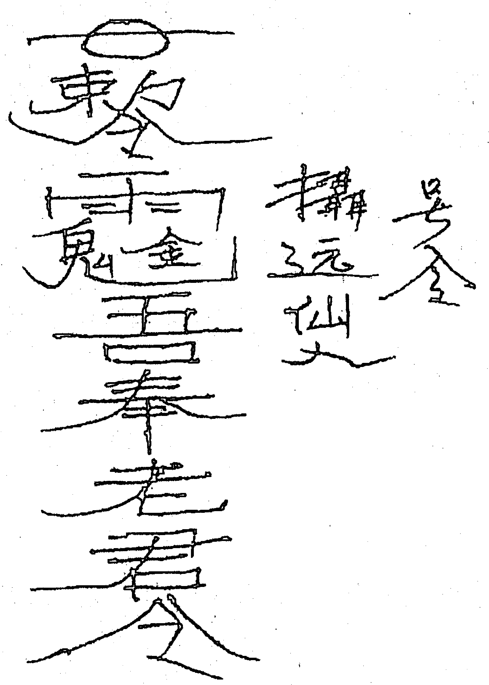

屋里头贴一道，床脚上贴一道，烧一道喝

摄远仙人号令写在符的右边

如果遇到别人对自己使用法术，就可以画此法术来解决。

## 三十八、假如有人被别人施的法术制的昏迷不醒

躺在床上，可拿三道黄纸往病人身上喷三口酒，拿黄纸在病人身上，正转三圈，反转四圈，转圈时口里念：山里的水里的，天上的、地下的，门里的门外的一切精灵鬼怪，附在黄纸上，随我走随我来，到十字路口把钱分了，拿足路费远去它方，别回来。如回来遭五雷轰击，压在大海底，押在八卦阵，粉身碎骨魂不回。做完这些后，用三支香在门口边画海水波浪纹。用黄布画八卦阵，

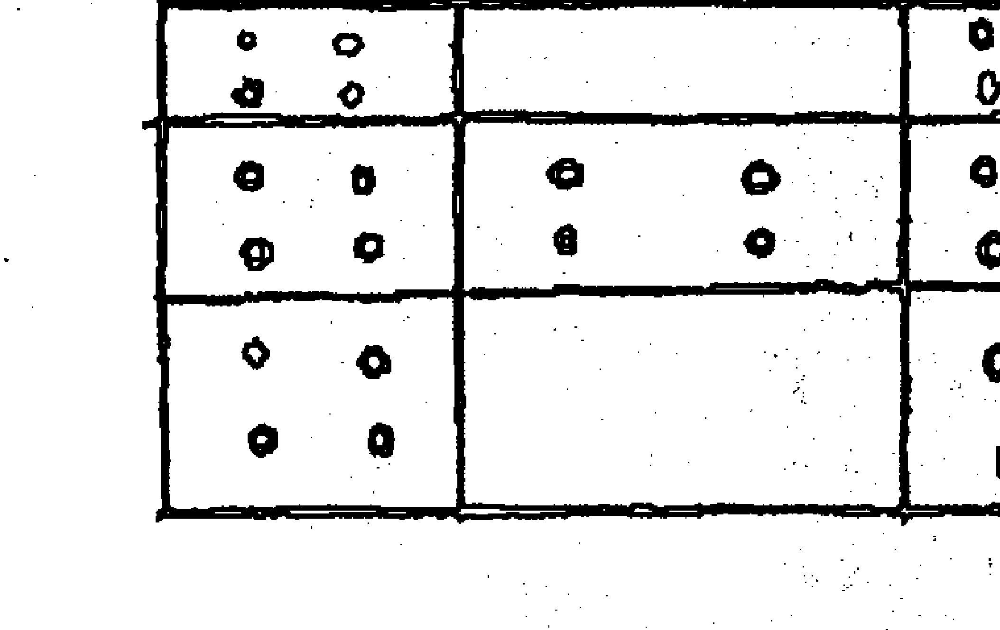

放在正屋中间或卧室里，或地毯下，或铺的褥子底下，可大吉矣。

## 三十九、解被人整法

当官的人被别人整了或告了，或领导整下级，这些都需要法术进行破解。

可用解退咒：
凌霄宝殿妙中天，两条金龙颠倒颠，奉请三霄师祖速速来降临，一退释迦佛，二退李老君，三退吾师传真语，四退四体四甲兵，五退五湖波浪起，六退六甲并六丁，七退目连到地府，八退董永自卖身，九退九天并玄女，十退十化并雷神。奉请仙家祖师速速来降临，来解退，十年不逢，万年不遇。远走他方，推出界外，休在此地侵害良民，谨请太上老君急急如律令。

此咒用黄纸写了，念完烧掉。如有人进监狱或被双规可用此法。

## 四十、被别用法术制了怎么办

可用这个退整人术的符子来保护自己。符：

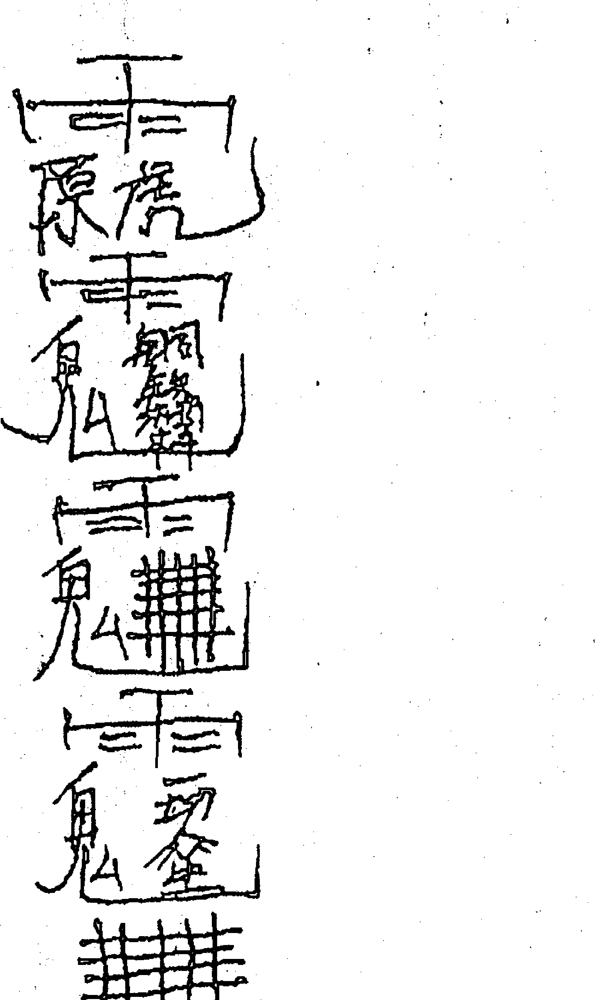

符的右侧写上“号令”两字。 家里头门旁贴一道，戴在身上一道，在办公室门口贴一道

## 四十一、修太乙天尊庙也叫贵神庙

这个庙修好后供上太乙天尊，

修建贵神庙，大的要 360 块砖，小的 240 块，180、102 块。

庙修在向自己的贵人方，每年每月都要上供烧纸。

修一个太乙天尊庙，也叫贵神庙。这个庙修好后供太乙天尊。

用前面的咒语，在太乙天尊跟前念七遍。烧化，在太乙天尊门口烧化。

假如在单位有人要告你，要整你，可用此法，把反对你的人名，八字都搞到手，再用纸剪成小纸人，写上人名，生辰八字，用法像牌位夹起竖起来，念咒，把这纸人在太乙庙前烧掉，找出其中的几个带头的，用工艺品来代替，写出他姓名年龄生辰八字，糊在工艺品上，用铁锁链锁上，再用小钉钉在太乙庙跟事先挖好的坑中的那个方位上，即可。埋上后，叩拜太乙尊神，烧纸上香。

贵神庙很重要。（修建时应选人专日）

## 四十二、坟地建工厂的处理法术

解决办法，首先用超度亡灵的表文，在原来的坟地的地方多烧一些金元宝纸香，念超度亡灵的表文，如有些不走的，那就要利用起来。在院子中间挖一个坑，中间放一个大一点的龙头龟，龟边上坐五个泥人，这五个泥人，取土从大门口上排大流年歌，可找到生气方，在哪个方位取土，加黑公鸡血，加点水和泥制成5个泥人。如果需要的可在院子的四角也同样挖一个坑，中间放龙头龟，周围放五个泥人，那样的话，就需要五个龙头龟，25个泥人，在中间的坑中间插上太公令旗（黄布做旗）用墨汁加朱砂写。四个角也这样做，中间大坑中可用石板刻上太公号令，神鬼尊行，日夜运财，放在龙龟一边石板可大可小，在埋前烧五道符，下面是这道符。

### 符：

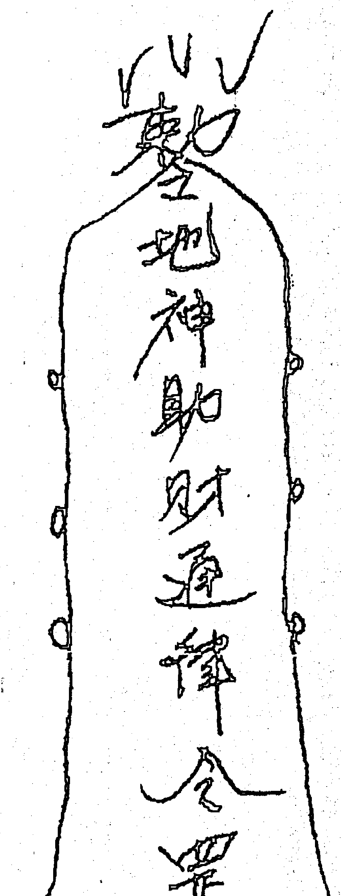

然在盖上土埋之大吉 一个角上烧化一道共五道

另外如果想发的更大更快更好，那就需要在大院两边挖沟，根据具体情况看挖的沟大小。用前面所画的36到天罡符、七十二道地煞符，用108块硬币压在符子上，每一张符子一块硬币，必须用中药：金钱草、仙鹤草、地龙量大些才能用，三样药粉成沫，撒在沟里，然后摆上符，在上边压上硬币，埋之大吉。然后烧香纸摆供敬酒叩拜。

天罡日：庚辰日画天罡符

地煞日：辛巳日画地煞符。

## 四十三、某人家中有人淹死鬼魂处理办法

在手相中应看大拇指与食指的中间那条纹，如纹中上边部分内有小白点，或有一个小圈，再有线冲向食指，他们家中一定有人被水淹过或淹死。手掌下端乾宫位置中，如果有这样的符号 Q 那就代表一定有人被水淹死。有十字级的也算。如果淹死人的亡灵还在水中，应给予招魂。

先念表文，再用纸糊七条船，上边摆上金元宝、香、纸和亡人牌位，放中间船上，再画这样的符号以表示水中有个岸，岸边有渡口，从渡口可上岸，最后喊其亡人之名上船上岸，在找个地方建坟按下。把这些船纸最后烧掉。如果有条件的话，可在水边某些合适的地方建个小庙，放上亡人牌位即可。

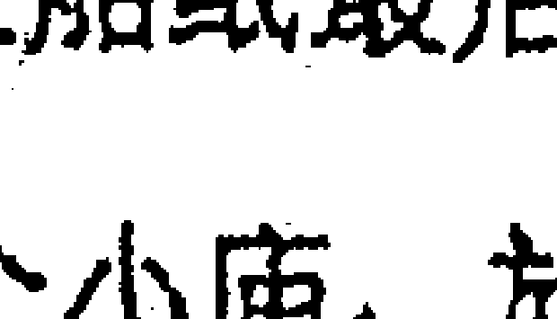

## 四十四、人死在外面尸骨找不回来的法术（坟丢了也用此法）

如果有人死在外，死不见尸活不见人，又想安葬，可用招魂咒：

> 真符重玉光，地府开幽阴，七星尊生煞，三辰敬真魂今无惊
残魄今无沉沦，急附灵幡体，炼形归玉英。急急如律令。

### 符：

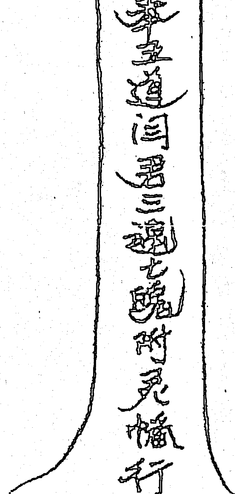

这个符在土地庙跟前烧化。也可在亡人生前出生的老房子跟前的一条路上来回喊其归幡。用一条桑木条，一把扫帚。其中家主儿子拖着扫帚，扛着灵幡（牌位）在其路上往里转三圈，往外转四圈，到土地庙烧香念上面咒语三遍，将灵幡往牌位上转七圈，再把牌位和往常的葬法一样下葬即可。用道上的一掀土披到棺材里头，有照片的也可把照片贴在灵位上也可。

## 四十五、百解咒

房子或其主人被人坏了或放镇物了也可用此法

> 百解咒：

南海岸上一皮草，昼夜青青不见老，王母娘娘蟠桃会上来解退，百般邪法都解了。一解黄衣端公，二解南海万法，三解百艺法，四解三师法，五解铁匠法，六解花匠法，七解瓦匠法，八解石匠法，九解木匠法，十解装宅法，天地解、年月解、日时解，奉请狐狸祖师，一切祖师，百般解退，谨请南斗六星，北斗七星，吾奉太上老君急急如律令。

图符：

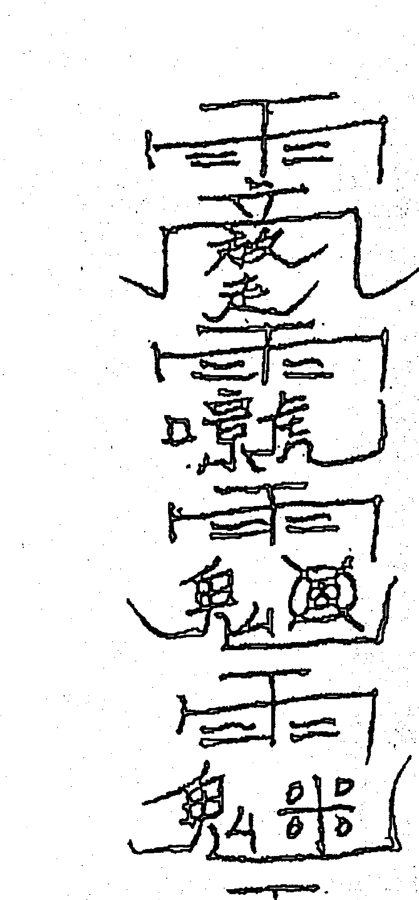

用柳树枝七根，杨树枝七根，用碗盛水，用上边的14根树枝沾水（这道符画三道烧成灰放在碗中之水，住房内或院内各处洒）再画四道符子（在黄布上画）埋在房里四正方用中药：仙鹤草、三钱一同用上。或刻在桃木板上埋在四正方，东南西北各一道，符下放中药，防人使坏。

## 四十六、房子附近有蛇型的路也叫锯齿路

容易出现喝药的上吊的，意外伤灾。

用石板刻上或用桃木板刻上符子，埋在凹形地时念咒一遍。

铁弹制锯法咒:老君炉炼铁弹子，烧出三千三百三十铁弹子，铁沙子，弟子下山随带起，碰见生人推锯子，弟子放铁弹子，左拉左跳，右拉右跳。毁坏锯子，保护生灵。谨请南斗六星，北斗七星，吾奉太上老君急急如律令。

符:

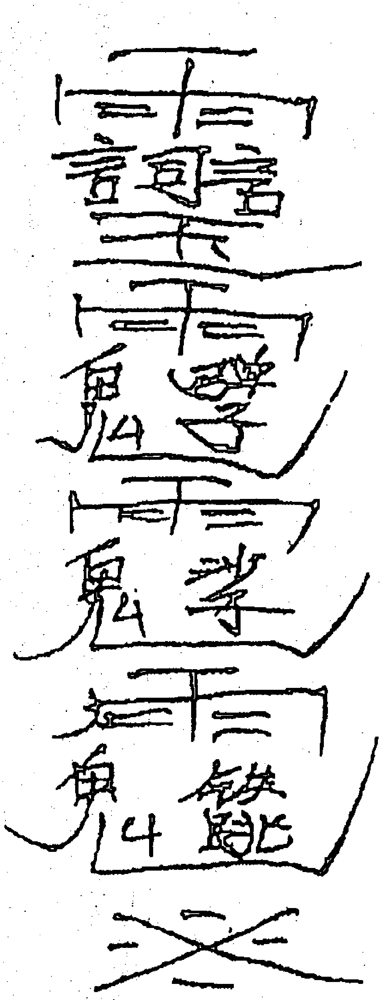

再用太山石敢当，或鲁班作用都可以，然后用铁沙子和铁块、石敢当、鲁班作用埋在一起（有锯齿的地方，有几个豁牙的地方，都要用，每个地方都要放这些物品）

如果是南北路那就在路南头埋上6个大铜钱，路北头埋上7个大钱，代表七星北斗，南斗六星，日夜护着，到每个豁口念一遍咒。

## 四十七、象红旗一样排列的房子怎么办

这样的形状有点象红旗，可在相应的地方修一个鼓形

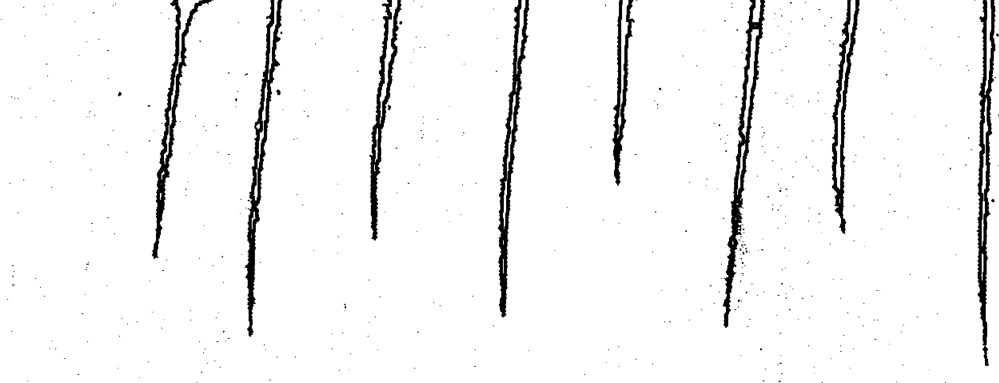

的建筑物即可，这也叫旗鼓相当。

有的楼房修建 [一个类似数字‘3’的简笔画] 这种形状，可在自己住的相应的方位上放一个大神医的像，家中可出大名医。

## 四十八、不管城市农村怎样防盗

用中药：防风、透骨草、琥珀、党参、仙鹤草各一两，用这几味中药，放在自己家中房子里的六煞位上，最好再托人从监狱里找一个死老鼠埋之大吉。

符一道

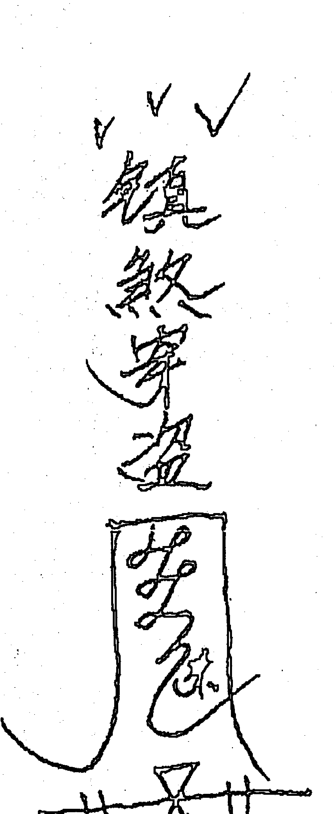

这道符用石板刻上，把药放在底下，底下先放死老鼠，最后盖上石板即可。

## 四十九、破解高压线法术

房子附近有高压线象蛇形影响风水，蛇形主怪异。

如果是女人住的地方有这样的情况，可得怪异之病

如果是男人住的地方有这样的情况，可出现多次车祸

化解的办法用中药雄黄3两，把药装在葫芦里不封口，再卖一个工艺品的老鹰对着电线放，因为鹰吃蛇就可以化解蛇形煞。

## 五十、破解灵车不走的法术

出灵车不走，坏两三次，这时就不能硬走，应该马上用此法术处理。

解决的办法：灵前供的供品，马上把它扬到道路上，用灵幡或哭丧棒住灵车的前车轮上敲七下，用青石6斤以上，埋在家的东北方，如果是楼房用黄布包上放在东北方的艮方，马上画二道符子：贴在屋里一道、门上贴一道。

### 符：

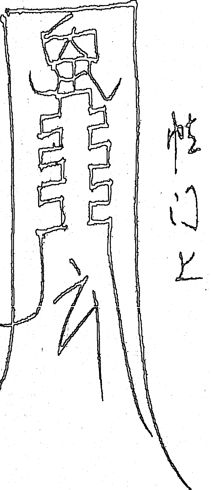

特以止

### 符：

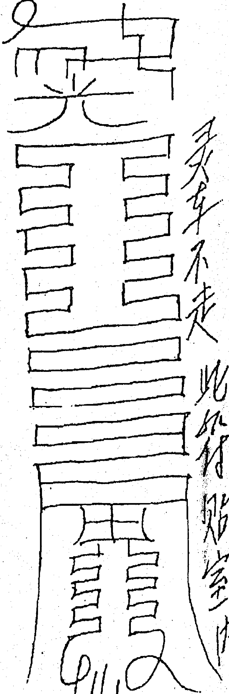

奏事不奏，此符封密室内

## 五十一、破解人死后嘴吐血的法术

有的人死后，嘴里往外吐血主大凶破财。此人可能有病时许过愿。这样需要念：“净口业真言”，这句咒要念一遍烧一张纸，应一连念十二遍。这句咒语其子女念。出灵后马上还愿，不然百日内破财或伤人之事发生。用两道符

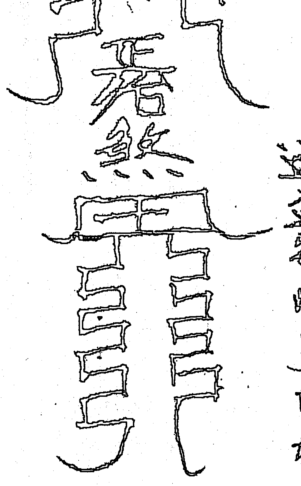

这道符贴在灵前

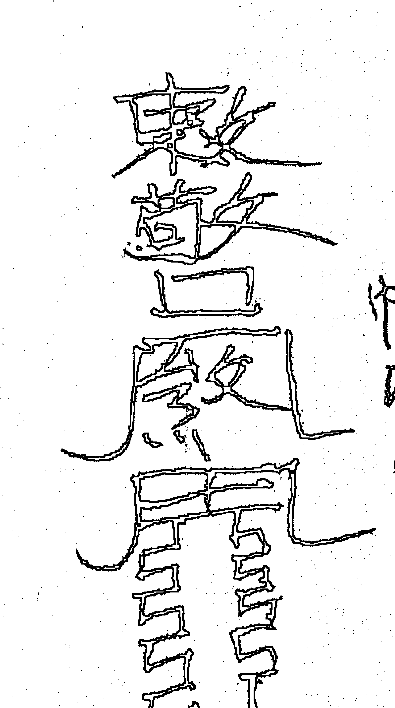

### 桃花上

## 五十二、如果有人死后，死人的脸还在笑，这一定是凶灾

法术方法：用七根草芯不管什么草都行。米七粒、水七杯，子女在灵前祭奠，具体做法，一根草芯和一粒米分别放在七杯水里，烧张纸，再把灰倒在水杯里，连续烧7张，放在7杯水里，在灵前祭奠，能化解这种情况，保佑其家人口平安。

### 用二道符

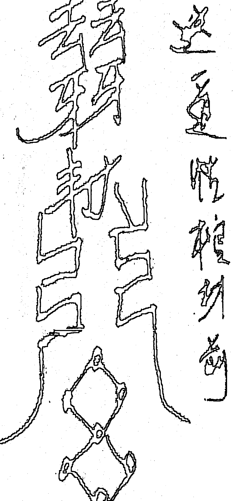

鼎新

中国人民

## 五十三、动物死在院子当中的破解法术

如某家中院子里蛤蟆不知道什么原因死在院子中或其他飞鸟类或别的动物突然到院子中死亡，预示着其家中要出大凶事或死人。

用中药：龙骨、辟殃砂、安息香各三两，用很古老的井水弄来倒在院中挖的坑中，等水消下去，再把三味药放在一个瓶中，埋在院中大吉。

## 五十四、别人家的房或大门或别的什么木头类，伸出一截像把剑一样对着自己的家，怎么办

这叫木剑煞，也叫木剑冲宅。用桃木板刻上“鲁班作用”用朱砂描上，再用一根锯条一条，斧头一把，对着对方冲向自己家的位置埋上即可。可保平安大吉。

## 五十五、地理探头山射门出盗贼

一是出小偷，二是被人偷（山头探向自己的方位或大门）

用大一点石头一块，刻上“玉帝”二字，用朱砂画上，在大门前对着探头山的位置埋上即可。如在城里，没有山，但有楼房像山一样冲着自己的住房，也一样叫探头煞或探头山射门。同样用石板刻上“玉帝”二字放在对方冲的位置即可。

（不管是配房还是主房）须改门，不在此方位留门。

如有路冲冲宅子的，不吉利。用120斤的大石头刻上“泰山”二字就可以挡住即可。（对着路的方向埋上即可）

## 五十六、如有的村庄有庙，对着自己的住宅怎么办

用大一点的石板刻上“玉清”二字埋在所对着的方向即可。

## 五十七、如有的坟冲宅，也就是宅子前或后，或左或右有坟对自己的住宅不利，怎么办

用石板刻上“摄气”二字，用朱砂写，对着那个方位埋之即可。

## 五十八、如有的房脊冲宅，或龙或兽冲宅怎么办

用青砖或其它石板刻上“乾元”二字即可。

## 五十九、大屋接小屋为火灾之宅或破财，或病灾

用120斤的大石头刻上“金龙”二字埋上即可。埋在小屋跟。

## 六十、有大房又有小房，中间有空，这样的住宅也很容易出问题

应在石板上刻上“天通”二字，埋在中间位置即可。

## 六十一、东屋比西屋高怎样处理

用青砖刻上“天元”二字放在对着的地方即可。

## 六十二、两边有大房，中间有小房怎么办？

用“冲天剑”挡住两边煞气，把自己拔起来，箭头向上。

## 六十三、赌博能赢的法术

的赌博高手的坟，每个坟上取下一小袋土，并且知道他的家名字，把这五个坟子上的土分别装在五个袋子中，不能合在一起，各装各的。用中药、丹皮、蛇退，鬼见愁这三样中药研沫合在一起分成五分，和五个坟的土（也就是一个坟上的土和一份中药用水合成泥，制成五个泥人，分别写上他们的字名，再用赌博人的手中指的血滴在泥人的心脏处，然后放在八卦阵中央。再准备裤子二条（自己以前穿过的）多准备金元宝、银元宝、香、纸，准备的越多越好。还有冥币、供桌必须有供品，鸡鱼肉、点心、酒等。让赌博人转，转一圈再跪拜磕头，这样一直下来共八圈。在反转八圈，在转圈的同时念咒：咒语：

> >要钱五鬼受我一滴血，受益终生，速赴吾身，随叫随到，漂洋过海，跟在我身，有事急指点，赌博场上不落空，拜通天教主鬼部，急急如律令，念七遍。

要烧金元宝、银元宝、冥币等灰凉时，把灰装在裤子里，放在家中五鬼方位，基本上就成功了，每次赢钱后，都要烧纸烧香，然后再把灰装在裤子里，装满后再换一条，最后又想再赌了，就用赢来的钱修一个五鬼庙供起来。（这个供桌要摆在一个单间里，不叫别人发现，要每天烧纸、上香、上供、敬酒）要拜49天。这个裤子也放在供桌旁。

## 六十四、制兄弟不合的符

符贴在屋内

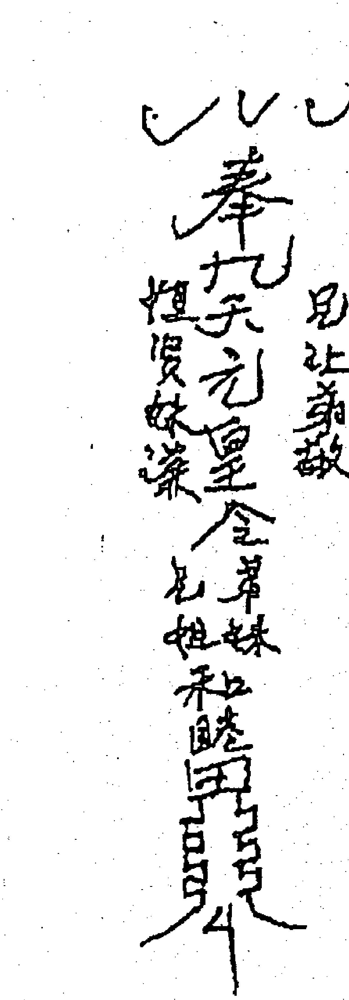

## 六十五、大龄男女催婚姻之法

用八宅法查六煞位（或用本人的桃花位），用瓶装上牡丹花，

无论真花假花七天浇一次水。

也可以在六煞方位画一张牡丹画，贴在那里也大吉。

## 六十六、有的人家里，母鸡打鸣

这种现象要出寡妇要死人。在鸡打鸣的地方，用仙鹤草、鸡血藤、地龙、金精、银精、沉香各三两，备好后用黄布朱砂写“龙凤相戏”写好连同准备的东西一块埋下即可。

## 六十七、冲撞女人经血的破解法

如有人故意将女人的内裤带有经血的沾在别人身上，叫别人倒霉，这样化解：

在手中写上“龙凤和合”四个字，手掐中指走出一百步不回头则吉。

## 六十八、关于让孩子学习好的法术

首先查文昌星的方位，用每年的年干去查

- 甲乙年文魁星在午丁方位
- 丙年文魁星在辰方位
- 丁年文魁星在卯戌位
- 戊己年文魁星在辰酉方
- 庚年文魁星在巳申方
- 辛年文魁星在子丑方
- 壬年文魁星在午方
- 癸年文魁星在未方

可以在这个位置放文昌塔，或文帝君之位，两边可以放麒麟一对，供香火或早科符带在身上。

文魁星的位置随年转，这样孩子学习会好，能考上大学。麒麟符烧化喝。考试符顺利符：

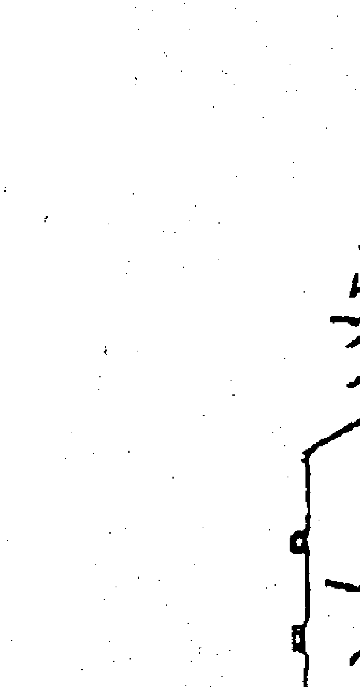

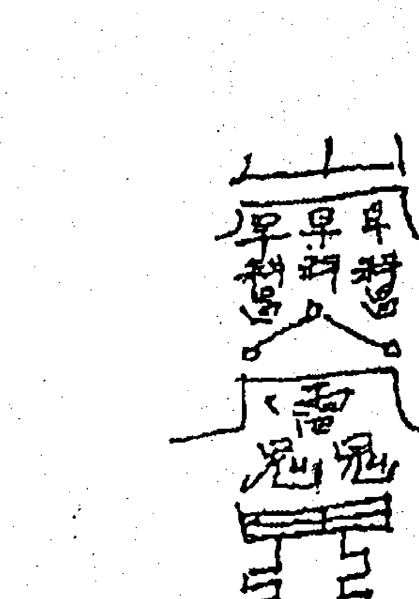

## 六十九、在学生临考试时可以具体这样做

上香烧纸摆供桌，供文帝君之位，学生亲自到场跪下，扣头，用香火熏完一道符依次顶到头上，依次顶完。用头顶的第一道符烧化放在水里让学生洗全身，用头顶的第二道符烧化放脸盆中洗脸，第三道符等学生出门考试走出门时可在门口烧化。

这些事做完后到十字路口（用罗盘找）在申方位给文帝星敬酒、烧香、供水果。

学生进入考场时自己在手心中写上“必中”，左右都要写，用自己的手指写，写完后用自己的大拇指掐住自己的中指指头，走进考场自己的座位。这时父母手掐中指，默念孩子的名字，念“必中”，如考试三天可连续三天这样做。

## 七十、平时学习很好，一到考大学时或考试时头就发懵的解决方法

首先用黄甲符,此符供奉

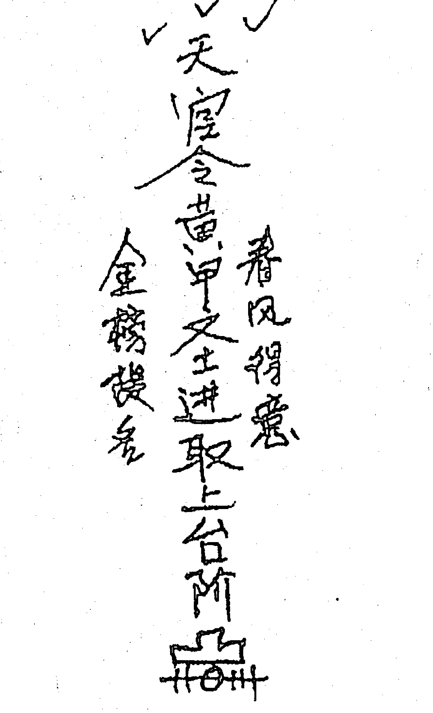

如果知道生辰八字以日干查，以年干查为主也可以。查供文帝君之位的方位。查法如下：

- 甲年甲日干在戌方
- 乙年乙日干在申方
- 丙年丙日干在午方
- 丁年丁日干在辰方
- 戊年戊日干在寅方
- 己年己日干在戌方
- 庚年庚日干在申方
- 辛年辛日干在午方
- 壬年壬日干在辰方
- 癸年癸日干在寅方

如 2010 年庚年或庚日干，可以把孔子的像供在申方，随着年干或日干的变化而供文帝君的位置。

苏子符在考试前烧掉

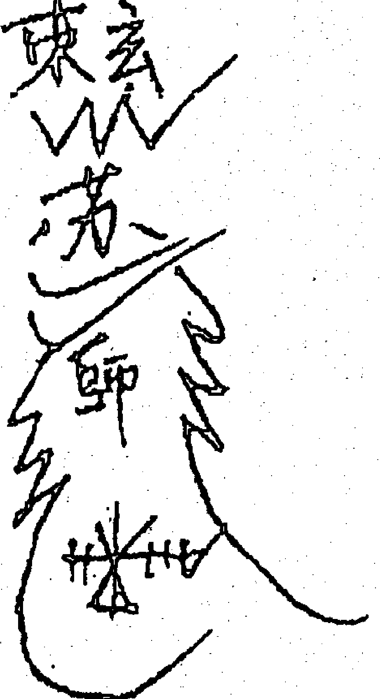

## 七十一、孩子不听话或不爱学习怎么办

具体做法如下：浪子回头符：

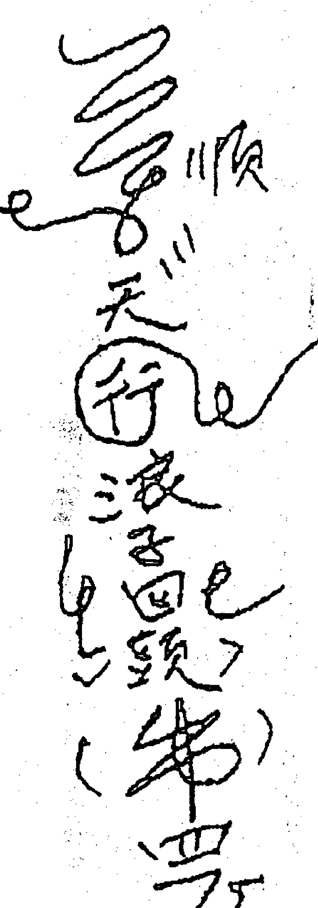

此符父亲画也行，母亲画也可以，就是有血缘关系的人画最好，半夜子时画。此符用黄纸朱砂画。

画两道，一道烧化成灰，放到水里让孩子喝下去，如果不喝想办法放在食物中叫他吃下去。

另一道符也烧化成灰，去当地土地庙香炉内拿一把香灰和这道符的灰合在一起，再用土地庙里的十个香根和这些灰一块用黄布包好放在这个孩子的枕头下或床下即可。

## 七十二、怎样改变家里不出大学生或考上名牌大学

想办法找到高塔座基下的土约 50 斤，取的土离高塔越近越好，再到横跨大江大河的大桥边的土 50 斤，白芝麻 3 斤，官桂 5 两，附子 5 两，把这几样东西混合在一起。

用罗盘在坟头顶上找出文昌星，也叫六煞文曲水的位置，根据坐山，在坟前修个塔（这个塔用 108 块砖垒起来）。

用使学生爱学习的符子两道，在坟头顶上压一道，以后这个坟头不能再放其它的东西。另一道符贴在家里或小孩睡觉的屋里也可以。这样就能出大学生或博士生。

如果没有塔（指学校），可在学校的文昌位竖旗杆写上状元，可用符子放在旗杆下。或者用孔子塑像下取的土撒到家中花盆里。

符子要小孩的父母亲自画，半夜子时。学校也一样，要学校领导画，黄纸朱书。

如果刻在大理石板和木板上也可以。此符放在塔一道。

[符咒图案]

## 七十三、孩子不听话的符

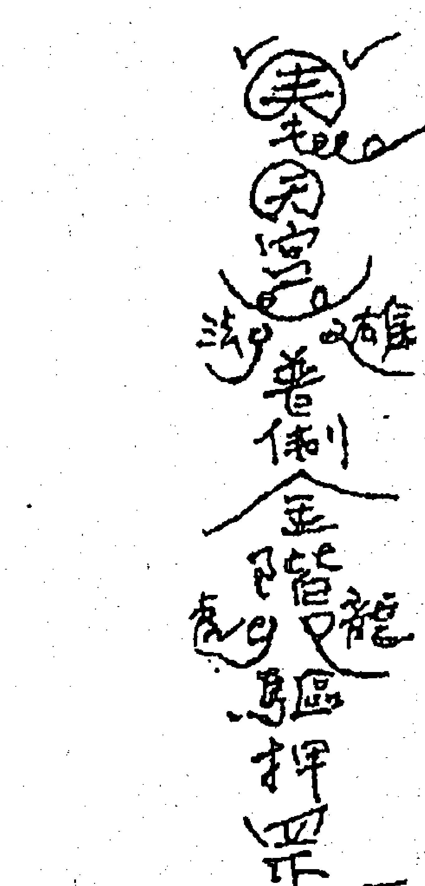

戴身上一道
贴在床下一道
另一道用土地庙香灰和烧化的符纸合在一起用黄布包好放在小孩的枕头即可。此符必须父母子时画。

## 七十四、求长寿之法

家族中年龄没有超过60岁以上，总起来是比较年轻就过世了，不是长寿人家。

用八宅罗盘里的父山父向之方法，用龙头龟四个，用在如图所示的方位上。

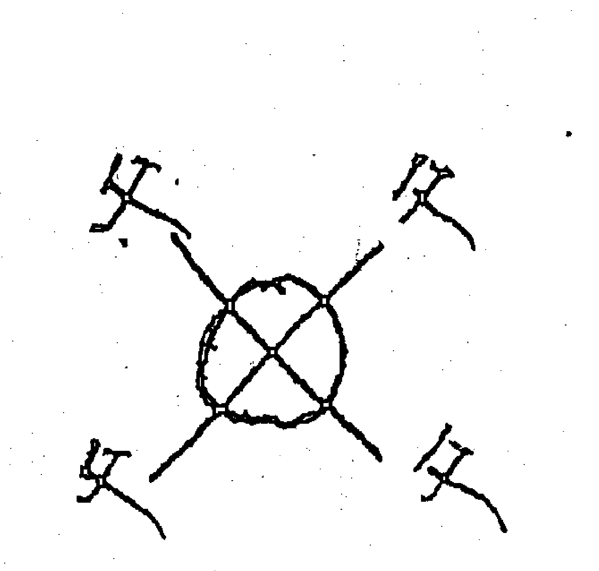

如果让母亲长寿，可在姥爷家的坟上使用此法。中药每个地方用仙鹤草九两即可。

另一法：用八斤猪骨头磨成末，分成四份合上黏土，制成四块砖，每一块砖上刻上一个“庚”字，放在窑里烧成砖。根据坟的向找一个长星位置放上。

每月找寅日，把四块砖放在四正位上（子午卯酉）每块砖下放仙鹤草九两，埋之，可烧香，烧纸叩拜即可，可长寿 80-90 岁。这几种方法也可同时用。

## 七十五、人过世下葬之后觉得下葬位置不合适需要另找地方

可在五七后再另行选地方安葬，这样可用人参、沉香、鸡血藤、硼砂、金钱草、金精、银精各三两（金精即桔花，银精即人参）。

八尺蓝布，八尺红布、八尺黄布。

从墓中用蓝布把棺材包起来，抬到新的墓地，放置妥当，再用黄布盖好棺材，新墓穴里放好中药，上面用红布盖好，再放棺材，上面用黄布盖好即可，蓝布可不要或丢掉即可。

## 七十六、墓地的坟长了树怎么办

用赤石、鸡血藤、白芨、山龙、仙鹤草、各三两。给树敬三杯酒，敬完之后把酒泼到树上，然后或锯掉或砍掉此树，再想办法把树根弄出来。把中药放到树坑里埋好，烧纸，烧香，敬酒即可，最好是黄酒。即可保平安。

## 七十七、盖房子不小心用了些阴宅的物件怎么办

阴宅物件包括砖土、死人的骨头、木材等。如果用了家里会出现口舌是非、官司、病灾、精神病、惊吓等情况。可用青砖或石板刻上“金刚”二字，应刻四个埋在院内四个方向，字朝里。

## 七十八、宅子或楼房遇到天堑煞怎么办

可用假山放此宅凶煞所对处，或上面放铜葫芦制天堑煞。

## 七十九、宅子或楼房对着大烟囱

对着这个方位放一个大砚台，也可放铜鸡。

## 八十、家中或楼房中北面有厕所使人生病怎么解决

用符、用中药，麻黄、硫磺、雄黄各三两，装在一个小盒中，木盒、纸盒都可以，把符贴在盒上埋在厕所边即可，如果是楼房可用黄布包起放在厕所边即可。

符：

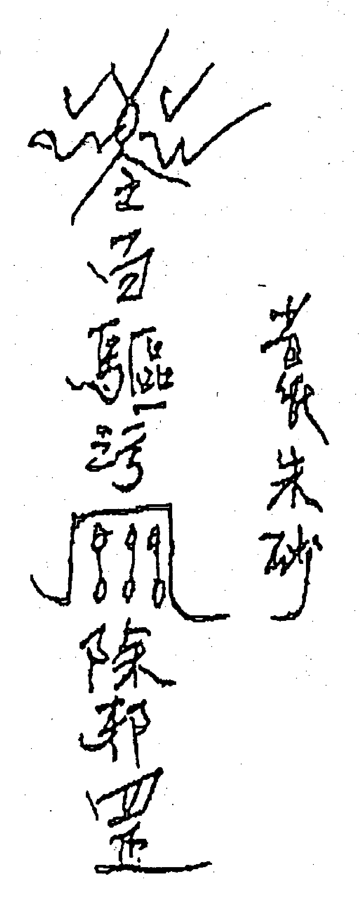

## 八十一、住房有“朱雀抬头”的情况怎么办

“朱雀抬头”也叫“绝命登高”就是住宅南方高，比北方主房高大。象这样的情况会出现口舌是非、破财、最重者会死当家之人，出人命官司。

可用青砖或青石板刻上“雷霆”二字，埋在院子中间。

解决的法术：在自己主房顶放上用桃木或石板刻上“延年武曲星君之位”，两边放上两条铜龙。“延年武曲星君”是宅子的宅神，需开光、烧纸叩拜，这样就不会出问题。

## 八十二、法术大师如何保护自己

用硼砂三钱、五雷护身符一道，在桃木板上写乙、丙、丁带在身上，要念五雷咒。

五雷咒：五雷五雷，步步相随，我有十万天兵，十万鬼兵，逢山山开，逢地地裂，孤魂野鬼那个不从，随我者生，逆我者亡，奉太上老君急急如律令，两手大拇指掐中指一会。

## 八十三、人被死人殃打了怎么化解

具体做法：在十字路上烧50刀纸钱，在死的人坟前坟后埋一道符，家里贴一道符，念咒语：普贤菩萨，救苦救难，超度亡灵，远离家乡，驱走祸殃，普贤菩萨律令。一连念十二遍。

(叫死人殃打了是指死人的气冲了一下而得病)用些符即可，也可贴在屋里，指第三道。

符：用黄纸朱砂画

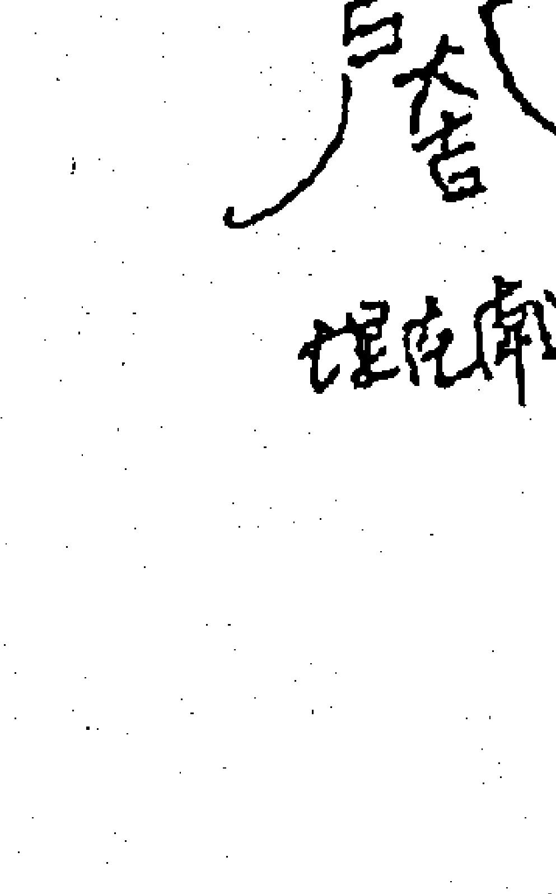

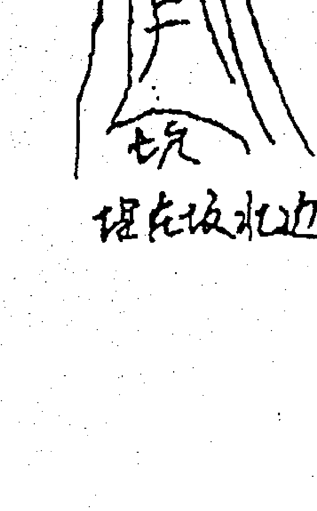

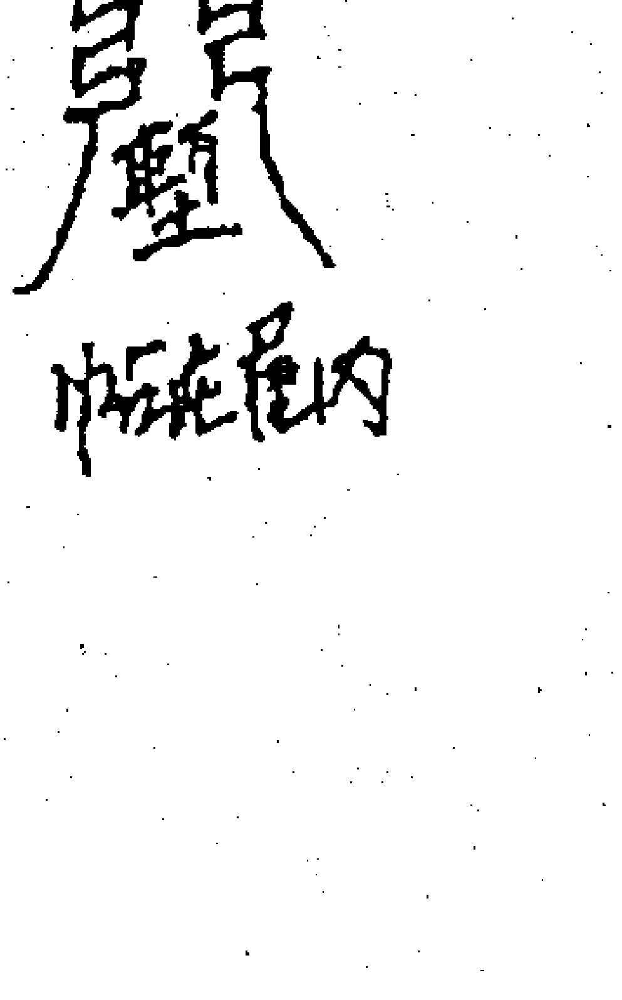

## 八十四、家中有邪气，或邪阴附身或晚上和鬼说话

可用一片渔网涂上黑狗血挂在门上即可，或晚上盖在身上也可以。这种方法可去很多怪异之病。

## 八十五、防止车祸发生的法术

用五帝钱、朱砂、大吉叶放在一起包起来放在佛堂里一段时间，

念咒语：真龙天子在此，万灵相助，一切凶神恶煞远去它方，吾奉玉帝旨令急急如律令，然后把五帝钱带在身上即可。开车的人把七香药带在身上，在出现情况的时候能免一死。

## 八十六、水箭煞冲宅子

可用“戊己天罡”刻在石板上放在其中有水冲宅子的位置即可。

## 八十七、让夫妻关系好的法术

如果男方来叫处理。就以男方为主来操作。剪下男人手指甲十个，女人手指甲十个，男人头发十根，女人头发十根，中药灯心草10克和头发指甲放在一起封好放在床底下。

假如男方是属大龙的，那么就去买一条龙，一个鸡都是铜质的最好。在红布上写上男方生辰八字的名字，女方也一样，用写好姓名的红布把龙和鸡裹起来放在床下和中药放在一起这样即可。大龙和鸡取辰与酉相合之意，指甲是十指连心，头发是结发夫妻。

## 八十八、男人不顾家，败家，乱花钱

可用青砖或青石板刻上“两东”用朱砂红描上，埋在大门口处即可，如果女人这样可用青砖或大理石板刻上“天遂圣后”埋在大门口即可。

## 八十九、贵人八卦阵，叫贵人帮忙的阵法

如果家有条件的话，可在家中三合（以生肖找）位放一个方桌，用黄布盖上，上面放龙头龟，12生肖，想求谁就把这个生肖的座下压上谁的名字，可求他，到门口烧纸。一百天之内可每天都做（尤其搞网络之人）。这叫贵人八卦阵（阴性的物质帮助你，这是一个很灵验的办法）。

如果中间的龙头龟不放，可放五个纸人。用自己的中指的血点五个纸人的心脏（纸人的鼻子眼睛都画上），按方位放上；用五个小碗装大米把五个纸人用牌位插上，这个叫五鬼八卦阵，叫它听指挥，五个纸人面向中间，中间放一个纸人面向自己屋中。到时可烧纸焚香，供果品、酒、鸡、鱼肉。叫哪一个指挥就把那个人的名字写上（用黄纸写）放在中间纸人的下面，喊他的名字叫他帮忙，拿钱来帮忙，他就听。

## 九十、楼房有人死去，别人知道卖不出去

首先把死人的魂送走，多烧金元宝、纸、香叫他到别处去按家，这样房子就好卖了。也可用催财符烧化，贴房里一道，带在身上一道。

## 九十一、卖车的法术

用地神助财通符两道，车前车后各烧一道，晚间在车头前烧点五色纸，供点米饭（米饭用油炒了）纸烧完了把碗打碎，打碎了就卖的快，打不碎就卖的慢。

## 九十二、租店铺的法术

店铺出租不出去，看其跟前有无煞，有煞先化煞。如有电线杆子用八号线锁住，不叫它发挥作用，就好出租了。

## 九十三、破解棺材煞

城市楼房下面的车库，往往由于地形等各种原因，修建成板材形状这叫板材煞，或别人修建的对着自己的住房对自己不利。解决的办法是卖3斤6两鸡血腾放在那个方位，上面放一只公鸡（铜质的最好）需开光，公鸡头上是要有冠子。这样处理就可把煞化掉。鸡血腾意义代表飞黄腾达，鸡上又冠又放在板上，这叫官上加官。

## 九十四、卖房子和楼房的法术

用下面两道符，半夜子时贴在门坎子上方，或藏在门坎下边即可卖出。再门口烧两道符。

敕
令
地神助成速得令罡
黄纸朱笔

口
口
口
尸
鬼
急
如
律
令
黄纸墨书

口
口
口
口
口
口
弓
甲
歹
白纸黑书

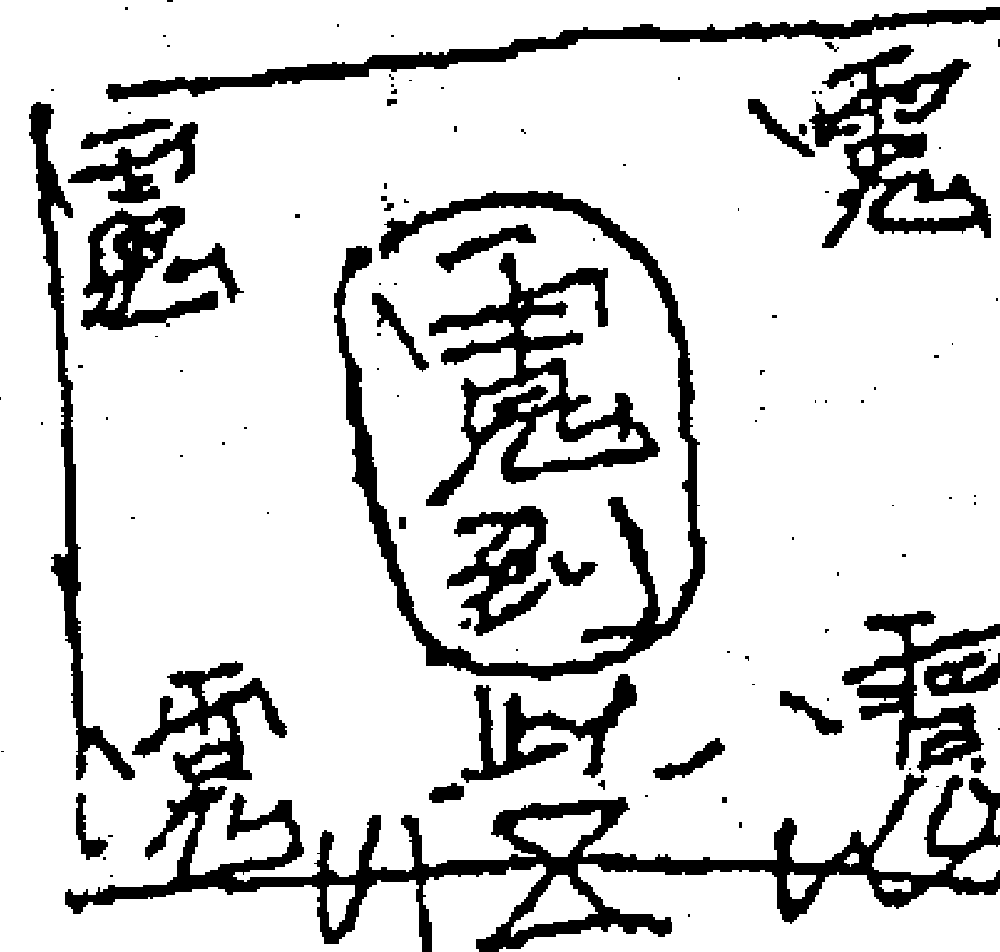