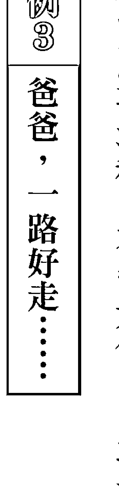
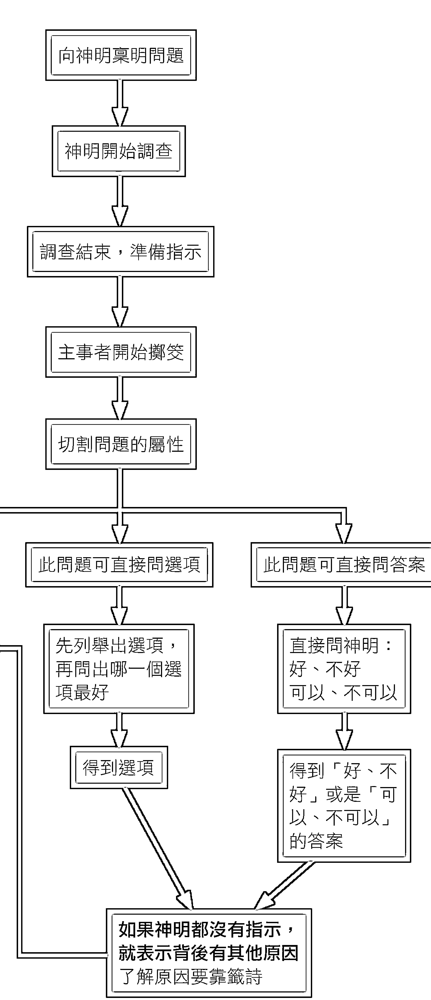
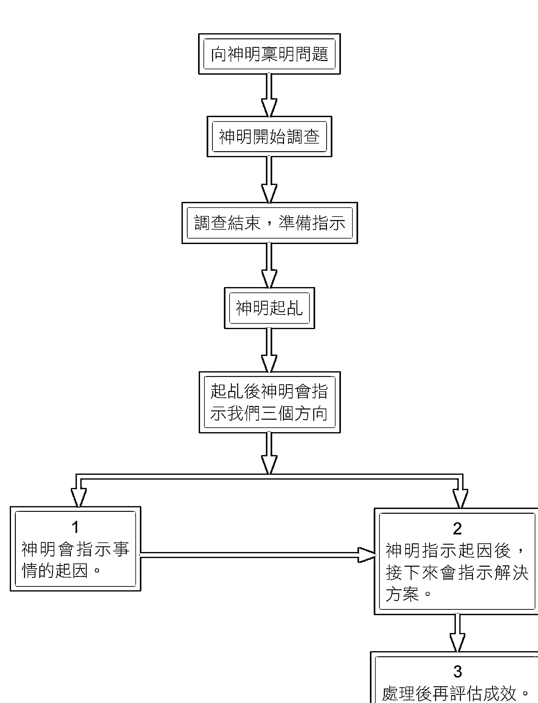
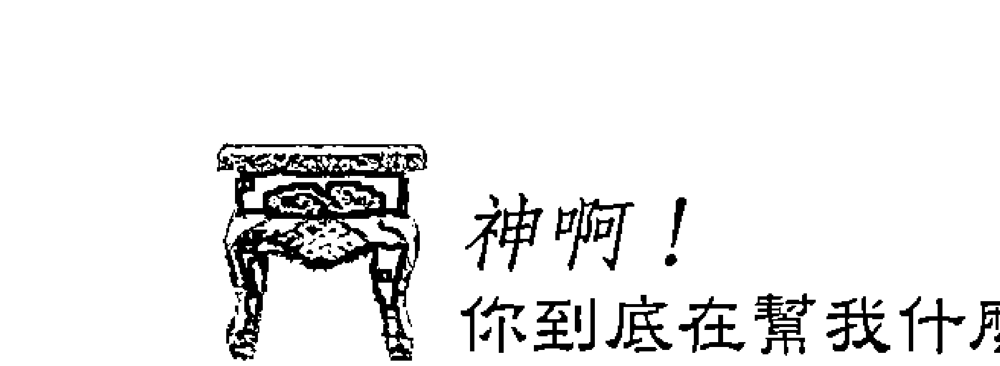

# 神啊！你到底在帮我什么？

作者 王崇禮  
美編 吴佩真  
文编 王舒仪  
主编 高煜婷  
总编辑 林许文二  

## 好評推薦

令人惊叹！一本教你如何掷筊、抽籤詩、托梦、起乩的实用手册  

无论古今中外，宗教信仰乃是人类历史发展上的共同现象，这是由于人类的三个「有限」所致：其一是生命有限，即自古而今无有长生不老之人；其二是能力有限，即无人可独力解决世间所有的问题；其三则是智慧有限，即无人能凡事均前瞻宏观。自古以来，就是因为这三个有限，使得人们不得不去求助无所不能的神，希望在神的指点迷津下，消极方面可以消灾解厄，积极方面亦能因此而获得大富大贵。  

不过，委实而言，宗教与人类社会的发展息息相关，其中所涉及的范围甚广，如从经验与理念来理解，至今已有一「科际整合」（又称为跨领域研究）的态势，举例来说，宗教的学问事实上就包括有：宗教政治学、宗教社会学、宗教心理学、宗教伦理学、宗教经济学、宗教医学、宗教哲学、宗教科学：：：等等。显而易见的，如果大部分的人在面对宗教  

彭坚汶，昆山科技大学通识教育中心教授  

## 神啊！你到底在帮我的什么？

时，无论在主、客观上都能以「智信」、「正信」而非「迷信」视之，其影响力之大，是无人可以轻易忽视得了的。否则，何以各宗教的信徒至今仍如此众多且源远流长？  

当然，宗教也不是真正的万能，其中毕竟有许多可理解以及不可理解的限制──就如同科学仍然无法验证及解释诸多宗教现象一样。即使如此，有些宗教哲学家在多年研究后，会真诚的指出，宗教虽然至今仍是一系列尚未可被完全普遍验证的假设，但只要其是「与人为善」，信仰就是一种「善的力量与行动」。  

然而，由于时代的变迁，尤其是种种「先天不足」与「后天失调」因素的影响，再加上管理上的长期疏忽，宗教信仰渐渐衍生出许多社会问题，如假藉宗教名义来敛财，甚或是骗色等，已达人神共愤的地步。  

以宗教与医学来说，不可否认的，国内宗教仍充斥许多偏差的医疗行为，即信众生病多不求助进步的现代医学来治疗，反而只以庙中求得的「药签」来抓药医治，结果往往因此而导致病情恶化，甚至进而造成死亡之案例出现。家属若诉诸法律、控告寺庙神明，法院也会因为被告是神明而拒绝受理。由此可見，健全宗教的医疗管理，对国民的健康保障而言，实已到了刻不容缓的程度。  

王崇礼教授虽是留美博士，并且修读严谨的社会科学，但是因其有特殊的因缘而投入宗教的善行，实令人惊叹。今编写的《神啊！你到底在帮我的什么？》一书，乃是从事许多真实的故事与个案出发，深入浅出的指引信众该如何正确的运用掷筊、起乩、托梦、籤詩来  

## 你知道神在为我们做什么吗？

与神明沟通，相信这本书不但会受到信众普遍的欢迎，也会使他们对道教的信仰有更正确的态度。  

有幸拜读王教授普渡众生的大著，感恩之余特为之序，并恭祝其「大智」、「大悲」、「大愿」能大行于民间社会。  

《神啊！你要怎么问你问题？》是王崇礼教授继《神啊！我要怎么问你问题？》后的又一伟大力作  

《神啊！你到底在帮我的什么？》是王崇礼教授继《神啊！我要怎么问你问题？》后的另一本力作；这本书主要分为二大部分：首先介绍吴平和师父创建尧天宫的因缘及其过程，以及王教授跟随吴师父的因缘；第二部分则详细剖析神明到底在帮我们什么，及其帮我们的主要方式（掷筊、起乩、托梦、籤詩等）。  

吴师父建宫之过程，及其为实践服务众生之职志所经历过之情事，似孟子所云：「天将降大任于斯人也，必先苦其心志，劳其筋骨，饿其体肤，空乏其身，行拂乱其所为，所以动心忍性，增益其所不能也。」─今幸闻尧天宫现已购地，准备筹建大庙，期能为更多信众解决问题，职期望藉由本书之出版，集与认同尧天宫济世理念者之力，让筹措建费及建庙过程能顺利完成，延续并扩大其服务众生之职志。  

如果我们想明白神到底在帮我的什么，应先了解神明可用哪些方式来帮我们。书中言及常见之方式如掷筊、起乩、托梦、籤詩等四种，唯任一方式皆有其功能与意义，至于神以何种方式来为信徒解答或解决问题，则依问题之需要及其复杂度而定。  

以掷筊来问事时，神明会以筊的翻动配对情形来表示好或不好、可或不可，以及对或不对，因此，如果以此方式问问题，我们要先学习如何『问神问题』；如果以起乩的方式来办事，则表示案情较错综复杂，无法以掷筊之方式来回答，而需以此方式来告知事情的原委及如何解决；假使以托梦来应对，表示神要以『垂象』告知有关之天机、或告知当事人可怎么做、或提醒当事人可能遗忘之陈年旧事、或预知即将发生之情事；要是以籤詩方式来呈现，表示以掷筊无法说得透彻，或者答案是在好与不好、可以与不可以，及对与不对之外时，才以此方式呈现。本书中还以大量的真实案例，来说明神明如何以不同的方式解决不同之情事，值得我们细细体会神是如何帮助我们及告诉我们事情的详细原委。  

此时正值尧天宫筹措建费及建庙之过程，王崇礼教授之第一本力作《神啊！我要怎么问你问题？》出版后，即受到社会大众之热爱，更值得一提的是，王教授将此书所得之版  

## 你知道神在为我们做什么吗？

税全数捐赠为尧天宫建宫之资金，更令人折服。今王教授再推出《神啊！你到底在帮我的什么？》，依旧秉持第一本力作之精神，希望能藉此帮助更多需要帮助的人。于此，职呼吁认同尧天宫理念之信众，或是愿意拔人苦、予人乐之菩萨，能购买此书并推荐之，将正确的宗教观念，传达给更多的人知道。  

在台湾本土文化中，「求神拜佛」是非常普遍的风俗习惯，不论婚姻、事业或生病，民众习惯到寺庙中掷筊求签、寻求协助。在读完王崇礼教授所撰著的《神啊！你到底在帮我的什么？》之后，才了解神明对信众的慈悲与协助，是广泛与无私的。  

信众常问：「神到底能不能帮我的？能帮我的到什么程度？」从书中所举的例子来看，很明显地，神明对信众的协助既无所不包，亦不求回报；但祂却不要信众过度依赖祂，例如生病还是需要先看医生，不可以一味地依赖神明，切勿一开始就怀疑病情是其他不可知的  

蒋丽君，成功大学政治学系副教授  

## 神啊！你到底在帮我的什么？

因素所导致；要是医疗真的无法医治或医治后仍未见效果，此时再寻求神明协助，神明本着慈悲为怀的态度，定会全力相助解决问题｜｜这样的观念是非常重要的，且能避免信徒因为过度依赖神明而延误就医，导致病情恶化。  

在《神啊！你到底在帮我的什么？》中，王教授传达了一个重要的观念，那就是「相信神明但不迷信」，这正是台湾目前所需要之正确的宗教信仰观念！  

为了写这篇序，我特别在晚上去了趟尧天宫。见到尧天宫时，我其实有点惊讶，那是位在巷弄民宅间的一间朴实寺庙，没有喧哗吵杂的声音，亦非金碧辉煌的宫庙。唐朝刘禹锡曾言：「山不在高，有仙则名；水不在深，有龙则灵。」而尧天宫给人的感觉，即是庙不在大小，有神明则兴。走进庙寺，刚好看到有信众在掷筊问事，旁边有一位长者耐心地协助她，我不禁好奇地多看几眼，也想起王教授书中所言，信众透过虔诚掷筊求签，其背后的原理是可以合理解释的。事後看到那位信众如释重负的开心表情，不禁心想，宗教的影响力真是难以估算！  

一间具有正确信仰与真诚态度的寺庙对虔诚信徒的影响，不只是精神层面，也包括其态度；它能让信众了解神明的慈悲与神力，又不至于使信众迷信而变得消极。看到信徒在掷筊过程中时，那位长者耐心协助她问问题，让我又想到王教授书中所言｜｜请求神明帮忙的先决条件在于要「会问问题」，问对问题，神明才能正确地协助信众解决问题。  

王教授在书里提到：神明到底在帮我的什么？如何帮我的？这一切就从问问题开始，而后再是一连串神明对信众的帮忙，只要问题是清楚与明确的，神明就会尽力协助有缘人。在《神啊！你到底在帮我的什么？》中，王教授举了无数的实例来佐证神明的慈悲与法力，不管神明是用何种方法，如掷筊、起乩、托梦、籤詩：...，都是在让人相信神明对信众的无私协助。虽然我不认识王教授的师父──吴师父，但是从王教授虔诚与坚定的信仰态度与协助信众解惑之无私关怀，相信吴师父亦是位慈悲无私之长者，所谓「一名师出高徒」，我衷心地期盼尧天宫在两位虔诚无私的师徒带领下，除了能帮助信徒顺利解决问题，也能带动信众对神明问事、掷筊求签之正确态度。  

最后，诚心地恭喜王教授新书完成！为协助信众，在教务百忙之中，仍拨冗完成书籍的撰写，真的不是件容易之事。相信《神啊！你到底在帮我的什么？》定能让民众更加了解神明的意旨与慈悲，更清楚要如何与神明沟通，期能更接近神明，让自己心灵更加安稳。  

有缘阅读此书之读者，遇到问题时，不妨到尧天宫走一趟，或许你心中的疑惑便能就此解开！  

+   Q3 该怎么分辨病痛是单纯的身體問題或另有原因？  
Q4 问事一定要本人亲自前往吗？代替亲友们问事，是否会觉得不準？  
Q5 有没有哪一位神明问事特别準？  
Q6 事情解决之后该如何感谢神明的帮忙？  
Q7 如何判断家里面的精神位有沒有問題？  
Q8 聽人說天機不可洩漏，真的有連神明都無法透露的事嗎？  
Q9 聽說女生在月事期間不能去廟裡拜拜，問事也有這樣的禁忌嗎？  
Q10 现在很流行網路问事，真的有效嗎？  
Q11 该不该相信註定命中無子、無婚姻、無健康這種說法？  
Q12 真的有所謂的求壽或以壽換壽嗎？若神明指示親人陽壽已盡，是不是就無可挽回？

## 神啊！你到底在幫我什麼？

我期待，本書的問世能讓全國對於「夢境及解夢」有興趣者，以及想學習「解籤詩奧妙」的人，作為參考依據。

最後，希望讀者在看完這本書之後，對堯天宮、對宗教有更深入的了解，以期現在或將來遇到問題想求助於宗教的時候，心裡面已經有正確的解決觀念與辦法。也希望讀者看完這本書之後，可以了解到三個重點：

- 第一、了解神明的立場跟我們的立場有什麼不同。
- 第二、了解神明在看一個問題時，跟我們看問題的角度有何不同。
- 第三、了解神明給我們的答案，為什麼跟我們當初所想要的答案不同，其背後的邏輯又是什麼。

讀者一旦了解這三點，就可以了解神明的苦衷到底在哪裡。只要了解神明的苦衷，當然就可以知道神明到底在幫我什麼，也更可以明白我為何「顛簸半生皈依明主，自渡而後渡人」。

## 打通問事的任督二脈

## 給讀者的話

三十幾年來處理過大大小小的疑難雜症，我從當中發現，每一個來問事的人背後，幾乎都會有一段辛酸且不為人知的故事。有些人因為尋求宗教途徑來解決困境而散盡家產，最後的結果卻是妻離子散，甚至家破人亡；有些人因為偏聽偏信，人云亦云，最後不但沒解決問題，甚至還禍及子孫：：：當這些人最後來到堯天宮尋求解決之道時，他們對宗教的信心──尤其是對道教的信心，早就已經所剩無幾了。所以，這些年來，每當夜深人靜之時，我總是會把信徒所發生過的遺憾事，再作一個深入的統計與分析。最終我歸納出兩個主要原因：

## 第一、大部分的人之所以會偏聽偏信、人云亦云，大多是因為不了解「神明到底在幫我們什麼？」──這個「問神」的核心精神所致。我相信，如果大家都能夠了解這個道理，自然會對道教有更深的認識，甚至能有更正面的觀感。相對的，受騙的事件也會減少許多。問神是一門非常深奧的學問，必須經過有系統的教學過程，與一連串邏輯上的思考訓練，再加上經驗的累積，才能夠把神明的意思完全表達出來。要做到這個境界，首先就要洞察與領悟「神明的思維」，就某種程度而言，「了解神明的思維」是一個至關重要的橋樑，這個橋樑緊緊地連接著「問事的準確度」跟「問出解決方案的有效性」，換句話說，只要能夠了解神明的思維，就能接近打通問事能力的任督二脈了。《神啊！你到底在幫我什麼？》這本書中的每一個章節，皆是以神明的思維所撰寫，如果你想要進一步提升自己的問事能力，那這本書非看不可。

## ①只想聽好話的心

我有必要告訴大家神明最擔憂的四種心是什麼，這一「四心」就是：

需要注意，這也是神明最為看重的一點，正是因為這四種「心」的阻礙，才會使問事的困難度增加好幾倍，就算是神明極力想要幫我們，能使出的力量也有限。為了使全國讀者能夠再精進問事的能力，

## ②自己永遠不會有錯的心

正所謂忠言逆耳，如果神明查到事情的真相錯在於你，而你偏偏無法接受自己做錯的事實，依理，祂們也會有所顧慮。只說好聽的話安慰你，並不是宗教濟世救人的根本精神，也對解決問題絲毫沒有幫助。

當神明指示出來的答案不合你意，就惱羞成怒、大肆指責，如此一來，就算神明想要告訴你真相，也會讓你失去信心。這種情況，終究會讓你自己陷入更深的困境。

## ③不疑的心

既然心中已經有了答案、毫無疑問，那又為何要來問神？會來問神不就是因為心中有疑惑，想祈求神明指引方向嗎？請想一想，萬一神明指示的答案跟你心中所想的不同，你會選擇繼續堅持己見，還是接受神明給的答案呢？如果繼續堅持己見，那來問神明不就是多此一舉？既然會對神明的指示產生懷疑，就算神明真的有更好的答案要告訴你，你也一定聽不進去。

## ④隱瞞事實的心

一明明有做，卻在問神的時候說沒做——這種情形最容易增加問事的困難度，也會降低解決問題的成功率——特別是曾經做過一些「不為人知」和「有損陰德」之事的話。堯天宮百分之九十都是以擲筊方式在請示神明，如果沒有「承認」的勇氣，不僅很難幫你問出問題出在哪裡，還會浪費很多時間。如果是真心想尋求解決之道，就必須先要有一顆懺悔及坦誠的心。神明是慈悲的，只要有坦承的心，祂們一定會盡力幫你走出困境。

舊固執地怪罪於別人，事情就不好辦了。我的角色是在傳達神明的意思，不可能讓「你明明做錯事而我卻硬說你是對的」這種事發生，所以，一旦當事人繼續堅持錯在對方的話，神明便極有可能因為顧慮當事人的情緒反應，而不再繼續指示下去。這種堅信自己永遠不會有錯的心態，會使得問神變得沒有意義——因為缺少了反思心。

## 我所待的堯天宮

在寫《神啊！我要怎麼問你問題？》的時候，很多人常會問到堯天宮的故事。所以，這一部分將談到堯天宮的由來，包括吳平和師父的過去，到成立堯天宮的點點滴滴，以及我如何接觸堯天宮的因緣。

### 堯天宮的由來

創辦人吳平和與堯天宮的故事

民國三十年代雲林縣口湖鄉的蚶仔寮│一個很窮困的縣市│住著一位名為吳平和的十七歲年輕人。身為家中長子，他必須為了生活一肩挑起全家的生計，所以在民國五十一一年離開故鄉，隻身一人南下高雄奮鬥。

### 背負全家生計，隻身南下找工作

第一次來到高雄，是為了請姑丈幫忙引薦適合的工作，可惜並未找到，只好動身回故鄉。幾個月後吳平和第二次南下，才順利在高雄前鎮一間名叫茂發木業的公司找到工作，這是他隻身到高雄的第一份工作，當時一天的工資是台幣十八塊錢。

在茂發木業待了兩年離職後，他前後任職於金義發木業和老義發木業，最後則被東南亞木業挖角過去。在那時，他一天的工資已經升到六十塊錢以上了，同時間最資深的同行

### 經營生意，體悟「認識」二字

老師父，一天的工資也只有三十五塊錢，所以吳平和的收入算是非常不錯，加上那個時代一斗米也才一、二十塊左右而已，所以生活非常穩定無缺。

之後，吳平和就一直待在東南亞木業，就連入伍當兵，然後退伍，他仍舊選擇回到這家公司繼續任職。民國五十七年的閏七月二十四日與李月書結為夫妻，婚後就住在公司分配的宿舍裡，一直待到民國五十九年才正式離職，那時吳平和二十六歲。

由於先前有過木業公司的經驗，夫妻倆在吳平和離職後，開始籌備做木材的生意。父親吳火龍知道他要經營木材生意，就到當地位於金湖舊港邊的一間萬善爺廟求一支令旗，交代他要把令旗拿到高雄供奉起來，說是可以保佑他的木材公司生意興隆。當時的吳平和其實非常鐵齒，根本不相信任何神明，但為了尊重父親的一番好意，也只好答應把這支萬善爺的令旗拿回高雄。因為當時夫妻倆所住的房子是租來的，無法隨意亂釘，只好找來一個櫃子隨意釘上架子，再把令旗放上。

從民國六十二到六十四年，他們的木材生意前後經營了三年，每一年不是會錢被倒，就是貨款收不回來。到最後，夫妻倆經營的木材生意，終究宣告失敗。

生意失敗，心情自然是非常沮喪，他們全家陷入愁雲慘霧之中，生活困苦到一天只

### 巧遇台南金府千歲指點迷津

雖然生意失敗了，但吳平和從未虧欠朋友或是生意夥伴一毛錢，因此相當受到大家的信任。當他們得知他生意失敗之後，都紛紛前來鼓勵他，甚至還有人想找他合夥做生意，協助他東山再起。一天，正好有一些剩餘的貨款還未向台南一位楊姓友人收回來，他動身前往台南收貨款，收完貨款後，就與友人在門口聊天。

剛好，楊姓友人的家中正在向台南的金府千歲請示一些事情。那時，金府千歲講的是北京話，大家都聽不懂，只有幫忙翻譯的桌頭①聽得懂。忽然，那位桌頭開口詢問現場的人：「門外有沒有一位弟子姓吳的，金府千歲有話要跟他講。」當時，門外只有吳平和一個人姓吳，所以他立刻回應了那位桌頭。

等到金府千歲講完之後，桌頭靠近他耳旁，小聲地問：「金府千歲說，你最近孩子往生，事業賠錢，諸事不順。有沒有這回事？」

「有。」他回答。

金府千歲接著繼續指示：「你家裡面以前是不是有供奉一支萬善爺的令旗，現在不見了。你知道去哪裡了嗎？」

「就被老鼠咬走了啊！」

「不是，」金府千歲說：「現在這支令旗已經飛回去萬善爺廟了！你現在住的那個地方屬於陰地，令旗所帶來的兵馬有限，抵擋不了，所以只能飛回萬善爺廟了。我話已經說完，你現在趕緊去找大神幫你處理吧！」

聽了金府千歲的指示後，吳平和的心中可說是一團混亂，他回答祂說：「弟子不知道什麼叫做大神，也沒看過什麼大神。我的事既然祢能夠說得那麼準，那祢就是大神。請金府千歲幫我處理吧！」於是，金府千歲就答應到家中幫忙處理這件事。

當一切都處理完之後，金府千歲接著指示：「家中的事已經幫你處理好了，此外還有一件事要跟你說。在金湖萬善爺廟裡，有一尊神明跟你有緣，祂要讓你供奉。如果你不信，可以親自去萬善爺廟一趟，一切就會真相大白。」

### 住久就是你的，無殼蝸牛買下房東的租屋

買下房子之後，吳平和當然沒有忘記曾經對五萬善爺許下的承諾，於是就換了一張比較大的神桌來供奉五萬善爺。

有一天，許多朋友和事業上的夥伴到吳平和家中泡茶聊天，其中一位朋友問：「老吳啊，你拜的這尊是什麼神？」

「是萬善爺啊！」吳平和簡簡單單地回答了一句。

「那有沒有很靈驗啊？」

「不會靈驗啦！只是用來裝飾好看的啦！要讓我相信祂很靈驗，那也行。我的要求是：第一，找一個從來沒有讓神明附身過的人，第二，這個人要不認識字，然後萬善爺降駕，讓這個人可以寫出字來，這樣我才相信祂靈驗。」

又過了一陣子，吳平和的建築事業依舊順利的進行著，當時他剛好看上鳳山一塊不錯的土地，後續洽談也都沒什麼問題，萬事俱備之下，很快就決定要簽約了。簽約的那天早上，朋友開車來接他一起去簽約時，吳平和的肚子卻突然痛了起來，甚至痛到不能走路！

朋友一看，非常緊張：「怎麼早不痛，晚不痛，偏偏在要簽約的時候痛？沒辦法，只好把簽約的日期再延個幾天了。」

### 神明爐起大火

就在此時，五萬善爺的神明爐忽然起了大火，只差一點點，就會燒到神明的鬍子！吳平和趕緊拿一碗水，往神明爐內澆下去，在看著火熄滅的同時，心裡暗想：「好險，差一點就燒到神明了。奇怪，神明爐怎麼會忽然起火？以前都沒發生過這種事情。」於是在，他決定請示五萬善爺，問問神明爐起大火的原因。

五萬善爺當下就指示：「弟子，你之前說我五萬善爺不靈驗，只是擺著好看而已。還說如果五萬善爺能降駕在一個從沒讓神明附身過，而且又不認識字的人身上，讓此人可以寫出字來，我才相信我有靈驗。那好，弟子，我答應你的要求。你去找一個這樣的人來，我要靈驗一次給你看。」

結果，隔天真的找來一個從沒被神明附過身，而且還不認識字的人。過了不久，五萬善爺就附身在他身上，並開始在神桌上寫字。才剛開始寫了一個「萬」字，吳平和馬上開口問：「是不是萬善爺？」

「是。」那個人回答。

圍觀的眾人很驚奇地看著這個不識字的人開始寫字，接著他又寫了「地」這個字。吳平和緊接著再問：「你寫『地』這個字，是不是在講弟子要簽約那塊土地的事？」

「是。」

「啊土地是怎樣？是可以很順利進行的意思嗎？」

這次那個人寫了「不是」。

「還是說土地有問題，不能去簽約是不是？」

這次則寫了個「是」。

一看到這個結果，年輕氣盛的吳平和馬上大聲說：「我不相信啦！土地的事又不是祢萬善爺的專業。這塊土地是經過縣政府和一個很有名的建築師申請的，大家都說沒問題，只有祢萬善爺說有問題，我不相信啦！」

這時，五萬善爺又繼續寫：「十月六日、十月六日、十月六日。」不停地寫著這個日期。

只不過，一來大夥兒根本不相信五萬善爺所講的話，二來是不知道十月六日到底是代表著什麼意思，所以仍舊不管三七二十一地簽了這張合約。

過了幾天，當吳平和要去縣政府申請建築執照的時候，縣政府卻向他表示這塊土地有問題──少補了一個「路界中心樁」②。最後，因為「路界中心樁」拖到十月五日才補上，所以吳平和一直等到十月六日才領到建築執照，仔細一算，這塊土地足足延遲了六個月才完成正式的程序。

在領到執照的那一瞬間，吳平和內心萬分感慨的說：「如果早在半年前就聽從五萬善爺的話，先仔細地去了解那塊土地到底有什麼問題，今天就不至於白白浪費這半年的時間了。」

此時，吳平和的心裡面才開始對五萬善爺產生一種敬畏之心。

> ②豎立於道路中心之樁，即「道路中心線交點和起迄點所設立的樁位」，如果兩個交點間的距離太長或因地形變化而不能通視，可於中間加設中心樁，以供都市計畫區內指定建築線及公共設施分割測量之依據。

## 35

## 水已落地難收回，神明降旨要開宮

隨著事業的成長，吳平和形形色色的朋友也愈來愈多。有一次，三五好友在家中泡茶閒聊時，忽然有一位朋友提出一個建議：「老吳啊，我家也有拜很多尊神，但從來都沒有降駕指示過我什麼事情。找個時間我們來試試看，看能不能像你家的五萬善爺這麼靈驗。」

「好啊，要試就來試啊！」吳平和很乾脆的回答。於是大家就選了一天，一起到那位朋友家中，準備請他們家的神明降駕。

傳統有一種請神方式，是找兩個人拿著一頂小神轎，一個人各拿一邊，神明降駕之時，有時候會附身在人身上，有時候則會附身在那頂小神轎上，不管是附在人或轎上，那頂小神轎都會在桌上寫字──這一天，他們就是用這種方法。隨著時間一分一秒地流逝，神明始終一點動靜都沒有，後來那位朋友開口了：「老吳啊，我看由他們拿著都沒有辦法讓神明降駕，要不然，乾脆你來扶一下好了。」於是，吳平和便過去接手，扶著這一頂小神轎。

過了沒多久，吳平和彷彿觸電似的，整個人開始發抖，他心中一害怕，就把這頂小神轎放下來，跑回家了。後來，這種情形還持續發生過好幾次，不論是到那位朋友家中，或是到別的地方，甚至在家中坐著休息，身體還是會像乩童一樣不自主地開始發抖。

神啊！你到底在幫我什麼？

36

## 神啊！你到底在幫我什麼？

這樣全身發抖的情形一直持續了好一陣子，直到有一次，一位朋友請了一尊來自嘉義東石鄉，一間名為『笨港口港口宮』的天上聖母（開基三聖母）來幫忙處理家裡的事情，才有進一步的發展。那時，吳平和的太太李月書因為覺得很好奇，也跟著他一起過去看熱鬧。她一到現場，幫港口宮天上聖母翻譯的桌頭忽然跟她說：『三聖母指示，妳家裡面所供奉的萬善爺，有很多話要跟你們夫妻講。』於是，吳平和夫妻倆就邀請大夥兒到家裡來，看看五萬善爺到底有什麼話要講。

把大家請到家中後，夫妻倆很仔細地聽著五萬善爺指示：『弟子啊，我來到你家也已經有一段時間了，家中所有大大小小的事情，我都一清二楚。我甚至上天庭、入地府，去查你的八字跟壽命。根據我所查的結果，你的八字可比銅牆鐵壁，壽命就好比萬里長城：：：如果你真的適合當乩童，我五萬善爺自然而然就會附在你身，只是你的命格根本不適合當乩童。

不過，你的身體已經被其他的靈附身過，造成你的心靈開始混亂。對方的靈又像龍與虎般的凶悍，硬是要附你的身。你目前的情形就像潑出去的水一樣難以收回，所以，你現在只有一條路可以走，就是趕緊懇求港口宮三聖母幫忙，盡快創辦一間宮廟，祈求上蒼賜玉旨③，這樣對方的靈就不敢來隨意附你的身。港口宮的三聖母已經知道整件事的來龍去脈，也替你跟上蒼稟奏過此事，上蒼已經准奏此事，現在賜你宮的名稱，名叫『堯天宮』。弟子，事不宜遲，趕緊籌備吧！』

③ 在宗教或靈修領域，若上天有交待某人替神佛做事效勞，便會降下旨令，開宮廟也要領旨令才能進行。

### 堯天宮正式成立

聽到五萬善爺指示了整件事情的來龍去脈，吳平和嚇出了一身冷汗，當下就趕緊跟另一半商量，如何籌備創辦「堯天宮」。

當時他們夫妻倆不僅對創辦宮廟之事一無所知，家中經濟也已經亮起了紅燈，真的有辦法開宮廟嗎？然而，天下無難事，只怕有心人，透過港口宮三聖母的幫忙，以及吳平和及李月書夫妻兩人的奔波，終於在民國六十八年農曆六月十一日子時，於高雄縣鳳山市三誠路南西巷八弄十一號舉行安座典禮，正式成立了「堯天宮」。

### 神明說：三年內遷宮

堯天宮成立之後，香火非常鼎盛，每天都有好幾十位信徒湧入宮內焚香膜拜，所焚燒的金紙自然不在少數。加上當時宮的位置在一條小巷子內，焚燒金紙所造成的煙和紙灰，難免會影響到左鄰右舍。時間久了，有些左鄰右舍幾乎每天跑過來跟吳平和夫妻倆抱怨：「你們也幫忙一下，焚燒金紙的煙四處飄散，影響空氣品質就算了，至少不要讓這些灰燼到處亂飛，你看，這些是我剛剛曬的衣服，現在又要重新再洗一次了！」

聽到鄰居的抱怨聲，吳平和與太太只能連聲道歉。道完歉，等人散去後，吳平和開始思考：「這個問題再這樣下去也不是辦法，到底要如何解決呢？」想著，想著，心情更加著急起來，常常煩惱到夜不能寐。一天夜深人靜時，他上香向神明稟明：「弟子一心一意遵從祢們的指示濟世救人，如今卻造成左鄰右舍的困擾，而這些困擾也確實是因我們而起。所以祈求祢們，讓弟子有足夠的智慧處理這個問題。」

神明當然清楚這個情形，於是在吳平和上完香後，便在當晚托夢指示：「弟子，我知道你們為了我受委屈了。沒關係，這只是過渡時期，只要你好好跟我配合，一起濟世救人，我保證三年內，堯天宮必定會遷移到適合的地方。」果然，這三年中，雖然經過了不少的風風雨雨跟抱怨聲，但在神明與吳平和的密切配合之下，堯天宮終於在民國七十年農曆正月二十日子時，正式遷移到現址──高雄縣鳳山市南安路八十三號。

三十年前，堯天宮是以起乩的方式在問事，神明附身在一位老先生身上寫字，而吳平和負責把神明講的話翻譯出來。當堯天宮遷移到新的地方時，信徒非常多，多到幾乎是人擠人的地步，正是因為香火鼎盛，造成一件不愉快的事情發生了。

一個星期六的下午，當時差不多有六十多位信徒等著要問事，吳平和看一看時間，已經下午兩點多了，可是這位老先生卻還沒來。心裡一著急，就打電話請老先生趕緊過來，可是老先生卻百般推拖，不是說有事情耽擱，就是說身體不舒服不能前來。這樣的情形接連發生了好幾次，導致信徒無法順利問事。這時，吳平和的心裡開始覺得有點不太對勁，他有預感，事情已經變得不單純了，於是打電話給這位老先生，約他當面說清楚到底發生了什麼事，或是內心有什麼心結。

兩人一見面後，師父曉以大義地對這位老先生說明：「我們同是在為神明服務，你有什麼困難應該要先跟我說，這幾天你沒有來，造成一、兩百位信徒無法問事，甚至有一些情況很危急的信徒無法立即得到解決。如果這些信徒在這幾天發生什麼事，我們的良心是會不安的。你這幾天說你有事無法來，但我知道一定有其他原因，希望我們今天能夠把事情講開來解決，不然還有好多信徒等著要問事。」

原來，這位老先生是希望吳平和付他薪水，還表示如果不付薪水，他就不再來讓神明附身。一聽到這個要求，吳平和跟他說明：「你也知道，我幫信徒問事從來沒有議價，也從未對信徒說要花多少錢才能幫他們處理，從來沒有！一切都由信徒隨喜、隨意。這些林林總總只能勉強打個平衡，你一下子開口要這麼多錢，實在有困難。不然這樣子好了，我個人掏腰包付你一些交通費與膳食費，這樣子你可以接受嗎？」

這位老先生還是不接受，很冷漠的對吳平和說：「那你你就另請高明吧！」

「你應該要想想神明慈悲救人，以及四方眾生的困苦需要解決，不要那麼執著只想到自己。」吳平和不死心地再問一次，遺憾的是對方仍很堅持：「你另請高明吧！」

## 神明四十九天一手調教

在協調失敗後的隔天，堯天宮又湧進了幾十位信徒，吳平和不放棄的再次打電話給這位老先生，告訴他現在信徒很多，希望可以過來幫忙問事，可是對方還是不肯答應。看到這位老先生這麼堅持，再加上有那麼多的信徒等著問事，吳平和傷心與無措之餘，只好在當晚再次上香跟神明商量，是不是要找另一位可以讓祂們附身的人來幫忙。否則，信徒迫切需要幫忙時又該怎麼辦？

在吳平和上完香的當晚，他做了一個夢，夢到神明跟他說：「弟子，對方的心既然已如此堅決，那我們就一切隨緣。但是，我要告訴你，從這件事情你應該要學習到：要加強本身的能力，如果能力有限的話，就會時時受到限制；相反的，如果你自己的能力足夠，今天就不會發生這件事情。所以，從今以後，你不能太依賴以起乩的方式幫信徒問事，否則將來又發生同樣的情形，或雙方在時間上無法配合時，一切不就又要再次停擺？因此，你現在要學會以擲筊的方式幫人問事。以擲筊方式問神明問題，最重要的是要會問神明問題。這你不用擔心，只要你有心跟神明配合，明天起，神明會每天教你如何擲筊、如何問問題、處理問題，時間為期四十九天，這段期間你必須全程吃素。」

經過這次風波後，神明已經正式展開另一條路，開始調教吳平和。天行健，君子以自強不息。

### 學以致用、獨當一面

當為期四十九天的學習之旅正式結束後，神明特別交代吳平和六件事：

- 第一階段所學之事已暫時告一段落，接下來就要開始正式應用在問事上了。
  但學無止盡，欲濟世救人，必須要不斷的充實自己、加強自己的問事能力，並加深解決問題的深度與廣度。日後若在問事中遇到更複雜的案件，是你在這四十九天內沒有學到的，不必擔心，神明都會再教導你。

- 往後先以神明所教的方式擲筊問事，完全傳達神意，不必每件事情都要用起乩的方式，這樣才不會過度依賴起乩而使自己無法精進。
  自強不息，就某種意義來看，只要我們行得正、坐得直，奉公守法，潔身自愛，上不愧於天、下不陷人於不義，抬頭挺胸、昂首闊步，神明自有祂們的辦法，凡事隨緣，不需強求。最重要的是，神明絕不會因人事方面的刁難，而使整個濟世救人之路中斷。

當下吳平和也非常配合神明的指示，為了將來能以另一種問事方式濟世，開始了為期四十九天的閉關學習之旅。在這段期間，由太太每天送飯來給他，而他則一心一意、專心學習神明教導的事物。等到為期四十九天的閉關學習之旅結束，吳平和問事的能力也正式進入另一個境界。

## 我與堯天宮

### 教授與神明助手的跳TONE身分之緣起

十六年前的我，是一個完全沒有宗教信仰的人，雖然有時候會跟朋友、同學去拜拜，或者是去看別人問事，但是心中總認為，那只不過是自我催眠和自我安慰的方式罷了。除此之外，我還常常看到一些人尋求宗教途徑解決心中的困惑，最後不但沒能解決問題，反而衍生出更多的狀況，如此沒完沒了的惡性循環，甚至讓當事人連最後的求生意念都完全喪失了……

每次看到這些不幸與詐騙事件，我心裡就會忍不住在想：「這真的是宗教嗎？這個世界上到底有沒有神？如果有的話，那麼神啊！祢到底在幫我們什麼？祢存在的價值又到底是什麼？」漸漸的，我開始主觀地認定，尋求宗教來解決問題根本就荒謬至極，而這當中，我尤其排斥道教的問事。

時至今日，誰也想不到我竟然會在十六年後配合神明幫人問事、解決問題，現在回想起來，還真覺得有點不可思議。到底是什麼力量、什麼事情，讓我的心境產生了如此大的轉變呢？若真要巨細靡遺去闡述的話，這麼多的緣由與神蹟，恐怕要寫好幾本書才夠交代清楚。概括而言，總共有兩把鑰匙逐漸打開了我防衛的心門。

那是我在美國攻讀碩士期間發生的事，當時有一門課程即將結束，之後會有將近兩個星期的假期。一天晚上下課後，幾個同學打電話約我一起去吃宵夜，順便討論要怎麼利用這兩週的假期。經過了一個多小時的討論，大家一致決定要到紐約度假，當時每個人都分派到了任務，我呢，則負責找航空公司跟訂機票。

不過，當晚睡覺的時候，我卻作了一個很奇怪的夢。我夢到自己跟同學準備搭機前往紐約，在準備登機時，我看到兩位機長站在登機門前面──這兩位機長不是別人，竟然是七爺跟八爺！看到他們的時候，我心裡還在想，美國的機長怎麼會長成這副模樣，難道都沒有別的人選了嗎？

隔天早上醒來之後，當下並不得有什麼奇怪之處，也沒把這場夢放在心裡。然而，接連下來的每個晚上，我都會夢到七爺、八爺，只是有時候場景會從搭飛機變成搭火車，而火車的列車長就是七爺、八爺，兩人站在軌道上，一邊揮舞著手中的旗子，一邊催促乘客趕緊上車。

就在連續好幾個晚上都夢到七爺、八爺後，我心裡開始覺得事情好像不是那麼單純，於是決定打電話回台灣請教師父，這幾個夢到底有什麼含意。師父聽完我的夢境之後，也覺得這幾個夢境確實很不單純，於是馬上幫我請示神明。過了一個小時，我再次打電話回台灣詢問結果，師父劈頭就問我：「你最近有計畫到哪裡去嗎？」

我回答：「是有跟同學計畫要在課程結束後，一起到紐約度假，怎麼了嗎？」

師父對我說：「經過我剛剛請示神明的結果，祂特別交代你最近不能坐飛機。至於不能坐飛機，是不是也包括了不能去紐約，目前我還不清楚。因為你剛剛沒有跟我說你要去紐約，如果要再確定的話，我馬上再請示神明。」

經過再次的請示，神明確實指示「不能搭飛機去紐約」。我心想，這下完蛋了，原本都說好了要和同學一起去玩，卻因為作了這個夢而不能去，不去紐約對我來說是沒什麼關係，問題是不知道該怎麼跟同學們交代。我愈想愈不對，於是又問師父：「師父，你可否再幫我問神明，祂們的意思是最好不要去？還是一定不能去？」

很遺憾的，我所得到的結果是──一定不能去。

那個時候的我真的不太懂，為什麼不讓我上紐約，於是師父勸我：「不管夢中的七爺、八爺是機長也好，還是列車長也罷，都是開往陰曹地府的。所以，如果沒有必要的話，我看你還是別去了，以後機會還多的是，為什麼非得要這次去呢？」

聽到師父這麼說，儘管心裡面還是有很多疑惑，最後我還是選擇遵從神明的指示，不去紐約了。接下來比較麻煩的，就是該如何說服同學取消這次的紐約之行，而我心裡也做好了被他們指責和抱怨的準備了。後來，我的確成功說服了所有的同學取消紐約行──只 是被大家罵得很慘就是了！在被罵的同時，我心裡面還在想：「神啊！祢到底是害我？還是幫我？祢說說看，說說看啊！」

三個禮拜後的一個早上，我還在睡覺，忽然接到從台灣家裡打來的電話，告訴我美國受到恐怖攻擊的消息。當時我還沒起床，也還沒看到新聞，所以不太清楚到底發生了什麼事。起床後，我打開電腦看日期，剛好是二○○一年九月十一日──沒錯！就是震驚全球的九一一事件。到現在我都還記得，當晚上課的氣氛跟往常很不一樣，感覺相當沉重，教授也因此決定讓我們提早下課。

過了三天，也就是九月十四日晚上，我一個人在校園裡散步，邊走邊想上次神明交代我不能坐飛機，難道是因為這件事？我愈想愈奇怪，於是衝回宿舍，把幾星期前詢問機票時的航空公司資料拿出來看。我一看，「不會吧！當初我問的航空公司正是『美國航空』！」──這下子，我終於明白神明交代不能坐飛機去紐York的原因了，剎那間我全都明白了！我整個人癱坐在地毯上，嘴裡喃喃唸著：「我懂了，原來是這樣！原來是這樣！」

這件事情之後，我對堯天宮的信仰之心逐漸產生化學變化，這個變化讓我的心更加堅定，更加的感恩與惜福。就是祂們把我從鬼門關給拉回來的，如果當時我不顧神明的指示，堅持去紐約的話，可能早就已經不在人世了。所以，做人要飲水思源，既然我這條命是堯天宮神明所救，那我就更應該要懂得報恩，希望能在有生之年為祂們做一些事，也不枉自己在這人世間走一遭。

### 第2把關鍵心鑰

眾多神明都認定師父，
也是我日後決定拜師的主因

「神五分、人五分」，我非常注重人的五分，為什麼呢？因為一間宮廟能不能確實的傳達神意、會不會危言聳聽、有沒有能力幫人解決問題，「人」扮演著非常重要的角色。

我對一個人的判斷、評估、審查都非常的嚴謹，沒有讓我真正認定的，我絕不可能會拜他為師。不過，話又說回來，如果單單是以「人的標準」來審查，也許還會有一些主觀與偏見的介入，但若是以「神的標準」來審查，情形就會不一樣了。怎麼說呢？

高雄旗津有一間規模很大的媽祖廟，當時正準備要擴建。要擴建一間廟，絕對是一件大事，凡事都要很小心謹慎，不容許有一絲絲的差錯發生，如果出差錯，後果就會不堪設想。而擴建宮廟，第一要件是需要有專業的人來測量廟地。為了慎重起見，廟的委員會召開會議商討到底要找哪一位老師來測量廟地，他們在會議中列了一份名單，名單中有十五位備選人，當然師父也名列其中。

不過，這麼多的人選，到底該聘請哪一位來測量廟地？每個委員都有各自的堅持與看法。

測量廟地需使用羅盤校對，任何方位與角度都必須非常精準，不容許有一絲一毫的差錯，一間廟的盛衰，跟方位與角度有相當大的關係。

## 神啊！你到底在幫我什麼？

在無法確定該聘請哪一位時，其中一個委員提議選一個日子，邀請這十五位老師一同前來廟裡，再請示神明要由哪位老師負責測量廟的方位。大家聽到這個提議都覺得還算合理，於是打電話通知每位老師當天集合的日期跟時間。

集合的那天早上，師父跟我一同前往那間廟，一到廟的前庭，就看到許多老師早就在那邊等待了。廟的前庭正中央有一張桌子，桌子上擺著一張小神轎，兩個中年人扶著神轎的兩端，正用神轎在桌上寫字，這種情形就是神明起乩在指示事情。很奇怪的是，此時師父卻對我說：「我們去那邊的樹下坐吧！」

我很好奇的反問師父：「你不過去嗎？」師父卻跟我說：「既然已經有這麼多位老師，我就不需要過去了。」於是，我們師徒倆就這樣悠閒的坐在樹下聊天。

過了大約半個多小時，我看到扶著神轎的其中一個中年人被神明附身，邊發抖邊抬著神轎朝我們這邊走來。在場的人都一頭霧水，搞不清楚發生了什麼事，更不知道這兩人到底要走到哪裡去，於是全都跟在他們的後頭走。人群一直朝著我跟師父的方向走來，走到師父的面前時，所有人忽然停了下來，就這樣圍著我們師徒倆站著。我則是一臉錯愕，根本搞不清楚究竟是怎麼回事。

就在這個時候，奇怪的事情發生了，其中一位乩身開始用手中的小神轎，在師父面前的地上寫下六個大字：「賢人，受吾拜託。」全場的人（包括我）看到這六個字都很驚訝，神明竟然親自跑過來請師父幫牠們測量廟地！師父看到神明寫下這六個字，馬上站起來對神明說：「感謝祢們不嫌棄弟子資質愚昧，如果有需要幫忙的地方，弟子一定盡全力幫忙。」

師父話一說完，這位乩身便牽著師父的手走向前庭中央的桌子，繼續指示有關測量廟地的相關事宜。看到這種情景，我內心非常激動，那種感受真的是無法以文字形容。這間廟在師父與神明的互相配合下，終於將廟地的方位與角度測量完成。現在，這間廟在當地的香火也始終非常鼎盛。

這種情形接連發生過好幾次，也遇過有人為了該請哪位老師到家中處理事情而爭執不下，只好到廟裡擲筊請示神明，最後，神明都指定師父前去處理。一個人若能受到神明如此認定，在專業上必能達到神明的要求，問事風格也一定受到神明的認同。人之所以會肯定別人，或許是出於主觀上的好惡，然而神明沒有好惡之分，更無分別之心。當我一再看到神明指定恩師的情形，內心裡開始有一個聲音告訴自己：「這個人絕對可以當我的師父。」——就是這個聲音讓我決定正式拜師，甚至在日後皈依堯天宮媽祖門下。

### 神到底在幫我什麼？

什麼人才會來問神明？一定是遇到問題或者是遇到麻煩的人才會來問神明。可是，大多數的人只知道有事來問神明，卻不知道神明是如何在幫我們的。我們雖然不難了解「幫」這個字的定義，但這個字的背後，卻深藏著許多一般人想像不到的境界。

這個境界包括：神明的想法是什麼？神明的看法是什麼？神明的邏輯是什麼？神明的考量是什麼？神明的顧慮是什麼？神明的苦衷是什麼？而神明最後給我們的答案又是什麼？這麼多不為人知的奧妙，是在一般的書籍找不到，也學不到的。《神啊！你到底在幫我什麼？》就是要為您解開這一連串的答案。

### 神明如何幫我們解決問題？

### 神明的因一材一施一教

想學問事，就要先了解神到底在幫我們什麼，想了解神到底在幫我們什麼，就一定要先知道神明幫我們的方式有哪些。

## 神明下指示的四種常見方法

雖然神明幫我們的方式有很多種，但最常見的方式有：擲筊、起乩、托夢、籤詩這四種方式，而每一種方式都有它的功能與意義。至於神明什麼時候會用何種方式，則根據每個案情的需求和複雜程度來決定。

## 擲筊

以擲筊方式來說，神明會以筊的翻動情形來告訴我們答案，但先決條件則是要「會問問題」。因為神明坐在上面不會講話，只好由我們講話來提問，神明則藉由指引筊的翻動，來回答我們好或不好，可以或不可以，以及對或不對。

## 起乩

以起乩方式來說，神明是以聖靈直接附身在乩童的身體，並用對答的方式來幫我們回答問題，但先決條件是乩童在時間上可以配合。

當我們在處理一些案情的時候，如果裡面含有錯綜複雜的細節，而其複雜程度又是擲筊沒有辦法仔細解答之時，神明就會利用起乩的方式來告訴我們，這當中到底發生了什麼事情。

### 起乩又分為幾個不同類別：

- ① 乩童在被神明附身後會直接開口說話，有些說的是一般人聽得懂的語言，有些則是聽不懂的語言，若乩童說出來的是聽不懂的語言，就需要透過桌頭翻譯。
- ② 有些乩身是以寫字為主（或者以手扶神轎寫字），字體分為一般人看得懂的字體，和神明的字體兩種。乩身寫的若是神明字體，便需要透過桌頭翻譯。
- ③ 桌頭必需受過神明的訓練，才能看懂神明的字體和聽懂神明的語言。所以，桌頭的任務是很重大的。

## 王博士小提醒

## 了解和神明溝通的管道

想了解神到底在幫我們什麼，就要先清楚神明幫我們的方式，最常見的方式有：擲筊、起乩、托夢、籤詩這四種。至於何時會用到哪種方式，則根據案情的需求和複雜程度來決定。

## 托夢

以托夢方式來說，神明用這個方式原因大致有四：

+   第一、神明直接進入當事人的夢中，以呈現「景象」的方式透露一些機密事件。
第二、如果目標太廣而無法聚焦，神明會藉由托夢方式教我們怎麼做，例如尋人。
第三、神明以托夢方式幫我們追蹤當事人已經忘卻的陳年往事。
第四、神明如果有察覺到一些即將發生的事情，而這些事情有必要「提早」告訴我們，以便事先防範，便會藉由托夢向我們做預先的告知。

## 签詩

以签詩的方式來說，神明如果有很多話要告訴我們，而擲筊無法問得很透徹，或者要給我們的答案是好或不好、可以或不可以、對或不對以外的答案，就會藉由签詩的方式來補充說明。

想以抽籤詩的方式來求助於神明，其先決條件就是抽籤詩的程序要正確，一旦程序錯誤了，所抽出來的籤詩就一定會錯誤，而抽出來的籤詩如果錯誤，那解籤詩也一定錯誤。所以，以邏輯上來講的話，籤詩解的正不正確，關鍵在於抽籤詩的第一步驟。

以上四種方式是一般問事中最常看到的方式，除了起乩這個方式比較需要特殊的條件與背景之外，其餘三個方法都可以藉由書籍上的知識加上有系統的學習，來精進本身的問事能力。

### 擲筊最不受人為左右

### 懂擲筊，就不容易被神棍騙

## 最有安全感的問事方法

大家有沒有統計過，雖然利用宗教詐騙的方法、技巧、策略都不盡相同，但卻有一個共同點，那就是：從來沒有一個詐騙方法是用擲筊的方式進行的，反而都是藉由「人的口」所說出來。這是什麼原因？很簡單，因為神明不可能以連續三個聖筊指示：「如果要處理這件事情，一定要花○○○○○○錢。」你想一想，這有可能嗎？

再具體一點，擲筊是一種最沒有人為操控因素介入的問神方式，一般人不容易懷疑擲筊出來的答案，到底是不「一人」自己編造出來的，畢竟，要連續出現三個聖筊的機率非常低。因此，雖然擲筊花費的時間比較多，等待的過程比較長，但是得到的答案卻最可靠、最讓人信服，也是最有安全感的。後面我將進一步說明，神明如何以擲筊來幫助我們解決問題。

神啊！你到底在幫我什麼？

58

## 找出危機因子

聽完這位先生的描述之後，我就請師父過來，一起討論要如何幫這對夫妻。

師父向他們解釋：「任何一個危機的發生，通常都不會只有一個因素，而是許多原因日積月累地聚集在一起，累積到一定的程度後，只要有一丁點的火花，就會瞬間引爆。所以，我們現在要做的，就是找出根本問題，而請示神明，就是要請祂們幫忙找出造成這個危機的因素，只是大部分的人並不了解神明幫我們處理事情的程序。若你們認同我的觀點，也相信擲筊的問事方式，我現在就可以開始幫你們問。」

聽完，這對夫妻馬上就一口答應。

師父一開始先詢問神明，是不是有什麼「欠點」導致這孩子行為偏差？結果神明連續給了兩個聖筊。當時是由先生負責擲筊，他一看到兩個聖筊，就問師父為什麼沒有連續得到三個聖筊？兩個聖筊又代表了什麼含意？師父回答：「我們人會說話，但坐在上面的神明不會講話，所以，當我們向神明詢問是不是這個答案時，祂們只能靠筊來回答我們是或不是。是的話，就會連續給我們三個聖筊；倘若不是，就不會給我們任何筊數，或者只會給一個聖筊而已。假設出現了兩個聖筊，就表示答案快接近了（百分之八十左右），但還不完全正確。」

聽完解釋之後，這位先生也點點頭表示認同。

接著，師父再次擲筊，結果神明指示，確實是有欠點造成孩子行為上的偏差，可是還有一些細節要用籤詩來補充說明，如此一來，整件事情的來龍去脈才會有一個完整的交代。

於是，師父又問神明是否賜籤詩，一擲下去，果然馬上得到三個聖筊。

## 兩個聖筊→答案很接近了，再想想！

擲筊的時候，神明靠筊的翻動來回答我們是或不是。是的話，就會連續給三個聖筊。倘若不是，就沒有任何聖筊或者只有一個聖筊而已。假設出現兩個聖筊，表示答案快接近了（百分之八十左右），但還不完全正確，此時，你應該就這個方向做更完整和深入的描述或提問。

### 第1階段：若神明賜籤詩，要先知道從哪個方向解

師父一看到神明的指示就對先生說明，「第一階段，我們先來抽籤詩，等籤詩抽出來之後，再來問要從哪個方向解籤，如果只知道抽籤詩而不曉得從哪個方向解的話，對籤詩的解讀也會產生錯誤。第二階段接著問欠點是什麼，最後的階段再來問解決方法，這才是一個完整的問事流程。」結束整個抽籤詩的過程之後，神明總共給了這對夫妻三張籤詩，而且特別指示要從父母親的「管教」跟孩子的「想法」方面解籤詩。

師父看完三張籤詩後，嘆了一口氣說：「前面兩張籤詩，是神明要告訴你們，其實他並不是不乖的孩子，只是你們的管教與要求太過嚴厲，再加上時時刻刻都拿他跟姊姊比較，久而久之，孩子的內心漸漸產生不平衡，他認定：『一樣都是你們的孩子，為什麼就只喜歡姊姊，偏偏就特別討厭我？』

所以，建議你們最好能在孩子的管教上，做一些調整與改變，如果不改變，就算今天來求問神明，也沒有辦法改善這個問題。最重要的是第三張籤詩，裡面講到你兒子目前的『想法』；現在他唸書唸得很痛苦，所唸的科系好像也不是他的興趣所在，正因為不是他的興趣，所以才會不想唸書。當初選讀這個科系的時候，你們有跟孩子討論過嗎？——太太一聽到這個問題，就跟我們說：『若說是我們替孩子選了科系，這樣講也沒錯啦！可是選這個科系也是有我們的考量在裡面。他當初選的是設計方面的科系，但

### 擲筊不能只追求心理上的安慰

問神一定要非常嚴謹，不能只是圖個安慰，連續三個聖筊的出現機率很低，但也正是因為困難，才能凸顯答案的準確度，只要問對問題，一定可以得到三個聖筊的。

## 神啊！你到底在幫我什麼？

### 第2階段：如果有欠點，一定要找出來

當事人親自過來一趟，有些話要當面跟當事人講，因為心病需要『良言』醫治，所以我們接著就來問神明，是不是要你們帶這孩子過來吧！─經擲筊確定，神明果然指示這對夫妻把孩子帶過來，祂們有一些話要當面跟孩子說。

事情進行到第二階段，師父繼續對這對夫妻說：─籤詩的內容你們都已經知道了，神明也交代你們下次要帶這孩子過來。現在我們就要來開始問，造成這孩子行為偏差的根本問題（欠點）是什麼？─經過大概五分鐘的擲筊詢問，證實造成孩子行為偏差的主因，是因為他今年的運勢很低，在年初外出時遇到一些外方的無主孤魂，進而導致性情大變。

看到神明的指示，孩子的媽自然非常緊張，急問師父該怎麼辦。師父安慰她：─不用緊張，神明既然幫你們查到事情的主因，自然就有祂們的解決之道，等下次你們帶孩子過來的時候，再一起問該如何解決。

神明在幫我們調查事情時是多方位的，絕不會只是片面性，例如這對夫妻來請示關於他們孩子叛逆的問題，神明就查到這當中牽涉到兩個主要原因，一是父母親的管教問題，二是欠點問題。也就是說，神明在協助我們解決問題時，會把造成此問題的所有因素做完整的處理，否則成效可能不會很好。

### 第3階段：詢問處理問題及化解欠點的方法

過了兩天，這對夫妻帶著孩子再次來到堯天宮。他們走進來的時候，只有父母臉上有笑容，而讀大學的兒子則一點笑容都沒有，形成了強烈的對比。最後是由母親開口打破這令人尷尬的僵局，她跟我們表示，其實本來昨天就要帶兒子來堯天宮，只是好說歹說的，孩子就是不肯來，最後沒辦法了，她不知怎麼搞地，突然冒出一句話：「媽祖說我們對你的管教要改變啦，要尊重你啦，那你到底要不要去聽媽祖怎麼講？」

——說也奇怪，才講完這句話，這孩子先是愣了一下，之後就答應跟我們來這裡了。吳師父，我們已經把孩子帶來了，接下來應該怎麼做？

師父一開始先問這位年輕人：「你知道你爸爸媽媽今天帶你來的用意嗎？」

他回答：「我媽跟我說媽祖要他們尊重我，所以叫我來聽神明怎麼講。」

師父笑一笑說：「沒錯，不過這只是一部分而已，我們現在就來問問媽祖要跟你說些什麼。」

這回是由這位年輕人自己負責擲筊，他的父母則站在旁邊觀看。擲筊的結果，神明賜了三張籤詩給這位年輕人，而這次的籤詩是由「孝道」方面下去解。

師父看完這三張籤詩，跟這位年輕人說：「媽祖給你這三張籤詩是要告訴你，這個世界，有天、有地、再有人；也就是說，先有你的祖父母，再來就是你的父母親，最後才有你，這就是順序，這就是倫理。天底下沒有不是的父母，雖然當初選科系的時間

## 神啊！你到底在幫我什麼？

候父母有所堅持，但出發點完完全全都是為了你的將來著想。今天媽祖要告訴你，當父子、當母子、當兄弟姊妹，只有今生，沒有來世。來世會怎樣，我們都不知道，想要親愛他們只能趁今生，要是錯過了時機，將來就只能對著神主牌追思懺悔。所以，我們難道不該好好珍惜這輩子嗎？等到『樹欲靜而風不止，子欲養而親不待』時，一切就已經來不及了。

師父才說完，母子倆馬上就掉下眼淚。媽媽緊握著兒子的手，這一幕彷彿是要告訴天下的孩子：「天下父母的心永遠是為了孩子好，就算是嚴厲了些，也是因為愛你，請體諒我好嗎？」

這個年輕人邊掉淚邊對師父說：「我不是不愛唸書，只是唸得很辛苦，老師教的我都聽不懂，回家也不敢跟我爸媽說，怕他們又拿我跟國立大學畢業的姊姊比較。我的功課一直落後，只能選擇逃避。」

師父聽完之後跟他說：「前天媽祖已經跟你爸爸媽媽談過管教方面的問題了，他們也答應神明要改變跟調整，接下來就輪到你了，如果你願意，接下來我就教你怎麼做，如何？」

年輕人立刻答應了。

「既然你答應了，那麼我先問你，還想要繼續唸現在的科系嗎？還是你有自己的想法，可以說出來沒關係。」

### 第4階段：事情解決後，要再確認是否還有該注意的事

「我想要換科系，我想唸室內設計系。」年輕人說。

既然這位年輕人已經說出心裡的想法，師父於是當著他的面問他的父母親：「那你們的想法如何？」

一開始夫妻倆還是不太同意兒子唸室內設計系，但到最後，父親開口說：「不然這樣子好了，我們問媽祖，到底我兒子唸資訊好，還是唸室內設計好，求神明指示一條明路，不論問出來的結果如何，我都坦然接受。這樣總可以吧？」

「這樣最好，在人生面臨不知如何抉擇的局面時，請神明幫忙指點迷津是很合理的。如果你們都沒有意見，那我們現在就來請神明幫你兒子選一個對未來最有幫助、最合適的一條路。」師父回答。

於是，他們一家子先點香，過了二十分鐘後，師父開始準備幫他們問出一個對雙方都好的選擇，他當著他們的面，向神明稟明：「如果選擇資訊方面的科系比較適合弟子的話，請給三個聖筊。」擲下去的結果卻沒有得到任何聖筊。

既然第一個選擇方案沒有任何筊數，師父就繼續問：「如果選擇室內設計系比較適合弟子的話，請給三個聖筊。」結果連續得到了三個聖筊，看到神明的回覆，笑得最燦爛的人，莫過於他們的兒子了。

既然結果已經出來，師父接著對這對夫妻說，「既然神明也說唸這個科系好，代表你兒子唸這個科系比較能發揮他的潛力，那就尊重你兒子的選擇吧！」看到神明都這麼說，父親也放心了。

## 神啊！你到底在幫我什麼？

又過了一個禮拜，在第八天的晚上，這對夫妻又帶著孩子過來找我們，並表示兒子現在晚上比較能睡得著，白天精神也變好許多，所以再過來問看看，有沒有其他需要注意的地方。結果神明指示，這件事情已經跟對方談好了，事情順利解決，不用擔心，只需再處理一些瑣碎的後續工作而已。

在事件解決的一個學期後，這位年輕人就轉到想唸的科系就讀，不但在去年順利地畢業，今年還如願考上了研究所。其實，只要順著自己的興趣走，就會愈做愈有樂趣，進而產生熱情，有熱情就會有動力，有動力就不會半途而廢，一旦能夠持之以恆，當然也就會有意想不到的奇蹟出現。

自從這件事情有了完美的結局後，這對夫妻每逢初一、十五一定會來堯天宮拜拜。有一次聊天時，先生跟我們說，他這輩子是第一次看到像我們這樣處理事情：「有一定的階段與程序，最難能可貴的是，你們處理事情的方法是全面性的，而不是片面性的，我總算是開了眼界了。」

師父笑著跟他們解釋：「該感謝的是神明而不是我！很多人都不知道神明到底在

## 神啊！你到底在幫我什麼？

幫我們什麼，其實這就是神明幫助我們的方式：全面性調查每一件事情，把所有問題查個一清二楚，接著再告訴我們該如何處理，事後還要確保我們的安全。經過這件事情之後，你們應該可以了解到，其實神明比人還要辛苦，你說對吧？

「沒錯！沒錯！」聽師父這樣說，他們忍不住哈哈大笑起來。

## 例2 親愛的，我還可以跟你破鏡重圓嗎？

在一個剛下過大雨、整條路上都是積水的夜晚，我看了看手錶，時間剛好是九點半，心想今天的問事都已經告一段落，接下來大概可以準備休息了。正要喝一口水時，忽然走進來兩個女生，年長的是姊姊，比較年輕的是妹妹。

這對姊妹一進來便很客氣的問：「現在要問事還來得及嗎？」原來，她們是特地從台北坐高鐵南下高雄來找我們問事的，因為中途有一些事需要處理，耽擱了些時間，所以才會這麼晚到。既是如此，我當然不能讓這對姊妹白跑一趟，此時剛好沒有人在等待問事，我趁著時間還充裕，跟她們聊了一下，順便了解她們想問哪方面的事。

開口回答我的是姊姊：「我們今天遠從台北來，是因為看了王老師寫的《神啊！我要怎麼問你問題？》後，內心深受感動，也學到過去幾十年來道教沒有公諸於世的問神知識。所以我告訴妹妹一定要來堯天宮一趟，因為書裡面所敘述的觀點真的很有邏輯，是符合社會大眾需要的一本好書。」

頓了一頓，她接著繼續說：「整件事情是這樣子的，我妹妹在去年跟先生正式離婚，孩子則是跟媽媽一起生活，雖然已經離了婚，但雙方仍然有在連絡。我媽媽幾乎每天都會打電話關心妹妹的生活，有一次在通電話時，發現我妹妹說話的口氣有點怪怪的，就問她怎麼了，可是她不講就是不講。直到我媽媽受不了了，親自跑去她的住處想問個一清二楚，好不容易妹妹才告訴她，說這幾天心情一直很不穩定，因為前夫提出想跟她破鏡重圓的想法，而我妹妹因為不知該如何抉擇而感到相當煩惱。我媽媽一聽到是這樣，非常擔心，要我妹妹乾脆搬回家住，以免發生什麼事，可是她偏偏不肯。

就在前天，我們三人又聚在一起，討論我妹妹到底應不應該跟前夫重新復合的事，但最後還是沒有一個結論──正確來說，應該是沒有人敢做任何決定，因為我妹妹已經受過一次傷害了，再不慎重考慮，難保不會再次受到傷害。

然而，事情就是這麼巧！昨天我媽媽去廟裡拜拜的時候，看到有一個人拿著一本書在擲筊，而且是邊看邊擲筊。我媽媽很好奇，就問那個人：『妳拿的是什麼書？』一看才知道是王老師寫的《神啊！我要怎麼問你問題？》，內容主要是在教人如何擲筊問神明問題。我媽一聽是這樣的一本書，馬上就跑去書店買回來看，書都還沒看完，她就迫不及待地跑去行天宮，用書中學來的方法問神明：『信女南下高雄堯天宮問有關於小女的事情，不知好不好？如果好的話，請給信女三個聖筊。』她馬上回來告訴我們擲筊的結果：『信女南下高雄堯天宮問有關於小女的事情，不知好不好？如果好的話，請給信女三個聖筊。』

她馬上回來告訴我們擲筊的結果：『信女南下高雄堯天宮問有關於小女的事情，不知好不好？如果好的話，請給信女三個聖筊。』

她馬上回來告訴我們擲筊的結果：『信女南下高雄堯天宮問有關於小女的事情，不知好不好？如果好的話，請給信女三個聖筊。』

她馬上回來告訴我們擲筊的結果：『信女南下高雄堯天宮問有關於小女的事情，不知好不好？如果好的話，請給信女三個聖筊。』

## 神啊！你到底在幫我什麼？

結果，還把書拿給我們看，我一看完就跟媽媽和妹妹說：『既然是行天宮的神明叫我們去，那肯定不會錯！我們就去吧！』我妹妹不解地問我為什麼，我跟她解釋：『妳想啊，一間宮廟的神明會叫我們去找另一間宮廟的神明幫忙，可見那間宮廟一定有什麼特別的地方。不然神明就不會叫我們大老遠跑去高雄了，對不對？』於是我們當下就決定，隔天一定要到高雄一趟。

我師父一聽完就問她妹妹：『那妳今天來是不是要問，到底該不該跟妳的前夫破鏡重圓？』妹妹點點頭，回答：『是，可是我應該要怎麼問呢？』師父回答她：『不用擔心，等一下我會幫妳問出一個結果。妳先點香跟神明稟明妳的來意，等一下神明就會幫妳去調查整件事情，之後祂們就會替妳選出一條最適合妳走的路。』

等候了大概半小時，此時已經是晚上十點多了，師父開始幫忙問問題。師父一開始先問，與前夫復合是好還是不好？奇怪的是，兩個選項都沒有得到神明的任何指示。看到這種情形，姊妹倆很緊張地問，『都沒有得到任何筊數；問復合不好，也沒有任何筊數。』

師父安撫她們說：『不用緊張，如果這兩個問題神明都沒有指示，就代表你們要問的這件事，不是好與不好這麼單純而已，而是在好與不好的背後，還隱藏著一些事。』

## 『好與不好』背後所隱藏的玄機

不管隱藏著什麼事，我們都應該要把它問出來，這樣才是問神的正確方法與態度，也才不會枉費行天宮的神明叫你們來這裡。

問神的時候要注意一種情況，當我們在問神明是與不是、好與不好、對與不對的時候，如果都沒有得到任何筊數，就代表問題的背後有重要隱情，其重要性凌駕於是與不是、好與不好、對與不對之上。換句話說，當神明在協助我們做出正確的選擇時，這個「看不到」的隱情，會影響我們「看得見」的選擇。

基於多年的問事經驗，師父一看到這種情形便馬上明白，此時最重要的是，要問出這背後的隱情是什麼。果然，師父一問，神明便指示要給妹妹兩種筊詩，一種是「為什麼不復合」的筊詩，一種是「為什麼要復合」的筊詩。看到神明給這種指示，姊姊疑惑地問師父：「這是不是代表神明要讓我們自己選擇？」

師父回答：「不是這樣的，如果這麼單純，我相信行天宮的神明不會叫你們來這裡，祂們之所以會叫你們來，一定是這件事情當中含有複雜的因素。不過我們還是先把籤詩抽出來，看看神明怎麼說，再來做打算。」

## 籤詩的奧妙：有等於沒有，但又不等於完全沒有

首先，神明幫妳跟妳前夫調查了一下，調查結果發現你們是真正有夫妻命，既然是正緣，就更要好好的珍惜這段緣分才對，況且你們家庭的經濟狀況可以說是很不錯的，不像有些夫妻會因為錢的事情而常有爭吵。因此，以緣分的角度來看，神明認為，若能選擇跟前夫破鏡重圓，會是一件好事。

至於神明之所以賜妳「為什麼不要復合」的籤詩，是因為妳不清楚自己的問題在哪裡。妳的根本問題出在「耳根子太軟」跟「講話要收斂」這兩點。想想，假設今天神明在沒有讓妳知道這兩個關鍵缺點的情況下，就讓妳選擇跟前夫破鏡重圓，你們不就很有可能再次離婚？而歷史的悲劇也將會再次重演！

我再說的具體一點，如果妳可以改進這兩個關鍵的缺點，神明便會認為妳可以跟前夫複合；要是妳無法或不想改善，那麼祂寧願你們不要復合。在妳無法改進的情況下叫你們復合，不是害你們再傷一次心嗎？神明給這種籤詩，正是在說明「有等於沒有」？相對的，彼此的缺點一旦改進了，復合後再次分開的機會就小很多，如此一來，要斷定你們不能復合也不完全正確（不是完全沒有）。結論是，妳願意改變自己嗎？

也許是自尊心的緣故吧，妹妹立刻反問：『難道他都沒有問題嗎？』

『當然有，那是我還沒講到的第三點。』師父說。

她看起來一臉很欣慰的樣子，接著又問：『那他的問題是什麼？』

師父笑了一笑，說：『如果你不想復合，那第三點其實也沒有那麼重要了。相對的，如果你要選擇復合，除了要改變這兩個缺點，也希望請妳前夫親自來一趟，我會親自向他說明他的問題是什麼。』

她妹妹感到很不解：『不能跟我說嗎？』

師父微笑說：『不是不能跟你說，是跟你說根本發揮不了效果，這要跟他本人講才有用。不過，如果你跟他說，我想他應該會親自來，因為他有心要跟你復合。』

也許是雙方都有想破鏡重圓的心吧！就在隔天，這位妹妹的前夫就一個人南下高雄來找我們了。他一進來就很禮貌地跟我們打招呼，彼此寒暄之後，師父就問他：『你知道我請你來這裡的目的嗎？』

『知道，前妻回去有跟我稍微描述了一下籤詩的含意，並且叫我來這裡，說神明有事情要告訴我。所以，請吳師父指教。』

師父跟他說：『既然你前妻已經告訴你籤詩的內容，接下來我就直接針對你的缺點解釋。籤詩的最後部分有提到，你因為想要多賺一點錢貼補家用，所以偶爾會跑去賭博，想說能不能贏一些錢回來，但絕大部分都是輸錢，有沒有這回事？』

師父才剛說完，這位先生就嚇了一大跳，沒問該怎麼解決問題，反倒是很擔心地向師父探詢：『她知道了嗎？』

『我沒有跟你前妻說這件事，至於將來要不要講，由你自己決定。但我可以告訴你，如果你還想跟前妻破鏡重圓，就一定要走回正道，絕對不要再去賭博。十賭九輸，如果愈賭愈大，早晚會把整個家都輸掉，天底下哪有人是靠賭博在養家的？神明就是查到你有賭博的狀況，如果不明白提醒你，到時候養成習慣，就算復合了也後果難料。你自己先想清楚，決定如何再跟我說。』

## 最後要記得感謝神明的幫忙

兩個禮拜後的一天早上，一台休旅車就停在堯天宮的門口，下車的不只是這對剛破鏡重圓的夫妻，還包括了雙方的父母親。這位先生的媽媽很高興地對我們說：「兩個年輕人已經正式復合，也辦理了結婚登記，這次專程南下，是要感謝你們的幫忙。」師父看到他們終於破鏡重圓，心情固然很開心，但還是又交代了幾句話。

這次，神明除了指示他幾個方法之外，還特別交代他兩件事：第一、要再隔一個禮拜才可向前妻提出復合的要求，因為雙方的緣分已經分離了好一陣子，要等到一個適當的時機點，緣分才會再次聚合。第二、回去之後，一定要再回到行天宮感謝並請求行天宮神明的幫忙。神明再三強調，一定要完成這兩點。

他想也不想，立即跟師父保證以後不會再去賭博。師父一聽，馬上跟他說：「不是跟我保證，而是跟神明保證。」於是，這位先生急忙上香跟神明許下承諾，之後，師父才幫他問神明接下來的處理方式。

## 王博士小提醒

### 什麼是「要神也要人」？

要神也要人，指的是神與人各有自己的責任，神負責調查問題的來龍去脈與解決方案，而幫忙民眾問事的這個中間人，則要有一定的專業能力和職業道德，正確無誤並公正客觀地將神明所要傳達的事告知當事人。

「第一、你們最要感謝的，其實應該是行天宮的神明。如果當初不是祂們指引你們前來，哪有今天的幸福結局。第二、要感謝的還有堯天宮神明當初籤詩的重點提醒，若沒有跟你們說清楚背後的隱情，就算復合了也難保不會再次分開。所以，神明才是真正背後幫你們破鏡重圓的最大功臣。」

女方的媽媽聽完，頻頻點頭，除了感謝神明的幫忙，還特別對師父說：「我終於知道為什麼神明會叫我們來這裡找你們幫忙了。當我看到女兒拿回去的兩種籤詩時，心裡非常震驚，沒想到問事竟然可以問到這種境界，我活到這個歲數還是第一次看到這樣的問事流程。不管如何，『要神也要人』，還是非常的感謝你們。」

離過年只剩下一個月的某一天，這天剛好寒流來襲，每個人身上都穿著厚厚的外套，我跟師父在宮裡邊泡茶邊討論事情。

此時，一位老太太帶著兒子和女兒走了進來，這位老太太看起來神情很憔悴，身旁的一雙年輕男女也面無表情。等三人上完香後，我邀請他們一起喝杯熱茶，順便了解一下他們今天到這裡來是想問什麼事。

老太太喝了口熱茶，深深地嘆一口氣說：「我先生今年已經八十歲，因為中風住進醫院的加護病房。剛中風的時候，我跑去一間宮廟抽籤，非常幸運的抽到一支籤王，也有些宮廟寫作籤首、籤頭，而堯天宮是寫「籤頭」。籤頭本文：「籤頭百事良，添油大吉昌；萬般皆如意，富貴福壽長。」這是第六十一支籤，不在天干地支排序內（籤詩以十二個天干和十個地支排序，如甲子籤，共六十支），除了生病的老人之外，一般人抽到籤王大多是好兆頭。

於是就去找人幫我解籤。解出來的答案是說，我先生能夠安然度過這一關，很快就可以出院回家，叫我別擔心。我聽到這樣的答案，心裡面放心了許多，也沒再去注意先生的身體狀況有沒有什麼變化。

然而，就在上個禮拜，醫院突然打電話通知我，說我先生緊急轉到加護病房，還一度發出了病危通知。我非常緊張，於是立刻通知這兩個孩子趕緊回來一趟，以免造成遺憾。

這幾天，我先生的病情似乎有恢復平穩的現象，但還是一直昏迷不醒。我跟我兒子看過王老師寫的書，建議我過來問一下他爸爸的情形到底如何。於是，我們就趕緊過來請教吳師父，看看現在應該要怎麼辦才好。

聽完這位老太太充滿無助的描述之後，師父輕輕的嘆了一口氣說：「天底下很少有絕對的事情，根據我的經驗，一般人比較容易什麼都『通用』，也就是照本宣科，鮮少知道要活用與變化。就像妳剛剛說『籤王』這支籤詩，其實大部分的人抽到籤王都可以說是很不錯的一件事，唯獨年紀大且生病的老人抽到這支籤詩不好，到底是為什麼？」

老太太馬上問：「哪一種人抽到籤王不好？」

師父回答：「年紀大又生病的老人。」

「真的嗎？為什麼？」老太太非常不解的反問師父。

### 神明想的和你不一樣｜老人抽到籤王，病情愈來愈糟糕

師父對這位老太太說：「年紀大又生病的老人抽到籤王反而不好的原因，我們等一下再來講。妳今天要問神明有關妳先生身體方面的問題，我們就先從這個問題開始處理吧？」

在師父一連串擲筊請示的結果之下，神明指示要賜籤詩說明這位老先生的身體狀況。

在整個抽籤詩的過程中當中，發生了一件非常不可思議的事──老太太竟然也替先生抽到一支籤王，跟上次抽到的一模一樣。看到這種情形，這位老太太瞪大眼睛，直呼不可思議：「怎麼會這麼巧，連續兩次都抽到同一張籤詩？吳師父，你剛剛說大部分的人抽到籤王都可以說是很不錯的一件事，唯獨年紀大且生病的老人抽到這籤詩不好，到底是為什麼？」

師父對老太太解釋：「剛剛我不講原因，是因為在神明還沒有指示任何事情前，所講出來的話都只是憑感覺，這樣很不客觀。既然現在神明已經指示出來了，那我就可以說明妳先生現在的狀況了。年紀大又生病的老人抽到籤王之所以不是好事，是因為『人的立場』來看，這當然不是好事，因為長輩即將往生；為陽壽已經快要盡了。以『神的立場』來看，則表示這個年長者即將擺脫病痛之苦而駕鶴仙歸、反璞歸真，這是好事，所以才會給籤王。不過，為了慎重起見，我們再確定一次妳先生的陽壽是否確實將盡。

經過師父再一次擲筊驗證，果然連續得到三個聖筊，也就證實了這位老先生確實陽壽將盡。

看到連續出現三個聖筊時，老太太及兩個孩子馬上掉下淚來。師父看到這種情景，安慰他們母子三人：「人的一生都一定要走完生、老、病、死這四個階段，在這世上才算修完個人的課業；這也是上天給每個人最公平的對待，沒有一個人可以有豁免權。了解這個道理之後，我們就要以豁達的心來看待神明今天給你們的答案。」

老太太邊掉眼淚邊回答：「我知道。」師父接著說：「既然知道妳先生陽壽即將走到盡頭，現在又躺在加護病房昏迷不醒，接下來應該問神明，有沒有要交代你們怎麼做，這才是重點。」

於是，師父繼續幫老太太跟她兒女問神明，有沒有什麼事情要交代他們去做。果不其然，神明接著交代老太太三件事情：「第一、既然你們來這裡請求我幫忙，而且又快要過年了，我會盡我的能力在這一個禮拜內讓妳先生醒過來，好讓你們一家人今年能一起過年。第二、妳先生醒過來之後，你們全家都要對他好一點，不管是生活上或言語上，都盡量順從他，這樣他會感到很欣慰，在人生的最後這段路才會走得安詳些。很

## 病重老人抽到籤王

多人往往忽略了這個道理，也許是因為『久病無孝子』，家中若有長期生病的長輩，孩子很容易會用不耐煩的態度對待他們，結果反而讓年長者的最後一段路拖得很長，對雙方都是折磨。第三、過完年之後，如果你的先生有出現一些異常行為，或講一些奇怪的話，那就表示時間快到了，這就是俗稱的迴光返照，到時候妳還要趕快過來一趟，我最後還有一些話要交代。」

老太太記住神明交代的三件事後，神情悲傷的牽著兒女的手回家了。

事情就是這麼奇妙，就在老太太問完事回去的第四天下午，她的女兒打電話來告訴我們，她爸爸在前一天醒過來了，等他的身體狀況再好一些，他們就要接他回去。

她接著說道：『剛剛在跟爸爸聊天的時候，他說在昏迷的這段日子裡，有一天，他夢到一個女生拿著一顆金色的藥丸給他吃，在吞下黃金藥丸前，我爸爸忍不住問她：『妳是誰？』而她竟然回答我爸爸：『我住在堯天宮。』剛剛我爸爸還問我們有沒有聽過堯天宮這個地方呢！我跟媽媽聽到爸爸這麼問，都嚇了一跳，就趕緊打電話給你們，一來是想告訴你們我爸爸已經醒了，二來是想事先報備一下，我們等一下會帶爸爸去宮裡面拜拜。』

等他們一家人抵達堯天宮時，已經快接近傍晚了，全家上完香之後，老太太把整個過程完整的敘述給我們聽，也一直謝謝神明暗中的幫忙。也許是急著帶老先生回家休息，所以他們並未停留太久，只跟我們稍微聊了一會兒就開著車回家了。看到這個情形，我們也

## 神啊！你到底在幫我什麼？

很替老太太一家人感到高興，欣慰之餘，更希望他們能好好珍惜全家人團聚在一起的最後時光。

在元宵節前夕，這位老太太再次前來堯天宮找我們。一走進來，她馬上就跟師父表示，最近她先生的行為非常奇怪，就像變成另外一個人似的，突然變得很會罵人，尤其到了晚上，罵人的次數更多，聲音也更大，連左鄰右舍都聽得到，所以全家都很害怕。一直到昨天，我才猛然想起神明有交代，若我先生的行為出現異常就要趕緊過來。所以，今天一早我就趕快過來問神明，請吳師父再幫我問神明接下來要交代什麼。

等老太太上完香之後，師父再一次幫她請示神明。這次，神明交代了兩件事：一、我已經盡了最大的力量幫這位老弟子，他的時間已經差不多了，在這一個禮拜左右就會有變化。二、不要太過悲傷，也不用太過擔心，我們會幫忙牽引這位老弟子，會讓他走得很安詳。所以，妳現在要做的事就是趕緊準備妳先生的身後事。

老太太看到神明做了最後兩個指示，眼淚瞬間潰堤，悲傷到無法說出話來。過了幾分鐘，老太太再一次上香感謝神明的幫忙，然後在短短地跟我們道謝之後，神情黯然的獨自回家了。

老太太回去的第六天，我們接到她女兒的電話，告訴我們老先生在昨天中午往生了，他是在睡夢中往生的，走得很安詳，一點痛苦都沒有。現在家裡正逢喪事期間，不方便前往堯天宮，等到事情處理完之後，會再前來感謝神明。

### 擲筊技巧流程圖

## 起乩專門處理複雜案情

事情往往不單純，要慎重以待

### 什麼時候才需要起乩問事？

曾經有一對夫妻抱著一個才兩歲大的孩子前來問事，因為這個孩子已經整整哭了好幾個小時，哭到整個臉呈現紫黑色。起初夫妻倆以為是孩子生病，或者身體出了狀況，所以將孩子帶去醫院掛急診，可是醫生卻檢查不出任何問題。當這對夫妻把孩子帶回家時，孩子又開始哭個不停，夫妻倆簡直嚇壞了，不明白小孩子怎麼會哭成這個樣子，於是在朋友的建議之下，趕緊把孩子帶來堯天宮。

起乩也是問神的方式之一，但神明為什麼要選擇起乩這個方式呢？如果一件事的案情非常複雜，複雜到用擲筊和籤詩都很難講清楚時，神明就會選擇用起乩的方式，將整件事情的來龍去脈做個清楚的交代。

### 神明一直沒有指示，一定有祂的理由

### 例1 無法懷孕的夫妻和心急如焚的老母親

在十多年前，有一對居住在雲林口湖鄉的林姓夫妻，結婚十多年來一直無法懷孕，這對夫妻有時還會像精神失常一樣的發瘋，一發起瘋來，就會跟廟裡的乩童吵架，甚至是打架。林先生在家裡排行老么，上面有三個哥哥，都已經各自結婚生子，唯獨他跟太太一直無法順利懷孕，遍尋了名醫也絲毫不見起色。而七十多歲的老母親，擔心的不只是他跟兒媳婦不孕的事，更令她擔憂的是，小兒子有心臟病，每次發病起來，病況總很嚴重，所以他們都會固定到高雄楠梓後勁的一間中醫診所，看小兒子的心臟病。

老母親為了小兒子夫妻無法懷孕的事，問遍了大大小小的神明，但一直都沒有得到解決。這對林姓夫妻的姑姑跟姑丈剛好是堯天宮的信徒，於是建議大嫂：「我們在高雄認識一間宮廟，叫堯天宮，妳就去那邊試試看吧！」也許是地理位置太遠的關係，老母親起初並沒有打算到高雄找堯天宮，然而小兒子的事情始終沒有解決，她只好再去求助雲林某間宮廟的神明──代巡爺。

代巡爺是雲林口湖鄉非常有名且香火鼎盛的神明，代巡爺指示：「老信女啊，關於妳小兒子跟兒媳婦懷孕的這件事，必須南下找高雄五甲堯天宮，只有堯天宮才能幫妳處理這件事。」

這位老母親一聽到代巡爺的指示，心裡便想：一堯天宮？好熟悉的一個名字。一後來才猛然想起，小姑之前跟她提過一堯天宮一，而這次代巡爺又直接點名堯天宮，可見得這間宮非同小可，於是老母親馬上決定要在隔天南下前往堯天宮。

隔日天色剛亮，匆匆吃完早餐之後，老母親便跟著小姑、妹夫一起帶著小兒子夫妻，一行人浩浩蕩蕩的開車南下，拜訪代巡爺所指示的一堯天宮一。

經過幾個小時的車程，終於抵達高雄堯天宮的門口。老母親一家人開心地跟師父問好，彼此寒暄過後，便把小兒子夫妻的事以及代巡爺所指示的話，跟師父描述了一番。然後他們用非常誠摯的心焚香，向堯天宮眾神明說明事情的來龍去脈，以及心中想要請示的問題，等待神明的指示。

從白天焚香向神明說明後，一直等到深夜十一、二點，神明都還沒有做進一步的指示。老母親堅持要繼續等下去，於是師父便陪他們一直等到凌晨一、二點，然而，神明始終沒有做出任何指示。老母親對師父也蠻不好意思的，只因為小兒子的事，把大家寶貴的時間拖到那麼晚，再加上她心裡很清楚，在神明還沒有指示前，師父也無法幫他們處理，於是一家人只好失望地返回雲林。

又過了一個禮拜左右，林家一家人又從雲林來到高雄堯天宮，老母親用更虔誠的心再次祈求堯天宮神明大發慈悲，救救小兒子，全家人甚至一起跪下去祈求神明。沒想到，一直等到了深夜，神明依然沒有做出任何指示，而這位極度渴望堯天宮幫忙的老母親，只能再一次失望地回去雲林。此時，師父早就心裡有數，他明白神明之所以連續兩次都不做任何指示，一定有祂的原因，只是一般人不了解其中的道理而已。而師父是配合神明在濟世救人，神明若沒做出任何指示，自己實在也無法插手處理，看到這一家人再次失望而返的模樣，師父的心情除了不捨，還是不捨。

第二次從高雄回到雲林後，大約又過了一個禮拜。從得到雲林代巡爺指示後，已經親自前往堯天宮兩次了，卻始終沒有得到任何指示，老母親的心裡很是著急：「已經遵照代巡爺的指示到堯天宮，而且還去過兩次了，但神明都沒有告訴我該怎麼處理，小兒子與兒媳婦不孕的事也一直無法解決。事情這樣拖著也不是辦法，我一日比一日蒼老，老一輩的如果沒有辦法幫忙解決，年輕的一代也不知道有沒有能力自己解決這件事……」心裡愈想愈慌，她立刻直奔代巡爺的廟，想再去問個明白，「怎麼會指示我到高雄找堯天宮，神明卻兩次都不給我任何的指示與處理？」

老母親來到代巡爺的廟裡，正好看到代巡爺在幫信徒處理事情，就立刻問祂：「代巡爺啊，我小兒子跟我媳婦的事，該怎麼辦呢？」

代巡爺指示說：「之前不是叫妳到高雄找堯天宮嗎？只有堯天宮才有辦法幫妳處理這件事，難道妳沒去嗎？」

## 神啊！你到底在幫我什麼？

老母親回答：「有啊，我跟我兒子媳婦一起去去了兩次，可是人家都不理我啊！我沒有辦法，只好又回來找祢了。」

代巡爺跟她說：「老信女阿，妳去『三請孔明』，我代巡爺保證會成功。」

老母親一聽到代巡爺如此保證，就馬上去找小兒子夫妻與小姑，打算隔天以最誠懇、最虔誠的心，再次前往高雄堯天宮問事。

隔日，老母親一家人一早就出現在堯天宮的大門口，一看到師父後，便如往常一樣先互相問好、寒暄一番。說明來意後，老母親率領一家人跪拜，以最虔誠的心焚香叩首，祈求神明大發慈悲，救救小兒子與媳婦。祈求完畢，大伙都站起來把香恭恭敬敬地插在香爐上，此時老母親還是一直跪著，淚流滿面地對著堯天宮眾神明說：「信女經雲林代巡爺指示，為我兒之事千里迢迢來到高雄堯天宮，誠心祈求，若眾神明不答應救我兒，信女就一直跪著，永不起來。」當時在堯天宮的其他信徒，看到老母親如此虔誠又有耐心，再三前來堯天宮祈求神明，心裡都為之一酸，眼淚都快要流下來了。

老母親話一說完，師父就再次擲筊問神明。或許是老母親的誠心感動了神明，經過擲筊，神明指示此事無法透過擲筊說清楚，必須以起乩的方式說明事情的來龍去脈。等起乩所需的儀式都準備好時，堯天宮神明終於開始起乩，指示這位連續三次遠從雲林來高雄求神明說：「老信女啊，妳不惜路途遙遠，三次遠從雲林前來我這小廟，求我這小祂們的老信女了。」

## 王博士小提醒

## 没有「花錢才能消災」這回事！

真正以濟世救人為主的宗教，不會說要花多少錢才能解決事情，神明體恤眾生，會在我們能負擔的能力範圍內協助民眾處理好事情。

## 交叉比對以求正確

這位老母親問師父：「所以確實是祖先問題？」

「是的，我們堯天宮的神明在幫信徒查明事情的時候，絕對是先調查那根『刺』是什麼，以及那根『刺』在哪裡？而妳家裡面的不平靜、兒子與媳婦無法懷孕的那根『刺』，正是你們祖先的問題所引起。先把祖先的問題處理好了，接下來再處理家裡面和兒子、媳婦的事，這樣的處理程序才是正確的。」

神明接著說：「妳家確實是祖先欠點沒錯。」

「有，的確有這件事，現在我們林家的祖先就在那間小屋裡。原本只是小兒子的事而已，到現在連家裡面也很不平安，其他兒子的事業也都開始不順利，後來代巡爺才對我說，只有堯天宮才能幫我處理這件事。」

「之後妳發現家裡面還是無法平安，不但小兒子的事沒解決，連其他兒子的事業也都失敗。所以妳又再次去請人幫妳處理，這次則是叫你們把祖先牌位燒掉，而你們也就真的燒掉了祖先牌位。最後一次，又要妳在外面蓋一間小屋子，專門給祖先住，所以你們又再一次把祖先牌位請到這間小屋安置。這前前後後，進進出出地接連了好幾次，也花掉了不少錢，但事情還是一樣很嚴重，有沒有這件事？」

## 王博士小提醒

## 先除掉問題的「刺」，才能將問題解決

正如傷口一定要在刺拔除後才能包紮一樣，神明在幫信徒查明事情的時候，會先調查問題的「刺」是什麼，才來處理表面看到的問題，如此才是正確的處理程序。

## 處理祖先欠點的問題

老母親聽完師父的解釋後，對師父說：「我直到今天才知道什麼叫做『天外有天，人外有人』。過去從沒有人對我分析過這些原因，大多只是看到問題，就針對問題去處理，並沒有查明引起問題的『根』到底是什麼。也有一些人會跟你說原因在哪裡，但就是無法幫你處理好，所以這件事情拖了那麼久，處理過那麼多次，一直都無法解決，原因就在這裡。」

師父告訴她：「堯天宮的神明敢說出問題的原因，就代表祂們有辦法處理。如果沒有辦法處理，祂們是不會做任何指示的。更重要的是，以堯天宮神明的個性，事情沒有查到百分之百正確，祂們也不會做出任何指示，因為這樣反而容易誤事。」

師父一說完，這位老母親深深地嘆了一口氣說：「我終於知道為什麼代巡爺會叫我來找堯天宮跟吳師父了。」接著她問師父：「那接下來我們要怎麼處理？」

師父回答說：「我們先詢問神明，看祂們有沒有要指示我們該在什麼時候開始辦理這件事。如果沒有，我們就自己安排，找一個我們雙方都配合得上的時間。至於辦理的方式，之前神明已經指示過了，你們家祖先有該拜、不該拜、資料寫錯、倒房①的問題，所以就依照之前所講的那幾種解決辦法，再配合神明處理。」

師父接下來馬上配合堯天宮神明，居中協調，把林家祖先該拜、不該拜、神主牌位資料寫錯、倒房，以及那些沒有進來家中、在外流浪的祖先請回來，全部重新整理一次。歷史

① 小時候就不幸夭折往生，或在一生成年，都稱為倒房。

改善心臟的毛病

經三個月的時間，雲林、高雄數次來回的奔波，終於把林家祖先完完整整的整理了一次。之後，師父為求慎重，再請林家祖先「親自」指示，讓後代子孫確定祂們「圓滿高興」後，祖先的問題才算是正式的處理完畢。這根「刺」（祖先問題）已經拔起來了，接下來就是要處理這位老母親小兒子身體的事了。

「堯天宮處理事情，一定都是先查明『病根』是什麼，也就是把那根『刺』先拔出來，拔出之後，再來治療。記住，如果『刺』不先拔，治療也不會有什麼效果的，就好像一條打了好幾個結的繩子，我們要從第一個結先解，再依序解其他的結，道理是一樣的。」

祖先的「刺」處理好了之後，林家老母親再次帶著兒子跟媳婦到堯天宮，一來答謝神明，二來是想解開小兒子心臟問題的這個「結」。一家人焚香完畢之後，神明馬上指示：「老信女，關於妳兒子心臟方面的問題，應該去看醫生。但看醫生前，我給妳小兒子一樣水果吃，吃完有助於醫生診斷出症狀，不知他要不要吃？」

老母親跟小兒子一口就答應。神明繼續指示：「那好，現在桌上的供果有橘子，妳拿一顆橘子在供桌前，等我『處理』完再讓妳小兒子吃下去。吃完之後，要先坐著休息十五分鐘後再離開。」

王博士小提醒

常見祖先問題 & 處理步驟

核對神主牌的資料與「除戶」（往生者的人口資料，可到戶政事務所申請，申請時記得要指名是「全戶」，資料才會完整）資料後，就比較能找出究竟是出了什麼樣的祖先問題，常見的有「該拜的祖先沒拜、不該拜的祖先卻拜了」、「祖先牌位資料寫錯」、「倒房問題」、「雙姓祖先」......。

- 1. 該拜與不該拜的祖先：
  - 一定要丟掉「有拜有保佑」、「多拜多保佑」的迷思，只能拜該拜的祖先——直系血親家族的祖先。若不是你這房（即伯叔兄弟輩已各有後代）的祖先，就不能拜。

  處理方式：
  - 請「務必」配合神明的指示，處理該拜與不該拜的祖先問題，神明有指示，就代表神明已經跟這些祖先協調好，才可這麼做。反之，則代表雙方還未協調好——不可擅自作主，以免愈弄愈糟。一般處理不該拜的祖先有幾種方式：
  - (1) 燒一些紙錢給不該拜的祖先，在燒紙錢同時，也把這些牌位燒化掉。
  - (2) 有些神明會指示，把這些不該拜的祖先收為自己的兵馬。

- 2. 祖先牌位資料：
  - 祖先牌位上的資料一定要正確無誤，包括名字、生日、往生日、祖先往生時的身分（如曾祖父母、祖父母）是什麼都要據實詳細填寫。

  處理方式：
  - 若發現欠點的問題是牌位資料寫錯，則必須重寫。

- 3. 倒房：
  - 小時候不幸夭折往生、一生未婚、沒有後代就往生等斷香火者——不管是否成年，都稱之為「倒房」。

  處理方式：
  - ① 男性倒房：
    - (1) 另寫一位後代子孫去奉祀（通常不會是長子或長孫）。
    - (2) 在佛寺供奉，每逢大節要記得祭祀。
    - (3) 辦理投胎。
  - ② 女性倒房：
    - (1) 冥婚。
    - (2) 在佛寺供奉，每逢大節要記得祭祀。
    - (3) 辦理投胎。

- 4. 雙姓祖先：
  - 祖先曾冥婚，或祖先曾被招贅，都會造成雙姓祖先的情形。

  處理方式：
  - 先確認導致雙姓祖先的原因，及是否有其他問題需一併處理。

解決生不出孩子的狀況

等神明把這顆橘子處理完後，老母親的小兒子就把橘子吃下去，然後坐在椅子上休息。幾分鐘之後，他開始全身冒冷汗，心跳加速，還有點發抖，過了十五分鐘後，身體就慢慢地恢復正常了。這時，神明再一次指示老母親的小兒子：『剛剛你吃下去的，是已經處理加持過的水果。也是在幫你處理心臟方面的問題，可以把一些難診斷出來的症狀顯現出來，之後你再去看醫生，醫院的儀器就比較容易找出原因。』

吃了神明處理加持過的橘子後，老母親的兒子後來又去看醫生。過了些日子，老母親帶著小兒子來找我們，很高興地說：『經過醫生的治療，心臟方面的問題已經大大的改善了。而且兩個夫妻『一起發瘋』的情形，從祖先那件事辦完之後，就都沒有再發生過了。』

整件事情的『刺』——也就是祖先問題已經完全拔起，於是『夫妻莫名其妙發瘋』這個結也連帶解決了，而第二個結，也就是心臟問題也獲得了改善。因此，現在要開始解第三個結，也就是夫妻倆無法懷孕的事情了。

又隔了一個月，林家一家人——包括小兒子的姑姑跟姑丈，專程相約一起到堯天宮感謝神明跟師父的幫忙。大家坐著一起泡茶聊天，聊到一半，神明突然開始指示：『在座的各位善男信女們，你們有誰想要做善事？』那一天，堯天宮裡聚集了很多人，大家都

神啊！你到底在幫我什麼？

滿頭霧水，不解神明為何會突然作出這樣的指示。有人開口問神明要做什麼善事？神明繼續指示：「在南方一個海邊的沙灘上，長出一朵紅花，如果有人想要做善事，就去把這朵紅花摘回來。」

那人又再問：「把紅花摘回來是要做什麼？」

神明接著指示：「這朵紅花摘回來，是要幫雲林這對林姓夫妻懷孕用的。」

林家人聽了全都嚇了一跳，「竟是為了我們的事！而且沙灘上會長花出來嗎？」林姓年輕人的姑姑自告奮勇地說：「我去好了，自己的姪子，哪能不幫忙啊！」

臨行之前，小兒子的姑姑跟姑丈擔心自己找到的不是神明指示的那朵紅花，還特別請了一尊神明一同前往。他們用一條紅布把神明綁在胸前，然後帶著一塊木板（準備擲筊）、一對筊，開車往南方的海邊開去，尋找那一朵生長在沙灘上的紅花。

林家姑姑跟姑丈一直開到南邊（高雄的紅毛港附近），就下車往沙灘方向走去。忽然看到一朵紅花長在沙灘上面，為了要確定是不是這朵紅花，便把準備好的木板平放在沙灘上，對著一起帶去的神明準備擲筊。果然一擲，就擲出了三個聖筊，兩人便很開心地把這朵紅花摘回堯天宮。

回來之後，神明馬上指示：「老信女啊，妳把這朵紅花丟到水裡去煎煮，給妳的小媳婦喝。」很神奇地，小媳婦喝完之後，果然在幾個月之後懷孕了，並在懷胎十月後

生下了一個女兒。隔年，夫妻倆又順利懷孕，生下一個兒子，如今夫妻倆順利地擁有一對兒女，林家的情況也跟以前完全不一樣了，於是林家老母親跟兒子、媳婦說：「我們做人要飲水思源，大家找個時間再到堯天宮答謝神明吧！」

林家一行人抵達堯天宮之後，全家跪著叩拜感謝神明慈悲，為林家所作的一切。此時，神明又做了一次指示：「老信女，我已經跟你們林家祖先談好了，妳回去雲林之後，焚香向祖先祈求，若祖先能在六年內保佑妳每個兒子事業順利，妳就做一場法會超渡祖先。記住，如果祖先真有做到，你們也要說到做到，千萬不可忘記對祖先許下的承諾。」結果不到三年的時間，林家每個兒子的事業，都有了很大的起色。

又有一天，這位老母親提議全家去堯天宮，再次感謝神明跟師父，於是一家人又來到堯天宮。在老母親焚香感謝神明跟師父時，神明又再度有了指示：「老信女啊，你們林家能有今天，第一個要感謝的不是堯天宮，而是代巡爺。要不是代巡爺指示妳來堯天宮，我也沒有辦法幫你們處理任何事情。所以，回去雲林之後，一定要去感謝代巡爺當初指點迷津。」

老母親答應，回去之後一定會去感謝代巡爺。看著林家三代同堂、笑容燦爛的畫面，師父也跟著笑了起來：「多虧代巡爺指點迷津，如今才能功德圓滿。」林家老母親再次率領全家誠心焚香，對著神明說：「神啊，我林家還能有這一天，多虧你們和代巡爺的幫忙！」

必要時，需請出問題的當事人到場才能查明真相

師父聽完整件事情之後，就問這位先生：「你兒子之前會這樣嗎？還是最近才開始出現這種行為？」

先生回答：「以前不會這樣，如果要追究原因的話，是在他登山回來之後才開始變這樣的。」

師父一聽完就說：「如果之前沒有發生這種事，而是在他登山回來之後才開始的，那就不奇怪了。沒關係，你先不用擔心，等一下請神明幫你調查一下，到底什麼原因造成你兒子變成這樣。」

師父開始用擲筊的方式問神明，可是神明卻沒有任何指示。大約經過十分鐘，神明終於指示這位先生四件事情：

- 第一、你兒子目前還活著，不用太過擔心。
- 第二、你兒子會變成這樣，的確是『欠點』所導致。
- 第三、這個『欠點』很複雜，必須要用起乩的方式來說明。
- 第四、現在已經查到你兒子目前人在哪裡，當務之急是要把人先找回來，人如果不先回來，說什麼都沒有用。

一個禮拜內我們會先把他帶回來，等他回來之後，再請你們想辦法帶他過來，好

親自問你兒子我們查到的事情是否屬實，以及如何處理這個欠點，因為這件事只有當事人才知道，你們夫妻不知道。

等神明做完指示，師父便把指示的結果做個整理，解釋給夫妻倆聽：「神明查到你兒子現在還活著，你不用太過擔心，從今天算起的一個禮拜內，神明會幫忙把你們的兒子牽引回來。你兒子之所以性情大變，是有其他因素（欠點）造成的，而這個因素的來龍去脈，神明選擇用起乩的方式親自跟你兒子對話，兩相對照之下，就能確定神明所查的事情正不正確。如果所查屬實，才有辦法解決，所以，神明才會要你們在兒子回來後帶他過來一趟。」

這對夫妻聽完神明的指示後，心裡燃起了一絲希望，離去之前再次焚香祈求神明：「神啊，請祢幫幫我們，牽引我的孩子回來吧！」

第四天早上，這位先生打電話給我們，非常緊張的跟我們說，他兒子已在昨天半夜回來，現在還在睡覺，等他睡醒之後，會再想辦法帶他過來。從早上通完電話之後，一直到晚上八點多，這對夫妻終於帶兒子來到堯天宮。這位年輕人走進來時，我們發覺他兩眼無神，說話的時候還會發抖，更詭異的是他一直在打嗝，而且從未間斷過。

此時堯天宮的神明已經附身在乩身上，準備指示整件事情的來龍去脈。神明問這位年輕人：「弟子，你應該不知道這陣子你父母親內心有多痛苦、多煎熬，不過這些都不

有形、無形的世界，都一樣要尊重

五分鐘後，神明指示，經過祂們跟這位亡靈協調的結果，對方已經答應不再找他們的兒子，接下來要開始處理發抖的情形。

大約半小時左右，在神明與師父的配合之下，這位年輕人發抖的情形逐漸減緩，打嗝的狀況也消失了。看到他的情況漸漸好轉，我讓他坐在椅子上休息，順便倒了一杯茶給他。事情進入到最後收尾的階段，而年輕人的身體跟精神狀況也已經完全恢復正常，堯天宮媽媽祖最後指示這位年輕人：「你的事情祂們已經幫你協調好，對方也答應不再找你。從今往後，你必須要記住這次的教訓，有形的世界跟無形的世界一樣，都是需要被尊重的。不經一事，不長一智，相信經此一劫，你會更加成熟，也會更懂得珍惜現在所擁有的生活。最重要的是，你一定要好好孝順你的父母，在你出事的這段期間，他們身心所受到的煎熬，是你無法想像的，往後你若不盡孝道而忤逆你的父母，到時候再怎麼求神拜佛都沒有用了。」

神明一說完，母子兩人相擁而泣，一旁的父親還是很不敢相信，頻頻對兒子說：「孩子，你真的回來了嗎？」

夜已深了，時間已經快接近十二點，一家人開心離去之前，又再一次謝謝神明幫他們一家所做的一切事情：「從一開始神明協助找孩子回來，幫忙居中協調，到最後的問

神啊！你到底在幫我什麼？

題解決，幸虧有你們四處奔波，我的家庭才可以又回到最初的完整，謝謝祢們，謝謝堉天宮。

例3 我一定要考上研究所

中秋夜晚是家家戶戶忙著烤肉團圓的日子，大人加上小孩的嘻笑聲，讓熱鬧的氣氛增添了些許溫暖的色調。然而，並不是每個人都能有如此好心情，人生不如意時，面對任何佳節恐怕都開心不起來。

就在大夥兒烤肉同歡、大快朵頤之時，一位面露憂愁的媽媽帶著退伍三年的兒子走了進來。也許是看到大家正在烤肉，不好意思打斷這歡樂的氣氛，母子倆上完香後，只是面

經過這件事，大家應該能夠了解神明所扮演的角色，以及在這當中，神明到底在幫我們們什麼了。

師父聽完之後，笑著對這位先生說：「其實神明比我們還要辛苦，祂們不僅要幫我們調查我們想要問的事情，調查的結果還不容許有錯誤，更要在過程中居中斡旋，接著提出解決方案，最後再評估成效，這些都是我們凡人無法勝任的。」

這件事情過後，這位年輕人順利恢復正常，重新回到學校去完成學業，他的父母也時常會來找我們聊天。在某次聊天的時候，這位先生很感慨的對我們說：「經歷過我兒子這件事情，我才知道這個世界有多大，更知道神明的世界到底是怎麼一回事。」

題解決，幸虧有你們四處奔波，我的家庭才可以又回到最初的完整，謝謝祢們，謝謝堯天宮。

## 問事第一關：切勿先入為主

師父聽完這位單親媽媽的敘述，依然不是很清楚她想問什麼。於是對她說：「那妳今天想問什麼問題？」

她對師父說：「我想問如何化解我兒子前世在戰場殺死的冤親債主。」

師父聽完之後，一臉嚴肅的表示：「所以妳目前還是認為，妳兒子的狀況是跟冤親債主有關係囉，是不是？」

這位媽媽一臉不解地看著師父：「有什麼不對嗎？」

師父對她解釋道：「調查案情是神明的工作，不是人的工作。很多人不知道這種觀念，草率的認為所聽聞的就一定是對的。就妳兒子這件事情而言，妳也還沒問過神，就認定是前世冤親債主，但事實真的是這樣嗎？妳我都不敢確定。如果是錯的呢？那這件事情肯定會愈處理愈糟，也會愈來愈複雜。所以，我們現在先請神明詳細查明清楚，在神明還沒說出答案之前，我不能亂說。來問事不要有先入為主的觀念，只要有一次的失誤，後果往往就會不堪設想。所以，我們這裡的問事原則，一定是由神講出問題出在哪裡，而不是由人講出問題出在哪裡。我的建議妳能接受嗎？」

聽完師父的建議，她恍然大悟地說：「聽起來這樣好像比較對，比較謹慎耶！」

## 王博士小提醒

## 存有先入為主的觀念會影響問事的結果

調查案情是神明的工作，不是人的工作，很多人一遇到事情就草率的認定是冤親債主、祖先或風水出問題，這種觀念往往讓事情愈處理愈糟糕。在神明還沒說出答案之前，不要有先入為主的觀念，這樣才能使整件事情水落石出。

### 神明的邏輯與人不同

「既然妳認同這裡的問事原則，我就開始幫妳問有關妳兒子的問題。他考了三次研究所都沒有考上，那我們就應該問神明，『連續三次都考不上的原因到底是出在哪裡？』只要原因找到，那就好辦了。」

奇怪的是，經過十多分鐘的擲筊，卻沒有得到任何答案。師父再問神明，是不是需要以起乩方式來說明來龍去脈，也許是事件背後有段不為人知的隱情，而這個隱情又無法以擲筊交代清楚。師父請示後，這位媽媽把筊擲下去，馬上就連得了三個聖筊，比較奇怪的是，神明特別交代，要她的婆婆──也就是兒子的奶奶也一定要在場。

我們遵從神明的指示，隔天馬上把神明起乩所需的一切事物準備就緒。等他們一家人都到場後，約莫等了半小時，神明開始指示：「信女，妳昨天來問兒子的事情，原本用擲筊就可以告訴妳原因，但我卻選在隔天以起乩的方式處理，是因為事情的背後有一段隱情，而知道這段隱情的人昨天不在現場，就算指示出是什麼原因，你們也會不知道，你們不知道，就容易懷疑這個答案的真實性。相反的，如果這位知情人士昨天在場的話，今天就不需以起乩來處理了。」

聽到這裡，這位媽媽和婆婆的表情都變得既緊張又疑惑，神明繼續說：「我現在要問妳婆婆一些事，因為這些事只有妳婆婆知道。」

神啊！你到底在幫我什麼？

## 王博士小提醒

## 弱冠——十六歲的成年禮

請神明收孩子為誼子女的時候，必須要在小孩滿十六歲時，向那間廟的神明辦理「弱冠」，也就是成年禮。若沒有辦理這種儀式，日後孩子的年紀雖然增長，但心理、智慧、想法和個性卻會停留在原地，造成孩子的幼稚跟不成熟。

### 神明未指示前，不能妄下結論

在神明交代完最後四件事情之後，這對婆媳時常會一起來堯天宮拜拜。過了一年，剛

和個性，通常都會有些幼稚跟不成熟的狀況。很慶幸的是，妳孫子的年紀還不是很

大，只要現在處理好，將來還是大有可為的。所以，妳不需太過擔心。

老太太馬上接著問神明：「那我們現在要如何處理？」

神明告訴她：「我們已經去找台南那間廟的神明，告知妳孫子的情況，並已經協調過了，我現在要交代處理的方法，妳一定要記起來。」

遵從了神明指示的方法，再加上師父的全力協助下，總算把這件不為人知的隱情處理完成。隔一個禮拜，這對婆媳再次前來確定，神明在考試方面有沒有什麼要特別交代的指示，誠如老太太所願，神明交代她孫子四件事：

第一、儀式已經處理好，心靈方面也會慢慢的成長。

第二、一旦心靈有所成長，智慧自然而然也會有所提昇。

第三、智慧一旦提昇，在學業上的領悟力以及理解力，自然也會變得比較強。

第四、領悟力以及理解力變強了，明年可以再去報考一次研究所，這次也許很有機會金榜題名。

神啊！你到底在幫我什麼？

### 起乩概念流程圖

## 托夢使當事人了解隱情

要特別注意是真實性夢境還是隱喻性夢境

神明有時候會用托夢的方式幫我們指點迷津，但為什麼要藉由托夢告訴當事者呢？夢境代表著什麼意義？又分成幾種呢？本章節就是要告訴讀者這些不為人知的祕辛。

夢境分成兩種，一種是真實性夢境，另一種是隱喻性夢境。當神明托夢給我們時，睡醒之後我們的第一個想法應該是，這個夢到底是真實性夢境，還是隱喻性夢境。如果沒有這種概念，解夢就特別容易會解錯；夢境一旦解錯，就容易曲解神明要給我們的答案，一旦曲解了神明給的答案，就算神明想幫我們解決問題，其能力也會受到限制。

至於神明為什麼要藉由托夢告訴當事人事情呢？那是因為：

第一、當案情涉及私密，神明會顧慮到當事人的隱私，藉由托夢告訴當事人，就不會在問事的過程中被公開。

第二、很多案情細節只想讓當事人知道，並且教導當事人怎麼做時，神明就會藉由托夢來讓當事人了解整件事情的來龍去脈。

## 夢境的2種概念

曾經有一位在知名科技大廠上班的信徒，在一次上完香之後，當天晚上立即做了一個夢。隔天下班後他馬上來找我，我問他：「你夢到什麼？」

這位信徒將他的夢境告訴我：「有一天我在公司上班，下班前一個小時，老闆告訴我，這裡有兩台摩托車，你要騎哪一台？兩台摩托車分別被放在階梯上，放在高階梯上的是一輛重型機車，放在低階梯上的一台五十西西的輕型機車，那台輕型機車正是我平常騎去上班的交通工具。」

第五、事情涉及臨時性、緊急性，神明會趕緊托夢給當事人做預先告知。

第六、有些事情涉及到天機，故神明只能用托夢的方式告知當事人。

第四、事情錯綜複雜，已經過了一段時間，甚至連當事人也幾乎忘記了，這導致神明很難在當下立即交代清楚。所以，祂必須要藉著托夢，把過去所發生的事重現，以喚起當事人的記憶。

第三、如果某個案情連當事人也不知道（如當事人精神有問題或昏迷不醒）的話，神明就會托夢給主事的人以了解方向，唯有了解方向才能替當事人準確地解決問題，否則很容易造成辨證錯誤。

### 真實性夢境

針對這位信徒的夢，如果單純是以夢的內容來解的話，就是神明在暗示這位信徒，重型機車代表著「重量重、速度快」。神明查到這位信徒在某個日期或時間會有個車禍關，所以特別托夢給這位信徒，騎車要小心，速度要放慢，否則會發生車禍而導致受傷。

### 隱喻性夢境

以隱喻性夢境來解夢的話，騎車或開車通常代表「事業、前途」，因為我們必須不斷前進，有快有慢，因此必須要朝這位信徒的事業方面下去解夢。

我看那台重型機車很新、很炫，至於平常就在騎的輕型機車，老早就已經騎膩了，感覺很不新鮮。於是我選擇了那台重型機車，但是因為不太熟悉性能，加上自己也無法支撐那麼重的重量，才騎了一百多公尺左右，我就摔倒了。我努力爬起來，想把這台重型機車抬起來，卻怎麼樣都抬不起來。我最後再用力建試一次，結果反而把手給扭傷了。於是我心裡開始想，既然無法把這台重型機車抬起來，那乾脆就回去騎我平常騎的那台機車好了。可是，當我想要牽這台五十西西的機車時，卻發覺自己的手已經受傷，無法再騎車了。

以上就是這位信徒的夢境，接下來就要針對同一種夢境進行兩種概念的解夢。

神啊！你到底在幫我什麼？

### 例1 考場失利的背後竟隱藏著蔭屍問題

在一個星期六的晚上，一位二十幾歲的年輕人走了進來，他身穿制服，看起來才剛下班。上完香後，他問師父還能不能問事？師父回答他：「可以。你想問什麼事？」

年輕人表示：「我目前雖然已經有一份工作，但我的人生規劃是想出國唸書。所以這幾年來一直很認真的在準備出國考試，上個月考試成績出來了，很不幸的，我並沒有通過考試。從那時候開始，心情就一直很低落，所以想來問我的考運。」

師父聽完他的描述後問：「你還有想要考嗎？」

「有，我還想要再考。」

「那好，你先上香，我等一下就幫你問。」上完香後等了大約半小時，師父開始幫他詢問考運的問題。經過二十分鐘的擲筊，神明並沒有任何相關指示，但有指明要以籤詩來說明。等抽籤程序完成之後，師父開始幫他解籤詩，這張籤詩是「庚戌」籤：

一重江水一重山，誰知此去路艱難；任他解救終不遇，是非終久未得安。

師父一看到這張籤詩，馬上跟他說：「這張籤詩說，不是你的考運不好，也不是你不努力，更不是你不聰明，你沒有通過考試其實有其背後因素。」

### 神明賜夢

過了一天，年輕人回來找師父，表示自己前晚做了一個夢。於是師父請他把昨晚的夢境完整的敘述一遍，這位年輕人回想說：

我夢到在清明節的時候跟家人去掃墓，當大家在祭拜祖先的時候，忽然墳墓打開，跑出兩隻大黑狗，這兩隻狗一直朝著我吠，吠完之後，其中一隻狗竟然跑過來咬住我的右腳，另一隻則咬住我的左腳。我們掃完墓就準備回家，奇怪的是，當我開車要離開時，這兩隻狗還一直追在我的車子後面，就算上了高速公路，這兩隻狗還是窮追不捨，一路追到我家。

隔天早上我要去考場參加考試時，這兩隻狗又出現在我身旁，等到我開始作答

「這個因素是什麼？」

「如果你想知道是什麼，我再進一步幫你追問。」

這位年輕人立刻一口答應。

經過差不多十分鐘的擲筊，神明指示三天內會托夢給當事人，他疑惑地問：「可是我從來不會做夢耶．．．．．」

師父笑著跟他說：「你放心，只要是神明想托夢給你，你就一定會夢到，等到你夢到的時候，再過來找我。」於是年輕人一臉不可置信的回去了。

## 幾個問題：

師父判斷，夢到這兩隻狗很可能是代表祖先方面的事。為什麼呢？因為夢境中的兩隻狗是在清明掃墓時，從打開的墳墓裡跑出來的，而夢中出現兩隻狗，則代表兩位祖先。因此師父問：「第一、這個夢是不是在指示兩位祖先方面的事？」年輕人接著把筊擲下去，果然連續得到三個聖筊。

「第二、這兩隻狗一直朝著年輕人吠，是不是在指示這位弟子有兩位祖先的陰宅風水有欠點？」這位年輕人又連得三個聖筊。

「第三、既然是兩位祖先的陰宅風水出現欠點，那到底是土葬的兩門有欠點，還是火葬的兩門有欠點？」

## 王博士小提醒

## 每次的解析都要再三向神明確認

在解析了夢境的含意之後，還要再一次請示神明，好確定分析的對不對，解夢的時候一定要事事請示神明，才不會對情勢造成錯誤解讀。

師父聽完後問這位年輕人：「目前你祖先有幾門陰宅風水？是土葬還是火葬？」年輕人回答：「總共四門，兩門土葬，兩門火葬。」師父聽完後說：「好，那我知道了。等一下你上香跟神明稟明整個夢境的經過，我再幫你解夢，解完後我還要再問神明解的對不對，才能確保百分之百正確。」

時，這兩隻狗忽然大聲狂吠，吵得我不能專心作答。我忍無可忍地對牠們說：「不要再打擾我了！」此時，一件很可怕的事發生了，狗竟然開口對我說話：「如果你幫我，我就幫你！」我問這兩隻狗應該怎麼幫牠們，牠們回答：「去找堯天宮媽祖，牠們會告訴你。」接下來我就醒了。

## 撿骨師的一句話

重整兩門土葬的風水需要花費將近一天的時間，從早上開始直到當天下午五點，整個工程才算大功告成。然而，就在當天晚上，這位年輕人又來找師父，只是他這次來，是為了解開心裡面的一些疑惑。

神啊！你到底在幫我什麼？

128

## 夢境跟連續劇一樣有片段

他問師父：「吳師父，我想請教您，神明給我托的那個夢，到底是什麼意思？」
師父笑著對他說：「你還蠻有心的，還會回來問我你做的夢是什麼意思，難得，難得！」

師父教導這位年輕人：「夢境跟連續劇一樣會有片段，解夢首先要了解這個夢有哪幾個重要片段。在你的夢裡面：

- * 第 1 個片段：出現兩隻狗，而且又是在『清明節掃墓』時從墳墓裡跑出來，這就代表問題出在祖先，而且是『土葬』的祖先。
- * 第 2 個片段：這兩隻狗對你一直狂吠，後來又咬著你的褲管，你走到哪裡就跟到哪裡，這表示你有兩位祖先有事（欠點）要你幫忙，而這個忙也只有你能夠完成。
- * 第 3 個片段：當你在參加考試時，這兩隻狗又吵到你無法專心作答，後來導致你沒有通過考試。這就是代表你上次沒有通過考試，跟這件事情是有關聯的。
- * 第 4 個片段：狗開口對你說：『你幫我，我就幫你。』就代表這件事情如果處理好，祖先承諾將來會幫你，且考試時會助你一臂之力。

## 王博士小提醒

## 掌握夢境的重要片段

夢境跟連續劇一樣會有片段。除了判斷夢境的屬性之外，解夢的另一個關鍵步驟，就是注意夢境中有哪些重要片段。確定了夢境中的重要片段，便要針對這些片段仔細思考，究竟神明要透過這些片段傳達什麼訊息？以及要幫我什麼？從夢境中雖然知道有欠點，但沒有講到欠點是什麼，這時候就要靠問事經驗把它問出來，如此才能使整件案情有頭有尾，交代的清清楚楚。最後，還有一點必須要注意：夢解完之後還要請示神明，看我們解的對不對，這樣才能確保我們所解出來的方向是正確的。

年輕人聽完師父的解說之後，長長的嘆了一口氣：「我今天才知道原來解夢還有這麼深的道理跟學問，不僅要會分解夢境的片段，還要會分析，接著再擲筊驗證。驗證出來的結果竟然還跟夢境一模一樣，真是太神奇了！」

師父把整個夢境都分析完之後，年輕人接著問：「那我接下來還有哪些地方需要注意嗎？」

結果神明只有指示一件事情：「你家主要的事情已經解決了，接下來幾天會再托夢給你。」事情就是這麼奇妙，隔了三天，這位年輕人果然又跑來跟師父說，他昨晚又做了一個夢。

「師父，我昨晚又做了一個夢，我夢到之前那兩隻狗又來找我，但這次並沒有向你。」

上次一樣對我狂吠，反而很溫馴的跟在我旁邊，我只要走到哪裡，這兩隻狗就跟到哪裡。後來我走到一座山前，開始從山底下往上爬。我爬到半山腰時，看見前面有一條小路，而小路的旁邊就是懸崖。我很害怕，本想要放棄轉頭回家，但我心裡明白，必須要經過這條小路才能到達我想去的地方，最後我還是決定繼續前進，然而，就在我跨出第一步時，一個不小心腳下踩空了！在正要掉到萬丈深淵之際，這兩隻狗忽然衝過來各自咬住我的袖子，再把我拉上來，我才沒有掉下去。後來我爬到山頂，發現山頂是我上次考試的考場。這時候，這兩隻狗馬上衝進教室裡幫我佔了一個位子，於是，我走進教室，坐在牠們幫我佔的位子上開始考試。考完試的隔天，有一位郵差送來一個包裹，我簽收完打開一看，原來是一張「考試通過證明書」，接下來我就醒了。——這位年輕人就問師父，這個夢有什麼含意？

師父笑著表示，這個夢淺顯易懂，不僅有片段性，還有階段性。所謂的片段性就是夢中的「一路況」：一開始出現了一座山，接著開始往山上爬，然後經過一連串的驚險才到達山頂，這就是夢的片段性。階段性就是指：夢境在處理祖先風水前，跟處理之後的結果完全不一樣。「你只要仔細回想，第一個夢跟現在這個夢有什麼不同，就會一清二楚了。我可以跟你說的是，你家祖墳風水蔭屍的問題已經處理好，接下來你應該要好好認真準備考試。你還有一段艱辛的路要走，不管路有多艱難，有多不好走，都要咬著牙堅持走過去，你祖先會暗中庇佑你。只要你能撐過去，就能收到郵差送來的那張

## 神啊！你到底在幫我什麼？

「考試通過證明書」。記住，你自己也要努力，不能只靠祖先的庇佑喔！遇到任何疑問或問題，都可以再來找我。—
年輕人用非常誠懇且堅決的聲音回答師父：「謝謝你吳師父，我明白這個夢的意思了，我一定會加倍努力，用功讀書，我相信再不了多久，那個郵差就會到了。—
天助自助者，上天總會幫助那些想幫助自己、肯向上的人。這件事情結束之後，過了將近九個月的時間，這位年輕人終於通過考試，並且於隔年，在家人、親戚和眾多朋友的祝福之下，順利地展開人生的一個里程碑——出國留學。有為的年輕人，加油！

### 例2 讓人皮膚癢不停的兇宅

七月分的天氣時好時壞，雖然正在打雷，卻沒降下半滴雨。這個時候已經是晚上十點半，忙碌了一整天，從早上問事到晚上，現在只剩下最後一個人，今天到這裡應該可以告一段落了！正當義工們開始準備要整理環境時，忽然看到一輛車子停在堯天宮的大門口，走下車的是一對夫妻。
一進來，先生便很有禮貌的問時間會不會太晚、還可不可以問事？我跟他表示沒有關係。填寫完單子、上完香後，夫妻倆就坐在椅子上稍作休息。師父這時候正好幫最後一位信徒問完事，就緊接著過來了解他們今天想問什麼，這位丈夫跟師父表明：「我姓陳，旁邊這位是我太太。今天是來問有關於我太太身體方面的問題。—

### 陰症會在陰時發作

師父問這位陳先生：「你太太身體怎麼了？」
他面無表情的說：「最近我太太的皮膚不知怎麼搞的一直癢，只要一發癢，她就會抓到全身破皮流血。我有帶她去看過醫生，但是醫生檢查完也說沒問題，只開了一些藥讓我太太吃。藥吃完後情況是有改善，可是到了隔天下午，她的皮膚就又會開始發癢。這種情形一直持續了好幾個月，先後也看過很多位醫生，連偏方也吃過不少，不瞞您說，甚至連人家說什麼前世因果需要作法去化解，我們也都試過了，不過還是沒什麼成效，問題依然存在，也始終找不出發癢的原因。就在前天晚上，我太太實在是癢到受不了了，她忽然跟我說，再這樣癢下去她想去自殺。不知道是不是緣分，還是我們夫妻倆要轉運了，昨天晚上吃完飯我去書局逛逛，忽然看到王教授寫的書，我毫不考慮就買回家，一直看到天亮。今天下班之後，我馬上就帶我太太過來找王教授跟吳師父幫忙，看看她這種情形到底是什麼原因造成的。」

聽完陳先生敘述完太太的症狀後，師父只問了一個問題：「你太太的皮膚都是在什麼時間點開始發癢的？」

陳先生回答：「都是在下午。」

## 王博士小提醒

## 有時不一定能在問事的當場得到指示

有時候，神明會指示事主過幾天再回宮廟問事，神明會做這種指示，通常是因為事情很不單純，需要時間仔細查明清楚。此時，一定要有耐心，一旦神明查清楚後，便會指示用什麼樣的方式讓我們了解事情的始末。

師父聽完點點頭，回答他：「那我了解了，等一下我就幫你問神明，你太太的皮膚發癢到底是什麼原因造成的。」

經過三十分鐘後，師父開始幫他們請示神明。這件事情很詭異，看起來就很不單純，因為師父問了將近二十分鐘，神明都沒有說出是什麼原因造成他太太皮膚發癢，只交代說三天後才能仔細說明。師父看到這個指示，心裡有了底，他對陳先生說：「神明做這種指示，一定有他們的原因。時間上允許的話，請你們三天後再過來一次。」

陳先生一口答應，並允諾三天後會再過來。當這對夫妻駕車離去之後，我開口問師父：「神明為什麼指示三天後才要仔細說明呢？」

師父告訴我：「神明做這種指示的原因，一來是這件事情很不單純，要再仔細查明清楚，二來是神明查清楚後會來托夢，讓我們了解整件事情的始末，這樣才能在三天後知道怎麼幫那對夫妻問事，以及如何處理。」聽完師父的解說，我當下恍然大悟，原來神明會選擇托夢，是視案情的複雜程度來決定的。

陳先生夫妻倆遵守神明的指示，三天後再次來到堯天宮請示神明調查的結果。師父首先對他們說：「這三天神明有托夢給我，等一下我會跟你們講我的夢境。不過，你們還記得上一次，我有問你太太皮膚發癢的時間點通常是在什麼時候嗎？你當時回答都是在下午發癢。」

「沒錯，都是在下午開始的。」

### 神明托夢掌握全局

「好，那我問你一個問題，你們現在住的房子是全新的，還是二手屋？」

「是二手屋。這跟我太太皮膚癢有什麼關係嗎？」

「當然有。判斷這是不是一種陰症，就要從你太太皮膚發癢的時機點來界定，如果症狀都固定在下午發作，那就極有可能是陰症。所謂的陰症，就是發癢的原因是受無形因素影響所致，因為中午過後屬於『陰時』②，相對的，如果是在『陽時』③發作，那就有可能不是陰症。因此，發作的時間點是一個重要的判斷依據。」

「僅以時間點來判斷還不夠，還要加上神明給的夢境來做最後的確定。」

「等一等，吳師父，你剛剛為什麼問我住的房子是全新屋還是二手的呢？」

「我接下來要講神明給我托夢的過程，等我講完之後，你就可以了解我為什麼會問你這個問題了。這三天我夢到：」

在你買這間房子之前，這房子已經歷經三次的買賣，你算是第四任的屋主。

首任的屋主是一個三代同堂的家庭，男屋主是一位藥劑師，而太太是一位家庭主婦。夫妻倆育有兩個兒子，分別就讀小三、小四。男屋主高齡八十歲的父母也跟他們同住，因為父母親行動不方便，精神狀況也趨近於老年痴呆，所以照顧年邁雙親的責任全落在屋主的太太身上。久病床前還真的容易無孝子，事情的導火線是這樣的：有

② 中午十二點到晚上十二點。

③ 晚上十二點到中午十二點。

### 整理夢境重點片段

聽完師父對夢境的描述，陳先生夫妻倆起了一身的雞皮疙瘩，不約而同地打了個冷顫：「難道……」

師父說：「目前為止還不能百分之百的確定，等一下我還要再問神明解夢的方向是否正確。你現在先去上香，二十分鐘後我們再向神明請示一次。」

過了二十分鐘，師父對這位陳先生說：「在問神明之前，我們應該先篩選及整理出夢境的重點片段，有了重點片段才能夠聚焦。否則，就算夢的再準確，也無法問出重點來。現在這個夢有幾個重點片段：」

- * 第 1 個片段：這間房子歷經過好幾次的轉賣。
- * 第 2 個片段：這間房子的首任屋主夫妻，在自己高齡父母的飯菜裡下些許的藥，導致高齡父母親往生。
- * 第 3 個片段：雖然房子轉售了四次，但屋子裡面仍然有一對高齡老夫婦的亡魂。
- * 第 4 個片段：就是這對老夫婦的亡魂，導致你太太的皮膚固定在下午發癢。

以上就是整理出來的重點片段，接下來就要針對這些片段再次驗證。結果，在師父進一步請示神明的結果之下，神明果然以連續三個聖筊指示：房子裡面確實有一對高齡老

## 王博士小提醒

## 觀察症狀的後續變化

在處理陰症的案例時，根據症狀的後續變化可以判斷神明處理後的結果是否成功，陰症如果慢慢消失，就表示是成功的；假若處理、化解或協調失敗，那陰症就會變得更加嚴重。

### 從症狀後續的變化推論神明處理後的結果

第十二天晚上，陳先生果然準時來到堯天宮，現階段要問的問題，是請示神明跟亡魂協調的結果。在請示神明之前，師父先關心陳太太皮膚發癢的情況是否好轉？還是更加惡化？陳太太回答師父，上次回去後的三天還是會癢，但第四天後，皮膚發癢的情形就逐漸消失，至今已經不太會癢了，發癢而抓破的傷口也已經開始結痂。大致上，情況比以前好太多了。

師父看著陳太太手上結痂的傷口，很開心的對他們夫妻說：「你太太皮膚發癢的後續情況，可以作為協調結果的依據。根據我的經驗，如果確實是陰症，而神明也答應居中協調，一旦協調成功，陰症就會慢慢消失。相對的，如果協調失敗，表示對方不接受神明的勸化，那陰症就會更加嚴重。所以，從症狀的後續變化，可以推論神明居中協調的結果。」

陳姓夫婦聽完師父的解釋之後，不敢置信的對師父說：「師父，我們夫妻走過那麼多地方、問過那麼多宮廟，還沒有一個地方可以講出這種邏輯推論法則，你確實是深藏不露。」

「你太客氣了，我也都是跟神明配合而學習的。」師父很謙虛的回答兩人。

接下來正式進入最後一個階段的請示，經過十分鐘的擲筊，神明指示這件事情確實已

## 王博士小提醒

## 神明的處理結果

跟對方協調成功，對方也欣然接受了神明的勸化；神明甚至安排了一個非常好的歸宿安頓對方，讓對方不至於淪為無主孤魂。最後，神明指示陳太太的皮膚接下來要如何處理，以及如何淨化家中環境。

執行完神明交代的事，陳姓夫婦在兩個禮拜後的某一天，提著一籃水果來上香拜拜，陳太太也主動告訴我們，自從神明處理完後，皮膚發癢的情形就不曾發生過了，真的很感謝神明居中的幫忙。看著這件事情圓滿的落幕，陳太太從此不用再受皮膚癢之苦，我內心除了替他們一家開心之外，也忍不住升起一股對神明的敬佩之心，「神啊，祢的夢境竟是如此的不可思議！」

### 例3 神啊！請救救我奄奄一息的妹妹

「我妹妹就快要死了，拜託你們趕緊救救她吧！」宮內的人正在忙碌的時候，一個急切的聲音讓所有人的動作瞬間停止。

說話的是一位男士，年紀約莫三十幾歲，神情看來十分緊張。他還沒有開口告訴我們事情的經過，眼淚就已經不知不覺地流了下來，站在旁邊的義工趕緊拿了張面紙讓他擦拭眼淚，又端了一杯茶來，平復一下他焦慮的心情。此時師父正忙著處理一件棘手的案件，於是位先生到底發生了什麼事，只見這位先生口中一直唸：「我妹妹快死了、我妹妹快死了、我該怎麼辦、我該怎麼辦．．．．．．」

## 神啊！你到底在幫我什麼？

我對他說：「你先不要緊張，慢慢說，到底發生了什麼事？」

這名男子喝了一口茶後，心情稍微恢復了平靜，他說：「我妹妹是一個研究所的學生，前陣子一直跟我說身體有點不舒服，叫我陪她去看醫生。於是我開車載她去醫院看病，醫生檢查完之後說沒什麼問題，就開了一些藥要我妹妹回家服用，藥吃了之後雖然沒有完全康復，但至少整個人的身體跟意識狀況還算蠻正常的。過了三天，大概是晚上十點多左右，我妹妹從學校的圖書館回來後，一直說她的身體很不舒服，在學校還差點昏倒，幸好有同學幫忙送她回家，不然一定會昏倒在路上。

然而，就在大前天晚上，我媽媽煮完晚餐叫我跟妹妹下樓吃飯。吃飯的時候人還好好的，可是吃完晚餐後，我妹妹就一直狂吐，吐到連膽汁都吐出來，甚至還臉色發黑，她大叫一聲後，便昏迷不醒的倒在地上了。我跟我媽媽簡直嚇壞了，趕緊叫救護車送妹妹去醫院，到了醫院後，她便直接被送進了加護病房，前天下午跟晚上醫院還兩度發出病危通知。我媽一聽到妹妹的病危通知，精神幾乎崩潰，一度昏倒在醫院。我現在六神無主，不知道該怎麼辦，所以我朋友叫我趕緊過來這裡找吳師父跟王老師幫忙，請你們救救我妹妹！」

聽了這位先生敘述完妹妹的狀況，我向他確認：「你妹妹之前有沒有發生過類似的情形？」

他回答：「沒有，不曾發生過這種情形。」

### 問事要分輕重緩急

此時師父剛處理完一件夫妻為了懷孕前來問神的案件，我迅速地把這位先生家中的情形，一五一十地向他報告。師父聽完立即交代我，這件事情攸關性命，應該要優先處理。開始問神明之前，師父對我說：「這位先生的妹妹會發生這種狀況，背後應該含有很多複雜因素。如果問事者不知道分輕重緩急，事情會愈問愈複雜。所以要先切割問題，再把這些問題按照現況一一排列──什麼問題必須先問，什麼問題不用急著問，以及什麼問題要留到最後問。問事者要會視情況隨時調整問事流程，不能一成不變，照本宣科。」

師父對這位先生說：「首先，我會先問神明，你妹妹的身體狀況有沒有立即的危險，如果有的話，再請神明先保住你妹妹的生命。如果沒有的話，神明就會先指示我們這件事情的根本問題是什麼。」

結果神明指示兩件事情：

第一、這位先生的妹妹確實有立即性的生命危險。

第二、這位先生的妹妹發生這種情形，背後有一個因素造成。

第三、這個背後因素到底是什麼，一個禮拜內會托夢給師父，如有夢到，便要馬上進行第二階段的問事。

## 王博士小提醒

## 問事不能照本宣科

遇到複雜的案件，問事者要懂得分辨輕重緩急，首先要切割問題，再把問題按照緊急程度排列，一定要清楚什麼問題必須先問、什麼問題不急著問、哪些可以排在最後問。問事者要懂得視情況調整問事流程，不能一成不變。

## 神啊！你到底在幫我什麼？

看到這樣的指示，師父馬上解釋：「既然你妹妹有立即的生命危險，就應該先請神明指示如何化解這個危機，至於背後的原因，等人平安之後再問也不遲。這才是合理的處理程序。」

經過五分鐘的擲筊，師父配合神明的邏輯問事程序，立即指示了幾個方法，先化解他妹妹病危的狀況。等到這位先生完全記住神明交代的方法之後，師父顧慮到他有可能因為一時心急而忽略一些細節，就再一次慎重的提醒這位先生，交代的方法一定要按步驟進行，如果有什麼問題，不用怕麻煩，一定要再過來找他。這位先生聽完之後，瞬間熱淚盈眶：「好，我一定會記住的！」

事情已經過了三天，還是沒有他妹妹的消息，是不是代表他妹妹的情況還沒有得到改善？與其自己一個人在這邊擔心，倒不如主動打個電話給對方，親自了解一下情況。在通過電話之後，這位先生告訴我他妹妹還沒清醒，不過臉頰已經慢慢恢復血色，不像前幾天呈現發黑的狀態。雖然得知這位先生的妹妹還未清醒，但依這些年問事的經驗，我 absolutely 相信只要神明一旦指示出解決的辦法，就一定能幫忙化解。

一直到第五天的晚上，仍然沒有這位先生的消息。不過，第七天中午，事情終於有了變化，師父忽然對我說，昨天晚上神明已經有托夢給他了，要我趕緊聯絡這位先生過來。等這位先生來到堯天宮時，時間大概是晚上七點半，這次不只是他一個人前來，連他的母親也一起來了。

這位先生的媽媽一到現場，就很驚恐的問師父：「怎麼辦，我女兒到現在都還沒醒，她會不會一直醒不過來？」

看到這位母親神經這樣緊繃，師父安撫她說：「妳先不用緊張，昨天晚上神明已經托夢給我了。現在我先問妳一個問題，妳女兒是不是長頭髮，嘴邊有一顆痣？」

她媽媽很驚訝的回答師父：「沒錯，你怎麼會知道？」

「那就沒錯了。因為我沒見過妳女兒，所以我要先確定夢中那個女孩子是不是妳女兒。現在既然已經確定了，就跟你們講一下神明在夢裡面說了什麼，我昨晚的夢境是這樣的：

我到醫院去探望妳女兒，可是搭電梯上樓到加護病房時，卻不知道哪一位才是妳女兒。忽然，有一位護士走過來，指著躺在第二床病床的女生對我說：『那一位長頭髮以及嘴邊有一顆痣的女生就是。』我走到病床邊，在這位昏迷的女孩子耳朵旁說：『妳現在覺得怎麼樣？妳媽媽跟哥哥已經到堯天宮請神明來救妳了，所以不要害怕，要堅強。』話一說完，這個女孩子緊閉的雙眼馬上就掉下眼淚，手指也開始有了反應，過了差不多一分鐘，她就忽然醒過來了。這位女孩子一醒過來，就用很微弱的聲音問我：『吳師父，我媽媽呢？我哥哥呢？他們一定很擔心對不對？麻煩你叫他們不要擔心，我很快就可以回家了。』

師父的夢境都還沒說完，這位媽媽已經癱坐在椅子上崩潰大哭，她邊哭邊對師父說：

這位媽媽，不是真的要妳開支票啦！

這對男女拿到支票之後，果真就準備要離開，離開之前我對他們說：「等一下，錢你們已經拿了，可是她的元神你們還沒還給我。」於是這對男女將她的元神還給我，然後就離開了。

聽完師父的夢境後，這位媽媽的臉色卻變得更加沉重。就在此時，這位媽媽突然湊到兒子的耳朵旁邊講了些悄悄話，講完之後這位先生就問我們：「我媽媽是想請問你們，處理這件事情差不多要花多少錢？」

聽到這位先生的問題，我的心裡更加不解了，我問他：「為什麼你會這麼問？」

這位先生回答我：「我媽媽說，師父的夢中不是有要開支票嗎？」

喔，原來是這樣啊！我跟師父聽了之後恍然大悟。於是，師父就笑著對這位媽媽解釋：「我想妳可能誤會了，妳不要想歪了，神明並不是那個意思，也不可能有那個意思啦！至於是什麼含意，我等一下會跟妳說明。」聽到師父的說明，這位媽媽才露出一點點放心的表情。

師父接著對母子倆說：「接下來我們先解析夢境的含意，分析出來之後還要再一次請示神明，看我分析的對不對。這種事情，一定要事事請示神明，才不會對情勢造成錯誤解讀。所以，首先我們要問這是真實性夢境還是隱喻性夢境。依我的分析，這個夢境同時含有真實性跟隱喻性，為什麼呢？」

真實性夢境片段解析

・第2個片段

「我走到病床邊，在這位昏迷的女孩子耳朵旁說『妳媽媽和哥哥已經到堯天宮請神明來救妳了』後，她激動之下就醒過來了。

這個夢境是要告訴你們，堯天宮的神明確實已經介入，也開始處理妳女兒的事情了，並不是隨口答應你們而已。再來，這個片段也透露出一個好消息──妳女兒在激動之下醒過來，這就代表神明會幫妳的忙，讓妳女兒醒過來。

・第3個片段

「一男一女抓著這個女孩子的手，硬要把她拖出去。」這個情形就有可能是神明所指的背後因素了。也就是說，神明要讓我們知道這一男一女有可能是外方孤魂，妳女兒可能運勢低，加上碰到這一男一女的外方孤魂，才導致今天昏迷不醒的狀況。

・第4個片段

「我問對方：『她有什麼地方得罪你們嗎？』他們卻說沒有。我就對他們說：『既然沒有，那你們就不能帶走她，因為她是堯天宮的信徒。』」這個片段代表妳女兒並沒有做錯事，是對方有錯在先，這樣在處理這件事情上，才好，於是師父請他們先上香，之後要向神明請示兩個問題。首先，要看這個夢解的對不對；如果問出來的結果跟夢境的內容是一模一樣的話，就代表方向沒有判斷錯誤。再者，

隱喻性夢境片段解析

神明既托夢，就表示已掌握全局

「真的嗎？」

看到這位媽媽如此憂心忡忡，師父便再一次地為她分析當中的邏輯。

「首先，妳兒子第一次來請示神明的時候，神明並沒有做出任何指示，只有指示妳女兒有立即性的危險，其他的事先不要管，保住性命最要緊。如果性命都保不住了，講再多的話不都是浪費時間嗎？所以，神明選擇先保住妳女兒的命，剩下的事情就留到以後再說。」

而為什麼神明一開始不講清楚呢？因為神明還沒有查清楚整件事情的來龍去脈，所以無法給我們任何指示；就算已經查清楚，在那麼緊急情況之下要問出來，也一定會花費些許時間，才能夠把前因後果問得一清二楚，很難保證這段時間之內，妳女兒的身體會不會出現什麼危險。因此，為了以防萬一，先護住性命要緊，其餘的事情，神明之後再選擇以托夢的方式來告訴我們。以這個程序來看的話，我覺得神明真的是用心良苦，祂們的做法也是最正確的。

第二點也是最重要的一點，神明已經托夢了，又代表什麼含意呢？這就表示神明已經掌握了全局。神明不會打妄語、信口開河，明明做不到的事，還硬要答應信徒，

王博士小提醒

神明絕不會信口開河

神明不會信口開河，答應自己做不到的事，當神明真的無法處理某個案件時，祂們也會直接告訴我們：「這件事情我已經無能為力了。」絕對不會讓我們白白浪費時間或是花冤枉錢。

如果最後失敗了，那要如何對祂的信徒交代，而我們又該怎麼對你們交代？依照我們的經驗，如果神明真的無法處理，祂們只會說一句話：「這件事情我已經無能為力了。」所以，一旦神明有托夢，就是暗示著祂們已經在這六天內，把事情的來龍去脈查明清楚，既然已經查明清楚，自然也就擬定了解決之道。這就是神明的世界、神明的邏輯和處事方法。

妳女兒的事情也是一樣，神明從一開始到最後，都按部就班的交代我們怎麼做，不正代表著祂們已經掌握全局了嗎？所以，從這些角度來思考妳女兒的病情，我想應該很樂觀才是。現在，妳應該可以體會神明有多辛苦了吧？我們只是坐在這裡等待，然後問出結果，神明卻要兵分好幾路，來回的奔波。這種辛苦，是我們一般人都看不到、也想像不到的。

聽完師父的解說之後，這位媽媽的心情輕鬆了許多，她對師父說：「過去我確實不知道神明這麼辛苦，現在我終於明白了。不過，也要神，也要人，也得要有師父你這種邏輯和問事能力，才能夠真正把神明的意思給傳達出來。我現在終於明白，來這裡求助神明的信徒為什麼會這麼多了。」

到了隔天的下午五點多，她的女兒終於清醒了。就在女兒完全康復出院之後，這位媽媽時常帶著一對兒女來這裡拜拜，以表對神明的感恩之心。在一次閒聊當中，這位女孩子跟我們提到，在她昏迷的那段期間，曾經夢到一位女性，身穿白色衣服，手中拿著一塊八卦，袖子上繡著「堯天宮」三個字。這位女性拿了一顆藥丸給她吃，原本她全身都很冰冷，但吃下藥丸之後，整個人開始變得很熱，身體不斷冒汗，最後熱到受不了就醒過來了。在旁邊的媽媽也對我們說，她女兒醒過來的時候確實全身都是汗。

此時，這位女孩子的手忽然往裡面一指，對我們說：「夢中那位女性拿的八卦，好像就是中間那尊媽祖手中的那一塊耶！」

師父跟我聽完她的描述之後，只有笑一笑並沒有多說些什麼。從她說話的音量跟肢體語言，我可以判斷她的身體已經完全康復了，這件事情總算是有個圓滿的結局。到現在我還記得，當那位女生把手往裡面一指的時候，我的視線也隨著她的手往裡面看，心裡面剎那間充滿了感動：「神啊！幸虧有祢們的幫忙，辛苦祢們了。」

托夢&解夢流程圖

向神明稟明問題
神明開始調查
調查結束，準備指示
神明指示以托夢告知
神明托夢的結構有二種
請示神明，此夢該往哪種結構下去解
1
真實性夢境
夢境片段1
夢境片段2
夢境片段3
整合片段
再次驗證確認無誤
2
隱喻性夢境
夢境片段1
夢境片段2
夢境片段3
整合片段
再次驗證確認無誤

簽詩絕不能想抽就抽

抽籤詩的敲門磚

擲筊陷入膠著或原因不明時才會用到的工具

有事情想請示神明前，要優先思考的是：這個問題到底該不該問神？等確定這問題該問神明，再來思考問題應該要「怎麼問」。同理，抽籤詩前應該先問神明是否賜籤詩，而不是想抽就抽，等神明指示要賜籤詩，再來按程序抽，否則得到的答案可能是錯的。

一般宮廟裡面就已經有提供筊讓前來問事的人請示神明。以邏輯思考的角度來看，既然問事者單憑擲筊就可以問出答案了，為什麼還要提供籤詩呢？如此說來，廟裡的籤詩不是很多餘嗎？

自從廟裡面有「筊」跟「籤詩」以來，不知道大家有沒有想過這些問題，筊跟籤詩是兩種重要的問事工具，而兩者之間的關係為何？什麼問題該以擲筊請示？什麼時候又該以籤詩解答呢？如果今天沒有幫各位解開這一連串的問題，可能會導致大家在問事的過程中，疑點重重、矛盾重重，甚至問到最後，連自己都不知道自己在問些什麼。

想要精進自己的問事能力，讓問出來的答案更加準確，有三個重點要注意：

第一步，要先了解籤詩的意義。

第二步，要了解問題的屬性是以擲筊請示就可以，還是要以抽籤詩來解答。

第三步，最後要學的才是解籤詩。

「學習」要有順序，要循序漸進，千萬不能囫圇吞棗，更不能缺少獨立思考的能力。

倘若問事的程序顛倒，想法本末倒置，問題的屬性又歸納錯誤，那麼就算很會解籤詩，也很容易出差錯。希望讀完這個章節，能夠迅速幫大家提升問事的邏輯思考能力。

六月中旬的一個禮拜六晚上，天氣正炎熱，一對男女面無表情的走進來。兩人一進來就先問義工是否還可以問事，填寫完單子、上完香後，兩人便坐在椅子上等待。等待的過程中，還可以看到這對男女偶有爭執，女方不停的擦拭眼淚，男方則頻頻搖頭。經過大約半個小時，師父還在為其他信徒問事而抽不開身，只好先由我來處理他們的問題。

初步了解後，才知道這對男女是交往了五年的情侶，因為感情穩定加上已屆適婚年齡，所以最近正在籌備結婚的相關事宜。然而，兩人因為對一些事情的看法有所分歧，造成了誰也不讓誰、鬧的不可開交的局面。儘管已大致明白他們來這裡的原因，我還是必須深入了解整件事情的來龍去脈，才能準確的幫這對情侶問事，於是我問這位先生，是什麼事情導致雙方產生如此嚴重的爭執？

這位先生對我說：「王老師，我跟我女朋友已經交往五年了，感情一直很穩定。前一陣子我對她說，『我們已經交往五年了，年紀也老大不小，再這樣拖下去，等將來計畫要生孩子的時候，我們可能都已經老了。所以是不是也該考慮結婚的事了？』我女朋友聽到我的表白，當然很高興的答應了。我目前住的是公司的宿舍，結婚後當然不適合住在那裡，女朋友的父母親因此建議我們結婚前先買房子，我想想也對，既然要結婚了，總不能讓自己的太太還跟著我住宿舍。這些日子我們一直都在找房子，但是你也知道，找房子沒有那麼容易，要慢慢的找，仔細的看，才可以找到理想中的房子。最後，我們找到四間比較滿意的房子，但一時之間也不知道該買哪一間好，更何況這個決定還牽涉到這麼大一筆錢，一想到這一點，整個人的決策力跟判斷力忽然就變得很差。為了以防萬一，我女朋友就提議一起去問問神明，其實家裡面的長輩偶爾也會去問神，所以我也不排斥尋求這種途徑解決難題，當下便同意了她的提議。

可是，我跟我女朋友都不知道要怎麼問神明這方面的事，所以問了很久也問不出個所以然。那個時候我們兩個已經問到晚上九點多，於是就決定乾脆改天再來問。只是，不只女朋友的爸爸一直關心房子的事，連房仲業務也一直打電話來，說還有其他客戶對這四間房子感興趣，催我們趕緊做出決定。我一下子也不知道要怎麼辦，女朋友就建議我再去問神明一次，於是，我們又再次到廟裡求助神明。

可是，很奇怪的是，一到廟裡我女朋友馬上就告訴我：「這次我們來抽籤詩。」我很好奇的問她：「妳怎麼會想到要抽籤詩？」我女朋友表示，她這幾天剛好看了一本籤書，書裡面提到買房子可以抽籤詩。

「可是有四間房子耶，要怎麼抽？」我不解地問。

沒想到她竟然回答我：「就每間房子都抽啊！」講完之後，她就真的開始動手抽籤詩，而且還一連抽了八支籤詩。我一頭霧水，問她為何要抽八支籤詩，她告訴我每間房子要抽兩支籤詩，這樣叫做有頭有尾。到目前為止，我都還無法理解我女朋友到底在幹什麼，更不知道她這樣做到底對不對，只好先照她的方法做……

抽完籤詩後，我們兩人仔細看了這八支籤詩，我女朋友告訴我：「好像是第一間房子比較好耶：：：第三間好像也不錯耶！」這時候我終於受不了了，非常生氣的大聲罵她：「什麼叫做好像？八、九百萬的房子妳竟然說好像，意思就是說妳根本無法確

先了解籤詩的意義

聽完整個過程後，我輕輕嘆了一口氣，對這位先生說：「其實你女朋友當時也是一片好意，長遠看來，更是為了你們的未來著想，才會去找書來看，並建議你抽籤詩。」

總歸一句，就是因為在乎你們的婚姻，才會在乎買房子這件事，也才會那麼努力的去找資料。從這個角度來看，你實在不應該說出那句話的。

講到這裡，這位先生的女朋友已經在旁邊默默掉淚了。他繼續說：「買房子這件事，讓我們開始有一些口角，加上房仲業務三天兩兩就催我們趕緊做出決定，兩個人的爭吵也愈來愈多、愈來愈嚴重，吵到最後，我就對我女朋友說：『算了，這個婚我不結了！』」

### 分清楚該擲筊問答案，還是抽籤詩求解答

聽完我的解說，女方才恍然大悟：「原來請示神明還包含這麼多程序上的邏輯觀念。我一剛開始都不懂，只會拼命的抽籤詩，結果真的像王老師說的，造成答案模稜兩可的情況，如此一來思緒反而更混亂，更無法準確下判斷，我們兩個還差點因為這樣而分手。我今天總算懂了，問出來的答案準不準確，關鍵在於一開始對問題屬性的了解與判斷。否則不只會讓問出來的答案模稜兩可，還會讓原本的問題再導入另一個複雜的狀況中。」

我笑著對兩人說：「你們不用客氣，以後如果有不了解的地方，都可以隨時提出來，只要我懂的，都很樂意為你們解答，如果我有不了解之處，也會去請教我師父。接下來應該要處理你們買房子的事了！不然後面還有很多人排隊等著要問事。你們現在就上香跟神明說明你們的來意，並告知這四間房子的地址，請神明幫忙詳細查明，指示哪一間房子比較好，半小時之後我再幫你們問。」

過了大概四十分鐘，我先用擲筊的方式問神明，這四間房子之中，哪一間比較適合這對情侶。奇怪的是，等了十分鐘，神明都沒有指示買哪一間房子比較適合；也就是說四間房子之中，沒有任何一間房子得到三個聖筊。於是我換一個角度，再度請示神明：「是不是這四間房子都不適合買？」同樣的，神明依然沒有做任何指示。

這位先生看到這種情形，馬上問我：「神明怎麼都沒有指示？」我回答：「買房子這種事情，可以直接利用擲筊請神明指示『好』或『不好』，如果神明沒有做出任何指示，就代表祂要告訴我們的，不是單純的『好』與『不好』之外的答案。既然是這樣，請記住，此時要得到答案的方法，就是『籤詩』，表示神明有很多話要跟我們說，而籤詩正是擲筊無法說清楚時的補充工具。」

果不其然，經過再次請示神明，神明確實有其他答案想透過籤詩來跟這對情侶補充說明。經過十分鐘的抽籤程序，神明賜給這對情侶三支籤詩：

### 第一支丙辰籤：（歷史記載：梁浩公中狀元）

八十原來是太公，看看晚景遇文王；目下緊事休相問，勸君且守待運通。

## 第二支乙玄籤：（歷史記載：梁玉春落難得救）

長江風浪漸漸靜，于今得進可安寧；必有貴人相扶助，兇事脫出見太平。

### 第三支己末籤：（歷史記載：朱壽昌棄官迎恩亭內尋母）

危險高山行過盡，莫嫌此路有重重；若見蘭桂漸漸發，去蛇反轉變成龍。

我仔細看了一下三支籤詩，嘆了一口氣後說：「難怪我們剛開始問『好』與『不好』都沒有答案，原來神明確實有其他答案，神明的智慧果然是我們無法想像的。」

於是我開始解說這三支籤詩所代表的含意，讓他們明白神明究竟要說些什麼。我對這位先生說：

### 第一支籤詩

「神明是要講你目前的運勢。凡事都有時間性，運勢也是如此，你今天來是为了詢問買房子的事，按照神明調查的結果，由於你目前的運勢比較低迷，如果現在就馬上決定買或不買，那做出來的任何決定都極有可能出差錯。所以，神明建議你，這件事情暫時先不用急，稍做忍耐，等待你運勢開始轉強的時候再來決定，這樣才能夠把風險降到最低。」

### 第二支籤詩

「神明要跟你說，人如果在運勢低的時候躁進，就如同船在驚濤駭浪中行駛一樣危險。聰明人要能屈能伸，既然知道自己目前處於運勢較低的狀態，就應該靜下心來等待，所謂識時務者為俊傑，等到這波驚濤駭浪變成風平浪靜之時，也就是你運勢開始轉強的時候，這樣就可以開始著手進行買房子的事情了。再者，到了那個時候，將會有貴人出現幫你一把，如此一來，這件事情雖然看似兇險，到最後也將會有太平圓滿的結局。」

### 第三支籤詩

「神明要跟你說，人在運勢低的時候要處處小心，行事要保守謹慎，雖然這段期間會走得比較辛苦，但終究會過去，沒有一個人的運勢永遠都是低的。不過，既然對你透露了目前的運勢不佳，那神明就有義務告訴你什麼時候會轉運，農曆八月的時候，你的運勢就會開始轉強，現在是六月，還剩兩個月，忍耐一下就過去了。人生就是如此，不要怨天尤人，要堅忍不拔，只要再過兩個月，一切都會有不一樣的契機，和不一樣的發展。」

他們聽完我解籤詩的內容後說：「原來剛開始神明不做任何指示，是因為顧慮到我目前的運勢低，怕我一失足成千古恨，總歸一句話，都是為了我著想，是這樣嗎？」

「是的，沒錯。」我回答這位先生：「不只是這樣，我們再把第二支跟第三支籤詩合起來解讀，裡面有提到，當你運勢轉強的時候，會有貴人相助，因此，你買房子這件事，在未來應該會有一個意想不到的契機出現。人雖然看不出未來的變化，但是神明可以查得到，所以，現階段先別急著做決定，兩個月後再來打算，搞不好到那個時候，你會找到比這幾間更好的房子。總而言之，現在就先暫時不要買房子，就算要買，也要等到八月以後再買，如果八月以後你們有找到喜歡的房子，就像這次一樣把地址帶過來，我會再幫你問。買房子的事一定不能急，這麼一大筆錢如果出事的話，那後果會很麻煩的。」

這位先生聽完之後，就對他女朋友說：「既然這樣，那我們就再等兩個月好了。」於是，這對情侶接受了神明的建議，將買房子的事延到八月以後再做打算。

兩個月後，也就是中秋節過後的禮拜六晚上，這對情侶再次前來堯天宮。過了中秋後，他們又找了三間房子，想知道這次是否可以請示神明關於房子的事宜。

「老師你知不知道嗎？我現在才知道為什麼神明要交代，八月後再開始著手買房子。」這位先生上完香之後，我跟他們稍微聊了一下。

既然神明交代我稍安勿躁，我也就放棄了上次那四間房子，後來再拜訪那位房仲業務時，他告訴我四間房子已經賣出去了，但事情就是這麼巧，就在我跟房仲業務聊完、轉身要走的時候，剛好看到我的一位表哥在那裡。

我非常驚訝的問他：「你在這上班啊？」我表哥回答：「對啊。怎樣，你要買房子喔？」「是啊，可是還沒找到喜歡的……」我帶點哀怨的口氣回答他。

當天晚上，我表哥就打電話給我，跟我說他那裡有幾間不錯的房子，問我要不要去看一下。我一聽，馬上撥電話給我女朋友，邀她隔天一起去看看那五間房子，看過之後，只剩下三間我們比較滿意的，所以今天來請示神明，看看哪一間比較適合我們買。當時我心裡就在想，我表哥會不會就是神明所說的貴人。

我聽完之後笑一笑：「等一下神明如果有明確的指示，那就表示你表哥真的是你的貴人了。」

房子的事已經有了結果，這對情侶也終於放下心中的大石頭，男方還這樣對我說：

「老師，經過這次的經驗，我才知道問神明的的確確需要有邏輯觀念。上次神明說我的運勢會在八月開始轉強，現在八月下旬我再來請示，果然指示了我結果，而且還真的出現貴人幫忙，讓我不得不信了。」

我笑著對他說：「神明幫我們調查事情絕不會是片面性的，祂們會做出總評估，最後再給予我們最好的建議，這就是神明在幫忙我們做的事。同樣的，我們也要會問神明問題，才能問出最準確的答案。至於要如何問出最準準確的答案，分清楚問題的屬性是第一個要素，為什麼呢？就拿買房子這件事來說好了，一開始只要透過擲筊問神明哪一間房子可以買就行了，但你們卻跳過這個步驟，直接去抽籤詩。第一步驟就用錯方法，难怪籤詩抽出來之後會讓你們更加困惑。」

籤詩是當擲筊問不出答案，或神明無法回答得很透徹時才會用到的工具。我們要有一個觀念：第一步驟應先用擲筊直接問神明答案，如果沒有得到任何的答案，再來請示神明是不是要用籤詩來說明——這樣的問事程序才合乎邏輯。除此之外，上次你們提到，所抽的籤詩都是兩張，認為這樣才叫做有頭有尾，話雖然沒錯，但我還是要再次提醒你們，請你們務必記住，籤詩的意義是當『神明有很多話要講』，那我們怎能確定需要幾支籤詩？千萬不要自作主張，一定要抽完一支籤後，再問神明要不要再賜第二支籤，第二支籤抽完之後，再問神明有沒有第三支籤，這樣才是最準確的問法。

這種問法就好比再三的跟神明確認『祢的話說完了沒有』，整個程序都還沒有結束，怎麼能先認定神明只會給兩支籤詩（頭、尾）而已？所以，還是老話一句，不要自作主張，凡事請示神明的意思，就不會出差錯。

這對情侶聽完之後，不斷點頭稱是：「沒錯，一開始我就是用錯方式，把問原因的工具拿來問答案，所以才導致這件事情愈問愈複雜。此時此刻，我終於懂了，也了解」

### 例2 事到如今我還要上訴嗎？

在一個星期六的夜晚，天氣非常好，一輪明月高掛在天上，顯得特別清晰明亮，前來泡茶、聊天、拜拜及問事的信徒，一直絡繹不絕。在協助眾多信徒問事告一段落後，我利用空閒時間，向師父請教一件複雜的案件應該如何處理。就在此時，來了一對夫妻，從他們臉上焦慮的神情看來，可以感覺到夫妻倆遇到的麻煩一定非同小可。這位先生完成了程序、上完香後，就跟太太坐在外面的椅子上休息，而我也剛好跟師父請教完畢，於是我們馬上走上前跟這對夫妻打招呼，順便了解一下他們想問什麼問題。

這位先生告訴我，他們夫妻今天來，是想問一件官司的問題。

「官司？發生什麼事了嗎？」我好奇的問。

事情是這樣子的，我是一間科技公司的負責人，目前跟太太住在台中。公司的營運一直都還不錯，年收入至少都有數千萬甚至上億元。有一次，我跟一位認識很久的朋友，帶著公司的新產品去德國參展，當我跟友人在會場閒逛的時候，意外發現了一個隸屬於德國科技公司的產品，跟我們公司的產品很類似。我上前仔細觀察，發現它跟我們公司的產品相似度幾乎達百分之九十！我跟好友簡直不敢相信，心裡面頓時有種大事不妙的感覺，我投入了這麼久的時間，花了這麼多研發經費，難不成全都要泡湯了？回到飯店後，我整晚都沒睡，腦中一直回想今天在展覽會場所看到的情景，難道……難道是公司有人洩密嗎？這個念頭讓我的心情更加煩躁，最後，我帶著焦慮的心情搭飛機回到台灣。

回到台灣一個星期後，我跟一同前往德國參展的那位朋友聚餐，向他透露內心的擔憂，這位朋友在安慰我的同時，也對我提出建議：「不然你乾脆走法律途徑，告那間德國的公司好了。」

我聽了之後，心裡非常猶豫：「這樣做好嗎？」

我朋友則一直對我說：「現階段只有這一條路對你最好了，對德國公司提出告訴之後，可以繼續對他們進行索賠，索賠金額一部分可以彌補你的損失，另一部分可以拿來填補你研發這項產品的高額研發費，這不是兩全其美嗎？」

聽到他這樣說，我當下雖然覺得有道理，但一時之間仍無法下定決心。好友察覺到我的遲疑，於是建議：「不然，我們乾脆去問神明好了！」我對問神方面不是很了解，所以就請教他可以去哪裡問事，友人回答：「我知道，我可以帶你去！」

兩天後，我跟朋友在早上十點多前往宮廟問事，經過大約三十分鐘的車程，我們抵達了問事的地方。進去上完香之後，我朋友叫我坐在椅子上喝茶，他則獨自走進神壇旁的一間房間，大約過了十分鐘，朋友從那間房間走出來，我很好奇的問他：「你對這裡很熟嗎？」我朋友笑了一笑，對我表示他以前常來。這時候工作人員忽然叫我上前，想了解我今天想問什麼問題，我看到神桌旁坐著一個中年人──好像是主事人員──看起來就好像被附身似的，整個身體一直不停的發抖。由於我是第一次來問事，一時間也不知道接下來該怎麼做，只好靜靜的站在一旁，這時候那個人就開口問我：「這位先生，你今天來這裡想要問什麼問題？」看我一副不知道從何開口的模樣，我朋友代替我回答那位被附身的人：

「對不起，因為我朋友是第一次來問事，所以不知道該如何表達，由我來替他說好了。事情是這樣子，我朋友是一間科技公司的負責人，花了很久的時間研發出一項新產品，這項新產品問世之後，除了國內的行銷通路外，他也一直想把新產品推廣到德國去，因此在兩個禮拜前帶著產品前往德國參加展覽。然而，我們竟然在展覽會場上，發現一間德國的廠商也研發出類似的產品，雖然沒有一模一樣，但相似度幾乎達百分之九十。我們因此考慮要尋求法律途徑，對這間公司提出告訴，我朋友今天來這裡，正是想請示神明，該不該告這間公司？」

主事人員聽完我朋友的敘述後，說：「喔，原來是這樣！」接下來就沒再多表示些什麼了，只見他的手指一掐一掐的，過了差不多一分鐘，他告訴我：「可以，你可以對這間公司提出告訴。」

我一聽，心情可說是五味雜陳，還摻雜了一絲絲的不確定感，於是我又問他：「如果我提出告訴，這場官司會打贏嗎？」

他馬上回答我：「絕對可以。」既然已經得到答案，我跟朋友隨即離開那個地方開車回家，那時已經接近中午，我們就近找了一間餐廳吃午餐，順便討論一下訴訟方面的細節。

雖然已經問出了答案，但畢竟是跨國訴訟，心裡多少還是有點擔憂。在舉棋不定的情況下，我忍不住再問：「真的可以告嗎？」

我朋友很堅決的回答我：「既然那位主事人員已經說可以告了，那就一定沒問題。不用再猶豫了，你大膽提出告訴就對了。」

我邊吃午餐邊想，還是覺得不放心，於是又問朋友：「你還有認識其他可以問事的地方嗎？為保萬無一失，我想再多去幾個地方問看看。你可以幫我安排嗎？」

因應我的要求，在這段期間之內，我朋友帶我去了三個地方，問出來的結果都一樣──可以對德國公司提出告訴。前前後後問了四個地方，得到的答案都一樣，於是，你不用再猶豫了吧！

「好，既然這樣，我決定了，那就提告吧！不過，你有認識這方面的律師嗎？」

我也馬上這樣回答朋友。

我朋友跟我表示沒問題，這方面由他來負責。於是，接下來的兩個禮拜，我朋友就幫我找國內的律師團以及德國方面的律師，籌備打官司的事情。這段期間，我也跟台灣方面的律師團密切聯繫和討論案情，過程中，我又再一次問律師：「這件官司勝訴的機會有多大？」

律師告訴我：「你別擔心，勝訴的機會很大。」聽到這句話，我的心終於比較安定下來了。過了一個禮拜後，律師正式通知我，他們已經對德國那間公司提出告訴，也就是說這場跨國官司正式展開了。

說實在的，這段期間我的內心非常煎熬，面對一個不確定的未來，任何人都可能會有跟我一樣的感覺。可是，我的噩夢才剛要開始而已：

幾個月後，我那位朋友和律師團正式通知我：「判決下來了，這場跨國官司打輸了。」不但官司打輸了，德國的公司甚至還向我求償，最後，法院正式判決我必須賠償那間公司。賠償金再加上台灣跟德國的律師費，歐元合算新台幣差不多是三千多萬元！一聽到這個噩耗，我腦袋一片空白，整個人幾乎快要昏倒。我無法相信、也無法接受這個事實，尤其是我太太，知道官司輸了之後，整日以淚洗面、傷心不已。

我太太雖然傷心，但她明白我的心情也很不好受，所以並沒有責怪我的意思，甚至還安慰我：「既然事以至此，千萬不要想不開，只要夫妻同心，一定會度過這個難關，夫妻本來就是要患難與共。」

一聽到太太對我說這些話，我滿腔的情緒再也壓抑不住，眼淚終於忍不住流了下來，我緊緊地抱著太太，告訴她：「謝謝妳的體諒，我這輩子能夠娶到妳，真的是我祖上有德，前輩子修來的福氣。」

打輸官司的這段期間，我心情非常沮喪，想了好幾個禮拜也想不通，為什麼會有這樣的結果。然而，眼前的情況又逼我開始思考一件事：到底要不要上訴？

於是，我又去找那位朋友商量，他建議我要不要再問一下神明。然而，得到的結果依然還是一樣：一定要上訴。

看到這種結果，說真的我開始有點怕了，連我太太也要我謹慎一點，有了前車之鑒，最好別再人云亦云了。在心煩而又不知如何是好的情況下，我跑去書局看看書、散散心，無意間看到《神啊！我要怎麼問你問題？》這本書，我毫不猶豫的買回家

### 神明看事情的角度是針對『問題點』，而非『問題』本身

看，一看就看到半夜。隔天早上，我拿著這本書跟我太太表示，想到高雄一趟。沒想到我太太在看了書中的內容之後，一口就答應了，還說要陪我一起來高雄。

聽完這位先生把來龍去脈交代得這麼清楚後，我跟師父問他：『所以你今天來也同樣是要來問，到底該不該上訴嗎？』

『是的。』這位先生回答。

『好，既然是這樣，那等一下我就幫你問看看。』

大約過了二十分鐘，師父開始請示神明到底還要不要上訴的問題。可是，神明卻沒有做出任何指示，不論是要上訴或不要上訴，都沒有得到任何聖筊。依照師父教導，這種情形就代表神明看這件事情的角度，已經跟我們不一樣了——也就是說，神明要給的答案，是在『上訴』與『不上訴』之外。神明想要告訴我們，上訴跟不上訴這兩個『看得見的答案』並不重要，背後還有一個更重要的問題等著我們發現，所以接下來的首要任務，就是要把這一個『看不見的問題』給找出來。

果然不出所料，經過師父十分鐘的再次請示，神明道破一件令人非常驚訝的事，原來這對夫妻家裡面的三尊神明，因為這個跨國官司的問題，聖靈已經完全不在了。

這場官司原本的後果要比現在更嚴重好幾倍，但是這三尊神明慈悲為懷，不忍祂的弟子下場淒慘落魄，就將後續更嚴重的後果一肩承擔下來，但是「一人有人的法律」，神有神的法律」，三尊神明做出了超越權限的事情，導致聖靈被玉皇大帝召回，也就是說，三尊神明只剩下空殼子，聖靈並沒有依附在神尊裡面。

看到這種結果，這位先生很害怕的問師父：「那現在我們該怎麼辦？」

「你先別擔心，神明既然道破此事，也會替你想辦法把三尊聖靈再請回來。」

神明後來指示這位先生幾個方法，於是他便按照神明的方法，小心翼翼、按部就班的去執行了。

經過一個禮拜後，師父按照神明指示的日期，前往這對夫妻家中，準備處理三尊聖靈之事。當師父抵達他們家後，馬上交代先生趕緊擺上香案，要祈求玉皇大帝釋回家中三尊神明的聖靈，一旦時間拖得太久，後果將會不堪設想。當這對夫妻將香案準備就緒後，師父及這位先生立即焚香祈求玉皇大帝。

很奇怪的是，焚香三十分鐘後，不管這位先生怎麼祈求，玉皇大帝都沒有做出任何指示，師父一看不對勁，馬上祈求堯天宮神明給感應協助，感應一到，師父馬上問這位先生，他家中的神明是由哪一間廟所分靈出來的。

是由台中南瑤宮所分靈出來的。」這位先生回答。

「這就對了，你趕緊上香祈求南瑤宮的神明前來，這件事必須要由南瑤宮神明出面幫忙，向玉皇大帝說情，這樣才能解決。」

這位先生馬上焚香祈求，大約二十分鐘之後，師父在香案前擲筊，請示南瑤宮神明是否已經來到，結果連擲了三個聖筊。這位先生一看到連續三個聖筊，馬上問師父接下來該怎麼做，師父告訴他：「接下來你們就誠心祈求南瑤宮神明幫忙，出面向玉皇大帝說情，請玉皇大帝釋回家中三尊神明的聖靈。至於要知道結果如何，等一下我們再擲筊請示一次就知道了。」

經過了一個小時，師父再次擲筊請示玉皇大帝，是否接受南瑤宮神明所求，已經釋回家中三尊神明的聖靈？這次果然連續得到三個聖筊。看到這樣的過程與結果，這位先生立刻高興得眼泛淚光：「我長這麼大，第一次遇到這種事情，也是第一次親眼看到整個問事的過程，這麼合理又合邏輯的擲筊技巧與學問，真的是前所未見啊！只憑著一對筊，就可以把事情的原因、複雜因素以及解決辦法，問得那麼清楚又有條有理，一般宮廟大多要依靠起乩的方式才做得到。吳師父，你真的很有一套，謝謝你。」

師父謙虛的回答這位先生：「你太客氣了，你應該要感謝堯天宮的神明，因為這些都是牠們教我的，我只不過是運用所學而已。此外，你也 要感謝南瑤宮神明，因為牠們出面幫忙說情，這件事情要圓滿落幕，恐怕沒有那麼容易。」

不過吳師父，我還有一點無法了解。我第一次到堯天宮，主要是想問到底該不該上訴，為什麼神明不給我任何答案，卻指示家中三尊神明的聖靈已經不在？家中神明的聖靈在不在，跟我要不要上訴有什麼關聯嗎？」

「你總算是問了，」師父笑著說：「這是個好問題，如果有心要學如何問神，這件事會是一個很好的教材。你當初只是單純地想問，該不該對德國那間公司提出上訴，但你有沒有想過，家中三尊神明出了這麼大的問題，如果不先解決，反而選擇繼續上訴的話，結果很可能會輸；同樣的，就算你選擇不繼續上訴，之後的事業還會繼續發生問題。所以，請問你，假設你是神明，會做什麼指示？」

你要知道這件事的嚴重性，家中三尊神明的聖靈一旦不在，那就表示這三尊神明只剩下空殼子，這個空殼子一旦有不好的東西侵入，麻煩可就大了。按照我過去處理的例子，家裡人的身體狀況會一天比一天差，事業的發展也會一日比一日不順利，更嚴重的，還會有官司纏身的情形。因此，神明看待事情的角度跟我們不一樣的地方就在這裡──『問題點的重要性』。上訴跟不上訴是一個『問題』，而決定『問題』的後續發展是成功還是失敗，關鍵就在於『問題點』。所以，你應該要了解，如果你不先處理這三尊聖靈的問題，而被不好的東西侵入的話，結果極有可能是：選擇上訴，不會贏；放棄上訴，事業則會開始出問題。兩條路中的任何一條，對你都將是禍患無窮，所以你現在知道，要了解神明到底在幫我們什麼，就要先了解神明的苦衷在哪。

問題點的重要性

有時候，對或不對只是一個『問題』，而決定『問題』的後續發展是成功還是失敗，關鍵就在於『問題點』。

神明的世界是我們們無法想像的

裡，一旦了解神明的苦衷何在，就可以了解神明想要表達什麼，知道神明要表達什麼，問事的精準度自然就會大大的提升了。反過來說，問事如果問得不準，那原因就有可能是不了解『神明到底在幫我們什麼』所造成。

這位先生聽完師父的分析後說：「就如同我之前說的，我從來沒看過有人能利用擲筊的方式，把問事問到這麼高深的境界，真的是讓我大為佩服。從這次的經驗，我發覺到擲筊問事真的要比任何方式都還要困難好幾倍，難就難在要了解神明思考的角度，這不是一般人可以做到的。看到今天的處理過程，真的是勝讀十年書啊！好，我決定了，以後如果還有遇到任何問題，我一定還會來找吳師父你幫忙，堯天宮絕對是我的第一選擇！」

師父笑著回答這位先生：「你不用客氣，以後有任何問題，歡迎你來堯天宮。」

不過，我們都只顧著討論，卻忘記接下來還有正事要做。」

「不是已經結束了嗎？還需要做什麼？」這位先生很驚訝的問師父。

「當然有，」師父很嚴肅的回答他：「雖然玉皇大帝已經釋回三尊神明的聖靈，但我們還得問問是否有其他的指示，這樣才確保事情正式告一段落。」

解籤詩沒有你想的那麼簡單

聽完師父的話，這位先生大大的嘆了一口氣：「我看過許多廟裡面或坊間有關解籤詩的書，但裡面全都只針對籤詩的內容做解釋，沒有像吳師父你這樣五張籤的解法。」

剛剛吳師父在解籤詩的同時，我腦海裡就浮現出解籤書的內容，把這兩者一比較，開始打從心底覺得解籤詩絕對不能照本宣科、一成不變、不懂變化，更不可能放諸四海皆準。吳師父你解籤詩的能力，真的靈活很多，我還是第一次看到這種一次好幾張籤詩的方法，把過去、現在、未來交代得清清楚楚，甚至連我們夫妻信仰不同的事，你也可以從籤詩裡面解出來，真是所謂千變萬化盡在其中。

聽到這位先生的誇獎，師父很謙虛的說：「我解籤詩的能力是堯天宮神明所教，因人、因事、因時、因地、因物而異，再加上各方面條件、案情、人性的不同，同樣的籤詩所解出來的答案也就不同，解籤詩如果只會照本宣科，那後果一定會很嚴重。你剛剛有一句話講得很好，宗教方面的事情永遠不可能是放諸四海皆準，為什麼呢？因為水無常態，法無定法。」

整件事情到此總算告一段落，然而過了一個禮拜，師父又接到這位先生的電話：「吳師父，你還記得上次幫我解的籤詩裡面，不是有兩支籤詩特別交代我要多注意朋友嗎？我現在已經知道是誰了，還真的就是一個非常要好的朋友。我把部分賠償金跟兩國的律師費都交給他，麻煩他協助處理，沒想到他全都沒有付給對方，直到德國方面的律師打電話來台灣催討，這件事才曝光，我這才知道事情大條了。現在想連絡這位朋友也連絡不上，真的是氣死我了！」

師父安慰他：「不用著急，我覺得應該是可以連絡上的。」

後來這位先生再打電話告訴我們，兩天後真的有找到這位友人，金額上並沒有多大的損失，還好有提早發現，否則要找人可就困難了。

三個禮拜後的一個週末夜晚，這對夫妻再一次來到堯天宮，他們此次來的目的是想確定一件事情，這位先生告訴師父：「三個禮拜後，德國有一個產品展覽會，我是想去參加這個展覽會，不過，因為上次的官司事件讓我心生警惕，所以，我這次想來問我該不該去德國參展？」師父想了一下，回答他：「嗯，小心一點也是應該的。好，等一下我幫你問。」經過二十分鐘的請示，神明對於「該」或「不該」去德國參展並沒有作出任何的指示，單單只有賜一支籤詩給這位先生。

問題點處理完運勢隨著轉

甲子籤：（歷史記載：唐太宗坐享太平）

日出便見風雲散，光明清靜照世間；一向前途通大道，萬事清吉保平安。

這支籤詩是媽祖要告訴你，過去的官司和不如意之事已經完全結束了，家中複雜的欠點問題也已經處理好了，你現在的運勢有如撥雲見日，豔陽將高照著你的前途，前方的道路也將是一片光明。媽祖要你不用擔心，放膽去參展吧！」這位先生一聽完師父的解釋之後，興奮地一直向神明頂禮膜拜，感謝神明的庇佑。

後來，這位先生遵照神明的指示前往德國參展，數個月後，這回的參展果然為他帶來了不少訂單。仔細算一算，這回參展得到的總收入，超越了公司需要數年時間才可以達到的利潤，這位先生在事業上的成功，真可謂是「從哪裡跌倒，就從哪裡爬起來」。不過，這只是看得見的命運，真正最重要的，是那些看不見的問題點，也就是神明一直在背後幫我們調查以及處理的部分。這又是什麼道理呢？道理很簡單，因為「看不見的問題點」決定了「看得見的命運」。

神明看重的是一個家，不是一個人

## 神啊！你到底在幫我什麼？

# 第一支甲戌籤：（歷史記載：孟姜女哭倒萬里長城）

風雲致雨落洋洋，天災時氣必有傷；命內此事難和合，更逢一足出外鄉。

# 第二支丁卯籤：（歷史記載：朱弁落冷山）

前途功名未得意，只恐命內有交加；兩家必定防損失，勸君且退莫咨嗟。

師父看了這二支籤詩後，對這位老母親說：「妳今天來來問兒子找不到工作的原因，可是神明並沒有直接回答妳這個問題，反而透過二支籤詩要講妳的家運，表示家運已經影響到妳兒子的事業了。

關於第一支籤詩，神明是要告訴妳家裡的情形。妳家裡面的成員──當然還包括妳兒子，目前想要從事什麼行業或者想做什麼生意，都很難達到心中期望的目標，不順遂的狀況也接二連三的出現，就像綿綿細雨一樣不曾停歇過。長期的不順遂造成家裡的氣氛非常低迷，進而導致家人之間漸漸開始發生口角，再這樣吵吵鬧鬧下去，就算胸有大志，也很難一展抱負。最後，神明要告訴妳，家中的氣氛如果不改善，繼續這樣下去的話，可能每個人都會想要從家裡搬出去。

既然第一支籤詩已經點出妳家裡面的情形了，那第二支籤詩就是要進一步告訴妳，造成家中這種情形的原因。這支籤詩透露，這麼多不順遂的狀況其實並非偶然，而是有一個原因（欠點）。你們目前的狀況就好似在跟問題拔河，贏了當然很好，但如果輸了，那情況就不太妙了，在這個原因還沒有找出來之前，問兒子的事業也沒有多大的意義。最後，『兩家必定防損失』這句話最重要，意思就是說，這個欠點如果一直延續下去的話，極有可能會造成一方受到傷害，而且傷害的程度應該會蠻嚴重的。如同剛剛所說，現在你們家就好像在跟惡運拔河，一旦輸了，這個傷害就會正式醞釀成形。

這位老母親馬上問師父：『這兩支籤詩跟我兒子的事業有關係嗎？我們今天來這裡，主要是想問我兒子找不到工作的原因，為什麼會講到我們家的家運呢？這兩者有什麼關聯？』

從老母親問師父的問題，就可以確定她無法完全了解神明想要表達的意思。於是，師父再一次回答這位老母親：『妳是要問兒子的事業沒錯，但神明不直接回答妳這個問題的原因有四：

# 第一、事要分輕重，家運是整個家的運，不是妳兒子本人的運。所以，神明是以妳全家的角度在看事情，不是只侷限在妳兒子身上。

# 第二、一個家如果出狀況，影響的是全家的人，不是只影響妳兒子。所以，神明想幫的是妳全家的人，不是只幫妳兒子一人。

### 第三、如果只幫妳兒子一人，就算他真的事業有成了，但家中其他人卻落魄，請

### 處理事情半途而廢，後果反而更糟

不過，事情就是這麼奇怪，儘管師父問了差不多快十分鐘，神明卻沒有指示出是什麼。

這位老母親聽完師父的講解後，點點頭說：「你說的很有道理，籤詩解得也很準。」

最近我們家裡確實很不平順，我先生前年因久病纏身想不開而自殺；兒子又沒工作；

至於女兒，有一天騎車載她弟弟的小孩去上學，途中出車禍被撞斷腿，而我孫子的手

也縫了好幾針；媳婦前幾天因為胸部發現硬塊跑去看醫生，結果醫生說要切片做進一

步的檢查；而我這兩條腿也不知道怎麼搞的，長年痠痛，去醫院檢查又說沒問題。反

正，這陣子家裡面確實很不平安……唉，不說了，愈說愈傷心。吳師父，那接下來我

要怎麼問？」

師父回答這位老母親：「籤詩裡面已提示出，妳家中事事不如意是有原因的，也

就是說，我們要把這個欠點給找出來。」

問，這種情形是好還是不好？所以，神明是想讓妳家中每個人都好，不是只有妳兒子

一個人好。

第四、妳兒子這麼久找不到工作的原因，就是受到家裡運勢所影響。

### 神明不肯明言的原因

站在旁邊觀察的我其實心裡面一清二楚，問了這麼久，神明都不給任何答案的話，就表示這件事情一定很不單純，只是一般人不了解當中的奧妙。

此外，在堯天宮服務這麼久了，我非常了解堯天宮神明的個性，愈複雜的案子，祂們愈會考驗這位當事人的耐性。為什麼會這樣呢？因為愈複雜的案件愈難處理，神明一旦說出答案，而當事人卻不想處理，或者處理到一半就中途放棄，那事情就會變得更糟，而害到當事人。

問了差不多快二十分鐘，我觀察到這位老母親已經快耐不住性子。不出我所料，當師父問神明：「你們是不是擔心一旦說出欠點而沒有處理的話，反而對老信女一家不好，所以才不做任何指示？」隨後，老母親把手中的筊擲下去，馬上就連續得到了三個聖筊。師父明白神明的顧慮之後，就對她說：「依照我的經驗，神明會做出這種指示，是擔心若講出真正的原因，一旦你們不處理或半途而廢，反而會對你們不好。而站在我們的立場，又不能對當事人講得太可怕，否則會被誤以為是在嚇他或者恐嚇他，唉，我們也很為難。」

## 神啊！你到底在幫我什麼？

到一分鐘，神明馬上指示出影響他們全家運勢的欠點就是「神位」（供奉神明的地方），並且是連續得到五個聖筊。

就在這個時候，我擔心的事終於發生了，這位老母親一看到神明指示家裡的神位有欠點時，馬上提高音量說：「這哪有可能，這個神位我都已經拜四年多了，怎麼會有欠點，不可能啦！」

聽到老母親說出這番話，師父跟我簡直不敢置信，於是師父對她說：「既然神明說妳家神位有欠點，不然我幫妳問問看欠點的原因（問題點）是什麼？」

經再次擲筊驗證的結果，證實這位老母親家中的神位已經沒有任何聖靈在裡面，更可怕的是，早就被不好的東西依附在裡面了。

但是，這位老母親的反應還是跟剛才一樣，她馬上又反駁：「這就更奇怪了，我每天早晚都在神像前誦經，誦了那麼多年的經，怎麼可能會有不好的東西，這樣不是很矛盾嗎？」

師父看到這位老母親堅信家中的神位沒有問題，就對她說：「如果你對這裡所指示的答案有疑問，為了慎重起見，我建議妳再去大一點的廟求證一次，有沒有問題，一問就知道了。」

然而，老母親還是很堅持：「神位不可能有問題，我都誦那麼多年的經文了，怎麼會有問題，有問題的話，我這幾年的經文不就白誦了。」

### 神明降立筊顯神威

隔天一早，這位婦人又來到堯天宮，一進來就對師父說：「吳師父你知道嗎？昨天

「內行人看門道」，師父聽到孩子發生這種憾事，馬上問這位媽媽：「妳兒子溺斃在水稻田裡的時候，是不是頭下腳上，倒立地插在水稻田裡？」

這位婦人聽到師父的問題，馬上嚇得從椅子上站起來，她一臉驚訝地用手摀住嘴巴：「你怎麼知道？」

師父並沒有回答她，只是教她該怎麼處理小朋友的神主牌。當下我心裡面也非常好奇，等她回去後，就立刻問師父：「師父，剛剛你為什麼會說，她兒子溺斃在水稻田裡的時候，是頭下腳上倒立地插在水稻田裡呢？是不是有什麼特別的原因？這件事的背後有什麼隱情嗎？」

師父搖搖頭，嘆了一口氣：「你還記得半年前，她們第一次抽到的籤詩嗎？」

「我只大約記得裡面有一句『兩家必定防損失』吧……」話一說完，我馬上恍然大悟：「喔，這樣我懂了！」

「當初我就是擔心他們不清楚整件事情的嚴重性，才會一直提醒那位老母親。結果……唉！想不到這麼快就發生事情了……」

師父說話的同時，臉上的表情充滿了遺憾與哀傷。

### 立筊表示神明有意顯神蹟讓當事人開眼界

回去之後，我想了一個晚上，思考師父你為什麼會問我那個問題，是不是知道什麼原因不方便講，或怕我難過所以不敢說，對不對？

師父並沒有正面回答她的問題，只跟她講了一句話：「事情已經到了這種地步，目前我只能勸妳節哀順變，不要再往負面的地方去想，放眼未來比較重要。」

她馬上回答師父：「其實我昨晚一直在回想，上一次我婆婆跟我們來這裡的情形，隱約還記得當時請示的結果，神明說家中的神位有欠點，還有不好的東西依附在裡面，對吧？」

師父點點頭，婦人又問：「那現在可以處理嗎？」

「不行。」師父回答她。

「為什麼不行？」她不解的問師父。

「第一、妳兒子還沒有對年（指往生滿一週年），通常會有祭祀的儀式），只要家中有人往生還沒有滿一年，家裡面不管是風水、神位還是祖先有問題都不能處理，一定要等到一年期滿才可以。

第二、依我的觀察，就算可以處理，妳也無法作主。所以，妳應該回去跟家裡的長輩商量，等到一年期滿後，如果你們仍然想要處理，到時候我會再幫妳問。」

這事就這樣過了一年，隔年的十一月底，這位婦人終於帶著婆婆來到堯天宮。只不過，她們這一次前來，主要是想詢問婆婆身體方面的問題，這位老母親對師父說：「我一

### 抽籤詩的正確步驟

1. 點香跟神明稟告你的姓名、出生年月日、住址，以及心中所要問的事情，記得要清楚描述問題，並設定幾個選項。
2. 等待三分之二炷香或一炷香的時間，讓神明徹底查一下問題的原委。
3. 一定要先問過神明是否賜籤才抽，否則得出的答案容易不準：問「這個問題是否要賜籤回答」，若神明以三個聖筊回覆，才能抽籤詩。
4. 抽完第一支籤後，要向神明確認是否是這支籤（一個聖筊或兩個聖筊都不算，一定要連續三個聖筊才可以）。
   是→表示第一支籤出現，但是必須再追問是否有第二支籤、第三支籤、第四支籤……以此類推。
   問是否有第二、三、四……支籤詩時，只要一個聖筊就可以成立。若有，則繼續抽（此時須把剛剛那些沒有擲出三個聖筊的籤詩，重新放回籤筒重抽）；若無，就停止抽籤，但每支籤都要確認是否是該支籤（連續三個聖筊才算數）。
   否→請將第一支籤放到一旁（勿投入籤筒以免重複抽到），抽第二支籤，再問是不是這支籤，直到擲到三個聖筊。
   確認是否是該支籤時，一定都要連續擲出三個聖筊才算。
5. 抽完的籤詩一定要照順序排列，以免解讀錯誤——神明賜的籤詩是有順序性、階段性、時間性的。
6. 解籤詩：每張籤詩一定都會有詩句和該籤詩的歷史記載（例如：大鵬鳥亂宋朝），若有疑惑和不解之處，最好諮詢專業人士，因為其中的典故和意涵往往非常奧妙，隨意解讀恐怕會得不到正確答案。

說：「我們全家都很感謝堯天宮的神明，還有師父你的大力協助，現在我們家裡的運勢已經跟從前大大不同了，如果……如果時間還可以重來，我……我現在已經有兩個孫子了。」

這個時候，充滿這位老母親眼眶裡的淚光，已不再純粹只有悲傷了，而是滿足、開心、幸福，又帶著一絲絲遺憾和感嘆……

## 與神明對話
一定要懂的Q&A

跟神明問事時遇到的狀況百百種，後面將分享一些我常被問到的問題，希望可以幫大家釐清觀念，解答困惑！

## 問事的時候為什麼一定要得到三個聖筊？一直無法得到三個聖筊時該怎麼辦？
三個聖筊代表的是天、地、人三才，也就是說，這個答案包含著天理、地理，和人理三種道理。問事一定要嚴謹，不能只是想趕緊得到一個聖筊，然後就草草了事。就某種意義來說，一直得不到三個聖筊，代表你問的答案跟神明要給的答案不同。所以，要有點耐心，仔細想一想，是不是有其他的問法或方向，是我們之前沒有想到的，只要有耐心，我相信一定能理出一個正確的方向和答案的。

## 當每個宮廟給的答案都不同時，應該相信哪一個說法呢？
這種情形大部分會發生在起乩的方式，因為是藉由「人口」所講出來的答案，所以當中摻雜了人為的變因。發生答案不一的情形時，可以到大一點的廟裡，以擲筊的方式再驗證一次。

## 該怎麼分辨病痛是單純的身體問題或另有原因？
如果一直看醫生以及吃藥都沒有成效的時候，就要開始思考，可能是另有原因造成身體出現了反覆發作、難以根除的病痛。

## 問事一定要本人親自前往嗎？代替親友問事，是否會比較不準？
不是會比較不準，而是在傳話的過程中，可能會有扭曲原意的情形產生。而且神明會看你跟當事人是什麼關係，如果跟當事人是親友關係，也得看關係有多親，如果你不能代為做主的話，神明也不會指示。

## 有沒有哪一位神明問事特別準？
沒有，只要會問問題，任何大廟的正神都很準。

## 事情解決之後該如何感謝神明的幫忙？
這方面並無硬性規定，端看個人的心意，只要是真誠的表明感激之意，就算只是上香跟神明道聲感謝也可以。

## 如何判斷家裡面的神位有沒有問題？
家中神明應該是保佑家中一切平安才對，如果家中有在拜神，但家裡面卻波折不斷、一直很不平安，就應該開始懷疑，家中神位是不是出了什麼問題？在合理的條件之下，卻發生不合理的事情，那就要有點警覺性了。

## 聽人說天機不可洩漏，真的有連神明都無法透露的事嗎？
有些一定會發生的天災，神明確實無法直接透露。然而，神明雖然無法直接告訴你答案，但會以間接的方式暗示你。

神啊！你到底在幫我什麼？

212

## 聽說女生在月事期間不能去廟裡拜拜，問事也有這樣的禁忌嗎？
問事沒有這種禁忌，因為一般廟裡所供奉的虎爺，就是專門在處理這類女性相關的禁忌問題。

## 現在很流行網路問事，真的有效嗎？
處理問事有沒有效，決定於問題有沒有經過神明的調查，沒有經過神明調查出來的答案，其可信度跟有效度都會受到質疑。

## 該不該相信注定命中無子、無婚姻、無健康這種說法？
是有遇過這種人，但只有非常非常少數的人，才會命中無子或無婚姻，三十幾年來也才遇到三個，無健康倒是不會。

神啊！你到底在幫我什麼？

## 真的有所謂的求壽或以壽換壽嗎？若神明指示親人陽壽已盡，是不是就無可挽回？
確實是有求壽命這件事，也有成功的案例，但這需要兄弟姊妹共同決定，是否要一起為父親或母親祈求增壽。如果一致同意才可進行，這種事情一定要很嚴肅地看待。

## 結語

### 這樣做，開問事的竅門！

《神啊！你到底在幫我什麼？》這本書是循著神明的思路所撰寫的，希望能透過本書讓全國讀者了解，為什麼問事的時候，總是無法把神明的意思給徹底問出來。換句話說，只要問事的竅門開了，提升問事的準確度便指日可待，問事的竅門該怎麼開呢？首先要了解神明在幫我們的四種基本方法：擲筊、起乩、托夢、籤詩，而每一種方式都有它的時間性跟意義。

擲筊是最沒有人為操控因素介入的問神方式，也就是說，以擲筊問出來的答案完全是一神的意思，而不是「人的意思」。擲筊要問得準確，竅門有二：

### 第一、心中先設定該問的問題選項。

請參考《神啊！我要怎麼問祢問題？》一書，本書就不針對這點再多作敘述。

### 第二、由筊翻動的情形來解讀神明想要表達什麼。

這一點非常的重要，也是必須要學會的，但同時也是最困難的一點。請注意，神明本身不會講話，祂們要回答我們的問題，就是透過筊的翻動（三個聖筊）。如何藉由筊翻動的情形解讀神明到底要跟我們說什麼呢？舉個例子好了：

曾經有一個單身的女孩子，想前來請示神明自己的姻緣時機，經神明指示，她的姻緣時機是在今年的下半年（農曆七月至十二月），並且神明還要再精準的指示，她的姻緣時機是在哪個月分，這個時候就要從七月一直到十二月，看看哪一個月分可以連續得到三個聖筊。可是問題來了，擲筊的結果是，八月連續得到了兩個聖筊，十月也連續得到了兩個聖筊，其餘的月分則連一個聖筊都沒有。

為什麼會這個樣子呢？這種情形代表了什麼意思？神明究竟想跟我們說什麼呢？

其實重點就在八月跟十月這兩個月分，只要朝著這兩個月分下去問，答案就會揭曉了。果然，神明指示：這位女孩子的姻緣時機是在「八月到十月這段期間」。

從最後這個答案，我們可以體會到神明真的很為難。為什麼呢？請你想一想，假設神明指示這位女孩子的姻緣時機是在八月（連續三個聖筊），那麼她一定會忽略掉九月跟十月這兩個月分，同樣地，她也一定會忽略八月跟九月這兩個月分。所以，神明只好在八月跟十月這兩個月分中，各給我們兩個聖筊，其用意是在暗示我們：「我要給的答案玄機在此、我要給的答案玄機在此！」

由這個案例我們可以學到，如何藉由觀察筊翻動的情形，解讀神明到底要跟我們說什麼，只要能夠細心洞察筊的變化，神意的掌握就會愈來愈精準。

每間宮廟對於問事的方式都有自己的規則，有些宮廟是以起乩為問事的方式，有些則是以擲筊為主要的問事方式，而堯天宮便是屬於後者。其實不論選擇何種方式，只要能夠把神明的意思不加油添醋的表達出來，任何方式都會是好的方式。

起乩主要是由神明的聖靈依附在乩身的身上，直接以對答的方式指示當事人。不過，我們要有未雨綢繆的觀念，也就是說，如果臨時遇到緊急事件，無法馬上安排乩身前來，那該怎麼辦呢？所以，我們不能太過依賴單一的問事方式，多學習一種技巧，可以增加問事的多元性。

托夢也是神明常用來幫我們解決問題的方式之一。神明的世界不同於人的世界，無法用非常流利的語言與我們面對面對話，所以，托夢算是神明跟我們溝通的一種方式。會把夢境解錯的主要原因，大部分是在於不了解「夢的結構」。

神啊！你到底在幫我什麼？

夢的結構分為兩種：一種是真實性夢境，另一種是隱喻性夢境。真實性夢境主要是以夢中的情形直接告訴我們祂們想要表達什麼；隱喻性夢境就是比較複雜，以夢中的景象作「間接闡述」，也就是說，神明是以夢裡面的情形間接告訴我們祂們想要表達什麼。隱喻性夢境比真實性夢境複雜許多，隱喻性夢境主要是以夢中景象作「間接闡述」，神明是以夢裡面的情形間接告訴我們祂們想要表達什麼。

告訴我們祂們想要表達什麼。如果要把夢解的正確，首先就要有「夢的結構」這種概念，一旦缺少這個概念，就只剩下分解夢境的片段了。為了能夠真正理解神明要向我們傳達什麼，這些重點一定要掌握住，才不會發生神跟人雞同鴨講的情形。

籤詩是當神明有很多話要說，而用擲筊又無法問得很透澈時，用來補充說明的問神方式。可是，我發現很多人抽籤詩會抽上癮，注意，並不是每一個問題都需要抽籤詩，如果每個問題都想以籤詩來解答的話，便是犯了觀念上嚴重的錯誤。觀念一旦錯誤，籤詩就會喪失它的核心功能，相反的，如果觀念正確，籤詩便能把它的功能發揮到淋漓盡致，甚至還可以把整件事情的前因後果、來龍去脈牢牢的掌握在手中。

要達到這種境界，有一句口訣一定要記住，那就是：「無法直接得到答案時，再來抽籤詩。」問神盡量要簡單化，如果搞得太複雜，到最後可能連自己都搞不清楚自己在問些什麼。問神的正確程序，應該是先以擲筊的方式直接問神明好或不好、可以或不可以。如果神明沒有直接回答，我們就要馬上意識到，這個問題很有可能是在好或不好的答案之外，不然神明怎麼都沒有回答我們呢？既然是一「好或不好」之外的答案，那就要靠籤詩了。這樣的問事程序才是正確的，千萬不要一昧的抽籤詩，以為一籤在手可以走遍天下。

問事不能一成不變，照本宣科，所有的技巧不可能放諸四海皆準，一定要學會變化，這個變化當然包含解籤詩；一支籤詩、兩支籤詩、三支籤詩、四支籤詩，甚至到五支籤詩的解法都不一樣，這種解籤觀念，就好比兩個氫加一個氧會變成水的化學變化一樣，單一種化學元素加起來的作用是完全不同的。

本書中所敘述的四種基本方式，也是一般最常見到的問神方式。既然是最常見的方式，就更應該要教導社會大眾，讓大家對道教的問事邏輯有更深入的了解。所以，希望藉由《神啊！你到底在幫我什麼？》這本書的問世，能讓全國對道教有興趣的讀者，深入了解神明的思維以及思考的角度，更希望讀者在讀完本書之後，能對道教開啟一個嶄新且正面的觀感。

## 四

### 全國首創一問即流暢圖──4大問題解你的一個家SOP流程圖！

4大問題解你的一個家SOP流程圖！

神明通靈類的～16年間（2000-2016）完整營運。

一本就懂：神明到底在想什麼！

一下就能通！掌握最不可或缺的神明。

能明的神明是不同職業、不同背景、類似單純和它有機見的神明。揮發的是「信」的覺醒！

職業&神明對應與多信通神明的四大類型。這本書完全了解神明在想什麼！

神明是靈氣的歸屬，你可以過的神明。靈氣是能量的家，需要與它們意識共振。

神明是無形的能動，進行神明的靈體與神明單純快速的溝通，能讓通神明後了悟與...