# 神秘的符箓咒语第二版

民间自疗法及避凶趋吉法研究

神秘文化 是一座变幻奇特的库府，‘库府’是政治学者从中窥见智慧的闪光；
从执事者御敌的秘谋；
从生意人滚滚的财源；
从迷信者身的绳索。

神秘文化

广西人民出版社

## 中华神秘文化书系·序言

中华文化，不仅以其悠久、丰富称著于世，还因其浓郁的神秘性为中外瞩目。所谓神秘，内含神奇、隐秘之意。一切有神秘色彩的文化，都可以称之为神秘文化。举凡三皇五帝、后妃妻妾、太监外戚、术士巫师、隐者仙人、善男信女、门帮会派、三教九流、三坟五典、秘籍禁书、异端邪说、阴阳五行、天人感应、奇门遁甲、谶纬禁忌、怪习陋俗、相面测字、炼丹养生、占星堪舆、武术气功，皆可包容之。

任何文化因其特质，都处于一定的坐标。中华神秘文化是中华文化的重要组成部分：相对于那种以儒学为核心的雅文化，它可以称之为俗文化；相对于科举之类的官场文化，它可以称之为大众文化；相对于那些历代当权者倡导的主流文化，它可以称之为潜流文化；相对于与大工业联系的现代文化，它可以称之为传统文化；相对于欧风美雨的西方文化，它可以称之为本土文化。

在文化的殿堂中，没有哪一种文化能像神秘文化那样引人入胜，勾人魂魄，诱人探寻，令人惊叹！梁武帝《游仙诗》云：“水华究灵奥，阳精测神秘。”怎样“究”？怎样“测”？古今忙煞了多少文人墨客：有人从小以身许之，如《晋书·陈训传》记载“（训）少好秘学，天文、算历、阴阳、占候无不毕综”。有人成为通家硕儒，如唐韩愈《昌黎先生文集》卷 36《毛颖传》记：“颖为人强记而便敏，自结绳之代，以及秦事，无不纂录。阴阳、卜筮、占相、医方、族氏、山经、地志、字书、图画、九流百家、天人之书，乃至浮图、老子、外国之说，皆所详悉。”

有鉴于此，我们开始了神秘文化的研究工作。

神秘的色彩最怕事实冲涤，迷信的积垢需要科学清扫，思想的雾霾不能靠利斧驱散，历史的现象需要从历史角度解释。呈现在我们面前的神秘文化，是光怪陆离的复杂共同体，是精华与糟粕交融的意识形态。它有根深蒂固的传统，有无孔不入的市场，有衰荣再生的能力。新中国建立以来，神秘文化一度受到荡涤，但它由地上转入地下，由泛滥暂处休歇。一旦开放的历史大潮奔腾向前，这股潜流就与海外及港台的民俗风气相呼应，乘机涌出，四处流布，传统的水质调入了现代的色彩，清浊难分。如果不考镜源流，不明辨是非，不正确引导群众，陈旧的风气和封建的习俗将重新在民间恢复，我们经过五十多年建立起来的社会主义民俗将被潜移默化、取而代之，这是相当危险的。为了配合社会主义精神文明建设，配合扫除六害，应当积极行动起来，研究神秘文化。特别是高等学校的社会科学工作者，学术应当为四个现代化服务，为改革开放服务，为社会民众服务，研究神秘文化是我们责无旁贷的义务。何况，神秘文化本身就是一种文化现象，高校的学者不研究，谁来研究？

近几年来，我们一直在着手研究“神秘文化与当代中国”、“神秘文化与东方文明”这两大课题。适逢广西人民出版社欧薇薇同志约我们撰写《神秘的八卦——〈周易〉研究纵横观》一书，此书出版后，社会反响很好，许多学者和读者来信给予好评和鼓励，希望能多出这样一些有学术性、科学性、可读性的书籍。为了不负众望，我们决定出版这套丛书。

这套丛书由王玉德任主编，姚伟钧任副主编。丛书得到了广西人民出版社的大力支持，特别是得到了文史编辑室主任欧薇薇的具体帮助和组织。在这套丛书中，我们将运用辩证唯物主义和历史唯物主义的观点，采取实事求是的科学态度和严谨扎实的学术方法，配合精神文明建设，结合社会现实，发掘历史文献，认真研究神秘文化中的每一个问题，该批判的就批判，该继承的就继承。让渣滓永远沉淀，让腐朽化为神奇，让学术清浊分明，让中华文化大放异彩!

古云：千里之行，始于足下。在这套丛书问世之际，我们深感这只是我们研究神秘文化的一个开端，筚路蓝缕，任重道远。由于此项研究实属草创，加上我们水平有限，丛书中难免出现一些失误之处，祈望天下同仁、朋友理解我们，帮助我们，和我们一起为弘扬中华文化而共同努力!

## 王玉德

于华中师大历史文献研究所


## 第一章 导语——符箓咒语概说

在我国的《封神演义》、《西游记》等古典小说和当代武侠小说中，往往有道人、巫师、侠士等或仗剑披发“念念有词”、“喃喃而语”，或“烧几道纸”，或以剑以指往空中“虚画几圈”，便能上天入地、隐形变化、移山倒海、呼风唤雨……的情节描写。这些道人、巫师、侠士等所念之“词”，所喃之“语”，所烧之“纸”，所画之“圈”，便是本书所要探究的符箓咒语。

咒语，也叫咒词、神咒、视咒、明咒、咒诀、口诀、诀、禁咒、真言、密语，等等。在巫术和宗教中，都普遍认为某些语言具有神力、魔力和法力，这种具有神力、魔力、法力的语言便被称之为咒语。

咒语与咒术是两个不同的概念。咒术指的是施咒的技艺、技术、方法。咒术包括咒语、仪式和法物（施行咒术时所凭借的一些用具；如刀、剑、头发、兽骨等）三大要素。咒语是咒术的要素之一。

咒语的产生与原始人对语言的魔力崇拜有关。在生产力极为低下的原始社会，语言是团结氏族成员，促进社会发展最强有力的工具。语言本身就是生产手段之一，它甚至在当时所有生产手段中占第一位。一群赤手空拳，或手持杀伤能力极低的未经加工的树枝的原始人，他们合力追逐野兽，就只有使用手势或语言，才能统一行动，密切合作猎获野兽。另外，原始人不理解干旱、洪水泛滥以及采集、狩猎中的丰收或歉收的成因，而以为有灵魂、有鬼神在其中主宰，认为善神给人以风调雨顺，给人丰收；恶神给人以天灾人祸，于是便有祈求善神、诅咒恶神的情绪表露。他们祈求或诅咒之后，也可能恰好得到丰收，得到好的结果。当原始人看到语言能支配人的行动，使难于猎获的野兽被人们捕获，祈求或诅咒得到了好处，便据此作出了错误的联想，认为这些好结果都是语言的作用，都是祈求和诅咒获得的，从而认为语言具有魔力，它可以给人类带来幸福或灾难，可以支配鬼神和自然。这种对语言魔力的信仰崇拜，在后来的发展过程中，便集中体现在咒语上。咒语成了一种作用于特定目的，有着不可抵御的强大力量的言语，它能使平常的东西具有巫术的能力。

## 咒语大多具有如下特点:

一、一是反复吟诵的重复性。

二、二是词义的艰深及莫名的神怪的不可解释性及神秘性。

三、三是音节的节奏性，即多在字数、音节、长短、快慢方面具有一定的规律。

四、四是伴随着念咒，巫师们有节奏的舞蹈动作和咬牙切齿的、充满仇恨的激情和无限虔诚的心情中的语气加强及气氛的渲染，增强了咒语的效果。

咒语的结构，尤其是道教咒语的结构，一般是首句呼唤鬼神之名，中间述说对鬼神的要求和命令，末句以“如律令”作结，含有明显的祈请、敕令的性质。

按表达方式和篇幅长短的不同，咒语可分为咒语、咒词（巫歌、神歌）、经咒三种主要形式。像云南鹤庆县城郊北部和辛屯等地的白族女巫师在举行上刀杆仪式前所唱的神歌《雪山娘娘》就是一种咒语：

三步当作两步走，

一步跳到雪山娘娘你门前，
双手把你们挪开。
热来就是热似火，
冷来就是冷似霜。
一更天气下冷雨，
二更天气下冷霜，
三更天气下大雪，
四更天气雪上又加霜，
五更天气金鸡来报晓，
六更天气山中树木挂铃铛。

歌一结束，女巫披头散发，赤着脚板，用一叠黄纸垫着，一口咬住一个烧得发烫的犁头，一步一蹬，爬上刀杆。

咒词与经咒在篇幅上的区别是咒词较短而经咒较长，咒歌（巫歌）则有长有短。从功能上看，道教和佛教的许多经文都可视为咒语。因为持念这些经文，也能通神而得到神的护佑，避邪得福。所以在《道藏》的很多经文中常有“念诵此经，则可受十方帝君和神将护佑，消灾纳福，除罪升天”之类的说法。在一些少数民族中，“经”更与咒语等同。比如壮族的《布洛陀经诗》中的“经诗”一词，就有念咒之意。佤族，更是把他们的史诗《司岗里》当成他们民族“最长的咒语”。每当他们举行宗教活动“作砍牛尾巴鬼”时，“夜间，寨人围坐在作砍牛尾巴鬼的主人家里，听大魔巴念最长的咒语——‘司岗里’，内容是关于人类的起源，长达十几万言，从夜里十二时念到次日晨九时许，共需9个多小时方能念完。念时魔巴作出不同的动作，有时站，有时坐，有时跳，并有人吹芦笙伴之，其他魔巴和老人，用牛角杯饮酒，众人随咒语的变化，有时激动，有时伤感，但无一打瞌睡的……”①此外，从功能上来

① 兰克：《原始的宗教和神话》，载《民间文艺集刊》第4期。

看，念鬼神之名、天宫之名、星名乃至祈祷、发誓，念某些诗、书、六十四卦卦辞，念童谣等都可视为念咒的不同形式。所以《道藏》的不少经文中也多有持念神名鬼名等而可“驱使鬼神，降邪伏魔”之说，《三国演义》、《西游记》中也有“呼名落马”之说。有学者认为，祈祷会产生具有重大意义的心理效应，起着诱导、暗示的作用，它实际就是一种咒语。念童谣等于念咒的最典型例子，莫过于鲁迅先生在《太平歌诀》一文中引用的 1928 年 4 月 6 日《申报》上登载的一则新闻和三首内容相近的童谣。这则新闻说，孙中山陵墓将要竣工，社会上有人谣传石匠要摄收幼童的灵魂，以合龙口，所以家家幼童左肩上都各悬挂红布一方，上面写着四句五言童谣，借以避邪。这些四句五言童谣大体有以下三种相似的内容:

一、人来叫我魂，
自叫自承担；
叫人叫不着，
自己顶石坟。

二、石叫石和尚，
再叫自承担；
急叫回家转，
免去顶石坟。

三、你造中山墓，
与我何相干；
叫魂叫不去，
再叫自承担。

从这则新闻和这几首童谣的内容来看，当时的许多人都十分相信只要让幼童念诵这几首童谣，或佩戴写有这几首童谣的红布一方，便可逃脱灵魂被摄的厄运。念诵童谣等于念咒的情形，在此得到充分体现。

## 二

符箓，在《辞海》中解释为是道教认为可用来“驱使鬼神、祭祀和治病”等的“天上神的文字”。实际上，符与箓是有区别的。《抱朴子内篇》谈到了这种区别：

道士常带天水符及上皇竹使符老子左契，及守真一思三部将军者，鬼不敢近人也。其次则论百鬼箓，知天下百鬼之名字，及《白泽图九鼎记》，则众鬼自却。

从《抱朴子内篇》中的这段话来看，符与箓的区别在于符的内容主要是祈禳之词，箓的内容主要是鬼神之名及形貌。

符与箓在功能上也有区别。打个比方，在功能上，符好比是人、沟通鬼神的“邮政编码”，箓好比是人给鬼神的“请柬”。有了邮政编码又有了请柬，人有所请，鬼神自然也就能有所知而前来替人行“道”了。

符与箓在功能上的另一区别是符主要被道士巫师等用来作“驱鬼召神”或“治病延年”等的秘密文书，而箓则主要是道士的登真箓，也就是道士的名册，是道士个人修身立业，迁升道职的资格证。这正如《洞玄灵宝课中法》所说的那样：“箓者戒箓情性，止塞愆非，制断恶根，发生道业，从凡入圣，自始及终，先从戒箓，然始登真。”箓虽也具有符那样的防灾除疾等作用，但这种作用只为自己不为他人。

## 关于符的起源和演化，目前学术界主要有两种观点。

一种观点认为，符的出现，来源于原始思维所产生的奇妙想象。最初的符是用桃木雕刻的门神神荼和郁垒，称为桃符。相传东海度朔山桃树下有二神，名神荼、郁垒，能食百鬼。古人以为桃木能镇鬼驱邪，故有于夏历新年时以桃木板画二神像，悬挂于门户之俗。桃符既是后世楹联的先河，又是符箓的滥觞。如果说，原始人的信仰导致了符的产生，那么，道教对早期民俗的渗透，就有力地推动了符箓的发展，扩大了它的形式和使用的范围。

另一种观点是，符是中国古代的一种信物，始于春秋末年、战国初期，秦汉时期最盛。

《说文解字》称：“符，信也，汉制，以竹长六寸，分而相合。” 东汉前纸张尚未发明，符是用竹子做成的信物，即剖竹为二，合而相符，相当于一种证明的凭据。现代的“符合”、“相符”等词语，就是对“符”字古义的保留。竹制之符一般在民间作兑换、租借的凭证使用。而朝廷对友邦国家使节的往来以及调集军队所用之符，则是用青铜、金、银、玉等铸造、制作的，形状分虎、龙、人、龟、蛇、鱼等，其中以虎形居多，其表面镌刻有文字，说明用处。两符相合的面，一面有突出的半圆柱，一面是凹下去的柱穴，两面合缝，丝毫不差，形成一个整体，即所谓“合符”。后来有了印章，才逐渐废除了用符取信的做法①。再至后来，巫师和方士道人借用了“符”这一名称，假托将神力以符号的形式附着在规定的“文字”或“图形”上，并将其书写在规定的纸、绢、木、石等物品上，作为传达神命和行使神命的凭据，这就是我们今天为能见到的“神图巫符”。

以上两种观点，从不同的角度和侧面探讨符的起源和演化，具有一定的科学性。然而，探讨符的起源和演化，还应当从语言崇拜和文字崇拜，文字比语言在某些方面具有更突出的使用优点等方面来探讨，才显得更为科学和全面。

> 《新华文摘》，1992年第6期，第151页。

从语言崇拜方面来看,符的产生也是语言崇拜的一种反映,符是咒语的书面化。有学者就认为:“很可能最初的符只是咒语的书面化,后来为了同一般的字句相区别,反映符的神秘性和无穷威力,才用变形文字和在符面上增加线条,使符面成为一种似文字非文字、似语句非语句的图形。”①

从文字崇拜方面来看,中国最初的象形文字,本来就有艺术价值和某种神秘性,而后有《河图》、《洪范》九畴、《洛书》和《易经》八卦的出现,更加强了古人的文字崇拜。神仙方士中流传的符图和印章,便源于这种古老的文字崇拜②。由于符比起咒语来在时间的衡持性和空间的自定性上更显出明显优势,符不论是佩戴在身上和贴在物上都能给人以威力常在的感觉,所以符的运用到了后来也就同咒语一样,越来越广泛。

符的形式,按载体的不同可分为木符(包括印符)、纸符、布符、绢丝符和实物符等。按笔画结构和特点的不同可分为文字符(图 1-1)、图画符(图 1-2)、非文字非图画之图案符(图 1-3),以及文字与图画、文字与图案相结合之符等。

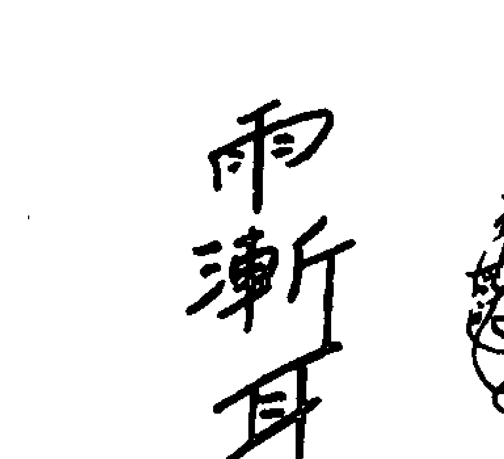

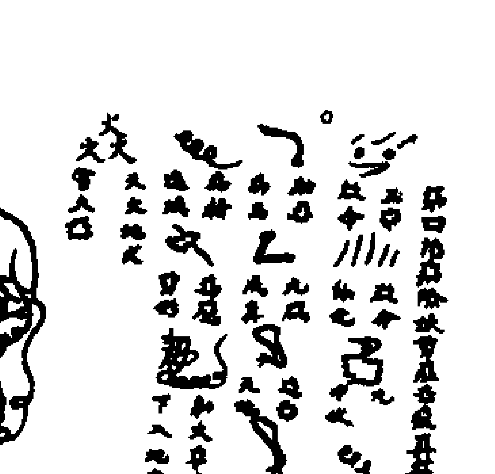

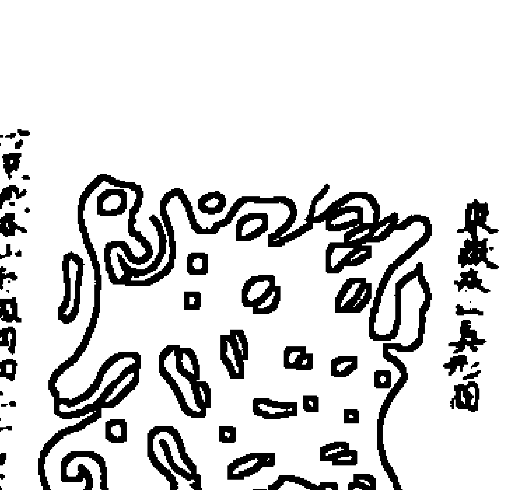

文字符除了道士、巫师所创造的之外,书门联,书“姜太公”、“石敢当”等神名及书“魂”、“器”、“大”、“王”等字也有符的功用。如五月端午,许多地方盛行用雄黄在小孩额上书一“王”字,以避邪除秽。

实物符如道教及汉族民间常用的桃木棍、桃木制具,《红楼梦》中贾宝玉佩戴的那块和他与生俱来的“通灵宝玉”,一些少数民族所佩带的动物残骨、石子,某些植物的根、茎、叶、花、果实等护身之物,都是实物符之典型。而道教的镜、剑、书等实物,同样具有符的功能。镜子具有吸收、抵消、反射、分解、倒影、投影、加强、转换等的功用,因而在道教和民间的仪式中,常常被用以避邪除妖。李时珍在他的《本草纲目》里也记述了镜子防鬼驱魔的作用：

镜乃金水之精,内明外暗。古镜如古剑,若有神明,故能避邪魅忤恶。凡人家宜悬大镜,可避邪魅。葛洪《抱朴子》云：“万物之老者,其精悉能托人形惑人,唯不能易镜中真形。故道士入山,以明镜径九寸以上者背之,则邪魅不敢近,自见其形,必反却走转。镜对之视,有踵者山神,无踵者老魅也。”

由于宝剑难铸,剑身如流矢,故传为神奇。据《洞玄灵宝道学科仪》称,为剑题名,呼之密咒镡中,则“神金晖灵,使役百精,令我长生,万邪不害,天地相倾”。

与文字符相比,除镜、剑、书等实物外,其他实物符的起源期相对要早得多,文字符很显然至少应在出现文字崇拜之后才会产生。而实物符则在此之前就业已存在。

图案符包括服饰上的一些图案、文身的图案、面具图案,以及其他一些器物上的图案,如瓦当上的吉祥图案(图 1-4)、家具、木墙壁上的吉祥图案(图 1-5)、厌胜钱图案(图 1-6)、卐形图案、八卦图等。这些图案都有十分突出的避邪趋吉的巫术功用,其产生也应早于文字符。

最初的文字符大多由复文组成,形式十分简陋粗糙。像《太平经》中记录的几百个符,基本上是由隶书的合体组成(图 1-7),象征意义也简洁明了。但越往后越变得繁琐复杂,图形诡秘莫测,文字艰涩难认,越来越向非字非画的图案化发展,象征意义更加繁复,越来越神秘化。为了显示符文系云气结成,后来的符中,线条曲屈缠绕,文字难以辨认(图 1-8),这便是所谓的云箓。

在一些符中,还有鬼神形象、星图及古代民间想象中的神荼、郁垒和用以缚鬼之物苇索弓箭等物形(图 1-9)。符中有文有图,图文并茂,令人只可意会,难以卒读。

#### 三  
在前文中,我们分别就符箓咒语的个性——符箓咒语的含义、别称、起源、形式等方面作了分别概述。由于民间符箓咒语在被道教所吸收和发展,并进一步促成其世俗化方面,以及符箓咒语在传承、功能、地位、影响等方面都存在诸多共性。因此,在本书中,我们把符箓咒语统称为符咒,并对其共性加以必要的概述。

民间符咒被道教所吸收和发展,并进一步促成其世俗化,主要表现在:  

道教符咒术来源于古代巫术,它是以中国古已有之的萨满教咒术信仰为基础,并在吸收了巴、氐等少数民族原始宗教的某些符咒术及仪式的基础上发展起来的。这正如有的学者所认为的那样:“符箓之事始于张道陵,符箓故非中国汉字也①。故余疑其为西南少数民族宗教,向非汉族之宗教。”②反过来,道教符咒术的发展和完善,又进一步促成了符咒术的进一步世俗化和民间化。这是由于符咒术本来就来源于民间,所以这些发展和完善了的道教符咒术很容易在民间广泛流行。特别是当符咒术在道教那里寻到“理论”支持并再度传到民间时,它就格外受到推崇。例如患了感冒,有人常常贴个“出卖重伤风,一念就成功”。小儿夜哭,家人常常贴个“天黄地绿,小儿夜哭,君子念过,睡到日出”。这些做法,就是道教符咒术的世俗化和民间化。像《太上助国救民总真秘诀》卷二十五就有“止小儿夜啼法”,其法要先吸炁吹火杖然后再写帖子,帖文内容为“我有拨火杖,将来作门将,指着夜啼鬼,彻晓终不放”。从中我们可看出道教符咒术世俗化和民间化的影子。

道教符咒术的世俗化和民间化还表现在不论是道教符箓的制作还是其符咒的施用都离不开一整套繁琐的仪式和禁忌③。而民间符咒的制作与施用则显得极为通俗简便。对于巫师和平民百姓来说,制作粗糙丑陋的神图巫符与制作精美的神图巫符,进行神秘繁琐的仪式与进行通俗简便的仪式,都无多大区别,只要经由一定的宗教仪式(如祭祀、焚化、开光④),便都具有了同样的威力。例如,民间的以图像代替实物的画符,就具有便于制作和操作,便于携带等特点。民间通用的“甲马”、“纸马”等,属于一种可成批制作的画符,通过它,就可与在现实中无法联系的神灵进行沟通。

有的符咒是公开的,人人都可以使用。但由于符咒被看成是具有不可抵御的魔力和法力的神圣语言文字,所以符咒更多的是秘密的,只能由某些特定的人掌握,只能在精心选定的接班人中密授。这种密授的主要方式是师徒相传,它要求“上不传父母,下不传妻子”。一些道人、巫师和民间秘密宗教教首所自称的遇到异人和神人,或梦中得到神人传授的符咒术的说法,也属师徒相传之列。因为当这些道人、巫师、民间秘密宗教教首得到所谓异人神人传授的符咒术后,他们也就同异人神人建立了师徒关系。

由于符咒术的源远流长以及我国古代迷信鬼神风气之浓厚,符咒术不仅深深地渗入民众的日常生活,而且也深深地渗入上层领域。我国古代的宗教、民俗,以及生产、经济、军事、权谋等,无不与其发生着密切的联系。就宗教方面而言,符咒术与道教的关系不用说了,就是古代的民间秘密宗教,不论是为吸引教徒,还是起事作战,无不扯起了符咒术的大旗。白莲教、八卦教、清水教、大刀会、红枪会、义和拳等无不是如此。例如,在起事作战方面,他们在与官兵对阵时,往往自带朱符,口念咒语,向前直冲,不避刀枪,其举动极其壮烈而结局却异常悲惨。

符咒术与巫术文化更是密不可分。符咒术本来就是巫师的专利,是巫师的看家本领和绝招,不谙熟符咒术的人决不可能当上巫师。正因如此,许多民族的巫师接班人在正式成为巫师之前要花不少时间学习施用符咒。符咒术尤其咒语是巫术仪式的核心,念咒成了各种巫术仪式的最重要组成部分。不念咒的仪式是没有的,可是却有不用仪式的咒语。

符咒术对王朝政治也具有一定的影响和作用,成了封建统治阶级争权夺利和巩固自己的统治的工具。例如,汉武帝因迷信厌胜之术(咒术之一)而对朝廷重臣乃至亲生骨肉大加杀戮。南朝陈高宗第四子陈叔坚对后主陈叔宝不满,“乃为左道厌魅以求福助。刻木为偶人……昼夜于日月醮之,祝诅于上”①。明太祖朱元璋也利用符咒术为自己服务。第四十二代天师张正常在朱元璋称帝前就把写有“天运在太祖”的灵符转交给朱元璋,为朱元璋改朝换代作舆论宣传。明世宗也醉心于符咒术,他在位时,道士邵元节、陶仲文因擅长巫术咒语而得到他的恩宠。他们不仅统率道观,总管道门事务,而且位极人臣,几乎到了操纵皇帝和朝廷的地步。

当然,符咒术在政治上的影响和作用,和其对民间风俗习惯的影响相比,要小得多。作为巫术文化的主体部分的符咒术,对中国民间风俗习惯产生了极为重大的影响。这种重大影响可从以下几个方面看得出来:

## 一是民间的请神和祭祀仪式多离不开符咒术,符咒术是人们沟通与驱使神灵的重要法宝。

## 二是其他各种民俗活动乃至日常生活都离不开符咒术。例如,在民间,无论是治病救人、避邪护身,祈求丰产丰收、发财积财,祈求平安,祈告夫妇婆媳和顺、安胎保身、六畜驱瘟等,无不用咒。就连小孩玩耍中皮肉被锋利之物划破出血,也有相应的止血咒。据《玉匣记》载：“小儿幼年,举步未稳,多好嬉戏,最易倾跌,或至肉破血流,无法止之。爱访有符咒止血者,极为神效,恳其传以济世……”咒曰:

大阳出来一滴油,  
手执金鞭倒骑牛；  
三声喝令长流水,  
一指红门血不流。

符箓的运用同咒语一样,也是十分广泛,无处不用的。如遇恶鬼有镇邪驱邪避邪符,遇火有止火符,遇水有止水符,生病有祛病符,建房有镇宅神符,做恶噩有镇恶噩符,骨鲠卡喉有化骨鲠符,打官司有六庚六辛符,连科举、出门远行、饮食起居,甚至野狗上房、母鸡夜啼等,莫不有符。例如,读书人时刻梦想科举高中,因而科举也有符(图 1-10)。在这个符中,我们可以看出,“早科举”实际上是咒语,中间的三星当是福禄寿三星的标志。这道符必须同巫术形式结合起来才有效,其法是取桥上土七升,红枣五升,装入大瓷瓶中,埋入孔子像前地中三尺,用土将此瓶掩埋后,还需依据五方五色放上五块各重一百二十斤的大石头,再将石头用土埋好,然后又将此符埋入。另外还需在孔子或文昌诞辰之日向孔子和文昌献祭,据说此法能保佑一方举子,使一方的儒学兴旺。

## 三是民众十分迷信符咒术具有无所不能的神力。人们认为符咒不仅能防病治病、起死回生、驭使鬼神、镇魔招魂、隐形变化、逢凶化吉、咒杀仇敌,还能飞沙走石、止风止雨、呼鼠驱蚊、搬运物体……民间广泛流传的如下有关符咒术的神奇性的神话传说、史诗故事等,正反映了民众对符咒术无所不能的神力的迷信崇拜:

话说汉代有一位仙公,叫葛孝先,丹阳句容人。他从八岁就失去父母,但能好学自立,至13岁就通五经子史书传,尤其爱读老庄著作,至16岁,已经名震江左。

有一次,他在翻阅老庄著作时,偶然发现一纸父亲的手书笔迹,不禁勾起思念父母之情,心中感到甚是惆怅,便仰天长叹道：“山川不改色,严父已归空。天下有长生不老之道,何不修之?”从此以后,他就不断地进入一些名山,去访求异人。后来,他毅然穿上道衣,入天台山修道去了。在天台山,他遇到了真人左慈,左授予他炼气保形之术、九丹金液仙经及感应篇。至19岁,他仙道逐渐炼成,乃遨游山海,倏忽去来。能分形变化,又能绝谷,逾年不饥。

当时吴主得知葛公是个有道之人,对他甚是敬重,以宾礼相待。有一年天大旱,炎热的太阳总是高悬在天空,像火球一般烤着大地,禾苗干枯。人民到处烧香求雨,可天上仍然没有一丝云彩。吴主问他：“百姓思雨可致乎?”

葛公答道：“易得耳。”他随即书写了一道符焚烧。俄顷,极亮极热的天空,忽然变成黑夜似的,晦暗起来,狂风裹着雨点打在屋顶上,接着滂沱大雨便从云中倾泻下来,雨水从屋檐、树顶顺流而下,汇入中庭,中庭水深达一尺有余。

吴主见到这一情景,不住地赞叹道：“妙哉!妙哉!此雨足可解去旱情也。”他又兴致勃勃地问葛公：“水中可使有鱼乎?”

葛公含笑答道：“自然可以。”说毕,又画一符投入水中,水中立即出现数十条大鱼。每条鱼都有一二尺长,在水中游来游去,甚是喜人。吴主似信非信,令人取出烹之,果然是真鱼……①

沅湘间传说：有一种名叫“猖鬼”的山鬼,其性最淫,喜欢纠缠美貌妇女,妇女被缠上后,往往不认丈夫,也不认父母,哭笑无常,动辄裸体。巫师对付猖鬼的办法是念动咒语,使自己化变成为一个绝色美女,作出各种媚态,手捏象征媾合的手诀。巫师此举,是以淫治淫,使猖鬼从贪恋美色,变成厌烦美色,招架不住,落荒而逃,从而达到治病的目的②。

宋洪迈《夷坚志》“程法师”条,记载了宋代民间盛传的哪吒咒语的灵验故事：张村程法师,行茅山正法,治病驱邪。附近民俗,多诣坛叩请,无不致效。旁村新定人詹聪,暴感疾,招使拯之,随即平复。时已昏暮,程欲归,聪父子力挽留旦,不从而行。一更尽,到孙家岭,月色微明,值黑物如钟,从林间出正前,圆转有声,若与为敌。急诵咒步罡,略无所惮,渐渐逼身。程知为石精,遂持哪吒火球咒结印叱喝云：“神将辄容罔两敢当吾前,可速疾打退。”俄而见火球自身后出,与黑块相击,久之,铿然响迸而灭,火球绕身数匝亦不见。时山下住人项通,举家闻山上金鼓喧轰,如千百人战声。与子侄遥望,唯见程兀立持诵,寂无灯烛。就呼之,乃觉,即拉之归宿,心志力定,自是不敢夜行。

《续子不语》卷三记载：常州吴某,刑部郎中讳揖之祖,素好道。自京师归店,晤一道士,风采绝异,不带行李而宿。夜觇之,赤身而坐,气咻咻然从耳中出,蚊不敢近。旦起将行,吴询所往。曰：“我云游无定处。”吴与之南归,供奉甚敬。居数年,临死授二符曰：“我受君恩未报,他日有事,可以此符镇压,所以谢君也。”已而吴某卒,其夫人大病垂危,屡见鬼魅,夜遣婢环视。有仆素健壮,好酒有胆,设席于门外,已醉睡矣。梦一老者,随一童子,持壶杯各一,谓童子曰: “彼好酒,可令饮一杯。” 童子将一杯置老仆脐内斟之,初觉甚热,后不能耐,乃大呼而起,咳嗽一声,口血已喷满地。从此鬼更猖獗。未几家人收拾地方,将停夫人之柩,偶在箱中翻出道士符,乃钉挂帐上。夫人久不言语,见忽咤曰: “帐上悬一明镜,中有甲胄将军,持刀逐鬼,鬼尽远遁矣。” 夫人从此病愈,二十余年而终。亲友中有病借其符驱鬼,无不验者。旋竟失去。

《夷坚志》记载溧阳的一巫者能治骨鲠。长苍村有个叫卫四的人,食鹅骨鲠,已有三天不能吃东西了,就叫儿子到巫者那里去请求治疗。巫者从灶膛中取出一些柴灰,将灰洒在地上,点上香,烧纸念咒召神,之后用一个苇筒当小犁杖,在灰中趟行如耕地。巫者一边作法,一边说这骨头真硬。趟了三遍,听见苇筒中有轻微响声,赶紧拿起苇筒往水盆中倒,倒出一块鹅翅骨来。四十里外的患者闻讯而来,均为卫四治愈了。

据《逸史》所言,有个名叫李主簿的人,携新婚的妻子路过华岳,入庙给华岳神金天王烧香磕头,不料刚磕完头,妻子便气绝倒地,只有胸口稍暖。县宰告诉李主簿说: “有位叶仙师善于符术,你应马上去找他,别人恐怕难以救活你的妻子。” 李主簿心急如焚地去找叶仙师求救。叶仙师便画符焚香,以水噀符,符化后便向北飞去,声如旋风,但良久没有动静。叶仙师又画一符,喷水叱之,声如霹雳。过了一阵,李妻口鼻中有气,慢慢睁开眼睛。李主簿问她刚才是怎么一回事,李妻说初拜金天王时,金天王称她为“好夫人”,再拜时,金天王说要“留下她”,并派左右将她带走。到第三日,金天王家正亲朋云集,忽听有人叩门,金天王命赶走来人。一会儿,门口闹声大作,金天王又命赶走闹事者。稍顷,有条赤龙腾空飞入,扼住金天王的喉咙,金天王无法,说道“发去”,便有人将自己送归。

藏族史诗《格萨尔》的绝大部分部本,描写的是岭国和其他国家之间的战争。双方用兵时,以咒作法常常在战斗中发挥着神奇的作用。例如在史诗《木古骡宗之部》中,格萨尔的叔叔晁同用神变幻术做了一艘顶部安装有隐身木的水晶飞船,然后与扎拉率领骑士百人,驾着飞船,飞临木古军队扎营的城堡上空作侦察。飞船上的人们看不清下方的地形,晁同便念诵起能使眼睛变得明亮的咒语。于是人们对地下的山川河流、城池村落,看得清清楚楚。在交战中,岭方廷王达果俄赞,被木方战将龙君砍成重伤,生命垂危,晃同施展巫术,念诵密咒,使廷王伤势很快好转。岭军其他勇士受伤,晃同也用同样方式给予救治,无不神效。晃同在这次木岭战争中,由于运用巫术、密咒侦察到了敌情,治好了岭军负伤将士,使岭军很快获胜并减少了伤亡,他因而立了战功,受到嘉奖。正如史诗中所说,晃同是个“身具巫术咒力大,喊一声‘哗’,敌人就死亡;喊一声‘呸’,敌人就倒下”的咒力威猛的术士。他的咒术的得来,是本教祖师敦巴辛饶把巫教秘诀传授给他的结果,因此他才能呼风唤雨,行雷降雹;隐身幻化,来去无踪;诅咒病魔,克制创伤。在他身上,我们看到了古代藏人对密咒的神力崇拜。

## 四  
符咒术不仅影响到古代中国社会的各个方面,就是在当代中国的许多边远落后地区,它仍有力地影响着民众的文化心理。画符念咒、符水治病这些迷信形式在今天的广大农村还不同程度地存在着,在少数地区还愈演愈烈。我们到不少村镇中都可以见到,有些人家在大门口或梁头上贴着“姜太公在此百无禁忌”的字帖,或贴有“泰山石敢当”的画像,这就是符咒。有人头痛发烧或者身上生疮长疖,找人用指头在痛处圈圈点点,或念几句口诀,相信这样能把病痛治好。还有人相信诅咒厌胜能使仇家遭灾受难,所以一旦被仇家发现便有泼妇骂街的事。以符咒斗法的事件也层出不穷,就连城市中也还存在这种迷信。据 1981 年 10 月 1 日的《解放日报》报道,上海有两家 人互相搞什么“别出心裁的迷信斗法”,这两家人就是相信可以用符咒来压制对方的。据《神与魔——气功及其误区纵横谈》一书记载,杭州青年气功

## 第二章 符的制作及施用
### 符咒的一般原则

在甲家，甲和两个徒弟在一个八卦炉边发功、念咒语，同时把写着“袁弘煦”三个字的纸片不断往八卦炉里烧。过了一会儿，甲说：“他快要倒下去了。”

在袁家，袁将家人请到另一间房里，然后从床底下拖出一只痰盂来“应战”，袁的单位来了两个好奇者观战。忽然，袁做了一个手势说：“进来的東西，全扔到痰盂里，倒到厕所里去！”

时间到了，袁平安无事。可是，甲却因斗不倒袁而气得自伤了身体，弄得要来救护车去了医院，也许他还真以为袁的法术太厉害了呢……①

从以上介绍中我们可以看出：符咒术不论是在古代中国社会的各个方面，还是在当代中国社会的某些方面，都扮演着极其重要的角色。符咒术为何会扮演如此重要的角色？具有如此的“魅力”？符咒术是否就像如前所述的那般“灵验”？其“灵验”的实质是什么？下面，让我们本着科学的、实事求是的态度，运用语言学、心理学、生理学、暗示术、人体科学、社会学、文化人类学、现象学等学科的理论，对符咒术的原则、方法、功用、影响等主要方面以及上面提出的几个问题来一番深入的剖析和揭秘吧！

> ① 郭博文：《神与魔——气功及其误区纵横谈》，天津人民出版社，1992年3月第1版，第36页。

## 第一节 符的制作

在道士和巫师看来，符是沟通人与神的秘密法宝，所以不是随便可以乱画的，故有所谓“画符不知窍，反惹鬼神笑；画符若知窍，惊得鬼神叫”的说法。画符的方法成百上千，有的要掐诀存想神灵随笔而来，有的要步罡踏斗，念动咒语……就是在铺纸研墨、运笔等方面都有讲究，其程序之复杂，方法之繁琐，足令善男信女们头晕目眩。

## 一、画符仪式的程序

画符有一定程序，决不可以简单了事、顺序颠倒。

从总的方面看，画符都要设坛行祭礼（尤其是道士），有所谓“总坛式”。总坛式里的总符咒写有道士们通常信仰的神祇——土地、城隍、东方青帝、南方赤帝、西方白帝、北方黑帝、朱雀大将、玄武大将、黑杀大将等。如古代敦煌道士画符时所设的总坛式图中的总符咒（图 2-1）:

道士们还要造坛，造两块天帝的印把子（图 2-2）。这两印是雕在坛上的，前后都要雕。

也有不设“总坛式”或造坛的，如“请仙箕法”等。请仙箕时，用三盘果

## 二、画符材料

画符的材料一般都有规定。画符一定要用墨或朱砂，尤以朱砂居多。之所以多用朱砂，在于古人以为朱砂有镇邪作用。符的载体用桃木板最多，因为古代多以为桃木有极强的驱赶魔邪之神力。其次有柏木板、枣木板、石块、砖和黄纸等。另外，布、绢丝的使用也很普遍。

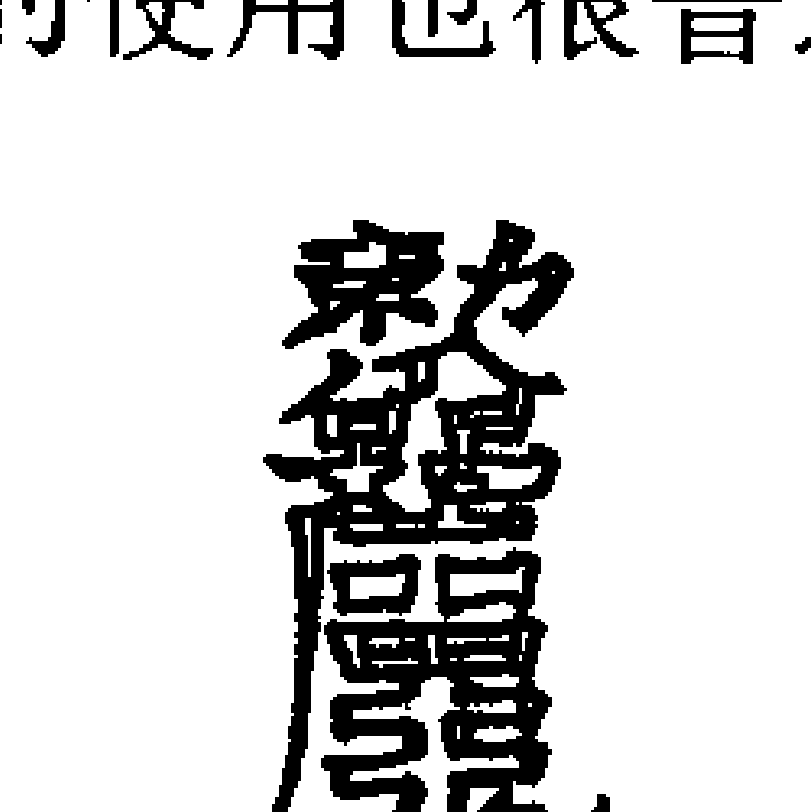

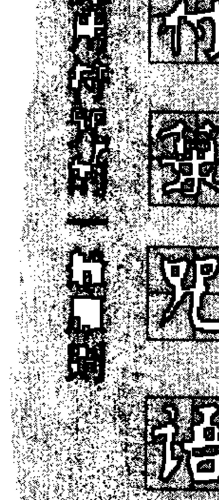

图 2-3
张天师祛病符

符的载体不同，使用方法也就不同。木料符一般是挂或钉于某处，或烧成灰和上水吞服；石料和砖料的一般是埋于地下；纸料布料的，有的佩戴于身，有的烧成灰与水一起吞服，有的纸符或布符还须书写两份，既要吞食，又要张贴。如张天师祛病符（图 2-3），此符是初一日得病者所用的祛病符。用朱笔黄纸书写，书时叩齿三次，含一口净水向东方喷出。边写边念祛病咒语：

```
叱出！赫赫阳阳，日出东方，吾敕此符，普扫不祥。口吐三昧之火，服飞门邑之光，捉怪使天蓬力士，破疾用秽迹金刚，降伏妖怪，化为吉祥。急急如律令敕！
```

符写两份，烧成灰吞食一份，贴在门上一份①。

以下之符（图 2-4，图 2-5），也是至少要画二符，一符吞食，一符或戴带，或挂在门户上：

图 2-4 注云：“去一切鬼邪，大大神效，吞带并吉。”

图 2-5 注云：“子日病者……吞之，并书著门户上。”

> ① 王贵元：《女巫与巫术》，河北人民出版社，1991 年 6 月第 1 版，第 187 页。

## 三、几种特殊的画符法

如前所述，画符的方法一般是用笔将朱砂水或墨汁画于木板、石块、砖、纸、布或绢丝上。除此之外，还有几种特殊的画符法值得一提。

一是舌尖书符。舌尖书符不同于笔书。笔书是以毛笔书写，舌书则是以舌当笔直接书写。以下所举的是在《道藏》中的舌尖书符：

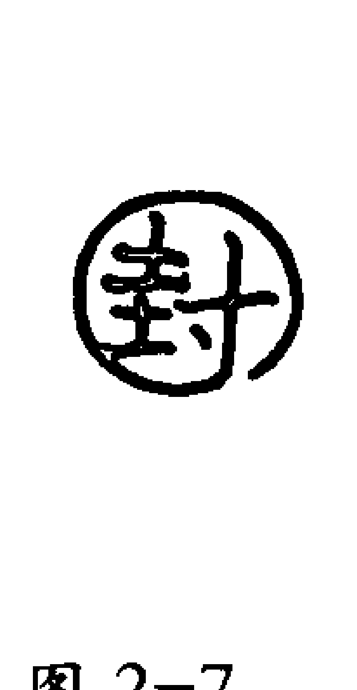

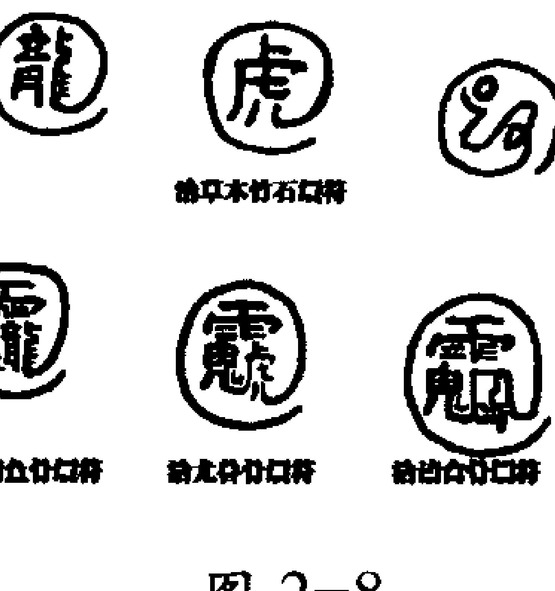

之所以用舌尖书符，是因为舌尖所书之符有很强的“镇”的作用。由于舌代表心，心在五行中为火，书符所用之朱砂也近于火，犹如夜晚在森林中点起篝火，野兽则不敢近前面之理而“避邪”，西北为乾，乾为天，“元始”之“天”气就更有威慑力量了①。

> ① 张惠民:《中国风水应用学》，人民中国出版社，1993 年 3 月第 1 版，第 175 页。

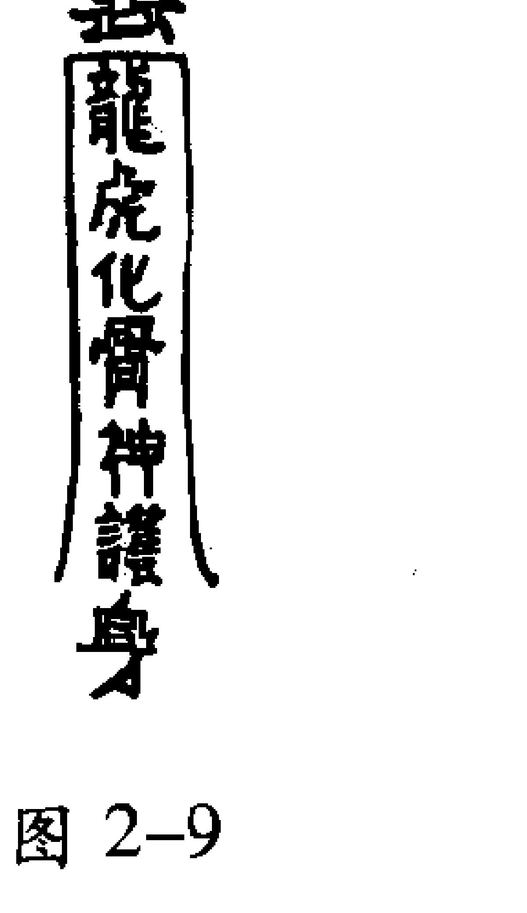


二是用手指凭空虚写虚画。止血符（图 2-7）的画法就是如此。

这种符并不要写画到什么物体上，其关键是画符动作，在动作要求上极为复杂严格。这种符箓的目的不是长期的防御性的，而是在紧急情况中要求立即见效，所以符体的重要性远不如画符动作。由于符体没有长期存在的必要，所以只以手指空中比画即可。

这种以手指凭空虚写虚画之符的典型是治鲠符（图 2-8）。

骨头等卡在喉咙里，在这种危急情况下，不可能把符写出贴在那里等候治疗，“神力”只能在画符动作中施放出来，动作一经完成，治疗也便结束。

这四个符的具体画法是：用半碗净水，左手无名指和小指屈于掌心，托起水碗。右手大拇指压无名指和小指屈于掌心，只伸直中指和食指，向东面吸一口气，再吹入碗中，然后用右手中指和食指在碗中水面写符。一边写一边念咒语：

> 此碗水化如东洋大海,
喉咙化如万丈深潭，九龙入洞。
吾奉：太上老君急急如律令敕。

写完后将半碗水一口气喝下。

骨鲠等吞下之后，还要用化骨符（图 2-9）消化骨头，用消稻麦芒及稻麦鲠符消化稻麦芒鲠。


化骨符的画法是：左手屈无名指和小指，托水碗，右手拿筷子向碗中水面虚画此符，然后面对太阳喝下，据说骨头便会消化。

消稻麦芒及稻麦鲠符的画法是：右手在地上写“犇”，用左脚踩住，再写“犇”，用右脚踩住。左手屈中指和无名指托水碗，右手向水面写符，边写边念咒语“雷击水”。写完后一口气把水喝下①。

三是用铜剑、师刀、令牌凭空虚写虚画。例如，瑶族相传铜剑为驱鬼邪、除妖魔之宝，所以瑶族在举行某些巫术仪式时，要用铜剑画符水、敕令，以降妖邪。侗族道师在敬祭鬼神时，要以令牌、师刀指水画符，以示镇妖除怪、逐鬼逐魔。

## 四、画符的时间禁忌

端午节是画符、造符水的吉日，画符造符多在这一天举行。画端午驱鬼符更是如此。

每年有四天不可乱画符，如若在这四天画符，不但不灵验，而且还有害。

> ① 王贵元:《女巫与巫术》，河北人民出版，1991 年 6 月第 1 版，第 184—187 页。

这四天是农历的三月初九、六月初二、九月初六、十二月初二。

画符最好选择子时或亥时。据说此时是阳消阴长、阴阳交接之时，灵气最重，其次午、卯、酉时亦可①。

## 第二节 施用符咒的一般原则

符咒的种类成千上万，施用的方法举不胜举。例如，施用咒语的方法，有默念、轻声念、大声念；有书而或埋或焚，等等。施用符箓的方法就更多了，有佩戴在身，贴于患处；有贴于或放于着怪处；有火化为灰，将灰溶于水中，以符水洗头面，洗全身，或以符水擦拭、喷洒全身；有食符法，食符法又有将表（纸符）直接吃下去的“吞服”，将符焚烧后的纸灰溶于水中而喝下去的“喝符”。“喝符”还有热喝、冷喝等方式。此外，还有埋于地下，投于水中的，等等。尽管施用符咒的方法千差万别，但在施用中都有一些共同的原则必须遵循。

## 一、与“气”配合

画符需要存思运气，施用符咒同样需要用气配合。胡孚琛先生在《魏晋神仙道教——抱朴子内篇研究》一书中指出：“道士用咒语禁邪往往要和存思、行气等法术配合进行，即是说在念咒时要使自己进入气功功能态，葛洪用以禁虎的三五禁法便是一例。他说：‘三五禁法，当须口传，笔不能委曲矣。一法，直思吾身为朱鸟，令长三丈，而立于虎头上，因即闭气，虎即去。若

① 按胡先生在书中的解释，此句中的“白虎”为道教之“青龙、白虎、朱雀、玄武”一类代号，下文中的“白虎”之义同，指方位而言，非真以钗和刀刺虎也。

② 这 6 个字被认为是佛教使用最普遍、最广泛的咒语。

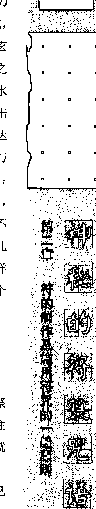

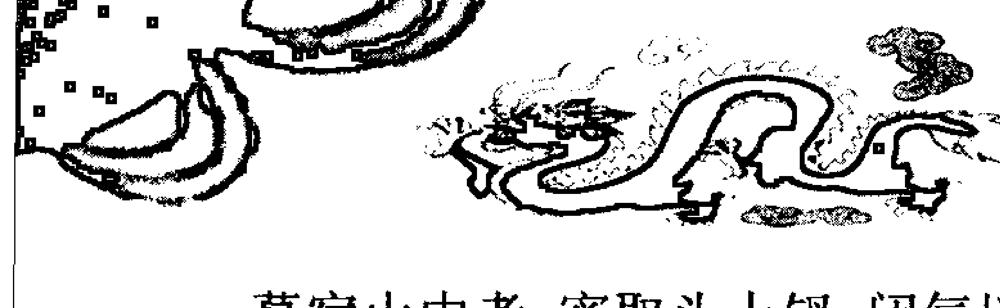

## 二、与动作配合

符咒术的施行，不像宗教中的求神、求佛，只是顶礼膜拜，或以香火供祭就可，而要凭借一定的手段去积极地影响外界。正因如此，在施用符咒时，往往要采取一定的动作来配合符咒使之作用到被施用了符咒的对象上，这就是所谓的“咒动”。咒动包括禹步、掐诀、吐唾液、摇头晃脑等。

禹步是道士作法时的一种特殊步伐，传说大禹治水时“届南海之滨，见鸟禁咒，能令大石翻动。此鸟禁时，常作是步。禹遂模写其行，令之入术。自

兹以还，术无不验。因禹制作，故曰禹步。末世以来，好道者众，求者蜂起，推演百端”①。

最初的禹步并不复杂，如葛洪《抱朴子内篇》中记载的禹步步伐为：

前举左，右过左，左就右，左过右，右就左。次举左，右过左，左就右，如此三步，当满一丈二尺，后有九迹。

或者是：

正立，右足在前，左足在后，次复前右足，以左足从右足并，是一步也。次复前右足，次前左足，以右足从左足并，是二步也。次复前右足，以左足从右足并，是三步也。如此，禹步之道毕矣。凡作天下百术，皆宜知禹步。

到了后来，禹步的形式越来越复杂，不仅步伐有种种讲究，而且要不停地念动咒语，存想各种神祇随步而来，或存想自己足踏星斗，面谒神灵，求神禳灾祛祸，保佑平安。如图 2-10 为《抱朴子内篇》所提到的“三步九迹”的禹步法。而图 2-11 则是进一步复杂化了的禹步形式。走禹步本身似乎就是在画符施符。

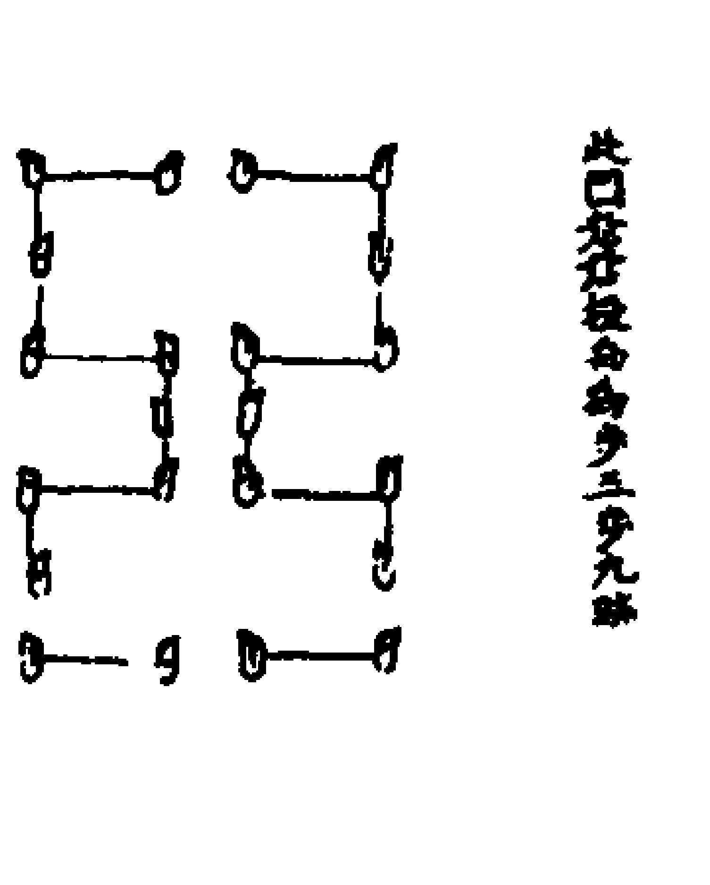

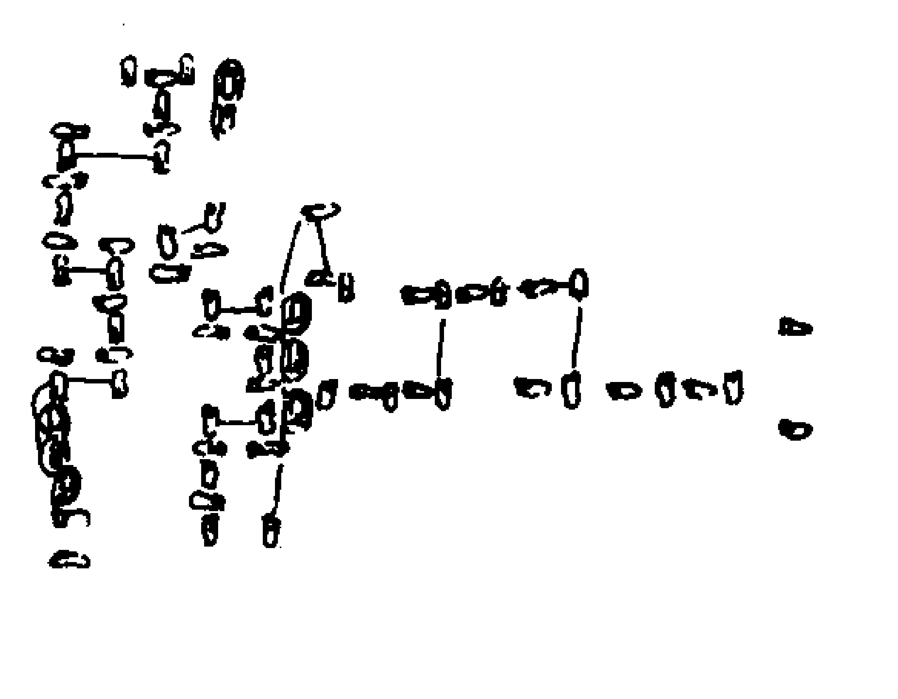

## 图 2-10

## 图 2-11

①《洞神八帝元变经》。

## 三、与“咒物”配合

施用符咒不仅要与“气”与动作配合，还要配合以一定的物品，使施用的符咒有所凭依。比如汉族和一些少数民族往往在刀剑上刻上或写下咒语，或是面对刀剑念咒烧符画符，认为只有这样刀剑才会具有镇妖避邪的力量。此时的刀剑已相当于符咒本身。

施用符咒时要配合以一定的物品的特点，更突出地体现在诅咒厌胜上。诅咒厌胜的巫术原理是交感巫术（感应律）和模仿巫术（象征律）。交感巫术认为，类似物可以治病，如红色的植物可以治血疾，黄色的植物可以治黄疸病

## 四、各种禁忌

施用符咒并非一件简单随便之事，它往往有各种严格的禁忌规定，决不可越雷池一步。若有违犯，符咒必不灵验。

## （一）斋戒沐浴

施用符咒要靠鬼神相助，而鬼神十分喜好洁净，所以祈请神灵而带着满身尘土，或嘴里手上不干净是万万不行的。因此，比较正规的施用符咒，首先要静心沐浴，洗手漱口，并念“我以月洗身，以日炼真，仙人辅己，玉女佐形，二十八宿，与吾合并，千邪万秽，逐气而清”之类的净身咒。

有的斋戒沐浴只消在施行符咒术之前或之时进行便可，有的则要在施行符咒术的几天前就要开始进行。《抱朴子·登涉》就记载了带升山符前要斋戒七天的做法：“凡人入山，皆当先斋洁七日，不经污秽，带升山符出门，作周身三五法。”在《道藏》的一些经文中，有关施用符咒术前需斋戒沐浴的规定也不少，这些经文中明确规定“不得不洗手漱口便施行符咒”云云。

## （二）施用符咒的等级

很多符咒的施用有严格的等级规定，什么人佩什么样的符，念什么样的咒都必须认真遵守。比如护身符虽为最常见的符，但各种人所佩戴的护身符却有各不相同。敦煌遗书斯二四九八卷中就记载了不同身份的三种人所佩戴的三种不同的护身符：

1. 百姓带的符（图 2-12）。注云：“带之利官，去官事（司），口舌，得欢心，解散。”
2. 官吏带的符（图 2-13）。注云：“都护身命益算符。”“都护”，官名。此符为都护们所佩戴。
3. 仙人、和尚带的符（图 2-14）。注云：“神人、憎（僧）者带之吉，即解散。”

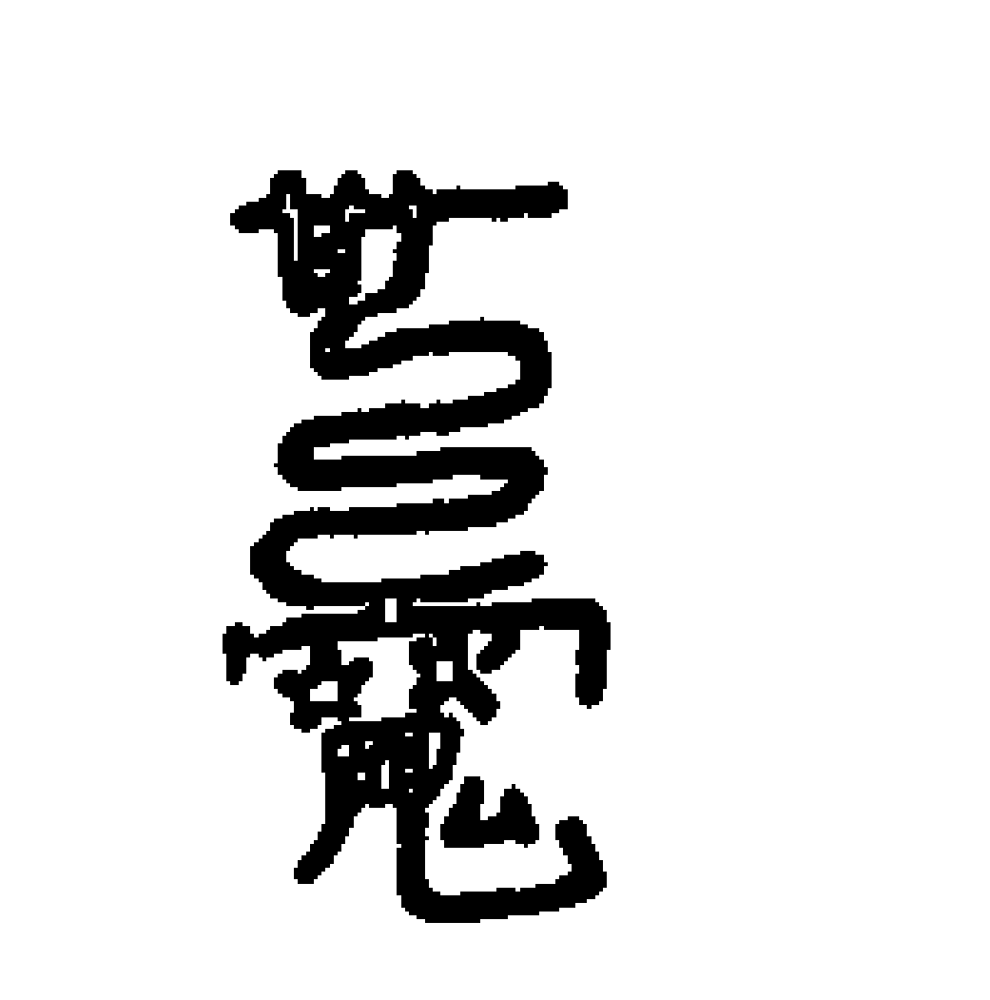

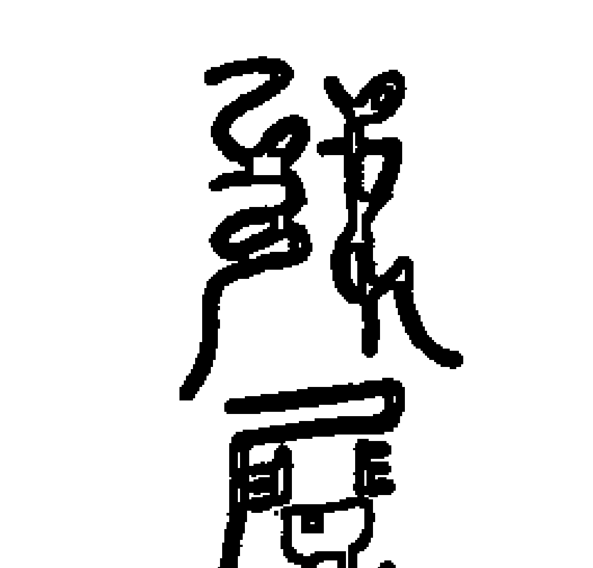

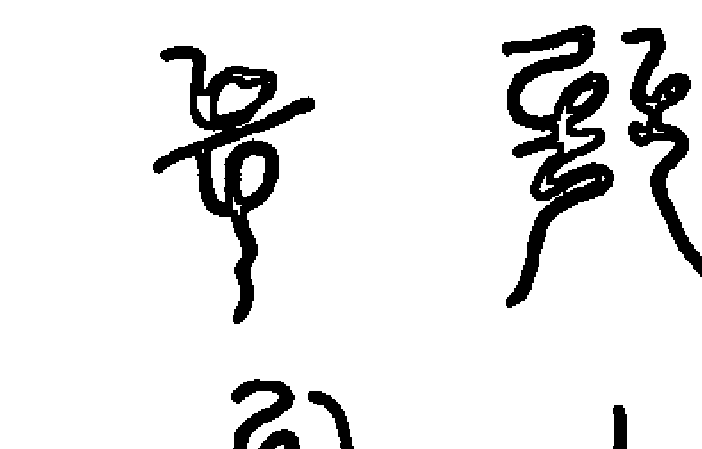

图 2-12  
图 2-13  
图 2-14

## （三）施用符咒的道德要求

道德修养的好坏对施用符咒是否灵验具有不可忽视的作用。一些道教经典中每每强调施行符咒者要“气清心正”，“行善积德”，只有如此，施用的符咒才能灵验。否则，无此功德，虽用符念咒也始终无验。若想假借符咒行

## (四) 念咒不可有丝毫差错

念诵咒语必须心诚、熟练。由于咒语具有一种神秘的、威力无比的力量，所以对它不能有丝毫的玩笑意图。我国古书中对念咒常有“心要诚，念要熟”、“宜正心诚意，一气呵成”等语。假若念咒语念错了一个字乃至几个字，或是把有的前后顺序念颠倒了，那么，在很多场合，咒语就会完全失灵，有时甚至会适得其反，给自己招来横祸。《拍案惊奇》卷三一中的“侯道士因术成奸”对此便下了很好的注解：一个姓侯名元的樵夫因上山砍柴而遇异人授予符咒，把异人所传符咒尽行习熟。不上一月，其术已成。变化百物，役召鬼魅，遇着草木土石，念念有词，便多是步骑甲兵。神通既以广大，传将出去，便自有人扶从。于是收好些乡里少年勇悍的为将卒，欲举事。后因不听神君告诫，举事失败，遭神君斥骂。自此侯元所晓符咒渐渐遗忘，就记得的，做来也不十分灵了。却是先前相从这些党羽，不知缘故，聚着不散，还推他为主。自恃其众，是秋率领了人，在并州大谷地方抢劫。恰好并州将校，偶然领了兵马经过，知道了，围了数重。侯元急了，施符念咒，一毫不灵，被斩于阵中，党与遂散。侯元的施符念咒不灵，虽有神灵惩罚之原因，然他对所学符咒的“渐渐遗忘”，也是不可忽视的重要因素。

## (五) 用符有时间禁忌

画符有时间禁忌，用符同样有时间禁忌。有的符要配合自己的星命进行使用，不得违犯，若有违犯，不但不验，还会遭受灾厄诸事。比如逢太岁星君之年（不论男女之人的1、13、25、37、49、61、73、85等岁，皆属太岁星君之年）的人，必须安奉值年太岁星君，可保平安无事。安时用红纸书写太岁符（图2-15），择于正月中吉日吉时安之于家中。若此年错用逢天空星之年的天空符（图2-16），不但吉星不会高照，反会造成凶星入宫，造成破财、家庭风波、与人不合之害。

敦煌遗书伯二八五六《发病书》中的《推初得病日鬼法》之符则是按十二地支顺序吞带并用的。如：

丑日病者……此符（图2-17）朱书吞之，并著门户上，急急如律令。

寅日病者……此符（图2-18）朱书，著病人卧处，并吞之，急急如律令。

卯日病者……此符（图2-19）朱书，病人吞之，并著门户上，急急如律令。

## 张天师祛病符法，则是按农历的日期用之。如:

初一日病者，东南路上得之，是神使客死鬼作祟。头疼作寒热，起坐无力，吃食无味。用黄纸五张，东南方四十步逆之，即愈。画符（图2-20），吞一道，门上贴一道，吉。

初二日病者，东南方得之，是家乡之老鬼作病。初头疼口乱不宁，热多冷少，肢无力，呕吐不止。用白纸五张，向东南方三十步送之，即愈。画符（图2-21），吞一道，门上贴一道，吉。

初三日病者，正北得之，是家亲作祟。初害头疼，乍寒乍热不安，饮食不进。用黄纸五张，向正北二十步送之，大吉。书符（图2-22），吞一道，大吉。

此外，施用符咒还有祭品、法器、食物等方面的禁忌。由于祭品和法器是在举行施用符咒这样的神事时需要的，因而它们就具有了神圣的性质。对它们不能随便触摸，否则就会影响符咒的灵验。

食物方面的禁忌指的是施用符咒者不能食用某些东西。比如羌族等民族就明确规定念咒者不能食狗肉，不然咒语不仅无效，还会加害于念咒者本人。

## 防病治病的符咒（上）

## 第三章 防病治病、避凶趋吉

符咒的主要种类（上）

在上一章的第二节，我们归纳了施用符咒的一般原则。在本章和下一章，将向各位读者介绍防病治病、避凶趋吉符咒的主要种类及其具体施用方法。为何要费此笔墨？——尽管这些符咒无多少实际功用，却有文化和民俗研究的价值。

符咒本来有白符咒与黑符咒之分（防病治病、避凶趋吉、对人生有利的称为白符咒，制敌害人的称为黑符咒），为何只介绍前者而不介绍后者？这是由于：前者的特点是围绕人们的生活，以实现自身的利益为目的。这类符咒的施行，主要是利于自身的发展。尽管所施行的符咒不能实现所要达到的目标，但它所表达的却是一种美好的愿望。而后者的施行则是出于治弄仇家和敌人，乃至危害一些无辜的人。其施用方法一旦为某些心术不正或别有用心的人所掌握，他们便会以其去制人害人，尽管这些符咒也不能实现所要达到的目标，而一旦为被施以黑符咒者知晓了，难免会引起不必要的矛盾和纠纷，故对黑符咒不作介绍。

## 第一节 化凶为吉类符咒

化凶为吉类符咒主要用于对凶梦、打喷嚏的禳解，反诅咒反厌胜以及其它一些逢凶而需化吉的事项上。

## 一、禳解凶梦符咒

古人对于梦境中出现的一切不仅深信不疑，而且还认为梦有兆示吉凶的作用。如果做了吉梦，虽是一人所为，却也皆大欢喜。为使吉梦应验，还可以施以一定的咒语促其马到成功。《云笈七签》卷四五《秘要诀法•恶梦吉梦祝第二十六》就记载了使吉梦应验的咒语：“若夜有善梦，吉应而梦，而心中自以为佳则吉感也。卧觉当摩目二七过而祝曰：太上高清，三帝丹灵。绛宫明彻，吉感告情，三元柔魄，天皇受经。所向谐合，飞仙上清。常与玉真，俱会紫庭。”若是做了恶梦，人们也并不甘心等待那厄运、凶祸的到来。民间以为虽然做的是不好的梦，兆示不吉，但仍然是可以改变和避忌的，这就是凶梦的禳解，而符咒便是禳解恶梦的主要手段。

有关禳解凶梦的符咒，主要见于各种解梦书、《道藏》的一些典籍以及民间习俗中。例如，在《居家必用事类》中的《解梦书》中，就有禳解恶梦的符箓。

在《敦煌解梦书》中，也有对梦恶梦的禳解符咒（图3-1）：

凡人夜得恶梦，早起且莫向人说，虔敬其心，以黑书此符，安卧床脚下，勾令人知，乃可咒曰：

赤赤阳阳，  
日出东方。  
此符断梦，  
避出不祥。  
读之三遍，  
百鬼潜藏。急急如律令。  
夫恶梦姓云、各行鬼，  
恶想姓贾、名自直。  
吾知汝字，  
远吾千里，  
急急如律令。  
敕。  
又姓于，字也瓠，  
吾知汝名，  
识汝字。

《云笈七签》中也有据称可绝恶梦，化除恶梦的影响，反凶为吉的咒语。例如：

夜遇恶梦非好觉，当即返枕而咒曰：太灵玉女，侍真卫魂。六宫金童，来守生门。化恶返善，上书三元。使我长生，乘景驾云。毕，咽液七过，叩齿七通而更卧。如此四五，亦自都绝也。此咒亦返恶梦而更吉祥也。  
——卷四五《秘要诀法·恶梦吉梦祝第二十六》

太素真人教始学者避恶梦法。若数遇恶梦者，一曰魄妖，二曰心试，三曰尸贼，此乃厌消之方也。若梦觉，以左手捻人中二七过，叩齿二七通，微祝曰：太洞真玄，长练三魂。第一魂速守七魄，第二魂速守泥丸……孙思邈《备急千金要方·养性》：夜梦恶不须说，旦以水面东方咒噏之咒曰：“恶梦着草木，好梦成宝玉。”即无咎矣。

汉族及其他一些少数民族有不少以符咒禳解恶梦的习俗。民间如果做了不好的梦，便在西墙上写：“夜梦不祥，写在西墙，太阳出来，化为吉祥。”或在南墙上唾一口唾液，划圆圈圈住，以示禁锢。或干脆写一张“噩梦出卖”的字条贴在街头巷尾，把恶梦的报应转到他人身上。写画符咒一定要在太阳出来之前，并且禁忌说话。另有一种民谣式的咒语，可在醒来之后诵念三遍，以达禳梦之目的。如“太阳出来日朝西，我奴梦梦神不知，好梦变成财和宝，歹梦化作水和泥，言言哉”。只要念三遍，好梦自然保住好运气，坏梦自然化作水和泥①。

## 二、禳解喷嚏符咒

打喷嚏，在民间被认为是有人思念或有人在背后咒骂自己。《诗经·终风》说：“寤言不寐，愿言则嚏。”《郑氏笺》云：“我其忧悼而不能寐，女思我心如是，我则嚏也。今俗人嚏，云人道我，此古之遗语也。”《毛传》则把“嚏”字解释为事情不顺利。所以打喷嚏是别人在利用咒术咒自己，是自己将有不祥的事情发生的前兆。

自己打喷嚏若是不吉利之事，别人打喷嚏也令己不愉快，《中华风俗志》曰：“清晨对人作呵欠，人必不愿意。”这里的呵欠与喷嚏的意思是一样的。明朝朗瑛的《七修续稿》中也谈到了别人打喷嚏给自己带来的不快：“唐玄宗友爱诸昆弟，一日同宁王饮食，宁王挫喉，喷食上髭，王惊愧不安，玄宗亦不怿。”

对付打喷嚏的办法，最好是以念咒禳解。《容斋随笔》卷四说：“今人喷嚏不止者，必噀唾祝云：有人说我。妇人尤甚。”《坚瓠三集》卷二云：“今人喷嚏必唾曰：好人说我常安乐，恶人说我牙齿落。”河南林县等地的许多人认为，新年五更起床时打喷嚏是最不好的事，是凶兆的征兆。因此，除夕夜大人要嘱咐孩子，五更起床时要赶紧下炕（床），脚一踏地再打喷嚏就不怕了。鄂温克族认为打喷嚏或是有人在思念，或是有鬼在思念。人思念无妨，鬼思念会有灾。因此，鄂温克族在听到有人打喷嚏时就说：“祝想你的人活一百岁，愿想你的鬼掉进火里烧死。”以此来破除打喷嚏可能带来的厄运①。这些自我宽慰的做法，反映的正是逢凶化吉的心理。

## 三、反诅咒反厌胜符咒

禳解喷嚏之符咒从功能上看也可归入反诅咒反厌胜类符咒，而这里所介绍的，则主要是反巫师（邪师）和反木匠的诅咒与厌胜方面的符咒。

厌胜，又称厌魅、魇魅，即用法术害人。传说厌胜之术始于姜太公。《太公金匮》中说，周武王伐纣，天下归服，只有丁侯不肯朝见，姜太公就画了一张丁侯的像，向这张像射箭，丁侯于是生起病来。当他知道是姜太公捣的鬼，便赶紧派使臣去向武王表示臣服。姜太公在甲乙日拔掉了射在画像上的箭，丙丁日拔掉了画像眼睛上的箭，庚辛日拔掉了画像脚上的箭，丁侯的病就好了。这类传说虽然是些无稽之谈，但由于古人的迷信，这类巫术竟在中国历史上导致了一些政治事件，其中最有名的是汉武帝时的巫蛊之变。

像秦始皇一样，汉武帝也想长生不死地永远统治天下，因而他特别怕死，特别怕别人诅咒他。

当时汉武帝身体不好，在甘泉宫养病。他有一宠臣江充，因与皇后和皇太子关系不好，害怕一旦汉武帝去世他会遭殃，于是想出了一个坏主意。

他对武帝讲，武帝身体不好是因为有人用巫蛊之术诅咒汉武帝，汉武帝于是任命江充专门调查巫蛊之事。江充伙同一个胡人四处栽赃陷害他人，严刑逼供，牵连无数的人，造成了一种恐惧的气氛。江充又说宫中有巫蛊之气，于是进皇宫搜查，在太子刘据的宫室中挖出了一个桐木人。

太子刘据知道江充要陷害他，便与师傅石德商量对策。石德认为皇帝极怕巫蛊，现在在太子宫中挖出桐人，无论怎样辩解也讲不清；况且汉武帝住在长安郊外的甘泉宫，想见一面都办不到，只好先以皇帝的名义逮捕江充，审讯出他陷害人的手段，再作道理。刘据于是集合了宫中的武士和宾客，声言江充造反，逮捕了江充及其同党，杀了江充。

汉武帝闻之大怒，命丞相逮捕刘据。刘据的部众与丞相的军队在长安发生混战，满城都传说太子反了，所以刘据得不到支持而兵败逃亡，后被捕获，与儿子一起被杀。这就是发生在汉武帝征和二年（公元前91年）的震动当时全国的巫蛊之变。

在民间，则流传着另一种厌胜法，老百姓俗称为下镇物。所谓镇物就是工匠偷偷放在别人房中、器物中的那些据说会给人带来坏运的泥人、木人、弓箭、剪刀、纸人等东西。民间流传有不少有关工匠以镇物厌胜的故事。

《果报闻见录》云，明都给事中陆茂龙，镇县人，两世单传，至孙无嗣，以远族继焉。有江西术士至其家，称善解魔，命主人备福物香烛，书符念咒次第焚之。一符飞着正梁，即于此处凿之，得木刻太监一个，故单传之后无嗣。又寒族布政房自明弘治造屋以来多禳祷，常闻锣鼓之声。后遭洪水破壁见摇鼓一具。又余家有店房三间，每以赁人，不出三年，贫乏而去，甚至行乞。后有赁者以灶坏拆修，灶内拆出破碗一只，竹棒一条，故来赁者多至乞丐也。修后赁者平安顺遂，竟成吉宅也。此皆主人造屋薄待工匠或克扣工食之故。

《阅微草堂笔记》中说：“从弟东白宅在村西井畔后……其中有屋数间，夜中辄有叩门声，虽无他故，而居者恒病不安。一日门旁墙圮出一木人作张手叩门状，上有符箓，乃知工匠有隙于主人作是镇厌也”。

也许是诅咒厌胜方面的符咒太多了，因此又有了一物降一物的反诅咒反厌胜的不少符咒，这一类符咒主要集中于《鲁班书》、《万法归宗》、《六壬仙师法诀》等在民间广泛流传的油印本中。例如《鲁班书》就记载了如下反诅咒反厌胜之符咒：

## (一) 金刀利剪符（图3-4）咒

奉请冥天玉皇尊，灵霄宝殿放光明，急急请急急灵，请金霄云霄碧霄，王母速来临，借向黄金绞剪，降落剪麻绳，麻绳剪得纷纷碎不容情，若有巫师邪教来使法，天雷一响霹你身，谨请南斗六星、北斗七星，吾奉太上老君急急如律令。

## (二) 天罗地网符（图3-5）咒

冥冥玉皇大帝玉尊，一断天瘟路、二断地瘟门、三断人有路、四断鬼无门、五断瘟路、六断披盗、七断邪师路、八断灾瘟五庙神、九断巫师邪教路、十断吾师有路行，自从老师断过后，人来有路，一切邪师邪法鬼无门，若有青脸红面人来使法，踏在天罗地网不容情，谨请南斗六星、北斗七星，吾奉太上老君急急如律令。

## (三) 铜楠杆铁楠杆符（图3-6）咒

吾在此处划井格，吾在此处划井格，划在吾底万丈坑，倘若有邪师妖魔法，反手踏在坑井存，踏在楠里不容情，一切魑魅魍魉化风尘，谨请南斗六星、北斗七星，吾奉太上老君急急如律令。

## (四) 金剪飞刀符（图3-7）咒

天灵灵，地灵灵，鲁班赐飞刀随带身，若有邪师人来使法，金刀三把不容情，一把斩了蛇头，二把斩了蛇漫身，三把斩得头皮眼睛昏，西天去请唐三藏，南海岸上请观音，急急如律令。

## (五) 五雷油池火符（图3-8）咒

此油不是非凡油，鲁班赐吾烧邪师，邪法油，弟子头带火帽，身穿火衣，脚踏火鞋，烧得东方邪师，烧得西方邪师，烧得北方鬼怪妖魔，烧得中央邪法，怀胎妇人，一切魍魉化灰尘，谨请南斗六星、北斗七星，吾奉太上老君急急如律令。

## 第三章 神秘的雨魂

### 神秘的雨魂

#### 雨魂的世俗化

雨魂的世俗化  
雨魂的世俗化  
雨魂的世俗化  
雨魂的世俗化

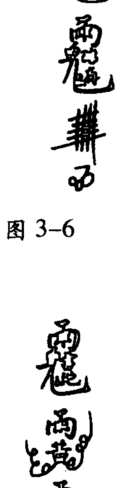  
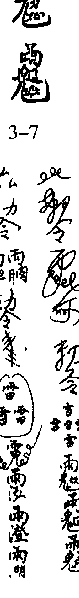  
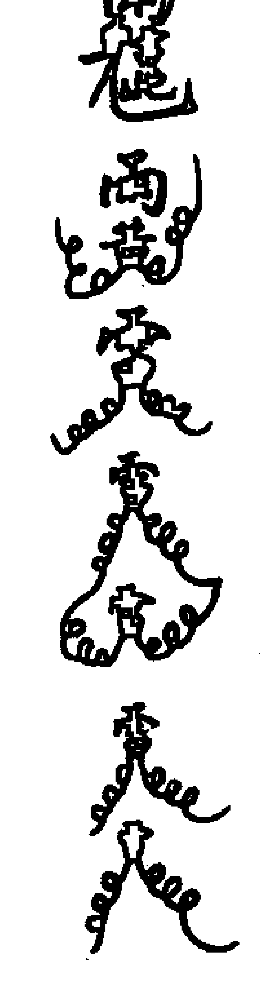  
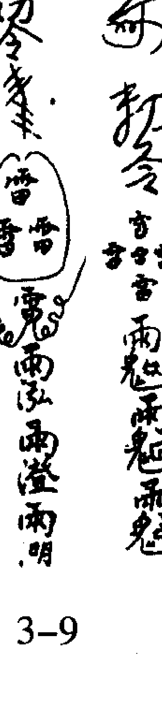

## (六) 铁围城符（图3-9）咒

天浩浩、地浩浩，天灵灵、地灵灵，弟子顶敬，洪州得道，鲁国先师，今日架起铁围城，四面八方不显形，铜墙壁万丈高，邪法师人站不拢，万法不能侵其身，一根绳子八丈深，铜绳铁绳加中心，不论金刀并玉剪，金刀玉剪不沾绳，弟子加下五雷轰，邪师邪法化灰尘，谨请南斗六星、北斗七星，吾奉太上老君急急如律令。

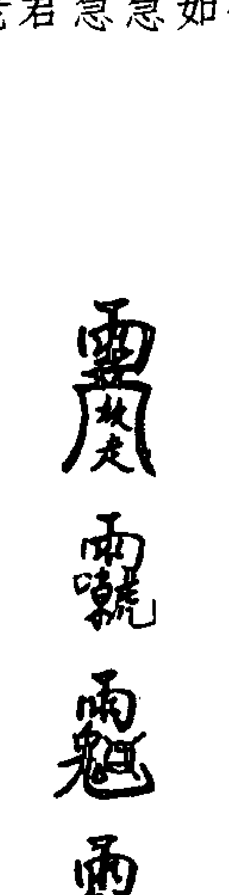  
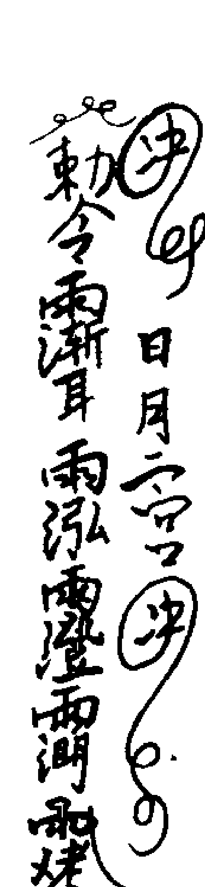

图3-10  
图3-11

## (七) 解退法符（图3-10）咒

奉请狐狸祖师来解退，一请天解师，二请地解师来解退，来人七魄三魂，一切山精和水怪、巫师邪妖不敢来，若有青人白人来使法，反手押在海底存，急急如律令。

## (八)百解邪法符(图 3-11)咒

南海岸上一匹草，昼夜青青不见老，王母蟠桃来解退，百般邪法都解了。一解黄义端公、二解南海万法、三解百艺法、四解三师法、五解铁匠法、六解花匠法、七解瓦匠法、八解石匠法、九解木匠法、十解剖补法，天地解、年月解、日时解，奉请狐狸祖师、一切祖师百般解退，谨请南斗六星、北斗七星，吾奉太上老君急急如律令。手挽解退。

## (九)解退整人符(图 3-12)咒

灵霄宝殿妙中云，两条金龙颠倒颠，奉请三霄祖师速速降来临，一退释迦佛，二退李老君，三退吾师传真语，四退四体四甲兵，五退五湖波浪起，六退六甲六丙丁，七退目连道地府，八退董永自卖身，九退九天并玄女，十退十化并雷神，奉请仙家祖师速速降临来解退，十年不逢，万年不遇，远走他们推出外界，休在此地侵害良发，谨请吾奉太上老君急急如律令。

## (十)百解符(图 3-13)咒

昆仑山上一窝草，七十二年长不老，吾奉师拿来庄天地，诸师邪法搬解了，一二三四五，金木水火土，吾师行令邪法化土，谨请南斗六星、北斗七星，吾奉太上老君急急如律令。

## (十一)收邪法符(图 3-14)咒

起眼看青天，传度师尊在面前，一收青衣和尚，二收赤衣端公，三收黄衣道人，四收百艺二师，若是邪师人冲左手挽后手脱节，右手挽冲，左手脱节，口中念咒，口吐鲜血，叫他邪法师三步一滚，五步一跌，左眼流泪，右眼流血，三魂丧命，七魂决命，押入万丈井中，火速受死，谨请南斗六星、北斗七星，吾奉太上老君急急如律令。先画井字用令。

图 3-12 图 3-13 图 3-14

## 第二节 防病治病类符咒

古人认为，人生病往往是由于神灵和邪魔附身所致，因此，也应采取与驭神制邪相关的巫术进行防病治病，而符咒则是以巫术进行防病治病的最广泛、最主要方式之一。这些符咒可分为防治具体疾病和防治非具体疾病两类。

## 一、防治具体疾病符咒

## (一)防治瘟疫符咒

(1)除日以合家头发烧灰，同脚底泥包投井中，咒曰：“敕令我家眷属竟年不害伤寒，避却五瘟疫鬼。”（《遵生八笺》卷六）

(2)国朝姚衡《寒秀草堂笔记》云：晋江令杨辅山有避秽咒，凡相验时，臭不可近。以清水一碗，持咒数遍，当场者咸不闻有秽气。后闻戴秋甫言，是法不得传五人。伊亦传有一咒曰，一扑一千里，二扑二千里，三扑三千里，扑去五瘟六疫、三十二证、七十二候，吾奉太上老君急急如律令敕。临相验时，念三遍，念时以右手拂之，有扇用扇，无扇用掌，可保一身。传时不可使六耳闻也。（《茶香室续钞》卷二十）

(3)除夜有行瘟疫使者，降于人间。以黄纸朱书“天行已过”四字，贴于门额，吉。（《本草纲目》）

(4)镇瘟符（图 3-15）：用法为贴于门额或佩于身上。

(引自《符咒妙法全书》)

## (二)化骨鲠符咒

(1)凡骨鲠者，用一碗水，虚空以手指写“天上金鸡叫，地下草鸡叫，两鸡并一鸡，九龙下海，喉咙化如沧海”二十五字，口诵七遍，饮此水愈骨鲠。又书“鸟飞龙下，鱼化丹丘”八字亦佳。（《坚瓠续集》卷二）

(2)东北地区，每有儿童鱼刺入嗓，便准备一碗清水和多年陈墨研汁，用毛笔或手指蘸上墨汁，在水面上画个龙字，然后令儿童将水喝下便愈。（张紫晨：《中国巫术》，第 175 页）

(3)如有食者，被鱼刺、鸡骨、鸭骨或兽骨梗刺于喉，即时准备清水一碗，左手捧之，右手控制剑诀①，向水南书此符（图 3-16）后饮下，诸骨必下。（雨民：《揭穿神秘的魔法》，第 20 页）

(4)备清水一碗，左手捧之，右手捻剑诀，书符（图 3-17）于碗水上，然后饮下，诸骨可化矣。（《符咒妙法全书》）

(5)备清水一碗，面向北方念“奉请雪山童子到”数遍。左手捧碗水，右手捻剑诀，书符（图 3-18）于碗水面，让患者饮之大口自效。

遇鱼刺用上字，菜骨用中字，兽骨用下字。（《符咒妙法全书》）

## (三)治疮治癣符咒

(1)太年五更时持受此法或端午持受咒曰: 日出东方，苍苍皎皎，杳杳茫茫，金童玉女，委我收疮，一收不要疼与痛，二收不要脓与血，三收不成疮与疖，急散急消莫待来朝，急消急散莫待来旦，神笔到处万病消，吾奉太上老君急急如律令敕。将“难难荤荤灵灵澄”此七字秘书在疮上即消退也。（《万法归宗》）

(2)《千金翼方·禁经》有“禁唾恶疮毒法咒语: 百药之长，不如吾之膏唾；吾仰天唾杀飞鸟，唾南山之木，木为之折；唾北山之石，石为之裂；唾北方之水，水为之竭；唾百虫之毒，毒自消灭；唾百疮之毒，生肌断血，连筋续骨，肌肉充实”。

① 以食指中指相并伸出的手势。

## (四)止血符咒

(1)咒语：伏以、伏以，手执大金刀，大红沙路不通，手执小金刀，小红沙路不通，内血不出，外血不流，人见我忧，鬼见我愁，十人见我十人愁。老君坐洞口，有血不敢流，血公姓邱，血母姓周，不流不流真不流，祖师倒起流，太上老君急急如律令。

做法：在伤口处画符（图 3-20），边画边念咒，念完画完用脚踏地，血即止。（《鲁班书》）

(2)咒曰：日出东方一点油乎执金骑白牛，三声喝住长流水，禁止洪门不准流。雪山童子来，雪山童子到，雪山童子止。

方法：取青树叶一片（无毒性），在口中念咒自嚼后，贴于流血处即止。（《符咒妙法全书》）

(3)书符（图 3-21）时口念：手执苓兰凤尾草，止住江中血流口，外血流不入，内血流不出，吾奉太上老君之律令。神兵火急如律令。（《符咒妙法全书》）

## (五)治眼病符咒

(1)偷针，俗叫“生鸡疫”，生偷针的儿童可手拾一块小石，跑到水井的旁边，面向着东方，口里念念有词；同时，把那小石掷沉于井中，乃转而回家。其词曰：

鸡疫袭、鸡疫哑，  
鸡疫落下井。（《中国民俗搜奇》）

(2)咒语：眼光圣母，慈悲求人，弟子眼病，求先添神，戒去燥心，心清头新，善贯一体，着照乾坤。

做法：凡有眼病者，面向东北方，焚香焚表，行三跪九叩礼，念三遍立刻见效。每日三次，求之无不灵验，斋戒十日。（李世瑜：《现代华北秘密宗教》）

(3)奉请大风仙师到，小风仙师到，风来，快快来风，吾奉一去永无。吹风眼，吹火眼，吹水犯，吹木犯，吹土犯，吹金犯（吹三口气）。吹年煞，吹月煞，吹日煞；吹人殃鬼煞，吹一百二十四位凶神恶煞（吹五口气）。吹子丑寅卯辰巳午未申酉戌亥煞（吹七口气），将手在眼睛上画符，符见图（3-23）。（《鲁班书》）

(4)以水一碗，书此符（图 3-24）于水碗中，洗眼，能（愈）一切眼（病）。（敦煌遗书斯二四八九写卷）

(5)此符（图 3-25）化清净洗亦可。

(6)此符（图 3-26）治赤眼化洗饮之。

  
  
  
  

（《符咒妙法全书》）  
（《符咒妙法全书》）

## (六)防治疟疾符咒

(1)元伊世珍《琅环记》云：一人病疟，道士以枣一枚按病人口上，诵咒三遍曰：我从东方来，路逢一池水，水内一尊龙，九头十八尾。问它吃什么，专吃疟疾鬼。太上老君急急如律令敕。与病人服之即愈。（《茶香室四钞》卷七）

(2)“一日疟埋迦醯迦，二日疟坠帝药迦，三日疟怛唎帝药迦，四日疟者特托迦。”不计数，不住口，持一昼夜，疟鬼远避一由旬。……又人诵“少陵子璋髑髅血模糊，手提掷还崔大夫”句，疟亦顿愈……（《坚瓠七集》卷四）

## (七)其他

(1)治汤火咒：俚巫多能持咒语而蹈汤火者，元仲弟得其诀，为人拯治，无不立瘥。其咒但云：龙树王如来，授吾行持北方壬癸焚火大法。龙树王如来，吾是北方壬癸水，收折天下火星辰，千里火星辰必降，急急如律令。敕摄。

用法：若有破伤者，诵此咒四十九遍，初头喷三喷，诵咒十七遍，唾三唾。

(2)破伤咒之一：日出东方，乍赤赤黄，上告天翁，下告地黄。地黄夫人，教吾禁疮。仙人提水，玉女洗疮。一禁便宝，两禁平伏如常，驴鸣马鸣疮也，不惊天雷地加疮也。莫恐我是毗沙罗摄地虫。急急如律令。敕摄。

用法：若有破伤者，诵此咒四十九遍，初头喷三喷，诵咒十七遍，唾三唾。

(3)破伤咒之二：今日不详，何日损伤，一禁便定，两禁平伏如常，急急如律令。敕摄。

用法：诵七遍，唾三唾，至四十九遍。

(4)破伤咒之三：日出东方，乍赤赤黄。仙人玉女，教吾禁疮。不痛不疼，不肿不脓。不出脓，不出血。急急如律令。敕摄。

用法：诵七遍，唾三唾，至四十九遍。

## 三、湘西苗族的“画水咒水”治病法

在湘西苗族中，有一种独特的“画水咒水”治病法。关于这种治病法，《湘西苗族调查报告》有详细记录：

画水的巫士都有传授。其传授之法，于夜晚三更，用一长板凳，上摆香、烛、纸钱、茶、公鸡、一支朱砂笔，另外青布三丈，鞋一双，钱一封。师父口授咒语，传演种种仪式。最后师父用刀，划破徒弟的头皮，使之出血。以人血和鸡血，再以朱砂笔蘸之，画符圈书。传授以后的四十五日中，须天天练习。过此时期，只在初一、月半，烧香复习。据云，如十分勤习，能得阴传。巫士学习画水巫术，须一生禁食天上的斑鸠，地下的犬、马、猴，水中的鳝、鳖、鳅。犯之，术则不灵。

画水的仪式，用烛一对，香三支，碗一只，内装米、肉一块。另用一杯，盛清水。纸钱若干。巫士在开始作仪式时，脑中须想像师父传授时的情形。先燃烛，再点香，将香插在米碗内。米上须放利市钱，多少不定。然后再将水杯、酒杯及肉一一放好。巫士乃向香案行三叩首礼。礼毕，焚化纸钱，将水碗取下，左手以大、食、小三指叉杯（中指无名指屈于掌心），右手以食、中二指相并，对水杯画符三道。画符时默诵请师父口诀。同时想像师父传授时的状态。请师口诀念毕，即念画水口诀，念至某段某句时，即喝水一口，向病者喷去，或将杯水使病者饮之。如遇急病，或在野外山上受伤，不及摆设香案，只须烧香纸，念咒画符，用唾沫涂病人伤处。

画水的咒语，可分为两部分，一为请师父的口诀；二为水的口诀。各种画水的咒语内容、请师的口诀，大同小异。水的口诀则各不相同。兹略举数例如下：

(1)将军水：治忽然昏倒的急症。请师的口诀是：“奉请肉口传度师父某某。抬头望青天，师父在中间，一叫自到，一喊就来。在我身前、身后、身左、身右，跟前拥后，跟左拥右，藏我身，不见我身在哪里，左讲正水，话（右）讲正水，画起铜刀铁刀。铜刀杀鬼。铁刀杀鬼。”

念完了请师父口诀，再念水的口诀：

“动一脚，喊一声，喊到上元大将军。第一将军本姓唐，一时做了李国王，脚踏推车八百轨，如在老君点内房。老君殿前十军厂，受走一张文武件，受起天上振妖真。招得龙，服得虎，斩得羊毛授邪真。二月新灾买活羊，一刀砍断送长江（至此，巫士喝水一口，声带虎威，喷在病人身上，同时顿起一脚，再念下去）。退不退，将军等你下地来；走不走，将军等你来上手。如今不退等好些，百鸟退山送美人。

“动一脚，喊一声，喊到上元大将军。第二将军本姓葛，鼻子出烟口出河，住在天堂都未宫，脚踏推车八百轨，如在老君点内房。老君殿前十军厂，  
受走一张文武件，受起天上振妖真。招得龙，服得虎，斩得羊毛救邪真。二月新灾买活羊，一刀砍断送长江（亦如前喷水跺脚）。退不退，将军等你下地来；走不走，将军等你来上手。如今不退等好些，开鬼肠，破鬼肚，破了鬼肚吃鬼心。

“动一脚，喊一声，喊到上元大将军。第三将军本姓朱，能把黄河水倒流。脚踏推车八百轨，如在老君点内房。老君殿前十军厂，受走一张文武件，受起天上振妖真。招得龙，服得虎，斩得羊毛救邪真。二月新灾买活羊，一刀砍断送长江（亦如前喷水跺脚）。退不退，将军等你下地来；走不走，将军等你来上手。如今不退等好些，大的拿来吃半边，小的拿来刮吊干。个个有网赶快受，不受打乱你的网。”（最后两句低声默念）

(2)鹭鸶水：治饮食不慎，骨鲠在喉。喝了这杯水，骨自能吐出或咽下。请师的口诀同上。

水的口诀：

“月出四柱起，切尽肮脏鬼，愿吾变猴生，正正变吃水。叫变就变，若有不变，弟子画起六月太阳晒变；叫融就融，若有不融，弟子画起六月太阳晒融。若再不融，弟子画起五百蛮雷打融。抬头望四方，九龙下天堂，龙来龙脱爪，虎来虎脱皮，山中百鸟脱毛衣，步步成钢，动手成划。”（反复念三次）

(3)雪山水：治灼伤皮肤。如轻伤可用口沫唾之，伤重须用水碗喷三口水，并以手蘸水，抹于伤处。

水的口诀是：

“一请一里路，二请二里路。大将军请到大雪山，小军刀请到小雪山，奉请师父龙胜发，深潭弟子麻老桥。烧军折军，烧皮折皮，血莫流，拿口水作药。”

(4)隔山水：治隔一山跌伤或砍伤者。如闻有呼救之声，即可念咒就治。但预先要告诉受伤者：“若我问你好不好，你可答：好。否则不灵验。”

水的口诀是：

“隔山按山，隔水按水，画鬼担，砍鬼山，老龙深到深龙滩。请得木山李”

## 水的口诀

“动一脚，喊一声，喊得师父吴化星，隔山喊三星，隔水喊水叉，大军刀担到大洪沙，小军刀担到小洪沙，担了长江水，海的流，脚踩龙头，担血不流；脚踩龙腰，担血不飘。子儿子儿，化在乱泥之田，儿童而相连。总师教我四处勾，弟子教我指四方。”

## 第三节 日常起居类符咒

日常起居类符咒，包括起床梳头、穿衣、沐浴洗手、吃饭和睡觉前所施用之符咒。道教认为，在做这些事之前念诵有关咒语，能驱邪养生。

## (一) 梳头咒

《云笈七签》卷四七《秘要诀法•栉发咒》：“凡欲栉发，先叩齿三通，咒曰：‘上清朱雀，不得动作。勿离吾身，勿受邪恶。六丁七星，邪魔分形。敢有当我，北帝不停。急急如律令。’毕，闭目存想，发神苍华，字太元，如婴儿之形，在己发上。然后解栉之，当令三五百遍为佳。”

## (二) 穿衣咒

《云笈七签》卷四七《秘要诀法》：“著衣咒。旦起叩齿著衣咒曰：‘左青童玄灵，右青童玉英。冠带我身，辅佑我形。百邪奔散，鬼贼催精。敢有犯我，天地灭形。急急如律令。’”

## (三) 沐浴洗手咒

《云笈七签》卷四六《秘要诀法·澡秽除凶七房祝法》：“凡道士沐身及洗手之时，先临水啄齿三通，乃微咒曰：‘四大开朗，天地为常。玄水澡秽，辟除不祥。双皇守门，七灵安房，云津炼灌，万气混康，内外利贞，保兹黄裳。’咒毕，又叩齿三通，乃洗沐手面。”

## (四) 未食咒

《云笈七签》卷四七《秘要诀法·未食咒》：“凡道士临于盛馔，皆心存正一，目想一先饮食，然后兆乃食。食之毕，心微咒曰：‘百谷入胃，与神合气。填补血液，尸邪亡坠。飞登金阙，长生天地。役使六丁，灵童奉卫。真气来前，邪气远退。’”

## (五) 夜睡咒

“载汝之名，汝有五鬼，名曰摄精，吾知汝的。速离吾身，太上律令，化汝为尘。急急如太上帝君律令敕。”临睡时，面北，叩齿七遍，朝寝无失。

(《灵宝藏经》)

## 第四章 防病治病、避凶趋吉

符咒的主要种类（下）

## 第一节 婚恋类符咒

婚恋类符咒在古代爱情生活中起着重要的作用，它在汉族，尤其在一些少数民族中比较流行。

## 一、求爱符咒

(1) 傈僳族的求爱符咒：那些想要获得某个女人的性爱而又不被那个女人所爱的男子，请巫师制作一具男女搂抱交欢的木偶，在那女性木偶上粘上一点所要勾摄女人的指甲或一缕头发，然后偷偷把木偶放在她家的房前或屋后，巫师在月光皎洁的夜晚，躲在她家附近的树林里念咒：

喔哦喔——

××漂亮女人的魂呀，
快快游来我身边吧。

我给你准备了五彩的珠串，
我给你准备了闪光的银器，
我给你准备了漂亮的衣服。

趁你爹妈熟睡，
快来伴我同眠。

巫师如此连呼七个夜晚的魂，就认为那女人的魂就会被勾摄而来，随即她也会来寻找勾摄她魂的男子①。

(2) 广西靖西壮族的求爱符咒：如果一个小伙子追求某一个姑娘，他们会经常在一些人家聚会。小伙子可把主人的水烟袋拿过来，对烟筒说几句咒语，大意是：“吸着烟袋像抚摸着河水，吸着烟袋噜噜啦啦响，像与烟水拉家常，河水给我爱的力量，烟水为我与情人作撮合，用手轻轻地拍三下，用嘴温柔地吹三口气，把爱情的微笑带给情人。”念完咒后，把烟袋传给所要追求的姑娘。如果姑娘笑眯眯地接过烟袋，吸几口烟，据说必然坠入情网；反之，姑娘接过烟袋不吸烟，而用手把烟袋嘴抹一下，把烟水吹出来，这种求爱巫术就失灵了……也有不少用于诱惑异性的符箓，这些符箓多为男女交媾，鲤鱼连作，日月形象，画旁有咒语。（图 4~1）

① 杨学政：《衍生的秘律——生殖崇拜论》，云南人民出版社，1992 年 9 月第 1 版，第 112 页。

## 二、敦促爱情发展之咒

摘一片初生嫩叶放在手上，先面向东念下一咒语的前两句，再面向西念后两句，咒曰：

太阳向东升，
君在我左右；
太阳向西沉，
我伴君身侧。

然后将叶片切细，掺在对方食物中，据说吃了这一“仙草”后，淡淡的君子之交很快会变成甜蜜的爱恋关系。（雨民：《揭开神秘的魔法》）

## 三、愿爱情牢不可破符咒

为防止与丈夫的感情于半途触礁，可用纸描下他的足迹，晚上八点的时候，把这张纸埋在柳树桩下，边埋边念咒：

你是斧来我是柄，
你是公鸡我是牝；
从今以后不悲哀，
天长地久心相印。

（雨民：《揭开神秘的魔法》）

## 四、摆脱爱情纠缠符咒

满月之后的第二天大早，太阳还没升上来的时候画一只眼睛，用缝衣针在眼睛上刺三次，一边念着：“地狱大门开开！魔鬼等你进来！”然后再刺三次，念咒：“魔耶利古，皇天急我，彻世因果，前轮后世，永忘浩荡不古。”接着瞪起眼睛，像要下逐客令一样地喊一声对方的名：“×××，离开吧！快离开！”

（雨民：《揭开神秘的魔法》）

## 五、夫妻和睦符咒

普庵祖师敕乾男年月日时和合，扶起女人妻子来合时刻来合，我身时时刻刻合我心阴阳来和合，天地日月来和合，和合仙师来和合，和合童子来和合，和合仙师和合童子到此急急律令敕。（图 4-2）

## 第二节 生育类符咒

生育类符咒，具体可分为求子、孕育、生产和养育四类。

## 一、求子符咒

之一：使不育妇女在庚日或辰日面向正东站立，口中念咒语三次：“天精地精，雨结成人；天气下降，一物成形，各保安宁。”然后由施术者判符，并将所判之符与香木一起火化后令该妇吞服①。

之二：用朱砂二钱，猩红二钱，鸡血二钱，溶合后，在五色绸缎上判符。判符时念道：“天圆地方，律令九章，神将感应，小孩吉昌。谨请：南斗六郎、北斗七星、太上老君，急急如律令。”然后用生铁四两，折柳木四两，三家（以有儿为条件）院内土一升，新筷子一根，小儿鞋一双，裹肚一个，茅香一两，安息香三钱，青石、白石各一块同埋于卧室门槛下。同时在该妇梳妆所用的镜子上，画一小儿头符即可②。

## 之三：求子吞符（图 4-3）

图 4-3
（敦煌遗书伯三三五八）

## 二、孕育符咒

之一：怀孕易流产者，吃此符（图 4-4），戴此符就能安胎，此符要用鸡血点化。

+   1. 柯杨、赵宝玺：《“薛家湾人”的职业及其信仰习俗》，《民间文学论坛》1988 年第五、六期合刊，第 111—112 页。
2. 出处同注①。

## 之二：孕妇未满月数，稍感肚痛，须请道士绘符一道焚灰融开水饮之，以免流产，此符红纸墨字，忌落下地，普通所绘之符如图 4-5。

图 4-4

图 4-5

（《揭开神秘的魔法》）

## 三、生产符咒

之一：以黄纸调朱砂，用净笔写一车字在中，四周环写马字须遍，且须端正，大小则不拘，烧灰和水令饮之，虽难产，亦立娩，马字成单者，所生必男，成双者必女。写时亦不能自主，或有意在单，写竟不周，不能减去，有意在双，写竟已周不能增入。（《茶香室续钞》卷二十一）

之二：见图 4-6。

咒语：一化九龙水，二化王母催生水，三化观音瓶内水，四化西天陀水。

使用时要口念咒语，手画催生符，口念手画一并进行，连接起来才行，然后让产妇将水吞下。

之三：见图 4-7。

之四：见图 4-8。

图 4-6

图 4-7

图 4-8

（《鲁班书》）（敦煌遗书伯三三五八）      （引自《道藏》）

## 四、养育符咒

## (一) 止小儿夜啼符咒

之一：民间认为，小儿夜间啼哭，被认为是遭夜啼鬼纠缠所扰，须施法捉鬼。其法以烧过火的柴头，削平一边，用朱砂写上咒拿夜啼鬼文：“拔火杖，天上五雷公，差来作神将，捉拿夜啼鬼，打杀不许放，急急如律令敕。”晚间将柴头置于小儿床头，明早用宝烛送出门外，谓夜啼可止。

之二：用两张红色宣纸，熏香之后，置于婴儿内衣下放两天，第三天，将宣纸取出喷水，干后用黑墨水在纸中央依图 4-9 画符，字体应尽量大些，效果更好。将画好晾干的符咒折成四折，让母子各戴一张在身上一晚上。隔天后两张符均需再熏香，然后烧成灰，将其涂在婴儿的额头、后脑勺及胸部等部位，几天后婴儿的夜啼会有所改善。（《揭开神秘的魔法》）

之三（图 4-10）：

用法：此符和寿金一千在床前烧化即效。

之四（图 4-11）：

用法：书写两道，一道贴房中，一道烧化。

图 4-9

图 4-10

图 4-11

（《符咒妙法全书》）（《符咒妙法全书》）

## (二) 收土收惊类符咒

之一：小孩病时，从睡梦中吓醒来，或身热吵闹，就去叫会收惊或收土的老妇来。她认为有土，就用米一碗，碗里放入水缸脚下的泥及银、铜、铁器各一，用小孩穿过衣服包好，交转时，在小孩的头上、身上、脚上摇，口里说：

南方甲乙木，西方丙丁火，东方庚辛金，北方壬癸水，中央戊己戊土，土公、土婆、土爹、土娘、土子、土孙，我家何方？诸神回避，天无忌、地无忌，阴阳无忌，百无禁忌，有土收土，没土收五方恶气！

这么念几遍，将碗翻转来看，米少在哪一角，则土即是從那一角惹来的，将缺的地方拿几粒放在一碗水里，拿几粒丢掉，说：“土公土婆驼得去。”于是再用米将缺的地方补满、包好，翻转来摇着说，一直弄到不缺，然后将这碗米放在小孩睡觉的地方。收惊所用的东西同前，唯将说话改为：

天惊，地惊，神惊，鬼惊，念念惊，小人勿晓得，脚底板里出一惊。

收毕，这碗也放在小孩睡的地方。水碗里的米连水泼在狗身上，收土的那碗水米也如此，意思是将病过给狗。（惠西成、石子：《中国民俗大观》）

之二（图 4-12）：

咒曰：“本师来收惊，本师来收惊，收惊三师三童子，收惊三师三童郎，不收别人魂，不讨别人魂，收你某某三魂七魂，收来顾本命，吾奉太上老君勅，神兵神将火急如律令，急急如律令。”

之三：受惊大体多为幼儿孩童，此符（图 4-13）能整煞收惊，应验极速，若有着惊，可将符贴于案前，神案前点蜡烛，施术（男女均可）时烧香，以茶杯装盐米，在患者前告诸患症，后念收惊咒三篇。

咒曰：祖师助吾来收惊，本师助吾来收惊，仙童玉女助吾来收惊，合坛官将助吾来收惊，王仙元帅助吾来收惊，太上老君助吾来收惊，清水祖师助吾来收惊，普庵教主助吾来收惊，观音佛主助吾来收惊，腾麒圣者助吾来收惊，保生大帝助吾来收惊，谢府元帅助吾来收惊，中坛太子助吾来收惊，五府千岁助吾来收惊，菩萨祖师助吾来收惊，现坛官将助吾来收惊，黑虎大将助吾来收惊，空中元帅助吾来收惊，三百六十员官将助吾来收惊。

## (三) 小儿夜尿符

之一：见图 4-14。

用法：化服即效。

之二：见图 4-15。

图 4-14

图 4-15

（《符咒妙法全书》）（《符咒妙法全书》）

## (四) 小儿摔伤咒

对幼儿跌跤碰撞时常用的手法是：一边抚揉伤痛处，一边念口诀：“揉揉，散散，不让老娘看见。”然后对伤痛处吹口气，说“不疼了”。此法往往能制止儿童的哭号。

## (五) 小儿出门符咒

用锅底黑灰在额门上打点或画“×”，或在帽上别一根带线的针，或以茅草、稻草五根、十根、十一根作避鬼物，一边拿草在手掌上比划掐断，一边念咒：“一根草，一根生，两根草盖我身；盖我手，盖我脚，龙脉必上身。天脉黑，地脉黑，日脉黑，时脉黑，人见人怕，鬼见鬼怕，吾奉太上老君切切如令。”

“扯把草，白汪汪，左手拎来右手量，别人拿来无用处，弟子拿做草鬼王。插在河中鱼不走，插在路头鬼不行，插在人身分百鬼，百鬼不敢近郎身，吾奉太上老君切切如令。”

（张劲松：《中国鬼信仰》）

## 第三节 成年人出门之符咒

在民间，许多人认为一旦出了村门，就无村神保护，而途中鬼魔妖邪为隐伏其间，故出门无不小心。

## 一、出门应急择日符咒

出远门时，一般都要计算和选择吉日，但若出行紧急，来不及择日，可运用“纵横应急法”代替。其法：两脚并齐正身站在门内，叩齿三十六次，用右手大拇指于空中先画四纵，后画五横。（图 4-16）画完，将以下咒语念诵七遍。 
咒曰：

四纵五横，
吾今出行。
禹王卫道，
出无避兵。
盗贼不得起，
虎狼不得侵，
远行归故乡。
当吾者死，
背吾者亡。
急急如九天玄女律令！①

图 4-16

## 二、出门咒

之一：出了邦门，要“先行禹步”，然后三勉，念“某行无咎”，便可平安无事。（云梦、秦简《日书》）

之二：出行念“仪方”二字，可祛蛇虫，念“仪康”二字，可避虎狼，念“林兵”二字，可避百邪。（《只麈谭》）

## 三、入山符咒

之一：《抱朴子·登涉》：“入山宜知六甲秘祝。祝曰：‘临兵斗者，皆阵列前行。’凡九次，常当密祝之，无所不辟。要道不烦，此之谓也。”

之二（图 4-17）：

《抱朴子》曰：“上五符，皆老君入山符也。以丹书桃板上，大书其文字，令弥满板上，以著门户上，及四方四偶，及所道侧要处，去所住处，五十步内，辟山精鬼魅。户内梁柱，皆可施安。凡人居山林及暂入山，皆可用，即众物不敢害也……”

之三（图 4-18）：

《抱朴子》曰：“此符亦是老君入山符，户内梁柱皆可施。凡人居山林及暂入山，皆宜用之也。”

之四（图 4-19）：

《抱朴子》曰：“此是仙人陈安世所授入山辟虎狼符，以丹书绢二符，各异之。常带着所住之处，各四枚。移涉当拔收之以去，大神秘也……”

之五（图 4-20）：

《抱朴子》曰：“此符是老君所戴，百鬼及蛇蝮虎狼神印也。以枣心木方二寸刻之，再拜而带之，甚有神效。仙人陈安世符矣。”

## 四、夜行符咒

之一：《云笈七签》卷四六《秘要诀法·除六天隐咒第二十一》：“凡道士夜行之时，及有所恐震之地，叮齿二七通，乃咒曰：‘吾是小有真主，三天师君，昔受太上神方，杀邪之文。夜行游尸，七恶妖魂，九鬼共贼，千魔成群。赫柏图兵，巨兽罗千。挥割万妖，当我者残。’”

之二（图 4-21）：

用于赶夜路时驱鬼避邪，出门时，右手中指往天上画符，右脚在地上狠跺三下。

图 4-21

## 五、其他

出远门中途迷路, 未辨方向, 疑为鬼所迷, 可以小便绕成一圈, 口念“敕!敕!敕!”或念“家神香火请引导子孙”, 则立能寻旧道。又病人出门就医, 请道士绘符贴周身, 又书“姜太公在此”、“北方真武玄天上帝斩妖治邪”、“三十三天华光大帝持剑在此”等条随行, 重者用关帝塑像护送。[《中国民俗搜奇》(3)]

## 第四节 生意兴隆、六畜兴旺及避鼠、鸟、虫害之符咒

## 一、经商符咒

(1)画两只左右对称的狮子, 每天早上面对着这张符咒在心里画两个三角形。于是, 不待你狮子大开口, 这两只听话的神狮便会为你衔来无尽的财富。

此符咒源于唐宋时代, 两个三角形代表财富与信用, 两只狮子是它的守护神①。

(2)凡人买卖不兴或是经营折本, 凡事不称意, 用一百五十家饭各一盏, 竹桶盛之, 安于堂房上用纸马祭谢, 纸灰用绢袋吊之, 并贴符(图 4-22)于门

① 《揭开神秘的魔法》。

## 二、避六畜死亡符咒

之一: 避猪瘟符(图 4-25)。用法: 画符两张, 一张烧于水碗中, 往圈内泼去, 贴一张在圈门上。之二: 避六畜死亡符(图 4-26)。

## 三、避虫害、鸟害、鼠害符咒

(1)止虫咒: 青苗山神菩萨, 我们一年四季都祭您, 庄稼是我们的命根子, 请您把天上的乌鸦雀鸟赶走, 把地下的钻心虫老母虫赶走!

(2)岁时咒雀: 惊蛰日清晨, 听见雀鸣, 即唤牧童, 往田间咒雀。牧童即手拿铜器一具, 跑到田间, 顺田埂而行, 随行随敲, 随敲随咒, 其词曰: “金嘴雀, 银嘴雀, 我今朝来咒过, 吃着我的谷子烂嘴壳。” 其意谓今日咒过, 迨谷熟之时, 鸟雀便不敢来啄食。但必须将自家田埂走遍, 始可回家。[《中国民俗搜奇》(1)]

# (三)镇鼠食物符 (图 4-27)。

用法: 贴于装物之器具上。

## 第八节 建房、镇宅及防盗镇盗之符咒

## 一、建房镇宅符咒

(1)上梁符咒: 凡造房屋木石泥水匠作诸色人等蛊毒厌魅残害主人上梁之日须用三牲福礼横扁一架祭告

诸神将鲁班先师秘符(图 4-28)一道念咒云恶匠无知蛊毒厌魅自作自当主人无伤暗诵七遍木匠遭殃吾奉太上老君勒令他作吾无妨百物化吉祥急急

如律令

即将此符焚于无人处, 不可令四眼见, 取黄狗血暗藏酒内, 上梁时将此酒速递匠头三杯, 余者分饮众匠, 凡有厌魅自受其殃, 诸事符解。

再用朱砂书鲁班先师秘符贴正梁上。黑圈内写本家名字, 在内写完以墨涂之, 贴符用左手持之, 贴时莫许外人说闲话, 贴毕下梯方以青龙和合净水米食化纸, 即安家堂众祖接土地灶神居位, 遂念安家真言曰：

天阳地阴 二气化神 三光普照 吉曜临门 华香散彩 天乐流音 迎请家堂 司命六神 万年香火 永镇家庭 诸邪莫入 水火难侵 门神户尉 杀鬼诛精 神威广大 正大光明 太乙劲令 久保山门 安神已毕, 永远大吉。（《鲁班平沙玉尺经》）

(2)安门咒: 天有三奇, 地有六仪。玉女守门, 凶煞远避。进喜进财, 大吉大利。金玉满堂, 长命富贵。急急如律令!(《三元总录·宅元卷上》)

(3)门符: 见图 4-29。

(4)镇宅四角符: 将符安在房子的四角以祛邪。(图 4-30)

## 二、防盗、镇盗符咒

之一: 屏盗贼咒语, 鞾旅露宿, 颇可预防。咒云: 七七四十九, 盗贼满处走, 伽蓝把住门, 处处不着手, 童七童七奈若何。于清晨日出时向东方默念四十九遍, 勿令鸡犬妇人见之。(《归田琐记》)

之二: 对着贼留下的脚印或其他痕迹, 反复诅咒: 天杀你, 地杀你, 一根钉子钉死你!

之三: 镇盗贼符(图 4-36)。

用法: 贴于门上。

## 第六节 其他类符咒

## 一、令哲愿如愿以偿咒

《云笈七签》卷四六《秘要诀法•大帝隐祝第十五》：“凡道士入室烧香，有所修愿，皆先啄齿三通，乃微咒曰：‘玉华散景，九炁含烟。香云密罗，经冲九天。侍香玉女，上闻帝前。令我长生，世为神仙。’所向所愿，莫不如言。”

## 二、护身符

之一：见图 4-37。

用法: 佩戴于身, 可镇妖驱邪。
之二: 将此符(图 4-38)带身, 可保富贵平安。

## 三、求聪明咒

唵摩罗摩罗, 三摩罗因他利醯, 尾秫利耶, 尾秫拖耶, 唵摩罗摩罗室哩耶, 婆婆诃。

用法: 每念此咒先焚香, 叩拜观音下天堂, 将我愚鲁变智慧, 情愿伺候不嫌忙。(《皈一道修持法则》)

## 第五章 符咒术“灵验”的实质

如前所述, 在中国古代, 人们十分相信符咒术的灵验, 认为符咒无所不能。但由于受当时落后的生产力和低下的科学文化水平的制约, 人们还不可能正确认识符咒术“灵验”的实质, 而只能不自觉地把符咒术的“灵验”归于鬼神的作用。尽管在当时也有一些文人对“符咒术灵验乃鬼神的作用”之说提出了质疑, 但他们的质疑也仅仅不过是“质疑”而已, 他们还很少涉及符咒术“灵验”的实质问题。对这一问题的深入认识和探讨, 那是近代以来, 尤其是近年来对气功、人体特异功能的研究有了长足进步之后的事。一些研究者通过对气功与符咒、人体特异功能与符咒关系问题的探讨, 提出了符咒本身只不过是一种外在形式, 其“灵验”的实质或是气功外气, 或是人体特异功能的作用之说。然而, 由于这些研究者只是从单一的角度来探讨符咒术“灵验”的实质, 因而这种探讨难免存在着某些片面性, 还不能对符咒术“灵验”的实质作出全面而又科学的解释。实际上, 符咒术之所以“灵验”, 既有气功内外气和人体特异功能的作用, 还有语言暗示和药物等因素的作用。

## 第一节 符咒术的“灵验”乃气功内外气之功效

符咒术的“灵验”乃气功内外气的作用, 可以从以下几个方面得到证实。

- 1. 从咒语方面看, 道士念咒治病等的时候往往要与行气结合起来, 这也

就是所谓的把行气和道教法术中的禁咒结合起来的气禁之术。在中国古代，气禁术为许多古人所相信。例如，东晋道士、炼丹士、医学家葛洪就是相信气禁术的典型者之一。他不仅对这一方术坚信不移，还明确地提出了禁咒术“灵验”的实质是气(炁)的作用之问题。他在《抱朴子·至理》中谈到：“吴、越有禁咒之法，甚有明验，多炁耳，知之者可以入大疫之中，与病人同床而已不染。又以群从行数十人，皆使无所畏，此是炁可以禳天灾也。或有邪魅山精，侵犯人家，以瓦石掷人，以火烧人屋舍，或形见往来，或但闻其声音言语，而善禁者以气禁之，皆即绝，此是炁可以禁鬼神也。入山林多溪毒蝮蛇之地，凡人暂经过，无不中伤，而善禁者以炁禁之，能辟方数十里上，伴侣皆使无为害者。又能禁虎豹及蛇蜂，皆悉令伏不能起。以炁禁金疮，血即登止。又能续骨连筋。以炁禁白刃，则可蹈之不伤，刺之不入。若人为蛇虺所中，以炁禁之则立愈。近世左慈、赵明等，以炁禁水，水为之逆流一二丈。又于茅屋上燃火，煮食食之，而茅屋不焦。又以大钉钉柱，入七入寸，以炁吹之，钉即涌射而出。又以气禁沸汤，以百许钱投中，令一人手探攫取钱，而手不灼烂。又禁水著中庭露之，大寒不冰。又能禁一里中炊者尽不得蒸熟。又禁犬令不得吠。昔吴遣贺将军讨山贼，贼中有善禁者，每当交战，官兵刀剑皆不得拔，弓弩射矢皆还向，辄致不利。贺将军长智有才思，乃曰:吾闻金有刃者可禁，虫有毒者可禁，其无刃之物, 无毒之虫，则不可禁，彼能禁吾兵者，必不能禁无刃物矣。乃多作劲木白棒，选异力精卒五千人为先登，尽捉棓彼山贼，贼恃其善禁者，了不能备，于是官军以白棒击之，大破彼贼，禁者果不复行，所打煞者，乃有万计。夫炁出于形，用之其效至此，何疑不可绝谷治病，延年养性乎?”这些奇异的气禁效应，在过去往往被视为荒诞不经的欺人之谈。随着近些年来对气功外气功用的深入研究，证明了其中的不少描写的确实是存在的。如气功师用外气在一定距离内作用到病人的经穴或病变在体表的反射部位，从而发挥治疗疾病的特殊效能；而用外气隔空击人等，则现在已是司空见惯的事。由此来看，道士的气禁术和禁咒术实际上就是气功，其咒语的“灵验”实质上是气功之内外气在发挥作用。离开气功之内外气，其咒语就只不过是一种语言游戏罢了。

道士是如此, 巫师及其他一些宗教教徒念咒之“灵验”亦是如此。例如, 哈尼族贝玛朱小和为群众念咒驱鬼时实际是在发功治病, 藏族的高级喇嘛所练气功之外气能达到致人头颅破裂的程度, 但他们却常常借念咒故弄玄虚以渲染宗教的神秘性。

2. 从符的方面看, 符具有储存气和信息的作用。有人曾对气功书法作过实验, 测试结果表明, 气功态下的书法墨迹能像气功师那样, 不断向外发放外气, 而且对物质产生各种效应。如使激光输出功率与偏振方向发生振荡; 使正乙烷与溴水混合液发生褪色反应; 使水电导率增加; 使水拉曼图谱出现高峰等。①所以道士在书符之时, 一般都要存思运气, 吹气于符中, 实际上是发放内外气的一种形式。如果该道士修气功并有很深的内炼功夫, 则其画的符中, 就很有可能载有气, 将其符用于治病等, 有可能见效, 这大概正是古代一些道士用符作法灵验的主要原因所在②。

同样道理, 道士在气功态下对着水画符念咒; 也是发放内外气的一种形式。这种水在过去称之为“符水”和“咒水”, 今天则被称之为“气功水”和“信息水”。许多气功实验证明, “气功水”、“信息水”有“能长期存在的‘信息能场’”, 它们能诱使周围的未发气的水也具有同样性质(用紫外光谱测得)③。据《东方气功》杂志 1990 年第四期报道, 严新、朱念麟等在多年的实验研究中发现: 有许多气功师对水发功后有相当的治病疗效, 1984 年作特异开刀试验时, 气功师发过功的水喷在刀上, 即可达到让病人不疼痛、不流血的奇妙效果。

气功师发过功的水能起到止痛止血或治疗其他疾病的作用, 在于气功师将治病或止痛止血的意念打入水中, 意到气到, 信息也就进入其中了。由于此水已具有了存储和传递等功能, 气功师的意念信息和能量随着水被患

- ① 《中国风水应用学》第 137 页。
- ② 陈兵:《道教气功百问》, 今日中国出版社, 1989 年 9 月第 1 版, 第 188 页
- ③ 《中国风水应用学》第 134 页。

者喝下而进入其肠胃中, 就像服中西药物那样起到治愈疾病的作用。喷到皮肤上, 就像涂上止痛药水一般, 也能止痛。“气功水”、“信息水”的制作关键在于意念的掌握。意念输送什么信息, 就起到什么样的治疗作用。比如气功师若是将强烈的止血意念输入水中, 水中也就具有了强烈的止血信息。由于水本身也有渗透性、吸附性等, 所以喷上这种“气功水”、“信息水”犹如贴上膏药一样见效。

既然知道符水、咒水即气功师发过功的信息水, 我们也就能很好地揭示早在公元 1 世纪东汉张道陵创五斗米道及 2 世纪张角创太平道时, 他们用符水治病传道而能吸引众多的教徒, 以及从古至今一些民间巫师画水能治病的神秘现象: 张道陵、张角及这些民间巫师所用之“符水”、“画水”实质上就是“气功水”、“信息水”, 所以它们有治愈疾病之神奇效用而令教徒和百姓信之如神。这也正是道士、巫师用符水、画水治病灵验的主要原因所在。

## 第二节 符咒术的“灵验”乃人体特异功能意念力之功效

符咒术的“灵验”除了气功内外气的作用之外，还与人体特异功能的意念力有关。

人体特异功能的意念力，指的是在无视觉作用或不施加外力的情况下由人的精神意识所诱发的直接为人治病，或将物体从一个地方移到另外一个地方的一种能量。我国古代一些书籍中记载的“搬运术”，以及当代人体特异功能测试中的不接触针表，仅凭头脑中的意识作用就使钟表走时紊乱等，都是意念力的作用。

从气功外气具有气和信息的特性来看，气功外气也是一种意念力。但本节所要探讨的意念力，非指经过气功训练而获得的气功外气的意念力，而指的是非气功训练的，在催眠状态下诱发出来的特异功能的意念力。这种意念力主要表现在一些降神附体风俗(也即民间的催眠风俗)中。例如：

在广西和云南的某些农村地区，一些巫师面对两张椅子念念有词，烧香画符，不一会儿，两张椅子便自冲自跳，像牛打架一般相互顶撞，你来我往，煞是逗人发笑。

在当今山东聊城等地的农村孩子中流传着这样神奇的游戏：地上放一个碗，盛满水，把一个小方桌扣在上方，方桌四脚边上各站一个人，四人用手指朝顺时针方向一指，小方桌会奇迹般地转动起来，愈转愈快。

旧时许多地方的家庭中有“请筷神”的游戏，其法有二：一是妇女闲居无事，取竹筷一双置桌上，环坐注视之，并唱鄙俚之歌。久之，筷即自动，或竖起，或跳高，或腾空，互击不已，必待妇女们再唱解脱之歌方止。此俗在旧时乡落间随处可见。二是农历八月晚上有月光的时候，儿童们以一只筷子竖直于贮满米的米筒内，另一只横架于竖直的那只筷子的上端，然后手攥香火，口念“筷头跷，筷尾摇，筷头跷跷夹针菜，筷尾摇摇夹稞条”之类的咒语。不久，便见那只架在上面的筷子稍微移动。再久，则循环转动，周而复始，非遇意外，罕见跌下。

不少地方不少民族的巫师，在烧符念咒进入降神附体(催眠)状态后，能不用药物，不用符咒而直接为病人治病……

根据笔者的研究，降神附体风俗中的意念致动、意念治病等神奇效用，正是人体固有而潜在的特异功能在催眠状态下被诱发并发挥作用的结果①。只不过由于巫师和迷信鬼神认为这些神奇效用为鬼神作用所致，因而格外

① 详见拙著《神秘的幻术——降神附体风俗探究》，广西人民出版社 1993 年 1 月第 1 版。

## 第三节 符咒术的“灵验”乃药物之功效

符咒术的“灵验”除了与气功外气和人体特异功能中的意念力的作用有关外，也与药物的作用有关。

首先，从书符的材料来看，书符材料本身就有一定的药用价值。

## 一、纸

纸符，顾名思义就是纸画之符，其用法多为直接吞服、烧化于水中饮服和贴用。画符所用之纸本身就不乏治疗作用，李时珍的《本草纲目》中对此就有不少介绍与说明。

+ 1. 楮纸：烧灰，止吐血、衄血、血崩、金疮出血。
2. 竹纸：包犬毛烧灰，酒服，止疟。
3. 藤纸：烧灰，敷破伤出血，及大人小孩内热，衄血不止。
4. 麻纸：止诸失血，烧灰用。
5. 青纸：妒金疮，以唾粘贴，数日即愈，且护痛。
6. 印纸：妇人断产无子，剪有印处烧灰，水服一钱。

(7)草纸：作撚纤痈疽，最拔脓。

书中还介绍了不少“附方”，如“吐血不止：白薄纸五张烧灰，水服，效不可言”；“衄血不止：屏风上故纸烧灰，酒服一钱，即止”；“月经不绝，来无时者：案纸三十张烧灰，清酒半升和服，顿定”；“血痢不止：白纸三张，裹盐一匙，烧赤研末，分三服，水饮下”。

画符之纸除了上述几种外，用得更多的是由硝石制成的黄裱纸，硝石是一剂良药。《本草纲目》云：“朴消(硝)主治百病，除寒热邪气，逐六腑积聚，结固留癖，能化七十二种石。炼饵服之，轻身神仙。胃中食饮热结，破流血闭绝，停痰痞满，推陈致新。”

## 二、画符之“墨”——朱砂与雄黄

画符之“墨”多为朱砂与雄黄。朱砂又名丹砂，其主治“五脏百病，养神安魂魄，益气明目，杀鬼魅邪恶鬼，镇心，通血脉，除中恶腹痛”，还有“止烦满消渴，悦泽人面”，“治惊痫，驱邪症，能发汗，凡心热者，非此不能除”等功效。雄黄也有镇惊等药用效验。

## 三、笔

根据《本草纲目》的记载，就连旧笔毛也有“治中恶、基缩、难产、咽喉痛”的功用。

既然画符材料本身就有药性，一旦将纸符直接吞服或烧化于水中饮服，其显然会具有一定的治疗疾病等功用。

另外，从符的某些具体使用方法来看，一些道士或巫师除了让病人服用具有药物作用的符外，还根据不同的病症加用其他药物进行强化治疗。这显然能收到很好的治疗效果。例如，在敦煌遗书斯二四九八写卷中，有一种专门为产妇准备的“难产符”，符后有一段说明：“此符难产，随年几(纪)与吞。”

桃汤下。以醋点汤。七立桃仁，去尖。此法极秘，勿传。”据说产妇如遇难产，照此符法服，就能顺利产子。其能顺利产子的奥秘，除了符本身所具有的药物作用外，离不开桃汤、桃仁和醋的功效。

## 第四节 符咒术的“灵验”乃心理暗示和心理疗法之功效

如果说那些以斋醮祈禳、符水治病为职事的道士大多兼修气功、内丹，故其所画之符所念之咒很可能载有气而能用于治病等，那么，真正掌握气功和本身就具有特异功能而能以气功内外气和特异功能意念力为人治病的巫师并不多见。然而，在现实生活中我们却常常看到，一些不懂气功，无特异功能的巫师，他们既不让病人吞纸符饮符水，也不给病人服用药物，只是经过烧符念咒驱除鬼魔，这些病人的病却能一治而愈。其奥秘何在呢？

其奥秘在于心理暗示和心理疗法发挥了作用。

暗示是人类一种固有而特殊的的心理现象。据研究，人类普遍存在暗示的能力。暗示是在非对抗条件下，通过言论、行动、表情或符号，对他人心理或行为发生影响，使他人接受暗示者的某一观点、意见或按暗示的一定方向去行动。人们的举止言谈总有一定的目的、意图，这些目的、意图如通过暗示方式来表达，使人从中得到领会，作出反应，就是暗示。一个人生活在社会上，每时每刻都处在一种暗示的环境当中，同时也不断给予别人以暗示的影响，从而使人与人之间发生相互影响与相互作用。比如倾听歌曲，会不自觉为之打拍子；会场中有人打呵欠，则其余人也相率打呵欠；大街上遇有游行，则亦随之而行，不问目的意义如何，举凡种种服饰、某种思潮，为时下所流行者，虽极无意识，亦不免仿效之，等等，无不是暗示在发挥作用。这正如社会心理学中的从众实验所证明的那样，人在暗示的作用下，接受别人的劝说，赞同他人的演讲，往往并非纯粹的认识因素起作用，就连观赏艺术作品产生的爱与恨，也是通过非理性知觉通道实现的。别赫捷列夫认为，暗示与说服不同，它不是从“正门”，而是从“后门”进入人的心灵世界，这就回避了“看守人”——批判的作用。许多科学文献和生活实例都表明了人类这种受暗示现象是普遍存在的。

暗示除了具有普遍性的特性外，还具有强大的有效性。这表现在它具有强大的物理作用，它能影响被暗示者的植物神经系统，比如引起呕吐、恶心、出汗、心搏加速或减缓，甚至可以使人的机体完全失常而死亡。国外曾有过这样的报道：有一个人，被误关进冷藏车中，冷气并未开放，但他却被活活“冻死”了。这显然是由于暗示的强大力量击溃了他的生物保护机制造成的猝然死亡。1943年冬，苏联叶拉布加市一所工厂徒工学校里的两名女学生，先后收到几封“匿名信”。信上用潦草的字迹写到，由于如此这般的原因，她们将于某日某时受到病魔的惩罚：全身抽搐、嗓子变哑、失去说话能力、耳朵变聋、头痛手疼……结果，在指定的时日，这一切竟然全部应验了。苏联著名心理疗法专家 B.莱维在美国医生加里赖特所著的《巫术的见证人》一书的前言中，曾叙述了这么一件事：有一名罪犯因犯杀人罪而被判了死刑。人们告诉罪犯，将用切断静脉的方法处死他。刑警把他押往刑场，向他出示刑具——解剖刀，然后蒙住他的双眼，接着有人用刀背在他的手臂静脉处划了一刀（并未划破皮肤），再用一股细细的温水朝他裸露的手臂上浇去。水不断地浇着，放在地上的脸盆不断发出滴滴嗒嗒的声响，这一切使犯人产生了新的心理情感，过了几分钟（人们事先告诉犯人，静脉切开后过不过一段时间他将死去），犯人开始垂死挣扎，接着就断了气。通过解剖发现，他的死亡是由于心脏麻痹而引起的。这些，都证明了暗示具有强大的物理作用。

暗示为何具有如此巨大的物理作用？国内外的研究结果证明，人体的任何部位都和心理发生联系，心理因素能有效地渗透到身体的各个微妙之处。四通八达的脑内联系加上人脑积蓄的大量过剩能量（一般人开发利用的只有 5%–20%），在整个进化过程中形成了一种人体内最强大的感官，该感官有时表现为心灵联系的奇迹，有时表现为疾病。在积极暗示的作用下，可使人信心百倍，可以把人体内巨大潜力调动起来；而在消极暗示的作用下，人的正常心理和生理状态会遭到扰乱和破坏，而使人残废、死亡。

上面的几个例子说明了暗示或自我暗示可以使人体机能失常。与此相反，采用相应的暗示或自我暗示也可以使真正遭受破坏的人体器官恢复正常。这可能正如前边所讲的那样，从人的其他器官受大脑支配的观点来考虑，有害的暗示会扰乱大脑对其他器官的支配作用，而好的暗示会使其作用顺利发挥，使人体内紊乱了的能量代谢又重新回到动态平衡状态上来。因此，后一种情况十分有助于治病，科学家们正是在这一科学的基础上创造了心理疗法。一些善于运用暗示和自我暗示的医生，采用心理疗法治疗神经活动或神经——心理活动遭到破坏的疾病，往往能取得出色的疗效。例如，苏

## 第六章 符咒术行骗的主要伎俩及危害

符咒术不仅具有一定的科学成分，还具有治疗疾病等方面的功用。但其功用并不像古代书籍中所记载的以及一些人所想象的那么神奇无比，无所不能，而是极其有限的，且这种有限的功用尚需以修炼气功和具有特异功能为条件，它更多地被那些别有用心的人用以作为行骗或进行其他犯罪活动的手段。对此，我们在本章中将对符咒术的危害及骗人伎俩进行一番彻底的曝光。

## 第一节 符咒术行骗的主要伎俩

很多巫师不懂气功，又无特异功能，其符咒不可能发挥出真正的功用。心理暗示和心理治疗并不是对每个人每种病都起作用，只有由某种精神刺激引起的，神经系统的正常活动仅仅遭到了可逆性的机能性破坏（没有器质性损伤，诸如歇斯底里病人的瘫痪、失去皮肤感觉、丧失视力和说话能力等），心理暗示和心理治疗才可能奏效。然而，当巫师及一些别有用心的人看到符咒术颇能迷惑人心，有利可图，于是他们便以符咒术为幌子，采用种种骗人的伎俩以达私欲。其骗人的伎俩主要是：

## 一、符咒为假，药物为真

关于这一点，本书前章第三节“符咒术的‘灵验’乃药物之功效”中谈到的难产符，其功效的发挥，就并非主要是符本身的作用，而是桃汤、桃仁、醋等药物的作用。除此之外，这种符咒为假，药物为真的情形同样随处随时可见。例如，一些有病痛之人常去找迷信传道的人画水吃。这种画水的止痛作用其实是药功，其方是用中药生天南星 50 克，牛胆一个，把天南星放入胆内，挂在阴凉处吹干，使其胆汁进入药内，研成粉末，放在水内服下，在痛处涂上一点立即止痛，神效无比。鱼骨卡在喉咙中咽不下，吐不出，一些人去找法师画九龙水。这其实也是药物的功效，方法是将一活鸭子倒挂，把胡椒喂入鸭子嘴内，以其嘴中流出来的水服下，除金属以外的任何东西在喉管中都能化下。湖南辰州的道士自称有《唐书》咒禁之术，“或刀伤跌扑，治以符咒，不须药饵”，而实际上是符上抹了麻药，有镇痛作用，加上念咒时“令其心静，且肢体不移，故觉安耳”。某些巫师治肿瘤病时，边念咒语，边在红肿处用墨写上一“虎”字，据说能拔毒避邪；然后用鹅卵石将车前子叶捣碎敷在“虎”字红肿处，有的病人红肿果然消退。实际上起作用的是车前子草药。这种草药有消炎消肿的作用。某符化灰后，要求“男用姜汤陈皮汤服之，女用香附汤服之，可治痢疾泄泻肠胃病，妇女月经不调，赤白带下”。其实，姜的功能是温中祛寒，回阳通脉，主治吐泻、腹痛。陈皮的功能是理气健脾，燥湿化痰，主治胸腹胀痛、月经不调等。此外诸如治痢疾之符中“黄莲、白术汤服之”，黄莲就具有主治热病泻痢，白术则主治脾虚泄泻。治内伤之符用“当归红花汤服之”，红花就主治跌扑瘀血、胎死腹中，当归则具有补血活血之功用。这些，本来主要是药物所起的作用，可是巫和迷信者却将它说成是符咒的功劳而贬低药物的作用。

解放前，一些巫医每到一个地方，就往墙上挂一个布标，上面写有“祝

## 二、符咒为假，魔术为真

如果说用药可治病是天经地义的，那么，除了治病以外的其他方面，药物就很难发挥作用了，巫师们便只能以魔术来代替药物了。早在中国的古代社会，这种符咒为假，魔术为真的把戏就已存在。据《古今图书集成》记载：“咒水自沸，乃以猪囊手中，用手法助之……咒枣起烟者，举枣就镜，则久之于焦矣……”南宋人储泳就曾亲眼见过道士咒水自沸，咒枣生烟的表演，他百思不得其解，便买通了道士，让道士告诉底细，这才恍然大悟，原来道士们的把戏正是他们在袖子里装了猪尿泡，念咒时，“用手法助之”。而咒枣起烟则是先藏了药在枣里，“拈之则药如烟起，而枣之焦者，藏镜于顶，感召阳精移枣，顷之自焦”。我们现在还能见到的“神符显字”也是巫师们经常玩弄的魔术。为了证明他们的符是天神画就，巫师常用毛笔蘸“清水”在黄裱纸上画符，马上就会显出红色的图形或字迹。其实这个把戏与“斩鬼见血”的道理一样，都是巫师偷偷在水中放入了碱面。“神符显字”的另一种办法是，巫师事先用人奶或明矾在纸上画好符，晾干之后看不出一点痕迹。等到了病人家中，巫师拿出一张“白纸”往水中一放，因为纸的吸水力很强，立刻就湿透，而用人奶或明矾画过的地方湿的较慢，于是就显现了字迹。

一些巫师为了表现他们“法力无边”，在举行巫术仪式之前，往往要表现“捞油锅”、“上刀山”、“下火海”等巫技。他们在表演之前，往往要装神弄鬼，画符念咒，甚至喊打喊杀一阵，将人们的注意力吸引过去。与此同时，他们的助手便架起锅，把一大锅油烧得翻滚冒烟，然后巫师把双手伸进油锅里去炸，而双手一点儿也没有被烫伤。一些人看后无不惊心咋舌。这其实是一件并不难做到之事：巫师及助手或是以醋放于油锅中，由于醋比油重，下沉于锅底，烧火时，底下的醋先受热，于是放出气泡往上冒，此时油像是滚开的，但油却未热，把手放进其中绝无烫伤的危险；或是把一种称为“吹干子”的土药放进油锅里，待火一燃烧，吹干子便与油发生化学反应，使油沸腾起泡，像烧开一样，而这时油锅里的油温并不高，手伸进去是烫不伤的。此外，还有以清酒、石灰等放入油锅而使锅中的油假沸的。所谓“下火海”，是在地上烧红柴炭，然后把火炭撒开，巫师念咒从炭上走过而双脚不被烫伤。其实，在“下火海”之前，巫师以水画符，偷偷在水中加盐及胶质物，然以符水洗几次脚，让脚上粘一层盐。将要过火海时又在炭上洒盐水，这不仅使烟雾弥漫，温度也降了不少。由于盐晶体传热较慢，从上面走过，自然不被烫伤；也有以黄丹水喷在火炭上，以硼砂水涂在脚底板上的，二者皆有防火烫伤的功能，此时可迅速从火炭、火砖、炽铁上跳跃而过。“上刀山”则是在刀口涂上鸡、狗血，鸡、狗血凝结，刀口变钝；或放黄纸于刀口，故赤脚踏刀念念有词而上，不见伤人。

有的巫师甚至不惜采用一些卑劣的“小动作”向人们展示自己有“高超的法力”。有这样一位巫师，自吹他能变母鸡，而事实上是他事先捉一只老母鸡放到人家窗下，然后进屋请神，念动咒语，挥臂作法，当众十分自信地说：“小鸡就在院子里。”众人跑出屋一看，果然有只母鸡。陕西横山县有个60多岁的农民，自封是“玉皇大帝”破格提拔的“黑虎灵官神”。他吹嘘自己本领如何高强，大搞迷信活动，骗取了不少人的钱财。他自己承认人们所传说的他能飞檐走壁，云来雾去，其实都是假的。有一次，他给一户人家“安土镇邪”，从二丈多高的窑顶上跳下来，仍安然无恙。那家人便对他的“神法”敬佩不已，给了不少小麦以示感谢。其实，他只是从中耍了一个迷惑人的戏法而已——

那天黑夜，我到那个人家看了地形以后，对他们说：“非我灵官神亲自整挖恶鬼不可！”说完，我带了几个人走上那家的窑顶，挖了一个二尺多深的坑。我把土拍得结结实实，用预先备好的一条三丈多长的牛皮绳，一头结了个活结，拴在露出土面的木桩上，然后，叫其他人走下窑顶，说要开始捉妖了。趁他们走开的时候，我顺着皮绳溜到院内，把绳一抛，活活从木桩上脱出，我顺势把皮绳缠在腰里，口念咒语。其他人从院外回来时，见我身缠皮带在院子里，大为吃惊。就这样，一传十、十传百，越传越远，越传越神，我的名声也就大了起来。

巫师们的不少骗局，还与传统魔术表演中的以符咒转移视线，迷惑观众的手法同出一辙。我国古代传统魔术节目的表演者，常用“一二三四五、金木水火土……一请东方甲乙木，二请西方庚辛金，三请南方丙丁火，四请北方壬癸水，五请中央戊己土”等神秘的咒语乃至一些符箓来迷惑观众配合演出。明末成书的章回小说《梼杌闲评》中，曾描写有这样的以“向空画符”来迷惑观众的魔术表演:

那男子又取了一把红箸（红筷子），用索子扣了两头，就如梯子一样。那妇人拿一面小锣，“当当”地敲了数下，不知口里念了些什么，将那把红箸往空一抛，直竖着半空。那孩子一层层爬上去，将到顶，立住脚，两手左支右舞。妇女道：“你可上天去取梅花来，奉各位大老爷讨赏。”那孩子爬到尽头，手中捻诀，向人画符。妇人在下敲着锣，唱了一会儿，只见那孩子在上作折花状。少顷，见空中三枝梅花，应手而落，却是一红二白。

从本质上说，巫师、道士等以符咒为幌子所采用的种种骗人伎俩是利用光学、力学、化学等原理行骗，一句话，他们是利用自己所掌握的科学知识迷惑人。这一点，就连三国时期的大军事家诸葛亮也不例外，他也是以符咒为虚，以自己所掌握的气象知识为实骗过了周瑜，“借”到东风，大破曹军的。对此，《三国演义》第四十九回《七星坛诸葛祭风，三江口周瑜纵火》中有精彩的描述：

却说周瑜立于山顶，观望良久，忽然望后而倒，口吐鲜血，不省人事。左右救回帐中。诸将皆来动问，尽皆愕然相顾曰：“江北百万之众，虎踞鲸吞。不争（如果）都督如此，倘曹兵一至，如之奈何?”慌忙差人申报吴侯，一面求医调治。

却说鲁肃见周瑜卧病，心中忧闷，来见孔明，言周瑜卒病之事。孔明曰：“公以为何如?”肃曰：“此乃曹操之福，江东之祸也。”孔明笑曰：“公瑾之病，亮亦能医。”肃曰：“诚如此，则国家万幸!”即请孔明同去看病。肃先入见周瑜。瑜以被蒙头而卧。肃曰：“都督病势若何?”周瑜曰：“心腹搅痛，时复昏迷。”肃曰：“曾服何药饵?”瑜曰：“心中呕逆，药不能下。”肃曰：“适来去望孔明，言能医都督之病。现在帐外，烦来医治，何如?”瑜命请入，教左右扶起，坐于床上。孔明曰：“连日不晤君颜，何期贵体不安!”瑜曰：“‘人有旦夕祸福’，岂能自保?”孔明笑曰：“‘天有不测风云’，人又岂能料乎?”瑜闻失色，乃作呻吟之声。孔明曰：“都督心中似觉烦积否?”瑜曰：“然。”孔明曰：“必须用凉药以解之。”瑜曰：“已服凉药，全然无效。”孔明曰：“须先理其气；气若顺，则呼吸之间，自然痊可。”瑜料孔明必知其意，乃以言挑之曰：“欲得顺气，当服何药?”孔明笑曰：“亮有一方，便叫都督气顺。”瑜曰：“愿先生赐教。”孔明索纸笔，屏退左右，密书十六字曰：欲破曹公，宜用火攻，万事俱备，只欠东风。写毕，递与周瑜曰：“此都督病源也。”瑜见了大惊，暗思：孔明真神人也!早已知我心事!只索以实情告之。乃笑曰：“先生已知我病源，将用何药治之?事在危急，望即赐教。”孔明曰：“亮虽不才，曾遇异人，传授奇门遁甲天书，可以呼风唤雨。都督若要东南风时，可于南屏山建一台，名曰‘七星坛’，高九尺，作三层，用一百二十人，手执旗幡围绕。亮于台上作法，借三日三夜东南大风；助都督用兵，何如?”瑜曰：“休道三日三夜，只一夜大风，大事可成矣。只是事在目前，不可迟缓。”孔明曰：“十一月二十日甲子祭风，至二十二日丙寅风息，如何?”瑜闻言大喜，霍然而起。便传令差五百精壮士，往南屏山筑坛；拔一百二十人，执旗守坛，听候使令。

孔明辞别出帐，与鲁肃上马，来南屏山相度地势，令军士取东南方赤土筑坛。方圆二十四丈，每一层高三尺，共是九尺。下一层插二十八宿旗：东方七面青旗，按角、亢、氐、房、心、尾、箕，布苍龙之形；北方七面皂旗，按斗、牛、女、虚、危、室、壁，作玄武之势；西方七面白旗，按奎、娄、胃、昴、毕、觜、参，踞白虎之威；南方七面红旗，按井、鬼、柳、星、张、翼、轸，成朱雀之状。第二层周围黄旗六十四面，按六十四卦，分八位而立。上一层用四人，各人戴束发冠，穿皂罗袍，凤衣博带，朱履方裾。前左立一人，手执长竿，竿尖上用鸡羽为葆，以招风信；前右立一人，手执长竿，竿上系七星号带，以表风色；后左立一人，捧宝剑；后右立一人，捧香炉。坛下二十四人，各持旌旗、宝盖、大戟、长戈、黄钺、白旄、朱幡、皂纛，环绕四周。孔明于十月二十日甲子吉辰，沐浴斋戒，身披道衣，跣足散发，来到坛前。分付鲁肃曰：“子敬自往军中相助公瑾调兵。倘亮所祈无应，不可有怪。”鲁肃别去。孔明嘱咐守坛将士：“不许擅离方位。不许交头接耳。不许矢口乱言。不许失惊打怪。如违令者斩。”众皆领命。孔明缓步登坛，观瞻方位已定，焚香于炉，注水于盂，仰天暗祝。下坛入帐中少歇，令军士更替吃饭。孔明一日上坛三次，下坛三次——却并不见有东南风。

……将近三更时分，忽听风声响，旗幡转动。瑜出帐看时，旗脚竟飘西北——霎时间东南风大起。

诸葛亮之所以能借到东风，正是他通晓易经气象的道理，知道阴极则生阳，所以在十月立冬后，必会有小阳春，有一两天风转东南，因而故弄玄虚，筑坛祭风，暗祝苍天，反正一日借不到的话，二日三日下去，早晚可以等到东风。果然被他等到，大破曹操五十万军。由此来看，道士和巫师也有可能利用一些知识，比如他们也像诸葛孔明那样事先预测到晴雨变化，便作鬼弄神，焚符击令，于是乎祈雨即雨祈晴即晴。

道教文献中就有许多施法以止雨、祈晴、止风而获得成功的记载。获得成功，其中可能有偶然的因素，但也不可否认，道教徒在实践中也掌握了一定的气象知识，他们能预测天气变化，在有把握下雨时才去祈雨，在有把握转晴时才去祈晴。像《道藏》中的《雨旸气候亲机》和《盘天经》等，就是在宗教思想掩盖下的气象著作。《雨旸气候亲机》记载了太阳、月亮、北斗、银河等星象周围云气的形状、变化和雷、雨、风、晴的联系。这些内容，应当是历代道教徒总结经验，归纳提炼的结果，有一定的科学性。《盘天经》则以歌诀的形式，预测不同时令、月相干支日时的天象和气候。道士有了这些气象知识来行法止雨、祈晴、止风，自然容易成功。

## 第二节 符咒术的主要危害

与气功内外气和人体特异功能意念力有关的符咒虽然具有一定的治疗疾病等功效，但这一类符咒毕竟是少数，符咒术更多地被那些别有用心的人用以进行各种犯罪活动；符咒术迷信不可避免地与鬼神迷信联系在一起，严重地阻碍着我们所正在进行的精神文明建设。

## 一、符咒术与各种犯罪活动

巫师和其他一些别有用心的人利用符咒术所进行的犯罪活动，主要表现在他们以符咒术骗人钱财、治病致死和诅咒害人等方面。

以符咒术骗人钱财的事例从古至今都可见到，一些文学作品和报刊文献对此都有不同角度的揭露。有一则民间故事讲道：

从前，在一个名叫集龙的偏僻山村里，住着一个好吃懒做、专靠装神弄鬼搞迷信活动骗人的张神师。因为他的骗术不算怎么高明，本村很多人吃过他的亏，受过他的骗，逐渐识破了他的鬼把戏，也就很少有人再去请他做求神拜佛、送鬼避邪之类的事了。

张神师已有好长时间没有“生意”了。一天，他独自待在屋内，幻想着要是能有个“刀头”，有碗“小炒”之类的美味来抹抹嘴皮、润润肚肠，那该多好。想着想着，只见他嘴巴里的清口水一网一网地牵成丝丝往下淌。他正在心烦意乱的时候，突然，门外闯进一个面带愁容的老太婆。老人急切地喊着：“张神师，张神师!请你救救我的孙子吧!我的那个独孙子呀，昨天白天还好好的，下晚跑到河沟里玩了一会儿水，把衣裳搞湿了，晚上就不得了啦!全身烫乎乎的，睡在床上昏迷不醒，手脚扯筋，嘴说胡话。唉!偏偏这个时候儿子、媳妇又不在家，天一亮我就打发人去喊了，到现在还不见点影子，我才赶忙跑来请张神师去帮瞧瞧，唔会闯着哪样鬼啦?”老人把孙子得病的经过和家里的情况说了一遍。张神师见来人是邻村的李大娘，意识到今天又有吃头了，马上转忧为喜，用手袖擦去还吊在下巴上的口水，故作惊慌地说道：“哎呀，不好!你孙子一定是闯着饿死鬼了，如果不快点把鬼送走，他的命就难保啦。”李大娘一听孙子闯了饿死鬼，心里更加慌了，急忙求道：“张神师，你行行好吧，救人要紧，请你快点去把鬼送走。”张神师眼珠子转了几转，故意一本正经地吩咐着：“莫慌嘛，你现在先回去，杀一头猪，杀一只鸡，准备好香纸，下晚我要用这些东西来送鬼。我保你逢凶化吉，全家平安。”李大娘一心为了救孙子，遵照张神师的吩咐，就急急忙忙赶回村请人杀猪去了。

太阳已经落山，估计李家的猪鸡已经宰杀好，张神师到隔壁叫了一个名叫黑狗的人来到他家里，便对黑狗说：“黑狗，你不是早想学学我这套了吗？走！今晚跟我出去走一趟，包你有吃喝。” 黑狗高兴地点着头。然后他又把黑狗拉到跟前，对着黑狗的耳朵叽叽咕咕说了一阵悄悄话。

天已经擦黑，集龙寨通往李村的山路上，有两个黑影一前一后，沿路向李村摸去。前面的是张神师，黑狗紧跟在后面，张神师空着两手，黑狗肩上搭着一只大麻布袋。进了李村，大约离李大娘家还有几十步远，两人止住了脚步。张神师拍了拍黑狗的背，黑狗会意，马上轻手轻脚地窜进了李大娘家菜园。张神师打起精神，朝李家大门走去。

李大娘按张神师的要求，早就把一切准备工作做好，只等张神师前来送鬼。张神师到了李家大门口，提心吊胆地跨进了门，在屋里东张西望了一阵，见家里只有李大娘和躺在床上的小孙子，才把提吊着的心放了下来。李大娘见张神师来到，就像盼到了救星，巴望着赶快把鬼送走，让孙子马上能恢复健康。于是立即端出酒肉，先让张神师吃个够，直到张神师酒足饭饱，面红筋胀，李大娘才催促道：“张神师，开始送鬼了吧。” 张神师慢条斯理地抹了抹嘴，答道：“唔，唔，差不多了。” 张神师抬了一张案桌堵住大门，把砍好的猪肉一块一块地堆在桌上，然后点燃了香，烧着了纸，并叫李大娘闭目肃立，不能看门外。这时，开始作起法来，只见他手拿一根树枝，在屋里东舞一下，西戳一下，对着门外磕头作揖。之后，坐到案桌前，面对门外装起神来，口中念念有词：“南无大慈大悲，救苦救难，灵感观世音菩萨，虚空过往一切神……” 声音由大变小，最后只见嘴动，什么也听不见了。少顷，声音一下子变得很大很大，只听到这样的送鬼咒语：“东边的鬼，吃一腿。” 念毕，“毕剥”一声，一只猪后腿从张神师的手上飞落到门外的地上；接着又是一句：“西边的鬼，吃一腿。” 又一只后腿飞了出去；再接着南边、北边的鬼又要去了两大块肥肉。这时候，潜伏在李家菜园里多时的黑狗，耐着性子等到了张神师提高了音调，听到地上“毕剥！毕剥！”的响声时，才从菜园中钻了出来，向院坝心摸索。黑狗把摸到的肉装进麻布袋。当他的手触摸到那两块厚墩墩、瘦巴巴的后腿肉时，兴奋得不由自主“咕咕”地笑出声来。突然发出的笑声传进了寂静的李家堂屋，李大娘奇怪地刚想伸头往外望，张神师唯恐露了马脚，赶紧起身拦住李大娘，故作镇静地骗道：“你听，鬼还在笑，猪头猪脚一起撂。”说完，两只猪脚、一个猪头，又从他的手中飞到了门外。眼看一头猪的肉已经所剩无几了。门外的黑狗见一块块猪肉不断地向他飞来，简直忙坏了手脚。他忙着在地上来回地摸呀、装呀，肩上的麻袋显得越来越沉重了。

正在这时，李大娘的儿子、媳妇听说孩子病了，连夜请了医生一起回家来。刚走到菜园边，忽然发现一个黑影在地上摸来摸去，把什么东西往口袋里装，三个人感到很奇怪，齐声吼道：“谁？干什么？”这突然的吼声，吓得爬在地上的黑狗呆若木鸡，半天才结结巴巴地答道：“是，是，是我，是张，张，张神师，叫，叫，叫叫我来……来……”张神师在屋内听到吼声，一时惊恐万状，他趁李大娘不备，跳过堵在门口的案桌，拔腿就跑……

据吕少卿在《河南文史资料》第 22 辑载文：1934 年秋，信阳城北门外鲁家台汪光裕家被阴阳先生以风水术和符咒术诈骗。事情的缘由是：

汪有两个儿子。小儿子在铁路上做工，汪同大儿子在家喂了两头牛，种了几亩菜，盖了一栋新房子，还给大儿子娶了媳妇。但在不到两年的时间里，儿媳产后去世，两头牛也相继死去。这个消息传到一个游方的风水先生耳朵里，他就赶到鲁家台，在汪家新房子前后转来转去，汪老头感到奇怪就问他。他自称是罗山堪舆家，是应本地有名的书法家潘岱钟的邀请来相宅基，路过这里，看到这间房子盖得不吉利，“新屋压了太岁头，连着要死两头牛；儿媳妇归阴祸犹存，如若不治还要愁”。汪老头请求他赐以方术。他说：需银洋二十元，购朱砂、赤黄、金丹等药物；在北斗星朗时，升符念咒，以正太岁之位；需金戒指一对，作镇压邪祟之宝物，包在画有符咒的黄裱纸内，放在供桌上的香炉底下，镇压七七四十九天，百事大吉。汪老头对这位“堪舆家”的摆布百依百顺。等过了四十九天去收金戒指，早已纸空物杳。

清人周树槐在其所著的《壮学斋记》一书中的《书冯某事》里，讲述了一乡官被一“客人”以黄白术和符咒术骗走不少银子的故事。这位“客人”以黄白术需要银子敬神为由，叫乡官拿出不少银供奉在一楼上，然后又叫乡官夜晚到另一祠堂外回避，并命乡官家“女妇各背予符一，居内（家中）肃坐，毋嗽”。第二天，乡官从祠堂回来上楼，发现银子不见了，又看到女妇各背符坐，连呼上当，赶忙去追“客人”，但不知“客人”朝哪个方向去了。结果，乡官因此悔恨而死。

1987 年元月，素以山水奇美而甲天下的桂林又突然出现了“奇迹”。据说，两名湖南人在由临桂县庙头乡通往桂林的山路上迷失了方向，在人迹罕见的山谷中转了数圈后精疲力尽了，于是，两人在一座小山头的岩洞里迷迷糊糊地睡着了。醒来后，眼前出现了一位披头散发、满脸乌黑的老人，两人便跪下叩拜“神仙”，“神仙”在两人头上各自点了一下，收为弟子，并吐出金口真言：“此三元洞乃三仙洞也，其仙水能治百病。”

几天之后，这一关于“仙师神功”的传说便传遍了整个桂林。于是往日宁静的三元洞骤然间热闹异常，烟火不断。

这“仙水”到底能不能治病？为什么这么多人崇拜它呢？

《桂林日报》记者李恒毅撰文揭开了“仙水”治病的骗局：“仙水”热因三个曾在三元洞栖身的湖南乞丐而起。这三个人蓬头垢面，衣衫褴褛，流落到此后靠乞讨度日。去年底，他们突然声称能用洞里的水医治百病。被愚弄的人们前来烧香叩头，三个乞丐则在一旁煞有介事地念咒画符，装神弄鬼，俨然以“仙师”自居。

“仙水”很快被取样化验，其与一般的井水泉水无异。

少量喝下此水，既治不了病，也喝不坏。然而，对有病之人，却会延医误人。

有个小男孩，患了几天头痛病之后，眼睛突然失明，全身麻木。此时正盛传三元洞“仙水”包治百病的消息，孩子全家喜出望外，上山求得一壶“仙水”。

水回家，每日给孩子服用。一连服了几日。病情不但不见好转，反而渐渐加重。

在百般无奈的情况下，家人只好把孩子送到医院诊治。经透视拍片和电子扫描检查，孩子是因脑内长有肿瘤，压迫大脑神经，导致双目失明和全身麻木；如再晚来一步，将危及孩子的生命。

有一老太婆因肺心病而导致全身浮肿，久治无效。春节后，她买了数十元的香纸鞭炮，还特制了一面旗幡，亲自到三元洞求回一壶“仙水”。

由于老太婆治病心切，第一次就喝下“圣水”一大碗，结果一夜泄了五次肚，再加之她求仙劳累，从此一病不起，不久便一命呜乎①。

还是1987年春，湖南省桃源县九龙山村突然出了一位“观音菩萨”的附体仙人，她自称某天晚上，一道灵光突然在她床前闪过，“观音菩萨”来到她的面前，要她普救众生，并赐给她两件法宝：一件是驱除百病的“神水”，一件是防治病虫害的“神符”。

一些治病心切的人，一些有钱买不到农药的群众纷纷求“观音菩萨”发“仙水”，画“神符”。他们信而无虑地喝下一碗碗“仙水”，将一面面“神符”插入田中。结果呢——

一位精神病患者喝下“观音菩萨”的“神水”，不但病情未减轻，反而只身跑掉，一直下落不明。

一位胃病患者，连续三次喝下“观音菩萨”特赐的“神水”，病不但没好，反而加重，呕吐不止。

一胆囊炎患者喝下“神水”后，当天差点丧命，幸亏抢救及时，才免了一死。

有几户农民不施农药，在稻田里插上所谓的驱虫“神符”，结果病虫害并未得到控制，减产至少在三成以上②。

1989年，在河北、辽宁和内蒙古三省区交界的山区村庄卡杨村，一个二十来岁的毛头小伙子竟用“隔山限”①、“进山符”等迷信手段诈骗了十几名老资格的党员、团员和复员军人，叫他们五体投地地服从，心甘情愿地贡献金钱、妻子、女儿，还追随他去合谋杀害自己的亲人……

以符咒治病为名而骗取钱财，是巫师及那些别有用心的人行骗的一个主要方面。前面已列举了几个例子，下面所谈到的事例也与此有关。

有一个女巫师，用符章和“仙水”为人治病。如果小孩有病，她就说是“撞了邪”、“犯了禁”，要烧符驱鬼，就在符上画上小黑点，说这是“符胆”，然后把它拿到香炉上转一转，就说是神仙赐给病人吃的。如果遇到对方牙痛、肚痛，就求“仙水”给病人喝下。“仙水”实际上是一杯冷水，只不过把水捧到“神”前，在香炉上转几个圈，就说是神赐予的“仙水”了。她用这两种手段，在短短的几个月内，就骗了两百多人，捞了很多财物。

由于巫师及那些别有用心的人的符咒大多不能真正治疗疾病，所以用符咒治病的结果往往是轻则用之无效，重则延误了治病时机，加重病情而致人于死命。

气功界的大骗子张香玉不仅“授功”骗钱，还假称能以练功或用咒语治病，不少人因信她的鬼话而耽误了治疗。中国科学院有一位姓张的干部，因患周围神经炎，花了三百余元请张香玉治疗，她治了七次仍无好转。1988年8月13日晚，张某按她的要求练功治病，不一会儿便突然倒下。张某的丈夫急忙打电话通知张香玉，张香玉说：“不要动她，十五分钟就好。”说罢，她又念了些咒语。直到次日凌晨，张香玉才在刘某的催促下来到现场。她又念咒语又发动。可是，躺下的张某仍一动不动。张香玉只好说：“送医院看看。”经医院诊断，张某早已死亡②。

有一位患者，得病不上医院而是去找巫师，巫师给他几份含有剧毒成分的草药，并画了几道符让他和药一起服用。他将草药冲上符纸灰喝了下去，

① 即所谓把神功练到火候上，一念咒语，隔着一座山也能把人杀死的咒术。

② 郭博文：《神与魔——气功及其误区纵横谈》。

将几份草药吃完后，他已因延误治病时机，病情加重而一命呜乎。

类似的例子举不胜举。

除了巫师及别有用心的人以符咒术行骗之外，由于自己迷信符咒术的“神力”而造成的悲剧也够触目惊心。

苹果是再平常不过的水果了，但苹果的滋味对于湘西这一全国都出名的贫困地区的不少人来说，还是难以想象的。杨生财便是其中之一。自从看了朝鲜电影《摘苹果的时候》后，连饭都吃不饱的杨生财心中便塞满了苹果的影子。朝鲜人真幸福，天天有苹果吃，这苹果的滋味……

啧啧!

一次，他把同村的向民富找来，偷偷问他：“想吃苹果吗?”向民富瞪大了眼睛：“你说什么？哪儿有？”“我明天告诉你，但不要跟任何人讲。”

当天晚上，一个大胆的计划便萌生出来了。杨生财隐约记得同村的一位道士先生说过，如果画上一道符，把它绑在屁股上，人就会升腾，想去哪就去哪。他想飞到朝鲜去吃苹果。主意已定，便把打算告诉了前来讨消息的向民富。向民富沉吟了一会儿，同意了这个计划。两人约定：由向民富偷些雷管，消息不准透露给任何人，如果人去多了，怕朝鲜人民不给苹果吃。

但两人都违背了保密的誓言。杨生财把这秘密计划透露给了隔壁的王大嫂，而向民富则通知了未婚妻小玉，小玉把消息又传给了正在上初中的表弟。几天后，五人同时失踪了。

老虎崖顶，五个人正襟危坐。杨生财从怀里摸出五片黄纸，上面已歪歪扭扭地画上了符。向民富摸出五发雷管和一些导火索。杨生财先示范：符纸，男的拿在左手，女的拿在右手，雷管绑在屁股上，自己点火心要诚。

杨生财在崖边画了五道圈，继续示范，要大家左脚提起，把右脚踏在圈内，作出一副振翅欲飞的姿态。

大家把雷管绑在了屁股上。向民富将五把干草点燃，五个人各拿一把作点导火索用，按照杨生财示范的姿势，五个人分别站好。杨生财最后叮嘱：“我喊一、二、三，大家一齐跳。”崖下是一眼望不到底的峡谷，令人战栗。小玉的表弟突然生出了一个狡黠的念头：让他们先跳，我再跳，万一……他闭上了眼睛，只听到杨生财那变调的发令声：一！二！三！

四发雷管先后响了。小玉的表弟睁开眼睛，这四人并没有升飞，而是坠进了深不可测的峡谷……①

据1987年12月6日《北京晚报》报道，当年10月30日，在一所外地来京搞建筑的民工宿舍内，一民工早起时发现昨晚睡前放在枕头下的400余元钱不翼而飞，他怀疑是紧靠自己铺位的一民工偷去。但他不是通过正当渠道向领导或公安部门报告，而是迷信诅咒能查出窃贼，于是莫名其妙地搞起诅咒性的神判来。他每天早上买来一块豆腐放在床边一木板上，以菜刀“剁豆腐”，边剁边不停地诅咒道：“左一刀，右一刀，刀刀不离后脑勺！”他自信只要这样连续剁上100天，那么偷盗者即会遭受天惩而死去。这位现代迷信者的含沙射影的“剁豆腐”加诅咒的愚昧举动，激起了被嫌疑者的极大的反感。11月4日晨，当失主正洋洋得意地继续“剁豆腐”时，被嫌疑者再也按捺不住胸中的怒气，猛然从被窝钻出，大叫道：“你赖我偷钱，坏我名声，今儿我豁出去和你拼了！”随即夺过菜刀将失主砍成重残。被嫌疑者也因犯了故意伤害罪而被捕。

## 二、符咒术与鬼神迷信

对符咒术的迷信不可避免地要同鬼神迷信联系在一起，因为符咒术迷信者相信符咒术的“灵验”靠的是鬼神的作用。这也是符咒术一个最主要的“理论”根据。正因如此，《符咒妙法全书》等宣扬符咒迷信的书籍中明确地提出，要讨论起“符咒”，其最基本条件，要假设鬼神之存在，而且绝对必要存在。从符咒术迷信与鬼神迷信的关系看，如果容忍符咒术迷信泛滥，也就是眼睁睁地看着神学思想再度抬头。本来新中国成立后，封建迷信活动一度遭到沉重打击。各级党组织和宣传、出版部门非常重视宣传无神论，批判有神论，并不断以事实揭穿封建迷信的骗局，收到良好效果，使包括符咒术在内的封建迷信不敢再公开活动，纷纷被人抛弃或转入地下。许多封建迷信职业者也以骗人为耻，扔掉了骗人的旧饭碗，重新改行学艺，以劳动谋生。还有一些觉悟较高者，还写文章，作报告，讲封建迷信的虚伪实质，自己是怎样以封建迷信骗人的。这些举动，大大有助于当时无神论思想的树立和普及。改革开放以来，宣传部门把宣传重心放到经济建设和改革开放方面，一度忽视了无神论的宣传和对迷信观念的批判，一些封建迷信职业者便乘机重操旧业，封建迷信神学思想也乘机抬头，宣传封建迷信的书籍又大量上市，包括符咒术在内的以鬼神信仰为基础的各种封建迷信也由地下转为公开，四处泛滥起来①。这种状况，与我们所正在进行的社会主义精神文明建设是格格不入的，我们应大张旗鼓、旗帜鲜明地揭露其危害性，批判有神论，批判神学思想。宣传无神论，改变那种只埋头经济，对封建迷信采取视而不见的态度，自觉抵制封建迷信，清除其余毒。

① 刘幼生、宋大川、张铁钢：《中国命相研究》，山西人民出版社，1992年12月第1版，第798—799页。

## 第七章 符咒术的诡辩、诘难与批判

尽管符咒术具有一定的科学成分和治病等功用，但它的主要成分是反科学的，它的“理论”大多是站不住脚的。为维护和维持符咒术及其“理论”，符咒术的卫道士及其迷信崇拜者不能不以种种似是而非，混淆视听的自欺欺人之说对其加以极力诡辩。然而，这不过是一种弱不经风的诡辩。这种弱不经风的诡辩不免为我们的诘难与批判之矢不自觉地亮出了靶心。

## 第一节 符咒术的诡辩

符咒术的诡辩“理论”是够丰富的，但其核心主要是以下两点：

- 一、心不诚则不灵

前面已经谈过，在符咒术迷信者的信念中，符咒术是灵验无比的，然而，在实际操作中，却有很多符咒并不灵验。对此，符咒术的迷信者们并不承认（也不会承认）这是符咒术本身有问题，而是将符咒术的无效归于符咒术以外的其他外部原因，从而为符咒术的不灵验加以诡辩。“心不诚则不灵”正是他们进行诡辩的“理论”核心之一。

所谓“心不诚”有两方面的含义：一是指对神灵信仰的不虔诚；一是指所祈求的愿望之心意不虔诚。符咒术迷信者所说的“心不诚”主要是前者。按照符咒术的“理论”，符咒为神灵所制所赐，符咒之“灵验”在于神灵的作用，那么，只有虔诚地信仰神灵，神灵才会有所感应，符咒术才有可能“灵验”。所以《道法会元》卷一云：“符者，阴阳契合也。唯天下至诚者能用之，诚苟不至，自然不灵也。故曰，以我之精合天地万物之精，以我之神合天地万物之神。精精相附，神神相依，所以假尺寸之纸，号召鬼神，鬼神不得不对。”这里的“神”虽然并非全指“神灵”，但虔诚敬神，神才会作用于符咒而使之“灵验”的“理论”无不充溢其间。因此，一旦符咒无验，首先应当从心诚与否方面去寻找原因。葛洪就把“信道不笃”看成是符咒无验的主要原因之一。他说：“今人用之少验者，由于出来历久，传写之多误故也。又信心不笃，施用之亦不行”（《遐览》）。清人钱泳在其所编著的《履园丛话》“诵大悲咒”条中，也道出了“心不诚则不灵”的“理论”：

长洲吴西桥，业医，其父名元祐，字天自，年六旬余，甚康健。每晨起，茹素，诵大悲咒十余遍，寒暑无间。偶感微疴，从昏瞀中见二鬼摄去，觉天黯惨如黄昏，至元妙观东岳殿，仰见有一人正坐者，色甚和。问汝平日作何事？对曰：诵大悲咒。旁一吏曰：心不尽诚，虽多不算。逐出之。两足无力，天又阴雨，沿途唤肩舆，过其妹婿家，停舆直入，见其家方晚餐，不起延接，因诘问之，皆惊窜，吴怒而拍案，有煮虾一碟，坠满地。乃出门，仍乘舆归，觉己身卧床上，大骇，急命子往询。妹家云：鬼啸案惊，不知何故也。吴病痊后，改号曰补余。

从文中所言之事来看，是梦幻而非真事，但作者却借鬼吏之口，道出了诵咒“诚则灵，不诚则不灵”之道理。

“诚则灵，不诚则不灵”完全是一种江湖骗子的语言。因为符咒术既是骗术，免不了是要露马脚的。在那种时候，就得用江湖语言去弥补漏洞了。你若说不灵，那是你心不诚；你还说不灵，那是由于符咒术不能包治百病；你再说不灵，那一定是你违犯了某些禁忌。这样一来，不灵的责任一下子就推给别人了。倘若人们的愿望因其他原因得以实现，巫师们又说这是“心诚则灵”的结果了。这些江湖行话，当然并非什么新鲜货色，早在东汉末年，张角创立太平道和张陵创五斗米道时就用过了。他们以符水为人治病。如果病人喝了符水后痊愈，他们就说此人虔诚信教，遂收为弟子；反之，则说此人信念不诚而拒之门外。

莫要相信骗子的江湖语言，“心不诚也灵”才是科学。“心不诚则不灵”是伪科学。

## 二、违犯禁忌不灵

有关符咒术的禁忌，本书第二章已作了不少介绍，其中所谈到的书符的种种规定、施用符咒的原则等都属此列。除此之外，在施用符咒的仪式程序和习咒方面，也还有种种的禁忌。这种种的禁忌从表面上看是由于符咒术的“灵验”及神将法力授予巫觋和依附在符咒之上，因此，在这样的情况下，巫觋决不可随心所欲地指挥和操纵鬼神，而必须严格地按照神所“规定”的程序与方法行事，所以才有了符咒术的严格、复杂、不可弄错的仪式。否则，如果行符咒术仪式差之毫厘，符咒便不灵不验。从实质来看，这种纷繁复杂的禁忌，则又成了道士巫师们为符咒术不灵验时进行诡辩的辩词。因此，故意把施行符咒术的方法、仪式弄得非常繁琐，也就成了道士巫师们惯用的手法。例如“赌神无败符”便是一个典型的例子。

此术往往是这样施行的：

术士用两张纸符让赌徒观看，其中一张符是在黑纸上写着红色符咒，另一张符则是在红色的纸上写着黑色之符咒。然后用一张黄色的大纸写上“向东叩拜三次，将黑符焚化，并将符之灰洒遍屋之四角，将红符缝于衣襟之角”之类的话，最后将两张符咒包在黄纸之中，交给赌徒，嘱咐他带在身上，并且要准时于当晚交正子时才可拆开，否则不仅不会逢赌便赢，反而会输。一旦拆开，也必须按黄纸所写的去做，否则也不会有效。只要照着做了，则必定会有赢无输，至于赢的时间之长短，便要看所带之人的“缘分”了。

如果赌徒果然赢钱，必定会大加感激和宣扬。如果接着又输钱，便会认为“缘分”已尽。倘若是一开始就输而找术士论理，术士便会有一系列应对之策。比如说赌徒未在规定的时刻拆开灵符，或是未能“平均”地将符灰洒于屋之四角，或是灵符缝于衣襟部位不对，等等。而这一符咒最骗人之处还在于“黑符”、“红符”之意味。“黑符”既可以指黑纸红字之符，也可以指红纸黑字之符。“红符”反之亦然。当赌徒进赌场便输而责怪术士的符咒不灵时，术士便会让赌徒将衣襟划开，取出赌徒所缝制之“红符”一观，看后则立即责怪赌徒为什么偏偏将“红符”烧掉而留下“黑符”，以致厄运当头。此时，赌徒只好责怪自己一时大意，没有问清楚，以致倒霉了。术士总是故意制造使赌徒上当的机会，以便到时可以反驳赌徒，因为这些事皆易出错。

又比如，道士们创造了一种“足底生云法”，其法“用甲马两个，上用朱砂写‘白云上升’四字，飞符二道，祭六甲坛下。脚踏‘魁罡’二字。左手雷印，右手鹤诀。取东方炁一口，念‘鹤羽乘云咒’七遍，符焚二道，四十九日毕，却远行。先将甲马拴在两足，结印作用，随白云腾飞而起，欲下开诀解甲马而落地矣”。

能足底生云，乘云上天翱游。这是多么令人神往之事，而要想达到这梦寐以求的情形，则难于上青天。且不说如何画飞符，念“鹤羽乘云咒”，人还必须受四十九天煎熬，为了减轻体重便于上天，最好不吃不喝。如此下去，恐怕人未上天，老命已呜乎哀哉了①。然究其未能上天的原因，则是想上天者未能严守有关禁忌。符咒不灵的责任被道士们推托得一干二净。

这种违犯禁忌则不灵的诡辩在《湘祖白鹤紫芝遁法》中也表现得十分突出：

① 高国藩：《敦煌古俗与民俗流变》，第122页。

夫白鹤紫芝遁法，乃汉名将钟离翁传唐秀士吕纯阳；纯阳传韩湘子。湘子阐阳天教，广发慈悲，处后之进道，难得住世延年，功行不完，未超三界，和光混俗，仍在尘中如值末劫，兵荒马乱，遍挠天下，无田逃避。噫，惜哉，今以仙术流传于世，夕有道缘。有道缘者，起得是诀处心恳告：万法教主，历代仙师，其通诵意，某设之老祖师牌位，茶果香灯，鹿脯白鸭，供献处诚。持炼功能，行藏之无，能脱凶灾大难；永不遭刀兵之手。故云，老君无世不出先尘，却而行化后，无极而长存，隐显莫测，变化无穷，普度天下，人不可具达矣。

凡炼此法者，用白毛七根，自己头发七根，手足指甲共剪三分，阴阳瓦焙焦，存性为末，入飞箩，麦打糊，表蛤蚌纸如钱厚，剪成一牌，长三寸三分，阔二寸二分，五色绒线系之。待鹤神下界之日，一面以鹤涎调朱砂书符，一面以人乳汁磨墨书鹤一只听用。又采兰花七朵，己发七根，指甲共三分，照前焙干为末，入飞箩，麦打糊，表蛤蚌纸如布厚，剪成一牌，长三寸三分，阔二寸二分，五色绒线系之。一面以兰花叶捣汁调雄黄书符，一面以人乳汁磨墨书紫芝一枚。制毕，但入缝袋盛之，就于本月日起，净室之中，设位供奉祖师。务要虔诚洁净，勿令产孝鸡犬犯秽。投词毋拣案，案放一明亮新镜，念咒各七遍，焚符各一道，硏水吞服，叩礼七拜，将二牌悬于项下，衣内掩之，一日三次忌戒五荤三厌，炼至三七日，念咒吞符拜毕，将牌出囊，挂在胸前，对镜照之，如见鹤草不见人形是真验也。如不见鹤草仍见人形，再咒三七日。若右缘者，道心坚固，诚意今志，不过三七日，照之崔（鹤）草，但见休刃三牲祭礼送神以后，逢凶遇难，先出鹤牌而化鹤，欲出草牌而化草，任意而行……①

读罢《湘祖白鹤紫芝遁法》，知道这种隐身仙法的禁忌是够多的了。这

① 引自《万法归宗》。

不仅有制作原料的禁忌，鹤涎、人乳、白毛等不能错用，还一样不能少。“设位供奉祖师，务要虔诚洁净。”学法之人，又要忌五荤三厌。稍不注意，便犯禁忌。学不到遁法，只好怪自己不小心和无恒心。殊不知这是道士诡辩之“巧妙”。

除了画符有诸多禁忌外，习咒的禁忌也不少。这习咒的禁忌不仅表现在道教的许多清规戒律中，在民间宗教和民众中同样有严格要求。皈一道规定道徒每夜都要念“阿弥陀佛”，要整套的念，念时要“分五音”，还必须等三更夜静，鸡不叫，狗不咬，星象出齐，全神都下界时才念。道徒们每天还要拜太阳，拜太阴，拜北斗，拜南斗。拜时要念“礼拜太阳神咒”、“礼拜太阴神咒”、“礼拜北斗真言”、“礼拜南斗真言”。除念咒外，拜太阳时另叩三十六个响头，计叩六次；拜太阴时亦如是；拜北斗时则叩七七四十九个响头，计叩七次；拜南斗也为三十六个响头，礼拜一次总共为九百余个响头。每日分子午卯酉四个时辰礼拜四次，故道中号称每日四千响头。圣贤道习咒时的禁忌也不少——入道者必须素食，不动烟酒，每天须定时聚集在佛堂或自己家中烧香、磕头，念真言咒语和打坐。念真言咒语时须紧闭门窗，不得为外人窥视。又据《鲁班书》记载，民众习止血咒要学三个初一、三个十五、一个三十共七天，要在当年历书上查找，逢天赦日方可习念咒语。习咒要在天亮之前进行，不使人知。在家神土地堂燃点香烛，无起淫心，忌房事，心要诚，否则不灵，如有人知无效。习吹眼睛咒、吹翳子咒要学十五天，单月的初一起，十五止。每晚亥时更深夜静时学，不许人知，焚点香烛，念七遍咒语，念一遍咒语烧一盒炳钱，切忌怨言，否则不灵。口念咒语时手就画符，一定要连贯起来，否则不灵。习“万病一碗水咒”，要学七七四十九天，每天念咒三遍，在双月内选择学习，从深夜子时起，深更夜静燃香点烛。合手平肩，在香烛面前跪拜学习，手在水碗上画符，口念咒语，念三次后将水碗的水喝下，学习期间勿起淫心，沐浴三次，独寝安眠，睡觉时手不能放在身上。这些禁忌多如牛毛，令人叹而止步。

## 第二节 符咒术诘难

符咒术的很多实践不仅是无效的, 有害的, 其“理论”本身有很多也是漏洞百出, 自相矛盾的, 对其漏洞百出和自相矛盾进行揭露和诘难, 有助于我们进一步深刻认识符咒术的伪科学及骗人的一面。

首先, 符咒术与鬼神崇拜、与有神论密切不可分开。鬼神崇拜和有神论内容的一个重要核心是宿命论, 宿命论相信人生是由命运所决定, 人生的每一步都要由命运所支配和影响。在宿命论者看来, 命运不可捉摸, 也没有一定规律, 任何方法也不能改变一个人的命运, 努力者反致失败, 富贵贫贱、寿夭苦乐都和人事无关。既然命由天定, 任何努力都不能改变命运, 符咒术的“理论”却又强调符咒术可以化凶为吉, 可以逃避病魔, 健康长寿, 可以使买卖不兴变为生意兴隆……这些, 岂不是自相矛盾的吗? 符咒术的努力, 岂不是徒劳的么? 按照宿命论的观点, 一切与鬼神崇拜有关的“术”之努力都将是无效的。

其次, 从“理论”上来看, 符咒术十分讲求道德修养, 主张“行善积德”, 认为只有如此, 符咒的施用才会灵验。但从实际情况来看, 符咒术的很多做法却与此是背道而驰的。比如主张做噩梦时, 写一张“噩梦出卖”的字条贴在街头巷尾, 把噩梦的报应转到他人身上。《鲁班经》中, 有不少介绍如何害人的符咒术。还有以符咒招致任何一个女人前来就范, 以符咒将自己的病痛和疮疖转移到他人身上, 以符咒镇住别家财源兴旺的好风水而使自家能超过对方, 以符咒术行骗营生, 等等。尽管它们不可能实现, 却也是极不道德的, 它们不仅是自私的, 还教人使坏。其结果, 必然是助长邪恶观念的滋生。何况以符咒营生, 出卖符咒行骗作假等本身就是对神的亵渎, 如果真有神灵

——清·石成金:《笑得好》

一道士, 自言能书符驱蚊。市人信之, 送钱请符, 蚊为害如旧。因往诘之, 道士问:“符贴在何处?”答:“贴壁上。”道士曰:“可道不灵, 必须贴在蚊背上, 方有效验。”

——明·冯梦龙:《广笑府》

有位道士四处夸耀自己有画符驱蚊之绝招。人们纷纷向道士买驱蚊符, 恭恭敬敬地贴在墙上。第二天人们又纷纷回来找道士, 抱怨驱蚊符根本不管用, 蚊子照样厉害。道士说:“一定是你们用的不得法, 此符必须挂蚊帐, 并要先把蚊帐里的蚊子赶走, 然后将符贴在枕头边, 保证管用。”

——民间笑话

一个道士路过一座荒山, 被一只饿虎叼住。道士喊“救命”。一个猎人赶来把老虎打死, 救下道士。道士说:“贫道感谢救命之恩, 今有护身符一道奉谢。”

猎人十分诧异:“你既有护身符, 为何救不了自己?”

道士从容地说:“贫道向来是顾人不顾自己的。”

——民间笑话

有一个小伙子, 他娘天天都在神像前念“菩萨, 菩萨”, 不停地小声念诵。这小伙子就故意地叫:“娘!”娘应了一声; 过了一会儿小伙子又叫:“娘!”娘又应了一声; 过了一会儿小伙子再叫:“娘!”这样三番五次地喊叫, 弄得他娘不耐烦地生气说:“烦死人了! 没事老叫我干什么?”小伙子说:“是啊, 我才叫了你几声娘, 你就嫌烦了; 你每天都念诵不知多少遍‘菩萨’、‘佛爷’, 他们若真有灵, 难道不嫌烦吗?”他娘恍然大悟说:“喔, 原来菩萨也嫌烦。”

——民间笑话

鬼神和符咒术实在都是贱货, 你迷信它们, 自己反而凡事都会疑神疑鬼; 你干脆不迷信它们, 倒落得一身轻松。对一切与鬼神信仰有关之“术”的态度, 似乎也可以如此。比如风水术, 城里人很多不信它, 而且也无条件信它。试想, 凡有工作单位的人, 其住房大多由单位统一建设和分配, 不仅住房的走向在设计和建设时要受拥挤的环境的制约, 就是住哪个单元、哪一楼层也要受自己的级别、工龄的制约, 不可能自由地选择所谓“风水宝地”。然城里人的生活不仅不比迷信风水的农村人差, 且过得似乎还更好。当然, 不可否认, 风水术中也具有一定的科学成分, 但如果把风水术吹过头了, 就的确是一种迷信了。这是题外话。我们还是继续对符咒术加以诘难。

如前所言, 不迷信符咒术, 倒落得一身轻松。然而鬼神却很不自在并显得十分无可奈何了。为改变这种被动地位, 他们只好又拉又打, 软硬兼施。这颇像近几年来在社会上, 甚至在一些知识分子中风行过的“神秘链”那样——其组织者、传播者总是告诫人们要照他们所说的去办理, 不要玩弄小聪明耍手段, 不要认为没人知道, “相信命运之神一定会惩罚你”。“每次活动开始, ××理事协会邀请全国十四家大小寺院僧众对禅五天, 神灵保佑, 以示神威。”“据组织这次活动的宗教部门调查, 在第一次活动中, 甘和县农民王××接到信后不理不睬此项活动, 于第二百天死去。四川乐山市的韩××, 其他都照做了, 就是没在每封信中装入两元钱, 结果被汽车压死……齐齐哈尔市的李××抄写有错, 使活动混乱, 结果睡觉时房梁断了, 女儿被压死, 自己也残废……与此相反, 吉林通化市的范××认真严格照做了, 两个月收入17万元钱。”——这简直成了泼妇式的诅咒和无赖的吹牛。

一些符咒书中也不乏这种“顺我者昌，逆我者亡”的论调，同样有画符习咒或抄写符咒有错，符咒不灵，画者习者抄写者会遭不测的说法。这些论调和说法倒不像“神秘链”活动中的诅咒那样，完全是出于骗钱的目的，却也暴露出了鬼神对那些无神论者不信符咒术者的色厉内荏和无可奈何，以及对那些符咒术传承传播者的粗心的警告。然而，又有几个鬼神信仰者和符咒术迷信者得到鬼神的庇护，得到符咒术的好处呢? 翻开那一本本错别字连篇，文理不通的油印符咒书，真不知神灵是否应该惩罚这些粗心的，甚至狗屁不通的油印者?

## 第三节 符咒术批判

从本书的第五章起到本章上节，我们实际上已从不同角度对符咒术进行了揭露和批判。这里所介绍的，主要是古人、近人及当代一些学者对符咒术的质疑、揭露和批判。

在我国古代，由于受当时落后的生产力和低下的科学文化水平的制约，人们大多迷信符咒术，相信符咒术的“灵验”。只有一些士大夫和少数道士对其鄙夷。他们或是对其质疑，或是对其进行揭露和批判。如唐代的梁肃斥责道教一天到晚弄符箓方药，以致心中欲念纷乱。刘禹锡讽刺道教徒所胡说的什么念上万遍《黄庭经》必能飞升，认为这是鬼话。道士蒋舍弘看到符箓之害，便“取符烧之，自此不复留意”。全真道更是突出地反对以符箓驱鬼，认为此路是行不通的。金代的元好问认为符箓不过是道士们胡乱画画的图形，故在《论诗三十首》中云：“真书不入今人眼，儿辈从教鬼画符。”明清以来，一些文人在笔记小说中对符咒术也多有批判。这方面的例子，前几章中虽已多有所举，却数清人朱梅叔在其所著的《埋忧集》中揭露的最为彻底，

他通过例举对符咒术的荒谬进行了有力的嘲讽：

戴旷如，戴家山村人，业疡医，而门可张罗。一日，有游方道士葛巾布袍，造门化斋，自云，自茅山来；戴具鸡黍以饭，款洽颇殷。道士德之，启皂囊出丹方一卷授之云：此方传自孙真人，真人得之老龙者也，今后第以此济人，一生吃着不尽。戴感其意，请为方外交，道士亦喜，遂与定交而去。后数日复至，谓之曰：前所授方虽妙，须辩症施治，仆尚有小术，君欲得之乎。戴大喜，请教。道士于怀内出小竹筒授之曰：此中有人，呼之可出，若遇疑难，问之无不应也，兼授以符咒。戴欣然，去其塞咒之，一小人出，长二寸许，眉目端秀可辨，才至地骤长丈余，金睛瞚闪，青面披发，两齿出唇外赢寸，戴大骇，哀其收去。道士笑曰：以君固善士，故愿以秘术相传，乃反见疑乎？但此物既入，祠之须得十金，乃不复出。戴乃谋诸弟，资金以献，道士从容攫取入筒，初不觉其隘也，纳筒于怀，长揖而去。

外出氏曰：从来僧士羽流，多以幻术欺人，以余所见，其为所欺而受害者有矣。未有获蒙其利者也。往时郡中有杨道士者，故府小吏也，善以禁咒疗人疾，有延之者，辄往，然不受值，若须斋蘸者，则取忏资焉，以其必延他羽士也。以是人皆信以为神。余尝馆于钮氏，其第三子某病已垂危，请医束手，乃往延杨。杨至，命其白雄鸡一，至病者帐前，具香烛，口中喃喃咒，良久，取雄鸡裂其首，向空掷去，及坠地，视之，曰：疾尚可也为也。随取水画符在上，擎与病者，曰：若要活，当饮此水。时其子溲便久闭，勺饮不纳者数日矣，且昏不知人。忽若梦醒，就手中一吸而尽，放头便睡。至夜半，乃觉，遗溲盈斗，于是举家谓可幸更生矣。杨谓此有冤业，尚须忏悔。次日乃为招黄冠数辈，广设坛场，迨暮满堂钲铙鼎沸，旁列烛笼数十，烂若白昼。方披发仗剑升坛，禹步作法，忽老仆自内奔出曰：三少爷已绝气，汝辈可收拾回去。杨及同伴皆失色。仓皇间，堂上灯火皆灭，阒无人矣。此可为发一大噱也。呜呼，吉凶由人，穷达有命，人之岂幸富贵，而妄求非分也。其不为茅山道士所笑者，几希。

作者在文中虽然肯定了宿命论，但对符咒术及道士用符咒术骗人钱财行径的揭露却是旗帜鲜明的。

古人对符咒术虽有批判，但更多的还是只是停留在怀疑甚至半信半疑的阶段。清人纪晓岚在《阅微草堂笔记》中对符咒术颇为怀疑，并有微词。但又认为：‘然越鹿泉前辈有一符，传自明代，曰高行真人精炼刚气之所画也。试之，其验如响。鹿泉外妄语者，是则吾无以测之矣。’由于道教的符咒迷信早已深入社会各阶层，怀疑者也大多像纪晓岚一样只是将信将疑罢了。

近人对符咒术的揭露与批判较之古人又进了一步。梁启超对义和团的咒术进行了揭露，认为：‘义和团法师之被发仗剑禹步念念有词也，听者苟一用其思索焉，则其中自必有可疑者。而信之者竟遍数省，是必有其所慑焉，而不敢涉他想者矣，否则有所假焉，自欺欺人以逞其狐威者矣，要之为奴隶于义和团一也。’梁启超这段话明确地指出了义和团的咒术迷信不可取以及很多人不懂科学而奴隶主义地盲从之陋习。陈榘发表于 1903 年《浙江潮》第二、第三期的《续无鬼论》也向符咒迷信发动了猛烈的进攻。他指出：炉焚香，盂注水，首散发，手杖剑，烧符念咒以招神，‘愚不可及’。声学道理告诉人们，声音的大小、强弱，与距离的远近是成正比的，咒语与说话在空气中传播的情况‘必无差异’。而念咒时‘仅喃喃语’，在远方的神仙‘曷闻咒’？从化学知识方面看，烧符与烧一般有字的纸一样，焚后，一为气体飞出，一为余剩物灰烬‘落于地’。‘是不能飞至他处请鬼神’的。若说‘烧符新生之气体，乃与鬼神有关系’，那烧一般有字的纸也发生同样的气体，为什么不能召鬼神？况且，‘空气中本有此气体’是‘与鬼无关系’的。从而得出结论，说：‘符咒万不足以请鬼神。’那些搞这种迷信活动的人，‘行为自欺，而自欺实由于欺人’。这是较早地运用科学知识批判符咒术的新观点，卢可封在《东方杂志》14 卷上发表的《中国催眠术》，是最早对祝由治病术作出科学解释，揭露符咒术骗人伎俩的文章。他指出，据说祝由治病，‘虽重病无

① 转引自肖万源著：《中国近代思想家的宗教和鬼神观》，安徽人民出版社，1991 年 3 月第 1 版，第 234 页。

## 第八章 部分符咒典籍及人物简介

研究和批判符咒术, 离不开了解符咒术典籍及人物, 只有首先从这两方面入手, 才有可能使符咒术的研究与批判不断走向深入。

## 第一节 部分符咒典籍简介

### 一、道教符咒典籍

#### （一）《三洞神符记》

道教符箓书。一卷，撰者不详。书中汇记了三洞各经关于天书、神符之名称和解说。分记了云箓、八体、六书、六文、符字、玉字诀、皇文天书、龙章、凤文、丹书墨箓等，并叙有书符之法，重于“收视返听，摄念存诚……元始即我，我即元始。意到运笔，一炁成符。若符中点画微有不同，不必拘泥，贵手信笔而成，心中得意妙处”。

#### （二）《太上无极大道自然真一五称符上经》

简称《五经符上经》。中有东南西北中五称符五道，载五方五帝姓讳名字，所配五岳、五藏、五行、五色及春夏秋冬四季。谓“五行之母故曰五称符”，“上应五星”，“下表五岳”，“中宝五藏”。“诸道士欲求神仙，长生不老，役使万神”；诸百姓欲治病治生，求福求财，均可书符佩服，“修德行道，其神自诣”，所愿得遂。盖“身佩五符，万神区区来归己也”。又具载佩符行道之法。

#### （三）《三皇文》

又称《三皇内文》，即《天皇文》、《地皇文》、《人皇文》之合称。乃道士入山用以劾召鬼神，制御百邪，以免祸害之咒，并载有《太清黄神越章秘印》，以及《越章咒》、《印章咒》、《杀鬼咒》、《勅瘟咒》等。

#### （四）《太上三洞神咒》

道教咒语汇编，以雷霆诸咒为主，其他有除病、驱疫、保生、救苦、捉鬼、伏魔等咒文，合计七百八十余则。咒文大多为四言，短者仅十余字，长者达二千字。

#### （五）《太上洞渊神咒经》

又名《洞渊神咒经》，简称《洞渊经》、《神咒经》。共二十卷。西晋道士王纂编。计有誓鬼、遣鬼、缚鬼、杀鬼、禁鬼、斩鬼等品，并附有各种制鬼符箓。

#### （六）《太上秘法镇宅灵符》

专言镇宅符箓之事，谓用符箓埋于屋角下，可驱魔逐邪，镇宅安家。书中收有厌鬼避邪之镇宅灵符七十二道。曰能“厌镇凶恶之鬼”，“厌镇牛马六畜死伤鬼”，“厌除家鬼克害人口”。

#### （七）《太上助国救民总真秘要》

元妙宗编。编者自称是搜集而得的救世治病秘法口诀及符印步纲蹑步诸术。所载道法以天心正法为主，大旨以符咒为人祛邪治病，“助国济民”。载有天心正法斗下符咒和《上清隐书骨髓灵文》。《骨髓灵文》谓“功验神奇，莫可拟测”，除习用的火铃、撼山、锁龙、捉神等符外，复增五狱符、阴阳日都匠符等，以广其用。

#### （八）《太上老君混元三部符》

本书集各种神符七百四十余道，中有厌怪、避鬼、安魂、护身、安宅、避瘟、避土气、止虚耗、种田、利蚕诸符。其行符之法，大体是书符著怪处，或安门户床物，或佩带吞服。

#### （九）《灵宝玉鉴》

全书二十五门，每门收短文或符箓若干篇，其内容大抵为符咒斋蘸、召神伏魔、炼形度众、步蹑飞升等。全书为灵宝道法之总汇，所收符箓咒诀数以千计。

#### （十）《灵宝无量度人上经大法》

是书集历代注疏及所传承之符箓仪轨，并吸收其他符箓丹法，编成一部灵宝道法总集。以大量天章云箓、符箓咒诀为主。

书中称此灵宝大法乃三洞祖教，万法之宗，其要在行咒、行符、行法三者，“咒者上天之密语也，群真万灵随咒呼招，随炁下降；符者上天之合契也，群真随符摄召下降；法者主其司局仙曹，自有群真百灵各效其职，必假符咒呼之而来，遣之而去”。原此法之根，本自灵宝之气，即元始祖炁，此炁亦人所共禀，乃符咒感召灵宝之本，故此道法以内炼祖炁，思存天神与己神合一，而以书符飞章通其邮。

#### （十一）《法海遗珠》

此书为宋元金丹派南宗及正一派中天师派、净明派、西河派等符箓咒法之总集。共收符咒秘法四十余种。

所述道法，包括符咒、混炼内运法、奏传仪文等，用以召神疫鬼、祈禳祷告，以呼风唤雨、兴云起雷、催雪役电、止雨祈晴、移妖星、灭火殃，炼度亡魂、治病除痨、斩鬼捉祟等，皆详备法式。

#### （十二）《太平经》

道教早期经典。除有奉天法道，顺应阴阳五行之则、政治之道、善恶报应、长寿成仙等内容，还有大量的禁咒、丹书吞字、符箓等内容。认为念符可以使“精神自来，莫不相应，百病自除”，并宣扬神咒能使神为人祛除灾疾：

“天上有常神圣要语，时下授人以言，用使神吏应气而往来也。人民得之，谓为神祝也，(祝也)祝百中百，祝十中十。祝是天上神本文传经辞也。其祝有可使神为除疾……用之所向无不愈者也。”

#### （十三）《云笈七签》

道教类书。七部一百二十二卷，包括秘要诀法、神仙符图、杂修斋戒、存思魂神等，皆分门别类汇集。第 45—51 卷的《秘要诀法》，著录修行中诸种诀、咒、法、符图。第 79—80 卷的《符图》，著录《五岳真形图序》、《二十四真图》等八项，述符箓授受、名称、佩服等，卷八有符图共 25 幅。

#### （十四）《上清灵宝大法》

道教灵宝派道法全书。凡有关修炼、斋醮及各种方术，皆有收录，内有各种符图数以千计。全书共分二十七门。

以上典籍皆见于《道藏》。

#### （十五）《发病书》

敦煌遗书。敦煌唐人用符咒治病之大杂烩。中有“推年历法”、“推得病日法”、“推初得病日鬼法”、“推得病时法”等，还有若干神符，注明某年生人带此符吉，或带此符可却病等。

#### （十六）《钤诀》

古代兵书。即《玉钤篇》与《玄女六韬要诀》之合称。书中多有符术。《后汉书•方术列传》“纬侯之部，钤决之符”注：“兵法有《玉钤篇》及玄女《六韬要诀》，曰：‘太公对武王曰，主将有阴符，有大胜得敌之符，符长一尺；有破军擒敌之符，符长九寸……诸奉使行符稽留，若符事闻，闻符所告者皆诛。’”

#### （十七）《祛疑说》

明代储泳著，内容包括对巫师的“咒水自沸”、“咒枣烟起”、“咒枣自焦”等骗人手段的揭露。

## 二、汉族民间符咒典籍

## (一)《鲁班经》

明代人编的一本木匠用符咒书，有黑符咒也有白符咒，还有破邪术的符咒。白符咒包括建房、镇宅、治病符咒等。黑符咒主要是因房主未善待工匠，工匠所施用的使房子主人一家遭厌胜的符咒。

## (二)《万法归宗》

将一部分道教符咒和民间符咒汇编而成的册子。内容庞杂，举凡画符秘法、设坛符咒、诸神仙咒、治病符咒等无不包罗其中。

此外，民间符咒术还有《六壬仙师法诀》、《千镇厌法经》、《三元百镇秘书》、《符咒全书》等，内容大都因相互抄袭而雷同。另据说还有一本名为《草皮经》的民间符咒书，若熟悉其中的符咒，便能辨别出鸟兽的足印及知晓鸟语兽音。

## 三、少数民族符咒典籍

少数民族中基本没有符书，但咒书却很发达。像彝族的不少经书、壮族的《布洛陀经诗》等都可视为少数民族的咒书。此外，水族的水书、纳西族的东巴经、锡伯族的神书等中都有许多驱鬼、驱病魔鬼神，避自然灾害、兽害、宿敌暗害的咒语。这些都是我们研究少数民族符咒方术不可缺少的文献资料。

## 四、国外的符咒典籍

符咒术并非中国所独有。相信和运用符咒术预防危险、不幸或求得爱情、幸运和力量等，是一种世界性的历史文化现象。不仅在落后民族当中，就是在各国先进的民族和信仰中也存在这种现象。然而，由于宗教和历史文化背景的不同，中外符咒术既有共通的地方，也有其各自不同的特点。

## 第九章 国外的符咒术

符咒术并非中国所独有。相信和运用符咒术预防危险、不幸或求得爱情、幸运和力量等，是一种世界性的历史文化现象。不仅在落后民族当中，就是在各国先进的民族和信仰中也存在这种现象。然而，由于宗教和历史文化背景的不同，中外符咒术既有共通的地方，也有其各自不同的特点。

## 第一节 国外咒语的主要形式、传承、施用原则与禁忌

从咒语的形式来看，世界各地的不少民族的咒语按巫术原理来划分可分为两种。一种叫模仿魔咒，一种称接触魔咒。模仿魔咒基于认为某种行为或某种物体对于类似的行为或物体必然受其影响的观念而产生。接触魔咒则是基于“部分等于整体”的巫术观念而产生的。按表达方式和篇幅长短的不同，国外的咒语也可分为咒词、咒歌(巫歌)、经咒等形式。以经为咒主要表现在佛教、基督教、伊斯兰教等世界性宗教方面。像我国的佤族等以史诗为咒一样，世界一些地方的原始民族也以他们的史诗为咒。

以祈祷为咒是世界各大宗教的共同特色。作为特殊宗教仪式的祈祷本来就是建立在原始巫术的咒文和咒语即所谓的语词化巫术之上的。祈祷最初是作为祭祀的语词部分被列入祭祀仪式的。后来，祈祷同祭祀分离，并成为包括基督教在内的许多宗教仪式的最重要组成部分。祈祷像许多念咒一样，目的在于沟通神和人之间的鸿沟。费尔巴哈指出，祈祷者对神的请求是祈祷的心理基础，“神就被看作能满足愿望，能垂听祈祷的实体，人们祈祷，是为了获得幸福，为了解脱‘危险、灾难以及一切逆意的事情’。但灾难、危险和畏怖愈加厉害，自卫本能就愈加有力，希冀保救的愿望就愈加活跃，祈祷也就愈加强烈”①。基督教的主祭文——“我们在天上的父”正是对神的请求。

在印度宗教萌生伊始的“吠陀时期”，行之于祭祀的祈祷，则无不具有强制性。既然祈祷是依制而行，那末，诸神自然无法拒人们此时之所求。在印度宗教嗣后的演化中，这一观念导致至关重要的结果。由此可见，吠陀时期的印度宗教在很大程度上仍未脱法术之窠臼——所谓祈祷，实为咒术，诸神必须照办。

在我国古代，祈祷常常被用于治病。道士是如此，巫医也是如此。巫医的治病方法，虽也用药，但以祈祷、诅咒为主。据《尚书》记载，武王得病，周公为之祈祷而病愈。又据《论语》记载，孔子病，子路也曾想为之祈祷。由此可见我国古代祈祷求神治病风气之盛。

从心理学的角度来看，祈祷是人们用来排遣郁积于心的消极感受的一种方法和手段。信徒向神祈祷，希望神让他们免遭灾殃和疾病，对他们有求必应，有愿必偿。而因为他们相信神是实在的并且是全能的，所以祈祷往往使他们心情舒畅，感到安慰。

咒语的传承在世界各民族中多是秘密的。露丝·本尼迪克在《文化模式》中指出：“巫术咒文具有着无与伦比的重要性。垂涎成功的狂热，在为巫术公式的剧烈竞争之中得到了忠实的反映。这些咒文从来不会共同占有。任何秘密结社都不具备享有这些咒文的特权。任何兄弟群体中也不可能每个人都继承这些咒文。即使是苏苏内部的协作，也从未使其成员在咒文神力方面得到共同的好处。苏苏沟通严格的个人巫术继承的渠道。一个人可向他的舅父申请巫术公式，但每种咒文只能教给该氏族的一个人。这种公式绝不能传给占有人姐妹的两个儿子，而且，在谁来作继承人的问题上，是由公式所有人自己选择。通常他选择长子，不过，假如另一个儿子与他更亲，对他更有帮助，那么这个儿子便越过长子，从而长子再无资格继承，也无法补救。这样，他就可能一辈子失去了诸如山药种植和经济交换的那些重要的咒文公式。任何人谈及这种不利条件，都会觉得是一种侮辱，而且，这种不利条件通常是无法改正的。”本尼迪克的这番话虽然讲的是与新几内亚南岸相对的多布岛上的多布人传承咒语的情形，但它适用于其他民族。我国不少地方咒语传承的师徒相传或父子相传就与此十分相似。

世界各地的许多民族在施用咒术时，没有我国古代那么多的沐浴斋戒等种种禁忌，以及要与“气”配合的施用原则。但在施用咒术时念咒要熟练而不能念错，以及要配合以动作和镇物等方面却是相通的。

大洋洲某些部族，他们的“贵族”(上层分子)所受的教育主要是学咒语，学会他们一生在各种场合下能够应用的咒语。比如播种时，他们非得会念咒语。如果咒语念得好，那么他的收成就会好；如果咒语念得不好，他的收成将会很坏。又比如他的情人变了心，他就非念咒不可，念咒的作用是让他的情人能回心转意。再如他有仇人，他想让他的仇人气绝身亡或猝然暴死，那么，他只须念一套适当的咒语。但是，假如他在念咒语时念错了一个字，那么，在很多场合，这咒语就会完全失灵，有时甚至会适得其反，给自己招来横祸。多布人的巫术咒文也必须逐字熟记方才有效。

由于咒语不能念错，所以有不少咒语，流传了几千年却丝毫不变，尽管念诵的人已一点不懂这些字句的意思，但他们照念不误。在澳大利亚中部各部族那里，“在祭神仪式的场合中，土人们通常都不知道词的意思，那些词是以不变的形式从阿尔捷林加时代的祖先那里传下来的”①。“奥基伯威人的仪式的大部分用语都是一种废弃的古语，普通的印第安人不懂这种语言，秘密团体的许多成员也不懂它。这种古语自然会使部族的普通成员产生深刻印象并认为它有重要意义，而巫师们也乐于拖声延气地念这些句子。”②

根据苏格兰学者弗雷泽在其名著《金枝》里的分析，不管哪一种巫术，作用于对方的规律有二：“一是所谓同类相生，或谓结果可以影响原因。二是凡接触过的物体的脱离接触以后仍然可以继续互相发生作用。前者称为相似律；后者称为接触或感染律。根据相似律，通过模仿，就可以产生巫术施行者所希望达到的任何效果，而根据接触律，巫术施行者可利用与某人接触过的的任何一种东西来对他施加影响……前一种巫术称为模仿巫术，后一种巫术称为交感巫术。”弗雷泽的这段话，对于我们理解为什么世界各地的许多民族在施用咒术时往往要配合以动作和镇物具有很大的帮助。

在世界各地的许多诅咒术中，诅咒者往往少不了要用蜡、用木、用土、刻了仇人的像，或在沙上、纸上画仇人的像，然后再把仇人的头发、指甲、唾液，或是他的一部分衣服放在那人像的身上；又用仇人的姓名呼它，之后念着咒语，怒气冲冲，好像发狂了一般，然后用针直刺，刺入之后还要左右摇摆，似乎要扩大对对方的伤害，再突然抽出。当他再向施法的对象念咒语的时候，他更模仿着对象的状态，他声音愈来愈低，好像对象愈来愈弱，念到要命的咒语时，他声音也沉下，好像对象已死了一般。这些镇物和动作，无不体现着相似律和接触律的原理。根据接触律，仇人的头发、指甲、唾液、衣服就是仇人本身，对这些东西的任意摆布也就是对仇人的任意摆布。根据相似律，对仇人的死亡状态的模仿，也就意味着仇人的死亡。正是出于这一观念，多布人的巫师在向牺牲者施用咒文之前，要模仿处于处罚中的某种疾病最后阶段的痛苦，在地上痛苦翻滚扭转，痉挛式地尖叫。以为唯有如此，咒文才会达到预定效果。

> ① 列维—布留尔：《原始思维》，商务印书馆 1981 年版，第 173 页。  
> ②《原始思维》，第 174 页。

## 第二节 国外符箓的主要形式

除了道教之外，国外基本上无“箓”这种形式。因此，这里所谈的，实际上是国外之符的主要形式。

汇总古今中外符的形式，不外乎文字符、图画符、图形符、实物符四种。这几种符在中国都十分流行。尤其是文字符(包括印符，下同)可谓中国道教的专利产品，它在道教中运用得最为广泛。这种专利产品后来还为中国巫教乃至中国佛教所吸收和仿造。图画符、图案符及实物符则主要是在汉族民间及少数民族中被普遍使用。

在国外，几乎没有文字符。图画符和图案符主要用于某些文明古国(如埃及等)和一些原始民族中。唯有实物符的使用最为普遍，不论是在落后民族中，还是在先进民族中都随处可见它的身影。

实物符的起源十分久远。考古学家在欧洲奥瑞纳旧石器时期的文化层中发现了一种最原始的项链。这种项链共有三节，每节由四块鱼椎骨、三个螺蛳壳和一颗雄鹿的大齿所组成。每节之间有固定的间隔，共同构成一种空间的反复节奏。从这件项链上已经可以看出人类最早形成的某些基本审美原则，如多样统一、变化中的反复、均衡与对称等。可以说，正是这些审美原则奠定了后代艺术包括从诗歌、音乐到建筑在内的形式美的基础。不过如果认为生活在旧石器时代的人仅仅是出于审美的动机，为了装饰自己而创制出这类艺术品，那就难免失之偏颇了。尽管我们对于那一时期人类的思想观念几乎一无所知，但可以肯定的是，这种随身佩戴的装饰品同贾宝玉那须臾不得离开的灵物一样，是起着符箓作用的。从构成项链的原料可知，鱼、鹿、螺蛳等水生或陆生动物，正是当时处在狩猎、采集生活方式中的人类求得自身生存的基本食物来源，或者说就像通灵玉之于贾宝玉一样是他们的命根子。由于生产水平的低下，自然暴力的侵袭，史前人类时刻面临着饥饿和死亡的威胁，他们本能地需要并期望在渔猎和采集中永远能获得幸运的丰收。于是他们精心地收集生产对象的骨和壳，制成随身携带的饰品，以求借某种神秘力量预祝和保佑他们在实际生产中的成功。这种饰品无疑象征着这种神秘的力量①。类似这种以动物的骨和壳制成的实物符，在当代许多原始民族中均还普遍能够见到。

随着生产和生产方式的发展变化，实物符的载体越来越多样化。除了动物的骨、壳等，一些植物的根、茎、叶、花、实，金属、石头等都被当成了符。这些多种多样的实物符不仅为各个原始民族所广泛使用，就是在西方一些先进民族中也仍有不少保留。例如，在英国，人和动物的骨头，有时被用于符咒和治疗中，人们在骨头符咒中还多用头盖骨，这也许是因为他们认为，头盖骨可能是灵魂的居所。在欧洲的一些地方，狐狸的舌头被用作护身符，以此来增强佩戴者的胆量。在苏格兰高地，人们传说，将一绺头发，最好是红色的，剪成发屑，然后边诅咒，边将它们抛向被诅咒的人所在的方向，这样就可以使那人患上丹毒，而且有多少根发屑就可以在他身上产生多少处疮伤。在远古时代，世界上大多数地区的人们都相信，血不仅是维持生命，增强力量所必需的自然流体，而且还是灵魂的居所或载体，是生命的精华。一个人流了一些血，他不仅在肉体上而且在精神上就会衰弱，要是流了太多的血，他就会死去，因为灵魂随着血从其体内消失了。血有灵性，所以它被视为符咒而用于欧洲等地的宗教仪式或治病。

在欧洲的传说中，白桦树具有保护功能。把白桦树枝放在房屋里面或房子上能带来好运气，还能避魔眼。把小桦树枝戴在帽子里面或纽扣上可以起到同样的作用。所以 19 世纪中叶的五朔节早晨，英国哈德福郡的每间房屋的门上都挂着白桦树和花楸木做成的十字架，在苗圃和猪圈上也放着类似的十字架。放十字架是为了招来好运气，驱除女巫的咒语。根据一则爱尔兰传说，灯芯草可带来吉祥，能避邪。所以在爱尔兰某些地区，有这样的风俗：在圣布赖德节前夜(1月31日)，用非铁器工具割下灯芯草，做成小小的十字架。这种十字架叫圣布赖德十字架。将这些十字架在教堂圣化，然后挂在住宅门前以及牛棚门的上方，或者塞在屋顶上，挂在床上，可以带来好运，确保人畜平安。樱花在欧洲的一些地方常常被用作避除巫术和妖精的符咒，人们过去在五朔节把小束的樱花放在房屋或者牛棚的门坎上。因为在这天夜里，据说女巫特别厉害，许多希奇古怪的妖魔到处游荡。

欧洲的一些地方，一种深灰或浅褐色的称为蟾蜍石的石子常常作为吉祥物镶在戒指上或其他装饰品上。它还被用作住宅和船只的驱邪符，也是使佩戴者克敌制胜的护身符。煤是火的象征，所以既是吉利的，又具有保护功能。现在，一些欧洲人仍然常常随身带着一些煤块作为护身符。孩子们在考试的时候常常带着一块煤；士兵上战场时也带着小块的煤。夜盗在行窃时据说也带着煤块作为护身符，以防被人发现。从古至今，红珊瑚都被用作护身符和各种各样的符咒。据说红珊瑚能避魔眼，所以欧洲南部的人常常带着红珊瑚。

铁是人们认为最有魔力的一种金属，所以铁和铁制品常常被用作符咒。在众多的铁制或钢制品中，有关刀的迷信习俗之多当居首位，这可能是因为刀曾经一度与它主人的关系非常密切，主人将它时刻带在身边，用它干各种各样的事情，从打仗或打猎到吃饭时切割食品。由于刀是铁或钢制的，所以它可以防范多种妖魔邪气，其中包括人们曾经广为惧怕的巫术所导致的灾难，以及无影无踪的妖魔所进行的侵袭。在苏格兰，人们认为一旦遇到不祥之兆要想法避开，办法是在房门上插上一把刀，可以防止灾难的降临和影响。此外，在摇篮的首端插上一把刀，可以保护婴儿。在欧洲的民间传说中，剪刀同别的刀一样，具有种种防护功能，因而被一些欧洲国家视为避邪符咒。比如把剪刀张开，形成一个十字架，放在门坎上，或者插进门柱里，能防

## 第三节 国外符咒术迷信的浓厚风气

作为一种世界性历史文化现象的符咒术，其在国外（不论古今）被迷信的程度与我国古代相比，简直是有过之而无不及。关于这一点，从上一节所举到的众多例子中我们已略见一斑。以下所介绍的当代原始民族以及一些发达国家有关符咒术的奇风异俗，将使我们对国外符咒术迷信的浓郁风气有更全面深入的认识和了解。

符咒术是世界各地原始民族形形色色的巫术中的一种最主要的巫术种类，它在许多原始民族中被运用于社会生活的各个方面。比如，东非洲的巴干达人认为到处都有恶魔势力隐伏，而避除这些恶魔的最好办法，就是用千百种符箓。“每个人家各有若干符箓，倘若一个人没有多少种符箓在身边，他决不放心，他将时时感觉自身和家族的危险。”农民身上佩带使酋长息怒的符箓；行路的人佩带避野兽防疾病的符箓；妇女的腰中佩戴防止不育的符箓；战士身上佩戴几种避兵器的符箓；还佩戴几种令敌人丧胆的符箓。国王遣兵出征时，放六个特殊的羚羊角在他的大军里头——每一羚羊角有一神道寄寓其中，有一神介守护，常常秉奉神意为将军运筹决算。这种符箓或法宝由专门一种人制造，不是那些祭师，也不是那些神介，是一些法师。这些法师诊治疾病，驱逐邪鬼，出卖药物和符箓。咒语在斯里兰卡的韦达人那里被认为无所不能。它可以解除疾病，驱赶野兽，还可以呼风唤雨。又因咒语随时可念，简便易行，于是就成了韦达人的一大法宝。独身遇到猛兽时，他们通过念咒使自己免遭其害。庄稼成熟，则念不要让大象来糟蹋粮食。捉不到野兽时，他们让几个人戴上鹿角，手持鹿蹄，装成鹿的样子，其他人念动咒语，从四面围上来，把“鹿”射“死”。他们相信第二天就能捉到野兽。遇上干旱，他们成群结队地爬到树上，向下小便，同时念念有词，并发出隆隆的“雷声”，用石头碰撞出火星模仿闪电，认为这样就会下雨。

与新几内亚南岸相对的多布岛上的多布人，每种活动都有其相应的咒文。所有多布人信仰中最为重要的是，任何生存领域，没有巫术，就不可能有任何结果。任何人的任何结果，皆取决于其掌握的巫术。没有他们的咒文，山药不长；没有爱的巫术，性欲不会勃发；经济交易中的珍贵物交换亦靠巫术实现；没有恶毒符咒附在树体之上，树木便会遭窃；没有巫术召唤，大地无风；没有巫法、巫技的密谋策划，人便会无病而死。

澳大利亚的巫师有一种专门的巫术器具，他们利用这种器具实施诅咒术。这是一只削尖的骨棒。棒上缠一根线绳，线绳的一端埋入土中。巫师施法时，把骨棒的尖端对准敌人的方向，同时口里念着咒语。他认为，这样做便可以使得骨棒尖端吸吮被害者体内的血，血沿着线绳流入土中。

为使符咒术得以代代世袭相传，旧时新西兰土人毛利人还设有贵族和巫师学习符咒术的学校。这样的学校通常只有贵族的长子和巫师才能参加。对于贵族的长子来说，他们除了诵习本族的神话、哲学，就是要诵习符咒。他们白天睡觉，晚上授课，要到半夜为止。凡学生必须立誓守秘密，谁要把校内情形泄漏一句给他的爱人或朋友，立即被驱逐出校。课程以毛利人的“历史”开端，所谓历史即关于诸神的传说。历史之后继以法术。凡所传授，必须字字牢记，因为错一个字便会引起大家的灾祸。在毕业前要接受严格的诵咒考试，即必须诵一咒语，要能凭此神咒之力使石头碎裂。倘若通过这一试，便要拿狗和飞鸟来试验。倘若又通过了，他便要受最终最难的一试。主考官指定一个某人，要他诵一毒咒叫他立刻毙命。倘若那个人应声而死，试验便告结束；应试人只要再经过某种湔祓仪式，便可以体体面面地毕业。

门第稍低的毛利巫师也修习同样课程，但没有这么多仪式。他们也要学会许多咒语，以供一切可以设想的危急之际应用，也要能够咒死人兽或咒倒树木才可以毕业。这些违反物理的试验究竟是用何种伎俩或合法的谎话来通过，没有谁知道，但却反映了毛利人对符咒术的高度重视和迷信。

物质生产的发展与某些特定的社会意识形态并不都处于平衡的关系之中。西方发达国家对符咒术的迷信崇拜正是如此。按人类社会发展的一般规律而言，随着物质生产的发展，人们的科学文化水平将同时会得到提高，愚昧的成分将越来越少。然而随着商品经济的高度发展，竞争日益剧烈，人们的机遇的瞬息多变使生活随时随地变得不安定，只好将希望寄托在神灵的护佑上，于是包括符咒术在内的宗教迷信被承袭下来。在美国，一些魔鬼崇拜组织就十分迷信符咒术，认为通过诵咒可以与鬼神相通而得到鬼神的某种赐予。美国《时代周刊》曾经这样描述过一个撒旦崇拜团体的集会：

每周星期五，临到夜半时分， 在路易斯维尔附近一个偏僻地区的一座有好几层楼的幽雅精致的公寓前，鱼贯驶来好多辆汽车。下车的都是些不那么显眼的人物。白天这些人是教师、药剂师、商人、职员。到晚上他们则是撒旦参拜会的会员。他们一齐走进这栋房屋，顺楼梯下到一间地下室里。他们把地下室的门关得严严的，以免不相干的人看见室内发生的事情，门上装饰着鲜艳的橙黄色象征图案，上面画着一把黑色的叉子。

走进这座殿堂的人围绕室中央的一个挂着黑色帷幔的祭坛站着。其余的人也一下子脱光了身上的衣服，开始举行崇拜撒旦的仪式，诵念巫术的咒文。他们祈求神灵赐予他们肉欲方面的享受和快感……

自由五句节圣洁派是肯塔基、田纳西、弗吉尼亚和北卡罗来纳等州农业山区的一个教派，教徒主要信仰原教旨主义，成员多为农民和煤矿工人。他们严守加尔文教的章法和传统。许多“教徒”还没有长大成人，他们的父母兄弟或其他亲属便死于疾病、煤矿事故或者“射击比赛”。当地肺结核流行。有一些教徒在“得救”以前干过强奸、贩卖私酒、为妓女拉皮条等营生。

大多数教徒不看电影，与酒、咖啡、茶、烟草、药品不沾边，甚至不喝苏打水，他们对于最后审判日一天天逼近、救世主弥赛亚终将第二次降临和世界末日等方面有一定的了解。他们对撒旦、罪过、地狱的硫磺烈火怕得要命，他们的信念容不得通奸、犯罪、说谎以及其他形式的堕落，主张弃恶从善，拯救灵魂。

习惯上他们一星期去两次教堂，经常是每天晚上都去。教徒们将圣经里的各个章节看作神的直接命令，通过“奇迹”或者说毒蛇、火焰、马钱子试罪法来严格检验自己的信念，对圣经里的人物认同。这样，他们以前的“犯罪”冲动当然便受到遏制，同时，日常生活中某些恶兆和现实问题也就给抹去了。这类成功的考验蔚为奇观，戏剧性地展现在他们的伙伴和“异教徒”的面前：要想不受酷刑，免于一死，就非受这些考验不可，尘世的苦难和牺牲都会在天国受到补偿。作为一种古老的宗教实践，这些考验在微观方面揭示了人与人之间的关系，人对大千世界的所有变化。

典型的复活礼拜会在晚间 7 点半开始。随着一曲高亢的山歌，在吉他、钹子、手鼓的伴奏下，大家都亮开嗓子唱起来，接着是祝告。教友们跪下，四下响起一片嘈杂的祈祷声，感谢上帝的仁慈宽厚，祈求消灾弭病和随后进行的试罪法灵验。他们如醉如痴，形同疯狂。

美国报业联合会专栏作家杰克•安德逊，曾就心灵战的威胁发表过报道，他用怀疑的语气描写了美国政府耗资 600 万美元研究的魔法道术、巫师神相、物神符咒、招魂送灵之类。如果安德逊的报道属实，由此可想而知美国对符咒术的迷信达到了何种地步。

在描写抗日战争的小说中，我们可以看到有关侵略军身上佩戴保护自己的灵符的描写。在那时，日本已是一个发达国家，可是被迫当兵的日本老百姓，在那场侵略战争中不能掌握自己的命运，面对着不可知的死神的威胁，他们只好把生还的希望寄托在符箓上。事隔几十年后，日本再度成为科技、经济大国，但并未影响他们对符箓的迷信。日本棒球界中，天理高校队是数一数二的劲旅，每次与强手对垒时，都能出奇制胜，化险为夷，使观众惊叹不已。

不久前，该队教练接受采访时，公开了天理队必胜秘诀：“除了努力学习，更重要的是每个球员出战时必带神符。”

根据 1955 年由日本迷信调查委员会所编的《日本的民俗信仰、生活习惯与迷信中的“民间疗法与迷信”》的记载，在接受采访的 6373 人中，对“生病时不依靠医药，而通过祈祷、祭祀等方面治病”这一提问，作出肯定的答复者竟占半数。另外，约有 31%的人，既借助于医药，同时也进行祈祷或念咒治病。

第二次世界大战期间，德国法西斯为维持其反动统治，对各种超自然法则的事物表现出空前的爱好，他们利用一些伪装的星象学家、预言家和显灵术士的无赖汉为其服务，热中于蒙骗劳动者，千方百计在群众中培植对超自然力的信仰。在这样的状况下，德国的民众和部队官兵中流传着各种各样的迷信和偏见。许多德国士兵贴身带有“保护咒文”、吉祥物、避邪物、护身符等，据说戴上这些东西就可免遭敌人的子弹的打击。在德国老百姓中则交相传达着一些女占卜者和女先知的预言，说什么战争很快就要结束，德国将获胜利，等等。

在欧美的都市中，大多有压邪品以及各种符咒出售。比如那些所谓具有可致丰收之魔力的昔日枯骨，仍然在伦敦东部被出售；而在伦敦西部，一种带有隐多珥女巫的降神符，花适当的钱便可买到。西方的许多驾驶员身带“护身符”，保佑他们不发生意外事故。还有人在汽车里挂“护身符”。

除了上述各种流行的符咒术，在西方广为流传的《被诅咒的钻石》、《被诅咒的汽车》等传说，也反映出西方人对符咒术的迷信与崇拜。

有一块被称为“希望之钻”的钻石，据说谁占有了它，谁就会遭殃。

希望之钻于 9 世纪在印度被发现，当时约有 279 克拉。莎拉里帝国的国王曾经说：“如果拿此钻石与我的帝国交换，一点也不可惜。”这句话在当时更增添了希望之钻的身价。

800 年后的 1666 年，这个钻石辗转落入法国路易十四的手中，他把它赐给被公认为将成王妃的莫蒂斯邦夫人作为宠爱的信物。有一天，路易十四在凡尔赛宫举行盛大的宴会。脖子戴着希望之钻而翩翩起舞的莫蒂斯邦夫人，突然惊叫一声“脖子好难受”，接着应声而倒地昏厥。自舞会结束后，她一直逃脱不了霉运的缠身，最后死于不幸。曾经借此钻石把玩的经济大臣福凯，最后的命运是关入大牢被杀。继承此钻石的路易十六，也在法国大革命中被送上断头台。

稍后这个钻石又多次易主。令人惊异的是，它每一转手，得主就会凶死。例如，1911 年，获得此钻石的华盛顿邮报社社长诺克林，其长子死于交通事故，媳妇服大量安眠药自杀，诺克林本人也发狂而死。

最后，希望之钻被一位宝石商买入。可是奇怪的事件依然围绕着它层出不穷。因此这位宝石商决定将它捐给博物馆，自此才终止了围绕在它身上的怪事。

《被诅咒的汽车》讲的是：

1914 年奥匈帝国的皇太子和皇妃驾驶红色汽车行驶中，突然被手枪射杀死。此事引发了第一次世界大战。

奥匈帝国的第五师团长普帝奥利克将军，得到了这部车以后，两个礼拜便战败，他因此被解职后发狂而死。

以后这部车又到了将军属下的一位上尉手中。在一次驾驶中，这位上尉撞死了两个南斯拉夫农夫，而且自己也撞上大树而死。

战争结束后，新上任的一位南斯拉夫市长拥有了这部车子。但是在四个月后连续发生了四次车祸，使市长失掉了右臂。

市长下令将这部车子废弃，一位名叫萨基斯的医师请求得到这部车子，在一次车祸中医师被车子压在车底而死亡。

“这部车子有诅咒”，到处传播着这样的风声。因此，这部车子便作为第一次大战的纪念品，保存在维恩的博物馆展览。但是，在不久的第二次世界大战中，这部车子受到盟军炮火的轰击而化为乌有。

发达国家如此，印度、埃及、马来西亚、俄罗斯等国的符咒术迷信从古至今可谓经久不衰。

古代埃及是一个充满符咒术的国家，古埃及的许多科学技术相较当时的其他国家极为发达，但其中的不少科学技术却与符咒术紧密相关。比如埃及的医术，特别是处方学，具有较高的造诣，却又为符咒术所充斥。即使那部最为精到的医书，即所谓的“艾贝尔纸草卷”（属第十二王朝，公元前 2000 年前后），除种种医疗处方，并载有为数可观的祛病咒语。新王朝时期（始自公元前 16 世纪），埃及医术似乎已陷于凝滞，法术观念和咒术则充溢其间。这同祛病法术息息相关，还有所谓禳厄法术，旨在避除毒蛇、毒虫、鳄鱼和种种猛兽伤害之咒术，盛极一时。为了祛病禳厄，举凡镇物、药剂、符箓，可说是应有尽有。流传于世者尚有种种致厄法术，诸如：施术于仇者之蜡像、借法术和咒语降祸于人。埃及的《亡灵书》中，记载着大量的诗体咒语和咒文。

埃及的僧侣，被世人认为是法力高强的人，他们能运用秘传下来的符咒协调各区的神灵，保护帝国的安全和古埃及每一代统治者——法老。特别是 1922 年，考古学家发现了古埃及第十七代王朝法老图坦卡蒙的陵墓后，传说挖掘陵墓的 20 多位学者和要人，在一年之内，皆因他们没有留意到陵墓最上层石碑上的护墓咒语而先后逝世，增加了符咒在人们心目中的神秘感。这一考古活动中的神秘事件的具体情况是：

1922 年，英国的考古学家加纳森亲自率领一只精明强干的考古专家队伍来到埃及历史名城底比斯附近，发掘第十七代王朝国王图坦卡蒙法老的陵墓。当加纳森考古队发掘国王的古墓时，发现最上层盖有两块石碑，石碑上清晰地刻有两条咒语：“任何干扰法老安宁的人都休想逃脱死神的惩罚!”“法老的魂灵会像魔术师掐住鸡脖子一样掐死盗墓贼!”

加纳森是个无神论者，他不信神不怕鬼，对这两块三千多年前留下的恐吓咒语，丝毫也没放在心上。他轻蔑地笑道：“荒唐可笑！简直同小孩儿游戏一般！”他带领考古队继续发掘考古。却不料，时隔不久，考古队的 12 名队员相继染病暴亡，而且死因死状都是一模一样，仿佛真的中了邪魔的恶咒！

到了 20 世纪 70 年代初，埃及国内外又相继来了好几批近百名掘墓考古学家，他们的下场也大同小异，相继染病而死。

后来，考古学家们为了解开这两条咒语之谜，专门挑选几名身强力壮并加强了保健措施的考古队员，护送法老陵墓中的出土文物，从埃及首都开罗乘飞机到英国首都伦敦。当飞机到达伦敦不久，几名考古队员竟然莫名其妙、不明不白地死去。人们起初以为是被人谋害，经过警方调集侦破专家的检验，排除了谋害的可能。于是，“古埃及法老咒语显灵”的传闻，不仅在民间，在新闻界也哄传开了。

直到 20 世纪 90 年代，“法老咒语显灵”的阴影仍未消散。据香港《文汇报》 1993 年 2 月 15 日文章，法老图坦卡蒙的致命诅咒使一组在埃及拍摄其墓穴 70 周年挖掘纪念的电视纪录片摄制人员的生活如遭梦魇。

他们是为英国电视台拍特辑的，这个任务对他们来说犹如一场噩梦，他们经受了一场可怕的沙暴及一些接近死亡的灾难。

当所乘的电梯电缆突然断裂，冲下 21 层以下的地面时，BBC 电影公司的两个成员几乎毙命。克里斯托弗·弗罗林和大卫·威拉斯当时刚刚完成时一周的在图坦卡蒙墓穴的艰苦工作。弗罗林回忆道：“那真是太可怕了，我被钉在地上，大卫却靠着墙，我们一动不能动。我抬头看看法老，他手持一把钢锯刀眼睛盯着下面。整个过程是我所知的最离奇的经历。”弗罗林是皇家艺术学院的文化历史教授。

另外两个富有经验的拍摄人员进入那古怪的墓穴时，突然手电筒离奇地出故障，他们被困于黑暗的洞穴里面。几天以后，全体拍摄人员都遇到了突然刮起的沙暴，生命处于极端危险之中，强烈的风沙使他们都患上了角膜炎。

那一连串奇异的事都是与发现埃及帝王古墓地有关的一系列事件中的最近几宗怪事。去埃及拍片的 BBC 摄制人员都知道，看过那 3500 年前的君主的人都有死亡的危险。第一次勘探那穴墓的资助人卡纳文勋爵——在那奇异发现后的几周内就死了，死亡的原因是：遭蚊子咬了一口。

自那以后，至少 8 个与 1922 年初次挖掘有关的人员死于神奇情形。许多嘲笑那传奇诅咒的人都付出了代价。

弗罗林教授原来对此也有怀疑。他说：我初次到那里时，我非常怀疑，现在，我对整件事件已不敢不信了，这些事情听起来像在做广告，但我却不敢不信。

在埃及民间，还有关于拿破仑在金字塔中仔细观看过石壁上的符咒，出来后面如土色，一句话也说不出来。传说。上述历史记载和传闻传说，反映了符咒术在整个埃及文化，尤其是古埃及文化占据着重要的位置。

在非洲的其他一些国家，不仅历史上盛行符咒术，就是在今天，符咒术仍被运用于世俗生活乃至现代生活的某些方面。在第十四届世界杯足球赛上，当非洲“黑骏马”喀麦隆队击败上届世界冠军阿根廷队而大爆冷门时，某些舆论怀疑喀麦隆队采用了巫术。对此，喀麦隆队队医嫩巴拉表示，喀麦隆队战胜阿根廷队归功于队员的体力和士气，而未见过任何闯入二十四强的队使用巫术。

但嫩巴拉说，很多非洲球员都相信巫术，他们认为在赛前重复念咒语能够对自己心理上有帮助。

他说：“我肯定，有些球员行李箱里有护身符，这没有什么不妥，只要它令球员感到安心与舒适就行。”

在非洲的许多地区，几乎每个村子都有巫医，居民向他们求医、问卜和求福。

巫术的势力伸延到体坛，球员与球迷相信巫术能够影响比赛结果。一些非洲球员听取巫师的意见，坚持穿某种颜色的制服，球迷在场上放老鼠和鸡，企图令对手元气大伤。

亚洲的马来西亚时至今日连银行还以符咒术查寻窃贼。据法新社报道，马来西亚以回教徒为主的吉兰丹州的一家银行为了查出谁窃取公款，强迫职员饮下巫医下咒的神水，此举令职员十分不满。

银行在结算时发现少了五千林吉特，于是对职员进行搜身，但仍未发现，于是管理层求助巫医的神力。

马来西亚的马来传统药物协会一名职员表示，为寻找回失物而要人饮下受巫师下咒的“神水”后，“会令嫌疑犯产生罪咎感，并将偷去的东西交还”。

古老的俄罗斯，人们普遍认为，巫术的咒语、护身符、药水、粉末这些东西，都是生活中少不了的。虽然这些迷信在苏联时期受到批判和抵制。但自苏联解体之后，其分崩离析留下惊人的精神真空，信仰出现危机，神鬼大兴其道，不仅传统宗教香火兴旺，巫术和占星术都在竭力招募信徒。由于医疗

## 第四节 国外符咒术的几种主要类型

世界各地的符咒术五花八门，种类繁多。由于篇幅有限，不可能将它们一一加以详尽的介绍。这里着重介绍以欧洲符咒术为主的几种主要类型。世界各地的符咒术虽各有不同，但许多符咒术都带有很大的普遍性，它们大都是在整个人类的共同希望和恐惧中孕育而生的，并且以某种基本相似或细微差异的形式散布在世界各地。从欧洲符咒术的这几种主要类型中，我们可以略见世界各地符咒术之一斑。

## 一、情爱符咒术

未来的丈夫是个什么模样，住在什么地方什么方向，未来的婚姻命运究竟如何等问题，是春心萌发的少女们关心的首要问题。为此，英国约克郡的女孩们会偷偷地采摘一些梣树叶，并念道：

匀称的叶子，
匀称的叶子我摘你，
今夜见到我的心上人，
他穿的不是破衣也不是绫缎，
那衣服他每天都在穿。

如果那天夜里她睡觉时把叶子放在枕头底下，她会在梦中见到未来的丈夫。在英格兰南部，少女们则是从一个年轻人的坟上采撷欧著草，边采边念叨：

欧著草啊，亲爱的欧著草，
这是我首次见到你，
我以耶稣之名义，把你从地上拔起。
像耶稣爱玛丽并娶她为妻那样，
真正的心上人，今晚我能梦见你。

然后她把欧著草带回放于枕下睡觉，想要的梦幻就会出现。

鲜红色的瓢虫一般都被视为吉祥之物，这可能是因为传说中它的颜色总是与火相关。如果它停在一个人的手上或衣服上，那就是吉祥之兆。少女们如果想知道未来的爱人住在什么地方，或她们是否很快就会结婚，就将瓢虫轻轻地从手上吹走，或将它抛向空中，同时念道：

飞向东，飞向西，
告诉我，我的心上人住哪里。

或念：

主教，主教，巴比拉，告诉我，何时是我的婚礼。如果明天就是那喜庆日，飞走吧，张开你的双翅。

在欧洲的某些地方，当一个姑娘想知道她将嫁给谁时，就采一片常青藤叶，装在口袋里，此后，她在外面碰到的第一个男人就是她要嫁的人，即使这人当时已经有了妻子，她最终还是会嫁给他的。在苏格兰南部，姑娘必须将叶片贴在胸前，口里念道：

青藤，青藤，我爱你，我将你放在心窝里。哪位小伙子最先来相遇，他就和我结夫妻。

从前有一种万圣节游戏在欧洲一些地方一度非常流行，婚姻问卜人把苹果籽放在烧热的铁棒上，说：

如果你爱我，跳吧，飞吧，如果你恨我，躺下死吧。

要是果籽在高热下出声地炸开了，情人就是忠实的，但是如果它无声地烧掉了，情人就不忠实。

称作“《圣经》和钥匙”的符咒主要用于爱情和婚姻占卜中。假如一个女孩想知道她自己是否要结婚，她就拿来门上的一把铁钥匙，放到《圣经》中或者《所罗门之歌》那一部分里，或者《福德福音》里，必须让钥匙从书的上端凸出。然后，她用右边的吊袜带把书紧紧地扎起来，由两个人拿着书，其中有一人在钥匙圈的下面放上一个手指头。如果只是女孩一个人，她就把自己每只手的中指头放在钥匙的下面。她就这样带着书，说出《所罗门之歌》中下面的诗句：

许多水也不能把爱情来浇灭，
洪水也不能将它淹没。
爱情如死亡一样牢固，
但嫉妒如坟墓一样残酷。
如果一个人把他的家产全部献给爱情，
那么，他的家产就会全部耗费掉。

如果问卜人将来会结婚，在朗诵诗句的过程中，那本《圣经》就会擎在它的手指下面转动或掉在地上；如果什么也没有发生，她就会当一辈子处女。

19 世纪，在英国的波克郡，姑娘们常用的一种符咒是，把一块草皮、一碗清水和一根绿树枝排成一行放在一块干草地上，然后姑娘们将自己的双眼蒙住，慢慢地向干草地爬去。摸到清水预示着，那位姑娘将要当妈妈；摸到绿树枝预示着，那位姑娘将会成为一名寡妇；而摸到草皮则意味着会早死。

召唤不守信义的情人并使之回心转意也有许多符咒。其中之一是在午夜把几根新针扔进火里，说：

我想烧的不是针，
我渴望的是情人的心，
愿他辗转难入睡，
回报我深情厚意。

另一种方法是，取一块羔羊的肩胛骨，一边将刀刺进去，一边说：

我要刺的不是这骨头，
而是要将他的心扎透，
不管他是睡还是醒，
我都要他来把话说清。

在欧洲的有些地方，这一咒文须连续三夜反复念诵，如果法术奏效，不管那位不幸的小伙子多么不情愿，他都会无可奈何地来到姑娘面前，即使是要走很长的路程，也必须来。

用三朵夏至前采摘的玫瑰做仪式能召回迷失的情人。夏至清晨将一朵玫瑰埋在柴杉树下，第二朵放进新造的坟墓里，第三朵压在姑娘的枕下。她把花留放于枕下历时三夜，然后取出将其烧掉，她就能萦绕于情人的梦中。直到他回到她身边，他才得安宁。

害相思病或一心想报仇的姑娘有时一边念咒语，一边用别针去刺鸽子的心脏，以此去呼唤离开她们的情人，这样做有时可以使爱情的火焰重新燃起。

除欧洲之外，世界各地的许多民族也把符咒术用于求爱习俗之中。夏威夷和马来半岛的巫师，想叫哪位女人发狂，就在月亮刚从东方升起的时候，巫师站在月光下，右脚大趾放在左脚大趾上，右手握作话筒形放在唇边。琅琅念诵：

唵！我张弓射箭。
一箭射出，太阳无光；
二箭射出，月色昏暗；
三箭射出，星儿躲藏。
我并非要射太阳、月亮和星儿；

我只射众人中那漂亮女人的心房。
咯，咯，咯，××的灵魂呀，
来，跟我一齐走吧！
来，跟我坐在一起吧！
来，跟我共枕同眠吧！
咯，咯，咯，魂呀魂。

巫师这般朗诵三遍，每念一遍，就微握右拳当作话筒吹一遍气，如此就认为把那姑娘的灵魂捉到他的头巾里来了。

另有一种勾魂求爱巫术是：巫师在月圆之夜走到屋外，坐坡上，面向皎月，焚香礼拜，口念咒语：

在朝阳升起的时候，在夕阳西下的时候，愿你爱我爱得发狂，愿你像思念双亲一样思念我，愿你如饥似渴地想着我。雷声隆隆时，想着我。
疾风呼啸时，想着我。下雨时，想着我。睡觉时，想着我。做梦时，想着我。

咯，咯，××的灵魂呀，快游到我身边来吧，我不想把我的灵魂交给你，而是要你的灵魂和我的灵魂结合在一起。

巫师念完咒语，就对着月亮挥动头巾，一连七次，然后回到家里，把头巾压在枕下。如果白天想要戴头巾，便焚香祷告：“我戴的不是头巾，而是某女人的灵魂。”

在大洋洲的阿兰达部落里，谁想把他所喜欢的女人引诱到自己这里来，其方法之一，是用粗制乐器——简单的木管，把它放在篝火上熏黑，同时念一些咒语，然后在午夜的时候用它来吹奏，以便唤起妇女的情欲。美拉尼西亚人的苏卡尔部落中，最简单的方法是：将念过咒的椰子悄悄地让他思恋的姑娘吃掉。比较复杂的方法是：用念过咒的烟叶做成烟卷，交给姑娘的亲人，让姑娘去抽，然后将剩下的烟头分成两半，一半放在蚂蚁窝里，一半丢到火中烧掉，这样，姑娘就会对施行巫术的男子产生炽热的爱情。

在古代印度，也有用咒语来使异性迷恋自己的，《印度古诗选》里的《阿达婆吠陀·相思咒》就属此类咒语：

像藤萝环抱大树，把大树抱得紧紧；要你照样紧抱我，要你爱我，永不离分。像老鹰向天上飞起，两翅膀对大地扑腾；我照样扑住你的心，要你爱我，永不离分；像太阳环着天和地，迅速绕着走不停；我也环绕你的心，要你爱我，永不离分。

## 二、治病符咒术

符咒治病术也是欧洲等地历史上治病的主要方式之一，它甚至在今天的民间还继续流传。斯拉夫人的民间医术与符咒术有着不解之缘。一些教会典籍中曾提及此，“如罹疾疫，则诉诸法术祛除，或借助于‘诺乌滋’ (即符物)、咒语，或供以种种祭品，将导致战栗之鬼加以驱除……”以符咒术治病的风俗，迄今仍见诸斯拉夫诸民族中。种种病症无不有特定的恶灵为其化身，这可由诸如“抖鬼”、“烧鬼”、“黄鬼”、“痛鬼”等形形色色的祛病咒语中看出。

古希腊时期，希腊人就用咒语来进行治病，荷马史诗中就记述了魔术性的祈祷、献祭、念咒等治病法。在古代日耳曼地区，以念诵咒语祛病禳厄的仪式也十分盛行。

在英国这个工业发达而传统生活仍比较保守的国家，符咒治病术在近现代仍占有一定的市场。治各种病痛之符咒在不少乡村随处可见。比如小孩得了百日咳，乡间有一种符咒治病术，是将患病的小孩带到户外，让他看新月，做母亲的（或别的妇女）用右手去揉小孩的肚子，同时把眼对着月亮闭起：

愿我看见的增长，
愿我摸到的消失，
圣父圣子圣灵在上，
阿门。

或是拿一只蜘蛛，靠近小孩的嘴边，反复念诵“蜘蛛走开，百日咳不再来”的咒语，然后把蜘蛛放掉。这样，百日咳也就被带走了。

身上长了肉瘤，在英国许多地方流传着如下的治疗法：用一个干的金属盆接收月光，然后在盆里“洗”手，边洗手边说：

我在你的碟子里洗手，
啊，月中人，请满足我的愿望，
来拿走我的肉疮。

眼睛长了麦粒肿，可用猫尾巴轻拂患处，妇女用公猫，男人用母猫，同时说出下面的话：

我打你，我不打你，
我打你下面的那东西，
快离去，快离去。

每说一句，就把猫尾巴朝下擦过麦粒肿，据说就可以消肿。

英国止牙痛的方法与我国的烧符念咒治病十分相似：患病之人必须在一张纸上将“耶稣，可怜我吧，祛除这牙痛”的咒语抄写三遍，大声诵读，然后用火烧掉。

凡从事体力劳动，往往难免要碰伤流血，故止血符咒也就不多。方法之一是把“维朗尼卡”(Veronica) 这个字用墨水写在左拇指盖上，血很快就会止住。另一种方法是对着伤口念道：

以亚当的名义，死神被赶走，
以基督的名义，死神莫停留，
我以我血责成你，
血止住，莫再流。

或念：

我到约旦森林去，
那里有血不白流，
你的血将在躯体里，
我以三位一体的名义向你来祝福。

在英国的有些地区，从前有现在仍然有施血符的人。这些人有着神秘的知识，能止住人和动物身上的血。一般情况下，施血符的人要在现场，但有些人在远处也能进行治疗。所谓施血符，就是用祷告或念咒止血。

印度、巴比伦等文明古国和美洲印第安人等原始民族更是早就盛行治病符咒术。公元前 2 世纪，巴比伦就用咒术进行治病，人们认为用咒语可“救”人免于恶魔、巫女、魔法师所“召唤”来的疾病和灾难。其中的许多咒术治病的成分传到中世纪的欧洲。巴比伦流传至今的祛病咒仍颇为可观，咒术与民间医术两者难以区分，有些咒术的色彩甚至更为鲜明。比如祛除眼病的治疗方法为：“将黑毛、白毛捻成线；黑毛线、白毛线各打七个结；然后念诵咒语：黑毛线结系在病眼上，白毛线结系在好眼上……”

印度的《梨俱吠陀》中有不少治疗疾病的。如第十卷第六十首说：

风向下吹，
阳光下照，
牛奶向下流，
你的病快下去。

## 《阿达婆吠陀》第六卷第一百零五首是治咳嗽的咒语：

像心中的愿望，
迅速飞向远方，
咳嗽啊！远远飞去吧，
随着心愿的飞翔。
像太阳的光芒，
迅速飞向远方，
咳嗽啊！远远飞去吧，
跟着大海的波浪。

美国印第安人那瓦荷族从古至今，有一种类似中医祝由科的治病风俗，但不是用笔在纸上书符，而是用沙在地上画画，具体地说是用手拈着彩色的沙粉画在沙土上。治病仪式开始时，病人坐在画中央，医者顶礼膜拜。据说这样之后，病人的病就会好了。

## 三、厌胜与反厌胜符咒术

厌胜与反厌胜，也即诅咒与反诅咒。厌胜与反厌胜的符咒术是最古老的巫术之一，也是巫术的主体之一。它不论是在人类文化的低级阶段，还是在欧洲的中世纪这样的专权社会中，厌胜与反厌胜的符咒术都运用得相当普遍。

公元 16 世纪晚期，在英格兰和苏格兰，咒人巫术等开始盛行起来，进而在欧洲大陆达到迷狂的程度。在当时的英国，人们十分相信女巫能通过对蜡像和稻草人施以咒语，并将所咒人的蜡像和稻草人形放在火上熔化或烧掉以伤害人或致人于死地。这种诅咒术，甚至在当代世界的许多地方也还能见到，我们从电视、电台、报刊上经常看到或听到的一些国家的游行示威的人们，将某些敌对国领导人的模拟像焚烧掉的报道就是典型的例子。在古希腊，如欲咒杀某人，则借暴戾女神赫卡忒及其他冥神之名加以诅咒。

澳大利亚的土著居民，对仇者所施的“咒杀”术十分畏惧。举凡疾病、灾厄、丧亲等，几乎无不归于仇者的诅咒。即使死因已明，仍执著地将罪过归于某一个暗施咒术的仇者。因此，每逢有人死亡，澳大利亚人动辄诉诸种种独特的占卜之法，用以查知死者为何方、何部落的仇人所咒杀。一旦查出“咒杀”者，则大兴问罪之师，直至置该人或其一亲人于死地，方肯罢休。

波利尼西亚笃信诅咒术之风气古已有之，且经久不衰。有学者曾在汤加群岛采集了许多厌胜咒语，其中有很多纯属粗俗不堪之词，如诅咒某人：

月亮升起来，把亲爹挖出土，骨头熬成汤，皮肉烤着吃，脑壳啃着吃；吃亲娘的肉；把伯母、姨娘挖出来，分成碎块；吃自己坟上的土；爵爷爷的心；吞亲叔的眼睛；打自己的神；吃子女的嫩骨；吸奶奶的脑子；穿亲爹的皮；系亲娘的肠子；等等。

亚洲的马来人、美洲印第安人等原始民族在施行厌胜术之前，往往要先搜集仇人的指甲、头发、丢弃的衣服等来施以咒语。据称，这样做了，仇人就会慢慢痛苦地死去。这种厌胜法，在世界上的许多地方都能见到。

有厌胜之术，必然会有一物降一物的反厌胜之术。在欧洲的某些地方，人们往往以马鞭草作为破除巫婆邪术的符咒，或把剪刀藏在坐垫下、地毯下，作为防止巫婆进入房间的符咒。此外，把钉子钉在床木上也能驱除魔鬼和妖精，使女巫的法力失效。

在英国等地，梣树的木和叶都被认为能保护那些在房里保存或随身带着它们的人免遭巫术和灾祸。而且雌梣树专门用来破除男巫的咒语，雄梣树专门用来破除女巫的咒语……

## 十章 结 语

从以上不同角度的剖析中我们可以得出这样的结论：

符咒术既不仅仅是一种轻薄无聊的语言文字游戏，也不是神乎其神、无所不能的魔剑。它不仅有迷信，也有科学；不仅有愚昧，也有智慧；不仅有消极的功用，也有积极的因素。其科学和智慧，在于其蕴涵有气功、人体特异功能、医药、心理暗示和心理疗法的真谛。其积极因素，表现在它也像其他巫术那样，给人提供一件具体而实用的心理工具，使人渡过一切重要业务或迫切关头所有的危险缺口；使人能够进行重要的事情而有自信力，使人保持平衡的态度与精神的统一——不管是在盛怒之下，是在怨恨难当，是在情迷颠倒，是在念灰思焦等等状态之下。

另外，符咒术的积极因素，还表现在符咒术中的某些具有积极暗示功效的咒语利于气功修炼和养生。这一点在前几章中尚未涉足，在此有必要加以补述。

> 据一些学者的研究，气功修炼中的念咒有以下几种作用：

1. 念咒是一种意守的方法，它容易收到集中精神、消除杂念的效果。
2. 咒语中的良性词句有自我暗示作用。
3. 我国语言音韵中有平声、仄声之分，开口呼、合口呼之别。在气功学中，一般来说，平声统领气机上升；仄声引导气机下降；开口呼音有助于气机的开张；合口呼音促进气机的翕合。巧妙地运用这一规律发音，能加强气机的升降开合。
4. 我国语音发音学中有九音次第的不同，如唇音、齿音、舌音、腭音、喉音、舌齿音、舌头音、唇齿音……按中医、气功理论，不同的发音部位与一定的内脏相关，其发声可引起相应的内脏或内脏相关部位的振动，从而加强内脏的气化过程。进而达到治病的目的。这正是咒语能治病的依据。
5. 当发音有 d、t、l、j、r 的音符时，都有舌抵上腭的动作，这一动作可收交通任督二脉的作用……从这里可以看出，念口诀（咒语）的作用，不在于求神弄鬼，而是有其一定的科学道理。

同样道理，藏佛密宗的密咒（真言）与气功修炼也是密切相关的。密咒，是“曼陀罗”的意译，通常是一些梵文字音或短句。从藏密气功的角度看，诵念真言乃一种发声法，念真言所发出的声同全身五脏六腑和经络都密切相关。例如“吽”、“哈”、“嘿”三声发声法。“吽”是聚口喉音，轰声如雷贯耳，其声低沉、有力、坚实，可率领诸声，贯通各部，为“精”之声。“哈”是开口喉音，舌下落于口床，以心引动肺气、胃气及其他脏气，为“气”之声。“嘿”是微开口喉声，为上冲音，其声尖脆上拔，头顶会有发麻发凉之感，此声沿中脉直冲上顶“叫开天门”，接通天地之气，为“神”之声。通过这三声的锻炼，可使精神充沛、内气顺达，为藏密气功发声法的基本功法。

又比如佛教密宗的六字大明咒“唵、嘛、呢、叭、咪、吽”，由于其发音具有回旋和颤动的特点，可以成为声气结合的，具有很高超声频率的混合气流。这种混合气流不但速度快，且穿透性强，从热到凉，从凉到热，加聚了气的流动性。此外，这种混合气流密度较大，具有折射性，易排出浊气，能相对地减少消耗氧气，因此具有治病的作用。

## 此外，气功咒语的字调也具有治病的功效。这是由于：

1. 咒语的字调全由角、徵、宫、商、羽五个基本音调所组成。
2. 舌头的动作幅度随不同音调而有所不同。如吐宫音时略凸舌中；吐商音时略凸舌前；吐羽音时略凸舌根；吐徵音时翘起舌尖；吐角音时略凸舌体两侧；吐商音时要眉间印堂穴产生共鸣，并力求使头部各部分空鸣趋向和谐。吐角音要使鼻骨中部、吐宫音时要使鼻端，吐羽音时要使鼻下产生共鸣，使其声波都能准确无误地按其音韵与有关经络内气产生共振而通达其脏。总的来说，头部共鸣以印堂穴为主向四周扩散，并通过气将咒语的声音感觉扩散到全身以引起头部、胸部、胸腔、腹腔、颅腔的全身共鸣，从而形成一个独立存在的较强大的声气相融的“场”，从而阻挠外来的影响。方法是从低音到高音，气流由强到弱，这也是练功者测试自身气流通畅与否的办法。通过咒语及哼哈等语音可产生气的逆流，迫气上行，并使舌根下的经络、舌边的经脉感受到这种冲击。尤其是咒语中不同音调的咒语单词所伴随的气感像流水一样冲击着丹田，振奋阳气，对疾病的康复无疑有着重要的作用。

既然符咒术具有两重性，既有“精华”，又有糟粕，糟粕当然应当抛弃，那么，其全部“精华”是否都应当继承呢？

## 二

研究符咒术乃至其他巫术迷信，必须要用正确的哲学——辩证唯物主义和历史唯物主义作指导，这是一个应当加以反复强调的问题。恩格斯曾经指出，不管科学家采取什么样的态度，他们还是得受哲学的支配。问题只在于：他们是愿意受某种坏的时髦哲学的支配，还是愿意受某种建立在通晓思维的历史和成就的基础上的理论思维的支配。实践证明，只有在正确的哲学指导下，我们才有可能把符咒术及其他巫术迷信作为一种历史文化现象进行一分为二的分析研究，而不至于采用孤立、片面的观点，或是把符咒术等吹嘘得神乎其神，陷入深深的迷信泥潭之中；或是对符咒术等加以简单的否定甚至臆断。用正确的哲学指导研究符咒术等，就是要实事求是地对符咒术等进行客观的分析，指出它“灵”在哪里，“骗”在何处；就是对符咒术等并不局限于信还是不信的浅层，而应追根究底，用科学的尺子来度量它，看看它是否科学及科学的程度如何，从而对它作出相应的对策，以免受到蒙蔽和愚弄。

## 三

破除符咒术迷信以及其他巫术迷信，关键在于提高全国各族人民的科学文化水平，旗帜鲜明、坚持不懈地宣传无神论，揭露和批判鬼神迷信。那种认为只要经济发展了，人们的科学文化水平就会自然而然地提高，鬼神迷信思想就会自然而然地消除的观点是十分错误的。经济发展，并不意味着科学文化水平也就自然而然地提高了。否则，我们就很难理解为什么在20世纪90年代的中国大地上，在经济发达的一些沿海开放地区，烧符念咒祭鬼敬佛，死人与活人争地等迷信现象还屡见不鲜，甚至一些几十年不见的迷信活动又重新抬头。这种不平衡状况向我们敲响了警钟，除了经济大发展，还需科学文化的大普及和大提高，在这个过程中，坚持不懈地宣传无神论，揭露和批判鬼神迷信是必不可少的。

科学文化水平越高越能开阔人的视野，而鬼神迷信则只会妨碍视野的开阔。本来事情的成功与失败、疾病和灾祸的发生等有多方面的因素在发生作用（当然不包括所谓鬼神的作用），而由于鬼神迷信所造成狭窄的视野，使得人们只把注意力集中到鬼神身上，且把一些毫无联系的现象也生拉硬扯地归结于鬼神。像本书第七章所谈到的“神秘链”，第九章谈到的《被诅咒的钻石》、《被诅咒的汽车》，“古埃及法老咒语显灵”、“法老咒语再逞凶”中的许多“神秘现象”就属于这种情况。“神秘链”中的那几个被汽车压死、被断了的房梁砸伤砸死的人，他们的死亡或伤残并非不按照信中的要求去做而造成的，却被此次活动的“组织者”硬扯到不信“命运之神”之上。迄今为止，公安机关并未受理过因接到“神秘链”信件不理不睬而死亡的案件。不少人不按此次活动的严格“规定”去做并未就大祸临头。笔者的几个同学同事也如是说。

“被诅咒的钻石”中把路易十六等人的“厄运”归于“希望之钻”，似乎路易十六如果与此钻石无缘，便不会在法国大革命中被送上断头台，这实在是对历史的无知。倘若说此钻石被诅咒过，得主都会凶死，为何路易十四占有此钻石后还活了49岁且非凶死?此钻石的最后得主——博物馆为何又会安然无事?

“被诅咒的汽车”中把第一次世界大战的爆发归于奥匈帝国皇太子和皇妃乘坐的“红色汽车”，实在荒唐可笑。“据统计坐这部车子丧命者有16人，若连它导致的战争也算进去的话，总共有两千万人丧命或受伤。这部车子到底受到了什么东西诅咒了呢?”①殊不知这次世界大战是帝国主义国家两大集团间为重新瓜分世界而进行的战争，奥匈帝国皇太子和皇妃在汽车中被塞尔维亚爱国者打死只不过是战争的导火索。

鬼神迷信，就是如此把人引向新的愚昧，把人的开阔视野引向狭窄。

① 转引自纪一著:《超生命现象》，中国广播电视出版社，1991年7月第1版，第36页。

经济大发展之后，科学文化的大普及、大提高，以及坚持不懈地宣传无神论，揭露和批判鬼神迷信，那是何等的重要啊！

人啊人，莫要让一叶障目，莫要被各种假象所迷惑啊！

## 后记

1992 年 12 月 4-6 日，华中师大、湖北省社科联、湖北省科协、广西人民出版社、北师大出版社、广西师大出版社、《书刊导报》杂志社等单位在风景秀丽的武昌桂子山华中师大校园内联合举办了“中华神秘文化研讨会”。参加会议的有全国 20 多家科研、教学单位和近 10 家新闻出版单位的近百位学者和干部。策划写作和出版神秘文化书籍，是会议除了宣传科学、批判迷信，商讨如何开展神秘文化研究等重要议题之外另一个议程。对此，会议特意安排了一个上午的时间，举行出版社与学者之间的信息交流会。当我在会上简要地将自己正在研究的符箓咒语选题提出后，引起了广西人民出版社文史编辑室主任欧薇薇女士的注意，她让我随后给她一份详细的写作提纲。当我在会后不久将写作提纲邮去后，我们便签订了出书合同。

研究符箓咒语，是我继研究降神附体风俗后确定的又一神秘文化研究的课题。近几年来，随着“神秘文化研究热”的兴起，一些学者开始研究符箓咒语，并出版和发表了一些有关符箓咒语方面的著作和文章（与此同时，某些出版社为追逐高额利润，也出版了不少宣扬符咒术迷信的书籍）。从有关研究符箓咒语的著作和文章来看，这些著作大都未运用或不敢运用气功、人体特异功能、催眠术、心理暗示和心理治疗等学科的理论对符咒术进行综合研究。即使虽有涉及，也大多不过轻触一二，且其中的许多论述过于简略，未能对符咒风俗中的诸多神秘现象作出令人信服的解释。有鉴于此，我尝试着运用气功、人体特异功能等学科的理论对符咒术进行综合研究。实践证明，神秘文化、巫文化中的许多神秘现象（当然并非其中所有的神秘现象），与气功、人体特异功能、心理暗示等密切相关。研究神秘文化、巫文化，如果离开它们，就不可能对其中的许多神秘现象真正揭秘。当然，我自己在这方面的努力是否达到了预定的目标，并非自己一说了之，还有待于广大的读者去作评判。

在此需要强调的是，本书的前半部分引用和介绍了不少有关防病治病、避凶趋吉类符咒，主要是用于揭露和批判其欺骗性及危害性之用。如果离开这些具体的符箓咒语，揭露和批判就会成为发射毫无目标的“空对空”导弹，那样的揭露和批判将是软弱无力的。这些符咒中的许多图文及用法，是经民间历代流传下来的，其中一些浅显易用的符咒，也许还是百姓自己发明创造的。广大读者不妨把它们当作吉祥图案和民间歌谣来欣赏；或不妨把它们当作浅薄无聊的语言文字游戏而鄙视；或把它们视为变态语言文字学乃至特异民俗学的内容来加以研究。尽管这些符咒很少有实际功用，却有文化和民俗研究的意义。

本书的写作，参阅并引用了一些有关符箓咒语著作和文章中的材料。如果说我自己的这方面研究比起前人又有所进展，那不过是我站在前人的肩上看得更远些罢了。由于篇幅的限制，引用的材料未能一一注明，特请有关著作者见谅并向有关著作者深表谢意。除此之外，还要感谢两位女性：一位是本书的责任编辑欧薇薇女士，感谢她为本书的写作提出了许多具体而宝贵的意见；二是我妻子蔡东红女士，感谢她承担了教育我们的小女儿帽帽的主要责任和义务，使我能集中主要精力和时间投入本书的写作之中。人们通常只是说到在伟大的人物后面总是站着伟大的女性。我要说，即使普通平凡的人，要想成就一点事业，也离不开理解并支持他的普通而平凡的伴侣。

作者谨誌于西南联大旧址

## 神隐文化
是中华文化的
重要组成部分
举凡
三皇五帝
后妃妾媵
太监外戚
术士巫医
隐者仙人
门帮会派
三教九流
异端邪说
三垣五典
阴阳五行
天人感应
奇门遁甲
阴缀禁忌
怪习陋俗
诸古星堪与
武未气功
皆可包容之