# 符咒应用妙法全书

法玄山人 编著

## 版权页

| 项目 | 内容 |
| :--- | :--- |
| 书名 | 符咒应用妙法全书 |
| 作者 | 法玄山人 |
| 出版者 | 进源书局 |
| 发行人 | 林进崑 |
| 社址 | 台北市桂林路144号5楼 |
| 登记证 | 新闻局局版台业字第5783号 |
| 电话 | (02)2304-2670·2336-5280 |
| 传真 | (02)2302-9249 |
| 门市部 | 台北市华西街观光夜市A区16号 |
| 电话 | (02)2304-0856 |
| 邮政划拨 | 台北1218123-3 林进崑拨账户 |
| 封面设计 | 齐格飞设计制作群 |
| 印刷 | 鼎海印刷有限公司 |
| 地址 | 板桥市田单街11～6号 |
| 初版日期 | 一九九八年四月 |
| 定价 | 人民币33.80元 |

版权所有·翻印必究

◎本书如有缺页破损或装订错误，请寄回本书局调换

## 目录

- 闽山龙玄门源流 一
- 闽山龙玄门之各项沿革 二
- 历代祖本宗师鉴照遗律门规 三
- 保身符 四
- 五雷保身符 五
- 行暗路保身符 六
- 保身平安符 七
- 制三煞符 八
- 制煞气重符 九
- 治飞煞符 十
- 治凶煞符 十一
- 治煞神符 一三
- 退阴煞符 一四
- 治邪符 一五
- 押煞符 一六
- 治土木神煞符 一七
- 驱邪符 一八
- 五方符 一九
- 押煞符 一〇
- 起煞符 一一
- 制土神符 一二
- 安敕土符咒 一三
- 封山符咒 一四
- 制杂煞符 一五

- 押煞灵符 · 二六
- 制重丧符 · 二七
- 治煞保身符 · 二八
- 请兵符 · 二九
- 斩妖邪符 · 三〇
- 治煞符 · 三一
- 追煞符 · 三二
- 神坛保身用符 · 三三
- 治阴症符 · 三四
- 治阴症符 · 三五
- 化煞符 · 三六
- 老君治失心符 · 三七
- 五雷符 · 三八
- 阴阳将军符 · 二九
- 九天玄女退煞符 · 四〇
- 鬼谷仙师符 · 四一
- 起煞符 · 四二
- 保命符 · 四三
- 老君出外保身符 · 四四
- 安灶君符 · 四五
- 捉缝大将符 · 四六
- 伽银大将符 · 四七
- 五斗平安符 · 东斗符 · 四八
- 南斗符 · 四九
- 西斗符 · 五〇
- 北斗符 · 五一

中斗符 ...................... 五二
五斗符治煞 .................... 五三
太阳星君斩煞符 ................ 五四
治鬼带身符 .................... 五五
五雷驱邪符 .................... 五六
盘古开天符 .................... 五七
马元帅符 ...................... 五八
元帅押煞符 .................... 五九
普唵五行将军符 ................ 六〇
五雷出外保身符 ................ 六一
祭三煞符 ...................... 六二
保身符 ........................ 六三
八卦平安符 .................... 六四

- 止血符（一）................ 七三
- 止血符（二）................ 七四
- 止血符（三）................ 七五
- 止血符（四）................ 七六
- 止血符（五）................ 七七
- 坎卦符 ...................... 七二
- 离卦符 ...................... 七一
- 兑卦符 ...................... 七〇
- 震卦符 ...................... 六九
- 艮卦符 ...................... 六八
- 巽卦符 ...................... 六七
- 坤卦符 ...................... 六六
- 八卦符 ...................... 六五

- 止血咒
- 九牛破土符
- 九牛破土符
- 七星符
- 治腹痛符（一）
- 治腹痛符（二）
- 治腹痛符（三）
- 治寒热符（一）
- 治寒热鬼符（二）
- 治寒热症符（三）
- 治寒热症符（四）
- 治寒热鬼符（五）
- 治寒热症符（六）

- 告寒热鬼状
- 兴工动土符
- 安东方符
- 安西方符
- 安南方符
- 安北方符
- 安中央符
- 白鹤仙师起造动土符
- 治小儿着猴损符
- 又治着猴损符
- 散土神符
- 散土神符
- 姜太公安土符

安土地神咒 ：一五
祭将军箭符 ：一六
祭白虎符 ：一七
和合符 ：一八
夫妻和合符 ：一〇九
男不爱女和合符 ：一一〇
男女和合符 ：一一一
夫妻和合符 ：一一二
夫妻和合符 ：一一三
夫妻和合符 ：一一四
男女和合符 ：一一五
和合符 ：一一六
宁都和合符 ：一一七
小姻缘符 ：一八
小姻缘符咒 ：一九
普唵姻缘符 ：一〇
普唵姻缘符咒 ：一一
夫妻和合符 ：一二
和合咒 ：一三
父子和合符（一） ：一四
父子和合符（二） ：一五
父子不和符（三） ：一六
大小和合符 ：一七
大某小姨和合符 ：一八
镇神煞符 ：一九
镇煞符咒 ：二〇

- 清净符 ... 一三一
- 清净符 ... 一三二
- 清净符 ... 一三三
- 清净符 ... 一三四
- 清水符 ... 一三五
- 清净符 ... 一三六
- 洗清净符 ... 一三七
- 姜太公清净符 ... 一三八
- 洗净符 ... 一三九
- 清净符 ... 一四〇
- 清净符 ... 一四一
- 清净符 ... 一四二
- 清净符 ... 一四三
- 清净符 ... 四四
- 押煞符（一） ... 四五
- 押煞符（二） ... 四六
- 押煞符（三） ... 四七
- 押煞符（四） ... 四八
- 杨公押煞符（五） ... 四九
- 押煞符（六） ... 五〇
- 五雷押煞符（七） ... 五一
- 治丧车符 ... 五二
- 镇三煞土神符（一） ... 五三
- 镇三煞土神符（二） ... 五四
- 镇三煞土神符（三） ... 五五
- 镇三煞土神符（四） ... 五六

- 五大元帅护身符 ······· 一五七
- 开火路符（一） ······· 一五八
- 开火路符（二） ······· 一五九
- 开火路符（三） ······· 一六〇
- 开火路符（四） ······· 一六一
- 制土神煞符（一） ······ 一六二
- 制土神煞符（二） ······ 一六三
- 制土神煞符（三） ······ 一六四
- 制土神煞符（四） ······ 一六五
- 制土神煞符（五） ······ 一六六
- 治病符（一） ······· 一六八
- 治病符（二） ······· 一六九
- 治病符（三） ······· 一七〇
- 治病符（四） ······· 一七一
- 治病符（五） ······· 一七二
- 治病符（六） ······· 一七三
- 治病符（七） ······· 一七四
- 治病符（八） ······· 一七五
- 治病符（九） ······· 一七六
- 治病符（十） ······· 一七七
- 安五方土公符（一） ···· 一七九
- 安五方土公符（二） ···· 一八〇
- 安五方土公符（三） ···· 一八一
- 安五方土公符（四） ···· 一八二
- 安五方土公符（五） ···· 一八三
- 杨公收煞符 ······· 一八四

- 收什煞符 ···················· 一八五
- 九天保身符 ·················· 一八六
- 化骨符(一) ·················· 一八七
- 化骨符(二) ·················· 一八八
- 化骨符(三) ·················· 一八九
- 化骨符(四) ·················· 一九〇
- 化骨符(五) ·················· 一九一
- 化骨符(六) ·················· 一九二
- 化骨符(七) ·················· 一九三
- 化骨符(八) ·················· 一九四
- 化骨符(九) ·················· 一九五
- 化骨符(十) ·················· 一九六
- 化骨符咒 ··················· 一九七
- 化骨符咒语 ·················· 一九八
- 制三煞符(一) ················· 一九九
- 制墓中三煞符 ················· 二〇〇
- 镇煞神符(一) ················· 二〇一
- 制煞神符(二) ················· 二〇二
- 制煞神符(三) ················· 二〇三
- 制煞符(四) ················· 二〇四
- 催生符(一) ················· 二〇五
- 催生符(二) ················· 二〇六
- 催生符(三) ················· 二〇七
- 催生符(四) ················· 二〇八
- 催生符(五) ················· 二〇九
- 催生符(六) ················· 二一〇

- 催生符(十) .................... 一二一
- 催生符(九) .................... 一二二
- 催生符(八) .................... 一二三
- 催生符(七) .................... 一二四
- 催生符咒 .................... 一二五
- 催生符咒 .................... 一二六
- 敕催生符咒 .................... 一二七
- 敕转胎符咒 · 即催生咒
- 安胎符(一) .................... 一二八
- 安胎符(二) .................... 一二九
- 安胎符(三) .................... 一三〇
- 安胎符(四) .................... 一三一
- 保胎安胎符(五) .................... 一二三
- 安胎符(六) .................... 一二四
- 安胎符(七) .................... 一二五
- 安胎符(八) .................... 一二六
- 安胎咒 .................... 一二七
- 土神杨公土煞符咒 .................... 一二八
- 流虱符 .................... 一二九
- 制流霞符 .................... 一三〇
- 破土镇煞符(一) .................... 一三一
- 破土镇煞符(二) .................... 一三二
- 破土镇煞符(三) .................... 一三三
- 破土镇煞符(四) .................... 一三四
- 治难产符 .................... 一三五

- 治猪瘟神符……一三六
- 治猪瘟符……一三七
- 制火神符……一三八
- 制火神符……一三九
- 制百煞符……一四〇
- 送白虎符……一四一
- 舆工神符……一四二
- 净灶神符……一四三
- 制一百廿四凶神恶煞……一四四
- 镇宅符……一四五
- 舆工制煞神符……一四六
- 制土煞符……一四七
- 制煞神符……一四八
- 安灶君符……一四九
- 镇宅符……一五〇
- 五雷抑煞符……一五一
- 治土煞符……一五二
- 退神符……一五三
- 退神符……一五四
- 制五方煞符(一)……一五五
- 制五方煞符(二)……一五六
- 制五方煞符(三)……一五七
- 制五方煞符(四)……一五八
- 制五方煞符(五)……一五九
- 制五方煞符(六)……一六〇

- 制煞符 ................................ 一一六一
- 犁头将军符 ........................... 一一六二
- 制九良三煞符 ........................ 一一六三
- 制杀符 ................................ 一一六四
- 退木煞符 ............................ 一一六五
- 制木煞符 ............................ 一一六六
- 安门大吉符 .......................... 一一六七
- 安门大吉符 .......................... 一一六八
- 勒普唵符咒 .......................... 一一六九
- 打煞用咒。可勒符 .................... 一一七〇
- 动土大吉 ............................ 一一七一
- 制三煞符 ............................ 一一七二
- 止煞符 ................................ 一一七三
- 折旧厝符 ............................ 一一七四
- 制罗喉符 ............................ 一一七五
- 制罗喉符 ............................ 一一七六
- 制罗喉咒 ............................ 一一七七
- 治小儿退热符 ........................ 一一七八
- 捉贼符（一） ........................ 一一七九
- 捉贼盗符 ............................ 一一八〇
- 收捉贼符 ............................ 一一八一
- 夜啼符（一） ........................ 一一八二
- 夜啼符（二） ........................ 一一八三
- 夜啼符（三） ........................ 一一八四
- 夜啼符（四） ........................ 一一八五
- 夜啼符（五） ........................ 一一八六

- 治小儿夜啼咒..............................一一八七
- 敕土煞符咒..............................一一八八
- 小儿收魂符（一）..............................一一八九
- 小儿收魂符（二）..............................一一九〇
- 小儿收魂符（三）..............................一一九一
- 小儿收魂符（四）..............................一一九二
- 水符..............................一一九三
- 土符..............................一一九四
- 十二太岁星君符..............................一一九五
- 太岁符..............................一一九六
- 太岁星君符..............................一一九七
- 太阳星君..............................一一九八
- 太阳符..............................一一九九
- 三丧门..............................一二〇〇
- 祭丧门符..............................一二〇一
- 四大阴..............................一二〇二
- 太阴符..............................一二〇三
- 五五鬼..............................一二〇四
- 官鬼星..............................一二〇五
- 六死符..............................一二〇六
- 死符星符..............................一二〇七
- 七岁破..............................一二〇八
- 岁破星..............................一二〇九
- 八龙德..............................一二一〇
- 龙德星..............................一二一一
- 九白虎..............................一二一二

- 白虎符 … 三一三
- 十福德 … 三一四
- 福德星 … 三一五
- 土天狗 … 三一六
- 祭天狗吊客符 … 三一七
- 去病符 … 三一八
- 病符星 … 三一九
- 东方土公符 … 三二〇
- 南方土公符 … 三二一
- 西方土公符 … 三二二
- 北方土公符 … 三二三
- 中央土公符 … 三二四
- 青帝青雷公符 … 三二五
- 东方青雷公咒 … 三一六
- 红帝红雷公符 … 三一七
- 南方红雷公咒 … 三一八
- 白帝白雷公符 … 三一九
- 西方白雷公咒 … 三二〇
- 黑帝黑雷公符 … 三二一
- 北方黑雷公咒 … 三二二
- 黄帝黄雷公符 … 三二三
- 中央黄雷公咒 … 三二四
- 五雷大将符 … 三二五## 閩山龍玄門源流

相傳本門祖師——龍玄祖師爺，是清代人，姓臨，生於福建永春州，少習閩山本法，年十五即通曉各種靈法妙法，鄰人知其法力，常求助於他。一日，見一僧人至門外求乞，眾人不理，祖師見之，此一遊方僧頭現紅光，即知非常人，乃立目而視，見是一黑臉寶像，知其乃是玄壇趙元帥，即大聲呼叫，元帥見之即向天一蹤，忽現出本像於天中，身騎白馬，手持鐵鞭於空中來回狂奔，空中只見「龍玄門靖法」五字，後消失，無蹤，祖師心中感似有異兆。又一日，見一草叢之中，有一地草不長，甚疑，凝視後，似有珠冠帽在眼前出現，即知此地非比尋常，自知若坐上此穴即可獲得無上法力及有位列仙班之運，故交代其徒在其左右代為護法，以防邪怪來侵，後即往穴上一坐，不久，漸漸昏睡，經過三個時辰，醒來後即見自己頭戴五行冠，披頭散髮，身穿大紅道袍，地上現出一面陰陽八卦陣，一支天罡鎖天神尺，且腳赤足之寶像，心中甚喜；後聞山中有一妖怪為害地方，即率其徒三人前往，大戰後，妖怪戰敗，遂臣服其下，祖師念其修行不易，乃收為腳力，踏於右腳，左腳踏有火輪，而白日飛昇，妖怪從此而絕。因請法祖師乃本門之創始人，故又曰：龍玄祖師，專收邪治怪，且有神法流傳於世，後封：

「玉虛靖法宗師，辟邪滅魔大法祖師龍玄真人」

因本門乃少與世人接近，故今極少有人知本門之存在，故吾特將本門之祖師略傳節錄於前，入本門之門徒，須知祖師爺之來源。

閩山龍玄門四代主持法玄山人 林靖欽 手記

## 閻山教門之各種沉治法

- （一）門生以「請法慮無。關儀慧明」八字循環分別之。
- （二）等級共分五等七品，分青紅白黑黃五級受傳度牒，奏職閻山大法院龍
- （三）門生未受奏法官職者，不得加以封職。
- （四）其所受各階級為本門之機密，故此不能公開之。

## 歷代祖師留題過律門規

- 1. 無宗師開竅失靈應。
- 2. 非本門門人勿觀不輕傳。
- 3. 女法濟世絕不欺人。
- 4. 玄教維揚尊師重道。
- 5. 忍柔和氣善存正心。

凡習本法者當謹遵五律，則道將可成。若違者，天神不護，靈神不降，福者無份，祿當不昌，財之難進，道更難成。

慎之、切記

## 护身符

> （符咒符号及文字内容）

同金纸化处
火外次有
意行一着
时出为限
常经此来
外两待后
出行获用
时着此之
符保等

## 五雷保身符

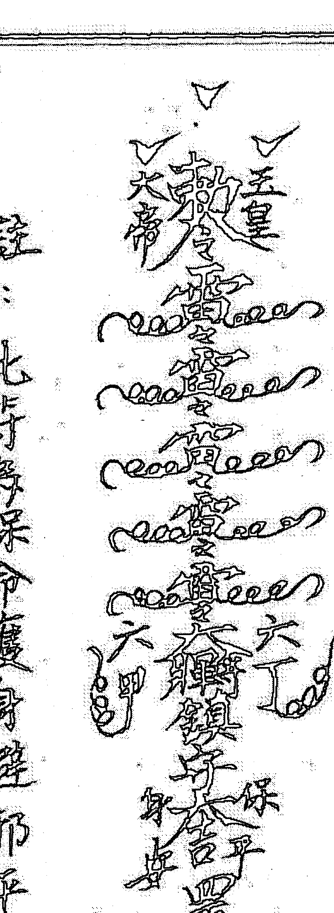

注：此符为保命护身避邪平安。符可用红纸黑字。

## 行暗路身符

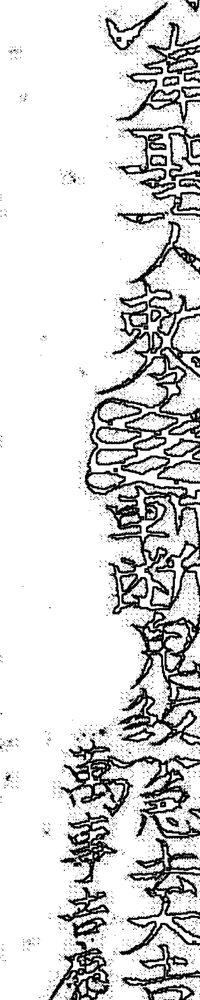

畫此符黃紙，殊書，男女走暗路時，恐遇鬼魅

畫此符帶在身上大吉

## 保身平安符

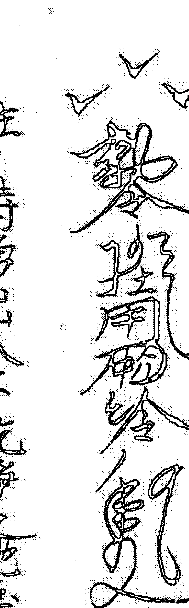

随身带之可保平安，勒符咒...

注：时常出入不洁等之矣时此符

## 制三煞符

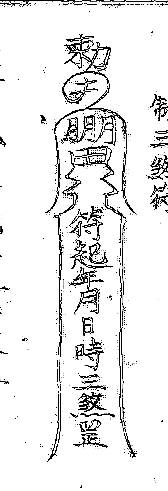

注：此符有犯三煞时改之 黄纸黑字书

## 制煞氣重符

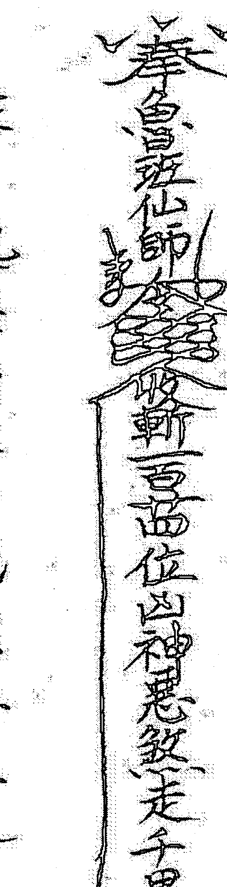

註：起基動土若感覚煞氣迫人用此符黃紙黑書鎮貼之。

## 治飛煞符

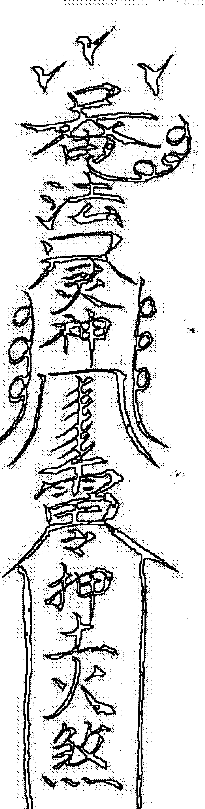

註：飛土又稱飛煞有犯時用此符一道化火食一道化門口即平安。食用硃字化用黑字寫。

## 治凶煞符

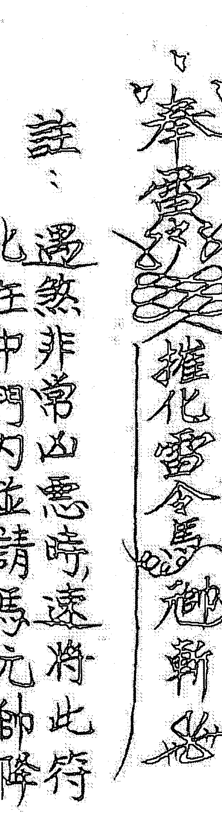

注：遇煞非常凶应时速将此符化在中門内並請馬元帥降臨治之此符黄紙黑字。

## 治煞神符

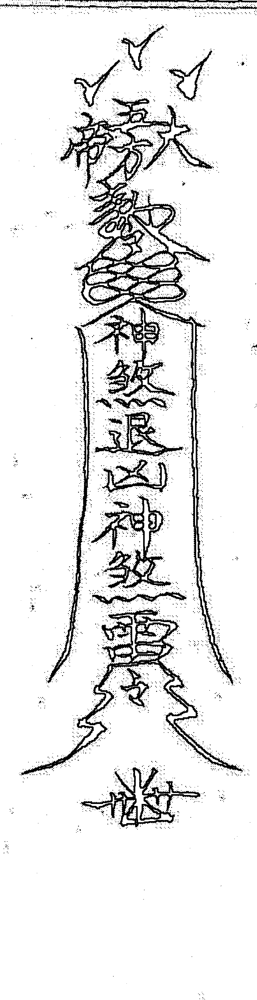

註：犯五方煞神時，此符安貼門上，用黃紙黑字。

## 退陰煞符

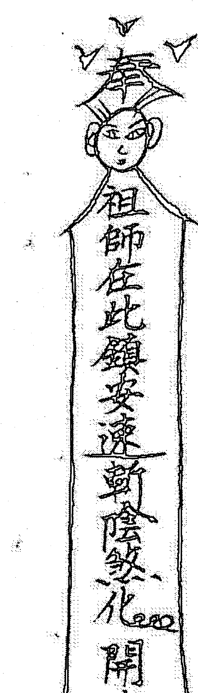

祖師在此鎮安退陰煞化開去四方

注：人若被陰鬼纏身，可用此符安在床上睡反化在地上。

## 治邪符

注：犯陰邪之灵氣致使身体不安，此符化食及带身男女均可用。

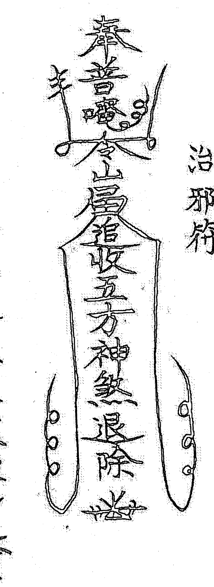

## 抑煞符

追押諸煞凶神惡煞用此符 安用硃砂畫符。

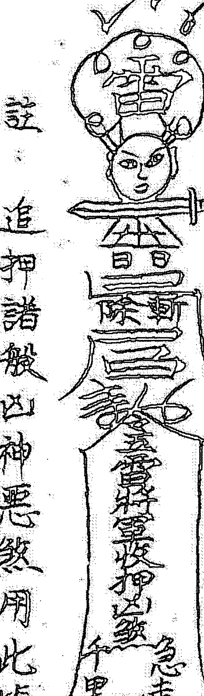

## 治土木神煞符

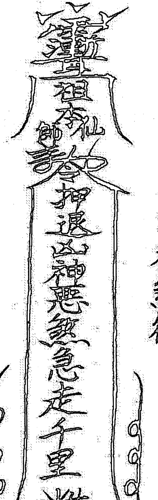

註：無論男女沖犯土木神煞時，此符十二路頭祭送大吉

## 驱邪符

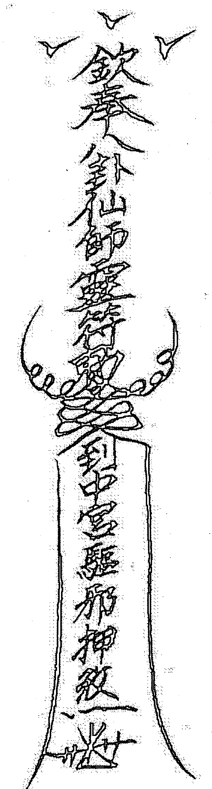

注：此符可安廳堂之上鎮宅
平常用之黃紙黑字。

## 五方符

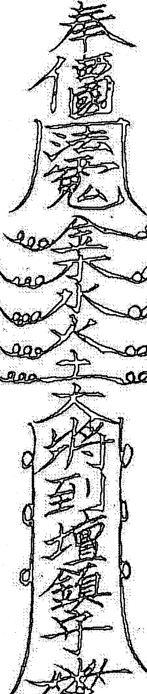

講：此符治邪鬼恐法力不夠，外再請五方兵將助力，增用之。黃紙黑字化火燒

## 抑煞符

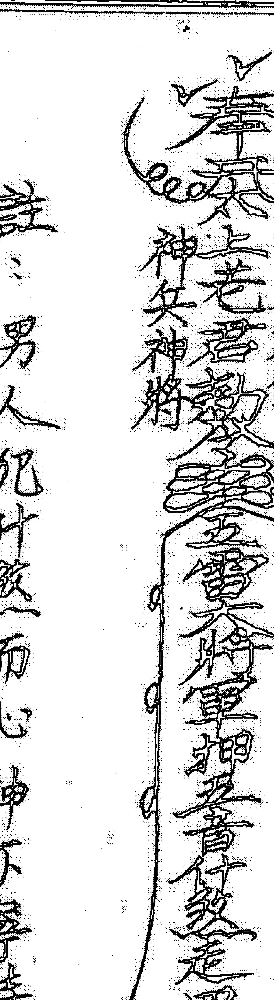

注：男人犯桃花欲而心神不宁时，此符化烧在地上，上神煞用之。

## 起殺符

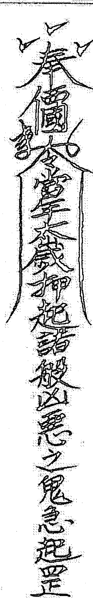

注：人冲犯煞神时要祭送黄纸。用此符一同祭解送之大吉。

## 制土神符

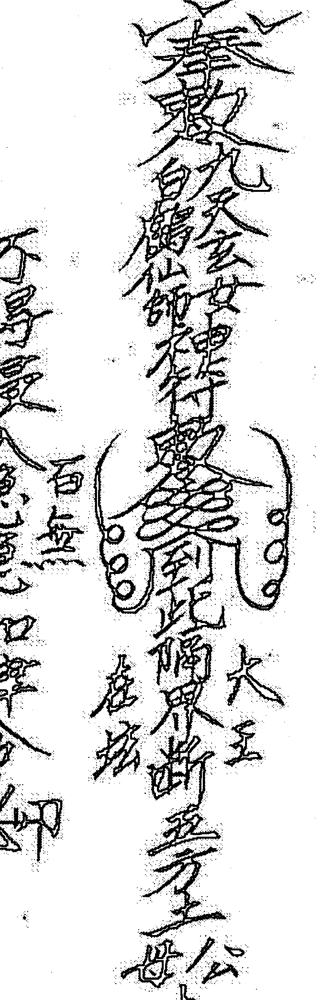

太上老君急急如律令

不得侵入急急如律令

凡興工動土恐犯土神可用此符安鎮制之黃紙黑字

註：

如律令

乾相安
動土符
咒
天甲穴
丁、隨我行
指脩行。

指天地
清幽地
靈指
人人
長生
指

鬼滅行
吾奉太上老君急令

## 敕封山符咒

开天门，闭地户，留人门，塞鬼路，黄金碾，白玉砧，五岳镇，五方海，穿鬼心，破鬼胆。

五雷轰，八祖师，敕急急如律令。

## 敕

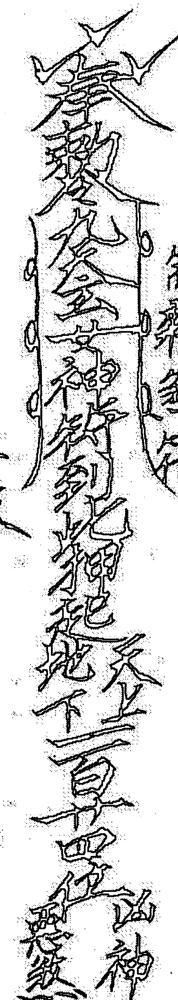

敕部叙付

此 人若犯五岳神身中不安 此符黄纸朱书贴大门上安

男 若是动哭散 愿作 急急如律令

奉请三十六员天将 神将 吾上天地 下镇鬼神 以此神兵 急急散

注：見煞氣深重不易退者，先吟本壇靈將咒，再化燒符在桌腳之地。

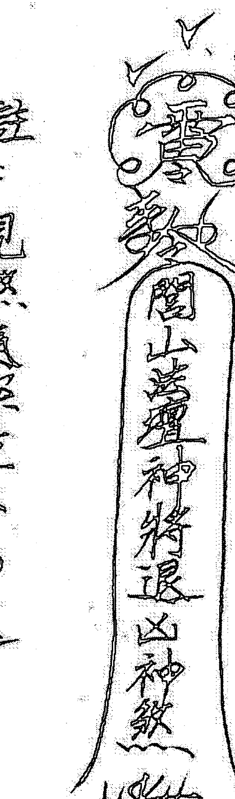

## 制重丧符

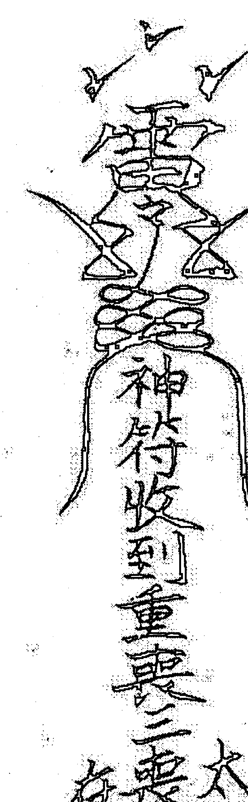

注：人犯年月日時重喪敆時，此符黑字黃帛帶保可用。

## 治煞保身符

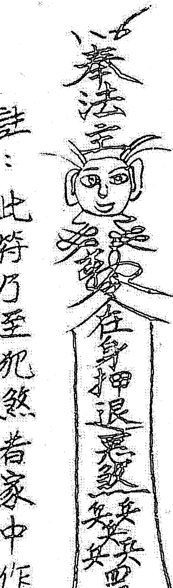

注：此符乃至煞者家 中作法时，给犯煞者保身用，黄纸黑字画符。

## 請兵符

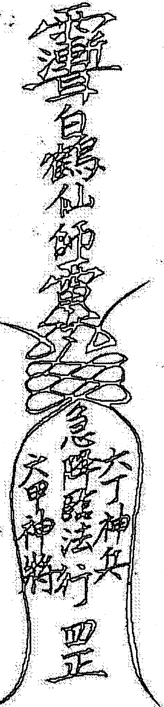

注：此符是作法調請兵將降臨時用之黃紙墨字化燒用。

## 斬妖邪符

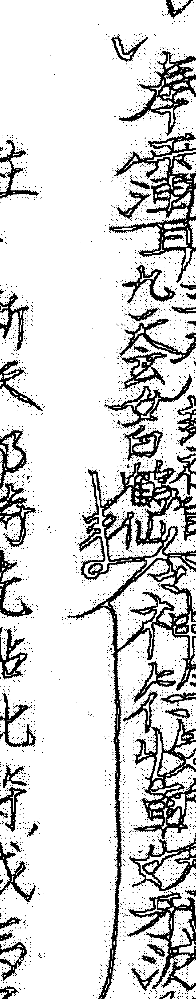

註：斬妖邪符先點此符，或病家之房門斗上也可 黃紙黑字畫符

注：人出外犯煞回来而不安，此符贴床头上一道保身。黄纸黑字书。

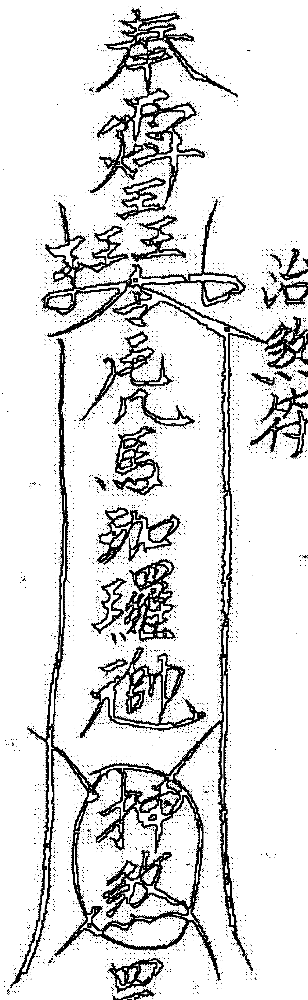

## 追殺符

敕令 追殺 金神七煞 急走千里 罡

如犯各種凶神惡煞，此符化燒大門口用。黃紙黑字書。

## 神燈保身用符

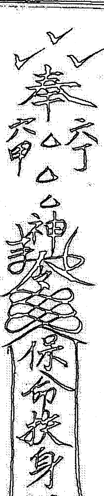

註：一般神燈給信還之平安符

## 治阴症符

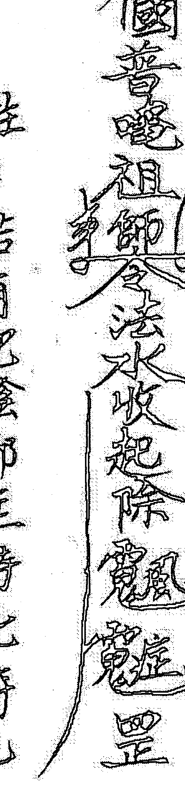

注：若有死阴邪症，特此符化水食，则阴退矣。黄纸硃书。

## 治阴庭符

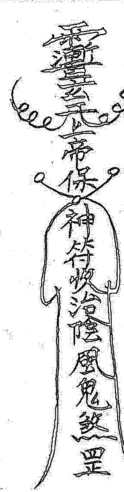

注：若有犯阴煞鬼煞而病者，书此符一食一安床一安房门斗上大吉。

## 化煞符

注：诸符咒气中不此符安之化煞符，黄纸黑字。

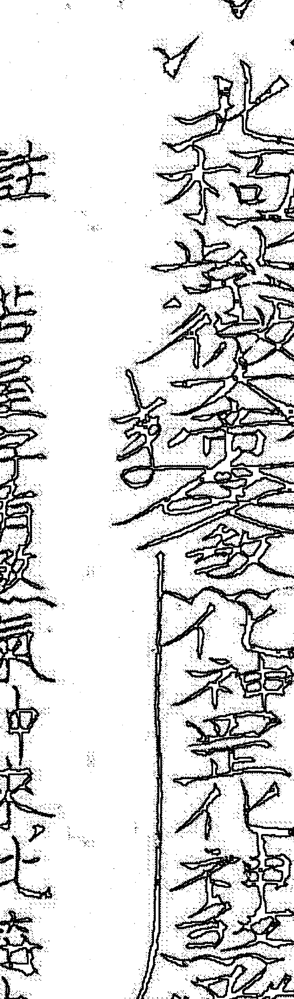

## 老君治失心符

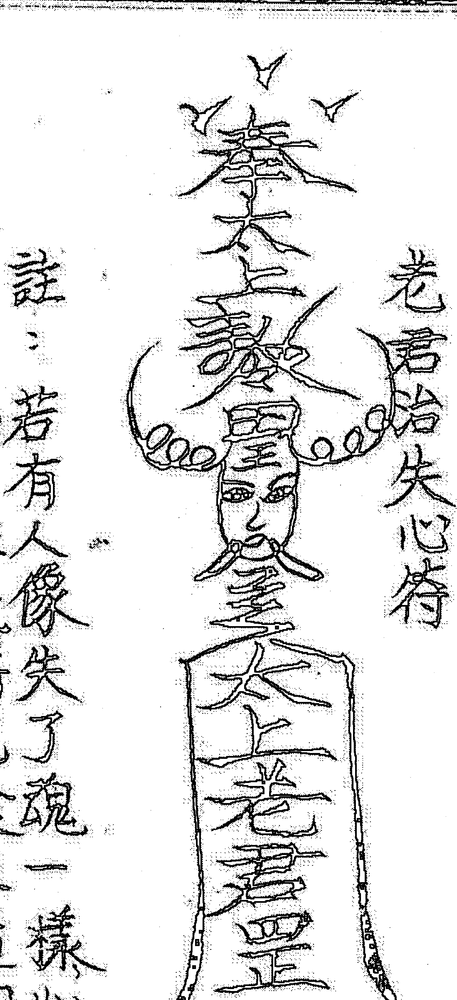

注：若有人偶失了魂一缕，心神不宁，书此符化食之，一道即安，黄纸书妙等。

## 五雷符

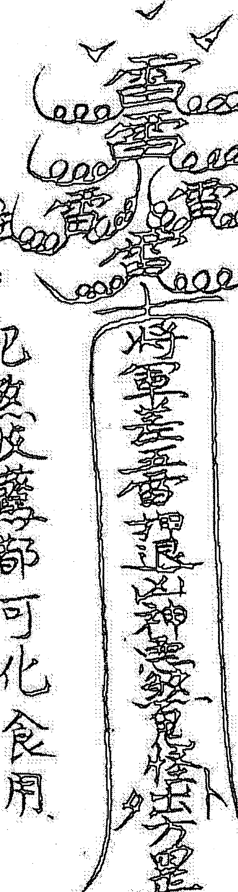

凡煞鬼等都可化食用

黄纸墨字

## 陰陽將軍符

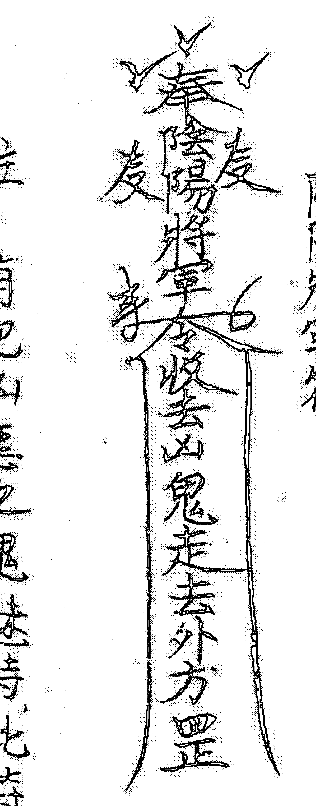

注：有犯凶惡之鬼魅，此符化火燒在天門口，黃紙黑字。

## 九天玄女退煞符

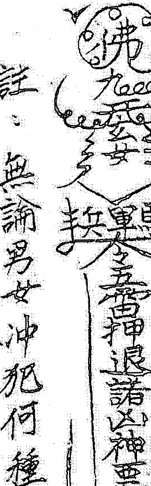

論男女沖犯何種凶神惡煞
即愈
欲此符化水食之
黃紙硃砂書

若家宅有应役入不安，此符安中堂镇之。黄纸朱书此符不可黑字。

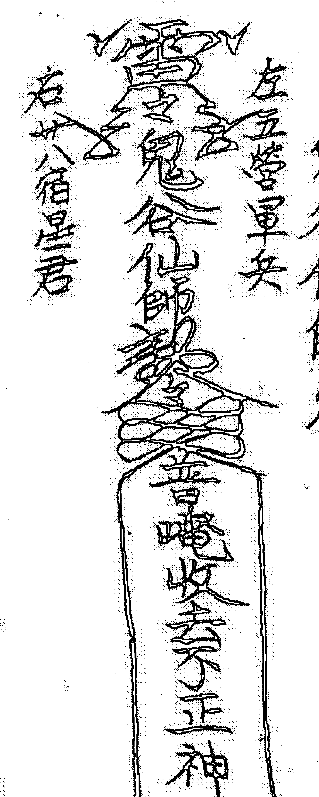

人有冲犯五方煞神祭送时，此符改之。十字路头祭送大吉，黄纸黑字。

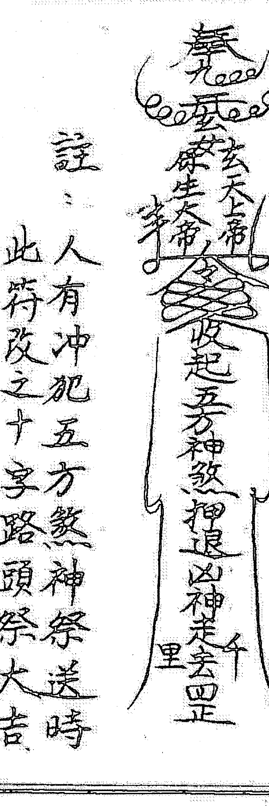

## 保命符

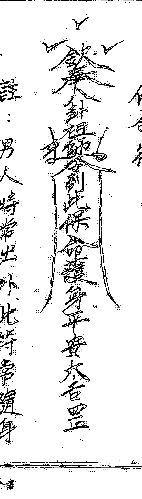

註：男人時常外出，此符常隨身可保平安。黃紙硃砂寫。

## 老君出外保身符

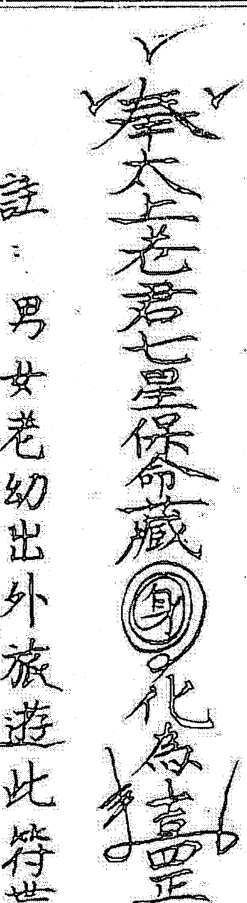

註：男女老幼出外旅遊此符帶身可轉凶為吉。黃紙硃砂寫字。

## 安社靈符

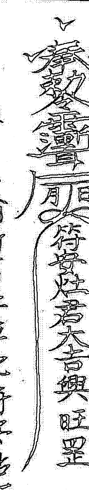

不論新舊宅此符可安貼可保家宅安寧照舊此符須按門公尺寸做之黃紙黑字。

## 捉縛大將符

注：此符與枷鎖大將符二張處，一套要鎮在左邊大將平，黃紙硃砂寫。

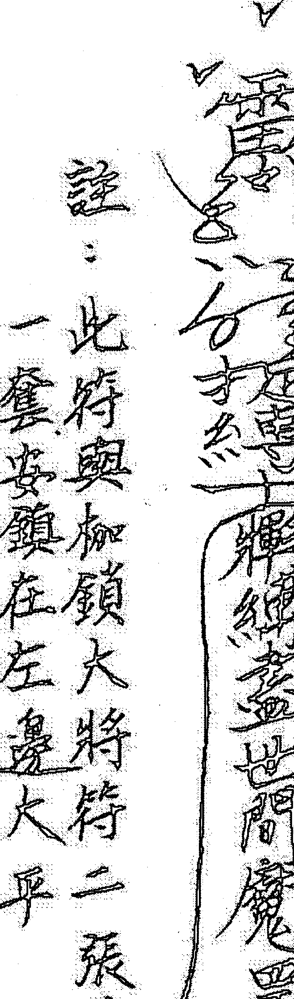

## 敕鎖大將符

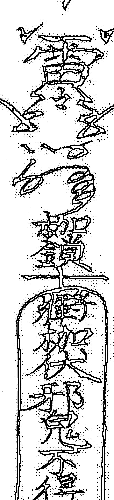

註：此符與捉縛大將符一張為一套以鎮在右邊小平黃紙硃砂字

## 五斗安符 东斗符

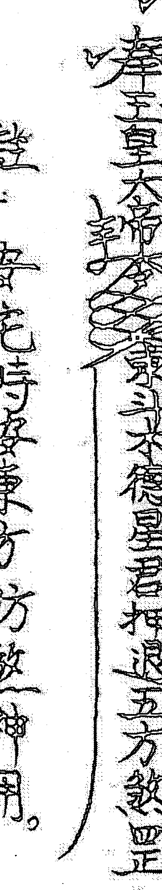

立：安宅符安东方防煞神用。黄纸黑字。

## 南斗符

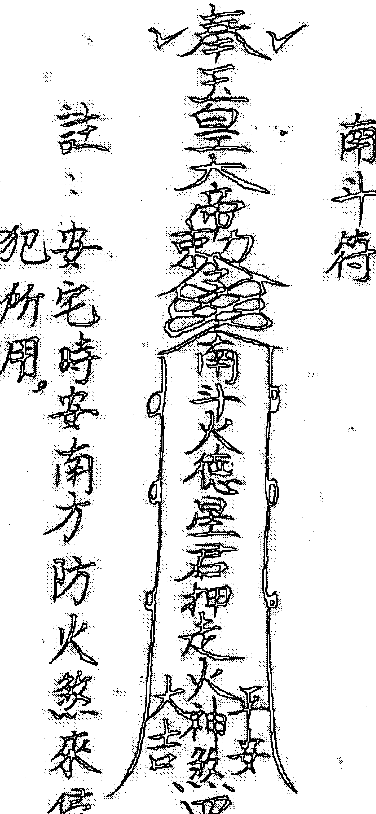

謹按

安宅時要南方防火煞來處

犯所開，

黃紙黑字。

西方金德星君神咒 此咒安宅中，镇宅保安宁。

注：安宅时，安在西方，防止凶神恶煞来侵扰。用黄纸黑字。

## 九牛破土符


註：凡造宅修墳動土時，此符先安鎮之，黃紙黑字。

## 中斗符

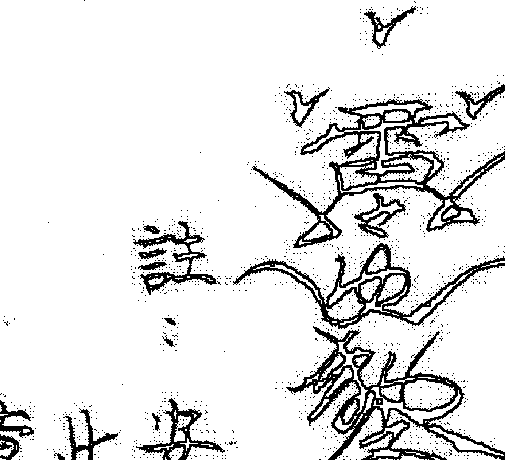

中斗鎮邪符百病消散大吉

安宅時安中宮鎮石效用之 此符五道五斗是一套符 黃紙黑字

## 五斗符治煞

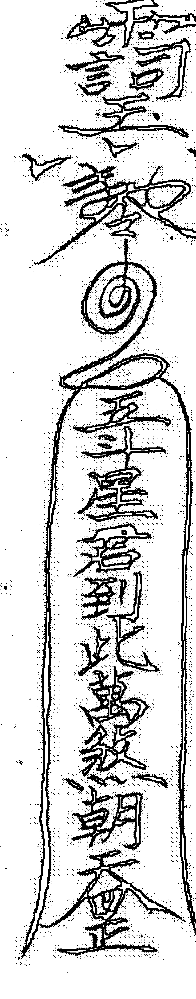

註：安宅時想把煞氣散神時，此符安大門斗上黃紙黑字。

## 太陽星君斬煞符

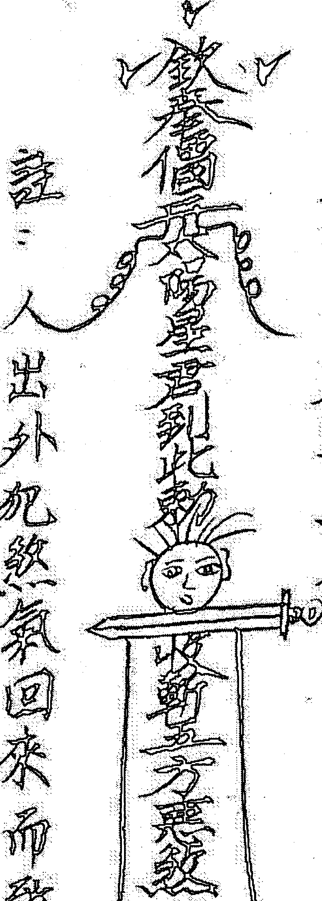

註：
人外出犯煞氣回來而發覺
生病在此床此符貼床頭大吉
黃紙黑字

## 治鬼带身符

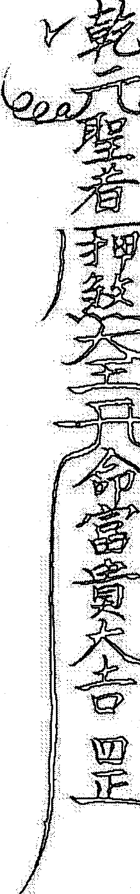

黄纸黑字

知有人曾会犯鬼邪時用此 符帶身平定(鬼)恶時恐會不

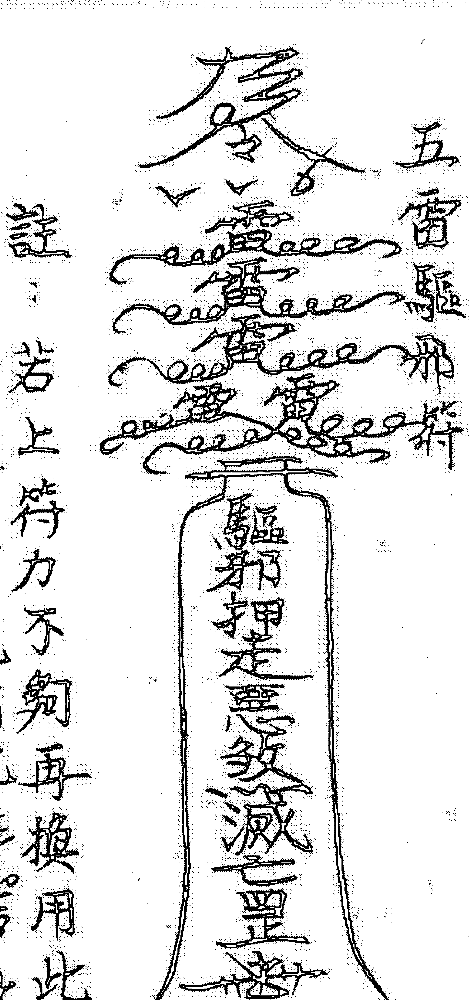

註：若上符力不夠，再換用此五雷符不可先用此符帶身用 黃絨朱砂書

## 盘古开天符

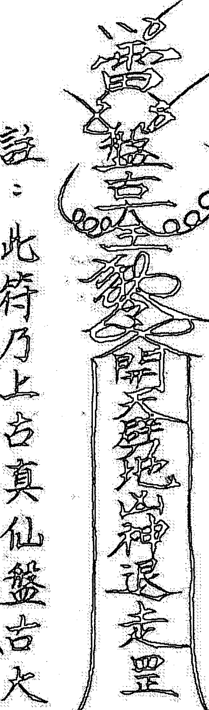

此符乃上古真仙盘古大王之神符，封於凶神恶煞，有著独特之制煞神效。黄纸黑字。

## 馬元帥符

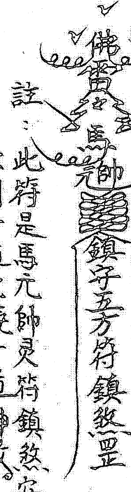

註
此符是馬元帥靈符鎮殺安
大門一道化燒一道神效
黃紙黑字。

## 元帅镇煞符

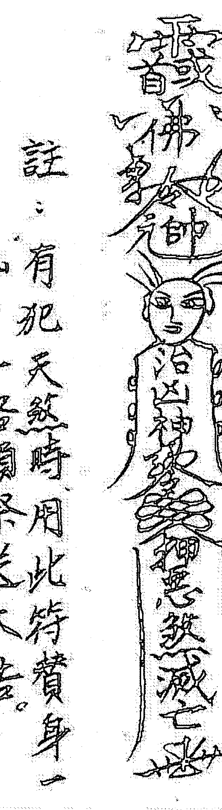

注：有犯天煞时，用此符焚身一仙，十二路灵祭送大吉。黄纸黑字。

## 普照靖五行符軍对

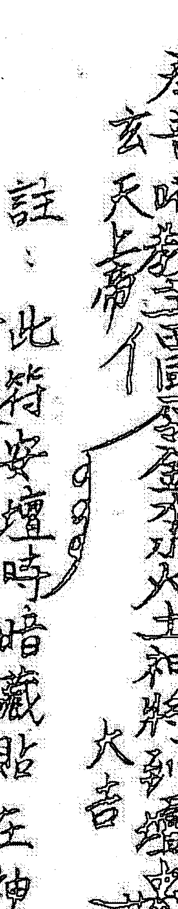

此符安壇時暗藏貼在神位背后與壇，黄纸黑字。

## 五雷出外护身符


注：
无论男妇老幼出外，恐犯妖邪，此符均带之可保平安。黄纸黑字。

## 祭三煞符


凡搬屋犯三煞時，要 在新屋房之門斗向外大書：黃紙硃砂寫字。

## 护身符


註：一般常走路之男女生身黃紙黑字。

此符可保身可安宅可辟邪神位中堂镇宅用黄纸墨书。


## 八卦符


此符時八卦中之乾卦乾三連先天象天父後天五行屬金可畫八卦火符或單獨安八卦方位黃紙紅線黑字

## 坤卦符


注：此符安坤卦位，与上作用相同。

## 巽卦符


注：此符安巽卦位 与上作用法相同

## 艮卦符


注：此符要艮卦位，与上作用法相同。

## 震卦符


注：此符安艮卦位。与上作用法相同。

## 克封符


敕令六丁神将驱去病鬼起

注：此符安克封位 与上作用法相同

## 離卦符


註：此符安離卦方位。與上作用法相同。

## 坎卦符


註：此符安坎卦方位，與上共八道，為八每符，每次使用此須一套共用安之。

## 止血符(内)


註：若有⼈受傷血流不止此一張化水食一張塗傷處

## 止血符 (一)


註：若有⼈受傷血流不⽌此符
念傷咒唸三七遍符

## 止血符 三


注：此符為乱童抄五宝时化符水，中止血用之。黄纸黑字。

## 止血符 (四)


注：此符同样止血用符黄纸黑字

## 止血符


註：此符可黃紙黑字畫符燒化傷處也可符水止血或劍指念書

雪山童子执虎毛赤尾草
雪山童子来赤尾草
雪山童子到三根血路
急令如律令

## 九牛破土符


凡修造時，先用此符祭解，可保平安，工人不會犯煞。黃紙黑字。

## 北斗符


注：安宅时，安在北方防止火煞来侵犯用。黄黑一字，压火神火煞，都是黑字。此乃五斗符煞。

## 七星符


注：此符安镇避邪用，黄纸黑字。

## 治腹痛符（一）


注：若有人着丧或送丧回来后，腹部肚子疼痛，此符食之。黄纸硃书。

## 治腹痛符


注：若有人有丧灵堂或送丧死人回家后肚子不疼痛，此符砂数画化食即安。

## 治腰痛符


注：若有人在路上见到死尸冲犯，不妄此符，殊妙字号符，化食即安。

## 治寒热符

若有人时寒时热医药无效时，此符贴病者之床头，黄纸黑字。


## 治寒热鬼符（一）


注：若有人时寒时热，当炼石图咒。此符化水食之。黄纸硃书。

## 治寒热症符一


注：若有人犯寒热之病症时，此符画在饼上给患者吃之。

## 治寒热症符


注：若有人犯寒热鬼者，此符带身平安，黄纸黑字。


## 治寒热鬼符

注：此符及道带身用，黄纸黑字。

## 治寒热症符此


注：此符寒热症化食之，黄纸硃砂写字。

具告状，告实热鬼状。人△名被瘟鬼扰害事，属于△年△月△日△时逢生，因△年△月△日△时身中染病。你係寒热鬼，思无法可治。叩禀司命灶君、当境土地查得，此症係是雷州府远街上代父名祝金龙，母姓谢名天，被长男名冲高，次男名香炉，一家父手七人，原与张家夜故。因事缘盗偷主人财物，被张家打死，全家也人屍去在水中，变寒热之能，每侵害良民，名医难治此症。无原杀乞司命灶君遣之等完痊，日卯前乞因须告。

大岁
年 月 日 叩

证
凡治寒热症时，须黄纸黑字写此若状，投告庄司命真君或土地前化烧。

## 婚姻上签

## 安东方符


注：居家若无看日而动土，此符用之。不择日动土防有冲犯，破在东方。符用青帝写之。

## 安西方符


注：未择日与工动土时安用。西方贴西方符，用白纸写之。

## 安南方符


注：未择时日与工，动土安用。南方贴南方符，用红纸写之。

## 北方符


注：未择日动工土动土时要用，北方破土用北方，黑红写之。

## 安中央符


注：未择时日与工动土时安用，黄纸写之，中央破土粘中央。


## 白鹤仙师起造动土符
急急如律令

注：
择日起造动土或雇工破土时，此符化动（破）土处吉。黄纸黑字。

诸山神恶煞
白鹤仙师到坛住，吾与工急走千里动。急去煞然，火急如律令。
敕

## 治小儿着猴痫符


注：小儿着猴痫时，此符带在身。黄纸黑字。

## 又治着猴痨符


注：小儿着猴痨时，此符配金身上。道符使用之。此道化水洗身上，用之。黄纸黑字。

## 散土神符


注：恐犯土神或犯土煞时，此符化动土处。黄纸黑字。

## 散土神符


注：此道符定公古佛散退土神之神符，化动土处，黄纸黑字。


## 姜太公灵符

凡动土前化安镇用符，或动土后化黄纸照前等。

姜太公在此五方神符

## 元始安土镇土地神咒

上元土地灵
回向正道
备守玄庭
护法神王
元亨利贞

土地神咒
音告四方灵
左社右稷
内外澄清
太上有令
保卫诵经
急急如律令

岳渎真官
不得亡惊
各安方位
备守坛场
保护太平

## 祭将军箭符


令不伤母兄弟姊妹亲戚友四正。

右人命带箭用祭弓箭科仪，配合此符出外化烧。黄纸黑字。

### 祭白虎符


注：如当年岁君犯白虎时，改祭后此符同金纸送出外方化，黄纸黑字。


注：
凡夫妻不和，此符化食。黄纸硃砂写。

## 夫妻和合符


注：凡夫妻不合，女不发男用此符，偷化给女食之，黄纸硃砂写多。

### 男不爱女和合符


注：此符夫妻不和，夫不爱妻偷情，化给夫食之用，黄纸朱砂写。

## 男女和合符

凡夫妻不和，此符化床下...黄纸黑字。


## 夫妻和合符

勅令 急急如律令 男女相合 男欢女笑

注：凡夫妻不和，此符化在房间内用之。黄纸黑字。

## 夫妇和合符


黄纸黑字。前一道五天，夫妇和时此符化烧在床。

## 夫妻和合符


注：夫妻起口角不合，此符化食，黄纸硃砂写。


## 男女和合符

男名年月日时
女名年月日时
时时思想
刻刻欢喜
和合知美妻妾
发

注：男女不和都可用此符化食，黄纸硃砂字。

## 和合符

凡男不爱女，此符男食，黄纸硃砂写。


## 盗都和合符


注：凡男女、夫妻、父子、君臣等，凡不同心，此符化七天。画食黄纸朱砂写字。


## 小姻缘符

注：此符男女小姻缘用，即外面交朋友用之，夫妻也可用，黄纸书砂字。

## 小姻缘符咒

拜请日光光，九天玄女朱衣和神女，花始仙人急到，男女即和合。三师敕吾灵符一到，男女急合。令符信女名，化为山中青草；信士合化，厚山中毛鹿，引草草引鹿。令符信女名，化为山中青草；信士合化，罚女和合。魂魄回心顺意，信女合化，真珠白米；信士合为夫妻，魂魄合为笼中鸡。两见化米，得天长地久，不断臂。急急如律令。

## 普唵姻缘符


注：男女夫妻再作姻缘用良之，黄纸硃砂字。

## 普唵姻缘符咒
伏以日吉时良，天地开张。祖师敕我敕灵符，本师敕我敕灵符，敕起灵符一道敕，敕起花公花婆，日夜撮得合和合天和，敕起人和合，大和合金蛇缠树，玉桃和合兵床，敕符童郎，敕起罗女，百世永远和合。吾敕普唵祖师敕神兵，火急如律令。

## 夫妻和合符


注：夫妻不和夫变化食之。黄纸硃砂写。

天和合，地和合，咒合人和合。吾奏仙人来和玉女合，和合七祖仙师来和合，男女人合化为吕洞宾，信女与化微何仙，此物名化为玉女合，和合七祖仙师来和合，男女人合。

### 父子和合一


注：如父与子个性不超，此符二人同食，黄纸朱砂等。

## 父子和合符


注：父子和此符带在身上，黄纸黑字写符。

## 父子不和符


注：此符治子忤逆，因化食，黄纸硃砂字。

## 大小和合符


注：若男女大小家中吵闹者，此符化茶水中全家饮之。黄纸硃砂写。

### 水莱小吏和合符


注：如果火其细姨要不和，此符一人同化饮，立不可令其知道。黄纸硃砂字。

若有金木火土煞神犯屋者，此符安大门上吞吉。黄纸硃砂书。


## 镇神煞符

### 镇煞符咒
天上二帝，日月星遍照。神见吾低头，领应欲登之。天地有六丁六甲，听吾号令，金童玉女散子领天兵。何神不服，何鬼敢？吾持令縛你，欲精吾到处行。九天玄女急急如律令。

## 清净符


注：路中见丧，此符化洗之。黄纸黑字。

## 清净符


凡家中有鬼魂怪物在此，依在黄纸黑字，符洗宅净用之。

## 清净符


说：犯煞煞煞煞时，此符化煞煞煞。黄纸书之。

## 清水符

注：此符乃小儿犯百煞，化水中洗头面用之，黄纸黑字。


## 清净符

注：此符为地煞气洗净用。黄纸黑字。


## 洗清净符

注：小儿看旧，此符洗身清净，则黄纸黑字。

## 姜太公清净符


注：此符男左女右，不洁洗身用之，黄纸黑字。

## 洗符


此符存男女生胞麻煞不安时洗用，花心芙蓉花艾草同洗，黄纸黑字或红纸黑字均可。

## 清水符


注：此符一般洗身清净用，黄纸黑字。

### 清净符


证：此符为路中见死尸不要洗用，黄纸黑字。

## 清净符


注：凡妇人生产血污秽，此符净产用之，黄纸黑字。

## 清净符


注：此符一般洁净通用符，黄纸黑字。

## 清净符


注：凡产后小儿患痘症，困产人触犯用此符化水净之吉，黄纸黑字。

## 清静符


注：此符净亵人触模不咒化水中净之。

金光神咒
奉请金光神咒
全身护佑
永保平安

修建...
起...
有...

地...

## 抑煞符

注：此符全上用之。


## 押煞符 (一)


注：人犯诸般凶神恶煞时，此符安镇门斗上，并另用一道先清净配合使用之。黄纸黑字。

## 押煞符 四


注：此符为普唵祖师押煞灵符，可镇宅用之，勿轻用之。黄纸硃砂书。

## 杨公押煞符


注：
此符乃论风水阴阳宅犯煞时应用之中要用之。黄纸黑字。

## 抑煞解厄


此符无论男女送丧回来不安犯煞，安在床前用之，黄纸朱砂书字。

## 五雷抑煞符


此符寻常可安在门上，防上邪煞侵入用之。

符镇奉行，收斩东南西北五方将在此间，若法箓内神无名尽皆消灭。

## 治丧车符


注：无论男女犯丧车煞、空棺煞、麻衣孝服等煞，此符咒洗之。

## 镇三煞土神符


凡犯三煞土神而致身体不安者，此符化食，黄纸硃砂书。

## 镇三煞土神符


凡犯三煞、土神、百煞时，此符安床头开之，则煞黑害。

## 镇三煞土神符一


注：凡犯三煞或土神有煞时，此符可安大门斗上，黄纸黑字。

收年流连、月流连、日流连、时流连煞，年煞、月煞、日煞、时煞，急急如外方敕。

## 镇三教土神符 四

注：此符乃犯三教或土神而致，时不分男女带身用。黄纸黑字。


## 五大元帅保身符


注：此符夜行时带在身上中吉，此符符眼要开之，黄纸黑字。

## 开火路口符


注：此符为过火开火路用之。黄纸黑字。

## 开火路符


注：此符为过火时开火路用之，黄纸黑字。

## 开火路符（一）


注：此符为过火开火路用之。黄纸黑字。

## 开火灯符四


注：此符开火灯要过火时用之。黄纸黑字。

## 制上神煞符（一）


注：无论男女犯土神上煞时此符外面祭送大吉黄纸黑字。


制土神敕符（）

注：此符全上用清一道一起读

黄纸黑字

## 制土神数符 三


注：犯土神数时看何处动土 化在何处等之

## 制土神效符（四）


注：犯土神土煞不要用此，将化食黄纸朱砂书

## 制土神符 五


注 犯土神土符时必须用此符和黄身一仙同祭送之吉 黄纸黑字。

观自在

## 治痛符（一）

舞道法足知印

诰：凡头常痛精神压力大此符须常吃之黄纸黑字。

## 治病符（一）


注：此符乃治喉痛化水饮之，黄纸朱砂写。

## 治病符（一）


注：凡男女眼痛此符化水食一道反洗眼一道黄纸朱砂字

## 治病符（四）


凡脚痛此符化水擦之

> 注：黄纸黑字

## 治病符 五


注：此符治目痛化水食之 黄纸朱砂写。

## 治病符 元


注：此符治目痛洗目用之

黄纸黑字

## 治病符


注：凡老人胁下疼痛此符化水擦之 黄纸黑字

## 治病符

证：凡头中疼痛者，用此符，化水，食一道带之。


金水水火

## 治病符（九）


注：百病无症此符化水食黄纸朱砂书字

## 治病符


此符治胃经先肚腹痛用 姜三片水三碗煎碗半食之

### 安魂定魄符咒

### 安五方土公符


注：此符为安五方土公陈贵先用之黄纸墨书

## 五方土公符（月）


此符为安南方土公祭子良用之 黄纸墨字

金

## 安五方土公符 日


大王
在此西方神符张子贵在下方念

注：
此符为安西方土公张子贵
用之，
黄纸黑字。

## 安五方土公符 四


注：此符安北方土公用之 黄纸黑字

安西方土公府
西


注：
此符安中央土公用之
黄纸黑书
以上五道也可书竹牌上安
五方用之。

## 杨公收煞符


注 犯风水煞类脸色变白止符 化食神效 黄纸墨写。

灵符镇五方凶神恶煞四正

## 收什煞符

## 敕令


注：
小儿犯什煞时，
此符化水食
黄纸朱砂书。

## 九天保身符


注：此符为地理仙骨山地风水，时保身用之。黄纸朱砂书。

## 化骨符 一）


注：此符专化鸡骨用之，可书水碗面上，也可黄纸朱砂，字一变水碗中，一气食之。


通用化骨，全上用法

## 化骨符（二）


## 化骨符（三）

注：此符什化物用之

全上用法

## 化骨符四

敕令
化鱼
化流水

敕令
化鱼刺

敕令
化流水

敕令
化
水

注：此符化鱼刺用之。同上用法。

## 化骨符 五


注：此符化鸡猪鱼骨用之 同上用法

### 化骨符六

```
观风
非
应
山明
旧
龙
```

注：此符化一般骨硬喉用之同上用法


## 化骨符

注：此符化鱼骨用之
同上用法

## 化骨符


注：小儿勿食铜铁此符化饮同上用法

## 化骨符九


注：
左手二山指捧水碗，
右手剑指
画符化用之。

## 化骨符


> > 注：此符专化鸡骨用之

> 化骨符咒
单刀起刃 官正山河 腹通湖海
煞气藏蛟龙 蛟龙向前头 直有流地流
吾奉太上老君急急如律令

## 化骨符咒语

物位东南来看颠缺面
一气冷候散万物化为水

吾奉太上老君急急如律令

## 制一敧符


注： 凡住宅中年月日时有犯一 致此符安镇。 黄纸黑字。

## 用其中三煞符

> 奉天勒令
九天玄女敕令
起墓中内外一煞起墓中内外一煞起墓中内外一煞

注：此符乃阴宅坟墓有犯三煞，若在墓前化安之，黄纸黑字。

## 镇煞神符（一）

黄纸黑字

注：此符安镇煞神，祀煞神，比此符安镇在大门。


## 制煞神符（一）


注：修造动土祭之 姜工人不安此符化 黄纸黑字

## 制煞神符


火土
在玄
王
拆卸神符到万事大吉

注：
凡拆造犯忌犯煞此符先化
在地土书
黄纸黑字

## 制教付（四）


> 注：照谕风雨犯百煞均可制之 黄纸黑字

## 催产符（一）


注：妇人有孕足月不生此符化 食 黄纸朱砂书

## 催生符二


注：妇人怀孕足月不出此符同酒化食黄纸朱砂写

## 催生日


注：分娩时此符化水饮之珠砂符食用。

## 催生符四


注：妇人生产遇难产时此符化水食之

## 催生符 西


注：黄纸朱砂写 助娩时此符化食盐助催生

## 催生符


注：妇人难产时此符贴床前

黄纸黑字

## 催生符（七）


注：此乃小儿横生不出时化水
食铁砂粉

## 催生符


> > 注
>
> 胎儿死在胎中时化酒
>
> 服之生死出
>
> 黄纸朱砂书

## 推生符如


注：
妇人过月难产横生此符化
食用
黄纸朱砂写


## 推生符

（符）

注：腹中死胎推出产也用食之黄纸朱砂书

## 催生符咒

太上老君急急如律令

奉敕令催生符一道神兵火急如律令

高处观音座下急急如律令

为
心
之
符
今

是
咒
是
符
随
心
而
运
之

夫
符
者
神
气
游
行
之
助
也
若
欲
行

## 推符咒

> 祖师转般本师转般下女大身上火甲
十个月日满庭花即花儿离关母腹急
急出世母子伶俐不待滞符令敕行
即出世明明自清吉
急々如律令敕

## 勤转胎符咒
即催生咒

一转天门开
二转地户开
三转天门开
四转地户开
五转化出山

三转天门开
二转地户开
四转化骨髓

吾奉注生娘娘急急如律令敕

## 安胎符（一）


九天监生大神保胎符

注：此符有屈之妇人安胎保身用也，可安床头用，黄纸黑字。

## 安胎符


注：妇人有犯胎神而胎动不安者，若此符化食

黄纸朱砂符

符咒应用妙法全书 720

## 安胎符


证：妇女动到胎神此符化水食黄纸朱砂写

## 安胎符


注：胎神不安致肚腹痛此符安床头大吉黄纸黑字

### 一、保胎安胎符

### 保胎安胎符

### 注：

安胎、安胎席常均可用贞下两月有当牛太威名九转由外向内转不可乱画之


## 安胎符 六

注：动胎神此符化食验
黄纸黑字


## 安胎符


注
房中动胎神安在房中自能
安胎
黄纸书子

## 安胎符


注：此符敕土化食安胎用 黄纸朱砂写

## 安胎咒

> 胎神胎神阴阳化成神符宝镇
惊吾奉太上老君急急如律令
不得安

> 土神杨公土煞符咒
天清地灵上六甲下六丁听我使令
令押年杀押月杀押日杀押时杀押万年
灭押千杀押百杀押人长生押鬼々
咸亡神符镇此天无忌地无忌神无忌
百无禁忌忌大吉大利元亨利贞吾奉杨公仙师急々如律令

## 敕令


流霞符

注：妇人犯流霞煞时祭送用之 黄纸黑字

## 制流霞符


注：孕妇有胎流霞，用此符贴床
上及佩之，黄纸黑字

## 破土镇煞符（一）

> 九天玄女除土神白虎符 禁煞 外煞

注：凡破土时先一符化在破土处防煞用之 黄纸朱砂写

## 破土镇煞符


注：此符同上用法

黄纸墨字。

## 破土镇煞符内


凡遇破土前此符化水中洒之

黄纸黑字。

## 破土镇煞符（四）


注：此符可用于土神土煞用之。

化水食用
黄纸朱砂字

## 治鸡瘟符


注：凡鸡瘟流行时此符安鸡笼
红纸黑字

## 治猪瘟神符


猪瘟流行时将符化给猪吃之，黄纸黑字

## 治猪瘟符

```
奉敕瘟司 鬼神之咒 敢有不伏 化为微尘 勅
```

注：猪瘟流行时安猪栏

黄纸黑字

### 治猪瘟符


注：猪瘟流行时代化在猪栏内
黄纸黑字

## 制火神符


注：
如遇火神下降或平时
防火神此符安大门
黑纸白字

六月养清和降雪

七月养清雪降霜

## 制火神符


注：祭火星此符安门斗上 黑纸白字

## 制百煞符


注：男发犯百煞止此符化水食之

## 白虎符顶部符文符号

## 送白虎符

祭送白虎煞神等，此符同奏 身送之音


## 兴工神符

天无忌
地无忌
阴阳无忌
百无禁忌
姜太公在此

注：兴工修理起造此符安之
黄纸黑字

## 净灶神符


注：古灶新作未使用前先净水洒之吉 黄纸黑书

## 制一百二十四凶神恶煞镇宅符


注：此符为镇宅安中宫制天上地下一百廿四位凶神用之红纸黑字

## 兴工制煞神符

-   - 龙神兴旺
- 合家

> 敕令三十六雷大将军镇宅光明平安大吉大利

兴工动土犯土府龙神
符先化烧安之

## 卫土煞符


注：犯土煞此符改身送之 黄纸黑字

## 制煞神符


注：犯煞神身中欠安时，此符贴于床上，用黄纸朱砂写。

## 安灶君符

谢五方五帝司命东厨灶君太乙元皇。天府府觉此元妙圣道天人长生禄位神符急急如律令敕

凡灶不安用此符安之大吉

镇宅符

敕令

用黄纸朱书字
初祀安位镇中宫保平安用

制五方煞符

注：此符制五方金木水火土煞 安床头用 黄纸黑字

治土煞符

二、敕符大将军符印神心仰告赦过

> 注：水火犯土神此符化水食

退神符

注：退神符退神像金银时化在水碗中用之黄纸黑字

退神符

註：此符退神符安太岁后用 黄纸黑字

制五方散符（一）

说
飞五方散神而吐露此符摄
身一仙散之
黄纸黑字

五雷押煞符

註：男女犯五方煞神不安此符化水食之黄纸书硃砂写

制五方敛符 三

註：此符制五方敛神图金纸送出化烧黄纸黑字

制五方煞符 四

此符祭讫同前黄纸朱书 黄纸黑书

制煞符

註：犯关煞冲身，此符代人一仙，改化平安，黄纸墨字

制煞符咒

此符犯煞妖精鬼魅辟邪神可化火制之黄纸朱砂书写

制煞符

註：风水诸煞来时此符镇之 黄纸硃砂书

杨公仙师封此处
太阳
太阴

封头符咒符

说 此符抑邪避 黄纸硃砂符 避金刃

制九艮二部符

记人她去风火地回来便闪烁所一盒一放平安

北方真武玄天上帝

制五方煞符

> > 注：此符制五方煞神用保命，黄纸朱砂书。

退木煞符

凡冲犯东方木煞之鬼门地
将安镇门头上
黄纸硃砂书

制木煞符

註
犯东方木煞之鬼此符保身
大吉
黄纸硃砂字

安门大吉符

註：一般住宅安在大门上大吉 黄纸硃砂写

注 此符安火门大吉昌 黄纸黑字 火门大吉符

勅令雷神行咒
奉请普庵流传十方加持咒水遣送灾殃破龙珠践金刚首提锁邪魔鬼神手把七星龙魔剑脚踏火轮辘轳救众生保安宁火音亨
急急如律令勅

打煞用咒 可勒符 吾符在天 灵符在地 诸神远走 一打天清 二打地灵 三打人长生 四打鬼灭亡 五打年月日时 一百廿四凶神恶煞尽皆收在符中藏 位凶神恶煞急急如律令勒

动土大吉

注：家中动土时此符安在厅堂
吉
黄纸硃砂字

制敕符

咒
阳凡犯三位此符镇之吉
黄纸墨书

止煞符

注：此符悬于纲煞安在大门止 效用之 黄纸墨书

折旧厝符

注：此符折旧厝时安之吉。黄纸书四字。

制罗喉符

铁拐仙人祖师 白水星到中宫 白
註：风水犯罗喉星用此符化水 中洗之 黄纸墨字

制四曜候符

敛气符祖师宝号

註：犯四曜候星此符安生树上矣香三直挂在上下用火化之黄纸黑字

弟子兴旺
灵符化吉

制罗喉咒

静请四海龙王涌起东海、西海、南海、北海
海水茫茫无边无方等子常在宫中结
律令神不见鬼不知急々如她律令敕
字人面向东念三遍后在地下写一个井
人立在井中穿黑衣裤

治小儿退热符

注：小儿儿夜啼高烧此符化水食之用雪山咒五遍敕急急如律令 黄纸黑字咒尾

提贼符 一

奉勅 二祖太师 钧驾 遊海 神符 脚下
> 註：此符提贼盗化在贼脚迹位 黄纸黑字

捉贼盗符(二)

注：此符夜晦化贼尉位用之。黄纸墨字。

收捉贼符

注：贼盗有敓可将此符收之化火食流通用之。

夜啼符 一

注：小儿时常夜啼，贴床前，黄纸黑字。

夜啼符（二）

注：小儿夜啼此符食之黄纸黑字

夜啼符

注：小儿夜啼符此符化水食之
> 黄纸硃砂书

夜啼符

小儿夜啼不止此符贴床头
黄纸黑字
敕

夜啼符

画
註：此符止儿夜啼 要贴床头 黄纸墨字

天色玄令地色黄吾家有令夜啼郎
四方鬼来吞儿夜啼声急急如律令
而往东起念三遍小儿儿一唾灭天光

敕令 上敕咒
天无忌地无忌年无忌月无忌日无忌
时无忌百事无忌己心无忌一切犯神无忌
火急速起左旋天劫动
右旋日月 明卦象且横过一英鬼神惊
吾奉急令敕如律令敕

小儿收魂符（一）

注：小儿着惊，此符收用敛之，黄纸黑字。

小儿收魂符

註：小儿著惊收时此符化纸上
黄纸黑字

小儿收魂符 三

註：收惊时此符化食用之 黄纸硃砂字

收魂符四

注：此符收魂收煞等时化水食之 黄纸朱砂书

水符

符
注：祭火神火发时用墨纸白字

土符

水咒犯土神吒龙者此符化
黄纸破砂字

十大大成功定律

太岁符

> 俗云：太岁当头坐，无喜必有祸，
须犯太岁星君符，随身当可保平安。
是《地统经》说：太岁，人君之象，率领诸神，统正方位，斡运时序，总成岁功。
诸神统经纬，太岁星君为百神之统领，是地神中最有有力的神。
由此可见冲犯太岁星君，必须安奉星君至座外，更须祀太岁星君符，随身当可保平安。

太岁星君符

注：凡除安太岁外，须加此符保身平安大吉。黄纸墨字。

太阳星君

年逢太阳星一天空，空虚破耗不发贴其管闲事即可避凶是非或破财，并且可以防止家庭风波及与人不和，之灾每月逢农历廿七日白，何车印拜太阳星君此符和寿金一同化烧即可保平安万事如意。

太阳符

註：
+   - 2 犯
- 14 太阳星
- 26 须
- 38 此
- 50 符
- 62 一道
- 74 岁
- 86
- 98
黄纸墨字。
祭者一道符带身用。

二丧门

犯丧门星主孝服损财万事不顺
远切勿探病勿入丧家禁着丧服以免
灾祸愁上身及时常身体不安宜制凶
杀星以保安平。

祭丧门符

凡子午卯酉年丧门入中宫，须此符一道，祭送一道，保身用。黄纸黑字，此符一道，藏（或作‘岁’）。

四大阴

人严禁涉足风月场所，可预防色情报破；财之处并须预防家庭风波震动；每月六日晚上向西方叩拜太阴星君，将此符书金一同化烧，可保平安。

凡 祭即太阴 黄纸画一符 黑字送一太阴星 身君须 用此符 一道 16 28 40 52 64 76 88

太阴符

五五鬼

五鬼星人命有平地起风波，因此须防灾难到，交友应慎防被拖，然身累免遭官讼牢狱破财之灾，此须防以资大吉。勾此符一同祭送财源入宅自

官鬼日建

注：
+   - 凡 5
- 犯 17
- 五 29
- 鬼 41
- 星 53
- 须 65
- 用 77
- 此 89
- 符 一 戌 首
- 送外方 一道
- 祭送外方 一道
- 身平安 一道

六死符

凡有死符星入宫者，主恐有破财疾病等不祥之厄，因此切勿探病奔丧，宜制化凶星，求取釜山，此凶化吉，方能化凶为吉。官符疾病等，不祥之厄，因此切勿探病送出外方即能化凶为吉。腊月前以猪身寿金及此符一同祭煞

死符星符

註：凡死符 6 18 30 42 54 66 78 90 岁者，祭送死符一道，保星须用此符一道，大吉。

七岁破

凡主有岁破星入宫诸事不吉事
事杂成并有招灾破财矣忧失和反目
之忧因此间事莫管恐耐安份守己静
神乞求护佑当可化解不祥灾劫。

岁破星

註
凡犯岁破星须用此符
+   - 7
- 19
- 31
- 43
- 55
- 67
- 79
- 91
祭送并开天罗地网可保
安另有一道保身保平道者

八龙德

财金家平安福庆外出方得安巡庆历
四月十八日是紫微帝君圣诞以此符
祭经祈求后焚化鸿运开泰利路更亨

龙德星

> 注：
+   - 凡 8 主 龙 德 荣 微 高 照 此 符 岁 有
- 20 龙
- 32 德
- 44 荣
- 56 微
- 68 高
- 80 照
- 92 此 符 岁 有

九白虎

外伤官事破财孝服等不祥之灾厄最白虎星入宫血光病难恐伤人口特主家有喜事尚可破解无喜百事齐至用生的三些兴此讨欢身银纸一同祭送出外方即可保安万事如意。

白虎符

设 : 9凡 2犯 3白 3虎 4星 5须 5用 7此 6符 9一 8道 1保 9身 3平 安 大 吉

十.福德

如奎福德星入命者，四季添人口，财喜双全。农历二月初三、及八月十五日，开福金及福德，特经福德庙，求之则大吉大利，财源广进，利路亨通，福运如源源而来。

福德星

凡10、22、34、46、58、70、82、94岁者，即福德星入宫，宜用此符二道，祭拜福德星，带在身则大吉。注：

土天狗

天狗星入主主有损伤血光之灾于农历七月前以此符生三姓银钱祭送贫身出外方可转凶为福。

祭天狗吊客符

注：
凡二三五六七八九藏符
即把天狗吊客星须用之
一道祭天狗
一道保身用之

十二病符

土有病符星入宫身休恐遭病魔针织因比年勿探病入家并忌食度家之物若死者宜用此符与药方共煎若食之物快愈快复施初也。

病符星

註：
12
24
36
48
60
72
84
96
凡犯病符者须用此符祭送并礫符化煎药同食则吉。

若往东方去经过建筑修造工地时当天神命时回来身体不受此符改之即安黄纸黑字。

南方土公符

注：若往南方行，经动土修造之工地，地面当矣，又冲本命时日，来后身体不安，书此符改之，黄纸黑字。

大公立土母发子良时在堪

西方土公符

若往西方行，经动土修造之工地，又当天冲本命时，此符改之即安。黄纸黑字。

北方土公符

北方土公大将军敕令 神符起北方土公大将军敕令在地煞
注：若往北方行修造动土之时此符黄纸黑字，改之即安。工地又当老地北方行修造动土之时此符。

中央土公符

> 注：此符属符近有工地或自宅 动土犯煞时用攻之。黄纸黑字。

青帝青雷公符

注：以下五道五雷公符安贴法，黄纸黑字。保护用之，安东方位。

东方青雷公咒

奉请东方青雷公雷公雷公变化身化照星 洞四单开云头半天华温煌烈火电鼓声 火车火轮满天地风雷电鼓霹雳声提 打人间百妖精擒刀斩过不留停行人路 通々好走马鬼路通々好行兵启打凡 问不正神弟子一心专请东方青面 青雷驾雾到坛前，神兵火急如律令

红帝红雷公符

註：此符安南方，黄纸黑字。

南方红雷公咒

奉请南方红帝红雷公红雷公变化照，洞雷电火光腾万里雷公捉打斩妖魔锁乾坤擒拿邪魔鬼走无踪伏群魔锁乾坤刀斩过不留停人人路通々々好行兵弟子一心专奉请红路通通好行兵弟子一心专奉请红路面通通好行兵弟子一心专奉请红路神兵大将军飞云驾雾到坛前神兵大将军飞云驾雾到坛前急急如律令

注：此符实镇西方位 黄纸黑字

## 白帝雷公符

奉请西方白雷公
西方白雷公白帝
白雷公变化身
雷电闪闪烧破精
洞罩开半天雷电
雷电交加打辟魔
打地下百妖擒刀
通名好行兵弟
心专好定马鬼路
到坛前请白面雷公大将
神兵火急如律令

## 北方黑帝雷公符

注：此符安北方位置，黄纸黑字

奉请北方黑煞公公 洞喝雷公公变化照星 于执雷斧驾雾展神通 打抛下百丈妖精擒邪擒 通与好走马鬼路人一路 心专静弹琴黑面雷公大将宝飞灵 神兵火急如律令

## 黄帝雷公符

注：此符安镇中央位。黄敕黑字。

中央黄帝雷公咒
奉请中央黄帝雷公变化照星
洞手执雷斧开电光捣打凡间不正邪
落乾坤雷打妖魔五帝五雷将降邪
过凡间救万民有助邪神擒刀
过首不留情人民路通好走马鬼路通
过好行兵弟子一心专拜请黄面
雷令雷飞云走马来临
雷公大将急如律令

## 五雷大将符

注：
此符配上套五雷符使用 黄纸朱砂书，安镇化斩妖邪

## 中国道教闾山龙玄门
门生申请入门办法

-   一、先将本表撕下，将三四二页各处均填写完整（请附电话）。贴上一张一吋黑白全身照片（另附上二张）。
-   二、填写完后随本表附上申请费贰仟元正，及身份证正反两面之影印一张，一同寄回。
-   三、加入本门后，会寄上一张本门专用之证件，代表为门生之用。并赠送一本本门专用收费法（全套共四十余页，手抄影印本），如有各种疑问可来函询问，定当诚意指导。

中国道教闾山大法院龙玄法门

-   闾山龙玄门四代掌门主持人林靖钦
-   彰化县和美镇新庄里彰新路二段一一五号
-   电话：（0四）七三六一四六○

## 中国道教闾山龙门奏职办法

-   一、主旨：为宏扬中国道教。发展各门各派之符法精华。且为各派有志同道，代为奏授神职，以确定其乩法师之资格。
-   二、资格：凡有志学习符咒法，或已为法师但并未奏法职（或已奏过天师府）及担任庙堂道坛之乩童，不分男女均可参加奏职。
-   三、办法：与门生申请办法相同。但备注须加填奏法职为法师，或奏神职为乩童。（请附电话）
-   四、时间：本门收到回函后会另行通知。
-   五、费用：门生为伍仟元，非本门门生弐仟元（费用乃为证件、符、印及帖等，不包含收惊法一册）。
-   六、奏职后即可正式成为法师，法院中记录姓名，行使闾山大法可增加效应。

## 中国道教开山龙文玄法门服务项目

-   △ 端神谢愿
-   △ 地府添钱
-   △ 新开入火
-   △ 敬拜天庭
-   △ 代为安坛
-   △ 升官发财
-   △ 安财神斗
-   △ 代划黄黑令
-   △ 离家吊回
-   △ 进钱补运
-   △ 开光点眼
-   △ 收妖斩怪
-   △ 旺坛旺店
-   △ 开财库法
-   △ 安七星斗
-   △ 乱坐禁
-   △ 祭送煞星
-   △ 调营赏兵
-   △ 煮油净宅
-   △ 和合灵符
-   △ 竹排批运
-   △ 斩桃花法
-   △ 收惊送煞
-   △ 起土收煞
-   △ 安龙谢虎
-   △ 治癫狂症
-   △ 镇宅大符
-   △ 打沈官符
-   △ 祭小儿关
-   △ 安营放兵
-   △ 奉安神位
-   △ 进香刈火
-   △ 收阴放叩
-   △ 补财库法
-   △ 求贵人法
-   △ 金斗招财

-   △代划安坛大符，各种尺寸均可划之鲁班尺吉利角之传函授本门各类符法。各种单种作法（如右法等）。收授门徒、入门弟子及学生，资料简章请附回邮信封来信索取。

## 中国道教凤山大法院妙法门

主旨：本门决定自壬申年正月廿七日（国历八十二年二月一日）起将奏（陞）职入门等礼金（换）发奏（陞）职证，三山职帖手续费等一并以调整。

调整：(一)本门自开办委（陞）职，入门等礼金及手续费，迄今未曾调整，项目如附表：

| 项目 | 名称 | 新订礼金 | 备注 |
|------|------|----------|------|
| 初癸职 | 七品法官 | 仟元整 | |
| 陞职 | 六品法官 | 仟元整 | |
| 陞职 | 五品法官 | 仟元整 | |
| 陞职 | 四品法官 | 万元整 | |
| 陞职 | 三品法官 | 万元整 | 注 |

| 门 | 补职法 | 阎山布符 |
|----|--------|----------|
| 生 | 换职帖 | 宫 |
| 门生旧件 | 发帖 | 结符 |
| 仟元整 | 仟元整 | 仟元整 |

-   附注：
    -   (一) 须从七品法职先奏职后才可再陞。
    -   (二) 新三山法职帖比原来法职帖大约一倍。
    -   (三) 本表于中华民国八十五年十二月卅一日止作废。

## 中国道教闾山龙玄门门生申请入门道籍表

| 姓名 | 道（法名）号 | 原有新号 | 祖籍 | 现籍 | 出生甲子日年时月 | 坤乾造 |
|---|---|---|---|---|---|---|
| | | | | | | |
| 身份证号码 | | | | | | |
| (粘贴一吋相片) | | | | | | |
| 道 历 | | | | | | |
| 学历 教历 | | | | | | |
| 年 | | | | | | |
| 住址 | 暂时 | 永久 | | | | |
| 电 话 | | | | | | |
| 出生地 | 省 市 县 市镇 乡区 村里 土地管辖 | | | | | |
| 所属宫观 | | | | | | |
| 担任职务 | | | | | | |
| 备 注 | | | | | | |

闾山龙玄门掌门主持

## 三山法职帖之释义

人有官职，道士、法师也有官职，而且必须上奏天庭，下告地府，法师行使道法才师出有名。这个仪式，名称为“三山正教奏授法职科仪大典”。有了这个仪式之后，新职法师行使的符咒，以及各种法事科仪，才能畅行诸界。在道场中还是一个非常重要的仪式，类似现在官场中的人事布达。道教的“三山”就是闾山（洞府）、茅山（道院）、灵山（祖殿）的统称。龙玄法门是属于闾山。所以三山正教奏职大典无论何派均可加入。此法帖与阅汉天师府的万法宗坛完全不同，因为此三山法职帖是法师另一种正统的法职文凭。

## 好消息

本门为使门下能够方便得到各种法器，现将购买表项条列于左：

| 项目 | 名称 | 非门生单价 | 门生价 | 附注 |
| :---: | :--- | :--- | :--- | :--- |
| 1 | 天蓬尺 | 仟佰元 | 仟佰元 | 雕刻四面 |
| 2 | 天皇尺 | 仟佰元 | 仟佰元 | 雕刻四面 |
| 3 | 天罡尺 | 仟佰元 | 仟元 | 雕刻四面 |
| 4 | 元帅尺 | 仟佰元 | 仟佰元 | 雕刻四面 |
| 5 | 五行尺 | 仟佰元 | 仟佰元 | 雕刻四面 |
| 6 | 开光尺 | 仟元 | 仟佰元 | 画符字未刻 |
| 7 | 退神尺 | 仟元 | 仟佰元 | 画符字未刻 |
| 8 | 押煞尺 | 仟陆佰元 | 仟佰元 | 雕刻四面 |
| 9 | 五雷令牌 (粗) | 仟佰元 | 仟元 | 此为正旧古代品、雕刻物 |
| 9 | 五雷令牌 (细) | 仟佰元 | 仟元 | 此为正旧古代品、雕刻物 |
| 10 | 祖师令牌 | 仟佰元 | | 有雕刻 |
| 11 | 宗师令牌 | 仟元 | | 有雕刻 |
| 12 | 象牙奏板 | | | 有大有小，每支价钱不一，售完就无；正古代道士使用老象牙奏板，机会难得 |

以上法器适合各种道坛神坛之道士法师使用，镇坛亦可。如欲购买，请先电话询问，或自行以现金袋或汇票寄达本门收即可。