# 经络解密卷4

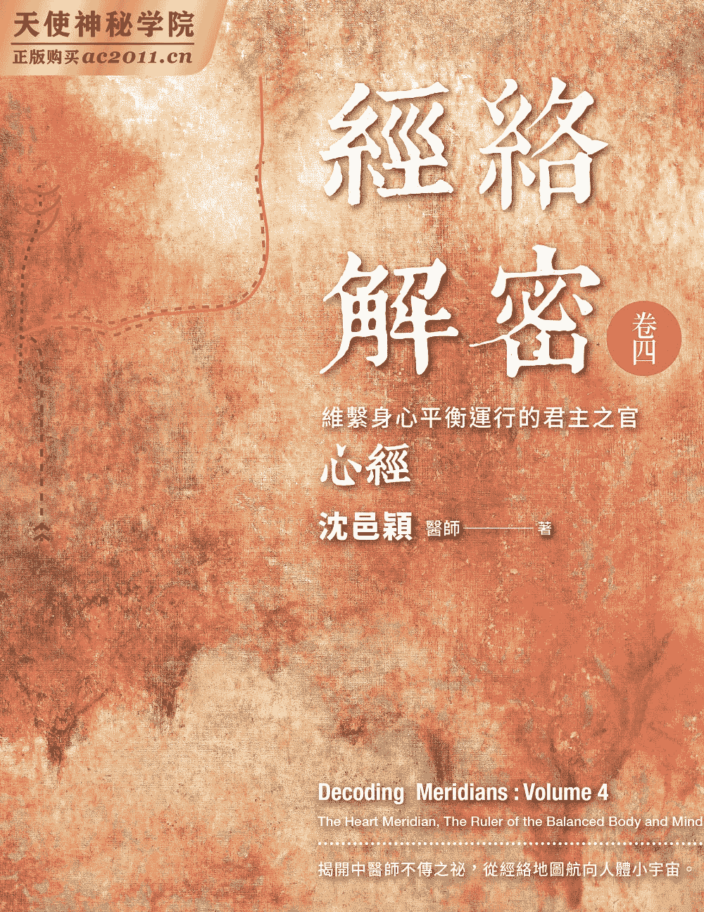

## 从心经迈入十二经络系统的第二团队：
高度社会化的「聚餐团队」

十二经络系统的第二组团队包括手少阴心经、手太阳小肠经、足太阳膀胱经和足少阴肾经四条经络系统，即手足「少阴太阳」系列，其中，心经与小肠经为表里经，肾经与膀胱经为表里经。

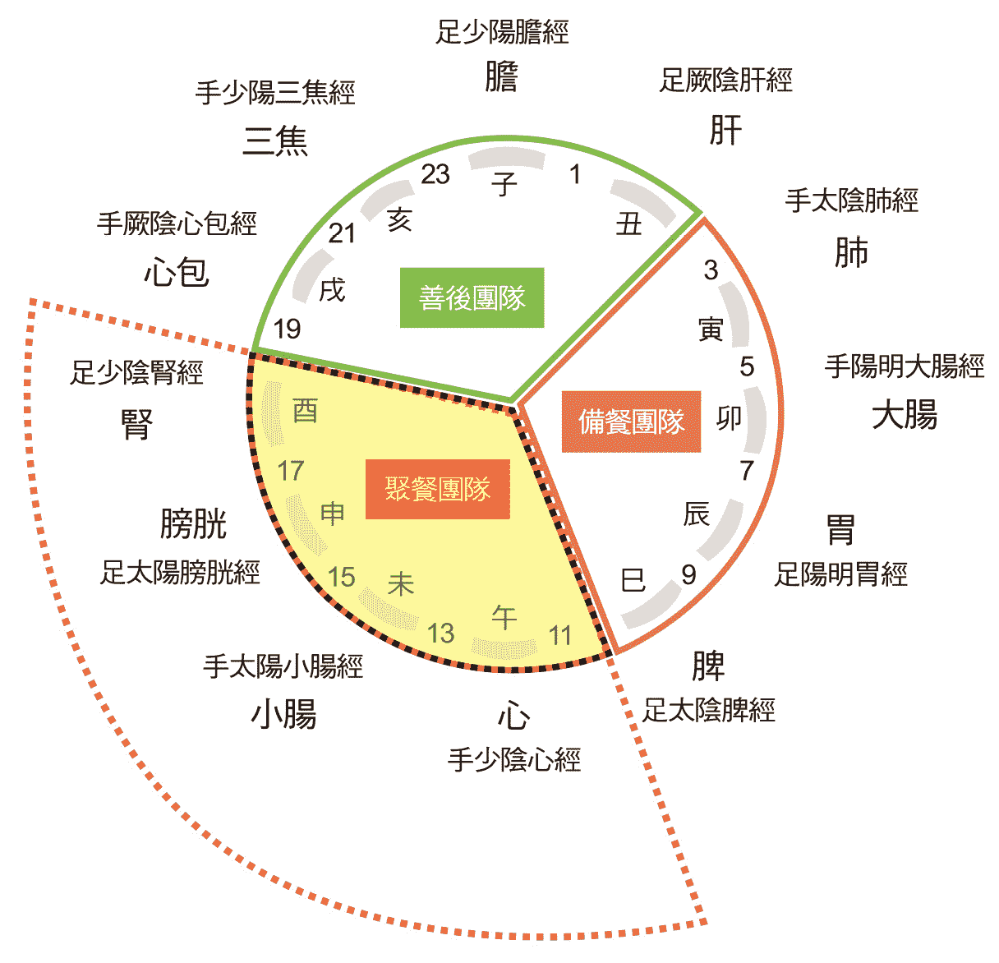

### 命名「少阴太阳」及「聚餐团队」之缘由

在第一团队中，肺经与脾经属于「太阴经」，太阴就是大阴，肺与脾的阴性特质都非常强烈，为了提供人体所需养份而忙碌着，宛如家中的长女与母亲，且两经都循行在人体的前面，肺脏与脾脏也都位于身体较为前面的位置。

在第二团队中，少阴太阳四条经络主要循行在人体的后面，这个「深藏不露」的特性主要与心脏和肾脏位在人体较深层部位有关。

心经和足肾经皆命名为「少阴经」，还与功能有关。心与肾虽然属于阴脏（五脏皆属阴，六腑皆属阳），但心的五行属火，肾藏有人体的元阳元阴，心肾都兼含阳性特质，相对而言，阴性特质较少，所以属于「少阴」。

在日常生活中，心肾与社会化、学习、记忆等有关，心主神志，与 EQ 情绪商数有关，肾主藏精，与 IQ 智力商数有关，无论 EQ 或 IQ 都需要充分营养，心与肾就成为人体最耗能的两脏，因此本团队才称为「聚餐团队」。

小肠经与膀胱经会命名为「太阳经」，猜想人类演化过程中，历经四足动物阶段，行走时背部朝天，面对太阳，加上这两条经脉阳气也旺盛，所以中医才会将此循行于背部的经脉称为太阳经吧！背部有脊椎、肋骨及强壮的肌肉保护，加上功能强大的太阳经一起守护，所以当遇到危险时，人类与许多动物都会基于动物本能，将身体向腹部一侧蜷缩起来，以保护重要的内脏，而背部则作为人体的防护网。

再从中医角度来看，心脏属于阴脏，经脉为手少阴，但《内经》却说「背为阳，阳中之阳，心也。」那是因为心脏透过心经与手太阳小肠经及足太阳膀胱经连结，而成为人体的太阳，强化对于身体背部的掌控，以保护身体安全。

### 十二经络系统「聚餐团队」的特色

第一团队太阴阳明组合为「备餐团队」，善用空气和食物来制造气血津液，并提供幸福感与爱的能量给少阴太阳组合。第一团队在处理气机和饮食方面，都是有入有出，维持人体内外气机的平衡。

第二团队的「聚餐团队」则是接受来自第一团队的养份和能量，推动生命展开多采多姿与外界连结的生活和文明。

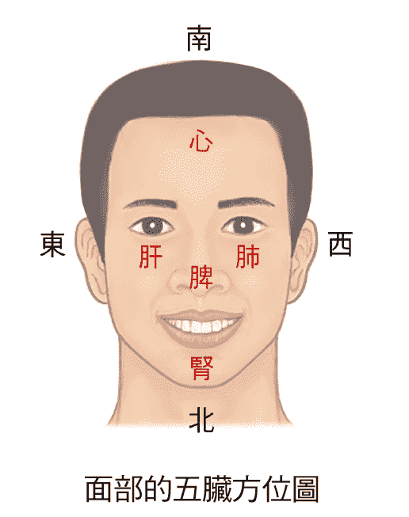

在此团队中，心与肾分主人的 EQ 与 IQ，可以视为人类社会化过程中重要的两大推手。加上心与肾在人体部位上，为上下对照，特性为热与冷的对照，同时也是光明与黑暗的对照。心属于火热的太阳，充满能量，个性外放；肾属于冷静的水液，个性深沉内敛。心为太阳属于天上，光明外显，加上属火，火性炎上，面部对应区在上部的额部；肾为阴水属于地下，黑暗而沉潜，加上属水，水性下流，在面部对应在下巴的颔部，中医称为「额心，颏肾」。

此外，心与肾还有视觉与听觉的对照。心经与眼睛关系密切，而且心还寄窍于耳，肾开窍于耳。当我们睁开眼睛，眼前一片光亮，视觉成为主导，外界事物的各种动态映入眼里，循着经络传递至心，让心与眼都被这些事物所牵引。而当我们闭上眼睛，眼前一片黑暗，此时视觉让位给听觉，听觉成为主导，变得敏锐且活跃，收听外界的各种声音，心沉静内敛，除了接收耳朵传来的声音之外，还能细微感受内在的身心变化。

在十二经络所形成的三个团队中，唯有第二团队有着如此对立分明的关系，而这些对立关系都是来自天地的特色，天地气机相交则气候温和，万物繁茂，在人体心肾相交，水火交融，则气血顺畅，阴阳平衡，是维持身体健康的必备条件。

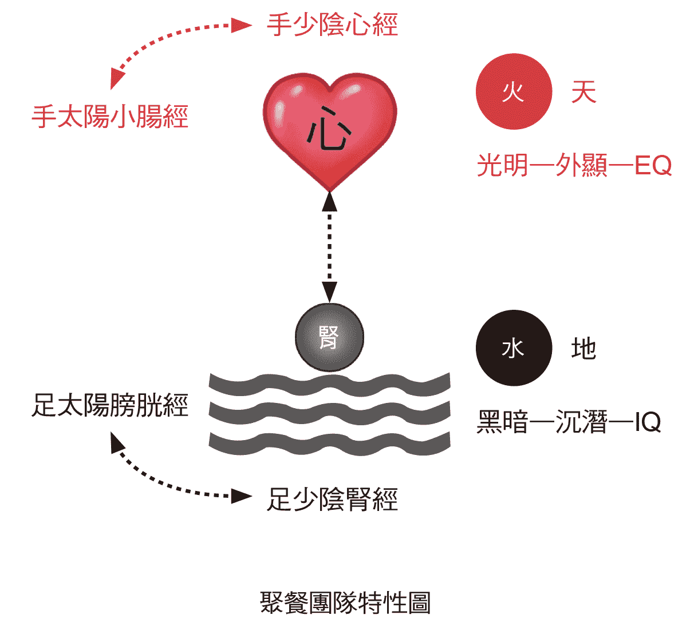

## 《经络解密》导言

#### 为什么我们需要认识人体经络？

中医发现这个精妙的人体连结系统，因为有着如纺织物的网络状态，就称之为「经络」，是维持生命的重要系统。中医经典《黄帝内经》中强调，经络深深影响一个人的生老病死四大环节，如果经络照顾得当，就可以健康长寿。

十二经脉是脏腑运送气血至全身的重要通路，人体的组织器官从而得到充分的营养，身体自然健康。反之，如果经脉阻塞气血无法送达，与这条经络所连结的脏腑与躯干四肢，就会失去营养而产生不适或疾病，中医称为「不通则痛」。因此想要健康，经脉务必要畅通，「通则不痛」，组织器官得到营养，痛感自然就解除了。

经脉除了与一般人有关之外，它更是中医师习医的核心基础，而且学无止境，未来医疗能力的高下取决于经络的了解和应用，值得穷毕生之力去研修，去探讨。

#### 为何用对穴位，就能产生神奇的疗效？

穴位在经络系统上，是经脉里面的气血输注到体表的部位。

穴位就象是经络列车的停靠站，每条经络都跟铁道沿线一样，满布着大大小小的穴位，它们的功能主要来自所属的经络系统。不同的经络系统互相支援，互补互助守护着人体。

认识经络与穴位，也是认识人体小宇宙的金钥，治疗疾病不能只是头痛医头，脚痛医脚，要找到病根病因，善用经络特性，从正确的穴位下手，自然能产生好的疗效。

#### 经络四大系统好像有点复杂，该如何理解？

经络系统是人体运行的设计杰作，有许多奥秘等着我们去挖掘探索。但许多中医初学者却一听到经络四大系统就皱眉头了，担心自己读不懂。我在《经络解密》系列书中以现代智能型手机来作比喻，经络系统就跟手机传输线一样！人体内在脏腑好像手机，经络系统就像传输线，人体的四肢末梢则像传输线的插头端。

#### 书中的经络图有何不同意义？循行是单侧，还是对称呢？

在这套书中，每条经络系统都有三种图来说明，分别是：人形图、循行简图、经穴图。

1.经络人形图：标示经络在人体的循行路线，简称「经络图」。经络系统同时存在人体两侧，但为了便于观看，将经脉、经别及络脉绘制在人体的左侧，黑色为经脉，蓝色为经别，绿色为络脉；经筋则以蓝色色块标示在人体右侧。

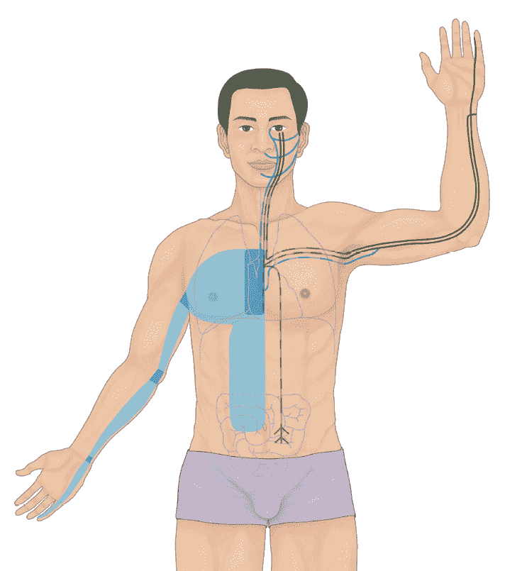

2.经络循行简图：将经络循行以色块及线条表现，比较容易掌握要诀。因为长得很像捷运路线图，简称为「捷运图」。捷运图的颜色及形状都有经过特殊思考喔！包含脏腑本身所属的颜色，四肢颜色较淡，躯干颜色较深。经筋部分，凡是结聚的部位，都会再用黑线框起来。

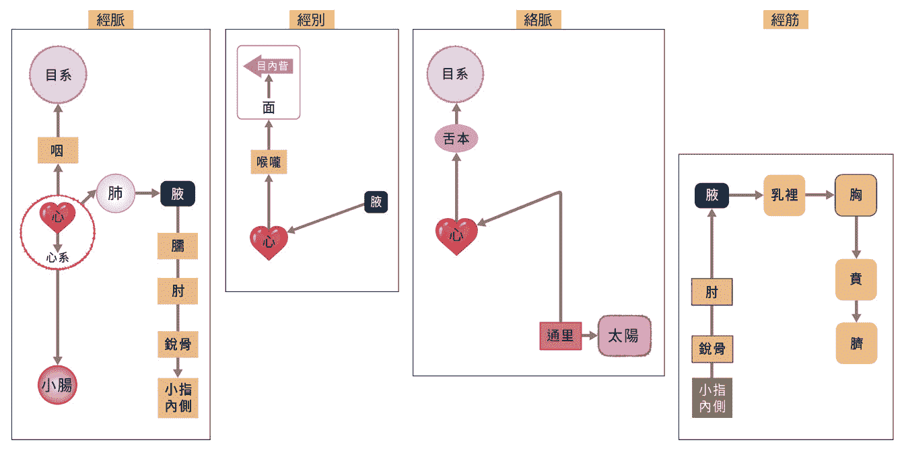

3.经穴图：将属于本条经脉的穴位连结而成。

穴位是人体珍贵气血输注的部位，聪明的人体会将宝贵资源做最佳分配。身体重要部位会有许多经脉通过，但不一定每条经脉都会有穴位。例如，大肠经脉虽然通过腹部和胸部，却没有穴位，而是将所有穴位分布在肩臂和头面部，胸腹部就由老大哥胃经经脉去分配，以免资源重复。

所以，经穴图通常比经脉图简单，对于学习者而言也较为容易掌握。但若要了解穴位的功能及应用，还是需要回到经脉系统，经穴图只是方便法门而已。

#### 「解密」与「中医师不传之祕」有何不同？

♼ 解密：较为深入的内容说明，适合有中医基础，或对于中医有进一步兴趣的读者。

中医师不传之祕：偏向中医专业内容，适合有较深的中医基础，或者从事中医与相关医疗的读者。一般读者若觉得较为艰深，可以略读或越过。

## 前言

自从 2016 年初出版《中医护好心》之后，听到心肌梗塞而猝逝的新闻或事件都很感慨，总想着：如果他（或她）之前曾经接受过中医师诊治，结局会不会不一样呢？

2017 年 3 月，惊闻一位五十多岁友人又因心肌梗塞骤然离世，警觉需要将临床治疗心脏疾病的经验快速传播，因此紧急针对中医师及中医学生开了「抢救心脏」课程，期望连结千手千眼，一起守护心脏，也将课程主要内容转贴脸书。很高兴接到许多中医同道分享及时治疗心脏疾病的历程。

除此之外，读过《护好心》的病人，也很认真观察自己的身体状况，时时按照书上所提供的保健穴道及保健操自我保养，同时还将这些知识经验扩及周边的朋友。

台东的病友有次到诊间来，很兴奋地跟我说：「我们应用你书上的知识救了一个朋友耶！」原来阿姨常在公园运动，前阵子发现一起运动的朋友脸色持续又红又热，想起《护好心》里写道中老年人要注意「苹果脸」，加上印堂还有悬针纹，马上提醒他要赶紧去检查心脏，但朋友自觉身体并无明显不舒服，本来还不想去，但拗不过阿姨的热情督促，前往医院检查后发现冠状动脉果然有阻塞现象。

以下是一位读者亲笔写下的内容：

近年来，三不五时就会听到朋友或是名人因心肌梗塞突然往生的消息，因此看到沈邑颖医师出版的《中医护好心》，便买了一本回家很认真的阅读，边看还会边想自己有没有这些症状。

今年（2018）四月时，先生因为持续手麻不舒服，手麻症状大约持续了近二个星期，过程中也有其他不舒服症状，但都只是偶尔出现，家人之前因颈椎压迫有手麻症状，所以一开始自我判断可能是颈椎压迫而选择先去看了骨科，骨科医师说有稍微压迫，但并不十分严重，也安排了复健治疗，经过治疗后症状有些许改善，但并未完全解除，中间曾有一、二次感到极度不舒服，但大约十几分钟就改善。因身体不舒服症状并未完全改善，于是在思考是否要改挂其他科别，讨论时沈医师书中的内容突然跃进脑海里，赶紧去书柜把书本找出来翻到心肌梗塞的那一页，请先生确认他是否有那些症状，他回答我说：「好像全中吔！」

于是决定第天二早上马上去挂心脏内科看诊，做完检查后，医师跟我们说：「不要回家，马上住院」（抽血报告显示，心肌旋转蛋白指数太高，医师说血管应该是已经阻塞状态，这种状况回家很危险）。于是当天下午马上住院开始打针治疗，隔天下午随即做心导管检查，发现阻塞状况很严重，心脏科医师马上帮他做心脏支架手术，不舒服状况也就完全解除。

其实我先生年轻时有明显耳摺，眉宇间还有直纹，他也曾听过有耳摺的人心脏有问题的机率较高，但当时没问题后来也就不在意了。住院时还跟住院医师说，以后看到有耳摺的人要提醒他多注意心脏问题。

大家都说心脏病是「无形」的杀手，但我们在每天的临床诊治中，以中医理论来「阅读身体」，都能让这位无形杀手「原形毕露」，即刻将之驱逐出境！所以重点不在心脏疾病有形或无形，而在于我们有没有读懂身体发出的求救讯号！

想读懂自己心脏的故事吗？想再深入了解自己的心脏？想享受健康的人生吗？

那就跟我们一起进入繁忙且多采多姿的心脏世界囉！

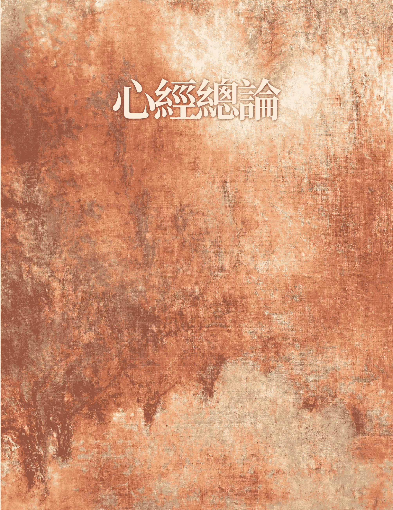

# 心经总论

## 心脏是身体的君主之官，
也是自己生命故事的编剧和导演

心脏是君主之官，为人体五脏六腑功能的掌理者。「心」既是生命的原动力，也是精神的发源地，统管生命与生活最关键的功能，当然也是五脏六腑里最重要的器官。古代医生用宫廷中的官位来说明脏腑的功能和重要性，由「心」担任君王管理天下是实至名归，因此《内经》说「心者，君主之官也，神明出焉⋯⋯故主明则下安，⋯⋯主不明则十二官危。」点出了「心」的重要性。

中医的「心」是指透过经络系统的连结与四肢躯干相联系成为心的系统，再与感官、情志、情绪等相连结，等于是涵括了现代医学所讲的心脏，以及脑部的感知、辨识、情感、记忆等功能，当然也包括神经系统在内。所以，中医看心不只是一颗会跳动、将血泵出的器官而已，古人把「脑」纳入「心」，心脑相通，而且心是脑的主宰，因此中医所说的「心」，也是掌握人的意念与产生情感的源头。

1960 年代在美国兴起的新世纪（New age）心灵启蒙风潮，其中珍．萝伯兹（Jane Roberts）在她的赛斯（Seth）系列书中，让赛斯这位高灵不断透过 Jane 传递 You create your own reality 的概念。这句话翻成中文可以用「万物由心造」来说明。

在我们数十年的岁月中，时时刻刻都在做抉择，即使不做决定，也是一种选择。而每一个选择都会影响着我们的人生故事，做这些选择以及完成的人都是我们自己，所以，我们其实都是自己生命故事的编剧和导演，持续编写自己的人生剧本，并善用周边可以运用的资源，化为行动传递自己的理念和坚持。

早期智能型手机还没出现的年代，使用单眼相机拍照可是一门学问，有次练习拍照时，赫然发现客观的物体不变，但随着相机镜头的替换、取景的角度不同等因素，所拍出来的照片竟然大不同。当下深深体会，我们都戴着一副有着既定成见的「有色眼镜」在看这个世界，就像透过相机镜头一样，从不同的角度在感受生命历程，也如此地在刻划自己的人生！

我很喜欢宋代词人蒋捷的一阕词［虞美人］：

少年听雨歌楼上，红烛昏罗帐。

壮年听雨客舟中，江阔云低，断雁叫西风。

而今听雨僧庐下，鬓已星星也。

悲欢离合总无情，一任阶前，点滴到天明。

蒋捷藉由「听雨」描述在不同年龄、不同地点的人生况味与心境。少年时代宛如在歌楼之上听雨，年轻激动的心情展现于「红烛昏罗帐」；中年历经人生的跌宕，宛如在陌生的客船听着雨声，随着宽阔的生命河流起起伏伏，时见乌云低垂，时闻西风中失群孤雁哀鸣，自己的心情也有些萧索。老年白发皤皤历尽沧桑，宛如在离俗的僧庐之下听雨，看尽世间的悲欢离合，了然世事自有其因缘，难如人意的无情，曾经沧海难为水，就让阶前的雨珠随着因缘点滴到天明。

这阕词对仗工整细腻，不仅描述不同年龄的少年、壮年与星鬓，还有不同场合的歌楼「上」、客舟「中」与僧庐「下」，从位置的高低，也体现出听雨者的心境从高昂、持平到后来的内敛，词简意深，难怪可以传唱千年。

我们的心情时时刻刻都被内在与外在的事物所牵动，这些干扰「心」的情况，其实不脱「得」与「失」，诚如艾克哈特．托勒在《当下的觉醒》（Stillness Speaks）书中所说的 Most people’s lives are run by desire and fear.（大多数人的生命都被欲望和恐惧所掌控）。欲望是想给自己「增添」些什么，好让自己更为完满。恐惧则是害怕自己「失去」什么，因为去除而让自己减损。

面对世事的不断变化，心也跟着运筹帷幄，并试图在变动中重新帮我们找回身心的平衡，片刻不得闲，「变动」与「运转」，就成为我们的心时时刻刻都必须面对的终极任务！

### 心具有明君的特质

近来宫廷剧蔚为风行，过去偏重在男性之间的权力争逐，现在则是女性当家，尤其围绕在皇帝身旁阴柔的权力斗争，其心机之重，为达目的而百招尽出，令人瞠目结舌。但从君王的角度来看，众多美女环伺，齐人真的多福吗？每天要面对后宫这些人事纠葛和恶斗，我想唯有身在其中，方知箇中滋味吧！

君王虽然身居高位，握有重权，但多数都不是能力最强的人，所以要成为明君关键点有三：一是对于百姓要关爱，对于国事有热情；二是建立诸多耳目机关或网络，让深居简出的君王可以收集各方信息；三是知人善任，让每个人都能处在正确的位置，做对的事情，发挥所长，齐心协力护卫家国。

我们的心脏也具有成为明君的特质！

为了快速了解心脏的特性，先将这位热情有活力的君王特质简述如下：「心是阳光热情，神气十足，笑容满面，舌粲莲花，耳目众多，掌握脉动，愿意抛头颅洒热血，汗流浃背，建立汗马功绩，而苦中作乐的君王。」详细内容将在后文介绍。

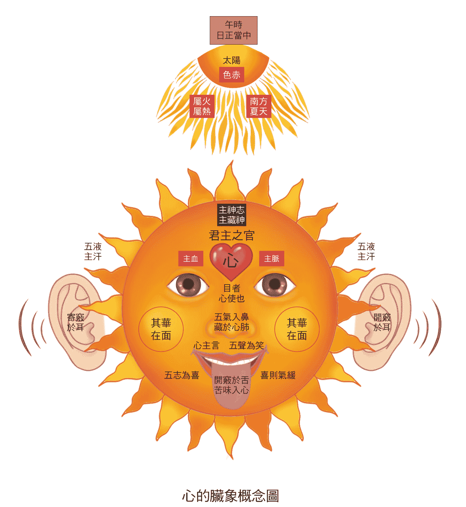

## 认识心脏的三大对应关系

接下来将以三个对应关系来介绍心脏的特质，分别是：心与天地、心与身体、心与其他脏腑的连结关系。

### 一、心与天地对应关系：心脏对应太阳的特质

在一般的认知中，早将我们的心连结到「热情」以及「太阳」的观念，例如俗语说的「热心」、还有恋爱歌曲如［You are my sunshine］等。

《黄帝内经》依据五脏所在部位说「背为阳，阳中之阳，心也。」表示心脏是五脏之中阳气最盛者。「阳中之阳」就是很大的阳气，《内经》称为「大阳」或「太阳」，因此心脏主要是对应太阳的特质：心脏有着太阳般的光与热，还有着太阳之于太阳般的主宰能力。

《内经》有关心脏其他特色为：「南方赤色，入通于心，开窍于耳，藏精于心，故病在五藏，其味苦，其类火，其畜羊，其谷黍，其应四时，上为荧惑星，是以知病之在脉也，其音征，其数七，其臭焦。」

主要内容请参阅下表：

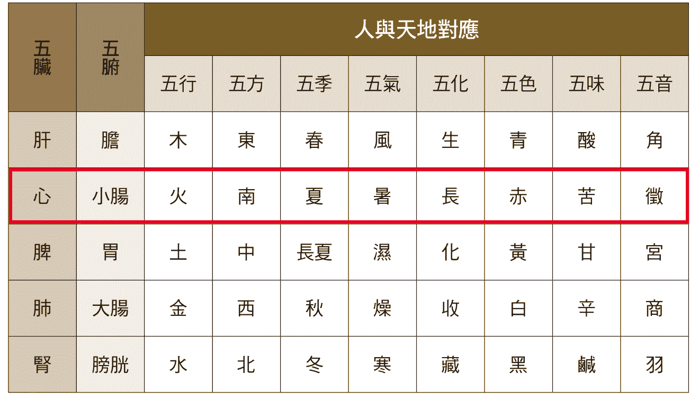

心脏既然有着太阳般的光与热，心与「热」，就成为不可分割的特质：

● 从五行来看：热情的心当然对应火。

● 从方位来看：对应南方，地球北半球的南方气候偏热。

● 从五色来看：对应赤色，赤色为火的颜色，也是太阳的颜色，更是血液的颜色。

● 从时间来看：对应四季之中最热的夏天，暑热炎炎，阳气旺盛，万物快速成长；对应一年 24 节气中，从立夏到大暑，正是天气最燠热的时候；古人用十二地支来记录时间，对应一天十二个时辰，心属于午时，也是气温最高的时间，心脏与时间对应都在最炎热的时候，这也反映出心脏的特质。另外，十二地支对应十二生肖，午对应马，有人说是烈火对应烈马之意，所以马年出生的人个性比较热情，午马年通常也是天气比较燠热的一年。

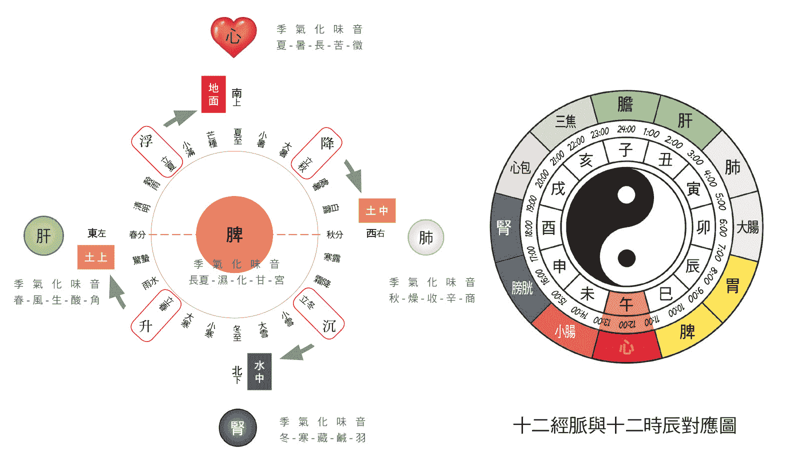

从心脏本身的功能来看，心脏是五脏之中阳气最旺者，宛如人体发电机，心脏独有的泵血功能，时时刻刻跳动，推动血液到全身各组织器官，输送营养，以维持正常功能与体温。血液循环正常，身体就有温暖感，反之，血液循环不良，身体就会有寒冷感。因此《内经》认为人体的心脏与自然界的太阳一样，都具有温热的特质。

### 心是南方的太阳，心的热象反映在额头部位

心属于南方，对应面部就在额头的位置，中医称为「额心」。许多心火旺盛的人，常在额头部位出现痤疮（青春痘）就是例证。

（面部的五脏方位，在《经络解密卷二：大肠经与胃经》一书中有详细说明：「爷爷的左手─肝生于左」p.115-117）

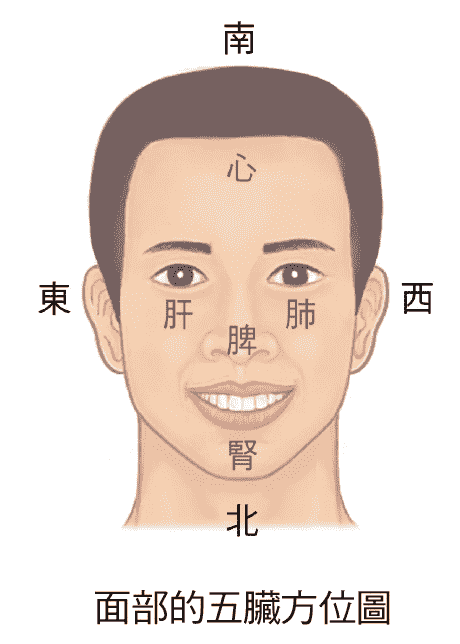

心的五味属苦，苦味的食物或药物多数偏寒，可以降心火，避免心火过亢。相对于甘味入脾的甜美，苦味入心则有着丰富多元的人生历程。

某天在诊间跟病人讨论外来新品种食物的寒热属性。该食物有苦味，病人马上铁口直断说，一定属于寒性。原来病人听我们说过苦瓜味道苦，性质寒凉的特性，由此联想苦味食物会偏寒，举一反三，实在很有趣。

### 心的五行属火，造就了中医「重视阳气」的理论特质

心的五行属火，火对于人类演化有着重大的影响，火是太阳的光与热在人世间的代表，例如：火所带来的光亮，让人类不限于「日出而作，日落而息」，活动时间加长，更有弹性；火所提供的温暖，让人类得以在寒冷的时刻及空间仍能维持活动与生活。

现代社会的灯光及炉火，都属于火的一种，灯火代替太阳带来光亮，炉火代替太阳带来热能，除了让人类活动的时间与空间得以扩展之外，用火烹煮食物，减低食物的毒性，增加食物的种类，大幅提升消化及吸收食物中的养分，让人类的脑容量得以增加，文明从而快速发展。

中医说「气为血之帅」，人体的血液津液等阴液都需要阳气的推动、转化与固摄，方能为人体所用。中医的保健法则「阴平阳秘，精神乃治；阴阳离决，精气乃绝。」意思是阴与阳之间的动态平衡是维系生命的关键，人体若能维持阴阳平衡则可保健康，生命得以生长繁衍。若阴阳失去平衡，只有阴或阳独存，就会出现「孤阴不生，独阳不长」，一切生物既不能生化和滋长，当然也就不能存在。尤其阳气对于身体机能有重大影响，临床上许多危急证，都先始于阳气脱亡，导致阴液跟着流失，最后才导致死证。

心脏具有火与太阳般推动生命发展的阳性特质，人体阳气之首就是「心阳」。住在太阳系的我们无法想象没有太阳的日子，住在心脏王国的身体也同样无法承受没有心这位君王的日子。心属火的特质，造就了中医「重视阳气」的理论基础。

### 二、心与身体的对应关系：心脏对应神志、血脉与面部的特质

《内经》说：「心者君主之官，神明出焉。」心又主血主脉，所以中医的心可以分为三个部分来说明：君主之官、主血主脉、主神志，三者有很密切的关系。因为心是人身的君主之官，就像一国之君一样，心也掌控一个人的身心状态，它们的关系图如下：

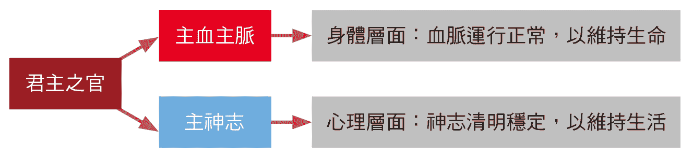

中医的心包括时时刻刻跳动的心脏，及时时刻刻波动的情绪。

● 主血主脉：指心脏功能，与个人生命的存亡有关，属于身体层面。

● 主神志：指情绪感受，与人际关系及生活有关，属于心理层面。

由于中医的心兼具了身体与心理层面，中医自古就知道身与心之间互相影响，所以强调身心共治、身心平衡才算健康。

在治病方面，中医重视治本，就是从根本来治疗。门诊时，我们会花时间与病友一起讨论身体状况，试图追溯生活细节，找出病因。有些不习惯这个模式的病友随口就说：「生活都一样，都没改变啊！」我就回说：「每个季节的食物和气候都不一样，生活怎么可能都一样？没有天上掉下来的疾病，生病一定都是有原因的。」通常这时病人就会静下心来回想生活中的点点滴滴，找到自己忽略的地方，这些问题都不出身体或心理范围。找到病因，也就同时启动了治疗的机制。

本篇章将依序介绍心脏的身体层面及心理层面。

身体层面的心脏主管血脉，心理层面的心脏主管神志。身体的心是个好面子与好变色的君主，面部官窍的功能及身体颜色的变化，都能透露出心脏状况；心理的心既是快乐喜笑爱说话的开心果，还具有苦味焦臭的特质，喜与苦这两个完全相反的特性，既是身体的平衡机制，也是人生的百态。

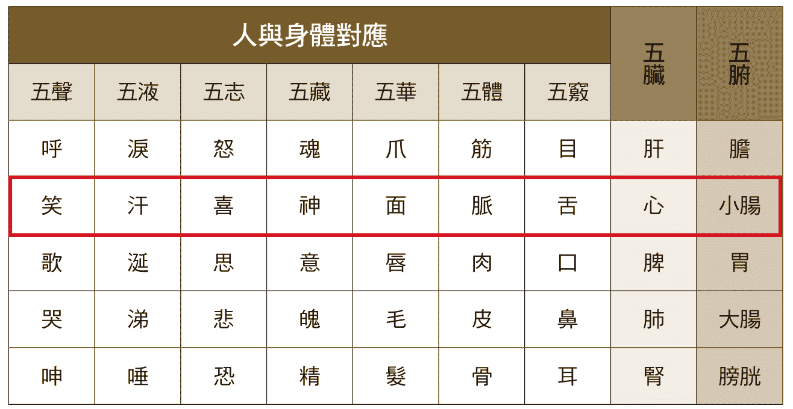

#### 1.身体功能的心：

● 心主血

● 心主脉

● 汗为心之液

● 心主面与色

从身体的层面来看，心脏透过不断搏动的「泵血」方式，将血液运送到全身各个组织器官，以维持生命。为了达成这项重要任务，心脏必须全程掌控每个环节，包括全身所有的血液、血管及脉搏。中医早就了解这个原理，因此说心脏「主血」、「主脉」。

##### 【心主血】

有关血液的来源及功用，《内经》有比较静态的说法：「中焦受气，取汁，变化而赤，是谓血。」位于中焦的脾胃吸取食物中的营养，经过转化成为红色的血液。所以脾胃为后天之本，气血生化之源。

《内经》还有比较动态的说法：「营气者，泌其津液，注之于脉，化以为血，以荣四末，内注五藏六府。」这是对于血脉来源及功能的最佳诠释。营气是胃从食物中吸收到最营养的部分，营气注入于脉中，变化成血液，血液再经由脉的营运，濡养身体外部的四肢，使其动作灵活，注入体内的五脏六腑，以维持正常功能。

《内经》特别指出「诸血者皆属于心」，人体所有的血液都归心脏管理，由心脏决定分配和运送方式。血液在人体不同的部位会发挥不同的功用，如「肝受血而能视，足受血而能步，掌受血而能握，指受血而能摄。」视力和四肢的步行、握摄等活动，都仰赖心脏提供的血液，这是维持生命与肢体活动力最关键的功能。从这个角度来看，中医对于血液的概念与现代医学是一致的。

##### 【心主脉】

前文提到，营气注入于脉中，变成血液，经由「脉」输送至全身。此外，《内经》再明确点出脉的功能：「壅遏营气，令无所避，是谓脉。」壅遏原本是阻塞或阻止的意思，在这里是约束之意。由于血液是人体非常珍贵的宝物，有经济头脑的身体当然会锱铢必较，将之层层约束，小心翼翼的用在该用的地方，而不要让它在体内随意流动，造成无谓的出血损失。这个将血液约束在特定位置及流动方向的东西就是「脉」，也可以称为「血脉」。从这个角度看来，《内经》所说的血脉很像现代医学所说的血管。

《内经》还有另一种脉称为「经脉」，例如：「十二经脉者，内属于府藏，外络于肢节。」「经脉者，所以行血气而荣阴阳，濡筋骨，利关节者也。」经脉具有连结内脏与肢节，运输气血以濡润筋骨关节的功能，这些功能与血管不尽相同。

* * *

###### 中医典籍指出：心所主的「脉」包含「血管」与「经脉」

参阅《内经》相关论述，如：「食气入胃，浊气归心，淫精于脉，脉气流经，经气归于肺，肺朝百脉。」「诸血者皆属于心，诸气者皆属于肺。」

心主管一身之血，肺主管一身之气，胃将最营养的物质提供给心脏，再透过脉输送给肺。「肺朝百脉」意思是肺统领百脉，《卷一》介绍过，肺为相傅之官，主气司呼吸，为五脏六腑之长，专责协助心脏这位君主将血液输送到全身。「百脉」即含有「经脉」之意。

「诸脉者皆属于目，……诸血者皆属于心。」「五藏六府之精气，皆上于目而为之精，……目者，五藏六府之精也，营卫魂魄之所常营也，神气之所生也。……目者，心使也。」

心为君主之官，统领五脏六腑，五脏六腑的精气都透过经络系统上输于眼睛，眼睛成为心的使者，能传递心的感受，所以眼睛才被称为「灵魂之窗」，因此所有经脉都属于眼睛。

「五藏之道，皆出于经隧，以行血气。血气不和，百病乃变化而生，是故守经隧焉。」经隧是运行脏腑气血的经络通路，也是「脉」之意。

所以中医所说的「脉」，不仅是血管（血脉），还包括经脉。《内经》说「经脉者，所以能决死生，处百病，调虚实，不可不通。」经脉攸关生命安危，因此高高在上的心脏才会亲手统理全身的「脉」。

另一本中医典籍《难经》中也提到：「五藏俱等，而心肺独在鬲上者何也？然：心者血，肺者气，血为荣，气为卫，相随上下，谓之荣卫，通行经络，营周于外，故令心肺在鬲上也。」

心主血，血来自于营气；肺主气，气来自于卫气，营卫气血在人体上下相随并行，所以被合称为营卫。营卫气血在经络中流动，运行至全身，濡养人体，维持正常生理机能，因此心与肺才会特别安置在胸膈之上的位置，《内经》也说「鬲肓之上，中有父母。」这里的父母指的正是心与肺。

古代非常重视孝道，父母乃是一家之长，《内经》比拟心肺为人体之父母，可见其重要性。这也教导我们，人体之内虽然五脏各有其特殊功能，都能公平的一展所长，但因为心肺肩负有维持生命的重责，所以特别居在膈上。

同理，在人类社会虽然人生而平等，但真正的平等应考量到每个人的能力特质与努力成果，给予合理的反馈以及支持，而不是忽略个人表现的齐头式平等。

你看连人体的内脏都懂得这个道理呢！

《难经》还有相关论述：「十二经皆有动脉，独取寸口，以决五藏六府死生吉凶之法，何谓也？然：寸口者，脉之大会，手太阴之脉动也。人一呼脉行三寸，一吸脉行三寸，呼吸定息，脉行六寸，人一日一夜，凡一万三千五百息，脉行五十度周于身。……」这是个数学题，说明十二经皆有动脉，也可以称为脉动。

肺朝百脉，肺又司呼吸，所以随着人的一呼一吸，经脉就推行 6 寸。依据中医的算法，我们一天 24 小时共呼吸 13,500 息，脉行 6 寸 X13,500 息=81,000 寸，绕行身体 50 周，每周是 81,000 寸÷50 周=1,620 寸，此为十二经脉绕行身体一周的距离。

这个演算题的另一个重点在于十二经也是脉的一种，可以运送气血至全身，但这个脉行的概念与血管不尽相同，再次证明中医所说的「脉」包含血管与经脉。

* * *

血管与经脉的部分性质类似，在人体许多部位有重叠之处，例如中医师常把脉的腕关节「寸口处」，也是桡动脉所经之处。由于经脉还连结脏腑与四肢躯干，经脉会透露出内在脏腑机能的讯息，中医师藉由在寸口把脉，此处的脉为经脉，即可掌握全身的状况。

在把脉的同时，中医师也会注意到脉动的规律性与顺畅度等。《伤寒论》早就记录了心脏跳动异常的现象：「伤寒脉结代，心动悸，炙甘草汤主之。」以下将脉结代与心动悸两种情况分别说明：

##### 异常脉动：脉结代

脉动不规律，出现忽快忽慢或跳跳停停的现象，现代称为「心律不整」，中医称为「结代脉」，是「结脉」与「代脉」的总称，两种脉象都是心跳有间歇。「结脉」是心脏跳与停之间没有规律，如跳二三动停一下，接着五六动停一下；「代脉」是心脏跳与停之间有规律，如固定跳两动停一下，或跳三动停一下。

##### 异常脉动：心动悸

心跳过快，严重者会感觉到心脏蹦蹦跳，伴随心慌不安、胸闷眩晕、呼吸短浅、手冷等现象。现代医学与中医学都称这些现象为「心悸」。此处加上「动」字，表示心跳非常明显，甚至可以看到胸前区心脏跳动的模样。

炙甘草汤是历代中医师常用来治疗心律不整和心悸的方剂，直到现在临床上还经常使用，对于长期处在高压之下，劳心劳力工作的上班族，还有高龄长者心脏机能退化，出现心脏气血严重耗损的情况服用本方，效果不错。炙甘草汤是桂枝汤的变化方，桂枝汤是《伤寒论》第一个药方，由此方还延伸出许多方剂，因此被尊称为「天下第一方」。桂枝汤与心经关系密切，后世许多心脏病的治方也都从桂枝汤变化而来，后文会详加介绍。

血液是流动在脉管之中珍贵的营养物质，血与脉合体，才能维持生命。身体的「血脉」概念，后来也在其他领域衍伸出不同意涵，例如：形容情绪极度激动，结合身与心变化的「血脉贲张」；在学术、思想上的「一脉相传」；在家族关系中的「血缘」、「血统」、「血亲」及「血脉相连」等词汇。可见血与脉的密切关系。

###### 中医师不传之祕：「诸痛痒疮皆属于心」之理

《内经》病机十九条中「诸痛痒疮皆属于心」，指出无论疼痛或痒疮之证都与心脏有关，可以从心着手诊治。

痛证与痒证皆属于气血运行异常、局部组织失于濡养的病证。气血阻滞的实证多为痛证，气血不足的虚证多为痒证。

##### 认识痛证

前面提到「经脉者，所以能决死生，处百病，调虚实，不可不通。」可见维持经脉畅通至为重要，后世医家就提出「不通则痛，通则不痛」的原则，连病人都会直接问说「我是不是血路不通才会这么痛？」临床上，确实看到许多痛证都与脏腑经脉的气血阻滞有关，只要加以疏通即可改善，民间称这个方法为「通血路」。

另外有一种特殊的痛证，来自于身体结构的扭伤、撞伤或骨折等原因，造成局部出血、气血瘀阻、疼痛及活动障碍等，《内经》有「菀陈则除之」出恶血的治法，后世医家也有「旧血不去，新血不生」的说法，透过放血来排出离经之血，疏通阻滞的经脉，恢复其能，常有奇效。下面举两个案例分享。

案例一：是一位中年男士，某日爬山时不慎扭伤右踝，全身翻滚跌落山沟，导致小腿的胫骨与腓骨闭锁性骨折。送医后，因局部严重血肿，骨科医师无法开刀，只能等待血肿消退后再手术，但等候了四天血肿依旧。病人曾陪母亲来中医科就诊，于是就坐着轮椅到中医科求治。因为血肿面积涵盖整个足背，我们马上在右足五个趾头末梢放血，次日血肿消退，隔日就接受骨科手术，术后恢复良好，病人非常高兴，亲自来中医科致谢。

案例二：是个优雅的六十多岁阿姨，前来中医科治疗内在脏腑疾病。某次诊疗中，刚巧文具从诊疗桌掉落，我弯身捡拾时，赫然看到阿姨异常肿胀的右外踝。经询问才知，原来阿姨十几年前因右踝骨折，手术后一直肿胀难消，骨科医师建议再行手术，阿姨害怕动刀，未作治疗，就让右脚维持现状。阿姨幽幽地说，过去自己是很喜欢穿旗袍的人，但穿旗袍要配绣花鞋啊！右脚那么肿根本无法穿绣花鞋。所以从那次手术后，就再没穿过旗袍，非常遗憾。阿姨从来不知道中医可以治疗这种情况，也就没跟医师提起。了解情况之后，我们就在右脚对应肿处的趾头末梢放血，随着旧血的排出，右踝的肿胀也逐渐松缓。经过几次放血之后，回诊时阿姨笑吟吟的秀出脚踝，肿胀已经消很多了，并说近日开始试穿绣花鞋，期望不久之后可以再穿上旗袍！

《黄帝内经》内容大多讨论针灸治疗，放血也是重点项目，尤其在《素问．缪刺论》有多种放血的适应证和方法，例如「人有所堕坠，恶血留内，腹中满胀，不得前后，先饮利药，此上伤厥阴之脉，下伤少阴之络，刺足内踝之下、然骨之前血脉出血，刺足跗上动脉，不已，刺三毛上各一痏，见血立已，左刺右，右刺左。」最后提到「因视其皮部有血络者尽取之」，可见放血之法有其特殊疗效，临床上我们也常配合使用。

对于以上外伤导致四肢瘀肿的案例，无论时间新久，第一次放血建议都从四肢末梢，因为出现在体表的瘀肿也许只是整个病情的冰山一角，透过末梢远端放血，可以释放整条经脉淤滞的压力，几次之后，若是瘀肿范围缩小，就可在局部放血。

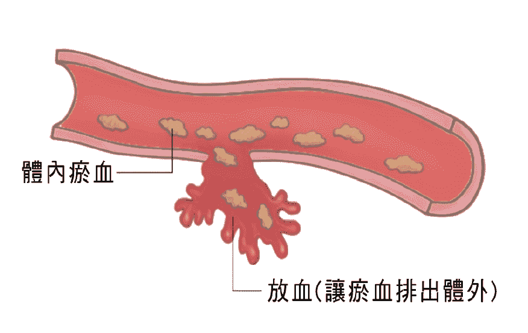

##### 痛感转移

虽然中医说疼痛多数是因为气血不通所致，但从人生经验以及临床上发现，「疼痛感」有些时候很容易被转移。怎么说呢？

平日生活、工作中常有疲惫忙碌、压力高涨的时刻，例如赶车赶路，准备简报资料，或是参与运动竞赛等，当时全心投入，别无他想，等事过境迁才赫然发现，几天前就脚踝扭伤肿痛，头部胀痛，脚趾瘀血无法伸直⋯⋯，这些状况早就存在，只是当时的心思全都专注在工作或运动，所以身体的疼痛感就被暂时忽略了！这类情况也常出现在车祸受伤者身上，在身体被严重撞击的当下并不觉得痛，甚至完全不知道发生了什么事，其实这是人体的保护机制，让我们免于过度的疼痛与恐慌。

依据现代医学研究，在某些特殊时刻，大脑会分泌一种神经传导物质「脑内啡或内啡肽（endorphine）」，它是人体自然生成的类吗啡生物化学合成物激素，能与吗啡受体结合，产生跟吗啡、鸦片剂一样的止痛和愉悦感，是天然的镇痛剂，所以又称为「天然吗啡」或「内在的吗啡」。「吗啡（morphine）」是鸦片类止痛剂，直接作用在中枢神经系统来改变人体对疼痛的感觉。一般人或许对吗啡有负面的观感，认为它容易让人恍惚及成瘾，但这是「非战之罪」啊！因为在医疗上吗啡是许多癌末病友控制剧烈疼痛、维持生活质量与生命尊严的战友。中医医疗上也会应用脑内啡，例如「针刺镇痛」或「针灸麻醉」法，在针刺特定穴位时，脑内啡会大量分泌，且分泌量与镇痛效果呈正相关。

脑内啡具有缓解「压力性疼痛的作用（Stress-induced Analgesia）」，当人体受到极大压力时会主动分泌。脑内啡具有超越吗啡五倍以上的止痛作用，这让我们在生命过程中可以转移痛感，完成使命。除了刚才所提的车祸现场之外，还有运动员在比赛过程中受伤，但为了完成竞赛，忍受身体的剧痛，咬紧牙关，持续发挥战斗力，争取最后胜利。军人在面对战争时也是一样。

脑内啡不仅可以止痛，也能让人产生愉悦感。体育界有「跑步令人 high」的说法，科学家也证实跑步可以刺激大脑，进而产生脑内啡以提振心情。许多人都有在长跑之后产生快感的经验，这就是「跑步者的愉悦感」（runner's high）。脑内啡具有令人快乐、保持年轻状态的特质，又被封为「快感荷尔蒙」或「年轻荷尔蒙」。

脑内啡能让身体止痛及心理愉悦的特质，都与心脏「诸痛痒疮皆属于心」及「心之志为喜」（后文会介绍）的特质不谋而合。由此可知，面对疼痛不仅能从身体层面着手，也可以从心理层面处理。生活中我们常不自觉的利用「转移注意力」的方法来减轻疼痛，还有爱的关怀也能减少疼痛，例如孩子跌倒撞伤头部而痛哭，只要被妈妈抱起来呼呼头，就会逐渐安静，痛感也减少。这都是心的力量！临床上，中医常藉由心来止痛、安神，道理就在这里。

##### 认识痒症

痒证多属气血不足、局部组织失于濡养的病证，这类患者皮肤都比较粗糙。临床上多属于津血不足，常见于平素少饮水或营养不良的人。另外还有饮食重口味，嗜好辛辣油炸，以及长期熬夜的夜猫族等，体内火热偏亢，煎灼津液，致使津液不足，皮肤干燥而出现痒证。

##### 认识疮证

广义的「疮」是人体体表外科疾病的总称，「痈」也涵括在疮之中。《内经》有关痈病的成因为「五藏不和则七窍不通，六府不和则留为痈。」病理机转为「邪在府则阳脉不和，阳脉不和则气留之，气留之则阳气盛矣。」历代医家也多以热盛来讨论痈疡。心属火，因此痈疡与心火关系密切。如善于治疗疮疡的连翘，其性苦寒，果实像心，主入心经，能清心火，解疮毒，又能散气血凝聚，兼有消痈散结之功。《医学衷中参西录》说：「连翘，具升浮宣散之力，流通气血，治十二经血凝气聚，为『疮家要药』。能透肌解表，清热逐风，又为『治风热要药』。」

在《内经》病机十九条当中，除了「诸痛痒疮皆属于心」与心脏直接相关之外，由于心主火属热，还有九条与心脏间接相关：

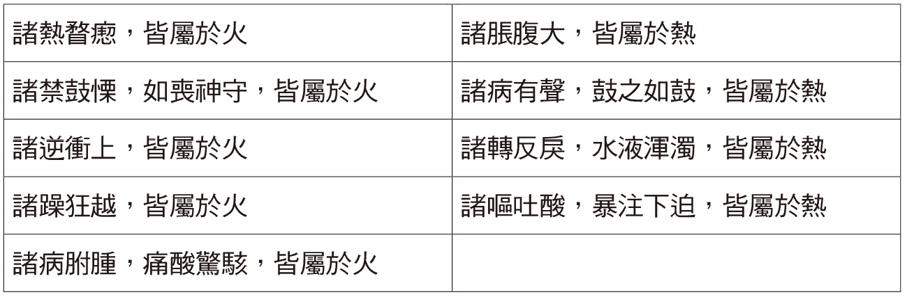

生活经验中，火与热常有「爆发性」和「急迫性」，例如我们常说某人个性很火爆，事情十万火急等，病机十九条中的火与热也符合这样的特性，例如属于火者多见神志异常、气机上冲的病证；属于热者多见躯体肿胀、气机下注的病证。无论属于火或热，都出现急迫的病情。

病机十九条之中，就有十条与心脏相关，心脏这位君主之官对于身体的巨大影响力可见一斑。

###### 中医师不传之祕：体虚的病人该如何放血？

某天门诊出现一位面色苍白、语音低微、呼吸喘促的女病人，由于长期劳累，身心压力过大，常感胸口如大石头压住，气短无法呼吸，稍动则喘，甚则有濒死之感。经四诊检查，不仅气血两虚，还兼有严重的气血瘀滞。虚证为本，实证为标，脉象沉细弱疾，但仍有一股生机。气血两虚须长期调治，气血瘀滞则会持续损耗气血。面对这虚实夹杂之证，依据中医「急则治其标，缓则治其本」的原则，决定予以放血，行气活血以疏通经络。

当时请跟诊的年轻医师执行此项治疗，可把这位医师吓坏了，他看病人如此虚弱，担心放血过程中就会晕过去。我跟他说：「别担心！病人七分虚证，三分实证，我们先补后泻。先去把脉，记得这个脉象。再灸几个强心补气的穴位，边灸边把脉，只要脉象逐渐浮出，跳动安稳且有力，就可以放血了。放血过程中，继续艾灸。」

年轻医师怀着忐忑不安的心情，一边加灸，一边在病人左手小指「两井一宣」部位（即心经及小肠经的井穴，加上手指末梢的宣穴）消毒，一边还忙着把脉。过一会儿跑过来说：「沈医师可以请您过去看看吗？好像可以放血了！」我一搭脉，脉象果然浮出，且脉动虽快，但在和缓中出现了力量。我点点头说 OK。

我后来回诊间看其他的病人，突然背后传来清快明亮的嗓音说：「沈医师，我好多了！谢谢你们！」回头一看，竟是刚才那位气喘吁吁的病人！

后来我们利用这种方法为许多这类情况的病人放血，效果都非常好。施术的重点在于：

1.先定虚实，再行补虚：首先确定病人的虚实状况，再决定补法的剂量。补法不侷限于灸法，使用药物或推拿按揉也可以。对于体虚严重者，会从放血前、放血时及放血后都持续点艾灸。

2.注意脉象，再做泻法：首先即使是虚人的虚脉，也须有生机才能考虑泻法。「生机」譬如脉沉取之中仍有动力。

其次最忌讳使用补法之后「脉暴出」，此概念来自张仲景《伤寒论》「少阴病，下利脉微者，与白通汤。利不止，厥逆无脉，干呕烦者，白通加猪胆汁汤煮之。服汤脉暴出者死；微续者生。」 脉暴出是指由无脉突然出现浮大躁动之脉，此乃阴液枯竭，孤阳无依，阴阳离决的危候，此时得赶紧救治，不可用泻法。脉微续是指脉徐缓微续而出，此乃真阳渐回，所以是病情转好的征兆。使用补法出现这样的脉象，表示元气渐回，就可准备使用泻法了。

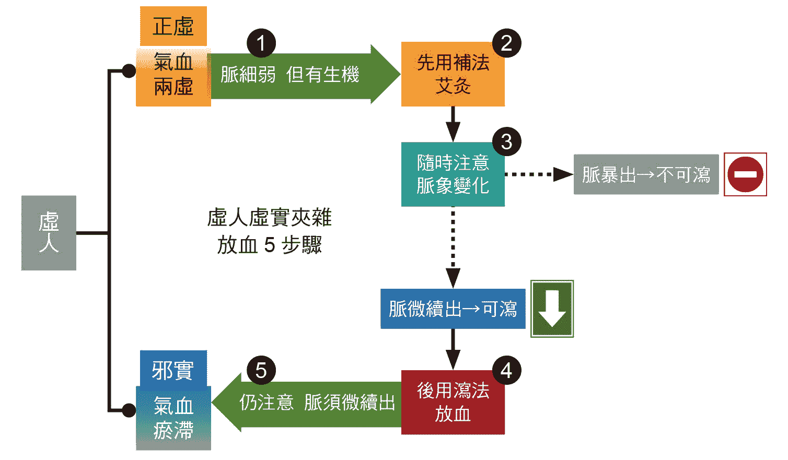

一般人的身体很少是纯虚证或纯实证，多数都是虚实夹杂，甚至还有寒热虚实真假的情况，中医有完整的理论及丰富的经验来鉴别虚实夹杂与真假。这些理论与经验都保存在传统的中医典籍中，也涵藏在日常生活经验里，只要用心体会、虚心学习，融合不同的专业领域以及生活经验，应用于临床诊断便能明察秋毫，治疗时必能得心应手，左右逢源。

##### 【汗为心之液】

流汗是平日生活中常出现的现象，例如天气炎热、激烈运动时身体会出汗，紧张时流手汗，赶路时头部冒汗，唐诗「锄禾日当午，汗滴禾下土。谁知盘中飧，粒粒皆辛苦。」是典型劳动汗出的状况。早年常听爸妈说：「我们流血流汗，拚命工作，才把你们兄妹拉拔长大！」血与汗代表努力付出，言词中有着为人父母的骄傲！没想到近年「血汗」二字出现在媒体报导中，竟然成了「剥削」的代名词，如「血汗工厂」等，令人喟叹。

虽然随着时代演变，遣词用字的想法也跟着改变，但是从中医的角度来看，血与汗都是人体很珍贵的物质，应该多加珍惜。

##### 心阳加于阴液成为汗

身体从食物吸收的精微物质会转化为气、血与津液，因此，气血津液都是同一来源，只是功能不同，所以名称也跟着不同。

以人体形体的阴阳特质来说，无形者属阳，有形者属阴。气无形，属于阳；精、血、津、液都有形，属于阴。「津液」整体来说，就是身体所需的各种水液，属于人体的阴液之一。分开来说，「津」的质地比较清稀，流动性大，主要分布在体表皮肤、肌肉和孔窍等部位，汗就是其中之一，发挥濡养作用，很像体表皮肤的保养乳液。「津」在必要时也会渗入血脉，成为血液的组成部分。「液」的质地比较稠厚，流动性小，主要分布在身体深层，灌注于骨节、脏腑、脑、髓等组织器官等部位，很像组织器官之间的润滑机油。津与液一般统称为「津液」，代表体内整体的水液。

《内经》说「阳加于阴谓之汗」，「阳」是体内的阳气，「阴」是体内的阴液。体内的阴液通过阳气的蒸腾气化后，变化成为汗液。这个概念很像用炉火煮壶内的清水，炉火就是阳气，清水就是阴液，随着温度的提高，水液在壶内蒸腾，水面不断冒出泡泡，变化成为水蒸气，向上向外发散，汗液也是如此而来。心属火，心火是蒸腾气化阴液成为汗液的主要阳气，因此「汗为心之液」。

《内经》说「腠理发泄，汗出溱溱，是谓津。」汗属于津的一种。就像俗语说的「开门送客」，人体透过腠理开泄的方式将汗液排出体表，即出汗或排汗。「汗出溱溱」也提醒我们，出汗是正常生理现象，可以调节体温、排出废物，但应该是微微汗出，如果汗出过多，不仅不能排毒，还会损及心脏而出现心悸、手脚冰冷等情况。

##### 汗血同源

汗液与血液皆是胃从食物中吸收的精微物质所化生，而且津在必要时还会渗入血脉变化成为血液，汗就成为血之液。另一方面，如果汗出过多，为了维持人体机能，血液也会转换成汗液，血也成为汗之液。汗与血两者都来自食物的营养，功能上互相补充支援，因此中医说「汗血同源」。明朝医家李中梓补充说：「心之所藏，在内者为血，发于外者为汗，汗者心之液也。」

由于汗血同源，生理上互相支援，病理上也会互相影响。例如：汗出过多，就会耗血伤津，严重者还会影响心脏机能。夏天常见的热衰竭，由于剧烈运动和在酷热环境下流失过多的水份和电解质，无法维持心脏正常机能，导致心血管系统衰竭，出现异常口渴、大量出汗、皮肤溼冷、头痛头晕、虚弱无力、恶心呕吐、面色苍白等，严重时会有躁动、休克，甚至昏迷的险象。另一方面，津亏血少，也会出现汗源不足难以出汗的情况。

因此，中医临床上有「夺血者无汗，夺汗者无血」的提醒，亦即对于血虚的人，发汗要谨慎，或者尽量不要发其汗；对于汗已经大出的人，更应慎用动血或放血的方法，或者干脆不要用此法，以免造成更危险的情况。

##### 各种汗出的意义

汗为心之液，汗出攸关心脏功能，中医对于流汗有精细的鉴别，试简述如下：

1.时间与时机：

● 自汗：多在白天，清醒时刻；静态就易出汗，身体怕风。多属于阳气虚。

● 盗汗：多在夜间，睡眠时刻，醒则汗止，古人称「寝汗」，台语称为「流庆汗」。多属于体内有虚火，同时也要开始注意心脏功能。

2.味道与温度：

● 冷汗：汗的温度偏凉，味道没有明显咸味。多属虚证，尤其是心脏气虚。

● 热汗：汗与体温差不多，有咸味。多属实证及热证。

3.特殊状况：

● 更年期的汗出：常伴随身体阵阵潮热。与荷尔蒙改变有关，中医调理效果不错。

● 夏天的多汗：暑热大汗淋漓，损伤元气与津液，出现口干舌燥，疲倦气短、脉弱等现象。在此要跟大家介绍一个好用的药方「生脉饮」，它只有三味药：人参、麦门冬和五味子，可以益气生津，敛阴止汗。夏天时常会推荐给病人作为预防中暑的秘方。有趣的是，方名「生脉」与暑热无关，反而体现了心主脉、主汗，以及暑气通心的特质。

● 晕针的多汗：针灸时如果出现晕针现象，病人会身畏寒，冒冷汗，面色转为苍白，手足冰冷，严重者会闭眼神昏等。此时心脏之气急遽衰弱，要赶紧强心护心气，心经的少府穴便是强心的好穴。

###### 中医师不传之祕：临床上还有三种特殊汗出

1.身体失调而出现汗出:

《金匮要略》提到「风湿，脉浮，身重，汗出恶风者，防己黄耆汤主之。」

本证是因为自身的正气不足，卫表之气不固，加上外在风邪侵袭，水湿郁于肌表所致，出现身体沉重、汗出、怕风的症状。

防己黄耆汤，由防己、黄耆、白朮、炙甘草、生姜及红枣组成，可益气固卫，健脾祛湿，祛风止汗。本方因为可以排水气，加速脂肪分解，治疗虚胖水肿，已经成为现代减肥方之一。

个人在读日本汉方时，发现日本人对于病人的观察很全面，也很细微生动，尤其本方特别有趣。谨摘录如下：

【应用】用于体表有水毒，且表虚而下肢的气血不顺者。

【目标】以表虚，下焦虚，由于肾脏障碍所引起的各种症状为目标。

以色白，筋肉柔软，虚胖体质而容易疲劳，汗多，小便不利而下腹发生浮肿，膝关节肿痛者为目标。又多用于中年以后的有闲妇女，肥胖而容易疲劳，且感觉身重者。

【主治】本证的妇人，身体虚胖，多为希望减肥。且常感身重，懒于起居活动。⋯⋯外出时因为走起路来感到疲倦，所以常利用汽车，较少劳动身体，因此愈益肥满。食量也很小，⋯⋯大多喜欢喝茶，⋯⋯月经量往往稀少，且常不顺。有多汗症，夏天时汗出如流。这类妇女过了五十岁之后，大抵都会发生膝关节疼痛。又每到傍晚时，两脚会浮肿。（《汉方处方解说》，正言出版社）

简单说，适用防己黄耆汤证属于贵夫人，身形白白胖胖，有钱有闲的都会区妇女，稍微一动就全身是汗，常带手帕或面纸频频擦汗，家里有阿嫂，出门必搭车，正餐吃不多，常在咖啡厅喝茶或咖啡与姐妹淘交谊。多精准的叙述啊！临床上遇到这类病人，投用本方，效果超好。

2.为了治疗而发汗:

民间都知道，一旦感冒受凉，只要赶紧喝碗热呼呼的姜汤，躲到被窝里，闷出一身汗之后就会好了。中医也有类似的治疗方法，如果身上无汗，可以服用麻黄汤发汗；如果有出汗，可以服用桂枝汤来微微出汗。此处的出汗是为了治病，但汗为心之液，所以切记不要大汗出，否则会百病丛生。

3.治疗过程中发汗过度的后遗症:

前面提过，治病不要发大汗。若汗出太多就会出现后遗症，例如：《伤寒论》提到「发汗过多，其人叉手自冒心，心下悸，欲得按者，桂枝甘草汤主之。」此人正因发汗过多，损伤心脏阳气，出现心脏快速跳动的心悸，很想用手按住心脏，以减缓它的跳动。桂枝甘草汤只有桂枝和甘草两味药，是治疗心脏疾病的基本方，也是天下第一方「桂枝汤」的祖方，非常重要，后文会介绍。

「汗为心之液」和「汗血同源」的中医观点，提醒我们平日要避免「汗出过多」以及不要「汗出当风」，因为出大汗会伤心脏；汗出之时，毛细孔大张，此时若不避风，被风邪入侵人体，肺主一身之表，还会损伤心脏及肺脏。这是很重要的养生保健原则。

《内经》说古代圣人在教化人民时，提醒身体上对于「虚邪贼风，避之有时」，避免被外在邪气侵袭而加重心脏负担；心理上要「恬淡虚无，真气从之，精神内守」，维持心情的平和，让君主之官可以神志清明。可见身心共治自古就是中医的特色。

##### 【心主面与色】～其华在面，其荣色也

一如「脾之华在唇」，从嘴唇可以看出脾脏的功能，「心之华在面」意思是心脏的机能会显露在面部，只要观察面部就能了解心脏情况。此外《内经》还说「心⋯⋯其荣色也。」意思是身体的颜色及其变化也是由心脏管辖。因此面部的颜色更能呈现心脏状态，例如面色红润表示身体健康，面色黯沉多血络表示心气血瘀滞，面色苍白表示心气血不足。

人体面色的变化不仅与心脏有关而已，《内经》说：「十二经脉，三百六十五络，其血气皆上于面而走空窍。」由于所有经络的气血都会上达面部，所以，面部也会反映出五脏六腑及各组织器官的状况。以五脏为例，五脏对应五色，面部颜色大致可以分为青、赤、黄、白、黑。

望色就是观察面部颜色与光泽的一种望诊方法。望面色分为两类：正常的面色「常色」和生病的面色「病色」。

##### 常色—人体在正常生理状态，亦即健康时的面部颜色

健康的面部无论是何种颜色，都必须是明亮润泽。常色又分为主色、客色。

● 主色：是与生俱来的基本面色与肤色，也是面容的主要颜色，就好像家中的主人一样，所以称为「主色」。

例如非洲人是黑色，印第安人是红色，欧洲人是白色。我们是黄种人，多数人的面色都偏微黄。但许多人却认为「一白遮三丑」，所以女性同胞使尽所有美白方法要让皮肤显白，这个举动常让中医师在诊断时要伤点脑筋，才能透视出真正的主色。

● 客色：当内在心情波动或外在环境改变时，面色与肤色也会因应出现短暂变化，这就像暂时来访的客人一样，称为「客色」。

例如正常人冬天天冷时，血管收缩，脸色是黄中带白；夏天暑热时，血管舒张，脸色会黄中微带红色。而情绪起伏时，面色也会跟着变化，若是看到心上人，一时害羞，脸色涨红；受到惊吓，则脸色刷白或发青等。这些肤色都不是与生俱来的颜色，只是暂时性的变化。

依此来看，俗语说的「黄脸婆」应该是客色吧！没有人天生就该有黄脸婆的气色。许多终日辛劳的妇女被生活琐事给拖磨，不仅无暇妆扮打理自己，失去年轻时的风采，变得邋遢不修边幅，加上心情郁闷，表情愁苦，言语乏味，逐渐成为令人望之却步、不想靠近的「黄脸婆」！在此也敬告被称为「黄脸婆」的人，不要一味怪罪家人的刻薄言词。因为心主面与色，也跟言语表达有关，走上「黄脸婆」的第一步，绝对是我们在心理上先放弃了自己，才会让身心状态持续沉沦。请记得翻阅《卷三》脾经，赶紧找回自己的幸福 DNA 吧！

##### 病色—人体在病理状态，亦即生病时的面部色泽

中医认为疾病主要与脏腑经络功能失调有关，失调的脏腑经络会透露出它所对应的颜色。

● 青色：是肝的对应色，主要与肝病有关，包括气滞、血瘀、寒证、痛证、受惊吓等。

● 黄色：是脾的对应色，主要与脾病有关，包括湿邪停滞、脾气虚弱、营养不良等。

但须注意一点，临床上常遇到病人紧张兮兮的打开手心，说自己的手心近日逐渐变黄，会不会是得了黄疸？黄疸病与脾病有关，但如果只是皮肤发黄，眼白并没有变成黄色，就不是黄疸病，极有可能是因为吃多了外观黄红色，像木瓜、红萝卜、芒果、南瓜等富含胡萝卜素的食物，导致血液中的胡萝卜素含量过高，沉积在皮肤就变成黄色，尤其是手心和脚底最为明显，称为「胡萝卜素血症」。这种色泽情况与脾病无关，只要暂停或减少摄取这类食物，皮肤就会恢复主色了。

● 赤色：是心的对应色，主要与心病有关，包括火热证、痛证、气血瘀滞等，如高血压患者会呈现暗红脸色，甚至面部还会出现细细血络等。

● 白色：是肺的对应色，主要与肺病有关，包括卫表气虚、气血虚弱，如大失血，或过度疲劳者。

● 黑色：是肾的对应色，主要与肾病有关，包括肾精不足、水饮停蓄、体内阴寒过盛、痛证、严重瘀血者。

某方面来说，黑色是赤色的加强版，就像俗语说的「红得发紫，紫到发黑」，从罹患瘀血及痛证者来看，面色黯黑的人所承受的痛苦及病情的严重程度远远大于面赤者。

整体而言，无论主色或客色，最好都有光泽，中医称为「有华」，对主色而言，表示体质良好；对客色而言，表示病情较轻。颜色暗沉，中医称为「无华」，对主色而言，表示体质较差，容易生病；对客色而言，表示病情转重，要特别注意。

心所主导的面部与颜色与我们的身体和心理状态相关。

从心理层面来看：日常生活中与人相处，常常会看到他人的脸色与表情变化，俗语「察言观色」指观察他人的言语及神情来了解其心意，但若到了「看人脸色」就含有负面的观感，要谨慎控制自己可能会透露出来的情绪，以免影响人际关系。

从身体层面来看：我们在认识自己的主色与客色之后，记得常常照镜子，看看自己的脸色，不仅有助于平日的自我保健，万一生病之后，也可以了解病之所在，掌握病情的发展趋势，及时治疗。

临床上常遇到有关面色的趣事。例如东部乡亲由于户外劳动多，面色都比较暗，导致许多太太们都以为另一半原本就是黑皮肤的「黑肉底」。但在治疗期间面部黑色逐渐脱落，我常笑说是「落漆」，逐渐出现有光泽的粉嫩肤色，才恍然大悟竟然「误会」先生这么久！其实脱落的正是长期劳动所造成的客色，或饮食上不知节制所产生的病色。治疗后气血循环改善，出现宛如云破天开之后的主色。

由此推论，试问「中医可以美容吗？」答案呼之欲出，当然可以呀！而且是来自健康的身体所透露出来的真实肤色喔！

##### 相由心生：因为心之华在面＋心主神志

人类面部不仅有颜色的变化，还有肌肉动作的变化，「心之华在面」，也可以逆向思考为面部的组织为心所管辖，包括面部肌肉和口腔黏膜组织。

面部肌肉主要是颜面表情肌，它是扁薄的皮肌，位置浅表，可以摸得到、看得到。它起自颅骨的不同部位，止于面部皮肤，主要分布在面部孔裂的周围，如眼裂、口裂和鼻孔周围。

面部肌肉的功能有二：一是成为面部孔裂的开关，例如睁眼、闭眼、眨眼等；二是在面部呈现出各种表情，如挤眉弄眼以及表达喜怒哀乐等情绪。

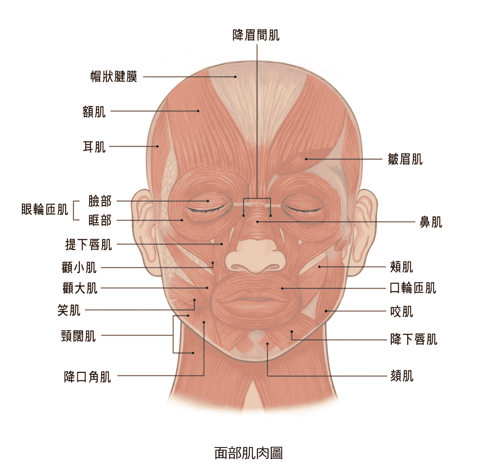

因此「心之华在面」加上「心主神志」，透过面部肌肉动作就能呈现心里的想法，就像嘴唇向两侧上扬的笑容代表开心，紧紧抿嘴的嗔容代表小生气等。时间久了，这些面容也定型了，「相由心生」就是如此而来。

上述中医的说法看起来很严肃，但心与面部的关联在日常生活中处处可见，例如：过度强调自尊心的「好面子」，重新振作须「洗心革面」，得意时「满面春风」，慨叹人心难解「知人知面不知心」等，大家其实都了解面部会反映出心里的感受与想法。

##### 脸的肤色也能看出个性：心其荣色也

我从小就喜欢看古典小说，印象最深刻的就是《三国演义》，运用脸部颜色来代表个性，例如桃园三结义的刘备「面如冠玉」属于白色，个性较为懦弱；关羽「面如重枣」属于暗红色，性格忠义；张飞「豹头环眼」，未提到面色，后世认为张飞应该是黑脸，个性刚直。这种以面色传递个性与京剧中结合演员脸谱来呈现个性的方式不谋而合。

记得生平第一次看京剧是高中时由热爱京剧的同学引领进入国军文艺活动中心。之前没特别接触京剧，那天完全是刘佬佬进大观园，「外行看热闹」的情况，由于听不太懂演员唱腔内容，转而专心欣赏各种脸谱和具有浓厚暗示意味的动作，别有趣味。

学了中医之后，发现京剧脸谱可谓是心的面与色最佳阐释者。京剧脸谱有段有趣的历史故事。听说早期戏班以露天演出为主，为了让离戏台较远的观众可以看清楚演员的面部表情，特别在脸上以粉墨、油彩直接勾画出脸谱，让观众们都能一目了然。随着戏曲艺术的提升发展，京剧吸收地方剧种脸谱优点，并加以创新，脸谱的内涵越来越完整，藉由夸张的色彩和线条，突显人物的性格，并表达对于人物的褒贬评价。简单的说，「脸谱」就是以「脸部化妆来谱出人物的个性与心里想法」，让观众一看面部就能了解其内心。

京剧脸谱是静态的表现，另有动态的脸谱，如川剧的「变脸」，演员能在转瞬间，不换场就变换五种脸相，包括喜、怒、哀、乐、忧伤等。藉由脸相的变化，将剧中人物的内心起伏表现得淋漓尽致，其面容转换之快，内容色彩之丰富，令人为之惊叹。这都跟心主面与色概念一致，尤其面部的表情和颜色都会透露心事，所以面色就常常处于变动之中。俗语「翻脸无情」，虽然带有负面的情绪，但想想人的心念一直在改变，面容当然也会随之变化，翻脸是必然的，至于是否无情，就请自行商榷囉！

###### 中医师不传之祕：「阳明主面」跟「心之华在面」有何不同？

过去只要上经络系列课程，对于「阳明主面」跟「心之华在面」总会特别加以说明，因为说法上很容易混淆，了解之后临床上却很好用。

首先，在循行方面：

手足阳明经都分布于面部，而且是大面积的包覆。

心为君主之官，也颇好「面子」，心经经别即以君临天下之姿，从心「上走喉咙，出于面，合目内眦」。因此大肠经、胃经及心经都抵达面部。

其次，在组织结构方面：

脾胃主肌肉，所以主管面部肌肉的丰厚或瘦削，亦即面部肌肉的形状。

心主神志，除了主管面部肌肉活动，透过表情传递内心想法之外，还管理面部眼、耳、鼻、口、唇舌等官窍的精细感受、记忆与情绪（详细内容后文介绍）。 心主血主脉，诸痛痒疮皆属于心，除了掌理面部血液循环之外，还包括痛痒感，痛痒的感觉与神经系统有关，因此心又与面部神经有关。

心开窍于舌，舌位于口腔内，心经因此与口腔有关联，尤其是口腔黏膜。狭义的口腔黏膜，包括上下唇、齿龈、舌头前 2 / 3、硬颚、颊黏膜、口腔底部以及臼齿后三角区。

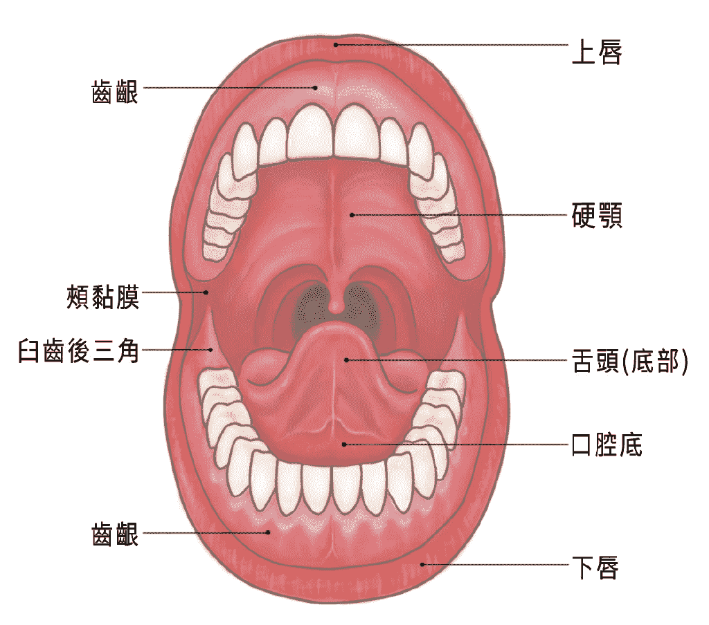

心经系统与口腔黏膜的关系是从治疗面神经麻痺患者经验而来。曾治疗一位陈旧性面神经麻痺患者，依据阳明主面等传统理论治疗一段期间之后，面部肌肉僵硬麻木的问题都有改善，唯独口腔的颊黏膜一直很紧硬没有进展，病人张口不利，感觉迟钝，影响进食、咀嚼和语言。后来配合心经治疗，竟然逐渐改善。查阅资料，才体会心经属于阴经，分布在人体较深处，心经经别从喉咙深层上行到面部这个皮肉比较薄的部位，《内经》因此用「出」字来形容，并不是指循行于面颊浅处之意。

此后，常常运用这个概念治疗各种口腔黏膜疾病，尤其是台湾常见的口腔癌，好发的部位就在于舌头及颊黏膜，都能改善局部血液循环，舒缓肌肉紧绷，提升活动范围。

###### 中医师不传之祕：「其荣色也」的其他临床应用

心「其荣色也」，在临床上还有很高的指导与应用价值。

平日门诊时常与跟诊医师说：「我们每天都在阅读身体！」因为身体会透过经络系统将身体及心理的秘密显现于体表，亦即「有诸内必形诸外」的概念，所以只要掌握和善用中医理论，就可以及早发现病苗与治疗，达到「上工治未病」的预防医学。

临床上，主要以望诊及切诊来阅读病人的身体，例如在额头靠近发际附近若发现局部细小毛发异常增多，肌肤肿紧，颜色暗沉，甚至出现斑点或血络⋯⋯，都代表局部气血阻滞。

我常以河流上的淤泥来解释这个现象给病人及医师听 ─

人体的经脉犹如河流，若水流顺畅，河面上不会有其他杂物；惟有水流不畅，出现淤泥之后，才会长出植物。因此额部发际增多的毛发就宛如河中淤泥上的植物，心主血主脉，局部肿胀暗沉和血络，不仅是气滞血瘀的明证，更是心「其荣色也」的表现。

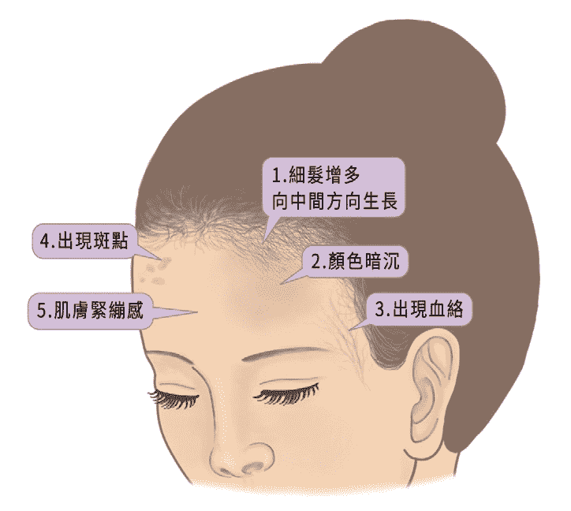

一旦额部出现这些异常现象，连带同侧的肢体和器官也容易出现病变，例如出现在左侧额头，左侧头部及肩颈也会僵硬疼痛，左胸闷痛，胃胀气，左腰背紧等，本证多属胆经气血郁滞，故胆经循行所过部位及脏腑都受影响。这也展现了中医的系统观，看似无关的多项疾病，透过经络系统连结，其实都有关联。

这种情况同样会出现在身体其他部位，毛发、颜色改变及血络都是很好的表征。例如小腿上的腿毛，一般都约略朝着同一方向生长，若局部出现毛发逆长，表示气血循环有碍，再配合所在部位的经络，就可以确定病性及病位了。

还有东方男性一般胸口的毛发较稀疏，临床上见到胸毛浓密卷曲的病人，年纪渐长后，常兼有心脏疾病。

后来读到《灵枢．刺节真邪》，黄帝与岐伯讨论人与天地相应时，举例「下有渐洳，上生苇蒲，此所以知形气之多少也。」与个人想法不谋而合，惊为天人！「渐洳」为低湿或泥泞之意，「苇蒲」指芦苇及蒲草，都是生长在淡水河边、沼泽湿地的草本水生植物。这段文字的意思是土地下方若是潮湿泥泞，上面就会长出苇蒲这类水生植物，因此只要看到苇蒲，就可以推论渐洳的存在。身为医者也可藉此概念，从人体外表现象来判断病人内在形气之多寡。「下有渐洳，上生苇蒲」这八个字，正好印证了临床之所见与所论。

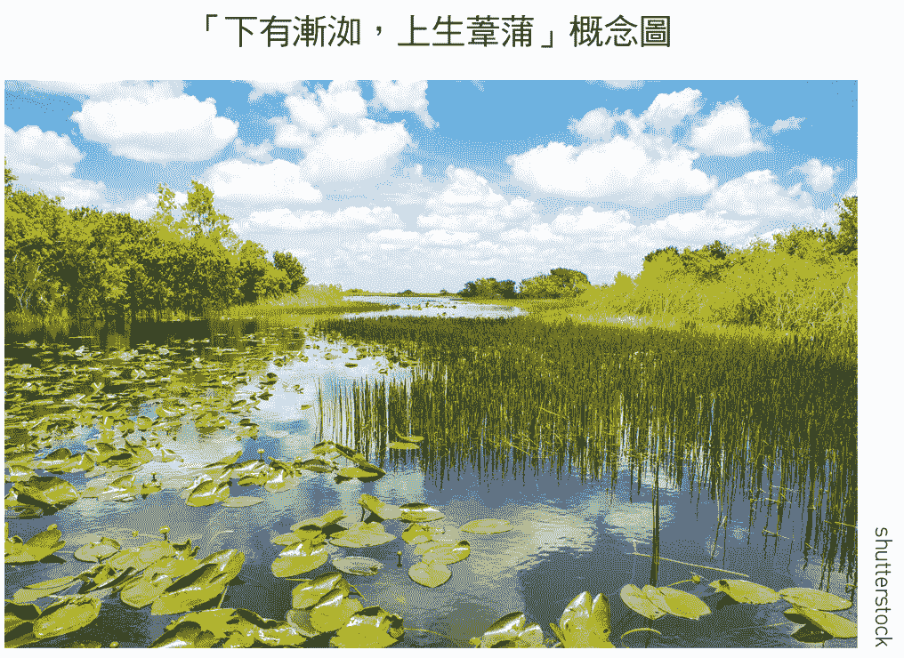

###### 中医师不传之祕：五输穴中荥穴特性的临床应用经验

一位从国外前来跟诊的医师，在学习即将完成时，慎重其事请教其多年难解的问题：「什么叫做『荥主身热』？它的原理为何？」此事说来话长，我们就从基本观念介绍起吧。

人体十二经脉循行路线有长有短，穴位数有多有少，然而无论经脉长短或穴位多寡，每条经脉犹如河流，经脉之气在人体四肢运行就像水流一样，从小到大，由浅而深。在手足腕膝关节以下部位会有五个特别的穴位点，让这些经气从手足指末梢浅出，再循着四肢向上而深行，最后合入手腕及足膝关节。每条经脉皆有特殊穴位点：井、荥、腧、经、合，统称为「五输穴」。《内经・灵枢》说明五输穴的经气流动状况：「所出为井，所溜为荥，所注为腧，所行为经，所入为合。」

有关五输穴的特性，《内经》与《难经》各有阐释：

《内经》说：「病在藏者，取之井；病变于色者，取之荥；病时间时甚者，取之腧；病变于音者，取之经；经满而血者，病在胃，及以饮食不节得病者，取之于合。」

《难经》说：「井主心下满，荥主身热，腧主体重节痛，经主喘咳寒热，合主逆气而泄。」

后世医家再将五输穴配上五行，阴经以木火土金水为序，阳经以金水木火土为序，阴经与阳经的五行刚好呈现相克关系。可参阅下表。

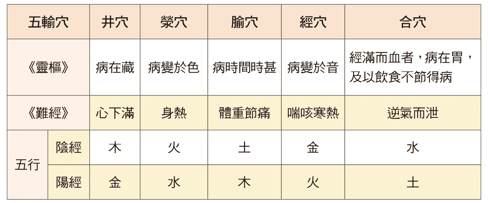

《难经》所述的五输穴特色与阴经所连结的五脏五行相关，如井穴有肝木特质，故主心下满；荥穴有心火特质，故主身热；腧穴有脾土特质，故主体重节痛；经穴有肺金特质，故主喘咳寒热；合穴有肾水特质，故主逆气而泄。

《内经》的论述比较复杂，还与经气的流动有关，如井穴是经脉经气所出的部位，也可视为经脉的根本，因此主五脏之病；荥穴与前述「心其荣色也」有关，临床上我们常将两个概念合用在生理与病理方面，直接说「心主病变于色」。其余内容由于篇幅有限，此处就不加以论述。

##### 荥主身热

对于许多医师来说，透过阴经与阳经的五行相克关系，大致可以理解两本典籍所述概念，唯独「荥主身热」较难解释，因为阴经与阳经的荥穴五行刚好是火与水的关系，荥穴又是如何主治身热呢？

首先要说明，每个穴位都具有双向调节能力。在《卷二》大胃王书中，介绍丰隆穴时说过本穴主治是「该丰隆而不丰隆，不该丰隆而丰隆」，绕口令般的特色，其实就是双向调节的概念。

有了这个概念之后，再看荥穴「病变于色」及「主身热」的特质，正好与心脏「其荣色也」，「五行属火」的特质相符，《难经》荥穴所主的身热就是体温异常：「身体该热而不热，不该热而热」的情况。加上心主血主脉，荥穴就可经由调整经脉来改变温度，回复到正常的体温。以下再详细说明。

什么是「该热而不热」？简言之，就是阳气不足的身畏寒。

什么是「不该热而热」？简言之，就是阳气过旺的身燥热。

以上两种情况，一虚一实，都可选用荥穴来让体温恢复正常。

那荥穴如何调节呢？

人体的下视丘内有体温调节中枢，以调控皮肤血管「热胀冷缩」的方式来调节温度。隶属于经脉的荥穴，在心的主导之下，透过调节经脉的宽窄度，以「冷胀热缩」的方式，控制流经的气血量来调整温度。

例如当身体阳气不足，身畏寒时，寒主收引，容易出现弦细脉，荥穴可以扩张经脉，使流经的气血量增多，即「冷胀」法，温度就会升高而让身暖；反之，当身体阳气过旺而身燥热时，容易出现洪大脉，荥穴可以窄缩经脉，使流经的气血量减少，即「热缩」法，温度就会减低而回复常温。

临床上做针刺治疗时，常在四周远端的部位取穴行针，患处会产生煦煦的热象，表示经脉的调整已然启动。若是热证，会从体表喷出热气，体温逐渐降低；若是寒证，患处或全身温度会逐步提升，表示气血已经传送至该处，身体会逐渐暖和。

##### 荥主病变于色

荥穴透过调节经脉中气血流量来改变温度，其实也是一种「变化」概念。「病变于色者取之荥」，「色」是指一个人的神色、气色跟颜色等，这些都是脏腑经络气血反映体表的情况。由于荥穴可以调节经脉，改变气血循环量，当脏腑经络气血异常，导致身体外表出现颜色的变化，例如气血淤滞的暗沉色，气血不足的淡白色等，都可以透过荥穴调整。

临床常使用两个荥穴：肝经的行间穴与心经的少府穴为主穴，来治疗眼眶周围的黑眼圈，当场就会看到黑眼圈宛如水墨晕开，逐渐变淡。年轻的谢惠卿医师在「经络磐石」粉丝页称此为「影荥针」，切合主题，非常有趣。内容如下：

熊猫眼不再黑～使黑眼圈隐形的「影荥针」

你也跟我一样每天忙碌、睡眠不足？长时间盯着计算机等 3C 产品，造成眼睛过度疲劳和眼睛周围血液循环不良，使得眼下皮肤表层出现「浮肿及蓝黑色眼晕」，这时眼睛周围看起来像上了层黑黑的眼影，无时无刻都在向全世界宣告：「我好累」，「每天都没有睡饱」，即使用再厚的遮瑕膏也遮不住那疲累的痕迹！

在这里要告诉你比遮瑕膏还强大的淡化黑眼圈的小秘密，让你的黑眼圈瞬间「隐形（影荥）」～要淡化黑眼圈，可以运用经络循行和五俞穴属性的概念：

心经和肝经经脉循行其支脉都会联系到「目系」＋五输穴的「荥」主「色变」。选用心经荥穴（少府穴）＋肝经荥穴(行间穴)来调理深深的黑眼圈。

● 少府穴：手掌面，第四、五掌骨之间，掌远纹中。握拳时，当小指尖所指处。横与劳宫相平。因为针此穴较痛，所以通常会由手背的中渚穴透少府穴。

● 行间穴：足背第一、二趾趾蹼缘后方赤白肉际处。

临床案例应用：

一位黑眼圈很深的女性病患来到诊间求诊，看起来非常疲倦，针了中渚透少府＋行间穴后，黑眼圈瞬间变淡，非常神奇。除了针灸之外，还要注重卫教，才能帮助患者早日脱离熊猫眼之苦。

##### 乌青眼的中医治疗经验

之前在台北看诊时曾开「中医眼科特约门诊」治疗各类眼病，基本上都从远处施针。特约门诊中，除了一般性的眼疾之外，偶而也遇到被针直刺眼部之后局部出血而导致「乌青眼」的情况，甚至出现视力障碍。眼睛是非常精细的组织，一旦因为外力导致出血后，「血从何而出？压迫到那些组织？血又该从何而散？」这些问题都难知晓，其实是很可怕的事。尤其在未来的岁月里，如果离经之血未散，长期瘀阻在眼内，停留时间越长，后续的负面影响越大。

为了病患的未来着想，除了一般疗法之外，我们还会努力缩短血瘀阻在眼内的时间，以减缓可能产生的后遗症。但该如何处理？

1.在与瘀血同侧的眉骨上放血，尽量多挤出血。如果瘀滞严重，可以配合循经的井穴放血，例如接近上眼周部位的可选膀胱经至阴穴，接近下眼周部位者可选胃经厉兑穴等。

2.事后卫教病人：

少用眼，多闭眼休息。出血 2~3 日之后，可以配合热敷。

多数病患经过以上两法治疗后，瘀血可以在二、三周内完全消退，恢复视力。

#### 2.心理功能的心：

● 心主神志与藏神

● 心开窍于舌，其声为言

● 心之志为喜，五声为笑，五味为苦

「心」是五脏六腑之中，在日常生活当中出现最多的字眼。譬如「心」里做决定要买这本书，现在捧在手中，用眼睛看书，嘴巴读书，书上许多内容让您「心」有所感，越看越有兴趣，很开「心」拥有这本书！生活之中处处可见「心」的影子，这是因为心承担生命之中所有事务，包括身体状况以及心理感受，《内经》也说「任物者谓之心」正是此意，中医看心不只是看心脏，更要看心情。

##### 【心主神志与藏神】

##### 中医的心统辖现代的脑

现代人看到「心」直觉会想到「Heart」，在中医来看，心不只是一团会跳动、将血泵出的肌肉而已，「心」不单指生理上的心脏器官，中医把「心」视为「脑」，称脑为「元神之府」，并指出「神统于心而宅于脑」，以心为体，脑为用，中医所说的心脏管辖现代「脑」的功能。

心脏属于五脏，透过经络系统的连结，与四肢躯干相联系成心脏的经络系统，加上心主神志与藏神的特质，再与感官、情志、情绪等相连结，等于涵括了现代医学所讲的心脏，以及脑部的感知、辨识、情感、记忆等功能。所以，中医看心不只是一颗会跳动、将血泵出的器官而已，将「脑」纳入「心」正是掌握人的意念与产生情感的源头。

心与脑相通，而且心是脑的主宰，中国人所说的「心」是有感受的，即使英文也是一样：straight from my heart（发自内心的感受）。以上种种都在说明，一般人所认知的心，不仅仅是医学上的心脏而已，而是将情绪，神志也纳入「心」之中。心主藏神，神志能够安定，神藏于心，情绪才能平稳。

前面说到「心」这个字，在中文里表达个人感受时常常用到，因此日常生活用语中，以「心」所延伸的词语，比起其他身体部位来说是最多的，可见先人早就已经理解，心不仅仅是只会跳动的心脏而已，它还包括了人的情绪和情志。以下列举一些用「心」字来表达情绪的用语，诸如：

表达情绪用词：快乐情绪的开心；悲伤情绪的心碎，心酸，心灰意冷，心力交瘁；痛苦情绪的锥心之痛，心乱如麻，心在淌血，死心等等。

表达意志力用词： 决心、热心、信心、醉心、齐心协力等。

呈现心识存在用词： 心意、心思、心念、心田、心坎儿里等。

这些心的表情与心的存在的样貌，几乎涵盖了一个人当下的整体心识状态，也呼应了中医心主神志的思想。

就像每个人年轻时大都有过失恋的经验，能深深体会「心碎」和「心痛」的滋味，那并不是心脏真的在痛，而是情绪的失落让胸口的心区很难受，牵引着情绪随之沮丧低落，茶不思饭不想，辗转难以入眠，谁说少年不识愁滋味呢？！

我有一个总爱在工作时播放歌曲的老爸，小时候常跟在爸爸身边听歌，印象最深刻的是［望春风］里有一句「心内弹琵琶」。乡下小孩吃过水果枇杷，却没看过乐器琵琶，所以一直无法理解如何在心里弹枇杷？每次听到这句歌词总是一头雾水。直到上了高中后，才逐渐体会「心内弹琵琶」是巧妙暗喻忐忑不安的心情，不禁赞叹作曲者深厚的文化底蕴和雅致！同时，各位现在理解为何我的诊间总是充满音乐了吧！

##### 神志对身体的影响

有关情志对于身体的影响，《内经》有许多论述，例如：

喜则气缓：喜则气和志达，荣卫通利，故气缓矣。

悲则气消：悲则心系急，肺布叶举，而上焦不通，荣卫不散，热气在中，故气消矣。

惊则气乱：惊则心无所倚，神无所归，虑无所定，故气乱矣。

思则气结：思则心有所存，神有所归，正气留而不行，故气结矣。

心情欢喜让人气机和缓放松，胃口大开，夜间好睡；心情悲哀让人气机消散，胸闷气短，头晕心悸。心主藏神，神有所藏，心才能安定。如果受到惊吓，会让心无所倚，神无所归，心神不安则气机混乱，心脏乱跳，手足颤抖；思虑过度会让心有所存，神有所归，钻牛角尖，导致心神停滞而气机打结，没胃口不想吃，四肢无力等。

##### 心脏与情绪之间互相影响

中医认为人体的气血循环正常，身体就会健康；一旦气血循环有障碍，疾病就会产生，因此中医特别强调「不通则痛，通则不痛」的观念。由于气是血的先锋，气行则血行，气推动血液在人体内的运行分布，所以中医特别强调「百病生于气」，《内经》还指出七种情绪对于体内持续运行的气机所产生的影响：「怒则气上，喜则气缓，悲则气消，恐则气下，惊则气乱，劳则气耗，思则气结。」例如生气的时候，怒气会向上冲，面红耳赤，头痛头晕，甚至吐血；欢喜的时候，气机顺畅而和缓，身体比较放松；受到惊吓的时候，六神无主，心无所倚，神无所归，虑无所定而导致气息紊乱等， 都说明了情绪对于身体的影响。

中医的「心」主管神志状态，只要心神安定，一时的情绪波动很快就能平复，反之，若心神不安，一点点干扰刺激都会导致巨大的情绪反应。另方面，长期的情绪失调也会影响心神的安定。所以，心既是情绪控管的最高单位，有稳定情绪的作用，同时又是情绪冲击的最前线，很容易被情绪所影响，这样的特质，让心成为敏感且易受伤的脏腑。

由于其余四脏也都与神志有关，如脾主思，肝主怒等，若功能失调也会影响心维持神志清明稳定的能力，因此要安定神志，就必须采用多方位诊治法，如：补养心肺脾气血，滋肾阴养心血，温补心肾阳气等补法以安神；清肝热泻心火，活血破血通络等泻法以安神；还有针对受到惊吓而心神慌乱不安，特别使用金石介类等药物的重镇安神法等。

在心理与身体互相影响下，中医看心脏疾病，有时是病因，有时是结果，所以中医诊治心脏疾病，不会只看到心脏问题，而是透过中医学特有的整体观，从经络及脏腑来揭露身体、情绪、情志的影响，两造齐下治疗。

##### 【心开窍于舌，其声为言】

《内经》说「舌者，心之官也。」「心气通于舌，心和则舌能知五味矣。」舌头是心的官窍，心开窍于舌，舌头与心密切相关，我们可以经由舌头来了解心脏机能，心脏机能正常，舌头就能品尝出食物的味道。

除了饮食以外，加上「其声为言」，表示舌头也跟语言有关，一般人就会直接联想到善于说话的「三寸不烂之舌」。由于心主神志，心里的想法通常透过语言来表达，如果心神正常则辞能达意，若心神混乱则辞不达意，甚至不知所云。

「沟通」是人类社会化过程中很重要的能力。对于动物来说，无论是狼嚎、狗吠或猫叫，这些声音都是彼此间重要的沟通与联系媒介。对于高等动物的人类来说，在心脏这位君主之官的主导下，声音透过舌头变成有意义的语言，拥有更丰富的内涵，所以《内经》说「心其声为言」。

语言是人类的社交工具，也是文化的缩影，我对此深有体会。年轻时曾数度到国外自助旅行，体验不同的文化，顺便学习当地一些简单的语言，打打招呼杀杀价还蛮管用的。不同语言具有特定的发声和表达方式，透露出独树一帜的文化内涵，每一种语言都是文化的呈现，不仅有趣也很珍贵。

犹记第一次去马祖巡回医疗时，听到诊间外面慷慨激昂的谈话声，以为有人吵架，探头一看，原来是两位乡亲在聊天。乡亲们后来跟我解释，马祖话属于闽东语系，本来发声就比较硬，说话速度快，加上马祖属于海岛，海风很大，必须嗓门大才听得见，这些特质也很符合当地居民豪爽急性的民风。近年到东部工作，诊间除了国语之外，还有台语、客语、原住民语以及新住民语，我们学得不亦乐乎，虽然常说得荒腔走板，感谢病友都还能包容鼓励。所以我很提倡保留母语以及广学其他语言，任何一种语言的失传都是人类共同的损失。

我们从小婴儿时期就开始发出声音，牙牙学语，期望跟家人沟通，表达所需。成长过程中，语言更是生活中重要的沟通工具，可以表达情感和感受，舌粲莲花口说好话，建立正向关系，但如果言语恶毒出口伤人，成为毒舌派，则令人畏惧，避之唯恐不及，最可惜的是说者无心，听者有意，一言不慎导致关系破裂的比比皆是。一如电影《异星入境》（Arrival）中有段经典对白：「语言是文明的基础，能够将人们凝聚在一起，也是第一个引起冲突的武器。」（Language is the foundation of civilization. It is the glue that holds a people together. It is the first weapon drawn in a conflict.）

理论上，语言应该能真实表达心里想法。然而想想我们一生之中，有多少机会可以畅快表达内心真实感受？从小身边的长辈总是耳提面命：「说话要小心，要有礼貌，不要随便说出真心话，以免吃亏。」又有多少次因为话说得太快「祸从口出」而懊恼不已？心与舌之间的真实距离不长，但随着年龄的增长，深度社会化之后，心与舌之间存在越来越多的屏障物，距离也越来越遥远，由衷之言甚为难得。

心主舌除了语言之外，还包括舌部的型态和动态，例如心主血脉，正常舌头应是淡红色，如果颜色偏淡白代表血虚，偏暗红代表血瘀，舌头上若出现血络也代表瘀血，舌头活动度变差更是心脏机能的警讯。《内经》提到「心病者，舌卷短，颧赤。」指出严重心脏疾病患者会出现舌头短缩卷曲，可想而知，说话一定不清楚，颧骨（小肠经循行所过）还会出现赤红色。

临床常见到心脏跟语言的关系。有位八十多岁的婆婆平日言谈清晰，几天前突然声音沙哑难出，语音微弱时中断难接续，尤其尾音明显模糊，婆婆发现心脏也很无力。我们从心脏着手治疗之后，婆婆的声音与心脏同时恢复正常。另一个案例是位七十岁的男性，平日心律不整、胸闷，声音逐渐沙哑，第一次治疗之后胸闷明显改善，声音竟然跟着「开嗓」了！

前述两个案例，若能配合心主面的特质来「察言观色」，加上中医师擅长的把脉，就能排除感冒的可能性，直接从心脏治疗。「察言观色」也是了解身体的心与心理的心之重要法门。

##### 【心之志为喜，五声为笑，五味为苦】

在一般的企业界，经营管理者统领所有事务，通常会设立老板专属的办公室，配置俗称「国王人马」的亲信，来帮老板执行秘密任务。心脏也是这样。前面介绍过，心统领所有的情志，但是在细部的管理方面，心也有专属的情志―「喜」。

##### 心具有喜笑的特质

记得刚开始学中医，看到心之志为喜，也跟着傻傻开心起来，「心喜」是多美好的人生境界啊！当人们欢喜时，面部不自觉的展现笑容，观察婴儿除了飢饿或身体不舒服会哭闹外，其他时候都很容易被逗笑，尤其看到亲人自然而然就笑开了。这正是心主面、主喜、主笑的表现。

自然界的太阳为人们带来温暖与希望，心是身体的太阳，也带来属于自己的温暖与希望。《内经》说「心藏脉，脉舍神，心气虚则悲，实则笑不休。」当心气饱满正常时，就像阳光普照，让人心神安定而欢喜。如果心气过实就像烈日当空，让人情绪过亢而无法控制笑感；心气不足则像乌云蔽日，让人悲伤欲泣。

由于喜欢看喜剧片，当我看到几位全球知名的喜剧演员深陷忧郁或自杀时，也开始从中医的角度来思考：真实的开心会充满喜乐，但如果不是来自真心的感受，且又被迫长期过度呈现欢乐高亢的情绪，乐极生悲，反而让自己走向另一个极端而陷入悲苦的情绪漩涡之中。由此可见，若喜剧演员表现出来的欢乐并非来自内心，里外不一，心与面的连线变成一道裂隙，逐日加深，最后只得走向崩溃一途，如同俗语所说的，「你笑全世界陪你笑，你哭就只有自己哭了」。

心主喜，肺主悲，心与肺同在膈上，悲喜同在，难怪我们的人生总在这两种情绪当中摆荡。看清了这点，就不必再为突如其来的悲喜情绪变化而焦虑恐慌了。这就是人生，不是吗？只要心神把得稳，情绪一定可以回稳。

##### 心也有苦的一面，苦味包括味道、意志及情绪

「苦味入心」，心的五味为苦，充满欢乐与笑声的心却掌管苦味，奇妙吧！这就是人体的奥妙。

● 味道：心属火，有烹饪经验的人都知道，当炉火过旺而将食物烧焦时，无论原来的味道如何，都只剩下「苦味」和「焦味」，所以《难经》补充说心「其臭焦」。

许多苦味的食物属性都偏凉，心性火热，透过苦味食物可以制约心火，如苦瓜、苦茶等这类「透心凉」的食物，民间常用来清心火、降暑气。莲子中央的青绿色胚芽为莲子心，味道非常苦，俗称「苦心莲」，性寒，依据中医「以形治形，心可治心」的概念，夏天可以煮水代茶来清泻心火。

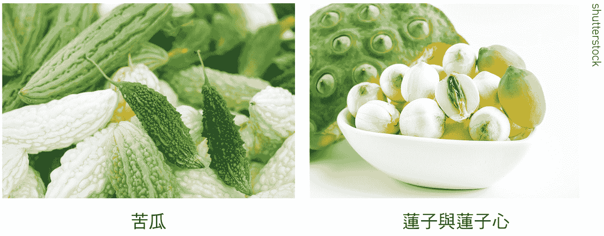

● 意志：孟子说：「天将降大任于斯人也，必先苦其心志，劳其筋骨」及俗语「用心良苦」「煞费苦心」「苦心经营」「吃苦耐劳」「苦撑」「吃得苦中苦，方为人上人」等，此处的「苦」，不再是味道，而是代表一种用心坚持的意志和认真努力的态度。

● 情绪：前面提到许多「苦」字都与味道和意志有关，但若说到「要去做一件苦差事」，就代表做这件事情让人有压力不开心，而且还会出现负面情绪。所以「苦」也跟情绪有关，例如「我好命苦」，相对于悲或怒等情绪，苦是一种更为极致的负面情绪。

##### 人生的喜乐、苦痛都由心来掌握

心在情志上的喜，味道上的苦，加上诸痛皆属于心的特质，「喜＋苦＋痛」交错的现象正是宇宙与生命的哲学。一如太极阴阳鱼图，不会有纯黑或纯白的区域，必然兼有另一个颜色，例如白色的阳区夹有黑色属阴的鱼眼，黑色的阴区夹有白色属阳的鱼眼。再如苦味食物通常吃到后来都会回甘，表示苦味与甘味是并存的。

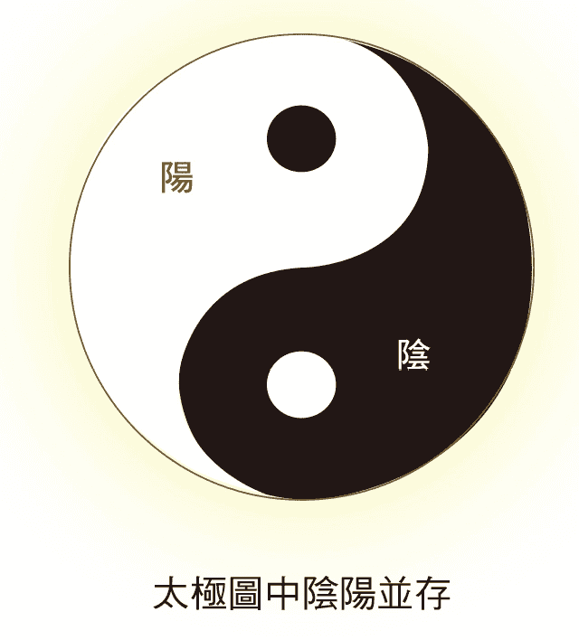

回到人体，前面说过心面对内在与外在环境的变动，必须时时刻刻维持人体的平衡，而心所独有「喜＋苦＋痛」这些充满矛盾的多样化特质，正是人生的况味。

一如热恋时，高调唱着木匠兄妹的英文老歌［Top of The World］，但这世界何尝因有人坠入爱河或失恋心碎而改变？面对内心情感时，每个人都是放大自己的心情来看待世界。

喜与苦之间存在制约关系，显现心本身就有内在平衡机制的训练，让某个特质不会超出极限而失控，例如过于欢乐或过于悲苦都容易出现物极必反的结果。心这些看似矛盾的特质都是一种动态平衡机制：当人生顺遂时，适当的苦能平衡喜，例如体会他人的悲苦能让自己惜福而不会喜乐无极；当天不从人愿时，喜能冲淡苦，回首看看自己所拥有的生活，退一步海阔天空，都能让人苦中作乐而得乐。生命中喜乐与苦痛就是一齣齣喜剧与悲剧，让我们见识自己体内存有的多样性，生命的厚度与层次，也让心有多种筹码去维持身心的平衡。

苦再持续下去，就会产生痛感，「痛苦」一看就比「苦」更严重。许多面临重大情感创伤的人，不仅会跌入痛苦的深渊，身体上更是痛彻心扉。痛感属于心，深层的痛苦感会让人心神混乱，找不到人生的出路而升起自残的念头。

写到这里，心情豁然开朗，难怪人生总有这么多悲喜交加的际遇，也难怪心这个导演兼编剧总是非常忙碌，片刻不得闲，这些都是让生命得以成长与饱满的必经之路。也因为人类具有同理心，因此这些人生的感受，我们无须一一经历才能体会，藉由许多经典的戏剧、文学和音乐作品，也可以从中获得感动与心灵的升华。

自己年轻时个性比较奔放，无法欣赏邓丽君的歌声，总觉得太甜美太黏腻。但随着年龄增长，慢慢可以体会那甜美温柔的歌声恰如吃了苦药之后所得到的小礼物，这「糖果」可以短暂的冲淡苦味，也给予历尽沧桑的听众暂时抽离现实的小歇。

对照《内经》说「心气通于舌，心和则舌能知五味矣。⋯⋯脾气通于口，脾和则口能知五谷矣。」既然口可以知五谷，那么舌头所知的五味，恐怕不仅是食物滋味，更是五味杂陈的人生吧！

* * *

###### 心独具精细的感觉与感受

心脏须时时因应外在环境的改变来进行自我调节。这些外在环境信息都是透过人体的感觉系统收集之后送给心脏。我们的感觉系统包括视觉、听觉、触觉、味觉、嗅觉以及与其相关的系统。这些感觉与心的关系如下图：

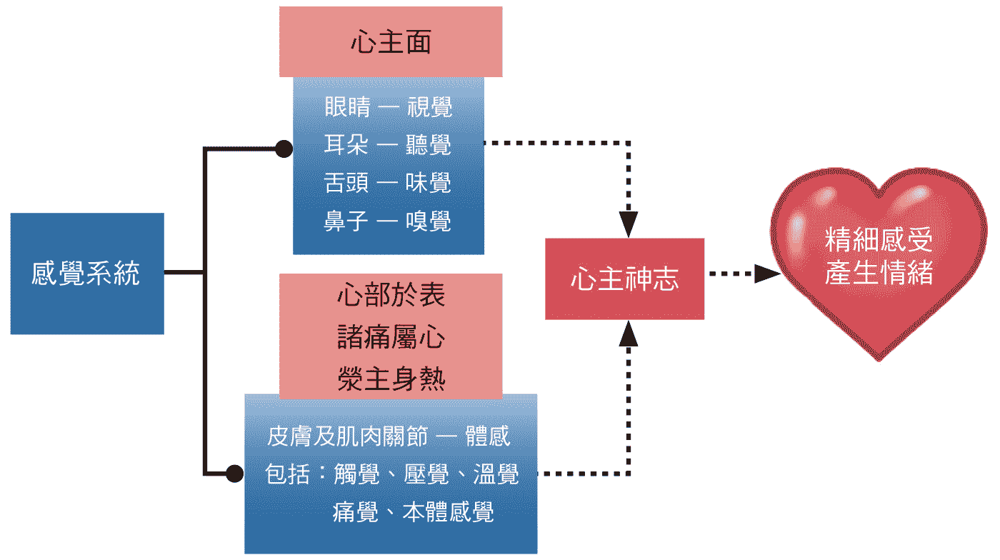

我们常说某人「有看没有到」，心不在焉，「有听没有见」，甚至充耳不闻，其实就是说他「没用心看、用心听」，可见心对于视觉与听觉有特殊的机制。

由于心主面，位于面部的眼睛、耳朵、舌头及鼻子等官窍，除了心开窍于舌，其余官窍都归其他四脏管辖，如肝开窍于目、肾开窍于耳等。四脏与官窍的关系偏重于提供营养，如肝血濡养眼睛，让眼睛可以看见东西；肾精濡养耳朵，耳朵可以听见声音，维持基本的视觉与听觉。至于比较高阶的功能，例如解读所看到与所听见的讯息，还有细腻的感知以及由此产生的觉受等，都由心掌管。当我们想好好聆听音乐时，通常会静下心来，甚至闭上眼睛欣赏，就是这个道理。

以上关系可以简单的比喻为「养」与「教」来说明。五脏对于自己所管辖的官窍就像对待自己所生的孩子，都有着「养育」的责任，必须提供养分，维持基本功能。而心对于它所管辖的官窍就像学校老师对待学生一样，有着「教育」的责任，教导他们学习精细的感受，产生情绪，并将之记录在大脑之中。透过反覆的学习与记忆，人体的官窍未来再接触到类似的事物，讯息一传到心，马上与过去累积的记忆衔接，可以快速做出决定。这个能力对于个人的社会化是非常重要的。

在封建时代有「君权神授说」，意指君王是由天命派遣来凡间治理世人，是神在人间的代表。此说法给予统治者绝对的权力，要求被统治者全然地顺服。这个论点早已不适用于现代民主社会，却仍适用于心这位君主之官。人与天地相对应，心脏对应太阳，成为身体的君王，为了能妥善统领五脏六腑，与生俱来就被赋予超强的「十八般武艺」，包括身体功能的主血、主脉、汗液、面部与颜色，心理功能的主神志、舌头及语言、主喜、笑及苦味等。

自然界一年四季有春温—夏热—秋凉—冬寒的运行变化，人体一日之内也有类似的规律（参阅《卷一》经络启航），加上心理层面的感受时刻都在变动，前面介绍身体及心理的心所具有的特质，让心在面对持续不断的变动时，仍能维持身与心的平衡。

* * *

### 三、心与其他脏腑的连结关系：听命与进贡关系

下图是《内经》借用一个国家的十一个官位与职能来说明五脏六腑的功能特性。由于脾胃并论，左侧为五脏加上胃及膻中（即心包之意），右侧为脾加上六腑。

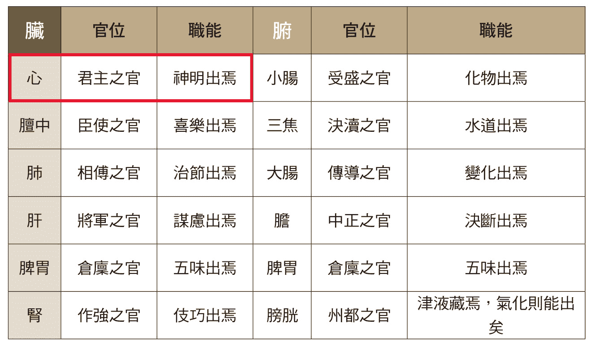

前面篇章介绍了心与天地、身心的关系，这里依据官位来说明「心」身为君主之官的重要性。心脏可以决定人的生死，就如国君决定国之存亡一样。可是，小小一颗如拳头大小的心脏，如何管理全身呢？

历史告诉我们，历代明君不见得是能力最强的人，但却懂得知人善任，充分授权，让他人甘心卖命，自己只需镇守宫阙，运筹帷幄，重点管理，便能事半功倍，国家当然富强。心脏也是一样的概念。心经经络系统属于手阴经，手阴经的长度都比手阳经跟足经短，分布的区域也不广，但是，几乎所有经脉系统都直接或间接与心脏连结。心脏就如安坐在宫城内的君王，只要接纳臣子们传递回来的讯息，加以分析归纳，就可以治理整个国家了。君子用智不用力，心经系统就是明证。

整体而言，心为君主之官，「任物者谓之心」，位居要津也须拥有完整的管理权力并承担责任。因此心与其他脏腑皆有连结，接收全身组织器官及经络系统收集而来的讯息，做统合分析，然后做出决策，例如欲望与行动，之后的各类感受，最后反馈以做调整。其实所有的商业行为与人为活动，都作用在「心」，期望挑起心与胃的欲望，产生冲动，做出行动。

### 五脏之中，心脏最攸关生命

《内经》说：「主明则下安，以此养生则寿，殁世不殆。」这里的「主」代表心脏，「下」指心脏所统辖的其他脏腑。「心者，君主之官，神明出焉。」心脏主血脉及主神志功能正常，就是明君，其他脏腑才能安居其位，尽展所长，当然就可以长寿无病。

反之，如果心脏生病了，宛如国君昏庸无能，「主不明则十二官危，使道闭塞而不通，形乃大伤，以此养生则殃。」心是全身功能的主宰，心脏推动血液输送到全身，如果心脏功能差，血液输送功能也变差，组织器官就会失去营养，长此以往，身体严重失调；万一心脏停止跳动，血液输送跟着停摆，生命也就结束了！所以在五脏之中，心脏最攸关生命。

### 心脏为五脏六腑的总指挥

五脏六腑运作时既有分工也有合作。分开来说则各有所司，《内经》「凡此十二官者，不得相失也。」十二官位各有所长，尽忠职守；合并来说则都由心脏管辖，《内经》说「夫心者，五藏之专精也。」心脏统领五脏，当然也包括六腑在内，心脏功能正常才能正确引导五脏六腑共同合作完成任务，因此《内经》说「主明则下安⋯⋯主不明则十二官危。」

心与五脏六腑的关系很像西方的管弦乐团。乐团的指挥站在制高点，通盘掌握曲目所有的细节，指挥协调团员们临场表现来诠释乐曲，团员只要发挥属于自己演奏的部分，并配合指挥即可。乐团中还有「首席演奏家」，有独奏和领导其他音乐家的任务，必要时也可以担任指挥。心脏就是总指挥，同时也兼任乐团的首席。

再借用这个譬喻，补充说明前面介绍过的「心主神志」概念。假设我们将人体的五志七情视为一个小巧的「情志乐团」，心就是此乐团的指挥，其他脏腑所主管的情志就是团员，心脏掌控乐团中各个情志的表现，同时「心主喜」，心也有自己所专属的情志，就像学有专精的演奏家，心脏也能成为乐团首席演奏家。所以心脏在情志乐团中具有双重角色，既可抽离团队，担任乐团指挥，全面统御及协调所有情志的表现，维持和谐；当然也可以加入演奏团队，兼任首席演奏家，呈现心主喜乐的个别特质。

心与五脏六腑的关系也是如此。心是五脏六腑的总指挥，全盘了解掌握全身每个组织器官的运作，其余脏腑只要在自己的业务范围内运作，并接受心脏的指挥即可。心脏要执行这项指挥功能，必须与其他脏腑器官建立紧密关系。心为君主，其他脏腑的经络系统都主动前来连结，很像文武百官觐见君王的场面，所以称为「进贡」关系，以下为经络系统所连结而成的「心脏进贡关系图」：

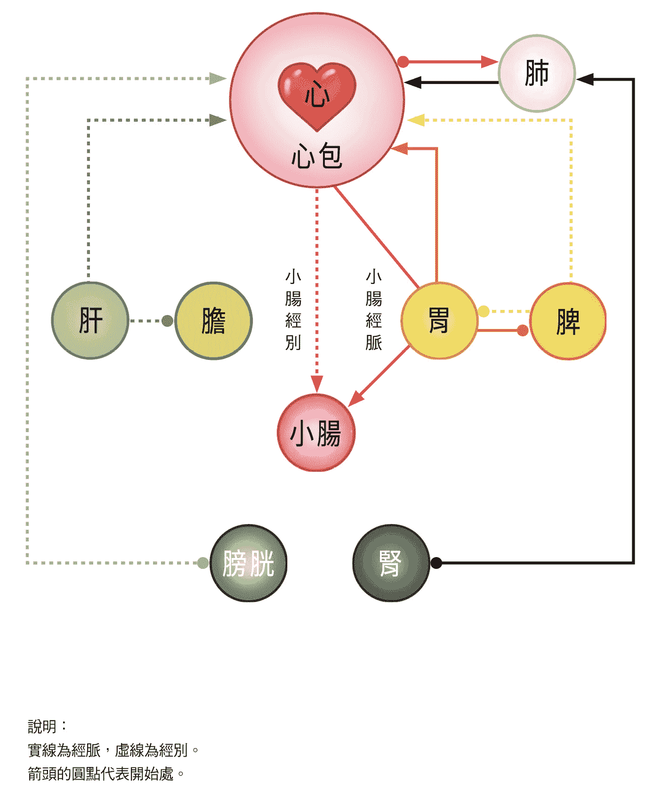

### 其他脏腑与心脏所建立的「进贡关系」

心既然是君主，其他脏腑当然会臣服其下，例如《内经》就指出「五藏六府，心为之主，耳为之听，目为之候，肺为之相，肝为之将，脾为之卫，肾为之主外。」以心为中心，各个脏腑及官窍都有分工，各脏腑也透过经络系统与心脏建立「进贡关系」，这些进贡关系的和谐是维持生命、建立社会化的关键。

##### 心与肺的关系：心肺君相组

心为君主，肺为相傅，成为「心肺君相组」。由于心肺都居于胸膈之上，中医说「胸为心肺的宫城」，胸部成为了解心肺功能很重要的区域。这个观点临床非常有用，我们常会透过望胸部及触诊胸部来快速掌握心肺的病情。

##### ● 肺心有邪，气留于两肘

心肺位于胸腔，胸腔与手直接连结，手臂有六条经络主要连结位在胸腔的心肺两脏（心包为心脏的外膜，一并纳入心）。手部六条经络都通过肘关节，「关节」顾名思义就是容易卡关的节段，肘关节日常活动频繁也很容易劳损，导致气血瘀滞，时间长了，会阻碍心肺两条经络气血流通，进而影响内脏功能。

另外，肘关节上有心肺两经很重要的合穴—少海穴及尺泽穴，合穴善于治疗内在脏腑疾病，也能反映脏腑疾病，如果心肺有疾，肘关节也会活动失常或出现痛证。

无论来自于心肺的疾病或是来自肘关节的气血障碍，两者都会互相影响，因此《内经》说「肺心有邪，其气留于两肘。」所以如果肘关节异常疼痛，反覆发作而难愈，就要思考可能是心肺问题了。

##### ● 心肺有病，鼻为之不利

临床上遇到许多心脏病人说话都会带些鼻音。有趣的是病人通常没有发现这件事，而且还会一直否认有鼻音，认为自己根本没鼻塞，也没有过敏性鼻炎或感冒的情况。

伟大的《内经》早就提醒这件事情──「胃者水谷之海，六府之大源也。五味入口，藏于胃以养五藏气。⋯⋯五气入鼻，藏于心肺，心肺有病而鼻为之不利也。」简单说，胃主受纳腐熟水谷（参阅《卷二》胃经篇），所有的饮食滋味与精微都收藏在胃，用来濡养五脏气，如心气、肺气等。五脏气透过胃的转输进入鼻子，藏在心肺之中，如果心肺功能出现异常，鼻功能也跟着不利。

肺开窍于鼻，容易理解鼻病跟肺的关系，但鼻与心的关系则较难理解，这项关系可从两方面来说明： 1.心肺主管营卫气血，2.心肺经络循行及反应区。

##### 1.心肺主管营卫气血

心主营血，肺主卫气，心肺所主管的营卫气血与人体免疫力有关。桂枝汤和麻黄汤是中医师常用来治疗感冒的良方，这两个方子都出自《伤寒论》。在《伤寒论》太阳病篇中，治疗太阳中风的桂枝汤主要从心脏机能调整，桂枝汤证有鼻鸣之症；太阳伤寒的麻黄汤主要从肺脏机能调整，麻黄汤证虽未注明鼻病，但麻黄本身就是肺经药，善于发汗解表，宣肺平喘，通鼻窍。所以心肺功能差的人，通常免疫力也比较差，一不小心就会感冒而出现鼻塞、流鼻水、打喷嚏的情况。

既然谈到营卫气血与桂枝汤麻黄汤，就顺便谈谈与之有关的桂枝芍药知母汤吧！《金匮要略》中风历节病脉证「诸肢节疼痛，身体尪羸，脚肿如脱，头眩短气，嗢嗢欲吐，桂枝芍药知母汤主之。」之前介绍「诸痛痒疮皆属于心」，痛证虽然与心有关，更与心肺主管的营卫气血运行密切相关，中医说「不通则痛，通则不痛」「气行则血行」，唯有气开始动了，血才会跟着活动。桂枝芍药知母汤以桂枝汤及麻黄汤为底方，将心肺营卫气血纳入其中，再加上一些治疗风寒湿热邪气药物组合而成，本方几乎涵括所有治痠痛的药物，治疗肢体痠痛疗效很好，因此受到后世医家的青睐，我个人也很喜欢用。

##### 2.心肺经络循行及反应区

肺开窍于鼻，但肺经本身没有循行到鼻部，而是透过相表里的大肠经抵达鼻部。心经经别从心脏上行，经过喉咙而出于面部，最后合入眼头内侧。这条路线其实有经过鼻腔旁边，当然也包括鼻窦。

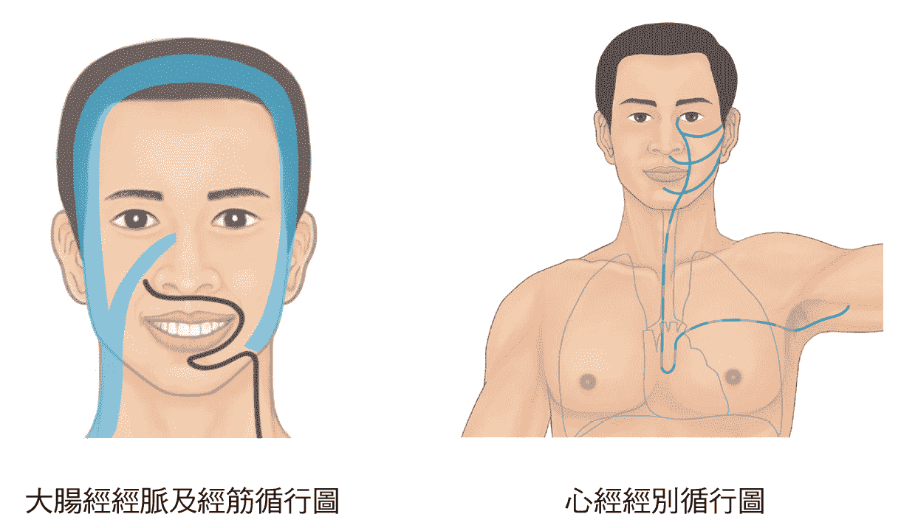

台湾由于气候潮湿加上空气污染日益严重，「鼻窦炎」是台湾人常见的鼻病，也是大家耳熟能详的名词。鼻窦位于头颅，共有四对：额窦、筛窦、蝶窦及上颔窦，分别围绕在鼻腔的周围区域。

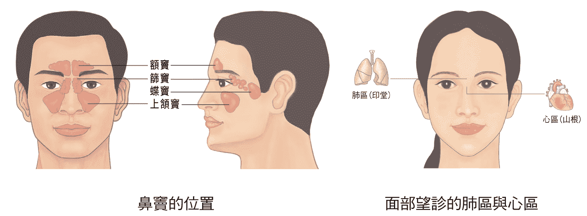

鼻腔和鼻窦在说话时扮演着共振的角色，尤其鼻窦很像音箱，提供发声时的共鸣，因此鼻腔与鼻窦不仅是呼吸器官，还与发声有关。当鼻腔与鼻窦出现异常时，声音也会跟着改变，例如感冒或鼻窦发炎时不仅会流鼻水，还会出现鼻塞鼻音的现象。

从中医的面部望诊区来看，肺脏反应区在印堂，此区正位于两侧额窦之间；心脏反应区在山根，此区正位于两侧筛窦之间。

当心肺功能异常时，无论透过经络系统或是反应区，都会影响鼻腔与鼻窦。由于肺主气、司呼吸，心主舌、其声为言，若心肺同病，病变以肺为主，则鼻部呼吸不利，说话气短的情况比较明显，兼有鼻音；病变以心为主，则说话时会出现舌头不灵活的大舌头现象，且兼有鼻音。这类鼻音主要与鼻腔和鼻窦的声音共振失调有关，也反映出心肺功能的异常。

##### ● 肺主嗅觉，心主感觉

《内经》说「肺气通于鼻，肺和则鼻能知臭香矣。」肺开窍于鼻，可以闻到味道，但是对于这个味道的细节、层次及感受却是由心所主。譬如因为感冒而鼻塞闻不到味道，是肺主卫表及开窍于鼻的功能失常。但如果因为工作忙碌，午餐会报，边开业务批斗大会，相信吃完便当没有人会记得餐盒有什么味道，这不是因为鼻塞，而是因为心不在焉，充鼻不闻所致。

再如经过与恋人漫步的街道，闻到熟悉的味道，昔日美好的记忆浮上心头，感觉很甜蜜。这就是心的作用啊！

台湾国民食物「臭豆腐」，混杂着各式强烈味道，方圆几里都闻得到，喜爱者称之为「人间美味」，趋之若鹜；厌恶者认为臭秽难闻，避之唯恐不及。三国才子曹植在［与杨德祖书］云：「人各有好尚，兰茞荪蕙之芳，众人所好，而海畔有逐臭之夫。」正是此意。

##### 心与脾胃的关系：御膳之路组

心主血，血液的来源，《内经》说是「中焦受气，取汁，变化而赤，是谓血。」脾胃为后天之本和气血生化之源，脾胃都特地为心脏开辟「御膳房之路」，确保营养物质可以安全送给心脏，同时还提供制作血液的材料，转化为血液，由心脏输送至全身。详细内容请参阅《卷二》胃经篇及《卷三》脾经。

##### 心为父，脾为母：日月勤奋组

五脏之中，心与脾是最为勤勉的两脏。

心脏五行属火，宛如太阳，时时刻刻跳动不能暂歇，一生总跳动次数约为 25 亿次至 30 亿次，符合《易经》「天行健自强不息」。心脏个性外显，照耀四方，擅长交际应酬。其刚烈的特质宛如父亲角色，总理身体内外的重要事务。

《卷三》脾经篇章介绍过，脾脏五行属土，宛如月亮，时时刻刻默默承担也升提脾气，让组织器官不向下坠落，兼具《易经》「天行健自强不息，地势坤厚德载物」的美德。其婉约的特质宛如母亲角色，维持身体内部的气机与水液代谢正常。

心与脾分工合作，互补相辅，一起守护生命，所以称为「日月勤奋组」。

勤奋的心脾还与妇科有关。《内经》说「二阳之病发心脾，有不得隐曲，女子不月」，心主神志与血脉，脾主思与统血，还提供心脏爱的能量。当心脾两脏功能失调时，不仅影响气血运行，还会产生负面情绪，如低落、忧郁或钻牛角尖等，茶不思饭不想，彻夜辗转难眠⋯⋯，身心之间互相影响，导致女性月经失调甚或月经不来。《卷三》脾经介绍的「归脾汤」，就适用于这类情况。

##### ● 脾主进食食欲，心主美食味觉

心开窍于舌，脾开窍于口唇，《内经》说「心气通于舌，心和则舌能知五味矣。⋯⋯脾气通于口，脾和则口能知五谷矣。」两者都与饮食滋味有关，但脾的妈妈特质，注重有没有食欲，食物有没有吃进去，所以「口知五谷」代表食欲与进食的概念。心主神志，注重各个官窍传来的感受，所以「舌知五味」代表品尝食物的各种滋味以及由此而生的感受。

举例来说，当肚子很饿，面对一块蛋糕时，脾会努力展开脾土，提高食欲，产生想吃的冲动，然后拿起来吃下去；心会用眼睛、鼻子等五官收集这块蛋糕的色泽滋味，如果喜欢它的特质，就会拿起来吃，并且细细品尝味道，然后产生喜欢或不喜欢的感受。所以，脾会鼓励进食，心会享受美食，这是两者间的差异。

临床时常遇到病人询问某某食物好不好，我都如此解释：「万物都有它自己存在的价值，无关好与坏，只能说『某某食物适不适合我现在的身体状况而已』。」西谚也说：「一些人的美食，却是其他人的毒药。」加上每个人对于食物的喜好不同，就像前面提过的臭豆腐，同样的味道，却有着两极的反应，其实都来自于个人心里主观的感受和记忆。

心与脾都与口舌有关，因此还可以细分为：

● 心主「祸从口出」，因为心主舌及语言，言多必失，容易造成人际关系的潜在祸害。

● 脾主「病从口入」，因为脾主运化，饮食不节制容易导致脾胃运化功能失常而百病丛生。

##### 心与肝的关系：「心肝累累组」

现代社会生活节奏快，工作压力大，常常听到大家在喊累！五脏里最容易累的组合，就是常被使用过度而造成损伤的心与肝。

心脏是君主之官，需综理国事，寻求平衡，肝脏是将军之官，需对外打仗，保护权益。现代人身处激烈竞争的职场丛林，时时处于备战状态，很难放松。尤其肝主怒，情绪很容易激动或被激怒，肝经循行到头顶，「怒发冲冠」是可能会发生的。

当一个人疲倦喊累的时候，其实有两个脏腑同时承担着这个「累」，即心与肝。

心与肝长期处于压力之下，再强健的体魄也会耗损，所以称为「心肝累累组」，但来自心与肝的疲倦情况其实有些不同。

##### ● 心脏累：有着「马上要断电」的累感

由于心脏接纳各方的贡献，时时刻刻搏动泵血，生命中所有的身体损伤、情绪激动等等的身心压力和打击，心脏都无法回避，必须完全承担。因此心脏的累是感觉自己「快要断电」，然后宛如电源开关被关掉一样的「马上断电」，全身突然无力，迅速累瘫在沙发或床上⋯⋯，这是属于心脏的累！表示心脏再也无法承担任何身体的工作了。

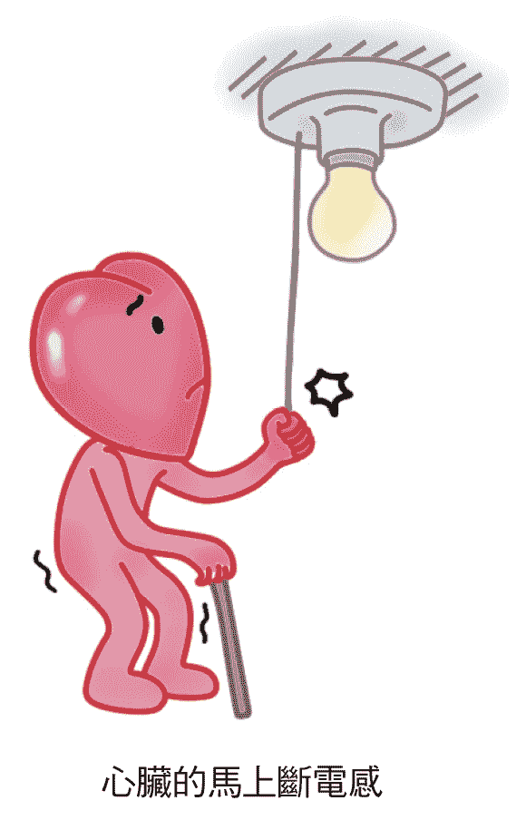

##### ● 肝脏累：有着「慢慢的没电」的累感

肝脏不像心脏需要时时刻刻工作，它的疲劳是因持续的压力所造成的，所以肝脏的累是感觉到「慢慢的没电」，好像蜡烛快要烧尽，光线逐渐暗下来，身体也宛如慢动作般的渐渐没力⋯⋯无力⋯⋯累瘫。这是属于肝脏的累！

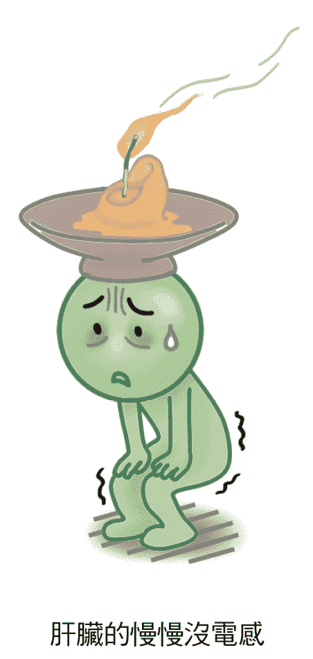

一旦出现这两类疲倦感，表示自己已经有了「坏心肝」，建议尽早改善。心与肝不同的疲惫，改善的方法也不同喔！

来自肝脏的累，建议释放压力，早点休息，少熬夜，不要吃消夜或饮酒过量。

来自心脏的累，除了上述缓解肝脏疲劳的方法之外，还要补充营养，因为心脏就像引擎，需要充足的燃料才能持续转动。加上多晒太阳，适当运动，穿得暖呼呼，吃得好健康，大家都可以成为「好心肝」的人！

* * *

###### 容易被搧风点火的心肝

古早时代煮饭使用炉火，现在许多民众也会参加「焢土窑」活动体验早期生活。这两种烹饪方式都需要有人看顾着火，时时搧风，补充木材，以免火熄了，食物没煮熟，大伙没东西吃可就惨了。

心五行属火主热，肝属木主风，从五行的相生关系来看，肝木会生心火，这完全符合大自然的规律，因为木头被火燃烧，助长火势。万一火势旺盛，温度持续升高时，会出现「阵风」的物理现象，譬如台湾南部常见的「焚风」。

中医也观察到人体有类似的情况，例如高烧不退之后容易出现抽筋痉挛的现象，因为肝主筋，又主风主动，抽筋属于肝的疾病。发烧与抽筋的关系就如同对着炉火拚命搧风一样，风越大则火越旺，火旺则会生风，风是一种动态，所以高烧后就会出现抽筋。心火与肝风互长声势，中医称此种现象为「风火相搧，热盛动风」，心与肝就成为「搧风点火」的组合。（见下页风火相搧图）

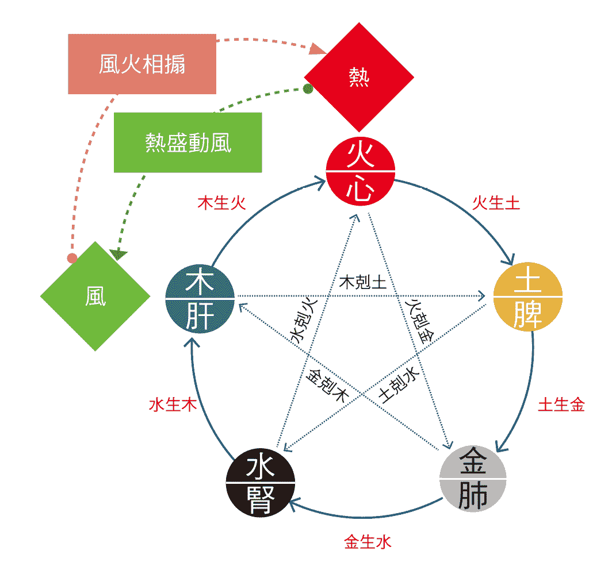

这个组合不仅表现在发烧时，也会出现在情绪波动时。有句俗话说「怒火攻心」，其实是冤枉肝了！因为其他四脏的情绪波动主要都来自心，例如看到有人在网络社群写自己的坏话，眼睛将这些文字传给心，心主神志，分析之后，心决定要将这个不愉快的感觉传递给肝，肝就以其最擅长的愤怒来表现。若肝的怒气过度高涨，无法平息，因着五行的关系，木生火，肝的怒气也会影响心而出现胸闷、呼吸不畅，甚则心痛的情况，这就是「怒火攻心」的实相。

心在面对这些网络谩骂时，其实可以有所选择，例如心可以将讯息传给好脾气的脾脏，脾主思，经过深思熟虑之后，决定对造谣者采取道德劝说，透过这个方式便能消弭一场网络大战，自己也不会气到爆肝及伤心。

* * *

##### ● 肝主视觉，心主感觉

肝开窍于目，《内经》说「肝气通于目，肝和则目能辨五色矣。」「诸脉者皆属于目，⋯⋯肝受血而能视。」肝将珍藏的血液提供给眼睛，让眼睛发挥视觉功能，辨别各种色彩。

前面介绍过，眼睛是心的使者，能传递心的感受，心经系统也特别连结目系及目内眦，心脏对于眼睛是情有独锺，恋恋不忘，难怪眼睛被称为「灵魂之窗」。同时，眼睛是心与肝都非常疼惜的官窍，所以眼睛也可以算是「心肝宝贝」囉！

眼睛与其他感官一样，每个人都有各自的认知。例如面对一幅画作，有人看到只是颜色的组合，有人却赞叹神来一笔，绝妙无比。这些差异也都来自心的作用。

情感上的「一见钟情」与「情人眼里出西施」，令人失去理智，深陷其中，正是俗语「心瞎，眼也瞎」的代表作！

虽说「眼见为凭」，实际上眼睛却是最容易被欺蒙混淆的感官。例如人类的眼睛对于看到的物体或移动物体，大约有十分之一秒时间延迟与残留，也就是眼睛对于一个物像的保留时间比该物像实际停留时间略长，称之为「视觉暂留」。电影就是利用此原理而制作。过去电影都是一格一格播放，但在电影院里看电影，却是连续播放的动态影像，就是利用视觉暂留，让快速放映的一个个画面合为一体，看起来就象是连续的单一影像。

还有著名的鲁宾之杯及少女与老妇图，都是巧妙利用视觉错觉的作品。

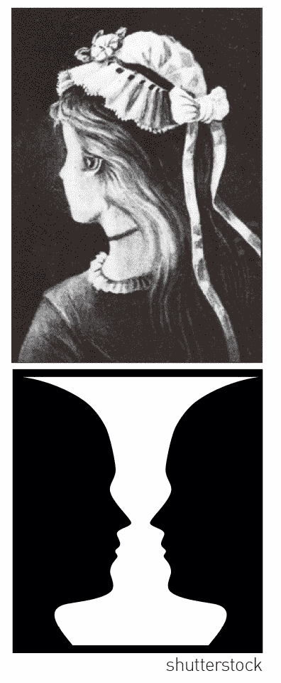

##### 心与胆的关系：勇气心胆组

胆是中正之官，善于维持平衡，因此就能帮助时常为了平衡身心状态而大费周章的心脏，加上胆主决断，辅佐心脏做出决定的勇气，因此称为「勇气心胆组」。

一般常用「胆量」来显示性格中是否具有勇气和决断力，有胆量就会奋勇向前，胆小表示个性退缩容易受惊吓而裹足不前。

胆经的经别通心，因此胆也会影响心主神志的功能，胆安则心神安，胆虚则心神也会虚。譬如胆量足的人通常心神比较稳定，心跳稳健；胆量不足的人常莫名担忧害怕，遇事惊惶失措，心脏噗通噗通乱跳，呼吸快而浅，俗语称为「提心吊胆」，这种人心与肝胆的脉象都虚虚浮浮的，好像悬吊着一样，所以「提心吊胆」确实符合中医理论。

##### 心与肾的关系：社会和谐组

##### ● 心管ＥＱ，肾管ＩＱ

中医认为肾为一个人的先天之本，它与心脏在身体功能上有非常密切的合作与制约关系，细节我们在肾经中再详谈。在此先分享心与肾在神志部分的有趣分工，这就涉及现代生活中面对许多学习与挑战时所需的 IQ 及 EQ 了。

IQ 是智力商数的英文缩写，代表个人的学习能力，EQ 是情绪商数的缩写，代表在人际关系中自我情绪的管理能力。

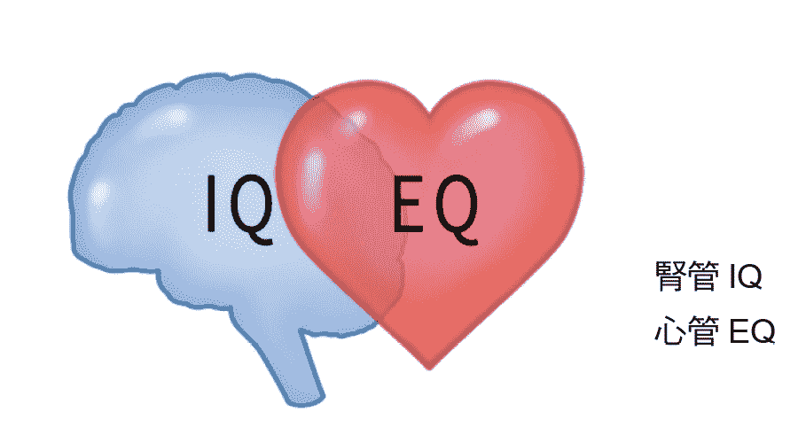

「心为君主之官，神明出焉。」要求君主在统领国家时头脑神志必须清明，情绪不要轻易被撩拨，才能从诸多的正面及负面讯息中，掌握关键信息，作出明智的决策和反应。

这个观念应用在一般人身上就是现代所说的「情绪管理」。尤其工商社会人与人之间的互动频繁，关系复杂且微妙，非常容易彼此牵动，一句话或一个眼神，可能是温柔的生机，也可能是毁灭的杀机！所以，唯有稳定的心志才能做良好的情绪管理，这是在现代社会中安身立命的重要关键。

肾主一个人的先天条件，用现代语言来说就是遗传的能力与特质。中医说：「肾为作强之官，伎巧出焉。」肾主骨主髓，全身所有的骨头及骨壳里的骨髓都归肾管理，如手臂的肱骨、大腿的股骨等。中医认为头颅也是个骨壳，里面的软组织就是骨髓，因为脑的骨壳圆且大，骨髓容量多，特别称它为「髓海」，由肾专责管理。脑中髓海充盈的人，头脑长得好壮壮，天生就比较聪明机灵，学习能力也较佳。若胃的吸收功能也良好的话，先天后天皆调，当然是圆满一百分的人生胜利组。

##### ● 心与肾的超级大对比

心与肾具有许多强烈对比关系，如心属火，肾属水；心在上，为红色，具有阳光般明亮温暖的特质，肾在下，为黑色，具有地底般阴寒暗沉的特质。

中医向大自然学习中庸之道，水与火可以并存且兼容，因此心火与肾水之间存在互相制约与辅助的关系，例如心火应该下行去温肾水，以避免其过于寒冷而生病；肾水应该上行来降心火，以避免其过于炎热而生病。这个有趣又复杂的关系，中医称为「心肾相交」，心火在上，肾水在下，各有所司，又能互助，让人体维持上下水火阴阳的平衡，免于疾病之苦。

由于心主神志，心肾相交则心神安定，有助于睡眠。若心肾不交，出现心火过亢的烦躁则难以入眠。

另外还有一种心肾失调的状况，由于心的阳气不足，导致位在人体下焦的阴寒水气藉机上冲于心，出现有气从下腹部上冲至咽喉的状况，中医称为「奔豚」，发作的时候病人感觉很恐怖。细节肾经篇再说明。

心主红色，肾主黑色，颜色对比强烈，对比的意象也很有趣。例如水果的颜色从红到紫到黑，代表持续成熟的过程。

法国小说家司汤达的名著《红与黑》（Le Rouge et le Noir），故事发生在拿破仑帝国时代，红色与黑色分别代表着「军队」与「教会」，是当时怀有野心的法国青年晋升发展的重要管道。而在现代社会说某人很红，代表他人气很旺，前途无量；若说某人很黑，代表被人嫌弃或讨厌，前途无亮。人类赋予红色与黑色高度对比的文化意象与社会价值观，也跟心肾两者的特色相呼应。

##### ● 肾主听觉，心主感觉

肾开窍于耳，《内经》说「肾气通于耳，肾和则耳能闻五音矣。」肾精是耳朵最佳补养圣品，肾精充足则耳朵听力正常，如果肾精不足，例如老年人肾精缺乏时，就会出现听力下降的情况，《内经》说「精脱者，耳聋」正是此意。

但在《内经》的其他篇章提到「南方赤色，入通于心，开窍于耳，藏精于心」，后世因此有「心寄窍于耳」的说法。

依据前面的讨论，肾开窍于耳，让耳朵能发挥听觉，可以听到各种声音，但心与声音的精细音质、内涵和感受有关。

李白的诗［听蜀僧濬弹琴］，最能呈现心对于声音的感受：

蜀僧抱绿绮， 西下峨眉峰。

为我一挥手， 如听万壑松。

客心洗流水， 余响入霜钟。

不觉碧山暮， 秋云暗几重。

诗中「为我一挥手， 如听万壑松。客心洗流水， 余响入霜钟。」作者听到蜀僧弹绿绮琴的乐音，彷彿听到群山的松涛声，这声音多么壮观啊！也宛如历经伯牙为知音锺子期所弹奏的［高山流水］那种情怀，让作者客居在外的烦闷心绪一扫而空，琴声余音缭绕，伴随着远山的钟声，声声入耳，在心中回荡不已！

「肾开窍于耳」应用于这首诗，主要是听到五音，其余从乐音延展出来的感受都来自心，这就是「心寄窍于耳」的明证。

对于重要的讲座或是喜欢的音乐，我们常说要「用心聆听」。肾与心都跟耳朵相连结，影响着听觉，两者的差异如下：

听的能力与肾功能有关：常见老人家因为肾功能退化，听力也随之退化，刚开始会听不清楚内容，渐渐的连声音都听不到了。奇妙的是，大家都有经验吧~~骂人的话，即使小小声，阿公阿嬷也从不会漏听。很抱歉，本题中医无解，可能跟老人家长年累月累积的深厚功力有关吧！呵呵~~（老人家总说自己吃的盐比年轻人吃的米还多！）

听的感觉与心功能有关：专注心力才能听清楚细节，所以去参加音乐会时，我们常会闭上眼睛，用心聆听，不漏接任何音符。请注意喔，是用「心」去听，而不是用「肾」去听喔！透过心主神志的作用，对那首歌不仅是听到而已，还会连接情感，勾起记忆，以及产生喜恶等感觉。若听到当年恋爱时的歌曲，就会产生甜蜜感；若是失恋时听的歌，会有种酸酸涩涩的失落感。歌曲不变，改变的是人的心念。

日常生活中，耳朵听进来的话语，也常被心这个麻烦的家伙切割得很纷乱，不是被太认真听，就是浑然不觉。譬如情人之间的亲密关系，总是容不得一颗沙子的存在，又因为太在乎对方，常常有些话是「轻轻说」却被「重重听」，偶然提到过去恋人曾经做了哪些讨好自己的事，听在现任恋人的耳里却有极大挑衅之意，已逝的恋人絮语竟变成如今恋情分手的导火线；许多太太常抱怨，先生、孩子对于自己的忠言总是「有听没有到」或是「左耳进，右耳出」，完全没当一回事。我常开玩笑说，许多丈夫年老之后听力先退化，可能跟长期封闭耳朵有关喔。

* * *

###### 人体血库管理的黄金组合

● 血库管理黄金组之一：心＋肺

血液是人体最珍贵的物质，心主血，肺主气，心脏透过收缩将血泵出注入脉管，形成脉搏，并藉由肺主气的协助，一起推动血液在脉管中周流全身再回心脏，心肺合作无间以维持生命。

● 血库管理黄金组之二：心＋脾

心主血主脉，脾主化血统血，将营养物质转化成血液，提供给心脏管理应用，维持生活与生命机能。脾向上升清的力量可以统血，协助心脏将血液约束在脉管中流动，避免无谓出血，以保存珍贵的血液。

● 血库管理黄金组之三：心＋肝

心主血脉，在平日活动时，不断将血液送出及回收至心脏，以维持生活。肝主藏血，《内经》说「人卧，血归于肝」，当我们躺下来休息不再活动时，血液自然归回肝脏。《卷一》介绍过，肝脏是血液的保养厂，具有修复及净化血液的能力，然后再将经过专业修复后纯净的血液，投入一天的循环。经过肝脏净化修复的血液宛如纯净的汽油，注入心脏之后，不会淤滞在脉管之中，藉此保护心脏这个人体重要的引擎。

虽然心与肝很容易爆冲，但同时也是这个冲动的力量，帮助心脏推动血液到全身，帮助肝脏大刀阔斧的整修血液。所以暴冲力量没有好坏，就看我们如何觉察自己体内这股动能并且善用之。

● 血库管理黄金组之四：心＋肾

肾与一个人的先天体质有关，中医称肾为「先天之本」，肾主藏精，「精」顾名思义就是「精华」之意，也就是肾脏藏有人体最精华的物质。

肾精的来源有二：一是来自先天，二是来自后天饮食中的营养。举例来说，肾精类似定期存款，平时不会动用；心血类似活期存款，如果心血有结余，就会送给肾转化成肾精储存，就如同收入增多，收支有盈余时，会将之转入定期存款。反过来说，如果心血不足，肾精也会转化成血液以供心脏使用。因此，心血与肾精之间存有互相支援的合作关系，借以维持生理机能。

* * *

##### 心与膀胱的关系：防御保卫组

膀胱经是人体背部主要的经络系统，涵盖面积在十二经络中最广，是人体很重要的防卫体系。膀胱经的经别通于心，心为君主之官，膀胱经这么重要的守卫经络当然要时时向心脏回报军情，细节在膀胱经中再讨论。

中医关于膀胱储存尿液和排出尿液这部分功能的认知，跟现代医学一致。人类脑部有抗利尿激素（ADH），主要控制尿排出的水量。中医的肾主脑髓，ADH 也归肾管理，控制平日的尿意。但在特殊时刻，如心情紧张时，心主神志的特质也会影响尿意，而出现频尿、甚至尿失禁的情况，这类的频尿就可以从安定心神着手。

##### 心与心包、小肠的关系：打理善后组

心脏是君主，除了国家大事之外，还有一些私人事务需要「心腹」打理，万一不慎闯祸了，也需要心腹帮忙善后。

心腹一号是「心包」。心包是心的外膜，跟心脏很贴近，功能很像围绕在君王身旁的小宦官或贴身小厮，专为君王打理一些能让他开心的私密事，同时也会代君王受过，细节在心包经论述。

心腹二号是「小肠」。小肠与心相表里，且位在腹部，完全符合「心腹」之名。小肠吸收食物的精微物质是造血的材料，而且小肠经还包覆在心脏后侧保护心脏，是心君的禁卫军。如果心火过旺，也会透过经络下移到小肠，藉由小肠代谢水液的能力，让心火从小便而出，帮心清热，协助心脏功能的稳定。

###### 中医师不传之祕：心脏透过头面五官来照顾五脏

前面介绍过心主神志与 EQ 有关，连结记忆、思考和情绪，这也跟现代医学的脑部功能有关，加上心主面，头部与面部皆由心统理。这方面《内经》有相关论述：

十二经脉，三百六十五络，其血气皆上于面而走空窍：

● 其精阳气上走于目而为睛，

● 其别气走于耳而为听，

● 其宗气上出于鼻而为臭，

● 其浊气出于胃，走脣舌而为味。

● 其气之津液，皆上燻于面，而皮又厚，其肉坚。

上述关系简单说，就是人体将全部经脉与络脉的血气向上输送给面部空窍，让位于空窍之内的五官包括眼、耳、鼻、唇舌等，得以发挥视觉（为睛）、听觉（为听）、嗅觉（为臭）、味觉（为味）功能。

十二经脉连结五脏六腑，透过经络系统将脏腑的状况呈现于面部五官的功能上，《内经》说「五藏常内阅于上七窍也」正是此意。如何诊察呢？

肺气通于鼻，肺和则鼻能知臭香矣。

心气通于舌，心和则舌能知五味矣。

肝气通于目，肝和则目能辨五色矣。

脾气通于口，脾和则口能知五谷矣。

肾气通于耳，肾和则耳能闻五音矣。

既然五脏功能都反映在五官，心脏统理五脏的方式之一就是从头面部着手，只要将五官照顾好，五脏就会强健。例如注意保暖，让鼻窍保持畅通就是肺和；少用眼睛，多吃深色或黄色蔬果，保持视力清晰就是肝和等。

前面提到五官的细腻感受都由心管理，心又统领头部及面部五官，可见心的「耳目众多」，时时收集外在讯息以供心作决策。同时，心也很容易被外界信息或环境习气所影响，「耳濡目染」而建立价值观，由于「近朱则赤，近墨则黑」，如果不知辨别红与黑，万一让自己陷溺沉沦就糟了，这也就难怪古时候的孟母为了孩子的教育而「孟母三迁」。

### 小结：风光之下的辛苦

心脏身为君主之官，完全承担所有脏腑经络生理功能上的需求，如提供生命中最关键的气血，也同时承担所有脏腑经络病理上的变化，如肺气虚，肝火旺等皆令人疲倦，心脏就必须提供更多的气血及心神去平复这些失调状况，宛如派遣精锐部队前去修复各个机构一样，这些都会造成心脏的负担。

另一方面，心脏犹如计算机主机，各个脏腑就像随身碟一般，会将信息传入主机。来自四面八方的随身碟很容易带有病毒，一旦插入主机，病毒就会趁势传入。若计算机主机有强大的防毒软件，病毒就无法入侵。同理，若心脏机能坚强，即使其他脏腑有邪气，气血失调，心脏就有能力抵挡，但如果心脏机能较弱，或长期被邪气侵袭，心脏也会被打败的。

仅有拳头大的心脏加上短短的心经，无法独自承担这么重大的责任，势必要仰赖许多脏腑合力完成。大家别只看它被众星拱月般的风光，殊不知心在高处不胜寒，「见人挑担不吃力」，唯有身在其位才能体会。千万不要以为全年无休的心脏非常耐操，任何组织或器官都有它的极限。所以再次提醒大家，一定要好好爱护这个风光却也十分辛苦的心脏。

以下是心经经络四大系统循行简图：

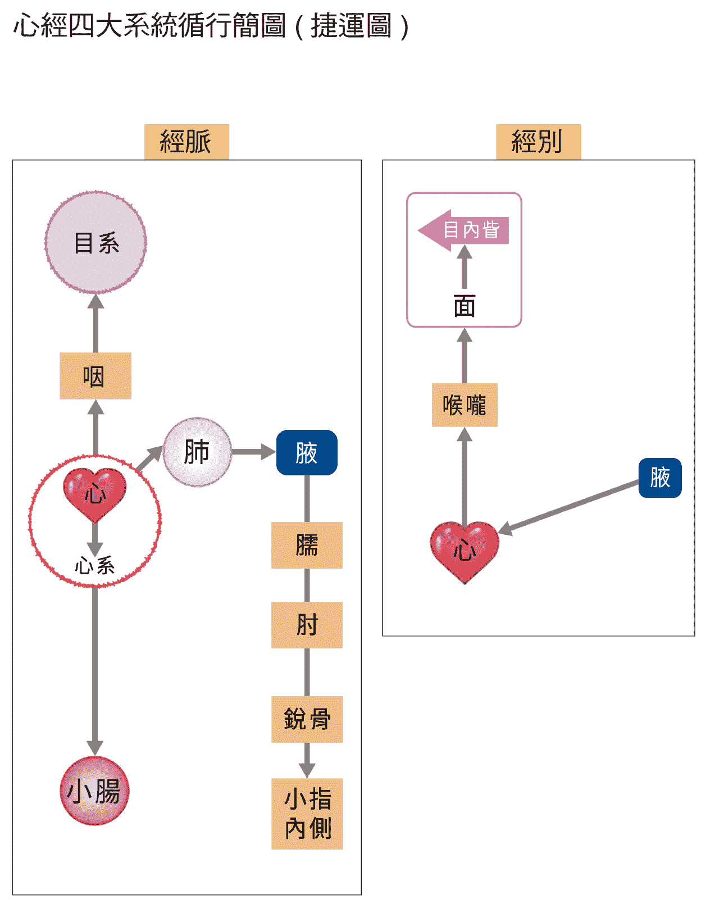

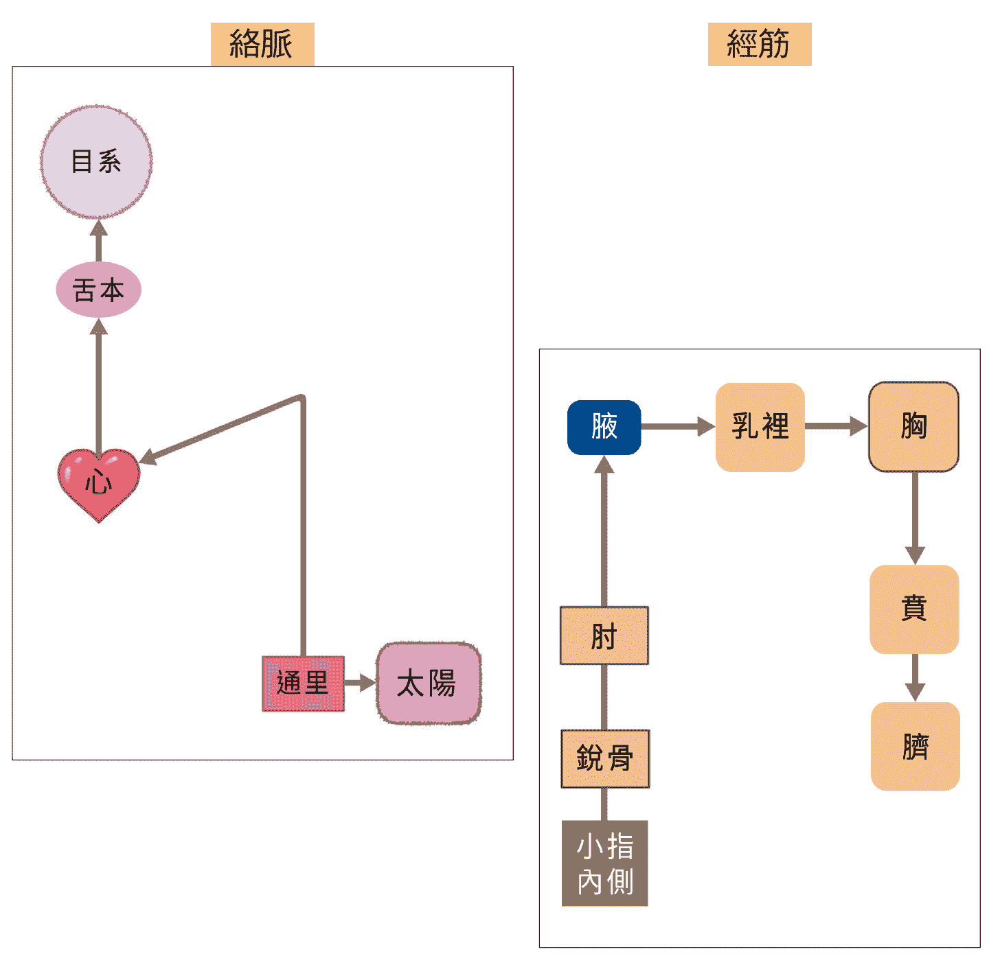

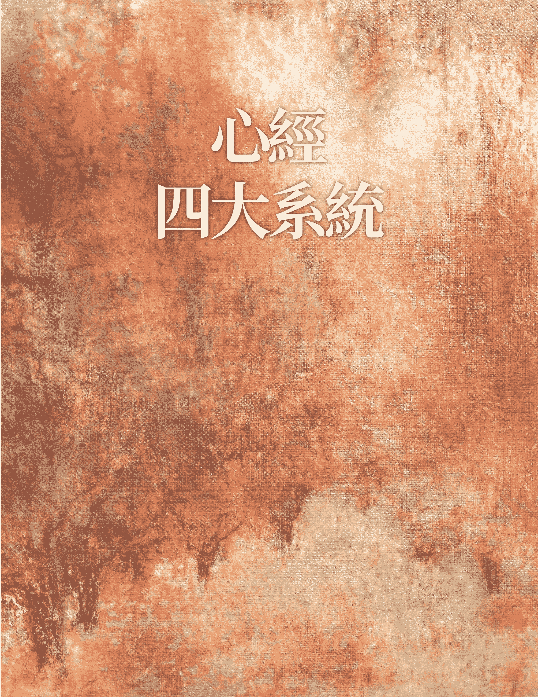

# 心经四大系统

## 一、心手少阴之脉（经脉）

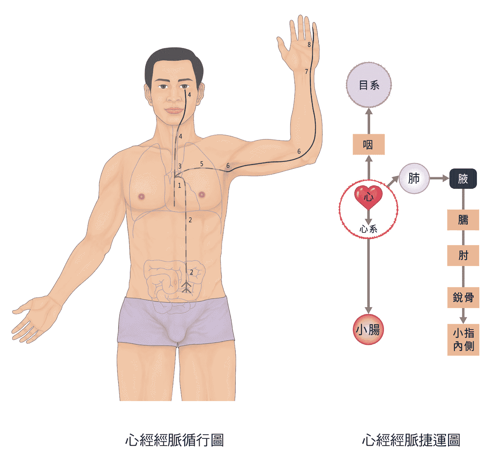

### 手少阴心经─循行特色

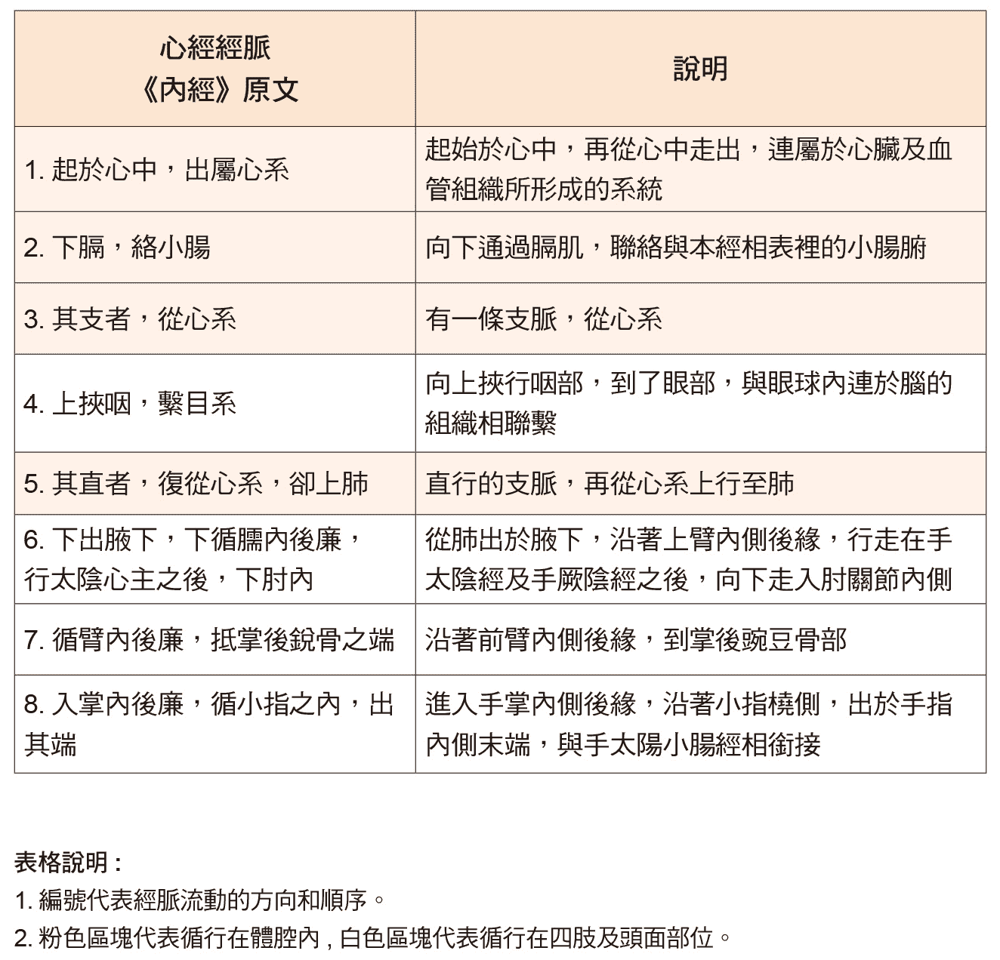

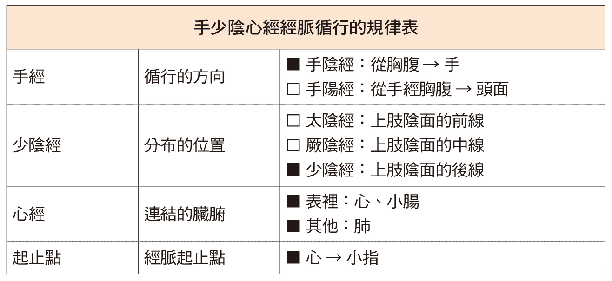

心经经脉属于阴经，分布在人体较为深层的部位。循行路线可分为路线 1-3 及 5 的胸腹部，路线 4 的头面部和路线 6-8 的上肢部三部分。

胸腹部：从心中出来连结心系（心脏及相连血管的整体系统），然后从心系分出两条路线：一条向下穿过横膈联络小肠，一条向上连结肺脏。（路线 1-3 及 5）

头面部：从心系向上挟行咽部，到面部，连系目系（眼球及内连于脑的整体系统）。（路线 4）

上肢部：从肺下行出于腋下，然后一路沿着手臂内侧后线，通过肘与腕关节，最后抵达小指内侧末端。（路线 6-8）

心经经脉有一个很重要的部位「心系」，指心脏和与其连结的肌肉、血管、神经和体液等组织。以心脏君王来说，心系包括王宫内所有人员，如君王的家属、维持王宫安全的警卫，以及宫内的总务采买和人事行政等员工，他们都是帮助心脏完成任务的自家人。日常事务心脏无需自己出手，只要交给心系去处理就好。

十二经络系统中，只有三系：肺系、心系与目系。心、肺及眼睛这三个部位周边都有许多组织与之连结，形成一个完整的工作群组，而且都与生命及生活有重大关系，因此才成为人体的重要三系。

心经经脉系统就以「心系」为中心，呈十字形分布：向下络小肠，向上挟咽部到目系，横向经过肺、腋到手臂。这样的结构，当双侧合并起来时，就变成心脏重要的主血脉与神志功能共同体，以及避免邪气侵袭或外力直接伤害的保护结构。

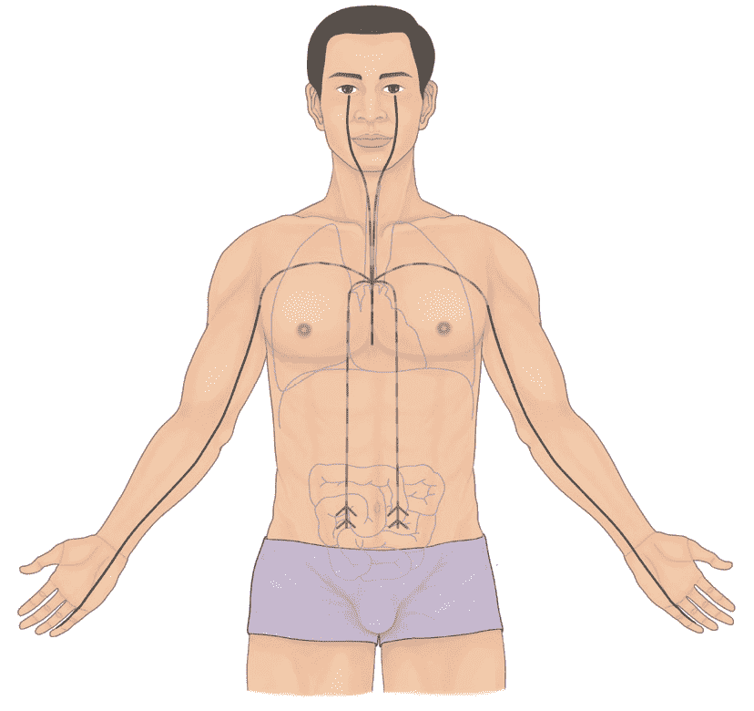

在十二经络系统中，阴经通常透过相表里的阳经上行至头面，唯有心经与肝经为了连结目系，直接上行到头面，尤其心经有三大系统：经脉、经别及络脉都上行至面部，因为心脏这位君主有护卫国土安全的重责大任，所以特别破例，拥有「特权」上行头面，加强与面部、眼目的连结，以快速收集外界信息做出决策。

心经经脉连接「手小指内侧—心(含心系，肺)—小肠—目系」，我们简称整条心经经脉为「小心眼连线」，得以记忆循行路线的重要部位。

为了方便讨论，我们再将胸腹部及头面部分为三条路线：

路线 1-2：好心肠连线

路线 5：悲喜连线

路线 3-4：心眼连线

心经虽短，却隐含了许多属于中国人对于心脏及心情的故事在里面，接下来就一起探索中医如何看待身体及心理的运作。

### 心经循行特色一：胸腹部的「好心肠连线」和「悲喜连线」

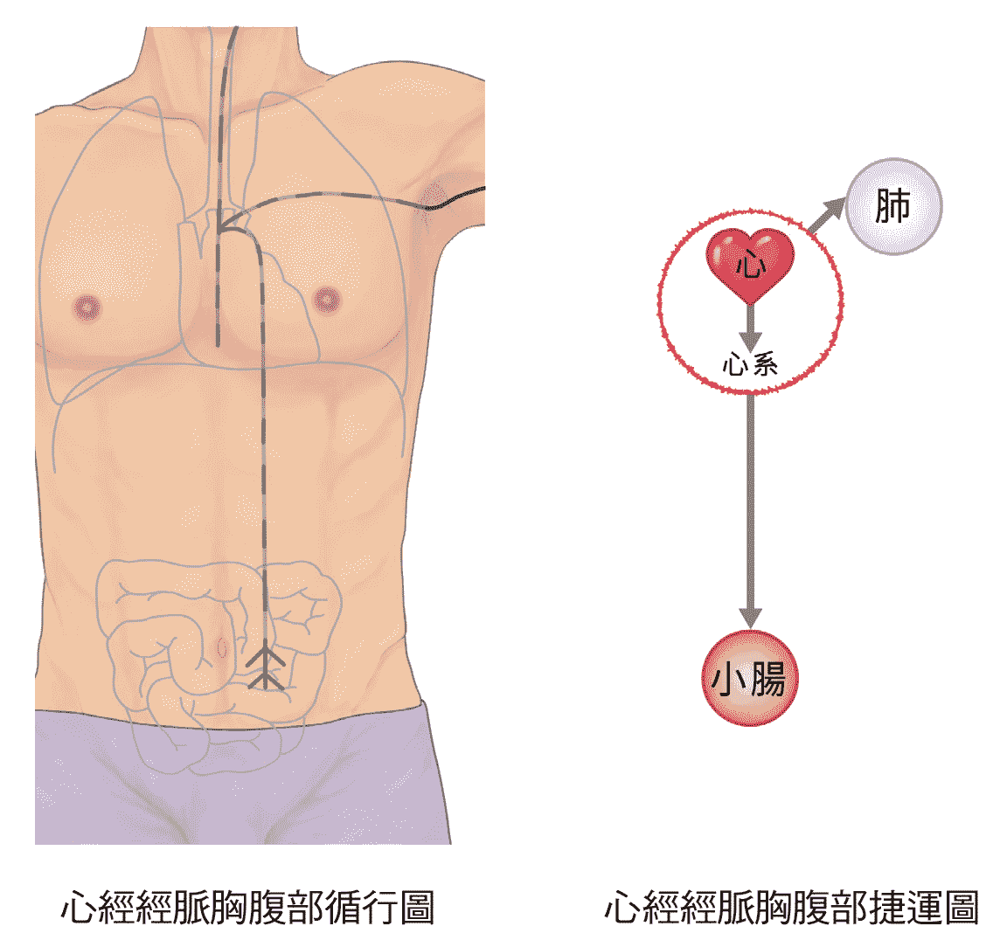

### 「好心肠连线」的故事：胸腹腔连线

好心肠连线是指循行路线 1-2 「心—心系—小肠」的连线。

● 身体故事

心经与小肠经为表里经，心与小肠在营养及代谢关系上非常密切。心主血，小肠的主要功能是「泌别清浊」，作为胃的下游，将属于「清」的营养物质再吸收回送至胃，而将属于「浊」的这些人体不需要的物质，向下输送到大肠及膀胱。小肠营养再吸收的功能，增加精微物质转化为血液的数量，心主血，让心脏有更多的血量可以推动至全身，提高身体的功能。

另一方面，心的五行属火，小肠处理体内水液代谢。水液有助于心火的平衡，当心火过旺时，会下移至小肠，让火气随着尿液排出，中医称为「心火下移小肠」。

● 心理故事

在一般生活用语，我们也常听到「心肠」两个字，例如：好心肠、菩萨心肠、铁石心肠、坏心肠⋯⋯等。

咦！心与肠不就是前面所说的，是身体内部营养吸收及代谢的器官，哪有什么好坏之分？甚至连菩萨都现身了？怎么回事呀？

查阅字典，「心肠」有好多种意思，如心情、心绪、感情、心念、胸怀、肚量、想法、心事等，所以才会以「好心肠」和「坏心肠」形容心地的善良与邪恶；以「菩萨心肠」和「铁石心肠」形容心软与心硬，都是说明一个人的心性。

而在古代的诗词中，也常见到「断肠」或者「断肠人」，如脍炙人口的元曲作家马致远的［天净沙］：「枯藤老树昏鸦，小桥流水人家，古道西风瘦马。夕阳西下，断肠人在天涯。」乍看感觉有些惊悚！但将前后文对照看，才发现「断肠」不是真的断肠，而是隐喻极度的悲伤。

可见日常生活中的「心肠」，不是中医脏腑及经络系统所认知的「心肠」啊！虽然如此，「心肠」这两个脏腑名词会被拿来形容心性及心情，一定有其缘由。

现代研究腹脑的学说认为人有「三脑」：头脑、心脑及腹脑。在《卷二》胃经篇章中，我们曾讨论过「腹脑」对于免疫以及情绪的影响。小肠也属于腹脑的一部分，中医认为心涵括脑的功能，所以，「三脑」几乎都与中医的心有关，也再次凸显心与小肠有着情绪关系的连结。

### 「悲喜连线」的故事：胸部心肺连线

悲喜连线是指循行路线 5，「复从心系，却上肺」的连线。

中医重视天人相应，将五脏与四季、情志相对应。心的五行属火，火属热，对应炎热的夏天，情志也是充满热情的「喜」；肺的五行属金，金属有冰凉感，一如秋天的凉爽，所以对应秋天，而秋天落叶满地，令人有萧瑟感，对应的情志就是「悲」。依据上述内容就将这条连线用很文青的方式命为「悲喜连线」。

● 身体故事

前面介绍过，心为君主之官，主管一身之血；肺为相傅之官，主管一身之气。心与肺同居在胸膈之上，两者关系很密切，依据现代解剖学，心脏与肺脏之间有大血管相互连接。 心肺的疾病也会互相影响：如肺心病、肺水肿等。而风湿性心脏病通常由上呼吸道感染的链球菌引起的免疫性疾病，随着血流沉积在心脏的瓣膜上，导致心脏瓣膜薄片发炎，继而结疤、变硬、变厚和变短。

心肺在功能上是密不可分，一如朝廷之中，君王需要宰相的辅佐一般，心所管理的血液，当然也需要肺所主管的气来推动才能周流全身，这是维持生命的关键功能，因此，一向养尊处优的心脏，才会很难得主动去联系肺脏，以共同完成推动气血的重责大任。

● 心理故事

「悲喜连线」除了身体气血功能之外，也有情绪上的展现。

往昔在「不识愁滋味」的青春岁月里，常被一些「为赋说愁」的诗词所感动，例如南宋词人吴文英的［唐多令］ ： 「何处合成愁？离人心上秋。纵芭蕉，不雨也飕飕。都道晚凉天气好，有明月、怕登楼。⋯⋯」当时就深深赞叹作者能将「愁」字分开写成「离人心上秋」。没想到数十年后，竟然还可以借用这阕词来阐释中医的心经！

心主喜，肺主悲，人生不就是悲喜交集的故事总和吗？而且，人类是有趣的动物，不仅悲伤时会哭泣，欣喜时也会流泪呢！君不见「喜极而泣」吗？可见流泪是表达情绪的方式之一，我们会在经别篇章中，讨论眼泪和情绪的关联。

俗语用「掏心掏肺」来表示极度的信任与真诚。心肺是关乎生命的重要器官，由于极度的信任，才愿意掏出来给对方看。当然，一般是不会真的将心肺掏出来，只是藉着心肺的概念来表达那种毫无保留的真诚。

综合胸腹部的「好心肠连线」及胸部「悲喜连线」可以一窥身体的智慧：「只要是关乎个体生存，身体都会主动去连结。」依据这个求生原则，心主动联系小肠，以确保有充足的造血材料；心主动联系肺，以确保可以将血液顺利输送到全身。

### 心经循行特色二：头面部的「心眼连线」

心眼连线指循行路线 3-4「从心系，上挟咽，系目系」的连线。

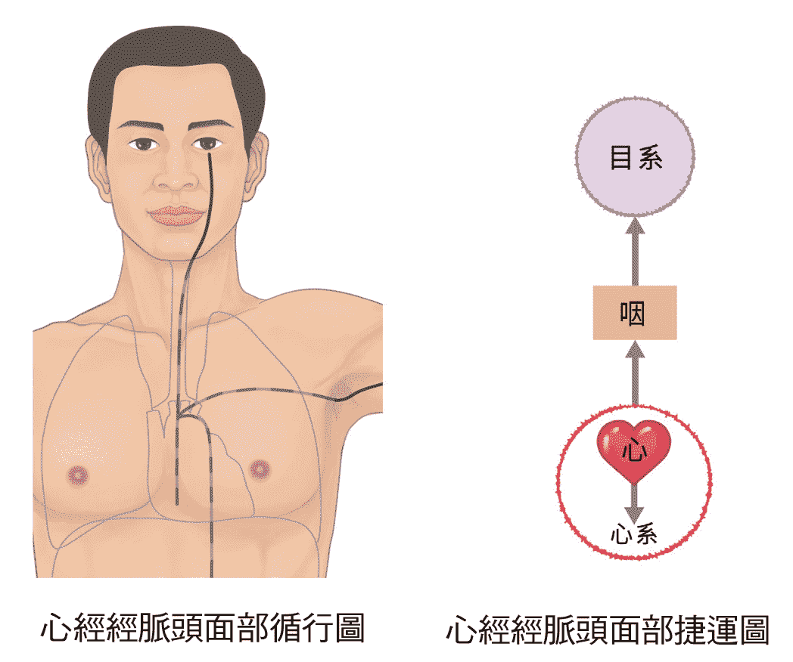

#### 「心眼连线」的故事：胸部与面部连线

「目系」是指眼球及眼球后面与脑部相连的组织，包括现在称为「眼底」的部分，如视网膜、眼底血管、视神经乳头、视神经纤维、视网膜上的黄斑部，以及视网膜后的脉络膜等，从眼睛收集来的视信息会在视网膜上形成视觉神经冲动，沿着视路将视信息传递到视中枢形成视觉。所以目系与视觉的产生有关。

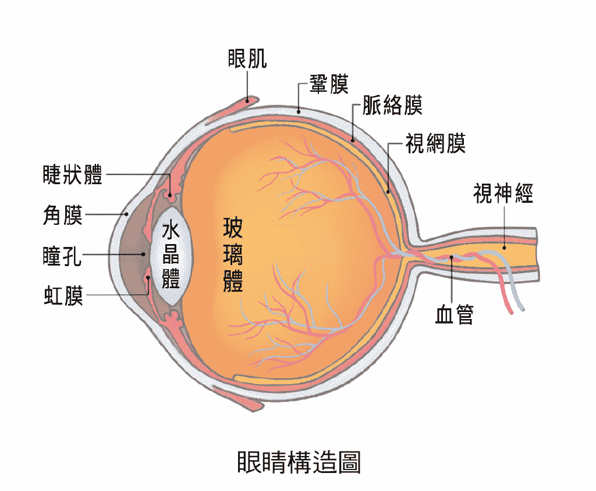

「心眼连线」是心系特别上行面部去连结目系，赋予眼睛不同于其他官窍的特殊功能。

##### 「心眼连线」解释了「眼睛为灵魂之窗」的真正原因

「看到某某事物」是我们日常生活中的说法，意思是用眼睛接触及接收外在世界的信息，例如看到招牌、橱窗、电影、爱人、街头表演等等，这些都是客观存在的事物，前文介绍过，当这些信息传入心里时所造成的感受却会因人而异。

生活中常见的例子，就是一群死党去看电影，散场后大家聊天讨论剧情，通常每个人印象深刻的情节不一样，甚至同一段情节的内容，说法也不一；对于同一场电影的评价也有落差，有人觉得音乐棒透了，有人觉得很难听，有人觉得男主角超帅，有人却觉得女主角很优雅，穿着非常有品味⋯⋯，还有一种处于状况外的同伴，频频插话问说：「有吗？在哪里？我怎么都没看到？」这就是我们常说的，有「看」没有「到」！咦！电影不是同一部吗？怎么感受却差这么多？

这就要回到「心眼连线」来解密了！

前面解释过，中医所说的目系类似现代医学的眼底部位，与视觉有关。中医说心主神志，还涵括现代脑部所掌管的意识、思想、记忆和情感等功能。

在心经的经脉、经别和络脉三大系统中，心脏都与目系或目内眦相连，可见「心—眼」关系特别密切，眼睛可以视为心脏对外代表的官窍！心跟目系的关系再细分成三个方面说明：

1.眼睛为心收集信息：眼睛将看到的事物内容传送给心，心根据过去的经验和好恶，分析这些信息，产生情绪，甚至行动。例如看到暗恋的对象独自走在下雨的街头，此时心为之大喜，马上发出行动令，赶紧走过去为对方撑伞，陪她走一段路，即使上班迟到也无妨。

眼睛就是心的情报局，收集资料传送给心，心再加以分析、记忆，产生情绪，俗语也如此说：「看在眼里，搁在心里」。

2.心的定见影响眼睛的活动：人对于许多事物都会有过去经验累积偏主观的「定见」，它会影响我们对于客观事物的感受与作为，例如喜欢红色，讨厌黑色的人，一旦看到红色就很开心，会贴近想细看，看到黑色就觉得不吉利，立刻转头拒看。所以我们常常被心所影响，戴着「有色的眼镜」看世界而不自知。

台东池上的「金城武树」就是个好例子。在金城武先生到池上拍广告之前，我们早就经过那棵茄苳树好几次啦！而且沿着那条田间道路还有许多棵长得很像的茄苳树，当时也只觉得「哇！好美的一条路啊！」然后，自从帅哥来拍广告之后，大家疯传一定要去那棵树下感受帅哥的魅力，眼睛还痴痴望着那棵树，期望斯人也在身旁。我在诊间还一头雾水问：「是哪棵树啊？不都长得一样吗？有特别好看吗？」茄苳树还是茄苳树，除了吸引许多追星族和游客围绕拍照，周边变得很吵杂之外，并没有改变，改变的是人们的想法。不是吗？

3.眼睛会透露心事：延续上面的话题。有人说，帅哥迷人之处，除了在茄苳树下的姿态很潇洒之外，眼神也超电人的，所以大家才会心生向往。

其实「电眼」也是「心眼连线」的杰作。由于目系与心连结，若对方恰是自己心仪的类型或偶像，在与对方眼神交会的剎那，感受马上传送到心，心弦轻易地就被拨动，心跳加速，神魂颠倒⋯⋯，这个透过眼神传递，挑起强烈的愉悦感受，感觉心彷彿被电到了的感觉，说穿了，就是「心眼连线」的作用。

一见钟情也是类似的概念。有研究指出，男性比女性更容易一见钟情，通常注视对方超过 8.2 秒，就很有可能对该名女子一见钟情，表示被对方的眼睛电到了而坠入情网。但若对对方没有兴趣，大约 4.5 秒便会转移视线，这就是有「看见」却没有「到心里」。

每个人心中时时刻刻都存有各种念头与情绪，透过「心眼连线」，这些念头也会透露在眼神里。例如因为对家人的爱，看到家族照片时眼神会特别温柔，无论人们如何以面部表情或身体动作来掩饰，眼睛永远是真情的泄密者，所以才会有「眼睛为灵魂之窗」一说。心念纯正的人，眼神清澈，敢直视对方，无所畏惧；当人们口是心非或是说谎时，眼神通常都会闪躲，不敢正视，唯恐泄露真实的心念。

##### 心经的「小心眼连线」，有两种主要功能：

● 身体层次：心主血主脉，小肠提供心脏制血的材料，肺气协助心脏推动血液至全身。

● 心理层次：心主神志，「心肠」一向用来形容心性，「心肺」的悲喜情绪，「心眼」眼睛为灵魂之窗，都与情志有关。「心眼」也会影响视力，将在病候中讨论。

心脏是最善于分工授权的君王，因为政务繁忙，只需重点管理，其余则授权给其他脏腑承担，它们定期向心脏做业务汇报。心脏本身的经脉只主动连结小肠与肺两个脏腑，共同维持内部生命机能为主，并连结目系，以掌握外在信息，维持社会化。至于「心之华在面」及「心开窍于舌」的部分，将由心经经别和络脉来完成。

###### 中医师不传之祕：心与眼睛之间的秘密

心与眼之间的关系，不仅依靠「心眼连线」而已，从《内经》相关内容可以看到，眼睛要真正成为灵魂之窗，还需要不少助力。

1.建立【心—五脏—目】关系：

● 心者五藏之专精也，目者其窍也。

2 .解释眼睛和脏腑的关系：

● 五藏六府之精气，皆上注于目，而为之精。

● 五藏六府之津液，尽上渗于目。

● 目者五藏六府之精也，营卫魂魄之所常营也，神气之所生也。

3.说明脏腑与眼睛透过经脉连结：

● 十二经脉，三百六十五络，其血气皆上于面而走空窍，其精阳气上走于目而为睛。

● 诸脉者皆属于目。

4.最后点出「目者心使也，心者神之舍也」，建立【心—五脏—神—目】关系。

从《内经》可以看出，心统领五脏六腑，在心的强力主导之下，各个脏腑的精气都透过自己的经络上注于目，聪明的心脏只要掌握眼睛就能掌控所有脏腑。难怪心脏特别偏爱眼睛，因为眼睛就是古代君王的御史，也是心脏的 FBI（联邦调查局）超级干员。

心与眼关系如此紧密也是人类进化所需。当人类从四足动物成为两足动物时，看到的世界变宽变高，也变得复杂了，视觉的重要性逐渐提升，变成收集外在信息的主要来源。心将眼睛收集来的信息加以分析，记忆以累积经验，并且加入感受。例如赏心悦目或动人的画面，都是经由眼睛传递讯息给心，让心有所感。心也会依据过去累积的经验或当下的情绪来看待事物，这些经验和情绪就像有色眼镜，影响我们看待世界的方式。例如当心情好的时候，雨天也可以高歌欢唱；心情差的时候，即使晴空万里，仍会躲在家里独自伤神哭泣。外界世界是客观的存在，内心感受决定了自己跟世界的关系。

其他心与眼的关联，如台语的「目色巧」是指过目不忘、记忆力和学习力佳的人；眼睛也会透露心思，无论是畏缩恐惧、温暖欢喜或怒火中烧，即使努力控制情绪，善于察言观色以了解对方心思的「明眼」人，仍能从眼睛一窥端倪。万一含情脉脉的眼睛，遇到那些总是有看没有见，毫无所觉，俗语称为「钝目」或「白目」的呆头鹅，就只能一叹了！

心经四大系统中，就有三个系统连结眼睛，做为心脏与外界联系的特使。心与眼的秘密关系，让眼睛成为五官之中唯一具有双向功能：input 收集讯息，output 透露心思。大家都知道，大眼睛的人通常比较热情外放，眼睛小的人感情较为内敛冷静。眼目会透露心思，当然成为「灵魂之窗」囉。

眼睛这个向外展开的窗户，不仅随着演化成为感官之首，其他感官只能默默运作，还牵引着心不断随着外在世界变化而动荡不已。唯有阖上眼睛，心才能自由，回归自己，也让其他感官得以发挥。这就是为何静坐或欣赏声音及味道时，通常会闭上眼睛以收敛心神，专注感受的道理。

### 心经循行特色三：上肢部的「用心勾小指」连线

上肢部是循行路线 6-8 ，从肺出到腋窝正中央，沿着手臂阴面后侧下行，特别点出在手太阴肺经和手厥阴心包经的后侧，经过肘关节，依旧走在手臂阴面后侧，抵达掌后锐骨之端，也就是腕关节内侧突起的骨头「豌豆骨」，进入手掌的后缘，即第四及第五掌骨之间，再循着小指内侧（靠无名指那侧），抵达小指末梢。

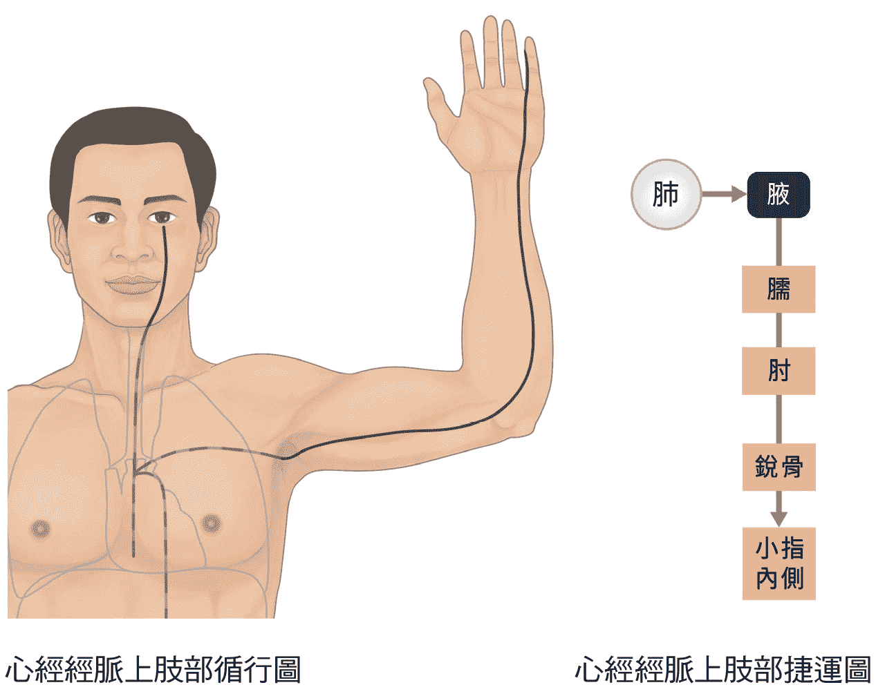

记得小时候常会跟同学勾勾小指头代表约定或承诺，英文称为 pinky swear 或 pinky promise。据说勾小指原是日本极道习俗，意指打破承诺的人必须切断小指。听起来有点吓人！幸好，中医理论可以抢救大家的手指头。由于心连结小指，小指可以视为心的延伸，勾小指当然能让彼此心意交流，只是外在世界变幻多端，人心当然也变化莫测，万事之首皆在心，而应对治的是善变的心而不是小指头，所以切断小指头于事无补。因为本经起于心，终于小指，所以我称上肢这条循行为「用心勾小指」连线。

###### 中医师不传之祕：手臂关节处及小指都可以反应心脏的机能

由于心经沿着手臂阴面后线到小指内侧末梢，途中所通过的腋窝（极泉穴）、上臂、肘关节、腕关节、手掌小鱼际及小指头，都成为心脏病的反应区，详情参阅《中医护好心》。

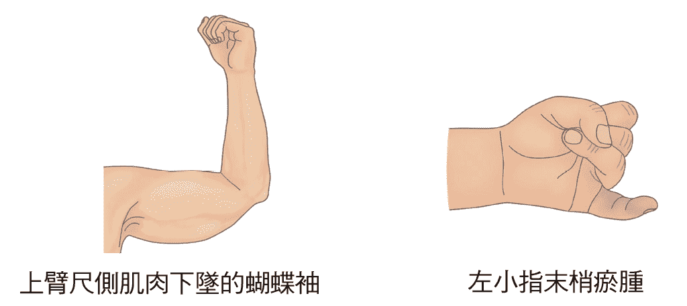

临床上遇到左肩痛与情绪有关的病例。一位中老年女性病患来看诊，近一个来月左肩痛，左手无法上举，怀疑自己得了五十肩。这位患者平日少劳动，检查肩关节也没有严重的异常，但脉象及神色却都透露一股忧郁之情。经询问，原来前阵子因为家务事跟媳妇闹得很不愉快，婆婆觉得自己已经做得很多，却总得不到媳妇的接纳，非常委屈。情绪与肩痛问题发生时间很接近，我们怀疑是因为受心情影响，气血阻滞，导致心经所过部位疼痛。决定从心经着手治疗，手臂马上可以自然举起，连病人都非常惊讶。这是典型身心互相影响的情况。

心经止于手小指内侧，小肠经起于小指外侧，小指头又是最容易观察的部位，可以作为心脏功能的主要观测区。心脏的疾病以气血淤滞居多，当小指头变粗，关节变肿，手指末梢颜色特别暗沉，严重者会出现手指麻或胀痛等感觉，都是心脏气血淤滞的征兆，要赶紧治疗。

### 手少阴心经─病候

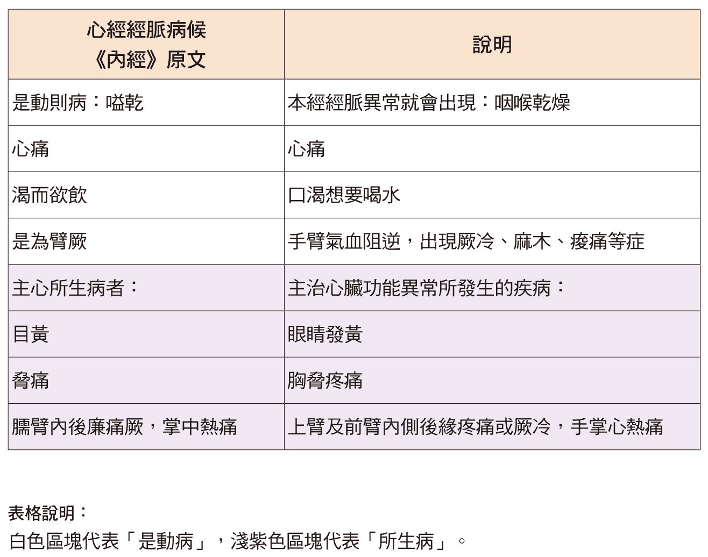

心经经脉病候可分为三部分：

● 循行所过的肢体部位：如臑臂内后廉痛厥、臂厥、掌中热痛等肢体症状。

● 与心脏有关：因为「主心所生病」，而有心痛、胁痛症状。

● 与心属火特质有关：心的五行属火，火热旺盛及心火过旺累及小肠，煎灼津液，都会出现嗌干、渴而欲饮等口舌干渴的症状。

比较有特色的是「目黄」。在大肠经中介绍过目黄主要有两种，一是「他觉性目黄」，一是「自觉性目黄」。

心经的目黄多属于「自觉性目黄」，主要与心火过旺，阴血不足有关。

《内经》说明眼睛与血液的关系：「诸脉者皆属于目⋯⋯诸血者皆属于心⋯⋯肝受血而能视。」若长期熬夜，多吃燥热食物，少喝水及吃蔬果，都会让心火偏旺。还有哭泣过度、体内大量失血，如经血过量，或营养不良贫血等，阴血也会明显不足。心火旺，血不足，眼睛长期缺乏阴血的滋养，就会出现眼睛疲劳、干涩、畏光、流泪，视力逐渐下降，看东西昏黄不明的「自觉性目黄」。请参阅《卷二》大肠经。

###### 中医师不传之祕：心经在胸腹部具有横开与纵开的力量

心经经脉系统以「心系」为中心，呈十字形分布：左右横向是胸部的肺脏与腋，上下纵向是咽与腹部的小肠。

临床若遇到胸阳不振、痰浊上壅的胸痹，出现喘息咳唾、胸背痛、短气之证，胸部为心肺之宫城，此病病位在心与肺，可用瓜蒌薤白白酒汤温阳化痰通痹，透过心经以横开气机。若遇到心火下移小肠，见到面赤咽干、口舌生疮、小便赤濇而痛等证，此病病位在心与小肠，可用导赤散清热利尿，透过心经以纵开气机。

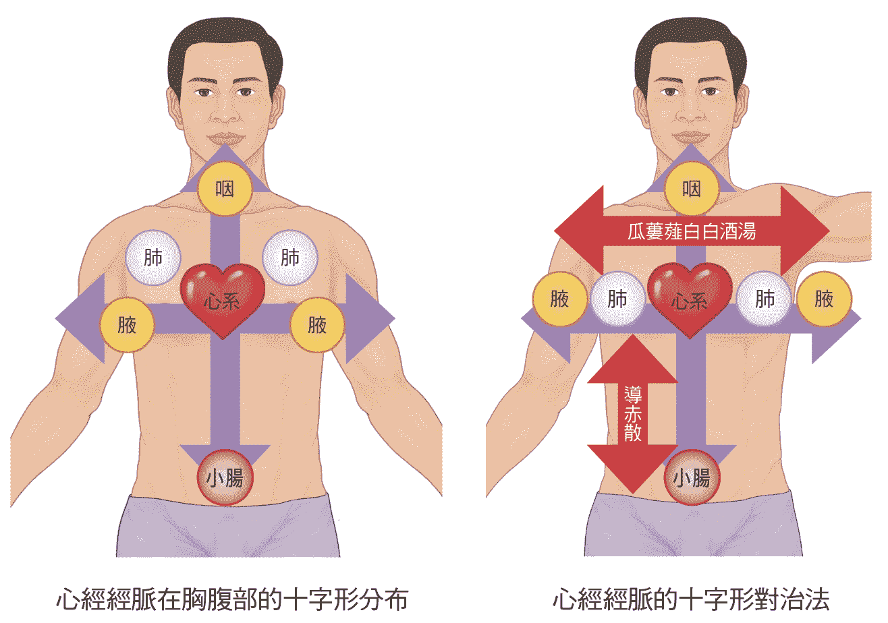

###### 中医师不传之祕：针灸开手针及原络配穴特色

《卷一》曾介绍过「合谷太冲开四关」，可以大通气血，常常作为针灸治疗时的第一组穴位。这个担任开路先锋的穴位，我们称为「开手针」。

开手针宛如书写文章的「破题」，也如外出旅行时的方向定位，所以开手针是医师对于本次病证的主要诊断，也呈现医师该次治疗的主要切入点。如果诊治方向正确，通常下完开手针之后，病人的身体状况，如面色、脉象等会有立即性的改变。因此，一旦选定了开手针，也决定了本次治疗的成效。开手针方向越正确，整体疗效越高，反之，若开手针方向不正确，例如该开提气血，却误用健脾燥湿法，后续的治疗就必须力挽狂澜，努力回到正确的道路，整体的疗效仍会降低。

在我们临床的经验里，面对一般病证，合谷＋太冲通常就能打通气血和经脉，为后续的针法提供足够的动力与顺畅的通路。如果病情有明显气血失调状况，无论虚证或实证，都可以使用「开提心肺气血」的方法，选用心经与肺经的原络配穴：心经心神正（神门穴＋支正穴），肺经肺太偏（太渊穴＋偏历穴）。肺为五脏之长，心为五脏之专精，两组穴位合用，可以调理五脏六腑，通行气血。此法也可以跟合谷太冲并用，以加强疗效。

「原络配穴」是我们经常使用也很喜欢用，能以少针数取得大疗效，犹如四两拨千斤，非常取巧的配穴法。只要确定所病的脏腑或经络，就直接选用所属经脉的原穴，再加上与其相表里经脉的络穴。例如持续天雨，气候潮湿，病人会出现身体沉重，筋骨痠痛，胸闷背紧，以及湿压脉道而脉沉细软的现象，此时可选用心经原络配穴「心神正」，以强心祛湿，这跟前面所述开提心脏气血方法一致，正是中医「异病同治」之理。

曾经遇过一个特殊案例：一位五十多岁女性病患，近日右手臂外侧尺骨附近皮肤突然变成灰白色，舌头痛，口干，饮水不能解渴等状况。由于手臂尺侧是心经及小肠经通过的部位，加上舌痛口干，都是心火旺的现象，直接选用心经与小肠经的原络配穴「心神正」。针后，舌头痛马上减轻，竟然连手臂皮肤的颜色也变深了。

最后不免提醒，万一病情非常复杂，请记得「越复杂的病证，越要从简单的方向着手」的原则，详情会在膀胱经中说明。

###### 中医师不传之祕：桂枝甘草汤与心经之间的特殊关联

《伤寒论》的桂枝汤被尊称为「群方之首」及「天下第一方」，不仅因为是书中第一个出现的治方，《伤寒论》诸多方剂都由桂枝汤变化而来，而且也是《伤寒论》论述篇幅最多的药方。

桂枝汤涵括「辛甘发散为阳」特质的桂枝甘草汤和「酸甘收敛化阴」特质的芍药甘草汤，加上姜枣而成，以调和营卫阴阳。

历代研究《伤寒论》者众多，宋代许叔微在《伤寒九十论》说「仲景论表证，一则桂枝，二则麻黄，三则青龙。」明代方有执在《伤寒论条辨》指出太阳病理论有「风伤卫」、「寒伤营」、「风寒二伤营卫」三纲，清代喻嘉言《尚论篇》将此思想发展成「三纲鼎立」说。此学说后代仍有争议，我们则借用其概念来说明风伤卫的桂枝汤，寒伤营的麻黄汤，以及风寒二伤营卫的小青龙汤，三方都含有桂枝与甘草两味药，可见桂枝与甘草是仲景治疗太阳病必备的基本方。

桂枝甘草汤在《伤寒论》也有其独立的治证：

● 未持脉时，病人叉手自冒心，师因试令咳而不咳者，此必两耳聋无闻也。所以然者，以重发汗虚故如此。

● 发汗过多，其人叉手自冒心，心下悸，欲得按者，桂枝甘草汤主之。

两个条文合参可知，该病人因为发汗过多，损耗心阳，主血主脉功能失常，而出现心动悸的现象。

##### 为何发汗过多会损伤心阳？

首先，依据中医「喜按者为虚证，拒按者为实证」理论，本证病人在心悸时，不自主出现叉手自冒心的动作，表示此证是虚证。由于汗为心之液，汗水属阴液，需要心阳的推动才能排出体外，因此当发汗过多时，不仅阴液流失，心阳也跟着耗损。但本证是属于心阳虚或心阴虚？我们从桂枝甘草汤来推论吧！

桂枝:《神农本草经》记载「味辛，温。主治上气咳逆，结气，喉痺，吐吸，利关节，补中益气。」现代中医学记载【性味归经】为味辛甘，性温，归心、肺、膀胱经。【功效】能发汗解肌，温通经脉，助阳化气。

甘草:《神农本草经》记载「味甘，平。主治五脏六腑寒热邪气，坚筋骨，长肌肉，倍力，金疮肿，解毒。」现代中医学记载【性味归经】为味甘，性平，归心、肺、脾、胃经。【功效】能益气补中，清热解毒，祛痰止咳，缓急止痛，调和药性。

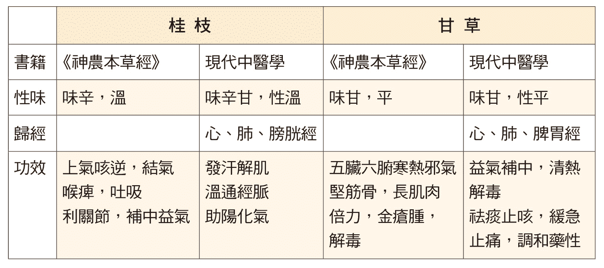

从性味来看：桂枝与甘草是辛甘温的「辛甘发散为阳」组合，以补阳气为主。

从归经来看：桂枝与甘草同归心肺经，心与肺同居膈上，心经还特地从心系向上连结肺，肺主气，心主血，共同管理全身气血的运行与分布。此外，肺主一身之表，提供身体对外的防护，身为君主之官的心脏则透过全身组织，时时刻刻收集身体内在与外在信息以应变。因此，桂枝甘草同归心肺经，具有人体防卫及应变的重要功能。

从通经理论来看：桂枝甘草汤入手足太阴经和足太阳经，也符合脏腑通治法中「太阴太阳为开」，善于展开体表气机的特质。

##### 桂枝再入膀胱经之意

肺经与膀胱经不仅皆主一身之表，还与每天醒来张眼之际启动卫气有关（参阅《卷一》）。《伤寒论》太阳病提纲证「太阳之为病，脉浮，头项强痛而恶寒」也属于膀胱经。

《难经》说「心者血，肺者气，血为荣，气为卫，相随上下，谓之荣卫，通行经络，营周于外。」肺主气，气来自于卫气，卫气行于脉外；心主血，血来自于营气，营血行于脉内。卫气营血通行在经络中，在人体内外上下相随并行，以发挥保卫及濡养的功能。营卫并行，心肺两脏则共同负责维持营卫功能的和谐。

若营卫失和，如《伤寒论》三个相关条文：

● 太阳病，发热汗出者，此为荣弱卫强，故使汗出。欲救邪风者，宜桂枝汤。

● 病人藏无他病，时发热自汗出而不愈者，此卫气不和也。先其时发汗则愈，宜桂枝汤。

● 病常自汗出者，此为荣气和。荣气和者，外不谐，以卫气不共荣气谐和故尔。以荣行脉中，卫行脉外，复发其汗，荣卫和则愈，宜桂枝汤。

「卫气不共荣气谐和」会出现时发热、时自汗出的证候，都宜桂枝汤治疗。桂枝归心、肺、膀胱三经，因此桂枝汤中，治疗太阳病与调和营卫的关键性药物非桂枝莫属，这也点出仲景先生将本方称为桂枝汤，且作为《伤寒论》首方的深意。

##### 甘草再入脾胃经之意

十二经络之末的肝经最后传入于肺，身为十二经络之首的肺经在承接肝经所注入的气血之后，却不是直接起于肺，而是起于中焦。《卷一》中曾解释原因之一就是肺经为了补足前一个十二经脉循环中所损耗的气血，特地从中焦脾胃汲取新的营养加到经脉之中。甘草入肺经，加上浓厚的甘味入脾胃经，都能协助肺经从脾胃快速获得养份，启动人体新鲜健康的气血循环。另外，脾胃两经都与心脏建立御膳房之路，以确保营养物质能直接输送至心。

甘草善于调和诸药，故有「国老」之称，人缘极佳的甘草也善于调和十二经脉气血，协助桂枝掌控全身经脉气血，调和营卫，是桂枝的好伙伴，其功不可没。

在《卷一》介绍过十二经脉依据功能特质分为三组团队，桂枝甘草所归入的五个经脉系统中，肺经与脾胃经属于第一组「备餐团队」，心经与膀胱经属于第二组「聚餐团队」。备餐团队为聚餐团队储备气血，让聚餐团队可以维持良好的生活质量并维持生命，因此桂枝甘草汤才能成为天下第一方桂枝汤的基本方，并贯穿整个《伤寒论》注重养阳的精神。桂枝与甘草归经正是以心脏为核心的经络网络。请参考下面的进贡图。

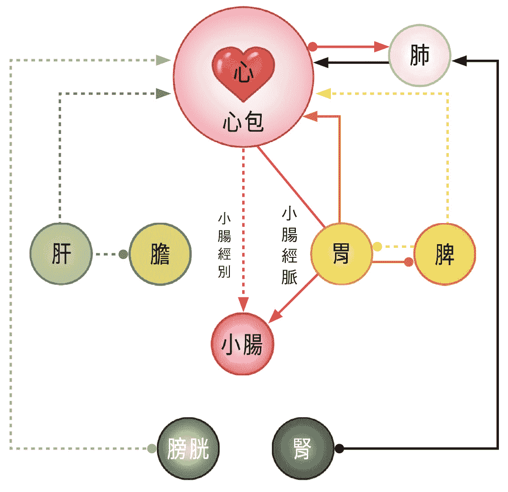

从功效来看，桂枝与甘草都能补中益气，脾胃为后天之本，气血生化之源，提供心脏主血脉所需的气血，桂枝还能温通经脉，助阳化气，协助心脏推动血脉，甘草能缓急止痛，也能和缓心悸心慌的焦虑。

桂枝甘草汤是桂枝四两、炙甘草二两，二：一的比例组成，以桂枝辛温通脉，助阳化气为主，提供心脏所需的养份与动能来温通心阳，心阳得复则心悸改善。心寄窍于耳，心阳充足，耳窍得到濡养，就能恢复听觉。这是本证属于心阳虚的证明之一。

其次，发汗过多而出现心阳虚为主的证候，表示此人平时心阳就不足，因此汗出过多时，心阳的损伤比阴液明显。

举例来说，阴阳平衡的正常人，体内阴液与阳气的比例应该是均等，即一比一。但是《伤寒论》中这位病人平时体内阴液为 90 份存量，阳气为 70 份存量，相较之下，阳较虚，阴较盛，阴盛阳虚，身体容易畏寒，四肢偏冷。人体汗出时，阳气为阴液的载体，透过心阳的推动，汗液才能排出。本次汗出各损伤 20 份的心阳与津液，则心阳剩下 50 份，阴液剩下 70 份，虽然两者差异仍旧是 20 份，但心阳耗损率是 20 / 70 = 29% ，阴液耗损率为 20 / 90 = 22% ， 而且心阳仅存五成，难以推动血脉，心脏为了避免体内器官组织缺血缺氧，维持人体正常生理功能，只好增加心跳以提供身体足够的血量，从而出现心动悸。心跳过快会产生恐慌感，所以病人会以双手交叉在胸前按着心脏，期能减缓心悸心慌的情形，严重者还兼有心气无法濡养耳窍的耳聋现象。

以上就是平素心阳虚的人，发汗过多会严重损及心阳之理，可使用温补心阳的桂枝甘草汤从根本治疗。

本方虽然只有两味药，却是《伤寒论》中治疗心悸的要药，后世补心阳之方皆从此方化裁而出，因此被历代医家公认为「补心阳之祖方」。本方也是太阳病三纲鼎立的基本方，《伤寒论》所述之疾病就始于素体心阳不足之人为外在风寒邪气侵袭所致，也符合中医「邪之所凑，其气必虚」的理论，或者也可以倒过来说「其气虚处，邪必凑之」。这种现象日常生活也很常见，例如平时呼吸道比较脆弱容易咳嗽的人，每次受了风寒，发病几乎都从咳嗽开始，出现桂枝汤加厚朴杏子汤证；平素脾胃虚寒容易腹泻的人，一感冒就易腹泻，出现四逆汤或理中汤证。

桂枝甘草汤与心脏功能非常密切，桂枝与甘草正好都是烹饪时的调味料，平日可加入菜肴或作为茶饮来护心阳。

桂枝也可视为心经的代表药，配合其他药物可以治疗心经所属的疾病。下图选用《伤寒论》及《金匮要略》与桂枝相关的经方及加减方，红色色块为主证，以呈现桂枝与心经的关系。由于篇幅的关系，无法详述，请自行参阅相关书籍。

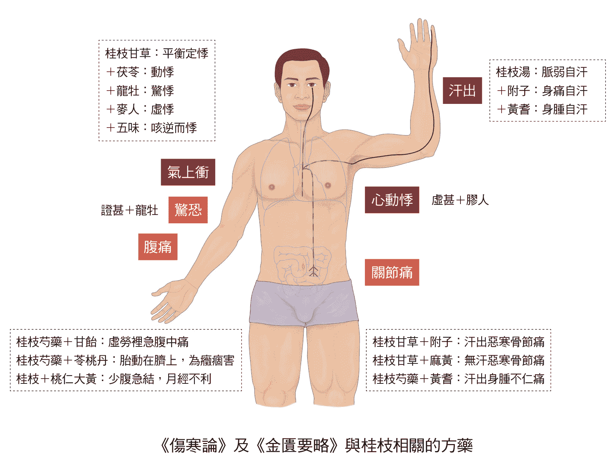

另外，再从进贡图来看，桂枝汤以桂枝甘草为底方，加入姜枣以强化心与脾胃的关系，加入肝经的芍药建立肝与心的关系，心与肾之间则可改用肉桂来连结。由此可知，桂枝汤不仅是天下第一方，也是心经系统的代表方，这也呈现出心为君主之官在人体的崇高地位。

* * *

###### 桂枝甘草汤与「心部于表」的思考

桂枝甘草汤既是补心阳祖方，也是张仲景治疗太阳病必备的基本方，桂枝甘草汤连结了补心阳与治表证这两件事情。然而心为君主之官，长住体内，如何能治疗表证呢？

《内经》说「藏有要害，不可不察。肝生于左，肺藏于右，心部于表，肾治于里，脾为之使，胃为之市。」其中的【心部于表】正是本题的答案，心脏部署于人体之表，当然能治疗外感表证。

然而位居深宫的心又如何部于表？我们还是从心脏的特质讨论吧！

心属火，主温度变化，也主诸痛，还主管人体重要的物质与组织，包括血、脉、汗、头面五官等，对照《伤寒论》太阳病提纲证「脉浮，头项强痛而恶寒」，加上桂枝汤主治的太阳中风证候「发热汗出，恶风脉缓」，其中脉象、寒热温度、出汗等变化，符合心脏所主管的特质。除此之外，心主神志，主面部五官，都还与人际活动有关，因此「心部于表」与身体和心理皆有关联。简要说明如下：

第一、心主面与舌窍，建立与外界的人际关系

面部是人体外表最容易被看见的部位，位在面部的五官也时时收集外界信息给心做决策，同时也透过表情来表达内在感受。心开窍于舌，主言语，是人类对外沟通和表达意见的重要工具。心主面与舌窍，攸关人类社会化和文明的发展。

第二、心主管营血在身体内外的周流与活动

心主血主脉，卫气推动着营血在经脉中流动，向内分布于脏腑，向外运行至肢体，提供全身各个组织器官充足的养份，以维持正常生理机能。由于营卫并行，营血所在之处，卫气也会幸福相随，反之亦然。这就犹如嫁出女儿的同时也得了个半子（女婿），家族成员不减反增，皆大欢喜。因此心所主管的营血与伴行的卫气，共同在体表防御人体，功能更为强大。

第三、心主汗，汗液既能调节体温，也是体表邪气的出路

汗为心之液，血汗同源，不同的是，血液在脉管中流动，汗液在体表组织间流动，汗液可视为血液在体表的存在形式，因此中医很重视汗液。体表适当的排汗可以调节体温，但若是在汗出之时，毛孔大开却未加以防护，直接受风就会感冒。由于每个人体质上的差异，当人体被风寒侵袭时，可能会出现有汗出的桂枝汤证，或是无法汗出的麻黄汤证，「汗」就成为鉴别病情的关键之一。

既然体表是外邪入侵人体的管道，治疗时也可透过发汗，顺势将邪气从体表排出来治疗外感表证，中医称为「发汗解表法」，民间也常用喝姜汤发汗来预防或治疗感冒，可见英雄所见略同。

再举桂枝汤为例。虽然桂枝汤在《伤寒论》治证甚多，但桂枝汤的首治证为太阳中风证，是属于心阳偏虚的人罹患外感疾病的证候，我个人也常用桂枝汤来治疗自己的风寒外感之症，常常中药才抵达喉咙，鼻水就停了，鼻塞也通了，手足立刻变暖。不仅桂枝汤治感冒很有效，麻黄汤及小青龙汤也能治感冒，此三方皆有桂枝甘草，且都透过出汗来改善症状。

第四、心主诸痛

病机十九条中「诸痛痒疮皆属于心」，疼痛有可能来自气血不通，也可能来自外部刺激，经由神经把讯号传递到脑部产生痛觉。总论介绍过，中医的心脏涵括脑部的功能，当然也包括痛觉在内。

心可以感觉疼痛，也能分泌脑内啡来阻绝痛感，这对于多数人来说可能是个好消息，因为痛觉几乎每个人都曾经历过，却很少人喜欢它。其实疼痛不完全是坏事，因为「痛觉」是人类自古以来最重要的自我保护机制，例如不小心被尖锐物刺伤或身体被火烧灼的疼痛感，都会让人刻骨铭心，记取教训，之后遇到类似情况时会立即闪避，以免再度受到伤害或丧命。

早年跟在老师旁边看诊时，曾看到一位中年女性病人的手掌及手指严重扭曲变形，并有烫伤的痕迹。原来她患有癫痫，有几次在煮饭时刚好发病，手掌恰巧就搁在炉火上，当下并没有痛觉，未能实时将手移开，才造成如此悲惨的状况。自此我对于痛觉有一种尊敬感，体会它有着「善意提醒，避免灾难」的功能。尤其当了医师之后，病人的疼痛会透露出身体内在的状况，对于临床的诊治非常重要。

人体的表层布满了密密麻麻的血管、神经与经络系统，它们都归心管辖，心又主神志，当接受到外在世界对于身体的直接与间接刺激时，会产生各种感觉和记忆，痛觉是所有感觉中最深刻也是最需要被关切的，它会督促心脏做出重要决策，例如要坦然面对刺激或立即转身逃命等，这也是心主诸痛的另一层意涵。

心为君主之官，对内统合脏腑功能；心部于表，主管面部五官以及营血、汗液与痛觉，成为人类对外社会化与防御的机制。透过桂枝甘草汤这个补心阳祖方和太阳病必备基本方，让我们见识到位高权重的心脏对于身体全面性的防护与掌控能力。不禁再度慨叹：人体真是太奥妙了！

* * *

###### 中医师不传之祕：心经与妇科密切相关

心经与桂枝的关系，也呈现在妇科方面。

除了前文介绍「二阳之病，发心脾，有不得隐曲，女子不月。」心与脾与妇科的关系外，《内经》还提到：「月事不来者，胞脉闭也。胞脉者，属心而络于胞中。」这里提出很重要的观念「胞脉」，对于女子来说，血是最重要的物质，无论月经或妊娠都需要充足的血液。「胞脉」顾名思义是联络胞宫（即子宫）的专属经脉，以供应胞宫血液与养份。心主血主脉，胞脉属于心，再向下络于胞宫，表示心脏很重视传宗接代以保留优质的血脉血统，特地开展一条「胞脉之路」。心经「好心肠连线」表面上是「下膈，络小肠」，子宫就位于小肠下方的骨盆腔内，位置非常亲近，所以「小肠」不仅是小肠，还包括胞宫在内，心经与小肠经因此与妇科建立密切关系。

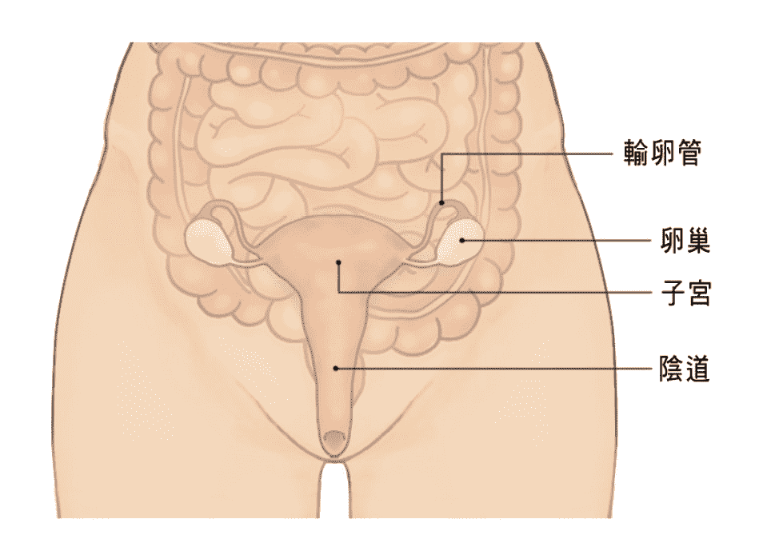

隋代巢元方等人所编著的《诸病源候论》是中国现存第一本病因学、病理学与证候学专书，书中指出：

「手太阳小肠之经也，为腑主表；手少阴心之经也，为脏主里。此二经共合，其经血上为乳汁，下为月水。」

还举例说「妇人月水不利者，由劳伤血气，致令体虚而受风冷，风冷客于胞内，损伤冲、任之脉，手太阳、少阴之经故也。冲脉、任脉之海，皆起于胞内。」

月水即经血之意。由于冲脉任脉皆起于胞内，与胞脉相关，因此胞宫之内的经血，由心经、小肠经及冲任二脉共同统领。

该书共有 10 条条文应用此概念来说明月水不调、带下及漏下等病候，病因大致都是劳伤气血、体虚受风冷等，致使风冷之气客于胞宫之内，损伤冲脉、任脉二脉，也影响手太阳小肠经及手少阴心经。手太阳少阴二经专责调节胞脉的经血，向上输送至心脏所在的胸部则变化为乳汁，向下输送至小肠所在的下腹则变化为月水。如果胞脉运行失常，如经血当下而不下就会导致月经失调。

关于胞脉失常的原因，《内经》另指出「今气上迫肺，心气不得下通，故月事不来也。」心与肺同居胸部，肺气协助心脏推动血液，如果气上迫肺，使得肺气停滞于上部，心气也跟着无法下通，胞脉闭阻，月经就无法如期了。

一位中年妇女左侧乳房有囊肿，局部经常疼痛，左侧手臂心经循行路线也有疼痛感，月经已经数月未来。我们就在心经路线上的肿起或颜色暗沉处加上艾灸，没想到第二天月经就来了，血量超级多，但病人觉得身体很轻松舒服，左侧乳房痛感明显减轻，左臂心经路线已无疼痛。这是因为气血瘀滞在胸部的乳房，虽然未形成乳汁，却干扰经血下行到胞宫，导致月水不调，月经停止。

另外，由于胞脉连结心脏与胞宫，产妇在坐月子期间若以手碰触冷水，寒气很容易透过手部的心经系统上行到心，再沿着胞脉进入胞宫。脾经与胞宫关系密切，一旦寒气传入胞宫，也会影响脾经，脾胃主四肢，寒气流入四肢关节，痹阻经脉，等到年纪大了之后，气血循环能力变差，就会出现四肢关节疼痛，甚至变形的情况。

有关妊娠的诊断，《内经》说「女子手少阴脉动甚者妊子。」这就是中医师可以透过把脉测知怀孕的秘密。怀孕期间需要大量的血液来照顾胎儿，准妈妈体内血液就会集中到骨盆腔，中医称为「聚血以养胎」，这些血液主要透过胞脉输送，当然也会反映在心经经脉上而出现异常蓬勃的脉动，特别饱满滑利的现象。

《诸病源候论》也说明产后无乳的原因：「妊娠之人，月水不通，初以养胎，既产则水血俱下，津液暴竭，经血不足者，故无乳汁也。」胞脉之血在怀孕时用来养胎，生产时如果大量出血，本来就经血不足加上来不及补充时，就会出现产后无乳汁的情况。

许多妈妈也发现，产后如果持续哺乳，通常月经就不会来或月经有来但量少，月经来了之后，乳汁相对减少，这是因为乳汁跟月水都来自同一个源头「胞脉」的关系。

在《金匮要略》妇人病篇章中，无论是治疗妇人宿有症病的桂枝茯苓丸，或妇人年五十所，曾经半产，瘀血在少腹不去的温经汤，都用得到桂枝。参酌《内经》有关「胞脉属心而络于胞中」的病位思考，以及《诸病源候论》「风冷之气客于胞宫之内」的病性思考，桂枝也可视为温通胞脉的代表药。

## 二、手少阴之正（经别）

本经别路线比较精简，连结重要部位，主要分布在胸部和面部（脸）。路线不长，但意义重大。

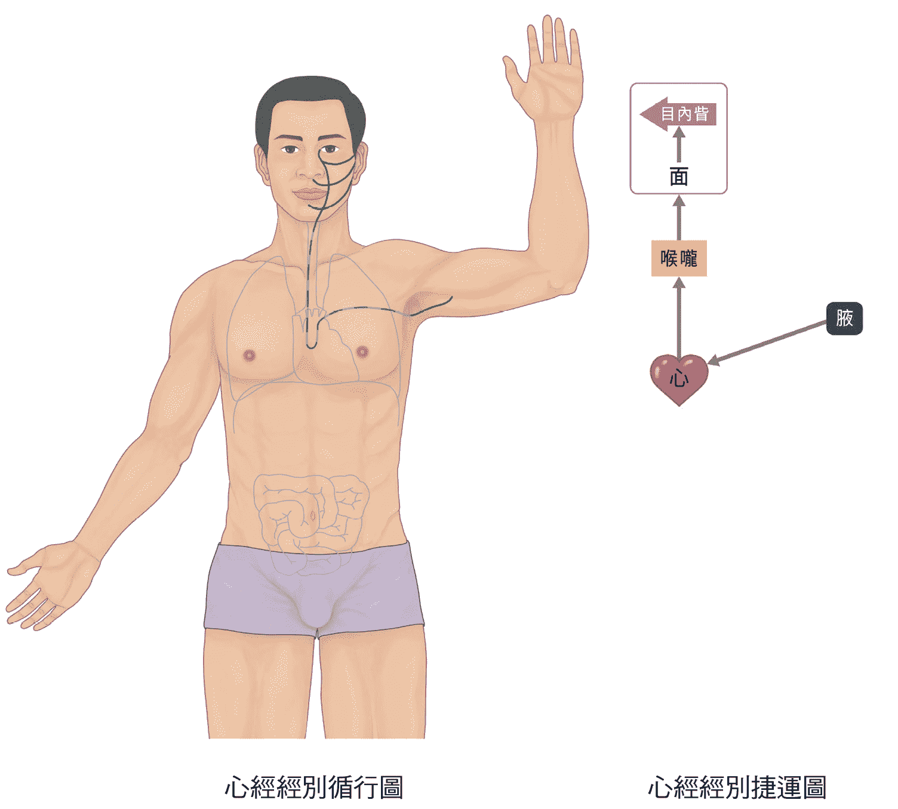

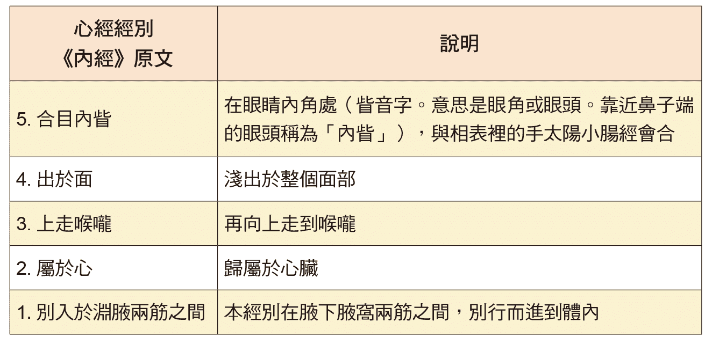

一般经别会在体腔内加强与相表里脏腑之间的连结关系，唯独心经经别以强化心脏本身的功能为主，最后合入眼内角，与相表里的小肠经相交。心经经别是十二经别中，唯一不合入阳经的阴经经别，此乃王者之风，走自己的路，专责于心与目系的关系。

### 心脏有问题，脸上也能看出病症

「眼睛为灵魂之窗」，透过眼睛我们总会透露出自己的心思；另一方面，眼睛又是心的情报局，负责收集资料回报给心来做决定，所以心经经别继续强化「心眼」关系，还加入「面（脸）」。依据本经别连结心脏—面—目内眦的特色，简称为「经别心面目连线」，可以视为心经经脉的补充版。

心经经脉原来是从心系 「上挟咽，系目系」，本经别则从心脏「上走喉咙，出于面，合于目内眦」，扩大循行范围，涵括整个面部，这就是心经总论中介绍「心之华在面」的结构基础。

「经别心面目连线」一方面补充了心经经脉的不足，另方面呈现「心之华在面」的经络基础，让心脏这位君主之官得以透过面部的五官收集更多外界信息来做决策。同时，心脏本身的功能也会展现于面部，以及对于外界刺激、自己内心的感受等，都会循着心经经别反映在面部。

大家都说心脏病是沉默的杀手，因为心脏除了面对自己的问题之外，还要承担所有进贡团的问题，并且会一直忍忍忍⋯⋯，忍到不能忍的时候，一切都已来不及了！

其实，可怜的心脏也一直在呼救，只是心事谁人知？幸好还有中医师能解读心脏透露出的求救讯号，在《中医护好心》书中，我特别制作了一张心脏病常见的先兆图，提醒大家可以从面部、躯干以及四肢状况，事先发现心脏的病苗，适时给予辛苦的心脏关怀和照护。

心主面，心脏问题会明显呈现在面部，让人一望即知。传统中医的诊断法为望闻问切四诊，其中望诊为首要，古人说「望而知之谓之神」，面部更是望诊的重点区域，心脏与全身的问题就都可以从面部来掌握。另一方面，面部疾患也可取心经治疗，如面色赤红发热、面部肌肉肿硬、面部痒疹等。

### 脸部的表情就是会泄漏心事

心经经别在胸部与心经经脉一样，都走在人体较为深层处，但经过喉咙到了面部时，就会走到浅层，以便遍布于这个肌肉少、坑洞多的特殊结构。心经经别延续心脏的特质，除了管理面部的神经与血管之外，还遍布面部的软组织，如肌肉、韧带、软骨、肌腱等部分。

其中心经经别掌管的面部肌肉部分，特别围绕在眼、耳、鼻、口、唇周围的表情肌。心既然为感受之主，情绪也会反应在面部组织而出现特有的表情，例如开心时则眉开眼笑；讨厌的感觉则撇嘴皱眉；感到生气立即瞠目结舌；紧张时会控制不了的嘴角微颤等。这些脸上表情经常第一时间就泄漏了心事，挡都挡不住。

此外面部的肌肉也会因应外在环境变化，产生保护动作来回应，例如面对疾风骤雨时，我们通常会瞇着眼睛、紧闭口唇，采取防卫动作来避免意外伤害的发生。

心之华在面，中医观人面色尤其能看出心病，例如在中医五色对应五脏的观念里，红色正是对应心，这当然跟心主血有关， 健康的人神采奕奕，语音清晰，面色理当红润，如果出现长期的精神萎靡，说话声音出不来，面色异常（详述于总论），就要小心有心脏问题了。总论中介绍的那位八十多岁婆婆突然声音沙哑难出，语音微弱，心脏无力的案例便与心经经别有关。

###### 中医师不传之祕：脸部的颜色及肌肉可以判断心脏状况

《内经》说「心其华在面」，心经经别也连结了心与面部，所以可以从脸部来观察心脏功能。（《中医护好心》第五章特别强调心脏疾患有迹可循，提醒读者一定要学会自我检查。 ）

##### 1.观察面色

总论中介绍面部「常色」分为两类：东方人正常的脸色是黄红隐隐，有光泽滋润感，是为「主色」；当我们随着季节，面部颜色会稍微变化，例如夏天天气炎热，脸色稍微偏红，冬天天气寒冷，脸色稍微偏白，都是正常的，是为「客色」。

但若面色长期不变，也不随季节改变，而且还出现以下情况可就要小心了：

● 面色暗红，底层多细细的暗色小血络：代表心脏气血淤滞。

● 面色灰黑暗沉，没有光泽，甚至浮肿：代表心脏气血淤滞，且还影响肺功能。

● 面色苍白没有光泽：多属于气血不足的虚证，体力差，容易心悸胸闷。

● 冬天时两侧颧骨偏红，甚至有热感，天气越冷，脸部红热情况更明显，俗称为「苹果脸」。若出现在孩童脸上是健康的象征，但若是出现在中老年人脸上，就是心脏病的警讯了。许多风湿性心脏病患者，当二尖瓣出现病变时，面色会变为暗红。中医认为面部代表心脏，面部不正常的暗红色或暗沉，尤其暗红色出现在属于小肠经的颧骨部位，除了气血阻滞之外，还表示心脏跳动过度，就像引擎过热一样，长久下来，很容易胸部闷痛、呼吸短促，严重者还会出现心脏衰竭。

以上这四种面色统称为「病色」，要及时予以治疗。

##### 2.观察面肌

心脏有问题的人，左面颊的肌肉通常会出现异状。

如果是气血淤滞，左面颊的肌肉会比右边肿；如果是气血不足，左面颊的肌肉会比右边陷。左侧面部肌肉无论肿起或凹陷，都是心脏病的警讯。

###### 中医师不传之祕：「面—目连线」的临床意义

本经别在面部的「面—目连线」，分布部位是由宽宽的面部逐渐聚合到窄窄的目内眦，这样的走向可能有两种意义：

第一种意义：心经经别没有直接连结小肠腑或小肠经，而在目内眦与小肠经的支脉相交，以加强对于眼睛的管理。这是心经与小肠经的第二个交会点，第一个交会点在手小指。可见小指与眼睛是此二经共同的重点区域。在经脉篇介绍过心经与小肠经「经血上为乳汁，下为月水。」小指也是乳房疾病的反应区。（小肠经篇章将介绍）

第二种意义：依据人体经济学「能走平路时就不要翻山越岭」的节能省碳原则，从宽敞的面部收纳到鼻侧的眼头处，这条路线应该会走在平坦处，亦即避开颧骨，沿着唇角、鼻侧到目内眦。这段路途是面部黄金路线，许多经络都通过本处，如：胃经由上而下通过，大肠经及小肠经由下而上通过等。

虽然多条经络经过本区，由于本区是心经经别由面部聚合到目内眦的路线，宽广的面部宛如四线道马路，到了目内眦缩为单线道，车道缩减，容易塞车，经脉的气血也一样，加上下方为鼻泪管（后文会介绍），因此将位于鼻旁和颧骨之间的区域，亦即从唇角、鼻侧到目内眦这个区域部位称为「心脏功能在面部的反应区」，可以反应出心脏功能。

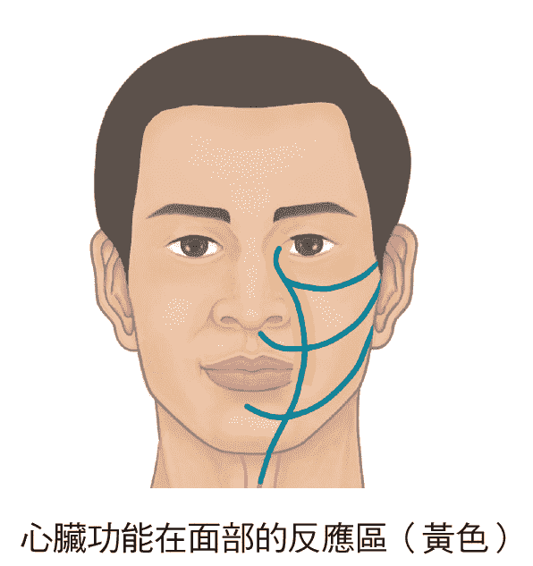

临床上，许多心脏有问题的人在本区常会出现异常肿起或凹陷，紧绷或无力，甚至色素沉淀者，只要针对心脏予以治疗，这些异常状态随即改变。

另方面，由于头面部是重要部位，有诸多经络通过，各经络所经之处深浅不同，彼此之间也有分工：

● 心经：循行在面部深层肌肉，以及黏膜、神经及血管等。

● 肝经：循行环唇里，主要在于唇部内部黏膜。

● 阳经：如胃经、大肠经、胆经、小肠经等，主要分布于浅层肌肉。其中「阳明主面」与面部肌肉的丰厚特别相关。

人体是立体结构，即使浅薄的面部也有深浅层次之别，临床上务必四诊合参，方能俱全。

###### ♼ 解密：「相由心生」真是如此吗？

俗语说的「相由心生」或「面由心生」，意指人的心念会影响面部的表情，例如有着幸福美满人生的人，面部总是带着笑容，五官开朗，表情和善，让人想要靠近；而长期处于愤怒的人，常咬着牙，怒目而视，面部的表情较为凶恶，让人避之唯恐不及。由此看来，人们说面部长相四十岁以前由父母决定，四十岁之后就要自己负责，颇有道理。

从本经别心与面部的关系来看，人的心念确实会改变面容。例如常常生气的人，五官纠结在一起，嘴唇紧抿，嘴角下垂，眼露凶光或不屑一顾的愤世，让人畏惧；心情愉悦的人，面部肌肉比较松缓，嘴角上扬，目光温柔，令人喜爱；至于思虑过多的人，总是皱着眉头，叹气多了，嘴角也下垂。所以面容也是心念的镜子，一旦心思改变，面相也会跟着变化，虽说「人不可貌相」，但是相貌确实会透露出心里的想法，心经经别就是「相由心生」的经络基础。

许多人都说在社会上行走，通常要靠脸吃饭，这种看法让化妆品和流行时尚产业大发利市，连带产生了语带酸味的「外貌协会」一词。其实从心经经别连结心、面、目的特色，加上心主喜与爱笑的特质，人类的眼睛与情绪的确容易被可爱、令人欢喜的事物所吸引。曾有广告心理学家做过实验，证实最能吸引目光的广告主角，不是俊男美女，而是小孩和小动物们。从中医的角度来看，正因为他们都具有天真无邪的表情，才能触动人类内心深处的共鸣。

### 既然相由心生，生活中为何常常「知人知面不知心」？

总论介绍过，京剧脸谱是心主管面与色的最佳阐释者，每种脸谱代表每个人物的个性，让人一看即知，这也是经别中「心—面」的用法。既然相由心生，人们心里所想与面部表现应该是一致的吧！可惜在现实生活里，人类在社会化的过程中变得复杂，面部表情不一定跟真实的想法一致，这就难免让人喟叹「知人知面不知心」！

很多人都说比较不怕真小人，因为「心—面」一致，心里想的跟表现出来的一样，可以提早防备，但大家都怕伪君子，因为「心—面」不一，就像金庸小说里的伪君子岳不群，道貌岸然，满嘴江湖道义，大家却被他害得惨兮兮的。

中医有没有识人心的方法呢？当然有啊！别忘了心经经脉「小心眼连线」的「眼睛为灵魂之窗」，只要认真的好好看进对方眼睛里面，真实的心念就会慢慢泄漏出来了。还有，面部的颜色也是很难伪装的特征，说谎的人脸容易变得胀红，表情僵硬，眼神闪烁，若仔细观察就会慢慢懂得识人之道了。

走笔至此，脑中想起席慕容女士的诗［戏子］：

请不要相信我的美丽

也不要相信我的爱情

在涂满了油彩的面容之下

我有的是颗戏子的心

所以 请千万不要

不要把我的悲哀当真

也别随着我的表演心碎

亲爱的朋友 今生今世

我只是个戏子

永远在别人的故事里

流着自己的泪

面对错综复杂的社会和人际关系，其实在某些生命时刻，我们也许都曾刻意或不自觉的在扮演「戏子」，好提供自己一个安全的防护罩吧！

### 整合五官官窍讯息的就是心！

若看过头颅骨就会发现人脸很有趣，它不是一个平面，反而像一个碟子，上面装置有眼睛、鼻子、耳朵等官窍。这些官窍对于生命的存亡至关重要，所以指定每一个脏器来管理它们的运作，中医称为「开窍」，如肝开窍于目，心开窍于舌，脾开窍于口，肺开窍于鼻，肾开窍于耳。如此一来，每个官窍各有所主，各自发挥功能。

《内经》说：「十二经脉，三百六十五络，其血气皆上于面而走空窍。其精阳气上走于目而为睛，其别气走于耳而为听，其宗气上出于鼻而为臭，其浊气出于胃，走脣舌而为味。」

意思是说人体所有经脉的气血养份，都向上输送到头面部的五官官窍，让它们得以发挥功能。这里有个重点「血气皆上于面而走空窍」，血气都输送到面部，心之华在面，心经经别又到面部，不仅掌理面部的血管、筋膜，还统整面上所有官窍的功能。且心主神志，眼、耳、鼻、舌等官窍的精细感觉与情绪，都需要聚精会神静下心来才能细辨分析，这就是所谓的「用心欣赏」。

五脏与官窍之间存在一对一的关系，而且只要求一般性的工作表现，例如眼睛只要能看得见，鼻子只要能呼吸且闻得到味道，耳朵只要能听到声音就过关了。但在现实生活中，各个官窍却不能自扫门前雪，需要协调合作，例如接近平交道的铁轨附近，不仅要看栅栏是否放下来，还要注意听是否有警示音，两个讯息合并才能做出是否要停车的决定，以确保安全。

举例来说，对于鼻子的嗅觉，肺只要求能闻到味道即可，但心则会分析，这味道是什么？有几种味道复合在一起？这些味道会牵引出什么样的记忆与情绪？如果气味中隐含有危险性，如闻到瓦斯味，那就要赶紧采取撤离行动了。

面部为五官官窍所在，所有的讯息都会传送给心，心也会发送指令，例如在紧急时刻，心命令五官专注于当下，采取相应的行动。反过来说，例如在火灾现场，当一个人昏睡恍神之际，或是饮酒过度导致心神混乱时，即使眼睛看到火光，鼻子闻到烟味，心却未能整合分析眼鼻所传送进来的讯息，致使无法发出警讯离开现场，最后极有可能发生憾事。

统合五官官窍的讯息，是非常重要的君主之官「心」才能掌握，一旦无人管辖或多头马车，都会造成国家的混乱和灭亡。就如同长辈们常常耳提面命的说：做事情要多用心，才能做得好！显然这「多用心」的生存之道，完全符合中医的概念！

###### ♼ 解密：「心—目连线」成为抒发情绪的管道

当我们遇到很喜欢的音乐曲风或艺术品时，通常会特别细心去聆听、欣赏，这种细腻的感觉和情绪，我们需要「用心欣赏」，就是由心来品味感受！人是有感受知觉的动物，心脏不仅接受外界各种刺激，还会产生记忆和情绪。例如，眼睛看到过去的事物，触景生情，很容易感伤流泪。本经别连通心脏与目内眦的「心—目连线」，让眼泪成为心抒发情绪的管道之一。心经经脉在胸部心肺连线所形成的「悲喜连线」，让人在悲伤时会流泪，大喜时也会「喜极而泣」，都是透过眼泪表现心情。

眼泪既是抒发心情的方式，也有助于疏解心理压力。一般总认为哭是女人的权利，可以用来软化男人的心，但又要求男儿「有泪不轻弹」，难怪男人们得硬撑起「坚强」的面具。为了心脏的健康，建议男性同胞适时的，找个安静的角落流流泪，情绪应可得到纾解，而无需藉由酒精来浇愁。

以上是情绪的眼泪，还有一种病理性的眼泪，就是流眼油，流个不停，常见于老人家，总看到他们无时无刻拿着手帕一直在擦眼泪，这通常跟鼻泪管阻塞有关。

由于心主神志，心经特别适合文青风格，我们再来欣赏一首凄美的宋词吧！北宋文学家范仲淹藉景抒情的词作［苏幕遮］：

碧云天，黄叶地，秋色连波，波上寒烟翠。

山映斜阳天接水，芳草无情，更在斜阳外。

黯乡魂，追旅思，夜夜除非，好梦留人睡。

明月楼高休独倚，酒入愁肠，化作相思泪。

聪明的读者，应该看到我们要讨论的句子了吧〜「酒入愁肠，化作相思泪」！

我们将心经经脉跟经别合在一起看，就会发现，当人们有着百般的愁绪饮酒时，酒循咽而入，经过心，抵达小肠，再循经向上抵达眼睛，因为伤心而化为相思的眼泪！

难怪有人会说「眼泪往肚子里面吞」，完全符合经络走向！

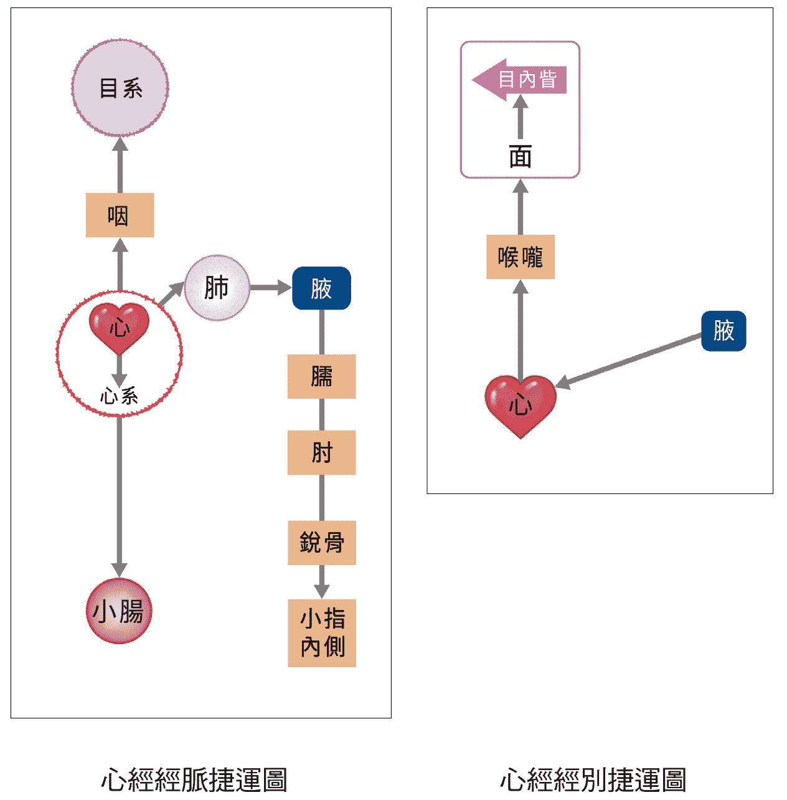

日剧《一公升的眼泪》以一个正值花样年华的国三少女罹患罕见的「脊髓小脑变性症」的生命奋斗故事，赚取了许许多多观众的热泪。而七〇年代西洋老歌 9,999,999 tears （中译：无尽的泪）则道尽了失恋者的哀伤。日剧及老歌都以眼泪的量来形容心里极深重的悲伤情绪，但这是夸饰并不是真的会流出这么多眼泪。

心经经别连结到目内眦，目内眦就是靠近鼻侧的眼头部位，这里有着泪点跟泪小管（如图）。人体的眼泪由眼窝外上方的泪腺分泌泪液，滋润眼球表面并提供营养，之后经下眼睑，流向眼睛内侧的泪点。泪液进入泪点后，经过泪小管、泪总管流入泪囊，而泪囊的泪液再行经鼻泪管而进入鼻腔，最后到喉咙。这条由「泪点—泪小管—泪总管—泪囊—鼻泪管」的路线，就是心经在面部走向目内眦的路线，巧合的是这个路径正与心脏机能在面部的反应区重叠，所以，眼泪与心就此结下了不解之缘！

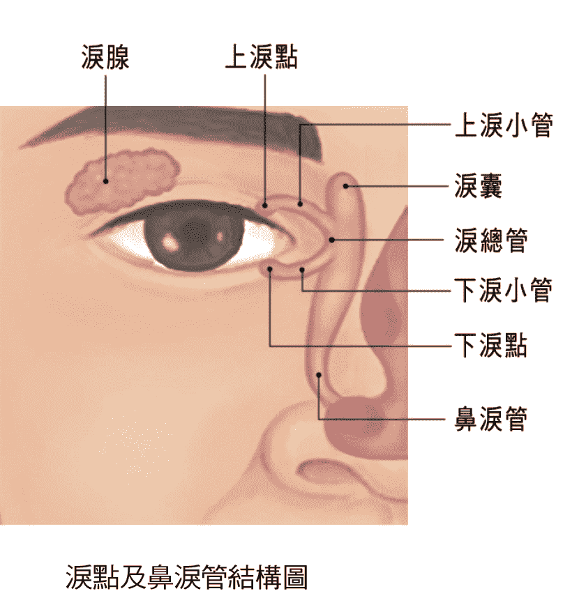

简言之，当心思有所动时，都可以透过喉咙而出的言语，面部呈现的表情和面色，以及目内眦的眼神与泪水，表达于外。心情激动时，这项连动关系尤其明显，例如在颁奖典礼上，常会看到获奖者手握奖座，语塞哽咽，面部涨红，眼睛泛出泪水⋯⋯， 这些都符合心经经别系统的循行特质。

从这角度来看，「心—喉—面—目」就是哭泣时会用的连线，心经经别系统就成为人类特有的情绪反应系统。

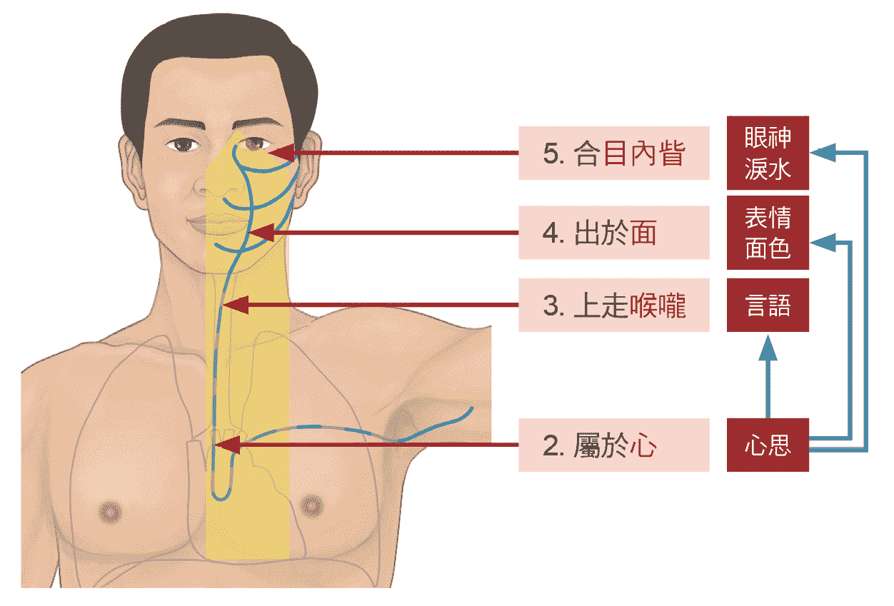

###### 中医师不传之祕：苓桂朮甘汤主治证与心经经别出于面有关

前面介绍过桂枝甘草有温心阳的功能，若再加上健脾燥湿利水的茯苓与白朮，就成为经方「苓桂朮甘汤」，常用来治疗中焦痰饮停蓄疾病和头面疾患。本方也与心经经别出于面有关。

在《伤寒杂病论》中，苓桂朮甘汤主治条文如下：

● 伤寒若吐若下后，心下逆满，气上冲胸，起则头眩，脉沉紧，发汗则动经，身为振振摇者，苓桂朮甘汤主之。《伤寒论》

● 心下有痰饮，胸胁支满，目眩，苓桂朮甘汤主之。《金匮要略》

● 夫短气有微饮，当从小便去之，苓桂朮甘汤主之，肾气丸亦主之。《金匮要略》

三段条文都有胸胁及头面症状，中医方剂学认为是中阳不足，脾失健运，水湿不化，饮停中焦，而出现胸胁支满，短气而咳，目眩心悸等症。

在日本汉方医书《汉方处方解说》介绍本方用于胃的元气衰弱，水饮停滞于中焦（胃部），因而发生内气上逆，及上冲头眩等，可治疗神经性疾病、心脏疾病、眼疾病、运动神经系疾病和肾疾患等。

依据现代中药学归经，白朮归脾胃经，阳明主面，茯苓归心脾肾经，茯苓与白朮属于脾经用药，茯苓还能平胸胁逆气，苓朮合用健脾土以除湿，可治水饮上逆。桂枝甘草汤为仲景治疗心阳不足的基本方，心经经别上出于面，温心阳以暖脾土，平冲逆之气。两组方剂合在一起成为苓桂朮甘汤，所治脏腑包括脾胃与心，病位包括上焦及中焦。

本方的特色在于：

● 病位上，阳明主面，心经经别出于面，可治面部五官科疾病。

● 病性上，脾阳不足导致水饮停滞，依据「虚则补其母」原则，脾土之母为心火，以桂枝温心阳而暖脾土，可治水饮向上冲逆之证。

● 经络上，脾经为心经的上接经，疏通脾经也有助于心经气血的运行。

因为具有这些特色，苓桂朮甘汤成为历代治疗上焦及中焦的药方，且能平冲逆，治疗头面五官之疾。

我们还可以将苓桂朮甘汤转化为经络穴位，如：

● 茯苓＋白朮 ＝ 脾经太白穴合阴陵泉穴。

● 桂枝＋甘草 ＝ 心经神门穴合小肠经支正穴（心经原络配穴「心神正」）。

● 苓桂朮甘汤 ＝ 太白穴、阴陵泉穴、神门穴、支正穴。

以下为两个以心经治疗眼病患者的简单案例：

病例一：视力模糊畏光，面部及腹部肌肉肿如橡皮，取心经肿硬处下针，针后面部及腹部的肿硬立刻改善，畏光也减轻。

病例二：青光眼患者，左下睑附近紧绷感。检查发现面部深层肌肉肿。先选针小肠经未改善，加上心经后，面部肌肉肿明显改善。

## 三、手少阴之别（络脉）

心经络脉主要分布在胸部和面部。一如经别，路线不长，但意义非常重大。

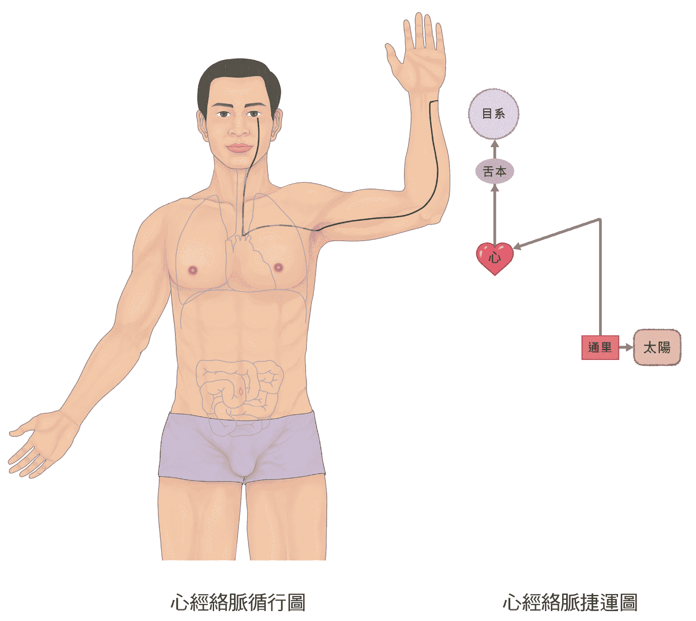

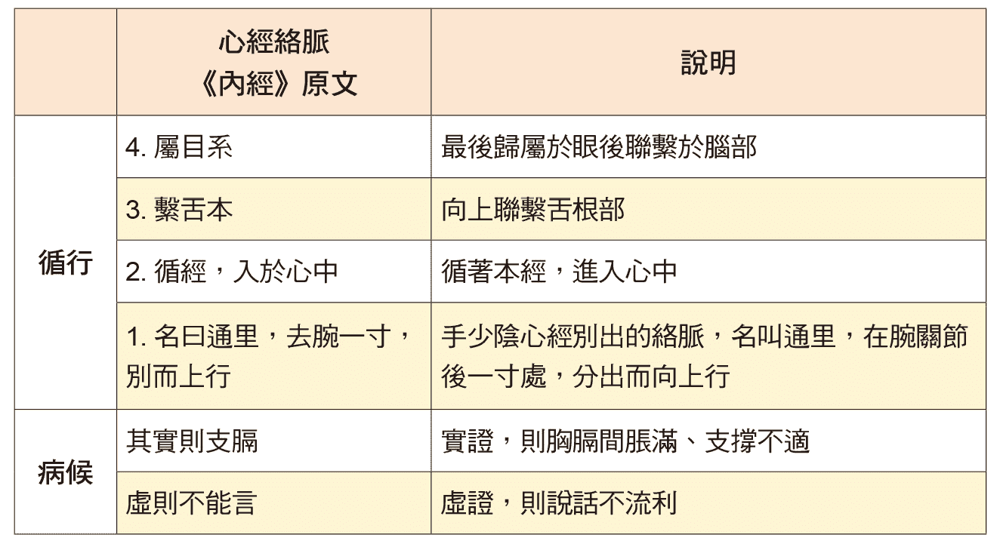

依据本经络脉连结「心脏—舌—目系」的特色，「通里」为心经络穴，简称为「通里心舌目连线」。

本络脉从手臂一路上行，到胸中，深入心中，再向上连结舌本及目系，这条路线比经别较为深层，络穴「通里穴」穴名即有由表通于里之意，因此医家普遍认为本穴能通达虚里，此处的「虚里」乃指心脏之意。

既然通里穴与心脏相通，当可治疗心脏所在的胸膈支满，以及心主舌窍的言语不利等疾病。若从心理层面来看这两项病证，就是「有苦难言」之感。

心经络脉与心经经别有异曲同工之妙，能补足经脉的功能。心经络脉与经别循行路线都连结心脏与眼睛，不同的部分在于：

心经经别出于面，呈现「心之华在面」的经络基础；

心经络脉系舌本，呈现「心开窍于舌」的经络基础，可见本络脉与语言表达有密切关系。

总论介绍过「心气通于舌，心和则舌能知五味矣。」舌头是心的官窍，既能品尝食物，也可以发声说话表达想法。心经络脉除了再度加强心脏与目系的关系，还在心脏与目系既有的连结路线之间，特别加入「系舌本」，以体现「心开窍于舌」的主权，并巩固彼此的关系。

因为不仅本络脉系舌本，还有脾经经脉连舌本，脾经经别贯舌本、肾经经脉挟舌本、肾经经别系舌本。脾肾两经都是很强的对手，脾经与舌本的关系偏重在品尝饮食方面，肾经与舌本的关系偏重在语言发声方面，无论是饮食或语言，都与心有关，既然舌为心窍，心脏当然要站出来表态，确保它与舌本的特殊关系。

眼睛与舌头都是心脏重要的密使，眼睛可以收集外界信息，向内传给心脏，经过分析整合之后，透过舌头以语言向外发表感受。例如眼睛看到某个身影从身旁走过，传送给心，唤起过去的记忆，原来是多年没见的好朋友，此时就会张口出声请对方留步，接着找个地方叙叙旧。这是眼睛与舌头常见的合作模式。

另一方面，也要提醒，眼神跟言语都能伤人，台湾街头常见的喋血事件，大都起于一个眼神所挑起的激烈情绪。还有近年来发生的霸凌现象，通常从不屑的眼神与奚落的话语开始，激起彼此的怒气，再发展成肢体冲突。然而眼神并不是每个人都能觉察到，有可能会被忽略，但是从口中所说出的话语却字字入耳，且一言既出，驷马难追，所以俗语才说「祸从口出」，说话前千万要在心里头多转一下，以免口出伤人。

###### ♼ 解密：舌部可以反映心脏功能及心理状态

#### 身体层面：反映心脏的功能

首先是舌头的结构。中医师诊断时都会看舌头，若颜色过于红暗或苍白，舌头型态出现偏斜、抖动或难伸，舌面上出现瘀斑、血络，舌下络脉怒张等，都能作为心脏疾病的诊断。由于心的五行属火，前面说过「诸痛痒疮皆属于心」，当舌头长疮、口腔溃疡、眼睛出现血丝、身体皮肤痒等，也都是心脏火气过旺的表征。

其次是舌头的说话功能。临床上看到一些心脏功能较差的病人，在天气变化过大或身心俱疲的状况下，突然喉咙及舌头变紧，说话声音细小，想说而说不出来，声音断断续续，出现气音（心经系统连结咽喉，后面会叙述），吞咽不顺等，但并没有喉咙痛或任何感冒现象，病情严重的话，甚至视力逐渐模糊，这些都是心脏严重无力的现象，要赶紧治疗。

现代医学常使用含在舌下的药物来治疗心脏病，例如硝酸甘油（NTG；nitroglycerin 又称为硝化甘油），含在舌下来改善心绞痛症状。心绞痛是因为心脏冠状动脉狭窄导致心肌缺血缺氧，而出现胸闷胸痛，有时还会延及左侧颈、肩、背、下巴、咽喉和手臂，甚至于上腹部等，这些部位都是心经系统所过。心绞痛除了胸痛如绞之外，还有呼吸需用力、心跳急促欲窒息感、身体出冷汗、头晕恶心等，这些也都是心经系统的症状。硝酸甘油可以扩张血管，暂时缓解冠状动脉狭窄，舌下锭的剂型作用比较快，让心肌得以快速获得适当血流与氧气来改善心绞痛的急性症状。本络脉连结心脏与舌本，为舌下含药法建立一条治疗心脏的快速通道。

有位病友提供其心脏科医师的变通妙法：在舌下倒入少量 XO 酒，含 2～3 分钟后再吐出，也可以缓解一般性的胸闷胸痛症状。但如果已经出现心绞痛，就不适用此法，要赶紧就医。

#### 心理层面：反映内心的想法

心主情志，与脑部活动也有关，每个人的心里都有许多的想法愿意跟他人分享，但心脏本身不会说话，心开窍于舌，所以由舌代心发声，这就是「心声」、「心里话」，表达方式跟个性有关。例如个性谨慎或心思缜密的人，说话速度较慢，字斟句酌；个性热情或才思敏捷的人，说话速度较快，常会迫不及待冲口而出。

「真心话」是指说出来的话语与心里头真正的想法相同，心与舌合一，好朋友之间的「体己话」也是真心话的一种。反过来，如果心与舌不合一，心里想的跟说出来的不一样，称之为「口是心非」。口是心非的人有点像说谎的人，眼神常飘移闪烁，说话方式会改变，多数声音偏高，说话速度变快，以掩饰内心的感受，有时还会偷偷握拳，这些表现完全符合本络别的循行路线。

台湾的民意代表候选人常说自己愿意「为民喉舌」，选民致赠民意代表的题辞也常用此四字，来譬喻站在选民的立场，为其发声说话，表达意见，争取并维护民众的权益。

在十九世纪时，一位意大利心理学家发现当人害怕或恐惧时，脉搏会变化，所以就用仪器来侦讯犯人，此为「测谎」机制的开端。这个方法主要是验证心口是否合一，完全应用到心的相关特质，如主血脉、主面、开窍于舌等。加上汗为心之液，因此有些人说谎时不仅舌头打结，说话结巴，手心还会大量出汗。

有一种变形的「口是心非」叫做「刀子嘴豆腐心」，最伤脑筋。此人明明心地善良，并无恶意，本来可以好好说的话，经由嘴里说出来就很刺耳，就像妈妈在天气寒冷时，想提醒外出的孩子多穿衣服，冲口说了一句：「你如果穿这么少就出门！病死活该！」明明是关心孩子，说的话却令人伤心！我曾问过这类人士：「说出那些伤人的话会不会后悔？」回答说：「会！」再问：「想不想改？能不能改？」答案是：「想改，但改不了！」唉！积习难改！常会导致亲子关系或人际关系的紧张破裂。

还有一种特殊状况就是心情激动的时刻，就像历经激烈比赛，好不容易才夺得冠军；或意外的极度惊喜，像期盼多年终于听到老婆怀孕的好消息，一般的反应都会有个共同点，如流泪满面，哽咽，喉咙紧而说不出话，呼吸困难，或者失去理智，大声呼喊，手握拳或手拍胸等，这些动作都跟心经有关，也是心脏透过经络系统而出现的正常反应。

若由于心脏机能或是心经经络阻滞，导致说话不流利或是说不出来，例如中风的病人「言蹇」或前面的心脏无力病人「言虚」，都可以选络穴通里穴来治疗。如果是因害羞而「爱你在心口难开」，也可以按压通里穴加强说出真心话的勇气喔！

中医属于道医，有着深厚的道家哲学，因此在学习中医的过程中，所学习到的不仅是医术，更是做人的道理。学中医的人通常谨言慎行，待人也较为亲切温和，就是因为知道所说出来的话，所表现出来的行为举止，都代表了内心的修为，岂能不慎？！

### 小结

综合前面三篇所述，从经脉、经别到络脉都一直强调心脏跟眼睛的关系，经别还加入「面」，络脉再加入「舌」，让心脏与面—舌—目连成一体。

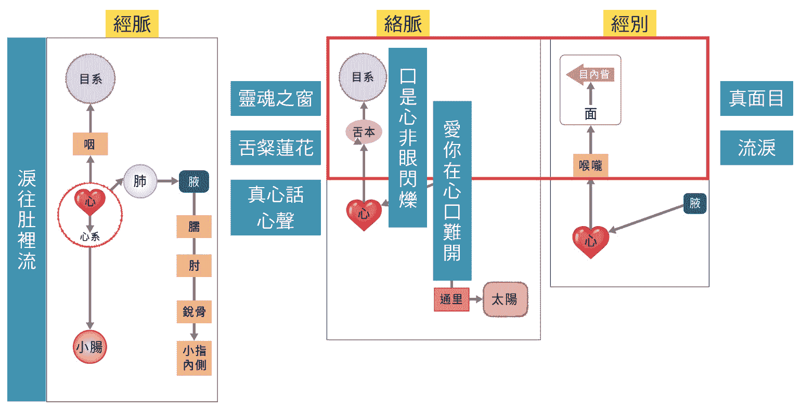

面舌目不仅是观察心脏功能的部位，面部的表情变化、舌头的言语传达、眼神的瞬息流转，也都是透露心情的门户。有默契的人，只要眼神交会，一切尽在不言中。我们也可以观察人性，如前所述，小眼睛的人较为冷静，说话谨慎，面部表情少，不动声色；大眼睛的人较为热情，藏不住话，面部表情多变化。

心经经脉夹「咽」，心经经别上走「喉咙」，心经系统通过咽喉部位。咽是食道，为食物进出的通道，喉是气道，为呼吸气体的通道。当情绪激动时，咽喉阻滞而食不下咽，说不出话；当心情愉悦时，咽喉特别通畅，不仅胃口奇佳，还会不自主的哼歌呢！心与咽喉相连，咽喉功能受心的影响，反之，咽喉也可以帮助心脏纾压，例如心情低落时，约几位好友去唱唱歌，喝下午茶谈心，或到空旷处大声喊叫等，疏通咽喉之后，心气也会跟着通畅。

## 四、手少阴之筋（经筋）

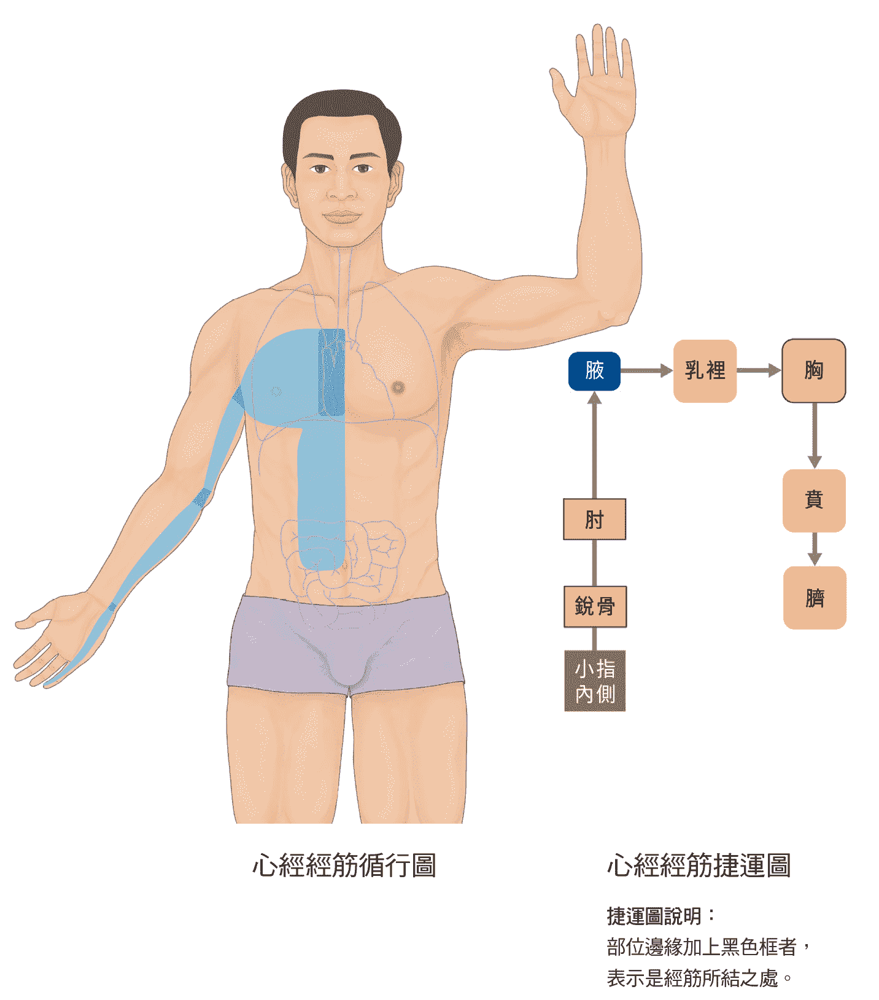

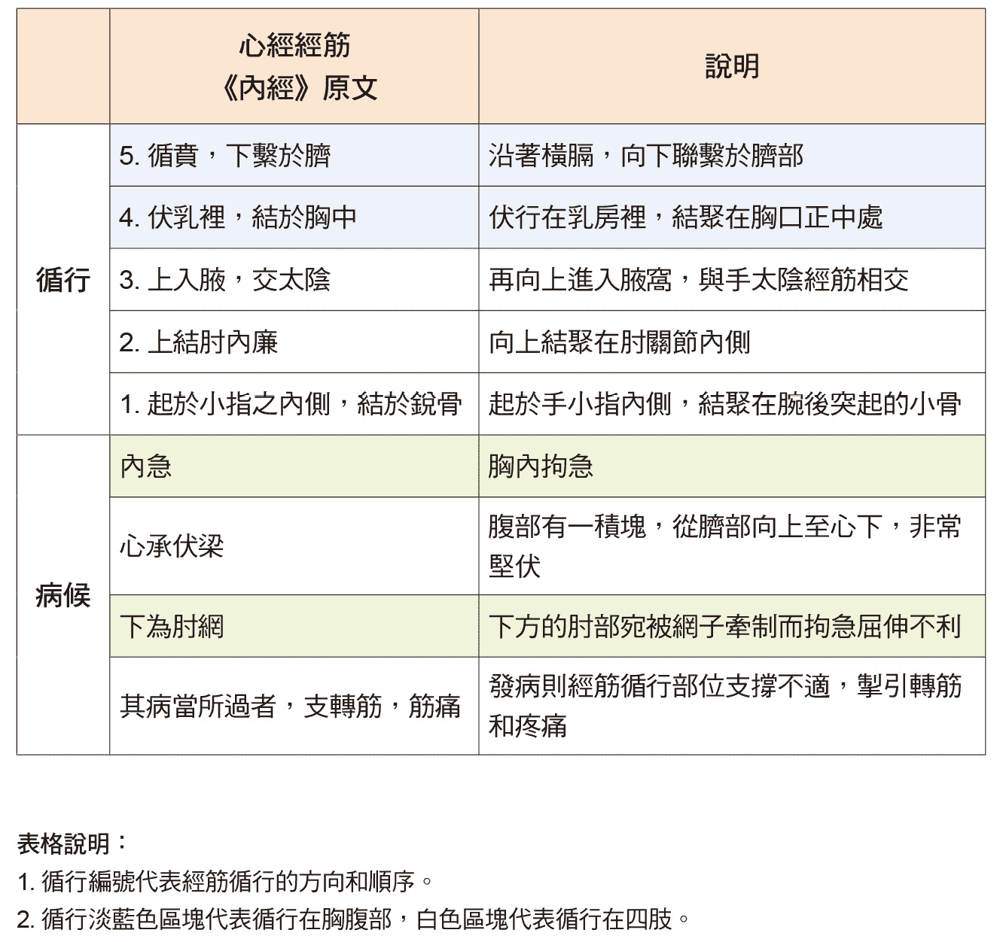

### 心经经筋─循行特色

心经经脉、经别及络脉都特别循行至面部，唯独心经经筋只到上肢部及胸腹部。为何如此？这是因为心经系统有两个重点部位，一个是面部，一个是心脏所在处。

对于面部管理，心这位聪明的君主深知分层管理原则，派遣经脉及络脉连结目系，渗透在面部深处；经别以「出于面」方式遍布于面部较浅层的各个官窍，并加以「全面」掌控。至于面部表层肌肉的保护，除了交给表里经的小肠经筋之外，还有强大无比的「阳明主面」团队大肠经与胃经早已挺身而出来护主了。所以，心经经筋只要专责去保护心脏所在部位。

本经筋上肢部的循行与经脉完全相同，胸腹部是本经筋的特色，循行「乳—胸—贲—脐」，以加强保护内部重要的脏腑为主。

### 上肢部

心经经筋循行与心经经脉相同，经筋主要分布在手臂阴面的后线，起于小指内侧，向上通过掌面的第 4、5 掌骨之间，结在腕关节的豌豆骨。手臂尺侧腕屈肌正是位于手臂阴面后侧，所以本经筋就循着尺侧腕屈肌桡侧上行，结于肘关节内侧，再上行到腋窝，与肺经经筋相交会，这与经脉「却上肺，下出腋下」路线刚好相反。本经筋全然包覆经脉的上肢循行部位。

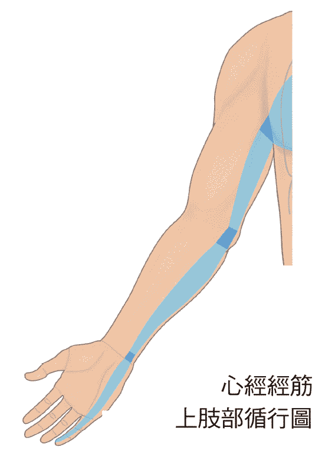

俗语常说「担心」，在身体上真的有「担心」这种现象吗？

依据临床观察，许多长期紧张的人，左肩都会向内缩，向上高耸，时间久了就会定型。只要仔细看，就会发现左边肩膀比右边高，连左胸胁也被向上牵引比右侧高。由于心脏位于左胸内，也被连带向上担起来了。我们常会跟这类病症的病人说：「你看！左边肩膀这么高，心脏也被肩膀挑高起来，果然很『担心』！」幸好这种「担心」状况只要从心经治疗就能改善。

### 胸腹部的「心腹专线」

胸腹部的循行从腋窝到胸部，先横向走在乳房里层，结于胸口，再转弯向下循横膈，连系到肚脐。

经筋包覆部位通常代表本条经络系统最重要的部位，对于心经系统来说，最重要的部位就是胸腹部的肺—心—小肠，因此我称心经经筋为「心腹专线」，一方面因为循行部位所经的心仍是心，而小肠位于腹部；也因此点出心与小肠之间特殊的贴近关系──小肠是心脏的心腹。

胸部为心肺之宫城，心肺功能又攸关生命存亡，所以心肺两脏对于胸部的保护不余遗力且亲力亲为，肺经、心包经及心经这三条经筋都直接包覆胸部，由于职务不同，包覆范围也不同，三者的差异处请参阅心包经。

此外，强大的胃经及胆经经筋也都协助包覆胸部，可见身体对于胸部维安工作的重视。

#### 伏乳里，结于胸中

心腹专线首先要认识「伏乳里」，这条经筋直接包覆在心脏外围，是「护心」的第一线。为了配合心脏的位置，也呈现横向分布。可参阅下图，对照经筋与解剖的位置。

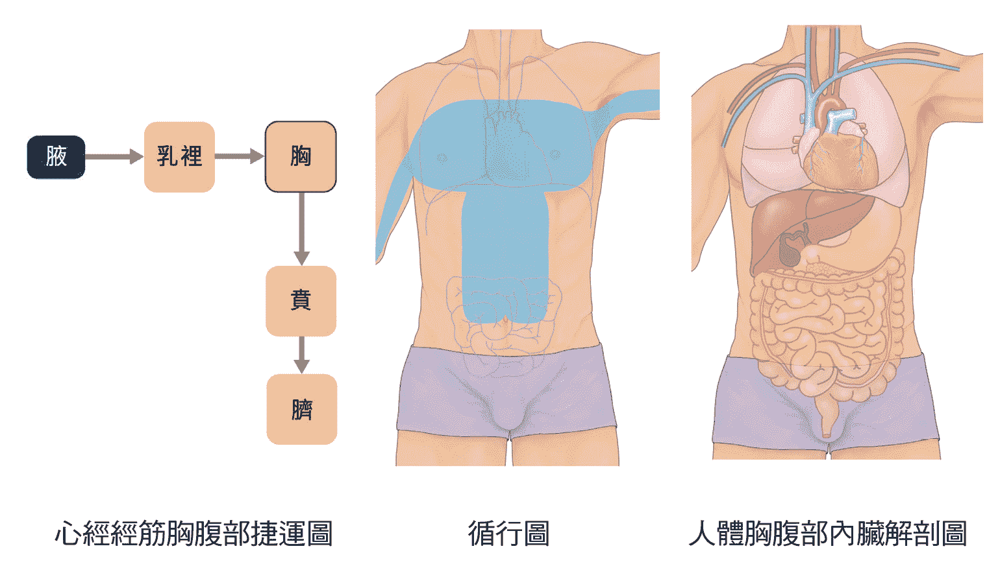

#### 心经经筋如何伏乳里？

我们先介绍心脏位置。心脏位于胸腔内，大约在第二肋间至第五肋间，外面裹以心包，两侧与肺相邻，前面是胸骨，后面是脊椎。 因为心尖偏向左侧，所以心脏是中间偏左侧斜向的位置。

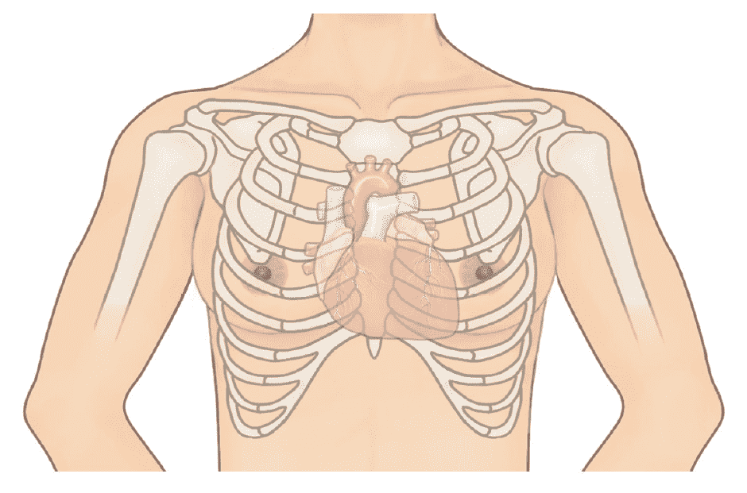

其次，胸部的肌肉主要是胸肌或称为胸大肌，俗称胸脯，呈扇型分布在胸廓前上部浅层，起于锁骨内侧半，胸骨和上位六根软肋骨，以及腹直肌鞘的前壁，止于肱骨大结节嵴。胸肌上方有乳房，从第二肋骨至第六肋骨之间，内侧到胸骨旁线，外侧到腋中线。请参阅下图。

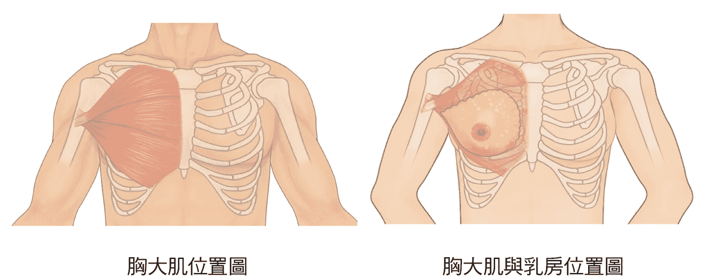

从心脏、胸大肌及乳房解剖来看，它们的位置在第二肋到第五肋之间是重叠的，胸大肌也与本经筋形状类似，因此若将「心脏—胸大肌—乳房」结合成一个区块，就是与心经经络系统有关的胸腔结构。心经经脉循行在最深层，连结心脏与心系；心经经筋循行在最浅层，位于胸肌与乳房之间，因为走在乳房的里面，所以称为「伏乳里」。

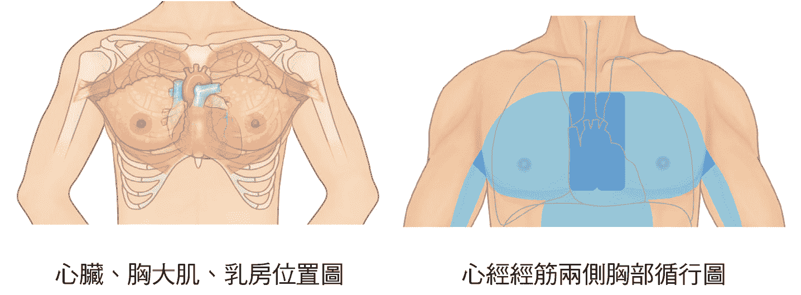

由于心脏位于胸骨之后，中间偏左的位置，经筋为了完全保护心脏，就必须「结于胸中」即胸口的胸骨处。这个情况尤其在将两侧经筋合在一起时更明显。

当心脏机能开始出现问题时，「腋—乳里—胸」这段经筋最容易出现闷肿、刺痛感，让我们可以循迹提早发现心脏病。病程越长，程度越严重的心脏疾病，在这条路线会出现越多硬结，甚至还会牵连到上臂及腋窝周围组织等，大都很顽固，很难处理，幸好透过针刺可以解开。

#### 循贲，下系于脐

心经经筋在完成横向包覆胸部使命之后，改变方向，采纵向方式，沿着横膈下行到腹部，最后系在肚脐。这条路线主要包覆心经经脉「小心肠」的部位。我们将两侧经筋合并，则会看到它的型态类似腹直肌。

腹直肌就是许多人努力梦想要练出八块肌的位置。腹直肌顾名思义就是前腹壁中线两侧的肌肉带，连接骨盆和胸廓。它起于骨盆腔的耻骨周边组织，止于第五、第六和第七肋骨周边组织及胸骨下方的剑突处。

心经经筋在腹部的循行与腹直肌几乎相合。腹直肌是大片的肌肉，在胸廓与第五、六、七肋及胸骨的剑突连结，它正好衔接胸部伏乳里路线中第二肋到第五肋。也就是说本经筋循着胸大肌包覆胸部，之后转而向下，循着腹直肌包覆腹部至肚脐。这也说明了本经筋「循贲」沿着横膈下腹，而非直接贯穿横膈下腹的道理。

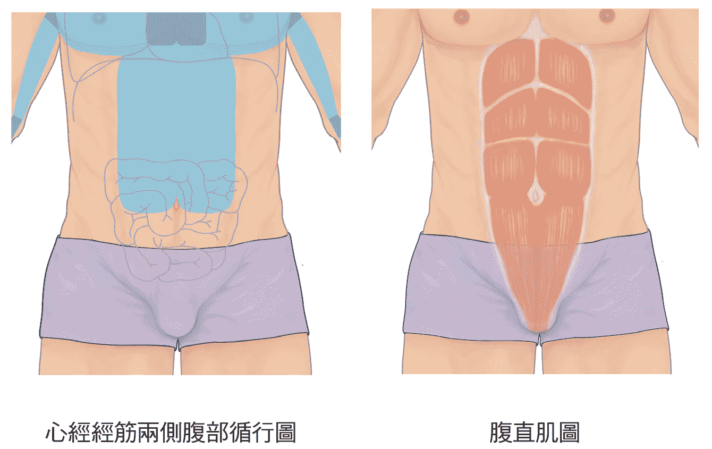

但心经经筋只到肚脐，那么肚脐以下的腹直肌归谁管呢？答案是脾经经筋：「聚于阴器，上腹，结于脐」。

临床上遇到许多肚子很肿，尤其是腹部中间两条肌肉紧硬的病人，我都会配合使用心经治疗，效果不错。

### 「乳胸—贲脐」这段经筋具有三个特殊意义

1.保护经脉系统的「好心肠连线」，让心脏可以直取小肠所吸收的营养，也确保小肠输送精微物质到心脏一路平安，半路不会被拦截。

2.这段经筋与胃经经筋重叠，本经筋贴身保护心脏，胃经经筋走在它的外层，可以视为心脏的另一个保护层。

3.心经经筋与脾经经筋都有到肚脐，脾经经筋从肚脐穿入体腔向上到胸腹腔，心经经筋则分布在体表。亦即脾经经筋分布在内层，由下而上；心经经筋分布在表层，由上而下。两条经筋内外位置相呼应，更强化对于心腹部这段路线的保护。

但是这里到底有什么重要的东西，需要如此慎重其事的防护？

在经脉篇中介绍过「胞脉」属心而络于胞中，「好心肠连线」还隐含一条「胞脉之路」，让心经与小肠经的经血上为乳汁，下为月水（月经）。本经筋的「乳—胸」与乳汁分泌有关，「贲—脐」与月水有关，如此重要的部位，心脾两经经筋当然要加强保护。

###### ♼ 解密：心经经筋忠实呈现心脏的状况

由于心经经筋以保护心脏为主，当心脏开始出现问题时，就会反应在整条经筋上，随之出现质地、色泽等变化。

例如心脏气血淤滞，心经经筋经过的手小指会先发难，出现麻木刺痛，然后手臂内侧面、腋窝区以及胸腹区也会肿起、紧硬，或出现筋结、血络等，而且心脏的病情越重，出现肿块筋结的部位也越多越明显。

在心脏病变反应区中，特别以「肘关节内侧—腋下」这条纵行线，和「腋—乳里—胸中」这条横行线最容易出现肿胀闷痛感，所以可以循迹提早发现心脏的变化，平常可多按摩、敲打以及拉筋来保健。胸骨上的「膻中穴」是心包反应在体表的穴位，心包专责保护心脏，所以膻中穴也是很好的护心穴，日常可按摩保健。

「腋」是心经经络系统必经部位，与心脏关系也很密切。

腋可以分为三区：腋窝属于心经，腋窝前面的大筋属于心包经，腋窝后面的大筋属于小肠经。腋前及腋后这两条经筋最贴近心脏，分别从前胸后背保护心脏，也是透露心脏状况的部位。平日可以按揉这三区保健心脏，促进血液循环，改善胸闷气短之症。

若是病程长且严重的心脏疾病，手臂的上臂、腋窝及腋前／后筋、胸部和胸骨部位都会出现顽固深层的硬结，甚至宛如紧黏在骨头上，出现钻骨般的痠痛感，非常难受，建议赶紧请中医师针灸治疗。

心肌梗塞先兆部位与心经经络系统部位在手臂、胸腹部和面部都是重叠的，心经经脉系统内连心脏，心肌梗塞先兆的疼痛部位也与心经循行部位相合。只要平日多自我检测及保健，其实心脏疾病并没有那么高段，来去无踪，这取人命于瞬息之间的无形杀手，中医却可窥破它的行迹，提早预防。详情参阅《中医护好心》。

另外心经经筋「伏乳里」正在乳房下方，因此心脏、腋窝与乳房也有关联，尤其女性，情绪的波动很容易影响乳房气血循环而有胀痛压痛感。现在乳癌治疗法有时会切除腋窝淋巴结，在此先按下腋窝淋巴结不论，光以心经经筋连结腋窝与乳房这项关系而言，一旦乳房发生重大病变时，腋窝当然也会随之变化。所以提醒女性平时多向上抬举双手，拉开腋窝，并按摩局部，不仅可以护心，更可以护乳房！

### 心经经筋─病候

心经经筋病候都与它循行的部位有关：

● 上肢部：肘网，所过者支转筋、筋痛。

● 胸腹部：胸部为内急，腹部为心承伏梁。

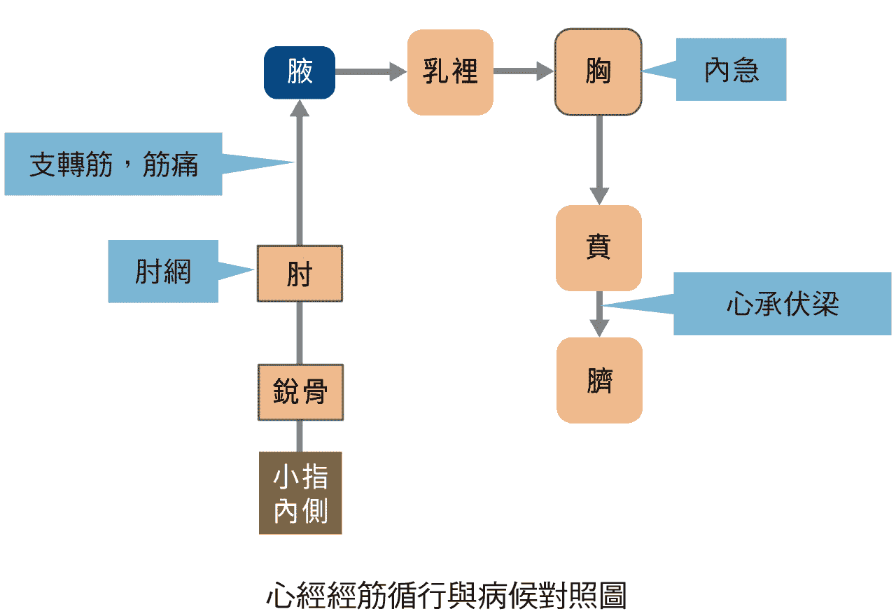

内急：胸部经筋伏乳里及结于胸中，因此「内急」就包括乳房疾病如纤维囊肿等，以及胸口紧绷胀痛等。

心承伏梁：腹部经筋循贲下系于肚脐，与腹直肌相合，所以当腹部出现一大片肿硬的积块，从肚脐向上至心下的剑突，且深伏而不动，好像屋子的梁柱，就被称为「伏梁」。

上肢部的肘网与胸腹的内急及伏梁都是经筋病候，肘网就成为内急与伏梁的反应区及治疗区。因此当出现肘网，表示也有内急及伏梁之证，就可以从肘关节着手治疗。

有趣的是，本经筋出现两个伏字：伏乳里及伏梁，表示病位较为深层，病性比较坚硬，需要努力治疗，也藉此彰显短短的心经，其实是深藏不露的治病高手。平日只要多揉按心经，就能达到良好的保健效果。

总论最后提到心脏风光之下的辛苦，看到这里，大家应该都有同感吧！幸好其他经筋系统也很疼惜心脏，纷纷提供周全的保护，如：

● 正面：肺经（胸部），胃经（由腹上至缺盆），脾经（胸胁），心包经（前后夹胁）

● 侧面：胆经（循膺乳），心包经（前后夹胁）

● 后面：大肠经（膏肓），小肠经（肩胛骨），膀胱经（背部）。

看到人体对于心脏如此严密的保护，实在令人赞叹和欣慰！

###### 中医师不传之祕：五脏皆有心痛，胃心痛与真心痛最难分

心经经脉病候有心痛，本经筋病候有内急，都指出心经经络系统有心痛及胸闷等症状。总论的朝贡图指出每个脏腑都与心脏有关，其余四脏也会影响心脏机能而出现各类心痛之证。《内经》提出五种心痛：

● 厥心痛，与背相控，善瘛，如从后触其心，伛偻者，肾心痛也。

● 厥心痛，腹胀胸满，心尤痛甚，胃心痛也。

● 厥心痛，痛如以锥针刺其心，心痛甚者，脾心痛也。

● 厥心痛，色苍苍如死状，终日不得太息，肝心痛也。

● 厥心痛，卧若徒居，心痛间，动作痛益甚，色不变，肺心痛也。

《难经》解释「五脏相干，名厥心痛。」厥心痛是其他脏腑影响心脏所致的心痛之证，多数都可取其本身的穴位来治疗。

其中胃心痛「腹胀胸满，心尤痛甚」与单纯的心痛最难分，除了心胃之间的「御膳房之路」外，两条经筋都经过对方实质所在部位—心经经筋覆盖胃部，胃经经筋覆盖心脏，当这些重叠区域发生疼痛时，很难分辨，唯有透过症状分析才能确诊。

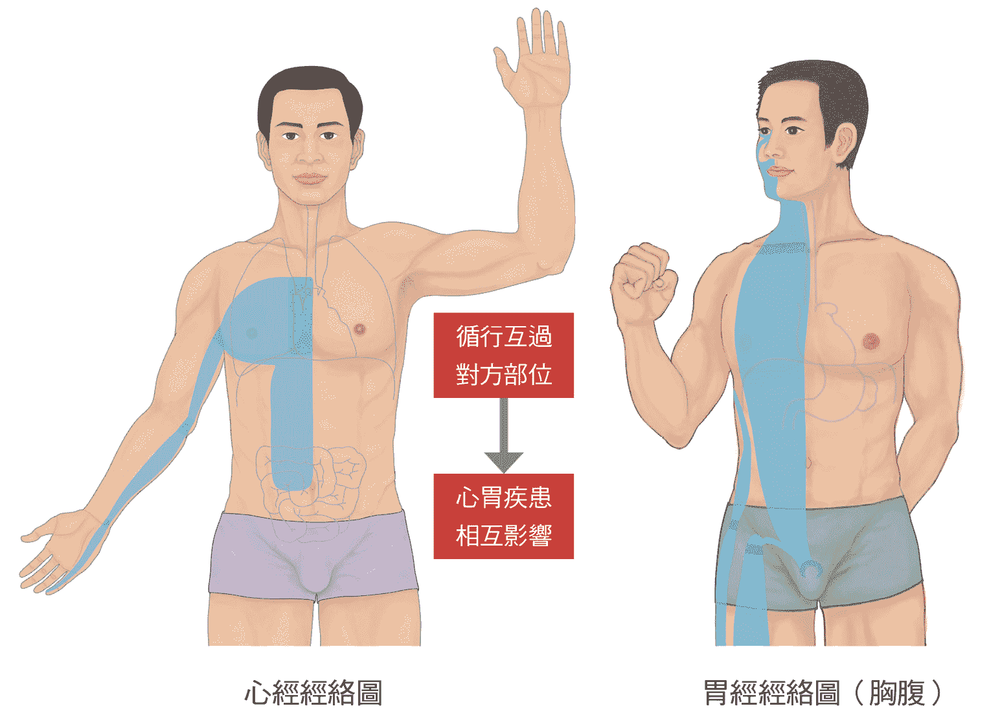

另一种心痛「真心痛」就非常严重，「手足凊至节，心痛甚，旦发夕死，夕发旦死。」《难经》说「其痛甚，但在心，手足凊者，即名真心痛。其真心痛者，旦发夕死，夕发旦死。」类似心绞痛、心肌梗塞发作的症状，病况危急，必须赶紧抢救。

###### 中医师不传之祕：历代有关「伏梁」之证的说法

有关「伏梁」在《内经》及《难经》中主要论及三种病证：

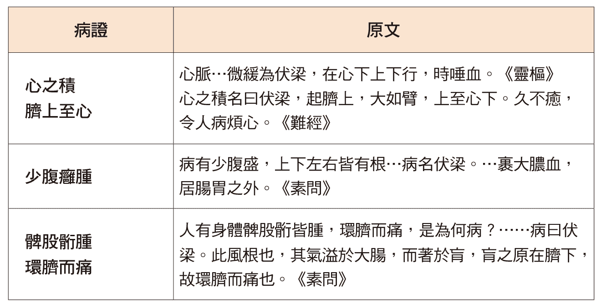

跟本经筋最相关的应该是「心之积」，不仅它的部位「起脐上，大如臂，上至心下」，以及病候「久不愈，令人病烦心」都与本经筋相合。

但若再参酌其他两种病证的论述，可以总结出「伏梁」证主要在肚脐至心下之间的腹部出现肿块，病因病机与气血郁滞，甚或少腹脓血有关。这个肿块非常深伏坚硬，直挺挺的向上顶住，宛如梁柱，因此称为「伏梁」。

心脏为了向小肠直接汲取营养所建立的连线，彼此之间亲密的关系，没想到当出现病变时，竟然也成为彼此的负担。幸好，《难经》有关「心积伏梁」的症状印证心经经筋的病候，也提供治疗的切入点──心经系统。

###### 中医师不传之祕：心经可以治疗远端对应部位的疼痛并调整身体结构

心经经络系统循行路线不长，循行部位也很简单，但是透过经络关系，可以用来治疗远端特定部位的疼痛及调解身体结构。

##### 1.治疗足跟痛

一般常用的「足跟点」是治疗足跟痛的特效穴，其原理在于足掌与手掌是相对位置，因此足跟点就位于手掌心包经路线上，符合中医「下病上治」原则。但若从经络的角度来看，足跟与手掌的对应点应该在豌豆骨（豆状骨）。

首先，依据足部跟骨的经络分布，内侧为足少阴肾经所经，外侧为足太阳膀胱经所经。综合而论，循行于跟骨内外侧的经络是少阴经与太阳经。依据中医理论，手足同名经有相对应关系，因此手掌部位与足跟对应的经络为手少阴心经与手太阳小肠经。

其次，跟骨属于骨性结构，依据「骨对骨」概念，手掌与足跟相对应的结构应该是骨骼。

综合经络分布及骨性结构特色，手掌与足跟相对应部位，应是介于手少阴心经与手太阳小肠经之间的骨性结构，那就非豌豆骨莫属了。

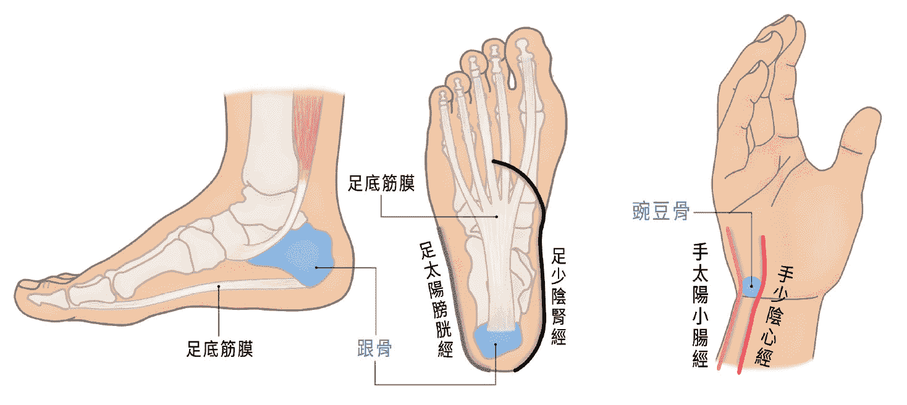

由于足跟痛多数发生在足跟内侧，若要治疗跟骨内侧的筋膜疼痛，首选位于内侧的手少阴心经，因此临床上我们常用「神门穴」治疗，针刺方向建议沿着心经路线透向手掌，以对应到足底筋膜的位置。

以上只是心经治疗远端对应部位疼痛的一例，临床还会应用心经与其他部位的对位疗法。在此也提醒大家要谨慎思考流传的特效穴／特效方药的原理，以取得最佳适用范围和疗效。

##### 2.调整华佗夹脊的结构

依据人体的全息理论，手臂尺侧位于腕关节到肘关节之间部位对应脊柱，脊柱在前臂的对应方向是腕部为颈椎，肘部为腰荐椎，呈现出「腕颈—肘腰」的顺序。循行于手臂尺侧者为小肠经，理论上可用小肠经来治疗与脊柱相关的疾病。但要调整脊柱并不是件容易的事情，因此我们找到一个较为容易的切入点，即透过人体背腰部的「华佗夹脊穴」或称「夹脊穴」。

华佗夹脊穴因为不属于十二经脉的穴位，所以称为「经外奇穴」。华佗夹脊穴位于脊柱两侧，宛如从两旁将脊柱夹在其中，故名「夹脊」，加上「华佗」显示它有来自华佗祖师秘传或如华佗般神效的特性。华佗夹脊穴从第 1 胸椎至第 5 腰椎棘突下两侧，后正中线旁开 0.5 寸。

华佗夹脊穴常用来治疗内在脏腑组织器官疾病。我们将这条由夹脊穴所串联的肌群简称为「华佗夹脊」，望诊及切诊时常会发现异常的结构变化，例如高肿、凹陷、偏斜、色暗、温度改变等。这些异常现象与所属脊柱及内在脏腑疾病之间都有关联，透过详细的中医四诊，可以追查出华佗夹脊结构异常与内在疾病之间的因果关系，有时因为时间久远，两者互为因果，彼此之间还形成恶性循环：如华佗夹脊结构持续异常会导致内在疾病加重，反之亦然。

华佗夹脊还与脊柱结构有关。由于骨骼位置常会受到肌肉张力的影响，华佗夹脊位于脊柱两侧，肌肉牵拉也会影响脊柱的型态，例如侧向牵拉过度就会导致脊柱侧弯，纵向挤压过度就会导致脊柱椎体之间也跟着隆起。而当脊柱受到外力撞击导致结构变形时，会牵动华佗夹脊张力随着改变。总之，华佗夹脊与脊柱之间存在共生共荣、互相影响的密切关系。

华佗夹脊与身体状况及脊柱结构有关，只要能调节华佗夹脊张力就能调整脊柱结构，同时调治身体疾病。

依据前述全息理论，当掌心朝上，两侧前臂尺侧合并时，两臂的接缝处是脊柱。加上「骨对骨，肉对肉」对应概念，前臂尺侧对应脊椎的部位应该是尺骨，尺骨旁边的尺侧腕屈肌对应脊椎旁边的肌肉，心经正位于尺侧腕屈肌的桡侧，对应颈椎旁的肌肉及胸腰部的华佗夹脊。

华佗夹脊的变化也会同步反应在心经经筋上，只要掌握「腕颈—肘腰」部位对应关系，如紧硬部位在胸椎的华佗夹脊，透过望闻问切四诊找到在心经经筋上同样紧硬的部位，然后直接在此反应区施治，就能发挥类似中医伤科松筋和调整脊柱的功效。

临床上，多数病人都是手掌对应头部，腕关节对应颈部，肘关节对应腰部的「顺向对位法」，但仍有少数病人的对应方向是逆向对位，如腕对腰，肘对颈等，所以必须小心检查。

另外，当脊柱结构严重挤压或偏斜时，想要直接调开结构并不容易，建议先在腕部及肘部下针，类似拉开脊柱上方颈椎和下部腰荐椎的做法，提供调整异常结构所需的弹性空间，然后再在对应的异常部位下针。

与心经同名的足少阴肾经本身就贯穿脊柱，可以直接调节脊柱结构，所以当遇到难分难解的脊柱结构问题时，可以配合肾经使用。

## 心经四大系统总复习

心经循行单纯，主要路线包括手臂、胸腹及面部三区，形成「小心眼连线」：

「小」：手臂的小指及腹部的小肠。

「心」：胸部的心及心系，包括肺。

「眼」：面部及目系、目内眦和舌本。

以下将心经四大系统合为一图，更能看出心经的「小心眼」特色。

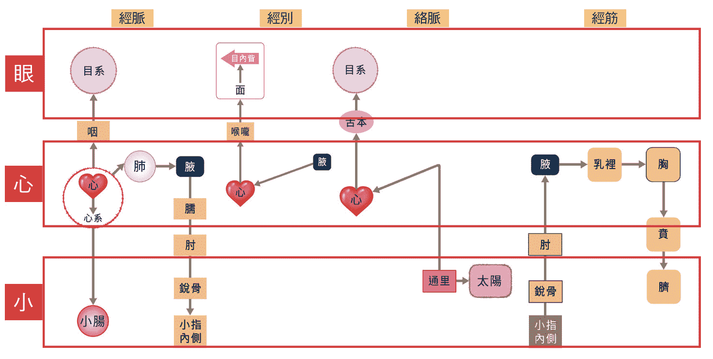

从心经四大系统主要分布区域可以看出心经的重点部位：经脉、经别及络脉主要连结心脏与面部、目系，经筋只包覆手臂、腋及胸腹部，胸腹部位深层就是心、肺及小肠，重点在于保护胸腹部的内脏，头面部分则由其他经筋代劳。

### 「小心眼连线」架构出专属于帝王特权的「身心共振」特色

身体部分：诸多的进贡团，提供各类讯息及最坚实的护卫；心主神志，又主血主脉，与小肠之间有着制作血液的关系；心为君主之官，与肺之间有推动血脉的任务，与生命体的存活与健康都有密切关系；心之华在面，负责各种感官的精细感觉与情绪记忆，属于更高层次的生命体验，这是心为君主之官的另一种呈现，也是人类与动物不同之处之一。

神志部分：阳光喜笑的特质，让心可以平衡各种情志与内外环境变化；生命的记忆宝库，存有对于所有内外在事物的感受；心与眼之间有着双向关系：心透过眼收集信息，也将心情透过眼来表达，有助于建立和维持人际关系。

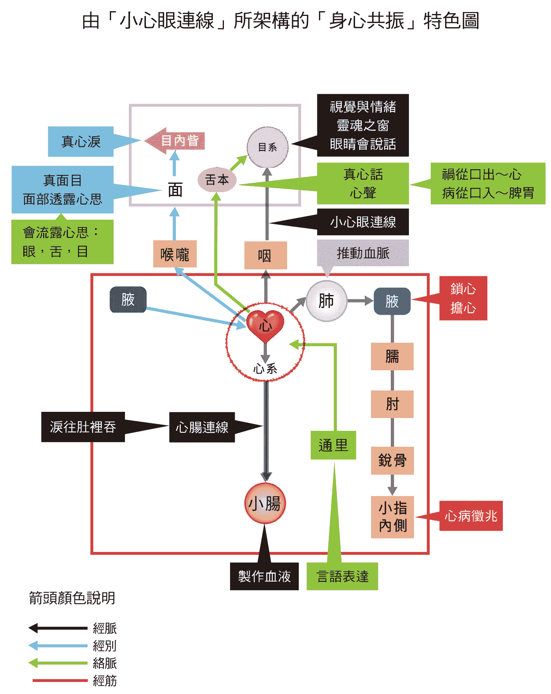

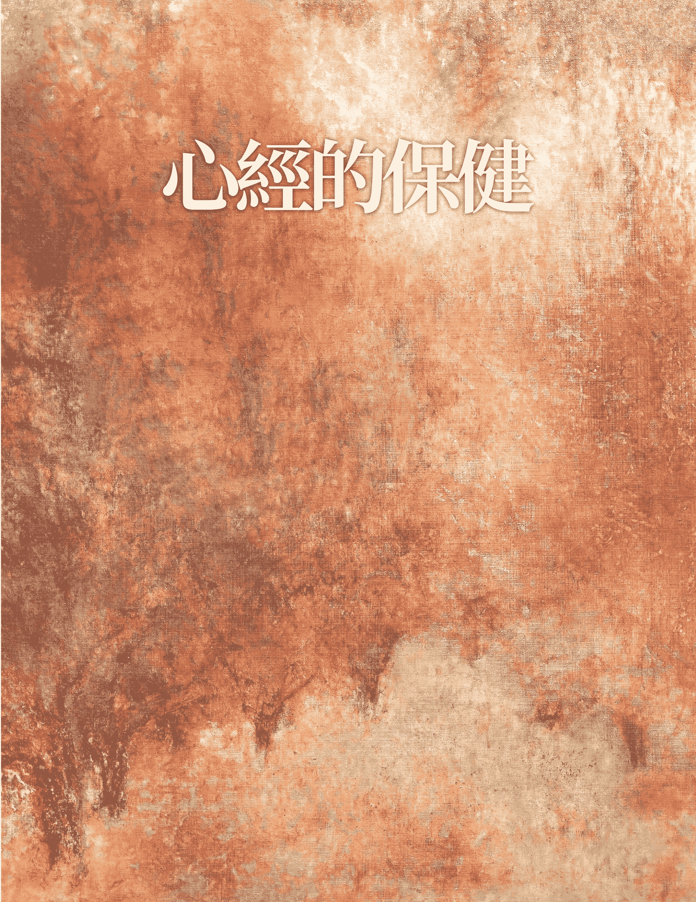

# 心经的保健

在经筋篇已经介绍一些心经的自我保健活动，其余内容请参阅《中医护好心》。以下介绍一些平日护心法与保健穴位。

### 一、平日护心法

### 多吃「食物」，少吃「食品」护好心

前面说过，心开窍于舌，舌和则能知五味，许多美食家的舌头都非常敏感，听说他们的舌头上分布有比常人更多的味蕾细胞。从养生的角度来看，建议多吃食物少吃食品，因为越简单的食物越有助于身体健康，近代也一直提倡吃真实简单的食物，尽量少吃加工过的食品。记得曾有小学的幼童问我：「为什么你说的『垃圾食物』都那么好看好吃？健康的食物却那么难看难吃？」这就要怪容易迷航的心，还有容易被欺骗的眼啊！自然界很多毒草颜色绚丽，甚至具有特殊的味道，以吸引猎物亲近。由此推想就知道为何垃圾食物总是如此迷人了吧！

《内经》说「心病禁咸」，因为心主血，「咸走血，血病无多食咸」，这个观念现代人都知道，人体摄入食盐的钠离子超过正常值越多，引发高血压的机率越高，所以在饮食上减少盐（钠）的摄取，能明显降低脑、心血管疾病的危害。这个观念中医在几千年前就已经知道了。还有心属火，《内经》说「心畏热」，也不宜过食辛辣上火的食物。

### 「冬吃萝卜夏吃姜」的真谛

民间有「冬吃萝卜夏吃姜」的说法，常被直接解释为冬天盛产白萝卜，夏天盛产姜，多吃当季盛产的食物，常保健康。只是白萝卜性偏寒，姜性偏热，为什么要强调这两个寒热性质迥异的食物做为当季保健食材呢？

其实是大家误解囉！

「冬吃萝卜夏吃姜」是提示饮食均衡概念。早期先民一定发现冬天是进补季节，许多人都会用辛热的食材，如麻油鸡、姜母鸭、羊肉炉，我统称为「鸡鸭羊大补汤」来补身体。热补过度，很容易出现口干舌燥、便秘等热证，所以就提醒子女们，冬天除了进补之外，也要吃些寒性的萝卜来清降火气。

同理，夏天气候炎热，各种寒性瓜类蔬果尽出，加上吃冰喝冷饮，很容易出现腹痛腹泻、手脚冰冷等寒证，所以就提醒要吃一些热性的姜来驱散寒气。这才是「冬吃萝卜夏吃姜」正确的保健观念。

### 中老年人在寒冷季节必须注意苹果脸

心主面，天气变冷时要特别小心「苹果脸」，因为这是心脏病的征兆之一。

2016 年《中医护好心》出版后的第一个情人节，天气颇冷，受邀出席一项聚会，餐后分享书中心脏疾病征兆内容，特别提醒大家要注意天冷而出现「苹果脸」的危险性。

什么是「苹果脸」？就是面颊两侧，尤其是颧骨的地方，出现两团红红热热的色块，很像红苹果，所以称为苹果脸。

苹果脸出现在小朋友脸上，拥有健康的红润肤色，超级可爱吸睛！但若出现在中年或老年人脸上，而且天气越冷，苹果脸越明显，颜色越暗沉时，表示心脏机能已经出现问题。因为心脏为了「抗寒」，必须用力搏动以增加输出血量来保暖。我们在日常生活中，出力工作之后，面部会充血变红有热感，心脏亦然。努力的心脏在提升泵血量之余，心脏所主管的面部也跟着一时性的充血。但若心脏必须努力不懈的工作，无法休息，面部的充血迟迟无法消退，就会瘀阻在面部的经脉，时间越久，颜色越暗。颧骨是小肠经通过的部位，小肠经是心经的表里经，所以颧骨的红热感会特别凸显。病情严重者，在红色色块的上方，还会浮现瘀阻的细小血管。

会后一位听众走过来跟我说：「沈医师，我的外号就叫做『小苹果』！因为我的脸颊长期红红热热的……」我凑近她的脸一看，果然很红，用手一摸，热热的。她继续说着：「前阵子身体检查，发现我的心脏有问题！我一直以为自己的红脸很健康，今天听了你的演讲，才知道脸红跟心脏病有关系。」我安慰她以后要多注意脸颊，建议她赶紧就医。

### 请为你的心脏穿衣服！

门诊时也会遇到贴心的病人，为了方便医师针灸治疗，无论外面天气如何，总是一成不变的穿着短袖短裤前来。有时天气真的很冷，医师建议病人换穿长袖长裤时，病人总说身体不觉得冷，没关系。后来只好跟病人强调「请为你的心脏穿衣服！」因为多穿衣服让身体暖和，心脏就不必为了增加泵血而多做工。心脏能少做工，就能保存珍贵的气血来维持身体的平衡与健康。尤其人们对于外在温度的感受本来就因人而异，已经生病的人对于温度感受更会变得异常，所以不要太相信自己身体的感受，还是多多体贴辛苦的心脏，天冷时多穿点衣服来减轻心脏的负担吧！

### 二、心经常用四大保健穴位

心经只有九个穴位，从腋窝到小指末端，穴名都很有深意，与心主神志特质相合，作用也很强。

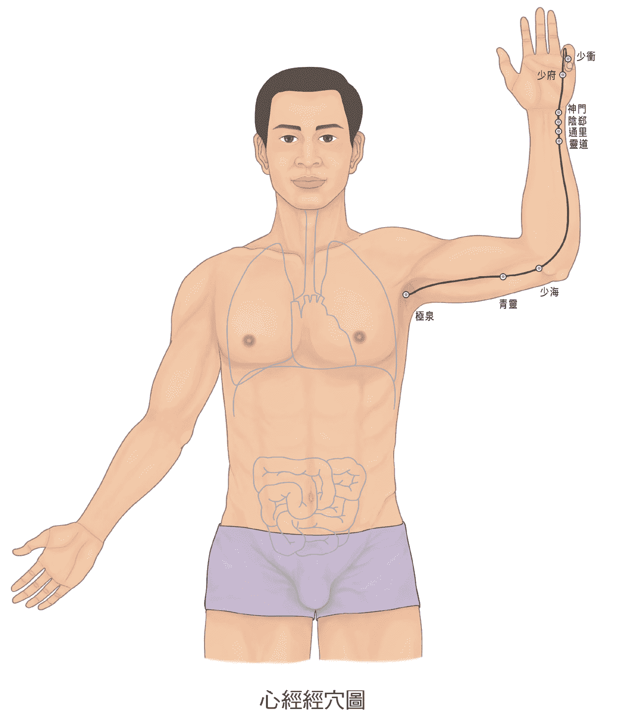

心经常用保健穴位，由上而下，分别是「少海穴」、「神门穴」、「少府穴」和「少冲穴」，这四个穴都具有特殊功效。

##### 疏通心经的少海穴

1.疏通心经的少海穴（HT3）：位于肘关节内侧，屈肘时，在肘横纹内侧端与肱骨内上髁连线的中点处。取穴时可将手肘弯曲成 90 度，就在肘横纹内侧的尽头处。

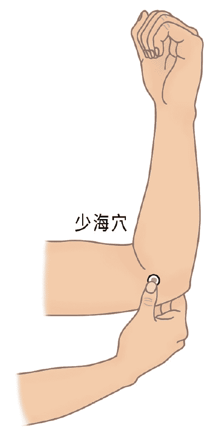

少海穴为合穴，五行属水，本穴正位于心经经脉从胸部转到手臂，所遇到的第一个也是活动最复杂的关节，所以是心经气血淤滞、胸口闷痛的重要反应区，穴位周围的肌肉会明显肿突，甚至有压痛或抽痛。所以揉按少海穴有助于疏通心经，行气活血，改善胸口闷痛。

另外，少海穴还可以缓解对侧颈部肌肉肿硬以及腰痛。

##### 安定情志的神门穴

2.安定情志的神门穴（HT7）：位于手掌面的腕掌横纹上，尺侧腕屈肌腱桡侧凹陷处，在豌豆骨的内下方。

神门穴顾名思义就是能与心神相应，善于安神，是原穴，五行属土。原穴是最善于治疗该脏腑疾病的穴位，因此，本穴称「神门」乃实至名归。

本穴的安定神志作用有助于心脏主神志的功能。在心情紧张或思绪紊乱时，以拇指揉按可以稳定情绪。神门穴可以安神，当然也可以安眠，睡前宜多加按揉。

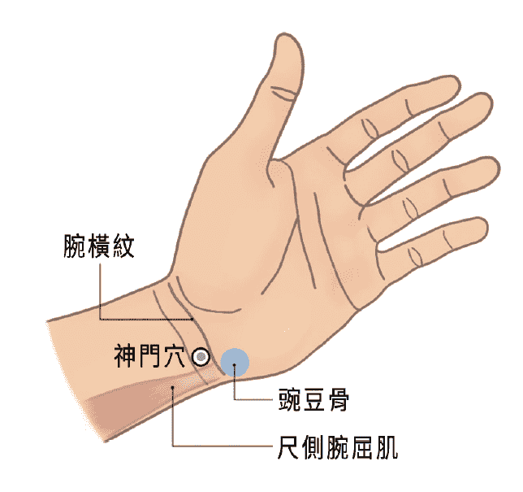

如果不幸遇到车祸或家人离世等重大创痛惊惧之事，可以配合揉按额头的印堂，以及脚部第 1-2 趾隐白合厉兑这个「捕梦网」组合，加强安神效果。

印堂也是重要的安神区，虽然印堂对应肺脏，但心经经脉从心系连结肺，心肺关系密切，肺经经脉病候也有心烦之症，所以印堂具有良好的安神效果。

##### 强壮心脏的少府穴

3.强壮心脏的少府穴（HT8）：位于手掌面，第 4、5 掌骨之间。握拳时，当小指尖所指之处。建议取穴时避开感情线，以免过度疼痛，可以稍微向着掌根的方向挪移，更能判断心脏功能。

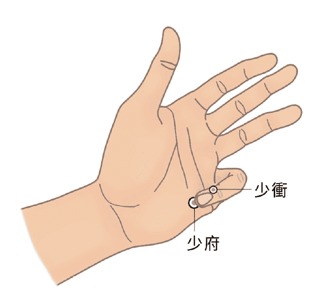

少府穴为荥穴，五行属火，与心脏的五行相符，算是心经最火热的穴位，所以是心脏的强壮穴，平时可以揉按保健，有助于心脏主血主脉的功能。尤其在心脏虚弱，心跳无力，胸闷气上不来时，可以重掐少府穴来强心，所以它也是心脏急症的抢救穴。

另外少府穴也与董氏奇穴「手解穴」的位置相近，因此临床上可以用解晕针，强壮心脏功能。总论提到虚弱病人先灸后放血的案例，其中少府穴就是必灸之穴。

##### 开窍醒神的少冲穴

4.开窍醒神的少冲穴（HT9）：位于手小指末节桡侧，距指甲角 1 分处。少冲穴为井穴，五行属木。手指及脚趾末梢都是非常敏感的部位，俗语说「十指连心」，当遇到神志昏迷的情况，可以开窍醒神，帮助清醒。

如果心脏气血有淤积，小指末梢也会变肿色暗，稍加挤压则瘀肿更甚，此时就要非常警觉，要改变生活饮食，并赶紧就医。本穴可以加灸，也适合放血治疗，尤其对于心律不整有明显改善效果。总论提到的虚弱病人，本穴就是放血穴之一。

以上介绍的四穴各有神通，如少海穴是通心穴，神门穴是安心穴，少府穴是强心穴，少冲穴是开心穴，平日四穴合用，多加揉按，就能照顾好心脏，人人都是好「心」人。

###### ♼ 解密：心经穴位的其他特色

##### 腋窝也是民间常用的强心部位

● 腋窝也是民间常用的强心部位：腋窝是心经极泉穴所在处，离心脏更近，紧急时，掐拿腋窝确实有助于强心活血。

##### 手肘以上的穴位多有清热效果

● 手肘以上的穴位多有清热效果：肘上穴位如极泉穴、少海穴，都是水部首的穴位，表示都能清热，可以制约心火，让水火相济，心神安定。

##### 神秘的「灵通阴神」组合

● 神秘的「灵通阴神」组合：在靠近腕关节处，短短的 1.5 寸距离，竟有四个穴位紧密相连，每穴间隔 0.5 寸，穴名很有特色。此四穴由上而下为：灵道穴、通里穴、阴郄穴和神门穴。古代医家在传承中医的时候，为了避免陷入神鬼之论，常常将一些特殊经验藏在穴名之中，例如胃经的井穴「厉兑穴」善于安神驱恶梦，「厉兑」就可能隐含了「厉鬼」之意。

早期读中医的时候，对于这四个穴位为何要挤在一起，深惑不解。某日突发奇想，采取类似藏头诗的做法，取穴名第一个字连在一起，竟然是「灵通阴神」，有趣的是，将它倒着唸为「神阴通灵」，难怪这四个穴位要挤在一起，原来隐含着要群策群力，解决较为严重的神志障碍。

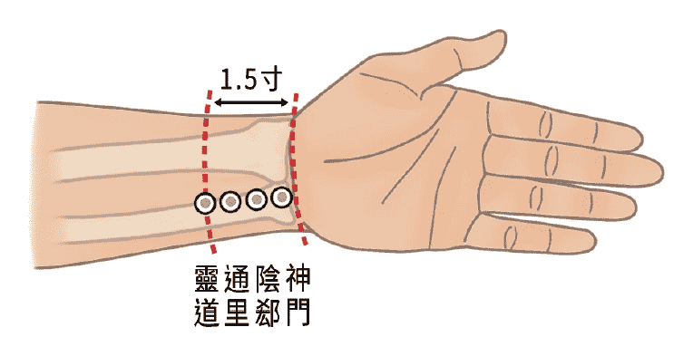

* * *

年轻的吴沐枕医师前来关山慈院跟诊，藉由 2017 年流行的电视剧集《通灵少女》，将当时的跟诊经验整理如下：

###### 「卡到阴」 特效穴 ～ 通灵少女解神阴

农历七月又到了，有过参加丧礼时觉得全身不对劲，浊气带回家后睡也睡不好，可是却说不上哪里有毛病，又或者接触到不太好的人事物让自己浑身不舒服，有种卡到阴的感觉。大家可能会去庙里找通灵少女（误)来化解，但有没有想过中医也可以帮你化解卡到阴的不舒服症状。

这里要介绍一组心经的穴位，「神阴通灵」或倒过来「灵通阴神」，看了这四穴的第一个字就可以知道这对于解决卡到阴的情况有一定的用处。这四穴分别为「神门」、「阴郄」、「通里」、「灵道」，在前臂掌侧腕关节处各相隔五分的位置。

心主神明，且心经的是动所生病中有提到「……心中憺憺大动……喜笑不休……」，「……烦心……」，可知道心经可用来安定心神，心经俞穴「神门」就是最常用的穴道。除了针可以解决外，艾灸也是可以安定心神，可在这四个穴位上贴上两灸来让症状缓解。通灵少女看太多了，别忘了卡到阴的问题也可以找中医来化解化解唷！

* * *

从穴位的位置特性来看，心经与小肠经隔着尺侧腕屈肌，手腕外侧的尺骨茎突属于小肠经，此茎突上缘与肌腱结合处约在肘关节向上 1.5 寸处，尺侧腕屈肌桡侧属于心经。这两条经脉从腕关节向上 1.5 寸的等高处，也是心脏疾病的反应区，通常会横跨两经经筋都出现异常的肿硬或陷下等现象，此处也正是「灵通阴神」的所在处，我称此四穴为「心情列车」。一般读者可以按揉来保健心脏及安神，医师则可以一针透四穴，以达最佳疗效。

### 三、心悸不一定要马上治心，最好找出病因，从根本治疗

门诊常遇到心悸的病人，部分病人有自觉，部分病人无感，而是由医师发现的。自觉心悸的病人会描述自己的心跳加快，有时心跳还会很用力，胸口紧或闷痛，左侧躺压到心脏时会不舒服，严重者还有惊慌不安感，甚则还会开始喘促。

心悸是心脏多做工，心跳才会加快。排除严重的器质性病变，一般心悸通常有两类原因：

1.虚证：常见于营养失调，气血不足，无法提供身体足够的养份，心脏为了救命只好多做工。这就像收入不丰的家庭，父母亲为了养家，只好拚命兼差赚钱，工作非常忙碌，心跳快速就类似这种情况。

2.实证：常见于代谢失调，气血痰湿阻滞，火气旺盛，血液输送不顺畅，同样为了救命，此时心脏只好被迫多做工，努力将血液输送到全身。这就像在工作职场，遇到蟹老板督促大家要提升产能，工作堆积如山，或者猪队友工作凸槌，连累到自己，只好跟着一起善后，拚命加班赶进度，心跳快速就类似这种情况。

上述两类情况导致的心悸，都是心脏为了救命的举动，应该要找出原因，从根本治疗，才能改善病情。例如前文介绍过的桂枝甘草汤，透过补心阳来治疗发汗过多、损伤心阳导致的心悸。千万不要直接去抑制心跳，这样反而会伤及心脏和其他组织的功能。切记切记！

###### 中医师不传之祕：二井一宣放血治心律不整经验

某日一位八十多岁的老病人，坐着轮椅被家人从楼下急诊室推到五楼诊间，她面色苍白、表情恐慌、呼吸浅而促、说话语音低微、断续。

家人代述：婆婆当日血压突然飙到 210，头晕，胸闷，心悸，经紧急送到急诊治疗后，血压控制到 160 多，头晕胸闷减轻，但仍严重心悸，所以到中医科求诊。

仔细检查：婆婆的印堂及两侧眉棱骨上方颜色苍白、手冷、脉象细而疾，偶有心律不整，左小指末梢色暗瘀肿。

当下决定了治疗计划：先用针调气，再用灸补气，最后在左小指末梢的「二井一宣」放血。

二井一宣是指心经、小肠经的井穴，小指末梢的宣穴。

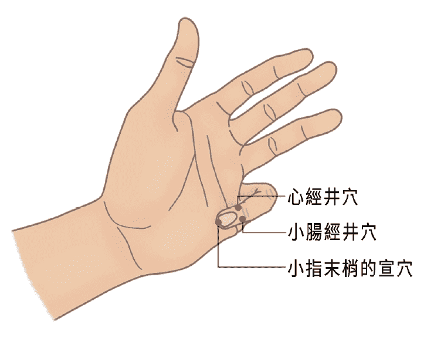

婆婆当时虽然身体衰弱，在二井一宣所放出的血量却不少。随着瘀血的排出，印堂的颜色慢慢恢复正常。

婆婆离开诊间时，已经没有喘促的情况，而且还可以语音清晰的跟我们道别。两周后，婆婆回诊，告知从那日治疗之后，血压、心跳、呼吸都维持正常。

接下来的门诊，只要病人有心悸，在身体其他状况还好的情况下，我们都会在二井一宣放血。放血后，心悸马上获得改善。

###### 中医师不传之祕：中医特有的「三因制宜」治法

心脏是人体的应变中心，时时刻刻面对身体内部与外部环境的改变，必须快速采取相对措施来因应。在面对身体内部环境时，心为五脏六腑之主，在面对外界环境时，心部于表，随时随地跟着变化而调整。

我曾看到网络一篇文章标题是：「中医可能毁在中药上」，让不少中医相关人士大为恐慌。文中诸多误解，在此也做些说明：

该篇内文大意为：

为什么这么多人不信中医？专家称因药材功效变差！

随着社会人口急剧增加和生态资源被破坏，自然道地的中草药资源已经无法满足市场需要，很多品种只能靠人工种植取代。……传统中草药与土质、气候、环境、采收时机息息相关，这就是中药材行业十分强调的「道地」性。同样的药材品种，生长在不同的地方、不同的气候，其效果就可能完全不同……。

加上近年来，野生变家种，道地药材异地无序种植，种植过程中过度使用农药、化肥，土壤重金属超标等，都直接影响药材质量。

看到这篇文章，我完全不被影响。因为运用「中药」治病只是中医治病的方法之一而已。

人类因为有着适应力十足的心脏，居住在不同环境及生活条件下，身体也会发展出不同的特色以利于生存。在《黄帝内经》中有一个独立篇章［异法方宜论］，其中记录了五个方位地区居民的人体特色，并提出治疗方案：

黄帝问曰：医之治病也，一病而治各不同皆愈。何也？

岐伯对曰：地势使然也。故：

东方之域，天地之所始生也，鱼盐之地，海滨傍水。

其民食鱼而嗜咸，皆安其处，美其食。鱼者使人热中，盐者胜血，故其民皆黑色疏理，其病皆为痈疡，其治宜砭石，故砭石者亦从东方来。

西方者，金玉之域，沙石之处，天地之所收引也。

其民陵居而多风，水土刚强，其民不衣而褐荐，其民华食而脂肥，故邪不能伤其形体，其病生于内，其治宜毒药，故毒药者亦从西方来。

北方者，天地所闭藏之域也，其地高陵居，风寒冰冽。

其民乐野处而乳食，藏寒生满病，其治宜灸焫，故灸焫者亦从北方来。

南方者，天地所长养，阳之所盛处也，其地下，水土弱，雾露之所聚也。

其民嗜酸而食胕，故其民皆致理而赤色，其病挛痹，其治宜微针，故九针者亦从南方来。

中央者，其地平以湿，天地所以生万物也众。

其民食杂而不劳，故其病多痿厥寒热，其治宜导引按蹻，故导引按蹻者，亦从中央出也。

黄帝问他的老师岐伯说：「医生在治病时，同一种病却用不同的治疗方法，而且都会好，原理是什么呢？」

岐伯老师回答说：「这是因为不同的地理环境造成的结果。」

岐伯将中国分为五个地区，不同的区域可以分别采用中医五大医法来治疗：砭石、针刺、艾灸、药物、导引及按蹻。例如：

1.东部靠海，食物偏咸，容易长疮，适合用砭石来刺破疮疡。

2.南方偏热，食物偏酸及腌渍物，容易有肢体痠痛紧绷的情况，适合针刺治疗。

3.西方风沙大，饮食油腻，病从体内而生，适合服用药物治疗。

4.北方偏寒，人们喜欢在野地活动，加上饮食多乳类，导致内脏偏寒且有腹部胀满的情况，适合用艾灸治疗。

5.中央地区偏湿，物产丰富，民众吃得好但动得少，好像现代住在都会区的人，身体的阴阳寒热及气血都失调，适合多做运动、伸展及按摩肢体。

岐伯向黄帝解释为什么同一种疾病，治法不同，却都能痊愈的道理在于「因地制宜」。住在五个不同地区的人民，地势不同，气候及饮食作息有所差异，身体也会随着环境改变，所生的疾病自有不同。医者为了治疗当地之病，从而发展出五种对应的治法：针刺、艾灸、放血、方药及按蹻等。

中医师要熟练这五种治疗方法，是否很厉害呢？所以，中药不全然等于中医！

古代中医师治病时采取的治法步骤是：一针，二灸，三用药。

用药既不是唯一的方法，更不一定是首要的方法，重要的是要依据病情选择最适合的治法。

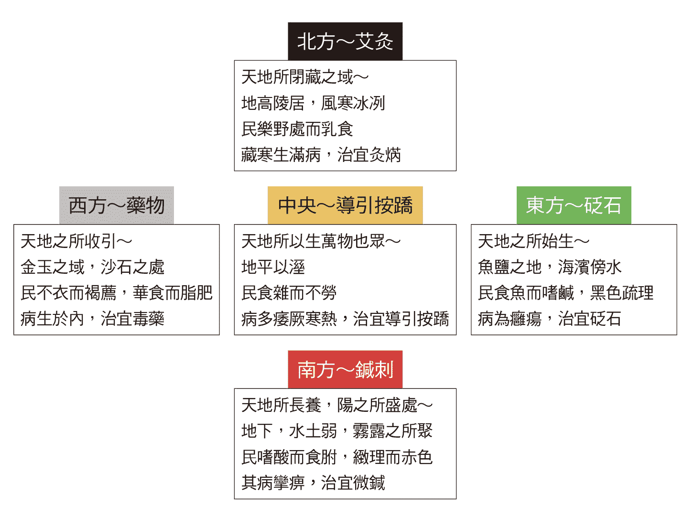

##### 中医「同病异治」的特色

岐伯最后补充说：「故圣人杂合以治，各得其所宜。故治所以异而病皆愈者，得病之情，知治之大体也。」

良医治病的特色在于「得病之情，知治之大体」这九个字，只要能因地制宜，掌握疾病与治法的情况，让疾病与治法「各得其所宜」就能治愈。这就是中医「同病异治」的特色：同一病情，因应不同的生活型态采用不同的治法。例如常见的失眠，住在北方天气寒冷的人，因为多乳食而藏寒生满病，适合用灸法；住在南方天气温热的人，因为嗜吃酸和腌渍物，肢体有挛痹之症，适合用针法。「同病异治」的特色不限于地区，还包括季节和个人特色等，例如冬天与夏天的差异，劳力及劳心工作者的差异，年龄、性别等，都是诊治疾病时必须纳入思考的参数。

中医是与天地相结合的自然医学，重视因人、因时、因地的三因制宜。现代的中医师应善用现代资源与知识，活用中医的传统理念，中医就能与时俱进，开创新局。例如台东是台湾的大药草园，只要多加研究、开发、应用在临床，台东的特色也可以成为台湾中医的活路之一。

##### 《黄帝内经》详载针灸经络之大用

从整部《黄帝内经》内容看来，有关针灸经络的部分远远超乎药物，药物治疗也只是五法中的一法。现代医疗环境与制度限制下，中医师常需「削足适履」配合大环境，保留药物，放弃其他治法，真的很令人心痛，因为针刺、艾灸、放血、方药及按蹻这五法是源自先贤的智慧，历经数千年经验，验证行之有效的中医治法结晶，也是中医治病的法宝，真的不要轻易妥协。因为当我们决定不使用五法中任一方法的同时，我们也在自我放弃中医的筹码，依据「筹码越少越容易灭绝」的生存法则，将让中医逐步走向灭亡之路！中药材的问题不会让中医灭亡，但是当中医界不再珍惜中医传统智慧时，就启动了中医走上消亡之路的机制。

我常提醒年轻医师，千万别将老祖宗的宝贝丢了！应以继承传统中医为首先要务，掌握上述五个治法，加以发扬光大。例如在此五法基础上，添加其他疗法，如透过肺经与心经系统，以五味为基础的芳香疗法；透过肾经与心经系统，以五音为基础的音乐疗法；透过肝经与心经系统，以五色为基础的色彩疗法等。

《黄帝内经》还有许多有关个人身心特质的论述，如五行人，还有人与四季相对应的内容等，这些都是提供中医师在临床诊断及治疗时，将「因人因地因时」三因制宜纳入思考的宝贵指引。

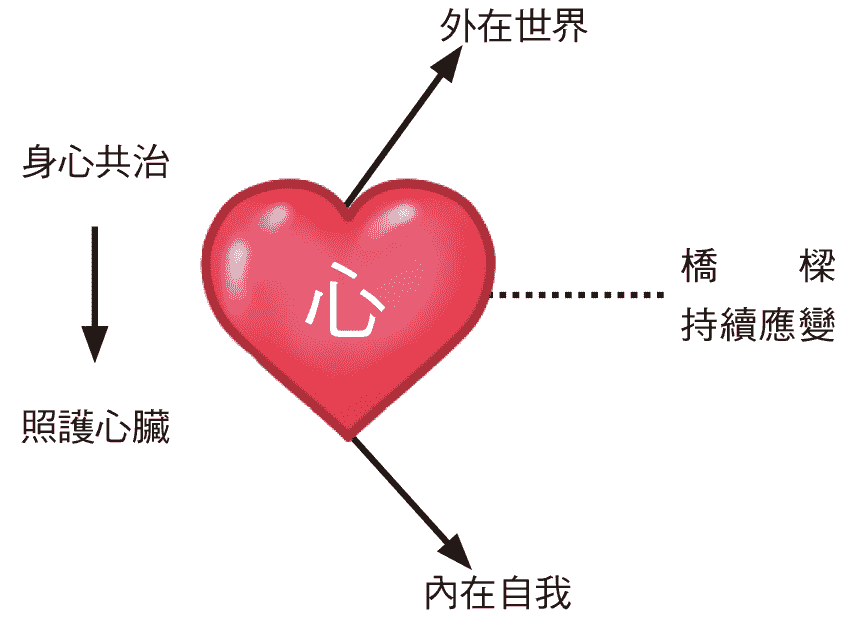

人类身处于天与地之间，随时面对变动，采取对策，心脏是因应内外在环境的主导，也是协调内外环境的桥梁，让身体其他组织器官配合心脏，持续应变，以维持生活与生存。心脏成为「君主之官」，有其荣耀的一面，也有其辛苦的一面，记得要身心共治来照护心脏。

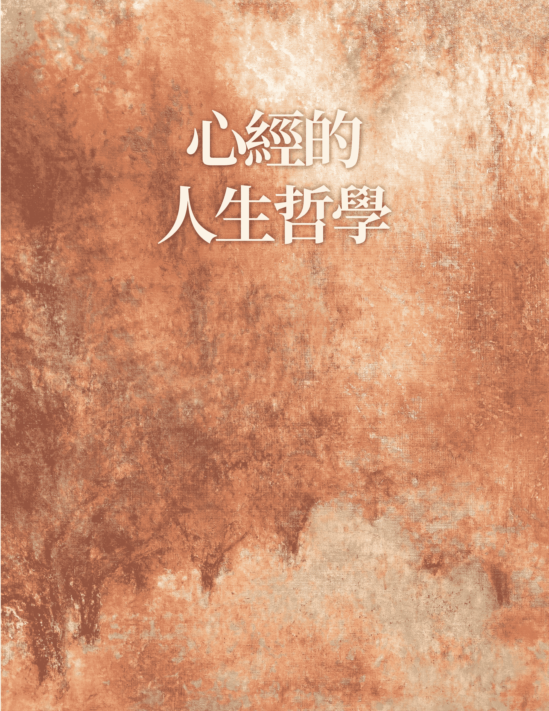

# 心经的人生哲学

心经是故事性很强的经络系统，在我们的人生中，心不只身兼导演、编剧，若以戏剧角色来看待，心就像男主角，脾脏（见本书进贡图）为女主角，其余脏腑则各司所职为配角。心经的四大系统就象是故事发展的长轴舞台，几乎人生所有的悲欢离合都在心经系统上交会，上演着一齣齣荡气回肠、扣人心弦的人生大戏。

每个人的生命都有属于自己此生带来的课题，虽然不是太容易，但也别过度担心，生命同时也会提供足够的资粮来协助我们通过考验，尤其身为君主之官的心经系统就特别具有充足的智慧与勇气，让我们的人生可以活得清心自在，喜乐平安，完成这一生的学习使命。

### 一、君主之官的专属能力

在人体的经络系统中，心身为君主之官这要职，当然也要有统领一个人的身心平衡，以及扮演各经络、脏腑间协调角色的能耐，我将心在这方面的专属能力分为六大特质，再分别介绍：

1.心君统合协调和启动各脏腑、经络系统

2.心主神志，藏有主观感受和记忆

3.心主血脉，面对流动与改变，也能找到安身立命的方法

4.心主喜与笑，且苦味又入心，悲喜交织共同淬炼生命

5.心既是君主又部于表，成为敏感的脏腑

6.心具有阳光与热情的特质，激励我们勇敢迎向挑战

### 心君统合协调和启动各脏腑、经络系统

心这位君主有着诸多耳目，时时刻刻提供身体内部与外在的信息，心就依据身体各处传来的资料，分析之后做下决策，并发号施令让人产生反应和行为。

例如：眼睛看到情敌照片，怒火中烧，愤怒的情绪传送给肝，于是导致怒发冲冠，进而冲动的将照片撕毁；听到熟悉的音乐，回想起已往美好的恋人时光，这份记忆传送给多愁善感的肺，进而眼泛泪光，心绪为之波动；闻到熟悉的餐桌滋味，启动母性的脾经，升起对家乡的思念，因此决定该回家一趟了；或是突然吃到一种特别的味道，想起那食物曾经引发严重的肠胃炎，心也会唤起胃的反应，马上将之呕吐而出。

诸如以上所述，心是人体经络、脏腑的信息统合者，也是所有因应措施的启动者。

之前曾有读者问我，「既然十二条经络系统代表着十二种人格特质与我们共存，那在生活中该如何协调这么多的性格呢？由谁做主呢？」

答案就是「心」。

每个人身上所具备的十二条经络人格，是个人独处或与他人社交时所须的特质，而心脏正是十二条经络系统最高指挥官，在面对时刻变动的环境与心境下，心可以调整适当的经络人格特质来因应，以维持一个平衡的生活质量。

例如在生活中：面对亲爱的家人时，心脏会指派最善于包容、母性最强的脾经来沟通；但若遇到歹徒突然靠近欲抢夺财物，心脏马上指派怒气最强的肝经对歹徒发出怒吼，以及手部动作最灵活的小肠经摆出手刀来防御，足部动作最灵活的胆经抬起无影脚，准备攻击或落跑。当一个人的神志清明，就能从容面对不同的对象与不同的情境，采取最佳状态来因应面对。

反之，若心不清明，抑或生了心病误用经络人格，则会让这平衡功能出了问题，导致身体出现危机，这就是《内经》所说：「主明则下安……主不明则十二官危」之理。

### 心主神志，藏有主观感受和记忆

每个人都有主观性的感受，例如《礼记》说「饮食男女，人之大欲存焉；死亡贫苦，人之大恶存焉。故欲恶者，心之大端也。人藏其心，不可测度也；美恶皆在其心，不见其色也。欲一以穷之，舍礼何以哉？」世上没有绝对客观的美与丑，都是发自内心主观的喜恶感受而已。

《六祖坛经》有段意味深长的故事。某日，印宗法师在讲涅槃经，当时有阵风吹过而见幡飘动，一位僧人说：「这是风在动」，另一僧人则说：「应该是幡在动」，因此议论纷纷，无法静下心来听经。六祖惠能虽不识字但却很有修为，当时也在场，即开口说道：「这既不是风动，也不是幡动，而是仁者你们的心在动。」风吹幡动是件自然的事情，当人们掺入自己的主观概念时，就会产生不同的见解。

主观性的感受常会成为心中记忆的主述。例如宋朝欧阳修［浪淘沙］中的感怀即是：

把酒祝东风，且共从容。

垂杨紫陌洛城东，总是当时携手处，游遍芳丛。

聚散苦匆匆，此恨无穷。

今年花胜去年红，可惜明年花更好，知与谁同？

人们总是不断的累积记忆，之后慢慢变成为人处世的态度。人生态度与心念密切相关。正向的心念会带来积极的人生态度，反之，负面的心念会带来消极的人生态度。心寄窍于耳，耳朵当然也可以用来聆听自己的心声。所以学会倾听心底的声音吧！不要让外界的杂音误导自己走向黑暗路。

另一方面，生命的历练会让人变得比较沉稳圆融，岁月也会磨去个性的稜角，诚如弘一法师说的「恬淡是养心第一法，安详是处世第一法，涵容是待人第一法，谦退是保身第一法。」

### 心主血脉，面对流动与改变，能找到安身立命之法

心主血脉，气血在经脉里不断流动，如同心对外也必须面对变化的事物，注定了人类无论喜欢与否，都要面对流动与改变，甚至还有点「喜新厌旧」的倾向，这也是促使文明发展的动力之一。就像驾车，行驶在高速公路上，过于平坦反而枯燥令人嗜睡，同样的，极度平淡的生活也会让人感到无趣。

心是生命故事的编剧兼导演，岂能老是演出令观众打呵欠的戏码？所以，常会听到安分守己的某人，突然间来个生命大转变，这就是心主血脉的流动特质。

人生如戏，虽然我们贪心的期待高潮迭起，还希望能如好莱坞电影般皆大欢喜收场就更好了，但偏偏人生最后下场终归一途，其实只要认知到这一点，从生命被推到极致的角度回头看时，会发现许多原本在意的坚持也许没那么严重了。诚如苏东坡的诗「庐山烟雨浙江潮，未到千般恨不消。到得原来无别事，庐山烟雨浙江潮。」

人生既是一场戏，遇到的每个人都是粉墨登场的演员，下了戏、卸了妆大家都是一样的，何不一笑泯恩仇呢！

下戏卸妆之后，也请善待自己！在面对外在环境变化，忙碌纷乱之余，千万别忘了自己的心才是生命的归途。记得每天给自己一个小小的空档和空间以回归内心。静下来，只要简单纯然地跟自己的心在一起，听听音乐，喝杯茶酒，看看风景……享受那个片刻，内心深处就会油然升起一股深沉安定的宁静感，让身与心的尘埃沉淀，然后再重新出发。

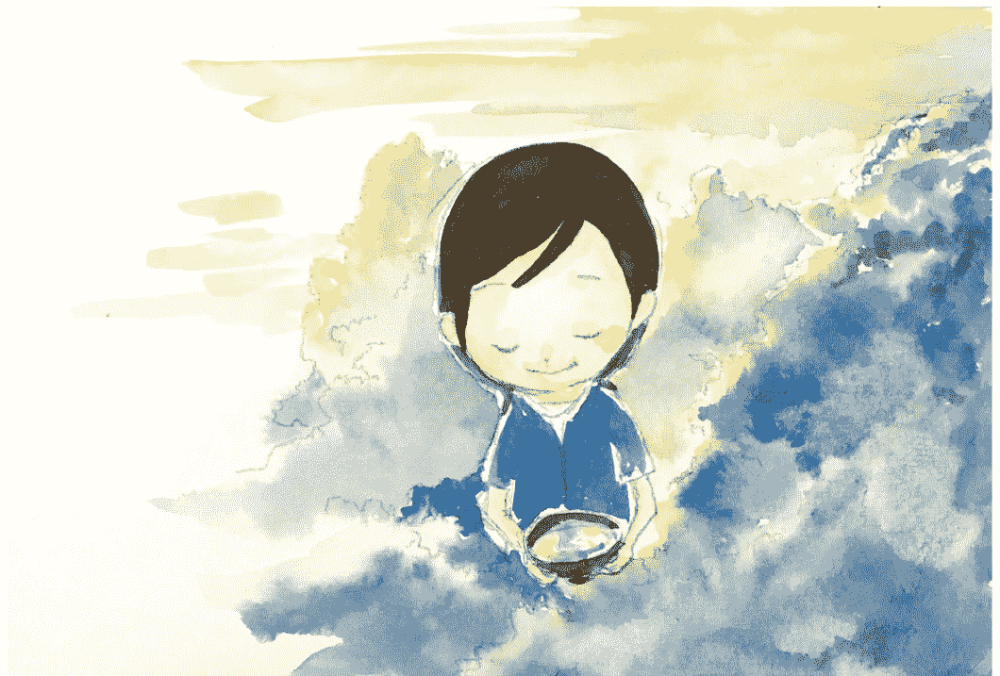

如果遇到难分难解的境遇，退一步就能海阔天空，运动场上跳高跳远选手就是好见证。选手们想要跳得高、跳得远，都要先后退，再加速向前。人生也是如此，过度进逼的态度或方式，只会让心经这条「小心眼连线」的视野和心胸更为狭隘。何不「转念」想想，既然山不转，路转就好！就像选手一样，向后退几步，给自己适当的空间得以看到事实的全貌，就会出现更多的选择机会。

### 心主喜与笑，且苦味又入心，共同淬炼生命

心主喜与笑，同时苦味又入心，悲欢离合，多般变化的人生际遇，都是为了淬炼生命，让生命更有深度，灵命得以成长。

学习中医也让我体验人生，有时从医书汲取精华，有时以病为师，彼此心心相印时，都会不由自主的露出淡淡的笑容，这何尝不是心经的作用？彷彿回到佛陀与迦叶尊者拈花微笑的故事中，「世尊在灵山会上拈花示众，众皆默然，唯迦叶破颜微笑。」每次看到这里，这心领意会的片刻，又会再次牵动我的嘴角与满心的喜悦。

其实笑还能增加魅力，让心脏功能变好，您相信吗？

之前讨论过「阳明主面」与「心之华在面」的区别。在此再详细说明：

#### 【阳明主面】

由于脾胃主肌肉，胃及大肠经提供给面部的营养，主要用来形成面部浅层的肌肉。营养好的人，面部肌肉会变得丰满，台语称为「膨皮」；营养不良则会出现「面黄肌瘦」。

#### 【心之华在面】

由于心主血主脉，跟面部的血管有关系。心经经别「上走喉咙，出于面，合目内眦」，这条路线走在面部肌肉的内面。所以面部血管、深层肌肉和口腔黏膜都由心及心经管理。

阳明主面及心之志为喜，当我们做出「笑」表情的时候，面部的组织会被牵动，一方面疏通大胃王两经，让面部肌肉膨起，更有型且更有弹性，增加人缘，提高魅力；另一方面也疏通心经，连结至心，就会「开心」，让心脏功能变好！因此微笑不仅疏通了面部的经脉气血，同时也按摩心经与心脏，这就是笑容可以打开心门，让自己「开心」也能「护好心」的秘密！发自内心深处的喜乐与笑容最能吸引人，感动人。

临床有病人会问，如果真的找不出特别快乐的事，笑不出来怎么办？

没关系！就先从「皮笑肉不笑」开始吧！反正，假笑久了以后，肌肉习惯被拉松，面部表情会变得柔和，心脏也逐渐开展。然后，有一天突然发现，脸上怎么没事也总挂着笑容呢？这就是真的笑了。只要持续努力练习，假笑终究会变成真笑。

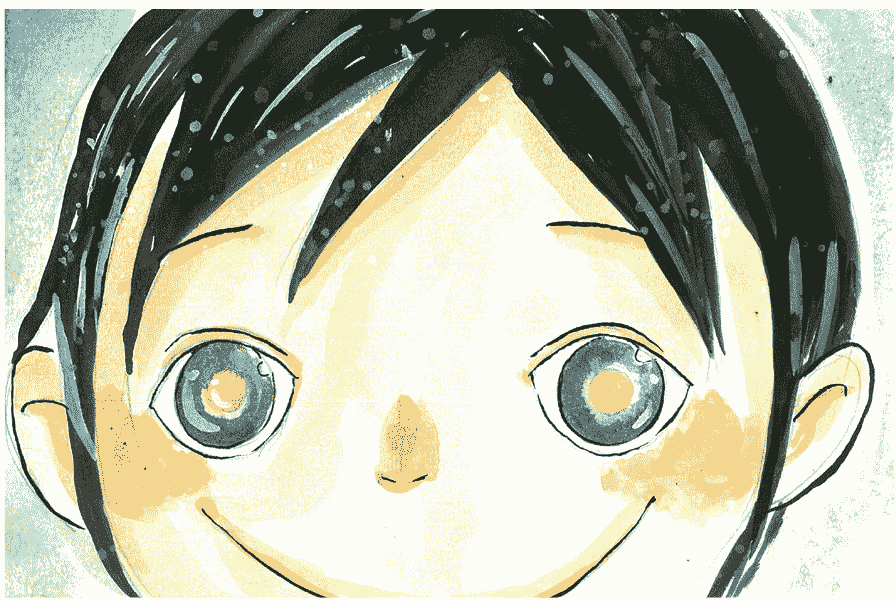

### 心既是君主又部于表，成为敏感的脏腑

前面篇章介绍过「心部于表」，指出心脏面对外在环境变化时，除了身体层面会启动防御机制之外，心理层面也会产生情志的变化，因此心脏成为人体中最为敏感的脏腑，很容易在变动中失去平衡，难怪曾子要「一日三省吾身」，时时注意自己的修为。从中医的角度来看，每天若能透过反思一日之事，有助于沉淀纷乱的情绪，也是让心回复平衡的一种方法。我们若能有禅宗神秀大师「身是菩提树，心如明镜台，时时勤拂拭，勿使惹尘埃。」 的境界已属难能可贵，若要做到惠能大师「菩提本无树，明镜亦非台，本来无一物，何处惹尘埃。」更是千载难得呀！

以此看来，心似乎被动地面对变化，其实不然！天地是大宇宙，人是小宇宙，太阳是大宇宙的主宰，心脏是小宇宙的主宰，心为君主握有一切的主控权，也是自己生命的主宰，一如前面所说 “ You Create Your Own Reality. ”「万物由心造」，心脏时时刻刻在做抉择，编写自己的生命剧本。

心君当然也可以选择要过何种人生。年轻时看到《红楼梦》作者曹雪芹对于「凤姐」王熙凤的评价： 「机关算尽太聪明，反误了卿卿性命。生前心已碎，死后性空灵。」悚然一惊，原来时时算计的人生，到头来，不仅不会增加世间的荣华富贵，反而会减损生命的丰足喜乐。随着年龄增长经历世事，加上在诊间看尽生老病死，更能体会「机关算尽」，让内心变得无比的尖锐冰冷以及事后的无限悲凉。

我认为生命还能有不同的样貌啊！何不缓下脚步，停下算计，让心沉静、柔和、温暖，好好享受苏东坡在［前赤壁赋］中的清风明月呢？

客亦知夫水与月乎？逝者如斯，而未尝往也；盈虚者如彼，而卒莫消长也。

盖将自其变者而观之，则天地曾不能以一瞬；

自其不变者而观之，则物与我皆无尽也，而又何羡乎？

且夫天地之间，物各有主，苟非吾之所有，虽一毫而莫取。

惟江上之清风，与山间之明月，耳得之而为声，目遇之而成色，

取之无禁用之不竭，是造物者之无尽藏也，而吾与子之所共适。

### 心具有热情和阳光的特质，激励我们勇敢迎向挑战

自然界的太阳每天日出日落，生生不息；阳光穿透云层，普照万物，无所偏倚也无所畏惧，提供所有生命所需的能量。心脏是人体的太阳，也一样充满热情温暖，自由无所畏惧，提供我们迎向生命挑战的勇气。

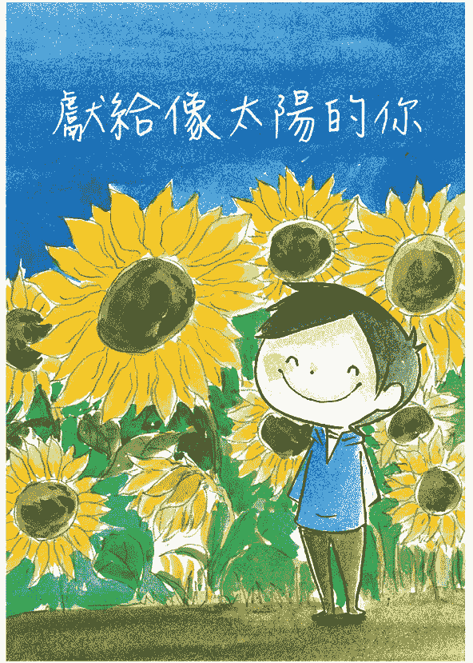

一如爱默生说的：「热忱是成功最强大的引擎之一。当你做一件事时，投入所有的力量，融入整个灵魂，以人格做担保。要积极、有活力、有热忱、有信心，这将让你达到目标。没有伟大的事是在缺乏热忱的情况下完成的。」这段话所阐述的热忱力量，正是来自于心的特质。

我始终相信生命是善意的，帮助我们灵命成长，即使在最艰难的时刻，也都潜藏守护我们的力量。从太极图来看，即使在最黑暗的时刻，也都存在光明，恰如《易经》说的「否极泰来」，历经风霜严格淬炼的灵魂，会有越高层次的成长。例如奥地利心理学家兼意义治疗大师维克多·法兰克（Viktor Emil Frankl），家人几乎都在二次大战纳粹集中营里丧生，他亲历集中营三年的惨痛经验，反而对于人类的心灵力量有了深刻的体悟，因而发展出积极乐观的人生哲学，他引用尼采的话：「打不垮我的，将使我更形坚强。」创立了意义治疗理论，抚慰了许多徬徨虚无的灵魂。

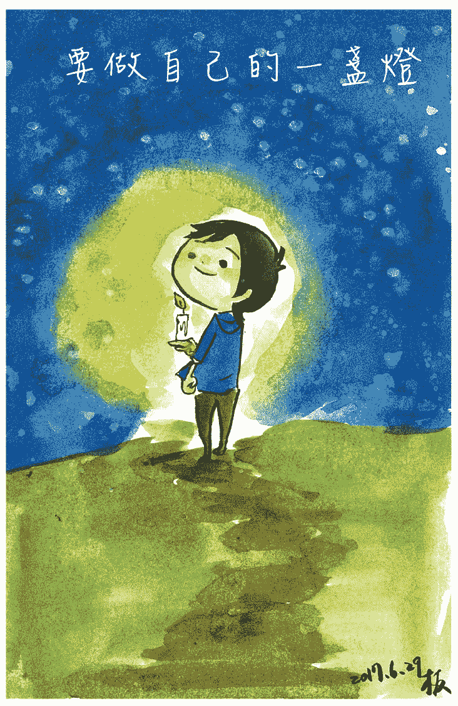

由此可见，心具有的太阳属性是非常的坚强与勇敢，没有人可以夺走你的自由意志，一如［野百合也有春天］歌曲，无论多卑微的生命，老天都无绝人之路，惟有人自绝之。

人身难得，千万不要轻言放弃自我与生命。

心是太阳，也属火，火能照亮万物，就让自己成为一道光，照亮自己，也照亮世界吧！

有一首恋爱中人爱唱的英文老歌，歌名就有太阳 You are my sunshine，我更喜欢 Debbie Boone 唱的 You light up my life（ 你照亮我的生命） 这首歌。其实每个人本来就有属于自己的光亮，只要呵护好心脏，就能化被动为主动，无需等候他人来照亮，自己的心光自然就会充盈自己和他人的生命。所以，让自己勇敢的亮起来吧，燃起生命的热忱迎向挑战。

人生际遇一如植物果实，都是由青涩苦味到甜美甘润，只要勇敢面对自己，常保心中那份热忱，一时的成败，都是过眼云烟，无须过度在意或是苛责。让我们好好守住心中那把火炬，自然就能拥有属于自己的温暖。

### 二、心经世界中的变与不变

### 「变」是万物不变的道理，心是维持平衡的天平

变动是万物不变的道理，每个人都会遇到最切身的变化就是「时间」，每天的日夜变动与四季的春夏秋冬都持续更迭，不会为任何人或事停留，人生亦然。心经是脾经的下一条经络，脾经气血最后流注到心，心脏接受脾经带来的幸福滋味与爱的能量，成为维持身心平衡的天平。

宋朝无门慧开禅师的禅诗说：「春有百花秋有月，夏有凉风冬有雪。若无闲事挂心头，便是人间好时节。」只要心念单纯，懂得放松，不仅不会被四季变化干扰，还能打开心眼，尽情享受各个时节带来的美好，时时都有颗喜乐的心。

所以《内经》说「任物者谓之心」，意义非常深远。生活中我们得面对瞬息万变的内在与外在环境，如气候阴晴不定、新闻事件、朋友聚餐、和他人的关系等，内在则有情绪波动、起居作息等状况，我们的心时时刻刻都有所感受，也都有所回应。

心宛如一个天平，面对万事万物时也像生命的避震器，要将身心状态调回到原点，维持平衡。面对小的变动，「微调」即可；面对大震荡，则需要较长时间，大幅度调整。心脏如果调整不及或反应过度，就会影响身心失衡而百病丛生。

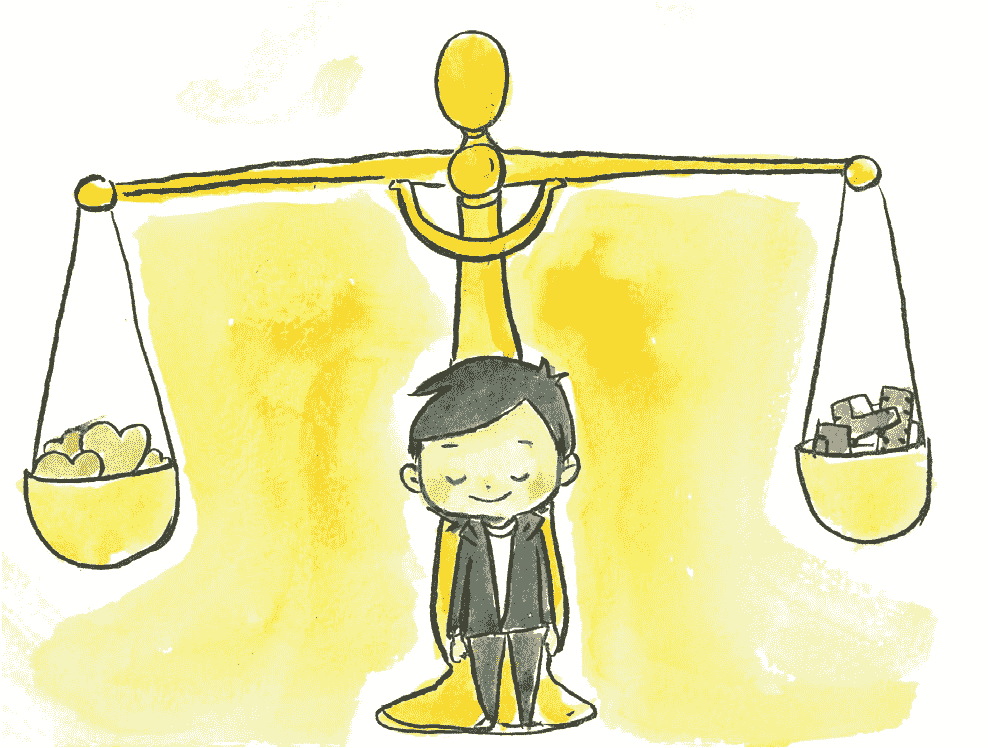

2018 年 10 月 21 日，台湾东部发生普悠玛火车翻覆事件，造成重大伤亡的交通事故。我和一群中医医护人员为了协助伤者及家属尽快走出阴霾，在 12 月 1 日启动「1021 一定爱你」连续义诊。在治疗伤者的过程中，深切感受到事故发生时，列车急剧撞击而导致前面三个车厢的旅客同时遭受严重的身体损伤和心理恐慌，都出现了「身心共创」的状态。

这段临床义诊治疗过程，更让我们深深体会到身体与心理之间紧密的影响。因此在第一次治疗时，我都会选用心经，以「身心共治」启动恢复伤者身心平衡的第一步。

#### 「变心」是必然的，不要害怕改变

「变动」是心须要时时刻刻面对的状况，随着天地宇宙运转而生生不息，随着年龄增长而成熟蜕变，随着外境变换而因应出招等，「变心」也是人类必然的生存方式。但时时刻刻迎接变化球的心，有时也是最害怕面对改变的心。

《席慕蓉散文集》中有一段：「原来，原来世间一切都可伤人。改变可以伤人，不变却也可以伤人。所有的一切都要怪那颗固执的怎样也不肯忘记的心。」虽然是文学性的语法和感叹，倒也点出了心的执念。

临床上，常看见病人卡住的问题，都是源自一种心病，就是不肯面对改变，接受改变。最可怕的是紧抓着那些已经僵化的情绪不放，一旦这些负面情绪控制了心念，如愤怒或受害者情结等等，心的平衡功能无法好好发挥，失去调整情绪去面对不同情境的能力，由此而生的僵化情绪，更会加剧失衡的状况。

#### 「心战三部曲」调整心念

所以如何培养具有弹性，透过历练以应万变的心，进退有据，在面对外界变动环境时，内心仍能维持沉稳温暖，需要高度的智慧。身为医者在诊间，只要遇到身体重症或深度忧郁，且已经出现僵化情绪的病友，常会采用问话式的「心战三部曲」来调整心念：

第一部曲：问「有没有想要变好？」回答有！就进入第二部曲。

第二部曲：问「相不相信自己会变好？」回答相信！进入第三部曲。

第三部曲：说「那就要做一些让自己会变好的事情吧！」例如调整饮食、作息、运动等。

治疗过程中，只要病人出现任何改善，我都会大力称赞他很棒，并跟他确认身心已经开始要变好囉！看到病人眼睛开始出现神采时，就知道「心战」奏效了！这方法也适用在所有人身上喔！

### 心对于时间变化的主观感受

时间是所有变动的基础，因此心最想掌控时间，期望这个世界依据我们的主观意念运作，例如对于感情，总希望能相爱到地老天荒，此情不渝，诚如电影《无尽的爱》主题曲 Endless Love 一样。然而不幸的是，这个想法也正是所有烦恼痛苦的根源。

同样去掌控时间，苹果计算机创办人贾伯斯则提出更有建设性的见解：「生命中真正拥有的只有时间。如果你能将时间用于投资自己，得到丰富人生很棒的经历，就不可能会失去什么。」

在写书的同时，也看到网络上一首有趣的诗与大家分享：

New York is 3 hours ahead of California, but it does not make California slow. 纽约时间比加州时间早三个小时，但并没有让加州时间变慢

Someone graduated at the age of 22, but waited 5 years before securing a good job! 有人 22 岁就毕业，却等了 5 年才找到好的工作

Someone became a CEO at 25, and died at 50.

有人 25 岁就当上 CEO，却在 50 岁去世

While another became a CEO at 50, and lived to 90 years.

也有人迟到 50 岁才当上 CEO，然后活到 90 岁

Someone is still single, while someone else got married.

有人依然单身，同时也有人已婚

Obama retires at 55, but Trump starts at 70.

欧巴马 55 岁就退休，川普 70 岁才开始当上总统

Absolutely everyone in this world works based on their Time Zone.

世上每个人本来就有自己的发展时区

People around you might seem to go ahead of you, some might seem to be behind you. 身边有些人看似走在你前面，也有人看似走在你后面

But everyone is running their own RACE, in their own TIME.

但其实每个人在自己的时区中进行自己的竞赛时程

Don’t envy them or mock them.

不必嫉妒或嘲笑他们

They are in their TIME ZONE, and you are in yours!

他们都在自己的时区里，你也是

Life is about waiting for the right moment to act.

生命就是等待正确的行动时机

So, RELAX. 所以，放轻松

You’re not LATE. 你没有落后

You’re not EARLY. 你没有领先

You are very much ON TIME, and in your TIME ZONE Destiny set up for you. 在命运为你安排，属于自己的时区里，一切都是嘟嘟好

若能认知到每个人都是独特的，都被赋予独有的善意生命课题，总会在正确的时间，发生正确的事情，就让自己在时间长河中学着水上漂，随波逐流吧！生活就会更为自在。

### 永久不变的是发自内心真爱的力量

虽然世界持续变动，但也有不变之事，「爱」就是其中一个重要的力量，可能立刻会有人举手反对：「爱情最不可靠了，才说人会变心怎么又说恒久不变呢？」在此恒久的「爱」谈的当然不单指小情小爱的儿女私情或个人好恶，虽然在爱情与亲情的故事里，都有至死不渝的感动不时撼动人心，但更宏大的爱是付出无所求的大爱和博爱，这份悲悯心与同理心甚至扩及不认识的人，即「老吾老以及人之老、幼吾幼以及人之幼」的那份「无缘大慈，同体大悲」的爱。

汉字是富含人生智慧的杰作，以「心」组合而成的汉字非常多，「爱」是最具有正向力量的。「爱」字由「心」与「受」合成，而且「心」介于「受」中间，透过心在人体中间及两人之间的作用，当事者有所感受，这就是爱！多奇妙的组合和隐喻啊！

「爱」是宇宙间最大的力量，爱的种子存在宇宙万物之中，能超越时空及物种，抚慰仇恨与寂寞。平常大家都习惯以爱心的形状来呈现爱，所以在我们的认知里，由爱而产生的热血、热情、热心……都跟心有关，而且这股力量还会感染他人，产生善的循环，展现出「人性本善」的特质。这份心也是中医所说的「心」，心主血主脉，心的颜色就是血液的红色，血液是温的，心的五行属火，有心人就会有着热血与热情。

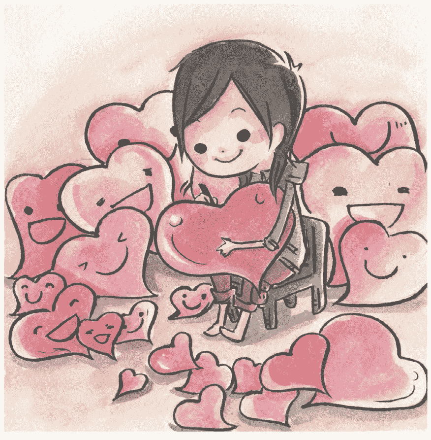

在经络第二组团队中的心与肾，正好是两股对立力量，如光明与黑暗、喜爱与恐惧。而爱是最大的光明力量，可以抚慰来自阴暗角落的失落恐惧。

希腊神话故事中，爱神邱比特会将金箭射入人心，挑起心动而产生爱情。曾有一位演讲者在台上阐释爱的真谛与心的力量，台下有位科学家听众很不以为然，他认为爱只是一种化学变化而已。演讲者问他：「你爱你太太吗？」他答说当然爱呀。演讲者追问：「请问你用什么去爱你太太？是用心？还是化学变化？」科学家一时为之语塞！聪明的读者，您说呢？

* * *

###### The Rose

美国女歌手贝蒂蜜勒（Bette Midler）唱的 The Rose，点出爱是一朵玫瑰，需要勇气与信心浇灌。歌词非常优美深邃，在此与读者分享：

Some say love it is a river that drowns the tender reed

有人说，爱是一条河流，会淹没柔弱的苇草

Some say love it is a razor that leaves your soul to bleed

有人说，爱是一把剃刀，会让你的灵魂渗血

Some say love it is a hunger and endless aching need

有人说，爱是一种永无止尽，苦苦追求的渴望

I say love it is a flower and you its only seed

我说，爱是一朵花，而你就是那花儿的种子

It's the heart afraid of breaking that never learns to dance

害怕跌倒的心，永远学不会跳舞

It's the dream afraid of waking that never takes the chance

害怕美梦会幻灭（不敢尝试）的人，永远会错失良机　

It's the one who won't be taken who cannot seem to give

吝于付出的人，永远无法得到回报

And the soul afraid of dying that never learns to live

恐惧死亡的灵魂，永远不懂得如何生活

When the night has been too lonely and the road has been too long

当夜间过于寂寥，长路漫漫

And you think that love is only for the lucky and the strong

你认为只有幸运儿及强壮者才能得到爱之际

Just remember in the winter far beneath the bitter snows

请记住，在严冬厚厚的积雪之下

Lies the seed that with the sun's love

埋藏着那颗充满阳光爱意的种子

In the spring becomes the rose

一旦春天来临，必能绽放成一朵美丽的玫瑰

当年在国外读书时，电视常播出非洲孩子孱弱的身躯，茫然的眼神，伴随着惠妮. 休斯顿（Whitney Houston） 清亮的嗓音唱出 Greatest Love Of All ，让我生起转行以医疗来行于世的念头。这首歌词写得也很好，有兴趣的话可上网查阅。

* * *

### 三、心经循行路线教导我们的人生哲学

虽说心经系统简称是一条「小心眼连线」，但日常生活中可千万不要小心眼喔！心身为君主之官还是有其宽阔的格局与眼光。例如我们可以常保二心：做事专心，处事平常心。所以我很喜欢日本人说的「一所悬命」或「一生悬命」，坚持专注，尽善尽美，甚至用生命守护自己最看重的事物；另一方面也以平常心面对世事的变化，得失心就不会太重，身心共治，时时都能喜乐微笑，经络气血也能通畅，天天都是好时节。

其实认识心经的循行路线，也有一番人生哲学能提醒我们。

### 「心胸」代表视野格局和容人雅量

我们常以心胸开阔或狭窄比喻一个人的视野格局和容人雅量。

心经循行于胸腔，连结心肺两脏，胸部为心肺之宫城，主宰一身的气血。气血流畅，心胸会有开阔感，心情平稳，耐受力高，当然也有容人的雅量。反之，气血运行涩滞，心胸憋闷，遇事容易烦躁动怒，所以脾气的好与坏也跟心胸有关。

明朝陆绍珩曾说：「大事难事看担当，逆境顺境看襟度；临喜临怒看涵养，群行群止看识见。」指出面对各种人生境遇时的心态，决定一个人的格局，也就是说临事的态度而不是能力，决定了生命的高度。

有些人升官之后，态度和做法跟着改变，这种情况常被说成「换了位置也换脑袋」，言语中多有不屑，但客观来看，这是必然的呀！试想在台北 101 大楼每个楼层所看到的风景不同，感受也不同。如果没有差别，大家又何必拚着命想要登高望远呢？人生也是如此，不经一事，不长一智，不同的职位，不同的人生境遇，例如升格当父母亲，眼光和心境当然不同，抉择也会跟着改变。换了位置，怎么能不换脑袋呢？让心敞开吧！接受「变心」是必然的，人生就会轻松好过许多。

### 「面容」是心的镜子，心变，相也跟着变

心主面，主管五官的细腻感受；心也是变色龙，随着身体及心理状况变化，面色和表情也会跟着改变，如果一个人对于各类感受不再有反应时，就表示心生病了。临床见到许多长期忧郁、情绪低落的病人，面对外界的刺激时，常常无动于衷，面无表情也没有任何反应。

面容是心的镜子，心念改变，面相也会跟着变。慈祥的长辈通常笑容满面、笑口常开，让人想与之亲近；严肃的长辈常嘴角下垂，紧抿着嘴，法令纹明显，让人畏惧，不敢亲近。

如果想让自己开心或让人想要亲近，可以采用前面介绍过的「假笑」练习法，试着拉开紧绷或下垂的面部肌肉，时间久了，就会出现让人喜悦的真心笑容。

另外，心主面与色，各种颜色代表不同的心情与个性，日常生活中也常见面部颜色的变化，如生气或恼羞成怒时面部涨红，说谎被揭穿时的心虚苍白等，面色都会透露心里的感受。前面说过的「看人脸色」不也同时在感受对方的心情？

读者也许会问，中医说肝主怒，怎么这里又将生气愤怒情绪也归给心脏？好问题！大家别忘了，心为君主之官，不仅主管身体的平衡，所有情绪（七情），包括喜、怒、忧、思、悲、恐、惊之间的稳定也都由心掌控，各个情绪再分派给其他脏腑做细部管理，这就是管理学上的「分层负责」概念，所有人最后都要回报给最高领导──心脏是也。「失心疯」就是因为心神混乱，国无明君，再强的部属也无法 hold 住国事，导致所有情绪都错乱。

### 拿下有色眼镜，转动心念看世界

由于心与眼睛相连，心念会影响有关眼睛所见事物的感受，例如同样的雨景，恋爱中人认为超级浪漫，失恋的人则认为天地与其同悲。我们其实一直戴着「有色眼镜」看这个世界：心情好，万事佳；心情差，万事乱。不仅如此，我们还常将自己的心念投射来解读他人的行为举止。

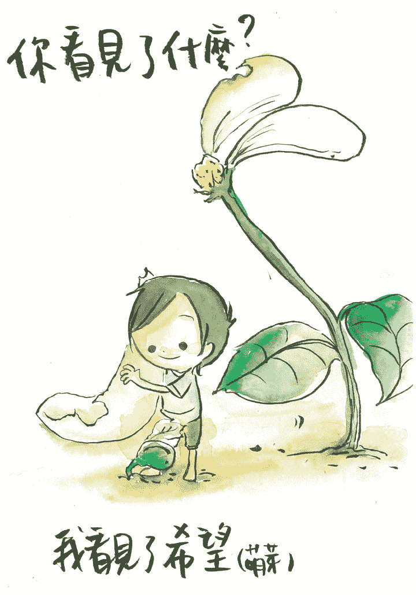

既然「有色眼镜」为欲念所创，解铃还须系铃人，我们也拥有改变的力量，「转动心的正念」，正是摘下「有色眼镜」的不二法门。只要心念改变，转动僵化的情绪，不再被自己的情绪所困扰，即使面对阴霾雨天也会有开朗的心情！

### 心口相连，口吐莲花还是祸从口出？

由于心与舌的连线，表达时不仅要说清楚，更要让听者愿意接纳，同样要传达讯息，若使用了不同的遣词用字、语气和表情，因而被冠以「舌粲莲花」或「毒舌派」的差别评价，这都考验着心的智慧。

有人会很无辜地说自己并不想成为「毒舌派」或「刀子嘴豆腐心」，但又不知如何改变。其实还是可以借用「练习微笑」的概念，学习在每件事情上找到良善的角度，以赞美肯定的语气来表达，练习久了，自然就会顺口成章啦！

言语也能强化彼此的信任，俗语说「一言既出，驷马难追」，君子重然诺，一诺千金，不守承诺的人常会被认为不守信用不可靠而被疏离或唾弃。所以夫妻之间可能因一句承诺而苦守寒窑十八年，朋友之间也因一句承诺而挺身支持到底，这些都是因为心的作用而产生的具体行动。

借用孔子所说「今吾于人也，听其言而观其行」和「巧言令色，鲜矣仁！」来验证中医的人生哲学。孔老师在阅人无数之后，深深体会要真正了解一个人，不仅要听他所说出的话，更要观察他的行为，言行合一才能信任。尤其有人特意说出甜蜜好听的话，装出讨人喜欢的脸色，千万要小心，这种人是很少有仁心的。只要细心观察，就可判断是否出于真心的话语与面部表情。

心与面部、舌头及语言的关系，提醒我们面部表情、眼神与言语都是双面刃，既能救人也可以伤人，君不见现今许多社会案件大都起始于一个眼神或一句话而已？这些也都是来自心的作用。

### 君王之位连接小指，提醒谦卑内敛

心脏这么重要的器官最后连结小指，令人不禁赞叹人体结构真的很有哲理。大大的心脏连结小小的指头，提示我们位高权重时，要记得谦卑内敛，缩小自己，如此才能功成身退。

小指是与心约定的指头，行过人生的风雨时，记得要勾住自己双侧的小指，跟自己约定：无论未来如何，还是要心怀喜悦、感恩与微笑，当你微笑时，全世界都会陪你笑了。

### 四、君主之官的心也会迷航

心必须时刻面对各种挑战，成为人体最敏感的脏腑，不只要有弹性，还要可刚可柔，才有足够的应变能力。若稍一不慎失了分寸，心也很容易迷航。

### 心绪的迷航

心热情奔放，若不自制，当然也很容易被诱惑、被煽动，如同「煽」这个字的左边从火，若心不坚定，一阵风吹来火苗便乱窜，就像身处在一群激动鼓譟的群众之中，这种氛围会让浮躁的心失去独立思考的能力而盲目跟从。

而过度放纵自己的偏好，也会让心像偏食的孩子一样，耽溺痴迷于特定事物，导致情绪明显失衡，如面对喜爱的电玩游戏很快就能上手，且轻易破关进级，但也因此沉迷其中荒废课业，此时若要面对不喜欢的功课，心也会不断跳开，无法专注，甚至烦躁难耐，坐立难安，两种态度截然不同。

如何提醒自己倾听来自心底真实的心声，是一个很重要的课题。有一次陪家人看迪斯尼卡通时，也在故事中看到了这个人生智慧！心寄窍于耳，耳朵当然也能听到心语，在《历险小恐龙》片中，恐龙妈妈叮咛小恐龙说：「Let your heart guide you. It whispers, so listen closely. 」犹记第一次听到这段对话时，非常惊讶，怎么连动物都这么有智慧！如今方知有智慧的应该是编剧，而不是恐龙妈妈！

### 时间的迷航

心对于时间的感受也很容易错乱，例如：同样的一个半天，与心爱的人相处会觉得「时光飞逝」，与心爱的人分离会觉得「度日如年」，跟老板开会则是「时光停滞」。然而，时间不曾为任何人停留，地球也不会为任何人停止转动，虽然古月会照今尘，然而无论今夕是何夕，客观的时间都不曾有快有慢。一切都是人的主观感受才让时间变得似乎有长有短。

《卷一》中介绍「肺」因记录生命的演化历程，成为时间的客观记录者；而在本卷中「心」能感受生命的每个历程，成为时间的主观掌控者，无论是「爱你到地老天荒」，或是「一日不见如隔三秋」，都不是普世的共同时间，而是个人的心理时间。

心也会记录生命中的每个历程，这些记忆一般以为是存放在脑部，但曾有人接受换心手术后，性格与记忆竟然产生变化，变得跟捐心者一样。美国曾发生类似的情况，69 岁的葛汉接受 33 岁举枪自杀的卡托的心脏移植，却在十二年之后，与捐赠者的命运一样开枪结束了自己的生命；还有住在麻州 47 岁女子在移植了一名男孩的心脏后，竟变得十分像男孩，并且还爱上男孩最喜欢的啤酒和肯德基炸鸡。

这些案例开始让研究人员怀疑是否有些人生的记忆也可能存放在实体的心脏。

有关这类记录，早在《列子‧汤问篇》就有记载，神医扁鹊帮公扈与齐婴交换两人心脏。换心成功之后，公扈自然而然的回到齐婴的家，并认齐婴的妻子；齐婴回到公扈的家，并认公扈的妻子。也就是说，心脏带着原有的记忆进入另一个身体继续运作。

因此，善于应变有弹性且敏感的心，千万不要迷航，别让情绪僵化，或在心里筑起一道墙，如历经重大创伤后的「哀莫大于心死」，甚则「久病厌世」，都会让心失去平衡情绪的能力，而让生命走上绝路，非常可惜。

### 五、对于医者的提醒

《内经》提醒医师在面对病人时，「凡治病必察其下，适其脉，观其志意与其病也。拘于鬼神者，不可与言至德。恶于针石者，不可与言至巧。病不许治者病必不治，治之无功。」

这里提醒两件事：

首先，治病时不仅要掌握病人身体上下和脉象变化，还要观察他的情绪状态与病情表现。

医护人员每天忙着面对生病的人，纵使忙碌不已，我还是常常提醒年轻医师，以治疗生病的「人」为重，而不仅是治疗人所生的「病」，要重视 Human Touch， 「人」才是所有医疗的核心。无论工作多久、多忙，都不要忘记身为医护人员的初衷，同时还要留意疾病状态与病人感受，以理性的脑、犀利的眼、热情的心、灵巧的手、面带微笑，心中有爱，身心共治，才能帮助病人脱离病苦。

其次，有些病人受心态问题所限，《内经》中提醒即使治疗也可能无效，例如：拘于神鬼迷信者、不喜欢针灸治疗者、以及不愿意接受治疗者，这三类人治疗都不会有成效。虽然《内经》是这么说，临床上我们不会轻易放弃，还是会努力尝试，譬如面对迷信鬼神者，试着转动病人的观念到中医理论；对于不喜针灸者，则尝试使用非侵入性的治疗方法；至于不想接受治疗的人，总要深入了解病人不愿接受治疗的动机，只要病人愿意改变心念接受治疗，一切都是值得的。

### 六、丰盈喜乐，时时运转的心人生

心的太阳特质加上灵巧的应变能力，只要 Keep Going，保持前进的动力，以不变的爱和转动心念来因应万变，持续运转的人生也会反馈我们丰盈的喜乐。最后与读者分享两阙词，也是我生命中呼应心经的人生哲学寓意深刻的心境。

昔日在异乡外地求学，一日大雨，刚好读到苏轼登超然台眺望春色烟雨，触动乡思所写下流传千古的［望江南］：

春未老，风细柳斜斜。试上超然台上看，半壕春水一城花，烟雨暗千家。

寒食后，酒醒却咨嗟。休对故人思故国，且将新火试新茶，诗酒趁年华。

读完，胸壑有股畅快感，尤其是：「休对故人思故国，且将新火试新茶，诗酒趁年华。」人生苦短，还是把握时间，享受天地的赐予吧！

再读辛弃疾的［青玉案］则有着人生最深的体会：

东风夜放花千树，更吹落星如雨。

宝马雕车香满路，凤箫声动，玉壶光转，一夜鱼龙舞。

蛾儿雪柳黄金缕，笑语盈盈暗香去。

众里寻他千百度，蓦然回首，那人却在，灯火阑珊处。

我们的心常常被外境影响或受内在感受而散逸，出现「众里寻他千百度，蓦然回首，那人却在，灯火阑珊处。」的情形，我相信只要能回归内心真实面对自己，这世界就是属于自己的世界。

我们仍是自己生命故事里最精彩的编剧、导演与演员。

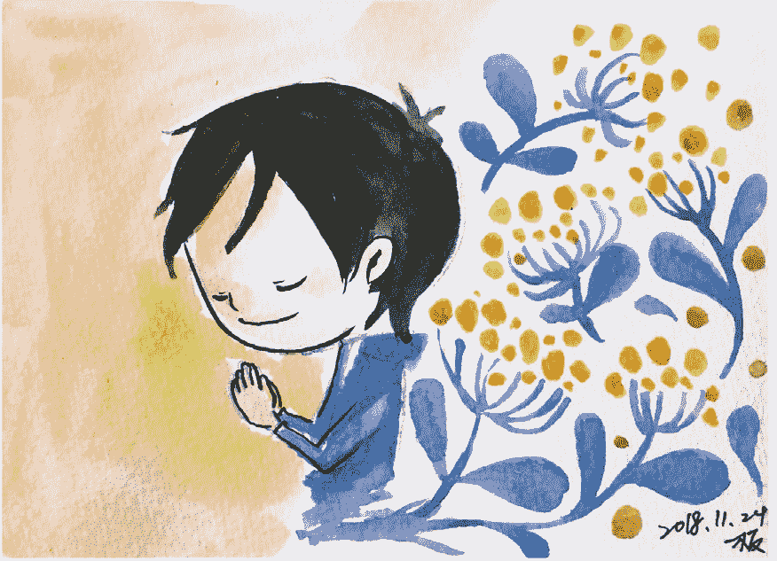