# 製作說明：

本書由《天使神秘學院》出重金從台灣購入的原版書籍掃描製作完成。為達到最好閱讀效果，特地把書全部切開後，再經由專業掃描設備高精度掃描完成，並經過一張張的PS後期處理最終成書，其間花費大量的人力、物力以及時間，只為能給大家提供經濟並優質的神秘學學習資料而努力。

本學院強烈譴責某些機構和個人，把本學院花心血製作完成的電子書籍，包裝後直接放在自家網上低價傾銷的行為，以謀取不勞而獲的經濟利益。如果長此以往最終將無人願意再為大家花心思製作電子書，那以後可能大家再無新書可讀。

為讓大家以後能夠讀到更多的好書，也為了本學院的良性發展。本學院懇請大家儘量做到如下幾點：

一、 盡量在天使神秘學院的官方網站購買電子書籍。
官網訪問地址：**http://www.ac2011.cn**
短網址：**ac2011.cn**
網址含義：(Archangel College 成立時間：2011年)

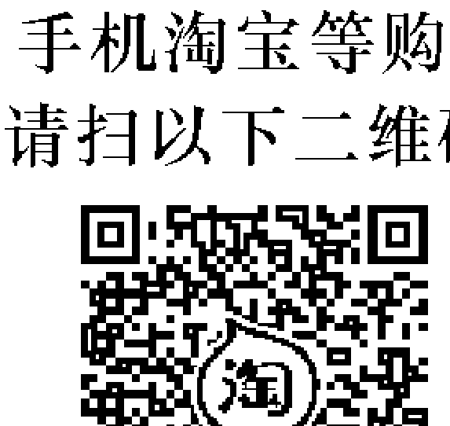

二、 在收到電子書後小範圍傳閱即可，千萬不要公開傳播，更別掛到網上低價銷售。

同時為答謝廣大支持者，學院電子書將做如下調整：

一、 學院會把一些早已收回製作成本的電子書折價銷售。

二、 最新製作的電子書籍會開放列印功能，大家購買後有條件的可自行列印成書。

# Smile 151
經絡解密 卷六

# 解開腎經先天之本與奇經八脈的身世之謎
——腎經＋奇經八脈

作者 沈邑穎

策畫 蕭菊貞

封面畫作 吳冠德

內頁圖 小瓶仔

責任編輯 李維美

美術設計 許慈力

校對 余宛真、鄒牧帆、張馥馨、林坤立
陳立山、張玉玲、蕭菊貞、沈邑穎

出版者：大塊文化出版股份有限公司
台北市 105022 南京東路四段 25 號 11 樓
www.locuspublishing.com
讀者服務專線：0800-006689
TEL：(02)87123898  FAX：(02)87123897
郵撥帳號：18955675  戶名：大塊文化出版股份有限公司

法律顧問：董安丹律師、顧慕堯律師

版權所有  翻印必究

總經銷：大和書報圖書股份有限公司
地址：新北市新莊區五工五路 2 號
TEL：(02) 89902588  FAX：(02) 22901658

初版一刷：2021 年 6 月

定價：新台幣 680 元

Printed in Taiwan

# 經絡

卷六

# 解惑

解開腎經先天之本與奇經八脈的身世之謎

# 腎經 + 奇經八脈

沈邑穎 醫師

# 目錄

- 16 | 腎經是十二經絡系統的第二團隊：高度社會化「聚餐團隊」的圓滿壓軸
- 21 | 《經絡解密》導言
- 25 | 腎經總論
- 26 | 認識中醫的腎臟觀
  - 26 | 一、從植物的生命歷程來理解
  - 32 | 二、腎主水，為先天之本，類似生命的根源
- 41 | 腎臟三部曲
  - 42 | 一、腎元——藏精
  - 44 | 二、腎間動氣——推動原氣
    - 45 | 1. 腎間動氣的重要性
    - 46 | 2. 腎間動氣的位置——關元命門區
    - 49 | 3. 腎間動氣的功能
    - 49 | 4. 原氣的重要性
  - 50 | 三、腎臟及腎經
    - 51 | 1. 腎臟本身的功能
    - 52 | 2. 腎間動氣——「原氣」有正使與別使
    - 55 | 3. 原氣與原穴
    - 56 | 4. 腎與三焦有重要合作關係
    - 59 | 5. 腎間動氣透過三焦在人體內運行的方式與脈輪學說相似
  - 62 | 四、腎臟特有的陰陽合體雙重屬性
- 65 | 腎臟——腎氣與腎經
- 65 | 腎臟藏精，類似種子「全有」概念
- 66 | 一、腎通冬氣，主封藏
- 68 | 二、腎主藏精
  - 69 | 1. 中醫對於「精」的看法
  - 71 | 2. 先天生後天，後天養先天
  - 73 | 3. 生殖之精的功能
- 75 | 《內經》解開人體從成熟到衰老的生命歷程
- 78 | 三、腎臟功能與衰老有關
- 81 | 四、藏精分元陰與元陽
- 82 | 五、腎臟特有的命門學說
- 84 | 六、腎精所藏之處
- 86 | 七、腎氣的重要功能
- 88 | 腎臟與脾胃之間，有先天與後天相輔相成的關係
- 91 | 八、陰陽互根也會互損
- 93 | 九、腎主納氣
- 96 | 十、腎藏志，五志屬驚恐
- 103 | 腎主骨生髓，為作強之官，技巧出焉
  - 103 | 一、腎間動氣為向上成長的沖力
  - 104 | 二、腎主骨生髓
  - 108 | 三、腎治於里與腎主外相矛盾嗎？
  - 110 | 四、其華在發，齒為骨之餘
  - 112 | 五、腎開竅於耳
  - 117 | 六、腎司二陰
- 118 | 腎臟所主的平衡與手足太陽少陽經的差異
- 123 | 奇經八脈
  - 124 | 研究奇經八脈的源起
  - 127 | 奇經八脈總論
  - 129 | 奇經八脈在人體的發展歷程
    - 129 | 第一階段：奇經的任脈、督脈登場
    - 132 | 第二階段：奇經的衝脈、帶脈登場
    - 139 | 第三階段：奇經的維脈、蹺脈登場
  - 143 | 奇經八脈循行及病候
    - 143 | 一、任脈：主要循行在人體正面
    - 145 | 二、督脈：主要循行在人體背面
    - 147 | 三、衝脈：主要循行在體腔內層
    - 152 | 四、帶脈：環繞身體一圈
    - 155 | 五、陰陽維蹺四脈：任督二脈的執行助手
      - 157 | 1. 陰維脈
      - 160 | 2. 陽維脈
      - 162 | 3. 陰蹺脈
      - 165 | 4. 陽蹺脈
    - 167 | 陰陽維蹺脈循行重點匯整
    - 169 | 有關八脈交會穴，古有歌賦相傳
    - 169 | 六、奇經八脈是十二經脈系統的前驅
- 127 | 奇經八脈全程參與腎間動氣推動身體組織器官及十二經脈的成長發育
- 129 | 對稱生物的「三胚層」演化系統，與任督衝三脈組成的共同概念極為類似
- 169 | 七、退居幕後的奇經八脈
- 170 | 八、奇經八脈交接給十二經脈系統
  - 171 | 1. 任脈與督脈保有自己的路線
  - 172 | 2. 衝脈主要交給腎經、脾經
  - 173 | 3. 帶脈與腎經、脾經及膽經有密切關聯
  - 174 | 4. 陰陽維蹻脈全部交棒給十二經脈
- 175 | 腎經四大系統
- 176 | 一、腎足少陰之脈（經脈）
- 177 | 足少陰腎經——循行特色
- 178 | 下肢部循行路線
- 179 | 足弓的特性
  - 180 | 1. 足心區及湧泉穴：保健要區
  - 181 | 2. 足弓到內踝：腎經黃金圈
  - 199 | 3. 足跟：足跟痛點
  - 201 | 位於跟骨的「水泉穴」
  - 202 | 從穴名解析腎經黃金圈特色
  - 205 | 4. 腘窩內側：膝關節退化的首發區
  - 206 | 亮點1. 交會脾經三陰交穴
  - 206 | 亮點2. 位於三陰交與復溜之間的「脾腎乳房區」
  - 208 | 亮點3. 小腿部有三陰交穴和古三陰交穴
- 211 | 腰背部循行路線
- 213 | 「貫脊」高難度宛如朝聖之旅
- 214 | 中醫師不傳之秘：腎經貫穿脊椎的可能方式
- 217 | 中醫師不傳之秘：脊椎屬腎的可能方式
- 219 | 腹胸部循行路線
  - 220 | 1. 屬腎，絡膀胱
  - 221 | 2. 其直者，從腎上貫肝、膈
  - 222 | 3. 入肺中，循喉嚨，挾舌本
  - 227 | 中醫對於咽喉的看法
  - 227 | 4. 其支者，從肺出，絡心，注胸中
  - 230 | 中醫師不傳之秘：腎經胸腹部循行的可能方式
  - 232 | 腎與三焦的合作關係
  - 233 | 腎經交會關元穴和中極穴的可能方式
  - 234 | 腎經連結任脈督脈，循行相貼近
  - 235 | 腎經穴位為何在胸腹部與中線的距離不同？
  - 237 | 腎經與帶脈的關係
  - 237 | 腎經與脾經的關係
  - 239 | 中醫師不傳之秘：長腰美女症候群
  - 243 | 中醫師不傳之秘：腎經軀幹穴位的意義
- 248 | 腎足少陰之脈——病候
  - 252 | 一、下肢腰背部
  - 255 | 二、臟腑
  - 259 | 三、頭面部
  - 260 | 中醫師不傳之秘：木防己湯證與腎經病候相對應
  - 261 | 中醫師不傳之秘：腎經治療聲音沙啞之外，還能治療吞嚥困難
  - 262 | 中醫師不傳之秘：腎經最擅長治療的病竟然不是腎病？
- 264 | 二、腎足少陰之正（經別）
- 265 | 腎經經別——循行特色
- 266 | 本經別有兩大特色
  - 266 | 1. 未連結相表裡的膀胱腑
  - 267 | 2. 增加橫向連結
  - 267 | 合於太陽
  - 270 | 出屬帶脈
- 275 | 小結
  - 275 | 中醫師不傳之秘：帶脈與腎經的關係
  - 277 | 大帶脈概念1：主線從 T12 到 L4 代替肋骨固定腰部
  - 278 | 大帶脈概念2：延伸區——保護臍下「關元命門區」
  - 281 | 中醫師不傳之秘：帶脈失常與腎經的關係
  - 283 | 中醫師不傳之秘：帶脈失約的證治思考
    - 283 | 1. 腰溶溶若坐水中的腎著湯證
    - 286 | 2. 婦科帶下疾病
- 287 | 三、足少陰之別（絡脈）
  - 288 | 腎經絡脈——循行及病候
  - 290 | 本絡脈特色：行氣活血，通關過節
  - 291 | 中醫師不傳之秘：腎經絡脈教導我們診治胸悶的秘訣
- 292 | 四、足少陰之筋（經筋）
- 293 | 腎經經筋——循行特色
- 294 | 下肢部
- 295 | 中醫師不傳之秘：腎經經筋連結到陰器之理
- 296 | 為何腎經經筋未提示與肝經經筋的關係
- 297 | 解析拉筋凳療效的原理關係
- 298 | 腰背部
- 299 | 腎經經筋循行特色總結
- 300 | 腎經、膀胱經及脾經經筋所形成的「三明治經筋結構」對人體的重要性
  - 301 | 1. 三明治經筋結構的型態與功能
  - 302 | 2. 三明治經筋結構彼此間也有特殊關係
  - 303 | 3. 三明治經筋結構準備開啟生命之路
  - 304 | 4. 三明治經筋結構對於組織器官臟腑的意義
  - 305 | 5. 三明治經筋結構類似核心肌群
  - 306 | 6. 三明治經筋結構提供身體 Reset 的調節機制
  - 307 | 7. 三明治經筋結構 Reset 療法特色
- 308 | 膀胱經筋是腎經經筋的保護系統和延伸系統
- 309 | 腎經經筋——病候特色
- 310 | 五、腎經系統總結
- 311 | 腎臟三部曲：腎元→腎間動氣→腎臟
- 312 | 奇經八脈：最早發展的系統，交棒給十二經脈
- 313 | 脾之大絡隱含衝脈與帶脈
- 314 | 腎經系統：「先天之本」家族事業的繼承者
- 315 | 腎經四大系統特色
  - 316 | 1. 以經脈系統為核心，貫脊，連絡多臟腑
  - 317 | 2. 經別「屬腎帶舌項」線
  - 318 | 3. 絡脈「大鐘包腰脊」線
  - 319 | 4. 經筋「三明治經筋結構」
- 320 | 腎經系統獨有之特色
  - 321 | 1. 經脈分為內外兩條路線
  - 322 | 2. 四大系統分出三條路線
  - 323 | 3. 守護脊椎
  - 324 | 4. 三明治經筋結構
- 325 | 解密：從經絡循行關係，看腎經貫穿身體空間所創造的「前病後治原則」
- 326 | 解密：從臟腑連結關係，看腎經穿越身體時間所創造的「共榮共享關係」
- 347 | 腎經系統概念圖
- 348 | 中醫師不傳之秘：腎經未連結脾臟之理
- 349 | 中醫師不傳之秘：腎積奔豚的思考
- 351 | 中醫師不傳之秘：腎經系統與《傷寒論》的經方地圖
- 354 | 中醫師不傳之秘：《傷寒論》少陰病死證分析
- 357 | 腎經的保健
  - 358 | 一、飲食補腎臟
  - 358 | 二、陽光助長骨
  - 359 | 三、呼吸護原氣
  - 359 | 四、活動固耳牙
    - 360 | 1. 揉耳拉耳法
    - 360 | 2. 叩齒吞津法
  - 360 | 五、腎臟陰陽水火，保暖為先，勿忘補液
    - 361 | 1. 足心區及湧泉穴＋內踝黃金圈—維持水火平衡
    - 362 | 2. 關元命門區—守護腎間動氣
  - 363 | 六、保腎功法與運動
    - 364 | 磻谷式力學療法
- 365 | 七、腎經常用保健穴位
  - 366 | 1. 啟動和湧現生命力的湧泉穴
  - 367 | 2. 補陽生火的然谷穴
  - 368 | 3. 護腎養精的太溪穴
  - 369 | 4. 外貫腰脊走心包的大鐘穴
  - 370 | 5. 治腎急證與水病的水泉穴
  - 371 | 6. 足球金童且能開嗓的照海穴
  - 372 | 7. 解毒要穴築賓穴
- 373 | 中醫師不傳之秘：解開鎖骨的特殊穴法
- 374 | 腎經的人生哲學
  - 375 | 一、腎藏陰陽，唯一具有太極圖的轉動特質——人生時時有轉圜
  - 376 | 二、腎具有水、藏志與主骨的特質
  - 377 | 三、腎具有種子、腎間動氣的特質
- 378 | 養護奇經八脈

# 腎經是十二經絡系統的第二團隊：高度社會化「聚餐團隊」的圓滿壓軸

十二經絡系統的第二組團隊包括手少陰心經、手太陽小腸經、足太陽膀胱經和足少陰腎經四條經絡系統，即手足「少陰太陽」系列，其中，心經與小腸經為表裡經，腎經與膀胱經為表裡經。

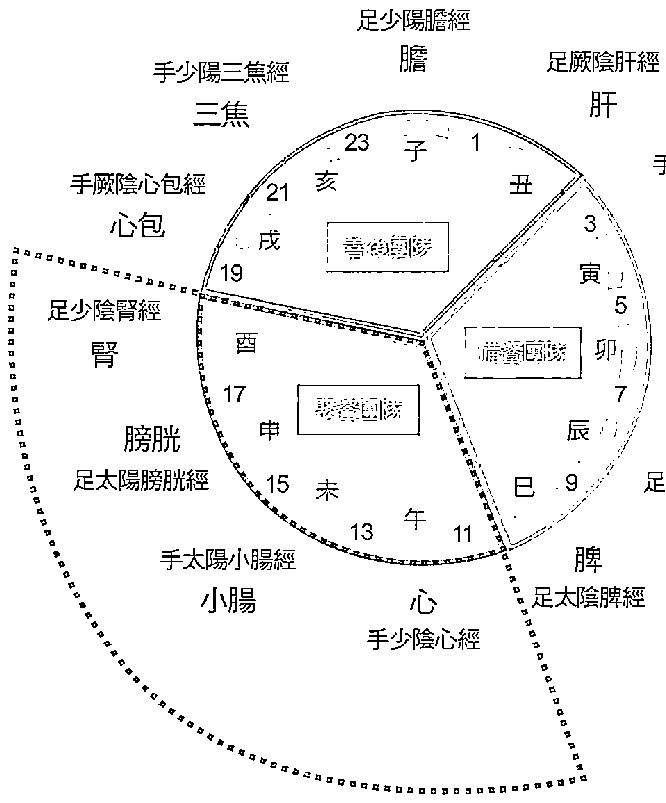

手少陽三焦經 三焦

足少陽膽經 膽

足厥陰肝經 肝

手厥陰心包經 心包

手太陰肺經 肺

手陽明大腸經 大腸

足少陰腎經 腎

足太陽膀胱經 膀胱

手太陽小腸經 小腸

手少陰心經 心

足太陰脾經 脾

足陽明胃經 胃

善後團隊

備餐團隊

聚餐團隊

# 命名「少陰太陽」及「聚餐團隊」之緣由

在第一團隊中，肺經與脾經屬於「太陰經」，太陰就是大陰，肺與脾的陰性特質都非常強烈，為了提供人體所需養份而忙碌著，宛如家中的長女與母親，且兩經都循行在人體的前面，肺臟與脾臟也都位於身體較為前面的位置。

在第二團隊中，少陰太陽四條經絡主要循行在人體的後面，這個「深藏不露」的特性主要與心臟和腎臟位在人體較深層部位有關。

心經和足腎經皆命名為「少陰經」，還與功能有關。心與腎雖然屬於陰臟，但心的五行屬火為君主之官；腎的五行屬水為先天之本，藏有人體的元陽元陰。心與腎都兼含陽性特質，相對而言，陰性特質較少，所以屬於「少陰」。

在日常生活中，心腎與社會化、學習、記憶等有關，心主神志，與 EQ 情緒商數有關，腎主藏精，與 IQ 智力商數有關，無論 EQ 或 IQ 都需要充分營養，心與腎就成為人體最耗能的兩臟，因此本團隊才稱為「聚餐團隊」。

小腸經與膀胱經會命名為「太陽經」，猜想人類演化過程中，歷經四足動物階段，行走時背部朝天，面對太陽，加上這兩條經脈陽氣也旺盛，所以中醫才會將此循行於背部的經脈稱為太陽經吧！背部有脊椎、肋骨及強壯的肌肉保護，加上功能強大的太陽經一起守護，所以當遇到危險時，人類與許多動物都會基於動物本能，將身體向腹部一側蜷縮起來，以保護重要的內臟，而背部則作為人體的防護網。

腎臟是生命的第一個守護神，也是最終的送行者。相對於熱情外顯的心臟，黑色屬腎，腎臟是最為低調內斂臟腑，卻有「背景雄厚」，獨具許多攸關生命成長發育的功能，如：

- 腎主水，為先天之本，腎主藏精，類似種子「全有」概念，攜帶來自父母親的 DNA，是生命的根源，存有個體未來生長發育的藍圖。
- 腎主納氣，與肺合作，維持正常呼吸。腎臟參與了生命的第一個與最後一個呼吸，貫穿整個生命歷程。
- 腎主骨生髓，掌管腦髓，加上腎經貫穿脊椎，握有學習累積知識與個體健康成長（轉骨）的關鍵。
- 心腎統領所有臟腑，共同承擔身體所有疾病最後的轉歸。

# 十二經絡系統「聚餐團隊」的特色

第一團隊太陰陽明組合為「備餐團隊」，善用空氣和食物來製造氣血津液，並提供幸福感與愛的能量給少陰太陽組合。第一團隊在處理氣機和飲食方面，都是有入有出，維持人體內外氣機的平衡。

第二團隊的「聚餐團隊」則是接受來自第一團隊的養份和能量，推動生命展開多采多姿與外界連結的生活和文明。

在此團隊中，心與腎分主人的EQ與IQ，可以視為人類社會化過程中重要的兩大推手。加上心與腎在人體部位上，為上下對照，特性為熱與冷的對照，同時也是光明與黑暗的對照。心屬於火熱的太陽，充滿能量，個性外放；腎屬於冷靜的水液，個性深沉內斂。心為太陽屬於天上，光明外顯，加上屬火，火性炎上，面部對應區在上部的額部；腎為陰水屬於地下，黑暗而沉潛，加上屬水，水性下流，在面部對應在下巴的頷部，中醫稱為「額心，頦腎」。

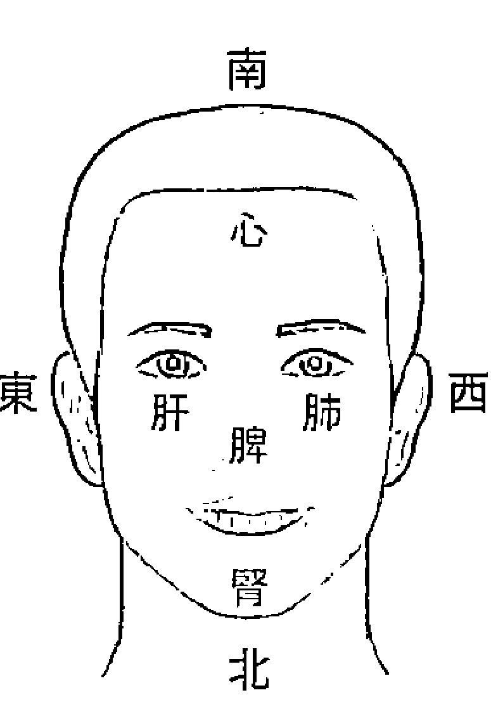

此外，心與腎還有視覺與聽覺的對照。心經與眼睛關係密切，還寄竅於耳，對於眼睛所看，耳朵所聽的事情產生感受與判斷。

腎臟是人體的種子，眼睛也類似人體的種子，因此腎臟與眼睛功能有關，腎主要開竅於耳，與聽覺及活動時的平衡感關係密切。腎開竅於耳，加上腎經有些部位採取螺旋式的循行，讓人体維持旋轉活動時的平衡。

在十二經絡所形成的三個團隊中，唯有第二團隊有著如此對立分明的關係，而這些對立關係都是來自天地的特色，天地氣機相交則氣候溫和，萬物繁茂，在人體心腎相交，水火交融，則氣血順暢，陰陽平衡，是維持身體健康的必備條件。

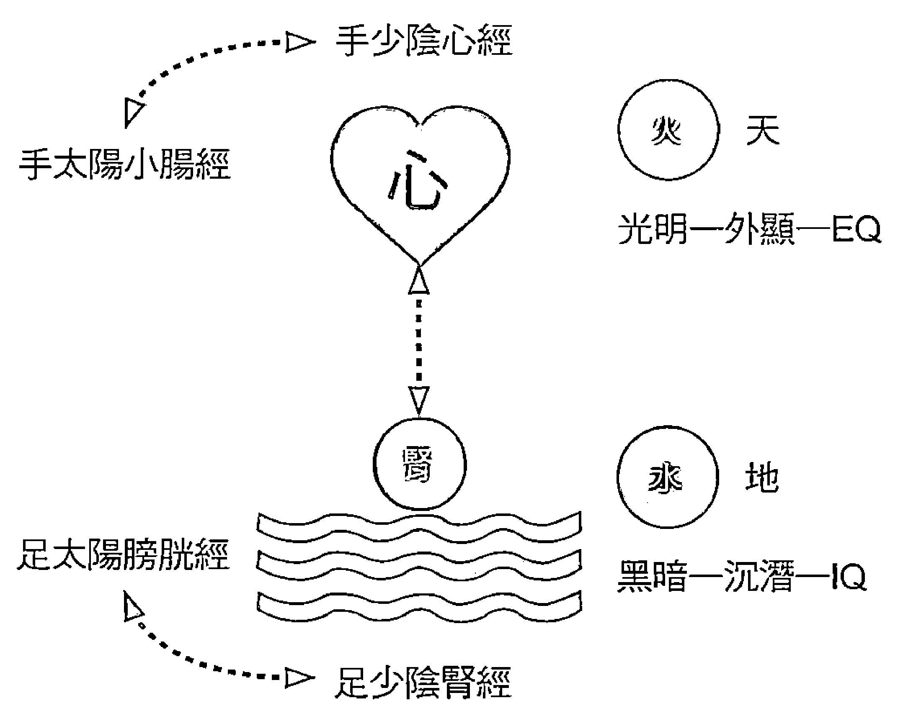

# 《經絡解密》導言

# 為什麼我們需要認識人體經絡？

中醫發現這個精妙的人體連結系統，因為有著如紡織物的網絡狀態，就稱之為「經絡」，是維持生命的重要系統。中醫經典《黃帝內經》中強調，經絡深深影響一個人的生老病死四大環節，如果經絡照顧得當，就可以健康長壽。

十二經脈是臟腑運送氣血至全身的重要通路，人體的組織器官從而得到充分的營養，身體自然健康。反之，如果經脈阻塞氣血無法送達，與這條經絡所連結的臟腑與軀幹四肢，就會失去營養而產生不適或疾病，中醫稱為「不通則痛」。因此想要健康，經脈務必要暢通，「通則不痛」，組織器官得到營養，痛感自然就解除了。

經脈除了與一般人有關之外，它更是中醫師習醫的核心基礎，而且學無止境，未來醫療能力的高下取決於經絡的了解和應用，值得窮畢生之力去研修，去探討。

# 為何用對穴位，就能產生神奇的療效？

穴位在經絡系統上，是經脈裡面的氣血輸注到體表的部位。

穴位就像是經絡列車的停靠站，每條經絡都跟鐵道沿線一樣，滿佈著大大小小的穴位，它們的功能主要來自所屬的經絡系統。不同的經絡系統互相支援，互補互助守護著人體。認識經絡與穴位，也是認識人體小宇宙的金鑰，治療疾病不能只是頭痛醫頭，腳痛醫腳，要找到病根病因，善用經絡特性，從正確的穴位下手，自然能產生好的療效。

# 經絡四大系統好像有點複雜，該如何理解？

經絡系統是人體運行的設計傑作，有許多奧秘等著我們去挖掘探索。但許多中醫初學者卻一聽到經絡四大系統就皺眉頭了，擔心得自己讀不懂。我在《經絡解密》系列書中以現代智慧型手機來作比喻，經絡系統就跟手機傳輸線一樣！人體內在臟腑好像手機，經絡系統就像傳輸線，人體的四肢末梢則像傳輸線的插頭端。

# 書中的經絡圖有何不同意義？循行是單側，還是對稱呢？

在這套書中，每條經絡系統都有三種圖來說明，分別是：人形圖、循行簡圖、經穴圖。

## 1. 經絡人形圖

標示經絡在人體的循行路線，簡稱「經絡圖」。經絡系統同時存在人體兩側，但為了便於觀看，將經脈、經別及絡脈繪製在人體的左側，黑色為經脈，藍色為經別，綠色為絡脈；經筋則以藍色色塊標示在人體右側。

## 2. 經絡循行簡圖

將經絡循行以色塊及線條表現，比較容易掌握要訣。因為長得很像捷運路線圖，簡稱為「捷運圖」。捷運圖的顏色及形狀都有經過特殊思考喔！包含臟腑本身所屬的顏色，四肢顏色較淡，軀幹顏色較深。經筋部分，凡是結聚的部位，都會再用黑線框起來。

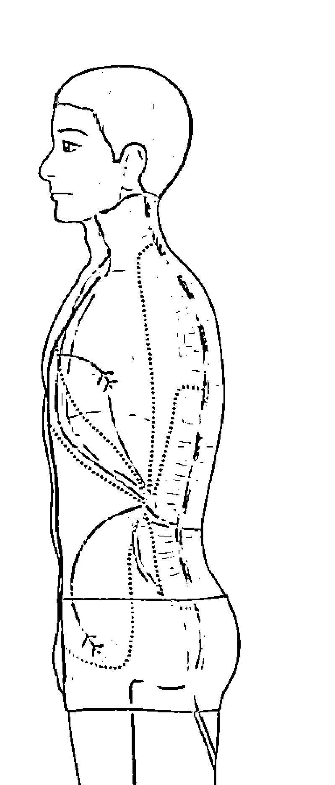

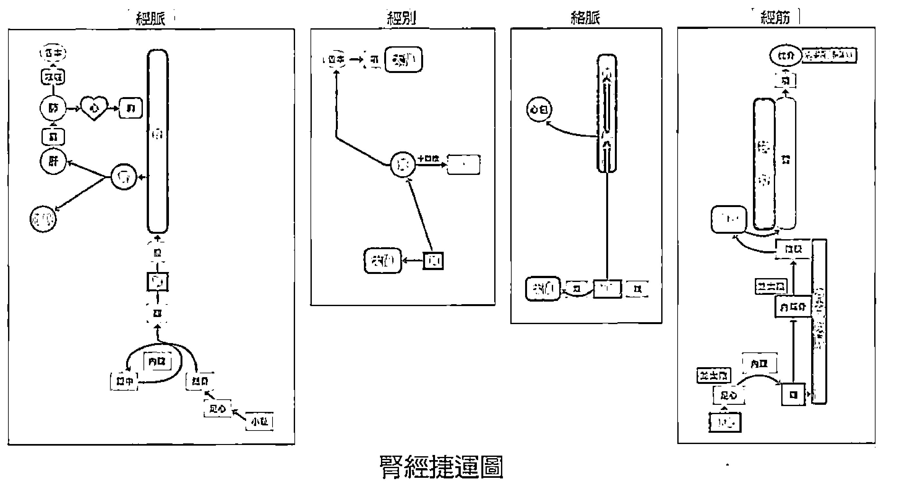

## 3. 經穴圖：將屬於本條經脈的穴位連結而成。

穴位是人體珍貴氣血輸注的部位，聰明的人體會將寶貴資源做最佳分配。身體重要部位會有許多經脈通過，但不一定每條經脈都會有穴位；經脈所經之處，也不一定都有穴位分佈。如厲害的腎經經脈通過下肢部、腰背部和胸腹部，所有穴位都分佈在下肢和胸腹部，而腰背部就由實力堅強的好隊友膀胱經脈去分配。

所以，經穴圖通常比經脈圖簡單，對於學習者而言也較為容易掌握。但若要了解穴位的功能及應用，還是須要回到經脈系統，經穴圖只是方便法門而已。

## 「解密」與「中醫師不傳之秘」有何不同？

- :gear: 解密：較為深入的內容說明，適合有中醫基礎，或對於中醫有進一步興趣的讀者。
- :book: 中醫師不傳之秘：偏向中醫專業內容，適合有較深的中醫基礎，或者從事中醫與相關醫療的讀者。一般讀者若覺得較為艱深，可以略讀或越過。

## 認識中醫的腎臟觀

### 一、從植物的生命歷程來理解

腎臟具有複雜多樣的特性，對中醫師的學習而言也有一定的難度，本書的切入點將回歸到「天人相應」的中醫最高指導原則來談腎經。

我認為人的生命歷程跟植物非常相似，甚至不妨想像：我們就是一棵樹！

每個人都像一棵大樹，其生命的源頭來自種子，這顆種子包含母樹遺傳給它未來成長發育及繁衍的生命藍圖。我們都知道，植物需要陽光、空氣、水方能成長，每顆種子吸取地下的水份和土壤的養份，加上空氣和陽光的能量，就能依據這份藍圖，逐步成長為和母樹類似的大樹。

日本學者栗山茂久在《身體的語言》一書中指出，中醫對於內臟與其所控制的部位，包括內在的生命核心及外表呈現等等，都是「植物」的概念，不同於古希臘的解剖學是以動物為中心來思考。栗山先生的觀點，再次印證我對於「人就是樹」的看法，也很感佩國外學者能歸納出中醫以「植物」的概念來思考人體的核心價值。中醫治病向來重視「標」與「本」的問題，尤以治根本為強項，而標、本兩字都是木字邊，顯然以中國字的延伸喻意來說，也暗示了人與植物的關聯。

中醫則是將這些促進植物成長的自然資源與五臟配搭，如五行特質中，腎屬水，脾屬土，肝屬木，肺屬金與空氣的潔淨相對應，心屬火與陽光相對應。

在此，我們就借用樹木的概念來解釋中醫對於腎的看法。

以樹木的成長助力來看，腎是水份的供應者。從樹的主體來看，在生命之始，腎就是種子，其實腎臟長得也很像種子啊！腎也是發芽以後仍埋在土中的樹根；在成長期，腎將根深深固著在土壤中持續吸收養份，讓枝幹不會輕易被風雨擊倒，可以安穩的向上繼續成長。台灣有句俗諺說：「樹頭若是踩得穩在（站得穩），就不怕樹尾做風颱。」說明了扎根的重要性。面對蟲害或外在損傷時，只要危及樹根，這棵樹就回天乏術了。中醫有「久病及腎」的說法，指出腎是人體最後一道防線，各種重病或久病最後都會傷及到腎，一旦腎臟嚴重受損就生命垂危，這跟樹根損傷的概念是一致的。

回到人體來討論。從一個受精卵逐漸發育成人體的過程中，五臟也扮演重要的角色，尤其是腎臟，不僅是水，也是那顆包含了人體未來成長藍圖的「種子」，以現代醫學來看，就像保有遺傳物質的 DNA，因此中醫稱腎為「先天之本」。

中醫認知的腎臟不僅是人體生命的「種子」，它也影響生長、發育與生殖能力，當個體需要像大樹一般向上成長時，也需由腎臟提供堅實的衝力，一路過關斬將。此外，腎臟還貫穿所有生老病死的過程，所以腎臟既是生命之始，成長過程，也包含生命最後一個氣息。

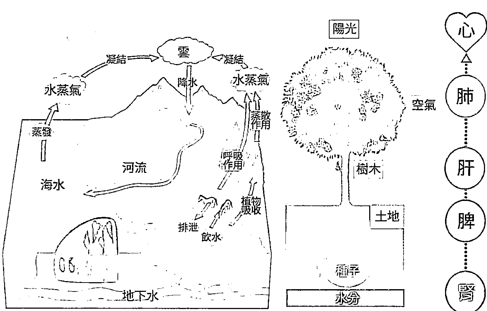

種子在土裡，但下方藏有地下水。

每個人的生命過程都像樹木的成長歷程，位於脾土之下的腎水，就像大自然的地下水，位於生命最深處，且將所有的秘密及資源藏在一個珍貴的盒子中，隨著生命成長所需，會適當的提供出來加以應用。當然它也需要其他臟腑的回饋，讓腎水寶盒不虞匱乏，人體才得以長保安康，所以腎臟是生命的最後一道防線。萬一很不幸的，其他臟腑功能嚴重失調，腎水寶盒不僅得不到補充，還得持續輸出資源，一旦寶盒被掏空，生命再無挹注，人生只好謝幕了。

有了這些概念之後，就比較容易理解中醫對於腎臟的看法，大家可參考下頁腎臟功能概念圖。將腎臟功能與植物的生長模式連結後，更能清楚了解中醫對於腎的見解，是非常符合天地自然規律。

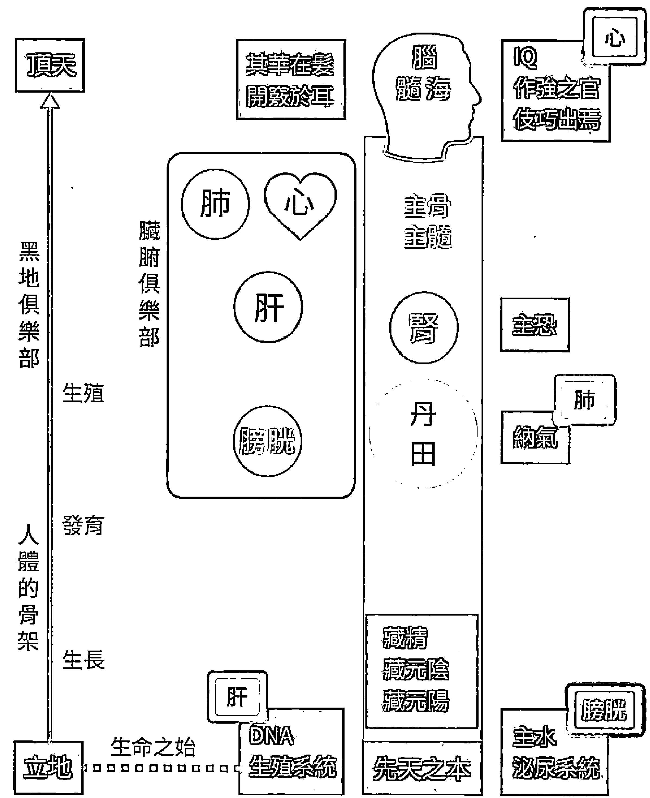

## 腎臟功能概念圖

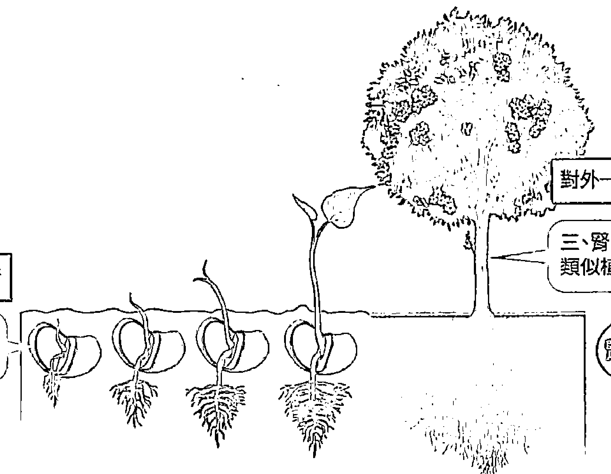

> 對內—腎能伎巧出焉

> 二、腎藏精
類似種子「全有」概念

> 一、腎為先天之本，主水
類似生命的根源

水分

> 對外—腎為作強之官

> 三、腎主骨生髓
類似植物生長的力量

> 腎間動氣

## 腎臟功能與植物生長模式連結圖

### 二、腎主水，為先天之本，類似生命的根源

生命的演化源頭來自於水，我們居住的地球大約三分之二是海洋，生命孕育的搖籃也多處於潮間帶和沼澤濕地。人體彷彿是地球的縮小版，身體大約三分之二是水，可見水對於人類是非常重要的元素。現代科學家說濕地是地球之腎，與中醫對於腎的觀察相符。從演化歷程來說，生命存有來自海水的記憶，中醫則認為腎是「生命之根」、「先天之本」，有主宰生命的作用，可見腎與水有強大的關聯性。

中醫說腎主水，腎在五行顏色中屬黑色，水淺清澈，水深則黑，這是因為比較淺的水能透光，清澈見底，而比較深層的水吸納了可見光之後，顏色就顯得深不可測，就像台灣周圍的黑潮，因為是非常乾淨的海流，較少有懸浮物的反射光，因而顏色特別深邃。五臟之中「心部於表，腎治於裡」，腎主的水不同於體表津液的水，而是人體深層的水脈，因此中醫觀察大自然的道理，認為黑色是水結之色。

再加上大自然中地下水位於土壤之下，部位在下方，性質主沉降，這樣的特質也呈現在脈象上，《內經》說「腎脈石」，意思是腎臟的脈位比較沉比較重，像石頭一樣，需要稍微用力才能把到脈。

水性屬寒，在北半球的五行方位中北方是偏寒的，所以腎水屬北方，四季中最冷的季節是冬天，腎也與冬天相通。四季的特質是春生、夏長、秋收、冬藏，因此腎臟也具有「封藏」或「閉藏」的特質。這樣就能理解人與天地對應表中腎臟的特色。

| 五臟 | 六腑 | 五行 | 五方 | 五季 | 五氣 | 五化 | 五色 | 五味 | 五音 |
|------|------|------|------|------|------|------|------|------|------|
| 肝 | 膽 | 木 | 東 | 春 | 風 | 生 | 青 | 酸 | 角 |
| 心 | 小腸 | 火 | 南 | 夏 | 暑 | 長 | 赤 | 苦 | 徵 |
| 脾 | 胃 | 土 | 中 | 長夏 | 濕 | 化 | 黃 | 甘 | 宮 |
| 肺 | 大腸 | 金 | 西 | 秋 | 燥 | 收 | 白 | 辛 | 商 |
| 腎 | 膀胱 | 水 | 北 | 冬 | 寒 | 藏 | 黑 | 鹹 | 羽 |

腎主水的特質也可應用在人體上，在下頁左側五臟與天地對應圖中腎屬北方，位於下方，右側面部與五臟方位對應也是如此。依據中醫診斷學說：「左頰部肝，右頰部肺，額心頦腎，鼻脾部位。」腎水屬北，位於下巴處，與心火屬南，位於額頭遙遙相望。人與天地皆相對應，這就是中醫「天人相應」之理。

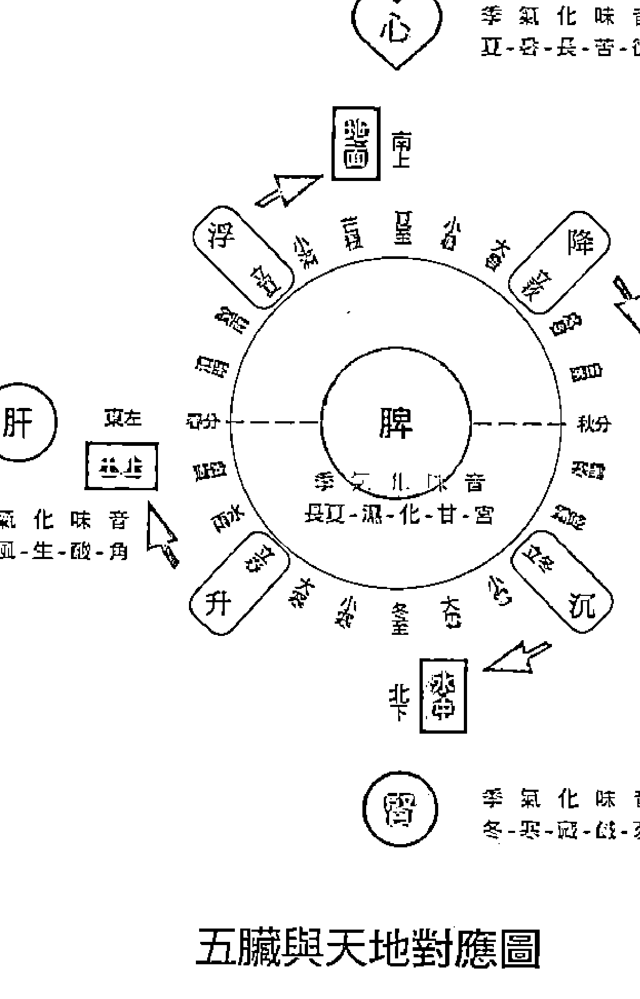

## 五臟與天地對應圖

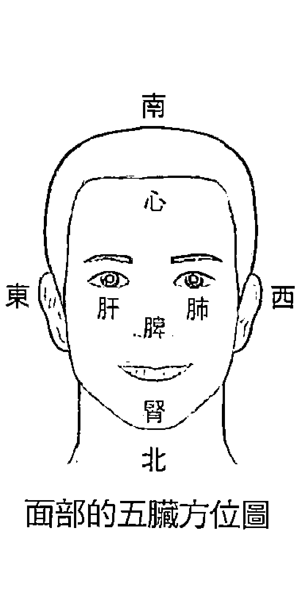

《內經》提到面部臟腑分配，面部中央是大腸，大腸兩側者是腎，所以腎臟反應區大約在顴骨的外下方處。臨床上我們比較常用面部五臟方位圖來觀察腎臟功能。

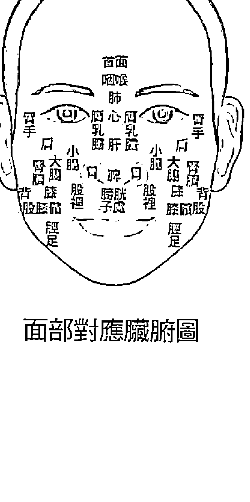

#### 1. 五行屬水

腎臟主水的特性，對應在人體最直接的現象就是掌管泌尿系統，這方面與現代醫學對於腎的知識一致。許多人只要看到腳水腫，第一個念頭通常是：「我的腎是不是出問題了？」

腎主水的功能不僅是簡單的將水排出體外而已，其功能主要是依靠腎陽對水液的氣化來實現的。腎陽就像爐火，氣化功能就像點火將生水煮成開水，一般的水經過腎臟的「蒸氣」功能，轉化成可以安心使用的津液，如此一來，腎臟就能主持全身津液的生成、輸佈和代謝，調節水液的平衡，不僅輸送有營養的水液到全身，也將各臟腑組織代謝應用後的濁液排出體外。

簡單說，腎就是身體的自來水公司。

腎與膀胱為相表裡的臟腑，腎是膀胱的大老闆，膀胱的開闔功能依賴腎臟的氣化。如果腎氣充足，氣化正常，膀胱就能正常開闔，開則小便出，闔則小便禁；如果腎的氣化功能失常，膀胱開闔也隨之失常，不開則水液停留而小便不利、水腫，不闔則水液失禁而頻尿、多尿，甚至遺尿等。

腎臟與老化密切相關，腎功能退化也是人體的老化，最常見的就是水液代謝開始紊亂，常看到中老年人小便頻繁但量少，尤其一晚好幾次夜尿，影響睡眠甚巨。

自然界的水，其根源藏在地表深處，人類也一樣。腎經起於人體最低的位置：足底，此處正是人體藏水處，跟地球藏水的概念一致。足心有個穴位稱為「湧泉穴」，足底三面有骨頭圍繞，只有足弓處沒有人體所藏的水經湧泉穴從足心經過足弓而出，就像水流從山谷或水井而出一樣，由最低處向外向上湧出。腎也是五臟之中位置最低者，由此可見，低位的腎臟必須具有很好的衝勁，才能向外向上發展，就像種子發芽一樣，這個上衝的概念貫穿整個腎經系統。

然而過猶不及，如果腎氣上衝過度就會出現異常的氣逆情況，《金匱要略》中生動地把這個特殊現象稱為「奔豚」。古代中醫將臟腑特色搭配常見家畜，豚即是豬，傳統認為豬是水畜，所以與主水的腎臟相通，「奔豚」兩字完全呈現本證有一股氣由肚臍下方向上衝逆，好像逃出圍欄的豬隻橫衝直撞，向上狂奔，令人煩躁（後文會詳述）。臨床上遇過幾例，西醫檢查都無異常，常被誤診為身心症，其實只要運用中醫診治思路就能多所改善。

#### 2. 五味屬鹹

腎與鹹味的關係也是人體與自然相對應的現象，臨床上我們常透過把脈和檢查內踝來「抓包」飲食過鹹的病人。

### 為什麼說是「抓包」？

話說我常提醒年輕醫師不要太相信病人說的話，一定要親自診察。倒不是病人會說謊，而是他們常將一些情況視為正常。譬如重鹹的人通常不會認為自己吃得太鹹，曾經在家訪時遇到一戶人家，餐桌上擺了醃瓜，吃的時侯還淋上醬油，問他們這樣會不會太鹹？老人家回說：「不會呀！剛剛好而已喔！」正因為不覺得太鹹，所以還會持續這樣吃。

當病人將這些視為正常時，不但不去調整飲食，也不會刻意告知醫師。然而身體是會洩密的，醫師的職責就是去「傾聽」身體的密報，「抓包」病人沒有告知的事情，然後派出清潔大隊將過多鹽份淨除。

飲食太鹹者通常會在腎的脈位（尺脈）上出現異常脈象，如特別浮腫或硬感等。長期飲食過鹹，內踝後側太溪穴附近的皮膚偏乾，甚至出現脫屑、凹陷等，一旦影響到腎臟，也會禍及腎所藏的水份，出現失眠、腰痛、掉髮等現象。為何會如此呢？

人體臟腑都有與其特別對味的味道，因腎主水，海水味鹹，所以鹹味就特別親近腎臟，中醫也說「鹹走腎」，「腎欲鹹」，鹽份是身體機能所需，這是正常現象。但若體內留存過多鹽份，就像婆婆媽媽們醃菜會加鹽巴脫水一樣，人體也會出現類似的脫水現象，水份不足就會口乾舌燥，《內經》說：「腎苦燥，急食辛以潤之，開腠理，致津液，通氣也。」建議吃一些辛味的食物，如香菜或蔥這些有點嗆味的，幫忙打開毛孔，通暢津液，以便滋潤腎的乾燥。

如果長期吃得太鹹，不僅水份不夠，也會導致血液中水份減少，變得濃稠，血行不利，對此《內經》也有說明：「多食鹹則脈凝泣而變色。」意思是吃太鹹的人，血脈運行會出現凝結澀滯現象，血色會變深，皮膚也會跟著變色。依據中醫理論，鹽份不僅走腎，也會走入血份。相信許多人都跟我有類似經驗，就是吃得太鹹之後，口乾舌燥，舌頭甚至乾到會起刺感，喝再多水都不能止渴，心情非常煩躁，如此一來當然難以入眠，頭髮乾裂，腰部肌肉乾硬疼痛，這就是鹽分走入血分的現象。

《內經》指出「腎病者，顴與顏黑」，暗沉的面色不僅出現在腎衰竭的病人，喜歡吃重鹹的人面容也會變得粗粗醜醜，身體成為「乾癟四季豆」。所以建議大家吃清淡一些，免得把自己「醃乾」變醜了。

#### 3. 五色屬黑

黑色與腎臟主水有密切關係，腎主水，如果水藏在地底下，如地下水，就暗不見天日，如果水很深如深海，就會呈現藍黑色，所以藍色也應該列入腎的色系。

前文提到，黑潮得名於較其他正常海水的顏色更深，這是由於黑潮內所含的雜質和營養鹽較少，陽光穿透海水表面後，較少被反射回水面，可見光不見了，就呈現出黑色。黑色被定義為沒有任何可見光進入視覺範圍，從前述植物的概念來看，腎就是生命的種子，植物種子埋在土中等候發芽，這和人類受精卵在母體中等待成長，意義相同，這段蟄伏期都是黑暗一片。

因此，腎主黑色有兩極化的意義：黑暗與清淨，都蘊含豐富的生命概念。

在《卷一・肺經》中介紹過白色屬肺金，與肺愛乾淨不沾鍋的特質類似；黃色屬脾土，是果實成熟的顏色；紅色屬心火，與火的顏色及心的熱情相應；此處黑色屬腎，除了與水有關之外，也與腎主冬藏，低調而神秘有關。您看，顏色與臟腑的對應是不是很奧妙！

黑色也有文化上的意涵。在西方傳統文化中，黑色比較屬於負面意義，如死亡、恐怖與深沉的哀傷等等。東方傳統文化對於黑色另有見解，尤其中國人對於黑色有特殊情感，遠古文化中，黑色是北方的象徵，代表「水」，也代表天，所以有「天地玄黃」之說，從現代太空船傳輸的資料來看，印證宇宙穹蒼確實是暗色系；太極圖以黑色表示陰的特質，而傳統水墨畫僅用水與黑墨，透過墨的濃淡和大量留白就能呈現畫作的氣韻及意境。

現今東西文化交流密切，對於黑色的見解也逐漸接近，如在服裝界黑色有時尚感，但在政治圈，黑函、黑金等都是負面意義。

民間對於黑色則有一些趣味的看法，如黑面包公代表鐵面無私的正義感，有時也會直接運用黑色字意，如「黑手」可以是具有專業維修技術的師傅，他們的手因常碰觸機械機油而沾染，也可泛指隱藏於幕後操控事件的人，這些人通常只能躲在暗處不能見光。所以黑色也跟腎的雙重特質一樣，具有正負兩極的看法。

- 《內經》列出病機十九條，其中三條與腎有關：
  - 【諸寒收引，皆屬於腎】指腎性屬寒，熱脹冷縮，寒冷會導致收引緊縮的現象，如肌肉攣縮的抽筋等。
  - 【諸病水液澄澈清冷，皆屬於寒】指體內排出的水液如鼻涕、尿液等，質地清稀透明又兼冷感者，都屬寒證；
  - 【諸厥固洩，皆屬於下】指凡是手足逆冷、大便秘、腹瀉等症都屬於下焦疾病。腎位於下方，故與腎相關。

以上三個病機都是診治腎臟疾病時很重要的原則，特別在此篇章將腎的特質做了整理，這也是中醫師臨床上常用的法則。

## 腎臟三部曲

一般中醫基礎理論書籍都會介紹五臟六腑的臟象學說，這次編寫本書的腎臟生理及病理特徵時，為了不讓讀者因為腎主水、腎藏精、納氣、腎主生殖與骨髓成長等一系列複雜多樣的生理機能，而落入學習腎經時常遇到「名相混用」的狀況，特別將腎主先天，參與受精卵、胚胎，以及嬰兒成長等不同生命階段時，「腎臟」所具有的多重組織和概念，分為三個部分：「腎元」、「腎間動氣」與「腎臟」，以便鑑別和深入討論，我稱此為「腎臟三部曲」。

其實中醫傳統所說的腎臟生理、病理功能，並不存在同一個腎臟概念之中，本章就從腎臟三部曲的概念，以及腎臟特有的陰陽合體的雙面特性來介紹。

從腎元、腎間動氣到腎臟的分化，都發生在胚胎時期，代表人體歷經受精卵到整個臟腑、經絡、身體成長的三個主要階段。請參閱右圖。

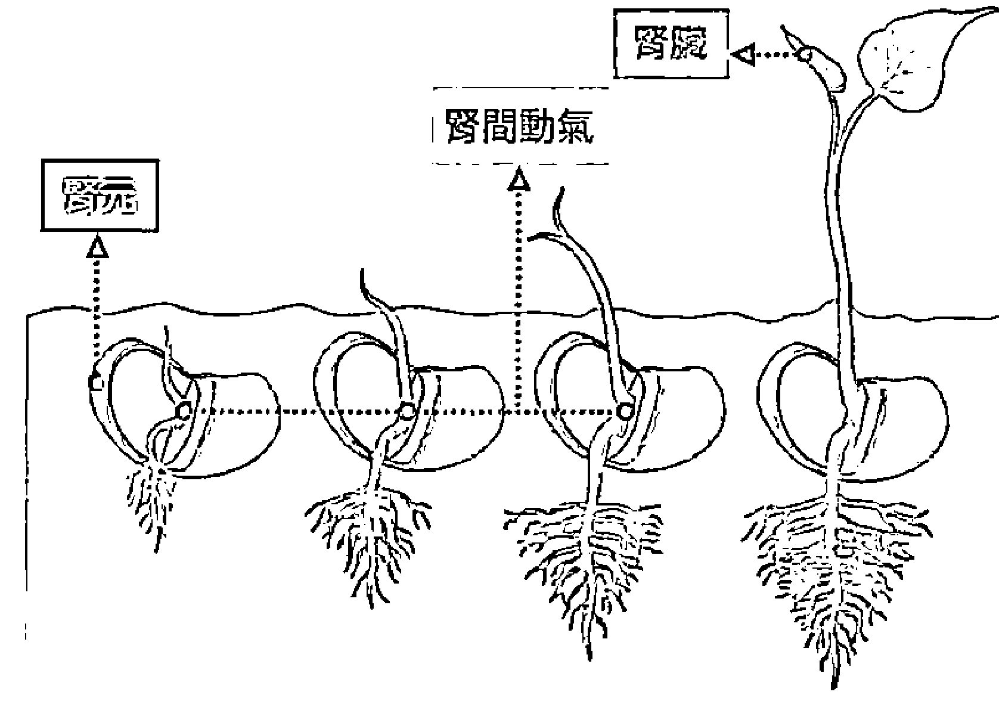

腎臟三部曲具有「傳承」關係，就像祖孫三代的情況

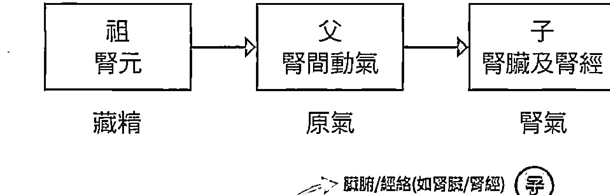

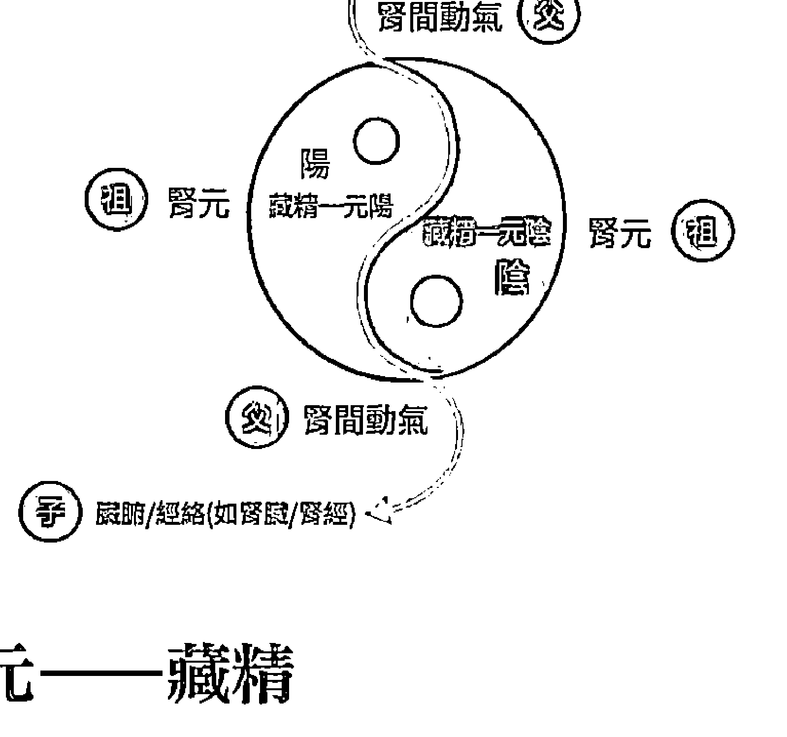

### 一、腎元——藏精

中醫將先天的概念歸納給腎臟，因此「腎」代表先天之本，「元」代表「初始」，同「原」、「源」之意。「腎元」表示生命的初始，就像祖孫關係第一代的爺爺，是腎臟家族的創始者。

腎元為受精卵時期，宛如植物種子，蘊含來自父母親的遺傳物質。遺傳物質是非常重要且精華的物質，被腎元緊緊地存藏著，若是稍有閃失出了問題，極可能造成先天性的疾病。

中醫稱腎元這個功能為「藏精」，腎元藏精具備「全有」的統包特性，因為人體分為陰與陽，腎元就藏有元陰與元陽，這些重要物質全都收藏在腎元中，是人體未來生長的藍圖。

腎元為生命最原始的情況，組織尚未分化，類似幹細胞的概念。腎元不僅功能類似植物種子，後來發展出來的人體也有許多部位長得像種子。由於人體分化為對稱的兩側，宛如被切開的種子，將雙側結構合併就是一個完整的種子，如足底像種子的半個剖面，將雙足心合併就是一顆完整的種子，還有腎臟、腦部等，合起來都像一顆種子。

孕育生子傳宗接代也有種子的概念，中醫常用的助孕方劑「五子衍宗丸」，使用枸杞子、覆盆子、菟絲子、五味子及車前子等植物種子來補腎固精，以繁衍宗嗣。觀察入微的中醫甚至將眼睛視為人體的種子，依據「以形治形」治療法，常會選用植物的種子治眼病，因為「諸子明目」，所以「五子衍宗丸」還是眼病常用方。加上腎臟也像種子，為了從本治眼病并加強療效，會加入腎經的藥物，如地黃等，代表方劑為「二地十子丸」。

這是極有趣的現象，因為人類屬於動物，可是卻存在類似植物的型態，可見大自然的生命樂章也是共通的。

### 二、腎間動氣——推動原氣

「腎間」表示部位，「動」表示功能，「氣」表示由腎元轉化而來的原氣。腎元藏精代表靜態的受精卵時期，腎間動氣代表胚胎展開生長發育的動態時期，來自腎間的一股動氣提供原氣做為成長動力。腎元交棒給腎間動氣，就像祖孫關係第二代的爸爸，腎元與腎間動氣緊緊相合，一起貫穿生命的始與終。

腎間動氣是受精卵分化及生長的動力，以種子的概念來看，腎間動氣宛如種子的發芽點，是腎所藏之精蓄勢待發的動力，所以是生命的根本。

這個概念也像雞蛋受精卵早期發育時，蛋黃就像腎元，蛋黃表面有一個白點，叫做「胚盤」，是雞蛋發育成小雞的起點，胚盤是腎間動氣所在之處，動氣是受精卵發育的動力。

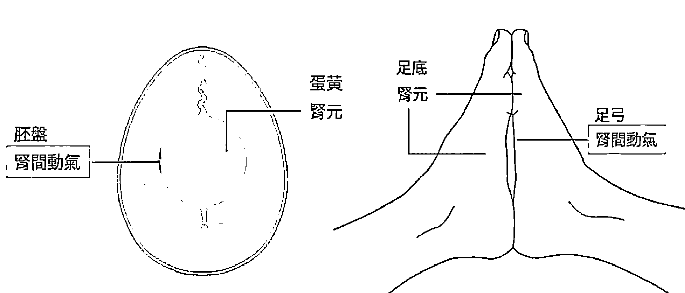我們的足底還保留著腎元與腎間動氣的型態，坐下來將兩足底合併時，位於足弓中間的凹陷處就類似腎間動氣所出的位置。

最早有關「腎間動氣」的論述來自《難經》，而思考「腎間動氣」的過程，也讓我透過推論，理解到奇經八脈的起源。

## 1. 腎間動氣的重要性

> 「諸十二經脈者，皆繫於生氣之原。所謂生氣之原者，謂十二經之根本也，謂腎間動氣也。此五臟六腑之本，十二經之根，呼吸之門，三焦之原，一名守邪之神。故氣者，人之根本也。」

「腎間動氣」又稱「生氣之原」，它所提供的「原氣」是五臟六腑及十二經的根本，呼吸的門戶，三焦的源頭。

「動氣」是具有推動原氣的氣機。在胚胎早期，五臟六腑及十二經脈發育，都要憑藉有動能之氣機來推動和腎元藏精的支持。這個會推動原氣流動的氣讓生命得以延續，因此特別稱為「生氣」。

「生氣」的重要源頭繫於「腎間動氣」，透過腎間動氣，生氣才能發揮良能，因此腎間動氣是生氣的源頭，所以《難經》才稱「腎間動氣」為「生氣之原」。

## 2. 腎間動氣的位置——關元命門區

### 初期位置：胞中

從中醫的角度來看胚胎發育的歷程，在腎元階段，腎間動氣已經位於類似胚胎原線的位置，準備就緒，此時「腎間」指的是位於腎元之內。

本書另闢一章介紹奇經八脈為最早形成的經脈系統，腎間動氣不僅推動著胚胎的發育，也推動奇經八脈的發展。而奇經之中最重要的任脈、督脈、衝脈三脈初期都起於胞中，再分道揚鑣。隨著胚胎的發育，三脈後來才一起從會陰處出來。

早期「胞」的定義為胎衣或腹中胎，後來才有胞宮的說法。腎元為「胞」，此時動氣位於腎元之內，亦即位於「胞中」，與任督衝三脈一起推動胚胎發育。

### 成熟期位置：臍下關元命門區

隨著胚胎發育，腎間動氣所在位置不變，但周邊的組織改變了。「臍下腎間動氣者，人之生命也。十二經中之根本也，故名曰原。」《難經》所述是組織器官發展完成時，腎間動氣位於肚臍下方稱為「丹田」的位置，此處已經成為立體結構，足以提供腎元與腎間動氣來安住。

胞中與會陰為早期經脈的起點，也是傳承生命的據點，推動奇經發育的腎間動氣位於此處就能直接施力，所以「臍下」包括肚臍以下的骨盆腔及會陰部。以穴位來說，包括下腹部任脈「關元穴」和腰背部督脈「命門穴」，此二穴連結而成的立體區域，個人稱為「關元命門區」，是腎間動氣所在區，其下方即為生殖系統，讓腎元得以將所存藏的遺傳物質就近傳給下一代。許多練家子在練功過程中，下腹部會有明顯的氣動，某方面來說，也算是腎間動氣的作用。

《難經》提出「腎有兩臟也，其左為腎，右為命門」說法，許多醫家認為「腎間」代表位於左右兩腎之間，我推論這應是進入腎臟三部曲的第三階段腎臟以後的情況。（有關「命門學說」後文詳述。）

### 關元穴匯聚諸經脈

任脈關元穴除了穴名蘊含深意之外，因位於人體上下左右四極方位的中點，又稱為「大中極」，其穴下方就是生殖系統所在之處，男子以藏精，女子以蓄血，腎間動氣及腎元當然要安居此寶地，許多經脈也跟著匯聚於此，宛如隨著城市人口遽增而建立市集的概念。

這些經脈包括：
- 任脈：起於中極之下，以上毛際，循腹裡，上關元。
- 衝脈：起於關元。
- 陰維脈：起於諸陰交的關元穴。
- 足三陰：共同交會於關元穴。
- 小腸：募穴在關元穴。

此外心臟也與關元穴相關，《卷四》介紹《內經》說：「月事不來者，胞脈閉也。胞脈者，屬心而絡於胞中。」「胞脈」顧名思義是聯絡胞宮（子宮）的專屬經脈，以供應胞宮血液與養份。心主血主脈，胞脈屬於心，故向下絡於胞宮，開展一條「胞脈之路」。表面上心經「好心腸連線」是「下膈，絡小腸」，子宮就位於小腸下方的骨盆腔內，位置非常親近，所以「小腸」不僅是小腸，還包括胞宮在內，心經與小腸經因而與婦科關係密切。

據此推論，心臟發出的胞脈不僅連結小腸和胞宮，也藉由胞脈抵達小腸募穴關元穴，與奇經的任、衝、陰維脈以及足三陰經尤其是腎經建立緊密的連結關係。在此又看到心與腎的身影，顯示心、腎兩臟在人體的關鍵地位，也點出關元穴的重要性，因此成為腎間動氣的住所。

## 3. 腎間動氣的功能

在生命早期，當胚胎出現原線，表示胚胎開始分化，腎間動氣所推動的原氣是胚胎分化的重要力量。腎元所藏之精，類似人類原始 DNA，腎間動氣的原氣則是推動細胞分裂、DNA 複製的動能。腎元藏精是為了後續的發育做儲備，這個珍貴物質需要腎間動氣輸送才能發揮功能，透過腎間動氣輸送到胚胎各處，做為各臟腑組織器官及經脈生長的重要資糧。當胚胎成熟，歷經分娩，成為獨立個體之後，自身的五臟六腑及十二經脈就必須承擔維持生命的重任，此時腎間動氣將原氣透過腎臟及三焦輸送到全身各個組織，以維持臟腑經絡的正常功能。被分佈到全身的原氣，在每個組織都有不同的稱呼，如心氣、肺氣、心經經脈之氣等，原氣就像嫁入不同家族的女性，冠上夫姓以便識別。所以，腎間動氣的氣機合則為「原氣」，分則為五臟六腑及十二經脈之氣。

## 4. 原氣的重要性

腎元將促進生成發育的部分轉成「原氣」，包含在腎間動氣之中。腎間動氣是原氣的推手，原氣運送藏精的功能正常，個體的生長發育就會順利，若運送過程失誤，生長發育也會出現異常，嚴重者甚至死亡。因此腎間動氣就像人的生命，是十二經的根本，生命之原。

生命之原很重要，可以決生死，如《難經》討論脈象時，指出：「上部無脈，下部有脈，雖困無能為害。所以然者，譬如人之有尺，猶樹之有根，枝葉將槁枯，根本將自生。脈有根本，人有原氣，故知不死。」下部脈象還在，就像樹木的根部健全一樣，即使樹葉凋萎了，還是可以枯木逢春。人體也是如此，只要脈還有根，人的原氣還在，雖罹重症也不至於死亡。可見「原氣」的重要性。

## 三、腎臟及腎經

透過腎間動氣的推動作用，胚胎持續分化，五臟六腑與十二經脈系統逐漸完備，可以發揮功能。屬於五臟系統之一的「腎臟」及十二經之一的「腎經」，就像祖孫三代的兒子，即將繼承家業。不同於腎元交棒給腎間動氣之後兩者還是相合在一起，腎臟身為五臟的一份子，具有獨立的位置。

由於臟腑與經脈系統逐漸成熟，腎元和腎間動氣原來的工作也會依據臟腑經絡功能的分工，逐步交棒。這個情況跟奇經八脈類似，奇經八脈和腎元、腎間動氣都是生命早期的系統，隨著胚胎的成長，會將其所屬的循行、穴位和功能等，移交給已經分工的臟腑與經脈使用，自己退居幕後。這很像家族企業的交棒，長輩退居幕後，讓年輕人去發揮，必要時還是會挺身而出，協助年輕人渡過難關。

生命既然開始了，就會延續下去，尤其腎間動氣所提供的原氣是臟腑經脈的根本，當腎間動氣退居幕後之時，正是腎臟與腎經要繼承任務的時刻。

### 1. 腎臟本身的功能

《難經》說：「腎兩者，非皆腎也，其左者為腎，右者為命門。命門者，謂精神之所舍，原氣之所繫也。故男子以藏精，女子以繫胞，故知腎有兩（兩，諸本作一，後文會討論）也。」

腎臟終究是腎臟三部曲的自家人，肥水不落外人田，依據《難經》的說法，左腎為執行屬於一般五臟事務的腎臟，腎元則將藏精中最精華的部份留給右腎，特別稱為「命門」，此處不僅是個人精神所在，原氣所繫，還攸關生殖功能，男子得以藏精，女子得以繫胞胎。

因此，腎間動氣交棒給腎臟系統的重要物質有兩種，其一交給左腎以推動腎臟自身功能的「腎氣」，其二交給右腎命門以推動全身臟腑及經絡功能的「原氣」。從全身功能來看，左腎推動腎臟自身的功能，右腎則是腎元和腎間動氣的重要繼承者，事關全身機能。

個人淺見，左腎與右腎是一個陰陽的概念，就像把脈也有「右脈主氣，左脈主血」的陰陽概念，每個臟腑都有自己的氣血，並不限定只能屬於左或右。所以左腎與右腎的說法強調了腎臟並藏陰陽，能推動自己和全身機能的重要特質，因此才有「故知腎有一也」的說法。

## 2. 腎間動氣——「原氣」有正使與別使

隨著胚胎由簡而繁、由小而大的發育過程，腎間動氣的工作負荷及範圍也隨之增加。幸好「下一代」的腎臟與腎經及時出現，可以接續工作。

### 腎間動氣的正使——腎經

前文提到右腎命門是「精神之所舍」、「原氣之所繫」。腎藏精，心藏神，「精神之所舍」表示命門是心、腎兩臟水火相交的位置。腎間動氣是生氣之原，此處「原氣之所繫」於命門，表示右腎是繼承腎間動氣的任務，因此腎經系統就成為腎間動氣的正使，屬於腎間動氣的直屬系統和正規軍，從背部督脈命門穴出發，循規蹈矩的將精氣輸送到五臟六腑。

這項特質也呈現在腎經經脈連結心、肺、肝、腎四臟及膀胱腑，透過腎經即可將精氣直接輸送。

### 腎間動氣的別使——三焦經

《難經》提到一個三焦為「原氣之別使」的說法，也就是輸送原氣的輔助系統。三焦常被認為有名但無形的組織，不過現在也逐漸有其他科學印證其實體有可能存在。（相關討論請參閱《卷七。三焦經》）

至於三焦的功能，醫書上記載：
> 「三焦者，水穀之道路，氣之所終始也。」
> 「謂三焦也，有原氣之別焉，主持諸氣。」
> 「三焦者，原氣之別使也，主通行三氣，經歷於五臟六腑。原者，三焦之尊號也，故所止輒為原。」

簡單說，三焦是指體腔的上部、中部和下部氣機運行活動的體現。體腔是五臟六腑之所在，所以三焦是運行重要物質的通路，包括來自食物的營養和原氣等。

### 三焦經為何能成為原氣之別使？

前面提到，到了腎臟三部曲的最終階段，腎間動氣準備退居幕後交棒給腎臟。但它也面臨到一個問題，就是腎臟主要連結諸多臟腑，且都是大型的組織結構，然而身體還有許多較小的組織也需要原氣，例如小腸、大腸等，還有一些臟腑組織之間的公共區域等。

腎臟與腎經被賦予保有先天重要資本之責，工作型態以保守收藏為要。其他需要拋頭露面、四處輸送原氣的工作，就交由包羅上、中、下三焦的三焦經來協助，從腹部肚臍下方的任脈關元穴出發，可以更快速的分佈，達成任務。因此才說腎臟與腎經是協助腎間動氣運送原氣的正使，三焦與三焦經當然就是別使。

依據《難經》的說法，三焦經是肩負特殊任務而生的經絡系統，在十二經脈系統中，特別同時討論腎臟與三焦，而且都跟原氣有關，可見三焦與原氣的密切關聯。

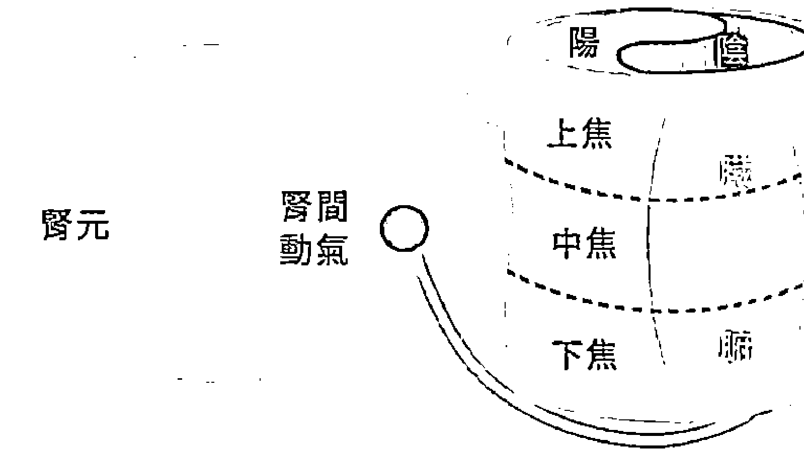
腎元、腎間動氣與三焦關係圖

## 3. 原氣與原穴

人體真的很聰明也很謹慎的照顧自己，在此階段，既然已經有了完整的臟腑和經絡，每個經絡系統就像有了固定住所的家庭，有人負責在家專門接收重要的原氣，這個為接受原氣而特設的組織，就稱為「原穴」。

> 《難經》很重視原穴，還有專門論述：
> 「三焦行於諸陽，故置一俞，名曰原。」
> 「三焦所行之俞為原者，何也？然。臍下腎間動氣者，人之生命也。十二經中之根本也，故名曰原。三焦者，原氣之別使也，主通行三氣，經歷於五臟六腑。原者，三焦之尊號也，故所止輒為原。五臟六腑之有病者，皆取其原也。」

綜合上述內容，重點整理如下：
- 腎經屬於陰經，陰主裏，主要循行於身體較深的部位，是原氣的正使，從命門穴出發，將原氣輸送給所連結的臟腑。
- 三焦經屬於陽經，陽主表，主要循行身體較表淺的部位，是原氣的別使，從關元穴出發，敷布原氣於五臟六腑之間。
- 三焦經所運送的原氣，都留在五臟六腑特定的穴位，亦即每條經絡都有一個原氣收件者，稱為「原穴」。
- 三焦經通行體腔，將原氣敷布至各臟腑之間的區域與經脈，所以當臟腑有病時，可優先選擇原穴治療，因為原氣是生命的根本，調整原氣即能快速改善臟腑功能。這也是一種將身體回復到初始設定的作法。

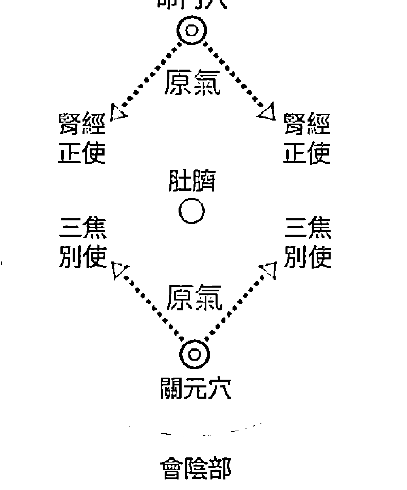
關元命門區與原氣的使者

## 4. 腎與三焦有重要合作關係

三焦經為手少陽經，與手厥陰心包經相表裏。《難經》特別強調腎與三焦在輸送原氣的合作關係，以此來說，三焦經是腎經的好幫手。心、腎都是重要臟器，需要特別加以保護，因此心臟有心包保護，腎臟也有三焦保護，心有心包，腎有三焦包，所以我開玩笑稱三焦是腎包，以此凸顯三焦對於腎的重要性。

有關「三焦」的英文有多種翻譯，其中之一譯為 Triple burners，想必是從意義上來翻，很切合腎間動氣的另一項功能「轉化」。腎間動氣是推動生命成長的無形動力，如此重要的力量，人體不會讓它只是個「推進器」，「burner」是能產生光與熱的東西，如火爐等，它可以改變物品的性質，如將米煮成飯。這就點出腎間動氣不僅會「動」，還有「氣」。這股具有轉化能力的陽熱之氣，可以將腎元藏精轉化為成長所需的養份，最終還能讓一個受精卵變成胎兒，真的很神奇！

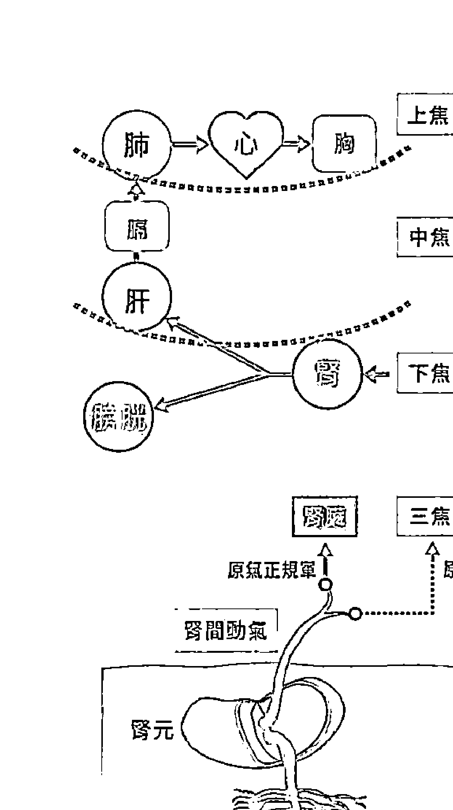

俗語說「囝仔人屁川三斗火」或「小孩褲頭三斗火」，意思是小孩身體總是熱呼呼的，不怕冷，好像屁股（屁川）或褲頭有三把火在燒一樣。

快長大，此時腎間動氣將腎精轉化為成長養份，再以宛如高速行駛的蒸汽火車方式，透過腎臟輸送給臟腑；透過三焦通行散佈到身體的每個角落。這股生長的陽氣會產生熱量，讓孩子即使在冬天仍發熱出汗，所以小孩是「純陽之體」。反觀老人家由於腎間動氣也跟著老化，活動力和轉化力都變慢變弱，陽氣不足，所以非常怕冷，跟你們簡直天壤之別。

中醫兒科還有「變蒸」的說法，指出嬰兒出生後每32天為一變，64天為一蒸，「變」指性情的改變，「蒸」指身體的蒸熱，這都是正常現象。許多父母會發現嬰仔「一暝大一寸」，只要一覺醒來又長大了一些，這就是腎間動氣趁著孩子睡覺時，全速推動成長，所以嬰兒階段充足的睡眠非常重要。

雖然有腎臟系統和三焦系統來繼承腎間動氣的工作，腎間動氣仍保有身為臟腑與經脈根本的關鍵能力。分開來看，腎間動氣就是五臟六腑之氣與十二經脈之氣，合起來看，腎間動氣就是生氣之原，與腎元藏精一樣都貫穿整個生命歷程。腎間動氣是生命、呼吸、臟腑和經脈四大要素的根本，也推動著四大要素的成長與發育。可見腎間動氣在生命初始階段已開始運作，儘早為後續逐漸展開的發育階段做足準備。

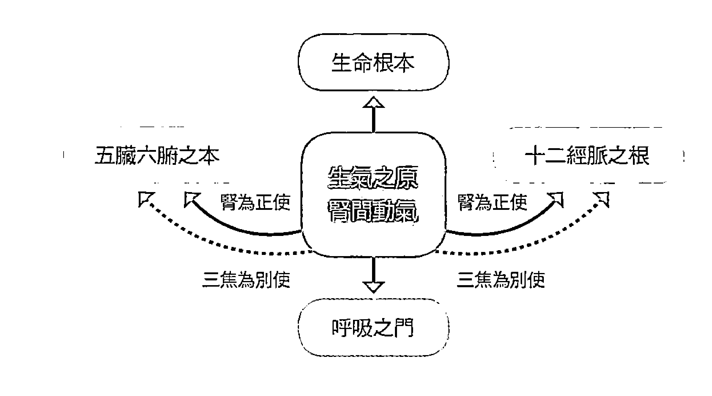

## 5. 腎間動氣透過三焦在體內運行的方式與脈輪學說相似

現代研究發現，精子尾部末梢有一個向左纏繞的螺旋狀細胞結構，當精子移動時尾巴會朝同一方向擺動，亦即向右側螺旋前進，而 DNA 則是左旋的雙螺旋結構，有趣吧！這兩個生命早期的重要物質，一個向右旋轉，一個向左旋轉，都是旋轉活動，由此發展出來的身體，理論上也具有螺旋狀的活動功能。

再從人與天地相對應的關係來看，腎主水，自然界水流動的方式有直行和漩渦兩類路線，人體也記錄這兩樣特質，腎間動氣的推動方式就有直行路線和旋轉路線。（經脈篇會介紹）兩側腎經與督脈都貫穿脊椎，推論腎經是以螺旋上升方式進行。

人體背面結構與正面結構是互相呼應的，當背部採取螺旋方式時，正面是否也會跟進？

這是非常有可能的。腎間動氣透過正使的腎經輸送給相連結的臟腑，屬於直行路線，而螺旋路線可能就交給三焦了！三焦為腎間動氣之別使，除了有 burner 功能之外，也代表人體上部、中部和下部體腔，聰明的腎間動氣當然會善用這些空腔。但怎麼運用呢？

古印度阿育吠陀醫學記載，人體有三脈七輪，是最完整的能量系統。「三脈」指體內最主要的三條能量通道，分為中脈、左脈和右脈，三脈最低交會點在脊柱尾端的「海底輪」，此處類似中醫的「會陰」。三脈之中，中脈尤其重要，位在脊髓中間，由頭頂向下至海底輪，很像中醫的督脈。左脈性質屬陰，為紅色，右脈性質屬陽，為白色，中醫也認為人體是左陰右陽，左血右氣，血色紅，氣色白，可見道理相通。

脈輪（Chakras）是指中脈上有七個漩渦氣場，包括海底輪、臍輪、太陽輪、心輪、喉輪、眉心輪和頂輪。有人說脈輪就像是人體中軸的核心齒輪，既是能量的交會中樞，也能驅動生命能量「昆達里尼」（Kundalini，或稱「拙火」，位於海底輪，也有一說是指在人體脊柱底部，捲曲成三圈半的能量）的進化。昆達里尼是生命創始力量的泉源，跟前述的「腎間動氣」類似。

阿育吠陀醫學與中醫學有許多相似處，唯獨脈輪學說與中醫經脈循行方式有明顯差異。脈輪在梵文是「輪子」之意，以漩渦型態呈現，然而中醫的經絡系統多數以直線運行，並無漩渦型態。我認為無論哪個醫學系統，所面對的人體都是一樣的，只是切入和研究的角度不同而已，就像瞎子摸象，縱使部位不同，理解有限，殊途最終也會同歸於「牠是一頭象」。現階段在可理解的中醫與古印度醫學對於人體運行與結構的詮釋有異有同，到底差異是出自何種觀點的不同？

長期以來對此深感困惑，但心底卻始終相信，當面對的是同樣的人體時，這些不同觀點的切入呈現，都在揭示人體的奧秘，讓我們能更立體且更全面的理解。

就在思考腎經經脈可能以螺旋方式貫脊之時，突然想到漩渦狀的脈輪，這是否有異曲同工之妙！多年疑惑，頓然有了線索，原來腎間動氣挑選三焦作為別使的原因之一，正是要善用這些空腔，以漩渦方式快速推動原氣到各個組織器官。漩渦式運行宛如流動的風，風可助火燃，風火交煽，風大火旺，強化了原氣的「動」與「氣」特質，成為具有轉化和推動能力的陽熱之氣。

漩渦式運行唯有在空曠的地方才能進行，脈輪如此，腎間動氣也是如此。而且脈輪的分佈也是沿著中軸從會陰到頭頂，與中醫的任脈由會陰部上行到頭面部與督脈交會概念相似。

有意思的是，脈輪學說中的三脈循行方式也有兩種：一種為左、右脈與中脈平行，另一種如右圖，左、右脈纏繞中脈。

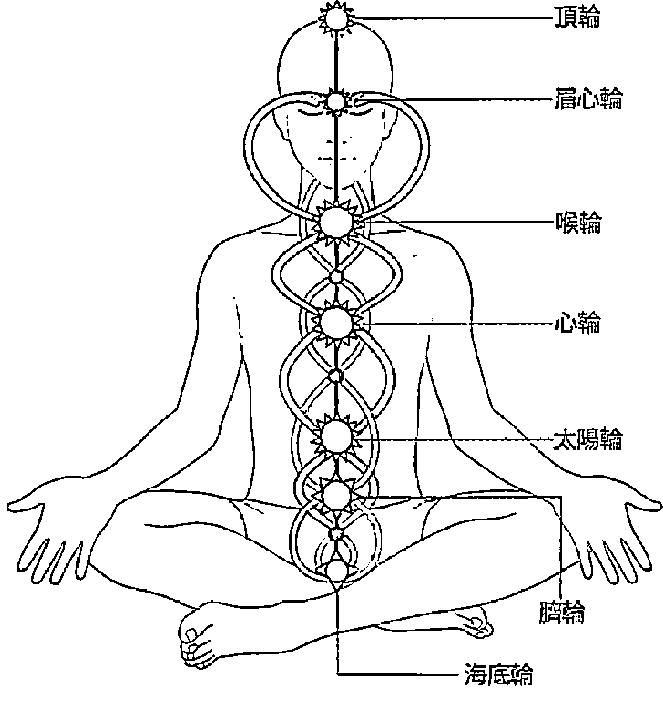

傳統中醫認為腎經經脈以直行方式貫穿脊椎，但個人推論腎經經脈以漩渦纏繞督脈方式貫脊，類似上頁圖。

依據上述，脈輪與腎間動氣透過三焦在體腔分佈的型態類似，而且脈輪所在部位附近都有重要的穴位，近期也有越來越多的書刊及報導討論脈輪和中醫經脈穴位的對應關係。如此一來，印度醫學與中醫學大道如一，真的殊途而同歸。

## 四、腎臟特有的陰陽合體雙重屬性

英國詩人威廉・布萊克曾寫下「一砂一世界，一花一天堂」的美麗詩句，意思是從一粒砂或一朵花就能看到全宇宙的奧妙，這也是一種「全息觀」，亦即宇宙萬物無論多麼渺小，都包含有全宇宙的訊息。植物的種子如此，人體也如此，尤其腎臟更是深藏宇宙訊息的大本營。

前文介紹過，長得跟種子很像的腎臟也跟種子一樣，是為「腎元」，密藏所有生命訊息，我稱為「全有」。如何叫做「全有」？

腎臟三部曲的腎元含有獨特的雙重屬性，下頁圖正是女性與男性合體的雙面屬性。其實每個人都是陰陽合體，陰陽共同根源於腎，其他臟腑則再分陰陽。

聰明的中國哲學家將萬物以「陰陽」來歸類，這種以簡馭繁的方法也應用在醫學上。如《內經》提到：「陰陽者，天地之道也，萬物之綱紀，變化之父母，生殺之本始，神明之府也。」陰陽是總綱，為高高在上的天地之道，可以再細分為日常生活特質，如水火及氣味：「水為陰，火為陽，陽為氣，陰為味。」一般來說，具有形體者，如水跟食物，多屬陰；沒有形體者，如火跟氣，看得到但摸不到，多屬陽。

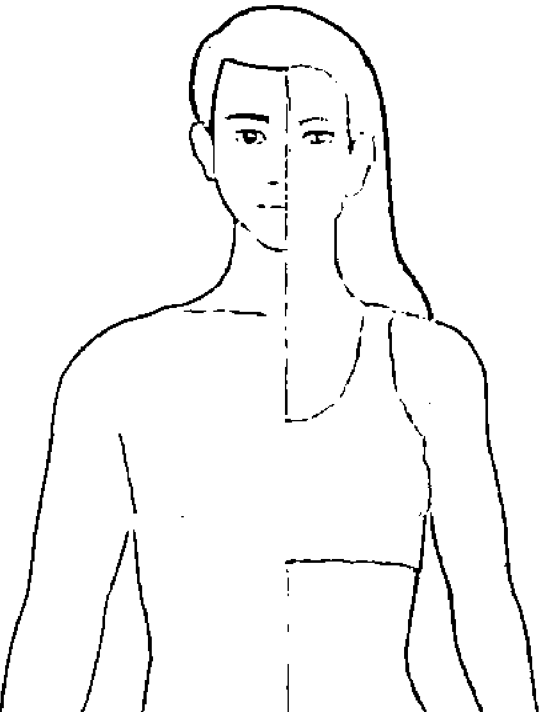

除了水火屬性之外，陰陽也可以應用在方位上，如：「天地者，萬物之上下也；陰陽者，血氣之男女也；左右者，陰陽之道路也；水火者，陰陽之徵兆也；陰陽者，萬物之能始也。故曰：陰在內，陽之守也；陽在外，陰之使也。」傳統智慧連天地上下或左右都可以分陰陽，真的是不容小覷。

腎所珍藏的正是陰與陽兩者皆備的物質，因為陰陽並存才是天地之道。所以腎所特有的雙重特質，大方向來說是陰與陽，可以再細分：從屬性來說包括水與火、男與女、動與靜；從方位來說包含內與外、上與下、左與右、前與後；從生命歷程來說……包括生与死等等。阴阳是天地之道，肾藏阴阳，是唯一具有双重特质的「全有」脏腑，这些珍贵的特质，也是生命的精华，因此中医特别以「肾藏精」来概括。肾精可以细分为阴阳，如下图。只要掌握阴阳概念，即能掌握神秘的肾脏与生命之源。

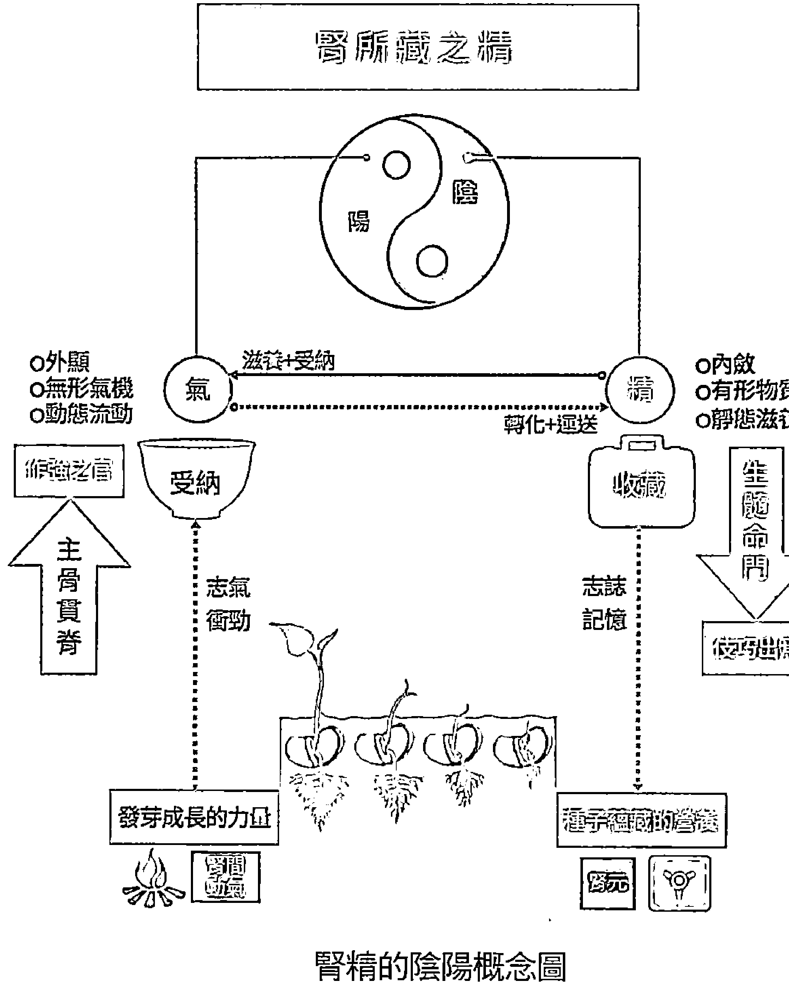

## 肾脏——肾气与肾经

## 肾脏藏精，类似种子「全有」概念

如前述，肾藏阴阳是来自肾元特有的属性，中医归纳为「肾藏精」。

广义的「肾精」为肾元所藏，可以概括肾所藏的所有宝物。依据阴阳之理还可细分为性质属阴的「肾精」及属阳的「肾气」。其中性质属阴的「肾精」归属狭义的「肾精」概念，主要指有形的物质，以肾阴（肾精）及肾阳（肾气）来说明就很清楚了。

历代中医书籍常在广义与狭义的「肾精」概念之间讨论，让后世中医师得费一番功夫去分辨。西方人遇到爸爸与儿子同名时，会用「小」（Jr.）或「几世」来区分。个人浅见，或可将广义的肾精另立名字，如「藏精」或「大精」等，就比较不会混淆。

不过改名是大事，非我能力所及。我只是纯粹为读者着想，采用便于阅读且避免混淆的权宜之计，当书中遇到须与狭义肾精分别时，才将广义的肾精以「藏精」来代表，亦即「藏精」包括肾阴与肾阳。

### 五脏对应表

| 五脏 | 五声 | 五液 | 五志 | 五藏 | 五华 | 五体 | 五窍 |
|------|------|------|------|------|------|------|------|
| 肝   | 呼   | 泪   | 怒   | 魂   | 爪   | 筋   | 目   |
| 心   | 笑   | 汗   | 喜   | 神   | 面   | 脉   | 舌   |
| 脾   | 歌   | 涎   | 思   | 意   | 唇   | 肉   | 口   |
| 肺   | 哭   | 涕   | 悲   | 魄   | 毛   | 皮   | 鼻   |
| 肾   | 呻   | 唾   | 恐   | 志   | 发   | 骨   | 耳   |

## 一、肾通冬气，主封藏

肾主水，色黑。两者都是寒冷的特质，所以肾气与四季的冬气相应。《内经》说：「肾者，主蛰封藏之本，精之处也，其华在发，其充在骨，为阴中之少阴，通于冬气。」冬天时节，动物会找个隐密巢穴躲起来冬眠，人类则会将秋天收割的果实谷物收藏过冬，所以冬天主藏，肾也具有封藏的特质。前文提过《内经》说「肾脉石」，此处的石是与「肺脉毛」相对照，肺气轻盈，其脉浮像羽毛，肾气封藏，其脉沉像石头，与肾脏沉潜性质相应。

肾主封藏，主要是藏精，这与肾主地下水需要外送上冲的特质完全相反，两者却同时存在，这也是肾的双重特质之一。再回到种子思考。当一颗种子埋在土中等候发芽时，这颗种子的外皮层层包裹，与外界全然隔绝。它没有外援，只能靠自己，此时就必须具有「全有」的能力，也就是必须具有所有生存所需的能力，这就好像《鲁宾逊漂流记》，独自一人漂流在孤岛，就必须培养所有能存活下来的能力。

我父亲当兵时是海军陆战队员，学得一身好本事，不仅会工作，更勤于家务，买菜做饭、洗衣缝补等都很上手，我高中时的衣服都是爸爸缝补，运动时脚扭伤也是爸爸揉按整复，更别说修缮房屋水电等工作，里里外外样样皆行，他常骄傲的开玩笑说：「生孩子以外的事，我都会做。」简直就是我们家的「肾脏」啊！

植物种子蕴含了生命所有的物质，人体亦然。生命根基于肾脏，肾脏就保有过去、现在与未来所有的生命物质：

-   过去：来自演化历程所保留下来的生命记忆，是人类共同特质。
-   现在：来自父母亲的遗传物质，类似现代的 DNA，是个人化特质。
-   未来：成长发育所需的各类营养物质，是生命的蓝图。

人类来自演化历程所保留下来的，譬如「本能」，如看到色泽橙黄的水果知道是成熟可吃、害怕黑暗、遇到危险会立刻躲起来等等。本能也出现在其他动物，如鲑鱼天生能从大海洄游到出生地，逆流而上，不会迷路，穿越瀑布和急流洄溯生命之源，只为了交配产卵传宗接代；还有许多候鸟会成群结队长途旅行或过冬，等冬天过后再飞回栖地，横越数千公里，无需卫星导航绝不会迷路，这种动物本能真的很强大，而这种本能就藏在肾脏里。

## 二、肾主藏精

中医在区别五脏六腑时有一个重要概念，就是藏与泻。五脏都是实心的器官，六腑多数是空腔器官，因此五脏主藏，六腑主泻。五脏要维持人体正常功能，就必须「藏精气而不泻」。

「精气」广义泛指营养物质，五脏六腑皆有。从这个角度来看，五脏都能藏精气，但有所分工，如心藏神、肝藏魂、肾藏志等。狭义「精气」专指肾脏所藏的物质。

中医将来自遗传及未来生长发育所需物质统称为「先天之精」，由肾元存藏，之后通过肾间动气输送至肾脏，所以肾为先天之本。

肾是很严谨低调且唯一位于背部的脏腑，跟膀胱经一样，背景也非常雄厚，才能肩负储存先天精气之重任，所以《内经》说：「肾者主蛰，封藏之本，精之处也。」肾脏就是「藏精」的保险箱，将之严密收藏。

一旦呱呱落地成为独立个体之后，所吸收的营养物质中医称为「后天之精」，主要由脾胃制造生成与供应，所以脾胃为后天之本。

### 1. 中医对于「精」的看法

中医在许多脏腑概念都用到「精」字，为了便于了解，分别从两方面来介绍，第一是精的来源及功用，第二是精所存之处。

### 精的来源及功用

-   先天之精：禀受于父母的先天遗传物质，由肾收藏，是构成人体的原始物质。其中与生育繁殖功能特别相关者，《内经》名为「天癸」。
-   后天之精：通过消化系统吸收的养份，主要由脾胃掌理，转输到五脏六腑维持正常生理功能。

### 精所存之处

存在五脏六腑：此为广义概念，代表所有营养物质，如精、血、津、液等，是先天之精与后天之精的总和，也称为「脏腑之精」。

存在肾脏：此为狭义概念，专指先天之精，亦即「藏精」，可再细分为肾精（肾阴）与肾气（肾阳），也称为「生殖之精」。

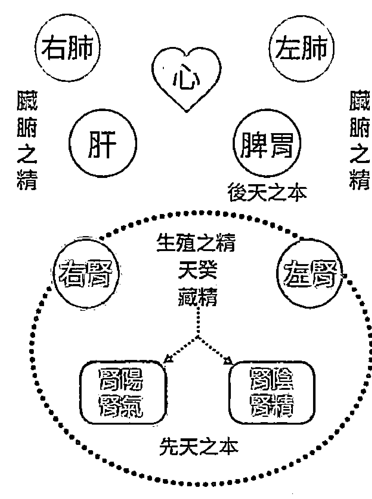

五脏六腑各有分工，各有法宝，为了维持生理功能，大家通力合作，这些法宝统合起来称为「脏腑之精」，即上图中的粉橘色块。肾脏为五脏六腑家族的一员，也归属「脏腑之精」。但因肾所藏之精的「生殖之精」有特殊功能，加上肾的全有特质，藏精又可再分阴阳，这就是肾精与肾气的由来。可参阅上图中灰色色块。

### 2. 先天生后天，后天养先天

「先天之精」，听起来好像出生之后就消失，一如胎盘。其实不会，因为它贯穿整个生命历程，深深影响每个人的生长壮老病死，以及繁衍后代的能力与品质。会被称为「先天之精」的重点有二：「先天」代表来自遗传，「之精」代表精华珍贵。

我们常说某人先天遗传基因很好，所以身强体健，聪明伶俐等等。所以这个遗传物质既然是生长的蓝图，不会一出生就被妈妈或医师回收，也不会马上用完。但生长蓝图能否被彻底执行或被改变，端看后来的成长过程是否有充足的营养、智慧与坚持的毅力等支持，营养要由「后天之精」持续补充，后两项特质则由肾管理。

先天与后天之精关系紧密，彼此相互依存，互通有无，所以中医有「先天生后天，后天养先天」的说法。这个概念符合人情义理。我们可以把先天之精想成家中的长辈，后天之精想成年轻一辈。后天这个孩子是由先天长辈所生，将之养育成人后，长辈也年老了，此时年轻力壮的后生小伙子有能力也有责任照顾先天长辈。这就是先天与后天的关系。

以中医的概念来说，脾胃从食物所吸收的精微物质主要供应日常生理所需，若有余裕的精血津液就会输送到肾脏，由肾气将之转化为肾精储存，藏精就会增加，而且越多越好，这也符合人类将多余的物资储存起来的习性。当其他脏腑需要更多的精微物质时，肾气也会将肾精转化成精血津液供其他脏腑使用，藏精会减少，所以后天之精要尽快补充回来。人体先天与后天之精必须密切合作，让肾精能够持续正常的贮藏与供给，宛如活水般滚动生命之轮。此时肾的封藏功能很重要，因为它保有先天之精，后天之精有剩余时也会送到肾来储藏备用，平时不会轻易使用，所以藏精是人体最后一道防线，需要特别保护。

我常说，肾脏就像祖产或是阿嬷的定期存户（为何不是妈妈？妈妈是脾土，要照顾我们当妈宝，主管流动资金，不管定存的事），最好有进无出，才能累积财富，也才有能力应对特殊情况或重大之需。

万一肾的封藏功能失职，就像祖产被变卖或定存频频解约，藏精有出无进，一旦消耗殆尽，有如生命之根被拔起，生命也走到尽头，因此中医有「久病及肾」的说法，意思是身体器官重病久病，功能当机，最后都会连累肾脏，必须由藏精前去补位，以维持生理功能，若未能即时改善，时间久了，藏精耗尽衰竭，生命也随之结束。

### 3. 生殖之精的功能

中医认为性征和生殖能力的发育及发展与肾有关，这个部分称为「生殖之精」，顾名思义是与生殖能力特别相关。藏精为接收自父母的先天遗传物质，从繁衍的角度来看，也是我们要传给下一代的遗传物质。接收与传递的藏精物质都属于生殖之精，但其内容稍有不同。

我们在生命之始禀受父母的先天遗传物质，会逐渐成长到具有生殖能力，会将父母给予的遗传物质加上自己后天努力，若有多余的脏腑之精则送到肾脏储存，一并传给子代。所以生殖之精具有自己本身的生长蓝图加上后天之精的贡献，会深深影响下一代的成长发育。现代医学研究发现，父母亲后天学习而得的经验与能力确实能遗传给子女，这也是新世代孩子出生要比我们当时聪明灵巧许多的原因之一吧。

《内经》中记载，由肾气主导与生殖力特别相关的物质称为「天癸」。
为何称为「天癸」？「天」代表来自先天遗传，「癸」来自五脏六腑与十天干的对应关系，其中肾脏对应癸，癸属水，与肾主水相同，天癸就是肾气中特别与生殖有关的物质，类似现代医学的性腺激素物质，性腺激素包括卵巢和睾丸产生的激素，与生殖密切相关，所以天癸充盈与否是生殖力的关键。

天癸是肾气中最富有生殖力的代表物质，承担生殖的阶段性任务，肾气盛则天癸来，肾气衰则天癸竭。女性14岁天癸到来，副性征发育完成，月经按时而来，子宫卵巢等发育成熟，就有怀孕能力。男性16岁天癸到来，副性征发育完成，睾丸精囊等成熟，就有育子的能力。天癸也跟性腺激素一样有“执行单位”，就是任脉与冲脉，两脉的特性与作用可参阅<奇经八脉概论篇>。对女性来说，两条奇经脉气通盛，月经按时而来，男性没有特别强调任脉与冲脉，但是确实存在，在冲、任二脉的作用之下，精气满溢，精子数及活动力都非常良好，此时两性皆具有孕育下一代的优良生理状态。

后世有些医家把天癸作为“月经”的代称，但依据《内经》精神，两性应该皆有天癸，否则怎么生孩子呢？

### 《内经》解开人体从成熟到衰老的生命历程

| | 女性发育以七为基数 | 男性发育以八为基数 |
| :--- | :--- | :--- |
| **青少年期** | 七岁肾气盛，齿更发长
二七而天癸至，任脉通，太冲脉盛，
月事以时下，故有子 | 八岁肾气实，发长齿更
二八肾气盛，天癸至，精气溢泻，
阴阳和，故能有子 |
| **青壮期** | 三七肾气平均，故真牙生而长极
四七筋骨坚，发长极，身体盛壮 | 三八肾气平均，筋骨劲强，故真牙
生而长极
四八筋骨隆盛，肌肉满壮 |
| **中老期** | 五七阳明脉衰，面始焦，发始堕
六七三阳脉衰于上，面皆焦，发始白
七七任脉虚，太冲脉衰少，天癸竭，
地道不通，故形坏而无子 | 五八肾气衰，发堕齿槁
六八阳气衰竭于上，面焦，鬓斑白
七八肝气衰，筋不能动，天癸竭，
精少，肾脏衰，形体皆极
八八则齿发去 |

**1. 青少年期：第一到第二周期**

女性的发育以七为基数，女性7岁肾气（藏精）开始兴盛，乳牙换新牙，头发长得茂密；14岁天癸到来，副性征发育完成，月经按时而来，子宫卵巢等发育成熟，就有怀孕能力。

男性的发育以八为基数，8岁左右肾气充实，开始换新牙，长密发；16岁天癸到来，副性征发育完成，睾丸精囊等成熟，就有育子的能力。所以肾气主导了性器官的成长成熟、性欲与生殖能力的发展。

这就难怪男性朋友很怕听到「肾亏」、「败肾」，暗指性能力低落，对于男性自尊可是莫大打击啊！

**2. 青壮年期：第三到第四周期**

女性14岁到28岁，男性16岁到32岁，是人生最健康美丽的巅峰时光。此时牙齿坚固，头发茂密，筋骨强健，肌肉满壮，完全是俊男美女之相！

**3. 中老年期：第五到第八周期**

女性到35岁，男性到40岁，是身体由盛而衰的转折点，肾气开始衰退，面色开始暗沉，牙齿、头发开始摇晃脱落，脊椎的骨刺也会陆陆续续出现。

女性到7x7=49岁，男性8x8=64岁，天癸枯竭，女性月经停止，无法生育，男性精子减少，生殖能力减低。据此来看，女性49岁以后进入更年期，男性大约64岁左右，65岁退休的爷爷或老爸们要密切注意自己的身心状况，因为男性也有更年期。

现代认为35岁以上就算高龄产妇，跟《内经》所述接近。门诊时遇到年过四十希望怀孕的妇人，若是因为晚婚，或者早年结婚却不想怀孕，一拖再拖，眼见时光流逝才惊觉要拼命加油者，我都会碎念她，因为超过怀孕黄金期，不仅不易受孕，即使怀孕对于母亲和胎儿都很辛苦。《内经》真的很厉害，有关成长发育转折点与现代相符，譬如以天癸的盛衰时间来说，天癸在虚岁14岁到来，早年小女生的初经大约在12～14岁，天癸在虚岁49岁衰竭，现代女性停经大约在47～50岁，相当准确。特将过程中的关键点绘成下图。

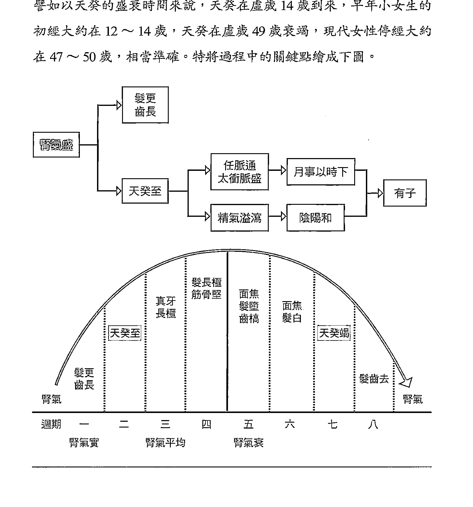

在这里帮大家整理几个重点：

-   肾气扮演的角色：肾气指肾的推动功能，启动肾主管的牙齿与头发进入早期发育，也是身体开始衰败的「吹哨者」。上页图黑色弧线代表肾气盛衰及整个生长发育、生殖与衰老过程。弧线下方列出肾气主导状况，首先为头发与牙齿，两者本来就归肾管理，《内经》特别用来表明发育过程，一方面提醒头发与牙齿是年龄的指标，同时也暗指此过程全由肾来主导。
-   男女生的生长时间基数不同：女性为七，男性为八，可以看出男生普遍比女生晚熟，也比较晚衰老的原理。
-   天癸是生殖力的关键：在肾气盛实且运作一个周期之后，天癸终于到来，可见肾气是推动天癸成熟的力量。
-   天癸推动任、冲二脉：太冲脉是冲脉具有「血海」特质的部分，肝主藏血，因此与肝脏相关。天癸至则任脉通、太冲脉盛，天癸竭则任脉虚、太冲脉衰少，可见天癸是任、冲二脉作用于个体成熟与生殖能力的重要推手。

## 三、肾脏功能与衰老有关

时间是最公平的岁月杀手，人们会随着年纪增长而渐渐衰老，然而「老」并不可怕，因为我们无法阻挡时间的流逝，「衰」才是重点，如果能妥善照顾自己，当然就能老而不衰，每天开开心心充满活力，生活多采多姿。

藏精的盛衰变化深深影响整个生命过程，充足的藏精是健康美丽的要件，可以超越时间魔人的摧折，抹去岁月的痕迹，所以历来凡是提到养生保健，首要脏腑就是肾脏，其理在此。

《内经》有一个以十为基数的生命历程，五十岁开始进入衰退期：「五十岁，肝气始衰，肝叶始薄，胆汁始减，目始不明；六十岁，心气始衰，若忧悲，血气懈惰，故好卧；七十岁，脾气虚，皮肤枯；八十岁，肺气衰，魄离，故言善误；九十岁，肾气焦，四藏经脉空虚；百岁，五藏皆虚，神气皆去，形骸独居而终矣。」

人体依据五行相生的关系，每十年就有一脏跟着进入衰退期，从肝（属木）—心（属火）—脾（属土）—肺（属金），最后是肾（属水），到了百岁，五脏皆虚。肾是最晚衰退的，肾功能从生命之始维持到最后，由此可见养生要护肾的重要性。

肾为先天之本，不仅能保健，也常用于治疗先天性疾病，如发展迟缓，生长发育障碍，中医称为「五软」「五迟」等疾病；或未老先衰的疾病，如跟作者一样的少年白发；或者严重老化疾病，如严重骨质流失、失智等，这些情况下，肾都是关键。门诊时，有些病人持续回诊治疗，看到病人越来越健康，很开心，我就跟病人开玩笑说：「恭喜回原厂，更换原厂零件囉！」人体的「原厂零件厂」就设在肾啊！近代兴起的再生医学，使用干细胞做人體自我的再生与修复，这与善用藏精的概念一致。

中医理论是很早熟的医学，大约在东汉以前就完备了。《黄帝内经》更是无比重要的医书经典，许多千年前的论述，现代西医至今也得以验证。

譬如有关造血功能，大多数血球都是在骨髓中制造，新生儿所有的骨髓都生产血球，逐渐成长后，部分骨髓才停止生长血球。骨髓会制造红血球，肾脏会产生「促红血球生成素」（EPO）帮助骨髓制造红血球，预防贫血。而中医理论中的肾主骨生髓，肾经经脉还贯穿脊椎，肾脏掌管人体所有的骨与髓。

前面介绍过，肾为先天之本，与后天之本的脾胃之间有个默契就是互相支援。当脾胃将精血津液这些养份输送到肾脏时，肾气会将其转换为肾精再储存。反之，当其他脏腑有需要时，肾气也会将肾精转换为精血津液输送给其他组织。肾是全有的器官，肾藏精，精能生髓，精髓可以化而为血，所以肾脏即参与了血液生成。有些补肾的中药可以精血同补，如四物汤中黑噜噜的熟地黄能补血滋阴，益精填髓，因此不仅用于补肾的方子如「六味地黄丸」，也会出现在补血的四物汤，就不足为奇了。

## 四、藏精分元阴与元阳

肾脏来自肾元的全有特性，藏精就兼具了阴阳特性。但如何区分阴阳？以植物来说，凡是有形的、静态的皆属「阴」，肾精蕴含营养物质，类似植物种子，是为「肾阴」。凡是无形的、动态的皆于「阳」，肾气是肾功能的推动力，类似植物生长的动力，是为「肾阳」。

既然阴阳已分，还可以加入水火寒热性质，请注意这四个都是正常的生理特质。肾精为肾阴，性质属水为寒，能够滋养濡润所有的脏腑组织器官；肾气为肾阳，性质属火为热，能够温煦、推动和生化所有的脏腑组织器官。肾阴肾阳与人体的生长、发育、生殖泌尿等各项功能关系密切，还与神经、骨骼、造血、免疫、内分泌等系统有关。

肾为先天之本，是生命的源头，脏腑的根本，中医特别加上「元」字以别于其他阴阳，因为「元」有开始的概念，春节时说「一元复始，万象更新」，用在肾脏为生命之始非常贴切。也有用「真」字，点出「本来」的概念，所以肾阴又称元阴、真阴、真水，是人体阴液的根本；肾阳又称元阳、真阳、真火，为人体阳气的根本。

元阴、真阴、真水，都是肾阴的别名；元阳、真阳、真火，都是肾阳的别名，因此后世中医称「肾藏水火」、「肾藏阴阳」或「肾藏元阴元阳」，意思皆同，都是藏精兼藏有阴阳的说法。

## 五、肾脏特有的命门学说

「命门」概念在肾脏三部曲中已做介绍。然因肾脏功能非常重要，尤其在养生保健方面更是居于龙头地位，后世有专属于肾脏的「命门学说」，加强说明肾脏的特殊性及重要性，故在此加以详述。

「命门」一词并不难懂，直译就是「生命之门」。但后世医家对它的位置和属性等论述错综复杂，所以在这里撷取与肾有关且可用的论点供大家参考。

与肾有关的命门学说首先来自于《难经》，指出两个肾脏各有分工，右侧的肾脏不是单纯的肾，特别称为「命门」，其气仍与肾相通。

> 「藏各有一耳，肾独有两者，何也？然：肾两者非皆肾也，其左者为肾，右者为命门。命门者，诸精神之所舍，原气之所系也，男子以藏精，女子以系胞，故知肾有两也。」

> 「谓肾有两藏也，其左为肾，右为命门。命门者，精神之所舍也，男子以藏精，女子以系胞，其气与肾通。」

《难经》还进一步指出：「诸十二经脉者，皆系于生气之原。所謂生气之原者，谓十二经之根本也，谓肾间动气也，此五藏六府之本，十二经脉之根。」

所有经脉的根本都系于「肾间动气」，又称为「生气之原」。这个说法完全符合肾主先天之气，所藏的元阴元阳都是人体阴液与阳气的根本，肾脏是生命的根本，当然也是五脏六腑及十二经脉的根本，这样才有资格称为「命门」。

命门功能有三：

1. 精神所舍：心所藏之神与肾所藏之精，其根本都安置在命门，心肾功能正常是维持生命的关键。
2. 原气所系：「原气」又称「元气」，属于肾气的功能，推动身体气机活动。依据「左阴右阳」的概念，左肾性质属阴水，右肾性质属阳火，称「命门之火」，因原气也是命门之火的作用。
3. 男子藏精，女子系胞：属于肾精的功能，男精女胞与生殖有关，牵涉到个人性命与繁衍后代。

命门所管的三件事情都是人生大事，是名符其实的「生命之门」。中医将此概念应用于把脉，右侧的尺脉可以候命门之气，左侧尺脉可以候肾脏之气。

既然命门如此重要，从养生保健的需求来说，如何找到可以自行按压热敷的「命门区」才是重点。有关命门的位置，《难经》说在右肾，但又提到肾间动气，后世医家更是众说纷纭，但总脱不开心脏的关联，这应该无需再讨论。尤其依据肾经经别在十四椎出属带脉的路线来看，督脉位于十四椎下有一个「命门穴」，两侧旁开 1.5 寸为「肾俞穴」，再旁开 1.5 寸为「志室穴」，这个区域的深层就是肾脏。所以个人推论，从命门穴旁开到两侧志室穴之间的位置是为「命门」外在反应区，称为「命门区」，刚好涵盖两侧肾脏，也符合「肾间动气」的说法。但命门区不等于肾间动气区，还需结合脐下的关元穴才算完整。

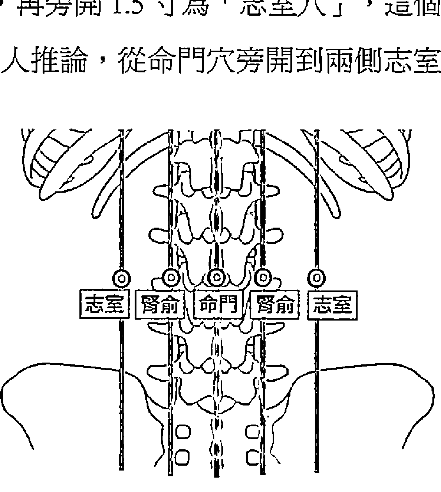

## 六、肾精所藏之处

肾精非常珍贵，类似屋子的权状，家中的传家宝，必须另外有个保险箱封藏保存。那么肾精保险箱在哪里呢？
位于肾间动气的「命门」是展现肾脏功能的重要部位，「命门」有门，表示是一个可进出的门户，所以命门区是保险箱的把手，但不是保险箱。

若以保险箱坚硬和封闭的概念在人体搜寻类似结构，则脊椎及头颅是最佳的「保险箱」人选。首先它们的外侧都有骨头包覆，里面的空腔充满骨髓，也是封闭结构，非常适合作为保险箱。加上阳脉之海的督脉与肾经经脉都贯穿脊椎，肾经向前继续连结肾脏，提供肾脏管理脊椎的通路。肾主骨生髓，脑为髓海，髓是骨头的精华，这些「精髓」全归肾管理，所以封藏肾精的保险箱就是「脊椎」与「头颅」，肾脏则是管理者，并握有开箱的密码。

肾精亏虚是许多退化性疾病的主因，常会出现耳不聪、目不明、骨质疏松、腰背酸痛、记忆力衰退，甚至痴呆的现象，这都提示肾精封藏在脊椎与头颅的高度可能性。

临床上，遇到脑部疾病或脊髓损伤的病友，透过针灸刺激，发现经脉之气在远端的感传和疗效仍就存在，例如脊髓损伤者下半身没有知觉也不能活动，当他肩膀酸痛或腹部胀气时，选用足部相对应的穴位针灸治疗，也能改善病情。这种情况让我们思考：当脑部及脊椎损伤时，是否连带影响其所藏之肾精？其与肾脏之间的连线也改变？因而造成相关部位的功能和感觉丧失？经络是通路，主要通行气血，若要修复损伤的肾精保险箱以及恢复与肾脏的连线，可能需要更多的治疗方法，值得我们继续努力。

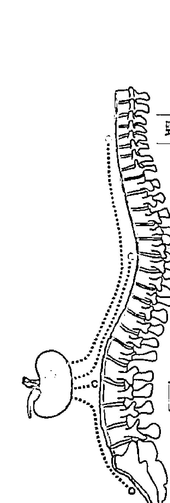

脊椎属肾的可能方式图

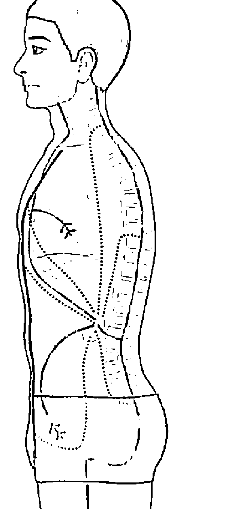

肾经经脉贯脊属肾

## 七、肾气的重要功能

肾脏将肾精存放在脊椎和脑部这个保险箱，必要时也会从保险箱取出应用。谁最适合做这个跑腿的工作？当然就是肾气啰！

肾气源自于肾间动气，后来专属于肾脏，所以称为「肾气」。

肾气是会流动的气机，也是生命活动的动力，虽然无形，但可以从它所完成的事情来观察，如早期推动蒸汽火车的蒸气。以植物来比喻，肾气就是让植物向上向外生长的动力，因此肾气具有外显的特质。

肾气属阳，具有火的特质，是转化物质型态的高手。譬如烧开水，壶中原本是冷水，透过加热，产生水蒸气和烧开的水，与冷水的性质已截然不同。肾气就像是那加热的火，能让属性改变。肾气充足的人，阳气温煦，温煦全身而不会畏寒。

肾气转化的两大方向包括：

-   「先天生后天」：在生命早期阶段，将肾精转换成供胚胎生长发育的营养物质。
-   「后天养先天，先天补后天」：出生之后，脾胃将多余的后天之精送交肾脏，肾气会将之转化为肾精以便储存；当后天之精有亏欠，需要肾精补充时，肾气会将肾精转化为气血津液，并输送给脾胃去分配运用。

综合以上所论，小结肾气的功能有三：

-   1. 运输功能：担任肾的外送员，负责肾精在肾脏与脊椎、脑部之间的移动。
-   2. 成长推进力：就像人体的一把火，功用如蒸汽或热气球的概念，促进人体向上成长的推进力。
-   3. 转换肾精：类似用炉火的概念，转换物质属性，尤其在肾精与气血津液之间的转换是维持生命的关键。

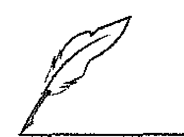

## 肾脏与脾胃之间，有先天与后天相辅相成的关系

肾脏与脾胃之间有着先天与后天相辅相成的密切关系，但肾经经脉连结肾、膀胱、肝、肺、心等四脏一腑，唯独漏了脾胃这个后天之本，脾、肾两脏彼此之间缺乏经络连线，先天之精与后天之精要如何补充？

有关此问题，仅提供以下的推论参考，但还需要进一步的验证。

先天之精与后天之精都是珍贵的生命物质，补充方式也循着一特殊且秘密的管道进行。秘密的关键使者，我认为有二，分别是阳脉之海的督脉和阴脉之海的任脉，透过这两个管道进行秘密交换。由于肾间动气所在位置包括下腹部属于任脉的「关元穴」和腰背部属于督脉的「命门穴」，因此这两个部位就成为先天与后天之精交换的部位。

## 秘密 1. 后天之精输送给肾脏的门路：关元穴

肝脾肾足三阴经交会于下腹部任脉的「关元穴」，此处为肾间动气所在之处，也是小肠的募穴。小肠是吸收食物养份的主要部位，还具有泌别清浊的辨别能力。小肠将营养送交给脾去运化，输送全身。

关元穴身为练家子非常重视的丹田部位，一定有其特色。「关元穴」顾名思义是元气关存之处，守住丹田才能练丹，肾藏元阴元阳（包括元气），可见肾脏会将部分元阳元气存放于此，依此推论，关元穴就是存放元气的关口，而且只关不开，只进不出。

脾经与肾经交会于小肠募穴的关元穴，显然在此处将后天之精交给肾脏使用。关元穴就是后天之精与肾经面交的部位，然后肾气再将之转换为肾精，经由肾经内部循行路线直接运回肾脏去处理。

## 秘密 2. 先天之精输送给脾脏的门路：命门穴

由于关元穴只进不出的特质，肾精无法从关元穴输出给脾，得要另关蹊径。

前文介绍过「肾间动气」是五藏六腑之本，十二经脉之根，幸好肾间动气在体表有命门区做为功能反应区，应是适合输送肾精的部位。请参阅下页图，肾经经别在十四椎浅出属于带脉，带脉与肾经、脾经都有非常密切的关系。

据此推论，先天之精会由肾气转化为气血津液，再从肾脏泄出到督脉十四椎的命门穴，之后横向两侧通过命门区，沿着带脉输送给脾经。

## 秘密3.「关元命门区」为重要的养生保健穴区

综上所论，腹部任脉的关元穴是后天补先天的门户，背部督脉的命门穴是先天补后天的门户，中医前辈早在「关元」与「命门」的穴名埋下伏笔。连结此二穴所形成的立体空腔区域个人称为「关元命门区」，是肾间动气所在，从古至今都是重要的养生保健穴区。

## 八、阴阳互根也会互损

「肾藏阴阳」像是两个家人住在同一个屋檐下，共用一个存款户头，彼此互相依赖、资助，生活相互关照影响，有钱时一起享受美食，缺钱时一起挨饿受冻，这就是阴阳互根及互损的概念。

### 正常生理——阴阳互根

由于肾阴与肾阳都来自藏精，像是同根生的龙凤胎，正常情况下，有阴就有阳，必要时阴阳之间也能互相转化，肾气可以转为肾精，肾精也能转为肾阳，阴阳平衡则身体健康。

另一方面，阴阳是相对的概念，没有阴哪来的阳？就像有了妻子角色的存在，男人才能成为丈夫，若没有妻子，只是个男人，不会是丈夫，夫妻关系是彼此以对方的存在做为自己身份的基础，这就是阴阳互根的道理。肾阴肾阳不仅同根源自藏精，彼此深深依赖，互为对方存在的根本。

### 严重病理——阴阳互损

阴阳互根的好处是互相帮助，相辅相成。缺点却也来自于优点，因为彼此依赖过深，一方出问题时，另一方会跟着受累，两败俱伤。古今中外，许多情人在得不到父母认同祝福而殉情的故事比比皆是，像罗密欧与茱丽叶、梁山伯与祝英台的故事，都是阴阳互损的概念。

当人体处于严重疾病过程中，例如病在肾阴严重虚损，肾阳会不断转化成肾阴去填补，但肾阴虚损宛如无底洞，永远难填平，时间久了肾阳也会严重亏损，最后导致阴阳两虚，中医称为「阴损及阳」。反之，若病在肾阳虚损，久之累及肾阴也虚损，最后也是阴阳两虚，中医称为「阳损及阴」。这些阴阳互损的情况常出现在危重症中。

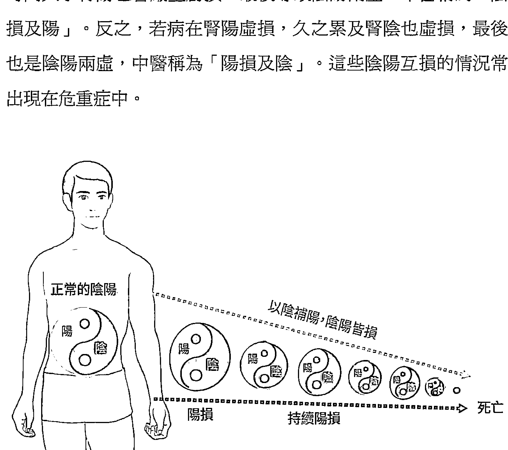

### 阴阳互损示意图

为何中医对于已经到阴阳两虚的危重情况，还要努力分别是「阴损及阳」或「阳损及阴」？这就是中医注重「治病求本」的精神。即使是抢救生命还是得有章法，得用对治法才能力挽狂澜，所以中医师才会认真地去做望闻问切四诊，以期找出致病的关键，希望能够逆流挽舟，留住宝贵的生命！

## 九、肾主纳气

首先讨论一个有趣的问题：为何称肾主「纳气」，而不是像「藏精」一样用「藏气」？

「纳」为接受，也有引入之意，但没有收藏之意。因为气必须流动才能发挥温煦和推动转化的功能，不可能像精固定在一个地方。精与气都是珍贵物质，肾能收藏属于肾阴的精，当然也要收纳属于肾阳的气。所以下图用碗来表示气的收纳之意，以箱子表示精的收藏之意。接纳并不是全然封藏，因为气很快就会流动出去，所以称为「纳气」。

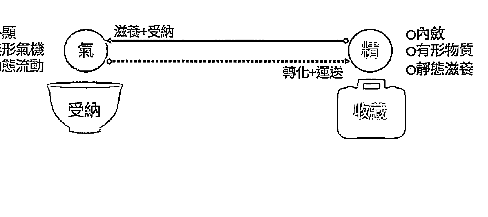

肾所纳的气有两种：一种是肾自身的肾气，协助肾精的转化，另一种是肺所吸进来的清气。

人跟植物一样，需要阳光、空气、水，肾精所藏者属于有形物质，水是其中之一；肾气所管的是无形物质，如空气，这些都是维生的要件，所以肾一定会出手管理，因此《难经》说：「谓肾间动气也，此五藏六府之本，十二经脉之根，呼吸之门。」指出肾与呼吸有关，且肾间动气是呼吸之门。

中医说「肺主出气，肾主纳气」，肺将外面的空气吸进体内之后，由肾负责将它摄纳到丹田，经过体内一番应用之后，再由肺呼出体外。人们常透过深呼吸来增加吸气量以减缓胸闷或气喘，也可用来和缓紧张的情绪。这些深呼吸进入体内的气就深入到丹田，这样无论是呼吸、唱歌或说话，气从丹田出来，呼吸会深长平稳，歌声当嘹亮厚实，说话则中气十足，正是「肺主出气，肾主纳气」的应用。

人体像一棵植物，空气分布当然也要像植物一样，从树梢到树根面面俱到。中医认为人体的根就是肾，古代医家说「肺为气之主，肾为气之根」，呼吸的气息有根，呼吸就会顺畅而深长，这是中医特有的呼吸概念。

呼吸是生命的根本，肾当然要掌握。人类的生命始于出生时张口啼哭，打开肺吸进第一口气，生命之末终于肾所呼出的最后一口气，不再纳气。生命开始于第一个吸气，终止于最后一个呼气，生死之间的日常呼吸就由肺与肾共同完成，所以肾经经脉连结到肺脏，以确保二者合作无间。

如果肾气虚弱，例如久病的人，无法摄纳肺吸进来的空气，气息很快就呼出去，呼吸变成很浅很短，甚至变成喘气短气，或呼多吸少、吸气困难的情况，表示肾主纳气功能有障碍，中医称为「肾不纳气」，属于危重症。对于呼吸疾病，中医强调初病治肺，久病就要治肾，以避免出现肾不纳气的状况。

回归到纳气一事，「纳」字虽有收纳固摄之意，仍较收藏为短期，也较浅层。气就像是推动种子发芽生长的力量，人体所有活动都需凭借气机来推动，所以纳气不可能收藏不动，主要是让气有根，犹如风筝在空中飘曳须有线系住，风筝断线则乱飘失联，气机失纳会出现气机逆乱，甚至气机脱亡的死证，不可不慎！

中医的用词很有深度，前面提到的「肾气」具有运输、推进和转换的功能，作用方向以对外为主；这里提到的「肾主纳气」，意思是肾脏可以接纳自己的肾气和肺所吸进来的清气，作用方向以对内为主。

-   - 肾脏源自肾元，属于五脏系统，功能以「藏」为主。
-   肾气源自肾间动气，负责推动肾脏和肾经功能，以「出」为主。

肾脏与肾气有藏有出，有阴有阳，也是肾藏阴阳特质的另一展现。

读者看到这里，千万不要因为名词的相似，容易混淆不清而感到气馁。其实每一位中医师在学习的过程中，都和大家有同样的经历。正因为如此，我希望透过这套书能把经络系统讲得更白话更接地气，这样才有出版价值，不是吗？所以请别懊恼，多看几次后就能理解了。

## 十、肾藏志，五志属惊恐

肾脏很喜欢收藏东西，除了有形的肾精，也将无形的肾气纳进，但看到肾藏志也是非常有趣。

五脏就是有所藏才称为「脏」，人类有各种个性特质，中医将之归给五脏去管理，称为「五藏」，如肝藏魂、肺藏魄，俗语说「气魄」、「军魂」都代表了某种人格特质，而心藏神、肾藏志，心、肾共同掌管神志，神志是最重要的精神指标。

### 肾所藏的志有两种意义

-   1. 志气：从个性特质来说，志有意志、毅力之意。肾主骨，肾经经脉起于足底，一路向上，克服万难，终于贯穿脊椎，呈现出肾脏的冲劲与坚持。肾经这个努力不懈的意志力，呈现在性格上会愿意持续努力且有骨气。肾气充足的人，工作中充满干劲。这种属于无形的意志力就与肾气相关。
-   2. 誌记：志通「誌」，记存于内心之意，也为记忆。肾主骨生髓，脑为髓海，肾主 IQ 与先天智商和学习能力有关。

> 《内经》对于志也有类似的论述：「所以任物者谓之心，心有所忆谓之意，意之所存谓之志，因志而存变谓之思，因思而远慕谓之虑，因虑而处物谓之智。」志来自于心有所忆，其实就是「记忆」。

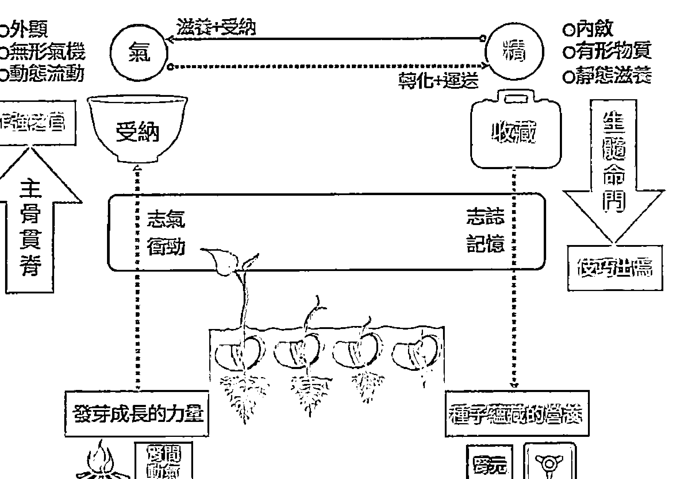

《内经》也说：「肾藏精，精舍志」，指出肾志藏在肾精，有坚强意志力的人会有股持续学习的毅力，学习之轮不断转动，存入肾精的记忆也会陆续增加，学习智商也会一直增长，成为善的循环，所以志气与誌记两者相辅相成。

如果肾脏出现问题也会影响记忆力，如「肾盛怒而不止则伤志，志伤则喜忘其前言，腰脊不可以俛仰屈伸」，可见肾与志的密切关系。

若以现代经验譬喻，来自先天遗传的智商加上后天学习累积的知识经验，一方面储藏在脑髓，类似电脑的硬碟，另一攸关生命传承的重要备份则是储藏在肾脏的肾精，类似外接硬碟备份。

为何这备份要特别储存在肾精？

以生命繁衍来看，肾精不只接纳先天遗传物质，等到成年时，肾精也是传给下一代的重要物质。生命要进化，经验要累积，知识要传递，这样才能一代强过一代，所以后天累积而来的知识经验也须随时储存到肾精，以便在天雷勾动地火之际，即时传承后代作为遗传物质。

脑部的损伤或退化，对于肾藏志功能影响很大。例如前文提到脑部疾病或脊髓损伤的病友，当脑部及脊椎损伤时，可能会影响储藏在脑髓和肾脏的肾志。许多长辈会出现过去的事情记得很牢，近期的事情转眼就忘的情形，还有严重脑部退化者，如重度失智症，则所有的记忆全然忘记。

个人推测，肾精就像硬碟，早年肾精功能正常，宛如全新硬碟，可以存入诸多记忆，随着年纪增长，肾精功能跟着退化，就像斑驳损伤的硬碟，后续记忆难以存入，严重者连早先存入的记忆都毁损了，这就是失智症的病程。

肾与大脑在西医眼中可能是两个独立器官，但在中医观念里，却是密不可分，大脑归肾所管辖，中医诊断这些病证多数与肾虚以至于髓海空虚有关，中医补（修复）脑功能时，主要也是从肾着手，使用补肾填精补髓法来治疗，这也是肾藏志的临床应用。

更进一步思考，心主神志，处理许多当下浅层的记忆与反应，存于中医的心脏系统。而肾主骨生髓，脑为髓海，肾又主先天，处理的应是深层的记忆与生命的遗传密码，这些都存在中医的肾脏系统。

### 五志属惊恐

人类与生俱来最大的弱点就是「恐惧」：害怕没人爱，害怕失去所拥有的，几乎所有的生命课题与难关都与恐惧有关，尤其肾主黑色，主大水深水，多数人都怕黑也怕深水。

若从演化角度来看，恐惧是人类得以存活的重要因素。人类（包括动物）在面对外在环境的不确定性，甚至有危险的可能性时，自然而然便会产生恐惧感，为了生存，就会做一些事情来降低危险以保护自身。例如害怕毒蛇猛兽侵扰，会加强房子的结构，架设陷阱等，或因害怕外族入侵，才会修建城墙加强护卫等等。所以恐惧反而让人更加小心谨慎，且会采取相应行动来降低风险。还有如工作态度的戒慎恐惧，兢兢业业，让人思虑更缜密，行动更周延，更能获致成功。因此恐惧是喜、怒、思、悲、恐五志之中最富行动力的。

现代医学指出：当面对危险或压力时，肾上腺素加强分泌，将神经系统切换至「战斗或逃跑」反应，这是典型的求生本能，也与肾有关。

肾脏是生命的源始，也是有记忆且高智商的器官，每一代人将生活经验存入肾精，再传递给下一代，同时也将面对恐惧的判断力和执行自我保护的行动力传承下去。人类的命脉得以延续，社会持续进步，某些部分与此有关。

「惊」则不在五志之中，属于七情之一，也归肾所管。「惊」比较偏向外在的威胁而起，「恐」比较偏于内在的感受，但惊吓容易导致恐慌，恐慌之余也容易饱受惊吓，恐惧与惊吓两者常合并出现，所以由肾一并管理。

> > 《内经》说：
> 「恐则气下，……惊则气乱。」
> 「恐则精却，却则上焦闭，闭则气还，还则下焦胀，故气不行矣。……惊则心无所倚，神无所归，虑无所定，故气乱矣。」

古代中医师可能阅病人超级无数，总结的经验才会如此精准犀利。简单说，恐惧会让气机下降，譬如气上不来、脚软，甚至有漏尿的情况，《内经》指出「恐惧而不解则伤精，精伤则骨痿痿厥，精时自下。」

所以严重的恐惧会损伤肾精而出现骨头痿软无力，甚至肾精时时自下，难以控制的情形。惊吓会让气机逆乱，就像接到恐吓电话时，六神无主，慌成一团，毫无头绪，整个人不知如何是好。

（中医经验厉害吧！）

七情是在五志的基础加上忧与惊，恐与惊常伴随而来，肾有良方可以改善。肾气有很强的向上升提力量，可以改善恐惧时的气下，肾精有很好的封藏震懼能力，可以让慌乱的心神安定下来，可见肾可以改善惊恐现象。肾志存在肾精里，志有坚持与稳定情志的力量，腰部十四椎命门穴旁开3寸处的「志室穴」，就是肾志储存之处，也是安神定志的保健穴。

### 肾脏的藏宝图

肾脏真的很爱藏东西，我们来总结破解它。

-   - 肾水藏在哪里？当然在土壤的下面，也就是足底。
-   肾精藏在哪里？除了藏在肾脏之外，也藏在脊椎和脑部。腰部十四椎中央的命门穴（属于督脉）到两侧肾俞穴（膀胱经）之间的命门区是肾精对外的门户。
-   肾志藏在哪里？藏在腰部十四椎旁开3寸的志室穴，顾名思义就是志的房室，肾志就藏在此处。

## 腎主骨生髓，為作強之官，伎巧出焉

## 一、腎間動氣為向上成長的衝力

腎臟此部分的功能主要影響身體及智能兩方面，對於成長發育更為重要，尤其腎間動氣為向上成長的重要衝力。

在身體方面，腎主骨生髓，腎經貫穿脊椎，含有「轉骨」概念，孩子要長高，骨架必須先拉開，尤其脊椎決定了身高，是轉骨的重點部位。腎氣充足，骨架就能伸展，像大樹一樣快速成長。

在智能方面，腎主骨髓，上通於腦，腦為髓海，與學習記憶有關，所以腎臟主IQ，包含先天遺傳的智商和後天學習的記憶，再加上腎開竅於耳，主管內耳的耳蝸和半規管，與聽力和平衡有關。腎精充足，腦髓飽滿，肢體平衡，學習力與活動力當然非常好。

《內經》說「腎者，主蟄封藏之本，精之處也，其華在髮，其充在骨。」暗示腎精充足則頭髮與骨頭都會得到良好照顧，維持青春。反之，若腎精不充會出現提早老化現象，如唐代學者韓愈在〈祭十二郎文〉中寫到：「吾書與汝曰：吾年未四十，而視茫茫，而髮蒼蒼，而齒牙動搖。」中學時讀到這裡忍不住發笑，彷彿看到一個小老頭搖頭晃腦在寫信。而現在自己開始越來越「資深」，以上症狀也一一浮現。這三種狀態都與腎臟有關，更深深體會照顧好腎臟是保健防老的重要關鍵。

## 二、腎主骨生髓

從演化歷程來看，脊椎是生物從水中移居陸地所需的輔助結構，有些物種的外部細胞硬化成為外骨骼，有些物種的內部細胞形成內部骨骼，產生骨架，再演化成脊椎，人類屬於這種演化過程。所以脊椎系統在胚胎很早期就開始發育。

全身骨架是成長發育的重要結構，鈣是骨骼的主要成分。腎主骨，腎經也貫穿脊椎，因此腎臟不僅掌管脊椎，還掌管全身骨頭與鈣質。但是骨頭如果只有外殼很難長時間堅實挺立，所以腎臟就以珍貴的腎精製造骨髓存在骨髓腔中，猶如蓋房子要以水泥灌入板模來強化結構。

### 骨者髓之府：腎主骨主髓，上通於腦

> 《內經》認為「骨者髓之府」、「腎藏骨髓之氣」、「腦為髓海」，腎所主的骨以脊椎和腦部最為重要。

人體的脊椎從頭骨下方延伸至尾骨，包括33塊脊椎骨形成脊椎，其中的空腔稱為「椎管」。腦為髓海，脊髓延伸自腦部，就走在椎管之中。腎屬水，髓也是水的一種型態。

中醫認為，腎所藏之精能化為髓，髓通於腦，腦為腎所藏的志之所居，故能體現記憶能力，所以腎主IQ，與智商和學習記憶能力相關，與此相對的心主EQ，兩者都是現代生活中非常重要的能力。先天遺傳而來的智商可以透過後天學習，不斷地累積提升，通常會越學越聰明，腦部也越來越靈活。

《內經》說腎為「作強之官，伎巧出焉」。骨與髓在體表可以建構出強健的形體，宛如建築師能蓋出堅固的房子，腎臟是人體房舍的建築師，讓人有強壯的骨架體格，就像一個國家裡負責建築營造的「作強之官」。（雖然古今不少醫家對於「作強之官」的解釋多有不同，但個人較偏向此種詮釋）

許多家長喜歡用補品幫孩子「轉骨」，期望他們能長得高又壯，其實只要均衡的營養補充後天之本，持續運動補充先天之本，作息正常，自然就會有好骨架。骨主作強，髓主技巧，好骨架的作強之官加上持續努力而生的技巧，就是人生勝利組必備要件。

骨頭內所藏的骨髓現代稱為「骨質」，人體骨骼的骨量大約20歲至30歲達到高峰，之後逐漸遞減，女性停經後因荷爾蒙減少，骨質流失速度會加快。除了年齡因素，骨質也會隨著營養、工作型態或疾病等因素而流失，出現骨質疏鬆症，嚴重者還會導致骨折，不僅影響生活甚至危及生命。

> 《內經》提到因為腎有邪熱而產生骨痿：「腎氣熱，則腰脊不舉，骨枯而髓減，發為骨痿。」「有所遠行勞倦，逢大熱而渴，渴則陽氣內伐，內伐則熱舍於腎。腎者，水藏也，今水不勝火，則骨枯而髓虛，故足不任身，發為骨痿。」腎的邪熱導致骨枯而髓虛，而出現腰脊無力難抬舉，因骨病而出痿症，也類似骨質疏鬆症。比較嚴重者為「骨者髓之府，不能久立，行則振掉，骨將傆矣。」出現不能久站立，走動時晃動不穩的情況，表示骨頭極度疲憊不堪，「得強則生，失強則死。」若能趕緊補強還有生機，若是持續衰敗就會死亡。

腎主骨的特質還能從穴位分佈展現。腎經最後一個穴位為「俞府穴」，顧名思義是所有俞穴之府，位於鎖骨跟第一肋骨之間。背部與其相對應的為膀胱經「大杼穴」，位於第一與第二胸椎棘突之間，為背俞穴之首。中醫認為「骨會大杼」，亦即所有骨頭的氣機都聚會在大杼穴，也可看作「大杼主骨」之意。膀胱經與腎經相表裡，骨會大杼與腎主骨之間有著特殊的連結關係。

### 腎為腎之府

腎臟位於腰部深層處，尤其十四椎（第二腰椎）下方是「命門區」，也是腎臟功能的反應區，因此《內經》說：「腰者腎之府」，腰部是腎臟所居住的地方，一旦腰部出現「轉搖不能，腎將僩矣」，腰部無法轉動表示腎臟極度疲憊不堪，與骨頭一樣，若能趕緊補強還有生機，若持續衰敗就會死亡。

因為腰為腎之府，腎臟其他疾病也會影響腰部活動，如《內經》說：「腎盛怒而不止則傷志，志傷則喜忘其前言，腰脊不可以俛仰屈伸。」所以暴怒不僅傷肝、傷腎，影響作強之官則會腰脊難活動，影響技巧的生成則會喜忘其言，完全忘記自己說過些甚麼，久而久之記憶力嚴重衰退。

### 對應腎主骨的特殊針法

中醫的「五體」概念呈現五種重要組織在人體分佈的深度：「皮—脈—肉—筋—骨」，骨位於最深的位置，《內經》的五臟針法也有因應的針法：「凡刺有五，以應五藏。………五曰輸刺，輸刺者，直入直出，深內之至骨，以取骨痹，此腎之應也。」輸刺法可以針到骨面上治療骨痹疾病。臨床上我們也用此法，但多數用在針透深厚筋結，過程中針刺抵骨即知已經到達病位。也在此提醒醫師們，針尖抵骨面即止，切勿施行手法，以免傷害骨膜導致嚴重不適感和痛感。

## 三、腎治於裡與腎主外相矛盾嗎？

《內經》說：「心部於表，腎治於裡。」看起來很合理，初學者常見一般平面人體圖與經絡圖，而忽略了人體是立體的。對於臟腑經絡在人體的分佈，一定要掌握深淺之別，腎臟藏在體內較深處，在臨床診治上也常用於處理較深層的疾病。

然而《內經》對於腎除了「治於裡」的特質外，還提出了「主外」的說法，常令初學者一頭霧水，例如：

> 「腎者，主為外，使之遠聽，視耳好惡，以知其性。」
> 「五藏六府，心為之主，耳為之聽，目為之候，肺為之相，肝為之將，脾為之衛，腎為之主外。」

這不難理解，只要釐清《內經》中有許多對於人體經脈、臟腑的特質敘述，是為了讓後世對人體有更具體的理解和想像，而針對其作用和差異，多半運用譬喻和對比性的語法作為描述。例如《內經》提到腎治於裡的說法，就是相對於心部於表的特質，心火屬陽，散佈於人體之表，腎水屬陰，深藏於人體之中。而在另一篇章提到「五臟六府，心為之主，耳為之聽，目為之候，肺為之相，肝為之將，脾為之衛，腎為之主外。故五臟六府之津液，盡上滲於目，心悲氣并，則心系急。心系急則肺舉，肺舉則液上溢。夫心系與肺，不能常舉，乍上乍下，故欬而泣出矣。」主要在談五臟六腑的津液差別，而先以五臟六腑之功能差別做譬喻，於是提出人體做為一家國，心為之主，腎則為主外。所以「腎治於裡」包括前述腎氣、腎精等功用，不僅可以治裡病，還能培養出特殊技巧。「腎主外」指骨與髓在體表建構出的強健形體，宛如身體的外牆提供防護，加上腎開竅於耳，宛如俗稱「小耳朵」的衛星天線，可以廣納各方的資訊。因此腎臟的裡與外各有所司，也共同成就腎為「作強之官，伎巧出焉」的特質。

### 三地雷區傷腎，不可不慎！

《內經》針對成年人提出三件傷腎的情況：「有所用力舉重，若入房過度，汗出浴水，則傷腎。」用力不當、房事過度，或汗出洗澡，此處應該是指洗澡時，或因外風侵襲，或因水溫偏低，會導致寒濕邪氣入侵，而不是以為出汗就不能洗澡。

對於兒童來說，如果藏精異常，會出現發育遲緩現象，中醫有「五遲、五軟」病名，五遲指立遲、行遲、語遲、髮遲、齒遲等；五軟指頭項軟、口軟、手軟、足軟、肌肉軟等，都是小兒生長發育障礙病症，中醫常用補先天腎臟與後天脾胃的方法來治療。

## 四、其華在髮，齒為骨之餘

腎其華在髮，主要因為頭髮下面就是頭腦，加上中醫認為「髮為血之餘」，頭髮是氣血所滋養的產物，頭部氣血充足，頭髮也會烏黑亮麗。如果用腦過度，長期「燒腦」，氣血虧損，會出現大量掉髮或白髮快速增生，所以觀察頭髮可以判斷腦部氣血狀況，進而了解腎功能。

在《卷二》介紹過，牙齒主要歸大腸經與胃經管理，為何此處還將牙齒納入腎管轄？

牙齒堅硬的原因是內含「羥磷灰石」，尤其琺瑯質的密度最高，此成分也充滿在骨骼的基本結構中，鈣是牙齒與骨骼都有的主要成分，所以人體的牙齒跟骨頭一樣硬，有人說人類是「嘴內有齒，體內有骨」的動物。有趣的是，在演化過程中，牙齒也可以演變成頭骨，因此中醫說「齒為骨之餘」，腎主骨，由此看來，腎負責提供牙齒成長發育的營養以及堅固的結構，如牙齒本身的琺瑯質、牙骨質，及牙周的齒槽骨等，這些都與骨頭結構類似。《內經》說：「腎熱者，色黑而齒槁。」當腎臟有邪熱時，不僅面色黯沉，齒槁指牙齒看起來乾燥，顏色黑黑黃黃，都是營養不良的狀況。

在生殖之精篇章中說過，頭髮和牙齒的變化歷經第一到第五週期，與人體的長、壯、老階段有關，可用來判斷腎的功能。

以頭髮而言，許多嬰兒剛出生就有胎髮，剃完胎髮就會長出真髮，民間有用胎髮製作胎毛筆的習俗。從第一週期的髮長、髮長極到第五週期的髮墮，都是腎臟功能由盛轉衰的表現。

比較有趣的是髮色的改變，年輕孩子髮色較淡，所以有「黃毛丫頭」之稱，隨著成長髮色逐漸變黑，但老人的髮色變化剛好相反。之前一位高齡白髮伯伯來看診，療效不錯，他就持續回診，過程中發現伯伯頭髮顏色有時白色，有時出現類似香蕉皮的鮮黃色，還以為染髮所致，經他嚴正否認後才知道，黃色是介於黑髮與白髮之間的過渡色。古人說「黃髮垂髫」，黃髮指老人，垂髫指兒童，可見古人早就發現老人黃髮的秘密。現代醫學指出，頭髮顏色是由頭皮毛囊裡的黑色素細胞決定的，黑色素細胞會將酪胺酸氧化合成多巴，再轉換成黑色素。所以白髮與黑色素減少與酪胺酸不足有關，也與營養不均衡、壓力大等因素有關。

就牙齒而言，牙齒是出生後才長出來的稱為乳牙，都會歷經乳牙換成真牙的過程。從第一週期的齒更、真牙生到第五週期的齒槁，其變化與頭髮同步。大腸經與胃經主管牙齒營養及活動功能，譬如咀嚼等等，腎臟則主管牙齒及牙槽的結構。當身體開始老化時，牙齒中堅硬的結構也跟著退化，出現牙齒晃動甚至鬆脫的情形。

再從演化歷程來說，牙齒與頭髮都源自於皮膚，這也是一件很有趣的事。從這裡可以看出，身為全有特質的腎臟不僅管理身體內部事宜，也管理外部事宜，尤其是承擔絕大部分掌理外在事務的膀胱經喔。

## 五、腎開竅於耳

《內經》指出：「耳者，腎之官也。」所以腎開竅於耳。耳朵內的耳蝸與聽力有關，三個半規管與平衡有關，因此耳朵兼有聽覺與平衡兩項功能，《內經》對於腎和耳朵關係的論述也分為兩類：

### 1. 與聽力有關

「腎氣通於耳，腎和則耳能聞五音矣。」腎氣充足則聽力正常。

「五藏六府，心為之主，耳為之聽，目為之候，肺為之相，肝為之將，脾為之衛，腎為之主外。」「腎者，主為外，使之遠聽，視耳好惡，以知其性。」

《內經》提出「腎為之主外」有兩重意義，一如前述，腎主骨貫脊椎，是人體重要的支撐結構，且位於背部，背屬陽主外，作為五臟六腑的外衛。另一指出腎所主導的聽覺可以接收外界的訊息，聽覺是人類發育過程中很早發展出來，也是生命終結時最後失去的感覺系統，這與腎臟貫穿人一生的發展特質相符。

胎兒聽覺的發育比視覺早，在演化過渡期，人類還是四足動物時，聽覺遠比視覺重要。腎主先天，是最早發展的臟腑，掌管發展早期的組織和功能。之後隨著胚胎的成長，其他臟腑也逐漸成熟，就會各自接管後續發展的組織。聽覺是人類生活中非常重要的感覺系統，收集外在環境的聲音，判斷情勢，決定採取行動維護生命安全。語言的學習也來自聽覺，透過語言和聽覺以建立人際關係。

### 2. 與平衡有關

人體從出生開始就一直努力地尋求身體的平衡。在嬰兒發展歷程中，民間俗諺有「七坐八爬九發牙，十捏周歲獨站穩。」這些進展都會用到脊椎和其他骨骼系統，如「七坐」用到尾骨和薦椎，「八爬」需要強而有力的脊椎和四肢，「九發牙」齒為骨之餘，從十個月到周歲獨自站穩，此時期常見嬰兒緩慢站起來，兩隻腳搖搖晃晃的，努力維持平衡，再勇敢的跨出下一步。嬰兒在站立中練習找到平衡，成長後的人體也宛如爬A形梯，時時刻刻保持平衡。

維持平衡，需要骨骼系統和內耳的半規管，這都隸屬腎臟系統。腎主骨，多數骨頭都是長骨，因此很容易認為腎臟系統與「縱向」活動型態有關，譬如前述嬰兒學習站立及走路。其實不然，腎主水，有水流之處就容易出現漩渦，所以腎與人體旋轉活動密切相關。

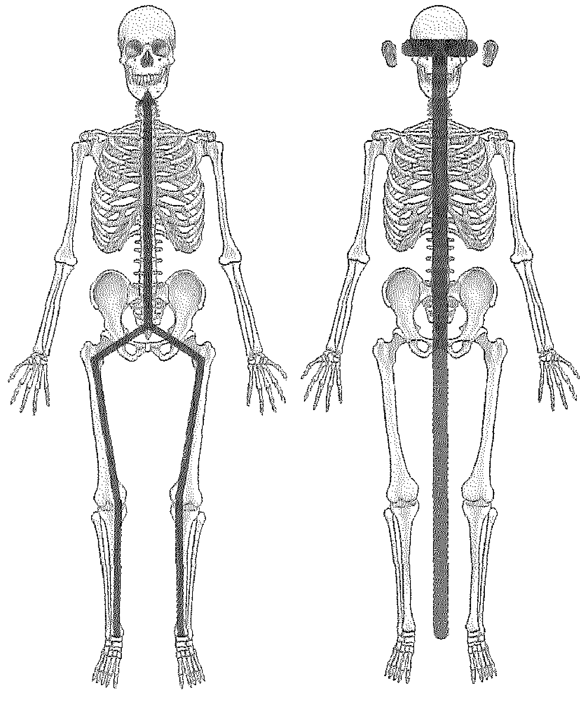

內耳三個半規管與平衡有關，三個半規管呈現立體型態，是維持人體旋轉時平衡的關鍵，腎經也因應這樣的身體需求，發展出「旋轉」的循行路線，如經脈在內踝的旋轉，經別出屬帶脈等。

此外，腎主骨生髓也是維持身體平衡的要件。前文介紹過，精子移動時尾巴都朝同一方向擺動，亦即向右側螺旋前進，DNA是左旋。既然這些重要的生命物質都是旋轉活動，人體當然也是如此。由此更能理解腎開竅於耳的深意。

腎主骨加上開竅於耳是維持身體平衡的重要結構，兩者合在一起就像前頁圖的「竹蜻蜓」結構。

語言的學習先從聽力開始，如果藏精異常，聽力發展差，話語表達與身體平衡也跟著遲緩，很容易變成前述介紹的「五遲五軟」。

> 《內經》說：「髓海不足，則腦轉耳鳴。」臨床上確實常見此現象。

腎開竅於耳，又主骨生髓，許多長輩隨著年齡增長，聽力逐漸下降兼見眩暈，同時還有記憶力變差、腰膝酸軟、牙齒動搖等症狀，這都與腎精退化、腦髓不足有關，中醫師常透過強腎填精補髓治法加以改善。

另一方面，由於腎主水，在五行關係上，心火能制約腎水。心陽位於上焦，充足的心陽能讓下焦陰水安住，不會四處流溢，百病叢生。如果心臟陽氣不足，下焦陰水就會蠢蠢亂動，尤其最常向上衝逆，出現眩暈、噁心的情況。有暈車經驗的人都知道，搭車之前盡量少喝水，以免肚子裡的水隨著車子搖晃而產生暈眩、嘔吐。

上述這型眩暈來自於水飲上逆，另一種則與脾胃功能有關，就是《卷三・脾經》提到的「食填太陰」，此外還有肝風內動，類似現代的高血壓，也會造成眩暈。這些情況會出現在各個年齡層，中醫自古以來也有對症的方劑，如五苓散、真武湯、半夏白朮天麻湯、鎮肝熄風湯等。五苓散與真武湯都是《傷寒論》的方劑，五苓散主治太陽病，真武湯主治少陰病，足太陽經與足少陰經為表裡經，由此可見，腎與平衡有密切關係。

無論眩暈是來自腎精不足或水飲上逆，都與腎主骨生髓、開竅於耳有關。反過來思考，水會造成漩渦，是自然現象，人體有旋轉活動，也是自然現象。旋轉必然是演化的結果，因此人體活動不會只有線性而已。日常生活中，我們每天光是轉頭轉身就不知有多少次，更不用說舞蹈家、運動員了，他們有更多的旋轉運動，為什麼不會輕易頭暈或跌倒？這表示人體有維持日常旋轉活動平衡的機制，這種與生俱來的能力，就來自腎臟系統。因此，腎必然開竅於耳！在日常無數的轉動活動中，腎主骨及開竅於耳合作無間，才為每一次轉動提供最佳的平衡保證！

腎與耳朵的關係也出現在其他方面，如《內經》說：「視耳好惡，以知其性。」觀察耳朵的型態可以了解個性，而面相學認為耳朵代表1～14歲早年命運，而且良好的耳形表示比較聰明，事業也比較順遂。這些觀察其實都與腎臟是否強健有關。

## 六、腎司二陰

依據《內經》的說法：「北方黑色，入通於腎，開竅於二陰，藏精於腎。」腎除了開竅於耳之外，還開竅於二陰，為了避免混淆，使用「腎司二陰」來說明腎臟與二陰的關係。

二陰包括屬於後陰的肛門，屬於前陰的生殖器及尿道。腎與膀胱相表裡，且主管生殖，當然主管前陰的尿道與生殖器。

《卷五。膀胱經》介紹過「泄殖腔」。自然界中某些動物的直腸末端較大，因此尿道和性腺就開口在腸道，形成了一個消化、排尿、生殖功能三者共用的小腔，稱為「泄殖腔」。人類在胚胎時期也有原始的胚胎泄殖腔，發育過程中就慢慢的分化出前陰與後陰。可見腎記錄了這段演化過程，加上膀胱經別「下尻五寸，别入于肛」循行，也讓腎能掌理後陰的肛門。腎經經筋還結於陰器，包括前後二陰在內，所以腎臟是劍及履及，透過經筋系統協助完成司二陰的功能。

## 腎臟所主的平衡與手足太陽少陽經的差異

水的運動有直流和漩渦型態，腎也對應自然界水流特性，當然能在這些活動過程中，順其勢來維持平衡，如腎主骨維持直行活動，腎開竅於耳維持旋轉活動。

站立與旋轉都是人類與生俱來的生存能力，觀察嬰兒從坐到站的過程中，每個步驟都在搖搖晃晃之間尋求平衡，此時腎就是關鍵，腎透過主骨與耳竅來維持直線與旋轉運動的平衡，二者都是天生的能力。

傳統健身運動非常重視培養內勁，例如武術有蹲馬步、站樁等基本功，這些與腎主骨的特性有關；太極拳有纏絲勁，雲手活動呈現類似無限符號∞，這些與腎開竅於耳以及帶脈的特性有關。以此來看，許多保健強身活動其實都連結到腎，尤其內勁也是來源於腎，還能讓身體回復到初始設定。如果勤練得宜，甚至可提升整體體能，讓自己成為健康進階版。

在耳朵部位有四條主要經絡，包括循行於耳上角的膀胱經、循行從耳後到耳中出耳前的三焦經、小腸經和膽經，簡稱「焦小膽」。

膀胱經為腎經表裡經，其功能主要是為腎經服務，尤其是穩固下肢和背部脊椎，讓人體有良好的直行能力。

焦小膽三條經絡是後來才發展出來的系統，可以視為腎開竅於耳的輔助與執行系統。由於腎要管的事情很多，除了攸關生命的重大活動之外，其餘都可以分工給其他經絡系統。

耳朵位於人體側面，與少陽經循行部位最為契合，所以手足少陽經都入列。耳後完骨也是維持平衡的重要結構，耳朵後側與太陽經循行部位切合，因此手足太陽經也入列。如此一來，手足少陽經與太陽經就共同執行腎臟交辦的維持人體旋轉平衡任務。

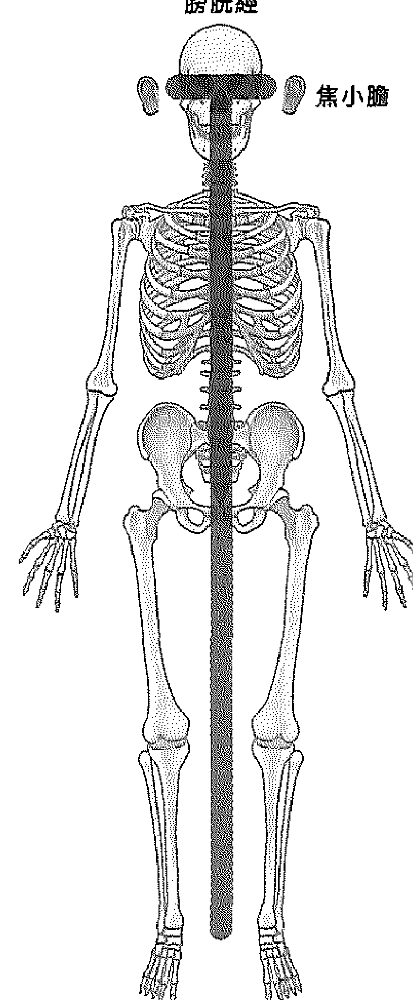

此外，依據《內經》「少陰少陽為樞」的概念，腎經屬於少陰經，三焦經與膽經屬於少陽經，共同維持人體旋轉時平衡。

總之，腎經系統形成「竹蜻蜓」結構具有完整功能。其他四條經絡系統都只承擔部分結構，如膀胱經承擔竹蜻蜓的直桿，亦即下肢及腰背部位，焦小膽承擔竹蜻蜓的橫桿，亦即耳朵部位，協助腎經維持旋轉平衡。

## 腎經四大系統循行簡圖（捷運圖）

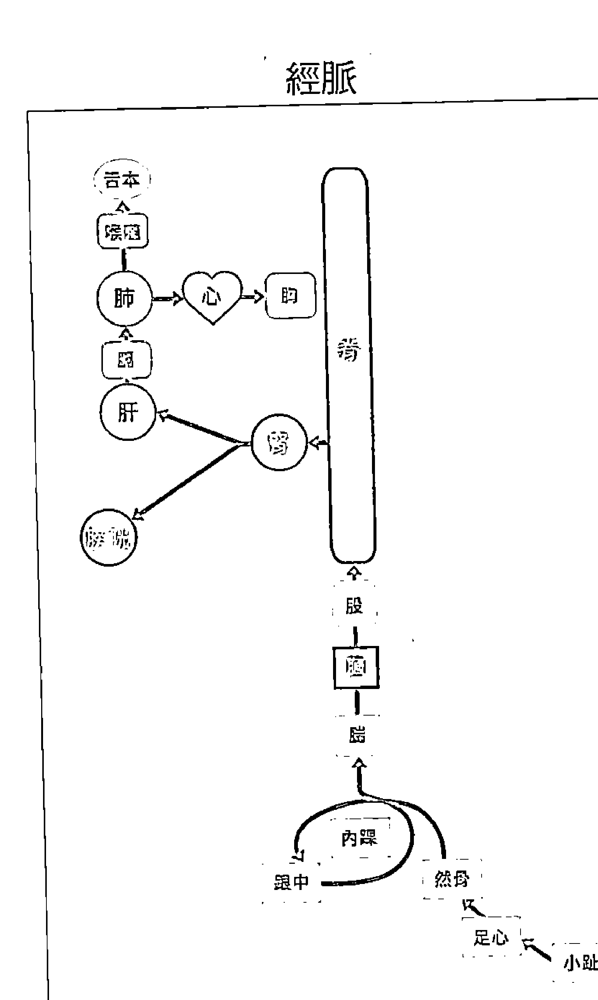

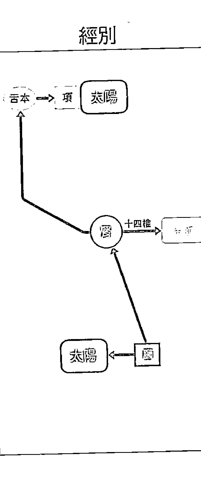

### 絡脈

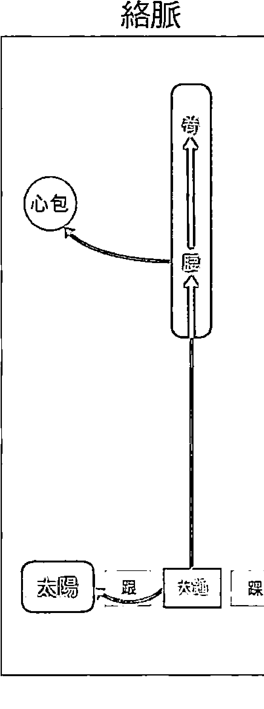

### 經筋

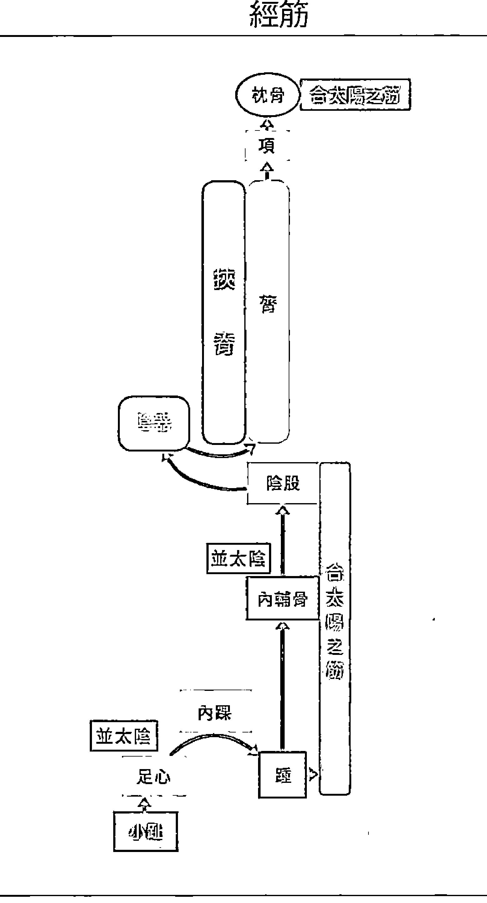

### 腎經四大系統循行經絡圖

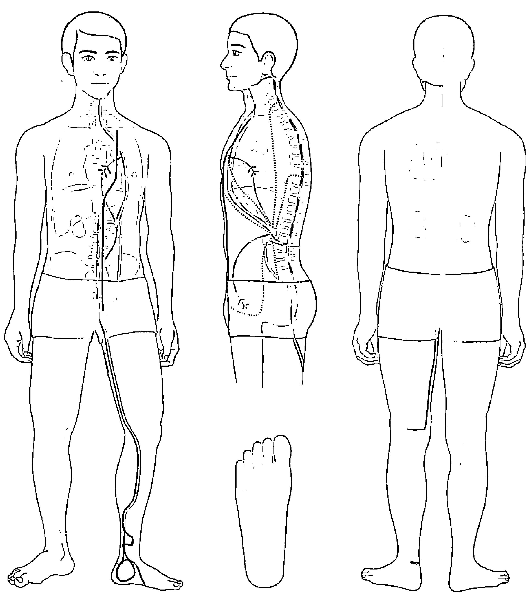

# 研究奇經八脈的源起

自大學時期加入針灸社開啟了中醫之路，學習中醫已有數十年。也因為習醫始於針灸，對針灸與經絡的興趣一直非常濃厚。

住院醫師第一年，幸運地得到漢光教育基金會的支持，開始從事經絡的研究。由於奇經八脈看起來很特別，加上經脈數量比較少，以個人當時的中醫程度而言可能比較好入門，所以決定從奇經八脈開始研究。

不過開始收集資料後，才知道自己估計錯了！

因為在研究過程中，發現奇經八脈很像橫空出世的英雄，從《黃帝內經》到《難經》都有陳述，相較於十二經脈的系統性與完整性，奇經的內容簡要且不完整。之後的醫書大多蕭規曹隨，沒有特別的新意。金元時期有人提出八脈八法交會穴，明代醫家李時珍在《奇經八脈考》將奇經八脈的循行、穴位及病候做了系統性的歸納和探討，但之後又沉寂良久迄今。

心裡納悶著，猜想可能有部分的中醫知識不見了，所以一直有個心願，希望未來有機會到其他也有傳統醫學的國度，如印度、中南美洲等地去尋找奇經八脈失去的片段。

十幾年前開展十二經絡系列課程，許多學員希望我也開奇經八脈的課，當時因為手上奇經八脈的相關內容尚不完整，探討起來內容還蠻複雜的，加上時間跟體力有限，遂不敢答應。

近年在撰寫《經絡解密》系列的時候，還是有學生說希望接下來能夠出一本談奇經八脈的專書，我還在考慮中。

或許是時機成熟了吧！

首先，這次寫作腎經方式與過去不同，先完成四大系統，再寫總論。在撰寫四大系統時，發現許多有趣的結構，如經脈在內踝環繞一圈，行走於身體的前側與後側；經別出現三個環狀結構，還出屬帶脈；經筋系統中，腎經與膀胱經及脾經一路緊緊相隨，形成特殊的三明治結構等，這些特性與其他經脈系統全然不同，而且彼此之間還有特殊聯繫。

其次，著手撰寫總論時，由於要清楚闡述腎臟複雜的生理機能，必須不斷思索，不斷推論，過程中竟然順勢討論到任督二脈。突然之間彷彿走進奇經八脈的秘密通道，在沒有預期心理下，展開奇經八脈來源的探討。

早年研究奇經八脈之後，歷經二十年專注於十二經脈，此番與奇經再次相逢，已是完全不同的光景。也深感慶幸，透過撰寫《經絡解密》系列書籍，從十二經脈系統對照奇經八脈，方能解開奇經之謎。

由於奇經八脈內容擴充了，原本放在總論，後來決定還是將它獨立成一個篇章，以便於閱讀，所以奇經八脈就成為腎經的雙胞胎經脈系統。

這次探討多數是個人大膽的推論，加上和多位年輕聰明的醫師一起琢磨，腦力激盪而成。看到他們在診間認真找資料、思考、推敲、思辨的身影，非常感動，中醫傳承有人接棒了。

感謝他們的參與，共同完成這份「奇經八脈狂想曲」。

這些年輕醫師包括：

關山慈濟醫院醫師群：高允中、林芳竹、鄒牧帆、張雅筑、李盈德、林昭男、陳明新、陳聖霖等醫師。

2020 年 R1 軍團：

黃才珊、陳昱婷、陳苡涵、朱清蘭、許霖蓉、林慶芳、張簡嫔鵑，以及曾心怡醫師。尤其才珊醫師跟診時間較久，期間提出許多深富創意的想法，令人驚豔，果然英雄出少年啊！

期望本篇奇經八脈的探討能拋磚引玉，當有更多中醫學者加入討論後，相信更有助於奇經八脈的脈絡整理及臨床應用，這也是個人最深切的期盼。

# 奇經八脈總論

許多人聽到奇經八脈多會眼睛一亮，或許是因為它在十二正經之外，充滿神秘性，也可能是透過武俠小說的延伸引述，推波助瀾，讓它顯得高深而強大。

回到中醫，關於奇經八脈的說明，在《難經》有相關描述：

> 「聖人圖設溝渠，通利水道，以備不然。天雨降下，溝渠溢滿，當此之時，霶霈妄行，聖人不能復圖也。此絡脈滿溢，諸經不能復拘也。」

> 「比於聖人圖設溝渠，溝渠滿溢，流於深湖，故聖人不能拘通也。而人脈隆盛，入於八脈而不環周，故十二經亦不能拘之。其受邪氣，畜則腫熱，砭射之也。」

這些被記錄下來的內容，多數是結果的描述，讓後世理解奇經八脈是為了調節十二經脈氣血而產生的系統，但若思索源頭，卻又缺乏脈絡可循，我在書寫腎經期間，也常對此陷於苦思。

在此章節將嘗試從生命源頭「胚胎」來開場，跟大家談談奇經八脈。

# 從結構角度來看，人體胚胎的發育過程有幾個特色：

- 1. 由簡而繁，由中間向兩側發展。
- 2. 各組織器官發展時間先後不同，先軀幹後四肢。
- 3. 隨著組織器官的生長，胚胎由 2D 平面結構擴增為 3D 立體結構。

人體的經脈系統具有保護、穩固、連結和運送營養物質等功能，是生命體生長發育的重要結構。經脈系統依據出現的時間和任務，分為早期經脈系統及中晚期經脈系統。

**早期經脈系統：**因應胚胎早期發育，身體會配合生長需要而「提前部署」，提早做準備，就像父母會在孩子出生前預先備妥嬰兒所需用品，也像是開發新市鎮時會先鋪建橋樑、道路，如此才能運送建築用的物資，開始規劃城市建設。早期經脈系統為後續的組織器官發展先行鋪橋造路，並發揮保護、連結和運送等功能。這個系統就是奇經八脈。

**中晚期經脈系統：**胚胎的臟腑組織器官及四肢逐漸發育，為了生長成熟的需要，身體會發展出一套經脈系統，連結臟腑和四肢，並依據各個組織進行分工分類，以便運送營養物質。這個系統就是十二經脈系統。

# 奇經八脈在人體的發展歷程

腎經總論篇提到，生命發展有階段性，早期先「腎藏精」，再透過「腎間動氣」，促進人體生長「主骨生髓」。早期發展出來的奇經八脈在此歷程中扮演非常吃重的角色，倘若奇經發育不良或運作不利，胚胎無法成長，甚至還會死亡。

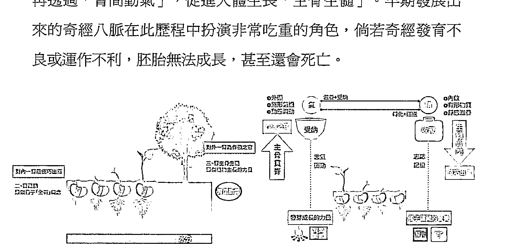

奇經八脈的誕生和發展具有時間及空間的特質，以下將分三階段來說明：

## 第一階段：奇經的任脈、督脈登場

腎間動氣宛如種子的發芽點，預設生命即將開展，功能需要增加，譬如輸送養份等，就預先建立新的連線來承擔這些工作。

從時間來看，這是原始受精卵階段，雖是單細胞結構，卻包含了來自父親和母親的 DNA，提供個體全部遺傳信息及未來生長訊息，我稱之為「全有」特質。從空間來看，此時細胞很微小，是只有前面與後面分別的 2D 結構。於此階段，身體發展出能連結前面與後面結構的系統。以陰陽來分，前面屬陰，背面屬陽，分佈於前面屬陰的連結系統稱為「任脈」，分佈於背面屬陽的連結系統稱為「督脈」，任督二脈最先登上人體舞台。

「任」、「督」二字，是古代醫家為了便於學習與臨床所需而命名，就像家長會幫孩子們取名字，以便辨識和呼喚。

「任」有承受、擔當之意，也通「妊」字，與懷孕有關，任脈是偏向女性特質的經脈；「督」則有指揮、管理之意，督脈是偏向男性特質的經脈。任脈循行於人體陰面的胸腹頭面部，督脈循行於人體陽面的頭面腰背部。這兩條經脈循行路線都很直，幾乎沒有彎曲，而且只環繞軀幹及頭部成為一個圓圈，右頁任脈督脈概念圖的紅線代表任脈，藍線代表督脈。

為何推論任督二脈最早出現？可從以下五點切入：

- 1. 循行：此時身體結構還很簡單，可能就是一個圓形且表面平坦的結構而已。任脈與督脈循行於軀幹和頭部，並沒有到四肢，故推論此二脈出現時，四肢還沒有發育。

## 2. 中線：

任督二脈分佈在人體中間部位，胚胎也是從中間向兩側分化生長，越靠近中線，出現的時機越早。

## 3. 穴位：

分佈呈直線，也很有規律。十二經脈系統的穴位分佈，常為了配合特定結構而轉彎。就像開新路或造鐵道，若在未經開發區域，沒有住家及建築物的阻礙，就可以直接開路或者截彎取直，是一樣的道理。

## 4. 屬性：

在後續生命歷程中，任督脈具有非常崇高的地位，任脈總管所有陰脈為「陰脈之海」，督脈總管所有陽脈為「陽脈之海」。如明代李時珍在《奇經八脈考》說：「督脈起於會陰，循背而行於身之後，為陽脈之總督，故曰陽脈之海。任脈起於會陰，循腹而行於身之前，為陰脈之承任，故曰陰脈之海。」兩脈總管所有的陰脈與陽脈，為未來身體分化為更明顯的陰陽特質做準備，可見任督二脈是最早出現的經脈系統。

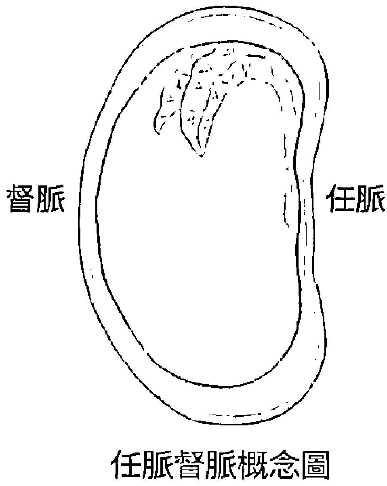

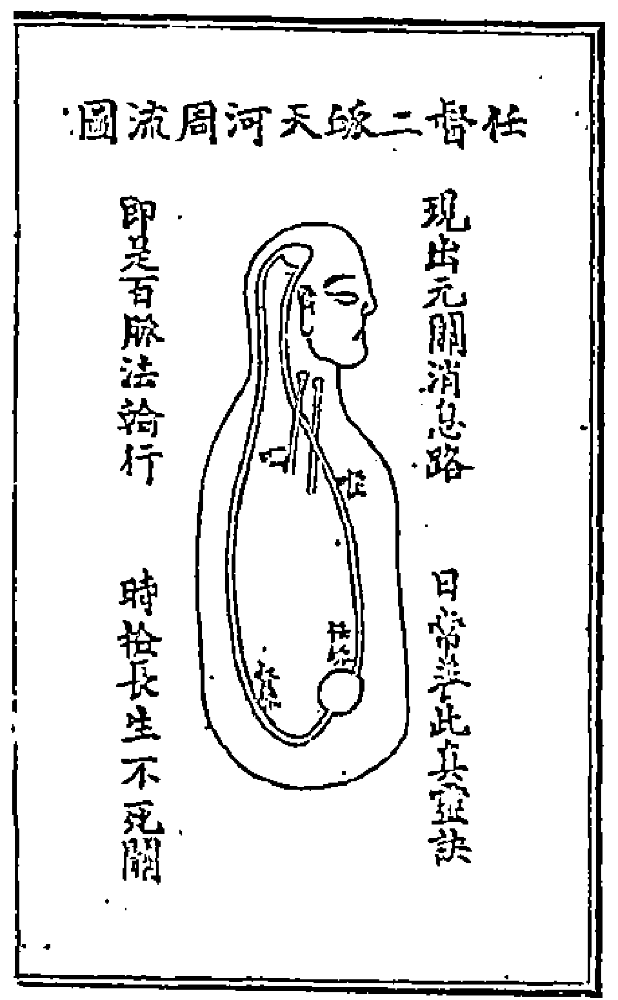

我曾與好朋友分享這個觀念，聰明的朋友一聽就懂，接著說：

「這就像一家公司剛創立時，業務簡單，員工不多，校長要兼敲鐘。」確實如此。在企業中，最高階領導者通常都是創業者，隨著業務蓬勃發展，才聘僱員工承擔事務性工作。任督二脈所具有的「總管」特質是為「創業者」所獨有。

- 5. 練功家：自古以來練家子都非常注重任督二脈，譬如練「小周天」，簡單說就是將內氣沿著任督二脈循環一周。一位從事音療工作的朋友，提到創立音波治療的老師雖是西方人，早年也是中醫師，他們在音療過程很注重調節奇經八脈，尤其是任督二脈，我好奇詢問她的老師對於任督的看法為何？她說：「老師跟我們說練任督可以回到生命初始時代！」跟我的想法不謀而合，只是很驚訝，怎麼外國人也能有此見解！

## 第二階段：奇經的衝脈、帶脈登場

生命體在陰陽具備之後，腎間動氣推動生長，五臟六腑也準備開始發育，宛如種子準備發芽，中醫認為生命伊始具有如春天植物萌發的生命力。

此時由於臟腑發育與功能尚未完備，十二經脈系統也還在初期架構中，任督二脈雖能統合陰陽，但是協助機體生發力量不足，因此須再發展出兩條厲害的奇經八脈。從時間來看，此為受精卵初始分化階段，受精卵經過分裂變成細胞團，脊椎接著開始發育。從空間來看，胚胎會開始長大長胖，此時則由 2D 結構變成立體的 3D 結構。

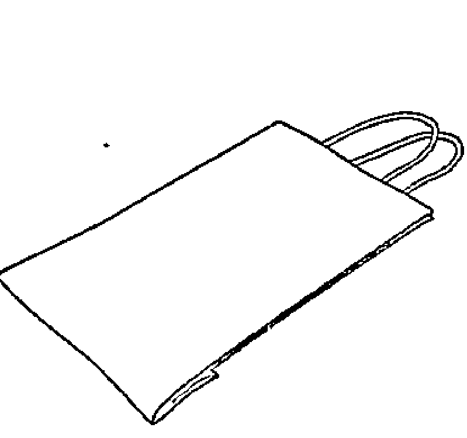

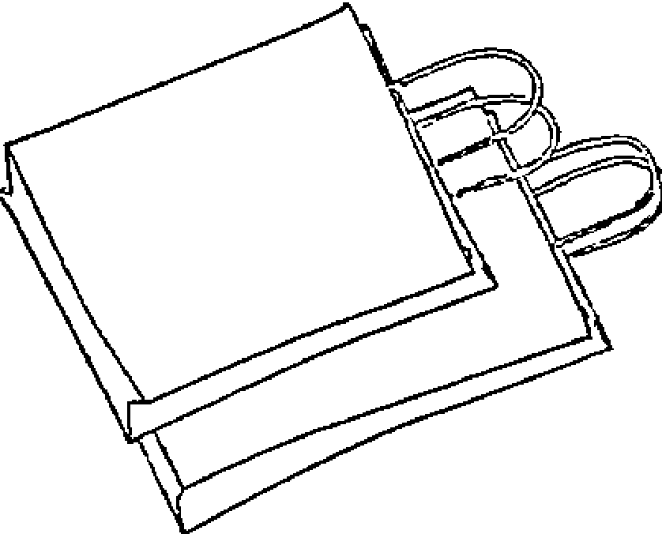

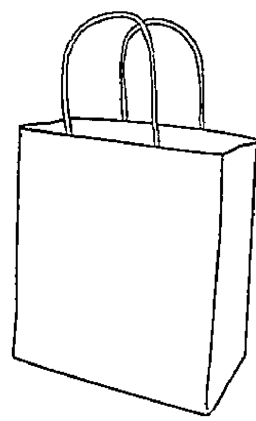

若以紙袋來說明最為清楚。第一階段就像沒有打開的紙袋，只有前後的平面結構，第二階段以後就像展開的紙袋，有前中後三面的立體結構。

胚胎變成 3D 結構之後，胚胎內的臟腑及重要組織器官就有成長的空間，同時身體在背面出現長軸，脊索及神經管等相關系統逐漸形成。此時身體也因應出現新的連結方式和系統：

- 1. 督脈貫穿脊椎：由於身體長軸位於背面，分佈於此的督脈就順勢貫穿脊椎，也做為後續身體生長伸展的支撐與固定結構。

任督二脈分佈在前後兩面，無法涵蓋到增胖的中間部位，此時人體發展出衝脈與帶脈來補位。

## 2. 衝脈及帶脈出現：3D

結構會出現立體空腔以便容納器官組織，就像打開的紙袋裡面可以容納物品。

參考右圖李時珍《奇經八脈考》的經絡圖，可以清楚看出衝脈與帶脈的分佈。

> 「衝為經脈之海，又曰血海，其脈與任脈皆起於少腹之內胞中。其浮而外者，起於氣衝。」

如果您已經看了《卷三。脾經》，會覺得衝脈循行很眼熟，沒錯！衝脈分佈在體腔內層，類似脾經經筋的簍子結構。

### 衝脈特色

「衝脈」顧名思義是氣機善於上衝的經脈。在此階段，臟腑與十二經脈系統才剛開始要成長。它的主要任務是提供健全的環境與向上的氣機，協助臟腑經絡順利生發成長。衝脈有三個特色：

- 1. 起點：任脈、督脈與衝脈都起於胞中，出於下方的會陰部。

胞中與會陰都指下腹部鄰近生殖系統的部位，胞中是體內空腔組織的區域概念，會陰位於前後二陰交會處，是胞中下緣的出口，

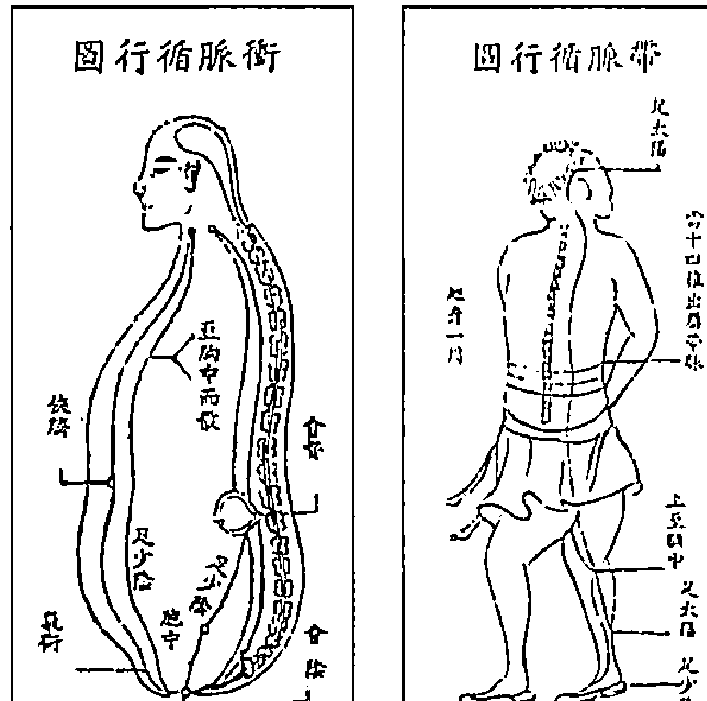

兩者稍有差異，因此也有三脈起於會陰的說法。督脈行於背，任脈行於腹，衝脈則直上，故稱為「一源三歧」，就像紙袋的底部也是前面、後面及側面的共同起點，此三脈共同起於會陰部具有重要意義。（後文詳述）

- 2. 循行：衝脈由會陰部分出向前與向後兩條經脈，這兩條路線剛好補足任督二脈分佈不及之處。
- 3. 分佈：衝脈是為了補充立體結構而設，分佈在人體體腔的內層。再以紙袋來說明，衝脈就是紙袋的裡面，也就是全部的內層。紙袋外層的前面為任脈，後面為督脈，側面就是帶脈了。

衝脈與任脈、督脈都起於胞中，同出會陰，稱為「一源三歧」。之後督脈主要循行於腰背正中線，任脈主要循行於胸腹正中線，衝脈循行在胸腹腔裡面。衝脈與任脈是婦科的重要經脈，《內經》說：「天癸至，任脈通，太衝脈盛，月事以時下，故有子。」《奇經八脈考》說：「衝脈為諸脈之衝要，故曰十二經脈之海。」衝脈還稱「血海」，因此歷代醫家以疏通保健衝任二脈為婦科要訣。

### 帶脈特色

「帶脈」是圍繞身體一周的經脈，也是唯一橫向的經脈系統，《難經》：「帶脈者，起於季脅，回身一周。」

但是已經有了衝脈幫助氣機上行，為何還需要帶脈呢？

因為帶脈可以橫向約束經脈，同時也約束住身體，《奇經八脈考》：「帶脈則橫圍於腰，狀如束帶，所以總約諸脈者也。」就像在腰部紮皮帶可以收束褲子不會下滑，在腰部束護腰可以穩住腰部不會鬆垮，帶脈正是以這類功能幫助固護任督衝三條直行的經脈。

至此，任督衝帶四條奇經八脈循行路線都是直行或橫行，沒有彎曲也沒有分佈循行到四肢，可見四肢在此階段發育還不完備。

帶脈也有三個特色：

- 1. 起點：《內經》腎經經別「上至腎，當十四椎，出屬帶脈」，《奇經八脈考》說「起於季脅足厥陰之章門穴」。帶脈屬於早期經脈系統，脊椎開始發育，但脅肋尚未發育，因此個人推論起於十四椎，如此才具有固攝功能。
- 2. 循行：是所有經脈系統之中，唯一橫行環繞身體者，《難經》說「橫圍於腰，狀如束帶。」
- 3. 分佈：帶脈是唯一橫向分佈者，宛如身體的束帶，具有固定收攝軀體以及其他經脈的功能。在胚胎早期體型較小，任督衝帶足以涵蓋所有部位，所以帶脈分佈在胚胎外面，以圓形銜接任脈與督脈。隨著胚胎成長，體腔擴增，帶脈以橫向方式分佈於體表，衝脈以直向方式分佈於體腔內層，兩經合力，共同維持身體結構的穩固和推動臟腑經脈的功能。

任、督、帶三脈分佈在身體外層的前面、後面及側面，衝脈則分佈在身體內層，此階段身體一切安排就緒，組織器官就可以準備開始發育。但細心的讀者有沒有發現，任、督、衝、帶四脈都分佈在軀幹，為什麼沒有延伸到四肢？

確實如此，這表示任、督、衝、帶四脈出現的時候，四肢還沒有發育，就此推論此四脈是最早期的系統，甚至比臟腑和經脈系統更早出現。

### 衝脈與帶脈的重要功能

- 總結上述：
第一階段：只有2D 結構，出現任脈督脈，循行在陰面和陽面。
- 第二階段：已有3D 結構，發展出可以連結整個身體的衝帶二脈。由於胚胎體型小，衝脈分佈在內部，全面涵蓋體腔內層，帶脈分佈在外部，全面涵蓋體腔外層，都是圓形分佈，中間夾著任督二脈，因此衝帶兩脈都連結人體陰陽。衝脈被稱為「十二經之海」，所形成的簍子結構也是未來五臟六腑成長的搖籃，所以《內經》又稱：「夫衝脈者，五藏六府之海也，五藏六府皆稟焉。」

胚胎早期階段的任督衝帶四脈型態，試以雞蛋來說明。蛋黃類似胚胎組織，衝脈類似包圍在蛋黃周圍的蛋白，任脈與督脈類似蛋殼內層的殼膜，帶脈類似蛋殼外層。

當胚胎開始分化出臟腑組織時，衝脈位於體腔內層，可以容納五臟六腑。臟腑是實質器官，安置在體內，還必須對抗地心引力，所以帶脈分佈於體腔外層，以橫向結構協助衝脈固定臟腑，具備這樣的「搖籃」才能讓身體安穩生長。隨著身體增長，衝脈會向腹部擴增，提供更寬廣的空間。此時的衝脈正是脾經經筋籃子結構的前身。隨著骨骼的成長，身體有了保護結構，帶脈只要守住無骨骼分佈的腰腹部即可。
此外，衝脈與帶脈都是連結陰面與陽面的結構，也代表胚胎即將進入陰陽並存、陰陽平衡的階段。

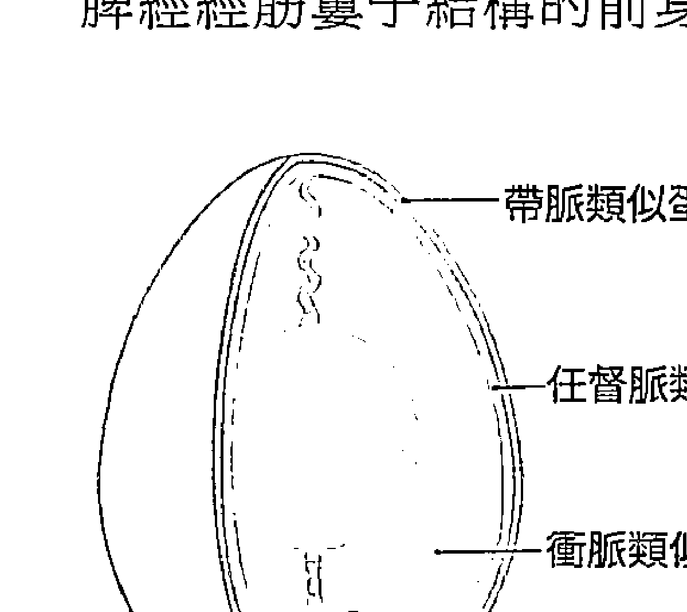

# 胚胎早期階段的任督衝帶四脈概念

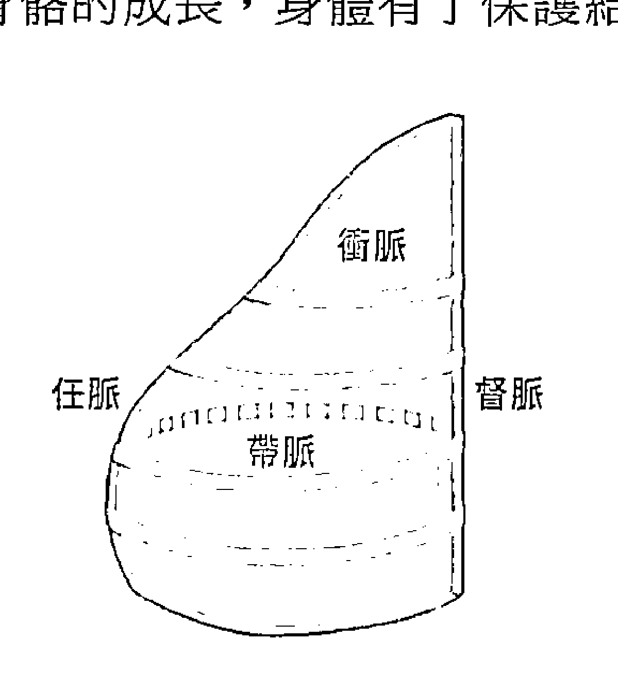

# 任衝督帶四脈分布圖

任脈為紅線，督脈為藍線，衝脈為橘黃色分佈於體腔內層，帶脈為紫色分佈於體表。

## 第三階段：奇經的維脈、蹺脈登場

從時間來看，此為臟腑組織器官開始陸陸續續生長的階段，四肢也出現了。從空間來看，胚胎由中間向兩側發育，原本只有前後之別，現在開始有左右之分，不再是圓形狀態，隨著臟腑組織器官增多，加上頭部以及四肢，身體結構變得複雜，身形拉開長大，體腔內的組織器官與四肢之間的距離也逐漸增大。
因應這種情況，身體發展出可以連結軀幹和四肢的經脈，是為陰維脈、陽維脈、陰蹺脈和陽蹺脈，左右共八脈。

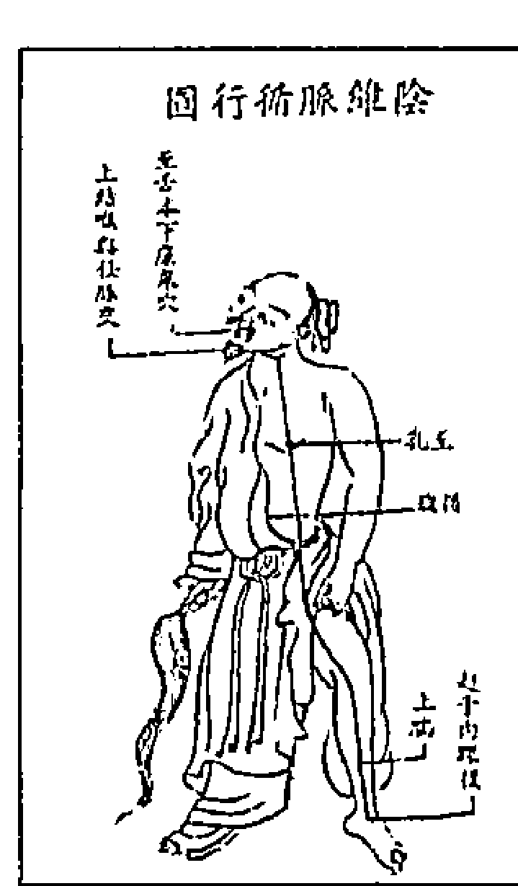

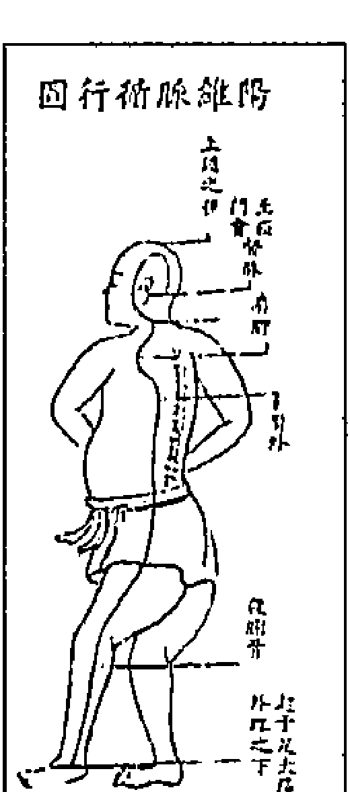

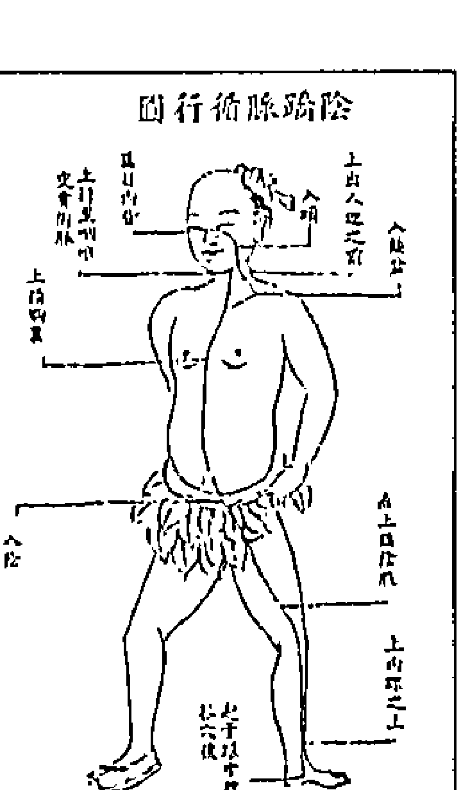

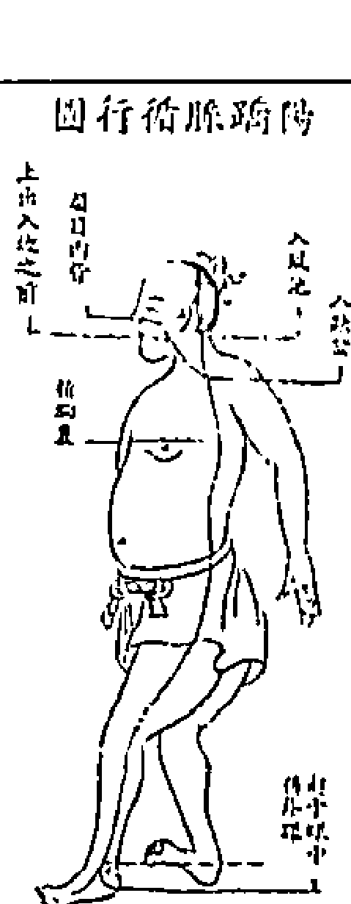

陰陽維蹺四脈的出現，標誌人體已經發育出臟腑與四肢，十二經脈也在同一時間逐漸生成，但維蹺脈仍稍早於十二經脈。

為何如此推論？我們可從維蹺脈的特色來看：

- 1. 陰陽：維蹺脈無論在命名和循行部位，都有明顯的陰陽之別。此時的陰陽不僅是一個概念，而且是實質的結構。
- 2. 起點：都起於下肢，陰維脈起於小腿內側，陽維脈起於外踝，陰陽蹺脈起於足跟。
- 3. 循行：維蹺脈不像任督衝帶有自己的路線，此四經既沒有自己的路線，而且常在不同的十二經脈路線間遊走。
- 4. 分佈：維蹺脈為左右雙側對稱分配，陰維脈及陰蹺脈分佈於下肢內側、胸腹部及面部；陽維脈及陽蹺脈分佈於下肢外側、上肢、肩背及頭部。四條經脈循行路線都很長很廣，多數都超過十二經脈的足六經循行範圍。
- 5. 功能：陰陽維脈透過交會任督二脈來調節臟腑功能，陰陽蹺脈調節肢體活動。

目前最早的中醫典籍馬王堆醫書中的《足臂十一脈灸經》和《陰陽十一脈灸經》，記載經脈的雛形都有連結臟腑與四肢，馬王堆醫書之後的《黃帝內經》是中醫聖經，已經有完整的十二經絡系統。馬王堆醫書及《內經》記錄經脈系統由簡而繁的發展歷程，這種現象可能與中醫師的認知能力有關，另一方面，是否也與身體經脈由簡而繁的發展有關呢？

從《黃帝內經》之後，經脈都以十二經為核心，奇經八脈常被視為後來才產生的備用及調節系統。原因在於奇經八脈除了任督二脈有自己的穴位之外，其他六脈沒有專屬的穴位，而是使用十二經脈穴位。或許是奇經的六脈向十二經脈借用穴位，這種情況感覺矮人一截，所以才被視為後來出現的系統吧。其實不然！

十二經脈系統連結內在臟腑與外在肢節，維蹻脈僅具有十二經脈系統臟腑以外的循行路線，即肢節路線，且還跨經絡分佈，循行範圍更廣。推測如此分佈的原因，胚胎時期臟腑還在發育，軀幹四肢還很細小，十二經脈系統也正要發芽，維蹻脈作為協助十二經脈連結肢節的先驅部隊，先做簡單的分工，如循行路線方面，維脈起於腳踝，蹻脈起於足跟，陰脈行於陰面，陽脈行於陽面，同時也逐漸出現穴位。隨著胚胎的持續分化，身體各部位的成長速度與面積不同，原先的路線會被身體撐開，這些被撐開的路線也會隨著身體的弧線同步分佈而出現彎曲的現象。

當十二經脈完備且詳細分工後，早已存在的維蹻脈就會呈現跨十二經絡現象，因此說奇經八脈是發展較晚的備用系統，這可 是倒果為因的誤解。我們來試著還原過程：## 奇經八脈循行及病候

由於本書以腎經為主軸，加上篇幅限制，僅簡要介紹奇經八脈循行等相關內容。以下皆為身體發育完成後的完整經脈循行。

## 一、任脈：主要循行在人體正面

> >《內經》：「任脈者，起於中極之下，以上毛際，循腹裡，上關元，至咽喉，上頤，循面入目。」

> >《難經》：「任脈者，起於中極之下，以上至毛際，循腹裡，上關元，至咽喉。」

《內經》另有一條納入督脈系統的路線，後世醫家普遍認為應屬於任脈，列於以下供參考：「其少腹直上者，貫臍中央，上貫心，入喉，上頤，環唇，上繫兩目之下中央。」

> >《奇經八脈考》：「任為陰脈之海，其脈起於中極之下，少腹之內，會陰之分（在兩陰之間）。上行而外出，循曲骨，上毛際，至中極，同足厥陰、太陰、少陰並行腹裡，循關元……環唇上，至下齦交。」

綜合上述，任脈起於本脈臍下4寸中極穴下方的胞中會陰部，進入體腔，循著下腹腔裡層，向上到關元穴，再一路向上，貫心，上到咽喉，再向上至面頰，最後進入眼睛。

### 任脈穴位

共24穴，都是專屬於任脈的穴位，只有單穴，沒有雙穴。起於會陰部（外生殖器與肛門之間）的會陰穴，向上分佈於胸腹部中線，直到下巴的承漿穴。

任脈循行圖

### 任脈病候

> 《內經》：「任脈為病，男子內結七疝，女子帶下，瘕聚。」

由於任脈循行在下腹部，病候也是以下腹部氣血阻滯的生殖系統疾病為主。

### 交會穴：肺經列缺穴

金元時期醫家竇漢卿在其著作《針經指南》，提出奇經八脈與十二經脈在遠端有經氣交會的穴位，並將這些穴位組合稱為「八脈交會穴」。任脈交會肺經的列缺穴，肺經是十二經脈之首，也是記載生命源頭的經脈，任脈與其交會具有生命之始的共通特質。

十二經脈也與任脈有實質交會穴，如足三陰經共同交會於任脈的中極穴和關元穴，這個特質不僅讓任脈成為名符其實的「陰脈之海」，也讓關元穴成為練功及保健要穴。

## 二、督脈：主要循行在人體背面

督脈循行依據《內經》記載，有多條路線，分列說明如下：

- 1. 起始處：「起於少腹，以下骨中央，女子入繫廷孔，其孔，溺孔之端也。」與任脈一樣也是起於胞中會陰處。
- 2. 後行支：「循陰器，合篡間，繞篡後，別繞臀，至少陰與巨陽中絡者合。」從會陰處向後繞過臀部，與腎經及膀胱經相合，以下路線正是兩條經脈的路線。

「少陰上股內後廉，貫脊屬腎；與太陽起於目內眥，上額，交巔上，入絡腦，還出別下項，循肩髆，內俠脊，抵腰中，入循膂，絡腎。其男子循莖下至篡，與女子等。」這條路線有兩個重點：一是督脈聯繫腎臟，可見督脈對於腎臟的重視程度，二是督脈在胚胎後期將其經脈分配給腎經及膀胱經。（此概念請參閱後文）

- 3. 前行支：「其少腹直上者，貫臍中央，上貫心，入喉，上頤，環唇，上繫兩目之下中央。」這條路線與任脈相似，後世醫家普遍認為應屬任脈，此處就不討論。

《難經》中描述：「督脈者，起於下極之俞，並於脊裡，上至風府，入屬於腦。」內容精簡，大致與《內經》後行支循行相同。

### 督脈穴位

共28穴，也是專屬於督脈的穴位，只有單穴，沒有雙穴。起於長強穴（肛門與尾骨端連線的中點），繞過臀部，向上分佈於背部中線的脊椎，經過頭面部，最後抵達齦交穴（唇繫帶與上齒齦連接處）。

### 督脈病候

《內經》：「督脈為病，脊強反折。」《難經》：「督之為病，脊強而厥。」由於督脈循行在背部脊椎，病候也是以脊椎張力異常，導致身體反折為主。

### 交會穴：小腸經後溪穴

八脈交會穴有兩個規律：

- 1. 陰脈交會陰經，陽脈交會陽經。
- 2. 任、督、維脈的交會穴都位於十二經的手經，衝、帶、蹺脈的交會穴都位於足經。其中任、督、維脈與臟腑功能有關，手經可以視為心肺功能的延伸，這剛好解釋了從循行位置來看，督脈與足太陽膀胱經應該最契合，卻選擇同為太陽經的小腸經交會的原因，在於符合交會於手經的概念。至於蹺脈與肢體功能有關，故交會在足經，衝、帶脈的交會穴與其功能直接相關。

## 三、衝脈：主要循行在體腔內層

依據《內經》記載，衝脈也有多條循行路線，分列說明如下：

- 1. 起始處：關於衝脈的起始處，不同的醫書篇章有不同的描述。「衝脈者，十二經脈之海也。與少陰之大絡起於腎下，出於氣街」「衝脈、任脈皆起於胞中」「衝脈起於關元」。

依據胚胎概念，衝脈與任督二脈同起於胞中會陰處。至於起於腎下或關元等說法，都是發生在胚胎發育完成之後的情況，尤其與《難經》所說的「臍下腎間動氣」有關，「諸十二經脈者，皆系於生氣之原。所謂生氣之原者，謂十二經之根本也，謂腎間動氣也。此五臟六腑之本，十二經之根。」腎間動氣為五臟六腑及十二經脈之根本，衝脈是五臟六腑及十二經脈之海，腎間動氣與衝脈之間有特殊關聯。

- 2. 後行支：「衝脈、任脈皆起於胞中，上循背裡，為經絡之海。」

《內經》在討論百病始生的過程中，曾提到「伏衝之脈」，指出當邪氣留滯在六經不去，接下來就會傳入十二經脈之海的衝脈，伏藏在「伏衝之脈」，此脈係指衝脈的後行支。推測因為此分支位於背部，是身體較為深藏處，故命名為「伏衝之脈」。

- 3. 前行支：「其浮而外者，循腹上行，會於咽喉，別而絡唇口。」

相對於伏衝之脈的深藏路線，前行支分佈在較為表淺的位置，從胞中循著腹部向上行，會於咽喉，最後絡於唇口。

在胚胎後期，前行支已經成為衝脈的主脈，即《內經》所說：「衝脈者，起於氣街，并少陰之經，夾臍上行，至胸中而散也。」唯有此路線有穴位分佈。合參前文，前行支在胸腹部並少陰之經直到胸中，再自行上至咽喉與唇口，唇口這段頭面路線已經超過腎經範圍。

- 4. 頭面支：「夫衝脈者……其上者，出於頏顙，滲諸陽，灌諸精。」

頏顎是鼻咽交接處，此分支更上一層樓，銜接前行支的唇口，從鼻咽部而出，佈於頭面，將珍貴的陽氣與陰精灌注到各個清竅組織，濡養官竅以維持正常生理功能。

衝脈為五臟六腑之海，營養物質充沛，故有「血海」之稱。人類演化到現代社會，頭面部已經成為維持生活與工作最重要的部位，同時也是最耗能的組織，感謝超級富裕且熱情的衝脈，千里迢迢特地向上輸送陽氣陰精等營養物質。

- 5. 下肢支：「其下者，注少陰之大絡，出於氣街，循陰股內廉，入膕中，伏行胻骨內，下至內踝之後屬而別。其下者，並於少陰之經，渗三陰。其前者，伏行出跗屬，下循跗，入大指間，渗諸絡而溫肌肉。」

> 「出於氣街，循陰股內廉，邪入膕中，循脛骨內廉，並少陰之經，下入內踝之後，入足下。其別者，邪入踝，出屬跗上，入大指之間，注諸絡，以溫足脛。」

上面兩段敘述內容大致相同，說明下肢支脈併入腎經，歷經足踝、足跗、足下，入於大趾之間。

依據衝脈後來將篋子結構交棒給脾經，且衝脈交會脾經的公孫穴，此處的大趾之間應指循行於大趾外側的脾經。衝脈在頭面支輸送養份，也將營養物質從大趾之間滲灌給諸絡脈，溫肌肉及足脛。由此可以看出，下肢支應該是後期才發展出來的路線，方能與腎經、脾經交會。

綜合而論，衝脈起於胞中會陰部，主要經脈有兩條：一是後行支「伏衝之脈」分佈於背部，二是前行支分佈於胸腹部，腹部還有穴位。這兩條支脈成為腎經經脈分佈於體腔前後路線，以及脾經經筋在胸腹部篋子結構的前身。

### 衝脈穴位

左右共24穴。起於氣衝穴（胃經穴位，腹股溝附近），之後為腎經腹部所有穴位，從橫骨穴到幽門穴為止。

> 《難經》：「衝脈者，起於氣衝，並足陽明之經，挾臍上行，至胸中而散。」

現在的衝脈前行支循行在腎經路線上，但在身型較小的階段，由於衝脈氣血充盈，脈形頗寬，極有可能同時涵蓋腎經與胃經，故《內經》與《難經》的說法可能是身體不同發育階段的觀察記錄，可以合參，或可參閱《卷三。脾經》所分享之公孫穴美麗的錯誤。（p162）

> 《內經》：「衝脈者，起於氣街，并少陰之經，夾臍上行，至胸中而散也。」

看似衝脈借用腎經穴位，其實不然，這些穴位原屬於衝脈，隨著胚胎成長，衝脈將之交棒給腎經。

特別的是，衝脈至胸中而散，為何沒有繼續使用腎經胸部的穴位？個人推測，衝脈到胸口呈現散形分佈，與後來的脾經經筋「結於肋，散於胸中」型態類似，所以衝脈在胸部進入較深的體腔位置，因此表層沒有穴位，腎經胸部穴位可能是腎經後來自行延伸發展的。

### 衝脈病候

> 《內經》：「衝脈為病，逆氣、裡急。」

> 《難經》：「衝之為病，逆氣而裡急。」

衝脈，顧名思義是具有很強的衝勁，其脈從會陰部向上行，既要提供篋子般的結構以容納臟腑，又要統領所有臟腑與經脈氣血輸送至全身，甚至還與腎間動氣合作，輸送原氣，這一系列的工作都需要強大的衝力，衝脈雖是箇中好手，然而過猶不及，若是衝過頭了，就會出現氣機上逆，體內拘急的現象。

### 交會穴：脾經公孫穴

衝脈為十二經脈之海，氣血充盈，其與生殖功能相關者特別稱為「太衝脈」，與肝經有密切聯繫。《內經》論述生理週期時，指出女性「二七而天癸至，任脈通，太衝脈盛，月事以時下，故有子。」女性14歲開始發育，此時任脈開通加上太衝脈氣血旺盛，有了充足的氣血，月經方能按時而來，且有孕育能力。

任脈交會於肺經列缺穴，肺經是首發經脈，代表生命之始。衝脈下肢支經過脾經大趾處，並由此滲灌氣血給諸絡以溫肌肉。衝脈交會於脾經公孫穴，脾臟五行屬土，土能孕育萬物，最具母性特質。任衝二脈交會肺、脾二經，隱含有孕育初始生命之深意。而公孫穴穴名中包含有孫子才有阿公的概念，也點出衝脈在孕育下一代，繁衍生命的重要性。

## 四、帶脈：環繞身體一圈

帶脈循行是唯一橫向分佈的經脈，《難經》說：「帶脈者，起於季脅，回身一周。」宛如束帶，可以約束及固定所有臟腑和縱行的經脈，所以稱為「帶脈」。《卷三》介紹過人體十二經脈如筷子，帶脈就像將這些筷子綁好固定的橡皮筋。

《內經》在介紹肢體痿廢無力的痿病時，指出「陽明、衝脈皆屬於帶脈，而絡於督脈。」脾胃主管肌肉與四肢，衝脈有篋子般的結構將肢體向上撐住。為了讓軀幹與四肢強健有力，人體設計出「初階」與「進階」兩段式的穩定結構：

- **初階—連於督脈：** 為了加強帶脈固攝力量，帶脈向後絡於督脈，以便連結在堅強有力的脊椎上。重點在強化骨骼組織的力量。
- **進階—通過帶脈：** 陽明胃經和衝脈隸屬帶脈管轄，主要藉由帶脈連結脊椎的支撐力，協助穩固四肢肌肉和身體結構。重點在強化肌肉組織的力量。

透過這兩階段力量，肢體就能強健有力。反之，若胃經虛弱四肢無力或帶脈固攝能力失常，很容易出現《內經》所說：「陽明虛則宗筋縱；帶脈不引，故足痿不用」這種下肢痿弱難行走的情況。由此可驗證帶脈的功能。

有關帶脈起始處，《內經》與《難經》也有不同記載。

> 《內經》：「足少陰之正……上至腎，當十四椎，出屬帶脈。」腎經經別在十四椎淺出體表，「剛好」與帶脈銜接。

> 《難經》：「帶脈者，起於季脅。」

> 《奇經八脈考》進一步說明：「起於季脅足厥陰之章門穴。」

之前介紹過，帶脈屬於早期經脈系統，因此個人較認同帶脈起於十四椎。尤其帶脈要發揮固攝功能，必須先行附著於堅強穩固的結構，相較之下，脊椎的力量當然遠勝於肋骨。

### 帶脈穴位

左右共6穴或8穴。包括膽經位於脅肋的帶脈穴，和位於髂骨內側的五樞穴和維道穴。依據《奇經八脈考》的說法「起於季脅足厥陰之章門穴」，部分醫家也將章門穴列入交會穴，所以穴位才有6穴及8穴之別。

個人認為，帶脈身為人體的大皮帶，需要有固定點才能施力，這些固定點當然以骨性結構為佳。帶脈在後側附著於脊椎十四椎，前側附著於髂骨，側面還需要有骨性結構。帶脈穴位於脅腹側肌肉上，支撐力不足，無法固定。肝經位於十一肋下方的章門穴，位於骨邊，還兼為脾臟募穴，所以應納入交會穴。

### 帶脈病候

> 《內經》：「陽明虛則宗筋縱，帶脈不引，故足痿不用。」
《難經》：「帶之為病，腹滿，腰溶溶若坐水中。」指出帶脈約束力量失常的情況，就像原本體型胖胖的人使用皮帶修飾身形，若將皮帶取下，整個腰部及腹部就會出現臃腫、松垮、下垂的情況。（參閱經別篇）

### 交會穴：膽經足臨泣穴

帶脈的特質可分兩方面來說：一是協助脾經經筋篋子的升清功能，所以交會章門穴是合理的；二是繞過身體側面環身一周，與足少陽膽經循行類似，所以交會於膽經相得益彰。

## 五、陰陽維蹺四脈：任督二脈的執行助手

由於維蹺脈是較晚出現的系統，《內經》與《難經》記載都很簡略，結合穴位及病候較能一窺全貌。

維蹺脈共有四條，分別為陰維脈、陽維脈、陰蹺脈、陽蹺脈，屬於經脈發展第三階段，臟腑組織器官開始生長，四肢也出現。依據胚胎由簡而繁，由軀幹到四肢的發展規律，維蹺脈的起始處應該是在軀幹，隨著四肢的生長，經脈和穴位也跟著肢節向遠端延展分佈。另一方面，最早出現的任督二脈分別主一身之陰陽，任督二脈身為經脈最高指導長官，只要管理大方向，不必事事躬親，執行工作就交由下屬去完成，維蹺脈也因應此需求而生。

我們先來認識維脈系統與蹺脈系統：

### ○ 維脈系統

《難經》：「陽維維於陽，陰維維於陰。」

從功能上來看，陰陽維脈是任督二脈的下屬，維繫人體的陰血與陽氣，並協調各臟腑組織的陰陽平衡。所以陽維脈會維繫各陽經歸於督脈，陰維脈則維繫各陰經歸於任脈。

> 《難經》：「陽維陰維者，維絡於身，溢蓄，不能環流灌溉諸經者也。」

這是很有深度的說法。陰陽維脈雖然也維絡全身，但是重點在於執行任督二脈交辦的工作，將氣血輸送到特定部位，並處理該部位氣血溢出或蓄積的事務，毋須將氣血輸送到全身，因為此時十二經脈已在發育，氣血環流之事交由十二經脈辦理即可。

> 《難經》：「陰陽不能自相維，則悵然失志，溶溶不能自收持。」

由於陰陽維脈相互維繫，維持平衡，如果失去平衡則易出現身心病變。

### ○ 蹺脈系統

蹺脈的「蹻」字為將腳抬高之意，可見蹺脈與肢體活動有關。

> 《難經》：「陽蹻脈者，起於跟中，循外踝上行，入風池。」

> 「陰蹻脈者，亦起於跟中，循內踝上行至咽喉，交貫衝脈。」

從功能上來看，蹺脈也是任督二脈的下屬，特別與肢體活動有關，除了維繫人體陰陽兩側活動的平衡之外，也管理眼睛的開闔。循行路線的特色，陰蹻脈以腎經及膀胱經為主，陽蹻脈以六陽經為主。

由於陰陽蹺脈相互維繫抗衡，若一方失衡也會牽動另一方出現張力問題，如《難經》：「陰蹺為病，陽緩而陰急。陽蹺為病，陰緩而陽急。」

整體而言，陰陽維脈在頭面部只到咽喉及頸椎，以維繫任督二脈為主；陰陽蹺脈合入目內眥並入於腦部，連結腎經與膀胱經。

陰維脈起於諸陰交的關元穴，循行重點在於胸腹部以維繫足三陰經與任脈；陽維脈起於諸陽交的啞門穴及風府穴，重點在於頭部以維繫於足陽經與督脈，足陽經尤以膽經關係最密切。陰陽蹺脈循行重點在下肢、上肢及頭面部，尤其是足跟與眼睛，還入於腦部，與腎經和膀胱經關係密切。

以下介紹陰陽維蹺脈的循行、病候，與交會穴：

### 1. 陰維脈

> 《內經》：「刺飛陽之脈，在內踝上五寸，少陰之前，與陰維之會。」

> 《難經》：「陰維起於諸陰交也。」

有關陰維脈的起始處，《內經》的說法，後世醫家解釋內踝上5寸的腎經築賓穴，但若參酌《難經》的說法，明顯有矛盾。

我們在臨床討論奇經時，對於陰陽維脈起於諸陰交與諸陽交的確切位置一直難有定論，直到後來把思考點拉回胚胎時期，難解問題便有了契機。陰陽維脈起於「諸陰交」與「諸陽交」，也是隨著胚胎成長，所以「諸陰交」應該起自腹部。現在從穴位來帶大家探討其中細節。

### 穴位

- 左右共14穴，包括：
  - 下肢：起於腎經的築賓穴（小腿內側），之後下肢沒有其他穴位。
  - 腹部：脾經的衝門穴、府舍穴、大橫穴、腹哀穴。（沒有腹結穴）
  - 胸部：肝經的期門穴。
  - 咽喉部：任脈的天突穴、終於舌根的廉泉穴。因為天突穴與廉泉穴為單穴，所以總共14穴。

陰維脈採用足三陰經及任脈的穴位，而下腹部的「關元穴」是足三陰經與任脈的交會穴，回到胚胎期來思考，陰維脈起於「諸陰交」是否指關元穴？也唯有起於此穴，方能維繫一身之陰脈歸於任脈。然後由此穴向下向上延伸至下肢及咽喉。

### 病候

> 《難經》說：「陰維為病，苦心痛。」

陰維脈為任脈下屬，執行任脈交辦的任務。任脈為陰脈之海，陰維脈則主一身之陰血，任脈上貫心，心臟主血主脈，陰維為病會影響心臟功能而出現心痛之證。

### 交會穴：心包經內關穴

心包經主血之所生病，身體似乎為了呼應陰維為病苦心痛的現象而交會於心包經的內關穴，本穴擅長開胸理氣，當然可以改善「苦心痛」的狀況。

內關穴是心包經的絡穴，聯絡相表裡的三焦經。有趣的是，陽維脈交會於三焦經的外關穴，也是三焦經的絡穴，聯絡相表裡的心包經。

內關穴與外關穴，位於手臂陰面與陽面的正相對位置，由於任督二脈在會陰部有實質交會以協調陰陽，身為其部屬的陰陽維脈當然也要比照辦理，可惜它們沒能直接交會，便聰明的選擇交會在相對位置最近的內關穴與外關穴，且其經脈之氣可搭心包經與三焦經的便車，讓陰血陽氣得以相互維繫而協調陰陽。

總論介紹過，心、腎兩臟非常重要，除了既有的表裡經協助功能，另外賦予心臟有心包，腎臟有三焦。由此來看，陰陽維脈與心、腎兩臟也有特定關聯。

### 2. 陽維脈

> 《內經》：「刺陽維之脈，脈與太陽合腨下間，去地一尺所。」

> 《難經》：「陽維起於諸陽會也。」

探討陽維脈的起始處，也跟陰維脈遇到的問題一樣。後世醫家依據《內經》說法，認為陽維脈起於足少陽膽經位於小腿外側的陽交穴，但參酌《難經》說法，還是有待商榷，其道理跟陰維脈一致。

### 穴位

有不同的版本，本書選擇比較通用的說法，左右共26穴。

- 下肢：起於膀胱經的金門穴（外踝前方），膽經的陽交穴。

上肢：小肠经的臑俞穴，三焦经的天髎穴，胆经的肩井穴。
头部：胆经的本神穴、阳白穴、头临泣穴、目窗穴、正营穴、脑空穴、风池穴，督脉的风府穴及哑门穴。因为风府穴及哑门穴为单穴，所以总共 26 穴。

督脉虽然也起于会阴部，但会阴部性质属于阴，不适合做「诸阳交」。回归胚胎思考，督脉循行于背部的脊椎及脑部，在头颈部尚未「伸长拉开」之前，后头与颈椎是非常贴近的。中医认为头部为诸阳之会，大椎穴也是诸阳之会，都是阳气聚合之处。以此来看，位于后头与颈椎交会处的风府穴及哑门穴应该就是「诸阳交」的位置。阳维脉唯有起于此处，方能维系一身之阳脉归于督脉。

另一方面，以上下来区分人体的阴阳，上部属阳，下部属阴，阴维脉起于下腹部的关元穴，阳维脉起于头顶部的风府穴及哑门穴，完全符合阴阳的逻辑。

## 病候

> 《难经》：「阳维为病，苦寒热。」

阳维脉为督脉下属，执行督脉交办的任务。督脉为阳脉之海，阳维脉则主一身之阳气，阳气有温煦身体的功效。当气机出现异常时，就会出现寒热不调的现象。

## 交会穴：三焦经外关穴

三焦经的外关穴也是络穴，联络相表里的心包经。手少阳三焦经主气之所生病，与足少阳胆经是手足同名经，本脉在头部交会穴以胆经为多。人体以背部为表，胸腹为里，太阳偏主人体之表，阳明偏主人体之里，少阳位于太阳与阳明之间，《内经》说「少阳主枢」，具有转输的性质，所以主管半表半里的情况。

《伤寒论》少阳病的主要方剂「小柴胡汤」有四大应用指征，其中之一为「往来寒热」，当病邪居于人体半表半里的地方会导致身体气机转输异常，而出现时寒时热，寒热不协调的情形。阳维脉采用的穴位多属于胆经，当然具有胆经主半表半里的特质。

在早期阶段，阴阳维脉起于诸阴交与诸阳交，后期延伸至四肢。肾主先天，膀胱经为肾经的表里经，也是肾经的护卫，从穴位分布顺序来说，阴维脉起于肾经筑宾穴，阳维脉起于膀胱经金门穴。虽然完整的阴阳维脉都起于下肢，但穴位很少，多数仍分布在躯干及头面部，可见下肢发育较躯干头面为晚。阴阳维脉的这些特质都隐含胚胎早期发育过程的痕迹。

## 3. 阴蹻脉

> > 《内经》：「（阴）蹻脉者，少阴之别，起于然骨之后，上内踝之上，直上循阴股，入阴，上循胸里，入缺盆，上出人迎之前，入頄，属目内眦，合于太阳、阳蹻而上行。」

> 《难经》：「阴蹻脉者，亦起于跟中，循内踝上行，至咽喉，交贯冲脉。」

综合两本医书所述，阴蹻脉起于足跟，循内踝上行到胸里、咽喉，这条路线与肾经类似。比较特别的部分在于后段循行：

-   在咽喉部位交贯冲脉到对侧。
-   上达面部，在目内眦（睛明穴）与足太阳膀胱经、阳蹻脉相合，再上行入脑。
-   蹻脉与眼睛的密切关系，在《内经》中特别提及：「足太阳有通项入于脑者，正属目本，名曰眼系。…在项中两筋间，入脑乃别阴蹻、阳蹻，阴阳相交，阳入阴，阴出阳，交于目内眦。」此说明蹻脉另有一条与眼睛相关的经脉，从后头部而来。足太阳经脉循行于项部两筋之间，入于脑部之后，分出阴蹻脉与阳蹻脉，阴阳相交，左右交叉，交会于目内眦。
阴蹻脉与眼睛的关系，藉由来自肾经的正面路线与膀胱经的背面路线，从目内眦及后头部双管齐下进入脑部，并产生交叉现象，类似眼球内的视交叉。

## 穴位

-   左右共6穴或8穴，包括：
    -   下肢：起于肾经的照海穴（内踝下方，足跟附近）、交信穴。部分医家纳入然谷穴。
    -   头部：膀胱经的睛明穴。

由此可看出阴蹻脉的循行重点在于足跟与眼睛。

## 病候

阴阳蹻脉时时处于类似跷跷板的平衡状态，一方失衡，另一方也跟着出现问题。所以移到阳蹻脉处讨论。

## 交会穴：肾经照海穴

肾经的照海穴又称「阴蹻穴」，由此可见它与阴蹻脉的关系。照海穴位于内踝尖下方，跟骨前方。「蹻」为举足活动，当我们用脚打拍子时，就会牵动照海穴及外侧的申脉穴。

阴蹻脉交会照海穴，阴蹻脉提供肢体活动的巨大力量，让肾经经脉之气从脚底加上照海穴的催速，向上冲至脊椎。此外，照海穴也是治疗咽喉病要穴，「照海」穴名还有照亮视觉的意涵，所以能治疗眼睛及睡眠疾病，这都拜阴蹻脉所赐。

## 4. 阳蹻脉

《内经》对阳蹻脉的叙述比阴蹻脉少，仅有「足太阳有通项入于脑者，正属目本，名曰眼系。…在项中两筋间，入脑乃别阴蹻、阳蹻，阴阳相交，阳入阴，阴出阳，交于目内眦。」

《难经》：「阳蹻脉者，起于跟中，循外踝上行，入风池。」

综合两本医书所述，阳蹻脉起于足跟，循外踝上行，入于后头的风池穴。内容也很简约，需要参考穴位探讨。

## 穴位

-   左右共24穴。
    -   下肢：起于膀胱经的申脉穴（外踝下方，足跟附近）、仆参穴、跗阳穴，胆经的居髎穴。
    -   上肢：小肠经的臑俞穴，大肠经的肩髃穴、巨骨穴。
    -   头部：胃经的地仓穴、巨髎穴、承泣穴，膀胱经的睛明穴，胆经的风池穴（另一说法为风府穴）。

阳蹻脉除了链接足跟与眼睛之外，其肢体路线包含足三阳经及手三阳经，可见阳蹻脉还具有阳经动态活动的功能。

## 病候

阴阳蹻脉的病候分为两大类：

-   眼睛开阖与睡眠和视觉：《内经》说：「气并相还则为濡目，气不荣则目不合。」「阳气盛则瞋目，阴气盛则瞑目。」阴蹻脉与阳蹻脉合入目内眦，因此与眼睛能否正常开阖有关，还可以延伸与睡眠品质的关系。「入脑乃别阴蹻、阳蹻，阴阳相交。」则类似视交叉，与视觉有关。
-   肢体活动：《难经》：「阴蹻为病，阳缓而阴急；阳蹻为病，阴缓而阳急。」「蹻」就是举足，活动重点部位在足跟及足踝，所以阴蹻阳蹻脉都发自这两个部位。阴蹻脉以肾经和膀胱经为主，阳蹻脉以手足六阳经为主，两脉都与膀胱经有关连，膀胱经主「筋」之所生病，提供肢体活动的结构基础。

阴阳蹻脉也像拔河比赛的两方，最佳状态是维持平衡，一旦一方张力出问题，另一方也跟着受累。如阴蹻脉失常，阴盛则身体阳侧弛缓而阴侧拘急；阳蹻脉失常，阳盛则身体阴侧弛缓而阳侧拘急。这种情况常出现在中风患者身上，一般患者也会有类似的情况，只是程度较轻，譬如车祸外伤后单侧肢体瘫软活动不利，另一侧肢体就会出现代偿机制，一旦过度使用则有紧硬的现象。

## 交会穴：膀胱经申脉穴

膀胱经的申脉穴又称「阳蹻穴」，由此可见其与阳蹻脉的关系。申脉穴位于外踝尖下方，跟骨前方，正对照海穴的位置，举足时就会牵动本穴和照海穴。

## 阴阳维蹻脉循行重点汇整

为了让读者清楚理解阴阳维蹻脉的循行，兹将《难经》、《奇经八脉考》的论述加以归纳，汇整如下页表格。其中维脉主一身之表里，从其病候苦寒热与苦心痛来看，其实偏于脏腑疾病；蹻脉与肢体活动有关，可使关节矫健。因此，阴阳维脉及阴阳蹻脉能够襄助十二经脉与脏腑、四肢之间的联系与滋养。维脉及蹻脉循行从躯干延伸到四肢，这是与前述四条奇经（任、督、冲、带）的主要不同点，也标志着人体的全然成熟。

## 《难经》中有关阴阳维蹻脉循行与病候：

|          | 循行                             | 病候                                     |
| :------- | :------------------------------- | :--------------------------------------- |
| **阳维脉** | 维络于身 溢畜不能环流         | 阳维起于诸阳会 阴阳不能自相维 则怅然失志 苦寒热 |
| **阴维脉** | 灌溉诸经                         | 阴维起于诸阴交 溶溶不能自收持 苦心痛             |
| **阳蹻脉** | 起于跟中，循外踝上行，入风池     | 阴缓而阳急                                 |
| **阴蹻脉** | 起于跟中，循内踝上行，至咽喉，交贯冲脉 | 阳缓而阴急                                 |

## 《奇经八脉考》中有关阴阳维蹻脉循行与病候：

|          | 循行                       | 功能         | 特色                     |
| :------- | :------------------------- | :----------- | :----------------------- |
| **阳维脉** | 起于诸阳之会（足太阳金门穴） 由外踝而上行于卫分 | 为一身之网维   | 阳维主一身之表           |
| **阴维脉** | 起于诸阴之交（足少阴筑宾穴） 由内踝而上行于营分 |              | 阴维主一身之里 以乾坤言也 |
| **阳蹻脉** | 起于跟中 循外踝上行于身之左右 | 使机关之蹻捷   | 阳蹻主一身左右之阳       |
| **阴蹻脉** | 起于跟中 循内踝上行于身之左右 |              | 阴蹻主一身左右之阴 以东西言也 |

# 有关八脉交会穴，古有歌赋相传

> > 公孙冲脉胃心胸，内关阴维下总同；临泣胆经连带脉，阳维目锐外关逢；后溪督脉内眦颈，申脉阳蹻络亦通；列缺任脉行肺系，阴蹻照海膈喉咙。

八脉两两相配，其循行皆有相通之处，如冲脉与阴维脉都循行于胸腹部，与肾经和脾经关系密切，公孙穴与内关穴合用，非常善于疏通胃心胸的气机，此部位正是冲脉与阴维脉，肾经与脾经所共同经过的区域。（限于篇幅不再详述）

## 六、奇经八脉是十二经脉系统的前驱

综合前述奇经八脉的内容，有几项特色：

1.  循行特色：
    -   路线的变与不變：任督二脉循行于人体中线，其路线一直维持不變。其他六脉则随着胚胎的发育，脏腑经络的成长，循行路线也因应调整。
    -   起始处：任督冲三脉皆起于胞中会阴部，带脉起于督脉十四椎处，阴阳维脉起于任脉与督脉的重点区域，都是早期发育的部位。唯有阴阳蹻脉起于足跟，可能与下肢较晚出现，肢体活动能力较慢发展有关。
    -   重要分布区：穴位代表经脉之气集中处，越重要的部位，循行所过的经脉越多，穴位也越密集。所以可从经脉及穴位分布解析该经脉的重点区域，如维蹻脉在躯干头面的穴位比下肢多，可见其重点在于躯干头面部。
    任督二脉的穴位有其特殊性，不列入讨论。其余六脉的穴位分布都以躯干和头面为主，可见人体早期发展的部位也是奇经八脉的重点位置。

2.  穴位特色：
    任督二脉常与十二经并列为「十四经」，十四经很像穴位俱乐部，必须要有属于自己的穴位才能加入，另六条奇经由于没有自己的穴位，无法列入此俱乐部。
    前文介绍过，在胚胎早期阶段，六条奇经曾有自己的穴位，随着胚胎生长，脏腑与经络开始细密分工，六条奇经的阶段性任务告一段落，就将自己的穴位交棒给十二经脉去使用。
    依据上述推论，可以得出一个重要结论：奇经八脉是十二经脉系统的前驱。
    也许读者会问，有没有可能十二经脉的发展比任督二脉早？
    多数生物发展都是「由简而繁」，即使是当代的机关组织也存在这种现象。十二经脉系统的记载亦有类似情况，《黄帝内经》对于经脉的记载非常完整，也会链接脏腑和四肢，但在比《内经》更早的医书马王堆汉墓十四种医书中，与经脉循行病候有关的《足臂十一脉灸经》和《阴阳十一脉灸经》，其经脉路线很简单，许多经脉也没连接脏腑。由此推想，发现及整理经络系统的过程是由简而繁，但是否也暗示早期人体的经络系统发展还没完备，所以文字记载才会比较简单？这部分仍有待研究。
    经脉系统无论在马王堆医书或《内经》的记载，都有分工，且加上阴阳与手足之别。肾为全有的器官，肾所藏的阴阳为生命的总纲，然后再细分为气血津液和各组织器官。而任督二脉本来是为了环绕受精卵的阴阳结构而生，以维持阴阳的平衡。随着身体成长，组织分化，十二经脉逐渐完备，任督二脉总理阴脉与阳脉的能力可能跟着完备，但不代表任督二脉是为了调节十二经脉气血而生。就如前述一般公司大都由创办人开始运转，等到业务扩大之后再增聘员工，分设各部门运作，创办人仍居高位统筹管理公司重要业务。任督二脉就是创办人的角色。反之，如果公司初始时群龙无首，各自为政，期望等到公司营运发展具规模后，再聘专人管理，这通常是家族企业的想法，实际营运不太可行，很容易倒闭。

## 奇经八脉全程参与肾间动气推动身体组织器官及十二经脉的成长发育

肾间动气是生命、呼吸、脏腑和经脉四大要素的根本，也推动着四大要素的成长与发育，肾间动气也是生气之原，贯穿生命所有历程，从生命之始直到生命结束，奇经八脉都全程参与，协助肾间动气完成生命任务。

在受精卵阶段，此时为2D结构，肾间动气位于肾元之内，任督二脉环绕受精卵，为肾间动气的启动预作准备。随着肾间动气启动，推动受精卵分化及生长，胚胎变成立体3D结构，肾间动气跟着移到肚脐下方，位于胞中的「关元命门区」。此区不仅链接任脉与督脉，还将冲脉与带脉也纳入其中。肾间动气为五脏六腑及十二经脉之根本，冲脉是五脏六腑及十二经脉之海，加上其与脾经、肾经的密切关系，协助肾间动气的原气在脏腑经络敷布。横向的带脉所形成的圆圈型态协助原气别使的三焦经以螺旋方式输送原气至身体各个角落。

奇经八脉出现在生命发展的各个阶段，从单纯的阴阳概念到气机升提的需求，最后到身体发展完备。

在第一及第二阶段，任督冲带四脉「超前部署」，为下一阶段生命发展需求预作准备，第三阶段阴阳维蹻脉稍早于十二经脉，成为「学长」，协助十二经脉建构脏腑与四肢的联系与运送气血，以维持正常生理功能。

由于奇经八脉出现在不同的生命阶段，其功能和位阶也各有不同。任脉与督脉总理全身的经脉，位阶最高，平时只要发号施令即可，分派维脉去执行联通脏腑任务，蹻脉执行联通四肢任务，维蹻脉是为第二级。带脉与冲脉功能比较特殊，虽归任督管辖，可视为特使，不做排序。

## 对称生物的「三胚层」演化系统，与任督冲三脉组成的共同概念极为类似

任、督、冲、带四条奇经八脉循行路线都是直行或横行，没有弯曲，也没有分布到四肢，可见四肢在此阶段还未发育或发育不完备，为人体早期发育阶段。当人体发育逐渐成熟，十二经脉随之而生，奇经八脉也陆续将任务转型或交接给十二经脉。其中肾经、脾经更是承担了任、督、冲脉的重要任务。

我在研究十二经络的经筋系统时，曾经对于脾经、肾经、膀胱经这三条经络的经筋系统紧紧相依又各司其职感到好奇，笑称它们是「三明治结构」，不断思索其关联意义。

有一天查阅生物构造相关资料时，看到对称发展的生物（较高等之生物），其胚胎发育具有「三胚层」特性，分别是内胚层、中胚层、外胚层。才恍然大悟，这实在太令人兴奋了！

因为人体在胚胎阶段，十二经脉尚未出现，任、督、冲三脉共同形成的结构与生物学发现的三胚层非常相似。涵括了：

-   督脉循行区域类似外胚层，外胚层构成大部分的体表皮肤和神经系统。
-   冲脉与督脉之间的区域类似中胚层，中胚层组成皮肤与消化道之间的组织，如生殖与排泄系统、循环系统和运动系统，含骨髓、骨骼、横纹肌等。
-   冲脉与任脉之间的区域类似内胚层，内胚层未来将形成身体的内部结构，如消化道、呼吸道、肝、胰及腺体等。

而我称之为三明治结构的脾经经筋—肾经经筋—膀胱经筋，正好再次印证了这个推论的可能性，肾经、脾经，以及身为肾脏表里经的足太阳膀胱经，为了守护人体、防卫外邪，而包覆于人体背部，同时保护了重要的肾经。这三条经筋系统从奇经八脉传承延伸而来的功能和任务（详见经筋篇），也与对称生物的三胚层演化系统呼应。

生命演化系统从不会有断链，或许有些关键奥秘以现有的知识还无法解密，但我仍坚信我们该谦卑地相信生命是生生不息绵延传承，这些奥秘都一一记录在人体这个小宇宙之中。

## 七、退居幕后的奇经八脉

生命何等珍贵，历经 35 ~ 40 亿年演化，适者生存而来的身体绝对设想周到。因此在讨论本议题之前，再度确认一个原则：人体有「超前部署」机制，尤其在胚胎发育期间，成长速度很快，必须及早做好周全准备，才能让整个发育过程顺利。

任、督、冲、带脉出现时，胚胎还属于原始状态，脏腑及四肢还没开展，而负责链接脏腑与肢节的十二经脉系统，此时也还没必要出现，所以任、督、冲、带脉就单纯围绕着胚胎分布。随着生命的进程，脏腑及四肢逐渐发育，人体提前备妥与内脏机能有关的阴阳维脉，与肢体活动有关的阴阳蹻脉，于此同时十二经脉系统也准备开始发展，只是稍微落后维蹻脉一步而已。

奇经是较早发展出来的系统，许多循行尚未详细分工，待十二经脉逐渐成熟时，奇经就逐步退居幕后，将原有的「财产」转交给十二经脉去运用，维持日常生活。当脏腑经脉出现重大问题，牵涉多脏腑多经络，且无法自行解决时，奇经八脉才会出手，以综合性的高度与广度，跨越脏腑与经络界线，做通盘改善。

这也正是许多练家子以奇经八脉为练功基础的原因之一，奇经八脉虽然退居幕后，但其所有功能都安在，而且一直默默地帮助身体维持平衡。加上奇经八脉是人体最初始的设定，跨越多条经络分布，分散风险，不会像十二经脉那么容易被日常生活损伤。以现代 3C 系统来比拟，奇经八脉类似「原厂设定」，当身体出现杂乱失常的现象时，我们可以通过奇经八脉重新设定身体系统，这就是 RESET 的概念。这个概念也跟干细胞一样，让身体与纷乱的系统告别，回复到原始且未特化的状态，取得再生与分化的能力，以启动新的身体。

## 八、奇经八脉交接给十二经脉系统

1.  任脉与督脉保有自己的路线
    任督二脉位居身体中线，加上有自己的穴位，仍可保有自己的路线。十二经脉的肾经系统算是人体中轴系统，但比任督二脉晚到，所以在胸腹部只能夹行于任脉两侧，在背部则与督脉一起挤进脊椎之内，并且以旋转的方式，与督脉一起贯穿脊椎，抵达脑部。人体为肾经发展出强大的足太阳膀胱经系统，包覆在脊椎及背部外层，提供督脉与肾经周全的防护。

## 2. 冲脉主要交给肾经、脾经

循行于体腔内部的冲脉，将自己的系统主要交给肾经和脾经。

-   腹部的穴位让给肾经，胸部区域也与肾经共享，让贯穿背部脊椎的肾经也能链接前面的胸腹部，完成涵盖人体前后结构的特殊任务。
-   体腔内层架构让给脾经经筋，成为更完整的篮子结构，协助肾经一起保护位于体腔内的脏腑器官。近年医学发现，胸部有胸膜组织，腹部有肠系膜组织，都是协助固定及保护脏器的组织，与脾经经筋有类似之处。

除了脾肾两经之外，肝经也参与冲脉的交棒任务。在演化过程中，肝脏与生殖腺曾经非常接近，这个过程还保留在肝经系统中，因此肝经四大系统特别重视阴器，其循行都围绕在阴器。冲脉的太冲脉与肝经相关，后世妇科技家在调理妇科症时也非常重视肝经。

## 3. 带脉与肾经、脾经及胆经有密切关联

带脉是人体重要的横向固定系统，为了完成使命，带脉附着在骨性结构，唯有自己稳固，才有余力协助其他组织。在胚胎早期阶段，最强的结构是脊索，所以带脉根源于十四椎，由此朝向两边延展。十四椎为督脉的命门穴，与肾脏功能密切相关，当肾经成熟之后，带脉就将所经过的命门穴及位于两侧的肾俞穴、志室穴交棒给肾脏使用。

带脉向前环绕时，呈现出有宽度的皮带型态，上方通过11肋边缘肝经的章门穴（脾之募穴），下方通过髂骨内侧胆经的五枢穴及维道穴，上方与下方之间的区域正好是没有骨头的部位，也就是说，

> > 「横围于腰，状如束带，所以总约诸脉」

还如「护腰」般撑住没有骨头的腰脊部位。带脉在此部位主要在加强人体侧面的链接与稳固，这项任务与肝经及胆经有重叠之处，所以就将相关穴位交接给肝经和胆经。

## 4. 阴阳维蹻脉全部交棒给十二经脉

阴阳维蹻脉主要循行于肢节体表，如前所述，已将循行部位及穴位全数交棒给十二经脉去分配。

## 一、肾足少阴之脉（经脉）

肾经经脉循行图

肾经经脉捷运图

## 足少陰腎經——循行特色

| 腎經經脈《內經》原文 | 說明 |
|----------------------|------|
| 9. 其支者，從肺出，絡心，注胸中 | 有條支脈，從肺出來，絡於心臟，最後注入胸中，與手厥陰心包經交接 |
| 8. 循喉嚨，挾舌本 | 向上沿著喉嚨，夾行在舌根旁 |
| 7. 入肺中 | 進入肺臟中 |
| 6. 其直者，從腎上貫肝、膈 | 直行支脈，在體腔內，從腎向上行，通過肝臟、橫膈 |
| 5. 屬腎，絡膀胱 | 屬於腎臟，絡於膀胱 |
| 4. 貫脊 | 進到腰背部，貫穿脊柱的椎管 |
| 3. 出膕內廉，上股內後廉 | 到膝關節內側，從膕窩處出來，沿大腿內側後線上行 |
| 2. 循內踝之後，別入跟中，以上膕內 | 沿著內踝前方上行，再繞到內踝後方，特別進入腳跟之中，從此朝向小腿內側上行 |
| 1. 起於小指之下，邪走足心，出於然骨之下 | 起始於足小趾下方，斜向足心，走向足弓的然骨（舟骨粗隆）下方 |

表格說明：

+   1. 編號代表經脈流動的方向和順序。
2. 粉色區塊代表循行在體腔內，白色區塊代表循行在四肢及頭面部位。

### 足少阴肾经经脉循行规律表

| 类别 | 项目 | 内容 |
| :--- | :--- | :--- |
| 足经 | 循行的方向 | □ 足阴经：从下而上～从足→胸 □ 足阳经：从下而上～从头→足 |
| 少阴经 | 分布的位置 | □ 太阴经：下肢阴面的前线 □ 厥阴经：下肢阴面的中线 □ 少阴经：下肢阴面的后线 |
| 肾经 | 连结的脏腑 | □ 表里：肾、膀胱 □ 其他：肝、肺、心 |
| 起止点 | 经脉起止点 | □ 足小趾→胸中 |

肾脏身为“先天之本”，肩负许多重要且神秘的任务，就像人体的密使，当然拥有不同于其他经脉的特权。

肾经系统身为肾脏三部曲最年轻的一代，不仅存有“肾元”和“肾间动气”的原版，还包括脏腑经络出现之后，延伸自“肾元”和“肾间动气”的复制版。在生命早期，原版的肾间动气为一整团气机。当脏腑与经脉发育成熟，肾脏与肾经出现之后，肾间动气居于脐下。此时的脐下区域宛如肾间动气的豪宅，前门为任脉的“关元穴”，后门为督脉的“命门穴”。

关元穴为小肠募穴，心经为小肠经的表里经，《卷四》介绍过，心脏另有一条“胞脉”，通过小肠，连结胞宫，应该也会经过关元穴，因此关元穴可视为心脏另一个募穴。肾间动气的前门“关元穴」連結任脈及心臟，後門「命門穴」連結督脈及腎臟。任、督二脈維繫一身之陰陽，心、腎二臟維繫一身的命脈，腎間動氣也藉此體現交會陰陽與維持生命的重要特質。

肾間動氣交棒給腎臟系統有兩種重要物質，使其成為肾間動氣的複製版：一為交給腎臟以推動腎臟功能的「腎氣」；二為交給右腎命門以推動全身臟腑及經絡功能的「原氣」。從全身功能來看，右腎是腎元和肾間動氣的重要繼承者，也唯有腎臟有此榮幸成為正式繼承者。

肾經是肾間動氣的正使，足心處藏有類似腎元的腎精（藏精），腎氣為肾間動氣分給肾經的專屬品，腎氣將腎精從足心湧出，經過然骨下方加熱蒸騰，再沿著內踝環繞一圈，類似水流漩渦加強力道，到了內踝下方再用力一踢，向上通過小腿、大腿，衝到脊椎的門戶長強穴，然後再度以漩渦方式貫穿整個脊椎。這條充滿直行與漩渦水流的循行路線，充分展現腎主水與旋轉有關的特質。

+   肾經經脉循行有三个独特特性：
1. 連結最多臟腑：共四臟一腑。
2. 唯一前後包夾人體：循行於人體後面及前面。
3. 跳脱少阴经循行规律：肾经属于少阴经，理论上应该循行在人体阴面的后线。在下肢部分遵循这个规律，但到了躯干之后，循行反而贴近中线，成为中轴，以便贯穿脊椎并连接脏腑。

本经循行路线可分为循行于下肢与躯干的「外行路线」，包括路线1~2下肢部和路线3~4腰背部；循行于体腔的「内行路线」，包括路线5~8胸腹部（含舌本）。本经共有四个交会穴，包括：

+   - 脾经：三阴交穴。
- 督脉：长强穴。
- 任脉：关元穴、中极穴。

四个交会穴都隶属于功能强大的经络系统，《论语》说「无友不如己者」，俗语说「龙交龙，凤交凤」，由此或可一窥肾经的厉害之处。

## 下肢部循行路线

本区分循行分布在下肢阴面后线，符合少阴经规律，主要部位为：足心→然骨→踝→跟→腨→腘→脊，而且还在内踝处特地转了一圈，参考肾经经穴图即能拼出全貌。

本经在小趾末端与膀胱经交接，肾经为阴经，循行在人体阴面，所以起始於小趾下方，斜向走到足心，經過內側足弓的然骨，斜向上以內踝關節為中心環繞一圈。這一圈的循行路線很特別，詳述於下：

從然骨沿著內踝關節前上方，順著內踝前緣、上緣，轉向內踝後下方，特別進入足跟之中，再沿著內踝關節下緣，向前向上，通過前緣、上緣，完成繞踝任務。

再從內踝上緣繞到小腿內側後線，向上通過膝關節後方膕窩內側，循著大腿陰面後線上行「以上膕內」，通過膝關節後方的膕窩內側「出膕內廉」，再循著大腿內側後線上行「上股內後廉」，直到大腿的根部。

## 足弓的特性

足弓是俗稱「腳」或「腳丫子」的部位，就像手掌一樣，由許多大大小小的骨頭構成，在腳底部因為彎曲如弓或拱門，所以稱為「足弓」或「腳弓」。足弓的拱形結構除了撐起身體之外，在運動時還具有避震、推進及平衡的功能。

足弓依據所在部位分為三種：內側縱弓、外側縱弓和橫弓。

+   - 內側縱弓——從大趾根部到足跟：彈性最好，提供身體活動時的緩衝避震。
- 橫弓——從大趾根部到小趾根部：提供身體向前活動時的推進力。
- 外側縱弓——從小趾根部到足跟：結構較扎實，維持人體活動時的平衡。

腎經循行通過內側縱弓和橫弓，膀胱經循行通過外側縱弓。

足弓的幅度影響身體的活動，扁平足就因足弓幅度太低，很容易讓骨骼偏斜，筋膜失衡，甚至拉扯骨盆造成歪斜或脊椎側彎等。

此外，足弓也跟人體其他部位一樣，會隨著年齡增長和使用過度而逐步塌陷變形，其避震、推進和平衡等功能也會變差，久而久之，還會引起膝關節（尤其是內側）、腰背和脊椎等相關病變，而這些都是腎經和膀胱經所經部位，尤其人體在下肢的施力點以內側為主，因此腎經就負有維持結構平衡穩固的重責大任。

腎經經脈下肢部的循行具有四個特點，分別說明如下：

## 1. 足心區及湧泉穴：保健要區

原版的腎元存放在腦髓、脊椎以及腎臟，足心藏有腎精，腎臟透過經脈輸送至此，準備由腎氣向上輸送。

膀胱經在小趾交棒給腎經，腎經從小趾下方循行到腳底的足心，此區有一個赫赫有名的穴位「湧泉穴」。湧泉穴是腎經的第一個穴位，也是人體位置最低的穴位。由於腎臟五行屬水，又掌管體內水液代謝，「湧泉」顧名思義是水從此處而出，即水的源頭之意。無論其所在位置或穴名，「湧泉」都名副其實。人體結構是上下左右相互對應的，例如足掌就對應手掌，但手掌有手三陰經通過，掌心還各有一個穴位，而足掌被腎經一條經絡壟斷，足掌比手掌面積大很多，卻只有一個湧泉穴。這不是很奇怪嗎？要回答這個問題，須從足掌結構及腎的特質切入。

首先來了解足底結構。本經在足底循行都順著足趾下方的肌肉邊緣，而且很巧妙的連結三條足弓：起始於小趾下方經過外側縱弓，沿著橫弓到足心，再從足心轉到內側縱弓。橫弓連結足太陽經與足少陰經，是腎經從足外側轉向足內側的重要通路，可視為「足心陰陽界」。湧泉穴位於橫弓的凹陷處，此處也是足心肌肉最薄之處。

其次，脾臟五行屬土，腎臟五行屬水，從起始穴來看，脾經隱白穴在大趾，腎經湧泉穴在足心，腎主深層的水，當然會位於脾土之下，也符合大自然的道理。

接下來就要發揮推理與想像力。足底是人體最低部位，只有腎經一條經脈分佈，腎臟五行屬水，表示足底全部都是水，人體其他組織浮在這個水面上。水是會流動的物質，很容易四處流竄或流失，所以須將之固攝保存，然後慎選一個出入口，就像花盆會留出水孔的概念，以便於管理。足底宛如盛水的容器，高IQ的腎會選具有特異功能且肌肉最薄的位置來開孔，以此推論，最佳位置當然是橫弓的中點處了，腎經就在這裏設置湧泉穴。

湧泉穴顧名思義是讓水湧出，其實本穴也是腎經氣機的出口與入口。依此看來，我們無論站立或跑步，都是站在水面上，就像從事衝浪般的水上活動。感謝腎主骨，開竅於耳，讓我們在日常活動之中仍能保持平衡。

另方面，從中醫的陰陽概念來看，湧泉穴代表水，水的屬性一般偏寒，經過適當加溫的水就能孕育生命，所以中醫有「頭要冷，腳要熱」的保健原則，腳部最重要部位是足心，許多老人家都知道冬天自我保暖要點，就是搓熱足心區，尤其是湧泉穴，湧泉熱了，水溫了，腎經開始流動，身體也暖和了。

在秋冬、春夏季節交替之際，許多病人抱怨說晚上腳容易抽筋，原來多數人都是光著腳丫睡覺，我們得費好大力氣說服病人睡覺時穿襪子，等到下次回診大多會開心地說：「穿上襪子後，果然腳不抽筋了！」（參閱保健篇）

以研究中醫與西醫異同點為主的《身體的語言》一書中，作者提出很值得參考的觀點：西醫比較是從動物的角度思考，會想要了解組織跟結構，所以重視解剖；中醫比較從植物的角度思考，認為內臟等相關組織和生命力等彼此之間的關係就與根莖、花葉一樣。植物有標本的概念，這也成為中醫很重要的「治標」或「治本」原則，從另一個角度體現中醫重視「根本」的原理。俗語說：「樹頭若是站得穩在，就不怕樹尾做風颱」，就樹木而言，樹頭（樹根）就是樹的根本；就身體而言，下肢是人體的根本，尤其人體最低部位的足底更是人體的根本，總論介紹過足底類似植物的種子，種子就是根本。腎經「起於小指之下，邪走足心」，整個足底只有腎經通過，「壟斷」足底所有資源，位在足心的湧泉穴更是根中之根，因此成為保健要穴。

中醫的人體觀 與植物的本末 特質相似

在台東從事宣教服務的瑞士籍吳若石神父所發展出來的「足部反射健康法」，也是應用了「足部能反映五臟六腑及全身組織狀況」的全息概念，透過足部檢查來了解人體健康狀況，也在足部直接治療相關疾病。

而《接地氣：大地是最好的醫生，修復體內抗氧化系統，對抗自由基》書中也認為，自從人類穿上膠底鞋，住進樓房，人體就與自然電位脫鉤，變成了自由基的製造者。現代人80%的疾病來自發炎，元凶正是體內過多的自由基擾亂人體正常的電生化反應。「接地氣」（Earthing）是讓地表的微弱電流與人體（不限足部，身體任何部位皆可）的生理電流交會，讓人體恢復電平衡，回到最自然的帶電狀態進而回復健康。

在中醫理論看來，足底仍是接地氣的最佳部位，透過腎經與地氣交會，調節人體陰陽平衡，也呼應了腎經在足部循行，尤其足底湧泉穴之特殊性及重要性。

## 2. 足弓到內踝：腎經黃金圈

腎經「出於然骨之下，循內踝之後」，即從足心「湧泉穴」向上走，經過內側縱弓到然骨（舟狀骨粗隆）下方的「然谷穴」，向上續行，於內踝關節處，由前向後環繞一圈，於足跟處再轉折向上，沿著內踝前緣上行，到了內踝上方，轉向後上方，沿著跟腱前方上行。我稱這一區為「黃金圈」。

本條路線兩度經過內踝前下方，從結構上來看，然谷穴到內踝前方這個區域非常狹窄，因此腎經會與脾經在商丘穴並行。參酌腎經經筋在此區「起於小指之下，入足心，並太陰之經，邪走內踝之下」，腎、脾兩條經筋於此並行，呼應腎、脾兩條經脈在此區並行。

不要小看腎經在內踝關節繞了小小一圈，其實藏有多個與腎臟功能密切相關的重要穴位，包括然谷穴（滎穴）、太溪穴（原穴）、大鍾穴（絡穴）、水泉穴（郄穴）與照海穴（陰蹻脈交會穴）等，這些穴位名稱展現了腎臟特質，所以本區才成為「黃金圈」。這個圓圈有兩個重要功能：

+   1. 啟動腎氣向上衝：腎間動氣存藏在臍下包括骨盆腔及會陰部，形成一團圓鼓鼓的氣場。腎間動氣透過正使腎臟和別使三焦將原氣分發給各個臟腑經絡，在腎臟就稱為「腎氣」。

中醫常用湖、海、池、澤等字形容經脈的流動，每條經脈都會連結體內及體表，重要的部位就設有穴位，若將所有穴位串連起來就成為經穴路線圖（不是經脈循行圖喔）。每條經脈在手足末梢的穴位都是經脈淺出體表的第一個關口，宛如伏流在深處的水要淺出底表時會先匯聚在水井，中醫說「所出為井」，所以這個穴位稱為「井穴」，湧泉穴為腎經的井穴，也是十二經井穴之中最名副其實者。

腎間動氣交棒給腎臟系統的重要物質，其一為推動腎臟功能的「腎氣」，這股腎氣從湧泉穴啟動，經過足弓加溫，再環繞內踝一圈繼續上衝。

## 2. 反映腎臟功能的高敏感區

：本區因為是腎經的黃金圈，最能反映腎臟功能，例如腎屬水臟，若腎主管水液的功能失常，本區容易出現水腫或乾癟凹陷的情況：

+   ● 水腫：表示腎臟排水量不足，水份停留積聚在身體裡。許多腎臟病人積水嚴重，整個內踝就像浸泡在水裡一樣，腫到看不到骨頭，輕輕按壓就會出現明顯凹痕，久久難以恢復。但若整個小腿水腫就不完全是腎臟問題，有可能是脾臟或心臟疾病，須要多方診察。

+   ● 乾癟凹陷：表示腎臟藏水量不足，常見於體內水份長期不足的病人，如乾燥症或久病身體虛弱者。這個現象尤其容易出現在內踝後側與跟腱之間的太溪穴到水泉穴一帶，整個腳跟宛若缺水乾旱的田地，肌肉乾瘦，顏色暗沉，皮膚紋路增多。

## 腎經為何要在內踝環繞一圈？

足少陰經理論上不應走在內踝前側，因為那是屬於太陰經循行部位，少陰經本應循行在腳部陰面後線，即內踝後側，這條路線是直行也比較簡捷。

然而本經實質路線不僅路過太陰經部位，還多繞一圈，完全不符合人體經濟學效益。可見一定潛存著比經濟學更重要的任務，如啟動腎氣向上衝等。

再從木火土金水五行來看，水是最善於產生漩渦的。這條繞踝的黃金路線也與水的流動特質相呼應。

此外，個人推測還有三個可能性，包括：維持和穩固足部結構、透過加強與脾經的連結關係來協助腎經功能、啟動腎氣強化足部的彈跳力量。

+   ● 可能性一：維持和穩固足部結構

內側縱弓和內踝是提供身體活動力量、緩衝撞擊和維持穩定很重要的結構。如前所述，這個部位還會向上影響膝關節、腰背及脊椎活動等，這些都是腎經所經部位，腎主骨生髓，強調「腳踏實地」，腎經在此環繞一圈就像繩索一般，將足弓、內踝和跟腱緊緊捆住，宛如一體成型，同進同退，以維持結構和功能正常。尤其當身體激烈活動時，如跑步，發力由足底向上沿著小腿及大腿內側到腰背脊椎等，這些相連結部位都屬於腎經循行的區域，腎主骨，強而有力的腎經是維持運動的重點經絡之一。

謹慎的腎經在其他重要部位也採取環繞方式，如在腰部十四椎處出屬帶脈，環繞一圈，以保護腎臟以及腎與其他組織的連結線。（後文會詳述）

+   - ○ 可能性二：透過加強與脾經的連結關係來協助腎經功能

從經絡循行來看，脾、腎兩經共享內側縱弓，脾經分佈在前端靠近足趾部位，腎經分佈在後端靠近足跟部位，宛如同乘一條船的好兄弟，加上腎經兩度經過脾經商丘穴，好關係不在話下。

從腎經功能需求來看，總論介紹過，腎主IQ，是個聰明的傢伙，腎經從足底向上爬升，力爭上游，更貫穿硬梆梆的脊椎，自助還需人助，若有好朋友協力，不亦悅乎！這就是腎經加強與脾經關係的重要考量點之一。

脾腎的好關係有二：

強化營養補給：脾為後天之本，能運化精微物質，腎所藏的先天之氣非常依賴後天養份的持續補充。

借力提升：脾主升清，加上强大無比的雙子型經筋系統，上提力量居十二經之冠。腎經起於人體最低部位，經氣向上輸送本就不易，加上還要「貫脊」通過脊椎椎管，是非常艱難的工程，因此腎要順暢的將經氣上送，除了靠自身努力之外，藉著脾經向上升提的力量拉拔一下，就可以四兩撥千斤，事半功倍了。

再從穴位分佈來看，腎、脾兩經在此區有三個重要穴位，分別是太白穴、公孫穴、然谷穴，這三個穴功能強大，臨床治療上還有加乘效果。

太白穴及公孫穴：脾經分佈在內側縱弓前端，原穴「太白穴」五行屬土，不僅土性堅強，還掌管升提經筋雙子結構施力點的大包穴。分佈在太白穴後方，與衝脈相通的「公孫穴」，憑藉衝脈這條具有衝勁的經絡，公孫穴當然也是衝勁十足的穴位。

然谷穴：腎經分佈在內側縱弓後端，腎主先天，同時存有腎陰與腎陽這兩個陰陽特質，是調節人體陰陽的重要力量。腎經榮穴「然谷穴」，五行屬火，是腎陽最足、活力與火力都最旺的穴位。

或可將奮力向上的腎經想成阿里山蒸汽小火車，腎經經氣從足底「湧泉穴」如泉水般湧出，經過添加柴火燃燒的然谷穴，將水液蒸騰氣化，轉化為動能，讓經氣準備向上衝，宛如蒸汽火車即將開動，加上脾經太白穴與公孫穴向上推動的助力，如虎添翼，腎經得以用輕快的步調通過內踝，抵達內踝後方的重要部位。

## ○可能性三：啟動腎氣，環繞彈跳而出的力量比直行更大

記得小時候到河邊打水漂，看到哥哥姊姊手握石頭，手臂先轉個幾圈再順勢將石頭投擲出去。還有一些運動，也會透過旋轉手臂以加強力道，譬如壘球投手等。

腎經從湧泉穴啟動腎氣向上衝，還得在腰背部貫穿脊椎，這一連串違反地心引力的活動，需要強大的特殊能力。上述運動方式也讓我們不禁思考：腎經在腳踝環繞一圈，也許就在加強向上投擲、通關過節的力道。

## 3. 足跟：足跟痛點

本經從內踝後方特別向下分佈到足跟處，其目的為何？中醫認為人體是上下、左右、前後相對應的。腎主骨髓，腎經循行有三個與骨有關的重要部位，分別是居於人體最高處的腦部，因為腎主管骨髓，腦為髓海，中間貫穿脊椎，最後是位於最低處的跟骨。從對位概念來看，跟骨正好與腦部上下對應。有骨氣的腎臟非常重視「頂天立地」，腦部＋脊椎＋跟骨，就完成了腎所要求的頂天立地目標。

現代人因為飲食作息壓力等因素，罹患足跟痛者日漸增加，最常見的發作原因是「足底筋膜炎」，典型症狀是晨起下床後、久坐或久站後，開始行走的前幾步足跟非常疼痛，足跟和地面接觸面的內側有一個明顯的壓痛點，活動一段時間之後，疼痛會漸漸減輕，病情通常反覆發作較難痊癒。

從中醫來看，足跟屬於腎經經脈所過部位，腎經經筋也結在足跟，清代《醫方集解》指出腎經專方「六味地黃丸」治足跟作痛，可見腎經與足跟的密切關係。然而，足跟痛許多時候是因為下肢及腰背位置異常，牽引足跟施力點也跟著異常，所以足跟痛有時是結果而不是原因，病因常在腰背下肢處，臨床上這類病人很多。

記得剛當醫師時，一位我教過的中醫學生年紀比我大，因為長年足跟痛前來就診，可惜當時經驗不足，療效不佳。幾週後學生還歉疚的跟我說：「老師！您是好人，我很喜歡來看您！可是我的足跟痛一直沒有改善，所以我應該不會再來看診了！」聽得醫師的玻璃心當場掉滿地。後來深入研究經絡，發現足跟痛經常是腰背足部結構一整個錯位所致，配合對位概念，如使用心經神門穴（參閱《卷四》），療效即可提升，此後面對足跟痛的病人再不會有心理陰影了。

## 位於跟骨的「水泉穴」

有關水泉穴的位置有兩個主要說法，一是在跟骨上緣，另一是在跟骨本體。個人比較傾向於第二種說法。為什麼呢？

腎經經脈「循內踝之後，別入跟中」，「循內踝之後」的穴位是太溪穴，「別入跟中」包括圍繞足跟附近的三個穴位，水泉穴位於大鐘穴與照海穴之間。

位於水泉穴之上的大鐘穴是絡穴，本經絡脈循行「當踝後繞跟，別走太陽」。大鐘穴的「鐘」意同「踵」，即足跟之意。大鐘穴的「跟」應指跟腱，繞過跟腱與外側的太陽經相合。所以，大鐘穴應位於足跟上緣，跟腱附著部內側前方的凹陷處，按下去極為痠脹。詳細位置在絡脈篇介紹。

照海穴位於內踝尖正下方的凹陷處。大鐘穴與照海穴之間的結構正是跟骨，居於兩穴之間的郄穴「水泉穴」理論上應在跟骨。前面說過，腎經「別入跟中」，特別將經氣向下潛藏於跟骨，跟骨本體的凹陷處，正適合氣血深集的水泉穴。而且腎主骨，將氣血深集在跟骨也算合理吧！另外，膀胱經與腎經下肢分佈在對應的陰陽面，許多穴位也是位於陰陽相對的位置，如腎經太溪穴對應膀胱經崑崙穴，腎經照海穴對應膀胱經申脈穴等，以此類推，跟骨外側面赤白肉際處有膀胱經的僕參穴，跟骨內側面凹陷處也可能有腎經的水泉穴。臨床上我們用此法選取水泉穴，按壓時也有明顯痠脹感，針刺時可透大鐘穴方向，我們稱為「大水組合」或「大水穴」，治療水液代謝相關疾病，療效顯著且快速。

## 從穴名解析腎經黃金圈特色

腎屬水臟，許多穴名都與水相關，本區尤多。參酌此區穴名與分佈特色，更能了解腎經這一圈的深意。

本經始於五行屬木的「湧泉穴」，樹木代表向上生長的力量，經氣從最低的位置如泉水般湧出，需要憑藉屬火的「然谷穴」滿滿陽氣與火力蒸騰上衝，加上脾經的護持給力，加速旋轉，宛如常見的加壓馬達，首度繞過內踝上方，到達內踝後方。然谷穴點火加速很像民間故事中的哪吒踩著風火輪。寫到這裡，腦海浮現一個既愛衝浪（湧泉穴）也愛玩風火輪（然谷穴）的哪吒畫面，充分展現了腎臟兼有水火兩種屬性的特質。

跟腱是人體中最粗壯有力的肌腱，位於內踝與跟腱之間，本經原穴，五行屬土的「太溪穴」展現經脈如大溪流般增加，然後下行到足跟上方的絡穴「大鐘穴」，於此連結相表裡的膀胱經。從另一個角度看，大鐘穴也是膀胱經氣灌注到腎經的入口，雙經經氣合併，經氣大增，因此大鐘穴名的「大」也隱含經氣大盛之意。

經脈繼續下行，抵達跟骨中央的郄穴「水泉穴」，郄穴為氣血深集之處，含蓄的腎經不願過度彰顯氣勢，腎主骨，特別將經氣向下潛藏於跟骨。對照湧泉穴是出水之處，水泉穴則是水藏之處，臨床上應用於調節腎臟所主的水液有明顯療效。

本經經氣從水泉穴向前上方輸送到足踝下方的「照海穴」。奇經八脈的陰蹺脈為足少陰之別脈，起於跟中，循內踝上行，交會於照海穴。照海穴因此兼具陰蹺脈的特色。

「蹻」代表身手矯健，活動力強，本穴與善於活動的陰蹺脈相通，宛如踢足球般的活動力，藉此將經脈之氣以更靈動的力量循著內踝向上投擲。

本經在內踝前方再度與脾經並行，然後斜上轉到小腿陰面後線。

腎經在這段環踝路線上密集分佈五個穴位，展現腎藏水火、腎主骨的特質，可稱為「腎經水火圈」，並以其高IQ透過以上特殊結構、經氣轉化和穴名暗喻等，以圓圈旋轉的方式增強力量，將經氣從低處湧出，抵抗地心引力，一路向上衝，期能貫穿層層關卡的脊椎，完成重要使命。

此外，西方學者對於腎經這條特殊的圓圈循行路線也有探討。義大利的醫師Dr. Stefano Marcelli 推測，可能與男性泌尿路徑和精液路徑共享陰莖尿道的最後一段有關。他們發現，精子路徑繪製成的形狀（陰莖要勃起），與腎經經脈在內踝這個「奇怪」的圓圈最為相似，很有參考價值。

## 4. 腘窝内侧：膝关节退化的首发区

肾经从膝关节内侧上行，沿着大腿阴面后线到大腿，并在大腿根部交会督脉的长强穴。如果将贯脊比喻成跳高或跳远，那么内踝是起跑点，小腿到大腿的循行路线就像助跑，持续加速，并在关键点弹跳而起，这个弹跳点可能是位于尾骨附近的长强穴，再向上贯穿脊椎。

「长强穴」是督脉的第一个穴位，位于尾骨端与肛门连线的中点，因为靠近尾骨，又称为「尾闾穴」。本经经脉从大腿根部通过长强穴这个骨盆腔的门户，然后进入脊椎，这也为「肾司二阴」管理人体前后二阴的功能，提供结构基础。

> > 《内经》提到人体有八个容易被邪气侵袭的部位，称为「八虚」，一旦邪气住留会损伤筋络骨节，导致关节不得屈伸，出现拘挛现象，其中「肾有邪，其气留于两腘」，由此可见，腘窝处与肾有关。

由于重力关系，人体施于下肢的力量在内侧居多，这也导致膝关节退化早期多数出现在关节内侧，尤其腘窝内侧会见到明显肿胀。膝关节内侧有足三阴经脉通过，也各有一个穴位位于此处：脾经的阴陵泉穴、肝经的曲泉穴及肾经的阴谷穴，而肾经的阴谷穴附近筋膜是三穴中最为坚硬者。许多中风病人的患侧肢体，以及久站、長久負重的人，循著陰谷穴向上到坐骨之間的筋膜都是又緊又硬，影響腰背下肢活動甚巨。

臨床治療時，除了遠端取穴外，還可配合在這個部位予以適當的鬆解治療，若能加上調整腰背結構，膝關節的退化腫硬現象將可逐步改善。

本路線「以上臑內，出膕內廉，上股內後廉」，敘述較為精簡，參考腎經經穴圖，會發現此段路線有三個亮點，包括交會脾經三陰交穴、乳房區及古三陰交穴。

### 亮點1. 交會脾經三陰交穴：

本經從足跟再度繞過內踝前上方，向後走到跟腱前方，由於本經在太溪穴上2寸有兩個並排穴位：復溜穴和交信穴，加上交會脾經三陰交穴，所以經脈在這個區域會稍微曲折。先到跟腱前的復溜穴，再平行前移較為接近脾經的交信穴。為了回到腎經的主要軌道，本經從交信穴向後上方走，在3寸之處正好與脾經三陰交穴交會，最後沿著跟腱前方和腓腸肌內側，到達膝關節後側膕窩內側。

### 亮點2. 位於三陰交與復溜之間的「脾腎乳房區」：

「脾腎乳房區」是個人從臨床觀察加上診治經驗而定位命名。

臨床上看到各類乳房疾患，譬如經前症候群的乳房脹痛，或是產後嚴重脹奶，甚至乳癌等等，常會在此區域出現相對應的異常結構。例如症狀屬於腫脹者，則此區會出現類似的腫脹現象；症狀屬於軟陷者，此區域也會出現軟陷現象。不過軟陷情況比較少見，而以腫脹現象居多。

透過經絡分析，此區特性與腎經交會脾經三陰交穴有關。脾經經脈以 W 形環繞乳房，腎經從內踝上2寸向後上方交會三陰交，且胸部「從肺出，絡心，注胸中」，心經經筋「伏乳裡，結於胸中」，加上腎經在胸部有六個穴位，顯現胸部也是腎經的重點區域。透過經絡連結，位在下肢的三陰交與復溜之間就成為乳房的反應區。

由於乳房是一個圓形立體結構，當出現病變時，此區不會是單點型態，而是忠實地呈現乳房的圓形結構，如圓形腫突或圓形軟陷等，本區既為乳房的直接反應區，用來診斷和治療乳房疾病，效果不錯。依據經絡的循行，臨床上我們還常配用心經的神門穴和少海穴，療效更佳。

### 亮點3. 小腿部有三陰交穴和古三陰交穴

位於內踝上 3 寸的「三陰交穴」是臨床常用穴，尤其是婦科疾病要穴。一般認為此穴是三陰經共同交會穴，所以善於治療肝、脾、腎三臟疾病。

但有關三陰交的名稱和部位，古籍有不同的觀點，如：

- 三陰交：在內踝上 8 寸（《黃帝明堂經》）。
- 足太陰交：在內踝上 8 寸（《孫真人千金方》）。
- 三陰交：在內踝上 3 寸（《針灸甲乙經》）。

現代醫家也有一些不同的見解。限於篇幅不再詳論。

綜而言之，歷代醫家都認為小腿內側有一個三陰經共同交會的穴位，只是所在位置到底是位於 3 寸或 8 寸有所疑義，我們可以經絡分佈來討論：

內踝上 3 寸的三陰交穴：依據經絡循行，脾經和腎經確實在此穴交會，肝經則有待商榷。

肝經在小腿部位有三穴：位於脛骨前肌內側凹陷處的中封穴，以及位於胫骨面上的谿溝穴和中都穴。肝經如果要交會三陰交，就須從中封穴橫過胫骨內側面，上到3寸處的胫骨後側交會三陰交，然後再轉到胫骨內側面5寸的谿溝穴。

像這種橫越走向的還有膽經，膽經在小腿外側有橫越腓骨的陽交穴與外丘穴，兩穴平移，且都在自己的經脈上。肝經在如此短的距離橫越胫骨到其他經脈路線，再轉回胫骨面上，如此走向除非有重大需求，否則很不符合經濟效益。

內踝上8寸的三陰交穴：肝經在此處交會脾經是無庸置疑，重點在於腎經是否也來交會。

《卷五·膀胱經》介紹過絡脈從飛揚穴循著腓腸肌腹下緣，通過承山穴，向內於腓腸肌腹與跟腱交會處的「內飛揚穴」連結腎經，此處約在內踝上7寸處。

依據經脈循行的安全原則，都儘量行走在筋骨、肌肉之間，腎經也不例外。腎經在小腿部循行只有「以上膕內」四字，參酌腎經小腿共有三穴，都位於跟腱前方：內踝上2寸的復溜穴與交信穴，以及內踝上5寸的築賓穴。從築賓穴向上到膕窩內側的陰谷穴，推測應循著腓腸肌腹內側上行。

內踝上8寸正是腓腸肌腹最膨隆處，由於旁邊還有胫骨，通路極為狹窄。此處不僅有肝經從胫骨內側轉出交會脾經，加上膀胱經絡脈在7寸處匯入腎經，腎經因此「變胖」，上行8寸狹窄處，腎經被迫偏向前線，無處閃避，就與脾經肝經在此相交會。為了與前述三陰交穴鑑別，我們稱此處為「古三陰交穴」，三經交會就成為它最大的特色！

## 古三陰交穴肝脾腎經脈交會模式

經脈主要功能是營運氣血及經氣，具有類似血管、水管或吸管的立體中空結構。

當肝、脾、腎三條立體中空經脈擠在 8 寸這個狹窄的通路時，就會如十字路口般在同等高度，敞開經脈確實交流，之後再各走各的路。

所以，我們推論古三陰交穴的三經交會方式有兩個重點：首先必須具有同樣高度，然後經脈確實有匯合交會，如果不在同一高度則無法實際交會。臨床上，可以沿著脛骨內側觸摸到鼓起質感，較其他周邊組織明顯腫突。此穴針感強烈，對於三陰經病變反應極為靈敏。

## 腰背部循行路線

本經在腰背部「貫脊，屬腎」，將脊椎與腎臟連結在一起。督脈也是「上股內後廉，貫脊屬腎」，所以脊椎內部就有兩條腎經和督脈共三條經脈貫穿。

《內經》說：「腰者腎之府，轉搖不能，腎將憊矣。」意思是腰部為腎臟安住的地方，腰部就是腎的房子，故稱「腰為腎之府」，如果出現腰部轉動不利的情況，表示腎臟功能出問題。

腰部雖然是腎的外府，但腎經在腰背部並無自己的穴位，十四椎上有督脈的命門穴，兩側有膀胱經的腎俞穴，都是腎臟功能的代表穴位。（詳見總論和經別）

腎臟管理泌尿和生殖系統，可從腰部來判斷這兩種功能。

當泌尿系統發生病變時，例如腎炎、腎結石等，腰部會突然非常疼痛，甚至直不起腰來。這類腰痛在任何年齡層都會發生。

另有一種腰部痠痛跟老化有關。俗語說「人老腰先老」，當人類從四足動物變成二足動物時，腰部承受極大的垂直壓力，即使腰椎是所有脊椎裡形體最粗大的，但隨著歲月增加逐漸損耗時，也會出現腰痠背痛無力、起身及轉身不利的現象，這是人體尤其是先天之本的腎臟開始老化的先兆。當然腎臟老化是全面性的，此類腰痛常伴有記憶力減退、聽力變差、頻尿、甚至尿失禁等腎功能退化的狀況。

一般對於腎功能的了解，除了跟泌尿有關之外，還與性能力有關。男性朋友最怕被人說「腎虧」或「敗腎」，主要暗貶性能力差，還兼有腰痠軟無力，缺乏男性勇猛特質等。腎經系統確實與性功能有關，但經脈未結生殖器，而是經筋「結於陰器」。（相關內容在後文討論）

因為這樣的心理障礙，電視上永遠都會出現「男人不能只剩一張嘴」、「重振雄風」，這些令男性尷尬卻又心動的廣告，只是不知銷量如何。民間常用「補腎」的方法來「壯陽」，以期重振雄風，尤其喜歡「以形補形」，例如用「狗鞭」（狗的生殖器）泡酒。過去曾跟幾個朋友喝過，除了換來一場呼呼大睡之外，沒有任何改變耶！可能是性別上的差異吧！

脊椎最上方的頸椎最後連結腦部，脊椎內藏脊髓，腦為髓海，脊髓與腦部相通，兩者屬於現代的中樞神經系統。「貫脊屬腎」完全符合腎主骨生髓特色，腎臟透過腎經輸送氣血等精微物質，以濡養中樞神經系統，維持正常功能，同時也充分體現腎主 IQ，具有「作強之官，伎巧出焉」的良好學習與活動能力。如果腦部或脊髓出現疾病或傷害，如腦血管中風、巴金森氏症、腦部外傷或脊髓損傷等，產生意識和肢體活動障礙，可以視為腎臟的「作強之官，伎巧出焉」功能嚴重障礙，診治這類疾病可從腎經加上相表裡的膀胱經一起來思考。

前述下肢部及腰背部都是循行在體腔外側，我們稱為「腎經的外行路線」。

## 「貫脊」高難度宛如朝聖之旅

本經下肢路線交會尾骨邊的長強穴之後，順勢進入尾骨，由下而上，貫穿整個脊椎。「貫」字是很強的字眼，雖也出現在其他經脈循行，但都是貫穿軟組織或內臟，唯有本經貫穿脊椎，其難度可想而知。本經貫脊有三大難度：

1.  對抗地心引力：本經由下而上一路貫穿尾骨、骶骨、五個腰椎、十二個胸椎和七個頸椎，通過每一節脊椎椎管都得對抗地心引力。不禁要讚嘆腎經的刻苦與努力！難怪本經要在下肢部頻頻依靠善於升提的脾經系統，借力使力，團結力量更大啊！

2.  脊椎寬度改變：本經主要通過脊椎內部縱行的椎管，當身體相關疾病或脊椎退化、滑脫、骨折甚至腫瘤，導致椎管出現狹窄等異常病變時，經過這裡的腎經就倍加辛苦。

3.  脊椎多處彎曲：成人脊椎在頸、胸、腰、骶椎本來就有四個生理性彎曲，如果又有脊椎錯位或側彎的話，這條崎嶇的道路會讓腎經吃盡苦頭。

中醫認為「腦為元神之府」，如果將腦部想像成「聖殿」，那麼腎經貫脊這項任務就像信徒們艱苦的「朝聖之旅」。但邁向這樣的朝聖之路，一生難有幾回，腎經卻時時刻刻都在朝聖，好辛苦啊！一旦腎經負荷過度則百病叢生。為了體恤腎經，愛護己身，提醒大家要注意姿勢，保持運動習慣，讓腎經的貫脊之旅可以更為順暢省力吧。

## 中醫師不傳之秘：腎經貫穿脊椎的可能方式

由於《內經》敘述僅有「貫脊」，其中就有了推論的空間。

傳統經脈循行圖多以直行路線呈現，然而參考總論以及腎經特有的旋轉特質，個人推論腎經貫脊方式可能以「螺旋」方式向上。理由如下：

任脈與督脈都是直行的經脈，督脈以直行路線貫穿脊椎，是脊椎的主幹。

腎經經脈在內踝環繞一圈，經別連結帶脈也是環繞一圈，由此顯現腎臟系統與漩渦型態密切相關。

前文介紹過，旋轉力量較直行力量大，在日常生活中也有類似的經驗，例如要在牆上掛重物時，使用螺絲旋入牆面會比直接釘上鐵釘省力且較為穩固。

人體旋轉活動能力是與生俱來的，故屬於腎。腎經以螺旋方式貫脊也很像彈簧提供上下活動的緩衝。兩側腎經以督脈為中心，環繞督脈而上，猶如 DNA 及精蟲尾巴的旋轉活動。

腎藏陰陽，腎經也含陰陽，如此一來，左右兩側腎經就能陰陽交會。甚者，腎經在每一椎內都可能形成一個圓形氣場，類似太極圖，也類似脈輪。

民間廟宇都有壯觀的龍柱，因有龍形盤繞在石柱上，又稱「蟠龍柱」，腎經與督脈的纏繞型態也類似蟠龍柱。如龍柱為督脈，兩側蟠龍為腎經，圍繞以保護重要的督脈，居中的督脈也協助腎經維持外周的環繞型態，不會輕易走樣或互相擠壓。督脈與腎經共同形成人體背部最堅強的中軸結構。這也與吠陀醫學的左脈右脈交叉圍繞中脈的形態相似，作者因此才做如此大膽的推論。

個人經驗，在靜坐、自發功或拙火氣動時，身體會自然的以一種輕柔和緩的力量前彎後仰，然後開始旋轉，幅度由小漸大，有固定的節奏，旋轉之際身體重心仍非常穩固。這些律動的發力點都來自身體中軸。此中軸正是脊柱內部的督脈與腎經。

腎經以旋轉如彈簧的型態貫脊有三個優點：

1.  向上衝勁更強：旋轉比直行方式更有向上的衝力。
2.  具有緩衝與穩固功能：如彈簧般向上的結構，參考車子的避震系統就能體會這個結構的奧妙。彈簧結構較有彈性，可伸可縮，既能適度伸展，也能和緩衝擊，且更能維持腎經向上的型態，不會輕易擠壓或下滑。只要試想直行的樓梯與弧形的圓梯，就能了解腎經的用心。
3.  陰陽脈氣交流：兩側腎經形成圓形氣場，陰陽脈氣也能密集交會。若腎經以直行方式貫脊，與督脈成為三條直線，脊椎內三條經脈各自為政，彼此之間沒有關聯，身體中軸也不易出現旋轉活動，更遑論維持旋轉時的平衡。

## 中医师不传之秘：脊椎属肾的可能方式

参考本经在体腔的捷运图，会发现肾经从最低的膀胱到最高的舌本这个路线，刚好符合整段脊椎的分布高度。

高IQ的肾经在身体做了很巧妙的安排，一方面在身体正面连结重要脏腑，维持功能正常，另一方面贯穿脊椎，以提供这些脏腑完整的防护，兼顾实用性与安全性。

脊椎对于肾经系统来说是很重要的结构，脊椎也愿臣服于肾脏，它是如何表现诚意呢？

依據現代研究，脊髓分為幾個節段，與脊椎「功能群組」有關，如頸椎就是一個共同功能群組，胸椎、腰椎和骶骨、尾骨等，各自成為群組，神經就從這些群組連接人體的相應部分。回到腎經來說，既然各個節段群組功能有相同之處，就人體經濟學而言，無需每椎都有連結線，每個群組只要在椎體腹側伸出一條代表性的連結線到腎臟即可。

早年練國術時，老師經常提醒要從腳跟及腰部發勁，力道最大。後來當了醫師從事針灸或做傷科整復治療時，也養成使用腰力的工作模式，確實是最省力也最有力的方法，這些力量都來自於腎經與督脈。

## 腹胸部循行路線

> 腎經經脈胸腹部循行「屬腎，絡膀胱。其直者，從腎上貫肝、膈，入肺中，循喉嚨，挾舌本。其支者，從肺出，絡心，注胸中」。連結許多臟腑，看起來很豐富，也蘊含生命的深意。

五臟之中，唯有腎臟偏在人體背面，其餘四臟都在人體前面。身為先天之本的腎臟提供珍貴的精氣給全身組織器官，腎經為了幫助腎臟完成使命，不惜翻越後山，從腎臟穿過體腔，下行抵達下腹部連結膀胱，並交會任脈的關元穴和中極穴，上行連結肝、膈，穿過橫膈膜，進入肺中，沿著喉嚨上行，夾於舌根，再從肺出來，流注到胸腔中的心臟。這條路徑可謂曲曲折折，翻山越嶺，跨越重重阻礙，終於完成佈散精氣、聯繫臟腑的使命。

## 1. 屬腎，絡膀胱

腎經從腎臟走向前下方，最經濟的方式是沿著輸尿管直接抵達膀胱。腎經聯絡相表裡的膀胱腑，也順道掌握了前陰，讓腎臟得以完成管理前後二陰的任務。

腎經在前往膀胱的路途上，交會任脈位於下丹田的關元穴和中極穴。膀胱位於下腹部，腎經的下腹部穴位與任脈並列，旁開0.5寸，即1.25公分，才約一個小指寬的距離而已。腎經於此有特別的交會方式，後文會介紹。

這個交會線有重大意義。一方面腎臟得以掌握丹田之氣，能與背部命門穴相呼應。丹田是生命活力的源頭，所以靜坐禪修者或練氣功的人都高度重視修煉此部位；另一方面，關元穴是小腸募穴，前面介紹過，關元穴也可視為心臟募穴，中極穴是膀胱募穴，小腸與膀胱都與水液代謝有關，腎經與心經都屬於第二組的聚餐團隊，心經是本團隊第一棒，腎經是最後一棒，循行交會小腸與膀胱的募穴，除了連結心、腎功能，鞏固聚餐團隊功能之外，也讓腎臟更為全面掌管人體水液。

腎經與膀胱經脈互為表裡經，都是人體最「富有」的經絡系統，從演化歷程來看，強大的膀胱經系統是為了因應腎經需求而進化的。腎經在胸腹部串連主要臟腑，膀胱經也因應在背部安置五臟六腑及重要組織的背俞穴。

這項前後相對應的關係，在臟腑功能上，膀胱經其實是腎經的配合者，臟腑背俞穴雖然放在膀胱經上，真正管理背俞穴與臟腑的黑手是腎經。若以手機來說明，背俞穴類似手機鏡面上的APP 按鍵，腎經是位於手機內的CPU，只要按壓背俞穴就會連結到腎經，腎經再連結相關臟腑。膀胱經透過背俞穴協助腎經達到全面梳理五臟六腑的目標。在經絡結構上，屬於巨陽的膀胱經系統提供強大能力來協助與保護腎經。

## 2. 其直者，從腎上貫肝、膈

腎經向上直行的經脈，貫穿肝臟與橫膈，將腎臟與肝臟連成一體。

肝主要管理陰器，腎負責生殖及泌尿功能，都與陰器密切相關，兩臟共同完成性能力與生殖繁衍大業。由於陰器對於肝、腎都很重要，它們的經筋也都結聚在陰器以加強保護，原文中「其直者」也許還可解釋為這是一條直接聯絡重要部位及臟腑的路線。此外，肝腎還有許多互相協助的功能，包括肝腎同源、滋水涵木：

-   肝腎同源：肝、腎兩臟都位在下焦，肝主藏血，腎主藏精，腎所藏的精與肝所藏的血，都來自於脾胃所吸收的水穀精微，因此中醫稱「肝腎同源」或「乙癸同源」（肝的天干為乙，腎的天干為癸），兩者互相支援，亦即精與血必要時能相互轉化，如肝血可以轉化為腎精，腎精也可以轉化為肝血，兩者同盛同衰。

-   滋水涵木：五行關係上，腎屬水，肝屬木，水能生木，水為木之母。這項關係呈現在自然界為水能滋養植物生長「水能涵木」關係。五臟功能方面，腎水與肝木為母子關係，腎水能涵養肝木，維持肝臟功能的平穩，避免身為將軍之官的肝臟功能過度亢進而出現頭暈，肝火過旺而情緒暴怒、口苦目赤等。因此中醫也稱此項關係為「滋水涵木」。

## 3. 入肺中，循喉嚨，挾舌本

腎經從肝臟穿過橫膈，進到胸腔，入於肺中，由此分出兩條路線，其中一條上行，循著喉嚨向上到舌本。
這條路線協助串聯肺經與脾經。肺經經脈通過「肺系」，經別「循喉嚨」，與呼吸功能有關；脾經經脈「連舌本，散舌下」，經別「貫舌本」，與進食有關。腎經則兼呼吸與飲食功能。

> 《內經》特別指出：「少陰根於湧泉，結於廉泉。」「足少陰之本，在內踝下上三寸中，標在背輸與舌下兩脈也。」可見腎經與舌本的密切關係。

### 腎經夾舌本與吞嚥、和語言發聲功能有關

腎經還與發聲有密切關係，《內經》有一篇章專門討論因為突然而來的憂恚情緒，導致言語無聲「憂恚無言」的原因，在討論發聲的結構時，指出「喉嚨者，氣之所以上下者也。會厭者，音聲之户也。……舌者，音聲之機也。……橫骨（舌骨）者，神氣所使主發舌者也。」治療此病可取足少陰經，因為「足之少陰上系於舌，絡於橫骨，終於會厭」。《內經》這部分條文除了詳細解說足少陰腎經循行於舌本的路線之外，也點出腎經與發聲的關聯。

記得在學校練合唱時，老師常提醒要用丹田發聲，聲音比較厚實且有穿透力。中醫有一個與發聲有關的病名叫做「子瘖」，是指懷孕九個月的時候，孕婦的聲音突然細啞不響，此病因懷孕而起所以稱為「子瘖」。中醫認為九月是由腎脈來養胎，腎經經脈挾舌本，經別系舌本，九月時胎兒已經長得頗大，如果阻礙到腎脈而不能將氣血上輸到舌本，就會導致聲音細啞難出。此時不必驚慌，母親分娩之後，腎脈即可上通，聲音自然的就會恢復。有趣吧！由此更見腎經與發聲的關係。

腎為先天之本，開竅於耳，經脈又入肺中，再循喉嚨挾舌本，這是為了嬰兒後續學習語言做準備。腎主腦髓，透過學習與記憶就能產生技巧，嬰幼兒隨著年齡增加，跟著家人互動學習，詞彙也跟著累積，這些都需要良好的腎臟才能做到。

腎經也與吞嚥有關。如果腎水不足，喉嚨乾燥，則食物難以下嚥。這種情況常見於乾燥症、糖尿病以及大病之後的病人，他們有食慾但難進食，看得到卻吃不到，真的很辛苦。

腎經夾舌本與吞嚥、呼吸、語言發聲功能都有關。十二經脈循行連結舌本的有心、脾、腎三經，心主語言，脾主吞嚥，腎主發聲，各有分工。

另外，腎經與任督二脈也有特殊關係。任脈最後止於下巴的廉泉穴，督脈最後止於唇內上齒齦的齦交穴，兩條經脈隔著嘴巴遙望，此時只要舌頂上顎則能為任督二脈架接鵲橋，所以自古以來練小周天讓任督二脈環流者，都會採取此法以交通任督二脈，這也算是先天之本的腎臟透過夾舌本方式回饋任督二脈的方法。

### 腎與肺之間還有互協的功能

-   「金水相生」：在五臟五行關係，肺屬金，腎屬水，金能生水，金為水之母，肺金與腎水為母子關係，肺金有助於腎水的功能。肺與腎聯手主導人體許多重要的機能，兩者相輔相成，缺一不可。（參閱《卷一》）

-   共同推動呼吸、水液代謝與發聲功能：肺、腎關係也展現在經絡循行，本經由肝入肺，再到喉嚨舌本，另一條支脈則由肺出絡心，所以肺臟是腎經通往面部和心臟的轉運站，加上腎經胸部穴位沿著近中線分布，非常贴近心、肺兩臟，強化肺、腎的親密關係。它們共同推動的人體機能有三點，分別是呼吸、水液代謝和發聲。

【呼吸】肺主氣司呼吸，是人體主要呼吸器官，肺吸入體內的氣體由腎受納，之後再由肺呼出體外。
中醫認為，肺為氣之主，主要負責呼出氣；腎為氣之根，主要負責吸納氣，二者共同維持正常呼吸。如果腎功能異常，不能為肺納氣，氣一進入體內，馬上就呼出去，呼吸就會變得短淺，甚則出現喘促的現象。《內經》說：「夜行則喘出於腎，淫氣病肺。」指出肺、腎與喘的關係。
肺腎的呼吸功能也呈現在生命的始點與終點。生命第一個呼吸來自出生時，肺臟張開的吸氣，生命最後一個呼吸來自腎臟不再納氣的吐氣。我們就在一吸一吐之間維繫生命。

【水液代謝】《卷一》介紹過，肺能通調水道下輸膀胱，是水的上源；腎為水臟，主管體內水液，且腎經聯絡膀胱，是水的下源。肺與腎，一在上，一在下，二臟合作無間，共同調節人體的水液代謝。

肺功能失常，通調水道的功能也會失常，不僅影響呼吸功能，也會連累腎主水的能力。反過來說，腎功能失常，不僅影響腎主水功能，也會連累肺通調水道及主呼吸的能力，而出現小便難出、水腫等水液滯留體內的症狀，還有咳嗽喘促、胸悶胸痛的現象，中醫在治療這類疾病時通常是肺腎同治。

> 《內經》中黃帝問：「少陰何以主腎，腎何以主水？」歧伯老師回說：「腎者，至陰也，至陰者，盛水也。……故其本在腎，其末在肺，皆積水也。」指出肺、腎兩臟都能管理水液，但由於腎主水，若出現積水現象，病根在於腎，肺反而屬於末端。

【發聲】肺主管喉嚨，除了與呼吸有關之外，也與發聲有關。 根據中醫理論，喉嚨是發聲的器官，但聲音源自於下腹部的丹田，丹田屬腎，因此肺腎共同完成了順暢且持久的發聲。為何會有此說呢？常遇到長期聲音沙啞的病人，例如老師及醫師們的職業病，或是感冒之後一直「燒聲」，或慢性咽喉炎病人喉嚨乾痛，臨床上經常是肺腎同病，治療當然也是肺腎同治。

金能生水，肺與腎雖然存有母子的相生關係，但是在呼吸、水液代謝及發聲功能上，肺腎的地位是平等的，彼此互相依賴與支持，中醫稱這種關係為「金水相生」，由於關係太密切，臨床上常見肺腎同病，治療須肺腎同治，因此中醫又有「肺腎同源」之說，算是超級麻吉的好朋友。

## 中醫對於咽喉的看法

咽為胃系：咽為胃系所屬，是水穀的通道。脾、胃互為表裡臟腑，脾經挾咽，因此咽也與脾密切相關。脾胃疾病常反映在咽部，所以中醫說「咽為脾胃之候」。

喉為肺系：喉是呼吸的門戶和發音器官，聲音的產生與肺腎有關，肺主聲，聲音出於肺而根於腎，所以中醫說「肺為聲音之門，腎為聲音之根」。

## 4. 其支者，從肺出，絡心，注胸中

腎經從肺分出一條橫行支脈絡於心臟，最後注入胸中，交棒給心包經。

這條路線很有意思，心臟與肺臟同在胸腔，心是君主，肺是宰相，兩人的溝通管道卻不多，僅有心經經脈「復從心系，卻上肺」，腎經經脈「從肺出，絡心」，心肺之間的連結來自心經與腎經，肺經卻沒有主動通往心臟的路線。心腎兩條經脈系統掌控了肺的功能，從這個角度來說，肺經系統是服從配合者。

## 腎與心存在「水火相濟」或「心腎相交」的關係

五行關係上，水能剋火，避免火過旺而燒灼萬物，水能滅火是生活中常見的經驗。人體五臟的五行關係中，腎屬水，心屬火，腎與心存有制約與互助的關係，以維持正常的生理活動。

腎中的真陽能上升溫養心火，心火能下行制腎水而助真陽，腎水又能制約心火不致過亢而益心陰。正常的心火也可以向下溫暖腎水，避免腎水過寒而出現腰膝冷痛，足寒難溫，尤其冬天更為嚴重。

腎水與心火之間這種既可以降溫又可以取暖，讓彼此得以發揮良能的關係，中醫稱為「水火相濟」或「心腎相交」。

如果腎陰虧損或心火熾盛，腎水和心火失去平衡，不能相濟，就會產生心煩、不安、失眠等「心腎不交」的症候。

雖然腎與心在五行上存有制約關係，但在人體實際運作上，腎與心之間也如腎與肺、肝的關係一樣，存有共同成就的關係。例如心藏神，腎藏精，兩臟神精互相作用，在意識方面，心是顯意識，腎藏有意識，有所分工。心與腎功能平衡，人的精神狀態就能安定。

整體而言，本經在腹胸部循行有腎臟與肺臟兩個節點。

首先從腎分出兩條路線，一條向前絡膀胱，另一條向上貫肝膈入於肺，再分為兩條經脈，一條上行到喉嚨與舌本，另一則出絡心，肺是為腎經通往喉舌和心臟的轉運站，這兩條分支路線再度強化了肺腎之間的親密關係，二者共同推動人體的呼吸、水液代謝及發聲機能。

## 腎經與肝、肺、心有同源且相扶持的關係

腎經與肝、肺、心都存有同源且相扶持的關係，平日大家得到腎精的滋養，行有餘力時也會回饋給腎，如肝藏血，多餘的血就送到腎轉化成精儲存。就像一個家族，腎是家中位高權重的長輩，坐鎮家中，其他臟腑則是年輕的一輩，且有各自的工作和收入。收入有餘則回存，不足則撥出。這種緊密關係有所助益但也隱藏危機。

之前說過，腎就像是定期存款，其他是活期儲蓄。活儲有了餘額，就會轉到定存，以確保經濟無虞並賺取較高的利息。萬一家族出現敗家子或啃老族，長輩只好提取定存來供應救援。時間久了，提款大於存款，家中經濟就會出現缺口，甚至崩盤！

人體也是一樣的道理。雖說肝腎同源，肺腎同源，心腎相交，其實腎付出得更多，因為肝、肺、心三臟都深深依賴腎精的濡養。如果某個臟腑功能嚴重異常或久病難癒，都會過度需索腎精，導致腎出現病變，所以中醫才有「久病不已，窮必及腎」的「久病及腎」一說。這種現象很常見，尤其重症或久病的病人，除了原先的疾病外，還會出現腎所主導的功能失常，如水液代謝異常的小便難出、身體浮腫、下肢水腫、腎不能納氣的氣喘等等。

腎經最後從心流注到胸中，雖然是為了承接給下一條經絡心包經而來，但也因走到胸中，可與肺一起維持呼吸的平順與深度，協助穩定心率，另外也讓腎經具有良好的開胸理氣、治療胸悶的能力。臨床上腎經是最善於治療胸悶的經絡，統包造成胸悶的原因：情志失調、內臟疾病及結構異常等。（參考絡脈篇）

## 中醫師不傳之秘：腎經胸腹部循行的可能方式

一般而言，經脈系統的穴位多會分佈在經脈循行所經部位。

腎經是十二經脈中連結最多臟腑的系統，胸腹體腔內部路線為了連結眾多臟腑，必須穿梭蜿蜒而行，腎經經穴則以直線方式分佈在胸腹部近中線，還要交會關元穴和中極穴。這種狀況顯然讓經脈循行與經穴分佈難以統一。該如何思考呢？

首先從腎經分佈在軀幹較為表淺的經穴來看，腰背部經脈直接貫穿脊椎，脊椎位於背部中線，算是直行路線；胸腹部經穴分佈於近中線，將之串連起來的經穴圖也算是直行路線。軀幹前面及後面的路線都在中線區，兩者顯然相互呼應。

### 腎經胸腹部和脊椎屬腎的可能方式圖

既然如此，再參考前面討論的脊椎屬腎的可能方式，每個脊椎區功能群組只須伸出一條代表連結線到腎臟，胸腹部穴位也可採取此方式，分為上焦、中焦和下焦三個穴位區：

-   下焦區位於恥骨以上到肚臍以下，臟腑以膀胱為主。
-   中焦區位於肚臍以上到橫膈以下，臟腑以肝為主。
-   上焦區位在胸部，臟腑以肺為主。

每個穴位區只要伸出一條代表連結線到腎臟即可，這三條連結線理論上會循著腎經經脈體腔內路線，還會經過三個代表臟腑。

## 腎與三焦的合作關係

總論介紹三焦是腎間動氣的別使，身為腎間動氣正使的腎臟也在胸腹區循行與三焦建立密切的合作關係。腎經循行在體腔，連結上、中、下焦臟腑，三焦所形成的空腔組織就成為腎臟與所連結臟腑的住處。兩者各有專長與分工，腎經以聯結臟腑為主，三焦經則聯繫體腔其他組織。

十二經脈系統中，唯有心臟與腎臟擁有兩套協力系統，一套是表裡經絡，如協助心臟的小腸經，協助腎臟的膀胱經。另一套是特權經絡，心經與腎經為手足少陰經，心腎功能攸關生死，故《傷寒論》的少陰病出現最多死證，因此人體特別提供心腎獨有的特權系統：心臟有手厥陰心包經，腎臟有手少陽三焦經，兩經保護臟腑並協助發揮功能。

心包為心臟的外膜，以保護心臟，三焦為腎臟的居處，以協助功能。心臟後有小腸經，前有心包經；腎臟後有膀胱經，前有三焦經。由此看來，心臟有包，腎臟也算有包，因此我才將三焦經稱為「腎包」，以與「心包」相呼應。

腎與三焦的關係還體現在三焦將下合穴放置在膀胱經委陽穴。三焦屬性為陽，下合穴不宜放置在陰經，所以才放在腎經的表裡經膀胱經，其實仍為腎服務。就循行區域來看，循行於背部的膀胱經與循行於胸腹部的腎經，其區域都算是歷絡三焦。

> 《內經》也有腎與三焦膀胱密切關聯的論述：「腎合三焦膀胱，三焦膀胱者，腠理毫毛其應。」直接指出三焦與膀胱都合於腎。以下指出三者關係在望診上的應用：「腎應骨，密理厚皮者，三焦膀胱厚；髒理薄皮者，三焦膀胱薄。疏腠理者，三焦膀胱緩；皮急而無毫毛者，三焦膀胱急。毫毛美而麤者，三焦膀胱直，稀毫毛者，三焦膀胱結也。」

## 腎經交會關元穴和中極穴的可能方式

腎經穴位與任脈穴位並行，腎經交會關元穴和中極穴的方式有兩種可能：

1.  腎經從氣穴和大赫穴向中延伸0.5寸即可交會關元穴和中極穴，短小精悍但不會影響原本的路線，還能順利完成任務。
2.  經脈是立體結構，都會佔有一些區域，類似膀胱經在頭部與督脈交會並行的方式，兩側膀胱經與督脈緊緊貼在一起並行成為三貼結構，腎經與任脈也是如此（後文會介紹），兩經緊貼而行，腎經只要從氣穴和大赫穴處向中線打開經脈「側門」，即可交會關元穴和中極穴，也能順利完成任務。

## 腎經連結任脈督脈，循行相貼近

腎經與任脈交會於下腹丹田處，督脈循行貫脊屬腎，腎經貫穿人體前後部位，因此連結了任督二脈。

任脈掌管所有陰脈，督脈掌管所有陽脈，任脈屬陰，督脈屬陽，腎臟藏有腎陰與腎陽，連結任督二脈可視為腎藏陰陽的另一種呈現，也為腎藏陰陽提供即時支援，譬如腎陰失調時任脈可以協助，腎陽失調時督脈可以支援。清代名醫葉天士就善用奇經八脈法來治療肝腎疾病。

任督二脈位於人體中線，腎經系統是人體中軸系統，但因比任督二脈晚發育，所以配合任督二脈的循行。

在背部，由於脊椎內有空腔組織，腎經得以旋轉方式纏繞督脈，一起貫穿脊椎，故仍位於背部中線。腎主管腦部，由於陰經不上頭面，頭頂部則由表裡經的膀胱經分佈，夾行於督脈兩側，形成頭頂部的三貼結構。

在胸腹部，主要結構為肌肉及骨頭，腎經只能夾行於任脈兩側。但相較於其他經脈，腎經仍位在胸腹部中線。

## 腎經穴位為何在胸腹部與中線的距離不同？

參閱任脈、腎經與胃經經穴圖，可以看出腎經在胸腹部穴位都位於任脈與胃經之間，腹部為任脈旁開0.5寸，到了胸部旁開2寸。為何會有不同的距離呢？

前文提到，腎經軀幹前後的循行都在中線區，兩者相互呼應，讓腎經成為人體的中軸，但其實前後路線並不在完全中線上。腎主骨生髓，背部脊椎椎管是管狀結構，可以容納三條經脈一起通過，所以與督脈一起貫穿脊椎，可以加強脊椎的支撐力，也能憑藉督脈這個陽脈之海充盈的陽氣，協助腎經向上貫脊。

腹部以肌肉為主，沒有如脊椎的管狀空腔組織可以並行，加上經脈都是 3D 管狀結構，一定會佔有一些體積。

任脈行於中線，腹部左右旁開 0.5 寸的距離可以視為任脈的寬度，所以腎經只好從 0.5 寸處開始排列。然而若將腎經兩側腹部經穴與任脈包在一起來看，其寬度大約等同於脊椎。換個角度來看，這又何嘗不是一種中線的概念？

胸部為胸骨和肋骨等骨性結構，胸部中線就在胸骨上，一般穴位都分佈在筋骨肌肉的縫隙，比較少直接分佈在骨面上，身為陰脈之海的任脈享有特權，依舊走在中線，以便與循行於背部中線的陽脈之海督脈相呼應。低調的腎經不享特權，依照常規分佈在胸骨兩側，從第五肋間隙到鎖骨下緣的凹陷處。

肋是由肋骨和肋軟骨組成，胸大肌起於鎖骨前表面和第二肋至第六肋的肋軟骨，胸肋關節的肌腱較緊腫，再向外側的肌肉較軟，按壓微凹陷，此處即為腎經穴位所在處。

簡而言之，腎經在胸部的穴位為了避開胸骨和腫緊的胸大肌腱，因此向外旁開大約 2 寸左右。這也是為何胸部穴位分佈偏外側的原因。

腎經經穴分佈在位於任脈與胃經之間，整體來看，腎經穴位分佈仍是十二經穴位之中最靠近中線者。腎經透過人體正面的經穴分佈，加上背部貫脊，儼然成為夾行於人體前後正中區域的超強組合，這個組合不僅符合人體特別注重胸腔的心、肺兩臟而給予更強防護的原則，也讓人體在活動時能夠維持平衡。（後文會介紹）

## 腎經與帶脈的關係

腎經腰背部的外行路線與體內的內行路線都在十四椎的高度連結到腎臟，在腎經經別系統中，特地在十四椎淺出連屬帶脈，環身一週。依據前述的推論可以看出，帶脈特別保護十四椎這個高度的必要性。（參閱經別篇）

## 腎經與脾經的關係

腎經雖然沒有直接循行到脾，但在經筋系統卻是緊緊相貼，成為貼身好夥伴。繼承自衝脈的脾經，其經筋所形成的簍子結構，協助腎經在腰背部和胸腹部循行的穩定：

-   腰背部：脾經經筋的後側黏附在脊椎腹側，幫助穩定脊椎與腎臟之間的連結。
-   胸腹部：脾經經筋的前側全然包覆胸腹腔，幫助穩定各臟腑與腎臟之間連結，加上脾經特有的升提力量能固定臟器，減少腎臟被這些臟腑拖累的風險，尤其當其他臟腑久病或重病時都會禍及於腎，此時脾經系統的穩定及升提力量是生死關鍵。

若以簡易通俗的方式來說明，腎經經脈連結眾多臟腑，脾經經筋為簍子結構，簍子結構中的臟腑宛如水果，脾經經筋就像水果籃，幫助腎經穩定所連結的臟腑。

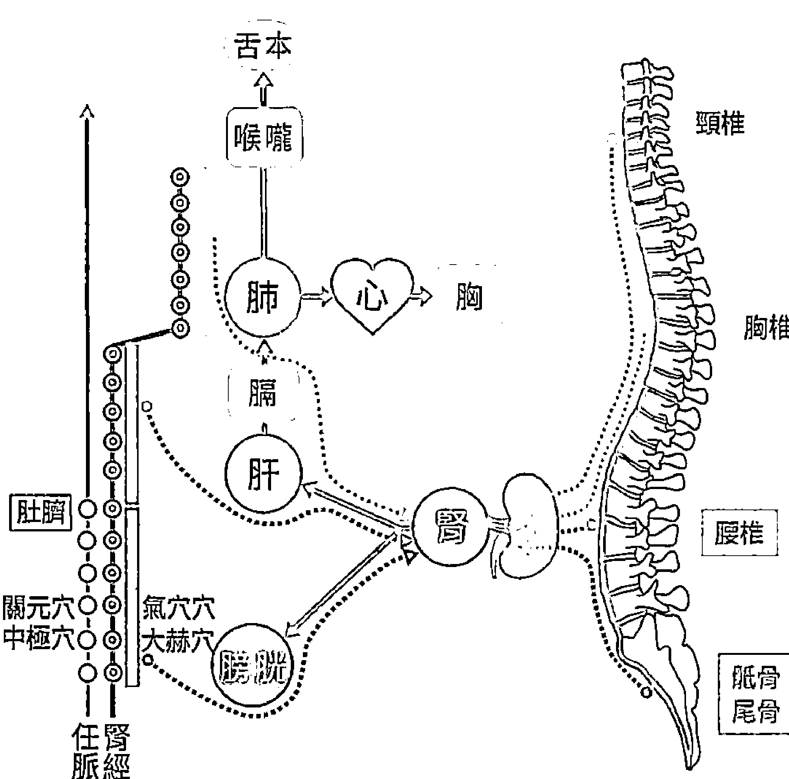

腎經系統與脾經系統都分布於人體的前後側，兩經合作代表先天後天的密切合作，尤其在維持體腔內臟腑組織的功能和結構方面更為重要。這項關係在經筋系統尤為明顯。（參閱經筋篇）

## 中醫師不傳之秘：長腰美女症候群

「長腰美女症候群」是個人自創名詞，來自臨床上常見到身材修長的女性，身形較為扁身，最突顯的地方在於與身高不成比例的長腰。隨著治療經驗累積，發現這類身形的病友都有許多共同症狀，加上以年輕女性居多，因此稱為「長腰美女症候群」。

此後門診時只要遇到長腰美女，都能隨口念出一連串症狀，病人常聽得目瞪口呆，以為醫師會「算命」，其實不是，醫師是會「算病」，這就是江湖一點訣。

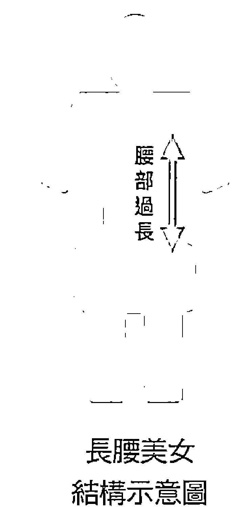

## 病因病機

本症候群病因病機脈絡非常清晰，還有明顯的先後關係：

-   首因一來自下焦：主要與二便及月經經血排出不利有關，
這些未能排出的代謝物長期囤積在下腹部，導致下腹骨盆沉重緊繃。此結構也會加重二便及經血排出異常，變成惡性循環。

-   繼因一連累上焦: 沉重的骨盆腔會牽引身體下墜，人體為了維持平衡，不自覺提高肩膀以對抗骨盆腔的沉墜，長期以來導致頸肩痠痛、胸悶等症狀。
-   結果一發在中焦: 下焦與上焦的上下拉扯，使得位於中間的腰腹肌肉被動拉長而出現異常的長腰現象。這個現象不僅造成腰部痠軟或疼痛，位於腰腹部的腸胃消化道會被迫拉長，導致腸胃功能變弱而出現腹脹、納差等症狀。

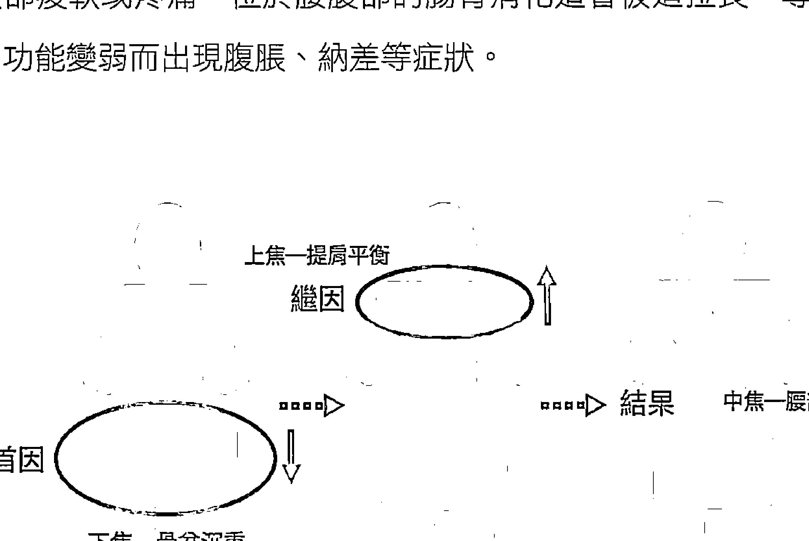

## 長腰美女病因病機順序示意圖

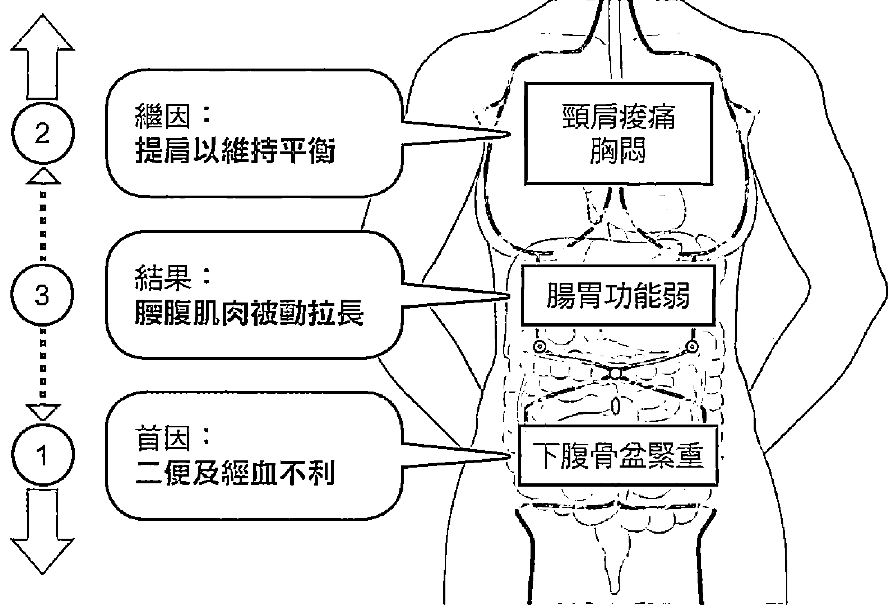

## 長腰美女病證示意圖

## 長腰美女檢查重點：反因果診察

由於本症候群有明顯的因果關係，檢查時也須循序，要點是反其道而行：

-   步驟 1. 檢查中焦：須確定出現異常長腰，以下的檢查步驟才有必要。
-   步驟 2. 檢查下焦：骨盆緊重加上二便、經血不利。
-   步驟 3. 檢查上焦：以肩膀代償性上提、緊繃做最終確認。

## 長腰美女治療重點：依因果而治

本症候群的因果關係幫了醫師大忙，因上述症狀以一般方式治療通常很難取效，若能依照病因，依序治療，便能快速見效，充分體現中醫「審因辨證論治」的原則。

-   1. 疏通下焦：通利二便及經血，先去除病因，鬆開下扯的力量。
-   2. 鬆解上焦：鬆緩肩膀結構，解開上拉的力量。
-   3. 提升中焦：待上焦與下焦結構回復正常後，再提升脾胃氣機，將被動拉長的腰腹部肌肉及消化道回歸原位。

再以臟腑經絡系統討論「長腰美女症候群」，主要與脾、腎兩個系統功能有關，也與前文所述脾經經筋簍子結構，協助腎經在腰背部和胸腹部循行穩定有關。長腰美女症候群可以說是脾、腎功能的照妖鏡。

一旦掌握其因果關係與病症邏輯之後，真的就像算命一樣馬上可以列舉一系列症狀。在此再提醒三件事：

-   1. 有時病人會否認某些症狀，千萬不要被迷惑了。依據「結構的必然性」原則，透過經絡系統連結人體的內外與四肢百骸，有此結構必然會出現相關的症狀。通常多問幾句或再仔細推敲檢查，就會出現該有的情況。
-   2. 本證常見於年輕女性，常和月經失調有關，通常只要還有月經者都有可能。男性較為少見，乃因骨盆較小，且無婦科問題，下焦阻滯較少，對於身體的拉扯力當然也較小。
-   3. 跟診醫師問說：是否有長腰阿姨？臨床少見，因為阿姨們大都變成水桶腰了。

## 中醫師不傳之秘：腎經軀幹穴位的意義

### 先天之本的特權

腎經有 27 穴，其中 17 穴分佈在胸腹部，佔了 60% 以上，這是很特別的現象。腎經在下肢部符合少陰經循行於陰面後線的規律，但「腰為腎之府」的腰背部卻沒有穴位；反而到了前側胸腹部，經脈循行於體腔內，穿梭在各個內臟之間，此區穴位配置在任脈與胃經之間，而且是所有經脈中最貼近中線者，完全跳開足少陰經規律，也算是先天之本的特權吧！

### 腎經穴位分佈的意涵

-   1. 背部交給膀胱經包覆：腎臟位於人體背部，幸運地背部已經有其忠心耿耿且實力強大的部屬膀胱經系統全然包覆，無須腎經費心。
-   2. 經穴分佈在任脈與胃經之間，與人體先天和後天的發展有關：
腎為先天之本，參與早期受精卵和胚胎發育過程。受精卵的卵裂過程是由 1 變為 2，再變為 4、8、16 等，這跟太極的概念「易有太極，是生兩儀，兩儀生四象，四象生八卦」很類似。

身為先天之本的腎臟，記錄了人體由單細胞開始分裂，最後成為多細胞生物的過程，可以想成這是一個由中間向兩側擴展的型態，腎臟將這些歷程呈現在腎經循行路徑上，腎經也因此會定位在人體中軸，而且還須涵蓋前後部位，這樣才能完全掌握。腎經連結任督二脈，腎主骨髓，在背部「貫脊」與督脈一起走在中軸。腎經在正面連結多臟腑，經穴分佈也緊緊靠近任脈與其並行，任脈屬於奇經八脈，若僅就十二經脈而論，腎經是走在最靠近中線者，這樣的循行也能與「貫脊」相呼應，成為貫穿前後的中軸路線。

腎經穴位與胃經並行也有深意。

脾、胃同為後天之本，胃為受盛之官，直接接收和消化食物，是營養製造鏈的第一道關卡，也是統管大小腸的老大。脾沒有直接接觸食物，主要是負責輸送營養。

經穴分佈的概念與演唱會或電影院場地區塊類似，工作越認真，功能越重要的臟腑，其經穴位就越靠近中線的 VIP 區。因此直接消化食物的胃經穴位就比脾經穴位靠近中間。雖然脾、胃兩經穴位排列有遠近之別，功能上仍為一體。腎經依著胃經排列，隱含著後天之本與先天之本互相依賴、互相成就之意。

大陸學者劉立公等人統計十二經及其腧穴歷代主治功效，手足陽經首要功效大都是疏理四肢，少部分則配合所屬的五臟功能。五臟經脈首要功效多與其主要功能有關，例如心經與心包經重在安神等，唯有腎經和膀胱經首重「健脾和胃」，腎經原穴太溪穴首要功效不是治療腎病，而是「健脾和胃」（註），奇怪吧！

這個現象顯示薑是老的辣，做為先天之本的腎，口袋很深，而且還協助後天之本，各位千萬不要誤以為低調含蓄的腎是要伸手跟脾胃要資源喔！腎臟藏有陰陽，尤其腎陽是人類生命重要的陽氣來源，五行關係中，火可以暖土，有火才能煮熟食物，腎陽的火力可以協助脾胃的土氣，提高食物消化和營養吸收能力。所以腎才是人體最有能耐的臟腑，為了人體的永續經營，無論在經絡循行或五行關係上，腎都竭盡全力幫助脾胃功能。

雖說如此，脾、胃也很照顧腎，這個關係可以從《金匱要略》治療身體沉重、腰部冷痛的「腎著湯」看出來，既然腰為腎之府，治腰痛卻不用腎經藥，反而用脾、胃經藥物。（參考經別篇）

先天之本與後天之本通力合作，維持身體各項機能的情況很多，例如《傷寒論》中的「四逆湯」及「真武湯」都是很好的例子。

> 註：古代文獻中腎經及其腧穴主治的統計報告，劉立公，顧傑，沈雪勇，Shanghai J A cu2mox, Jun 2004, Vol 23, No 6

另外，《卷三●脾經》介紹過「公孫穴美麗的錯誤」，《內經》認為衝脈並少陰之經，《難經》認為衝脈並足陽明之經，這讓八脈八法中，通衝脈的公孫穴有點為難，不知何去何從。但參考後世醫家記錄衝脈在腹部使用腎經穴位，可見前輩們依循《內經》的說法——衝脈並少陰之經。
在奇經八脈篇中提到，衝脈將腹部穴位傳承交棒給腎經，而不是衝脈借用腎經穴位。至於為何《內經》與《難經》說法不同，個人猜測身為十二經脈之海的衝脈，其脈型頗為寬廣，涵蓋到腎經與胃經之間的區域。從這個角度來說，《內經》與《難經》的說法都可接受。

### 3. 經穴平均分配，全面照顧人體上中下三焦：

腎經在身體正面串連多臟腑，是重要的維生機制，得以提供珍貴的腎精給各臟腑，協助其生長和功能運作。本區穴位分佈在下腹部六穴，腹部五穴，胸部六穴，可見腎是很公平的長輩，讓大家雨露均霑，共享資源。

-   下腹部：從任脈旁開 0.5 寸。肝、脾、腎三陰經都交會任脈的關元穴及中極穴，與泌尿生殖功能有關。顧名思義，關元穴是人體元陽之氣所關存的地方，此處俗稱「丹田」，古人認為可加強練氣來養生。這也提供腎經成為養生保健重要經絡的基礎。
-   腹部：從任脈旁開0.5寸。此處屬於肝膽脾胃的工作區，與後天精微物質吸收有關。古人說「經之所過，必治其病」，凡是經脈所過之處的疾病，都可以取該經脈治療，因此腎經才善於治療脾胃疾病。當然，天下沒有白吃的午餐，腎經如此照顧脾胃，脾胃也會報恩，提供精微物質給腎臟轉化成腎精來儲存。
-   胸部：此處經穴為了配合胸骨結構及胃經路線，從任脈旁開2寸。腎經此處的穴名與相對應的任脈穴名都是仙氣飄飄，譬如任脈有玉堂、紫宮、華蓋、璇璣等，腎經有神封、靈墟、神藏等，這樣的命名呈現了胸部為心肺之宮城，心為君王，主管神志，肺為華蓋，此區就是至高無上的心靈殿堂，點出心肺兩臟的崇高地位與重要性，平時細心呵護，必要時也能安定神志。腎經通過此處，當然也有很好的安神效果，能有效改善病候「心如懸若餓狀，氣不足則善恐，心惕惕如人將捕之」的恐慌感。

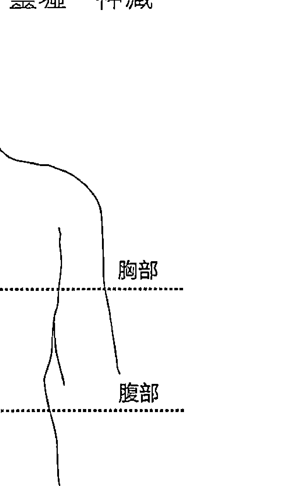

## 腎經在三焦的穴位分佈圖

## 腎足少陰之脈——病候

| 腎經經脈病候《內經》原文 | 說明 |
|--------------------------|------|
| 是動則病： | 本經經脈異常就會出現： |
| 飢不欲食，面如漆柴 | 飢餓但不想進食，面色暗黑如漆，形瘦如柴 |
| 欬唾則有血，喝喝而喘，坐而欲起 | 咳嗽痰唾則帶血，喝喝氣急而喘，剛坐下就想站起來會比較舒服 |
| 目晄晄如無所見 | 兩目視物茫茫然，模糊不清 |
| 心如懸若飢狀，氣不足則善恐，心惕惕如人將捕之 | 心宛如懸空，兼有著飢餓感般的不安，腎氣虛者很容易驚恐，心臟怦怦然跳動，好像有人要來捉捕自己一樣 |
| 是為骨厥 | 腎主骨，因此還會出現骨部氣血阻滯，循環不良的厥冷、麻木、痠痛等症狀 |
| 主腎所生病者： | 主治腎臟功能異常所發生的疾病： |
| 口熱，舌乾，咽腫，上氣，嗌乾及痛 | 口有熱感，舌頭乾燥，咽部腫，氣上逆，喉嚨乾且痛 |
| 煩心，心痛，黃疸，腸澼 | 心煩，心痛，黃疸，大便異常兼有膿血 |
| 脊股內後廉痛，痿、厥，嗜卧，足下熱而痛 | 脊柱及大腿內側後緣疼痛，下肢痿弱無力厥冷，喜歡躺卧，腳心發熱而痛 |

表格說明：
白色區塊代表「是動病」，淺紫色區塊代表「所生病」。

腎為先天之本，與許多臟腑有同源關係，這些都反映在病候之中，加上「久病及腎」的特殊性，因此在本經病候中「是動則病」和「主腎所生病」大致符合經脈循行所過的部位，但兩者的病情則有輕重之別。

下頁圖將循行與病候結合，「是動病」病候較嚴重為深綠色，「所生病」病候較輕為淺綠色，較易看出兩者之間的關聯與差異。

## 腎經經脈循行與病候對照圖

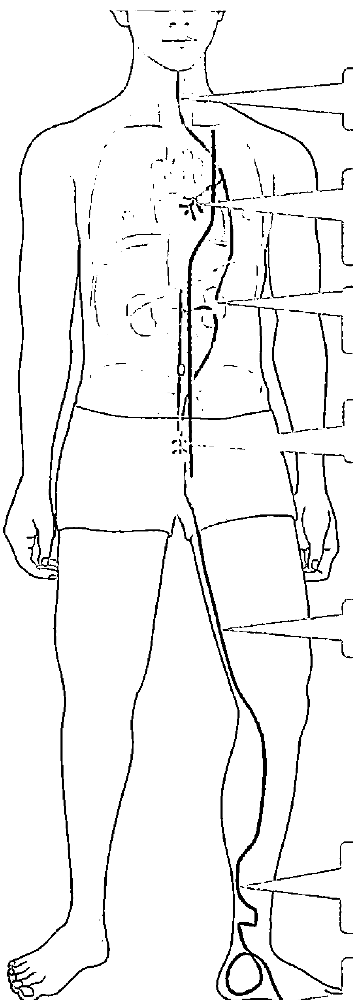

6.入肺中，循喉嚨，挾舌本

口熱，舌乾，咽腫，嗌乾及痛

7.其支者，從肺出，絡心，注胸中

欲唾則有血，喝喝而喘，坐而欲起

上氣

心如懸若飢狀，氣不足則善恐，心惕惕如人將捕之

煩心，心痛

5.其直者，從腎上貫肝、膈

飢不欲食，面如漆柴

黃疸，腸澼

目䀮䀮如無所見

4.貫脊，屬腎，絡膀胱

是為骨厥

3.出膕內廉，上股內後廉

脊骨內後廉痛，痿、厥，嗜卧

2.循內踝之後，別入跟中，以上腨內

1.起於小指下，邪走足心，出於然谷之下

足下熱而痛

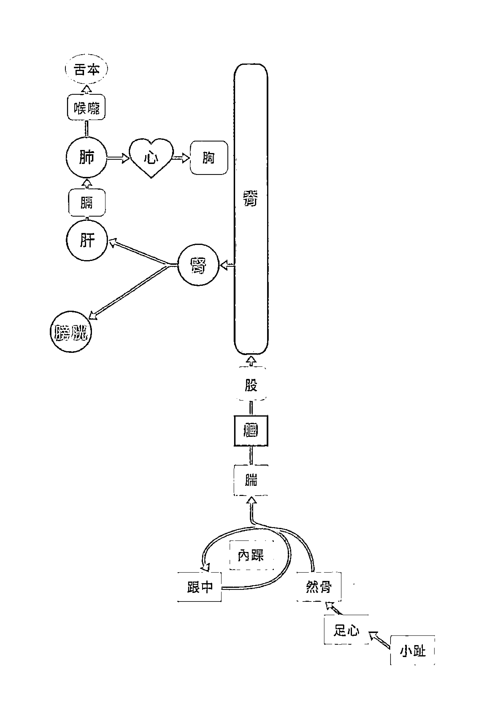

## 腎經經脈捷運圖

參酌前圖可以看出腎經病候大致與循行相符，是動病與所生病彼此也有分工與互補。

深綠色「是動病」，集中在臟腑區域，病情較為嚴重，主要是臟腑疾病，包括腎臟與腎經所連結的肝、肺、心等四臟功能明顯失調有關，偏於重症病人。

淺綠色「所生病」，沿著腎經循行分佈，有三個特色：1. 有內在臟腑病候但病情較輕。2. 補充了舌咽部病候。3. 下肢病候可視為是動病「骨厥」的詳細說明版。

整體而言，腎經病候有兩大類：一類為腎臟及腎經循行所過病候，此為所有經脈病候的共同情況。二為其他臟腑病候，其中「所生病」病候較輕，屬於腎與該臟腑交互作用的結果，「是動病」病候較嚴重，是為久病及腎的現象。以下分三個部位各別說明：

## 一、下肢腰背部

-   1. 骨厥

腎主骨髓，氣血阻滯就出現骨髓部位循環不良的寒冷、痠痛、麻木等症狀，這種冷痛麻木感部位通常較深，即使穿了厚重衣物也難以明顯改善。

在十二條經脈病候中，肺經與心經出現「臂厥」手臂氣血阻滯而有冰冷、麻木及疼痛等不適；胃經出現「鼾厥」小腿部位氣血阻滯，循環不良而出現寒冷、痠痛、麻木的症狀；膀胱經有踝厥、膽經有陽厥等，可見厥症通常出現在經脈所過部位。

腎主骨，《內經》有「骨痹」之證：「風寒濕三氣雜至，合而為痹也。……以冬遇此者為骨痹。」外在的風寒濕邪氣入侵身體，尤其關節部位，導致氣血痹阻疼痛。腎在四季歸屬冬季，所以冬天遇到這種情況就稱為骨痹。如果「骨痹不已，復感於邪，內舍於腎」，即骨痹久病未癒，再被邪氣侵襲，風寒濕邪氣就會循著經絡深入而留駐在腎臟，稱為「腎痹」，「腎痹者，善脹，尻以代踵，脊以代頭」就是骨關節嚴重變形出現佝僂駝背現象。

骨厥為氣血阻滯而出現冷痛麻木感的疾病，骨痹是風寒濕邪氣痹阻於骨關節處，病情較為嚴重，當發展到腎痹出現骨關節嚴重變形，則類似現代的類風濕性關節炎。

### 2. 脊股內後廉痛、痿、厥，足下熱而痛

脊椎、大腿骨後側和足心都是腎經循行經過的部位，出現疼痛、痿弱無力，還有溫度感覺異常，如脊股內部冷感，足下熱感等。由於腎藏陰陽水火的特質，所以病情常兼有寒熱現象。

### 【痿證：下肢無力】

> 《內經》有關「骨痿」的論述：「腎主身之骨髓……腎氣熱，則腰脊不舉，骨枯而髓減，發為骨痿。」

> 「有所遠行勞倦，逢大熱而渴，渴則陽氣內伐，內伐則熱舍於腎，腎者，水藏也，今水不勝火，則骨枯而髓虛，故足不任身，發為骨痿。」

指出腎臟有熱會煎灼骨髓，一旦骨髓枯虛會導致下肢痿弱無力，難以支撐。骨痿證類似現代嚴重的骨質疏鬆症。

### 【厥證：足下熱而痛】

厥證有兩種，一種以氣機逆亂，升降失調，氣血陰陽不相順接為主要病機，出現突然昏倒，不醒人事的「昏厥」現象；另一種為陰陽氣衰所致的肢體與手足溫度異常，如《內經》說：「陽氣衰於下，則為寒厥；陰氣衰於下，則為熱厥。」

> 「熱厥之為熱也，必起於足下者」，人體下部陰氣衰的熱厥從腳下方開始熱起。本經的足下熱而痛之證類似熱厥。

> 「寒厥之為寒也，必從五指而上於膝者」，下部陽氣衰的寒厥從足趾向上冷到膝部。本經的一般厥證類似寒厥。

### 3. 嗜臥

「嗜臥」通常有兩種情況：一種來自腎主管部位功能的異常，如前述之骨厥，脊股及足下寒熱等，全身骨頭痿弱無力，只好長期躺臥休息。

另一種來自腎陽不足，如《傷寒論》少陰病提綱證：「少陰之為病，脈微細，但欲寐也。」陽氣喜動，陰氣喜靜，脈微細表示陽虛陰盛，陽氣不足就懶得活動，陰氣偏盛就常常想睡覺。

## 二、臟腑

腎經連結腎、肝、肺、心四臟及膀胱腑，平日共享資源，如果其他臟腑久病，就會累及於腎，所以相關臟腑的一般性疾病、嚴重病變，以及多臟腑同病的情況，都會出現在本經病候中。

前文提過，腎經經脈原文只敘述體腔內的循行路線，其實腎經經穴在人體胸腹部的分佈都在最接近中線的位置。除了與其他臟腑連結關係之外，依據中醫「經之所過，必治其病」理論，腎經本身在體表所經過的位置可以「就近」治療胸部及腹部的疾病。

### 1. 與腎有關的症狀

-   「氣不足則善恐，心惕惕如人將捕之」：腎主恐，心主神，當心腎之氣不足之時，容易產生莫名驚恐，心悸而慌亂失神。
-   「骨厥」：如前述，腎主骨，腎病則骨髓亦病。
-   「飢不欲食，面如漆柴」：腎陽可以暖土，幫助脾胃功能。當出現腎病，腎陽無法助土，脾胃功能也跟著失常，胃無法受納，脾無法運化，雖然有飢餓感卻吃不下，長期缺乏營養，時間久了，後天之本的脾胃也跟著生病，不僅自身難保，還無法回饋腎臟，甚者加重腎病，先後天同病，出現面形枯瘦、面色黯黑等。

黑色是腎的顏色，面部出現本色，算是腎病危重症狀之一，因此洗腎病人常出現面色黯沉、皮膚乾燥、營養不良的倦怠狀況，即與此有關。

-   「黃疸」：古代所述黃疸症狀跟現代理解差不多，大都指目黃、皮膚黃、小便黃等。中醫認為「無濕不成疸」，必須有濕濁在體內停留的前提，再與邪熱或寒邪相併，才會出現黃疸之證，所以濕濁是黃疸病發生的必要條件。

十二條經脈病候中，只有脾經與腎經出現「黃疸」。五臟的五行對應中，脾土能制水，屬於剛性的直接治水法；腎水能主水，屬於軟性的引導治水法，兩臟通力合作就能清除體內濕濁。若脾病不能制水，腎病不能主水，兩臟同病就讓濕濁趁機停滯在體內而出現黃疸。脾胃皆屬土，《內經》指出腎主水功能失調，不僅影響脾而出現黃疸，也會影響胃而出現水腫：「腎者胃之關也，關門不利，故聚水而從其類也，上下溢於皮膚，故為胕腫，胕腫者，聚水而生病也。」這裡指出腎與胃有一個特別關係「腎為胃之關」，胃掌管大小腸，食物消化後的無用之物會從前陰與後陰這兩個門戶排出，由於腎掌管前後二陰，所以腎就成為胃能否將排出物順利排出的關口。如果腎臟功能失調連累至胃，導致二陰關門失常，水濕積聚，就會出現皮膚水腫的情況。

-   「腸澼」：也有兩種，一種為「痢疾」，由於體內濕熱毒邪積滯於腸內，自腸道瀉出垢膩黏滑液體，嚴重者會出現膿血。另有一種為「大便出血」。腸澼病名首見於《內經》，病因病機敘述為：「食飲不節，起居不時者，陰受之。……陰受之，則入五藏。……入五藏則膹滿閉塞，下為飧泄，久為腸澼。」可見本病與飲食起居失調有關。

《傷寒論·少陰篇》也有大便出血及大便膿血的條文：

> 少陰病八、九日，一身手足盡熱者，以熱在膀胱，必便血也。

> 少陰病，二、三日至四、五日，腹痛，小便不利，下利不止，便膿血者，桃花湯主之。

> 少陰病，下利便膿血者，桃花湯主之。

> 少陰病，下利便膿血，可刺。

膀胱與腎相表裡，膀胱經的經別入於肛門，邪熱在膀胱而出現便血。病情再深入，腎臟直接受邪導致後陰關門不固而便血，若是病情持久難癒就會出現膿血，此時可用桃花湯或針刺法治療。

脾經經脈有許多病候與本經類似，也有相對病候，參閱下表。

## 2. 與肝有關的症狀

- ○「目䀹䀹如無所見」：兩眼視物非常模糊，甚至幾乎失明。

肝開竅於目，肝腎同源，肝腎共病則無法提供肝血與腎精給眼睛。在胃經也討論過，眼睛需要水穀精微的滋養，長期「饑不欲食」，營養無援，視力當然越來越模糊。此病除了與肝有闘之外，還可能與膀胱經、心經有闘：

膀胱經：腎經經脈貫脊，經別：「別走太陽而合，上至腎，……復出於項，合於太陽。」腎經系統與太陽經相合而與目相關聯，膀胱經起於目內皆，入絡腦，腎藏精，精生髓，因此腦髓充盈也與視覺功能密切相關。

心經：腎經絡心，心主神志，與視覺的專注力有關。

## 3. 與肺有關的症狀

- ○「欬唾則有血，喝喝而喘，坐而欲起」：肺經病候本來就有「欬，上氣，喘喝，煩心，胸滿」肺為氣之主，腎為氣之根，肺腎共同完成呼吸任務。但若肺腎功能同時失常，腎不能為肺納氣，就會出現嚴重咳喘，持續氣逆，痰中帶血，煩躁無法安坐等，症狀比肺經病候嚴重許多。

## 4. 與心有關的症狀

- ○「煩心，心痛」很容易理解，但什麼是「心如懸若飢狀」？心怎麼懸呢？這個症狀我是從病人身上了解的。某次病人描述病況說「覺得心下空空的」，邊用疑惑的眼神看著我，因為難以敘述那種真實感受。我一聽馬上想起「心如懸若飢狀」這六個字，問他：「是不是覺得心好像被吊起來，胃空空的，有點餓又不是真餓了？」病人遇到知音，張大了眼睛，點頭如搗蒜，覺得醫生很厲害，殊不知真正的高手是《黃帝內經》。這是心臟氣血虛弱且累及腎臟的結果。

## 三、頭面部

- ○「口熱，舌乾，咽腫，嗌乾及痛」是腎經「循喉嚨，挾舌本」路線上出現熱性病證。無論心火、肺熱、肝火或腎虛火，都會出現這些症狀，因此也可視為四臟有熱時的外顯症狀。

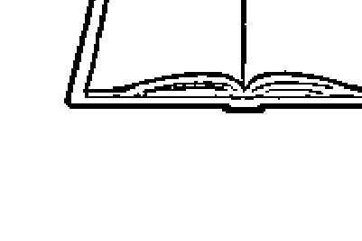

## 中醫師不傳之秘：
木防己湯證與腎經病候相對應

> 在《金匱要略。痰飲咳嗽病脈證並治》中，木防己湯主治「膈間支飲，其人喘滿，心下痞堅，面色黧黑，其脈沉緊，得之數十日，醫吐下之不癒」。木防己湯的證候與本經病候有許多類似之處，請參閱下圖。

| 腎經病候 | 喝喝而喘 上氣 | 飢不欲食 煩心心痛 | 面如漆柴 |
|---|---|---|---|
| 木防己湯證 | 喘滿 | 心下痞堅 | 面色黧黑 |

木防己湯治療膈間支飲，水結在胸肺，導致喘滿等症候，特別是「面色黧黑」，代表水邪深結之色，這與腎主水色黑概念一致。若以腎經經脈來看，本病就落在心肺這條循行路線上，所以其見證與腎經病候相似。

木防己湯是一個有趣的方子，只有四味藥：木防己、桂枝、人參和石膏，卻包含治療心臟疾病的所有思路。本證主要為水飲結於心下，木防己主要功用就在利水化飲，其餘三味藥性質虛實寒熱並用，涵括了心臟疾病的虛實寒熱證候，如桂枝溫陽補虛，人參益氣補虛，石膏清熱瀉實。臨床上只要見到面色黧黑的心臟病人運用此方治療，隨著水飲的化開，原本黧黑的面色也會逐漸「掉色」而慢慢轉紅。

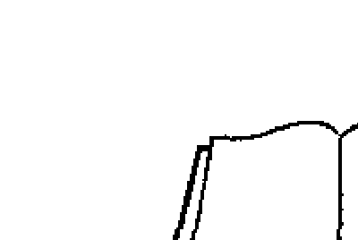

## 中醫師不傳之秘：腎經治療聲音沙啞之外，還能治療吞嚥困難

一位八十多歲的爺爺手術後吞嚥困難，連水也沒辦法喝，家屬非常焦急，趕緊向中醫求救。經過兩個多月的針灸治療，爺爺可以緩慢地喝水及進食流質食物。當時治療的主用經絡就是腎經。

腎經經脈「挾舌本」，腎經經別「繫舌本」，舌本是腎經系統唯一抵達面部的部位，可見腎經對它的重視程度。脾經經脈「連舌本，散舌下」與食物的攪拌和吞嚥有關，所以舌本不僅如前所述與發聲有關，也與吞嚥機能有關。本經病候「口熱，舌乾，咽腫，嗌乾及痛」，其實都會影響吞嚥功能。在奇經八脈系統裡，肺經的列缺穴及腎經的照海穴是治療胸膈與喉嚨疾病的最佳拍檔，我們常用來治發聲與吞嚥病症，效果不錯。
《傷寒論》在少陰病有一段內容專門討論「咽痛」。個人認為《醫宗金鑑》版本較能看出少陰咽痛的疾病動態變化及因應處方：由「甘草湯」到「桔梗湯」，接著治療咽中痛的「半夏散及湯」，然後是最嚴重的咽中痛生瘡，不能語言，聲不出者以「苦酒湯」治之，辨證施治由淺入深，這種排列組合對於初學者是一大便利，也是做為教科書重要考慮點。

## 中醫師不傳之秘：
腎經最擅長治療的病竟然不是腎病？

大家看到「飢不欲食」可能會覺得奇怪，五臟之中，腎經獨獨沒有連結脾臟，也沒經過胃，為什麼還會出現「飢不欲食」這種脾胃病呢？前文說過，根據大陸學者的統計報告，腎經穴的常用功效中頻率最高的是「健脾和胃」，學者的解釋是「腎經行經腹部，與前陰、胞宮、脾胃相關聯」。

除了腎經循行所過之外，還有一個與臟腑功能有關的因素。腎的五行雖然屬水，但腎是人的先天之本，人是陰陽的共同組合體，腎中就存有人體生長發育中非常重要的元陰和元陽，元陰又稱「腎陰」，屬水，元陽又稱「腎陽」，屬火，所以中醫稱腎為「水火之宅」。

火之臟」。
	脾、胃是人體內的廚房，負責烹飪食物。食物煮熟後比較能夠吸收，要煮熟食物當然非火不可，火從哪裡來？除了靠脾胃的陽氣之外，還須仰賴屬火的腎陽幫忙溫煦，使脾能健運，胃能腐熟水穀運化。脾胃為氣血生化之源，後天之本，腎所藏的精來源於脾胃持續運化的水穀精微。所以腎臟與脾胃分屬於人的先天之本與後天之本，二臟相互影響，互相為用。

如果腎陽不足，無法提供脾胃所需的火力，中醫稱為「脾腎陽虛」，脾胃功能失常就會出現「飢不欲食」，無法運化的情況。「脾腎陽虛」也會導致水濕運化代謝失常，濕邪停留體內時間久了，與其他邪氣結合，百病叢生，本經病候中「黃疸、腸澼」都是其中之一。臨床上還有一個與此相關的疾病稱為「五更瀉」或「黎明瀉」，通常是在五更時分，即天將亮時發作的急性腹痛，腹瀉之後，腹痛也就跟著緩解。四神丸是專治五更瀉的效方，運用補腎陽的補骨脂為主藥，可見腎陽對脾胃陽氣之影響力。

## 二、肾足少阴之正（经别）

本经别路线是经脉的快捷版，以腘窝为起点，主线直达肾脏，并以肾为中心，横向浅出体表连属带脉，纵向深入体腔直系舌本，显现「腘—肾腰—舌项」为肾经系统的重要部位。依据所经部位，这条路线可称为「腘肾带舌项线」。

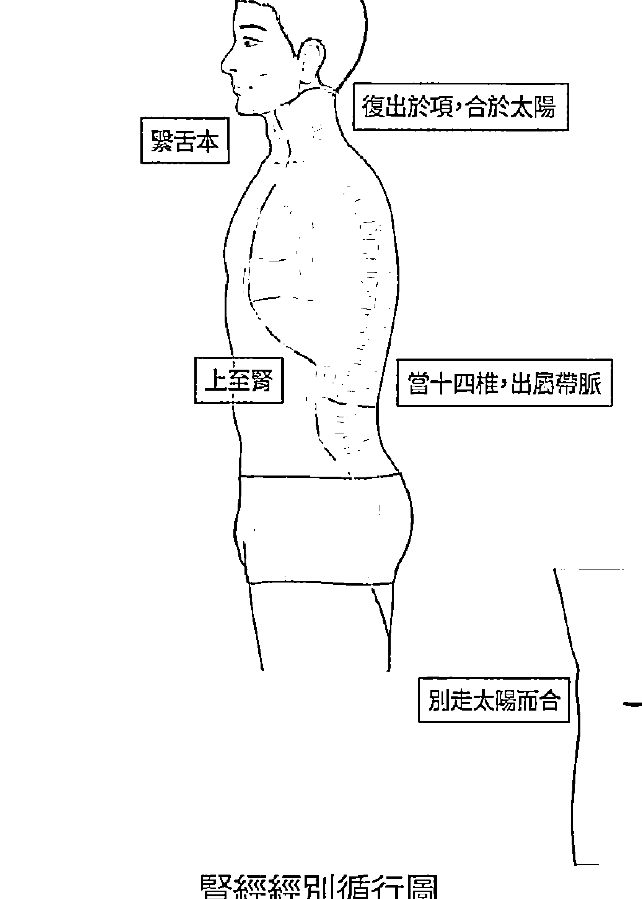

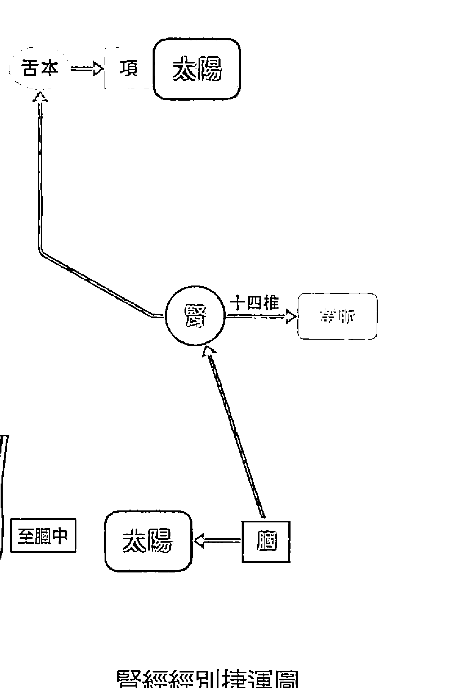

## 肾经经别——循行特色

| 肾经经别《内经》原文 | 说明 |
|---|---|
| 4. 复出于项，合于太阳 | 从舌根部向后到项部，再浅出合入足太阳经 |
| 3. 其直者，系舌本 | 其直行支脉继续上行，联繫舌根 |
| 2. 上至肾，当十四椎出属带脉 | 上至肾脏，在十四椎（第二腰椎下）浅出，归属于带脉 |
| 1. 至腘中，别走太阳而合 | 本经别在腘窝分出后，向外侧走与足太阳经相合 |

本经经别循行可分三部位：

- 下肢部：本经别从腘窝分出来，并与膀胱经相合。四总穴“腰背委中求”，最善于治疗腰背疾病的委中穴位于此处，可见本经别的重点在于腰背区域。
- 腰背部：本经别在十四椎浅出，归属于带脉，一方面局部保护肾脏，一方面向外增加横向连线，帮助肾经维持腰部的力量，且与少阳经建立特殊的连结关係。
- 舌项部：由于肾开窍于耳，本经别系舌本，之后沿着下颌骨下方，通过耳朵下方，最后到达项部，从此处浅出合入太阳经。

綜合來看，腎經經脈在人體後面循行貫脊，前面循行近中線，前後夾行於人體的中間部位，透過本經別出屬橫行的帶脈，不僅在十四椎處連結督脈，向前到腹部連結任脈，協助腎統籌人體陰陽的特殊能力，此外還增加與少陽經的關係，有助於腎開竅於耳功能的掌控。

本經的直行脈加上帶脈的橫行脈，縱橫交錯，以十字型的方式涵蓋，擴大本經系統分佈範圍，再加上於膕窩及舌本橫向連結太陽經，讓腎經系統得與陽氣充足的督脈和足太陽經建立更緊密的關聯，並透過在人體腰背部三大重要部位（膕、腰、項）的橫向聯繫，讓腎經系統更加穩固，更有效力。

## # 本經別有兩大特色

1. 未連結相表裡的膀胱腑

一般經別著重於加強相表裡臟腑的內在聯繫，但本經別並未連結膀胱腑，而是在下肢膕窩和頭項部「合太陽」。這種情況除了本經經別之外，還出現在其他經別，可參閱下表。

| 经别 | 联络脏腑 | 所合经脉 | 增加部位 |
| :--- | :--- | :--- | :--- |
| 脾经 | — | 合于阳明 | — |
| 心经 | 属于心 | — | 出于面，合目内眦 |
| 肾经 | 上至肾 | 合于太阳 | 当十四椎，出属带脉 |
| 肝经 | — | 合于少阳 | — |
| 三焦 | 下走三焦 | — | 别于巅 |

五脏的经别唯有肺经连结大肠，其余多数合于相表里经脉，唯独身为君主之官的心与先天之本的肾，这两条经别增加连结部位，如心经经别循行面部，成为「心之华在面」的结构基础。肾经则于后文介绍。

## 2、增加横向连结

本经别最特别的是增加多个横向连结，包括：在腘窝与头项合于太阳经，在腰部十四椎出属带脉。

### 合于太阳

肾经经别在腘窝以及项部合入膀胱经，这条路线让肾经得以精简快速地合入「背景雄厚」的膀胱经，享用膀胱经的丰沛资源。

横向路線有兩條：

第一條路線：从膝關節後側膕窩處横向合入膀胱經，這條路線會連結腎經合穴「陰谷穴」與膀胱經合穴「委中穴」，成為實力堅強的膕窩「合穴聯盟」。

腰為腎之府，腎經貫穿脊椎，膀胱經護衛脊椎旁的大片肌群，然而四總穴指出「腰背委中求」，善治腰背疾病的是膀胱經委中穴而不是腎經陰谷穴。探究其理，《內經》說「腎有邪，其氣留於兩膕」，膕窩與腎關係密切，這個合穴聯盟強化了委中穴治療腰背所有結構疾病的能力。

第二條路線：從舌根部向後到項部，再淺出合入足太陽經。

腎經經脈貫穿整個脊椎，最高處應會抵達第一頸椎。本經經別從舌本抵達後項，大致在第一頸椎旁邊。所以腎經經別從項部兩側補強腎經貫脊的路線，同時也再度加強舌本與脊椎的聯繫。若將兩側經別合併加上腎經，剛好環繞頸部一圈，由此顯示經別具有圓形環繞的特色。

參酌膀胱經經筋「上項，其支者，別入結於舌本」包覆項部與舌本，可視為對於腎經經別的保護。若問為何要特別保護這條經別？

試想腎經經脈後行路線「貫脊」，前行路線「挾舌本」，兩者藉由經別連成一體，並合入膀胱經，除了加強腎經對於舌咽的管理之外，還增加與膀胱經所過的頭面五官連結，另方面也搭其便車入於腦部，與大腦神經如舌咽神經等建立連結。

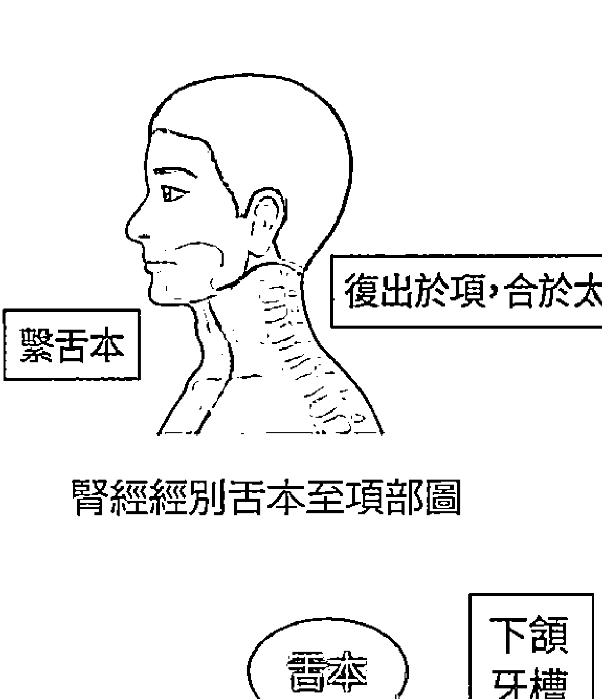

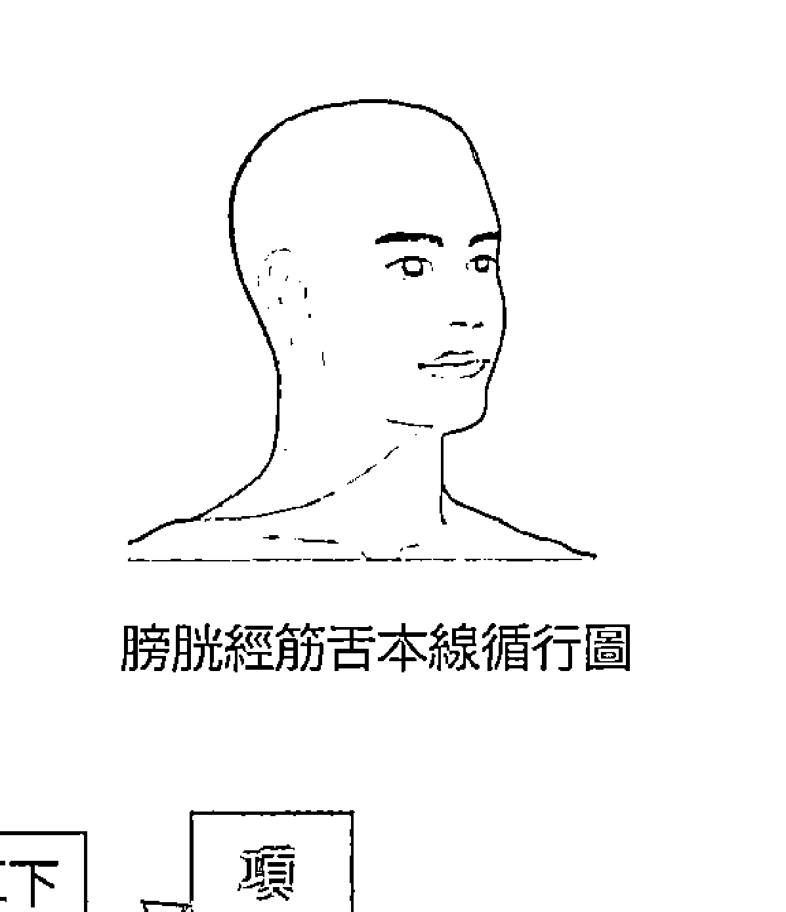

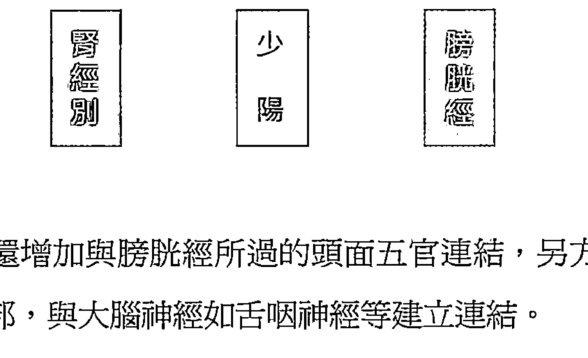

腎臟本身主骨主髓，腦又為髓海，理論上腎經應該與腦相連才能管理腦髓。但是身為先天之本的腎臟要管理的事情實在太多了，不可能事事躬親，所以具有高 IQ 的腎臟，再面對是要「連接腦部」或是「連接肝肺心」的難題時，做了非常睿智的選擇：「連接肝肺心」的工作無人可以取代，得親自出馬，而連接腦部的工作可以交給相表裡且忠心耿耿的膀胱經。聰明的腎臟總會為我們做出最佳安排。

若將兩側從舌本沿著下頷骨和耳下的經別路線合併來看，類似一個圓弧形，這又呈現出腎的環繞特質。

### 出屬帶脈

本經別到腎，再從十四椎處也就是第二及第三腰椎中間走出來連屬帶脈。

為什麼稱為「帶脈」？奇經八脈篇介紹過，人體多數的經脈都是上下縱向而行，帶脈是唯一橫向運行的經脈。它位於腰腹之間，左右橫向環繞身體一圈，好像束帶將身體圈住，所以稱為「帶脈」，也是護衛腰膂部沒有骨骼支撐的部位。
《卷三。脾經》介紹過帶脈作用，如果將縱行的經脈比喻成筷子，帶脈就是把這些筷子捆在一起的橡皮筋，所以帶脈有統束全身直行經脈的作用。要達成這項任務，就不會是單獨一條經脈，而是分化出許多支脈，分佈人體諸多部位，一起約束諸脈。

腰為腎之府，腎經在腰背部並無自己的穴位，但是位於十四椎督脈的命門穴和十四椎旁膀胱經的腎俞穴都是腎臟功能的代表穴位。本經別就從十四椎命門穴處淺出，歸屬於帶脈。十四椎也是帶脈的始點，由此向兩側身體環繞一圈。

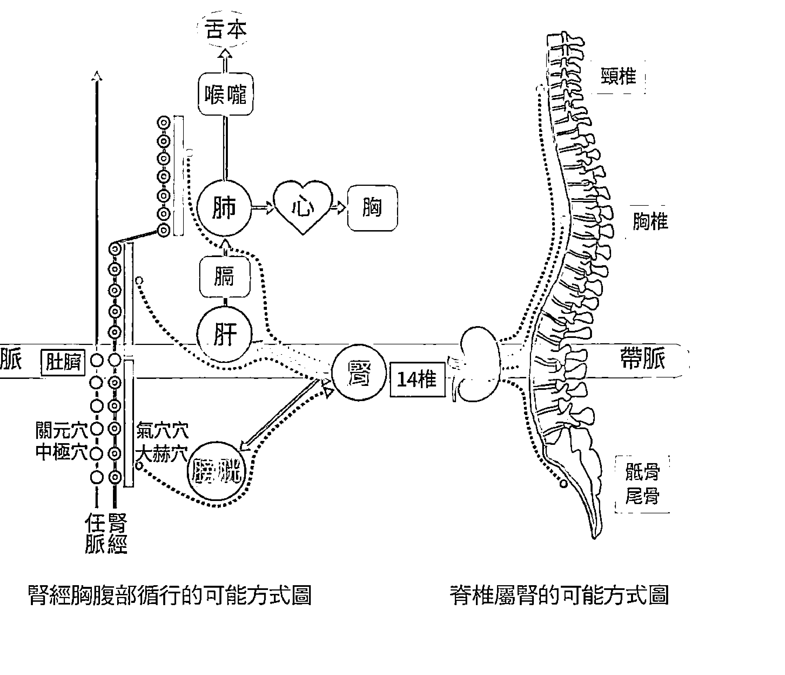

带脉是厉害的经脉，高 IQ 的肾经经别「出属带脉」当然有不少利益。归纳为以下四项：

- 第一、主要任务就是保护肾脏，以及肾经与脊椎和胸腹经穴的连结线。
经脉篇介绍过，肾经腰背部的外行路线与体内的内行路线都在十四椎的高度连结到肾脏，因此带脉特别保护十四椎这一圈。
虽然膀胱经系统已经提供腰背部坚强的保护，但是对于人体重要部位的照护永远不嫌多，纵行的膀胱经加上横向的带脉，提供滴水不漏的防護。加上腰為腎之府，憑藉帶脈環繞身體一周的力量，還能幫忙固攝腰脊部的結構，加強支撐力。

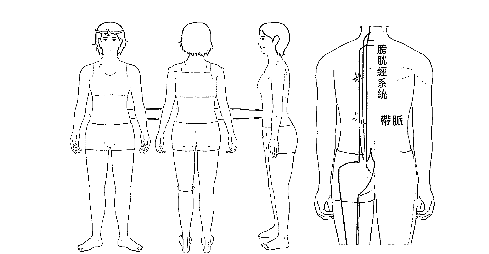

帶脈（紫色圓圈）分化出許多支脈

膀胱經系統與帶脈加強防護腰部

- 第二、由于带脉是唯一横向环绕的经脉，责任重大，个人推测，带脉也有类似经脉与经筋的结构并行。如《卷三》介绍带脉在腰部为圆弧形路线，腹部则沿着盆腔结构呈现 W 型，并于肚脐处交会任脉（后文会详述）。W 型路线是为了配合相交会的脾脏募穴章门穴和胆经五枢穴、维道穴等，属于经脉路线。带脉的经筋路线以宽版的大圆形结构环绕身体一周，其中当然包含 W 型路线。整体而言，本经别透过带脉连结肾脏与任督二脉，为肾脏与奇经八脉系统建立重要的结构基础。督脉为阳脉之海，任脉为阴脉之海，肾藏阴阳，带脉也为肾连结所有阳经与阴经，交通阴阳。

- 第三、透过环绕一圈的带脉，让原本只分布在人体前后纵行的肾经延展出一条横向的圆形路线，并顺道交会分布在人体侧面的足少阳胆经，如此一来就能全面包覆人体，功能如虎添翼，让肾经除了能治疗人体前面、后面疾病之外，还具治疗侧面疾病的能力，此项特质也提供脏腑通治通经法「少阴少阳为枢」的经络基础。
中医传统治疗则有「前病后治」、「上病下治」等，有了「少阴少阳为枢」的通经关系，我们在临床治疗时增加了中间有病治旁边、旁边有病治中间的「中病治边」治则，成效不错。

- 第四、横向的带脉不仅帮助脾经向上提升的力量，也加强保护肾脏与肾经，透过带脉将脾、肾两个系统连成一体。另外，脾经经筋的篓子「内著于脊」，肾经经脉「贯脊」，重点都在脊椎处，带脉也就成为保护此区的特殊经脉。带脉与脾经篓子功能相辅相成，肾经在胸腹部连结多个脏腑，透过带脉加强与脾经的关系，全权委由脾经系统代为保护缓冲及固定位置。

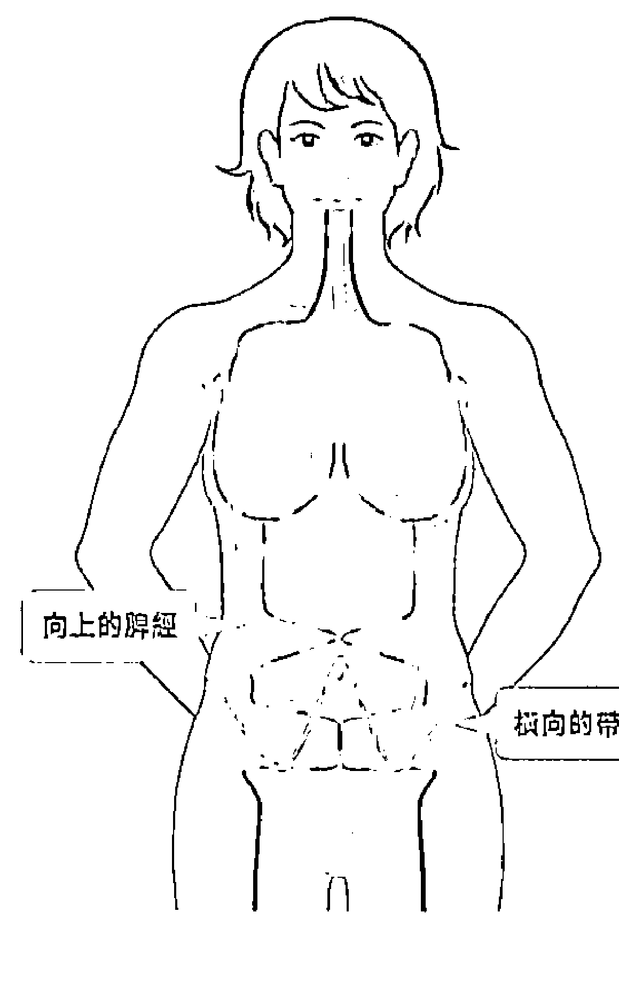

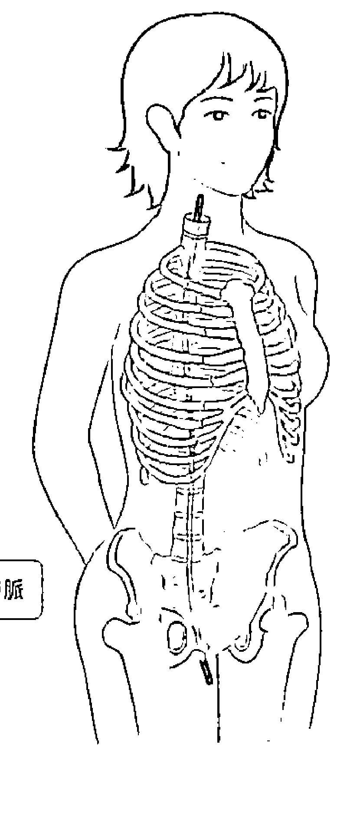

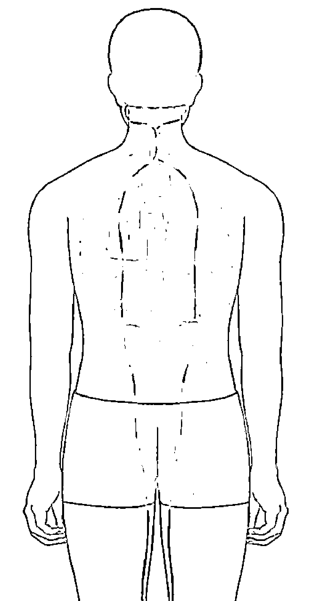

帶脈與脾經的關係

脾經經筋（藍色）與腎經（黑色）關係圖

腎經經別所形成的三個圓圈結構

本经别三个横向连结，若将双侧合并来看都是圆形路线。透过肾经经别，将肾经经脉上三个重要部位：腘窝、腰部十四椎和舌本头项，形成三个圆圈以加强联系与固摄防护。

## # 小結

整體來看，腎經經別協助經脈加強人體前後的連結關係：

1.  透過顱窩與頂部循行：重點連結腰部脊椎和腦部，可視為腎經經脈外行路線的濃縮版，鎮守軀體上下的門戶。
2.  透過出屬帶脈：重點聯繫前後部位，可視為腎經經脈內行路線呈現於體表的外現版，保護位在體內的五臟六腑。

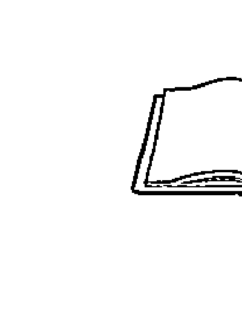

## ## 中醫師不傳之秘：帶脈與腎經的關係

有關帶脈循行，雖然在奇經八脈已討論，但因其與腎經經別關係密切，故在此篇章加以詳述。帶脈首見於《內經》：「足少陰之正，至膕中，別走太陽而合，上至腎，當十四椎，出屬帶脈。」之後《難經》說：「帶脈者，起於季脅，回身一周。」明代李時珍在《奇經八脈考》註明交會的穴位：「帶脈者，起於季脅足厥陰之章門穴，同足少陽循帶脈穴，圍身一周，如束帶然，又與足少陽會於五樞、維道，凡八穴。」

依據典籍敘述，帶脈循行有兩種說法：一是當十四椎而出，另一起於季脅。依據前文，帶脈屬於早期經脈系統，十四椎位於人體中線，因此應該從十四椎而出。季脅應是後來經脈穴位發展完備之後才與章門穴相交會。將這兩種說法併用，帶脈循行會更完整。以下將帶脈分為背線和前線，請參閱下圖。

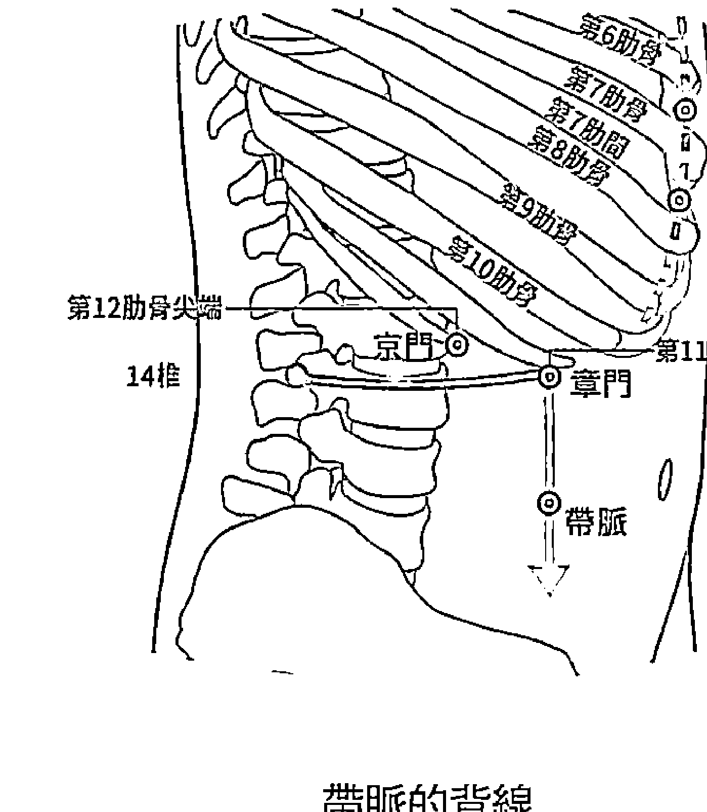

### 帶脈的背線

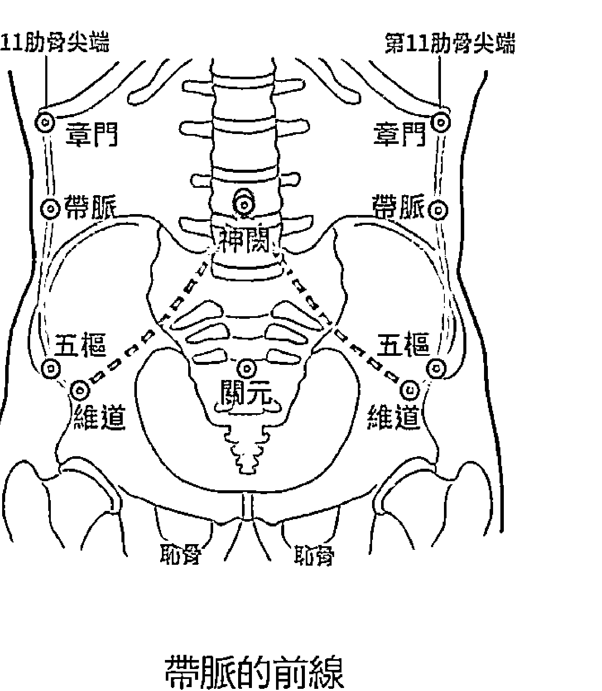

### 帶脈的前線

o 背線（藍線）：從十四椎到季脅的路線。

個人推論，依據前述奇經八脈理論，帶脈比腎經早出現，早期的帶脈從督脈出發，向兩側腰腹部環繞一周。等到腎經出現後，十四椎是帶脈後期的起始點，腎臟也位於十四椎附近，腎經經別為了與帶脈合作以加強保護腎臟，特別在十四椎淺出連接帶脈。

○ 前線（紫線）：銜接兩側季脅的路線。分成有文字敘述的「顯性路線」與無文字敘述的「隱性路線」。

顯性路線：起於季脅處屬於肝經也是脾臟募穴的章門穴，直下交會與肚臍等高處的帶脈穴，再循著膽經走向前下方進入骨盆，交會髂前上棘（ASIS）內側的五樞穴和維道穴。

隱性路線：依據帶脈「圍身一周，如束帶然」任務，前述顯性路線止於維道穴是無法環身一周的，唯有從維道穴連到人體中線，兩側帶脈合併時才能圍成一圈。人體中線最佳部位應是肚臍的神闕穴，由於此穴與帶脈穴等高，雙側連結剛好通過髂嵴處，宛如腰帶般的約束人體。帶脈與其他經脈的型態也如地球的經緯度，這可算是天人相應的一種呈現吧。

前線的顯性和隱性路線共同形成 W 型路線，就是前述帶脈的經脈路線。

### 大帶脈概念 1：主線從 T12 到 L4 代替肋骨固定腰部

帶脈後線與前線可連結成一條「大皮帶」：皮帶上緣從十四椎向前銜接雙側章門穴，下緣連接雙側維道穴，皮帶釦環就在任脈上，如此即完成名副其實的「帶脈」。

仔細看這條大皮帶（帶脈）上半部，主要部位正好位於肋骨下緣及髂骨上緣之間，即沒有骨骼的腰部，可見帶脈除了保護腎臟之外，就是填補沒有肋骨保護的腰部空缺，成為護腰。帶脈上緣連接到章門穴，章門穴是「臟會」，也就是所有內臟精氣匯聚之處，可見這條大皮帶的上緣緊貼著所有內臟，提供重要的保護。

臟，附著在肋骨與髂骨邊緣，也為保護及撐住這段沒有骨頭保護、較為軟弱的腰脅部。

## 大帶脈概念2：延伸區——保護臍下「關元命門區」

總論介紹過，腎元藏有人體發展的藍圖，腎間動氣是實現藍圖的急先鋒，等到臟腑經絡發展成熟時，就將任務交棒給腎臟，奇經八脈一員的帶脈也是因應腎為先天之本，腎經分佈人體前後特質而預先準備的。

腎經經脈「貫脊，屬腎」所有脊椎都與腎臟連結，此連結線總和就在十四椎附近。腎經經別從腎臟淺出到十四椎，極有可能沿著脊椎與腎臟的經脈連結線。十四椎為督脈的命門穴，此穴顧名思義為「生命之門」，兩旁為腎俞穴，符合腎主先天的特質，是為腎臟與腎經系統的重要門戶，透過此脈建立腎經與督脈的關聯，因此《內經》才指出陽明與衝脈皆屬於帶脈，而絡於督脈。

總論篇討論「命門」的位置，參考本經別在十四椎出屬帶脈的路線來看，從命門穴旁開到兩側腎俞穴之間的位置是為「命門區」，腹部相對應位置約從肚臍神闕穴到關元穴，這兩個區域正是先天之精與後天之精互相補充的部位，兩者相合也是腎間動氣所在的「關元命門區」，可見大帶脈關鍵的任務是要保護這個重要區域。

帶脈從督脈而出，延伸到季脅章門穴，再度加強脾腎兩經的關係。從章門穴下行交會於膽經的帶脈穴、五樞穴和維道穴。有關帶脈交會穴主要是膽經三穴（簡單口訣：帶五維），對於章門穴則有不同說法，個人認為應該納入章門穴。本段循行一方面建立脾經與膽經的連線，另一方面也將腎經、督脈、脾經與膽經都帶入骨盆，最後還讓督脈與任脈這對牛郎織女在神闕穴相會。

曾有跟診醫師詢問，帶脈與膽經都能讓身體轉動，異同為何？真是個好問題！

帶脈本身具有環狀約束的力量，不僅保護沒有骨骼的腰脅部位，也分化出諸多分支來保護穩住人體所有部位。帶脈是早期的結構，未與內臟連結，因此位於體表，環繞身體一圈。這個看似呼拉圈的型態，重點不僅在轉動，更是協助腎經連結人體的陰陽，協助脾經的升清功能和固定臟器。因此帶脈與脾腎經合作目的在於維持常態性的連結與固攝能力。

至於膽經循行於人體脅肋部位，類似人體的拉鍊，連結正面的陽明經及背面的太陽經，共同形成人體的防護與運動系統。膽經連結膽腑，分佈在人體側面，膽經屬於少陽經，「少陽為樞」具有樞轉特質，平時維持膽腑功能，當身體活動需要維持順暢轉動時，膽經就會與環繞身體一圈的帶脈合作，因此帶脈的三個交會穴「帶五維」都位於膽經。

## 中醫師不傳之秘：帶脈失常與腎經的關係

有關帶脈病候的經典論述有二：

一、《素問・痿論》：
帝曰：如夫子言可矣，論言治痿者，獨取陽明何也？
岐伯曰：陽明者，五藏六府之海，主潤宗筋，宗筋主束骨而利機關也。
衡脈者，經脈之海也，主滲灌谿谷，與陽明合於宗筋。陰陽總宗筋之會，會於氣街，而陽明為之長，皆屬於帶脈而絡於督脈。故陽明虛則宗筋縱，帶脈不引，故足痿不用也。

黃帝詢問治痿獨取陽明之理。岐伯先說明與宗筋有關的經脈系統，包括陽明主潤宗筋，衡脈主滲灌谿谷，與陽明會於宗筋。依據《內經》說法，衡脈在胸腹部併入腎經，所以陽明及衡脈這兩條縱行經脈，還應包括腎經，三脈都由橫向的帶脈約束，而總絡於督脈。

宗筋功能主要是束骨而利機關，一旦陽明虛則導致宗筋縱弛，也會連累帶脈不引。《卷三》介紹過，如果把W型態的帶脈放到脾經的簍子結構上，會發現帶脈位在脾經簍子結構中，宛如脾經簍子的另一條縫合線，協助脾經向上升提的力量。「引」字在《說解字》指「開弓」，含有撐開之意。帶脈宛如脾經簍子另條縫合線，此線當然需要撐開才有升提力。帶脈不引不僅無力約束陽明及衝脈，還會影響脾經和督脈功能，出現下肢痿弱情況。

## 二、《難經·二十九難》：

「帶之為病，腹滿，腰溶溶若坐水中。」參考《金匱要略》腎著湯證「腎著之病，其人身體重，腰中冷，如坐水中，形如水狀，反不渴，小便自利，飲食如故，病屬下焦，身勞汗出，衣裏冷濕，久久得之。腰以下冷痛，腹重如帶五千錢，甘薑苓朮湯主之。」與《難經》所述類似，可見本證主要為腹滿，腹重如帶五千錢，腰以下冷痛，如坐水中，形如水狀。腹部與腰部都屬於帶脈所經部位，符合「經之所過，必致其病」。詳文以下探討。

從《內經》與《難經》，甚至《金匱要略》都可見到帶脈失常與腎經的密切關係，這也印證腎經經別「上至腎，當十四椎，出屬帶脈」循行路線。

## 中醫師不傳之秘：帶脈失約的證治思考

帶脈失去約束力，除了出現前述病證之外，還有婦科疾病。古稱「帶下醫」代表婦科醫師，「帶下病」廣義指帶脈以下的婦科疾病，狹義指陰道分泌物異常疾病，如白帶等。

奇經八脈中的督脈、任脈與衝脈都起於胞中，同出會陰，稱為「一源三岐」，通過骨盆腔的帶脈將之約束在一起，這也讓帶脈得以治療婦科帶下疾病。

對於女性來說，帶脈無力與經帶胎產異常有關，例如生理期血難出，停滯於胞宮，或是懷孕胎兒過大、生產過程時間過長等，都會拖累帶脈，同時也會影響脾主升提功能。

狹義的帶下病，古云「無濕不成帶」，五臟功能中，脾屬土主袪濕，腎屬水主管水，因此本病除了帶脈失約之外，主要還是來自於脾腎主水濕功能異常。

1.  腰溶溶若坐水中的腎著湯證

為了方便比對，將《難經·二十九難》與《金匱要略·五臟風寒積聚病脈證並治》內容分列如表：

| | | 《难经》带之为病 | 《金匮要略》肾著汤证 |
| :--- | :--- | :--- | :--- |
| 证候 | 身体 | | 身体重 |
| | 腹部 | 腹满 | 腹重如带五千钱 |
| | 腰部 | 腰溶溶若坐水中 | 腰中冷，如坐水中，形如水状 腰以下冷痛 |
| 诊断 | 病因 | | 身劳汗出，衣裹冷湿，久久得之 |
| | 鉴别 | | 反不渴，小便自利，饮食如故，病属下焦 |
| 治疗 | 处方 | | 甘姜苓术汤（肾著汤） |

由此表看出《金匮》的肾著汤证是《难经》带脉病的延伸。

肾著汤证重点，在腹部为满、重，在腰部为湿、冷、痛。本病因身劳汗出，衣裹冷湿，寒湿由外而内，久留而得之，这种情况常出现在户外劳动者，例如农民及营建工人等。

本病来自于寒湿停滞，尚须鉴别所在病位：若口渴、小便不利、饮食难进，表示水湿停蓄在中焦，属于痰饮类疾病，可用苓桂术甘汤等方治疗；若反而不渴，小便自利，饮食如故，表示水湿停蓄在下焦，可用肾著汤治疗。

### 肾著汤方证特色

-   组方比例：甘草、白术：干姜、茯苓 = 2 : 4，可见寒湿为重点。
-   病因病機：中焦寒濕下著於下焦腎府，腰為腎之外府，病並未及腎臟。
-   治則特色：脾腎兩治，健脾除濕，溫腎散寒，以補土來制水。

從經絡臟腑關係來看，帶脈連結脾腎兩個系統，本證雖是腎著湯證，處方卻以脾經用藥為主，這是因為本證病本在脾臟，由於脾虛導致帶脈受累，因此從病因論治。

下圖比較治療下焦疾病的腎著湯與上中二焦的苓桂术甘湯病因病機，以及臨床取穴。乾薑與桂枝一進一出，改變了病位與病候，此乃經方奧妙之處。

## 2. 婦科帶下疾病

帶下本非疾病，女性陰道內本來就有少量透明無臭味的分泌物，以潤滑及保護陰道壁的黏膜，是正常生理現象，但若帶下的量、色、質、味異常，則為帶下病。帶下病的病理特色是「無濕不成帶」，病因病機主要因脾腎功能失常，加上小腸泌別清濁的功能失調，導致濕邪停滯，損傷衝任，帶脈失約而出現本病。歷代有許多治療帶下處方都可參考。

### 帶脈失約檢查重點

-   檢查部位：環繞腰腹部一圈的肌肉張力及肌膚溫度。
-   推動下腹部肌肉：有水氣的波動感，可區分虛證與實證：
    -   虛證：肌肉鬆軟無力、皮膚涼感；
    -   實證：肌肉微緊偏腫、皮膚熱感、恥骨偏腫及有熱感。

## 三、足少阴之别（絡脈）

### 肾经络脉——循行及病候

肾经络脉跟肾经经脉一样有内行路线及外行路线，也与肾经经别一样，有着路线简捷但功能强大且「短小精悍」的特质，所以本络脉和经别都可视为经脉的快车版。依据循行所过之部位，简称「大钟包腰脊线」。

| | 肾经络脉《内经》原文 | 说明 |
| :--- | :--- | :--- |
| 循行 | 2. 其别者，并经上走於心包下，外贯腰脊 | 有条支脉，与本经相并上行，走到心包下，外行路线则贯穿腰脊 |
| | 1. 名曰大钟，当踝，後绕跟，别走太阳 | 足少阴肾经别出的络脉，名叫大钟，在内踝处，向後绕过足跟，别走对侧的足太阳膀胱经脉 |
| 病候 | 1. 气逆则烦闷 | 气机逆乱上行，就会出现心胸烦闷 |
| | 2. 实则闭癃 | 实证，则出现小便排出困难，甚者点滴难出的病证 |
| | 3. 虚则腰痛 | 虚证，则出现腰痛 |

本经络穴是大钟穴，「钟」也有写「鍾」字，参考肾经经筋「邪走内踝之下，结於踵，与太阳之筋合」，踵是足跟之意，古文中踵与鍾字相通，宜用「大钟穴」。

本穴位於内踝後下方，跟骨上方，跟腱附著部内側前方凹陷處。跟骨與跟腱形成L型，大鐘穴正位於L型的凹陷處，因此稱「大鐘穴」呈現出所在位置的特性。

腎經絡脈從足跟上方的「大鐘穴」向後繞過足跟，別走膀胱經，加強腎與膀胱的表裡關係，完成絡脈的重要任務。

本絡脈另條支脈與經脈相併上行，到達軀幹部位分出兩條路線：一條是內行路線，直達心包；另一是外行路線，貫穿腰部和脊椎，再度呈現「腎主骨生髓」的特質。

腎經經脈最後已經注入胸中交棒給心包經，為什麼還要再次連結心包？首先，腎經經脈路線在人體前後彎曲行走，路線長且經過許多臟腑，宛如火車停靠站越多，越容易發生意外，導致誤點而銜接不利。腎經絡脈屬於高鐵的直達車，從腳跟直達心包，讓腎經系統備有一條簡捷快速的交棒之路。

其次，在心包經討論過，心包經跟肝經一樣，擁有很強的行氣活血能力，尤其善於治療胃心胸疾病。腎經經脈循行到肝、肺、心和胸中，加上肝經經脈夾胃，所以本區域可概括為「胃心胸部位」。腎經經脈病候有「飢不欲食」，「煩心、心痛」，也可視為廣義的胃心胸疾病。腎經系統透過本絡脈借用心包經行氣活血，加強治療胃心胸的能力。另外本絡脈「走於心包下，外貫腰脊」，直接連結心包與腰脊，使得大錘穴成為腎經系統中獨具行氣活血能力，且能同時治胸悶與腰脊痛的穴位。

### 本絡脈特色：行氣活血，通關過節

1.  走於心包下：氣逆則心胸煩悶。
2.  別走太陽經：實證則小便困難。這是腎經系統中唯一出現小便異常者。
3.  外貫腰脊：虛證則腰痛。

小便異常及腰痛都是腎經系統常出現的證候，也是最顯而易見的症狀。特別出現在絡脈病候中，讓具有行氣活血能力的大錘穴，經由絡脈這條簡捷路線，如虎添翼，提供最快速的醫療。平日可以按揉大鍾穴，為腎經行氣活血，通關過節，讓胸氣開闔，小便順暢，腰桿有力！

本條絡脈行經部位不多但卻很關鍵；病候不多，卻都對應到關鍵部位。請再多看一眼絡脈及病候圖，您發現了嗎？它其實是腎經經脈的濃縮版喔！簡而美！

## 中医师不传之秘：

### 肾经络脉教导我们诊治胸闷的秘诀

肾经经脉最后注入胸中交棒给心包经，所以心包经是肾经的下接经。也因为肾经流经心、肺两脏，最后注于胸中，让肾经成为临床上治疗心肺疾病及胸闷很重要的经络。

另外，肾经为人体中轴，肾经经穴在胸腹部也分布于最接近中线的位置，因此得以就近治疗胸闷之症。

再從絡脈的連結關係來看，它將心包與腰脊直接連在一起，病候有煩悶，提示診治胸悶的另一個切入點：後面的脊椎會影響前面的胸部，亦即異常結構也會造成胸悶，這在臨床上很常見。因為肋骨銜接胸椎和胸骨，透過這樣的連結，讓前胸與後背成為生命共同體。脊椎骨看似很強壯，卻也容易受傷害，例如外傷或姿勢不良導致脊椎擠壓、錯位等，都會牽動前胸，壓迫胸廓空間而出現胸悶呼吸不順的情形。臨床治療胸悶時，除了選用善於治療心胸胃疾病的心包經從身體前側開胸理氣之外，還可加上腎經從身體後側調節脊椎，前後同治，效果更好。

### 本絡脈前走心包，後貫腰脊

由於肋骨銜接胸椎和胸骨，脊椎異常結構會影響胸廓而導致胸悶

## 四、足少阴之筋（經筋）

腎經經筋循行較為精簡，與其他經筋系統不同之處，在於它不僅合入相表裡的足太陽經筋，還與足太陰經筋並行，形成特有的「三明治」結構。

### 腎經經筋——循行特色

| 腎經經筋《內經》原文 | 說明 |
| :--- | :--- |
| 7. 結於枕骨，與足太陽之筋合 | 結在後頭枕骨處，與足太陽經筋相合 |
| 6. 循脊內挾脊*，上至項 | 沿著脊椎內側深層肌群，挾行於脊椎旁邊，再向上到後頭項部 |
| 5. 並太陰之筋，而上循陰股，結於陰器 | 與足太陰經筋並行，再向上循著大腿內側，結於陰器 |
| 4. 而上結於內輔骨之下 | 繼續向上行，結在膕窩內側下方 |
| 3. 結於踵，與足太陽之筋合 | 結於足跟，並在此處與足太陽經筋相合 |
| 2. 並足太陰之筋，邪走內踝之下 | 與足太陰經筋並行，斜走到內踝下方 |
| 1. 起於小指之下，入足心 | 起於足小趾下方，進入足心 |

*有一說法為「循背內挾脊」。

腎經經筋主要包覆腎經經脈在下肢部與腰背部的循行，前面連結臟腑的胸腹部路線則交由胃經和脾經等去維護。以下將腎經經脈與經筋循行列表互參，更能看出腎經系統下肢部及腰背部位全貌。

| 部位 | 腎經經脈 | 腎經經筋 |
| --- | --- | --- |
| 腰背部 | 6. 貫脊 | 6. 循膂內挾脊，上至項，結於枕骨，與足太陽之筋合 |
| 下肢部 | 5. 上股內後廉 4. 以上腨內，出膕內廉 3. 別入跟中 2. 出於然骨之下，循內踝之後 1. 起於小指之下，邪走足心 | 5. 並太陰之筋，而上循陰股，結於陰器 4. 而上結於內輔骨之下 3. 結於踵，與足太陽之筋合 2. 並太陰之筋，邪走內踝之下 1. 起於小指之下，入足心 |

表格中以紅字標示的是經脈或經筋特別敘述的內容，同時補充另一方所未詳述者。由上表可以看出，本經經筋全然包覆經脈於下肢部與腰背部的循行部位。

腎經經筋循行分為下肢部及腰背部兩部分：

## 下肢部

下肢部循行有「一合足太陽經筋，二併足太陰經筋」的特色。

### 路線 1. 起於小指之下，入足心

與腎經經脈完全相同，但因為足心只有腎經通過，所以本經經筋理論上會覆蓋整個足底。

### 路線 2. 並太陰之筋，邪走內踝之下

從然骨到內踝下方路線與脾經經筋並行，即從足心出於足弓，向後橫行到內踝下方的照海穴。

### 路線 3. 結於踵，與足太陽之筋合

結聚在足跟部，與足太陽之筋相合。

### 路線 4. 而上結於內輔骨之下

繼續上行，分佈在腓腸肌的內側肌群，最後結在膝關節腘窩內側陰谷穴處。

結合路線 2-3 來看，本經經筋在內踝處並沒有像經脈環繞一圈，而是直接通過內踝下方抵達足跟。為何如此？理由有二：

理由一、從足弓直接走到內踝才能與脾經經筋並列而行。

首先參考足三陰經在內踝周圍的經筋分佈：肝經經筋「起於大指之上，上結於內踝之前」，脾經經筋「起於大指之端內側，上結於內踝」，腎經「起於小指之下，入足心，並太陰之筋，邪走內踝之下」。

足三陰經在內踝周圍的穴位分佈也與經筋循行一致，由前上而後下，分別是肝經的中封穴，脾經的商丘穴與腎經的照海穴。

足三陰經筋內踝循行及穴位分佈已有固定區域：肝經經筋走在前面結於內踝之前，脾經經筋走在中間結於內踝，腎經經筋走在後面斜走內踝之下。

既然內踝周圍已有分區管理，腎經經筋毋須再環繞內踝一圈，只要依序排列即可，因此位於後線的腎經經筋就會與脾經經筋一起並行。

理由二、在足跟部與膀胱經筋相合，繼續向上到膝蓋膕窩。

經脈與經筋互有分工：經脈以運送氣血為主，必要時可以蜿蜒而行，經筋的功能為保護與支撐，內踝周圍足三陰經筋已經明確分區，所以本經經筋只要直接通過內踝下方抵達足跟，再沿著跟腱及腓腸肌上行，這條簡單俐落的路線更有利於建立與膀胱經筋的緊密關係。

結合路線 3-4 來看，腎經經筋從內踝下方直接走到足跟，此處包括跟骨和跟腱。腎經絡脈在大鐘穴繞過跟腱，走向足跟外側的太陽經。膀胱經筋也結於足跟，向上沿著跟腱，然後分出內外兩條經筋，內側循行於小腿內側，結於小腿肚內側，向上通過膕窩內側，與膕窩中央經筋並行。

腎經經脈也走在小腿內側，循著跟骨和跟腱，抵達膕窩內側。所以膀胱經筋這條支脈其實是包覆在腎經經脈的上方，當然也包括大鐘穴這段絡脈在內。

腎經經筋結於足跟處，必然與膀胱經筋重疊，所以才說「與足太陽之筋合」。腎屬陰主內，膀胱屬陽主外，此處膀胱經筋直接覆蓋腎經經筋，腎經經筋分佈在深層。

膀胱經筋在下肢部涵括後側主要結構，如小腿三頭肌和大腿膕繩肌等，且分為三線，其中內線負責向內連結腎經系統。因此推論，腎經與膀胱經這段甜蜜的相合關係一直延續到大腿根部，然後分開而行——腎經向前結於陰器，膀胱經向後結於臀部，陰器與臀部位置相互對應，只是前後有別而已。腎經與膀胱經在這裡的關係調整為前後並行，腎經行於前，膀胱經行於後。

各位可能會懷疑，屬於陽經的膀胱經筋為何下肢部會跨越中線涵蓋到陰面？

簡單地說，膀胱經是人體的大太陽，也是身體堅強的防護網，涵蓋部位非常廣泛。膀胱經系統的強大結構是為了因應腎經的需要。

求而生，所以對於大老闆當然也是保護有加。下肢後側主要肌群都是成群結隊，如腓腸肌和比目魚肌共同組成小腿三頭肌，半腱肌、半膜肌、股二頭肌共同組成大腿胭繩肌，這些肌群都涵蓋下肢後側的陽面與陰面。腎經經脈走在陰面，膀胱經脈走在陽面，是為了營運氣血，實力強大的膀胱經筋系統就不分彼此的一起包覆成為「經筋國家隊」全面保護，請參閱下圖。

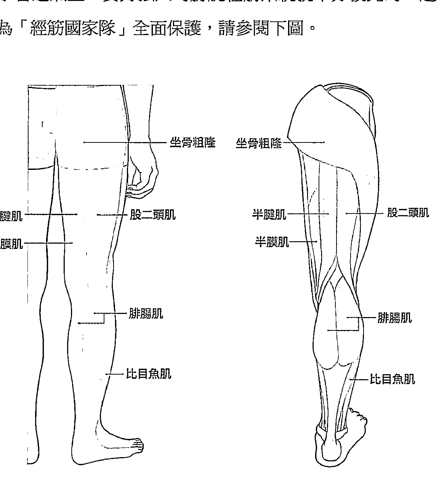

## 膀胱經下肢部經筋與解剖對照圖

## 路線 5. 並太陰之筋，而上循陰股，結於陰器

從膕窩內側上行，與太陰之筋並行，循著大腿骨內側，結於陰器。

十二經筋系統唯有本經兩度與其他經筋並行，可見這個並行路線有特殊意義。

首先在內踝處與脾經經筋的並行關係，點出腎經經筋不會環繞內踝一周。其次過膝關節之後，再度出現「並太陰之筋」，一起循著大腿骨內側到陰器。

作者推論，腎經經筋內文也從足心出來之後，一路經過小腿到大腿，直到結於陰器，都與脾經經筋並行，只是原文未特別點出這項關係。至於原文為何不詳述？

《內經》雖為古籍，文字精簡，但仍有蛛絲馬跡可循。例如膀胱經筋內容很複雜，但透過抽絲剝繭推理，再配合現代解剖知識分析，幾乎與解剖結構相合。古人煞費苦心，努力以古代的文字、意涵與概念，表達出深淺層次不同的經筋系統。

同理，腎經經筋內文也以畫龍點睛的方式，在結構的重要轉折處點出「並太陰之筋」或「與太陽之筋合」，只要參酌本區結構特色及其他經筋循行，前後左右串連，就能掌握無字留白處的奧秘，許多學習古典醫學者都有類似的經驗。反過來試想，如果文中一直出現「並太陰之筋」或「與太陽之筋合」，文意頻頻重複打斷，學者也會不耐煩吧！

還有另一個問題：足三陰經筋都循行於下肢內側，為何內經原文沒有提到肝經經筋？

試想，從小腿8寸以上到大腿內側經筋的前後分佈順序為：脾經→肝經→腎經，原文沒提到肝經，直接點名腎經與脾經並行，是為了強調兩經在下肢部位（包含陰器）所建立的親密關係。

比較特別是，足三陰經筋結於陰器的前後順序為：肝經→脾經→腎經，脾腎兩經關係更為親近。兩條經筋在「陰器」聚合之後，脾經向前入腹，由肚臍進入腹部裡面，形成前面連結胸骨、肋骨，後面連結脊椎的「籃子結構」，幫助腎經固定體腔內的臟腑；腎經向後走到脊椎，提供堅實的結構，幫助脾經穩住籃子結構。

腎經經脈連結四臟，唯獨未提到脾臟。而在經筋系統，脾、腎兩條經關係非常密切，從足部開始一路並行，可以看成人體先天與後天系統合作的秘密路線。

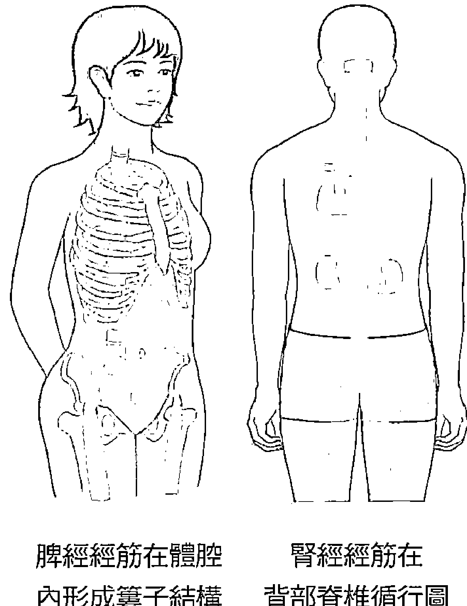

## 中醫師不傳之秘：腎經經筋連結到陰器之理

腎經經脈沒到陰器，經筋卻結於陰器，為什麼？

- 1. 與腎司二陰有關：肛門為「後陰」，生殖器及尿道為「前陰」。中醫所說的陰器主要指外生殖器，也可以納入尿道，因此陰器即前陰之意。位於前陰與後陰之間有一穴位「會陰穴」，現代稱為「會陰部」，此處是奇經八脈的任督衝三脈共同所出處。

腎司二陰，腎同時管理位於骨盆腔下方，與生殖、泌尿及排泄有關的器官。此區有兩個特別穴位：會陰穴與長強穴。

- 會陰穴：位於前陰與後陰之間，為任脈起始穴。穴名點出本穴位於前後二陰交會處，加上任脈為「陰脈之海」，統理所有陰經，所以會陰穴性質屬陰，兼有「諸陰之會」的含義。
- 長強穴：位於後陰與尾骨之間，為督脈起始穴。穴名點出本穴貼近尾骨，督脈由此貫穿路徑長且強壯的脊椎，加上督脈為「陽脈之海」，統理所有陽經，所以長強穴性質屬陽，還具有督脈身為「陽脈之長，脈氣強盛」之義。

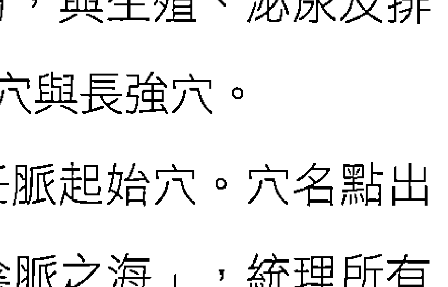

腎為先天之本，主管人體泌尿與生殖系統，當然也須管理尿道及生殖器所在的「前陰」部位。腎經經脈「屬腎，絡膀胱」，膀胱是腎的執行單位，腎透過膀胱建立與前陰的關係，加上腎經交會長強穴，會陰穴與長強穴僅隔著後陰，距離接近，讓腎經經筋很輕易就全然包覆前後二陰。

身為表裡經的膀胱經也很有貢獻。膀胱在結構方面可通前陰的尿道，膀胱經則另有支脈「下尻五寸，別入於肛」，從薦椎下方5寸處分出，進入肛門，之後出屬於膀胱，散之於腎。透過膀胱經系統，腎也能連結前後二陰。

### 2. 與其他三條經筋協力保護陰器：

足三陰經筋及胃經經筋都結聚於陰器，眾星雲集，目的是共同保護人體重要的泌尿和生殖系統。這兩個系統對於腎更為重要，因為腎臟本來就專責掌理泌尿和生殖系統，陰器兼具泌尿與生殖功能，腎經經脈負責連結功能相關的內在臟腑，如肺、肝與膀胱等；經筋系統是保護系統，從這個角度思考，腎經經筋必須結聚於外在的泌尿生殖器官，也就是陰器。

足三陰經筋雖然都結聚在陰器，但分佈區域其實有別。

- 脾經經筋「上循陰股，結於髀，聚於陰器」：從外側的髀部向內聚於陰器，因此分佈在陰器前緣。
- 肝經經筋「上循陰股，結於陰器」：肝經四大系統皆以陰器為重點，肝主筋，經筋結於陰器，還絡諸筋，因此肝經系統與生殖器「勃起」的功能有關，重點在於陰器本身。
- 腎經經筋「上循陰股，結於陰器」：統理前後二陰，因此經筋系統分佈在陰器後緣。

足三陰經筋在陰器分佈規律，由前向後為：脾經 → 肝經→ 腎經。足三陰經筋雖然有各自的重點，重要的區域還是須要周全防護，因彼此循行有重疊之處。以深淺來說，脾經最淺偏於表，之後入腹形成簍子結構；肝經居中，僅至陰器為止；腎經最深偏於裡，之後轉向背部循膂內挾脊。以範圍來說，肝經最短，以前陰為主；脾經居中，腎經最長，涵蓋前後二陰。

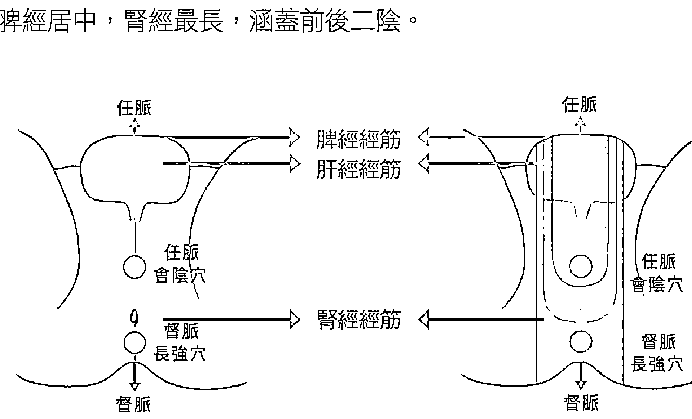

## 為何肾經經筋未提示與肝經經筋的關係

胞中會陰處是任督沖三脈的起點與出處，足三陰經脈也通過這個區域，因此脾肝腎三經與任督沖三脈關係密切，都攸關生殖功能。

脾肝腎三經如此親密，腎經經筋循行頻頻出現「並太陰之筋」，但對於夾在脾腎兩條經筋之間的肝經經筋卻隻字未提，為何如此？

個人猜想，隨著胚胎的發育，人體需要預備臟腑經絡生長的動力與搖籃。當沖脈準備退居幕後時，一方面將具有「血海」特質的太沖脈交給肝經，推動個體成長與生殖系統成熟；另一方面將具有「十二經脈之海」特質的體腔內層系統交給屬於先天之本的腎與後天之本的脾，共同完成堅強結構，以做為臟腑經絡成長的搖籃。因此腎經經筋並太陰之筋的說法，並非故意忽略肝經經筋的存在，而是重點提示：腎經經筋合足太陽經筋加上並太陰之筋會形成堅實的「三明治經筋結構」。

## 解析拉筋凳疗效的原理關係

十幾年前海峽兩岸很風行「拉筋治百病」，據說透過「拉筋凳」效果更好。猶記有次上陽明山賞景，涼亭裡只要有凳子和圓柱的地方，都有民眾躺著拉筋，我們只能無奈的站著吹風，可見其流行程度。

從中醫理論來看，拉筋凳主要拉開的部位是陰器。此處包含奇經八脈中「一源三歧」共同起於會陰的任督沖三脈，還有足三陰經筋與胃經經筋，共七條經脈，幾乎重要的經絡系統都連結於此，可見陰器不僅與生殖泌尿功能有關，還影響全身機能。

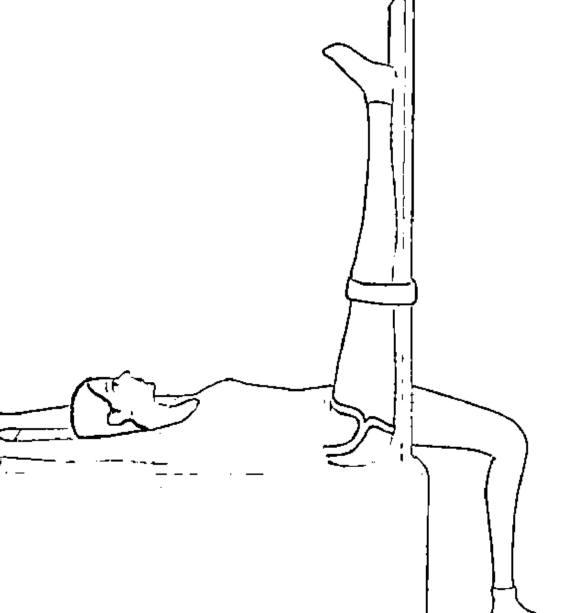

現代人由於久坐，身心壓力都由腰薦處承擔，加上飲食和生活起居失調，生殖泌尿系統也跟著紊亂。臨床上常遇到這類病友，除了原有的臟腑經絡疾病外，下腹部及腰背部結構常出現異常，甚至恥骨上方的筋膜也很緊繃。

正確使用拉筋凳可以拉開陰器周邊的筋膜，疏通經脈，也會牽動腎間動氣所在的「關元命門區」。據此概念，醫師可以選擇膽經原絡配穴「膻墟溝」組合治療，讀者平時可以敲打恥骨周圍的筋膜，也能有改善。

拉筋凳主要從陰器為起點拉開身體筋膜，一般下肢拉筋法的重點多在下肢筋膜，因此有不同效果。

請注意！作者無意為拉筋凳做宣傳，只是探究其理。本法是一般保健法但非治療方法，若有重大或特殊疾病者請詢問醫師，勿輕易採用。

## 腰背部

腰背部循行延續下肢，仍保有前側併足太陰經筋，後側合足太陽經筋的特色。

## 路線 6.循膂內挾脊，上至項

本經筋從陰器進入腰背部，沿著脊椎內側深肌群，挾行在脊椎兩邊上行到頭項部。而另一說法「循脊內挾膂」，頗難解釋循行特色，故未採用。

膀胱屬陽，分佈於表，腎臟屬陰，分佈於裡。膀胱經筋全然覆蓋腰背部的表層，腎經經脈貫穿脊椎，腎經經筋一方面保護腎臟，一方面又深入脊椎裡層，與膀胱經筋形成裡外對應。

經經脈及脊椎，同時也接受膀胱經筋的保護，因此分佈在膀胱經筋下方的深層部位。

參酌現代解剖學，脊椎深層肌群如橫突棘肌，包括半棘肌、多裂肌和迴旋肌，位於豎脊肌深層，是距離脊柱最近的肌肉。其中如多裂肌屬於核心肌群的內核心，緊貼在腰椎兩旁，是穩定腰椎的關鍵力量，腰為腎之府，多裂肌應可納入腎經經筋系統，因此腎經經筋就類似橫突棘肌這類深層肌群。

若將腎經兩側經筋合併，就會看到貼近脊椎而行的型態，主要目的當然是為了直接保護腎經與督脈貫脊這段重要路線。

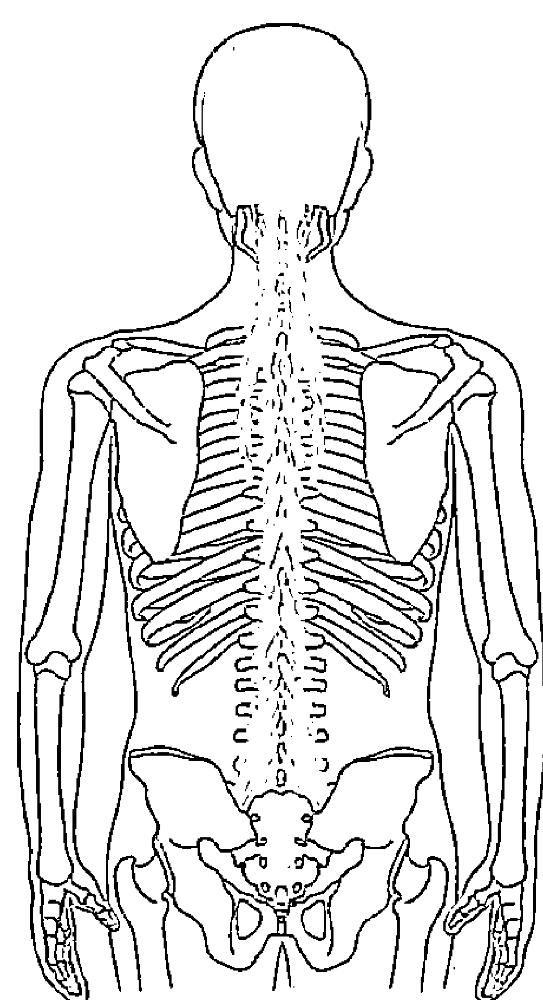

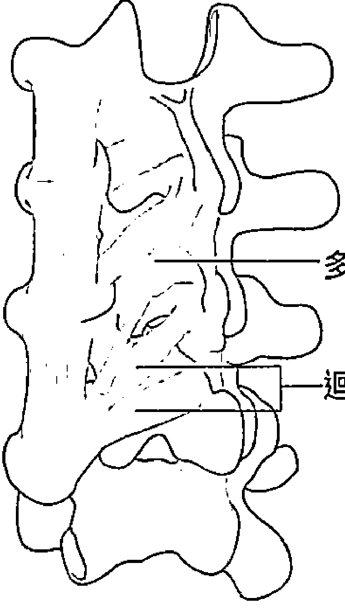

## 路線 7. 結於枕骨，與足太陽之筋合

從腰脊順勢而上到後頭的頂部，結在枕骨，與膀胱經筋相合。
本經筋結於陰器，陰器為經筋自下肢進入背部的門戶，再循腰背部肌肉上行，這段路線與性行為時的腰部擺動大有關聯，尤其是由後向前的推進力量。因此腎氣充足則腰部強健有力，加上帶脈的固攝，牽引生殖器持續衝鋒陷陣，完成美麗旅程；若腎氣不足，腰部痠軟無力，心有餘而力不足，兩三下就喘吁吁的敗陣下來，出現肝氣虛衰而痿軟，帶脈失約而早洩等令人遺憾的「敗腎」情況。

## 腰背部循行的兩個特點

- 與膀胱經筋循行的高相似度：這段循行跟膀胱經筋很雷同，但絕不是巧合，而是精心設計的。
腎經經脈貫脊，經別貫腰脊，都是直接貫穿脊椎。經筋循膂內挾脊，兩側經筋合併起來剛好覆蓋住脊椎，是最貼近脊椎的保護膜。膀胱經筋在腰背部也是「上挾脊，上項」，還「結於枕骨」，跟腎經經筋相似。
腎經經筋與膀胱經筋在腰背區是重疊的，差別在於：
- 1. 腎經涵蓋範圍比膀胱經窄：腎經只有內挾脊一條經筋，並且分佈在近中線區，膀胱經還有旁邊兩條經筋緊貼於外，以全面涵蓋背部。
- 2. 腎經位在膀胱經的深層：膀胱經屬陽經主外，腎經屬陰經主內，經筋也依此原則分佈，所以膀胱經筋就直接覆蓋在腎經經筋上方以提供保護。

因此背部有兩層經筋結構，由深而淺，由內而外，分別是腎經經筋與膀胱經筋，共同形成脊椎及腎經最堅強的保護層。

- 透過膀胱經來管理耳、牙齒及舌本：腎經經筋最後與同樣結於枕骨的膀胱經經筋相合，後續頭部的保護重任就交給膀胱經筋。就如前文介紹，腎開竅於耳，腎主骨，齒為骨之餘，腎經挾舌本，可見腎與頭面也有關聯，只是腎經受限於陰經不上頭面的規律，以及先天之本不輕易拋頭露面的安全考量，無法親自到位管理。幸好有強大的膀胱經系統代勞，腎經只需四兩撥千斤般輕輕地將經筋合入膀胱經，就可享用膀胱經的一切福利，就好像結婚之後夫妻可以共享財產一樣。

從演化的角度來看，膀胱經系統都是為了配合腎經的需求，因此所有設計都藏有腎經的影子。《卷五》介紹過，膀胱經系統記錄人類在演化過程中的爬蟲類歷程，在頭面循行非常精彩，尤其經筋分佈遠遠超過膀胱經脈範圍，以鱷魚角度來看就能理解如此分佈的意涵。

首先膀胱經脈有條支脈從巔頂到耳上角，而經筋在頭面部的舌本線、完骨頷線及鼻眼線這三條路線共同發自脊頂部的經筋，進入顏面，包覆眼睛、鼻子、耳朵和舌下等官竅，這些路線當然也將腎臟管理的耳朵及舌本一起包覆。

膀胱經筋的鼻眼線結於鼻，舌本線結於舌本。以鱷魚形象來看，鼻子與舌根是上下對位，剛好上下夾住位於中間的口腔，當然也包括牙齒在內。鼻眼線和舌本線補充了膀胱經筋原文未提到的口腔部位，腎經經筋也借力使力，透過膀胱經筋來管理舌本及牙齒。

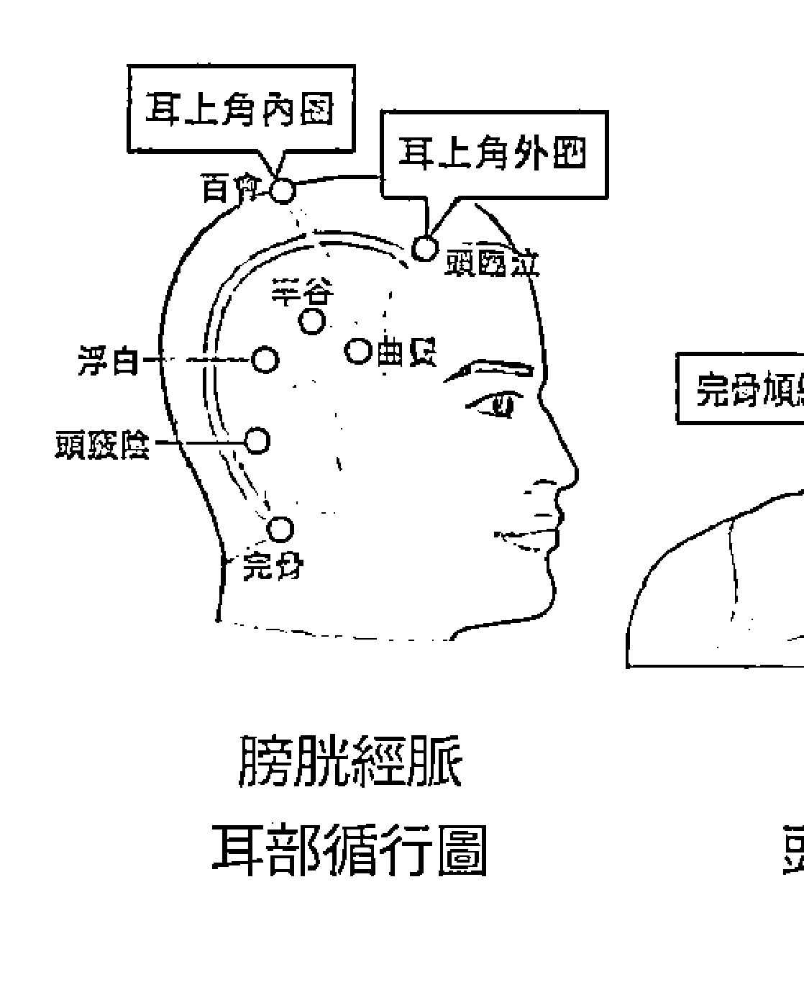

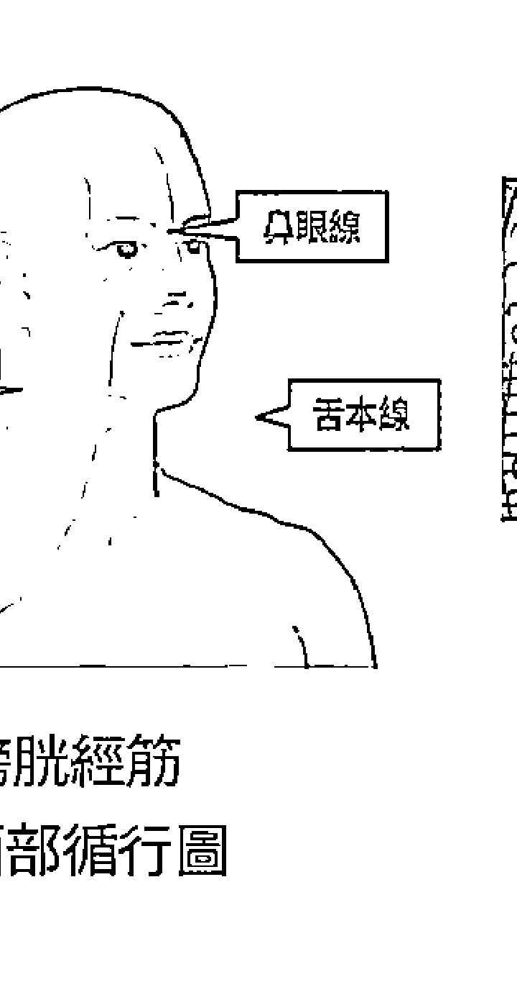

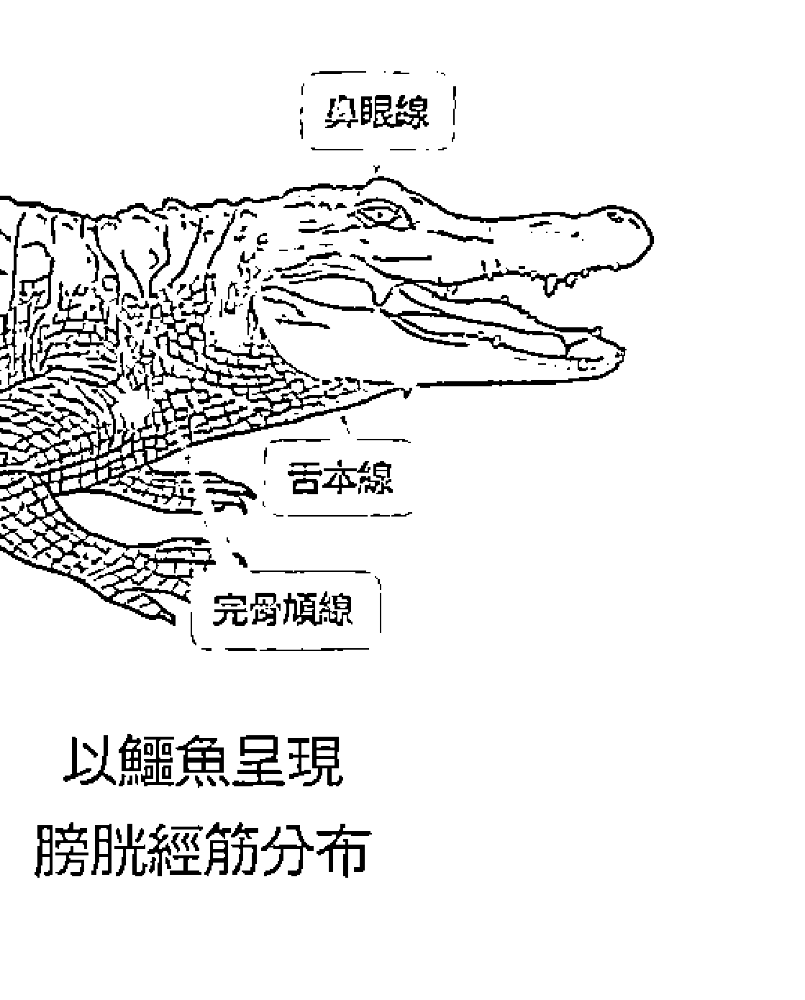

## 腎經經筋循行特色總結

腎經經筋與膀胱經、脾經經筋從腳到頭一直呈現共舞方式，亦步亦趨，相輔相成。透過前文分析可以看出三個特色：

## 1. 腎經經筋與膀胱經筋的關係

除了內踝下方路線和結於陰器之外，全都與膀胱經筋重疊相合，宛如家人歡喜融成一體，家和萬事興，全體總動員，從腳一路上到頭。

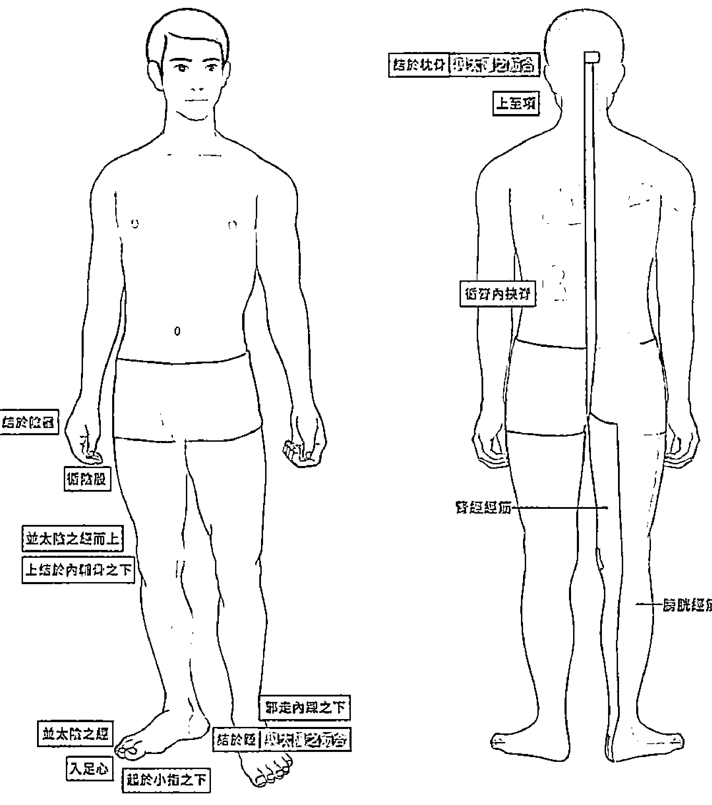

## 2. 腎經經筋與脾經經筋的關係

不僅在下肢部位並行，到了腰背部還互相支援。宛如好友，一路互相砥礪，互相扶持。

## 3. 腎經經筋、膀胱經筋、脾經經筋形成特殊的「三明治」經筋結構

腎經、膀胱經及脾經三條經筋從下肢連貫到腰背部，三條經筋前後相夾，形成「三明治」經筋結構。正因為這樣的密切合作關係，腎經經筋原文才不斷提醒與足太陰經筋並行，與足太陽經筋相合，經筋不會突然斷開，只要將這些經筋路線合參，就能看出此三條經筋從足到頭的並行與相合關係一直共存，不離不棄。而它所形成的三明治結構，對於人體有極為重要的影響。

上述三點特色中，尤以三明治經筋結構為最重要概念。以下將進一步帶大家了解這個部分，相信對於臨床診治與疾病思考都有重要的意義。

## 腎經、膀胱經及脾經經筋所形成的「三明治經筋結構」對人體的重要性

### 1.三明治經筋結構的型態與功能

「三明治經筋結構」分佈規律為：脾經在前，腎經在中，膀胱經在後。

脾經經筋進入體腔，分佈在脊椎腹側；腎經經筋與脊椎平行，未進入體腔；膀胱經筋位於腎經後方，覆蓋在脊椎背側。

腎經經筋與脾經經筋隔著脊椎而有前後之別，腎經經筋與膀胱經筋重疊，故有深淺之別。腎經經筋夾在脾經經筋與膀胱經筋之間，彼此有相輔相成之效。將此三條經筋關係圖並列於下。

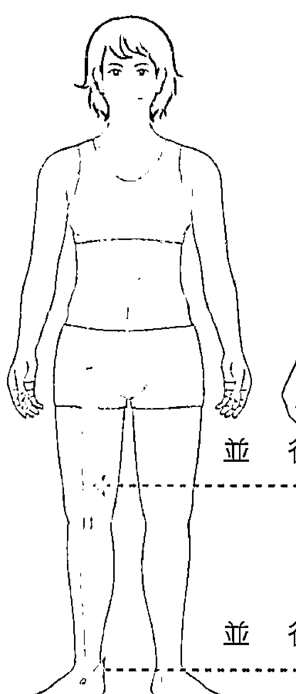

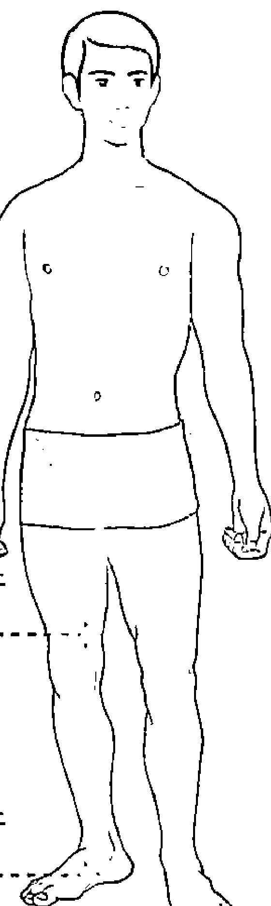

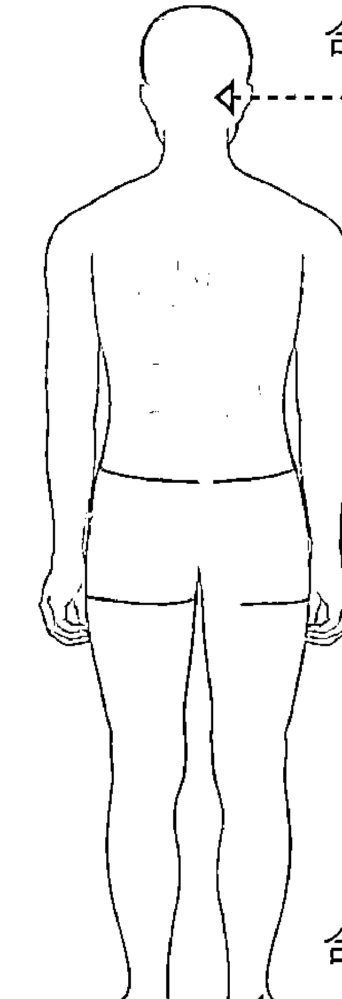

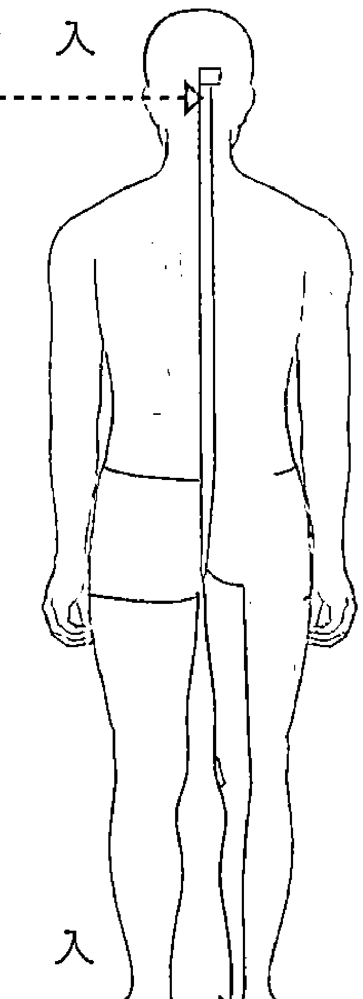

脾為後天之本，腎為先天之本，兩者存有「並行」的好友關係。脾經經筋主要結於內踝，上行絡於內輔骨，循大腿內側，聚於陰器。本經經筋在內踝下方和大腿內側部位與脾經並行。

膀胱經與腎經為表裡經，本是一家人，存有「合入」的家人關係。膀胱經筋屬於陽經，下肢部主要結於外踝，但有一條支脈偏行於內側，結於踵，上循跟腱，結於膕窩；腰背部有一條支脈上挾脊，上項。膀胱經筋這兩條路線與腎經經筋上下重疊相合，成為具深淺層次的分佈。

脾腎胱三條經筋前後包夾模式，不僅出現在下肢和骨盆腔，還共同協力在腰背部形成堅實的防護結構，最主要的任務是保護脊椎、脊髓和貫脊的腎經與督脈。

「三明治」結構以脊椎為中心，脾經經筋的簍子結構後側附著在脊椎腹側，腎經經筋附著在脊椎側邊，膀胱經筋則直接覆蓋在腎經經筋上方的脊椎背側。脾腎兩條經筋是三明治結構的主角，緊貼脊椎提供最直接的保護，也讓脾腎兩臟與脊椎建立穩固連結關係，以發揮良能。

在奇經八脈篇介紹過，胚胎成長過程裡，十二經脈之海的衝脈交棒給脾經，繼承簍子結構，為後續臟腑持續發育預作準備。

在生命早期，臟腑還屬於幼小階段，「三明治」結構以脊椎

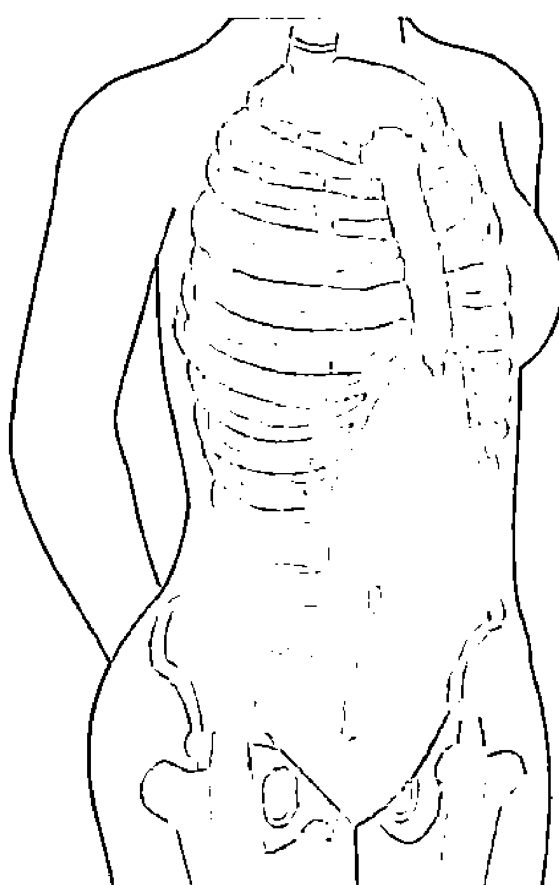

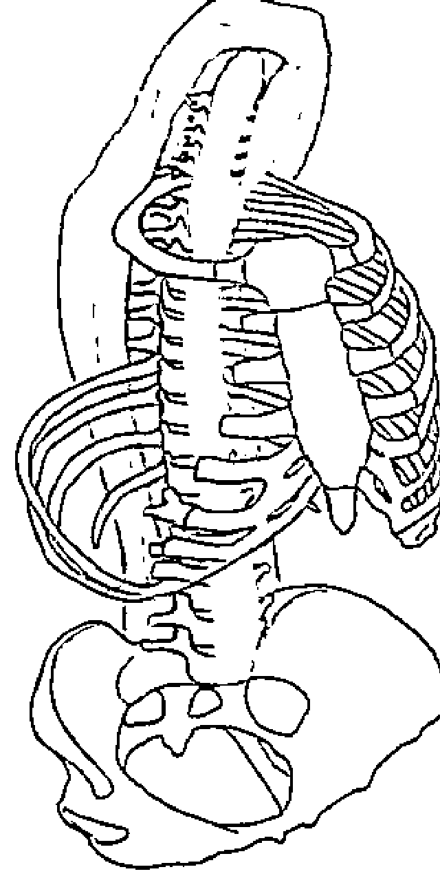

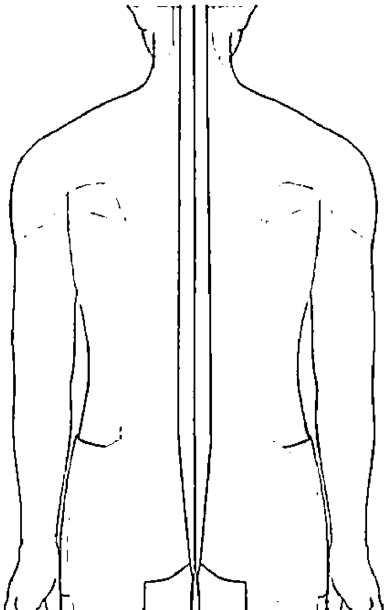

為中心，腎經與膀胱經分佈在後側，脾經分佈在前側，像個小小的紙袋。隨著臟腑發育長大，腎經與膀胱經向上延展，脾經經筋向體腔前方延展，變成大紙袋以容納臟腑。

此外，還能以人與天地相對應的中醫理論來看三明治結構如何滋養生命。例如人體就像一顆種子，脾經位於裡層，五行屬土，宛如土壤，提供養份；腎經位於中間，五行屬水，又能納氣，提供生長所需的空氣與水；膀胱經位於表層，屬於太陽經，提供陽

光以助生長。三明治結構完全契合生命成長所需的陽光、空氣、水及土壤。（參閱下圖）

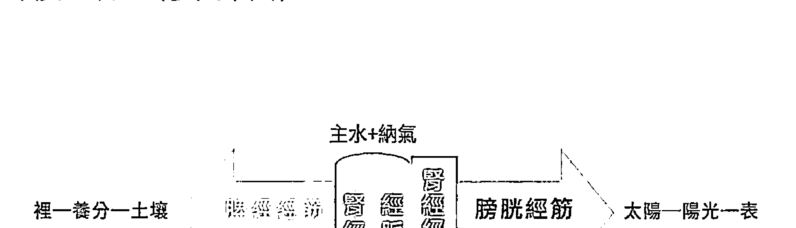

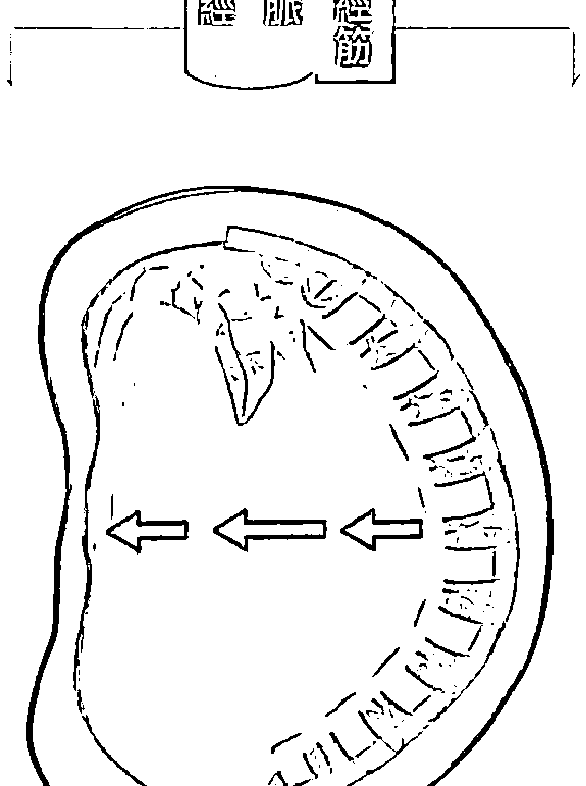

說明：箭頭代表脾經經筋隨著軀體成長，不斷地向前方延展。

### 2. 三明治經筋結構彼此間也有特殊關係

膀胱經與脾經：脾經經筋位於體腔最外側，膀胱經筋位於體

表最外側，兩者都在外側，符合《內經》陰陽離合關係中「太陰太陽為開」，腎經位於中間，也符合「少陰少陽為樞」的關係。

腎經與脾經：腎經經脈在胸腹部所連結的臟腑，全都接受脾經的升提力量而固定在原有的位置，以及脾經經筋囊子結構所提供的保護緩衝。

下圖為三明治結構示意圖。

左圖為人體站立時的型態，膀胱經筋分佈在脊椎外側撐住脊椎。右圖為人體趴姿的型態，脾經經筋分佈在脊椎腹側固定臟器。

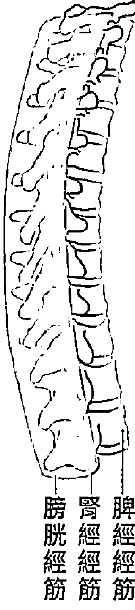

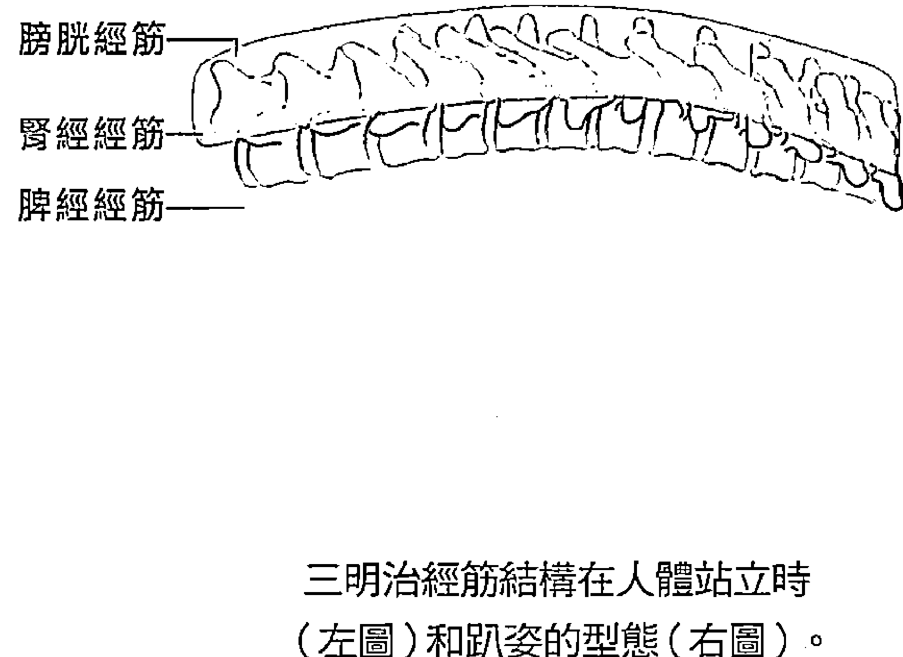

### 3. 三明治經筋結構準備開啟生命之路

腎、胱、脾三條經筋共同參與五臟六腑的成長發育，其所形成的「三明治結構」以腎為核心，膀胱與脾為腎完成生命藍圖。

植物生長需要陽光、空氣、水以及土壤中的養份，人類也是一樣。前文介紹過，腎主水還能納氣，提供空氣與水；膀胱為巨陽，等同於陽光；脾主土提供養份，如此一來，生存所需條件一應俱全，我們就可帶著這個經筋「三明治」開啟生命之路。

依據現代醫學研究，人體所有器官都是從受孕兩週後出現的三胚層發展而來，最外側的外胚層構成大部分的體表皮膚與神經系統，最內側的內胚層形成內部結構，如消化道和腺體等，位於中間的中胚層形成兩層之間的組織，如肌肉、骨骼等。

三胚層與腎胱脾三明治結構的功能有相似處，如外胚層與主表的膀胱經類似，內胚層主消化道和腺體與脾經類似，脾主肌肉，腎主骨，中胚層主肌肉和骨骼，類似脾經與腎經。可見腎胱脾三條經筋所形成的三明治結構，不僅全程參與五臟六腑的成長發育，還是重要的推手，據此推論，腎間動氣應位於肚臍下方的三明治結構中。

動生長發育的功能。中西醫雖然說法不同，但別忘了不同詮釋下面對的仍是同一主體：人體，只要是對的方向，一定會有共通的交集。

人類是脊椎動物，脊椎也是胚胎最早出現的結構之一。腎經經脈貫穿脊椎，提供身體支撐力和向上生長的結構，腎經經筋緊緊包覆在脊椎旁側，保護脊椎與腎經經脈。

膀胱與腎相表裡，膀胱經筋包覆在腎經經筋上方，再次加強保護脊椎與腎經，也提供腎經經筋的支撐力量。

脾經經筋篋子的原始結構承接自衝脈。富有彈性及升提力量的脾經經筋黏著在脊椎的腹側，為成長中的臟腑器官預做準備。由於臟腑都位於胸腹部，脾經經筋因應此情況，會逐漸向前方展開，以便容納越來越多、越來越大的臟腑及器官組織，如此就形成了「篋子結構」，將胸腹部的器官全部包在一起。（參閱下頁圖）

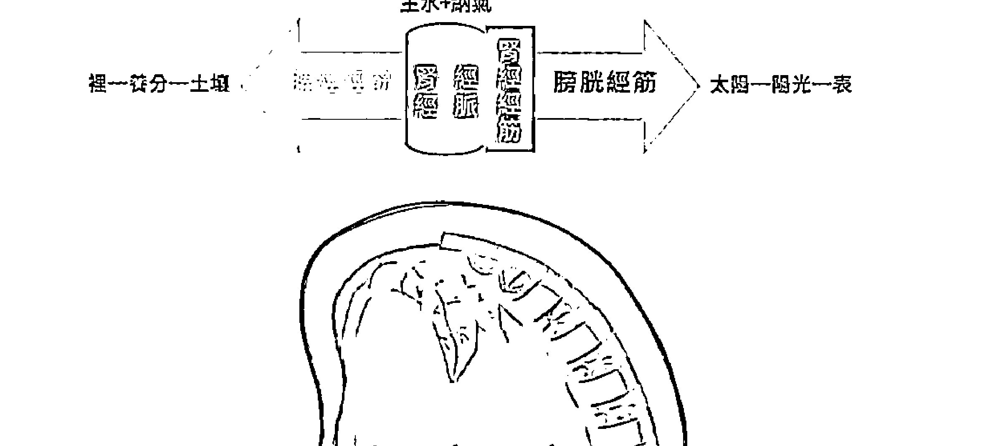

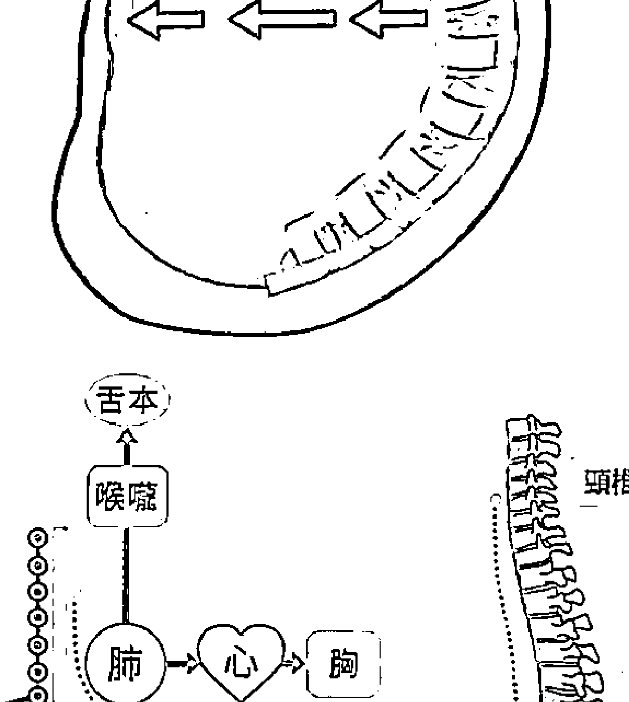

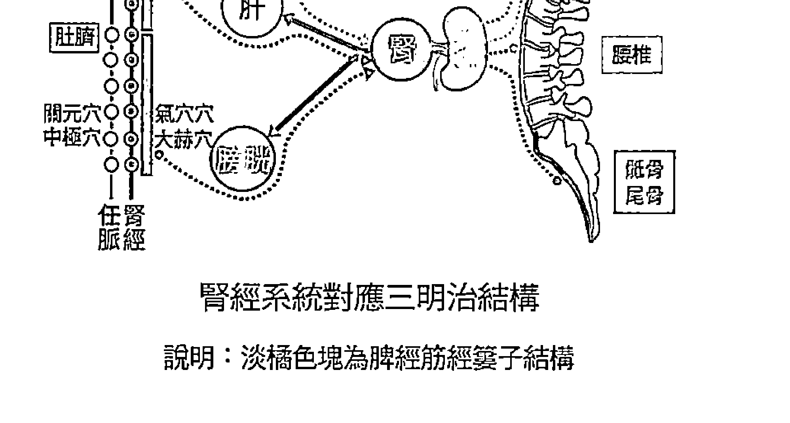

## 腎經系統對應三明治結構

說明：淡橘色塊為脾經筋經簍子結構

## 4. 三明治經筋結構對於組織器官臟腑的意義

- 腎主骨，經脈貫脊：人類演化成為脊椎動物，腎主先天，腎間動氣推動身體生長，尤其脊椎是成長發育的重要結構，所以腎臟就掌握了骨髓結構，透過腎經貫穿脊椎，全然掌握脊椎。
- 腎開竅於耳：在孕期第六週左右，耳朵開始形成聽窩，所以聽覺是最早發展的感覺。我們可以想像，雖然胚胎住在母親子宮的黑暗之中，對於外來的刺激還是有感覺有記憶，甚至有反應，這當然與藏精有關。因此近代發展出胎教理論，特別強調聲音的重要性，因為在此階段聽覺是最靈敏的。

耳朵也與身體平衡有關，人類演化到能夠直立之後，上山下海，開始從事追趕跑跳碰等活动，如何在動態中維持平衡，不僅是人類的本能，也是生活的要點。

- 膀胱經藏有五臟六腑的背俞穴：膀胱經為五臟六腑設立專屬的對應「窗口」，形成臟腑一條街，其實也是來自腎統裡所有臟腑的「全有」能力。（參閱《卷五》）
- 膀胱經主表，協助演化出頭髮與牙齒：從演化歷程來看，牙齒與頭髮來自同一個源頭，都是皮膚發育過程中，內外兩層組織交互作用的結果。腎之華在髮，牙齒雖然歸大腸經與胃經管理，但是牙齒堅硬的本質與骨頭相似，中醫說「齒為骨之餘」，也與肾有关。前面介绍女性与男性发育过程中，头发和牙齿的情况都会反映身体的年龄与功能。

- 脾经滋养五脏六腑：脾属土，为后天之本，转化来自饮食的精微物质，并输送至全身各个脏腑组织，以维持生理机能。

- 先天与后天失调则五脏六腑皆失养：《内经》提到疾病传变过程中出现：“大骨枯槁，大肉陷下，胸中气满，喘息不便”是严重的病候，若再加上其他病候，甚者一日即死亡，这些症状常见于重大疾病后期，如癌末病人身上。

肾主骨为先天之本，脾主肉为后天之本，出现“大骨枯槁，大肉陷下”表示先天和后天皆耗竭，五脏六腑再无滋养，加上肾不纳气而阴阳即将脱亡的胸满喘息，当然是死证。

- “三因制宜”重要的资源来自藏精：《卷四·心经》提到“变化是不变”的道理，只要调整心态就能安然面对改变。然而若面对的是身体实质的变化，中医诊治非常重视三因制宜，譬如生长于不同的地域或文化，以及不同的人种等，都会造就出不同体质，疾病的型态也有所不同，此时就不是调整心态，而需实质的诊治方案。

肾的全有特质，藏精包含人类所有的共同基因，人、事、地这些因素无法全然改变根深蒂固的人类基因。所以在诊治不同地域、各色人种所罹患的疾病时，除了个别因素，藏精可做为人体共同的「醫藥庫」，腎間動氣為臟腑經脈的根本，可用以診治個別疾病的資源。

## 5. 三明治經筋結構類似核心肌群

核心肌群主要指橫膈膜以下、骨盆底以上的肌肉，位於軀幹中央，環繞腹腔的深層肌群，包含腹直肌、腹斜肌、腹橫肌、下背肌等，跟三明治經筋結構非常相似。在功能方面也同樣在於保護脊椎肌肉群，維持脊椎的穩定度。

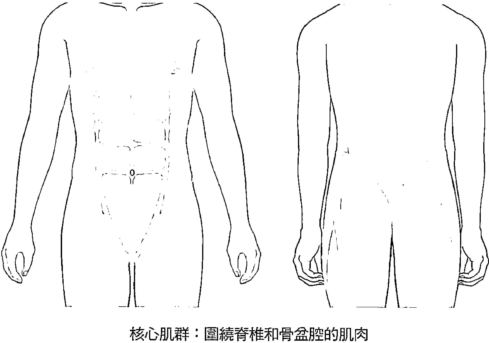

核心肌群由軀幹的深層肌肉組成，為身體重要的發力點，所以有人說核心肌群宛如全身肌肉的心臟。因此核心肌群除了穩固脊椎之外，也是日常活動中先發的肌群，在身體活動前，核心肌群先收縮出力以穩固中軸，四肢肌群再收縮運動，這樣就不容易受傷。

核心肌群這個從核心再到四肢活動的情況，與總論提到有關胚胎發育從軀幹開始再到四肢的過程，以及奇經八脈的發展歷程相似，可見中西醫的見解是相通的。透過核心肌群的現代研究知識，讓我們了解三明治結構在人體的另一種應用方式。

## 6. 三明治經筋結構提供身體 Reset 的調節機制

三明治經筋結構的腎經與脾經，承接自奇經八脈中最早發育的任督衝帶四脈，因此具有 Reset（重新設定）的能力，尤其衝脈是形成胸腹原型結構的經脈，因此三明治經筋能調節和重整經筋結構與位於其中的臟腑。

這個概念類似 3C 產品長期使用後，過多的程式與檔案讓工作效能降低，甚至頻頻當機，此時人們常會使用 Reset 的方法，或關機，或程式重灌等，讓一切回復原廠設定，重新開始。

三明治結構也有類似功能，尤其適用於多臟腑及多經絡皆出現失調的複雜狀況，讓身體宛如進入時光機，將之歸零，重新設定之後再度啟動。

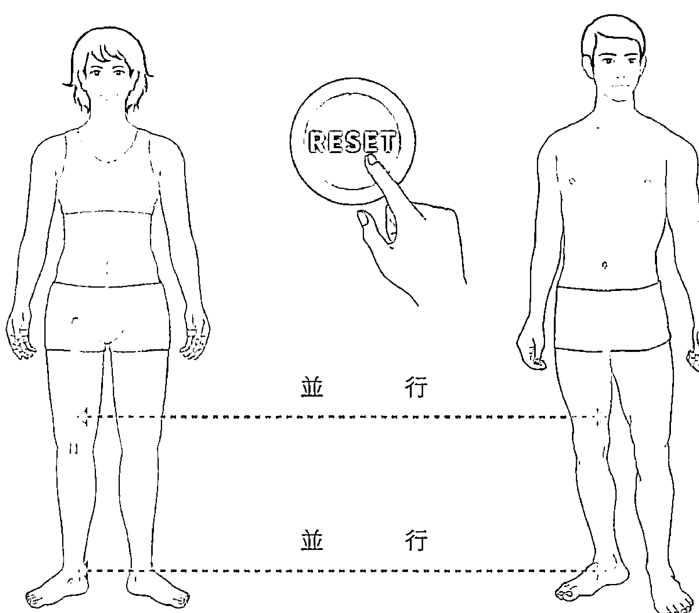

## 7. 三明治經筋結構 Reset 療法特色

由於本療法重點在於回歸身體原來設定，因此有三個特色：

- 原氣原穴：原穴為原氣的門戶，原氣來自腎間動氣，所以最適合做重新設定。

- 輕巧潛行：可針灸也可貼灸。手法宜細膩靈動，針法著重在醫師的手感，宛如棉裡行針，儘量無痛感，讓針灸氣感平和的滲入經脈，我稱為「潛行」手法。

- 靜置醒氣：3C產品Reset需要時間，本療法亦然。應用潛行手法，然後靜置候氣，約5~8分鐘左右，讓氣感得以輕緩滲入經脈，彌散至全身。這個概念很像麵糰的醒麵或紅酒的醒酒，都是透過靜置一段時間來改變內涵，我稱為「醒氣」。

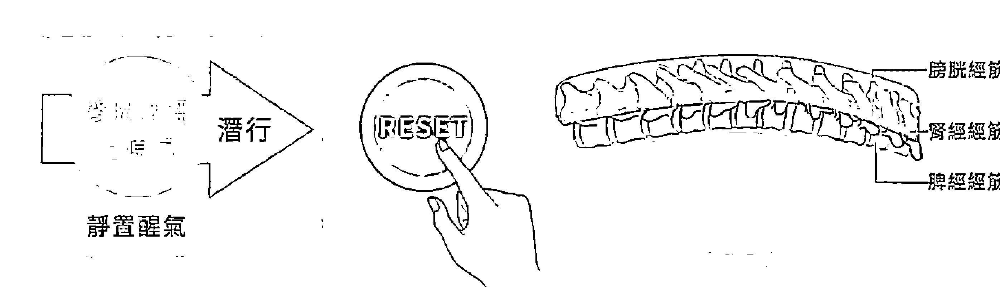

## 應用時機：

依據病情，可單獨使用，也可做為治療的開手針法或是收手針法，皆具療效。

## 注意事項：

- 三明治經筋結構Reset法重點在腎經與脾經，膀胱經是腎經的輔助者。然而人體後側有腎經與膀胱經兩條經筋，前側只有脾經，後重前輕，這樣的配置很容易失衡，臨床時會加入胃經，如足三里穴，協助脾經穩住胸腹部。

- 由於每個人身體狀況不同，Reset 過程也會遇到阻礙，如腹脹滿、氣機阻於心下，甚至暈眩等情況，此乃調氣過程中衝脈氣機上逆過度所致。由於衝脈循行至胸中而散，若是衝脈有所阻滯，會覺得氣機卡於心下感，不上不下，非常難受，此時可酌加衝脈交會穴公孫穴以調降逆氣。

本法首創自個人對於三明治經筋結構的體會，雖然仍採用臨床常用的原穴，但組合使用時卻能發揮與過去截然不同的療效，令人驚豔。

三明治結構源自於衝脈，因此臨床應用時氣感也會循著衝脈循行，不僅腹部有氣動感，還有能量蓄積感，體腔內部出現一股由下而上的暖流，有時還呈現漩渦狀。此法不僅能重整身體，也能抒發及穩定情緒，讓生命破繭重生。

我們也可從穴名一窺中醫老前輩隱藏的秘密。如軀幹穴位的穴名包含許多門、關、府、庭、堂、宮、闕等這些與房舍有關的字眼，四肢穴名許多含有部位、尺寸、功效及水流等。三明治結構所在的軀幹是人體重要部位，就像國家級的殿堂才具備宮闕等富麗堂皇的建築結構。所以如果要全面改建身體，當然要從軀幹著手，因這裡面已經隱藏了老前輩們給予的暗示。

## 膀胱經筋是腎經經筋的保護系統和延伸系統

在《卷一》總論中介紹過，臟腑系統類似「母系社會」，以五臟為主，六腑為五臟功能的輔助者，這項關係也存在於經絡系統中。

### 1. 每條厲害的陰經背後都有一條稱職且強大的陽經

五臟所屬的陰經與陽經比較，循行路線較短，穴位數較少，但是深入探討其循行及功能時又比陽經厲害。由於陰臟與陰經擔任人體重要的功能，因此有「陰主內」及「陰經不上頭面」的原則。陽經做為陰經的輔助者，為了因應陰經需求會變得偉大，如循行路線長，範圍寬廣，穴位數多等，以補陰經所未逮者。借用俗語的說法，就是每條厲害的陰經背後都有一條稱職且強大的陽經。腎經與膀胱經的關係正是典型代表。

### 2. 膀胱經筋是腎經經筋的保護系統

下表比較腎經經筋與膀胱經筋，可以看出膀胱經筋幾乎覆蓋在腎經經筋的表面，成為腎經經筋的貼身保鑣。

| | 肾经经筋 | 膀胱经筋 |
|---|---|---|
| **腰背部** | 7. 结于枕骨，与足太阳之筋合 （经脉：挟舌本） 6. 循脊内挟脊，上至项 | 6-2. 上头 6-3. 下颜 6-4. 结于鼻 6-1. 其直者，结于枕骨 5-1. 其支者，别入 5-2. 结于舌本 4-2. 上挟脊 4-3. 上项 |
| **下肢部** | 5. 并太阴之筋而上，循阴股，结于阴器 4. 而上结于内辅骨之下 3. 结于踵，与足太阳之筋合 2. 并足太阴之筋，邪走内踝之下 1. 起于小指之下，入足心 | 3-3. 与腘中并上 4-1. 结于臀 3-1. 其别者，结于腨内 3-2. 上腘中内廉 2-3. 结于腨 2-2. 结于踵，上循跟 2-1. 其下循足外侧 |

肾经经筋结于四处，其中踵、腨及枕骨都是膀胱经筋所结处，这三个重叠部位透露了膀胱经筋下方深层正是肾经经筋。另外，膀胱经筋结于臀部，从背部来看，臀部位于阴器的外侧，所以也可算是膀胱经筋对于肾经经筋结在阴器的保护。

肾经经筋在腰背部「循脊内挟脊，上至项，结于枕骨」，都是分布在脊椎中线，膀胱经筋则从中线向外大面积覆盖腰背部。如此一来，膀胱经筋就宛如一把超大的保护伞，全然覆盖肾经经筋。

### 3. 膀胱經筋是腎經經筋的延伸系統

《卷五》探討過，六腑之中膀胱並不是很厲害的腑，為什麼這麼強大的經絡系統會成為足太陽膀胱經？個人推論，可能是「腎臟內舉不避親！」三明治經筋結構重點在脾腎兩經，膀胱經筋是為了輔助腎經經筋而延伸出來的系統。

衝脈將簍子結構交棒給脾經，隨著身體組織的成長，胸腹部向前推展，此時腎經就須肩負從背部撐住身體結構以及保護外邪入侵的重責。但腎經終究是陰經，既無法再增厚也無法分佈於表，因此相表裡的膀胱經從腎經系統分化而出，其特色有三：

- 下肢部：膀胱經筋涵蓋外側膀胱經脈和內側腎經經脈，太陽主表，為腎經展現「腎主外」的特質。
- 腰背部：掌握所有淺層筋膜組織，直接覆蓋在腎經經筋上方，貼身保護腎經。
- 頭面部：不僅涵蓋脊椎及頭部，還連結上肢肩關節及面部五官，為腎擴展管理範圍。

將兩側膀胱經筋合併，能看出它同時分佈於中軸的陰陽兩側，且在中軸的組織特別嚴密。這個以中軸為核心的分佈特質可看做腎經身為人體中軸的延伸。

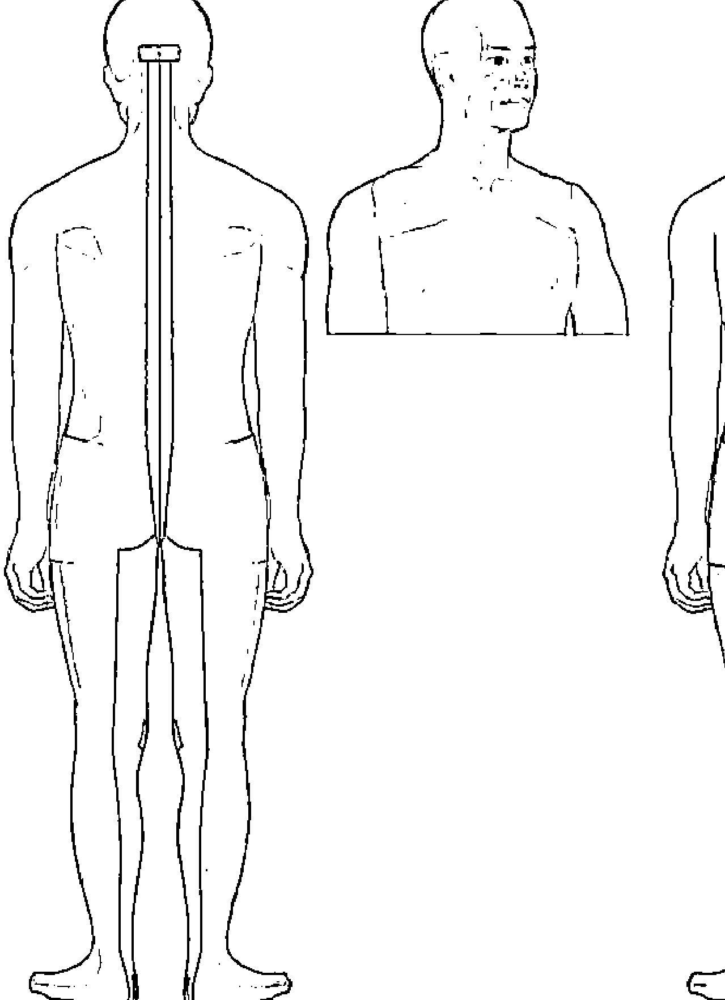

## 膀胱經筋圖

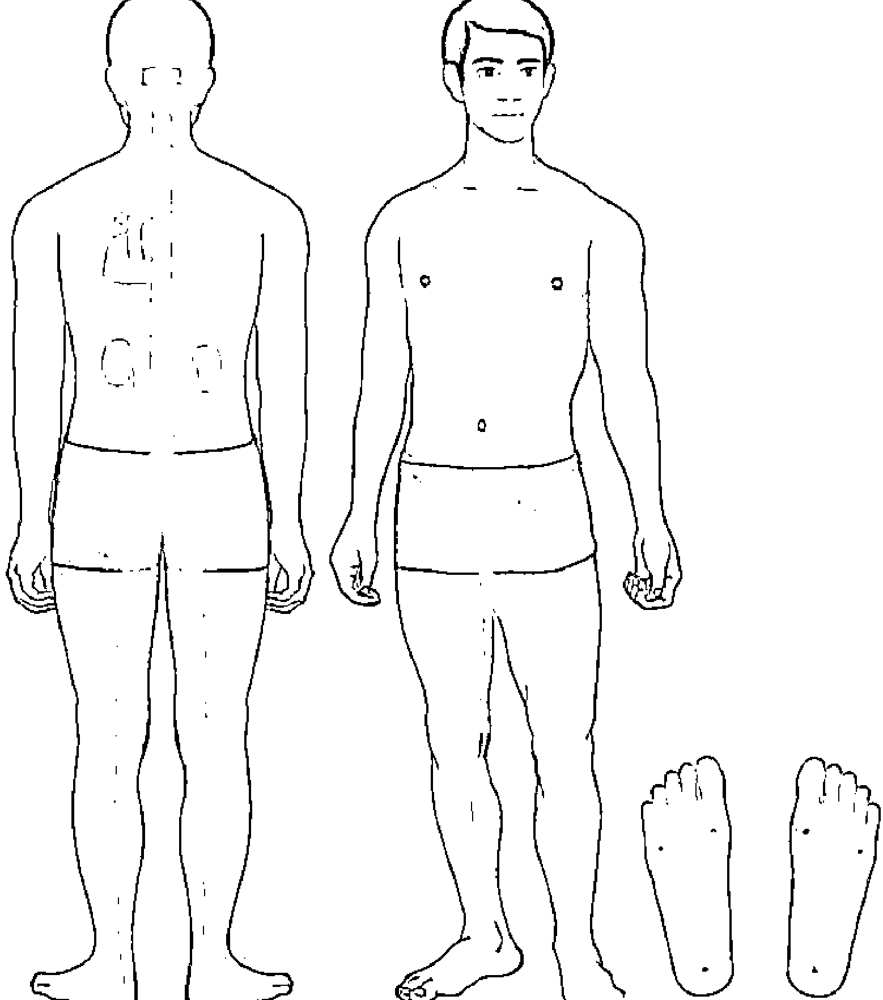

## 腎經經筋圖

這種兩條經筋「相合」的情況僅見於腎經經筋與膀胱經筋，其餘表裡經經筋都是各自獨立。此特殊現象從結果來說是為了保護腎經，卻也透露出膀胱經筋是由腎經延伸而出的秘密。

腎主水，水位於土地之下，腎經與膀胱經正是「地下組織」，如黑水般內斂的腎經為首領，居中發號施令，如太陽般奔放的膀胱經為部下，負責完成使命。這個關係可從名字看出端倪，「膀胱」去掉部首就成為「旁光」，是不是符合位在腎經「旁」邊，向外發散發「光」的概念？很有趣吧！

## 腎經經筋——病候特色

腎經經筋病候比經脈病候簡單很多，都是循行所過部位經筋張力異常所致。

| 腎經經筋病候《內經》原文 | 說明 |
| --- | --- |
| 其病：足下轉筋 及所過而結者，皆痛及轉筋 | 本經筋一般病症為足下部位抽筋，以及本經筋所經過和結聚部位，都有疼痛和抽筋等 |
| 病在此者：主癇瘛及痙 | 病在本經筋主要為癲癇、抽搐和項背筋肉僵直緊硬等 |
| 在外者不能俯* 在內者不能仰 | 病在外側的腰背部，則身體不能向前俯 病在內側的胸腹部，則身體不能向後仰 |
| 故陽病者，腰反折不能俯* | 腰背部在外屬陽，胸腹部在內屬陰 因此陽面筋病時，項背部筋急牽引腰部向後反折，導致身體不能前俯 |
| 陰病者，不能仰 | 陰面筋病時，胸腹部筋急向前牽引，導致身體不能後仰 |

*另一寫法為「俛」。

依據經筋張力異常程度出現三類病證，輕度以經筋所過的下肢部位病症為主，中度和重度則特別出現在軀幹的腰背部及胸腹部，以前後活動障礙為主。

- 輕度：下肢抽筋和疼痛現象。
- 中度：經筋張力偏強，牽引腰背或胸腹，導致前俯後仰失常。如胸腹部筋緊就難以後仰，腰背部筋緊就難以前俯。
- 重度：經筋張力過強，導致緊急攣縮，嚴重拉扯而出現癲癇抽搐、項背強直等症。

腎經絡脈病候也有腰痛，但偏於虛證，程度較溫和，還常兼有痠軟無力感。經筋的腰痛原因是張力過大，偏於實證，導致身體前後俯仰不利，病情較為嚴重，甚至有劇烈痛感。

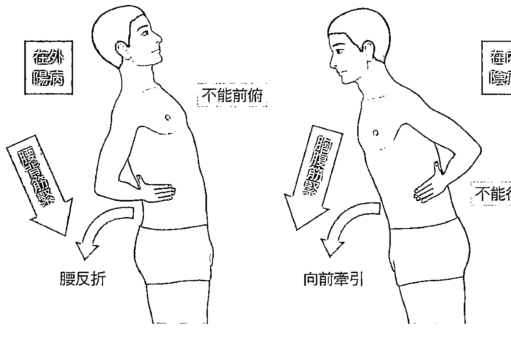

## 五、肾经系统总结

肾脏是人体最重要的先天之本，攸关自己生命的存亡以及后代的繁衍。生命都是从一个小小的受精卵开始，历经脏腑经络的成长、衰退，直至死亡，肾经系统都是最主要的推手，因此传统养生观才会特别注重维持肾脏机能。

由于肾主先天，又是五脏六腑的根本，因此本书内容横跨生命的起始点到终点。书中要点有三：一、肾脏三部曲，二、奇经八脉，三、肾经经络系统。

### 肾脏三部曲：肾元→肾间动气→肾脏

肾脏三部曲说明从受精卵到胚胎各组织器官开始发育，在形成胎儿的过程中，肾脏相关组织与机能的变化。

比较关键的是「肾间动气」为脏腑经络的根本，透过正使肾经及别使三焦经将原气推动敷布至全身。三焦敷布原气的型态与印度吠陀医学所说的脉轮颇为相似。

胚胎发育完成后，肾元归肾脏管理成为「肾精」，封藏肾精的保险箱就是「脊椎」与「头颅」，肾脏则是管理者，并握有开箱的密鑰，腎間動氣藏於肚臍下方的「關元命門區」，不僅涵蓋了腎臟，還保護生殖系統。

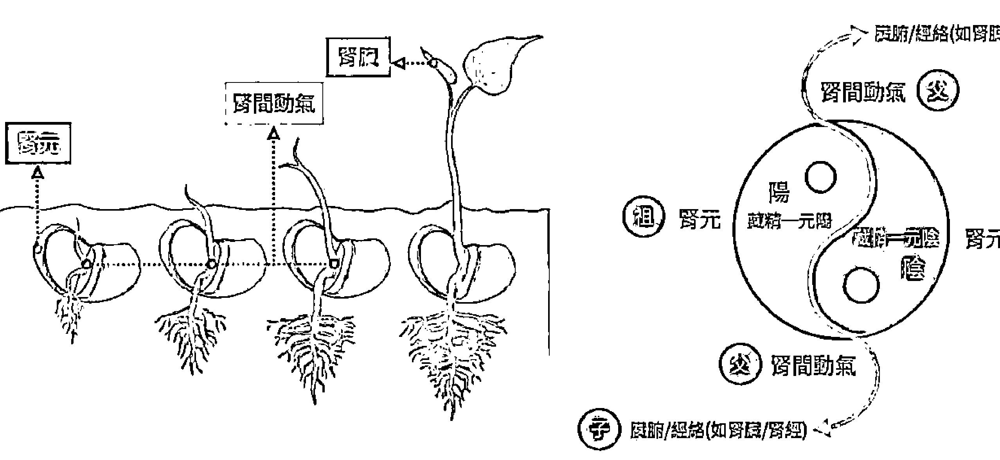

### 奇经八脉：最早发展的系统，交棒给十二经脉

奇经八脉比十二经脉系统早出现，是为了胚胎脏腑经络发育而预作准备的系统。分为三阶段，其中任督冲带四脉只分布于躯干头面，并未到四肢，是最早出现的奇经。

奇经八脉后来交棒给十二经脉，其中最特别的是冲脉交棒给肾经与脾经，让先天之本与后天之本持续维护脏腑机能，并保护体腔结构。

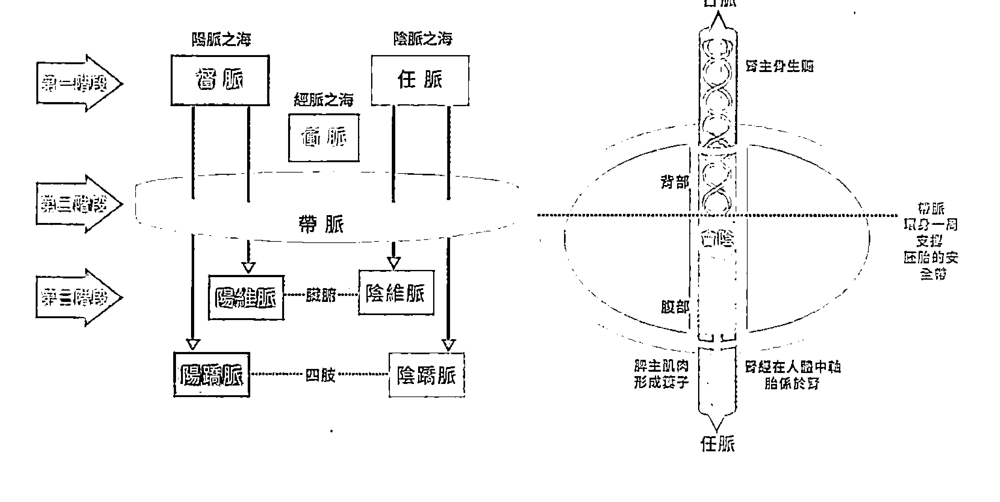

### 脾之大络隐含冲脉与带脉

卷三脾经介绍过人体有十五条络脉，包含十二经络系统的络脉，加上督脉、任脉以及脾之大络。其中：

- 十二条小络脉：交会表里经脉，是经脉间的内部连线，可视为络脉的小系统。
- 三条大络脉：任督二脉属于奇经八脉，督脉为阳脉之海，任脉为阴脉之海，二脉统理人体所有的阴经与阳经，其络脉也如此分布。这种跨越十二经脉的连结系统，属于络脉的大系统。

比較特別的是脾之大絡，從奇經八脈角度來看，衝脈與帶脈分別從內層與外層覆蓋體腔，脾經系統承接了衝脈並與帶脈密切合作，是最適合承擔任督二脈的補充系統與連結系統。任督二脈加上脾之大絡正是奇經八脈早期系統任督衝帶四脈的合體，再次展現人體保留奇經八脈的痕跡。

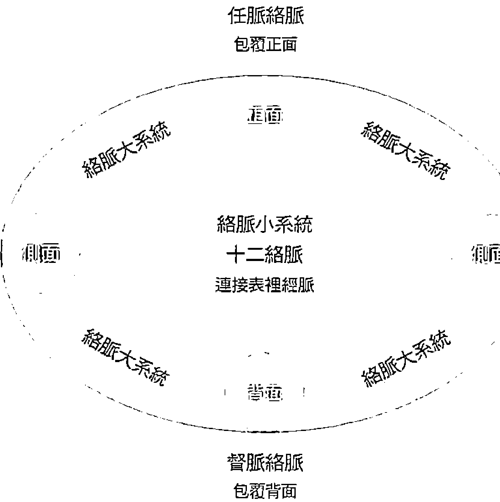

## 肾经系统：「先天之本」家族事业的继承者

传承自肾元的肾脏，同时藏有人体的阴与阳，太极图就是肾脏阴阳特质的最佳展现：图中的鱼眼代表阴阳互合，阴中有阳，阳中有阴；阴阳之间的弧线代表阴阳气机的转化，圆形流动又与肾经的漩涡特质相符。

肾经系统为人体先天之本，因此保有肾脏三部曲及奇经八脉的精华：

- 肾元：藏于脊椎与头颅。
- 肾间动气：藏于脐下关元命门区，肾经还是原气之正使。肾元与肾间动气的动态关系也像清理相机镜头的吹球，透过按压球体会吹出气来。肾元类似下方的球体，肾间动气则像上方的吹嘴，能将原气送出。
- 奇经八脉：继承奇经八脉，尤与任督冲带四脉相关。肾经循行于人体前后部位与任督二脉有关，体腔内外部位与冲带二脉相关。

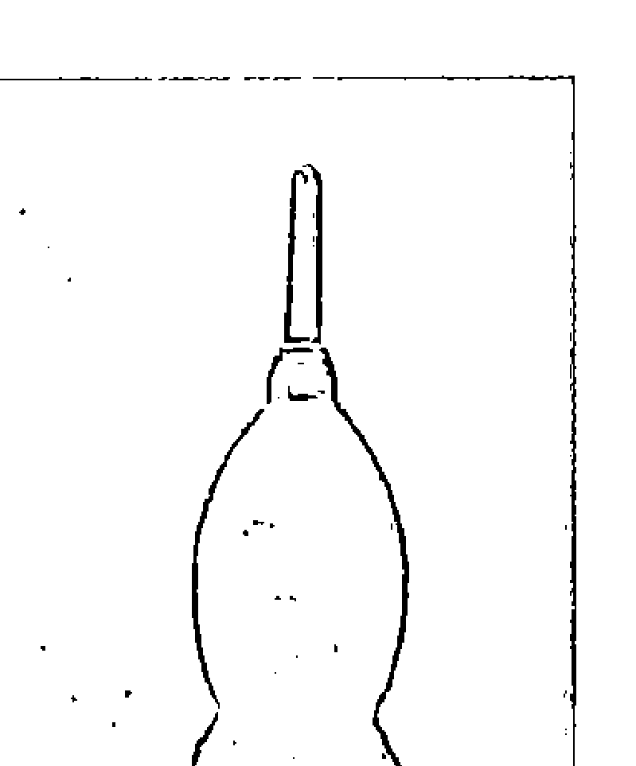

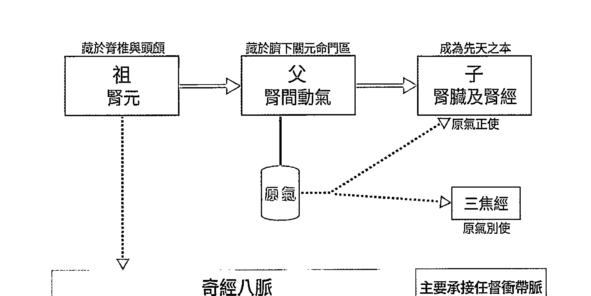

## 肾经四大系统特色

- 以经脉系统为核心，贯脊，连络多脏腑
本经是十二经脉中唯一分布于人体前后且贯穿脊椎者，也是连结最多脏腑的经脉，充分展现先天之本的特色。其循行路线从头到脚，从里到外，相当完备。

- 经别「脑肾带舌项」线
以横向联系为特色，起自脑窩，主线直达肾脏，横向连带脉，纵向系舌本，为分布于人体前后的肾经经脉增加侧面路线，与在體腔內形成環狀簍子結構的脾經系統，內外呼應。帶脈與脾經系統關係密切，腎經在胸腹部連結多個臟腑，全權委由脾經系統代為保護緩衝及固定位置。

- 絡脈「大鐘包腰脊」線
心包經是本經的下接經，本經絡脈則直接走到心包下，讓絡穴大鐘穴成為本經最善於行氣活血且專於治療心胸煩悶的穴位。

- 經筋「三明治經筋結構」
以包覆下肢和腰背部的經脈為主。本經與脾經、膀胱經從下肢到腰背部的分佈規律為脾經在前，腎經在中，膀胱經在後。三條經筋從足到頭都如「三明治」般的並行與相合。此結構中間所夾的正是脊椎及胸腹腔，腎主骨生髓通腦，脊椎及腦部都屬腎管理，加上腎經貫穿脊椎，腎經在腰背的重點就是脊椎，胸腹腔為臟腑所在處，故此三條經筋形成堅實的三明治結構正是為了保護脊椎及內臟而設。

## 肾经四大系统重要循行部位表：

| 部位组 | 子部位 | 經脈 | 經別 | 絡脈 | 經筋 |
|--------|--------|------|------|------|------|
| 特色 | | | 膕腎帶舌項線 | 大錘包腰脊線 | 三明治經筋結構 |
| 腰背部 | 枕骨 | | | | V |
| 腰背部 | 項 | | V | | V |
| 腰背部 | 舌本 | V | V | | |
| 腰背部 | 腰脊 | V | | V | V |
| 腰背部 | 帶脈 | | V | | |
| 腰背部 | 陰器 | | | | V |
| 胸腹部 | 心包 | | | V | |
| 胸腹部 | 心肺肝 | V | | | |
| 胸腹部 | 腎 | V | V | | |
| 胸腹部 | 膀胱 | V | | | |
| 下肢部 | 膕中 | V | V | | V |
| 下肢部 | 內踝 | V | | V | V |
| 下肢部 | 跟部 | V | | V | V |## 肾经系统独有之特色

### 1. 经脉分为内外两条路线
内行路线：连接最多脏腑，是维持人体生命機能的重要路线。
外行路线：从人体最低部位的足心，沿着下肢一路上行到腰背，是维持人体支撑结构的关键路线。

### 2. 四大系统分出三条路线
外行路线：从足心到项部，纵向贯穿身体后侧，与督脉并行。
内行路线：从肾转到膀胱，由后向前穿越人体，另条直脉上行至胸部，再度纵向贯穿身体前侧，与任脉和冲脉并行。
环形路线：从十四椎出属带脉，环绕身体一週，连结人体前后侧，并成为人体外圈的防护结构。
肾经系统这三条路线宛如夹板般保持住人体，让身体具有固定安稳的型态，其他器官才能安住其中，逐渐成长发育成熟，这也只有“先天之本”的肾才可能具有的能力吧！

### 3. 守护脊椎
脊椎是支撑人体结构的关键，肾经从内部以漩涡螺旋方式贯穿脊椎，并保护督脉，还透过巨大的膀胱经系统在外部加强保护。

### 4. 三明治经筋结构
实力雄厚的肾经系统与背景雄厚的膀胱经系统相合，经筋在下肢部与脾经经筋并行，这些连结关系都让肾经系统得以扩张势力，展现“先天之本”的实力，而且还具有 Reset 的能力，可以重新设定身体的状况。

肾经经脉这条实力雄厚的内行路线跨越人体的时间与空间，以下就从这两方面来解密。

### ⊙ 解密：从经络循行关系，看肾经贯穿身体空间所创造的「前病后治原则」。
本经的内行路线从身体后侧的肾脏，穿过体腔，走到身体前侧的膀胱、肝、肺、心等，很像台湾南部的南迴公路，由后山的台东转到前山的高屏地区，是东部与西部很重要的运输道路，若前山或后山的道路有阻碍，一定会影响另一边的疏运，人体也是一样。
肾属水是“地下组织”，肾经循行从人体最低部位到下肢再到腰背，前面所讨论的足跟痛及膝关节疼痛，都可以循着肾经所经过的腰背部位着手改善；反之，腰背部的酸痛也可从下肢治疗，这就是中医高超的“下病上治，上病下治”应用原则，并非痛哪里就治哪里，“头痛医头，脚痛医脚”的方式。
同理，肾经穿越体腔，连结人体后面及前面结构的经络特色，又提供中医“前病后治，后病前治”的治疗原则。例如腰部酸痛，除了可采用“上病下治”的原则，在肾经所经的脚跟附近取穴治疗外，也可以在胸腹部，例如肾经所经过的肚脐附近部位取穴治疗。

### ⭐ 解密：从脏腑连结关系，看肾经穿越身体时间所创造的「共荣共享关系」。
肾是人的先天之本，储存了维持生命很重要的物质“精气”，五脏六腑皆须仰赖肾精濡养，因此每个器官当然都期待他关爱的眼神，以期得到特别的照顾和给予。肾脏宛如家中慈祥的长辈，从善如流，五脏除了脾之外，将肝、肺、心三脏揽在一起关怀照顾。这种多脏腑的连结关系也是肾经所独有的。
个别来说，肾与肝、肺、心三脏各自建立专属且私密的双向关系。就像家族中的晚辈会跟长辈讨关爱，同时也会取悦及照顾长辈一样，虽然年龄不同，但能跨越岁月的差距，建立互相体贴照顾的亲密关系。同理，肾为先天之本主藏精，是五脏之中最“年长”也最“富裕”的，但它并未因此倚老卖老或恃宠而骄，而是透过“肝肾同源”、“肺肾同源”、“心肾相交”，融入其他脏腑，亲炙它们的活力，互相支援，从而建立“黑色俱乐部”，这就是肾经穿越身体时间而创造的“共荣共享关系”。另一方面当然也存在着共衰的现象，所以“护肾”就成为保健养生大法。

## 肾经系统概念图
本书谈了许多肾经概念，我也常运用在临床教学上，有回一群R1的住院医师听我分享肾经概念后，制作了一张很有趣的肾经系统概念图如下，在此跟读者们分享：
- 1. 足心及足弓：肾主水有漩涡力量，加上肾间动气从此处启动，因此形成冲浪和风火轮的型态。
- 2. 照海穴为阴跷脉的交会穴，是肾经风火轮中最会“踢球”者，让肾经经气可以一路上冲，以漩涡方式贯穿脊椎。
- 3. 膀胱＋肾经＋脾经经筋成为“三明治经筋”，强大的膀胱经鳄鱼装里面藏有一个小小沈医师。
- 4. 肾开窍于耳，主人体中轴的脊椎与下肢，两个加起来就像竹蜻蜓，是维持人体平衡很重要的机制。

## 中医师不传之秘：肾经未连结脾脏之理
肾经经脉连结四脏，唯独没有连结脾脏，主要答案就在三明治经筋系统。
脾经经脉与经筋系统一路上与肾经系统并行，脾经经脉以其特有的强大升提力量帮助肾经经脉向上节节过关，贯穿脊椎，脾经经筋以其特有的篮子结构与肾经一起护持脊椎，并协助固定脏器。脾经跟膀胱经一样，都是肾经系统如影随形的密友。
临床上，脾肾关系非常密切，例如《伤寒论》在治疗手足少阴病时常使用苓术这类脾经药，请参考下图。

| 方剂 | 附/权 | 组成 | 归经 | 主治 |
| :--- | :---: | :--- | :--- | :--- |
| **真武汤** | 附 | 茯苓、白术、芍药、生姜、附子 | 脾胃、肾、肝 | 脾肾阳虚、肢重浮肿、小便不利、头眩心悸 |
| **五苓散** | 权 | 茯苓、白术、桂枝、猪苓、泽泻 | 脾胃、心 | 水湿内停、膀胱气化差、小便不利、吐泻、痰饮涎沫 |
| **苓桂术甘汤** | 权 | 茯苓、白术、桂枝、甘草 | 脾胃、心 | 心脾阳虚、痰饮上逆、胸胁支满、头眩心悸 |

既然一路相伴，肾经就无须耗费能量再来连结脾脏，这也符合《道德经》所说的“大音希声，大象无形”吧！

## 中医师不传之秘：肾积奔豚的思考
《难经》在五脏之积介绍：“肾之积名曰贲豚，发于少腹，上至心下，若豚状，或上或下无时，久不已，令人喘逆骨痿少气。”豚即猪也，猪为水畜，因此属于肾。
顾名思义，贲豚是小猪到处狂奔乱窜，因此肾气积滞时会出现类似的气机逆乱之证，此逆气循着肾经经脉，发自于少腹，向上冲到心下，气乱时上时下，不规律也无停歇。若是久病不愈，则会损及肾脏而出现喘逆、骨痿、少气等证。
《金匮要略》也有奔豚之症：“奔豚病从少腹起，上冲咽喉，发作欲死，复还止，皆从惊恐得之。”
此处“奔”同“贲”。肾主恐，《金匮》指出本病乃因受到惊吓之后出现气机逆乱之证，从少腹上冲至咽喉，发作时痛苦欲死，过后则一切如常。
临床上遇过这类病人，只要听到有气从肚子向上冲，人很难过，过一段期间气又自己消了，好像没病一样，就知道是“奔豚”。以针灸治疗效果不错。

## 突显肾经、脾经与冲脉的关系
合参《难经》与《金匮》所述，皆与肾有关。但再深究其理，其实与冲脉更为密切。冲脉本具有“上冲”之特质，逆气从少腹至胸中为冲脉路线，肾经延伸至咽喉舌本处，且在《难经》五脏之积中，唯有肾积有动态冲逆之象，因此奔豚之症突显肾经与冲脉的关系。
前文介绍过，冲脉交棒给肾脾两经，两经都具有冲脉上冲上提的特质及必要性，如肾经必须由下而上冲过脊椎，脾经因为需要顾护脏器。但两者有所差别。
脾经经筋的篓子结构与带脉合作约束腰腹部，带脉分布在体腔外侧，前文介绍“肾着汤”证，腰冷痛腹重，即为脾经与带脉合病，造成向下的异常结构。
肾经连结脏腑，冲脉分布在体腔之内，“奔豚”为体内逆气从少腹至胸中，甚至咽喉，乃肾经与冲脉合病，造成向上的异常气机。
奔豚病在上中下三焦，故也分上中下三焦而治。在下焦与中焦治方中，都出现桂枝甘草，可见本证存在上焦心阳虚，导致下焦阴水上逆的病因病机，也可以视为心、肾相交功能异常的一种表现。

## 中医师不传之秘：肾经系统与《伤寒论》的经方地图
肾经系统与《伤寒论》少阴病经方有许多值得进一步探讨之处，但本书篇幅已经过大，只好将已经完成的两份肾经经方地图供大家参考，以说明少阴病证和其他病证的动态变化，与因应处方其实都循着经络路线发展，只要掌握经络，就能洞烛机先。

## 肾经系统与少阴病的经方地图
舌本
喉咙
口热舌干咽肿 甘草汤 桔梗汤
肺
心
胸
烦心心痛
白虎汤
黄连阿胶汤
肝
胃
脾
大承气汤
四逆汤
真武汤
肾
脊
骨厥 附子汤
膀胱
麻黄附子细辛汤 麻黄附子甘草汤
少阴病脉微细但欲寐

## 📖 中医师不传之秘：《伤寒论》少阴病死证分析
早期开始读《伤寒论》时，很惊讶看到最多死证的竟然是少阴病，而不是最后的厥阴病。
后来深入阅读汇总后才发现其中深意，并在 2005 年 3 月中医药研究论丛“探索《医宗金鑑。订正仲景全书伤寒论注》中少阴篇之动态辨证观～并回应《刘渡舟医学全集》中‘《伤寒论》少阴篇条文组合的辨证意义’一文”加以归纳探讨。
少阴病死证有两种类型：
- 第一类“阴盛格阳”导致阳亡为主要病机者，整理于下表。

| 病机 | 《伤寒论》原文 |
| :--- | :--- |
| 阴盛格阳 | 少阴病，下利脉微者，与白通汤，利不止，厥逆无脉，乾呕烦者，白通加猪胆汁汤主之。服汤脉暴出者死…… |
| 真阳外越欲绝 | 少阴病，脉微细沉，但欲卧，出汗不烦，自欲吐，至五六日，自利，复烦燥不得卧寐者，死。 |
| 有阴无阳 | 少阴病，吐利躁烦，四逆者，死。 |
|  | 少阴病，恶寒身踡而利，手足厥冷者不治。 |
|  | 少阴病，四逆，恶寒而身踡，脉不至，不烦而躁者死。 |
| 阳气脱亡 | 少阴病，下利止而头眩，时时自冒者死。 |
|  | 少阴病，六七日，息高者死。 |

> 《内经》提到：“大骨枯槁，大肉陷下，胸中气满，喘息不便”为死证，可补足少阴病所未详述者。

- 第二类以“阴液消亡”导致阴亡为主病机者，可见于少阴病大承气汤三急下证以救胃肾阴液：
  - 少阴病，得之二三日，口燥咽干者，急下之，宜大承气汤。
  - 少阴病，自利清水，色纯青，心下必痛，口干燥者，急下之，宜大承气汤。
  - 少阴病，六七日，腹胀不大便者，急下之，宜大承气汤。
急下之意有二：一字面意思是赶紧服用，二不管病情表里之别，先攻下治里病。《伤寒论》非常重视治疗顺序，譬如先表后里，但当病情严重危及生命时，必须赶紧攻邪，以救正气或阴液，此时会先略过一般的治病顺序，先里后表。
少阴包括手少阴心经及足少阴肾经，两者是十二经脉三组团队中最耗费能量的“聚餐团队”主角，存有心肾水火上下相交的关系，是维持生命最重要的两脏，因此少阴既是阴阳界也是生死界，所以人体才会在表里经关系之外，额外提供心脏“心包经”与肾脏“三焦经”来协助其功能。

从肾经系统的特色来看，肾为先天之本，藏有阴阳，一如太极图的阴中涵阳，阳中涵阴特色，本身即为水火之脏，维持阴阳水火关系平衡一直都是肾脏的关键任务，只要阴阳平衡，疾病就有转机，一旦阴阳失衡，严重者或阳气脱亡，或阴液消亡。阴阳本就互根，无论阳亡或阴亡，都会导致阴阳离决，生命无根，当然都是死证。
肾经系统承接自肾脏三部曲，历经奇经八脉的交棒，是所有脏腑经脉之中，唯一能贯穿生命之始的受精卵到生命之终的吐气，所以照顾好肾经系统就能时时 Reset，重新设定，形塑阴阳平衡的健康身体。
肾脏为先天之本，“护肾”一直都是保健养生者的重点，这部分的运用也很适合以种子概念来思考。

## 一、饮食补肾脏
肾为先天之本，脾胃为后天之本，尤其中老年人要注意饮食均衡，充足且适当的营养，让后天得以时时滋养先天，身体才能持续健康，老而勇健。
适合补肾的食物有：
- **型态**：由于肾为人体的种子，因此种子类食物有益肾脏，如栗子，还有形状类似肾脏的腰果、核桃等。
- **颜色**：黑色属肾，因此深色的食物都能护肾，我常说“红到发紫，紫到发黑者”尤佳，像深色葡萄、黑木耳等。
- **味道**：肾属水，咸味走肾，饮食中适当的盐份有助于肾，有一些补肾的中药，如六味地黄丸，中医师也会建议以淡盐水服用，能将药物引至肾以发挥功效。

## 二、阳光助長骨
现代人都知道，骨头的重要成分是钙质，维生素 D 能增加肠道对钙质的吸收，促进骨骼生长。维生素 D 可透过阳光、食物和药物等摄取。而晒太阳是最简单的途径，紫外线照射可补充足量的维生素 D，因此称为“阳光维他命”。
多晒太阳，加上适当的运动，不仅让分布于体表的足太阳膀胱经接收大自然的太阳光，强化免疫力和筋骨，也有助于补肾壮骨。强壮筋骨对于青少年的转骨尤其有益。

## 三、呼吸护原气
现代人生活紧张，许多人平时呼吸都是浅而疾，甚至会莫名的憋气，若再加上一些压力，就容易出现喘促或呼吸困难的现象。
为了避免这种情况就多练习深呼吸的方式，如腹式呼吸等。由于肾主纳气，肾间动气位于丹田，若能将气纳入丹田，则呼吸有根，深而长的呼吸能让气机到达丹田与肾间动气共振，不仅减少胸闷喘促的情况，更有助于原气在人体的推动及敷布。

## 四、活动固耳牙
肾开窍于耳，齿为骨之余，建议大家可以透过以下两个活动官窍的方法来养生。

### 1. 揉耳拉耳法
肾开窍于耳，搓揉拉耳自古就是传统保健法，可强肾补脑，聪耳明目。近代发现耳朵是个全息胚，为全身脏腑器官的生理／病理反应区，贴耳豆或揉按耳部就能改善全身病情。依此来看，与中医对于肾脏的理论是相符的。

### 2. 叩齿吞津法
自古以来就有这种保健法，早上起床时，有节奏的轻轻叩击上下牙齿。清朝医家尤乘先生说：“齿为筋骨之余，宜常叩击，使筋骨活动，心神清爽。”据传宋代文豪苏东坡也会叩齿养生，他说：“一过半夜，披上上衣面朝东南，盘腿而坐，叩齿三十六下，当会神清气爽。”肾经经脉循喉咙，挟舌本，吞咽练功状态所产生的津液也有助于补肾养生。
现代医学发现，多用牙齿咀嚼食物可以预防失智。在中医来看，这正是透过“牙齿一肾脏一脑部”的连结关系，锻炼牙齿同时也促进脑部的活动。

## 五、肾藏阴阳水火，保暖为先，勿忘补液
人是天地珍贵的产物，与天地共振。天地有春夏秋冬四季以长养万物，无论季节或万物都有寒热温凉四气，人体亦然，而肾藏阴阳水火正是明证。因此维持健康的关键在于阴阳平衡。现代中医师特别强调散寒保暖，但有医师建议少吃甚至不吃水果，这些观点也许适合某些型态的病人，并非普世价值。人体有因人、因时、因地的三因制宜特质，即使是同一个人在不同的时节或国度，身体状况也会随之改变，不适合单一法则，提醒大家还是要慎思。
> “阴阳水火”是人体生理机能的高度概括，维持阴水与阳火的平衡是生命的要件，肾经本身就藏有维持平衡的区域，如：

### 1. 足心区及涌泉穴+内踝黄金圈——维持水火平衡
此区为肾经重要区域，尤其足心的涌泉穴、环绕内踝的然谷穴、太溪穴、照海穴等，与肾气密切相关，平时注意保暖以协助肾气推动，天冷时泡脚以保暖，搓脚以行气血。尤其老年人在秋冬季节容易出现头晕、腰酸腿软、频尿、头重脚轻等现象，这都是人体阳火之气过度向上跑的结果。中医称为“上盛下虚”，甚者出现头热足冷。中医有“头冷脚热”的保健原则，如加强揉按黄金圈及泡脚，引火归元，头部清爽，调节人体上下平衡让下肢暖和。
前文提到，晚上护脚不抽筋的秘密是保护涌泉穴不要受寒。

因为睡觉时脚底易露在被子外面，寒气会趁机从涌泉穴入侵，沿着肾经所过的跟腱及小腿肚内侧向上行，这条路线本是肌肉较紧的部位，加上“寒主收引”，小腿肌肉就会抽筋。
如果脚心容易出汗，即使天冷也一样，通常代表肾有虚火，建议饮食不要过咸，多补充水份，多吃深色蔬果，少熬夜等，让肾水逐渐恢复，降低肾火，就能改善异常出汗现象。

### 2. 关元命门区——守护肾间动气
肾间动气隐身于肚脐下方骨盆腔内的关元命门区，此区实为生命之根本。
位于腰背部督脉十四椎下方的“命门穴”，一如穴名，是攸关生命的门户；位于下腹部任脉脐下3寸的“关元穴”是与肝、脾、肾三经的交会穴。奇经的任、督、衝三脉都起于胞中会阴部，此部位在生命早期阶段是关元命门区的雏形。衝脉再从阴部向上撑起隽子结构，带脉环绕身体一周，四条奇经提供充足的气血与坚实的保护。所以肚脐与会阴部之间的下腹部，俗称“丹田”，是很重要的保健区域，须加以保暖，尤其不能受寒。
心为君主之官，也会想办法参与下腹部这么重要的部位。前文说过，由于心脏位于上焦，因此委由相表里的小肠将募穴放在关元穴，再出一条胞脉与关元穴衔接，此胞脉会通过“关元命门区”，心脏因此有参与生命根本区的良机。
关元命门区属于三明治经筋结构中的重要部位，位于生命的两个源头之间：上方的肚脐是己身与母亲的连结，下方的生殖系统是与下一代的连结。
本区的重要性提示了自古以来做为养生保健重点部位的原理，所以以下腹部平日应注意保暖，常看到年轻女孩夏天穿着前露肚、后露腰的性感服装，都不免担心她们日后的身体状况。此外，练习腹式呼吸、导气等运动功法，也能守护肾间动气。

## 六、保肾功法与运动
肾有“作强之官，伎巧出焉”的特性，提示人体“用进废退”的原则，只要透过持续的锻炼，如多用脑力或多做运动，加上肾与本能有关，就可维持本能，培养出好的技巧与体能，可以预防失智或失能。
肾主“封藏”的特质，也提示我们不要过度外耗心神，就像《内经》说：“恬淡虚无，真气从之，精神内守，病安从来？”减少欲望，让心不要外求，精神内守，身心宁静与满足，就能护肾养精，延年益寿。
肾经还深藏许多古今中外的保健秘密：
- 1. 传统功法：如太极拳等，重视足底发力，透过站桩方式训练直行的力量，缠丝劲训练旋转的圆形力量，这些都能强健肾经系统。
- 2. 拉筋凳：经筋篇介绍本法透过延展阴器，拉开任脉、督脉和衝脉，还有足三阴经筋和胃经筋，因此具多种疗效。
- 3. 核心肌群训练：类似三明治经筋结构，保护脊椎，维持脊椎稳定度。
- 4. 绑腿疗法：日本磯谷公良先生创设的“磯谷式力学疗法”，强调不吃药，不开刀，不用仪器，以矫正髋关节，调整两脚长度来恢复整体健康。

### 礒谷式力学疗法
磯谷式疗法认为若脊椎扭曲，脊髓神经传导障碍，会致百病丛生。而脊柱弯曲起因于骨盆的高低差，根本原因是大腿的股骨关节转位造成长短脚，导致骨盆出现高低差，牵引脊椎扭曲。
本疗法透过调整下肢和骨盆的位置，例如在膝盖上方及下方，和脚踝三处用绑带绑紧，加上一些运动，让脊椎回复原有的型态。从中医师的角度来看，这些部位都与肾经系统有关。
个人试过此法，感觉很好，因为髋关节是躯干和下肢的衔接点，以绑绳固定脚踝、膝关节上下方与脊椎，类似前文介绍的竹蜻蜓，让人髋回复到初始状态，此时气血开始大量流动，产生热能，松缓紧绷的肌肉，关节也能回到正常的位置，改善腰背酸痛，所以本法可做为锻炼肾经的好方法。

## 七、肾经常用保健穴位
肾经共有 27 个穴位，分布在下肢阴面后线及胸腹靠近中间部位。下肢部有 10 穴，胸腹部穴位都位于任脉与胃经之间，腹部在任脉旁开 0.5 寸处共 11 穴，胸部在任脉旁开 2 寸处共 6 穴。
就穴位特性来说，下肢部穴位虽然较胸腹部为少，但在功能上却非常强大，尤其环绕内踝一圈的路线藏有维持肾脏功能的重要穴位，是肾经的黄金圈，也是肾经的摇滚区。胸腹部的穴位与衝脉共用，功能上多以治疗局部病变为主。

# 腎經經穴圖

經脈篇介紹過，本經位於足部的穴位名字很有深意，也都展現出對於腎經的特殊貢獻。

- 1. 啟動和湧現生命力的湧泉穴（KI1）：位於足底橫弓W型凹陷處，此處也是足心肌肉最薄之處。如果彎曲足趾，本穴位於足底前部出現的凹陷處，約在足底第2~3趾間趾紋頭端與足跟後端連線的前1/3折點。
- ● 最具「水井」特質者一水液湧出之處

湧泉穴是腎經第一個穴位，五行屬水，為井穴，也是人體位置最低的穴位。

過去沒有自來水的年代，井水是重要的民生用水。藏於深井的水被汲出之後就會開始流動，對於人體而言，井穴也是一樣的概念，是水液與氣機湧出之處。湧泉穴無論從位於足底或穴名來看，都是最符合「井穴」特性的穴位。

《內經》指出井穴的特質為：「五藏六府所出之處……所出為井，所溜為滎，所注為俞，所行為經，所入為合。」五藏六腑經氣透過經脈由體內輸送到體表，經氣由深而淺，首先出來的地方稱為「井穴」，最後再入於「合穴」回歸體內。《內經》以此譬喻人體猶如深井，經脈之中流動的經氣如井水。

井穴分佈大致有兩種規律，一種是位在相鄰的手指足趾末梢，如胃經的厲兌穴與脾經的隱白穴；另一種是位於同一個指頭的內外側，如心經的少衝穴與小腸經的少澤穴。要交棒的經脈通常會特別發出一條分支到要接棒的井穴，如胃經從足背發出一條支脈入於大趾縫，最後抵達大趾末梢，交棒給脾經。

然而，湧泉穴卻位於足心處，是唯一不在足趾末梢處的井穴。為何如此？

前文介紹過，橫弓連結足太陽膀胱經與足少陰腎經，湧泉穴位於橫弓的凹陷處，整個足底只有腎經一條經脈通過，也只有湧泉穴一個穴位，下一個然谷穴已經脫離足心，位於足弓外側。依此來看，整個足底都可算是腎經的「末梢」。出現這個特殊現象是有其意義的。

足三陰經起於足部，脾經和肝經都起自足大趾的末梢，井穴也位在此處，所以井穴同時也是其經脈氣機始發之處。腎經起於小趾下方，但井穴卻不在經脈起始處，腎主水，水位於土之下方，腎經從小趾橫越足心的路線，讓足底成為「全水」的概念，宛如海洋一般，所以整個足底可視為腎經的「末梢」。
腎臟藏有珍貴且低調的水資源，水是快速流動的物質，不宜過度開放，必須慎選一個出口，讓經氣得以啟動和進出。位於足心的湧泉穴，顧名思義是讓水液湧出，《內經》說：「少陰根於湧泉」，指出本穴是腎經氣機始發之處，經氣由此而上，就像水從深井如泉水般湧出，因此湧泉穴是最合乎「井穴」特色的穴位。

# ●所出為井—氣機湧動，排毒淨化之處

前文介紹過，足心長得很像植物種子，可以踩地接收地氣。足心還藏有類似腎元的「腎精」，「腎氣」為腎間動氣分給腎經的專屬品，腎氣將腎精從足心的湧泉穴湧出。因此湧泉穴能讓氣機湧動，是腎經氣機的重要入口與出口。

在我們的診間基於安全及舒適考量，都會安排病人臥床接受治療。年輕醫師跟診時會特別提醒他們，儘量不要站在病人腳底的後面。為什麼呢？

因為在針灸治療過程中，會啟動病人的氣機。正氣一旦轉動，就開始清理堆積在體內的瘀血、濕氣、痰濁等病理產物。這些產物有些會在體內直接處理，一部分則會排出體外，如變成汗液或病氣排出。

中醫觀察大自然的原理，發現「清氣」輕盈易向上升，例如水蒸氣，「濁氣」沉重易向下降，例如泥巴水。湧泉穴位於人體最低的位置，正是濁氣病氣排出體外的重要管道。

這個治療方法來自多年前一位肝功能異常的病人，某日重現診間，沮喪懊惱的帶來壞消息，他的肝硬化加重，右脅肋持續且嚴重的抽痛，轉身不利，難以入睡。仔細觀察病人體格臃腫，面色暗沉，一看便知氣血痰濁嚴重淤積，加上脈象澀滯不利，右脅肋非常腫硬，於是決定採用針刺湧泉穴的「人體排污法」，原理可參考右頁圖。

在湧泉穴下針行針之後，請病人按壓右脅痛處。咦？痛感竟然消失了！而且脈象較為和緩，右脅肋腫硬也改善了，病人很驚訝，醫師超開心！下週回診又再度針刺湧泉穴，右脅肋腫硬明顯改善，針後病人直呼：「身體好舒服啊！」

本法特色不僅在於腎經，還有湧泉穴的結構。整個足底都屬於水，也唯有水才有漩渦。人體宛如一個洗臉盆，盛納諸多組織器官，湧泉穴就像洗臉盆的排水孔，當盆裡藏污納垢時，針刺湧泉穴就像按下排水孔一般，將污垢一舉排出，這也算是一種「釜底抽薪」之法。

綜前所述，身為人體最有井穴特質的湧泉穴，既能吸地氣，也能排病氣。平日保健可在此穴多加按揉及保暖，若足底僵硬有硬皮，建議使用磨腳石逐步將之磨去，改善氣血循環以護腎。

臨床上，湧泉穴加艾灸可讓氣機上行，貼蒜灸可讓氣機下行，針刺則可雙向調節氣機，但是過於體虛之人不宜針刺。

# ● 橫跨陰陽界

十二條經脈在手足末梢的「井穴」也是相表裏的陰經與陽經經氣交匯處，所以十二井穴都具有陰陽交接的概念。

位於足底的橫弓路線是腎經從足外側轉向足內側的重要通路，足外側為膀胱經屬於陽，足內側為腎經屬於陰，因此橫弓可視為「足心陰陽界」，湧泉穴就位於此陰陽界的中心點，就具有轉換陰陽的特質。

在《傷寒論》中，麻黃湯主治太陽病的表證，麻黃附子細辛湯主治少陰病的表證，若將兩個方劑與經絡合參（如下圖），可以看出湧泉穴正位於兩經之間，同時也是陰陽之間，因此湧泉穴既可治病也可解表，表裡內外皆可同治。

# ● 善治耳病且補腦

足底型態不僅像種子，也像耳朵和腦部，因此常按湧泉穴令人耳聰目明，還能補腦防老。此外，足底位於人體下部，撐住了身體，肩背位在人體上部，也同樣撐住身體，所以按揉湧泉穴也能改善肩背痛。可見照顧湧泉穴是一舉數得的好事。

肾经围绕内踝的黄金圈，从然谷穴到照海穴都能补肾健骨护脑防老化，平时可多按摩本区穴位。

# 2. 补阳生火的然谷穴（KI2）：位于足弓内侧，舟状骨粗隆下方的赤白肉际处。

然谷穴为荥穴，五行属火，是肾阳最足，活力与火力都最旺的穴位，可视为「燃谷穴」或是燃烧谷物的「燃谷穴」。

# ○ 补肾阳要穴

人体将然谷穴排在涌泉穴之后是有深意的。当肾经经气从涌泉穴如泉水般涌出时，经过然谷穴添加柴火燃烧后，就能将水液蒸腾气化，转化为动能，让经气向上冲。以煮水来说明，涌泉穴涌出的经气像壶里的水，然谷穴像炉火，刚好本穴所在的舟状骨粗隆是个平台，很像炉子，因此让然谷穴更具有炉火的形象。

然谷穴的荥火特质不仅能补肾火，必要时也能用来泻肾，如《通玄指要赋》就指出「然谷泻肾」。泻肾有两种可能，一是泻肾水，一是泻肾火。

「泻肾水」表示肾主水功能异常，导致水液停蓄的水肿等证，然谷穴可以振奋肾阳，恢复蒸腾气化水液功能，改善水肿现象。

「泻肾火」则须多加说明。《卷四》介绍过「荥主身热」的特质，荥穴所主的身热也可从体温异常角度来说明，如「身体该热而不热，不该热而热」的情况，荥穴透过调整经脉让体温恢复正常。所以然谷穴泻肾火，是将体温调节至平衡，而非无谓的泻火，因为肾藏水火，不可轻举妄动，否则伤害人体的根本。

临床上，我们常用然谷穴补肾阳，也可泻肾水。须泻肾火时，会依据病情需要尽量选用他穴，以免不慎伤及肾阳。

# 治偏头痛要穴

周左宇老师曾传授然谷穴治疗对侧偏头痛（头维穴附近）的宝贵经验，临床应用非常有效。其原理包括五门十变法的「戊癸合化火」以及人体对位等，详细机理请参阅个人论文「《周氏针灸经验之一》然谷穴治偏头痛经验与机理探讨」。

# 3. 護腎養精的太溪穴（KI3）：位於內踝後方，內踝尖端與跟腱之間的凹陷處。

「太溪」顧名思義是「大溪」，水量充沛之意。本穴緊接然谷穴之後，表示經過腎陽蒸騰，本經經脈如大溪流般水域擴增，川流不息。

太溪穴為輸穴兼原穴，「輸主體重節痛」，善於治療腎經的疼痛疾病。本穴五行屬土，土能制水，可協助腎主水的功能，所以擅長處理腎水的問題，如腎水不足而火偏旺或腎氣不化而水腫等病。

原穴是原氣的門戶，腎經又是腎間動氣的正使，因此本穴做為腎經代表穴，既能護腎水，又能養腎精，陰陽雙調，安定精神、減少恐懼，是腎經最常用的保健穴。

# 4. 外貫腰脊走心包的大鍾穴（KI4）：位於內踝後下方，跟骨上方，跟腱附著部內側前方凹陷處。跟骨與跟腱形成 L 型，本穴正位於 L 型的凹陷處。

大鍾穴為絡穴，最善於行氣活血，通關過節，詳情參閱絡脈篇。

# 5. 治肾急证与水病的水泉穴（KI5）：位于跟骨结节内侧面微凹陷处。有关水泉穴位置之理已在经脉篇探讨。

水泉穴为郄穴，善于治疗肾脏及肾经的急症，如急性肾病或腰部扭伤等。由于本穴位于跟骨难以直刺深刺，临床常采用针刺透大钟穴方向的「大水穴」法，治疗水液代谢相关疾病以及肾经循行所过疾病，疗效显著而且快速。

按压水泉穴会有明显酸胀感，部分足跟痛也会牵引水泉穴周围紧硬，因此适度的按压有助于改善肾脏功能和足跟痛。

# 6. 足球金童且能开嗓的照海穴（KI6）：位于内踝尖端正下方与距骨相接的凹陷处。临床上为了便于深刺，下针点会稍微朝著足底方向移动。

- ● 来自阴蹻脉的矫健活力～足球金童

照海穴是踢毽子的部位，身为阴蹻脉交会穴，也具有身手矫健、活动力强的特色，有如踢足球般的爆发力，能将经脉之气以更灵动的力量向上投掷，所以照海穴是肾经的足球金童。

由于本穴位于内踝尖正下方，若是出现异常张力或结构，如过度紧绷，就影响肾经下肢部位的活动度，甚者导致下肢内侧与外侧张力严重不平衡，出现《难经》所述：「阴蹻为病，阳缓而阴急」。

# ●結合陰蹻脈善於利咽開嗓

前文介紹過，腎經「入肺中，循喉嚨，挾舌本」，《內經》還指出：「足之少陰，上繫於舌，絡於橫骨，終於會厭。」，明顯與舌咽的發聲有關。

在奇經八脈的八法關係中，照海穴通陰蹻脈，合於肺系、咽喉與胸膈，因此「陰蹻照海膈喉嚨」的記述，也讓照海穴成為治療咽喉疾病的要穴。

經脈篇介紹過，八十多歲的爺爺因為治療癌症，導致咽喉腫硬，難以吞嚥與喝水，西醫說本症終生無法改善。爺爺仍想有生活品質，經人介紹前來中醫科診治。十幾年前第一次面對這樣難纏的病情，心裡也沒多大把握，幸好想到照海穴，一檢查穴位，發現緊張度與咽喉處類似，就從此區開始下針治療。幾次之後就能緩慢吞嚥，爺爺一直稱讚中醫很神奇。

此後累積許多治療各類頸部及咽喉疾病的經驗，從一般的咽喉腫痛、長瘜肉，到頸部放射治療、腫瘤切除後遺症等，都能有效改善吞嚥與發聲功能。

# **7.解毒要穴筑宾穴(KI9)：位于小腿比目鱼肌与阿基里斯腱之间，内踝尖向上5寸处。**

筑宾穴是万能解毒穴，可用于解酒精、药物或体内残留的各类毒素。为何有此功能？

首先，肾脏本身就具有解毒功能，本经还连结肝脏，强化解毒能力。加上筑宾穴为阴维脉的郄穴，其特殊的解毒功能或许与阴维脉有关。

《内经》病机十九条提到「诸痛痒疮皆属于心」，心主血主脉，所有疼痛、毒疮皆与心有关，许多清热解毒药也都入心经。

肾经本身连结心脏，经别走于心包下，肾经的下接经为心包经，可见肾经与心包有密切关系。在八脉八法中，心包经的内关穴通于阴维脉，阴维为病「苦心痛」，又与心脏有关。

以上这些关连显示阴维脉和心包经与人体解毒功能有关，因而提供筑宾穴强大的解毒力，临床应用时可配合内关穴加强疗效。

| 部位 | 关联 |
| :--- | :--- |
| 舌本 | |
| 喉咙 | |
| 肺 | |
| 心 | |
| 胸 | |
| 膈 | |
| 肝 | |
| 肾 | |
| 膀胱 | |
| 胃 | |

# 中醫師不傳之秘：解開鎖骨的特殊穴法

早期門診遇到一位業餘的國標舞男性病友來治右肩酸痛。據他描述跳舞時常將右肩聳起，還須撐住女伴，久而久之，右肩背異常痠痛，治療難癒。

檢查時，發現右側鎖骨筋膜張力很緊，靠近胸骨端的鎖骨（以下簡稱「鎖骨頭」）特別腫，用手去推根本推不動。研判應是長期施力於鎖骨，且手臂內收的機率很高，才導致鎖骨筋膜緊、難活動，真的是「鎖住」了。

鎖骨連接胸骨和肩胛骨，是軀幹和上肢的連接結構。正常的鎖骨與胸骨、肩胛骨之間形成可微動的關節，如果長期施力不當或暴力外傷，很容易導致關節張力異常而「鎖住」。當時檢查出問題，但也嘗試了許多治療方式都不見效，後來病人失望的離開，此事也一直成為筆者心裡的遺憾。

人生只要沒過關的課題總會再來扣門。幾年後再度遇到緊硬的鎖骨，而且大多為鎖骨頭腫者，幸好隨著臨床經驗的累積，思考的面向也更為寬廣。

思考 1. 鎖骨是 S 狀彎曲的細長骨，連結肩胛骨形成半圓弧形結構，這個型態與帶脈類似，帶脈又與腎經關係密切。

思考 2. 鎖骨頭就像鎖骨的火車頭，一旦出現腫緊現象，整個鎖骨都難以活動。鎖骨頭很接近腎經最後一個穴位「俞府穴」，此穴正好位於鎖骨下緣，胸正中線任脈旁開 2 寸處，也是所有正經穴位之中最臨近鎖骨頭者。

思考 3. 鎖骨頭有胸鎖乳突肌附著，兩側胸鎖乳突肌所夾之處為胸骨上窩，中央處是任脈的「天突穴」，位於氣管正前方，與咽喉功能密切相關，是治療咽喉疾病的近端穴位。

思考 4. 腎經經脈「入肺中，循喉嚨，挾舌本」，本經的照海穴是最善於治療咽喉疾病的遠端穴位，可與天突穴上下相呼應。

據此推論，腎經藏有解開鎖骨腫緊的穴位，且應該在照海穴附近。經過摸索，發現照海穴與然谷穴之間的舟狀骨與鎖骨結構類似，周邊找到相對應的穴位，我們稱為「然照穴」，意即位於然谷穴與照海穴之間的穴位。依據臨床診療經驗，只要有鎖骨腫緊現象，舟狀骨附近的筋膜也有對應的腫緊情況，所以舟狀骨對應鎖骨，然照穴對應鎖骨頭，在此穴下針通常能解開腫緊的鎖骨頭。若鎖骨腫突嚴重，可多針圍刺然照穴。

我常開玩笑說然照穴是個人得意之作，一方面彌補當年的遺憾，另一方面因為人類的鎖骨真的很容易鎖住，一旦鎖骨卡緊難以活動，就會連累上肢與肩背，甚至還會影響心肺功能。臨床上這些部位與內臟的難治疾病，鎖骨的異常張力常是關鍵問題之一，一旦將鎖骨鬆解，後續的治療就能得心應手了。

# 一、肾藏阴阳，唯一具有太极图的转动特质——人生时时有转圜

人与天地相应，天地有阴阳，肾脏为先天之本，也兼容阴阳特质，这个特质的最佳呈现就是太极图。我非常喜欢太极图，因为是有高度智慧的古代先哲留下的珍宝，能将深奥的宇宙道理融合在简单的图形中，令人赞叹！阴阳相生也呼应着天无绝人之路，事事皆有转圜的出口，而非绝对的黑白。

太极图中间分隔阴阳的线条是圆弧形，这与地球的地轴倾斜23.5度有异曲同工之妙。倾斜的地轴让太阳光直射地球的区域，随着地球在公转轨道上的不同位置而异，因此产生四季变化。

反之，若地軸是直立的，太陽光永遠直射赤道，越接近赤道的區域溫度越高，越遠離赤道的區域溫度越低。無論地球如何公轉，熱者恆熱，寒者恆寒，溫度皆無變化，當然就無四季可言。天地無四季，植物就無春生夏長秋收冬藏，世界將是一片死寂。

太極圖的分隔線是優雅的圓弧線，代表陰陽之間有著彼此消長的動態關係，讓氣機如環無端持續流動與旋轉，陰中含陽，陽中含陰，生生不息。

生命會流轉，誠如老子說的「禍兮福之所倚，福兮禍之所伏」哲理，人生無論處於最高處或最低處，莫忘福禍相倚。即使處在人生低谷，也沒有絕對的黑暗，因為黎明前的黑暗正是光明的開端。所以無論夜如何的黑，只要繼續持守，必能迎向光明。

陰陽並存的特質代表「萬物都在其中」的圓滿概念，是歷經數十億年演化的生命賜給我們最豐足的禮物。

# ## 二、腎具有水、藏志與主骨的特質

前面章節已詳細說明腎所具有的特質，這些都與生命歷程密切相關。

# ## 水的潤澤與流動特性對應生命運轉的感嘆

水與陽光、空氣都是萬物生長所需，水也是生命的源頭，如同腎為先天之本，是生命之源。以水的不同型態來比喻或象徵生命的各種變化和心境，是文學家筆下常見的風景。閱讀本書進入了腎經宇宙許久，不知大家是否累了？在此換個心境與彙整方法，提供一些我所喜歡的詩詞以饗讀者，其中關於水的譬喻，正呼應了腎經的精神，希望大家能以更多元的理解方式進入經絡的世界。

水可轉化成雨水潤澤萬物，如唐代詩人杜甫的〈春夜喜雨〉：「好雨知時節，當春乃發生。隨風潛入夜，潤物細無聲。……」個人也很喜歡客家人「晴耕雨讀」的庭訓，雨水不僅潤澤萬物也潤澤智慧，助人也能自助，腎主水的特質讓我們的生命更樂於分享、溫潤與飽滿。

川流之水也讓人們產生歲月流逝的喟嘆，如宋朝詞人陳與義的〈臨江仙〉：

> 憶昔午橋橋上飲，坐中多是豪英。
> 長溝流月去無聲，杏花疏影裡，吹笛到天明。
> 二十餘年如一夢，此身雖在堪驚。
> 閒登小閣看新晴，古今多少事，漁唱起三更。

初讀這首詞時才二十多歲，還不識愁滋味，仍被深深震撼！是何等的人生閱歷才得出「長溝流月去無聲」、「二十餘年如一夢，此身雖在堪驚」這般心境？

古代詞人很喜歡用「漁樵」表達退隱江湖的心境，如明代楊慎的〈臨江仙〉寫道：「……白髮漁樵江渚上，慣看秋月春風。一壺濁酒喜相逢，古今多少事，都付笑談中。」時間是最好的洗劑，歷經長溝流月的磨洗，人生恩恩怨怨都成過眼雲煙！還不如去跟有智慧的白髮漁樵們聊聊風花雪月，人生多爽快呀！然而這可是詞人脫離現實的美麗幻想，在現實生活中，漁樵面對的重擔壓力可能遠大於搖頭晃腦的白面書生啊！

宋代詞人蘇東坡對於水更有感觸，〈臨江仙〉中寫道：夜飲東坡醒復醉，歸來彷彿三更。
家童鼻息已雷鳴，敲門都不應，倚杖聽江聲。
長恨此身非我有，何時忘卻營營。
夜闌風靜縠紋平，小舟從此逝，江海寄餘生。

〈定風波〉則說：

莫聽穿林打葉聲，何妨吟嘯且徐行。
竹杖芒鞋輕勝馬，誰怕？一蓑煙雨任平生。
料峭春風吹酒醒，微冷，山頭斜照卻相迎。
回首向來蕭瑟處，歸去，也無風雨也無晴。

自由流動的江水與雨水都反襯出大詞人被貶官流放、壓抑束縛、有志難伸的無奈與困頓。

而民初詩人徐志摩的〈再別康橋〉，詩中表達對於康橋的眷戀，同時也傳遞對於離別的無奈，只能故作瀟灑的揮一揮衣袖。早期民歌年代曾將這首詩譜成歌曲。

輕輕的我走了，正如我輕輕的來；
我輕輕的招手，作別西天的雲彩。
那河畔的金柳，是夕陽中的新娘；
波光裡的豔影，在我心頭盪漾。
軟泥上的菁荇，油油的在水底招搖；
在康河的柔波裡，我甘心做一條水草。
那榆蔭下的一潭，不是清泉，是天上的虹，
揉碎在浮藻間，沉澱彩虹似的夢。
尋夢？撐一支長篙，向青草更青處漫溯，
滿載一船星輝，在星輝斑斕裡放歌。
但我不能放歌，悄悄是別離的笙簫；
夏蟲也為我沉默，沉默是今晚的康橋。
悄悄的我走了，正如我悄悄的來；
我揮一揮衣袖，不帶走一片雲彩。

持續流逝的歲月也如持續流動的水，一去不復返，連豪放詩人都忍不住喟嘆：「君不見黃河之水天上來，奔流到海不復回。」學中醫的好處是讓我們了解大自然的涵養，水可來可去，即使今日之水並非昨日之水，又何妨呢？

樂觀來看，水也隱含了無限的生機與可能。

## 水含有「重新啟動」的能力

水與土都能涵容萬物，但兩者還是有差異。土安穩不動，善於接納；水流動不居，善於洗淨，無論是髒污、皺褶、味道等都能改變，透過洗滌，回復原性。所以生命具備水的特質，既能自我潔淨，恢復至初始狀態，即使「長溝流月」而去，還會有其他的水流入，且能重複使用。這個重新啟動的能力一如「三明治經筋組」，可以 Reset 身體的狀況。

《卷四・心經》介紹過心喜歡掌握時間，而腎是時間的記錄者與展現者，它記錄了生命的初始與結束，以及人生各階段課題的「成績」。對此，東坡先生也有體會，寫了這首頗富禪意的詩：「廬山煙雨浙江潮，未到千般恨不消。到得還來無別事，廬山煙雨浙江潮。」

水會隨著容器而呈現不同的型態，也會隨著周遭環境而流動，這些隨遇而安的特質，看似柔弱沒有個性，其實是善於適應環境的求生之道，所以老子說：「上善若水，水善利萬物而不爭，處眾人之所惡，故幾於道。」水能滋潤利益萬物，卻不與之相爭，且願意位居眾人都厭惡之處，是最為接近道家的清靜無為境界者。

> 「上善若水，水善利萬物而不爭，處眾人之所惡，故幾於道。」

水亦有其剛強的一面，滴水可以穿石，與腎藏志的堅持，和主骨的堅毅特質相似。水也很會把握機會，只要有縫隙，便會快速湧入，與腎主腦，掌理IQ的聰明特質類似。

## 黑色力量

腎的黑色與肺的白色是全然的對比。雖然白色代表潔淨，黑色也不見得代表髒污或黑暗。小時候畫圖，最後將沒用完的顏料混合在一起就變成了黑色。從這個角度來看，黑色隱含所有顏色與機會，這種「包容」與「全有」也是腎的特質。

黑色是讓人可以休息的顏色，前人「日出而作，日落而息」。靜坐時，閉上眼睛，眼前一片黑暗之際，原本一直向外看的心就會回歸到內在世界，所以黑色所蘊含的不是負面能量，反而可以靜心內視，回歸自我，讓人回歸與地球深處的連結。

結合水與黑色的特質，印度詩聖泰戈爾說：「小容器內的水閃耀光芒，大海中的水卻深邃如黑。小道理有明確的話語可闡述，偉大的真理卻有深邃的靜默。」所以「黑」不是「無」，也不是「暗」，反而是一種深邃無垠的廣大智慧。

腎主恐，人們常在面對黑暗時產生恐懼感。如果罹患嚴重腎病而生命不飽滿時，內心也容易出現空虛感。腎主骨，骨骼就像外顯性格，腎越虛弱，骨骼就必須越強才能 hold 住身體。這種關係展現在性格時，內心越空虛，外在表現就會越強勢的狀況，也算是一種「虛張聲勢」吧。真正的腎強應如前述的靜心內觀，回歸自我，多踩地氣等，腎穩定了則全人皆穩。

## 腎藏志，主骨的「愛拚才會贏」精神

1980 年代台灣經濟起飛，〈愛拚才會贏〉這首歌傳遍大街小巷，推波助瀾，社會上瀰漫著一股拼搏精神。歌詞：「一時失志不免怨嘆，一時落魄不免膽寒。那通失去希望，每日醉茫茫，無魂有體親像稻草人。人生可比是海上的波浪，有時起有時落，好運歹運總嘛要照起工來行。三分天註定，七分靠打拚，愛拚才會贏！」在那個年代，大家都有著不服輸的志氣，以「愛拚才會贏」互相期許勉勵，因此創造出台灣的經濟奇蹟。

腎主骨，貫穿脊椎，代表人的骨氣與風骨，不輕易為五斗米折腰。腎藏志與原氣，具有堅持理想與初衷的特質（沈醫師就堅持中醫醫療與傳承初衷）。腎經從頭到腳，頂天立地，腎間動氣提供向上的衝力，給予奮發向上的志向，英雄不怕出身低，只要有骨氣，肯努力，人人都有一條向上的道路，一定出頭天。

> 過去常聽長輩說：「人不會因為工作過度而死。」年輕時相信這個說法，隨著年齡與工作量的增加，加上「過勞死」的新聞報導，深深體會「即使有再強的意志力，永遠不會勝過身體力」。腎藏志主骨，適當的堅持與努力，保持無須依賴別人的志氣與風骨，很好！但是過度拼搏還是會付出身心的代價。

腎也主濡養腦髓與臟腑，超過身心負荷的意志力會嚴重侵蝕身體。媒體曾報導多位企業家年輕時努力打拚，中老年之後，百病纏身或突然間撒手人寰，都在在提醒我們，適度的努力和休息才是護身護腎之道！

## 三、腎具有種子、腎間動氣的特質

腎藏腎元，宛如人體的種子。種子也跟水一樣，保留「全有」與「飽足」的特質，腎間動氣啟動一股源源不絕向上成長的原氣。種子藏有生命的藍圖，是這一生中最重要的資產，值得我們在生命歷程中善加運用、體會與學習。

看到這裡，有沒有發現生命構造何其奧妙，本身就是一個宇宙的小循環。在「三明治經筋」組合中，腎經藏有先天強健飽滿的DNA，腎經前面有脾經簍子提供幸福上進的DNA，後面則有雄厚背景的膀胱經筋當靠山，這先天後天的資糧與倚靠，撐起了生命的基底，我們真的很幸福。

腎為生命之根本，頂天立地，既能如種子般圓滿與沉潛，不畏黑暗；如水般的洗滌歸零，重啟出發；也有骨骼般的堅毅與挺立，在螺旋滾動中維持平衡。所以護腎不僅是護身體，更是護心境，腎穩則全人皆穩。

許多醫學研究彷彿是在挖礦，企圖挖掘出人體奧秘的寶藏，抑或是矇眼摸象，想拼湊出人體的小宇宙圖。雖然知識的有限讓我們在面對人體時還有許多未知與斷鏈之處待解，但在臨床診治和經絡研究上，讓我有機會印證古老智慧遺留下來的線索和秘寶，也提醒我們應該更謙卑的去理解人體。

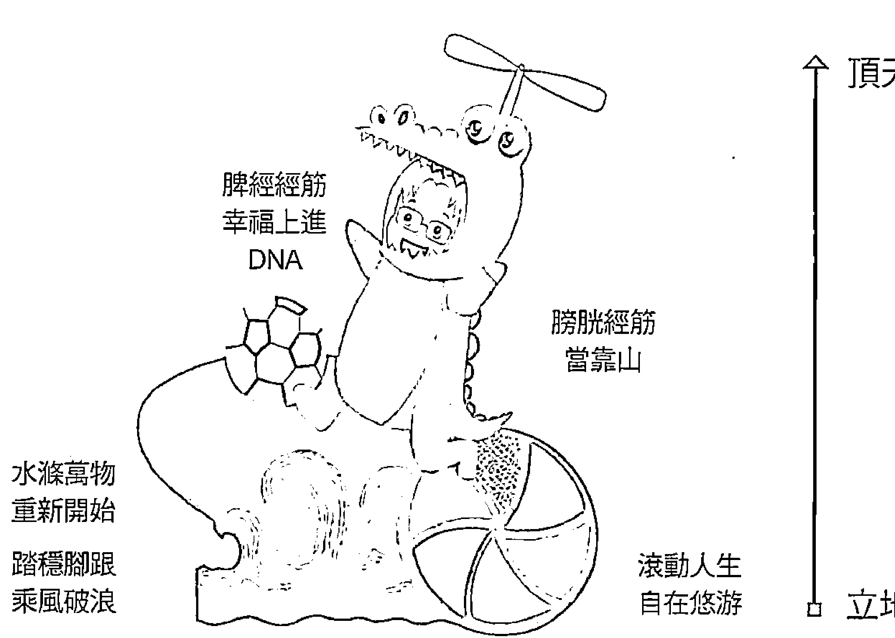

## 養護奇經八脈

書寫腎經過程中，經常與從事自然療法的好友滿滿分享交流，她提到從事音波療法的導師一直教他們要養護奇經八脈，透過奇經八脈的養護，讓人更有力量更飽滿。乍聽之下，第一時間就想到這不正是我在這本書裡一直強調的重點，也是腎經與奇經八脈微妙的關聯之處！

她在從事自然療法的過程中，體會到健康的奇經八脈宛如會發光的聖誕樹，而且這光芒還會從體內透出到體表，讓人眼神清亮，容光煥發。

至於該如何照顧好自己的奇經八脈呢？

最重要的就是一輩子都要從事讓你有熱情且開心的事！

聽起來似乎很簡單，不過要做得到且堅持下去卻需要毅力。

回到中醫的觀點，當然要呼籲大家一定要好好照護你的腎！腎照顧好了，也能讓奇經八脈閃閃發光吧，祝福大家都成為閃閃發亮的好腎人。

## 國家圖書館出版品預行編目 (CIP) 資料

經絡解密 . 卷六 : 解開腎經先天之本與奇經八脈的身世之謎 - 腎經 + 奇經八脈 / 沈邑穎作 . -- 初版 . -- 臺北市 : 大塊文化出版股份有限公司 , 2021.06
面 ; 公分 . -- (Smile ; 151)
ISBN 978-986-5549-97-8( 平裝 )

1. 經絡 2. 經絡療法

413.165
110007390