# 茅山符咒奇术
### 五雷镇天灵符地辟
元光大师◎著

## 国家图书馆出版品预行编目资料

茅山符咒奇术／元光大师著．-- 初版．-- 2000[民 89]
162 面；公分．-- (符咒丛书；3028)

ISBN 957 - 8938 - 82 - 9(平装)

1. 符咒 295 89001351

© 符咒丛书 3028

# 茅山符咒奇术

- 作者／元光大师
- 发行人／林庄橙桦
- 社址／台北市桂林路 144 号 5 楼
- 登记证／新闻局局版台业字 5783 号
- 电话／(02)2304 - 2670 · 2336 - 5280
- 传真／(02)2302 - 9249
- 门市部／台北市华西街观光夜市 A 区 16 号
- 电话／(02)2304 - 0856
- 邮政划拨／台北 1218123 - 3 林庄橙桦账户
- 电脑排版／齐格飞设计制作群
- 印刷／奥海印刷有限公司
- 地址／板桥市田单街 11 ~ 6 号
- 初版日期／二〇〇九年二月
- 定价／人民币 28.80 元

著作权所有．翻印必究
◎本书如有缺页破损或装订错误，请寄回本书局调换

## 目录

- 符咒的认识 ........................ 一
- 符咒真的有用吗？ .................. 四
- 画符的要领 ........................ 七
- 修持者必知 ........................ 一〇
- 符的用法 .......................... 一五
- 四季消灾降福灵符 .................. 一八
- 天师去病灵符 ...................... 二二
- 保平安灵符 ........................ 四四
- 太岁灵符 .......................... 六五
- 月令去病灵符 ...................... 七三
- 二十道灵符 ........................ 八〇
- 称心如意灵符 ...................... 九四
- 镇恶梦灵符 ........................ 一〇四
- 小天罡灵符 ........................ 一一〇
- 救宅灵符 .......................... 一四二
- 青惊灵符 .......................... 一四七
- 治牛瘟灵符 ........................ 一四八
- 小孩夜啼灵符 ...................... 一四九
- 清净灵符 .......................... 一五〇
- 破土灵符 .......................... 一五一
- 镇宅骗犯灵符 ...................... 一五二
- 家庭圆满灵符 ...................... 一五三
- 喜冲喜或喜冲丧灵符 ................ 一五三
- 安土木煞灵符 ...................... 一五五
- 安小孩罗嗦灵符 .................... 一五六
- 保畜灵符 .......................... 一五七
- 化骨灵符 .......................... 一五八
- 止血灵符 .......................... 一六〇
- 老君入山灵符 ...................... 一六一
- 镇煞灵符 .......................... 一六二
- 立即催生灵符 ...................... 一六七
- 收惊灵符 .......................... 一六八
- 安小儿失魂灵符 .................... 一六九
- 制煞灵符 .......................... 一七〇
- 保身灵符五道 ...................... 二〇〇
- 风水地理灵符 ...................... 二〇一
- 至宝如意灵符 ...................... 二〇三
- 制小孩关煞灵符 .................... 二〇六
- 改运灵符九道 ...................... 二四〇
- 神秘保胎灵符 ...................... 二四七
- 镇宅带身灵符五道 .................. 二四七
- 小孩夜尿灵符 ...................... 二五〇
- 止牙痛符 .......................... 二五一
- 收惊符 ............................ 二五二
- 召神符(一) ........................ 二五三
- 召神符(二) ........................ 二五四
- 召神符(三) ........................ 二五五
- 召神符(四) ........................ 二五六
- 求财符 ............................ 二五七
- 小儿夜啼符 ........................ 二五八
- 平安符 ............................ 二五九
- 除邪符(一) ........................ 二六〇
- 除邪符(二) ........................ 二六一
- 治头痛符 .......................... 二六二
- 治吐乳符 .......................... 二六三
- 一炁保身符 ........................ 二六四
- 男女不顾家符 ...................... 二六五
- 驱邪符 ............................ 二六六
- 飞财煞符 .......................... 二六七
- 耗财煞符 .......................... 二六八
- 鬼门关符 .......................... 二六九
- 五鬼关符 .......................... 二七〇
- 阎王关符 .......................... 二七一
- 将军箭符 .......................... 二七二
- 暗害煞符 .......................... 二七三
- 迷魂煞关符 ........................ 二七四
- 兴旺星符 .......................... 二七五
- 取舍关符 .......................... 二七六
- 五虎神符 .......................... 二七七
- 五虎食鬼符 ........................ 二七八
- 收邪符 ............................ 二七九
- 治鬼符 ............................ 二八〇
- 治百病符 .......................... 二八一
- 观音镇安符 ........................ 二八二
- 移病符 ............................ 二八三
- 茅山迷魂娘符 ...................... 二八四
- 茅山狐狸迷心符 .................... 二八五
- 阴阳神医符 ........................ 二八六
- 戒酒符 ............................ 二八七
- 吞精吃鬼符 ........................ 二八八
- 收宅煞符 .......................... 二八九
- 斩妖符 ............................ 二九〇
- 斩邪符 ............................ 二九一
- 治邪符 ............................ 二九二
- 殷公保胎符 ........................ 二九三
- 殷公安胎 .......................... 二九四
- 门上隔妖 .......................... 二九五
- 殷公催生符 ........................ 二九六
- 高帅催生符 ........................ 二九七
- 保胎符 ............................ 二九八
- 殷公拷鬼符 ........................ 二九九
- 殷公防身符 ........................ 三〇〇
- 治癫病 ............................ 三〇一
- 治百病符 .......................... 三〇二
- 治夜梦符 .......................... 三〇三
- 保命符 ............................ 三〇四
- 打符一宗 .......................... 三〇五
- 收邪入井一宗 ...................... 三〇六
- 收百口禁一宗 ...................... 三〇七
- 探病神咒 .......................... 三〇八

## 符咒的认识

在我们的日常生活之中，常会碰到一些灵异而又不可解说的事情，有些是无意中碰到的，也有明知故犯的，如果有这么一天犯了一般所说的『邪』那可真是麻烦。要是本身懂得化解倒没什么关系，二三下就平安无事，要是本身不懂那就麻烦了，又浪费金钱与精神，可能没什么结果，最后只说『真倒霉』罢了。

近百年来，我国接受西方文明，在新的教育方法之下，往往请求保护，一定在三十六加三十六等于七十二的法则之下才能承认一种理论的存在，所以符咒的效功就无法来个合宜的承认，既然有些人心中怀疑那就不诚，也因不诚则不灵。

有时候有些小孩三更半夜哭个不停，既不是肚子饿又不是尿片湿，更不是肚子痛，到处投医不得结果，那时候也许请『先生妈』来『收惊』。有些大学毕业的青年男女一等到结婚的时候也必需选个黄道吉日成亲，在埋葬祖先灵柩的时候也不敢随随便便找个地方下葬。这种既不承认其存在价值却又避免去犯这些禁忌，真是『口是心非』或言行不一致。

大家都知道，许多中国古学一直没有妥善保存与处理。并且在我们的传统习俗中，当父传子、师传徒的时候往往在传授中多少会保留一些绝招，故意把许多道理不加说明，千余年来，只见这些学说日渐没落。本来这些学说就不是稍加学习就可以领悟与运用，因此如果学艺不精或领悟力不够的话，往往错误百出，因而使人怀疑。况且对着那些既无标点又含义深奥的古人著作使人望而生畏，以致许多人在学习过程中就半途而废，实在惋惜，无法一心一德，百折不挠达到成功的境遇，真是功亏一篑。笔者之所以要在本书一开始就把这些易患的错误叙述一下，为的是要让读者建立信心。正如伟大的国父孙中山先生所说：『吾心信其可行则挟泰山超北海终有成功之日，吾心信其不可行则翻掌折枝之易亦无收效之期也。』因此坚定信心是很重要的。

符是一种形象，有他的特殊效用。例如数学上的「⊥」代表垂直，「∽」代表相似。当我们看到某种形象的时候就在脑海里产生一种该形象的作用，所以也可以把这形象看成一种符号。地球上人住的世界一般称阳间，当我们路过斑马线的时候知道这是专为行人设的，又某公司或某机关的识别证，当你看到该识别证的时候就知道什么阶级或什么人物。仙逝之后的那个世界一般称阴间，照理和阳间一样的有法律，同样的善恶分明，如果恶的可用道教的符咒来镇压，或纯用佛教的咒语（真言）来驱逐。

笔者生性十分好奇，认识流传这么广远的中华文化总有他的道理与因素之存在，因此多年来不断的和这方面有关的人接触，根据他们的说法，『符咒』是一种和灵异世界互相沟通的行为，只是要集中精神意念，抛弃杂念。如果心术不正那是无法完成的，当沟通的时候还要一些形式，借着这种形式而冥冥中产生一股令人不可思议的效果，『信则灵，不信则不灵。』

## 符咒真的有用吗？

谈到符咒很多人总以怀疑的心理及眼光来看待，这也难怪，因为符咒的确无法像化学实验，把两种以上的物质互相作用之后产生的另一种物质摆在人的眼前来证实，因此虽然符咒功效很大，但信者自信，不信的还是不信。虽然功效很大还是无法很快的令人相信，更何况有些不肖之江湖人物为了一己之利而影响这门高深精奥的中华古学。笔者身为公教人员，一向都是服从政府的决策，尽忠职守，在这里必需事先声明的是笔者编著此书决不是崇尚迷信，而是复兴中华文化，因为道学可弥补物质生活与精神生活之所缺，借此希望读者们能潜移默化，先齐家再治国。笔者也不再谈更多，只说明引证四点事实，这是笔者的亲自体验，决不是迷信。

（一）中华民国六十七年农历七月的某夜，次女三更半夜突然猛哭，笔者睡在隔壁，告诉内人（笔者之妻）冲牛奶喂她，始终不吃。大约哭了一分多钟，笔者深觉不对劲，因为当起床的时候即突然间鸡皮疙瘩。想了一下，内心想那可能是无主游民（无人祭祀的鬼魂）的把戏吧！于是把次女抱在身上，当抱起的那一霎那，鸡皮疙瘩更为加剧，再看看小孩的五官像是傻傻的，于是施用符咒来镇之，不一会即睡着了。如果不信的人发现小孩在床上猛哭打滚，很可能误认为肚子痛而立刻就医，果真如此岂不是白忙一阵？施用了符咒而令小孩安睡，你说妙不妙？

(二) 中华民国六十七年九月十四日下午有位同事说：『犯了煞神，浑身不对劲，头晕、四肢无力。』于是请他跟我回宿舍，用符水含在口内，向他的脸及背各喷一口，再用手沾符水向他的前胸及背后、双手，分别拍一拍，最后再请他喝三小口之符水。第二天（九月十五日）即显得精神抖擞，由此可见该符水之功效的确令人不可思议。

(三) 中华民国六十七年十一月十九日，下午三时三十分由斗六乘车至西螺，车子一出斗六，在笔者的视野中只知道路旁有一大堆人。那天晚上，小孩一直哭，直到十点多钟内人才说：『刚才回来的时候路旁可能在办那个呀！』（指路旁有人办丧事）由于这句话的提醒才用符水镇之。说也奇怪，喷一口，喝三小口，拍一拍，果然不一会儿就睡着了。很可能有人会说笔者胡说八道，如果硬要说「胡说八道」的话那么笔者也不想加以解释，因为俗语说：『凡人饮水，冷暖自知』。

(四) 中华民国七十年二月的某一天，笔者的住处附近，由于改建厨房，校方请了挖土机来挖地基，当天下午小孩就很不对劲，因为当天早晨上班的时候小孩还玩得很开心，所以笔者一看就心里有数，还是用了『犯土木煞』及『动土』的灵符来施用，这样才化解突然而来的不如意事。

读者看了上面四点事实究竟有什么感想呢？是笔者在胡说八道呢？还是笔者有心贡献出来呢？敬请读者们慎思、明辨、遵行。

## 灵符的要领

- (一) 把身体洗干净，然后静下心来，稍坐片刻。

- (二) 画符的时间在子时 (即午夜十一时至凌晨一时之间) 最好，因为这段时间是阴阳交接时刻，万物感应最具灵验。

- (三) 画符所用的纸一般是黄色纸，不过有时候具有特殊用途的可用红色纸。至于墨水方面有的用朱砂，平常是用墨汁 (黑墨汁)，所以用黄色纸较普遍。古人用墨从来磨墨是有其用意的，因为在你磨墨的那段时间可使你心平气和，有助于灵符的效用。

- (四) 至于用纸尺寸的大小，在杂货店可买到长条形的黄色纸，不过对于讲究的人则要用「门公尺」去量用纸的长与宽。关于大型的符纸一般都要经过「门公尺」的测量尺寸才用。因为大型符的用途较广，必需合乎「门公尺」的吉祥字句。

- (五) 画符的时候，符的上头如果有三个勾的，一定要一边打勾而一边念咒：即「一笔天下动」、「二笔祖师剑」、「三笔凶神恶煞走去千里外」。

这里需特别强调的是符上头的三个「V」，不是勾而是点，本来是一点，但是当我们用力向下一点再提笔的时候往往变成一个勾『V』，画符的人在画符的时候心里要想这是『点』而不是『勾』，这就可以了，所以应该是『V』，不是『√』。这就是说下笔要长而提笔短才像『点』，假若下笔短而提笔长或下笔与提笔同长，那就成为『勾』了，这些细节要留意，画出的符才更灵异。

假若符的上头没有三个勾（点）则在下笔之前必需先念：『天圆地方，律令九章，吾今下笔，万鬼伏藏，急急如律令』。

- (六) 符画好之后，将笔反向，用笔头压符三次，即撞符纸三次，由下向上撞。然后用剑指或金刚指敕符，一般善符的敕符咒语可用下列二道，第一道敕三次之后再敕第二道。

### 第一道敕符咒语：
奉九天玄女娘娘师祖，赐我一指金刚会笔指，点天天清（此时手指指向天），点地地灵（此时手指指向地），点神神显圣（此时手指指向家中的菩萨或堂上的佛像），点人人长生（此时手指指向人），点符符好用（此时手指直接指触符纸）。

### 第二道敕符咒语：
乾元阴覆，玄运无偏，造化发育，万物资焉，东西南北，任意安然，云行雨施，变化不测，吾奉太上老君敕，急急如律令。

- (七) 敕符的时候手指要用力，要有威严的感觉。

- (八) 画符之前要点三支清香，禀请九天玄女娘娘、太上老君、北斗星君入檀，禀告画符的本意及何人要用等等。

- (九) 画符所需的纸、墨、笔、砚、水等物品最好要先诚心诚意的用神咒来敕，以收神威：
    - A 敕纸咒：北帝敕吾纸，画符打邪鬼，敢有不伏者，押赴酆都城，急急如律令。
    - B 敕墨咒：玉帝有敕，神墨炙炙，形如云雾，上列九星，神墨经磨，辟雳纠纷，急急如律令。
    - C 敕笔咒：居收五雷神将，电灼光华，纳则一身保命，上则缚鬼伏邪，一切死活灭道，我长生，急急如律令。
    - D 敕砚令：玉帝有敕，神砚四方，金木水火土，雷风雨电，神砚轻磨，霹雳电光芒，急急如律令。
    - E 敕水：此水非凡水，北方壬癸水，一点在砚中，云雨须臾至，病者吞之，百鬼消除，邪鬼吞之粉碎，急急如三奇帝君律令。

- (十) 不管是用剑指或金刚指敕符，最后一定先把剑指或金刚指摆在嘴前「哈」一声。

再用力敕 (敕符)。

(十一) 符画好了，也敕好了，一定燃烧寿金答谢诸神。然后手拿着符在火焰上打转三次，再拿到清香的香烟上打转三次，这样画符的手续才告完成。

(十二) 谢符：用了灵符之后，收到良好的效果，必须谢符。所谓『谢符』是感谢诸神灵的加持，使得增强灵符的威力，我们为了感谢而特别设的一种拜神仪式。这种『谢符』一般可用四果、清香、清茶奉拜即可，最主要是主人要诚心诚意，俗语说：『诚意吃水甜』。

如果不谢符岂不是过河拆桥吗？在我们生活圈子里经常流传二句口头语：『有借有还，再借不难』及『见面三分情』。阴阳同理，这个中的要点读者们冷静沉思一下即可明白，笔者在此就不必多加叙述了。

## 修持者必知

- (一) 修持这方面的人要有恒心，不要半途而废。因为人要成功一定会遭遇到很多的多挫折，如身体的不适、妻子的种种困扰、服务处所的不如意等等。如果定力不够的则往往半途而廢，這就是一般所說的『魔障』。

- (二) 心要誠。無論在私人機關做事或公家機關服務，一定要秉承良心做事，自己份內的事無論如何都要想辦法完成，不可因上級或主管不在就敷衍了事，馬馬虎虎，陽奉陰違。有些入以為沒人看見，其實我們的一舉一動在自然界之中，似乎冥冥中有被監視的現象。這可能不容易被接受，因普通人感覺不出來，所以就要各憑良心了。自然界中的無形力量是用來賜給善良的人，盡忠職守及寬宏大量的人。因此如果不能盡責及不誠意的人是不必學的，否則徒勞無功。

- (三) 守五倫。君臣、父子、夫婦、兄弟、朋友。『君臣』以現在的社會結構可譬如為長官與部屬之間的關係，要有義，千萬不可見利忘義。還得父慈子孝、夫婦有別、兄友弟恭及朋友有信。其中孝順父母最重要，所謂『百善孝為先』就是這個道理。

- (四) 要鍛煉身體，培養靈力。尤其要鍛煉手力，手指要有力量，可用訓練『鷹爪功』的方式來鍛煉手力。除此之外還得養氣，利用『吐納法』來養『丹田』之氣。

- (五) 用意念。『意念』也有人叫『念力』，這種念力實在太奧妙了。例如畫五符的時候即心中直想似乎在打雷的隆隆聲，有時候畫到佛祖的時候就好像佛祖在符紙上，如能把念力集中則功效更大。

中华民国七十年二月下旬的某个星期天，笔者独自在办公室写中小学的科学展览用的稿件，当时正在写「天文学的应用」（这篇参加云林县中小学科展荣获教师组的佳作）。眼看对面教室二位男生正在玩「催眠术」的现象，笔者认为学校是教育场所不可让学生胡来，于是叫那二位男生到教务处，第一次故意让他们玩，被施术的那位男生的双手果然轻轻向上移动。笔者叫他们继续，那时有位施术的男生站在被施术的后面，意思是要被施术的男生向后仰，当时笔者坐在椅子上，用念力来散他的真气，并且用指法点散他（被施术的男生）的元神，所以他俩始终没成功。

后来笔者以和颜悦色的语气训告他俩，不要学这种，否则容易步入邪途，应该好好利用时间念书，于是他俩也心平气和的离开办公室，同时同声来个「谢谢教务主任」。

- （六）要安份。这里的安份是专指修办的人或画符的人要特别注意的一件事，也就是当夫妇行房后的两小时之内最好不要画符，因元气已伤，所画的符就大打折扣。结过婚的人都有同感，当行房之后的血液循环似乎不太正常，所以要养精蓄锐，古人常说：「画符力求精气神贯注」就是这个道理。

- （七）认识八卦与太极。有时候在符中需要画太极或八卦，甚至于太极与八卦同时都要画上的，这个时候就必须细心，不可画错，现在笔者把太极图与八卦图列于左以供参考。

## 符的用法

一般人虽然在画店可买到符咒的书本，但是画中的各种符咒并没有很详细的记录其用法，因此不敢用，也不会用。现在就让笔者谈谈符的用法，一般的符有下列的用法：

- (一) 吃法：所谓吃法并不是直接把符吃下去，而是把符火化成灰，可用碗或茶杯来火化，然后冲开水，等符水澄清后再饮用，这叫吃法。这里需特别叮咛读者的是当你火化符的时候，一定先由符尾点燃，由尾向头一直燃烧起来。最好能够做成 (用手把符纸折成) 令箭 (即箭头形状)，如能折成令箭则效果更大，令箭的箭头是符头，这点请留心。
- (二) 洗法：所谓洗法也不是直接把符来擦洗，而是先把符火化成灰，可化在浴盆或洗脸盆，然后加水来洗的。这要看符的用途如何？如果是洗头面 (即洗头部各外表器官) 的就只洗头面，洗完之后把符水泼出户外或流入沟均可，但不要倒入马桶 (洗手间的化粪池)，否则对帮助你的诸神不敬，那是不大好的。有的符是用来洗身的，那就当澡水来洗全身，要看符的用途而定，不可一概而论。
- (三) 擦法：所谓擦法也不是直接把符拿来擦，也要先把符火化成灰，可用茶杯或碗来火化，然后冲开水，再用手指沾符水来擦身体。一般都用金刚指或剑指沾符水来擦的，而一般的擦法是擦头部，然后再沾符水拍一拍胸部及背部。有时候还可利用喷法，所谓喷法是口含符水，施术者口含符水，然后施术者用自己的剑指放在自己的嘴前，叫被施术者站好或坐好，有时候要睡好（因病重），于是施术者用力一喷，符水经过剑指而到达被施术者的身上，这方法也很妙，施术者要面带威严更有效果，千万不可有如儿戏。
- (四) 贴法：所谓贴法就是直接把符贴在伤患处，但一定先用手沾水轻轻的抚摸，使符能受湿，然后符的正面（即符纸写字或画符的那一面）贴在伤患处。不过有的符是要火化成灰再跟药合拢之后才用的，因此当你有事请教别人的时候，一定要问清楚。
- (五) 煮法：又叫煎法，就是把符放在药壶内煮的意思。有时候是只有一张符用白水去煎，有时候是和某些中药合煎。现在还要一提的是用符煎药的程序，不管那张符是单独煎还是与某些中药合煎，最好按照这些程序来比较好。
    - A. 先点三支清香禀请该符的所属神，也就是来帮助的神。说明弟子（姓名）家住（把地址说出），兹因某某人的身体不安（一定把病情详述），请尊驾（要说神的称呼）多多帮忙，并请入堂内。
    - B. 堂上要准备桌子，先摆好已洗干净的药壶一只（壶嘴朝外），再准备要煎药的水 (可用大碗盛之摆在桌子上)，符也折成令箭形的摆在桌上。
    - C. 把三支香（刚刚禀请时烧的那三支）插在药壶的壶嘴。
    - D. 大约过了一刻钟（十五分钟）还得拿起圣筶（又叫圣杯）来呼称尊驾（叫出神的称呼）是否已将仙丹带来（说药带来了吗也可以）？这时就用圣筶来问卜，假若药方已带来就要燃烧大约值新台币二十元左右的寿金以答谢之。
    - E. 把符火化在药壶内，加桌上的那碗水，然后就开始煎了。煎的时候壶嘴一定朝外，如果主人心诚慈善的话，用符煎水之后，该符水也会变色，并且也有药味，真是太妙了。
- (六) 佩法：也叫带法，一般都是符纸向内折带在身上，有些小孩受了惊就用红线绑着符挂在小孩的脖子上，或放在衣袋之内，若怕汗湿可用透明塑胶布包上。
- (七) 化法：也就是一般所说的焚化，直接用火一烧。

## 四季消火降福灵符

说明

- (一) 左边四道符都是用朱砂写在黄纸上。
- (二) 画此符需设置「太玄仙翁」之神位。画符之前要焚香叩头，再叩齿三次。手执朱砂笔，目光注视符纸上，不可心不在焉，要四道符一起写成，然后放在仙翁的香灯边，以备佩用。

春季佩左符大吉
夏季佩左符大吉
秋季佩左符大吉
冬季佩左符大吉

## 天师去病灵符

- (一) 农历初一日的病。是在住宅的东南方向路上所犯的，是野魂的作祟而使病人头痛，并且有寒热的病况，一般是四肢无力，不思饮食。应该用『黄钱』五张，向住宅东南方向走四十步，然后用『黄钱』五张烧之，并且准备一些『菜饭』送之即可。左方的符要化饮一道，另外一道则贴在大堂的门斗上。
- (二) 农历初二日的病。是在住宅的东南方所犯的，是家乡的老魂作祟而使病人头痛，语言无常，热多冷少（指常发烧），四肢无力，并有呕吐现象。应该用「白钱」五张，向住宅东南方向走三十步，然后用「白钱」五张烧之，并且用一些「菜饭」送之即可。左方的符要化饮一道，另外一道则贴在大堂的门斗上。
- (三) 农历初三日的病。是在住宅的北方所犯的，是聚乘的灵魂作祟。有头痛，忽冷忽热，饮食不进等病况。应该用『黄钱』五张向住宅北方走二十步的地方烧『黄钱』五张，并且用一些『菜饭』送之则吉。要化饮左方的符一道。
- (四) 农历初四日的病。是在住宅的东北方所犯的。病者手脚沉重，头痛狂乱，饮食呕吐。应该用『黄钱』五张，向住宅东北方走五十步的地方烧『黄钱』五张，并且用一些『菜饭』送之则吉。左方的符要一道化饮，另用一道贴大堂的门斗上。
- (五) 农历初五日的病。是在住宅东北方所犯的，病者忽冷忽热，呕吐得很严重。应该用『黄钱』五张，向住宅东北方走五十步的地方烧『黄钱』五张，并且用一些『菜饭』送之则吉。左方的符要化饮一道，并且佩带一道在身。
- (六) 农历初六日的病。是在住宅的东方所犯，病者四肢沉重，有的还上吐下泻，遍身疼痛。应该用『白钱』五张，向住宅东方四十步的地方烧『白钱』五张，并且用一些『菜饭』送之则吉。左方的符要贴一道在墙上则大吉。
- (七) 农历初七日的病。是在住宅东南方所犯，病者有呕逆现象与寒热之症状，手足沉重。应该用『白钱』五张，向住宅东南方三十步的地方烧『白钱』五张，并且用一些『菜饭』送之则吉。化饮左方的符则吉。
- (八) 农历初八日的病。是在住宅东北方所犯。病者的膝脚疼痛，四肢无力，忽冷忽热，不想吃东西（胃口不开）。应该用『黄钱』五张，向住宅东北方二十步的地方烧『黄钱』五张，并且用一些『菜饭』送之则吉。
- (九) 农历初九日的病。是在住宅南方所犯，病者呕吐，四脚无力，手脚沉重，坐卧不安。应该用『白钱』五张，向住宅南方三十步的地方烧『白钱』五张，并且用一些『菜饭』送之则吉。化饮左方的符则吉。
- (十) 农历十日的病。是在住宅的东方所犯，病者的病情是先轻后重，手足不安，头痛，心神恍惚，忽冷忽热，不想吃东西。应该用『白钱』五张，向住宅东方四十步的地方烧『白钱』五张，并且用一些『菜饭』送之则吉。化饮左方的符一道则吉。
- （十一）农历十一日的病。是在住宅北方所犯，被枉死的妇魂作祟，病者的病情是上热下寒，呕吐酸水，沉重而不想吃东西。应该用「黄钱」五张，向住宅北方四十步的地方烧「黄钱」五张，并且用一些「菜饭」送之则吉。左方的符贴一道在大堂门上即吉。
- (十二) 农历十二日的病。是在住宅东北方所犯，先轻后重，呕吐不安，同时起卧也不安，四肢发冷。应该用『白钱』五张，向住宅东北方三十步的地方烧『白钱』五张，同时用一些『菜饭』送之则吉。左方的符贴一道在大堂的门斗上则吉。
- (十三) 农历十三日的病。是在住宅东北方所犯，上吐下泻，心神恍惚，饮食无味。应该用『黄钱』五张，向住宅东北方五十步的地方烧『黄钱』五张，并且用一些『菜饭』送之则吉。左方的符化饮一道，并且贴一道在大堂门斗上则安。
- (十四) 农历十四日的病。是在住宅东方所犯，手足发冷，上吐下泻，坐卧不安，饮食无味。应该用『白钱』五张，向住宅东方三十步的地方烧『白钱』五张，并且用一些『菜饭』送之。左方的符化饮一道。并且贴一道在大堂门斗上即安。
- (十五) 农历十五日的病。是在住宅南方所犯，水火二神和病，寒热得很厉害，呕吐而且心乱，不思饮食。应该用『白钱』五张，向住宅南方三十步地方烧『白钱』五张，并且用一些『菜饭』送之则吉。左方的符化饮一道，并且贴一道在大堂的门斗上即安。
- (十六) 农历十六日的病。是在住宅西南方所犯，病者头痛，忽冷忽热，四肢沉重。应该用『黄钱』五张，向住宅西南方四十步的地方烧『黄钱』五张，并且用一些『菜饭』送之则吉。左方的符化饮一道，并且身上佩带一道即安。
- (十七) 农历十七日的病。是在住宅西方所犯，病者头痛，手足如火，坐卧不安，冷热不分。应该用『黄钱』五张，向住宅西方三十步的地方烧『黄钱』五张，并且用一些『菜饭』送之则吉。左方的符化饮一道，并且身上佩带一道即安。
- (十八) 农历十八日的病。是在住宅西南方所犯。病者忽冷忽热。上吐下泻。饮食无味。应该用『白钱』五张。向住宅西南方四十步的地方烧『白钱』五张。并且用一些『菜饭』送之则吉。左方的符化饮一道。并且身上佩带一道即安。
- (十九) 农历十九日的病。是在住宅北方所犯。病者是上热下冷。呕吐酸水。四肢沉重。不思饮食。应该用『黄钱』五张。向住宅北方三十步的地方烧『黄钱』五张。并且用一些『菜饭』送之则吉。左方的符化饮一道。并且头顶上放一张即安。
- （二十） 农历二十日的病。是在住宅东北方所犯，病者先轻后重，呕吐不安，同时起卧也不安，四肢无力。应该用『白钱』五张，向住宅东北方五十步的地方烧『白钱』五张，并且用一些『菜饭』送之则吉。左方的符化饮一道，并且大堂门斗上贴一道则大吉。
- (二十一) 农历二十一日的病。是在住宅东北方所犯，病者上吐下泻，心神恍惚不安，同时起坐也不安，饮食无味。应该用『黄钱』五张，向住宅东北方四十步的地方烧『黄钱』五张，并且用一些『菜饭』送之则吉。左方的符化饮一道大吉。
- (二十二) 农历二十二日的病。是在住宅东方所犯，病者手足寒冷，上吐下泻，坐卧不安，饮食无味。应该用『黄钱』五张，向住宅东方三十步的地方烧『黄钱』五张，并且用一些『菜饭』送之则吉。左方的符身上佩带一道，并且大堂门斗上贴一道则吉。
- (二十三) 农历二十三日的病。是在住宅南方所犯，病者起卧不安，肚痛而且上吐下泻，饮食无味。应该用「白钱」五张，向住宅南方四十步的地方烧「白钱」五张，并且用一些「菜饭」送之则吉。左方的符化饮一道，并且身上带一道则安。
- (二十四) 农历二十四日的病。是在住宅西南方所犯，病者四肢沉重，寒热呕逆。应该用『黄钱』五张，向住宅西南方五十步的地方烧『黄钱』五张，并且用一些『菜饭』送之即安。左方的符化饮一道，并且身上佩带一道即吉。
- (二十五) 农历二十五日的病。是在住宅西方所犯，病者头重而身沉，不思饮食。应该用『白钱』五张，向住宅西方四十步的地方烧『白钱』五张，并且用一些『菜饭』送之即安。左方的符贴一道在大堂门斗上即安。
- （二十六）农历二十六日的病。是在住宅西北方所犯，病者头痛而且心神恍惚不安。应该用「黄钱」五张，向住宅西北方五十步的地方烧「黄钱」五张，并且用一些「菜饭」送之即安。左方的符贴一道在大堂的门斗上即安。
- (二十七) 农历二十七日的病。是在住宅东方所犯，病者头痛而且有点狂乱，忽冷忽热，呕吐恶心。应该用『黄钱』五张，向住宅东方三十步的地方烧『黄钱』五张，并且用一些『菜饭』送之即安。左方的符戴在头上则大吉。
- (二十八) 农历二十八日的病。是在住宅北方所犯，病者头部发热，睡起不安，不思饮食。应该用『白钱』五张，向住宅北方四十步的地方烧『白钱』五张，并且用一些『菜饭』送之即安。左方的符化饮一道，并且身上也佩带一道则安。

(二十九) 农历二十九日的病。是在住宅东南方所犯，病者头痛，忽冷忽热，饮食无味，应该用『白钱』五张，向住宅东南方三十步的地方烧『白钱』五张，并且用一些『菜饭』送之即安。左方的符贴一道在墙上则大吉。

(三十) 农历三十日的病。是在住宅东北方所犯，病者头痛，而且脑部很难过，心神恍惚不安，不思饮食。应该用『黄钱』五张，向住宅东北方四十步的地方烧『黄钱』五张，并且用一些『菜饭』送之则安。左方的符身上佩一道则大吉。

## 【说明】：

- ① 以上所说的「黄钱」或「白钱」是冥纸的一种。
- ② 「菜饭」是简单的白米饭与几道数量少许的蔬菜，煮好后可祭拜的。
- ③ 「送之」就是用「菜饭」祭拜、燃烧「黄钱」或「白钱」之后要那些野魂离开，使它们高高兴兴远离而去的意思。
- ④ 在「送之」（祭拜）的时候要呼叫值日的神将，今将各值日神将的称呼列于左，以供参考：

初一：王文卿、虎贲将。 初二：张仲卿、司马卿。
初三：李仲卿、怪文昌。 初四：马仲卿、王文章。
初五：侯佐卿、怪仲居。 初六：辰子江、虎明心。
初七：刑孙卿、赵子王。 初八：虞子张、石义扬。
初九：郭子良、杨仲公。 初十：重无升、张文通。
十一：扈女卿、礼利公。 十二：重元升、张文通。
十三：乐石杨、范仲杨。 十四：褚正卿、郭子良。
十五：孔仁卿、史公夹。 十六：卫正卿、危小明。
十七：未伯、臧文公。   十八：妹仲阳、郑都卿。
十九：杨神升、林卫卿。 二十：社卫卿、苏实家。
廿一：孟邦卿、康文卿。 廿二：魏文卿、百叔通。
廿三：田归阳、成文长。 廿四：央子仁、左子仁。
廿五：宿一卿、亡云卿。 廿六：孟文童、戴公明。
廿七：霍叔央、钟四卿。 廿八：从元光、时通卿。
廿九：叶文通、郑将军。 三十：乐进卿、鬼仲阻。

## 保平安靈符

### 壹
（此处为符咒图像）

### 壹
（此处为符咒图像）

### 壹
土土土土土
（此处为符咒图像）
山山山
（此处为符咒图像）
刀刀刀
（此处为符咒图像）
山山山
山
（此处为符咒图像）

### 贰
（此处为符咒图像）

### 贰
（此处为符咒图像）

### 贰
| 辰 日月出 | 巳 |
| :--- | :--- |
| 連 | 翏 角角 员父 |

### 贰
區
田田
出比

戢
兩
馬
弓

山鬼
日月
用

神神神
鬼鬼鬼
吉吉吉
土土土

### 奎
（此处为符咒图像）

### 叁
| | |
| :--- | :--- |
| **角鬼角** （符咒文） | **火山川 火山王 火山王 火山冂** （符咒文） |
| （符咒文） | （符咒文） |

### 叁
（此处为符咒图像）
嵬 嵬 嵬
口鬼口田尼
出口口角
日日日日屈

### 叁
（此处为符咒图像）

### 肆
（此处为符咒图像）

### 肆
（此处为符咒图像）

### 肆
（此处为符咒图像）

### 肆
（此处为符咒图像）

### 伍
（此处为符咒图像）

### 伍
（此处为符咒图像）

### 伍
（此处为符咒图像）

### 伍
| | |
| :--- | :--- |
| 三 田田 （符文） | 王王 口田 出尾 角士 |
| 山山 刀刀刀刀 口口口口 日出昌 鬼尾 | 山山 田 （符文） 鬼鬼 |

## 【说明】：

- ① 右方的符笔者把它分为壹贰叁肆伍等伍样，这些都是平安符。
- ② 每种都有十六道，如「壹」的部分总共有十六道符，而贰叁肆伍也各有十六道。
- ③ 画的时候是要把「壹」的部分十六道画在一起，「贰」的部分十六道画在一起，「叁」的部分十六道画在一起，「肆」的部分十六道画在一起，「伍」的部分十六道画在一起。
- ④ 壹的十六道符镇中庭，贰的十六道符镇东方，叁的十六道符镇南方，肆的十六道符镇西方，伍的十六道符镇北方。
- ⑤ 这些符都是平安用的，希珍惜之。

## 太歲靈符

敕太阳星君 敕六甲神將 敕令天官賜福 敕令鎮宅光明
敕佛 敕太歲
（年）星君到此鎮
北斗星君 敕令丁天兵 敕令招財進寶 敕令合家平安
信士〇〇〇敬奉

## 【说明】：

- ① 右符叫太岁符，符的旁边有『信士〇〇〇敬奉』，其中的三个圆圈是要让我们填写犯太岁人的姓名。
- ② 符的中间『年』的上方要写当年的干支，例如民国七十年就写『辛酉』，七十一年则写『壬戌』，七十二年则写『癸亥』，七十三年又回到『甲子』……。
- ③ 符的中间『星君』的上方要写当年太岁星君的称呼，例如民国七十年为『文政』，这太岁星在农民历中都有记载，现在笔者把『岁次』及『太岁星君的姓名』列于后，以供参考：

| 民国 | 岁次 | 太岁姓名 | 民国 | 岁次 | 太岁姓名 |
| :--- | :--- | :--- | :--- | :--- | :--- |
| 七〇年 | 辛酉 | 文政 | 八〇年 | 辛未 | 李素 |
| 七一年 | 壬戌 | 洪范 | 八一年 | 壬申 | 刘旺 |
| 七二年 | 癸亥 | 虞程 | 八二年 | 癸酉 | 康志 |
| 七三年 | 甲子 | 金赤 | 八三年 | 甲戌 | 誓广 |
| 七四年 | 乙丑 | 陈泰 | 八四年 | 乙亥 | 伍保 |
| 七五年 | 丙寅 | 沈兴 | 八五年 | 丙子 | 郭嘉 |
| 七六年 | 丁卯 | 耿章 | 八六年 | 丁丑 | 汪文 |
| 七七年 | 戊辰 | 赵达 | 八七年 | 戊寅 | 曾光 |
| 七八年 | 己巳 | 郭灿 | 八八年 | 己卯 | 伍仲 |
| 七九年 | 庚午 | 王清 | 八九年 | 庚辰 | 重德 |

| 民国 | 岁次 | 太岁姓名 | 民国 | 岁次 | 太岁姓名 |
| :--- | :--- | :--- | :--- | :--- | :--- |
| 九〇年 | 辛巳 | 郑祖 | 一〇〇年 | 辛卯 | 范宁 |
| 九一年 | 壬午 | 路明 | 一〇一年 | 壬辰 | 彭泰 |
| 九二年 | 癸未 | 魏明 | 一〇二年 | 癸巳 | 徐舜 |
| 九三年 | 甲申 | 方公 | 一〇三年 | 甲午 | 张词 |
| 九四年 | 乙酉 | 蒋瑞 | 一〇四年 | 乙未 | 杨贤 |
| 九五年 | 丙戌 | 向般 | 一〇五年 | 丙申 | 管仲 |
| 九六年 | 丁亥 | 封齐 | 一〇六年 | 丁酉 | 康杰 |
| 九七年 | 戊子 | 班 | 一〇七年 | 戊戌 | 姜武 |
| 九八年 | 己丑 | 潘盖 | 一〇八年 | 己亥 | 谢寿 |
| 九九年 | 庚寅 | 邬桓 | | | |

中华民国万万年

- ④ 一般安太岁星君法（或称安太岁符）是择定农历正月初九日或正月十五日，或者另外选择良辰吉日安奉。

### A 敕太岁符咒：
天上日月有三奇，人间三奇天地人，人得长生光明在，点天天明，点人人长生，一笔韬气能灵光，二笔气降发光芒，三笔神在扫邪魔（这三笔要用笔头在太岁符下方『镇』或『罡』之处拉三次，念一笔……拉一次，念二笔……拉第二次，念三笔……拉第三次），弟子一心三拜请，拜请太岁星君推吾行，弟子姓名生庚镇符中（如要安『生庚』则将自己的出生年月日时写在太岁符的下方，必需在范围以内，即在『镇』或『罡』之上），保命让身退灭殃，太岁星君敕令，神兵火急如律令。
接着念金光神咒。

### B 金光神咒：
天地玄宗，万气本根，广修万劫，证吾神通，三界内外，惟吾独尊，体有金光，覆映吾身，视之不见，听之不闻，包罗天地，养育群生，受持万遍，身有光明，三界侍卫，五帝伺迎，万神朝礼，役使雷霆，鬼妖丧胆，精怪亡形，内有霹雳，雷神隐名，洞慧交撤，五气腾腾，金光速现，覆认真人，急急如玉皇上帝律令敕。
念完金光神咒之后加上『保命安宁』。念完后再用笔头撞符一次。

### C 安太岁符的时候要念三次的『请太岁星君咒』。

#### 请太岁星君咒：
奉请三星照符号，天上日月来供应，南斗北斗推五行，奄佛显灵敕真令，八卦祖师其中形，玉旨奉令太岁辛酉年（指民国七十年，若七十一年则为壬戌年……），值年文政星君（每年的星君不同，请看前面列出的资料）到此镇，七星五雷让两边，六甲神将到宫前，六丁天兵守后营，天官赐福神共降，招财进宝聚当明，弟子一心三拜佛，拜请太岁星君保安宁，镇宅光明人尊敬，合家平安万事兴，当今天子值年太岁星君，保命护身镇宅，太岁星君降来临，急急如律令。

- D 安奉太岁符要用清茶、红图、四果、香烛、寿金、太极金、天金。
- E 当焚香要拜请之前需先念：『拜请星君到此镇宅平安』。
- F 农历十二月二十四日要拆除太岁符，也要「谢符」，然后把太岁符焚化，一切圆满。
- ⑤ 太岁有当年太岁与对冲太岁或命宫太岁，都要安奉太岁符以保平安。

### A 当年太岁：即
鼠年出生的人碰到鼠年、牛年出生的人碰到牛年、虎年出生的人碰到虎年、兔年出生的人碰到兔年、龙年出生的人碰到龙年、蛇年出生的人碰到蛇年、马年出生的人碰到马年、羊年出生的人碰到羊年、猴年出生的人碰到猴年、鸡年出生的人碰到鸡年、狗年出生的人碰到狗年、猪年出生的人碰到猪年。

### B 对冲太岁：即
鼠年出生的人碰到马年、牛年出生的人碰到羊年、虎年出生的人碰到猴年、兔年出生的人碰到鸡年、龙年出生的人碰到狗年、蛇年出生的人碰到猪年、马年出生的人碰到鼠年、羊年出生的人碰到牛年、猴年出生的人碰到虎年、鸡年出生的人碰到兔年、狗年出生的人碰到龙年、猪年出生的人碰到蛇年。

- ⑥ 一般太岁符都安奉在大堂神位的龙方（即神位的左方）、稍偏下方，不要挡住神像的脸部，把太岁符贴在大堂佛位龙方偏下的壁上即是。

## 月令去病灵符

(一) 农历正月出生的人，住宅的子方、丑方、寅方及申方，这四方位如果在住宅附近有木石砖瓦、或动土板门灶则容易有病。眼睛、脚或腹痛，甚至寒热呕吐。应该用左方的符一道烧之或贴在壁外，能够在搬走那些杂物的时候还能看到灵符。在礼仪上也要买些祭品拜一拜，然后再动手搬掉那些杂物，以保安宁。

(二) 农历二月出生的人，住宅的子方、寅方、卯方、辰方、未方、酉方、戌方等七方位，如果在住宅附近有木石板、竹、或铁刀则容易有病。眼痛、右手痛、腰痛、脚痛。应该像前法，买些祭品拜一拜。利用左方的灵符来处理，以保平安。

(三) 农历三月出生的人，住宅的子方、寅方、午方、申方及酉方，这五方位如果住宅附近有鸡舍或拆卸房墙则容易有病，左眼左手肚痛、右脚四肢寒冷。应该利用左方的灵符，另外买些祭品拜一拜，处理妥善即安宁。

(四) 农历四月出生的人，住宅的子方、丑方、辰方、午方、戌方及亥方等七方位，如果住宅附近有木仓、栏杆、门石灶壁则容易有病。像心痛、嘴痛、眼痛、腰痛、四肢不安，则要利用左方的灵符，祭拜一下处理之即可安宁。

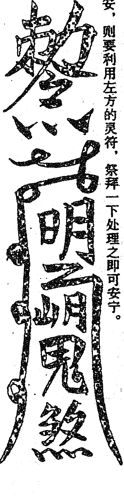

(五) 农历五月出生的人，住宅的子方、丑方、辰方、未方、午方、酉方及戌方等七方位，如果住宅附近有土地公庙的门、木神则有病。像眼痛、脚痛、肚痛、腰痛、并且有冷热之病。应该用左方的灵符，烛、水、饭祭拜一下再处理之即安。

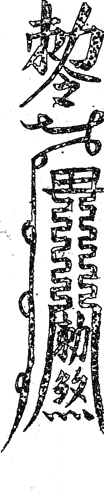

(六) 农历六月出生的人，住宅的寅方、卯方、申方、戌方及亥方等五方位，如果住宅附近有大香火神则容易有病。像眼痛、心痛、嘴痛、脚痛、腰痛、四肢不安，同时不得夜眠（晚上无法好好睡觉）。应该用左方的灵符以及四果、酒礼祭拜之、再处理即吉。

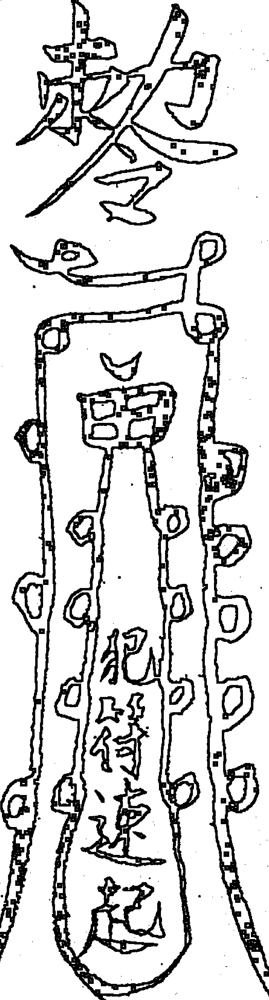

(七) 农历七月出生的人，住宅的辰方、午方、未方及申方等四方位，如果住宅附近有板竹壁、香火神桌、土神则容易有病。像眼痛、心痛、肚痛、头痛、饮食不安。应该用左方的灵符祭拜处理即安。

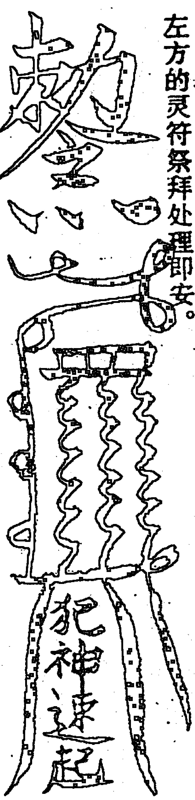

（八）农历八月出生的人，住宅的丑方、卯方、午方、未方、酉方及亥方等六方位，如果住宅附近有石头、壁边鸡笼房或灶则容易有病。像头痛、眼痛、心痛、腹痛、脚痛等，应该用左方的灵符祭拜处理即安。

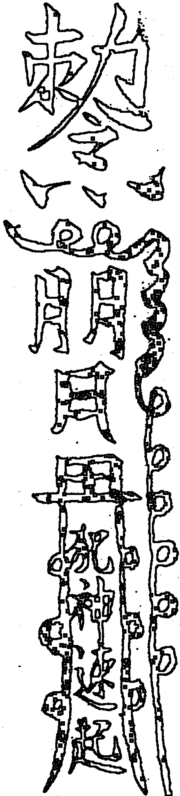

（九）农历九月出生的人，住宅的寅方、巳方、未方、申方及亥方等五方位，如果住宅附近有竹壁木石则容易有病。像眼痛、左腰痛、左脚痛、背痛，那是撞到凶星、五爷仓神。应该用左方的灵符祭拜处理即安。

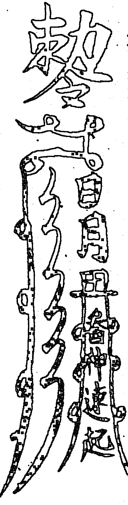

(十) 农历十月出生的人，住宅的丑方、辰方、午方、申方及戌方等五方位，如果住宅附近有木仓、羊牛马井神石佛各神的话则容易有病。像脚痛、肚痛、左脚痛，饮食不安。该用左方的灵符祭拜处理则安宁。

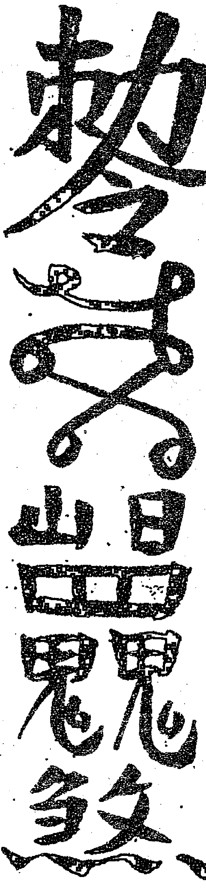

(十一) 农历十一月出生的人，住宅的丑方、寅方、卯方、辰方、巳方、申方、酉方及戌方等八方位，如果住宅附近有些不正常，像无缘无故的不舒服，那是撞到无头鬼，则眼痛、肚痛、左脚痛、心神沉重闷闷不乐，有冷热之感、四肢不安。该用左方的灵符祭拜处理即安。

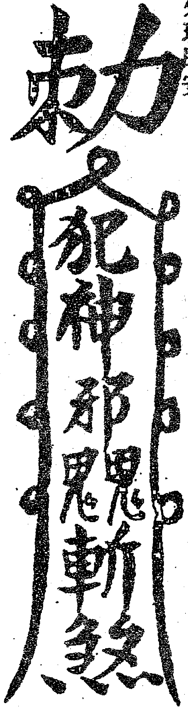

(十二) 农历十二月出生的人，住宅的寅方、卯方、辰方、午方、未方及申方等六方位，如果住宅附近有板木香火灶石飞来的凶星或飞来的五鬼，则右耳痛、左眼痛、舌瘿、左手心痛，该用左方的灵符祭拜处理即安宁。

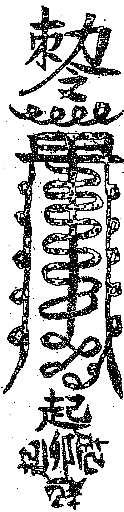

## 二十道灵符

| 貳 | 壹 |
| :---: | :---: |
|  |  |

| 肆 | 叁 |
| :--- | :--- |
| 唵 佛 勅 魁 罡 吒 哈 鬼 | 山 雷 雹 電 急 符 到 奉 行 |

| 陸 | 伍 |
| :--- | :--- |
| 山口田日口口口口 山山꒠꒠口口鬼 山口二口口卯 佛 勅 |  口 口 口 口 畾 畾 畾 畾 留 留 留 留 口 口 口 口 |

### 柒
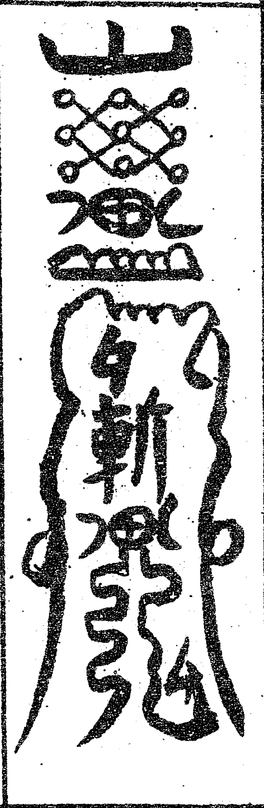

### 捌
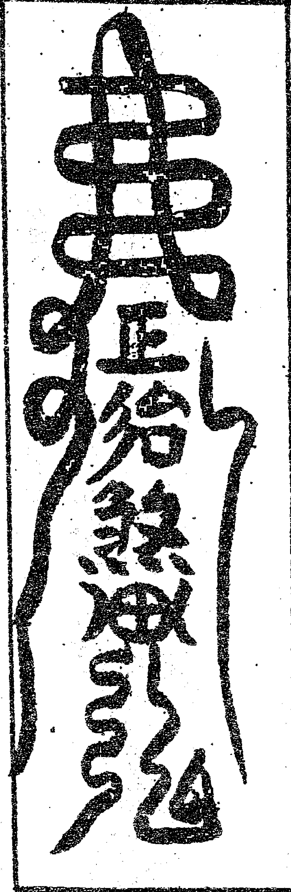

| 拾 | 玖 |
| :--- | :--- |
| 閭護身救 隨身保命罡 | (符文内容) |

### 拾壹
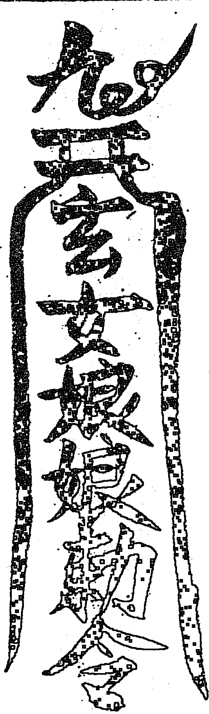

### 拾貳
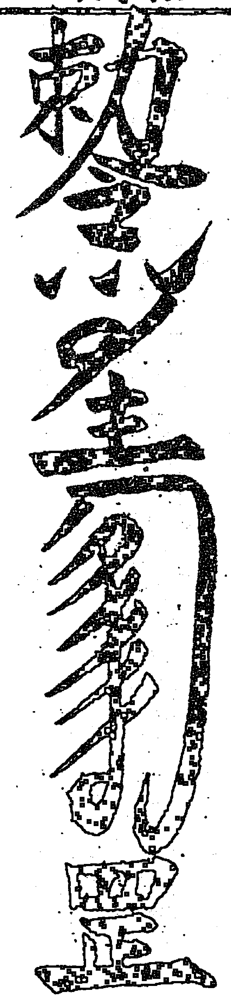

| 拾肆 | 拾叁 |
| :--- | :--- |
| 山 日 日 日 月 月 月 急急如律令 | 雷 奉北極君驅逐邪魔 降福 消災 |

| 拾陸 | 拾伍 |
| :--- | :--- |
| 西十门 北太行 之雲東用字或遠王前法 |  |

### 拾捌
### 拾柒
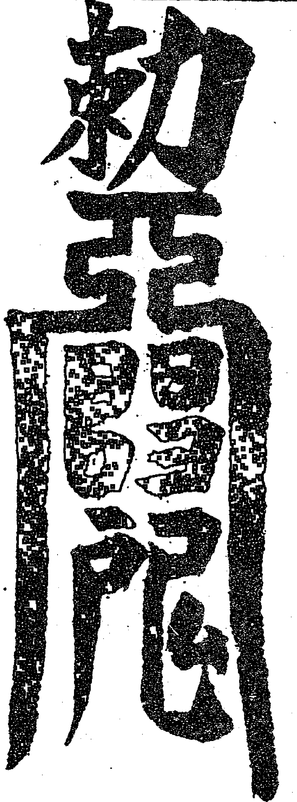
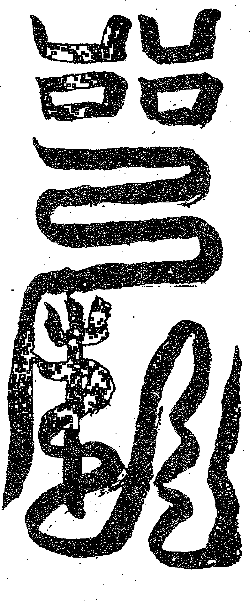

| 貳拾 | 拾玖 |
| :---: | :---: |
|  |  |

## 说明

(一) 第壹道：此符用墨汁黄纸来画，身上佩带之用，可保平安。

(二) 第贰道：此符用墨汁黄纸来画，有时候突然间狂风大作，身上佩带此符可保安宁。

(三) 第叁道：此符用墨汁黄纸来画，身上佩带，自有仙圣护持，安宁富贵。

(四) 第肆道：此符用墨汁黄纸来画，如有黑风入侵，速佩带此符可逢凶化吉，平时带之更妙。

(五) 第伍道：此符用墨汁黄纸来画，佩带此符可平步青云。

(六) 第陆道：此符用墨汁黄纸来画，佩带此符可断诸恶鬼以保身。

(七) 第柒道：此符用墨汁黄纸来画，佩带此符可保安全。

(八) 第捌道：此符用墨汁黄纸来画，端午节 (农历五月初五日) 佩带则大吉。

(九) 第玖道：此符用墨汁黄纸来画，佩带此符以护身。

(十) 第拾道：此符用墨汁黄纸来画，佩带此符以保身，邪神不敢近身。

(十一) 第拾壹道：此符用墨汁黄纸来画，佩带此符可保安宁。

(十二) 第拾贰道：此符用墨汁黄纸来画，佩带此符可保平安，这是鬼谷祖师的平安符。

(十三) 第拾叁道：此符用墨汁黄纸来画，此符可化饮，也可佩带，更可用来与盐米合用，方法是用一空罐或饭碗，装米、食盐越多越好，将符火化其上，搅匀后用来打击屋内各墙壁，或甩地以驱邪。

(十四) 第拾肆道：此符用墨汁黄纸来画，夜行带此符可保平安。

(十五) 第拾伍道：此符要用墨汁画在红纸上佩带之，可保平安。

(十六) 第拾陆道：此符要用墨汁画在红纸上佩带之，可镇静煞神。

(十七) 第拾柒道：此符用墨汁黄纸来画，带此符则邪气不侵。

(十八) 第拾捌道：此符用墨汁黄纸来画，画的时候口中要念：
> 「吓吓阳阳，日出东方。此符断却凶恶，拔除不祥，急急如律令敕」。
此符佩带在身上，可逐怪破邪。

(十九) 第拾玖道：此符用墨汁黄纸来画，佩带此符可远离邪气以保平安。

(二十) 第贰拾道：此符用墨汁黄纸来画，佩带此符可避病难。

以上二十道灵符在日常生活中都可用，只要你诚心诚意的使用，按画符的程序，不求心切，专心致志，画出来的符一定有良好的效果。既可自救又可救人，如果在紧急的情况下只要有一次的灵验，那么你的功德就无量了。如果心术不正，无法虔诚，在家不能对父母亲尽孝道，兄弟无法和睦，朋友之间没信用，做事情马马虎虎，无法尽忠职守，这种人还是不要画符，免得恶邪缠身，后患无穷。

因此天地之间充满了正气与真理，看你自己要不要而已，所以说「善有善报」。

## 称心如意灵符

### 叁
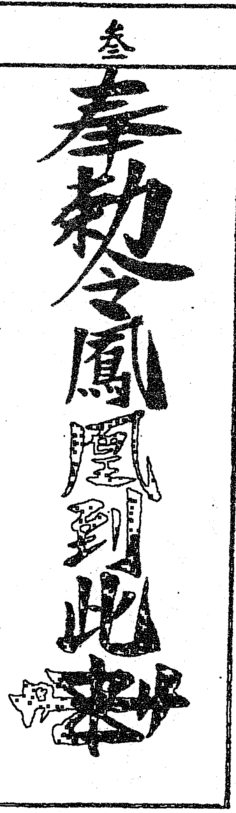

### 肆
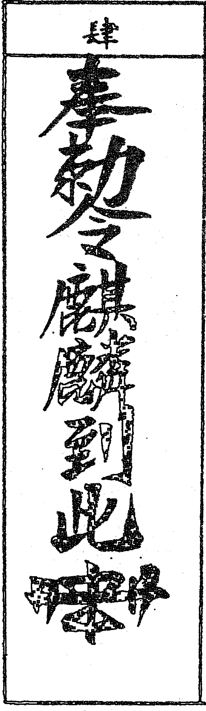

### 壹
奉玉皇敕
麒麟到此罡

### 贰
奉北帝敕令
雷
同凤凰到此
百无禁忌

### 伍
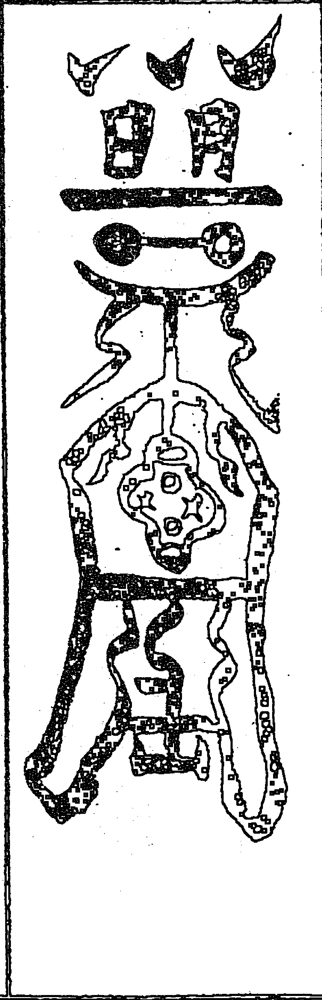

### 陸
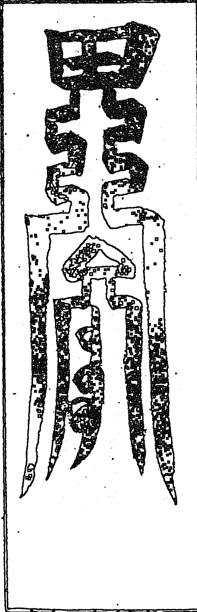

| 捌 | 柒 |
| :--- | :--- |
| 屈 鬼 甲 |  |

### 玖
合叉鬼唵急如律令

### 拾
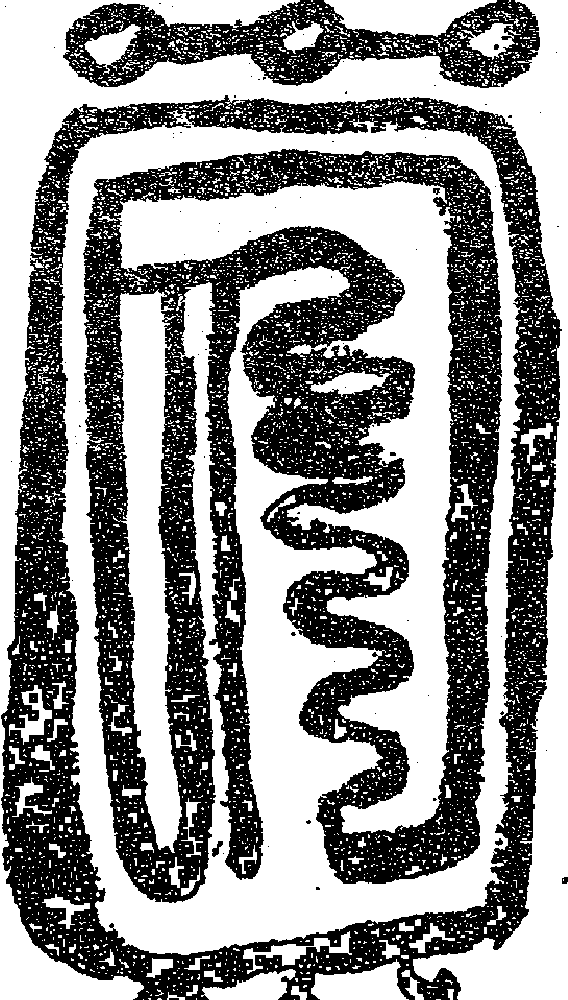
令令令

### 说明

#### （一）第一道：
用墨汁画在红纸上，结婚时用的，与第二道同贴在轿车（计程车当新娘车）前的挡风玻璃上，婚礼圆满。

#### （二）第二道：
用墨汁画在红纸上，结婚时用的，与第一道同贴在轿车（计程车当新娘车）前的挡风玻璃上，婚礼圆满。

#### （三）第三道：
用墨汁画在红纸上，结婚时用的，贴在大堂神位的旁边，及新娘房（洞房）门斗的外边，一切吉祥如意。

#### （四）第四道：
用墨汁画在红纸上，结婚时用的，贴在大堂神位的旁边，及新娘房（洞房）门斗的外边，一切吉祥如意。

#### （五）第五道：
用墨汁画在红纸上，可使夫妻恩爱，相敬如宾，家庭和谐，一团和气，欣欣向荣的气氛。

不过这要夫妻两人本身都要有修养，才能收到良好的效果。自然在我们的生活中有股无形的力量帮助推进。如果夫妻两人是不管初一或十五，要闹就闹，什么坏事都做得出来的人，那是没有效果的。因为符咒的本身是善恶分明的，因此尽忠职守，能守五伦，上天必庇护，否则只有让其自食恶果了。神或符咒并不是万能的，所以不可一心一意只靠符咒或神。例如人一潦倒一定要自己站起来或别人扶起来，总无法叫神帮你扶起来，或用符灵使你自动站起来，除非马戏团表演的催眠绝活（绝招）。所以说也要神也要人，如果忘了自己的力量只靠别人，那是无法成功的，因此要发奋自强才是上上之策。

#### （六）第六道：
有些人心神不定，而且念力不够，往往被情欲所迷惑到不可收拾的地步，以致夫妻间的感情不和睦，男的不顾家庭，可能也有少数女性受人引诱而离家，家庭温暖可能面临破产的边缘。此符用墨汁画在黄纸上，先用七枝桃树枝放水内烧滚，再把此符火化于水中洗澡，如果诚心诚意的话就可以逐渐步入圆满的境遇，这是一种无形的力量。

#### （七）第七道：
这是安胎符，用墨汁画在黄纸上。所谓安胎就是安抚母体内小生命的胎气。一般说来，母体自从受孕之后就有胎气，同时也就有所谓的胎神了。母体如果正常则平平安安，万一走路不小心跌了一下、乘公共汽车的紧急煞车，如果碰撞厉害的话就有所谓的动了胎气，这时母体会感觉到身体突然不舒服，有的头晕，也有的肚子痛，反正是浑身不舒服。懂得的人立刻用安胎符来化饮，就可转危为安，否则把她当成肚子痛或胃痛的看医生与吃药，是无济于事的。

说到孕妇的动了胎气与安胎，可能有人要说「胡说八道」，因为还没遭遇过啊！所以说：「吃过苦的人才知道苦的滋味」。内人 (笔者之妻) 有一次在雨天步行，一不小心跌倒，当时我们住在永和镇 (即台北县的永和镇，现在改为永和市)，又碰巧那天是星期天，笔者没上班，所以立即叫内人使用安胎符，事后觉得并无异样，笔者也就心安了。可能又有人说跌倒算不了什么。笔者在台西国中的时候，曾经有两位女教师请「小产假」，由于不方便开口追根究底，只好由同事间得知一二。其中有一位是不知不觉小产 (也称流产)，另一位是洗手间用力过猛。

学期中教师的请假，虽然代课教师可申请钟点费，但是教务处调课的麻烦，而学生的不能适应，在教学效果上大打折扣，直接影响到学生的学习成果。所以在任何团体、任何单位，每位从业（从职）人员都能平安，那么一切都好办。笔者之所以把这『安胎符』介绍出来是希望对社会、对国家有所助益，并不是提倡迷信。何况这真正是我们中华民族自己的东西，道道地地的中国人的宗教信仰，不能指为迷信。孕妇的卧房不能随便敲打或搬运东西，更不可乱钉『钉子』。如果没有随便的敲打搬运或跌倒，而孕妇本身突然不舒服，或已好几天不舒服的时候，除了要化饮安胎符之外，还得就医吃药，千万不要只吃安胎符而不就医，否则就是迷信，这点请特别注意。

#### （八）第八道：
用墨汁画在小张红纸上，然后贴在小孩的手心，男孩贴左手心，女孩贴右手心。这是专门用在小孩夜啼的，有些小孩在白天是好好玩又好睡，可是一到晚上就哭个不停，有的民间则称为『哭暗黑』。假若有位公务人员，晚上受小孩的影响而不能好好睡觉，请问白天如何好好上班？因此必需家家平安才能尽职，这也是人之常情啊！

#### （九）第九道：
此符用墨汁画在黄纸上或红纸上，身上佩带，与人交际可圆满达成。这里附带的是，与人交际的时候除了本身言行诚恳之外，还得衣冠整齐。如果言行不三不四，就是带了十张也没用，因此证明一定要先自助然后才有人助或天助，诸君以为如何？

#### （十）第十道：
此符用墨汁画在黄纸上，身上佩带则可善用人。如果要选用人的时候，把此符在自家大堂的神佛之前求之，一定可以选用良好的人选。无论什么机关团体的主管，如果能善用部下，选用优良的人选，那么该机关团体一定欣欣向荣，很有朝气。如果用错了人，则后果不堪设想，只要你诚心，此符可助你一臂之力。

## 镇恶梦灵符

有时候晚上睡觉会做恶梦，如果能佩带符睡觉则可安宁，只要诚心一定灵验。以下的十二道符都用朱砂（又称辰砂）画在黄纸上，要画之前先嘴内含一口净水，手持刀咒四十二下，向东方喷出，再念以下的咒语：
> 「哧哧阳阳，日出东方，此符断却恶梦，扫除不祥，急急如律令」

### 说明

- (一) 子日佩带左方之符：
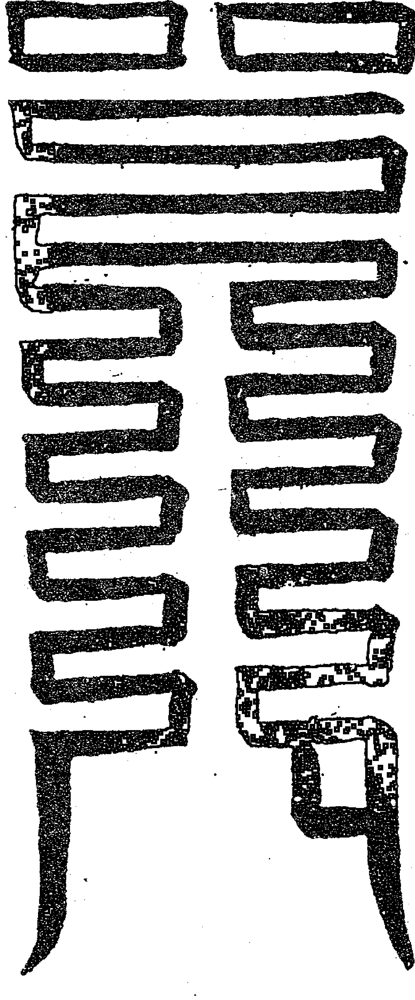

- (二) 丑日佩带左方之符：
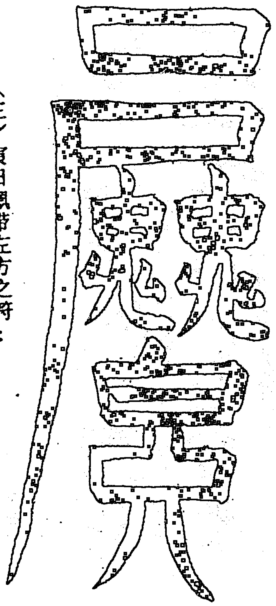

- (三) 寅日佩带左方之符：
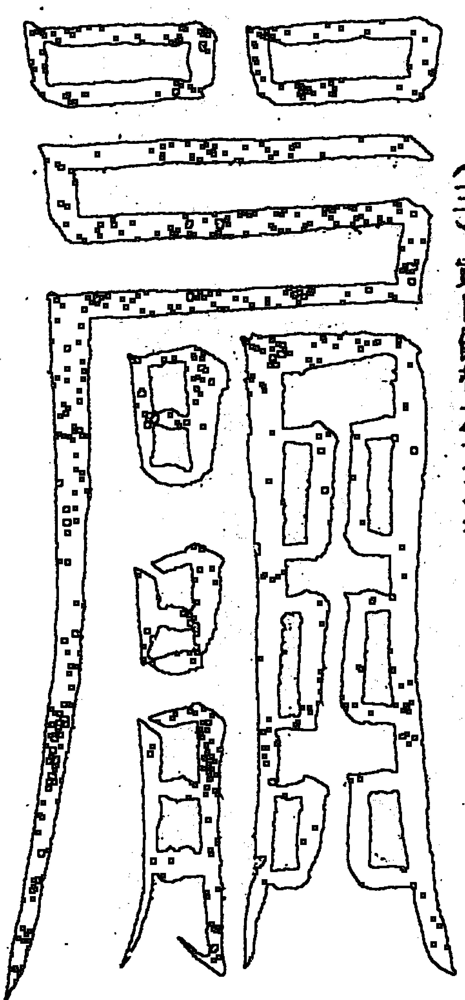

- (四) 卯日佩带左方之符：
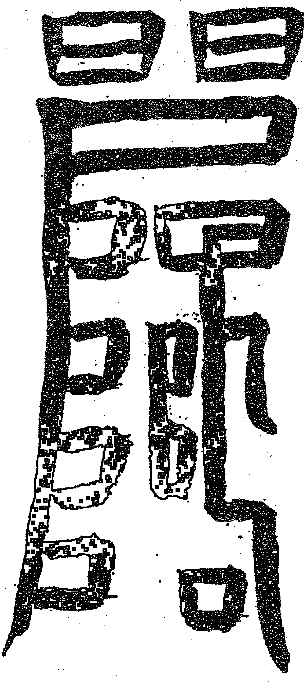

- (五) 辰日佩带左方之符：
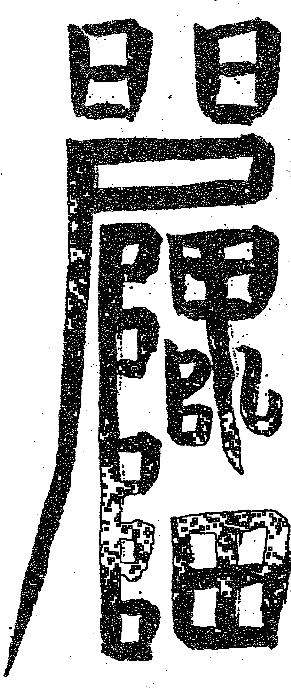

- (六) 巳日佩带左方之符：
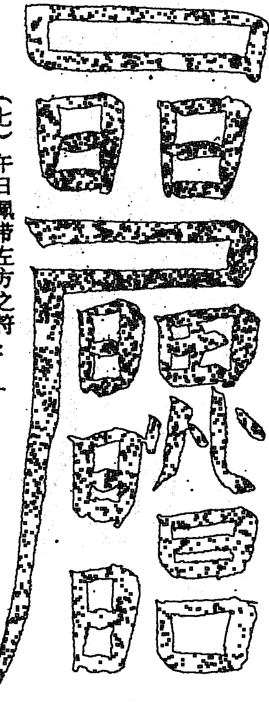

- (七) 午日佩带左方之符：
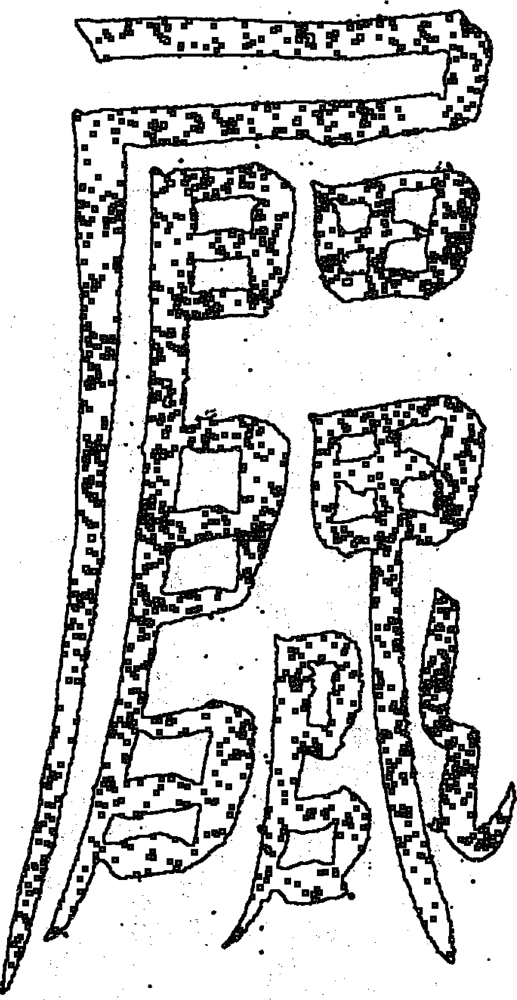

- (八) 未日佩带左方之符：
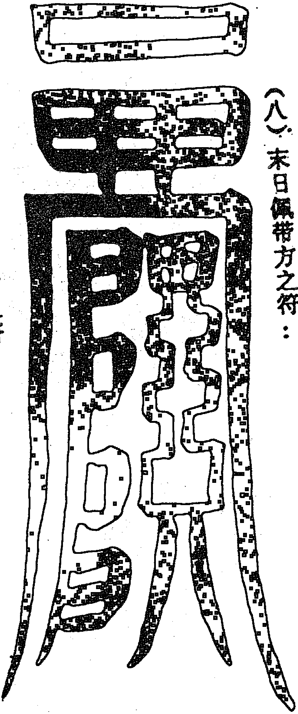

- (九) 申日佩带左方之符：
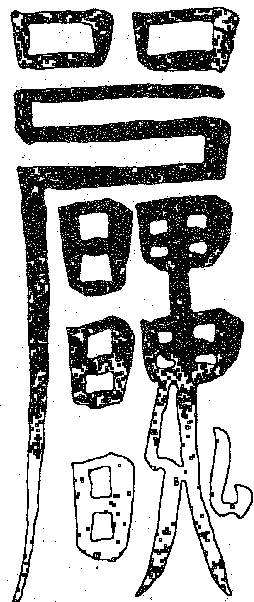

- (十) 酉日佩带左方之符：
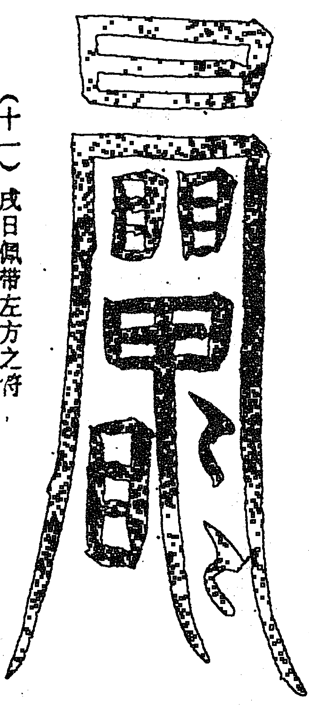

- (十一) 戌日佩带左方之符：
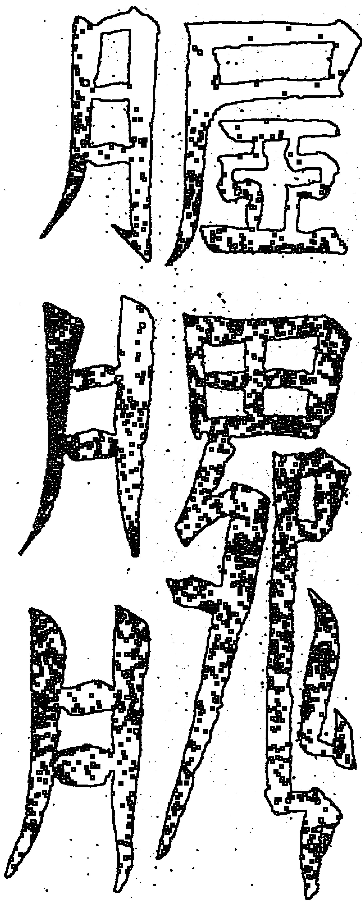

- (十二) 亥日佩带左方之符：
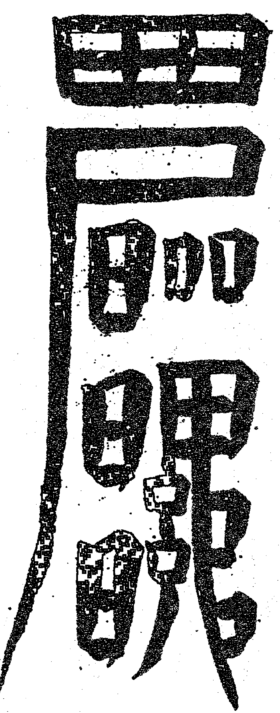

## 小天罡灵符

(一) 甲子日在东北方冲到外方(民间把外面的孤魂野鬼叫外方)，病者寒热无常，四肢沉重，骨痛。用“黑钱”五百，神马水饭果酒向北方祭拜送之则吉，左方之符亦烧之。

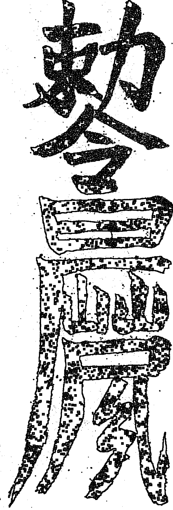
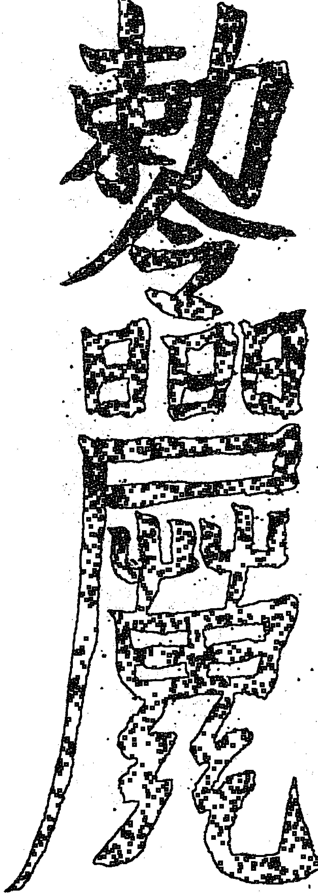

(二) 乙丑日在东北方冲到外方或灶君，或土地不安。病者头痛呕吐，气急沉重。用「白钱」二百，神马水饭果酒，连同左方之符向东北方祭拜送之则吉。

(三) 丙寅日在东北方冲到外方，病者骨肉肿痛，身热不安；用「白钱」五百，神马水饭果酒连同左方之符，向北方祭拜送之即吉。

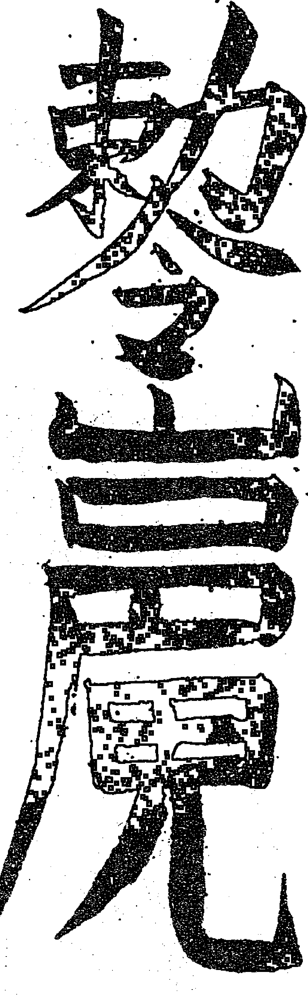

(四) 丁卯日在东方冲到外方，病者骨痛，四肢沉重，睡卧不安，用「白钱」二百，神马水饭果酒，连同左方之符向东方祭拜送之则吉。

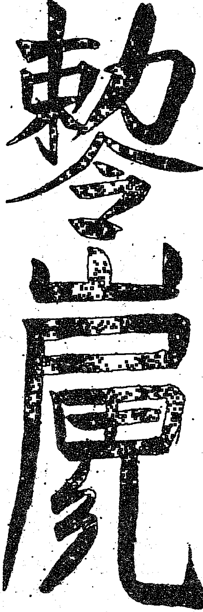

(五) 戊辰日在东南方冲到外方，病者身热心闷、吐泻、腹痛、肚痛、四肢沉重。用「白钱」二百，神马水饭果酒，连同左方之符向东南方祭拜送之则吉。

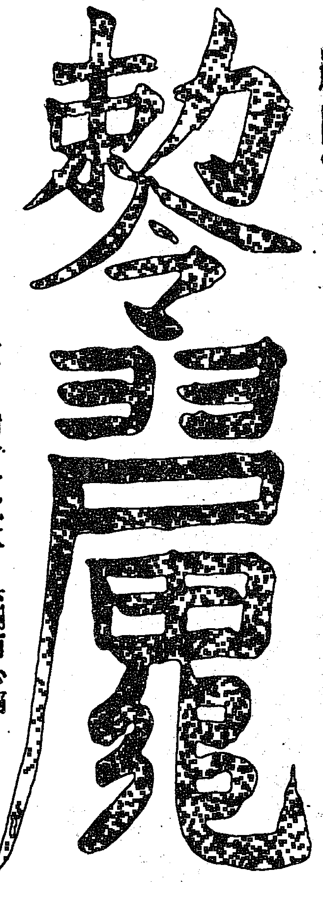

(六) 己巳日在东南方冲到外方，病者骨沉重，头刺而心痛。用「赤钱」五百，神马水饭果酒，连同左方之符向东南方祭拜送之则吉。

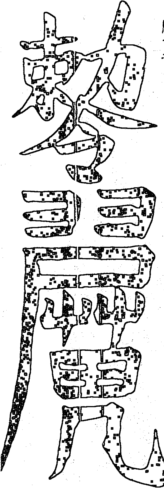

(七) 庚午日在东南方冲到外方，病者身热眼痛、沉重。用「赤钱」五百、神马水饭果酒，连同左方之符向东南方祭拜送之则吉。

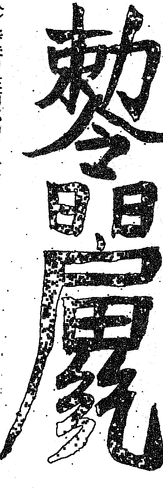

(八) 辛未日在西北方冲到外方，病者骨肉肿痛、气急呕吐恶心、发热。用「白钱」二百、神马水饭果酒，连同左方之符向西北方祭拜送之则吉。

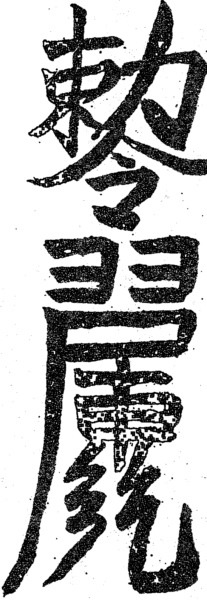

(九) 壬申日在西北方冲到外方，病者气急头痛、吐泻。用「赤钱」二百、神马水饭果酒，连同左方之符向西北方祭拜送之则吉。

(十) 癸酉日在西南方冲到外方，病者身热头痛。用「赤钱」二百、神马水饭果酒，连同左方之符向西南方祭拜送之则吉。

(十一) 甲戌日在西北方冲到外方，病者身热心闷，肚痛咳嗽，口流清水、沉重。用「白钱」五百、神马水饭果酒，连同左方之符向西北方祭拜送之则吉。

(十二) 乙亥日在西北方冲到外方，病者身热呕吐、头痛眼热。用「青钱」二百、神马水饭果酒，连同左方之符向西北方祭拜送之则吉。

（十三）丙子日在北方冲到外方，病者身热呕吐沉重。用「白钱」二百、神马水饭果酒，连同左方之符向北方祭拜送之则吉。

（十四）丁丑日在东北方冲到外方，病者头痛身热，呕吐沉重。用「赤钱」五百，神马水饭果酒，连同左方之符向东北方祭拜送之则吉。

(十五) 戊寅日在东北方冲到外方，病者身热头痛、身刺、四肢不安。用「白钱」五百、神马水饭果酒，连同左方之符向东北方祭拜送之则吉。

(十六) 己卯日在东北方冲到外方，病者身热头痛。用「白钱」二百、神马水饭果酒财宝（指冥纸），连同左方之符向东北方祭拜送之则吉。

(十七) 庚辰日在东南方冲到外方，病者四肢骨肉沉重、头痛、肚痛及呕吐。用「白钱」五百，神马水饭果酒，连同左方之符向东南方祭拜送之则吉。

(十八) 辛巳日在南方冲到外方，病者骨肉肿痛、身热呕吐。用「白钱」五百、神马水饭果酒，连同左方之符向南方祭拜送之则吉。

(十九) 壬午日在南方冲到外方，病者身体忽冷忽热、气急心闷、吐泻。用「白钱」五百、神马水饭果酒，连同左方之符向南方祭拜送之则吉。

(二十) 癸未日在南方冲到外方，病者气急心闷、吐泻、头痛寒热。用「赤钱」二百、财宝（指冥纸）饭，连同左方之符向南方祭拜送之则吉。

(二十一) 甲申日在西南方冲到外方，病者身热头痛、心痛、冷热无常。用白钱五百、神马水饭果酒，连同左方之符向西方祭拜送之则吉。

(二十二) 乙酉日在西北方冲到外方，病者眼热心烦、气急、骨肉肿痛。用白钱五百、果酒，连同左方之符向北方祭拜送之则吉。

(二十三) 丙戌日在北方冲到外方，病者骨肉肿痛、寒热肚痛。用「黑钱」二百、神马水饭果酒，连同左方之符向北方祭拜送之则吉。

(二十四) 丁亥日在西北方冲到外方，病者身热心痛、肚痛。用「黑钱」二百、水饭，连同左方之符向西北方祭拜送之则吉。

(二十五) 戊子日在北方冲到外方，病者身热呕吐、头痛、四肢骨肉沉重、咳嗽。用「白钱」二百、神马水饭果酒，连同左方之符向北方祭拜送之则吉。

(二十六) 己丑日在北方冲到外方，病者寒热心闷、手足骨肉沉重。用「黑钱」、「白钱」各二百、神马水饭果酒，连同左方之符向北方祭拜送之则吉。

（二十七）庚寅日在东北方冲到外方，病者身热呕吐作闷、头痛不安。用「白钱」二百、神马水饭果酒，连同左方之符向东北方祭拜送之则吉。

（二十八）辛卯日在东北方冲到外方，病者头痛、身热、四肢骨肉沉重。用「青钱」五百、神马水饭果酒，连同左方之符向东北方祭拜送之则吉。

（二十九）壬辰日在东方冲到外方，病者身热呕吐、四肢骨痛。用「青钱」五百、神马水饭果酒，连同左方之符向东方祭拜送之则吉。

（三十）癸巳日在南方冲到外方，病者寒热咳嗽、气喘。用「白钱」二百、神马水饭果酒，连同左方之符向南方祭拜送之则吉。

(三十一) 甲午日在西南方冲到外方，病者头痛、身热呕吐、心闷、四肢无力。用「赤钱」五百、神马水饭果酒，连同左方之符向西方祭拜送之则吉。

(三十二) 乙未日在西南方冲到外方，病者头痛心闷、眼花、冷热呕吐。用「赤钱」、「白钱」各三百，神马水饭果酒，连同左方之符向西南方祭拜送之则吉。

(三十三) 丙申日在南方冲到外方，病者眼热、腰痛、寒热吐泻。用「白钱」二百、神马水饭果酒，连同左方之符向南方祭拜送之则吉。

(三十四) 丁酉日在西方冲到外方，病者头痛腹痛心痛、水泻身热。用「赤钱」、「白钱」各五百、神马水饭果酒财宝，连同左方之符向西方祭拜送之则吉。

(三十五) 戊戌日在西北方冲到外方，病者身热头痛、骨痛呕吐。用「白钱」二百、神马水饭果酒，连同左方之符向西北方祭拜送之则吉。

(三十六) 己亥日在东北方冲到外方，病者身热心痛、忽冷忽热。用「黄钱」五百、纸马水饭果酒财宝，连同左方之符向东北方祭拜送之则吉。

(三十七) 庚子日在东北方冲到外方，病者寒热头痛、沉重不安。用白钱、纸马、水饭、果酒，连同左方之符向东北方祭拜送之则吉。

(三十八) 辛丑日在东北方冲到外方，病者心闷头痛、身热吐泻不安。用白钱、纸马、水饭、果酒，连同左方之符向东北方祭拜送之则吉。

（三十九）壬寅日在东北方冲到外方，病者身热头痛、气急口干、心痛呕吐。用白钱、纸马、水饭、果酒、财宝，连同左方之符向东北方祭拜送之则吉。

（四十）癸卯日在东北方冲到外方，病者头痛身热、心闷、肠痛、吐泻不安。用「赤钱」五百、纸马水饭果酒，连同左方之符向东方祭拜送之则吉。

(四十一) 甲辰日在东北方冲到外方，病者身热、四肢痛、头痛背骨痛。用「白钱」三百、纸马水饭果酒，连同左方之符向东北方祭拜送之则吉。

(四十二) 乙巳日在南方冲到外方，病者身热肚痛、四肢无力。用「赤钱」五百、纸钱、纸马、水饭、果酒，连同左方之符向南方祭拜送之则吉。

(四十三) 丙午日在南方冲到外方，病者头痛眼痛四肢痛。用白钱、纸马、水饭、果酒，连同左方之符向南方祭拜送之则吉。

(四十四) 丁未日在西南方冲到外方，病者寒热头痛、呕吐沉重。用「赤钱」二百、纸马、水饭、果酒、财宝，连同左方之符向西南方祭拜送之则吉。

(四十五) 戊申日在西南方冲到外方，病者寒热无常、心闷呕吐、头刺、狂言乱语、四肢骨痛沉重。用「白钱」五百、纸马水饭果酒，连同左方之符向西南方祭拜送之则吉。

(四十六) 己酉日在南方冲到伤方，病者膈饭膈食、寒热头痛。用「白钱」三百、纸马水饭果酒，连同左方之符向南方祭拜送之则吉。

(四十七) 庚戌日冲煞或冲外方，病者忽冷忽热、头刺心腹痛。用「白钱」五百、财宝酒饭，连同左方之符祭拜送之则吉。

(四十八) 辛亥日在西北方冲到外方，病者头重、心腹痛呕吐。用「白钱」二百、纸马酒饭，连同左方之符向西北方祭拜送之则吉。

(四十九) 壬子日在北方冲到外方，病者头刺、身热眼痛、口干舌苦。用「青钱」、「黄钱」各二百、冥纸（金纸与银纸）水饭果酒，连同左方之符向北方祭拜送之则吉。

(五十) 癸丑日在东北方冲到外方，病者精神恍惚、微寒微热、少饮食、四肢不安。用「黄钱」、「白钱」各二百、纸马水饭果酒，连同左方之符向东北方祭拜送之则吉。

(五十一) 甲寅日在东方冲到本命的太岁，病者四肢不安，不思饮食，身热眼痛，口干舌苦。用「青钱」二百及「黄钱」三百，酒饭，连同左方之符向东方祭拜送之则吉。

(五十二) 乙卯日在东南方冲到外方，病者身热，心腹不安，不思饮食，自言自语。用金钱纸马酒礼，连同左方之符向东南方祭拜送之则吉。

（五十三）丙辰日在南方冲到外方，病者身热口渴，四肢沉重。用「赤钱」三百、金银纸马水饭果酒，连同左方之符向南方祭拜之则吉。

（五十四）丁巳日在西南方冲到外方，病者头痛身热少饮食。用「赤钱」、「白钱」各三百、水饭果酒财宝，连同左方之符向西南方祭拜送之则吉。

(五十五) 戊午日在西方冲到外方，病者寒热无常、四肢不安、不思饮食。用「白钱」二百、水饭果酒，连同左方之符向西方祭拜送之则吉。

(五十六) 己未日在南方冲到外方，病者身热头痛、眼花、四肢不安、胡言乱语。用「白钱」三百、水饭果酒，连同左方之符向南方祭拜送之则吉。

(五十七) 庚申日由于与人咒诅口毒骂人，被监察灵官过往时听到而降罪，病者头晕眼花，不思饮食，口干舌苦。用左方之符与果品香烛当天叩拜求解可安。

(五十八) 辛酉日在西方冲到外方，病者头痛、眼痛、周身骨痛、四肢沉重。用白米一盆、「黄钱」、「白钱」各二百，连同左方之符向西方祭拜送之则吉。

(五十九) 壬戌日冲到飞神煞、披头煞、白虎煞及朱雀。病者忽冷忽热、头痛肚痛、四肢不安。用「五色钱」二百、纸马水饭，连同左方之符向北方祭拜送之则吉。

(六十) 癸亥日冲到当年太岁或外方，病者头刺身热、手足痛、呕吐不安。用「黄钱」、「白钱」各三百、水饭果酒，连同左方之符祭拜送之则安。

### 【说明】：

- ①本节所说的青钱、白钱、黄钱、黑钱都是冥纸（拜拜时烧的金银财宝）的一种，在金银纸的批发商可买到，至于二百、三百、五百，商店的主人都知道。
- ②本节所说的「祭拜送之」是用祭品及金银财宝拜完之后，请那些「外方」不要来找麻烦，要保护（庇护）某某人身体健康，后面的那些吉利话可尽量多讲一点。
- ③如果到郊外路边「祭拜送之」，一般那些可吃的祭品拿回来的时候先摆在屋外，再给狗吃或鸡鸭吃，平常我们（人）是不吃那些的，而容器（碗或酒杯）则在屋外洗干净之后才带入屋内，同时当「祭拜送之」完毕，收拾好回来的时候，一般都不敢回头再看的。
- ④这些符号都是用墨汁画在黄纸上来使用的。

## 救宅灵符

如果宅内很喧唆，就是不平安，可准备八片桃木板，用朱砂画在桃木板上，然后按照八卦的方位钉在住宅的八方位即可转危为安、移凶化吉。假若不忠不义之人那是无效的。

①将左符用朱砂画在桃木板上，钉在「乾」方。
②将左符用朱砂画在桃木板上，钉在「坎」方。
③将左符用朱砂画在桃木板上，钉在「艮」方。
④将左符用朱砂画在桃木板上，钉在「震」方。
⑤将左符用朱砂画在桃木板上，钉在「巽」方。
⑥将左符用朱砂画在桃木板上，钉在「离」方。
⑦将左符用朱砂画在桃木板上，钉在「坤」方。
⑧将左符用朱砂画在桃木板上，钉在「兑」方。

### 【说明】：八卦的方位（方向）

| 卦名 | 方位 |
| :--- | :--- |
| 乾 | 西北方 |
| 坎 | 北方 |
| 艮 | 东北方 |
| 震 | 东方 |
| 巽 | 东南方 |
| 离 | 南方 |
| 坤 | 西南方 |
| 兑 | 西方 |

## 青惊灵符

如果小孩不是生病，无缘无故的哭，那是冲犯了煞神而惊叫，民间称「青惊」，这种现象是小孩的粪便呈青色。如果小孩青惊则用墨汁把左方的符画在黄纸上，然后化水，即可逐渐恢复平静，否则真让大人（小孩的双亲）受不了。

## 治牛瘟灵符

如果有牛瘟或猪瘟，可把左方的两道符，用墨汁画在黄纸上，贴在牛栏上或猪栏上，可转危为安。如果牛猪本身感染了病菌那些符就无用了，必需叫兽医前往治疗，否则别怪罪灵符的不灵呵！

## 小孩夜啼灵符

这两道符都用墨汁画在黄纸上，专制小孩夜啼。

- 第一道符（前符，即右方之符）贴床前。
- 第二道符（后符，即左方之符）在床前用二百寿金与此符同时焚化。「二百寿金」是两小叠的意思。

## 清净灵符

男女如果不清净，或者冲犯了煞气，用墨汁画左符于黄纸上，火化之，用盐米与花心，以及阴阳水来混合之后来洗身体，即可化解不安之事。如果参加亲友的送丧，回来的时候先洗一洗也是清净。有的民间是在回家之前先用一张纸（旧报纸也可）点燃，自己从火上走过，也可当作送丧方面的清净，因为万物碰上火只化为尘，也就是说火也可以避邪。

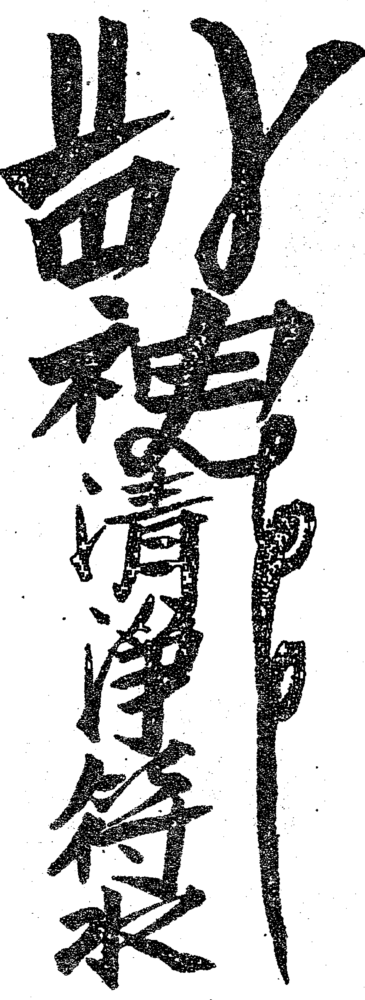

## 破土灵符

造房子或筑工事的挖土，如果先用墨汁把左符画在黄纸上，然后贴在工事的地方就不会引起什么煞神了，所以说“凡事豫则立”。

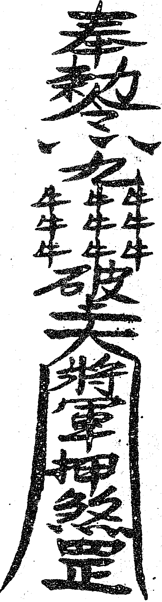

## 镇宅驱犯灵符

用墨汁把左边的“北斗紫光夫人座镇”八个字写在红纸上，朝夕奉拜，则邪神不敢侵犯。

### 北斗紫光夫人座镇

## 家族圆满灵符

左方的符用墨汁在黄纸上，不被人知的（不要告诉家内任何一人）摆在屋中的角落，自然而然家族逐渐的圆满，一团和气，欣欣向荣。

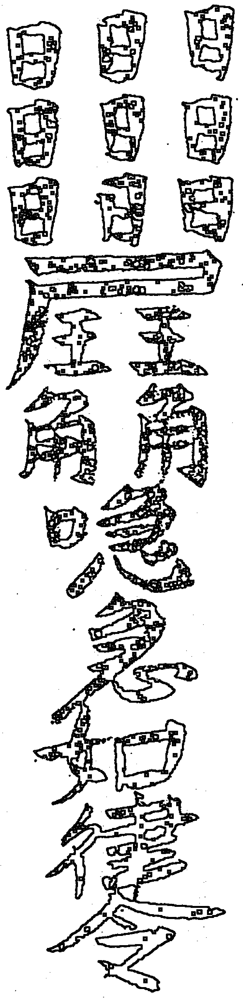

## 喜冲喜或喜冲丧灵符

怀孕的妇女叫有喜，结婚当天的新娘也是有喜。如果怀孕的妇女挺着肚子与新娘面对面相冲的话，一定有一方较差，不是新娘倒霉，就是怀孕的妇女倒霉。

谈到喜冲喜或喜冲丧，真是令人深感神秘与奥妙，甚至令人有不可思议的感觉。例如怀孕的妇女抱了别人的小孩，而那位小孩的“大便”臭得太离谱，甚至下泻（肠炎），这种现象称喜冲喜。有时候抱着小孩去看人家结婚，与新娘面对面，有时候也使小孩有毛病，这也叫喜冲喜。这里需特别强调的是，并非所有面对面就喜冲喜。也并非所有孕妇抱了小孩就使小孩有毛病。

一般都说新娘穿上新娘礼服（白色礼服），戴上头纱就有所谓的“新娘神”，这新娘神是很大的，越贵气的小孩则煞神的力量越大，越贵气的小孩被孕妇一抱，则相冲之后的后果也就越大。因此民间怀孕的妇女一般都知道，不要随便抱别人的小孩。

说到与新娘的喜冲喜也有人叫做新娘煞，那是生肖方面与时辰的相冲所致。如果新娘一下子轿车要进入男方（新郎）大门，或进入大门步入洞房的这段时间相冲的话才严重，假若进入洞房之后，脱了新娘礼服出来宴客的时候那就没关系。所以民间结婚的时候，往往当新娘车到达的时候，成人们往往叫幼小的婴孩离开，因为结婚当天，是个喜气洋洋，也不知道哪位小孩会相冲，干脆全叫开现场为妙，这倒是万全之计。说真的，大家都喜气洋洋，如果有位犯了新娘煞那真是煞风景了，你说呢？

孕妇或贵气的小孩，如对面迎出殡的队伍（民间称为出山）也会犯煞，一般叫“丧煞”。孕妇的喜冲喜或喜冲丧，会引起身体不舒服，如肚子痛、头痛、呕吐。小孩的喜冲喜或喜冲丧则会引起小孩的不舒服，如大便臭得太厉害（臭得太反常了）、啼哭、其它的如发烧、白天不好好的玩、晚上不好好的睡觉。如果有以上的现象，则使用左方的符来转危为安。

左方的符用墨汁画在黄纸上，然后化饮。有的婴孩无法直接饮下，可用奶瓶装符水或与牛奶同时混合使用。并且用手沾符水拍小孩的头部、胸部、背部、手与脚。

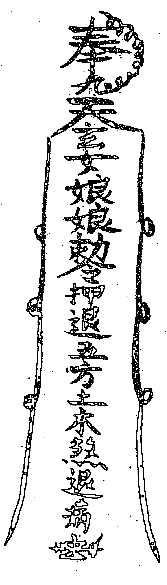

## 安小孩啼哭灵符

有些小孩白天好好的玩，而晚上就闹，甚至白天晚上都很噜嗦，可用左方的符。用墨汁画在黄纸上，把符向外褶，让小孩佩带。民间有些妇女是用红丝线（红纱线）绑符挂在小孩的颈上，因为线可能有危险性，小孩与小孩之间的玩弄，如不小心可能有不良的后果。因此最好的方法是缝一个很小的口袋在衣服的内侧，再用塑料布（透明的）把符包好放入衣服内侧的袋里，袋口要更小，这样又不怕潮，又不怕被小孩拿走或丢掉。要是小孩能平平安安，那么我们身为父母亲的岂不是更舒服更快乐？

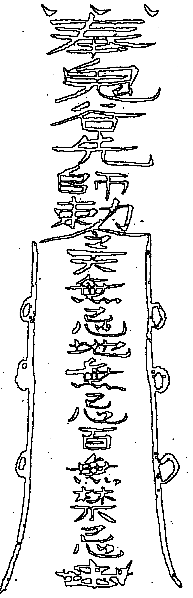

## 保畜灵符

有时候同样都是养畜牲的人，可能由于“同行是冤家”，要是心术不正的人可能会用邪术来害牲畜。因此如果用左方的符来化解即可转危为安。

左符用墨汁画在黄纸上，化灰，用一大桶水泡之，一部分让牲畜吃，一部分可用喷射农药的那种器具来喷牲畜的住处周围及附近，可逐渐好转。

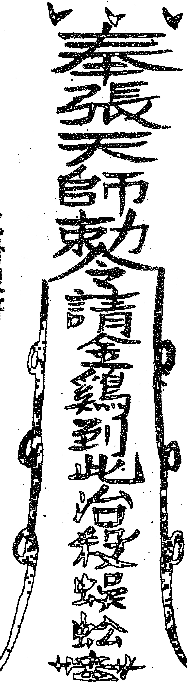

## 化骨灵符

左方的符是用墨汁画在黄纸上来化饮的，如果情况紧急，而且功力较深厚的人可以直接用剑指画在水上，方法是用碗装水来画，然后饮下。

如果用墨汁画在黄纸上，当写完“一”字之后，其余的字要一面写而一面念“龙针治水吞化防”。而“化”字要以逆时针的方向来打一圈。

画完之后要看是什么骨就用什么口诀，其变化口诀如下：

- ①竹类用——化竹如成泥。
- ②荆类用——化荆如成泥。
- ③龙（尼龙）类用——化龙如成泥。
- ④铜类用——化铜如成丝。
- ⑤骨类用——化骨如成丝。

以上五种口诀是符画完之后，接着一口气念三次有关的口诀。如骨类卡住则一口气念三次的“化骨如成丝”，荆类卡住则念三次的“化荆如成泥”，竹类卡住则念三次的“化竹如成泥”，铜类（铜钱）卡住则念三次的“化铜如成丝”，尼龙类卡住则念三次的“化龙如成泥”。

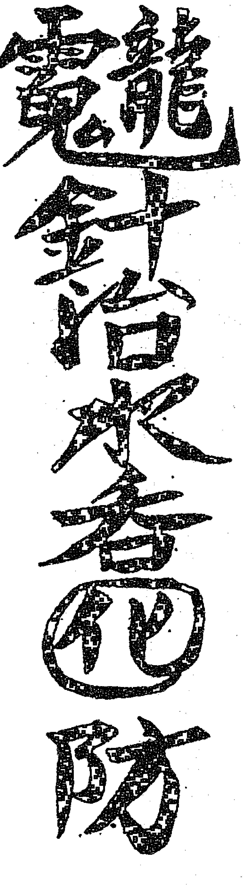

## 止血灵符

有时候不小心跌倒、皮肤擦伤而流血，或者用刀不慎而发生刀伤，鲜血如注，都可用“止血灵符”来止血。只要绿色的树叶（注意无毒的树叶，夹竹桃有毒不能用），再念咒语。写左边的“一”要念“一二三四五”，写在上面的“一”则念“金木水火土”，写右边的“一”则念“今日受刀伤”，写下横的“一”则念“紧取虎口土”。（方法如图）

另有一法是写“马”字，本来“马”字只有十划，这里则当成十二划，第十一划、一勾或一点都要念十二时辰中的一字，即“子、丑、寅、卯、辰、巳、午、未、申、酉、戌、亥”。也是用剑指在绿色树叶上写来的。（方法如图），选用这两种方法中的一种，画过符咒之后，直接把树叶贴在伤处即可止血。

## 止鼻血灵符

有些人由于虚火上升而流鼻血，也有因为相撞而流鼻血的。要是发生地点交通不便，甚至三更半夜找不到医生，可速用此法止住鼻血，否则流了太多则人更虚弱。这法也是用剑指在绿色树叶（先洗干净）上写一“羊”字，每写一笔则念一字，即“子丑寅卯辰巳”，然后把树叶卷起来塞鼻孔（写符咒的那一面朝外）即可止血。（方法如图）

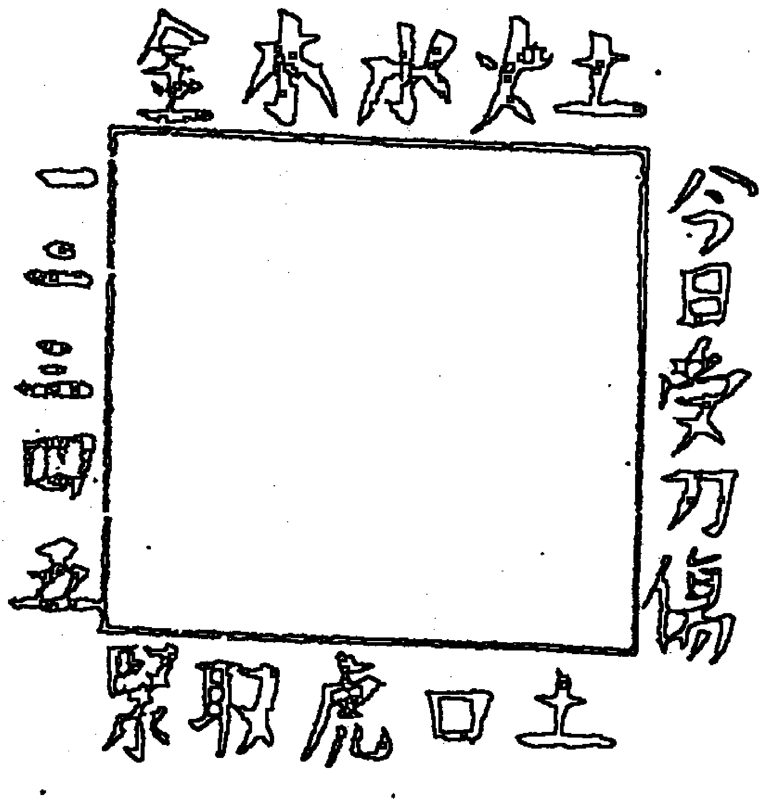
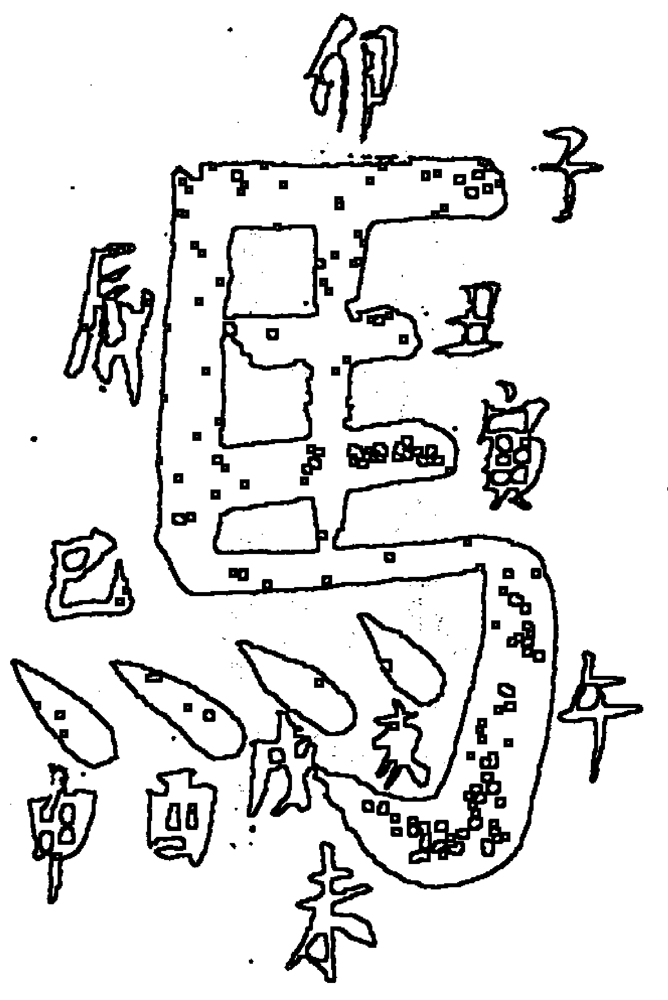

## 老君入山灵符

左方的五道符都是用朱砂画在桃木板上，可以把桃木板摆成横式，五道符全都画上去，可钉（或挂）在门户上，住宅的四方及四个角落，甚至交通要道，安置符的范围一定在住宅附近五十步之内。屋内的梁柱也可安置，此符可避鬼魅山精，使住宅平安。

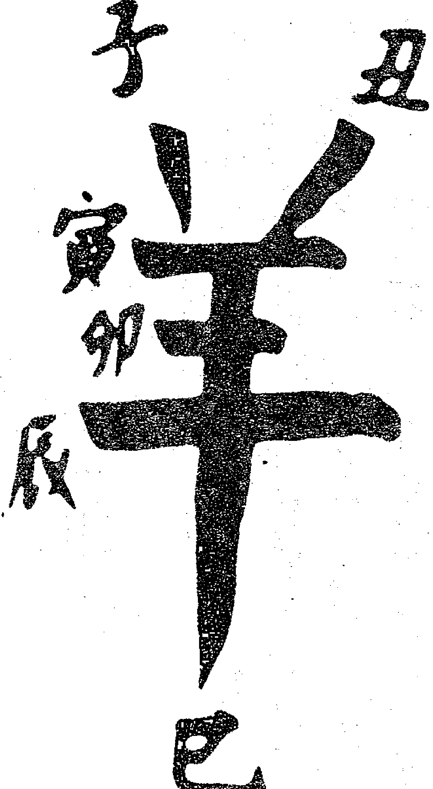


## 镇煞灵符

左方二道用墨汁画在黄纸上贴用，可镇煞，两道都可用，只用一道即可，不是同时用两道。


## 立即催生灵符


【说明】：

- ①用朱砂把“北斗紫英夫人在此”等八字写在黄纸上。
- ②然后颠倒贴在产妇背上（可以隔衣），但不要被产妇知道，如此小孩可顺利产下。
- ③小孩产下之后，立即把此符取下。
- ④在灶上（现在有些家庭没有灶，只有瓦斯炉，那就在厨房）焚香烛（红色烛）将此符焚化炉内（如果没有炉可用铅桶代替）。
- ⑤这过程要快，否则小肠也会下地，请慎之！

## 收惊灵符

孩子一受惊就不乖，有时候脸上有青色，或者青色的血管浮浮的样子，应该为小孩收惊。方法是先用墨汁画一张收惊灵符（左方之符），再念收惊咒。


### 收惊咒：

> “本师来收惊，本师来收惊，收惊三师三童子，收惊三师三童子郎，不收别人魂，不收别人魄，收你『姓名各』三魂七魄，收来顾本命，吾奉太上老君敕，神兵神将火急如律令，急急如律令”

右文中的“姓名各”就是施术者要念被施术者（被收惊的人）的姓名。

## 安小儿失魂灵符

小孩有时候体内有心火，或者突然间听到怪声，看到奇怪的物体，甚至跌倒而失魂，可能发烧而不吃东西。在夜晚烧三支香，在住宅门前烧一叠纸钱，把左方的符火化，那么小孩就可安睡。


## 制煞灵符

人一生下来就无法十全十美，所犯的煞神很多，如果想办法让那些煞神不来找麻烦，那么人就可以安安稳稳地向前迈进，否则始终好像有人在踩后脚，无法向前推进。因此就有所谓的制煞（也有称祭煞，因为要三牲酒礼、金银财宝祭拜，所以称祭煞），祭拜之后，那些煞神就不再找麻烦，所以称制煞。以下这些符都是用墨汁画在黄纸上而用的，现在将所犯的煞神灵符及其作用（影响）叙述于后，以供参考：

### (一) 翁姑暗：
女性如果犯了翁姑暗星，嫁后与翁姑（丈夫的父母）的感情不和睦，容易造成家庭悲剧，要用左符制之。


### (二) 夫星暗：
女性的命中如果没有“夫星”，或带着“妨夫星”，那么结婚之后夫妻难以和睦相处，有的中途离婚。报纸上也常刊登夫妻之间的闹剧或悲剧，中途分离，当然很多因素。要用左符与红衣制之，然后结婚照样可以得鱼水之欢，相亲相爱。


### (三) 咸池符：
不管男性或女性犯了咸池煞，一般都是多情人物，男的多风流，女的多淫乱，常有桃色新闻，惹出麻烦。该在婚前就用左符制之，否则婚后照样风流人物。

### (四) 羊刃符：
命中带有“羊刃”则有刑，如果本身有福则伤害到别人，否则就伤了自己，该用左符制之。


### (五) 抹头符：
如果带有“抹头煞”则容易有血光之灾，该用左符制之，免得累及子孙。


### (六) 游魂符：
带“游魂煞”的人，早晚在房里为妙，否则一心只想死，该用左符制之。


### (七) 投河符：
命中带有“投河煞”，容易在溪路玩水而失事，或遇河不慎而失事，该用左符制之。


### (八) 气劳符：
气劳煞也叫“血刃”，有灾殃，服药无效，身体瘦弱而多病，该用左符制之。


### (九) 暗矢符：
带“暗矢煞”则很少有知己而善良的朋友，该用左符来制之。


### (十) 官符煞：
也叫“官符煞”，容易打官司而入狱，小人害己而破财，易生烦恼，该用左符斩送制之。


### (十一) 投崖符：
带“投崖煞”则容易为了小事或登山过岭不小心而跌落山崖，该用左符制之。


### (十二) 飞财符：
带“飞财煞”则经营买卖也无从赚钱，右手接财而左手空，无法存钱，该用左符制之。


### (十三) 硬眼符：
带“硬眼煞”则克兄弟姊妹，又伤父母，该用左符制之。


### (十四) 吊客符：
又称吊客煞，它会使人带来大灭伤、口舌之灾，六畜容易被杀，宜用左符制之。


### (十五) 耗财符：
带耗财煞的人则很会虚花而不聚财，宜用左符制之，否则右手财来而左手出。


### (十六) 血气符：
带血气煞的人则服药无效，身体弱，呕吐咳嗽而致病。宜用左符制之。


### (十七) 凶恶符：
带凶恶煞的人则多灾殃，不是头痛脑发热就是中风不语，精神错乱，宜用左符制之。


### (十八) 狐狸符：
带狐狸煞的人则多煞神缠身而多危，最后命归阴司，宜用此符制之。


### (十九) 迷魂符：
带迷魂煞的人则多厄，宜用左符制之。


### (二十) 冲天符：
即冲天煞，也叫飞天煞。带这种煞的人容易出事而遭丧命，宜用左符制之。


### (二十一) 兴旺符：
命带兴旺煞则大有利益，富贵荫子孙，但要用左符来镇之才能表现出来。


### (二十二) 拨乱符：
带拨乱煞的人则无情又无义，视婚姻为儿戏，宜用左符镇之。


### (二十三) 刑害符：
带刑害煞的人会刑子女（对子女不利），初年不利，晚年较利。宜用左符制之。


### (二十四) 化胎符：
带化胎煞的人则婚后不易有小孩，女性不易怀孕。宜用左符制之，制后则五鬼搬财而致富，也可养子女，所以要留意。


### (二十五) 砚台符：
带砚台煞的人功名难成，宜用左符制之。


### (二十六) 投井符：
带投井煞的人，易与人争吵而想不开，一气之下为了解脱而投井。宜用左符制之。


### (二十七) 悬梁符：
带悬梁煞的人，常有邪鬼缠身，易与人争吵而悬梁寻求解脱，宜用左符制之。


### (二十八) 华盖符：
女性带华盖则容易红杏出墙，宜用左符制之。


### (二十九) 鸟神符：
带鸟神煞的人则多病，不思饮食，做事不顺利，宜用左符制之。


### (三十) 虎神符：
带白虎神的人则手足常麻木，宜用左符制之，否则身体难以健康。


### (三十一) 走跳符：
走跳星又称驿马，带此煞的人喜欢花街柳巷，要是女性有此煞则不贞，宜用左符制之。


### (三十二) 九女星：
带九女星的人难以养子女，宜用左符制之。


### (三十三) 暗害符：
带暗害符的人则常被小人暗害因而破财，宜用左符制之。


### (三十四) 埋儿符：
带此煞的人难得子，宜用左符制之。


### (三十五) 偷生鬼：

带些煞的人，其子女难以长大，宜用左符制之。


### (三十六) 白虎符：

白虎入胎宫则儿女有少，宜用左符制之。


### (三十七) 五鬼符：

五鬼临身则大凶，经商不利，夜逢盗贼，宜用左符制之。


### (三十八) 勾绞符：

带勾绞煞的人常打官司，宜用左符制之。


### （三十九）流霞符：

女命带流霞则生产时特别注意，男命带流霞则容易客死他乡。


### （四十）多厄符：

带多厄煞则多厄，女性则易成寡妇，宜用左符制之。


### (四十一) 胞胎符：

女人犯胞胎煞则容易流产，宜用左符制之。


### (四十二) 孤虚符：

带孤虚煞的人则浪荡，男则伤妇，女则伤夫，宜用左符制之。


### (四十三) 寡宿符：

男带寡宿则流浪他乡，女带寡宿则伤夫，宜用左符制之。


### (四十四) 劫煞符：

带劫煞的人则无法存钱，宜用左符制之。


### (四十五) 退神符：

犯退神的人，治斩退神，当日可用抱香一枝连同左符向东念咒：「天灵灵地灵灵，水火灵灵，日月照其明，九天玄女敕」。


### (四十六) 镇狼符：

带镇狼煞的人不聚财，宜用左符制之。


### (四十七) 六害杀：

又称六害煞，带六害煞的人则损六亲（指母、子、兄、弟、夫、妇，或父、母、兄、弟、妻、子）。宜用左符制之。凡是寅巳、子未、丑午、卯辰、申亥、酉戌都叫六害。


### (四十八) 白衣杀：

又称白衣煞，男带此煞则损妻子，女带此煞则有孝服（指有丧事），或刑克及妨夫，宜用左符制之。


### (四十九) 横不生：

带此煞的人生产困难，宜用左符制之。用符饮化。


### (五十) 横生符：

带此煞的人生产时有困难，宜用左符制之。此符和酒送服。


### (五十一) 胎死符：

带此煞的人，小孩死在腹中不能产下，

### (五十三) 制流霞：

产妇犯流霞煞，生产的时候将左符贴在床前大吉。


### (五十四) 红艳杀：

又称红艳煞，女性浪漫不真，私奔或姻缘难圆，宜用左符制之。


### (五十五) 女针扫：

女命针扫则败夫家，宜用左符制之。拿三升寺庙中之土，搬入住宅，用左符制之。


### (五十六) 男针扫：

男带针扫则败女家，宜用左符制之。到女方拿五升五谷，到自己（指男方）门前则放在地上，用新扫帚一把扫入家中谷仓，用左符挂贴则吉。


### (五十七) 女破家：

女带此煞则败夫家，宜铺草烧灰淋汁让婿(指丈夫)洗澡，又用乳香与左符化饮则吉。


### (五十八) 男破家：

男带此煞则伤儿女，宜用左符制之。


## 保身灵符五道

左方五道保身符都是用墨汁画在黄纸上，身上佩带保身，只用一道即可。


敕令
正臣 四山水
富大人保命护身

斩
除魔
敕神符收保身
平安
百无禁忌

奉敕
驱邪缚魅
保护
消除百病
安三魂
定七魄

## 风水地理灵符

- (一) 左符用墨汁画在黄纸上，如果风水地理方面的龙身崩破，或砂水反出，甚至树木伤害的时候，先把左符安在『后土』的地方以求平安，否则很噜苏。


- (二) 左符用墨汁画在黄纸上，安龙身用。


- (三) 左符用墨汁画在黄纸上，安前面。

## 至宝如意灵符五道

左符用墨汁画在黄纸上，身上佩带，可使人延寿而且受人敬爱。

- (一)


- （二）左符用朱砂画在黄纸上，放在枕中而睡，自然邪魔不敢近。


- （三）左符用朱砂放在纸上，身上佩带，自然受人敬爱。


- （四）左符用墨汁画在黄纸上，安在神位处祭拜，可使人之心愿达成。


- （五）左符用朱砂画在黄纸上，身上佩带，可使人达到要人归向的目的。


如要灵符有灵，除非安份守己，尽忠职守，孝顺父母，否则徒劳无功。如心术不正，恐遭天谴，希自重。

## 制小孩关煞灵符

以下六十六道灵符都是用来制小孩关煞的，都用墨汁画在黄纸上。

### (一) 制偷生鬼用符：


### (二) 制鸟神夺食用符：

### (三) 制飞财星用符：


### （四）制投崖煞用符：


### （五）制凶恶煞用符：


### (六) 制硬眼煞用符：


### (七) 制投井煞用符：


### （八）制死骨投胎用符：


### （九）制悬梁煞用符：


### (十) 制暗害煞用符：


### (十一) 制白虎煞用符：


### (十二) 制埋儿煞用符：


### (十三) 制飞廉星用符：


### （十四）制五鬼化胎用符：


### （十五）制九女星煞用符：


### (十六) 制走跳煞用符：


### (十七) 制耗财煞用符：


### (十八) 制刑害煞用符：


### (十九) 制砚台星用符：


### (二十) 制华盖煞用符：


### (二十一) 制直难关用符：


### (二十२) 制五鬼煞用符：


### (二十三) 制投河煞用符：


### （二十四）制暗矢煞用符：


### （二十五）制气劳煞用符：


### （二十六）制官符煞用符：

### （二十七）制狐狸煞用符：

### (二十八) 制迷魂煞用符：


### (二十九) 制兴旺星用符：


### (三十) 制冲天煞用符：


### (三十一) 制拨乱煞用符：


### (三十二) 制勾绞煞用符：


### (三十三) 制天时煞用符：


### (三十四) 制虎神煞用符：


### (三十五) 制吊客煞用符：


### (三十六) 制血气煞用符：


### (三十七) 制四季关用符：


### （三十八）制无情关用符：


### （三十九）制断桥关用符：


### (四十) 制断肠关用符：


### (四十一) 制雷公关用符：


### (四十二) 制取命关用符：


### (四十三) 制四柱关用符：


### (四十四) 制汤火关用符：


### (四十五) 制夜啼关用符：


### (四十六) 制深水关用符：


### (四十七) 制水火关用符：


### (四十八) 制天吊关用符：


### (四十九) 制埋儿关用符：


### (五十) 制和尚关用符：


### (五十一) 制千日关用符：


### (五十二) 制白虎关用符：


### (五十三) 制天狗关用符：


### (五十四) 制撞命关用符：


### (五十五) 制短命关用符：


### (五十六) 制百日关用符：


### (五十七) 制急脚关用符：


### （五十八）制鬼门关用符：


### （五十九）制金锁关用符：


### (六十) 制五鬼关用符：


### (六十一) 制阎王关用符：


### （六十三）制铁蛇关用符：


## （六十四）制浴盆关用符：


## （六十五）制落井关用符：


## （六十六）制鸡飞关用符：


## 改运灵符九道

（一）如果逢天空星（流年文中叫太阳）则虚花不聚财，要防家庭风波。有时候与人不和，宜用左符，每月（指农历）二十七日的白天，向东方叩拜太阳星君，把左符和金银财宝火化，即可平安。左符用墨汁画在黄纸上。


（二）如果逢丧门星则有不吉之事，如损财、孝服、并且不利探病，送丧勿看，宜用左符佩之，左符用墨汁画在黄纸上。


（三）如果逢太阴星则恐有色情破财之忧，要防家庭风波。每月（指农历）二十的晚上，向西方叩拜太阴星君，把左符和金银财宝火化，即可平安。左符用墨汁画在黄纸上。


（四）如果逢五鬼星，就像平地起风波，要慎防灾及官符，宜用左符与替身焚化则吉祥。左符用墨汁画在黄纸上。


（五）如果逢死符星则身体多病，此年勿探病人。在农历七月中元前用左符和替身焚化即安。左符用墨汁画在黄纸上。


（六）如果逢岁破星则事有麻烦，不过要忍耐、要安份。宜用左符在端午节前（农历五月初五以前）制化，则可使家庭平安。左符用墨汁画在黄纸上。


（七）如果犯病符星则身体不安，要注意保护身体，宜用左符与药方同时治之。左符用墨汁画在黄纸上。


（八）如果犯天狗星，则宜在中元节之前，用左符制化天狗凶星，否则恐有损伤，左符用墨汁画在黄纸上。


（九）如果犯白虎星，则恐伤人口，或有病难、外伤，甚至孝服、官事而破财。如果有喜事则可破灭，要是没有喜事则凶事来，宜用左符和三牲酒礼祭送，即可保平安。左符用墨汁画在黄纸上。


### 流年星耀所属岁数对照表

| 编号 | 星曜名称 | 对应岁数（虚岁） |
| :--- | :--- | :--- |
| (二) | 太阳、天空、劫煞 | 1、13、25、37、49、61、73、85 等岁属之 |
| (三) | 丧门、地雌、地丧 | 2、14、26、38、50、62、74、86 等岁属之 |
| (四) | 太阴、勾绞、羊刃 | 3、15、27、39、51、63、75、87 等岁属之 |
| (五) | 五鬼、官符、三台 | 4、16、28、40、52、64、76、88 等岁属之 |
| (六) | 死符、小耗、月德 | 5、17、29、41、53、65、77、89 等岁属之 |
| (七) | 岁破、大耗、月恩 | 6、18、30、42、54、66、78、90 等岁属之 |
| (八) | 龙德、天厄、紫微 | 7、19、31、43、55、67、79、91 等岁属之 |
| (-) | (太岁、剑锋、伏尸) | 8、20、32、44、56、68、80、92 等岁属之 |
| (九) | 白虎、天雄、地杀 | 9、21、33、45、57、69、81、93 等岁属之 |
| (十) | 福德、卷舌、天德 | 10、22、34、46、58、70、82、94 等岁属之 |
| (十一) | 天狗、八座、吊客 | 11、23、35、47、59、71、83、95 等岁属之 |
| (十二) | 病符、凶神、陌越 | 12、24、36、48、60、72、84 等岁属之 |

## 神秘保胎灵符

左符用朱砂写在黄纸上，写七道（七张），分七日用，每天早晨用砂仁一钱（砂仁在中药店可买到）与符煎汤送服。可保胎。


## 镇宅带身灵符五道

左方五道灵符都是用朱砂画在黄纸上，可镇宅中以求平安，又可带身。如果有麻烦（指不平安）的时候可念左方的咒语，平时不要念。

「奉请神佛救苦救难，存心乐道可求安，真言法力无穷尽，普救众生甘露领，真言咒语元始真言，存心信念法力无边，唵啰喃咤乾元亨利貞，急急如律令」


- 上帝敕令星君到救苦救難罡
- 唵觀音敕令甘露神到此消滅水災火災罡
- 上帝敕令麒麟神到此罡

## 小孩夜尿灵符

小孩夜尿实在让我们深感麻烦，既不卫生又得换洗。不过有些人认为那是身体上的毛病，当然一定要吃药，如果用左符化饮（给小孩饮用）则可收效，左符用墨汁画在黄纸上。


## 止牙疼符


## 收驚符


- **咒語**：天清清、收魂祖師歸、不收別魂、不收別人魄、專專要收〇〇〇弟子信女三魂同七魄、三魂歸身七魄歸體、十二元神、本人神兵火急如律令
- **指法**：定魂指。
- **用法**：帶身用。
- **步罡**：三台步。

## 召神符（一）


- **用法**：調神用。

## 召神符（二）


- **用法**：調神用。

## 召神符（三）


- **用法**：調神用。

## 召神符（四）


- **用法**：召兵調將用。

## 求財符


- **用法**：符燒門外化。

## 小兒夜啼符


- **用法**：安在房門上。

## 平安符


- **用法**：護身。

## 除邪符（一）


- **用法**：安門頭。

## 除邪符（二）


- **用法**：符燒門外。

## 治頭痛符


- **用法**：化食。

## 治吐乳符


- **用法**：化食。

## 一炁保身符


- **用法**：帶身。

## 男女不顧家符


- **用法**：化食。

## 驅邪符


- **用法**：安鎮。

## 刑財煞符


- **用法**：帶身。

## 耗財煞符


- **用法**：帶身。

## 鬼門關符


- **用法**：祭煞用。

## 五鬼關符


- **用法**：祭煞用。

## 閻王關符


- **用法**：祭煞用。

## 将军箭符


- **用法**：祭煞用。

## 暗害煞符


- **用法**：祭煞用。

## 迷魂煞关符


- **用法**：祭煞用。

## 兴旺星符


- **用法**：烧门外。

## 取命关符


- **用法**：祭煞用。

## 五虎神符


- **用法**：安贴。

## 五虎食鬼符


- **咒語**：天清靈地清靈、南山五虎下壇前、鐵甲大將領旨令、追食五方妖邪怪、展起神通、五虎守中堂、不準妖邪鬼怪入吾境、不聽吾法旨、法出五虎大將軍、吞食千邪萬怪百鬼妖怪惡煞凶神盡吃吞入腹中。吾奉張府天師勅令神兵火急如律令。
- **用法**：安貼。

## 收邪符


- **用法**：安。

## 治鬼符


- **用法**：安貼門頭。

## 治百病符


- **用法**：化飲。

## 觀音鎮安符


- **用法**：安門頭。

## 移病符


- **用法**：化饮。

## 茅山迷魂娘符


- **用法**：夫妻用及上班風塵女子、色情行業專用，另有口訣。

## 茅山狐狸迷心符


- **用法**：爲色情行業專用，另有口訣。

## 陰陽神醫符


- **用法**：化飲。

## 戒酒符


- **用法**：化飲。

## 吞精吃鬼符


- **用法**：符燒門外。

## 收宅煞符


- **用法**：安宅門上。

## 斬妖符


- **用法**：安門上。

## 斩邪符

- **用法**：安镇门上。

## 治邪符


四大議法：帶令神符到此，治邪鬼滅。

- **用法**：安門上。

## 殷公保胎


## 殷公安胎

①星主（符咒：含“勅令”、“为”、“邪”等意符之组合）

## 門上隔妖


## 殷公催生符


## 高帥催生符

## 保胎符


## 殷公拷鬼符

## 殷公防身符


## 治癫病


## 治百病符


## 治夜夢符


## 保命符


## 打符一宗

左手執符步罡斗
乾宮開天門亥，兌卦統雄兵酉
艮宮封鬼路寅，離宮駕火輪午
坎水湧波濤子，人門坤定丘申
震雷霹靂轟卯，巽風吹百鬼巳
吾在中宮地中，諸將扶吾身
起眼觀青天师父在身边先天道祖
祖入中凡间此地悉皆空天师将师
护家宅所事从心百般通
香山头上关请
先天主将。元帅镇此神符。叩卦。

## 收邪入井一宗

一画成江


二画成河


三画成海


四画诸邪入井囚


**象形**

收诸邪入井

再加讳：**獄**


## 收百口禁一宗

用紙書一“井”字，九口內放米九粒。


收倒黃衣道士、白衣和尚、酗酒打架、胡言亂語、赤口白舌之人，打入萬丈深坑之中，永不動作。

叩陰卦再加諱：

然後安符。

## 探病神咒

都天大雷公。霹靂震虛穹。兵三十萬圍護此壇中。
敢有罔吾令。先斬後奏君。
一條蓝蛇三尺長。咬盡邪鬼及邪魔。無論諸邪并百鬼。此處不是久留場。
弟子到此速去它鄉。
叩陰卦。