## 送替身大法

民间祖师 撰述

民国七十七年刊

民间祖师撰述

## 秘傳送替身大法全集匯編

總論 什麼是送替身呢，這個問題很多人問起，大多數人都知之甚少，了解的比較片面。不光是童子命的要送替身，小孩夜哭，犯小人是非，祛病，治療邪病，入地府辦事，犯官司訴訟者都可以送替身，以送替身的方法來解決這些問題。當然了不同的情況，替身的職責不同，制作方法、裝藏方法也不相同，這個需要我們後面詳細的介紹！

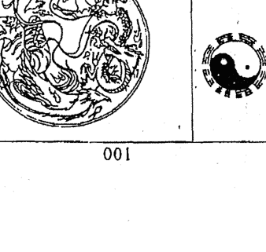

- 送替身的概念
- 替身的制作材料
- 替身制好的是否具有行動能力
- 通身制作的原料的禁忌
- 替身制好後使用替身的情況及替身處理方式
- 替身制作要領
- 替身制作的材料
- 送替身的概念
- 替身的具體開光步驟
- 替身開光後保管方式
- 命犯童子命送替身的準備
- 命犯童子命送替身的具體步驟
- 小孩夜哭送替身的具體步驟
- 犯小人是非口舌送替身前的具體步驟
- 犯小人是邪病送替身前的具體步驟
- 治正病、邪病送替身的具體步驟
- 送官府前的具體步驟
- 化解桃花送替身的具體步驟
- 化官非前的具體步驟
- 送替身當天與法師的禁忌

## 送替身的概念

送替身，顧名思義，是用替身代替本人去辦事或者去承擔某些特定職責的行爲總和。

## 替身的制作

替身的制作，一般不是很復雜，仿照人形制作便可，當然了制作不是光在外觀上像人形就可以了，而且內部也要進行裝藏，使其具備人的一切功能！

> 附：本卷值供內部參考，禁止流通 翻印必究

- 送命犯童子命替身表文…… 八三 一
- 替身開光咒語…… 八四 一
- 替身式樣…… 九〇 五
- 送神訣咒…… 九二 四
- 請神訣咒…… 九三 四
- 祭辰靈符…… 九四 五
- 化解是非口舌靈符…… 九五 七
- 治病表文…… 九八 二
- 百病消解靈符符式…… 〇〇 三
- 治邪病表文…… 〇一 四
- 治邪病靈符符式…… 〇二 三
- 小兒夜哭靈符符式…… 〇三 三
- 小兒夜哭表文…… 〇四 三
- 官訴訟表文…… 〇五 一

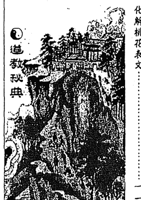

道教秘典

## 製作替身的材料

- 第一、紙剪成的；
- 第二、用草做成的草人；
- 第三、用泥或者石膏等制作的；
- 第四、用布縫制的。
- 第五、還有一些在地面上繪製替身形的（很少見）。

## 替身制作要领

替身制作必须仿照人形，外要有口、鼻、耳、手、足，内要有血液、内脏等，当然外观的比较好制作，纸可以剪出来了，草可以扎出来，泥等可以捏出来，布可以织出来等等。很多人讲，那麽内脏呢，内脏怎麽办呢，这个也很简单，纸的、布的内脏、血液等用咒语加持进去，其他的可以以五色线、五金等装在替身内部，充当内脏、血液等，这个类似于神像的装藏。

## 替身制作好是否就具有行动能力

替身在制作好后并不具备行动能力，而是要通過施法者行法、持咒、開光後，以此來賦予替身辦事、承擔責任的能力。

## 替身製作原料的禁忌

做一個替身首先要選用製作替身的原料，這個我們上面說了，紙、草等都可以，可以根據自己的方便及替身的使命去選定材料。但是不管是什麼材料，必須是乾淨，沒有污穢的方可。不能是已經使用過材料上弄出來的，這樣是不行的！

## 通常可以使用替身的情況及替身處理方式

| 童子命 | 小孩夜哭 | 犯小人口舌 |
| :--- | :--- | :--- |
| 送替身 紙剪成的比較合適 燒掉 | 送替身 紙剪、布制、泥捏等均可 燒化 | 送替身 紙剪成的比較合適 燒掉 |

## 紙人替身制作

選擇好較硬的紙張，剪成人形，要具有手、腳、頭、耳朵等，然後用筆畫上眼睛及口鼻等即可。不同的法事，所需要的替身畫法均不同，以下詳細說明，請參考使用：

### 替身具體的制作步驟

| 治正病 | 治邪病 | 入地府辦事 | 犯官司訴訟 | 命犯桃花 |
|--------|--------|------------|------------|----------|
| 送替身 | 送替身 | 送替身     | 送替身     | 送替身   |
| 紙剪、布制、泥捏等均可 | 紙剪、布制、泥捏等均可 | 紙剪、布制、泥捏等均可 | 紙剪、布制、泥捏等均可 | 紙剪、布制、泥捏等均可 |
| 埋藏 | 埋藏 | 埋藏 | 埋藏 | 埋藏 |

## 命犯童子命的替身制作

如果是童子命的替身的话，要求是非常严格的，必须耳聪目明，手要剪的长一点，脚要大一点，以便童子能够很好的替本人去天庭完成任务。眼睛、口鼻等必须画的规规矩矩的，不能胡乱画。以免影响童子的行动办事能力。

## 小孩夜哭的替身制作

小孩夜哭的替身制作，除了五官端正外，口要剪的大一点，这样就能更好的让替身叫替代小孩去哭闹，以此来达到消除小孩夜哭的法事目的。

## 犯小人是非口舌的替身制作

犯小人、口舌的替身要求把替身的手脚口盡量的剪斷，這樣小人就不能近身、把小人的口用朱砂筆畫個X封住，這樣就能避免本人命犯口舌。

## 治正病、邪病的小人制作

治正病、邪病的替身，要求將替身的肚子、腿部、腳部、手都剪的大一點，肥一點，替身健康了，本人就可以得到健康，口眼鼻也要畫的大氣。

## 入地府辦事替身的制作

入地府辦事的替身，畫法沒有特殊規定，前額部要多畫出一祗眼睛，所謂『入地眼』這樣方便替身在地府行動。

## 犯官司訴訟替身制作

官司訴訟的替身在制作的時候，必須把替身的眼睛、口、鼻、手腳處都畫╳封住，讓這個替身去代替齋主自己去承擔官司訴訟一切不好的後果而不能反抗。

## 命犯桃花替身制作要領

命犯桃花的替身制作是有很大講究的，如果是男士命犯桃花，那麼替身要制作成男性，如果是女士命犯桃花，那麼要將替身制作成女士，要是同性戀命犯桃花的話，將替身制作成相對的同性人形就可以了。這樣一切桃花都有替身代替齋主去做了。齋主自然就解脫了。

## 替身的性別選定

替身是代替本人去完成特定任務的，換言之，替身就是齋主本人的替代，所以性別一般要和齋主一致，但是命犯童子命者、命犯小人、口舌的替身、不受限制。

布制、草人、泥捏小人的制作基本和紙張制作的替身相同，就是眼口鼻可以畫上去、也成可以刻制、布料縫制而成。有一點不同的是布制的、泥捏的替身需要在後背留個口子，以便裝藏。

## 替身制作好後進行開光、裝藏

### 替身具體的裝藏步驟

替身制作好後，不可以直接使用，必須要裝藏、開光後才可以使用的，紙制的替身開光需要用開光靈符和裝藏靈符（後附）。布制的替身和泥巴制作的替身，需要開光符和進行內臟的裝藏就可以了。裝藏的東西有五色線，五金或者五谷、代表替身的血液五臟等。

第一將趕緊的五色線各準備一根，長短適中，交織纏起來然後左手裝入替身體內，將五谷或者五金裝入用布縫制好的布包內，布包上寫上「五臟俱全」四個字後，左手裝入替身體內，裝藏時，要念裝藏咒語；咒曰：

> 天圓地方律令九章
> 吾今藏身形成樣
> 五臟俱全體有金光
> 吾奉太上老君急急如律令

第二步，將裝藏靈符一道，折疊成三角形（字跡向外）也裝入替身體內，最後封口即可。

## 替身的具體開光步驟

第一，將裝藏好的替身，由左手執起，舉起略高于頭部，雙眼直視替身，右手執開光靈符，點燃後向著替身左轉三圈，右轉三圈，然後在替身正面書寫「人」字後，將即將燒完的開光靈符自下而向替身頭部扔去即可。在靈符向著替身左右轉圈的時候，要持咒，咒曰：

> 天圓地方律令九章
> 運符開光光到神聚
> 符至神往四肢五官
> 口眼耳鼻五臟皆暢
> 形外有形體有金光
> 吾今開光天賜吉祥
> 吾奉太上老君急急如律令

第二，開光後，用乾淨的紅包將替身包好，正立放置于壇上。開光畢。

特別說明：以上開光適合一切形式的替身開光，紙人開光不需要裝藏，祇需要將裝藏靈符燒化于紙人上（注意：對着紙人燒化即可，燒化後將符灰撒于紙人替身身上，切勿把紙人替身給燒了。）燒化裝藏靈符時，同樣要默念裝藏咒。紙人裝藏後，開光方法與上述開光方法一樣，照着做就可以了！

### 替身開光後保管方式

替身開光後，一定要用紅布包住頭部，或者整體包住，放置于壇前直到使用時打開即可。

### 命犯童子命送替身前的準備

## 童子命送替身的具體步驟

- 第一、準備好《三界十方萬靈主宰》牌位一個，準備《本境城隍裏域正神》牌位一個，準備《當方土地》牌位一個；
- 第二、準備好替身、香花果水等供品；黃表紙、元寶，香爐一個；
- 第三、用黃表紙將自己的名字、性別、年齡、民族，出生地址、出生年月日時、現在居住地址詳細的寫在黃紙上；
- 第四、準備好送童子表文；
- 第五、準備護身靈符一道。

- 第一，在家裏、寺廟或者十字路口處設壇，壇上中間供奉《三界十方萬靈主宰》牌位，右邊供奉《本境城隍裏域正神》牌位，左邊供奉《當方土地》；
- 第二，上供品，燒香三柱，淨水倆杯，燒化黃表紙張及元寶；
- 第三，將替身、護身靈符放置壇上；
- 第四，將寫于黃紙上齋主的信息在香煙上熏一熏，然後蓋在替身身上；
- 第五，念請神咒請神；
- 第六，請神完畢後，跪在神仙牌位前宣讀齋主信息表文；
- 第七，信息表文宣讀完畢後，再宣讀送替身表文，二表文皆宣讀完畢後，用兩張表文將替身裹起來燒化神前（不能包住替身的頭部）；燒化時念送替身咒語，咒曰：

> 香花茶供果 替身用後走
> 躍身登仙界 鞍馬不停留
> 勤做分內事 功行標千秋
> 吾奉太上老君急急如律令

- 第八，再次燒化黃表紙、元寶，然後將表文、替身等灰撒在四周；
- 第九，將護身靈符佩戴在身上（靈符佩戴在當年大年三十晚上燒化後，符灰棄之大吉）；
- 第十，燒化各種牌位，同時誦讀送神咒！法事畢！

## 小孩夜哭送替身前的準備

- 第一，準備好《三界十方萬靈主宰》牌位一個，《本境城隍裏域正神》牌位一個，準備《當方土地》牌位一個；
- 第二，準備好替身、香花果水等供品，黃表紙、元寶，香爐一個；
- 第三，用黃表紙將小孩的名字、性別、年齡、民族，出生地址、出生年月日時、現在居住地址詳細的寫在黃紙上；
- 第四，準備好送小孩夜哭替身表文；
- 第五，準備護身靈符一道。小孩止哭靈符一道。

## 小孩夜哭送替身的具體步驟

- 第一、在家裏或者十字路口處設壇，壇上中間供奉《三界十方萬靈主宰》，牌位右邊供奉《本境城隍裏域正神》牌位，左邊供奉《當方土地》；
- 第二、上供品，燒香三柱，淨水倆杯，燒化黃表紙張及元寶；
- 第三、將替身、護身靈符、止哭靈符放置壇上；
- 第四、將寫于黃紙上小孩的信息表文在香烟上熏一熏，然後蓋在替身身上；
- 第五、念請神咒請神；
- 第六、請神完畢後，跪在神仙牌位前宣讀小孩信息表文；
- 第七、信息表文宣讀完畢後，再宣讀小孩夜哭送替身表文，二表文皆宣讀完畢後，用兩張表文將替身裹起來燒化神前（不能包住替身的頭部）；燒化時念送替身咒語，咒曰：

> 香花茶供果 替身用後走
> 躍身登仙界 鞍馬不停留
> 勤做分內事 功行標千秋
> 吾奉太上老君急急如律令

- 第八、再次燒化黃表紙、元寶，然後將表文、替身等灰用紙包起來埋于十字路口；
- 第九、將護身靈符、止哭靈符佩戴在身上（靈符佩戴在當年大年三十晚上燒化後，符灰棄之大吉）；
- 第十、燒化各種牌位，同時誦讀送神咒語，送替身畢！

## 犯小人是非口舌送替身前的準備

- 第一，準備好《三界十方萬靈主宰》牌位一個，準備《本境城隍裏域正神》牌位一個，準備《當方土地》牌位一個；
- 第二，準備好替身、香花果水等供品；黃表紙、元寶，香爐一個；
- 第三，用黃表紙將齋主的名字、性別、年齡、民族、出生地址、出生年月日時、現在居住地址詳細的寫在黃紙上；
- 第四，準備好化解是非小人口舌表文；
- 第五，準備護身靈符一道。化解小人是非口舌靈符一道。

## 犯小人是非口舌送替身的具體步驟

- 第一，在家裏或者十字路口設壇，壇上中間供奉《三界十方萬靈主宰》牌位，牌位右邊供奉《本境城隍裹域正神》牌位，左邊供奉《當方土地》；
- 第二，上供品，燒香三柱，淨水倆杯，燒化黃表紙張及元寶；
- 第三，將替身、護身靈符、化解小人是非口舌靈符放置壇上；
- 第四，將寫于黃紙上齋主的信息在香烟上熏一熏，然後蓋在替身身上；
- 第五，念請神咒請神；
- 第六，請神完畢後，跪在神仙牌位前宣讀齋主信息表文；
- 第七，信息表文宣讀完畢後，再宣讀送替身表文，二表文皆宣讀完畢後，用倆張表文將替身裹起來燒化神前（不能包住替身的頭部）；燒化時念送替身咒語，咒曰：

> 香花茶供果 替身用後走
> 躍身登仙界 鞍馬不停留
> 勤做分內事 功行標千秋
> 吾奉太上老君急急如律令

- 第八，再次燒化黃表紙、元寶，然後將表文、替身等灰用紙包起來，埋于十字路口；
- 第九，將護身靈符、化解小人靈符佩戴在身上，送替身畢！（靈符佩戴在當年大年三十晚上燒化後，符灰棄之大吉）。
- 第十，燒化各種牌位，同時誦讀送神咒語，送替身畢！

## 治正病、邪病送替身前的準備

- 第一，準備好《三界十方萬靈主宰》牌位一個，準備《本境城隍裏域正神》牌位一個，準備《當方土地》牌位一個；也可以供奉《藥王》牌位一個；
- 第二，準備好替身、香花果水等供品；黃表紙、元寶、香爐一個；
- 第三，用黃表紙將齋主的名字、性別、年齡、民族、出生地址、出生年月日時、現在居住地址詳細的寫在黃紙上；
- 第四，準備好治病表文或治邪病表文一張；
- 第五，準備好護身靈符一道。百病消解靈符或治邪病靈符一道。

## 治正病、邪病送替身的具体步骤

- 第一，在家裹或者十字路口处设坛，坛上中间供奉《三界十方万灵主宰》牌位，牌位右边供奉《本境城隍裏域正神》牌位，左边供奉《当方土地》；
- 第二，上供品，烧香三柱，净水俩杯，烧化黄表纸张及元宝；
- 第三，将替身，护身灵符、百病消解灵符、治邪病灵符放置坛上；
- 第四，将写于黄纸上斋主的信息在香烟上熏一熏，然后盖在替身身上；
- 第五，念请神咒请神；
- 第六，請神完畢後，跪在神仙牌位前宣讀齋主信息表文；
- 第七，信息表文宣讀完畢後，再宣讀治病表文或治邪病表文，二表文皆宣讀完畢後，用倆張表文將替身裹起來燒化神前（不能包住替身的頭部）；燒化時念送替身咒語，咒曰：

> 香花茶供果　替身用後走
> 躍身登仙界　鞍馬不停留
> 勤做分內事　功行標千秋
> 吾奉太上老君急急如律令

- 第八，再次燒化黃表紙、元寶；然後將表文、替身等灰用紙包起來，埋于十字路口；
- 第九，將護身靈符、百病消解靈符佩戴在身上，送替身畢！（靈符佩帶在當年大年三十晚上燒化後，符灰棄之大吉）。
- 第十，燒化各種牌位，同時誦讀送神咒語，送替身畢！
- 第十一，特別說明：治邪病的時候，將治病表文更換成治邪病表文即可，將百病消解靈符更換為治邪病靈符。

## 送替身入地府前的準備

- 第一，準備好《三界十方萬靈主宰》牌位一個，準備《本境城隍襄域正神》牌位一個，準備《當方土地》牌位一個，《冥界值日曹官》牌位一個，《冥界游魂散鬼》牌位一個
- 第二，準備好替身、香花果水等供品；黃表紙、元寶、冥幣，香爐一個
- 第三，用黃表紙將想入地府辦事齋主的名字、性別、年齡、民族，出生地址、出生年月日時、現在居住地址及去地府辦事的一切事宜詳細的寫在黃紙上
- 第四，準備通關文牒
- 第五，準備護身靈符一道。辟邪靈符一道，回身靈符一道

## 送替身入地府的具體步驟

- 第一，在家裏或者寺廟中設壇，壇上中間供奉《三界十方萬靈主宰》牌位，牌位右邊供奉《本境城隍裏域正神》牌位，左邊供奉《當方土地》、《冥界值日曹官》牌位一個、《冥界遊魂散鬼》牌位一個；
- 第二，上供品，燒香三柱，淨水倆杯，燒化黃表紙張及元寶；在《冥界遊魂散鬼》牌位前燒化冥幣；叫他不要妨礙替身去冥界辦事；
- 第三，將替身、護身靈符、辟邪靈符、通關文牒填寫好後放置壇上；
- 第四，將寫于黃紙上齋主的信息及在冥界辦事一切事宜的表文在香煙上薰一薰，然後蓋在替身身上；
- 第五，念請神咒請神；
- 第六，請神完畢後，跪在神仙牌位前宣讀齋主信息及辦事情況的表文；
- 第七，信息表文宣讀完畢後，再宣讀通關文牒，二者皆宣讀完畢後，用信息表文和通關文牒將替身裹起來燒化神前（不能包住替身的頭部）；燒化時念送替身咒語，咒曰：

> 香花茶供果　替身用後走
> 躍身登仙界　鞍馬不停留
> 勤做分內事　功行標千秋
> 吾奉太上老君急急如律令

送替身咒完畢後，誦讀入地咒語，咒語曰：

> 天門開　地戶開
> 替身入冥界　神鬼散魂避
> 使者列班接　金册戶簿送
> 供吾差事來　吾奉太上老君急急如律令

然後燒化回身符。

- 第八，再次燒化黃表紙、元寶及冥幣，然後將通關文牒、替身等灰用紙包起來，埋于十字路口；
- 第九，將護身靈符、辟邪靈符佩戴在身上，（靈符佩戴在當年大年三十晚上燒化後，符灰棄之大吉）。
- 第十，燒化各種牌位，同時誦讀送神咒語！
- 第十一，替身辦事的情況及結果不日就將托夢于齋主，辦事送替身完畢！

## 送官司訴訟替身前的準備

- 第一、準備好《三界十方萬靈主宰》牌位一個，準備《本境城隍襄域正神》牌位一個，準備《當方土地》牌位一個，或者準備《降魔護道天尊》牌位一個；
- 第二、準備好替身、香花果水等供品；黃表紙、元寶，香爐一個；
- 第三、用黃表紙將齊主的名字、性別、年齡、民族、出生地址、出生年月日時、現在居住地址及官司訴訟的一切事宜、經過、受理法院等情況詳細的寫在黃紙上；
- 第四、準備好化解官司訴訟表文；
- 第五、準備護身靈符一道。化解官司訴訟靈符一道。

## 送官司诉讼替身的详细步骤

- 第一，在家裏或者寺廟設壇，壇上中間供奉《三界十方萬靈主宰》牌位，牌位右邊供奉《玉皇赦罪天尊》牌位和《本境城隍裏域正神》牌位，左邊供奉《當方土地》；
- 第二，上供品，燒香三柱，淨水倆杯，燒化黃表紙張及元寶；
- 第三，將替身、護身靈符、化解官司訴訟靈符放置壇上；
- 第四，將寫于黃紙上齋主的信息在香烟上熏一熏，然後蓋在替身身上；
- 第五，念請神咒請神；第六，请神完毕后，跪在神仙牌位前宣读斋主信息表文；
第七，信息表文宣读完毕后，再宣读官司诉讼表文，二表文皆宣读完毕后，用两张表文将替身裹起来烧化神前（不能包住替身的头部）；烧化时念送替身咒语，咒曰：

> 香花茶供果 替身用後走
> 跃身登仙界 鞍马不停留
> 勤做分内事 功行标千秋
> 吾奉太上老君急急如律令

第八，再次烧化黄表纸、元宝；然后将表文、替身等灰用纸包起来，埋于十字路口；

## 化解桃花送替身前的准备

-   准备好《三界十方万灵主宰》牌位一个，准备《本境城隍里域正神》牌位一个，准备《当方土地》牌位一个，或者准备《九天玄母天尊》牌位一个；
-   准备好替身、香花果水等供品；黄表纸、黄表纸张及元宝；
-   将护身灵符、官司灵符佩戴在身上，（灵符佩戴在当年大年三十晚上烧化后，符灰弃之大吉）。
-   烧化各种牌位，同时诵读送神咒语，送替身毕！

## 化解桃花送替身的具体步骤

-   第一，在家设坛，坛上中间供奉《三界十方万灵主宰》，牌位右边供奉《本境城隍里域正神》，左边供奉《当方土地》，或者右边再供奉《九天玄母天尊》牌位一个；
-   第二，上供品，烧香三柱，净水俩杯，烧化元宝，香炉一个；
-   第三，用黄表纸将斋主的名字、性别、年龄、民族，出生地址、出生年月日时、现在居住地址、婚姻情况详细地写在黄纸上；
-   第四，准备好化解桃花表文；
-   第五，准备护身灵符一道。化解桃花灵符一道。
-   第三，将替身，护身灵符、化解桃花灵符放置坛上；
-   第四，将写于黄纸上斋主的信息表文在香烟上熏一熏，然后盖在替身身上；
-   第五，念请神咒请神；
-   第六，请神完毕后，跪在神仙牌位前宣读斋主信息表文；
-   第七，信息表文宣读完毕后，再宣读化解桃花表文，二表文皆宣读完毕后，用两张表文将替身裹起来烧化神前（不能包住替身的头部）；烧化时念送替身咒语，咒曰：

> 香花茶供果 替身用後走
> 跃身登仙界 鞍马不停留
> 勤做分内事 功行标千秋
> 吾奉太上老君急急如律令

-   第八，再次烧化黄表纸、元宝；然后将表文、替身等灰用纸包起来，埋于十字路口；
-   第九，将护身灵符、化解桃花灵符佩戴在身上！（灵符佩戴在当年大年三十晚上烧化后，符灰弃之大吉）。
-   第十，烧化各种牌位，同时诵读送神咒语，
送替身毕！

## 送替身的时间选择

一切送替身的时间均要在黄道吉日进行，入地府办事、小孩夜哭送替身均需要在晚上进行，其他的不在此限，可以自由安排！

## 送替身当天斋主与法师的禁忌

-   沐浴、斋戒、禁房事
-   禁止接触不干净的东西
-   禁止接触陌生人

## 送命犯童子命替身表文

谨启

东部禳洲中华人民共和国 省 市 县土地神祇

今有弟子 性 一位出生于
年 月 日 时 乃系圣境转
世之童（男/女）体弱不安
疾病缠身 灾祸时至 苦痛难言
特奉还替身以 替位
乞望神祇大发慈悲 好言传达
解除病痛 摒弃灾难 消一切灾祸
获 一切福报 万事顺畅
吉祥康宁 感神 祇之功德
念天尊之恩情 弟子等诚惶
诚恐 稽首顿首 九叩百拜
天运 年 月 日 上申

## 替身开光灵符

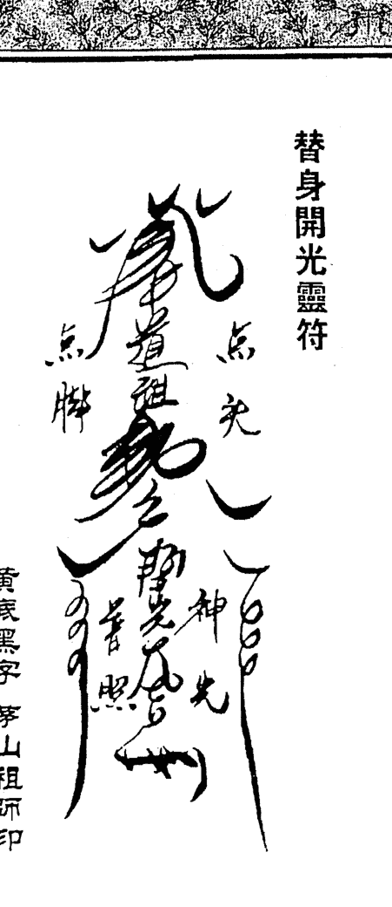
黄底黑字 茅山祖师印

## 替身开光咒语

神笔挥动天门开，上圣高真仙法排。
点开法眼观四海，耳鼻口通神来。
四肢五官齐备，五脏六腑连法脉。
神光普照，天下光明。
心神如一，运神有法。
吾奉太上老君急急如律令。

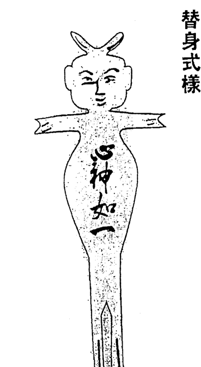

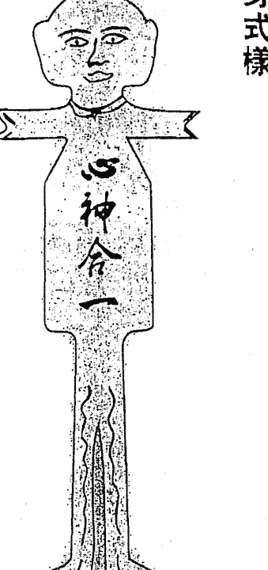

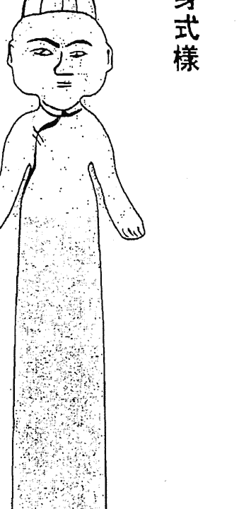

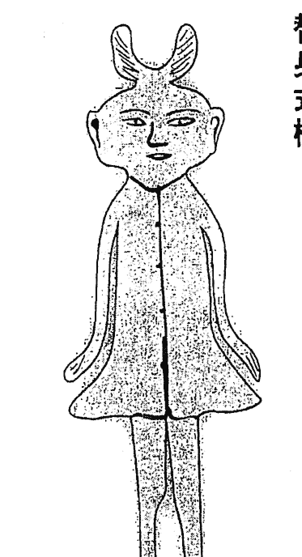

## 替身式样

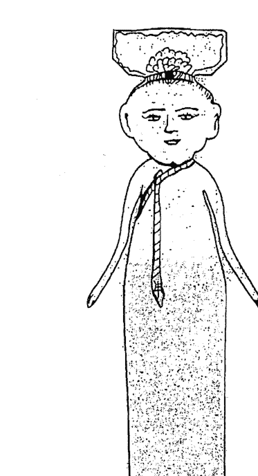

## 替身式样

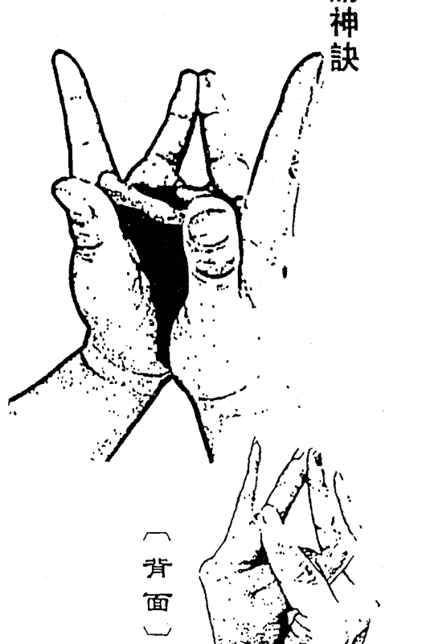

## 请神诀

## 请神咒

天开黄道建醮坛
香烟缭绕上九天
诸神闻讯应召来
鹤驾暂留在宝坛
焚香上供香花果
斋食表奏大众仙
原始法旨敕令在
诸神得令行法差
吾奉太上老君急急如律令！

[背面]

## 送神诀

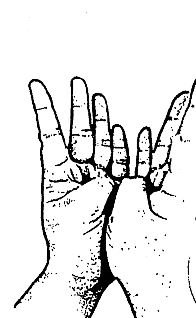

## 送神咒

法事已毕事周圆
诸神起驾大罗天
各神各回各宫府
需时再请众神返
吾奉太上老君急急如律令

## 装藏灵符

> > 元亨利贞

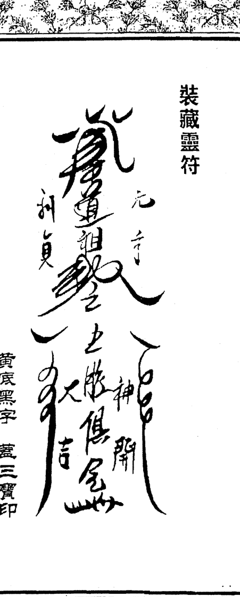
黄底黑字 盖三宝印

## 化解是非口舌表文

今据
中华民国 省 市 县地方
居住 奉

道祈福保安弟子
敬献香茶花果

拜请

三清祖师
降魔护道天尊正一真人

三茅真君 座下

弟子身犯小人 口舌不断 是非随身
灾祸常至 诸事不顺

今拜请天尊护佑 得小人远离 是
非不侵 口舌即止 万事随心

弟子定感诸天尊之功德 念天尊之恩
情 诚惶诚恐 稽首顿首 九叩百拜

天运 年 月 日上申

## 化解是非口舌灵符

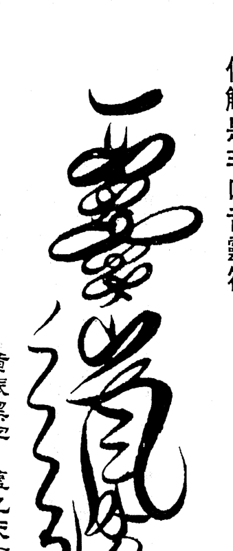
黄底黑字 盖九天玄女印

## 治病表文

中华人民共和国
省 市
县(区)
居住弟子 谨以素筵、鲜果、香花、清酒之仪。

敬献于
九天司命真君。
先天豁落盖君。文昌梓潼帝君座前，
伏以

神恩广大 无感不通。圣泽巍峨有求皆应。稽查善恶之
权。主持功过之柄。窃念弟子身体素弱，时欠健康。

任服药石。难得回春。终年坎坷时常。渐见形容憔悴。
恐因修省疏漏，以致
病疫牵缠。忧心耿耿。时抱隐忧。

伏乞 飞鸾启示。始知帝恩开施格外。
普渡洪慈。故虔心发愿。
子祈安祛病延年，消灾解厄。元辰光彩，命宫安泰。
伏冀恩主鉴此愚忱。据情启奏。俾得病躯健全全身早平
安。灾随电扫，福同云生。无任恳祷之至。瞻仰之至。

天运 年 月 日

## 治邪病表文

今据 中华人民共和国 省 市 县 地方居住 善信弟子 沐浴斋戒 敬献香果于 玉皇赦罪天尊 三茅真君 座前 善信弟子 邪病不断 恶魔缠 身宿业未除 三魂漂浮 终日惶惶不 安灾难随身 苦不堪言 今拜请神恩得 护 消无妄之灾 纳有余之庆 神光普 照 三魂稳固 邪恶不侵 吉神永随诸 事吉庆 常诵圣号 永感神恩 弟子诚 惶诚恐 再拜叩首 天运 年 月 日

## 百病消解灵符符式

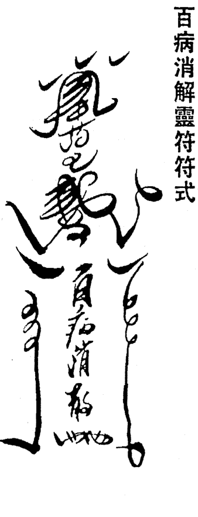
黄底朱字 盖三宝印

## 治邪病灵符符式

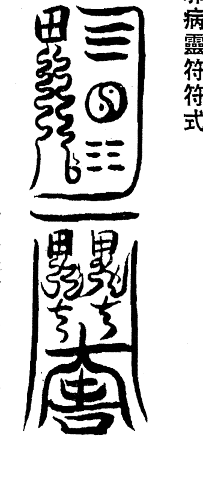
黄底黑字 盖茅山祖师印

## 小孩夜哭灵符符式

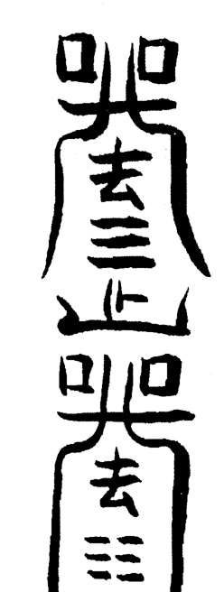
黄底朱字 盖玉皇印

## 小孩夜哭疏文

中华民国 省 市 县 街 号居住
今 据
弟子 出生于 年 月 日
时
身有一子 女 夜间少睡 哭闹不停
弟子今沐浴斋戒 设坛上供 虔诚上启于
九天玄母天尊
降魔护道天尊 座前曰
小儿夜哭不断 定有因缘 身为父母 实属不忍
今冒犯天愿 乞天尊庇佑 福降弟子门庭
伏愿
小儿身体健康 夜晚安睡 恶梦不侵 诸煞消散 宿业消灭 健
康成长 灾消难免 大吉大利 万事和谐
弟子定常持圣号 感天尊之恩德
弟子九叩拜启
天运 年 月 日 时

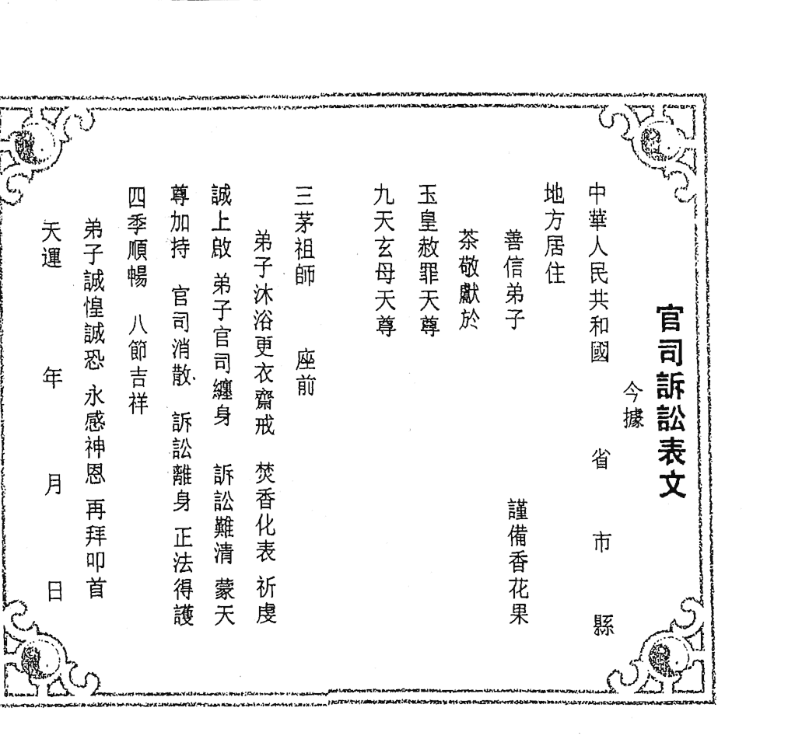

## 官司诉讼表文

中华民共和國 省 市 县 地方居住 善信弟子

茶敬献于
玉皇赦罪天尊
九天玄母天尊
三茅祖师 座前

弟子沐浴更衣斋戒 焚香化表 祈虔

诚上启 弟子官司缠身 讼诉难清 蒙天
尊加持 官司消散 讼诉离身 正法得护

四季顺畅 八节吉祥

弟子诚惶诚恐 永感神恩 再拜叩首

天运 年 月 日

谨备香花果

## 消除官司灵符

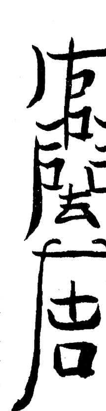
黄底黑字 盖天师印

## 辟邪灵符符式

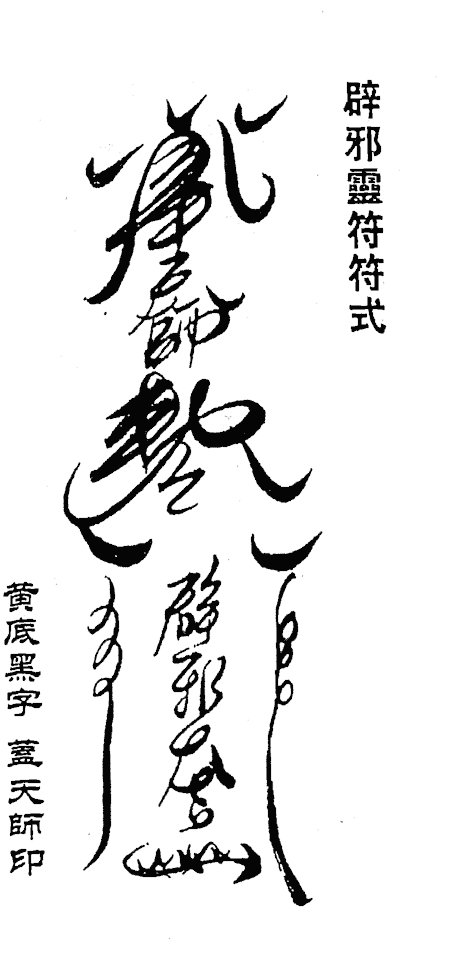
黄底黑字 盖天师印

### 关通文牒

阳人持愿分身三界通行
国 省 市 县 今有 性 一位
三元三品三官大帝
行令 准此
西元 年 月 日
道历 年 月 日
盖玉帝章

## 回身灵符符式

黄底黑字 灵通灵印

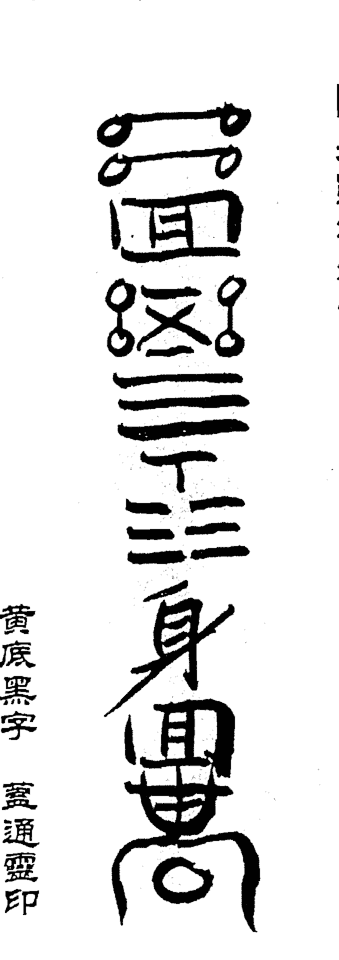

## 消除桃花灵符符式

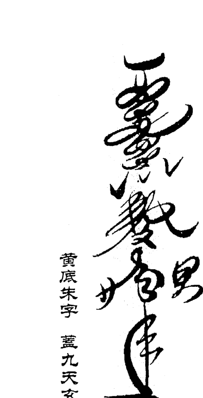
黄底朱字 盖九天玄女印

## 斩桃花疏文

今 据
中华人民共和国
省 市 县 街 号 居住
善信弟子
谨备香烛纸仪 百拜叩叩于
九天玄母天尊
桃花娘娘
座前

弟子于
年 月 日
时 建生

身犯桃花 孽缘缠身 姻缘不顺 苦不堪言
今
诚惶诚恐 虚诚拜启 乞天尊垂怜 赐福于弟子

伏愿
姻缘美满 孽缘不侵 百年同心 诸事遂愿 大吉和顺
弟子定常持圣号 天尊恩德 永铭于心

天运
年 月 日 时
弟子再拜叩首

## 秘法折子本系列丛书

-   竖排文字转横排内容1
-   竖排文字转横排内容2
-   竖排文字转横排内容3
-   竖排文字转横排内容4
-   竖排文字转横排内容5
-   竖排文字转横排内容6
-   竖排文字转横排内容7
-   竖排文字转横排内容8
-   竖排文字转横排内容9
-   竖排文字转横排内容10
-   竖排文字转横排内容11
-   竖排文字转横排内容12
-   竖排文字转横排内容13
-   竖排文字转横排内容14
-   竖排文字转横排内容15
-   竖排文字转横排内容16
-   竖排文字转横排内容17
-   竖排文字转横排内容18
-   竖排文字转横排内容19
-   竖排文字转横排内容20

## 精胶装书系列

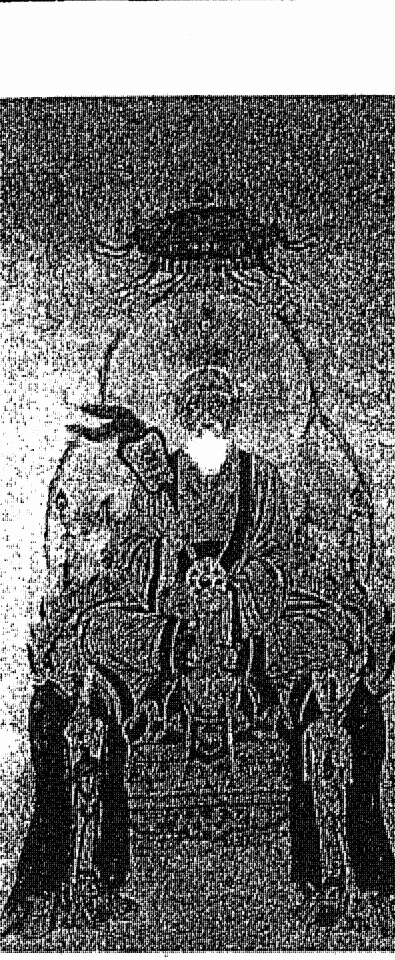

-   太上老君说常清静经注
-   道德真经注
-   阴符经集注
-   清静经注
-   太上感应篇
-   文昌帝君阴骘文
-   关圣帝君觉世真经
-   玄天上帝感应灵签
-   弟子规
-   太上老君说百病崇福经
-   太上老君说常清静妙经
-   太上老君说报父母恩重经
-   太上老君说五斗金章受生经
-   太上老君说上七灭罪经
-   太上老君说消灾经
-   太上老君说安宅经
-   太上老君说安坟经
-   太上老君说安炉经
-   太上老君说安土地经
-   太上老君说安门户经
-   太上老君说安床帐经
-   太上老君说安车船经
-   太上老君说安器物经
-   太上老君说安衣物经
-   太上老君说安饮食经
-   太上老君说安医药经
-   太上老君说安人事经
-   太上老君说安天时经
-   太上老君说安地理经
-   太上老君说安人事经
-   太上老君说安人事经