# 二十四山吉凶便覽

- 壬山丙向
- 子山午向
- 癸山丁向
- 丑山未向
- 艮山坤向
- 寅山申向
- 甲山庚向
- 卯山酉向
- 乙山辛向
- 辰山戌向
- 巽山乾向
- 巳山亥向
- 丙山壬向
- 午山子向
- 丁山癸向
- 未山丑向
- 坤山艮向
- 甲山寅向
- 庚山甲向
- 酉山卯向
- 辛山乙向
- 戌山辰向
- 乾山巽向
- 亥山巳向

三元九运水法便览
一白八方生杀图
二黑八方生杀图
三碧八方生杀图
四绿八方生杀图
五黄八方生杀图
六白八方生杀图
七赤八方生杀图
八白八方生杀图
九紫八方生杀图

论五气

二十四山消砂便览

九星属八卦五行歌

九星生克歌

生气诀

旺气诀

死气诀

退气诀

杀气诀

冲关诀

关煞生气混杂诀

魁星诀

善曜诀

三吉地诀

三元旺气

三元龙运诀

八山生旺诀

主运加飞法

年月九星诀

起年白星诀

年起正月白星诀

三元日白法

总论年月日诀

九星克应诀

太岁山头白星诀

论杀气星入中

论生气星入中

年头九星诀

年头三吉诀

太岁山头白星便览

阳宅诀

论气运篇

八山旺衰细法

八山生杀气法

制杀法

先后天定式图

三元地理龙运

论四煞

寻龙点穴至贤真机

论合口结局

八山入风数

入风断法

羊刃煞

认水去口诀

通气诀

风水二字解

放水口诀

立向七水法

水城论

来源论

论真气法

论水口

水法论

客水十六局

水局顺逆

四大水口

消亡败绝水

小八门分房位

小八门捷诀

论阳宅形相吉凶

水井吉凶

论砂之五行相兼

论砂分强弱

砂分房位

二十四分房位

论发福迟速秘诀

论飞腾与冲吊

生死推年月秘诀

山水建破定局

财丁全备局

论元辰水法

翻卦掌诀

纳甲

八山加局例

起贪狼法

星卦定局图例

八山照水经

吉星断

定穴法诀

坐山之法 分房之法

砂诀

案山诀

论朝案

明堂诀

龙局生克

八局作向吉凶诀

论水喜忌

察来情

论理气配向

净阴净阳

八卦配合

纳甲论

三合论

天星论

八曜杀

二十四龙定局催官向

催官贵人

文官贵人

立向杂说论

# 秘传黄金策

- 扶龙法
- 论砂
- 阴阳形象
- 论胎伏
- 生气论
- 论山地平洋
- 平洋不可葬
- 误例论
- 寻龙捷诀
- 男子贤愚
- 九星生克
- 论十法
- 后天八大局
- 先天八大局
- 先后天八大局
- 论破先天
- 论破天天
- 天赦水法
- 三元月谈赋
- 三元继善篇
- 三元地理千里马
- 三元峦头赋
- 三元地理赋
- 临流赋
- 地理一祸福
- 祸福一水法
- 四言独步
- 五言独步
- 九天磨算诀断法
- 论天干地支之准绳
- 小八门论
- 上元暗号
- 中元晴号
- 论堂劫断法
- 论脉气断法
- 论后劫断法
- 下元暗号
- 坑风石纹断法
- 山地总论
- 论远朝近案
- 龙虎砂断法
- 论山地理气
- 山地十不相
- 论坐山之法
- 论官鬼禽曜大贵之地三种
- 论夹山罗城水口
- 论案山应星乐山照星
- 论立向之义
- 二十四山比劫年
- 立向七水法
- 认水去口诀
- 搜地龙透山光
- 三元刻应秘诀
- 论人丁鑫秀刻应
- 论脉气与龙虎刻应
- 论人丁旺稀刻应
- 论中天水法与房份
- 论初运吉而后运退之局
- 论水之变化
- 论四大水口
- 论水局顺逆
- 论宜忌
- 论堂局断法
- 论恶死水断法
- 二十劫断法
- 论天劫断法
- 论地刑断法
- 论曜杀断法
- 吉砂类
- 凶砂论、八门缺
- 论富贵贫贱
- 论官鬼禽曜
- 论十恶大忌

# 二十四山吉凶便览

# 乾坤国宝

## 壬山丙向

壬山丙向坐丁亥向丁巳分金属土
宜戌丑龙入首 为同元龙入首
最为上吉 大旺人丁科甲连绵
而龙亥龙入首为次吉 乾卦
龙入首三六七八运最吉 而四
运为次吉 若能乘得本运 主
发人丁千万口 亦发富贵
艮寅龙入首为次吉 艮卦龙入
首宜二五八九运最为上吉 若
能乘得本运之龙入首 山与龙

必配合 主大旺人丁千万口 亦大发富贵而绵远也
玄武山峰宜丰满端正 催官贵人砂宜明现奇峰秀案朝拱
个字中心出脉 蛛丝马膝 蜂腰鹤膝 草蛇灰线 到头宜
成金钟体 名曰金星照穴 龙虎宜齐明 贵人砂峰拱照而
明现 四正山峰朝拱 八国奇砂秀水朝堂 主极贵之地
敌国之富 砂方丹有情 五星狮象守于水口 而先后天会
聚于明堂 比为大贵之地 文官至拜相 武至三公 若中
等龙结穴 主发富贵 科甲绵绵 小地结穴亦发富 而旺
财丁 山若反背 必有失井离乡 一水之斜 必有离官失
职之忧 此言山之形象不可疏忽是也

内埕放右左荣华，放右右富贵，水若堂中直出房房富贵，次房更吉，水放巽亦大吉，放巽卦须防辰巳，水放辰虽大利次房，若遇冲刑太岁或填实大凶，巳口亦同，水归坤卦大败，坤乃后天之位，流破妇人身不安，水出未方败次房，水流坤宫败长房，水出申败少房，以上主妇人经症月事不调，此言内局十二年之地运也。

先天兑卦水来上堂，主大旺人丁千万口，兑卦水来会合巽水归坤而去，主出人奸猾之徒，又主妇人产厄见血光也，如果坤方有聚库深如河海，反为大发巨富，胜于石崇与陶朱，出未败二房，出坤败长房，出申败三房，主重妻，败丁，出辰久后败二房，出巳败少房，因犯三曜故凶，若刑冲岁破必损人丁退败。

财，兑水来离水去，房房大发，水若堂中直出初运大发，久后则凶，而次房伶仃退败，兑水来归巽而去，大吉，亦谓之天下第一水口奈因兑是巽之后天，巽亦是兑之先天，所以巽方道去无遮栏者，久后则非尽善尽美之局，兑水来震水去，此乃借窍之局，亦大吉，兑水来归巽大房大发财丁，出辰久后败二房，出巳败少房，因犯三曜故凶，若刑冲岁破必损人丁退败。

后天坤卦水来主出蠢富之人丁，坤卦水来会合兑水归离而去大发财丁，出丙口次房大发富贵，出午初运虽吉，久后主出桃花，妇人又多疾病，出丁口好少房，坤卦水来巽方

去，主大发富贵，余因水之反跳，所以必有忤逆之儿，出巽长房子孙英贤，三房亦吉，次房较差，出巳为水口，虽三房，因曜之故，忌亥年申寅冲与刑杀主能退财，并损人丁，辰为水口主长次皆吉，虽发富贵，而遇戌年冲动辰位，主能损丁退财，特是肖狗人见，辰巽巳自立巽卦，而辰与巽较近故也，而水出巽正窍，宜来去明显，主大发财丁绵远，若有树木屋宇遮障，亦不能发矣，此谓之闭杀不清，又主多病，坤水来震方去，亦大吉。

天劫巽卦水来，应主吐血，痨疾不善终，巽卦水来而堂前带，主出狂人，后必绝嗣，辰水已劫，或巳水辰劫必主颠狂，辰水应男巳水应女，或三曜方树木高压又主颠狂，未巳卯辰戌午有丁字路，或劫水来应主不善终，巽巳方水来名曰风声水，主花街柳巷之人，寻芳问柳之容，辰午方有路冲来主犯男少之人自吊死，而辰巳方水来主遭刑戮虽吉美地亦不免遭盗杀之忧，收曜杀水走破先天，主出蜈蚣儿狂人难免，巽卦水来归坤而去，主重妻人产厄见血光，若坤方库深如河海，反主巨富，因妻财而致富，巽水来走入西兑名外局破先天，主大损壮丁，夭折，长房尤烈，吐血痨疾，绝嗣，天干应男，地支应女。

离为堂劫，水来谓之穿心水大凶，主恶死，丙方路来主出

鬼怪、路长应楼上，短者应楼下。午水来归西兑而去名曰游魂桃花，男人多病，女贪淫欲，随入私奔，又曰虽是良家贤女子，床中常伴美男子。

客宾乾震二方之水侵射坤宫，本是大凶，如能坤方聚库，流年地运行到，反为巨富，此为女秀男贤而科甲翰苑，震水来西水去，名曰宾盛主衰，女儿成群，单丁过代，而此水过堂如左畔居者主重要，右畔居者主蜈蚣以继宗枝，出水若无聚者财丁并失，只差时间之迟速，必然应验如神，出庚败二房，出酉败长房，出辛败三房，收艮卦水来归会而深聚在坤方，主大发富贵。而绵远。

天劫、堂劫、地刑名曰三刀方明堂十字忌二十丈内，有古井、栏杆、石堆、硬角、圆环等遇流年地运行到，主开刀车厄主损人丁，吐血痨疾大凶，古松主阴症。树木茂盛主多病，地刑不宜高压，反弓斜角照射主大凶。

内局水口故出忌树木当塞水路，使水成八字形，或变成细小之水路，主男女眼疾或盲目。或角生午丁位定生眼害人坐山丰满人丁旺，穴后仰瓦主伶丁。

## 子山午向

子山午向坐丙子向庚午分金属水宜乾艮龙入首为同元龙入首最为上吉大旺人丁科甲连绵而戊亥龙入首为次吉乾卦龙入首三六七八运最吉而四运为次吉若能乘得本运主发富贵千万口亦发富贵丑宜龙入首为次吉艮卦龙入首宜二五八九运最为上吉若能乘得本运之龙入首山向龙

之配合主大旺人丁千万口亦大发富贵而绵远也玄武山峰要丰满端正催官贵人砂宜明现奇峰秀桌朝拱个字中心出脉蛛丝马滕蜂腰鹤膝草蛇灰线到头宜成金钟体名曰金星照穴龙虎宜齐明贵人砂峰拱照而明现四正山峰朝拱八国奇砂秀水朝堂主极贵之地

殿国之富砂方丹有情五星狮象守于水口而先后天会聚于明堂此为大贵之地文官至拜相武至三公若中等龙结穴主发富贵科甲绵绵小地结穴亦发富而旺财丁山若反背必有失井离乡一水之科必有离官失职之忧此言山之形象不可疏忽是也

内埕放左右荣华，故右石富贵，水若堂中直出房房富贵，次房更吉，水放巽亦大吉，故巽卦须防辰巳，水放辰虽大利次房，若遇冲刑大岁或填实大凶，巳口亦同，水归坤卦大败，坤乃后天之位，流破妇人身不安，水出未方败次房，水流坤宫败长房，水出申败少房，以上主妇人经症月事不调，此言内局十二年之地运也。

先天兑卦水来上堂，主大旺人丁千万口，兑卦水来会合巽水归坤而去，主出人奸骨之徒，又主妇人产厄见血光也，如果坤方有聚库深如河海，反为大发巨富，胜于石崇陶朱，出未败二房，出坤败长房，出申败三房，主重妻，败

财，兑水来离水去，房房大发，水若堂中直出初运大发，久后则凶，而次房伶仃退败，兑水来归巽而去，大吉，亦谓之天下第一水口奈因兑是巽之后天，巽乃是兑之先天，所以巽方直去无遮拦者，久后则非尽善尽美之局，兑水来震水去，此乃借窍之局，亦大吉，兑水来归巽大房大发财丁，出辰久后败二房，出巳败少房，因犯三曜故凶，若刑冲岁破必损人丁退败。

后天坤卦水来主出蠢富之人丁，坤卦水来曾合兑水归离而去大发财丁，出丙口次房大发富贵，出午初运虽吉，久后主出桃花，妇人又多疾病，出丁口好少房，坤卦水来巽方

去，主大发富贵。奈因水之反跳，所以必有忤逆之凶。出巽长房子孙英贤。三房亦吉。次房较差。出巳为水口，虽三房，因曜之故。忌亥年申寅冲与刑杀主能退财，并损人丁。辰为水口主长次皆吉。虽发富贵，而遇戌年冲动辰位，主能损丁退财。特是肖狗人危。辰巽巳自立巽卦，而辰与巽较近故也。而水出巽正窍，宜来去明现，主大发财丁绵远。若有树木屋宇遮障，主不能发矣。此谓之闭杀不清。又主多病。坤水来震方去，亦大吉。

天故巽卦水来，应主吐血，痨疾不善终。巽卦水来而堂前带，主出狂人，后必绝嗣。辰水已故，或巳水辰故必主颠

狂。辰水应男巳水应女，或三曜方树木高压又主颠狂。未巳卯辰戌午有丁字路，或劫木来应主不善终。巽巳方水来名曰风声水，主花街柳巷之人，寻芳问柳之客。辰午方有路冲来主犯男少亡人自吊死，而辰巳方水来主遭刑戮虽吉美地亦不免遭盗杀之忧。收杀曜水走破先天，主出蜈蚣儿狂人难免。巽卦水来归坤而去，主必妇人产厄见血光。若坤方库深如河海，反主巨富。因妻财而致富。巽水来走入西兑名外局破先天，主大损壮丁。夭折，长房尤烈。吐血痨疾，绝嗣。天干应男，地支应女。

离为堂劫，水来谓之穿心水大凶。主恶死。丙方路来主出

鬼怪、路长应楼上、短者应楼上、午水来归西兑而去名曰游魂桃花、男人多病、女贪淫欲、随入私奔、又曰虽是良家贤女子、床中常伴美男子。

客宾乾震二方之水侵射坤宫、本是大凶、如能坤方聚库、流年地运行到、反为巨富、此为女秀男贤而科甲翰苑、震水来西水去、名曰宾贼主衰、女儿成群、单丁过代、而此水过堂如左畔居者主重妻、右畔居者主蜈蚣以续字枝、出水若无聚者财丁并失、只差时间之迟速、必然应验如神。

出庚败二房、出酉败长房、出辛败三房、收艮卦水来归仓而深聚在坤方、主大发富贵、而绵远。

天劫、堂劫、地刑名曰三刀方明堂十字忌二十丈内、有古井、栏杆、石堆、硬角、圆环等过流年地运行到、主开刀车厄主损人丁、吐血痨疾大凶、古松主阴症、树木茂盛主多病、地刑不宜高压、反弓斜角照射主大凶。

内局水口放出忌树木当塞水路、使水成八字形、或变成细小之水路、主男女眼疾或盲目、或自生午丁位定生眼害人坐山丰满人丁旺、穴后仰元主伶丁。

## 癸山丁向

癸山丁向坐丙子向丙午分金属水
宜玄寅龙入首，为同元龙入首
最为上吉，大旺人丁科甲连绵
而成乾龙入首为次吉，乾卦
龙入首三六七八运最吉，而四
运为次吉，若能乘得本运，主
发人丁千万口，亦发富贵
丑艮龙入首为次吉，艮卦龙入
首宜二五八九运最为上吉，若
能乘得本运之龙入首，山与龙

之配合，主大旺人丁千万口，亦大发富贵而绵远也。
玄武山峰要丰满端正，催官贵人砂宜明现奇峰秀案朝拱
个字中心出脉，蛛丝马藤，蜂腰鹤膝，草蛇灰线，到头宜
成金钟体，名曰金星照穴，龙虎宜齐明，贵人砂峰拱照而
明现，四库丰满朝拱，八国奇砂秀水朝堂，主极贵之地；
敌国之富，砂方丹有情，五星狮象守于水口，而先后天会
聚于明堂，此为大贵之地，文官至拜相，武至三公，若中
等龙结穴，主发富贵，科甲绵绵，小地结穴亦发富，而旺
财丁，山若反背，必有失井离乡，一水之斜，必有离官失
职之忧，此言山之形象不可疏忽是也。

内灶放左右荣华，放右右富贵，水若堂中直出房房富贵，次房更吉，水放巽亦大吉，放巽卦须防辰巳，水放辰虽大利次房，若遇冲刑太岁或填实大凶，巳口亦同。水归坤卦大败，坤乃后天之位，流破妇人身不安，水出未方败次房，水流坤宫败长房，水出申败少房，以上主妇人经症月事不调，此言内局十二年之地运也。

先天兑卦水来上堂，主大旺人丁千万口，兑卦水来会合巽水归坤而去，主出人奸猾之徒，又主妇人产厄见血光也。如果坤方有聚库深如河海，反为大发巨富，胜于石崇与陶朱，出未败二房，出坤败长房，出申败三房，主重妻，败丁，出辰久后败二房，出巳败少房，因犯三曜故凶，若刑冲岁破必损人丁退败。

财，兑水来离水去，房房大发，水若堂中直出初运大发，久后则凶，而次序伶仃退败，兑水来归巽而去，大吉。亦谓之天下第一水口奈因兑是巽之后天，巽亦是兑之先天，所以巽方直去无遮拦者，久后则非尽善尽美之局，兑水来震水去，此乃借窍之局，亦大吉，兑水来归巽大房大发财丁，出辰久后败二房，出巳败少房，因犯三曜故凶，若刑冲岁破必损人丁退败。

后天坤卦水来主出蠢富之人丁，坤卦水来会合兑水归离而去大发财丁，出丙口次房大发富贵，出午初运虽吉，久后主出桃花，妇人又多疾病，出丁口好少房，坤卦水来巽方

去，主大发富贵，奈因水之反跳，所以必有忤逆之儿，出巽长房子孙英贤，三房亦吉，次房较差，出已为水口，虽三房，因唯之故，忌亥年申寅冲与刑杀主能退财，并损人丁，辰为水口主长次皆吉，虽发富贵，而遇戌年冲动辰位，主能损丁退财，特是肖狗人危，辰巽已自立巽卦，而辰与巽较近故也。而水出巽正窍，宜来去明现，主大发财丁绵远，若有树木屋宇遮障，主不能发矣，此谓之闭窍不清，又主多病，坤水来震方去，亦大吉。

天劫巽卦水来，应主吐血，痨疾不善终，巽卦水来而堂前带，主出狂人，后必绝嗣，辰水已劫，或已水辰劫必主颠狂，辰水应男已水应女，或三曜方树木高压又主颠狂，未已卯辰戌午有丁字路，或故水来应主不善终。巽已方水来名曰风声水，主花街柳巷之人，寻芳问柳之客，辰午方有路冲来主犯男少亡人自吊死，而辰已方水来主遭刑戮虽吉美地亦不免遭盗杀之忧，收杀曜水走破先天，主出蜈蚣儿狂人难免，巽卦水来归坤而去，主重妻人产厄见血光，若坤方库深如河海，反主巨富，因妻财而致富，巽水来走入西兑名外局破先天，主大损壮丁，天折，长房尤烈，吐血痨疾，绝嗣，天干应男，地支应女。

离为堂劫，水来谓之穿心水大凶，主冤死，丙方路来主出

鬼怪、路长应楼上、短者应楼下、午水来归西兑而去名曰游魂桃花、男人多病、女贪淫欲、随入私奔、又曰虽是良家贤女子、床中常伴美男子、客宾乾震二方之水侵射坤宫、本是大凶、如能坤方聚库流年地运行到、反为巨富、此为女秀男贤而科甲翰苑、震水来西水去、名曰宝藏主衰、女児成群、单丁过代、而此水过堂如左畔居者主重妻、右畔居者主头蛇以续宗枝、出水若无聚者财丁并失、只若时间之迟速、必然应验如神、出庚败二房、出酉败长房、出辛败三房。收艮卦水来归会而深聚在坤方、主大发富贵、而绵远。

天劫、堂劫、地刑名曰三刀方明堂十字忌二十丈内、有古井、栏杆、石堆、硬冈、圆环等过流年地运行到、主开刀车死主损人丁、吐血痨疾大凶、古松主阴症。树木茂盛主多病、地刑不宜高压、反弓斜角照射主大凶。

内局水口放出忌树木当塞水路、使水成八字形、或变成细小之水路、主男女眼疾或盲目、或角生午丁位定生眼害人坐山丰满人丁旺、穴后仰死主伶丁。

## 向未山丑

丑山未向坐丁丑向丁未兼癸丑分金属土
宜壬甲龍入首，為同元龍入首
最為上吉，大旺人丁科甲連綿
而子癸龍入首為次吉，坎卦
龍入首一六運最為上吉，而三
五七運次吉，若乘得本運，主
發人丁千萬口，亦發富貴。
卯乙龍入首為次吉，震卦龍入
首宜二三七運最吉，四六七運
為次吉，若能乘得本運之龍入

首，山與龍配合，主大旺人丁千萬口，亦大發富貴綿遠。
玄武山峰要豐滿端正，催官貴人砂宜明現奇峰秀案朝拱，
个字中心出脈，蛛絲馬膝，蜂腰鶴膝，草蛇灰線，到頭宜
成金鐘体，名曰金星照穴，龍虎宜齊明，貴人砂峰拱照而
明現，四庫豐滿朝拱，八國奇砂秀水朝堂，主極貴之地，
敵國之富，砂方舟有情，五星獅象守於水口，而先後天會
聚於明堂，此為大貴之地，文官至拜相，武至三公，若中
等龍結穴，主發富貴，科甲綿綿，小地結穴亦發富，而旺
財丁，山若反背，必有失井離鄉，一水之斜，必有離官失
職之憂，此言山之形象不可疏忽是也。

# 更多资料

↓↓↓

--------------------------------------------------

## 【中华古籍库】

↓ 点击链接 ↓

https://www.fozhu920.com/list/

珍版刻印 / 海外流传 / 家传手抄 / 民间失传

【易】【医】【道】【武】【文】【奇】【画】【书】

1000000+高清古书籍

### 打包下载

微信：mbook86

内埕放左左荣华，放右右富贵，水而堂中直出，房房大发财丁，而次房更吉，内局水放正午而出，长房足产豪富，于是地支朝有富贵次房伶丁，而忌子辰年次房损丁，子辰水归丙次房大發，水归丁方亦大發三房，水出兑卦冲破地刑，归入人身不安，地刑冲破必定发碗兴，又谓之地刑则是补药汤，出庚败二房，出酉败长房，出辛败少房。

先天乾卦水朝来主出秀富人丁，千万口，乾水来会合後天震卦水会明堂，此谓三元不败之局，大发巨富之人丁，乾水来离水去，谓之消亡败绝水，收此水过堂，久後伶丁退败，初运大发，水放丁口少男富贵，而长房财丁，次房冷

丁、水归丙位因艮纳丙，所以次房大旺财丁，长房先出後吉、先贫而後富，水归午宫长房大发，忌子辰二年次房损丁、乾卦水来归坤而去，房房大发财丁，次房更吉，水出申方虽利少房，忌寅巳二年主损人口，乾水来会合後天震卦水会明堂，此谓三元不败之局，大发巨富之人丁，乾水来离水去，谓之消亡败绝水，收此水过堂，久後伶丁退败，初运大发，水放丁口少男富贵，而长房财丁，次房冷

长房先发富贵而後退败，次房先退败而後发富，非正水口之故，循环定律也，辰巳两支为水口，遇冲刑太岁必然退败。右畔若有遮障则能无碍，乾水来震水去，名曰外局破败，後天、妇人産厄见血光而亡，主重妻，长房退败，射破後天妻财路空。

後天水朝来主出蠢富之人丁，後天震卦水来上堂归巽而去

名曰消亡敗絕，久後左畔之人伶仃退敗，震水來坤水去大吉，主發富貴，若震水來而出申方為水口大凶，申乃艮之曜殺故也，震水來兌水去，名曰斜水過堂，雖是後天水朝來主富，乃因一水之斜必有離官失職，又沖破地刑主婦人身不安，震水來乾水去，名曰外局破先天，主少亡，亦謂多生少養，流破先天終須絕，若乾方庫聚深如河海，反為大旺人丁千萬口，震水來長房發貴，震為長男所以長房發福，次房又吉

天奴離卦水來，主吐血癆疾，離水來乾水去名曰囚射先天，外局破先天主少亡，大損壯丁，又是消亡敗絕大凶，收

此水過堂久後伶仃退敗，離水來兌水去名謂忤逆水，主出罵父之兒，又忌丙水來主男女淫慾，男人風聲是也，丙午水來過堂，女人淫亂，雖是良家賢女子，床中常伴美男子，丙午方水來或申方水來，明堂帶殺主出狂人，午水來主遭刑戮，盜殺，又午水來或午方有山如枷杻，如獄，或路如繩鎖，主牢獄之災重者囹圄而死，午方有水沖來主男人自弔死，午方丁字路亦同，或午方有路沖來，均應自弔死，收此天奴水過堂，主遇沖刑殺或填實歲君，主損人口，坤卦為堂劫，此水收來大凶，主心臟無力，暴斃，未坤申水來歸兌而去名曰消亡敗絕，久後少房伶仃退敗，未水或

路來主出鬼怪，申午寅為曜殺，而寅居後不忌，若申水來
午方有故，或離水來甲方帶殺主出顛狂，坤卦水來歸坎而
去，亦謂之消亡敗絕，久後人丁漸絕。
巽卦為客，此水來歸辛而去，長房伶仃退敗，三房凶，次
房平，巽卦水來入戌位而去房房敗絕，而坎房尤烈，水流
乾位，長房損丁退敗，三房亦然，巽卦水來，兌方去或是
歸坤而去，均是消亡敗絕，尤其巽卦水來流乾卦去，謂之
副主陰客地，本枝姓伶仃退敗，陰外家姓子孫，主出螟蛉
以續宗枝，此又為之內蓋外而退敗。
內埕放水口處，水流出忌樹木當塞水中心，使水成八字形

或使水成細小之水路，主眼疾，青盲，見者為準。
天劫、地刑、案劫，為之三刀案，忌明堂十字，二十丈內
有石堆、欄杆、圓環、屋角、硬角侵射，主車厄，開刀，
血光，癆疾大凶，遇太歲填實，沖刑殺之年，主損人口，
流年地運行到，必然禍至，先後天水過堂而明堂遮障主不
能獲福，又主多病，若明堂高壓者，主伶仃是也，此言道
破，清則易取，雜則難明之義。

## 艮山坤向

艮山坤向坐丁丑向丁未分金属水宜子卯龙入首为同元龙入首最为上吉大旺人丁科甲连绵而壬癸龙入首为次吉坎卦龙入首一六运最为上吉而三五七运次吉若乘得本运主发人丁千万口亦发富贵甲乙龙入首为次吉震卦龙入首宜二三七运最吉四六七运为次吉若能乘得本运之龙入

首山与龙配合主大旺人丁千万口亦大发富贵绵达玄武山峰要丰满端正催官贵人砂宜明现奇峰秀草朝拱个字中心出脉蛛丝马膝蜂腰鹤膝草蛇灰线到头宜成金锤体名曰金星照穴龙虎齐明贵人砂峰拱照而明现四库丰满朝拱八国奇砂秀水朝堂主极贵之地敌国之富砂方丹有情五星狮象守于水口而先后天会聚于明堂此为大贵之地文官至拜相武至三公若中等龙结穴主发富贵科甲绵绵小地结穴亦发富而旺财丁山若反背必有失井离乡一水之斜必有离官失职之忧此言山之形象不可疏忽是也。

内埕放左右荣华，放右右富贵，水而堂中直出，房房大发财丁，而次房更吉，内局水放正午而出，长房定产豪富，（注：此地支虽有富贵次房伶丁，而见子辰年次房损丁，多辰水归丙次房准免败财）大發，水归丁方亦大发三房，水出兑卦冲破地刑，妇人身不安，地刑冲破必定无碗兴，又谓之地刑则是补药汤，出庚败二房，出酉败长房，出辛败少房。

先天乾卦水朝来主出秀富人丁，千万口，乾水来会合後天震卦水会明堂，此谓三元不败之局，大发巨富之人丁，乾水来离水去，谓之消亡败绝水，收此水过堂，久後伶仃退败，初运大发，水放丁口少男富贵，而长房财丁，次房冷败。

丁、水归丙位因艮纳丙，所以次房大旺财丁，长房先凶後吉，先贫而後富，水归午宫长房大发，忌子辰二年次房损丁，乾卦水来归坤而去，房房大发财丁，次房更吉，水出申方虽利少房，忌寅巳二年主损人口，乾水来归巽而去，长房先发富贵而後退败，次房先退败而後发富，非正水口之故，循环定律也，辰巳两支为水口，遇冲刑太岁必然退败，右畔若有障碍则能无碍，乾水来震水去，名曰外局破败，後天、妇人産厄见血光而亡，主重妻，长房退败，财破後天妻财路空。

後天水朝来主出尽富之人丁，後天震卦水来上堂归巽而去。

名曰消亡敗絕，久後左畔之人伶仃退敗，震水來坤水去大吉，主發富貴，若震水來而出申方為水口大凶，申乃艮之曜殺故也，震水來兌水去，名曰斜水過堂，雖是後天水朝來主富，乃因一水之利必有離官失職，又沖破地刑主婦人身不安，震水來乾水去，名曰外局破先天，主少亡，亦謂多生少養，流破先天終須絕，若乾方庫聚深如河海，反為大旺人丁千萬口，震水來長房發貴，震為長男所以長房發福，次房又吉。

天敵離卦水來，主吐血癆疾，離水來乾水去名曰囚射先天，外局破先天主少亡，大損此丁，又是消亡敗絕大凶，收

此水過堂久後伶仃退敗，離水來兌水去名謂忤逆水，主出罵父之兒，又忌兩水來主男女淫慾，男人風聲是也，丙午水來過堂，女人淫亂，雖是良家賢女子，床中常伴美男子，午方水來或申方水來，明堂帶煞主出狂人，午水來主遭刑戮，盜殺，又午水來或午方有山如枷枷，如獄，或路如繩鎖，主牢獄之災重者因圍而死，午方有水沖來主男人自弔死，午方丁字路亦同，或午方有路沖來，均應自弔死，收此天敵水過堂，主遇沖刑殺或填實歲君，主損人口，坤卦為堂煞，此水收來大凶，主心臟無力，暴斃，未坤申水來歸兌而去名曰消亡敗絕，久後少房伶仃退敗，未水或

路來主出鬼怪，申午寅為曜殺，而寅居後不忌，若申水來
午方有故，或離水來甲方帶故主出顛狂，坤卦水來歸坎而
去，亦謂之消亡敗絕，久後人丁漸絕。

巽卦為客，此水來歸辛而去，長房伶仃退敗，三房凶，次
房平，巽卦水來入戌位而去房房敗絕，而次房尤烈，水流
乾位，長房損丁退敗，三房亦然，巽卦水來，兌方去或是
歸坤而去，均是消亡敗絕，尤其巽卦水來流乾卦去，謂之
倒主隆客地，本枝姓伶仃退敗，蔭外姓子孫，主出蜈蚣
以繼枝校，此又為之內益外而退敗。

內埕放水口處，水流出忌樹木當塞水中心，使水成八字形
破，清則易敗，雜則難明之義。

或使水成細小之水路，主眼疾，青盲，見者為準。

天赦，地刑，案赦，為之三刀案，忌明堂十字，二十丈內
有石堆，欄杆，圓環，屋角，硬角侵射，主車厄，開刀，
血光，癆疾大凶，遇太歲填實，沖刑殺之年，主損人口
流年地運行到，必然禍至，先後天水過堂而明堂遮障主不
能獲福，又主多病，若明堂高壓者，主伶仃是也，此言道
破，清則易敗，雜則難明之義。

## 寅山申向

寅山申向坐寅向申分金属火
宜癸乙龙入首，为同元龙入首
最为上吉，大旺人丁科甲连绵
而壬子龙入首为次吉，坎卦
龙入首一六运最为上吉，而三
五七运次吉，若乘得本运，主
发人丁千万口，亦发富贵。
甲卯龙入首为次吉，震卦龙入
首宜二三七运最吉，四六七运
为次吉，若能乘得本运之龙入

首，山与龙配合，主大旺人丁千万口，亦大发富贵绵远。
玄武山峰要丰满端正，催官贵人砂宜明现奇峰秀案朝拱。
个字中心出脉，蛛丝马迹，蜂腰鹤膝，草蛇灰线，到头宜
成金钟体，名曰金星照穴，龙虎齐明，贵人砂峰拱照而
明现，四库丰满朝拱，八国奇砂秀水朝堂，主极贵之地。
敌国之富，砂方舟有情，五星狮象等水口，而先后天会
聚于明堂，此为大贵之地，文官至拜相，武至三公，若中
等龙结穴，主发富贵，科甲绵绵，小地结穴亦发富，而旺
财丁，山若反背，必有失井离乡，一水之斜，必有离官失
职之忧，此言山之形象不可疏忽是也。

内埕放左左荣华，放右右富贵。水而堂中直出，房房大发财丁，而次房更吉。内局水放正午而出，长房定产豪富，年是克妻虽有男，次房伶丁，而忌子辰年次房损丁（辰水归丙次房大凶），水归丁方亦大发三房，水出兑卦冲破地刑，妇人身不安。地刑冲破必定药碗兴，又谓之此地刑则是补药汤。出庚败二房，出酉败长房，出辛败少房。

先天乾卦水朝来主出秀富人丁，千万口。乾水来会合后天震卦水会明堂，此谓三元不败之局，大发巨富之人丁。乾水来离水去，谓之消亡败绝水，收此水过堂，久后伶丁退败，初运大发，水放丁口少男富贵，而长房财丁，次房冷败。

丁、水归丙位因艮纳丙，所以次房大旺财丁。长房先凶后吉，先贫而后富，水归午宫长房大发，忌子辰二年次房损丁。乾卦水来归坤而去，房房大发财丁，次房更吉，水出申方虽利少房，忌寅巳二年主损人口，乾水来归巽而去，长房先发富贵而后退败，次房先退败而后发富，非正水口之故。须环定律也，辰巳两支为水口，遇冲刑太岁必然退败。右畔若有遮障则能无碍，乾水来震水去，名曰外局破败。后天妇人产厄见血光而亡，主重妻，长房退败，射破后天要财路空。

后天水朝来主出鑫富之人丁，后天震卦水来上堂归巽而去

名曰消亡败绝，久後左畔之人伶仃退败，震水来坤水去大吉，主发富贵，若震水来兑水去，名曰斜水过堂，虽是後天水朝来立富，乃因一水之斜必有离官失职，又冲破地刑主妇人身不安，震水来乾水去，名曰外局破先天，主少亡，亦谓多生少养，流破先天终须绝，若乾方库聚深如河海，反为大旺人丁千万口，震水来长房发贵，震为长男所以长房发福，次房又吉。

天劫离卦水来，主吐血痨疾，离水来乾水去名曰因财先天外局破先天主少亡，大损壮丁，又是消亡败绝大凶，收此天劫水过堂，主遇冲刑杀或填实煞局，主损人口。

此水过堂久後伶仃退败，离水来兑水去名谓忤逆水，主出骂父之儿，又忌内水来主男女淫慾，男人风声是也，丙午水来过堂，女人淫乱，虽是良家贤女子，床中常伴美男子，千万水来或申方水来，明堂带煞主出狂人，午水来主遭刑戮，盗杀，又午水来或午方有山如枷杻，如狱，或路如绳颈，主牢狱之灾重者囹圄而死，午方有路冲来，均应自吊死，吊死，午方丁字路亦同，或午方有路冲来，均应自吊死，收此天劫水过堂，主遇冲刑杀或填实煞局，主损人口。

路來主出鬼怪 申午寅為曜殺 而寅居後不忌 若申水來
十方有劫 或離水來申方帶劫主出顛狂 坤卦水來歸坎而
去 亦謂之消亡敗絕 久後人丁漸絕
巽卦為客 此水來歸辛而去 長房伶丁退敗 三房凶 次
房平 巽卦水來入戌位而去房房敗絕 而次房尤烈 水流
乾位 長房損丁退敗 三房亦然 巽卦水來 兌方去 或是
歸坤而去 均是消亡敗絕 尤其巽卦水來流乾卦去 謂之
倒主蔭客地 本枝姓伶丁退敗 陰外家姓子孫 主出蜈蚣
以續宗枝 此又為之內益外而退敗
內埋放水口處 水流出忌樹木當塞水中心 使水成八字形

或使水成細小之水路 主眼疾 青盲 見者為準
天劫 地刑 案劫 為之三刀煞 忌明堂十字 二十丈內
有石堆 欄杆 圓環 屋角 硬角侵射 主車死 開刀
血光 痘疾大凶 遇太歲填實 冲刑殺之年 主損人口
流年地運行到 必然禍至 先後天水過堂而明堂遮障主不
能獲福 又主多病 若明堂高壓者 主伶丁是也 此言道
破 清則易取 雜則難明之義

## 甲山庚向

甲山庚向坐丙寅向申分金属木
宜丑龙与辰龙为同元龙入首
最为上吉，大旺人丁科甲连绵
而艮寅龙入首为次吉，艮卦
龙入首宜二五八九运最吉，乘
得本运，主大发人丁千万口，
亦发富贵。
巽巳龙入首为次吉巽卦龙入首
宜四六七运最吉，一二三运次
吉，乘得本运之龙入首，山与

龙配合，主大旺人丁千万口，亦大发富贵绵远。
玄武山峰要丰满而端正，丑未贵人砂明现，奇峰秀案朝拱
八字中心出脉，蛛丝马膝，蜂腰鹤膝，草蛇灰线，宜成金
钟体名曰金星龙砂，虎砂朝来作案，龙内虎外，宜齐明现
，贵人砂峰拱照而明现，四大神高昂，八国奇秀，官星明
现官星或是请龙文有玄武度以成方丹五星狮象守于水口，而先天后天
聚會於明堂，此为大贵之地，文官至拜相，武至三公。若
中等龙结穴者，主发富贵，科甲连绵，少地结穴，亦发富
而旺财丁。
内局水放左右荣华，放右右富贵，水堂中而去房房皆吉。

次房更吉。水放坤卦破地刑，主婦人不安，貴人星不顯
出未敗二房，出坤敗長房，出申敗少長，申為正曜更凶
出乾初運吉，久後二房凶。此論內局十二年之地運。
外局水放堂中直出，謂之洩盡元神，久後次房敗絕。水放
辛戌方出口，主發富貴諸房大吉，辛為三房所當，故三房
大吉。戌是二房當，初運雖吉，忌辰年及亥卯未年，二房
損丁敗退。水流乾位正竅出口，次房吉，長房亦吉
（戌亥兼之，陰敗陽也）
在亥，水流坎卦而去，主發財丁，次房伶丁退敗，因水在
乾右，所以次房初運吉而後伶丁。

先天艮卦水來過堂，主出秀富貴人丁，艮卦水來出坤為斜
飛，主婦人不安，若會合後天出乾卦而去，主大發富貴，
艮卦水來流離卦而去謂破後天，主重妻，敗財，產厄見血
光，後天流破代代窮，若因因射或流破宜栽竹，築牆遮障
不見去口即能幸免無礙，先天艮卦水來過堂，而又反跳者
雖初運能發，久後則大敗，此為之財來財去，虛利虛名
水若出申敗三房，出坤敗長房，出未敗二房，因坤是地
刑，又是輔卦。
後天離卦水來過堂，主出富貴人丁，後天水來出乾卦而
去，謂之水流正竅，主出富貴人丁，離卦水來會合艮卦水

出兑方離即轉西北而去，此大貴之地，主出富貴雙全。若離卦水來過堂，即轉艮而去，謂之破先天，又名消七敗絕。雖然初運大發，久後即損丁退敗。所謂先天流破終斯絕，所以艮卦方流破，離卦水來過堂，歸坎而去敗二房。如果坎方潭池深聚，主房房大發，次房更吉。雖是來去水合局，因有樹木遮障去口，主不能發，此謂之閉煞不清，事業難成。忌乾水流來艮位去，坎水流來坤位去，坤是艮之先天，名曰消亡敗絕。主有絕嗣之憂。此卦水來，主癆疾，吐血之憂。乾卦水來地大局大者，次房敗絕，長房賢吉，小房大凶。若地小

房房大凶。甲山因長生在亥，所以能獲福，又因天敵之害，所以能為禍。乾亥水來，甲方有樹木或帶煞。或申方水來加會成乾亥方有樹木者，主出狂人。乾亥水來歸南而去，主風聲，必有花街柳巷之客。乾卦水來流艮而去，主多生少養，大折，大損壯丁，戊方大水來主遭刑戮，或盜殺，陣亡最驗。雖吉地亦不免遭刑，戊水或戊方路來，或丁字路在戊主應男人主吊死，亥方應少女自吊死。坤卦水來長房大吉，坤卦水來者，初運發財是必然之理也。又有坤申為風聲之厄也，男人花街柳巷之客，坤卦水來，坎位去，名曰庫破無祿，次房敗絕，坤方水來乾卦去，主

有此逆心兒，夫妻失和之憂，且有牢訟之犯宜細心慎之。坤卦水來艮位去，名曰因射先天終須絕，久後伶仃敗絕。少房凶，申方水來須防出癲狂，坤申水來男人淫慾。兌為堂劫，水來為之穿心水，主心臟無力，暴斃，癆疾，吐血。如酉水來名曰咸池水，主女人淫亂，男人夭折，流入午宮名曰遊魂桃花更凶，而亂倫，女人隨人走，先賢云，雖是良家賢女子，床中時常伴有美男子，堂劫水來歸坎而去，名曰消之敗絕，庚方路來主不善終。賓客水過堂，主女盛男寡，若能合後天而先天，主男女成群，而富貴綿綿，此謂賓客助主最為強，又謂外益內吉。

天劫、地刑、案劫、有屋角、尖角、石堆主見血光，傷害。古松主陰症，樹木主多病，明堂十字二十丈內忌石堆古井、欄杆屋角、牆角、硬角石堆等，而流年地支行運到，主有血光、車死、傷害之患，主損人口，又主多病。坤方不宜針角、反弓、凸角高，吐舌等者，主有退敗、訴訟、牢獄之災，眼疾水，即是內埕放水忌樹木堂塞在中央，使水路成八字形，或細小之水路，主男女眼疾，重者盲目，忌乾水流來出艮離，又忌坎水流入坤或兌，名曰消亡敗絕。

## 卯山酉向

卯山酉向坐丁卯向丁酉分金属木
宜艮巽龙入首，为同元龙入首
最为上吉，大旺人丁科甲连绵
而丑宙龙入首为次吉，艮卦
龙入首宜二五八九运最吉，来
得本运，主大发大丁千万口，
亦发富贵。
辰巳龙入首为次吉，巽卦龙入
首宜四六七运最吉，一二三运
次吉来得本运之龙入首，山两

龙配合，主大旺人丁千万口，亦大发富贵绵远。
玄武山峰要丰满而端正，催官贵人砂明现，奇峰秀案朝拱
个字中心出脉，蛛丝马膝，蜂腰鹤膝，草蛇灰线，宜成金
钟体名曰金星照穴，虎砂朝来作案，龙内虎外，宜齐明现
贵人砂峰拱照而明现，四正神高昂，八国奇秀，主极品
之贵，敌国之富，砂方丹五星狮象学于水口，而先天后天
聚会于明堂，此为大贵之地，文官至拜相，武至三公，若
中等龙结穴者主发富贵，科甲连绵，小地结穴，亦发富而
旺财丁。

内局水放左左荣华，放右右富贵，水堂中而去房房皆吉。

## 乙山辛向

乙山辛向坐丁卯向酉分金属火
宜寅巳龙入首，为同元龙入首
最为上吉，大旺人丁科甲连绵
而丑艮龙入首为次吉，艮卦
龙入首宜二五八九运最吉。乘
得本运，主大发人丁千万口，
亦发富贵。
辰巽龙入首为次吉，巽卦龙入
首宜四六七运最吉，一二三运
次吉，乘得本运之龙入首，山

每龙配合，主大旺人丁千万口，亦大发富贵绵远，
玄武山峰要丰满而端正，催官贵人砂明现，奇峰秀案朝拱
个字中心出脉，蛛丝马迹，蜂腰鹤膝，草蛇灰线，宜成金
钟体名曰金星照穴，虎砂朝来作案，龙内虎外，宜齐明现
贵人砂峰拱照而明现，四正神高昂，八国奇秀，主极品
之贵，敌国之富，砂方丹五星狮象守于水口，而先天后天
聚会于明堂，此为大贵之地，文官至拜相，武至三公，若
中等龙结穴者主发富贵，科甲连绵，小地结穴，亦发富而
旺财丁。
内局水放左左亦华，放右右富贵，水堂中而去房房皆吉。

次房更吉，水放坤卦破地刑，主妇人不安，贵人星不显，出未败二房，出坤败长房，出申败少长，申为正曜更凶，出乾初运吉，久后二房凶，此论内局十二年也地运，外局水放堂中直出，谓之泄尽元神，久后次房败绝，水放辛戌方出口，主发富贵诸房大吉，辛为三房所当，故三房大吉，戌是二房当，初运虽吉，忌辰年及亥卯未年，二房损丁败退，水流乾位正窍出口，次房吉，长房亦吉，戌受乾也，长房发财不三房转凶，因亥为曜杀，故三房凶，又甲乙长生在亥，水流坎卦而去，主发财丁，次房伶丁退败，因水在乾石，所以次房初运吉而后伶丁。

先天艮卦水来过堂，主出秀富贵人丁，艮卦水来出坤为斜飞，主妇人不安，若会合后天出乾卦而去，主大发富贵，艮卦水来流离卦而去谓破后天，主重妻，败财，产厄见血光，后天流破代代衰，若因因射或流破宜栽竹，筑墙遮障，不见去口即能幸免无碍，先天艮卦水来过堂，而又反跳者，虽初运能发，久后则大败，此为之财来财去，虚利虚名，水若出申败三房，出坤败长房，出未败二房，因坤是地刑又是辅卦。

后天离卦水来过堂，主出蠢富之人丁，后天水来出乾卦而去，谓之水流正窍主出富贵之人丁，离卦水来会合艮卦水去，

出兑方离即转西北而去，此大贵之地，主出富贵双全。若离卦水来过堂，即转艮而去，谓之后天破先天，又名消亡败绝。虽然初运大发，久后即损丁退败，所谓先天流破终斯绝。主损人丁，离卦水来过堂，归坎而去，败二房。如果坎方库池深聚，主房房大发，次房更吉，虽是来去水合局，因有树木遮障去口，主不能发，此谓之闭煞不清，事业难成。忌乾水流来艮位去，坎水流来坤位去，是谓之先天名曰消亡败绝，主有绝嗣之忧。水出庚方诸房大发。乾卦是震之天敌，此卦水来，主痨疾，吐血之忧。乾卦水来地大局大者，次房败绝，长房暂吉，小房大凶。若地小

天劫、地刑、案劫、有屋角、尖角、石堆主见血光、伤害。古松主阴症，树木主多病，明堂十字二十丈内忌石堆古井、栏杆屋角、墙角、硬角石堆等，而流年地支行运到，主有血光、车厄、伤害之患，主损人口，又主多病。坤方不宜针向，反弓、凸角高、吐舌等者，主有退败、讼讼、牢狱之灾。眼疾水，即是内埕放水忌树木堂塞在中央，使水路成八字形，或细小之水路，主男女眼疾，重者盲目。忌乾水流来出艮离，又忌坎水流入坤或兑，名曰消亡败绝。

## 辰山戌向

辰山戌向坐震向庚戌分金属土
宜甲丙龙入首 为同元龙入首
最为上吉 大旺人丁科甲连绵
而卯乙龙入首为次吉 震卦
龙入首宜二三七运最吉 四六
九运次吉 乘得本运 主发人
丁千万口 亦发富贵
午丁龙入首为次吉 离卦龙入
首宜五七九运最吉 四运次吉
若乘得本运之龙入首 山与

局者 遇冲刑煞 流年行到 主损妻财 且有重妻之患
且酒是曜煞之故必细心慎之 犯者大凶
先天坤卦水朝来水堂 主旺人丁千万口 出艮为正寝更吉
若是出坎方去谓之出天枢水法亦吉 出坎方去见孙易反
成忤逆之徒 出兑更为猛烈 先天破后天名曰消亡败绝
后天流破代代衰 兑为少女 故三房败绝
后天兑卦水来上堂 主出人秀丽 生气富 兑卦水坤卦水
二水朝来合局 主旺人丁千万口 富贵绵远 兑卦水来乾
卦直去初运吉久后则凶 兑水来坎宫去 雏水归正局 但
是到底也是反背忤逆 因形之应 雏家财万贯 难得子孙

之有考，兑水来艮位去，谓之水归正窍，主大贵而获福难
免，此谓之后天水朝堂，主出秀富之人丁，此谓之天下第
一水口，水流正局若有杂物屋宇遮障，不能获福，而且又
主多病，水出正窍艮位而去，艮为少男，少房大发富贵，
兑卦水来震卦而去，谓之辅弼落陷，贵人与官星不显，如
果酉水来卯水去，必出颠狂之儿生，忌坎水流来坤位去，
艮水来乾卦去，坎水来兑位去，以上谓消亡败绝，若收此
水过堂者大凶。
坎为巽之天劫，此卦水来，主痨疾，吐血之忧，癸水来过
堂主溺毙而亡，谓之恶死水，子癸水同来，或水大两字全

来，主痫疾、肿胀、落水自缢、血崩、痔漏、大脚六指、
或缺唇之人均会产生，天劫方有石尺余者，应主吐血痨疾
横祸、或车死不善终，天劫方有古松、或树木茂盛者，主
多病、阴症，天劫坎水来而酉卯二方有树木，最忌有水冲
明堂带煞，主出狂人，坎水来而合先后天水归艮而去，此
为大贵之地，富比陶朱，贵可敌国，此谓化煞为权，大地
难免无煞，天劫水来兑水去，名破后天，应主妇人产厄见
血光，又有重要之忧，出庚败二房，出酉败长房，且有颠
狂之人，出辛败三房，天劫水坤宫去，名曰走先天，应主
少亡，房房伶仃退败，多生少养，亦有单丁过代，出坤败

长房，出未败二房，出申败三房，若是坤方库聚者，反成
大旺人丁，如天劫水破后天兑卦，但在兑方库聚深似河海，
应主富能敌国，天劫水来归兑而去，名曰忤逆水，主花街
柳巷嫖荡之客，定出骂父之儿，又谓之风声水。

乾为堂劫水来谓之穿心水，水来者，主暴毙，石压亡，戌
方水来为地网，主有牢狱之灾，戌方有山如狱如枷杻，或
路如绳锁，主囹圄而死，或讼讼之危，戌方有水或路冲来，
主男人自吊死，又主出鬼怪，乾卦水来主暗哑，或聋耳，
疯跛之人，丑水来主刀兵死。

内埕水放出，忌树木当塞水中央使水变成八字形，或使水
成细小之水路，主有男女眼疾，或盲目之人均能生，忌明
堂十字二十丈内有石堆，古井，栏杆，墙角，硬物，主多
病色，高应头部，中应在胸，底应在脚而脾胃，手亦均能
伤害之病，地运流年太岁刑冲杀行到，主损人口，此谓之
天劫，地刑，案煞三位刀，屋角侵射是如何，此表明三方
之恶，凡是杂物置此者，行运若到必主损人口。

外局出癸丑吉艮亦吉谓之正局，主发富贵旺人丁，出壬二
房吉，四房又吉，长三平平，水流子位二房亦吉，长房亦
吉，遇寅午戌年刑冲长房大败。

## 巽山乾向

巽山乾向坐丙辰向丙戌分金属金
宜卯午龙入首，为同元龙入首
最为上吉，大旺人丁科甲连绵
而甲乙龙入首为次吉，震卦
龙入首宜二三七运最吉，四六
九运次吉，乘得本运，主发人
丁千万口，亦发富贵
丙丁龙入首为次吉，离卦龙入
首宜五七九运最吉，四运次吉
若乘得本运之龙入首，山与

龙配合，主大旺人丁千万口，亦大发富贵绵远
玄武山峰要丰满而端正，催官贵人砂明现，奇峰秀耸朝拱
个字中心出脉，蛛丝马迹，蜂腰鹤膝，草蛇灰线，宜成金
钟体名曰金星照穴，虎砂朝来作案，龙内虎外，宜齐明现
贵人砂峰拱照而明现，四维峰高昂，八国奇砂秀案主极
品之贵，敌国之富，砂方舟有情狮象把水口，而先天后天
聚会于明堂，此为大贵之地，文官至拜相，武至三公，若
中等龙结穴者主发富贵，科甲连绵，小地结穴，亦发富而
旺财丁

内局水放左左荣华，放右右富贵，水堂中而去房房皆吉

次房更吉，堂中直出无遮拦者，久后次房败绝。内埕水放
坎卦三房吉，长房较差，水放兑宫，虽初运吉，若遇刑冲
或填实岁君必然祸至，应主失丁又破财之忧，妇人身不安
又有重要之应，此言水口之重要，不可不知。
外局水放堂中直出，谓泄尽元神，久后次房败绝，水放堂
中乾卦，交合外局先天角后天朝来过堂，主出秀富贵人丁
外局放兑卦主损妻，妇人不安，又重妻，破财，庚出败
二房，酉出败长房，虽初运吉，但亦必损妻之忧，遇卯年
或亥未二年，刑冲，难逃损妻破财之忧，水走辛方败三房
以上之破后天，若内局初运虽吉，但久后则凶。如果外

局者，遇冲刑煞，流年行到，主损妻财，且有重要之应。
且酉是曜煞之故必细心慎之，犯者大凶。
先天坤卦水朝来水堂，主旺人丁千万口，出艮为正数更吉
若是出坎方去谓之出天赦水法亦吉，出坎方去儿孙易反
成忤逆之徒，出兑更为猛烈，先天破后天名曰消亡败绝
后天流破代代衰，兑为少女，故三房败绝。
后天兑卦水来上堂，主出人秀丽，出鑫富，兑卦水坤卦水
二水朝来合局，主旺人丁千万口，富贵绵远，兑卦水来乾
卦直去初运吉久后则凶，兑水来坎宫去，虽水归正局，但
是到底也是反背忤逆，因形之应。虽家财万贯，难得子孙

之有秀，兑水来艮位去，谓之水归正窍，主大贵而获福难
免，此谓之后天水朝堂，主出秀富之人丁，此谓之天下第
一水口，水流正局若有杂物屋宇遮障，不能获福，而且又
主多病，水出正窍艮位而去，艮为少男，少房大发富贵，
兑卦水来震卦而去，谓之辅弼落陷，贵人与官星不显，如
兑酉水来卯水去，必出颠狂之儿生，忌坎水流来坤位去，
艮水来乾卦去，坎水来兑位去，以上谓消亡败绝，若收此
水过堂者大凶。

坎为巽之天劫，此卦水来，主痨疾，吐血之忧，癸水来过
堂主溺毙而亡，谓之恶死水，子癸水同来，或水大两字全

来，主痫疾，肿胀，落水自缢，血崩，痔漏，大脚六指，
或缺唇之人均会产生，天劫方有石几余者，应主吐血痨疾
横祸，或车祸不善终，天劫方有古松，或树木茂盛者，主
多病，阴症，天劫坎水来而酉卯二方有树木，最忌有水冲
明堂带劫，主出狂人，坎水来而合先后天水归艮而去，此
为大贵之地，富比陶朱，贵可敌国，此谓化煞为权，大地
难免无救，天劫水来兑水去，名破后天，应主妇人产厄见
血光，又有重妻之忧，出庚败二房，出酉败长房，且有颠
狂之人，出辛败三房，天劫水坤宫去，名曰走先天，应主
少亡，房房伶仃退败，多生少养，亦有单丁过代，出坤败

长房，出未败二房，出申败三房，若是坤方厚聚者，反成
大旺人丁，如天劫水破后天兑卦，但在兑方厚聚深似河海，
应主富能敌国，天劫水来归兑而去，名曰忤逆水，主花街
柳巷嫖荡之客，定出骂父之儿，又谓之风声水。

乾为堂劫水来谓之穿心水，水来者，主暴毙，石压亡，戌
方水来为地网，主有牢狱之灾，戊方有山如狱如枷杻，或
路如绳锁，主囹圄而死，或讼文之危，戊方有水或路冲来，
主男人自吊死，又主出鬼怪，乾卦水来主暗哑，或聋耳，
疯跛之人，丑水来主刀兵死。

内埕水放出，忌树木当塞水中央使水变成八字形，或使水
成细小也水路，主有男女眼疾，或盲目之人均能生，忌明
堂十字二十丈内有石堆，古井，栏杆，墙角，硬物主多病
色，高应头部，中应在胸，底应在脚与脾胃，手亦均能伤
害之病，地运流年太岁刑冲杀行到，主损人口，此谓之天
杀，地刑，案杀三位刀，屋角侵射是如何，此表明三方之
鬼，凡是杂物置此者，行运若到必主损人口。

外局出癸丑吉艮亦吉谓之正局，主发富贵旺人丁，出壬二
房吉，四房又吉，长三平平，水流子位二房亦吉，长房亦
吉，遇寅午戌年刑冲长房大败。

## 向亥山巳

巳山亥向坐丁巳向丁亥分金属土
宜乙丁龙入首，为同元龙入首
最为上吉，大旺人丁科甲连绵
而甲卯龙入首为次吉，震卦
龙入首宜二三七运最吉，四六
九运次吉，乘得本运，主发人
丁千万口，亦发富贵。
丙午龙入首为次吉，离卦龙入
首宜五七九运最吉，四运次吉
若乘得本运之龙入首，山向

龙配合，主大旺人丁千万口，亦大发富贵绵远。
玄武山峰要丰满而端正，催官贵人砂明现，奇峰若案朝拱
个字中心出脉，蛛丝马迹，蜂腰鹤膝，草蛇灰线，宜成金
钟体名曰金星照穴，虎砂朝案作案，龙内虎外，宜齐明现
，贵人砂峰拱照而明现，四维峰高卬，八国奇砂秀案，主
极品之贵，敌国之富，砂方丹五星狮象守于水口，而先天
后天会聚于明堂，此为大贵之地，文官至拜相，武至三公
，若中等龙结穴者主发富贵，科甲连绵，小地结穴，亦发
富而旺财丁。
内局水放左左荣华，放右右富贵，水若堂中而去房房皆吉

次房更吉，堂中直出无遮拦者，久后次房败绝，内埕水放
坎卦三房吉，长房较差，水放兑宫，虽初运吉，若遇刑冲
或填实岁君必然祸至，应主失丁又破财之忧，妇人身不安
又有重妻之虑，此言水口之重要，不可不知。
外局水放堂中直出，谓泄尽元神，久后次房败绝，水放堂
中乾卦，交合外局先天与后天朝来过堂，主出秀富之人丁
外局放兑卦主横妻，妇人不安，又重妻，破财，庚出败
二房，酉出败长房，虽初运吉，但亦必损妻之忧，遇卯年
或亥未二年，刑冲，难逃损妻破财之忧，水走辛方败三房
以上之破后天，若内局初运虽吉，但久后则凶，如果外

局者，遇冲刑煞，流年行到，立损妻财，且有重妻之患。
且酉是曜煞之故必细心慎之，犯者大凶。
先天坤卦水朝来上堂，主旺人丁千万口，出艮为正曜更吉
，若是出坎方去谓之出天赦水法亦吉，出坎方去兑称易反
成忤逆之徒，出兑更为猛烈，先天破后天名曰消亡败绝
后天流破代代寡，先为少女，故三房败绝
后天兑卦水来上堂，主出人秀丽，出鑫富，兑卦水坤卦水
二水朝来合局，主旺人丁千万口，富贵绵绵，兑卦水来乾
卦直去初运吉久后则凶。兑水来坎宫去，虽水归正局，但
是到底也是反背忤逆，因形之应。虽家财万贯，难得子孙

之有孝，兑水来艮位去，谓之水归正窍，主大贵而获福难
免。此谓之后天水朝堂，主出秀富之人丁。此谓之天下第
一水口，水流正局若有杂物屋宇遮障，不能获福，而且又
主多病。水出正窍艮位而去，艮为少男，少房大发富贵。
兑卦水来震卦而去，谓之辅弼落陷，贵人与官星不显，如
果酉水来卯水去，必出颠狂之儿生，忌坎水流来坤位去，
艮水来乾卦去，坎水来兑位去，以上谓消亡败绝，若收此
水过堂者大凶。

坎为巽之天劫，此卦水来，主痨疾，吐血之忧，癸水来过
堂主溺毙而亡，谓之恶死水，子癸水同来，或水大两字全
来，主痢疾，肿胀，落水自缢，血崩，痔漏，大脚六指，
或缺唇之人均会产生。天劫方有石尺余者，应主吐血痨疾
横祸，或车死不善终。天劫方有古松，或树木茂盛者，主
多病，阴症，天劫坎水来而酉卯二方有树木，最忌有水冲
明堂帝叔，主出狂人，坎水来而合先后天水归艮而去，此
为大贵之地，富比陶朱，贵可敌国，此谓化杀为权，大地
难免无杀。天劫水来兑水去，名破后天，应主妇人产死见
血光，又有重要之忧，出庚败二房，出酉败长房，且有颠
狂之人，出卒败三房。天劫水坤宫去，名曰走先天，应主
少亡，房房伶仃退败，多生少养，亦有单丁过代，出坤败

长房，出未败二房，出申败三房，若是坤方库聚者，反成
大旺人丁。如天劫水破后天兑卧，但在兑方库聚深似河海，
应主富能敌国。天劫水来归兑而去，名曰忤逆水，主犯街
柳巷嫖荡之客，定出骂父之儿。又谓之风声水。乾为堂劫
水来谓之穿心水，水来者，主暴毙。石压亡，戊方水来为
地网，主有牢狱之灾。戊方有山如狱如枷杻，或路如绳锁，
主囚围而死。或讼文之冤。戊方有水或路冲来，主男人自
吊死。又主出鬼怪，乾卦水来主暗哑，或聋耳，疯跛之人，
丑水来主刀兵死。内埕水放出，忌树木当塞水中央使水变
成八字形，或使水

成细小之水路，主有男女眼疾，或盲目之人均能生。忌明
堂十字二十丈内有石堆，古井，栏杆，墙角，硬物主多病
色，高应头部，中应在胸，底应在脚与脾胃，手亦均能伤
害之病。地运流年太岁刑冲杀行到，主损人口。此谓之天
劫，地刑，案劫三位刀，屋角侵射是如何。此表明三方之
鬼，凡是杂物置此者，行运若到必主损人口。外局出癸丑
吉艮亦吉谓之正局，主发富贵旺人丁。出壬二房吉，四房
又吉，长三平平，水流子位二房亦吉，长房亦吉，遇寅午
戌年刑冲长房大败。

## 丙山壬向

丙山壬向坐癸向丁亥分金属土
宜辰未龙入首 为同元龙入首
最为上吉 大旺人丁科甲连绵
而巽巳龙入首为次吉 巽卦
龙入首宜四六七运大吉 一二
三运次吉 乘得本运 主发人
丁千万口 亦发富贵
坤申龙入首为次吉 坤卦龙入
首宜一二四五八运最吉 六七
九运次吉 若乘得本运之龙入

首 山与龙配合 主大旺人丁千万口 亦大发富贵绵远
玄武山峰要丰满端正 催官贵人砂宜明现奇峰秀耸朝拱
个字中心出脉 蛛丝马膝 蜂腰鹤膝 草蛇灰线 到头宜
成金钟体 名曰金星照穴 龙虎宜齐明 贵人砂峰拱照而
明现 四库丰满朝对 八国奇砂秀水朝堂 主极贵之地
敌国之富 砂方舟有情 五星狮象守于水口 而先后天会
聚于明堂 此为大贵之地 文官至拜相 武至三公 若中
等龙结穴 主发富贵 科甲绵绵 小地结穴亦发富 而旺
财丁 山若反背 必有失井离乡 一水之斜 必有离官失
职之应 此言山之形象不可疏忽是也。

内埕水放左左荣华，放右右富贵，水若堂中而去房房皆吉
次房更吉，内局水放壬房房吉，二房四房先吉
另放癸位亦吉，少房先吉，水放乾卦出口谓之内局破后天
妇人身不安，出成败二房，乾长三房在亥宫，内水出辰
卦亦大吉，丑是二房昌，艮长寅归少房隆，亥申甲是三曜
之二，若为水口遇刑冲之年，或填实戌辰必然祸至，此内
局十二年之初运也。
外局水堂中直出，谓之泄尽元神，次房虽初运大发，但久
后房房大凶，正寝在辛方，如库深如河海，应主大发巨富
、清秀才子，朱紫满门，水出正寝宜明现，否则不能获福

又主多病，艮卦为水口亦吉，但须久后忤逆又缺丁
先天震卦水来上堂，主大旺人丁，震水来会合乾水归辛而
去此谓生旺全备财贵丁齐全，先天震水归西北乾卦而去
主破财重要，妇人产厄见血光，后天流破伐代弱，若因流
破宜栽竹筑墙遮障为吉，震水流乾而去又曰忤逆水，亦是
消亡败绝水大凶，主出骂父之儿，震水来克去，久后三房
退败，先天震水过堂会合乾水归坤而去，此谓之先后天全
备之局，原富贵齐全，但是久后长房丁星失气，人丁渐退
后天乾卦水来过堂，主出蠢富之人丁，后天水来会合震
卦水来出兑卦谓之富贵齐全，乾卦水来出坎亦是大吉，乾

卦水來出艮，雖是後天水過堂，但是艮乃在離之曰角，謂之將逆水，家財萬貫亦難得天倫之樂，又謂之消亡敗絕水，久後退敗，後天乾卦水來上堂歸震而去，名曰後天破先天，又謂之消亡敗絕，久後伶丁退敗，乾卦水來歸震，而震方聚庫者，初運伶丁，或單丁過代而後大發人丁，又發巨富，後天水來歸巽而去，雖發財而欠輔弼，官場失意，亥為正曜，水來上堂而堂前帶煞，主出狂人，或為牢獄位，有山如獄如枷杻者，或如帶鎖，或如果有路如繩鎖，主有牢獄之災，故方殺重主死，明堂清秀者主訴訟之厄，天赦艮卦水來上堂，主病疾，吐血之憂，天赦水來敗長房

長房人丁退敗，天赦水歸西北而去，名曰破後天，後天流破代代窮，婦人產厄見血光，而重妻，乾卦方水若聚庫，初運雖敗，而重妻後致富，又說因妻致富，但男人壽短，因好色而早亡，天赦水來歸兌去或正竅，謂之凶水過堂，何用，此久後三房退敗，艮水來乾水去謂之消亡敗絕水，丑水來主刀兵之厄，主惡死，丑水來或有路沖來主應女少亡，人自弔，丁字路在丑位亦同，丑水流來主癇疾，艮水流來震位去謂之消亡敗絕，艮方深坑主盲目青盲，寅水來主風聲，尋芳問柳之客，壓死，寅水來主穿心水，主大凶，坎卦水來主心藏無力，暴

覽。坎水流來坤伍去，謂之消亡敗絕。坎水流來而午申亥
方樹木壓者出狂人。壬方水來或壬方路來主不善終。子癸
水來主腫脹。落水溢死。血崩或痔漏。六指缺唇。瘋跛之
症。子水來入局。一名曰娥媚水。主女人貪淫慾。子水來
郊水去。名曰遊魂桃花。男人夭折。女人隨人私奔。雖是
良家賢女子。床中時常伴有美男子。或子水來轉由酉伍出
者亦同。癸水朝來主溺死。又曰惡死水。又曰毒藥水
眼疾水者。而內局水口放出。在水路或水口有樹木當塞水
中央。使水成八字形。或成細小之水路者。主必有眼疾。
重者盲日。子癸水來主癩疾。

天奴、地刑、案奴。若有屋角或明堂十字。廿丈內有石堆
圓環、孤木、大石、欄杆。高壓明堂或古井。而流年地
運太歲刑沖殺。或填實歲君。必然禍至。主損人口或吐血
瘧疾之病。若有古松在奴方。或在曜方。主陰症。案堂高
壓主多病。天奴刑案三位刀。屋角侵射是如何。此言道破
皆三方有尖利。必應血光。車厄。盜殺而亡
買客坤兌二水收來過堂。歸辰方而去。謂之倒主蔭客地
客盛主衰。蔭外家姓子孫。本枝姓伶仃退敗。此謂借枝而
榮也。

## 向 子 山 午

午山子向坐丙午向庚子分金属水
宜巽坤龙入首，为同元龙入首
最为上吉，大旺人丁科甲连绵
而辰巳龙入首为次吉，巽卦
龙入首宜四六七运大吉，一二
三运次吉，乘得本运，主发人
丁千万口，亦发富贵。
未申龙入首为次吉，坤卦龙入
首宜一二四五八运最吉，六七
九运次吉，若乘得本运之龙入

首，山与龙配合，主大旺人丁千万口，亦大发富贵绵远，
玄武山峰要丰满端正，催官贵人砂宜明现，奇峰秀案朝拱
，个字中心出脉，蛛丝马蹄，蜂腰鹤膝，草蛇灰线，到头
宜成金钟体，名曰金星照穴，龙虎宜齐明，贵人砂峰拱照
而明现，四库丰满朝对，八国奇砂秀水朝堂，主极贵之地
，献国之富，砂方有情，五星狮象守于水口，而先后天
会聚于明堂，此为大贵之地，文官至拜相，武至三公，若
中等龙结穴，主发富贵，科甲绵远，小地结穴亦发富，而
旺财丁，山若反背，必有失井离乡，一水之斜，必有离官
失职之应，此言山之形象不可疏忽是也。

内埕水放左左荣华，放右右富贵，水若堂中而去房房皆吉
次房更吉，内局水放壬房房吉，二房四房先吉
另放癸位亦吉，少房先吉，水放乾卦出口谓之内局破后天
妇人身不安，出成败二房，乾长三房在亥宫，内水出艮
卦亦大吉，丑是二房昌，艮长宫归少房隆，玄而申是三曜
之二，若为水口遇刑冲之年，或填实岁君必然祸至，此内
局十二年之初运也。
外局水堂中直出，谓之洩尽元神，次房虽初运大发，但久
后房房大凶，正窍在辛方，如库深如河海，应主大发巨富
清秀才子，朱紫满门，水出正窍宜明现，否则不能获福

又主多病，艮卦为水口亦吉，但须久后忤逆且缺丁。
先天震卦水来上堂，主大旺人丁，震水来会合乾水归辛而
去，此谓生旺全备财贵丁齐全，先天震水归西北乾卦而去
主破财重妻，妇人产厄见血光，后天流破代代穷，若因流
破宜裁竹竿插遮障为吉，震水流乾而去又曰忤逆水，亦是
消亡败绝水大凶，主出骂父之儿，震水来兑去，久后三房
退败，先天震水过堂会合乾水归坤而去，此谓之先后天全
备之局，原富贵齐全，但是久后长房丁星失气，人丁渐退
后天乾卦水来过堂，主出蠢富之人丁，后天水来会合震
卦水来出兑卦谓之富贵齐全，乾卦水来出坎亦是大吉，乾

卦水來出艮，雖是後天水過堂，但是艮乃在離之目角，謂之忤逆水，家財萬貫亦難得天倫之樂，又謂之消亡敗絕水，久後退敗，後天乾卦水來上堂歸震而去，名曰後天破先天，又謂之消亡敗絕，久後伶丁退敗，乾卦水來歸震，而震方聚庫者，初運伶丁，或單丁過代而後大發人丁，又發巨富，後天水來歸巽而去，雖發財而欠輔弼，官場失意，亥為正曜，水來上堂而堂前帶煞，主出狂人，戊為牢獄位，有山如獄如枷杻者，或如帶鎖，或如果有路如繩鎖，主有牢獄之災，故方殺重主死，明堂清秀者主新訟之厄，天劫艮卦水來上堂，主癆疾，吐血之憂，天劫水來敗長房

長房人丁退敗，天劫水歸西北而去，名曰破後天，後天流破代代窮，婦人產厄見血光，而重妻，乾卦方水若聚庫，初運雖敗，而重妻後致富，又說因妻致富，但男人壽數因好色而早亡，天劫水來歸兌去或正竅，謂之凶水過堂何用，此久後三房退敗，艮水來乾水去謂之消亡敗絕水，丑水來主刀兵之厄，主惡死，丑水來或有路沖來主應女少之人自弔，丁字路在丑位亦同，丑水流來主癲疾，艮水流來震位去謂之消亡敗絕，艮方深坑主盲目青盲，寅水來主石壓死，寅水來主風聲，尋芳問柳之客，堂劫水來謂之穿心水，主大凶，坎卦水來主心臟無力，暴

覺。坎水流來坤位去，謂之消亡敗絕。坎水流來而午申亥方樹木壓者出狂人。壬方水來或壬方路來主不善終。子癸水來主腫脹。落水淹死。血崩或痔漏。六指缺唇。瘋跛之症。子水來入局。一名曰娥媚水。主女人貪淫慾。子水來外水去。名曰遊魂桃花。男人夭折。女人隨人私奔。雖是良家賢女子。床中時常伴有六男子。或子水來轉由酉位出者亦同。癸水朝來主溺死。又曰冤死水。又曰毒藥水。眼疾水者。而內局水口放出。在水路或水口有樹木當塞水中央。使水成八字形。或成細小之水路者。主必有眼疾。重者盲日。子癸水來主癩疾。

天赦。地刑。案劫。若有屋角或明堂十字。廿丈內有石堆。圓環。孤木。大石。欄杆。高壓明堂或古井。而流年地運太歲刑沖殺。或填實歲居。必然禍至。主損人口或吐血。瘧疾之病。若有古松在劫方。或在曜方。主陰症。宗堂高壓主多病。天赦刑案三位刀。屋角侵射是如何。此言道破皆三方有尖利。必應血光。單瓦。盜殺而亡。

竊客坤兌二水收來過堂。歸震方而去。謂之倒主蔭客地。客盛主衰。蔭外家姓子孫。本枝姓伶丁退敗。此謂借枝而榮也。

## 丁山癸向

丁山癸向坐兼向兼分金属水
宜巳申龙入首 为同元龙入首
最为上吉 大旺人丁科甲绵绵
而辰巽龙入首为次吉 坐卦
龙入首宜四六七运大吉 一二
三运次吉 乘得本运 主发人
丁千万口 亦发富贵。
坤未龙入首为次吉 坤卦龙入
首宜一二四五八运最吉 六七
九运次吉 若乘得本运之龙入

首、山与龙配合、主大旺人丁千万口、亦大发富贵绵远
玄武山峰要丰满端正、催官贵人砂宜明现、奇峰秀耸朝拱
个字中心出脉、蛛丝马迹、蜂腰鹤膝、草蛇灰线、到头
宜成金钟体、名曰金星照穴、龙虎宜齐明、贵人砂峰拱照
而明现、四生丰满朝对、八国奇砂秀水朝堂、主极贵之地
、敌国之富、砂方舟有情、五星狮象守于水口、而先后天
会聚于明堂、此为大贵之地、文官至拜相、武至三公、若
中等龙结穴、主发富贵、科甲绵绵、小地结穴亦发富、而
旺财丁、山若反背、必有失井离乡、一水之斜、必有离官
失职之应。此言山之形象不可疏忽是也。

内埕水放左右荣华，放右右富贵，水若堂中而去房房皆吉
次房更吉，内局水放壬房房吉，二房四房先吉
另放癸位亦吉，少房先吉，水放乾卦出口谓之内局破后天
妇人身不安，出成败二房，乾长三房在亥宫，内水出艮
卦亦大吉，丑是二房昌，艮长寅归少房隆，亥卯申是三曜
之二，若为水口遇刑冲之年，或填实岁君必然祸至，此内
局十二年之初运也。
外局水堂中直出，谓之泄尽元神，二房虽初运大发，但久
后房房大凶，正窍在辛方，如库深如河海，应主大发巨富
清秀才子，朱紫满门。水出正窍宜明现，否则不能获福

又主多病，艮卦为水口亦吉，但须久后忤逆且缺丁。
先天震卦水来上堂，主大旺人丁，震水来会合乾水归辛而
去此谓生旺全备财贵丁齐全，先天震水归西北乾卦而去，
主破财重要，妇人产厄见血光，先天流破代代穷，若因流
破宜栽竹篱墙遮障为吉，震水流乾而去又曰忤逆水，亦是
消亡败绝水大凶，主出骂父之儿，震水来兑去，久后三房
退败，先天震水过堂会合乾水归坤而去，此谓之先后天全
备之局，原富贵齐全，但是久后长房丁星失气，人丁渐退
后天乾卦水来过堂，主出蠢富之人丁，后天水来会合震
卦水来出兑卦谓之富贵齐全，乾卦水来出坎亦是大吉，乾

卦水來出艮，雖是後天水過堂，但是艮乃在離之目角，謂之畔逆水，家財萬貫亦難得天倫之樂，又謂之消亡敗絕水，久後退敗，後天乾卦水來上堂歸震而去，名曰後天破先天，又謂之消亡敗絕，久後伶丁退敗，乾卦水來歸震，而震方象庫者，初運伶丁，或單丁過代而後大發人丁，又發巨富，後天水來歸巽而去，雖發財而欠輔弼，官場失意，亥為正曜，水來上堂而堂前帶煞，主出狂人，戊為牢獄位，有山如獄如枷杻者，或如帶鎖，或如果有路如繩鎖，主有牢獄之災，故方殺重主死，明堂清秀者主訴訟之厄，天赦艮卦水來上堂，主癆疾，吐血之憂，天赦水來敗長房

長房人丁退敗，天赦水歸西北而去，名曰破後天，後天流破代代窮，婦人產厄見血光，而重要，乾卦方水若聚庫，初運雖敗，而重要後致富，又說因妻致富，但男人壽短，因好色而早亡，天赦水來歸兌去或正竅，謂之凶水過堂何用，此久後三房退敗，艮水來乾水去謂之消亡敗絕水，丑水來主刀兵之死，主惡死，丑水來或有路沖來主癆疾，艮水流來人自弔，丁字路在丑位亦同，丑水流來主盲目青盲，寅水來主石壓死，寅水來主風聲，艮方深坑主盲目青盲，尋芳問柳之客，堂煞水來謂之等心水，主大凶，坎卦水來主心藏無力，暴

覺，坎水流來坤位去，謂之消亡敗絕，坎水流來而午申亥
方樹木壓者出狂人，土方水來或土方路來主不善終，子癸
水來主睡眼，落水淹死，血崩或痔漏，六指缺唇，瘋跛之
症，子水來入局，一名曰蛾媚水，主女人貪淫慾，子水來
卯水去，名曰遊魂桃花，男人夭折，女人隨人私奔，雖是
良家賢女子，床中時常伴有美男子，或子水來轉由酉位出
者亦同，癸水朝來主溺死，又曰惡死水，又曰毒藥水，
眼疾水者，而內局水口放出，在水路或水口有樹木當塞水
中央，便水成八字形，或成細小之水路者，主必有眼疾，
重者盲日子癸水來主癱疾。

天赦、地刑、宗赦，若有屋角或明堂十字，廿丈內有石堆
圓環、孤木、大石、欄杆、高壓明堂或古井，而流年地
運太歲刑沖殺，或填實歲君，必然禍至，主損人口或吐血
瘧疾之病，若有古松在赦方，或在曜方，主陰症，孝堂高
壓主多病，天赦刑禁三位刀，屋角侵射是如何，此言道破
皆三方有尖利，必應血光，車厄，盜殺而亡，
賓客坤兌二水收來過堂，婦震方而去，謂之倒主陰客地
客盛主衰，蔭外家姓子孫，本校姓伶丁退敗，此謂借校而
榮也。

## 向丑山未

未山丑向坐丁未向丁丑分金属土
宜丙庚龙入首，为同元龙入首
最为上吉，大旺人丁科甲连绵
而午丁龙入首为次吉，离卦
龙入首宜五七九运大吉，四运
次吉，若能乘得本运，主发人
丁千万口，亦发富贵。
丙辛龙入首为次吉，先卦龙入
首宜六运吉，而三八遇死气又
为次吉，若能乘得本运之龙入

骨，山与龙配合，主大旺人丁千万口，亦大发富贵绵远。
玄武山峰要丰满端正，催官贵人砂宜明现奇峰秀案朝拱
个字中心出脉，蛛丝马迹，蜂腰鹤膝，草蛇灰线，到头宜
成金钟体，名曰金星照穴，龙虎宜齐明，贵人砂峰拱照而
明现，四库丰满朝对，八国奇砂秀水朝堂，主极贵也。
敌国之富，砂方舟有情，五星狮象守于水口，而先后天会
聚于明堂，此为大贵之地，文官至拜相，武至三公，若中
等龙结穴，主发富贵，科甲绵绵，小地结穴亦发富，而旺
财丁，山若反背，必有失井离乡，一水之斜，必有离官失
职之应，此言山之形象不可疏忽是也。

内局流左右荣华，故右右富贵，水若堂中而去，房房皆吉
次吉更吉，内局水放震卦亦吉，放甲好二房，卯出长房
虽初运吉，奈因曜位又是地支，若遇太岁刑冲必然损人口
败财大凶，出乙少房吉，出艮房房大吉，出丑二房妇人身
不安，月经疾病难愈，出寅少房妇人身不安，出坎谓之内
局破先天，主损幼丁儿，出壬败二房，子出长房伤，癸出
败少房，此言初运内局十二年之地运也。
外局水流甲口主发富贵旺人丁，水流巽口为破后天，主破败
重妻，辰出妇人产厄见血光，已出败三房，巽卦流破若此
方有聚库，主大发巨富，又因重妻而发财，此方流破宜裁

竹篱墙遮障，不见去水则能无碍耳，外局水堂中直出初运
虽吉，久后二房大凶，伶仃退败。外局水流坎谓之破先天
大损此丁，次房伶仃退败。
先天坎卦水来，主大旺人丁，次房大发，坎水来巽水亦来
聚会于明堂名曰四一全宫催科名之显，先后天全备之局，
主大发富贵，科甲绵绵，坎水来与巽水合局出艮大吉，出
震亦大吉，坎水来出震名曰忤逆水，又名反跳水，人丁钱
财虽旺，亦难免有忤逆之儿，坎水来巽水去名曰破后天，
又是消亡败绝，久后伶仃退败，流破后天代代穷。
后天巽卦水来通堂，主出蠡富之人丁。巽卦水来会合坎水

出震或艮均是大吉，大發富貴財丁並旺，出艮長次皆吉，巽水來坎水去，名曰破先天，大損此丁，出壬敗次房，出子敗長房，出癸敗三房，巽水來乾水去，此謂財旺丁不旺，震卦水謂天劫水來大凶，甲水來主自吊死亡，或木石壓亡，主出鬼怪，若寅甲水來主癇疾，殘廢，疙背，天劫水來主吐血，癆疾，卯水來而辰方有樹木或水來主出顛狂，明堂帶劫亦出狂人，卯水來或路沖來，主必自吊而死，卯水來主刑戮盜殺，申枉死，卯方有樹木與古松者更甚，主陰症難治，尤其卯水來又是桃花水，婦女淫亂，卯水來子方去，婦女亂倫，雖是良家賢女子，床中時常伴有美男子

震水來坎水去，名曰忤逆水，又破先天與地刑，主兇孫忤逆婦女身不安，亦有吐血，癆疾，不善終死，卯辰酉三方有孤木，古松主陰症，震卦水歸艮而去，消亡敗絕，久伶丁退敗，震水來歸乾而去，敗長房，震水來會坎水出巽名曰後天流破代代窮，婦人產死見血光而亡，又主重要初運大發富貴，地運流年行到水口，難免重要破敗之憂，故水之吉凶不可不知

堂劫在艮，艮方深坑，主青盲，丑水來主癇疾，艮水沖來而明堂帶劫，主應男女少亡，若丑位有門或有路高壓，主應牢獄之災，有山如枷杻，路如繩鎖均同，丁字路置卯丑

二方，應少年人自弔死，艮卦有高壓雜物，主多病，丑方水流入，主死於非命，惡死水是也，艮卦水來穿心水大凶，主心臟病，暴斃，艮卦水來乾方去，或乾方水來艮方去，謂之消亡敗絕水大凶，收此水過堂，久後伶仃敗絕，長三房大凶，艮卦水來震方去，名曰來因射坎方，主暴斃，次房大凶，艮卦水來巽方去，破後天，婦人產下亡，或略血癆疾，暴斃，又主花街柳巷，尋芳問柳之客，不拘貧富皆同，又言命中注定重妻，長房大凶，雖初運發財，但地運行到大敗無疑。

賓客乾離二卦水收來過堂者，謂之客之過堂，若能合得先天者主大發巨富，在外人緣受到好評，謂之外益內，賓客助主最為強之意也，若賓客水收來歸坎方而去，名曰破先天，定蔭外姓子孫，本枝姓伶仃退敗，出賢女婿與賢外甥，因此而因射後天亦同。

明堂，天赦，地利宗叔，忌二十丈內有屋角，圍環，石堆，硬肉，古井，古松，欄杆等物，若遇流年地運，太歲刑沖，或填實歲君，必然禍至，主應暴斃，車厄，血光，開刀，橫禍連綿是也，內埕水口放出，忌樹木當塞使水成八字形，或成細小之水路者，主眼疾，盲目。

## 坤山艮向

坤山艮向坐丁未向兼丑丁丑分金属土
宜午酉龙入首，为同元龙入首
最为上吉，大旺人丁科甲连绵
而丙丁龙入首为次吉，离卦
龙入首宜五七九运大吉，四运
次吉，若能乘得本运，主发人
丁千万口，亦发富贵。
庚辛龙入首为次吉，兑卦龙入
首宜六运最吉，三八运死气又
为次吉，若能乘得本运之龙入

首，山与龙配合，主大旺人丁千万口，亦大发富贵绵远。
玄武山峰要丰满端正，催官贵人砂宜明现奇峰秀案朝拱，
个字中心出脉，蛛丝马膝，蜂腰鹤膝，草蛇灰线，到头宜
成金钟体，名曰金星照穴，龙虎宜齐明，贵人砂峰拱照而
明现，四维奇峰朝对，八国奇砂秀水朝堂，主极贵之地，
敌国之富，砂方丹有情，五星狮象等於水口，而先后天会
聚於明堂，此为大贵之地，文官至拜相，武至三公，若中
等龙结穴，主发富贵，科甲绵绵，小地结穴亦发富，而旺
财丁，山若反背，必有失井离乡，一水之斜，必有离官失
职之忧，此言山之形象不可疏忽是也。

内局流左左荣华，放右右富贵。水若堂中而去，房房皆吉。次吉更吉，内局水放震卦亦吉，放甲好二房，卯出长房。虽初运吉，奈因曜位又是地支，若遇太岁刑冲必然损人口，败财大凶。出乙少房吉，出艮房房大吉，出丑二房妇人身不安，月经疾病难愈，出寅少房妇人身不安，出坎谓之内局破先天，主损幼丁儿，出壬败二房，子出长房伤，癸出败少房，此言初运内局十二年之地运也。

外局水流甲口主发富旺人丁，水流巽口为破后天，主破败重妻，辰出妇人产厄见血光，已出败三房，巽卦流破若此方有聚库，主大发巨富，又因重妻而发财，此方流破宜裁。

竹篱墙遮障，不见去水则能无碍耳。外局水堂中直出初运虽吉，久后二房大凶，伶丁退败。外局水流坎谓之破先天，大损此丁，次房伶丁退败。

先天坎卦水来，主大旺人丁，次房大发，坎水来巽水亦来，聚会于明堂名曰四一同宫准科名之显，先后天全备之局，主大发富贵，科甲绵绵。坎水来出震名曰忤逆木，又名反跳水，人丁钱财虽旺，亦难免有忤逆之兆。坎水来巽水去名曰破后天，又是消亡败绝，久后伶丁退败，流破后天代代穷。

后天巽卦水来过堂，主出蠢富之人丁，巽卦水来会合坎水出震或艮均是大吉，大发富贵财丁两旺，出艮长次皆吉。巽水来坎水去，名曰破先天，大损此丁，出壬败次房，出子败长房，出癸败三房。巽水来乾水去，此谓财旺丁不旺。震卦水谓天劫水来大凶，甲水来主自吊死亡，或木石压亡，主出鬼怪，若寅甲水来主痼疾，残疾，疙背，天劫水来主吐血，痨疾。卯水来或辰方有树木或水来主出颠狂，明堂带煞亦出颠狂。卯水来或路冲来，主必自吊死亡。卯水来主刑戮盗杀，与枉死，卯方有树木古松者更甚，主阴症难治，尤其卯水来又是桃花水，妇女淫乱。外水来子方去，妇女乱伦，虽是良家贤女子，床中时常伴有美男子。

震水来坎水去，名曰忤逆水，又破先天与地刑，主儿孙忤逆妇女身不安，亦有吐血，痨疾，不善终死。卯辰酉三方有孤木，古松主阴症。震卦水归艮而去，消亡败绝，久伶丁退败。震水来归乾而去，败长房。震水来会坎水出巽名曰后天流破代代穷，妇人产厄见血光而亡，又主重妻初运大发富贵，地运流行年行到水口，难免重妻破败之忧，故水之吉凶不可不知。

堂煞在艮，艮方深坑，主青盲，丑水来主痼疾，艮水冲来而明堂带煞，主应男女少亡，若丑位有路或门或高屋，主应牢狱之灾，有山如枷杻，路如绳锁均同，丁字路置卯丑二方，应少年人自吊死。艮卦有高压杂物，主多病，丑方水流入，主死于非命，恶死水是也。艮卦水来曰穿心水大凶主心脏病，暴毙。艮卦水来乾方去，或乾方水来艮方去，谓之消亡败绝水大凶，收此水过堂，久后伶仃退败。艮卦水来震方去，名曰来因射坎方，主暴毙，次房大凶。艮卦水来巽卦去，破后天，妇人产下亡，或咯血痨疾，暴毙，又主花街柳巷，寻芳问柳之客，不拘贫富皆同，又言命中注定重妻，长房大凶，虽初运发财，但地运行到大败无疑。

宾客乾离二卦水收来过堂者，谓之客水过堂，若能合得先天者主大发巨富，在外人缘受到好评，谓之外益内，宾客助主最为强之意也。若宾客水收来归坎方而去，名曰破先天，是荫外家姓子孙，本枝姓伶仃退败，出贤女婿与贤外甥，因此而内射后天亦同。

明堂、天劫、地刑案劫，忌二十丈内有屋角、圆环、石堆、硬角、古井、古松、栏杆等物，若遇流年地运，太岁刑冲或填实岁君，必然祸至，主应暴毙、卒死、血光、开刀、横祸连绵是也。内埕水口放出，忌树木当塞便水成八字形，或成细小之水路者，主眼疾、盲目。

## 申山寅向

申山寅向坐申向丙寅分金属火
宜丁辛龙入首，为同元龙入首
最为上吉，大旺人丁科甲连绵
而丙午龙入首为次吉，离卦
龙入首宜五七九运大吉，四运
次吉，若能乘得本运，主发人
丁千万口，亦发富贵。
庚酉龙入首为次吉，兑卦龙入
首宜六运吉，而三八运死气又
为次吉，若能乘得本运之龙入

首，山与龙配合，主大旺人丁千万口，亦大发富贵绵远。
玄武山峰要丰满端正，催官贵人砂宜明现奇峰秀案朝拱
个字中心出脉，蛛丝马跡，蜂腰鹤膝，草蛇灰线，到头宜
成金钟体，名曰金星照穴，龙虎宜齐明，贵人砂峰拱照而
明现，四维奇峰朝对，八国奇砂秀水朝堂，主极贵之地
敌国之富，砂方丹有情，五星狮象等于水口，而先后天会
聚于明堂，此为大贵之地，文官至拜相，武至三公，若中
等龙结穴，主发富贵，科甲绵绵，小地结穴亦发富，而旺
财丁，山若反背，必有失井离乡，一水之科，必有离官失
职之忧，此言山之形象不可疏忽是也。

内局流左左荣华，故右右富贵。水若堂中而去，房房皆吉。次吉更吉，内局水放震卦亦吉，放甲好二房，卯出长房。虽初运吉，奈因曜位又是地支，若遇太岁刑冲必然损人口。败财大凶，出乙少房吉，出艮房房大吉，出丑二房妇人身不安，月经疾病难愈，出寅少房妇人身不安，出坎谓之内局破先天，主损幼丁儿，出壬败二房，子出长房伤，癸出败少房，此言初运内局十二年之地运也。外局水流甲口主发富旺人丁，水流巽口为破后天，主破败。重妻，辰出妇人产厄见血光，已出败三房，巽卦流破若此方有聚库，主大发巨富，又因重妻而发财。此方流破宜裁。

竹筑墙遮障，不见去水则能无碍耳。外局水堂中直出初运虽吉，久后二房大凶，伶丁退败。外局水流坎谓之破先天，大损壮丁，次房伶丁退败。先天坎卦水来，主大旺人丁，次房大发，坎水来巽水亦来聚会于明堂名曰四一同宫准科名之显，先后天全备之局。主大发富贵，科甲绵绵，坎水来与巽水合局出艮大吉，出震亦大吉，坎水来出震名曰忤逆水，又名反跳水，人丁钱财虽旺，亦难免有忤逆之儿，坎水来巽水去名曰破后天，又是消亡败绝，久后伶丁退败，流破后天代代穷。后天巽卦水来过堂，主出蠢富之人丁，巽卦水来会合坎水。

出震或艮均是大吉，大发富贵财丁并旺，出艮长次皆吉，巽水来坎水去，名曰破先天，大损此丁，出壬败次房，出子败长房，出癸败三房，巽水来乾水去，此谓财旺丁不旺，震卦水谓天劫水来大凶，甲水来主自吊死亡，或木石压亡，主出鬼怪，若寅甲水来主痼疾，残疾，疙背，天劫水来主吐血，痨疾，卯水来而辰方有树木或水来主出颠狂，明堂带劫亦出狂人，卯水来或路冲来，主必自吊而死，卯水来主刑戮盗杀，角枉死，卯方有树木与古松者更甚，主阴症难治，尤是卯水来又是桃花水，妇女淫乱，卯水来子方去，妇女乱伦，虽是良家贤女子，床中时常伴有美男子。

震水来坎水去，名曰忤逆水，又破先天与地刑，主儿孙忤逆妇女身不安，亦有吐血，痨疾，不善终死，卯辰丙三方有孤木，古松主阴症，震卦水归艮而去，消亡败绝，久伶丁退败，震水来归乾而去，败长房，震水来会坎水出巽名曰后天流破代代穷，妇人产厄见血光而亡，又主重妻，初运大发富贵，地运流年行到水口，难免重妻破败之忧，故水之吉凶不可不知。

堂劫在艮，艮方深坑，主青盲，丑水来主痼疾，艮水冲来而明堂带劫，主应男女少亡，若丑位有门或有路高压，主应牢狱之灾，有山如枷杻，路如绳锁均同，丁字路置外丑。

二方，应少年人自吊死，艮卦有高压杂物，主多病，丑方水流入，主死于非命，恶死水是也，艮卦水来曰穿心水大凶主心脏病，暴毙，艮卦水来乾方去，或乾方水来艮方去，谓之消亡败绝水大凶，收此水过堂，久后伶仃退败，艮卦水来震方去，名曰来因射坎方，主暴毙，次房大凶，艮卦水来巽卦去，破后天，妇人产下亡，或咯血痨疾，暴毙，又主花街柳巷，寻芳问柳之客，不拘贫富皆同，又言命中注定重妻，长房大凶，虽初运发财，但地运行到大败无疑。

宾客乾离二卦水收来过堂者，谓之客水过堂，若能合得先天后者主大发巨富，在外人缘受到好评，谓之外益内，宾客助主最为强之意也，若宾客水收来归坎方而去，名曰破先天，定荫外家姓子孙，本枝姓伶仃退败，出贤女婿与贤外甥，因此而内射后天亦同。

明堂，天劫，地刑案故，忌二十丈内有屋角，圆环，石堆硬角，古井，古松，栅杆等物，若遇流年地运，太岁刑冲或填实岁君，必然祸至，主应暴毙，车厄，血光，开刀，横祸连绵是也，内埕水口放出，忌树木当塞使水成八字形，或成细小之水路者，主眼疾，盲目。

## 庚山甲向

庚山甲向坐丙甲向庚寅分金属火
宜未戌龙入首，为同元龙入首
最为上吉，大旺人丁科甲连绵
而坤申龙入首为次吉，坤卦
龙入首宜一二四五八运最吉
六七九运次吉，乘得本运，主
发人丁千万口，亦发富贵。
乾亥龙入首为次吉，乾卦龙入
首宜三六七八运最吉，四运又
为次吉，若能乘得本运之龙入

首，山与龙配合，主大旺人丁千万口，亦大发富贵绵远，
玄武山峰要丰满端正，催官贵人砂宜明现奇峰秀案朝拱，
个字中心出脉，蛛丝马跡，蜂腰鹤膝，草蛇灰线，到头宜
成金钟体，名曰金星照穴，龙虎宜齐明，贵人砂峰拱照而
明现，四库丰满朝拱，八国奇砂秀水朝堂，主极贵之地，
敌国之富，砂方丹有情，五星狮象守于水口，而先后天会
聚于明堂，此为大贵之地，文官至拜相，武至三公，若中
等龙结穴，主发富贵，科甲绵绵，小地结穴亦发富，而旺
财丁，山若反背，必有失井离乡，一水之斜，必有离官失
职之忧，此言山之形象不可疏忽是也。

内埕水放左右荣华，放右右富贵，水若堂中直出房房皆吉
而次房更吉，内埕宜放甲口主大吉，放乙亦吉，内局放
艮亦吉长房三房更吉，放巽口主堕胎，内埕放地支女人定
经病，水放巽卦谓之内局破先天，遇太岁冲刑或填实岁君
、主损人口退败，此言初运十二年之吉凶。
外局水堂中直出，久后次房伶仃退败，初运次房大发财丁
、外局出艮，长房与三房大发财丁，水流甲口房房大发富
贵绵绵，放乙亦吉，水流坎卦而去，谓之外局破先天，妇
人产厄见血光，重妻，出子败次房，出癸败
三房，坎房若有聚库，反为大发富贵，外局水归巽而去。

谓之外局破先天，主损丁退败，出辰败次房，出巽败长房
、出巳败三房，外局破先天，主损人丁破财夭折，外局水
破先后天者，宜栽竹篱遮障，则能无碍，外局放离亦吉
、先天巽水来过堂，主大旺人丁，主出清秀才子，巽水来
会合坎水归震而去，主大发巨富，科甲绵远，此谓之财丁
贵齐全，巽水来艮水去，虽是正局，奈因吉中藏凶，主出
忤逆之儿，巽水来坎方而去，此谓先天破后天大凶，妇人
房厄见血光而亡，久后伶仃退败重妻，巽水来归乾方而去
、主发富贵，长房难得官禄。

后天坎卦水来主出奋富，坎卦水来巽方水来合局，主财丁贵齐全，而科甲绵绵，坎卦水来而先天水亦来，最宜出甲口，或放艮口大吉主出状元宰相，坎水来走破巽方而去，主出寡妇，大损壮丁夭折，忤逆，出辰败二房，出巽败长房，出巳败三房，坎水来木城水归而去，亦大吉，此谓先天归宾客，借竅局是也，忌坎水来流坤去，或坤水来归坎而去，艮水来流乾，以上谓之消亡败绝大凶，收此水过堂久后退败，先天方流破宜栽竹筑墙遮障，则能无碍，天劫方在艮卦，艮卦水来主吐血痨疾大凶，丑方水来主刀兵，自吊不善终，艮方有深坑主盲目，或青光眼，寅方水来主恶死，血症而亡，艮卦水归巽而去，名曰忤逆水，主出背逆之人，家庭失和，兄弟各自西东，艮卦水来地大局大亦可获福，本省巨富均可明证，希望后学能由此深入加于探讨，丑寅二方若高压，主有讼讼之厄，堂劫震卦水来，主有心脏病，暴毙之忧，震卦水来坎方去，主出缘夫，淫乱，重妻大败，坎方聚库者，反为巨富，但虽富贵，凶死亦难逃定数，震水来归巽去，名曰破先天，主少亡，外局破先天主出蜈蚣儿，败绝，甲方邻方有路来冲，主木石压亡，甲方路来主恶死，邻方路来如绳锁，或丁字路应主女少之人自吊死，邻亦可木石压亡，邻巳二方

有水或有路冲来，亦应女少之人自吊死。寅甲水来亦应痼疾、跛残驼背。丑水来主痼疾。辰方水来而堂前带煞，水来或路冲来，主应男少之人自吊死。

## 酉山卯向

酉山卯向坐丁酉向丁卯分金属火
宜坤乾龙入首 为同元龙入首
最吉上吉 大旺人丁科甲连绵
而禾申龙入首为次吉 坤卦
龙入首宜一二四五八运最吉
六七九运次吉 乘得本运 主
发人丁千万口 亦发富贵
戊亥龙入首为次吉 乾卦龙入
首宜三六七八运最吉 四运又
为次吉 若能乘得本运之龙入

首 山与龙配合 主大旺人丁千万口 亦大发富贵绵远
玄武山峰要圆满端正 催官贵人砂宜明现奇峰秀耸朝拱
个字中心出脉 蛛丝马膝 蜂腰鹤膝 草蛇灰线 到头宜
成金锤体 名曰金星照穴 龙虎齐明 贵人砂峰拱照而
明现 四库丰满朝拱 八国奇砂秀水朝堂 主极贵之地
敌国之富 砂方丹有情 五星狮象守于水口 而先后天会
聚于明堂 此为大贵之地 文官至拜相 武至三公 若中
等龙结穴 主发富贵 科甲绵绵 小地结穴亦发富 而旺
财丁 山若反背 必有失井离乡 一水之斜 必有离官失
职之忧 此言山之形象不可疏忽是也

内埕水放左左荣华，放右右富贵，水若堂中直出房房皆吉
而次房更吉，内埕宜放甲口主大吉，放乙亦吉，内局放
艮亦吉长房三房更吉，放巽口主堕胎，内埕放地支女人定
经病，水放巽卦谓之内局破先天，遇太岁冲刑或填实岁君
主损人口退败，此言初运十二年之吉凶。
外局水堂中直出，久后次房伶仃退败，初运次房大发财丁
外局出艮，长房与三房大发财丁，水流甲口房房大发当
贵绵绵，放乙亦吉，水流坎卦而去，谓之外局破先天，妇
人产厄见血光，重妻，出壬败次房，出子败长房，出癸败
三房，坎方若有聚库，反为大发富贵，外局水归巽而去。

谓之外局破先天，主损丁退败，出辰放次房，出巽败长房
出巳败三房，外局破先天，主损人丁破财夭折，外局水
破先后天者，宜栽竹竿墙遮障，则能无碍，外局放离亦吉
先天巽卦水来过堂，主大旺人丁，主出清秀才子，巽水来
会合坎水归震而去，主大发巨富，科甲绵远，此谓之财丁
贵齐全，巽水来艮水去，虽是正局，奈因吉中藏凶，主出
忤逆之儿，巽水来坎方而去，此谓先天破后天大凶，妇人
产厄见血光而亡，久后伶仃退败重妻，巽水来归乾方而去
主发富贵，长房虽得官禄。

後天坎卦水來主出聰富，坎卦水來與方水來合局，主財丁貴齊全，而科甲綿綿，坎卦水來而先天水亦來，最宜出甲口，或放艮口大吉主出狀元宰相，坎水來走破巽方而去，主出寡婦，大損此丁夭折，忤逆，出辰敗二房，出巽敗長房，出巳敗三房，坎水來木城水歸而去，亦大吉，此謂先天歸賓客，借竅局是也，忌坎水來流坤去，或坤水來歸坎而去，艮水來流乾，以上謂之消亡敗絕大凶，收此水過堂久後退敗，先後天方流破宜栽竹築牆遮障，則能無礙，天奴方在艮卦，艮卦水來主吐血癆疾大凶，丑方水來主刀兵，自弔不善終，艮方有深坑主盲目，或青光眼，寅方水

來主惡死，血症而亡，艮卦水歸巽而去，名曰忤逆水，主出背逆心人，家庭失和，兄弟各自西東，艮卦水來地大局大亦可獲福，本省巨富均可明証，希望後學能由此深入加於探討，丑寅二方若高壓，主有訴訟之厄，堂奴震卦水來，主有心臟病，暴斃之憂，震卦水來坎方去，主出嫖夫，淫亂，重妻大敗，坎方聚庫者，反為巨富，但雖富貴，凶死亦難逃定數，震水來歸巽去，名曰破先天，主少亡，外局破先天主出螟蛉兒，敗絕，甲方卯方有路來沖，主水石壓亡，甲方路來主惡死，卯方路來如繩鎖，或丁字路應主女少之人自弔死，外亦可木石壓亡，卯巳二方

有水或有路冲来，亦应女少之人自吊死。寅甲水来亦应痼疾，跛残死背。丑水来主痼疾。辰方为曜，水来或路冲来，主应男少之人自吊死。辰方水来而堂前带煞，主出颠狂。堂前若无带煞者，未必言凶。堂前无煞者，祇有辰巳二方孤木冲天而煞，亦应颠狂。或是辰水巳煞，或是巳水辰煞，均是颠狂人。辰乃后天坎卦之正曜，巳乃是本卦之正曜，又是先天之位。所以单辰，或单煞已不另加煞方来应者，是不能立下铁言而断。

桃花煞水，卯水朝来名曰咸池水，主女人淫乱，男人夭折。见血光。而卯酉水归离宫之午，名曰游魂桃花，主女人淫乱随人走。俗曰：虽是良家贤女子，床中时常伴有美男子。先后天水过堂而堂前煞气混杂，不能获福，又主多病。故曜方有古松主阴症，明堂十字廿丈内，忌大石、圆环、硬角、屋角，侵射主应车死吐血、血光、开刀、痨疾、夭折大凶，遇太岁填实，刑冲煞必应主损人口。

眼疾水，内埕水放出口，忌大树当塞水口成八字形，或成细小之水路，主应眼疾，盲目大凶。

## 辛山乙向

辛山乙向坐丁酉向丁卯分金属火
宜申亥龍入首，為同元龍入首
最為上吉，大旺人丁科甲連綿
而未坤龍入首為次吉，坤卦
龍入首宜一二四五八運最吉，
六七九運次吉，乘得本運，主
發人丁千萬口，亦發富貴。
成乾龍入首為次吉，乾卦龍入
首宜三六七八運最吉，四運又
為次吉，若能乘得本運之龍入

首，山與龍配合，主大旺人丁千萬口，亦大發富貴綿遠。
玄武山峰要豐滿端正，催官貴人砂宜明現奇峰秀案朝拱
介字中心出脈，蛛絲馬跡，蜂腰鶴膝，草蛇灰線，到頭宜
成金鐘体，名曰金星照穴，龍虎齊明，貴人砂峰拱照而
明現，四庫豐滿朝拱，八國奇砂秀水朝堂，主極貴之地。
敵國之富，砂方丹有情，五星獅象守於水口，而先後天會
聚於明堂，此為大貴之地，文官至拜相，武至三公，若中
等龍結穴，主發富貴，科甲綿綿，小地結穴亦發富，而旺
財丁，山若反背，必有失井離鄉，一水之斜，必有離官失
職之憂，此言山之形象不可疏忽是也。

内埕水放左右荣华，放右右富贵，水若堂中直出房房皆吉
而次房更吉，内埕宜放甲口主大吉，放乙亦吉，内局放
艮亦吉长房三房更吉，放巽口主随胎，内埕放地支女人定
经病，水放巽卦谓之内局破先天，遇太岁冲刑或填实岁君
主损人口退败，此言初运十二年也吉凶
外局水堂中直出，久后次房伶仃退败，初运次房大发财丁
外局出艮，长房与三房大发财丁，水流甲口房房大发富
贵绵绵，放乙亦吉，水流坎卦而去，谓之外局破后天，妇
人产厄见血光，重妻，出子败次房，出子败长房，出癸败
三房，坎方若有聚库，反为大发富贵，外局水归巽而去

谓之外局破先天，主损丁退败，出辰败次房，出巽败长房
出巳败三房，外局破先天，主损人丁破财夭折，外局水
破先后天者，宜栽竹筑墙遮障，则能无碍，外局放离亦吉
先天巽卦水来过堂，主大旺人丁，主出清秀才子，巽水来
会合坎水归震而去，主大发巨富，科甲绵远，此谓之财丁
贵齐全，巽水来艮水去，虽是正局，奈因吉中藏凶，主出
忤逆之儿，巽水来坎方而去，此谓先天破后天大凶，妇人
产厄见血光而亡，久后伶仃退败重妻，巽水来归乾方而去
主发富贵，长房难得官禄

後天坎卦水來主出蠶富，坎卦水來巽方水來合局，主財丁
貴齊全，而科甲綿綿，坎卦水來而先天水亦來，最宜出甲
口，或放艮口大吉主出狀元宰相，坎水來走破巽方而去
主出寡婦，大損此丁夭折，忤逆，出辰敗二房，出巽敗長
房，出巳敗三房，坎水來木城水歸而去，亦大吉，此謂先
天歸賓客，借竅局是也，忌坎水來流坤去，或坤水來歸坎
而去，艮水流乾，以上謂之消亡敗絕大凶，收此水過堂
久後退敗，先天方流破宜栽竹築牆遮障，則能無得
天赦方在艮卦，艮卦水來主吐血癆疾大凶，丑方水來主刀
兵，自弔不善終，艮方有深坑主盲目，或青光眼，寅方水

來主惡死，血症而亡，艮卦水歸巽而去，名曰忤逆水，主
出背逆之人，家庭失和，兄弟各自西東，艮卦水來地大局
大亦可獲福，本省巨富均可明證，希望後學能由此深入加
於探討，丑寅二方若高壓，主有訴訟之厄
堂劫震卦水來，主有心臟病，暴斃之憂，震卦水來坎方去
主出鰥夫，淫亂，重妻大敗，坎方聚庫者，反為巨富
但雖富貴，凶死亦難逃定數，震水來歸巽去，名曰破先天
主少亡，外局破先天主出蜈蚣兒，敗絕，甲方卯方有路來
沖，主木石壓亡，甲方路來主惡死，外方路來如繩索，或
丁字路應主女少亡人自弔死，卯亦可木石壓亡，卯巳二方

有水或有路冲来，亦应女少之人自吊死，寅甲水来亦应痼疾，跛残疣背，丑水来主痼疾，辰方水来而堂前带煞，水来或路冲来，主应男少之人自吊死，辰方为曜，水来或路冲来，主出颠狂。

堂前若无带煞未必言凶，堂前无煞者，祇有辰巳二方孤水冲天而毙，亦应颠狂，或是辰水巳煞，或是巳水辰煞，均是颠狂人，辰乃后天坎卦之正曜，巳乃是本卦之正曜，又是先天之位，所以单辰，或单凭巳不另加煞方来应者，是不能五下铁言而断。

桃花煞水，卯水朝来名曰咸池水，主女人淫乱，男人夭折见血光，而卯酉水归离宫之午，名曰游魂桃花，主女人淫乱随人走，俗曰：虽是良家贤女子，床中时常伴有美男子。

先后天水过堂而堂前煞气混杂，不能获福，又主多病，故曜方有古松主阴症，明堂十字廿大内，忌大石、圆环、硬角、屋角、侵射主应单色吐血，血光、开刀、痨疾、夭折大凶，遇太岁填实，刑冲煞必应主损人口。

眼疾水，内埕水放出口，忌大树当墓水口成八字形，或成细小之水路，主应眼疾，盲目大凶。

## 戌山辰向

戌山辰向坐丙戌向庚辰分金属土
宜庚壬龙入首 为同元龙入首
最为上吉 大旺人丁科甲连绵
而酉辛龙入首为次吉 兑卦
龙入首宜六运最为上吉 而三
八运为次吉 若乘得本运 主
发人丁千万口 亦发富贵
子癸龙入首为次吉 坎卦龙入
首宜一六运最吉 三五七运是
为次吉 若能乘得本运之龙入

首 山与龙配合 主大旺人丁千万口 亦大发富贵绵远
玄武山峰要丰满端正 催官贵人砂宜明现奇峰秀案朝拱
个字中心出脉 蛛丝马蹄 蜂腰鹤膝 草蛇灰线 到头宜
成金钟体 名曰金星照穴 龙虎宜齐明 贵人砂峰拱照而
明现 四库丰满朝拱 八国奇砂秀水朝堂 主极贵之地
敌国之富 砂方丹有情 五星狮象守于水口 而先后天会
聚于明堂 此为大贵之地 文官至拜相 武至三公 若中
等龙结穴 主发富贵 科甲绵绵 小地结穴亦发富 而旺
财丁 山若反背 必有失井离乡 一水之斜 必有离官失
职之忧 此言山之形象不可疏忽是也。

內埕水放左左邊則左畔之人富貴，放右右榮華，水若堂中直出，房房富貴，次房更吉，水放震卦長三皆吉，甲口二房大吉，長房亦吉，三房較差，而甲兼寅而去大凶，主婦人不安，水流離卦，名曰破先天，主墮胎而損幼丁，丙口敗二房，午口敗房房，午口而出婦人產死，丁口敗三房，先天離卦水朝來，主大旺人丁，離卦水來會合後天出巽而去，房房大發財丁，巽乃在辰之右，所以長房三房亦吉，水若堂中直去無遮欄，久後退敗，離水來震水去，名曰忤逆水是也，雖大旺人丁家財萬貫奈因消亡敗絕，久後伶仃退敗，震方庫深聚，水收來過堂必出罵父之兒，外局出甲口次房大退敗，忤逆水收來過堂必出罵父之兒，外局出甲口次房大退敗。

旺，出卯好長房，但遇太歲刑沖必然禍至，乙出好三房，雖水來艮水去，是謂破後天，婦人產死見血光，破財重妻，出丑敗二房，艮出敗長房，寅出敗三房，若艮卦房庫聚深如河海，主大發巨富，因妻致富。後天艮卦水朝來主出聰富，丑來好二房，艮來好長房，寅來好三房，艮卦水來會合先天水來，出巽主房房大發財丁，科甲翰苑，此謂之天下第一水口，艮卦水來出震而去主大吉，但是長房之人不同心，亦必背鄉離井，艮水來而震水而去，乃是消亡敗絕水，久後伶仃退敗，震方庫深聚，反為大旺財丁，艮水來離水去，名曰破先天，主少亡又大。

損壯丁，亦有單丁過代，比較絕嗣者多，出內敗二房，午
出敗長房，丁出敗少房，若離方水深聚，反為大旺人丁，
艮水來離方去，主出浪蕩子，在職退職，在官退官，艮水
來坤方去，此謂借竅之局，主亦大發，亦謂之木城水法，
流兄亦吉，乃因本卦右失去平衡，故久後少房凶，
天劫震卦水來，主吐血，癆疾，惡死，震卦水會合後天出
客賓，主大發巨富，而且人丁性好強又有魄力，但是天劫
之凶猛亦必然照應其凶，震水來出離卦而去，破先天，大
損人丁夭折，而震水來離方而去，又名忤逆水，主家失和
兄弟反目，又是消亡敗絕大凶，久後而絕，甲水來主自縊

而死，或木石壓亡，卯水來而午方有水來，主出顛狂，卯
水來應女少也人自吊死，而卯午二水同來，亦有自吊之憂
，午水來應男人自吊，甲水來主瘋跛，殘疾，瘡背，甲方
路來主不善終，
堂劫巽卦，水來謂之穿心水大凶，主心臟病，暴斃，巽卦
水來歸艮而去，主重妻，花街柳巷之客，男人好色，不拘
貧富，而惹風聲，巽卦水來歸離方去名曰破先天，大損此
丁，巽卦水來歸坤卦而去，名曰消亡敗絕水大凶，久後伶
仃退敗，辰方水來或路來主出鬼怪，辰方有山如獄如枷杻
或路如繩鎖主囚園而死，乙辰水來木石壓亡，辰方水來亦

是刑戮水，主遭盗殺、惡死、辰方水來，主癩疾、缺唇、暗啞、或耳聾，巳水來主風聲，尋芳問柳之客。
天赦、地刑、案劫、有屋角、尖角，主見血光，先賢云：
天赦刑案三位刀，屋角侵射是如何，明堂二十丈內忌石堆
圓環、硬角、屋角、欄杆、古井，等物大凶，忌流年地
運刑沖，或填實歲君，必然禍至，主應單丁，開刀、瘡疾
凶死不善終，見血光而亡大凶。
內埕水口放出忌樹木檔塞水中央，使水成八字水，或者使
水成細小小水而出者，主患眼疾，或盲目，男女均會應
驗其凶。

寅午方水來或樹木，而明堂帶劫主出狂人，亥曜居未卦也
後若無其他劫方來應者，凶死自然減輕，千里來龍處處吉
穴，若無消砂納水禍福難當，故亥曜在後面，必首先消其
凶惡，否則凶惡亦必應其凶。
賓客水收來過堂內射先天或內射後天者，是為內蓋外大凶
射破先天主出蜈蚣兒，單丁過代或女招夫配婿，陰外家
姓子孫，自己伶仃退敗。

## 乾山巽向

乾山巽向坐庚戌向丙辰分金属土
宜酉子龙入首，为同元龙入首
最为上吉，大旺人丁科甲连绵
而庚辛龙入首为次吉，克卦
龙入首宜六运最为上吉，而三
八运为次吉，若乘得本运，主
发人丁千万口，亦发富贵
壬癸龙入首为次吉，坎卦龙入
首宜一六运最吉，三五七运是
为次吉，若能乘得本运之龙入

首，山与龙配合，主大旺人丁千万口，亦大发富贵绵远
玄武山峰要丰满端正，催官贵人砂宜明现奇峰秀案朝拱
个字中心出脉，蛛丝马迹，蜂腰鹤膝，草蛇灰线，到头宜
成金钟体，名曰金星照穴，龙虎齐明，贵人砂峰拱照而
明现，四库丰满朝拱，八国奇砂秀水朝堂，主极贵之地
敌国之富，砂方丹有情，五星狮象守于水口，而先后天会
聚于明堂，此为大贵之地，文官至拜相，武至三公，若中
等龙结穴，亦能富贵，科甲绵绵，小地结穴亦发富，而旺
财丁，山若反背，必有失井离乡，一水之斜，必有离官失
职之忧，此言山之形象不可疏忽是也。

内埕水放左左边则左畔之人富贵，放右右荣华，水若堂中直出，房房富贵，次房更吉，水放震卦长三皆吉，甲口二房大吉，长房亦吉三房较差，而甲兼寅而去大凶，主妇人不安，水流离卦，名曰破先天，主堕胎而损幼丁，丙口败二房，午口败房房，午口而出妇人产死，丁口败三房，先天离卦水朝来，主大旺人丁，离卦水来会合后天出巽而去，房房大发财丁，巽乃在辰之右，所以长房三房大吉，水若堂中真去无遮拦，久后退败，离水来震水去，名曰忤逆水是也，虽大旺人丁家财万贯奈因消亡败绝，久后伶仃退败，将逆水收来过堂必出骂父之儿，外局出甲口次房大退败。

旺，出卯好长房，但过太岁刑冲必然祸至，乙出好三房，虽水来艮水去，是谓破后天，妇人产死见血光，破财重妻出丑败二房，艮出败长房，寅出败三房，若艮卦房库聚深如河海，主大发巨富，因妻致富。

后天艮卦水朝来主出蠢富，丑来好二房，艮来好长房，寅来好三房，艮卦水来会合先天水来，出巽主房房大发财丁科甲翰苑，此谓之天下第一水口，艮卦水来出震而去主大吉，但是长房之人不同心，亦必背乡离井，艮水来而震水而去，乃是消亡败绝水，久后伶仃退败，震方库深聚，反为大旺财丁，艮水来离水去，名曰破先天，主少亡又大。

損壯丁，亦有單丁過代，比較絕嗣者多，出丙敗二房，午出敗長房，丁出敗少房，若離方水深聚，反為大旺人丁，艮水來離方去，主出浪蕩子，在職退職，在官退官，艮水乘坤方去，此謂借竅之局，主亦大發，亦謂之木城水法，流兌亦吉，乃因本卦右失去平衡，故久後少房凶，天劫震卦水來，主吐血，瘧疾，惡死，震卦水會合後天出客竅，主大發巨富，而且人丁性好強又有魄力，但是天劫之凶猛亦必然照應其凶，震水來出離卦而去，破先天，大損人丁夭折，而震水來離方而去，又名忤逆水，主家失和兄弟反目，又是消亡敗絕大凶，久後而絕，甲水來主自縊而死，或木石壓亡，卯水來而午方有水來，主出顛狂，卯水來應女少也人自吊死，而卯午二水同來，亦有自吊之憂，午水來應男人自吊，甲水來主瘋跛，殘疾，瘡背，甲方路來主不善終。

堂劫巽卦，水來謂之穿心水大凶，主心臟病，暴斃，巽卦水來歸艮而去，主重妻，花街柳巷之客，男人好色，不拘貧富，而惹風聲，巽卦水來歸離方去名曰破先天，大損此丁，巽卦水來歸坤卦而去，名曰消亡敗絕水大凶，久後伶丁退敗，辰方水來或路來主出鬼怪，辰方有山如獄如枷杻，或路如繩鎖主圖固而死，乙辰水來木石壓亡，辰方水來亦

是刑戮水，主遭盗杀，恶死，辰方水来亦主痼疾，缺唇，暗哑，或耳聋，巳水来主风声，寻芳问柳之客，天劫，地刑，案劫，有屋角，夹角，主见血光，先贤云，天劫刑案三位刀，屋角侵射是如何，明堂二十丈内忌石堆，圆环，硬角，屋角，栏杆，古井，等物大凶，忌流年地逼刑冲，或填实岁君，必然祸至，主应车厄，开刀，痨疾，凶死不善终，见血光而亡大凶，内埕水口放出忌树木横塞水中央，使水成八字水，或者使水成细小小水而去者，主患眼疾，或盲目，男女皆应验其凶。

寅午方水来或树木，而明堂带劫主出狂人，亥曜居本卦之位，后若无其他劫方来应者，凶厄自然减轻，千里来龙处处吉，穴，若无消砂纳水祸福难当，故亥曜在后面，必首先消其凶恶，否则凶恶亦必应其凶，有客水收来过堂因射先天或因射后天者，是为内盖外大凶，射破先天主出螟蛉儿，单丁过代或女招夫配婿，荫外家姓子孙，自己伶仃退败。

## 玄山巳向

玄山巳向坐丁亥向丁巳分金属土
宜辛癸龍入首，為同元龍入首
最為上吉，大旺人丁科甲連綿
而庚酉龍入首為次吉，兌卦
龍入首宜六運最為上吉，而三
八運為次吉，若乘得本運，主
發人丁千萬口，亦發富貴。
壬子龍入首為次吉，坎卦龍入
首宜一六運最吉，三五七運是
為次吉，若能乘得本運之龍入

首，山與龍配合，主大旺人丁千萬口，亦大發富貴綿遠。
玄武山峰要豐滿端正，催官貴人砂宜明現奇峰秀案朝拱，
個字中心出脈，蛛絲馬跡，蜂腰鶴膝，草蛇灰線，到頭宜
成金鐘體，名曰金星照穴，龍虎齊明，貴人砂峰拱照而
明現，四庫豐滿朝拱，八國奇砂秀水朝堂，主極貴之地，
敵國之富，砂方舟有情，五星獅象守於水口，而先後天會
聚於明堂，此為大貴之地，文官至拜相，武至三公，若中
等龍結穴，主發富貴，科甲綿綿，小地結穴亦發富，而旺
財丁，山若反背，必有失井離鄉，一水之斜，必有離官失
職之憂，此言山之形象不可疏忽是也。

内埕水放左左边则左畔之人富贵，放右右荣华，水若堂中直出，房房富贵，次房更吉，水放震卦长三皆吉，甲口二房大吉，长房亦吉三房较差，而甲寅寅而去大凶，主妇人不安，水流离卦，名曰破先天，主堕胎而损幼丁，丙口败二房午口败房房，午口而出妇人产厄，丁口败三房，先天离卦水朝来，主大旺人丁，离卦水来会合后天出巽而去，房房大发财丁，巽乃在辰之右，所以长房三房亦吉，水若堂中直去无遮拦，久后退败，离水来震水去，名曰逆水是也，虽大旺人丁家财万贯奈因消亡败绝，久后伶仃退败，昨逆水收来过堂必出溺父之儿，外局出甲口次房大

旺，出卯好长房，但遇太岁刑冲必然祸至，乙出好三房，雉水来艮水去，是谓破后天，妇人产厄见血光，破财重妻出丑败二房，艮出败长房，寅出败三房，若艮卦房库聚深如河海，主大发巨富，因妻致富。

後天艮卦水朝来主出蠢富，丑来好二房，艮来好长房，寅来好三房，艮卦水来会合先天水来，出巽主房房大发财丁科甲翰苑，此谓之天下第一水口，艮卦水来出震而去主大吉，但是长房之人不同心，亦必背乡离井，艮水来而震水而去，乃是消亡败绝水，久后伶仃退败，震方库深聚，反为大旺财丁，艮水来离水去，名曰破先天，主少亡又大損壯丁，亦有單丁過代，比較絕嗣者多，出丙敗二房，午出敗長房，丁出敗少房，若離方水深聚，反為大旺人丁，艮水來離方去，主出浪蕩子，在職退職，在官退官，艮水來坤方去，此謂借竅之局，主大發也，亦謂之木城水法，流兌亦吉，乃因本卦右失去平衡，故久後少房凶，天劫震卦水來，主吐血，癆疾，惡死，震卦水會合後天出客竅，主大發巨富，而且人丁性好強又有魄力，但是天劫之凶猛亦必然照應其凶，震水來出離卦而去，破先天，大損人丁夭折，而震水來離方而去，又名忤逆水，主家失和，兄多反目，又是消亡敗絕大凶，久後而絕，甲水來主自縊而死，或木石壓亡，卯水來而午方有水來，主出顛狂，卯水來應女少之人自吊死，而卯午二水同來，亦有自吊之憂，午水來應男人自吊，甲水來主瘋跛，殘疾，瘡背，甲方路來主不善終，堂劫巽卦，水來謂之等心水大凶，主心臟病，暴斃，巽卦水來歸艮而去，三重妻，花街柳巷之客，男人好色，不拘貧富，而惹風聲，巽卦水來歸離方去名曰破先天，大損壯丁，巽卦水來歸坤卦而去，名曰消亡敗絕水大凶，久後伶仃退敗，辰方水來或路來主出鬼怪，辰方有山如獄如枷杻，或路如繩鎖主囚圍而死，乙辰水來木石壓亡，辰方水來亦是刑剋水，主遭盜殺，惡死，辰方水來亦主癩疾，缺唇，暗啞，或耳聾，已水來主風聲，尋芳問柳之客。天剋，地剋，案剋，有屋角，尖角，主見血光，先賢云，天剋刑案三位刀，屋角侵射是如何，明堂二十丈內忌石堆，圓環，硬角，屋角，欄杆，古井，等物大凶，忌流年地運刑沖，或填實歲君，必然禍至，主應車死，開刀，瘧疾，凶死不善終，見血光而亡大凶。內埕水口放出忌樹木檔塞水中央，使水成八字水，或者使水成細小之小水而出者，主患眼疾，或盲目，男女均會應驗其凶。

寅午方水來或樹木，而明堂帶剋主出狂人，亥曜居本卦之位，後若無其他剋方來應者，凶厄自然減輕，千里來龍處處吉穴，若無消砂納水禍福難當，故亥曜在後面，必首先消其凶剋，否則凶剋亦必應其凶。留客水收來過堂因財先天或因射後天者，是為內益外大凶，射破先天主出蜈蚣見，單丁過代或女招夫配婿，蔭外家姓子孫，自己伶仃退敗。

# 三元九運水法便覽

## 一白八方生杀图

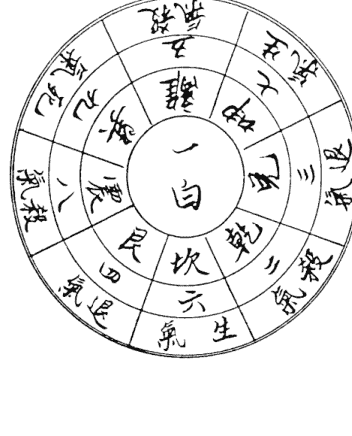

### 上元一白水得先天坤卦十八年（甲子年起至辛巳年止）

### 八方生旺水法

一白坎水武曲星，此龙洋流值千金，三子位中家业盛，田财倍进称人心。

一白艮水实非祥，人口分离别故乡，田土下元俱败尽，中元还许置田庄。

一白震水是凶魁，仓库金银化作灰，小房男女瘟疫死，瘟癀孤寡迭相随。

一白巽水置田庄，山水冲来仲子昌，下后儿孙人口旺，家业兴隆比孟堂。

| 砂诀 | 巽 | 离 | 坤 |
|---|---|---|---|
| | 九紫死气 | 五黄杀气 | 七赤生气 |
| | 震 | 一白主 | 兑 |
| | 八白杀气 | | 三碧退气 |
| | 艮 | 坎 | 乾 |
| | 四绿退气 | 六白生气 | 二黑杀气 |

一阳坎山起巽峰，坤龙坎位叠重重，卯酉离山乾艮伏，子孙昌盛福兴隆。

一白離水惡相沖　有人犯着敗田庄　勸君休鑒此山水
下後三年有損傷

一白坤水小房強　吉水相迎百事昌　後代兒孫官職旺

朱衣執笏佐明王

一白兌水稱天羅　下後兒孫患難磨　惡難刑迎倉廩耗

更防疾病損傷多

一白乾水怕沖流　四五三房敗絕休　患難癆癆虛腫死

更防官訟退田牛

此論一白星主運　一白居北　先天坤卦三爻並陰　三六
十八年也　係甲子起至辛巳止　宜坎

得運也　坎巽坤三方水來合局　先後天之位者　必有速發
且悠久　富貴綿遠　若不合先後天者　雖是一發如雷　一
敗如灰　一元運中可發　元運若過立敗　殺氣砂而退氣砂
五黃砂　乾兌艮震巽離等　此六方之山岡　宜低不宜高
聳　水亦喜去　不宜朝　坤坎二山峰　尖秀者　必主貴顯
乾兌艮震巽離　若有疊重重者　主有損人口之災

## 二黑八方生杀图

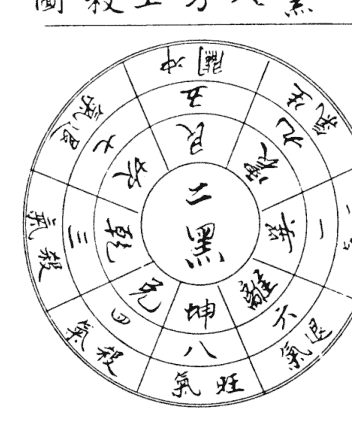

| 坎 | 艮 | 震 |
|---|---|---|
| 七赤退气方 | 五黄冲关 | 九紫生气 |
| 乾 | 三 | 巽 |
| 三碧杀气 | 二黑主 | 一白死气 |
| 兑 | 坤 | 离 |
| 四绿杀气 | 八白旺气 | 六白退气 |

砂诀：二阴坤山起午峰
巽为魁曜卯为龙
乾兑艮方低拱伏
子孙福禄位三公

### 八方生旺水法

二黑坤水起峰峦，富贵荣华万事欢
家藏珍宝有千般，百子千孙皆俊秀

二黑兑水忌朝冲，长子先亡祸患重
牛马血财皆瘦死，人丁夭绝业还空。

二黑乾水起高峒，疯痨恶疾不离床
屋宇田园俱卖尽，三男子息早身亡。

二黑坎水是元龙，水路朝迎山顾逢
只许下元人富贵，上元中甲主贫穷。

二黑艮水是凶神，劫盗风声败灭身
横劳官灾重重至，父兄妻子不相親

二黑震水合天機，富貴官高衣錦歸，一後諸方同發福，
常乘車馬步丹墀。

二黑巽水來朝迎，四季安康日日新，進入田莊官職旺，
英豪富貴作朝臣。

二黑離水紫微星，瑞氣迎門日日新，進入田莊猶未止，
賢良及第作朝臣。

此論二黑土星主運，居西南，先天巽卦二陽一陰，二十四
年，係是壬午年起至乙巳年止，宜坤震龍入首為得運，巽
巽二方水朝來上堂合局，則發富貴，若不合局者，必要乘
氣，退氣與五黃同，宜低伏，不宜高聳，低伏即吉，高聳
即凶。

得木運亦是大吉，但是過運失元則凶，最忌艮方水來朝，
或五黃沖關殺方，有山嶼高聳，或水路拱照，主大凶，殺

## 三碧八方生殺圖

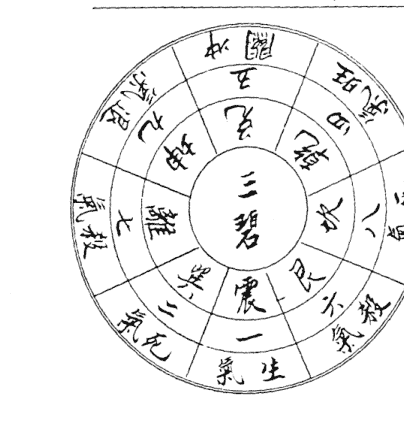

### 八方生旺水法

三碧震水起高峰，百子千孫勝祖宗，出水來朝中子富，滿門朱紫入朝中。

三碧巽水是辰方，巳午來年倍倉糧，太歲加臨生貴子，終當勢笏在朝堂。

三碧離水使人愁，病訟連年不肯休，只許下元田宅旺，上中敗絕見荒丘。

三碧坤水損中房，病疾重重及天亡，官事風癆並自縊，火光九數必相傷。

三碧兌水是庚貞，橫事凶災入宅庭，敗盡田園猶未已，可都絕滅又遭刑

| 砂訣：三陽震山乾巽峰 |
| --- |
| 坤（九紫退氣） | 兌（五黃沖關） | 乾（四綠旺氣） |
| 離（七赤殺氣） | 三碧主 | 坎（八白死氣） |
| 巽（二黑死氣） | 震（一白生氣） | 艮（六白殺氣） |
| 卯為魁曜子為龍 |
| 坤兌艮離山拱伏 |
| 兒孫世代福重重 |

三碧乾水有峯拱、此水朝來旺田宅、合得先天貴子、後天合法財祿豐。

三碧坎水向財宮、少子能教似石崇、更許諸房同富貴、子孫世代入朝中。

三碧艮水是凶方、犯着先教滅長房、非災橫事年年有、田產賣盡子孫亡。

地都魁曜要分明、秀麗園庭扶宅庭、回龍顧祖家願榮、紫腰帶入帝庭。

此言論三碧木主運、居東北之先天離卦二陽一陰、主運二
十四年、係是丙午年起、至己巳年止、宜乾震龍為得運、坎
巽龍為次吉、宜乾巽坎震四水是旺氣、財氣、朝來上堂、主必大發富貴。

兌山五黃沖關、艮山殺氣、離山殺氣、坤山退氣、此四卦水不宜朝來上堂、又山宜低為吉、高則大凶。

### 八方生旺水法

四绿巽水起重峰，细看来龙在本宫，更得吉星堆叠耸，定主贤士显家风。

四绿离水吉堪言，下后儿孙进库田，小子中男先富贵，诸房也主禄高迁。

四绿坤水远长流，增益田庄进马牛，英才俊秀登金榜，为官职大镇京州。

四绿兑水是金宫，犯此凶星是必穷，妇女必然产子死，弟兄父母各西东。

四绿乾水冲迎冲，火盗瘟瘏在难凶，公事连年并恶死，兒孫絕滅更無蹤。

## 四绿八方生杀图

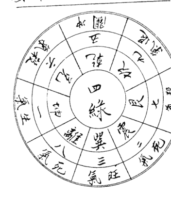

| 坎 | 乾 | 兑 |
|---|---|---|
| 艮 | 四绿主 | 坤 |
| 震 | 巽 | 离 |

砂诀：四阴巽山起震峰，坤为魁曜午为龙，坎艮兑乾山拱伏，腰金衣紫禄千钟

四祿坎水主災殃，殘疾刑傷不可當。他日遭官并失火，流離淫佚子孫亡。

四祿艮水來沖破，三七年中火血光。患疾風癆人病死。禍來滅絕實難當。

四祿震水最宜抒，一土臨門富貴全。中子興家先顯達。子孫代代出名賢。

此言論四祿本之運，居東南，先天兌卦二陽一陰，主管二
十四年也。係是庚午年起至癸巳年止，宜坤巽龍入首，為
祿運。震離龍為次吉。坤巽離卦水為大吉。但此水是為生
旺財之氣，水宜朝來上堂，主必發福。坤水來長房大發。
巽水來發小房旺長女。因坤為巽之先天，固發無疑也。巽
水乃坤之後天，固長女必旺。離水來發長房，旺長女。乾
方為五黃最凶，水來山峰不宜朝拱，坎艮兌離之方宜去。
不宜朝來，山不宜高聳。

### 八方生旺水法

五黄坎水牙笏招，诸房积聚又官高，横财日日来增进，只为贪狼山水朝。

五黄艮水喜迎来，小子应知早发财，世代荣华人孝弟，儿孙整蛰有良材。

五黄震水是杀方，水直山高不可当，长房先见瘟瘖死，妇女须教产後亡。

五黄巽水若相逢，营造人家立见穷，绝灭子孙田産尽，妇人淫走乱家风。

五黄离水起高峰，来去潆洄左右同，其家富贵田蚕旺，代代榮華有爵封，
子息聰明福祿崇，
山朝水顧人丁旺，
長幼和同萬事通。

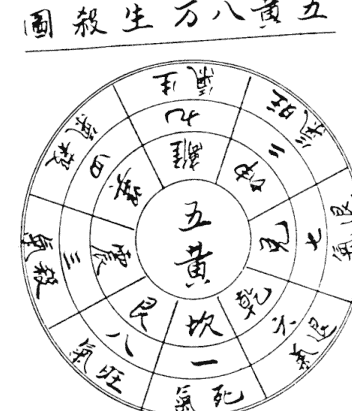

砂诀：五阳山前坤艮峰，坎为牙笏午为龙，巽震克方低拱伏，子孙代代出三公

| 坤 | 离 | 巽 |
|---|---|---|
| 兑 | 五黄主 | 震 |
| 乾 | 坎 | 艮 |

五黃坤水起巒峰，自古常為血叉星，病患連年家業廢，下元陰極又陽生。

五黃兌水白猿精，進入田庄福自饒，子息賢良多孝義，登科及第出英豪。

五黃乾水遠來朝，居中宮，無八方之位，以統攝八方，為九宮之主，自四元中甲申年起至六元中之癸卯年止，主管二十年，宜坤艮離龍入首，為得運，坎龍入首為次吉。

此言論五黃土星主運，居中宮，無八方之位，以統攝八方，為九宮之主，自四元中甲申年起至六元中之癸卯年止，主管二十年，宜坤艮離龍入首，為得運，坎龍入首為次吉。

坤艮離龍與坎龍等，有起高峰者，世代兒孫仕君王，若是遠水來朝者，兒孫富貴永無窮，坤水來長房大發，艮水來長房旺，離水來長房大發，坎亦然，震巽二卦為五黃之殺氣，山水不宜朝來，宜低伏乾兌二卦為退氣，以震巽論同，乾兌震巽，此四卦之位山宜低伏則吉，高則凶，水宜去為祿存流佩金魚，而五黃土主運，以元中及六元並論，以定其吉凶，又四元為殺氣，五黃為旺氣，以為有吉有凶，而六元中甲申至癸卯，離為退氣，而五黃運為主，生氣，此為吉中有凶，餘做此推。

### 八方生旺水法

六白乾水受乾來，子子孫孫進庫財，進入外州田百產，賢良孝義永長春。

六白坎水若朝來，倉庫須教積賢財，足主貴出官職顯，白衣身到鳳凰台。

六白艮水是凶方，產在癆癆火血光，淫蕩官災瘟疫至，更防絕滅敗田庄。

六白震水起高峰，只得中元氣勢雄，一代生涯難久恃，下元依舊主孤窮。

六白巽水不宜來，長子先教受禍胎，太歲加臨刑法死，廩倉虛耗化塵埃，

六白離水喜朝流，是勢還教福滿堂，下元小房多富貴，上中依舊只如常。

六白坤水見乘張，父子分離出外鄉，屋宅田園俱蕩盡，幼孫鰥寡實堪傷。

六白兌水起高峰，勢直來龍福祿饒，若得主星同守拱，管教世代佐皇朝。

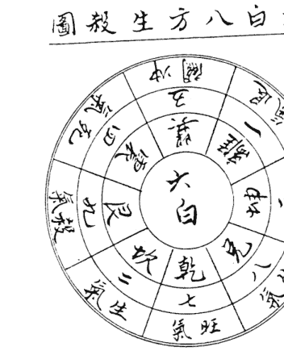

| 砂訣 | 震 | 巽 | 離 |
|---|---|---|---|
| | 四綠死氣 | 五黃沖關 | 一白退氣 |
| | 艮 | 六白主 | 坤 |
| | 九紫殺氣 | | 三碧死氣 |
| | 坎 | 乾 | 兌 |
| | 二黑生氣 | 七赤旺氣 | 八白生氣 |

六陽乾山震坎朝，西龍午位兩峰高，艮巽坤方平拱伏，安居

此論言六白金星主管二十一年，居西北，先天艮卦，一陽二陰，係自甲午年起至甲寅年止，宜兌乾坎龍入首為，得運，見水來旺中房，乾水來旺少房，坎龍來或水來旺長，房，震坤龍為次吉，震水來旺中房，坤水來旺長房，巽為，五黃沖關，是為最凶之神，不宜修建，動則凶，離為退氣，艮為殺氣，所以巽離艮三卦之水，宜去不宜朝，砂峰宜，低伏則吉，高昂則凶，來水兌乾坎震坤，宜朝來上堂，主，發富貴，而旺人丁。

### 八方生旺水法

七赤兑水主瘟瘧，定見人丁多滅亡，賣盡田園家必破，遭官訟獄被刑傷。

七赤乾水看來由，西北峰高進馬牛，先主中房身富貴，諸房衣紫旺田疇。

七赤坎水不宜朝，產業雖多似雪澆，破產時逆遭刑死，長房零落絕根苗。

七赤艮水是貪狼，富貴英才福祿昌，孝義忠良登甲第，滿朝朱紫寶非常。

七赤震水是沖關，一犯廉貞事不開，徒配風聲產死死，子孫零落又多艱。

## 七赤八方生殺圖

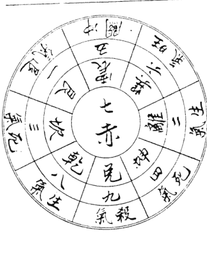

砂訣：七陰兌山離巽峰，乾為善曜艮為龍，震艮二方沖激少，兒孫個個紫衣榮。

| 巽 (六白旺氣) | 離 (二黑生氣) | 坤 (四綠死氣) |
| :--- | :--- | :--- |
| 震 (五黃沖關) | 七赤主 | 兌 (九紫殺氣) |
| 艮 (一白退氣) | 坎 (三碧死氣) | 乾 (八白生氣) |

七赤巽水子孫昌，家睦人和孝義豐，倉廩饒牲多茂盛，英名遠播實非常。

七赤離水喜朝迎，定主英才衣錦榮，更主家藏千萬寶，兒孫世代旺人丁。

七赤坤水旺中元，富貴還知陰鳳鶯，上甲三元當敗滅，祿夫寡婦敗田園。

此言論七赤金主運，居正西，先天坎卦，一陽二陰，主管
二十一年，係自乙卯年起，至乙亥年止，宜巽離龍入首，
為上吉，巽水或龍來旺小房，離水或龍來旺長房，此為正

巽離得運，坤龍入首為次吉，水將乾巽離坤朝來上堂者，
主見孫代代稱英豪，若得此小峰秀麗者，兒孫世代佑君王，
震為五黃沖關，乃是最凶之神，水若朝來中房必凶，艮
為退氣之方，艮艮二方之水，宜去不宜朝，砂峰亦宜低伏
為吉，高則大凶。

## 八白八方生旺水法

八白艮水足金銀，此地分明出富人，子息賢良還茂盛，長男加祿福如春。

八白震水出明賢，義聚家和積善來，子子孫孫多茂盛，盈倉滿庫足錢財。

八白巽水起高嶼，元氣加臨福異常，還值下元家業盛，上元中旬退田庄。

八白離水是凶神，水直山高損害人，下後連年災禍至，兒孫敗絕斷親鄰。

八白坤水勢崢嶸，太歲加臨損害人，火盜瘟瘡兼產死，流徙沒陣更亡身。

八白兌水勢昂昂，巨富家財大吉昌，中子封官加祿位。諸房富貴出賢郎。

八白乾水旺兒孫，富貴先興中子門，諸子英才皆及第。忠良代代盡稱尊。

八白坎水不堪秤，動作逢之禍患連，父子分離多敗破。風勞患疾入黃泉。

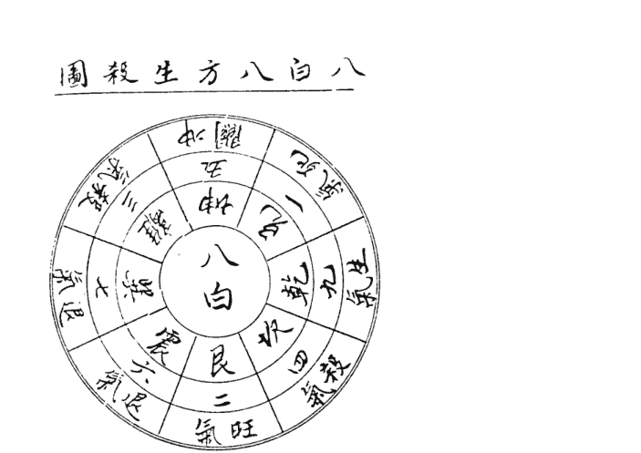

| 砂訣：八陽山頭震巽峰 |
|---|
| 兌為奎曜乾為龍 |
| 離坎坤方低拱伏 |
| 登科及第入朝中 |
| 離 | 坤 | 兌 |
| 三碧殺氣 | 五黃沖開 | 一白死氣 |
| 巽 | 八白主 | 乾 |
| 七赤退氣 | | 九紫生氣 |
| 震 | 艮 | 坎 |
| 六白退氣 | 二黑旺氣 | 四綠殺氣 |

此論言八白土主運，居東北，先天震卦一陽二陰，主管二十一年也，係自丙子年起，至丙申年止，宜乾艮龍入首為上吉，為得運之卦也，乾水來或龍來旺少男，艮水來或龍來旺長房，兌離龍來為次吉，而水宜從乾艮兌朝來，為得運，主發富貴旺人丁，若有奇峰秀水，主發科甲，坎震巽離坤五方為凶神，坎水朝來敗長房，震水朝來敗中男，巽水朝來敗少房，離水朝來敗長房，坤為五黃沖關，水若朝來大凶，且有修建者，子孫必有損傷，以上五方之水宜去不宜朝為吉，若砂峰高則凶，低伏則吉。

## 九紫八方生旺水法

九紫離水福興隆，百里蜈龍起碩峰，更在本宮威勢猛，文為卿相武封侯。

九紫坤水益兒孫，自有錢財進入門，子息賢才學考義，龍來迴繞旺鄉村。

九紫兌水禍來奇，屋宅空虛子女迷，走遍他鄉生計少，鰥夫寡婦日淒淒。

九紫乾水忌相逢，定主兒孫忤逆凶，自此田園消蕩盡，家門絕滅禍重重。

九紫坎水是關星，定見兒孫病滿身，產難血光并橫死，家門絕滅禍重重，看看後代絕人丁

九紫艮水起高峰，下後兒孫祿位昌，世代為官朱紫異，團倉盈積萬年糧。

九紫震水破軍星，有人犯着不安寧，此星坐處宜安靜，免得牛羊作犯刑。

九紫巽水只平平，此是明龍左輔星，若得大崗來顧祖，子孫榮顯至公卿。

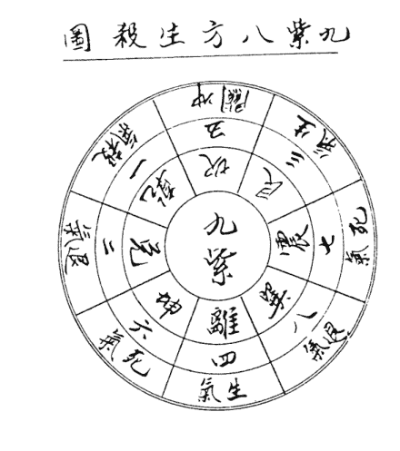

| 砂訣 | 乾 | 坎 | 艮 | 兌 | 離 | 坤 | 震 | 巽 |
|---|---|---|---|---|---|---|---|---|
| | 一白殺氣 | 五黃半闌 | 三碧生氣 | 二黑退氣 | 九紫主 | 六白死氣 | 七赤死氣 | 八白退氣 |
| | 離為魁曜艮為龍 | 坎兌乾岡低繞吉 | 子孫富貴永無窮 | | | | | |

此言論九紫星主運，居正南，先天乾卦三爻純陽，主運管二十七年也，係是丁酉年起，至癸亥年止，宜艮離龍入首為生旺氣，得運大吉，艮水來或龍來旺長房，震水來旺中女，離水來旺長房，以上為吉論，震坤龍來為次吉，水宜從艮震離朝來上吉，主大發財丁，若有奇峯秀水，主發科甲，坎巽乾水宜去不宜來，而砂低伏則吉，高聳則凶。

## 論五氣

-   一論五黃：山岡水路屋角侵射明堂，立見損傷也。
-   二論殺氣：名六趣，山岡水路沖射者，主必損人口也。
-   三論退氣：名不良，若有以上之侵射，主冷退孤貧。
-   四論死氣：名財星，不能發貴亦不能發財，似退氣同凶。
-   五論生氣：生旺氣宜水聚明堂，秀峯疊拱，主發科甲。

# 二十四山消砂便覽

## 壬山丙向消砂圖

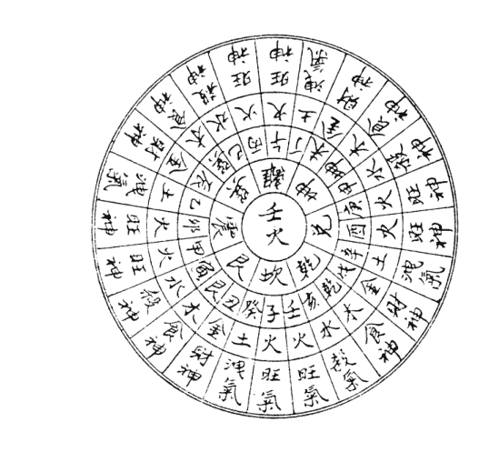

## 癸山丁向消砂圖

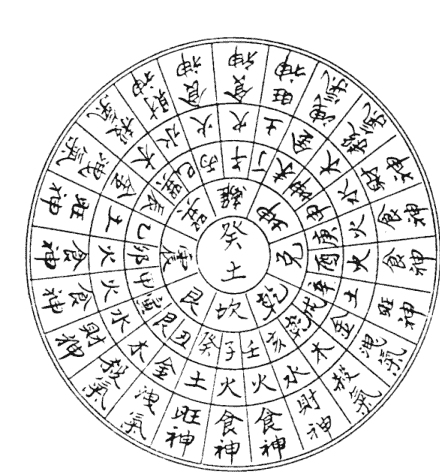

## 子山午向消砂圖

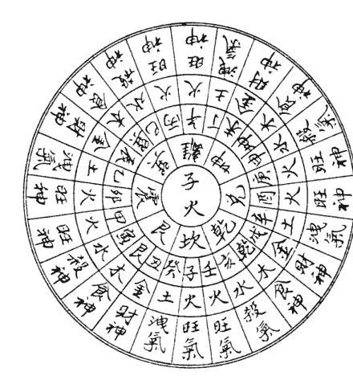

## 艮山坤向消砂图

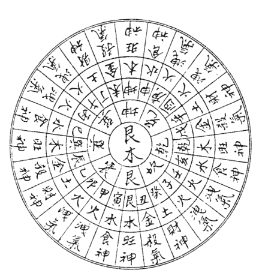

## 丑山未向消砂图

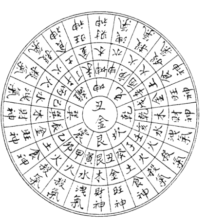

## 甲山庚向消砂图

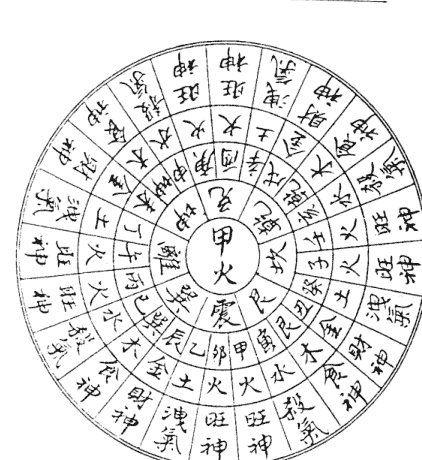

## 寅山申向消砂图

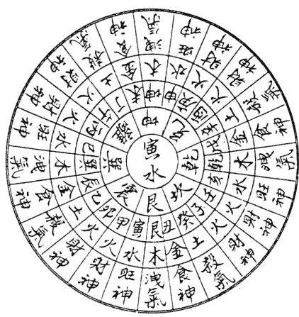

## 乙山辛向消砂圖

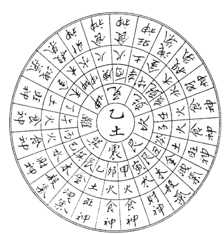

## 卯山酉向消砂圖

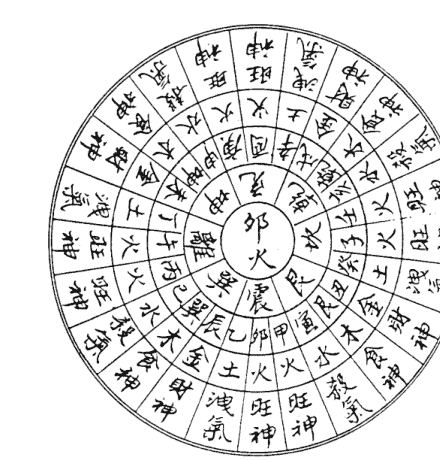

## 巽山乾向消砂圖

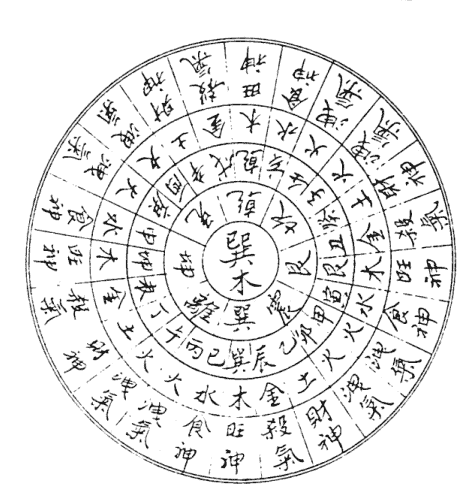

## 辰山戌向消砂圖

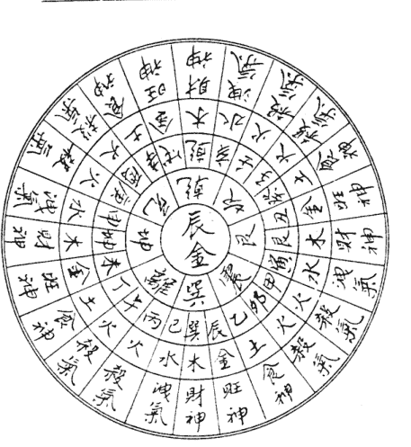

## 丙山壬向消砂圖

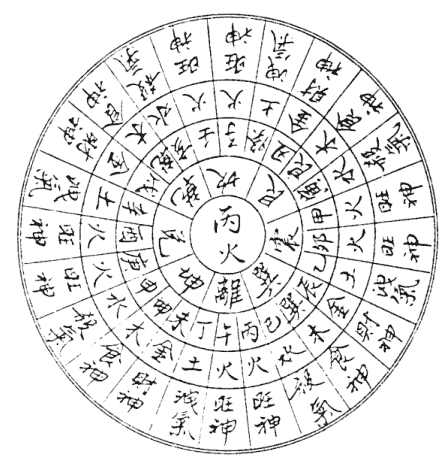

## 巳山亥向消砂圖

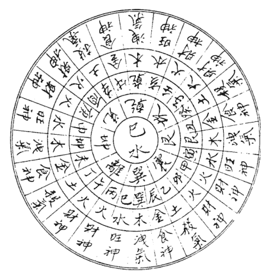

## 丁山癸向消砂图

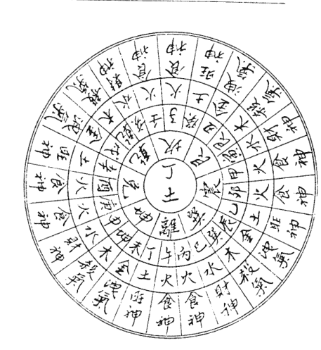

## 午山子向消砂图

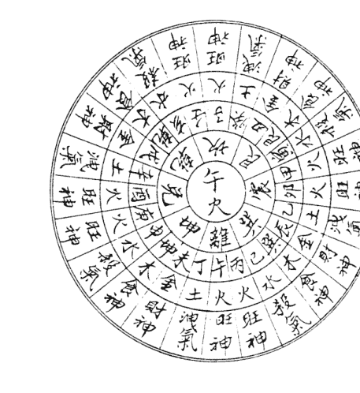

## 坤山艮向消砂圖

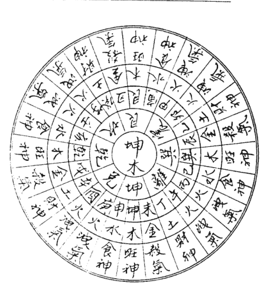

## 未山丑向消砂圖

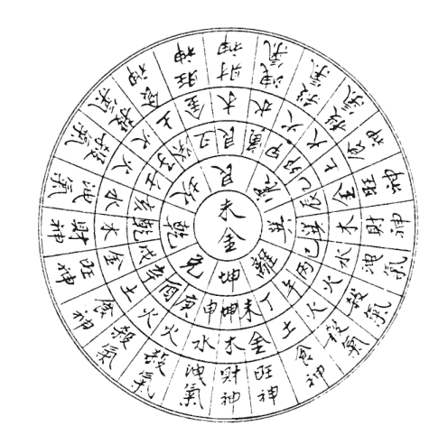

## 庚山甲向消砂图

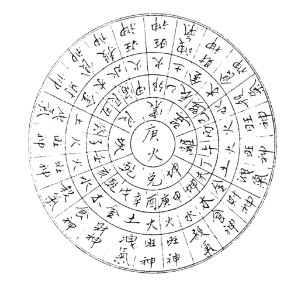

## 申山寅向消砂图

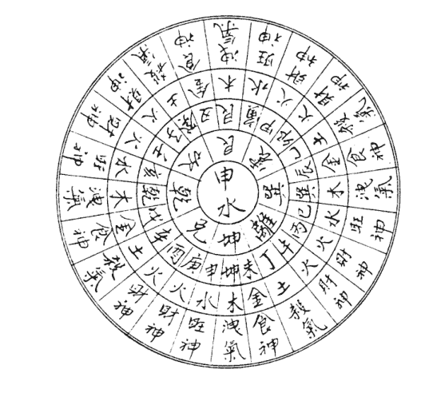

## 辛山乙向消砂图

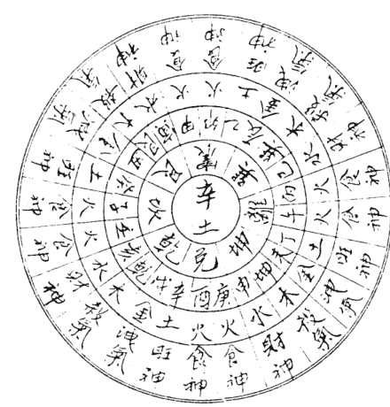

## 酉山卯向消砂图

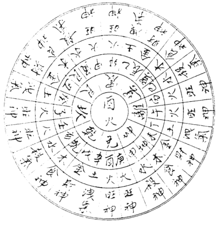

## 乾山巽向消砂圖

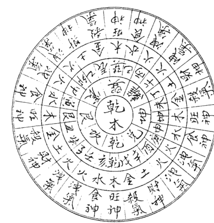

## 戌山辰向消砂圖

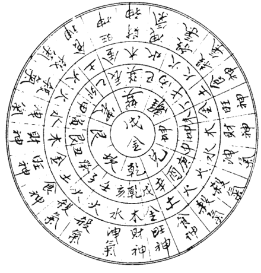

## ○ 九星属八卦五行歌

一白贪狼水神，二黑坤土起巨门，三碧震木禄存是，四禄文昌巽木亲，五黄廉贞中宫土，六白武曲乾属金，七赤破军金管兑，八白艮土左辅星，九紫右弼离火焰，九宫八卦此中分。

## ○ 九星生克歌

生气原来生我身，杀星克我便生嗔，我若生他为退气，被我克者是财神，但为死气非全利，与我相同旺气真，细究何方耸起，何方水近，以定卦局，卦局既定，即以本卦星入中宫，顺飞八方，然后看其生克，以定凶吉。

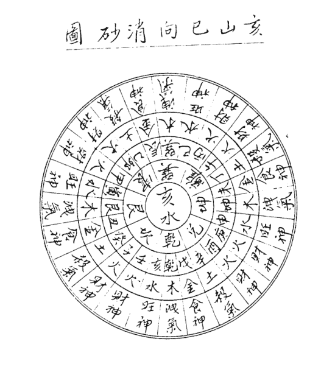

如南方水近，即為坎卦，以一白星入中，其生剋以一白水為主，二黑土到乾，為殺氣方，三碧木到兌，為退氣方，蓋二黑土剋一白水，故曰殺氣，一白生三碧木，故曰退氣也，餘做此推。

## ○ 生氣訣

生元氣聚出名臣，孝友忠良佐聖君，蟄蟄子孫行孝義，自然富貴萬年春。

凡生氣方，有山嶼水路，高秀遠來，更得魁星相佐，關煞低伏，主大發財祿，世代為官，即山嶼水路短小，主亦小富貴，如無不吉。

## ○ 旺氣訣

山家旺氣鬱蔥蔥，秀麗應知吉所鍾，惡曜粗頑并反背，關星沖破也為凶。

凡旺氣方，有高峰拱揖，秀水縈朝主大吉利，若山醜水直，亦不為美，更兼關煞來沖，則變為凶矣。

## ○ 死氣訣

水路山嶼犯死神，家門寂寂主孤貧，冷退災迍頻惹禍，看看後代絕無人。

此方山拱水繞，亦可作財氣論，雖不能發貴，亦能發財，勝於退氣也。

## ○ 退氣訣

退氣原來最不良，時人犯着禍難當。營謀失本徒嗟嘆，家道蕭條起禍殃。此方山水俱不利，但宜低伏，大忌此方水去，洩我之局氣。

## ○ 殺氣訣

六趣生來受此殃，只因足局久思量。急須移改凶為吉，免得兒孫患久長。凡殺氣方，有山崗高聳，水路射沖，謂之殺星昂露，立宅安墳大凶，平伏植繞則吉。此方大忌水來，水去反吉。

## ○ 沖關訣

關煞相沖不可當，山崗水路射明堂。干上相關猶自可，支內相關立見傷。關煞者，五黃方也，與本局對沖，故曰關煞凶，與煞氣方向同。

## ○ 關煞生氣混雜訣

山家生氣福非常，關煞凶災不可當。只因善惡星相雜，故令榮辱見死傷。凡生氣方，關煞方，或煞氣方，但有山崗水路來拱，名為善惡相半，此地坟宅，主出人口善心惡，好訟喜爭。魁象成家，多成多敗，兒孫雖多，刑傷難免，官爵難顯，亦不得善終。

凡山岡水路，在煞方發來，卻有生方結局，各行為善，此地墳宅，主逢凶有救，逢難而得福，仕外招非，居家无咎，此短中求長，終難久遠，若生方發來，卻在關煞方結局，名行善生凶，此地墳宅，主好事多磨，弄巧成拙，利客不利主，無端災患破家。

## ○ 魁星訣

魁星重疊起高峰，九九星中第一龍，此地禎祥生傑士，兒孫世代入朝中。

土局見一白坎，木局見八白艮，火局見六白乾，為魁星，一云惟一白為魁星，此方發高峰，來龍迴遠，八方拱朝，此地墳宅，主聰明才學，世代為官，孝義英豪，永遠富貴，或山水近促，亦出英才富貴之人，此星若為生氣財氣，吉不勝言，若為退氣，主出高僧德士，藝術出家之人，惟為煞氣，主出人機關巧詐，惡毒凶頑，貪困刑天，凶禍難免也。

## ○ 善曜訣

三白生來星子孫，莫將退氣等閒論，吉星照臨多興旺，奕奕冠裳慶滿門。

火山見八白，土山見六白，金山見一白，為子孫善曜，以其能制殺氣也。此方有山水拱朝，最能化凶為吉，有寺觀鐘鼓振動，為大吉地，主子孫富貴聰明良善。

## ○ 三吉地訣

地有三吉實宜求，生氣貪星仔細搜，大崗大山并車馬，寺觀鐘鼓一樣收。

凡生氣貪星之方，得大山大水朝顧，四季不絕者，為一吉。得橋路通車馬朝顧者，為二吉。得寺觀朝夕聞鐘鼓聲者，為三吉，主丁財兩旺，聰明良善，若在闔欽之方，則刑大大凶之禍，不可勝言矣。

## ○ 三元旺氣

看山頭看主龍星，上元一白吉宜明，四綠之星中元吉，七赤下元多有情。

凡山岡水路，得管元星朝顧，主六十年大利。如生氣方，始終大吉，即殺氣方，亦主六十年小利。但出元則凶矣。

## ○ 三元龍運訣

三元龍運理宜通，上元一白二三同，中元四綠中乾位，下元七赤艮離中。

如上元六十年，甲子二十年，一白管甲申二十年，二黑管甲辰二十年，三碧管而一白為統運，六十年俱管，他元彼此。

每以管元星為主，以論八方生旺，如上元一白主運，則坎局為旺氣，一白水生木，則震巽局得生氣，水剋火，則離局為煞氣。金生水，則乾兌局為退氣。土剋水，則坤艮局為死氣。其法以生元者為退氣，剋元者為死氣，得元生者為生氣，受元剋者為煞氣，而元比和者為旺氣，其生煞氣而上八方生殺氣不同，以本局得生旺氣為吉，死退氣為凶也，若地吉但不發福耳。

## ○ 又八山生旺訣

六白旺相在上元，七八興隆在下元，二四二山中六十，坤山中尾下頭運，惟有九離而坎一，上星中頭五十年。

## ○ 又主運加飛法

如上元甲申年後，以二黑入中，順加八方，察其各位之生剋，以斷本局之吉凶。

如二黑入中，三碧加乾，四綠到兌，是下剋上，五黃加艮，是比和，六白到離，是下剋上，七赤加坎，是上生下，餘做此推。

凡下剋上，是主欺賓，主人心不知，言符是非為禍輕，上剋下，乃是賓欺主，為殺氣加臨，百事不利，必招凶禍。

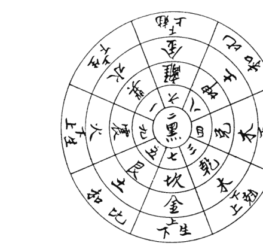

## 主運加飛法圖

或此地龍局砂水，被人損破，上生下，乃外益內，大與大發，下生上，乃外耗內，冷退人丁。又以主運為主，論八方生氣之吉凶，如上二黑入中，即以二黑為主，三碧四綠加乾兌，以乾兌二方為生氣方，九紫加震，以震為生氣方，其死退氣做此而推。凡人坟宅，於主運生氣方，有門路水道六事，旺財添丁，生氣方，有缺隔或破碎，決招外禍，五黃方，有路沖動，有動作大凶，退氣方主退財，死氣方主傷丁，旺氣方有六事，兼流年九紫五黃飛到，主官事火災退敗，此生氣沖關，主管二十年，乃大流年法也。

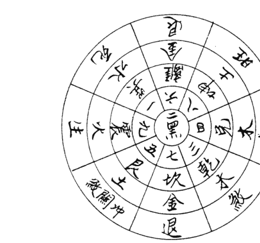

## 主運為主加飛法圖

五黃方不得修造，動者主大凶。退氣方為退財，若先天或後天方，如果一旦退氣加臨，必應退財，退氣加臨先天，主出人不賢，死氣方加臨先天，傷身。生入煞方剋疾病，煞入生方斷死生，死上煞來動田產，財臨煞退損犧牲，煞臨關煞穿心害，生入生方處處興。惟有五黃正神煞，八方到處不留情。以主運星流年星，加八局八方斷。如坎局，以坤為生氣方，上元甲子二十年，又得七赤生加坤，為生入氣方，餘做此推。生見生，主進財增產，生見煞，主官災得貴人救。

殺見殺，主火災損人，凡事不利。煞見生，半吉半凶，上半年吉，下半年損人。退見退，主禍害疾患。生見退，主損六畜小口，後遇貴人，以本方有山水道路朝拱，及六事動作方斷。

## ○ 年月九星訣

天文九星歲歲推，地理九星永不移，飛去相生生貴子，飛來剋伏是凶期，三白到坐主懷胎，紫白臨門喜氣來，刑害空亡俱不實，生扶應得貴人財。流年九星加臨，以本局本方為主，飛來之星為客，客生主者，生貴子，客剋主者，主凶禍，如乾方是金，八白加臨為生為吉，九紫加臨為剋為凶。又當以本星納音變化論方驗。如九紫本是火，若甲子年適得庚年土，則九紫又變為土矣，其變化以太歲五虎遁定之。如甲子年起丙寅，則八白變火，丁卯則三碧亦變火，若不知變化，而執八白土三碧木，則不靈驗矣。九星以三白九紫為吉星，但不剋本方，便以吉斷也。刑害者，知一白到震，子刑卯也，一白到坤，子害未也，蓋一白即子也。

空亡者，太歲本甲空亡之位，如甲子十年，戊亥為空，凡吉星凶星到空宮上，但落陷無力，紫白到此無用矣。若紫白得到生扶之宮，皆為吉也。

## ○ 起年白星訣

年白三元各不同，上元甲子起坎宮，中元四綠宮中起，下元七赤逆行宮。每甲子皆逆行，九星皆順佈，如上元丙寅年，甲子起坎，則乙丑離，丙寅到艮，即以八白入中順飛也。凡修造大忌本局建方，如坎局以一白為建，若一白所到之方，俱不可修造，又忌本局煞星所在，如坎局忌犯二黑八白等二星之上方也。犯建伤宅長、犯殺招橫禍。

又三白吉星所到。但下剋本方。便以吉論。若其餘五星。只以生本方作吉論。否則皆為凶論。

的流殺。以坎上起甲子。逆行尋太歲到處。即以其星入中宮。陽年順飛。查五黃所在之位是為流殺。如丁酉到巽。即以四綠入中逆佈則五黃到巽。即巽為的流殺。

的命殺。以甲子入中。順尋太歲到處。即以其星入中逆佈。查五黃所臨之位。如乙丑年到乾。即以六白入中逆佈。則五黃到乾。即為的命殺也。

暗黃殺。以上元甲子起七赤。中元一白下元四綠。逆尋太歲到處。即以其星入中宮。陽歲順行。陰年逆行。查五黃到處是。如上元甲子。而乙丑到乾。即以六白入中宮逆行。即乾為暗黃殺也。暗黃之處。犯之禍烈於明黃。其驗如神。

## ○ 年起正月白星訣

子午卯酉起八白。寅申巳亥二黑當。辰戌丑未五黃起。逆行順佈八方遊。

如子年正月起八白。二月是七赤。三月是六白。四月起五黃。以值月星入中順飛八方。以論吉凶。其法同年星。年家吉凶猶寬。月家吉凶最緊。

## 三元紫白入中表

| 上中下元甲子入中宫 | 甲子 | 乙丑 | 丙寅 | 丁卯 | 戊辰 | 己巳 | 庚午 | 辛未 | 壬申 | 癸酉 |
|---|---|---|---|---|---|---|---|---|---|---|
| 上元 | 一 | 九 | 八 | 七 | 六 | 五 | 四 | 三 | 二 | 一 |
| 中元 | 四 | 三 | 二 | 一 | 九 | 八 | 七 | 六 | 五 | 四 |
| 下元 | 七 | 六 | 五 | 四 | 三 | 二 | 一 | 九 | 八 | 七 |

## 三元白星入中月表

| 富甲己亥年 | 子午卯酉年 | 辰戌丑未年 | 一白水 | 二黑土 | 三碧木 | 四绿木 | 五黄土 | 六白金 | 七赤金 | 八白土 | 九紫火 |
|---|---|---|---|---|---|---|---|---|---|---|---|
| 四 | 五 | 六 | 七 | 八 | 九 | 一 | 二 | 三 | 四 | 五 | 六 |
| 七 | 八 | 九 | 一 | 二 | 三 | 四 | 五 | 六 | 七 | 八 | 九 |
| 一 | 二 | 三 | 四 | 五 | 六 | 七 | 八 | 九 | 一 | 二 | 三 |
| 四 | 五 | 六 | 七 | 八 | 九 | 一 | 二 | 三 | 四 | 五 | 六 |
| 七 | 八 | 九 | 一 | 二 | 三 | 四 | 五 | 六 | 七 | 八 | 九 |
| 一 | 二 | 三 | 四 | 五 | 六 | 七 | 八 | 九 | 一 | 二 | 三 |
| 四 | 五 | 六 | 七 | 八 | 九 | 一 | 二 | 三 | 四 | 五 | 六 |
| 七 | 八 | 九 | 一 | 二 | 三 | 四 | 五 | 六 | 七 | 八 | 九 |
| 一 | 二 | 三 | 四 | 五 | 六 | 七 | 八 | 九 | 一 | 二 | 三 |
| 四 | 五 | 六 | 七 | 八 | 九 | 一 | 二 | 三 | 四 | 五 | 六 |
| 七 | 八 | 九 | 一 | 二 | 三 | 四 | 五 | 六 | 七 | 八 | 九 |

## 三元日白法

冬至一白雨水赤，穀雨原從四綠起，夏至九紫處暑碧，霜降先從六白遊，陽順陰逆居須明，但求六甲永無休。若逢紫白方為吉，活法須當仔細搜。

如冬至前後甲子日起一白，乙丑二黑，夏至前後甲子日起九紫，乙丑八白，以值日之星入中，順飛八方。

## 月白起月令白星表

| 大歲 | 白星 | 月正 | 月二 | 月三 | 月四 | 月五 | 月六 | 月七 | 月八 | 月九 | 月十 | 月十一 | 月十二 |
|---|---|---|---|---|---|---|---|---|---|---|---|---|---|
| 子午卯酉年 | 二 | 一 | 九 | 八 | 七 | 六 | 五 | 四 | 三 | 二 | 一 | 九 |
| 辰戌丑未年 | 五 | 四 | 三 | 二 | 一 | 九 | 八 | 七 | 六 | 五 | 四 | 三 |
| 寅申巳亥年 | 八 | 七 | 六 | 五 | 四 | 三 | 二 | 一 | 九 | 八 | 七 | 六 |

## ○ 三元時白訣

三元時白日相同，陽順陰逆入中宮，冬至一七四當記，夏至九六三是宗。

凡冬至後子午卯酉日，子時一白，辰戌丑未日，子時起四綠，寅申巳亥日，子時起七赤。順行求值時之白星。

夏至後子午卯酉日，子時為九紫星，辰戌丑未日，子時起六白星，寅申巳亥日，子時起三碧星，俱以值時星入中順飛。

以上年月日時，但得紫白生氣，便為大利，凡修造三白之方，不忌太歲將軍官符大耗小耗行年本命等殺，惟天罡四旺殺，大月建不可犯也。

## ○ 總論年月白訣

八卦山頭數要精，昭然易見理分明，挨年算月評災禍，玄玄透理鬼神驚。

凡殺氣加木局，必發凶，如二黑加坎局是也。生氣加木局，必發福，如一白加四巽是也。先以三元主運加也，則定其二十年之吉凶，再以逐年逐月之星加也，則凶吉之期可決矣。

又三元數至本局，為暗建，對宮為暗破。如上元甲子，丙寅年到艮，艮局為暗建，坤局為暗破。如原是美地美穴，則推動本龍，諸事迪吉，若係凶地錯穴，則事大凶。

凡大歲干支，本位為建，明對宮則為明破。如甲子年申在震宮為干明建，子在坎宮為支明建，兌與午是明破。離為文明破，戊己年，則干建破俱在中央，犯干建破者，禍福減半，支建破支凶，不可犯。

## ○ 九星冠應訣

一白星本屬水，震巽修造美，看看七八九月來，交進南方外處財。

二黑星本屬土，乾兌逢之修造美，且待二八月交來，進入東北西方財。

三碧星本屬木，餘宮莫造作，教君南方用着時，西方貨物一旬至，四綠與三碧同斷。

四綠星中土尊，西北正相親，此星但可修乾兌，七八九月引財瑞。

八白星較五黃更吉。

六白星原屬金，坎山用之福彌深，但交四六七八月，東南喜至樂忻忻，七赤星與六白同斷。

九紫星本屬火，坤艮二山修造可，直待寅巳午月年，此方財產來非瑣。

## ○ 太歲山頭白星訣

子年一白入中宮，午載相逢九紫同，鄰歲中宮三碧會，丙年七赤是星宗，未申二年俱二黑，辰巳回來四綠中，戊亥中宮起六白，丑寅八白正相逢，白到山頭宜作用，安坟立宅子孫榮，白中有殺宜迴避，犯者須教立見凶，此十二年山頭白也，以剋為凶，如子年四綠加艮，木剋土，如作艮山方，主傷四人，犯一白主傷一人，二黑傷二人，以星數推。要知何時應近取，則四綠主四十日或四個月，遠取則艮方為丑寅年，或未申相沖年也。要知損何人，以所犯方之地支應也。如艮方為丑寅人，肖牛與肖虎，其月法與年同。

如寅年以八白入中也，白中有殺者，暗建殺，六捷殺，穿心殺，鬥牛殺，交劍殺，受剋殺也，犯殺之方俱不可犯也。

## ○ 論殺氣星入中

一白到離非為吉，二黑還逢坎上凶，三碧四綠坤艮犯，五黃八白坎中凶，六白七赤震巽忌，九紫相刑乾兌中，白中有殺少人知，多少時師曾不通，但到木白為生氣，黑黃碧綠赤何凶。

忌殺氣入中，如坎山忌黑黃八白入中，大忌修造，忌殺星到方如九紫到乾兌方，亦忌修造，犯之主非橫禍，火災，盜賊，官事，瘟癘大凶，其三元年月，白星同忌。

## ○ 生氣星入中論

子年乾坎震方開，丑寅中兌艮離來，卯年坤艮震巽吉，辰巳離坤震兌殺，午坤乾巽離中兌，未申坤坎巽中離。

惟有酉年乾艮吉，戊亥字宮艮兌推，還有震山為小利，分明指與後人排。

此即山頭白定局也。如子年以一白入中，二黑加乾為生氣，六白加坎為生氣，八白加震為吉星，故曰乾坎震方。

## ○ 年頭九星訣

十二年頭分正位，總領萬事王窮通，世人不信招凶咎，尊此將為濟世功。

子年貪狼，丑亥年巨門，寅戌年祿存，卯酉年文曲，辰申年廉貞，巳未年武曲，午年破軍，每以值年星入中宮順行，求四吉，帝星到方大利，申子辰年貪狼為帝星。寅午戌年巨為帝星，巳酉丑年破軍為帝星，亥卯未年祿存為帝星，為四帝星，到山到向利造葬，到方利修方。

## ○ 年頭 三吉訣

子年震兌巽山開，丑寅艮兌巽中裁，卯歲乾離坤位土，辰巳見震艮堪排，午年更有巽艮兌，未申坤坎乾上來，酉歲離乾坎土對，戌亥坎坤離亦開。

法以太歲對卦為主，依天定卦，翻九星，取三吉方為開，如子年對卦是離，天定卦離對宮是震，即以貪狼起震挨去，則兌為巨門，巽為武曲，三台臨此三卦，故曰子年震兌巽山開也。利修方造作。

## 太歲山頭白星圖

子年
艮 震 巽 離 坤 兌 不取
乾 坎 大吉

卯年
艮 坎 兌 不取
巽 離 乾 半吉
震 坤 大吉
克因五黃故不取

午年
坎 艮 震 不取
乾 坤 巽 半吉
兌 離 大吉

酉年
坤 兌 坎 巽 震 離 不取
艮 乾 半吉
大吉

未申年
艮震不取
兑乾离半吉
坤坎巽大吉

丑寅年
震巽兑乾坎坤不取
艮离大吉
坎兑亦可谓半吉但此死气差

戌亥年
坎巽离坤不取
乾艮震兑大吉

巳辰年
离乾艮不取
坤坎震兑半吉
巽兑大吉

## ○ 陽宅訣

盤古首開天兩地，伏羲畫卦圖已備，軒轅首創立宮室，住基風水堪憑據，傳及晉朝郭景純，造宅營墳知趨避，於今符令鬼神機，紫白星辰推高摯，先須掌上排九宮，此言細究何方起，何方水近，以定卦局，乃以卦星入中，順飛八方，以論凶吉，先以生氣煞氣，占外局砂水，次以生氣煞，分宅內房間，其生煞等氣見上，然生旺之氣，又要與本方無刑害為全美，死煞之氣，與本方刑剋更凶，又以本局生旺為有氣方，內外兩局俱要論。次將太歲臨方位，縱問其家造作年，次第開言無差異。

凡占陽宅興廢之年，當以本年甲子起處，查值年星入中宮，順行八方，先看本局上得何星，是生是剋，以斷一宅之吉凶，次看各方之星為生為剋，以斷各房凶吉。如一白加巽為生氣，則巽局巽方吉，二黑加坎，則坎局坎方凶也，本局星為統臨，本方星為常臨，統臨吉，而常臨凶也，本房不免於凶，統臨凶而常臨吉，本房不失為吉，至於俱凶則大凶，俱吉則大吉也。

又占十年大象，當以管甲星入中，順行八局，查其生煞以斷吉凶，管甲星者，如上元甲子內甲戌到離，以九紫為管甲星，凡甲戌旬內十年，俱以九紫入中也，管甲星統曉也。太歲星常臨也。統臨吉至常臨併吉。而大福發統臨凶。至常臨併凶。而大災至也。

凡古宅又要問其造作是何時。屬某元作造。更問主人年命則興廢可知也。如上元六十年。初二十年。一白星主運。中二十年。二黑主運。未二十年。三碧主運。如一白主運時。則坎巽震局。得生旺氣運星一白水掌事。大吉乾兌坤艮局。得死退之氣次離局得殺氣又次之。因一白主運時向上之離則是五黃故為五局為凶均在此二十年中造。而吉凶之不同也。

至二黑主運時。則前艮坤兌乾之局。又變為得生旺而吉因二黑土星為運星又為客星艮坤兌乾之主星三黑土而艮坤之土旺。兌乾金又生之。二黑之土來生兌乾之金是生氣坎局又變為得殺氣而凶為殺氣然在本元甲子所作之宅。在本元內雖在不吉。未至大凶。至出元之後。值死殺之氣。則凶敗莫救矣。又以主運星入中宮順行。看本局上得何星以詳凶吉。如得本運生旺之氣加臨。而又不吉者。此乃吉中有凶。得本運死殺之氣而加臨。來生猶可小福。如二黑運中之坎局。坎方不吉。然以二黑入中。得七赤加坎運是以金來生坎水為生氣吉再看主人年命納音。得本運生旺之氣則吉也、值死煞之氣則凶、命宅俱吉、其福莫量、俱凶則大敗矣。

朱玄青白四獸神、詳察左右前後住、三白九紫例非同相合相生君須記、但能乘此吉宮行、分房動作皆為庇黑黃碧綠雖云凶、若逢生氣吉無窮、或遇退煞何須取但值旺位主富榮。

陽宅分房、固以本局星入中、論其方位之生氣煞氣吉凶矣、然其本方、亦自有生旺死退吉凶之分也、飛煞本位為敗煞、如震入中順飛至兌為三碧四綠五黃六白七赤八白九紫一白二黑、本位生飛為退、如乾入中乾位是飛生本位為生、所生曰生煞。

比為旺、合中宮之生旺、而本位又自為生旺、不相刑害則吉、合中宮之生旺、而本方又為退煞、則吉凶相半久則漸敗、不得中宮之生旺、而本方自為生旺、不相刑沖者反吉、若此者、要助起本方、每方以房床為主、定其某局、以論生煞、又以房床之星入中順飛門戶灶廁之類、擇其生旺、避其關煞、大忌灶與房門相沖關、若有沖煞、可移其一也、是局論方、各有妙處、大抵吉多則吉、凶多則凶也。

本方與中宮、須分賓主、加盤而定位、當辨輕重、明退我而暗伏生、當有進機、明生我而暗洩氣、恐不勝敗。

中宮之旺方住之，人財兩旺，如為本方退氣，自洩其神，雖發亦不久，後多敗絕，各方自犯殺氣死氣，無生氣救，者必敗絕，自犯退氣必絕，中宮之殺方退方，若本方自生自旺住之，主人丁繁盛，所謂殺方之上好安房也。

九星飛佈各方，上生下為生氣者吉，然既看八卦之生旺，又須詳十二支之吉凶，如三碧屬木長生在亥，且卯祿在寅，又要察先天與後天之別，又當論年命之生剋，年命剋本山飛神甚凶，剋本山伏神主破財，半吉半凶，飛剋年命主少亡外死，伏剋年命主損妻。

生逢三白福祿崇，開門井灶六事通，刑煞或遇赤碧黑，凶福亦與沖關同。

凡本局生旺方，更得三白吉星加臨，開門六事大吉，若天赦地刑之方，更遇凶星，亦如五黃之皆為不吉也，但生旺合局遇五黃流年到反為吉論，如兌局酉年五黃到震宮，此局水如收坎過堂巽水來會出坤口，卯酉子午為四正一氣，必然大發無疑。

先賢曰：古人論數，每以五百年為言，如五百年必有王者興，五百四十一年起，五百年間出帝王，而所以百之者與，人未必晰也，蓋氣數出於洛書大小運，大運分三元，每元三甲子，每甲子行一宮，每宮六十年，故六九為五百四十年也。小運亦分三元，每元一甲子，每二甲子行一宮，每宮主二十年。故二九是一百八十年也。

凡大地宜以大運推其興廢，中者以小運推之，小局則有不能足六十年之數者矣。地有大小，所以運故有大小運。有旺衰，壞宅固有旺衰，所為氣數也。

## ○論審運篇

日有中晏，月有盈虧，地有衰旺，家有興廢，天道之常。物有適常，朝而鼎食，暮而鼎烹，運迭忽敗，知者先明。朝哭于巷，夕歌于庭，運逢驟進，愚者莫驚。其運維何，九宮次之，上元一統，黑碧佐治，中元四統，五六鼎峙。下元七統，八九迭制，元中正運，元外餘氣，餘氣既竭。王公奧隸，地力敦龐，星曜全強，康衢奮步，險道可航。地方偏薄，星力蹣跚，福來不全，禍來絕索，一衰一旺。休咎相代，兩衰一旺，旺不能載，兩旺一衰，衰亦同害。下士失時，河清難待，上士乘時，援師救敗，移易陰陽。更張莫懈，更察星方，以防其潰。

此言天道無百全之書，故有陽九百六之災，雖至美之地，亦不能有旺無衰，禍福倚伏，有不得而逃者。人但見其止此一坟，止此一宅，而前後之不相蒙如此，反以地理為不足信，豈如墓宅不更，而元運自轉，惟知者為能先覺耳。

元運者，上元甲子以一白坎為統龍，二黑坤與三碧震輔之，共主六十年，坎先管二十年，甲申入坤，甲辰入震，各管二十年，然雖有未來過去，發福先後輕重之不同，而同在一元之中，則皆乘旺氣。中元甲子四綠巽為統龍，五黃中宮，六白乾輔之，下元甲子七赤兌為統龍，八白艮，九紫離輔之，且旺治俱如前，歷驗已往之局，坎離為天地之中氣，中男中女，即先天之乾坤，中藏戊己真土，故三元不敗者多，震本以壯而根深，兌金以少而堅剛，且日月之門戶，春秋之平候，故亞於坎離，艮之象為山，山不可移，其質堅矣，故其久亦比震兌，而乾為老父之金，坤為既產之土，五黃廉貞之火，亦無根源，依物而炎，故皆不久，巽為雜木奇花，闌慢不耐風雨，尤為易衰，大約上元之龍，亞旺中元，中元之龍，亦預旺上元，下元之龍，嘗有餘力旺于上元，此定運也，龍運雖足，而尤當以地力詳之，若地脈厚而星卦純雖入敗運，止于不發尚可自保，地脈薄而星卦雜，雖入旺運，縱發亦多顛躓，五福不全，且齊民一坟一宅，則無牽制，巨室坟宅不一，又當參觀若有兩地，一衰一旺，兩相抵當，則享平福，又當審其力之大小，以決勝負，一旺不敵二衰，則衰能為害，一衰不敵二旺，則旺能為福，要之上吉始能雪小凶，而祖禍更切于高曾耳，作者求元之大地，不如得及時之小地，人壽幾何，待其去衰入旺，身與家全弊矣，又有新墳奪氣，亦未可知，故募講禪師，嘗教人開墓，以就本元之盛，真良工苦心乎，但須斟酌星卦之合否，而後從事，切勿妄動，自致潰敗為也，先賢曰，異局發福甚久遠，不得拘泥註解也。

## ○八山旺衰細法

六白旺相在上元，七八興隆在下元，三四二山中六十，坤山中尾下頭連，惟有九紫與一白，上尾中頭五十年。

上元一白主事，坎震巽坤吉，離凶，中元四綠主事，離坎乾兌吉，坤艮凶，下元七赤主事，坎離坤艮兌吉，震巽凶。

## ○八山生煞氣法

生煞以主運為主，剋主運者，曰死氣，生主運者，曰退氣，運所生者，曰生氣，運所剋者，曰殺氣，相比和者，曰旺氣。

如七赤主運，坎局得生氣，乾兌局為旺氣，坤艮局為退氣，離局曰死氣，震局巽局為殺氣。

## 制敌法

论倒敌用木枋一块，高一尺应十干，阔一尺二寸应十二支，而敌在午方星日马，必用奎木狼制之，而枋上画奎木狼之兽相安在门上，如马怕奎，故主无祸也。

若敌在亥方壁水瑜，而壁水瑜怕箕水豹，而画箕水豹兽图挂门上，左右宝剑各加一口为用也，而制时犹用猫头焚烧为末，散在敌位，或散在四方，为制敌第一妙用，此制敌最为奇验也。

而明堂左右敌多，向西南用日月图。向西北用神狗图制之，向东北用神虎图。向东南用神龙图制之。

制敌宜用寅日寅时，或用辰日辰时，此二日时辰为龙虎神兽能制敌之用。

又如明堂路箭，或桥箭，或山箭，不论何物，如箭形者，皆谓之箭敌也。若犯箭敌者，必须造墙遮之，其墙外面中间必用神猿图制之，其宅之门斗上亦画一向之神猴图承制之，较为妥善也。而墙外所画之神猴图，须用丙申日申时制之，而各种神兽图之上面，须要各画星宿，画星兽须用红银珠和酒画之更效。

注：敌轻者不用猫头，重者宜用自死旧猫头火焚为末，而散在敌位，或散在四方。

若奴方有物置在者，须要除静，如不能除静者，例如奴方是高楼、神木柜、砂峰高耸而迫近，以上均是不能除静也奴物，必须要用散奴法，并画星宿像制之，可保无害耳。奴曜方有物置者，尽量除去，若能除静较之制奴为妙，其至绵远矣。若用制奴只保目前，年久月深不能永远无祸亦必入耳。

制叔如用日月圖者，日是紅色，月是白色，五行所屬不可不知，神猶亦是取之五行制之而行容者也。

## 先天八卦

一坤母老
二巽女长
三离女中
四兑女少
五坎男中
六艮男少
七震男长
八乾父老

九乾父老
八震男长
七坎男中
六艮男少
五坎男中
四兑女少
三离女中
二巽女长
一坤母老

九离紫
七兑赤
四巽绿
二坤黑

六乾白
三震碧
一坎白

八艮白

先天八卦

一坤母老
二巽女长
三离女中
四兑女少
五坎男中
六艮男少
七震男长
八乾父老

九乾父老
八震男长
七坎男中
六艮男少
五坎男中
四兑女少
三离女中
二巽女长
一坤母老

九离紫
七兑赤
四巽绿
二坤黑

六乾白
三震碧
一坎白

八艮白

坐内收外为先天
坐外收内为后天
乾遇巽时观月窟
地逢雷处见天根

## 先后天定式图

○ 三元地理龙运
坎卦运一白
坤卦运二黑
震卦运三碧
巽卦运四绿
五黄运五黄
乾卦运六白
兑卦运七赤
艮卦运八白
离卦运九紫

先天坤
先天巽
先天离
先天兑
两仪居中
先天艮
先天坎
先天震
先天乾

三元九运
甲子年至癸未年
甲申年至癸卯年
甲辰年至癸丑年
甲寅年至癸亥年

上元
中元
下元

一白
二黑
三碧
四绿
五黄
六白
七赤
八白
九紫

坎
坤
震
巽
乾
兑
艮
离

运
运
运
运
运
运
运
运
运

一白
二黑
三碧
四绿
五黄
六白
七赤
八白
九紫

坎
坤
震
巽
乾
兑
艮
离

运
运
运
运
运
运
运
运
运

一白
二黑
三碧
四绿
五黄
六白
七赤
八白
九紫

坎
坤
震
巽
乾
兑
艮
离

运
运
运
运
运
运
运
运
运

一白
二黑
三碧
四绿
五黄
六白
七赤
八白
九紫

坎
坤
震
巽
乾
兑
艮
离

运
运
运
运
运
运
运
运
运

一白
二黑
三碧
四绿
五黄
六白
七赤
八白
九紫

坎
坤
震
巽
乾
兑
艮
离

运
运
运
运
运
运
运
运
运

一白
二黑
三碧
四绿
五黄
六白
七赤
八白
九紫

坎
坤
震
巽
乾
兑
艮
离

运
运
运
运
运
运
运
运
运

一白
二黑
三碧
四绿
五黄
六白
七赤
八白
九紫

坎
坤
震
巽
乾
兑
艮
离

运
运
运
运
运
运
运
运
运

一白
二黑
三碧
四绿
五黄
六白
七赤
八白
九紫

坎
坤
震
巽
乾
兑
艮
离

运
运
运
运
运
运
运
运
运

一白
二黑
三碧
四绿
五黄
六白
七赤
八白
九紫

坎
坤
震
巽
乾
兑
艮
离

运
运
运
运
运
运
运
运
运

一白
二黑
三碧
四绿
五黄
六白
七赤
八白
九紫

坎
坤
震
巽
乾
兑
艮
离

运
运
运
运
运
运
运
运
运

一白
二黑
三碧
四绿
五黄
六白
七赤
八白
九紫

坎
坤
震
巽
乾
兑
艮
离

运
运
运
运
运
运
运
运
运

一白
二黑
三碧
四绿
五黄
六白
七赤
八白
九紫

坎
坤
震
巽
乾
兑
艮
离

运
运
运
运
运
运
运
运
运

一白
二黑
三碧
四绿
五黄
六白
七赤
八白
九紫

坎
坤
震
巽
乾
兑
艮
离

运
运
运
运
运
运
运
运
运

一白
二黑
三碧
四绿
五黄
六白
七赤
八白
九紫

坎
坤
震
巽
乾
兑
艮
离

运
运
运
运
运
运
运
运
运

一白
二黑
三碧
四绿
五黄
六白
七赤
八白
九紫

坎
坤
震
巽
乾
兑
艮
离

运
运
运
运
运
运
运
运
运

一白
二黑
三碧
四绿
五黄
六白
七赤
八白
九紫

坎
坤
震
巽
乾
兑
艮
离

运
运
运
运
运
运
运
运
运

一白
二黑
三碧
四绿
五黄
六白
七赤
八白
九紫

坎
坤
震
巽
乾
兑
艮
离

运
运
运
运
运
运
运
运
运

一白
二黑
三碧
四绿
五黄
六白
七赤
八白
九紫

坎
坤
震
巽
乾
兑
艮
离

运
运
运
运
运
运
运
运
运

一白
二黑
三碧
四绿
五黄
六白
七赤
八白
九紫

坎
坤
震
巽
乾
兑
艮
离

运
运
运
运
运
运
运
运
运

一白
二黑
三碧
四绿
五黄
六白
七赤
八白
九紫

坎
坤
震
巽
乾
兑
艮
离

运
运
运
运
运
运
运
运
运

一白
二黑
三碧
四绿
五黄
六白
七赤
八白
九紫

坎
坤
震
巽
乾
兑
艮
离

运
运
运
运
运
运
运
运
运

一白
二黑
三碧
四绿
五黄
六白
七赤
八白
九紫

坎
坤
震
巽
乾
兑
艮
离

运
运
运
运
运
运
运
运
运

一白
二黑
三碧
四绿
五黄
六白
七赤
八白
九紫

坎
坤
震
巽
乾
兑
艮
离

运
运
运
运
运
运
运
运
运

一白
二黑
三碧
四绿
五黄
六白
七赤
八白
九紫

坎
坤
震
巽
乾
兑
艮
离

运
运
运
运
运
运
运
运
运

一白
二黑
三碧
四绿
五黄
六白
七赤
八白
九紫

坎
坤
震
巽
乾
兑
艮
离

运
运
运
运
运
运
运
运
运

一白
二黑
三碧
四绿
五黄
六白
七赤
八白
九紫

坎
坤
震
巽
乾
兑
艮
离

运
运
运
运
运
运
运
运
运

一白
二黑
三碧
四绿
五黄
六白
七赤
八白
九紫

坎
坤
震
巽
乾
兑
艮
离

运
运
运
运
运
运
运
运
运

一白
二黑
三碧
四绿
五黄
六白
七赤
八白
九紫

坎
坤
震
巽
乾
兑
艮
离

运
运
运
运
运
运
运
运
运

一白
二黑
三碧
四绿
五黄
六白
七赤
八白
九紫

坎
坤
震
巽
乾
兑
艮
离

运
运
运
运
运
运
运
运
运

一白
二黑
三碧
四绿
五黄
六白
七赤
八白
九紫

坎
坤
震
巽
乾
兑
艮
离

运
运
运
运
运
运
运
运
运

一白
二黑
三碧
四绿
五黄
六白
七赤
八白
九紫

坎
坤
震
巽
乾
兑
艮
离

运
运
运
运
运
运
运
运
运

一白
二黑
三碧
四绿
五黄
六白
七赤
八白
九紫

坎
坤
震
巽
乾
兑
艮
离

运
运
运
运
运
运
运
运
运

一白
二黑
三碧
四绿
五黄
六白
七赤
八白
九紫

坎
坤
震
巽
乾
兑
艮
离

运
运
运
运
运
运
运
运
运

一白
二黑
三碧
四绿
五黄
六白
七赤
八白
九紫

坎
坤
震
巽
乾
兑
艮
离

运
运
运
运
运
运
运
运
运

一白
二黑
三碧
四绿
五黄
六白
七赤
八白
九紫

坎
坤
震
巽
乾
兑
艮
离

运
运
运
运
运
运
运
运
运

一白
二黑
三碧
四绿
五黄
六白
七赤
八白
九紫

坎
坤
震
巽
乾
兑
艮
离

运
运
运
运
运
运
运
运
运

一白
二黑
三碧
四绿
五黄
六白
七赤
八白
九紫

坎
坤
震
巽
乾
兑
艮
离

运
运
运
运
运
运
运
运
运

一白
二黑
三碧
四绿
五黄
六白
七赤
八白
九紫

坎
坤
震
巽
乾
兑
艮
离

运
运
运
运
运
运
运
运
运

一白
二黑
三碧
四绿
五黄
六白
七赤
八白
九紫

坎
坤
震
巽
乾
兑
艮
离

运
运
运
运
运
运
运
运
运

一白
二黑
三碧
四绿
五黄
六白
七赤
八白
九紫

坎
坤
震
巽
乾
兑
艮
离

运
运
运
运
运
运
运
运
运

一白
二黑
三碧
四绿
五黄
六白
七赤
八白
九紫

坎
坤
震
巽
乾
兑
艮
离

运
运
运
运
运
运
运
运
运

一白
二黑
三碧
四绿
五黄
六白
七赤
八白
九紫

坎
坤
震
巽
乾
兑
艮
离

运
运
运
运
运
运
运
运
运

一白
二黑
三碧
四绿
五黄
六白
七赤
八白
九紫

坎
坤
震
巽
乾
兑
艮
离

运
运
运
运
运
运
运
运
运

一白
二黑
三碧
四绿
五黄
六白
七赤
八白
九紫

坎
坤
震
巽
乾
兑
艮
离

运
运
运
运
运
运
运
运
运

一白
二黑
三碧
四绿
五黄
六白
七赤
八白
九紫

坎
坤
震
巽
乾
兑
艮
离

运
运
运
运
运
运
运
运
运

一白
二黑
三碧
四绿
五黄
六白
七赤
八白
九紫

坎
坤
震
巽
乾
兑
艮
离

运
运
运
运
运
运
运
运
运

一白
二黑
三碧
四绿
五黄
六白
七赤
八白
九紫

坎
坤
震
巽
乾
兑
艮
离

运
运
运
运
运
运
运
运
运

一白
二黑
三碧
四绿
五黄
六白
七赤
八白
九紫

坎
坤
震
巽
乾
兑
艮
离

运
运
运
运
运
运
运
运
运

一白
二黑
三碧
四绿
五黄
六白
七赤
八白
九紫

坎
坤
震
巽
乾
兑
艮
离

运
运
运
运
运
运
运
运
运

一白
二黑
三碧
四绿
五黄
六白
七赤
八白
九紫

坎
坤
震
巽
乾
兑
艮
离

运
运
运
运
运
运
运
运
运

一白
二黑
三碧
四绿
五黄
六白
七赤
八白
九紫

坎
坤
震
巽
乾
兑
艮
离

运
运
运
运
运
运
运
运
运

一白
二黑
三碧
四绿
五黄
六白
七赤
八白
九紫

坎
坤
震
巽
乾
兑
艮
离

运
运
运
运
运
运
运
运
运

一白
二黑
三碧
四绿
五黄
六白
七赤
八白
九紫

坎
坤
震
巽
乾
兑
艮
离

运
运
运
运
运
运
运
运
运

一白
二黑
三碧
四绿
五黄
六白
七赤
八白
九紫

坎
坤
震
巽
乾
兑
艮
离

运
运
运
运
运
运
运
运
运

一白
二黑
三碧
四绿
五黄
六白
七赤
八白
九紫

坎
坤
震
巽
乾
兑
艮
离

运
运
运
运
运
运
运
运
运

一白
二黑
三碧
四绿
五黄
六白
七赤
八白
九紫

坎
坤
震
巽
乾
兑
艮
离

运
运
运
运
运
运
运
运
运

一白
二黑
三碧
四绿
五黄
六白
七赤
八白
九紫

坎
坤
震
巽
乾
兑
艮
离

运
运
运
运
运
运
运
运
运

一白
二黑
三碧
四绿
五黄
六白
七赤
八白
九紫

坎
坤
震
巽
乾
兑
艮
离

运
运
运
运
运
运
运
运
运

一白
二黑
三碧
四绿
五黄
六白
七赤
八白
九紫

坎
坤
震
巽
乾
兑
艮
离

运
运
运
运
运
运
运
运
运

一白
二黑
三碧
四绿
五黄
六白
七赤
八白
九紫

坎
坤
震
巽
乾
兑
艮
离

运
运
运
运
运
运
运
运
运

一白
二黑
三碧
四绿
五黄
六白
七赤
八白
九紫

坎
坤
震
巽
乾
兑
艮
离

运
运
运
运
运
运
运
运
运

一白
二黑
三碧
四绿
五黄
六白
七赤
八白
九紫

坎
坤
震
巽
乾
兑
艮
离

运
运
运
运
运
运
运
运
运

一白
二黑
三碧
四绿
五黄
六白
七赤
八白
九紫

坎
坤
震
巽
乾
兑
艮
离

运
运
运
运
运
运
运
运
运

一白
二黑
三碧
四绿
五黄
六白
七赤
八白
九紫

坎
坤
震
巽
乾
兑
艮
离

运
运
运
运
运
运
运
运
运

一白
二黑
三碧
四绿
五黄
六白
七赤
八白
九紫

坎
坤
震
巽
乾
兑
艮
离

运
运
运
运
运
运
运
运
运

一白
二黑
三碧
四绿
五黄
六白
七赤
八白
九紫

坎
坤
震
巽
乾
兑
艮
离

运
运
运
运
运
运
运
运
运

一白
二黑
三碧
四绿
五黄
六白
七赤
八白
九紫

坎
坤
震
巽
乾
兑
艮
离

运
运
运
运
运
运
运
运
运

一白
二黑
三碧
四绿
五黄
六白
七赤
八白
九紫

坎
坤
震
巽
乾
兑
艮
离

运
运
运
运
运
运
运
运
运

一白
二黑
三碧
四绿
五黄
六白
七赤
八白
九紫

坎
坤
震
巽
乾
兑
艮
离

运
运
运
运
运
运
运
运
运

一白
二黑
三碧
四绿
五黄
六白
七赤
八白
九紫

坎
坤
震
巽
乾
兑
艮
离

运
运
运
运
运
运
运
运
运

一白
二黑
三碧
四绿
五黄
六白
七赤
八白
九紫

坎
坤
震
巽
乾
兑
艮
离

运
运
运
运
运
运
运
运
运

一白
二黑
三碧
四绿
五黄
六白
七赤
八白
九紫

坎
坤
震
巽
乾
兑
艮
离

运
运
运
运
运
运
运
运
运

一白
二黑
三碧
四绿
五黄
六白
七赤
八白
九紫

坎
坤
震
巽
乾
兑
艮
离

运
运
运
运
运
运
运
运
运

一白
二黑
三碧
四绿
五黄
六白
七赤
八白
九紫

坎
坤
震
巽
乾
兑
艮
离

运
运
运
运
运
运
运
运
运

一白
二黑
三碧
四绿
五黄
六白
七赤
八白
九紫

坎
坤
震
巽
乾
兑
艮
离

运
运
运
运
运
运
运
运
运

一白
二黑
三碧
四绿
五黄
六白
七赤
八白
九紫

坎
坤
震
巽
乾
兑
艮
离

运
运
运
运
运
运
运
运
运

一白
二黑
三碧
四绿
五黄
六白
七赤
八白
九紫

坎
坤
震
巽
乾
兑
艮
离

运
运
运
运
运
运
运
运
运

一白
二黑
三碧
四绿
五黄
六白
七赤
八白
九紫

坎
坤
震
巽
乾
兑
艮
离

运
运
运
运
运
运
运
运
运

一白
二黑
三碧
四绿
五黄
六白
七赤
八白
九紫

坎
坤
震
巽
乾
兑
艮
离

运
运
运
运
运
运
运
运
运

一白
二黑
三碧
四绿
五黄
六白
七赤
八白
九紫

坎
坤
震
巽
乾
兑
艮
离

运
运
运
运
运
运
运
运
运

一白
二黑
三碧
四绿
五黄
六白
七赤
八白
九紫

坎
坤
震
巽
乾
兑
艮
离

运
运
运
运
运
运
运
运
运

一白
二黑
三碧
四绿
五黄
六白
七赤
八白
九紫

坎
坤
震
巽
乾
兑
艮
离

运
运
运
运
运
运
运
运
运

一白
二黑
三碧
四绿
五黄
六白
七赤
八白
九紫

坎
坤
震
巽
乾
兑
艮
离

运
运
运
运
运
运
运
运
运

一白
二黑
三碧
四绿
五黄
六白
七赤
八白
九紫

坎
坤
震
巽
乾
兑
艮
离

运
运
运
运
运
运
运
运
运

一白
二黑
三碧
四绿
五黄
六白
七赤
八白
九紫

坎
坤
震
巽
乾
兑
艮
离

运
运
运
运
运
运
运
运
运

一白
二黑
三碧
四绿
五黄
六白
七赤
八白
九紫

坎
坤
震
巽
乾
兑
艮
离

运
运
运
运
运
运
运
运
运

一白
二黑
三碧
四绿
五黄
六白
七赤
八白
九紫

坎
坤
震
巽
乾
兑
艮
离

运
运
运
运
运
运
运
运
运

一白
二黑
三碧
四绿
五黄
六白
七赤
八白
九紫

坎
坤
震
巽
乾
兑
艮
离

运
运
运
运
运
运
运
运
运

一白
二黑
三碧
四绿
五黄
六白
七赤
八白
九紫

坎
坤
震
巽
乾
兑
艮
离

运
运
运
运
运
运
运
运
运

一白
二黑
三碧
四绿
五黄
六白
七赤
八白
九紫

坎
坤
震
巽
乾
兑
艮
离

运
运
运
运
运
运
运
运
运

一白
二黑
三碧
四绿
五黄
六白
七赤
八白
九紫

坎
坤
震
巽
乾
兑
艮
离

运
运
运
运
运
运
运
运
运

一白
二黑
三碧
四绿
五黄
六白
七赤
八白
九紫

坎
坤
震
巽
乾
兑
艮
离

运
运
运
运
运
运
运
运
运

一白
二黑
三碧
四绿
五黄
六白
七赤
八白
九紫

坎
坤
震
巽
乾
兑
艮
离

运
运
运
运
运
运
运
运
运

一白
二黑
三碧
四绿
五黄
六白
七赤
八白
九紫

坎
坤
震
巽
乾
兑
艮
离

运
运
运
运
运
运
运
运
运

一白
二黑
三碧
四绿
五黄
六白
七赤
八白
九紫

坎
坤
震
巽
乾
兑
艮
离

运
运
运
运
运
运
运
运
运

一白
二黑
三碧
四绿
五黄
六白
七赤
八白
九紫

坎
坤
震
巽
乾
兑
艮
离

运
运
运
运
运
运
运
运
运

一白
二黑
三碧
四绿
五黄
六白
七赤
八白
九紫

坎
坤
震
巽
乾
兑
艮
离

运
运
运
运
运
运
运
运
运

一白
二黑
三碧
四绿
五黄
六白
七赤
八白
九紫

坎
坤
震
巽
乾
兑
艮
离

运
运
运
运
运
运
运
运
运

一白
二黑
三碧
四绿
五黄
六白
七赤
八白
九紫

坎
坤
震
巽
乾
兑
艮
离

运
运
运
运
运
运
运
运
运

一白
二黑
三碧
四绿
五黄
六白
七赤
八白
九紫

坎
坤
震
巽
乾
兑
艮
离

运
运
运
运
运
运
运
运
运

一白
二黑
三碧
四绿
五黄
六白
七赤
八白
九紫

坎
坤
震
巽
乾
兑
艮
离

运
运
运
运
运
运
运
运
运

一白
二黑
三碧
四绿
五黄
六白
七赤
八白
九紫

坎
坤
震
巽
乾
兑
艮
离

运
运
运
运
运
运
运
运
运

一白
二黑
三碧
四绿
五黄
六白
七赤
八白
九紫

坎
坤
震
巽
乾
兑
艮
离

运
运
运
运
运
运
运
运
运

一白
二黑
三碧
四绿
五黄
六白
七赤
八白
九紫

坎
坤
震
巽
乾
兑
艮
离

运
运
运
运
运
运
运
运
运

一白
二黑
三碧
四绿
五黄
六白
七赤
八白
九紫

坎
坤
震
巽
乾
兑
艮
离

运
运
运
运
运
运
运
运
运

一白
二黑
三碧
四绿
五黄
六白
七赤
八白
九紫

坎
坤
震
巽
乾
兑
艮
离

运
运
运
运
运
运
运
运
运

一白
二黑
三碧
四绿
五黄
六白
七赤
八白
九紫

坎
坤
震
巽
乾
兑
艮
离

运
运
运
运
运
运
运
运
运

一白
二黑
三碧
四绿
五黄
六白
七赤
八白
九紫

坎
坤
震
巽
乾
兑
艮
离

运
运
运
运
运
运
运
运
运

一白
二黑
三碧
四绿
五黄
六白
七赤
八白
九紫

坎
坤
震
巽
乾
兑
艮
离

运
运
运
运
运
运
运
运
运

一白
二黑
三碧
四绿
五黄
六白
七赤
八白
九紫

坎
坤
震
巽
乾
兑
艮
离

运
运
运
运
运
运
运
运
运

一白
二黑
三碧
四绿
五黄
六白
七赤
八白
九紫

坎
坤
震
巽
乾
兑
艮
离

运
运
运
运
运
运
运
运
运

一白
二黑
三碧
四绿
五黄
六白
七赤
八白
九紫

坎
坤
震
巽
乾
兑
艮
离

运
运
运
运
运
运
运
运
运

一白
二黑
三碧
四绿
五黄
六白
七赤
八白
九紫

坎
坤
震
巽
乾
兑
艮
离

运
运
运
运
运
运
运
运
运

一白
二黑
三碧
四绿
五黄
六白
七赤
八白
九紫

坎
坤
震
巽
乾
兑
艮
离

运
运
运
运
运
运
运
运
运

一白
二黑
三碧
四绿
五黄
六白
七赤
八白
九紫

坎
坤
震
巽
乾
兑
艮
离

运
运
运
运
运
运
运
运
运

一白
二黑
三碧
四绿
五黄
六白
七赤
八白
九紫

坎
坤
震
巽
乾
兑
艮
离

运
运
运
运
运
运
运
运
运

一白
二黑
三碧
四绿
五黄
六白
七赤
八白
九紫

坎
坤
震
巽
乾
兑
艮
离

运
运
运
运
运
运
运
运
运

一白
二黑
三碧
四绿
五黄
六白
七赤
八白
九紫

坎
坤
震
巽
乾
兑
艮
离

运
运
运
运
运
运
运
运
运

一白
二黑
三碧
四绿
五黄
六白
七赤
八白
九紫

坎
坤
震
巽
乾
兑
艮
离

运
运
运
运
运
运
运
运
运

一白
二黑
三碧
四绿
五黄
六白
七赤
八白
九紫

坎
坤
震
巽
乾
兑
艮
离

运
运
运
运
运
运
运
运
运

一白
二黑
三碧
四绿
五黄
六白
七赤
八白
九紫

坎
坤
震
巽
乾
兑
艮
离

运
运
运
运
运
运
运
运
运

一白
二黑
三碧
四绿
五黄
六白
七赤
八白
九紫

坎
坤
震
巽
乾
兑
艮
离

运
运
运
运
运
运
运
运
运

一白
二黑
三碧
四绿
五黄
六白
七赤
八白
九紫

坎
坤
震
巽
乾
兑
艮
离

运
运
运
运
运
运
运
运
运

一白
二黑
三碧
四绿
五黄
六白
七赤
八白
九紫

坎
坤
震
巽
乾
兑
艮
离

运
运
运
运
运
运
运
运
运

一白
二黑
三碧
四绿
五黄
六白
七赤
八白
九紫

坎
坤
震
巽
乾
兑
艮
离

运
运
运
运
运
运
运
运
运

一白
二黑
三碧
四绿
五黄
六白
七赤
八白
九紫

坎
坤
震
巽
乾
兑
艮
离

运
运
运
运
运
运
运
运
运

一白
二黑
三碧
四绿
五黄
六白
七赤
八白
九紫

坎
坤
震
巽
乾
兑
艮
离

运
运
运
运
运
运
运
运
运

一白
二黑
三碧
四绿
五黄
六白
七赤
八白
九紫

坎
坤
震
巽
乾
兑
艮
离

运
运
运
运
运
运
运
运
运

一白
二黑
三碧
四绿
五黄
六白
七赤
八白
九紫

坎
坤
震
巽
乾
兑
艮
离

运
运
运
运
运
运
运
运
运

一白
二黑
三碧
四绿
五黄
六白
七赤
八白
九紫

坎
坤
震
巽
乾
兑
艮
离

运
运
运
运
运
运
运
运
运

一白
二黑
三碧
四绿
五黄
六白
七赤
八白
九紫

坎
坤
震
巽
乾
兑
艮
离

运
运
运
运
运
运
运
运
运

一白
二黑
三碧
四绿
五黄
六白
七赤
八白
九紫

坎
坤
震
巽
乾
兑
艮
离

运
运
运
运
运
运
运
运
运

一白
二黑
三碧
四绿
五黄
六白
七赤
八白
九紫

坎
坤
震
巽
乾
兑
艮
离

运
运
运
运
运
运
运
运
运

一白
二黑
三碧
四绿
五黄
六白
七赤
八白
九紫

坎
坤
震
巽
乾
兑
艮
离

运
运
运
运
运
运
运
运
运

一白
二黑
三碧
四绿
五黄
六白
七赤
八白
九紫

坎
坤
震
巽
乾
兑
艮
离

运
运
运
运
运
运
运
运
运

一白
二黑
三碧
四绿
五黄
六白
七赤
八白
九紫

坎
坤
震
巽
乾
兑
艮
离

运
运
运
运
运
运
运
运
运

一白
二黑
三碧
四绿
五黄
六白
七赤
八白
九紫

坎
坤
震
巽
乾
兑
艮
离

运
运
运
运
运
运
运
运
运

一白
二黑
三碧
四绿
五黄
六白
七赤
八白
九紫

坎
坤
震
巽
乾
兑
艮
离

运
运
运
运
运
运
运
运
运

一白
二黑
三碧
四绿
五黄
六白
七赤
八白
九紫

坎
坤
震
巽
乾
兑
艮
离

运
运
运
运
运
运
运
运
运

一白
二黑
三碧
四绿
五黄
六白
七赤
八白
九紫

坎
坤
震
巽
乾
兑
艮
离

运
运
运
运
运
运
运
运
运

一白
二黑
三碧
四绿
五黄
六白
七赤
八白
九紫

坎
坤
震
巽
乾
兑
艮
离

运
运
运
运
运
运
运
运
运

一白
二黑
三碧
四绿
五黄
六白
七赤
八白
九紫

坎
坤
震
巽
乾
兑
艮
离

运
运
运
运
运
运
运
运
运

一白
二黑
三碧
四绿
五黄
六白
七赤
八白
九紫

坎
坤
震
巽
乾
兑
艮
离

运
运
运
运
运
运
运
运
运

一白
二黑
三碧
四绿
五黄
六白
七赤
八白
九紫

坎
坤
震
巽
乾
兑
艮
离

运
运
运
运
运
运
运
运
运

一白
二黑
三碧
四绿
五黄
六白
七赤
八白
九紫

坎
坤
震
巽
乾
兑
艮
离

运
运
运
运
运
运
运
运
运

一白
二黑
三碧
四绿
五黄
六白
七赤
八白
九紫

坎
坤
震
巽
乾
兑
艮
离

运
运
运
运
运
运
运
运
运

一白
二黑
三碧
四绿
五黄
六白
七赤
八白
九紫

坎
坤
震
巽
乾
兑
艮
离

运
运
运
运
运
运
运
运
运

一白
二黑
三碧
四绿
五黄
六白
七赤
八白
九紫

坎
坤
震
巽
乾
兑
艮
离

运
运
运
运
运
运
运
运
运

一白
二黑
三碧
四绿
五黄
六白
七赤
八白
九紫

坎
坤
震
巽
乾
兑
艮
离

运
运
运
运
运
运
运
运
运

一白
二黑
三碧
四绿
五黄
六白
七赤
八白
九紫

坎
坤
震
巽
乾
兑
艮
离

运
运
运
运
运
运
运
运
运

一白
二黑
三碧
四绿
五黄
六白
七赤
八白
九紫

坎
坤
震
巽
乾
兑
艮
离

运
运
运
运
运
运
运
运
运

一白
二黑
三碧
四绿
五黄
六白
七赤
八白
九紫

坎
坤
震
巽
乾
兑
艮
离

运
运
运
运
运
运
运
运
运

一白
二黑
三碧
四绿
五黄
六白
七赤
八白
九紫

坎
坤
震
巽
乾
兑
艮
离

运
运
运
运
运
运
运
运
运

一白
二黑
三碧
四绿
五黄
六白
七赤
八白
九紫

坎
坤
震
巽
乾
兑
艮
离

运
运
运
运
运
运
运
运
运

一白
二黑
三碧
四绿
五黄
六白
七赤
八白
九紫

坎
坤
震
巽
乾
兑
艮
离

运
运
运
运
运
运
运
运
运

一白
二黑
三碧
四绿
五黄
六白
七赤
八白
九紫

坎
坤
震
巽
乾
兑
艮
离

运
运
运
运
运
运
运
运
运

一白
二黑
三碧
四绿
五黄
六白
七赤
八白
九紫

坎
坤
震
巽
乾
兑
艮
离

运
运
运
运
运
运
运
运
运

一白
二黑
三碧
四绿
五黄
六白
七赤
八白
九紫

坎
坤
震
巽
乾
兑
艮
离

运
运
运
运
运
运
运
运
运

一白
二黑
三碧
四绿
五黄
六白
七赤
八白
九紫

坎
坤
震
巽
乾
兑
艮
离

运
运
运
运
运
运
运
运
运

一白
二黑
三碧
四绿
五黄
六白
七赤
八白
九紫

坎
坤
震
巽
乾
兑
艮
离

运
运
运
运
运
运
运
运
运

一白
二黑
三碧
四绿
五黄
六白
七赤
八白
九紫

坎
坤
震
巽
乾
兑
艮
离

运
运
运
运
运
运
运
运
运

一白
二黑
三碧
四绿
五黄
六白
七赤
八白
九紫

坎
坤
震
巽
乾
兑
艮
离

运
运
运
运
运
运
运
运
运

一白
二黑
三碧
四绿
五黄
六白
七赤
八白
九紫

坎
坤
震
巽
乾
兑
艮
离

运
运
运
运
运
运
运
运
运

一白
二黑
三碧
四绿
五黄
六白
七赤
八白
九紫

坎
坤
震
巽
乾
兑
艮
离

运
运
运
运
运
运
运
运
运

一白
二黑
三碧
四绿
五黄
六白
七赤
八白
九紫

坎
坤
震
巽
乾
兑
艮
离

运
运
运
运
运
运
运
运
运

一白
二黑
三碧
四绿
五黄
六白
七赤
八白
九紫

坎
坤
震
巽
乾
兑
艮
离

运
运
运
运
运
运
运
运
运

一白
二黑
三碧
四绿
五黄
六白
七赤
八白
九紫

坎
坤
震
巽
乾
兑
艮
离

运
运
运
运
运
运
运
运
运

一白
二黑
三碧
四绿
五黄
六白
七赤
八白
九紫

坎
坤
震
巽
乾
兑
艮
离

运
运
运
运
运
运
运
运
运

一白
二黑
三碧
四绿
五黄
六白
七赤
八白
九紫

坎
坤
震
巽
乾
兑
艮
离

运
运
运
运
运
运
运
运
运

一白
二黑
三碧
四绿
五黄
六白
七赤
八白
九紫

坎
坤
震
巽
乾
兑
艮
离

运
运
运
运
运
运
运
运
运

一白
二黑
三碧
四绿
五黄
六白
七赤
八白
九紫

坎
坤
震
巽
乾
兑
艮
离

运
运
运
运
运
运
运
运
运

一白
二黑
三碧
四绿
五黄
六白
七赤
八白
九紫

坎
坤
震
巽
乾
兑
艮
离

运
运
运
运
运
运
运
运
运

一白
二黑
三碧
四绿
五黄
六白
七赤
八白
九紫

坎
坤
震
巽
乾
兑
艮
离

运
运
运
运
运
运
运
运
运

一白
二黑
三碧
四绿
五黄
六白
七赤
八白
九紫

坎
坤
震
巽
乾
兑
艮
离

运
运
运
运
运
运
运
运
运

一白
二黑
三碧
四绿
五黄
六白
七赤
八白
九紫

坎
坤
震
巽
乾
兑
艮
离

运
运
运
运
运
运
运
运
运

一白
二黑
三碧
四绿
五黄
六白
七赤
八白
九紫

坎
坤
震
巽
乾
兑
艮
离

运
运
运
运
运
运
运
运
运

一白
二黑
三碧
四绿
五黄
六白
七赤
八白
九紫

坎
坤
震
巽
乾
兑
艮
离

运
运
运
运
运
运
运
运
运

一白
二黑
三碧
四绿
五黄
六白
七赤
八白
九紫

坎
坤
震
巽
乾
兑
艮
离

运
运
运
运
运
运
运
运
运

一白
二黑
三碧
四绿
五黄
六白
七赤
八白
九紫

坎
坤
震
巽
乾
兑
艮
离

运
运
运
运
运
运
运
运
运

一白
二黑
三碧
四绿
五黄
六白
七赤
八白
九紫

坎
坤
震
巽
乾
兑
艮
离

运
运
运
运
运
运
运
运
运

一白
二黑
三碧
四绿
五黄
六白
七赤
八白
九紫

坎
坤
震
巽
乾
兑
艮
离

运
运
运
运
运
运
运
运
运

一白
二黑
三碧
四绿
五黄
六白
七赤
八白
九紫

坎
坤
震
巽
乾
兑
艮
离

运
运
运
运
运
运
运
运
运

一白
二黑
三碧
四绿
五黄
六白
七赤
八白
九紫

坎
坤
震
巽
乾
兑
艮
离

运
运
运
运
运
运
运
运
运

一白
二黑
三碧
四绿
五黄
六白
七赤
八白
九紫

坎
坤
震
巽
乾
兑
艮
离

运
运
运
运
运
运
运
运
运

一白
二黑
三碧
四绿
五黄
六白
七赤
八白
九紫

坎
坤
震
巽
乾
兑
艮
离

运
运
运
运
运
运
运
运
运

一白
二黑
三碧
四绿
五黄
六白
七赤
八白
九紫

坎
坤
震
巽
乾
兑
艮
离

运
运
运
运
运
运
运
运
运

一白
二黑
三碧
四绿
五黄
六白
七赤
八白
九紫

坎
坤
震
巽
乾
兑
艮
离

运
运
运
运
运
运
运
运
运

一白
二黑
三碧
四绿
五黄
六白
七赤
八白
九紫

坎
坤
震
巽
乾
兑
艮
离

运
运
运
运
运
运
运
运
运

一白
二黑
三碧
四绿
五黄
六白
七赤
八白
九紫

坎
坤
震
巽
乾
兑
艮
离

运
运
运
运
运
运
运
运
运

一白
二黑
三碧
四绿
五黄
六白
七赤
八白
九紫

坎
坤
震
巽
乾
兑
艮
离

运
运
运
运
运
运
运
运
运

一白
二黑
三碧
四绿
五黄
六白
七赤
八白
九紫

坎
坤
震
巽
乾
兑
艮
离

运
运
运
运
运
运
运
运
运

一白
二黑
三碧
四绿
五黄
六白
七赤
八白
九紫

坎
坤
震
巽
乾
兑
艮
离

运
运
运
运
运
运
运
运
运

一白
二黑
三碧
四绿
五黄
六白
七赤
八白
九紫

坎
坤
震
巽
乾
兑
艮
离

运
运
运
运
运
运
运
运
运

一白
二黑
三碧
四绿
五黄
六白
七赤
八白
九紫

坎
坤
震
巽
乾
兑
艮
离

运
运
运
运
运
运
运
运
运

一白
二黑
三碧
四绿
五黄
六白
七赤
八白
九紫

坎
坤
震
巽
乾
兑
艮
离

运
运
运
运
运
运
运
运
运

一白
二黑
三碧
四绿
五黄
六白
七赤
八白
九紫

坎
坤
震
巽
乾
兑
艮
离

运
运
运
运
运
运
运
运
运

一白
二黑
三碧
四绿
五黄
六白
七赤
八白
九紫

坎
坤
震
巽
乾
兑
艮
离

运
运
运
运
运
运
运
运
运

一白
二黑
三碧
四绿
五黄
六白
七赤
八白
九紫

坎
坤
震
巽
乾
兑
艮
离

运
运
运
运
运
运
运
运
运

一白
二黑
三碧
四绿
五黄
六白
七赤
八白
九紫

坎
坤
震
巽
乾
兑
艮
离

运
运
运
运
运
运
运
运
运

一白
二黑
三碧
四绿
五黄
六白
七赤
八白
九紫

坎
坤
震
巽
乾
兑
艮
离

运
运
运
运
运
运
运
运
运

一白
二黑
三碧
四绿
五黄
六白
七赤
八白
九紫

坎
坤
震
巽
乾
兑
艮
离

运
运
运
运
运
运
运
运
运

一白
二黑
三碧
四绿
五黄
六白
七赤
八白
九紫

坎
坤
震
巽
乾
兑
艮
离

运
运
运
运
运
运
运
运
运

一白
二黑
三碧
四绿
五黄
六白
七赤
八白
九紫

坎
坤
震
巽
乾
兑
艮
离

运
运
运
运
运
运
运
运
运

一白
二黑
三碧
四绿
五黄
六白
七赤
八白
九紫

坎
坤
震
巽
乾
兑
艮
离

运
运
运
运
运
运
运
运
运

一白
二黑
三碧
四绿
五黄
六白
七赤
八白
九紫

坎
坤
震
巽
乾
兑
艮
离

运
运
运
运
运
运
运
运
运

一白
二黑
三碧
四绿
五黄
六白
七赤
八白
九紫

坎
坤
震
巽
乾
兑
艮
离

运
运
运
运
运
运
运
运
运

一白
二黑
三碧
四绿
五黄
六白
七赤
八白
九紫

坎
坤
震
巽
乾
兑
艮
离

运
运
运
运
运
运
运
运
运

一白
二黑
三碧
四绿
五黄
六白
七赤
八白
九紫

坎
坤
震
巽
乾
兑
艮
离

运
运
运
运
运
运
运
运
运

一白
二黑
三碧
四绿
五黄
六白
七赤
八白
九紫

坎
坤
震
巽
乾
兑
艮
离

运
运
运
运
运
运
运
运
运

一白
二黑
三碧
四绿
五黄
六白
七赤
八白
九紫

坎
坤
震
巽
乾
兑
艮
离

运
运
运
运
运
运
运
运
运

一白
二黑
三碧
四绿
五黄
六白
七赤
八白
九紫

坎
坤
震
巽
乾
兑
艮
离

运
运
运
运
运
运
运
运
运

一白
二黑
三碧
四绿
五黄
六白
七赤
八白
九紫

坎
坤
震
巽
乾
兑
艮
离

运
运
运
运
运
运
运
运
运

一白
二黑
三碧
四绿
五黄
六白
七赤
八白
九紫

坎
坤
震
巽
乾
兑
艮
离

运
运
运
运
运
运
运
运
运

一白
二黑
三碧
四绿
五黄
六白
七赤
八白
九紫

坎
坤
震
巽
乾
兑
艮
离

运
运
运
运
运
运
运
运
运

一白
二黑
三碧
四绿
五黄
六白
七赤
八白
九紫

坎
坤
震
巽
乾
兑
艮
离

运
运
运
运
运
运
运
运
运

一白
二黑
三碧
四绿
五黄
六白
七赤
八白
九紫

坎
坤
震
巽
乾
兑
艮
离

运
运
运
运
运
运
运
运
运

一白
二黑
三碧
四绿
五黄
六白
七赤
八白
九紫

坎
坤
震
巽
乾
兑
艮
离

运
运
运
运
运
运
运
运
运

一白
二黑
三碧
四绿
五黄
六白
七赤
八白
九紫

坎
坤
震
巽
乾
兑
艮
离

运
运
运
运
运
运
运
运
运

一白
二黑
三碧
四绿
五黄
六白
七赤
八白
九紫

坎
坤
震
巽
乾
兑
艮
离

运
运
运
运
运
运
运
运
运

一白
二黑
三碧
四绿
五黄
六白
七赤
八白
九紫

坎
坤
震
巽
乾
兑
艮
离

运
运
运
运
运
运
运
运
运

一白
二黑
三碧
四绿
五黄
六白
七赤
八白
九紫

坎
坤
震
巽
乾
兑
艮
离

运
运
运
运
运
运
运
运
运

一白
二黑
三碧
四绿
五黄
六白
七赤
八白
九紫

坎
坤
震
巽
乾
兑
艮
离

运
运
运
运
运
运
运
运
运

一白
二黑
三碧
四绿
五黄
六白
七赤
八白
九紫

坎
坤
震
巽
乾
兑
艮
离

运
运
运
运
运
运
运
运
运

一白
二黑
三碧
四绿
五黄
六白
七赤
八白
九紫

坎
坤
震
巽
乾
兑
艮
离

运
运
运
运
运
运
运
运
运

一白
二黑
三碧
四绿
五黄
六白
七赤
八白
九紫

坎
坤
震
巽
乾
兑
艮
离

运
运
运
运
运
运
运
运
运

一白
二黑
三碧
四绿
五黄
六白
七赤
八白
九紫

坎
坤
震
巽
乾
兑
艮
离

运
运
运
运
运
运
运
运
运

一白
二黑
三碧
四绿
五黄
六白
七赤
八白
九紫

坎
坤
震
巽
乾
兑
艮
离

运
运
运
运
运
运
运
运
运

一白
二黑
三碧
四绿
五黄
六白
七赤
八白
九紫

坎
坤
震
巽
乾
兑
艮
离

运
运
运
运
运
运
运
运
运

一白
二黑
三碧
四绿
五黄
六白
七赤
八白
九紫

坎
坤
震
巽
乾
兑
艮
离

运
运
运
运
运
运
运
运
运

一白
二黑
三碧
四绿
五黄
六白
七赤
八白
九紫

坎
坤
震
巽
乾
兑
艮
离

运
运
运
运
运
运
运
运
运

一白
二黑
三碧
四绿
五黄
六白
七赤
八白
九紫

坎
坤
震
巽
乾
兑
艮
离

运
运
运
运
运
运
运
运
运

一白
二黑
三碧
四绿
五黄
六白
七赤
八白
九紫

坎
坤
震
巽
乾
兑
艮
离

运
运
运
运
运
运
运
运
运

一白
二黑
三碧
四绿
五黄
六白
七赤
八白
九紫

坎
坤
震
巽
乾
兑
艮
离

运
运
运
运
运
运
运
运
运

一白
二黑
三碧
四绿
五黄
六白
七赤
八白
九紫

坎
坤
震
巽
乾
兑
艮
离

运
运
运
运
运
运
运
运
运

一白
二黑
三碧
四绿
五黄
六白
七赤
八白
九紫

坎
坤
震
巽
乾
兑
艮
离

运
运
运
运
运
运
运
运
运

一白
二黑
三碧
四绿
五黄
六白
七赤
八白
九紫

坎
坤
震
巽
乾
兑
艮
离

运
运
运
运
运
运
运
运
运

一白
二黑
三碧
四绿
五黄
六白
七赤
八白
九紫

坎
坤
震
巽
乾
兑
艮
离

运
运
运
运
运
运
运
运
运

一白
二黑
三碧
四绿
五黄
六白
七赤
八白
九紫

坎
坤
震
巽
乾
兑
艮
离

运
运
运
运
运
运
运
运
运

一白
二黑
三碧
四绿
五黄
六白
七赤
八白
九紫

坎
坤
震
巽
乾
兑
艮
离

运
运
运
运
运
运
运
运
运

一白
二黑
三碧
四绿
五黄
六白
七赤
八白
九紫

坎
坤
震
巽
乾
兑
艮
离

运
运
运
运
运
运
运
运
运

一白
二黑
三碧
四绿
五黄
六白
七赤
八白
九紫

坎
坤
震
巽
乾
兑
艮
离

运
运
运
运
运
运
运
运
运

一白
二黑
三碧
四绿
五黄
六白
七赤
八白
九紫

坎
坤
震
巽
乾
兑
艮
离

运
运
运
运
运
运
运
运
运

一白
二黑
三碧
四绿
五黄
六白
七赤
八白
九紫

坎
坤
震
巽
乾
兑
艮
离

运
运
运
运
运
运
运
运
运

一白
二黑
三碧
四绿
五黄
六白
七赤
八白
九紫

坎
坤
震
巽
乾
兑
艮
离

运
运
运
运
运
运
运
运
运

一白
二黑
三碧
四绿
五黄
六白
七赤
八白
九紫

坎
坤
震
巽
乾
兑
艮
离

运
运
运
运
运
运
运
运
运

一白
二黑
三碧
四绿
五黄
六白
七赤
八白
九紫

坎
坤
震
巽
乾
兑
艮
离

运
运
运
运
运
运
运
运
运

一白
二黑
三碧
四绿
五黄
六白
七赤
八白
九紫

坎
坤
震
巽
乾
兑
艮
离

运
运
运
运
运
运
运
运
运

一白
二黑
三碧
四绿
五黄
六白
七赤
八白
九紫

坎
坤
震
巽
乾
兑
艮
离

运
运
运
运
运
运
运
运
运

一白
二黑
三碧
四绿
五黄
六白
七赤
八白
九紫

坎
坤
震
巽
乾
兑
艮
离

运
运
运
运
运
运
运
运
运

一白
二黑
三碧
四绿
五黄
六白
七赤
八白
九紫

坎
坤
震
巽
乾
兑
艮
离

运
运
运
运
运
运
运
运
运

一白
二黑
三碧
四绿
五黄
六白
七赤
八白
九紫

坎
坤
震
巽
乾
兑
艮
离

运
运
运
运
运
运
运
运
运

一白
二黑
三碧
四绿
五黄
六白
七赤
八白
九紫

坎
坤
震
巽
乾
兑
艮
离

运
运
运
运
运
运
运
运
运

一白
二黑
三碧
四绿
五黄
六白
七赤
八白
九紫

坎
坤
震
巽
乾
兑
艮
离

运
运
运
运
运
运
运
运
运

一白
二黑
三碧
四绿
五黄
六白
七赤
八白
九紫

坎
坤
震
巽
乾
兑
艮
离

运
运
运
运
运
运
运
运
运

一白
二黑
三碧
四绿
五黄
六白
七赤
八白
九紫

坎
坤
震
巽
乾
兑
艮
离

运
运
运
运
运
运
运
运
运

一白
二黑
三碧
四绿
五黄
六白
七赤
八白
九紫

坎
坤
震
巽
乾
兑
艮
离

运
运
运
运
运
运
运
运
运

一白
二黑
三碧
四绿
五黄
六白
七赤
八白
九紫

坎
坤
震
巽
乾
兑
艮
离

运
运
运
运
运
运
运
运
运

一白
二黑
三碧
四绿
五黄
六白
七赤
八白
九紫

坎
坤
震
巽
乾
兑
艮
离

运
运
运
运
运
运
运
运
运

一白
二黑
三碧
四绿
五黄
六白
七赤
八白
九紫

坎
坤
震
巽
乾
兑
艮
离

运
运
运
运
运
运
运
运
运

一白
二黑
三碧
四绿
五黄
六白
七赤
八白
九紫

坎
坤
震
巽
乾
兑
艮
离

运
运
运
运
运
运
运
运
运

一白
二黑
三碧
四绿
五黄
六白
七赤
八白
九紫

坎
坤
震
巽
乾
兑
艮
离

运
运
运
运
运
运
运
运
运

一白
二黑
三碧
四绿
五黄
六白
七赤
八白
九紫

坎
坤
震
巽
乾
兑
艮
离

运
运
运
运
运
运
运
运
运

一白
二黑
三碧
四绿
五黄
六白
七赤
八白
九紫

坎
坤
震
巽
乾
兑
艮
离

运
运
运
运
运
运
运
运
运

一白
二黑
三碧
四绿
五黄
六白
七赤
八白
九紫

坎
坤
震
巽
乾
兑
艮
离

运
运
运
运
运
运
运
运
运

一白
二黑
三碧
四绿
五黄
六白
七赤
八白
九紫

坎
坤
震
巽
乾
兑
艮
离

运
运
运
运
运
运
运
运
运

一白
二黑
三碧
四绿
五黄
六白
七赤
八白
九紫

坎
坤
震
巽
乾
兑
艮
离

运
运
运
运
运
运
运
运
运

一白
二黑
三碧
四绿
五黄
六白
七赤
八白
九紫

坎
坤
震
巽
乾
兑
艮
离

运
运
运
运
运
运
运
运
运

一白
二黑
三碧
四绿
五黄
六白
七赤
八白
九紫

坎
坤
震
巽
乾
兑
艮
离

运
运
运
运
运
运
运
运
运

一白
二黑
三碧
四绿
五黄
六白
七赤
八白
九紫

坎
坤
震
巽
乾
兑
艮
离

运
运
运
运
运
运
运
运
运

一白
二黑
三碧
四绿
五黄
六白
七赤
八白
九紫

坎
坤
震
巽
乾
兑
艮
离

运
运
运
运
运
运
运
运
运

一白
二黑
三碧
四绿
五黄
六白
七赤
八白
九紫

坎
坤
震
巽
乾
兑
艮
离

运
运
运
运
运
运
运
运
运

一白
二黑
三碧
四绿
五黄
六白
七赤
八白
九紫

坎
坤
震
巽
乾
兑
艮
离

运
运
运
运
运
运
运
运
运

一白
二黑
三碧
四绿
五黄
六白
七赤
八白
九紫

坎
坤
震
巽
乾
兑
艮
离

运
运
运
运
运
运
运
运
运

一白
二黑
三碧
四绿
五黄
六白
七赤
八白
九紫

坎
坤
震
巽
乾
兑
艮
离

运
运
运
运
运
运
运
运
运

一白
二黑
三碧
四绿
五黄
六白
七赤
八白
九紫

坎
坤
震
巽
乾
兑
艮
离

运
运
运
运
运
运
运
运
运

一白
二黑
三碧
四绿
五黄
六白
七赤
八白
九紫

坎
坤
震
巽
乾
兑
艮
离

运
运
运
运
运
运
运
运
运

一白
二黑
三碧
四绿
五黄
六白
七赤
八白
九紫

坎
坤
震
巽
乾
兑
艮
离

运
运
运
运
运
运
运
运
运

一白
二黑
三碧
四绿
五黄
六白
七赤
八白
九紫

坎
坤
震
巽
乾
兑
艮
离

运
运
运
运
运
运
运
运
运

一白
二黑
三碧
四绿
五黄
六白
七赤
八白
九紫

坎
坤
震
巽
乾
兑
艮
离

运
运
运
运
运
运
运
运
运

一白
二黑
三碧
四绿
五黄
六白
七赤
八白
九紫

坎
坤
震
巽
乾
兑
艮
离

运
运
运
运
运
运
运
运
运

一白
二黑
三碧
四绿
五黄
六白
七赤
八白
九紫

坎
坤
震
巽
乾
兑
艮
离

运
运
运
运
运
运
运
运
运

一白
二黑
三碧
四绿
五黄
六白
七赤
八白
九紫

坎
坤
震
巽
乾
兑
艮
离

运
运
运
运
运
运
运
运
运

一白
二黑
三碧
四绿
五黄
六白
七赤
八白
九紫

坎
坤
震
巽
乾
兑
艮
离

运
运
运
运
运
运
运
运
运

一白
二黑
三碧
四绿
五黄
六白
七赤
八白
九紫

坎
坤
震
巽
乾
兑
艮
离

运
运
运
运
运
运
运
运
运

一白
二黑
三碧
四绿
五黄
六白
七赤
八白
九紫

坎
坤
震
巽
乾
兑
艮
离

运
运
运
运
运
运
运
运
运

一白
二黑
三碧
四绿
五黄
六白
七赤
八白
九紫

坎
坤
震
巽
乾
兑
艮
离

运
运
运
运
运
运
运
运
运

一白
二黑
三碧
四绿
五黄
六白
七赤
八白
九紫

坎
坤
震
巽
乾
兑
艮
离

运
运
运
运
运
运
运
运
运

一白
二黑
三碧
四绿
五黄
六白
七赤
八白
九紫

坎
坤
震
巽
乾
兑
艮
离

运
运
运
运
运
运
运
运
运

一白
二黑
三碧
四绿
五黄
六白
七赤
八白
九紫

坎
坤
震
巽
乾
兑
艮
离

运
运
运
运
运
运
运
运
运

一白
二黑
三碧
四绿
五黄
六白
七赤
八白
九紫

坎
坤
震
巽
乾
兑
艮
离

运
运
运
运
运
运
运
运
运

一白
二黑
三碧
四绿
五黄
六白
七赤
八白
九紫

坎
坤
震
巽
乾
兑
艮
离

运
运
运
运
运
运
运
运
运

一白
二黑
三碧
四绿
五黄
六白
七赤
八白
九紫

坎
坤
震
巽
乾
兑
艮
离

运
运
运
运
运
运
运
运
运

一白
二黑
三碧
四绿
五黄
六白
七赤
八白
九紫

坎
坤
震
巽
乾
兑
艮
离

运
运
运
运
运
运
运
运
运

一白
二黑
三碧
四绿
五黄
六白
七赤
八白
九紫

坎
坤
震
巽
乾
兑
艮
离

运
运
运
运
运
运
运
运
运

一白
二黑
三碧
四绿
五黄
六白
七赤
八白
九紫

坎
坤
震
巽
乾
兑
艮
离

运
运
运
运
运
运
运
运
运

一白
二黑
三碧
四绿
五黄
六白
七赤
八白
九紫

坎
坤
震
巽
乾
兑
艮
离

运
运
运
运
运
运
运
运
运

一白
二黑
三碧
四绿
五黄
六白
七赤
八白
九紫

坎
坤
震
巽
乾
兑
艮
离

运
运
运
运
运
运
运
运
运

一白
二黑
三碧
四绿
五黄
六白
七赤
八白
九紫

坎
坤
震
巽
乾
兑
艮
离

运
运
运
运
运
运
运
运
运

一白
二黑
三碧
四绿
五黄
六白
七赤
八白
九紫

坎
坤
震
巽
乾
兑
艮
离

运
运
运
运
运
运
运
运
运

一白
二黑
三碧
四绿
五黄
六白
七赤
八白
九紫

坎
坤
震
巽
乾
兑
艮
离

运
运
运
运
运
运
运
运
运

一白
二黑
三碧
四绿
五黄
六白
七赤
八白
九紫

坎
坤
震
巽
乾
兑
艮
离

运
运
运
运
运
运
运
运
运

一白
二黑
三碧
四绿
五黄
六白
七赤
八白
九紫

坎
坤
震
巽
乾
兑
艮
离

运
运
运
运
运
运
运
运
运

一白
二黑
三碧
四绿
五黄
六白
七赤
八白
九紫

坎
坤
震
巽
乾
兑
艮
离

运
运
运
运
运
运
运
运
运

一白
二黑
三碧
四绿
五黄
六白
七赤
八白
九紫

坎
坤
震
巽
乾
兑
艮
离

运
运
运
运
运
运
运
运
运

一白
二黑
三碧
四绿
五黄
六白
七赤
八白
九紫

坎
坤
震
巽
乾
兑
艮
离

运
运
运
运
运
运
运
运
运

一白
二黑
三碧
四绿
五黄
六白
七赤
八白
九紫

坎
坤
震
巽
乾
兑
艮
离

运
运
运
运
运
运
运
运
运

一白
二黑
三碧
四绿
五黄
六白
七赤
八白
九紫

坎
坤
震
巽
乾
兑
艮
离

运
运
运
运
运
运
运
运
运

一白
二黑
三碧
四绿
五黄
六白
七赤
八白
九紫

坎
坤
震
巽
乾
兑
艮
离

运
运
运
运
运
运
运
运
运

一白
二黑
三碧
四绿
五黄
六白
七赤
八白
九紫

坎
坤
震
巽
乾
兑
艮
离

运
运
运
运
运
运
运
运
运

一白
二黑
三碧
四绿
五黄
六白
七赤
八白
九紫

坎
坤
震
巽
乾
兑
艮
离

运
运
运
运
运
运
运
运
运

一白
二黑
三碧
四绿
五黄
六白
七赤
八白
九紫

坎
坤
震
巽
乾
兑
艮
离

运
运
运
运
运
运
运
运
运

一白
二黑
三碧
四绿
五黄
六白
七赤
八白
九紫

坎
坤
震
巽
乾
兑
艮
离

运
运
运
运
运
运
运
运
运

一白
二黑
三碧
四绿
五黄
六白
七赤
八白
九紫

坎
坤
震
巽
乾
兑
艮
离

运
运
运
运
运
运
运
运
运

一白
二黑
三碧
四绿
五黄
六白
七赤
八白
九紫

坎
坤
震
巽
乾
兑
艮
离

运
运
运
运
运
运
运
运
运

一白
二黑
三碧
四绿
五黄
六白
七赤
八白
九紫

坎
坤
震
巽
乾
兑
艮
离

运
运
运
运
运
运
运
运
运

一白
二黑
三碧
四绿
五黄
六白
七赤
八白
九紫

坎
坤
震
巽
乾
兑
艮
离

运
运
运
运
运
运
运
运
运

一白
二黑
三碧
四绿
五黄
六白
七赤
八白
九紫

坎
坤
震
巽
乾
兑
艮
离

运
运
运
运
运
运
运
运
运

一白
二黑
三碧
四绿
五黄
六白
七赤
八白
九紫

坎
坤
震
巽
乾
兑
艮
离

运
运
运
运
运
运
运
运
运

一白
二黑
三碧
四绿
五黄
六白
七赤
八白
九紫

坎
坤
震
巽
乾
兑
艮
离

运
运
运
运
运
运
运
运
运

一白
二黑
三碧
四绿
五黄
六白
七赤
八白
九紫

坎
坤
震
巽
乾
兑
艮
离

运
运
运
运
运
运
运
运
运

一白
二黑
三碧
四绿
五黄
六白
七赤
八白
九紫

坎
坤
震
巽
乾
兑
艮
离

运
运
运
运
运
运
运
运
运

一白
二黑
三碧
四绿
五黄
六白
七赤
八白
九紫

坎
坤
震
巽
乾
兑
艮
离

运
运
运
运
运
运
运
运
运

一白
二黑
三碧
四绿
五黄
六白
七赤
八白
九紫

坎
坤
震
巽
乾
兑
艮
离

运
运
运
运
运
运
运
运
运

一白
二黑
三碧
四绿
五黄
六白
七赤
八白
九紫

坎
坤
震
巽
乾
兑
艮
离

运
运
运
运
运
运
运
运
运

一白
二黑
三碧
四绿
五黄
六白
七赤
八白
九紫

坎
坤
震
巽
乾
兑
艮
离

运
运
运
运
运
运
运
运
运

一白
二黑
三碧
四绿
五黄
六白
七赤
八白
九紫

坎
坤
震
巽
乾
兑
艮
离

运
运
运
运
运
运
运
运
运

一白
二黑
三碧
四绿
五黄
六白
七赤
八白
九紫

坎
坤
震
巽
乾
兑
艮
离

运
运
运
运
运
运
运
运
运

一白
二黑
三碧
四绿
五黄
六白
七赤
八白
九紫

坎
坤
震
巽
乾
兑
艮
离

运
运
运
运
运
运
运
运
运

一白
二黑
三碧
四绿
五黄
六白
七赤
八白
九紫

坎
坤
震
巽
乾
兑
艮
离

运
运
运
运
运
运
运
运
运

一白
二黑
三碧
四绿
五黄
六白
七赤
八白
九紫

坎
坤
震
巽
乾
兑
艮
离

运
运
运
运
运
运
运
运
运

一白
二黑
三碧
四绿
五黄
六白
七赤
八白
九紫

坎
坤
震
巽
乾
兑
艮
离

运
运
运
运
运
运
运
运
运

一白
二黑
三碧
四绿
五黄
六白
七赤
八白
九紫

坎
坤
震
巽
乾
兑
艮
离

运
运
运
运
运
运
运
运
运

一白
二黑
三碧
四绿
五黄
六白
七赤
八白
九紫

坎
坤
震
巽
乾
兑
艮
离

运
运
运
运
运
运
运
运
运

一白
二黑
三碧
四绿
五黄
六白
七赤
八白
九紫

坎
坤
震
巽
乾
兑
艮
离

运
运
运
运
运
运
运
运
运

一白
二黑
三碧
四绿
五黄
六白
七赤
八白
九紫

坎
坤
震
巽
乾
兑
艮
离

运
运
运
运
运
运
运
运
运

一白
二黑
三碧
四绿
五黄
六白
七赤
八白
九紫

坎
坤
震
巽
乾
兑
艮
离

运
运
运
运
运
运
运
运
运

一白
二黑
三碧
四绿
五黄
六白
七赤
八白
九紫

坎
坤
震
巽
乾
兑
艮
离

运
运
运
运
运
运
运
运
运

一白
二黑
三碧
四绿
五黄
六白
七赤
八白
九紫

坎
坤
震
巽
乾
兑
艮
离

运
运
运
运
运
运
运
运
运

一白
二黑
三碧
四绿
五黄
六白
七赤
八白
九紫

坎
坤
震
巽
乾
兑
艮
离

运
运
运
运
运
运
运
运
运

一白
二黑
三碧
四绿
五黄
六白
七赤
八白
九紫

坎
坤
震
巽
乾
兑
艮
离

运
运
运
运
运
运
运
运
运

一白
二黑
三碧
四绿
五黄
六白
七赤
八白
九紫

坎
坤
震
巽
乾
兑
艮
离

运
运
运
运
运
运
运
运
运

一白
二黑
三碧
四绿
五黄
六白
七赤
八白
九紫

坎
坤
震
巽
乾
兑
艮
离

运
运
运
运
运
运
运
运
运

一白
二黑
三碧
四绿
五黄
六白
七赤
八白
九紫

坎
坤
震
巽
乾
兑
艮
离

运
运
运
运
运
运
运
运
运

一白
二黑
三碧
四绿
五黄
六白
七赤
八白
九紫

坎
坤
震
巽
乾
兑
艮
离

运
运
运
运
运
运
运
运
运

一白
二黑
三碧
四绿
五黄
六白
七赤
八白
九紫

坎
坤
震
巽
乾
兑
艮
离

运
运
运
运
运
运
运
运
运

一白
二黑
三碧
四绿
五黄
六白
七赤
八白
九紫

坎
坤
震
巽
乾
兑
艮
离

运
运
运
运
运
运
运
运
运

一白
二黑
三碧
四绿
五黄
六白
七赤
八白
九紫

坎
坤
震
巽
乾
兑
艮
离

运
运
运
运
运
运
运
运
运

一白
二黑
三碧
四绿
五黄
六白
七赤
八白
九紫

坎
坤
震
巽
乾
兑
艮
离

运
运
运
运
运
运
运
运
运

一白
二黑
三碧
四绿
五黄
六白
七赤
八白
九紫

坎
坤
震
巽
乾
兑
艮
离

运
运
运
运
运
运
运
运
运

一白
二黑
三碧
四绿
五黄
六白
七赤
八白
九紫

坎
坤
震
巽
乾
兑
艮
离

运
运
运
运
运
运
运
运
运

一白
二黑
三碧
四绿
五黄
六白
七赤
八白
九紫

坎
坤
震
巽
乾
兑
艮
离

运
运
运
运
运
运
运
运
运

一白
二黑
三碧
四绿
五黄
六白
七赤
八白
九紫

坎
坤
震
巽
乾
兑
艮
离

运
运
运
运
运
运
运
运
运

一白
二黑
三碧
四绿
五黄
六白
七赤
八白
九紫

坎
坤
震
巽
乾
兑
艮
离

运
运
运
运
运
运
运
运
运

一白
二黑
三碧
四绿
五黄
六白
七赤
八白
九紫

坎
坤
震
巽
乾
兑
艮
离

运
运
运
运
运
运
运
运
运

一白
二黑
三碧
四绿
五黄
六白
七赤
八白
九紫

坎
坤
震
巽
乾
兑
艮
离

运
运
运
运
运
运
运
运
运

一白
二黑
三碧
四绿
五黄
六白
七赤
八白
九紫

坎
坤
震
巽
乾
兑
艮
离

运
运
运
运
运
运
运
运
运

一白
二黑
三碧
四绿
五黄
六白
七赤
八白
九紫

坎
坤
震
巽
乾
兑
艮
离

运
运
运
运
运
运
运
运
运

一白
二黑
三碧
四绿
五黄
六白
七赤
八白
九紫

坎
坤
震
巽
乾
兑
艮
离

运
运
运
运
运
运
运
运
运

一白
二黑
三碧
四绿
五黄
六白
七赤
八白
九紫

坎
坤
震
巽
乾
兑
艮
离

运
运
运
运
运
运
运
运
运

一白
二黑
三碧
四绿
五黄
六白
七赤
八白
九紫

坎
坤
震
巽
乾
兑
艮
离

运
运
运
运
运
运
运
运
运

一白
二黑
三碧
四绿
五黄
六白
七赤
八白
九紫

坎
坤
震
巽
乾
兑
艮
离

运
运
运
运
运
运
运
运
运

一白
二黑
三碧
四绿
五黄
六白
七赤
八白
九紫

坎
坤
震
巽
乾
兑
艮
离

运
运
运
运
运
运
运
运
运

一白
二黑
三碧
四绿
五黄
六白
七赤
八白
九紫

坎
坤
震
巽
乾
兑
艮
离

运
运
运
运
运
运
运
运
运

一白
二黑
三碧
四绿
五黄
六白
七赤
八白
九紫

坎
坤
震
巽
乾
兑
艮
离

运
运
运
运
运
运
运
运
运

一白
二黑
三碧
四绿
五黄
六白
七赤
八白
九紫

坎
坤
震
巽
乾
兑
艮
离

运
运
运
运
运
运
运
运
运

一白
二黑
三碧
四绿
五黄
六白
七赤
八白
九紫

坎
坤
震
巽
乾
兑
艮
离

运
运
运
运
运
运
运
运
运

一白
二黑
三碧
四绿
五黄
六白
七赤
八白
九紫

坎
坤
震
巽
乾
兑
艮
离

运
运
运
运
运
运
运
运
运

一白
二黑
三碧
四绿
五黄
六白
七赤
八白
九紫

坎
坤
震
巽
乾
兑
艮
离

运
运
运
运
运
运
运
运
运

一白
二黑
三碧
四绿
五黄
六白
七赤
八白
九紫

坎
坤
震
巽
乾
兑
艮
离

运
运
运
运
运
运
运
运
运

一白
二黑
三碧
四绿
五黄
六白
七赤
八白
九紫

坎
坤
震
巽
乾
兑
艮
离

运
运
运
运
运
运
运
运
运

一白
二黑
三碧
四绿
五黄
六白
七赤
八白
九紫

坎
坤
震
巽
乾
兑
艮
离

运
运
运
运
运
运
运
运
运

一白
二黑
三碧
四绿
五黄
六白
七赤
八白
九紫

坎
坤
震
巽
乾
兑
艮
离

运
运
运
运
运
运
运
运
运

一白
二黑
三碧
四绿
五黄
六白
七赤
八白
九紫

坎
坤
震
巽
乾
兑
艮
离

运
运
运
运
运
运
运
运
运

一白
二黑
三碧
四绿
五黄
六白
七赤
八白
九紫

坎
坤
震
巽
乾
兑
艮
离

运
运
运
运
运
运
运
运
运

一白
二黑
三碧
四绿
五黄
六白
七赤
八白
九紫

坎
坤
震
巽
乾
兑
艮
离

运
运
运
运
运
运
运
运
运

一白
二黑
三碧
四绿
五黄
六白
七赤
八白
九紫

坎
坤
震
巽
乾
兑
艮
离

运
运
运
运
运
运
运
运
运

一白
二黑
三碧
四绿
五黄
六白
七赤
八白
九紫

坎
坤
震
巽
乾
兑
艮
离

运
运
运
运
运
运
运
运
运

一白
二黑
三碧
四绿
五黄
六白
七赤
八白
九紫

坎
坤
震
巽
乾
兑
艮
离

运
运
运
运
运
运
运
运
运

一白
二黑
三碧
四绿
五黄
六白
七赤
八白
九紫

坎
坤
震
巽
乾
兑
艮
离

运
运
运
运
运
运
运
运
运

一白
二黑
三碧
四绿
五黄
六白
七赤
八白
九紫

坎
坤
震
巽
乾
兑
艮
离

运
运
运
运
运
运
运
运
运

一白
二黑
三碧
四绿
五黄
六白
七赤
八白
九紫

坎
坤
震
巽
乾
兑
艮
离

运
运
运
运
运
运
运
运
运

一白
二黑
三碧
四绿
五黄
六白
七赤
八白
九紫

坎
坤
震
巽
乾
兑
艮
离

运
运
运
运
运
运
运
运
运

一白
二黑
三碧
四绿
五黄
六白
七赤
八白
九紫

坎
坤
震
巽
乾
兑
艮
离

运
运
运
运
运
运
运
运
运

一白
二黑
三碧
四绿
五黄
六白
七赤
八白
九紫

坎
坤
震
巽
乾
兑
艮
离

运
运
运
运
运
运
运
运
运

一白
二黑
三碧
四绿
五黄
六白
七赤
八白
九紫

坎
坤
震
巽
乾
兑
艮
离

运
运
运
运
运
运
运
运
运

一白
二黑
三碧
四绿
五黄
六白
七赤
八白
九紫

坎
坤
震
巽
乾
兑
艮
离

运
运
运
运
运
运
运
运
运

一白
二黑
三碧
四绿
五黄
六白
七赤
八白
九紫

坎
坤
震
巽
乾
兑
艮
离

运
运
运
运
运
运
运
运
运

一白
二黑
三碧
四绿
五黄
六白
七赤
八白
九紫

坎
坤
震
巽
乾
兑
艮
离

运
运
运
运
运
运
运
运
运

一白
二黑
三碧
四绿
五黄
六白
七赤
八白
九紫

坎
坤
震
巽
乾
兑
艮
离

运
运
运
运
运
运
运
运
运

一白
二黑
三碧
四绿
五黄
六白
七赤
八白
九紫

坎
坤
震
巽
乾
兑
艮
离

运
运
运
运
运
运
运
运
运

一白
二黑
三碧
四绿
五黄
六白
七赤
八白
九紫

坎
坤
震
巽
乾
兑
艮
离

运
运
运
运
运
运
运
运
运

一白
二黑
三碧
四绿
五黄
六白
七赤
八白
九紫

坎
坤
震
巽
乾
兑
艮
离

运
运
运
运
运
运
运
运
运

一白
二黑
三碧
四绿
五黄
六白
七赤
八白
九紫

坎
坤
震
巽
乾
兑
艮
离

运
运
运
运
运
运
运
运
运

一白
二黑
三碧
四绿
五黄
六白
七赤
八白
九紫

坎
坤
震
巽
乾
兑
艮
离

运
运
运
运
运
运
运
运
运

一白
二黑
三碧
四绿
五黄
六白
七赤
八白
九紫

坎
坤
震
巽
乾
兑
艮
离

运
运
运
运
运
运
运
运
运

一白
二黑
三碧
四绿
五黄
六白
七赤
八白
九紫

坎
坤
震
巽
乾
兑
艮
离

运
运
运
运
运
运
运
运
运

一白
二黑
三碧
四绿
五黄
六白
七赤
八白
九紫

坎
坤
震
巽
乾
兑
艮
离

运
运
运
运
运
运
运
运
运

一白
二黑
三碧
四绿
五黄
六白
七赤
八白
九紫

坎
坤
震
巽
乾
兑
艮
离

运
运
运
运
运
运
运
运
运

一白
二黑
三碧
四绿
五黄
六白
七赤
八白
九紫

坎
坤
震
巽
乾
兑
艮
离

运
运
运
运
运
运
运
运
运

一白
二黑
三碧
四绿
五黄
六白
七赤
八白
九紫

坎
坤
震
巽
乾
兑
艮
离

运
运
运
运
运
运
运
运
运

一白
二黑
三碧
四绿
五黄
六白
七赤
八白
九紫

坎
坤
震
巽
乾
兑
艮
离

运
运
运
运
运
运
运
运
运

一白
二黑
三碧
四绿
五黄
六白
七赤
八白
九紫

坎
坤
震
巽
乾
兑
艮
离

运
运
运
运
运
运
运
运
运

一白
二黑
三碧
四绿
五黄
六白
七赤
八白
九紫

坎
坤
震
巽
乾
兑
艮
离

运
运
运
运
运
运
运
运
运

一白
二黑
三碧
四绿
五黄
六白
七赤
八白
九紫

坎
坤
震
巽
乾
兑
艮
离

运
运
运
运
运
运
运
运
运

一白
二黑
三碧
四绿
五黄
六白
七赤
八白
九紫

坎
坤
震
巽
乾
兑
艮
离

运
运
运
运
运
运
运
运
运

一白
二黑
三碧
四绿
五黄
六白
七赤
八白
九紫

坎
坤
震
巽
乾
兑
艮
离

运
运
运
运
运
运
运
运
运

一白
二黑
三碧
四绿
五黄
六白
七赤
八白
九紫

坎
坤
震
巽
乾
兑
艮
离

运
运
运
运
运
运
运
运
运

一白
二黑
三碧
四绿
五黄
六白
七赤
八白
九紫

坎
坤
震
巽
乾
兑
艮
离

运
运
运
运
运
运
运
运
运

一白
二黑
三碧
四绿
五黄
六白
七赤
八白
九紫

坎
坤
震
巽
乾
兑
艮
离

运
运
运
运
运
运
运
运
运

一白
二黑
三碧
四绿
五黄
六白
七赤
八白
九紫

坎
坤
震
巽
乾
兑
艮
离

运
运
运
运
运
运
运
运
运

一白
二黑
三碧
四绿
五黄
六白
七赤
八白
九紫

坎
坤
震
巽
乾
兑
艮
离

运
运
运
运
运
运
运
运
运

一白
二黑
三碧
四绿
五黄
六白
七赤
八白
九紫

坎
坤
震
巽
乾
兑
艮
离

运
运
运
运
运
运
运
运
运

一白
二黑
三碧
四绿
五黄
六白
七赤
八白
九紫

坎
坤
震
巽
乾
兑
艮
离

运
运
运
运
运
运
运
运
运

一白
二黑
三碧
四绿
五黄
六白
七赤
八白
九紫

坎
坤
震
巽
乾
兑
艮
离

运
运
运
运
运
运
运
运
运

一白
二黑
三碧
四绿
五黄
六白
七赤
八白
九紫

坎
坤
震
巽
乾
兑
艮
离

运
运
运
运
运
运
运
运
运

一白
二黑
三碧
四绿
五黄
六白
七赤
八白
九紫

坎
坤
震
巽
乾
兑
艮
离

运
运
运
运
运
运
运
运
运

一白
二黑
三碧
四绿
五黄
六白
七赤
八白
九紫

坎
坤
震
巽
乾
兑
艮
离

运
运
运
运
运
运
运
运
运

一白
二黑
三碧
四绿
五黄
六白
七赤
八白
九紫

坎
坤
震
巽
乾
兑
艮
离

运
运
运
运
运
运
运
运
运

一白
二黑
三碧
四绿
五黄
六白
七赤
八白
九紫

坎
坤
震
巽
乾
兑
艮
离

运
运
运
运
运
运
运
运
运

一白
二黑
三碧
四绿
五黄
六白
七赤
八白
九紫

坎
坤
震
巽
乾
兑
艮
离

运
运
运
运
运
运
运
运
运

一白
二黑
三碧
四绿
五黄
六白
七赤
八白
九紫

坎
坤
震
巽
乾
兑
艮
离

运
运
运
运
运
运
运
运
运

一白
二黑
三碧
四绿
五黄
六白
七赤
八白
九紫

坎
坤
震
巽
乾
兑
艮
离

运
运
运
运
运
运
运
运
运

一白
二黑
三碧
四绿
五黄
六白
七赤
八白
九紫

坎
坤
震
巽
乾
兑
艮
离

运
运
运
运
运
运
运
运
运

一白
二黑
三碧
四绿
五黄
六白
七赤
八白
九紫

坎
坤
震
巽
乾
兑
艮
离

运
运
运
运
运
运
运
运
运

一白
二黑
三碧
四绿
五黄
六白
七赤
八白
九紫

坎
坤
震
巽
乾
兑
艮
离

运
运
运
运
运
运
运
运
运

一白
二黑
三碧
四绿
五黄
六白
七赤
八白
九紫

坎
坤
震
巽
乾
兑
艮
离

运
运
运
运
运
运
运
运
运

一白
二黑
三碧
四绿
五黄
六白
七赤
八白
九紫

坎
坤
震
巽
乾
兑
艮
离

运
运
运
运
运
运
运
运
运

一白
二黑
三碧
四绿
五黄
六白
七赤
八白
九紫

坎
坤
震
巽
乾
兑
艮
离

运
运
运
运
运
运
运
运
运

一白
二黑
三碧
四绿
五黄
六白
七赤
八白
九紫

坎
坤
震
巽
乾
兑
艮
离

运
运
运
运
运
运
运
运
运

一白
二黑
三碧
四绿
五黄
六白
七赤
八白
九紫

坎
坤
震
巽
乾
兑
艮
离

运
运
运
运
运
运
运
运
运

一白
二黑
三碧
四绿
五黄
六白
七赤
八白
九紫

坎
坤
震
巽
乾
兑
艮
离

运
运
运
运
运
运
运
运
运

一白
二黑
三碧
四绿
五黄
六白
七赤
八白
九紫

坎
坤
震
巽
乾
兑
艮
离

运
运
运
运
运
运
运
运
运

一白
二黑
三碧
四绿
五黄
六白
七赤
八白
九紫

坎
坤
震
巽
乾
兑
艮
离

运
运
运
运
运
运
运
运
运

一白
二黑
三碧
四绿
五黄
六白
七赤
八白
九紫

坎
坤
震
巽
乾
兑
艮
离

运
运
运
运
运
运
运
运
运

一白
二黑
三碧
四绿
五黄
六白
七赤
八白
九紫

坎
坤
震
巽
乾
兑
艮
离

运
运
运
运
运
运
运
运
运

一白
二黑
三碧
四绿
五黄
六白
七赤
八白
九紫

坎
坤
震
巽
乾
兑
艮
离

运
运
运
运
运
运
运
运
运

一白
二黑
三碧
四绿
五黄
六白
七赤
八白
九紫

坎
坤
震
巽
乾
兑
艮
离

运
运
运
运
运
运
运
运
运

一白
二黑
三碧
四绿
五黄
六白
七赤
八白
九紫

坎
坤
震
巽
乾
兑
艮
离

运
运
运
运
运
运
运
运
运

一白
二黑
三碧
四绿
五黄
六白
七赤
八白
九紫

坎
坤
震
巽
乾
兑
艮
离

运
运
运
运
运
运
运
运
运

一白
二黑
三碧
四绿
五黄
六白
七赤
八白
九紫

坎
坤
震
巽
乾
兑
艮
离

运
运
运
运
运
运
运
运
运

一白
二黑
三碧
四绿
五黄
六白
七赤
八白
九紫

坎
坤
震
巽
乾
兑
艮
离

运
运
运
运
运
运
运
运
运

一白
二黑
三碧
四绿
五黄
六白
七赤
八白
九紫

坎
坤
震
巽
乾
兑
艮
离

运
运
运
运
运
运
运
运
运

一白
二黑
三碧
四绿
五黄
六白
七赤
八白
九紫

坎
坤
震
巽
乾
兑
艮
离

运
运
运
运
运
运
运
运
运

一白
二黑
三碧
四绿
五黄
六白
七赤
八白
九紫

坎
坤
震
巽
乾
兑
艮
离

运
运
运
运
运
运
运
运
运

一白
二黑
三碧
四绿
五黄
六白
七赤
八白
九紫

坎
坤
震
巽
乾
兑
艮
离

运
运
运
运
运
运
运
运
运

一白
二黑
三碧
四绿
五黄
六白
七赤
八白
九紫

坎
坤
震
巽
乾
兑
艮
离

运
运
运
运
运
运
运
运
运

一白
二黑
三碧
四绿
五黄
六白
七赤
八白
九紫

坎
坤
震
巽
乾
兑
艮
离

运
运
运
运
运
运
运
运
运

一白
二黑
三碧
四绿
五黄
六白
七赤
八白
九紫

坎
坤
震
巽
乾
兑
艮
离

运
运
运
运
运
运
运
运
运

一白
二黑
三碧
四绿
五黄
六白
七赤
八白
九紫

坎
坤
震
巽
乾
兑
艮
离

运
运
运
运
运
运
运
运
运

一白
二黑
三碧
四绿
五黄
六白
七赤
八白
九紫

坎
坤
震
巽
乾
兑
艮
离

运
运
运
运
运
运
运
运
运

一白
二黑
三碧
四绿
五黄
六白
七赤
八白
九紫

坎
坤
震
巽
乾
兑
艮
离

运
运
运
运
运
运
运
运
运

一白
二黑
三碧
四绿
五黄
六白
七赤
八白
九紫

坎
坤
震
巽
乾
兑
艮
离

运
运
运
运
运
运
运
运
运

一白
二黑
三碧
四绿
五黄
六白
七赤
八白
九紫

坎
坤
震
巽
乾
兑
艮
离

运
运
运
运
运
运
运
运
运

一白
二黑
三碧
四绿
五黄
六白
七赤
八白
九紫

坎
坤
震
巽
乾
兑
艮
离

运
运
运
运
运
运
运
运
运

一白
二黑
三碧
四绿
五黄
六白
七赤
八白
九紫

坎
坤
震
巽
乾
兑
艮
离

运
运
运
运
运
运
运
运
运

一白
二黑
三碧
四绿
五黄
六白
七赤
八白
九紫

坎
坤
震
巽
乾
兑
艮
离

运
运
运
运
运
运
运
运
运

一白
二黑
三碧
四绿
五黄
六白
七赤
八白
九紫

坎
坤
震
巽
乾
兑
艮
离

运
运
运
运
运
运
运
运
运

一白
二黑
三碧
四绿
五黄
六白
七赤
八白
九紫

坎
坤
震
巽
乾
兑
艮
离

运
运
运
运
运
运
运
运
运

一白
二黑
三碧
四绿
五黄
六白
七赤
八白
九紫

坎
坤
震
巽
乾
兑
艮
离

运
运
运
运
运
运
运
运
运

一白
二黑
三碧
四绿
五黄
六白
七赤
八白
九紫

坎
坤
震
巽
乾
兑
艮
离

运
运
运
运
运
运
运
运
运

一白
二黑
三碧
四绿
五黄
六白
七赤
八白
九紫

坎
坤
震
巽
乾
兑
艮
离

运
运
运
运
运
运
运
运
运

一白
二黑
三碧
四绿
五黄
六白
七赤
八白
九紫

坎
坤
震
巽
乾
兑
艮
离

运
运
运
运
运
运
运
运
运

一白
二黑
三碧
四绿
五黄
六白
七赤
八白
九紫

坎
坤
震
巽
乾
兑
艮
离

运
运
运
运
运
运
运
运
运

一白
二黑
三碧
四绿
五黄
六白
七赤
八白
九紫

坎
坤
震
巽
乾
兑
艮
离

运
运
运
运
运
运
运
运
运

一白
二黑
三碧
四绿
五黄
六白
七赤
八白
九紫

坎
坤
震
巽
乾
兑
艮
离

运
运
运
运
运
运
运
运
运

一白
二黑
三碧
四绿
五黄
六白
七赤
八白
九紫

坎
坤
震
巽
乾
兑
艮
离

运
运
运
运
运
运
运
运
运

一白
二黑
三碧
四绿
五黄
六白
七赤
八白
九紫

坎
坤
震
巽
乾
兑
艮
离

运
运
运
运
运
运
运
运
运

一白
二黑
三碧
四绿
五黄
六白
七赤
八白
九紫

坎
坤
震
巽
乾
兑
艮
离

运
运
运
运
运
运
运
运
运

一白
二黑
三碧
四绿
五黄
六白
七赤
八白
九紫

坎
坤
震
巽
乾
兑
艮
离

运
运
运
运
运
运
运
运
运

一白
二黑
三碧
四绿
五黄
六白
七赤
八白
九紫

坎
坤
震
巽
乾
兑
艮
离

运
运
运
运
运
运
运
运
运

一白
二黑
三碧
四绿
五黄
六白
七赤
八白
九紫

坎
坤
震
巽
乾
兑
艮
离

运
运
运
运
运
运
运
运
运

一白
二黑
三碧
四绿
五黄
六白
七赤
八白
九紫

坎
坤
震
巽
乾
兑
艮
离

运
运
运
运
运
运
运
运
运

一白
二黑
三碧
四绿
五黄
六白
七赤
八白
九紫

坎
坤
震
巽
乾
兑
艮
离

运
运
运
运
运
运
运
运
运

一白
二黑
三碧
四绿
五黄
六白
七赤
八白
九紫

坎
坤
震
巽
乾
兑
艮
离

运
运
运
运
运
运
运
运
运

一白
二黑
三碧
四绿
五黄
六白
七赤
八白
九紫

坎
坤
震
巽
乾
兑
艮
离

运
运
运
运
运
运
运
运
运

一白
二黑
三碧
四绿
五黄
六白
七赤
八白
九紫

坎
坤
震
巽
乾
兑
艮
离

运
运
运
运
运
运
运
运
运

一白
二黑
三碧
四绿
五黄
六白
七赤
八白
九紫

坎
坤
震
巽
乾
兑
艮
离

运
运
运
运
运
运
运
运
运

一白
二黑
三碧
四绿
五黄
六白
七赤
八白
九紫

坎
坤
震
巽
乾
兑
艮
离

运
运
运
运
运
运
运
运
运

一白
二黑
三碧
四绿
五黄
六白
七赤
八白
九紫

坎
坤
震
巽
乾
兑
艮
离

运
运
运
运
运
运
运
运
运

一白
二黑
三碧
四绿
五黄
六白
七赤
八白
九紫

坎
坤
震
巽
乾
兑
艮
离

运
运
运
运
运
运
运
运
运

一白
二黑
三碧
四绿
五黄
六白
七赤
八白
九紫

坎
坤
震
巽
乾
兑
艮
离

运
运
运
运
运
运
运
运
运

一白
二黑
三碧
四绿
五黄
六白
七赤
八白
九紫

坎
坤
震
巽
乾
兑
艮
离

运
运
运
运
运
运
运
运
运

一白
二黑
三碧
四绿
五黄
六白
七赤
八白
九紫

坎
坤
震
巽
乾
兑
艮
离

运
运
运
运
运
运
运
运
运

一白
二黑
三碧
四绿
五黄
六白
七赤
八白
九紫

坎
坤
震
巽
乾
兑
艮
离

运
运
运
运
运
运
运
运
运

一白
二黑
三碧
四绿
五黄
六白
七赤
八白
九紫

坎
坤
震
巽
乾
兑
艮
离

运
运
运
运
运
运
运
运
运

一白
二黑
三碧
四绿
五黄
六白
七赤
八白
九紫

坎
坤
震
巽
乾
兑
艮
离

运
运
运
运
运
运
运
运
运

一白
二黑
三碧
四绿
五黄
六白
七赤
八白
九紫

坎
坤
震
巽
乾
兑
艮
离

运
运
运
运
运
运
运
运
运

一白
二黑
三碧
四绿
五黄
六白
七赤
八白
九紫

坎
坤
震
巽
乾
兑
艮
离

运
运
运
运
运
运
运
运
运

一白
二黑
三碧
四绿
五黄
六白
七赤
八白
九紫

坎
坤
震
巽
乾
兑
艮
离

运
运
运
运
运
运
运
运
运

一白
二黑
三碧
四绿
五黄
六白
七赤
八白
九紫

坎
坤
震
巽
乾
兑
艮
离

运
运
运
运
运
运
运
运
运

一白
二黑
三碧
四绿
五黄
六白
七赤
八白
九紫

坎
坤
震
巽
乾
兑
艮
离

运
运
运
运
运
运
运
运
运

一白
二黑
三碧
四绿
五黄
六白
七赤
八白
九紫

坎
坤
震
巽
乾
兑
艮
离

运
运
运
运
运
运
运
运
运

一白
二黑
三碧
四绿
五黄
六白
七赤
八白
九紫

坎
坤
震
巽
乾
兑
艮
离

运
运
运
运
运
运
运
运
运

一白
二黑
三碧
四绿
五黄
六白
七赤
八白
九紫

坎
坤
震
巽
乾
兑
艮
离

运
运
运
运
运
运
运
运
运

一白
二黑
三碧
四绿
五黄
六白
七赤
八白
九紫

坎
坤
震
巽
乾
兑
艮
离

运
运
运
运
运
运
运
运
运

一白
二黑
三碧
四绿
五黄
六白
七赤
八白
九紫

坎
坤
震
巽
乾
兑
艮
离

运
运
运
运
运
运
运
运
运

一白
二黑
三碧
四绿
五黄
六白
七赤
八白
九紫

坎
坤
震
巽
乾
兑
艮
离

运
运
运
运
运
运
运
运
运

一白
二黑
三碧
四绿
五黄
六白
七赤
八白
九紫

坎
坤
震
巽
乾
兑
艮
离

运
运
运
运
运
运
运
运
运

一白
二黑
三碧
四绿
五黄
六白
七赤
八白
九紫

坎
坤
震
巽
乾
兑
艮
离

运
运
运
运
运
运
运
运
运

一白
二黑
三碧
四绿
五黄
六白
七赤
八白
九紫

坎
坤
震
巽
乾
兑
艮
离

运
运
运
运
运
运
运
运
运

一白
二黑
三碧
四绿
五黄
六白
七赤
八白
九紫

坎
坤
震
巽
乾
兑
艮
离

运
运
运
运
运
运
运
运
运

一白
二黑
三碧
四绿
五黄
六白
七赤
八白
九紫

坎
坤
震
巽
乾
兑
艮
离

运
运
运
运
运
运
运
运
运

一白
二黑
三碧
四绿
五黄
六白
七赤
八白
九紫

坎
坤
震
巽
乾
兑
艮
离

运
运
运
运
运
运
运
运
运

一白
二黑
三碧
四绿
五黄
六白
七赤
八白
九紫

坎
坤
震
巽
乾
兑
艮
离

运
运
运
运
运
运
运
运
运

一白
二黑
三碧
四绿
五黄
六白
七赤
八白
九紫

坎
坤
震
巽
乾
兑
艮
离

运
运
运
运
运
运
运
运
运

一白
二黑
三碧
四绿
五黄

此論三元地理龍運，若龍與山相配水局合，得本卦運者，發福加倍且速，行運乃行後天之卦爻也，陽爻每爻管六年計算，年乃用先天卦爻之數。例如：一曰坎卦運，先天坤屬陰卦爻，三六，十八年也。自上元甲子至辛巳年止，若坎龍入首，乘得本卦運福厚而發富貴尤速，餘做此類推。論此龍運之甲子乃同治三年為上元甲子，民國十二年之甲子乃是中元，民國七十三年之甲子為下元。

本年庚申，民國六十九年為中元，七赤主運，兼下元八白甲子始而交媾，日有中婁，月有盈虧，地有旺衰，家有興廢，此乃天道之常也，物無違隨，朝而鼎食，暮而藜羹，運逢忽敗，知者先明，愚者莫驚，其運於何，九宮次之，上元一也，運逢驟進，愚者勿知，朝哭於巷，夕歌於庭。統，黑碧佑治，中元四綠，五六共事，下元七赤，八九迭熾，元中正運，元外陰庇，餘氣既竭，玉公休宜，地方敦龐，星曜全強，康衢奮步，險道可航，水力偏薄，氣脈禱張，福來不全，禍來猖狂，一衰一旺，休咎相代，兩衰一旺，旺不能載，兩旺一衰，衰亦何礙，下士失時，河清難待，上士乘時，援師救敗，移易陰陽，更張勿瞬，再察星方，以防其潰。

此言天道無百全之數，故有陽九百六之災，雖至美之地，不能有旺無衰，禍福倚伏，有不得而逃者，人但見其止此有一坎，止此一宅，而前後之不相蒙，如此反以地理為不足信，豈知衰旺全係乎三元之運，墓宅不更，而廢興頓異，惟知者為能先覺耳。元運者，上元甲子以一白坎為統運，二黑坤三碧震輔之，共主六十年，坎先管二十年，甲申入坤，甲辰入震，各管二十年，雖有吉凶先後輕重之不同，而同在一元之中，則皆乘旺氣。中元甲子，四綠巽為統運，五黃中宮六白乾輔之，其旺治如前。歷驗已往之局，則上元三龍，在中元未嘗不發，蓋中元固上元餘氣也。天啟甲子以前公卿驟發，及素封驟富者，皆四五六之地，一交下元天啟甲子以後，異地忽然敗絕，而兌地皆發，甲申乙酉之難，凡被禍者，必四五六之地，則知下元甲子二十年，尚屬中元餘氣，至甲申始剋盡耳。今之趨時得志，及白首保全者，必兌艮離也。坎至此時，兼艮者存，兼乾者亡，坤盡亡矣，震地陰宅，存十之一二，陽基則盡灰矣。夫同為已退之運，其參差不齊者何哉，蓋聞先賢云，坎離為天地之中氣，中男中女，即先天之乾坤，中藏戊己真土，故三元不敗者也。震木以壯而根深，兌金以少而堅剛，且日月之門戶，春秋之平候，故亞於坎離。艮之象為山，山不可移，其實堅矣，故其久亦比震見。而乾為老亢之金，坤為鈍產之土，五黃廉貞之火，依物之災，故皆不久。巽為稚木奇花，嬾慢不耐風雨，而尤為易衰。大約上亢之龍，並旺中元中亢元龍，亦須旺上亢，下亢之龍，嘗有餘力，旺於上亢，此定運也。然龍運雖定，而尤當以地力消詳之。若水脈深長，環抱重疊，則為得氣多，則雖入敗運，止于不發，尚可自保。若水脈短淺而環抱少，則得氣薄，雖入旺運，發亦不全，況脫運乎。且齊民一坟一宅，則無準制，巨室坟宅不一，又當參觀。若有兩地，一衰一旺，兩相抵當，則享平福，又當審其力之大小，以決勝負。一旺不敵兩衰，則衰能為害，一衰不敵二旺，則旺能為福。嘗見今人處衰宅而發者，必有旺墓，亦有墓坟衰運而發者，亦必有旺宅。或有遠祖坟正得氣，故新坟之禍未彰，新阡美而不發，必有舊坟之凶數難救。要之上吉始能雪小凶，而祖補更切于高曾。作者求失元之大地，不如得及時當運之小地，人壽幾何，待其去衰入旺，身而家久同斃矣。故幕講師嘗教人開塞，以就本元之運，真良工苦心乎。但須斟酌來情方位市真偽，而後從事，否則修之無益，切勿妄動，徒增其禍也。

地學作用，全憑乘運，蓋茫茫大地，何處不生草木，何處不有生氣，而其中或盛或衰，皆陰陽消長循環之理為之也。故寒來則暑往，機無一息之停，夏葛而冬裘，用有因時之利，雖有短長餘氣之不同，而同歸于得運與失運。若地理學而不分宗列卦乘，譬猶舍舟楫而入江湖，其何所操持哉，故此篇為地理中之第一要旨也。

## ○論四煞

脈來中平，兩邊圓淨，穴居正中，名曰藏風，又曰藏煞。氣脈直散，穴居高腦，名曰壓煞，出直尖脈脫平處，名曰脫煞，邊圓邊尖，邊急邊緩，認其尖且急邊，閃開不用，就過員淨一邊立穴，名曰閃殺是也。

## ○尋龍點地至寶真機

名標至寶，價值千金，正折有方，強弱之情須辨。塋口有法，明暗之体當分，首觀四應證佐，內別真情。次辨十字，送來中分出煞，水抱尖圓，定兩邊之明暗。棺挨左右，信二氣之吹噓。

大凡看穴，先認何星，認定何星，次看來脈，如真穴須有四應證佐，正當八路分明，方可下手。四應者，上面化生脈為後應，到穴前三义為前應，兩邊小捲路為左右應，取四應明白，便是真穴。雖然如是，又要分別到穴陰陽，脈有陰陽，水有陰陽，脊為陰，仰為陽，水暗為陰，水明為陽。看氣脈從大八字下看來，不問陰陽皆一般體，認兩邊必有蝦鬚水股明股暗，交送氣脈下來，交送氣脈下來，看他陰陽配兩不配，不配者却無十字水，分歸兩邊，配者却乏，十字水從兩邊送歸球簷莖口內，名為出殺水，不問陰陽強弱。不配者，用架折莖口，則名拂耳也，十字下却要兩股水抱尖員處，是立標準所在，仔細辨認十字何邊明暗，如陰者要取其明，陽者要取其暗，認得其真便是左右莖口。或是陰脈落穴，看何邊水明放棺，或繞一分二分，挽過水明處，借陽氣一噓，其氣方生，此陰來陽受。或是陰脈落穴，看何邊水暗放棺，或繞一分二分，挽歸水暗處，借陰氣一吸，其氣方成，此陽來陰受。正所謂陽一噓，而萬物生，陰一吸而萬物成也。

或只取于厚薄，出死挨生，折三义两片。有一等不问阴阳，却分厚薄，葬法而前不同，则以厚处为生，薄处为死，放棺皆枕归厚处，此为跳出气，挨其生气，谓之情分两处，穴对三义之义。或有单脉双脉，聚气散气，亦要明堂深奥。

双脉求短小股，须分茎口三义。凡双脉者，从大八字下，有两条气脉，直送到球檐上，中开一条水路，直流到尖圆处，便名为竹篙溜，正为双脉也。虽有两脉，亦必到穴，有三义者为真，无三义者则为假穴。只看何脉长短，脉气从短处到来，放棺枕归短处，若是两脉俱到者，必有脉大脉小，则枕归小处是也。虽正宫是息，两边浮露浅深，亦要取第一合水为凭以葬之。

单脉论化生头，仍看鸡迹两片。单脉者为梗，两边无小墈路，谓之单脉也。却要化生脑上，鸡迹落到穴，要有三义十字水，若无时亦不成，放棺只就实处迎之，枕归明处，则为实也。

贴脊有聚气死肉，入波毯落。窝钳分散气生肌，待其蓄注。有貼脊者，雖無化生腦，大八字下必有小八字，亦要看有脈無脈。有脈者謂之死肉，名為聚氣，聚者則氣不行也。要掘去球簷，湊入三义下放棺，正取其氣，不去則氣不來，謂之離脈蟻入。無脈者謂之生肌，名為散氣，散者則氣行也，卻不可去其球簷，去則傷龍不成，只就球簷下放棺，待其氣脈。

平洋高低送放，定有合水分金。或有平洋湖裏，有地融結，乃是諸陽所聚之處，深淺兩眾不同，高者一寸為山，低者一寸為水，開井放棺，只耍知深淺之法，陰者要取第二合水為憑，陽者要取第三合水為主基也。

左右順逆生來，此是隨龍出脈。或有側穴，卻同分送順出脈，與前順產法不同，須看龍從何處來，脈從何處出，若龍右來，脈從右出，謂之隨龍出脈，放棺枕歸左邊，或龍左來，脈從左出，放棺枕歸右邊，此謂之順中取逆也。看龍從右來，脈從左出，放棺枕歸左邊，此謂之逆中取順也。順中取逆葬者，謂之鏡龍。逆中取順葬者，謂之滅虎也。

斜倚對交會，向生通玄武，為橫塘轉案。或玄武嘴長，有斜正之脈，亦有說焉。先看上頭氣脈從何處來，下面氣脈從何處合，合處即是坐向。倘或上面氣脈正來作穴，下面合水或閃歸左右交會，到此橫鑿其壙，去其玄武，名為轉身鬥斧，決無饒借之法。雖不饒借，其氣亦但從耳入也。或上面氣脈來得斜側，下面合水正來交會，則隨地開壙放棺，亦不必用饒借諸法。曲脈按動處，尖圓差入路，則斧頭翻門。有斜正出脈，則同一般辨認。或有曲脈作穴，要撞其曲路，細看尖圓動而不動，或閃歸左邊，則枕左，閃歸右邊，則枕右邊，切要辨認，只如鬥斧，卻不成矣。

獨陰無合襟不葬，孤陽無送水難扦。下合上分，自是陰陽交濟。有分有合，誰識雌雄失經。或有一等孤陰孤陽，亦要辨認其陰穴。雖有脈如劍脊落穴，兩邊如無蝦鬚水，交送氣脈下來謂之獨陰不成。陽穴雖有脈如仰掌落穴，兩邊或有兩水俱明送脈，或無水送來作穴，謂之孤陽不生。然又要辨認上分下合分曉。若有上合，下有合，此為陰陽交度，方為真穴。若上面有分，下面無合，則陰陽不交，穴偽不真，不可葬也。露而不隱，應一合以成胎。陰者為強，脈來雄急，謂之露而不隱，從上生下，謂之天氣下降，只要棺木與氣脈相接，開井放棺，只取第一合水為淺深，第一合，乃錄蒼墓口內水，分來下合為第一合，此為之就虛乘胎之義，不可取第二合水為深淺，不然，則氣從上過，謂之脫脈，白蠅從棺底而入，內面必淫，骨殖必爛。

潛而勿彰，實二交而受息。陽者為弱，珠乳沉細，或如仰掌，謂之隱而不露，從下生上，謂之地氣上騰，開井放棺，卻不可取第一合水安墓，要取第二合水為淺深，第二合水，乃小八字分來下合為第二合水也。此謂就實處乘其息也。若取第一合水安墓，則其氣從下過，謂之脫息，白蠅從棺蓋而入，尸必壞爛，故曰淺深得乘，風水自成。第三合是向，乃是大八字分來下合，第三合是也。

陰脈到三叉，性緩不接，問以何妨。倘若陰脈來到三叉處，相隔球簷二三尺不來，何以接之，曰陰脈來到三叉處，相隔球簷二三尺不來，此為性緩，陰者本為強，不敢湊入，奈緣氣散，以此要湊入球簷下放棺，迎接其氣，倘若陰脈來到球簷上止，其脈氣盡處，放棺迎其息也。倘或陽氣緊止，可湊到球簷，不可遠入。

陽脈隔三尺，氣急而來，出而為害。脈是陽者，本為弱不欲放出，奈緣土皮之下，性來頻繁，亦要放出些子，放棺待其息也，心力工巧，眼力精明，使天機秘竅，不能逃吾術數之中也。

硬面出鉗脫朗梳，直流登對。蠻脈認蝦鬚單股，橫蔭微茫。假加蠻脈上單股水最要辨認，亦不可太蠢，太蠢亦不成矣，必須有蝦鬚蟒眼單股水纏繞雙眼下來，雖曰單股水纏其雙眼，那邊必有微茫水痕，交送蟒眼到三义，謂之蝦鬚水，此是微茫氣脈，決無節色硬塊之脈，有此即蠻脈也，多是膊口蚌蛤口，必尋草中之蛇，灰中之線，辨認其來路，亦要認得左右葬口分明方妙。或有蠻脈上出鉗口，朗梳齒，卻無單股水，或有三五七條水路，直流到球簷上住，只枕中心一條正水路，方為的對，此皆是正求之法，葬之無饒減也。

水穴自論正仄，聚簷必有人中，立表最要端詳，下面可無出匣。又看水穴，不問正側皆有，或太陽太陰水穴，或章光紅旗水穴，皆一般體認，雖無節色珠乳，從大八字下看來四水皆合聚于球簷上，謂之入中水，只以此為立準，下面必有市水為定向，上面謂之臨頭，下面謂之水腳，此陰陽配合歸一路，放棺須用正求，此謂眠乾坐濕之義也。

大約淺深，文水為度，斜正順逆，像脈而裁。兩邊繩路要完齊，數句真機宜秘密，勉勵賢人，非人勿示。

## ○ 論合口結局

玄武不令長吐舌，明堂又怕似茶槽，若教直下鉗頭穴，殺盡人丁不用刀，覆杓山頭砂不抱，筍箕背上水無歸，水口笑開都不掩，蝦墓背上八風吹。

神仙妙旨有多般，水口砂頭要緊關，坐下若無三合水，面前空有萬重山，風搖地戶終須敗，水破行痕不久安，左缺右空非吉地，土牛直去不須看。

## ○ 八山八風訣

乾山午風至，骨頭化灰腳在頭。坎山艮風至，白蟻滿棺中。艮山巽風至，皮骨化灰土。震山乾風至，骨頭黑色在棺中。巽山離風至，骨頭化灰白蟻生。離山坤風至，滿棺土泥生白蟻。坤山震風至，骨頭化灰兼白蟻，兌山坎風至，骨頭浸在白蟻中。

## ○入風斷法

巽坤風來主翻棺，辰戌風來損人丁，子午風來蛇鼠見。卯酉風來入木根，乾風來白蟻出頭人，寅申巳亥風吹穴，扳黑人亡婦女淫，丑未風來主滿棺及翻棺。艮上凹風入樹葉，巳上風來亦入蛇。

以上入風數之斷法，不論何向，主要風來就可斷，但要十年以上之舊坟，方能有驗，八山入風斷亦同。

## ○羊刃煞

陰光牽牛入宅坟，隨母改嫁忘恩宗，小七毒藥因女禍，兄弟屠戮交相攻。甲祿在寅卯為刃，乙祿在卯辰是刃，丙戊祿巳及在午，丁巳祿午刃是未，庚祿在申酉為刃，辛祿在酉戌為刃，壬祿在亥子及癸，癸祿在子丑堪傷。

辛刃殺，如立甲向因甲之正祿在寅，隔一位卯即是羊刃，若此方有高簷亦無防，在加酉方有尖角，來沖祿位，每山在祿位之正沖，才是真血光羊刃煞，又言：天赦刑案三位刀，屋角侵射是如何，可知便是硬角反射，必主血光。以上所言之意，並非羊及數才會患血光症，而是主要有硬紐置明堂十字侵射，必應血光不善。例如庚山甲向，卯水沖射，或道路、屋脊、硬角、井欄沖射，石堆亦然，若有一劫來應，地運流年行到遇刑沖之年月為羊刃開刀大凶，大損壯丁，而破財之應也。

## ○ 認水去口訣

水口認真，可以施先後天之向果然合法，可用生向收之，否則沖破生旺為穩，然又有說焉，若無認真水口，則無法施用先後天，一味穩當，倘當用先天，而不用先天，則亦背逆山川之真性情矣，焉能占福乎，夫不敢用先後者，皆由認水口不真也，故不能應驗者，皆因認來去水及其去口不真也。今將水口而認水之法疏明於後，令人易曉，而便於用向云，水口者，堂水流入賓客處是也。世人不知此意，則不知真水口，而所指之水口皆錯，余為之訣曰：來源易知，去口難識，非葫蘆腰，乃大采鐵，血脈盡處方為真的，知其竅者，不差寸尺，不知竅者，如面壁牆，訣與後人，應不差感。

## ○ 通氣訣

天干輕清且無沖斂，地支重濁而斂氣重也，太歲刑沖即應其凶，喜流天干而妙于用，但憑地支不規而圓，不矩而方，不準而平，不繩而直，造化聖人容能之，以矩求圓，以規求方，以準求平，以繩求直，則無不方，無不圓，無不平，無不直，聖人竭目力繼以規矩準繩，規矩準繩，百工求方圓平直法也，法不備，物不成形家，山欲收，斂欲出，擷物欲方圓平直，欲物之方圓平直，即竭盡心思，無規矩與準繩以治之不可得，欲山收而斂出，無收出之法以治之，即竭盡心思亦不得，山收或斂不出，斂出或山不收，且斂不收，得一失一，山水背逆，水山金逆，凶禍絕滅，為害非淺也，余發明心法，為通氣訣，爰立五例，有正有變，有經有權，法無不備，以符山川性情契天造形局，山無不收，斂無不出矣，欲收山出斂者，其以是為規矩準繩乎，如曰舍此法例而可，則彼不規矩而方圓，不準繩而平直者，吾焉乎知之。

## ○ 風水二字解

問龍穴以風水名者，人言乘風則散，界水則止，名曰風水，然水能住氣，名之可也，而風以散氣，命名之意安在與曰風水，自無定質，即方圓曲直，聚散流行，皆以隨形而變化，氣亦如是，然虛實之道不同焉，惟氣從實而入，風與水從虛而入，其停泊旋迴則一也，今點穴者，宜以虛作實，以實作虛，想其旋轉之處以定穴，斯得之矣，水不分江河，不擇細流，遇滿則溢，遇隙則入，如淺急之水，得深蕩而反平，是陰變陽也，汪洋之水，見細流而反急，是陽變陰也，直奔無住，曲處回頭，折處活動，蕩處翻身，橋門之水，中直而旁旋，江心之底，旁去而中迴，去處絕流，異其來者俱停，池處太寬，並其旁者俱流，石在水底，上生紋浪，砂明水口，中必縈紆，故取其盤旋處以像穴也，惟風亦然，風因路轉，有配則吉，遇物成聲，有碍則止，見束愈急，中氣直奔，旁氣委婉，亦取其磅礴迴旋之處，是龍氣之變化入穴像似也，總之地氣抑揚，泊者如風之行，如水之走，斯謂之風水，後人須像其風水之真情以定穴，鬼過半矣。

## ○ 放水口訣

乾卦與隆巽一位。坎卦最喜巽一流。艮求水位在離州。震卦求辛乾溜溜。巽牛高貴在艮位。離火最炎在庚辛。坤卦竅口甲陳流。兌卦最喜甲位求。

## 八曜凶中變三曜正八曜

- 乾忌壬午、丙寅、丙寅、離巳亥。
- 坎忌戊辰、戊戌、乙卯丁巳坎戊辰。
- 艮忌丙寅、庚申、壬午、巽辛酉。
- 震忌庚申、己亥、丙寅、兌丁巳。
- 巽忌辛酉、丁巳、乙卯、坤乙卯。
- 離忌己亥、壬午、庚甲、乾壬午。
- 坤忌乙卯、辛酉、戊辰、震庚申，
- 兌忌丁巳、戊辰、辛酉、艮丙寅。

## 表曜煞天後先

| 卦位 | 先天 | 後天 | 煞天 | 刑地 | 煞地 | 位曜 | 位客 | 卦輔 | 池庫 | 正曜 | 天曜 | 地曜 | 正煞 |
|---|---|---|---|---|---|---|---|---|---|---|---|---|---|
| 乾 | 離 | 艮 | 震 | 巽 | 坎 | 坤 | 兌 | 離 | 艮 | 辰 | 巳 | 酉 | 辰 |
| 兌 | 離 | 坤 | 艮 | 乾 | 兌 | 離 | 坤 | 艮 | 坤 | 午 | 亥 | 寅 | 甲 |
| 離 | 坤 | 兌 | 坤 | 離 | 坤 | 兌 | 離 | 坤 | 乾 | 申 | 申 | 午 | 辛 |
| 震 | 艮 | 乾 | 離 | 坤 | 兌 | 離 | 坤 | 乾 | 坤 | 寅 | 卯 | 巳 | 艮 |
| 巽 | 坎 | 離 | 兌 | 坤 | 離 | 坤 | 乾 | 坤 | 坤 | 酉 | 辰 | 亥 | 乾 |
| 坎 | 乾 | 坤 | 坤 | 乾 | 坤 | 乾 | 坤 | 坤 | 坤 | 辰 | 巳 | 酉 | 坤 |
| 艮 | 兌 | 離 | 乾 | 坤 | 乾 | 坤 | 坤 | 坤 | 坤 | 午 | 亥 | 寅 | 巽 |
| 坤 | 離 | 坤 | 坤 | 坤 | 坤 | 坤 | 坤 | 坤 | 坤 | 申 | 申 | 午 | 巽 |

離卦及局者庫在乾，震卦及局者庫在坤。

## ○立向七水法

夫形局雖由天成，而山向則由人立，苟天成美地，而人一錯其向，則召吉迎福者，反召凶迎禍矣，立向之法，可不講乎。夫立向之道，一觀左右旋，二察明堂局，三證之以水口，而後向可不失也。水之生死氣，從向而分，然向非憑空而立也，實因形局之所宜而定焉，故不明形局，則不能定向也。形局者，有七也，有斜水、橫水、回水、織水、朝水、直水、合水，以此七法之水，故得其向則局局收生氣，失其向者，則局局破生旺氣也。先賢云：無絕水有絕向之謂也。雖然此先天之生氣也，又當知後天之旺氣也。此例之法，橫水者（見水直橫九度過堂）來水從先天之位，橫來直上堂，此水直來木城水法，主發秀富以人丁，而水將聚位直出，書云：若水流盡佩金魚，餘局做此類推。

## ○水城論

水到平陽，以水為脈，以水為坐，以水為纏，水本無脈，而脈從水現，龍從水行，砂依水抱，氣從水止，直則死曲則生。生死吉凶，盡在乎水。大聚則府郡，小聚則市邨。龍無水不夾，氣無水不收，一夾一收，一呼一吸，氣象萬千。無夾無收，陰陽不偶，水大龍亦大，水小龍亦小。大者須防散濶，小者又怕卑濁。大愛清，小愛深，水貴曲而不貴直，貴聚而不貴散。是故水不亂彎，彎則氣全，水不亂聚，聚則龍會，聚則靜，曲則動，動者不宜流急，聚者須要澄清。以湖作鎖，以水作脈，無水不成龍，無水不見脈。先賢云：洋洋大水有關鎖，關鎖裡面有真龍，真龍裡面看砂頭，無砂環抱要水鉤，行龍之處不怕大，結穴之處須用小。龍小水大似浮鳧，富貴不能休，穴前水小似眼弓。乾涸似真蹤，北則朝，南則生，朝者要砂攔，生者取陽和。地在水之北則朝水，水之南則生氣，水之南則生水，水之北則生氣。坎龍之向南，恐水神之曠蕩，要收攔。離龍之向北，嫌西北之生寒，此謂南向緩，北向寒。南龍朝發者，北向發者，南龍朝發者，北向發者，南龍朝發者，北向發者，南龍朝發者，北向發者，南龍朝發者，北向發者，南龍朝發者，北向發者，南龍朝發者，北向發者，南龍朝發者，北向發者，南龍朝發者，北向發者，南龍朝發者，北向發者，南龍朝發者，北向發者，南龍朝發者，北向發者，南龍朝發者，北向發者，南龍朝發者，北向發者，南龍朝發者，北向發者，南龍朝發者，北向發者，南龍朝發者，北向發者，南龍朝發者，北向發者，南龍朝發者，北向發者，南龍朝發者，北向發者，南龍朝發者，北向發者，南龍朝發者，北向發者，南龍朝發者，北向發者，南龍朝發者，北向發者，南龍朝發者，北向發者，南龍朝發者，北向發者，南龍朝發者，北向發者，南龍朝發者，北向發者，南龍朝發者，北向發者，南龍朝發者，北向發者，南龍朝發者，北向發者，南龍朝發者，北向發者，南龍朝發者，北向發者，南龍朝發者，北向發者，南龍朝發者，北向發者，南龍朝發者，北向發者，南龍朝發者，北向發者，南龍朝發者，北向發者，南龍朝發者，北向發者，南龍朝發者，北向發者，南龍朝發者，北向發者，南龍朝發者，北向發者，南龍朝發者，北向發者，南龍朝發者，北向發者，南龍朝發者，北向發者，南龍朝發者，北向發者，南龍朝發者，北向發者，南龍朝發者，北向發者，南龍朝發者，北向發者，南龍朝發者，北向發者，南龍朝發者，北向發者，南龍朝發者，北向發者，南龍朝發者，北向發者，南龍朝發者，北向發者，南龍朝發者，北向發者，南龍朝發者，北向發者，南龍朝發者，北向發者，南龍朝發者，北向發者，南龍朝發者，北向發者，南龍朝發者，北向發者，南龍朝發者，北向發者，南龍朝發者，北向發者，南龍朝發者，北向發者，南龍朝發者，北向發者，南龍朝發者，北向發者，南龍朝發者，北向發者，南龍朝發者，北向發者，南龍朝發者，北向發者，南龍朝發者，北向發者，南龍朝發者，北向發者，南龍朝發者，北向發者，南龍朝發者，北向發者，南龍朝發者，北向發者，南龍朝發者，北向發者，南龍朝發者，北向發者，南龍朝發者，北向發者，南龍朝發者，北向發者，南龍朝發者，北向發者，南龍朝發者，北向發者，南龍朝發者，北向發者，南龍朝發者，北向發者，南龍朝發者，北向發者，南龍朝發者，北向發者，南龍朝發者，北向發者，南龍朝發者，北向發者，南龍朝發者，北向發者，南龍朝發者，北向發者，南龍朝發者，北向發者，南龍朝發者，北向發者，南龍朝發者，北向發者，南龍朝發者，北向發者，南龍朝發者，北向發者，南龍朝發者，北向發者，南龍朝發者，北向發者，南龍朝發者，北向發者，南龍朝發者，北向發者，南龍朝發者，北向發者，南龍朝發者，北向發者，南龍朝發者，北向發者，南龍朝發者，北向發者，南龍朝發者，北向發者，南龍朝發者，北向發者，南龍朝發者，北向發者，南龍朝發者，北向發者，南龍朝發者，北向發者，南龍朝發者，北向發者，南龍朝發者，北向發者，南龍朝發者，北向發者，南龍朝發者，北向發者，南龍朝發者，北向發者，南龍朝發者，北向發者，南龍朝發者，北向發者，南龍朝發者，北向發者，南龍朝發者，北向發者，南龍朝發者，北向發者，南龍朝發者，北向發者，南龍朝發者，北向發者，南龍朝發者，北向發者，南龍朝發者，北向發者，南龍朝發者，北向發者，南龍朝發者，北向發者，南龍朝發者，北向發者，南龍朝發者，北向發者，南龍朝發者，北向發者，南龍朝發者，北向發者，南龍朝發者，北向發者，南龍朝發者，北向發者，南龍朝發者，北向發者，南龍朝發者，北向發者，南龍朝發者，北向發者，南龍朝發者，北向發者，南龍朝發者，北向發者，南龍朝發者，北向發者，南龍朝發者，北向發者，南龍朝發者，北向發者，南龍朝發者，北向發者，南龍朝發者，北向發者，南龍朝發者，北向發者，南龍朝發者，北向發者，南龍朝發者，北向發者，南龍朝發者，北向發者，南龍朝發者，北向發者，南龍朝發者，北向發者，南龍朝發者，北向發者，南龍朝發者，北向發者，南龍朝發者，北向發者，南龍朝發者，北向發者，南龍朝發者，北向發者，南龍朝發者，北向發者，南龍朝發者，北向發者，南龍朝發者，北向發者，南龍朝發者，北向發者，南龍朝發者，北向發者，南龍朝發者，北向發者，南龍朝發者，北向發者，南龍朝發者，北向發者，南龍朝發者，北向發者，南龍朝發者，北向發者，南龍朝發者，北向發者，南龍朝發者，北向發者，南龍朝發者，北向發者，南龍朝發者，北向發者，南龍朝發者，北向發者，南龍朝發者，北向發者，南龍朝發者，北向發者，南龍朝發者，北向發者，南龍朝發者，北向發者，南龍朝發者，北向發者，南龍朝發者，北向發者，南龍朝發者，北向發者，南龍朝發者，北向發者，南龍朝發者，北向發者，南龍朝發者，北向發者，南龍朝發者，北向發者，南龍朝發者，北向發者，南龍朝發者，北向發者，南龍朝發者，北向發者，南龍朝發者，北向發者，南龍朝發者，北向發者，南龍朝發者，北向發者，南龍朝發者，北向發者，南龍朝發者，北向發者，南龍朝發者，北向發者，南龍朝發者，北向發者，南龍朝發者，北向發者，南龍朝發者，北向發者，南龍朝發者，北向發者，南龍朝發者，北向發者，南龍朝發者，北向發者，南龍朝發者，北向發者，南龍朝發者，北向發者，南龍朝發者，北向發者，南龍朝發者，北向發者，南龍朝發者，北向發者，南龍朝發者，北向發者，南龍朝發者，北向發者，南龍朝發者，北向發者，南龍朝發者，北向發者，南龍朝發者，北向發者，南龍朝發者，北向發者，南龍朝發者，北向發者，南龍朝發者，北向發者，南龍朝發者，北向發者，南龍朝發者，北向發者，南龍朝發者，北向發者，南龍朝發者，北向發者，南龍朝發者，北向發者，南龍朝發者，北向發者，南龍朝發者，北向發者，南龍朝發者，北向發者，南龍朝發者，北向發者，南龍朝發者，北向發者，南龍朝發者，北向發者，南龍朝發者，北向發者，南龍朝發者，北向發者，南龍朝發者，北向發者，南龍朝發者，北向發者，南龍朝發者，北向發者，南龍朝發者，北向發者，南龍朝發者，北向發者，南龍朝發者，北向發者，南龍朝發者，北向發者，南龍朝發者，北向發者，南龍朝發者，北向發者，南龍朝發者，北向發者，南龍朝發者，北向發者，南龍朝發者，北向發者，南龍朝發者，北向發者，南龍朝發者，北向發者，南龍朝發者，北向發者，南龍朝發者，北向發者，南龍朝發者，北向發者，南龍朝發者，北向發者，南龍朝發者，北向發者，南龍朝發者，北向發者，南龍朝發者，北向發者，南龍朝發者，北向發者，南龍朝發者，北向發者，南龍朝發者，北向發者，南龍朝發者，北向發者，南龍朝發者，北向發者，南龍朝發者，北向發者，南龍朝發者，北向發者，南龍朝發者，北向發者，南龍朝發者，北向發者，南龍朝發者，北向發者，南龍朝發者，北向發者，南龍朝發者，北向發者，南龍朝發者，北向發者，南龍朝發者，北向發者，南龍朝發者，北向發者，南龍朝發者，北向發者，南龍朝發者，北向發者，南龍朝發者，北向發者，南龍朝發者，北向發者，南龍朝發者，北向發者，南龍朝發者，北向發者，南龍朝發者，北向發者，南龍朝發者，北向發者，南龍朝發者，北向發者，南龍朝發者，北向發者，南龍朝發者，北向發者，南龍朝發者，北向發者，南龍朝發者，北向發者，南龍朝發者，北向發者，南龍朝發者，北向發者，南龍朝發者，北向發者，南龍朝發者，北向發者，南龍朝發者，北向發者，南龍朝發者，北向發者，南龍朝發者，北向發者，南龍朝發者，北向發者，南龍朝發者，北向發者，南龍朝發者，北向發者，南龍朝發者，北向發者，南龍朝發者，北向發者，南龍朝發者，北向發者，南龍朝發者，北向發者，南龍朝發者，北向發者，南龍朝發者，北向發者，南龍朝發者，北向發者，南龍朝發者，北向發者，南龍朝發者，北向發者，南龍朝發者，北向發者，南龍朝發者，北向發者，南龍朝發者，北向發者，南龍朝發者，北向發者，南龍朝發者，北向發者，南龍朝發者，北向發者，南龍朝發者，北向發者，南龍朝發者，北向發者，南龍朝發者，北向發者，南龍朝發者，北向發者，南龍朝發者，北向發者，南龍朝發者，北向發者，南龍朝發者，北向發者，南龍朝發者，北向發者，南龍朝發者，北向發者，南龍朝發者，北向發者，南龍朝發者，北向發者，南龍朝發者，北向發者，南龍朝發者，北向發者，南龍朝發者，北向發者，南龍朝發者，北向發者，南龍朝發者，北向發者，南龍朝發者，北向發者，南龍朝發者，北向發者，南龍朝發者，北向發者，南龍朝發者，北向發者，南龍朝發者，北向發者，南龍朝發者，北向發者，南龍朝發者，北向發者，南龍朝發者，北向發者，南龍朝發者，北向發者，南龍朝發者，北向發者，南龍朝發者，北向發者，南龍朝發者，北向發者，南龍朝發者，北向發者，南龍朝發者，北向發者，南龍朝發者，北向發者，南龍朝發者，北向發者，南龍朝發者，北向發者，南龍朝發者，北向發者，南龍朝發者，北向發者，南龍朝發者，北向發者，南龍朝發者，北向發者，南龍朝發者，北向發者，南龍朝發者，北向發者，南龍朝發者，北向發者，南龍朝發者，北向發者，南龍朝發者，北向發者，南龍朝發者，北向發者，南龍朝發者，北向發者，南龍朝發者，北向發者，南龍朝發者，北向發者，南龍朝發者，北向發者，南龍朝發者，北向發者，南龍朝發者，北向發者，南龍朝發者，北向發者，南龍朝發者，北向發者，南龍朝發者，北向發者，南龍朝發者，北向發者，南龍朝發者，北向發者，南龍朝發者，北向發者，南龍朝發者，北向發者，南龍朝發者，北向發者，南龍朝發者，北向發者，南龍朝發者，北向發者，南龍朝發者，北向發者，南龍朝發者，北向發者，南龍朝發者，北向發者，南龍朝發者，北向發者，南龍朝發者，北向發者，南龍朝發者，北向發者，南龍朝發者，北向發者，南龍朝發者，北向發者，南龍朝發者，北向發者，南龍朝發者，北向發者，南龍朝發者，北向發者，南龍朝發者，北向發者，南龍朝發者，北向發者，南龍朝發者，北向發者，南龍朝發者，北向發者，南龍朝發者，北向發者，南龍朝發者，北向發者，南龍朝發者，北向發者，南龍朝發者，北向發者，南龍朝發者，北向發者，南龍朝發者，北向發者，南龍朝發者，北向發者，南龍朝發者，北向發者，南龍朝發者，北向發者，南龍朝發者，北向發者，南龍朝發者，北向發者，南龍朝發者，北向發者，南龍朝發者，北向發者，南龍朝發者，北向發者，南龍朝發者，北向發者，南龍朝發者，北向發者，南龍朝發者，北向發者，南龍朝發者，北向發者，南龍朝發者，北向發者，南龍朝發者，北向發者，南龍朝發者，北向發者，南龍朝發者，北向發者，南龍朝發者，北向發者，南龍朝發者，北向發者，南龍朝發者，北向發者，南龍朝發者，北向發者，南龍朝發者，北向發者，南龍朝發者，北向發者，南龍朝發者，北向發者，南龍朝發者，北向發者，南龍朝發者，北向發者，南龍朝發者，北向發者，南龍朝發者，北向發者，南龍朝發者，北向發者，南龍朝發者，北向發者，南龍朝發者，北向發者，南龍朝發者，北向發者，南龍朝發者，北向發者，南龍朝發者，北向發者，南龍朝發者，北向發者，南龍朝發者，北向發者，南龍朝發者，北向發者，南龍朝發者，北向發者，南龍朝發者，北向發者，南龍朝發者，北向發者，南龍朝發者，北向發者，南龍朝發者，北向發者，南龍朝發者，北向發者，南龍朝發者，北向發者，南龍朝發者，北向發者，南龍朝發者，北向發者，南龍朝發者，北向發者，南龍朝發者，北向發者，南龍朝發者，北向發者，南龍朝發者，北向發者，南龍朝發者，北向發者，南龍朝發者，北向發者，南龍朝發者，北向發者，南龍朝發者，北向發者，南龍朝發者，北向發者，南龍朝發者，北向發者，南龍朝發者，北向發者，南龍朝發者，北向發者，南龍朝發者，北向發者，南龍朝發者，北向發者，南龍朝發者，北向發者，南龍朝發者，北向發者，南龍朝發者，北向發者，南龍朝發者，北向發者，南龍朝發者，北向發者，南龍朝發者，北向發者，南龍朝發者，北向發者，南龍朝發者，北向發者，南龍朝發者，北向發者，南龍朝發者，北向發者，南龍朝發者，北向發者，南龍朝發者，北向發者，南龍朝發者，北向發者，南龍朝發者，北向發者，南龍朝發者，北向發者，南龍朝發者，北向發者，南龍朝發者，北向發者，南龍朝發者，北向發者，南龍朝發者，北向發者，南龍朝發者，北向發者，南龍朝發者，北向發者，南龍朝發者，北向發者，南龍朝發者，北向發者，南龍朝發者，北向發者，南龍朝發者，北向發者，南龍朝發者，北向發者，南龍朝發者，北向發者，南龍朝發者，北向發者，南龍朝發者，北向發者，南龍朝發者，北向發者，南龍朝發者，北向發者，南龍朝發者，北向發者，南龍朝發者，北向發者，南龍朝發者，北向發者，南龍朝發者，北向發者，南龍朝發者，北向發者，南龍朝發者，北向發者，南龍朝發者，北向發者，南龍朝發者，北向發者，南龍朝發者，北向發者，南龍朝發者，北向發者，南龍朝發者，北向發者，南龍朝發者，北向發者，南龍朝發者，北向發者，南龍朝發者，北向發者，南龍朝發者，北向發者，南龍朝發者，北向發者，南龍朝發者，北向發者，南龍朝發者，北向發者，南龍朝發者，北向發者，南龍朝發者，北向發者，南龍朝發者，北向發者，南龍朝發者，北向發者，南龍朝發者，北向發者，南龍朝發者，北向發者，南龍朝發者，北向發者，南龍朝發者，北向發者，南龍朝發者，北向發者，南龍朝發者，北向發者，南龍朝發者，北向發者，南龍朝發者，北向發者，南龍朝發者，北向發者，南龍朝發者，北向發者，南龍朝發者，北向發者，南龍朝發者，北向發者，南龍朝發者，北向發者，南龍朝發者，北向發者，南龍朝發者，北向發者，南龍朝發者，北向發者，南龍朝發者，北向發者，南龍朝發者，北向發者，南龍朝發者，北向發者，南龍朝發者，北向發者，南龍朝發者，北向發者，南龍朝發者，北向發者，南龍朝發者，北向發者，南龍朝發者，北向發者，南龍朝發者，北向發者，南龍朝發者，北向發者，南龍朝發者，北向發者，南龍朝發者，北向發者，南龍朝發者，北向發者，南龍朝發者，北向發者，南龍朝發者，北向發者，南龍朝發者，北向發者，南龍朝發者，北向發者，南龍朝發者，北向發者，南龍朝發者，北向發者，南龍朝發者，北向發者，南龍朝發者，北向發者，南龍朝發者，北向發者，南龍朝發者，北向發者，南龍朝發者，北向發者，南龍朝發者，北向發者，南龍朝發者，北向發者，南龍朝發者，北向發者，南龍朝發者，北向發者，南龍朝發者，北向發者，南龍朝發者，北向發者，南龍朝發者，北向發者，南龍朝發者，北向發者，南龍朝發者，北向發者，南龍朝發者，北向發者，南龍朝發者，北向發者，南龍朝發者，北向發者，南龍朝發者，北向發者，南龍朝發者，北向發者，南龍朝發者，北向發者，南龍朝發者，北向發者，南龍朝發者，北向發者，南龍朝發者，北向發者，南龍朝發者，北向發者，南龍朝發者，北向發者，南龍朝發者，北向發者，南龍朝發者，北向發者，南龍朝發者，北向發者，南龍朝發者，北向發者，南龍朝發者，北向發者，南龍朝發者，北向發者，南龍朝發者，北向發者，南龍朝發者，北向發者，南龍朝發者，北向發者，南龍朝發者，北向發者，南龍朝發者，北向發者，南龍朝發者，北向發者，南龍朝發者，北向發者，南龍朝發者，北向發者，南龍朝發者，北向發者，南龍朝發者，北向發者，南龍朝發者，北向發者，南龍朝發者，北向發者，南龍朝發者，北向發者，南龍朝發者，北向發者，南龍朝發者，北向發者，南龍朝發者，北向發者，南龍朝發者，北向發者，南龍朝發者，北向發者，南龍朝發者，北向發者，南龍朝發者，北向發者，南龍朝發者，北向發者，南龍朝發者，北向發者，南龍朝發者，北向發者，南龍朝發者，北向發者，南龍朝發者，北向發者，南龍朝發者，北向發者，南龍朝發者，北向發者，南龍朝發者，北向發者，南龍朝發者，北向發者，南龍朝發者，北向發者，南龍朝發者，北向發者，南龍朝發者，北向發者，南龍朝發者，北向發者，南龍朝發者，北向發者，南龍朝發者，北向發者，南龍朝發者，北向發者，南龍朝發者，北向發者，南龍朝發者，北向發者，南龍朝發者，北向發者，南龍朝發者，北向發者，南龍朝發者，北向發者，南龍朝發者，北向發者，南龍朝發者，北向發者，南龍朝發者，北向發者，南龍朝發者，北向發者，南龍朝發者，北向發者，南龍朝發者，北向發者，南龍朝發者，北向發者，南龍朝發者，北向發者，南龍朝發者，北向發者，南龍朝發者，北向發者，南龍朝發者，北向發者，南龍朝發者，北向發者，南龍朝發者，北向發者，南龍朝發者，北向發者，南龍朝發者，北向發者，南龍朝發者，北向發者，南龍朝發者，北向發者，南龍朝發者，北向發者，南龍朝發者，北向發者，南龍朝發者，北向發者，南龍朝發者，北向發者，南龍朝發者，北向發者，南龍朝發者，北向發者，南龍朝發者，北向發者，南龍朝發者，北向發者，南龍朝發者，北向發者，南龍朝發者，北向發者，南龍朝發者，北向發者，南龍朝發者，北向發者，南龍朝發者，北向發者，南龍朝發者，北向發者，南龍朝發者，北向發者，南龍朝發者，北向發者，南龍朝發者，北向發者，南龍朝發者，北向發者，南龍朝發者，北向發者，南龍朝發者，北向發者，南龍朝發者，北向發者，南龍朝發者，北向發者，南龍朝發者，北向發者，南龍朝發者，北向發者，南龍朝發者，北向發者，南龍朝發者，北向發者，南龍朝發者，北向發者，南龍朝發者，北向發者，南龍朝發者，北向發者，南龍朝發者，北向發者，南龍朝發者，北向發者，南龍朝發者，北向發者，南龍朝發者，北向發者，南龍朝發者，北向發者，南龍朝發者，北向發者，南龍朝發者，北向發者，南龍朝發者，北向發者，南龍朝發者，北向發者，南龍朝發者，北向發者，南龍朝發者，北向發者，南龍朝發者，北向發者，南龍朝發者，北向發者，南龍朝發者，北向發者，南龍朝發者，北向發者，南龍朝發者，北向發者，南龍朝發者，北向發者，南龍朝發者，北向發者，南龍朝發者，北向發者，南龍朝發者，北向發者，南龍朝發者，北向發者，南龍朝發者，北向發者，南龍朝發者，北向發者，南龍朝發者，北向發者，南龍朝發者，北向發者，南龍朝發者，北向發者，南龍朝發者，北向發者，南龍朝發者，北向發者，南龍朝發者，北向發者，南龍朝發者，北向發者，南龍朝發者，北向發者，南龍朝發者，北向發者，南龍朝發者，北向發者，南龍朝發者，北向發者，南龍朝發者，北向發者，南龍朝發者，北向發者，南龍朝發者，北向發者，南龍朝發者，北向發者，南龍朝發者，北向發者，南龍朝發者，北向發者，南龍朝發者，北向發者，南龍朝發者，北向發者，南龍朝發者，北向發者，南龍朝發者，北向發者，南龍朝發者，北向發者，南龍朝發者，北向發者，南龍朝發者，北向發者，南龍朝發者，北向發者，南龍朝發者，北向發者，南龍朝發者，北向發者，南龍朝發者，北向發者，南龍朝發者，北向發者，南龍朝發者，北向發者，南龍朝發者，北向發者，南龍朝發者，北向發者，南龍朝發者，北向發者，南龍朝發者，北向發者，南龍朝發者，北向發者，南龍朝發者，北向發者，南龍朝發者，北向發者，南龍朝發者，北向發者，南龍朝發者，北向發者，南龍朝發者，北向發者，南龍朝發者，北向發者，南龍朝發者，北向發者，南龍朝發者，北向發者，南龍朝發者，北向發者，南龍朝發者，北向發者，南龍朝發者，北向發者，南龍朝發者，北向發者，南龍朝發者，北向發者，南龍朝發者，北向發者，南龍朝發者，北向發者，南龍朝發者，北向發者，南龍朝發者，北向發者，南龍朝發者，北向發者，南龍朝發者，北向發者，南龍朝發者，北向發者，南龍朝發者，北向發者，南龍朝發者，北向發者，南龍朝發者，北向發者，南龍朝發者，北向發者，南龍朝發者，北向發者，南龍朝發者，北向發者，南龍朝發者，北向發者，南龍朝發者，北向發者，南龍朝發者，北向發者，南龍朝發者，北向發者，南龍朝發者，北向發者，南龍朝發者，北向發者，南龍朝發者，北向發者，南龍朝發者，北向發者，南龍朝發者，北向發者，南龍朝發者，北向發者，南龍朝發者，北向發者，南龍朝發者，北向發者，南龍朝發者，北向發者，南龍朝發者，北向發者，南龍朝發者，北向發者，南龍朝發者，北向發者，南龍朝發者，北向發者，南龍朝發者，北向發者，南龍朝發者，北向發者，南龍朝發者，北向發者，南龍朝發者，北向發者，南龍朝發者，北向發者，南龍朝發者，北向發者，南龍朝發者，北向發者，南龍朝發者，北向發者，南龍朝發者，北向發者，南龍朝發者，北向發者，南龍朝發者，北向發者，南龍朝發者，北向發者，南龍朝發者，北向發者，南龍朝發者，北向發者，南龍朝發者，北向發者，南龍朝發者，北向發者，南龍朝發者，北向發者，南龍朝發者，北向發者，南龍朝發者，北向發者，南龍朝發者，北向發者，南龍朝發者，北向發者，南龍朝發者，北向發者，南龍朝發者，北向發者，南龍朝發者，北向發者，南龍朝發者，北向發者，南龍朝發者，北向發者，南龍朝發者，北向發者，南龍朝發者，北向發者，南龍朝發者，北向發者，南龍朝發者，北向發者，南龍朝發者，北向發者，南龍朝發者，北向發者，南龍朝發者，北向發者，南龍朝發者，北向發者，南龍朝發者，北向發者，南龍朝發者，北向發者，南龍朝發者，北向發者，南龍朝發者，北向發者，南龍朝發者，北向發者，南龍朝發者，北向發者，南龍朝發者，北向發者，南龍朝發者，北向發者，南龍朝發者，北向發者，南龍朝發者，北向發者，南龍朝發者，北向發者，南龍朝發者，北向發者，南龍朝發者，北向發者，南龍朝發者，北向發者，南龍朝發者，北向發者，南龍朝發者，北向發者，南龍朝發者，北向發者，南龍朝發者，北向發者，南龍朝發者，北向發者，南龍朝發者，北向發者，南龍朝發者，北向發者，南龍朝發者，北向發者，南龍朝發者，北向發者，南龍朝發者，北向發者，南龍朝發者，北向發者，南龍朝發者，北向發者，南龍朝發者，北向發者，南龍朝發者，北向發者，南龍朝發者，北向發者，南龍朝發者，北向發者，南龍朝發者，北向發者，南龍朝發者，北向發者，南龍朝發者，北向發者，南龍朝發者，北向發者，南龍朝發者，北向發者，南龍朝發者，北向發者，南龍朝發者，北向發者，南龍朝發者，北向發者，南龍朝發者，北向發者，南龍朝發者，北向發者，南龍朝發者，北向發者，南龍朝發者，北向發者，南龍朝發者，北向發者，南龍朝發者，北向發者，南龍朝發者，北向發者，南龍朝發者，北向發者，南龍朝發者，北向發者，南龍朝發者，北向發者，南龍朝發者，北向發者，南龍朝發者，北向發者，南龍朝發者，北向發者，南龍朝發者，北向發者，南龍朝發者，北向發者，南龍朝發者，北向發者，南龍朝發者，北向發者，南龍朝發者，北向發者，南龍朝發者，北向發者，南龍朝發者，北向發者，南龍朝發者，北向發者，南龍朝發者，北向發者，南龍朝發者，北向發者，南龍朝發者，北向發者，南龍朝發者，北向發者，南龍朝發者，北向發者，南龍朝發者，北向發者，南龍朝發者，北向發者，南龍朝發者，北向發者，南龍朝發者，北向發者，南龍朝發者，北向發者，南龍朝發者，北向發者，南龍朝發者，北向發者，南龍朝發者，北向發者，南龍朝發者，北向發者，南龍朝發者，北向發者，南龍朝發者，北向發者，南龍朝發者，北向發者，南龍朝發者，北向發者，南龍朝發者，北向發者，南龍朝發者，北向發者，南龍朝發者，北向發者，南龍朝發者，北向發者，南龍朝發者，北向發者，南龍朝發者，北向發者，南龍朝發者，北向發者，南龍朝發者，北向發者，南龍朝發者，北向發者，南龍朝發者，北向發者，南龍朝發者，北向發者，南龍朝發者，北向發者，南龍朝發者，北向發者，南龍朝發者，北向發者，南龍朝發者，北向發者，南龍朝發者，北向發者，南龍朝發者，北向發者，南龍朝發者，北向發者，南龍朝發者，北向發者，南龍朝發者，北向發者，南龍朝發者，北向發者，南龍朝發者，北向發者，南龍朝發者，北向發者，南龍朝發者，北向發者，南龍朝發者，北向發者，南龍朝發者，北向發者，南龍朝發者，北向發者，南龍朝發者，北向發者，南龍朝發者，北向發者，南龍朝發者，北向發者，南龍朝發者，北向發者，南龍朝發者，北向發者，南龍朝發者，北向發者，南龍朝發者，北向發者，南龍朝發者，北向發者，南龍朝發者，北向發者，南龍朝發者，北向發者，南龍朝發者，北向發者，南龍朝發者，北向發者，南龍朝發者，北向發者，南龍朝發者，北向發者，南龍朝發者，北向發者，南龍朝發者，北向發者，南龍朝發者，北向發者，南龍朝發者，北向發者，南龍朝發者，北向發者，南龍朝發者，北向發者，南龍朝發者，北向發者，南龍朝發者，北向發者，南龍朝發者，北向發者，南龍朝發者，北向發者，南龍朝發者，北向發者，南龍朝發者，北向發者，南龍朝發者，北向發者，南龍朝發者，北向發者，南龍朝發者，北向發者，南龍朝發者，北向發者，南龍朝發者，北向發者，南龍朝發者，北向發者，南龍朝發者，北向發者，南龍朝發者，北向發者，南龍朝發者，北向發者，南龍朝發者，北向發者，南龍朝發者，北向發者，南龍朝發者，北向發者，南龍朝發者，北向發者，南龍朝發者，北向發者，南龍朝發者，北向發者，南龍朝發者，北向發者，南龍朝發者，北向發者，南龍朝發者，北向發者，南龍朝發者，北向發者，南龍朝發者，北向發者，南龍朝發者，北向發者，南龍朝發者，北向發者，南龍朝發者，北向發者，南龍朝發者，北向發者，南龍朝發者，北向發者，南龍朝發者，北向發者，南龍朝發者，北向發者，南龍朝發者，北向發者，南龍朝發者，北向發者，南龍朝發者，北向發者，南龍朝發者，北向發者，南龍朝發者，北向發者，南龍朝發者，北向發者，南龍朝發者，北向發者，南龍朝發者，北向發者，南龍朝發者，北向發者，南龍朝發者，北向發者，南龍朝發者，北向發者，南龍朝發者，北向發者，南龍朝發者，北向發者，南龍朝發者，北向發者，南龍朝發者，北向發者，南龍朝發者，北向發者，南龍朝發者，北向發者，南龍朝發者，北向發者，南龍朝發者，北向發者，南龍朝發者，北向發者，南龍朝發者，北向發者，南龍朝發者，北向發者，南龍朝發者，北向發者，南龍朝發者，北向發者，南龍朝發者，北向發者，南龍朝發者，北向發者，南龍朝發者，北向發者，南龍朝發者，北向發者，南龍朝發者，北向發者，南龍朝發者，北向發者，南龍朝發者，北向發者，南龍朝發者，北向發者，南龍朝發者，北向發者，南龍朝發者，北向發者，南龍朝發者，北向發者，南龍朝發者，北向發者，南龍朝發者，北向發者，南龍朝發者，北向發者，南龍朝發者，北向發者，南龍朝發者，北向發者，南龍朝發者，北向發者，南龍朝發者，北向發者，南龍朝發者，北向發者，南龍朝發者，北向發者，南龍朝發者，北向發者，南龍朝發者，北向發者，南龍朝發者，北向發者，南龍朝發者，北向發者，南龍朝發者，北向發者，南龍朝發者，北向發者，南龍朝發者，北向發者，南龍朝發者，北向發者，南龍朝發者，北向發者，南龍朝發者，北向發者，南龍朝發者，北向發者，南龍朝發者，北向發者，南龍朝發者，北向發者，南龍朝發者，北向發者，南龍朝發者，北向發者，南龍朝發者，北向發者，南龍朝發者，北向發者，南龍朝發者，北向發者，南龍朝發者，北向發者，南龍朝發者，北向發者，南龍朝發者，北向發者，南龍朝發者，北向發者，南龍朝發者，北向發者，南龍朝發者，北向發者，南龍朝發者，北向發者，南龍朝發者，北向發者，南龍朝發者，北向發者，南龍朝發者，北向發者，南龍朝發者，北向發者，南龍朝發者，北向發者，南龍朝發者，北向發者，南龍朝發者，北向發者，南龍朝發者，北向發者，南龍朝發者，北向發者，南龍朝發者，北向發者，南龍朝發者，北向發者，南龍朝發者，北向發者，南龍朝發者，北向發者，南龍朝發者，北向發者，南龍朝發者，北向發者，南龍朝發者，北向發者，南龍朝發者，北向發者，南龍朝發者，北向發者，南龍朝發者，北向發者，南龍朝發者，北向發者，南龍朝發者，北向發者，南龍朝發者，北向發者，南龍朝發者，北向發者，南龍朝發者，北向發者，南龍朝發者，北向發者，南龍朝發者，北向發者，南龍朝發者，北向發者，南龍朝發者，北向發者，南龍朝發者，北向發者，南龍朝發者，北向發者，南龍朝發者，北向發者，南龍朝發者，北向發者，南龍朝發者，北向發者，南龍朝發者，北向發者，南龍朝發者，北向發者，南龍朝發者，北向發者，南龍朝發者，北向發者，南龍朝發者，北向發者，南龍朝發者，北向發者，南龍朝發者，北向發者，南龍朝發者，北向發者，南龍朝發者，北向發者，南龍朝發者，北向發者，南龍朝發者，北向發者，南龍朝發者，北向發者，南龍朝發者，北向發者，南龍朝發者，北向發者，南龍朝發者，北向發者，南龍朝發者，北向發者，南龍朝發者，北向發者，南龍朝發者，北向發者，南龍朝發者，北向發者，南龍朝發者，北向發者，南龍朝發者，北向發者，南龍朝發者，北向發者，南龍朝發者，北向發者，南龍朝發者，北向發者，南龍朝發者，北向發者，南龍朝發者，北向發者，南龍朝發者，北向發者，南龍朝發者，北向發者，南龍朝發者，北向發者，南龍朝發者，北向發者，南龍朝發者，北向發者，南龍朝發者，北向發者，南龍朝發者，北向發者，南龍朝發者，北向發者，南龍朝發者，北向發者，南龍朝發者，北向發者，南龍朝發者，北向發者，南龍朝發者，北向發者，南龍朝發者，北向發者，南龍朝發者，北向發者，南龍朝發者，北向發者，南龍朝發者，北向發者，南龍朝發者，北向發者，南龍朝發者，北向發者，南龍朝發者，北向發者，南龍朝發者，北向發者，南龍朝發者，北向發者，南龍朝發者，北向發者，南龍朝發者，北向發者，南龍朝發者，北向發者，南龍朝發者，北向發者，南龍朝發者，北向發者，南龍朝發者，北向發者，南龍朝發者，北向發者，南龍朝發者，北向發者，南龍朝發者，北向發者，南龍朝發者，北向發者，南龍朝發者，北向發者，南龍朝發者，北向發者，南龍朝發者，北向發者，南龍朝發者，北向發者，南龍朝發者，北向發者，南龍朝發者，北向發者，南龍朝發者，北向發者，南龍朝發者，北向發者，南龍朝發者，北向發者，南龍朝發者，北向發者，南龍朝發者，北向發者，南龍朝發者，北向發者，南龍朝發者，北向發者，南龍朝發者，北向發者，南龍朝發者，北向發者，南龍朝發者，北向發者，南龍朝發者，北向發者，南龍朝發者，北向發者，南龍朝發者，北向發者，南龍朝發者，北向發者，南龍朝發者，北向發者，南龍朝發者，北向發者，南龍朝發者，北向發者，南龍朝發者，北向發者，南龍朝發者，北向發者，南龍朝發者，北向發者，南龍朝發者，北向發者，南龍朝發者，北向發者，南龍朝發者，北向發者，南龍朝發者，北向發者，南龍朝發者，北向發者，南龍朝發者，北向發者，南龍朝發者，北向發者，南龍朝發者，北向發者，南龍朝發者，北向發者，南龍朝發者，北向發者，南龍朝發者，北向發者，南龍朝發者，北向發者，南龍朝發者，北向發者，南龍朝發者，北向發者，南龍朝發者，北向發者，南龍朝發者，北向發者，南龍朝發者，北向發者，南龍朝發者，北向發者，南龍朝發者，北向發者，南龍朝發者，北向發者，南龍朝發者，北向發者，南龍朝發者，北向發者，南龍朝發者，北向發者，南龍朝發者，北向發者，南龍朝發者，北向發者，南龍朝發者，北向發者，南龍朝發者，北向發者，南龍朝發者，北向發者，南龍朝發者，北向發者，南龍朝發者，北向發者，南龍朝發者，北向發者，南龍朝發者，北向發者，南龍朝發者，北向發者，南龍朝發者，北向發者，南龍朝發者，北向發者，南龍朝發者，北向發者，南龍朝發者，北向發者，南龍朝發者，北向發者，南龍朝發者，北向發者，南龍朝發者，北向發者，南龍朝發者，北向發者，南龍朝發者，北向發者，南龍朝發者，北向發者，南龍朝發者，北向發者，南龍朝發者，北向發者，南龍朝發者，北向發者，南龍朝發者，北向發者，南龍朝發者，北向發者，南龍朝發者，北向發者，南龍朝發者，北向發者，南龍朝發者，北向發者，南龍朝發者，北向發者，南龍朝發者，北向發者，南龍朝發者，北向發者，南龍朝發者，北向發者，南龍朝發者，北向發者，南龍朝發者，北向發者，南龍朝發者，北向發者，南龍朝發者，北向發者，南龍朝發者，北向發者，南龍朝發者，北向發者，南龍朝發者，北向發者，南龍朝發者，北向發者，南龍朝發者，北向發者，南龍朝發者，北向發者，南龍朝發者，北向發者，南龍朝發者，北向發者，南龍朝發者，北向發者，南龍朝發者，北向發者，南龍朝發者，北向發者，南龍朝發者，北向發者，南龍朝發者，北向發者，南龍朝發者，北向發者，南龍朝發者，北向發者，南龍朝發者，北向發者，南龍朝發者，北向發者，南龍朝發者，北向發者，南龍朝發者，北向發者，南龍朝發者，北向發者，南龍朝發者，北向發者，南龍朝發者，北向發者，南龍朝發者，北向發者，南龍朝發者，北向發者，南龍朝發者，北向發者，南龍朝發者，北向發者，南龍朝發者，北向發者，南龍朝發者，北向發者，南龍朝發者，北向發者，南龍朝發者，北向發者，南龍朝發者，北向發者，南龍朝發者，北向發者，南龍朝發者，北向發者，南龍朝發者，北向發者，南龍朝發者，北向發者，南龍朝發者，北向發者，南龍朝發者，北向發者，南龍朝發者，北向發者，南龍朝發者，北向發者，南龍朝發者，北向發者，南龍朝發者，北向發者，南龍朝發者，北向發者，南龍朝發者，北向發者，南龍朝發者，北向發者，南龍朝發者，北向發者，南龍朝發者，北向發者，南龍朝發者，北向發者，南龍朝發者，北向發者，南龍朝發者，北向發者，南龍朝發者，北向發者，南龍朝發者，北向發者，南龍朝發者，北向發者，南龍朝發者，北向發者，南龍朝發者，北向發者，南龍朝發者，北向發者，南龍朝發者，北向發者，南龍朝發者，北向發者，南龍朝發者，北向發者，南龍朝發者，北向發者，南龍朝發者，北向發者，南龍朝發者，北向發者，南龍朝發者，北向發者，南龍朝發者，北向發者，南龍朝發者，北向發者，南龍朝發者，北向發者，南龍朝發者，北向發者，南龍朝發者，北向發者，南龍朝發者，北向發者，南龍朝發者，北向發者，南龍朝發者，北向發者，南龍朝發者，北向發者，南龍朝發者，北向發者，南龍朝發者，北向發者，南龍朝發者，北向發者，南龍朝發者，北向發者，南龍朝發者，北向發者，南龍朝發者，北向發者，南龍朝發者，北向發者，南龍朝發者，北向發者，南龍朝發者，北向發者，南龍朝發者，北向發者，南龍朝發者，北向發者，南龍朝發者，北向發者，南龍朝發者，北向發者，南龍朝發者，北向發者，南龍朝發者，北向發者，南龍朝發者，北向發者，南龍朝發者，北向發者，南龍朝發者，北向發者，南龍朝發者，北向發者，南龍朝發者，北向發者，南龍朝發者，北向發者，南龍朝發者，北向發者，南龍朝發者，北向發者，南龍朝發者，北向發者，南龍朝發者，北向發者，南龍朝發者，北向發者，南龍朝發者，北向發者，南龍朝發者，北向發者，南龍朝發者，北向發者，南龍朝發者，北向發者，南龍朝發者，北向發者，南龍朝發者，北向發者，南龍朝發者，北向發者，南龍朝發者，北向發者，南龍朝發者，北向發者，南龍朝發者，北向發者，南龍朝發者，北向發者，南龍朝發者，北向發者，南龍朝發者，北向發者，南龍朝發者，北向發者，南龍朝發者，北向發者，南龍朝發者，北向發者，南龍朝發者，北向發者，南龍朝發者，北向發者，南龍朝發者，北向發者，南龍朝發者，北向發者，南龍朝發者，北向發者，南龍朝發者，北向發者，南龍朝發者，北向發者，南龍朝發者，北向發者，南龍朝發者，北向發者，南龍朝發者，北向發者，南龍朝發者，北向發者，南龍朝發者，北向發者，南龍朝發者，北向發者，南龍朝發者，北向發者，南龍朝發者，北向發者，南龍朝發者，北向發者，南龍朝發者，北向發者，南龍朝發者，北向發者，南龍朝發者，北向發者，南龍朝發者，北向發者，南龍朝發者，北向發者，南龍朝發者，北向發者，南龍朝發者，北向發者，南龍朝發者，北向發者，南龍朝發者，北向發者，南龍朝發者，北向發者，南龍朝發者，北向發者，南龍朝發者，北向發者，南龍朝發者，北向發者，南龍朝發者，北向發者，南龍朝發者，北向發者，南龍朝發者，北向發者，南龍朝發者，北向發者，南龍朝發者，北向發者，南龍朝發者，北向發者，南龍朝發者，北向發者，南龍朝發者，北向發者，南龍朝發者，北向發者，南龍朝發者，北向發者，南龍朝發者，北向發者，南龍朝發者，北向發者，南龍朝發者，北向發者，南龍朝發者，北向發者，南龍朝發者，北向發者，南龍朝發者，北向發者，南龍朝發者，北向發者，南龍朝發者，北向發者，南龍朝發者，北向發者，南龍朝發者，北向發者，南龍朝發者，北向發者，南龍朝發者，北向發者，南龍朝發者，北向發者，南龍朝發者，北向發者，南龍朝發者，北向發者，南龍朝發者，北向發者，南龍朝發者，北向發者，南龍朝發者，北向發者，南龍朝發者，北向發者，南龍朝發者，北向發者，南龍朝發者，北向發者，南龍朝發者，北向發者，南龍朝發者，北向發者，南龍朝發者，北向發者，南龍朝發者，北向發者，南龍朝發者，北向發者，南龍朝發者，北向發者，南龍朝發者，北向發者，南龍朝發者，北向發者，南龍朝發者，北向發者，南龍朝發者，北向發者，南龍朝發者，北向發者，南龍朝發者，北向發者，南龍朝發者，北向發者，南龍朝發者，北向發者，南龍朝發者，北向發者，南龍朝發者，北向發者，南龍朝發者，北向發者，南龍朝發者，北向發者，南龍朝發者，北向發者，南龍朝發者，北向發者，南龍朝發者，北向發者，南龍朝發者，北向發者，南龍朝發者，北向發者，南龍朝發者，北向發者，南龍朝發者，北向發者，南龍朝發者，北向發者，南龍朝發者，北向發者，南龍朝發者，北向發者，南龍朝發者，北向發者，南龍朝發者，北向發者，南龍朝發者，北向發者，南龍朝發者，北向發者，南龍朝發者，北向發者，南龍朝發者，北向發者，南龍朝發者，北向發者，南龍朝發者，北向發者，南龍朝發者，北向發者，南龍朝發者，北向發者，南龍朝發者，北向發者，南龍朝發者，北向發者，南龍朝發者，北向發者，南龍朝發者，北向發者，南龍朝發者，北向發者，南龍朝發者，北向發者，南龍朝發者，北向發者，南龍朝發者，北向發者，南龍朝發者，北向發者，南龍朝發者，北向發者，南龍朝發者，北向發者，南龍朝發者，北向發者，南龍朝發者，北向發者，南龍朝發者，北向發者，南龍朝發者，北向發者，南龍朝發者，北向發者，南龍朝發者，北向發者，南龍朝發者，北向發者，南龍朝發者，北向發者，南龍朝發者，北向發者，南龍朝發者，北向發者，南龍朝發者，北向發者，南龍朝發者，北向發者，南龍朝發者，北向發者，南龍朝發者，北向發者，南龍朝發者，北向發者，南龍朝發者，北向發者，南龍朝發者，北向發者，南龍朝發者，北向發者，南龍朝發者，北向發者，南龍朝發者，北向發者，南龍朝發者，北向發者，南龍朝發者，北向發者，南龍朝發者，北向發者，南龍朝發者，北向發者，南龍朝發者，北向發者，南龍朝發者，北向發者，南龍朝發者，北向發者，南龍朝發者，北向發者，南龍朝發者，北向發者，南龍朝發者，北向發者，南龍朝發者，北向發者，南龍朝發者，北向發者，南龍朝發者，北向發者，南龍朝發者，北向發者，南龍朝發者，北向發者，南龍朝發者，北向發者，南龍朝發者，北向發者，南龍朝發者，北向發者，南龍朝發者，北向發者，南龍朝發者，北向發者，南龍朝發者，北向發者，南龍朝發者，北向發者，南龍朝發者，北向發者，南龍朝發者，北向發者，南龍朝發者，北向發者，南龍朝發者，北向發者，南龍朝發者，北向發者，南龍朝發者，北向發者，南龍朝發者，北向發者，南龍朝發者，北向發者，南龍朝發者，北向發者，南龍朝發者，北向發者，南龍朝發者，北向發者，南龍朝發者，北向發者，南龍朝發者，北向發者，南龍朝發者，北向發者，南龍朝發者，北向發者，南龍朝發者，北向發者，南龍朝發者，北向發者，南龍朝發者，北向發者，南龍朝發者，北向發者，南龍朝發者，北向發者，南龍朝發者，北向發者，南龍朝發者，北向發者，南龍朝發者，北向發者，南龍朝發者，北向發者，南龍朝發者，北向發者，南龍朝發者，北向發者，南龍朝發者，北向發者，南龍朝發者，北向發者，南龍朝發者，北向發者，南龍朝發者，北向發者，南龍朝發者，北向發者，南龍朝發者，北向發者，南龍朝發者，北向發者，南龍朝發者，北向發者，南龍朝發者，北向發者，南龍朝發者，北向發者，南龍朝發者，北向發者，南龍朝發者，北向發者，南龍朝發者，北向發者，南龍朝發者，北向發者，南龍朝發者，北向發者，南龍朝發者，北向發者，南龍朝發者，北向發者，南龍朝發者，北向發者，南龍朝發者，北向發者，南龍朝發者，北向發者，南龍朝發者，北向發者，南龍朝發者，北向發者，南龍朝發者，北向發者，南龍朝發者，北向發者，南龍朝發者，北向發者，南龍朝發者，北向發者，南龍朝發者，北向發者，南龍朝發者，北向發者，南龍朝發者，北向發者，南龍朝發者，北向發者，南龍朝發者，北向發者，南龍朝發者，北向發者，南龍朝發者，北向發者，南龍朝發者，北向發者，南龍朝發者，北向發者，南龍朝發者，北向發者，南龍朝發者，北向發者，南龍朝發者，北向發者，南龍朝發者，北向發者，南龍朝發者，北向發者，南龍朝發者，北向發者，南龍朝發者，北向發者，南龍朝發者，北向發者，南龍朝發者，北向發者，南龍朝發者，北向發者，南龍朝發者，北向發者，南龍朝發者，北向發者，南龍朝發者，北向發者，南龍朝發者，北向發者，南龍朝發者，北向發者，南龍朝發者，北向發者，南龍朝發者，北向發者，南龍朝發者，北向發者，南龍朝發者，北向發者，南龍朝發者，北向發者，南龍朝發者，北向發者，南龍朝發者，北向發者，南龍朝發者，北向發者，南龍朝發者，北向發者，南龍朝發者，北向發者，南龍朝發者，北向發者，南龍朝發者，北向發者，南龍朝發者，北向發者，南龍朝發者，北向發者，南龍朝發者，北向發者，南龍朝發者，北向發者，南龍朝發者，北向發者，南龍朝發者，北向發者，南龍朝發者，北向發者，南龍朝發者，北向發者，南龍朝發者，北向發者，南龍朝發者，北向發者，南龍朝發者，北向發者，南龍朝發者，北向發者，南龍朝發者，北向發者，南龍朝發者，北向發者，南龍朝發者，北向發者，南龍朝發者，北向發者，南龍朝發者，北向發者，南龍朝發者，北向發者，南龍朝發者，北向發者，南龍朝發者，北向發者，南龍朝發者，北向發者，南龍朝發者，北向發者，南龍朝發者，北向發者，南龍朝發者，北向發者，南龍朝發者，北向發者，南龍朝發者，北向發者，南龍朝發者，北向發者，南龍朝發者，北向發者，南龍朝發者，北向發者，南龍朝發者，北向發者，南龍朝發者，北向發者，南龍朝發者，北向發者，南龍朝發者，北向發者，南龍朝發者，北向發者，南龍朝發者，北向發者，南龍朝發者，北向發者，南龍朝發者，北向發者，南龍朝發者，北向發者，南龍朝發者，北向發者，南龍朝發者，北向發者，南龍朝發者，北向發者，南龍朝發者，北向發者，南龍朝發者，北向發者，南龍朝發者，北向發者，南龍朝發者，北向發者，南龍朝發者，北向發者，南龍朝發者，北向發者，南龍朝發者，北向發者，南龍朝發者，北向發者，南龍朝發者，北向發者，南龍朝發者，北向發者，南龍朝發者，北向發者，南龍朝發者，北向發者，南龍朝發者，北向發者，南龍朝發者，北向發者，南龍朝發者，北向發者，南龍朝發者，北向發者，南龍朝發者，北向發者，南龍朝發者，北向發者，南龍朝發者，北向發者，南龍朝發者，北向發者，南龍朝發者，北向發者，南龍朝發者，北向發者，南龍朝發者，北向發者，南龍朝發者，北向發者，南龍朝發者，北向發者，南龍朝發者，北向發者，南龍朝發者，北向發者，南龍朝發者，北向發者，南龍朝發者，北向發者，南龍朝發者，北向發者，南龍朝發者，北向發者，南龍朝發者，北向發者，南龍朝發者，北向發者，南龍朝發者，北向發者，南龍朝發者，北向發者，南龍朝發者，北向發者，南龍朝發者，北向發者，南龍朝發者，北向發者，南龍朝發者，北向發者，南龍朝發者，北向發者，南龍朝發者，北向發者，南龍朝發者，北向發者，南龍朝發者，北向發者，南龍朝發者，北向發者，南龍朝發者，北向發者，南龍朝發者，北向發者，南龍朝發者，北向發者，南龍朝發者，北向發者，南龍朝發者，北向發者，南龍朝發者，北向發者，南龍朝發者，北向發者，南龍朝發者，北向發者，南龍朝發者，北向發者，南龍朝發者，北向發者，南龍朝發者，北向發者，南龍朝發者，北向發者，南龍朝發者，北向發者，南龍朝發者，北向發者，南龍朝發者，北向發者，南龍朝發者，北向發者，南龍朝發者，北向發者，南龍朝發者，北向發者，南龍朝發者，北向發者，南龍朝發者，北向發者，南龍朝發者，北向發者，南龍朝發者，北向發者，南龍朝發者，北向發者，南龍朝發者，北向發者，南龍朝發者，北向發者，南龍朝發者，北向發者，南龍朝發者，北向發者，南龍朝發者，北向發者，南龍朝發者，北向發者，南龍朝發者，北向發者，南龍朝發者，北向發者，南龍朝發者，北向發者，南龍朝發者，北向發者，南龍朝發者，北向發者，南龍朝發者，北向發者，南龍朝發者，北向發者，南龍朝發者，北向發者，南龍朝發者，北向發者，南龍朝發者，北向發者，南龍朝發者，北向發者，南龍朝發者，北向發者，南龍朝發者，北向發者，南龍朝發者，北向發者，南龍朝發者，北向發者，南龍朝發者，北向發者，南龍朝發者，北向發者，南龍朝發者，北向發者，南龍朝發者，北向發者，南龍朝發者，北向發者，南龍朝發者，北向發者，南龍朝發者，北向發者，南龍朝發者，北向發者，南龍朝發者，北向發者，南龍朝發者，北向發者，南龍朝發者，北向發者，南龍朝發者，北向發者，南龍朝發者，北向發者，南龍朝發者，北向發者，南龍朝發者，北向發者，南龍朝發者，北向發者，南龍朝發者，北向發者，南龍朝發者，北向發者，南龍朝發者，北向發者，南龍朝發者，北向發者，南龍朝發者，北向發者，南龍朝發者，北向發者，南龍朝發者，北向發者，南龍朝發者，北向發者，南龍朝發者，北向發者，南龍朝發者，北向發者，南龍朝發者，北向發者，南龍朝發者，北向發者，南龍朝發者，北向發者，南龍朝發者，北向發者，南龍朝發者，北向發者，南龍朝發者，北向發者，南龍朝發者，北向發者，南龍朝發者，北向發者，南龍朝發者，北向發者，南龍朝發者，北向發者，南龍朝發者，北向發者，南龍朝發者，北向發者，南龍朝發者，北向發者，南龍朝發者，北向發者，南龍朝發者，北向發者，南龍朝發者，北向發者，南龍朝發者，北向發者，南龍朝發者，北向發者，南龍朝發者，北向發者，南龍朝發者，北向發者，南龍朝發者，北向發者，南龍朝發者，北向發者，南龍朝發者，北向發者，南龍朝發者，北向發者，南龍朝發者，北向發者，南龍朝發者，北向發者，南龍朝發者，北向發者，南龍朝發者，北向發者，南龍朝發者，北向發者，南龍朝發者，北向發者，南龍朝發者，北向發者，南龍朝發者，北向發者，南龍朝發者，北向發者，南龍朝發者，北向發者，南龍朝發者，北向發者，南龍朝發者，北向發者，南龍朝發者，北向發者，南龍朝發者，北向發者，南龍朝發者，北向發者，南龍朝發者，北向發者，南龍朝發者，北向發者，南龍朝發者，北向發者，南龍朝發者，北向發者，南龍朝發者，北向發者，南龍朝發者，北向發者，南龍朝發者，北向發者，南龍朝發者，北向發者，南龍朝發者，北向發者，南龍朝發者，北向發者，南龍朝發者，北向發者，南龍朝發者，北向發者，南龍朝發者，北向發者，南龍朝發者，北向發者，南龍朝發者，北向發者，南龍朝發者，北向發者，南龍朝發者，北向發者，南龍朝發者，北向發者，南龍朝發者，北向發者，南龍朝發者，北向發者，南龍朝發者，北向發者，南龍朝發者，北向發者，南龍朝發者，北向發者，南龍朝發者，北向發者，南龍朝發者，北向發者，南龍朝發者，北向發者，南龍朝發者，北向發者，南龍朝發者，北向發者，南龍朝發者，北向發者，南龍朝發者，北向發者，南龍朝發者，北向發者，南龍朝發者，北向發者，南龍朝發者，北向發者，南龍朝發者，北向發者，南龍朝發者，北向發者，南龍朝發者，北向發者，南龍朝發者，北向發者，南龍朝發者，北向發者，南龍朝發者，北向發者，南龍朝發者，北向發者，南龍朝發者，北向發者，南龍朝發者，北向發者，南龍朝發者，北向發者，南龍朝發者，北向發者，南龍朝發者，北向發者，南龍朝發者，北向發者，南龍朝發者，北向發者，南龍朝發者，北向發者，南龍朝發者，北向發者，南龍朝發者，北向發者，南龍朝發者，北向發者，南龍朝發者，北向發者，南龍朝發者，北向發者，南龍朝發者，北向發者，南龍朝發者，北向發者，南龍朝發者，北向發者，南龍朝發者，北向發者，南龍朝發者，北向發者，南龍朝發者，北向發者，南龍朝發者，北向發者，南龍朝發者，北向發者，南龍朝發者，北向發者，南龍朝發者，北向發者，南龍朝發者，北向發者，南龍朝發者，北向發者，南龍朝發者，北向發者，南龍朝發者，北向發者，南龍朝發者，北向發者，南龍朝發者，北向發者，南龍朝發者，北向發者，南龍朝發者，北向發者，南龍朝發者，北向發者，南龍朝發者，北向發者，南龍朝發者，北向發者，南龍朝發者，北向發者，南龍朝發者，北向發者，南龍朝發者，北向發者，南龍朝發者，北向發者，南龍朝發者，北向發者，南龍朝發者，北向發者，南龍朝發者，北向發者，南龍朝發者，北向發者，南龍朝發者，北向發者，南龍朝發者，北向發者，南龍朝發者，北向發者，南龍朝發者，北向發者，南龍朝發者，北向發者，南龍朝發者，北向發者，南龍朝發者，北向發者，南龍朝發者，北向發者，南龍朝發者，北向發者，南龍朝發者，北向發者，南龍朝發者，北向發者，南龍朝發者，北向發者，南龍朝發者，北向發者，南龍朝發者，北向發者，南龍朝發者，北向發者，南龍朝發者，北向發者，南龍朝發者，北向發者，南龍朝發者，北向發者，南龍朝發者，北向發者，南龍朝發者，北向發者，南龍朝發者，北向發者，南龍朝發者，北向發者，南龍朝發者，北向發者，南龍朝發者，北向發者，南龍朝發者，北向發者，南龍朝發者，北向發者，南龍朝發者，北向發者，南龍朝發者，北向發者，南龍朝發者，北向發者，南龍朝發者，北向發者，南龍朝發者，北向發者，南龍朝發者，北向發者，南龍朝發者，北向發者，南龍朝發者，北向發者，南龍朝發者，北向發者，南龍朝發者，北向發者，南龍朝發者，北向發者，南龍朝發者，北向發者，南龍朝發者，北向發者，南龍朝發者，北向發者，南龍朝發者，北向發者，南龍朝發者，北向發者，南龍朝發者，北向發者，南龍朝發者，北向發者，南龍朝發者，北向發者，南龍朝發者，北向發者，南龍朝發者，北向發者，南龍朝發者，北向發者，南龍朝發者，北向發者，南龍朝發者，北向發者，南龍朝發者，北向發者，南龍朝發者，北向發者，南龍朝發者，北向發者，南龍朝發者，北向發者，南龍朝發者，北向發者，南龍朝發者，北向發者，南龍朝發者，北向發者，南龍朝發者，北向發者，南龍朝發者，北向發者，南龍朝發者，北向發者，南龍朝發者，北向發者，南龍朝發者，北向發者，南龍朝發者，北向發者，南龍朝發者，北向發者，南龍朝發者，北向發者，南龍朝發者，北向發者，南龍朝發者，北向發者，南龍朝發者，北向發者，南龍朝發者，北向發者，南龍朝發者，北向發者，南龍朝發者，北向發者，南龍朝發者，北向發者，南龍朝發者，北向發者，南龍朝發者，北向發者，南龍朝發者，北向發者，南龍朝發者，北向發者，南龍朝發者，北向發者，南龍朝發者，北向發者，南龍朝發者，北向發者，南龍朝發者，北向發者，南龍朝發者，北向發者，南龍朝發者，北向發者，南龍朝發者，北向發者，南龍朝發者，北向發者，南龍朝發者，北向發者，南龍朝發者，北向發者，南龍朝發者，北向發者，南龍朝發者，北向發者，南龍朝發者，北向發者，南龍朝發者，北向發者，南龍朝發者，北向發者，南龍朝發者，北向發者，南龍朝發者，北向發者，南龍朝發者，北向發者，南龍朝發者，北向發者，南龍朝發者，北向發者，南龍朝發者，北向發者，南龍朝發者，北向發者，南龍朝發者，北向發者，南龍朝發者，北向發者，南龍朝發者，北向發者，南龍朝發者，北向發者，南龍朝發者，北向發者，南龍朝發者，北向發者，南龍朝發者，北向發者，南龍朝發者，北向發者，南龍朝發者，北向發者，南龍朝發者，北向發者，南龍朝發者，北向發者，南龍朝發者，北向發者，南龍朝發者，北向發者，南龍朝發者，北向發者，南龍朝發者，北向發者，南龍朝發者，北向發者，南龍朝發者，北向發者，南龍朝發者，北向發者，南龍朝發者，北向發者，南龍朝發者，北向發者，南龍朝發者，北向發者，南龍朝發者，北向發者，南龍朝發者，北向發者，南龍朝發者，北向發者，南龍朝發者，北向發者，南龍朝發者，北向發者，南龍朝發者，北向發者，南龍朝發者，北向發者，南龍朝發者，北向發者，南龍朝發者，北向發者，南龍朝發者，北向發者，南龍朝發者，北向發者，南龍朝發者，北向發者，南龍朝發者，北向發者，南龍朝發者，北向發者，南龍朝發者，北向發者，南龍朝發者，北向發者，南龍朝發者，北向發者，南龍朝發者，北向發者，南龍朝發者，北向發者，南龍朝發者，北向發者，南龍朝發者，北向發者，南龍朝發者，北向發者，南龍朝發者，北向發者，南龍朝發者，北向發者，南龍朝發者，北向發者，南龍朝發者，北向發者，南龍朝發者，北向發者，南龍朝發者，北向發者，南龍朝發者，北向發者，南龍朝發者，北向發者，南龍朝發者，北向發者，南龍朝發者，北向發者，南龍朝發者，北向發者，南龍朝發者，北向發者，南龍朝發者，北向發者，南龍朝發者，北向發者，南龍朝發者，北向發者，南龍朝發者，北向發者，南龍朝發者，北向發者，南龍朝發者，北向發者，南龍朝發者，北向發者，南龍朝發者，北向發者，南龍朝發者，北向發者，南龍朝發者，北向發者，南龍朝發者，北向發者，南龍朝發者，北向發者，南龍朝發者，北向發者，南龍朝發者，北向發者，南龍朝發者，北向發者，南龍朝發者，北向發者，南龍朝發者，北向發者，南龍朝發者，北向發者，南龍朝發者，北向發者，南龍朝發者，北向發者，南龍朝發者，北向發者，南龍朝發者，北向發者，南龍朝發者，北向發者，南龍朝發者，北向發者，南龍朝發者，北向發者，南龍朝發者，北向發者，南龍朝發者，北向發者，南龍朝發者，北向發者，南龍朝發者，北向發者，南龍朝發者，北向發者，南龍朝發者，北向發者，南龍朝發者，北向發者，南龍朝發者，北向發者，南龍朝發者，北向發者，南龍朝發者，北向發者，南龍朝發者，北向發者，南龍朝發者，北向發者，南龍朝發者，北向發者，南龍朝發者，北向發者，南龍朝發者，北向發者，南龍朝發者，北向發者，南龍朝發者，北向發者，南龍朝發者，北向發者，南龍朝發者，北向發者，南龍朝發者，北向發者，南龍朝發者，北向發者，南龍朝發者，北向發者，南龍朝發者，北向發者，南龍朝發者，北向發者，南龍朝發者，北向發者，南龍朝發者，北向發者，南龍朝發者，北向發者，南龍朝發者，北向發者，南龍朝發者，北向發者，南龍朝發者，北向發者，南龍朝發者，北向發者，南龍朝發者，北向發者，南龍朝發者，北向發者，南龍朝發者，北向發者，南龍朝發者，北向發者，南龍朝發者，北向發者，南龍朝發者，北向發者，南龍朝發者，北向發者，南龍朝發者，北向發者，南龍朝發者，北向發者，南龍朝發者，北向發者，南龍朝發者，北向發者，南龍朝發者，北向發者，南龍朝發者，北向發者，南龍朝發者，北向發者，南龍朝發者，北向發者，南龍朝發者，北向發者，南龍朝發者，北向發者，南龍朝發者，北向發者，南龍朝發者，北向發者，南龍朝發者，北向發者，南龍朝發者，北向發者，南龍朝發者，北向發者，南龍朝發者，北向發者，南龍朝發者，北向發者，南龍朝發者，北向發者，南龍朝發者，北向發者，南龍朝發者，北向發者，南龍朝發者，北向發者，南龍朝發者，北向發者，南龍朝發者，北向發者，南龍朝發者，北向發者，南龍朝發者，北向發者，南龍朝發者，北向發者，南龍朝發者，北向發者，南龍朝發者，北向發者，南龍朝發者，北向發者，南龍朝發者，北向發者，南龍朝發者，北向發者，南龍朝發者，北向發者，南龍朝發者，北向發者，南龍朝發者，北向發者，南龍朝發者，北向發者，南龍朝發者，北向發者，南龍朝發者，北向發者，南龍朝發者，北向發者，南龍朝發者，北向發者，南龍朝發者，北向發者，南龍朝發者，北向發者，南龍朝發者，北向發者，南龍朝發者，北向發者，南龍朝發者，北向發者，南龍朝發者，北向發者，南龍朝發者，北向發者，南龍朝發者，北向發者，南龍朝發者，北向發者，南龍朝發者，北向發者，南龍朝發者，北向發者，南龍朝發者，北向發者，南龍朝發者，北向發者，南龍朝發者，北向發者，南龍朝發者，北向發者，南龍朝發者，北向發者，南龍朝發者，北向發者，南龍朝發者，北向發者，南龍朝發者，北向發者，南龍朝發者，北向發者，南龍朝發者，北向發者，南龍朝發者，北向發者，南龍朝發者，北向發者，南龍朝發者，北向發者，南龍朝發者，北向發者，南龍朝發者，北向發者，南龍朝發者，北向發者，南龍朝發者，北向發者，南龍朝發者，北向發者，南龍朝發者，北向發者，南龍朝發者，北向發者，南龍朝發者，北向發者，南龍朝發者，北向發者，南龍朝發者，北向發者，南龍朝發者，北向發者，南龍朝發者，北向發者，南龍朝發者，北向發者，南龍朝發者，北向發者，南龍朝發者，北向發者，南龍朝發者，北向發者，南龍朝發者，北向發者，南龍朝發者，北向發者，南龍朝發者，北向發者，南龍朝發者，北向發者，南龍朝發者，北向發者，南龍朝發者，北向發者，南龍朝發者，北向發者，南龍朝發者，北向發者，南龍朝發者，北向發者，南龍朝發者，北向發者，南龍朝發者，北向發者，南龍朝發者，北向發者，南龍朝發者，北向發者，南龍朝發者，北向發者，南龍朝發者，北向發者，南龍朝發者，北向發者，南龍朝發者，北向發者，南龍朝發者，北向發者，南龍朝發者，北向發者，南龍朝發者，北向發者，南龍朝發者，北向發者，南龍朝發者，北向發者，南龍朝發者，北向發者，南龍朝發者，北向發者，南龍朝發者，北向發者，南龍朝發者，北向發者，南龍朝發者，北向發者，南龍朝發者，北向發者，南龍朝發者，北向發者，南龍朝發者，北向發者，南龍朝發者，北向發者，南龍朝發者，北向發者，南龍朝發者，北向發者，南龍朝發者，北向發者，南龍朝發者，北向發者，南龍朝發者，北向發者，南龍朝發者，北向發者，南龍朝發者，北向發者，南龍朝發者，北向發者，南龍朝發者，北向發者，南龍朝發者，北向發者，南龍朝發者，北向發者，南龍朝發者，北向發者，南龍朝發者，北向發者，南龍朝發者，北向發者，南龍朝發者，北向發者，南龍朝發者，北向發者，南龍朝發者，北向發者，南龍朝發者，北向發者，南龍朝發者，北向發者，南龍朝發者，北向發者，南龍朝發者，北向發者，南龍朝發者，北向發者，南龍朝發者，北向發者，南龍朝發者，北向發者，南龍朝發者，北向發者，南龍朝發者，北向發者，南龍朝發者，北向發者，南龍朝發者，北向發者，南龍朝發者，北向發者，南龍朝發者，北向發者，南龍朝發者，北向發者，南龍朝發者，北向發者，南龍朝發者，北向發者，南龍朝發者，北向發者，南龍朝發者，北向發者，南龍朝發者，北向發者，南龍朝發者，北向發者，南龍朝發者，北向發者，南龍朝發者，北向發者，南龍朝發者，北向發者，南龍朝發者，北向發者，南龍朝發者，北向發者，南龍朝發者，北向發者，南龍朝發者，北向發者，南龍朝發者，北向發者，南龍朝發者，北向發者，南龍朝發者，北向發者，南龍朝發者，北向發者，南龍朝發者，北向發者，南龍朝發者，北向發者，南龍朝發者，北向發者，南龍朝發者，北向發者，南龍朝發者，北向發者，南龍朝發者，北向發者，南龍朝發者，北向發者，南龍朝發者，北向發者，南龍朝發者，北向發者，南龍朝發者，北向發者，南龍朝發者，北向發者，南龍朝發者，北向發者，南龍朝發者，北向發者，南龍朝發者，北向發者，南龍朝發者，北向發者，南龍朝發者，北向發者，南龍朝發者，北向發者，南龍朝發者，北向發者，南龍朝發者，北向發者，南龍朝發者，北向發者，南龍朝發者，北向發者，南龍朝發者，北向發者，南龍朝發者，北向發者，南龍朝發者，北向發者，南龍朝發者，北向發者，南龍朝發者，北向發者，南龍朝發者，北向發者，南龍朝發者，北向發者，南龍朝發者，北向發者，南龍朝發者，北向發者，南龍朝發者，北向發者，南龍朝發者，北向發者，南龍朝發者，北向發者，南龍朝發者，北向發者，南龍朝發者，北向發者，南龍朝發者，北向發者，南龍朝發者，北向發者，南龍朝發者，北向發者，南龍朝發者，北向發者，南龍朝發者，北向發者，南龍朝發者，北向發者，南龍朝發者，北向發者，南龍朝發者，北向發者，南龍朝發者，北向發者，南龍朝發者，北向發者，南龍朝發者，北向發者，南龍朝發者，北向發者，南龍朝發者，北向發者，南龍朝發者，北向發者，南龍朝發者，北向發者，南龍朝發者，北向發者，南龍朝發者，北向發者，南龍朝發者，北向發者，南龍朝發者，北向發者，南龍朝發者，北向發者，南龍朝發者，北向發者，南龍朝發者，北向發者，南龍朝發者，北向發者，南龍朝發者，北向發者，南龍朝發者，北向發者，南龍朝發者，北向發者，南龍朝發者，北向發者，南龍朝發者，北向發者，南龍朝發者，北向發者，南龍朝發者，北向發者，南龍朝發者，北向發者，南龍朝發者，北向發者，南龍朝發者，北向發者，南龍朝發者，北向發者，南龍朝發者，北向發者，南龍朝發者，北向發者，南龍朝發者，北向發者，南龍朝發者，北向發者，南龍朝發者，北向發者，南龍朝發者，北向發者，南龍朝發者，北向發者，南龍朝發者，北向發者，南龍朝發者，北向發者，南龍朝發者，北向發者，南龍朝發者，北向發者，南龍朝發者，北向發者，南龍朝發者，北向發者，南龍朝發者，北向發者，南龍朝發者，北向發者，南龍朝發者，北向發者，南龍朝發者，北向發者，南龍朝發者，北向發者，南龍朝發者，北向發者，南龍朝發者，北向發者，南龍朝發者，北向發者，南龍朝發者，北向發者，南龍朝發者，北向發者，南龍朝發者，北向發者，南龍朝發者，北向發者，南龍朝發者，北向發者，南龍朝發者，北向發者，南龍朝發者，北向發者，南龍朝發者，北向發者，南龍朝發者，北向發者，南龍朝發者，北向發者，南龍朝發者，北向發者，南龍朝發者，北向發者，南龍朝發者，北向發者，南龍朝發者，北向發者，南龍朝發者，北向發者，南龍朝發者，北向發者，南龍朝發者，北向發者，南龍朝發者，北向發者，南龍朝發者，北向發者，南龍朝發者，北向發者，南龍朝發者，北向發者，南龍朝發者，北向發者，南龍朝發者，北向發者，南龍朝發者，北向發者，南龍朝發者，北向發者，南龍朝發者，北向發者，南龍朝發者，北向發者，南龍朝發者，北向發者，南龍朝發者，北向發者，南龍朝發者，北向發者，南龍朝發者，北向發者，南龍朝發者，北向發者，南龍朝發者，北向發者，南龍朝發者，北向發者，南龍朝發者，北向發者，南龍朝發者，北向發者，南龍朝發者，北向發者，南龍朝發者，北向發者，南龍朝發者，北向發者，南龍朝發者，北向發者，南龍朝發者，北向發者，南龍朝發者，北向發者，南龍朝發者，北向發者，南龍朝發者，北向發者，南龍朝發者，北向發者，南龍朝發者，北向發者，南龍朝發者，北向發者，南龍朝發者，北向發者，南龍朝發者，北向發者，南龍朝發者，北向發者，南龍朝發者，北向發者，南龍朝發者，北向發者，南龍朝發者，北向發者，南龍朝發者，北向發者，南龍朝發者，北向發者，南龍朝發者，北向發者，南龍朝發者，北向發者，南龍朝發者，北向發者，南龍朝發者，北向發者，南龍朝發者，北向發者，南龍朝發者，北向發者，南龍朝發者，北向發者，南龍朝發者，北向發者，南龍朝發者，北向發者，南龍朝發者，北向發者，南龍朝發者，北向發者，南龍朝發者，北向發者，南龍朝發者，北向發者，南龍朝發者，北向發者，南龍朝發者，北向發者，南龍朝發者，北向發者，南龍朝發者，北向發者，南龍朝發者，北向發者，南龍朝發者，北向發者，南龍朝發者，北向發者，南龍朝發者，北向發者，南龍朝發者，北向發者，南龍朝發者，北向發者，南龍朝發者，北向發者，南龍朝發者，北向發者，南龍朝發者，北向發者，南龍朝發者，北向發者，南龍朝發者，北向發者，南龍朝發者，北向發者，南龍朝發者，北向發者，南龍朝發者，北向發者，南龍朝發者，北向發者，南龍朝發者，北向發者，南龍朝發者，北向發者，南龍朝發者，北向發者，南龍朝發者，北向發者，南龍朝發者，北向發者，南龍朝發者，北向發者，南龍朝發者，北向發者，南龍朝發者，北向發者，南龍朝發者，北向發者，南龍朝發者，北向發者，南龍朝發者，北向發者，南龍朝發者，北向發者，南龍朝發者，北向發者，南龍朝發者，北向發者，南龍朝發者，北向發者，南龍朝發者，北向發者，南龍朝發者，北向發者，南龍朝發者，北向發者，南龍朝發者，北向發者，南龍朝發者，北向發者，南龍朝發者，北向發者，南龍朝發者，北向發者，南龍朝發者，北向發者，南龍朝發者，北向發者，南龍朝發者，北向發者，南龍朝發者，北向發者，南龍朝發者，北向發者，南龍朝發者，北向發者，南龍朝發者，北向發者，南龍朝發者，北向發者，南龍朝發者，北向發者，南龍朝發者，北向發者，南龍朝發者，北向發者，南龍朝發者，北向發者，南龍朝發者，北向發者，南龍朝發者，北向發者，南龍朝發者，北向發者，南龍朝發者，北向發者，南龍朝發者，北向發者，南龍朝發者，北向發者，南龍朝發者，北向發者，南龍朝發者，北向發者，南龍朝發者，北向發者，南龍朝發者，北向發者，南龍朝發者，北向發者，南龍朝發者，北向發者，南龍朝發者，北向發者，南龍朝發者，北向發者，南龍朝發者，北向發者，南龍朝發者，北向發者，南龍朝發者，北向發者，南龍朝發者，北向發者，南龍朝發者，北向發者，南龍朝發者，北向發者，南龍朝發者，北向發者，南龍朝發者，北向發者，南龍朝發者，北向發者，南龍朝發者，北向發者，南龍朝發者，北向發者，南龍朝發者，北向發者，南龍朝發者，北向發者，南龍朝發者，北向發者，南龍朝發者，北向發者，南龍朝發者，北向發者，南龍朝發者，北向發者，南龍朝發者，北向發者，南龍朝發者，北向發者，南龍朝發者，北向發者，南龍朝發者，北向發者，南龍朝發者，北向發者，南龍朝發者，北向發者，南龍朝發者，北向發者，南龍朝發者，北向發者，南龍朝發者，北向發者，南龍朝發者，北向發者，南龍朝發者，北向發者，南龍朝發者，北向發者，南龍朝發者，北向發者，南龍朝發者，北向發者，南龍朝發者，北向發者，南龍朝發者，北向發者，南龍朝發者，北向發者，南龍朝發者，北向發者，南龍朝發者，北向發者，南龍朝發者，北向發者，南龍朝發者，北向發者，南龍朝發者，北向發者，南龍朝發者，北向發者，南龍朝發者，北向發者，南龍朝發者，北向發者，南龍朝發者，北向發者，南龍朝發者，北向發者，南龍朝發者，北向發者，南龍朝發者，北向發者，南龍朝發者，北向發者，南龍朝發者，北向發者，南龍朝發者，北向發者，南龍朝發者，北向發者，南龍朝發者，北向發者，南龍朝發者，北向發者，南龍朝發者，北向發者，南龍朝發者，北向發者，南龍朝發者，北向發者，南龍朝發者，北向發者，南龍朝發者，北向發者，南龍朝發者，北向發者，南龍朝發者，北向發者，南龍朝發者，北向發者，南龍朝發者，北向發者，南龍朝發者，北向發者，南龍朝發者，北向發者，南龍朝發者，北向發者，南龍朝發者，北向發者，南龍朝發者，北向發者，南龍朝發者，北向發者，南龍朝發者，北向發者，南龍朝發者，北向發者，南龍朝發者，北向發者，南龍朝發者，北向發者，南龍朝發者，北向發者，南龍朝發者，北向發者，南龍朝發者，北向發者，南龍朝發者，北向發者，南龍朝發者，北向發者，南龍朝發者，北向發者，南龍朝發者，北向發者，南龍朝發者，北向發者，南龍朝發者，北向發者，南龍朝發者，北向發者，南龍朝發者，北向發者，南龍朝發者，北向發者，南龍朝發者，北向發者，南龍朝發者，北向發者，南龍朝發者，北向發者，南龍朝發者，北向發者，南龍朝發者，北向發者，南龍朝發者，北向發者，南龍朝發者，北向發者，南龍朝發者，北向發者，南龍朝發者，北向發者，南龍朝發者，北向發者，南龍朝發者，北向發者，南龍朝發者，北向發者，南龍朝發者，北向發者，南龍朝發者，北向發者，南龍朝發者，北向發者，南龍朝發者，北向發者，南龍朝發者，北向發者，南龍朝發者，北向發者，南龍朝發者，北向發者，南龍朝發者，北向發者，南龍朝發者，北向發者，南龍朝發者，北向發者，南龍朝發者，北向發者，南龍朝發者，北向發者，南龍朝發者，北向發者，南龍朝發者，北向發者，南龍朝發者，北向發者，南龍朝發者，北向發者，南龍朝發者，北向發者，南龍朝發者，北向發者，南龍朝發者，北向發者，南龍朝發者，北向發者，南龍朝發者，北向發者，南龍朝發者，北向發者，南龍朝

八、要堂氣之兜收，宜局面之齊整，一水之流，曲處可求，二水之流，合處可求，四水之聚，公侯可求，眾水之會，立郡州，大旺則家聚，小旺則獨流，貴者龍氣之清，富者水神之厚，氣厚處須尋薄取，氣散處須尋厚裁，人丁集，到頭龍氣之旺，孤寡頻頻，入穴水神之蕩，財盛者水勝，人旺者土厚，清者貴，深者富，水大者寬葬，水小者近裁，近裁者近水也，長子興連，定是左畔之流長，中男發福，還須堂水之存留，季子興家，聚歸右畔得水為佳，須防蕩逼，一片純陽，陰取扶墳作穴，平湖之處結穴，傍水尋龍脈，依前界水攔，不受東西穴，逆法對南山，明得平洋法，喜在心田不肯說。

## 來源論

來源者，配龍水之源也，水源深長，則龍力長遠發福悠久，源短則龍短，而發福不遠大矣，山中之地，亦有源短而發福大者，但富貴強貴不終，不得全福耳。

先賢云：精局之內，明堂所見，來朝之水，源頭短淺，明堂之外，去水迢迢，主富者不壽，貧者不夭，又曰：當面之山，亂而無格，當面之水直過不還，主富者不清，貧者不詐。

又云：墳前來水短，案外去水長，主富不壽，貧者多壽。坟前去水短，主外来水长，主贪者不寿，富者多寿。

## 论真气法

地理由来始于玄女，演自管郭盛杨曾，八局水法图南设。轩辕文之行世已云尽，秘密之处勿阐扬，大抵古言不尽意，幸得先师倾其秘箧，面授峦头与理气剖真诠，尺寸玄微有神异，富贵荣华之宅，砂水必定先后天全备，富贵之坟必有生旺会聚，明堂端正穴中细，若下穴之时随凌替，凑合低陷也，小户旁扦福消，在昔时神灵，天锡书图，见乎著龟动乎四体，通摄汉武帝征匈奴时卿大夫与媒团鬼之言久矣。于岁丙子天首成而神先天而後天，表理默符，五体致用，一元所孚，本无两象，岂曰分途，八卦之方，九宫之位，辨色定数，我居都会，斗杓应之，以旋元气，管握四时，克塞涵盖，干则有十，支盈其二，二五居中，四维隅峙，二十四道，燥乎不昧，溯厥原初，实五卦休，高山有络，络则分经，平地有气，气则同情，懵懵庸术，干支巡庭，至人宝秘，隐而不谭，吾今敢泄，蒙害救民，尝发大愿，忍千天刑，丙丁皆离，壬癸皆坎，四正四维，同归畔岸，正以干辅，维以支赞，阴阳截然，不相洋涣，何以乘之，匪阙匪峡，亦无起祖，亦无转运，随地成龙，随地成穴，滴水先到，真气招摄，水脉不离，骨亲肉贴，既知辨局，更畏失胎，失胎之应，一毫以乘，民南震類，兌南乾精，八卦皆濫，言之可哀，分星定位，一謬百免，欲求珠貝，乃得塵灰，此詳堂氣，分別加挨，羅經一定，辨入纖埃，亦有兼宮，星符諸好，一胎所有，兩嬰懷抱，此哀彼感，客顏難老，若無兩乘，三息四道，交媾噓吸，陽施陰報，是在格全，傾欹勿寶，辨清辨雜，斯為卦要。

此章言地之用洛書九宮，即先天河圖也，八卦定位，而九宮飛行，所以象斗杓之旋轉，此理充塞宇宙，無物不具于洛書，而地者大象也，方隅雖有二十四道，其體不過八卦能統攝之，故四正以干為輔，四維以支為輔，陽卦則干支之陰者，皆隨卦而陽，陰卦則干支之陽者，皆隨卦而陰，不必更立干支名色，以平坡之氣，浩蕩無痕故也，若其乘也法，又非以實地連綿處為無，到關峽起伏，俱不可論，只以立穴處一滴相近者，為先到，便是真氣流露，與此一水相親，即便成局，雖方圓一坪，四圍皆水，略無來龍，而可分九氣，如近南為坎局，近北為離局，近西南為艮局，近東北為坤局之類，居中作穴，斯為五黃中宮局，若三方水遠近適均，亦作五黃論，此定體也，今諭作者下手，只將此地外應合者，本元局氣旺者，又觀內氣融結消息，參大勢向背，何者真，何者偽，何者得全，何者得半，而後擇一局扦之，非謂局局可下也。假如外應堂局，元運等類皆利此局，而內氣此局未清，不好少加人工以清之，斯為裁成輔相之妙。今之時師，亦有能言局者，往往錯誤，病在下局不真，所謂失胎也。如水過在寅方，本是坤局，認為兌局，收兌宮之向水是矣。若在上元，去盛就衰，己不發福，更兼兌宮向水，不幾求福而得禍乎。八宮皆如此辯，不可不慎。亦有兩宮氣到，雜而不清，猶然獲吉者，則以星應皆兩宮所喜也。如艮震雜局，而收巽乾向水，有喜無忌，焉得不吉。且下元長旺，及支上中震氣又旺，反得長久而無休替矣，更有奇地，兩宮水到，或三宮四宮齊到，此為群精交會，胎息媾通，最為美和，三元不敗。但須體骨端麗純全，有一毫傾側欹斜，或其收氣之水，參差零雜，即非真地，反不如單局之為端矣。

## 論水口

論水口者，水去之處是也。水有遠近大小，龍大則大關大鎖而遠，龍小則小關小鎖而近，有自本身餘氣，發出作水口者，有本身雖無，以外纏之砂作水口者，大抵不若以從山為佳。兩山相會合為關，中有小山為鎖，水口處處有之。或兩山環合重疊，交牙對峙，如旗鼓，如日月，捍門華表北辰，為都會禁地，如獅象臥虎，出王侯公卿之尊。如金印曜星，出翰苑清高魁元之地。如龜鶴龍蛇者，為神仙佛道之宮，自一里二里，以至數十里或百里，層數愈多，則力量愈厚，山谷難得者是明堂，平陽難得者水口。水口乃吉地之門戶，最關利害，故曰入山門水口，登穴看明堂。水既過堂則去，其去處必有門戶，曰水口是也。水口最怕空闊直洩，大要彎環屈曲，迂迴深遠，交鎖牢固為妙。若有捍門華表、羅星北辰，是為大貴之屬矣。然近海近江近平陽，亦有無水口之大地，不可不知。論水口：水口乃分龍水界穴水，龍虎案山內外諸水，由口而出，最要關鎖閉塞，一重密一重者為上，書云：水口不通舟，又曰禪丸塞函谷，言其狹也。若寬闊低瀉者，非也。又有奇峰異石，華表捍門，羅星北辰之類，端峙顧內，此至貴至罕之水口也。然水口關鎖，有生成自然者，有增益而為之者，有資激填橋廟宇闢者，故云水口之妙，或天然或人為，但有福人家，水口年年有人堆做，若年年開懇毀坎伐木，禍不旋踵矣。又云：水口改移，即地之興廢，彎則吉，而反則禍矣。

## 水法論

水者山之配，有山必有水，龍長則大河大江相夾而送矣。又曰：山之無故傾瀉者，其地凶矣，水沖尤宜避之。

## 客水十六局

- 震卦水來立離向。巽卦水來立兌向。
- 離卦水來立乾向。坤卦水來立巽向。
- 兌卦水來立坎向。乾卦水來立艮向。
- 坎卦水來立坤向。艮卦水來立震向。

以上是收賓水過堂。

- 兌卦水來立巽向。乾卦水來立離向。
- 巽卦水來立坤向。坎卦水來立兌向。
- 艮卦水來立乾向。坤卦水來立坎向。
- 艮卦水來立坤向。離卦水來立震向。

以上是論客水。賓客水者，乃他龍之水，會入明堂者是也。除他龍一水之外，諸水皆為客水賓水，收賓客水過堂，主房房必敗，陰租房之客，與女口或女婿賢外甥，主人耗財。房東居主亦同。以上十六局賓客水，是用在主無男丁者，只蔭福女口之法，若賓客水朝水上堂因射吉凶而去，主男人消亡敗絕，而女口興旺，又名倒主蔭客地。若客水浩大，瀑面溫胸，則主敗絕，賓客水直長，沖心射脅，則主凶禍，皆非吉地。所以陰盛陽衰，女口多而男丁少。

大抵有客水朝穴者，必要有內案橫攔，令其暗拱，而朝拱有情者，主得外來之財，若陰卦有奇峰秀水，真龍結穴者，應在女口，或出賢婿，或賢外甥，或招贅婿之子孫發福，必蔭他人之子孫昌盛，若招贅婿入必有壽，如女婿在此住居生子者，是女婿轉成為屋主，則其子孫必然退敗絕亡。所謂之本枝姓伶仃退敗，蔭外家姓子孫昌隆。亦主單丁過代再發人丁。

## 水局順逆

乾震巽坤四卦宜左邊水來，歸右邊為順吉。坎離兌艮五卦宜收右邊水來，歸左邊去大吉，此論八卦正局法也。若天水出右邊，則在左邊來，歸右邊去，為逆局。又起一例艮卦山收右邊先天水來，將左邊數位中吉，或此水過堂，即右邊吉，數位出右邊，為正局。若天水出左邊，則在右邊來，歸左邊去，為逆局。

震卦宜左水來上堂，轉右邊客位或天赦位出大吉（順吉）
震卦山宜收左方離水來，轉右邊去，而艮方先天水來上堂轉左邊巽卦賓位去亦吉。

坤卦宜收左邊水來上堂，轉右邊去大吉（順吉）
坤卦山宜收坎方先天水來，轉右邊順行，歸震去是出天赦水上吉。而收巽卦後天水來，上堂歸乾賓客方去亦吉。

坎艮離兌四卦宜右轉上堂歸右邊而去為上吉
坎卦山宜收兌水先天水來，歸巽為大吉；
若收左邊水轉左而去
凶多吉少，而消亡敗絕也。

巽山宜收左邊水來上堂轉右邊天劫或客位出
大吉(順吉)
巽卦宜收坤方先天水水來，轉右邊出天劫水
大吉。而收右邊水來
出左邊去，凶多吉少

坎艮離兌四卦宜收右邊水來歸左邊大吉（順吉）離卦宜收先天震水，來上堂歸兌賓位去大吉。若收右邊水來，歸右邊而去者，凶多而吉少。

艮卦宜收右邊水來上堂轉左邊而去為上吉（順吉）艮卦宜收先天乾方水來上堂，歸離而出大吉。若收左邊水歸右邊而去者，凶多吉少。

## ○ 四大水口

壬子癸三山，正竅巽丙。丑艮寅三山，正竅坤丁，
甲卯乙三山，正竅辛乾。辰巽巳三山，正竅癸艮。
戊乾亥三山，正竅巽乙，乾卦山借竅在坤，
甲辛水口

丙午丁三山，正竅在辛。未坤申三山，正竅在甲。
庚酉辛三山，正竅在甲。

此言三卦正竅為甲辛水口，如離卦三山，正竅在辛，水
不出辛而辛方有硬角，電杆，凶射者，應主眼疾，凶在
何也卦，凡是正竅有以上之物，必主眼疾，因竅在右，而水出正

坎艮離兌四卦，宜右邊
水來歸左邊大吉(順吉)
兌卦宜收右邊先天之巽
水來歸艮而去大吉。
兌卦收後天坎水來，歸
離之客位而去大吉。
須防先天不可破，所
以為次吉。

發、水口有樹木、或大石塞住者、必主盲啞。

## ○ 消亡敗絕水

先天流破後天、曰消。後天流破先天、曰亡。後絕嗣人丁漸滅、賢良者先敗亡、只留少數愚癡。

乾局正東水流正南、坎局東南水流西兌。

艮局正南水流西北、震局西北水流東北。

巽局正北水流西南、離局東北水流正東。

坤局西兌水流正北。兌局西南水流東南。

以上皆收天剋水、走破先天。另坤兌二卦、收輔卦水走先天、收輔卦則敗主蔭客、又收賓客水則蔭客是也。

乾局正東水流東北、坎局東南水流西南。

艮局正南水流正東、震局西北水流正南。

巽局正北水流正西、離局東北水流西北。

坤局正西水流東南。兌局西南水流正北。

以上皆為收天剋水來走破後天、另坤兌二卦收輔水破後天。

此論地理家最重要之先後天八卦、前八局皆為先天破後天、名曰消。後八局是後天破先天、名曰亡。

若尋龍穴不結、立向少差、皆主天亡敗絕。

## ○ 小八門分房位

亥巳兼壬丙，或壬丙兼亥巳，坎卦論。
癸丁兼丑未，或丑未兼癸丁，艮卦論。
寅申兼甲庚，或甲庚兼寅申，震卦論。
乙辛兼辰戌，或辰戌兼乙辛，巽卦論。
巳亥兼丙壬，或丙壬兼巳亥，離卦論。
丁癸兼未丑，或未丑兼丁癸，坤卦論。
申寅兼庚甲，或庚甲兼申寅，兌卦論。
辛乙兼戌辰，或戌辰兼辛乙，乾卦論。

小八門如玄山正線，不兼乾，亦不兼壬，正好是在大地

晉卦二爻向水天需二爻，如兼三度，在雷地豫卦初度，向風天小畜卦初度，則為兼壬，是坎卦論。
又如坐火地晉卦五爻向水天需五爻，則為兼乾，是以乾卦論，故水當然乾卦論。餘局做此。

特註：論兼必有三度為正確，二度之力微，不作兼論。若兼一度更不作兼斷，所以要兼三度以上為正確。

坎卦山：亥巳兼壬丙，或壬丙兼亥巳分金丁亥向丁巳
放巽水，房房平平，三房先興。放丙水興長房。
放丁口發二房。三曜辰巳卯。先天長生辛為三房，
坤為長房，庚為二房。但本卦來水，震卦方發

## 艮卦山

癸丁兼丑未，或丑未兼癸丁，分金庚寅向庚申

放水内丁、外坤，水出丁方好三房，出坤好大房

水出乾方败大房，水出庚方败二房，水出辛方

败三房。水来震卦乾卦本卦，收乾卦水来过堂

出丙口长房大发财丁，主小房发丁不发财。

## 震卦山

寅申兼甲庚，或甲庚兼寅申，分金庚寅向庚申

放水内辛，外乾，来水离卦，艮卦，劫在乾，地

刑在坤，出乾水与长房，出辛水三房兴旺，出庚

## 巽卦山

辰戌兼乙辛，或乙辛兼辰戌，分金丙辰向丙戌

放水内壬，外癸，来水坤卦与兑卦，劫在坎，出

水在兑卦去，房房重妻，水出坤卦房房损幼丁。

出艮直出，房房大发财丁，出壬发二房，出癸兴

三房。

## 离卦山

巳亥兼丙壬，或丙壬兼巳亥，分金丁巳向丁亥

放水内癸，外壬，来水震卦与乾卦，劫在艮，地

刑在乾，出水在乾房房破财，出震水房房损丁。

源過堂，又乾卦水來合局出坤口，坤位有聚庫者

主大發財丁。

## 坤卦山

丁癸兼未丑，或未丑兼丁癸，分金庚寅向庚申。

放水内乙，外甲，或内局放艮亦吉，来水坎卦与巽卦，水出辰巽巳房房败财，水出坎方主房房损丁，水出乙好三房，出甲兴二房，出艮发大房。

水出艮兴长房，出壬旺二房，出癸好三房。

## 兑卦山

申寅兼庚甲，或庚甲兼申寅，分金庚寅向庚申。

放水内甲乙，外艮，来水辰巽巳，及壬子癸敌在艮，地刑在巽，水出坎房房重妻，水出巽房房损丁，出震房房大发，出甲好二房，出乙好三房。

水出震卦房房大发财丁。

## 乾卦山

辛乙兼戌辰，或戌辰兼乙辛分金丙戌向丙辰。

放水内巽，外甲，来水离卦与艮卦，敌在震，地刑在离，出水在离房房损丁，出艮水房房败财，收离卦水与艮卦水在寅方会合直出，房房大发财丁，出巽好二房也，出甲好大房也，出坤好大房。

出坤房房大发。

## ○小八門捷訣

以上小八門之局法，必須依此所屬之卦論之，方有應驗。

如亥巳兼壬丙坎卦論，癸丁丑未艮卦論，寅申甲庚震卦論。

乙辛辰戌「巽卦論」，己亥丙壬「離卦論」，丁癸未丑「坤卦論」
申寅庚甲「兌卦論」，辛乙戊辰「乾卦論」。

## ○論陽宅形相吉凶

宅形萬殊，相宅祇憑五行生剋分吉凶，茲舉先賢陽宅形相證明之。屋造金字平，富貴人丁興，宅造四字象，發秀食天祿。屋造土星方，富貴姓名揚，五貴兩種屋，富貴多福祿。屋合太陽星，官職滿朝廷，屋作斗斛星，橫財旺人丁。下臂有橫屋，多子旺六畜，下壁接小屋，買田積陳穀。

屋內一般平，富貴有聲名，堂前出階簷，世代產英賢。正堂內深奧，光亮無虛耗，堂作九間住，三井方發富，後地闊過頭，藏祿又藏金，以上是吉屋之形相。

屋造八字形，孤貧多疾病，屋造火字形，痰火又閉經。人字主單傳，黃瘦手拘攣，屋造木星長，剋妻主少亡。屋造金星塌，孤寡眼遐邇，水星屋不齊，忤逆無立錐。火星三角形，口舌眼生疔，屋成扇面形，痰瘧必伶丁。屋大樑柱小，体弱不經老，屋小樑柱大，臃腫難長壽。樑小柱粗大，奴欺主母敗，樑大柱細小，常被人壓倒。屋大不藏風，財散人丁空，遠屋見有坑，孤寡少人丁。前高後屋低，

損子並剋妻，後高前屋低，老小皆昏迷，中高前後低，夫要眉不齊，前房後獻廳，財耗如浮萍，棟折斜樹撐，吵鬧業家傾，擔頭水射房，歲到主刑傷，宇內小木橋，難產命難逃，壁腳多崩破，財散受災磨，望摘不相接，疾病別妻妾，三廳兩間堂，男女一齊亡，三廳四間堂，硬病主懸樑，一廳兩間堂，少子缺衣娘，四廳三間堂，三年宅主亡，四廳四間堂，孤疾損妻房，若住寒肩屋，貪淫災禍速，造作標槍屋，凶敗傷骨肉，擔人棟造屋，三年有一哭，規槽倒財堂，僕謀主人亡，此歌雖不雅，句句驗如神。

## 灶位吉凶

居宅除正屋大門外，灶亦最關緊要，況為婦人朝暮吉路，生子多繫於此，安可不審辦其吉凶，凡灶向中宮者，家和人睦，兩頭無柱之廁下灶，主靠人過活，灶門外廠散財，灶在門前，主犯火災血症，灶向碓磨同設，主吊頸投河，灶門見碓橫，小口多病，灶安午方，主火災目疾，灶安乾方，為火燒天，是出罵父之兒，灶井同一廊，姑媳反目，灶安渠上，勞傷發癩，灶前左右有門沖，口舌破財，灶門對房門，災病吐血，灶門對路多疾病，灶後硬格窗明亮，虛耗血財，灶門對雞栖，淫慾外人訟，灶須藏內人不見，見灶則破財，安灶向東北，火災遭賊劫，房牀後作灶，小

## 人開

## ○水井吉凶

開水井宜置生旺，忌關煞方，吉方鑿井而飲，生聰明俊秀之子，凶方鑿井而飲，生愚頑蠢頑之子，天干位上吉，地支位不宜，凡乾宮作井（即指羅經之頭），瘋腳癱，鰥寡吊頸，亥方有井，子孫大旺，人多聰明，壬方有井，發財旺丁，怪疾頻頻，坎方有井，遭賊多病，癸方有井，黃金滿籯，丑方有井，瘡啞聾盲，艮方有井，旺財無丁，寅方有井，火災癘淋，甲方有井，多財多病，卯宮有井，長房先傾，乙宮有井，女秀男俊，辰宮有井，投河自到，巽宮有井，財祿大亨

亢牛鬼婁是金神，翼室嘴尾火最旺，四月四日火同情，房虛昴星四君火，張心危畢相火輪，論生剋者以向之所屬為主，而以高砂定其吉凶也，如丙向屬火，以乾坤艮巽四木為食神，寅申巳亥四水為敵神也，食神高則吉，敵神高則凶，若不作丙向則吉凶難定矣

余斷其方向，則向俱從先賢口傳心授以中針為準的，非地盤正縫針也，龍身更顯榮者，食神行龍，更妙于高砂也，如艮木龍長遠而來，立丙火向，謂之龍來生向是也，生不在向，止及旺者，不得食神之龍者，亦要得比和為旺向

之龍。
如壬子火行龍，立午火向是也。龍與向比和為旺是也。
向方之五行，維以二十四位分，然必竟以宿度為的。故
訣止言星宿也。所屬五行也。此言消砂以星宿五行為主，並非是人盤之宿度在
理氣既從星宿辨，巒頭形体亦須明。生見貪狼翰苑容，生
見巨門臺閣臣。廉貞峰正官宰輔，三台玉釜位公卿。太陽
金水為侍御，廉兼祿破鎮邊廷。才兼文武多剛斷，文曲小
貴亦馳名。以上論食神之巒頭。
旺見貪狼產科甲，粟陳貫朽是文人。若見巨門家厚富，
端方肥大重鄉鄰。廉貞破祿產戎武，大武三台重樞真。

餘星但主丁財旺，本主強旺亦榮身。以上論旺向之巒頭。
財作貪狼官祿厚，僕從賢能聰俊人。如作巨門人方正，
用人得力福非輕。餘砂總是為財從，家居吉利最和平。
以上論財神之財神之巒頭。
洩見貪狼人物秀，家徒四壁不由人。龍弱無極當代絕。
龍強遲絕苦伶丁，如見巨門愚且濁。旁砂無救絕家門，
廉貞畫筆多貪賊，破祿強徒乞丐人。縱是太陽金水体，
援砂不見亦難親。以上論洩氣之巒頭。
殺見人丁主立損，貪狼形体亦須嗔。縱有三方生旺助，
定出軍徒強盜人。餘星俱立人丁絕。三吉峰巒何足尋。

庶貞屬刀山受戮、祿破家亡滅族真、以上論殺氣之巒頭。
此以形象方位合論也、巒頭論砂、以尖方圓為三吉、祿
破廉文為四凶、此形象之吉凶也、若不知方位之生剋、
則吉亦未必是吉、凶亦未必是凶、故有千里來龍處處結
穴、若無消砂納水禍福難當、此撥砂訣、固以方位生剋
為主、然亦須參看形象、生旺得吉形則吉、洩煞得凶形
益凶也、必定須以形象方位參照、始無一偏之弊矣。
砂形貴賤雖宜辨、龍亦須分枝幹論、局有整肅有委靡、總
以其中高下分。
砂之形象方位、固有貴賤美惡之分、然砂為賓客奴從、

非主宰也、故當審龍之枝幹、以辨其地之大小、審局之
強弱、以辨其氣之盛衰、而後砂法之斷方有準驗也、若
不知辨別龍局美惡、徒執砂法以斷者、則不靈也。
星體既分輕重樣、尤于向背論其情、砂背穴兮穴不結、
砂向穴兮穴乃真、龍結穴兮砂頭去、生僅及旺旺減輕、
龍穴一倒砂頭垂、旺是旺兮生是生、更有一種飛龍地、
龍去砂回穴亦成、砂回顧開情乃注、穴裡多情更幽貞、
身頭俱向情專一、身頭俱背便無情、身腳飛走頭顧穴、
穴中但見頭靜親、勢雖不佳亦成地、定應封簾產行人、
若然身向頭不向、當于穴內看頭身、見身不見頭有地、

如見頭今穴不凝，脫龍就局閃處作，龍有定局砂是憑。此論砂之向背，有情與無情也。向穴為有情，背穴為無情。砂向則穴真，背則不真。若穴果真而砂頭背去，即生旺亦減福力矣。龍穴真而砂垂曲抱有情，則生旺之力全矣。

飛龍者，龍身直去，橫垂一脈，砂不垂龍而去，回頭抱穴，此亦為真結也。砂要身頭俱向穴，為情帶一，倘不能如是，或身背而頭向，則穴宜見頭而不見身，或身向而頭背，則穴中宜見身而不見頭，亦結美地，若反此者便不成地矣。

砂如重立或聯起，須分內外辦方精，先後遠近宜相較，大小高低次第評。殺內生外人殺我，殺外生內我殺人，生先殺後榮遭禍，殺先生後絕復興，若是洩先生後者，定主白屋出公卿，洩後生先何以斷，朱門尊餓此中因。

洩先而小旺大後，始貧終富不關勳，洩後而大旺先小，始富終貧實可嘆，洩小在先或在近，生旺遠大亦後迎。

出身貧寒後隆盛，其應尚屬本枝人，若是洩先近且大，生旺亦大遠後行，斷是本枝人貧絕，承接房分乃興隆。

此以砂之內外先後，遠近大小高低等十法，論生殺也，內者近穴一重也，外者再一重也，後者砂之身也，先者砂之類也，遠者與穴遠也，近者與穴近也，內外以砂之層數而言，先後以砂之頭身而言，遠近是以步數而言，以內外，先後，遠近，定其確實之位，以高低大小定其吉凶是也。

## ○論砂之五行相兼

更于界度辨相侵，生殺相兼強弱分，砂低雖貴蜈蚣嗣，砂強貴顯不善終，帶洩文名終客替，並旺富貴必遐齡，食神單見無財旺，鑫斯蟄蟄亦遭屯，發而不享官無祿，生見奴砂得祿明，富而不貴因何說，有旺無生可類評，此論一砂兼兩方位也，如丙向已巽方俱有砂，丙屬火

癸屬木為食神，巳水為敗神，此為生敗相兼也，餘倣此類推。

凡生敗並列，敗高一丈者，勝過生氣十丈，此謂之道高一尺，魔高一丈是也，若生敗齊高禍尤烈矣，此節止論食神相兼，餘倣此而推。

凡砂以近為妙，貼近穴前，高不過仞，大不過尋，緊緊貼近，須要顧開情切為美，若略一移步，大勢無差，而情意即不甚眷戀也，故曰立穴無尺寸之移也。

## ○論砂分強弱

砂形羅列星分佈，扶抑巧法在分經，見金火分經水

見金土分經金，金木並見金火度，火水双來水土行

火大水小木雄強，抑木扶火水雜星，大地山來必帶殺，

兩間公位總不均。

此言消砂之法也，經者宿度也，二十八宿經星，故云分經消砂之法，以向度為主，如辰金丙火二砂俱高，若向木度者，是為敗為洩，大凶矣，宜立巳同幹度水向，水度者，則辰金為食神，丙火為財神，富而且貴，最美之局也，餘倣此推。

八宿之位盡是度差之間針路明南方諸度逢三乘依賴林溪先生在天文合得來皆將九十年最緊要料正是子午正位度差在卻差六度之間是子午正位開禧短今已有七十七年是逆宇當再加減轉移不可不知此為理數再細量理氣方為萬無一失耳。

火大水小木雄强四句，言三位並見之消法也。此局若立土向，則嫌木强，五金向者，又忌火大，立水向者，則木之洩氣重，立木向則生小而洩大，惟立火向，則大火為旺，強木為生，雖帶小水之敵，反可假敵為權，而出威武之人也。蓋天地之理，五行之氣，有生必有敵之理，必無生而不敵之事，故立火向，取小水之敵也。

凡大地必有敵，有敵始有威權，若畏敵而避盡，反懦弱無用，而失山川之真性情矣，況兩間必無不敵之地，故凡地必無公位盡勾之理，以地必有敵故也，是天地原有此數，人焉得而盡避之哉。

## ○ 砂分房位

一子滿盤皆不錯，二子左是長房臨，前後二邊皆小值，上下偏枯已不匀，三子朝坐二房位，四在孟前五二分，六子推來三六右，挨次推來砂上論，龍弱砂強洩旺象，女嫁豪門坦腹英，為生為育貴在內，洩重旺微在外門，公位砂空當主絕，左空長房右小凌，朝坐俱空二五絕，一主一朝三長停，青龍不空砂平直，亦歸長子受伶丁，朝山挨左有情意，四子發福如雷鳴，青龍全沒朝偏左，吊歸長位作龍神，朝山空遠龍趨案，次子亦吊作朝屏，三男南仲相吊法，吉凶禍福依此行。

乾坤艮巽大房位，子午卯酉大房位。

## ○二十四山分房位

此言公位例也。一子入管满盘之吉凶，荫在一人。二子则左边属长房，右而朝坐俱属仲。三子则左长中二右三。四子在青龙前案上，五子在正案上，六子在白虎前案上。其方生旺砂高，主子孙富贵。若皆方泄气砂高强，主女嫁富贵。公位空缺，主其房败绝。公位有情，主其房旺发。又公位虽空，而有借吊之法。青龙全空，而朝山抱左，吊作青龙为长房之砂。白虎朝山，亦吊作朝山为二房之砂。朝山全无，而青龙作案，吊来有情，即为吉论。

甲庚丙壬次房當，辰戌丑未二房當，寅申巳亥三房是，乙辛丁癸三房位。

論房位之法，如乾坤艮巽水來去合局，主一四七房大發財丁，此方若有奇砂秀水（秀水來去要合先後天，要宜來去去犯），主科甲，應在一四七房，若皆方犯水之沖射，主一四七房伶仃退敗，若子午卯酉方，水朝來過堂合先後天之吉位者，主一四七房大發財丁。

假如午水來入局，流年歲君值子年沖動，雖發福，但亦必損或傷無壽之人丁，地支有沖殺，故地支之美，遜於天干之理長，餘做此推。

## ○發福遲速秘訣

欲識人家何代發，詳砂遠近便知情，砂若去穴三兩丈，流年到即產豪英，亦有數尋就發者，龍神強旺氣注真，此論發福遲速之訣也，吉砂近穴有情者，即用步弓尺，每步四尺五寸，一年一步量去，流年步數行到，吉即吉斷，凶即凶斷，或流年填實其方，即應驗如神。

如丙向屬火，巽砂屬木為食神，巽砂貼穴有情是也，亦有數尋之遠而發者，則龍神氣旺，結穴真的，及三元地運，山龍水源乘得本位之運，亦主速發也。

## ○論飛騰兩沖吊

吊沖單騎重立前言備，尤論沖吊與飛騰。吊如申子辰三合，沖是巳亥與寅申。吊辰木山水向吉。沖亥木吉火向焚。吊有用沖沖有吊，太歲月建細推論。假如巽向辰峰屬金銳利，申年戊月定傷人。又如丙向屬火，而亥峰起者，亥年應損小房人。亥壁寅箕若貴度，寅月吊長禍相侵。

此言沖吊之法，以決禍福之期也。沖是四正，如子午卯酉，吊是三合，如申子辰，以高砂為主。挨太歲月建之數動，必主傷人也。

丙向屬火，亥峰屬水，亥年填實亥峰，亥係壁水，寅係箕水，四正一氣，寅月填實，箕水動起亥峰，寅在壬山之左，故主長沖禍侵也。

凡吉凶砂位，皆從三合四正年月吊動，而發吉發凶，餘可做此類推。

又起一局，如子午山向屬火，卯方有水朝來西兌而去，忌酉年沖卯水動，卯水忌卯月填實其水，又沖太歲，所以卯水忌酉年卯月必應損傷人口，以上論沖法。

又起一局，如壬山丙向東方水來，忌巳酉丑年必凶，丁未方去，忌寅午戌月損丁，或酉方去水者，亥卯未月五忌，此論沖殺之法。

若來去水有遮障不明，堂有帶煞，忌申子辰年煞南，故動，動則傷人，忌寅午戌月建旺之月必應其凶，故有填實歲君若然禍至之說也，此論殺旺之法。

又起一局，如巽向屬木，辰峰屬金，金能剋木為煞，申年以辰三合，則吊辰之煞動，戊月而辰六沖，則沖動辰峰之煞，殺動必主傷人。

如丙向屬火，巳方劫峰屬水，水能剋火，而亥年填實太歲沖動巳峰，寅係箕水豹，四正一氣，寅月填實巳劫為刑而劫動，寅在壬山之左，故六沖三刑，禍來侵，凡吉砂凶砂，或劫位，皆從三合，三刑，六沖，四正，年月吊動以訣發吉發凶之期，餘倣此類推。

## ○論飛騰之法

飛騰之法，即三合，假如坐子向丙起貪狼，又外向丙身砂位，一生一財為美，年月換到辰而申，忽然災禍自相臨，辰子拱申虛拱殺，艮丙虛拱洩是辛，拱殺損丁洩病耗，富屋貧人是洩生，假如坐金見巳丑，又如坐土見甲丁，已丑砂高酉平伏，酉年吊合作殺論，甲丁峰起乾砂隱，四土向申生旺明，戊亥流年虛乾位，甲丁暗拱也傷人，若然龍旺生英傑，爵顯官高威武人，龍弱力強生豪惡，輕重大小此中分，此是山龍撥砂訣，平原亦以坐向論。

飛騰者，三合之法，而用二位拱起一位也。坐子向丙二句，子山午向，辰峰屬金為財，丙向屬火，艮峰屬木高起為食神，俱為吉砂也。至年月到申辰子拱申，申屬水為午火向之洩氣，反主損丁，年月到辛艮丙拱辛，辛屬土，為丙火之洩氣，反主病耗也。
坐金坐土二句，金山向，巳丑丙峰高起，酉砂平伏，太歲至酉，巳丑兩位高砂拱起，酉火為煞也。土山向，甲丁兩山高起，乾砂平伏，太歲至戌亥，填實乾砂，甲丁兩位高砂拱起，乾木為煞也。此二者為暗煞，若龍旺局美，主生成武顯耀之人，龍弱力輕，則生豪惡之輩，或損傷人口之應。

## ○生死推年月秘訣

吉凶生死推年月，節前節後度中分。假如乾峰高作煞，奎未度起戊年屯。若還親亥奎初度，巳年亥年災禍侵。曾見罔鑑如帷幕，砂氣洩洩元未行。葬周二紀庚戌歲，三月起病戌入宅。惟在度未砂微小，立冬節後七日暝。若砂陡健在初度，斷在九月節前行。刻度一法如鐵板，不解挨星總不靈。

此亦決應期法也。乾峰作煞，若近戌，則主辰戌年應。若近在亥，主巳亥年應。砂洩元未，屬辰宮分，戌年沖起，辰月填起，至戌月後沖，故主戊年三月起病，至戌月死，又因其砂微小，在亢度末，故應期寬緩，直至立冬後七日始死，若砂高健，又在初度則九月節前即死，不能交九月節矣，此決遲速法也。

## ○山水建破定局

凡看山水，有山山斷，有水水斷，山看來勢，水看來朝，山雖本於發峰，卦實定於結局，若無頭峰，則取來龍，如有頭峰，卦則從峰，水雖本於源頭，卦實定於朝角，如無合水，則取橫繞，如有合流，卦則從角，蓋中地以高者為山，山峰為建，低者為水，水際為破，建為主，破為客，主客相配起卦，然後以所得之卦之星入中，飛佈八方看其生旺關殺，以斷吉凶。

如離方有水，便作坎山，坎方有水，便作離山，乾方水近，便作巽山，巽方水近，便作乾山，四圍有水，作中宮論，如一邊有脈路相連者，即以進氣之方為卦，不可以中宮論也，務看鉗抱環繞，遠近活法取之。

山川建破要分明，建要清兮破要寧，更值山方無剋殺，主山得運禍難侵。

高山高處為建，低處為破，平地中心為建，水際為破。

又以坐為建、朝為破向亦為破、建為主、宜來脈活動、豐厚清潔、破為客、宜朝秀聳拔、流神環抱、若八方生高山繞、子孫福利、更主建得運、大發富貴矣。

## 學地理要學好，否則，您非特不能從它得到好處，反更因而受害。

### ○財丁全備局
乙山辛向兼卯酉、水出辛口、辛山乙向兼戌辰、水出乙口。
乾山巽向兼左右、水出巽口、癸丁兼丑未之局、水出丁口。
艮山坤向兼左右、水出坤口。庚山甲向兼左右、水出甲口。
水出中天水、為收山出煞、餘局依此推。

此言財丁全備、若有奇砂秀水、主財丁貴全備。在堂水直出元神、為之收山出煞之法、或左或右、存拽先後天水朝堂、必主財丁富貴全備。先後天水會聚於明堂一二丈深者、主皆發福終是萬斯箱、或深三五丈之數、主應億萬之巨富、或明堂開湖聚天心、深有十餘丈者、主巨富如陶朱。

以上是論水深多少，當福之多寡，所以地理學在水神方面不可不加於造就不可也。

## ○論元辰水法

水所以止龍，亦所以通龍之氣，經曰：外氣橫行，內氣上生，謂水所以止龍之行也，水為山之血脈，血脈運通則身安，血脈凝滯則致疾，夫行水於穴外，應行氣於穴內也，行於內者，導龍神吉氣，計以尺寸，而節節收制，行於外者，應合龍神退度，計以歲數，使陰陽相見，催官催福，如艮龍作艮丁辛向，非納於正配，故行丙水以合之，如龍行退度入酉兌行丁水以應之，餘各起推，合吉則吉，合凶則凶，所以通通龍神於卦正配，如声相應，同氣相求，故福祿永禎。

凡放水必先放元辰者，丙向放丙，庚向放庚，子向放壬，或放癸，因她支不，則壕心及池中格羅經俱係吉方溝口，否則壕心格係吉方，溝口係凶方，廳心格經係吉方，明堂格係凶方，所以若是水放元辰對向放出，自然叶吉。

## ○翻卦掌訣

葬法分穴，如宅分房，房分衰旺，穴分苦良，先葬就衰，後葬就強，先葬獲吉，後葬蹶張，亦有佳城，附葬不寧，一穴奪氣，枝茂本傾，保護祖根，斧斤勿入，貪賊權宜。

昭穆分立，移宫换宿，至危之术，未覩精微，鲜不蹈顛。方位之法，长子当阳，宫分生剋，剋者无双，消纳之法，气口为元，方分纳甲，九星执权，兼此二法，昭穆可言。祔中真气，必有改变，咫尺万里，立辨死生，局运星符，与正同情，一得其本，祔法斯轻。

此章言高山真穴，都止一墳，不能两棺，平洋通坦，可容合葬，然得穴真地，昭穆亦非所宜，贪家艰于营运，乃有附葬，不知穴气真偽，间有不容髮，昭穆之局，其视主穴相去豈不逺哉，其间大判吉凶，不可不慎，亦有祖葬失穴，附葬得气者，亦有祖葬得气，因祔葬伤者。

若无真见，则祖宗根本之地，断不宜轻加添附，披枝伤根，祸豈一人独受欤，祔法有论八方者，皆取祖穴本局加于三震，盖继离出治，子孙祔于祖穴，继体之义，有由然也，如星与原宫相剋则吉，相生则凶，比和平平，不得为福，所谓数方添葬反营昌，比其一也，有论二十四位者，以主穴去水口为元，以对宫天父输九星，看所祔之位是何方，得三吉为吉，此又其一也，二者须兼论，然物物有一太极祔穴，竟不可以主穴方位为凭，其穴亦另有元运，另有星符，消纳向法，事事皆变，名虽为祔，定与另扦正穴无异，当以正法断之，若正法得宜方位

## ○ 翻卦掌訣

訣法又屬第二義矣，蓋甚言乘局之不可悞矣。

兌震 如乾方水口兌上起貪狼，震巨門，坤祿存，坎文曲
坤坎 巽廉貞，艮武曲，離破軍，乾輔弼。
巽艮 又加艮方水口，坤上起貪狼，坎巨門，兌祿存，震文曲，離廉貞，乾武曲
離乾 巽被軍，艮輔弼。

## 星字訣

## ○ 納甲

乾納甲，坎納癸申辰，艮納丙，震納庚亥未，巽納辛，離納壬寅戌，坤納乙，兌納丁巳丑。

## ○ 八山加局例

| 黃 | 坎 | 震 |
|---|---|---|
| 巽 | 乾 | 艮 |
| 離 | 坤 | 兌 |

乾主穴

| 兌 | 震 | 黃 |
|---|---|---|
| 乾 | 艮 | 坎 |
| 坤 | 巽 | 離 |

艮主穴

| 坎 | 乾 | 艮 |
|---|---|---|
| 離 | 坤 | 巽 |
| 黃 | 兌 | 震 |

坤主穴

| 坤 | 兌 | 離 |
|---|---|---|
| 坎 | 震 | 黃 |
| 乾 | 艮 | 巽 |

震主穴

| 震 | 艮 | 坎 |
|---|---|---|
| 坤 | 巽 | 乾 |
| 兌 | 離 | 黃 |

巽主穴

| 離 | 黃 | 兌 |
|---|---|---|
| 艮 | 坎 | 震 |
| 巽 | 乾 | 坤 |

坎主穴

| 艮 | 巽 | 乾 |
|---|---|---|
| 兌 | 離 | 坤 |
| 震 | 黃 | 坎 |

離主穴

| 巽 | 離 | 坤 |
|---|---|---|
| 震 | 黃 | 兌 |
| 艮 | 坎 | 乾 |

五黃主穴

## ○ 起貪狼法

## ○ 星卦定局圖例

| 卦 | 鬼 | 五 | 名卦 |
|---|---|---|---|
| 乾 | 離 | 艮 | 巽 | 坎 | 坤 | 震 | 兌 | 八山星名 |
| 乾 | 離 | 艮 | 巽 | 坎 | 坤 | 震 | 兌 | 貞廉 |
| 離 | 乾 | 巽 | 艮 | 坤 | 坎 | 兌 | 震 | 曲武 |
| 艮 | 巽 | 乾 | 離 | 震 | 兌 | 坎 | 坤 | 軍破 |
| 巽 | 艮 | 離 | 乾 | 兌 | 震 | 坤 | 坎 | 洞輔 |
| 坎 | 坤 | 震 | 兌 | 乾 | 離 | 艮 | 巽 | 狼貪 |
| 坤 | 坎 | 兌 | 震 | 離 | 乾 | 巽 | 艮 | 門巨 |
| 震 | 兌 | 坎 | 坤 | 艮 | 巽 | 乾 | 離 | 存祿 |
| 兌 | 震 | 坤 | 坎 | 巽 | 艮 | 離 | 乾 | 曲文 |

| 卦 | 定 | 天 | 名卦 |
|---|---|---|---|
| 乾 | 離 | 艮 | 巽 | 坎 | 坤 | 震 | 兌 | 八山星名 |
| 兌 | 震 | 坤 | 坎 | 巽 | 艮 | 離 | 乾 | 狼貪 |
| 震 | 兌 | 坎 | 坤 | 艮 | 巽 | 乾 | 離 | 門巨 |
| 坤 | 坎 | 兌 | 震 | 離 | 乾 | 巽 | 艮 | 存祿 |
| 坎 | 坤 | 震 | 兌 | 乾 | 離 | 艮 | 巽 | 曲文 |
| 巽 | 艮 | 離 | 乾 | 兌 | 震 | 坤 | 坎 | 貞廉 |
| 艮 | 巽 | 乾 | 離 | 震 | 兌 | 坎 | 坤 | 曲武 |
| 離 | 乾 | 巽 | 艮 | 坤 | 坎 | 兌 | 震 | 軍破 |
| 乾 | 離 | 艮 | 巽 | 坎 | 坤 | 震 | 兌 | 洞輔 |

## 訣卦翻

坤從離起，離從坤起，此隔宮起法，即位位起廉貞例也，詳在後之八方九運水法便覽。乾從兌起，兌從乾起，此對宮起法。收來水，收本局隔宮起星，得貪狼巨門武曲輔弼為吉，即五鬼卦非地母卦矣。消去水：以本局對宮起星，得貪巨武輔為吉。即天定卦也，非天父卦矣。

## 八山照水經

對位起貪狼，八星次第行，弦起弦止。

坎水午坤之水既旺，雖有青龍卯上發水，然欲氣微小，不敵吉神，謂之降殺，亦吉而殺大，則吉為殺降，有凶無吉矣。

內流輔弼，外流祿存，然以內為直去，外長難去，不作去論。

此雖去水流情，祿存作巨弼，而未合水口，是丁口，去外數折，兩火反作來論，祿存重矣。此地似吉而凶也，下元敗絕，不可救矣。以上九星俱從穴上起，貪貞去而知來，星方位也。

未上清流，輔弼宜吉，然去水開一小漾，積水反照白虎帶凶。

丁武來朝，此煞無置，地甲可發。

來水亥龍，午橋門辰，坎水到。

內流外流圖例

辛巳，坎。

冬水上屋，南接至艮，卯方即五，鳥水到。

坎，離門，上即五，橋門在丑。

酉，震，去水上，屋而接，至未方，即五輔，綢清水。

## 吉星斷

位以天定卦對宮起貪狼，取貪巨武方上去水吉。先賢曰：天定卦之吉方，即五鬼卦之凶方也。則以五鬼一卦迎來消去亦可矣，而天定消水之說，不亦贅乎。抑知當去之方，是吉非凶，且各星所應，其占不一，非惟之天定，則不細也。此古人之立法，所以精詳而無遺恨矣。

## 貪狼星

應亥卯未生人并年月

臨乾甲坤乙壬癸山，名曰財羅水。財羅之水，富家財流，陰陽是福祿，定應兒孫聰且俊，名標金榜占文魁。

臨艮巽，名曰錦羅水。錦羅之水，喜流長，陰位宜居艮巽方，子弟聰明文帶秀，他年衣錦喜還鄉。

臨丙庚，名穴秀花羅水。貪狼去水號花羅，庚丙方流喜氣多，財帛金銀從此進，兒孫聰俊更家和。

臨丁辛、名寶羅水
水折貪狼與寶羅、丁辛位上喜相遇、錢財豐足何須
說、俊秀見孫第甲科。

## 巨門星
應中子辰生人年年月
臨乾甲坤乙壬癸、名曰橫財水
橫財也水巨門當、折水元來位相陽、定有橫財家必富、自然進入最為良。

臨艮巽、名曰祿衣水
祿衣之水更為奇、艮巽宮中好折歸、泉道幽深生
貴子、荷衣掛錦步丹墀。

臨丙庚、名曰天宮水
巨門之水亨天宮、陰位宜庚喜丙中、蔭見孫多
富貴、文章星斗燥心胸。

臨丁辛、名曰双秀水
双秀宮中丁丙辛、巨門臨照福來臻、穴前折水悠然
脈、地曰見孫盡富人。

## 武曲星
應巳酉丑生人年年月
臨乾甲坤乙壬癸、名曰天財水
陽宮武曲最為奇、水号天財福祿宜、養後兒生聰慧子、高車駟馬耀旌旗。

臨艮巽、名曰天爵水
武曲流歸艮巽宮、水名天爵喜相逢、見孫聰
俊登科甲、富貴文章冠世雄。

臨丙庚、名曰榮祿水
水名榮祿是如何、庚丙心中武曲居、出水若然從
此去、登庸進祿定催。

臨丁辛、名曰財曉水
水名財曉是何因、武曲臨丁歸與辛、好向穴中
隨步放、家盈財帛足珠珍。

## 左輔星
應寅午戌生人年年月
臨乾甲坤乙壬癸、名木宮水
水宮放水水須陽、旺田蠶發金寶橫、在輔星來照此方家
足財帛、姓名他日達天墀。

臨艮巽、名曰天池水
水流艮巽号天池、左輔星臨最是奇、興旺人丁
足財帛、姓名他日達天墀。

臨丙庚、名曰銀河水
左輔流歸丙與庚、銀河一水半天行、他年定產
英雄輩、金榜題教子掛名。

臨丁辛、名曰月窟水
左輔流來丁丙辛、水名月窟是天津、開溝放水
再為吉、貫朽倉箱粟是陳。

## ○定穴法訣

遠看明堂近看身、山分背逆要分明、更有兩般同一樣、內
有星峰是貴祖、外有星峰是應星、後觀龍峽并纏護、前看
龍虎要均停、若是高峰無住腳、此地須知外來尋、矮小盤

頭局又開，主賓相接內成形，矮小密頭局自開，主星腳現地結內，斷了未口是相辰，不斷星峰是相對。

凡山中定穴，第一要看龍脈有無，再看內外明堂有無，明堂有則吉無凶，直看鉢蒼，橫看脈中有風無風，更要看龍虎用神，有遮者吉，無遮則凶，此所謂真龍藏幸穴難尋，惟有朝山識幸心，比本地之斷也，如後有墳看後財，前有墳看前財，如內明堂有砂湊沖，主肚脹症，有曲尺者，主腳疾，路曲坦開者亦然，墳塚如倒尸，主腹脹症之疾，如笠帽者，主血產亡，再看二十四位，子午卯酉高砂，辰戌丑未風來，主翻棺覆尸，或路沖水射主損財，并小口官事，寅申巳亥風主麻風之症，又主男女虛漏。

## ○分房訣

長房穴左看高低，二房穴右不可移，餘房空缺工力補，空缺須教克絕宜，坐基無碍無骨土，將來那得斑衣舞，基後坐空如仰瓦，須教克絕是不假，明堂向案家房占，穴右均將家房度，若是高低無空缺，壽兩丁財豈有誤。

## ○坐山之法

山中基地甚愁低，低處為基沒飯衣，基若高時多富貴，陰陽定理豈有移坐基者以後之小山也

凡登穴場，既定穴道，須審水從何方發源，到堂，何方出口，將羅經格準方位，若水從辰巽巳發源，到艮位出口，應立甲卯乙三向，此所謂認水立向者也。務要從先天生氣而來，從向上先天客位而去，故有來宜生旺，去于囚射之說。若後天水來會合出口者，主大旺人丁。若先天水朝來過堂，螽斯千口，旺神聚局，財祿攸宜者此也。又曰：生與旺同歸（生是指先天，旺是指後天），人共財而咸吉。以上論言山主人丁，水主財，又論來水為丁，去水為財，先天走破主墮胎夭折，流破旺方，財祿消耗。平洋宜認水立向，以向納水消水，蓋水之方位，原無吉凶，而向之轉移，禍福隨之。

金箱玉印，一字三合進神文筆論玉印，水中有玉印，金箱，一字三台，文筆進神之類者，尤為貴重，或兩邊有高大墩阜對峙者，或一山獨立尤為難得，然雖地結于局內，而禍福實露于局外，故見翰墨之器，而知為文秀之結，具介而知為武職之龍，若見倉庫山現，必是粟陳貫朽，見龜鶴孟杖，必主僧道談空，以寬緊而知聚散，以重數多寡，而知其亨福之悠綿綿，以頭背而知其人情厚薄，故尖斜鬥競者，戰爭殺傷也。虎牙枷扭者，詞訟刑獄也。掀裙舞袖者，室女淫亂也。

## ○ 砂訣

青龍不接向山缺，長房敗散人丁絕，壽長有子在外家，金銀寶藏散如沙。

穴左無護砂，長房定出孤，龍向不通風，長房積財翁。

穴右護砂生，二房旺人丁，虎向有缺陷，二房敗絕散。

死砂低又低，一子天難醫，生砂向背別，一子後必絕。

死砂來湊向，一子的旺相，死砂反背別，兩子後必絕。

坐穴死氣聳頭形，房房無子絕堪傷，左邊無氣長房應，

右邊無氣次房承，坟後無依又無氣，葬後零丁確是真。

肩上瘦小薄又低，有子後代沒飯衣，若是厚肥兼高大，

## ○ 案山訣

自然興旺富而齊，坐穴頭腳身尾顯，一舉登科三代見，

頭高厚又肥，一子做尚書，瘦巧身尾現，生子做鐵面。

若是頭腳身尾隱，見孫個個多愚蠢。

穴前案山橫如秤，子孫富貴千年定，穴上朝山石有橫，子

孫威武貴而奇，穴前尸案列得多，子孫倒路落溪河，朝山

來觸左，長子倒路無處躲，朝山來觸右，二子夭折虎咬走。

朝山覆尸眠，一子足牛田，朝山覆尸多，兩子必登科。

穴上案上連，為官積萬錢，拭淚捶胸起，時聞哭兒死，瘦

小火難當，男死女孤孀，瘦薄生女死，高厚早生男。

## ○ 論朝案

朝案者陰陽之配也。近為案，遠為朝。案宜低，朝宜高。高則齊眉，低則應心。以顧祖特朝為上，他山橫列為次。真龍必有特案真朝。若雌雄牝牡之類，然亦有近案而無遠朝者，亦有遠朝而無近案者。無朝則宜水滸，外堂無案，則宜水環內局。朝案難以尖圓方正為貴，最要察其有情無情，不可以尖秀拘泥。朝案雖有貴賤，而龍身不變其吉凶者也。

## ○ 明堂訣

好山好水好明堂，葬左一子一個郎。好山好水好明堂，塋右兩子無一郎。若不偏斜葬正穴，兩房綿遠俱不絕。曲水明堂如掌心，兩房富貴斗量金。好山好水好明堂，壽翁白手置田庄。明堂有一缺，子孫衣食絕。明堂若是深，富貴斗量金。明堂如扇子，人命官符起。內缺外舞扇子堂，葬下立見人命當。明堂摸穴扇面前，無用文章試官選。明堂扇子撲向左，長子登科如風火。明堂扇子撲向右，二子登科不用守。扇子明堂撲正中，房房俱出應三公。

# 龍局生剋

相生須用他生我，相剋還須我剋他，若也生他并受剋，貪窮絕滅自咨嗟。

地理尚逆，故欲生我，不欲其生彼，欲其剋彼，不欲其剋我，是以行龍之法，必須傳換關，序生而到局，立局之法，必須迎官就祿，序剋而到龍，蓋龍為祖宗，局為本體，龍之所生，千子萬孫，貴賤不等，而局之所結

時師欲識插米形，左右兩肩無鉗口

插缺 明堂如插米 子孫窮到底

坐穴頭腳身尾現，二房登科三代見。穴石頭高厚又潤，二房手祿早及第。穴石頭薄官出遲，長房子孫亦稀衣。穴內見形頭尾現，早年登科及第見。

穴右生無護覆砂，三房多敗不甚佳。若然死氣無護砂，二房有子後必孤。白虎連接向少連，二房子孫做牛田。若然不接向山訣，二房財散酒酒說。

穴左天柱生，長房無老翁。穴左覆砂低，長房絕有期。穴右天柱高，次房必高齡。穴右骨肉肥，次房丁有餘。

近鄉難砂務要真，骨肉左右但堆多，盡是花

穴右低陷有坑溪，疾病破傷三房宜。文前若是無餘氣，帶疾被傷長房忌。

坐穴頭腳身尾現，一登科科二代見。穴右頭高厚又肥，長房子孫做南書。穴右覆護來得斜，二房官退也中少。孤絕連連死氣，當量子多有損砂。

穴左生無護覆砂，長房子孫化千家。若是死氣護砂無，長房有子敗必孤。青鵲連接向山連，長房百里遇千錢。若然不向向山接，長房財散何須說。

左 生速 右 二房敗

到頭一節，方是真蹟。如龍貴而局賤，公卿之子為庶人，龍賤而局貴，庶人之子為公卿。故有一龍也，而左右穴之貴賤不同，東西屋之貧富各異，安得一龍而概諸局之結局哉。凡局剋龍則為財，龍剋局則為敵，如立辰山為金局，巽龍為木，此所謂局剋龍，則財祿來旺，若得火龍則鬼賊相殘，餘局依此類推。

## ○八局作向吉凶訣

坎龍午向長房榮，未位衰微已有人，午向房均坤向破，丙向長子絕無蹤。

艮龍丁向長二平，三房特秀少兒孫。

離局丙向多收發，丁向丁龍兄弟登，午向陽基晚秀旺，二房人產倍豐隆。

兌位丙朝發長二，向丁長破是庸真，外發長房均有應，三傳之後少人丁。

坤龍午向陽無壽，一子孤單家豐隆。

巽龍午向亦同此，富貴千秋人不同。

震龍丙向二男死，辛向三男俱主豐，房房大折人丁少，長位多男寡不同。

乾中艮穴最為吉，三房俱貴少人丁。

分房份者，一看龍，二看九星水法，三看陰砂內局。

## 四看水形，總之吉則吉斷，凶則俱凶。

## ○ 論水喜忌

水雖以屈曲為奇，亦當觀其變遷，而趨避之。水激於西，則沙漲於東；水激於東，則沙復漲於西。故二宅不可太近平大水也。甚而至於坍塌洗滌，陷於水中，至後則子孫絕滅矣。陽宅見此，則速遷居大吉。

水法有邊吉邊凶，作穴有偏善偏惡。如大水在東，支水插西，穴前者過西而反跳，穴後者過西而斜去，則居左者發財，居中者先吉後凶，居右者退敗。

平澤之地得水為先，而水有死生，不可不察。有等坟宅

心傳，清泉活水，來去合法，妙無以加，始作穴時，可通舟楫，作穴之後，儘為好事者或鑿作魚池，或子孫各戶分門，亂行填塞，以圖小利，殊不知斬截水源，龍氣亂雜，平澤須得水，山谷要藏風，平洋四面皆空，水走則寒，平澤四面皆實，障滿則緩，凹缺則寒，所謂避風如避賊是也。

## ○ 審來情

卦運真機，問厥來情，來情支幹，以類分行，幹水來去，世目易明，支水有止，來去難明，支之入口，吐納滋生，執此言來，其來有經，穴若乘之，脈氣可憑，若指為去

倒置不灵，幹水來離，坎龍飲入，幹水來震，兌脈不失，八卦之門，各歸本室，支之來位，依此而立，循其曲折，視其斜直，度其長短，測其移易，一氣稟氣，因方定質，分元辨位，應時效績，幹水去地，亦有還氣，還氣注陰，而來不易，支水中停，其還旋至，候止候還，審來審去，八妙通微，始全卦義。

此言定卦審運，地氣衰旺興廢之道，幾乎盡矣，不知運之克應，在乎卦真，而卦之真偽，在乎來情，來情者，水之來去也，水之高下即地氣之來去，故卦運非此不真，而論氣脈者所首重也，立穴所乘之局氣，不敵水路所乘之來氣，善於來氣者，知來氣之精微則局氣又不足言矣，幹水有幹水之來，支水有支水之來，幹水之來去易知，而支水之來去難明，今人但知水流之方為來，水流之方為去，然此概論支幹則謬矣，流來為來，流去為去，通行幹水則然，若夫決漫停止不通之支水，則反以止處望出口為來，出處望正處為去，蓋水之行脈，與山為二，山以幹之盡處為來，以支之盡處為止，惟水亦然，自江湖溪蕩流入小支，則流入之口為來，而水之盡處為止矣，故支水葬于盡處，世人以為源頭水尾，有出無入，有去無來之地，而不知乃有入無出，有來無去，直

氣止息之地，所以發福最易，而歷年亦久也。凡水路來自坎方，即為離龍，水路來自離方，即為坎龍，八卦皆然。又須循其曲折，離上有一曲折，即是一節坎龍，離上有三曲折，即是二節坎龍也。視其斜直者，若是離方來直，至坎方止，則為真坎氣。若是離直來，又斜過左邊，向艮方止，即為坎龍發足。艮龍入首矣，斜過右邊，向乾方止，即為坎龍發足。乾龍入首矣。度其長短，離路水長，坤路水短，即為坎氣長，艮氣短矣。若離水短，坤路水長，又為坎氣短，艮氣長矣。溯其移易者，有從坤方入口，又行至巽方一轉，而後結穴，即為外艮

內乾矣。有從坤方入口，行至巽方一轉，又行止艮方一轉，而後結穴，則為內坤外乾艮矣。如此變局是不一端，故有一氣者，有兼二氣者，有兼三氣四氣者，以其水行方位，是龍之質幹，以此分上中下三元，辨長中少三位，應時取效，永無差忒。幹水結氣，立穴之後，必有去水，此去水流處，亦有還氣。如水從巽方來，又從坤方去，向南立穴，即為左乾右艮。如水從巽方來，又從乾方去，向巽立穴，則為前乾後巽。水從巽方來，又從兌方去，向南立穴，亦為左乾右震矣。一元位上去來，一元大發，兩元位上去來，兩元衰旺，分應歷歷不爽。

支水如不盡處，蓋于中間，則到底一節，亦同去水，亦作還氣論，如坤水曲折而去，至艮方止，而就中停上立穴，作為巽向，是左坤右艮之局矣，蓋穴迎來水，為氣之止，穴迎去水，為氣之還，審其來即知氣止，審其去即知氣還，此章論水論止之法，必須精詳變化，入妙通微，而後八卦之義，毫厘辨晰，無有不全，而三元運氣興衰，亦無髮皆照也。

## ○ 論理氣配向

今之談地理者，誰不曰收山出煞，使彼誠能山收而煞出，則地理已無餘事矣，雖然談收山出煞者多，精收山出煞者寡，試問其所以收所以出，彼又夢夢也，夫收山出煞，為地理第一義，豈容竟作空談，不求其實用乎，所謂收山者，龍得其向是也，龍得夫配合之向為收山，出煞者，水得其方是也，水去于正煞之方，內埕出元辰水，為煞出，山不收，則雖樓殿屏張之龍，總歸虛設，煞不出，則雖乏元澄聚之水，俱屬無用，出煞之法必須精心了悟，收山之法則備具于左。

青囊經者，地理家之鼻祖也。三篇咸論陰陽妙理，地無禍福等說，但有陰陽相見，福祿永貞，陰陽相乘，禍咎滅門。其言禍福僅此。夫地理所以卜禍福，青囊所以明堪輿，其言禍福而謹此，則龍向之純駁，為禍福之主宰無疑。陰陽相見者，陰龍見陰向，陽龍見陽向，陰陽相乘者，陰龍遇陽向，陽龍遇陰向也。相見則福，相乘者則禍矣。山之收不收故也。雖然龍向之法，固有陰陽為主，而美之中，又有盡善之道焉。純淨之中，兼得納甲配卦三合貴人之例，天星喜忌之宜，不犯八曜剋制之煞，方為盡本龍有情為盡善而疵布。

龍向相配之法，先賢所取而定者，其例有六，一曰淨陰淨陽，二曰八卦正配，三曰納甲一氣，四曰三合三方，五曰干支貴人，六曰天星喜忌，其淨陰淨陽之說，無庸言矣。至八卦正配者，如震為長男，與巽為長女謂之正配，震庚亥未龍，立巽辛龍是也。納甲一氣者，如震庚亥未龍即立震庚亥未向，為干卦自配是也。三合三方者，如坤申壬子乙辰龍，坤申壬子乙辰向，為三方互相配是也。貴人者，如亥龍立丙丁向，丙丁龍立酉亥向是也。天星喜忌者，如亥為天皇貴星，立壬山丙向，坐四輔而朝太微是也。先賢之法止此，近世徐試可撰出五合墓合借向等說，牽強

支離，每龍各廣數向，正法蒙蔽甚矣，于將六例細列以後，使後學一目了然，使先賢所著催官之理，彰明于世，不致為偽所惑，而誤用其廣向也。

## ○淨陰淨陽

淨陰者：震艮亥未兌丁巳丑艮丙巽辛
淨陽者：離壬寅戌坎癸申辰乾甲坤乙
一言而可盡立向之用者，龍得其配偶而已，四陽卦當洛書之四奇，四陰卦當洛書之四偶，奇與奇配，偶與偶配，其數得偶，如一配九而十，二配六而八是也，若奇與偶配，偶與奇配，其數反而不偶，如一配

二而三，二配七而九是也，故青囊之法，以陰陽純淨不雜為主，四陽之龍，配四陽之向，四陰之龍，配四陰之向，為之純淨，反此則為駁雜，其所以論純淨駁雜者，不過求龍向之數，得合成偶，不使之奇零而不配耳。

## ○八卦配合

震庚亥未龍，正配巽辛向，次配兌丁巳丑向。
巽辛龍正配震庚亥未向，次配艮丙向。
兌丁巳丑龍，正配艮丙向，次配震庚亥未向。
艮丙龍，正配兌丁巳丑向，次配巽辛向，
離壬寅戌龍，正配坎癸申辰向，次配乾甲向

乾甲龍，正配坤乙向，次配離壬寅戌向。
坎癸申辰龍，正配離壬寅戌向，次配坤乙向。
坤乙龍，正配甲乾向，次配坎癸申辰向。

後天八卦，分父母六子，以成配偶，故乾坤二卦，為父母正配，震巽二卦，為長男長女正配，坎離二卦，為中男中女正配，艮兌二卦，為少男少女正配，此經常不易之大道，故龍向得其正配，謂之陰用陽朝，陽用陰應，最美之局也，次配之法，由青囊之法例，以乾坤坎離為陽，震巽艮兌為陰，陰陽不容駁雜，故于四陽四陰之中，正配之外，各取其男相見，亦成配合。

如艮為少男，不得兌少女之向，即取巽長女之向，雖非正配，而男女相見，自生慕悅之情，此次配之向，繼于正配而可取也。

## 納甲論

震庚亥未龍，立震庚亥未向。巽辛龍立巽辛向。
兌丁巳丑龍，立兌丁巳丑向。艮丙龍立艮丙向。
離壬寅戌龍，立離壬寅戌向。乾甲龍立乾甲向。
坎癸申辰龍，立坎癸申辰向。坤乙龍立坤乙向。

納甲者，以八卦為陽為夫，干支為陰為婦，配合而成一家者也，故八卦干支，自可相向，玉尺經論向，以此為

主、時說以納甲之向，為一氣不配屬廉貞星凶，抑知納甲、雖屬一氣，而卦夫干婦，實係相配而成一氣，非一氣而不相配也。惟宮王尺夾竹梅花，吳劉賴三公之所取焉得反信時說，而不信先賢耶。

## 三合論

艮丙辛寅午戌龍，立艮丙辛寅午戌向
巽庚癸巳酉丑龍，立巽庚癸巳酉丑向。
坤壬乙申子辰龍，立坤壬乙申子辰向，
乾甲丁亥卯未龍，立乾甲丁亥卯未向。

內選不敵雜者用 又地支龍不可作三合 地支向與龍向

之取配合者，以不配合，則其情不相睽也。三合雖非配合之法，而三方相合，其情相睽，故其向亦有可取，催官以龍向合成一局，恐太過而為駁，故地支龍不作地支三合向，然地支而向，地支固為有效，而干支相向，如坤壬乙龍作申子辰向，申子辰龍作坤壬乙向，以干配支止有情之睽，並無駁之會，則三合之向，自不可泯者不可概從支龍支向之說而廢之。

## 貴人論

丙丁龍，立亥酉向。亥酉龍，立丙丁向。
庚龍，立丑未向。丑未龍立庚向。

乙龍，立申子向，申子龍立乙向
其干支貴人，陰陽駁雜，如辛之貴人，在寅午之類，不可立向，故不錄。

貴人者，從十干化合而出，如甲以己之所臨為貴人，己以甲之所臨為貴人也。立向之法，以配合為主，貴人乃十干之配合，故貴人可取向。夫祿馬貴人，全為吉神，貴神有向，祿馬無向者，祿馬無配合，貴人有配合故也

## ○天星論

亥天皇，艮天市，丙太微，丁南極，巽太乙，兌少微，庚天漢，卯陽衡，巳天屏，辛天乙

以上十龍，係尊貴之星，吉喜之曜，各喜相同。
天星貴賤不同，其情性亦有喜忌剛柔之各異，故吉秀之星，喜與吉宿之星相從，凶惡之星，喜與凶惡之宿為伍·易曰，本乎天者親上，本乎地者親下，亦各從其類也·故吉秀之龍，不可立凶惡之向。凶惡之龍，亦不得立吉秀之向。若非類相從，即不能為福矣。

## ○ 八曜殺

坎龍坤兔震山猴，巽雞乾馬兌蛇頭，艮虎離豬為八殺，宅墓逢之一齊休。

論曜殺而卦中之惡神，如乾卦山忌午為曜，乾先天在正南離位，又離之正曜在亥，後天在東北之艮，又艮正曜在寅，所以乾卦午亥寅三方為三曜，每卦三曜依此推。

此係卦氣最凶之殺，雖陰陽不敵，亦不可向，若誤犯之必遭橫禍，每卦此三曜之方，最忌門路沖射，又忌石高尺餘或石堆井欄，孤木，坑風，屋角侵財，應主吐血，癆疾等症之病，若有孤木在此曜殺方，兼有劫水來朝，

主出男女癲狂，或一或二，或男或女，代代子孫出狂人。

餘局做此類推。

誤扞九惡向

兌龍丙午向。卯龍坤申酉向，艮龍午坤向，亥龍午向。

巽龍丙向，離龍乾向，坤龍卯向，兌龍巳向，壬子癸龍巳向。

認氣不清，誤犯此惡向，必發大凶。

## ○ 二十四龍定局催官向

亥龍：丙向天星宜 巽向天星宜 丁向 天星官貴人 三合 邵向天星宜 養

巳向天星宜 卦氣次配 卦氣次配

壬龍：
午向 天星宜 納甲
坤向 天星宜 三合
乙向 天星宜 三合
（諸書向）
申向 天星宜 三合

子龍：
午向 天星宜 三合
坤向 天星宜 三合
乙向 天星宜 三合
（諸書向）
申向 天星宜 三合

癸龍：
坤向 天星宜 三合
午向 天星宜 三合
乙向 天星宜 三合
（諸書向）
申向 天星宜 三合

丑龍：
丙向 天星宜 納甲
丁向 天星宜 納甲
庚向 天星宜 三合
（諸書向）
巽向 天星宜 三合

艮龍：
丁向 天星宜 納甲
丙向 天星宜 納甲
庚向 天星宜 三合
（諸書向）
巽向 天星宜 三合

寅龍：
坤向 天星宜 納甲
甲向 天星宜 納甲
庚向 天星宜 三合
（諸書向）
午向 天星宜 三合

甲龍：
坤向 天星宜 納甲
甲向 天星宜 納甲
庚向 天星宜 三合
（諸書向）
午向 天星宜 三合

卯龍：
庚向 天星宜 納甲
辛向 天星宜 納甲
丁向 天星宜 三合
（諸書向）
亥向 天星宜 三合

乙龍：
坤向 天星宜 三合
納甲
諸書向
申向 天星宜 三合

辰龍：
乾向 天星宜 納甲
坤向 天星宜 三合
壬向 天星宜 三合
（諸書向）
子向 天星宜 三合

巽龍：
乾向 天星宜 納甲
坤向 天星宜 三合
壬向 天星宜 三合
（諸書向）
子向 天星宜 三合

巳龍：
辛向 天星宜 納甲
亥向 天星宜 三合
艮向 天星宜 三合
（諸書向）
庚向 天星宜 三合

丙龍：
亥向 天星宜 納甲
庚向 天星宜 三合
艮向 天星宜 三合
（諸書向）
辛向 天星宜 三合

午龍：
壬向 天星宜 納甲
癸向 天星宜 三合
甲向 天星宜 三合
（諸書向）
卯向 天星宜 三合

丁龍：
艮向 天星宜 納甲
丙向 天星宜 三合
庚向 天星宜 三合
（諸書向）
酉向 天星宜 三合

未龍：
艮向 天星宜 納甲
丙向 天星宜 三合
庚向 天星宜 三合
（諸書向）
酉向 天星宜 三合

坤龍：癸向
天星宜配
諸書向）乾向
天星正配
壬向
天星宜
三合
巳向
天星宜
三合納
寅向
天星宜
納氣正配
乙向
天星宜
三合納
丑向
天星宜
納氣正配
巳向
天星宜
納氣正配
丑向
天星宜
納氣正配
巳向
天星宜
納氣正配
丑向
天星宜
納氣正配
巳向
天星宜
納氣正配
丑向
天星宜
納氣正配
巳向
天星宜
納氣正配
丑向
天星宜
納氣正配
巳向
天星宜
納氣正配
丑向
天星宜
納氣正配
巳向
天星宜
納氣正配
丑向
天星宜
納氣正配
巳向
天星宜
納氣正配
丑向
天星宜
納氣正配
巳向
天星宜
納氣正配
丑向
天星宜
納氣正配
巳向
天星宜
納氣正配
丑向
天星宜
納氣正配
巳向
天星宜
納氣正配
丑向
天星宜
納氣正配
巳向
天星宜
納氣正配
丑向
天星宜
納氣正配
巳向
天星宜
納氣正配
丑向
天星宜
納氣正配
巳向
天星宜
納氣正配
丑向
天星宜
納氣正配
巳向
天星宜
納氣正配
丑向
天星宜
納氣正配
巳向
天星宜
納氣正配
丑向
天星宜
納氣正配
巳向
天星宜
納氣正配
丑向
天星宜
納氣正配
巳向
天星宜
納氣正配
丑向
天星宜
納氣正配
巳向
天星宜
納氣正配
丑向
天星宜
納氣正配
巳向
天星宜
納氣正配
丑向
天星宜
納氣正配
巳向
天星宜
納氣正配
丑向
天星宜
納氣正配
巳向
天星宜
納氣正配
丑向
天星宜
納氣正配
巳向
天星宜
納氣正配
丑向
天星宜
納氣正配
巳向
天星宜
納氣正配
丑向
天星宜
納氣正配
巳向
天星宜
納氣正配
丑向
天星宜
納氣正配
巳向
天星宜
納氣正配
丑向
天星宜
納氣正配
巳向
天星宜
納氣正配
丑向
天星宜
納氣正配
巳向
天星宜
納氣正配
丑向
天星宜
納氣正配
巳向
天星宜
納氣正配
丑向
天星宜
納氣正配
巳向
天星宜
納氣正配
丑向
天星宜
納氣正配
巳向
天星宜
納氣正配
丑向
天星宜
納氣正配
巳向
天星宜
納氣正配
丑向
天星宜
納氣正配
巳向
天星宜
納氣正配
丑向
天星宜
納氣正配
巳向
天星宜
納氣正配
丑向
天星宜
納氣正配
巳向
天星宜
納氣正配
丑向
天星宜
納氣正配
巳向
天星宜
納氣正配
丑向
天星宜
納氣正配
巳向
天星宜
納氣正配
丑向
天星宜
納氣正配
巳向
天星宜
納氣正配
丑向
天星宜
納氣正配
巳向
天星宜
納氣正配
丑向
天星宜
納氣正配
巳向
天星宜
納氣正配
丑向
天星宜
納氣正配
巳向
天星宜
納氣正配
丑向
天星宜
納氣正配
巳向
天星宜
納氣正配
丑向
天星宜
納氣正配
巳向
天星宜
納氣正配
丑向
天星宜
納氣正配
巳向
天星宜
納氣正配
丑向
天星宜
納氣正配
巳向
天星宜
納氣正配
丑向
天星宜
納氣正配
巳向
天星宜
納氣正配
丑向
天星宜
納氣正配
巳向
天星宜
納氣正配
丑向
天星宜
納氣正配
巳向
天星宜
納氣正配
丑向
天星宜
納氣正配
巳向
天星宜
納氣正配
丑向
天星宜
納氣正配
巳向
天星宜
納氣正配
丑向
天星宜
納氣正配
巳向
天星宜
納氣正配
丑向
天星宜
納氣正配
巳向
天星宜
納氣正配
丑向
天星宜
納氣正配
巳向
天星宜
納氣正配
丑向
天星宜
納氣正配
巳向
天星宜
納氣正配
丑向
天星宜
納氣正配
巳向
天星宜
納氣正配
丑向
天星宜
納氣正配
巳向
天星宜
納氣正配
丑向
天星宜
納氣正配
巳向
天星宜
納氣正配
丑向
天星宜
納氣正配
巳向
天星宜
納氣正配
丑向
天星宜
納氣正配
巳向
天星宜
納氣正配
丑向
天星宜
納氣正配
巳向
天星宜
納氣正配
丑向
天星宜
納氣正配
巳向
天星宜
納氣正配
丑向
天星宜
納氣正配
巳向
天星宜
納氣正配
丑向
天星宜
納氣正配
巳向
天星宜
納氣正配
丑向
天星宜
納氣正配
巳向
天星宜
納氣正配
丑向
天星宜
納氣正配
巳向
天星宜
納氣正配
丑向
天星宜
納氣正配
巳向
天星宜
納氣正配
丑向
天星宜
納氣正配
巳向
天星宜
納氣正配
丑向
天星宜
納氣正配
巳向
天星宜
納氣正配
丑向
天星宜
納氣正配
巳向
天星宜
納氣正配
丑向
天星宜
納氣正配
巳向
天星宜
納氣正配
丑向
天星宜
納氣正配
巳向
天星宜
納氣正配
丑向
天星宜
納氣正配
巳向
天星宜
納氣正配
丑向
天星宜
納氣正配
巳向
天星宜
納氣正配
丑向
天星宜
納氣正配
巳向
天星宜
納氣正配
丑向
天星宜
納氣正配
巳向
天星宜
納氣正配
丑向
天星宜
納氣正配
巳向
天星宜
納氣正配
丑向
天星宜
納氣正配
巳向
天星宜
納氣正配
丑向
天星宜
納氣正配
巳向
天星宜
納氣正配
丑向
天星宜
納氣正配
巳向
天星宜
納氣正配
丑向
天星宜
納氣正配
巳向
天星宜
納氣正配
丑向
天星宜
納氣正配
巳向
天星宜
納氣正配
丑向
天星宜
納氣正配
巳向
天星宜
納氣正配
丑向
天星宜
納氣正配
巳向
天星宜
納氣正配
丑向
天星宜
納氣正配
巳向
天星宜
納氣正配
丑向
天星宜
納氣正配
巳向
天星宜
納氣正配
丑向
天星宜
納氣正配
巳向
天星宜
納氣正配
丑向
天星宜
納氣正配
巳向
天星宜
納氣正配
丑向
天星宜
納氣正配
巳向
天星宜
納氣正配
丑向
天星宜
納氣正配
巳向
天星宜
納氣正配
丑向
天星宜
納氣正配
巳向
天星宜
納氣正配
丑向
天星宜
納氣正配
巳向
天星宜
納氣正配
丑向
天星宜
納氣正配
巳向
天星宜
納氣正配
丑向
天星宜
納氣正配
巳向
天星宜
納氣正配
丑向
天星宜
納氣正配
巳向
天星宜
納氣正配
丑向
天星宜
納氣正配
巳向
天星宜
納氣正配
丑向
天星宜
納氣正配
巳向
天星宜
納氣正配
丑向
天星宜
納氣正配
巳向
天星宜
納氣正配
丑向
天星宜
納氣正配
巳向
天星宜
納氣正配
丑向
天星宜
納氣正配
巳向
天星宜
納氣正配
丑向
天星宜
納氣正配
巳向
天星宜
納氣正配
丑向
天星宜
納氣正配
巳向
天星宜
納氣正配
丑向
天星宜
納氣正配
巳向
天星宜
納氣正配
丑向
天星宜
納氣正配
巳向
天星宜
納氣正配
丑向
天星宜
納氣正配
巳向
天星宜
納氣正配
丑向
天星宜
納氣正配
巳向
天星宜
納氣正配
丑向
天星宜
納氣正配
巳向
天星宜
納氣正配
丑向
天星宜
納氣正配
巳向
天星宜
納氣正配
丑向
天星宜
納氣正配
巳向
天星宜
納氣正配
丑向
天星宜
納氣正配
巳向
天星宜
納氣正配
丑向
天星宜
納氣正配
巳向
天星宜
納氣正配
丑向
天星宜
納氣正配
巳向
天星宜
納氣正配
丑向
天星宜
納氣正配
巳向
天星宜
納氣正配
丑向
天星宜
納氣正配
巳向
天星宜
納氣正配
丑向
天星宜
納氣正配
巳向
天星宜
納氣正配
丑向
天星宜
納氣正配
巳向
天星宜
納氣正配
丑向
天星宜
納氣正配
巳向
天星宜
納氣正配
丑向
天星宜
納氣正配
巳向
天星宜
納氣正配
丑向
天星宜
納氣正配
巳向
天星宜
納氣正配
丑向
天星宜
納氣正配
巳向
天星宜
納氣正配
丑向
天星宜
納氣正配
巳向
天星宜
納氣正配
丑向
天星宜
納氣正配
巳向
天星宜
納氣正配
丑向
天星宜
納氣正配
巳向
天星宜
納氣正配
丑向
天星宜
納氣正配
巳向
天星宜
納氣正配
丑向
天星宜
納氣正配
巳向
天星宜
納氣正配
丑向
天星宜
納氣正配
巳向
天星宜
納氣正配
丑向
天星宜
納氣正配
巳向
天星宜
納氣正配
丑向
天星宜
納氣正配
巳向
天星宜
納氣正配
丑向
天星宜
納氣正配
巳向
天星宜
納氣正配
丑向
天星宜
納氣正配
巳向
天星宜
納氣正配
丑向
天星宜
納氣正配
巳向
天星宜
納氣正配
丑向
天星宜
納氣正配
巳向
天星宜
納氣正配
丑向
天星宜
納氣正配
巳向
天星宜
納氣正配
丑向
天星宜
納氣正配
巳向
天星宜
納氣正配
丑向
天星宜
納氣正配
巳向
天星宜
納氣正配
丑向
天星宜
納氣正配
巳向
天星宜
納氣正配
丑向
天星宜
納氣正配
巳向
天星宜
納氣正配
丑向
天星宜
納氣正配
巳向
天星宜
納氣正配
丑向
天星宜
納氣正配
巳向
天星宜
納氣正配
丑向
天星宜
納氣正配
巳向
天星宜
納氣正配
丑向
天星宜
納氣正配
巳向
天星宜
納氣正配
丑向
天星宜
納氣正配
巳向
天星宜
納氣正配
丑向
天星宜
納氣正配
巳向
天星宜
納氣正配
丑向
天星宜
納氣正配
巳向
天星宜
納氣正配
丑向
天星宜
納氣正配
巳向
天星宜
納氣正配
丑向
天星宜
納氣正配
巳向
天星宜
納氣正配
丑向
天星宜
納氣正配
巳向
天星宜
納氣正配
丑向
天星宜
納氣正配
巳向
天星宜
納氣正配
丑向
天星宜
納氣正配
巳向
天星宜
納氣正配
丑向
天星宜
納氣正配
巳向
天星宜
納氣正配
丑向
天星宜
納氣正配
巳向
天星宜
納氣正配
丑向
天星宜
納氣正配
巳向
天星宜
納氣正配
丑向
天星宜
納氣正配
巳向
天星宜
納氣正配
丑向
天星宜
納氣正配
巳向
天星宜
納氣正配
丑向
天星宜
納氣正配
巳向
天星宜
納氣正配
丑向
天星宜
納氣正配
巳向
天星宜
納氣正配
丑向
天星宜
納氣正配
巳向
天星宜
納氣正配
丑向
天星宜
納氣正配
巳向
天星宜
納氣正配
丑向
天星宜
納氣正配
巳向
天星宜
納氣正配
丑向
天星宜
納氣正配
巳向
天星宜
納氣正配
丑向
天星宜
納氣正配
巳向
天星宜
納氣正配
丑向
天星宜
納氣正配
巳向
天星宜
納氣正配
丑向
天星宜
納氣正配
巳向
天星宜
納氣正配
丑向
天星宜
納氣正配
巳向
天星宜
納氣正配
丑向
天星宜
納氣正配
巳向
天星宜
納氣正配
丑向
天星宜
納氣正配
巳向
天星宜
納氣正配
丑向
天星宜
納氣正配
巳向
天星宜
納氣正配
丑向
天星宜
納氣正配
巳向
天星宜
納氣正配
丑向
天星宜
納氣正配
巳向
天星宜
納氣正配
丑向
天星宜
納氣正配
巳向
天星宜
納氣正配
丑向
天星宜
納氣正配
巳向
天星宜
納氣正配
丑向
天星宜
納氣正配
巳向
天星宜
納氣正配
丑向
天星宜
納氣正配
巳向
天星宜
納氣正配
丑向
天星宜
納氣正配
巳向
天星宜
納氣正配
丑向
天星宜
納氣正配
巳向
天星宜
納氣正配
丑向
天星宜
納氣正配
巳向
天星宜
納氣正配
丑向
天星宜
納氣正配
巳向
天星宜
納氣正配
丑向
天星宜
納氣正配
巳向
天星宜
納氣正配
丑向
天星宜
納氣正配
巳向
天星宜
納氣正配
丑向
天星宜
納氣正配
巳向
天星宜
納氣正配
丑向
天星宜
納氣正配
巳向
天星宜
納氣正配
丑向
天星宜
納氣正配
巳向
天星宜
納氣正配
丑向
天星宜
納氣正配
巳向
天星宜
納氣正配
丑向
天星宜
納氣正配
巳向
天星宜
納氣正配
丑向
天星宜
納氣正配
巳向
天星宜
納氣正配
丑向
天星宜
納氣正配
巳向
天星宜
納氣正配
丑向
天星宜
納氣正配
巳向
天星宜
納氣正配
丑向
天星宜
納氣正配
巳向
天星宜
納氣正配
丑向
天星宜
納氣正配
巳向
天星宜
納氣正配
丑向
天星宜
納氣正配
巳向
天星宜
納氣正配
丑向
天星宜
納氣正配
巳向
天星宜
納氣正配
丑向
天星宜
納氣正配
巳向
天星宜
納氣正配
丑向
天星宜
納氣正配
巳向
天星宜
納氣正配
丑向
天星宜
納氣正配
巳向
天星宜
納氣正配
丑向
天星宜
納氣正配
巳向
天星宜
納氣正配
丑向
天星宜
納氣正配
巳向
天星宜
納氣正配
丑向
天星宜
納氣正配
巳向
天星宜
納氣正配
丑向
天星宜
納氣正配
巳向
天星宜
納氣正配
丑向
天星宜
納氣正配
巳向
天星宜
納氣正配
丑向
天星宜
納氣正配
巳向
天星宜
納氣正配
丑向
天星宜
納氣正配
巳向
天星宜
納氣正配
丑向
天星宜
納氣正配
巳向
天星宜
納氣正配
丑向
天星宜
納氣正配
巳向
天星宜
納氣正配
丑向
天星宜
納氣正配
巳向
天星宜
納氣正配
丑向
天星宜
納氣正配
巳向
天星宜
納氣正配
丑向
天星宜
納氣正配
巳向
天星宜
納氣正配
丑向
天星宜
納氣正配
巳向
天星宜
納氣正配
丑向
天星宜
納氣正配
巳向
天星宜
納氣正配
丑向
天星宜
納氣正配
巳向
天星宜
納氣正配
丑向
天星宜
納氣正配
巳向
天星宜
納氣正配
丑向
天星宜
納氣正配
巳向
天星宜
納氣正配
丑向
天星宜
納氣正配
巳向
天星宜
納氣正配
丑向
天星宜
納氣正配
巳向
天星宜
納氣正配
丑向
天星宜
納氣正配
巳向
天星宜
納氣正配
丑向
天星宜
納氣正配
巳向
天星宜
納氣正配
丑向
天星宜
納氣正配
巳向
天星宜
納氣正配
丑向
天星宜
納氣正配
巳向
天星宜
納氣正配
丑向
天星宜
納氣正配
巳向
天星宜
納氣正配
丑向
天星宜
納氣正配
巳向
天星宜
納氣正配
丑向
天星宜
納氣正配
巳向
天星宜
納氣正配
丑向
天星宜
納氣正配
巳向
天星宜
納氣正配
丑向
天星宜
納氣正配
巳向
天星宜
納氣正配
丑向
天星宜
納氣正配
巳向
天星宜
納氣正配
丑向
天星宜
納氣正配
巳向
天星宜
納氣正配
丑向
天星宜
納氣正配
巳向
天星宜
納氣正配
丑向
天星宜
納氣正配
巳向
天星宜
納氣正配
丑向
天星宜
納氣正配
巳向
天星宜
納氣正配
丑向
天星宜
納氣正配
巳向
天星宜
納氣正配
丑向
天星宜
納氣正配
巳向
天星宜
納氣正配
丑向
天星宜
納氣正配
巳向
天星宜
納氣正配
丑向
天星宜
納氣正配
巳向
天星宜
納氣正配
丑向
天星宜
納氣正配
巳向
天星宜
納氣正配
丑向
天星宜
納氣正配
巳向
天星宜
納氣正配
丑向
天星宜
納氣正配
巳向
天星宜
納氣正配
丑向
天星宜
納氣正配
巳向
天星宜
納氣正配
丑向
天星宜
納氣正配
巳向
天星宜
納氣正配
丑向
天星宜
納氣正配
巳向
天星宜
納氣正配
丑向
天星宜
納氣正配
巳向
天星宜
納氣正配
丑向
天星宜
納氣正配
巳向
天星宜
納氣正配
丑向
天星宜
納氣正配
巳向
天星宜
納氣正配
丑向
天星宜
納氣正配
巳向
天星宜
納氣正配
丑向
天星宜
納氣正配
巳向
天星宜
納氣正配
丑向
天星宜
納氣正配
巳向
天星宜
納氣正配
丑向
天星宜
納氣正配
巳向
天星宜
納氣正配
丑向
天星宜
納氣正配
巳向
天星宜
納氣正配
丑向
天星宜
納氣正配
巳向
天星宜
納氣正配
丑向
天星宜
納氣正配
巳向
天星宜
納氣正配
丑向
天星宜
納氣正配
巳向
天星宜
納氣正配
丑向
天星宜
納氣正配
巳向
天星宜
納氣正配
丑向
天星宜
納氣正配
巳向
天星宜
納氣正配
丑向
天星宜
納氣正配
巳向
天星宜
納氣正配
丑向
天星宜
納氣正配
巳向
天星宜
納氣正配
丑向
天星宜
納氣正配
巳向
天星宜
納氣正配
丑向
天星宜
納氣正配
巳向
天星宜
納氣正配
丑向
天星宜
納氣正配
巳向
天星宜
納氣正配
丑向
天星宜
納氣正配
巳向
天星宜
納氣正配
丑向
天星宜
納氣正配
巳向
天星宜
納氣正配
丑向
天星宜
納氣正配
巳向
天星宜
納氣正配
丑向
天星宜
納氣正配
巳向
天星宜
納氣正配
丑向
天星宜
納氣正配
巳向
天星宜
納氣正配
丑向
天星宜
納氣正配
巳向
天星宜
納氣正配
丑向
天星宜
納氣正配
巳向
天星宜
納氣正配
丑向
天星宜
納氣正配
巳向
天星宜
納氣正配
丑向
天星宜
納氣正配
巳向
天星宜
納氣正配
丑向
天星宜
納氣正配
巳向
天星宜
納氣正配
丑向
天星宜
納氣正配
巳向
天星宜
納氣正配
丑向
天星宜
納氣正配
巳向
天星宜
納氣正配
丑向
天星宜
納氣正配
巳向
天星宜
納氣正配
丑向
天星宜
納氣正配
巳向
天星宜
納氣正配
丑向
天星宜
納氣正配
巳向
天星宜
納氣正配
丑向
天星宜
納氣正配
巳向
天星宜
納氣正配
丑向
天星宜
納氣正配
巳向
天星宜
納氣正配
丑向
天星宜
納氣正配
巳向
天星宜
納氣正配
丑向
天星宜
納氣正配
巳向
天星宜
納氣正配
丑向
天星宜
納氣正配
巳向
天星宜
納氣正配
丑向
天星宜
納氣正配
巳向
天星宜
納氣正配
丑向
天星宜
納氣正配
巳向
天星宜
納氣正配
丑向
天星宜
納氣正配
巳向
天星宜
納氣正配
丑向
天星宜
納氣正配
巳向
天星宜
納氣正配
丑向
天星宜
納氣正配
巳向
天星宜
納氣正配
丑向
天星宜
納氣正配
巳向
天星宜
納氣正配
丑向
天星宜
納氣正配
巳向
天星宜
納氣正配
丑向
天星宜
納氣正配
巳向
天星宜
納氣正配
丑向
天星宜
納氣正配
巳向
天星宜
納氣正配
丑向
天星宜
納氣正配
巳向
天星宜
納氣正配
丑向
天星宜
納氣正配
巳向
天星宜
納氣正配
丑向
天星宜
納氣正配
巳向
天星宜
納氣正配
丑向
天星宜
納氣正配
巳向
天星宜
納氣正配
丑向
天星宜
納氣正配
巳向
天星宜
納氣正配
丑向
天星宜
納氣正配
巳向
天星宜
納氣正配
丑向
天星宜
納氣正配
巳向
天星宜
納氣正配
丑向
天星宜
納氣正配
巳向
天星宜
納氣正配
丑向
天星宜
納氣正配
巳向
天星宜
納氣正配
丑向
天星宜
納氣正配
巳向
天星宜
納氣正配
丑向
天星宜
納氣正配
巳向
天星宜
納氣正配
丑向
天星宜
納氣正配
巳向
天星宜
納氣正配
丑向
天星宜
納氣正配
巳向
天星宜
納氣正配
丑向
天星宜
納氣正配
巳向
天星宜
納氣正配
丑向
天星宜
納氣正配
巳向
天星宜
納氣正配
丑向
天星宜
納氣正配
巳向
天星宜
納氣正配
丑向
天星宜
納氣正配
巳向
天星宜
納氣正配
丑向
天星宜
納氣正配
巳向
天星宜
納氣正配
丑向
天星宜
納氣正配
巳向
天星宜
納氣正配
丑向
天星宜
納氣正配
巳向
天星宜
納氣正配
丑向
天星宜
納氣正配
巳向
天星宜
納氣正配
丑向
天星宜
納氣正配
巳向
天星宜
納氣正配
丑向
天星宜
納氣正配
巳向
天星宜
納氣正配
丑向
天星宜
納氣正配
巳向
天星宜
納氣正配
丑向
天星宜
納氣正配
巳向
天星宜
納氣正配
丑向
天星宜
納氣正配
巳向
天星宜
納氣正配
丑向
天星宜
納氣正配
巳向
天星宜
納氣正配
丑向
天星宜
納氣正配
巳向
天星宜
納氣正配
丑向
天星宜
納氣正配
巳向
天星宜
納氣正配
丑向
天星宜
納氣正配
巳向
天星宜
納氣正配
丑向
天星宜
納氣正配
巳向
天星宜
納氣正配
丑向
天星宜
納氣正配
巳向
天星宜
納氣正配
丑向
天星宜
納氣正配
巳向
天星宜
納氣正配
丑向
天星宜
納氣正配
巳向
天星宜
納氣正配
丑向
天星宜
納氣正配
巳向
天星宜
納氣正配
丑向
天星宜
納氣正配
巳向
天星宜
納氣正配
丑向
天星宜
納氣正配
巳向
天星宜
納氣正配
丑向
天星宜
納氣正配
巳向
天星宜
納氣正配
丑向
天星宜
納氣正配
巳向
天星宜
納氣正配
丑向
天星宜
納氣正配
巳向
天星宜
納氣正配
丑向
天星宜
納氣正配
巳向
天星宜
納氣正配
丑向
天星宜
納氣正配
巳向
天星宜
納氣正配
丑向
天星宜
納氣正配
巳向
天星宜
納氣正配
丑向
天星宜
納氣正配
巳向
天星宜
納氣正配
丑向
天星宜
納氣正配
巳向
天星宜
納氣正配
丑向
天星宜
納氣正配
巳向
天星宜
納氣正配
丑向
天星宜
納氣正配
巳向
天星宜
納氣正配
丑向
天星宜
納氣正配
巳向
天星宜
納氣正配
丑向
天星宜
納氣正配
巳向
天星宜
納氣正配
丑向
天星宜
納氣正配
巳向
天星宜
納氣正配
丑向
天星宜
納氣正配
巳向
天星宜
納氣正配
丑向
天星宜
納氣正配
巳向
天星宜
納氣正配
丑向
天星宜
納氣正配
巳向
天星宜
納氣正配
丑向
天星宜
納氣正配
巳向
天星宜
納氣正配
丑向
天星宜
納氣正配
巳向
天星宜
納氣正配
丑向
天星宜
納氣正配
巳向
天星宜
納氣正配
丑向
天星宜
納氣正配
巳向
天星宜
納氣正配
丑向
天星宜
納氣正配
巳向
天星宜
納氣正配
丑向
天星宜
納氣正配
巳向
天星宜
納氣正配
丑向
天星宜
納氣正配
巳向
天星宜
納氣正配
丑向
天星宜
納氣正配
巳向
天星宜
納氣正配
丑向
天星宜
納氣正配
巳向
天星宜
納氣正配
丑向
天星宜
納氣正配
巳向
天星宜
納氣正配
丑向
天星宜
納氣正配
巳向
天星宜
納氣正配
丑向
天星宜
納氣正配
巳向
天星宜
納氣正配
丑向
天星宜
納氣正配
巳向
天星宜
納氣正配
丑向
天星宜
納氣正配
巳向
天星宜
納氣正配
丑向
天星宜
納氣正配
巳向
天星宜
納氣正配
丑向
天星宜
納氣正配
巳向
天星宜
納氣正配
丑向
天星宜
納氣正配
巳向
天星宜
納氣正配
丑向
天星宜
納氣正配
巳向
天星宜
納氣正配
丑向
天星宜
納氣正配
巳向
天星宜
納氣正配
丑向
天星宜
納氣正配
巳向
天星宜
納氣正配
丑向
天星宜
納氣正配
巳向
天星宜
納氣正配
丑向
天星宜
納氣正配
巳向
天星宜
納氣正配
丑向
天星宜
納氣正配
巳向
天星宜
納氣正配
丑向
天星宜
納氣正配
巳向
天星宜
納氣正配
丑向
天星宜
納氣正配
巳向
天星宜
納氣正配
丑向
天星宜
納氣正配
巳向
天星宜
納氣正配
丑向
天星宜
納氣正配
巳向
天星宜
納氣正配
丑向
天星宜
納氣正配
巳向
天星宜
納氣正配
丑向
天星宜
納氣正配
巳向
天星宜
納氣正配
丑向
天星宜
納氣正配
巳向
天星宜
納氣正配
丑向
天星宜
納氣正配
巳向
天星宜
納氣正配
丑向
天星宜
納氣正配
巳向
天星宜
納氣正配
丑向
天星宜
納氣正配
巳向
天星宜
納氣正配
丑向
天星宜
納氣正配
巳向
天星宜
納氣正配
丑向
天星宜
納氣正配
巳向
天星宜
納氣正配
丑向
天星宜
納氣正配
巳向
天星宜
納氣正配
丑向
天星宜
納氣正配
巳向
天星宜
納氣正配
丑向
天星宜
納氣正配
巳向
天星宜
納氣正配
丑向
天星宜
納氣正配
巳向
天星宜
納氣正配
丑向
天星宜
納氣正配
巳向
天星宜
納氣正配
丑向
天星宜
納氣正配
巳向
天星宜
納氣正配
丑向
天星宜
納氣正配
巳向
天星宜
納氣正配
丑向
天星宜
納氣正配
巳向
天星宜
納氣正配
丑向
天星宜
納氣正配
巳向
天星宜
納氣正配
丑向
天星宜
納氣正配
巳向
天星宜
納氣正配
丑向
天星宜
納氣正配
巳向
天星宜
納氣正配
丑向
天星宜
納氣正配
巳向
天星宜
納氣正配
丑向
天星宜
納氣正配
巳向
天星宜
納氣正配
丑向
天星宜
納氣正配
巳向
天星宜
納氣正配
丑向
天星宜
納氣正配
巳向
天星宜
納氣正配
丑向
天星宜
納氣正配
巳向
天星宜
納氣正配
丑向
天星宜
納氣正配
巳向
天星宜
納氣正配
丑向
天星宜
納氣正配
巳向
天星宜
納氣正配
丑向
天星宜
納氣正配
巳向
天星宜
納氣正配
丑向
天星宜
納氣正配
巳向
天星宜
納氣正配
丑向
天星宜
納氣正配
巳向
天星宜
納氣正配
丑向
天星宜
納氣正配
巳向
天星宜
納氣正配
丑向
天星宜
納氣正配
巳向
天星宜
納氣正配
丑向
天星宜
納氣正配
巳向
天星宜
納氣正配
丑向
天星宜
納氣正配
巳向
天星宜
納氣正配
丑向
天星宜
納氣正配
巳向
天星宜
納氣正配
丑向
天星宜
納氣正配
巳向
天星宜
納氣正配
丑向
天星宜
納氣正配
巳向
天星宜
納氣正配
丑向
天星宜
納氣正配
巳向
天星宜
納氣正配
丑向
天星宜
納氣正配
巳向
天星宜
納氣正配
丑向
天星宜
納氣正配
巳向
天星宜
納氣正配
丑向
天星宜
納氣正配
巳向
天星宜
納氣正配
丑向
天星宜
納氣正配
巳向
天星宜
納氣正配
丑向
天星宜
納氣正配
巳向
天星宜
納氣正配
丑向
天星宜
納氣正配
巳向
天星宜
納氣正配
丑向
天星宜
納氣正配
巳向
天星宜
納氣正配
丑向
天星宜
納氣正配
巳向
天星宜
納氣正配
丑向
天星宜
納氣正配
巳向
天星宜
納氣正配
丑向
天星宜
納氣正配
巳向
天星宜
納氣正配
丑向
天星宜
納氣正配
巳向
天星宜
納氣正配
丑向
天星宜
納氣正配
巳向
天星宜
納氣正配
丑向
天星宜
納氣正配
巳向
天星宜
納氣正配
丑向
天星宜
納氣正配
巳向
天星宜
納氣正配
丑向
天星宜
納氣正配
巳向
天星宜
納氣正配
丑向
天星宜
納氣正配
巳向
天星宜
納氣正配
丑向
天星宜
納氣正配
巳向
天星宜
納氣正配
丑向
天星宜
納氣正配
巳向
天星宜
納氣正配
丑向
天星宜
納氣正配
巳向
天星宜
納氣正配
丑向
天星宜
納氣正配
巳向
天星宜
納氣正配
丑向
天星宜
納氣正配
巳向
天星宜
納氣正配
丑向
天星宜
納氣正配
巳向
天星宜
納氣正配
丑向
天星宜
納氣正配
巳向
天星宜
納氣正配
丑向
天星宜
納氣正配
巳向
天星宜
納氣正配
丑向
天星宜
納氣正配
巳向
天星宜
納氣正配
丑向
天星宜
納氣正配
巳向
天星宜
納氣正配
丑向
天星宜
納氣正配
巳向
天星宜
納氣正配
丑向
天星宜
納氣正配
巳向
天星宜
納氣正配
丑向
天星宜
納氣正配
巳向
天星宜
納氣正配
丑向
天星宜
納氣正配
巳向
天星宜
納氣正配
丑向
天星宜
納氣正配
巳向
天星宜
納氣正配
丑向
天星宜
納氣正配
巳向
天星宜
納氣正配
丑向
天星宜
納氣正配
巳向
天星宜
納氣正配
丑向
天星宜
納氣正配
巳向
天星宜
納氣正配
丑向
天星宜
納氣正配
巳向
天星宜
納氣正配
丑向
天星宜
納氣正配
巳向
天星宜
納氣正配
丑向
天星宜
納氣正配
巳向
天星宜
納氣正配
丑向
天星宜
納氣正配
巳向
天星宜
納氣正配
丑向
天星宜
納氣正配
巳向
天星宜
納氣正配
丑向
天星宜
納氣正配
巳向
天星宜
納氣正配
丑向
天星宜
納氣正配
巳向
天星宜
納氣正配
丑向
天星宜
納氣正配
巳向
天星宜
納氣正配
丑向
天星宜
納氣正配
巳向
天星宜
納氣正配
丑向
天星宜
納氣正配
巳向
天星宜
納氣正配
丑向
天星宜
納氣正配
巳向
天星宜
納氣正配
丑向
天星宜
納氣正配
巳向
天星宜
納氣正配
丑向
天星宜
納氣正配
巳向
天星宜
納氣正配
丑向
天星宜
納氣正配
巳向
天星宜
納氣正配
丑向
天星宜
納氣正配
巳向
天星宜
納氣正配
丑向
天星宜
納氣正配
巳向
天星宜
納氣正配
丑向
天星宜
納氣正配
巳向
天星宜
納氣正配
丑向
天星宜
納氣正配
巳向
天星宜
納氣正配
丑向
天星宜
納氣正配
巳向
天星宜
納氣正配
丑向
天星宜
納氣正配
巳向
天星宜
納氣正配
丑向
天星宜
納氣正配
巳向
天星宜
納氣正配
丑向
天星宜
納氣正配
巳向
天星宜
納氣正配
丑向
天星宜
納氣正配
巳向
天星宜
納氣正配
丑向
天星宜
納氣正配
巳向
天星宜
納氣正配
丑向
天星宜
納氣正配
巳向
天星宜
納氣正配
丑向
天星宜
納氣正配
巳向
天星宜
納氣正配
丑向
天星宜
納氣正配
巳向
天星宜
納氣正配
丑向
天星宜
納氣正配
巳向
天星宜
納氣正配
丑向
天星宜
納氣正配
巳向
天星宜
納氣正配
丑向
天星宜
納氣正配
巳向
天星宜
納氣正配
丑向
天星宜
納氣正配
巳向
天星宜
納氣正配
丑向
天星宜
納氣正配
巳向
天星宜
納氣正配
丑向
天星宜
納氣正配
巳向
天星宜
納氣正配
丑向
天星宜
納氣正配
巳向
天星宜
納氣正配
丑向
天星宜
納氣正配
巳向
天星宜
納氣正配
丑向
天星宜
納氣正配
巳向
天星宜
納氣正配
丑向
天星宜
納氣正配
巳向
天星宜
納氣正配
丑向
天星宜
納氣正配
巳向
天星宜
納氣正配
丑向
天星宜
納氣正配
巳向
天星宜
納氣正配
丑向
天星宜
納氣正配
巳向
天星宜
納氣正配
丑向
天星宜
納氣正配
巳向
天星宜
納氣正配
丑向
天星宜
納氣正配
巳向
天星宜
納氣正配
丑向
天星宜
納氣正配
巳向
天星宜
納氣正配
丑向
天星宜
納氣正配
巳向
天星宜
納氣正配
丑向
天星宜
納氣正配
巳向
天星宜
納氣正配
丑向
天星宜
納氣正配
巳向
天星宜
納氣正配
丑向
天星宜
納氣正配
巳向
天星宜
納氣正配
丑向
天星宜
納氣正配
巳向
天星宜
納氣正配
丑向
天星宜
納氣正配
巳向
天星宜
納氣正配
丑向
天星宜
納氣正配
巳向
天星宜
納氣正配
丑向
天星宜
納氣正配
巳向
天星宜
納氣正配
丑向
天星宜
納氣正配
巳向
天星宜
納氣正配
丑向
天星宜
納氣正配
巳向
天星宜
納氣正配
丑向
天星宜
納氣正配
巳向
天星宜
納氣正配
丑向
天星宜
納氣正配
巳向
天星宜
納氣正配
丑向
天星宜
納氣正配
巳向
天星宜
納氣正配
丑向
天星宜
納氣正配
巳向
天星宜
納氣正配
丑向
天星宜
納氣正配
巳向
天星宜
納氣正配
丑向
天星宜
納氣正配
巳向
天星宜
納氣正配
丑向
天星宜
納氣正配
巳向
天星宜
納氣正配
丑向
天星宜
納氣正配
巳向
天星宜
納氣正配
丑向
天星宜
納氣正配
巳向
天星宜
納氣正配
丑向
天星宜
納氣正配
巳向
天星宜
納氣正配
丑向
天星宜
納氣正配
巳向
天星宜
納氣正配
丑向
天星宜
納氣正配
巳向
天星宜
納氣正配
丑向
天星宜
納氣正配
巳向
天星宜
納氣正配
丑向
天星宜
納氣正配
巳向
天星宜
納氣正配
丑向
天星宜
納氣正配
巳向
天星宜
納氣正配
丑向
天星宜
納氣正配
巳向
天星宜
納氣正配
丑向
天星宜
納氣正配
巳向
天星宜
納氣正配
丑向
天星宜
納氣正配
巳向
天星宜
納氣正配
丑向
天星宜
納氣正配
巳向
天星宜
納氣正配
丑向
天星宜
納氣正配
巳向
天星宜
納氣正配
丑向
天星宜
納氣正配
巳向
天星宜
納氣正配
丑向
天星宜
納氣正配
巳向
天星宜
納氣正配
丑向
天星宜
納氣正配
巳向
天星宜
納氣正配
丑向
天星宜
納氣正配
巳向
天星宜
納氣正配
丑向
天星宜
納氣正配
巳向
天星宜
納氣正配
丑向
天星宜
納氣正配
巳向
天星宜
納氣正配
丑向
天星宜
納氣正配
巳向
天星宜
納氣正配
丑向
天星宜
納氣正配
巳向
天星宜
納氣正配
丑向
天星宜
納氣正配
巳向
天星宜
納氣正配
丑向
天星宜
納氣正配
巳向
天星宜
納氣正配
丑向
天星宜
納氣正配
巳向
天星宜
納氣正配
丑向
天星宜
納氣正配
巳向
天星宜
納氣正配
丑向
天星宜
納氣正配
巳向
天星宜
納氣正配
丑向
天星宜
納氣正配
巳向
天星宜
納氣正配
丑向
天星宜
納氣正配
巳向
天星宜
納氣正配
丑向
天星宜
納氣正配
巳向
天星宜
納氣正配
丑向
天星宜
納氣正配
巳向
天星宜
納氣正配
丑向
天星宜
納氣正配
巳向
天星宜
納氣正配
丑向
天星宜
納氣正配
巳向
天星宜
納氣正配
丑向
天星宜
納氣正配
巳向
天星宜
納氣正配
丑向
天星宜
納氣正配
巳向
天星宜
納氣正配
丑向
天星宜
納氣正配
巳向
天星宜
納氣正配
丑向
天星宜
納氣正配
巳向
天星宜
納氣正配
丑向
天星宜
納氣正配
巳向
天星宜
納氣正配
丑向
天星宜
納氣正配
巳向
天星宜
納氣正配
丑向
天星宜
納氣正配
巳向
天星宜
納氣正配
丑向
天星宜
納氣正配
巳向
天星宜
納氣正配
丑向
天星宜
納氣正配
巳向
天星宜
納氣正配
丑向
天星宜
納氣正配
巳向
天星宜
納氣正配
丑向
天星宜
納氣正配
巳向
天星宜
納氣正配
丑向
天星宜
納氣正配
巳向
天星宜
納氣正配
丑向
天星宜
納氣正配
巳向
天星宜
納氣正配
丑向
天星宜
納氣正配
巳向
天星宜
納氣正配
丑向
天星宜
納氣正配
巳向
天星宜
納氣正配
丑向
天星宜
納氣正配
巳向
天星宜
納氣正配
丑向
天星宜
納氣正配
巳向
天星宜
納氣正配
丑向
天星宜
納氣正配
巳向
天星宜
納氣正配
丑向
天星宜
納氣正配
巳向
天星宜
納氣正配
丑向
天星宜
納氣正配
巳向
天星宜
納氣正配
丑向
天星宜
納氣正配
巳向
天星宜
納氣正配
丑向
天星宜
納氣正配
巳向
天星宜
納氣正配
丑向
天星宜
納氣正配
巳向
天星宜
納氣正配
丑向
天星宜
納氣正配
巳向
天星宜
納氣正配
丑向
天星宜
納氣正配
巳向
天星宜
納氣正配
丑向
天星宜
納氣正配
巳向
天星宜
納氣正配
丑向
天星宜
納氣正配
巳向
天星宜
納氣正配
丑向
天星宜
納氣正配
巳向
天星宜
納氣正配
丑向
天星宜
納氣正配
巳向
天星宜
納氣正配
丑向
天星宜
納氣正配
巳向
天星宜
納氣正配
丑向
天星宜
納氣正配
巳向
天星宜
納氣正配
丑向
天星宜
納氣正配
巳向
天星宜
納氣正配
丑向
天星宜
納氣正配
巳向
天星宜
納氣正配
丑向
天星宜
納氣正配
巳向
天星宜
納氣正配
丑向
天星宜
納氣正配
巳向
天星宜
納氣正配
丑向
天星宜
納氣正配
巳向
天星宜
納氣正配
丑向
天星宜
納氣正配
巳向
天星宜
納氣正配
丑向
天星宜
納氣正配
巳向
天星宜
納氣正配
丑向
天星宜
納氣正配
巳向
天星宜
納氣正配
丑向
天星宜
納氣正配
巳向
天星宜
納氣正配
丑向
天星宜
納氣正配
巳向
天星宜
納氣正配
丑向
天星宜
納氣正配
巳向
天星宜
納氣正配
丑向
天星宜
納氣正配
巳向
天星宜
納氣正配
丑向
天星宜
納氣正配
巳向
天星宜
納氣正配
丑向
天星宜
納氣正配
巳向
天星宜
納氣正配
丑向
天星宜
納氣正配
巳向
天星宜
納氣正配
丑向
天星宜
納氣正配
巳向
天星宜
納氣正配
丑向
天星宜
納氣正配
巳向
天星宜
納氣正配
丑向
天星宜
納氣正配
巳向
天星宜
納氣正配
丑向
天星宜
納氣正配
巳向
天星宜
納氣正配
丑向
天星宜
納氣正配
巳向
天星宜
納氣正配
丑向
天星宜
納氣正配
巳向
天星宜
納氣正配
丑向
天星宜
納氣正配
巳向
天星宜
納氣正配
丑向
天星宜
納氣正配
巳向
天星宜
納氣正配
丑向
天星宜
納氣正配
巳向
天星宜
納氣正配
丑向
天星宜
納氣正配
巳向
天星宜
納氣正配
丑向
天星宜
納氣正配
巳向
天星宜
納氣正配
丑向
天星宜
納氣正配
巳向
天星宜
納氣正配
丑向
天星宜
納氣正配
巳向
天星宜
納氣正配
丑向
天星宜
納氣正配
巳向
天星宜
納氣正配
丑向
天星宜
納氣正配
巳向
天星宜
納氣正配
丑向
天星宜
納氣正配
巳向
天星宜
納氣正配
丑向
天星宜
納氣正配
巳向
天星宜
納氣正配
丑向
天星宜
納氣正配
巳向
天星宜
納氣正配
丑向
天星宜
納氣正配
巳向
天星宜
納氣正配
丑向
天星宜
納氣正配
巳向
天星宜
納氣正配
丑向
天星宜
納氣正配
巳向
天星宜
納氣正配
丑向
天星宜
納氣正配
巳向
天星宜
納氣正配
丑向
天星宜
納氣正配
巳向
天星宜
納氣正配
丑向
天星宜
納氣正配
巳向
天星宜
納氣正配
丑向
天星宜
納氣正配
巳向
天星宜
納氣正配
丑向
天星宜
納氣正配
巳向
天星宜
納氣正配
丑向
天星宜
納氣正配
巳向
天星宜
納氣正配
丑向
天星宜
納氣正配
巳向
天星宜
納氣正配
丑向
天星宜
納氣正配
巳向
天星宜
納氣正配
丑向
天星宜
納氣正配
巳向
天星宜
納氣正配
丑向
天星宜
納氣正配
巳向
天星宜
納氣正配
丑向
天星宜
納氣正配
巳向
天星宜
納氣正配
丑向
天星宜
納氣正配
巳向
天星宜
納氣正配
丑向
天星宜
納氣正配
巳向
天星宜
納氣正配
丑向
天星宜
納氣正配
巳向
天星宜
納氣正配
丑向
天星宜
納氣正配
巳向
天星宜
納氣正配
丑向
天星宜
納氣正配
巳向
天星宜
納氣正配
丑向
天星宜
納氣正配
巳向
天星宜
納氣正配
丑向
天星宜
納氣正配
巳向
天星宜
納氣正配
丑向
天星宜
納氣正配
巳向
天星宜
納氣正配
丑向
天星宜
納氣正配
巳向
天星宜
納氣正配
丑向
天星宜
納氣正配
巳向
天星宜
納氣正配
丑向
天星宜
納氣正配
巳向
天星宜
納氣正配
丑向
天星宜
納氣正配
巳向
天星宜
納氣正配
丑向
天星宜
納氣正配
巳向
天星宜
納氣正配
丑向
天星宜
納氣正配
巳向
天星宜
納氣正配
丑向
天星宜
納氣正配
巳向
天星宜
納氣正配
丑向
天星宜
納氣正配
巳向
天星宜
納氣正配
丑向
天星宜
納氣正配
巳向
天星宜
納氣正配
丑向
天星宜
納氣正配
巳向
天星宜
納氣正配
丑向
天星宜
納氣正配
巳向
天星宜
納氣正配
丑向
天星宜
納氣正配
巳向
天星宜
納氣正配
丑向
天星宜
納氣正配
巳向
天星宜
納氣正配
丑向
天星宜
納氣正配
巳向
天星宜
納氣正配
丑向
天星宜
納氣正配
巳向
天星宜
納氣正配
丑向
天星宜
納氣正配
巳向
天星宜
納氣正配
丑向
天星宜
納氣正配
巳向
天星宜
納氣正配
丑向
天星宜
納氣正配
巳向
天星宜
納氣正配
丑向
天星宜
納氣正配
巳向
天星宜
納氣正配
丑向
天星宜
納氣正配
巳向
天星宜
納氣正配
丑向
天星宜
納氣正配
巳向
天星宜
納氣正配
丑向
天星宜
納氣正配
巳向
天星宜
納氣正配
丑向
天星宜
納氣正配
巳向
天星宜
納氣正配
丑向
天星宜
納氣正配
巳向
天星宜
納氣正配
丑向
天星宜
納氣正配
巳向
天星宜
納氣正配
丑向
天星宜
納氣正配
巳向
天星宜
納氣正配
丑向
天星宜
納氣正配
巳向
天星宜
納氣正配
丑向
天星宜
納氣正配
巳向
天星宜
納氣正配
丑向
天星宜
納氣正配
巳向
天星宜
納氣正配
丑向
天星宜
納氣正配
巳向
天星宜
納氣正配
丑向
天星宜
納氣正配
巳向
天星宜
納氣正配
丑向
天星宜
納氣正配
巳向
天星宜
納氣正配
丑向
天星宜
納氣正配
巳向
天星宜
納氣正配
丑向
天星宜
納氣正配
巳向
天星宜
納氣正配
丑向
天星宜
納氣正配
巳向
天星宜
納氣正配
丑向
天星宜
納氣正配
巳向
天星宜
納氣正配
丑向
天星宜
納氣正配
巳向
天星宜
納氣正配
丑向
天星宜
納氣正配
巳向
天星宜
納氣正配
丑向
天星宜
納氣正配
巳向
天星宜
納氣正配
丑向
天星宜
納氣正配
巳向
天星宜
納氣正配
丑向
天星宜
納氣正配
巳向
天星宜
納氣正配
丑向
天星宜
納氣正配
巳向
天星宜
納氣正配
丑向
天星宜
納氣正配
巳向
天星宜
納氣正配
丑向
天星宜
納氣正配
巳向
天星宜
納氣正配
丑向
天星宜
納氣正配
巳向
天星宜
納氣正配
丑向
天星宜
納氣正配
巳向
天星宜
納氣正配
丑向
天星宜
納氣正配
巳向
天星宜
納氣正配
丑向
天星宜
納氣正配
巳向
天星宜
納氣正配
丑向
天星宜
納氣正配
巳向
天星宜
納氣正配
丑向
天星宜
納氣正配
巳向
天星宜
納氣正配
丑向
天星宜
納氣正配
巳向
天星宜
納氣正配
丑向
天星宜
納氣正配
巳向
天星宜
納氣正配
丑向
天星宜
納氣正配
巳向
天星宜
納氣正配
丑向
天星宜
納氣正配
巳向
天星宜
納氣正配
丑向
天星宜
納氣正配
巳向
天星宜
納氣正配
丑向
天星宜
納氣正配
巳向
天星宜
納氣正配
丑向
天星宜
納氣正配
巳向
天星宜
納氣正配
丑向
天星宜
納氣正配
巳向
天星宜
納氣正配
丑向
天星宜
納氣正配
巳向
天星宜
納氣正配
丑向
天星宜
納氣正配
巳向
天星宜
納氣正配
丑向
天星宜
納氣正配
巳向
天星宜
納氣正配
丑向
天星宜
納氣正配
巳向
天星宜
納氣正配
丑向
天星宜
納氣正配
巳向
天星宜
納氣正配
丑向
天星宜
納氣正配
巳向
天星宜
納氣正配
丑向
天星宜
納氣正配
巳向
天星宜
納氣正配
丑向
天星宜
納氣正配
巳向
天星宜
納氣正配
丑向
天星宜
納氣正配
巳向
天星宜
納氣正配
丑向
天星宜
納氣正配
巳向
天星宜
納氣正配
丑向
天星宜
納氣正配
巳向
天星宜
納氣正配
丑向
天星宜
納氣正配
巳向
天星宜
納氣正配
丑向
天星宜
納氣正配
巳向
天星宜
納氣正配
丑向
天星宜
納氣正配
巳向
天星宜
納氣正配
丑向
天星宜
納氣正配
巳向
天星宜
納氣正配
丑向
天星宜
納氣正配
巳向
天星宜
納氣正配
丑向
天星宜
納氣正配
巳向
天星宜
納氣正配
丑向
天星宜
納氣正配
巳向
天星宜
納氣正配
丑向
天星宜
納氣正配
巳向
天星宜
納氣正配
丑向
天星宜
納氣正配
巳向
天星宜
納氣正配
丑向
天星宜
納氣正配
巳向
天星宜
納氣正配
丑向
天星宜
納氣正配
巳向
天星宜
納氣正配
丑向
天星宜
納氣正配
巳向
天星宜
納氣正配
丑向
天星宜
納氣正配
巳向
天星宜
納氣正配
丑向
天星宜
納氣正配
巳向
天星宜
納氣正配
丑向
天星宜
納氣正配
巳向
天星宜
納氣正配
丑向
天星宜
納氣正配
巳向
天星宜
納氣正配
丑向
天星宜
納氣正配
巳向
天星宜
納氣正配
丑向
天星宜
納氣正配
巳向
天星宜
納氣正配
丑向
天星宜
納氣正配
巳向
天星宜
納氣正配
丑向
天星宜
納氣正配
巳向
天星宜
納氣正配
丑向
天星宜
納氣正配
巳向
天星宜
納氣正配
丑向
天星宜
納氣正配
巳向
天星宜
納氣正配
丑向
天星宜
納氣正配
巳向
天星宜
納氣正配
丑向
天星宜
納氣正配
巳向
天星宜
納氣正配
丑向
天星宜
納氣正配
巳向
天星宜
納氣正配
丑向
天星宜
納氣正配
巳向
天星宜
納氣正配
丑向
天星宜
納氣正配
巳向
天星宜
納氣正配
丑向
天星宜
納氣正配
巳向
天星宜
納氣正配
丑向
天星宜
納氣正配
巳向
天星宜
納氣正配
丑向
天星宜
納氣正配
巳向
天星宜
納氣正配
丑向
天星宜
納氣正配
巳向
天星宜
納氣正配
丑向
天星宜
納氣正配
巳向
天星宜
納氣正配
丑向
天星宜
納氣正配
巳向
天星宜
納氣正配
丑向
天星宜
納氣正配
巳向
天星宜
納氣正配
丑向
天星宜
納氣正配
巳向
天星宜
納氣正配
丑向
天星宜
納氣正配
巳向
天星宜
納氣正配
丑向
天星宜
納氣正配
巳向
天星宜
納氣正配
丑向
天星宜
納氣正配
巳向
天星宜
納氣正配
丑向
天星宜
納氣正配
巳向
天星宜
納氣正配
丑向
天星宜
納氣正配
巳向
天星宜
納氣正配
丑向
天星宜
納氣正配
巳向
天星宜
納氣正配
丑向
天星宜
納氣正配
巳向
天星宜
納氣正配
丑向
天星宜
納氣正配
巳向
天星宜
納氣正配
丑向
天星宜
納氣正配
巳向
天星宜
納氣正配
丑向
天星宜
納氣正配
巳向
天星宜
納氣正配
丑向
天星宜
納氣正配
巳向
天星宜
納氣正配
丑向
天星宜
納氣正配
巳向
天星宜
納氣正配
丑向
天星宜
納氣正配
巳向
天星宜
納氣正配
丑向
天星宜
納氣正配
巳向
天星宜
納氣正配
丑向
天星宜
納氣正配
巳向
天星宜
納氣正配
丑向
天星宜
納氣正配
巳向
天星宜
納氣正配
丑向
天星宜
納氣正配
巳向
天星宜
納氣正配
丑向
天星宜
納氣正配
巳向
天星宜
納氣正配
丑向
天星宜
納氣正配
巳向
天星宜
納氣正配
丑向
天星宜
納氣正配
巳向
天星宜
納氣正配
丑向
天星宜
納氣正配
巳向
天星宜
納氣正配
丑向
天星宜
納氣正配
巳向
天星宜
納氣正配
丑向
天星宜
納氣正配
巳向
天星宜
納氣正配
丑向
天星宜
納氣正配
巳向
天星宜
納氣正配
丑向
天星宜
納氣正配
巳向
天星宜
納氣正配
丑向
天星宜
納氣正配
巳向
天星宜
納氣正配
丑向
天星宜
納氣正配
巳向
天星宜
納氣正配
丑向
天星宜
納氣正配
巳向
天星宜
納氣正配
丑向
天星宜
納氣正配
巳向
天星宜
納氣正配
丑向
天星宜
納氣正配
巳向
天星宜
納氣正配
丑向
天星宜
納氣正配
巳向
天星宜
納氣正配
丑向
天星宜
納氣正配
巳向
天星宜
納氣正配
丑向
天星宜
納氣正配
巳向
天星宜
納氣正配
丑向
天星宜
納氣正配
巳向
天星宜
納氣正配
丑向
天星宜
納氣正配
巳向
天星宜
納氣正配
丑向
天星宜
納氣正配
巳向
天星宜
納氣正配
丑向
天星宜
納氣正配
巳向
天星宜
納氣正配
丑向
天星宜
納氣正配
巳向
天星宜
納氣正配
丑向
天星宜
納氣正配
巳向
天星宜
納氣正配
丑向
天星宜
納氣正配
巳向
天星宜
納氣正配
丑向
天星宜
納氣正配
巳向
天星宜
納氣正配
丑向
天星宜
納氣正配
巳向
天星宜
納氣正配
丑向
天星宜
納氣正配
巳向
天星宜
納氣正配
丑向
天星宜
納氣正配
巳向
天星宜
納氣正配
丑向
天星宜
納氣正配
巳向
天星宜
納氣正配
丑向
天星宜
納氣正配
巳向
天星宜
納氣正配
丑向
天星宜
納氣正配
巳向
天星宜
納氣正配
丑向
天星宜
納氣正配
巳向
天星宜
納氣正配
丑向
天星宜
納氣正配
巳向
天星宜
納氣正配
丑向
天星宜
納氣正配
巳向
天星宜
納氣正配
丑向
天星宜
納氣正配
巳向
天星宜
納氣正配
丑向
天星宜
納氣正配
巳向
天星宜
納氣正配
丑向
天星宜
納氣正配
巳向
天星宜
納氣正配
丑向
天星宜
納氣正配
巳向
天星宜
納氣正配
丑向
天星宜
納氣正配
巳向
天星宜
納氣正配
丑向
天星宜
納氣正配
巳向
天星宜
納氣正配
丑向
天星宜
納氣正配
巳向
天星宜
納氣正配
丑向
天星宜
納氣正配
巳向
天星宜
納氣正配
丑向
天星宜
納氣正配
巳向
天星宜
納氣正配
丑向
天星宜
納氣正配
巳向
天星宜
納氣正配
丑向
天星宜
納氣正配
巳向
天星宜
納氣正配
丑向
天星宜
納氣正配
巳向
天星宜
納氣正配
丑向
天星宜
納氣正配
巳向
天星宜
納氣正配
丑向
天星宜
納氣正配
巳向
天星宜
納氣正配
丑向
天星宜
納氣正配
巳向
天星宜
納氣正配
丑向
天星宜
納氣正配
巳向
天星宜
納氣正配
丑向
天星宜
納氣正配
巳向
天星宜
納氣正配
丑向
天星宜
納氣正配
巳向
天星宜
納氣正配
丑向
天星宜
納氣正配
巳向
天星宜
納氣正配
丑向
天星宜
納氣正配
巳向
天星宜
納氣正配
丑向
天星宜
納氣正配
巳向
天星宜
納氣正配
丑向
天星宜
納氣正配
巳向
天星宜
納氣正配
丑向
天星宜
納氣正配
巳向
天星宜
納氣正配
丑向
天星宜
納氣正配
巳向
天星宜
納氣正配
丑向
天星宜
納氣正配
巳向
天星宜
納氣正配
丑向
天星宜
納氣正配
巳向
天星宜
納氣正配
丑向
天星宜
納氣正配
巳向
天星宜
納氣正配
丑向
天星宜
納氣正配
巳向
天星宜
納氣正配
丑向
天星宜
納氣正配
巳向
天星宜
納氣正配
丑向
天星宜
納氣正配
巳向
天星宜
納氣正配
丑向
天星宜
納氣正配
巳向
天星宜
納氣正配
丑向
天星宜
納氣正配
巳向
天星宜
納氣正配
丑向
天星宜
納氣正配
巳向
天星宜
納氣正配
丑向
天星宜
納氣正配
巳向
天星宜
納氣正配
丑向
天星宜
納氣正配
巳向
天星宜
納氣正配
丑向
天星宜
納氣正配
巳向
天星宜
納氣正配
丑向
天星宜
納氣正配
巳向
天星宜
納氣正配
丑向
天星宜
納氣正配
巳向
天星宜
納氣正配
丑向
天星宜
納氣正配
巳向
天星宜
納氣正配
丑向
天星宜
納氣正配
巳向
天星宜
納氣正配
丑向
天星宜
納氣正配
巳向
天星宜
納氣正配
丑向
天星宜
納氣正配
巳向
天星宜
納氣正配
丑向
天星宜
納氣正配
巳向
天星宜
納氣正配
丑向
天星宜
納氣正配
巳向
天星宜
納氣正配
丑向
天星宜
納氣正配
巳向
天星宜
納氣正配
丑向
天星宜
納氣正配
巳向
天星宜
納氣正配
丑向
天星宜
納氣正配
巳向
天星宜
納氣正配
丑向
天星宜
納氣正配
巳向
天星宜
納氣正配
丑向
天星宜
納氣正配
巳向
天星宜
納氣正配
丑向
天星宜
納氣正配
巳向
天星宜
納氣正配
丑向
天星宜
納氣正配
巳向
天星宜
納氣正配
丑向
天星宜
納氣正配
巳向
天星宜
納氣正配
丑向
天星宜
納氣正配
巳向
天星宜
納氣正配
丑向
天星宜
納氣正配
巳向
天星宜
納氣正配
丑向
天星宜
納氣正配
巳向
天星宜
納氣正配
丑向
天星宜
納氣正配
巳向
天星宜
納氣正配
丑向
天星宜
納氣正配
巳向
天星宜
納氣正配
丑向
天星宜
納氣正配
巳向
天星宜
納氣正配
丑向
天星宜
納氣正配
巳向
天星宜
納氣正配
丑向
天星宜
納氣正配
巳向
天星宜
納氣正配
丑向
天星宜
納氣正配
巳向
天星宜
納氣正配
丑向
天星宜
納氣正配
巳向
天星宜
納氣正配
丑向
天星宜
納氣正配
巳向
天星宜
納氣正配
丑向
天星宜
納氣正配
巳向
天星宜
納氣正配
丑向
天星宜
納氣正配
巳向
天星宜
納氣正配
丑向
天星宜
納氣正配
巳向
天星宜
納氣正配
丑向
天星宜
納氣正配
巳向
天星宜
納氣正配
丑向
天星宜
納氣正配
巳向
天星宜
納氣正配
丑向
天星宜
納氣正配
巳向
天星宜
納氣正配
丑向
天星宜
納氣正配
巳向
天星宜
納氣正配
丑向
天星宜
納氣正配
巳向
天星宜
納氣正配
丑向
天星宜
納氣正配
巳向
天星宜
納氣正配
丑向
天星宜
納氣正配
巳向
天星宜
納氣正配
丑向
天星宜
納氣正配
巳向
天星宜
納氣正配
丑向
天星宜
納氣正配
巳向
天星宜
納氣正配
丑向
天星宜
納氣正配
巳向
天星宜
納氣正配
丑向
天星宜
納氣正配
巳向
天星宜
納氣正配
丑向
天星宜
納氣正配
巳向
天星宜
納氣正配
丑向
天星宜
納氣正配
巳向
天星宜
納氣正配
丑向
天星宜
納氣正配
巳向
天星宜
納氣正配
丑向
天星宜
納氣正配
巳向
天星宜
納氣正配
丑向
天星宜
納氣正配
巳向
天星宜
納氣正配
丑向
天星宜
納氣正配
巳向
天星宜
納氣正配
丑向
天星宜
納氣正配
巳向
天星宜
納氣正配
丑向
天星宜
納氣正配
巳向
天星宜
納氣正配
丑向
天星宜
納氣正配
巳向
天星宜
納氣正配
丑向
天星宜
納氣正配
巳向
天星宜
納氣正配
丑向
天星宜
納氣正配
巳向
天星宜
納氣正配
丑向
天星宜
納氣正配
巳向
天星宜
納氣正配
丑向
天星宜
納氣正配
巳向
天星宜
納氣正配
丑向
天星宜
納氣正配
巳向
天星宜
納氣正配
丑向
天星宜
納氣正配
巳向
天星宜
納氣正配
丑向
天星宜
納氣正配
巳向
天星宜
納氣正配
丑向
天星宜
納氣正配
巳向
天星宜
納氣正配
丑向
天星宜
納氣正配
巳向
天星宜
納氣正配
丑向
天星宜
納氣正配
巳向
天星宜
納氣正配
丑向
天星宜
納氣正配
巳向
天星宜
納氣正配
丑向
天星宜
納氣正配
巳向
天星宜
納氣正配
丑向
天星宜
納氣正配
巳向
天星宜
納氣正配
丑向
天星宜
納氣正配
巳向
天星宜
納氣正配
丑向
天星宜
納氣正配
巳向
天星宜
納氣正配
丑向
天星宜
納氣正配
巳向
天星宜
納氣正配
丑向
天星宜
納氣正配
巳向
天星宜
納氣正配
丑向
天星宜
納氣正配
巳向
天星宜
納氣正配
丑向
天星宜
納氣正配
巳向
天星宜
納氣正配
丑向
天星宜
納氣正配
巳向
天星宜
納氣正配
丑向
天星宜
納氣正配
巳向
天星宜
納氣正配
丑向
天星宜
納氣正配
巳向
天星宜
納氣正配
丑向
天星宜
納氣正配
巳向
天星宜
納氣正配
丑向
天星宜
納氣正配
巳向
天星宜
納氣正配
丑向
天星宜
納氣正配
巳向
天星宜
納氣正配
丑向
天星宜
納氣正配
巳向
天星宜
納氣正配
丑向
天星宜
納氣正配
巳向
天星宜
納氣正配
丑向
天星宜
納氣正配
巳向
天星宜
納氣正配
丑向
天星宜
納氣正配
巳向
天星宜
納氣正配
丑向
天星宜
納氣正配
巳向
天星宜
納氣正配
丑向
天星宜
納氣正配
巳向
天星宜
納氣正配
丑向
天星宜
納氣正配
巳向
天星宜
納氣正配
丑向
天星宜
納氣正配
巳向
天星宜
納氣正配
丑向
天星宜
納氣正配
巳向
天星宜
納氣正配
丑向
天星宜
納氣正配
巳向
天星宜
納氣正配
丑向
天星宜
納氣正配
巳向
天星宜
納氣正配
丑向
天星宜
納氣正配
巳向
天星宜
納氣正配
丑向
天星宜
納氣正配
巳向
天星宜
納氣正配
丑向
天星宜
納氣正配
巳向
天星宜
納氣正配
丑向
天星宜
納氣正配
巳向
天星宜
納氣正配
丑向
天星宜
納氣正配
巳向
天星宜
納氣正配
丑向
天星宜
納氣正配
巳向
天星宜
納氣正配
丑向
天星宜
納氣正配
巳向
天星宜
納氣正配
丑向
天星宜
納氣正配
巳向
天星宜
納氣正配
丑向
天星宜
納氣正配
巳向
天星宜
納氣正配
丑向
天星宜
納氣正配
巳向
天星宜
納氣正配
丑向
天星宜
納氣正配
巳向
天星宜
納氣正配
丑向
天星宜
納氣正配
巳向
天星宜
納氣正配
丑向
天星宜
納氣正配
巳向
天星宜
納氣正配
丑向
天星宜
納氣正配
巳向
天星宜
納氣正配
丑向
天星宜
納氣正配
巳向
天星宜
納氣正配
丑向
天星宜
納氣正配
巳向
天星宜
納氣正配
丑向
天星宜
納氣正配
巳向
天星宜
納氣正配
丑向
天星宜
納氣正配
巳向
天星宜
納氣正配
丑向
天星宜
納氣正配
巳向
天星宜
納氣正配
丑向
天星宜
納氣正配
巳向
天星宜
納氣正配
丑向
天星宜
納氣正配
巳向
天星宜
納氣正配
丑向
天星宜
納氣正配
巳向
天星宜
納氣正配
丑向
天星宜
納氣正配
巳向
天星宜
納氣正配
丑向
天星宜
納氣正配
巳向
天星宜
納氣正配
丑向
天星宜
納氣正配
巳向
天星宜
納氣正配
丑向
天星宜
納氣正配
巳向
天星宜
納氣正配
丑向
天星宜
納氣正配
巳向
天星宜
納氣正配
丑向
天星宜
納氣正配
巳向
天星宜
納氣正配
丑向
天星宜
納氣正配
巳向
天星宜
納氣正配
丑向
天星宜
納氣正配
巳向
天星宜
納氣正配
丑向
天星宜
納氣正配
巳向
天星宜
納氣正配
丑向
天星宜
納氣正配
巳向
天星宜
納氣正配
丑向
天星宜
納氣正配
巳向
天星宜
納氣正配
丑向
天星宜
納氣正配
巳向
天星宜
納氣正配
丑向
天星宜
納氣正配
巳向
天星宜
納氣正配
丑向
天星宜
納氣正配
巳向
天星宜
納氣正配
丑向
天星宜
納氣正配
巳向
天星宜
納氣正配
丑向
天星宜
納氣正配
巳向
天星宜
納氣正配
丑向
天星宜
納氣正配
巳向
天星宜
納氣正配
丑向
天星宜
納氣正配
巳向
天星宜
納氣正配
丑向
天星宜
納氣正配
巳向
天星宜
納氣正配
丑向
天星宜
納氣正配
巳向
天星宜
納氣正配
丑向
天星宜
納氣正配
巳向
天星宜
納氣正配
丑向
天星宜
納氣正配
巳向
天星宜
納氣正配
丑向
天星宜
納氣正配
巳向
天星宜
納氣正配
丑向
天星宜
納氣正配
巳向
天星宜
納氣正配
丑向
天星宜
納氣正配
巳向
天星宜
納氣正配
丑向
天星宜
納氣正配
巳向
天星宜
納氣正配
丑向
天星宜
納氣正配
巳向
天星宜
納氣正配
丑向
天星宜
納氣正配
巳向
天星宜
納氣正配
丑向
天星宜
納氣正配
巳向
天星宜
納氣正配
丑向
天星宜
納氣正配
巳向
天星宜
納氣正配
丑向
天星宜
納氣正配
巳向
天星宜
納氣正配
丑向
天星宜
納氣正配
巳向
天星宜
納氣正配
丑向
天星宜
納氣正配
巳向
天星宜
納氣正配
丑向
天星宜
納氣正配
巳向
天星宜
納氣正配
丑向
天星宜
納氣正配
巳向
天星宜
納氣正配
丑向
天星宜
納氣正配
巳向
天星宜
納氣正配
丑向
天星宜
納氣正配
巳向
天星宜
納氣正配
丑向
天星宜
納氣正配
巳向
天星宜
納氣正配
丑向
天星宜
納氣正配
巳向
天星宜
納氣正配
丑向
天星宜
納氣正配
巳向
天星宜
納氣正配
丑向
天星宜
納氣正配
巳向
天星宜
納氣正配
丑向
天星宜
納氣正配
巳向
天星宜
納氣正配
丑向
天星宜
納氣正配
巳向
天星宜
納氣正配
丑向
天星宜
納氣正配
巳向
天星宜
納氣正配
丑向
天星宜
納氣正配
巳向
天星宜
納氣正配
丑向
天星宜
納氣正配
巳向
天星宜
納氣正配
丑向
天星宜
納氣正配
巳向
天星宜
納氣正配
丑向
天星宜
納氣正配
巳向
天星宜
納氣正配
丑向
天星宜
納氣正配
巳向
天星宜
納氣正配
丑向
天星宜
納氣正配
巳向
天星宜
納氣正配
丑向
天星宜
納氣正配
巳向
天星宜
納氣正配
丑向
天星宜
納氣正配
巳向
天星宜
納氣正配
丑向
天星宜
納氣正配
巳向
天星宜
納氣正配
丑向
天星宜
納氣正配
巳向
天星宜
納氣正配
丑向
天星宜
納氣正配
巳向
天星宜
納氣正配
丑向
天星宜
納氣正配
巳向
天星宜
納氣正配
丑向
天星宜
納氣正配
巳向
天星宜
納氣正配
丑向
天星宜
納氣正配
巳向
天星宜
納氣正配
丑向
天星宜
納氣正配
巳向
天星宜
納氣正配
丑向
天星宜
納氣正配
巳向
天星宜
納氣正配
丑向
天星宜
納氣正配
巳向
天星宜
納氣正配
丑向
天星宜
納氣正配
巳向
天星宜
納氣正配
丑向
天星宜
納氣正配
巳向
天星宜
納氣正配
丑向
天星宜
納氣正配
巳向
天星宜
納氣正配
丑向
天星宜
納氣正配
巳向
天星宜
納氣正配
丑向
天星宜
納氣正配
巳向
天星宜
納氣正配
丑向
天星宜
納氣正配
巳向
天星宜
納氣正配
丑向
天星宜
納氣正配
巳向
天星宜
納氣正配
丑向
天星宜
納氣正配
巳向
天星宜
納氣正配
丑向
天星宜
納氣正配
巳向
天星宜
納氣正配
丑向
天星宜
納氣正配
巳向
天星宜
納氣正配
丑向
天星宜
納氣正配
巳向
天星宜
納氣正配
丑向
天星宜
納氣正配
巳向
天星宜
納氣正配
丑向
天星宜
納氣正配
巳向
天星宜
納氣正配
丑向
天星宜
納氣正配
巳向
天星宜
納氣正配
丑向
天星宜
納氣正配
巳向
天星宜
納氣正配
丑向
天星宜
納氣正配
巳向
天星宜
納氣正配
丑向
天星宜
納氣正配
巳向
天星宜
納氣正配
丑向
天星宜
納氣正配
巳向
天星宜
納氣正配
丑向
天星宜
納氣正配
巳向
天星宜
納氣正配
丑向
天星宜
納氣正配
巳向
天星宜
納氣正配
丑向
天星宜
納氣正配
巳向
天星宜
納氣正配
丑向
天星宜
納氣正配
巳向
天星宜
納氣正配
丑向
天星宜
納氣正配
巳向
天星宜
納氣正配
丑向
天星宜
納氣正配
巳向
天星宜
納氣正配
丑向
天星宜
納氣正配
巳向
天星宜
納氣正配
丑向
天星宜
納氣正配
巳向
天星宜
納氣正配
丑向
天星宜
納氣正配
巳向
天星宜
納氣正配
丑向
天星宜
納氣正配
巳向
天星宜
納氣正配
丑向
天星宜
納氣正配
巳向
天星宜
納氣正配
丑向
天星宜
納氣正配
巳向
天星宜
納氣正配
丑向
天星宜
納氣正配
巳向
天星宜
納氣正配
丑向
天星宜
納氣正配
巳向
天星宜
納氣正配
丑向
天星宜
納氣正配
巳向
天星宜
納氣正配
丑向
天星宜
納氣正配
巳向
天星宜
納氣正配
丑向
天星宜
納氣正配
巳向
天星宜
納氣正配
丑向
天星宜
納氣正配
巳向
天星宜
納氣正配
丑向
天星宜
納氣正配
巳向
天星宜
納氣正配
丑向
天星宜
納氣正配
巳向
天星宜
納氣正配
丑向
天星宜
納氣正配
巳向
天星宜
納氣正配
丑向
天星宜
納氣正配
巳向
天星宜
納氣正配
丑向
天星宜
納氣正配
巳向
天星宜
納氣正配
丑向
天星宜
納氣正配
巳向
天星宜
納氣正配
丑向
天星宜
納氣正配
巳向
天星宜
納氣正配
丑向
天星宜
納氣正配
巳向
天星宜
納氣正配
丑向
天星宜
納氣正配
巳向
天星宜
納氣正配
丑向
天星宜
納氣正配
巳向
天星宜
納氣正配
丑向
天星宜
納氣正配
巳向
天星宜
納氣正配
丑向
天星宜
納氣正配
巳向
天星宜
納氣正配
丑向
天星宜
納氣正配
巳向
天星宜
納氣正配
丑向
天星宜
納氣正配
巳向
天星宜
納氣正配
丑向
天星宜
納氣正配
巳向
天星宜
納氣正配
丑向
天星宜
納氣正配
巳向
天星宜
納氣正配
丑向
天星宜
納氣正配
巳向
天星宜
納氣正配
丑向
天星宜
納氣正配
巳向
天星宜
納氣正配
丑向
天星宜
納氣正配
巳向
天星宜
納氣正配
丑向
天星宜
納氣正配
巳向
天星宜
納氣正配
丑向
天星宜
納氣正配
巳向
天星宜
納氣正配
丑向
天星宜
納氣正配
巳向
天星宜
納氣正配
丑向
天星宜
納氣正配
巳向
天星宜
納氣正配
丑向
天星宜
納氣正配
巳向
天星宜
納氣正配
丑向
天星宜
納氣正配
巳向
天星宜
納氣正配
丑向
天星宜
納氣正配
巳向
天星宜
納氣正配
丑向
天星宜
納氣正配
巳向
天星宜
納氣正配
丑向
天星宜
納氣正配
巳向
天星宜
納氣正配
丑向
天星宜
納氣正配
巳向
天星宜
納氣正配
丑向
天星宜
納氣正配
巳向
天星宜
納氣正配
丑向
天星宜
納氣正配
巳向
天星宜
納氣正配
丑向
天星宜
納氣正配
巳向
天星宜
納氣正配
丑向
天星宜
納氣正配
巳向
天星宜
納氣正配
丑向
天星宜
納氣正配
巳向
天星宜
納氣正配
丑向
天星宜
納氣正配
巳向
天星宜
納氣正配
丑向
天星宜
納氣正配
巳向
天星宜
納氣正配
丑向
天星宜
納氣正配
巳向
天星宜
納氣正配
丑向
天星宜
納氣正配
巳向
天星宜
納氣正配
丑向
天星宜
納氣正配
巳向
天星宜
納氣正配
丑向
天星宜
納氣正配
巳向
天星宜
納氣正配
丑向
天星宜
納氣正配
巳向
天星宜
納氣正配
丑向
天星宜
納氣正配
巳向
天星宜
納氣正配
丑向
天星宜
納氣正配
巳向
天星宜
納氣正配
丑向
天星宜
納氣正配
巳向
天星宜
納氣正配
丑向
天星宜
納氣正配
巳向
天星宜
納氣正配
丑向
天星宜
納氣正配
巳向
天星宜
納氣正配
丑向
天星宜
納氣正配
巳向
天星宜
納氣正配
丑向
天星宜
納氣正配
巳向
天星宜
納氣正配
丑向
天星宜
納氣正配
巳向
天星宜
納氣正配
丑向
天星宜
納氣正配
巳向
天星宜
納氣正配
丑向
天星宜
納氣正配
巳向
天星宜
納氣正配
丑向
天星宜
納氣正配
巳向
天星宜
納氣正配
丑向
天星宜
納氣正配
巳向
天星宜
納氣正配
丑向
天星宜
納氣正配
巳向
天星宜
納氣正配
丑向
天星宜
納氣正配
巳向
天星宜
納氣正配
丑向
天星宜
納氣正配
巳向
天星宜
納氣正配
丑向
天星宜
納氣正配
巳向
天星宜
納氣正配
丑向
天星宜
納氣正配
巳向
天星宜
納氣正配
丑向
天星宜
納氣正配
巳向
天星宜
納氣正配
丑向
天星宜
納氣正配
巳向
天星宜
納氣正配
丑向
天星宜
納氣正配
巳向
天星宜
納氣正配
丑向
天星宜
納氣正配
巳向
天星宜
納氣正配
丑向
天星宜
納氣正配
巳向
天星宜
納氣正配
丑向
天星宜
納氣正配
巳向
天星宜
納氣正配
丑向
天星宜
納氣正配
巳向
天星宜
納氣正配
丑向
天星宜
納氣正配
巳向
天星宜
納氣正配
丑向
天星宜
納氣正配
巳向
天星宜
納氣正配
丑向
天星宜
納氣正配
巳向
天星宜
納氣正配
丑向
天星宜
納氣正配
巳向
天星宜
納氣正配
丑向
天星宜
納氣正配
巳向
天星宜
納氣正配
丑向
天星宜
納氣正配
巳向
天星宜
納氣正配
丑向
天星宜
納氣正配
巳向
天星宜
納氣正配
丑向
天星宜
納氣正配
巳向
天星宜
納氣正配
丑向
天星宜
納氣正配
巳向
天星宜
納氣正配
丑向
天星宜
納氣正配
巳向
天星宜
納氣正配
丑向
天星宜
納氣正配
巳向
天星宜
納氣正配
丑向
天星宜
納氣正配
巳向
天星宜
納氣正配
丑向
天星宜
納氣正配
巳向
天星宜
納氣正配
丑向
天星宜
納氣正配
巳向
天星宜
納氣正配
丑向
天星宜
納氣正配
巳向
天星宜
納氣正配
丑向
天星宜
納氣正配
巳向
天星宜
納氣正配
丑向
天星宜
納氣正配
巳向
天星宜
納氣正配
丑向
天星宜
納氣正配
巳向
天星宜
納氣正配
丑向
天星宜
納氣正配
巳向
天星宜
納氣正配
丑向
天星宜
納氣正配
巳向
天星宜
納氣正配
丑向
天星宜
納氣正配
巳向
天星宜
納氣正配
丑向
天星宜
納氣正配
巳向
天星宜
納氣正配
丑向
天星宜
納氣正配
巳向
天星宜
納氣正配
丑向
天星宜
納氣正配
巳向
天星宜
納氣正配
丑向
天星宜
納氣正配
巳向
天星宜
納氣正配
丑向
天星宜
納氣正配
巳向
天星宜
納氣正配
丑向
天星宜
納氣正配
巳向
天星宜
納氣正配
丑向
天星宜
納氣正配
巳向
天星宜
納氣正配
丑向
天星宜
納氣正配
巳向
天星宜
納氣正配
丑向
天星宜
納氣正配
巳向
天星宜
納氣正配
丑向
天星宜
納氣正配
巳向
天星宜
納氣正配
丑向
天星宜
納氣正配
巳向
天星宜
納氣正配
丑向
天星宜
納氣正配
巳向
天星宜
納氣正配
丑向
天星宜
納氣正配
巳向
天星宜
納氣正配
丑向
天星宜
納氣正配
巳向
天星宜
納氣正配
丑向
天星宜
納氣正配
巳向
天星宜
納氣正配
丑向
天星宜
納氣正配
巳向
天星宜
納氣正配
丑向
天星宜
納氣正配
巳向
天星宜
納氣正配
丑向
天星宜
納氣正配
巳向
天星宜
納氣正配
丑向
天星宜
納氣正配
巳向
天星宜
納氣正配
丑向
天星宜
納氣正配
巳向
天星宜
納氣正配
丑向
天星宜
納氣正配
巳向
天星宜
納氣正配
丑向
天星宜
納氣正配
巳向
天星宜
納氣正配
丑向
天星宜
納氣正配
巳向
天星宜
納氣正配
丑向
天星宜
納氣正配
巳向
天星宜
納氣正配
丑向
天星宜
納氣正配
巳向
天星宜
納氣正配
丑向
天星宜
納氣正配
巳向
天星宜
納氣正配
丑向
天星宜
納氣正配
巳向
天星宜
納氣正配
丑向
天星宜
納氣正配
巳向
天星宜
納氣正配
丑向
天星宜
納氣正配
巳向
天星宜
納氣正配
丑向
天星宜
納氣正配
巳向
天星宜
納氣正配
丑向
天星宜
納氣正配
巳向
天星宜
納氣正配
丑向
天星宜
納氣正配
巳向
天星宜
納氣正配
丑向
天星宜
納氣正配
巳向
天星宜
納氣正配
丑向
天星宜
納氣正配
巳向
天星宜
納氣正配
丑向
天星宜
納氣正配
巳向
天星宜
納氣正配
丑向
天星宜
納氣正配
巳向
天星宜
納氣正配
丑向
天星宜
納氣正配
巳向
天星宜
納氣正配
丑向
天星宜
納氣正配
巳向
天星宜
納氣正配
丑向
天星宜
納氣正配
巳向
天星宜
納氣正配
丑向
天星宜
納氣正配
巳向
天星宜
納氣正配
丑向
天星宜
納氣正配
巳向
天星宜
納氣正配
丑向
天星宜
納氣正配
巳向
天星宜
納氣正配
丑向
天星宜
納氣正配
巳向
天星宜
納氣正配
丑向
天星宜
納氣正配
巳向
天星宜
納氣正配
丑向
天星宜
納氣正配
巳向
天星宜
納氣正配
丑向
天星宜
納氣正配
巳向
天星宜
納氣正配
丑向
天星宜
納氣正配
巳向
天星宜
納氣正配
丑向
天星宜
納氣正配
巳向
天星宜
納氣正配
丑向
天星宜
納氣正配
巳向
天星宜
納氣正配
丑向
天星宜
納氣正配
巳向
天星宜
納氣正配
丑向
天星宜
納氣正配
巳向
天星宜
納氣正配
丑向
天星宜
納氣正配
巳向
天星宜
納氣正配
丑向
天星宜
納氣正配
巳向
天星宜
納氣正配
丑向
天星宜
納氣正配
巳向
天星宜
納氣正配
丑向
天星宜
納氣正配
巳向
天星宜
納氣正配
丑向
天星宜
納氣正配
巳向
天星宜
納氣正配
丑向
天星宜
納氣正配
巳向
天星宜
納氣正配
丑向
天星宜
納氣正配
巳向
天星宜
納氣正配
丑向
天星宜
納氣正配
巳向
天星宜
納氣正配
丑向
天星宜
納氣正配
巳向
天星宜
納氣正配
丑向
天星宜
納氣正配
巳向
天星宜
納氣正配
丑向
天星宜
納氣正配
巳向
天星宜
納氣正配
丑向
天星宜
納氣正配
巳向
天星宜
納氣正配
丑向
天星宜
納氣正配
巳向
天星宜
納氣正配
丑向
天星宜
納氣正配
巳向
天星宜
納氣正配
丑向
天星宜
納氣正配
巳向
天星宜
納氣正配
丑向
天星宜
納氣正配
巳向
天星宜
納氣正配
丑向
天星宜
納氣正配
巳向
天星宜
納氣正配
丑向
天星宜
納氣正配
巳向
天星宜
納氣正配
丑向
天星宜
納氣正配
巳向
天星宜
納氣正配
丑向
天星宜
納氣正配
巳向
天星宜
納氣正配
丑向
天星宜
納氣正配
巳向
天星宜
納氣正配
丑向
天星宜
納氣正配
巳向
天星宜
納氣正配
丑向
天星宜
納氣正配
巳向
天星宜
納氣正配
丑向
天星宜
納氣正配
巳向
天星宜
納氣正配
丑向
天星宜
納氣正配
巳向
天星宜
納氣正配
丑向
天星宜
納氣正配
巳向
天星宜
納氣正配
丑向
天星宜
納氣正配
巳向
天星宜
納氣正配
丑向
天星宜
納氣正配
巳向
天星宜
納氣正配
丑向
天星宜
納氣正配
巳向
天星宜
納氣正配
丑向
天星宜
納氣正配
巳向
天星宜
納氣正配
丑向
天星宜
納氣正配
巳向
天星宜
納氣正配
丑向
天星宜
納氣正配
巳向
天星宜
納氣正配
丑向
天星宜
納氣正配
巳向
天星宜
納氣正配
丑向
天星宜
納氣正配
巳向
天星宜
納氣正配
丑向
天星宜
納氣正配
巳向
天星宜
納氣正配
丑向
天星宜
納氣正配
巳向
天星宜
納氣正配
丑向
天星宜
納氣正配
巳向
天星宜
納氣正配
丑向
天星宜
納氣正配
巳向
天星宜
納氣正配
丑向
天星宜
納氣正配
巳向
天星宜
納氣正配
丑向
天星宜
納氣正配
巳向
天星宜
納氣正配
丑向
天星宜
納氣正配
巳向
天星宜
納氣正配
丑向
天星宜
納氣正配
巳向
天星宜
納氣正配
丑向
天星宜
納氣正配
巳向
天星宜
納氣正配
丑向
天星宜
納氣正配
巳向
天星宜
納氣正配
丑向
天星宜
納氣正配
巳向
天星宜
納氣正配
丑向
天星宜
納氣正配
巳向
天星宜
納氣正配
丑向
天星宜
納氣正配
巳向
天星宜
納氣正配
丑向
天星宜
納氣正配
巳向
天星宜
納氣正配
丑向
天星宜
納氣正配
巳向
天星宜
納氣正配
丑向
天星宜
納氣正配
巳向
天星宜
納氣正配
丑向
天星宜
納氣正配
巳向
天星宜
納氣正配
丑向
天星宜
納氣正配
巳向
天星宜
納氣正配
丑向
天星宜
納氣正配
巳向
天星宜
納氣正配
丑向
天星宜
納氣正配
巳向
天星宜
納氣正配
丑向
天星宜
納氣正配
巳向
天星宜
納氣正配
丑向
天星宜
納氣正配
巳向
天星宜
納氣正配
丑向
天星宜
納氣正配
巳向
天星宜
納氣正配
丑向
天星宜
納氣正配
巳向
天星宜
納氣正配
丑向
天星宜
納氣正配
巳向
天星宜
納氣正配
丑向
天星宜
納氣正配
巳向
天星宜
納氣正配
丑向
天星宜
納氣正配
巳向
天星宜
納氣正配
丑向
天星宜
納氣正配
巳向
天星宜
納氣正配
丑向
天星宜
納氣正配
巳向
天星宜
納氣正配
丑向
天星宜
納氣正配
巳向
天星宜
納氣正配
丑向
天星宜
納氣正配
巳向
天星宜
納氣正配
丑向
天星宜
納氣正配
巳向
天星宜
納氣正配
丑向
天星宜
納氣正配
巳向
天星宜
納氣正配
丑向
天星宜
納氣正配
巳向
天星宜
納氣正配
丑向
天星宜
納氣正配
巳向
天星宜
納氣正配
丑向
天星宜
納氣正配
巳向
天星宜
納氣正配
丑向
天星宜
納氣正配
巳向
天星宜
納氣正配
丑向
天星宜
納氣正配
巳向
天星宜
納氣正配
丑向
天星宜
納氣正配
巳向
天星宜
納氣正配
丑向
天星宜
納氣正配
巳向
天星宜
納氣正配
丑向
天星宜
納氣正配
巳向
天星宜
納氣正配
丑向
天星宜
納氣正配
巳向
天星宜
納氣正配
丑向
天星宜
納氣正配
巳向
天星宜
納氣正配
丑向
天星宜
納氣正配
巳向
天星宜
納氣正配
丑向
天星

## ○立向雜說論

十二支龍，俱可直龍直向，以其陰陽純淨也。直龍直向，穴宜偏倚，使龍氣仍從耳入，則吉。若當頭立穴，則氣沖而腦散，犯双金煞大凶。

立向須明腰耳乘氣之法，最怕直撞貫腦。如艮龍入首，若右落，則宜左耳乘氣，立丁向也。左落，則宜右耳乘氣，立庚向也。艮龍立巽向是左腰乘氣之法。又艮為八震為三，所以艮龍立兌向，是為之三八為朋，餘局依此而推。

若不知左右乘氣之法，則龍氣拂耳不貫，雖得吉向亦難獲福。

一龍數向，係先賢所定，倘堂局不合，亦不得執此定之。數向，又有依水立向之訣，亦要合淨陰淨陽，不犯入殺誤向者，俱可扦立。

如艮龍入首右落，原應立丁向，因堂前酉水過堂，故立午向。如庚水過堂者，應立丙向。所以不可執其偏見，點地立向，應以水為提綱，四生一氣之法，天地人三元之立局，要有骨肉親情。

催官地支龍，不作三合地支向，恐其一氣太過反凶也。

## ○ 扶龍法

扶龍者，扶起真氣，放去雜氣，使之清純也。如辛戌雙行入首，後龍節節是陰，則宜放倒戌氣，扶起辛氣，立乾山巽向，乘辛氣入右耳。

若後龍節節是陽，則宜放去辛氣，扶起戌氣，立辛山乙向乘戌氣入左耳，能扶起真氣，則發福悠久也。

## ○ 論砂

砂者所以護龍而庇穴者也。龍為君為主，砂為臣為奴，無奴莫問主，無臣莫問君，古之格言也。然識近砂易，識遠砂難，遠則大，大則暗，知遠砂則明大地，而暗神惡為招攝，然後于大中觀小，小中察脈，真脈既握，然後遠近大小之砂，皆為吾之手足，可得而使也。山地之体，必重九星而取形，平洋之体，則重九星而取位，其体形雖殊，總以有情相向，方為真蓋，或象水奔流直去，一砂逆闌，以固其勢，天門浩蕩而朝入，或生數砂分裂其勢，俱作秀水朝入，登注穴前，地戶汪洋而直去，或作數曲折其情，挾入祿馬御街，悠揚而去，此大地之格，至于四獸降伏，角砂貼身有力，應樂輔弼有情，天關開地，地軸闔，羅星塞，此中地之格，至有兩砂夾拱，龍脈合經，水神得托，亦次地之格。

故云真龍嬌左，右砂環絆，條條盡伏將軍喚，拜案層巒裏疊形，緊鎖城門流曲闌盡之矣，倘有粗蠻臃腫，碎破斜飛，腳竄硬直反背，此砂之凶惡也，或龍行而不轉，或立而孤独，此砂之離心也，如龍真穴正，美砂輔翼，自有妙應也。

## ○ 陰陽形象

陰陽者，地理家之神髓，了得此陰陽二字，則觸目便通，無難事矣，蓋地理之道，不過陰中求陽，陽中求陰而已，形氣之造化，形以象氣，氣以象形，形氣既分，造化可考，凡龍穴砂水四者，俱要辨其陰陽，而論峽論穴尤緊，將次論峽而穴，故于此先辨明焉，陽氣形凹，陰氣形凸，龍之高峻起脊瘦勁為陰，以穴覆掌乳突為陽變陰，陽龍來則陰受穴，陰龍來則陽受胎，以水之長峽急緊處為陰，陰者剛如雄也，以龍之低平坦肥潤為陽，以穴之仰掌突甜為陽，以砂之曲面邊為陽，以水之圓闊處澄聚為陰，陽者柔而雌也，陰陽形氣造化之理如處，何謂之陰來陽受？曰脈來有脊，入穴處有窩，謂之陰來陽受，何謂陽來陰受？曰脈來微平，入穴處有突，謂之陽來陰受，順逆分別要知強弱，如強脈者，陰之勢來似劍春，形勢勇猛，露而不隱，此乃小人之義，所謂強也，弱脈者，全陽之勢來如偃仰，軟弱困倦，隱而不露，受而不來，此乃君子之義，所謂弱脈也。又云來如仰掌為陽，覆掌為陰，大凡尋穴須要明辨，到穴陰陽與來脈，陰陽必有相配，脊為陰，仰為陽，陰者為強，脈來雄勇，從下生上，謂之天氣下降，陽者為弱，形如仰掌，珠乳沉細從下生上，謂之地氣上升，陰氣從天降而脈浮，尋饒減中造化深，交氣穴中如露脊，節笆梗塊並為陰，獨陰劍脊如蔥尾，兩般蝦鬚抱在心，開井放棺誰曉得，能明升降值千金，陽氣原從地下生，下頭生上是真形，或竅或仰分消息，前細迎棺有重輕，若是純陽氣脈隱，當尋元氣上升騰，縱生珠乳應沉細，迎接

## ○ 論胎伏

胎伏者，胎息孕育也。主星後一頂曰胎，胎下束咽曰息，主星頂曰孕，成穴處曰育，此四者乃葬法之緊關，於此辨陰陽，察生氣之所也。又曰雌雄龍也，胎生於前，配陽為雌，其星仰星，伏生於後，配陰為雄，其星覆俯，前後照應，神氣交融，金水環秀，眾有而成，仰高為陽，覆低為陰，胎伏星辰，價值千金。

陰強陽弱，弱就強而成物，陽柔陰剛，剛柔而齊生，又云陽以陰互性，陰以陽為體，動者性，靜者體，在天則陽靜而陰動，性得體而靜，體得性而動，是陽舒而陰疾，陽性秉而緩，陰性剛而強也。凡受穴之形，如窩、鉗、乳、突，其氣發於外為陽，如乳、脯、突，其氣蓄於內為陰，然窩之內必有凸者是為陽來陰受也，乳之入首必有仰者是為陰來陽受也。

陰陽二氣，近以花果，譬之抽條發葉者，氣之行也，譬之行龍；開花垂實者，氣之止也，譬之結穴；萼之花者，豈非氣發於外乎，乳、突、窩、鉗陽可知矣，果之垂實者，豈非藏於內乎，乳突陰而可知。老祖曰：何謂合乳，突是也，形開則陽發於外，其氣浮故屬陽，形合則陰蓄於內，其氣沉故屬陰，陽則淺以乘之，合以固之，陰則深以取之，開以通之，此支龍分陰陽是淺深之確論也。何謂開？即窩鉗是也。

陰葉如男子一生物而屬，獨去莖屬陰，顯而有形迹，生氣發育在外，故凡乳突有球簷者，如之不可湊傷。

陽葉似婦人之陰部屬陰，獨生門屬陽，隱而無形迹，生氣色藏在內，故窩鉗如之宜縮入，放棺方得中和之氣也。

仰掌為陽，上聚而下散，覆掌為陰，上散而下聚，陽之來者，有如仰掌，陰之落者，如劍脊，剛來柔制，柔來剛制，鏡不可失，就不可迫，分寸之間，不緩不急，方為得缺，盡陰者，來如劍脊，為強不可開，脈氣從耳入心義。

盡陽者，來如仰掌為弱不可鏡，藏氣從頂入之義，莖法更要得緩急從脈來者，勢如劍脊不動，此是孤陰不成地也。

或動處有平，此是陰中有陽，可湊入球簷之下，其法要出三尺，方成生氣，如有陽脈來者，其勢略仰，此是緩脈亦要分水，要湊入分水之下，切不可鏡。

陽者為弱本合湊入，如或性急要縮三尺，以緩其急性，陰者為強，固當縮下，如或性慢，要插上七八寸，以急緩性，先賢云：所謂機縮，則入簷而湊合是也，一不能生，孤陰不生，獨陽不長，生物必兩，凡龍脈体勢，來如劍脊，名曰孤，來如仰掌曰孤陽，陰陽不交，如男子無要，女人無天，安有生育之理，故曰一不能生，生物必兩，須要陰中求陽，陽中求陰，陽陰得配，生育之機不息，大地自然成矣。

山為體，水為用，一氣而成，用屬陽，體屬陰，動靜乃見，地理學家以高陰，低為陽，直峻迫為陰，平坦為陽，覆為陰，仰為陽，有尖為陰，有窩為陽，此以靜為陰，動為陽，以山水體盾情性而言也，獨陽無陰，而妙在水之配，合如見陰之會也，三陰從天降，以其陰根於陽也，故陰脈必上小而下大，三陽從地升，以其陽根於陰也，故陽脈必上大而下小，是故陽一噓而萬物生，陰一吸而萬物成。

## ○ 生氣論

生氣者，地理之主藝也，不過乘生氣而已，生氣者，從陰陽交媾，水火既濟中出者也，一有偏枯，生氣便索，愈偏愈索，偏生純陰純火，則成尖利之殺氣，偏至純陽純水，則成散漫之死氣，純陰純水，則為枯索之敗氣，四種惡氣俱不可犯，故察生氣是為第一義也，生氣不可言傳，止可自識，得識生氣，則不必能認星辰，分枝幹，察穴情，辨砂水，而為人下穴，訣無不當，何也，地理之種種說法，不過為求生氣而設，既得生氣，則諸法原可不論矣，吾嘗言生氣一門，猶釋氏之有禪，單刀直入，更得佛頂三昧，更不必置片言隻字者也。但生氣二字，古經罕言，惟郭氏發之，司馬頭陀論之，餘仙俱不說及，難言也。雖然生氣不可言傳，今既言生氣，吾且姑言之。生氣之所在，其形色土石，亦有可見者，其形則生動而不蠢死，其色則光彩不暗晦，其土則堅潤而不鬆散，其石則細膩而不燥賤，此其可言者也。而不可言者也，亦可從此而漸明。凡龍有生氣則吉，穴有生氣則真，砂有生氣則清，水有生氣則澄聚，故生氣為要也。堪輿者能認生氣，則地理無餘事矣。

## ○ 論山地平洋

平洋山地有不同之形局，而無不同之理氣。能知山中綱水之法，即可知平洋綱水之義也。惟有不同之處，平洋到頭闊大者，以八局定取入首，山中則有蜂腰鶴膝，隱隱隆隆，蛛絲馬跡之義，平洋則有草蛇灰線之奧，而山頭即是高起緊細，以二十四字龍入首（甲庚丙壬寅申巳亥），理中庚酉辛戌乾亥壬子癸丑艮寅甲卯乙辰巽巳丙午丁未坤申庚酉辛戌乾亥壬子癸丑艮寅甲卯乙辰巽巳丙午丁未坤申庚酉辛戌乾亥壬子癸丑艮寅甲卯乙辰巽巳丙午丁未坤申庚酉辛戌乾亥壬子癸丑艮寅甲卯乙辰巽巳丙午丁未坤申庚酉辛戌乾亥壬子癸丑艮寅甲卯乙辰巽巳丙午丁未坤申庚酉辛戌乾亥壬子癸丑艮寅甲卯乙辰巽巳丙午丁未坤申庚酉辛戌乾亥壬子癸丑艮寅甲卯乙辰巽巳丙午丁未坤申庚酉辛戌乾亥壬子癸丑艮寅甲卯乙辰巽巳丙午丁未坤申庚酉辛戌乾亥壬子癸丑艮寅甲卯乙辰巽巳丙午丁未坤申庚酉辛戌乾亥壬子癸丑艮寅甲卯乙辰巽巳丙午丁未坤申庚酉辛戌乾亥壬子癸丑艮寅甲卯乙辰巽巳丙午丁未坤申庚酉辛戌乾亥壬子癸丑艮寅甲卯乙辰巽巳丙午丁未坤申庚酉辛戌乾亥壬子癸丑艮寅甲卯乙辰巽巳丙午丁未坤申庚酉辛戌乾亥壬子癸丑艮寅甲卯乙辰巽巳丙午丁未坤申庚酉辛戌乾亥壬子癸丑艮寅甲卯乙辰巽巳丙午丁未坤申庚酉辛戌乾亥壬子癸丑艮寅甲卯乙辰巽巳丙午丁未坤申庚酉辛戌乾亥壬子癸丑艮寅甲卯乙辰巽巳丙午丁未坤申庚酉辛戌乾亥壬子癸丑艮寅甲卯乙辰巽巳丙午丁未坤申庚酉辛戌乾亥壬子癸丑艮寅甲卯乙辰巽巳丙午丁未坤申庚酉辛戌乾亥壬子癸丑艮寅甲卯乙辰巽巳丙午丁未坤申庚酉辛戌乾亥壬子癸丑艮寅甲卯乙辰巽巳丙午丁未坤申庚酉辛戌乾亥壬子癸丑艮寅甲卯乙辰巽巳丙午丁未坤申庚酉辛戌乾亥壬子癸丑艮寅甲卯乙辰巽巳丙午丁未坤申庚酉辛戌乾亥壬子癸丑艮寅甲卯乙辰巽巳丙午丁未坤申庚酉辛戌乾亥壬子癸丑艮寅甲卯乙辰巽巳丙午丁未坤申庚酉辛戌乾亥壬子癸丑艮寅甲卯乙辰巽巳丙午丁未坤申庚酉辛戌乾亥壬子癸丑艮寅甲卯乙辰巽巳丙午丁未坤申庚酉辛戌乾亥壬子癸丑艮寅甲卯乙辰巽巳丙午丁未坤申庚酉辛戌乾亥壬子癸丑艮寅甲卯乙辰巽巳丙午丁未坤申庚酉辛戌乾亥壬子癸丑艮寅甲卯乙辰巽巳丙午丁未坤申庚酉辛戌乾亥壬子癸丑艮寅甲卯乙辰巽巳丙午丁未坤申庚酉辛戌乾亥壬子癸丑艮寅甲卯乙辰巽巳丙午丁未坤申庚酉辛戌乾亥壬子癸丑艮寅甲卯乙辰巽巳丙午丁未坤申庚酉辛戌乾亥壬子癸丑艮寅甲卯乙辰巽巳丙午丁未坤申庚酉辛戌乾亥壬子癸丑艮寅甲卯乙辰巽巳丙午丁未坤申庚酉辛戌乾亥壬子癸丑艮寅甲卯乙辰巽巳丙午丁未坤申庚酉辛戌乾亥壬子癸丑艮寅甲卯乙辰巽巳丙午丁未坤申庚酉辛戌乾亥壬子癸丑艮寅甲卯乙辰巽巳丙午丁未坤申庚酉辛戌乾亥壬子癸丑艮寅甲卯乙辰巽巳丙午丁未坤申庚酉辛戌乾亥壬子癸丑艮寅甲卯乙辰巽巳丙午丁未坤申庚酉辛戌乾亥壬子癸丑艮寅甲卯乙辰巽巳丙午丁未坤申庚酉辛戌乾亥壬子癸丑艮寅甲卯乙辰巽巳丙午丁未坤申庚酉辛戌乾亥壬子癸丑艮寅甲卯乙辰巽巳丙午丁未坤申庚酉辛戌乾亥壬子癸丑艮寅甲卯乙辰巽巳丙午丁未坤申庚酉辛戌乾亥壬子癸丑艮寅甲卯乙辰巽巳丙午丁未坤申庚酉辛戌乾亥壬子癸丑艮寅甲卯乙辰巽巳丙午丁未坤申庚酉辛戌乾亥壬子癸丑艮寅甲卯乙辰巽巳丙午丁未坤申庚酉辛戌乾亥壬子癸丑艮寅甲卯乙辰巽巳丙午丁未坤申庚酉辛戌乾亥壬子癸丑艮寅甲卯乙辰巽巳丙午丁未坤申庚酉辛戌乾亥壬子癸丑艮寅甲卯乙辰巽巳丙午丁未坤申庚酉辛戌乾亥壬子癸丑艮寅甲卯乙辰巽巳丙午丁未坤申庚酉辛戌乾亥壬子癸丑艮寅甲卯乙辰巽巳丙午丁未坤申庚酉辛戌乾亥壬子癸丑艮寅甲卯乙辰巽巳丙午丁未坤申庚酉辛戌乾亥壬子癸丑艮寅甲卯乙辰巽巳丙午丁未坤申庚酉辛戌乾亥壬子癸丑艮寅甲卯乙辰巽巳丙午丁未坤申庚酉辛戌乾亥壬子癸丑艮寅甲卯乙辰巽巳丙午丁未坤申庚酉辛戌乾亥壬子癸丑艮寅甲卯乙辰巽巳丙午丁未坤申庚酉辛戌乾亥壬子癸丑艮寅甲卯乙辰巽巳丙午丁未坤申庚酉辛戌乾亥壬子癸丑艮寅甲卯乙辰巽巳丙午丁未坤申庚酉辛戌乾亥壬子癸丑艮寅甲卯乙辰巽巳丙午丁未坤申庚酉辛戌乾亥壬子癸丑艮寅甲卯乙辰巽巳丙午丁未坤申庚酉辛戌乾亥壬子癸丑艮寅甲卯乙辰巽巳丙午丁未坤申庚酉辛戌乾亥壬子癸丑艮寅甲卯乙辰巽巳丙午丁未坤申庚酉辛戌乾亥壬子癸丑艮寅甲卯乙辰巽巳丙午丁未坤申庚酉辛戌乾亥壬子癸丑艮寅甲卯乙辰巽巳丙午丁未坤申庚酉辛戌乾亥壬子癸丑艮寅甲卯乙辰巽巳丙午丁未坤申庚酉辛戌乾亥壬子癸丑艮寅甲卯乙辰巽巳丙午丁未坤申庚酉辛戌乾亥壬子癸丑艮寅甲卯乙辰巽巳丙午丁未坤申庚酉辛戌乾亥壬子癸丑艮寅甲卯乙辰巽巳丙午丁未坤申庚酉辛戌乾亥壬子癸丑艮寅甲卯乙辰巽巳丙午丁未坤申庚酉辛戌乾亥壬子癸丑艮寅甲卯乙辰巽巳丙午丁未坤申庚酉辛戌乾亥壬子癸丑艮寅甲卯乙辰巽巳丙午丁未坤申庚酉辛戌乾亥壬子癸丑艮寅甲卯乙辰巽巳丙午丁未坤申庚酉辛戌乾亥壬子癸丑艮寅甲卯乙辰巽巳丙午丁未坤申庚酉辛戌乾亥壬子癸丑艮寅甲卯乙辰巽巳丙午丁未坤申庚酉辛戌乾亥壬子癸丑艮寅甲卯乙辰巽巳丙午丁未坤申庚酉辛戌乾亥壬子癸丑艮寅甲卯乙辰巽巳丙午丁未坤申庚酉辛戌乾亥壬子癸丑艮寅甲卯乙辰巽巳丙午丁未坤申庚酉辛戌乾亥壬子癸丑艮寅甲卯乙辰巽巳丙午丁未坤申庚酉辛戌乾亥壬子癸丑艮寅甲卯乙辰巽巳丙午丁未坤申庚酉辛戌乾亥壬子癸丑艮寅甲卯乙辰巽巳丙午丁未坤申庚酉辛戌乾亥壬子癸丑艮寅甲卯乙辰巽巳丙午丁未坤申庚酉辛戌乾亥壬子癸丑艮寅甲卯乙辰巽巳丙午丁未坤申庚酉辛戌乾亥壬子癸丑艮寅甲卯乙辰巽巳丙午丁未坤申庚酉辛戌乾亥壬子癸丑艮寅甲卯乙辰巽巳丙午丁未坤申庚酉辛戌乾亥壬子癸丑艮寅甲卯乙辰巽巳丙午丁未坤申庚酉辛戌乾亥壬子癸丑艮寅甲卯乙辰巽巳丙午丁未坤申庚酉辛戌乾亥壬子癸丑艮寅甲卯乙辰巽巳丙午丁未坤申庚酉辛戌乾亥壬子癸丑艮寅甲卯乙辰巽巳丙午丁未坤申庚酉辛戌乾亥壬子癸丑艮寅甲卯乙辰巽巳丙午丁未坤申庚酉辛戌乾亥壬子癸丑艮寅甲卯乙辰巽巳丙午丁未坤申庚酉辛戌乾亥壬子癸丑艮寅甲卯乙辰巽巳丙午丁未坤申庚酉辛戌乾亥壬子癸丑艮寅甲卯乙辰巽巳丙午丁未坤申庚酉辛戌乾亥壬子癸丑艮寅甲卯乙辰巽巳丙午丁未坤申庚酉辛戌乾亥壬子癸丑艮寅甲卯乙辰巽巳丙午丁未坤申庚酉辛戌乾亥壬子癸丑艮寅甲卯乙辰巽巳丙午丁未坤申庚酉辛戌乾亥壬子癸丑艮寅甲卯乙辰巽巳丙午丁未坤申庚酉辛戌乾亥壬子癸丑艮寅甲卯乙辰巽巳丙午丁未坤申庚酉辛戌乾亥壬子癸丑艮寅甲卯乙辰巽巳丙午丁未坤申庚酉辛戌乾亥壬子癸丑艮寅甲卯乙辰巽巳丙午丁未坤申庚酉辛戌乾亥壬子癸丑艮寅甲卯乙辰巽巳丙午丁未坤申庚酉辛戌乾亥壬子癸丑艮寅甲卯乙辰巽巳丙午丁未坤申庚酉辛戌乾亥壬子癸丑艮寅甲卯乙辰巽巳丙午丁未坤申庚酉辛戌乾亥壬子癸丑艮寅甲卯乙辰巽巳丙午丁未坤申庚酉辛戌乾亥壬子癸丑艮寅甲卯乙辰巽巳丙午丁未坤申庚酉辛戌乾亥壬子癸丑艮寅甲卯乙辰巽巳丙午丁未坤申庚酉辛戌乾亥壬子癸丑艮寅甲卯乙辰巽巳丙午丁未坤申庚酉辛戌乾亥壬子癸丑艮寅甲卯乙辰巽巳丙午丁未坤申庚酉辛戌乾亥壬子癸丑艮寅甲卯乙辰巽巳丙午丁未坤申庚酉辛戌乾亥壬子癸丑艮寅甲卯乙辰巽巳丙午丁未坤申庚酉辛戌乾亥壬子癸丑艮寅甲卯乙辰巽巳丙午丁未坤申庚酉辛戌乾亥壬子癸丑艮寅甲卯乙辰巽巳丙午丁未坤申庚酉辛戌乾亥壬子癸丑艮寅甲卯乙辰巽巳丙午丁未坤申庚酉辛戌乾亥壬子癸丑艮寅甲卯乙辰巽巳丙午丁未坤申庚酉辛戌乾亥壬子癸丑艮寅甲卯乙辰巽巳丙午丁未坤申庚酉辛戌乾亥壬子癸丑艮寅甲卯乙辰巽巳丙午丁未坤申庚酉辛戌乾亥壬子癸丑艮寅甲卯乙辰巽巳丙午丁未坤申庚酉辛戌乾亥壬子癸丑艮寅甲卯乙辰巽巳丙午丁未坤申庚酉辛戌乾亥壬子癸丑艮寅甲卯乙辰巽巳丙午丁未坤申庚酉辛戌乾亥壬子癸丑艮寅甲卯乙辰巽巳丙午丁未坤申庚酉辛戌乾亥壬子癸丑艮寅甲卯乙辰巽巳丙午丁未坤申庚酉辛戌乾亥壬子癸丑艮寅甲卯乙辰巽巳丙午丁未坤申庚酉辛戌乾亥壬子癸丑艮寅甲卯乙辰巽巳丙午丁未坤申庚酉辛戌乾亥壬子癸丑艮寅甲卯乙辰巽巳丙午丁未坤申庚酉辛戌乾亥壬子癸丑艮寅甲卯乙辰巽巳丙午丁未坤申庚酉辛戌乾亥壬子癸丑艮寅甲卯乙辰巽巳丙午丁未坤申庚酉辛戌乾亥壬子癸丑艮寅甲卯乙辰巽巳丙午丁未坤申庚酉辛戌乾亥壬子癸丑艮寅甲卯乙辰巽巳丙午丁未坤申庚酉辛戌乾亥壬子癸丑艮寅甲卯乙辰巽巳丙午丁未坤申庚酉辛戌乾亥壬子癸丑艮寅甲卯乙辰巽巳丙午丁未坤申庚酉辛戌乾亥壬子癸丑艮寅甲卯乙辰巽巳丙午丁未坤申庚酉辛戌乾亥壬子癸丑艮寅甲卯乙辰巽巳丙午丁未坤申庚酉辛戌乾亥壬子癸丑艮寅甲卯乙辰巽巳丙午丁未坤申庚酉辛戌乾亥壬子癸丑艮寅甲卯乙辰巽巳丙午丁未坤申庚酉辛戌乾亥壬子癸丑艮寅甲卯乙辰巽巳丙午丁未坤申庚酉辛戌乾亥壬子癸丑艮寅甲卯乙辰巽巳丙午丁未坤申庚酉辛戌乾亥壬子癸丑艮寅甲卯乙辰巽巳丙午丁未坤申庚酉辛戌乾亥壬子癸丑艮寅甲卯乙辰巽巳丙午丁未坤申庚酉辛戌乾亥壬子癸丑艮寅甲卯乙辰巽巳丙午丁未坤申庚酉辛戌乾亥壬子癸丑艮寅甲卯乙辰巽巳丙午丁未坤申庚酉辛戌乾亥壬子癸丑艮寅甲卯乙辰巽巳丙午丁未坤申庚酉辛戌乾亥壬子癸丑艮寅甲卯乙辰巽巳丙午丁未坤申庚酉辛戌乾亥壬子癸丑艮寅甲卯乙辰巽巳丙午丁未坤申庚酉辛戌乾亥壬子癸丑艮寅甲卯乙辰巽巳丙午丁未坤申庚酉辛戌乾亥壬子癸丑艮寅甲卯乙辰巽巳丙午丁未坤申庚酉辛戌乾亥壬子癸丑艮寅甲卯乙辰巽巳丙午丁未坤申庚酉辛戌乾亥壬子癸丑艮寅甲卯乙辰巽巳丙午丁未坤申庚酉辛戌乾亥壬子癸丑艮寅甲卯乙辰巽巳丙午丁未坤申庚酉辛戌乾亥壬子癸丑艮寅甲卯乙辰巽巳丙午丁未坤申庚酉辛戌乾亥壬子癸丑艮寅甲卯乙辰巽巳丙午丁未坤申庚酉辛戌乾亥壬子癸丑艮寅甲卯乙辰巽巳丙午丁未坤申庚酉辛戌乾亥壬子癸丑艮寅甲卯乙辰巽巳丙午丁未坤申庚酉辛戌乾亥壬子癸丑艮寅甲卯乙辰巽巳丙午丁未坤申庚酉辛戌乾亥壬子癸丑艮寅甲卯乙辰巽巳丙午丁未坤申庚酉辛戌乾亥壬子癸丑艮寅甲卯乙辰巽巳丙午丁未坤申庚酉辛戌乾亥壬子癸丑艮寅甲卯乙辰巽巳丙午丁未坤申庚酉辛戌乾亥壬子癸丑艮寅甲卯乙辰巽巳丙午丁未坤申庚酉辛戌乾亥壬子癸丑艮寅甲卯乙辰巽巳丙午丁未坤申庚酉辛戌乾亥壬子癸丑艮寅甲卯乙辰巽巳丙午丁未坤申庚酉辛戌乾亥壬子癸丑艮寅甲卯乙辰巽巳丙午丁未坤申庚酉辛戌乾亥壬子癸丑艮寅甲卯乙辰巽巳丙午丁未坤申庚酉辛戌乾亥壬子癸丑艮寅甲卯乙辰巽巳丙午丁未坤申庚酉辛戌乾亥壬子癸丑艮寅甲卯乙辰巽巳丙午丁未坤申庚酉辛戌乾亥壬子癸丑艮寅甲卯乙辰巽巳丙午丁未坤申庚酉辛戌乾亥壬子癸丑艮寅甲卯乙辰巽巳丙午丁未坤申庚酉辛戌乾亥壬子癸丑艮寅甲卯乙辰巽巳丙午丁未坤申庚酉辛戌乾亥壬子癸丑艮寅甲卯乙辰巽巳丙午丁未坤申庚酉辛戌乾亥壬子癸丑艮寅甲卯乙辰巽巳丙午丁未坤申庚酉辛戌乾亥壬子癸丑艮寅甲卯乙辰巽巳丙午丁未坤申庚酉辛戌乾亥壬子癸丑艮寅甲卯乙辰巽巳丙午丁未坤申庚酉辛戌乾亥壬子癸丑艮寅甲卯乙辰巽巳丙午丁未坤申庚酉辛戌乾亥壬子癸丑艮寅甲卯乙辰巽巳丙午丁未坤申庚酉辛戌乾亥壬子癸丑艮寅甲卯乙辰巽巳丙午丁未坤申庚酉辛戌乾亥壬子癸丑艮寅甲卯乙辰巽巳丙午丁未坤申庚酉辛戌乾亥壬子癸丑艮寅甲卯乙辰巽巳丙午丁未坤申庚酉辛戌乾亥壬子癸丑艮寅甲卯乙辰巽巳丙午丁未坤申庚酉辛戌乾亥壬子癸丑艮寅甲卯乙辰巽巳丙午丁未坤申庚酉辛戌乾亥壬子癸丑艮寅甲卯乙辰巽巳丙午丁未坤申庚酉辛戌乾亥壬子癸丑艮寅甲卯乙辰巽巳丙午丁未坤申庚酉辛戌乾亥壬子癸丑艮寅甲卯乙辰巽巳丙午丁未坤申庚酉辛戌乾亥壬子癸丑艮寅甲卯乙辰巽巳丙午丁未坤申庚酉辛戌乾亥壬子癸丑艮寅甲卯乙辰巽巳丙午丁未坤申庚酉辛戌乾亥壬子癸丑艮寅甲卯乙辰巽巳丙午丁未坤申庚酉辛戌乾亥壬子癸丑艮寅甲卯乙辰巽巳丙午丁未坤申庚酉辛戌乾亥壬子癸丑艮寅甲卯乙辰巽巳丙午丁未坤申庚酉辛戌乾亥壬子癸丑艮寅甲卯乙辰巽巳丙午丁未坤申庚酉辛戌乾亥壬子癸丑艮寅甲卯乙辰巽巳丙午丁未坤申庚酉辛戌乾亥壬子癸丑艮寅甲卯乙辰巽巳丙午丁未坤申庚酉辛戌乾亥壬子癸丑艮寅甲卯乙辰巽巳丙午丁未坤申庚酉辛戌乾亥壬子癸丑艮寅甲卯乙辰巽巳丙午丁未坤申庚酉辛戌乾亥壬子癸丑艮寅甲卯乙辰巽巳丙午丁未坤申庚酉辛戌乾亥壬子癸丑艮寅甲卯乙辰巽巳丙午丁未坤申庚酉辛戌乾亥壬子癸丑艮寅甲卯乙辰巽巳丙午丁未坤申庚酉辛戌乾亥壬子癸丑艮寅甲卯乙辰巽巳丙午丁未坤申庚酉辛戌乾亥壬子癸丑艮寅甲卯乙辰巽巳丙午丁未坤申庚酉辛戌乾亥壬子癸丑艮寅甲卯乙辰巽巳丙午丁未坤申庚酉辛戌乾亥壬子癸丑艮寅甲卯乙辰巽巳丙午丁未坤申庚酉辛戌乾亥壬子癸丑艮寅甲卯乙辰巽巳丙午丁未坤申庚酉辛戌乾亥壬子癸丑艮寅甲卯乙辰巽巳丙午丁未坤申庚酉辛戌乾亥壬子癸丑艮寅甲卯乙辰巽巳丙午丁未坤申庚酉辛戌乾亥壬子癸丑艮寅甲卯乙辰巽巳丙午丁未坤申庚酉辛戌乾亥壬子癸丑艮寅甲卯乙辰巽巳丙午丁未坤申庚酉辛戌乾亥壬子癸丑艮寅甲卯乙辰巽巳丙午丁未坤申庚酉辛戌乾亥壬子癸丑艮寅甲卯乙辰巽巳丙午丁未坤申庚酉辛戌乾亥壬子癸丑艮寅甲卯乙辰巽巳丙午丁未坤申庚酉辛戌乾亥壬子癸丑艮寅甲卯乙辰巽巳丙午丁未坤申庚酉辛戌乾亥壬子癸丑艮寅甲卯乙辰巽巳丙午丁未坤申庚酉辛戌乾亥壬子癸丑艮寅甲卯乙辰巽巳丙午丁未坤申庚酉辛戌乾亥壬子癸丑艮寅甲卯乙辰巽巳丙午丁未坤申庚酉辛戌乾亥壬子癸丑艮寅甲卯乙辰巽巳丙午丁未坤申庚酉辛戌乾亥壬子癸丑艮寅甲卯乙辰巽巳丙午丁未坤申庚酉辛戌乾亥壬子癸丑艮寅甲卯乙辰巽巳丙午丁未坤申庚酉辛戌乾亥壬子癸丑艮寅甲卯乙辰巽巳丙午丁未坤申庚酉辛戌乾亥壬子癸丑艮寅甲卯乙辰巽巳丙午丁未坤申庚酉辛戌乾亥壬子癸丑艮寅甲卯乙辰巽巳丙午丁未坤申庚酉辛戌乾亥壬子癸丑艮寅甲卯乙辰巽巳丙午丁未坤申庚酉辛戌乾亥壬子癸丑艮寅甲卯乙辰巽巳丙午丁未坤申庚酉辛戌乾亥壬子癸丑艮寅甲卯乙辰巽巳丙午丁未坤申庚酉辛戌乾亥壬子癸丑艮寅甲卯乙辰巽巳丙午丁未坤申庚酉辛戌乾亥壬子癸丑艮寅甲卯乙辰巽巳丙午丁未坤申庚酉辛戌乾亥壬子癸丑艮寅甲卯乙辰巽巳丙午丁未坤申庚酉辛戌乾亥壬子癸丑艮寅甲卯乙辰巽巳丙午丁未坤申庚酉辛戌乾亥壬子癸丑艮寅甲卯乙辰巽巳丙午丁未坤申庚酉辛戌乾亥壬子癸丑艮寅甲卯乙辰巽巳丙午丁未坤申庚酉辛戌乾亥壬子癸丑艮寅甲卯乙辰巽巳丙午丁未坤申庚酉辛戌乾亥壬子癸丑艮寅甲卯乙辰巽巳丙午丁未坤申庚酉辛戌乾亥壬子癸丑艮寅甲卯乙辰巽巳丙午丁未坤申庚酉辛戌乾亥壬子癸丑艮寅甲卯乙辰巽巳丙午丁未坤申庚酉辛戌乾亥壬子癸丑艮寅甲卯乙辰巽巳丙午丁未坤申庚酉辛戌乾亥壬子癸丑艮寅甲卯乙辰巽巳丙午丁未坤申庚酉辛戌乾亥壬子癸丑艮寅甲卯乙辰巽巳丙午丁未坤申庚酉辛戌乾亥壬子癸丑艮寅甲卯乙辰巽巳丙午丁未坤申庚酉辛戌乾亥壬子癸丑艮寅甲卯乙辰巽巳丙午丁未坤申庚酉辛戌乾亥壬子癸丑艮寅甲卯乙辰巽巳丙午丁未坤申庚酉辛戌乾亥壬子癸丑艮寅甲卯乙辰巽巳丙午丁未坤申庚酉辛戌乾亥壬子癸丑艮寅甲卯乙辰巽巳丙午丁未坤申庚酉辛戌乾亥壬子癸丑艮寅甲卯乙辰巽巳丙午丁未坤申庚酉辛戌乾亥壬子癸丑艮寅甲卯乙辰巽巳丙午丁未坤申庚酉辛戌乾亥壬子癸丑艮寅甲卯乙辰巽巳丙午丁未坤申庚酉辛戌乾亥壬子癸丑艮寅甲卯乙辰巽巳丙午丁未坤申庚酉辛戌乾亥壬子癸丑艮寅甲卯乙辰巽巳丙午丁未坤申庚酉辛戌乾亥壬子癸丑艮寅甲卯乙辰巽巳丙午丁未坤申庚酉辛戌乾亥壬子癸丑艮寅甲卯乙辰巽巳丙午丁未坤申庚酉辛戌乾亥壬子癸丑艮寅甲卯乙辰巽巳丙午丁未坤申庚酉辛戌乾亥壬子癸丑艮寅甲卯乙辰巽巳丙午丁未坤申庚酉辛戌乾亥壬子癸丑艮寅甲卯乙辰巽巳丙午丁未坤申庚酉辛戌乾亥壬子癸丑艮寅甲卯乙辰巽巳丙午丁未坤申庚酉辛戌乾亥壬子癸丑艮寅甲卯乙辰巽巳丙午丁未坤申庚酉辛戌乾亥壬子癸丑艮寅甲卯乙辰巽巳丙午丁未坤申庚酉辛戌乾亥壬子癸丑艮寅甲卯乙辰巽巳丙午丁未坤申庚酉辛戌乾亥壬子癸丑艮寅甲卯乙辰巽巳丙午丁未坤申庚酉辛戌乾亥壬子癸丑艮寅甲卯乙辰巽巳丙午丁未坤申庚酉辛戌乾亥壬子癸丑艮寅甲卯乙辰巽巳丙午丁未坤申庚酉辛戌乾亥壬子癸丑艮寅甲卯乙辰巽巳丙午丁未坤申庚酉辛戌乾亥壬子癸丑艮寅甲卯乙辰巽巳丙午丁未坤申庚酉辛戌乾亥壬子癸丑艮寅甲卯乙辰巽巳丙午丁未坤申庚酉辛戌乾亥壬子癸丑艮寅甲卯乙辰巽巳丙午丁未坤申庚酉辛戌乾亥壬子癸丑艮寅甲卯乙辰巽巳丙午丁未坤申庚酉辛戌乾亥壬子癸丑艮寅甲卯乙辰巽巳丙午丁未坤申庚酉辛戌乾亥壬子癸丑艮寅甲卯乙辰巽巳丙午丁未坤申庚酉辛戌乾亥壬子癸丑艮寅甲卯乙辰巽巳丙午丁未坤申庚酉辛戌乾亥壬子癸丑艮寅甲卯乙辰巽巳丙午丁未坤申庚酉辛戌乾亥壬子癸丑艮寅甲卯乙辰巽巳丙午丁未坤申庚酉辛戌乾亥壬子癸丑艮寅甲卯乙辰巽巳丙午丁未坤申庚酉辛戌乾亥壬子癸丑艮寅甲卯乙辰巽巳丙午丁未坤申庚酉辛戌乾亥壬子癸丑艮寅甲卯乙辰巽巳丙午丁未坤申庚酉辛戌乾亥壬子癸丑艮寅甲卯乙辰巽巳丙午丁未坤申庚酉辛戌乾亥壬子癸丑艮寅甲卯乙辰巽巳丙午丁未坤申庚酉辛戌乾亥壬子癸丑艮寅甲卯乙辰巽巳丙午丁未坤申庚酉辛戌乾亥壬子癸丑艮寅甲卯乙辰巽巳丙午丁未坤申庚酉辛戌乾亥壬子癸丑艮寅甲卯乙辰巽巳丙午丁未坤申庚酉辛戌乾亥壬子癸丑艮寅甲卯乙辰巽巳丙午丁未坤申庚酉辛戌乾亥壬子癸丑艮寅甲卯乙辰巽巳丙午丁未坤申庚酉辛戌乾亥壬子癸丑艮寅甲卯乙辰巽巳丙午丁未坤申庚酉辛戌乾亥壬子癸丑艮寅甲卯乙辰巽巳丙午丁未坤申庚酉辛戌乾亥壬子癸丑艮寅甲卯乙辰巽巳丙午丁未坤申庚酉辛戌乾亥壬子癸丑艮寅甲卯乙辰巽巳丙午丁未坤申庚酉辛戌乾亥壬子癸丑艮寅甲卯乙辰巽巳丙午丁未坤申庚酉辛戌乾亥壬子癸丑艮寅甲卯乙辰巽巳丙午丁未坤申庚酉辛戌乾亥壬子癸丑艮寅甲卯乙辰巽巳丙午丁未坤申庚酉辛戌乾亥壬子癸丑艮寅甲卯乙辰巽巳丙午丁未坤申庚酉辛戌乾亥壬子癸丑艮寅甲卯乙辰巽巳丙午丁未坤申庚酉辛戌乾亥壬子癸丑艮寅甲卯乙辰巽巳丙午丁未坤申庚酉辛戌乾亥壬子癸丑艮寅甲卯乙辰巽巳丙午丁未坤申庚酉辛戌乾亥壬子癸丑艮寅甲卯乙辰巽巳丙午丁未坤申庚酉辛戌乾亥壬子癸丑艮寅甲卯乙辰巽巳丙午丁未坤申庚酉辛戌乾亥壬子癸丑艮寅甲卯乙辰巽巳丙午丁未坤申庚酉辛戌乾亥壬子癸丑艮寅甲卯乙辰巽巳丙午丁未坤申庚酉辛戌乾亥壬子癸丑艮寅甲卯乙辰巽巳丙午丁未坤申庚酉辛戌乾亥壬子癸丑艮寅甲卯乙辰巽巳丙午丁未坤申庚酉辛戌乾亥壬子癸丑艮寅甲卯乙辰巽巳丙午丁未坤申庚酉辛戌乾亥壬子癸丑艮寅甲卯乙辰巽巳丙午丁未坤申庚酉辛戌乾亥壬子癸丑艮寅甲卯乙辰巽巳丙午丁未坤申庚酉辛戌乾亥壬子癸丑艮寅甲卯乙辰巽巳丙午丁未坤申庚酉辛戌乾亥壬子癸丑艮寅甲卯乙辰巽巳丙午丁未坤申庚酉辛戌乾亥壬子癸丑艮寅甲卯乙辰巽巳丙午丁未坤申庚酉辛戌乾亥壬子癸丑艮寅甲卯乙辰巽巳丙午丁未坤申庚酉辛戌乾亥壬子癸丑艮寅甲卯乙辰巽巳丙午丁未坤申庚酉辛戌乾亥壬子癸丑艮寅甲卯乙辰巽巳丙午丁未坤申庚酉辛戌乾亥壬子癸丑艮寅甲卯乙辰巽巳丙午丁未坤申庚酉辛戌乾亥壬子癸丑艮寅甲卯乙辰巽巳丙午丁未坤申庚酉辛戌乾亥壬子癸丑艮寅甲卯乙辰巽巳丙午丁未坤申庚酉辛戌乾亥壬子癸丑艮寅甲卯乙辰巽巳丙午丁未坤申庚酉辛戌乾亥壬子癸丑艮寅甲卯乙辰巽巳丙午丁未坤申庚酉辛戌乾亥壬子癸丑艮寅甲卯乙辰巽巳丙午丁未坤申庚酉辛戌乾亥壬子癸丑艮寅甲卯乙辰巽巳丙午丁未坤申庚酉辛戌乾亥壬子癸丑艮寅甲卯乙辰巽巳丙午丁未坤申庚酉辛戌乾亥壬子癸丑艮寅甲卯乙辰巽巳丙午丁未坤申庚酉辛戌乾亥壬子癸丑艮寅甲卯乙辰巽巳丙午丁未坤申庚酉辛戌乾亥壬子癸丑艮寅甲卯乙辰巽巳丙午丁未坤申庚酉辛戌乾亥壬子癸丑艮寅甲卯乙辰巽巳丙午丁未坤申庚酉辛戌乾亥壬子癸丑艮寅甲卯乙辰巽巳丙午丁未坤申庚酉辛戌乾亥壬子癸丑艮寅甲卯乙辰巽巳丙午丁未坤申庚酉辛戌乾亥壬子癸丑艮寅甲卯乙辰巽巳丙午丁未坤申庚酉辛戌乾亥壬子癸丑艮寅甲卯乙辰巽巳丙午丁未坤申庚酉辛戌乾亥壬子癸丑艮寅甲卯乙辰巽巳丙午丁未坤申庚酉辛戌乾亥壬子癸丑艮寅甲卯乙辰巽巳丙午丁未坤申庚酉辛戌乾亥壬子癸丑艮寅甲卯乙辰巽巳丙午丁未坤申庚酉辛戌乾亥壬子癸丑艮寅甲卯乙辰巽巳丙午丁未坤申庚酉辛戌乾亥壬子癸丑艮寅甲卯乙辰巽巳丙午丁未坤申庚酉辛戌乾亥壬子癸丑艮寅甲卯乙辰巽巳丙午丁未坤申庚酉辛戌乾亥壬子癸丑艮寅甲卯乙辰巽巳丙午丁未坤申庚酉辛戌乾亥壬子癸丑艮寅甲卯乙辰巽巳丙午丁未坤申庚酉辛戌乾亥壬子癸丑艮寅甲卯乙辰巽巳丙午丁未坤申庚酉辛戌乾亥壬子癸丑艮寅甲卯乙辰巽巳丙午丁未坤申庚酉辛戌乾亥壬子癸丑艮寅甲卯乙辰巽巳丙午丁未坤申庚酉辛戌乾亥壬子癸丑艮寅甲卯乙辰巽巳丙午丁未坤申庚酉辛戌乾亥壬子癸丑艮寅甲卯乙辰巽巳丙午丁未坤申庚酉辛戌乾亥壬子癸丑艮寅甲卯乙辰巽巳丙午丁未坤申庚酉辛戌乾亥壬子癸丑艮寅甲卯乙辰巽巳丙午丁未坤申庚酉辛戌乾亥壬子癸丑艮寅甲卯乙辰巽巳丙午丁未坤申庚酉辛戌乾亥壬子癸丑艮寅甲卯乙辰巽巳丙午丁未坤申庚酉辛戌乾亥壬子癸丑艮寅甲卯乙辰巽巳丙午丁未坤申庚酉辛戌乾亥壬子癸丑艮寅甲卯乙辰巽巳丙午丁未坤申庚酉辛戌乾亥壬子癸丑艮寅甲卯乙辰巽巳丙午丁未坤申庚酉辛戌乾亥壬子癸丑艮寅甲卯乙辰巽巳丙午丁未坤申庚酉辛戌乾亥壬子癸丑艮寅甲卯乙辰巽巳丙午丁未坤申庚酉辛戌乾亥壬子癸丑艮寅甲卯乙辰巽巳丙午丁未坤申庚酉辛戌乾亥壬子癸丑艮寅甲卯乙辰巽巳丙午丁未坤申庚酉辛戌乾亥壬子癸丑艮寅甲卯乙辰巽巳丙午丁未坤申庚酉辛戌乾亥壬子癸丑艮寅甲卯乙辰巽巳丙午丁未坤申庚酉辛戌乾亥壬子癸丑艮寅甲卯乙辰巽巳丙午丁未坤申庚酉辛戌乾亥壬子癸丑艮寅甲卯乙辰巽巳丙午丁未坤申庚酉辛戌乾亥壬子癸丑艮寅甲卯乙辰巽巳丙午丁未坤申庚酉辛戌乾亥壬子癸丑艮寅甲卯乙辰巽巳丙午丁未坤申庚酉辛戌乾亥壬子癸丑艮寅甲卯乙辰巽巳丙午丁未坤申庚酉辛戌乾亥壬子癸丑艮寅甲卯乙辰巽巳丙午丁未坤申庚酉辛戌乾亥壬子癸丑艮寅甲卯乙辰巽巳丙午丁未坤申庚酉辛戌乾亥壬子癸丑艮寅甲卯乙辰巽巳丙午丁未坤申庚酉辛戌乾亥壬子癸丑艮寅甲卯乙辰巽巳丙午丁未坤申庚酉辛戌乾亥壬子癸丑艮寅甲卯乙辰巽巳丙午丁未坤申庚酉辛戌乾亥壬子癸丑艮寅甲卯乙辰巽巳丙午丁未坤申庚酉辛戌乾亥壬子癸丑艮寅甲卯乙辰巽巳丙午丁未坤申庚酉辛戌乾亥壬子癸丑艮寅甲卯乙辰巽巳丙午丁未坤申庚酉辛戌乾亥壬子癸丑艮寅甲卯乙辰巽巳丙午丁未坤申庚酉辛戌乾亥壬子癸丑艮寅甲卯乙辰巽巳丙午丁未坤申庚酉辛戌乾亥壬子癸丑艮寅甲卯乙辰巽巳丙午丁未坤申庚酉辛戌乾亥壬子癸丑艮寅甲卯乙辰巽巳丙午丁未坤申庚酉辛戌乾亥壬子癸丑艮寅甲卯乙辰巽巳丙午丁未坤申庚酉辛戌乾亥壬子癸丑艮寅甲卯乙辰巽巳丙午丁未坤申庚酉辛戌乾亥壬子癸丑艮寅甲卯乙辰巽巳丙午丁未坤申庚酉辛戌乾亥壬子癸丑艮寅甲卯乙辰巽巳丙午丁未坤申庚酉辛戌乾亥壬子癸丑艮寅甲卯乙辰巽巳丙午丁未坤申庚酉辛戌乾亥壬子癸丑艮寅甲卯乙辰巽巳丙午丁未坤申庚酉辛戌乾亥壬子癸丑艮寅甲卯乙辰巽巳丙午丁未坤申庚酉辛戌乾亥壬子癸丑艮寅甲卯乙辰巽巳丙午丁未坤申庚酉辛戌乾亥壬子癸丑艮寅甲卯乙辰巽巳丙午丁未坤申庚酉辛戌乾亥壬子癸丑艮寅甲卯乙辰巽巳丙午丁未坤申庚酉辛戌乾亥壬子癸丑艮寅甲卯乙辰巽巳丙午丁未坤申庚酉辛戌乾亥壬子癸丑艮寅甲卯乙辰巽巳丙午丁未坤申庚酉辛戌乾亥壬子癸丑艮寅甲卯乙辰巽巳丙午丁未坤申庚酉辛戌乾亥壬子癸丑艮寅甲卯乙辰巽巳丙午丁未坤申庚酉辛戌乾亥壬子癸丑艮寅甲卯乙辰巽巳丙午丁未坤申庚酉辛戌乾亥壬子癸丑艮寅甲卯乙辰巽巳丙午丁未坤申庚酉辛戌乾亥壬子癸丑艮寅甲卯乙辰巽巳丙午丁未坤申庚酉辛戌乾亥壬子癸丑艮寅甲卯乙辰巽巳丙午丁未坤申庚酉辛戌乾亥壬子癸丑艮寅甲卯乙辰巽巳丙午丁未坤申庚酉辛戌乾亥壬子癸丑艮寅甲卯乙辰巽巳丙午丁未坤申庚酉辛戌乾亥壬子癸丑艮寅甲卯乙辰巽巳丙午丁未坤申庚酉辛戌乾亥壬子癸丑艮寅甲卯乙辰巽巳丙午丁未坤申庚酉辛戌乾亥壬子癸丑艮寅甲卯乙辰巽巳丙午丁未坤申庚酉辛戌乾亥壬子癸丑艮寅甲卯乙辰巽巳丙午丁未坤申庚酉辛戌乾亥壬子癸丑艮寅甲卯乙辰巽巳丙午丁未坤申庚酉辛戌乾亥壬子癸丑艮寅甲卯乙辰巽巳丙午丁未坤申庚酉辛戌乾亥壬子癸丑艮寅甲卯乙辰巽巳丙午丁未坤申庚酉辛戌乾亥壬子癸丑艮寅甲卯乙辰巽巳丙午丁未坤申庚酉辛戌乾亥壬子癸丑艮寅甲卯乙辰巽巳丙午丁未坤申庚酉辛戌乾亥壬子癸丑艮寅甲卯乙辰巽巳丙午丁未坤申庚酉辛戌乾亥壬子癸丑艮寅甲卯乙辰巽巳丙午丁未坤申庚酉辛戌乾亥壬子癸丑艮寅甲卯乙辰巽巳丙午丁未坤申庚酉辛戌乾亥壬子癸丑艮寅甲卯乙辰巽巳丙午丁未坤申庚酉辛戌乾亥壬子癸丑艮寅甲卯乙辰巽巳丙午丁未坤申庚酉辛戌乾亥壬子癸丑艮寅甲卯乙辰巽巳丙午丁未坤申庚酉辛戌乾亥壬子癸丑艮寅甲卯乙辰巽巳丙午丁未坤申庚酉辛戌乾亥壬子癸丑艮寅甲卯乙辰巽巳丙午丁未坤申庚酉辛戌乾亥壬子癸丑艮寅甲卯乙辰巽巳丙午丁未坤申庚酉辛戌乾亥壬子癸丑艮寅甲卯乙辰巽巳丙午丁未坤申庚酉辛戌乾亥壬子癸丑艮寅甲卯乙辰巽巳丙午丁未坤申庚酉辛戌乾亥壬子癸丑艮寅甲卯乙辰巽巳丙午丁未坤申庚酉辛戌乾亥壬子癸丑艮寅甲卯乙辰巽巳丙午丁未坤申庚酉辛戌乾亥壬子癸丑艮寅甲卯乙辰巽巳丙午丁未坤申庚酉辛戌乾亥壬子癸丑艮寅甲卯乙辰巽巳丙午丁未坤申庚酉辛戌乾亥壬子癸丑艮寅甲卯乙辰巽巳丙午丁未坤申庚酉辛戌乾亥壬子癸丑艮寅甲卯乙辰巽巳丙午丁未坤申庚酉辛戌乾亥壬子癸丑艮寅甲卯乙辰巽巳丙午丁未坤申庚酉辛戌乾亥壬子癸丑艮寅甲卯乙辰巽巳丙午丁未坤申庚酉辛戌乾亥壬子癸丑艮寅甲卯乙辰巽巳丙午丁未坤申庚酉辛戌乾亥壬子癸丑艮寅甲卯乙辰巽巳丙午丁未坤申庚酉辛戌乾亥壬子癸丑艮寅甲卯乙辰巽巳丙午丁未坤申庚酉辛戌乾亥壬子癸丑艮寅甲卯乙辰巽巳丙午丁未坤申庚酉辛戌乾亥壬子癸丑艮寅甲卯乙辰巽巳丙午丁未坤申庚酉辛戌乾亥壬子癸丑艮寅甲卯乙辰巽巳丙午丁未坤申庚酉辛戌乾亥壬子癸丑艮寅甲卯乙辰巽巳丙午丁未坤申庚酉辛戌乾亥壬子癸丑艮寅甲卯乙辰巽巳丙午丁未坤申庚酉辛戌乾亥壬子癸丑艮寅甲卯乙辰巽巳丙午丁未坤申庚酉辛戌乾亥壬子癸丑艮寅甲卯乙辰巽巳丙午丁未坤申庚酉辛戌乾亥壬子癸丑艮寅甲卯乙辰巽巳丙午丁未坤申庚酉辛戌乾亥壬子癸丑艮寅甲卯乙辰巽巳丙午丁未坤申庚酉辛戌乾亥壬子癸丑艮寅甲卯乙辰巽巳丙午丁未坤申庚酉辛戌乾亥壬子癸丑艮寅甲卯乙辰巽巳丙午丁未坤申庚酉辛戌乾亥壬子癸丑艮寅甲卯乙辰巽巳丙午丁未坤申庚酉辛戌乾亥壬子癸丑艮寅甲卯乙辰巽巳丙午丁未坤申庚酉辛戌乾亥壬子癸丑艮寅甲卯乙辰巽巳丙午丁未坤申庚酉辛戌乾亥壬子癸丑艮寅甲卯乙辰巽巳丙午丁未坤申庚酉辛戌乾亥壬子癸丑艮寅甲卯乙辰巽巳丙午丁未坤申庚酉辛戌乾亥壬子癸丑艮寅甲卯乙辰巽巳丙午丁未坤申庚酉辛戌乾亥壬子癸丑艮寅甲卯乙辰巽巳丙午丁未坤申庚酉辛戌乾亥壬子癸丑艮寅甲卯乙辰巽巳丙午丁未坤申庚酉辛戌乾亥壬子癸丑艮寅甲卯乙辰巽巳丙午丁未坤申庚酉辛戌乾亥壬子癸丑艮寅甲卯乙辰巽巳丙午丁未坤申庚酉辛戌乾亥壬子癸丑艮寅甲卯乙辰巽巳丙午丁未坤申庚酉辛戌乾亥壬子癸丑艮寅甲卯乙辰巽巳丙午丁未坤申庚酉辛戌乾亥壬子癸丑艮寅甲卯乙辰巽巳丙午丁未坤申庚酉辛戌乾亥壬子癸丑艮寅甲卯乙辰巽巳丙午丁未坤申庚酉辛戌乾亥壬子癸丑艮寅甲卯乙辰巽巳丙午丁未坤申庚酉辛戌乾亥壬子癸丑艮寅甲卯乙辰巽巳丙午丁未坤申庚酉辛戌乾亥壬子癸丑艮寅甲卯乙辰巽巳丙午丁未坤申庚酉辛戌乾亥壬子癸丑艮寅甲卯乙辰巽巳丙午丁未坤申庚酉辛戌乾亥壬子癸丑艮寅甲卯乙辰巽巳丙午丁未坤申庚酉辛戌乾亥壬子癸丑艮寅甲卯乙辰巽巳丙午丁未坤申庚酉辛戌乾亥壬子癸丑艮寅甲卯乙辰巽巳丙午丁未坤申庚酉辛戌乾亥壬子癸丑艮寅甲卯乙辰巽巳丙午丁未坤申庚酉辛戌乾亥壬子癸丑艮寅甲卯乙辰巽巳丙午丁未坤申庚酉辛戌乾亥壬子癸丑艮寅甲卯乙辰巽巳丙午丁未坤申庚酉辛戌乾亥壬子癸丑艮寅甲卯乙辰巽巳丙午丁未坤申庚酉辛戌乾亥壬子癸丑艮寅甲卯乙辰巽巳丙午丁未坤申庚酉辛戌乾亥壬子癸丑艮寅甲卯乙辰巽巳丙午丁未坤申庚酉辛戌乾亥壬子癸丑艮寅甲卯乙辰巽巳丙午丁未坤申庚酉辛戌乾亥壬子癸丑艮寅甲卯乙辰巽巳丙午丁未坤申庚酉辛戌乾亥壬子癸丑艮寅甲卯乙辰巽巳丙午丁未坤申庚酉辛戌乾亥壬子癸丑艮寅甲卯乙辰巽巳丙午丁未坤申庚酉辛戌乾亥壬子癸丑艮寅甲卯乙辰巽巳丙午丁未坤申庚酉辛戌乾亥壬子癸丑艮寅甲卯乙辰巽巳丙午丁未坤申庚酉辛戌乾亥壬子癸丑艮寅甲卯乙辰巽巳丙午丁未坤申庚酉辛戌乾亥壬子癸丑艮寅甲卯乙辰巽巳丙午丁未坤申庚酉辛戌乾亥壬子癸丑艮寅甲卯乙辰巽巳丙午丁未坤申庚酉辛戌乾亥壬子癸丑艮寅甲卯乙辰巽巳丙午丁未坤申庚酉辛戌乾亥壬子癸丑艮寅甲卯乙辰巽巳丙午丁未坤申庚酉辛戌乾亥壬子癸丑艮寅甲卯乙辰巽巳丙午丁未坤申庚酉辛戌乾亥壬子癸丑艮寅甲卯乙辰巽巳丙午丁未坤申庚酉辛戌乾亥壬子癸丑艮寅甲卯乙辰巽巳丙午丁未坤申庚酉辛戌乾亥壬子癸丑艮寅甲卯乙辰巽巳丙午丁未坤申庚酉辛戌乾亥壬子癸丑艮寅甲卯乙辰巽巳丙午丁未坤申庚酉辛戌乾亥壬子癸丑艮寅甲卯乙辰巽巳丙午丁未坤申庚酉辛戌乾亥壬子癸丑艮寅甲卯乙辰巽巳丙午丁未坤申庚酉辛戌乾亥壬子癸丑艮寅甲卯乙辰巽巳丙午丁未坤申庚酉辛戌乾亥壬子癸丑艮寅甲卯乙辰巽巳丙午丁未坤申庚酉辛戌乾亥壬子癸丑艮寅甲卯乙辰巽巳丙午丁未坤申庚酉辛戌乾亥壬子癸丑艮寅甲卯乙辰巽巳丙午丁未坤申庚酉辛戌乾亥壬子癸丑艮寅甲卯乙辰巽巳丙午丁未坤申庚酉辛戌乾亥壬子癸丑艮寅甲卯乙辰巽巳丙午丁未坤申庚酉辛戌乾亥壬子癸丑艮寅甲卯乙辰巽巳丙午丁未坤申庚酉辛戌乾亥壬子癸丑艮寅甲卯乙辰巽巳丙午丁未坤申庚酉辛戌乾亥壬子癸丑艮寅甲卯乙辰巽巳丙午丁未坤申庚酉辛戌乾亥壬子癸丑艮寅甲卯乙辰巽巳丙午丁未坤申庚酉辛戌乾亥壬子癸丑艮寅甲卯乙辰巽巳丙午丁未坤申庚酉辛戌乾亥壬子癸丑艮寅甲卯乙辰巽巳丙午丁未坤申庚酉辛戌乾亥壬子癸丑艮寅甲卯乙辰巽巳丙午丁未坤申庚酉辛戌乾亥壬子癸丑艮寅甲卯乙辰巽巳丙午丁未坤申庚酉辛戌乾亥壬子癸丑艮寅甲卯乙辰巽巳丙午丁未坤申庚酉辛戌乾亥壬子癸丑艮寅甲卯乙辰巽巳丙午丁未坤申庚酉辛戌乾亥壬子癸丑艮寅甲卯乙辰巽巳丙午丁未坤申庚酉辛戌乾亥壬子癸丑艮寅甲卯乙辰巽巳丙午丁未坤申庚酉辛戌乾亥壬子癸丑艮寅甲卯乙辰巽巳丙午丁未坤申庚酉辛戌乾亥壬子癸丑艮寅甲卯乙辰巽巳丙午丁未坤申庚酉辛戌乾亥壬子癸丑艮寅甲卯乙辰巽巳丙午丁未坤申庚酉辛戌乾亥壬子癸丑艮寅甲卯乙辰巽巳丙午丁未坤申庚酉辛戌乾亥壬子癸丑艮寅甲卯乙辰巽巳丙午丁未坤申庚酉辛戌乾亥壬子癸丑艮寅甲卯乙辰巽巳丙午丁未坤申庚酉辛戌乾亥壬子癸丑艮寅甲卯乙辰巽巳丙午丁未坤申庚酉辛戌乾亥壬子癸丑艮寅甲卯乙辰巽巳丙午丁未坤申庚酉辛戌乾亥壬子癸丑艮寅甲卯乙辰巽巳丙午丁未坤申庚酉辛戌乾亥壬子癸丑艮寅甲卯乙辰巽巳丙午丁未坤申庚酉辛戌乾亥壬子癸丑艮寅甲卯乙辰巽巳丙午丁未坤申庚酉辛戌乾亥壬子癸丑艮寅甲卯乙辰巽巳丙午丁未坤申庚酉辛戌乾亥壬子癸丑艮寅甲卯乙辰巽巳丙午丁未坤申庚酉辛戌乾亥壬子癸丑艮寅甲卯乙辰巽巳丙午丁未坤申庚酉辛戌乾亥壬子癸丑艮寅甲卯乙辰巽巳丙午丁未坤申庚酉辛戌乾亥壬子癸丑艮寅甲卯乙辰巽巳丙午丁未坤申庚酉辛戌乾亥壬子癸丑艮寅甲卯乙辰巽巳丙午丁未坤申庚酉辛戌乾亥壬子癸丑艮寅甲卯乙辰巽巳丙午丁未坤申庚酉辛戌乾亥壬子癸丑艮寅甲卯乙辰巽巳丙午丁未坤申庚酉辛戌乾亥壬子癸丑艮寅甲卯乙辰巽巳丙午丁未坤申庚酉辛戌乾亥壬子癸丑艮寅甲卯乙辰巽巳丙午丁未坤申庚酉辛戌乾亥壬子癸丑艮寅甲卯乙辰巽巳丙午丁未坤申庚酉辛戌乾亥壬子癸丑艮寅甲卯乙辰巽巳丙午丁未坤申庚酉辛戌乾亥壬子癸丑艮寅甲卯乙辰巽巳丙午丁未坤申庚酉辛戌乾亥壬子癸丑艮寅甲卯乙辰巽巳丙午丁未坤申庚酉辛戌乾亥壬子癸丑艮寅甲卯乙辰巽巳丙午丁未坤申庚酉辛戌乾亥壬子癸丑艮寅甲卯乙辰巽巳丙午丁未坤申庚酉辛戌乾亥壬子癸丑艮寅甲卯乙辰巽巳丙午丁未坤申庚酉辛戌乾亥壬子癸丑艮寅甲卯乙辰巽巳丙午丁未坤申庚酉辛戌乾亥壬子癸丑艮寅甲卯乙辰巽巳丙午丁未坤申庚酉辛戌乾亥壬子癸丑艮寅甲卯乙辰巽巳丙午丁未坤申庚酉辛戌乾亥壬子癸丑艮寅甲卯乙辰巽巳丙午丁未坤申庚酉辛戌乾亥壬子癸丑艮寅甲卯乙辰巽巳丙午丁未坤申庚酉辛戌乾亥壬子癸丑艮寅甲卯乙辰巽巳丙午丁未坤申庚酉辛戌乾亥壬子癸丑艮寅甲卯乙辰巽巳丙午丁未坤申庚酉辛戌乾亥壬子癸丑艮寅甲卯乙辰巽巳丙午丁未坤申庚酉辛戌乾亥壬子癸丑艮寅甲卯乙辰巽巳丙午丁未坤申庚酉辛戌乾亥壬子癸丑艮寅甲卯乙辰巽巳丙午丁未坤申庚酉辛戌乾亥壬子癸丑艮寅甲卯乙辰巽巳丙午丁未坤申庚酉辛戌乾亥壬子癸丑艮寅甲卯乙辰巽巳丙午丁未坤申庚酉辛戌乾亥壬子癸丑艮寅甲卯乙辰巽巳丙午丁未坤申庚酉辛戌乾亥壬子癸丑艮寅甲卯乙辰巽巳丙午丁未坤申庚酉辛戌乾亥壬子癸丑艮寅甲卯乙辰巽巳丙午丁未坤申庚酉辛戌乾亥壬子癸丑艮寅甲卯乙辰巽巳丙午丁未坤申庚酉辛戌乾亥壬子癸丑艮寅甲卯乙辰巽巳丙午丁未坤申庚酉辛戌乾亥壬子癸丑艮寅甲卯乙辰巽巳丙午丁未坤申庚酉辛戌乾亥壬子癸丑艮寅甲卯乙辰巽巳丙午丁未坤申庚酉辛戌乾亥壬子癸丑艮寅甲卯乙辰巽巳丙午丁未坤申庚酉辛戌乾亥壬子癸丑艮寅甲卯乙辰巽巳丙午丁未坤申庚酉辛戌乾亥壬子癸丑艮寅甲卯乙辰巽巳丙午丁未坤申庚酉辛戌乾亥壬子癸丑艮寅甲卯乙辰巽巳丙午丁未坤申庚酉辛戌乾亥壬子癸丑艮寅甲卯乙辰巽巳丙午丁未坤申庚酉辛戌乾亥壬子癸丑艮寅甲卯乙辰巽巳丙午丁未坤申庚酉辛戌乾亥壬子癸丑艮寅甲卯乙辰巽巳丙午丁未坤申庚酉辛戌乾亥壬子癸丑艮寅甲卯乙辰巽巳丙午丁未坤申庚酉辛戌乾亥壬子癸丑艮寅甲卯乙辰巽巳丙午丁未坤申庚酉辛戌乾亥壬子癸丑艮寅甲卯乙辰巽巳丙午丁未坤申庚酉辛戌乾亥壬子癸丑艮寅甲卯乙辰巽巳丙午丁未坤申庚酉辛戌乾亥壬子癸丑艮寅甲卯乙辰巽巳丙午丁未坤申庚酉辛戌乾亥壬子癸丑艮寅甲卯乙辰巽巳丙午丁未坤申庚酉辛戌乾亥壬子癸丑艮寅甲卯乙辰巽巳丙午丁未坤申庚酉辛戌乾亥壬子癸丑艮寅甲卯乙辰巽巳丙午丁未坤申庚酉辛戌乾亥壬子癸丑艮寅甲卯乙辰巽巳丙午丁未坤申庚酉辛戌乾亥壬子癸丑艮寅甲卯乙辰巽巳丙午丁未坤申庚酉辛戌乾亥壬子癸丑艮寅甲卯乙辰巽巳丙午丁未坤申庚酉辛戌乾亥壬子癸丑艮寅甲卯乙辰巽巳丙午丁未坤申庚酉辛戌乾亥壬子癸丑艮寅甲卯乙辰巽巳丙午丁未坤申庚酉辛戌乾亥壬子癸丑艮寅甲卯乙辰巽巳丙午丁未坤申庚酉辛戌乾亥壬子癸丑艮寅甲卯乙辰巽巳丙午丁未坤申庚酉辛戌乾亥壬子癸丑艮寅甲卯乙辰巽巳丙午丁未坤申庚酉辛戌乾亥壬子癸丑艮寅甲卯乙辰巽巳丙午丁未坤申庚酉辛戌乾亥壬子癸丑艮寅甲卯乙辰巽巳丙午丁未坤申庚酉辛戌乾亥壬子癸丑艮寅甲卯乙辰巽巳丙午丁未坤申庚酉辛戌乾亥壬子癸丑艮寅甲卯乙辰巽巳丙午丁未坤申庚酉辛戌乾亥壬子癸丑艮寅甲卯乙辰巽巳丙午丁未坤申庚酉辛戌乾亥壬子癸丑艮寅甲卯乙辰巽巳丙午丁未坤申庚酉辛戌乾亥壬子癸丑艮寅甲卯乙辰巽巳丙午丁未坤申庚酉辛戌乾亥壬子癸丑艮寅甲卯乙辰巽巳丙午丁未坤申庚酉辛戌乾亥壬子癸丑艮寅甲卯乙辰巽巳丙午丁未坤申庚酉辛戌乾亥壬子癸丑艮寅甲卯乙辰巽巳丙午丁未坤申庚酉辛戌乾亥壬子癸丑艮寅甲卯乙辰巽巳丙午丁未坤申庚酉辛戌乾亥壬子癸丑艮寅甲卯乙辰巽巳丙午丁未坤申庚酉辛戌乾亥壬子癸丑艮寅甲卯乙辰巽巳丙午丁未坤申庚酉辛戌乾亥壬子癸丑艮寅甲卯乙辰巽巳丙午丁未坤申庚酉辛戌乾亥壬子癸丑艮寅甲卯乙辰巽巳丙午丁未坤申庚酉辛戌乾亥壬子癸丑艮寅甲卯乙辰巽巳丙午丁未坤申庚酉辛戌乾亥壬子癸丑艮寅甲卯乙辰巽巳丙午丁未坤申庚酉辛戌乾亥壬子癸丑艮寅甲卯乙辰巽巳丙午丁未坤申庚酉辛戌乾亥壬子癸丑艮寅甲卯乙辰巽巳丙午丁未坤申庚酉辛戌乾亥壬子癸丑艮寅甲卯乙辰巽巳丙午丁未坤申庚酉辛戌乾亥壬子癸丑艮寅甲卯乙辰巽巳丙午丁未坤申庚酉辛戌乾亥壬子癸丑艮寅甲卯乙辰巽巳丙午丁未坤申庚酉辛戌乾亥壬子癸丑艮寅甲卯乙辰巽巳丙午丁未坤申庚酉辛戌乾亥壬子癸丑艮寅甲卯乙辰巽巳丙午丁未坤申庚酉辛戌乾亥壬子癸丑艮寅甲卯乙辰巽巳丙午丁未坤申庚酉辛戌乾亥壬子癸丑艮寅甲卯乙辰巽巳丙午丁未坤申庚酉辛戌乾亥壬子癸丑艮寅甲卯乙辰巽巳丙午丁未坤申庚酉辛戌乾亥壬子癸丑艮寅甲卯乙辰巽巳丙午丁未坤申庚酉辛戌乾亥壬子癸丑艮寅甲卯乙辰巽巳丙午丁未坤申庚酉辛戌乾亥壬子癸丑艮寅甲卯乙辰巽巳丙午丁未坤申庚酉辛戌乾亥壬子癸丑艮寅甲卯乙辰巽巳丙午丁未坤申庚酉辛戌乾亥壬子癸丑艮寅甲卯乙辰巽巳丙午丁未坤申庚酉辛戌乾亥壬子癸丑艮寅甲卯乙辰巽巳丙午丁未坤申庚酉辛戌乾亥壬子癸丑艮寅甲卯乙辰巽巳丙午丁未坤申庚酉辛戌乾亥壬子癸丑艮寅甲卯乙辰巽巳丙午丁未坤申庚酉辛戌乾亥壬子癸丑艮寅甲卯乙辰巽巳丙午丁未坤申庚酉辛戌乾亥壬子癸丑艮寅甲卯乙辰巽巳丙午丁未坤申庚酉辛戌乾亥壬子癸丑艮寅甲卯乙辰巽巳丙午丁未坤申庚酉辛戌乾亥壬子癸丑艮寅甲卯乙辰巽巳丙午丁未坤申庚酉辛戌乾亥壬子癸丑艮寅甲卯乙辰巽巳丙午丁未坤申庚酉辛戌乾亥壬子癸丑艮寅甲卯乙辰巽巳丙午丁未坤申庚酉辛戌乾亥壬子癸丑艮寅甲卯乙辰巽巳丙午丁未坤申庚酉辛戌乾亥壬子癸丑艮寅甲卯乙辰巽巳丙午丁未坤申庚酉辛戌乾亥壬子癸丑艮寅甲卯乙辰巽巳丙午丁未坤申庚酉辛戌乾亥壬子癸丑艮寅甲卯乙辰巽巳丙午丁未坤申庚酉辛戌乾亥壬子癸丑艮寅甲卯乙辰巽巳丙午丁未坤申庚酉辛戌乾亥壬子癸丑艮寅甲卯乙辰巽巳丙午丁未坤申庚酉辛戌乾亥壬子癸丑艮寅甲卯乙辰巽巳丙午丁未坤申庚酉辛戌乾亥壬子癸丑艮寅甲卯乙辰巽巳丙午丁未坤申庚酉辛戌乾亥壬子癸丑艮寅甲卯乙辰巽巳丙午丁未坤申庚酉辛戌乾亥壬子癸丑艮寅甲卯乙辰巽巳丙午丁未坤申庚酉辛戌乾亥壬子癸丑艮寅甲卯乙辰巽巳丙午丁未坤申庚酉辛戌乾亥壬子癸丑艮寅甲卯乙辰巽巳丙午丁未坤申庚酉辛戌乾亥壬子癸丑艮寅甲卯乙辰巽巳丙午丁未坤申庚酉辛戌乾亥壬子癸丑艮寅甲卯乙辰巽巳丙午丁未坤申庚酉辛戌乾亥壬子癸丑艮寅甲卯乙辰巽巳丙午丁未坤申庚酉辛戌乾亥壬子癸丑艮寅甲卯乙辰巽巳丙午丁未坤申庚酉辛戌乾亥壬子癸丑艮寅甲卯乙辰巽巳丙午丁未坤申庚酉辛戌乾亥壬子癸丑艮寅甲卯乙辰巽巳丙午丁未坤申庚酉辛戌乾亥壬子癸丑艮寅甲卯乙辰巽巳丙午丁未坤申庚酉辛戌乾亥壬子癸丑艮寅甲卯乙辰巽巳丙午丁未坤申庚酉辛戌乾亥壬子癸丑艮寅甲卯乙辰巽巳丙午丁未坤申庚酉辛戌乾亥壬子癸丑艮寅甲卯乙辰巽巳丙午丁未坤申庚酉辛戌乾亥壬子癸丑艮寅甲卯乙辰巽巳丙午丁未坤申庚酉辛戌乾亥壬子癸丑艮寅甲卯乙辰巽巳丙午丁未坤申庚酉辛戌乾亥壬子癸丑艮寅甲卯乙辰巽巳丙午丁未坤申庚酉辛戌乾亥壬子癸丑艮寅甲卯乙辰巽巳丙午丁未坤申庚酉辛戌乾亥壬子癸丑艮寅甲卯乙辰巽巳丙午丁未坤申庚酉辛戌乾亥壬子癸丑艮寅甲卯乙辰巽巳丙午丁未坤申庚酉辛戌乾亥壬子癸丑艮寅甲卯乙辰巽巳丙午丁未坤申庚酉辛戌乾亥壬子癸丑艮寅甲卯乙辰巽巳丙午丁未坤申庚酉辛戌乾亥壬子癸丑艮寅甲卯乙辰巽巳丙午丁未坤申庚酉辛戌乾亥壬子癸丑艮寅甲卯乙辰巽巳丙午丁未坤申庚酉辛戌乾亥壬子癸丑艮寅甲卯乙辰巽巳丙午丁未坤申庚酉辛戌乾亥壬子癸丑艮寅甲卯乙辰巽巳丙午丁未坤申庚酉辛戌乾亥壬子癸丑艮寅甲卯乙辰巽巳丙午丁未坤申庚酉辛戌乾亥壬子癸丑艮寅甲卯乙辰巽巳丙午丁未坤申庚酉辛戌乾亥壬子癸丑艮寅甲卯乙辰巽巳丙午丁未坤申庚酉辛戌乾亥壬子癸丑艮寅甲卯乙辰巽巳丙午丁未坤申庚酉辛戌乾亥壬子癸丑艮寅甲卯乙辰巽巳丙午丁未坤申庚酉辛戌乾亥壬子癸丑艮寅甲卯乙辰巽巳丙午丁未坤申庚酉辛戌乾亥壬子癸丑艮寅甲卯乙辰巽巳丙午丁未坤申庚酉辛戌乾亥壬子癸丑艮寅甲卯乙辰巽巳丙午丁未坤申庚酉辛戌乾亥壬子癸丑艮寅甲卯乙辰巽巳丙午丁未坤申庚酉辛戌乾亥壬子癸丑艮寅甲卯乙辰巽巳丙午丁未坤申庚酉辛戌乾亥壬子癸丑艮寅甲卯乙辰巽巳丙午丁未坤申庚酉辛戌乾亥壬子癸丑艮寅甲卯乙辰巽巳丙午丁未坤申庚酉辛戌乾亥壬子癸丑艮寅甲卯乙辰巽巳丙午丁未坤申庚酉辛戌乾亥壬子癸丑艮寅甲卯乙辰巽巳丙午丁未坤申庚酉辛戌乾亥壬子癸丑艮寅甲卯乙辰巽巳丙午丁未坤申庚酉辛戌乾亥壬子癸丑艮寅甲卯乙辰巽巳丙午丁未坤申庚酉辛戌乾亥壬子癸丑艮寅甲卯乙辰巽巳丙午丁未坤申庚酉辛戌乾亥壬子癸丑艮寅甲卯乙辰巽巳丙午丁未坤申庚酉辛戌乾亥壬子癸丑艮寅甲卯乙辰巽巳丙午丁未坤申庚酉辛戌乾亥壬子癸丑艮寅甲卯乙辰巽巳丙午丁未坤申庚酉辛戌乾亥壬子癸丑艮寅甲卯乙辰巽巳丙午丁未坤申庚酉辛戌乾亥壬子癸丑艮寅甲卯乙辰巽巳丙午丁未坤申庚酉辛戌乾亥壬子癸丑艮寅甲卯乙辰巽巳丙午丁未坤申庚酉辛戌乾亥壬子癸丑艮寅甲卯乙辰巽巳丙午丁未坤申庚酉辛戌乾亥壬子癸丑艮寅甲卯乙辰巽巳丙午丁未坤申庚酉辛戌乾亥壬子癸丑艮寅甲卯乙辰巽巳丙午丁未坤申庚酉辛戌乾亥壬子癸丑艮寅甲卯乙辰巽巳丙午丁未坤申庚酉辛戌乾亥壬子癸丑艮寅甲卯乙辰巽巳丙午丁未坤申庚酉辛戌乾亥壬子癸丑艮寅甲卯乙辰巽巳丙午丁未坤申庚酉辛戌乾亥壬子癸丑艮寅甲卯乙辰巽巳丙午丁未坤申庚酉辛戌乾亥壬子癸丑艮寅甲卯乙辰巽巳丙午丁未坤申庚酉辛戌乾亥壬子癸丑艮寅甲卯乙辰巽巳丙午丁未坤申庚酉辛戌乾亥壬子癸丑艮寅甲卯乙辰巽巳丙午丁未坤申庚酉辛戌乾亥壬子癸丑艮寅甲卯乙辰巽巳丙午丁未坤申庚酉辛戌乾亥壬子癸丑艮寅甲卯乙辰巽巳丙午丁未坤申庚酉辛戌乾亥壬子癸丑艮寅甲卯乙辰巽巳丙午丁未坤申庚酉辛戌乾亥壬子癸丑艮寅甲卯乙辰巽巳丙午丁未坤申庚酉辛戌乾亥壬子癸丑艮寅甲卯乙辰巽巳丙午丁未坤申庚酉辛戌乾亥壬子癸丑艮寅甲卯乙辰巽巳丙午丁未坤申庚酉辛戌乾亥壬子癸丑艮寅甲卯乙辰巽巳丙午丁未坤申庚酉辛戌乾亥壬子癸丑艮寅甲卯乙辰巽巳丙午丁未坤申庚酉辛戌乾亥壬子癸丑艮寅甲卯乙辰巽巳丙午丁未坤申庚酉辛戌乾亥壬子癸丑艮寅甲卯乙辰巽巳丙午丁未坤申庚酉辛戌乾亥壬子癸丑艮寅甲卯乙辰巽巳丙午丁未坤申庚酉辛戌乾亥壬子癸丑艮寅甲卯乙辰巽巳丙午丁未坤申庚酉辛戌乾亥壬子癸丑艮寅甲卯乙辰巽巳丙午丁未坤申庚酉辛戌乾亥壬子癸丑艮寅甲卯乙辰巽巳丙午丁未坤申庚酉辛戌乾亥壬子癸丑艮寅甲卯乙辰巽巳丙午丁未坤申庚酉辛戌乾亥壬子癸丑艮寅甲卯乙辰巽巳丙午丁未坤申庚酉辛戌乾亥壬子癸丑艮寅甲卯乙辰巽巳丙午丁未坤申庚酉辛戌乾亥壬子癸丑艮寅甲卯乙辰巽巳丙午丁未坤申庚酉辛戌乾亥壬子癸丑艮寅甲卯乙辰巽巳丙午丁未坤申庚酉辛戌乾亥壬子癸丑艮寅甲卯乙辰巽巳丙午丁未坤申庚酉辛戌乾亥壬子癸丑艮寅甲卯乙辰巽巳丙午丁未坤申庚酉辛戌乾亥壬子癸丑艮寅甲卯乙辰巽巳丙午丁未坤申庚酉辛戌乾亥壬子癸丑艮寅甲卯乙辰巽巳丙午丁未坤申庚酉辛戌乾亥壬子癸丑艮寅甲卯乙辰巽巳丙午丁未坤申庚酉辛戌乾亥壬子癸丑艮寅甲卯乙辰巽巳丙午丁未坤申庚酉辛戌乾亥壬子癸丑艮寅甲卯乙辰巽巳丙午丁未坤申庚酉辛戌乾亥壬子癸丑艮寅甲卯乙辰巽巳丙午丁未坤申庚酉辛戌乾亥壬子癸丑艮寅甲卯乙辰巽巳丙午丁未坤申庚酉辛戌乾亥壬子癸丑艮寅甲卯乙辰巽巳丙午丁未坤申庚酉辛戌乾亥壬子癸丑艮寅甲卯乙辰巽巳丙午丁未坤申庚酉辛戌乾亥壬子癸丑艮寅甲卯乙辰巽巳丙午丁未坤申庚酉辛戌乾亥壬子癸丑艮寅甲卯乙辰巽巳丙午丁未坤申庚酉辛戌乾亥壬子癸丑艮寅甲卯乙辰巽巳丙午丁未坤申庚酉辛戌乾亥壬子癸丑艮寅甲卯乙辰巽巳丙午丁未坤申庚酉辛戌乾亥壬子癸丑艮寅甲卯乙辰巽巳丙午丁未坤申庚酉辛戌乾亥壬子癸丑艮寅甲卯乙辰巽巳丙午丁未坤申庚酉辛戌乾亥壬子癸丑艮寅甲卯乙辰巽巳丙午丁未坤申庚酉辛戌乾亥壬子癸丑艮寅甲卯乙辰巽巳丙午丁未坤申庚酉辛戌乾亥壬子癸丑艮寅甲卯乙辰巽巳丙午丁未坤申庚酉辛戌乾亥壬子癸丑艮寅甲卯乙辰巽巳丙午丁未坤申庚酉辛戌乾亥壬子癸丑艮寅甲卯乙辰巽巳丙午丁未坤申庚酉辛戌乾亥壬子癸丑艮寅甲卯乙辰巽巳丙午丁未坤申庚酉辛戌乾亥壬子癸丑艮寅甲卯乙辰巽巳丙午丁未坤申庚酉辛戌乾亥壬子癸丑艮寅甲卯乙辰巽巳丙午丁未坤申庚酉辛戌乾亥壬子癸丑艮寅甲卯乙辰巽巳丙午丁未坤申庚酉辛戌乾亥壬子癸丑艮寅甲卯乙辰巽巳丙午丁未坤申庚酉辛戌乾亥壬子癸丑艮寅甲卯乙辰巽巳丙午丁未坤申庚酉辛戌乾亥壬子癸丑艮寅甲卯乙辰巽巳丙午丁未坤申庚酉辛戌乾亥壬子癸丑艮寅甲卯乙辰巽巳丙午丁未坤申庚酉辛戌乾亥壬子癸丑艮寅甲卯乙辰巽巳丙午丁未坤申庚酉辛戌乾亥壬子癸丑艮寅甲卯乙辰巽巳丙午丁未坤申庚酉辛戌乾亥壬子癸丑艮寅甲卯乙辰巽巳丙午丁未坤申庚酉辛戌乾亥壬子癸丑艮寅甲卯乙辰巽巳丙午丁未坤申庚酉辛戌乾亥壬子癸丑艮寅甲卯乙辰巽巳丙午丁未坤申庚酉辛戌乾亥壬子癸丑艮寅甲卯乙辰巽巳丙午丁未坤申庚酉辛戌乾亥壬子癸丑艮寅甲卯乙辰巽巳丙午丁未坤申庚酉辛戌乾亥壬子癸丑艮寅甲卯乙辰巽巳丙午丁未坤申庚酉辛戌乾亥壬子癸丑艮寅甲卯乙辰巽巳丙午丁未坤申庚酉辛戌乾亥壬子癸丑艮寅甲卯乙辰巽巳丙午丁未坤申庚酉辛戌乾亥壬子癸丑艮寅甲卯乙辰巽巳丙午丁未坤申庚酉辛戌乾亥壬子癸丑艮寅甲卯乙辰巽巳丙午丁未坤申庚酉辛戌乾亥壬子癸丑艮寅甲卯乙辰巽巳丙午丁未坤申庚酉辛戌乾亥壬子癸丑艮寅甲卯乙辰巽巳丙午丁未坤申庚酉辛戌乾亥壬子癸丑艮寅甲卯乙辰巽巳丙午丁未坤申庚酉辛戌乾亥壬子癸丑艮寅甲卯乙辰巽巳丙午丁未坤申庚酉辛戌乾亥壬子癸丑艮寅甲卯乙辰巽巳丙午丁未坤申庚酉辛戌乾亥壬子癸丑艮寅甲卯乙辰巽巳丙午丁未坤申庚酉辛戌乾亥壬子癸丑艮寅甲卯乙辰巽巳丙午丁未坤申庚酉辛戌乾亥壬子癸丑艮寅甲卯乙辰巽巳丙午丁未坤申庚酉辛戌乾亥壬子癸丑艮寅甲卯乙辰巽巳丙午丁未坤申庚酉辛戌乾亥壬子癸丑艮寅甲卯乙辰巽巳丙午丁未坤申庚酉辛戌乾亥壬子癸丑艮寅甲卯乙辰巽巳丙午丁未坤申庚酉辛戌乾亥壬子癸丑艮寅甲卯乙辰巽巳丙午丁未坤申庚酉辛戌乾亥壬子癸丑艮寅甲卯乙辰巽巳丙午丁未坤申庚酉辛戌乾亥壬子癸丑艮寅甲卯乙辰巽巳丙午丁未坤申庚酉辛戌乾亥壬子癸丑艮寅甲卯乙辰巽巳丙午丁未坤申庚酉辛戌乾亥壬子癸丑艮寅甲卯乙辰巽巳丙午丁未坤申庚酉辛戌乾亥壬子癸丑艮寅甲卯乙辰巽巳丙午丁未坤申庚酉辛戌乾亥壬子癸丑艮寅甲卯乙辰巽巳丙午丁未坤申庚酉辛戌乾亥壬子癸丑艮寅甲卯乙辰巽巳丙午丁未坤申庚酉辛戌乾亥壬子癸丑艮寅甲卯乙辰巽巳丙午丁未坤申庚酉辛戌乾亥壬子癸丑艮寅甲卯乙辰巽巳丙午丁未坤申庚酉辛戌乾亥壬子癸丑艮寅甲卯乙辰巽巳丙午丁未坤申庚酉辛戌乾亥壬子癸丑艮寅甲卯乙辰巽巳丙午丁未坤申庚酉辛戌乾亥壬子癸丑艮寅甲卯乙辰巽巳丙午丁未坤申庚酉辛戌乾亥壬子癸丑艮寅甲卯乙辰巽巳丙午丁未坤申庚酉辛戌乾亥壬子癸丑艮寅甲卯乙辰巽巳丙午丁未坤申庚酉辛戌乾亥壬子癸丑艮寅甲卯乙辰巽巳丙午丁未坤申庚酉辛戌乾亥壬子癸丑艮寅甲卯乙辰巽巳丙午丁未坤申庚酉辛戌乾亥壬子癸丑艮寅甲卯乙辰巽巳丙午丁未坤申庚酉辛戌乾亥壬子癸丑艮寅甲卯乙辰巽巳丙午丁未坤申庚酉辛戌乾亥壬子癸丑艮寅甲卯乙辰巽巳丙午丁未坤申庚酉辛戌乾亥壬子癸丑艮寅甲卯乙辰巽巳丙午丁未坤申庚酉辛戌乾亥壬子癸丑艮寅甲卯乙辰巽巳丙午丁未坤申庚酉辛戌乾亥壬子癸丑艮寅甲卯乙辰巽巳丙午丁未坤申庚酉辛戌乾亥壬子癸丑艮寅甲卯乙辰巽巳丙午丁未坤申庚酉辛戌乾亥壬子癸丑艮寅甲卯乙辰巽巳丙午丁未坤申庚酉辛戌乾亥壬子癸丑艮寅甲卯乙辰巽巳丙午丁未坤申庚酉辛戌乾亥壬子癸丑艮寅甲卯乙辰巽巳丙午丁未坤申庚酉辛戌乾亥壬子癸丑艮寅甲卯乙辰巽巳丙午丁未坤申庚酉辛戌乾亥壬子癸丑艮寅甲卯乙辰巽巳丙午丁未坤申庚酉辛戌乾亥壬子癸丑艮寅甲卯乙辰巽巳丙午丁未坤申庚酉辛戌乾亥壬子癸丑艮寅甲卯乙辰巽巳丙午丁未坤申庚酉辛戌乾亥壬子癸丑艮寅甲卯乙辰巽巳丙午丁未坤申庚酉辛戌乾亥壬子癸丑艮寅甲卯乙辰巽巳丙午丁未坤申庚酉辛戌乾亥壬子癸丑艮寅甲卯乙辰巽巳丙午丁未坤申庚酉辛戌乾亥壬子癸丑艮寅甲卯乙辰巽巳丙午丁未坤申庚酉辛戌乾亥壬子癸丑艮寅甲卯乙辰巽巳丙午丁未坤申庚酉辛戌乾亥壬子癸丑艮寅甲卯乙辰巽巳丙午丁未坤申庚酉辛戌乾亥壬子癸丑艮寅甲卯乙辰巽巳丙午丁未坤申庚酉辛戌乾亥壬子癸丑艮寅甲卯乙辰巽巳丙午丁未坤申庚酉辛戌乾亥壬子癸丑艮寅甲卯乙辰巽巳丙午丁未坤申庚酉辛戌乾亥壬子癸丑艮寅甲卯乙辰巽巳丙午丁未坤申庚酉辛戌乾亥壬子癸丑艮寅甲卯乙辰巽巳丙午丁未坤申庚酉辛戌乾亥壬子癸丑艮寅甲卯乙辰巽巳丙午丁未坤申庚酉辛戌乾亥壬子癸丑艮寅甲卯乙辰巽巳丙午丁未坤申庚酉辛戌乾亥壬子癸丑艮寅甲卯乙辰巽巳丙午丁未坤申庚酉辛戌乾亥壬子癸丑艮寅甲卯乙辰巽巳丙午丁未坤申庚酉辛戌乾亥壬子癸丑艮寅甲卯乙辰巽巳丙午丁未坤申庚酉辛戌乾亥壬子癸丑艮寅甲卯乙辰巽巳丙午丁未坤申庚酉辛戌乾亥壬子癸丑艮寅甲卯乙辰巽巳丙午丁未坤申庚酉辛戌乾亥壬子癸丑艮寅甲卯乙辰巽巳丙午丁未坤申庚酉辛戌乾亥壬子癸丑艮寅甲卯乙辰巽巳丙午丁未坤申庚酉辛戌乾亥壬子癸丑艮寅甲卯乙辰巽巳丙午丁未坤申庚酉辛戌乾亥壬子癸丑艮寅甲卯乙辰巽巳丙午丁未坤申庚酉辛戌乾亥壬子癸丑艮寅甲卯乙辰巽巳丙午丁未坤申庚酉辛戌乾亥壬子癸丑艮寅甲卯乙辰巽巳丙午丁未坤申庚酉辛戌乾亥壬子癸丑艮寅甲卯乙辰巽巳丙午丁未坤申庚酉辛戌乾亥壬子癸丑艮寅甲卯乙辰巽巳丙午丁未坤申庚酉辛戌乾亥壬子癸丑艮寅甲卯乙辰巽巳丙午丁未坤申庚酉辛戌乾亥壬子癸丑艮寅甲卯乙辰巽巳丙午丁未坤申庚酉辛戌乾亥壬子癸丑艮寅甲卯乙辰巽巳丙午丁未坤申庚酉辛戌乾亥壬子癸丑艮寅甲卯乙辰巽巳丙午丁未坤申庚酉辛戌乾亥壬子癸丑艮寅甲卯乙辰巽巳丙午丁未坤申庚酉辛戌乾亥壬子癸丑艮寅甲卯乙辰巽巳丙午丁未坤申庚酉辛戌乾亥壬子癸丑艮寅甲卯乙辰巽巳丙午丁未坤申庚酉辛戌乾亥壬子癸丑艮寅甲卯乙辰巽巳丙午丁未坤申庚酉辛戌乾亥壬子癸丑艮寅甲卯乙辰巽巳丙午丁未坤申庚酉辛戌乾亥壬子癸丑艮寅甲卯乙辰巽巳丙午丁未坤申庚酉辛戌乾亥壬子癸丑艮寅甲卯乙辰巽巳丙午丁未坤申庚酉辛戌乾亥壬子癸丑艮寅甲卯乙辰巽巳丙午丁未坤申庚酉辛戌乾亥壬子癸丑艮寅甲卯乙辰巽巳丙午丁未坤申庚酉辛戌乾亥壬子癸丑艮寅甲卯乙辰巽巳丙午丁未坤申庚酉辛戌乾亥壬子癸丑艮寅甲卯乙辰巽巳丙午丁未坤申庚酉辛戌乾亥壬子癸丑艮寅甲卯乙辰巽巳丙午丁未坤申庚酉辛戌乾亥壬子癸丑艮寅甲卯乙辰巽巳丙午丁未坤申庚酉辛戌乾亥壬子癸丑艮寅甲卯乙辰巽巳丙午丁未坤申庚酉辛戌乾亥壬子癸丑艮寅甲卯乙辰巽巳丙午丁未坤申庚酉辛戌乾亥壬子癸丑艮寅甲卯乙辰巽巳丙午丁未坤申庚酉辛戌乾亥壬子癸丑艮寅甲卯乙辰巽巳丙午丁未坤申庚酉辛戌乾亥壬子癸丑艮寅甲卯乙辰巽巳丙午丁未坤申庚酉辛戌乾亥壬子癸丑艮寅甲卯乙辰巽巳丙午丁未坤申庚酉辛戌乾亥壬子癸丑艮寅甲卯乙辰巽巳丙午丁未坤申庚酉辛戌乾亥壬子癸丑艮寅甲卯乙辰巽巳丙午丁未坤申庚酉辛戌乾亥壬子癸丑艮寅甲卯乙辰巽巳丙午丁未坤申庚酉辛戌乾亥壬子癸丑艮寅甲卯乙辰巽巳丙午丁未坤申庚酉辛戌乾亥壬子癸丑艮寅甲卯乙辰巽巳丙午丁未坤申庚酉辛戌乾亥壬子癸丑艮寅甲卯乙辰巽巳丙午丁未坤申庚酉辛戌乾亥壬子癸丑艮寅甲卯乙辰巽巳丙午丁未坤申庚酉辛戌乾亥壬子癸丑艮寅甲卯乙辰巽巳丙午丁未坤申庚酉辛戌乾亥壬子癸丑艮寅甲卯乙辰巽巳丙午丁未坤申庚酉辛戌乾亥壬子癸丑艮寅甲卯乙辰巽巳丙午丁未坤申庚酉辛戌乾亥壬子癸丑艮寅甲卯乙辰巽巳丙午丁未坤申庚酉辛戌乾亥壬子癸丑艮寅甲卯乙辰巽巳丙午丁未坤申庚酉辛戌乾亥壬子癸丑艮寅甲卯乙辰巽巳丙午丁未坤申庚酉辛戌乾亥壬子癸丑艮寅甲卯乙辰巽巳丙午丁未坤申庚酉辛戌乾亥壬子癸丑艮寅甲卯乙辰巽巳丙午丁未坤申庚酉辛戌乾亥壬子癸丑艮寅甲卯乙辰巽巳丙午丁未坤申庚酉辛戌乾亥壬子癸丑艮寅甲卯乙辰巽巳丙午丁未坤申庚酉辛戌乾亥壬子癸丑艮寅甲卯乙辰巽巳丙午丁未坤申庚酉辛戌乾亥壬子癸丑艮寅甲卯乙辰巽巳丙午丁未坤申庚酉辛戌乾亥壬子癸丑艮寅甲卯乙辰巽巳丙午丁未坤申庚酉辛戌乾亥壬子癸丑艮寅甲卯乙辰巽巳丙午丁未坤申庚酉辛戌乾亥壬子癸丑艮寅甲卯乙辰巽巳丙午丁未坤申庚酉辛戌乾亥壬子癸丑艮寅甲卯乙辰巽巳丙午丁未坤申庚酉辛戌乾亥壬子癸丑艮寅甲卯乙辰巽巳丙午丁未坤申庚酉辛戌乾亥壬子癸丑艮寅甲卯乙辰巽巳丙午丁未坤申庚酉辛戌乾亥壬子癸丑艮寅甲卯乙辰巽巳丙午丁未坤申庚酉辛戌乾亥壬子癸丑艮寅甲卯乙辰巽巳丙午丁未坤申庚酉辛戌乾亥壬子癸丑艮寅甲卯乙辰巽巳丙午丁未坤申庚酉辛戌乾亥壬子癸丑艮寅甲卯乙辰巽巳丙午丁未坤申庚酉辛戌乾亥壬子癸丑艮寅甲卯乙辰巽巳丙午丁未坤申庚酉辛戌乾亥壬子癸丑艮寅甲卯乙辰巽巳丙午丁未坤申庚酉辛戌乾亥壬子癸丑艮寅甲卯乙辰巽巳丙午丁未坤申庚酉辛戌乾亥壬子癸丑艮寅甲卯乙辰巽巳丙午丁未坤申庚酉辛戌乾亥壬子癸丑艮寅甲卯乙辰巽巳丙午丁未坤申庚酉辛戌乾亥壬子癸丑艮寅甲卯乙辰巽巳丙午丁未坤申庚酉辛戌乾亥壬子癸丑艮寅甲卯乙辰巽巳丙午丁未坤申庚酉辛戌乾亥壬子癸丑艮寅甲卯乙辰巽巳丙午丁未坤申庚酉辛戌乾亥壬子癸丑艮寅甲卯乙辰巽巳丙午丁未坤申庚酉辛戌乾亥壬子癸丑艮寅甲卯乙辰巽巳丙午丁未坤申庚酉辛戌乾亥壬子癸丑艮寅甲卯乙辰巽巳丙午丁未坤申庚酉辛戌乾亥壬子癸丑艮寅甲卯乙辰巽巳丙午丁未坤申庚酉辛戌乾亥壬子癸丑艮寅甲卯乙辰巽巳丙午丁未坤申庚酉辛戌乾亥壬子癸丑艮寅甲卯乙辰巽巳丙午丁未坤申庚酉辛戌乾亥壬子癸丑艮寅甲卯乙辰巽巳丙午丁未坤申庚酉辛戌乾亥壬子癸丑艮寅甲卯乙辰巽巳丙午丁未坤申庚酉辛戌乾亥壬子癸丑艮寅甲卯乙辰巽巳丙午丁未坤申庚酉辛戌乾亥壬子癸丑艮寅甲卯乙辰巽巳丙午丁未坤申庚酉辛戌乾亥壬子癸丑艮寅甲卯乙辰巽巳丙午丁未坤申庚酉辛戌乾亥壬子癸丑艮寅甲卯乙辰巽巳丙午丁未坤申庚酉辛戌乾亥壬子癸丑艮寅甲卯乙辰巽巳丙午丁未坤申庚酉辛戌乾亥壬子癸丑艮寅甲卯乙辰巽巳丙午丁未坤申庚酉辛戌乾亥壬子癸丑艮寅甲卯乙辰巽巳丙午丁未坤申庚酉辛戌乾亥壬子癸丑艮寅甲卯乙辰巽巳丙午丁未坤申庚酉辛戌乾亥壬子癸丑艮寅甲卯乙辰巽巳丙午丁未坤申庚酉辛戌乾亥壬子癸丑艮寅甲卯乙辰巽巳丙午丁未坤申庚酉辛戌乾亥壬子癸丑艮寅甲卯乙辰巽巳丙午丁未坤申庚酉辛戌乾亥壬子癸丑艮寅甲卯乙辰巽巳丙午丁未坤申庚酉辛戌乾亥壬子癸丑艮寅甲卯乙辰巽巳丙午丁未坤申庚酉辛戌乾亥壬子癸丑艮寅甲卯乙辰巽巳丙午丁未坤申庚酉辛戌乾亥壬子癸丑艮寅甲卯乙辰巽巳丙午丁未坤申庚酉辛戌乾亥壬子癸丑艮寅甲卯乙辰巽巳丙午丁未坤申庚酉辛戌乾亥壬子癸丑艮寅甲卯乙辰巽巳丙午丁未坤申庚酉辛戌乾亥壬子癸丑艮寅甲卯乙辰巽巳丙午丁未坤申庚酉辛戌乾亥壬子癸丑艮寅甲卯乙辰巽巳丙午丁未坤申庚酉辛戌乾亥壬子癸丑艮寅甲卯乙辰巽巳丙午丁未坤申庚酉辛戌乾亥壬子癸丑艮寅甲卯乙辰巽巳丙午丁未坤申庚酉辛戌乾亥壬子癸丑艮寅甲卯乙辰巽巳丙午丁未坤申庚酉辛戌乾亥壬子癸丑艮寅甲卯乙辰巽巳丙午丁未坤申庚酉辛戌乾亥壬子癸丑艮寅甲卯乙辰巽巳丙午丁未坤申庚酉辛戌乾亥壬子癸丑艮寅甲卯乙辰巽巳丙午丁未坤申庚酉辛戌乾亥壬子癸丑艮寅甲卯乙辰巽巳丙午丁未坤申庚酉辛戌乾亥壬子癸丑艮寅甲卯乙辰巽巳丙午丁未坤申庚酉辛戌乾亥壬子癸丑艮寅甲卯乙辰巽巳丙午丁未坤申庚酉辛戌乾亥壬子癸丑艮寅甲卯乙辰巽巳丙午丁未坤申庚酉辛戌乾亥壬子癸丑艮寅甲卯乙辰巽巳丙午丁未坤申庚酉辛戌乾亥壬子癸丑艮寅甲卯乙辰巽巳丙午丁未坤申庚酉辛戌乾亥壬子癸丑艮寅甲卯乙辰巽巳丙午丁未坤申庚酉辛戌乾亥壬子癸丑艮寅甲卯乙辰巽巳丙午丁未坤申庚酉辛戌乾亥壬子癸丑艮寅甲卯乙辰巽巳丙午丁未坤申庚酉辛戌乾亥壬子癸丑艮寅甲卯乙辰巽巳丙午丁未坤申庚酉辛戌乾亥壬子癸丑艮寅甲卯乙辰巽巳丙午丁未坤申庚酉辛戌乾亥壬子癸丑艮寅甲卯乙辰巽巳丙午丁未坤申庚酉辛戌乾亥壬子癸丑艮寅甲卯乙辰巽巳丙午丁未坤申庚酉辛戌乾亥壬子癸丑艮寅甲卯乙辰巽巳丙午丁未坤申庚酉辛戌乾亥壬子癸丑艮寅甲卯乙辰巽巳丙午丁未坤申庚酉辛戌乾亥壬子癸丑艮寅甲卯乙辰巽巳丙午丁未坤申庚酉辛戌乾亥壬子癸丑艮寅甲卯乙辰巽巳丙午丁未坤申庚酉辛戌乾亥壬子癸丑艮寅甲卯乙辰巽巳丙午丁未坤申庚酉辛戌乾亥壬子癸丑艮寅甲卯乙辰巽巳丙午丁未坤申庚酉辛戌乾亥壬子癸丑艮寅甲卯乙辰巽巳丙午丁未坤申庚酉辛戌乾亥壬子癸丑艮寅甲卯乙辰巽巳丙午丁未坤申庚酉辛戌乾亥壬子癸丑艮寅甲卯乙辰巽巳丙午丁未坤申庚酉辛戌乾亥壬子癸丑艮寅甲卯乙辰巽巳丙午丁未坤申庚酉辛戌乾亥壬子癸丑艮寅甲卯乙辰巽巳丙午丁未坤申庚酉辛戌乾亥壬子癸丑艮寅甲卯乙辰巽巳丙午丁未坤申庚酉辛戌乾亥壬子癸丑艮寅甲卯乙辰巽巳丙午丁未坤申庚酉辛戌乾亥壬子癸丑艮寅甲卯乙辰巽巳丙午丁未坤申庚酉辛戌乾亥壬子癸丑艮寅甲卯乙辰巽巳丙午丁未坤申庚酉辛戌乾亥壬子癸丑艮寅甲卯乙辰巽巳丙午丁未坤申庚酉辛戌乾亥壬子癸丑艮寅甲卯乙辰巽巳丙午丁未坤申庚酉辛戌乾亥壬子癸丑艮寅甲卯乙辰巽巳丙午丁未坤申庚酉辛戌乾亥壬子癸丑艮寅甲卯乙辰巽巳丙午丁未坤申庚酉辛戌乾亥壬子癸丑艮寅甲卯乙辰巽巳丙午丁未坤申庚酉辛戌乾亥壬子癸丑艮寅甲卯乙辰巽巳丙午丁未坤申庚酉辛戌乾亥壬子癸丑艮寅甲卯乙辰巽巳丙午丁未坤申庚酉辛戌乾亥壬子癸丑艮寅甲卯乙辰巽巳丙午丁未坤申庚酉辛戌乾亥壬子癸丑艮寅甲卯乙辰巽巳丙午丁未坤申庚酉辛戌乾亥壬子癸丑艮寅甲卯乙辰巽巳丙午丁未坤申庚酉辛戌乾亥壬子癸丑艮寅甲卯乙辰巽巳丙午丁未坤申庚酉辛戌乾亥壬子癸丑艮寅甲卯乙辰巽巳丙午丁未坤申庚酉辛戌乾亥壬子癸丑艮寅甲卯乙辰巽巳丙午丁未坤申庚酉辛戌乾亥壬子癸丑艮寅甲卯乙辰巽巳丙午丁未坤申庚酉辛戌乾亥壬子癸丑艮寅甲卯乙辰巽巳丙午丁未坤申庚酉辛戌乾亥壬子癸丑艮寅甲卯乙辰巽巳丙午丁未坤申庚酉辛戌乾亥壬子癸丑艮寅甲卯乙辰巽巳丙午丁未坤申庚酉辛戌乾亥壬子癸丑艮寅甲卯乙辰巽巳丙午丁未坤申庚酉辛戌乾亥壬子癸丑艮寅甲卯乙辰巽巳丙午丁未坤申庚酉辛戌乾亥壬子癸丑艮寅甲卯乙辰巽巳丙午丁未坤申庚酉辛戌乾亥壬子癸丑艮寅甲卯乙辰巽巳丙午丁未坤申庚酉辛戌乾亥壬子癸丑艮寅甲卯乙辰巽巳丙午丁未坤申庚酉辛戌乾亥壬子癸丑艮寅甲卯乙辰巽巳丙午丁未坤申庚酉辛戌乾亥壬子癸丑艮寅甲卯乙辰巽巳丙午丁未坤申庚酉辛戌乾亥壬子癸丑艮寅甲卯乙辰巽巳丙午丁未坤申庚酉辛戌乾亥壬子癸丑艮寅甲卯乙辰巽巳丙午丁未坤申庚酉辛戌乾亥壬子癸丑艮寅甲卯乙辰巽巳丙午丁未坤申庚酉辛戌乾亥壬子癸丑艮寅甲卯乙辰巽巳丙午丁未坤申庚酉辛戌乾亥壬子癸丑艮寅甲卯乙辰巽巳丙午丁未坤申庚酉辛戌乾亥壬子癸丑艮寅甲卯乙辰巽巳丙午丁未坤申庚酉辛戌乾亥壬子癸丑艮寅甲卯乙辰巽巳丙午丁未坤申庚酉辛戌乾亥壬子癸丑艮寅甲卯乙辰巽巳丙午丁未坤申庚酉辛戌乾亥壬子癸丑艮寅甲卯乙辰巽巳丙午丁未坤申庚酉辛戌乾亥壬子癸丑艮寅甲卯乙辰巽巳丙午丁未坤申庚酉辛戌乾亥壬子癸丑艮寅甲卯乙辰巽巳丙午丁未坤申庚酉辛戌乾亥壬子癸丑艮寅甲卯乙辰巽巳丙午丁未坤申庚酉辛戌乾亥壬子癸丑艮寅甲卯乙辰巽巳丙午丁未坤申庚酉辛戌乾亥壬子癸丑艮寅甲卯乙辰巽巳丙午丁未坤申庚酉辛戌乾亥壬子癸丑艮寅甲卯乙辰巽巳丙午丁未坤申庚酉辛戌乾亥壬子癸丑艮寅甲卯乙辰巽巳丙午丁未坤申庚酉辛戌乾亥壬子癸丑艮寅甲卯乙辰巽巳丙午丁未坤申庚酉辛戌乾亥壬子癸丑艮寅甲卯乙辰巽巳丙午丁未坤申庚酉辛戌乾亥壬子癸丑艮寅甲卯乙辰巽巳丙午丁未坤申庚酉辛戌乾亥壬子癸丑艮寅甲卯乙辰巽巳丙午丁未坤申庚酉辛戌乾亥壬子癸丑艮寅甲卯乙辰巽巳丙午丁未坤申庚酉辛戌乾亥壬子癸丑艮寅甲卯乙辰巽巳丙午丁未坤申庚酉辛戌乾亥壬子癸丑艮寅甲卯乙辰巽巳丙午丁未坤申庚酉辛戌乾亥壬子癸丑艮寅甲卯乙辰巽巳丙午丁未坤申庚酉辛戌乾亥壬子癸丑艮寅甲卯乙辰巽巳丙午丁未坤申庚酉辛戌乾亥壬子癸丑艮寅甲卯乙辰巽巳丙午丁未坤申庚酉辛戌乾亥壬子癸丑艮寅甲卯乙辰巽巳丙午丁未坤申庚酉辛戌乾亥壬子癸丑艮寅甲卯乙辰巽巳丙午丁未坤申庚酉辛戌乾亥壬子癸丑艮寅甲卯乙辰巽巳丙午丁未坤申庚酉辛戌乾亥壬子癸丑艮寅甲卯乙辰巽巳丙午丁未坤申庚酉辛戌乾亥壬子癸丑艮寅甲卯乙辰巽巳丙午丁未坤申庚酉辛戌乾亥壬子癸丑艮寅甲卯乙辰巽巳丙午丁未坤申庚酉辛戌乾亥壬子癸丑艮寅甲卯乙辰巽巳丙午丁未坤申庚酉辛戌乾亥壬子癸丑艮寅甲卯乙辰巽巳丙午丁未坤申庚酉辛戌乾亥壬子癸丑艮寅甲卯乙辰巽巳丙午丁未坤申庚酉辛戌乾亥壬子癸丑艮寅甲卯乙辰巽巳丙午丁未坤申庚酉辛戌乾亥壬子癸丑艮寅甲卯乙辰巽巳丙午丁未坤申庚酉辛戌乾亥壬子癸丑艮寅甲卯乙辰巽巳丙午丁未坤申庚酉辛戌乾亥壬子癸丑艮寅甲卯乙辰巽巳丙午丁未坤申庚酉辛戌乾亥壬子癸丑艮寅甲卯乙辰巽巳丙午丁未坤申庚酉辛戌乾亥壬子癸丑艮寅甲卯乙辰巽巳丙午丁未坤申庚酉辛戌乾亥壬子癸丑艮寅甲卯乙辰巽巳丙午丁未坤申庚酉辛戌乾亥壬子癸丑艮寅甲卯乙辰巽巳丙午丁未坤申庚酉辛戌乾亥壬子癸丑艮寅甲卯乙辰巽巳丙午丁未坤申庚酉辛戌乾亥壬子癸丑艮寅甲卯乙辰巽巳丙午丁未坤申庚酉辛戌乾亥壬子癸丑艮寅甲卯乙辰巽巳丙午丁未坤申庚酉辛戌乾亥壬子癸丑艮寅甲卯乙辰巽巳丙午丁未坤申庚酉辛戌乾亥壬子癸丑艮寅甲卯乙辰巽巳丙午丁未坤申庚酉辛戌乾亥壬子癸丑艮寅甲卯乙辰巽巳丙午丁未坤申庚酉辛戌乾亥壬子癸丑艮寅甲卯乙辰巽巳丙午丁未坤申庚酉辛戌乾亥壬子癸丑艮寅甲卯乙辰巽巳丙午丁未坤申庚酉辛戌乾亥壬子癸丑艮寅甲卯乙辰巽巳丙午丁未坤申庚酉辛戌乾亥壬子癸丑艮寅甲卯乙辰巽巳丙午丁未坤申庚酉辛戌乾亥壬子癸丑艮寅甲卯乙辰巽巳丙午丁未坤申庚酉辛戌乾亥壬子癸丑艮寅甲卯乙辰巽巳丙午丁未坤申庚酉辛戌乾亥壬子癸丑艮寅甲卯乙辰巽巳丙午丁未坤申庚酉辛戌乾亥壬子癸丑艮寅甲卯乙辰巽巳丙午丁未坤申庚酉辛戌乾亥壬子癸丑艮寅甲卯乙辰巽巳丙午丁未坤申庚酉辛戌乾亥壬子癸丑艮寅甲卯乙辰巽巳丙午丁未坤申庚酉辛戌乾亥壬子癸丑艮寅甲卯乙辰巽巳丙午丁未坤申庚酉辛戌乾亥壬子癸丑艮寅甲卯乙辰巽巳丙午丁未坤申庚酉辛戌乾亥壬子癸丑艮寅甲卯乙辰巽巳丙午丁未坤申庚酉辛戌乾亥壬子癸丑艮寅甲卯乙辰巽巳丙午丁未坤申庚酉辛戌乾亥壬子癸丑艮寅甲卯乙辰巽巳丙午丁未坤申庚酉辛戌乾亥壬子癸丑艮寅甲卯乙辰巽巳丙午丁未坤申庚酉辛戌乾亥壬子癸丑艮寅甲卯乙辰巽巳丙午丁未坤申庚酉辛戌乾亥壬子癸丑艮寅甲卯乙辰巽巳丙午丁未坤申庚酉辛戌乾亥壬子癸丑艮寅甲卯乙辰巽巳丙午丁未坤申庚酉辛戌乾亥壬子癸丑艮寅甲卯乙辰巽巳丙午丁未坤申庚酉辛戌乾亥壬子癸丑艮寅甲卯乙辰巽巳丙午丁未坤申庚酉辛戌乾亥壬子癸丑艮寅甲卯乙辰巽巳丙午丁未坤申庚酉辛戌乾亥壬子癸丑艮寅甲卯乙辰巽巳丙午丁未坤申庚酉辛戌乾亥壬子癸丑艮寅甲卯乙辰巽巳丙午丁未坤申庚酉辛戌乾亥壬子癸丑艮寅甲卯乙辰巽巳丙午丁未坤申庚酉辛戌乾亥壬子癸丑艮寅甲卯乙辰巽巳丙午丁未坤申庚酉辛戌乾亥壬子癸丑艮寅甲卯乙辰巽巳丙午丁未坤申庚酉辛戌乾亥壬子癸丑艮寅甲卯乙辰巽巳丙午丁未坤申庚酉辛戌乾亥壬子癸丑艮寅甲卯乙辰巽巳丙午丁未坤申庚酉辛戌乾亥壬子癸丑艮寅甲卯乙辰巽巳丙午丁未坤申庚酉辛戌乾亥壬子癸丑艮寅甲卯乙辰巽巳丙午丁未坤申庚酉辛戌乾亥壬子癸丑艮寅甲卯乙辰巽巳丙午丁未坤申庚酉辛戌乾亥壬子癸丑艮寅甲卯乙辰巽巳丙午丁未坤申庚酉辛戌乾亥壬子癸丑艮寅甲卯乙辰巽巳丙午丁未坤申庚酉辛戌乾亥壬子癸丑艮寅甲卯乙辰巽巳丙午丁未坤申庚酉辛戌乾亥壬子癸丑艮寅甲卯乙辰巽巳丙午丁未坤申庚酉辛戌乾亥壬子癸丑艮寅甲卯乙辰巽巳丙午丁未坤申庚酉辛戌乾亥壬子癸丑艮寅甲卯乙辰巽巳丙午丁未坤申庚酉辛戌乾亥壬子癸丑艮寅甲卯乙辰巽巳丙午丁未坤申庚酉辛戌乾亥壬子癸丑艮寅甲卯乙辰巽巳丙午丁未坤申庚酉辛戌乾亥壬子癸丑艮寅甲卯乙辰巽巳丙午丁未坤申庚酉辛戌乾亥壬子癸丑艮寅甲卯乙辰巽巳丙午丁未坤申庚酉辛戌乾亥壬子癸丑艮寅甲卯乙辰巽巳丙午丁未坤申庚酉辛戌乾亥壬子癸丑艮寅甲卯乙辰巽巳丙午丁未坤申庚酉辛戌乾亥壬子癸丑艮寅甲卯乙辰巽巳丙午丁未坤申庚酉辛戌乾亥壬子癸丑艮寅甲卯乙辰巽巳丙午丁未坤申庚酉辛戌乾亥壬子癸丑艮寅甲卯乙辰巽巳丙午丁未坤申庚酉辛戌乾亥壬子癸丑艮寅甲卯乙辰巽巳丙午丁未坤申庚酉辛戌乾亥壬子癸丑艮寅甲卯乙辰巽巳丙午丁未坤申庚酉辛戌乾亥壬子癸丑艮寅甲卯乙辰巽巳丙午丁未坤申庚酉辛戌乾亥壬子癸丑艮寅甲卯乙辰巽巳丙午丁未坤申庚酉辛戌乾亥壬子癸丑艮寅甲卯乙辰巽巳丙午丁未坤申庚酉辛戌乾亥壬子癸丑艮寅甲卯乙辰巽巳丙午丁未坤申庚酉辛戌乾亥壬子癸丑艮寅甲卯乙辰巽巳丙午丁未坤申庚酉辛戌乾亥壬子癸丑艮寅甲卯乙辰巽巳丙午丁未坤申庚酉辛戌乾亥壬子癸丑艮寅甲卯乙辰巽巳丙午丁未坤申庚酉辛戌乾亥壬子癸丑艮寅甲卯乙辰巽巳丙午丁未坤申庚酉辛戌乾亥壬子癸丑艮寅甲卯乙辰巽巳丙午丁未坤申庚酉辛戌乾亥壬子癸丑艮寅甲卯乙辰巽巳丙午丁未坤申庚酉辛戌乾亥壬子癸丑艮寅甲卯乙辰巽巳丙午丁未坤申庚酉辛戌乾亥壬子癸丑艮寅甲卯乙辰巽巳丙午丁未坤申庚酉辛戌乾亥壬子癸丑艮寅甲卯乙辰巽巳丙午丁未坤申庚酉辛戌乾亥壬子癸丑艮寅甲卯乙辰巽巳丙午丁未坤申庚酉辛戌乾亥壬子癸丑艮寅甲卯乙辰巽巳丙午丁未坤申庚酉辛戌乾亥壬子癸丑艮寅甲卯乙辰巽巳丙午丁未坤申庚酉辛戌乾亥壬子癸丑艮寅甲卯乙辰巽巳丙午丁未坤申庚酉辛戌乾亥壬子癸丑艮寅甲卯乙辰巽巳丙午丁未坤申庚酉辛戌乾亥壬子癸丑艮寅甲卯乙辰巽巳丙午丁未坤申庚酉辛戌乾亥壬子癸丑艮寅甲卯乙辰巽巳丙午丁未坤申庚酉辛戌乾亥壬子癸丑艮寅甲卯乙辰巽巳丙午丁未坤申庚酉辛戌乾亥壬子癸丑艮寅甲卯乙辰巽巳丙午丁未坤申庚酉辛戌乾亥壬子癸丑艮寅甲卯乙辰巽巳丙午丁未坤申庚酉辛戌乾亥壬子癸丑艮寅甲卯乙辰巽巳丙午丁未坤申庚酉辛戌乾亥壬子癸丑艮寅甲卯乙辰巽巳丙午丁未坤申庚酉辛戌乾亥壬子癸丑艮寅甲卯乙辰巽巳丙午丁未坤申庚酉辛戌乾亥壬子癸丑艮寅甲卯乙辰巽巳丙午丁未坤申庚酉辛戌乾亥壬子癸丑艮寅甲卯乙辰巽巳丙午丁未坤申庚酉辛戌乾亥壬子癸丑艮寅甲卯乙辰巽巳丙午丁未坤申庚酉辛戌乾亥壬子癸丑艮寅甲卯乙辰巽巳丙午丁未坤申庚酉辛戌乾亥壬子癸丑艮寅甲卯乙辰巽巳丙午丁未坤申庚酉辛戌乾亥壬子癸丑艮寅甲卯乙辰巽巳丙午丁未坤申庚酉辛戌乾亥壬子癸丑艮寅甲卯乙辰巽巳丙午丁未坤申庚酉辛戌乾亥壬子癸丑艮寅甲卯乙辰巽巳丙午丁未坤申庚酉辛戌乾亥壬子癸丑艮寅甲卯乙辰巽巳丙午丁未坤申庚酉辛戌乾亥壬子癸丑艮寅甲卯乙辰巽巳丙午丁未坤申庚酉辛戌乾亥壬子癸丑艮寅甲卯乙辰巽巳丙午丁未坤申庚酉辛戌乾亥壬子癸丑艮寅甲卯乙辰巽巳丙午丁未坤申庚酉辛戌乾亥壬子癸丑艮寅甲卯乙辰巽巳丙午丁未坤申庚酉辛戌乾亥壬子癸丑艮寅甲卯乙辰巽巳丙午丁未坤申庚酉辛戌乾亥壬子癸丑艮寅甲卯乙辰巽巳丙午丁未坤申庚酉辛戌乾亥壬子癸丑艮寅甲卯乙辰巽巳丙午丁未坤申庚酉辛戌乾亥壬子癸丑艮寅甲卯乙辰巽巳丙午丁未坤申庚酉辛戌乾亥壬子癸丑艮寅甲卯乙辰巽巳丙午丁未坤申庚酉辛戌乾亥壬子癸丑艮寅甲卯乙辰巽巳丙午丁未坤申庚酉辛戌乾亥壬子癸丑艮寅甲卯乙辰巽巳丙午丁未坤申庚酉辛戌乾亥壬子癸丑艮寅甲卯乙辰巽巳丙午丁未坤申庚酉辛戌乾亥壬子癸丑艮寅甲卯乙辰巽巳丙午丁未坤申庚酉辛戌乾亥壬子癸丑艮寅甲卯乙辰巽巳丙午丁未坤申庚酉辛戌乾亥壬子癸丑艮寅甲卯乙辰巽巳丙午丁未坤申庚酉辛戌乾亥壬子癸丑艮寅甲卯乙辰巽巳丙午丁未坤申庚酉辛戌乾亥壬子癸丑艮寅甲卯乙辰巽巳丙午丁未坤申庚酉辛戌乾亥壬子癸丑艮寅甲卯乙辰巽巳丙午丁未坤申庚酉辛戌乾亥壬子癸丑艮寅甲卯乙辰巽巳丙午丁未坤申庚酉辛戌乾亥壬子癸丑艮寅甲卯乙辰巽巳丙午丁未坤申庚酉辛戌乾亥壬子癸丑艮寅甲卯乙辰巽巳丙午丁未坤申庚酉辛戌乾亥壬子癸丑艮寅甲卯乙辰巽巳丙午丁未坤申庚酉辛戌乾亥壬子癸丑艮寅甲卯乙辰巽巳丙午丁未坤申庚酉辛戌乾亥壬子癸丑艮寅甲卯乙辰巽巳丙午丁未坤申庚酉辛戌乾亥壬子癸丑艮寅甲卯乙辰巽巳丙午丁未坤申庚酉辛戌乾亥壬子癸丑艮寅甲卯乙辰巽巳丙午丁未坤申庚酉辛戌乾亥壬子癸丑艮寅甲卯乙辰巽巳丙午丁未坤申庚酉辛戌乾亥壬子癸丑艮寅甲卯乙辰巽巳丙午丁未坤申庚酉辛戌乾亥壬子癸丑艮寅甲卯乙辰巽巳丙午丁未坤申庚酉辛戌乾亥壬子癸丑艮寅甲卯乙辰巽巳丙午丁未坤申庚酉辛戌乾亥壬子癸丑艮寅甲卯乙辰巽巳丙午丁未坤申庚酉辛戌乾亥壬子癸丑艮寅甲卯乙辰巽巳丙午丁未坤申庚酉辛戌乾亥壬子癸丑艮寅甲卯乙辰巽巳丙午丁未坤申庚酉辛戌乾亥壬子癸丑艮寅甲卯乙辰巽巳丙午丁未坤申庚酉辛戌乾亥壬子癸丑艮寅甲卯乙辰巽巳丙午丁未坤申庚酉辛戌乾亥壬子癸丑艮寅甲卯乙辰巽巳丙午丁未坤申庚酉辛戌乾亥壬子癸丑艮寅甲卯乙辰巽巳丙午丁未坤申庚酉辛戌乾亥壬子癸丑艮寅甲卯乙辰巽巳丙午丁未坤申庚酉辛戌乾亥壬子癸丑艮寅甲卯乙辰巽巳丙午丁未坤申庚酉辛戌乾亥壬子癸丑艮寅甲卯乙辰巽巳丙午丁未坤申庚酉辛戌乾亥壬子癸丑艮寅甲卯乙辰巽巳丙午丁未坤申庚酉辛戌乾亥壬子癸丑艮寅甲卯乙辰巽巳丙午丁未坤申庚酉辛戌乾亥壬子癸丑艮寅甲卯乙辰巽巳丙午丁未坤申庚酉辛戌乾亥壬子癸丑艮寅甲卯乙辰巽巳丙午丁未坤申庚酉辛戌乾亥壬子癸丑艮寅甲卯乙辰巽巳丙午丁未坤申庚酉辛戌乾亥壬子癸丑艮寅甲卯乙辰巽巳丙午丁未坤申庚酉辛戌乾亥壬子癸丑艮寅甲卯乙辰巽巳丙午丁未坤申庚酉辛戌乾亥壬子癸丑艮寅甲卯乙辰巽巳丙午丁未坤申庚酉辛戌乾亥壬子癸丑艮寅甲卯乙辰巽巳丙午丁未坤申庚酉辛戌乾亥壬子癸丑艮寅甲卯乙辰巽巳丙午丁未坤申庚酉辛戌乾亥壬子癸丑艮寅甲卯乙辰巽巳丙午丁未坤申庚酉辛戌乾亥壬子癸丑艮寅甲卯乙辰巽巳丙午丁未坤申庚酉辛戌乾亥壬子癸丑艮寅甲卯乙辰巽巳丙午丁未坤申庚酉辛戌乾亥壬子癸丑艮寅甲卯乙辰巽巳丙午丁未坤申庚酉辛戌乾亥壬子癸丑艮寅甲卯乙辰巽巳丙午丁未坤申庚酉辛戌乾亥壬子癸丑艮寅甲卯乙辰巽巳丙午丁未坤申庚酉辛戌乾亥壬子癸丑艮寅甲卯乙辰巽巳丙午丁未坤申庚酉辛戌乾亥壬子癸丑艮寅甲卯乙辰巽巳丙午丁未坤申庚酉辛戌乾亥壬子癸丑艮寅甲卯乙辰巽巳丙午丁未坤申庚酉辛戌乾亥壬子癸丑艮寅甲卯乙辰巽巳丙午丁未坤申庚酉辛戌乾亥壬子癸丑艮寅甲卯乙辰巽巳丙午丁未坤申庚酉辛戌乾亥壬子癸丑艮寅甲卯乙辰巽巳丙午丁未坤申庚酉辛戌乾亥壬子癸丑艮寅甲卯乙辰巽巳丙午丁未坤申庚酉辛戌乾亥壬子癸丑艮寅甲卯乙辰巽巳丙午丁未坤申庚酉辛戌乾亥壬子癸丑艮寅甲卯乙辰巽巳丙午丁未坤申庚酉辛戌乾亥壬子癸丑艮寅甲卯乙辰巽巳丙午丁未坤申庚酉辛戌乾亥壬子癸丑艮寅甲卯乙辰巽巳丙午丁未坤申庚酉辛戌乾亥壬子癸丑艮寅甲卯乙辰巽巳丙午丁未坤申庚酉辛戌乾亥壬子癸丑艮寅甲卯乙辰巽巳丙午丁未坤申庚酉辛戌乾亥壬子癸丑艮寅甲卯乙辰巽巳丙午丁未坤申庚酉辛戌乾亥壬子癸丑艮寅甲卯乙辰巽巳丙午丁未坤申庚酉辛戌乾亥壬子癸丑艮寅甲卯乙辰巽巳丙午丁未坤申庚酉辛戌乾亥壬子癸丑艮寅甲卯乙辰巽巳丙午丁未坤申庚酉辛戌乾亥壬子癸丑艮寅甲卯乙辰巽巳丙午丁未坤申庚酉辛戌乾亥壬子癸丑艮寅甲卯乙辰巽巳丙午丁未坤申庚酉辛戌乾亥壬子癸丑艮寅甲卯乙辰巽巳丙午丁未坤申庚酉辛戌乾亥壬子癸丑艮寅甲卯乙辰巽巳丙午丁未坤申庚酉辛戌乾亥壬子癸丑艮寅甲卯乙辰巽巳丙午丁未坤申庚酉辛戌乾亥壬子癸丑艮寅甲卯乙辰巽巳丙午丁未坤申庚酉辛戌乾亥壬子癸丑艮寅甲卯乙辰巽巳丙午丁未坤申庚酉辛戌乾亥壬子癸丑艮寅甲卯乙辰巽巳丙午丁未坤申庚酉辛戌乾亥壬子癸丑艮寅甲卯乙辰巽巳丙午丁未坤申庚酉辛戌乾亥壬子癸丑艮寅甲卯乙辰巽巳丙午丁未坤申庚酉辛戌乾亥壬子癸丑艮寅甲卯乙辰巽巳丙午丁未坤申庚酉辛戌乾亥壬子癸丑艮寅甲卯乙辰巽巳丙午丁未坤申庚酉辛戌乾亥壬子癸丑艮寅甲卯乙辰巽巳丙午丁未坤申庚酉辛戌乾亥壬子癸丑艮寅甲卯乙辰巽巳丙午丁未坤申庚酉辛戌乾亥壬子癸丑艮寅甲卯乙辰巽巳丙午丁未坤申庚酉辛戌乾亥壬子癸丑艮寅甲卯乙辰巽巳丙午丁未坤申庚酉辛戌乾亥壬子癸丑艮寅甲卯乙辰巽巳丙午丁未坤申庚酉辛戌乾亥壬子癸丑艮寅甲卯乙辰巽巳丙午丁未坤申庚酉辛戌乾亥壬子癸丑艮寅甲卯乙辰巽巳丙午丁未坤申庚酉辛戌乾亥壬子癸丑艮寅甲卯乙辰巽巳丙午丁未坤申庚酉辛戌乾亥壬子癸丑艮寅甲卯乙辰巽巳丙午丁未坤申庚酉辛戌乾亥壬子癸丑艮寅甲卯乙辰巽巳丙午丁未坤申庚酉辛戌乾亥壬子癸丑艮寅甲卯乙辰巽巳丙午丁未坤申庚酉辛戌乾亥壬子癸丑艮寅甲卯乙辰巽巳丙午丁未坤申庚酉辛戌乾亥壬子癸丑艮寅甲卯乙辰巽巳丙午丁未坤申庚酉辛戌乾亥壬子癸丑艮寅甲卯乙辰巽巳丙午丁未坤申庚酉辛戌乾亥壬子癸丑艮寅甲卯乙辰巽巳丙午丁未坤申庚酉辛戌乾亥壬子癸丑艮寅甲卯乙辰巽巳丙午丁未坤申庚酉辛戌乾亥壬子癸丑艮寅甲卯乙辰巽巳丙午丁未坤申庚酉辛戌乾亥壬子癸丑艮寅甲卯乙辰巽巳丙午丁未坤申庚酉辛戌乾亥壬子癸丑艮寅甲卯乙辰巽巳丙午丁未坤申庚酉辛戌乾亥壬子癸丑艮寅甲卯乙辰巽巳丙午丁未坤申庚酉辛戌乾亥壬子癸丑艮寅甲卯乙辰巽巳丙午丁未坤申庚酉辛戌乾亥壬子癸丑艮寅甲卯乙辰巽巳丙午丁未坤申庚酉辛戌乾亥壬子癸丑艮寅甲卯乙辰巽巳丙午丁未坤申庚酉辛戌乾亥壬子癸丑艮寅甲卯乙辰巽巳丙午丁未坤申庚酉辛戌乾亥壬子癸丑艮寅甲卯乙辰巽巳丙午丁未坤申庚酉辛戌乾亥壬子癸丑艮寅甲卯乙辰巽巳丙午丁未坤申庚酉辛戌乾亥壬子癸丑艮寅甲卯乙辰巽巳丙午丁未坤申庚酉辛戌乾亥壬子癸丑艮寅甲卯乙辰巽巳丙午丁未坤申庚酉辛戌乾亥壬子癸丑艮寅甲卯乙辰巽巳丙午丁未坤申庚酉辛戌乾亥壬子癸丑艮寅甲卯乙辰巽巳丙午丁未坤申庚酉辛戌乾亥壬子癸丑艮寅甲卯乙辰巽巳丙午丁未坤申庚酉辛戌乾亥壬子癸丑艮寅甲卯乙辰巽巳丙午丁未坤申庚酉辛戌乾亥壬子癸丑艮寅甲卯乙辰巽巳丙午丁未坤申庚酉辛戌乾亥壬子癸丑艮寅甲卯乙辰巽巳丙午丁未坤申庚酉辛戌乾亥壬子癸丑艮寅甲卯乙辰巽巳丙午丁未坤申庚酉辛戌乾亥壬子癸丑艮寅甲卯乙辰巽巳丙午丁未坤申庚酉辛戌乾亥壬子癸丑艮寅甲卯乙辰巽巳丙午丁未坤申庚酉辛戌乾亥壬子癸丑艮寅甲卯乙辰巽巳丙午丁未坤申庚酉辛戌乾亥壬子癸丑艮寅甲卯乙辰巽巳丙午丁未坤申庚酉辛戌乾亥壬子癸丑艮寅甲卯乙辰巽巳丙午丁未坤申庚酉辛戌乾亥壬子癸丑艮寅甲卯乙辰巽巳丙午丁未坤申庚酉辛戌乾亥壬子癸丑艮寅甲卯乙辰巽巳丙午丁未坤申庚酉辛戌乾亥壬子癸丑艮寅甲卯乙辰巽巳丙午丁未坤申庚酉辛戌乾亥壬子癸丑艮寅甲卯乙辰巽巳丙午丁未坤申庚酉辛戌乾亥壬子癸丑艮寅甲卯乙辰巽巳丙午丁未坤申庚酉辛戌乾亥壬子癸丑艮寅甲卯乙辰巽巳丙午丁未坤申庚酉辛戌乾亥壬子癸丑艮寅甲卯乙辰巽巳丙午丁未坤申庚酉辛戌乾亥壬子癸丑艮寅甲卯乙辰巽巳丙午丁未坤申庚酉辛戌乾亥壬子癸丑艮寅甲卯乙辰巽巳丙午丁未坤申庚酉辛戌乾亥壬子癸丑艮寅甲卯乙辰巽巳丙午丁未坤申庚酉辛戌乾亥壬子癸丑艮寅甲卯乙辰巽巳丙午丁未坤申庚酉辛戌乾亥壬子癸丑艮寅甲卯乙辰巽巳丙午丁未坤申庚酉辛戌乾亥壬子癸丑艮寅甲卯乙辰巽巳丙午丁未坤申庚酉辛戌乾亥壬子癸丑艮寅甲卯乙辰巽巳丙午丁未坤申庚酉辛戌乾亥壬子癸丑艮寅甲卯乙辰巽巳丙午丁未坤申庚酉辛戌乾亥壬子癸丑艮寅甲卯乙辰巽巳丙午丁未坤申庚酉辛戌乾亥壬子癸丑艮寅甲卯乙辰巽巳丙午丁未坤申庚酉辛戌乾亥壬子癸丑艮寅甲卯乙辰巽巳丙午丁未坤申庚酉辛戌乾亥壬子癸丑艮寅甲卯乙辰巽巳丙午丁未坤申庚酉辛戌乾亥壬子癸丑艮寅甲卯乙辰巽巳丙午丁未坤申庚酉辛戌乾亥壬子癸丑艮寅甲卯乙辰巽巳丙午丁未坤申庚酉辛戌乾亥壬子癸丑艮寅甲卯乙辰巽巳丙午丁未坤申庚酉辛戌乾亥壬子癸丑艮寅甲卯乙辰巽巳丙午丁未坤申庚酉辛戌乾亥壬子癸丑艮寅甲卯乙辰巽巳丙午丁未坤申庚酉辛戌乾亥壬子癸丑艮寅甲卯乙辰巽巳丙午丁未坤申庚酉辛戌乾亥壬子癸丑艮寅甲卯乙辰巽巳丙午丁未坤申庚酉辛戌乾亥壬子癸丑艮寅甲卯乙辰巽巳丙午丁未坤申庚酉辛戌乾亥壬子癸丑艮寅甲卯乙辰巽巳丙午丁未坤申庚酉辛戌乾亥壬子癸丑艮寅甲卯乙辰巽巳丙午丁未坤申庚酉辛戌乾亥壬子癸丑艮寅甲卯乙辰巽巳丙午丁未坤申庚酉辛戌乾亥壬子癸丑艮寅甲卯乙辰巽巳丙午丁未坤申庚酉辛戌乾亥壬子癸丑艮寅甲卯乙辰巽巳丙午丁未坤申庚酉辛戌乾亥壬子癸丑艮寅甲卯乙辰巽巳丙午丁未坤申庚酉辛戌乾亥壬子癸丑艮寅甲卯乙辰巽巳丙午丁未坤申庚酉辛戌乾亥壬子癸丑艮寅甲卯乙辰巽巳丙午丁未坤申庚酉辛戌乾亥壬子癸丑艮寅甲卯乙辰巽巳丙午丁未坤申庚酉辛戌乾亥壬子癸丑艮寅甲卯乙辰巽巳丙午丁未坤申庚酉辛戌乾亥壬子癸丑艮寅甲卯乙辰巽巳丙午丁未坤申庚酉辛戌乾亥壬子癸丑艮寅甲卯乙辰巽巳丙午丁未坤申庚酉辛戌乾亥壬子癸丑艮寅甲卯乙辰巽巳丙午丁未坤申庚酉辛戌乾亥壬子癸丑艮寅甲卯乙辰巽巳丙午丁未坤申庚酉辛戌乾亥壬子癸丑艮寅甲卯乙辰巽巳丙午丁未坤申庚酉辛戌乾亥壬子癸丑艮寅甲卯乙辰巽巳丙午丁未坤申庚酉辛戌乾亥壬子癸丑艮寅甲卯乙辰巽巳丙午丁未坤申庚酉辛戌乾亥壬子癸丑艮寅甲卯乙辰巽巳丙午丁未坤申庚酉辛戌乾亥壬子癸丑艮寅甲卯乙辰巽巳丙午丁未坤申庚酉辛戌乾亥壬子癸丑艮寅甲卯乙辰巽巳丙午丁未坤申庚酉辛戌乾亥壬子癸丑艮寅甲卯乙辰巽巳丙午丁未坤申庚酉辛戌乾亥壬子癸丑艮寅甲卯乙辰巽巳丙午丁未坤申庚酉辛戌乾亥壬子癸丑艮寅甲卯乙辰巽巳丙午丁未坤申庚酉辛戌乾亥壬子癸丑艮寅甲卯乙辰巽巳丙午丁未坤申庚酉辛戌乾亥壬子癸丑艮寅甲卯乙辰巽巳丙午丁未坤申庚酉辛戌乾亥壬子癸丑艮寅甲卯乙辰巽巳丙午丁未坤申庚酉辛戌乾亥壬子癸丑艮寅甲卯乙辰巽巳丙午丁未坤申庚酉辛戌乾亥壬子癸丑艮寅甲卯乙辰巽巳丙午丁未坤申庚酉辛戌乾亥壬子癸丑艮寅甲卯乙辰巽巳丙午丁未坤申庚酉辛戌乾亥壬子癸丑艮寅甲卯乙辰巽巳丙午丁未坤申庚酉辛戌乾亥壬子癸丑艮寅甲卯乙辰巽巳丙午丁未坤申庚酉辛戌乾亥壬子癸丑艮寅甲卯乙辰巽巳丙午丁未坤申庚酉辛戌乾亥壬子癸丑艮寅甲卯乙辰巽巳丙午丁未坤申庚酉辛戌乾亥壬子癸丑艮寅甲卯乙辰巽巳丙午丁未坤申庚酉辛戌乾亥壬子癸丑艮寅甲卯乙辰巽巳丙午丁未坤申庚酉辛戌乾亥壬子癸丑艮寅甲卯乙辰巽巳丙午丁未坤申庚酉辛戌乾亥壬子癸丑艮寅甲卯乙辰巽巳丙午丁未坤申庚酉辛戌乾亥壬子癸丑艮寅甲卯乙辰巽巳丙午丁未坤申庚酉辛戌乾亥壬子癸丑艮寅甲卯乙辰巽巳丙午丁未坤申庚酉辛戌乾亥壬子癸丑艮寅甲卯乙辰巽巳丙午丁未坤申庚酉辛戌乾亥壬子癸丑艮寅甲卯乙辰巽巳丙午丁未坤申庚酉辛戌乾亥壬子癸丑艮寅甲卯乙辰巽巳丙午丁未坤申庚酉辛戌乾亥壬子癸丑艮寅甲卯乙辰巽巳丙午丁未坤申庚酉辛戌乾亥壬子癸丑艮寅甲卯乙辰巽巳丙午丁未坤申庚酉辛戌乾亥壬子癸丑艮寅甲卯乙辰巽巳丙午丁未坤申庚酉辛戌乾亥壬子癸丑艮寅甲卯乙辰巽巳丙午丁未坤申庚酉辛戌乾亥壬子癸丑艮寅甲卯乙辰巽巳丙午丁未坤申庚酉辛戌乾亥壬子癸丑艮寅甲卯乙辰巽巳丙午丁未坤申庚酉辛戌乾亥壬子癸丑艮寅甲卯乙辰巽巳丙午丁未坤申庚酉辛戌乾亥壬子癸丑艮寅甲卯乙辰巽巳丙午丁未坤申庚酉辛戌乾亥壬子癸丑艮寅甲卯乙辰巽巳丙午丁未坤申庚酉辛戌乾亥壬子癸丑艮寅甲卯乙辰巽巳丙午丁未坤申庚酉辛戌乾亥壬子癸丑艮寅甲卯乙辰巽巳丙午丁未坤申庚酉辛戌乾亥壬子癸丑艮寅甲卯乙辰巽巳丙午丁未坤申庚酉辛戌乾亥壬子癸丑艮寅甲卯乙辰巽巳丙午丁未坤申庚酉辛戌乾亥壬子癸丑艮寅甲卯乙辰巽巳丙午丁未坤申庚酉辛戌乾亥壬子癸丑艮寅甲卯乙辰巽巳丙午丁未坤申庚酉辛戌乾亥壬子癸丑艮寅甲卯乙辰巽巳丙午丁未坤申庚酉辛戌乾亥壬子癸丑艮寅甲卯乙辰巽巳丙午丁未坤申庚酉辛戌乾亥壬子癸丑艮寅甲卯乙辰巽巳丙午丁未坤申庚酉辛戌乾亥壬子癸丑艮寅甲卯乙辰巽巳丙午丁未坤申庚酉辛戌乾亥壬子癸丑艮寅甲卯乙辰巽巳丙午丁未坤申庚酉辛戌乾亥壬子癸丑艮寅甲卯乙辰巽巳丙午丁未坤申庚酉辛戌乾亥壬子癸丑艮寅甲卯乙辰巽巳丙午丁未坤申庚酉辛戌乾亥壬子癸丑艮寅甲卯乙辰巽巳丙午丁未坤申庚酉辛戌乾亥壬子癸丑艮寅甲卯乙辰巽巳丙午丁未坤申庚酉辛戌乾亥壬子癸丑艮寅甲卯乙辰巽巳丙午丁未坤申庚酉辛戌乾亥壬子癸丑艮寅甲卯乙辰巽巳丙午丁未坤申庚酉辛戌乾亥壬子癸丑艮寅甲卯乙辰巽巳丙午丁未坤申庚酉辛戌乾亥壬子癸丑艮寅甲卯乙辰巽巳丙午丁未坤申庚酉辛戌乾亥壬子癸丑艮寅甲卯乙辰巽巳丙午丁未坤申庚酉辛戌乾亥壬子癸丑艮寅甲卯乙辰巽巳丙午丁未坤申庚酉辛戌乾亥壬子癸丑艮寅甲卯乙辰巽巳丙午丁未坤申庚酉辛戌乾亥壬子癸丑艮寅甲卯乙辰巽巳丙午丁未坤申庚酉辛戌乾亥壬子癸丑艮寅甲卯乙辰巽巳丙午丁未坤申庚酉辛戌乾亥壬子癸丑艮寅甲卯乙辰巽巳丙午丁未坤申庚酉辛戌乾亥壬子癸丑艮寅甲卯乙辰巽巳丙午丁未坤申庚酉辛戌乾亥壬子癸丑艮寅甲卯乙辰巽巳丙午丁未坤申庚酉辛戌乾亥壬子癸丑艮寅甲卯乙辰巽巳丙午丁未坤申庚酉辛戌乾亥壬子癸丑艮寅甲卯乙辰巽巳丙午丁未坤申庚酉辛戌乾亥壬子癸丑艮寅甲卯乙辰巽巳丙午丁未坤申庚酉辛戌乾亥壬子癸丑艮寅甲卯乙辰巽巳丙午丁未坤申庚酉辛戌乾亥壬子癸丑艮寅甲卯乙辰巽巳丙午丁未坤申庚酉辛戌乾亥壬子癸丑艮寅甲卯乙辰巽巳丙午丁未坤申庚酉辛戌乾亥壬子癸丑艮寅甲卯乙辰巽巳丙午丁未坤申庚酉辛戌乾亥壬子癸丑艮寅甲卯乙辰巽巳丙午丁未坤申庚酉辛戌乾亥壬子癸丑艮寅甲卯乙辰巽巳丙午丁未坤申庚酉辛戌乾亥壬子癸丑艮寅甲卯乙辰巽巳丙午丁未坤申庚酉辛戌乾亥壬子癸丑艮寅甲卯乙辰巽巳丙午丁未坤申庚酉辛戌乾亥壬子癸丑艮寅甲卯乙辰巽巳丙午丁未坤申庚酉辛戌乾亥壬子癸丑艮寅甲卯乙辰巽巳丙午丁未坤申庚酉辛戌乾亥壬子癸丑艮寅甲卯乙辰巽巳丙午丁未坤申庚酉辛戌乾亥壬子癸丑艮寅甲卯乙辰巽巳丙午丁未坤申庚酉辛戌乾亥壬子癸丑艮寅甲卯乙辰巽巳丙午丁未坤申庚酉辛戌乾亥壬子癸丑艮寅甲卯乙辰巽巳丙午丁未坤申庚酉辛戌乾亥壬子癸丑艮寅甲卯乙辰巽巳丙午丁未坤申庚酉辛戌乾亥壬子癸丑艮寅甲卯乙辰巽巳丙午丁未坤申庚酉辛戌乾亥壬子癸丑艮寅甲卯乙辰巽巳丙午丁未坤申庚酉辛戌乾亥壬子癸丑艮寅甲卯乙辰巽巳丙午丁未坤申庚酉辛戌乾亥壬子癸丑艮寅甲卯乙辰巽巳丙午丁未坤申庚酉辛戌乾亥壬子癸丑艮寅甲卯乙辰巽巳丙午丁未坤申庚酉辛戌乾亥壬子癸丑艮寅甲卯乙辰巽巳丙午丁未坤申庚酉辛戌乾亥壬子癸丑艮寅甲卯乙辰巽巳丙午丁未坤申庚酉辛戌乾亥壬子癸丑艮寅甲卯乙辰巽巳丙午丁未坤申庚酉辛戌乾亥壬子癸丑艮寅甲卯乙辰巽巳丙午丁未坤申庚酉辛戌乾亥壬子癸丑艮寅甲卯乙辰巽巳丙午丁未坤申庚酉辛戌乾亥壬子癸丑艮寅甲卯乙辰巽巳丙午丁未坤申庚酉辛戌乾亥壬子癸丑艮寅甲卯乙辰巽巳

## 皮地不葬

平洋雖有界水，而左牽右挈者，乃鬼劫龍，不可葬。

平洋左左段段，來無針線者，多係水口浮砂，不可葬。

平洋雖有兩水夾送，並無擺動者，此為死龍，不可葬。

平洋尖焰顯露者，殺氣太重，不可葬。

平洋內局如雕刻，而外局砂水無情者，是人力所為無氣之地，不可葬。

平洋局前，砂水直硬無情者，不可葬。

平洋穴前缺唇者，此內無生氣，故外無餘氣，不葬。

平洋土散不葬，因無氣蔭注，故涸燥而散也。

平洋龍不稱水，水不稱龍，乃陰陽不配之地，不可葬。

平洋逆水砂頭，而來脈不明者，多係水口浮砂，不可葬。

平洋前大而後小尖者，此乃退龍地，不可葬。

平洋家高獨低之處，不可葬，此乃獨陽之地也。

平洋凡起一凸，前有氈唇無護砂，乃是陰孤之地不葬。

平洋已經作戰場者，冤魂之數不可葬。

平洋曾作園圃者，愁怨之場，不可葬。

平洋雨過即乾者，漏龍地也，不可葬。

平洋雨後家乾，而獨濕者，下地也，不可葬。

平洋近大江大海，非深遠之處，內水不環繞者，不葬。

平洋穴後反弓者不可葬。

平洋到頭，枝脚多，而不來護穴，如風飄柳線者，此為之掃蕩星也，不可葬。

平陽土星到頭，出長直木乳者，子冠母，逆氣也不可葬。金星到頭，出火嘴，木星到頭出金嘴者同，俱不可葬。

平洋大路冲射，及反背者，不可葬。

平洋橋梁冲射穴場者，不可葬。

平洋龍，雖有兩水夾來，並無枝脚轉收，如灘邊破舟，人操駕，而隨水飄蕩者，此病弱龍也，不可葬。

平洋雖吉水來朝，而出水口多者，難以消水，此精灵分散之所，從暫時小康，倏忽即散之地，不可葬。

平洋不乾不濕踐踏之即有水出者，此沮洳地也不可葬。

平洋乾亢之所，白蟻所聚之地，不可葬，蓋氣不到亦不堅。

平洋砂水有情，而後龍不駐扎，乃大龍過脈也，不葬。

平洋穴前水直長，而無逆砂橫水攔截者，不可葬。

平洋已經開掘池塘，有傷龍脈者不可葬。

平洋窯灶治爐多者，燒斷脈氣，不可葬。

平洋在人居稠密之所，陽盛而陰衰，不可葬。

平洋屋脊交冲之所，不可葬。

其平洋神前佛後，陰靈不安，不可葬。

其平洋四水聚而沖穴者，不可葬。

其平洋水四散者，所謂生氣不從水出也，不可葬。

其平洋水直無情者，不可葬，因雌雄不交之處也。

其平洋草木不茂者，生氣不到之所，不可葬。

其平洋九磧之所，蓋先朝兵火之餘也，不可葬。

其平洋眾砂高壓之處，不可葬。

其平洋在一方水口之外，至此則水走而砂飛，不可葬。

其平洋登穴，一見山砂惡水，縱龍真穴正，無善終者不葬。

其平洋於眾水所出之處，偶有石骨，而來脈不明，縱成形象，亦不可葬，因局內已結大地，此乃鎮水口之曜氣也。

## ○ 誤例論

平洋似是而非者，尤宜詳辨，如浮屍不可認為上水魚，如枯鰲不可認為沒泥龜，如官棺不可認為一字木，如長拗不可認為交枝木，如箬笠不可認為鴻金盤，如騰蛇不可認為出草蛇，至於密皮與鋪氈無異，流蕩與壑溝彷彿，零星小巧相類，粗蠢與渾厚依稀星散，孤村之南落地梅花，雲翔霧集之雨浪花滾月，長蛇緣存何異於九天飛帛，落花孤曜何異於雪裡飄梅，發藥心與菱花，荷葉之與太陽，如此之類，百不能一，連城砥砆，在人淵識。

平洋水分流入局，繞下砂而又不反跳者，不可再墩水口砂，蓋能泄然後能納。水口填塞太緊，則分流入局者少，觀大禹治水，疏通下流，其意可知矣。予見享福之家，妄做水口而覆敗者，不可枚舉。至於去水無情而空闊者，人力補之可也。

平洋修補之功，但可施於砂水也。或太過裁之，不及培之。至於龍穴上，無極鑿之理。間有龍真穴正，而真偽之氣混雜者，於結咽處去其偽氣，未聞鑿大圩頭，掘濬開河，做成某龍合其近生，合某水法，此大怪異事也。又有一等議論，龍與水不合，則在穴處換立某向，俱可獲福非也。

## ○尋龍捷訣

如龍身節節乾結而來，艮水過堂，必是離向之局。合此則發福無疑，背此則凶。

先賢曰：惡水不向真龍，直龍不吐惡水。水到之玄不問字，其曉人之意深矣。遇水路入口，不合字面，修之可也。

予見一官家係亥龍入首，立壬山丙向開丙水到堂，言水雜去，因丙午同行，犯回祿水直沖，即應時禍。已雜午字，陰陽錯亂。又一官家成龍入首，立丙向收兌卦水朝來，水流東出巽，當起火。果然次年五月寅日，灰燼邱墟矣。

宿水朝來過堂，從西兌卒位去，反來去水，言宜祿會旺，歸皇入卒口為庫，富居翰苑也，世代不退，主人垂涎嫡工，開堝甫及告成，而宗枝漸絕矣。如此之類，不能一一枚舉，不過舉一二以為後戒耳。右平澤四十五不葬法真妙訣，不可忽過也。

## ○ 男子賢愚

如立離向，坎山離向，西兌水來過堂，男賢女愚，少房之子孫英賢，而西兌為少女，應三女愚蠢，因兌乃坎之先天，先天應兌男不應女，故有男賢之說。如收坤方水來過堂，主出蠢富，出西兌女賢男愚。

如立坎向，離山坎向，東方震卦水來上堂，震為先天，故男賢女愚。後天乾方水來上堂，女賢而男愚，震為長男，乾亦是長房，所離山賢愚在長房。

如五西北向東南，艮為少男，水朝來少男子孫愚富，收離水來過堂，離為中女，故中房子孫英賢，餘局依此而推。收先天水過堂人丁秀而聰明，收後水過堂，人丁蠢愚之富。

## ○ 九星生剋

生氣原來生我身，殺星剋我更生嗔。我若生他為退氣，被我剋者為財神。但亦為死神全利，而我相同為旺氣。旺而生則元氣聚，考友忠良佐聖君。蟄蟄子孫行孝義，自然富貴年年春。

凡生氣方有山崗水路高聳遠秀，更得魁星相佑大吉，關煞若低伏主大發財祿，世代為官，即是山崗水路吉而短小，亦主少發富貴，而無不吉。山家旺氣鬱蔥蔥秀麗應知吉所鍾，忌曜粗頑并反背，關星沖破也為凶。

凡旺氣方有高峰拱揖，秀水榮朝主大吉利，若山醜而水直亦不為美，更兼關煞來侵則變為凶矣。水路山崗犯死神，家門寂寂主孤貧，逆親之明，看看後代絕無人。如死神之方，山拱水繞，亦可作財神論，雖不能發貴，亦可發財，勝於退氣之星也。

退氣原來最不良，時人犯着禍難當，營謀失利徒嗟難，家運凋伶起病殃。此方山水俱不利，只宜低伏忌高峰。此方水來去能渡我局內之氣，何致於受殃也，只因足局欠思量，急須移改凶為吉，免得子孫患欠長。

凡煞氣方有山崗水流來沖射，或山高聳，謂之煞星昂頭，建宅立坟大凶。此方平伏橫繞則吉，大忌水來土則凶。關煞相沖不可當，山崗水路射明堂，干上相關猶自可，支內相關立見傷。關煞者五黃方也，與本局對沖，故曰關煞，其凶猛，與煞氣方同矣。

山家生氣即最福，非關煞凶穴不可當，只因善惡星相雜，故令學者見死傷。

凡生氣方，關煞方，兩方若有水路山崗來拱，名為善惡星相伴，此地宅坟主人口善心惡，好訟而喜爭，剋家成家，多成多敗，兒女雖多，而刑傷難免，官爵雖顯，亦不得善終。

凡山崗水路在煞方發源而來，故在生方結局者，名曰：行凶坐善，此地宅坟，主逢凶有救，逢難得福，在外招非，居家無咎，此又曰：短中求長，終難久遠。

若山崗水路在生方發源而來，故在關煞結局，名曰：行善坐凶，此地宅坟，主好事多磨，弄巧成拙，損己利人，利客不利主，無端起禍，災患破家。

## ○論十法

乾卦成乾亥，先天居正南離位，故宜丙午丁水朝來大吉，而後天艮居東北，所以喜東北水來大吉。

又起一局，而坐外盤震位，而內盤離卦，而坐外盤震位，尋內盤之震位，在東北艮卦，則為先天，所以丑艮寅為先天，水來故曰財水過堂，餘局依此類推。

## ○先天八大局

後天水來財帛旺，後天主一切之財祿，此方不可流破，流破婦人多病，並破財。

## ○ 先後天八大局

乾卦山，離艮水來立巽向，坎卦山，兌坤水來立離向。
艮卦山，乾震水來立坤向，震卦山，艮離水來立兌向。
巽卦山，坤兌水來立巽向，離卦山，震乾水來立坎向。
坤卦山，坎巽水來立艮向，兌卦山，巽坎水來立震向。

識得先天水路行，榮華富貴達門庭，欲知後天卦路聯，丁財富裕萬餘糧。此言論前八局收先天水朝來入局，大地必然大富，小地亦必小發，此為先天八大局，主發財丁、秀富出賢人。

## ○ 後天八大局

先天水到人丁大旺，背此則人丁夭折。

乾卦山，艮水來立巽向，坎卦山，坤水來立離向。
艮卦山，震水來立坤向，震卦山，離水來立兌向。
巽卦山，兌水來立乾向，離卦山，乾水來立坎向。
坤卦山，巽水來立艮向，兌卦山，坎水來立震向。

坤卦山，離水來立巽向，坎卦山，兌水來立離向。
艮卦山，乾水來立坤向，震卦山，艮水來立兌向。
巽卦山，坤水來立乾向，離卦山，震水來立坎向。
坤卦山，坎水來立艮向，兌卦山，巽水來立震向。

後天八大局，是後天水朝來上堂，地大水大，主發富如石崇，地小水小，主發蠶富之財丁，或因要致富，若有此水，主必有賢婦，出好內助之人也。

另又先後天八大局，先後天相會局，及奇砂秀案，龍水相應為四法全備，若幹龍結穴者，此為大地難得，主出狀元宰相，堂前左旗右鼓相對，主出雄豪智識將相之才。若枝龍出脈大溪分水幹龍結穴者，此為中等龍之地，主少年科甲聯綿也，代代兒孫出聖君。

若幹龍枝龍無結穴者，或結在龍砂（即龍力剛猛是發財三大地者也）或結在虎砂為小地也，主亦發富貴財丁昌盛。

## ○ 論破先天

乾山巽向水走離，坎山離向水走兌，艮山坤向水流乾，震山兌向水走艮，巽山乾向水走坤，離山坎向水流震，坤山艮向水流坎，兌山震向水流巽。

論先天破，必損人丁而夭折，此謂之山主人丁，流破後天主墮胎，而損妻破財，祿有消耗，如子午卯酉方水來去破局，應男女淫亂，其應驗如神，宜認水立向，如坐山收向上是比較論之，蓋水之方位原無吉凶，然向上之轉移，故禍福隨之者也。

## ○ 破後天論

乾山巽向水流艮，坎山離向水流坤，艮山坤向水流震，震山兌向水流離，巽山乾向水流兌，離山坎向水流乾，坤山艮向水流巽，兌山震向水流坎。流破後天名凶射，不識先天何以來，千災萬禍少人知，後天正位人難識，家破消耗損妻財。

此言前八局名曰走破先天，內埕之水走破先天，主損幼丁，夭折。若外局走破先天，主家門伶仃退敗，絕嗣。

又言後天八局，一名流破後天，內埕之水若流破後天之位，或水流地支，或陰卦帶煞亦然，主婦人經損之疾，若外局水流破後天，主婦人虛損，或墮胎，生產見血光，若水近明現，其應速而亦必然，若水有遮障者，應則遲慢。

## ○ 天劫水法

乾卦水來立震山，坎水來忌立乾向，艮水來忌立坎向，震卦水來立艮向，巽水來忌立離向，離水來忌立坤向，艮水來忌立震向，震水來忌立巽向，坤水來不立震向，兌水來不立巽向。

天劫之水最為凶，此局流來不可當，劫煞瘋癲虛勞疾，家門伶仃損少年，天劫刑煞三位刀，屋角侵射是如何。象門夭折年年有，難免兒孫見血光。

此言天劫水來，應吐血癆症，或天劫方及案劫、地刑方若有硬劫，或屋角侵射，或石頭尺餘之高，或有井欄，遇此等若有一劫來應，主虛癆病，見血光，或劫曜方有孤木、石塊在此方，亦主癲狂，不恥之人也，兼龍水不美者，子孫世代受瘋癩之累累。若天劫、案劫、地刑等高下不一，致劫數重，亦主損幼丁，或流年運到，主必大損財丁。地運力衰主絕嗣。

若土石堆，或屋角，侵射，是在先天方，或後天輔卦方，此三方則無碍。

論天劫之原理：如坐北朝南，坤居北方，而後天變出西南之巽位，坤消巽為權，而巽退居東南，所以巽居東南為坎卦之天劫，最凶之神。而坐東向西，內盤離卦變出後天，居在正南，而正南先天乾位，而離卦流領正南之方位，而乾退居西北，所以西北是震卦之天劫，最忌之神，亦為敵人也，餘局依此而推。

論地刑：而天劫如果在左，地刑則在右，若天劫在右則地刑在左。斷法在「黃金策」陳述甚詳。

論案劫：堂劫則是向卦，對宮是也，此言明堂十字有犯。

## 地理是財產的保障

論庫池：庫池即是論財富之多寡，如坎卦山，坤為庫池，即要詳看坤方庫池距離多遠。卦方若有陰坟，然此水收來過堂，若是陽宅者為不宜。

論賓客：而坐艮向坤，先天居西北，故壬子癸為賓水，坤向後天在震，故巽為客水，賓客水宜去，不宜朝，朝則發女口，又名倒主蔭客地，蔭外家姓子孫，本基姓伶仃退敗，餘局依此而推。

論輔卦，而坐山朝向及先後天，而賓客故位除去，即是一名輔卦，此卦之水宜朝來上堂，主大旺人丁，輔叔殺則大凶。

例如：坎卦地刑在坤，坤卦水路行破，主妻財路空，五黃運到損妻必然之理，太歲刑沖亦然，旺運到坤宮亦難逃破財，婦女經病，藥碗而常鳴。

## 地理五訣

## 三元月談賦

蓋大三元理氣原出於河洛，地不易談，訣當熟記，欲曉家道興廢，當從龍水推詳，要知人情厚薄，須審砂巢斜端，局有可取不可取，水有當去不當去之秘，宜來不宜來之與。三元地理是以河圖洛書配合先天後天之原，即先後天八卦，即水之來去亦以先後天之位為準的，因射光主損了，故後天代代窮，指此推究便知吉凶。砂巢朝拱有情為美，反背為無情，水口先後天位不可去，正數而可去，有情向我逆我，無情棄我背我。宗堂清而後氣隔，須補龍氣之不足，方為全美。後龍久陷須補土成龍，堂高壓難而水口破，為禍非淺，高壓忌案去間紋不清，流破生旺，人財敗空，皆是先後天之重。大抵生堂要端方，水宜生旺而來，生旺聚局人財咸亨。

## 指歸捷竅

李主水口合局，縱始貧終亦富貴。山主人丁之衰旺，水應財祿之得失。合局乃重言之先天後天，水要歸正數之合局。

病侵。脊頭直來，心臟有礙。脾胃或路箭亦同。脊頭應高，所以心臟之處遇到主損人口。局大故重。韓信功勞罔大，所以功成名就，被呂后所殺。此言刀兵之凶忌甚大。

年年破敗。是因走破旺方，歲歲癱疾，多為閉殺不清，堂前無情主多病。旺方流破主敗。在子亥。屈原身死汨羅。汨羅江在今之湖南省湘陰縣北，西流入洞庭湖。時婦人產下七子，多病故。離向巳亥。項羽烏江自刎。項羽敗走至烏江自刎。收乾水永同到。如身死於江河之內。

虞姬九里身死。免後天流破女人早亡，且婦人多為約在子宮白帶等之症。後天流破子孫代代貧窮也。馬陷祿空顏回難逃。定數。顏回居陋巷，一簞食，一瓢飲，人不堪其憂，回也不改其樂。三千弟子中，惟回好學，年三十二而卒，天實命也。不壽。生水堂寬。彭祖因獲延年。太虛天機穴後主山無龍脈，故又言彭祖文王等皆低而且薄，不長壽。水聚天心。處世安然富有。山收斂出。生平樂自無憂也。天心明堂。有水聚者，安然生攸若。是先後天通變走也。救出是內局，要出元神。如壬山丙向，內局水單出兩水去，為內放元。救元神生出之數字是也。

凡人性情善惡厚薄，要看坐山與砂案之端斜。端方出人賢良。傾斜主出奸狡。先凶後吉皆因水口。端淺。環境可改變一個人之性情。端立表示有情，反之主無情。傾斜似之。用看有無情。我故心多無情。

女家男少。只因賓客。因射生氣也。客水過堂，合生旺而歸正氣也。此皆外應內之吉凶。震向巽流。十有九是寡婦。皆因堂迫而亡。故有堂迫沖生父命先亡。此言後天之吉凶。應有人。離山破乾而明現。五有三四必有鰥居之理。乾長離也。後天。此言後天。故有內堂破旺。後天基高。婦奪夫權。後天之才在地基高或建築物高。破後天女人夫亡。又言重。母與子長。人必然懼內。男人事事難成功。即懼內。來吉去凶。定是父與子敗。來吉是收先後天。內先外破。父弱祖強。此言祖上之陽居而陰宅如在祖時代建居者，內局水出敗。而外局流破生旺方，出數代後十三年之禍建。而外局若無流破，則不致敗。四正。長房凋零。男丁少。四生走破少男當。四墓之地次房郎。財來財去。皆因水散漫。地理玄微難逃斷論。學者勿忘。

## 三元繼善篇

三元地理不外陰陽，八宮玄機之妙，盡在河洛之中，欲知貴賤，先觀來龍之行度，氣脈之衰旺，及其砂案之斜端，次斷吉凶，專以水神為憑，朱雀不可斜飛，前有案在石可料，斜即謂堂前，龍虎最宜馴服，橫水不宜淺長，龍虎搖頭擺尾，案山宜降龍伏虎，生水最喜源遠，先接天水最喜連珠，盡收龍頭水見孫，買盡世間田，明堂高壓，名曰主弱客強，此謂奴欺主，內外兩邊最怕硬角侵射，擇穴全憑龍脈之虛實，當推究於深淺，龍之虛實是在脈之尋，宜乎地大須及，立向在於水神，要消詳於衰旺，次得案山，龍氣入首二節，酌量明堂配合，源流得宜，千里來龍，處處結穴。

若無消砂納水，禍福難當，消砂納水合於五行，須正配以迎生氣，正配也不宜直沖，須避其鋒，亦須酌其前後左右，有明堂壓逼，後為玄武垂頭，左右有龍虎，案山和合，明堂端正，案山有情，砂案端正，最忌斜飛，明堂要清，怕逢閒散，朝拱有情，是謂有情，碧，剝八九畏祿鄉，喜來不宜去，中是玄之正曜，故忌祿山，龍池之鬼，忌辰方之惡，必是凶暴之輩，填實，太歲加臨，悖然禍至，富而且貴，皆因生旺同歸正，此古先賢云，非天則貧，必是祿空馬陷，明堂主山不可失，一山坤元齊到，名曰祿馬同鄉，此佳宮，卒山兼成出乙，乃是財丁雙美，此表元坤水，堂虛無遮，正為富屋貪人，堂前能養千軍萬馬，非陽居陰，墳之吳，此主堂寬氣難聚，美中不足，量寬地大，叔微，定顯寒門貴客，登科。

甲第，生水必歸正竅之鄉，定是粟紅貫朽，百子千孫之福。庫池聚遺後天之位，因妻致富，福比陶朱，堂前叔重。若發必傾，若發家是退敗無疑，此謂先發後敗。去口直流榮不久。天門開地戶閉，先天水到並秀美，定出英才之輩。後天朝來有聚乃產豪富。名標金榜，皆因玉印浮於水中。官居顯要，筆聳於案上。為人好訟，犁頭必現於明堂。又曰朱雀投江，為人好事，家裡自縊，是因支連丁字路。生平少病，必有堂局清秀之美。一世安然，皆因賓主相稱。官刑不犯，定是牢獄方清。少樂多憂，蓋因明堂破碎。婦人淫奪，皆因咸池水到。風聲朝來，男人好色。立七向三，不宜兔虎來侵。憂風雨也。馬午也。八白收離婦六，三太子亦難獲延年。良以收難出乾坤見三。

卯水來向，是天赦，卯是震，坐三向七，卻喜八九加臨。八是艮，為先天，九是離，後天是也。若立坎向，不宜酉水東流，實是離之先天，向辛兼戌，兌水直流，未必是吉。曜方乃凶煞之神，水出未必全非，若遇刑沖，白星加臨太歲，必損財丁。水出難救方不可全言凶，斷曰遇刑沖，若遇水口流破後天，庫聚無妨。更有豪富之人，此乃絕中有救。先敗後發，定是後天庫聚。震水來到兌山，右會四綠反吉。四綠忌逢一白之暴，最喜二七朝迎。一白須是先天之數，坤主是一白怕逢七赤，坤水朝來有救。風聲水到，須過障方能脫憂。硬角侵射，卻宜築牆抵製。坎逢兌來歸巽，定出英傑之才。震遇鳳池而跑馬加鞭，婦女淫奔之憂。八白收離婦六，三太子亦難獲延年。良以收難出乾坤見三。

碧流一白，終是損壽之輩。案砂端正，長存仁義之風。主正直之人，即局大數微，此謂化煞，威掌兵權，統領百萬軍兵。主奸狡之輩，此吉化凶可鎖當成權之職。火山水去忌立三碧之山，名謂散氣之文。大山是離三，離是後天主退敗。無案山，若遇水之環抱，界水之繞名曰體全之象。此平陽局當明重水之理，故為吉。堂清水秀，生平樂自無憂。觀子相山相配，養水即止之意。剋重後空，處世煩多而短壽。後氣亦主禍福之主。克山逢木而遇艮，名曰魂魂作祟。入巽見辛，名謂之不絕。逐木衰也克山甲子喜寅艮。位、未入中年，便作灰心。坤臨卯位，坤為天赦星位也。元流四鄉，雖少壯亦必然倦志矣。乃見之先天，房份吉凶，必依來去水憑。各宮參詳而斷。龍虎亦不可偏重，賓主得宜相稱。須細心研究，萬無一失耳。

## ○三元地理千里馬

破旺砂或反背者貧賤（破旺是指破後天）。沖生堂逼者夭折（沖生指先天破後天）。生旺有收，決乏男家。砂象到妻多生。客客水到，定是女多而少男（而少生男）。砂秀而案清，貴亦堪誇。堂寬而水聚，吉亦可言。水聚於天心，庫深主出豪富。砂會於朝宗，峰秀定出賢才。堂清生旺齊來，十有九賢。馬陷後天位失，十有九貧。何知敗財，皆因順水斜飛兩腳開。坐四得金，成為棟樑之才（克乃其也）。修為堤岸之功（坎山收坤水來，謂之收天財，主出豪富，生旺皆可）。坐四向火來，鑄作劍鋒之刃（乾坤水來，八白得木逢春而生芽，培成稼墻之禾，此言艮山，艮水為後）。

## 天運堂有精註 一龍四向

法機之意

名爲正配之鸞 坎龍入首結兌山震水離山 號曰文

明之象 超山海有案水朝來方有吉 又曰水火既濟之局合

坐一水來七赤歸四 佳功名可許 立

一向朝來三碧 加會六白 財貴堪圖 此皆先後天水 向上最忌刀劫

案 堂前尤喜筆架峰 坐己兼丙出壬 富貴無疑 生寅巽

甲庚水流 必是榮華有準 七赤立穴 四一同宮 威象權

高 穴立四綠 二七同道 必是福優財足 畢竟先後天水之美師 獅象守

水口 榮冠諸曹 更得八國奇峰 名揚四海 玄武端

厚 財丁自有 龍虎砂朝拱入格 富貴無虧 催官貴人峰

明現 必有榮華之客 四大神高合局 顯達之人 六白喜

火之光輝 乾山遇丁水來有壽

秋闈金榜 二黑受坎之相涵 文學堪

誇 此吉水貴通要先之氣 坐火愁水之澄 木山忌金之伐 形局雖美

水局流破休求 堂中最喜聚窩 穴後須防仰瓦 穴裏風須

迴避 莫教割耳吹胸 面前水要之玄 最怕衝心射脅 脈

又盡處須防氣絕 地卑處切忌泉流 兌山坤龍最爲奇 坎

龍巽向實可美 正配斜受最爲宜 直撞貫腦最忌 後空宜

補填 前漲宜修削 生水來百丈 享祿千鍾 庫池聚十仞

田園萬頃 但看今之及爲一旬 元辰當心直出 未可言凶 外面轉首

橫關 得之反吉 以界之脈而脈自止 以之藏風則風不吹

五虎朝獅 羅星關聚 直武登台 必有鬼蛇守口 猿子

探井 穴前長流 深淺合法 勿坐空亡 四生水到 風流

好色，乙山辛向水流辛，高節承恩登御闕。案堂虛必出貧寒之士。生旺水朝定是富貴之人。大幹真龍結穴得之極貴。寧清水秀堂寬為奇，明堂十字帶劫，曜方孤木最忌。左旗右鼓武將兵權，前障後屏文巨宰輔。鬼鶴孟杖僧道之輩。桃花滾滾妓女路人。兌山遇木，木土銷鎔之匠。坎山遇火，火金陶冶之人，堂寬氣聚必有壽。案清水秀定多才，內局破旺母年早喪。堂迫沖生父命先亡。流破先天須損子，更加叔重早趨夫，後天水到因妻致富而成家，兼逢先天聚會光宗耀祖。青龍會乾卦之金，且大且貪。白虎收潤下之水越富越貴。震木榮必須南方熾火之光輝，主出鑫富之人

離火炎而進木，主出秀貴之人丁。旺來堂雜，主出商賈之人。堂迫水分，必是破祖離鄉之客。叔財局成而無後氣者，食無寸鐵，池深聚龍氣旺，富有千鐘。坐二九出貧寒之輩。坐一東來，必有招婿之人。艮逢乾，乾逢艮，此乃清貴之士且貴顯。離逢震，坎得兌文學堪誇，局全得龍虎相稱，必是將相之才。買主相稱，德必有鄰。四大神高全備，四正金星照穴，定出公侯將相。玄武尖峰，催官貴人明現，乃有科甲翰苑之人。局全以貴而推，破水局以貪而斷，後學勿斷于此。

## ○ 三元巒頭賦

蓋聞天開地闢，山峙川流，二氣妙悟於其間，一理並行而不悖，氣當觀其融結，理必達於精微，由智士之講求，豈愚夫之臆度，體賦於人則有百骸九竅，形著於地則有千山萬水，脈本相連，胎息孕育，神變之無窮，生旺囚休，運行而不息，地靈人傑，氣化形生，孰云微妙而難明，誰謂茫昧而不信，古人卜宅，有其義而無其辭，後哲著書，傳於家而行於世，葬乘生氣，脈認來龍，

穴總三停，山分八卦，有去有來，有動有靜，惟陰陽順逆之難明，抑鬼神情狀之莫察，佈八方之八卦，審四勢之四維，自本根而分支幹，過過山發跡，由祖宗而生子孫，淚淚水長流，須明水口，次依登堂證穴，入山尋穴，賓主盡東南之美，數五辰也，立向貴迎官而就祿，作穴須趨吉以避凶，必以水局為重，勿疏忽以失真。

半途而廢。接脈謂之龍之起祖處，是為大氣象。野昂頭如接殿之形，高下之分。龍回祖，祖宗聳拔。子孫必貴，賓主相迎，情意相孚。右必伏，左須降。精神百倍。前者呼，後者應。氣象萬千。石為白虎，左有青龍。伏虎同我，乃是降伏之意。砂尾奇高，在右。後者有應。謂之迎送。不可孤立。若失迎送，而難衛，必是虛弱之龍。

辨山脈者，則有同幹異枝。又曰幹龍枝龍之分。論水則有橫流直去之別。卜云其吉，終焉允臧。吉地乃神之所司。善人乃天之克相。將相公侯，盡皆於此焉。繁華富貴，何莫不由。以養斯言。來龍生旺，順逆動靜，祖宗當主在左右。而明堂水法，是為要。地理之要略，又可以意會。蓋大地生成，必有神物護持。無文不可得也。

要明分合之勢。須審向背之宜。合合指水而言。動靜是觀水之來去。向背朝也。散則亂。合則從。群則分。類以聚。推其吉凶。水散則來西亂行。而相顧。山水會合，則彼此護向。而無情。若我背我。散則亂。合則從。群則分。類以聚。推其吉凶。水散則來西亂行。而相顧。山水會合，則彼此護向。而無情。若我背我。散則亂。合則從。群則分。類以聚。推其吉凶。水散則來西亂行。而相顧。山水會合，則彼此護向。而無情。若我背我。散則亂。合則從。群則分。類以聚。推其吉凶。水散則來西亂行。而相顧。山水會合，則彼此護向。而無情。若我背我。散則亂。合則從。群則分。類以聚。推其吉凶。水散則來西亂行。而相顧。山水會合，則彼此護向。而無情。若我背我。散則亂。合則從。群則分。類以聚。推其吉凶。水散則來西亂行。而相顧。山水會合，則彼此護向。而無情。若我背我。散則亂。合則從。群則分。類以聚。推其吉凶。水散則來西亂行。而相顧。山水會合，則彼此護向。而無情。若我背我。散則亂。合則從。群則分。類以聚。推其吉凶。水散則來西亂行。而相顧。山水會合，則彼此護向。而無情。若我背我。散則亂。合則從。群則分。類以聚。推其吉凶。水散則來西亂行。而相顧。山水會合，則彼此護向。而無情。若我背我。散則亂。合則從。群則分。類以聚。推其吉凶。水散則來西亂行。而相顧。山水會合，則彼此護向。而無情。若我背我。散則亂。合則從。群則分。類以聚。推其吉凶。水散則來西亂行。而相顧。山水會合，則彼此護向。而無情。若我背我。散則亂。合則從。群則分。類以聚。推其吉凶。水散則來西亂行。而相顧。山水會合，則彼此護向。而無情。若我背我。散則亂。合則從。群則分。類以聚。推其吉凶。水散則來西亂行。而相顧。山水會合，則彼此護向。而無情。若我背我。散則亂。合則從。群則分。類以聚。推其吉凶。水散則來西亂行。而相顧。山水會合，則彼此護向。而無情。若我背我。散則亂。合則從。群則分。類以聚。推其吉凶。水散則來西亂行。而相顧。山水會合，則彼此護向。而無情。若我背我。散則亂。合則從。群則分。類以聚。推其吉凶。水散則來西亂行。而相顧。山水會合，則彼此護向。而無情。若我背我。散則亂。合則從。群則分。類以聚。推其吉凶。水散則來西亂行。而相顧。山水會合，則彼此護向。而無情。若我背我。散則亂。合則從。群則分。類以聚。推其吉凶。水散則來西亂行。而相顧。山水會合，則彼此護向。而無情。若我背我。散則亂。合則從。群則分。類以聚。推其吉凶。水散則來西亂行。而相顧。山水會合，則彼此護向。而無情。若我背我。散則亂。合則從。群則分。類以聚。推其吉凶。水散則來西亂行。而相顧。山水會合，則彼此護向。而無情。若我背我。散則亂。合則從。群則分。類以聚。推其吉凶。水散則來西亂行。而相顧。山水會合，則彼此護向。而無情。若我背我。散則亂。合則從。群則分。類以聚。推其吉凶。水散則來西亂行。而相顧。山水會合，則彼此護向。而無情。若我背我。散則亂。合則從。群則分。類以聚。推其吉凶。水散則來西亂行。而相顧。山水會合，則彼此護向。而無情。若我背我。散則亂。合則從。群則分。類以聚。推其吉凶。水散則來西亂行。而相顧。山水會合，則彼此護向。而無情。若我背我。散則亂。合則從。群則分。類以聚。推其吉凶。水散則來西亂行。而相顧。山水會合，則彼此護向。而無情。若我背我。散則亂。合則從。群則分。類以聚。推其吉凶。水散則來西亂行。而相顧。山水會合，則彼此護向。而無情。若我背我。散則亂。合則從。群則分。類以聚。推其吉凶。水散則來西亂行。而相顧。山水會合，則彼此護向。而無情。若我背我。散則亂。合則從。群則分。類以聚。推其吉凶。水散則來西亂行。而相顧。山水會合，則彼此護向。而無情。若我背我。散則亂。合則從。群則分。類以聚。推其吉凶。水散則來西亂行。而相顧。山水會合，則彼此護向。而無情。若我背我。散則亂。合則從。群則分。類以聚。推其吉凶。水散則來西亂行。而相顧。山水會合，則彼此護向。而無情。若我背我。散則亂。合則從。群則分。類以聚。推其吉凶。水散則來西亂行。而相顧。山水會合，則彼此護向。而無情。若我背我。散則亂。合則從。群則分。類以聚。推其吉凶。水散則來西亂行。而相顧。山水會合，則彼此護向。而無情。若我背我。散則亂。合則從。群則分。類以聚。推其吉凶。水散則來西亂行。而相顧。山水會合，則彼此護向。而無情。若我背我。散則亂。合則從。群則分。類以聚。推其吉凶。水散則來西亂行。而相顧。山水會合，則彼此護向。而無情。若我背我。散則亂。合則從。群則分。類以聚。推其吉凶。水散則來西亂行。而相顧。山水會合，則彼此護向。而無情。若我背我。散則亂。合則從。群則分。類以聚。推其吉凶。水散則來西亂行。而相顧。山水會合，則彼此護向。而無情。若我背我。散則亂。合則從。群則分。類以聚。推其吉凶。水散則來西亂行。而相顧。山水會合，則彼此護向。而無情。若我背我。散則亂。合則從。群則分。類以聚。推其吉凶。水散則來西亂行。而相顧。山水會合，則彼此護向。而無情。若我背我。散則亂。合則從。群則分。類以聚。推其吉凶。水散則來西亂行。而相顧。山水會合，則彼此護向。而無情。若我背我。散則亂。合則從。群則分。類以聚。推其吉凶。水散則來西亂行。而相顧。山水會合，則彼此護向。而無情。若我背我。散則亂。合則從。群則分。類以聚。推其吉凶。水散則來西亂行。而相顧。山水會合，則彼此護向。而無情。若我背我。散則亂。合則從。群則分。類以聚。推其吉凶。水散則來西亂行。而相顧。山水會合，則彼此護向。而無情。若我背我。散則亂。合則從。群則分。類以聚。推其吉凶。水散則來西亂行。而相顧。山水會合，則彼此護向。而無情。若我背我。散則亂。合則從。群則分。類以聚。推其吉凶。水散則來西亂行。而相顧。山水會合，則彼此護向。而無情。若我背我。散則亂。合則從。群則分。類以聚。推其吉凶。水散則來西亂行。而相顧。山水會合，則彼此護向。而無情。若我背我。散則亂。合則從。群則分。類以聚。推其吉凶。水散則來西亂行。而相顧。山水會合，則彼此護向。而無情。若我背我。散則亂。合則從。群則分。類以聚。推其吉凶。水散則來西亂行。而相顧。山水會合，則彼此護向。而無情。若我背我。散則亂。合則從。群則分。類以聚。推其吉凶。水散則來西亂行。而相顧。山水會合，則彼此護向。而無情。若我背我。散則亂。合則從。群則分。類以聚。推其吉凶。水散則來西亂行。而相顧。山水會合，則彼此護向。而無情。若我背我。散則亂。合則從。群則分。類以聚。推其吉凶。水散則來西亂行。而相顧。山水會合，則彼此護向。而無情。若我背我。散則亂。合則從。群則分。類以聚。推其吉凶。水散則來西亂行。而相顧。山水會合，則彼此護向。而無情。若我背我。散則亂。合則從。群則分。類以聚。推其吉凶。水散則來西亂行。而相顧。山水會合，則彼此護向。而無情。若我背我。散則亂。合則從。群則分。類以聚。推其吉凶。水散則來西亂行。而相顧。山水會合，則彼此護向。而無情。若我背我。散則亂。合則從。群則分。類以聚。推其吉凶。水散則來西亂行。而相顧。山水會合，則彼此護向。而無情。若我背我。散則亂。合則從。群則分。類以聚。推其吉凶。水散則來西亂行。而相顧。山水會合，則彼此護向。而無情。若我背我。散則亂。合則從。群則分。類以聚。推其吉凶。水散則來西亂行。而相顧。山水會合，則彼此護向。而無情。若我背我。散則亂。合則從。群則分。類以聚。推其吉凶。水散則來西亂行。而相顧。山水會合，則彼此護向。而無情。若我背我。散則亂。合則從。群則分。類以聚。推其吉凶。水散則來西亂行。而相顧。山水會合，則彼此護向。而無情。若我背我。散則亂。合則從。群則分。類以聚。推其吉凶。水散則來西亂行。而相顧。山水會合，則彼此護向。而無情。若我背我。散則亂。合則從。群則分。類以聚。推其吉凶。水散則來西亂行。而相顧。山水會合，則彼此護向。而無情。若我背我。散則亂。合則從。群則分。類以聚。推其吉凶。水散則來西亂行。而相顧。山水會合，則彼此護向。而無情。若我背我。散則亂。合則從。群則分。類以聚。推其吉凶。水散則來西亂行。而相顧。山水會合，則彼此護向。而無情。若我背我。散則亂。合則從。群則分。類以聚。推其吉凶。水散則來西亂行。而相顧。山水會合，則彼此護向。而無情。若我背我。散則亂。合則從。群則分。類以聚。推其吉凶。水散則來西亂行。而相顧。山水會合，則彼此護向。而無情。若我背我。散則亂。合則從。群則分。類以聚。推其吉凶。水散則來西亂行。而相顧。山水會合，則彼此護向。而無情。若我背我。散則亂。合則從。群則分。類以聚。推其吉凶。水散則來西亂行。而相顧。山水會合，則彼此護向。而無情。若我背我。散則亂。合則從。群則分。類以聚。推其吉凶。水散則來西亂行。而相顧。山水會合，則彼此護向。而無情。若我背我。散則亂。合則從。群則分。類以聚。推其吉凶。水散則來西亂行。而相顧。山水會合，則彼此護向。而無情。若我背我。散則亂。合則從。群則分。類以聚。推其吉凶。水散則來西亂行。而相顧。山水會合，則彼此護向。而無情。若我背我。散則亂。合則從。群則分。類以聚。推其吉凶。水散則來西亂行。而相顧。山水會合，則彼此護向。而無情。若我背我。散則亂。合則從。群則分。類以聚。推其吉凶。水散則來西亂行。而相顧。山水會合，則彼此護向。而無情。若我背我。散則亂。合則從。群則分。類以聚。推其吉凶。水散則來西亂行。而相顧。山水會合，則彼此護向。而無情。若我背我。散則亂。合則從。群則分。類以聚。推其吉凶。水散則來西亂行。而相顧。山水會合，則彼此護向。而無情。若我背我。散則亂。合則從。群則分。類以聚。推其吉凶。水散則來西亂行。而相顧。山水會合，則彼此護向。而無情。若我背我。散則亂。合則從。群則分。類以聚。推其吉凶。水散則來西亂行。而相顧。山水會合，則彼此護向。而無情。若我背我。散則亂。合則從。群則分。類以聚。推其吉凶。水散則來西亂行。而相顧。山水會合，則彼此護向。而無情。若我背我。散則亂。合則從。群則分。類以聚。推其吉凶。水散則來西亂行。而相顧。山水會合，則彼此護向。而無情。若我背我。散則亂。合則從。群則分。類以聚。推其吉凶。水散則來西亂行。而相顧。山水會合，則彼此護向。而無情。若我背我。散則亂。合則從。群則分。類以聚。推其吉凶。水散則來西亂行。而相顧。山水會合，則彼此護向。而無情。若我背我。散則亂。合則從。群則分。類以聚。推其吉凶。水散則來西亂行。而相顧。山水會合，則彼此護向。而無情。若我背我。散則亂。合則從。群則分。類以聚。推其吉凶。水散則來西亂行。而相顧。山水會合，則彼此護向。而無情。若我背我。散則亂。合則從。群則分。類以聚。推其吉凶。水散則來西亂行。而相顧。山水會合，則彼此護向。而無情。若我背我。散則亂。合則從。群則分。類以聚。推其吉凶。水散則來西亂行。而相顧。山水會合，則彼此護向。而無情。若我背我。散則亂。合則從。群則分。類以聚。推其吉凶。水散則來西亂行。而相顧。山水會合，則彼此護向。而無情。若我背我。散則亂。合則從。群則分。類以聚。推其吉凶。水散則來西亂行。而相顧。山水會合，則彼此護向。而無情。若我背我。散則亂。合則從。群則分。類以聚。推其吉凶。水散則來西亂行。而相顧。山水會合，則彼此護向。而無情。若我背我。散則亂。合則從。群則分。類以聚。推其吉凶。水散則來西亂行。而相顧。山水會合，則彼此護向。而無情。若我背我。散則亂。合則從。群則分。類以聚。推其吉凶。水散則來西亂行。而相顧。山水會合，則彼此護向。而無情。若我背我。散則亂。合則從。群則分。類以聚。推其吉凶。水散則來西亂行。而相顧。山水會合，則彼此護向。而無情。若我背我。散則亂。合則從。群則分。類以聚。推其吉凶。水散則來西亂行。而相顧。山水會合，則彼此護向。而無情。若我背我。散則亂。合則從。群則分。類以聚。推其吉凶。水散則來西亂行。而相顧。山水會合，則彼此護向。而無情。若我背我。散則亂。合則從。群則分。類以聚。推其吉凶。水散則來西亂行。而相顧。山水會合，則彼此護向。而無情。若我背我。散則亂。合則從。群則分。類以聚。推其吉凶。水散則來西亂行。而相顧。山水會合，則彼此護向。而無情。若我背我。散則亂。合則從。群則分。類以聚。推其吉凶。水散則來西亂行。而相顧。山水會合，則彼此護向。而無情。若我背我。散則亂。合則從。群則分。類以聚。推其吉凶。水散則來西亂行。而相顧。山水會合，則彼此護向。而無情。若我背我。散則亂。合則從。群則分。類以聚。推其吉凶。水散則來西亂行。而相顧。山水會合，則彼此護向。而無情。若我背我。散則亂。合則從。群則分。類以聚。推其吉凶。水散則來西亂行。而相顧。山水會合，則彼此護向。而無情。若我背我。散則亂。合則從。群則分。類以聚。推其吉凶。水散則來西亂行。而相顧。山水會合，則彼此護向。而無情。若我背我。散則亂。合則從。群則分。類以聚。推其吉凶。水散則來西亂行。而相顧。山水會合，則彼此護向。而無情。若我背我。散則亂。合則從。群則分。類以聚。推其吉凶。水散則來西亂行。而相顧。山水會合，則彼此護向。而無情。若我背我。散則亂。合則從。群則分。類以聚。推其吉凶。水散則來西亂行。而相顧。山水會合，則彼此護向。而無情。若我背我。散則亂。合則從。群則分。類以聚。推其吉凶。水散則來西亂行。而相顧。山水會合，則彼此護向。而無情。若我背我。散則亂。合則從。群則分。類以聚。推其吉凶。水散則來西亂行。而相顧。山水會合，則彼此護向。而無情。若我背我。散則亂。合則從。群則分。類以聚。推其吉凶。水散則來西亂行。而相顧。山水會合，則彼此護向。而無情。若我背我。散則亂。合則從。群則分。類以聚。推其吉凶。水散則來西亂行。而相顧。山水會合，則彼此護向。而無情。若我背我。散則亂。合則從。群則分。類以聚。推其吉凶。水散則來西亂行。而相顧。山水會合，則彼此護向。而無情。若我背我。散則亂。合則從。群則分。類以聚。推其吉凶。水散則來西亂行。而相顧。山水會合，則彼此護向。而無情。若我背我。散則亂。合則從。群則分。類以聚。推其吉凶。水散則來西亂行。而相顧。山水會合，則彼此護向。而無情。若我背我。散則亂。合則從。群則分。類以聚。推其吉凶。水散則來西亂行。而相顧。山水會合，則彼此護向。而無情。若我背我。散則亂。合則從。群則分。類以聚。推其吉凶。水散則來西亂行。而相顧。山水會合，則彼此護向。而無情。若我背我。散則亂。合則從。群則分。類以聚。推其吉凶。水散則來西亂行。而相顧。山水會合，則彼此護向。而無情。若我背我。散則亂。合則從。群則分。類以聚。推其吉凶。水散則來西亂行。而相顧。山水會合，則彼此護向。而無情。若我背我。散則亂。合則從。群則分。類以聚。推其吉凶。水散則來西亂行。而相顧。山水會合，則彼此護向。而無情。若我背我。散則亂。合則從。群則分。類以聚。推其吉凶。水散則來西亂行。而相顧。山水會合，則彼此護向。而無情。若我背我。散則亂。合則從。群則分。類以聚。推其吉凶。水散則來西亂行。而相顧。山水會合，則彼此護向。而無情。若我背我。散則亂。合則從。群則分。類以聚。推其吉凶。水散則來西亂行。而相顧。山水會合，則彼此護向。而無情。若我背我。散則亂。合則從。群則分。類以聚。推其吉凶。水散則來西亂行。而相顧。山水會合，則彼此護向。而無情。若我背我。散則亂。合則從。群則分。類以聚。推其吉凶。水散則來西亂行。而相顧。山水會合，則彼此護向。而無情。若我背我。散則亂。合則從。群則分。類以聚。推其吉凶。水散則來西亂行。而相顧。山水會合，則彼此護向。而無情。若我背我。散則亂。合則從。群則分。類以聚。推其吉凶。水散則來西亂行。而相顧。山水會合，則彼此護向。而無情。若我背我。散則亂。合則從。群則分。類以聚。推其吉凶。水散則來西亂行。而相顧。山水會合，則彼此護向。而無情。若我背我。散則亂。合則從。群則分。類以聚。推其吉凶。水散則來西亂行。而相顧。山水會合，則彼此護向。而無情。若我背我。散則亂。合則從。群則分。類以聚。推其吉凶。水散則來西亂行。而相顧。山水會合，則彼此護向。而無情。若我背我。散則亂。合則從。群則分。類以聚。推其吉凶。水散則來西亂行。而相顧。山水會合，則彼此護向。而無情。若我背我。散則亂。合則從。群則分。類以聚。推其吉凶。水散則來西亂行。而相顧。山水會合，則彼此護向。而無情。若我背我。散則亂。合則從。群則分。類以聚。推其吉凶。水散則來西亂行。而相顧。山水會合，則彼此護向。而無情。若我背我。散則亂。合則從。群則分。類以聚。推其吉凶。水散則來西亂行。而相顧。山水會合，則彼此護向。而無情。若我背我。散則亂。合則從。群則分。類以聚。推其吉凶。水散則來西亂行。而相顧。山水會合，則彼此護向。而無情。若我背我。散則亂。合則從。群則分。類以聚。推其吉凶。水散則來西亂行。而相顧。山水會合，則彼此護向。而無情。若我背我。散則亂。合則從。群則分。類以聚。推其吉凶。水散則來西亂行。而相顧。山水會合，則彼此護向。而無情。若我背我。散則亂。合則從。群則分。類以聚。推其吉凶。水散則來西亂行。而相顧。山水會合，則彼此護向。而無情。若我背我。散則亂。合則從。群則分。類以聚。推其吉凶。水散則來西亂行。而相顧。山水會合，則彼此護向。而無情。若我背我。散則亂。合則從。群則分。類以聚。推其吉凶。水散則來西亂行。而相顧。山水會合，則彼此護向。而無情。若我背我。散則亂。合則從。群則分。類以聚。推其吉凶。水散則來西亂行。而相顧。山水會合，則彼此護向。而無情。若我背我。散則亂。合則從。群則分。類以聚。推其吉凶。水散則來西亂行。而相顧。山水會合，則彼此護向。而無情。若我背我。散則亂。合則從。群則分。類以聚。推其吉凶。水散則來西亂行。而相顧。山水會合，則彼此護向。而無情。若我背我。散則亂。合則從。群則分。類以聚。推其吉凶。水散則來西亂行。而相顧。山水會合，則彼此護向。而無情。若我背我。散則亂。合則從。群則分。類以聚。推其吉凶。水散則來西亂行。而相顧。山水會合，則彼此護向。而無情。若我背我。散則亂。合則從。群則分。類以聚。推其吉凶。水散則來西亂行。而相顧。山水會合，則彼此護向。而無情。若我背我。散則亂。合則從。群則分。類以聚。推其吉凶。水散則來西亂行。而相顧。山水會合，則彼此護向。而無情。若我背我。散則亂。合則從。群則分。類以聚。推其吉凶。水散則來西亂行。而相顧。山水會合，則彼此護向。而無情。若我背我。散則亂。合則從。群則分。類以聚。推其吉凶。水散則來西亂行。而相顧。山水會合，則彼此護向。而無情。若我背我。散則亂。合則從。群則分。類以聚。推其吉凶。水散則來西亂行。而相顧。山水會合，則彼此護向。而無情。若我背我。散則亂。合則從。群則分。類以聚。推其吉凶。水散則來西亂行。而相顧。山水會合，則彼此護向。而無情。若我背我。散則亂。合則從。群則分。類以聚。推其吉凶。水散則來西亂行。而相顧。山水會合，則彼此護向。而無情。若我背我。散則亂。合則從。群則分。類以聚。推其吉凶。水散則來西亂行。而相顧。山水會合，則彼此護向。而無情。若我背我。散則亂。合則從。群則分。類以聚。推其吉凶。水散則來西亂行。而相顧。山水會合，則彼此護向。而無情。若我背我。散則亂。合則從。群則分。類以聚。推其吉凶。水散則來西亂行。而相顧。山水會合，則彼此護向。而無情。若我背我。散則亂。合則從。群則分。類以聚。推其吉凶。水散則來西亂行。而相顧。山水會合，則彼此護向。而無情。若我背我。散則亂。合則從。群則分。類以聚。推其吉凶。水散則來西亂行。而相顧。山水會合，則彼此護向。而無情。若我背我。散則亂。合則從。群則分。類以聚。推其吉凶。水散則來西亂行。而相顧。山水會合，則彼此護向。而無情。若我背我。散則亂。合則從。群則分。類以聚。推其吉凶。水散則來西亂行。而相顧。山水會合，則彼此護向。而無情。若我背我。散則亂。合則從。群則分。類以聚。推其吉凶。水散則來西亂行。而相顧。山水會合，則彼此護向。而無情。若我背我。散則亂。合則從。群則分。類以聚。推其吉凶。水散則來西亂行。而相顧。山水會合，則彼此護向。而無情。若我背我。散則亂。合則從。群則分。類以聚。推其吉凶。水散則來西亂行。而相顧。山水會合，則彼此護向。而無情。若我背我。散則亂。合則從。群則分。類以聚。推其吉凶。水散則來西亂行。而相顧。山水會合，則彼此護向。而無情。若我背我。散則亂。合則從。群則分。類以聚。推其吉凶。水散則來西亂行。而相顧。山水會合，則彼此護向。而無情。若我背我。散則亂。合則從。群則分。類以聚。推其吉凶。水散則來西亂行。而相顧。山水會合，則彼此護向。而無情。若我背我。散則亂。合則從。群則分。類以聚。推其吉凶。水散則來西亂行。而相顧。山水會合，則彼此護向。而無情。若我背我。散則亂。合則從。群則分。類以聚。推其吉凶。水散則來西亂行。而相顧。山水會合，則彼此護向。而無情。若我背我。散則亂。合則從。群則分。類以聚。推其吉凶。水散則來西亂行。而相顧。山水會合，則彼此護向。而無情。若我背我。散則亂。合則從。群則分。類以聚。推其吉凶。水散則來西亂行。而相顧。山水會合，則彼此護向。而無情。若我背我。散則亂。合則從。群則分。類以聚。推其吉凶。水散則來西亂行。而相顧。山水會合，則彼此護向。而無情。若我背我。散則亂。合則從。群則分。類以聚。推其吉凶。水散則來西亂行。而相顧。山水會合，則彼此護向。而無情。若我背我。散則亂。合則從。群則分。類以聚。推其吉凶。水散則來西亂行。而相顧。山水會合，則彼此護向。而無情。若我背我。散則亂。合則從。群則分。類以聚。推其吉凶。水散則來西亂行。而相顧。山水會合，則彼此護向。而無情。若我背我。散則亂。合則從。群則分。類以聚。推其吉凶。水散則來西亂行。而相顧。山水會合，則彼此護向。而無情。若我背我。散則亂。合則從。群則分。類以聚。推其吉凶。水散則來西亂行。而相顧。山水會合，則彼此護向。而無情。若我背我。散則亂。合則從。群則分。類以聚。推其吉凶。水散則來西亂行。而相顧。山水會合，則彼此護向。而無情。若我背我。散則亂。合則從。群則分。類以聚。推其吉凶。水散則來西亂行。而相顧。山水會合，則彼此護向。而無情。若我背我。散則亂。合則從。群則分。類以聚。推其吉凶。水散則來西亂行。而相顧。山水會合，則彼此護向。而無情。若我背我。散則亂。合則從。群則分。類以聚。推其吉凶。水散則來西亂行。而相顧。山水會合，則彼此護向。而無情。若我背我。散則亂。合則從。群則分。類以聚。推其吉凶。水散則來西亂行。而相顧。山水會合，則彼此護向。而無情。若我背我。散則亂。合則從。群則分。類以聚。推其吉凶。水散則來西亂行。而相顧。山水會合，則彼此護向。而無情。若我背我。散則亂。合則從。群則分。類以聚。推其吉凶。水散則來西亂行。而相顧。山水會合，則彼此護向。而無情。若我背我。散則亂。合則從。群則分。類以聚。推其吉凶。水散則來西亂行。而相顧。山水會合，則彼此護向。而無情。若我背我。散則亂。合則從。群則分。類以聚。推其吉凶。水散則來西亂行。而相顧。山水會合，則彼此護向。而無情。若我背我。散則亂。合則從。群則分。類以聚。推其吉凶。水散則來西亂行。而相顧。山水會合，則彼此護向。而無情。若我背我。散則亂。合則從。群則分。類以聚。推其吉凶。水散則來西亂行。而相顧。山水會合，則彼此護向。而無情。若我背我。散則亂。合則從。群則分。類以聚。推其吉凶。水散則來西亂行。而相顧。山水會合，則彼此護向。而無情。若我背我。散則亂。合則從。群則分。類以聚。推其吉凶。水散則來西亂行。而相顧。山水會合，則彼此護向。而無情。若我背我。散則亂。合則從。群則分。類以聚。推其吉凶。水散則來西亂行。而相顧。山水會合，則彼此護向。而無情。若我背我。散則亂。合則從。群則分。類以聚。推其吉凶。水散則來西亂行。而相顧。山水會合，則彼此護向。而無情。若我背我。散則亂。合則從。群則分。類以聚。推其吉凶。水散則來西亂行。而相顧。山水會合，則彼此護向。而無情。若我背我。散則亂。合則從。群則分。類以聚。推其吉凶。水散則來西亂行。而相顧。山水會合，則彼此護向。而無情。若我背我。散則亂。合則從。群則分。類以聚。推其吉凶。水散則來西亂行。而相顧。山水會合，則彼此護向。而無情。若我背我。散則亂。合則從。群則分。類以聚。推其吉凶。水散則來西亂行。而相顧。山水會合，則彼此護向。而無情。若我背我。散則亂。合則從。群則分。類以聚。推其吉凶。水散則來西亂行。而相顧。山水會合，則彼此護向。而無情。若我背我。散則亂。合則從。群則分。類以聚。推其吉凶。水散則來西亂行。而相顧。山水會合，則彼此護向。而無情。若我背我。散則亂。合則從。群則分。類以聚。推其吉凶。水散則來西亂行。而相顧。山水會合，則彼此護向。而無情。若我背我。散則亂。合則從。群則分。類以聚。推其吉凶。水散則來西亂行。而相顧。山水會合，則彼此護向。而無情。若我背我。散則亂。合則從。群則分。類以聚。推其吉凶。水散則來西亂行。而相顧。山水會合，則彼此護向。而無情。若我背我。散則亂。合則從。群則分。類以聚。推其吉凶。水散則來西亂行。而相顧。山水會合，則彼此護向。而無情。若我背我。散則亂。合則從。群則分。類以聚。推其吉凶。水散則來西亂行。而相顧。山水會合，則彼此護向。而無情。若我背我。散則亂。合則從。群則分。類以聚。推其吉凶。水散則來西亂行。而相顧。山水會合，則彼此護向。而無情。若我背我。散則亂。合則從。群則分。類以聚。推其吉凶。水散則來西亂行。而相顧。山水會合，則彼此護向。而無情。若我背我。散則亂。合則從。群則分。類以聚。推其吉凶。水散則來西亂行。而相顧。山水會合，則彼此護向。而無情。若我背我。散則亂。合則從。群則分。類以聚。推其吉凶。水散則來西亂行。而相顧。山水會合，則彼此護向。而無情。若我背我。散則亂。合則從。群則分。類以聚。推其吉凶。水散則來西亂行。而相顧。山水會合，則彼此護向。而無情。若我背我。散則亂。合則從。群則分。類以聚。推其吉凶。水散則來西亂行。而相顧。山水會合，則彼此護向。而無情。若我背我。散則亂。合則從。群則分。類以聚。推其吉凶。水散則來西亂行。而相顧。山水會合，則彼此護向。而無情。若我背我。散則亂。合則從。群則分。類以聚。推其吉凶。水散則來西亂行。而相顧。山水會合，則彼此護向。而無情。若我背我。散則亂。合則從。群則分。類以聚。推其吉凶。水散則來西亂行。而相顧。山水會合，則彼此護向。而無情。若我背我。散則亂。合則從。群則分。類以聚。推其吉凶。水散則來西亂行。而相顧。山水會合，則彼此護向。而無情。若我背我。散則亂。合則從。群則分。類以聚。推其吉凶。水散則來西亂行。而相顧。山水會合，則彼此護向。而無情。若我背我。散則亂。合則從。群則分。類以聚。推其吉凶。水散則來西亂行。而相顧。山水會合，則彼此護向。而無情。若我背我。散則亂。合則從。群則分。類以聚。推其吉凶。水散則來西亂行。而相顧。山水會合，則彼此護向。而無情。若我背我。散則亂。合則從。群則分。類以聚。推其吉凶。水散則來西亂行。而相顧。山水會合，則彼此護向。而無情。若我背我。散則亂。合則從。群則分。類以聚。推其吉凶。水散則來西亂行。而相顧。山水會合，則彼此護向。而無情。若我背我。散則亂。合則從。群則分。類以聚。推其吉凶。水散則來西亂行。而相顧。山水會合，則彼此護向。而無情。若我背我。散則亂。合則從。群則分。類以聚。推其吉凶。水散則來西亂行。而相顧。山水會合，則彼此護向。而無情。若我背我。散則亂。合則從。群則分。類以聚。推其吉凶。水散則來西亂行。而相顧。山水會合，則彼此護向。而無情。若我背我。散則亂。合則從。群則分。類以聚。推其吉凶。水散則來西亂行。而相顧。山水會合，則彼此護向。而無情。若我背我。散則亂。合則從。群則分。類以聚。推其吉凶。水散則來西亂行。而相顧。山水會合，則彼此護向。而無情。若我背我。散則亂。合則從。群則分。類以聚。推其吉凶。水散則來西亂行。而相顧。山水會合，則彼此護向。而無情。若我背我。散則亂。合則從。群則分。類以聚。推其吉凶。水散則來西亂行。而相顧。山水會合，則彼此護向。而無情。若我背我。散則亂。合則從。群則分。類以聚。推其吉凶。水散則來西亂行。而相顧。山水會合，則彼此護向。而無情。若我背我。散則亂。合則從。群則分。類以聚。推其吉凶。水散則來西亂行。而相顧。山水會合，則彼此護向。而無情。若我背我。散則亂。合則從。群則分。類以聚。推其吉凶。水散則來西亂行。而相顧。山水會合，則彼此護向。而無情。若我背我。散則亂。合則從。群則分。類以聚。推其吉凶。水散則來西亂行。而相顧。山水會合，則彼此護向。而無情。若我背我。散則亂。合則從。群則分。類以聚。推其吉凶。水散則來西亂行。而相顧。山水會合，則彼此護向。而無情。若我背我。散則亂。合則從。群則分。類以聚。推其吉凶。水散則來西亂行。而相顧。山水會合，則彼此護向。而無情。若我背我。散則亂。合則從。群則分。類以聚。推其吉凶。水散則來西亂行。而相顧。山水會合，則彼此護向。而無情。若我背我。散則亂。合則從。群則分。類以聚。推其吉凶。水散則來西亂行。而相顧。山水會合，則彼此護向。而無情。若我背我。散則亂。合則從。群則分。類以聚。推其吉凶。水散則來西亂行。而相顧。山水會合，則彼此護向。而無情。若我背我。散則亂。合則從。群則分。類以聚。推其吉凶。水散則來西亂行。而相顧。山水會合，則彼此護向。而無情。若我背我。散則亂。合則從。群則分。類以聚。推其吉凶。水散則來西亂行。而相顧。山水會合，則彼此護向。而無情。若我背我。散則亂。合則從。群則分。類以聚。推其吉凶。水散則來西亂行。而相顧。山水會合，則彼此護向。而無情。若我背我。散則亂。合則從。群則分。類以聚。推其吉凶。水散則來西亂行。而相顧。山水會合，則彼此護向。而無情。若我背我。散則亂。合則從。群則分。類以聚。推其吉凶。水散則來西亂行。而相顧。山水會合，則彼此護向。而無情。若我背我。散則亂。合則從。群則分。類以聚。推其吉凶。水散則來西亂行。而相顧。山水會合，則彼此護向。而無情。若我背我。散則亂。合則從。群則分。類以聚。推其吉凶。水散則來西亂行。而相顧。山水會合，則彼此護向。而無情。若我背我。散則亂。合則從。群則分。類以聚。推其吉凶。水散則來西亂行。而相顧。山水會合，則彼此護向。而無情。若我背我。散則亂。合則從。群則分。類以聚。推其吉凶。水散則來西亂行。而相顧。山水會合，則彼此護向。而無情。若我背我。散則亂。合則從。群則分。類以聚。推其吉凶。水散則來西亂行。而相顧。山水會合，則彼此護向。而無情。若我背我。散則亂。合則從。群則分。類以聚。推其吉凶。水散則來西亂行。而相顧。山水會合，則彼此護向。而無情。若我背我。散則亂。合則從。群則分。類以聚。推其吉凶。水散則來西亂行。而相顧。山水會合，則彼此護向。而無情。若我背我。散則亂。合則從。群則分。類以聚。推其吉凶。水散則來西亂行。而相顧。山水會合，則彼此護向。而無情。若我背我。散則亂。合則從。群則分。類以聚。推其吉凶。水散則來西亂行。而相顧。山水會合，則彼此護向。而無情。若我背我。散則亂。合則從。群則分。類以聚。推其吉凶。水散則來西亂行。而相顧。山水會合，則彼此護向。而無情。若我背我。散則亂。合則從。群則分。類以聚。推其吉凶。水散則來西亂行。而相顧。山水會合，則彼此護向。而無情。若我背我。散則亂。合則從。群則分。類以聚。推其吉凶。水散則來西亂行。而相顧。山水會合，則彼此護向。而無情。若我背我。散則亂。合則從。群則分。類以聚。推其吉凶。水散則來西亂行。而相顧。山水會合，則彼此護向。而無情。若我背我。散則亂。合則從。群則分。類以聚。推其吉凶。水散則來西亂行。而相顧。山水會合，則彼此護向。而無情。若我背我。散則亂。合則從。群則分。類以聚。推其吉凶。水散則來西亂行。而相顧。山水會合，則彼此護向。而無情。若我背我。散則亂。合則從。群則分。類以聚。推其吉凶。水散則來西亂行。而相顧。山水會合，則彼此護向。而無情。若我背我。散則亂。合則從。群則分。類以聚。推其吉凶。水散則來西亂行。而相顧。山水會合，則彼此護向。而無情。若我背我。散則亂。合則從。群則分。類以聚。推其吉凶。水散則來西亂行。而相顧。山水會合，則彼此護向。而無情。若我背我。散則亂。合則從。群則分。類以聚。推其吉凶。水散則來西亂行。而相顧。山水會合，則彼此護向。而無情。若我背我。散則亂。合則從。群則分。類以聚。推其吉凶。水散則來西亂行。而相顧。山水會合，則彼此護向。而無情。若我背我。散則亂。合則從。群則分。類以聚。推其吉凶。水散則來西亂行。而相顧。山水會合，則彼此護向。而無情。若我背我。散則亂。合則從。群則分。類以聚。推其吉凶。水散則來西亂行。而相顧。山水會合，則彼此護向。而無情。若我背我。散則亂。合則從。群則分。類以聚。推其吉凶。水散則來西亂行。而相顧。山水會合，則彼此護向。而無情。若我背我。散則亂。合則從。群則分。類以聚。推其吉凶。水散則來西亂行。而相顧。山水會合，則彼此護向。而無情。若我背我。散則亂。合則從。群則分。類以聚。推其吉凶。水散則來西亂行。而相顧。山水會合，則彼此護向。而無情。若我背我。散則亂。合則從。群則分。類以聚。推其吉凶。水散則來西亂行。而相顧。山水會合，則彼此護向。而無情。若我背我。散則亂。合則從。群則分。類以聚。推其吉凶。水散則來西亂行。而相顧。山水會合，則彼此護向。而無情。若我背我。散則亂。合則從。群則分。類以聚。推其吉凶。水散則來西亂行。而相顧。山水會合，則彼此護向。而無情。若我背我。散則亂。合則從。群則分。類以聚。推其吉凶。水散則來西亂行。而相顧。山水會合，則彼此護向。而無情。若我背我。散則亂。合則從。群則分。類以聚。推其吉凶。水散則來西亂行。而相顧。山水會合，則彼此護向。而無情。若我背我。散則亂。合則從。群則分。類以聚。推其吉凶。水散則來西亂行。而相顧。山水會合，則彼此護向。而無情。若我背我。散則亂。合則從。群則分。類以聚。推其吉凶。水散則來西亂行。而相顧。山水會合，則彼此護向。而無情。若我背我。散則亂。合則從。群則分。類以聚。推其吉凶。水散則來西亂行。而相顧。山水會合，則彼此護向。而無情。若我背我。散則亂。合則從。群則分。類以聚。推其吉凶。水散則來西亂行。而相顧。山水會合，則彼此護向。而無情。若我背我。散則亂。合則從。群則分。類以聚。推其吉凶。水散則來西亂行。而相顧。山水會合，則彼此護向。而無情。若我背我。散則亂。合則從。群則分。類以聚。推其吉凶。水散則來西亂行。而相顧。山水會合，則彼此護向。而無情。若我背我。散則亂。合則從。群則分。類以聚。推其吉凶。水散則來西亂行。而相顧。山水會合，則彼此護向。而無情。若我背我。散則亂。合則從。群則分。類以聚。推其吉凶。水散則來西亂行。而相顧。山水會合，則彼此護向。而無情。若我背我。散則亂。合則從。群則分。類以聚。推其吉凶。水散則來西亂行。而相顧。山水會合，則彼此護向。而無情。若我背我。散則亂。合則從。群則分。類以聚。推其吉凶。水散則來西亂行。而相顧。山水會合，則彼此護向。而無情。若我背我。散則亂。合則從。群則分。類以聚。推其吉凶。水散則來西亂行。而相顧。山水會合，則彼此護向。而無情。若我背我。散則亂。合則從。群則分。類以聚。推其吉凶。水散則來西亂行。而相顧。山水會合，則彼此護向。而無情。若我背我。散則亂。合則從。群則分。類以聚。推其吉凶。水散則來西亂行。而相顧。山水會合，則彼此護向。而無情。若我背我。散則亂。合則從。群則分。類以聚。推其吉凶。水散則來西亂行。而相顧。山水會合，則彼此護向。而無情。若我背我。散則亂。合則從。群則分。類以聚。推其吉凶。水散則來西亂行。而相顧。山水會合，則彼此護向。而無情。若我背我。散則亂。合則從。群則分。類以聚。推其吉凶。水散則來西亂行。而相顧。山水會合，則彼此護向。而無情。若我背我。散則亂。合則從。群則分。類以聚。推其吉凶。水散則來西亂行。而相顧。山水會合，則彼此護向。而無情。若我背我。散則亂。合則從。群則分。類以聚。推其吉凶。水散則來西亂行。而相顧。山水會合，則彼此護向。而無情。若我背我。散則亂。合則從。群則分。類以聚。推其吉凶。水散則來西亂行。而相顧。山水會合，則彼此護向。而無情。若我背我。散則亂。合則從。群則分。類以聚。推其吉凶。水散則來西亂行。而相顧。山水會合，則彼此護向。而無情。若我背我。散則亂。合則從。群則分。類以聚。推其吉凶。水散則來西亂行。而相顧。山水會合，則彼此護向。而無情。若我背我。散則亂。合則從。群則分。類以聚。推其吉凶。水散則來西亂行。而相顧。山水會合，則彼此護向。而無情。若我背我。散則亂。合則從。群則分。類以聚。推其吉凶。水散則來西亂行。而相顧。山水會合，則彼此護向。而無情。若我背我。散則亂。合則從。群則分。類以聚。推其吉凶。水散則來西亂行。而相顧。山水會合，則彼此護向。而無情。若我背我。散則亂。合則從。群則分。類以聚。推其吉凶。水散則來西亂行。而相顧。山水會合，則彼此護向。而無情。若我背我。散則亂。合則從。群則分。類以聚。推其吉凶。水散則來西亂行。而相顧。山水會合，則彼此護向。而無情。若我背我。散則亂。合則從。群則分。類以聚。推其吉凶。水散則來西亂行。而相顧。山水會合，則彼此護向。而無情。若我背我。散則亂。合則從。群則分。類以聚。推其吉凶。水散則來西亂行。而相顧。山水會合，則彼此護向。而無情。若我背我。散則亂。合則從。群則分。類以聚。推其吉凶。水散則來西亂行。而相顧。山水會合，則彼此護向。而無情。若我背我。散則亂。合則從。群則分。類以聚。推其吉凶。水散則來西亂行。而相顧。山水會合，則彼此護向。而無情。若我背我。散則亂。合則從。群則分。類以聚。推其吉凶。水散則來西亂行。而相顧。山水會合，則彼此護向。而無情。若我背我。散則亂。合則從。群則分。類以聚。推其吉凶。水散則來西亂行。而相顧。山水會合，則彼此護向。而無情。若我背我。散則亂。合則從。群則分。類以聚。推其吉凶。水散則來西亂行。而相顧。山水會合，則彼此護向。而無情。若我背我。散則亂。合則從。群則分。類以聚。推其吉凶。水散則來西亂行。而相顧。山水會合，則彼此護向。而無情。若我背我。散則亂。合則從。群則分。類以聚。推其吉凶。水散則來西亂行。而相顧。山水會合，則彼此護向。而無情。若我背我。散則亂。合則從。群則分。類以聚。推其吉凶。水散則來西亂行。而相顧。山水會合，則彼此護向。而無情。若我背我。散則亂。合則從。群則分。類以聚。推其吉凶。水散則來西亂行。而相顧。山水會合，則彼此護向。而無情。若我背我。散則亂。合則從。群則分。類以聚。推其吉凶。水散則來西亂行。而相顧。山水會合，則彼此護向。而無情。若我背我。散則亂。合則從。群則分。類以聚。推其吉凶。水散則來西亂行。而相顧。山水會合，則彼此護向。而無情。若我背我。散則亂。合則從。群則分。類以聚。推其吉凶。水散則來西亂行。而相顧。山水會合，則彼此護向。而無情。若我背我。散則亂。合則從。群則分。類以聚。推其吉凶。水散則來西亂行。而相顧。山水會合，則彼此護向。而無情。若我背我。散則亂。合則從。群則分。類以聚。推其吉凶。水散則來西亂行。而相顧。山水會合，則彼此護向。而無情。若我背我。散則亂。合則從。群則分。類以聚。推其吉凶。水散則來西亂行。而相顧。山水會合，則彼此護向。而無情。若我背我。散則亂。合則從。群則分。類以聚。推其吉凶。水散則來西亂行。而相顧。山水會合，則彼此護向。而無情。若我背我。散則亂。合則從。群則分。類以聚。推其吉凶。水散則來西亂行。而相顧。山水會合，則彼此護向。而無情。若我背我。散則亂。合則從。群則分。類以聚。推其吉凶。水散則來西亂行。而相顧。山水會合，則彼此護向。而無情。若我背我。散則亂。合則從。群則分。類以聚。推其吉凶。水散則來西亂行。而相顧。山水會合，則彼此護向。而無情。若我背我。散則亂。合則從。群則分。類以聚。推其吉凶。水散則來西亂行。而相顧。山水會合，則彼此護向。而無情。若我背我。散則亂。合則從。群則分。類以聚。推其吉凶。水散則來西亂行。而相顧。山水會合，則彼此護向。而無情。若我背我。散則亂。合則從。群則分。類以聚。推其吉凶。水散則來西亂行。而相顧。山水會合，則彼此護向。而無情。若我背我。散則亂。合則從。群則分。類以聚。推其吉凶。水散則來西亂行。而相顧。山水會合，則彼此護向。而無情。若我背我。散則亂。合則從。群則分。類以聚。推其吉凶。水散則來西亂行。而相顧。山水會合，則彼此護向。而無情。若我背我。散則亂。合則從。群則分。類以聚。推其吉凶。水散則來西亂行。而相顧。山水會合，則彼此護向。而無情。若我背我。散則亂。合則從。群則分。類以聚。推其吉凶。水散則來西亂行。而相顧。山水會合，則彼此護向。而無情。若我背我。散則亂。合則從。群則分。類以聚。推其吉凶。水散則來西亂行。而相顧。山水會合，則彼此護向。而無情。若我背我。散則亂。合則從。群則分。類以聚。推其吉凶。水散則來西亂行。而相顧。山水會合，則彼此護向。而無情。若我背我。散則亂。合則從。群則分。類以聚。推其吉凶。水散則來西亂行。而相顧。山水會合，則彼此護向。而無情。若我背我。散則亂。合則從。群則分。類以聚。推其吉凶。水散則來西亂行。而相顧。山水會合，則彼此護向。而無情。若我背我。散則亂。合則從。群則分。類以聚。推其吉凶。水散則來西亂行。而相顧。山水會合，則彼此護向。而無情。若我背我。散則亂。合則從。群則分。類以聚。推其吉凶。水散則來西亂行。而相顧。山水會合，則彼此護向。而無情。若我背我。散則亂。合則從。群則分。類以聚。推其吉凶。水散則來西亂行。而相顧。山水會合，則彼此護向。而無情。若我背我。散則亂。合則從。群則分。類以聚。推其吉凶。水散則來西亂行。而相顧。山水會合，則彼此護向。而無情。若我背我。散則亂。合則從。群則分。類以聚。推其吉凶。水散則來西亂行。而相顧。山水會合，則彼此護向。而無情。若我背我。散則亂。合則從。群則分。類以聚。推其吉凶。水散則來西亂行。而相顧。山水會合，則彼此護向。而無情。若我背我。散則亂。合則從。群則分。類以聚。推其吉凶。水散則來西亂行。而相顧。山水會合，則彼此護向。而無情。若我背我。散則亂。合則從。群則分。類以聚。推其吉凶。水散則來西亂行。而相顧。山水會合，則彼此護向。而無情。若我背我。散則亂。合則從。群則分。類以聚。推其吉凶。水散則來西亂行。而相顧。山水會合，則彼此護向。而無情。若我背我。散則亂。合則從。群則分。類以聚。推其吉凶。水散則來西亂行。而相顧。山水會合，則彼此護向。而無情。若我背我。散則亂。合則從。群則分。類以聚。推其吉凶。水散則來西亂行。而相顧。山水會合，則彼此護向。而無情。若我背我。散則亂。合則從。群則分。類以聚。推其吉凶。水散則來西亂行。而相顧。山水會合，則彼此護向。而無情。若我背我。散則亂。合則從。群則分。類以聚。推其吉凶。水散則來西亂行。而相顧。山水會合，則彼此護向。而無情。若我背我。散則亂。合則從。群則分。類以聚。推其吉凶。水散則來西亂行。而相顧。山水會合，則彼此護向。而無情。若我背我。散則亂。合則從。群則分。類以聚。推其吉凶。水散則來西亂行。而相顧。山水會合，則彼此護向。而無情。若我背我。散則亂。合則從。群則分。類以聚。推其吉凶。水散則來西亂行。而相顧。山水會合，則彼此護向。而無情。若我背我。散則亂。合則從。群則分。類以聚。推其吉凶。水散則來西亂行。而相顧。山水會合，則彼此護向。而無情。若我背我。散則亂。合則從。群則分。類以聚。推其吉凶。水散則來西亂行。而相顧。山水會合，則彼此護向。而無情。若我背我。散則亂。合則從。群則分。類以聚。推其吉凶。水散則來西亂行。而相顧。山水會合，則彼此護向。而無情。若我背我。散則亂。合則從。群則分。類以聚。推其吉凶。水散則來西亂行。而相顧。山水會合，則彼此護向。而無情。若我背我。散則亂。合則從。群則分。類以聚。推其吉凶。水散則來西亂行。而相顧。山水會合，則彼此護向。而無情。若我背我。散則亂。合則從。群則分。類以聚。推其吉凶。水散則來西亂行。而相顧。山水會合，則彼此護向。而無情。若我背我。散則亂。合則從。群則分。類以聚。推其吉凶。水散則來西亂行。而相顧。山水會合，則彼此護向。而無情。若我背我。散則亂。合則從。群則分。類以聚。推其吉凶。水散則來西亂行。而相顧。山水會合，則彼此護向。而無情。若我背我。散則亂。合則從。群則分。類以聚。推其吉凶。水散則來西亂行。而相顧。山水會合，則彼此護向。而無情。若我背我。散則亂。合則從。群則分。類以聚。推其吉凶。水散則來西亂行。而相顧。山水會合，則彼此護向。而無情。若我背我。散則亂。合則從。群則分。類以聚。推其吉凶。水散則來西亂行。而相顧。山水會合，則彼此護向。而無情。若我背我。散則亂。合則從。群則分。類以聚。推其吉凶。水散則來西亂行。而相顧。山水會合，則彼此護向。而無情。若我背我。散則亂。合則從。群則分。類以聚。推其吉凶。水散則來西亂行。而相顧。山水會合，則彼此護向。而無情。若我背我。散則亂。合則從。群則分。類以聚。推其吉凶。水散則來西亂行。而相顧。山水會合，則彼此護向。而無情。若我背我。散則亂。合則從。群則分。類以聚。推其吉凶。水散則來西亂行。而相顧。山水會合，則彼此護向。而無情。若我背我。散則亂。合則從。群則分。類以聚。推其吉凶。水散則來西亂行。而相顧。山水會合，則彼此護向。而無情。若我背我。散則亂。合則從。群則分。類以聚。推其吉凶。水散則來西亂行。而相顧。山水會合，則彼此護向。而無情。若我背我。散則亂。合則從。群則分。類以聚。推其吉凶。水散則來西亂行。而相顧。山水會合，則彼此護向。而無情。若我背我。散則亂。合則從。群則分。類以聚。推其吉凶。水散則來西亂行。而相顧。山水會合，則彼此護向。而無情。若我背我。散則亂。合則從。群則分。類以聚。推其吉凶。水散則來西亂行。而相顧。山水會合，則彼此護向。而無情。若我背我。散則亂。合則從。群則分。類以聚。推其吉凶。水散則來西亂行。而相顧。山水會合，則彼此護向。而無情。若我背我。散則亂。合則從。群則分。類以聚。推其吉凶。水散則來西亂行。而相顧。山水會合，則彼此護向。而無情。若我背我。散則亂。合則從。群則分。類以聚。推其吉凶。水散則來西亂行。而相顧。山水會合，則彼此護向。而無情。若我背我。散則亂。合則從。群則分。類以聚。推其吉凶。水散則來西亂行。而相顧。山水會合，則彼此護向。而無情。若我背我。散則亂。合則從。群則分。類以聚。推其吉凶。水散則來西亂行。而相顧。山水會合，則彼此護向。而無情。若我背我。散則亂。合則從。群則分。類以聚。推其吉凶。水散則來西亂行。而相顧。山水會合，則彼此護向。而無情。若我背我。散則亂。合則從。群則分。類以聚。推其吉凶。水散則來西亂行。而相顧。山水會合，則彼此護向。而無情。若我背我。散則亂。合則從。群則分。類以聚。推其吉凶。水散則來西亂行。而相顧。山水會合，則彼此護向。而無情。若我背我。散則亂。合則從。群則分。類以聚。推其吉凶。水散則來西亂行。而相顧。山水會合，則彼此護向。而無情。若我背我。散則亂。合則從。群則分。類以聚。推其吉凶。水散則來西亂行。而相顧。山水會合，則彼此護向。而無情。若我背我。散則亂。合則從。群則分。類以聚。推其吉凶。水散則來西亂行。而相顧。山水會合，則彼此護向。而無情。若我背我。散則亂。合則從。群則分。類以聚。推其吉凶。水散則來西亂行。而相顧。山水會合，則彼此護向。而無情。若我背我。散則亂。合則從。群則分。類以聚。推其吉凶。水散則來西亂行。而相顧。山水會合，則彼此護向。而無情。若我背我。散則亂。合則從。群則分。類以聚。推其吉凶。水散則來西亂行。而相顧。山水會合，則彼此護向。而無情。若我背我。散則亂。合則從。群則分。類以聚。推其吉凶。水散則來西亂行。而相顧。山水會合，則彼此護向。而無情。若我背我。散則亂。合則從。群則分。類以聚。推其吉凶。水散則來西亂行。而相顧。山水會合，則彼此護向。而無情。若我背我。散則亂。合則從。群則分。類以聚。推其吉凶。水散則來西亂行。而相顧。山水會合，則彼此護向。而無情。若我背我。散則亂。合則從。群則分。類以聚。推其吉凶。水散則來西亂行。而相顧。山水會合，則彼此護向。而無情。若我背我。散則亂。合則從。群則分。類以聚。推其吉凶。水散則來西亂行。而相顧。山水會合，則彼此護向。而無情。若我背我。散則亂。合則從。群則分。類以聚。推其吉凶。水散則來西亂行。而相顧。山水會合，則彼此護向。而無情。若我背我。散則亂。合則從。群則分。類以聚。推其吉凶。水散則來西亂行。而相顧。山水會合，則彼此護向。而無情。若我背我。散則亂。合則從。群則分。類以聚。推其吉凶。水散則來西亂行。而相顧。山水會合，則彼此護向。而無情。若我背我。散則亂。合則從。群則分。類以聚。推其吉凶。水散則來西亂行。而相顧。山水會合，則彼此護向。而無情。若我背我。散則亂。合則從。群則分。類以聚。推其吉凶。水散則來西亂行。而相顧。山水會合，則彼此護向。而無情。若我背我。散則亂。合則從。群則分。類以聚。推其吉凶。水散則來西亂行。而相顧。山水會合，則彼此護向。而無情。若我背我。散則亂。合則從。群則分。類以聚。推其吉凶。水散則來西亂行。而相顧。山水會合，則彼此護向。而無情。若我背我。散則亂。合則從。群則分。類以聚。推其吉凶。水散則來西亂行。而相顧。山水會合，則彼此護向。而無情。若我背我。散則亂。合則從。群則分。類以聚。推其吉凶。水散則來西亂行。而相顧。山水會合，則彼此護向。而無情。若我背我。散則亂。合則從。群則分。類以聚。推其吉凶。水散則來西亂行。而相顧。山水會合，則彼此護向。而無情。若我背我。散則亂。合則從。群則分。類以聚。推其吉凶。水散則來西亂行。而相顧。山水會合，則彼此護向。而無情。若我背我。散則亂。合則從。群則分。類以聚。推其吉凶。水散則來西亂行。而相顧。山水會合，則彼此護向。而無情。若我背我。散則亂。合則從。群則分。類以聚。推其吉凶。水散則來西亂行。而相顧。山水會合，則彼此護向。而無情。若我背我。散則亂。合則從。群則分。類以聚。推其吉凶。水散則來西亂行。而相顧。山水會合，則彼此護向。而無情。若我背我。散則亂。合則從。群則分。類以聚。推其吉凶。水散則來西亂行。而相顧。山水會合，則彼此護向。而無情。若我背我。散則亂。合則從。群則分。類以聚。推其吉凶。水散則來西亂行。而相顧。山水會合，則彼此護向。而無情。若我背我。散則亂。合則從。群則分。類以聚。推其吉凶。水散則來西亂行。而相顧。山水會合，則彼此護向。而無情。若我背我。散則亂。合則從。群則分。類以聚。推其吉凶。水散則來西亂行。而相顧。山水會合，則彼此護向。而無情。若我背我。散則亂。合則從。群則分。類以聚。推其吉凶。水散則來西亂行。而相顧。山水會合，則彼此護向。而無情。若我背我。散則亂。合則從。群則分。類以聚。推其吉凶。水散則來西亂行。而相顧。山水會合，則彼此護向。而無情。若我背我。散則亂。合則從。群則分。類以聚。推其吉凶。水散則來西亂行。而相顧。山水會合，則彼此護向。而無情。若我背我。散則亂。合則從。群則分。類以聚。推其吉凶。水散則來西亂行。而相顧。山水會合，則彼此護向。而無情。若我背我。散則亂。合則從。群則分。類以聚。推其吉凶。水散則來西亂行。而相顧。山水會合，則彼此護向。而無情。若我背我。散則亂。合則從。群則分。類以聚。推其吉凶。水散則來西亂行。而相顧。山水會合，則彼此護向。而無情。若我背我。散則亂。合則從。群則分。類以聚。推其吉凶。水散則來西亂行。而相顧。山水會合，則彼此護向。而無情。若我背我。散則亂。合則從。群則分。類以聚。推其吉凶。水散則來西亂行。而相顧。山水會合，則彼此護向。而無情。若我背我。散則亂。合則從。群則分。類以聚。推其吉凶。水散則來西亂行。而相顧。山水會合，則彼此護向。而無情。若我背我。散則亂。合則從。群則分。類以聚。推其吉凶。水散則來西亂行。而相顧。山水會合，則彼此護向。而無情。若我背我。散則亂。合則從。群則分。類以聚。推其吉凶。水散則來西亂行。而相顧。山水會合，則彼此護向。而無情。若我背我。散則亂。合則從。群則分。類以聚。推其吉凶。水散則來西亂行。而相顧。山水會合，則彼此護向。而無情。若我背我。散則亂。合則從。群則分。類以聚。推其吉凶。水散則來西亂行。而相顧。山水會合，則彼此護向。而無情。若我背我。散則亂。合則從。群則分。類以聚。推其吉凶。水散則來西亂行。而相顧。山水會合，則彼此護向。而無情。若我背我。散則亂。合則從。群則分。類以聚。推其吉凶。水散則來西亂行。而相顧。山水會合，則彼此護向。而無情。若我背我。散則亂。合則從。群則分。類以聚。推其吉凶。水散則來西亂行。而相顧。山水會合，則彼此護向。而無情。若我背我。散則亂。合則從。群則分。類以聚。推其吉凶。水散則來西亂行。而相顧。山水會合，則彼此護向。而無情。若我背我。散則亂。合則從。群則分。類以聚。推其吉凶。水散則來西亂行。而相顧。山水會合，則彼此護向。而無情。若我背我。散則亂。合則從。群則分。類以聚。推其吉凶。水散則來西亂行。而相顧。山水會合，則彼此護向。而無情。若我背我。散則亂。合則從。群則分。類以聚。推其吉凶。水散則來西亂行。而相顧。山水會合，則彼此護向。而無情。若我背我。散則亂。合則從。群則分。類以聚。推其吉凶。水散則來西亂行。而相顧。山水會合，則彼此護向。而無情。若我背我。散則亂。合則從。群則分。類以聚。推其吉凶。水散則來西亂行。而相顧。山水會合，則彼此護向。而無情。若我背我。散則亂。合則從。群則分。類以聚。推其吉凶。水散則來西亂行。而相顧。山水會合，則彼此護向。而無情。若我背我。散則亂。合則從。群則分。類以聚。推其吉凶。水散則來西亂行。而相顧。山水會合，則彼此護向。而無情。若我背我。散則亂。合則從。群則分。類以聚。推其吉凶。水散則來西亂行。而相顧。山水會合，則彼此護向。而無情。若我背我。散則亂。合則從。群則分。類以聚。推其吉凶。水散則來西亂行。而相顧。山水會合，則彼此護向。而無情。若我背我。散則亂。合則從。群則分。類以聚。推其吉凶。水散則來西亂行。而相顧。山水會合，則彼此護向。而無情。若我背我。散則亂。合則從。群則分。類以聚。推其吉凶。水散則來西亂行。而相顧。山水會合，則彼此護向。而無情。若我背我。散則亂。合則從。群則分。類以聚。推其吉凶。水散則來西亂行。而相顧。山水會合，則彼此護向。而無情。若我背我。散則亂。合則從。群則分。類以聚。推其吉凶。水散則來西亂行。而相顧。山水會合，則彼此護向。而無情。若我背我。散則亂。合則從。群則分。類以聚。推其吉凶。水散則來西亂行。而相顧。山水會合，則彼此護向。而無情。若我背我。散則亂。合則從。群則分。類以聚。推其吉凶。水散則來西亂行。而相顧。山水會合，則彼此護向。而無情。若我背我。散則亂。合則從。群則分。類以聚。推其吉凶。水散則來西亂行。而相顧。山水會合，則彼此護向。而無情。若我背我。散則亂。合則從。群則分。類以聚。推其吉凶。水散則來西亂行。而相顧。山水會合，則彼此護向。而無情。若我背我。散則亂。合則從。群則分。類以聚。推其吉凶。水散則來西亂行。而相顧。山水會合，則彼此護向。而無情。若我背我。散則亂。合則從。群則分。類以聚。推其吉凶。水散則來西亂行。而相顧。山水會合，則彼此護向。而無情。若我背我。散則亂。合則從。群則分。類以聚。推其吉凶。水散則來西亂行。而相顧。山水會合，則彼此護向。而無情。若我背我。散則亂。合則從。群則分。類以聚。推其吉凶。水散則來西亂行。而相顧。山水會合，則彼此護向。而無情。若我背我。散則亂。合則從。群則分。類以聚。推其吉凶。水散則來西亂行。而相顧。山水會合，則彼此護向。而無情。若我背我。散則亂。合則從。群則分。類以聚。推其吉凶。水散則來西亂行。而相顧。山水會合，則彼此護向。而無情。若我背我。散則亂。合則從。群則分。類以聚。推其吉凶。水散則來西亂行。而相顧。山水會合，則彼此護向。而無情。若我背我。散則亂。合則從。群則分。類以聚。推其吉凶。水散則來西亂行。而相顧。山水會合，則彼此護向。而無情。若我背我。散則亂。合則從。群則分。類以聚。推其吉凶。水散則來西亂行。而相顧。山水會合，則彼此護向。而無情。若我背我。散則亂。合則從。群則分。類以聚。推其吉凶。水散則來西亂行。而相顧。山水會合，則彼此護向。而無情。若我背我。散則亂。合則從。群則分。類以聚。推其吉凶。水散則來西亂行。而相顧。山水會合，則彼此護向。而無情。若我背我。散則亂。合則從。群則分。類以聚。推其吉凶。水散則來西亂行。而相顧。山水會合，則彼此護向。而無情。若我背我。散則亂。合則從。群則分。類以聚。推其吉凶。水散則來西亂行。而相顧。山水會合，則彼此護向。而無情。若我背我。散則亂。合則從。群則分。類以聚。推其吉凶。水散則來西亂行。而相顧。山水會合，則彼此護向。而無情。若我背我。散則亂。合則從。群則分。類以聚。推其吉凶。水散則來西亂行。而相顧。山水會合，則彼此護向。而無情。若我背我。散則亂。合則從。群則分。類以聚。推其吉凶。水散則來西亂行。而相顧。山水會合，則彼此護向。而無情。若我背我。散則亂。合則從。群則分。類以聚。推其吉凶。水散則來西亂行。而相顧。山水會合，則彼此護向。而無情。若我背我。散則亂。合則從。群則分。類以聚。推其吉凶。水散則來西亂行。而相顧。山水會合，則彼此護向。而無情。若我背我。散則亂。合則從。群則分。類以聚。推其吉凶。水散則來西亂行。而相顧。山水會合，則彼此護向。而無情。若我背我。散則亂。合則從。群則分。類以聚。推其吉凶。水散則來西亂行。而相顧。山水會合，則彼此護向。而無情。若我背我。散則亂。合則從。群則分。類以聚。推其吉凶。水散則來西亂行。而相顧。山水會合，則彼此護向。而無情。若我背我。散則亂。合則從。群則分。類以聚。推其吉凶。水散則來西亂行。而相顧。山水會合，則彼此護向。而無情。若我背我。散則亂。合則從。群則分。類以聚。推其吉凶。水散則來西亂行。而相顧。山水會合，則彼此護向。而無情。若我背我。散則亂。合則從。群則分。類以聚。推其吉凶。水散則來西亂行。而相顧。山水會合，則彼此護向。而無情。若我背我。散則亂。合則從。群則分。類以聚。推其吉凶。水散則來西亂行。而相顧。山水會合，則彼此護向。而無情。若我背我。散則亂。合則從。群則分。類以聚。推其吉凶。水散則來西亂行。而相顧。山水會合，則彼此護向。而無情。若我背我。散則亂。合則從。群則分。類以聚。推其吉凶。水散則來西亂行。而相顧。山水會合，則彼此護向。而無情。若我背我。散則亂。合則從。群則分。類以聚。推其吉凶。水散則來西亂行。而相顧。山水會合，則彼此護向。而無情。若我背我。散則亂。合則從。群則分。類以聚。推其吉凶。水散則來西亂行。而相顧。山水會合，則彼此護向。而無情。若我背我。散則亂。合則從。群則分。類以聚。推其吉凶。水散則來西亂行。而相顧。山水會合，則彼此護向。而無情。若我背我。散則亂。合則從。群則分。類以聚。推其吉凶。水散則來西亂行。而相顧。山水會合，則彼此護向。而無情。若我背我。散則亂。合則從。群則分。類以聚。推其吉凶。水散則來西亂行。而相顧。山水會合，則彼此護向。而無情。若我背我。散則亂。合則從。群則分。類以聚。推其吉凶。水散則來西亂行。而相顧。山水會合，則彼此護向。而無情。若我背我。散則亂。合則從。群則分。類以聚。推其吉凶。水散則來西亂行。而相顧。山水會合，則彼此護向。而無情。若我背我。散則亂。合則從。群則分。類以聚。推其吉凶。水散則來西亂行。而相顧。山水會合，則彼此護向。而無情。若我背我。散則亂。合則從。群則分。類以聚。推其吉凶。水散則來西亂行。而相顧。山水會合，則彼此護向。而無情。若我背我。散則亂。合則從。群則分。類以聚。推其吉凶。水散則來西亂行。而相顧。山水會合，則彼此護向。而無情。若我背我。散則亂。合則從。群則分。類以聚。推其吉凶。水散則來西亂行。而相顧。山水會合，則彼此護向。而無情。若我背我。散則亂。合則從。群則分。類以聚。推其吉凶。水散則來西亂行。而相顧。山水會合，則彼此護向。而無情。若我背我。散則亂。合則從。群則分。類以聚。推其吉凶。水散則來西亂行。而相顧。山水會合，則彼此護向。而無情。若我背我。散則亂。合則從。群則分。類以聚。推其吉凶。水散則來西亂行。而相顧。山水會合，則彼此護向。而無情。若我背我。散則亂。合則從。群則分。類以聚。推其吉凶。水散則來西亂行。而相顧。山水會合，則彼此護向。而無情。若我背我。散則亂。合則從。群則分。類以聚。推其吉凶。水散則來西亂行。而相顧。山水會合，則彼此護向。而無情。若我背我。散則亂。合則從。群則分。類以聚。推其吉凶。水散則來西亂行。而相顧。山水會合，則彼此護向。而無情。若我背我。散則亂。合則從。群則分。類以聚。推其吉凶。水散則來西亂行。而相顧。山水會合，則彼此護向。而無情。若我背我。散則亂。合則從。群則分。類以聚。推其吉凶。水散則來西亂行。而相顧。山水會合，則彼此護向。而無情。若我背我。散則亂。合則從。群則分。類以聚。推其吉凶。水散則來西亂行。而相顧。山水會合，則彼此護向。而無情。若我背我。散則亂。合則從。群則分。類以聚。推其吉凶。水散則來西亂行。而相顧。山水會合，則彼此護向。而無情。若我背我。散則亂。合則從。群則分。類以聚。推其吉凶。水散則來西亂行。而相顧。山水會合，則彼此護向。而無情。若我背我。散則亂。合則從。群則分。類以聚。推其吉凶。水散則來西亂行。而相顧。山水會合，則彼此護向。而無情。若我背我。散則亂。合則從。群則分。類以聚。推其吉凶。水散則來西亂行。而相顧。山水會合，則彼此護向。而無情。若我背我。散則亂。合則從。群則分。類以聚。推其吉凶。水散則來西亂行。而相顧。山水會合，則彼此護向。而無情。若我背我。散則亂。合則從。群則分。類以聚。推其吉凶。水散則來西亂行。而相顧。山水會合，則彼此護向。而無情。若我背我。散則亂。合則從。群則分。類以聚。推其吉凶。水散則來西亂行。而相顧。山水會合，則彼此護向。而無情。若我背我。散則亂。合則從。群則分。類以聚。推其吉凶。水散則來西亂行。而相顧。山水會合，則彼此護向。而無情。若我背我。散則亂。合則從。群則分。類以聚。推其吉凶。水散則來西亂行。而相顧。山水會合，則彼此護向。而無情。若我背我。散則亂。合則從。群則分。類以聚。推其吉凶。水散則來西亂行。而相顧。山水會合，則彼此護向。而無情。若我背我。散則亂。合則從。群則分。類以聚。推其吉凶。水散則來西亂行。而相顧。山水會合，則彼此護向。而無情。若我背我。散則亂。合則從。群則分。類以聚。推其吉凶。水散則來西亂行。而相顧。山水會合，則彼此護向。而無情。若我背我。散則亂。合則從。群則分。類以聚。推其吉凶。水散則來西亂行。而相顧。山水會合，則彼此護向。而無情。若我背我。散則亂。合則從。群則分。類以聚。推其吉凶。水散則來西亂行。而相顧。山水會合，則彼此護向。而無情。若我背我。散則亂。合則從。群則分。類以聚。推其吉凶。水散則來西亂行。而相顧。山水會合，則彼此護向。而無情。若我背我。散則亂。合則從。群則分。類以聚。推其吉凶。水散則來西亂行。而相顧。山水會合，則彼此護向。而無情。若我背我。散則亂。合則從。群則分。類以聚。推其吉凶。水散則來西亂行。而相顧。山水會合，則彼此護向。而無情。若我背我。散則亂。合則從。群則分。類以聚。推其吉凶。水散則來西亂行。而相顧。山水會合，則彼此護向。而無情。若我背我。散則亂。合則從。群則分。類以聚。推其吉凶。水散則來西亂行。而相顧。山水會合，則彼此護向。而無情。若我背我。散則亂。合則從。群則分。類以聚。推其吉凶。水散則來西亂行。而相顧。山水會合，則彼此護向。而無情。若我背我。散則亂。合則從。群則分。類以聚。推其吉凶。水散則來西亂行。而相顧。山水會合，則彼此護向。而無情。若我背我。散則亂。合則從。群則分。類以聚。推其吉凶。水散則來西亂行。而相顧。山水會合，則彼此護向。而無情。若我背我。散則亂。合則從。群則分。類以聚。推其吉凶。水散則來西亂行。而相顧。山水會合，則彼此護向。而無情。若我背我。散則亂。合則從。群則分。類以聚。推其吉凶。水散則來西亂行。而相顧。山水會合，則彼此護向。而無情。若我背我。散則亂。合則從。群則分。類以聚。推其吉凶。水散則來西亂行。而相顧。山水會合，則彼此護向。而無情。若我背我。散則亂。合則從。群則分。類以聚。推其吉凶。水散則來西亂行。而相顧。山水會合，則彼此護向。而無情。若我背我。散則亂。合則從。群則分。類以聚。推其吉凶。水散則來西亂行。而相顧。山水會合，則彼此護向。而無情。若我背我。散則亂。合則從。群則分。類以聚。推其吉凶。水散則來西亂行。而相顧。山水會合，則彼此護向。而無情。若我背我。散則亂。合則從。群則分。類以聚。推其吉凶。水散則來西亂行。而相顧。山水會合，則彼此護向。而無情。若我背我。散則亂。合則從。群則分。類以聚。推其吉凶。水散則來西亂行。而相顧。山水會合，則彼此護向。而無情。若我背我。散則亂。合則從。群則分。類以聚。推其吉凶。水散則來西亂行。而相顧。山水會合，則彼此護向。而無情。若我背我。散則亂。合則從。群則分。類以聚。推其吉凶。水散則來西亂行。而相顧。山水會合，則彼此護向。而無情。若我背我。散則亂。合則從。群則分。類以聚。推其吉凶。水散則來西亂行。而相顧。山水會合，則彼此護向。而無情。若我背我。散則亂。合則從。群則分。類以聚。推其吉凶。水散則來西亂行。而相顧。山水會合，則彼此護向。而無情。若我背我。散則亂。合則從。群則分。類以聚。推其吉凶。水散則來西亂行。而相顧。山水會合，則彼此護向。而無情。若我背我。散則亂。合則從。群則分。類以聚。推其吉凶。水散則來西亂行。而相顧。山水會合，則彼此護向。而無情。若我背我。散則亂。合則從。群則分。類以聚。推其吉凶。水散則來西亂行。而相顧。山水會合，則彼此護向。而無情。若我背我。散則亂。合則從。群則分。類以聚。推其吉凶。水散則來西亂行。而相顧。山水會合，則彼此護向。而無情。若我背我。散則亂。合則從。群則分。類以聚。推其吉凶。水散則來西亂行。而相顧。山水會合，則彼此護向。而無情。若我背我。散則亂。合則從。群則分。類以聚。推其吉凶。水散則來西亂行。而相顧。山水會合，則彼此護向。而無情。若我背我。散則亂。合則從。群則分。類以聚。推其吉凶。水散則來西亂行。而相顧。山水會合，則彼此護向。而無情。若我背我。散則亂。合則從。群則分。類以聚。推其吉凶。水散則來西亂行。而相顧。山水會合，則彼此護向。而無情。若我背我。散則亂。合則從。群則分。類以聚。推其吉凶。水散則來西亂行。而相顧。山水會合，則彼此護向。而無情。若我背我。散則亂。合則從。群則分。類以聚。推其吉凶。水散則來西亂行。而相顧。山水會合，則彼此護向。而無情。若我背我。散則亂。合則從。群則分。類以聚。推其吉凶。水散則來西亂行。而相顧。山水會合，則彼此護向。而無情。若我背我。散則亂。合則從。群則分。類以聚。推其吉凶。水散則來西亂行。而相顧。山水會合，則彼此護向。而無情。若我背我。散則亂。合則從。群則分。類以聚。推其吉凶。水散則來西亂行。而相顧。山水會合，則彼此護向。而無情。若我背我。散則亂。合則從。群則分。類以聚。推其吉凶。水散則來西亂行。而相顧。山水會合，則彼此護向。而無情。若我背我。散則亂。合則從。群則分。類以聚。推其吉凶。水散則來西亂行。而相顧。山水會合，則彼此護向。而無情。若我背我。散則亂。合則從。群則分。類以聚。推其吉凶。水散則來西亂行。而相顧。山水會合，則彼此護向。而無情。若我背我。散則亂。合則從。群則分。類以聚。推其吉凶。水散則來西亂行。而相顧。山水會合，則彼此護向。而無情。若我背我。散則亂。合則從。群則分。類以聚。推其吉凶。水散則來西亂行。而相顧。山水會合，則彼此護向。而無情。若我背我。散則亂。合則從。群則分。類以聚。推其吉凶。水散則來西亂行。而相顧。山水會合，則彼此護向。而無情。若我背我。散則亂。合則從。群則分。類以聚。推其吉凶。水散則來西亂行。而相顧。山水會合，則彼此護向。而無情。若我背我。散則亂。合則從。群則分。類以聚。推其吉凶。水散則來西亂行。而相顧。山水會合，則彼此護向。而無情。若我背我。散則亂。合則從。群則分。類以聚。推其吉凶。水散則來西亂行。而相顧。山水會合，則彼此護向。而無情。若我背我。散則亂。合則從。群則分。類以聚。推其吉凶。水散則來西亂行。而相顧。山水會合，則彼此護向。而無情。若我背我。散則亂。合則從。群則分。類以聚。推其吉凶。水散則來西亂行。而相顧。山水會合，則彼此護向。而無情。若我背我。散則亂。合則從。群則分。類以聚。推其吉凶。水散則來西亂行。而相顧。山水會合，則彼此護向。而無情。若我背我。散則亂。合則從。群則分。類以聚。推其吉凶。水散則來西亂行。而相顧。山水會合，則彼此護向。而無情。若我背我。散則亂。合則從。群則分。類以聚。推其吉凶。水散則來西亂行。而相顧。山水會合，則彼此護向。而無情。若我背我。散則亂。合則從。群則分。類以聚。推其吉凶。水散則來西亂行。而相顧。山水會合，則彼此護向。而無情。若我背我。散則亂。合則從。群則分。類以聚。推其吉凶。水散則來西亂行。而相顧。山水會合，則彼此護向。而無情。若我背我。散則亂。合則從。群則分。類以聚。推其吉凶。水散則來西亂行。而相顧。山水會合，則彼此護向。而無情。若我背我。散則亂。合則從。群則分。類以聚。推其吉凶。水散則來西亂行。而相顧。山水會合，則彼此護向。而無情。若我背我。散則亂。合則從。群則分。類以聚。推其吉凶。水散則來西亂行。而相顧。山水會合，則彼此護向。而無情。若我背我。散則亂。合則從。群則分。類以聚。推其吉凶。水散則來西亂行。而相顧。山水會合，則彼此護向。而無情。若我背我。散則亂。合則從。群則分。類以聚。推其吉凶。水散則來西亂行。而相顧。山水會合，則彼此護向。而無情。若我背我。散則亂。合則從。群則分。類以聚。推其吉凶。水散則來西亂行。而相顧。山水會合，則彼此護向。而無情。若我背我。散則亂。合則從。群則分。類以聚。推其吉凶。水散則來西亂行。而相顧。山水會合，則彼此護向。而無情。若我背我。散則亂。合則從。群則分。類以聚。推其吉凶。水散則來西亂行。而相顧。山水會合，則彼此護向。而無情。若我背我。散則亂。合則從。群則分。類以聚。推其吉凶。水散則來西亂行。而相顧。山水會合，則彼此護向。而無情。若我背我。散則亂。合則從。群則分。類以聚。推其吉凶。水散則來西亂行。而相顧。山水會合，則彼此護向。而無情。若我背我。散則亂。合則從。群則分。類以聚。推其吉凶。水散則來西亂行。而相顧。山水會合，則彼此護向。而無情。若我背我。散則亂。合則從。群則分。類以聚。推其吉凶。水散則來西亂行。而相顧。山水會合，則彼此護向。而無情。若我背我。散則亂。合則從。群則分。類以聚。推其吉凶。水散則來西亂行。而相顧。山水會合，則彼此護向。而無情。若我背我。散則亂。合則從。群則分。類以聚。推其吉凶。水散則來西亂行。而相顧。山水會合，則彼此護向。而無情。若我背我。散則亂。合則從。群則分。類以聚。推其吉凶。水散則來西亂行。而相顧。山水會合，則彼此護向。而無情。若我背我。散則亂。合則從。群則分。類以聚。推其吉凶。水散則來西亂行。而相顧。山水會合，則彼此護向。而無情。若我背我。散則亂。合則從。群則分。類以聚。推其吉凶。水散則來西亂行。而相顧。山水會合，則彼此護向。而無情。若我背我。散則亂。合則從。群則分。類以聚。推其吉凶。水散則來西亂行。而相顧。山水會合，則彼此護向。而無情。若我背我。散則亂。合則從。群則分。類以聚。推其吉凶。水散則來西亂行。而相顧。山水會合，則彼此護向。而無情。若我背我。散則亂。合則從。群則分。類以聚。推其吉凶。水散則來西亂行。而相顧。山水會合，則彼此護向。而無情。若我背我。散則亂。合則從。群則分。類以聚。推其吉凶。水散則來西亂行。而相顧。山水會合，則彼此護向。而無情。若我背我。散則亂。合則從。群則分。類以聚。推其吉凶。水散則來西亂行。而相顧。山水會合，則彼此護向。而無情。若我背我。散則亂。合則從。群則分。類以聚。推其吉凶。水散則來西亂行。而相顧。山水會合，則彼此護向。而無情。若我背我。散則亂。合則從。群則分。類以聚。推其吉凶。水散則來西亂行。而相顧。山水會合，則彼此護向。而無情。若我背我。散則亂。合則從。群則分。類以聚。推其吉凶。水散則來西亂行。而相顧。山水會合，則彼此護向。而無情。若我背我。散則亂。合則從。群則分。類以聚。推其吉凶。水散則來西亂行。而相顧。山水會合，則彼此護向。而無情。若我背我。散則亂。合則從。群則分。類以聚。推其吉凶。水散則來西亂行。而相顧。山水會合，則彼此護向。而無情。若我背我。散則亂。合則從。群則分。類以聚。推其吉凶。水散則來西亂行。而相顧。山水會合，則彼此護向。而無情。若我背我。散則亂。合則從。群則分。類以聚。推其吉凶。水散則來西亂行。而相顧。山水會合，則彼此護向。而無情。若我背我。散則亂。合則從。群則分。類以聚。推其吉凶。水散則來西亂行。而相顧。山水會合，則彼此護向。而無情。若我背我。散則亂。合則從。群則分。類以聚。推其吉凶。水散則來西亂行。而相顧。山水會合，則彼此護向。而無情。若我背我。散則亂。合則從。群則分。類以聚。推其吉凶。水散則來西亂行。而相顧。山水會合，則彼此護向。而無情。若我背我。散則亂。合則從。群則分。類以聚。推其吉凶。水散則來西亂行。而相顧。山水會合，則彼此護向。而無情。若我背我。散則亂。合則從。群則分。類以聚。推其吉凶。水散則來西亂行。而相顧。山水會合，則彼此護向。而無情。若我背我。散則亂。合則從。群則分。類以聚。推其吉凶。水散則來西亂行。而相顧。山水會合，則彼此護向。而無情。若我背我。散則亂。合則從。群則分。類以聚。推其吉凶。水散則來西亂行。而相顧。山水會合，則彼此護向。而無情。若我背我。散則亂。合則從。群則分。類以聚。推其吉凶。水散則來西亂行。而相顧。山水會合，則彼此護向。而無情。若我背我。散則亂。合則從。群則分。類以聚。推其吉凶。水散則來西亂行。而相顧。山水會合，則彼此護向。而無情。若我背我。散則亂。合則從。群則分。類以聚。推其吉凶。水散則來西亂行。而相顧。山水會合，則彼此護向。而無情。若我背我。散則亂。合則從。群則分。類以聚。推其吉凶。水散則來西亂行。而相顧。山水會合，則彼此護向。而無情。若我背我。散則亂。合則從。群則分。類以聚。推其吉凶。水散則來西亂行。而相顧。山水會合，則彼此護向。而無情。若我背我。散則亂。合則從。群則分。類以聚。推其吉凶。水散則來西亂行。而相顧。山水會合，則彼此護向。而無情。若我背我。散則亂。合則從。群則分。類以聚。推其吉凶。水散則來西亂行。而相顧。山水會合，則彼此護向。而無情。若我背我。散則亂。合則從。群則分。類以聚。推其吉凶。水散則來西亂行。而相顧。山水會合，則彼此護向。而無情。若我背我。散則亂。合則從。群則分。類以聚。推其吉凶。水散則來西亂行。而相顧。山水會合，則彼此護向。而無情。若我背我。散則亂。合則從。群則分。類以聚。推其吉凶。水散則來西亂行。而相顧。山水會合，則彼此護向。而無情。若我背我。散則亂。合則從。群則分。類以聚。推其吉凶。水散則來西亂行。而相顧。山水會合，則彼此護向。而無情。若我背我。散則亂。合則從。群則分。類以聚。推其吉凶。水散則來西亂行。而相顧。山水會合，則彼此護向。而無情。若我背我。散則亂。合則從。群則分。類以聚。推其吉凶。水散則來西亂行。而相顧。山水會合，則彼此護向。而無情。若我背我。散則亂。合則從。群則分。類以聚。推其吉凶。水散則來西亂行。而相顧。山水會合，則彼此護向。而無情。若我背我。散則亂。合則從。群則分。類以聚。推其吉凶。水散則來西亂行。而相顧。山水會合，則彼此護向。而無情。若我背我。散則亂。合則從。群則分。類以聚。推其吉凶。水散則來西亂行。而相顧。山水會合，則彼此護向。而無情。若我背我。散則亂。合則從。群則分。類以聚。推其吉凶。水散則來西亂行。而相顧。山水會合，則彼此護向。而無情。若我背我。散則亂。合則從。群則分。類以聚。推其吉凶。水散則來西亂行。而相顧。山水會合，則彼此護向。而無情。若我背我。散則亂。合則從。群則分。類以聚。推其吉凶。水散則來西亂行。而相顧。山水會合，則彼此護向。而無情。若我背我。散則亂。合則從。群則分。類以聚。推其吉凶。水散則來西亂行。而相顧。山水會合，則彼此護向。而無情。若我背我。散則亂。合則從。群則分。類以聚。推其吉凶。水散則來西亂行。而相顧。山水會合，則彼此護向。而無情。若我背我。散則亂。合則從。群則分。類以聚。推其吉凶。水散則來西亂行。而相顧。山水會合，則彼此護向。而無情。若我背我。散則亂。合則從。群則分。類以聚。推其吉凶。水散則來西亂行。而相顧。山水會合，則彼此護向。而無情。若我背我。散則亂。合則從。群則分。類以聚。推其吉凶。水散則來西亂行。而相顧。山水會合，則彼此護向。而無情。若我背我。散則亂。合則從。群則分。類以聚。推其吉凶。水散則來西亂行。而相顧。山水會合，則彼此護向。而無情。若我背我。散則亂。合則從。群則分。類以聚。推其吉凶。水散則來西亂行。而相顧。山水會合，則彼此護向。而無情。若我背我。散則亂。合則從。群則分。類以聚。推其吉凶。水散則來西亂行。而相顧。山水會合，則彼此護向。而無情。若我背我。散則亂。合則從。群則分。類以聚。推其吉凶。水散則來西亂行。而相顧。山水會合，則彼此護向。而無情。若我背我。散則亂。合則從。群則分。類以聚。推其吉凶。水散則來西亂行。而相顧。山水會合，則彼此護向。而無情。若我背我。散則亂。合則從。群則分。類以聚。推其吉凶。水散則來西亂行。而相顧。山水會合，則彼此護向。而無情。若我背我。散則亂。合則從。群則分。類以聚。推其吉凶。水散則來西亂行。而相顧。山水會合，則彼此護向。而無情。若我背我。散則亂。合則從。群則分。類以聚。推其吉凶。水散則來西亂行。而相顧。山水會合，則彼此護向。而無情。若我背我。散則亂。合則從。群則分。類以聚。推其吉凶。水散則來西亂行。而相顧。山水會合，則彼此護向。而無情。若我背我。散則亂。合則從。群則分。類以聚。推其吉凶。水散則來西亂行。而相顧。山水會合，則彼此護向。而無情。若我背我。散則亂。合則從。群則分。類以聚。推其吉凶。水散則來西亂行。而相顧。山水會合，則彼此護向。而無情。若我背我。散則亂。合則從。群則分。類以聚。推其吉凶。水散則來西亂行。而相顧。山水會合，則彼此護向。而無情。若我背我。散則亂。合則從。群則分。類以聚。推其吉凶。水散則來西亂行。而相顧。山水會合，則彼此護向。而無情。若我背我。散則亂。合則從。群則分。類以聚。推其吉凶。水散則來西亂行。而相顧。山水會合，則彼此護向。而無情。若我背我。散則亂。合則從。群則分。類以聚。推其吉凶。水散則來西亂行。而相顧。山水會合，則彼此護向。而無情。若我背我。散則亂。合則從。群則分。類以聚。推其吉凶。水散則來西亂行。而相顧。山水會合，則彼此護向。而無情。若我背我。散則亂。合則從。群則分。類以聚。推其吉凶。水散則來西亂行。而相顧。山水會合，則彼此護向。而無情。若我背我。散則亂。合則從。群則分。類以聚。推其吉凶。水散則來西亂行。而相顧。山水會合，則彼此護向。而無情。若我背我。散則亂。合則從。群則分。類以聚。推其吉凶。水散則來西亂行。而相顧。山水會合，則彼此護向。而無情。若我背我。散則亂。合則從。群則分。類以聚。推其吉凶。水散則來西亂行。而相顧。山水會合，則彼此護向。而無情。若我背我。散則亂。合則從。群則分。類以聚。推其吉凶。水散則來西亂行。而相顧。山水會合，則彼此護向。而無情。若我背我。散則亂。合則從。群則分。類以聚。推其吉凶。水散則來西亂行。而相顧。山水會合，則彼此護向。而無情。若我背我。散則亂。合則從。群則分。類以聚。推其吉凶。水散則來西亂行。而相顧。山水會合，則彼此護向。而無情。若我背我。散則亂。合則從。群則分。類以聚。推其吉凶。水散則來西亂行。而相顧。山水會合，則彼此護向。而無情。若我背我。散則亂。合則從。群則分。類以聚。推其吉凶。水散則來西亂行。而相顧。山水會合，則彼此護向。而無情。若我背我。散則亂。合則從。群則分。類以聚。推其吉凶。水散則來西亂行。而相顧。山水會合，則彼此護向。而無情。若我背我。散則亂。合則從。群則分。類以聚。推其吉凶。水散則來西亂行。而相顧。山水會合，則彼此護向。而無情。若我背我。散則亂。合則從。群則分。類以聚。推其吉凶。水散則來西亂行。而相顧。山水會合，則彼此護向。而無情。若我背我。散則亂。合則從。群則分。類以聚。推其吉凶。水散則來西亂行。而相顧。山水會合，則彼此護向。而無情。若我背我。散則亂。合則從。群則分。類以聚。推其吉凶。水散則來西亂行。而相顧。山水會合，則彼此護向。而無情。若我背我。散則亂。合則從。群則分。類以聚。推其吉凶。水散則來西亂行。而相顧。山水會合，則彼此護向。而無情。若我背我。散則亂。合則從。群則分。類以聚。推其吉凶。水散則來西亂行。而相顧。山水會合，則彼此護向。而無情。若我背我。散則亂。合則從。群則分。類以聚。推其吉凶。水散則來西亂行。而相顧。山水會合，則彼此護向。而無情。若我背我。散則亂。合則從。群則分。類以聚。推其吉凶。水散則來西亂行。而相顧。山水會合，則彼此護向。而無情。若我背我。散則亂。合則從。群則分。類以聚。推其吉凶。水散則來西亂行。而相顧。山水會合，則彼此護向。而無情。若我背我。散則亂。合則從。群則分。類以聚。推其吉凶。水散則來西亂行。而相顧。山水會合，則彼此護向。而無情。若我背我。散則亂。合則從。群則分。類以聚。推其吉凶。水散則來西亂行。而相顧。山水會合，則彼此護向。而無情。若我背我。散則亂。合則從。群則分。類以聚。推其吉凶。水散則來西亂行。而相顧。山水會合，則彼此護向。而無情。若我背我。散則亂。合則從。群則分。類以聚。推其吉凶。水散則來西亂行。而相顧。山水會合，則彼此護向。而無情。若我背我。散則亂。合則從。群則分。類以聚。推其吉凶。水散則來西亂行。而相顧。山水會合，則彼此護向。而無情。若我背我。散則亂。合則從。群則分。類以聚。推其吉凶。水散則來西亂行。而相顧。山水會合，則彼此護向。而無情。若我背我。散則亂。合則從。群則分。類以聚。推其吉凶。水散則來西亂行。而相顧。山水會合，則彼此護向。而無情。若我背我。散則亂。合則從。群則分。類以聚。推其吉凶。水散則來西亂行。而相顧。山水會合，則彼此護向。而無情。若我背我。散則亂。合則從。群則分。類以聚。推其吉凶。水散則來西亂行。而相顧。山水會合，則彼此護向。而無情。若我背我。散則亂。合則從。群則分。類以聚。推其吉凶。水散則來西亂行。而相顧。山水會合，則彼此護向。而無情。若我背我。散則亂。合則從。群則分。類以聚。推其吉凶。水散則來西亂行。而相顧。山水會合，則彼此護向。而無情。若我背我。散則亂。合則從。群則分。類以聚。推其吉凶。水散則來西亂行。而相顧。山水會合，則彼此護向。而無情。若我背我。散則亂。合則從。群則分。類以聚。推其吉凶。水散則來西亂行。而相顧。山水會合，則彼此護向。而無情。若我背我。散則亂。合則從。群則分。類以聚。推其吉凶。水散則來西亂行。而相顧。山水會合，則彼此護向。而無情。若我背我。散則亂。合則從。群則分。類以聚。推其吉凶。水散則來西亂行。而相顧。山水會合，則彼此護向。而無情。若我背我。散則亂。合則從。群則分。類以聚。推其吉凶。水散則來西亂行。而相顧。山水會合，則彼此護向。而無情。若我背我。散則亂。合則從。群則分。類以聚。推其吉凶。水散則來西亂行。而相顧。山水會合，則彼此護向。而無情。若我背我。散則亂。合則從。群則分。類以聚。推其吉凶。水散則來西亂行。而相顧。山水會合，則彼此護向。而無情。若我背我。散則亂。合則從。群則分。類以聚。推其吉凶。水散則來西亂行。而相顧。山水會合，則彼此護向。而無情。若我背我。散則亂。合則從。群則分。類以聚。推其吉凶。水散則來西亂行。而相顧。山水會合，則彼此護向。而無情。若我背我。散則亂。合則從。群則分。類以聚。推其吉凶。水散則來西亂行。而相顧。山水會合，則彼此護向。而無情。若我背我。散則亂。合則從。群則分。類以聚。推其吉凶。水散則來西亂行。而相顧。山水會合，則彼此護向。而無情。若我背我。散則亂。合則從。群則分。類以聚。推其吉凶。水散則來西亂行。而相顧。山水會合，則彼此護向。而無情。若我背我。散則亂。合則從。群則分。類以聚。推其吉凶。水散則來西亂行。而相顧。山水會合，則彼此護向。而無情。若我背我。散則亂。合則從。群則分。類以聚。推其吉凶。水散則來西亂行。而相顧。山水會合，則彼此護向。而無情。若我背我。散則亂。合則從。群則分。類以聚。推其吉凶。水散則來西亂行。而相顧。山水會合，則彼此護向。而無情。若我背我。散則亂。合則從。群則分。類以聚。推其吉凶。水散則來西亂行。而相顧。山水會合，則彼此護向。而無情。若我背我。散則亂。合則從。群則分。類以聚。推其吉凶。水散則來西亂行。而相顧。山水會合，則彼此護向。而無情。若我背我。散則亂。合則從。群則分。類以聚。推其吉凶。水散則來西亂行。而相顧。山水會合，則彼此護向。而無情。若我背我。散則亂。合則從。群則分。類以聚。推其吉凶。水散則來西亂行。而相顧。山水會合，則彼此護向。而無情。若我背我。散則亂。合則從。群則分。類以聚。推其吉凶。水散則來西亂行。而相顧。山水會合，則彼此護向。而無情。若我背我。散則亂。合則從。群則分。類以聚。推其吉凶。水散則來西亂行。而相顧。山水會合，則彼此護向。而無情。若我背我。散則亂。合則從。群則分。類以聚。推其吉凶。水散則來西亂行。而相顧。山水會合，則彼此護向。而無情。若我背我。散則亂。合則從。群則分。類以聚。推其吉凶。水散則來西亂行。而相顧。山水會合，則彼此護向。而無情。若我背我。散則亂。合則從。群則分。類以聚。推其吉凶。水散則來西亂行。而相顧。山水會合，則彼此護向。而無情。若我背我。散則亂。合則從。群則分。類以聚。推其吉凶。水散則來西亂行。而相顧。山水會合，則彼此護向。而無情。若我背我。散則亂。合則從。群則分。類以聚。推其吉凶。水散則來西亂行。而相顧。山水會合，則彼此護向。而無情。若我背我。散則亂。合則從。群則分。類以聚。推其吉凶。水散則來西亂行。而相顧。山水會合，則彼此護向。而無情。若我背我。散則亂。合則從。群則分。類以聚。推其吉凶。水散則來西亂行。而相顧。山水會合，則彼此護向。而無情。若我背我。散則亂。合則從。群則分。類以聚。推其吉凶。水散則來西亂行。而相顧。山水會合，則彼此護向。而無情。若我背我。散則亂。合則從。群則分。類以聚。推其吉凶。水散則來西亂行。而相顧。山水會合，則彼此護向。而無情。若我背我。散則亂。合則從。群則分。類以聚。推其吉凶。水散則來西亂行。而相顧。山水會合，則彼此護向。而無情。若我背我。散則亂。合則從。群則分。類以聚。推其吉凶。水散則來西亂行。而相顧。山水會合，則彼此護向。而無情。若我背我。散則亂。合則從。群則分。類以聚。推其吉凶。水散則來西亂行。而相顧。山水會合，則彼此護向。而無情。若我背我。散則亂。合則從。群則分。類以聚。推其吉凶。水散則來西亂行。而相顧。山水會合，則彼此護向。而無情。若我背我。散則亂。合則從。群則分。類以聚。推其吉凶。水散則來西亂行。而相顧。山水會合，則彼此護向。而無情。若我背我。散則亂。合則從。群則分。類以聚。推其吉凶。水散則來西亂行。而相顧。山水會合，則彼此護向。而無情。若我背我。散則亂。合則從。群則分。類以聚。推其吉凶。水散則來西亂行。而相顧。山水會合，則彼此護向。而無情。若我背我。散則亂。合則從。群則分。類以聚。推其吉凶。水散則來西亂行。而相顧。山水會合，則彼此護向。而無情。若我背我。散則亂。合則從。群則分。類以聚。推其吉凶。水散則來西亂行。而相顧。山水會合，則彼此護向。而無情。若我背我。散則亂。合則從。群則

貴而無亂，發福攸久，必是庫位深聚。為官綿長，定是秀水源遠。萬世吉昌，必有內外局全。所謂貴者，案拱水聚。若是水善砂秀而堂寬，垣局雖美，三門逼窄，不為奇觀。形局雖奇，五戶不闊，何以惜哉。三門乃水來朝處，即天門也宜寬闊，不逼促。五戶乃水收處，即地戶也宜收藏，不散漫。水繞過堂反跳，一文不值。水若入懷，反抱，一發便乘。反抱水到堂反抱向外去也。水固切於觀流，山龍必須認脈。此水來之關係甚大，應觀其來處，聳於後，必應於前。有諸內必有形以諸外。後者山地變化無窮，必須尋祖問宗。之前有財穴之應，內者氣之蘊蓄，外者氣之舒平。手地之脈絡是難認，乃有後。從此處內外相合，可以去據。經云：內氣萌生，外氣成形，内外相乘，風水自成。吉凶禍福，全隨形勢而起。半長直繩，虎防暗箭。玄武不宜吐舌，朱雀切忌破頭，穴前忌見深坑，臂上怕行交路。欲求遠朝不如近案，要識生成，順勢不如逆勢。

山岡向無足取，証近山又為本山所特配，且主朝相過有陰陽交媾之妙。又指明向者，高堂前觀吉凶，否則未發先見凶。求吾所大欲，無非逆水之龍，使我快於心，必得入懷之案。近水者，迴龍顧祖，逆流而上，入懷者，案近而抱藏。須向蜂屯蟻聚，但要圓淨低面，虎伏龍蟠，不抱遠大小。此亦兵伏低伏也，輾轉旋也。吉案固貴，取之懷若案前小山稠疊如蜂之如蟻聚，但要圓淨。而不破碎，低息而不反。不應三吉為妙。

得水則為失度。倘若龍虎護胎不過穴，則為漏胎。可喜者龍虎身上生峰，可惡者泥水地處尋穴。出身處要列屏障，結穴處要帶褥帶。龍穴水有雌雄之分，結穴之處兩邊之氣上合下合是為雌雄交度。神、誰識棄田能變海。地理之事自有神之所司而非人之所為也。若非積德之人難得為人無嗣。只因水破天心。有子出家，定是水沖城腳。眾水順流散漫，不用勞神。四山壁立而粗雄，何勞着眼。先墳後宅，宅既盛而墳自衰。骨脈固墳必興而宅必敗。宜剝換，龍虎須要詳明。或龍去而虎回，回者不逼。穴，去者須要回頭。真去不關關者，必定久得敗絕。或有龍無虎，或有虎無龍。無龍要水繞。無收檢，定主應移鄉別井敗絕。

左邊。無虎須要水纏右畔。或龍強而虎弱，或龍弱虎強。虎強切忌昂頭，昂頭必定傷人。龍強尤防疾。主虎強頭低則無禍惟忌。而逢五則無妨惟防其逼近而為禍主。若此虎強頭低則無禍惟忌。而逢五則無妨惟防其逼近而為禍主。兩宮齊到忌當面之傾流。一穴居中防兩邊之尖射。眾山止處是真穴，眾水聚處是明堂。更有前宮後鬼，方知結實虛花。龍宮在前鬼星在後，官要回頭鬼要就。官不回頭鬼不就，此乃是虛花無落。落首回頭者，龍向穴大抵官鬼官要看其拖出餘氣或長或短或大或小。俱于掌記有情為吉。此言明觀兩頭之意。山外拱而內迫者，穴宜在緩求之。高則群山降伏。為適。山勢粗而形急者，穴宜在緩求之。高則群山降伏。緩者四勢和平。四勢者前後左右之勢也。穴之法當酌高低。如此山外圍拱而內局促者，則穴宜緩處求之。平陽穴須斟酌。不宜掘地及泉源。峻峭山要消詳。務要登高作定穴。山稱水，水稱山，不宜偏勝，虎讓龍，只要比和。突中之窩須遶，窩中之突莫窠。窮源千仞不如平洋一堆，外聳千里不若眠弓一案。平地突起，四圍突中之窩，窮源水之出處，八尺五尺堆即突也。平地突低，如眠弓也。此等平地水口城門，無山遮護，氣散風吹，蓋平地曠闊，大風最有力，不能吹入地中，故不忌也。平地突身而不難，高起地雖有外聳千里，不如平地有眠弓案。案者，案山也。案山者，穴前之山也。案山近，穴始真。案山遠，穴始假。案山高，穴始低。案山低，穴始高。

心，為人招媚，定是客水朝堂。家主出壞子，見孫絕宗枝。

殺水為殺傷。一坯土居正穴之前，未可斷為愚眼，一小山傍大山之下，未可指為墮胎，或作蟠龍戲珠，或作靈貓捕鼠，若此形勢可拘泥，惟看形體如何方位，短長好而定之，蓋有其形必有其應，則此土山來克我為禍，故及墮胎之應。貴通活法，莫泥陳言。

捲簾水現，立見敗財，入舍填房之憂。珥筆山尖，教唆詞訟，筆山尖而尖，過高過低，散科如鼻，鑽我前程，謂之珥筆，主有官符文書之患也。據原書云，此是案外之形，如伸手抱圓，如女喜戲。

面前八字分流，男女淫奔，案外抱頭出現，並非有山相抱，如女兩相抱，又家內不睦，堂前分流。男人花街，庭外風聲水到。探頭側面，代有穿窬。拭淚捶胸，家遭喪禍。屍山居水口，路死扛屍。腫腳出墳前，瘟瘡浮腫。如冬瓜肥胖者，名倒屍。順逐縮開細認穴前，吞吐浮沉。務依葬經，葬書乃郭璞之祖，葬法乃楊公之祖，為人無嗣，只因水破天。

亦有虚拱，无情似乎有情，多见前朝须细审。如揖却非真揖，顶虽尖圆而可爱，必脚走窜而顾他，纵有吉穴可据，不过虚花而已，万状千形咸在目，三才八卦本诸心，好地只在方寸间，秘术不出文字外，惟有真诀待言传。

忽观山裂者，横事必至，尝闻水泣者，丧祸频见，阴阳变而面衰，水先周人忌注者则衰法立见，色楼寺观，忌闻钟鼓之声，古木坛场，惊见雷霆之击，老僧即寺观高隐之样，古木即坛场之古木，如宅坟之旁有寺观高隐之样，则忌闻钟鼓之声，惊动龙神而不安，若所接则恐见雷霆之击，李项不老水边但见或伏于脚下即不可要不必忌也，若古木坛场之处恐为族家惊龙脉而有凶也。

更嫌来短去长，切忌左倾右泻，故有左卷右卷，分是水或是左右倾出谓之左右倾泻是也，右逆左泻堂前斜流，久后退败。若言阳宅何异阴局，最要地势宽平，不宜堂局迫窄，学清宽平之有房分之量宽，堂局直道出凶小堂短者是也。

若在山谷最怕凹风，若在平洋得水为先，水最关于祸福。

水宜合於圖，經云：先賢破陰陽，定水最重要。圖經云：水之形局，小不宜傷殘，寸土惜如寸玉。神前佛後，巒頭水出之處，源頭者乃水發之源。垣局潤何妨克廣，千家任住千年。法度固難盡述，機關須自變通。既造玄微，自忘寢食。智者樂水，仁者樂山。是之取爾。天之生人，地之生穴，夫豈偶然。欲求勝地之佳城，須積叔敖之陰德。莫損人利己，勿喪善欺天。穴本天成，福由心造。發明古訣，以啟後賢。地理玄奧，包括殆盡。切記吾言，非人勿示。精微斷訣，面授後賢。慎傳後之學者，永世無窮。

## 三元地理賦

嘗聞英雄豪傑，實有嶽瀆之靈。五嶽者，五嶽也。四瀆者，四瀆也。富貴榮華，乃毓山川之秀。人傑地靈，故是故來龍去水有美惡之分。點地立向豈無吉凶之異。應龍氣有幹枝之分，是生水朝堂，人才輩出。旺氣聚局，家道榮昌。生水是指先天水，若立正局，還要生旺。又要借巒頭流賓客，正局訣。又有收輔弼之分。出異借巒如克山收水出師。至若堂案清秀，君子故可求官。水聚庫深，小民亦可致富。馬陷祿空，多災多厄。收山出煞，為富為祭。馬陷是明堂傾瀉，祿空是損氣失財。丙向辛流異，擬獨占乎魁元。離方，砂水最喜來生旺之位。明堂若見水來出異聲，黃池不可建置曜之。方，砂水最喜來生旺之位。明堂若見水來出異聲，黃池不可建置曜之。方，砂水最喜來生旺之位。明堂若見水來出異聲，黃池不可建置曜之。方，砂水最喜來生旺之位。明堂若見水來出異聲，黃池不可建置曜之。方，砂水最喜來生旺之位。明堂若見水來出異聲，黃池不可建置曜之。方，砂水最喜來生旺之位。明堂若見水來出異聲，黃池不可建置曜之。方，砂水最喜來生旺之位。明堂若見水來出異聲，黃池不可建置曜之。方，砂水最喜來生旺之位。明堂若見水來出異聲，黃池不可建置曜之。方，砂水最喜來生旺之位。明堂若見水來出異聲，黃池不可建置曜之。方，砂水最喜來生旺之位。明堂若見水來出異聲，黃池不可建置曜之。方，砂水最喜來生旺之位。明堂若見水來出異聲，黃池不可建置曜之。方，砂水最喜來生旺之位。明堂若見水來出異聲，黃池不可建置曜之。方，砂水最喜來生旺之位。明堂若見水來出異聲，黃池不可建置曜之。方，砂水最喜來生旺之位。明堂若見水來出異聲，黃池不可建置曜之。方，砂水最喜來生旺之位。明堂若見水來出異聲，黃池不可建置曜之。方，砂水最喜來生旺之位。明堂若見水來出異聲，黃池不可建置曜之。方，砂水最喜來生旺之位。明堂若見水來出異聲，黃池不可建置曜之。方，砂水最喜來生旺之位。明堂若見水來出異聲，黃池不可建置曜之。方，砂水最喜來生旺之位。明堂若見水來出異聲，黃池不可建置曜之。方，砂水最喜來生旺之位。明堂若見水來出異聲，黃池不可建置曜之。方，砂水最喜來生旺之位。明堂若見水來出異聲，黃池不可建置曜之。方，砂水最喜來生旺之位。明堂若見水來出異聲，黃池不可建置曜之。方，砂水最喜來生旺之位。明堂若見水來出異聲，黃池不可建置曜之。方，砂水最喜來生旺之位。明堂若見水來出異聲，黃池不可建置曜之。方，砂水最喜來生旺之位。明堂若見水來出異聲，黃池不可建置曜之。方，砂水最喜來生旺之位。明堂若見水來出異聲，黃池不可建置曜之。方，砂水最喜來生旺之位。明堂若見水來出異聲，黃池不可建置曜之。方，砂水最喜來生旺之位。明堂若見水來出異聲，黃池不可建置曜之。方，砂水最喜來生旺之位。明堂若見水來出異聲，黃池不可建置曜之。方，砂水最喜來生旺之位。明堂若見水來出異聲，黃池不可建置曜之。方，砂水最喜來生旺之位。明堂若見水來出異聲，黃池不可建置曜之。方，砂水最喜來生旺之位。明堂若見水來出異聲，黃池不可建置曜之。方，砂水最喜來生旺之位。明堂若見水來出異聲，黃池不可建置曜之。方，砂水最喜來生旺之位。明堂若見水來出異聲，黃池不可建置曜之。方，砂水最喜來生旺之位。明堂若見水來出異聲，黃池不可建置曜之。方，砂水最喜來生旺之位。明堂若見水來出異聲，黃池不可建置曜之。方，砂水最喜來生旺之位。明堂若見水來出異聲，黃池不可建置曜之。方，砂水最喜來生旺之位。明堂若見水來出異聲，黃池不可建置曜之。方，砂水最喜來生旺之位。明堂若見水來出異聲，黃池不可建置曜之。方，砂水最喜來生旺之位。明堂若見水來出異聲，黃池不可建置曜之。方，砂水最喜來生旺之位。明堂若見水來出異聲，黃池不可建置曜之。方，砂水最喜來生旺之位。明堂若見水來出異聲，黃池不可建置曜之。方，砂水最喜來生旺之位。明堂若見水來出異聲，黃池不可建置曜之。方，砂水最喜來生旺之位。明堂若見水來出異聲，黃池不可建置曜之。方，砂水最喜來生旺之位。明堂若見水來出異聲，黃池不可建置曜之。方，砂水最喜來生旺之位。明堂若見水來出異聲，黃池不可建置曜之。方，砂水最喜來生旺之位。明堂若見水來出異聲，黃池不可建置曜之。方，砂水最喜來生旺之位。明堂若見水來出異聲，黃池不可建置曜之。方，砂水最喜來生旺之位。明堂若見水來出異聲，黃池不可建置曜之。方，砂水最喜來生旺之位。明堂若見水來出異聲，黃池不可建置曜之。方，砂水最喜來生旺之位。明堂若見水來出異聲，黃池不可建置曜之。方，砂水最喜來生旺之位。明堂若見水來出異聲，黃池不可建置曜之。方，砂水最喜來生旺之位。明堂若見水來出異聲，黃池不可建置曜之。方，砂水最喜來生旺之位。明堂若見水來出異聲，黃池不可建置曜之。方，砂水最喜來生旺之位。明堂若見水來出異聲，黃池不可建置曜之。方，砂水最喜來生旺之位。明堂若見水來出異聲，黃池不可建置曜之。方，砂水最喜來生旺之位。明堂若見水來出異聲，黃池不可建置曜之。方，砂水最喜來生旺之位。明堂若見水來出異聲，黃池不可建置曜之。方，砂水最喜來生旺之位。明堂若見水來出異聲，黃池不可建置曜之。方，砂水最喜來生旺之位。明堂若見水來出異聲，黃池不可建置曜之。方，砂水最喜來生旺之位。明堂若見水來出異聲，黃池不可建置曜之。方，砂水最喜來生旺之位。明堂若見水來出異聲，黃池不可建置曜之。方，砂水最喜來生旺之位。明堂若見水來出異聲，黃池不可建置曜之。方，砂水最喜來生旺之位。明堂若見水來出異聲，黃池不可建置曜之。方，砂水最喜來生旺之位。明堂若見水來出異聲，黃池不可建置曜之。方，砂水最喜來生旺之位。明堂若見水來出異聲，黃池不可建置曜之。方，砂水最喜來生旺之位。明堂若見水來出異聲，黃池不可建置曜之。方，砂水最喜來生旺之位。明堂若見水來出異聲，黃池不可建置曜之。方，砂水最喜來生旺之位。明堂若見水來出異聲，黃池不可建置曜之。方，砂水最喜來生旺之位。明堂若見水來出異聲，黃池不可建置曜之。方，砂水最喜來生旺之位。明堂若見水來出異聲，黃池不可建置曜之。方，砂水最喜來生旺之位。明堂若見水來出異聲，黃池不可建置曜之。方，砂水最喜來生旺之位。明堂若見水來出異聲，黃池不可建置曜之。方，砂水最喜來生旺之位。明堂若見水來出異聲，黃池不可建置曜之。方，砂水最喜來生旺之位。明堂若見水來出異聲，黃池不可建置曜之。方，砂水最喜來生旺之位。明堂若見水來出異聲，黃池不可建置曜之。方，砂水最喜來生旺之位。明堂若見水來出異聲，黃池不可建置曜之。方，砂水最喜來生旺之位。明堂若見水來出異聲，黃池不可建置曜之。方，砂水最喜來生旺之位。明堂若見水來出異聲，黃池不可建置曜之。方，砂水最喜來生旺之位。明堂若見水來出異聲，黃池不可建置曜之。方，砂水最喜來生旺之位。明堂若見水來出異聲，黃池不可建置曜之。方，砂水最喜來生旺之位。明堂若見水來出異聲，黃池不可建置曜之。方，砂水最喜來生旺之位。明堂若見水來出異聲，黃池不可建置曜之。方，砂水最喜來生旺之位。明堂若見水來出異聲，黃池不可建置曜之。方，砂水最喜來生旺之位。明堂若見水來出異聲，黃池不可建置曜之。方，砂水最喜來生旺之位。明堂若見水來出異聲，黃池不可建置曜之。方，砂水最喜來生旺之位。明堂若見水來出異聲，黃池不可建置曜之。方，砂水最喜來生旺之位。明堂若見水來出異聲，黃池不可建置曜之。方，砂水最喜來生旺之位。明堂若見水來出異聲，黃池不可建置曜之。方，砂水最喜來生旺之位。明堂若見水來出異聲，黃池不可建置曜之。方，砂水最喜來生旺之位。明堂若見水來出異聲，黃池不可建置曜之。方，砂水最喜來生旺之位。明堂若見水來出異聲，黃池不可建置曜之。方，砂水最喜來生旺之位。明堂若見水來出異聲，黃池不可建置曜之。方，砂水最喜來生旺之位。明堂若見水來出異聲，黃池不可建置曜之。方，砂水最喜來生旺之位。明堂若見水來出異聲，黃池不可建置曜之。方，砂水最喜來生旺之位。明堂若見水來出異聲，黃池不可建置曜之。方，砂水最喜來生旺之位。明堂若見水來出異聲，黃池不可建置曜之。方，砂水最喜來生旺之位。明堂若見水來出異聲，黃池不可建置曜之。方，砂水最喜來生旺之位。明堂若見水來出異聲，黃池不可建置曜之。方，砂水最喜來生旺之位。明堂若見水來出異聲，黃池不可建置曜之。方，砂水最喜來生旺之位。明堂若見水來出異聲，黃池不可建置曜之。方，砂水最喜來生旺之位。明堂若見水來出異聲，黃池不可建置曜之。方，砂水最喜來生旺之位。明堂若見水來出異聲，黃池不可建置曜之。方，砂水最喜來生旺之位。明堂若見水來出異聲，黃池不可建置曜之。方，砂水最喜來生旺之位。明堂若見水來出異聲，黃池不可建置曜之。方，砂水最喜來生旺之位。明堂若見水來出異聲，黃池不可建置曜之。方，砂水最喜來生旺之位。明堂若見水來出異聲，黃池不可建置曜之。方，砂水最喜來生旺之位。明堂若見水來出異聲，黃池不可建置曜之。方，砂水最喜來生旺之位。明堂若見水來出異聲，黃池不可建置曜之。方，砂水最喜來生旺之位。明堂若見水來出異聲，黃池不可建置曜之。方，砂水最喜來生旺之位。明堂若見水來出異聲，黃池不可建置曜之。方，砂水最喜來生旺之位。明堂若見水來出異聲，黃池不可建置曜之。方，砂水最喜來生旺之位。明堂若見水來出異聲，黃池不可建置曜之。方，砂水最喜來生旺之位。明堂若見水來出異聲，黃池不可建置曜之。方，砂水最喜來生旺之位。明堂若見水來出異聲，黃池不可建置曜之。方，砂水最喜來生旺之位。明堂若見水來出異聲，黃池不可建置曜之。方，砂水最喜來生旺之位。明堂若見水來出異聲，黃池不可建置曜之。方，砂水最喜來生旺之位。明堂若見水來出異聲，黃池不可建置曜之。方，砂水最喜來生旺之位。明堂若見水來出異聲，黃池不可建置曜之。方，砂水最喜來生旺之位。明堂若見水來出異聲，黃池不可建置曜之。方，砂水最喜來生旺之位。明堂若見水來出異聲，黃池不可建置曜之。方，砂水最喜來生旺之位。明堂若見水來出異聲，黃池不可建置曜之。方，砂水最喜來生旺之位。明堂若見水來出異聲，黃池不可建置曜之。方，砂水最喜來生旺之位。明堂若見水來出異聲，黃池不可建置曜之。方，砂水最喜來生旺之位。明堂若見水來出異聲，黃池不可建置曜之。方，砂水最喜來生旺之位。明堂若見水來出異聲，黃池不可建置曜之。方，砂水最喜來生旺之位。明堂若見水來出異聲，黃池不可建置曜之。方，砂水最喜來生旺之位。明堂若見水來出異聲，黃池不可建置曜之。方，砂水最喜來生旺之位。明堂若見水來出異聲，黃池不可建置曜之。方，砂水最喜來生旺之位。明堂若見水來出異聲，黃池不可建置曜之。方，砂水最喜來生旺之位。明堂若見水來出異聲，黃池不可建置曜之。方，砂水最喜來生旺之位。明堂若見水來出異聲，黃池不可建置曜之。方，砂水最喜來生旺之位。明堂若見水來出異聲，黃池不可建置曜之。方，砂水最喜來生旺之位。明堂若見水來出異聲，黃池不可建置曜之。方，砂水最喜來生旺之位。明堂若見水來出異聲，黃池不可建置曜之。方，砂水最喜來生旺之位。明堂若見水來出異聲，黃池不可建置曜之。方，砂水最喜來生旺之位。明堂若見水來出異聲，黃池不可建置曜之。方，砂水最喜來生旺之位。明堂若見水來出異聲，黃池不可建置曜之。方，砂水最喜來生旺之位。明堂若見水來出異聲，黃池不可建置曜之。方，砂水最喜來生旺之位。明堂若見水來出異聲，黃池不可建置曜之。方，砂水最喜來生旺之位。明堂若見水來出異聲，黃池不可建置曜之。方，砂水最喜來生旺之位。明堂若見水來出異聲，黃池不可建置曜之。方，砂水最喜來生旺之位。明堂若見水來出異聲，黃池不可建置曜之。方，砂水最喜來生旺之位。明堂若見水來出異聲，黃池不可建置曜之。方，砂水最喜來生旺之位。明堂若見水來出異聲，黃池不可建置曜之。方，砂水最喜來生旺之位。明堂若見水來出異聲，黃池不可建置曜之。方，砂水最喜來生旺之位。明堂若見水來出異聲，黃池不可建置曜之。方，砂水最喜來生旺之位。明堂若見水來出異聲，黃池不可建置曜之。方，砂水最喜來生旺之位。明堂若見水來出異聲，黃池不可建置曜之。方，砂水最喜來生旺之位。明堂若見水來出異聲，黃池不可建置曜之。方，砂水最喜來生旺之位。明堂若見水來出異聲，黃池不可建置曜之。方，砂水最喜來生旺之位。明堂若見水來出異聲，黃池不可建置曜之。方，砂水最喜來生旺之位。明堂若見水來出異聲，黃池不可建置曜之。方，砂水最喜來生旺之位。明堂若見水來出異聲，黃池不可建置曜之。方，砂水最喜來生旺之位。明堂若見水來出異聲，黃池不可建置曜之。方，砂水最喜來生旺之位。明堂若見水來出異聲，黃池不可建置曜之。方，砂水最喜來生旺之位。明堂若見水來出異聲，黃池不可建置曜之。方，砂水最喜來生旺之位。明堂若見水來出異聲，黃池不可建置曜之。方，砂水最喜來生旺之位。明堂若見水來出異聲，黃池不可建置曜之。方，砂水最喜來生旺之位。明堂若見水來出異聲，黃池不可建置曜之。方，砂水最喜來生旺之位。明堂若見水來出異聲，黃池不可建置曜之。方，砂水最喜來生旺之位。明堂若見水來出異聲，黃池不可建置曜之。方，砂水最喜來生旺之位。明堂若見水來出異聲，黃池不可建置曜之。方，砂水最喜來生旺之位。明堂若見水來出異聲，黃池不可建置曜之。方，砂水最喜來生旺之位。明堂若見水來出異聲，黃池不可建置曜之。方，砂水最喜來生旺之位。明堂若見水來出異聲，黃池不可建置曜之。方，砂水最喜來生旺之位。明堂若見水來出異聲，黃池不可建置曜之。方，砂水最喜來生旺之位。明堂若見水來出異聲，黃池不可建置曜之。方，砂水最喜來生旺之位。明堂若見水來出異聲，黃池不可建置曜之。方，砂水最喜來生旺之位。明堂若見水來出異聲，黃池不可建置曜之。方，砂水最喜來生旺之位。明堂若見水來出異聲，黃池不可建置曜之。方，砂水最喜來生旺之位。明堂若見水來出異聲，黃池不可建置曜之。方，砂水最喜來生旺之位。明堂若見水來出異聲，黃池不可建置曜之。方，砂水最喜來生旺之位。明堂若見水來出異聲，黃池不可建置曜之。方，砂水最喜來生旺之位。明堂若見水來出異聲，黃池不可建置曜之。方，砂水最喜來生旺之位。明堂若見水來出異聲，黃池不可建置曜之。方，砂水最喜來生旺之位。明堂若見水來出異聲，黃池不可建置曜之。方，砂水最喜來生旺之位。明堂若見水來出異聲，黃池不可建置曜之。方，砂水最喜來生旺之位。明堂若見水來出異聲，黃池不可建置曜之。方，砂水最喜來生旺之位。明堂若見水來出異聲，黃池不可建置曜之。方，砂水最喜來生旺之位。明堂若見水來出異聲，黃池不可建置曜之。方，砂水最喜來生旺之位。明堂若見水來出異聲，黃池不可建置曜之。方，砂水最喜來生旺之位。明堂若見水來出異聲，黃池不可建置曜之。方，砂水最喜來生旺之位。明堂若見水來出異聲，黃池不可建置曜之。方，砂水最喜來生旺之位。明堂若見水來出異聲，黃池不可建置曜之。方，砂水最喜來生旺之位。明堂若見水來出異聲，黃池不可建置曜之。方，砂水最喜來生旺之位。明堂若見水來出異聲，黃池不可建置曜之。方，砂水最喜來生旺之位。明堂若見水來出異聲，黃池不可建置曜之。方，砂水最喜來生旺之位。明堂若見水來出異聲，黃池不可建置曜之。方，砂水最喜來生旺之位。明堂若見水來出異聲，黃池不可建置曜之。方，砂水最喜來生旺之位。明堂若見水來出異聲，黃池不可建置曜之。方，砂水最喜來生旺之位。明堂若見水來出異聲，黃池不可建置曜之。方，砂水最喜來生旺之位。明堂若見水來出異聲，黃池不可建置曜之。方，砂水最喜來生旺之位。明堂若見水來出異聲，黃池不可建置曜之。方，砂水最喜來生旺之位。明堂若見水來出異聲，黃池不可建置曜之。方，砂水最喜來生旺之位。明堂若見水來出異聲，黃池不可建置曜之。方，砂水最喜來生旺之位。明堂若見水來出異聲，黃池不可建置曜之。方，砂水最喜來生旺之位。明堂若見水來出異聲，黃池不可建置曜之。方，砂水最喜來生旺之位。明堂若見水來出異聲，黃池不可建置曜之。方，砂水最喜來生旺之位。明堂若見水來出異聲，黃池不可建置曜之。方，砂水最喜來生旺之位。明堂若見水來出異聲，黃池不可建置曜之。方，砂水最喜來生旺之位。明堂若見水來出異聲，黃池不可建置曜之。方，砂水最喜來生旺之位。明堂若見水來出異聲，黃池不可建置曜之。方，砂水最喜來生旺之位。明堂若見水來出異聲，黃池不可建置曜之。方，砂水最喜來生旺之位。明堂若見水來出異聲，黃池不可建置曜之。方，砂水最喜來生旺之位。明堂若見水來出異聲，黃池不可建置曜之。方，砂水最喜來生旺之位。明堂若見水來出異聲，黃池不可建置曜之。方，砂水最喜來生旺之位。明堂若見水來出異聲，黃池不可建置曜之。方，砂水最喜來生旺之位。明堂若見水來出異聲，黃池不可建置曜之。方，砂水最喜來生旺之位。明堂若見水來出異聲，黃池不可建置曜之。方，砂水最喜來生旺之位。明堂若見水來出異聲，黃池不可建置曜之。方，砂水最喜來生旺之位。明堂若見水來出異聲，黃池不可建置曜之。方，砂水最喜來生旺之位。明堂若見水來出異聲，黃池不可建置曜之。方，砂水最喜來生旺之位。明堂若見水來出異聲，黃池不可建置曜之。方，砂水最喜來生旺之位。明堂若見水來出異聲，黃池不可建置曜之。方，砂水最喜來生旺之位。明堂若見水來出異聲，黃池不可建置曜之。方，砂水最喜來生旺之位。明堂若見水來出異聲，黃池不可建置曜之。方，砂水最喜來生旺之位。明堂若見水來出異聲，黃池不可建置曜之。方，砂水最喜來生旺之位。明堂若見水來出異聲，黃池不可建置曜之。方，砂水最喜來生旺之位。明堂若見水來出異聲，黃池不可建置曜之。方，砂水最喜來生旺之位。明堂若見水來出異聲，黃池不可建置曜之。方，砂水最喜來生旺之位。明堂若見水來出異聲，黃池不可建置曜之。方，砂水最喜來生旺之位。明堂若見水來出異聲，黃池不可建置曜之。方，砂水最喜來生旺之位。明堂若見水來出異聲，黃池不可建置曜之。方，砂水最喜來生旺之位。明堂若見水來出異聲，黃池不可建置曜之。方，砂水最喜來生旺之位。明堂若見水來出異聲，黃池不可建置曜之。方，砂水最喜來生旺之位。明堂若見水來出異聲，黃池不可建置曜之。方，砂水最喜來生旺之位。明堂若見水來出異聲，黃池不可建置曜之。方，砂水最喜來生旺之位。明堂若見水來出異聲，黃池不可建置曜之。方，砂水最喜來生旺之位。明堂若見水來出異聲，黃池不可建置曜之。方，砂水最喜來生旺之位。明堂若見水來出異聲，黃池不可建置曜之。方，砂水最喜來生旺之位。明堂若見水來出異聲，黃池不可建置曜之。方，砂水最喜來生旺之位。明堂若見水來出異聲，黃池不可建置曜之。方，砂水最喜來生旺之位。明堂若見水來出異聲，黃池不可建置曜之。方，砂水最喜來生旺之位。明堂若見水來出異聲，黃池不可建置曜之。方，砂水最喜來生旺之位。明堂若見水來出異聲，黃池不可建置曜之。方，砂水最喜來生旺之位。明堂若見水來出異聲，黃池不可建置曜之。方，砂水最喜來生旺之位。明堂若見水來出異聲，黃池不可建置曜之。方，砂水最喜來生旺之位。明堂若見水來出異聲，黃池不可建置曜之。方，砂水最喜來生旺之位。明堂若見水來出異聲，黃池不可建置曜之。方，砂水最喜來生旺之位。明堂若見水來出異聲，黃池不可建置曜之。方，砂水最喜來生旺之位。明堂若見水來出異聲，黃池不可建置曜之。方，砂水最喜來生旺之位。明堂若見水來出異聲，黃池不可建置曜之。方，砂水最喜來生旺之位。明堂若見水來出異聲，黃池不可建置曜之。方，砂水最喜來生旺之位。明堂若見水來出異聲，黃池不可建置曜之。方，砂水最喜來生旺之位。明堂若見水來出異聲，黃池不可建置曜之。方，砂水最喜來生旺之位。明堂若見水來出異聲，黃池不可建置曜之。方，砂水最喜來生旺之位。明堂若見水來出異聲，黃池不可建置曜之。方，砂水最喜來生旺之位。明堂若見水來出異聲，黃池不可建置曜之。方，砂水最喜來生旺之位。明堂若見水來出異聲，黃池不可建置曜之。方，砂水最喜來生旺之位。明堂若見水來出異聲，黃池不可建置曜之。方，砂水最喜來生旺之位。明堂若見水來出異聲，黃池不可建置曜之。方，砂水最喜來生旺之位。明堂若見水來出異聲，黃池不可建置曜之。方，砂水最喜來生旺之位。明堂若見水來出異聲，黃池不可建置曜之。方，砂水最喜來生旺之位。明堂若見水來出異聲，黃池不可建置曜之。方，砂水最喜來生旺之位。明堂若見水來出異聲，黃池不可建置曜之。方，砂水最喜來生旺之位。明堂若見水來出異聲，黃池不可建置曜之。方，砂水最喜來生旺之位。明堂若見水來出異聲，黃池不可建置曜之。方，砂水最喜來生旺之位。明堂若見水來出異聲，黃池不可建置曜之。方，砂水最喜來生旺之位。明堂若見水來出異聲，黃池不可建置曜之。方，砂水最喜來生旺之位。明堂若見水來出異聲，黃池不可建置曜之。方，砂水最喜來生旺之位。明堂若見水來出異聲，黃池不可建置曜之。方，砂水最喜來生旺之位。明堂若見水來出異聲，黃池不可建置曜之。方，砂水最喜來生旺之位。明堂若見水來出異聲，黃池不可建置曜之。方，砂水最喜來生旺之位。明堂若見水來出異聲，黃池不可建置曜之。方，砂水最喜來生旺之位。明堂若見水來出異聲，黃池不可建置曜之。方，砂水最喜來生旺之位。明堂若見水來出異聲，黃池不可建置曜之。方，砂水最喜來生旺之位。明堂若見水來出異聲，黃池不可建置曜之。方，砂水最喜來生旺之位。明堂若見水來出異聲，黃池不可建置曜之。方，砂水最喜來生旺之位。明堂若見水來出異聲，黃池不可建置曜之。方，砂水最喜來生旺之位。明堂若見水來出異聲，黃池不可建置曜之。方，砂水最喜來生旺之位。明堂若見水來出異聲，黃池不可建置曜之。方，砂水最喜來生旺之位。明堂若見水來出異聲，黃池不可建置曜之。方，砂水最喜來生旺之位。明堂若見水來出異聲，黃池不可建置曜之。方，砂水最喜來生旺之位。明堂若見水來出異聲，黃池不可建置曜之。方，砂水最喜來生旺之位。明堂若見水來出異聲，黃池不可建置曜之。方，砂水最喜來生旺之位。明堂若見水來出異聲，黃池不可建置曜之。方，砂水最喜來生旺之位。明堂若見水來出異聲，黃池不可建置曜之。方，砂水最喜來生旺之位。明堂若見水來出異聲，黃池不可建置曜之。方，砂水最喜來生旺之位。明堂若見水來出異聲，黃池不可建置曜之。方，砂水最喜來生旺之位。明堂若見水來出異聲，黃池不可建置曜之。方，砂水最喜來生旺之位。明堂若見水來出異聲，黃池不可建置曜之。方，砂水最喜來生旺之位。明堂若見水來出異聲，黃池不可建置曜之。方，砂水最喜來生旺之位。明堂若見水來出異聲，黃池不可建置曜之。方，砂水最喜來生旺之位。明堂若見水來出異聲，黃池不可建置曜之。方，砂水最喜來生旺之位。明堂若見水來出異聲，黃池不可建置曜之。方，砂水最喜來生旺之位。明堂若見水來出異聲，黃池不可建置曜之。方，砂水最喜來生旺之位。明堂若見水來出異聲，黃池不可建置曜之。方，砂水最喜來生旺之位。明堂若見水來出異聲，黃池不可建置曜之。方，砂水最喜來生旺之位。明堂若見水來出異聲，黃池不可建置曜之。方，砂水最喜來生旺之位。明堂若見水來出異聲，黃池不可建置曜之。方，砂水最喜來生旺之位。明堂若見水來出異聲，黃池不可建置曜之。方，砂水最喜來生旺之位。明堂若見水來出異聲，黃池不可建置曜之。方，砂水最喜來生旺之位。明堂若見水來出異聲，黃池不可建置曜之。方，砂水最喜來生旺之位。明堂若見水來出異聲，黃池不可建置曜之。方，砂水最喜來生旺之位。明堂若見水來出異聲，黃池不可建置曜之。方，砂水最喜來生旺之位。明堂若見水來出異聲，黃池不可建置曜之。方，砂水最喜來生旺之位。明堂若見水來出異聲，黃池不可建置曜之。方，砂水最喜來生旺之位。明堂若見水來出異聲，黃池不可建置曜之。方，砂水最喜來生旺之位。明堂若見水來出異聲，黃池不可建置曜之。方，砂水最喜來生旺之位。明堂若見水來出異聲，黃池不可建置曜之。方，砂水最喜來生旺之位。明堂若見水來出異聲，黃池不可建置曜之。方，砂水最喜來生旺之位。明堂若見水來出異聲，黃池不可建置曜之。方，砂水最喜來生旺之位。明堂若見水來出異聲，黃池不可建置曜之。方，砂水最喜來生旺之位。明堂若見水來出異聲，黃池不可建置曜之。方，砂水最喜來生旺之位。明堂若見水來出異聲，黃池不可建置曜之。方，砂水最喜來生旺之位。明堂若見水來出異聲，黃池不可建置曜之。方，砂水最喜來生旺之位。明堂若見水來出異聲，黃池不可建置曜之。方，砂水最喜來生旺之位。明堂若見水來出異聲，黃池不可建置曜之。方，砂水最喜來生旺之位。明堂若見水來出異聲，黃池不可建置曜之。方，砂水最喜來生旺之位。明堂若見水來出異聲，黃池不可建置曜之。方，砂水最喜來生旺之位。明堂若見水來出異聲，黃池不可建置曜之。方，砂水最喜來生旺之位。明堂若見水來出異聲，黃池不可建置曜之。方，砂水最喜來生旺之位。明堂若見水來出異聲，黃池不可建置曜之。方，砂水最喜來生旺之位。明堂若見水來出異聲，黃池不可建置曜之。方，砂水最喜來生旺之位。明堂若見水來出異聲，黃池不可建置曜之。方，砂水最喜來生旺之位。明堂若見水來出異聲，黃池不可建置曜之。方，砂水最喜來生旺之位。明堂若見水來出異聲，黃池不可建置曜之。方，砂水最喜來生旺之位。明堂若見水來出異聲，黃池不可建置曜之。方，砂水最喜來生旺之位。明堂若見水來出異聲，黃池不可建置曜之。方，砂水最喜來生旺之位。明堂若見水來出異聲，黃池不可建置曜之。方，砂水最喜來生旺之位。明堂若見水來出異聲，黃池不可建置曜之。方，砂水最喜來生旺之位。明堂若見水來出異聲，黃池不可建置曜之。方，砂水最喜來生旺之位。明堂若見水來出異聲，黃池不可建置曜之。方，砂水最喜來生旺之位。明堂若見水來出異聲，黃池不可建置曜之。方，砂水最喜來生旺之位。明堂若見水來出異聲，黃池不可建置曜之。方，砂水最喜來生旺之位。明堂若見水來出異聲，黃池不可建置曜之。方，砂水最喜來生旺之位。明堂若見水來出異聲，黃池不可建置曜之。方，砂水最喜來生旺之位。明堂若見水來出異聲，黃池不可建置曜之。方，砂水最喜來生旺之位。明堂若見水來出異聲，黃池不可建置曜之。方，砂水最喜來生旺之位。明堂若見水來出異聲，黃池不可建置曜之。方，砂水最喜來生旺之位。明堂若見水來出異聲，黃池不可建置曜之。方，砂水最喜來生旺之位。明堂若見水來出異聲，黃池不可建置曜之。方，砂水最喜來生旺之位。明堂若見水來出異聲，黃池不可建置曜之。方，砂水最喜來生旺之位。明堂若見水來出異聲，黃池不可建置曜之。方，砂水最喜來生旺之位。明堂若見水來出異聲，黃池不可建置曜之。方，砂水最喜來生旺之位。明堂若見水來出異聲，黃池不可建置曜之。方，砂水最喜來生旺之位。明堂若見水來出異聲，黃池不可建置曜之。方，砂水最喜來生旺之位。明堂若見水來出異聲，黃池不可建置曜之。方，砂水最喜來生旺之位。明堂若見水來出異聲，黃池不可建置曜之。方，砂水最喜來生旺之位。明堂若見水來出異聲，黃池不可建置曜之。方，砂水最喜來生旺之位。明堂若見水來出異聲，黃池不可建置曜之。方，砂水最喜來生旺之位。明堂若見水來出異聲，黃池不可建置曜之。方，砂水最喜來生旺之位。明堂若見水來出異聲，黃池不可建置曜之。方，砂水最喜來生旺之位。明堂若見水來出異聲，黃池不可建置曜之。方，砂水最喜來生旺之位。明堂若見水來出異聲，黃池不可建置曜之。方，砂水最喜來生旺之位。明堂若見水來出異聲，黃池不可建置曜之。方，砂水最喜來生旺之位。明堂若見水來出異聲，黃池不可建置曜之。方，砂水最喜來生旺之位。明堂若見水來出異聲，黃池不可建置曜之。方，砂水最喜來生旺之位。明堂若見水來出異聲，黃池不可建置曜之。方，砂水最喜來生旺之位。明堂若見水來出異聲，黃池不可建置曜之。方，砂水最喜來生旺之位。明堂若見水來出異聲，黃池不可建置曜之。方，砂水最喜來生旺之位。明堂若見水來出異聲，黃池不可建置曜之。方，砂水最喜來生旺之位。明堂若見水來出異聲，黃池不可建置曜之。方，砂水最喜來生旺之位。明堂若見水來出異聲，黃池不可建置曜之。方，砂水最喜來生旺之位。明堂若見水來出異聲，黃池不可建置曜之。方，砂水最喜來生旺之位。明堂若見水來出異聲，黃池不可建置曜之。方，砂水最喜來生旺之位。明堂若見水來出異聲，黃池不可建置曜之。方，砂水最喜來生旺之位。明堂若見水來出異聲，黃池不可建置曜之。方，砂水最喜來生旺之位。明堂若見水來出異聲，黃池不可建置曜之。方，砂水最喜來生旺之位。明堂若見水來出異聲，黃池不可建置曜之。方，砂水最喜來生旺之位。明堂若見水來出異聲，黃池不可建置曜之。方，砂水最喜來生旺之位。明堂若見水來出異聲，黃池不可建置曜之。方，砂水最喜來生旺之位。明堂若見水來出異聲，黃池不可建置曜之。方，砂水最喜來生旺之位。明堂若見水來出異聲，黃池不可建置曜之。方，砂水最喜來生旺之位。明堂若見水來出異聲，黃池不可建置曜之。方，砂水最喜來生旺之位。明堂若見水來出異聲，黃池不可建置曜之。方，砂水最喜來生旺之位。明堂若見水來出異聲，黃池不可建置曜之。方，砂水最喜來生旺之位。明堂若見水來出異聲，黃池不可建置曜之。方，砂水最喜來生旺之位。明堂若見水來出異聲，黃池不可建置曜之。方，砂水最喜來生旺之位。明堂若見水來出異聲，黃池不可建置曜之。方，砂水最喜來生旺之位。明堂若見水來出異聲，黃池不可建置曜之。方，砂水最喜來生旺之位。明堂若見水來出異聲，黃池不可建置曜之。方，砂水最喜來生旺之位。明堂若見水來出異聲，黃池不可建置曜之。方，砂水最喜來生旺之位。明堂若見水來出異聲，黃池不可建置曜之。方，砂水最喜來生旺之位。明堂若見水來出異聲，黃池不可建置曜之。方，砂水最喜來生旺之位。明堂若見水來出異聲，黃池不可建置曜之。方，砂水最喜來生旺之位。明堂若見水來出異聲，黃池不可建置曜之。方，砂水最喜來生旺之位。明堂若見水來出異聲，黃池不可建置曜之。方，砂水最喜來生旺之位。明堂若見水來出異聲，黃池不可建置曜之。方，砂水最喜來生旺之位。明堂若見水來出異聲，黃池不可建置曜之。方，砂水最喜來生旺之位。明堂若見水來出異聲，黃池不可建置曜之。方，砂水最喜來生旺之位。明堂若見水來出異聲，黃池不可建置曜之。方，砂水最喜來生旺之位。明堂若見水來出異聲，黃池不可建置曜之。方，砂水最喜來生旺之位。明堂若見水來出異聲，黃池不可建置曜之。方，砂水最喜來生旺之位。明堂若見水來出異聲，黃池不可建置曜之。方，砂水最喜來生旺之位。明堂若見水來出異聲，黃池不可建置曜之。方，砂水最喜來生旺之位。明堂若見水來出異聲，黃池不可建置曜之。方，砂水最喜來生旺之位。明堂若見水來出異聲，黃池不可建置曜之。方，砂水最喜來生旺之位。明堂若見水來出異聲，黃池不可建置曜之。方，砂水最喜來生旺之位。明堂若見水來出異聲，黃池不可建置曜之。方，砂水最喜來生旺之位。明堂若見水來出異聲，黃池不可建置曜之。方，砂水最喜來生旺之位。明堂若見水來出異聲，黃池不可建置曜之。方，砂水最喜來生旺之位。明堂若見水來出異聲，黃池不可建置曜之。方，砂水最喜來生旺之位。明堂若見水來出異聲，黃池不可建置曜之。方，砂水最喜來生旺之位。明堂若見水來出異聲，黃池不可建置曜之。方，砂水最喜來生旺之位。明堂若見水來出異聲，黃池不可建置曜之。方，砂水最喜來生旺之位。明堂若見水來出異聲，黃池不可建置曜之。方，砂水最喜來生旺之位。明堂若見水來出異聲，黃池不可建置曜之。方，砂水最喜來生旺之位。明堂若見水來出異聲，黃池不可建置曜之。方，砂水最喜來生旺之位。明堂若見水來出異聲，黃池不可建置曜之。方，砂水最喜來生旺之位。明堂若見水來出異聲，黃池不可建置曜之。方，砂水最喜來生旺之位。明堂若見水來出異聲，黃池不可建置曜之。方，砂水最喜來生旺之位。明堂若見水來出異聲，黃池不可建置曜之。方，砂水最喜來生旺之位。明堂若見水來出異聲，黃池不可建置曜之。方，砂水最喜來生旺之位。明堂若見水來出異聲，黃池不可建置曜之。方，砂水最喜來生旺之位。明堂若見水來出異聲，黃池不可建置曜之。方，砂水最喜來生旺之位。明堂若見水來出異聲，黃池不可建置曜之。方，砂水最喜來生旺之位。明堂若見水來出異聲，黃池不可建置曜之。方，砂水最喜來生旺之位。明堂若見水來出異聲，黃池不可建置曜之。方，砂水最喜來生旺之位。明堂若見水來出異聲，黃池不可建置曜之。方，砂水最喜來生旺之位。明堂若見水來出異聲，黃池不可建置曜之。方，砂水最喜來生旺之位。明堂若見水來出異聲，黃池不可建置曜之。方，砂水最喜來生旺之位。明堂若見水來出異聲，黃池不可建置曜之。方，砂水最喜來生旺之位。明堂若見水來出異聲，黃池不可建置曜之。方，砂水最喜來生旺之位。明堂若見水來出異聲，黃池不可建置曜之。方，砂水最喜來生旺之位。明堂若見水來出異聲，黃池不可建置曜之。方，砂水最喜來生旺之位。明堂若見水來出異聲，黃池不可建置曜之。方，砂水最喜來生旺之位。明堂若見水來出異聲，黃池不可建置曜之。方，砂水最喜來生旺之位。明堂若見水來出異聲，黃池不可建置曜之。方，砂水最喜來生旺之位。明堂若見水來出異聲，黃池不可建置曜之。方，砂水最喜來生旺之位。明堂若見水來出異聲，黃池不可建置曜之。方，砂水最喜來生旺之位。明堂若見水來出異聲，黃池不可建置曜之。方，砂水最喜來生旺之位。明堂若見水來出異聲，黃池不可建置曜之。方，砂水最喜來生旺之位。明堂若見水來出異聲，黃池不可建置曜之。方，砂水最喜來生旺之位。明堂若見水來出異聲，黃池不可建置曜之。方，砂水最喜來生旺之位。明堂若見水來出異聲，黃池不可建置曜之。方，砂水最喜來生旺之位。明堂若見水來出異聲，黃池不可建置曜之。方，砂水最喜來生旺之位。明堂若見水來出異聲，黃池不可建置曜之。方，砂水最喜來生旺之位。明堂若見水來出異聲，黃池不可建置曜之。方，砂水最喜來生旺之位。明堂若見水來出異聲，黃池不可建置曜之。方，砂水最喜來生旺之位。明堂若見水來出異聲，黃池不可建置曜之。方，砂水最喜來生旺之位。明堂若見水來出異聲，黃池不可建置曜之。方，砂水最喜來生旺之位。明堂若見水來出異聲，黃池不可建置曜之。方，砂水最喜來生旺之位。明堂若見水來出異聲，黃池不可建置曜之。方，砂水最喜來生旺之位。明堂若見水來出異聲，黃池不可建置曜之。方，砂水最喜來生旺之位。明堂若見水來出異聲，黃池不可建置曜之。方，砂水最喜來生旺之位。明堂若見水來出異聲，黃池不可建置曜之。方，砂水最喜來生旺之位。明堂若見水來出異聲，黃池不可建置曜之。方，砂水最喜來生旺之位。明堂若見水來出異聲，黃池不可建置曜之。方，砂水最喜來生旺之位。明堂若見水來出異聲，黃池不可建置曜之。方，砂水最喜來生旺之位。明堂若見水來出異聲，黃池不可建置曜之。方，砂水最喜來生旺之位。明堂若見水來出異聲，黃池不可建置曜之。方，砂水最喜來生旺之位。明堂若見水來出異聲，黃池不可建置曜之。方，砂水最喜來生旺之位。明堂若見水來出異聲，黃池不可建置曜之。方，砂水最喜來生旺之位。明堂若見水來出異聲，黃池不可建置曜之。方，砂水最喜來生旺之位。明堂若見水來出異聲，黃池不可建置曜之。方，砂水最喜來生旺之位。明堂若見水來出異聲，黃池不可建置曜之。方，砂水最喜來生旺之位。明堂若見水來出異聲，黃池不可建置曜之。方，砂水最喜來生旺之位。明堂若見水來出異聲，黃池不可建置曜之。方，砂水最喜來生旺之位。明堂若見水來出異聲，黃池不可建置曜之。方，砂水最喜來生旺之位。明堂若見水來出異聲，黃池不可建置曜之。方，砂水最喜來生旺之位。明堂若見水來出異聲，黃池不可建置曜之。方，砂水最喜來生旺之位。明堂若見水來出異聲，黃池不可建置曜之。方，砂水最喜來生旺之位。明堂若見水來出異聲，黃池不可建置曜之。方，砂水最喜來生旺之位。明堂若見水來出異聲，黃池不可建置曜之。方，砂水最喜來生旺之位。明堂若見水來出異聲，黃池不可建置曜之。方，砂水最喜來生旺之位。明堂若見水來出異聲，黃池不可建置曜之。方，砂水最喜來生旺之位。明堂若見水來出異聲，黃池不可建置曜之。方，砂水最喜來生旺之位。明堂若見水來出異聲，黃池不可建置曜之。方，砂水最喜來生旺之位。明堂若見水來出異聲，黃池不可建置曜之。方，砂水最喜來生旺之位。明堂若見水來出異聲，黃池不可建置曜之。方，砂水最喜來生旺之位。明堂若見水來出異聲，黃池不可建置曜之。方，砂水最喜來生旺之位。明堂若見水來出異聲，黃池不可建置曜之。方，砂水最喜來生旺之位。明堂若見水來出異聲，黃池不可建置曜之。方，砂水最喜來生旺之位。明堂若見水來出異聲，黃池不可建置曜之。方，砂水最喜來生旺之位。明堂若見水來出異聲，黃池不可建置曜之。方，砂水最喜來生旺之位。明堂若見水來出異聲，黃池不可建置曜之。方，砂水最喜來生旺之位。明堂若見水來出異聲，黃池不可建置曜之。方，砂水最喜來生旺之位。明堂若見水來出異聲，黃池不可建置曜之。方，砂水最喜來生旺之位。明堂若見水來出異聲，黃池不可建置曜之。方，砂水最喜來生旺之位。明堂若見水來出異聲，黃池不可建置曜之。方，砂水最喜來生旺之位。明堂若見水來出異聲，黃池不可建置曜之。方，砂水最喜來生旺之位。明堂若見水來出異聲，黃池不可建置曜之。方，砂水最喜來生旺之位。明堂若見水來出異聲，黃池不可建置曜之。方，砂水最喜來生旺之位。明堂若見水來出異聲，黃池不可建置曜之。方，砂水最喜來生旺之位。明堂若見水來出異聲，黃池不可建置曜之。方，砂水最喜來生旺之位。明堂若見水來出異聲，黃池不可建置曜之。方，砂水最喜來生旺之位。明堂若見水來出異聲，黃池不可建置曜之。方，砂水最喜來生旺之位。明堂若見水來出異聲，黃池不可建置曜之。方，砂水最喜來生旺之位。明堂若見水來出異聲，黃池不可建置曜之。方，砂水最喜來生旺之位。明堂若見水來出異聲，黃池不可建置曜之。方，砂水最喜來生旺之位。明堂若見水來出異聲，黃池不可建置曜之。方，砂水最喜來生旺之位。明堂若見水來出異聲，黃池不可建置曜之。方，砂水最喜來生旺之位。明堂若見水來出異聲，黃池不可建置曜之。方，砂水最喜來生旺之位。明堂若見水來出異聲，黃池不可建置曜之。方，砂水最喜來生旺之位。明堂若見水來出異聲，黃池不可建置曜之。方，砂水最喜來生旺之位。明堂若見水來出異聲，黃池不可建置曜之。方，砂水最喜來生旺之位。明堂若見水來出異聲，黃池不可建置曜之。方，砂水最喜來生旺之位。明堂若見水來出異聲，黃池不可建置曜之。方，砂水最喜來生旺之位。明堂若見水來出異聲，黃池不可建置曜之。方，砂水最喜來生旺之位。明堂若見水來出異聲，黃池不可建置曜之。方，砂水最喜來生旺之位。明堂若見水來出異聲，黃池不可建置曜之。方，砂水最喜來生旺之位。明堂若見水來出異聲，黃池不可建置曜之。方，砂水最喜來生旺之位。明堂若見水來出異聲，黃池不可建置曜之。方，砂水最喜來生旺之位。明堂若見水來出異聲，黃池不可建置曜之。方，砂水最喜來生旺之位。明堂若見水來出異聲，黃池不可建置曜之。方，砂水最喜來生旺之位。明堂若見水來出異聲，黃池不可建置曜之。方，砂水最喜來生旺之位。明堂若見水來出異聲，黃池不可建置曜之。方，砂水最喜來生旺之位。明堂若見水來出異聲，黃池不可建置曜之。方，砂水最喜來生旺之位。明堂若見水來出異聲，黃池不可建置曜之。方，砂水最喜來生旺之位。明堂若見水來出異聲，黃池不可建置曜之。方，砂水最喜來生旺之位。明堂若見水來出異聲，黃池不可建置曜之。方，砂水最喜來生旺之位。明堂若見水來出異聲，黃池不可建置曜之。方，砂水最喜來生旺之位。明堂若見水來出異聲，黃池不可建置曜之。方，砂水最喜來生旺之位。明堂若見水來出異聲，黃池不可建置曜之。方，砂水最喜來生旺之位。明堂若見水來出異聲，黃池不可建置曜之。方，砂水最喜來生旺之位。明堂若見水來出異聲，黃池不可建置曜之。方，砂水最喜來生旺之位。明堂若見水來出異聲，黃池不可建置曜之。方，砂水最喜來生旺之位。明堂若見水來出異聲，黃池不可建置曜之。方，砂水最喜來生旺之位。明堂若見水來出異聲，黃池不可建置曜之。方，砂水最喜來生旺之位。明堂若見水來出異聲，黃池不可建置曜之。方，砂水最喜來生旺之位。明堂若見水來出異聲，黃池不可建置曜之。方，砂水最喜來生旺之位。明堂若見水來出異聲，黃池不可建置曜之。方，砂水最喜來生旺之位。明堂若見水來出異聲，黃池不可建置曜之。方，砂水最喜來生旺之位。明堂若見水來出異聲，黃池不可建置曜之。方，砂水最喜來生旺之位。明堂若見水來出異聲，黃池不可建置曜之。方，砂水最喜來生旺之位。明堂若見水來出異聲，黃池不可建置曜之。方，砂水最喜來生旺之位。明堂若見水來出異聲，黃池不可建置曜之。方，砂水最喜來生旺之位。明堂若見水來出異聲，黃池不可建置曜之。方，砂水最喜來生旺之位。明堂若見水來出異聲，黃池不可建置曜之。方，砂水最喜來生旺之位。明堂若見水來出異聲，黃池不可建置曜之。方，砂水最喜來生旺之位。明堂若見水來出異聲，黃池不可建置曜之。方，砂水最喜來生旺之位。明堂若見水來出異聲，黃池不可建置曜之。方，砂水最喜來生旺之位。明堂若見水來出異聲，黃池不可建置曜之。方，砂水最喜來生旺之位。明堂若見水來出異聲，黃池不可建置曜之。方，砂水最喜來生旺之位。明堂若見水來出異聲，黃池不可建置曜之。方，砂水最喜來生旺之位。明堂若見水來出異聲，黃池不可建置曜之。方，砂水最喜來生旺之位。明堂若見水來出異聲，黃池不可建置曜之。方，砂水最喜來生旺之位。明堂若見水來出異聲，黃池不可建置曜之。方，砂水最喜來生旺之位。明堂若見水來出異聲，黃池不可建置曜之。方，砂水最喜來生旺之位。明堂若見水來出異聲，黃池不可建置曜之。方，砂水最喜來生旺之位。明堂若見水來出異聲，黃池不可建置曜之。方，砂水最喜來生旺之位。明堂若見水來出異聲，黃池不可建置曜之。方，砂水最喜來生旺之位。明堂若見水來出異聲，黃池不可建置曜之。方，砂水最喜來生旺之位。明堂若見水來出異聲，黃池不可建置曜之。方，砂水最喜來生旺之位。明堂若見水來出異聲，黃池不可建置曜之。方，砂水最喜來生旺之位。明堂若見水來出異聲，黃池不可建置曜之。方，砂水最喜來生旺之位。明堂若見水來出異聲，黃池不可建置曜之。方，砂水最喜來生旺之位。明堂若見水來出異聲，黃池不可建置曜之。方，砂水最喜來生旺之位。明堂若見水來出異聲，黃池不可建置曜之。方，砂水最喜來生旺之位。明堂若見水來出異聲，黃池不可建置曜之。方，砂水最喜來生旺之位。明堂若見水來出異聲，黃池不可建置曜之。方，砂水最喜來生旺之位。明堂若見水來出異聲，黃池不可建置曜之。方，砂水最喜來生旺之位。明堂若見水來出異聲，黃池不可建置曜之。方，砂水最喜來生旺之位。明堂若見水來出異聲，黃池不可建置曜之。方，砂水最喜來生旺之位。明堂若見水來出異聲，黃池不可建置曜之。方，砂水最喜來生旺之位。明堂若見水來出異聲，黃池不可建置曜之。方，砂水最喜來生旺之位。明堂若見水來出異聲，黃池不可建置曜之。方，砂水最喜來生旺之位。明堂若見水來出異聲，黃池不可建置曜之。方，砂水最喜來生旺之位。明堂若見水來出異聲，黃池不可建置曜之。方，砂水最喜來生旺之位。明堂若見水來出異聲，黃池不可建置曜之。方，砂水最喜來生旺之位。明堂若見水來出異聲，黃池不可建置曜之。方，砂水最喜來生旺之位。明堂若見水來出異聲，黃池不可建置曜之。方，砂水最喜來生旺之位。明堂若見水來出異聲，黃池不可建置曜之。方，砂水最喜來生旺之位。明堂若見水來出異聲，黃池不可建置曜之。方，砂水最喜來生旺之位。明堂若見水來出異聲，黃池不可建置曜之。方，砂水最喜來生旺之位。明堂若見水來出異聲，黃池不可建置曜之。方，砂水最喜來生旺之位。明堂若見水來出異聲，黃池不可建置曜之。方，砂水最喜來生旺之位。明堂若見水來出異聲，黃池不可建置曜之。方，砂水最喜來生旺之位。明堂若見水來出異聲，黃池不可建置曜之。方，砂水最喜來生旺之位。明堂若見水來出異聲，黃池不可建置曜之。方，砂水最喜來生旺之位。明堂若見水來出異聲，黃池不可建置曜之。方，砂水最喜來生旺之位。明堂若見水來出異聲，黃池不可建置曜之。方，砂水最喜來生旺之位。明堂若見水來出異聲，黃池不可建置曜之。方，砂水最喜來生旺之位。明堂若見水來出異聲，黃池不可建置曜之。方，砂水最喜來生旺之位。明堂若見水來出異聲，黃池不可建置曜之。方，砂水最喜來生旺之位。明堂若見水來出異聲，黃池不可建置曜之。方，砂水最喜來生旺之位。明堂若見水來出異聲，黃池不可建置曜之。方，砂水最喜來生旺之位。明堂若見水來出異聲，黃池不可建置曜之。方，砂水最喜來生旺之位。明堂若見水來出異聲，黃池不可建置曜之。方，砂水最喜來生旺之位。明堂若見水來出異聲，黃池不可建置曜之。方，砂水最喜來生旺之位。明堂若見水來出異聲，黃池不可建置曜之。方，砂水最喜來生旺之位。明堂若見水來出異聲，黃池不可建置曜之。方，砂水最喜來生旺之位。明堂若見水來出異聲，黃池不可建置曜之。方，砂水最喜來生旺之位。明堂若見水來出異聲，黃池不可建置曜之。方，砂水最喜來生旺之位。明堂若見水來出異聲，黃池不可建置曜之。方，砂水最喜來生旺之位。明堂若見水來出異聲，黃池不可建置曜之。方，砂水最喜來生旺之位。明堂若見水來出異聲，黃池不可建置曜之。方，砂水最喜來生旺之位。明堂若見水來出異聲，黃池不可建置曜之。方，砂水最喜來生旺之位。明堂若見水來出異聲，黃池不可建置曜之。方，砂水最喜來生旺之位。明堂若見水來出異聲，黃池不可建置曜之。方，砂水最喜來生旺之位。明堂若見水來出異聲，黃池不可建置曜之。方，砂水最喜來生旺之位。明堂若見水來出異聲，黃池不可建置曜之。方，砂水最喜來生旺之位。明堂若見水來出異聲，黃池不可建置曜之。方，砂水最喜來生旺之位。明堂若見水來出異聲，黃池不可建置曜之。方，砂水最喜來生旺之位。明堂若見水來出異聲，黃池不可建置曜之。方，砂水最喜來生旺之位。明堂若見水來出異聲，黃池不可建置曜之。方，砂水最喜來生旺之位。明堂若見水來出異聲，黃池不可建置曜之。方，砂水最喜來生旺之位。明堂若見水來出異聲，黃池不可建置曜之。方，砂水最喜來生旺之位。明堂若見水來出異聲，黃池不可建置曜之。方，砂水最喜來生旺之位。明堂若見水來出異聲，黃池不可建置曜之。方，砂水最喜來生旺之位。明堂若見水來出異聲，黃池不可建置曜之。方，砂水最喜來生旺之位。明堂若見水來出異聲，黃池不可建置曜之。方，砂水最喜來生旺之位。明堂若見水來出異聲，黃池不可建置曜之。方，砂水最喜來生旺之位。明堂若見水來出異聲，黃池不可建置曜之。方，砂水最喜來生旺之位。明堂若見水來出異聲，黃池不可建置曜之。方，砂水最喜來生旺之位。明堂若見水來出異聲，黃池不可建置曜之。方，砂水最喜來生旺之位。明堂若見水來出異聲，黃池不可建置曜之。方，砂水最喜來生旺之位。明堂若見水來出異聲，黃池不可建置曜之。方，砂水最喜來生旺之位。明堂若見水來出異聲，黃池不可建置曜之。方，砂水最喜來生旺之位。明堂若見水來出異聲，黃池不可建置曜之。方，砂水最喜來生旺之位。明堂若見水來出異聲，黃池不可建置曜之。方，砂水最喜來生旺之位。明堂若見水來出異聲，黃池不可建置曜之。方，砂水最喜來生旺之位。明堂若見水來出異聲，黃池不可建置曜之。方，砂水最喜來生旺之位。明堂若見水來出異聲，黃池不可建置曜之。方，砂水最喜來生旺之位。明堂若見水來出異聲，黃池不可建置曜之。方，砂水最喜來生旺之位。明堂若見水來出異聲，黃池不可建置曜之。方，砂水最喜來生旺之位。明堂若見水來出異聲，黃池不可建置曜之。方，砂水最喜來生旺之位。明堂若見水來出異聲，黃池不可建置曜之。方，砂水最喜來生旺之位。明堂若見水來出異聲，黃池不可建置曜之。方，砂水最喜來生旺之位。明堂若見水來出異聲，黃池不可建置曜之。方，砂水最喜來生旺之位。明堂若見水來出異聲，黃池不可建置曜之。方，砂水最喜來生旺之位。明堂若見水來出異聲，黃池不可建置曜之。方，砂水最喜來生旺之位。明堂若見水來出異聲，黃池不可建置曜之。方，砂水最喜來生旺之位。明堂若見水來出異聲，黃池不可建置曜之。方，砂水最喜來生旺之位。明堂若見水來出異聲，黃池不可建置曜之。方，砂水最喜來生旺之位。明堂若見水來出異聲，黃池不可建置曜之。方，砂水最喜來生旺之位。明堂若見水來出異聲，黃池不可建置曜之。方，砂水最喜來生旺之位。明堂若見水來出異聲，黃池不可建置曜之。方，砂水最喜來生旺之位。明堂若見水來出異聲，黃池不可建置曜之。方，砂水最喜來生旺之位。明堂若見水來出異聲，黃池不可建置曜之。方，砂水最喜來生旺之位。明堂若見水來出異聲，黃池不可建置曜之。方，砂水最喜來生旺之位。明堂若見水來出異聲，黃池不可建置曜之。方，砂水最喜來生旺之位。明堂若見水來出異聲，黃池不可建置曜之。方，砂水最喜來生旺之位。明堂若見水來出異聲，黃池不可建置曜之。方，砂水最喜來生旺之位。明堂若見水來出異聲，黃池不可建置曜之。方，砂水最喜來生旺之位。明堂若見水來出異聲，黃池不可建置曜之。方，砂水最喜來生旺之位。明堂若見水來出異聲，黃池不可建置曜之。方，砂水最喜來生旺之位。明堂若見水來出異聲，黃池不可建置曜之。方，砂水最喜來生旺之位。明堂若見水來出異聲，黃池不可建置曜之。方，砂水最喜來生旺之位。明堂若見水來出異聲，黃池不可建置曜之。方，砂水最喜來生旺之位。明堂若見水來出異聲，黃池不可建置曜之。方，砂水最喜來生旺之位。明堂若見水來出異聲，黃池不可建置曜之。方，砂水最喜來生旺之位。明堂若見水來出異聲，黃池不可建置曜之。方，砂水最喜來生旺之位。明堂若見水來出異聲，黃池不可建置曜之。方，砂水最喜來生旺之位。明堂若見水來出異聲，黃池不可建置曜之。方，砂水最喜來生旺之位。明堂若見水來出異聲，黃池不可建置曜之。方，砂水最喜來生旺之位。明堂若見水來出異聲，黃池不可建置曜之。方，砂水最喜來生旺之位。明堂若見水來出異聲，黃池不可建置曜之。方，砂水最喜來生旺之位。明堂若見水來出異聲，黃池不可建置曜之。方，砂水最喜來生旺之位。明堂若見水來出異聲，黃池不可建置曜之。方，砂水最喜來生旺之位。明堂若見水來出異聲，黃池不可建置曜之。方，砂水最喜來生旺之位。明堂若見水來出異聲，黃池不可建置曜之。方，砂水最喜來生旺之位。明堂若見水來出異聲，黃池不可建置曜之。方，砂水最喜來生旺之位。明堂若見水來出異聲，黃池不可建置曜之。方，砂水最喜來生旺之位。明堂若見水來出異聲，黃池不可建置曜之。方，砂水最喜來生旺之位。明堂若見水來出異聲，黃池不可建置曜之。方，砂水最喜來生旺之位。明堂若見水來出異聲，黃池不可建置曜之。方，砂水最喜來生旺之位。明堂若見水來出異聲，黃池不可建置曜之。方，砂水最喜來生旺之位。明堂若見水來出異聲，黃池不可建置曜之。方，砂水最喜來生旺之位。明堂若見水來出異聲，黃池不可建置曜之。方，砂水最喜來生旺之位。明堂若見水來出異聲，黃池不可建置曜之。方，砂水最喜來生旺之位。明堂若見水來出異聲，黃池不可建置曜之。方，砂水最喜來生旺之位。明堂若見水來出異聲，黃池不可建置曜之。方，砂水最喜來生旺之位。明堂若見水來出異聲，黃池不可建置曜之。方，砂水最喜來生旺之位。明堂若見水來出異聲，黃池不可建置曜之。方，砂水最喜來生旺之位。明堂若見水來出異聲，黃池不可建置曜之。方，砂水最喜來生旺之位。明堂若見水來出異聲，黃池不可建置曜之。方，砂水最喜來生旺之位。明堂若見水來出異聲，黃池不可建置曜之。方，砂水最喜來生旺之位。明堂若見水來出異聲，黃池不可建置曜之。方，砂水最喜來生旺之位。明堂若見水來出異聲，黃池不可建置曜之。方，砂水最喜來生旺之位。明堂若見水來出異聲，黃池不可建置曜之。方，砂水最喜來生旺之位。明堂若見水來出異聲，黃池不可建置曜之。方，砂水最喜來生旺之位。明堂若見水來出異聲，黃池不可建置曜之。方，砂水最喜來生旺之位。明堂若見水來出異聲，黃池不可建置曜之。方，砂水最喜來生旺之位。明堂若見水來出異聲，黃池不可建置曜之。方，砂水最喜來生旺之位。明堂若見水來出異聲，黃池不可建置曜之。方，砂水最喜來生旺之位。明堂若見水來出異聲，黃池不可建置曜之。方，砂水最喜來生旺之位。明堂若見水來出異聲，黃池不可建置曜之。方，砂水最喜來生旺之位。明堂若見水來出異聲，黃池不可建置曜之。方，砂水最喜來生旺之位。明堂若見水來出異聲，黃池不可建置曜之。方，砂水最喜來生旺之位。明堂若見水來出異聲，黃池不可建置曜之。方，砂水最喜來生旺之位。明堂若見水來出異聲，黃池不可建置曜之。方，砂水最喜來生旺之位。明堂若見水來出異聲，黃池不可建置曜之。方，砂水最喜來生旺之位。明堂若見水來出異聲，黃池不可建置曜之。方，砂水最喜來生旺之位。明堂若見水來出異聲，黃池不可建置曜之。方，砂水最喜來生旺之位。明堂若見水來出異聲，黃池不可建置曜之。方，砂水最喜來生旺之位。明堂若見水來出異聲，黃池不可建置曜之。方，砂水最喜來生旺之位。明堂若見水來出異聲，黃池不可建置曜之。方，砂水最喜來生旺之位。明堂若見水來出異聲，黃池不可建置曜之。方，砂水最喜來生旺之位。明堂若見水來出異聲，黃池不可建置曜之。方，砂水最喜來生旺之位。明堂若見水來出異聲，黃池不可建置曜之。方，砂水最喜來生旺之位。明堂若見水來出異聲，黃池不可建置曜之。方，砂水最喜來生旺之位。明堂若見水來出異聲，黃池不可建置曜之。方，砂水最喜來生旺之位。明堂若見水來出異聲，黃池不可建置曜之。方，砂水最喜來生旺之位。明堂若見水來出異聲，黃池不可建置曜之。方，砂水最喜來生旺之位。明堂若見水來出異聲，黃池不可建置曜之。方，砂水最喜來生旺之位。明堂若見水來出異聲，黃池不可建置曜之。方，砂水最喜來生旺之位。明堂若見水來出異聲，黃池不可建置曜之。方，砂水最喜來生旺之位。明堂若見水來出異聲，黃池不可建置曜之。方，砂水最喜來生旺之位。明堂若見水來出異聲，黃池不可建置曜之。方，砂水最喜來生旺之位。明堂若見水來出異聲，黃池不可建置曜之。方，砂水最喜來生旺之位。明堂若見水來出異聲，黃池不可建置曜之。方，砂水最喜來生旺之位。明堂若見水來出異聲，黃池不可建置曜之。方，砂水最喜來生旺之位。明堂若見水來出異聲，黃池不可建置曜之。方，砂水最喜來生旺之位。明堂若見水來出異聲，黃池不可建置曜之。方，砂水最喜來生旺之位。明堂若見水來出異聲，黃池不可建置曜之。方，砂水最喜來生旺之位。明堂若見水來出異聲，黃池不可建置曜之。方，砂水最喜來生旺之位。明堂若見水來出異聲，黃池不可建置曜之。方，砂水最喜來生旺之位。明堂若見水來出異聲，黃池不可建置曜之。方，砂水最喜來生旺之位。明堂若見水來出異聲，黃池不可建置曜之。方，砂水最喜來生旺之位。明堂若見水來出異聲，黃池不可建置曜之。方，砂水最喜來生旺之位。明堂若見水來出異聲，黃池不可建置曜之。方，砂水最喜來生旺之位。明堂若見水來出異聲，黃池不可建置曜之。方，砂水最喜來生旺之位。明堂若見水來出異聲，黃池不可建置曜之。方，砂水最喜來生旺之位。明堂若見水來出異聲，黃池不可建置曜之。方，砂水最喜來生旺之位。明堂若見水來出異聲，黃池不可建置曜之。方，砂水最喜來生旺之位。明堂若見水來出異聲，黃池不可建置曜之。方，砂水最喜來生旺之位。明堂若見水來出異聲，黃池不可建置曜之。方，砂水最喜來生旺之位。明堂若見水來出異聲，黃池不可建置曜之。方，砂水最喜來生旺之位。明堂若見水來出異聲，黃池不可建置曜之。方，砂水最喜來生旺之位。明堂若見水來出異聲，黃池不可建置曜之。方，砂水最喜來生旺之位。明堂若見水來出異聲，黃池不可建置曜之。方，砂水最喜來生旺之位。明堂若見水來出異聲，黃池不可建置曜之。方，砂水最喜來生旺之位。明堂若見水來出異聲，黃池不可建置曜之。方，砂水最喜來生旺之位。明堂若見水來出異聲，黃池不可建置曜之。方，砂水最喜來生旺之位。明堂若見水來出異聲，黃池不可建置曜之。方，砂水最喜來生旺之位。明堂若見水來出異聲，黃池不可建置曜之。方，砂水最喜來生旺之位。明堂若見水來出異聲，黃池不可建置曜之。方，砂水最喜來生旺之位。明堂若見水來出異聲，黃池不可建置曜之。方，砂水最喜來生旺之位。明堂若見水來出異聲，黃池不可建置曜之。方，砂水最喜來生旺之位。明堂若見水來出異聲，黃池不可建置曜之。方，砂水最喜來生旺之位。明堂若見水來出異聲，黃池不可建置曜之。方，砂水最喜來生旺之位。明堂若見水來出異聲，黃池不可建置曜之。方，砂水最喜來生旺之位。明堂若見水來出異聲，黃池不可建置曜之。方，砂水最喜來生旺之位。明堂若見水來出異聲，黃池不可建置曜之。方，砂水最喜來生旺之位。明堂若見水來出異聲，黃池不可建置曜之。方，砂水最喜來生旺之位。明堂若見水來出異聲，黃池不可建置曜之。方，砂水最喜來生旺之位。明堂若見水來出異聲，黃池不可建置曜之。方，砂水最喜來生旺之位。明堂若見水來出異聲，黃池不可建置曜之。方，砂水最喜來生旺之位。明堂若見水來出異聲，黃池不可建置曜之。方，砂水最喜來生旺之位。明堂若見水來出異聲，黃池不可建置曜之。方，砂水最喜來生旺之位。明堂若見水來出異聲，黃池不可建置曜之。方，砂水最喜來生旺之位。明堂若見水來出異聲，黃池不可建置曜之。方，砂水最喜來生旺之位。明堂若見水來出異聲，黃池不可建置曜之。方，砂水最喜來生旺之位。明堂若見水來出異聲，黃池不可建置曜之。方，砂水最喜來生旺之位。明堂若見水來出異聲，黃池不可建置曜之。方，砂水最喜來生旺之位。明堂若見水來出異聲，黃池不可建置曜之。方，砂水最喜來生旺之位。明堂若見水來出異聲，黃池不可建置曜之。方，砂水最喜來生旺之位。明堂若見水來出異聲，黃池不可建置曜之。方，砂水最喜來生旺之位。明堂若見水來出異聲，黃池不可建置曜之。方，砂水最喜來生旺之位。明堂若見水來出異聲，黃池不可建置曜之。方，砂水最喜來生旺之位。明堂若見水來出異聲，黃池不可建置曜之。方，砂水最喜來生旺之位。明堂若見水來出異聲，黃池不可建置曜之。方，砂水最喜來生旺之位。明堂若見水來出異聲，黃池不可建置曜之。方，砂水最喜來生旺之位。明堂若見水來出異聲，黃池不可建置曜之。方，砂水最喜來生旺之位。明堂若見水來出異聲，黃池不可建置曜之。方，砂水最喜來生旺之位。明堂若見水來出異聲，黃池不可建置曜之。方，砂水最喜來生旺之位。明堂若見水來出異聲，黃池不可建置曜之。方，砂水最喜來生旺之位。明堂若見水來出異聲，黃池不可建置曜之。方，砂水最喜來生旺之位。明堂若見水來出異聲，黃池不可建置曜之。方，砂水最喜來生旺之位。明堂若見水來出異聲，黃池不可建置曜之。方，砂水最喜來生旺之位。明堂若見水來出異聲，黃池不可建置曜之。方，砂水最喜來生旺之位。明堂若見水來出異聲，黃池不可建置曜之。方，砂水最喜來生旺之位。明堂若見水來出異聲，黃池不可建置曜之。方，砂水最喜來生旺之位。明堂若見水來出異聲，黃池不可建置曜之。方，砂水最喜來生旺之位。明堂若見水來出異聲，黃池不可建置曜之。方，砂水最喜來生旺之位。明堂若見水來出異聲，黃池不可建置曜之。方，砂水最喜來生旺之位。明堂若見水來出異聲，黃池不可建置曜之。方，砂水最喜來生旺之位。明堂若見水來出異聲，黃池不可建置曜之。方，砂水最喜來生旺之位。明堂若見水來出異聲，黃池不可建置曜之。方，砂水最喜來生旺之位。明堂若見水來出異聲，黃池不可建置曜之。方，砂水最喜來生旺之位。明堂若見水來出異聲，黃池不可建置曜之。方，砂水最喜來生旺之位。明堂若見水來出異聲，黃池不可建置曜之。方，砂水最喜來生旺之位。明堂若見水來出異聲，黃池不可建置曜之。方，砂水最喜來生旺之位。明堂若見水來出異聲，黃池不可建置曜之。方，砂水最喜來生旺之位。明堂若見水來出異聲，黃池不可建置曜之。方，砂水最喜來生旺之位。明堂若見水來出異聲，黃池不可建置曜之。方，砂水最喜來生旺之位。明堂若見水來出異聲，黃池不可建置曜之。方，砂水最喜來生旺之位。明堂若見水來出異聲，黃池不可建置曜之。方，砂水最喜來生旺之位。明堂若見水來出異聲，黃池不可建置曜之。方，砂水最喜來生旺之位。明堂若見水來出異聲，黃池不可建置曜之。方，砂水最喜來生旺之位。明堂若見水來出異聲，黃池不可建置曜之。方，砂水最喜來生旺之位。明堂若見水來出異聲，黃池不可建置曜之。方，砂水最喜來生旺之位。明堂若見水來出異聲，黃池不可建置曜之。方，砂水最喜來生旺之位。明堂若見水來出異聲，黃池不可建置曜之。方，砂水最喜來生旺之位。明堂若見水來出異聲，黃池不可建置曜之。方，砂水最喜來生旺之位。明堂若見水來出異聲，黃池不可建置曜之。方，砂水最喜來生旺之位。明堂若見水來出異聲，黃池不可建置曜之。方，砂水最喜來生旺之位。明堂若見水來出異聲，黃池不可建置曜之。方，砂水最喜來生旺之位。明堂若見水來出異聲，黃池不可建置曜之。方，砂水最喜來生旺之位。明堂若見水來出異聲，黃池不可建置曜之。方，砂水最喜來生旺之位。明堂若見水來出異聲，黃池不可建置曜之。方，砂水最喜來生旺之位。明堂若見水來出異聲，黃池不可建置曜之。方，砂水最喜來生旺之位。明堂若見水來出異聲，黃池不可建置曜之。方，砂水最喜來生旺之位。明堂若見水來出異聲，黃池不可建置曜之。方，砂水最喜來生旺之位。明堂若見水來出異聲，黃池不可建置曜之。方，砂水最喜來生旺之位。明堂若見水來出異聲，黃池不可建置曜之。方，砂水最喜來生旺之位。明堂若見水來出異聲，黃池不可建置曜之。方，砂水最喜來生旺之位。明堂若見水來出異聲，黃池不可建置曜之。方，砂水最喜來生旺之位。明堂若見水來出異聲，黃池不可建置曜之。方，砂水最喜來生旺之位。明堂若見水來出異聲，黃池不可建置曜之。方，砂水最喜來生旺之位。明堂若見水來出異聲，黃池不可建置曜之。方，砂水最喜來生旺之位。明堂若見水來出異聲，黃池不可建置曜之。方，砂水最喜來生旺之位。明堂若見水來出異聲，黃池不可建置曜之。方，砂水最喜來生旺之位。明堂若見水來出異聲，黃池不可建置曜之。方，砂水最喜來生旺之位。明堂若見水來出異聲，黃池不可建置曜之。方，砂水最喜來生旺之位。明堂若見水來出異聲，黃池不可建置曜之。方，砂水最喜來生旺之位。明堂若見水來出異聲，黃池不可建置曜之。方，砂水最喜來生旺之位。明堂若見水來出異聲，黃池不可建置曜之。方，砂水最喜來生旺之位。明堂若見水來出異聲，黃池不可建置曜之。方，砂水最喜來生旺之位。明堂若見水來出異聲，黃池不可建置曜之。方，砂水最喜來生旺之位。明堂若見水來出異聲，黃池不可建置曜之。方，砂水最喜來生旺之位。明堂若見水來出異聲，黃池不可建置曜之。方，砂水最喜來生旺之位。明堂若見水來出異聲，黃池不可建置曜之。方，砂水最喜來生旺之位。明堂若見水來出異聲，黃池不可建置曜之。方，砂水最喜來生旺之位。明堂若見水來出異聲，黃池不可建置曜之。方，砂水最喜來生旺之位。明堂若見水來出異聲，黃池不可建置曜之。方，砂水最喜來生旺之位。明堂若見水來出異聲，黃池不可建置曜之。方，砂水最喜來生旺之位。明堂若見水來出異聲，黃池不可建置曜之。方，砂水最喜來生旺之位。明堂若見水來出異聲，黃池不可建置曜之。方，砂水最喜來生旺之位。明堂若見水來出異聲，黃池不可建置曜之。方，砂水最喜來生旺之位。明堂若見水來出異聲，黃池不可建置曜之。方，砂水最喜來生旺之位。明堂若見水來出異聲，黃池不可建置曜之。方，砂水最喜來生旺之位。明堂若見水來出異聲，黃池不可建置曜之。方，砂水最喜來生旺之位。明堂若見水來出異聲，黃池不可建置曜之。方，砂水最喜來生旺之位。明堂若見水來出異聲，黃池不可建置曜之。方，砂水最喜來生旺之位。明堂若見水來出異聲，黃池不可建置曜之。方，砂水最喜來生旺之位。明堂若見水來出異聲，黃池不可建置曜之。方，砂水最喜來生旺之位。明堂若見水來出異聲，黃池不可建置曜之。方，砂水最喜來生旺之位。明堂若見水來出異聲，黃池不可建置曜之。方，砂水最喜來生旺之位。明堂若見水來出異聲，黃池不可建置曜之。方，砂水最喜來生旺之位。明堂若見水來出異聲，黃池不可建置曜之。方，砂水最喜來生旺之位。明堂若見水來出異聲，黃池不可建置曜之。方，砂水最喜來生旺之位。明堂若見水來出異聲，黃池不可建置曜之。方，砂水最喜來生旺之位。明堂若見水來出異聲，黃池不可建置曜之。方，砂水最喜來生旺之位。明堂若見水來出異聲，黃池不可建置曜之。方，砂水最喜來生旺之位。明堂若見水來出異聲，黃池不可建置曜之。方，砂水最喜來生旺之位。明堂若見水來出異聲，黃池不可建置曜之。方，砂水最喜來生旺之位。明堂若見水來出異聲，黃池不可建置曜之。方，砂水最喜來生旺之位。明堂若見水來出異聲，黃池不可建置曜之。方，砂水最喜來生旺之位。明堂若見水來出異聲，黃池不可建置曜之。方，砂水最喜來生旺之位。明堂若見水來出異聲，黃池不可建置曜之。方，砂水最喜來生旺之位。明堂若見水來出異聲，黃池不可建置曜之。方，砂水最喜來生旺之位。明堂若見水來出異聲，黃池不可建置曜之。方，砂水最喜來生旺之位。明堂若見水來出異聲，黃池不可建置曜之。方，砂水最喜來生旺之位。明堂若見水來出異聲，黃池不可建置曜之。方，砂水最喜來生旺之位。明堂若見水來出異聲，黃池不可建置曜之。方，砂水最喜來生旺之位。明堂若見水來出異聲，黃池不可建置曜之。方，砂水最喜來生旺之位。明堂若見水來出異聲，黃池不可建置曜之。方，砂水最喜來生旺之位。明堂若見水來出異聲，黃池不可建置曜之。方，砂水最喜來生旺之位。明堂若見水來出異聲，黃池不可建置曜之。方，砂水最喜來生旺之位。明堂若見水來出異聲，黃池不可建置曜之。方，砂水最喜來生旺之位。明堂若見水來出異聲，黃池不可建置曜之。方，砂水最喜來生旺之位。明堂若見水來出異聲，黃池不可建置曜之。方，砂水最喜來生旺之位。明堂若見水來出異聲，黃池不可建置曜之。方，砂水最喜來生旺之位。明堂若見水來出異聲，黃池不可建置曜之。方，砂水最喜來生旺之位。明堂若見水來出異聲，黃池不可建置曜之。方，砂水最喜來生旺之位。明堂若見水來出異聲，黃池不可建置曜之。方，砂水最喜來生旺之位。明堂若見水來出異聲，黃池不可建置曜之。方，砂水最喜來生旺之位。明堂若見水來出異聲，黃池不可建置曜之。方，砂水最喜來生旺之位。明堂若見水來出異聲，黃池不可建置曜之。方，砂水最喜來生旺之位。明堂若見水來出異聲，黃池不可建置曜之。方，砂水最喜來生旺之位。明堂若見水來出異聲，黃池不可建置曜之。方，砂水最喜來生旺之位。明堂若見水來出異聲，黃池不可建置曜之。方，砂水最喜來生旺之位。明堂若見水來出異聲，黃池不可建置曜之。方，砂水最喜來生旺之位。明堂若見水來出異聲，黃池不可建置曜之。方，砂水最喜來生旺之位。明堂若見水來出異聲，黃池不可建置曜之。方，砂水最喜來生旺之位。明堂若見水來出異聲，黃池不可建置曜之。方，砂水最喜來生旺之位。明堂若見水來出異聲，黃池不可建置曜之。方，砂水最喜來生旺之位。明堂若見水來出異聲，黃池不可建置曜之。方，砂水最喜來生旺之位。明堂若見水來出異聲，黃池不可建置曜之。方，砂水最喜來生旺之位。明堂若見水來出異聲，黃池不可建置曜之。方，砂水最喜來生旺之位。明堂若見水來出異聲，黃池不可建置曜之。方，砂水最喜來生旺之位。明堂若見水來出異聲，黃池不可建置曜之。方，砂水最喜來生旺之位。明堂若見水來出異聲，黃池不可建置曜之。方，砂水最喜來生旺之位。明堂若見水來出異聲，黃池不可建置曜之。方，砂水最喜來生旺之位。明堂若見水來出異聲，黃池不可建置曜之。方，砂水最喜來生旺之位。明堂若見水來出異聲，黃池不可建置曜之。方，砂水最喜來生旺之位。明堂若見水來出異聲，黃池不可建置曜之。方，砂水最喜來生旺之位。明堂若見水來出異聲，黃池不可建置曜之。方，砂水最喜來生旺之位。明堂若見水來出異聲，黃池不可建置曜之。方，砂水最喜來生旺之位。明堂若見水來出異聲，黃池不可建置曜之。方，砂水最喜來生旺之位。明堂若見水來出異聲，黃池不可建置曜之。方，砂水最喜來生旺之位。明堂若見水來出異聲，黃池不可建置曜之。方，砂水最喜來生旺之位。明堂若見水來出異聲，黃池不可建置曜之。方，砂水最喜來生旺之位。明堂若見水來出異聲，黃池不可建置曜之。方，砂水最喜來生旺之位。明堂若見水來出異聲，黃池不可建置曜之。方，砂水最喜來生旺之位。明堂若見水來出異聲，黃池不可建置曜之。方，砂水最喜來生旺之位。明堂若見水來出異聲，黃池不可建置曜之。方，砂水最喜來生旺之位。明堂若見水來出異聲，黃池不可建置曜之。方，砂水最喜來生旺之位。明堂若見水來出異聲，黃池不可建置曜之。方，砂水最喜來生旺之位。明堂若見水來出異聲，黃池不可建置曜之。方，砂水最喜來生旺之位。明堂若見水來出異聲，黃池不可建置曜之。方，砂水最喜來生旺之位。明堂若見水來出異聲，黃池不可建置曜之。方，砂水最喜來生旺之位。明堂若見水來出異聲，黃池不可建置曜之。方，砂水最喜來生旺之位。明堂若見水來出異聲，黃池不可建置曜之。方，砂水最喜來生旺之位。明堂若見水來出異聲，黃池不可建置曜之。方，砂水最喜來生旺之位。明堂若見水來出異聲，黃池不可建置曜之。方，砂水最喜來生旺之位。明堂若見水來出異聲，黃池不可建置曜之。方，砂水最喜來生旺之位。明堂若見水來出異聲，黃池不可建置曜之。方，砂水最喜來生旺之位。明堂若見水來出異聲，黃池不可建置曜之。方，砂水最喜來生旺之位。明堂若見水來出異聲，黃池不可建置曜之。方，砂水最喜來生旺之位。明堂若見水來出異聲，黃池不可建置曜之。方，砂水最喜來生旺之位。明堂若見水來出異聲，黃池不可建置曜之。方，砂水最喜來生旺之位。明堂若見水來出異聲，黃池不可建置曜之。方，砂水最喜來生旺之位。明堂若見水來出異聲，黃池不可建置曜之。方，砂水最喜來生旺之位。明堂若見水來出異聲，黃池不可建置曜之。方，砂水最喜來生旺之位。明堂若見水來出異聲，黃池不可建置曜之。方，砂水最喜來生旺之位。明堂若見水來出異聲，黃池不可建置曜之。方，砂水最喜來生旺之位。明堂若見水來出異聲，黃池不可建置曜之。方，砂水最喜來生旺之位。明堂若見水來出異聲，黃池不可建置曜之。方，砂水最喜來生旺之位。明堂若見水來出異聲，黃池不可建置曜之。方，砂水最喜來生旺之位。明堂若見水來出異聲，黃池不可建置曜之。方，砂水最喜來生旺之位。明堂若見水來出異聲，黃池不可建置曜之。方，砂水最喜來生旺之位。明堂若見水來出異聲，黃池不可建置曜之。方，砂水最喜來生旺之位。明堂若見水來出異聲，黃池不可建置曜之。方，砂水最喜來生旺之位。明堂若見水來出異聲，黃池不可建置曜之。方，砂水最喜來生旺之位。明堂若見水來出異聲，黃池不可建置曜之。方，砂水最喜來生旺之位。明堂若見水來出異聲，黃池不可建置曜之。方，砂水最喜來生旺之位。明堂若見水來出異聲，黃池不可建置曜之。方，砂水最喜來生旺之位。明堂若見水來出異聲，黃池不可建置曜之。方，砂水最喜來生旺之位。明堂若見水來出異聲，黃池不可建置曜之。方，砂水最喜來生旺之位。明堂若見水來出異聲，黃池不可建置曜之。方，砂水最喜來生旺之位。明堂若見水來出異聲，黃池不可建置曜之。方，砂水最喜來生旺之位。明堂若見水來出異聲，黃池不可建置曜之。方，砂水最喜來生旺之位。明堂若見水來出異聲，黃池不可建置曜之。方，砂水最喜來生旺之位。明堂若見水來出異聲，黃池不可建置曜之。方，砂水最喜來生旺之位。明堂若見水來出異聲，黃池不可建置曜之。方，砂水最喜來生旺之位。明堂若見水來出異聲，黃池不可建置曜之。方，砂水最喜來生旺之位。明堂若見水來出異聲，黃池不可建置曜之。方，砂水最喜來生旺之位。明堂若見水來出異聲，黃池不可建置曜之。方，砂水最喜來生旺之位。明堂若見水來出異聲，黃池不可建置曜之。方，砂水最喜來生旺之位。明堂若見水來出異聲，黃池不可建置曜之。方，砂水最喜來生旺之位。明堂若見水來出異聲，黃池不可建置曜之。方，砂水最喜來生旺之位。明堂若見水來出異聲，黃池不可建置曜之。方，砂水最喜來生旺之位。明堂若見水來出異聲，黃池不可建置曜之。方，砂水最喜來生旺之位。明堂若見水來出異聲，黃池不可建置曜之。方，砂水最喜來生旺之位。明堂若見水來出異聲，黃池不可建置曜之。方，砂水最喜來生旺之位。明堂若見水來出異聲，黃池不可建置曜之。方，砂水最喜來生旺之位。明堂若見水來出異聲，黃池不可建置曜之。方，砂水最喜來生旺之位。明堂若見水來出異聲，黃池不可建置曜之。方，砂水最喜來生旺之位。明堂若見水來出異聲，黃池不可建置曜之。方，砂水最喜來生旺之位。明堂若見水來出異聲，黃池不可建置曜之。方，砂水最喜來生旺之位。明堂若見水來出異聲，黃池不可建置曜之。方，砂水最喜來生旺之位。明堂若見水來出異聲，黃池不可建置曜之。方，砂水最喜來生旺之位。明堂若見水來出異聲，黃池不可建置曜之。方，砂水最喜來生旺之位。明堂若見水來出異聲，黃池不可建置曜之。方，砂水最喜來生旺之位。明堂若見水來出異聲，黃池不可建置曜之。方，砂水最喜來生旺之位。明堂若見水來出異聲，黃池不可建置曜之。方，砂水最喜來生旺之位。明堂若見水來出異聲，黃池不可建置曜之。方，砂水最喜來生旺之位。明堂若見水來出異聲，黃池不可建置曜之。方，砂水最喜來生旺之位。明堂若見水來出異聲，黃池不可建置曜之。方，砂水最喜來生旺之位。明堂若見水來出異聲，黃池不可建置曜之。方，砂水最喜來生旺之位。明堂若見水來出異聲，黃池不可建置曜之。方，砂水最喜來生旺之位。明堂若見水來出異聲，黃池不可建置曜之。方，砂水最喜來生旺之位。明堂若見水來出異聲，黃池不可建置曜之。方，砂水最喜來生旺之位。明堂若見水來出異聲，黃池不可建置曜之。方，砂水最喜來生旺之位。明堂若見水來出異聲，黃池不可建置曜之。方，砂水最喜來生旺之位。明堂若見水來出異聲，黃池不可建置曜之。方，砂水最喜來生旺之位。明堂若見水來出異聲，黃池不可建置曜之。方，砂水最喜來生旺之位。明堂若見水來出異聲，黃池不可建置曜之。方，砂水最喜來生旺之位。明堂若見水來出異聲，黃池不可建置曜之。方，砂水最喜來生旺之位。明堂若見水來出異聲，黃池不可建置曜之。方，砂水最喜來生旺之位。明堂若見水來出異聲，黃池不可建置曜之。方，砂水最喜來生旺之位。明堂若見水來出異聲，黃池不可建置曜之。方，砂水最喜來生旺之位。明堂若見水來出異聲，黃池不可建置曜之。方，砂水最喜來生旺之位。明堂若見水來出異聲，黃池不可建置曜之。方，砂水最喜來生旺之位。明堂若見水來出異聲，黃池不可建置曜之。方，砂水最喜來生旺之位。明堂若見水來出異聲，黃池不可建置曜之。方，砂水最喜來生旺之位。明堂若見水來出異聲，黃池不可建置曜之。方，砂水最喜來生旺之位。明堂若見水來出異聲，黃池不可建置曜之。方，砂水最喜來生旺之位。明堂若見水來出異聲，黃池不可建置曜之。方，砂水最喜來生旺之位。明堂若見水來出異聲，黃池不可建置曜之。方，砂水最喜來生旺之位。明堂若見水來出異聲，黃池不可建置曜之。方，砂水最喜來生旺之位。明堂若見水來出異聲，黃池不可建置曜之。方，砂水最喜來生旺之位。明堂若見水來出異聲，黃池不可建置曜之。方，砂水最喜來生旺之位。明堂若見水來出異聲，黃池不可建置曜之。方，砂水最喜來生旺之位。明堂若見水來出異聲，黃池不可建置曜之。方，砂水最喜來生旺之位。明堂若見水來出異聲，黃池不可建置曜之。方，砂水最喜來生旺之位。明堂若見水來出異聲，黃池不可建置曜之。方，砂水最喜來生旺之位。明堂若見水來出異聲，黃池不可建置曜之。方，砂水最喜來生旺之位。明堂若見水來出異聲，黃池不可建置曜之。方，砂水最喜來生旺之位。明堂若見水來出異聲，黃池不可建置曜之。方，砂水最喜來生旺之位。明堂若見水來出異聲，黃池不可建置曜之。方，砂水最喜來生旺之位。明堂若見水來出異聲，黃池不可建置曜之。方，砂水最喜來生旺之位。明堂若見水來出異聲，黃池不可建置曜之。方，砂水最喜來生旺之位。明堂若見水來出異聲，黃池不可建置曜之。方，砂水最喜來生旺之位。明堂若見水來出異聲，黃池不可建置曜之。方，砂水最喜來生旺之位。明堂若見水來出異聲，黃池不可建置曜之。方，砂水最喜來生旺之位。明堂若見水來出異聲，黃池不可建置曜之。方，砂水最喜來生旺之位。明堂若見水來出異聲，黃池不可建置曜之。方，砂水最喜來生旺之位。明堂若見水來出異聲，黃池不可建置曜之。方，砂水最喜來生旺之位。明堂若見水來出異聲，黃池不可建置曜之。方，砂水最喜來生旺之位。明堂若見水來出異聲，黃池不可建置曜之。方，砂水最喜來生旺之位。明堂若見水來出異聲，黃池不可建置曜之。方，砂水最喜來生旺之位。明堂若見水來出異聲，黃池不可建置曜之。方，砂水最喜來生旺之位。明堂若見水來出異聲，黃池不可建置曜之。方，砂水最喜來生旺之位。明堂若見水來出異聲，黃池不可建置曜之。方，砂水最喜來生旺之位。明堂若見水來出異聲，黃池不可建置曜之。方，砂水最喜來生旺之位。明堂若見水來出異聲，黃池不可建置曜之。方，砂水最喜來生旺之位。明堂若見水來出異聲，黃池不可建置曜之。方，砂水最喜來生旺之位。明堂若見水來出異聲，黃池不可建置曜之。方，砂水最喜來生旺之位。明堂若見水來出異聲，黃池不可建置曜之。方，砂水最喜來生旺之位。明堂若見水來出異聲，黃池不可建置曜之。方，砂水最喜來生旺之位。明堂若見水來出異聲，黃池不可建置曜之。方，砂水最喜來生旺之位。明堂若見水來出異聲，黃池不可建置曜之。方，砂水最喜來生旺之位。明堂若見水來出異聲，黃池不可建置曜之。方，砂水最喜來生旺之位。明堂若見水來出異聲，黃池不可建置曜之。方，砂水最喜來生旺之位。明堂若見水來出異聲，黃池不可建置曜之。方，砂水最喜來生旺之位。明堂若見水來出異聲，黃池不可建置曜之。方，砂水最喜來生旺之位。明堂若見水來出異聲，黃池不可建置曜之。方，砂水最喜來生旺之位。明堂若見水來出異聲，黃池不可建置曜之。方，砂水最喜來生旺之位。明堂若見水來出異聲，黃池不可建置曜之。方，砂水最喜來生旺之位。明堂若見水來出異聲，黃池不可建置曜之。方，砂水最喜來生旺之位。明堂若見水來出異聲，黃池不可建置曜之。方，砂水最喜來生旺之位。明堂若見水來出異聲，黃池不可建置曜之。方，砂水最喜來生旺之位。明堂若見水來出異聲，黃池不可建置曜之。方，砂水最喜來生旺之位。明堂若見水來出異聲，黃池不可建置曜之。方，砂水最喜來生旺之位。明堂若見水來出異聲，黃池不可建置曜之。方，砂水最喜來生旺之位。明堂若見水來出異聲，黃池不可建置曜之。方，砂水最喜來生旺之位。明堂若見水來出異聲，黃池不可建置曜之。方，砂水最喜來生旺之位。明堂若見水來出異聲，黃池不可建置曜之。方，砂水最喜來生旺之位。明堂若見水來出異聲，黃池不可建置曜之。方，砂水最喜來生旺之位。明堂若見水來出異聲，黃池不可建置曜之。方，砂水最喜來生旺之位。明堂若見水來出異聲，黃池不可建置曜之。方，砂水最喜來生旺之位。明堂若見水來出異聲，黃池不可建置曜之。方，砂水最喜來生旺之位。明堂若見水來出異聲，黃池不可建置曜之。方，砂水最喜來生旺之位。明堂若見水來出異聲，黃池不可建置曜之。方，砂水最喜來生旺之位。明堂若見水來出異聲，黃池不可建置曜之。方，砂水最喜來生旺之位。明堂若見水來出異聲，黃池不可建置曜之。方，砂水最喜來生旺之位。明堂若見水來出異聲，黃池不可建置曜之。方，砂水最喜來生旺之位。明堂若見水來出異聲，黃池不可建置曜之。方，砂水最喜來生旺之位。明堂若見水來出異聲，黃池不可建置曜之。方，砂水最喜來生旺之位。明堂若見水來出異聲，黃池不可建置曜之。方，砂水最喜來生旺之位。明堂若見水來出異聲，黃池不可建置曜之。方，砂水最喜來生旺之位。明堂若見水來出異聲，黃池不可建置曜之。方，砂水最喜來生旺之位。明堂若見水來出異聲，黃池不可建置曜之。方，砂水最喜來生旺之位。明堂若見水來出異聲，黃池不可建置曜之。方，砂水最喜來生旺之位。明堂若見水來出異聲，黃池不可建置曜之。方，砂水最喜來生旺之位。明堂若見水來出異聲，黃池不可建置曜之。方，砂水最喜來生旺之位。明堂若見水來出異聲，黃池不可建置曜之。方，砂水最喜來生旺之位。明堂若見水來出異聲，黃池不可建置曜之。方，砂水最喜來生旺之位。明堂若見水來出異聲，黃池不可建置曜之。方，砂水最喜來生旺之位。明堂若見水來出異聲，黃池不可建置曜之。方，砂水最喜來生旺之位。明堂若見水來出異聲，黃池不可建置曜之。方，砂水最喜來生旺之位。明堂若見水來出異聲，黃池不可建置曜之。方，砂水最喜來生旺之位。明堂若見水來出異聲，黃池不可建置曜之。方，砂水最喜來生旺之位。明堂若見水來出異聲，黃池不可建置曜之。方，砂水最喜來生旺之位。明堂若見水來出異聲，黃池不可建置曜之。方，砂水最喜來生旺之位。明堂若見水來出異聲，黃池不可建置曜之。方，砂水最喜來生旺之位。明堂若見水來出異聲，黃池不可建置曜之。方，砂水最喜來生旺之位。明堂若見水來出異聲，黃池不可建置曜之。方，砂水最喜來生旺之位。明堂若見水來出異聲，黃池不可建置曜之。方，砂水最喜來生旺之位。明堂若見水來出異聲，黃池不可建置曜之。方，砂水最喜來生旺之位。明堂若見水來出異聲，黃池不可建置曜之。方，砂水最喜來生旺之位。明堂若見水來出異聲，黃池不可建置曜之。方，砂水最喜來生旺之位。明堂若見水來出異聲，黃池不可建置曜之。方，砂水最喜來生旺之位。明堂若見水來出異聲，黃池不可建置曜之。方，砂水最喜來生旺之位。明堂若見水來出異聲，黃池不可建置曜之。方，砂水最喜來生旺之位。明堂若見水來出異聲，黃池不可建置曜之。方，砂水最喜來生旺之位。明堂若見水來出異聲，黃池不可建置曜之。方，砂水最喜來生旺之位。明堂若見水來出異聲，黃池不可建置曜之。方，砂水最喜來生旺之位。明堂若見水來出異聲，黃池不可建置曜之。方，砂水最喜來生旺之位。明堂若見水來出異聲，黃池不可建置曜之。方，砂水最喜來生旺之位。明堂若見水來出異聲，黃池不可建置曜之。方，砂水最喜來生旺之位。明堂若見水來出異聲，黃池不可建置曜之。方，砂水最喜來生旺之位。明堂若見水來出異聲，黃池不可建置曜之。方，砂水最喜來生旺之位。明堂若見水來出異聲，黃池不可建置曜之。方，砂水最喜來生旺之位。明堂若見水來出異聲，黃池不可建置曜之。方，砂水最喜來生旺之位。明堂若見水來出異聲，黃池不可建置曜之。方，砂水最喜來生旺之位。明堂若見水來出異聲，黃池不可建置曜之。方，砂水最喜來生旺之位。明堂若見水來出異聲，黃池不可建置曜之。方，砂水最喜來生旺之位。明堂若見水來出異聲，黃池不可建置曜之。方，砂水最喜來生旺之位。明堂若見水來出異聲，黃池不可建置曜之。方，砂水最喜來生旺之位。明堂若見水來出異聲，黃池不可建置曜之。方，砂水最喜來生旺之位。明堂若見水來出異聲，黃池不可建置曜之。方，砂水最喜來生旺之位。明堂若見水來出異聲，黃池不可建置曜之。方，砂水最喜來生旺之位。明堂若見水來出異聲，黃池不可建置曜之。方，砂水最喜來生旺之位。明堂若見水來出異聲，黃池不可建置曜之。方，砂水最喜來生旺之位。明堂若見水來出異聲，黃池不可建置曜之。方，砂水最喜來生旺之位。明堂若見水來出異聲，黃池不可建置曜之。方，砂水最喜來生旺之位。明堂若見水來出異聲，黃池不可建置曜之。方，砂水最喜來生旺之位。明堂若見水來出異聲，黃池不可建置曜之。方，砂水最喜來生旺之位。明堂若見水來出異聲，黃池不可建置曜之。方，砂水最喜來生旺之位。明堂若見水來出異聲，黃池不可建置曜之。方，砂水最喜來生旺之位。明堂若見水來出異聲，黃池不可建置曜之。方，砂水最喜來生旺之位。明堂若見水來出異聲，黃池不可建置曜之。方，砂水最喜來生旺之位。明堂若見水來出異聲，黃池不可建置曜之。方，砂水最喜來生旺之位。明堂若見水來出異聲，黃池不可建置曜之。方，砂水最喜來生旺之位。明堂若見水來出異聲，黃池不可建置曜之。方，砂水最喜來生旺之位。明堂若見水來出異聲，黃池不可建置曜之。方，砂水最喜來生旺之位。明堂若見水來出異聲，黃池不可建置曜之。方，砂水最喜來生旺之位。明堂若見水來出異聲，黃池不可建置曜之。方，砂水最喜來生旺之位。明堂若見水來出異聲，黃池不可建置曜之。方，砂水最喜來生旺之位。明堂若見水來出異聲，黃池不可建置曜之。方，砂水最喜來生旺之位。明堂若見水來出異聲，黃池不可建置曜之。方，砂水最喜來生旺之位。明堂若見水來出異聲，黃池不可建置曜之。方，砂水最喜來生旺之位。明堂若見水來出異聲，黃池不可建置曜之。方，砂水最喜來生旺之位。明堂若見水來出異聲，黃池不可建置曜之。方，砂水最喜來生旺之位。明堂若見水來出異聲，黃池不可建置曜之。方，砂水最喜來生旺之位。明堂若見水來出異聲，黃池不可建置曜之。方，砂水最喜來生旺之位。明堂若見水來出異聲，黃池不可建置曜之。方，砂水最喜來生旺之位。明堂若見水來出異聲，黃池不可建置曜之。方，砂水最喜來生旺之位。明堂若見水來出異聲，黃池不可建置曜之。方，砂水最喜來生旺之位。明堂若見水來出異聲，黃池不可建置曜之。方，砂水最喜來生旺之位。明堂若見水來出異聲，黃池不可建置曜之。方，砂水最喜來生旺之位。明堂若見水來出異聲，黃池不可建置曜之。方，砂水最喜來生旺之位。明堂若見水來出異聲，黃池不可建置曜之。方，砂水最喜來生旺之位。明堂若見水來出異聲，黃池不可建置曜之。方，砂水最喜來生旺之位。明堂若見水來出異聲，黃池不可建置曜之。方，砂水最喜來生旺之位。明堂若見水來出異聲，黃池不可建置曜之。方，砂水最喜來生旺之位。明堂若見水來出異聲，黃池不可建置曜之。方，砂水最喜來生旺之位。明堂若見水來出異聲，黃池不可建置曜之。方，砂水最喜來生旺之位。明堂若見水來出異聲，黃池不可建置曜之。方，砂水最喜來生旺之位。明堂若見水來出異聲，黃池不可建置曜之。方，砂水最喜來生旺之位。明堂若見水來出異聲，黃池不可建置曜之。方，砂水最喜來生旺之位。明堂若見水來出異聲，黃池不可建置曜之。方，砂水最喜來生旺之位。明堂若見水來出異聲，黃池不可建置曜之。方，砂水最喜來生旺之位。明堂若見水來出異聲，黃池不可建置曜之。方，砂水最喜來生旺之位。明堂若見水來出異聲，黃池不可建置曜之。方，砂水最喜來生旺之位。明堂若見水來出異聲，黃池不可建置曜之。方，砂水最喜來生旺之位。明堂若見水來出異聲，黃池不可建置曜之。方，砂水最喜來生旺之位。明堂若見水來出異聲，黃池不可建置曜之。方，砂水最喜來生旺之位。明堂若見水來出異聲，黃池不可建置曜之。方，砂水最喜來生旺之位。明堂若見水來出異聲，黃池不可建置曜之。方，砂水最喜來生旺之位。明堂若見水來出異聲，黃池不可建置曜之。方，砂水最喜來生旺之位。明堂若見水來出異聲，黃池不可建置曜之。方，砂水最喜來生旺之位。明堂若見水來出異聲，黃池不可建置曜之。方，砂水最喜來生旺之位。明堂若見水來出異聲，黃池不可建置曜之。方，砂水最喜來生旺之位。明堂若見水來出異聲，黃池不可建置曜之。方，砂水最喜來生旺之位。明堂若見水來出異聲，黃池不可建置曜之。方，砂水最喜來生旺之位。明堂若見水來出異聲，黃池不可建置曜之。方，砂水最喜來生旺之位。明堂若見水來出異聲，黃池不可建置曜之。方，砂水最喜來生旺之位。明堂若見水來出異聲，黃池不可建置曜之。方，砂水最喜來生旺之位。明堂若見水來出異歷難逃災訟之非，地支如逢丁字路，未免懸樑之厄。方如朝堂等字，建屋高或屋角侵射，俱應官訟。

若夫立向以水為提綱，點地以龍為主宰。喜無衝向有絕水，或來水破足五黃，龍向合五配而副配宜科。受不直插明於剋擇之道，尤當精于穴地之情，故水要出元神。

來龍細察入首，觀水口較易，而穴地最難。觀水要辨水由何方來何方去，先明來去，莫講明水宜來生旺方吉。

古云未入鄉先看來龍，未登堂先察水口，眾山止處是真穴，眾水聚處是明堂，堂中最喜聚畜，穴後須防仰瓦。

更看前官後鬼，方知結實虛花。登山見一水之斜流，退官失職；入穴見眾山之背去，失井離鄉。須知移步換形，並取朝山證穴，真龍藏幸穴難尋，惟有朝山識幸心。龍之去聚以水辨，穴之偏正以堂分。此言來山光明水口見明，及龍以交牙為重，當水之來去是龍之性情，文觀水之元妙，以定穴之正偏，蓋水之來去，亦觀水之元妙，以定穴之正偏。

## 五有说

右为雌，左为雄，阴阳二字贵和融。穴前两步分水合，便是真龙血脉同。一水返龙终不善，忽然高泻直为凶。不论田涧并山谷，二水坟前要合宫。真龙结穴前三五步内要见水合，此即是真龙正结，土气发达，无此三畜。

阴水忌阴坟忌孤阴，阳宅尤忌孤阳。阴坟穴前四面低为受风，骨骸易败。唇厚地基为要。盖水牛鼻仰而吹，吹出草蛇以耳听。蛤蛇莫三字，出峡龟以眼顾。儿鼠出洞之龙身直而吐舌，吞方有气。下山之虎侧卧岂压，在乎详之。田之鸭展翼方妙，为鸭之田前必有卧泥出者。浅青蛇黄水，或黄龙出洞，蛇身不忌，只是穴后无护砂不可，但池水不可太深太露。蜈蚣出土，无足何求，有即是无，无即是无，护砂。

半月沉江，其光在前，无所不照。七星陆地，其象在先，穴前无水。肾内呈翁，脊背如坐。坐虎咬尾，穴觑其尾。狮子弄球，点向球。虎尾叶砂案过堂，弄球者也。牛取腰，虾取背。落水莲花，莲房可取。猛虎跳堂，有高冈如珠者也。恼条高折，起花穴在莲房之上。葫芦山现，卫士齐流。儿孙忤逆，面前八字水流。男女淫奔，案外抱头山现无情，外有山相抱接如人两手抱头，必主男女风流，是尚有情怀。盖被裙拖，送入两相抱接如人两手抱头，必主男如色印形如破碎非首。尸山居水口，路上扛尸，脚出坟前，癌疮浮目，则有淫乱之忌也。心有子出家，定是水冲城脚。气天心不起，水不合淋头天而来流破如茶槽样也。危楼寺观，忌闻钟鼓之声。

古木坛场，惊见当建之势，凶怪坚观高阴之样，来即祸满凶古，吉不摇撼。龙虎无情节，在主水口，或伏山脚者不为害，不必忌之。若水来近或龙脉上到头立木者，吉也。古不坏坛之处，恐为妖邪所据而觉，曾建坛场，伤龙神龙脉而有凶也。

怪石若居前案，必有凶灾。吉星既坐后龙，岂无厚福。五虎朝狮，罗星闭聚，真武登台，龟蛇守口，有禽星把走马结于独山，藏龟结于田中，深浅合法。高山只许明堂并，平地还须一尺安。勿以小凶而忘大吉，勿取小利而忘大害。故将军脱帽，亦有过水之砂，更有反顾之兽。总之大地自然生成，龙水相称；小地聚气，全凭水神。万状千形咸在目，三才八卦本诸心。好地只在方寸间，天机妙诀，未可尽满，秘术不出文字外。

三诀原为地理家据阅简便而作，拣拣选择，故定例图局，但明其所当然，若所以然之理，虽附一二不能详也。

盘头主龙，理气主向，选择主座山。故理气之用，只在立向，而配龙为主。正针向法所以为首，用正针立向配龙谓之收山，用缝针而纳水，谓之收水。外盘消水，有一不收，则生灾祸。而水之用，应验尤速，为形家第一关头，须先识水次明水口，依之立向方得。然水城难识，水口难明，先贤故于水城先后天水法图局，颇为详悉，虽不足以尽天地之变，而举一反三，在高明者，神明其用。在向家，所以必当备者，以全三法之用。

收山收水，总属一局，而两心收，不能无碍。于是向法不一例，有正有变，有经有权，有多少斡旋之妙，故另立一诀，令人易晓。

龙与水一阴一阳，为夫妇正配，最重。至砂乃龙水之护卫关关，臣仆之用，为祸福较之龙而疏远，较之水而宽缓，似在所次。然高大星辰，站方照穴，其力量足以转移龙穴之吉凶，有不容轻视者，故消法不可不讲。有先后天水法，来龙水口消砂，妙用已备，敢为诠释以全地理之用。

以上法例，浅者不知，知者又秘，先贤至道，所以晦而不明。余思形家一事，乃人人所必需，为人子者知之则不为人误，行道者知则不误人，法例焉可秘也。余知盘托出，或世人以未尝习见，而反生骇怪，或好犹之徒，阳奉阴违，或不学无术，借道偏财，余皆不计，但斯道都明效著，而天下后世，广受其福，则愿足矣。

正针乘气格龙配向，缝针外盘，外局消水为用，又为水口之正用。中针消砂星度纳水为用，此不易之规矩，则先贤复起再世，亦不能舍此而另立一法者也。合此则吉，背此则凶，好求新异无谓也。盖地理只有一道，并无二理也。

## ○ 临流赋

平洋之法，不侔于山。水生而气生，水死而气死。故委曲则谓之秀吉，直硬则断其顽凶。宜搜求于四水交会之乡，要远避夫两流分洩之所。无滥无突，此乃朽木不可雕。不阴不阳是为死土而不吉。辨地之大小兮，观其局势。察穴之真伪兮，审其性情。地小而水紧者，穴于动处。坪旷而水绕者，扦于高支。无高支兮，须求其口；不开口兮，当觅其角。锯硬木兮，不可犯其纹也。见圆金兮，须要辨其孤。上无缺而不动，水有荡而始扦。墓高原则可开掘，穴平地须用堆培。地低土湿，不寿不丁；水反砂驳，且贫且贱。

## ○ 地理一祸福

地理之书，一祸福之书也。曷言之，自人之有生死也，于是有葬道焉；自葬之有祸福也，于是地理之说焉。故曰地理者，一祸福之说也。然地理为祸福之说，人共知之，而地理之所以为祸福处，人则不能知也。余请得而详道之。人禀天地之气以生，祸福莫不听于天地，故即死骨，亦不得背逆天地之道焉。人之生也，气聚而生，气尽而死，故即死骨，亦必得生气而后获福焉。郭氏曰：葬者乘生气也。地理之有剋择，所以乘天之生气也；地理之有水法，所以乘地阳之生气也；地理之有穴法，所以乘地阴之生气也。而祸福即出于是焉，得生气则吉，逆生气则凶也。天道刚而动，故年月之祸福最急，即见于周年半载之间。地道因静，而水则动，故水法之祸福即次于年月，近则六年，远则一纪，无不验者。而龙穴为静中之静，其验迟久，未必即见。故水法尤急也。盖水法之祸福，较之年月，则久而可恃；驳之龙穴，则速而有验。故地理祸福之说，一水法而已矣。

## ○ 祸福一水法

夫人之所求者穴也，则祸福一当听于穴矣。先贤云：有绝水无绝穴，则穴似可轻也。非也。盖必得穴而后可以得水也。虽然，又有说焉。余见今之得穴者鲜矣，而得水者必发福。间有得穴而不得水者仍发福，则祸福之关于龙穴者少，而关于水法者多也。而世之谈水法者，莫不以来宜生旺，去宜衰死，去于因射要，又喜来之屈曲，去宜之玄，宜澄静而忌端泄，爱方圆而恶偏斜。奈得此之美局，又未即福，每见其凶，此其何故也。盖因死绝反来冲生破旺也。故曰，论形局者伪，论生旺者真。生旺是后天，则水法之说一生旺死绝而已矣。

## ○ 四言独步

来源何字，去口何处，正针指定，后知来去，来由何方而去，然后地盘格定。如西北方水来向南方出去，坐分八卦，水口为凭，看水立向，内放元神。此言明先察水口，如巽方是水口，必是坎卦出主之地。明堂刑杀，轻重较量，先看地力，仔细推详。明堂堂杀天杀地刑轻重，是指地气弱而杀微小，而且远者可以化杀反为福印。坐山为主，尊论水神，堂清水秀，富贵是真。此吉立局之后要余水生旺，局要荣华，堂清为美，清则易取，杂则难明。堂前无杀，一世安然；明堂带杀，君子嗟叹。堂清者吉也，进财大吉；堂杀者凶也。若先天不十字为重，堂前要清。择地最忌，明堂不清，树木孤冲，药碗常鸣。尤忌高压，痰喘须应。杀置门对，血光哀怨，横祸频声。玄武端厚，来去水合，人财咸享。更合催官，科甲翰苑。明堂在前，玄武在后，来去是指先后天此是要节。先天流破，儿孙天亡；若遇绝度，神主无继。先天流破大损财丁，更清之气化杀反为福印。穷水尽，到处行乞。内局尤忌，外局久凶。更遇绝度，缥夫寡居。后天流破，主损妻财；砂水反背，不住祖居。儿孙少靠，到老无依。火烧青天，骂父之儿。左边左应，右边应小。外局水合，内陷无情，寒门贵客，祖败子兴。内全外缺，父盛子衰。朱门裔叹，流年步岁，灾祥难逃。放经定位，神惊鬼哭。玄微推断，秘在天心。此吉足位也有秘法，若无难断则不灵虚。坐一怕火，尤忌东南，丙午回样，辰巳颠狂。向七忌金，坐空朝满，贫病相侵。后空丁财，此皆龙气不可失之美。寅申巳亥，号曰四生，风声水到，柳巷之人。辰戌丑未，四墓之局，地大堂宽，遇之厚福。甲墓地宜开面宽大不可狭小。四败之神，咸池水局，妓女路人。水流地支，运怕刑冲。出败初发，久后则凶。水之来去不宜在地支，天干清而地支浊也。水虽合局开败不清，财来财去，虚利虚名。又主多病，水虽合局若有通阵。龙虎副服，案秀朝拱，水出正窍，福禄荣昌。龙争虎斗，兄弟失和；朝山迫主，妻夺夫权。水路犯杀，立向大忌。局大杀微，反成权印。轻重较量，遂向推详。以杀为重，化杀为权，何愁损伤。宾主相称，何妨王莽，客不宜高。龙虎相让，惟要比和。此等高低得宜，龙虎忌即头。禽星水口，位列三公。到笔画笔，二者何分；冲刀杀刀，两者无异。此秀端正乃文笔，尖而科名；画笔尖利，乃拖死衙刀，尖削又硬者，士医流。禄禄水现，入舍填房；八字分流，儿孙忤逆。术怨不足，内相有余。愚者莫辨，智者能知。内局合先后天者，指先后天之言为难。唯方空缺，迴风无形，头痛心悸，久乱神经。如立坎卦山艮卯三方来宣已犯曜，虎咬蛇伤。甲方路来，木石压亡。神前庙后，人口衰微。三阳不照，妖怪藏屋。辰戌高耸，冢宅出贼。风吹罗带，福运绵远。此言时拱外局发福是快。众水聚处，明堂是真。刑戮水到，盗杀阵亡。辰戌牢宫，须防气洩。局内润大，须防气洩。辰戌牢宫。

龙虎相让，惟要比和。此言高低得宜，龙虎忌昂头。廉贞作祖，笔现三峰。禽星水口，位列三公。到笔画笔，二者何分；冲刀杀刀，两者无异。此等而论正为文笔，尖利科名。星峰尖秀者，尖利者，文硬者，为龙虎色，有笔有刃方贵。大地自然发福，若尖利无伦者，实为龙虎。士医流，卷帘水现，入舍填房；八字分流，儿孙忤逆。外怨不足，内相有余。愚者莫辨，智者能知。外局不足者，指光后天之言。若曜方空缺，迴风无形，头痛心悸，久乱神经。内局合先天者，初代后福发。寅已犯曜，虎咬蛇伤。甲方路来，木石压亡。神前庙后，人口衰微。三阳不照，妖怪藏屋。辰戌高耸，冢宅出贼。风吹罗带，福运绵远。此言时积月累，获福迟慢，须防气洩。众水聚处，明堂是真。刑戮水到，盗杀阵亡。辰戌牢宫。

枷杻难逃，辰午犯劫，因园而死。当辰戌午三方掌振才子癸溺毙。丑劫刀伤，丙午回禄，壬寅午戌，水号离乡。于寅午戌水如离乡，主出当流。癸丑毒药，壬子浸尸，辰巳暗哑，曜来白痴。曜方圆环，太岁刑冲，命丧车厄，必赴黄泉。物塞龙眼，主须朦朧。辰戌水到，不哑即聋。曜方阴庙，不分远近，看到即应。怪病吟床，砂水反斜，人情无常。左反左应，右方小受。劫曜遭逢，徒劳无功。筑屋抵制，造化人工。案堂如面，水似血脉。水聚主富，流破须贪。堂清即荣，离即病侵。细微断法，中针准的。虽然地吉，犹忌向山。玉角属火，直角魁金。房份对谁，移步换形。肺痨痔侵，四方为金。

立见败财，卯午穿心，因女惹祸。阳宅外护，又忌扛尸。印浮水面，王谢门高。水聚天心，陶猗富豪。卷帘水现，先须水通。左旗右鼓，武将兵权；前障后屏，文官宰辅。最忌孤阴，尤忌孤阳。若在山谷，最忌凹风。若论平阳，龙虎偏斜，纵然美地，出人奸邪。若言阳宅，何异阴宫。后忌仰瓦，前怕反弓；堂怕迫切，水惹池长。左倾右泻，糖尿病侵。墙垣篱墅，俱要拱入；水圳池塘，总宜朝揖。大都应男，脾胃病侵。庭尾涨水，反倒流，肾病黄肿。不论坐向，心脏怔忡。内埕龟型，足主胃病；外埕较轻。长短成形，明堂若见，胆疾肝经。脊头路箭，当面临。

伸手两边，怕逢高压。盖黏倚撞，细认穴情；吞吐浮沉，务依葬经。诀以言传，妙由心悟。地理玄微，包罗万象。

## ○ 五言独步

化杀方为贵，无案不是奇。堂宽地力厚，财禄喜相随。坐艮兼丑寅，水喜西南行。西方怕逢申，南方休见午。癸丑小八门，水口喜流丁。不宜东流去，尤忌西南行。八白怕逢火，三碧忌见秋。四绿冬水泛，名利总虚浮。甲乙兼坐卯，一来反不祥。不宜会六七，火得满仓粮。火忌西来水，尤叹东方缺。鬼户实可怕，水来反不祥。凶怕北方行，一白休见午。七遇卯来伤，鬼户不可见。又怕甲路伤。九紫曜逢亥，一白在巳宫。明堂若滞杀，家内出颠狂。三碧怕逢申，家内出乱童。西北劫来冲，乱童反颠狂，又是不善终。坐三怕逢酉，须防走寅丑。宜贵艮离宫，贪穷乾克守。病魔实难逃，居子床中怨。厌世在申宫，一白若逢辛，山水暗相生。出四砂案秀，冠带必扶身。硬杀怕相逢，化杀反有功。虽然地力旺，尤忌对面冲。冲人命先亡，后天水流破，妇人必先亡，鳏夫尤堪伤。库位聚后天，先凶应后吉，久后自然亨。有曜先除曜，无曜次论杀。只要杀流清，人才必成亨。去口最为重，出水重水来。坎离两卦中，左走推富贵。倒右却五凶，生水来十尺，故水一尺凶。寅申巳亥位，水来男思愁，又是风声位。不拘贫与富，花街柳巷人。更合四正位，翁媳亦乱伦，实为众人恶，万世地狱轮。一白忌逢四，见九实堪悲。龙气推西北，水口辨东南。百鸟朝凤穴，堂前列宿辰。拱入方为贵，惟怕砂反吟。龙虎砂朝顾，四大神高仰。先后天会聚，职位至三公。一白辰来会，龙野必伤人。颠狂或自吊，横祸由此生。卯来必单丁，招婚亦堪悲。九紫最畏子，子亥或子癸，水来主溺毙，又名水流尸。四陷水来凶，太岁若填实，横祸哭苍天。收旺未必发，参看堂齐眉。皆因堂不清，生旺水是废，难病由此生。二八之坐向，流年忌比肩。堂清气出窍，反主福绵绵。一年四尺半，步数若行到，内外局无分。先看来去水，再推年月旬。三元理玄微，水局少人知。定地用正针，消砂中针明，纳水用缝针，干支与四维。龙强妨嫉主，虎踞忌高昂。丙边怕尖射，当面畏倾流。莫损人利己，勿畏善欺天。祸人得吉地，妙诀传后贤。

## ○ 九天启算诀断

九天启算前主作民检察官之经验谈。

寅午戌年切忌西，莫令修造及迁移。申上修造死宅长，酉戌辛方便遭危。钱财使尽退回地，富贵奴仆急退之。有福之人杀小口，无福之人必损妻。

申子辰年在东方，山头千万莫修装。若作甲寅主长病，若作乙位主重丧。更兼辰年为墓杀，建仓通作损牛羊。一年两次买棺木，三年必定主猖狂。

亥卯未年莫作南，杀伤人口及田蚕。学生养畜联群火，女人先死又伤男。午位属火金人病，夫淫妻奸两相伤。士庶若不听吾说，管教去后自相冤。

己酉丑年正北方，令人破败主重丧。壬子癸方主宅长，两年之内病缠绵。瘟火盗常常有，家门衰败主离乡。猪羊牛马因灾死，定遭横祸大不祥。

## ○ 论天干地支之准绳

天干轻清地支重浊而有数，逢太岁冲动则凶。故水喜流天干及四维而好于用，干维轻清更合来去得宜者，获福必然之理，何奇之有哉。不规而圆，不矩而方，不准而平，不绳而直，造化圣人岂能之。以矩求圆，以规求方，以准求平，以绳求直，则无不方无不圆无不平无不直。圣人竭目力继以规矩准绳也。规矩准绳，百工求方圆平直法也，法不备物不成形家。山欲收，欲欲出，犹物欲方圆平直，欲物之方圆平直，即竭尽心思，无规矩准绳以治之不可得。欲山收而敛出，无收出之法以治之则竭尽心思，亦不得。山收或。

穴场之外，四势须知。起峰执笏，断为高贵之乡；圆象深凝，必是丰腴之地。左高左蔽，而人春堪伤。水到风吹，而丁财咸旺。富而且寿兮，前高后下；贫而且夭兮，水去风藏。面远峰之列秀，官荣侍郎之尊。坐曲水之迴环，世受科名之盛。有秀水之来朝，迎可迎而避当避。得美案之朝拱，正可正而斜须斜。桃花水现兮，家无清白之风；反笏呈形兮，仕有奸邪之丑。汪洋滥面兮，绝灭何疑；屈曲交牙兮，荣华可必。方圆镇于水口，砂名玉印与金箱；戈戟列于两旁，官至内枢外帅。聊述古贤之秘，传为今日之言。若能明地理之情形，可必其家之昌炽。

## ○ 小八门论

亥巳兼壬丙，或是壬丙兼亥巳。开门放水均以坎卦论。
癸丁兼丑未，或是丑未兼癸丁。开门放水均以艮卦论。
寅申兼甲庚，或是甲庚兼寅申。开门放水均以震卦论。
乙辛兼辰戌，或是辰戌兼乙辛。开门放水均以巽卦论。
巳亥兼丙壬，或是丙壬兼巳亥。开门放水均以离卦论。
丁癸兼未丑，或是未丑兼丁癸。开门放水均以坤卦论。
申寅兼庚甲，或是庚甲兼申寅。开门放水均以兑卦论。
辛乙兼戌辰，或是戌辰兼辛乙。开门放水均以乾卦论。

## ○ 上元暗号

论天劫断法。

上元暗号天劫方，天劫偏叫血劫名。此方树木莫孤冲，造作亦是不可强。聋者必定主瘖哑，轻者咳嗽不得停。开口大门若置者，刀光血光不时鸣。横祸时常从劫入，若是劫水来朝堂，家中药碗无时停。若是朝坛又不同，收得天劫三曜入，官鬼相助神更灵。医生药房亦不怕，此是活诀要分明。

## ○ 中元暗号

论曜杀断法。

中元暗号曜杀方，此方最怕栽树木。茂盛官鬼结成群，三曜即是官鬼爻。曜方动时应天运，二曜动时家不安，三曜齐来出狂人。最怕曜水来冲动，带来鬼神入堂庭。其家神鬼思要居，若是穴后空缺者，颠狂之人亦能生。恐防日后出乱童，不作乱童家不安。移而不去辞不离，留与后人作祸根。此局自早就要改，若待动时即难治。寺庙得此亦为佳，能助神明显威灵。

## ○ 论堂叔断法 刻应

堂叔即是案堂前，最忌杂物当面生。角度中脊或烟囱，生在高时伤胸中，肺腑心脏与肝经。若是低者伤胃脾，溃疡出血吊开刀。风水涨土亦伤胃，穿心水路更是凶。家中出人多病色，车瓦横祸或他症，或伤两目由此生。依照洛书五行中，横尸血光亦能生。堂前闭塞若不清，其家事业定难成。堂前四正之水位，直来反去是桃花，男奔女走不用媒。若是砂飞定破财，置前明堂最利害。第一莫下去水地，若是立下退家计。

## ○ 论脉气断法

龙气切莫坐虚地，若是立下退家计。譬如铁钉墓下地，若无龙气来养生，不久黑烂变成土，脱脉绝气实堪悲。墓下骨骸不能保，不久子孙成怪癖。更有左右龙虎诀，必须有情来护卫。要如牛角两弯环，龙虎宜降不宜耸。若是转头定损伤，后龙脉弱好前砂，主杀又发外甥家。水凶吉穴金盆格，水改鉏坏可当家。水吉山凶如玉盘，一碗黄金亦不全。定边常有水潺声，丧祸灾厄自连绵。三阳不照名阴极，妖怪必定多藏屋。神前佛后最为忌，监狱斋社犹当避。朝山迫主龙虎斗，亲朋骨肉不和睦。桃花风声堂前看，推形捉影要分明。地理真诀要言传，奥妙是由细心悟。悟出形理是真迹，此乃白鹤神仙诀。无德伪善绝不传，后贤得此神仙诀，三生阴德俱齐全。

## ○ 论后故断法

后故生来在本宫，阴阳乙宅之后龙。若有古木在宫后，其家筋骨必有伤。或有粗恶大石头，腰骨必定见损伤。后面路冲及水冲，其家子孙常不安。阴坟最怕后气动，伤筋断骨致阴症，或是小儿麻痹症。墓后若有淋头水，棺中头部倒脐翻。墓后有池泉不兴，棺中白蚁侵尸骸。

## ○ 下元暗号 论地刑断法

下元暗号是地刑，地刑即是补药汤。有时配在生旺方，此方之水若流入，能扶元神助龙身。最怕此方生粗恶，或生角煞伤妇人。角度射来最是凶，运到肚边见刀伤。树木冲天若高压，头痛亦主多晕乱。半数伤在妇人身，开门不可动地刑，主冲妇人身不安。

学地理要学好，否则，您非持不能从它得到好处，反而因而受害。

## ○ 坑风石叙断法

子风落水癸风淫，丑风投单艮风盗。寅风病伤甲途亡，卯乙二风眼不明。辰巽二风是风病，巳丙二风定蛇伤。午丁二风遭回禄，未风痨嗽坤词讼。申庚二风常家贫，酉辛二风苦为工。戌乾二风遭犬咬，艮丑子孙到法场。

## ○ 山地总论

夫明堂者，王者之堂也。是为容纳诸侯朝拜之所。要有正大规模，宜方不斜，宜圆不宜缺，宜横不宜直，宜平不宜偏，宜坦不宜险，宜窝不宜突。使诸水聚会下砂关锁，无风吹散堂气为善。然有三明堂，即有三代之吉凶。龙虎砂内为内明堂。阳宅就以两边伸手为龙虎砂。内埕即为内明堂。不可倾跌喜平而正。要紧狭不可旷荡。主初运十二年之吉凶。

龙虎砂外至朝案之内，为中明堂。阳宅以伸手外至马路墙围内为中明堂。要宽圆不可尖小。先贤云：内外明堂分两。

股、内宜平正外宜宽。二堂若备三阳足，后代应知世为官。

外明堂，案山至朝山为外明堂。即外案远朝之山须朝拱而有情。或尖峰端圆，阳宅以外局水合处至出水口止，是否合局。若是流破生旺方者，即以凶断。合正窍则以吉断。

## ○论远朝近案

案者近穴之对山，朝者案外之远山。朝山又曰应星，取其与穴相应之故也。穴之有案无朝，或有朝无案。有朝有案俱为足，又有朝案俱无者，须以明堂为主。此不具论，今谈有朝案者，是以案为紧朝为次也。案者主山之宾也，宜比主山低，既有好主，必有贤宾。高则压主，低则应心，要开面有情，端正可爱为上。若反背壅肿，粗顽丑陋则不吉矣。纵穴结果正亦不能出贵，且有不足是也。若远朝但要尖而挺秀华丽。高为宜，高则齐眉，以顾祖特朝为上。他山横列为次。真龙必有特案，便为贵显。方圆次之，破碎歪斜则为不足也。

## ○龙虎砂断法

砂乃随龙顺水护穴之砂也。其道舒放，内护生气，外张大势，观上砂可以测穴之贵贱。一形一物喻一物，有圆有扁形难尽。谁知移步便换形。金拖火脚出瘟瘻。正出斜来眼不明。若然两脚皆是火，定知外死及官司。左火出来先杀长。右边火射小难当。中央嘴火中男败，定主穿窬残疾郎。火入金星金盖穴，患眼坠胎军贼亡。外金后火癭风癩。头火头金少年亡。另有消砂断法，请详拨砂总诀。下砂者，逆水而上护穴之砂也。其道主收敛，所阻过山水之行势。龙虎砂者。有出自本身发者，亦有本身全无。借外山为护砂者。左右出他山来作外砂者，但不若本身所出之为佳。无龙砂者要有水缠左边，虎砂缺者须右边水之环绕。莫犯水破，须求穴里藏风，龙虎所以卫穴也。不宜昂头嫉主。直硬反背为凶。龙虎以肩高而头伏为上，大忌折腰昂头，折腰则风射入穴。

夫穴者，以左为青龙，右为白虎，前有朱雀，后为玄武。

玄武垂头，自山顶渐低落主结穴，峰圆而结者为佳，若在穴场，见是则不立朝案也。青龙蛇蜒，此言青龙委曲护穴也。白虎驯服，低眠也，且顾穴也，若昂头尖高，则为欺主。

朱雀翔舞，翔舞者出左右两臂抱向前，如鸟之两翼为佳，如反背，则为曜气，此言四势之大略。

## ○论山地理气

原文出自郭璞葬经乙书，夫阴阳之气，噫而为风，升而为云，降而为雨，行乎地中，而为生气。丘陇之骨，冈阜之支，气之所随，气乘风则散，界水则止（谓生气随支垄体质流行，非以水为界则散之能止水其止也，前后左右环）。古人谓之水为佳，藏风次之。古人同尾龙，然然能藏风，明堂聚水，聚血，堂内避风如避贼，可不慎哉。

聚之使不散，行之使有止。故谓之风水。五气行乎地中，发而生乎万物。夫气行乎地中，其行也，因地之势，其聚也，因势之止。原其起，乘其止。

## ○论山地不可葬

山之不可葬者五：气以生和，而童山不可葬也。气因形来，而断山不可葬也。气因土行，而石山不可葬也。气以势止，而过山不可葬也。气以龙会，而独山不可葬也。童山不可葬，不生草木，土色枯焦，且气不能行也。过山滔滔，竟直去不聚，所谓行龙，无落脚结穴，非过也。独山孤露，无龙虎护卫，无明堂，无水口，无下手，无包裹，无收拾，无应案，无朝对，无护从，无缠护。

## ○ 論坐山之法

凡登穴場，既定穴法，須審水從何方而來，過堂後由何方而去。此謂之觀天門、審地戶。將羅經格準方位。若從辰巽巳方水發源而來，至艮位出口，當立甲卯乙向收之。所謂認水立向，因無煞乃是見先天艮是先天數，故立向。來水必從先天方而來，然將賓客方而去。所謂來于生旺，去于囚射。若從後天方水來會合，主大旺財丁，而且出人貌美清秀。若先天水來上堂者，應主發斯千古。生氣旺氣聚局，旺氣是活，後天之說，此所謂山主人丁水主財。財祿悠久，定是生旺歸正竅。人財咸亨，此謂來水為丁，去水為財。水局流先後天，主損人丁而天折。要審堂氣長短而推斷，不可一概而論。後天流破主墮胎，主損妻財。子午卯酉四正為桃花，水來破局，主婦人淫亂。雖是良家賢女子，床中時常伴有美男子。宜認水立向，以坐山收向上之益水。立向原無吉凶，而向之轉移，禍福隨之應變。此含有移步換形之義。

## ○ 論官鬼禽曜大貴之地有三種

酉明水中玉印，即是金箱一字同。文筆之類尤為重，專在貴推。或有兩邊高大墩阜之對峙，是為獅象把水口。又曰龜蛇守水口。或有一山之獨立尤為難得。此明羅星守水口，必應貴顯，雖然地理結于局內，而禍福實露于局外。此皆地之靈秀，為四凶之水及天罡以及四勢來長故言翰墨之器而知文秀之結見介之俱斷內之吉凶故于吉凶內亦應於外而知為武弁之結而見倉庫之象帶倉庫者陶倚之必有粟紅貫朽若見龜鶴孟杖必出僧道談空以覽繫而知其聚散以重權之多寡便知人情之厚薄故尖斜闘競者爭戰殺傷也虎牙粗拙者訴訟刑獄也掀裙舞袖者室女淫亂官鬼禽曜乃是吉砂論官者前案背後拖出之山星穴上見者曰現面官星主顯貴在明如警察至省長之明貴官星拖出雖貴尖秀然亦不可太長太長亦能分氣不能故曰官要回頭鬼要就在穴上不見者亦具要圓淨秀麗為吉形象不拘暗官應主如刑事政工地下工作人員之官是也（回顧者不長去也就者抱本身也）鬼者穴後拖出之山以作靠抱穴為吉官鬼兩星要相應鬼星必與官星對便是金牌榜上人有鬼只是聰明子有官無鬼祿難明（鬼者氏族餘氣之砂堆於氏後者也鬼星惟當看其出皆不空或中出撐身或兩股相抱但是要手足抱有情為佳）禽者小墩也或居峽之兩邊或帶在龍之撓掉上或居穴之前後左右大者曰倉庫星此星單應主發富若居於水口之問名曰羅星此星暴水口主富但不宜龍虎明堂內則曰患眼明堂內在穴前則主墜胎在龍虎抱養山皆不吉按以上四星官星宜秀麗忌直去太長鬼星宜抱身忌反弓一去不轉曜是愈長愈好愈行愈奇橫龍則貴而有鬼。橫案則貴在有官。

曜者龍虎肘外拖出之山。尖直者曰木曰火、方圓者曰土曰金。又有從龍虎嘴頭出者曰明曜。明曜則有水火、此言曜之常法。然四星之中，惟曜為最貴。亦惟曜星難識（何以種類真龍有此曜）。楊公云：龍真穴真若無曜，客有星峰重疊照，縱饒積玉與堆金，兒孫終主登科少。

## ○ 論夾山羅城水口

夾山者龍虎兩傍，特起星峰拱夾之山也，以兩邊俱有為真為佳。不邇不取。龍身有兩峰拱夾曰天乙太乙。穴傍有兩峰夾拱曰十道夾耳。惟貴地有之，尋常之地則無此。

羅城者，乃周圍遠山羅列如城。環于龍虎凡案之外者是也。宜圍繞周密，忌缺陷疏漏。地大則羅城之勢大。地小則羅城之局小。羅城周密重重，則發福深厚。然羅城要仔細辨認。

水口者有五，曰捍門，曰華表，曰羅星，曰獸星，曰北辰。捍門者兩峰峙立于水口，水流其中出者是也。華表者兩山峙立于水口者是也。三星大地方有。羅星者，有方圓石塞于水口者是也。獸星者，水口兩岸之山，生成獸形如獅象把門，龜蛇把守是也。王侯之地方有。北辰者，高大石山，尊嚴挺立，獨高于眾，正當水口者是。

## ○ 論案山應星樂山照星

案山者，穴前之砂，猶貴人所據之案也，內以收龍穴之氣，外以當沖射之水，最宜彎環向抱，如玉帶眠弓方美。或橫似琴，方如臺者次之。而飽面破斜則不吉。緊近則以眠體之星，寬遠則宜坐體之星。若高聳峙立，則欺主而失禮。案之與穴關繫非輕，順局則宜下砂逆水為案。逆局橫局，則宜上砂順水為案。結作方真。尋龍經云：凡看地須看案。有案兜攔氣不渙，逆砂順案抱為祥，齊眉應心莫斜竄是也。妙法則要龍真穴的，即無案有朝亦吉，朝案俱無者，但是堂聚水亦結。

應星者即朝山也，穴星為朝山之主。朝山為穴星之賓。故幹龍大結，則有特來之山作朝。若枝龍小結，只可借朝，無特朝也。總之不論特朝借朝，俱係賓山。即有好主，必有賢賓。觀賓可以知主，故朝山近則宜開面有情。高低得體，而以飽面腫臃，破碎欺凌為忌也。朝山遠則宜秀麗端巧。而以歪斜頑惡為忌。朝山不吉，猶如惡賓來家，寧有利乎。雖然前砂以近案為緊，遠朝次之。世人多貪遠朝失秀，而舍近案。不知迎近是貪遠非也。妙法龍穴真的，無朝亦貴，曾公曰：且尋坐下正龍位，雖無朝也尊貴。若龍穴不真縱好朝山亦無用。劉公曰：坐山若無真氣脈，面前空有萬重山。

樂山者穴後之護托也。又名後靠山。撞背而來。及主星之起頂者。皆不論樂。若橫龍側結。及側腦沒骨。凹腦扳鞍等穴。俱要貼身之樂山。而土星凹腦不起者。要樂尤緊。蓋主星之腦高則主壽。不腦則不壽也。托山之樂名者。元為壽而言也。曷言之。樂山樂字。讀用仁者樂山之音。取仁者壽之意。蓋主星凹腦則無壽。有樂山湊起頂來則壽矣。故樂之体要尊重高聳。緊貼穴星為真。若低矮闊遠。則其力微而無用也。妙法龍真穴的。有橫龍凹腦。無特樂而大貴者。蓋富貴出在龍身上。回龍不論照星樂山。

照星者主星後之蓋座。穴後曰照星。前朝曰應星。以照應言者。言有吉穴。自然有吉星來照應也。撞背來龍。即以龍星為照星。若橫側之結。則以他山為照星。向明堂案上望之。若尊嚴高大。壁立于後。必係大貴之地。若羣峰散亂。雖穴前形局好看。終非尊貴之所。照星以土屏為第一大吉。金星次之。橫水帳沖天木火亦好。若高大俱吉。低小則無用。亦有貴穴無照星者。縱然未有有照星而不貴者也。無照星而貴者。須有生旺水同歸正竅。

## ○ 論立向之義

龍者主也，向者賓也。若水從向，悉取向家之生旺，是益賓損主矣，恐為未安。余曰：龍非主，向亦非賓。夫地道者，合水土而成者也。地陰為土，地陽為水，陰陽交度，水土融融。向穴始成。穴固在地，而此二者之交而不交，結而不結。非地之所能自主也。有天以主持之，龍行于實，向取于空，實為地，而空為天，不得其穴為失地。不得其向為先天，地無氣，以天之氣為氣，天地原是一氣貫通，不得分主賓爾我者也。況天為地之主宰，不得其向，則水土無以為之主持，陰陽且反逆，水土且反背而亂，龍氣亦離散矣，寧僅失在水法耶。故曰無絕穴有絕向。此謂得天不得天之故也，水得向之生旺，是得天之生旺。天之生旺，即地之生旺。庸師只見得穴之在地，不知主之在天故云爾。若知此者，則不特水法當從向，龍穴何嘗不從向乎。此言水是山家之血脈，惜水似惜血，避風似避賊，點地立向以水為提綱，如見水東流，立離向是也，坎之先天在兌，覆緊在震故也，若立坎向，必然財丁。離之先天在震，謂之破先天，故有損丁之憂，故坎向不可立也。

## ○ 二十四山比旺年，以向為主

甲卯乙向忌戊己庚辛年。堂清水秀即戊己庚辛年發福堂難即此四年退敗不依此推。

丙午丁向 忌庚辛壬癸年。

壬子癸向 忌甲乙丙丁年。

庚酉辛向 忌壬癸甲乙年。

巽山兼辰俱与震卦论，忌戊己庚辛年。

巽山兼巳俱与离卦论，忌庚辛壬癸年。

艮山兼寅俱与震卦论，忌戊己庚辛年。

艮山兼丑俱与坎卦论，忌甲乙丙丁年。

乾山兼戌俱与兑卦论，忌甲乙丙丁年。

乾山兼亥俱与坎卦论，忌壬癸甲乙年。

坤山兼未俱与离卦论，忌庚辛壬癸年。

坤山兼申俱与兑卦论，忌壬癸甲乙年。

此言比较，二十四山比较係向上为准，若堂清水口合局，其年反主吉祥，若堂杂，或堂迫，水局流破者，其年填实即主大凶。以上即向上比较是也。如甲卯乙山庚酉辛向，土生金，庚酉辛属金，馀依此推。

## ○ 立向七水法

形局虽由天成，而山向则由人立，苟天成美地，而人一错其向，则召吉迎福者，反召凶迎祸矣，立向之法，可不讲乎。夫立向之道，一观左右旋，二察明堂局，三证之以水口，而后向可不失也。水之生死气，从向而分，然向非憑空而立也，實因形局之所宜而定焉，故不明形局，則不能定向也。形局者，有七也，有斜水、橫水、回水、纖水、朝水、直水、合水，以此七法之水，故得其向則局局收生氣。失其向者，則局局破生旺氣也。先賢云：無絕水有絕向之謂也。雖然此失天之生氣也，又當知後天之旺氣也。此例之法，橫水者，如扳訥先天在見而見水適堂是也，來水從先天之位，橫來直上堂，此水直來不城水法，主發秀富之人丁。而水將截位直出，書云：若水流盡佩金魚，餘局依此類推。

## ○ 認水去口訣

水口認得真，方可施先後之向，若無配合先後天之法，則是皆逆山川之真性情，焉能召福乎。夫不敢用先天之法者，或不能應驗者，皆由認水口不真也。今將水口之法，公之於世，訣傳後學，令人易曉。水口者，堂水流入客水處是也，若不知此意，則不知真水口，而水口所指之處皆為錯也。余為之訣曰：

來源何字，去口何處，天門易知，地戶難識，非葫蘆腫，乃大采織，血脈盡處，方為真的，知其竅者，不差寸尺，不知竅者，如面牆壁，訣而後人，庶不差忒。又讖語曰：

神仙妙旨有多般，水口砂頭要緊關。坐穴若無三合水，面前空有萬重山。風搖地戶終須敗，水破行痕不久安。左缺右空非吉地，土牛直去不須看。

## 搜地龍透山光

壬山有鐵器及吸氣山物，而怕庚酉辛凹者入黑泥。又怕卯乙凹入木根，而怕辛酉凹入白蟻。

乙山有龜及照鏡圓石。而怕戌乾凹入赤土，又丁凹入骨骸鳥，又怕卯水來翻棺斜倒。
辰山有珠砂及器物。而怕巽乾凹入木根，酉辛凹入土水，又外方水來翻棺而骨鳥。
巽山有小蛇及白石。而怕丑凹入土，又未凹入白蟻，又卯水來翻棺黑爛，又丁亥，酉凹黃金倒。
巳山有板石及蜈蚣。而怕戌乾亥凹入泥水，又子癸凹入木根，又卯水來翻棺黑爛。
丙山有板石及龜。而怕甲乙凹入木根，午丁凹骨鳥，又戌水來四年入水十二年入泥水。

午山有鐵器物。怕酉凹入清水，卯乙凹入木根，又戌水來四年入水，十二年入泥水。
丁山有炭煤青石，而怕乾亥方凹骨骸鳥，卯乙凹入白蟻又戌水來，四年入水，十二年入泥水。
未山有白石卯黃土，而怕寅甲方凹入圓土，丙方凹亦入圓土，乙方凹有白蛇。

坤山有蜥蜴及黃色石，而怕壬凹入老鼠，又丙凹辰水來九年入白蟻，土又有路穿來骨鳥入土水。
申山有黃石及小蛇，而怕午凹入蜈蚣，又寅凹甲凹入木根又辰水來九年入白蟻，怕路穿來骨鳥入泥水。

庚山有土卯及白石。而怕卯乙凹入黃土、又酉凹入蜈蚣、又午丁未方水來三年入泥土、入木根黃金倒。
酉山有金星土石。而怕卯凹入木根、午未丁水倒入木根而黃金倒。
辛山有壇石及白石。而怕巽癸凹入蟻、又午未丁水三年入根黃金斜倒。
戌山有土窟及石墩。而酉辛凹骨赤、又乙凹入土水骨骸一邊白一平赤。
乾山有五色石。而怕癸方凹入土泥、又怕己方凹陷、入清水。

亥山有五色土卯麻石。而怕艮方凹、骨骸一邊平、一邊白、一邊白、一邊白斂不出、斂出或山不收、或山不收、且煞又不出、得一失一。山水背逆、水山全逆、凶禍絕滅為害非淺。余發明光賢心法、為通氣訣、爰立五例、有正有變、有經有權、法無不備、以符山川性情契天造形局、山無不收、煞無不出矣。欲收山出煞者、其以是為規矩準繩乎。如曰合法例而可、則彼不規矩而方圓、不準繩而平直者也。吾焉乎知之。

## ○三元刻應秘訣

先天水不到、須斷人口稀、水旺丁山凶、有財必無丁、又名從財格、內埕流地支、女人定經病、頭目亂暈昏、散財藥碗興，天劫若發動，癆嘴由此生，門路亦同論，血光症必成，劫水若朝堂，藥碗煎無停，地刑若沖破，婦人體離安，角度地刑生，又名三刀案，必見傷腸邊，樹木高壓者，頭痛必見成，堂劫若過旺，定中見損傷，角生午丁位，便傷眼害人，案堂若穿心，出人多病色，面前若反局，沖人命先亡，劫曜方發動，家中常不安，兒孫又顛狂，山水若無情，忤逆浪子生，前山若探頭，必出盜賊偷，山亂水顛倒，主出顛狂人，水勝山若差，有財貴難登，山勝水不朝，有丁不見財，水若犯桃花，女婿必見成，掀裙舞袖專，獻花亦同論，朝山若逼主，是謂龍虎鬥，骨肉亦失和

若天柱高大，穴後有卓立，其家人長壽，坤山若高大，且是肥又滿，女人足長壽，又發女婿生，若行正運令，又司山水旺，宜塋卯發榮，持勢不種虎，大地發不長。

## ○ 論人丁鑫秀刻應

先天主人丁，後天主財帛，內埕破先天，必定損幼丁，天干主男丁，地支應女口，外局破先天，若再合絕度，三代必見絕，其家必損丁，內埕破後天，定主損財帛，又破地支水，財帛更是稀，外局破後天，必有墜胎悲，婦人產厄亡，後天水來朝，出人多秀麗，合得妻財水，必有妻財應

## ○ 論脈氣與龍虎刻應

先察陰陽氣脈中，陰陽順逆要知蹤，氣直氣假須鑒別，正局偏局更須明，前官後鬼要相應，左右龍虎要比和，要取天心並十道，後用挨星審元運，元運生旺同可取，死裏挨來可堪聞，三元真訣切須記，生旺水法切莫錯，三元有凶禍難當，中天錯時有敗絕，有人得此三元訣，前世修來福德全，此乃白鶴神仙訣，無德之人不可傳。

## ○論人丁旺稀刻應

先天之方水朝來，人丁為主要出窮，先天即是旺人丁，水若朝來人口旺，此方凹陷人口稀，內埕若破先天位，居家運到損幼丁，天干流出男丁損，若是地支女人輸。

更生諸事多阻礙，終久必定敗絕期，外局若然破先天，生綫五行合絕度，明師盤綫斷絕期，居家運到房房害，不是損丁便失財，不久神主他人拜，誤人絕代實可哀，絕房之後繼人傳，此局算來又可驚，或是招夫及配婿，客水收來最利害，禍福由此來穿關，賓客助主最為奇，有人悉得賓客法，依法活用福自來，後天惟來是祿位，亦主妻財及女運，水若朝來大富豪，出人秀麗多貴氣，並得妻財來相助，不久之期可興家，內埕若流破後天，須斷損妻並破財，更逢地支方流出，棄硯時常煎無停，外局若然破後天，不是墜胎便血崩，重妻散財苦難鳴。

或是月經白帶症，多傷婦人之體證。

## ○論中天水法與房份

中天水法最為奇，若是順行中天令，代代兒孫受富榮。若破中天實非宜，房份不全財祿稀，更有生財公位斷。四正之位與四隅，長房排來一四七，甲庚丙壬並四庫。此是中房二八五，乙辛丁癸並四生，三房所屬三六九。若論來龍並去水，羅經照此知興廢，水之來去少人知。盡在干支與四維，八卦玄機雖曉悟，沖生破旺枉費心。四正四維原應長，甲庚丙壬次房當，乙辛丁癸少房郎。古凶禍福長和三，走破先天主少亡，旺方流破應財空。

咸池水到婦人淫，故曜侵射禍難當，此局就早須改移。免傷人丁婦不利。

## ○論初運吉而後運退敗之局

- 坎卦山，收兌水來過堂，轉乾卦水而去。
- 艮卦山，收乾卦水過堂，轉坎卦水而去。
- 震卦山，收艮卦水過堂，轉巽卦水而去。
- 巽卦山，收坤卦水過堂，轉離卦水而去。
- 離卦山，收震卦水過堂，轉坤卦水而去。
- 坤卦山，收巽卦水過堂，轉兌卦水而去。
- 兌卦山，收坎卦水過堂，轉坤卦水而去。
- 乾卦山，收艮卦水過堂，轉兌卦水而去。

以上若乾坤艮巽好在一四七，敗在一四七，以外就要形局細審如何，以格局然定吉凶，亦有先凶後吉之應，請讀者恒心妙悟必有奧秘真機之所得。

## ○論水之變化

山有形局，既名巒頭，水亦有形局，則曰水城，巒頭形局千變萬化，而水城形局，亦千變萬化。巒頭形局，看岡脊面背，水城形局，看空界源流。何言乎空界源流，失山界水而來去，界處即空處，於是乎有橫空，有斜空，有交錯空，空而有方，空而圓，空而尖，空而稜角，空而屈曲，空而簾，空而鎖，空而結紐，空而圍帶，空蕩在前，空蕩在後，空蕩在邊，空蕩趨前，左角趨前，右角趨後，左角趨後，右角或開陽，或開抱，或迴繞，或朝拱。狀如反掌四射者不取也。能于空體形局，凝神定志，看後透熟，自然看出山之高巖，入水之空裏，去水空擇，入山高裏，來配起夫婦緊湊一團之融結。此地若但看高山之一半，焉能會得山川之真性情耶，既能察水城之形局，又須以理氣定其向，方便心來去得所，如橫水從西見來過堂，便知離向之局，餘依此推。

## ○論四大水口

坎卦山正竅辰巽巳。艮卦山正竅丁未坤。震卦山正竅乾戌辛。乾卦山正竅巽辰乙。借竅在坤未。巽卦山正竅寅艮丑。

## ○ 論甲辛水口

離卦山正竅在辛。坤兌二卦正竅在甲。主大發財丁。

## ○ 論水局順逆

乾震巽坤四卦山。宜收左邊水來上堂。歸右邊正竅大吉。坎艮離兌四卦山。宜收右邊水來上堂。歸左邊正竅大吉。以上論正局法之來去水。例如震卦甲卯乙山。收左邊南方丙午丁水朝來過堂。然從右邊竅位乾辛。會合艮卦水。或借竅而去。出水合處要在辛或乾方。又要收乾水或辛而去。以上之水法即是歸正竅為正局法。

又舉一例。如丑艮寅三山屬艮卦。收右邊乾卦水過堂。是謂先天水是也。然後歸左邊正竅丁坤二方。會合震卦水在丁方或坤方而出口者。謂正局。

又如戌乾亥三山屬乾卦。收左邊艮水來過堂。艮卦乃是乾之後天。在右邊會合南方之離卦水。然後歸坤而去。此為借竅局。若收右邊丙午丁水朝來上堂。從左邊會合艮卦水在正竅位乙方而去。水歸正竅為正局。餘仿此類推。

## ○ 論宜忌

神壇廟後莫安墳，久後少兒孫。龍急者怕短，穴虛者怕淺。砂朝者怕偃，水去者怕捲。龍如死鱔者孤絕，穴如筒箕者虛結。砂如角爪者肥凸，水如落燈者轉跌。龍來短者當不堅，穴落虛者不可扦。砂朝淺者退田園，水行捲者損少年。龍雖好不結穴，謂之有若無。穴雖好無來龍，謂之實若虛。砂雖橫而隨水去，謂之有情無顧。水雖屈無砂城，謂之金鵝箭。

## ○ 論堂奴斷法

堂奴主刀杖，其方山圓淨低伏，主子孫有善功。若高大巒鬼沖射，必主刀劍而亡。水破者必出缺唇。

金星雖秀切毋誇，寡母空女愛貪花。更兼帶破而斜大，虎咬蛇傷定不差。木火堂前不為良，定主兒孫刀劍亡。縱然英雄蓋世漢，難逃斬首落沙場。大旺血財衣食足，近迫破碎人嫌醜。定出徒流殤荒麓。肥圓低伏要相停，破斜迫壓皆非美。故曜之星為巨敵，肥圓低伏要相停，破斜迫壓皆非美。不死官刑即犯兵。

## ○ 論兇死水斷法

壬水奴方來，主溺斃，毒藥，鬼魅，瘧疾。子水奴方來，主溺斃，毒藥死，自弔，血崩，缺唇。痔漏，瘋跛，並主內淫。

癸水放方來，主弱斃，毒藥死，腫脹，痔瘡，殘疾，
丑水放方來，主刀兵橫死，女自弔，或陣亡。
艮水放方來，名曰穿連珠水，主盲目，癆疾，又名鬼戶
寅水放方來，主木石壓亡，虎咬殘疾，或殘廢。
甲水放方來，主木石壓亡，若兼寅者殘廢，癱跛。
卯水放方來，主女人自弔，淫亂，男人夭折，癆疾。
乙水放方來，腎病腫脹，若兼辰主木石壓亡。
辰水放方來，名曰天羅水，又曰牢獄水，主自弔，毒藥暗啞，癇疾，盲目，刑戮，唇缺，癲狂。
巽水放方來，主胃病，車石穿心

巳水放方來，主風聲，蛇傷，女自弔，水火刑戮，殘傷，
丙水放方來，主癆疾，兼午來者必回祿，鬼怪。
午水放方來，主內淫，女禍，男少自弔，獄訟，癆疾。
丁水放方來，腎病，目盲：
未水放方來，主自弔，鬼魅，枉死。
坤水放方來，胃病黃腫，
申水放方來，主溺斃，癆疾，癲狂。
庚水放方來，主鬼怪，癇疾，車石。
酉水放方來，主內淫，女為禍，自弔，
辛水放方來，腎病黃腫。癆疾。

戊水剋方來，又名地網水，主凶死，自吊，啞聾，毒藥死，癲跛。

乾水剋方來，主石壓斃，頭癲。

亥水剋方來，或曜方來，殘疾，自吊。

## ○ 二十剋斷法

壬乙在申，申戌在丑，子癸在巳，庚山在午，乾山在卯，坤山在乙，甲山在丙，申巽在癸，艮卯在丁，丁酉在寅，亥山在巳，己午在酉，寅辰在未，未山在癸，丙山在辛，丑山在辰。

論此二十四剋法與天剋水同斷，如壬山乙山若甲方水來過堂，主癆疾，車厄，橫禍等，餘倣此推。

## ○ 論天剋斷法

天剋主弓矢，此星性強，不宜高聳嵯峨，其山若肥圓豐厚，而眾山相登連接不斷，主後代出人善射，及好畋獵，若山勢緊大來射，主剋賊殺害，空隔主淫亂，水破主癆癱殘疾。

天剋金星秀更高，其家後代產英豪，水破必然招寡母，更兼骨肉不相鏡。木火尖峰出剋方，不敬不俐遠為良，有此定生英猛將，破敗雖免陣頭亡。水星剋位似生蛇，淫亂招郎大破家，吉還磊落雁禾樣，血財大長子如麻。土宿低方列似屏，端居此位必然興，嵯峨空缺皆為害。

外死他鄉斷必真。

## ○ 論地刑斷法

刑煞主刑獄，其方山宜低小圓淨，若肥厚粗立，與眾山連接相登，出入晚法令崇壞，若嵯峨逼射，主牢獄，水破同斷。

刑煞金星圓又低，遠列興隆不用疑，帶煞必然生忤逆，骨肉相爭逞是非。本火強梁出此方，壓墳必定絕兒郎，多遭死喪況牢獄，徙配他鄉道路亡。水土山低刑煞旁，縱然不富亦無傷，但嫌近逼兼高壓，軍賊流徒子息當。

## ○ 論曜煞斷法

曜煞主妖怪，其方山宜低伏，遠立則無凶，如山勢高壓，主出鬼怪，鬼魅及師巫邪術之人，明堂小水流破大凶，若不流破或有壅塞則主鬼魅之疾，或被疊毒蜈蚣毒蟲之害。

曜煞金星圓淨立，出家和尚成家業，破軍高大北方生，必主師巫道士術。木火尖高曜煞出，懷胎婦女生妖孽，更兼近壓定為凶，鬼魅妖邪常打屋。水土遠徒曜煞推，斷主其家積時財，若然側出多游蕩，百般枝藝定相隨。

## 吉砂類

四神全，乾坤艮巽四維之位，皆有峰巒者主貴，若缺一方

八將備：艮丙巽兌丁辛庚震，亦曰大貴，有峰巒齊起者即減福力。

四勢高：寅申巳亥是也，主貴。

三角峙：艮巽兌是也，

八國周：甲庚壬丙乙辛丁癸是也，又取坐山之前後左右為八國 如得峰巒高障周密極貴。

三陽起：巽丙丁是也，又取丙午丁三峰高聳，主貴。

日月明：離為日坎為月，有峰對峙，名日月並明主貴，或有午峰而無子峰，若得子水來朝亦吉，所謂太陰

祿馬聚：祿馬之砂不一例，若得諸般祿馬聚，極貴，得水還富豪。

正祿訣：子午卯酉巽宮詳，丙壬庚甲癸同鄉，乙辛丁癸陰神位，十二神來坤上當，寅甲巳亥乾為祿，坤艮巽宮出宜強。

飛天祿：子午卯酉在乾宮，辰戌丑未巽中逢，寅申巳亥居坤上，若得為官便立功。

食祿訣：巡山遊祿要居分，乾兌搜求坎是尊，震巽尋乾為正格，坤離卻向巽宮論，要知坎艮推坤卦，福德排來卻可珍，若見峰巒尖秀出，子孫車馬滿朝門。

正馬訣：乾用甲為真正馬，坤來尋乙最為強。艮從丙上尋其位，巽向辛峰是馬鄉。若得雙峰連不斷，兒孫兩府佩金章。

驛馬訣：申子辰艮馬寅，亥卯未山巽巳尋。巳酉丑山乾亥上，寅午戌山在坤申。

借祿借馬：兩借巽為祿馬場，壬借乾為祿馬鄉。甲借艮為祿馬地，庚借坤為祿馬方。

以上名位有峰簇集，謂之祿馬聚。主貴，亦不必俱有，只數位亦吉。

富貴全：巽辛峰高起双秀，主聯科狀元，若辛亥山見巽辛峰，主得拜相，辛山見辛峰奇峭，主出尚書，若低小亦佛官秀士，亥山見丙丁峰，艮山見辛丁峰，主出神童拜相而高壽，以上是科第之砂。

艮山見丙庚丁辛秀拔，主大富旺丁，水朝亦吉。

庚山見卯艮峰，丙丁山見亥艮峰，艮山見丁峰，主出中富旺人丁，以上是富盛之砂。

子女旺：艮震坎為三男，有峰主旺人丁，巽離兌為三女，如有峰女秀。

財帛豐：艮為貨財之府，又為元祿為紫府，有山高大肥面方正，主多財帛。

壽星案：丁為南極老人，若兌山見丁峰高大，主多壽。

更點明：巽為更點，有峰主貴，亦宜與龍穴相配。

穴鼓振：卯酉艮巽為陽鼓，丙丁庚辛為陰鼓，若有山峰圓淨主貴。

文章秀：巽辛二位尖峰是也，又名貴人峰，主貴顯文章冠世。

魚袋塞：庚酉辛方有魚袋砂也，此砂宜居水口，若在寅甲方為木魚，主出僧道。

主帶現：巽辛有帶曰玉帶，在庚兌曰金帶，在艮方曰銀帶。

金印亨：兌庚巽巳庚有印曰金印，必出在水中為真。先賢曰：印浮水面，煥乎其有文章。又例云在庚方為金箱，在酉方為玉印，在辛為銀印，在兌方為萬解金箱印，在寅甲為木印，又曰長生位為金印，帝旺為玉印，在先天為合印，後天為玉印，巽為官印，離為火珠天師印，坤為田土印，坎為僧道印，震為鬼印，庚酉辛尖砂或高聳或臥是也，又云巽辛方上是也。

判筆攢：庚酉辛尖砂或高聳或臥是也，又云巽辛方上是也。

銜枚攪：已為銜枚。

鬼登峻：兌庚峰高大是也，又云庚為兵將。

劍戟卓，庚酉辛三峰並秀突山侵雲，主出武將，威振華夷

符節拱，丁峰是也，又為火星。

兵權大，震山見庚峰，艮山見丁峰，庚山見卯峰。

紫袍清，丁是也。

牙簡峙，巽是也。

金鑾高，兌為金鑾，見信是也。

金衛正，乾位為金衛，丙方為衛衛，

銜刀揮，艮是也。

賢規列，子方是也，巽為賢笄，

天輩端，坤位是也。

華蓋臨，壬子癸是也。

紫棒盛，巽辛是也。

赦文起，丙庚丁辛方有山如屏是也，主一方永無凶禍，又云乾坤艮巽為大赦文，甲庚丙壬為小赦文。

催官出，丙庚丁辛為陽催官，巽兌艮震為陰催官。

官國員，子山在戊乾，丑山在亥壬，每開位有圓峰為貴。

又云賓客方是也。

帝座尊，玄峰是也。

谷將雄，子癸丑艮寅甲六山谷將在坤，卯乙辰巽巳丙六山谷將在乾，午丁未坤申庚六山谷將在艮，酉辛戌乾亥壬六山各將在巽。

天倉位：子止天倉在丙，每第十位收位是也。

紅旗位：震位是也。

天旗開：丙午是也。

太陽墜殿：房虛昴星四位在子午卯酉之位，若此四位，有太陽金星四面相照，主極品之貴，敵國之富。

太陰入廟：心危張畢四位在甲庚丙壬之位，若此四位太陰金四面相照，主男為駙馬，女為宮妃。

五氣朝元：火南水北木東金西，並秀土星中間結穴，坐北朝南是也。又曰五星守垣，主貴顯廟食。

三火拱照：離為天祿天丙為地祿火，丁為人爵火，三位並秀極貴。但離不得火星，必得乾壬二峰洩制為吉，不然須用布注法，取乾金之氣，生壬水以制之，陽宅放水亦然，否則不免火災。

金馬上階：乾天天廄畜馬之所也。午為正馬，從其肖也，故乾為金馬，午為天馬，二位有馬山，更得兌山高聳，謂之馬上金階主貴。

赤蛇遠印：巳為赤蛇有印居之主貴。

尊帝當前：尊星丙帝星丁，二峰雙峙主貴，亥為帝座為橋仙

祿馬拱後：艮丙天祿乾離天馬，有山高障亦貴。貴參天柱：乾為天柱，若貴人峰高聳，主大貴。馬上銜銜：巽位馬山兼有巽水來朝是也，主貴近帝王，先賢云：馬蹄踏破御階水，秀才出去狀元回。三卷齊明：如寅山申向申上有峰為一卷，寅午戌有峰為二卷，甲子辰有峰為三卷，不拘尖圓俱美。

八門缺：八卦之位凹陷是也，又云：坎為廣漠風，主應路死。水災內亂。艮為條風，主鬼魅虎傷。震為明庶風，主奴婢凌主，樹死絕後。巽為清明風，主

## 凶砂論

四金凹：辰戌丑未缺凹是也，主翻棺覆屍。陽關健：兌宮凹陷，主兵死。魁罡雄：辰戌高壓，主出盜賊乞丐。三大低：丙午丁三位低陷，主不貴。四神剝：乾坤艮巽之砂，有石點刺主凶。子宮虛：艮震坎三位凹缺，主不旺人丁。祿位缺：祿位見前例。又巳午艮亥亦曰祿位，若無峰不貴。

訟獄顛狂樹壓。離為景風，主火災兵亡，坤為涼風，主絕戶。兌為閭闔風，主產死刀傷，乾為不周風，主去鄉退產。

金階平：見低陷不貴。
文星低：巽辛低陷也，主貴而不祿。
天柱折：乾宮凹也，主大亡，若有戊乾風吹穴尤緊。
壽山傾：丁山低陷，主天亡。
天母虧：坤宮凹陷，主出寡母損陰人。
賊旗現：辰戌有旗山，主出大盜。
殺刀出：辰戌丑未有尖砂倒地，主屠劊劫賊，在坤申曰屠刀。
回祿來：寅午戌有缺陷，主火災回祿之氣，隨風而來。
衝星壓：卯為陽衝忌高壓，主功名蹭蹬，蓋卯乃太陽所出

倉庫倒：辰戌丑未為四庫山，若斜側破碎倒攪，主貧乏。
財帛散：艮為財帛，若砂皆散亂，或凹陷，主貧窮。
橫屍見：魚袋砂在坎癸四墓位，主客死，在丙丁曰燭色。
墮胎生：子癸丑有墩阜主墮胎，在戌乾方，主首孽，在午方，主中子瞎。
五星受制：火此金南土東木西，水居四墓之地，縱然穴美，亦不大力量。
四獸擅權：辰戌丑未高壓峻嶒帶煞逼穴，主大凶惡逆，大盜誅夷，有赦文照者差減。

## 祿無正位

子午卯酉、寅申巳亥此正祿之地，缺陷主不貴。或有水破亦然。如丙向忌流巳也，丙戊祿在巳，巳位水去山空其他依推。

## 吉水論

## 三陽水

巽丙丁也，合流震艮出，主食邑開府，膺三公之貴，合流庚兌出，名三貴水亦然，先賢曰巽丙丁三吉水，俱在南方，故曰三陽，然有六建並稱曰六建者，則三陽。非巽丙丁，乃內堂中堂外堂也。龍虎肉曰內堂，案內曰中堂，案外曰外堂，不可不知。

## 立吉水

丁為玉門水，又曰壽星水，巽為文筆水，辛為學堂水。丙為金堂水，卯為寶倉水。

## 八貴水

艮丙巽辛兌丁震庚是也。

## 六秀水

艮丙巽辛兌丁是也。

## 催官水

艮山丙水，震山庚水，巽山辛水，兌山丁水，但是因納於陰陽相見，故主催官進爵，又云：水流太乙勝光位出去，即是天赦堂赦布寶客之方也。

## 赦文水

丙丁是也。

## 長壽水

艮丙兌丁也，南極老人星，春分見丙，秋分見丁，丙納於艮，丁納於兌，故四五位水來皆為壽故。

橫財水：陰山陰水朝，陽山陽水朝是也，主發速。

金帶水：庚酉辛水遠抱是也，又云兌丁是也。

銀帶水：艮水遠抱是也，艮為銀寶之地，又云艮丙是也。

金階水：庚兌辛水特朝，或田源平垣是也。

御階水：陰局艮巽水，陽局乾坤水流去者是也，又云祿馬還須上御階，坤申寅艮好推排。

寶庫水：艮水遠也。

金魚水：巽辛水抱。

兵符水：坎癸水也。

武鑒水：離壬是也。

官曜水：艮山兌水，兌山艮水，坎山癸水，癸山坎水，離山壬水，壬山離水，震庚亥亡未山見巽水，巽山見震庚亥亡未之水，皆為陰陽正配，不相混淆，故主催官發財祿。

歸元水：亥艮山丙丁巳水，丙丁山亥水，震巽山庚水，庚酉辛山震水，離山壬水或癸水，癸坤山午水。或元辰真是直出，或穴前直流皆無害，惟坤山忌巳水。

在羅水：玄山巳丙水，艮丙山庚水，巽山丁水，兌丁山辛水，庚山艮丙水，卯山丙水，壬午山乙水，坤山

註：本書之一切吉砂案均要符合三元水法，否則未發吉先受凶，此本人經驗特壬水。

陽鼓水：艮巽震兌水朝先到穴，為陽鼓先鳴，主旺人丁。

陰鼓水：丙庚丁辛水朝先到穴，為陰鼓先鳴，主旺人丁。

祿馬上街：甲辛二水流乾，乙丙二水流坤，辛甲二水流巽，丙乙二水流艮，皆取四維正祿正馬流去也。

金門華表：巽水流艮主女為妃，又云卯亥是也。

財寶玉階：艮丙水入兌丁壬聚貴，又云艮丁是也。

金馬玉堂：巽水兌酉辛方，主貴入朝班，翰苑声名，辛水連轉丁方，主清秀奇才。

人丁催官水：丙水流丁兌出，主人丁旺盛榮貴，又云丙卯兌丙。

金魚御街水：丙水入巽轉辛或丁，主富貴双全，若更得震水來朝主發達。

金門上馬水：丙水入兌轉巽流震，金門掉臂赫名声，又云丙丁巽卯。

正官文秀水：巽水來長，奕世文章，聯名科第，官職顯揚。

金榜玉堂水：辛水入丁，主出清秀才子，得貴綿遠。

正官財帛水：巽水流丙入亥，得兌震山高，應主資財巨萬。

右和左合水：卯水流入巽轉庚辛方，亥水流轉丙丁方，主出公侯。

正官寶街水：兌水流入巽，又兌峰秀拔，主子孫貴顯。

金關玉斗水：兌水流艮也，若震山高，應主官爵滿朝。

正官武鑒水：文曲流坤也，若坎山脈，主出武夫上將。

玄關紫氣水：丁水轉巳，若兌山高，應主紫綬金章。

正將兵權水：壬水流坎癸，主橫發資財，官至科目。

三陽九關水：武曲三元流廉入艮，主出天牧宰輔。

正馬玉階水：庚丙兌是也。

## 山水論

桃花水：一名咸池水，一名娥眉水，蓋卯酉乃大陰出入之門，朔後晦前，狀如娥媚，嬌姸之象。

子午卯酉為四正也，陽局見卯酉二水破局，如坎山收午水來朝，主驟發雖以離壬納水制火伏而吉，雖發福亦必淫亂，以純卦不配，龍受金制也。又坎山離水不宜入酉，謂之游魂桃花，先賢云：坎龍離水走西兌，淫奔亂倫不用媒。又庚酉辛山，卯水朝來大發，兌金能制卯木，故然內淫，因以干卦相配，金制木伏故吉，但淫慾難免。又如震山兌水朝來，以純卦不配，龍受金制，縱吉必淫。

## 風聲水

巽巳水不宜破陽局，坤申水不宜破陰局。乾亥水、艮寅水亦同。坤艮之山在丙壬，一定花街柳巷人。若有星砂來應，不拘貪惹風聲。丙壬坤艮是貪花，須用來山水上加。吉神男人多好色，壬。

## 離鄉水

離壬寅戌四水，離者離也。壬寅戌隸於離也。凡此四水破局來去皆應，吉地則離鄉富貴，凶地則逃竄離散。

## 回祿水

午為陽火，丙為陰火，二宮之水兼朝混雜，必主火災。若單不忌。寅午戌三合火局，若俱有水來去，或凹缺受風，皆主火災。乙辰水來去破陰局，謂之帶殺火，亦主火災。

## 瘟瘧水

震山戌乾水來，艮山在未，兌在丑，巽山在戌，離山在艮寅，坎山在丙午，乾山在卯，坤山在巳。癸街頭喫茶吃。又丙午丁山子水來朝，龍受水制，雖發福而淫亂。兌山卯水不宜入午。離山子水不宜入卯。震山酉水不宜入午。此謂之遊魂桃花，婦女淫奔無恥亂人倫。獻花露體貪淫欲，縱是良家賢女子，床中常伴美男子。

瘟瘧水忌龍入首收此水來者，得堆土築牆栽竹，或造屋遮障，但年久亦是吉中藏凶，可言美中不足是也。

癆瘵水：乙辰水、戌乾水、未坤水，俱以破局為驗，凡四墓龍脈，及惡砂尖射入懷，或四風吹穴，朝水破局皆主局皆主癆瘵。

鰥寡水：乾水破陰局主出鰥夫癇疾。坤水破陰局主出寡母淫風，更主絕嗣。如坤兼未水並行，主私通僧道，亦須兼兌斷之。

少亡水：辰水戌、乾水坤、申水破局是也。

絕嗣水：乾向有坤水是也，戌乾向連，甲乙向慢。

癇疾水：子癸水破局，主腫脹落水自縊血崩痔漏，太腳六指，缺唇。午水破局，主瞎眼。辰戌丑未四水破局，主癇疾橫逆。戌乾水破局，主喑啞盲聾瘋跛。辰水破局，主缺唇露齒，喑啞耳聾，宜申水破局，主瘋跛殘疾，盲目，疙背，又云未艮二方有深坑，主三子皆青盲。

鬼死水：癸水主溺水毒藥。甲水主自縊，木石壓亡。午水主軍獄，火災。丑水主刀兵。申水主陣亡。

少亡水：乙辰水主木石壓亡，乾水主石壓，寅水主虎咬。

以上皆要破局為驗。

橫天水：辰為天羅，戌為地網，故此二水破局，主冤死。

牢獄水：辰戌午水破局是也，天牢星照午，若貴人不臨，辰戌，更有山如枷杻，或路如繩鎖，在此三位者，主必囹圄而死。

刑戮水：即是八曜水，破局者，主遭刑戮，雖吉地亦不缺唇露齒，免或遭盜殺，或陣之最驗，跋殘疾，盲目。

### 冠盜水斷法

冠盜水：乙辰水，辰戌水，寅甲水，丑癸水，坤未水破局是也，吉地常遭盜寇，凶地多出冠盜，要兼砂看。

乞丐水：辰戌二水破局，穴前順去直流，無砂收攔者，主出乞丐。

屠宰水：辰戌丑未四水交流是也，以其為四敗故耳。

蜈蚣水：乙水，卯水，乙辰水，辛戌水，乾水，亥去破局是也。

悖逆水：辰戌水破局是也。

河泊水：壬子水，子癸水，庚申水，乙辰水破局，主水厄，又例辰加戌位，戌加辰，落水淹溺是大津，卒。戊溪邊落水死，寅在塘中叫四滿，更有申辰并亥子，江湖喪命杳無音。

毒藥水：癸水丑水交流破局是也。

墮胎水：子癸水，巽巳水破局是也。

外死水：文曲之水若流長，定主離鄉出少亡。

腳疾水：乙艮曲腳切須防，內犯自縊外犯亡。

自吊水：辰戌午丑未卯巳，多主少年自吊死，陽男陰女斷之。

投軍水：子午卯酉山水見，打劫投軍實可鄙，四神直沖申午戌不論貧富作軍人。

雷驚水：亥卯未三合水同見，主雷驚墓及傷人，震山見亥未二水來去亦是。

蛇虎水：寅巳二水是也，又云寅巳犯雌虎咬蛇傷。

藝術水：庚僧、甲道、丙師娘、壬出長齋乙樂方、辛出畫工并處士、兇丁針線做衣裳、艮甲遭官及卯級、癸發童子下下郎、時師會得藝術法、行程萬里不裝糧。

翻棺覆榔水：戌乾上、乙辰上、癸丑上、未坤上、有凹風又有尖射，是風送水入，為禍最忌，又云辰戌丑未坤申氣，忌寅甲風，戌乾風，左氣右側，右氣左側。

螻蟻穿棺水：乙辰水宜甲水、甲卯水、艮寅水、申庚水、辛戌水、未坤水、癸丑水、坤申水、乾亥水，俱以龍穴不真為驗。凡穴對殺氣者，亦必有蟻，又云乙穴忌坤申，甲山忌壬癸。

樹根穿板水：宜甲、乙辰水，戌乾水破局是也。凡龍脈無氣，穴場受風者，必有樹根穿棺，貫目主壞目。

浸屍水：乙辰水、坤申水、壬子水、戌乾水，宜甲水破局是也。凡龍脈無氣，穴上受風者，亦主有水浸枯骨，副以黑爛，主子孫疾病黃腫漸絕。

八煞水：坎龍坤兔震山猴，巽雞乾馬兌蛇頭，艮虎離豬為八煞，宅墓逢之一齊休。凡來龍坐山俱忌，不特來水，凡山峰行路俱忌。

### 論富貴貧賤

十個富穴九個窩，其形恍如一暖閣，八方凹風都不見，金城水連眠弓案。

十個貴穴九個高，氣度軒昂壓百僚，旗鼓貴人分左右，諸般貴格一齊全。

十個貧穴九無關，砂飛水走不灣環，頭卻斜飛龍虎反，淋頭割腳受風寒。

十個賤穴九反弓，桃花射脇直相沖，尤防離兌與巽位，砂水反背識家聲。

四惡砂犯探頭捶胸　探頭山主出淫蕩宿行人、捶胸帶殺同、主剋子傷妻夭壽。

五惡砂犯反背無情者、背我反我　情意相乖　主遭凶禍。

六惡水反沖射而反弓、沖射有左右前後之分、主貪窮淫濫。反弓亦有前後左右之別、主後輩夭亡。

七惡水犯曜煞、如坎龍辰方有水來去皆凶、犯此癲頭出狂人。

八惡水犯風聲、如凡丙午向水出坤申、庚酉向水收乾亥走坤申、壬子向走乾亥、甲卯向出艮寅、所謂之寅申巳亥、乾亥、艮寅、巽巳、坤申為風聲、犯之主蕩產絕嗣。

九惡水犯沖生破旺、沖生者破先天、破旺者破後天、主蕩產破家夭亡。

十惡向犯閉煞退神、閉煞者、堂局雜而不清主必停滯　退神者、水不歸庫、後氣低、元辰水不能歸堂或庫。

## 林縱其他著作

- 1. 易經與三元地理
- 2. 命理解析
- 3. 羅經使用法
- 4. 號名字典與號名要領
- 5. 林縱教您簡易八字學
- 6. 林縱教你學紫微斗數上中下三冊
- 7. 如何說出一口漂亮台語
- 8. 乾坤國寶・總斷黃金策 合訂
- 9. 勢破荆山・總斷黃金策 合訂
- 10. 制煞 改運 催官 求財 寶典
- 11. 靈骨寶塔秘典・萬年曆 合訂
- 12. 羅經繪製（八寸見方）
- 13. 改運盤製作
- 14. 易經辭典

## 人生要往遠處看

著作名稱：乾坤國寶・總斷黃金策　合訂
著作人：古秘笈資料　侯松江・林繼收蒐集編撰
毛筆書寫：侯松江
著作財產權人：林建一
發行者：林繼出版社
發行人：林建一
登記證：局版台業字第六三五六號
住址：高雄市光華一路241號9F之5
電話：（07）2271012
傳真：（07）2264286
郵撥帳號：40132964林建一帳戶
印刷者：一仁美術印刷有限公司
印刷者住址：高雄市凱歌路49巷13號
版權　著作權所有　不准翻印
中華民國87年02月01日　四刷次
定價：1000元

國際標準書號

## 中华古籍库

1000000 册 高清影印古籍

珍版刻印 / 海外流传 / 家传手抄 / 民间失传

古籍善本、经史子集、史料笔记、古人文集、
民间收藏、传世家谱、各地方志、中医典籍、
四库全书、古禁毁书、内阁文库、图书集成、
丛书集成、四部丛刊、万有文库、四部备要、
二十四史、三国六朝文、明清和民国古籍史料
……