# 乾坤國寶

# 龍門八局圖解

林志榮

上

育林出版社

# 乾坤國寶龍門八局圖解上

版權所有・翻印必究

著作者 林志繁
發行人 李炳堯
出版者 育林出版社
地 址 台北市士林區大西路 18 號
電 話 (02)28820921
傳 真 (02)28820744
郵政劃撥帳號 16022749 陳雪芬帳戶
登記證 局版台業字第 5690 號
承印者 欣緯彩色製版有限公司
電 話 (02)29527705
排 版 冠玟股份有限公司
印 張 10
定 價 28.00 元
二〇〇六年六月初版

歡迎至門市選購
地 址：台北市士林區大西路 18 號 1 樓
電 話：(02)28820921 傳 真：(02)28820744
本書如有缺頁、破損、倒裝請寄回更換

國家圖書館出版品預行編目資料

乾坤國寶龍門八局圖解上/林志繁著. -- 初版.
-- 台北市: 育林, 2006 [民95]
面 : 公分
ISBN 957-8774-92-3 (平裝)
1.相墓
294.2 95000924

4 乾坤國寶龍門八局圖解上

前 言 5

# 前 言

(一)艮卦總論…………………………………………… 263
(二)艮卦各方位分析…………………………………… 265
乾卦………………………………………………………… 302
(一)乾卦總論…………………………………………… 302
(二)乾卦各方位分析…………………………………… 304
(三)墓內斷法…………………………………………… 340
巽卦………………………………………………………… 341
(一)巽卦總論…………………………………………… 341
(二)巽卦各方位分析…………………………………… 344
四、墓碑墳墓論斷法【問答篇】………………………… 381

「乾坤國寶」又稱「龍門八局」、「正三元地理」，起源於唐朝，最有名的代表人物就是後世人稱「楊救貧」的楊筠松。此派風水理論相當注重水的來去方位，對於水所造成的吉凶剋應有精闢的論斷。此外，外在環境如果有形煞之物，如何判斷其所造成的影響，也是一大重點。

正三元水法之基本原理，是根據易經以及河圖、洛書，探討先天八卦與後天八卦之相互關係，並依此判斷何處之水應來不應去，又何處之水宜去不宜來。也就是以「水」來動觸先後天八卦位以論吉凶。

此水法可說是格局吉凶之大原則，在此大原則之下，欲進一步判斷何時論吉，何時論凶，則要配合三元九運才能確認。

目前市面上有關乾坤國寶之著作，大都用辭古奧，解說不夠清楚，令讀者不能完全明瞭真正含義。而且書中許多論點，乃早期的時代背景下才存在的情形，已經不能符合現今社會的實際狀況。有鑑於此，作者本人經過二十幾年的潛心研究，根據師傅以及實際應用之經驗，編成這本正三元水法「乾坤國寶龍門八局圖解」，應是目前坊間同類書籍中最條理分明、編排有序的著作。

書中採用大量的圖解說明，對於水如何來，如何去，如何交會，如何轉折，各種狀況均能從圖示中一目瞭然。此外對於吉凶判斷的敘述，也儘量以符合現代社會情況的話語加以說明。此書對於已具備基礎的讀者來說，可提供進階之參考，而對於初學者，更有導入正途之功能。

林志榮
二〇〇五乙酉年秋書於茲心閣

# 命運與風水

風水學說，古代稱為堪輿，堪有「勘察」之意，輿代表疆土和地理環境，二字結合，即堪天輿地之意。古人說：「堪，天道也；輿，地道也。」「堪輿，天地總名也。」這表示古人認為堪輿是一門涉及天地萬物的學問。

流傳於後世的風水之術，有陰宅與陽宅之分，從歷史與文化傳統來看，似乎陰宅比陽宅更受重視，但並不表示陰宅風水比陽宅風水更早出現。若從古代歷史文獻資料，以及實際考古挖掘的證據來分析，風水學說的起源，可以追溯至秦漢以前的上古時期，而且最初的內容，是為了選擇一處適合人類、聚落生存居住的吉祥地點而累積下來的知識心得。其後受到祭祀祖先與孝道思想的影響，才漸漸注重墓地的選擇。

堪輿之術成為一種比較具備完整體系的專門學問，是在東漢末期至魏晉南北朝時期，當時的社會上已開始流行相墓，而且認為墓地的好壞，與後代子孫的榮枯禍福有著某種神秘的相應關係。如晉代郭璞所著《葬經》言：「人受體於父母，本骸得氣，遺體受蔭。蓋生者氣之聚，凝結者成骨，死而獨留，故葬者，反氣內骨以蔭所生之道也。經云：氣感而應，鬼福及人。是以銅山西崩，靈鐘東應；木華於春，栗芽於室。」說的就是這種思想。

風水理論的形成，最早是根源於古人選擇生存居住環境的經驗累積，以現代環境科學的眼光來看，不外乎對於地形地貌、水源水質、氣候變化、土質情況、植被綠化和景觀氛圍進行綜合考慮，再配合當時的社會、政治、文化、風俗等因素，而塑造出一種理想的居住環境模式。這個模式認為住宅最好能坐北朝南，背後要有「靠山」，再往北去有連綿的高山群峰為屏障，左右有低嶺崗埠層層環保護衛，前方有一片開闊平坦的空地平原，其中有清澈河水曲折蜿蜒潺潺流過，河之對岸又有近丘遠山相對呼應，這就是風水學家視之為寶地的風水格局。人類居住在此，則能身體健康，平安順遂，繁榮興盛。

然而到了漢代之後，陰陽學說興起，學者及思想家將易經哲理、陰陽、五行、八卦、六十四卦、天干地支等等理論學說相互聯繫，構成一種神秘複雜的宇宙萬物時空合一的思想框架。風水學說也吸收了這種思想，使得單純選擇居住環境的風水理論開始增添了神秘的玄學色彩，而對於人的吉凶禍福也從簡單的吉或凶，演變至能夠精細推論各種吉凶程度的情況。

例如五行理論的引入，使得同樣是一座山，卻可分成金、木、水、火、土等不同的型態，而每一種型態都會導致不同的影響結果，如果再配合天干地支所構成的二十四山方位理論，則此山位於不同的方位就會導致不同的吉凶程度，或輕或重，或遲或速，或旺財或科甲，或疾病或意外，或應男或應女。可說人生命運的窮通變化都可由此中推得。

這種玄學理論的發展變化，使得風水學說後來也演變出許多流派，但歸納而言，大致上可分為「形法」與「理法」兩大主流。丁芮樸《風水祛惑》中說：「風水之術，大抵不出形勢、方位兩家。言形勢者，今謂之巒體；言方位者，今謂之理氣。唐宋時人，各有宗派授受，自立門戶，不相通。」其所言「巒體」，即今日所稱之「巒頭」，此派源自陝西，其理論主要在於勘察山脈、河流的走向、形狀、氣勢、潤澤或枯槁等等與自然環境有關的因素。唐代以後，此學派主要活躍於江西一帶，形成後來的江西派。清朝大學者趙翼在《陔餘叢考》中對此派曾做簡介：「一日江西之法，肇於贛州楊筠松、曾文迪、賴大有、謝子逸輩，其為說主於形勢，原其所起，既其所止，以定向位，專指龍、穴、砂、水之相配。」

另一派則是源於漢代中原的圖宅術，後來興盛於福建的理氣派。此派強調天干地支八卦方位，以及陰陽五行生剋制化的重要性。對此派《陔餘叢考》中亦有說明：「一日屋宅之法，始於閩中，至宋王伋乃大行其說，生於星卦，陽山陽向，陰山陰向，純取五星八卦，以定生剋之理。」福建派主張的是理氣宅法原理，側重於建築的方位理數之推演，依五行生剋原理判斷吉凶，故又稱之為「理法派」。江西派側重於對建築周圍山水形勢的觀察，依其形狀氣勢斷吉凶，故又稱為「形法派」。

此兩大主流派別雖然各有其宗，各擁其理，但發展至後世，乃至於今時今日，也有不少風水學家體認到，此兩者實應相互交流，學習它派之長，以完善自身的理論體系。也就是說，推演理氣之時，也應觀察巒頭之形勢，而詳察巒頭形勢之際，最好也能配合理氣之推演，如此則更能提高吉凶判斷之準驗程度。

風水學說最令人感到好奇又覺得神秘莫測的，就是為何透過建築物的興建、修建、改建就能影響人類的命運？自古以來的風水學家對於這個問題，其實始終有著一貫的思想體系。那就是認為天地是一個龐大的生命體，人身卻是一個具體而微的小天地，而且人與天地之間會互相感應，使這兩者產生交流感應的介質就稱為「氣」。所謂天地，也就是整個自然環境，當自然環境有所改變時，經由氣的交流感通，使得居住其中的人也會產生變化。

這種思想體系比較具體的說法，是把大地比擬爲人體，認爲大地各部位之間也有如同人體的血管、經絡穴道等的「通道」互相貫通，並且有一種「生氣」就沿著這些「通道」而運行，風水穴位就是類似人體穴道的地點。例如《水龍經》中說：「石爲山之骨，土爲山之肉，水爲山之血脈，草木爲山之皮毛，皆血脈之貫通也。」另外《發微論》中也把構成大地的四種元素直接與人體類比：「水則人身之血，故爲太柔；火則人身之氣，故爲太剛；土則人身之肉，故爲少柔；石則人身之骨，故爲少剛。合水火土石而爲地，猶合精氣骨肉而爲人。」晉代郭璞在《葬經》書中也提出一種「大地生氣論」，他認爲大地之中存有一股生氣，會沿著山脈的走向而流動，就像人體的血液在血管中流動，精氣在經脈中運行一般，而且這股生氣會隨著地形的高低起伏而變化，遇到丘陵山崗則隨之高起，遇到低窪之處則隨之下降，最終在風水穴位處，產生「雌雄相喜、天地交通」的感應。所以風水學家認爲勘察風水地理就如同醫生檢查人身之經脈一樣，善醫者察脈之陰陽而用藥，善地理者察脈之沉浮而立穴，以使居住者獲得一種生生不息、蓬勃煥發的力量。

雖然自古以來，受到宗教思想深刻的影響，使得大多數的人相信命運是注定的，一切皆有定數，不能改變。但是風水學家經由長期對於天地自然的觀察，體悟到人與自然環境之間存在某種神秘的聯繫，並且透過對「氣」這種獨特能量形式的掌握與運作，在某種程度上是可以改變命運的。因此風水學家認爲不可以消極的相信命運預定之說。如《黃帝宅經》中說：「人因宅而立，宅因人得存，人宅相扶，感通天地，故不可獨信命也。」

命運的奧秘雖然難以了解，但是我們可以這樣來思考：構成人生過程的基本因素，是由於人的種種行爲和活動。這些行爲和活動，則是出自於人類自身的「選擇」。

> 我們無時無刻都在做選擇，選擇吃這個不吃那個，選擇走這條路不走另一條路，選擇要不要做這份工作，選擇跟某個人成爲配偶，選擇要不要和某人做朋友……。不同的選擇也必然會導致不同的結果，有的結果對人生而言無關痛癢，有的結果卻會造成人生的重大轉折，禍福也由此而生，這就是易經所說「吉凶悔吝生乎動」的道理，所以我們可以這麼說，所謂命運，其實取決於我們所做的「抉擇」。在關鍵時刻，做了正確的選擇，必然產生好的結果，人生過程中正確的選擇越多，也就越平安順遂，也可以說此人的命運就越好。

那麼，如何才能提高我們做出正確抉擇的機率，並且降低錯誤決定的發生率呢？這與每個人的知識、經驗、智慧有密切的關係，也和每個人的精神狀態、內外身心的平衡程度有密切的關係。知識、經驗與智慧必須經由學習以及人生歷練累積而得；精神狀態，以及身心靈的平衡就與風水有關了。風水學家認為，一個良好的風水場域所散發出來的「氣」，能夠透過「人與自然環境相感應」的方式影響人的精神狀態與情緒，可以使人在精神上朝氣蓬勃，在心態上積極進取，使人的思考力與判斷力提升到高度的水平，那麼就能在關鍵時刻做出正確的抉擇，因而變得成功與幸福。

我們都知道，人生不能「不勞而獲」，可是相信這世上許多人其實是長期處於「勞而不獲」的狀態。當我們盡了心、盡了力，卻仍然以失敗收場的時候，不免會相信這天地宇宙之間有一股超越人類之上的神秘力量，會在冥冥中左右我們的成功與失敗。但是難道就此「認命」了嗎？其實不必，因為古代的智者歷經千百年的淬煉流傳給我們的風水之術，已為我們指引出一條改變的道路。藉由風水的調整與改造，反而能將這股神秘的力量轉化成幫助我們成功的助力，而不再是阻礙我們的阻力。

命運的吉凶禍福，奧妙難測，有待我們誠誠懇懇一步一腳印地去體驗，去證明；而風水之術的神秘力量，更有待我們去探索，去發掘，在今日這個新的時代，賦予它新的意義和價值。

# 乾坤國寶龍門八局水法概論

所謂「山管人丁，水管財」，自古以來，在風水理論中「水」一直被認為與「錢財」有密切的關係，而各門各派有關「水法」的理論也很多。正統之三元地理其秘授心法盡在「龍門八局」內。此派起源於唐朝，由丘延翰傳予楊筠松，楊即後世風水家所稱之「楊救貧仙師」。之後，由於姻親關係，一傳女兒之夫家，一傳媳婦之娘家，形成楊（筠松）、廖（金精）、曾（文迪）三家鼎立之勢。

三元法脈傳承至清末，由楊公後代楊藏華得自家傳並渡海來台，此派理論方始在台流傳，並且成為清末民初以來台灣重要的風水理論之一。台灣許多大家族、大企業家的祖厝、祖墳皆為此派三元地理師所造。這與後來流行的所謂「三元玄空地理」之「三元」是有所不同的。前者所稱之「三元」是指上元、中元、下元，上元謂之天劫，中元謂之曜煞，下元謂之地刑。而玄空派之三元是指三元九運，每運二十年共一百八十年的元運之說。

龍門八局分為正局、變局及反局。一般在應用上以正局最為普遍，又稱大八門。變局用到兼卦，會的人少，又稱小八門。反局用得更少，因為它的特色是會使主家敗絕後，才東山再起，正所謂「置之死地而後生」，所以一般人大多不願使用。此正三元地理特別注重水法，其獨特之「龍門八局」能抓住「大格局」直斷國運興衰，亦能憑卦氣論斷家中個人的吉凶至十分細緻的程度，故又稱為「乾坤國寶」。

其內容是根據河圖洛書、易經、先後天八卦演變而來。以先天八卦為體，主「氣」；後天八卦為用，主「運」，並以收到先後天水，出正竅位水口為重，對曜殺方亦相當重視。

## (一)龍門八局

所謂龍門八大局者，是指以下八種方位的來去水：

一、先天位：管人丁，此位來水旺人丁，去水則損丁。

二、後天位：管財富，此位來水進錢財，去水則破財。

三、客位：來水利女兒女婿等外家姓這一方，不利主人本家姓氏這一方，去水則無妨。

四、賓位：與客位同吉凶，來水蔭外姓子孫。

五、天劫位：吉凶之位，來水主大凶，去水得大利。

六、地刑位：喜來水，去水稱地刑水流破，妻財兩空。

七、案劫位：宜去水如織如鎖，忌來水沖射，損丁絕嗣。

八、輔卦位：來水可旺丁，去水有凶。

## (二)八卦二十四山及先後天對待

先天八卦為體，後天八卦為用，因此風水中論卦位，均以後天八卦為主。每卦再細分為三等份，八卦共可分成二十四個方位，稱為二十四山，每山管十五度，每卦有四十五度，稱為「一卦統三山」。每卦統三山及每山所統之方位角如下圖所示。

先天之乾坤，即後天之離坎；先天之離坎，即後天之震兌；先天之震兌，即後天之艮巽；先天之艮巽，即後天之乾坤。此為先天八卦與後天八卦對待而相通。

## (三)先後天水位

### 一、先天水

先看坐山所屬為何卦，此卦在先天八卦中位於東南西北哪一方，再看後天八卦中的哪一卦同樣也位居此方，則此後天卦即為該坐山之先天位。若有水從此方位流經堂前即是先天水。

1. 先天水主應人丁之位，凡陰陽宅之先天卦方有水朝堂，則該宅主人之子孫旺男丁。
2. 若水反由他方流向先天卦方，即為流破先天水，流破先天水即會損丁。故先天水喜來而旺丁，不喜出而損丁。

### 二、後天水

先看坐山所屬為何卦，此卦為東南西北哪一方，而此方在先天卦中為何卦所居，再看此先天卦在後天卦位置圖中是位於哪一方，則此方即為該坐山之後天位。若有水從此方位流經堂前即為後天水。

1. 後天水主應妻財之位，凡陰陽宅之後天卦方有水朝堂，則該宅主人之錢財旺，妻又賢慧。
2. 若水反由他方流向後天卦方，即稱為流破後天水，則不但不能旺財，財產還會消耗殆盡，宅內婦女還會常常生病，或者會因妻子過世或離婚而有再婚的現象。故後天水亦宜來不宜出。

### 三、先天水與後天水同時朝堂

1. 若先天水與後天水同時朝堂則財丁雙旺，地局大則大發，地局小則小發。
2. 若先天與後天均遭流破，則為最壞之情況，稱為消亡敗絕，地局大則大敗，地局小則小敗。最後必內冷外耗，孤苦伶仃之命。
3. 若先天水朝堂，後天水流破，則主應男丁旺盛，但無錢財。
4. 若後天水朝堂，先天水流破，則雖能富有，卻是從事努力、體力性質的工作而致富，且男丁不旺。

## (四)天劫地刑案劫三刀劫位

### 一、天劫位

先察坐山所屬為何卦，再依前面所述之方法求出後天位，再以此後天位之卦為主，重複前法再求出後天位，所得之卦位，即為該坐山之天劫位。所以天劫位就是「坐山之後天位之後天位」。且天劫位必定位於所屬坐山卦的左斜前方，或右斜前方45°範圍內之卦位。

> 有歌訣曰：天劫之水最是凶，此方流來不可當，劫案癲癇虛癆疾，家門伶仃損少年。

### 二、地刑位

地刑位與天劫位均位於坐山卦之左右斜前方彼此相對稱，若一者在左斜前方，另一者必在右斜前方。以坐坎卦山為例，巽在左斜前方為天劫位，其對稱之右斜前方為坤，則坤卦為地刑位。

### 三、案劫位

案劫位又稱朱雀位，即明堂向之卦位，如坐坎山，則離卦即是案劫位。案劫位之明堂要清不可雜亂，形勢要環抱有情。明堂若清秀豐潤，主應其家中大小為人誠實正直忠厚。如明堂前有山近逼高壓，或雜亂反弓無情，則其家中大小不和睦，為人無情無義。

三刀劫有歌訣曰：「天地案位三把刀，屋角侵射卻如何，家門不幸年年亡，難免兒孫見血光。」可見天劫、地刑、案劫為禍之凶惡，故又稱三刀劫。

## (五)賓客水位

賓客水為龍門八局水法之副水口，賓客位可以作為出水口，一樣能夠旺丁旺財，但其缺點是流破賓客位，會不利女兒。賓客水主應女口及外來賓客（可以指房客、女婿、或女兒這一方的所謂外姓子孫等），若收賓客水則發女口，蔭外家姓子孫，本枝姪則伶仃退敗。但若家中無男丁者，賓客水出則能發男丁。

### 一、賓位水

賓位之求法，先看屋宅之「向」為何卦，再察此卦在先天八卦位置圖中居於何方，最後再看此方在後天八卦位置圖中由何卦所居，此卦方即為賓位。

例如坐坎向離，離卦在先天八卦位置圖中位居東方，而東方在後天八卦中為震卦所居，則震卦方（東方）即為賓位。

### 二、客位水

客位之求法，先看屋宅之「向」在何方，再察此方在先天八卦位置圖中由何卦所居，最後再看此卦在後天八卦位置圖中位居何方，此方即是客位。例如坐坎向離，離卦為南方，先天八卦中南方為乾卦所居，而乾卦在後天八卦中位於西北方，所以西北方（乾卦）即是坎卦山之客位。

### 三、賓客水與先後天水合參

若先後天水與賓客水雙雙朝堂，爲最好的格局，賓主兩旺，尤其賓助主爲最佳之靈動，故主人家這方面益增福份。若先後天水不朝堂而賓客水朝堂，則男丁退敗、伶仃，反而旺女口。

## (六)輔卦水位

輔卦位爲坐山、先後天位、天劫地刑案劫位、賓客位等七個卦位全部除去，僅餘下之一卦即爲輔卦位。輔卦乃輔助之靈氣，輔卦位之水，有如貴人之水，宜來不宜出，來則旺人丁，若出，則靈氣盡失，主家中出長期病人，故輔卦水又名「藥碗水」。

## (七)庫池水位

庫池即財庫，其作用爲論財富之多寡。庫池最宜澄清近穴，近穴則發速，遠穴則慢，聚池越深廣，財庫則越旺。各卦山之庫池位如下：

1. 乾卦山（戊乾亥）：庫池在艮山。
2. 兌卦山（庚酉辛）：庫池在癸山。
3. 離卦山（丙午丁）：庫池在辛山。
4. 震卦山（甲卯乙）：庫池在壬山。
5. 巽卦山（辰巽巳）：庫池在坤山。
6. 坎卦山（壬子癸）：庫池在坤山。
7. 艮卦山（丑艮寅）：庫池在乾山。
8. 坤卦山（未坤申）：庫池在巽山。

## (八)水口位

一、水口亦稱正竅位，其出水法則：

1. 水喜從天干流出忌由地支流出。因地支會隨每年歲支之不同而形成刑煞、沖剋等情況，則剋應凶禍。天干則無此沖煞。二十四山之天干位爲：八干，甲乙丙丁庚辛壬癸，四隅卦，乾坤艮巽共十二山。十二地支位爲：子丑寅卯辰巳午未申酉戌亥。
2. 先天位、後天位、輔卦位、地刑位，不能流出。賓客位（視生男生女取捨）天劫、案劫位喜出不喜入。水流出之口應爲正竅位。凡水流破先天位、後天位即會消亡敗絕，不得

### 二、各卦山之正竅位如下：

1. 乾卦山（戌乾亥）：巽為正竅位。
2. 兌卦山（庚酉辛）：甲為正竅位。
3. 離卦山（丙午丁）：辛為正竅位。
4. 震卦山（甲卯乙）：乾為正竅位。
5. 巽卦山（辰巽巳）：艮為正竅位。
6. 坎卦山（壬子癸）：巽為正竅位。
7. 艮卦山（丑艮寅）：坤為正竅位。
8. 坤卦山（未坤申）：甲為正竅位。

### 三、小八門（變局）水口要訣：

小八門是指坐向出現兼卦的情形。以順時針的方向來看，每卦的第三個字兼下一卦的第一個字就稱為小八門。

1. 坐乙兼辰，內放乾轉壬，忌放辛破後天。則長房會破財或再婚。
2. 坐辛兼戌，水出巽乙甲，放乙水為上吉，而外局水要轉艮。
3. 坐巳兼丙，放壬水上吉，外局水要轉艮，忌放庚辛，水轉坤時，應立壬向。
4. 坐亥兼壬，放巽上吉，內局放丙，不可太明。
5. 坐丁兼未，內放坤外轉艮。
6. 坐癸兼丑，內放丁外轉丙。放乙水敗三房，放坤財局破，長房會再婚。癸丁丑未忌水流東，水流西則無事。
7. 坐申兼庚，水出艮甲。
8. 坐寅兼甲，水出辛乾。

## （九）曜煞位

曜煞可分為：正曜、反曜、地曜。煞者剋也，八煞者，取義於八卦五行，剋我所用之卦神是也。曜煞歌訣曰：「坎龍坤兔震山猴，巽雞乾馬兌蛇頭，艮虎離豬為曜煞，宅墳逢之一齊休。」曜煞方最忌有水、路衝射，尖物逼近，屋角、電線桿、大石、古井、孤木、井欄侵射，運來吊沖之年月主損丁、血光、破財、出癲狂之人、無恥盜賊等等。

### 一、正曜煞

正曜煞爲八純卦之官鬼爻，剋我者爲官鬼。

1. 乾之八純卦五行屬金，其官鬼在第四爻午火，故乾之正曜在午。即歌訣「乾馬」。
2. 兌之八純卦五行屬金，其官鬼在第一爻巳火，故兌之正曜在巳。即歌訣「兌蛇頭」。
3. 離之八純卦五行屬火，其官鬼在第三爻亥水，故離之正曜在亥。即歌訣「離豬」。
4. 震之八純卦五行屬木，其官鬼在第五爻申金，故震之正曜在申。即歌訣「震山猴」。
5. 巽之八純卦五行屬木，其官鬼在第三爻酉金，故巽之正曜在酉。即歌訣「巽雞」。
6. 坎之八純卦五行屬水，其官鬼在第二爻辰土，故坎之正曜在辰。即歌訣「坎龍」。
7. 艮之八純卦五行屬土，其官鬼在第六爻寅木，故艮之正曜在寅。即歌訣「艮虎」。
8. 坤之八純卦五行屬土，其官鬼在第三爻卯木，故坤之正曜在卯。即歌訣「坤兔」。

### 二、反曜煞

反曜煞即先天卦之官鬼爻。先查坐山之先天卦位在何方，與此方相對應之後天卦爲何卦，再對照八曜煞歌訣查出反曜方。例如坐坎向離，坎之先天卦位在西方，而西方爲後天卦中之兌卦，此時對照八曜煞歌訣：「坎龍坤兔震山猴，巽雞乾馬兌蛇頭，艮虎離豬爲曜煞，宅墳逢之一齊休。」爲兌蛇頭，蛇即代表巳方，故知「巳」即是反曜煞，其餘各卦類推。

### 三、地曜煞

地曜煞即後天卦之官鬼爻。先查坐山之後天卦位在何方，與此方相對應之先天卦爲何卦，再對照八曜煞歌訣查出地曜方。例如坐坎向離，坎之後天卦位在北方，而北方爲先天卦中之坤卦，此時對照八曜煞歌訣：「坎龍坤兔震山猴，巽雞乾馬兌蛇頭，艮虎離豬爲曜煞，宅墳逢之一齊休。」爲坤兔，故知「卯」即是地曜煞，其餘各卦類推。

### 四、各卦之正曜煞、反曜煞、地曜煞整理如下：

乾卦（戌乾亥）：正曜在午。反曜在亥。地曜在寅。

兌卦（庚酉辛）：正曜在巳。反曜在酉。地曜在辰。

離卦（丙午丁）：正曜在亥。反曜在申。地曜在午。

震卦（甲卯乙）：正曜在申。反曜在寅。地曜在亥。

巽卦（辰巽巳）：正曜在酉。反曜在卯。地曜在巳。

坎卦（壬子癸）：正曜在辰。反曜在巳。地曜在卯。

艮卦（丑艮寅）：正曜在寅。反曜在午。地曜在申。

坤卦（未坤申）：正曜在卯。反曜在辰。地曜在酉。

## (十)乾坤國寶龍門八局水法結論表

龍門八局收山出水定局結論

| 卦應 | 先天水 | 後天水 | 三刀劫 | 寄位水 | 客位水 | 輔卦水 | 庫池水 | 三曜煞位 | 內局出水口 | 正曜外局出水 | 財丁貴水口 |
|---|---|---|---|---|---|---|---|---|---|---|---|
| 坐山 | | | 天劫 | 地刑 | 案劫 | | | 正曜 | 反曜 | 地曜 | |
| 乾 | 離 | 艮 | 震 | 離 | 巽 | 坤 | 兌 | 坎 | 艮 | 午 | 亥 | 寅 | 甲乙巽 | 巽 | 甲坤乙 |
| 坎 | 兌 | 坤 | 巽 | 坤 | 離 | 震 | 乾 | 艮 | 坤 | 辰 | 巳 | 卯 | 巽丙丁 | 巽 | 丙乙 |
| 艮 | 乾 | 震 | 離 | 兌 | 坤 | 坎 | 巽 | 兌 | 乾 | 寅 | 午 | 申 | 坤丙丁 | 坤 | 丁坤庚 |
| 震 | 艮 | 離 | 乾 | 坤 | 兌 | 巽 | 坎 | 坤 | 壬 | 申 | 寅 | 亥 | 乾庚辛 | 乾 | 乾庚辛 |
| 巽 | 坤 | 兌 | 坎 | 兌 | 乾 | 離 | 艮 | 震 | 坤 | 酉 | 卯 | 巳 | 壬癸乾 | 艮 | 乾壬癸 |
| 離 | 震 | 乾 | 艮 | 乾 | 坎 | 兌 | 坤 | 巽 | 辛 | 亥 | 申 | 午 | 艮壬癸 | 辛 | 癸壬艮 |
| 坤 | 坎 | 巽 | 震 | 坎 | 艮 | 乾 | 震 | 兌 | 巽 | 卯 | 辰 | 酉 | 甲乙艮 | 甲 | 乙甲艮 |
| 兌 | 巽 | 坎 | 艮 | 巽 | 震 | 艮 | 離 | 坤 | 癸 | 巳 | 酉 | 辰 | 艮甲乙 | 甲 | 乙甲艮 |

## (十一)乾坤國寶龍門八局吉凶剋應

龍門八局方位吉凶剋應

| 項次 | 種類 | 方位 | 剋應 |
|---|---|---|---|
| 1 | 先天水 | 指坐山卦之先天卦位 | 先天水宜來不宜去，去者為流破。若流破及收到曜煞水，則處運至，主家中有人丁不利及傷亡等。 |
| 2 | 後天水 | 指坐山卦之後天卦位 | 後天水宜來不宜去，去者為流破，若流破則處運至，主家中妻財不利，即敗財、損妻。 |
| 3 | 天劫 | 後天位之後天位 | 水宜出不宜來，來者最凶，若朝堂，歲運至，天劫水為藥碗水，主家中出長期病人。 |
| 4 | 地刑 | 與天劫左右對稱一在左斜前方，另一必在右斜前方 | 水宜來不宜出，地刑位流破，主妻財兩空，五黃運到及太歲刑沖，主家中常有婦女病，犯官司、破財，是非等。 |
| 5 | 紫劫 | 又稱朱雀位，即坐山明堂向之卦位。 | 明堂若清秀豐潤，家中大小誠直忠厚，明堂若雜亂，家中爭吵不安，明堂向若再有尖物、屋角或紫山破碎即為紫劫，主家中不安、血光等，極凶。 |
| 6 | 賓位 | 向卦之先天卦位 | 賓位主應客財，水宜出不宜收，若不對局，歲運至，自己衰敗，但旺女兒、女婿、外姓子孫。 |
| 7 | 客位 | 向卦之後天卦位 | 與賓位同論，客位代表女兒或女兒之財。若收賓客水，則作外地之生意甚佳。 |
| 8 | 輔卦 | 除去坐山、先後天、三刀劫、賓 | 乃輔助我之靈氣，主有貴人相助。輔卦水宜來不宜去，來者旺人丁。 |
| 9 | 庫池 | 乾坤坎坐山之後天位，艮巽坐山之先天位，震卦壬位，離卦辛 | 庫池即財庫。若庫池澄清而深，則財聚多。若與先天位重疊，則主聚人才。若財庫近穴，則發應速，若離穴較遠，則發應較遲。 |
| 10 | 正曜 | 八純卦之官鬼爻 | 水不可來亦不可去，否則歲運三合吊沖之年必發凶，主血光，損人口或損財災病之應。正曜之凶，會應在全家人身上。 |
| 11 | 反曜 | 先天卦之官鬼爻 | 同正曜論。但反曜之凶，主應在家中男性。 |
| 12 | 地曜 | 後天卦之官鬼爻 | 同正曜論。但地曜之凶，主應在家中女性。 |
| 13 | 水口正竅 | 乾坎山巽，艮山坤，震山乾，巽山艮，離山辛， | 水喜流出天干位與四隅卦位，不喜流地支位，自然水口，水出正竅，出聰明子孫。 |

# 龍門八局各卦水法詳論

## 坎卦

### 坎卦總論

#### (一)坎卦先後天之相互關係

先天坎卦相通於後天兌卦。
後天坎卦相通於先天坤卦。

#### (二)坎之意象

一、為水：
1. 坤為地，而坎上下兩陰爻，故屬坤。
   A. 象徵水流兩邊有土堤。
2. 人體內之腎臟，是屬水。

二、為月：
1. 坤變為坎，而中爻為陽明。
   A. 象徵夜間的明月，又取水之精，故為月。
   B. 表示陰氣凝聚，而有犯陰、犯煞之象。

三、為盜：
1. 盜能伏而害人。
   A. 剛強而伏匿於陰中，故為盜，而易犯偷竊之事。

四、為溝瀆：
1. 物陷則汙，小者為溝，大者為瀆。且以陽闢坤，水性流通，故為溝瀆。
   A. 故有投水自盡之意。

五、為隱伏：
1. 坎，為一陽匿於二陰之間，則陽藏坤中，為柔以掩。
   A. 象徵隱伏。
   B. 有怪異、神鬼之事。

六、為心病：
1. 為勞而加憂，故心病。

七、為耳痛：
1. 若陰虛而陽實，則一陽填塞卦體之中。
   A. 故象徵耳痛。

八、病象：
1. 腎虛、耳痛、泌尿系統發炎感染、不孕、婦女病、難產、流產。
2. 神經衰弱、自殺、犯陰鬼之事。
3. 酒毒、食毒、胃冷水瀉、下痢、下血。
4. 惡寒、感寒、疲勞、痼冷病、劇痛。
5. 易開刀、白血病。

#### (三)坎山論

坎山艮輔，震賓機。
八辰巽劫，正竅時。
地卯刑坤，後池用。
兌先乾客，反巳曜。
辰巳盜殺，遭刑戮。
辰癲鬼魂，入門神。
午辰，少年男自吊。
如繩如索，牢獄人。

### 坎卦各方位分析

正局全圖

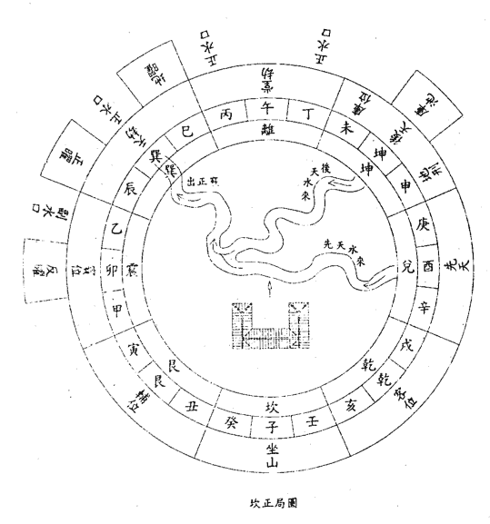

反局全圖

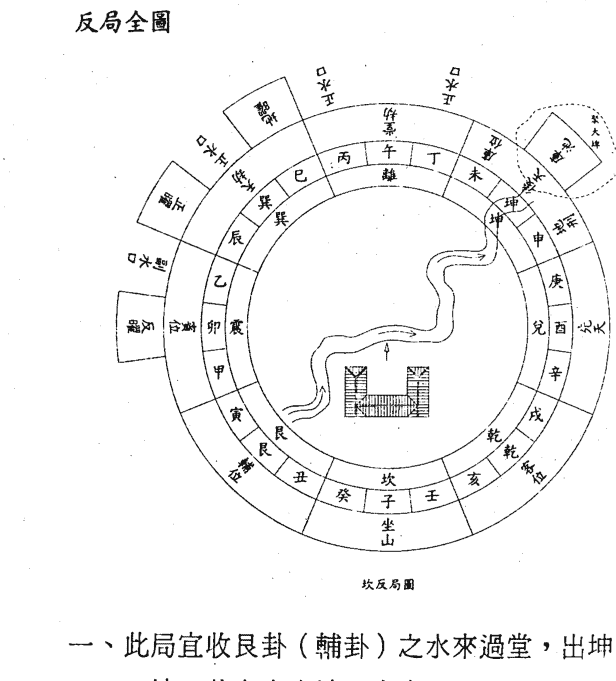

一、此局宜收艮卦（輔卦）之水來過堂，出坤口。
1. 坤口若有大水池，大吉。
2. 坤口若無大水池，大凶。
二、能夠符合此反局的型態者，先凶而後吉。
三、不能符合反局型態者，凶。

#### (一)先天位：兌卦

一、兌為坎之先天位，主出丁之氣。
(1) 兌方之水，不到堂前，主不旺丁。
(2) 水破兌方，則必定會損傷幼丁。
(3) 外局破先天、或內外局破先天，代表沒有後代。
(4) 收震卦（賓）水來破先天位，則會多生女孩，不容易生男孩。

二、男人入贅者：必是收賓水（震）接天劫（巽）水，流破先天（西）位。因收賓客之水，必然破先天，而先天主人丁。說得好聽一點是客來助主，其實應是客水來敗主才對。因為賓客位和先後天位是對立的主客關係。
(1) 這種情況下會生不出男孩。
(2) 或是男孩子身體有疾病以致無法衍續香火，才會招男子入贅。

三、內堂水（墓埕水、或房屋前的空地之水）流破先天，會損傷幼丁。
(1) 水在天干位則發生在男孩身上。
(2) 水在地支位則發生在女孩身上。

四、先天（兌）水不流來後天（坤）位之潭，反從先天位流出，亦主有財缺丁也。正所謂：「先天水不到，定斷不旺丁」。

五、甲庚壬丙此四方又稱爲鬼門關。

#### (二)後天位：坤卦（女人位）

一、坤爲坎之後天位，及地刑位，主發財之氣。

(1) 後天來水，如果水流較短者
1. 會因離婚或妻子過世而再娶。
2. 或者是會有冥婚的狀況。

(2) 水出後天位（坤）
1. 內局：水破後天，會發生月經方面的疾病、或子宮方面的疾病。
2. 外局：水破後天，會有損妻、破財，再婚的事發生。或是突然生重病、血崩、婦人虛勞損、胃肝之病等等。

(3) 在內局坤方有形成尖角的牆壁，或者水池的邊緣呈尖角狀，則會有子宮方面的疾病，甚至癌症。

二、若明堂較長：

(1) 收天劫（巽）水破後天（坤卦）位而去者。
(2) 同時先天（兌）水也流來而往後天（坤卦）位流出者。

這種情況下雖然能生男丁，卻會有損妻、破財的現象發生，要以破後天的狀況來看待。

三、坤卦方：

(1) 若房屋出現斜角的情形，亦會發生子宮方面的疾病。
(2) 如果在這個方位鑿井，或有深的坑洞或地勢低陷的情形，則會有子宮下垂的疾病。

因爲坤方在人體上是對應著女人的子宮部位，若坤方有缺陷，則子宮會出問題。

(1) 兌坤會合過明堂而歸巽，叫做「天下第一水口」。（坎1）

(2) 水往巽方直去，次房久後人口會漸漸稀少。（坎1）

(3) 坤卦水來，而巽方去，主大發。但因水流呈現反跳的形狀，所以必有不孝順且叛逆的子女。（坎1）
1. 長房之子孫英賢。
2. 次房之子孫較差。
3. 三房之子孫亦吉。

(4) 水從巳方流出，因巳方為地曜，故忌亥年沖，寅、申年刑，會有血光意外、退財、損丁的事發生。（坎2）

(5) 水歸震方去，叫做借竅之局，亦大吉。（坎2）

(6) 若收後天水過堂，雖能富有，卻是靠從事勞力、體力的工作致富。（坎2）

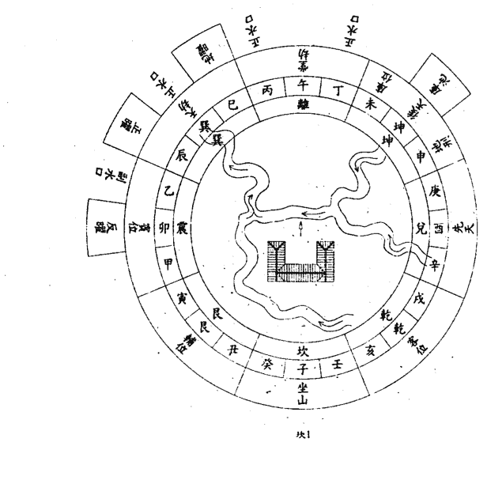

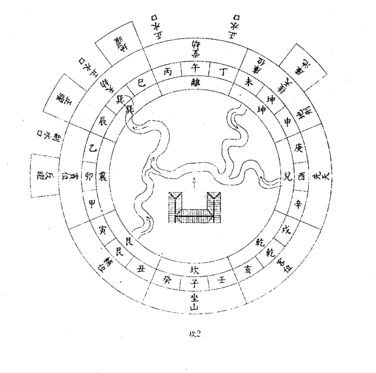

(1) 水口出巽：
1. 次房久後人口漸漸稀少。
2. 故須要轉離而出，則房房大發富貴而人口旺，為盡善盡美之局。（坎3）
   ① 出丙口：次房大發富貴。
   ② 出午口：初運雖吉，久後女人容易有外遇，且易患婦女方面的疾病。
   ③ 出丁口：好少房。

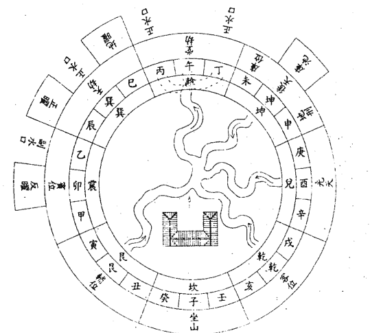

(1) 坤、乾、艮，三水相會於正堂，轉從離卦而出時，要有出丁方之水，而後轉吉。（坎4）

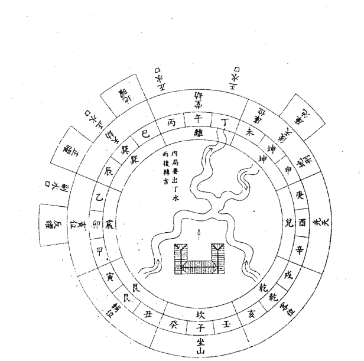

(1) 收震（賓位）來轉艮（輔卦）水，爲財水。（坎5）
(2) 收客位（乾）水來，轉先天，爲易生男丁之水。（坎5）
(3) 收坤（後天），爲財水來。（坎5）
(4) 三水同歸巽方，然後轉離方而去，真是美地之局。（坎5）

(1) 兌水來而歸巽，大房，大發財丁。（坎6）
(2) 久後：
1. 若水從辰方流出，敗二房。
2. 若水從巳方流出，敗少房。
3. 因犯三曜（正曜、地曜、反曜）故凶，遇刑、沖則損丁、退敗。（坎6）

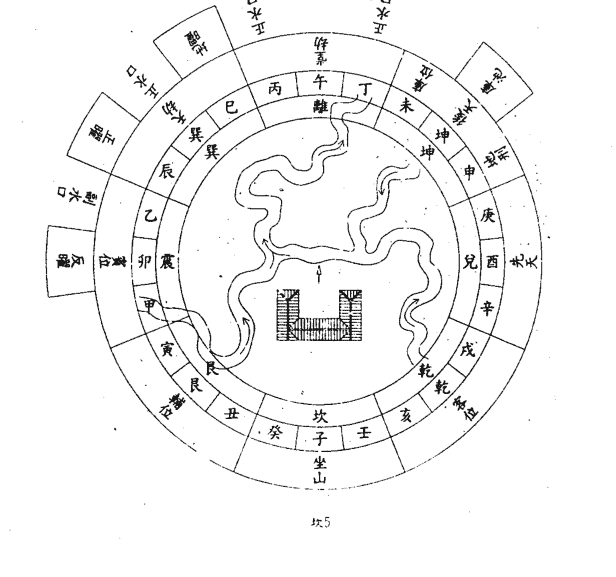

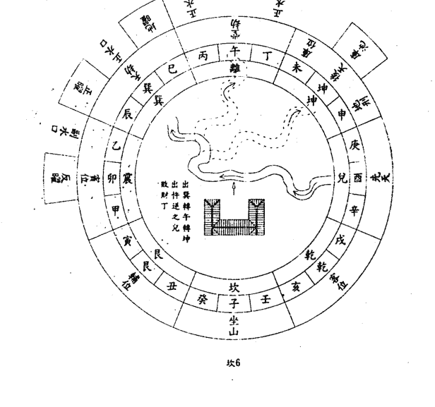

(1) 震水過明堂會先天（兌水），而歸後天（坤卦）去。（坎7）
1. 出奸詐狡猾之徒。
2. 婦人難產而見血光。
3. 坤方有水聚成大池則會大發巨富。

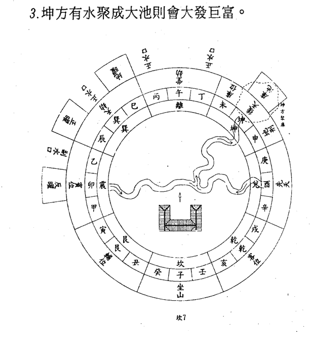

#### (三)地刑位：坤卦

一、坎水破坤方而出，會因妻子過世或離婚而再娶。因為地刑傷女人，故地刑氣沖來，也表示會損傷妻子。

二、地刑方：

(1) 有樹者，代表女人多病。樹高聳者，則女人頭部有病痛。
(2) 有尖角或細長如針的物體射來者，會有出血性的疾病。例如相當於胃部的高度，如果有水泥池角、或壁角、或欄杆石角、門路水泥、牆角等侵射。
1. 相當於胃上方的高度時，代表胃出血會從口吐血而出。
2. 相當於胃下方的高度時，由肛門而出血。
3. 高聳者，代表婦女頭部有病痛。
(3) 如果有破碎狀的物體，則會有酸痛的毛病。

三、未方：

(1) 有丁字路，表示會意外橫死。
(2) 有樹者，代表惡死、自縊。
(3) 有水來者，家中會鬧鬼。
(4) 水流去者，會發生流產、子宮疾病、或經絡病。
(5) 有路來沖，或尖角射來，也會導致意外橫死。

四、申方：

(1) 有丁字路捲入者，代表意外橫死。
(2) 寅申巳亥又叫做馳馬之地，也叫做風聲地，代表男人喜歡賭博及留連於花街柳巷等聲色場所。
(3) 申主險，代表邪異的宗教。

#### 四、天劫位：巽卦

一、天劫位：有門路來。或屋角、欄杆來沖，其角尖銳利，則會有出血性的疾病，輕者也會患咳嗽之病。沖射的高度相當於胃部者，主胃病。

(1) 相當於胃上方的高度時，代表胃出血會從口吐血而出。
(2) 相當於胃下方的高度時，由肛門而出血。

二、辰山：

(1) 有孤木、路來、水來。屋角、欄杆、高而尖的石頭、舊竹抱、水池邊緣呈尖角狀射來，就會出精神異常，有幻覺妄想症之人。其癲神在天劫方，其神猛勇，會傷人，故此精神異常之人，會有打人、罵人的攻擊行爲。
(2) 有丁字路，主惡死。
(3) 有樹且樹下有小屋，形成樹幹橫於屋上的狀態，也代表惡死。
(4) 有風順著巷道吹入者，會患麻痺的病症。
(5) 有較小較次要的門，而風從門中吹來，會患麻痺的病症。
(6) 有物體如同一隻伸出的手臂，主出盜賊。
(7) 兩旁的護砂如同挺胸的樣子，房屋本身如同探頭探腦的樣子，則不吉利。
(8) 辰峰無情，正曜氣凶射，會出現精神異常、有幻覺妄想的人，並有凶事發生。
(9) 地形凸浮，或角尖射，主女性多病。
(10) 有物體如同鎖住犯人的刑具，主牢獄之災。
(11) 辰水沖射，地運行到，則家中會鬧鬼。

三、巽山：

(1) 水來，多病。
(2) 若引先後天水來，由巽山方流出，則房房發福。
(3) 坎卦之宅是以巽山方位爲出水口之正竅也。出巽，好大房，亦房房大吉發福也。
(4) 正竅中有電線桿，或木頭、或石柱、或高而尖銳的磚牆磚柱者，主眼疾。
(5) 有圓形凸起的物體，代表腹肚痛。
(6) 有木或角，主發肝病。因天劫位在左邊，對應著肝的部位。

四、巳山：

(1) 有尖角狀的物體侵射者，會患咳嗽、哮喘等病症。
(2) 有井，主惡也。
(3) 地曜在巳方，爲三分之一的瘋神所在。如反曜卯方有孤木，地曜巳方亦有孤木來相應者，會出現精神異常、有幻覺妄想症的人。
(4) 若只有巳山有孤木，則是會喪失記憶力。
(5) 有土石堆成的小山丘
1. 會記憶力衰退而致喪失。
2. 行年運至，會使人受傷害。因巳在天劫方，所以此處出現的精神異常之人是較凶悍的。
(6) 路來、水來、有門相對、屋角、井欄杆、柱角，若反曜的方位也有沖煞的物體來相應，則易出精神異常有幻覺妄想症之人或患嗽症。
(7) 有丁字路，則會發生意外橫死的情況。
(8) 有反弓的路、水，則會因犯罪而受刑罰。

五、辰巳方位有像刀形的房屋，並有水往先天方流去（破先天），則會發生被人殺的事情。

六、若辰巳方位有像刀形的房屋，且收先天水去破賓位（震卦）者，會發生殺別人的事情。

七、辰巳方：

(1) 蛇腰，家中會遭小偷。
(2) 有物體如同一隻伸出的手臂，會出竊盜之徒。

#### (五)賓位：震卦

一、坎卦之宅收賓位（震）水氣來。

- (1)過堂出正竅（巽山），則外財多入，也會有許多貴人幫助。
- (2)去破先天位（兌），則會多生女孩，少生男孩，可能女性要招贅才有男孩傳宗接代，而且能旺財。
- (3)去破後天位（坤卦），這是一種「破主旺客」的狀況，主人家住在這裡會敗退，諸事不吉。但是客、賓外人住在這裡，則有丁又有財。名曰：「衰主旺客之局」，這就是因為賓水流來的關係。

二、反曜在卯山，為反變之神，也是三分之一的瘋神。

- (1)卯方有孤木，地曜（巳）方亦有孤木來應，則會出現精神異常，有幻覺妄想症之人。
- (2)反曜（卯）方有孤木，而天劫（巽卦）方有樹木高聳來應者，也會因為頭腦部位的疾病而成了精神異常的狀態。

三、甲方之小屋上有橫枝幹，亦主惡死。

四、乙辛丁癸代表人之性格和善客氣。

五、收甲兼寅來，會遭木石壓死。

#### (六)客位：乾卦

一、若收賓（震）水至後天（坤卦）位，再轉彎去破客（乾）位而出者，主旺丁、旺財也。這是「賓、客助主局」也。而且主局旺、客局亦旺也。（坎 11）

二、亥方有形煞，主犯鬼怪。（坎 11）

(1)震水來而兌水去，叫做賓盛而主衰。

- 1. 女兒成群，沒有男孩，或只有一個男孩。
    - ① 左畔居者，會有再娶的情形發生。
    - ② 右畔居者，會因沒有男孩而去收養子來傳宗接代，財丁並失。
- 2. 應兌方有大水池為佳。（坎 12）

(1)此局收賓水來，轉天劫水，而破先後天。

- 1. 初運：
    - ① 長房、次房平吉。
    - ② 三房、四房敗財而且女人易有外遇，男性可能會再娶。
- 2. 久後：敗絕而消亡矣。（坎 13）

(1)賓客（乾、震）二方之水流來射向坤宮，本是大凶。但因坤方有水匯聚成大池塘，流年地運行到，反為巨富。且女秀，男賢，讀書考試成績優異。（坎 14）

(1)收震、乾（賓、客）水來過堂。

- 1. 財敗，且沒有男孩傳宗接代。這種情形叫做「內盆外」，所以外家姓之子孫反而興旺。（坎 15）

#### (七)輔位：艮卦

一、坎卦（伏位）之氣，靠輔（艮卦）位的力量來幫助。

- (1)輔卦方失力則失去輔助之貴人也。假如輔卦方失陷，或水倒流輔卦（艮卦）而出，則是輔卦失力也。此時，若有劫來侵射，則家人生病，醫來醫去總是治不好，而且事業方面也沒有能夠輔助支援的人。
- (2)輔卦方堅固有力，則貴人有力。若輔卦水流過來會合先後天水，從正竅（巽山）流出，則輔卦堅固。

二、輔卦之力：

- (1)助吉星：則全家發福，故助善亦善。
- (2)助凶星：則凶星之力愈猛，住家被破壞衰敗的速度也愈快，所以助凶則凶。

#### (八)庫位：坤卦

#### 庫池：坤山

一、坤方，為後天及財庫之池位也。

- (1)喜大庫池，愈富。
- (2)有潭、埤者，亦主富。

二、如賓（震）水來坤方，有大池、大塘、大堀、大潭來鎖住其氣，代表有財。（坎16）

(1)收艮水來而流向兌方，再轉向坤方去。

- 1. 會敗財、損丁。久後必消亡、敗絕。（坎 17）

(1)收艮卦水來，而歸坤方，且坤方有深廣的大水池。

- 1. 主大發富貴而綿延後代子孫。（坎 18）

(1)收輔卦水來，先轉向天劫方再流向兌方，然後再轉向坤方而去，為破先後天。

- 1. 久後人口會漸漸稀少，且敗財。（坎 19）
- (2)水出兌方，為桃花水，女性易有外遇，所以可能會離婚再娶。（坎 19）

(1)遊魂桃花水：

- 1. 敗財、丁。久後人口漸漸稀少，消亡敗絕。
- 2. 只有一個男孩（獨子）來傳宗接代。（坎 20）

#### (九)案堂位：離卦

一、丙山，若有尖角，則心臟部位會有疾病。

二、午山：

- (1)若有尖射，主開刀。開刀的位置可從尖射物的高低，對應到身體的位置來判斷。
    - 1. 位置低表示在腸。
    - 2. 位置高表示在胃部。
- (2)若水來，主桃花。
- (3)若水來，流巽而去，名為「桃花遊劫」，主男人採花。
- (4)若水來，流先天（兌卦）而去，名為「桃花遊魂」，代表的是女人出去找男人。
- (5)若有物體如同鎖犯人的刑具，表示會有官司事件。
- (6)若有丁字路，主惡死。
- (7)小屋上方橫著一根樹枝，主惡死。

三、午方、辰方：

- (1)若有吊頭樹，發生在年輕人身上居多。
    - 1. 主自殺。
    - 2. 或上吊而死。
- (2)若形態像繩索，或像鎖犯人的刑具。
    - 1. 代表因官司事件而坐牢。

四、午方、子方，兩方有母樹，代表腰、臀部位有病。

五、子午卯西方若有沖煞，則男人有血光之災，女性多淫慾、犯桃花。

#### (十)正曜（辰）

一、辰方：

- (1)有孤木來應，就會出現精神異常，有幻覺妄想症之人。
- (2)其瘋神在天劫方，其神猛勇，會對人造成傷害，所以此精神異常之人會有打人、罵人的攻擊行為。
- (3)只要有路來、水來、屋角、井、欄杆及高而尖銳的石頭、竹籬、水池邊緣的尖角來應，就會出現精神異常，有幻覺妄想症之人。
- (4)有丁字路，主惡死。
- (5)有樹，下有小屋且樹幹橫於屋上者，亦主惡死。
- (6)有風順著巷道吹入者，會患麻痺的病症。
- (7)有門，如貝弓門，有風吹來，會患麻痺的病症。
- (8)有物體如同一隻伸出的手臂，主出盜賊。
- (9)峰無情，凶射，會出現精神異常、有幻覺妄想的人，並有凶事發生。
- (10)地形凸浮，或角尖射，主女性多病。
- (11)有物體如同鎖住犯人的刑具，主牢獄之災。
- (12)水來沖射，地運行到，則家中會鬧鬼。
- (13)若有吊頭樹，主自殺、或上吊而死也，發生在年輕人身上居多。
- (14)形態如繩索，或如犯人身上的刑具，代表會因犯罪事件而坐牢。
- (15)水來，損人丁。後面水去，主失財。
- (16)蛇腰，被賊偷。

二、辰巳方有刀形：

- (1)水破先天，主被人殺。「由左倒右」
- (2)收先天水去破寶位，主殺人。「由右倒左」

#### (十一)反（天）曜（卯）

一、反曜（卯）有孤木，地曜（巳）亦有孤木來應，則會出現精神異常，有幻覺妄想症之人。

二、反曜（卯）有孤木，天劫異卦辰巽巳方有樹木高聳來應者，也會因為頭腦部位的疾病而成了精神異常的狀態。

#### 凶地曜（巳）天劫方

一、巳方：

- (1)有孤木，反曜（卯）方亦有孤木來相應，會出現精神異常、有幻覺妄想症的人。但巳山屬天劫位，所以此處出現的精神異常之人是較凶悍的。
- (2)若只有巳山有孤木，則不會有精神異常的現象，但是會喪失記憶力。
- (3)有土石堆成的小山丘，會記憶力衰退而致喪失，久而行年運至，會使人受傷害。
- (4)有丁字路，會遭意外橫死不得善終。
- (5)路來、水來、有門相對、屋角、井、欄杆、柱角，且反曜方也有沖煞的物體來相應，則易出精神異常有幻覺妄想症之人或患嗽症。
- (6)有反弓的路、水，則會因犯罪而受刑罰。

二、辰（正曜）巳（地曜）方：

- (1)蛇腰，被賊偷。
- (2)有物體如同一隻伸出的手臂，主出盜賊。

三、辰（正曜）巳（地曜）方有刀形。

- (1)水破先天，則會發生被人殺的事情。
- (2)收先天水去破賓位者，會發生殺別人的事情。

四、巳方：

- (1)有角侵射者，會患咳嗽、哮喘症、挨嘔。
- (2)有井，主惡死也。
- (3)水來，會患挨嘔、咳嗽、哮喘症。

五、巳方有尖角如刀形。

- (1)收賓位震卦水去破先天兌卦位，則會發生被人殺的事情。
- (2)收先天兌卦水去破賓位震卦方，會發生殺別人的事情。

#### (四)坎卦 (壬子癸三山) 之正曜在辰山

### 一、癸山丁向

- 1. 癸山丁向，煞在辰。代代必出，短命人。
- 2. 乙辰方上，石碓磨。癲癇背出，癡疾人。
- 3. 左右橋樑，並廟宇。削髮為尼，出僧人。
- 4. 乙辰有火，來照穴。合家遭軍，哭洪洪。

### 屋之巒頭

(一)案堂：

- (1)形狀破碎，主夫妻不和。
- (2)反弓，主家人反逆。
    - 1. 左反弓，主大房反逆。
    - 2. 右反弓，主小房反逆。
- (3)反弓斜角的位置剛好在惡死局的方位，而且呈斜飛狀態者，會有飛來橫禍。
- (4)反弓在桃花位，則既反逆又有桃花外遇。
- (5)眠弓水案，如金城或木城爲無劫也。
    - 1. 木城水橫直流過，出正竅。
    - 2. 金城則眼環如金，圓如玉帶束腰的形式。
- (6)前被樹木遮蔽不清，主入財受阻。
- (7)前傾斜，主胃腸病。
- (8)前水走、山飛，主散漫、奢侈浪費。
- (9)有文箱、玉印，主文貴之人。
- (10)案外有官星，主貴。
- (11)有羅星鎮水口，主貴。
- (12)五星連珠，老師格。
- (13)旗、鼓、劍、印，主武官格。
- (14)貴人山明顯，主出貴。
- (15)龜、蛇鎖水口，主出貴。
- (16)聚講格，主山高而護法得力。堂前有小山，形勢清秀而靜者，如坐在課堂中聽講的樣子。
    - 1. 形文者，出文人之聚講。
    - 2. 形武者，出武人之聚講。
- (17)堤長，爲探堂，主洩氣破財。
- (18)龜堤，主胃腸病。

(二)屋後：

- (1)三角形的空地，名爲「玄武吐舌」。主宅母有驚病。
- (2)有樹根，或石角高大而尖射者。主腰病。
- (3)一木通，不久出貧窮。
- (4)無氣，水倒流，主倒房。
- (5)有水坑或坑洞，主失氣病。

#### (三)龍虎砂：

- (1)身短而砂長者，主洩氣。
- (2)身低而砂高者，主賓壓主。
- (3)虎砂昂頭起尖峰，老婆罵老翁。
- (4)龍虎砂清秀，有情護我。主穴得貴人，兄弟有情。
- (5)龍砂背，則兄無情。虎砂背反而不抱，主次房無情。

#### (四)造灶：

- (1)西五間造灶：
    - 1. 庚辛位，損丁。
    - 2. 地支位酉，損女口。
- (2)灶口向門，主空亡也。

### 坎卦陰宅：墓內斷法

天劫位：巽卦

#### 一、辰山：

- (1)正曜水來射，主蔭屍。
- (2)有許多帶水之物反射者，主蔭屍。
- (3)水來，損丁。後面水去，主失財。
- (4)有物體如犯人身上的刑具，就會有牢獄之災。
- (5)若為出水位，會因為打官司而花很多錢。

#### 二、巽山：

- (1)有山尖射入者，表示骨灰罈的蓋子破了。
- (2)有大水來，主翻棺、覆屍。

#### 三、巳山：

- (1)有尖角如刀形。
    - 1. 收賓（震）水去破先天（兌）位，主被人殺。
    - 2. 收先天（兌）水去破賓（震）位，主殺人。
- (2)地曜之方，若有孤木，反曜之方（卯）亦有孤木來應者，會出現精神異常、有幻覺妄想的人。
- (3)有角，主挨嘔嗽、哮喘也。
- (4)水來，主入蛇。
- (5)凹方，亦入蛇。

#### 四、午山：

- (1)有水來，則有白蟻鑽入，會出現精神異常、有幻覺妄想的人。
- (2)有母樹，如桉樹，代表腰腎有病痛。

#### 五、艮山：

- (1)有凹風，入樹葉。
- (2)有水來，入白蟻滿棺中。

六、寅、申、辰、戌、乾、乙水來爲破局，代表樹木根部穿破棺板。

七、凡穴，無氣且鬥殺，則見蟻也。

## 八曜斷

### 一、坎（壬子癸山）曜在辰（龍）

- 1. 粗石惡煞，人命眞。
- 2. 水冲割喉，人自吊。
- 3. 癲癩食藥，水中亡。
- 4. 員墩屍山，軍徒犯。
- 5. 時師，切莫作閒推。

### 二、坤（未坤申山）曜在卯（兔）

- 1. 雷傷樹打，人命遭。
- 2. 軍賊破敗，誣賴事。
- 3. 食藥橫，自中招。
- 4. 女人是非，產難死。
- 5. 凶徒殺戮，見刑傷。

### 三、震（甲卯乙山）曜在申（猴）

- 1. 徒流人命，亂紛紛。
- 2. 殺戮雷打，併樹傷。
- 3. 吐血虛癆，損少年。
- 4. 女人是非，官司起。
- 5. 申子辰年，定見凶。

### 四、巽（辰巽巳山）曜在酉（雞）

- 1. 人命軍徒，定不休。
- 2. 男人官訟，賊破敗。
- 3. 食藥誣賴，剋妻兒。
- 4. 若見，旗鎗砂順水。
- 5. 強梁殺戮，最凶頑。

### 五、乾（戌乾亥山）曜在午（馬）

- 1. 軍賊人命，火燒家。
- 2. 婦人淫亂，生瞎眼。
- 3. 吐血虛癆，產難差。
- 4. 員墩墮胎，瀉痢死。
- 5. 水直，離鄉乞食兒。

### 六、兌（庚酉辛山）曜在巳（蛇）

- 1. 少年人命，及蛇傷。
- 2. 食藥人命，併殺戮。
- 3. 吐血淫亂，敗家亡。
- 4. 女人是非，出破相。
- 5. 產難軍敗，乞食亡。

### 七、艮（丑艮寅山）曜在寅（虎）

- 1. 粗石帶殺，虎傷人。
- 2. 吐血產難，出跛鰲。
- 3. 遊蕩離傷，生癩瘋。
- 4. 又主少年，食藥事。
- 5. 屍山水沖，人命凶。

### 八、離（丙午丁山）曜在亥（豬）

- 1. 水沖山迫，人命來。
- 2. 吐血虛癆，損少年。
- 3. 婦人咳嗽，時見災。
- 4. 亥卯未年，人命至。
- 5. 曜殺山水，仔細推。

## 八曜煞例（以坐爲主）

曜山與破損在妻。

曜水與破損在兒。

### 一、坎（壬子癸山）曜在辰（龍）

- 1. 雷傷樹打，小兒身。
- 2. 辰上灰，伯牛疾。
- 3. 割頭自吊，虎傷人。

### 二、坤（未坤申山）曜在卯（兔）

- 1. 雷傷服藥，損小口。
- 2. 惡疾死多，遭軍賊。
- 3. 產死退財，人命走。

### 三、震（甲卯乙山）曜在申（山猴）

- 1. 不見人命，土人。
- 2. 離鄉路死，扛死人。
- 3. 討死食藥，損姓興。

### 四、巽（辰巽巳山）曜在酉（雞）

- 1. 巳酉丑年，最難守。
- 2. 破財剋妻，損小口。
- 3. 代代子孫，不興丁。

### 五、乾（戌乾亥山）曜在午（馬）

- 1. 斬頭充軍，公事多。
- 2. 爲軍做賊，人命見。
- 3. 寅午戌年，失火災。

### 六、兌（庚酉辛山）曜在巳（蛇頭）

- 1. 出走在外，怪人多。
- 2. 口惡蛇傷，實入獄。
- 3. 巳酉丑年，見災殃。

### 七、艮（丑艮寅山）曜在寅（虎）

- 1. 明沖煞拖，賊來臨。
- 2. 官司破財，人口損。
- 3. 刑妻剋子，永無興。

### 八、離（丙午丁山）曜在亥（豬）

- 1. 僧道爲軍，賊自招。
- 2. 狗咬吃人，癩瘋生。
- 3. 定主，亥卯未年敗。

## 離卦

### 離卦總論

#### (一)離卦先後天之相互關係

先天的離卦相通於後天的震卦。
後天的離卦相通於先天的乾卦。

#### (二)離之意象

一、為電：

- 1. 一瞥的光明，象徵閃電。
    - A. 代表火的光芒，而引申打火之意。

二、為甲胄：

- 1. 離為兩剛爻裡護一柔爻。
    - A. 象徵甲胄。比喻拿著盾牌來防衛，而易起衝突。

三、為戈兵：

- 1. 離，上爻為陽剛，象徵兵刃的上端尖銳。且乾為金，而離為火，可斷乾燥而煉之，故為戈兵也。
    - A. 故火災與尖銳為戈兵之象。代表有競爭和糾紛。

#### 四、病象：

- 1. 心臟病、高血壓、腦溢血症、中風。
- 2. 視力衰弱、眼病。
- 3. 發狂、逆上。
- 4. 不食、氣燥、大便秘結。
- 5. 精神過勞、不眠症。
- 6. 太陽明三相火、高熱。
- 7. 聲結。
- 8. 火傷。
- 9. 意外事件，火災、車禍、搶劫、被殺。

#### (三)離山論

午地坤客，反曜申。
兌寅辛池，正竅神。
乾後地刑，亥八曜。
艮劫震先，巽輔巽。
丑兵女繩，子亥空。
腫缺溺崩，跛痔癩。
子癸六指，寅蛇虎。
艮坑天折，癱眼盲。

### 離卦各方位分析

正局全圖

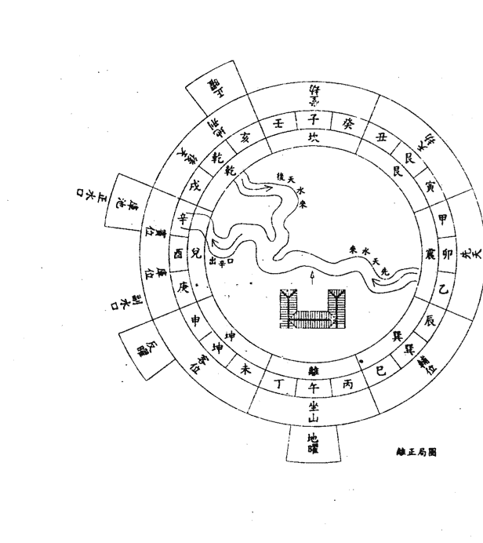

#### (一)先天位：震卦

一、震為離之先天位，主出丁之氣。

- (1)先天（震）水宜流來，又宜水長來，主出丁興旺且多賢秀。
- (2)若水流向先天（震）位去，叫做流破先天，代表人丁夭折，或幼丁少亡。宜栽竹遮障則可免災害。
- (3)若先天（震）水流過來，會合後天（乾）水，流向辛位而去，這叫做先後天全備，必定會大發財丁。

二、坐丙、午山，若先天水直流而過，不可反跳辛位（正竅位），若反跳也成為破後天之局。

三、坐丁山，才能出辛位而去。

四、真龍不吐惡水，惡水不向真龍。

五、坐丙山，收甲庚水來，則代表個性方面偏好清淨空寂的宗教義理，喜歡研究玄學五術。

六、坐午山，則個性風流，易犯桃花。

七、坐離卦，若先後天合局，叫做木火通明格，必會出現優秀能幹的子孫。

八、先天水來過堂，本代表聰明智慧。

- (1)但如果案劫有凹風來犯，
  1. 則會頭暈頭痛、記憶力減退、健忘，反而讀書不能專心，成績不佳。
  2. 又說話很大聲，容易得中風、高血壓之病。
- (2)凹風所形成的煞氣，以出現於案劫方最嚴重，天劫方次之，地刑位又次之。

#### (二)後天位：乾卦

一、乾卦為離卦之後天位，及地刑位，主發財之氣。

- (1)後天（乾）水：
  1. 宜收來。
  2. 不宜流去。

二、收後天（乾）水過堂，會合先天（震）水，從艮山流出，為從借竅局。

- (1)初運不吉。
- (2)後運轉好。

三、若水因射後天（乾）卦而去，為流破後天位，代表婦人會難產而見血光也。宜栽竹種樹或建屋宇遮障，則沒有大礙。

四、若收後天（乾）水流來過堂，會成鉅富，但是個性燥烈。

- (1)先天震卦水來上堂，表示會大旺人丁。（離1）
- (2)震水來會合乾水，歸辛而去，這叫做生、旺全備，故財、貴、丁齊全。（離1）

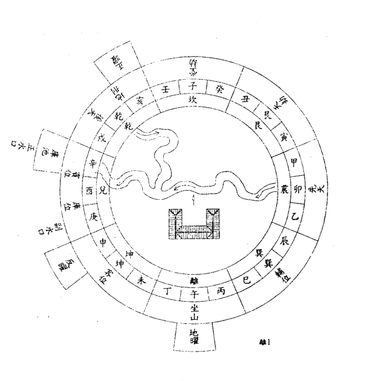

- (1)後天水來會合震卦水，從兌卦方流出，則叫做富、貴齊全。（離2）

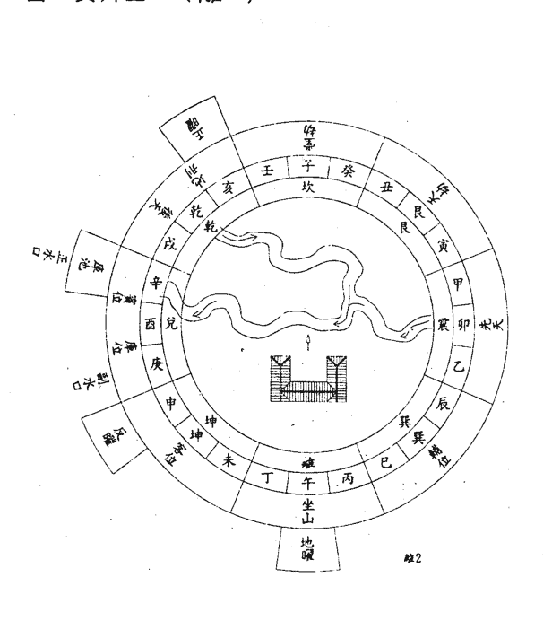

- (1)先天震水過堂，會合乾水歸坤而去，這叫做先後天全備之局。原本應該富貴齊全，但是久後長房丁星失氣，男性的人口漸漸減少。（離3）
- (2)震水來，而兌去，久後三房退敗。（離3）

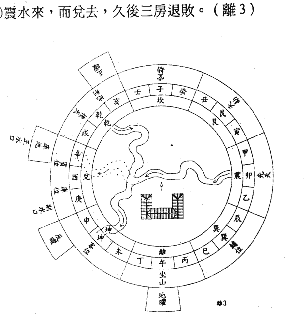

- (1)後天乾卦水來過堂，雖能富有，卻是靠從事勞力、體力的工作致富。（離4）
- (1)此局分為內外局水，正好符合先後天齊全，故能富貴而大發丁，科甲連綿。（離5）

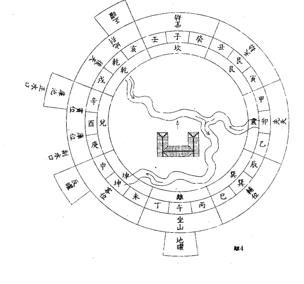

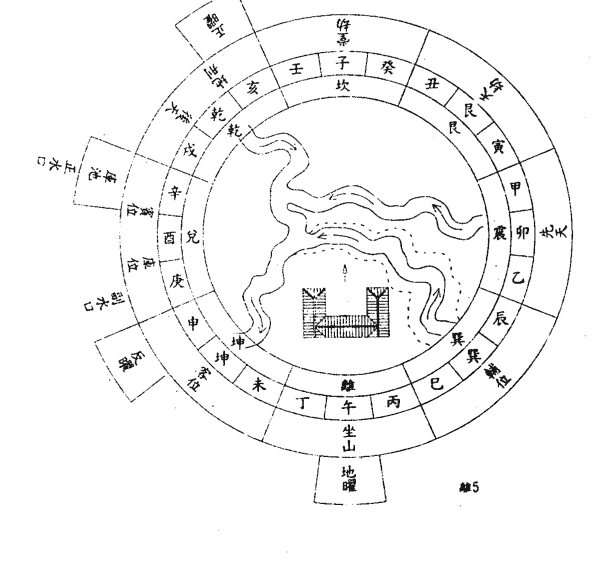

- (1)收乾、震水來，出天劫艮方去，大吉。（離6）
- (1)兌水轉乾水，坤水轉震水，來乾方會合，出天劫艮方而去，叫做賓客水來成先後天水，故大發富貴而旺人丁，且人丁的人緣佳，受外界之好評。（離7）

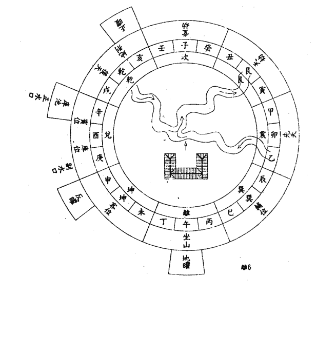

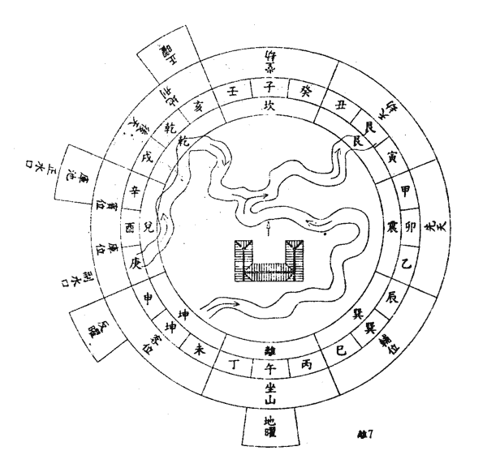

- (1)先天震水歸西北乾卦而去，則會破財、再娶、婦人會難產而見血光。（離8）
- (2)後天方位遭流破，代代窮，又叫做忤逆水，也叫做消亡敗絕水，大凶，子女不孝順，會反抗父母，與父母爭吵。（離8）
- (1)乾卦水來而出坎，亦是吉。（離9）
- (2)乾卦水來而出艮，雖是後天過堂，但是艮乃在離之目角，這叫做忤逆水，子女不孝順。所以就算家財萬貫，也難得天倫之樂。也是消亡敗絕水，久後退敗。（離9）

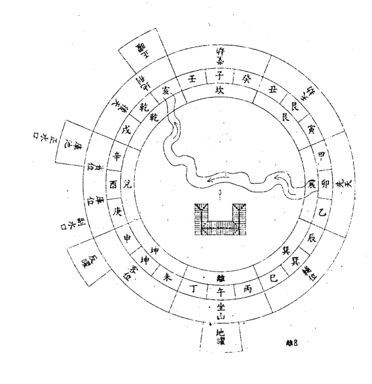

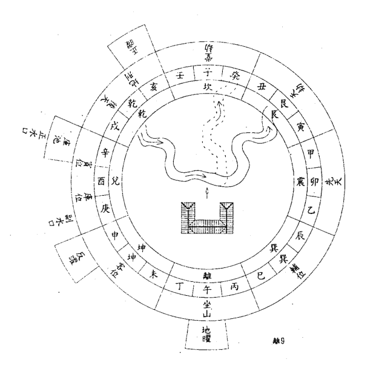

- (1)後天乾卦水來上堂，而歸震方去，叫做後天破先天，也叫做消亡敗絕，久後家中人口漸漸稀少而退敗。（離10）
- (2)若震方有大池塘，初運雖然人口稀少或只有一個男孩傳宗接代，但後來會大發人丁，又發巨富。（離10）

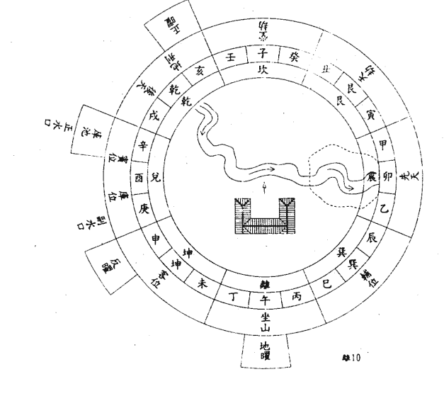

- (1)後天乾水來，歸巽而去，雖能發財而欠輔弼，沒有貴人相助，故官場失意。（離11）
- (2)亥為正曜，這個方位有水來上堂，且堂前帶劫，會出現發狂的人。（離11）
- (3)戌為牢獄位：有山像監獄，像鎖住犯人的刑具，有路如繩索，主有牢獄之災。
  1. 面前堂劫方如果煞氣重，代表有人會死亡。
  2. 如果明堂清秀，也會有訴訟之厄。（離11）

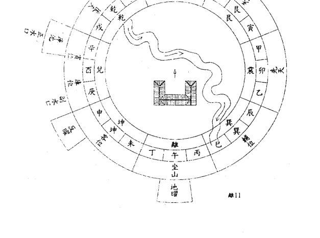

#### (三)地刑位：乾卦

一、乾卦為離卦之地刑位，故不宜有形煞。

- (1)若有樹木高壓者，家中女性有頭痛的毛病。
- (2)若有尖角之物者，表示女性會開刀。
- (3)若在這個方位開門，則婦人多疾病。

#### (四)天劫位：艮卦

一、艮卦為離卦之天劫位，為凶惡之神，故此方不宜有水流來或有形煞在此方位。

- (1)有形煞，須分成二種。
  1. 形煞之物是堅硬物體稱硬劫，主傷害。
  2. 形煞之物是柔軟物體稱軟劫，應病症。
- (2)開門，主見血光。
- (3)有樹木，主筋骨疼痛。
- (4)忌天劫（艮）水流向後天（乾）位去，或流向先天（震）位去，為消亡、敗絕水，會令家中沒有後代。

二、丑山：

- (1)水來，主刀兵死、橫死、很久都治不好的疾病。
- (2)有丁字路，則年輕女性會自殺。

三、艮山：

- (1)有水來，又叫做穿連珠水，主盲目、冷熱交替似瘧疾之病。
- (2)有深坑，主盲目（最驗）、癆疾。

四、寅山：

- (1)有水來，主木石壓死、虎咬、殘疾。
- (2)有水來，則風流好色，喜歡留連於花街柳巷。

五、艮寅水來：

- (1)會使人患瘟疫之病。
- (2)又叫「風聲水」，不拘貧富，家中男人一定喜愛留連於花街柳巷。

六、收天劫水來，則此宅居住之人，性格上殺氣較重。若天劫方有物高聳，則會出流氓。

- (1)天劫艮卦水來上堂歸乾方去，可能會得癆疾、吐血等病。（離12）
- (2)天劫水流來會對長房不利，人丁退敗，這叫做破後天，代代窮，婦人難產而見血光，甚至會死亡而發生再娶妻子的情況。若乾方有大水池，則初運雖敗卻因再娶妻而致富，又說因妻致富，但男人比較好色。而乾、兌去水稱為正竅，但因為凶水過堂，久後三房敗，這也是屬於消亡敗絕水。（離12）
- (1)丑水來，主刀兵之厄，主惡死。（離13）
- (2)丑水來而且有路沖來，則會有年輕女性上吊自殺。丁字路在丑位，亦同。（離13）
- (3)丑艮水流來，震位去，為消亡敗絕。（離13）
- (4)艮方，有深坑，主盲目。（離13）
- (5)寅水來，主石壓死。（離13）
- (6)寅水來，主風聲，也就是男人會留戀在花街柳巷，成為尋芳問柳之客。（離13）

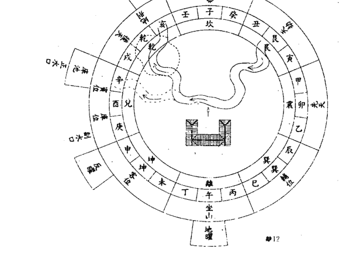

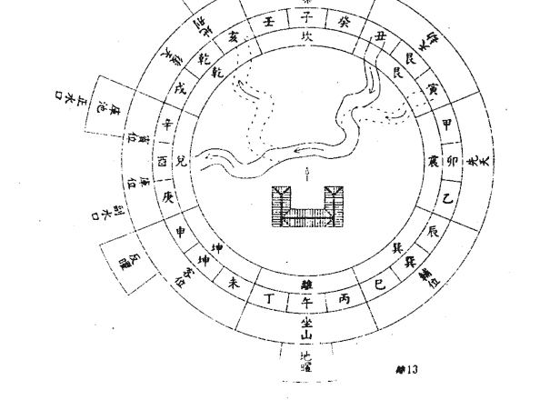

#### (五)輔位：巽卦

一、巽卦為離卦之輔位，當作貴人之力量來看。此方若失陷、空缺則失去貴人之輔助也。助吉星，則全家發福。助凶星，則凶星力愈猛，家宅被破壞衰敗的速度也愈快。

- (1)此卦之水，宜朝來上堂，會使人丁興旺。若再流向辛方（庫池），而且辛方有水匯聚成深廣的大池塘，則會使人人大發富貴。
- (2)若輔卦遭流破，代表後繼無力，無貴人相助，官運不佳，而且身體多病，常吃藥。

二、巳山：

- (1)收巳水來，會出好賭之人，而且每逢亥年必多輸。
- (2)巳位有孤木，則其人愛喝酒，醉後必發酒癮。
- (3)巳位有井，若被流破，要小心被蛇咬。

- (1)收兌水來，轉向乾方為後天水，來會合巽卦方的輔卦水為合局，出天劫艮方去。（離14）

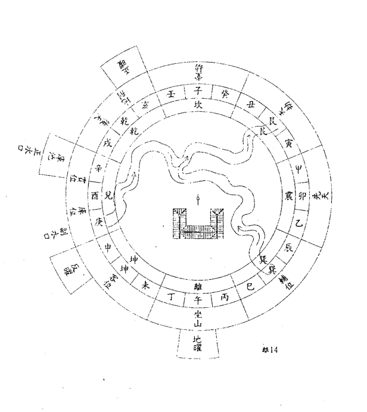

- (1)收輔卦水（巽）過堂與客水（坤）會合，再會先天水（震）與後天水，轉天劫方（艮）而去，再轉賓位方流出，大吉。（離15）

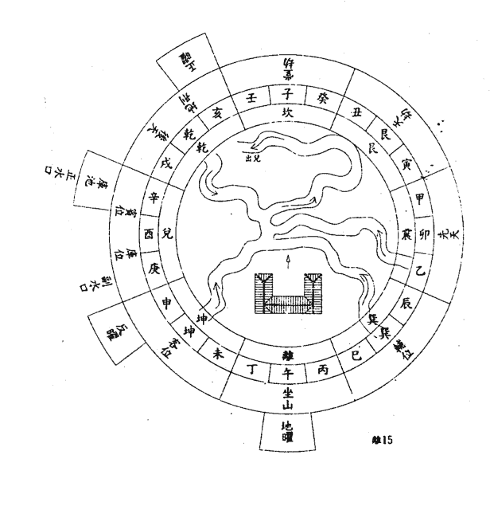

#### (六)庫位：兌卦

#### 庫池：辛山

一、辛山為離卦之正竅位，又為庫池位。一般而言，庫池皆在先天位，或後天位居多。只有震卦與離卦不是配在先後天之位上。

- (1)離卦山收先天（震）水，或後天（乾）水來到，出辛口，為最妙之局，其吉利的程度比，其他坐山卦更佳。辛方，若再兼有大水池作為庫池，又有庫帶為欄，則其所發財富，非同小可，可說是「一發如雷，富比石崇」。

#### (七)賓位：兌卦

一、兌卦為離卦之賓位。

- (1)賓位（兌）之水
  1. 宜流出。
  2. 不宜流來。
- (2)收庚、辛水過堂，流向甲、乙方去，會容易生女孩，不易生男孩，可能只有一個男孩來傳宗接代，或是女兒用招贅的方式來傳宗接代。這是因爲賓、客水反來上堂，就表示多生女兒。

#### (八)客位：坤卦

一、坤卦爲離卦之客位。

- (1)收客（坤）水過堂，流破先後天方位而去，這是「衰主旺客」之局。對家中主人不利，久後退敗。但是對於女兒、女婿這一方卻大有幫助，或是外來賓客居住在此也是大吉大利。
- (2)收賓客之水過堂。若陽卦有奇峰、秀水、眞龍結穴者，主發富、發貴，但是卻會發達在女兒這一方，也許是生出優秀賢能的外甥子女，也許是招贅而生的子孫，所以必定會使他人之子孫昌盛。
- (1)收兌水（賓水）來而轉向乾方爲後天水，會合巽卦（輔卦水）水爲合局，而出天劫方（艮方）去。（離16）

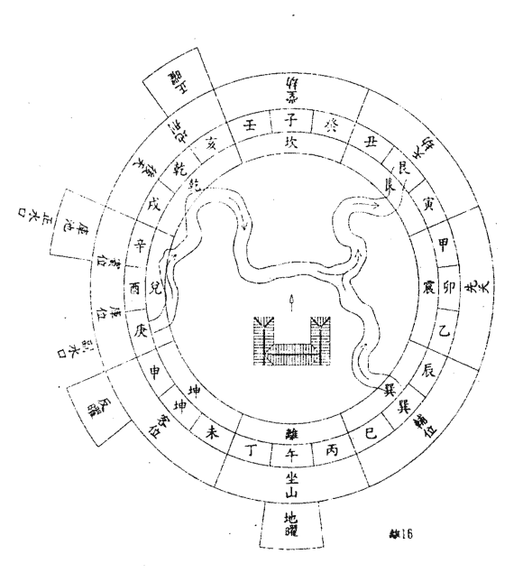

#### (九)案堂位：坎卦

一、子山：

- (1)有水來，叫做「娥眉水」。代表女性淫亂、男人夭折、見血光。
- (2)有水來，流入卯方去，或午方去，為遊魂桃花水。代表婦人多淫慾，禁不起誘惑而發生外遇、私奔。

二、子癸方：

- (1)有水來：
  1. 會患腫脹、溺死、血崩、痔漏、跛腳、自縊、毒藥死等病災。
  2. 會生出六指（畸形）之人。
  3. 離、巽兩卦若被流破最驗。

三、子水來，亥方有古樹，主陰症、出狂人。

四、案堂位：

- (1)有古井等小凹地，代表說話口齒不清，所謂水池聲是也。
- (2)有防波堤，則說話會口吃。

五、子午卯酉水，又叫做穿心水（以午方最嚴重）。

- (1)會使人得心臟病、心悸、以及眼睛的疾病。
- (2)人身體的正面部位可能會開刀。
- (3)收子午卯酉水來，要小心有亂倫之事發生。

- (1)堂劫水來，叫做「穿心水」，主大凶。（離17）
- (2)坎卦水來：主心臟無力、暴斃。（離17）
- (3)子水來入局：稱為蛾眉水，代表女人貪淫慾。（離17）
- (4)子水來而卯水去，叫做遊魂桃花，會發生男人夭折，而女人隨人私奔的事情，雖是品德不錯的良家婦女，也會禁不起誘惑而發生外遇。子水來而轉酉位出者，也有相同的狀況。（離17）

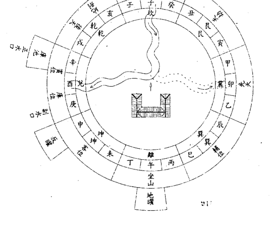

- (1)坎水來，而坤位去，稱為消亡敗絕。（離18）
- (2)坎水來，而午申亥方有樹木壓者，出狂人。（離18）
- (3)壬方水來，或壬方路來，會意外橫死不得善終。（離18）
- (4)子癸水來：主腫脹、落水、溢死、血崩、痔漏、六指、缺唇、癲跛之症，以及很久都治不好的病。（離18）
- (5)癸水朝來，主溺死，又叫做惡死水，又稱為毒藥水、眼疾水。（離18）
- (6)內局之水口放出：在水路或水口，有樹木當塞水中央，使水成八字形，或成細小之水路者，代表必有眼疾，重者盲目。（離18）

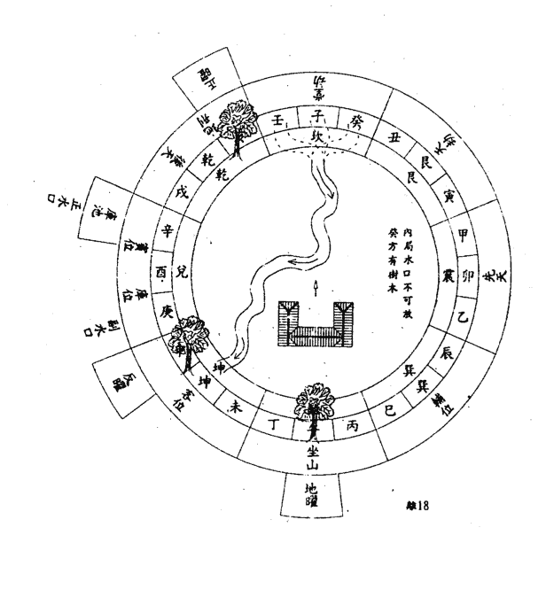

#### (十)正曜 (亥)

一、亥方：

- (1)有凹風吹來，會患皮膚潰爛的疾病。
- (2)有廁池，主生惡毒症、或殘疾。
- (3)在此方開門，會患頭痛的毛病且遭受傷害。
- (4)有路來，主車禍而亡。
- (5)有樹木，主筋骨酸痛與心臟病。
- (6)有水來，或有樹木、或路來，皆表示家中會鬧鬼或有怪異的現象發生。

二、亥方有古樹，並且子水流來，主陰症、出狂人。

#### (土)反曜 (申)

一、申方：

- (1)有水出，則家中較優秀有才能的人反而會受到損傷。
- (2)有水來。
  1. 主風聲。也就是男人愛花天酒地，吃喝嫖賭。
  2. 若水大，為刑剋水，主出殘疾之人。
- (3)有凹風，主出小兒麻痺之人，或殘疾。
- (4)有穢坑，主癌症，或殘疾。
- (5)有路，其路形如閃電，則可能會遭雷擊而死的意外。
- (6)有陰廟，主家內不平安，犯陰症。
- (7)有似刀形之物。
  1. 來水好者，主殺別人。
  2. 水局破者，主被別人殺。

#### (四)地曜（午）

一、午方：

- (1)若有形煞，大部分皆應於頭部，如頭痛、腦部病變等。
- (2)有池塘，主剋妻，或眼盲。
- (3)有路，或有直牆直沖，代表年紀大的婦女重病不利。
- (4)有三叉水：
  1. 表示子孫不孝順，判逆父母。
  2. 出淫邪之人。
- (5)有水沖來，代表著人口會越來越少，錢財也會越來越少。
- (6)有大石，主氣痛傷膈。

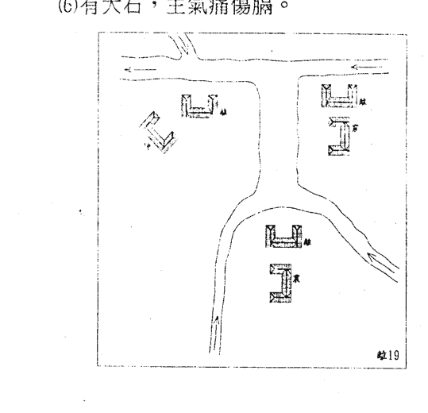

136 乾坤國寶龍門八局圖解上

龍門八局各卦水法詳論 137

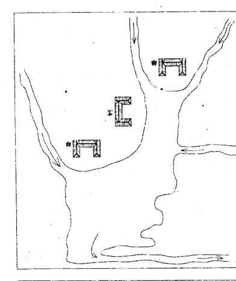

#### (四)離卦（丙午丁三山）之正曜在亥山。

### 丙山壬向

- 1. 丙山庚水，真有因。
  天星作穴，亦同情。
- 2. 若見亥（庚）乾，來水路。
  代代定出，吐血人。
  ① 乾（壬）多亥少，男吐血。
  ② 庚多壬少，女見紅。
- 3. 房分吉凶，如何斷？
  左右山砂，細推明。
  ① 壬多庚少，損長子。
  ② 庚多壬少，二三少。
- 4. 崩破若出卯未，並有石、有水望。
  ① 卯見未，崩龍身。
  ② 未見卯，崩向上。
  ③ 左片有石，崩左片。
  ④ 右片有石，崩右片。
  ⑤ 向上有石，崩向上。
  ⑥ 必要水口，反有石，望定崩。

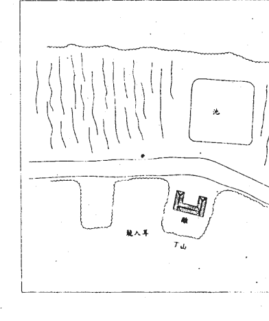

- ⑦近則四十二年。
  遠則四十八或五十八年應。
- ⑧千步之內爲內。
  千步之外爲遠。

### 二、午山子向

- 1. 午山亥水，煞最重。
- 2. 乾亥雙乾，人吐紅。
- 3. 高聳乾方，兇打父。
  剋子刑重，屢見兇。
- 4. 亥壬同來，遭水厄。
- 5. 亥方：
  ①有樹，水浸兇。
  ②橋深、廟室，一同斷。
  ③神廟、社稷，一聲兇。
- 6. 亥水直沖，何分別。
  ①二八佳人，私通性。
  ②若然水路，同行去。
  女子後之，跟別人。

### 三、丁山癸向

- 1. 丁山本是，南極星。
  若見亥水，本有情。
- 2. 若有庚峰，高照穴。
  ①代代定出，高壽人。
  ②五代兒孫，陳自見。
  ③世代官職，享遐齡。
  ④情中濁清，細分別。
- 3. 乾庚雙怎，卻無情。
  ①雖然，官職聲名著。
  ②順壽之人，帶鎖喝。
  ③合家大小，同啼哭。
  ④一本奏單，不狗情。

## 震卦

### 震卦總論

#### (一)震卦先後天之相互關係

先天的震卦相通於後天的艮卦。
後天的震卦相通於先天的離卦。

#### (二)震之意象

一、病象：

- 1. 精神異常、恐懼症、發狂、逆上。
- 2. 精力衰退和壓力、胸悶、發脾氣。
- 3. 肝臟疾病、痙攣、四肢勞倦、腳氣、足疾、筋節。
- 4. 手足外傷、車禍嚴重致死。
- 5. 近視。

#### (三)震山論

震山巽賓，離後天。
坤輔地刑，八申煞。
乾劫正竅，亥地曜。

壬池坎客，寅反先。
坤申風聲，男淫緇。
戌亥殺人，戮盜焉。
子癸破坤，重妻水。
酉水破坤，游魂鈿。

### 震卦各方位分析

正局全圖

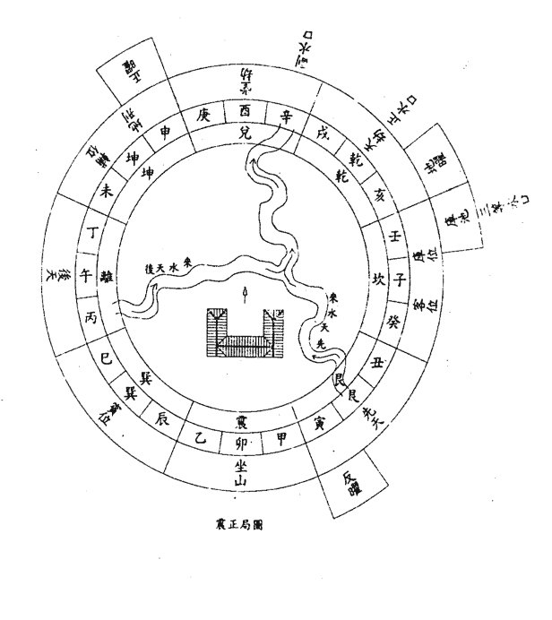

#### 反局全圖

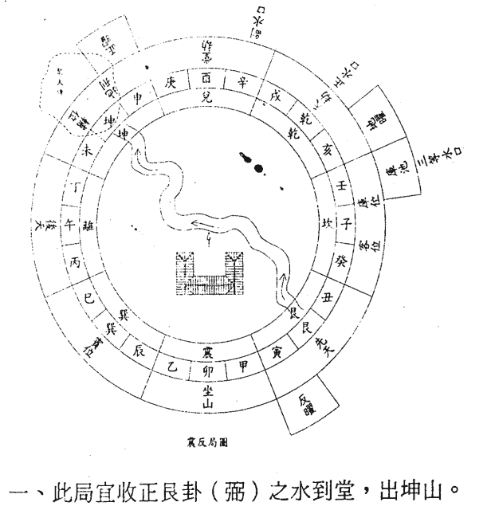

- 一、此局宜收正艮卦（弼）之水到堂，出坤山。
  1. 有大池塘，大吉。
  2. 沒有大池塘，則凶。
- 二、此局
  1. 先平而後大吉。
  2. 或先凶而後吉。
- 三、論反局，符合此格局者，比正局更有效力也。

#### (一)先天位：艮卦

一、艮卦為震卦之先天位，主出丁之氣。

- (1)艮卦方之水，不能流到堂前，主不旺丁。
- (2)水流破艮卦方，則可斷定會損傷幼丁。
- (3)外局破先天，或內外局破先天，代表沒有後代。
- (4)收巽卦方（賓）水來流破先天（艮）位，則會多生女孩，不容易生男孩。

#### (二)後天位：離卦

一、離為震之後天位，主發財之氣。

- (1)後天（離）水流來堂前，主旺財。
- (2)後天（離）水不流至堂前，可斷定不能旺財。
- (3)震卦之山是為帝出後。震之卦，以先天變後天，以後天變先天，（因為震是離的先天，而離是震的後天）故離卦之水朝堂，既能旺財也能旺丁。雖然屬於後天之氣，也能旺丁的原因就是後天變為先天的關係。
- (4)故離方
  1. 如果內局流破後天，必定會破財，婦人會得子宮月經方面的病症，也能損傷幼丁，就是因為後天混合先天的關係。
  2. 如果外局流破後天，會有損妻、破財之事發生，以及虛勞損、暴疾血崩、墜胎、夭折、損粗丁等等。

二、大凡，不論何山何向，以收得先天水明現為重，但是震卦山以收得後天（丙）水為重也。

三、震卦之後天位若有形煞，凶性為何？

- (1)有樹，主胃、肝之病。
- (2)有門路沖射、或井欄、石塊高者、或屋角尖角沖射者，也可能有胃、肝之病。
- (3)水沖、或流出沖瀉者，亦主胃肝之病。

- (1)後天離水來過堂，雖能富有，卻是靠從事勞力、體力的工作致富。（震1）
- (2)後天水來，出乾卦而去，叫做水流正竅，主出富貴之人丁，可說是天下第一水口，而且女的秀麗，男的英俊，此大貴之地，能令人富貴雙全。（震1）
- (1)同上。（震2）

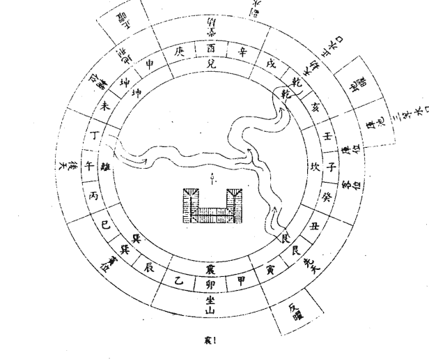

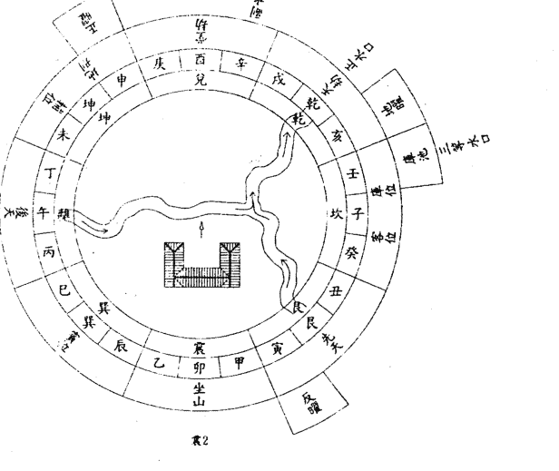

#### (三)天劫位：乾卦

一、天劫位：

- (1)有路箭帶水射來者。
  1. 主出血。
  2. 輕微者，也有咳嗽之病。
- (2)有水泥池角侵射者。
  1. 若池角的高度比較低者，主胃病，或胃出血，由肛門放出。
  2. 若池角的高度比較高者，出血由口，主肺部的疾病。
- (3)有竹籬、屋角、井欄、高起的石頭，尖銳侵射者，均應勞傷出血。
- (4)最凶的情況是有宅墳侵射，會見血光。
- (5)有柔軟而細的物體侵射，主出細病。
- (6)有水來，去流破後天（離）位，主見血、損財丁（消亡、消絕）。
- (7)有水來，去流破先天（艮）位，主損丁絕嗣。

二、戌山：

- (1)有物體如關鎖犯人的刑具，則會有官司訴訟、被困、牢獄之災。
- (2)有丁字路，主惡死。
- (3)有尖射，則見血光。
- (4)有蛇腰，如牽牛索，則家中會遭小偷。
- (5)有物體如同一隻伸出的手臂，主出竊盜之人。
- (6)有水來，家中會鬧鬼。
- (7)有刀形，會導致殺人或被殺。
- (8)有斜沖或反弓，則被刑戮也。

三、乾山：為正竅，出水方也。

- (1)如果有井，或竹籬位在正竅方，則會有眼疾。
- (2)有水來，出酉方去，這是反弓水，主桃花。
- (3)外局有樹，或有尖角之物，可能會患肝病。因消砂五行，乾坤屬木故也。
- (4)有母樹，主陰症，或癲跛也。

四、亥山：為地曜。

- (1)有孤木，且寅方（反曜方）亦有孤木，則會出現精神異常、有幻覺妄想的人。
- (2)有丁字路，若無遮障，也會遭意外橫死而不得善終。
- (3)有蛇腰，如牽牛索，主被鬼賊所侵也。
- (4)有物體如同一隻伸出的手臂，主其家出竊盜之人。

五、(1)戌乾被流破，主耳聾、癲跛、喑啞。

- (2)乾山有龍眼樹，戌山有一個井石。主旁人出啞口及喑啞與癲跛殘疾也。

六、坐甲山：

- (1)地大局有氣，收乾卦水來
  1. 主長房吉。
  2. 次房凶。
- (2)若小局無氣，此時收乾卦水來，反而令房房敗絕也。

七、戌乾水被稱為瘟水，會使人得流行性的疾病。

- (1)忌乾水來，艮位去。因為乾是艮之先天，這種情況叫做消亡敗絕，會使人沒有後代。（震 15）

- (1)忌乾水流來而出艮、或離，這都叫做消亡敗絕。（震 16）

- (1)乾亥水來：
  1. 歸離而去，主風聲，表示家中男性必愛留連於花街柳巷。
  2. 歸艮而去，表示雖然孩子生得多，卻會有夭折的情形，大損壯丁。（震 17）
- (2)戌水來：主遭刑戮、或盜殺、陣亡。（震 17）
- (3)戌水，或戌方路來，丁字路在戌，則會有男性上吊死亡。（震 17）
- (4)亥水，或亥方路來，丁字路在亥，會有年輕女性上吊自殺。（震 17）

- (1)乾亥水來，申方有樹木或幫劫。或者是申方水來加會，而戌乾亥方有樹木者。會出現瘋狂之人。（震 18）
- (2)曜方有形煞之物，則會有人精神異常，但病情較輕。若有樹木，則病情嚴重。（震 18）

#### 四地刑位：坤卦

一、地刑位：

- (1)有樹，則家中女性必定多病。
- (2)有凸浮，故水倒流沖入者。亦主女性多病，或骨節酸痛。
- (3)若有屋角、井欄、舂臼、洋泥水池、或石塊高角來射者，主胃病、或胃潰瘍。
  1. 尖角的高度相當於胃上部者，出血由口。
  2. 尖角的高度相當於胃下部者，出血由肛門。
- (4)水出入流長而來去者，會有再娶妻的情況。
- (5)有尖角之物高聳者，表示婦人有頭部、腦部的疾病。
- (6)有樹高聳者，亦主頭病。
- (7)水長，去而來者，可能有虛勞出血的病。
- (8)門路、各種尖角之物射來，亦主勞傷、出血也。
- (9)所產生之病痛，會令人感覺如受刑般疼痛，或骨節酸痛也。

二、未山：有丁字路，主惡死。

三、申山：是震卦之正曜，是會使人精神出問題的方位。

- (1)有丁字路，會遭意外橫死不得善終。
- (2)有孤木高者，會有精神異常之人。
- (3)有竹籬者，會出精神異常，有幻覺妄想症之人。
- (4)有水來、屋角、門路、高石之角沖射者也會有精神異常之人。
- (5)有門巷曜風尖氣捲入者，會使人患皮膚潰爛的疾病。
- (6)有水來，年運至，則家中鬧鬼或有人惡死。
- (7)有物體如同一隻伸出的手臂，其家出盜賊。
- (8)有蛇腰，如牽牛索，則家中會遭小偷。
- (9)有刀形砂：
  1. 收賓、客水來流破先天，主被人殺。
  2. 收賓、客水來流破後天，也是被殺。
  3. 收先天水來流破客位，主去殺人。
- (10)坐雙金線，可能會鬧鬼。地理怕雙金，坐者無救。
- (11)有水來，男人可能好色重淫慾。
- (12)有自縊樹，則會有人上吊死亡。
- (13)有路、水尖銳而沖射者，或被激氣而死或入鬼魂也。
- (14)有劫煞來傷，則會使人眼睛受傷害，嚴重者會失明。
- (15)有巷路傷來，則工作出問題，可能遭降職停薪等事情。

四、坤山：

- (1)外局有樹，主肝痛。因消砂五行乾坤屬木故也。
- (2)有水來，應風聲，代表男人喜愛花天酒地，吃喝嫖賭，而且其行為容易受到別人議論紛紛。
- (3)有巷路來，男人會有外遇。
- (4)若安裝了人工抽水機，則家中有人對宗教感興趣，而且會參加一些稀奇古怪的宗教團體。
- (5)丁未坤申庚方有巷路來，則會發生車禍。
- (6)若有大池塘，卻遭流破，則代表會先敗後發。

- (1)坤卦來而艮位去，叫做囚射先天，終須絕，久後人口漸漸稀少而敗絕，少房凶。（震 19）
  1. 申方水來，須防癲狂。
  2. 坤申水來，男人淫慾。
  3. 斜飛之水，也主破敗。

- (1)坤水來，而坎方去，財庫方被流破所以沒有財祿，為先成、後敗之局，故初運發財。次房，敗絕。
  1. 坤申水來，為風聲之厄，男人常留連於花街柳巷，貪淫慾。（震 20）

- (1)坤水來而乾方去，為反弓水，會有不孝順且叛逆父母的子女，夫妻間感情不好，或者會有犯罪坐牢的情形。（震 21）

#### (五)輔位：坤卦，與地刑位同位

#### (六)庫位：坎卦

#### 庫池：壬山

一、壬方有水坑、有池塘。

- (1)若愈大則財庫愈多也。若有大潭、大埤，愈深、愈大則愈好，財庫愈足富也。但宜有路做庫帶，方佳。
- (2)若池塘被樹木遮蔽，宅屋不能接收到池氣者，則變成虛而無用的水池。
- (3)要明顯照射屋宅。
- (4)出水宜抱流來正竅出口。

例如：

- 1. 收先天（艮）水來入庫池（壬），朝出乾山（正竅）。並收後天（離）水來出正竅（乾山），則先後天水合出正竅，此財丁雙旺也。更兼有庫池之大者，故財庫豐滿，大貴、大富之地也。
- 2. 若只收後天（離）之水出正竅（乾山）則只能靠辛勤的努力、體力工作而致富，缺少一份貴氣。

二、收後天（離）水來，流入壬方的庫池，這種格局基本上雖能房房大發富貴，卻要小心有敗二房的隱憂。

#### (七)賓位：巽卦

一、震卦收賓位（巽）水氣。

- (1)來朝堂，則外財多入，多貴人幫助。
- (2)來流破先天，若先天水不到堂。
  1. 則表示會多生女孩，而男孩很少。
  2. 而賓水破先天，故招贅女婿有丁兼有錢，此賓水助客之故也。

二、一間房屋，如果收賓水，破先天位。

- (1)則最早建造此屋之主人家，缺男孩，又沒錢。
- (2)當此屋轉賣給第三者之後，住進來的就為客，則反而出丁、旺財，此乃賓水助客之故，又叫做衰主、旺客之局。

三、如果是招贅的情形：而賓、客二水皆不朝堂，或被塞住隔開處，則可能也生不出男孩。

#### (八)客位：坎卦

一、若客位（坎）水流去破先天位（艮），主損丁。

二、若後天位（離）水不朝堂，會少生男孩。

三、若先天位（艮）水不來，只收客位（坎）水去破後天（離），也表示會多生女孩，少生男孩，並且缺財。

四、若收賓位（巽）水來流向客位（坎）而去者，則會財丁雙旺。但若先天（艮）水不收來，則貴氣不足，在社會上的地位不高。

五、子水來

- (1)彎彎的環繞如女人娥眉的樣子從午方流出，叫做娥眉桃花，代表女人既愛美又愛打扮，也容易有外遇之事。
- (2)若水射離卦，主損丁。

六、子癸二山之水來，去流破坤方（地刑）而出，名叫重妻水，表示會再娶妻也。

七、坐甲卯二山，水流入客位（坎）（子），則二房時間久後人口漸漸稀少凋零。

八、坐乙山，水流入壬位，主次房大發財丁也。

- (1)巽水來過堂而會坎水，往乾方流去。
  1. 代表女性人口多，男性人口少。
  2. 主人本家這一方，也就是男孩這一方，人口稀少凋零而退敗。但女孩這一方卻昌盛繁榮，也代表著可能要收養子來傳宗接代。這叫做內益外而退敗。（震 22）

- (1)坎水來，坤位去，而坎是坤的先天，這叫做消亡敗絕，可能會沒有後代。（震 23）
- (2)坎水來：
  1. 水出庚方，諸房大慶。
  2. 水出酉方，犯桃花。（震 23）

- (1)忌坎水流入坤、或兌，稱爲消亡、敗絕。（震 24）

#### (九)案堂位：兌卦

一、庚山：

- (1)有丁字路，可能遭意外橫死不得善終。
- (2)庚申有劫傷來，又被流破，
  1. 若在申方，表示會從事怪異的宗教行爲。
  2. 若在庚方，稱爲鬼門關，會不尋常的死亡，死因要依形煞的狀況而斷。

二、酉山：

- (1)水從此方流出，或水從此方流來，皆主桃花。
- (2)有水反弓收來，流去破坤山而出，名叫遊魂桃花。遊魂局，代表女人會出去找男人，秘密幽會，而有外遇之事。

三、甲庚壬丙又稱爲鬼門關，

- (1)若龍水不美，則容易發生死亡之事。（甚驗）
- (2)收甲出道土，收庚出僧人，收丙出女性的修行人（如道姑之類），收壬吃長齋。

四、子午卯酉劫來，則男人會有血光之災，女人則重淫慾，犯桃花。

- (1)兌水來而入午宮，叫做遊魂桃花，而且更凶而亂倫，女人跟人私奔。就算平時品德不錯，是良家婦女，也會禁不起誘惑而發生外遇事件。（震 25）
- (2)堂劫水歸坎去，名曰消亡敗絕。（震 25）
- (3)庚方，路來，則可能不得善終。（震 25）

- (1)兌方水來，為堂劫水、穿心水，會有心臟無力、暴斃、癆疾而吐血等病災。（震 26）
- (2)如酉水來，名曰咸池水，代表女人淫亂、男人夭折。（震 26）
- (3)兌方水來而歸艮，叫做破先天。（震 26）

#### (十)正曜 (申) 地刑、輔卦

一、曜煞之力最為凶，如同天劫、地刑、案劫相加之力。又忌與天劫相加，會患頭腦方面的病症，會出精神異常，有幻覺妄想症之人。

二、曜煞最忌門路沖射、石堆尺餘高、或有孤木、宮廟等，會出精神異常，有幻覺妄想症之人。

三、申方：

- (1)有丁字路，會遭意外橫死不得善終。
- (2)有孤木高者，會有精神異常之人。
- (3)有竹籬者，會出精神異常，有幻覺妄想症之人。
- (4)水來、屋角、門路、高石之角沖射者也會有精神異常之人。
- (5)有門巷曜風尖氣捲入者，會使人患皮膚潰爛的疾病。
- (6)水來，年運至，則家中鬧鬼或有人惡死。
- (7)有物體如同一隻伸出的手臂，其家出盜賊。
- (8)蛇腰如牽牛索，則家中會遭小偷。
- (9)有刀形：
  1. 收賓客水破先天，主被人殺。
  2. 賓、客水破後天離卦，也是被殺。
  3. 收先天艮卦水流破客位，主去殺人。
- (10)水來，男人可能好色重淫慾。
- (11)有自縊樹，則會有人上吊死亡。
- (12)如路、水尖銳而沖射者，或被激氣而死、或入鬼魂也。

#### (十)地曜 (亥)

一、亥方：

- (1)有孤木，反曜 (寅) 方亦有孤木，則會出現精神異常、有幻覺妄想的人。
- (2)有丁字路，若無遮障，也會遭意外橫死而不得善終。
- (3)蛇腰，被鬼賊所侵也。

二、天劫 (戌) 方及地曜 (亥) 方：

- (1)有物體如同一隻伸出的手臂，主其家出竊盜之人。
- (2)若蛇腰如牽牛索，主其家被賊偷。
- (3)若是圓環，必常發生車禍。
- (4)有巷道衝來，則會有女性上吊自殺，會發生在巳亥之年。

#### （巳）反曜（寅）

一、寅方：

- (1)勿開池塘，以免腎經出問題而生病。
- (2)勿有孤木，以免亥方（地曜）也有孤木而相應，出現精神異常之人。
- (3)甲、寅方有劫煞，代表為情而死。
- (4)甲方有劫煞，會被木石壓死。
- (5)收甲水來，代表個性上會對修行、心靈、宗教等事情有興趣。
- (6)有路或水直流而來或直流而出，其勢龐大，則代表會患糖尿病、腎臟病、或排泄系統方面的疾病。

#### （震卦（甲卯乙三山）之正曜在申山

一、甲山庚向

- 1. 最忌申庚砂水，出賊人。
- 2. 若見砂水同到，分別之後，他殺人。
- 3. 庚申反出，若見石，三年二次，我殺人。
- 4. 若有橫路，當面過。
  ① 代代出，白客人。
  ② 官司破財，人口損。
  ③ 離鄉外死，不回程。
  （但砂水近，出比是也）

### 二、卯山西向

- 1. 申水最宜精，配合爻神，福往門。
- 2. 尾火十三，能扛相。度數不清，斷不靈。
- 3. 庚申同來：
  ① 人命見。
  ② 文官相驗，土塌人。
- 4. 庚申砂走，何分別。
  ① 扛屍、路死，是此因。
  ② 江水源源，定難死。
  ③ 橋石右樹，破家庭。
  日後，必定招軍賊。沖破之日，定大焚。
- 5. 卯若見未：
  ① 雷必擊。
  ② 非是正結，仔細明。
- 6. 左若雷打，出文貴。右若雷打，出武人。
- 7. 龍身有樹，雷來打。定出雙科，及第人。
- 8. 水口有石，雷來打。惟有凶的，最難辨。
- 9. 卯見來水，打損人。
  ① 左若雷打，損老翁。
  ② 右若雷打，損少人。
- 10. 龍身有打，總不吉。
- 11. 水口無石，雷來打。必然，一定敗家門。
- 12. 龍穴情無，雷擊人。龍穴情好，發如雷。

### 三、乙山辛向，最忌申。

- 1. 若見申水，帶鎖身。
- 2. 申方，塘窟并路石。紅褲紅石，犯罪刑。日後，官災并乞食。剋子刑妻，斷不移。
- 3. 申方，若見有橘樹。出人，擺症永無停。

## 兌卦

### 兌卦總論

#### (一)兌卦先後天之相互關係

先天兌卦相通於後天巽卦。
後天兌卦相通於先天坎卦。

#### (二)兌之意象

##### 一、為巫：

- 1. 女巫擊鼓而婆娑，乃歌舞悅神者，故通乎幽冥。
  A. 且兌卦為口，為陰卦。
  ① 故象徵祈禱，而以口祭於鬼神，乃代表善於口才和溝通及理財。

##### 二、為妾：

- 1. 少女位卑，象徵妾婦。
- 2. 又少女從姊者為娣，亦為妾。
- 3. 有婚外情，或是第三者（小老婆）。

##### 三、為羊：

- 1. 兌卦有和悅之象。
  A. 象徵羊，為和順的動物。
  ① 代表賣淫，和濫情之事。

##### 四、為口舌：

- 1. 偶爻開張，像口。奇爻連貫，像舌。
  A. 故通乎顯者，以言悅乎人，為口舌。
  ① 故易犯官司和口舌是非。

##### 五、病象：

- 1. 咳嗽、肺病、咽喉之疾、氣道喘疾。
- 2. 口、舌、唇齒危困。
- 3. 月事不順、淋病。
- 4. 血行不順。
- 5. 兩便不通。
- 6. 噁心。
- 7. 毀傷。
- 8. 食物中毒。

#### (三)兌山論

反兌亥池，坎後天。
艮劫賓位，甲竅前。

地辰巽刑，先天氣。
入巳離客，坤輔煞。
丑兵甲繩，木石亡。
辰繩丑癇，寅甲癲。
癱背殘疾，辰卯戮。
盜殺陣亡，不可當。

### 兌卦各方位分析

正局全圖

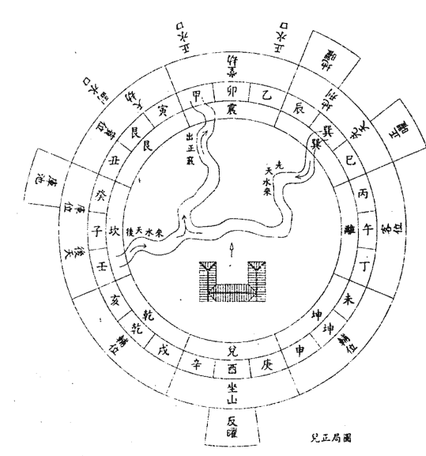

一、每卦皆以自然形局爲佳，室內格局只收過堂水，另一條爲假先後天水，維持不破即可。就算不在正位，也不可反流。

#### (一)先天位：巽卦

(1)先天巽水來過堂，會大旺人丁，出清秀才子。（兌1）

(2)巽水來，會合坎水歸震而去，主大發巨富、科甲綿遠，這叫做財丁齊備。（兌1）

(3)收先天水來，也會喜歡賭博，從事投機生意。（兌1）

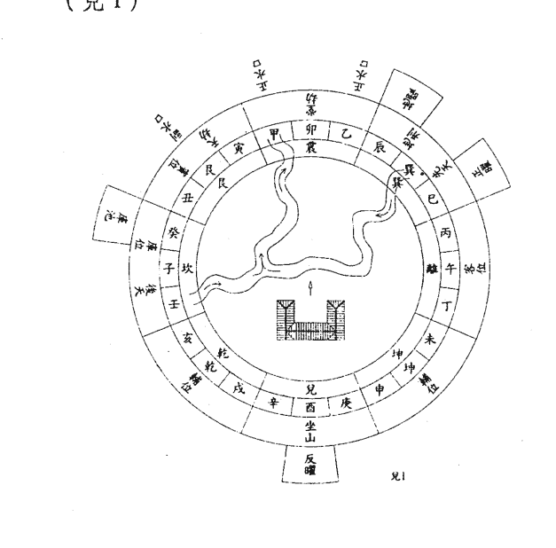

(1)後天坎水來過堂，雖能富有，卻是靠從事勞力、體力的工作致富。（兌2）

(2)坎水來過堂，坎的先天為坤，而先天巽方的後天亦為坤，所以此局是女人當權，女性較強勢。（兌2）

(3)巽水來會合坎水，歸離而轉坤去，叫做坤破輔卦，則難免破漏洩財，故初運發財丁，久後漸漸變差。（兌2）

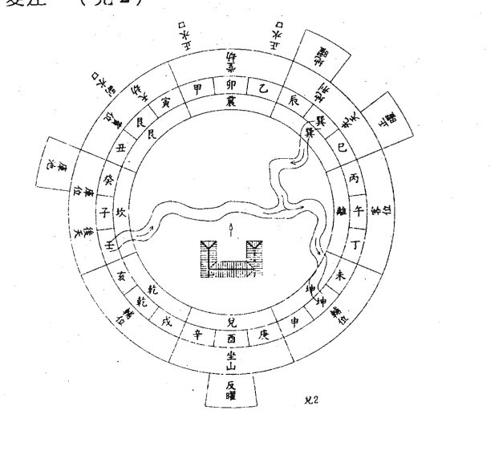

(1)後天（坎卦）水來，雖能富有，卻是靠從事勞力、體力的工作致富。（兌3）

(2)坎水過堂，且巽水來合局，代表財丁貴齊全，且讀書考試成績優異。（兌3）

(3)坎卦水來而先天水亦來，最宜出甲口或放艮口則大吉，讀書考試成績優異，擔任公職可以做到很高的官階。（兌3）

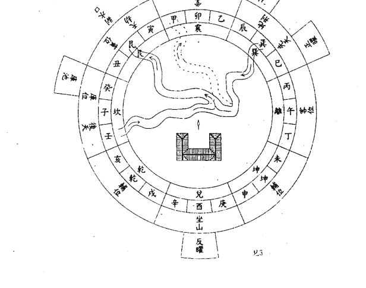

(1)巽水來而艮水去，雖是正局，但是吉中藏凶，會有不孝順且叛逆父母的兒女。（兌4）

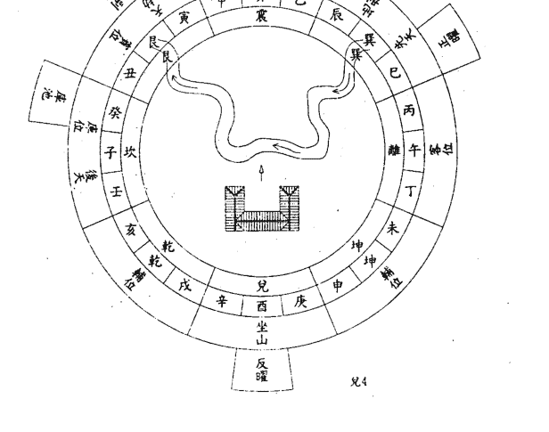

(1)巽水來而歸乾方去，主發富貴。但長房若想擔任公職則不太容易。（兌5）

(1)巽水來而坎方去，這是先天破後天，大凶。婦人有可能因難產而死亡，久後家中人口漸少而凋零、退敗，也可能會再娶。（兌6）

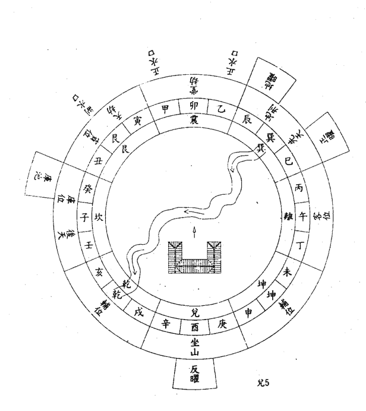

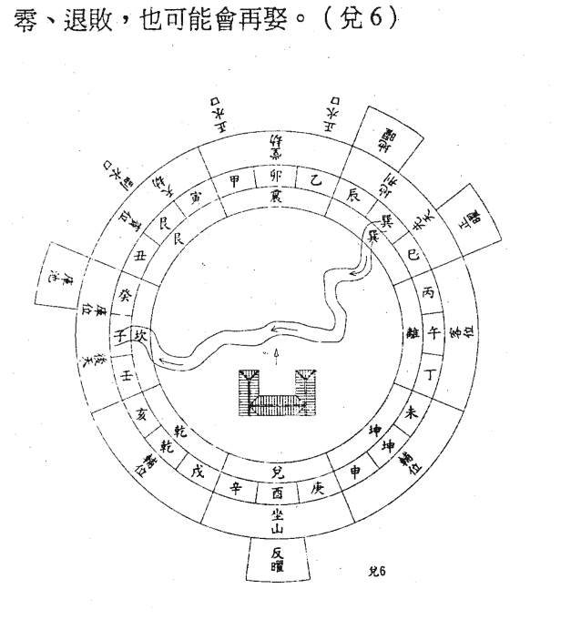

#### (二)後天位：坎卦

(1)忌坎水來而流向坤方去，這叫做消亡敗絕，大凶。收此水過堂，久後退敗。（兌7）

(2)每卦坎方氣最冷散，會使身體多病，若坎方有遮掩，反成奇特吉格。（兌7）

(3)兌震兩卦，如坎方流破，則代表女性會有血崩、虛損之疾。（兌7）

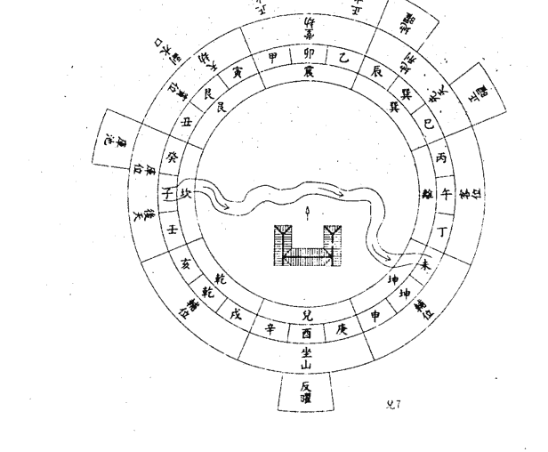

(1)坎水來，走破巽方而去，女人會成寡婦，男孩易受損傷而夭折，而且叛逆不孝。（兌8）

- 1.出辰：敗二房。
- 2.出巽：敗長房。
- 3.出巳：敗三房。

(2)坎水來，以木城水形歸去（離），亦大吉，即歸客方去，稱為借竅局。（兌8）

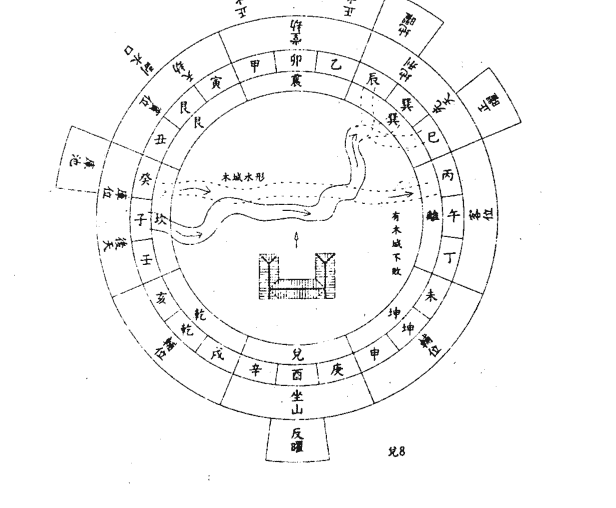

(1)坎震水同來，宜在巽方形成三叉水口，流向離方，再轉坤方而去，亦吉，則財丁兩旺，四一同宮，科甲連綿。（兌9）

(2)每卦之流水，若無四生一氣，十字天心，則進貴受凶。（兌9）

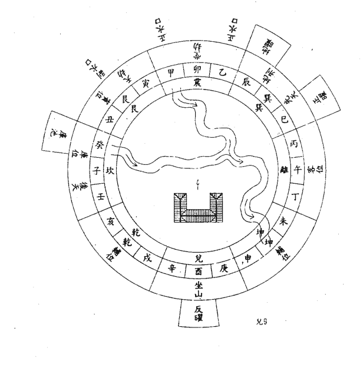

#### (三)地刑位：巽卦

又是先天位，故水可來

一、巽卦為兌卦之地刑位，故不宜有形煞，否則逢太歲沖動會有凶事發生。

#### (四)天劫位：艮卦

又是賓位，故水不可來

一、艮卦為兌卦之天劫位及賓位。

- (1)有水流來，主病疾、夭折。
- (2)艮山有水來，代表胃不好。艮方有凹坑，則眼睛有病。
- (3)艮山有水來又兼流破，則會胃出血、吐血、見血光。
- (4)此方開門，有被刀所傷的災難。
- (5)有樹木，主筋骨酸痛。
- (6)有堅硬物形成尖角者，為硬劫，主咳嗽之疾。
- (7)有柔軟物形成尖角者，為軟劫，主生病，其發生之病症，依其五行剋應而斷，大都能正確判斷出來。

二、大凡，天劫、曜煞方之水，不宜流來。

- (1)主出精神異常、喀血之人。
- (2)時間一久，也能殺損人口。

三、收寅水，而流破後天位，且屋後又有大水溝切斷了龍脈，則會有再婚之事。（牛母帶子）

四、若是收先後天水，又兼收艮水來，這叫做化煞為權，反而是一種奇特的吉格。

五、收丑水來，主逃學、逃兵、刀兵。

- (1)甲卯方，有路來沖，主木石壓亡。（兌10）
- (2)甲路來，主惡死。（兌10）
- (3)卯路來，如繩索，或卯方有丁字路，則會有年輕女子上吊自殺。（兌10）
- (4)卯、巳路沖來，也是會有年輕女子上吊自殺。（兌10）

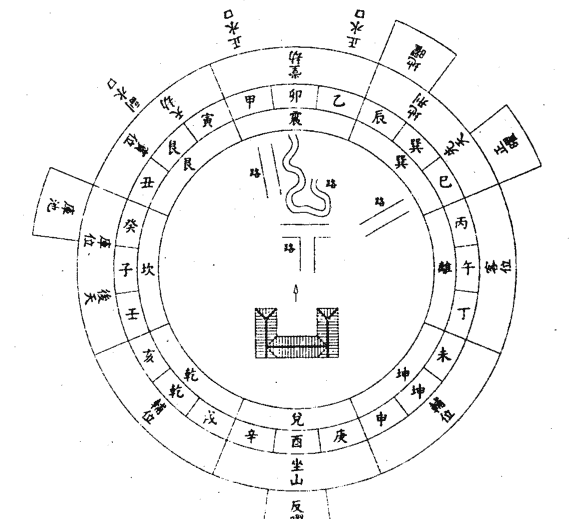

(1)寅甲水來，會有很久都治不好的疾病，以及跛癱、駝背等病症。（兌11）

(2)丑水來，表示有很久都治不好的疾病。（兌11）

(3)辰方為曜，有水來、路沖來，則會有年輕男子上吊自殺。（兌11）

(4)辰方水來：

- 1. 而堂前帶劫，就會出精神異常，有幻覺妄想症之人。
- 2. 堂前未帶劫，未必言凶。（兌11）

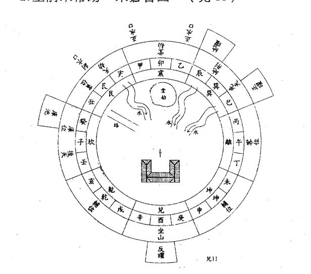

(1)堂前無劫，祇有辰巳二方有細長的孤木沖天高聳，則會出精神異常，有幻覺妄想症之人。（兌12）

(2)辰水，巳劫，均會出精神異常人。（兌12）

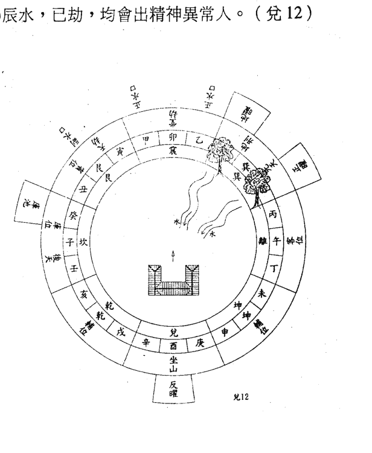

#### (五)賓位：艮卦

又為天劫位故不可有形煞

一、艮卦是兌卦之賓位，及借天劫位。

(1)故此方之水，為不吉之水，不宜流來，否則主病疾、夭折。

#### (六)客位：離卦

一、離卦為兌卦之客位

(1)客位（離）之水，不宜收來，主不吉，會多生女孩。

(2)若收客位（離）之水流向先天（巽山）位去，則會多生女孩，少生男孩。但女兒招贅則能生男孩，因賓、客之水，乃助女、旺婿之應。

(1)艮卦水來，而歸巽去，這叫做忤逆水（反弓水），主出悖逆之人，家庭失和，兄弟感情不好，各自分離，很少聯絡。（兌13）

(2)若艮卦水來，而地大、局大，亦可獲福。（兌13）

(3)丑寅二方，若高壓，則有官司訴訟的麻煩事。（兌13）

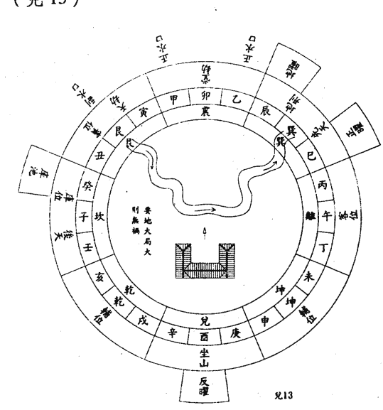

(1)收賓、客水來而轉爲先後天水過堂爲吉，再會合先後天水，而出案劫。
※賓客助主，最爲強。（兌14）

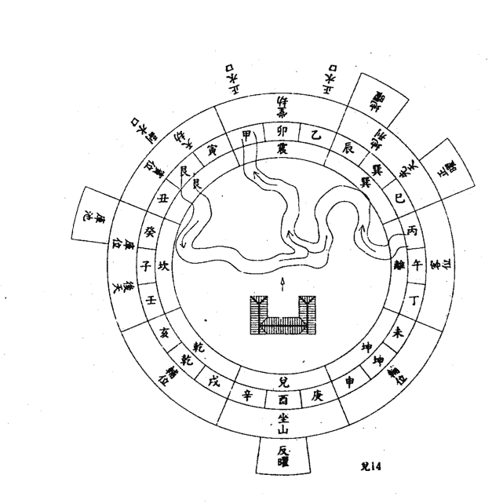

(1)忌艮水來，而歸乾水去，這叫做消亡、敗絕，大凶。收此水過堂，時間一久必然家運退敗。（兌15）
(2)遇到先後天被流破的情況，宜栽竹、築牆來遮障，則能無礙。（兌15）
(3)艮來水，會有吐血、癆疾之病症。大凶。（兌15）
(4)丑水來，會被刀刃殺傷，或上吊自殺，意外橫死不得善終。（兌15）
(5)寅水來，主惡死、血症而亡。（兌15）
(6)艮方有深坑，主盲目、或青光眼。（兌15）

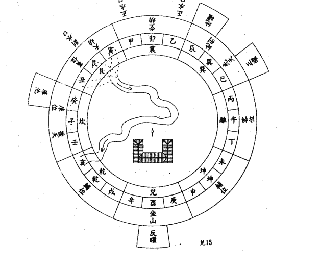

#### (七)輔卦位：乾卦

一、乾卦為兌卦之輔卦位。

(1)若輔卦位（乾卦）失力則失去輔助之貴人也。

假如輔卦方（乾卦）失陷，或水倒流輔卦（乾卦）而出，則是輔卦失力也。此時，若有劫來侵射，則家人生病，醫來醫去總是治不好，而且事業方面也沒有能夠輔助支援的人。

(2)輔卦（乾卦）方堅固有力，則貴人有力也。

若輔卦（乾卦）水流過來會合先後天水，從正竅（甲山）流出，則輔卦（乾卦）堅固。

二、輔卦之力：

(1)助吉星：則全家發福，故助善亦善。

(2)助凶星：則凶星之力愈猛，住家被破壞衰敗的速度也愈快，所以助凶則凶。

#### (八)輔卦位：坤卦

一、坤卦亦為兌卦之輔卦位。

(1)坤水來，而歸坎去，這叫做消亡、敗絕，大凶，故收此水過堂，時間一久必然家運退敗。（兌16）

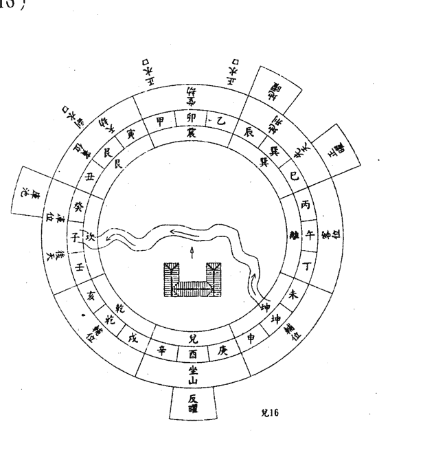

#### (九)庫位：坎卦

庫池：癸山

- 一、癸山為兌卦之庫池位。
- 二、兌卦，若收客位（丙、丁）之水過堂，出癸山方而去，此癸山方須有聚庫為宜，且此聚庫須有路為欄，作為庫帶方佳。
- 三、庫池須論房位。

#### (十)案堂：震卦

- 一、內埕水，流向甲山方位出口，這是內局之正法。
- 二、外局宜流向甲山方位出口，為兌卦第一水口，主房房大發鉅富、旺人丁。
- 三、剪刀屋、勾6屋不可住，這叫做斷頭煞，易出車禍，惡死。（五間內最驗）
- 四、震位有劫來傷（有礙即是），會得肝病，足部受傷。
- 五、丑、卯水稱為刑戮水。
- 六、坐空朝滿，前途坎坷。

(1)卯水來，名曰咸池水、桃花煞水。代表女人淫亂、男人夭折、見血光。（兌17）

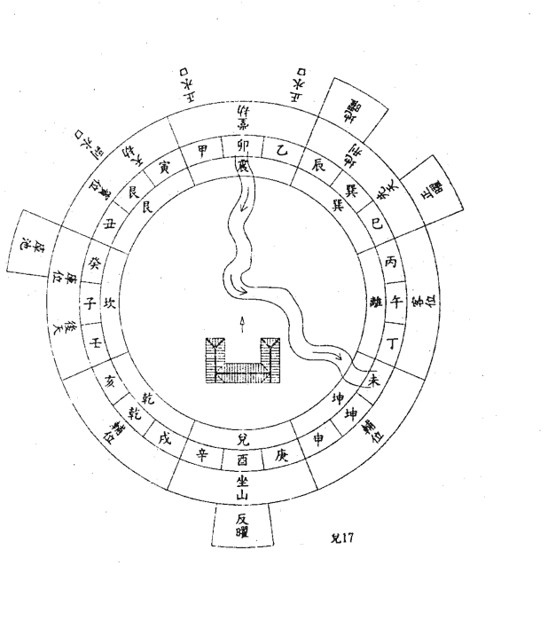

(1)堂劫水來，會使人患心臟病，可能會有暴斃的情況發生。（兌18）

(2)震水來，而坎方去，家中男人可能會因妻子過世而再娶，且因淫亂而大敗。

- 1.若坎方有大池塘者，反為巨富，但雖富、貴，而凶死亦難逃定數。（兌18）

(1)卯、酉水來，而歸離卦之午方而去，此種情況稱為遊魂桃花。代表女人淫亂跟人私奔。所以就算平時是道德品性不錯的良家婦女，也會禁不起誘惑而發生外遇事件。（兌19）

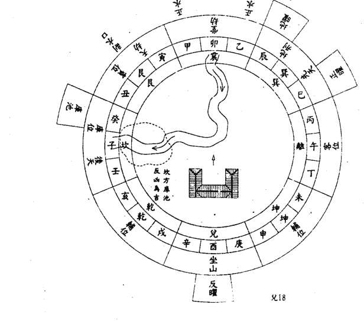

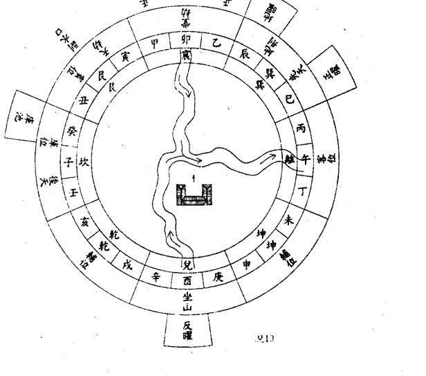

(1)震水來而歸巽去，叫做破先天，小兒或年輕人易死亡。外局若破先天，則會因沒有男孩而收養子，最後仍然敗絕。（兌20）

- 1. 甲方路來：主惡死。
- 2. 卯方路來，如繩索，或丁字路來，則有年輕女孩上吊自殺，或被木、石壓死。

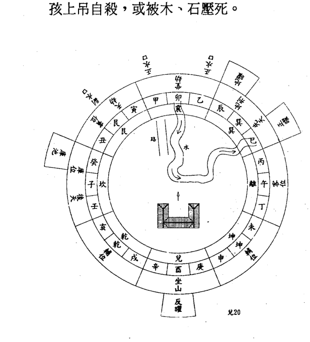

#### (十一)正曜（巳）

一、巳為正曜與地刑位，故此方有樹木，主心臟病。

二、巳方：

- (1)有丁字路，則有年輕女孩上吊自殺。
- (2)開門出入，主車禍。
- (3)有十字路，應急症之糖尿病。
- (4)有凹風，主頭痛、小兒麻痺。
- (5)有樹木，則人易有所謂的靈媒體質。

#### (十二)反曜（酉）

一、西方：

- (1)有樹木，則人易有所謂的靈媒體質。若再兼地曜（辰）有孤木來應，則會出現精神異常，有幻覺妄想症之人。
- (2)有樹木（孤）及天劫方（艮卦）有樹木高聳，會有頭部、腦部的疾病，久則會精神錯亂。
- (3)有水塔位於高處，主長房頭部受傷。
- (4)有路來（後面），主頻盜家財。
- (5)西方若有水來或有孤木，主出無恥之人，桃花癲。

#### (十三)地曜（辰）

一、辰方，為地曜與地刑位，故此方有樹木，主肝疾。

二、辰方（地曜）與巳方（正曜）皆有樹木，會出現瘋狂精神錯亂的人。

三、辰方：

- (1)有丁字路，則會有年輕男性自殺。
- (2)為天牢星，有建物高壓，或有屋角侵射，均會有官司訴訟之事。
- (3)有路來，主橫死。
- (4)開門，主車禍。
- (5)有樹木，則人易有所謂的靈媒體質，例如乩童。或者會有筋骨疼痛的毛病。
- (6)有凹風，主敗財、損丁之應。

#### (十四)兌卦（庚酉辛三山）之正曜在巳山

一、庚山甲向

- 1.若見正方水路，巳酉丑年蛇入屋。
- 2.巳方：
  - ①路高，蛇半壁。
  - ②石高，蛇上樑。
  - ③高聳，生紅紋。
- 3.惟有獨樹入家庭。
  - ①左邊有樹，左邊發。
  - ②右邊有樹，右邊興。
  - ③前後有樹，前後生。
- 4.塘中水影，宜分別。
  - ①後頭有閉，黑嘴喙。
  - ②前面陰影，生白。

二、酉山卯向

- 1.酉山巳水：
  - ①定充軍（殺賊），生生死死不脫續。（即兄不見弟）
  - ②在右見閉，因養死。
  - ③蛇入窩灶，定然有。
  - ④官司破財，人丁損。
  - ⑤少年之人，死後凶。

三、辛山乙向

- 1.巳水：
  - ①美貌濃。
  - ②男孤、女寡，定然凶。
- 2.巳方：
  - ①有墩，出僧道。
  - ②水、路同來，蛇必逢。
  - ③路去：
    - Ⅰ、主逃走。
    - Ⅱ、男女隨人跟無蹤。

### 兌卦陰宅：墓內斷法

地刑位：巽卦（辰、巽、巳）

一、辰山：為兌卦之地曜位。

(1)有凹風，主翻棺，敗財、損丁之應。

## 坤卦

### 坤卦總論

#### (一)坤卦先後天之相互關係

先天坤卦相通於後天坎卦。
後天坤卦相通於先天巽卦。

#### (二)坤之意象

- 一、為柄：萬物托生的根本，像柄。
  - 1.如坤在下，而承物於上為柄，且坤成「德之權柄」也。
  - 2.人持物則為柄。
    - A.代表能握有權柄。或有貴人、靠山。
- 二、病象：
  - 1.不孕症、子宮、生殖系統之疾。
  - 2.排泄系統、泌尿系統之疾。
  - 3.胃腸疾患、胃腸消化系統之疾、下痢、下血、肥滿症、胰臟病、糖尿病。
  - 4.精氣虛脫、過勞、羸弱。
  - 5.造血功能障礙（白血病），冷、寒之症。

#### (三)坤山論

- 坤山兌輔，酉地靈。
- 乾賓坎先，與地刑。
- 甲竅震劫，客入曜。
- 反辰巽後，庫池精。
- 卯鑑女子，痼疾寅。
- 甲水殘疾，盜殺刑。
- 自吊木石，陣地殺。
- 丑兵艮坑，致盲睛。

### 坤卦各方位分析

正局全圖

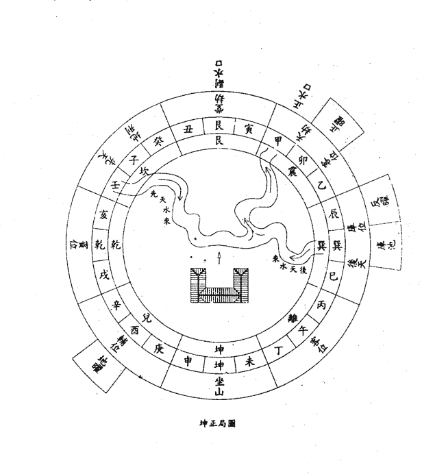

#### (一)先天位：坎卦

##### 又為地刑位，故不可有形煞

一、坎卦為坤卦之先天位，主出丁之氣。

- (1)先天（坎卦）水，不到堂前，主不旺丁。
- (2)水流破先天（坎卦）位，則必定會損傷幼丁，或傷人口。
- (3)外局流破先天（坎卦）位、或內外局流破先天（坎卦）位，代表沒有後代。
- (4)收先天（坎卦）水來，又收後天（巽卦）水到，從甲山或艮山口流出，為最上妙也。
- (5)先天（坎卦）位，被水流破。宜栽竹、築屋、牆、或培土遮水口，不見水去則無礙。

二、若收先天子癸水來，則男人好賭又愛花天酒地，叫做風聲水。

三、收先天（坎卦）水來，先天位又有大池塘，則代代出賢人。

(1)收後天（巽卦）水來，會合坎水（先天）而出震，叫做忤逆水，又稱為反跳水。雖然水出震方是大吉，會大發富貴、財丁並旺。卻難免有不孝順且叛逆父母的子女。（坤1）

(1)收後天（巽卦）水來，會先天（坎卦）水而出艮，大吉。（坤2）
- 1.雖能富有，卻是靠從事勞力、體力性質的工作致富。四一同宮，科甲綿遠，大發富貴。
- 2.長、次房，皆吉。

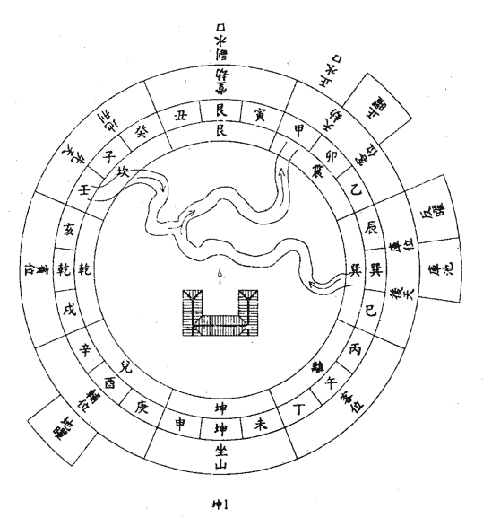

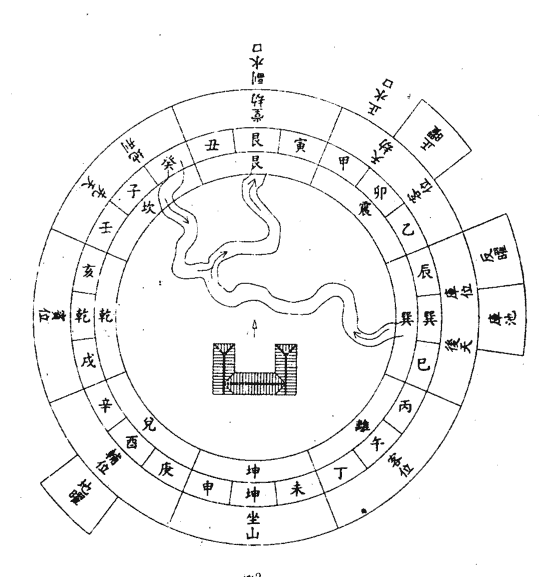

(1)同下例。（坤3）

(1)先天（坎卦）水來，能夠大旺人丁，次房大發。（坤4）

(2)先天（坎卦）水來，後天（巽卦）水亦來，而聚會於明堂，這叫做四一同宮，準科名之顯，為先後天全備之局，必能大發富貴，科甲綿綿。（坤4）

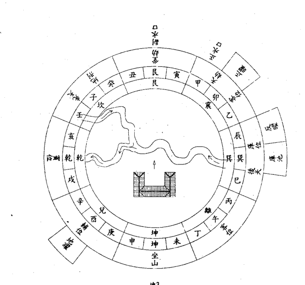

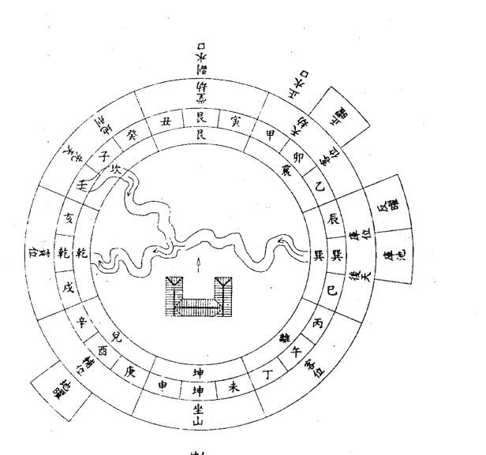

230 乾坤國寶龍門入局圖解上

龍門入局各卦水法詳論 231

(1)收後天（巽卦）而會先天（坎卦），再歸賓位（乾卦）而去，代表著富貴雙全。（坤5）

(1)收輔卦水（兌）過堂，會後天（巽）水及客水（離），再會先天（坎）水而歸賓位（乾），代表富、貴雙全。（坤6）

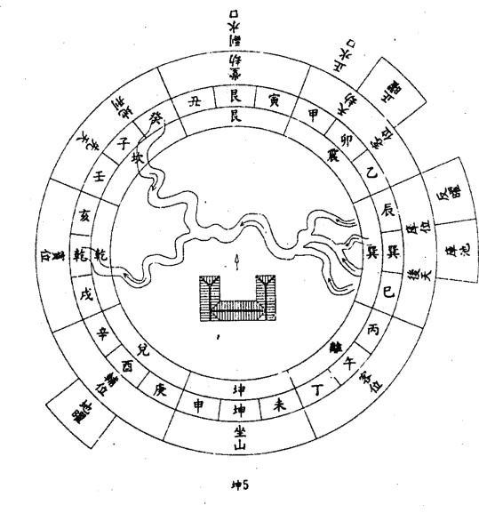

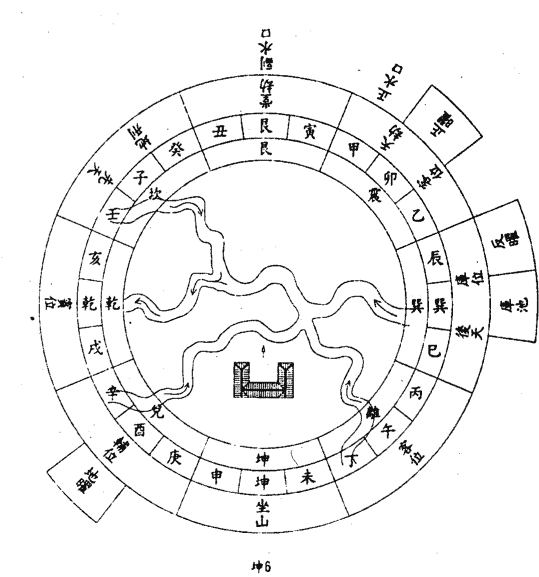

(1)收後天（巽卦）會先天（坎卦），再歸輔卦位（兌卦）而出，這種情況是先發富貴，時間一久則漸漸衰敗。（坤7）

(1)震水（客位）來會坎水（先天）而出巽（後天），這叫做後天流破。
- 1.初運，大發富貴。
- 2.卻仍會代代窮。
- 3.地運、流年行到水口，難免家中婦女會因難產而死，因此有再娶妻之事，也會破財。（坤8）

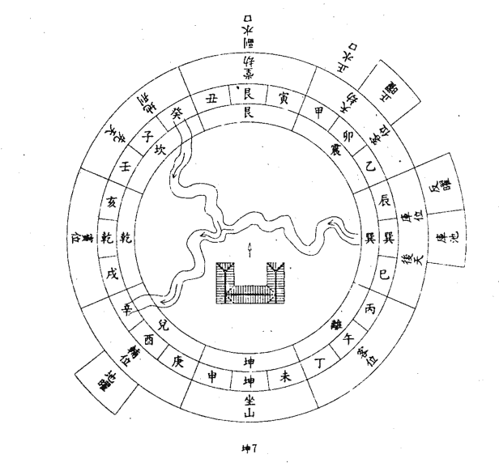

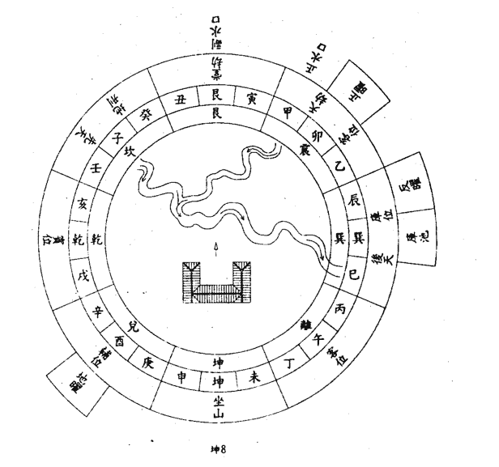

(1)先天、賓、輔會成賓水過堂，再會客水（離卦）而歸客位（震卦）而去。代表會得到外在的幫助而成功。（坤9）

(1)同上例。（坤10）

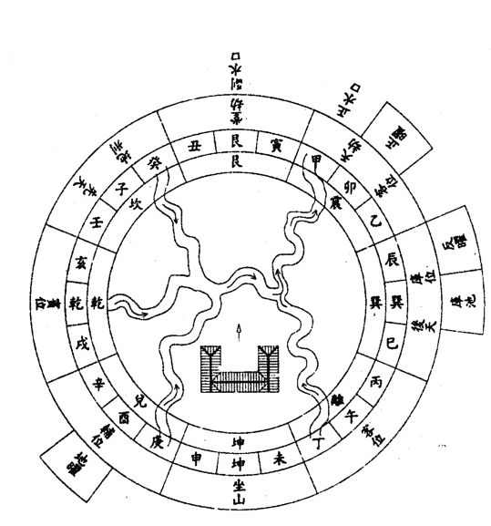

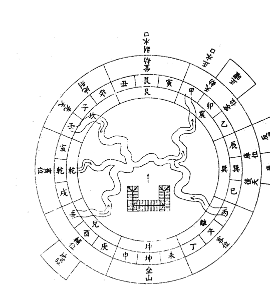

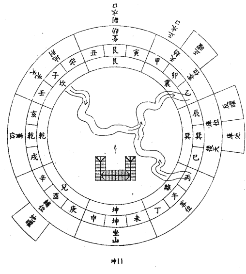

#### (二)後天位：巽卦
又為庫池位

一、巽卦為坤卦之後天位，主發財之氣。

(1)若收後天（巽卦）水流過來上堂。

- 1.地大、水大，主發富，其富比石崇。
- 2.地小、水小，也能富有，卻是靠從事勞力、體力的工作致富，或因妻致富。
- 3.若有此水，主必有賢富，出內助之人。
- 4.若庫池深注清明，則妻子的娘家有財有勢，庫池近則娘家近，庫池遠則娘家遠。

(2)水若流向辰巽巳方去，則水流出之山向，其所代表之房份會人口漸少而凋零，也會破財。

- 1.辰山較嚴重。
- 2.尤其未山須注意。

二、巽卦方（後天位）高聳，表示家中婦女地位較高，可當作一家之主來看待。

(1)收後天（巽卦）水過堂而從乾方（寶位）流去，表示能夠財旺，但子女卻不多。（坤12）

(1)收後天（巽卦）水過堂而從先天（坎卦）位流去，叫做破先天，大損壯丁。（坤13）

- 1. 出壬，敗次房。
- 2. 出子，敗長房。
- 3. 出癸，敗三房。

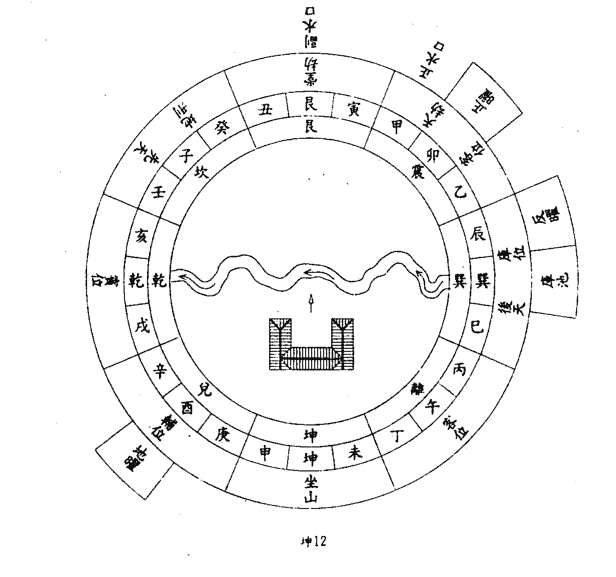

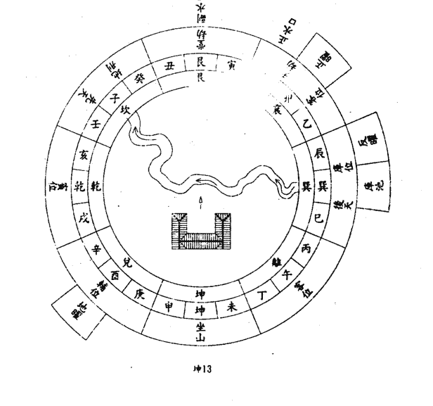

#### (三)賓位：乾卦

一、乾卦為坤卦之賓位。

+   (1)收賓客之水過堂，去流破先後天方。
1. 主利客、不利主。
2. 女性人口較多。
3. 其家主人，住久之後會敗財。

+   (2)賓客之水收來，是只發女口之法。此種格局會多生女孩、少生男孩。可能只得一個男孩來傳宗接代。

#### (四)客位：震卦

又為天劫位，故不可有形煞

一、震卦為坤卦之客位。

+   (1)若客位（震卦）水流來而有沖射的現象，因客位與天劫位重疊，所以次房必有人生病吐血，甚至絕人丁也。

+   (1)收客水（離卦）來而先天（坎卦）位去，叫做破先天。
1. 會使外家姓之子孫繁榮昌盛，出賢女婿與賢外甥。
2. 主人本家姓氏這一方人口漸漸稀少凋零而退敗。（坤 16）

+   (2)收客水（離卦）來而後天（巽卦）位去，叫做破後天，凶性同上。（坤 16）

#### (五)地刑位：坎卦

又爲先天位，故不可流破

一、坎卦爲坤卦之地刑位。地刑，又稱爲「補藥湯」，大部份皆配在先天或後天之位上。

+   (1)地刑方之水若流來，能扶元神、助龍身，大吉之兆。
(2)忌有粗糙惡劣的形煞之物，主傷婦人，故不利。
(3)有尖硬之角沖射，則家中婦女的腹部會受刀傷或有開刀之狀況發生。
(4)如果有樹木沖天而起，高聳壓迫者，皆應在女人。
1. 會有頭痛的毛病。
2. 也會常犯頭暈昏亂的毛病。

#### (六)天劫位：震卦

又爲客位

一、震卦爲坤卦之天劫位。

+   (1)若天劫（震卦）水流來而有沖射的現象，代表次房必有人生病吐血，甚至絕人丁也。
(2)若收甲水來，會有人意外死亡。若同時有先天後天水合局，則會受到嚴重的意外傷害，即俗語所說「不死也剩半條命」。
(3)若甲劫傷來，
1. 個性思想上會比較消沉、悲觀，容易上吊自殺。
2. 也會偏好宗教、玄學五術等事務。
3. 身體容易慢慢呈現彎腰駝背的體態。
(4)若收卯水來，叫做遊魂桃花水，則妻子可能會不守婦道。

二、天劫方（震）若樹木多則易犯陰症。

(1)震水來而歸艮去，叫做消亡、敗絕。時間一久則會人口稀少凋零，家運退敗。（坤 17）

(1)客水（震卦）來而從先天（坎卦）位去，稱為忤逆水，又破先天與地刑。
1. 代表子孫判逆不孝順，且婦女身體不健康。
2. 也表示會有人得吐血、癆疾，不得善終而死。（坤 18）

(1)震水來而歸乾方去，則敗長房。（坤 19）

(1)震卦水來，叫做天劫水，代表大凶。會有人得吐血、癆疾等病。（坤 20）

+   1. 甲水來，有人會上吊死亡，或被木石壓死。家中會發生靈異鬼怪的現象。
2. 若寅甲水來，會患長期都治不好的病，或是有殘廢、駝背等情況。
3. 卯水來而辰方有樹木，或有水來，就會出精神異常，有幻覺妄想症之人。
4. 卯水來，又有路沖，則必定有人上吊而死。
5. 卯水來，代表刑戮、盜殺與枉死。
6. 卯方有樹木與古松者，這種情況更明顯，主陰症難當。
7. 尤其卯水來，又叫做桃花水，代表婦女淫亂。
8. 卯水來，子方去，則家中婦女可能發生亂倫之事，雖然是品德很好的良家婦女，也會因為禁不起誘惑而發生外遇事件。
9. 明堂帶劫，也會出瘋狂之人。

#### (七)輔卦：兌卦

一、兌卦為坤卦之輔卦位。

+   (1)若水從先後天方流來，再會合輔卦水而出正竅，即吉上加吉。稱為貴人水，出外有貴人幫助。
(2)若收輔位之水流破先、後天位，則損丁，或敗財。此乃輔卦幫助凶星之故。

#### (八)庫位：巽卦又為後天位，故不可流破
庫池：巽山

一、巽卦為坤卦之庫位。

+   (1)若收輔卦（兌卦）之水朝來，流向巽山而去，若巽方有深廣的大池塘。
1. 主發財富。故庫池愈大愈深，則所發之財愈大愈久。
2. 但初運平平，到後運才會大吉。
(2)若他方之水來流破後天位，而歸入巽方庫池，則會先敗後發。

#### (九)案堂位：艮卦

(1)堂劫在艮，若艮方有深坑，代表有人目盲。（坤21）

(2)艮水冲来而明堂带劫（尤其是丑艮二方），代表男孩或女孩很小就死亡（以男孩为主），若有凹风，或巷路则更验。也会发生车祸、堕胎等事情。（坤21）

(3)艮方有高压杂物，表示身体多病痛。（坤21）

(4)丑水来，称为恶死水，会患长期都治不好的病，或因心脏病暴毙，代表死于非命的情况。（坤21）

(5)丑位有门，或有路，高压，主牢狱之灾。丑位有山像锁犯人的刑具，有路弯曲如绳索，也主牢狱之灾。（坤21）

(6)有丁字路出现在卯丑二方，则会有年轻人上吊死亡。（坤21）

(1)艮卦水來而巽卦去，稱為破後天。（坤 22）

+   1. 代表婦人難產死亡，或咯血癆疾、暴斃。
2. 又代表男人會成為尋芳問柳之客，喜歡留連於花街柳巷，而且不論貧富都一樣。
3. 命中註定會再婚。
4. 長房大凶。
5. 雖初運發財，地運行到則大敗。

(2)若明堂的形狀有斜角，則父親會早死，而母親長壽，由母親來當家坐鎮。

(3)明堂有凹風，會患頭痛之症，若曜煞方有形煞之物來相應，就會出現精神異常，有幻覺妄想症之人。

(1)艮水來而因射坎方，主暴斃，次房大凶。（坤23）
(2)艮水來而震方去，這是消亡敗絕水，故此水過堂，久後人口稀少凋零、家運退敗、沒有後代子孫，長、三房大凶。（坤23）

(1)艮水來而歸乾去，或乾水來而歸艮去，叫做消亡、敗絕水，大凶。收此水過堂，久後人口稀少凋零、家運退敗（坤24）。

#### (十)正 曜 (卯)

一、卯方：

+   (1)有水流來，則家中有人是屬於靈媒體質。例如乩童。
(2)有路來，且形態狹長如同繩子，則有人會上吊自殺。
(3)開門，則會有血光之災。若兼有路沖來，則代表會遭橫死。
(4)有凹風，主頭痛。
(5)有大水流來，代表會被利器如刀刃所傷，或被盜賊所殺。
(6)水或路沖：代表有年輕女性上吊自殺，婦女淫亂，男人夭折、癆疾。

二、曜煞方若有廟宇，易犯陰症，可能會生出智能不足的孩子，常做惡夢，家中有人會具有靈媒體質，甚至出現精神異常，幻覺妄想之症。大約半年左右就會陸續出現種種怪異的狀況。

三、居家附近若有人動土，則看其所屬卦位判斷發生何事。例如明堂位動土，則手腳部位會出問題。

#### (十)反 曜 (辰)

一、辰方：

+   (1)有水流去，表示家中婦女身體有病，而且會傷人丁。
(2)有水流來，兼卯方（正曜）有樹木，或路，或堅硬之物造成的形煞，則會出瘋狂、精神異常之人。
(3)中空，兩邊有大樹或建物，稱爲犯風曜，大多會使婦女患頭痛之病，久後神經錯亂。水局好者，有貴人，但也可能有人會得中風。
(4)有圓環，或有路沖來，主車禍。
(5)有樹木，則有人會具有靈媒體質，也有人會患筋骨酸痛的毛病。
(6)有堅硬之物造成的形煞，主車禍、傷害。
(7)有建物高壓，或有屋角侵射，則會跟人打官司。
(8)有尖角似刀形，主開刀動手術。
(9)有路燈，或紅綠燈，主眼疾。
(10)有水沖來，或有路，主出啞吧之人。
(11)收乙辰水來，又稱為瘟水，會使人得流行性的疾病。

#### (二)地 曜 (酉)

一、西方：

+   (1)有樹木：
1. 會有筋骨方面的疾病。
2. 而且也容易產生頭昏之症。

(2)有凹風貫入，主頭痛、頭風。

(3)有孤木來應，則有人會具有靈媒體質例如乩童。再兼反曜（辰）方有劫煞來相應者，就會出現精神異常，有幻覺妄想症之人。

#### (三)坤卦（未坤申三山）之正曜在卯山

一、未山丑向

+   1. 未山卯水，定雷傷。
2. 若見乙卯，癲跛子。

### 3.乙卯雙行：

+   ①非繼贅。
②水約十丈，滅絕亡。

### 4.損着甲卯：

+   ①出①出癲狂。
②頂級命案，分多少。
③賭錢之人，破家亡。

5.卯方高聳，形似木。
三年兩載，損少亡。

### 二、坤山艮向

+   1. 坤山卯水，多剋妻。

### 2.卯乙混溶：

+   ①斷不移。
②若然聽着齏碓磨，水擣金聲一樣因，春木沒火分年運，世說鎖後帶鎖器。

3.門前，樹木並石柱。
寡婦招郎，當頭日。
紅水漂漂，禍不移。
一傷案，削髮案。
雖然秀士，帶鎖枷。
神仙妙藥，也難醫。

### 三、申山寅向

+   1. 申龍卯向，定不良。
2. 申山卯水，右不祥。
   ①刑妻剋子，人難免。
   ②黃腫癲疾，定必亡。
3. 若見乙卯同來者，定然剋妻三五年。
4. 卯方，若然有大石：
   ①盲目之人定見殃。
   ②盲目皆因三房出。
   ③弄猴禍人出一場。
5. 百福，皆因卯水出。
吉凶禍福，在此詳。

## 艮 卦

### 艮卦總論

#### (一)艮卦先後天之相互關係

先天艮卦相通於後天乾卦。
後天艮卦相通於先天震卦。

#### (二)艮之意象

+   一、為指：
   1. 指，是人之手指。喻手掌易受傷。
二、病象：
   1. 虛弱、血行不順、脈沈伏、痲痺症、造血功能降低、身體不適。
   2. 肩凝、筋骨酸痛、手指之疾、股疾、脊椎神經、坐骨神經。
   3. 食滯，脾胃之疾。
   4. 手太陽症。
   5. 中毒。
   6. 皮膚病。
   7. 癭腫。

#### (三)艮山論

艮山八寅，震後天。
巽客離劫，午曜煞。
坤竅地申，兌刑輔。
乾先庫池，坎賓連。
午主男緡，囹圄鎖。
午申陣戮，盜殺愆。
丙午淫慾，未來鬼。
支曜丁路，枉死局。

### 艮卦各方位分析
正局全圖

#### (-)先天位：乾卦又是庫池位

一、乾卦為艮卦之先天位，主出丁之氣。

+   (1)先天（乾卦）水不到堂前，主不旺丁。
(2)如先天（乾卦）水不到堂，他方之水反流乾卦位出。
1. 若為內局，則會損傷年幼的男孩（十六歲以下）。
2. 若為外局，則會損傷成年男性甚至夭折（五十歲以下）。
(3)內局外局直流先天位而出，皆被流破者，表示將會沒有後代子孫。

二、艮卦又叫做刀卦。會出所謂的三刀之人，即醫生、流氓、屠宰業者，因為這些人是會使用到刀的。

+   (1)若收先後天水來，稱為高級刀，即醫生、司法官、軍官等等。
(2)若先後天被流破，則稱為下級刀，即流氓、屠夫等人。

三、坐艮卦，則其人性格上比較有魄力，行事果斷強硬，但可能難免心狠手辣。

四、每卦：

+   (1)若收後天水破先天位，則會損傷丈夫和兒子，嚴重者會死亡。
(2)若是收先天水破後天位，則會破財、貧窮，而且體弱多病，常常在吃藥，稱為窮秀才之格。如果又兼收天劫水來，則其人有才華卻用在邪途，作姦犯科，專做損人利己之事。

(1)收乾（先天）水過堂，會艮水而從地刑（兌）位流去，爲吉。（艮1）

(1)乾（先天）水來而歸巽（客）方去，這不是正水口，而且如果從辰、巳兩個方位流出，當遇到太歲來沖刑時，必然退敗，但右畔若有遮障則無礙。（艮2）

+   1. 當水轉向兌方時，若收天劫（離）水入，這叫做天劫倒收轉。
2. 當水轉向兌方時，若收震卦之乙方水，這叫做破後天倒收轉。

+   1. 長房先發富貴而後退敗。
2. 次房先退敗而後發富。

(1)乾水（先天）來而震水（後天）去，稱為外局破後天。（艮3）

+   1. 射破後天，妻財路空。
2. 婦人可能會因難產而死亡，所以會因妻子過世而再婚。
3. 長房退敗。

#### （二）後天位：震卦

一、震卦為艮卦之後天位，主發財之氣。

+   (1)後天（震卦）水流經堂前者，主大發財丁。
1. 如果是大江、大溪之水朝堂者，其發為大。
2. 如果是小澗、小溝朝堂者，則小發。
(2)後天（震卦）位，被水沖破，或被門路、樹木沖破，或高的石頭有尖角來沖射，會使家人多病，或破財，或損人口。
(3)水流破後天（震卦）位，或由後天（震卦）位而沖射堂前者，其水尖銳而無情，反應在身體上代表胃肝方面有病。
(4)後天（震卦）位有屋角、牆角、水泥池角、磨白石角高尺餘。也代表胃、肝方面有病。
(5)外局之後天（震卦）水不到堂，只有內局收短水來過堂者，代表會再婚，或是會有冥婚的狀況。
(6)後天（震卦）位鑿井，或者地勢下陷有坑洞，則可能患子宮下垂之症。
(7)水從外局後天位的地支方流出者，主流產。從內局後天位的地支方流出者，會有月經方面的病症。
(8)如收後天（震卦）及客位（巽卦）之水去流破先天（乾卦）位者。

+   1. 會有錢財但生不出男丁。
2. 若收養子才有男孩傳宗接代。因為這是收客水而旺客，破先天而衰主也。主人本家姓這一方（即兒子）會衰敗，女兒女婿這一方會興旺，或是外來的房客也能興旺，女兒若是招贅亦旺也。

(9)若收後天（震卦）水去流破客位（巽卦），且先天（乾卦）水亦朝來然後由巽方流出者。則能有財又有丁也。

(10)若收後天（震卦）水流至客位（巽卦），然後轉彎至案堂（坤卦），再轉彎流至賓位（坎卦）而出，此種情況下先天（乾卦）位有一種封固之氣，亦主財丁雙旺也。

(11)收後天水來，代表家中女性比較能幹，女人當權。

(1)震水（後天）來：

+   1. 從坤山方流出去，大吉，主發富貴。
2. 從申山方流出去，大凶，因申乃艮之曜殺故也。（艮4）

(1)後天（震卦）水來上堂，而歸巽（客）去，這叫做消亡敗絕，所以時間一久，左畔之人，伶仃退敗。（艮5）

(1)震水（後天）來而乾水（先天）去，叫做外局破先天。（艮6）
1. 代表孩子幼年時就死亡，就算多生但能養大的卻很少。流破先天，終將沒有後代。
2. 若乾方有大水池深廣如海，反為旺丁、旺財。
故震水來①長房發貴。
②次房又吉。

(1)震水（後天）來而兌水去（地刑），這叫做斜水過堂。（艮7）

+   1. 雖是後天水朝來會發富，但乃一水之斜，則必定會離官失職。
2. 而且沖破地刑，代表婦女身體不健康。

(1)乾（先天）、震（後天）水朝來，會合於明堂，稱為三元不敗之局，能使人富有，而且是鉅富，是從事比較費心思、動腦筋的工作而致富。（艮8）

+   1. 水放丁口：少男富貴。
   長房財丁。
   次房伶仃。
2. 水歸丙位：為艮納丙。次房大旺財丁。
   長房先凶後吉，先貧後富。
3. 水歸午宮：長房大發。但忌子、辰二年，次房損丁。

(2)乾水來而歸坤去，房房大發財丁，次房更吉。（艮8）

+   1. 水出申方，利少房。忌寅巳二年（刑、沖）主損人口。

(1)乾、震水來而從離方去，叫做消亡敗絕水。收此水過堂：

+   1. 時間一久，將人口稀少凋零，家運退敗。
2. 但初運，大發。（艮9）

#### （三）賓位：坎卦

一、坎卦為艮卦之賓位。

+   (1)收賓位（坎卦）水來過堂，出坤山正竅，則多外財，多貴人幫助。
(2)若收賓位（坎卦）水去流破後天（震卦）位，則會破財、損傷妻子。
(3)內局以不破先天為宜。若收賓、客水，而內外局去流破先天則會沒有後代子孫。

#### （四）客位：巽卦

一、巽卦為艮卦之客位。

+   (1)巽卦水流來，稱為客水朝堂。若客水朝堂而出正竅，則能得很多賓客的幫助。
(2)如引賓水（坎卦）去流破先天，或引客水（巽卦）去流破先天（乾卦）者，會使女性人口興旺，或發女婿，這叫做衰主、旺客之局。會使男性人口減少衰敗，但如果招贅則能旺丁、旺財。
(3)如果自己新建一棟房子而居住，則會衰敗，而買二手屋者會興旺。因引客水而興客也。

+   (4)若客水（巽卦）和先後天水同出正竅，則有客來助主的力量而為貴也。
(5)若收先後天水來，不可從巽卦流出，若出巽卦代表會先發而後敗，先甘而後苦。但是如果巽位有大池塘則不敗。

(1)巽水（客水）來：

1. 歸辛去（地刑）：（艮 10）

+   ①長房伶仃退敗。
②三房凶。
③次房平。

2. 歸坤去，是消亡、敗絕。（艮 10）

3. 歸乾去，叫做倒主蔭客地，男方本家姓氏的人口稀少衰敗，蔭女兒女婿外家姓子孫，可能要收養子來傳宗接代。（艮 10）

+   ①水流戌位：
Ⅰ、房房敗絕。
Ⅱ、次房尤烈。
②水流乾位：
Ⅰ、長房損丁、退敗。
Ⅱ、三房亦然。

#### (五)地刑：兌卦 又為輔卦位

一、兌卦為艮卦之地刑位。

- (1)內局由兌方出水穿透外局，且水之出入皆應。代表會再婚，或筋節之病痛。

- (2)地刑（兌卦）：
  1. 有樹：主婦人多病。
  2. 有屋角、井欄、高的石頭有尖角、門路、水泥池角、牆角成尖銳角度侵射者，主出血。
     ① 相當於胃部高度者，會有胃出血。
     ② 高聳者，則婦女有頭部、腦部的疾病。

二、一般而言，地刑位代表身體方面的狀況，天劫位則主陰症。

#### (六)天劫位：離卦

一、離卦為艮卦之天劫位。

- (1)有樹：
  1. 代表頭部的疾病。（陽木）
  2. 母樹，主陰症。（陰木）

- (2)有屋角、門路、外欄、高石角、石堆磚壁、水池銳角侵射者，主出血，如果相當於胃部高度有尖角侵射者主胃病。
  1. 相當於胃部上端高度者，出血由口。
  2. 相當於胃部下端高度者，出血由肛門。
  3. 在左方者，可能有肝病。
  4. 有角者，可能會有咳嗽之病。
  5. 屬於柔軟性質的物體形成尖角侵射者，主細病。

- (3)水來、路沖、一般尖角侵射銳利者，主勞傷，損人口之應。

- (4)有竹籬，則可能有出血、損丁之應。

- (5)天劫之水：
  1. 可出，出者平安。
  2. 不可入，入者為凶。有歌訣曰：
     > 天劫之水，最是凶。
     > 宅墳收來，不可當。
     > 家庭人口，瘟疫疾。
     > 兒孫代代，見血光。

二、一般認為寅申巳亥是風聲地，但在此卦則無影響，坐艮卦時只有丙方有劫才是風聲位。代表男性喜歡留戀於聲色場所，好賭，花天酒地。

- (1)天劫（離）水來而流向先天（乾）方去。（艮 11）
  1. 稱為因射先天。而外局破先天代表家中男性年紀輕輕就會死亡，大損壯丁。
  2. 又是消亡敗絕，大凶。收此水過堂，久後則人口稀少凋零，家運退敗。

- (2)離水來而申方帶劫，就會出精神異常，有幻覺妄想症之人。（艮 11）

- (1)天劫（離）水來而地刑（兌）去，這叫做忤逆水。（艮 12）
  1. 子女不孝順，叛逆父母。
  2. 又忌丙水來，主男女淫亂。
  3. 丙午水來過堂，女人淫亂，就算平時是良家婦女，也會禁不起誘惑而發生外遇事件。

#### (七)輔位：兌卦又是地刑位，不可有形煞

一、兌卦艮卦之輔卦位。

- (1)輔卦位若失陷，或水沖輔卦（兌卦）而出，主失氣、多病。
- (2)輔卦（兌卦）內局有水坑，也代表有失氣病。
- (3)輔卦（兌卦）方之水，有情而來朝堂，並且出正竅，主多貴人輔助也。

#### (八)庫位：乾卦
庫池：乾山

一、乾卦為艮卦之庫位。

- (1)乾方，若有池塘、深潭則為財庫之池，則家有錢財，若財庫池大則錢財就越多。
  1. 但庫池之水，不可反流乾方而出。若流乾方而出，而且庫池圍蔽不清，代表錢財外流，子孫變得奢侈浪費。
  2. 若庫池水倒流乾卦而去，則不聚財，為奢侈浪費的格局，故財散而不聚也。
  3. 若庫池（乾卦）水流環抱而朝堂，由正竅出口，則房房大吉也。

#### (九)案堂位：坤卦

- (1)未坤申水來而歸兌（地刑）去，收來水則大凶，代表心臟無力、暴斃，久後少房人口稀少凋零，家運退敗。（艮 13）
- (2)坤卦來水或路來，則家中會鬧鬼。（艮 13）
- (3)未方有劫，也會家中會鬧鬼。遭惡死，不得善終。（艮 13）
- (4)未方有石堆、孤木，會患神經衰弱、老人癡呆症等，以及精神異常，有幻覺妄想症之人。尤其以家中最有才幹的人反而最嚴重。（艮 13）
- (5)申午寅為曜殺，寅在後方可以不忌，若申水來且午方有劫，就會出現精神異常，有幻覺妄想症之人。（艮 13）

- (1)坤卦水來而歸坎去，叫做消亡敗絕，久後人丁漸絕。（艮14）
- (2)若收未坤水，不管是否流破，易患流行性的疾病。（艮14）

- (1)午、申方水來，且明堂帶劫，會出精神異常、瘋狂之人。（艮15）
- (2)午水來，會被刀刃凶器所傷，或遭盜賊殺傷。（艮15）
- (3)午水、或午方有山像監獄，或如同鎖住犯人的刑具。或午方有路如繩索。表示會有牢獄之災，重者可能死在獄中。（艮15）
- (4)午水沖來，或丁字路來。（艮15）
  1. 男人上吊自殺。
  2. 遇沖刑殺，或填實歲君，主損人口。

#### (十)正曜 (寅)

一、寅方有孤木，堂前有高聳之孤木在天劫方、或地曜方，就會出現精神異常，有幻覺妄想症之人。

二、寅在後面，雖有孤木，若前方沒有劫煞相應，就不會出現精神異常，有幻覺妄想症之人。

三、如寅正曜方有高山或樹木，宜除之，沒有劫應為佳。

四、午方樹木高聳，寅方孤木高聳，會有嚴重的精神錯亂、瘋狂，因為是天劫午火，故狂心也。

五、寅方：
- (1)有丁字路，會導致惡死，年輕人發狂而死。
- (2)有物體如同一隻伸出的手臂，主出偷竊之人。
- (3)蛇腰如繩、如索，主被賊偷。
- (4)有樹，則患跛足。
- (5)有水來、路沖、巷道有強風吹來，會患麻痺的病症，或被動物咬傷。

#### (三)地曜（申）

一、申方：
- (1)若有孤木、屋角高聳，反曜（午）方又有高聳來照應者，則會出現精神異常，有幻覺妄想症之人。
- (2)出水，則婦女有月經方面的病症。
- (3)蛇腰，會被賊偷。
- (4)有形成惡局，主惡死。
  1. 如房屋上方有樹枝橫過。
  2. 或丁字路。
  3. 或反斜飛。
  4. 或樹藤纏頷。
  5. 有來水，家中可能會鬧鬼。

二、午方（反曜）與申方（地曜）有下列惡局，主陣亡。
- (1)斜角。
- (2)丁字路。
- (3)反弓斜飛。
- (4)茶槽之凹方。

三、午方（反曜）與申方（地曜）：
- (1)有物體如同一隻伸出的手臂，主出盜賊。
- (2)若蛇腰，主被賊偷。

四、午方（反曜）與申方（地曜），有下列布局，則會患疼痛之病，其痛如同被毆打一般，或是被殺傷。
- (1)凸浮斜沖。
- (2)有樹。

#### (三)反曜（午）

一、午方：
- (1)角射者，可能會開刀。
- (2)丁字路，代表年輕人不得善終而死也。
- (3)有物體如同一隻伸出的手臂，主出竊盜。
- (4)有物如同鎖住犯人的刑具者，會打官司，有牢獄之災。
- (5)如繩如索之形，也會打官司，有牢獄之災。
- (6)出水，或入水而流向乾西方者，主遊魂桃花。
- (7)木頭、磚頭尖塞水溝中心，亦主眼疾。
- (8)蛇腰，被賊偷。

二、午方（反曜）樹木高聳，寅方（正曜）孤木高聳，會有嚴重的精神錯亂、瘋狂，因為是天劫午火，故狂心也。

三、午方（反曜）有孤木，申方（地曜）亦有孤木，則會出現精神異常，有幻覺妄想症之人。

四、午方有門、水、或角度、孤木，若申劫方也有尖角或孤木相應，則會出現精神異常，有幻覺妄想症之人。

五、辰戌午方為牢獄方，
- (1)午水流破，主牢獄之災，或火災。
- (2)辰戌午方若有水或路衝來，則會有男人上吊自殺。

六、午方有樹，樹下有小屋且樹的枝幹橫在小屋頂上，則會上吊自殺。

七、午方（反曜）與申方（地曜），如有斜角、或丁字路、或反弓斜飛或茶槽之凹方，主陣亡也。

八、午方（反曜）與申方（地曜）：
- (1)有物體如同一隻伸出的手臂，主出盜賊。
- (2)若蛇腰，主被賊偷。
- (3)凸浮斜沖，或有樹，則會患疼痛之病，其痛如同被毆打一般，或是被殺傷。

九、午方，有物體如刀形反射入者。
- (1)又收賓位坎水去破先天位，主被殺。
- (2)若收先天之水去破賓位坎卦，主殺人。

十、午方（反曜）、申方（地曜）有物體如刀形。
- (1)收先天水去破賓、客位，主殺人。
- (2)收客水去破先天乾卦方出者，主被殺。

十一、丙午或午方有水出入，或午方有樹木，主淫慾也。

#### (四)艮卦（丑艮寅三山）之正曜在寅山

一、丑山見寅，是虎名。
1. 屋在鄉材，出屠人。
   家門雖富，子孫少。
   必定二代，絕人丁。
2. 若在城池，如何斷。
   大多出焉，屠創人。
   路碑、石高，出癩人。
   左右樹影，皆同斷。
   唯有獨木，更無情。
3. 丑向見寅，常來虎。
   寅向見丑，虎咬人。
4. 寅方高石：
   ① 惹火燒。
   ② 代代剋妻，禍不停。
5. 塘窟水圳，大禍患。
   代代兒孫，殺戮人。

二、艮山見寅，禍更深。
1. 若見高石，瞎眼人。
2. 寅甲雙行，出麻瘋。
3. 石若露齒：
   ① 虎咬人。
   ② 或比咬狗，也難論。
   觀其大小，斷分明。
4. 官司命案，人人曉。
   刑妻剋子，禍無停。

三、寅山見艮，耳角邊。
1. 若見有石，隻耳人。
2. 社稷廟宇，皆須忌。

## 乾卦

### 乾卦總論

#### (一)乾卦先後天之相互關係

先天乾卦相通於後天離卦。
後天乾卦相通於先天艮卦。

#### (二)乾之意象

一、病象：
- 1. 頭部、面部的疾病、眩暈、上腫目熱。
- 2. 肺病。
- 3. 高熱、亢奮、逆上。
- 4. 食慾衰乏、脹滿，大腸、直腸等消化系統之疾。
- 5. 浮腫。
- 6. 筋骨之疾。
- 7. 寒熱。
- 8. 憂悶。

#### (三)乾山論

乾山坎輔，艮後池。
寅地震劫，巽竅宜。
離刑，先天並午曜。
坤賓兌客，反亥兒。
甲縊，木石乙辰卯。
卯午自縊，少年悲。
辰牢瘡疾，喑啞缺。

### 乾卦各方位分析

#### 正局全圖

#### 反局全圖

一、此局宜正艮方的輔卦水到堂，由坤山口直出。
- 1. 坤方有大池塘，更妙。
- 2. 無大池塘，亦妙，先平後吉。
- 3. 乾坤國寶龍門八局圖解上

龍門八局各卦水法詳論 307

#### (一)先天位：離卦又為地刑位故不可有形煞

一、離為乾卦之先天位，主出丁之氣。

- (1)輔卦（坎）水流來破先天（離）與地刑，而直去外局者，則若非妻子即是家中成年男性，此兩者必有一人會受損傷甚至死亡。因地刑與先天同局氣，故傷先天則損丁，傷地刑則損妻，斷曰：失一頭也。

二、內局若破先天，必定會損傷幼小的男孩子。外局若破先天，則男孩必定會夭折。

三、在午方有尖銳的斜角，如刀形（先天位與地刑位）：
- (1)引賓客水、劫水來破先天（離）位，會導致被傷害，刑殺也。
- (2)引先天水與天劫水帶午刀去破賓、客位，則代表我去傷害他人也。

四、午山：正曜之方也。
- (1)離水（先天）來，而艮方（後天）去，叫做破後天，則家中婦女會難產甚至死亡，因此可能會再婚，此外也會破財。（乾1）
  1. 出丑：二房敗。
  2. 出艮：敗長房。
  3. 出寅：敗三房。
  4. 若艮方有大池塘深廣如海，則會大發巨富，因妻致富。

- (1)離水來（失天）而震水去，叫做忤逆水，雖大旺人丁、家財萬貫，但因為會消亡敗絕，久後人口稀少凋零，家運退敗。（乾2）
- (2)忤逆水流來過堂，則子女不孝順，叛逆，會責罵父母。（乾2）
- (3)甲卯乙，一、二、三房之分水，曰先發而後敗。（乾2）

#### (二)後天位：艮卦 又為庫位

一、艮卦為乾卦之後天位，及庫位，主發財之氣。
- (1)後天（艮卦）位水大來，流過堂前，主大發財丁，若能長長而來且去得遠者，皆清秀、潤澤則發福綿遠。
- (2)若收後天（艮卦）之水去破先天（離）位者，則有財無丁。
- (3)若水反射從後天（艮卦）位而去者，則會有損妻、破財之事。
  1. 水由後天之地支位流出者，代表婦人會有筋絡方面的病症。
  2. 內局破後天，代表婦人的筋絡或子宮方面有病。
  3. 外局破後天，代表婦人之虛勞損，或墮胎、血崩、產厄，或暴疾、破財、損婦人。

二、後天位：
- (1)有樹木者，主胃肝之病。
- (2)有竹、樹、籬笆、或圍牆，遮住後天位而不見者，謂之閉煞不清，則入財被阻也。
- (3)有屋角，或有石塊高而尖銳者，主胃、肝之病。
  1. 其形態傷胃者，就患胃病。
  2. 其形態傷肝者，主肝病。

三、水流去破後天位，可能會導致胃肝之病。

四、寅山：地曜也。
- (1)艮水（後天）來而離水（先天）去，叫做破先天，代表年紀輕輕就會死亡，又會大損壯丁，也會造成只有一個男孩傳宗接代，沒有後代的情況比較多。
  1. 出丙，二房敗。
  2. 出午，敗長房。
  3. 出丁，敗少房。
  4. 若離方有深廣的大水池，則反而大旺人丁，但會出浪蕩子，在職而退職，在官而退官。（乾3）

- (1)艮水（後天）來而出震去，這是消亡敗絕水，久後人口稀少凋零，家運退敗。
  1. 震方若有大池塘，反爲大旺財丁。（乾4）

- (1)艮水（後天）來而坤水（賓位）去，這稱爲借竅之局，會使人人大發財，又叫做木城水法。（乾5）
- (2)艮水（後天）來而兌方（客位）去，亦吉。但因爲本卦，右方失去平衡，故久後少房凶。（乾5）

- (1)天劫（震）水來而會合後天（艮）水，再出客、賓位而去。（乾6）

- (1)收後天（艮）水過堂，而會賓、客水，同歸正竅（巽）而出，主大富。（乾7）
  1. 會使人大發巨富，而且人丁之個性，好強又有魄力。
  2. 但天劫水來，凶猛，故必然相應著凶事發生，主吐血、癆疾、惡死。

- (1)收賓、客水流向先天位，再流來過堂，而會後天水同歸正竅而出，代表富貴雙全。（乾8）

- (1)收後天水過堂，會先天水出正竅，也為富貴雙全。（乾9）

- (1)收先、後天，輔卦水而出正竅，必富貴雙全。（乾10）

# 更多资料

↓↓↓

## 【中华古籍库】

↓ 点击链接 ↓

https://www.fozhu920.com/list/

珍版刻印 / 海外流传 / 家传手抄 / 民间失传

【易】【医】【道】【武】【文】【奇】【画】【书】

1000000+高清古书籍

## 打包下载

微信：mbook86

## # 中华古籍库

1000000 册 高清影印古籍

珍版刻印 / 海外流传 / 家传手抄 / 民间失传

古籍善本、经史子集、史料笔记、古人文集、
民间收藏、传世家谱、各地方志、中医典籍、
四库全书、古禁毁书、内阁文库、图书集成、
丛书集成、四部丛刊、万有文库、四部备要、
二十四史、三国六朝文、明清和民国古籍史料
……

https://www.fozhu920.com/list/