乾坤國寶

## 龍門八局圖解 (下冊)

林志榮

育林出版社

# 乾坤國寶龍門八局圖解下

版權所有・翻印必究

著作者 林志繁
發行人 李炳堯
出版者 育林出版社
地 址 台北市士林區大西路 18 號
電 話 (02)28820921
傳 真 (02)28820744
郵政劃撥帳號 16022749 陳雪芬帳戶
登記證 局版台業字第 5690 號
承印者 欣緯彩色製版有限公司
電 話 (02)29527705
排 版 冠玟股份有限公司
印 張 10
定 價 28.00 元
二〇〇六年六月初版

歡迎至門市選購
地址：台北市士林區大西路 18 號 1 樓
電話：(02)28820921 傳真：(02)28820744
本書如有缺頁、破損、倒裝請寄回更換

國家圖書館出版品預行編目資料

| 乾坤國寶龍門八局圖解下 / 林志繁著. -- 初版.
| -- 台北市 : 育林, 2006 [民95]
| 面 : 公分 .
| ISBN 957-8774-92-3 (平裝)
| 1.相墓
| 294.2 95000924 |

古籍庫 www.fozhu920.com

4 乾坤國寶龍門八局圖解下

前 言 5

四、墓碑墳墓論斷法【問答篇】………………… 381

## 前 言

「乾坤國寶」又稱「龍門八局」、「正三元地理」，起源於唐朝，最有名的代表人物就是後世人稱「楊救貧」的楊筠松。此派風水理論相當注重水的來去方位，對於水所造成的吉凶剋應有精闢的論斷。此外，外在環境如果有形煞之物，如何判斷其所造成的影響，也是一大重點。

正三元水法之基本原理，是根據易經以及河圖、洛書，探討先天八卦與後天八卦之相互關係，並依此判斷何處之水應來不應去，又何處之水宜去不宜來。也就是以「水」來動觸先後天八卦位以論吉凶。

此水法可說是格局吉凶之大原則，在此大原則之下，欲進一步判斷何時論吉，何時論凶，則要配合三元九運才能確認。

目前市面上有關乾坤國寶之著作，大都用辭古奧，解說不夠清楚，令讀者不能完全明瞭真正含義。而且書中許多論點，乃早期的時代背景下才存在的情形，已經不能符合現今社會的實際狀況。有鑑於此，作者本人經過二十幾年的潛心研究，根據師傳以及實際應用之經驗，編成這本正三元水法「乾坤國寶龍門八局圖解」，應是目前坊間同類書籍中最條理分明、編排有序的著作。

書中採用大量的圖解說明，對於水如何來，如何去，如何交會，如何轉折，各種狀況均能從圖示中一目瞭然。此外對於吉凶判斷的敘述，也盡量以符合現代社會情況的話語加以說明。此書對於已具備基礎的讀者來說，可提供進階之參考，而對於初學者，更有導入正途之功能。

林志榮
二〇〇五乙酉年秋書於茲心閣

## 命運與風水

風水學說，古代稱為堪輿，堪有「勘察」之意，輿代表疆土和地理環境，二字結合，即堪天輿地之意。古人說：「堪，天道也；輿，地道也。」「堪輿，天地總名也。」這表示古人認為堪輿是一門涉及天地萬物的學問。

流傳於後世的風水之術，有陰宅與陽宅之分，從歷史與文化傳統來看，似乎陰宅比陽宅更受重視，但並不表示陰宅風水比陽宅風水更早出現。若從古代歷史文獻資料，以及實際考古挖掘的證據來分析，風水學說的起源，可以追溯至秦漢以前的上古時期，而且最初的內容，是為了選擇一處適合人類、聚落生存居住的吉祥地點而累積下來的知識心得。其後受到祭祀祖先與孝道思想的影響，才漸漸注重墓地的選擇。

堪輿之術成為一種比較具備完整體系的專門學問，是在東漢末期至魏晉南北朝時期，當時的社會上已開始流行相墓，而且認為墓地的好壞，與後代子孫的榮枯禍福有著某種神秘的相應關係。如晉代郭璞所著《葬經》言：「人受體於父母，本骸得氣，遺體受蔭。蓋生者氣之聚，凝結者成骨，死而獨留，故葬者，反氣內骨以蔭所生之道也。經云：氣感而應，鬼福及人。是以銅山西崩，靈鐘東應；木華於春，粟芽於室。」說的就是這種思想。

風水理論的形成，最早是根源於古人選擇生存居住環境的經驗累積，以現代環境科學的眼光來看，不外乎對於地形地貌、水源水質、氣候變化、土質情況、植被綠化和景觀氛圍進行綜合考量，再配合當時的社會、政治、文化、風俗等因素，而塑造出一種理想的居住環境模式。這個模式認為住宅最好能坐北朝南，背後要有「靠山」，再往北去有連綿的高山群峰為屏障，左右有低嶺崗埠層層環抱護衛，前方有一片開闊平坦的空地平原，其中有清澈河水曲折蜿蜒潺潺流過，河之對岸又有近丘遠山相對呼應，這就是風水學家視之為寶地的風水格局。人類居住在此，則能身體健康，平安順遂，繁榮興盛。

然而到了漢代之後，陰陽學說興起，學者及思想家將易經哲理、陰陽、五行、八卦、六十四卦、天干地支等等理論學說相互聯繫，構成一種神秘複雜的宇宙萬物時空合一的思想框架。風水學說也吸收了這種思想，使得單純選擇居住環境的風水理論開始增添了神秘的玄學色彩，而對於人的吉凶禍福也從簡單的吉或凶，演變至能夠精細推論各種吉凶程度的情況。

例如五行理論的引入，使得同樣是一座山，卻可分成金、木、水、火、土等不同的型態，而每一種型態都會導致不同的影響結果，如果再配合天干地支所構成的二十四山方位理論，則此山位於不同的方位就會導致不同的吉凶程度，或輕或重，或遲或速，或旺財或科甲，或疾病或意外，或應男或應女。可說人生命運的窮通變化都可由此中推得。

這種玄學理論的發展變化，使得風水學說後來也演變出許多流派，但歸納而言，大致上可分為「形法」與「理法」兩大主流。丁芮樸《風水祛惑》中說：「風水之術，大抵不出形勢、方位兩家。言形勢者，今謂之巒體；言方位者，今謂之理氣。唐宋時人，各有宗派授受，自立門戶，不相通。」其所言「巒體」，即今日所稱之「巒頭」，此派源自陝西，其理論主要在於勘察山脈、河流的走向、形狀、氣勢、潤澤或枯槁等等與自然環境有關的因素。唐代以後，此學派主要活躍於江西一帶，形成後來的江西派。清朝大學者趙翼在《陔餘叢考》中對此派曾做簡介：「一曰江西之法，肇於贛州楊筠松、曾文迪、賴大有、謝子逸輩，其為說主於形勢，原其所起，既其所止，以定向位，專指龍、穴、砂、水之相配。」

另一派則是源於漢代中原的圖宅術，後來興盛於福建的理氣派。此派強調天干地支八卦方位，以及陰陽五行生剋制化的重要性。對此派《陔餘叢考》中亦有說明：「一曰屋宅之法，始於閩中，至宋王伋乃大行其說，生於星卦，陽山陽向，陰山陰向，純取五星入卦，以定生剋之理。」福建派主張的是理氣宅法原理，側重於建築的方位理數之推演，依五行生剋原理判斷吉凶，故又稱之為「理法派」。江西派側重於對建築周圍山水形勢的觀察，依其形狀氣勢斷吉凶，故又稱為「形法派」。

此兩大主流派別雖然各有其宗，各擁其理，但發展至後世，乃至於今時今日，也有不少風水學家體認到，此兩者實應相互交流，學習它派之長，以完善自身的理論體系。也就是說，推演理氣之時，也應觀察巒頭之形勢，而詳察巒頭形勢之際，最好也能配合理氣之推演，如此則更能提高吉凶判斷之準驗程度。

風水學說最令人感到好奇又覺得神秘莫測的，就是為何透過建築物的興建、修建、改建就能影響人類的命運？自古以來的風水學家對於這個問題，其實始終有著一貫的思想體系。那就是認為天地是一個龐大的生命體，人身卻是一個具體而微的小天地，而且人與天地之間會互相感應，使這兩者產生交流感應的介質就稱為「氣」。所謂天地，也就是整個自然環境，當自然環境有所改變時，經由氣的交流感通，使得居住其中的人也會產生變化。

這種思想體系比較具體的說法，是把大地比擬為人體，認為大地各部位之間也有如同人體的血管、經絡穴道等的「通道」互相貫通，並且有一種「生氣」就沿著這些「通道」而運行，風水穴位就是類似人體穴道的地點。例如《水龍經》中說：「石為山之骨，土為山之肉，水為山之血脈，草木為山之皮毛，皆血脈之貫通也。」另外「發微論」中也把構成大地的四種元素直接與人體類比：「水則人身之血，故為太柔；火則人身之氣，故為太剛；土則人身之肉，故為少柔；石則人身之骨，故為少剛。合水火土石而為地，猶合精氣骨肉而為人。」晉代郭璞在《葬經》書中也提出一種「大地生氣論」，他認為大地之中存有一股生氣，會沿著山脈的走向而流動，就像人體的血液在血管中流動，精氣在經脈中運行一般，而且這股生氣會隨著地形的高低起伏而變化，遇到丘陵山崗則隨之高起，遇到低窪之處則隨之下降，最終在風水穴位處，產生「雌雄相喜、天地交通」的感應。所以風水學家認為勘察風水地理就如同醫生檢查人身之經脈一樣，善醫者察脈之陰陽而用藥，善地理者察脈之沉浮而立穴，以使居住者獲得一種生生不息、蓬勃煥發的力量。

雖然自古以來，受到宗教思想深刻的影響，使得大多數的人相信命運是注定的，一切皆有定數，不能改變。但是風水學家經由長期對於天地自然的觀察，體悟到人與自然環境之間存在某種神秘的聯繫，並且透過對「氣」這種獨特能量形式的掌握與運作，在某種程度上是可以改變命運的。因此風水學家認為不可以消極的相信命運預定之說。如《黃帝宅經》中說：「人因宅而立，宅因人得存，人宅相扶，感通天地，故不可獨信命也。」

命運的奧秘雖然難以了解，但是我們可以這樣來思考：構成人生過程的基本因素，是由於人的種種行為和活動。這些行為和活動，則是出自於人類自身的「選擇」。

我們無時無刻都在做選擇，選擇吃這個不吃那個，選擇走這條路不走另一條路，選擇要不要做這份工作，選擇跟某個人成為配偶，選擇要不要和某人做朋友……。不同的選擇也必然會導致不同的結果，有的結果對人生而言無關痛癢，有的結果卻會造成人生的重大轉折，禍福也由此而生，這就是易經所說「吉凶悔吝生乎動」的道理，所以我們可以這麼說，所謂命運，其實取決於我們所做的「抉擇」。在關鍵時刻，做了正確的選擇，必然產生好的結果，人生過程中正確的選擇越多，也就越平安順遂，也可以說此人的命運就越好。

那麼，如何才能提高我們做出正確抉擇的機率，並且降低錯誤決定的發生率呢？這與每個人的知識、經驗、智慧有密切的關係，也和每個人的精神狀態、內外身心的平衡程度有密切的關係。知識、經驗與智慧必須經由學習以及人生歷練累積而得；精神狀態，以及身心靈的平衡就與風水有關了。風水學家認為，一個良好的風水場域所散發出來的「氣」，能夠透過「人與自然環境相比應」的方式影響人的精神狀態與情緒，可以使人精神上朝氣蓬勃，在心態上積極進取，使人的思考力與判斷力提升到高度的水平，那麼就能在關鍵時刻做出正確的抉擇，因而變得成功與幸福。

我們都知道，人生不能「不勞而獲」，可是相信這世上有許多人其實是長期處於「勞而不獲」的狀態。當我們盡了心、盡了力，卻仍然以失敗收場的時候，不免會相信這天地宇宙之間有一股超越人類之上的神秘力量，會在冥冥中左右我們的成功與失敗。但是難道就此「認命」了嗎？其實不必，因為古代的智者歷經千百年的淬煉流傳給我們的風水之術，已為我們指引出一條改變的道路。藉由風水的調整與改造，反而能將這股神秘的力量轉化成幫助我們成功的助力，而不再是阻礙我們的阻力。

命運的吉凶禍福，奧妙難測，有待我們誠誠懇懇一步一腳印地去體驗，去證明；而風水之術的神秘力量，更有待我們去探索，去發掘，在今日這個新的時代，賦予它新的意義和價值。

## 墓碑墳墓論斷法【問答篇】

墓碑和墳墓是亡靈居住的地方，和在世者所住的陽宅一樣，如果有破損、淹水、潮濕、炎燥、凹陷或有外物侵入，亡靈居住在裡面一定不安穩，而且會對陽世間的子孫產生不良影響。因此，保持墓碑和墳墓的完整清幽，是相當重要的事情，這也是為什麼中國人每逢清明節要到祖先墳墓去祭拜和掃墓的原因。清明節掃墓的傳統，除了展現中國人慎終追遠、勉懷祖德之外，另一個作用，就是在保持祖先墳墓不被破壞、踐踏或自然損陷……等。

【Q1】墓碑如果有破損或破裂等情形，會對後代子孫造成什麼樣的影響？

Ans：墓碑如果有破損或破裂等情形，會影響其子孫的身體健康。墓碑上的破損或破裂部位，代表著其子孫身體的某器官功能有疾病或傷害。面向墓碑看，上部為1、4、7房，代表子孫身體的頭部，若墓碑有破損則表示頭部會遭到傷害或患有腦部疾病；中間部位為2、5、8房，代表子孫身體的胸部到泌尿系統，如墓碑有破損則表示五臟六腑方面有疾病或開刀；下部為3、6、9房，代表子孫身體的兩腳，若墓碑有破損則表示有足部傷害。而右手邊為7、8、9房，代表子孫身體的左側；中間4、5、6房為身體正中央的部位；左手邊為1、2、3房則代表子孫身體的右側。

| 1 | 4 | 7 |
|---|---|---|
| 2 | 5 | 8 |
| 3 | 6 | 9 |

墓碑斷房份

建議：造成墓碑破損、破裂的原因可能為地震或人為破壞…等，必須立即修復。對已破損的墓碑而言，此墳必有煞氣傷到，應請明師化解，查看化解，查看化解，查看墳內、墳外及墳墓四周何處有煞氣，視情況而定是否遷葬或原地造葬；並且相宅以推測何房出事，並依住宅之情況決定化煞之法。

A1-1 墓碑的左上角有破損，1房子孫頭部出狀況。

A1-2 墓碑的左上角出現裂痕，會影響1房子孫。

【Q2】可否使用自然的石頭（未經過裁整）作爲墓碑？

Ans：不可以用自然的石頭（未經過裁整）爲墓碑，否則子孫容易有斷絕香火、殘廢、重病或成爲別人的養子等不吉利的情形發生。

建議：應該透過專業的殯葬業者挑選適當的墓碑，請明師指點造葬。

【Q3】墓碑的上面，有青苔叢生或雜草掩蓋、葛藤攀生者，會對後代子孫造成什麼樣的影響？

Ans：墓碑的上面，有青苔叢生或雜草掩蓋、葛藤攀生等情形，使得墳內陰氣太重，太陽之陽氣無法下降入墳，形成孤陰不生，墳內水氣、溼氣太重，此爲陰煞，無法引導地氣。家族各個虧損累累，財運、官運困頓，時間一久，墳內泡水、骨頭轉黑，其子孫會有長年久病或筋骨受傷、不良於行等現象。

建議：應該定期清除墳上及四周雜草，一般平常約3個月及下雨後一個月，清除一次。使墳墓能陰陽交媾，墳內接受太陽之陽氣，地氣容易上升沒有阻礙。

【Q4】墓碑色澤暗淡者，會對後代子孫造成什麼樣的影響？

Ans：其子孫運程較不順利，而且墓穴裡面容易有水滿棺材的情形。

建議：墓穴裡面如果有水滿棺材的情形，容易生出活物（蛇、魚、鼠），這是因為安葬於地勢過低的墓穴，氣洩不能聚集，應請明師另外選擇龍穴遷葬。

A4-4 墓碑的中間到下方整片色澤變淡，則子孫的腹部、腳部易有疾病。

A4-5 墓碑的中間色澤已變，表示子孫的腹部易有疾病。

A4-6 墓碑的中間色澤已變，表示子孫的腹部易有疾病，且擴及到身體兩側和腳部。

【Q5】墓碑倒陷、或埋在土壤裡面等情形，會對後代子孫造成什麼樣的影響？

Ans：若墓碑倒陷、或埋在土壤裡面，會導致後代子孫家庭不和、雜亂，而且容易產生癲狂（精神分裂）的人。

建議：造成墓碑倒陷、或埋在土壤裡面的原因可能為地震或人為破壞…等，應該透過專業的殯葬業者挑選適當的墓碑，重新安座新的墓碑。

【Q6】墓碑上如沾有鳥禽的排泄物者，會對後代子孫造成什麼樣的影響？

Ans：墓碑上如沾有鳥禽的排泄物者，其子孫會有頭痛的情形。

建議：可用濕毛巾將墓碑擦拭清理乾淨即可。

【Q7】墓碑全部變成暗黑色者，會對後代子孫造成什麼樣的影響？

Ans：如果墓碑全部變成暗黑色者，其子孫運程不順遂，事業也會遭遇阻礙，工作上勞心勞力。

建議：墓碑全部變成暗黑色，主墳內棺材翻覆，仙命骨頭擠在一塊。應該請明師指點就地重新安葬或另尋龍穴重新造墓，並挑選適當的墓碑，重新安座。

A7-1 不只墓碑，整個墳墓都已發黑，子孫事業受阻，運程不順。

A7-2 墓碑已發黑。會造成子孫運程不順。

【Q8】墓碑折斷成兩、三塊者，會對後代子孫造成什麼樣的影響？

Ans：墓碑折斷成兩、三塊者，其子孫容易遇到嚴重的血光意外，（墓碑上段為頭部，中段為胸腹，下段為足部，後面為背部），墓碑上哪個部位破裂，其子孫的身體那個部位就會有災禍。

建議：造成墓碑折斷的原因可能為地震或人為破壞…等，應該透過專業的殯葬業者挑選適當的墓碑，重新安座新的墓碑。

【Q9】墓碑內部有凹陷、傷痕者，會對後代子孫造成什麼樣的影響？

Ans：墓碑內部有凹陷、傷痕者，其子孫容易有背部的疾病或出現殘廢的人。

建議：應該透過專業的殯葬業者挑選適當的墓碑，重新安座新的墓碑。

【Q10】墓碑上有大斑點或大瑕疵時，會對後代子孫造成什麼樣的影響？

Ans：墓碑上有大斑點或大瑕疵時，其子孫容易有長年久病的情形。

建議：看看斑點是否能清除，若無法清除的話，應該透過專業的殯葬業者挑選完整的墓碑，重新安座新的墓碑。

A10-1 墓碑中央有一塊斑點，子孫易有長年久病。

【Q11】墓碑頂部凹陷或破損者，會對後代子孫造成什麼樣的影響？

Ans：墓碑頂部凹陷或破損者，其子孫有頭部傷害或精神異常的人。

建議：應該透過專業的殯葬業者挑選適當的墓碑，重新安座新的墓碑。

A11-1 墓碑的顶部出现破损的情形，子孙头部有疾。

【Q12】墓碑矮宽者，会对后代子孙造成什么样的影响？

Ans：墓碑矮宽者，其子孙较劳心劳力，不得清闲。

建议：刚开始挑选墓碑时，就应该选择适当的尺寸，若墓碑过宽或过细都应该立即重新打造安置。

A12-1 墓碑矮宽者，其子孙较劳心劳力，不得清闲。

【Q13】墓碑太过细长者，会对后代子孙造成什么样的影响？

Ans：墓碑太过细长者，其子孙寿命较不长寿，也不吉利。

建议：刚开始挑选墓碑时，就应该选择适当的尺寸，若墓碑过宽或过细都应该立即重新打造安置。

【Q14】墓碑下半部色泽暗淡者，会对后代子孙造成什么样的影响？

Ans：墓碑下半部色澤暗淡者，其子孫腎臟容易有疾病。上半部明亮，下半部暗淡者，其子孫在家鄉祖居發展不利，要到外地才有發展機運。

建議：墓碑下半部顏色暗淡，是因為墳內潮濕、有水滿棺材的情形，容易生出活物（蛇、魚、鼠），原因是安葬於地勢過低的墓穴，氣洩不能聚集，應請明師另外選擇龍穴遷葬。

A14-1 墓碑的下半部暗淡變色，子孫的下腹部、腳部會有疾病。

A14-2 墓碑的下半部暗淡變色，子孫的下腹部、腳部會有疾病。

A14-3 左邊墓碑的下半部已經暗淡變色，子孫的下腹部、腳部會有疾病。

【Q15】墳墓（墓龜）凹陷者，會對後代子孫造成什麼樣的影響？

Ans：墳內上方棺木腐化才會下陷，墳墓（墓龜）凹陷者，會傷及女性。墓後裂傷者，會傷及老人和女人。墓扶手裂傷，會傷及小孩。墓碑裂損，其子孫會有車禍、血光、損財等現象。

建議：當初安葬時，即須用石灰50包混土，置入棺木上方及左、右兩側，保護棺木；否則像這樣凹陷，不到兩年即須用刀除肉及揀骨；加上損財、意外之災、血光之災，皆得不償失。這種普通常識及小細節皆須知道。

【Q16】墳墓上面，經常被人踐踏成走廊者，會對後代子孫造成什麼樣的影響？

Ans：墳墓上面，經常被人踐踏成走廊者，其子孫在社會上也常被別人欺侮、卑視，無法達到功成名就。

建議：應該請明師協助指點重新整建墳墓，或另外選擇墓地安置。

【Q17】墳墓終年不被陽光照到，而使墓地太過陰暗者，會對後代子孫造成什麼樣的影響？

Ans：墳墓終年不被陽光照到，而使墓地太過陰暗，墳內陰氣太重，太陽之陽氣無法下降入墳，無法引導地氣，其子孫會有長年久病無法治療或筋骨受傷、不良於行等現象。

建議：請明師另外選擇墓地遷移，使墳墓能陰陽交媾，墳內接受太陽之陽氣，地氣容易上升沒有阻礙。

A17-1 樹下的墳墓照不到陽光，墓地太過陰暗，子孫會有長年久病無法治癒或筋骨受傷。

A17-2 樹下的墳墓照不到陽光，墓地太過陰暗，子孫會有長年久病無法治癒或筋骨受傷。

【Q18】墳墓長年被水浸棺者，會對後代子孫造成什麼樣的影響？

Ans：墳墓長年被水浸棺者，其子孫容易有風寒、風濕、酸痛、溺水、或是愛好酒食的人。

建議：應該請明師協助指點重新整建墳墓，或另外選擇墓地安置。

【Q19】墳墓外的樹木高大，覆蓋整個墳地者，會對後代子孫造成什麼樣的影響？

Ans：墳墓外的樹木高大，覆蓋整個墳地，終年不被陽光照到，而使墓地太過陰暗，墳內陰氣太重，太陽之陽氣無法下降入墳，無法引導地氣，其子孫會有長年久病無法治癒或筋骨受傷、不良於行等現象。

建議：可將大樹砍掉，但砍伐樹木時必須注意樹木的年輪和砍伐方式，最好分十幾次慢慢砍掉。促使墳墓能陰陽交媾，墳內接受太陽之陽氣，地氣容易上升沒有阻礙。

A19-1 墳墓被樹木遮蔽掩蓋，子孫久病或筋骨受傷。

A19-2 墳墓被樹木遮蔽掩蓋，子孫久病或筋骨受傷。

A19-3 墳墓被樹木遮蔽掩蓋，子孫久病或筋骨受傷。

【Q20】祖先墳墓被盜，而屍骨曝露，被野狗啃噬移位者，會對後代子孫造成什麼樣的影響？

Ans：祖先墳墓被盜，而屍骨曝露，被野狗啃噬移位者，其子孫容易有血光、凶禍。

建議：祖先墳墓被盜，而屍骨曝露，必是人為所導致，所為者必遭惡報。應立即請明師協助指點重新整建墳墓，或另外選擇墓地安置。

【Q21】墳墓上有插入竹桿、木條（好像一箭穿墓）者，會對後代子孫造成什麼樣的影響？

Ans：墳墓上有插入竹桿、木條（好像一箭穿墓）者，其子孫容易有血光、凶禍（插者也會有惡報）。

建議：須立即拔除，此墳必有煞氣傷到，應請明師化解，查看墳內、墳外及墳墓四周何處有煞氣，視情況而定是否遷葬或原地造葬；並且相宅以推測何房出事，並依住宅之情況決定化煞之法。

【Q22】墳墓上被磚石、舊棺板或其他廢棄物壓在上面者，會對後代子孫造成什麼樣的影響？

Ans：墳墓上被磚石、舊棺板或其他廢棄物壓在上面者，其子孫容易中風或凶禍。墳墓前方、後面、旁邊也不要堆放水泥、磚石、石板、棺板、廢棄物，一樣會影響子孫，只是災禍比較輕，大概是腸胃病、腹脹或結石等疾病。

建議：應立即清除廢棄物。

【Q23】墳墓左右或前方有高大的墓地或建築物者，會對後代子孫造成什麼樣的影響？

Ans：墳墓左右或前方有高大的墓地或建築物者，其子孫運程不順，嫁娶也不順利，婚姻都不能圓滿，容易流產、犯眼部疾病，或有官訟是非。

建議：請明師另外選擇墓地遷移，使墳墓能陰陽交媾，墳內接受太陽之陽氣，地氣容易上升沒有阻礙。

【Q24】有些人，因為戰亂或貧窮，將祖先草草埋葬，無碑無墳者，會對後代子孫造成什麼樣的影響？

Ans：因為戰亂或貧窮，將祖先草草埋葬，無碑無墳者，其子孫漂泊不定、勞苦貧困、運程不順、事業無成。

建議：應該請明師協助指點重新整建墳墓，或另外選擇墓地安置。

【Q25】墳墓前方凹陷崩落，使墳地有搖搖欲墜的險象者，會對後代子孫造成什麼樣的影響？

Ans：其子孫有血光、車禍、失足或墜樓等災禍。

建議：應該請明師協助指點重新整建墳墓，或另外選擇墓地安置。

A25-4 墓前自行挖掘水池，反而會造成子孫的腎臟、膀胱等泌尿系統有疾病。

【Q26】切除墓地樹木時，應注意哪些事項？

Ans：切除墓地樹木時，若將樹齡比喪家還大的樹木從根部切除，那個切除的人，其家人會得到急性病，不吉利；三十年以上樹木最凶。

建議：切除枝幹細碎則無妨，要慢慢地分十幾次切除整株樹木才吉利。

【Q27】墳墓整個用水泥密封（不透土氣）者，會對後代子孫造成什麼樣的影響？

Ans：墳墓整個用水泥密封（不透土氣）者，會導致父親與兒子分居或兒子死亡等情形，應避免。

建議：剛開始建造墳墓時就應該要有基本常識，若遇到此種情形的話，應該請明師協助指點重新整建墳墓，或另外選擇墓地安置。

A27-1 墓身全部用磚頭水泥封住，不透土氣為凶。

A27-2 墓身全部用磚頭水泥封住，不透土氣為凶。

【Q28】墳墓遭受風吹地劫、殘缺破陷，又遭蛇鼠穿墓、白蟻啃噬者，會對後代子孫造成什麼樣的影響？

Ans：墳墓遭受風吹地劫、殘缺破陷，又遭蛇鼠穿墓、白蟻啃噬者，其子孫多半屬於不賢不肖，喜歡逞兇鬥狠、好爭辯，而且有仇殺、牢獄之災。

建議：應該請明師協助指點重新整建墳墓，或另外選擇墓地安置。

A28-1 墓身殘缺破損，子孫不肖。

A28-2 破損殘缺如穿破衣，子孫貧窮衰敗。

A28-3 墳墓破損傾斜搖搖欲墜，代表子孫不賢不肖。

【Q29】墳墓內埋的排水口太大者，會對後代子孫造成什麼樣的影響？

Ans：墳墓內埋的排水口太大，子孫無法聚財，容易有泌尿系統（腎臟、膀胱）的疾病；如果排水孔被阻塞的話，則其子孫會有耳朵、眼睛方面的疾病，也會有泌尿系統（腎臟、膀胱）的疾病，女性則會有陰部的疾病。

建議：若排水口太大，可請土水師將排水口縮小一些；若排水口阻塞，應疏通排水孔，查內、外有無堵住、阻塞，或重新整理造葬、或做簡易排水管。

A28-4 墓身殘缺破損，子孫不肖。

A29-1 出水口被堵塞，子孫易得泌尿系統或眼耳方面的疾病。

A29-2 出水口被堵塞，子孫易得泌尿系統或眼耳方面的疾病。

【Q30】墳墓旁邊有大樹者，會對後代子孫造成什麼樣的影響？

Ans：因爲東方屬木，如果墳墓是坐東向西，而墳墓旁邊又有種植樹木的話，容易有樹根穿棺纏屍的現象，非常不吉利，其子孫容易有病痛、官司訴訟纏身，運勢不順…等情形。

建議：可將大樹砍掉，但砍伐樹木時必須注意樹木的年輪和砍伐方式，最好分十幾次慢慢砍掉，這樣比較吉利。

A30-1 墓前有傾倒的樹木，子孫易有瘋癲、精神異常，或彎腰駝背之病。

A30-2 墳墓旁有大樹，易有樹根穿棺纏屍的現象，非常不吉利。

A30-3 墳墓旁有大樹，易有樹根穿棺纏屍的現象，非常不吉利。

A30-4 墓旁有枯木不吉，子孫易有瘋癲、精神異常之病。

【Q31】墳墓被埋沒，而有它墳在上面置新墳者，會對後代子孫造成什麼樣的影響？

Ans：墳墓被埋沒，而有它墳在上面置新墳的情形，其舊墳的子孫會一事無成，在社會上的地位卑微低賤。在上面的新墳之子孫，家運也會不順利，災禍疾病不斷，非常不吉利。

建議：剛開始造葬的時候就應該要避免這種情形。遇到此種情形應立即請明師協助指點重新整建舊墳，另外再選擇吉地安置新墳。

【Q32】墳墓四周圍牆，而沒有留進出口者，會對後代子孫造成什麼樣的影響？

Ans：墳墓四周圍牆，而沒有留進出口者，其子孫會有官司纏身或牢獄之災。

建議：剛開始造葬的時候就應該要避免這種情形，此為普遍之基本常識。

A32-1 墳墓前的進出口遭羅網封住，前方又有養雞場之穢氣，子孫運程不順，易官司纏身。

A32-2 墳墓四周用鐵絲網圍起不吉，子孫易官司纏身或有牢獄之災。

A32-3 墳墓四周用鐵絲網圍起不吉，子孫易官司纏身或有牢獄之災。

【Q33】墳墓旁邊種植花朵競放，或是墳墓上有花朵生長者，會對後代子孫造成什麼樣的影響？

Ans：墳墓旁邊種植花朵競放，或是墳墓上有花朵生長者，其子孫風流，容易有犯桃花的情形發生。

建議：應該定期清除墳上花朵及四周雜草，一般平常約3個月及下雨後一個月，清除一次。

A33-1 墓的前方兩旁花朵盛開，子孫風流易犯桃花。

A33-2 墳墓的旁邊花朵盛開，子孫風流易犯桃花。

【Q34】墳墓之土是火山灰或黑土者，或墓地本身質地太差，會對後代子孫造成什麼樣的影響？

Ans：墳墓之土質是火山灰或黑土，或者墓地本身質地太差的話，其子孫身體欠佳，體弱多病，抵抗力差，容易有輕微殘障。

建議：剛開始造葬的時候就應該要避免這種情形，此為普遍之基本常識。

A34-1 墳墓土質不佳，則子孫體弱多病。

【Q35】墳墓周圍樹木高度比墓碑高一倍以上者，會對後代子孫造成什麼樣的影響？

Ans：墳墓周圍樹木高度比墓碑高一倍以上者，其子孫病災不斷，而且子孫懶得到墓地清掃、祭拜；若是遠方樹木則無妨。

建議：可將大樹砍掉，但砍伐樹木時必須注意樹木的年輪和砍伐方式，最好分十幾次慢慢砍掉，這樣比較吉利。

【Q36】墳墓附近 20 公尺以內有高壓電塔，或是上方有高壓線通過者，會對後代子孫造成什麼樣的影響？

Ans：家族裡很容易患有腦部的疾病，心臟病、心律不整，有的會變成白痴、植物人（腦死），或是身上長腫瘤、癌症，細胞病變，而且錢財也守不住，金錢會慢慢耗損。

建議：一定要趕快請明師選擇其他的龍穴牽葬。

A36-1 墳墓上方有高壓線通過者，家族裡易患腦部、心臟的疾病，或是腫瘤、癌症等。

A37-1 墓前有鐵門、鐵鎖，子孫個性怪異孤僻。

【Q37】墳墓前方有門柱、鐵門、鐵鎖者，會對後代子孫造成什麼樣的影響？

Ans：墳墓前方有門柱、鐵門、鐵鎖，其子孫個性怪異孤僻，無法適應社會，不是吉利的象徵。

建議：剛開始造葬的時候就應該要避免這種情形。

【Q38】墳墓被旁邊之土石自然掩埋者，會對後代子孫造成什麼樣的影響？

Ans：墳墓被旁邊之土石自然掩埋，其子孫會有染上重病的災禍。

建議：應該請明師協助指點重新整建墳墓，或另外選擇墓地安置。

【Q39】墳墓建於人造陸地上者，會對後代子孫造成什麼樣的影響？

Ans：墳墓建於人造陸地上者，其子孫的財運不佳，而且兩年內家族裡會有人死亡，不是吉利的造葬墓地。

建議：剛開始造葬的時候就應該要避免這種情形；若事後才知情者，應該請明師另外選擇墓地安置。

【Q40】墳墓建於懸崖或水井旁，會對後代子孫造成什麼樣的影響？

Ans：墳墓建於懸崖或水井旁，其子孫運程不順，敗財或有火災之禍；並非吉祥之地。

建議：剛開始造葬的時候就應該要避免這種情形，此為普遍之基本常識；應該請明師另外選擇墓地安置。

【Q41】鄰旁墓地較高，下雨時，雨水會流入本墓積水者，會對後代子孫造成什麼樣的影響？

Ans：鄰旁墓地較高，下雨時，雨水會流入本墓積水者，如果雨水是由西方或北方流入的話，代表妻子短命或生病；若是從東方或南方流入的話，則表示丈夫短命或生病；而且子孫也都體弱多病。

建議：可請教明師指點，視情況看是否請土水師建造排水系統或是另外選擇吉地遷葬。

【Q42】墳墓建於山頂上者，會對後代子孫造成什麼樣的影響？

Ans：墳墓建於山頂上，遷葬過高之穴，砂不能護穴者，容易生白蟻。其子孫敗財，父親早死或過繼他人為養子，不是吉利的象徵。

建議：剛開始造葬的時候就應該要避免這種情形，此為普遍之基本常識；應該請明師另外選擇墓地安置。

A42-1 遷葬過高之穴（箭頭所指），砂不能護穴者不吉。

A43-1 墓碑風化剝落碑文不清者，子孫會有眼睛方面的疾病。

【Q43】墓碑風化剝落而使碑文不清者，會對後代子孫造成什麼樣的影響？

Ans：墓碑風化剝落而使碑文不清者，其子孫會有眼睛方面的疾病；如果只是金箔剝落則無妨。

建議：可先用濕毛巾將墓碑擦拭乾淨再進行補漆、補字。

【Q44】墓碑應以何種材質為適當？

Ans：墓碑以花崗石（唐山石）最佳，取紋路均勻，米色微微透紅者，為最上等之石材。觀音石和澎湖石次之。另外有一些高級石材，如星斗石、南非黑、義大利紅寶石……等，貴不一定就是好；應該取用質地堅硬、紋路均勻、不含雜質者，為上等之墓碑石材。

【Q45】可否使用红色之碑石，会对后代子孙造成什么样的影响？

答：若使用红色之碑石，其子孙家庭不和、容易犯桃花、遭到凶祸，非常不吉利。

建议：此为普遍之基本常识，应该避免使用。

A45-2 红色墓碑，子孙家庭不和，易犯桃花。

【Q45】花岗石墓碑呈现紫赤浮光者，代表什么现象，会对后代子孙造成什么样的影响？

答：花岗石墓碑呈现紫红色浮光，表示棺内进水，容易产生荫尸。上段有污渍黑点，象征长房有灾祸；中段有污渍黑点，表示中房有灾祸；下段有污渍黑点，象征少房有灾祸。

建议：墓穴里面如果有水满棺材的情形，容易生出活物（蛇、鱼、鼠），原因是安葬于地势过低的墓穴，气泄不能聚集，应请明师另外选择龙穴迁葬。

【Q47】墓碑明亮洁净者，对后代子孙有何影响？

答：墓碑明亮洁净者，其子孙做什么事都能平安顺利、财运颇佳，如果墓碑上有龙纹、如意、花纹…等吉纹更佳。

【Q48】同一基石上，有两个墓碑以上（夫妻或其他人）者，会对后代子孙造成什么样的影响？

答：同一基石上，有两个墓碑以上（夫妻或其他人）者，其子孙的家庭容易出现两个主人（支配者），而且容易有轻微残障的子孙。

建议：当初在安葬时尽量避免这种情形，应请明师另外选择吉地分开安葬。

【Q49】坟墓建于室内或石室中者，会对后代子孙造成什么样的影响？

答：坟墓建于室内或石室中者，其子孙天生体弱多病，体质较差，容易成为过继他人的养子，家中容易有不为人知的秘密发生。

建议：当初在安葬时尽量避免这种情形，应请明师另外选择吉地安葬。

【Q50】坟墓之后方或左、右两侧皆低陷，会对后代子孙造成什么样的影响？

答：家中男人主事、当家，媳妇无发言权，家中大男人主义，外遇桃花，家运退败，被熟识的知己、亲友连累，贵人不见，后代子孙白手起家，财运不继。

建议：请土水师造作，将坟墓后方、左、右两侧，用砖块砌高，原因乃：左、右主媳妇，后方主贵人、熟识知己、亲友；左右无卫，后无靠，助力全无反凶。

A50-3 坟墓左方低陷，家中大男人主义，外遇桃花，家运退败。

【Q51】坟墓前面之地砖坏掉、不平、裂开、凸毁，会对后代子孙造成什么样的影响？

答：因内明堂代表后代子孙，地上不平，无地可站，无地可跪拜，故兄弟姊妹失和、子孙不和，互不往来，各奔前程，离乡背井，自扫门前雪，前程坎坷不平，并有妇女病、胃肠、泌尿系统之疾病。

建议：请土水师整修地砖，不再凹凸不平，下面可辅钢筋、水泥，使更牢固，再铺大理石或磁砖，一劳永逸，事实上刚开始造作时，即须如此，以求永久。

A51-1 墓前明堂地面裂开，子孙有肠胃、泌尿系统之疾，且前程坎坷。

A51-2 墓前明堂地面裂开，子孙不和，各奔东西，离乡背井。

【Q52】坟墓两旁左右扶手断裂，或毁坏，会对后代子孙造成什么样的影响？

答：后代子孙，常见意外之灾，手脚受伤，筋骨受伤，及家族失和、家中不安宁，行商、为官受下属连累，财运、官运反复不定。

建议：当初造作时，土水师即应以铅线，顺着墓身砖块放置，工资稍贵，功夫却到家，如此即不会产生断裂之情；事后弥补，只能灌入水泥，若又逢地震或下雨水流拉引，慎防再裂开。

A52-1 坟墓两旁的扶手出现裂痕，子孙多意外。

A52-2 坟墓两旁扶手裂开，子孙手脚易受伤，财运官运受阻。

A52-3 坟墓两旁扶手裂开，子孙手脚易受伤，财运官运受阻。

【Q53】坟墓金炉之炉口，朝向墓碑，会对后代子孙造成什么样的影响？

答：谢土当日，兄弟姊妹立见口舌争执，以后也多意见不和，尤其每逢清明扫墓，火化寿金、金纸后。积久后代有人瞎眼、肝病严重，住宅凶者更甚，首当其冲！并防后人火灾。

建议：另外选择吉日，请土水师移动金炉，炉口朝侧面或外面。

A53-1 金炉的炉口朝向墓碑不吉。

A53-2 金炉的炉口朝向墓碑不吉。

【Q54】墓碑正前方（坐墓桌上看），有别人坟墓或树木、或建筑物挡住，会对后代子孙造成什么样的影响？

答：后代子孙，婚嫁不顺，离婚、未婚皆有，财运受困，犯官符、流产、有眼疾、家运没落、负债累累。

建议：请明师另外选择吉地迁葬，或把树木购买砍伐。此乃阻气阻财所致。

A54-1 墓碑前方被杂草树木遮住，子孙财气受阻，婚嫁不顺，家运没落。

A54-2 墓碑前方被杂草树木遮住，子孙财气受阻，婚嫁不顺，家运没落。

A54-3 墓碑前方被树木挡住，子孙财气受阻，婚嫁不顺，家运没落。

【Q55】祖坟四周，经常有吵杂声，如：车辆、火车、飞机、游乐场放音乐、军队打靶声…等，会对后代子孙造成什么样的影响？

答：犯了音波煞，有人发疯、精神官能症、头患、夜睡不安、妇女病、长癌症、肿瘤，此为“吵死人”。

建议：先安无形化煞符，然后尽快请老师另外寻找龙穴迁葬。

【Q56】坟墓捡骨，放入家族性墓厝，非龙穴无地气，而骨头未火化，放入无地气之灵骨塔，会对后代子孙造成什么样的影响？

答：1~3个月之内，立见横祸，有人仙逝，有人意外之灾、血光之灾，生怪病、血癌，家族立遭突变，损财连连，兵败如山倒，家破人亡，大家皆腰酸；积久有人尿毒洗肾，且负债累累，一片愁云惨雾。

建议：请老师安无形化煞符，或请神明处置，或另请高明重新择地安葬，入土为安，或取出皆予火化，再放入墓厝或灵骨塔。

【Q57】坟墓葬在平地，前面无稻田、或河流、水池、或湖泊、水库、大海，完全没有水，会对后代子孙造成什么样的影响？

答：后代子孙，一辈子平平凡凡，普普通通，一生劳碌。

建议：水主财，亦可催官，无水即无地理可言，此为平洋龙之真诀，平常多积德行善，请明师、择吉迁葬。

【Q58】坟墓之四周，如：正前方、正后方、左方、右方、左前方、右前方、左后方、右后方，有别人之坟墓或自己墓身之壁角切入本坟；或有马路、水沟、河流、房屋之壁角、防火巷，直直而来，冲射入本坟，会对后代子孙造成什么样的影响？

答：左侧为1、2、3房之媳妇出事，右侧为7、8、9房之媳妇出事，左、右皆有煞，4、5、6房媳妇，首当其冲，左前方及左后方伤到1、2、3房后代子孙，正前方及正后方伤到4、5、6房后代子孙，右前方及右后方伤到7、8、9房后代子孙；若右前方或右后方，斜斜冲射墓身左边，主伤到1、2、3房子孙；若左前方或左后方，斜斜冲射墓身右边，主伤到7、8、9房子孙。主意外之灾、血光之灾、横祸仙逝、犯小人、犯官符、损财、负债累累、家道没落，及意外、血光伤在头部、筋骨，后代长肿瘤、癌症，乃气脉切断之感应，尤其住宅凶者、房间聚煞气者，首先遭殃。

| 1 | 4 | 7 |
|---|---|---|
| 2 | 5 | 8 |
| 3 | 6 | 9 |

建议：请老师先安无形化煞符稳住，再另外找寻龙穴迁葬。

A58-3 后方建筑物的壁角正对着前方的坟墓，形成“壁刀”冲煞。

A58-5 路冲之二。

A58-4 路冲之一。

A58-6 道路对左边的墓形成反弓煞。

A58-7 坟前高高竖立的电线杆，也会对坟墓形成冲射，不吉。

A58-8 坟前高高竖立的电线杆，也会对坟墓形成冲射，不吉。

【Q59】坟墓前方或后面、左边、右边之山脉挖破；或坟前聚水之卫砂挖破，会对后代子孙造成什么样的影响？

答：犯小人、犯官符、犯官落职、损财连连、婚姻不顺、意外之灾、血光之灾、负债累累，整个家族，愁云惨雾，甚至有人仙逝。

建议：此地理已破，速择吉地迁葬，并平常多积德行善，种福田培福地，如此则富贵才能绵长。

【Q60】坟墓正前方（坐墓桌看出去），有高山挡住，比这边山脉还高，会对后代子孙造成什么样的影响？

答：葬后即出事，意外、血光、官符、横祸、损财不断，有人离婚，有人心脏病，有人仙逝，小人入门。

建议：先安无形化煞符稳住，并速另觅龙穴迁葬，此谓：阻气，亦有逆气所伤。

【Q61】坟墓前面为平地或皆无任何水，或只有一小水池，但后面却是大湖泊或水库、或大渔塭、或大海（以坐在墓碑前墓桌上，往正前方看为主），会对后代子孙造成什么样的影响？

答：家族皆损财、负债累累，犯小人不断、又犯官符，走旁门左道，嫁出去的女儿也一样，且均腰酸、肾患、有人尿毒洗肾、有人意外、血光、有人仙逝先走一步。

建议：水能载舟，亦能覆舟，水能聚气聚财，但须在墓前方可；若大水在后，此坟地气反被夺，称：夺气煞，气被往后拉吸，因DNA、基因作用、骨能效应，后代子孙元气，皆被倒吸，难怪出事！唯一化解之道，只有尽快选择吉地龙穴迁葬，否则纷纷走人、绝嗣、家破人亡。

A61-1 墓前无水，墓后有大水池、湖泊，地气反被吸走，大凶。

【Q62】坟墓之前面为平地或水沟、或鱼塭，但均长期无水，而左侧或右侧、或两侧有大海、或水库、或湖泊、或有水渔塭，会对后代子孙造成什么样的影响？

答：家族退败，财运一直不顺，媳妇夺权，红杏出墙。左侧有水，主7、8、9房（坐在墓桌上看，分左、右）之媳妇；右侧有水，主1、2、3房之媳妇；两侧皆有，4、5、6房最严重，其他次之。

| 1 | 4 | 7 |
|---|---|---|
| 2 | 5 | 8 |
| 3 | 6 | 9 |

建议：败绝、淫乱之地，快择吉地迁葬，或重新立向收水。

A62-1 墓前无水，墓两旁有大水池、湖泊，则媳妇夺权，红杏出墙，家族败退。

【Q63】坟墓左方及右方有水沟或河流，在前面交会，直直而去或来，会对后代子孙造成什么样的影响？

答：家族倾家荡产，意外之灾、横祸仙逝，长肿瘤、癌症、怪病、皆腰酸，有人尿毒，损财亏累、桃花淫乱、齐人之福、出卖灵肉，开色情行业、犯官符、牢狱之灾。

建议：此绝嗣之地，速择吉迁葬，平常多积德行善。

A63-1 并非墓前有水就吉，如照片中水逼得太近反而为凶。

【Q64】坟墓前面无水，但左、右两侧有水沟或河流，在墓后相交会，弯弯或直直而流去或流来，会对后代子孙造成什么样的影响？

答：犯夺气煞，桃花淫乱，家族败退、亏损负债累累，家族皆腰酸，有人洗肾、尿毒，横祸走人，流产、绝嗣，犯小人、自己熟识之亲友连累，有情变无情，反目成仇，又犯官符、走旁门左道。

建议：速择吉地迁葬，水若清澈、弯弯而行，可重新立向，收九曲流水，若直水而去，无解！速迁移！

【Q65】坟墓左右两旁之山高耸或低矮，坟墓本身造作，墓身两旁太高耸或低陷，会对后代子孙造成什么样的影响？

答：坟墓侧面之墓身，或高山均代表媳妇，两侧高耸，主媳妇强悍、掌权、掌钱、精明能干；女友为富家女，婚后同前；两侧低陷，媳妇无能，娘家连累大家，损财连连；女友婚后亦败夫家；有家族性气喘、心脏病。

建议：请教明师详察，龙穴可用，或迁葬、或重新造作。

【Q66】墓穴里有白蚁或黑蚁，会有何影响？

答：白蚁主阳，黑蚁主阴，凡是迁墓穴看见白蚁或黑蚁都不可安葬，因为此地脉已经被蚂蚁发泄。白蚁生性喜欢燥寒，为阳中之阴。在地上阴寒带些微水气处活动，且秋天和冬天活动力最旺盛，故秋冬季多见白蚁。白蚁不喜欢在阳光炎热（全阳）之地下活动，白蚁聚集的地方为亢阳之地，不可以安葬。

建议：应该请明师另外选择墓地安置。

【Q67】哪些地方容易导致白蚁的产生，以及何种现象代表墓穴里有白蚁？

答：①坟墓旁边有草木，但唯独坟墓上面没有，这种情形墓穴里必定白蚁满棺。
②山大水小而无龙穴者，必生白蚁。
③墓穴乘煞气者，必生白蚁。
④迁葬过高的地方，砂又不能护穴者，必生白蚁。
⑤墓穴之龙虎砂不能护穴或者墓穴里没有龙虎砂、龙虎砂相斗者，必生白蚁。
⑥直山直向（例：亥来龙立亥向），浅深失宜（葬埋深浅度不佳）者，主蚁生。

建议：应该请明师另外选择墓地安置。

【Q68】墓穴里有蛇，会有何影响？

答：蛇生性喜欢温暖潮湿，为阴中之阳，喜欢在气候温和、潮湿之林间、水田、洞穴活动，且春天和夏天活动力最旺盛，故春夏季多见蛇。蛇有冬眠现象，也不喜欢太潮湿（全阴）之地。坟墓内有蛇者，主子孙一房出文秀、一房出流氓。墓碑长青苔或湿气者，坟内容易有活物（蛇、鱼、鼠）之类。

建议：应该请明师另外选择墓地安置。

【Q69】墓穴里有鱼或泥鳅者，会有何影响？

答：墓穴里有鱼或泥鳅者，主子孙多桃色纠纷或经营色情行业。

建议：应该请明师另外选择墓地安置。

【Q70】坟墓上面有凹风者，会有何影响？

答：坟墓受凹风者，容易产生白蚁。如果青龙砂低陷或无，凹风由左方吹入，为白虎高砂所阻，回风至穴，主蚁生穴之右侧。如果白虎砂低陷或无，凹风由右方吹入，为青龙高砂所阻，回风至穴，主蚁生穴之左侧（又以乾戌、寅甲、巽巳凹风最忌）。

建议：应该请明师另外选择墓地安置。

【Q71】坟墓上的凹风方向代表何种现象？

答：穴有凹风射穴，主翻棺。凹风由左方吹来，主骨骼翻向右边。凹风由右方吹来，主骨骼翻向左边。凹风由前方吹来，主骨骼往头部推挤。凹风由后方吹来，主骨骼往脚部推挤。穴缝凹风吹则气散穴害，主子孙贫困。

建议：应该请明师另外选择墓地安置。

【Q72】墓桌上可否放置香炉，如果放置香炉的话会有何影响？

答：墓桌上不可放置香炉，放置香炉者，每逢冲坐山之太岁年容易有血光、车祸。

建议：香炉要在墓桌之下才正确（或用刈金代替香炉，拜完后再一起烧掉即可）。墓上也不可开小洞插香，否则子孙会有胃痛的毛病，应该立刻填平。

【Q73】墓碑和墓屋应该如何安置较恰当？

答：墓碑高度（向后方倒下时）不可压到棺木（或金斗）才吉利，而且墓碑和墓屋要分开；如果墓碑倒后打到棺木的话，不是吉利的象征，其子孙多退败、多病痛。

## 格局法

叶九升《山法全书》卷三《龙法格局部》云：

> “凡地力量之厚薄，福荫之长短，皆由于枝干，枝则薄而荫短，干则厚而福久也。独贵贱一荫，虽在枝干，却不全在枝干，有枝而反贵者，有干而反止出大财丁者。此其故由于龙之有格？无格？枝有格，亦发贵，但福荫不久，干无格，亦不贵，但福力丝远也。余尝游建德山中，见大山分落一小枝，其龙甚短，其局亦甚偏，但后坐御屏，主山尊严，同行者认为小结构。余曰：“此龙虽小，但有资贵，恐非民家冢也，必有近御之贵。”问之，果出一御史。则格之系于龙不小也，盖内有贵气，乃外显贵格，若内无其气，岂外有其格哉？故纂《玉髓》龙格一卷，以备格局之法，虽其中亦有尝见格局，不能备尽，可于诸书中求之，然大略亦不出是卷也。”

张子微《玉髓真经》卷三，专论龙的格局，明·顾陵冈纂《天机会元》亦收入，但“歇灭龙”以后则削去不录。叶九升谓：“然，本篇岂容删？故录其全文。《玉髓》诸格。非图不明，而旧所传诸图，多不依经文次序，难于简阅，今悉改正，一依经文序去。又，图象传久，亦多失真，其中有不合经本立名之义者，略为改定。虽然山之形象非纸笔所能逼肖，在读者心领神悟而得之于图象之外可也。”

徐试可曰：“寻龙之难，识星难，识格尤难。自杨、廖精于言星而不言格，张公详于言格而兼言星，二者熟优劣乎？以星体论者，自有尖、圆、方、曲之定体而可以捉摸，星体其本也。以形格论者，不免毫厘疑似之难辨，善会其意者，因格求

## 1. 《真龙名髓》

龙是祖宗本根地，分定五星人识易，只有穿变少人知，说了精微君须记。穿变之中有名字，此分贫贱与富贵。玉楼金殿起星辰，火星木星都得地。注：初起星辰，稠重层叠，广袤方圆，荣迦周匝，动辄一起二、三十里而秀尖者，此为玉楼、金殿。

木星变为冠冕样，水星变作千丝坠？金鉴琼阁柏间生，风攀龙车陆续至，翔鸾飞凤相望来，金牛转车回曲势。

注：方如冕形，或倒于地为一字文星，带珠冕千丝坠，言山散下千百丝线，而线头多有垂珠。金鉴琼阁，如玉楼宝殿而狭小者皆是。昂头开翅，带辇者为凤辇。委蛇有曲脚，带车者为龙车。鸾凤飞翔者皆是尖翅龙，回转处，有金牛转车之状，其力量极大。

五星聚讲似商星，金蛇过水穿江裏。注：五星尽全，聚作一处商星，龙过此，或在此分龙，所以聚讲，最为吉星。石骨如蛇，穿自江水中过也。

中间忽出千叶莲，护托迎送出莲蕊；莲花中心结房子，房子生丝穿犊鼻。注：护托迎送如莲花，然莲房与过龙相接处，如犊鼻出头来引，过处有丝线，如穿犊鼻之状。开嶂穿心三五重，天马安台旗鼓备。镰刀剑戟横斜列，甲仗兜鍪并鞍辔，日月捍门水将出，后手缠托百十里。

注：大龙出帐穿心，不与小龙同。马台，上马台也，或倒地如刀刃形等。平地抽出石笋，尖如顿镰刀然。甲仗，或如田塍，层层相压，双双相比，故如堆甲样，又如平山浅岗，如挽甲晒濯之类也。江水自日月捍门中去来，此言大缠托也。此龙端是作帝都，大龙千里费推寻。

注：或作节城藩镇地，东郡周陵寝。龙行千里，次龙三百、四百里，节镇行宫之状也。

一二百里作郡邑，皆有五星穿变理，小龙不下五十里，三十二十皆好地。分龙定起大星辰，不起星辰不生气。注：星辰高大，龙力长而穿变，众山方有统摄也。

穿心中出是真龙，龙不穿心力量细，虽然难可执一论，左右迭出交互势。左有右无过一节，右有左无木非异，此名原是兼葭样，但要星辰得地位。星辰得地是真龙，避会生枝不偏废，多因水火作星辰，芦叶多尖左右至。

注：言穿心之节脚，或左或右偏斜，如芦竹叶，来去有脚，此只要五星不陷足矣。避会，即是来去之义，以莲叶平而尖，故多出水火二星；平者为水，尖者为火。

一等名为芍药枝，左右相生亦相似；分处光圆有枝叶，此是木星亦带水。

注：言如蒹葭样。但蒹葭叶尖长，芍药枝短小，而枝节多带三叉叶，惟去来生叶相同。

又有秦芽杞柳枝，半有半无似人字；此龙全是木星传，只喜星辰无变异。

注：即峦星中人字龙也。

停勻惟有梧桐枝，双送双手势，对节分生作穿心，祖宗儿子都相类，此是木星最贵处，此龙百中无一二，若言执一去寻龙，行遍江河无一地。

注：言两傍山脚停勻，如两手相对坐也。必执对生，穿心行龙，则难得此地矣。如偏生而系吉龙者，亦不可不取也。

又有偏生杨柳枝，边有边无极乖异，此名本是受偏处。半枯半荣无意味，一边荣处生枝叶，一边枯处如削擘，枯处定有护龙近，若少护龙出风癩，左边被风是左癱，右风右癱如符契，多生妇女少儿男，此为偏枯非全气，左偏长位爹生女，右偏小位招女婿。

注：手足挠掉全归一边，皆是回龙转过处，若是退卸方好，若非回转过处，则当以荣枯而论。偏处有护龙相近乃吉，无则此向偏受风寒，当出人患风瘫痪疾等病。龙受气不全而偏，故生女不生男也。

欲有偏生极贵龙，名曰卷帘登殿试，此是金星巧传变舞蹈横斜大复细。

注：金星横列二三重，状如卷帘殿试也。舞蹈横斜，大细言卷帘引试之状。

又有名为玉阶级，偏接九层斜上陛，亦是金星出贵形，变化精微已成器。

注：亦是金星横斜九重，每重皆角上过脉，似非穿心而宝贵也。凡是偏龙，但要合此名法，即是贵气，不可又名为金锁甲，小山磊奇互相压，此过金星玄又玄，过处有脉似丝悬，中间贵处说不尽，更看精微入穴扦。

注：小山磊磊，如交互鳞次，如金锁甲形。丝悬，甲锁中有过脉如丝，看入穴是何星辰？或生？或克？定祸福。

又有御皆人少知，似筑城墙结皆地，山低平顶长百尺，宛转平洋无恃起，此是土星巧过处，似直似斜龙最贵。

注：百尺低平之山顶有平路，如级皆可行。

九天飞帛宛曲生，活似飞蛇背上行，此是水星穿过度，贵脉精微最要明。

注：龙行如飞帛而出。

更有一样蜈蚣节，七个八个十个生，个个小山微有脚，不作穿心样度行，此是土星出金子，渐渐秀异转见清，却有两傍迎送护，方见贵气秀分明。

注：此龙原是土星中来，从土星中生出金子，渐渐秀异，为清贵之龙。

又有平洋多沮洳，中有石蛇蜿蜒去世，金蛇过水最精庇，此是水星真骨露，金蛇换出蜕蛇形，亦是水星方脱离，退卸出来贵气清，单单屈曲出低平，却有护缠迎送足，莫作单龙下腋名，此龙传去作真穴，出人清贵为公卿。

注：沮洳之地，中有石蛇方为佳。如无此，而止有沮洳之地，却不住也。其初水星破碎不秀，来此方变换作蛇形出来。

又有名为抛玉梭，左偏右偏可奈何，元来都是火星出，变化已成精气多，时师若作偏斜看，叶了真龙久切磋。

注：抛梭之龙左接右，右接左，皆非穿心正出，此火星之变，本是真龙，人所不识，多以偏而斜见叶，此欠切磋也。

又有点点滴滴落，名为金鸾鸣玉珂，垂珠半圆半缺折，此是水星离风波。

注：金鸾殿名玉珂玛名垂珠，圆缺皆佩玉形。水星先起波浪来，此变为玉珂也。

又有一字文星变，玉噪珠旒天冕见，此中定是出王侯，都是木星弄针线。

注：有文星横带，其星圆而小者，为旒。缺不圆者，为旒也。旒尤一字文星仍不圆，故为水所变冕旒，一方而众圆，故为木所变。

又有文星众直行，三个五个圆珠头，不分两件不停匀，只在一边排作片，此星名为玉琴徽，只出清高精笔砚，或为处士或高士，宣诏布表直上殿，正缘龙气有偏枯，乃是木星和土变。

注：冕旒文星似琴形，若文星直，而圆珠自排一边，此乃玉琴徽也。此星不全是木，乃乘土星所变，故有偏而不匀生也。

又有穿出棕榈药，木星变火焰烨烨，或是火星逢著土，火焰奔进去无数，夜叉头上出尖笋，亦是火星传变处，此龙皆是带秀气，莫听时师便不取。

注：夜叉头上本可畏，而又有尖笋，人必畏之。却是秀曜所生，不详不详。

金斗玉印是土传，手送手迎相后先。

注：低而方，故为土。

金船出峡出水落，贵气中间高一著，楼船出峡是木星，此是朝家万岁城，凡人不许轻寻踏，纵无人祸有天刑。

注：峡中有水星形，水星中间突起为船。水山平泽中间有土星，根脚中起木星，连属尖秀，是为楼船。

阁门宣旨土星出，贵乘中书内相笔。山面壁立如阁阁，却有小山从此出。内官宣麻如内来，此是木星来本质，此龙定出上相才，更看穴是何星出。

注：高山在后壁立如阁阁然，有小山生出者，正如阁门之状，而内官之山相离稍远，面前麻诏是也。阁门为土，内官为木，宣麻皆木之类，俱属木。

金难鸡衔诏火穿木，木变文星火相逢，此是大贵出龙儿，神童大贵科更速。金锤玉釜是金鉴，贵极人臣状元选。

注：鸡为火，诏为木。鸡直、木横是也。高者为钟，低者为也。

又有流星水内来，白芒蚩尤同火变，形骸相似横直飞，二样星名须细辨。

注：水星中来，直者为流星，横出焰者为白芒、蚩尤。蚩尤长大，白芒短小，流是有清气而吉。白芒、蚩尤主兵而凶，流星为水，白芒、蚩尤，水星变也。

又有星名贯天虹，紫赤石生如紫砚，垣城样舒百十丈，横出后龙相贯串，短者为儿长者虹，若是虹兮定曲转，作带太大作儿长，此是水星传火变，贵极人臣有大凶，贵得大权为贵公，大凶奸雄生大变，只是此星变化中。

注：指作带太大，作儿又太长，只可名之曰虹也。

宝剑出匣是火气，却是金刚炼成器，时师错误作枪刀，贵骨安名作贱地。

注：言此本是贵龙，俗人反作贱看。

真龙似死形不同，木星天上起高峰，高峰之畔六七个，个个渐低寻木踪，上天梯名人未识，只道直来非活龙。不知贵气势无敌，定有皇都卿与公。

注：初有一高峰，一高峰之下七个、八个小峰峦，一个粘一个，一个低一个，越下而越正，自高而下卑，面前正看如梯阶之有级，而峻极于天，是谓之天梯也。

推车进宝龙亦直，前大后小来势力，此名木星传变生，贵极升朝藩镇格。

注：山形如反倒浮瓶累累相贯而来者是也。

玉几随轩是木星，行地生来纵复横，定有贵星坐地木，主出三公并九卿。

注：木星倒地横行，成玉几之形也。玉几定有坐地木，为贵人以应之。象筒玉圭穿过处，变化原因倒地土，土星变木两处成，故有此形为贵祖，玉昌苍璧出中间，亦是土星机巧处。又有圆圭生四只，土火相生传变地，牙璋亦是火土生，将军发兵应符瑞，惟有简圭璧冒形，大贵三公同在位。

注：简长而方，圭短而头圆，土星一变而成此形，则为木星。玉冒、苍璧，全是土不会变换。圭有四只，祀天帝之宝，佳为土，只为火，火焰四出乎土之中是也。牙璋起兵之符。璋，乃土星，牙为火焰。牙璋主武臣之贵，圭璧主文臣之贵是也。

天池不可全作水，亦看形骸圆拙异，方圆为土长为木，四面尖生水火济，水火能济是真龙，此龙出人必尊贵。

注：水火既济是为难得。

池有更有石笋生，火焰水中特地起，此贵难言君莫泄，三公向上出天子。鉴去池中石笋龙，此地犹出鼎折足。

注：石笋生于池中，鼎折足，言折乎足也。

按：“鼎折足”见《易经》火风鼎卦九四，意为小才大用，成事不足，败事有余，才能不够而职责重大，必有灾祸。原注不知所云。

又有一种赤紫石，石骨生时龙易识，御肠形弓似几横，小矮双圆认要精，小冈却又横拖脚，此是金火变化成。

注：金星变双双低，矮山冈横出山脚如弓形，又是紫赤石色，故为彤弓形。冈为金脚为火。

又有石名紫金带，红淡则为红玉带，带似彤弓脚不尖，更有冈峦止平界，此是木星出火生，贵气皆为公与卿。

注：紫色者，为紫金带。石带淡红色，则为红玉带。此皆木星自火星中出来。

直行会见鸳鸯带，两脚双双同小大，或土或石同此名，福禄功名难止艾。赤石双拖紫霞帔，命妇生来元有异，带帔皆因火木传，内外妇人出清贵。

注：直行之带，旁有两小冈联带相对，则为鸳鸯带。双双出龙，首连脚开而直生，两旁龙从中间有脉生过，紫霞帔也。

若逢石牝出石带，赤口异形形小怪，此石带病多不祥，妇人长病不离床。养子多因胎中失，更有慨慨不嫁娘，仍生痨瘵传尸疾，人物清瘦寿不长。

注：山石有穷如牝，而石条如带出于其下，此主妇人病也。赤石带，主疾病。

又有步障分青紫，锦步障因石色紫，上山生出草木青，青步障横因此名。此是土星欲变木，平截后龙绵互横。嶂前定有贵人出，此是木星得土生，个样星辰最为贵，当代功成万代名。

注：低小者为带，高横者为嶂。

子龙成胎是水生，此法相将变水形，锦鲤化龙亦相似，游鱼上滩同此类。三样大小虽不同，秀气变传尽富贵。

注：山低平如龙形，出于水田之中，为出胎子龙。鱼形之山，在后无足者是。龙形之山，在前无足者是也。前高后低，名上滩鱼。

天驷出既合天星，天马驼跋变化精，此是土星作弄处，变金变木从兹去。此极贵声高名，要以精微玄妙取。

注：天马如天驷星，一星总四星。既，指后面山而言。马形出高山之中，为天马驼跋也。

又有名为出山虎，此是木星穿得土，此龙如虎顾盼行，前去相寻木曜生，出穴高雄有威气，定有将军节使名。

注：水穿土，故成虎。虎所变再成木，木后龙有虎，则出穴必高雄。

金牛转车龙转处，全是土星自为主，此机玄妙要先明，富贵须从此地生。若究贵龙寻觅著，前去星辰须变乱，乱后终须金土生。生得分明龙始成，却有贵人从此出，富贵双全多厚实。

注：龙转如车，作势用力，转车之状。挽回，此是土星也。

又有金牛卧草形，此是土星原质朴，此龙只堪作巨富，丞参簿尉云仍做。或为进纳潇爵官，代笔假借非儒冠。

注：如牛卧草形，乃是土星在平地生也。

飞凤昂霄是火族，鸾凤低头是啄粟，低头出去变金星。昂霄定是生秀木，贵气原来一样成，定穴出人可占卜。

注：凤翔有火焰，故为火星，族类也有。肩起而头低，名鸾凤啄粟。低头者，已有低下之势，故主变金星。昂有向高之势，故主生木星。

又有仙鹤垂啄形，二翅敛跂高亭亭，正缘肩窄不开旷，华盖三台名不成，只得顶长过处好，贵处只从过处讨，此是木星传变处，更若翅稍自回抱，若逢孤立不包缠，只是清高锡师号。

注：凤翔舞舒展，而鹤形多瘦。

金鹅趁浴是土星，鸡难浴尘火变成，二者俱为富贵气，清浊轻重还有异；金鹅浴水水里生，或是池塘泉水平，鹅项精微是过处，皆是水星传变成。同辙殊途皆出贵，要皆精神却未明。

注：翅敛而肥者，为鹅。趁浴，为土也”。翅开而尖瘦者，鸡浴尘也，是为火星所变。鹅浊而贵轻富重，难清而富轻贵重。浴水水鹅清于趁浴。

火星有时见精微，名为飞燕带游丝。

注：燕形，尾翅皆带尖焰，故为火星。游丝，是丝线过处也。

木星亦有巧妙处，卧蚕吐丝面前去，此龙玄妙秀而清，内相中书及藩城，若有星辰高耸起，刚副变化尽全美，定出三公官极穷，子子孙孙传富贵。

注：倒地木星知卧蚕形，带丝过脉在前。

又有一名踏碓龙，亦似卧蚕同此踪；碓傍定有一窠臼，或是有水或是空，此龙全然非贵气，只怕退卸别有工。

注：小者为蚕，蚕必活泼泼地。大者为碓，碓直而不活，仍以窠臼可证，加以头大。

又有天螺出恋形，此是土星露玄精；玉蝉出蜕又精绝，皆是土星祖宗生。

注：土星如螺，下出一条如蚰蜒头者是也。蝉后有形如蜕者，方合此形。

精微要妙谈不尽，更看变得是何星？且从生克论纯杂，然后入穴定功名。单龙有凶亦有吉，鉴辨不精易相失。芦花鞭与筇竹杖，两个水星同一样，芦鞭生活有傍龙，骑马朝天为将相；筇杖曲季一头博，数丈孤单自生强，傍无遮护受风寒，多出师巫及游荡。

注：芦与筇皆是倒地木星之小者，芦鞭曲而活，如芦鞭之袅袅是也；筇竹如节之转，自是生强无鲜活之意。

玉丝鞭共玉琴弦，鞭袅带丝龙后穿；玉琴有弦自傍落，急直微微以手拼。

注：丝鞭有丝过度，自鞭杪而出琴弦，则别有山送过如琴弦，线从傍而出，直而且急也。

丝鞭高贵当正拜，弦琴紫衣师号名；二者相似名各别，清贵尊卑亦异情。

注：琴弦不合傍生，一边有琴为护，一边弦露无护，故只出紫衣也。

别有一等歇灭龙，倒地木星生死同；半有半无半出没，似是贵龙欲藏踪。高处绕高一二尺，草木不生名曰童；低处或为冷泉地，沙石瓦砾生重重。时师指名龙退卸，误杀世人论真假；此龙况是无迎送，便作神词非云宫。或为仓库亦易散，若作人居定孤寡；壮年哭子老哭儿，无子无孙空弄瓦。若作寺观无税钱，专靠香火与结缘；僧道抄化常不住，住者清书床上眠。又有一等交互势，似送似迎却非是，名作空亡曲木星，无气无神非福地。纵烧作穴亦成空，消散人家财不丰；子孙贫寒作技术，新妇寡从何处公。更有一等名破败，木星灾地受灾害；掘凿坑窟左右逢，或是住基曾冷退，或为窑灶或粪猪，或是葬埋已迁改；田家取土日夕助，或崩或凿截胸背。或斩头尾及手足，仅有疮瘢痕迹迹在；或遭国代煅炼损，发泄地气无年代。此龙已死无气骨，纵有贵穴亦破碎；穴全龙死亦惧人，下后人家必冷退。又有一等为崩洪，此处须应无吉龙；更须退卸千数里，或作半程寻去趴。若因崩洪便作穴，葬后人家必有凶；三十年来冷退尽，朝哭孩儿暮哭公。所存壮者有强力，饥寒迫逐去东西；离乡失井流不住，正为崩摧屋下空。伏尸肿尸人易见，亦要分明仔细辨；亦有流沙龙泛泛，或有冷泉作沙湿。或有硬石如碎尾，不生草木出乾窠；或湿或乾尽沙砾，无气之龙请精鉴。此是败水与枯木，若道是龙遭下赚；纵有好穴可安排，家中富足少婴孩。门可张罗少神气，代代死了别儿埋；却有沙堤非此类，水星倒行委蛇势。脊上分明一带沙，两傍是土山无异；此明拜相筑沙堤，不比流沙总无气。注：沙堤，乃带土山上自然一带之沙，如沙堤然。最吉。

又有一等乾混龙，或乾或混乱行踪，五星散乱不可定，池塘混沌黄且浓。得雨乍晴盈且涸，不是天池名子陷落，雨晴平地皆泉穴，晴后池中可赤脚。此是假龙假星辰，纵有穴形不堪作，人家退败财不聚，子孙下贱女优杂。辨得五星穿变精，又识真龙方为吉，方可定龙立坟宅，精微全在黑囊经。

## 2. 张子微《玉髓真经》龙格图说

以下龙格一四四图，系参考叶九升《山法全书》及张子微《玉髓真经》而编列。叶氏之图与顾陵冈《天机会元》类似，张氏之图或因传刻失真。兹据诸家所载，择其近理者重绘，读者勿拘泥。张氏于龙法，格与星兼详，可谓悉备，治形家者，不可不知。

| 名称 | 描述 | 名称 | 描述 |
|---|---|---|---|
| 玉楼 | 此龙多为京都、大藩镇、帝王陵寝、代代三公郡侯宰执之地。要尖峰独秀、叠数整齐、派正出。 | 宝殿 4. | 为郡王封侯、后妃、正宰相。《发挥》曰：此为宝殿内贵人，故极贵又盛也。按：尖、圆、方皆吉，而以尖秀高从取贵。 |
| 宝殿 1. | 为系镇、为嘉郎。《发挥》曰：此所以止为系镇嘉郎者，以肩甲不匀，尖秀少而形势卑狭也。 | 宝殿 5. | 为大州、为八座、正待从。《发挥》曰：此与第四图不甚相远，而不过府者，殿中无贵人也；若中间峰峦尖秀，则力量又增矣！ |
| 宝殿 2. | 为乡监、为小郡。《发挥》曰：此所以止为镇、卿监、小郡者，以峰不尖特然亦只是木星，故贵而不极品也。 | 千丝坠 1. | 为嘉郎、卿监、典郡，不至监司、特季。此星是平出面而有礼纹及石溜纹者。 |
| 宝殿 3. | 为五府卿监，为司牧伯。《发挥》曰：此龙尖秀，力量故而显。按：高大端秀，才是取贵的关键。 | 千线坠2. | 为真待从、季镇、监司、使相，遥外过府。形如馒头、撰中起尖、尖顶撰、四方八面皆从顶下，星辰端秀、行龙精神，故贵于前星。 |
| 千丝坠 3. | 为帝都、为帝王之祖、为王侯上相之地。此是真水星，上方八面皆起峰泡、皆有派线坠下，及至平面，又皆垂一小山泡而止。 | 凤 聚 | 为王侯、后妃、贵戚之地。按：风车是火土相生、低小，山有褶纹如帷盖。高大者为车、低小者为车，此为辨别龙车、风车的依据。 |
| 金牛转车 2. | 家致巨富，位登相公。按：此形的车是由火星变出。蔡元定以此为第一贵，因此形是中心出派，力量重。 | 金蛇过水 | 状元登第，出神童。按：金蛇过水是石派，水中又有石山证其过派，乃最清奇而难逢之地，故主神童、状元之象；此龙由五星聚讲而出。 |
| 金鸾琼阁 1. | 为帝都、大藩镇、为后妃、王侯之地。大殿下起楼阁、肩甲尖焰停匀，此星为正金鸾，故为帝都几何 | 翔鸾飞凤 1 | 出秀、出贵。按：鸾、凤的形体相差不多，皆为尖曜，为吉、为凶，视尖之所向而定。些二形尖曜向前，故吉。 | 金牛转车 3. | 出巨富、将相。按：此形的车是由木星变出。蔡元定以此为第二贵，因变化太过于“巧”，车带尖曜亦不合牛头偏出以传之故也。 | 千叶莲 | 出贵至一品。按：蔡元定谓“千叶莲，以媚花取之，故主贵妃之象”。此格乃自聚讲而来，若开嶂穿心结穴，乃极贵之地。 |
| 金鸾琼阁 2. | 为宰执、八座、侍从、妃嫔之地，为藩镇。大鸾旗下出琼阁、肩偏。前星为正，此星为偏，故不能为帝都几何。为帝王后妃之地。 | 翔鸾飞凤 2 | 吉少凶多。按：些二形尘曜向私自，故凶。但龙有关峡迎送，只要两手停当，无一前一后、一反一顺，如勾藤反朝之状，亦是吉龙，不可例以为凶。 | 五星聚讲 1. | 正一品极贵。按：五星须分东木、西、南火、北水、中土。五行本相，聚构则为对待，不论生，又要看出脉若何。 | 开嶂穿心 | 出贵妃、神童、宰执重量臣。按：枝鼻乃过脉之奇特者；穿心，要旁起两肩，未如弓稍，横铺远阔，脉从中出，穿心之外又有玉带为真。 |
| 龙 车 | 为帝王后妃。《发挥》曰：凡土星端圆，而顶上复起一峰泡者，皆车之属也按：龙车土星出生生金星。 | 个牛转车 1. | 富贵兼全。按：车有木、火、土三星，金牛则都是土星变出。富看牛、贵看车。此致形车是土星变出，乃第三贵。 | 五星聚讲 2. | 三公、宰辅。按：《玉髓真经》以金蛇过水、千叶莲之枝鼻、开嶂联属于五星聚讲之后，以其势派如此，不容间断也。 | 天马 | 宰执五府之地。按：要天马形体分明、穿心正派、台盖拥护、旗鼓来行，乃出将入相之地、若出派多偏，旗鼓出派是伪龙。 |

## 482 乾坤國寶龍門八局圖解下

| 枪刀剑戟 1. | 此皆吉曜，更看取用。按：此一大皆是石笋，主大贵秀，要看龙星照应如何，若取应不好，或龙行孤单，只作神朝。 | 兜鍪 2. | 同上。按：兜鍪之形昂前俯后，头短尾长。要辨别大小，看前后照应。此星主武，山多带石，形粗。 |
|---|---|---|---|
| 枪刀剑戟 2. | 同上。按：此是倒地眠体之曜，最忌镇怀、刺齐则凶，故经曰“看取用”。 | 鞍形 1. | 出小贵。按：鞍形要有贵人、将军、马、玉鞭等山相应，否则即是无归宿的鞍，无所取用没有吉凶之应。 |
| 甲山 | 出将领。①是小山冈追聚②是山畔落田出派；皆出武将功动。若前后星辰不应符，或星辰弱，则无力，只出小将、副官。 | 鞍形 2. | 同上。按：鞍形像机车的坐垫，没有贵气，通常只作的为朝、案。若龙真派尽，形势融会，也有作为穴星的。 |
| 兜鍪 1. | 主以武成名，威震蛮夷，为大将军。按：兜鍪如今之钢盔。乃天罡星之小者，大者为钟、斧。有石尖者最贵。 | 日月捍门 1. | 出大贵五府。按：太阳、太阴封峙，穴前见之，端居左右，如门户，水从人中，来不见源、去不见流远山秀丽拱朝，此为第一格。 |

| 日月捍门 2. | 同上。按：江水阳朝（明显流来），先间捍门，洋洋坦夷，来不见源、去不见流。为第二格。《人子须知》以水从中出。 | 蒹葭叶 1. | 此龙，木生火，前去变火而行，则大吉：变土，则大富，变水，则凶；变金则成器，则大吉。按：变火或金，要看星辰之大小。轻重，才能定其是否为贵。 |
|---|---|---|---|
| 日月捍门 3. | 同上。按：居于水口，日月两山对峙，穴前横水自两山之间流出而逝，此为第三格。若星体高大，见者无不大贵。 | 蒹葭叶 2. | 清贵之龙。按：此龙纯属木体，乃行龙眠木之类，故可定为清贵之格。若起峰峦，则主磊富贵，不止于清贵。 |
| 旗鼓捍门 | 宰相元帅。按：旗鼓主出方面专征，若另有贵星相应，则主出将入相。 | 蒹葭叶 3. | 此龙，金断木也，成器则吉。变木亦吉，变金小吉，变火大吉。按：此龙金大方杂，故未可定作何品位，要看前去所变之星而定。 |
| 马帽捍门 | 文武，名振当代。按：天马、席帽，人文格、武格皆可，全要其他星辰证应，而后可定品位，非止一而已。 | 蒹葭叶 3. | 出卿监、台郎。按：此龙已有穿心出脉之状，但两手长短不停匀学，故只作蒹葭之格。得木星秀旺之气，出朝士之贵。 |

古籍库 www.fozhu920.com

## 484 乾坤國寶龍門八局圖解下

| 芍药枝1. | 木带水，出世代文章之士，声名出群贵之上。按：芍药枝亦不必对股，但要来去相停匀。枝带水止是包药含秀之木，故贵。 | 杞梓枝2. | 秀而且贵，公位有偏。按：此龙屈曲之玄，若游龙、生蛇，清秀奇特，主科第声名。分开八字参差不停匀，而有房分之偏。 |
|---|---|---|---|
| 芍药枝2. | 木星带水，出人秀丽魁伟，而贵显声闻。按：此格必有花心之穴，木星秀丽，得水生，故出人秀而伟 | 梧桐枝1. | 出公侯大贵。按：梧桐枝开面齐整，穿心正出为第一贵龙，但要前去专变之星辰不相赦，有平有坠为真。 |
| 芍药枝3. | 金星带水，清秀小贵。按：金水相涵，相生为美，但两手偏，边重边轻，分开大八字参差不均，故虽情气，亦止小贵。 | 梧桐枝2. | 木星发达，大贵之地。按：此格开嶂穿心而出，必有显分、隐分之大小八字，明肩、护带、蝉翼全备，开面真，地步广，故主大贵。 |
| 杞梓枝1. | 出贵升朝，入为卿相，出为寺监郡守。按：此龙虽侧身而孤正成必出，乃一字文星穿变而成，故主文章科第，声誉四驰。 | 杨柳枝1. | 一位贫寒废疾绝嗣。按：此龙边边无，乃病龙之偏。公位虽必拘泥，但为伪位不子之计，如此等龙，亦直弃之。 |

| 杨柳枝2. | 此合柳星龙亦能出贵。公位偏、少房无子疾。《发挥》曰：合禽星者，亦有好处，但偏枯耳。按：柳土算八星乃朱雀之喙，名“天库”，又名“注”星 | 玉陞九级2. | 相接直出皆为级，而此图起峰正出，一顺九级，上殿赞拜不名，为国重臣之地。按：此格以一顺正脉取贵，要阶级均匀、大小相等。 |
|---|---|---|---|
| 杨柳枝3. | 出贵，长位、养子皆宝贵。《发挥》曰：此龙长位虽偏，然有外来一枝，故只主养子，而皆富贵。 | 御街陞 | 此龙出为都城大藩镇，为出将入相之地。按：此龙如带，而上起一路如街砌，要两旁遮护停匀为贵。若无缠护，为朝地，主孤寡无子。 |
| 试帘殿帘 | 不问偏斜，黄甲及第。按：重重横山相次，但正脉专在一头，而横处乃有脱脉之峰。横者，御陞也。空洞者，掀帘也。独峰者，就试者。 | 黄金锁子甲 | 同上。按：此为金星之奇，交互挟持，要有带脉连接，脉线分明，交互停当，不偏不斜，其脉带水流不断。 |
| 玉陞九级1. | 玉殿奏事，台讲过府。按：凡如玉梭、玉级，皆偏斜中之奇特者，皆贵。既偏斜，必须前、后及中间有大穿心证过，贵气斯真。 | 帛飞天九 | 出大贵，掌丝纶，为内相。须两旁有护托，否则只主面圣天师。按：凡贵龙，全在护托，况飞帛是冈，而过脉多焦细，若无护托，贵气不成。 |

## 486 乾坤國寶龍門八局圖解下

| 蜈蚣節 | 兩旁有護，極其清貴。按：蜈蚣節行龍穿心鋪鱗，自是橫潤，或展托手腳，自為纏護；若腳短，必借外護，而後可極其清貴。 | 金鑾鳴玉珂 | 清名冠朝，人臣之首。《發揮》曰：凡如此貴龍，皆可定其名、品。蓋，脈由中出，既有定形，亦有定位故也。 |
|---|---|---|---|
| 水過蛇金 | 按：此龍以金星起峰而出石蛇，又有沮洳之地為袒褥，貴氣不孤，故清為神童，貴為公樞，乃自致名位之地。 | 天冕旒一字星文 | 封王世爵，大貴不可言。按：天子之旒有十二、諸公九，其次六，三為殺。此格不應有十二端，富是六、七五、三布過，則不止于封侯爵。 |
| 金蛇脫蛻 | 出神童登科，清貴之地。按：此龍乃自平岡而出蛇，無袒，故清亦為神童，貴則不足。 | 玉琴徽 | 只出清高，文冠世，布衣上殿，不受官爵。又為僧道面聖，賜號而歸，精修成煉。《發揮》曰：蘆不成鞭，珠綴而偏，故清而不貴也。 |
| 玉梭拋送 | 先為玉梭，拋出穿心，此龍亦貴，仍出巧女隨夫貴。按：此龍本隨貴龍而貴，角出而順，故出巧女隨夫而貴。但遇此龍不可輕棄。 | 蘆花裊1. | 如蘆花之落，點點飛花，裊裊垂下，主清貴。按：正兼葭葉，馬頭蜂腰，是木星之貴龍。 |

| 蘆花裊2. | 蘆花帶鞭，騎馬入朝。《發揮》曰：蘆花帶鞭，起峰正出，其貴尤重。若有蘆鞭帶花，而有散花點者，正出名妓，主淫欲耳。小者為花，大者非是，不可以概論。 | 棕桐葉1. | 富貴雙全之地。注：火生土，脫去燥烈，土形純粹，土厚福。“火父土母，土星為主。傳出秀子，既貴且富。”火貴、土富也。 |
|---|---|---|---|
| 蘆花鞭1. | 官主卿相，更看四畔星辰朝應如何。按：特起星辰，木星下起鞭，必是祖宗有好星辰及左右應星，皆合貴格，故為公相之地。 | 棕桐葉2. | 大聲名蓋世。注：火生土，而土又帶火曜，氣不純，偏燥烈，貴氣遜于前格。 |
| 蘆花鞭2. | 天柱鐵鞭格，出殿前太尉，功名垂竹帛之地。按：此格本是一字文星直出，不宜。故名天柱鐵鞭，不出文而出武。 | 玉絲鞭 | 正拜為相，子孫仕宦不絕。按：鞭小而長，其形清秀，從上頭垂絲，極貴。眠木，直者為鞭，出細脈，為玉絲，最忌斬斷。 |
| 蘆花鞭3. | 特科恩授，有星辰左右之應，則改一京官以上。按：蘆鞭本是貴格，因無特起峰，故只出奏名、京官之貴。 | 玉琴弦 | 紫衣道士，上殿面聖。按：琴短而大，與鞭有別，其形濁，故主空門，弦自上頭垂落，故貴沐恩寵。 |

## 488 乾坤國寶龍門八局圖解下

| 筍竹杖 | 師巫、遊蕩。《發揮》曰：雖是有峰巒，平行如蠶繭節，但屈褶如筍竹枝頭，無枝柯腳手是也。 | 樓船出峽 2 | 石筍嵯峨，木星之貴。《發揮》曰：石筍森羅，聳立奇秀，故貴氣亦重。 |
|---|---|---|---|
| 金斗玉印 | 此為大富大貴之龍。《發揮》曰：斗與印皆貴器也，故龍帶之，則為大富大貴之氣。按：此格似王字龍，以印護脈，土星有傳變，故富貴。 | 樓船出峽 3 | 此為極品貴。此格出來陵寢帝王萬世之地。不可輕用。外山擁來，如萬乘之狀。按：秀峰聳然特立，峽又重複擁行，故為禁穴。 |
| 金船出峽 | 大貴之地。《發揮》曰：金星落低平而為船形，兩旁起山峽護衛，此所以為貴也。金帶水而秀生，船有峽而脈正，故為大貴之地。 | 閽門傳旨 | 龍出中書內相。《發揮》曰：閽門者，山門如閽，下面出空如門，大為中貴人也。按：閽為內中小門，今所謂之“內閣”也。 |
| 金船出峽 1 | 出為三公冢宰之地。按：木星挺秀，故貴。惟土山單護，遜於第2圖之石山。 | 內官宣麻 | 此龍前出去宰相。《發揮》曰：木星之秀，為文星，故為貴也。按：麻，音休，庇蔭也。此格木星得火夾送，極秀。 |

| 金雞唱詔 | 此龍出神童，異科文章奇士、黑頭相公。《發揮》曰：此格雖為極貴，然火下欠一土星，以火生木，恐有災禍。所喜一字文星外即傳變木，木即生旺。 | 蚩尤 | 不問順逆，皆凶。按：流星帶三焰者為蚩尤，主兵亂殺傷之害，大則叛逆誅滅；小則劫奪弒逆橫死。若他節不凶，亦主死於兵刀下，大不吉也。 |
|---|---|---|---|
| 金鐘玉釜 | 狀元及第，極貴人臣。按：所謂鐘釜，皆須回環脫脈，不相連屬，釜如覆釜，鐘如覆鐘，方為合格不可只取一面相似。鐘鼎乃重器，故極貴。 | 白芒 | 直為蚩尤，橫為白芒，皆凶。《發揮》曰：凡此等山，皆主凶禍。按：此形若橫死之尸，故凶。其凶，參蚩尤之解說。 |
| 寶劍出匣 | 主將帥兵權。按：此龍自高山降落平田之上，劍形為平岡，岡傍有微高之田為劍匣。 | 貫天虹 | 大吉大凶；純土則多吉，赤石則多凶；長大十餘丈。按：貫天虹以赤石、赤土，長大似虹而取名。石不生草木，無氣，故凶。無論土、石，皆要看上、下節如何。 |
| 流星 | 順則吉，逆則凶。按：流星本非凶。順者，星向前、尾向後。逆者，星在後、尾在前。惡其尖射為凶，穴前朝應取用尤忌其尖射之殺。 | 上天梯 | 出大貴，三公九卿。按：上天梯要階級均勻，大小相等，兩旁有山夾護方許大貴。若纏護不過，亦有病癒。 |

## 490 乾坤國寶龍門八局圖解下

| 推车进宝 | 升朝、典大藩之地。按：此格与穿珠龙相似，所异者：珠大而带尾，前圆而后杀，尖尾相连属。其形齐整，故尊贵。 | 玉几临轩 | 三公九卿之地。《发挥》曰：木星，贵人也。横木，玉几也，又传木星耸立，故曰玉几临轩。 |
|---|---|---|---|
| 穿珠龙 1. | 诗曰：穿珠龙讲发行形，此是烟花粉黛名；金马玉堂闲出去，更掌边庭百万兵。注：此为项羽祖地，以前砂无大朝应，惟有旗山可以掀揭兵势，终无成就。 | 象简玉圭 | 公相之地。按：凡方、正者，皆土星所变，此二星皆土星也。圭、简亦土星所化出，以圭简论之，皆贵气之所钟。贵由土出，福厚可知。 |
| 穿珠龙 2. | 按：此格前有文笔，武库朝照，幕下贵人为案，盖照展翅，连珠穿心，外缠重重，龙虎停匀抱穴，乃文武大贵之地。 | 珚 | 公相之地。按：珚之形圆而面平，天子执之以朝诸侯之器也。古谓“天子执冒四寸”，以尊接卑，以小为贵也。 |
| 穿珠峡龙 | 诗曰：穿心峡裹出行龙，排衙列位喝名峰；更有镜湖当面立，少年登第甲科中。按：以珠为穿心过峡，巧极，又有圆湖养息龙气，其贵可知。 | 壁 | 公相之地。按：壁之形圆，上面别有一晕凸起，祭祀、朝聘用之。古谓“壁外圆象天，内方象地”，乃祥瑞之玉器。 |

| 圭 | 公相之地。圭有四孤角，乃四郊也。《发挥》曰：圭有四郊，祭天用之。按：圭为瑞玉，上圆下方，古以封诸侯。王执镇圭，公执桓圭，侯执信圭，伯执躬圭。其形不一。 | 天池 2. | 按：土星主富，要形状端方，深聚澄凝，四时不涸，忌忽乾忽湿。方池在平地，大都人工掘成，要水质清澄方贵。 |
|---|---|---|---|
| 牙璋 | ①出将军②袭掌兵有败。《发挥》曰：牙璋，古者发兵之信也；上格全，故出将军。下格，已削之符，故虽掌兵，而有败，以其体之不全故也。 | 天池 3. | 金形池。按：若脉在池的两边过，名为“玉池”。金为武星，出武贵，若圆如镜，上有美女之山，亦出女贵。 |
| 弓带 | 公卿侯伯。弓亦主出将相。按：②名“御赐彤弓”，是紫赤石。②名“紫金带”，是紫石。③名“红玉带”，是红粉石。 | 天池 4. | 木形池。按：木为文星，木形之池是“木化为水”，木之文加上水之秀，最为秀气，出人清俊，代代富贵。 |
| 天池 1. | 土形池。按：天池通指祖山或行龙上的养龙池。有天池，则龙气贵而绵远，若更五星生克得其所宜，大贵无疑。 | 天池 5. | 火形池，水火既济，主贵。按：火形池环抱之山，必是山脚尖利之廉贞星或破军星，此祖山前去，博出吉星作穴，必主大贵。 |

## 492 乾坤國寶龍門八局圖解下

| 天池 6. | 火体，生石笋，亦为水火既济，最为奇特。按：此格是脉在池中穿过，其力大，故生余曜突出水面，山顶有此池，前去必结大贵之也。 | 紫霞帔 | ①鸳鸯带，主功名福寿。紫霞帔，主出命妇因身封加，入宫面圣，又主妇人生孕贵子，因子受国邑。按：带与帔皆脉落平地，龙隐而穿变奇特，故贵。 | 锦鲤化龙 | 主清秀贵气。按：此格由水星传变而出，水主智，故多主聪慧神童，文章贵秀。 | 出山虎 | 二格皆贵，出节使。《发挥》曰：虎有雄武舆兵之象，故出方面节使，多牧武功。按：虎形忌前有弓箭、刀枪来杀伤，凶多吉少。 |
|---|---|---|---|---|---|---|---|
| 天池 7. | 水形池。凡圭角圆者，皆属大星，主带秀气。按：水主智，若龙好，传出木星、金星，定出聪慧神童。此池多在高山之间，四面水聚 | 石牝石带 | 出妇人带病。按：牝为雌，带为雄，若交媾状，又如疝气、肠风、阴疝，石色紫红，如发炎、血污，故主妇人经带胎产之疾患。 | 游鱼上滩 | 主清秀贵气。按：此亦由水星传变而出，多属生动灵巧之形，若鹭鸶捕鱼，逆水为贵。 | 金牛眠草 | 小贵大富。《发挥》曰：牛乃土星所化，故富重而贵轻。按：土星虽浊，亦要看其高低大小而定，不可一概而论。 |

| 天池 8. | 水形池。按：此形长而带曲，是水形之带木体者，主文秀。五行之纲，以德言之，水为贞静之体，最宜澄澈凝聚，水质甘美。 | 步幛 | 步幛山，高而上平，四向环绕，紫石，为“锦步幛有林木，为“青步幛”，皆大富贵。《发挥》曰：昔石崇、王恺以富相胜，各为步幛三十里，故主大富贵。 | 天驹出厩 | 主大贵，发达速。按：土星如厩马出于平地，马成群，不必受人牧养，星辰重重聚秀，故主大贵。 | 飞凤吊霄 | 主出高爵封侯。按：此格全属火星，气纯而且秀丽特起，有开面、地步广，所结之地大，极品之贵也。 |

| 鱼袋 | 以上三形，皆带之有鱼袋者，皆主出大贵。按：带与帔皆是左右夹护，脉落平地，龙隐不见，前去却于空地忽出石脉、小墩旱护过，再起峰。 | 子龙出胎 | 此格亦是贵气胎息。按：水星传变，开帐穿心，跌断过峡，是为贵气所在，惟枝脚偏于一边为病，须看他节如何传变，以定其品。 | 天马驰坂 | 主大贵，发达速。按：马自高峻之坂而下，其力非人所能制止，故显达亦速。要有高低顿挫、明肩护带，个字分金，方是真驾。 | 鸾凤啄粟 | 反翅逆护过脉，主大贵。按：此格为金星带火，须再看所传如何。金星杂火，受克，贵气之中，不免有疵，次于飞凤吊霄。 |

## 494 乾坤國寶龍門八局圖解下

| 仙鹤垂啄 1 | 反翅自迎，清高尊贵。按：此格展翅反迎后来之脉，推进前行之脉，生活有力，一反土星之重浊，是星体带巧，故尊而贵。鹤乃清高之鸟。 | 金鹅趁浴 | ①贵②富。按：①是土带火，故福厚而贵。②是纯土，故止于富。富、贵看脉与传变而定，亦看星辰之高低巧劣。 |
|---|---|---|---|
| 仙鹤垂啄 2 | 主清高尊贵。按：金星带火，要金星本身特立卓拔，才是火炼真金，成剑戟之功。否则火克金，而金为之销熔埃。 | 金鹅浴水 | 秀贵而不显。《发挥》曰：土气重而火曜轻，故不大贵。按：此格外缠护莲瓣包裹，甚美，惟无传变，故贵而不显。 |
| 仙鹤垂啄 3 | 主清高尊贵。按：此格星辰特起，开帐穿心，不假传变，自带贵气。木星带火，秀气发越，故主贵显声誉。 | 金鸡浴尘 | 主贵格。《发挥》曰：全是火曜尖秀，故曰贵格。按：此星前去，宜传土星，方能贵而有福。 |
| 仙鹤垂啄 4 | 富而小贵。《发挥》曰：土重而火曜轻，曜气不秀，故止主富，而贵则无力量也。按：此乃浊厚有余，秀巧不足之星辰。 | 飞燕带游丝 | 清秀绝伦，极品尊贵。《发挥》曰：火曜作弄而生玄微，清贵可知矣！按：火尖，多秀，丝是龙中玄脉自带贵气也。 |

| 卧蚕吐丝 | 第一土星，主富，多矿丝绵，宜蚕桑，因此发财起家。二木、三金，皆秀而贵。按：土星多浊而富厚，金、木主清要，如内相中书，秉麾持节。 | 枯骨龙 1 | 全石无土，如骨生强，是童涸无气之龙，绝嗣贫乏应之。按：枯骨之龙，石粗黑，或粉白色，坚不可鉴，强硬无活气象，春夏则石上出泉汗。大凶。 |
|---|---|---|---|
| 天螺出壳 | 《发挥》曰：天螺不全是土，亦有金龙是螺形者。皆要看前后传变如何，若有好星辰，则大富贵，若前后应副不及，则小富贵而已。按：此皆穿心出脉，有力。 | 枯骨龙 2 | 枯骨作穴，鸦鼠群集，出人，鸦啄鼠啮，骸骨不保之象。按：出脉偏，又形质粗恶，葬之必棺椁入水，主绝嗣、路死，尸骨不全。 |
| 玉蝉脱蜕 | 出清高贵显。《发挥》曰：玉蝉多出土星，然巧妙变化，又是土星之秀，龙之特玄者，故为清高贵显。若前后皆贵秀星辰，则富贵极品也。 | 枯骨龙 3 | 此格可吉可凶，有土，为蜂腰鹤膝，则为吉龙。无土，为枯骨则为凶龙。若前星辰皆好，而中间独有此脉全石，亦吉。按：吉凶看穿落传变处如何。 |
| 换骨龙 | 贯气之龙，亦出见世神佛。按：龙之换骨必于沙碛，而后异天。此龙穿心出脉，穿变之旁有石块不相连属，如枯骨横积，是为换骨。 | 沙堤龙 | 大吉，正拜。按：此乃土山，或是小穿心，或蜈蚣节，或兼葭叶，或芍药枝等龙，但于山脊中积成一路之沙，如筑沙堤。乃过府正拜之龙。 |

| 踏碓龙 | 此贱龙也。头高尾低、直脚无护。按：所谓碓者，文不为眠倒之木，武不为剑刃之金，秀不为流行之水。尾低首昂，如人踏碓，若右坑、湿，碓后之山破碎不正，大凶。 | 飞英单龙 | 按：此为丙转巽、转艮落脉，壬山丙向，回龙格，体若飞英大江送龙，缠护重重，下砂逆关，纵有谐轴、之玄水朝，贵地也。亦不可以单行独去而轻弃不吝。 |
|---|---|---|---|
| 空亡龙 | 龙无过脉，水又流断，五星难定，强名“无气之木”。《发挥》曰：空亡者，来历不真，无所根据，断而无据，是谓空亡，不可取用也。 | 流沙龙 | 按：山体皆泛浮海沙，踏之不胜步，种之不生物，草木绝根，望之黄白纷纷，此为无气之龙，地脉不行、筋血不续，用之歇灭。 |
| 之玄单独龙 | 出侍从，过府正拜。按：单独之龙以其出脉曲折委托叠出为贵。俗眼常以其单独而弃之。此真龙也，观者当细审。 | 玉尺龙 | 诗曰：乱木之形为过脉，横财左右佐其形；前有九星并玉儿，三公九子震家声。 |
| 单龙格 | 诗曰：黄龙上天形，江湖后面迎。前有朝云案，白日定飞升。按：此为水绕玄武，真龙随水曲折而行之格，外有缠护，主出神仙。 | | |

## 3.李淳风龙格图记

李公龙法载于《天机会元》，徐试可曰：“精于言格者无过张子微，所病者在大而矣。至于李公龙法较之张虽稍约，然总之以格论龙而与张氏同一见。”李公龙格都十六图，原注甚劣，兹编订并补注于次。

| 贪狼独步龙 | 贪狼独步上青天，登科及第为知县；更贪狼如笋出，神童宰相握京权。注：一个贪狼名独步，出知县。天有贪狼如笋，出神童。后架火星，出众官、出人拜相第二代出，及第，第三代出宰相按：此为木星传木星，若有水滋、土培，其贵越大。《玉髓真经》所谓：“以木落木，水脚滋润，木润越盛，耸天奇俊，以土培之，木势越振也”。 |
|---|---|
| 排天宝柱龙 | 排天宝柱作来龙，宰相分明在此中；若有明师扦此穴，其家富贵禄千钟。星峰四面起团团，五星来龙入穴端；定断少年食天禄，名标金榜几人看。注：此龙巴宰相，名振四海，富贵不替。 |
| 芦花袅龙 | 芦花入袅世间稀，当代为官著紫衣；玉殿传名呼第一，人间咸道状元归。芦花五里世间稀，隐隐阳朝到穴堂；若是源深来脉浅，儿孙也作探花郎。注：芦花如玉鞭斜朵五、七里，远远入穴为状元，十八年人卿。如未有福人，十八年生贵子，三十四十八举状元。如无官星，作神庙；有官星，出朝贵。 |

# 乾坤國寶龍門八局圖解下

### 寒波映月亮
文武官班出此中，更兼富貴足財丰；若然巧點真仙穴，合使全家受國封。鎮國將軍若有神，金吾左右是其人；手担三尺龍泉劍，輔翼皇家萬萬春。
注：此龍又名“金盤珍珠”，又名“天井貪狼”；富貴雙全、朝官無數。

### 執簡跳龍門
上人執簡跳龍門，天地生成有此龍；定主名標金榜上，若非上將即公卿。來龍隨送還迢迢，吉水當場更入朝；豈但家藏金寶富，神童及第此中招。
注：此星大者，名“執簡跳龍門”。小者，名“西夜判茹”。按：木身土頭為“象簡”，又名“帶財笏”。長闊而頂方，亦名“象簡”。木星兩旁有華蓋峰，前有拜笏山，為“執簡跳龍門”，要星體清秀端正。

### 一箭穿楊龍
世人議得箭穿楊，端峰平頭四角方；一節定知當代富，嘉謨端正佐君王。峰巒磊落送龍神，入穴回頭見此真；冠世文章親帝闕，應知連代國家臣。
注：此龍又名“斗蓋木星”，又名“上字龍”，最貴重。

### 紫微帝星龍
紫微星格少人明，四畔峰巒盡送迎；那更吉江當面入，兒系金榜上題名。主貴紫微星是帝，此星最喜在平洋；眾然龍賤無官觀職，也出聰明俊傑郎。絕妙玄號紫微，似無似有世間稀；能令一舉登科第，代代兒系簪紳衣。
注：形如蛾眉，頂上微突，先貴，又出美女。兩頭般平，則是扛尸。

### 蘆鞭趨朝龍
天柱直上興天齊，鎮國英雄武略奇；關外立身夷狄滅，趨朝社稷萬年期。橫是蘆鞭趨入朝，聲名入選姓名高；武文定至三公位，亦出忠臣有節操。
注：斜橫生節，此格出殿前左右將軍。要來龍入穴有祖宗，或穿田過峽。吉星遠大，出文武公卿。有福，十八年出貴。無福，十八年生貴子，為官富貴。

### 沙堤獨步龍
沙堤獨步貴如珠，宰相分明出此途；身正玉樞為學士，佐君堯舜是忠良。沙堤獨步穴難求，下穴偏宜在後頭；豈但雁行登甲第，為官職位到公侯。
注：左右角出者力輕，中出者重，平岸廣闊，出三代宰相。鄉村水土，出一代宰相。無福者，出三代通判。又名“森列三台”。

### 御屏龍
如何識得玉屏風？四角分明在目中；文是相公居職位，武因大德有成功。文武全才自古難，能令華夏萬民安；更兼夷狄能賓伏，立穴安墳得此真。
注：此名“御屏”，兩角分明，若得一尖到穴朝，左右有拜笏，案廣厚者，出翰林都侍講林，源出幕官。

### 金冠霞帔龍
金冠霞帔作來龍，富貴雙全出此中；若是當安一穴，女人必定嫁皇君。讓龍隨送勢回環，秀麗前砂從漢間；那更吉江當面人，此身榮龍更長年。
注：廖瑀云：五腦為金冠、五腳為霞帔。故名曰“金冠霞帔龍”出郡守。若腦、腳多者，非是，只出令官司人，更出人三舉不第。

### 云雨应时龙
云雨应时格最宜，文人文选佩金鱼；武因武职为名将，财若丘山宝玉储。峰峦端正不宜斜，文武为官富贵家；但认出身三节断，神仙奥旨决无差。
注：此龙文即文，武即武，富即富。牛上千头，人上千丁，彻天声价。

### 平分凤月龙
凤月平分是贵龙，世间难遇此星峰；儿孙朱紫朝金阙，家有黄金禄万钟。星峰圆丽势嵯峨，左右弯环护送多；子息聪明多好读，定知一举便登科。
注：此龙在高山，或平地，有秀丽体段皆可穴，但，高者多出武官并大富，低秀顶圆，出文官，要送从同到，方为妙。

### 双凤飞翔龙
棣木聊芳清又清，为官职事甚分明；定连代代既缨客，贵职重重将兴卿。棠萼聊芳起二尖，儿孙官职总清廉；成双清誉登科第，须把峦星取坎占。
注：此龙名“双凤飞翔”，又名“棠萼聊芳”，又名“双贪狼”，又名“双荐林字格”；主兄弟同科及第，为官清要。

### 独步丹霄龙
独步丹霄辨得真，中心一穴是其身；身修必主为承相，亦产英雄上将人。如何及第更为魁？人手分明独步来；定主全家食天禄，儿孙定着锦衣回。
注：又名“天柱龙”；此龙大魁、大郡、监司五度，产英雄将相。

### 朝天笏龙
欲识万能堂二政龙，世人难过此星峰；儿孙朱紫朝天去，家有黄金禄万钟。秀丽高峰碧汉边，更看三两又相连；安坟立宅三公位，席帽如前作状元。
注：此星圆是，顶正、雨肩般平，方为奇格。更出身三节，此星来照，出外台、监司之职。

### 三台文星龙
迢迢吉秀起峰惟，重见文星入穴来；一举名登金榜上，儿孙代代位三台。及第如何是大魁？无双玉殿正龙来；贵为宰相朝天闪，梁栋方知是大材。
注：此龙远远星辰入穴，第一节一代为官，第二节二代为官，三节为官，十八年生贵子，二十年出状元，为卿相之职。

### 文武两情龙
一门富贵久坚牢，文武官班职位高；左出定知朝士贵，右边武将佩双刀。
注：此山过左文穴，主出文职。如山居右武穴，主出武职。按：此为“穿水木”，似“芒花鞭”，而相并出者。要祖宗有好星辰，四畔朝应之砂合贵格，主官至公卿将相；左出文，右出武。可出文武状元。

### 走马还朝龙
连枝带叶起文星，号曰还朝走马名；子息登科当代见，蓝袍特拜圣人廷。让龙左右回回还，那更前砂秀插天；多少官班从此出，英雄富贵福绵绵。
注：此山五走、七走，可出三代丞相，满堂为官。又名“玉栋连班”，又名“中角龙”，又名“下字龙”。按：“下字龙”见谬禹龙格。

### 高迁富贵龙
此穴宜高迁，侧观却不然；横山来作案，儿孙出状元。
注：右耳尖峰，出万顷庄田、百子千孙。格好，作巽山乾向、甲山庚向、丙山壬向，大吉。按：此与后之“富贵双全龙”同，惟穴结于高山耳。语云“十个贵穴九个高”，若四应登对，窝聚藏风，穴场舒坦，则大富大贵。

### 人字龙
人字行龙格局奇，插坟立穴细详持，若还肥满人端正，代代为官司名誉驰又名走马快越朝，一举夺科着紫袍；郡守监司居此位，更兼将相立功高。
注：护送分明、过脉异者，有此入首，主少年及第。若形臃肿、高山结穴，出知州通判；又名“走马越朝”又名“走马盖”。

### 雁序聊漂龙
如何兄弟便同科？下穴来龙贵气多，世代清廉官职好，儿孙名重镇山河。雁序聊标世所稀，若还正穴宝为奇；一行兄弟同科甲，官至侍郎及察推。
注：此龙主兄弟同选、同登科甲朝官之位。如在平洋处最贵，若在高山，有此二峰相对，中间平者，主登科甲。

### 聊珠缨络龙
要识聊珠缨络龙，神童宰相在其中；彻天声价闻天下，金玉堆山腾石崇。如何虎榜便题名？立穴安坟得此星；定断儿孙多学识，纷纷朱紫佐朝廷。
注：此龙行度，雨边让送分明，过脉奇异，主少年登科第，大富大贵。无珠，名“斗盖木星”亦出神童、监司、郡守。

### 登坛拜龙
登坛拜命定因武，武将平戎能破虏；更兼提点镇蛮戎，文章及第正过府。
按：此形兴“将军剑履上殿”相似。古时国君朝会、特拜将相均设擅。要楼殿为龙祖，盖送重设，幡鼓相应，前有高台顶平方正；穴星带曜（如按剑），乃合格。

### 大飞蛾龙
寻得飞蛾巧穴安，其家富贵足千般，儿孙朱紫朝金闪，女嫁郎家也做官。如何及第作监司，入穴飞蛾格局奇；代代绯衣朝帝闪，分明有个朝天梯。
注：近大江、平洋处，出县官。共峰高圆、低圆，要雨翼抱穴，若斜反、尖角者，非。平头者，孤。又名“珠幡宝盖”。按：“珠幡”，要宝盖下有墩阜，若垂珠，护于过峡雨旁。

### 小飞蛾龙
飞蛾投水势非常，脚羽均平雨穴当；若得明师扦吉穴，儿孙代偶绿衣郎。
注：此龙出县官，左出文官，右出武官。又名“紫受金章”；短小为小飞蛾，出县令及大富；又名“飞蛾投水”。按：圆印为金章，受长一尺二寸，所以承受印环也，亦名遂（玉佩）。飞蛾投水之形要展翅开肩，脚圆转。其形低小，故不能大贵。

### 宝贵双全龙
富贵双全体异殊，又因文选八京都；庄田更进连阡陌，百子千孙出此途。前面叠叠更嵯峨，左右回环护送多，吉水阳朝当面入，儿孙连代并登科。
按：土星主富，火星主贵，因土星浊重，不生曜气，故凡土星来龙，其转变之星要带尖曜，方许富贵双全。《玉髓真经》云：“凑天之土，传为盖星，盖星带福，变水以行，水复转木，土润木生，疏通入穴，富贵并称。”此也。

### 宝盖龙
下穴如逢宝盖龙，前砂秀丽碧霄中；更兼吉水随朝入，富贵荣花腾石崇。安坟若遇此峦头，豪富奢花在此求；定断千孙并百子，庄田牛马遍诸州。
注：此龙如下正穴，主大富，税钱五百贯，出知州之职。按：宝盖之形，三峰微起、头圆，乃矮体金水，主富。要端正肥厚，忌带石丑恶、欹侧斜走。

### 小宝盖龙
宝盖之山宝可夸，嵯峨那更耸前砂；银瓶盏注家豪富。惟是乡村第一家。下穴如逢小富星，猪羊牛马自然成；资财茂盛家开库，巨富名扬四海闻。
注：此龙出知州、通判。税田二百贯，买田置地、发福不替。按：此为金水星之低小者，三峰略起、头圆，忌破碎嵯严、欹斜飞走。其形若更小，则为“银瓶”、“盏注”（亦喜此二砂为朝）。又名“小富星”。

### 覆地金钟龙
覆地金钟格异常，时师仔细为推详；修文学武文章显，富贵堆金价满堂。吉砂当面更朝銮，左右峰峦护送迎；世代为官定不绝，监司郡守有声名。
注：平地起此星，出大官，要护送分明。高山坡谷，四正分明绕护，主当代富贵。注：此格俗格俗称“覆鼎金”，乃矮体武曲金星（即左辅星）。

### 覆地金瓯龙
覆地金瓯格最清，时师不识此金星；曾知富贵由兹出，辅佐皇家社稷宁。
按：《唐书·崔琳传》：“初，明皇每命相，皆先书其名。一日书琳等名案上，会太子入，覆以金瓯，曰：此宰相名，若自意之。即中，且赐酒。太子曰：“非崔琳，卢从愿乎？”帝曰：“然。”参阅廖瑀龙格回龙诸格。

### 玉阶登名龙
玉实登名宝有名，此星端的位中清；为官身佩金鱼贵，梁栋忠臣抱圣明。
按：此图不似。因“玉阶”是九重来龙，间隔与大小相等，或偏斜横出，或相接直出。阶下有贵人峰结穴，方是“玉阶登名”。玉阶龙见《玉髓真经》龙格。

### 攀鞍天财龙
天财一穴号攀鞍，须要垂珠两翅宽；后有乐星穿照穴，定教车马拥长安。
按：凹脑天财，开脚均匀者，名“攀鞍”。诀曰：“第七天财名侧脑，元来此体号攀鞍；穴要腰间倒，章光平处看。”此龙若落平洋，形如龟背者，名“章光”。喜融结于龙腰，若安扦合法，生人相貌厚重，心性执拗，行事朴实。

### 仙人束带龙
如狮如虎落平洋，若遇坟前穴最良；若是斜木当侧下，儿孙代代佐明王。
按：廖瑀喝形名目有“仙人解带”是悬乳太阳双星格之只拖荡者。李公此格是弓脚木星、悬乳，在金水帐下，后龙拖出扫荡水星为案山，名“束带”者，案山为金泡，如带结也。若木星小巧，为悬乳紫气、为美女之形，非仙人矣。

### 金鱼龙
立穴安坟巧处裁，前砂秀丽起峰堆；护龙左右皆回顾，郡守官班由此来。金鱼之形人难识，面对圆峰不易得；有人点穴不差移，子孙俱作蟾宫客。
注：星展出兑酉山之外大吉。按：此是双臂扫荡，拥抱有情，转成金水，化凶为吉。穴扦金泡，出人相貌潇洒，心性机巧。行事细密。

### 和合金魚龍
金鱼和合最难逢，兄弟登科佐圣聪；若得水朝砂秀拱，儿孙世代沐恩隆。
按：蔡季通《发挥》曰：“水族之大，莫如鱼，形品不一，而穴亦随时取之”，“鱼看上、下水如何？腮及后乳是穴；或下尾、下髯鬣，又各有取用”；“出水鱼或下口，引子鱼或下尾，亦观情势如何也。”

### 神仙出洞龙
神仙出洞少人知，对面星峰似卓椎；但向天心扞一穴，秀才出去状元归。
按：廖瑀以立势正体太阳，在开脚木星度关龙内者为“仙人出洞”，以宝幢为案，穴居心脐。李公此图则是水星帐传出木星，变出之穴星，如木星展翅（原图表达不佳，难以确定）。读者当以廖氏之格参会，勿拘于图形。

### 弦歌临政龙
星峰端正势嵯峨，左右重重护送多；子息聪明多学识，定知一举便登科。县令官员出事公，弦歌监政是真龙；若有朝拜贪狼木，郡守监司出此中。
注：不然一代知州。按：此是贪狼辅弼结穴，要有拜笏山为朝。因无廉贞作祖，“为官也不到三公”。

### 飞蛾龙
飞蛾生下落平田，富贵荣华乐自然；万顷庄田先进人，儿孙着绯帝王前。
按：此是金水星之低矮者，有大飞蛾、小飞蛾、折翼飞蛾之分，见《廖瑀龙格》。此格是火星传金星，金受火熔，而成三台或盖星，须肩顶伶俐，两翅稍卷护穴，方为合格。火克为财，故先富后贵。

### 冲天飞蛾龙
分明一穴少人知，何异飞蛾穴要低；若有秀峰当面入，儿孙富贵足珍珠。
按：此格廖瑀龙格亦有，但微异。廖氏龙格之冲天飞蛾是双爪金水、身耸、两翅尖利，若轩腾飞舞之状。此格则若冲霄风，节节如蜈蚣钳穿出，结穴于低处之钳口内。穴低而富大，有秀峰来朝，小贵。

### 铁拐龙 1.
因何武职博文官？一穴来龙仔细看；出是将兮入是相，能令华夏万民安。
注：山耸水朝，亦出监司，博文就武。按：此格即一字文星，《鬼星论髓》云：“一字横担方又平，气脉如柄中间过，恰如‘斗概’同一形，文章盖世生贵子”者也；要端正，不偏斜欹侧，四面八方左右视之皆方正有平面，四角皆有觚棱，为“正一文星”。

### 铁拐龙 2.
此星铁拐一枝龙，不与他龙格范同；凡庶若能扞此穴，定知白日上天宫。
注：主出神妙。按：此格可作“仙人出洞”看，乃正体太阳出于开脚木星之中，若有仙桥、天梯相应，出神仙。

### 小铁拐龙
铁拐之地出英材，大小官班从此来；世代银瓶并盎注，更兼质库衙门开。
注：小铁拐可成仙。按：此为侧脑木星带浪，穴落于坪。木为文星，带火则贵，带水则秀，落坪土则富。此格富大贵小。

### 太乙龙
对穴分明太乙星，有时当代贵人生；欲知真实无虚伪，人宇三个却要明。欲知太乙好星辰，两片三个却要真；若是中来无过脉，只主开库典钱人。
注：要形如鹤嘴，中径来，当代为官，若侧肩有官星，只是富，不贵。两畔官，亦是太乙。

### 铁拐星龙
世间谁不愿封侯？铁拐星龙在后头；长命更全双富贵，人生至此福何求？
按：此即“通天木”之抛穴，大抵木星以一木特起，高耸入云为第一贵。《玉髓真经》云：“一木通天，特起力专，文星孕秀，极品贵权”。有二格：①身瘦而圆。②身肥而耸，似金非金。此为②，木兼金水，是福禄寿兼备者。

### 正一文星龙
上格文星是此峦，扦坟须要后山看；定知一举登科第，更为主为官又转官。文星一穴后头来，端正为官富贵催；一个两个来入首，定知官职到清靡。
注：方圆轻重最要分明，三出：中重，左、右次之。按：此为一字文星兼曲尺。眠木博出立木，若带火曜，文人更贵，代代高爵。

### 覆钟龙
文因武职得为官，进宝兴隆积聚山；名将都巡资职位，更兼弹压镇乡关。头上高圆似覆钟，台垂脉浪不通风；平洋秀丽文章位，高岭威声出英雄。
按：钟形为金星之圆顶者，乃武星，若顶平，为玉釜，乃仓库富星。二者形似，皆主富贵。形真如覆钟者，主状元登第，贵极人臣，封侯拜相。

### 柿蒂龙
四个圆曲最分明，柿蒂是真形；此龙主出登科客，声名端显赫。
注：侧身金水天财·名曰“柿蒂龙”。要平而齐整、圆曲分明，方为合格。系中格星辰。必须四旁护卫，最忌孤露。多在平地，或出田中，若盖送重者，官入翰苑，轻者，亦出朝贵。按：坊本作“蒂蒂龙”，设。

### 卧弓龙
卧弓原是生平地，此龙主武贵；若还龙住穴堪安，儿孙登将坛。
注：侧身金水天财·平而仰天，名曰“卧弓”。要圆曲分明，两头高低一般，方为合格。系下格得辰。多在平地或出田中，必须两旁拥护，或前有旗鼓最佳。主出武贵节度，轻则边将。

### 玉屏风
玉屏高耸入云间，宰相辅天颜；后有乐星方直贵，斜侧何劳苦？
注：本相土星天财·平脑·高而阔者，名曰“玉屏风”。要顶面平正，脚手齐整，方为合格。系上格星辰。必须高耸，忌脊圆脚软、手长脚牵。若盖送重、脉从中出者，主拜相，轻亦过府。左出，知州。右出，通判。

### 玉枕龙
玉枕土星低且狭，极贵登科甲；腰中稍软亦无妨，所贵在端方。
注：本相土星·低而肥者，名曰“玉枕龙”。要身短而方，方为合格。系中格星辰。必须脚手齐整，最忌崩颓。若盖送重者，主状元及第，官至翰苑。左出，榜眼。右主及第。若孤高而露毫脚，减力。

### 御屏龙
品字方峰号御屏，出相秉钧衡；若是中高曰冠冕，公侯兼赠典。
注：本相土星平脑天财，两肩高而阔平，名曰“御屏”。要头圆面方、脚手齐整，方为合格。系上格星辰。必须高耸，最忌破碎。若盖送重，脉从中出，主出宰相，轻亦极密。左出，侍从。右出，台谏。

### 垂带屏
卓起方峰带下垂，武职镇边地；若是石峰不可取，端正斯为美。
注：本相土星平脑天财，名“垂带屏”。要带出于半面之间，或五、或七，不多不少，活动垂下，方为合格。系中格星辰。最忌皮浪透顶、枝脚乱飞。若脉从中出，官至台谏。左出，武职。右出，浊富。

### 顿笏龙
卓起方峰名顿笏，为官主纶绔；若是欹斜左右孤，道士有称呼。
注：本相土星天财，高而狭者，名曰“顿笏”，要脊面平正、脚手齐整，方为合格。系上格星辰。必须高耸，最忌欹斜。若盖送重而脉从中出者，主府任，轻亦承旨侍从。左右无出脉，若露出者，出九流之辈。

### 玉几龙
方土低平名玉几，当为香案器；腰长脊短始堪观，职掌州县官。
注：本相土星天财，平脑、低而方者，名曰“玉几”。要腰而平正，脚手整齐，方为合格。系中格星辰。必须端正，最忌脊圆脚软、腰长脚牵。若盖送重、脉从中出者，主登科，为给舍。左出，通判。右出，知县。按：舍人，明朝以前官职，掌诏诰或侍从。

### 方土云雨势
方土下为云雨势，力量元非细；若还透顶浪痕生，凶恶最难明。
注：本相土星天财，平脑生脚，脚间有泡子，名曰“方土云雨势”。要脑生于半面之间乱生小峰，或大墩、石堆皆可，必须极大方为合格；系下格星辰。最忌破浪透顶。随博换以断富贵。

### 双叠势
变叠土星真可喜，一门称世贵；盖星不现两边低，代代出僧尼。
注：连气土星天财，两山相串，名曰“双叠土”。要高低、大小相等，方正齐整，方为合格。其格无定，随本相土星天财高低、阔狭、肥瘦同断。多主父子同朝联科。若高低、大小不等，当分前后推断。

### 连璧土
连璧土星要两样，兄弟常联榜，若还龙住好安扦，肩尺总天然。
注：分气土星天财，两山相并，名曰“连璧土”。要高低、大小相等、脊面方正，方为合格。其格无定，随本相土星天财高低、肥瘦、阔狭同断。多出兄弟联榜同科；若一高一低、一大一小，当分前后同断。

### 平脑三台
平脑天财真个少，宰相济时了；龙住应知定穴星，肩尺要分明。
注：分气土星天财，三山相并，名曰“平脑三台”。有如“一”字者，有如“品”字者，要分成个数，高低、大小、疏密停匀，方为合格。系上格星辰。若盖送重者，主为宰执，轻亦主贵。若中高旁低，则为次等，减力，福轻。

### 御阶土
方土三横号御阶，朝贵此中来；肥厚端方巍可取，轻薄何须效？
注：连气土星天财，三节走动，名曰“御阶土”。要三节相近，脉从左、右而出，端正肥厚，方为合格。最忌一蔬一密、头高头低、瘦薄如刀、孤露者，不吉；有盖送者，合格。系上格星辰。主尚书、侍郎、父子、兄弟三代仕宦不绝。

### 鼎足土
鼎足土星真可怪，有官居鼎鼐；同榜多闻三弟兄，千载有声名。
注：分气土星天财·三山峙立，名曰“鼎足土”。要高低、大小停匀，方为合格。系上格星辰。若盖送重者，主位至三公；若龙住，三山皆可立穴，看穴星与缠护之所在为正。以《穴星篇》正体天财同断；方峰俱要于肩尺立穴。

### 回龙土
回龙土是天财穴，龙尽真奇绝；若还转处穴低藏，顺作最为宜。
注：翻身土星天财。名曰“回龙土”。要转身清巧、穴星端正，方为合格。系下格星辰。必须明堂平正，最忌陡泻。若盖送重者，主登科，翰苑之贵；轻者，主富。若过脉低微，则顺作穴。

### 幞头龙
幞头龙是高低土，封侯当万户；脉从高落始相宜，低处未为奇。
注：侧身土星天财·边高边低，名曰“幞头土”。要头方面平，方为合格。系中格星辰。必须高耸，最忌崩、欹。若盖送护重，脉从高处出者，主至封侯；低处出脉，主官至丞簿；孤露者，主有神封。

### 卷带幞头龙
卷带幞头脑本侧，侧要圈中阔；穴星居内始为奇，清贵定无疑。
注：侧身土星天财。开脚，名曰“卷带幞头龙”。要头方面平，方为合格。系下格星辰。必须穴星居中，明堂舒展为妙。若盖送护重者，主随朝清贵；轻则州县佐二。再出一、两节结穴，主减力。

### 棋盘土
棋盘土星形四方，巨富冠乡邦；若在平山傍田坎，税钱五万贯。
注：侧身土星天财。平面仰天，名曰“基盘土”。要形体方平端正、方为合格。系下格星辰。或出高山之顶，或居平山之上皆是，切忌边高边低、角缺。若盖送重者，主大富；轻者，主小富。

### 四花土
龙神难得四花土，蝉联看宿贵；若还龙住穴难寻，脚底有黄金。
注：分气土星天财，四山相向，名曰“四花土”。要高低、大小停匀，方为合格。系中格星辰。若盖送护重者，主请举、登科，代代不绝；若龙住，四土皆可主穴，看穴星与缠护所在为正，以本体天财推断。

### 方圈土
金土头方脚自圆，圈里必须宽；只要爪抱头再起，现世名高举。
注：开脚土星天财·名曰“方圈土”。要圈中开阔、脚无褶痕，方为合格。系中格星辰。必须穴星居圈中，前有明堂宽广为妙。若盖送护重者，主现世请举、登科；若再出一、两节结穴，即减力。

## 蟹钳土内穴星居，台谏有名誉；丙臂但嫌尖射穴，不尖亦无缺。

注：双爪土星天财，名曰“蟹钳土”。只要爪不射穴，方为合格。系中格星辰。必须穴星居内，若内爪短、只护脉，谓之“狭势”亦佳。若盖送重者，官至台谏，轻者亦主朝贵。再出一、两节结穴，则亦减力。

## 象鼻土名一曲脚，姓字登科早；须知逆水格方成，顺水只虚名。

注：独脚土星天财，名曰“象鼻土”。此星逆水方合格。系中格星辰。必须穴星居内，最忌爪长尖窜。若盖送得者，主一举登科，官至寺监，轻者主承参簿尉。再出一、两节结穴，则主减力。

## 玉琴元是土星横，平地现真形；体瘦身长呼作木，请君高着眼。

注：侧身土星天财，或直、或斜，名曰“玉琴”。要形体方正平整，方为合格。系中格星辰。与玉尺相似，但木本清瘦，土本方棱、木长，土短，所当详辨。若盖送护重者，主请举，轻者，亦富而好礼也。

## 玉磬龙神身曲折，一节为奇特；此星与木本相同。细辨莫匆匆。

注：侧身土星天财，一直一横，名曰“玉磬龙”。要体方正、横直分明，方为合格。系下格星辰。与“尺曲”相似，但本长，土短、木清瘦，土方棱，所当详辨。若还盖送重者，主大富，轻者亦主小富也。

## 高脑天罡号盖星，远近作威名；此星专主为盖送，纵然方为贵。

注：本相天罡，高肥者，名曰“天盖星”。要顶不巉严、面不破碎、身不欹斜、巍然高耸，方为合格。系中格星辰。上格贵龙必须护缠盖送，或如“品”字，或有五山相连者为重，若无贵格，博出五吉星辰作穴，主司府之官。

## 天瘦天罡号头铠，统军常奏凯；此星若是太孤单，封侯决定难。

注：本相天罡，高而瘦者，名曰“头铠龙”。要屹然高耸，不欹斜、无破碎，方为合格。系中格星辰。必须旗鼓、甲马拥护；若脉从中出，主官至节度使。博出五吉星方能作穴，若孤露者，不得封侯。

## 低脑天罡名小盖，左右要旗配；盖送纵然武贵看，名与动朝端。

注：本相天罡，低而肥者，名曰“小盖星”。要腰不巉严、面不破碎、身不欹斜，而且端正，方为合格。系下格星辰。若盖送重者，有旗旌、鼓角拥护，主武贵威名；如前无贵格，博出五吉星作穴，亦武职。

## 低瘦天罡名木铎，施政利巡绰；后代当为风宪官，名誉谒朝端。

注：本相天罡，低而瘦者，名曰“木铎”。（金铃、木舌，所以振文教。）要顶脑圆净、脚手齐整，方为合格。系中格星辰。必须左右拥护，脉从中出，主官居风宪，声名显赫。左右无出。博出五吉星作穴方可，孤露主出僧人。按：铎为大铃，古时将有新令，必奋铎以警众，文事奋木铎，武事奋金铎。

## 516 乾坤國寶龍門八局圖解下

| 破伞龙 | 高大天罡如破伞，相逢休着眼；此星凶恶不堪言，误葬绝儿孙。注：本相天罡。脚浪透顶者，名曰“破伞龙”。至为凶恶，纵博出五吉星，亦不可用，主投军、打劫、枉死、扛尸、伤子、换妻，覆宗绝嗣，发瘟动火，雷打、溺水，亏体漏形，遭徒受配。 |
| --- | --- |
| 枯荷叶龙 | 高金脑上石嶙峋，遍身生浪痕；云雨势龙元自别，此是枯荷叶。注：本相天罡。破、浪透顶，乱石满身，名曰“枯荷叶”。至为凶毒，纵博出五吉星，亦不可用也。 |
| 双叠盖 | 双叠天罡号张盖，一见令人爱；此龙最是有威权，父子或同官。注：连气天罡。两山相串，名曰“双叠盖”。要高低、大小相等，端正圆净，方为合格。其格无定，随本相天罡高低、大小推断，肥瘦同断。多主父子同朝，或相继作郡。若一高一低、一大一小，当分前后推断。 |
| 覆箕龙 | 三个四个覆箕儿，儿孙学奸非；莫误指为走马盖，贫穷作乞儿。注：连气天罡。三节串来，名曰“覆箕龙”。至凶毒，纵博出五吉星亦不可用。但面饱、形粗、脉直，不可不仔细辨别，误作之者，主出凶暴、军贼、屠剑、女妒妻淫、父顽子逆、发瘟动火、与讼遭谤、被劫发配，寅午戌年见祸。 |
| 双车龙 | 分气天罡号双车，富贵大门闾；博出吉星方有穴，龙住徒劳说。注：分气天罡。两山相并，名曰“双车龙”。要高低大小相等，端正圆净，方为合格。其格无定，随本相天罡、高低、大小、肥瘦同断。多主兄弟同榜同朝，一高一低、一大一小，当分左右出脉推断。龙住，无穴可扦。 |
| 天仓星 | 斗杓木体号天仓，在数亦雄强；开辟边疆振威武，龙住无穴所。注：分气天罡。三山相并，名曰“天仓星”；有如“一”字者、有如“品”字者，与圆脑三台相似而脚尖为是。系中格星辰。若盖送重者，主官至节度，威振四方。轻则武职。若龙住，则正体天罡无穴可扦，大凶。 |
| 罡脑三金 | 三个天罡分鼎足，尖嘴皆相触；龙神若住穴休扦，非祸定绵绵。注：分气天罡。三山鼎峙，名曰“罡脑三金”。此格最凶，纵博出五吉星，亦不可用。惟宜立神庙，灵显非常。按：正体天罡脑圆身尖，金头火脚，饱面尖射，不受穴。若建阳宅、坟墓，主出凶暴、军贼、屠剑、女妒妻淫、父顽子逆、发瘟动火、与讼遭谤、被劫徒配等凶。 |
| 罡脑四金 | 罡脑四金作一团，凶毒不堪言；若是龙神来此住，安扦无可处。注：分气天罡。四山相向，名曰“罡脑四金”。此格最凶，假如博出五吉星亦不可用。龙住皆是正体天罡，无穴可扦，误犯之者，立见灾祸。惟立神庙，非常显应。按：四个天罡，脚尖两两对射，故难龙住，亦无可立穴之处。此星惟宜居于龙虎之外，作守御门户的水口星。误扦者，寅午戌年发祸。 |

## 518 乾坤國寶龍門八局圖解下

| 杆叉龙 | 开脚天罡似杆叉，凶毒最堪嗟；纵然穴星远五吉，风声满家屋。注：开脚开罡。名曰“杆叉”。其龙至毒，纵然博出五吉星结穴，亦不可用，或误杆之者，祸不旋踵。惟立神庙显应非常。按：开口天罡脑圆身尖，平开两脚，若穿出圆口，冲融身俯，方可立穴。此杆叉之形，直硬巉严、破碎逼压，脚尖飞扬反出，故为凶也。 |
| --- | --- |
| 下田凤 | 天罡势似下田凤，中间藏妙用；只消内臂似弯环，必定列朝班。注：双爪天罡·名曰“下田凤”。要爪不射穴，方为合格。系中格星辰。必须得五吉星居内，应星近前，堂气平聚，圈中宽阔乃佳。若盖送重者，主官居司府，轻亦武贵。再出一、两节结穴，则减力也。按：口圆臂弯为穿出水星，水星化顽金、制凶火，故曰“藏妙用”。 |
| 蘸指金 | 蘸指金星无足取，凶恶真无比；假饶五吉穴居中，也是一场空。注：独爪天罡·名“蘸指金”。此星至毒，纵得五吉星在中，亦不可用。人多作独爪太阳，谨记！按：太阳星出火、拥燥与此类似，但太阳腰软面平，天罡腰硬面饱，两者之异在软硬、平饱，是所当辨者。 |
| 双钩金 | 翻身凶曜作双钩，一见使人愁；两个天罡自相配，安穴遭徒配。注：翻身天罡·名曰“双钩金”。最为凶恶，两罡相向，纵然博得五吉星入穴，亦不可用也。按：此星与翻身孤曜之“孤回金”相似，掀裙露裤，若献花状。瘦削而硬，明堂倾泻不聚气，一边受风，一边逼压，故不可用。 |
| 贼旗龙 | 侧身天罡号贼旗，打劫不回归；博换纵然逢五吉，凶恶真无比。注：侧身天罡·不正斜脚，名曰“贼旗”。此星至为凶毒，纵然博出五吉星结穴，亦不可用也。 |
| 侧钩金 | 天罡变作侧钩金，恶毒至难禁；须是穴星居五吉，凶祸应不一。注：侧身天罡·名曰“侧钩金”。此星至为凶毒，纵然博得五吉星入穴，亦不可用。按：此为单股天罡，脑圆尖瘦，开一脚，形若戈矛，不可作穴。若误杆，多出跏跛之人。 |
| 铁蒺藜 | 平地如抛铁蒺藜，乍见使人迷；博出吉星终是恶，劝君休妄作。注：侧身天罡·突而仰天，尖脚四出，名曰“铁蒺藜”。此星至为凶毒，纵然博出五吉结穴，亦不可用之。按：平面天罡·身圆而尖、面突而低，多出于平地，或是沙州、或居水口、或带石，四旁无护，形如蒺藜，只可作罗星。误杆者，其凶祸与正体天罡同断。 |
| 虎掌天罡 | 处掌天罡在平地，结穴还须弃；莫言平地祸来迟，分寸不差移。注：侧身天罡·下出尖脚，名曰“虎掌天罡”。此星至为恶毒，纵然博出五吉星结穴，亦不可用。 |

## 520 乾坤國寶龍門八局圖解下

| 大庫星 | 孤曜名為大庫星，面上必須平；若得四山來擁護，定比石崇富。注：本相孤曜·高而肥者，名曰“大庫星”。要腦圓直平，體不欹斜，面不破碎，方為合格。系下格星辰。若四山擁護，脈從中出，主出巨富，田連阡陌，貴凝王侯。脈從左右出，或孤露，主人丁不旺；又出僧道。 |
| --- | --- |
| 頓鼓龍 | 孤曜星辰名頓鼓，最好為宗祖。紅旗畫角兩邊安，節度侍從官。注：本相孤曜·高而瘦者，名曰“頓鼓龍”。要頭腦圓淨，身體光晶，方為合格。系中格星辰。必須旗角護從，主官至侍從、節度。若出身孤露者，宜作寺觀。葬出僧道。四凶之星，皆要五吉星立穴，否則極為重凶。 |
| 覆磬龍 | 低小圓金如覆磬，此龍格有病；更加身出若孤單，絕嗣不須看。注：本相孤曜·低而肥者，名曰“覆磬龍”。本無足取，出身孤單，必出僧道，或為寺觀。縱然博出五吉之星，亦不可用，主人丁不旺，重則絕嗣，男鰥女寡，枉死換妻，異姓同居，淫亂風聲，瘟火疊見。按：此為正體孤曜，低肥而飽面，直硬無情。 |
| 頭帽龍 | 孤曜原名頭帽龍，此格最為凶；若是遍身有頑石，必定出軍賊。注：本相孤曜。低而瘦者，名曰“頭帽龍”。至為凶毒，縱然博出五吉之星，亦不可用。以上三格（頓鼓、覆磬、頭帽），與太陽、金星相同，但太陽面平，金星、孤曜而飽、身圓，只爭毫髮。 |
| 飯餡堆 | 孤曜星辰飯餡堆，凶禍實堪哀；此龍若是為僧寺，羅賴起公事。注：飯餡，是吃剩的東西。本相孤曜·浪痕透頂，亂石滿身，腳間多生泡子，名曰“飯餡龍”。至為凶毒，縱然博出五吉之星，亦不可用也。惟為寺觀，主不安樂、長病、遭官訟是非。 |
| 瘟火龍 | 孤神腦上石叢叢，名為瘟火龍；本是尋常雲雨勢，此格君須記。注：本相孤曜·波浪透頂，亂石滿身，腳間多生泡子，名曰“瘟火龍”。至為凶惡，縱博出五吉星，亦不可用。若為寺觀，亦主凶禍。按：正體孤曜金頭木腳，飽面直硬、形似圖圖，本凶，況生波浪透頂破相，褶痕水泡，若與雲雨，亂石粗頑丑惡，為火煞，大凶。 |
| 寶旗龍 | 孤曜卻似寶幡垂，此格主僧尼；博出吉星多擁從，縱富絕人種。注：連氣孤曜·兩山相串生腳，名曰“寶幡龍”。至為凶惡，縱博出五吉之星、亦不可用。孤曜連氣太重，若兩旁有護擁，縱富貴財，必絕人丁，惟出僧道、神巫，多作寺觀、神廟，主賜碑額。 |
| 絳節龍 | 三疊孤金名絳節，仙班與道職；若扦寺觀最為宜，賜碑有光輝。注：連氣孤曜·三山相串生節，名曰“絳節龍”。主出高僧、道士、神巫聖女，名聞四方，亦主絕滅。若迁寺觀壇廟，主賜碑額榮顯。縱博出五吉之星亦不可葬也，至為凶毒，多主孤獨。 |

## 522 乾坤國寶龍門八局圖解下

| 孤曜雙金 | 兩個孤神作一排，腳向一邊來；若是兩旁多護送，便擔為雙庫。注：分氣孤曜·兩山相併，名曰“孤曜雙金”。若脈從一邊而出，博得五吉之星作穴，此是龍上雙庫，主大富。若龍住，則是正體孤曜，無穴可扦。誤以為太陽立穴，主丁口不旺，終為絕滅。 |
| --- | --- |
| 河鼓星 | 天鼓元名河鼓星，大將振威名；華蓋若還居上出，卻又名盆笠。注：分氣孤曜·三山並出，名曰“河鼓星”。亦有如一字者，與低腦三台相似，有些腳直為異。若脈從中出，為將帥。若上華蓋，名“盆笠”，出身孤露者，主出高僧。若龍住，即與正體孤曜同斷，如無穴，大凶。 |
| 孤曜三金 | 孤曜三金未是凶，只要脈從中；龍若住時休著目，此法當滅族。注：分氣孤曜·三山鼎峙，名曰“孤曜三金”。要脈從中出，博出五吉之星作穴，以此為大富。若龍從此住，三金皆可立穴。否則膏肓、暗肓、暗啞、鰥寡、淫亂、風聲、惡疾，惟中可為寺觀。 |
| 孤曜四金 | 四個孤金四花立，龍脈無所出；若還安穴在其中，立定主盲聾。注：分氣孤曜·四山相向，名曰“孤曜四金”。山形皆是中心出脈。若作穴星，乃正體孤曜，不可扦穴，至為惡毒，其中作寺觀、神廟為宜。或有脈博換出五吉之星作穴，富可許；蓋，孤曜乃倉庫故也。 |
| 孤金圈 | 孤金圈裡吉星臨，此格值千金；只要案山來近廓，不用明堂闊。注：開腳孤曜·名曰“孤金圈”。要圈中圓整、腳無褶痕，方為合格。系中格星辰。必須穴居於圈內，案山臨近為妙。若蓋送重者，主典刑部。輕亦清貴。再出一、兩節結穴，則減力。又名“腰帶龍”是也。 |
| 五葉蓮花 | 五葉蓮花最好看，穴向吉星安；應案當前堂氣聚，此是非常地。注：雙爪孤曜·名曰“五葉蓮花”。要爪不射穴，方為合格。系中格星辰。必須五吉星居內，應案當前，明堂聚蓄。蓋送重者，官至侍監。輕亦輔貴。再出一、兩節結穴，則減力。 |
| 曲尺金 | 曲尺孤曜空有穴，扦著房房絕；發瘟動火更遭刑，那更有風聲。注：獨爪孤曜·名曰“曲尺金”。此星至為凶惡，縱然博出五吉之星，立穴亦不可用，大凶。按：此為“單股孤曜”，腦不圓，而單腳直硬，剛而無柔，邊有邊無，穴露受風。《穴星篇》云：“腰駝足跛更孤單，瘠病與風癱。” |
| 孤回金龍 | 孤星相照號回龍，有穴也成空；誤作吉星災禍起，凶毒真無比。注：翻身孤曜·名曰“孤回金龍”。至為凶惡，自是“正體孤曜穴”，決不可誤於太陽、太陰翻身身體相相似，但吉星面平，凶星面飽，吉凶可辨。若誤葬之，主絕，大凶！按：此形象天竪“貫索星”，首尾中腰皆平岡，或高山平過，剛硬細面，乃冤囚獄星，大凶。 |

## 524 乾坤國寶龍門八局圖解下

| 唐帽龙 | 孤金斜落名唐帽，圆净方为妙；此星博出吉星辰，骑马走朝臣。注：侧身孤曜·名曰“唐帽龙”。要顶脑圆净，本身品廉，方为合格。系中格星辰。若脉从中出，缠护周密，主作朝贵清要之职。若博出五吉星作穴，方为贵也。 |
| --- | --- |
| 狮子戏球 | 孤金圈里戏球样，此穴真宜葬；此穴此龙最难逢，清贵人朝中。注：侧身孤曜·开脚，名曰“狮子戏球”。要圈中圆整、脚无褶痕，方为合格。系中格星辰。必须穴居于圈中，顶脑圆净，又是五吉之星方好。若盖送护重者，主随朝清贵之职。再出一、两节结穴，则减力。 |
| 覆盆龙 | 平地孤金号覆盆，此格最孤寒；纵博吉星休作穴，葬后人丁绝。注：侧身孤曜·突面仰天，名曰“覆盆”。四山不护，有脉孤寒，纵转五吉之星，亦不可用。与平面太阳、太阴相似，但吉星面平、有盖送。凶星面突，无盖送。误扦之者，至为凶恶，惟出僧道、衣食之辈。 |
| 落地木梳 | 落地木梳真可恶，莫被时师误；此星凶恶最难当，绝嗣少衣粮。注：侧身孤曜·名曰“落地木梳”。此星至为凶毒，纵然博出五吉之星，亦不可用也。按：星体有褶纹、披针，脚下垂分如珠，是“廉梳”，更落地低矮破碎，故无力，为鬼劫，主凶。若在高山，头圆身端，小巧而完美齐整，则为“牙梳”，应美女、金钗、玉镜之穴。 |
| 龙楼龙 | 火星耸起号龙楼，云气出山头；五星若无龙作主，高官难死土。注：本相燥火·高而尖者，名曰“龙楼”。要山形高大，星体巍峨。春夏之夜，望云雾，光生之处即是。乱山护卫，谓之聚讲，然后分宗列祖，穿帐过峡，退卸转换，博出五吉之星为吉。若非此为祖，则为官不还乡也。 |
| 宝殿龙 | 燥火之山顶上平，宝殿是真形；此是龙家大祖宗，聚讲分枝出。注：本相燥火·高而平者，名曰“宝殿”。要耸身高大、露体巍严。春夏之夜，望云气，光生之处即是。乱山护卫，名曰“聚讲”，后分宗列祖，穿帐过峡，退卸转换，博出五吉之星为吉。若非此星为祖，则富贵不大。按：此为“焰天火星”。杨公云：“大地若非廉作祖，为官终不至三公”者也。 |
| 帝释龙 | 帝释尊星罕遇之，尖秀最为奇；鼓角楼台相照应，为官居执政。注：本相燥火·中高旁低，名曰“旁释龙”。中峰或木、火皆是，要身不欹斜，方为合格。系上格星辰，若盖送护重，脉从中出者，主为执政。左出，侍从。右出朝官。若孤露者，主僧道封官。按：天星之帝释在丙，乃太微垣之五帝座。《天玉经》云：“帝释一神定州县。” |
| 归仙火龙 | 龙中最好归仙火，火飞不小可；只嫌无护独巍然，僧道出林泉。注：本相燥火·中高旁低，名曰“归仙火”。中峰或金或火皆是，要身不欹斜，方为合格。系上格星辰，若盖送重、脉从中出者，主为侍从。左出，朝贵。右出，清要小职。孤露者，主僧道显，世有名。 |

## 526 乾坤國寶龍門八局圖解下

| 獨角龍 | 火起尖峰名獨角，見者便驚愕；此龍雙出五吉星，四海仰威名。注：本相燥火，低而尖者，名曰“獨角龍”。要身不欹斜，面無破碎，方為合格。系上格星辰，有似“獨步丹霄”，但身低、腳軟為異。蓋送重、脈從中出者，主武貴及第，官至節度。若孤露，則出祿仕，此星尖瘦，不主穩貴。 |
| --- | --- |
| 炎字龍 | 炎字龍神勢焰高，必定產英豪；博換出來成五吉，朝廰為輔弼。注：連氣火星，兩山相串，名曰“炎字龍”。高低、大小相等，方為合格。其格無定，隨本相燥火高低、肥瘦同斷。多出兄弟同朝，相繼仕宦。若一高一低、一大一小，當分前後推斷，轉出五吉星方可作穴。 |
| 鋸齒龍 | 平腦名為鋸齒火，退卸多方可；此龍只可作祖宗，穴後須宜遠。注：本相燥火，低而平者，多曰“鋸齒火”。要身不欹斜，方為合格。系中格星辰，必須跌斷數次，博出五吉星，方可作穴。若蓋送重，而脈從中出，主有威權，官至台諫。不宜近穴，主發瘟、生惡疾。其龍高者，名“攢劍龍”。 |
| 走馬火星 | 走馬火星不可棄，小巧最為貴；勢來活動似拋梭，為將比廉頗。注：連氣燥火，三節走動，名曰“走馬火星”。要星頭相近，脈從中出，活動飛走；腳要蓋得脈過，最忌疏密不均。火氣炎上，中間轉動為水，水火相濟，故吉，出閫帥，系中格星辰。貴而不富。 |
| 浪里蓮花 | 浪里桃花識者稀，此格最為奇；博換吉星來作穴，富貴無休歇。注：本相燥火，高大生腳，名曰“浪里蓮花”。要腳出于半面之間，或五、或七，不多不少，活動垂下，方為合格。系下格星辰。最忌浪痕透頂，枝腳亂飛。脈從中出，主至台諫。若博出五吉之星（太陽、太陰、紫氣、金水、天財，即武曲、巨門、貪狼、左輔、右弼），方可作穴。 |
| 赫字龍 | 燥火雙排成赫字，威武從主事；必須博出吉星來，龍住穴難裁。注：分氣燥火，兩山相并，名曰“赫字龍”。要高低、大小相等，主為合格。系下格星辰。必須脈從中出，博成五吉星，方可立穴。主武貴、有威權，兄弟同朝，若龍住，無穴可扦，犯者凶災、瘟癘。 |
| 堆甲龍 | 堆甲龍神最可稱，突兀更稜嶒；此格不宜來近穴，要居五六節。注：本相燥火，高大生腳，上間有泡子，名曰“堆甲龍”，即雲雨勢。要腳出于半面之間亂生小峰或大石墩、土堆皆可。系下格星辰。最忌波浪透頂，必須博出五吉之星，方可作穴。于一邊出腳，主大富。 |
| 大火星 | 心宿原來大火星，賞罰有威聲；此似三台是次，亦合為樞使。注：分氣火星，三山并出，名曰：“大火星”。有如“一”字者，有如“品”字者，與尖腦三台相似，要頭銳腰軟為異。系中格星辰。若蓋送重者，主官至樞密。若龍住，無穴可扦，大凶。按：心宿在天蝎座之中，三星如心形，又名“大火”，中一星（心宿二）最明，名“大辰”。 |

## 穴法概说

“穴”的原义是土室，上古先民为了躲避风霜雨雪和野兽的侵袭，挖土为洞室，作为栖身之所。但是在风水理论中，“穴”是指建筑宫室、坟墓等的基址之最佳选点，被认为是万物精华的“气”之凝结点；是最适合居住或建造坟墓的“福地”。

记得笔者与老师出外游山玩水，品茗谈诗，寻龙点穴；老师是江西新建人，精于峦头和面相，他教笔者“看山如看人”及家传的“倒杖法”，每到一处，辄临场指点，二十几年间，受益良多。有一次，看见一处怪穴，很难点扦，老师向我讲《人子须知》内记载：刘伯温为金华郑氏点葬鞭山的地穴，往来二十年才探得鞭山怪穴的奥妙；刘伯温点出该穴后自叹：“我爱鞭山二十年，鞭山对我默无言；今朝始悟鞭山趣，贵穴从来不易扦。”老师授我峦头工夫是以《人子须知》为入门书本，我对这本书用力最深，然后再涉猎其他的书籍。

通常所说的“穴”是位于主山前面，山环水抱的中央。

古语说：“一年学得寻龙，十年学不得点穴。”“三年寻龙，十年点穴。”又说：“望势寻龙易，登山点穴难，若还差一指，如隔万重山。”这些都是在说点穴的困难。寻龙的最终目的在于点穴，穴是整个风水格局的精华，不容有丝毫的误差，因为要求精密准确，所以难。

林森山曰：“穴者，龙之所结；即本龙辅弼二星主龙以成果实也；形虽变化无穷，不出“窝”、“钳”、“乳”、“突”也；窝者曲、钳者直、乳者垂、突者耸。寻龙认穴必须看形势——龙虚，穴必实；龙实，穴必虚；龙身松散而来，必在紧束处结穴；龙身紧束而来，必在松活处结穴。定穴之法：从主峰以审落脉，自落脉以求穴形，由穴形以审穴情，自得穴口。穴口之辨：厚中必薄，薄中必厚，动中必静，静中必动；除此二者外，不是余气即是死魄，故之：穴口呼吸必向虚处，如左边填实，则穴口必在右，如右边填实，则穴口必在左，如左右均填实，则穴口聚于中。”赵九峰《地理五诀》卷三也谈到：“龙之结作，近则数里，远则数百里、千里；自起祖以至结穴，其间有太祖、少祖、穿帐、过峡、束气等处，即恐脉气不真，又怕风吹脉露；至于穴场，至大不过数十丈，若小则不过二、三丈已耳，于此十丈、二、三丈之间，求一八尺之地以作穴而谓难，千百里、千里之寻龙，其远近大小为何如耶？及后遍观诸旧茔，见龙身活动、砂水秀丽之地不一，其间有发者，亦有不发者。于是临穴细求其故，乃知穴得其真，断无不发；穴不得真，将龙身活动，砂水秀丽，尽委之无用，不但不发，而反招祸矣！是穴也者，砂、水与龙之大关会，差之毫厘，失之千里，诚有不易言者也！故古人于此，立有成法在焉；如盖、粘、倚、撞、吞、吐、浮、沉、饶、减之类，在古人立法虽多，其中自有一定之法，而后世愚人，见其名色甚多，心无把握，临穴乱点，以古人种种成法，反为其规避之地；又若木星葬节、火星葬焰、水星葬泡、金星葬窝、土星葬角，在古人，原于五行之中，取其有生意处作穴。而今之狂瞽，竟以为泡泡可葬，节节堪求，焰焰是穴，角角可扦。更有一种胶柱蠢奴，执定阳年东西利，阴年南北通之说，将龙、穴、砂、水全不论及，定曰：“今年只可南北向、今年只可东西向”，主家无识，任其扦下，致将富贵穴场，弄成败废地，误人害人，可胜道哉！可胜道哉！予今特祖杨、曾之意，而立一定之法于此，无论形理气象，以及市井应酬葬地之人，若能依法作用，大地大发，小地小发，屡试屡验，断无不准。”

照赵九峰的说法，他是认为点穴不难，难在点穴要“真”；他对“真穴”的见解是：穴要合乎“玄”（向）、“关”（龙）、“窍”（出水口）的原则。他说：“龙有行至尽头方结穴者，亦有大地多从腰里落者；凡寻龙，逐节行来，见束气清真，穴星特起，开口、开手，是地已结穴矣。即在龙虎砂之内，小明堂之间，下一罗经，用线牵在近穴两水交会处，看在外盘那一个字上？先定了局。又用线牵在后龙入首处，看在内盘那一个字上？以定龙之生、旺、死、绝。就在这小明堂中，一块地内，不拘上下左右，务将水口拨在墓、绝、胎方，后龙入首丰肥，形如熬盖，方为正气，又要龙之生、旺方，左、右、前、后山峦之高耸者，又在吉、秀、官、禄方，挪移转动，总要样样合法，然后酌量棺之当胸处，即是正穴金井，不必太大，恐泄其气；其深浅亦不必拘泥，高山宜深，平洋宜浅，只要浮土已尽，土色已变，或红黄滋润，或五色全备，即为得气……”

赵九峰的方法是以水口定长生诀，立穴、定穴、收水，全凭此一“窍”，为三合四大局看地的不二法门。

玄空地理亦有从水口（广义的说法是从“城门”）经四位起父母，龙合向、向合水、水合三吉位的点穴立向法，全以罗盘正针为主，要来龙、来水、去水都收得生旺之气；这与元运理气有关。

穴和龙、砂、水是息息相关的，而且受“向”的主控。好的穴场若没有建造住宅或坟墓来树立方向，那是相当于“无极”的状态，没有吉凶祸福的感应可言。若是建了宅、坟，有人和骨骸居人，那就成为“太极”，山川有主，从无生有，一生二、二生三、三生万物，相当于一个收发台，感应“气”的升、降、消、长、往、来、盛、衰，吉凶祸福、富贵贫贱、寿夭穹通于焉而生。

穴形有正、有变，千异万殊，古书载有三十六形、八十一变、三百六十五体、三百八十九像……等等，不胜枚举，但其根本是从《易经》而出：

1. 太极：生气。
2. 两仪：凹、凸。阴来阳受，阳来阴受。凹为阴，凸为阳。
3. 四象：窝、钳、乳、突。阴中有阳，阳中有阴。太阳、少阳、太阴、少阴。

由阴阳的变化，即：高低、厚薄、肥瘦、软硬、干湿、上下、正偏、左右、前后、长短、隐显、土石……等等，演变出无写的穴形、穴情。读者若能细心体会阴阳的意象，即可驭繁为简，举一反十了。

> 明·李秋（默斋）说：“地理有两截工夫：寻山居半，点穴、葬法居半。寻得好山而坐向不宜、高下浅深不中，亦不发福。当譬之炼丹——得山，是药材；葬法，是火候。而火候分毫差忒亦不成丹……，寻山寻葬法，难易浅深自是不同。寻山虽四、五分地理，皆可有得。点穴、葬法非有六、七分地理，莫臻其妙，所谓定穴工夫也。”

每位明师都有一套属于自己的、独特的捉龙拿穴工夫，秦、汉之时，是以形势为主，唐、宋之时，是以星辰为主。拿穴的途径，在俞归璞兴吴卿瞻所注的《山洋指迷》注语中谈到：“寻地有二法：有自祖宗寻起，随龙看到结穴处；有自结穴处，逆寻到祖山。然，结穴既美，后龙必美，故从结穴处逆寻到祖山者为捷径。”杨公的弟子黄妙应禅师也谈到：“得穴步龙，得者十、八，步龙得穴，得者十、一。”盖言得穴而寻龙则易，步龙以求穴则难也。叶九升说：“然，一局大山大水，使不识结穴之场而乱走山冈，遍踏两界，以求结穴之所，惶惶如瞽者之寻路，焉能得者十、八九？抑知求穴之法，自有一道在？”叶氏将求穴之法与有关于穴星的法则，分为两大部分：

1. 结作法——未见穴星，预定结穴的地方、结穴的形体的方法。叶氏云：“《道法双谭》以龙身之枝干定结作，《寓形论》以穴星之阴阳定结作，此皆先得穴之法也。而《龙经》则以龙上星辰定结作”他将结作法编列在《山法全书》的龙法部里，理由是他认为：《双谭》论枝分擘，有种种结法；《寓形论》论阴阳二气，有种种结法；《九星双穴》论九星作穴，有种种结法，虽言穴法，然皆从龙气之阴阳、星辰之枝干以立论，论龙而实论穴，论穴而仍兼龙，乃龙、穴相禅之界，未曾离龙而独言穴，故曰结作法也。”
2. 穴法——专门讨论穴星的种种，不再兼及龙法。叶氏把这一部分又分为：A倒影法（正形正象部、奇形怪穴部、穴情穴晕部）。B葬法（正葬、法葬）。

《人子须知资孝地理心学统宗》所定的穴法标准，分为四个部分：

1. 穴形——杨均松的窝、钳、乳、突四象之形。
2. 穴星——张子微《玉髓真经》中所论述的金、木、水、火、土五星。
3. 穴证——以前后左右、龙虎、明堂等条件来求证穴的真假。
4. 穴忌——分辨粗恶、急峻、臃肿、虚耗等凶形以避免不好的穴。

通晓形、星、证、忌这四个部分的内容，对于穴，即可“观其星，究其形，审其证，察其忌”，而能明白出龙性情、融结之真伪。

叶、徐二氏对穴法的分类，一博大，一简约，苟能融通二家之说，穴法殆无余蕴，得之于心，登山临水，庶不至于茫然眩惑。

以下各篇，笔者摘录叶、徐二氏之说为主，复拈取其他先贤之论术以辅翼、发挥之，期于完善。

蔡季通曰：“葬书千经万论，地理千形万状，言不能识，状不能遍。约而蔽之：不过龙真朝的、水土交会，穴必在焉。”他在《玉髓真经·穴髓摘玄发挥》中列举诸家穴法之可执守者，是研究穴法的圭臬，丝条绿于下：

1. 《青乌》有三百六十五形，一百二十只水口养阴，不可指蛇以为龙、犹丰而命虎，龙则形真则穴审。
    ※此先定形，而后审穴之说也。
2. 《宝照》曰：真——如伏虎，狮子，或横枪为案：龙形，用明珠、江湖为案之类。此为应案先定形，而后审穴之说也。
3. 杨公《撼龙经》法曰：迎龙高则要齐眉，低则平心不可移；夺他造化无多事，此是神仙一指迷。
    ※此定高下，必观前山之说也。
4. 《明堂内经》云：立穴之法，移步换形。高下左右，尺寸莫轻；立穴之处，高下必平。山峻难立，穴在低平；平洋田野，穴地必高。若非穴起，穴法未明；州县基址，最高穴城。水湾所掬，此穴堪营；水直无穴，水曲则成。水曲朝南，水北穴明；水曲归北，水南穴精。
    ※此则审穴高下、左右高下、平洋分水南北之说也。
5. 《葬经》云：地贵平夷，土贵有支，支之所起，气随而始，支之所钟，气随而终。观支之法，必以隐隆，隐隐隆隆，微妙玄通，若葬其中，永吉无凶。
    ※此高山平洋，皆可以此而审穴也。

---

| 名称 | 描述 | 注释 | 按语 |
|---|---|---|---|
| 焱字龙 | 龙成焱字吐光芒，恶焰最难当，若作神坛并社庙，此处极为妙。 | 分气燥火。三山鼎峙，名曰“焱字龙”。全为恶毒，纵然博出五吉之星，亦不可用，惟立神坛、灵显非常。 | |
| 四火争光 | 四火争光聚一堂，梁栋尽消亡；只好中心社庙安，赐额有荣光。 | 分气燥火。四山相向，名曰“四火争光”。至为凶毒，纵博出五吉之星，亦不可用。若龙住，与正体燥火同断，无穴可扦，犯者灾祸立见，惟作神坛最为灵应。 | |
| 剑树龙 | 独火巉岩名剑树，一见令人惧；投军作贼犯刑名，终火死刀兵。 | 开脚燥火。名曰“剑树龙”。至为凶恶，若穴星纵是五吉，亦不可作穴，主凶。 | 此形即《撼龙经》所云“廉贞不作变星换，子身乱伦弑君父”者，满山嵯峨棱层，崩折尖裂，烈焰之气不退，乃大凶之地，出君不君、臣不臣、父不父、子不子之人。 |
| 刀山树 | 峭峨山下见刀山，有穴在其间；剖腹断头皆由此，代代主恶死。 | 双爪燥火。名曰“刀山树”。至为凶毒，穴星纵得五吉之星，亦不可作，主凶。 | |
| 象鼻火 | 象鼻火星生一脚，有穴何须作？此龙凶恶最难当，父子入泉乡。 | 独爪燥火。名曰“象鼻火”。至为凶恶，纵然博出五吉之星，亦不可用也。 | 此为双脑单股燥火，出跛跻之人。其尖脑若一高一低、一大一小，凶应父子，若高低、大小相同，则凶应于兄弟。 |
| 令字旗 | 红旗心里成令字，官居团练使；若还旗鼓面前陈，奏凯一何频。 | 侧身燥火。开脚，名曰“令字旗”。要圈中开阔、身不破碎，方为合格。系下格星辰，若龙神清峻，鼓角横陈，官至团练，轻亦厢帅佐二，建立大勋。再出一、两节结穴，则主减力。 | |
| 走旗龙 | 侧脑廉贞号走旗，龙上见为奇；脉要从来高山下，为官在戎马。 | 侧身燥火。名曰“走旗”。要面不破碎，方为合格。系下格星辰，若星辰脉从高脑下出，两边有鼓角护卫，官至阃帅，名振边疆；必须博出五吉之星结穴，若顶高身大，名曰“盖天旗”，官至节度使。 | |
| 不艾龙 | 笥篓龙神实可憎，神庙有威灵；若还把作回龙穴，房房皆绝灭。 | 侧身燥火，名曰“笒篓龙”。宜立神庙，师圣灵显。与“翻花龙”同，若为回龙穴，名曰“翻身火”，若要安坟，退败、绝儿孙，至为凶恶，又名为“献臂山”也。 | |
| 三角火 | 三角火星平地出，谁识凶中吉？此龙出穴在坪中，灰线认真踪。 | 侧身燥火·尖而仰天，名曰“三角火星”。要面平正、棱角分明，方为合格。系下格星辰，必须平地、平山，四围缠绕，最忌左右凹陷。若脉从中出，官至州县，生人清秀颖异，因其带火故也。若尖在上、平在下，一同推断。 | |
| 人字龙 | 人字火星惟一节，自与本星别；人名此格出师台，小贵在其中。 | 侧身燥火·出在平山，或出平地，名曰“人字龙”惟有一、二节方是，主出师台；若两旁有护送者，小贵可许。因其亦有木体，故清秀，或可发科领荐。峦头一节者，出一上舍。 | |
| 鹅头鸭颈 | 鹅头鸭颈出风声，淫乱不堪闻；多在平山与平地，有穴也须弃。 | 侧身扫荡·名曰“鹅头鸭颈”，此龙主为淫乱。一条臃肿，如鹅鸭头颈，全无手脚，并不走动。乃“烟包”之变体，主阉门无禁，主发火动瘟、覆宗绝嗣。 | |
| 灰包死鳝 | 龙如死鳝与灰包，寻著亦徒劳；何事年年发瘟火？只缘坟不妥。 | 侧身扫荡·名曰“灰包死鳝”，全为凶恶。一条臃肿而来，如袋贮灰骨，如鳝在泥中，全无手足，并不走动，亦“烟包”、“佬佑”之变体，至为凶恶。 | |
| 走珠龙 | 诗曰：穿珠过脉落平田，闪迹藏踪脉又玄；万斛明珠从撒掷，惟须富贵更兼全。 | 侧身太阳在平地平田堆垛者是。须要二个·五个方可；就中择其清大、有气脉、有堂气、有朝应者葬之。如穴内堆，则要一边挨山方可。如无，只一个者，盖要取两边作穿缨应乐是。又，穷绝处一堆乃是死气，不可寻穴。此是田中时出、时没，如星拱月者；所谓“湖里雁鹅谁晓得？其金须要两边排。”盖谓此也。先贤又有北斗星，皆是此类。 | |
| 盖天旗 | 侧身荡是盖天旗，有鼓最相宜；若是两傍多拥护，为官至节度。 | 侧身扫荡·名曰盖天旗，面不破碎方为合格。系下格星辰。脉从高脑生出，两旁有鼓、角拥护，主官至阃帅，名震边疆。必须博出五吉作穴方可，若破碎孤露，名曰“贼旗”。 | |
| 瓜藤龙 | 荡神屈曲作瓜藤，逐节察真情；若是成星皆可穴，此格端奇特。 | 侧身扫荡·名曰“瓜藤龙”，要出身活动全无破碎方为合格。系下格星辰。两旁有缠护、前面有应案，凡成星而皆可立穴。主富，亦可小贵，但不耐久。 | |
| 烟包龙 | 烟包龙是侧扫荡，直如猪屎败；水中有火少人知，家舍作灰飞。 | 侧身扫荡·名曰“烟包”。平地、平山有之。一条臃肿而来，并无手脚，全不走动，所谓“猪屎块”（按：亦有称“猪屎节”、“猪屎橛”者）也。若误谓“水星龙”而用之，常有大灾，及主游荡不归，至为凶毒。 | |
| 他占龙 | 他占龙形似银锭，亦与烟包并；因何抄占悉归官？穴向此中安。 | 侧身扫荡·名曰“他占龙”，平田、平地有之。一条臃肿，形如鹤膝，全无护送，水割两翼者是；又有如牛臂马腿，全无手脚，并不走动者，亦是如银锭者。轻主抄占家业，至为恶毒。 | |
| 下岭蛇 | 扫荡形如下岭蛇，屈曲更欹斜；七寸项中并气上，必有星辰样。 | 侧身扫荡·名曰“下岭蛇”，要身间活动方为合格。系中格星辰。两傍要护送，前面有遮拦。若脉从头上出，于气上寻穴，若脉住于七寸，从王字上寻穴。官至提刑、节度，但不旺人丁。“上岭蛇”，前有鼠蛤者方是也。按：下岭蛇上大、中细、下又略大如鹤之伸颈，主富。若上岭蛇，则上大、下细，主贵。 | |
| 蜈蚣龙 | 蜈蚣形状得人惊，枝脚遍身生；面前若有蝴蝶出，为官系朱紫。 | 侧身扫荡，名曰“蜈蚣龙”，要身间生节，方为合格。系下格星辰。若两傍有护送，前面有遮拦，于口中寻穴，或在钳上寻穴，或脱杀，或压杀安葬。主官至员外郎，一发即败。按：蚯蚓，像蜈蚣之虫，黄色而细长。 | |
| 金鱼龙 | 金鱼形势最悠扬，富贵此中藏。龙若住时真有穴，须把星辰别。 | 侧身扫荡，名曰“金鱼”，要龙身活动全无破碎，方为合格。系下格星辰。若有缠护，脉从头上出，博成吉星，主官至丞簿参尉。龙住，身上寻穴，须成星辰方可，要应案分明。 | |
| 下水龟 | 灵龟下水势来雄，吐气正当中；若是真龙来此住，肩中寻气聚。 | 侧身扫荡，名曰“下水龟”。要腰背头尾分明，方为合格。系下格星辰。若两旁护从，脉从头上出，博成吉星，主官至令正。龙住，从肩头寻穴，要成星辰方可扞穴；见蛇及螺方住，与出泥龟并同。 | |
| 牢狱星 | 扫荡开脚为牢狱，儿孙死桎梏；闺门淫扫风声，那更绝人丁。 | 开脚扫荡，名曰“牢狱星”。此星至为凶毒，穴星纵然是五吉，亦不可用，大凶。 | 此格必是穴星在乱石巉岩之中，四面尖射逼仄，既不能用藏杀法，亦不能用压杀法下之，故凶。 |
| 枷锁龙 | 枷锁龙神手脚多，自缢更投河；淫乱风声犹可丑，游荡他乡走。 | 双爪扫荡，名曰“枷锁龙”。此星至为凶毒，穴星纵是五吉，亦不可用也。 | 此格与牢狱星同，枷锁是戴在颈项的刑具，马融《广成颂》：“枷天狗，緤坟羊。”此图形与“牢狱星”相似，惟牢狱高、方而稍宽，枷锁则低、长而狭也。 |
| 抱卵蛇 | 抱卵蛇儿真毒恶，有穴不堪作；卖尽田地路死尸，闻哭不闻归。 | 独爪扫荡，名曰“抱卵蛇”。此星至为恶毒，纵然搏出五吉星，不可用。立神坛、社庙甚灵。 | 《至髓真经·形象穴髓》亦载“抱卵蛇形”，可下气堂穴与卵穴，但此格尾大头小，顶脑不明，空荡无收，是以为凶也。 |
| 双头蛇 | 蛇有两头形最恶，此穴何劳作？按河自缢尽由斯，罗赖有官非。 | 翻身扫荡，名曰“双头蛇”。此星至为凶恶，无穴可扦，若误葬之者，主大凶也。 | 陈藏器《本草拾遗》：“两头蛇大如指，一头无口目，两头俱能行。”此谓首尾皆有头，故名“两头”。又有两头分歧者，亦曰“两头蛇”，即《尔雅》之“枳首蛇”。此格系无缠护、界水，空荡无气之地。 |
| 双令旗 | 一双令旗左右顿，有鼓一同论；若还龙住穴难安，把将恶星看。 | 分气扫荡，两山相并，名曰“双令旗”，要高低大小相等，方为合格。系下格星辰。若脉从中出，兄弟同榜、同朝；龙住，无穴可扦，犯之者，凶灾立见。 | |
| 周鼎龙 | 星名周鼎近瑶光，列职主流亡；龙脉出从近中正，必然为守令。 | 分气扫荡，三山并出，名曰“周鼎”。有如“一”字者，有如“串”字者，与圆脑三台相似，而其顶脑乱动浪痕，以此为异。系中格星辰。盖送重、脉从中出，主为郡守之宜职；龙住，无穴可扦，大凶。 | |
| 森字龙 | 三水分明成森字，此龙不成事；详形莫误作三金，时师枉用心。 | 分气扫荡，三山鼎峙，名曰“森字龙”。此格虚假，纵博出五吉星（贪、巨、武、辅、弼），亦不可用。龙住，与正体扫荡同，无穴可扦，犯之者，立见大凶。宜扦神庙，灵应。 | |
| 曲脑四水 | 四水同流归一源，此格是虚言；若还四峰俱有龙，无穴可相逢。 | 分气扫荡，四山相向，名曰“曲脑四水”。此格虚假，纵博出五吉之星，亦不可用，至为凶毒。若龙住，皆为正体扫荡，无穴可扦，犯之者，立见凶祸。惟神坛社庙，用之灵应。 | |
| 旗花龙 | 旗花龙忌荡星成，师巫圣母灵；吉穴若逢龙出此，淫乱应无比。 | 本相扫荡，高大生脚，名曰“旗花龙”。带脑出，散乱飞动，至为淫乱，纵博出五吉星，亦不可用，惟宜寺观、神庙、师堂、塔台，则灵显非常。若带出于半面之间，或五、或七，不多不少，名“凤带龙”，主官职。 | |
| 幢龙云雨势 | 若问幢龙云雨势，拽出罡罡是；合形水火土三星，力量实非轻。 | 本相扫荡，高大生脚，脚间有泡子，名曰“幢龙云雨势”。要脚于半面之间，乱生小峰，或大石墩、土堆皆可。系下格星辰，必须极大方是，最忌破浪透顶；陡博换出面以断吉凶。若只是如此，惟出大富。 | |
| 叠帐龙 | 叠帐龙神真可喜，儿孙齐出仕；同榜如何有弟兄？元自此龙生。 | 连气摆荡，名曰“叠帐龙”。两山相串，要高低、大小相等，方为合格；其格无定，随本相扫荡高低、肥瘦同断。多出兄弟联科，相继典郡。若有一高一低、一大一小，当分前后推断。 | |
| 三叠嶂 | 扫荡直穿三叠嶂，轻重随本相，纵轻也令典专城，中心出最荣。 | 连气扫荡。三山相串，名曰“三叠嶂”。要嶂头活动，方为合格；其格无定，随本相扫荡高低、肥瘦同断。脉从中出，主五马之贵；高则过府。经云：“嶂中有带穿心行，不行未大相”是也。 | |
| 漫天帐 | 水星开作漫天帐，真龙出其上；重重穿过始为奇，拜相步丹墀。 | 本相扫荡，高而阔者，名曰“漫天帐”。要帐顶活动，带脚飞舞，方为合格。系上格星辰。若脉从中出，穿过四、五重，主拜相；左出，侍从；右出，京官。二、三重，知郡、五马之贵。一重，主巨富。 | |
| 屏帐龙 | 高水名为屏帐龙，中出喜重重；此星不是寻常贵，有禄方可遇。 | 本相扫荡，高而狭者，名曰“屏帐龙”。要顶脑活动，带脚飞舞，方为合格。系上格星辰。脉从中出，穿过三、五里，主过府。左出，侍从；右出，京官。二、三重，知郡。只一重，亦出清贵小职官。 | |
| 锦步幛 | 横波水开锦步幛，此龙生贵相；重重穿过最难逢，必定有侯封。 | 本相扫荡，低而阔者，名曰“锦步幛”。要嶂顶活动、带脚飞舞，方为合格。系上格星辰。脉从中出，穿过四、五重，主封侯；二、三重者，主典郡；只一重者，主臣富、清贵小职。 | |
| 金帐龙 | 金帐张开本水星，中出实非轻；此格不须嫌小狭，抓天当一发。 | 本相扫荡，低而小者，名曰“金帐”。要帐顶活动，带脚飞舞，方为合格。系中格星辰。若脉从中出，主大富小贵；穿数重多者，则力重。少者，则力轻。经云：“帐幕多时贵亦多，一重只是富豪家。”是也。 | |

## 司马头陀穴法

6、《玉峰宝传》云：穴如岐伯，针而后灸。苟得其穴，疾病速愈。不得其穴，疾久而痼。
※此喻穴不可苟之说也。

7.月禅师云：藏踪隐迹，穿田渡水。绝类离伦，平地特起。既无龙虎，又无护卫，捉摸不真，其情在水。
※此则以水定穴之说也。

8.《神鉴》云：生神死神何者是？大顶之中求以起。陇头之上号生神，小伏之中名死气。
※盖谓葬陇之头为生气，宛转之中出一小山，似是有情而后山腰风为死气之穴。此审之穴，当求生气之说也。

9、《葬经》曰：卜支如首，卜陇如足。足用抱支，陇用其麓。大山用麓，小山用腹。
※此则番支陇穴之说也。

10.《洞林集》曰：为穴之法，欲住不欲吐；吐则人离。欲端不欲直，直则人亡。
※此番穴吉凶之说也。

11、景纯《天光篇》曰：坟不欲麓，穴欲深，山不欲高，穴不欲耸。
※盖，案高从则凌压，穴深沈则雨露不濡，林木蔽密则日朋不烛，主出人冥顽。此审近案高从穴法之说也。

12.《葬经》云：葬于涸燥者宜浅，葬于夷坦者宜深。徐存中云：中原土马之后，西北人来审大江之南，见人葬地只深三、四尺，为之敬骇。盖，中原葬地皆深。故子微以马中原平洋龙行地中，则穴取其深。山原龙行地上，则穴贵乎浅。
※此又定浅深之说也。

13.《入式歌》曰：问君何者是天然；宛转周回仰似船；可以藏车并隐马，连城索债不论钱。
※此又穴之明堂贵平坦之说也。

14.《太阴经》云：州县京机地必平，水龙水街水为城；堂基却在高高处，莫道窝藏是正营。此又专言大地，立官星取穴之法也。

一、阳结之属，凡十有六：仰窝、承掌、兜鍪、偃箕、垂坡、蟠倒、蟠倒左右、窄钳、倾缶、块蒙、半月、蜃隐、沤浮、跌坐、袂剑、脉蘸。

1.仰窝

仰窝之穴：不问方圆、尖耸，但要厚重，面豁窝浅，唇兜背圆为妙；结处越高，力量越重。势平力均，取中正为的。后峰仰，则蘸窝为穴。急，则中心为穴。势偏重，则挨盛处为的。脑重、窝深，皆为虚也。

2.承掌

入首不起峰峦，作仰坪，名为承掌；要重厚中渐微低，而势圆者为妙。如势长来丰，则蘸低为穴。后促前长，则出窝为穴。取及不及为的。

3.兜鍪

壁立峰间，忽生兜鍪，以后峰阔厚为奇，凹峰落者更妙；如屏间者，大贵主蘸唇下为是。须要背圆唇兜，亦取中正为的。又名“灯搭穴”。

4.偃箕

平如箕仰，有若掌垂，高山、平夷皆有此结。但势长、口泻，而窝不圆耳。均停，则蘸窝以为穴。不均，则挨其盛处以为的也。

5.垂坡

垂坡之势：势倾面豁，左右均齐，当取其中气。其股气不齐，当取其盛大，及长宛处为的。其或有正无右、有右无左，当以拗转为的。盖坡结之势，倾倒中气，切不可犯，当让其急直用破宝就虚之法方妙，但欲上宽下狭为宜。

龙侧来者，则气全，中顶不分，亦取中气为的。如股直，内有肉地者，推同就阳，亦是妙结。九升曰：垂坡者，乃主星顺披而下垂，为出坡。两边微高，中间如仰掌微低，虽非开窝，宝阔大阳窝之体也。

此垂坡面绷，足荡未止，微歆势下，聚于合口，若口狭，名为“玉尺”，法当悬空浮起立穴，接双脉之气，下作暗沟放玄武水，为连枝穴；要穴前有微流拦截为真。

6.蟠倒

此垂坡蟠倒，取其回受。势自臂来，不为分夺，当以中正为的也。

7.左蟠倒·右蟠倒

左右蟠倒、垂坡其中，虽有坪，难作阴阳之结。盖两臂拦过，若有流动之势，当以溉为的，无此者，多虚耳。若主力重，而臂力轻，当开凿培植，而取其的也。

8.垂钳

垂钳者：以其开槽浅狭，力重于坡，胞丰肢盛者为真，脑弱趿轻者无气；若势均力停，当推出槽开处下穴，以让急避直为的，又取中气为是。

此皆窄钳，脑势仰缓，当取其将分未分处为穴，以门急夺总的也。股臂不均，当挨其盛大处为的。左右皆同，若龙势侧来者，则取中气以为的。

9.倾岳

吊脉如垂峰倾下者，为倾叠、侧爵，穴当让急为的。

10.玦裳

如垂玦之衣裳者：取其陡壁之中，有褶褥，当以让急为的。

11.半月

峰如半月，而两角弯向，中有余气，如抱魄者，主峰高重，当以坪至正为的。轻，则蘸平为的。

12.匾隐

匾隐：是有气息处，不问圆峰、阔面及肤乳上皆有之；为天然之的，绝无而有者真，多则恐是虚浪。

13.沤浮

沤浮者：气泡也；阔面及肤浮上皆有之。为天然之的，切不可破伤，粘而穴之为妙。

14.趺坐

主峰高圆重厚，下有衣褶，如跏趺坐者，以中正为的，犹仰窝之结也。

15.袂敛

袂敛之穴：为外散内聚之结；盖入故开坡而手足摆动，外望若散；内观敛聚，此最为妙处，当就其敛口为穴，偏敛则挨其偏。

九升曰：袂敛者，乃两袖相敛，故其形为内聚外散，然亦有圆抱而敛者则外望亦聚也。

①此正敛穴：外有荫腮，复有余气而散者，可就敛内为穴，放玄武水，两边过者为妙；又名“含珠穴”。
②此正敛口外有余气圆结、复有界水者，可于含外立穴；名为“吐珠穴”也。

16.脉蘸

脉蘸之穴，与动息相似，而少有不同者：落长而动，微有荫腮水以随之也；宜顶脉蘸流以为穴。然，流晕隐然而不深者为妙也。盖，此穴禀气最微，取其合流相成，变为阳聚，若界流或偏，深浅不均，皆为虚耳。

二、阴结之属，凡十有五：突临、悬囊、隧钟、豁肤、偃突、萌芽、凝节、驼峰、鹤顶、龙颡、蛛腹、蛤唇、马迹、龟背、牛颈。

1.突临

突穴本阴，取其下有衽褥，亦是阴变为阳，宜就衽褥中立穴。

此平来硬突面，有衽褥者，穴法于此突临平荡同、皆取其让急避直，以为的也。

2.悬囊

凡阴穴，欲其如悬囊、垂乳者——有钟蓄势也；垂长者为囊，短者为乳、偃阔者为脉；当辨其落脉，分夺得势。若徒正峰上落，其力不能于垂处，若主峰低弱，则力能及于大处，若在凹处落，力即在于垂处，此以力之及不及为的。若垂太重，则其势必及于越低，以三隅反可也。大率囊、乳以后有仰瓦为真，有撑者，恐是桡棹，势分为虚矣！

肤穴结上有歇凳者：以息处为的。长肤穿肩上聚者：以设翼乐上为的。

3.坠钟

5.偃突

此“穴观三停”，脉缓顶小，当以门缓夺总为的；若上刚急太甚，当以刚柔相济为的。

偃而为突，与动息脉有不同者，多出于平坡及低会阜，隐隐渐隆，夺总以为的。

4.豁肤

6.萌芽

豁肤之结：虽形广势崩，而情势真者，禀气最多，当取其至正至中处，用当癖法取之——或以形倾势闪，或以水流紧处偏侧为的。若乳肤之穴，而内无所蓄者——如剑脊、如柳叶、如垂带、如箭干、如鼠尾——或斜或曲，及死而无动意，活而无静情，皆无气之形也。

此乃木星所变，中出而偏受，其乳细小，曰“萌芽”，芽上立穴。

7.凝节

节芽之穴：于摆动处有之，或柔袅中大有之，或硬直中有之；此以节脉显然以为的也。夫，节脉之穴，最不喜正落，盖其禀微而脑气分；侧落，则势大，肤囊蓄多者不畏，然侧落者终力大。

九升曰：节芽者，是穴星上微微吐出小乳，如木之萌芽月争节也；此系真芽生气发露处，宜细心求之。

8.驼峰

驼峰穴者，过凹结也；要面豁、背拱为真。若是挎颈，为“过山”不葬。以腰短为妙，此俗所谓“天财”是也。若中微有节脉，则就其显然处为穴；无节芽，就二峰均停者，取其中气为穴；两峰中有坪，则变为阳结，脱落就平，以受两峰之气更妙。若背面不分，是为“过气”，栽之则凶。若来高去低，则微挨来者为的；来低去高，则微挨去者为的。

9.鹤顶

鹤顶之穴，盖玄武嘴尖长，上聚于顶者；当取其影翼应认为的也。

此亦玄武嘴长，就上取，以肩映为的。与大肤同。

10.龙颡

龙颡者：似囊、乳，而非囊、乳；实大肥长面阔，而上隐下隆，上轻下重，最为蓄聚。真鼻颡吉昌之象也。当取及与不及以为的。

11.蛛腹

蜘蛛腹者：取其圆胞有钟蓄之形也，此皆以中气为的。

12.鲇唇

鲇唇、马迹：取其平缓。于止处，有圆唇反收者，有蓄聚处也。隐中有显，模糊中忽分明，宜以中正为的也。

13.马迹

细小金星开口，如马迹，就口安穴。（上图是《山法全书》所载，无解说。下图与解说是根据《人天共宝》所载。）

14.龟肩

龟肩之穴：取其头顾，及如鹅颈抱者，取其拦处为妙，或动息处以为的。（《人天共宝》载；八首粗大，金星叠叠而下，有微平安穴，名为牛颈。）

15.牛颈

牛颈者：取两峰腾踏，颈头阔缩，故气聚于肩项，若颈长而小，则流行于前矣。此以力之及与不及以为的。

三、平洋之结，凡十有五：虹垂、蛇摆、衡平、弓满、游丝、拽弦、铺毡、荷盘、蟠龙、垂钩、龟鳖、田鱼、凫、蜗、蚌。

1.虹垂

2.蛇摆

平洋之结，本难以形言，然不言其大略，则如捕风捉影矣！其势如载之长、如蛇之摆，不生枝脚实为全气，但却止处隆丰阔大，或露虾须、或开虎口、或吐微舌、或铺余因，外气拦截，面宽腰环，应乐奇绝，最为锦远之上结。或以至中至正、或以让急避直为的。若彻首尾，皆瘦硬如枪头、笋梢、蟾头、缩尾，及不生褶褥者，皆不蓄之形也。

按：虹与蛇形似，但虹长，蛇短。

3.衡平

横若衡及琴者：取其气盛钟于一头，或来小正大、或如覆舟，皆当取其盛处，及微有汇颜为的，如拖褶褥出脉结穴尤妙。若或平洲旷土，有水抱以成圆耗者，皆中气有聚，当以意悟，而难以图取也。

4.弓满

弯若弓者；要弯内有肉地，或口吐圆舌，或掬转一头，背后者真，瘦薄者假。其中褶褥重者，为“龙腹穴”，当浮阳平中，至正以为的。掬则取掬处，水聚为的，出脉结穴尤妙。

5.游丝

游丝、弦拽：最为奇特，但要远势横阔，不致是而展而出为妙。或起大堆阔州、平阜，而有此脉，力量尤重。但要止荡处，又复开浪而结方妙。

6.弦拽

7.铺毡

阔如铺毡：中隐然若低者佳，中隐然隆高者罕得。背钟至正至中之气，当取中正为的。亦有偏盛于角者，当以外局照应认证详之。

8.荷盘

仰如荷盛：欲其圆而大方妙；若圆而小，则气微而乘载轻矣！后微高、倾前者为胜。四平者：要应乐周旋，及微堆映带方妙，最要外气朝聚，或弓抱方美。偏侧后低，必以至中为的。

9.蟠龙

蟠龙之势、垂钩之穴：取其回受，方为全美；以其盛处为的，或以其掏水紧处为的也。

10.垂钩

11.龟鳖

12.田鱼

13.兔

14.蜗

壳负螺身。

15.蚌

肉垂蚌口。

龟、鳖、鱼、凫、蜗、蚌，此数者皆平洋显然洲堆之结也。欲其分面及首裙开余溯上流者，方为真耳。若显然高艳，孤硬无面，四围斩截，皆为应、乐、鬼、气之结也。若高阔中而有弯田或小堆，而撒坪阔者皆妙。

> 叶九升曰：杨公云：“平洋大地人不识，或在沙洲与土积。”此数者，乃沙洲。堆积之结也。

四、平田之结，凡十有一：鱼鳞、波澜、珠网、象鼻、蟹钳、蜈口、乘金、相水、穴土、印木、开金。

1、鱼鳞

平田之结：当看田畦，横势有拱送，及有反收圆兜者为妙如鱼鳞蹙小，复开钳口者，渐小而复开圆浪者，蹙至于小不复开大，则无气耳。如波澜层叠，而有圆唇者，皆为有气之势也。有拱送，而无以收，或垂兽脚、或开大钳、前有拦截朝聚，当脱落以乘之。若其有收而无拱，于收上至中以乘之。以护翼影映，为出入之的也。

2.波澜

3.蛛网

有拱而来，止处有反收圆唇者真，如蛛网之聚，于拱收中立穴。

有收无拱送，于收上中正处，以识翼出入为的也。

4.象鼻

如象鼻者：当取其掬水紧处为的，或盛处为的。

5.蟹钳

如蟹钳者：当于侧眼处乘气，仍以水紧掬处为的。若其势均坪停，后势阔大者，当取其中正脱落，为“喷唾穴”。

6.蜈口

势如蜈口者：蘸弦乘气。口阔者，脱落乘气。

7.乘金

或仰坪，或虚处聚者，或仰窝，宜作大堆，为乘金。

8.相水

倾波必须平作相水，棺于上凸平，作圆土贲于口，为相水。

9.穴土

肤乳粗大，阳藏于深，必深穴其所钟，辟以通之，不必培土，土厚则气难发矣！

10.印木

乳木轻小，必印木续微，后接前迎，因山续脉是也。

## 11.开金

此聚阔势宽，以破实就虚取之。大势圆口，于圆内正浮郁，以变阴为阳，妙法作用。开盘有一定之法，融结无一定之形，可依法不可依形。

## 叶九升《阴阳二结发明》

或问：司马穴法，谢廷桂以为怪穴，而今收为结作部，不收入怪穴者，何也？曰：阴阳二结，俱系结作之寻常，并非怪穴，而彼忍为怪穴者——由其未曾细心究其形穴也。其种种名色，粗看惟共，究而言之，不过窝、钳、乳、突四者；徒四者而极期变化耳，并无怪共也。

仰窝者：即开窝也。承掌者：坪中结穴如掌，乃平浇长窝也。兜凳者：山腰结出仰窝，所谓挂灯穴，又曰马踏凳也。偃箕者：窝之不圆而长者也。垂坡者：窝势阔大平浇，口开而倾者是也。蟠倒者：即开窝也。承掌者也。窄钳者：钳穴也。倾窑者：如酒爵倾酒向下，窝之峻而侧者也。玖裘者：如玉玖挂裘，乃峻面开窝，窝之最峻者也。半月者：上头开半个窝也。匿隐者：微凹也。沤浮者：微突也。趺坐者：多祉褥之仰窝也。袂检者：开窝而两手流动者也。至含珠、吐珠、吐珠二结；则由窝，体平仰面窝，内不生动，或取口内之微泡，或取口外之祉褥也。脉蘸者：大窝之内有一脉，自上垂下，直至临棺而结，上接脉下蘸水，帮曰脉蘸也。突临者：阴突太硬，粘突而扦其褥也。悬囊者：即乳穴也；上大下小曰乳，上小下渐大曰囊，亦曰悬胆也。豁肤者：粗大之垂乳也。偃突者：秀嫩之突也。节芽者：芽脑动处之微乳，节乃动之微泡也。驼峰者：天财攀鞍穴也。鹤顶者：垂乳硬直，而下尖，故压煞而扦其乳根也。龙颡者：穴垂大乳，乳不突起，而开仰面者是也。蛛腹者：肥饱之圆突也。点唇者：脉来平软，至尽起微起，下有祉褥兜收。马迹者：山铺祉褥，而褥中有突涌起，皆最中化出之少阴，至精至妙之结也。

已上阴阳三十二结：凡属窝钳者为阳，属乳突者为阴。至平洋、平田，则取其气之动处，其形虽不甚显，然亦不离此四者之形局者也。阴阳之结，总不离窝、钳、乳、突之变化，但曲尽此四者之变化耳，又何怪哉？

堪家家最著者曰：曾、杨、吴、廖，其论峦头，咸徒五星、九曜，盖傅派，俱徒丘公《天机素书》来也。镌郭氏以生气言，其后绝无言及者，仅司马公此书而已矣。

邓仪操曰：地理家惟生气一事，最为难言；盖，山将结穴，自然有一种秀嫩生动之气，然不可以形求，又不得离形以求之也。若以形求，则惟阴中有最、阳中有阴者，大抵有生气，故先紧多是以言生气也。然，生气亦不待辨阴阳而后见者，所以不得竟指阴阳为生气，但可为此近生气云雨。

按：司马头陀穴法，出自《天元一气窝形论》，是以穴星之阴阳定结作的方法；读过《道法双谭》，了解徒龙身的枝干，定出结作之所在后，就得以穴星的阴阳来认识“化气”，认识“化气”，到了穴场才不至于犹豫不决，而点出真穴。

穴星的“化气”，有阴阳之不同，阴阳之中又有种种结作；《窝形论》是以形验气的著作，其文曰：“盈天地皆气也，而行乎山、适乎水，有升降变化之机不同者，非不同也——因流峙之有形，而气亦随之——亦理之自然也。积而为尖圆端方、耸直涌动之象。降而为飞腾开展、卓拔摆曳、出没起伏之势。大而至于摩空限险，小而至于潜踪匿面，而其气未尝有问于中也，气既囿于形，形能变其气，形气感应而吉凶生焉；形象万殊，应随其象，故：形吉者，气亦吉。形凶者，气亦凶。形舒者，气亦舒。形暴者，气亦暴。形一者，气亦一。形乱者，气亦乱。至于刚柔、邪正，可类推矣。然，以形象其孰阴、孰阳？审其孰聚、孰散？辨其孰真、孰伪？非深知者不能也。”

司马穴法是以阴阳为总纲，举各种形象，说明各种气的融结。具要诀是：《以动静之理言，则水动为阳，山静为阴；以险易之理言，则夷坦为阳，崇峻为阴；以情势之理言，则开耸为阳，周缩为阴；抽袅为阳，硬直为阴；面豁为阳，背负为阴。其形之止聚也，则必立向背之情，分开合之体；何为开？窝阳是也。何为合？乳阴是也。盖，形开则阳发于外，其气浮，故属阳；形合则阴蓄于内，其气沉，故属阴。阳则浅以乘之，阖以固之；阴则深以取之，辟以通之。》这一段要诀，读者务必记住。

## 《道法双谭》穴法

夫，穴有一定之理，亦有一定之法；山本静，势求其动。山本属阴，穴求其阳。拟诸形容：外若开花、螺唇，内若木实、鸟卵。达之天下，穴无不然。其所不同者——星也；若木之异种，则花亦异形矣！故求穴，先于辨星——识星，根种也。

大抵点穴，登入首星辰之顶，审其来势归于何处？堂局聚于何处？落脉止于何处？是何星辰，结何穴情？必要起顶开面，手足收敛，斯为的真。辨其脉之孰生孰死——何谓生？活动秀嫩是也；何为死？直急粗硬是也——孰为护砂？孰为正脉？平面为脉，仄脊为砂。脉以有脊为阴，无脊为阳。乳坡、节芽、梳齿、犁壁、戈盾之类属阴，穴扦棱靥唇口，而取其阳。窝钳、仰掌、燕窠、鸡窠、铺毡、动浪之类属阳，穴扦珠泡弦突，而取其阴。阳来阴受，阴来阳受；此一定之法。

阳受固要开面，阴受亦要开面，稍突，而无面断，为虚假。所谓取其阳，不犯其阴者，此也。

凡星辰之结正面，取中。仄面，取角。横落就势，闪落倚脉，平面葬顶，突面粘唇，钩取回逆之势，曲取短巧之颈。脉大扁阔者，病于气散，当扣其弦。脉大勇雄者，病于气急，当闪其杀。脉太袅长者，病于气缓，当凑其急。脉太短缩者，病于气微，当乘其盛。脉太乱杂者，病于无踪，当择其特。脉太懒坦者，病于无收，当夺其总。上下俱尖者，非脉。上下齐阔者，无气。棱弦不宜，侧仄分。戈矛，必要头大。窝之脑薄者，水漕。乳之光突者，阴杀。钗钳头要圆净，仰掌后要乘金。燕窠取其乎浅，梳齿妙在节坡。平地最要开窝，平田亦宜开口。形象虽有万殊，秘术无非一理。穴法之要，“特”之一字，尽之矣！

## 《道法双谭》穴信

穴之变有二：有奇怪、有隐拙；奇怪之穴，形常有余。隐拙之穴，形常不是。有余者，虽不离窝、钳、乳、突，然入首冬出常态之外——如骈协之胸、独之臂、无豆之齿、过膝之手，虽怪而实奇。不足者，亦有骨窝、钳、乳、突，但入首成形——或此全而彼缺、左有而右无，如半十开之英、方成之孕；虽气完而形不足，故隐而拙也。

大抵辨疑穴者，不辨其穴，只辨其脉穴之有无结作，其精神不在成穴处，而在出脉处。故奇佳隐拙之形不可信，而脉为可信。

论脉不止入首一节，凡出身降势抽动处皆是。具状：如啄木之飞空、如生蛇之渡水、如梭中之抽丝，此皆自然行度，名受脉真水。无此，则不融结。

陶公有言：“但认蜂腰鹤膝，一任模糊不清。”大凡穴模糊，要不模糊；故曰：“有怪穴无怪脉，有是脉无是形，虽怪而实真。有是形，无是脉，虽真而亦假。”此毫厘之辨，曾杨以来授受之心法也。

## 蔡牧堂《穴情赋》

按：《穴情赋》以辞藻优美的骈文体写成，是宋朝牧堂老人教人看穴情之所在来点穴的名作。

《山法全书》所载，缺误甚多（叶九升的毛病——喜欢乱改古人著作）。此处所选录者是明朝黄云甫《人天共宝》，予以标点分段。篇后并录《四大穴情》及廖金精《罗法》，是皆名著，读者宜潜心研习。

大地贵隐，曜龙以星。妙得中和之理，即无诡共之名。参二五之合凝，何辰眷属；任百千之变化，此法最灵。

原夫皇天开有极之文，而后土密至真之宝。宝贵荣华，玄微深奥。不有指示，凭何取计？精神未散，早求赤子之初心；气质已离，难返童蒙于既老。是气也——首辩虚实，次详重轻。

云龙嘘气之升降，骨脉程途之死生。
坡钳乳突，窝节嘴叠，背闪提伏，四斜仄平。
真心伪气之阁手，正落横纹之漏精。
鱼尾摆开，看后倚前亲之势；虹腰双下，认横逃直就之情。

豆不以急缓烧减，稍翼短长；生死来去，工夫迎接。
流来势急，脉之重者左道；过去情深，脚带横低抱截。
贱质贵受，雄身雌结。
笔尖要动，浮挨活计以防身；壁罅可粘，倚定傍求而莫泄。

虚浮尤贵汪渐，沈滞要安刚烈。
故，莫道无头无面，横看知迹；休言是木是金，动中取讨。

一家骨肉，飞斜走闪以无害；本来面目，高低深所宜先。
三横四直，于四直而背授；两片三叉，会三叉之自然。
血门、玉枕，至高之穴至贵；合襟、金隧，最下之穴最玄。

鱼脐横截，妙存金乳之动荡；茅叶侧珠，活似水珠之钩悬。

俯焉端揖以至，仰则平舒而面天。
会窝打破肉般弦，切中取脆；软腌要寻高骨起，柔里赞坚。

或者禽星兽曜，耳动目随；草蛇灰线，水界气止。
要知英灵聚会，纵横不离于正气；血脉贯通，动静当求其大体。

流情未活，荡如硬甲兴弓转；趋身大险，抛宜蹄跃而毯起。

过犹不及，道贵中和；处凉亲热，妙谙微理。
嗟呼！千年灵骨之不朽，一点真阳之在此。

顺受逆受，何拘对定天心？傍求正气，犹在消详龙虎。

横担横落，无龙须葬有龙；直下直扦，有气要安无气。

硬不厨，软不烧，体玄微三窍之至妙；阳宜藏，阴宜撞，玩接五星之真要。

然此活法，饮之无过一理。
八大神仙穴，杨公诀要寻，抛鞭须隐节，披刺要离根。
反掌粘高骨，冲天打颠门，仄裁如把伞，平视若提盆。
摆出情难缓，横飞势合翻，有人通此意，便是吕才孙。
穴是神仙穴，龙分厚薄身，脉来分左右，势落定群臣。
匾大临弦出，粗雄带仄循，打尖休动骨，点额要粘唇。
缓急随形使，高低著意亲，五直宜横下，三停妙影寻。
挽篮抨鼠肉，侧耳听龙心。
牛鼻防牵水，鱼腮要合襟，玄微天意惜，举世绝知音。

## 第六节 四大穴情

### ①窝体
开口曰窝，平地高山皆有之，高山为多；有鸡窠、锅底、掌心、旋螺、金盆、荷叶等形，皆其共名；有四格：深、浅、阔、狭是也；并以左右均匀为正，左右不同为变；四格有二体：左右交会谓之“藏口窝”，左右不交，谓之，“张口窝；”

又有免仰不同：身俯须窝中微有乳，面仰须窝中微有突，务要弦棱伶俐，口中圆净，窝内冲融，又有假窝、虚窝，懒坦空亡，崩洪破陷，切宜详辨。

### ②钳体

开脚口钳，平地高山皆有之，凡钗钳、虎口、合谷、仙宫、单提、双臂、单股、弓脚等形，皆其异名；有八格：曲、直、长、短双股者为正，旁直旁曲曰“仙宫”，旁长旁短曰“单提”，旁双曰“叠指”，皆为变；八格有二体：钳中微有乳乃乳之变，钳中微有窝乃窝之经；又有俯、仰不同；身俯须微乳，面仰要微窝，钳必藏聚，脚必逆水。股忌直长，又怕落槽贯顶，界水淋头，元长倾泻，堂水卷帘，若挠掉之间，界水之中，枝叶之内，有直钳直，谓之假钳、虚钳，不可不审。

### ③乳体

长者名乳，平地高山皆有之，凡鸡心、鱼泡、悬胆、紫气等形，皆有异名；有六格：长短大小为正，双乳、三乳为变；六格有二体：一则两臂弓抱纽会，一则左右不纽会；又有俯、仰不同；身俯须脱煞就粘，面仰宜凑毯接脉，要圈中舒畅，乳上光圆，最忌缺露凹折，故必有两臂区卫，方正为正结。又有垂乳而斜曲者为假，乳粗顽、臃肿、峻急、棱嶒、死硬者为凶乳，须细消详。

### ④突体

圆者为泡，平地高山皆有之，平地为多，凡鹅卵、龙珠、飘梅、马迹等形，皆其共名。高山要左右环抱，两臂遮毯面仰宜凑毯避檐，务须形体颖共，突面光圆。又有行龙引脉，为水口罗星关峡，墩早山脚漏泄为龙神仓库印墩之类，皆有突象，谓之假突、虚突，宜详番究。

以上穴体，乃正形之示而易见者。此外复有共形之隐而难见者：曰旁窝、并窝、分钳、合钳、闪乳、侧乳、鹘突、并突；至于有窝钳而不葬窝钳、有乳突而不葬乳突，此等怪体不可自任聪明，妄指平坡死鬼为旁并之窝，倾斜山脚为闪侧之乳，界水漏精为分合之钳，阔荡顽硬为鹘并之突。

### 帝窝体

旁窝者：窝之弦棱久缺一旁；盖星辰已止，而面峻阔露，不能融穴，却于其下吐出平坡，而铺毡形，一旁微起弦棱弯抱是也。宜浅狭平坦，藏聚有情，四方拱夹则美，切忌窝中太阔，口内坑陷，此格多在高山作仰高体，平地罕有。

### 并窝体

并窝者：一星有数窝也；有两窝可两穴，有三窝可三穴。中穴力量差胜，要窝中圆净，弦棱明白，大小相等为佳。

### 分钳体

分钳者：即直钳之变格；乃星辰开口结穴，而两畔钳脚分开也。要钳中藏聚，弦棱明白，登穴不见，左右分飞，下有毡褥，外有包裹方通，若无收拾，决不是真结。

### 合钳体

合钳者：气从两钳而合。乃龙脉已尽，钳中无乳，星下峻峻，气不内聚，融在两钳，收处中间，合气成穴，微有突泡，如钳之钳物，俗呼“双筋夹馒头形”是也；要毡唇圆整，曜气认定，星辰仰面始可。忌槽中太深，钳口不收。

### 闪乳体

闪乳者：中出之乳，粗硬斜曲，无穴可下，正气闪在一旁，乃以中乳为龙虎之砂。龙从左来，闪乳左右。龙从右来，闪乳在左。若龙脉中起，两畔均匀，则两旁皆可穴。宜乳头光彩，两掏有情，不粗不峻，方为合格。

### 侧乳格

侧乳者：乳从侧落偏于一畔，旁有旁无不正之谓也。多作金钗蟠龙挂树蛇等形，要外山有凑补乃稳。

### 鹘突体

鹘突者：模糊不明之谓；乃星辰阔大，众水微茫，粗看则无，细察则有。所谓“太极晕”、“天轮影”，最是为贵证。

### 并突格

并突者：两突相粘，连起也；法当扦交变之间。盖以两突合气，融聚在中，惟大龙气脉旺盛方有此，极为贵穴。

### 有窝不葬窝格

有窝不葬窝者：乃正面坦夷，似窝非窝，穴闪一边且落低坪结成下聚者是耳。

### 有钳不葬钳格

有钳不葬钳者：乃钳中陡峻，不能融结，当就脉弃钳，而点去穴，亦缓来急受之。

### 有乳不葬乳格

有乳不葬乳者：中乳直硬不受穴，挂角受气藏风，粘唇夹照，鬼乐明白，俗呼“眠犬形”怀中气动穴也。

### 有突不葬突格

有突不葬突者：大突气旺不止，宜取穴在突下平坡，脱其暴气。或大突下又顿小突圆净，可穴是也。

廖金精曰：圆净山头，顶下生窝钳，是金星水穴，就窝钳中下之。若脉摆曲屈，亦是水穴，寻曲处下之。若顶下略断，再起一个圆，金是。金生水、水生金，合于圆顶中，或角上扦之。若金山头生木乳，则纯阳相包，不可下，须于圆顶下、直乳上，寻窝曲水穴下之。乃金生水、水生木，吉。然，金上木下，若中无真穴，必于两傍上开月争起腕处下之。看悬乳要头小而平，看悬脆要头圆而肥，看没骨要左右俱转，看单提要直如椽物，看侧脑要后乐应穴，看平面要有弦，无弦穴不真。

窝不可葬心，突不可作顶：窝之心、突之顶，止极而无生气也。盖，窝心老阳之止，突面老阴之止，葬心者犯湿，葬顶者犯燥。犯湿者主衰弱绝灭，犯燥者强暴绝灭。窝葬其弦，弃水而从金也。突葬其唇，弃金而从水也。弦弯处是金，脚转处是水。

阴窝起突，要金转水。阴突生窝，要水转金。阴突如复盆不吉，阳窝如仰盆也凶。一金一水之相乘，犹一阴一阳之谓道也。

高山不可葬突——以显中之显，无包涵蕴藉之意。平地不可葬窝——以隐中之隐，无超常特立之意。

穴上之脉宜微而不宜显，宜短而不宜长；显则生意已露而少含蓄，长则生意不止而带暴气。

叶九升曰：何以立穴情部也？凡言穴者，必兼其主星之体以为言；如五星穴法、九星穴法是也。若宋情者，不问五、九之星辰，但观生气发露之为窝、为突，以定葬口，乃穴法中精细之境也。盖，有穴情，则五吉四凶俱可扦，无穴情，则空有好峦头无益。故穴情乃穴法枢纽，不得混入星辰穴法部着也。再从穴情之中，更求其葬口融结之微情，则为晕法矣。

## 第七节 廖瑀《晕法》

### 认太极

穴场既定，必须详审圆晕，在隐微之间，是谓“太极”晕上要水分，晕下要水合（水乃是稍低处）；水之合处名小明堂（容人侧卧便可）。

穴必有圆晕，则生气内聚，故为真穴，无此则非。

但居穴晕宜宽阔，葬穴晕宜紧狭，见晕分明，便于晕心倒杖，或坐正顶，或串来脉（分落宜串来脉），或枕乐山（凹脑、双脑、侧脑、没有皆枕乐山），前要对案山，下要就明堂，左右要分龙虎十道，无偏方可。却于晕心立一机准，凡烧减进退，皆以此定；诀曰：“隐隐微微，恍恍惚惚，粗看有形，细看无物。”或谓之“毯毯合襟”、“罗纹入宿”、“一点灵光”、“仰复梅花”，皆罢名耳。

### 太极图

太极晕如人的指纹，隐隐约约，若有若无

## 578 乾坤國寶龍門八局圖解下

## 乾坤國寶龍門八局圖解下 579

### 分兩儀

太極既定，便分陰陽。暈間肥起者，為陽穴。瘦陷者，為陰穴。是謂兩儀。

凡就龍身作穴者，乃為陰龍，宜陽穴。若再起星峰，為陽龍，宜陰穴。凡此則初扞必有咎；《龍穴歌》云：《陽龍切莫下陽穴，路死生離別；若扞陰穴正相當，子息做官郎。陰龍若是下陰穴，女人公事發；若扞陽穴定為官，富貴足田園。”若上截肥起，下截瘦陷；或下截肥起，上截瘦陷；或左邊肥起，右邊瘦陷；或右邊肥起，左邊瘦陷；皆為二氣交感，不問陰陽皆可用。

凡陰陽穴皆當饒減，若右山逆水轉，則從暈心標起，挨右邊二分；如坐子，則挨壬二分。若不饒減，則氣直來，正穴必偏枯。左逆轉，則氣止左。右逆轉，則氣止右。法葬其止也。惟二氣交感，則取陰陽之中，乃升降聚會之所，不用之所，不用饒減。

①論陽儀：太極動而生陽，故闊暈肥起者為陽，是謂動中之靜；居地則培平，葬穴則取實。昔人謂之“覆梅花”，必須饒減。左山逆轉，則挨左。右山逆轉，則挨右。居葬之日，主人晴，開瑩宜淺，深則洩散生氣，用土封培成冢，陽龍忌用。

②論陰儀：太極靜而生陰，故闊暈瘦陷者為陰，是謂靜中之動；居地則培平，葬穴則擁起。昔人謂之“仰梅花”，必須饒減。左山逆轉，則挨左。右山逆轉，則挨右。居葬之日，多主天陰，開瑩宜深，則抽動生氣，用土封培成冢，陰龍忌用。

### 求四象

兩儀既定，又分動靜。穴有脈、息、窟、突為動，無則為靜；靜則為兩儀，動則為四象。

脈是暈間微有巨，乃太極之少陰。息是暈間微有凸，乃太極之少陽。窟是暈間粗有窩，乃太極之老陰。突是暈間粗有泡，乃太極之老陽。

陽龍忌下息突穴，陰龍忌下脈突穴。

四象作陽基有四法：①脈穴當取中定基息。②息穴當展開定基。③突穴當鑿平定基。④窟穴當增高定基。

作葬穴有十六法脈：(1)脈之脈緩者，宜用蓋法，揭高放棺。(2)脈之脈急者，宜用粘法，當就低放棺。(3)脈之脈直者，用倚法，當挨偏放棺。(4)脈之脈橫者，用種法，當取直放棺。(5)息之形短者，用斬法，當頭放棺。(6)息之脈長者，用截法，平腰放棺。(7)息之形高者，用吊法，當落頭放棺。(8)息之形低者，用墜法，當取腳放棺。(9)窟之狹者，用正法，當心放棺。(10)窟之闊者，用求法，當接氣放棺。突之雙者，用并法，當取短放棺。窟之深者，用架法，當抽氣放棺。(11)突之雙者，用拼法，當量脈放棺。(12)突之深者用架法，當抽氣放棺。(13)窟之淺者，用折之法，當量脈放棺。(14)突之單者，用挨法，當靠實放棺。突之正者，用斜法，當閃仄放棺。(14)突之單者，用挨法，當靠實放棺。(15)突之正者，用斜法，當閃仄放棺。(16)突之偏者，用插法，當撥正放棺。

此心傳秘旨，最為精密，亂用則傷龍；書云：“穴吉墓凶，與棄尸同。”

## 穴星

风水家以起顶、开面的穴山为星，谓：“星者，穴之根亥也；地不成，星不结……，星不开面，断不结穴，星不秀嫩，不结。秀嫩者，言捕换之纯粹也，山势粗老，必不结穴；譬之植物，老干必生嫩枝，始能开花垂宝，星之结穴亦犹是也。”

什么是“起顶”？

金星桥说：“凡人首后，有头如人之顶，则前起顶如人之头，是顶又峦头之要紧处，若头顶不分则不成峦头矣！峦，动也，起也。”故“起顶”即山头，如人的头顶，有头盖骨凸起之谓。“起顶”是阴体，欲落脉，必先作隐隐分开之势，将硬气汤开两边，则隐分之叉下，必有一呼之微——如婴儿头顶囟门的上截；这是阴化为阳，在这个化阳之前，生起小脑——化生脑（像人的额，微微凸起，连接山顶）。

什么是“开面”？

穴星有分敛、仰复、向背、合割为“开面”，若分而不敛、仰而不复、向而不背、合而不割，即为“不开面”，群儿《山洋指迷》。

金星桥说：“夫，头顶既分，则五星、九星之形自见；形见，则当审其星有面？无面？有面则察其受穴之处。无面，非行龙则是诡结星辰。必要分背、面。然后有穴。若四面相等，则背、面不分，徒好看而无结作，所谓“菩萨面”也。”

凡星辰，背多陡绝，面常平夷；势俯而降者为面，形仰而挺者为背。环抱顾内者为面，反臂外肘者为背。凸者为面，凹者为背，伦者为背。（按：登山不觉得累的那边是面，觉得累而困难的那边是背。面这边，前面有宽阔的腹地，水势悠缓；背这边，前面没有宽阔的腹地，即使有，也是嘴尖如犁铧头的腹地，水势急速，或有小而深的蓄水池。）面可安，而背不可凿。手脚般旋者为面，光刚卓立者为背。

星辰易认，星面难认；如崩面星辰，似面而无穴，不知者妄指有脉，从山下面脉主穴，误矣！又有面仰瓦星辰，是内有横棱的，星面有朱可安，人多以为无脉而弃之，惜哉！

大抵星辰悬乳，其面有脉，人所易识。星辰展而开口，其面无脉，人所少知，故正体与开口星辰不扞者众矣！”

结穴之星有四：①尊特②秀嫩③肥厚④端巧。

不结穴之星有二十：①破脑②侧顶③崩面④缩头⑤凸胸⑥腹胀⑦尖嘴⑧空肚⑨披发⑩漏腮⑪肿脚⑫散指⑬攀拳⑭伸足⑮排肾⑯光背⑰长颈⑱粗项⑲拖肠⑳溅溺。俱为凶恶，必无融结。

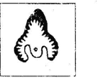

尊特
雄伟超群，挺然特立，如鹤立鸡群。忌孤露。

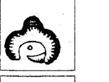

端巧
体熊正然，不假造作，钟秀伶俐。最忌瘦削。

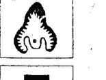

秀嫩
纯粹出人，莹净光润，如珉中美玉。忌瘦弱。

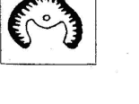

肥厚
体质充裕，端正厚重，若厚德君子。忌臃肿。

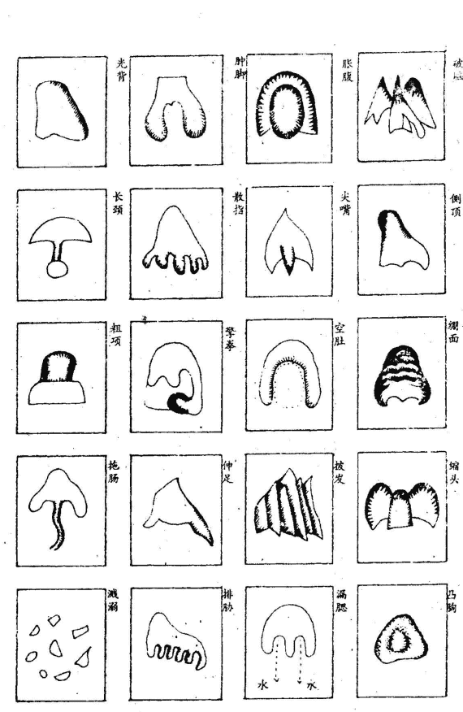

《人子须知》曰：“凡点穴，须审入首之山，成某星体，星体明白，方是真气融结。若入首山，不成星体，即是真气不融结。杨公云“观星裁穴始为真，不论星辰是虚诳”，但诸家星体立法殊途，故美恶吉凶纷纭不一，议者或谓五星为正，九星为变，殊不知五星即五行也，五行之变不可胜形；朱子所谓“五行之变，至于不可穷尽”。然则九星又安能尽其变哉？惟其融结成穴，虽有正变不同，而其形体未当离乎五星，是五星诚守约赅博，一定之理，又何泥乎诸家巧立异名之平面，而后贯以窝、钳、乳、突四象，庶几星形明白，免于眩惑，而易简之“理得矣！”

按：五星与九星是山的最单纯形象，万山变化皆自此单纯形象衍出，初习峦头者宜熟知，临场才不至于眼花撩乱，久之有得，自能触目心通，驾驭万山。

兹录徐氏之说于次：

## 第一节 穴星三大格

一曰正体：
夫所谓正体者，以其星辰头面端正，而规模尊重也。凡正体穴星，钟五行之正气，融星象之正形，故其结作，若星体清秀，龙合上格，主极品之贵。星体庞浊，龙非正格，亦主小贵、巨富。

二曰侧脑：
夫所谓侧脑者，以其星辰头脑偏斜，而形体欹侧也。凡侧脑穴星，头颅虽有不同，融结本无异别，但其闪巧奇藏，故必以乐托为准。若星体清秀，龙合上格，主贵威权。若星体庞浊，龙无正格，主悭吝、诡诈、殷富。

三曰平面：
夫所谓平面者，以其星辰倒地，而形体平夷也。凡平面穴星高低虽不同，力量本无二致；若星体清秀，龙合上格，主富贵绵延。若星体庞浊，龙格不明，亦主富厚。

## ※穴星三格辨

或问：诸家穴法莫详于按《泄天机》，其例，以九星名九变，曰正体、开口、悬乳、弓脚、双臂、单股、侧脑、没骨、平面，皆可以下穴。今何只取正体、侧脑、平面三者，而积穴星三大格，又不即以为穴，且去其六者不与同列，何也？答曰《泄天机》穴法固极精美，但拘于按九变，而穴星与穴形二者混立。（穴星者：太阳、太阴、金水、天才、紫气、燥火、扫荡、孤曜、天罡九星也。穴形者窝、钳、乳、突之形也。）如曰正体，乃穴星之端正也；曰侧脑，乃穴星之偏侧者也（没骨即侧脑之变）；曰平面，乃穴星之倒于按平地者也。兹三者乃穴之星辰，有此三格，而未可便以为穴，必须于按此穴星之间，又各有窝、钳、乳、突之形，方是有穴。若无此形，而遂于按正体、侧脑、平面之上扦葬，则涣漫无手处。惟金星一格，有顽金开窝之法，亦须微有窝坦则可，若浑顽饱面强凿之，凶视立至，岂可直以正体、侧脑、平面为穴哉？其曰开口，即窝形之穴。曰悬乳，即乳形之穴。曰弓脚、双臂、单股，即钳形之窝。兹五者，乃穴星之格，而不可与穴星之格并列者也。若一立之，则穴形之格混于按穴星矣！今故特以正体、侧脑、平面三者列为穴星三大格，而各贯以窝、钳、乳、突之形，则廖氏之九变固已包括于按其内，而有星无穴之弊，庶必几可免也。

## 第二节 穴星诸形

·金星形圆，有二体，上下但圆者，曰太阳金。上圆带方者，曰太阴金。俱有正体、侧脑、平面三格。
正体金星：形圆，而端正者也，穴结于按中。
侧脑金星：形圆，而身侧者也，穴结于按旁。
平面金星：面仰，而身圆者也，穴结于按顶。

·木星形直
正体木星：头圆、身耸，而端正者是也，穴结于按中。
侧脑木星：头圆、身耸，而欹侧者是也，穴结于按旁。
平面木星：面仰，而身平长硬者是也，穴结节麓。

·水星形曲
正体水星：头圆、身曲，而端正者是也，穴结于按中。
侧脑水星：头圆、身曲，而欹斜者是也，穴结于按旁。
平面水星：面仰、身曲，而倒地者是也，穴结于顶。

·火星形尖，故不结穴。

·土星形方
正体土星：头方、身平，而端正者是也，穴结于按中。
侧脑土星：头方、身平，而欹斜者是也，穴结于按旁。
凹脑土星：头方、而中凹、身平者是也，穴结凹下。
平面土星：面仰，而身方、倒地者是也，穴结于按顶。

## ※火星不结穴辨

或问：五星皆有生物之理，而火星独不结穴，何也？曰：火性至燥，金入之而熔，木入之而焚，水入之而涸，土入之而焦，故火星不能结穴，惟作穴之曜气，及龙祖前砂则美。郭氏《葬经》言“乘金相水、穴土印木”，而不及火。吴景鸾、蔡牧堂、洪天兴诸公释之，皆谓火不结穴，故还言火也。然，火既为穴曜。龙祖及前砂，固已见生物之妙，又何拘于扦穴，而始谓之生物哉？且历观四言名墓，金、土二穴最多，次之，水又次之，而火星之穴款见其一，惟浮梁系景德镇阳基是落地火星——入首落脉穿田，发五枝，为“王火落地”，而四面皆水，水以济火，故亦有融结。然其为陶冶之场，数十里间，烟焰烛天，书夜不息，此固火星之应矣！而人多刚燥，俗尚繁华，易于按与替，且不免回录时发之灾，此又火星之病也。夫，以火得水济，其结作且不能全美如此，况纯火之穴可乎？

或曰：火星至燥，而不结穴，已闻命矣，水星至柔，而能结穴，何也？曰：纯水亦不能融结，须兼于金，金水相融，方有结作。故廖瑀以金水名之。

曰：廖瑀既以金水名矣！方有结作。故方以金水名矣！盖，而今令曰水星穴者，何也？曰金星已有定穴，此特水星兼金，以水为主，故吉名也。

或又问曰：廖瑀星之中，有金水，今专以水星名穴，固所以破九星之谬矣！而金星穴中，复以太阳，太阴名之，何也？曰：金星有高、低二体，而太阳、太阴名称其形，且五星七政，理之切实，若非巨、武、破、廉、天罡、孤曜说诸之不经，而能眩惑于人者，从之可也。兹尽惟理是适，初非有意立异，而故皆九星云耳。

## 金星穴

金体必圆。其上下皆圆，而身高者，曰太阳金。上圆带方，而身低者，曰太阴金。各有正体、侧脑、平面三格；三格又各有窝、钳、乳、突之形，方为真结。

其有顽金，打开水窝裁者，亦必开面微有窝坦。若是顽硬粗饱，即是生气不融，不可勉强镌凿，以乱下凶恶之地。《泄天机》穴法诸正体穴，正坐此弊，不可误用，学者审之！

### ①正体金星穴格

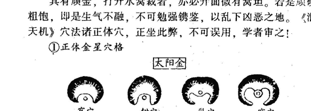

右正体金星穴，各有坐眠立三势，大、小、高、低、肥、瘦六格，俯、仰二体。及窝穴有深、浅、阔、狭。钳穴有长、短、双、单、曲、直。乳穴有大、小、长、短。突穴有大、小、双三等格。其乳、突二穴之下，又有出金、出木，出水、出火，出土，各五格。而窝、钳二穴这左右两臂，又有转金、转木、转水、转火、转土，及一脚转水、木、火、土者；一脚转水，一却转金、木、火、土者；一脚转金，一脚转金、木、水、火者；各二十体，为变格也。诸体又各有带曜者，图繁，俱不详载。以下侧脑、平面穴格，皆仿此论，不复重述。

夫，正体金星之穴，星辰尊重，造化完全，故为最贵。但窝穴，要窝中圆净、弦棱明白。钳穴，要钳中藏卧、凹间弯环。乳穴，要圈中舒畅，乳上光圆。突穴，要突面光圆、形体颖异。此为穴形入相。又须证佐明白、流神合法，方为真结。必须仔细检点，不可忽也。

### ②侧脑金星穴格

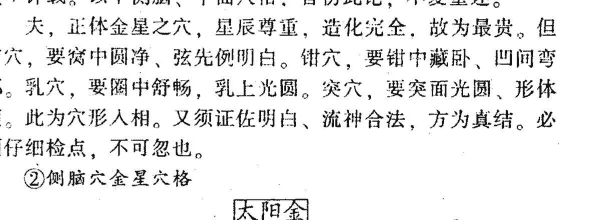

右侧脑金星穴诸格，左右图同，不必重载。又有双侧脑者，见下：

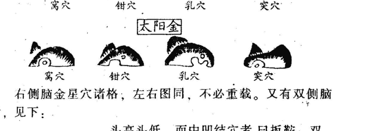

头高头低，而中凹结穴者,曰扳鞍；双脑同高，而中凹结穴者，曰提凹穴。凹间弯者，曰变金扛水；平者，曰又金扛土；各有窝，钳、乳、突四，图繁不载。

夫，侧脑金星之穴，星体偏斜，势趋一畔，穴不枕脑，借乐安打。（乳、突二穴无乐亦可。）形体虽偏，力量无异。但窝穴，要窝中圆满、弦棱分明。钳穴，要钳中藏聚、两掬弯环。乳穴，要乳上光明、圈中舒畅。突穴，要突面光圆、形体颖异。此为穴形入相；及须证佐分明、流神合法，方为真结。必须仔细检点，不可忽也。

### ③平面金星穴格

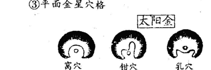

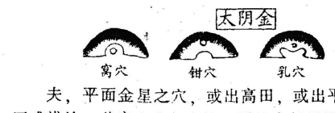

夫，平面金星之穴，或出高田，或出平地；而平地为多，至难辨认。盖高山有似龙格，平地有似罗星，但龙格未作，罗星孤寒，此为异耳。平地、高山，各有四格：窝、乳、突、钳是也；但窝穴，要窝内圆净。弦棱明白，穴宜揭高就脉。钳穴，要钳中藏聚、两畔均匀，穴宜凑毯避锥。乳穴，要乳上光圆。左右曲抱，穴宜毯毯就脉。突穴，要突面光圆、形体颖异，穴宜当突就脉。廖瑀云：凡平面星需用，灵光自出于顶中，生气聚浮于面上。”故此穴最吉，力量极大。必须龙脉奇异，证左分晓，流神合法，方为真穴。务宜仔细检点，不可忽也。

以上金星诸穴，坐向得申、庚、酉、乾、坤、艮，皆为得地。气旺形应，安扦合法，主生人相貌洁白、心性明达。庚申、辛酉金水生人受阴。已酉丑年福应。若星辰清秀，龙合上格者，主翰苑清贵，位极人臣。合中格者，主职兼文武，出典大藩。合下格者，贵为牧守。人无贵格。亦主聪明才辩之士，名誉远扬。若星体庞浊，则主武贵及巨富、豪爽、武霸乡曲，刚直果断，人咸畏惧。及清高之士自重自尊，不干宠来，高尚其志。初生肥白声明之人，则气至而盛。至生暗哑之人，则气尽而衰矣！

## 木星穴

木体必直，其末必圆。凡穴星上尖而圆，身直而耸者，是也。端正者，曰正体。欹侧者，曰侧脑。倒地者，曰平面。各有窝、钳、乳、突之形，方为真结。

### ①正体木星穴格

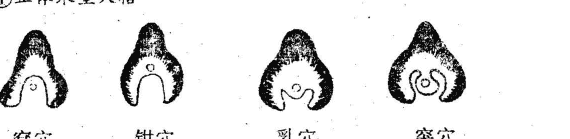

右正体木星穴诸格，各有坐、眠、立三势，大、小、高、低、肥、瘦六格，俯、仰二体。及窝穴有深、浅、阔、狭。钳穴有长、短、双、单、曲、直。乳穴有大、小、长、短。突穴有大、小、双三等格。其乳、突二穴之下，又有出金、出木、出水、出火、出土，各五格。而窝、钳二穴之左右两臂，又有转金、转木、转水、转火、转土，及一脚转金，一脚转水、木、土者；一脚转水，一脚转金、水、火、土者；一脚转木，一脚转金、水、火、土者；一脚转火，一脚转金、木、水、土者；一脚转土，一脚转金、木、水、火者；各二十体，为变格也。诸体又各有带曜者，图繁，俱不详载。以下侧脑、平面穴格，皆仿此论，不复重述。

夫，正体木星之穴，星辰尊重，造化完全，故为最贵。但窝穴要窝中圆净、弦棱明白；钳穴要钳中藏坚、两掬弯环。乳穴，要圈中舒畅，乳上光圆。突穴，要突面光圆、形体颖异。又须证佐明白、流神合法，方为真结。必须仔细检点，不可忽也。

### ②侧脑木星穴格

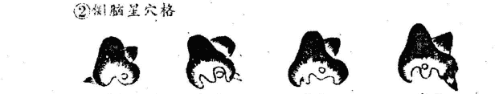

夫，侧脑木星之穴，星体偏斜，势趋一畔，穴不枕脑，借乐安桿。（乳、突二穴无乐亦可。）形体虽偏，力量极大，但窝穴，要窝中圆净，弦棱分明。钳穴，要钳中藏聚，两掬弯环。乳穴，要乳上光明，圈中舒畅。突穴，要突面光圆，形体颖异。此为穴形入相；及须证佐分明、流神合法，方为真结。必须仔细检点，不可忽也。

### ③平面木星穴格

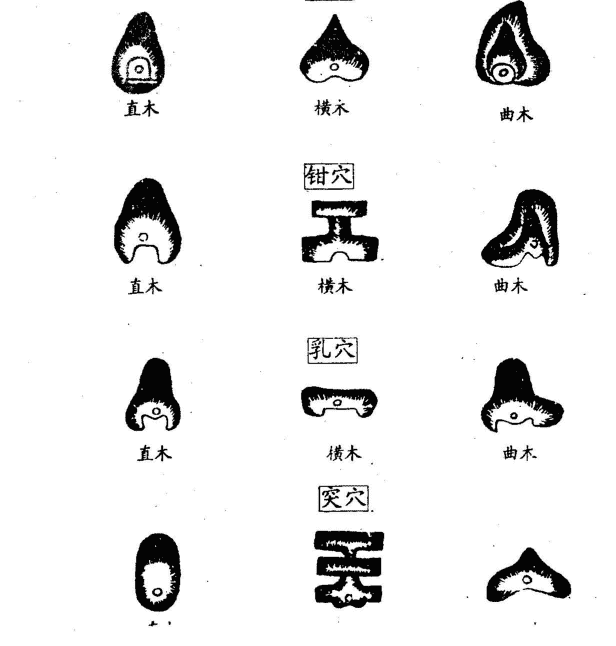

此星身长而直、面平而低，故名曰平面木星。有二体：其木直来，有如下字者，有如下字者，凡直体皆是也；不可当头下穴，为犯“门脉煞”。《吴公口诀》云：“木星忌下当头穴，门煞人丁绝；或粘或倚穴为奇，闪脱要君知。”故凡直木，须寻粘穴以脱煞，或倚穴以闪煞；粘有唇，倚有节苞，此要诀也。其脉横来，有如工字者，王字、上字者，凡横体皆是也；不可当腰下穴，为犯“斩脉煞”。《吴公口诀》云：“倒地木星长百丈，不论横直皆可葬；直寻粘倚莫当头，横要中间节苞旺。”盖，横木尤难下穴，要突、钳口为凭，此要诀也。直木、横木，二者为正格。又有其脉曲来，如曲尺者，如之玄字者，于曲勒处寻穴，此乃变格也。曰直、曰横、曰曲、三格皆须要立穴处有窝、钳、乳、突、萌蘗，节苞，方为真的。直脉，宜审后龙来处，分左可寻萌蘗，立倚穴；粗大则可寻粘穴，（粘穴要有氈唇。）横脉，宜审龙来左右，中节寻萌蘗，立撞穴，体亦难拘，但横直不乱者，便是。皆要脊上平正、两弦起棱（一边起棱亦可）。亦须稍阔大，不可狭小如带，亦不可懒坦无体，懒坦则真气不聚，狭小亦真气已绝，皆不可不察。

夫，平面木星之穴，惟平处有之；真龙起伏多者，方结此穴，力量极大。廖氏云：凡平而星辰，灵光凝聚于坦夷，生气流行于低下，精神收敛，造化完全，此所谓之吉穴是也；必须龙真穴奇，证佐分晓，流神合法，方为真结；务宜仔细检点，不可忽也。

以上木星诸穴，坐向得寅、甲、卯、乙、巽，皆为气旺而形应，若安扦合法，主生人相貌清秀、心性坦夷、行事远大。甲乙、寅卯、丙丁；巳午木火生人受荫，亥卯未年发达。若穴星清秀，龙合上格，主状元及第，官至极品。合中格，应举登第，官至方面。合下格者，官至宰邑。全无贵格，亦主明经、秀士，大有文名。若星辰厖浊，龙无正格，亦主富而好礼，身五福，子孙蕃衍。初生清秀身长之人，则气至而盛。至生黄瘦矮小之人，则气尽而衰矣！

## 水星穴

水性本动，其质柔弱，赖金以成，必兼金方能结穴。金圆、水曲，凡穴星头圆而身曲者是也。有三大格，端正者，曰正体。欹斜者，曰侧脑。倒地者，曰平面。各有窝、钳、乳、突之形，方为真结。

### ①正体水星穴格

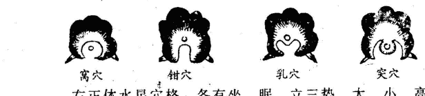

右正体水星穴格，各有坐、眠、立三势，大、小、高、低、肥、瘦六格，俯、仰二体。及窝穴有深、浅、阔、狭。钳穴有长、短、双、单、曲、直。乳穴有大、小、长、短。突穴有大、小、双三等格。其乳、突二穴之下，又有出金、出木、出水、出火、出土，各五格。而窝、钳二穴之左右两臂，又有转金、转木、转水、转火、转土，及一脚转金、一脚转水、转土，及一脚转金、一脚转水、转土，及一脚转金、一脚转水、转土，及一脚转金、一脚转水、转土，及一脚转金、一脚转水、转土，及一脚转金、一脚转水、转土，及一脚转金、一脚转水、转土，及一脚转金、一脚转水、转土，及一脚转金、一脚转水、转土，及一脚转金、一脚转水、转土，及一脚转金、一脚转水、转土，及一脚转金、一脚转水、转土，及一脚转金、一脚转水、转土，及一脚转金、一脚转水、转土，及一脚转金、一脚转水、转土，及一脚转金、一脚转水、转土，及一脚转金、一脚转水、转土，及一脚转金、一脚转水、转土，及一脚转金、一脚转水、转土，及一脚转金、一脚转水、转土，及一脚转金、一脚转水、转土，及一脚转金、一脚转水、转土，及一脚转金、一脚转水、转土，及一脚转金、一脚转水、转土，及一脚转金、一脚转水、转土，及一脚转金、一脚转水、转土，及一脚转金、一脚转水、转土，及一脚转金、一脚转水、转土，及一脚转金、一脚转水、转土，及一脚转金、一脚转水、转土，及一脚转金、一脚转水、转土，及一脚转金、一脚转水、转土，及一脚转金、一脚转水、转土，及一脚转金、一脚转水、转土，及一脚转金、一脚转水、转土，及一脚转金、一脚转水、转土，及一脚转金、一脚转水、转土，及一脚转金、一脚转水、转土，及一脚转金、一脚转水、转土，及一脚转金、一脚转水、转土，及一脚转金、一脚转水、转土，及一脚转金、一脚转水、转土，及一脚转金、一脚转水、转土，及一脚转金、一脚转水、转土，及一脚转金、一脚转水、转土，及一脚转金、一脚转水、转土，及一脚转金、一脚转水、转土，及一脚转金、一脚转水、转土，及一脚转金、一脚转水、转土，及一脚转金、一脚转水、转土，及一脚转金、一脚转水、转土，及一脚转金、一脚转水、转土，及一脚转金、一脚转水、转土，及一脚转金、一脚转水、转土，及一脚转金、一脚转水、转土，及一脚转金、一脚转水、转土，及一脚转金、一脚转水、转土，及一脚转金、一脚转水、转土，及一脚转金、一脚转水、转土，及一脚转金、一脚转水、转土，及一脚转金、一脚转水、转土，及一脚转金、一脚转水、转土，及一脚转金、一脚转水、转土，及一脚转金、一脚转水、转土，及一脚转金、一脚转水、转土，及一脚转金、一脚转水、转土，及一脚转金、一脚转水、转土，及一脚转金、一脚转水、转土，及一脚转金、一脚转水、转土，及一脚转金、一脚转水、转土，及一脚转金、一脚转水、转土，及一脚转金、一脚转水、转土，及一脚转金、一脚转水、转土，及一脚转金、一脚转水、转土，及一脚转金、一脚转水、转土，及一脚转金、一脚转水、转土，及一脚转金、一脚转水、转土，及一脚转金、一脚转水、转土，及一脚转金、一脚转水、转土，及一脚转金、一脚转水、转土，及一脚转金、一脚转水、转土，及一脚转金、一脚转水、转土，及一脚转金、一脚转水、转土，及一脚转金、一脚转水、转土，及一脚转金、一脚转水、转土，及一脚转金、一脚转水、转土，及一脚转金、一脚转水、转土，及一脚转金、一脚转水、转土，及一脚转金、一脚转水、转土，及一脚转金、一脚转水、转土，及一脚转金、一脚转水、转土，及一脚转金、一脚转水、转土，及一脚转金、一脚转水、转土，及一脚转金、一脚转水、转土，及一脚转金、一脚转水、转土，及一脚转金、一脚转水、转土，及一脚转金、一脚转水、转土，及一脚转金、一脚转水、转土，及一脚转金、一脚转水、转土，及一脚转金、一脚转水、转土，及一脚转金、一脚转水、转土，及一脚转金、一脚转水、转土，及一脚转金、一脚转水、转土，及一脚转金、一脚转水、转土，及一脚转金、一脚转水、转土，及一脚转金、一脚转水、转土，及一脚转金、一脚转水、转土，及一脚转金、一脚转水、转土，及一脚转金、一脚转水、转土，及一脚转金、一脚转水、转土，及一脚转金、一脚转水、转土，及一脚转金、一脚转水、转土，及一脚转金、一脚转水、转土，及一脚转金、一脚转水、转土，及一脚转金、一脚转水、转土，及一脚转金、一脚转水、转土，及一脚转金、一脚转水、转土，及一脚转金、一脚转水、转土，及一脚转金、一脚转水、转土，及一脚转金、一脚转水、转土，及一脚转金、一脚转水、转土，及一脚转金、一脚转水、转土，及一脚转金、一脚转水、转土，及一脚转金、一脚转水、转土，及一脚转金、一脚转水、转土，及一脚转金、一脚转水、转土，及一脚转金、一脚转水、转土，及一脚转金、一脚转水、转土，及一脚转金、一脚转水、转土，及一脚转金、一脚转水、转土，及一脚转金、一脚转水、转土，及一脚转金、一脚转水、转土，及一脚转金、一脚转水、转土，及一脚转金、一脚转水、转土，及一脚转金、一脚转水、转土，及一脚转金、一脚转水、转土，及一脚转金、一脚转水、转土，及一脚转金、一脚转水、转土，及一脚转金、一脚转水、转土，及一脚转金、一脚转水、转土，及一脚转金、一脚转水、转土，及一脚转金、一脚转水、转土，及一脚转金、一脚转水、转土，及一脚转金、一脚转水、转土，及一脚转金、一脚转水、转土，及一脚转金、一脚转水、转土，及一脚转金、一脚转水、转土，及一脚转金、一脚转水、转土，及一脚转金、一脚转水、转土，及一脚转金、一脚转水、转土，及一脚转金、一脚转水、转土，及一脚转金、一脚转水、转土，及一脚转金、一脚转水、转土，及一脚转金、一脚转水、转土，及一脚转金、一脚转水、转土，及一脚转金、一脚转水、转土，及一脚转金、一脚转水、转土，及一脚转金、一脚转水、转土，及一脚转金、一脚转水、转土，及一脚转金、一脚转水、转土，及一脚转金、一脚转水、转土，及一脚转金、一脚转水、转土，及一脚转金、一脚转水、转土，及一脚转金、一脚转水、转土，及一脚转金、一脚转水、转土，及一脚转金、一脚转水、转土，及一脚转金、一脚转水、转土，及一脚转金、一脚转水、转土，及一脚转金、一脚转水、转土，及一脚转金、一脚转水、转土，及一脚转金、一脚转水、转土，及一脚转金、一脚转水、转土，及一脚转金、一脚转水、转土，及一脚转金、一脚转水、转土，及一脚转金、一脚转水、转土，及一脚转金、一脚转水、转土，及一脚转金、一脚转水、转土，及一脚转金、一脚转水、转土，及一脚转金、一脚转水、转土，及一脚转金、一脚转水、转土，及一脚转金、一脚转水、转土，及一脚转金、一脚转水、转土，及一脚转金、一脚转水、转土，及一脚转金、一脚转水、转土，及一脚转金、一脚转水、转土，及一脚转金、一脚转水、转土，及一脚转金、一脚转水、转土，及一脚转金、一脚转水、转土，及一脚转金、一脚转水、转土，及一脚转金、一脚转水、转土，及一脚转金、一脚转水、转土，及一脚转金、一脚转水、转土，及一脚转金、一脚转水、转土，及一脚转金、一脚转水、转土，及一脚转金、一脚转水、转土，及一脚转金、一脚转水、转土，及一脚转金、一脚转水、转土，及一脚转金、一脚转水、转土，及一脚转金、一脚转水、转土，及一脚转金、一脚转水、转土，及一脚转金、一脚转水、转土，及一脚转金、一脚转水、转土，及一脚转金、一脚转水、转土，及一脚转金、一脚转水、转土，及一脚转金、一脚转水、转土，及一脚转金、一脚转水、转土，及一脚转金、一脚转水、转土，及一脚转金、一脚转水、转土，及一脚转金、一脚转水、转土，及一脚转金、一脚转水、转土，及一脚转金、一脚转水、转土，及一脚转金、一脚转水、转土，及一脚转金、一脚转水、转土，及一脚转金、一脚转水、转土，及一脚转金、一脚转水、转土，及一脚转金、一脚转水、转土，及一脚转金、一脚转水、转土，及一脚转金、一脚转水、转土，及一脚转金、一脚转水、转土，及一脚转金、一脚转水、转土，及一脚转金、一脚转水、转土，及一脚转金、一脚转水、转土，及一脚转金、一脚转水、转土，及一脚转金、一脚转水、转土，及一脚转金、一脚转水、转土，及一脚转金、一脚转水、转土，及一脚转金、一脚转水、转土，及一脚转金、一脚转水、转土，及一脚转金、一脚转水、转土，及一脚转金、一脚转水、转土，及一脚转金、一脚转水、转土，及一脚转金、一脚转水、转土，及一脚转金、一脚转水、转土，及一脚转金、一脚转水、转土，及一脚转金、一脚转水、转土，及一脚转金、一脚转水、转土，及一脚转金、一脚转水、转土，及一脚转金、一脚转水、转土，及一脚转金、一脚转水、转土，及一脚转金、一脚转水、转土，及一脚转金、一脚转水、转土，及一脚转金、一脚转水、转土，及一脚转金、一脚转水、转土，及一脚转金、一脚转水、转土，及一脚转金、一脚转水、转土，及一脚转金、一脚转水、转土，及一脚转金、一脚转水、转土，及一脚转金、一脚转水、转土，及一脚转金、一脚转水、转土，及一脚转金、一脚转水、转土，及一脚转金、一脚转水、转土，及一脚转金、一脚转水、转土，及一脚转金、一脚转水、转土，及一脚转金、一脚转水、转土，及一脚转金、一脚转水、转土，及一脚转金、一脚转水、转土，及一脚转金、一脚转水、转土，及一脚转金、一脚转水、转土，及一脚转金、一脚转水、转土，及一脚转金、一脚转水、转土，及一脚转金、一脚转水、转土，及一脚转金、一脚转水、转土，及一脚转金、一脚转水、转土，及一脚转金、一脚转水、转土，及一脚转金、一脚转水、转土，及一脚转金、一脚转水、转土，及一脚转金、一脚转水、转土，及一脚转金、一脚转水、转土，及一脚转金、一脚转水、转土，及一脚转金、一脚转水、转土，及一脚转金、一脚转水、转土，及一脚转金、一脚转水、转土，及一脚转金、一脚转水、转土，及一脚转金、一脚转水、转土，及一脚转金、一脚转水、转土，及一脚转金、一脚转水、转土，及一脚转金、一脚转水、转土，及一脚转金、一脚转水、转土，及一脚转金、一脚转水、转土，及一脚转金、一脚转水、转土，及一脚转金、一脚转水、转土，及一脚转金、一脚转水、转土，及一脚转金、一脚转水、转土，及一脚转金、一脚转水、转土，及一脚转金、一脚转水、转土，及一脚转金、一脚转水、转土，及一脚转金、一脚转水、转土，及一脚转金、一脚转水、转土，及一脚转金、一脚转水、转土，及一脚转金、一脚转水、转土，及一脚转金、一脚转水、转土，及一脚转金、一脚转水、转土，及一脚转金、一脚转水、转土，及一脚转金、一脚转水、转土，及一脚转金、一脚转水、转土，及一脚转金、一脚转水、转土，及一脚转金、一脚转水、转土，及一脚转金、一脚转水、转土，及一脚转金、一脚转水、转土，及一脚转金、一脚转水、转土，及一脚转金、一脚转水、转土，及一脚转金、一脚转水、转土，及一脚转金、一脚转水、转土，及一脚转金、一脚转水、转土，及一脚转金、一脚转水、转土，及一脚转金、一脚转水、转土，及一脚转金、一脚转水、转土，及一脚转金、一脚转水、转土，及一脚转金、一脚转水、转土，及一脚转金、一脚转水、转土，及一脚转金、一脚转水、转土，及一脚转金、一脚转水、转土，及一脚转金、一脚转水、转土，及一脚转金、一脚转水、转土，及一脚转金、一脚转水、转土，及一脚转金、一脚转水、转土，及一脚转金、一脚转水、转土，及一脚转金、一脚转水、转土，及一脚转金、一脚转水、转土，及一脚转金、一脚转水、转土，及一脚转金、一脚转水、转土，及一脚转金、一脚转水、转土，及一脚转金、一脚转水、转土，及一脚转金、一脚转水、转土，及一脚转金、一脚转水、转土，及一脚转金、一脚转水、转土，及一脚转金、一脚转水、转土，及一脚转金、一脚转水、转土，及一脚转金、一脚转水、转土，及一脚转金、一脚转水、转土，及一脚转金、一脚转水、转土，及一脚转金、一脚转水、转土，及一脚转金、一脚转水、转土，及一脚转金、一脚转水、转土，及一脚转金、一脚转水、转土，及一脚转金、一脚转水、转土，及一脚转金、一脚转水、转土，及一脚转金、一脚转水、转土，及一脚转金、一脚转水、转土，及一脚转金、一脚转水、转土，及一脚转金、一脚转水、转土，及一脚转金、一脚转水、转土，及一脚转金、一脚转水、转土，及一脚转金、一脚转水、转土，及一脚转金、一脚转水、转土，及一脚转金、一脚转水、转土，及一脚转金、一脚转水、转土，及一脚转金、一脚转水、转土，及一脚转金、一脚转水、转土，及一脚转金、一脚转水、转土，及一脚转金、一脚转水、转土，及一脚转金、一脚转水、转土，及一脚转金、一脚转水、转土，及一脚转金、一脚转水、转土，及一脚转金、一脚转水、转土，及一脚转金、一脚转水、转土，及一脚转金、一脚转水、转土，及一脚转金、一脚转水、转土，及一脚转金、一脚转水、转土，及一脚转金、一脚转水、转土，及一脚转金、一脚转水、转土，及一脚转金、一脚转水、转土，及一脚转金、一脚转水、转土，及一脚转金、一脚转水、转土，及一脚转金、一脚转水、转土，及一脚转金、一脚转水、转土，及一脚转金、一脚转水、转土，及一脚转金、一脚转水、转土，及一脚转金、一脚转水、转土，及一脚转金、一脚转水、转土，及一脚转金、一脚转水、转土，及一脚转金、一脚转水、转土，及一脚转金、一脚转水、转土，及一脚转金、一脚转水、转土，及一脚转金、一脚转水、转土，及一脚转金、一脚转水、转土，及一脚转金、一脚转水、转土，及一脚转金、一脚转水、转土，及一脚转金、一脚转水、转土，及一脚转金、一脚转水、转土，及一脚转金、一脚转水、转土，及一脚转金、一脚转水、转土，及一脚转金、一脚转水、转土，及一脚转金、一脚转水、转土，及一脚转金、一脚转水、转土，及一脚转金、一脚转水、转土，及一脚转金、一脚转水、转土，及一脚转金、一脚转水、转土，及一脚转金、一脚转水、转土，及一脚转金、一脚转水、转土，及一脚转金、一脚转水、转土，及一脚转金、一脚转水、转土，及一脚转金、一脚转水、转土，及一脚转金、一脚转水、转土，及一脚转金、一脚转水、转土，及一脚转金、一脚转水、转土，及一脚转金、一脚转水、转土，及一脚转金、一脚转水、转土，及一脚转金、一脚转水、转土，及一脚转金、一脚转水、转土，及一脚转金、一脚转水、转土，及一脚转金、一脚转水、转土，及一脚转金、一脚转水、转土，及一脚转金、一脚转水、转土，及一脚转金、一脚转水、转土，及一脚转金、一脚转水、转土，及一脚转金、一脚转水、转土，及一脚转金、一脚转水、转土，及一脚转金、一脚转水、转土，及一脚转金、一脚转水、转土，及一脚转金、一脚转水、转土，及一脚转金、一脚转水、转土，及一脚转金、一脚转水、转土，及一脚转金、一脚转水、转土，及一脚转金、一脚转水、转土，及一脚转金、一脚转水、转土，及一脚转金、一脚转水、转土，及一脚转金、一脚转水、转土，及一脚转金、一脚转水、转土，及一脚转金、一脚转水、转土，及一脚转金、一脚转水、转土，及一脚转金、一脚转水、转土，及一脚转金、一脚转水、转土，及一脚转金、一脚转水、转土，及一脚转金、一脚转水、转土，及一脚转金、一脚转水、转土，及一脚转金、一脚转水、转土，及一脚转金、一脚转水、转土，及一脚转金、一脚转水、转土，及一脚转金、一脚转水、转土，及一脚转金、一脚转水、转土，及一脚转金、一脚转水、转土，及一脚转金、一脚转水、转土，及一脚转金、一脚转水、转土，及一脚转金、一脚转水、转土，及一脚转金、一脚转水、转土，及一脚转金、一脚转水、转土，及一脚转金、一脚转水、转土，及一脚转金、一脚转水、转土，及一脚转金、一脚转水、转土，及一脚转金、一脚转水、转土，及一脚转金、一脚转水、转土，及一脚转金、一脚转水、转土，及一脚转金、一脚转水、转土，及一脚转金、一脚转水、转土，及一脚转金、一脚转水、转土，及一脚转金、一脚转水、转土，及一脚转金、一脚转水、转土，及一脚转金、一脚转水、转土，及一脚转金、一脚转水、转土，及一脚转金、一脚转水、转土，及一脚转金、一脚转水、转土，及一脚转金、一脚转水、转土，及一脚转金、一脚转水、转土，及一脚转金、一脚转水、转土，及一脚转金、一脚转水、转土，及一脚转金、一脚转水、转土，及一脚转金、一脚转水、转土，及一脚转金、一脚转水、转土，及一脚转金、一脚转水、转土，及一脚转金、一脚转水、转土，及一脚转金、一脚转水、转土，及一脚转金、一脚转水、转土，及一脚转金、一脚转水、转土，及一脚转金、一脚转水、转土，及一脚转金、一脚转水、转土，及一脚转金、一脚转水、转土，及一脚转金、一脚转水、转土，及一脚转金、一脚转水、转土，及一脚转金、一脚转水、转土，及一脚转金、一脚转水、转土，及一脚转金、一脚转水、转土，及一脚转金、一脚转水、转土，及一脚转金、一脚转水、转土，及一脚转金、一脚转水、转土，及一脚转金、一脚转水、转土，及一脚转金、一脚转水、转土，及一脚转金、一脚转水、转土，及一脚转金、一脚转水、转土，及一脚转金、一脚转水、转土，及一脚转金、一脚转水、转土，及一脚转金、一脚转水、转土，及一脚转金、一脚转水、转土，及一脚转金、一脚转水、转土，及一脚转金、一脚转水、转土，及一脚转金、一脚转水、转土，及一脚转金、一脚转水、转土，及一脚转金、一脚转水、转土，及一脚转金、一脚转水、转土，及一脚转金、一脚转水、转土，及一脚转金、一脚转水、转土，及一脚转金、一脚转水、转土，及一脚转金、一脚转水、转土，及一脚转金、一脚转水、转土，及一脚转金、一脚转水、转土，及一脚转金、一脚转水、转土，及一脚转金、一脚转水、转土，及一脚转金、一脚转水、转土，及一脚转金、一脚转水、转土，及一脚转金、一脚转水、转土，及一脚转金、一脚转水、转土，及一脚转金、一脚转水、转土，及一脚转金、一脚转水、转土，及一脚转金、一脚转水、转土，及一脚转金、一脚转水、转土，及一脚转金、一脚转水、转土，及一脚转金、一脚转水、转土，及一脚转金、一脚转水、转土，及一脚转金、一脚转水、转土，及一脚转金、一脚转水、转土，及一脚转金、一脚转水、转土，及一脚转金、一脚转水、转土，及一脚转金、一脚转水、转土，及一脚转金、一脚转水、转土，及一脚转金、一脚转水、转土，及一脚转金、一脚转水、转土，及一脚转金、一脚转水、转土，及一脚转金、一脚转水、转土，及一脚转金、一脚转水、转土，及一脚转金、一脚转水、转土，及一脚转金、一脚转水、转土，及一脚转金、一脚转水、转土，及一脚转金、一脚转水、转土，及一脚转金、一脚转水、转土，及一脚转金、一脚转水、转土，及一脚转金、一脚转水、转土，及一脚转金、一脚转水、转土，及一脚转金、一脚转水、转土，及一脚转金、一脚转水、转土，及一脚转金、一脚转水、转土，及一脚转金、一脚转水、转土，及一脚转金、一脚转水、转土，及一脚转金、一脚转水、转土，及一脚转金、一脚转水、转土，及一脚转金、一脚转水、转土，及一脚转金、一脚转水、转土，及一脚转金、一脚转水、转土，及一脚转金、一脚转水、转土，及一脚转金、一脚转水、转土，及一脚转金、一脚转水、转土，及一脚转金、一脚转水、转土，及一脚转金、一脚转水、转土，及一脚转金、一脚转水、转土，及一脚转金、一脚转水、转土，及一脚转金、一脚转水、转土，及一脚转金、一脚转水、转土，及一脚转金、一脚转水、转土，及一脚转金、一脚转水、转土，及一脚转金、一脚转水、转土，及一脚转金、一脚转水、转土，及一脚转金、一脚转水、转土，及一脚转金、一脚转水、转土，及一脚转金、一脚转水、转土，及一脚转金、一脚转水、转土，及一脚转金、一脚转水、转土，及一脚转金、一脚转水、转土，及一脚转金、一脚转水、转土，及一脚转金、一脚转水、转土，及一脚转金、一脚转水、转土，及一脚转金、一脚转水、转土，及一脚转金、一脚转水、转土，及一脚转金、一脚转水、转土，及一脚转金、一脚转水、转土，及一脚转金、一脚转水、转土，及一脚转金、一脚转水、转土，及一脚转金、一脚转水、转土，及一脚转金、一脚转水、转土，及一脚转金、一脚转水、转土，及一脚转金、一脚转水、转土，及一脚转金、一脚转水、转土，及一脚转金、一脚转水、转土，及一脚转金、一脚转水、转土，及一脚转金、一脚转水、转土，及一脚转金、一脚转水、转土，及一脚转金、一脚转水、转土，及一脚转金、一脚转水、转土，及一脚转金、一脚转水、转土，及一脚转金、一脚转水、转土，及一脚转金、一脚转水、转土，及一脚转金、一脚转水、转土，及一脚转金、一脚转水、转土，及一脚转金、一脚转水、转土，及一脚转金、一脚转水、转土，及一脚转金、一脚转水、转土，及一脚转金、一脚转水、转土，及一脚转金、一脚转水、转土，及一脚转金、一脚转水、转土，及一脚转金、一脚转水、转土，及一脚转金、一脚转水、转土，及一脚转金、一脚转水、转土，及一脚转金、一脚转水、转土，及一脚转金、一脚转水、转土，及一脚转金、一脚转水、转土，及一脚转金、一脚转水、转土，及一脚转金、一脚转水、转土，及一脚转金、一脚转水、转土，及一脚转金、一脚转水、转土，及一脚转金、一脚转水、转土，及一脚转金、一脚转水、转土，及一脚转金、一脚转水、转土，及一脚转金、一脚转水、转土，及一脚转金、一脚转水、转土，及一脚转金、一脚转水、转土，及一脚转金、一脚转水、转土，及一脚转金、一脚转水、转土，及一脚转金、一脚转水、转土，及一脚转金、一脚转水、转土，及一脚转金、一脚转水、转土，及一脚转金、一脚转水、转土，及一脚转金、一脚转水、转土，及一脚转金、一脚转水、转土，及一脚转金、一脚转水、转土，及一脚转金、一脚转水、转土，及一脚转金、一脚转水、转土，及一脚转金、一脚转水、转土，及一脚转金、一脚转水、转土，及一脚转金、一脚转水、转土，及一脚转金、一脚转水、转土，及一脚转金、一脚转水、转土，及一脚转金、一脚转水、转土，及一脚转金、一脚转水、转土，及一脚转金、一脚转水、转土，及一脚转金、一脚转水、转土，及一脚转金、一脚转水、转土，及一脚转金、一脚转水、转土，及一脚转金、一脚转水、转土，及一脚转金、一脚转水、转土，及一脚转金、一脚转水、转土，及一脚转金、一脚转水、转土，及一脚转金、一脚转水、转土，及一脚转金、一脚转水、转土，及一脚转金、一脚转水、转土，及一脚转金、一脚转水、转土，及一脚转金、一脚转水、转土，及一脚转金、一脚转水、转土，及一脚转金、一脚转水、转土，及一脚转金、一脚转水、转土，及一脚转金、一脚转水、转土，及一脚转金、一脚转水、转土，及一脚转金、一脚转水、转土，及一脚转金、一脚转水、转土，及一脚转金、一脚转水、转土，及一脚转金、一脚转水、转土，及一脚转金、一脚转水、转土，及一脚转金、一脚转水、转土，及一脚转金、一脚转水、转土，及一脚转金、一脚转水、转土，及一脚转金、一脚转水、转土，及一脚转金、一脚转水、转土，及一脚转金、一脚转水、转土，及一脚转金、一脚转水、转土，及一脚转金、一脚转水、转土，及一脚转金、一脚转水、转土，及一脚转金、一脚转水、转土，及一脚转金、一脚转水、转土，及一脚转金、一脚转水、转土，及一脚转金、一脚转水、转土，及一脚转金、一脚转水、转土，及一脚转金、一脚转水、转土，及一脚转金、一脚转水、转土，及一脚转金、一脚转水、转土，及一脚转金、一脚转水、转土，及一脚转金、一脚转水、转土，及一脚转金、一脚转水、转土，及一脚转金、一脚转水、转土，及一脚转金、一脚转水、转土，及一脚转金、一脚转水、转土，及一脚转金、一脚转水、转土，及一脚转金、一脚转水、转土，及一脚转金、一脚转水、转土，及一脚转金、一脚转水、转土，及一脚转金、一脚转水、转土，及一脚转金、一脚转水、转土，及一脚转金、一脚转水、转土，及一脚转金、一脚转水、转土，及一脚转金、一脚转水、转土，及一脚转金、一脚转水、转土，及一脚转金、一脚转水、转土，及一脚转金、一脚转水、转土，及一脚转金、一脚转水、转土，及一脚转金、一脚转水、转土，及一脚转金、一脚转水、转土，及一脚转金、一脚转水、转土，及一脚转金、一脚转水、转土，及一脚转金、一脚转水、转土，及一脚转金、一脚转水、转土，及一脚转金、一脚转水、转土，及一脚转金、一脚转水、转土，及一脚转金、一脚转水、转土，及一脚转金、一脚转水、转土，及一脚转金、一脚转水、转土，及一脚转金、一脚转水、转土，及一脚转金、一脚转水、转土，及一脚转金、一脚转水、转土，及一脚转金、一脚转水、转土，及一脚转金、一脚转水、转土，及一脚转金、一脚转水、转土，及一脚转金、一脚转水、转土，及一脚转金、一脚转水、转土，及一脚转金、一脚转水、转土，及一脚转金、一脚转水、转土，及一脚转金、一脚转水、转土，及一脚转金、一脚转水、转土，及一脚转金、一脚转水、转土，及一脚转金、一脚转水、转土，及一脚转金、一脚转水、转土，及一脚转金、一脚转水、转土，及一脚转金、一脚转水、转土，及一脚转金、一脚转水、转土，及一脚转金、一脚转水、转土，及一脚转金、一脚转水、转土，及一脚转金、一脚转水、转土，及一脚转金、一脚转水、转土，及一脚转金、一脚转水、转土，及一脚转金、一脚转水、转土，及一脚转金、一脚转水、转土，及一脚转金、一脚转水、转土，及一脚转金、一脚转水、转土，及一脚转金、一脚转水、转土，及一脚转金、一脚转水、转土，及一脚转金、一脚转水、转土，及一脚转金、一脚转水、转土，及一脚转金、一脚转水、转土，及一脚转金、一脚转水、转土，及一脚转金、一脚转水、转土，及一脚转金、一脚转水、转土，及一脚转金、一脚转水、转土，及一脚转金、一脚转水、转土，及一脚转金、一脚转水、转土，及一脚转金、一脚转水、转土，及一脚转金、一脚转水、转土，及一脚转金、一脚转水、转土，及一脚转金、一脚转水、转土，及一脚转金、一脚转水、转土，及一脚转金、一脚转水、转土，及一脚转金、一脚转水、转土，及一脚转金、一脚转水、转土，及一脚转金、一脚转水、转土，及一脚转金、一脚转水、转土，及一脚转金、一脚转水、转土，及一脚转金、一脚转水、转土，及一脚转金、一脚转水、转土，及一脚转金、一脚转水、转土，及一脚转金、一脚转水、转土，及一脚转金、一脚转水、转土，及一脚转金、一脚转水、转土，及一脚转金、一脚转水、转土，及一脚转金、一脚转水、转土，及一脚转金、一脚转水、转土，及一脚转金、一脚转水、转土，及一脚转金、一脚转水、转土，及一脚转金、一脚转水、转土，及一脚转金、一脚转水、转土，及一脚转金、一脚转水、转土，及一脚转金、一脚转水、转土，及一脚转金、一脚转水、转土，及一脚转金、一脚转水、转土，及一脚转金、一脚转水、转土，及一脚转金、一脚转水、转土，及一脚转金、一脚转水、转土，及一脚转金、一脚转水、转土，及一脚转金、一脚转水、转土，及一脚转金、一脚转水、转土，及一脚转金、一脚转水、转土，及一脚转金、一脚转水、转土，及一脚转金、一脚转水、转土，及一脚转金、一脚转水、转土，及一脚转金、一脚转水、转土，及一脚转金、一脚转水、转土，及一脚转金、一脚转水、转土，及一脚转金、一脚转水、转土，及一脚转金、一脚转水、转土，及一脚转金、一脚转水、转土，及一脚转金、一脚转水、转土，及一脚转金、一脚转水、转土，及一脚转金、一脚转水、转土，及一脚转金、一脚转水、转土，及一脚转金、一脚转水、转土，及一脚转金、一脚转水、转土，及一脚转金、一脚转水、转土，及一脚转金、一脚转水、转土，及一脚转金、一脚转水、转土，及一脚转金、一脚转水、转土，及一脚转金、一脚转水、转土，及一脚转金、一脚转水、转土，及一脚转金、一脚转水、转土，及一脚转金、一脚转水、转土，及一脚转金、一脚转水、转土，及一脚转金、一脚转水、转土，及一脚转金、一脚转水、转土，及一脚转金、一脚转水、转土，及一脚转金、一脚转水、转土，及一脚转金、一脚转水、转土，及一脚转金、一脚转水、转土，及一脚转金、一脚转水、转土，及一脚转金、一脚转水、转土，及一脚转金、一脚转水、转土，及一脚转金、一脚转水、转土，及一脚转金、一脚转水、转土，及一脚转金、一脚转水、转土，及一脚转金、一脚转水、转土，及一脚转金、一脚转水、转土，及一脚转金、一脚转水、转土，及一脚转金、一脚转水、转土，及一脚转金、一脚转水、转土，及一脚转金、一脚转水、转土，及一脚转金、一脚转水、转土，及一脚转金、一脚转水、转土，及一脚转金、一脚转水、转土，及一脚转金、一脚转水、转土，及一脚转金、一脚转水、转土，及一脚转金、一脚转水、转土，及一脚转金、一脚转水、转土，及一脚转金、一脚转水、转土，及一脚转金、一脚转水、转土，及一脚转金、一脚转水、转土，及一脚转金、一脚转水、转土，及一脚转金、一脚转水、转土，及一脚转金、一脚转水、转土，及一脚转金、一脚转水、转土，及一脚转金、一脚转水、转土，及一脚转金、一脚转水、转土，及一脚转金、一脚转水、转土，及一脚转金、一脚转水、转土，及一脚转金、一脚转水、转土，及一脚转金、一脚转水、转土，及一脚转金、一脚转水、转土，及一脚转金、一脚转水、转土，及一脚转金、一脚转水、转土，及一脚转金、一脚转水、转土，及一脚转金、一脚转水、转土，及一脚转金、一脚转水、转土，及一脚转金、一脚转水、转土，及一脚转金、一脚转水、转土，及一脚转金、一脚转水、转土，及一脚转金、一脚转水、转土，及一脚转金、一脚转水、转土，及一脚转金、一脚转水、转土，及一脚转金、一脚转水、转土，及一脚转金、一脚转水、转土，及一脚转金、一脚转水、转土，及一脚转金、一脚转水、转土，及一脚转金、一脚转水、转土，及一脚转金、一脚转水、转土，及一脚转金、一脚转水、转土，及一脚转金、一脚转水、转土，及一脚转金、一脚转水、转土，及一脚转金、一脚转水、转土，及一脚转金、一脚转水、转土，及一脚转金、一脚转水、转土，及一脚转金、一脚转水、转土，及一脚转金、一脚转水、转土，及一脚转金、一脚转水、转土，及一脚转金、一脚转水、转土，及一脚转金、一脚转水、转土，及一脚转金、一脚转水、转土，及一脚转金、一脚转水、转土，及一脚转金、一脚转水、转土，及一脚转金、一脚转水、转土，及一脚转金、一脚转水、转土，及一脚转金、一脚转水、转土，及一脚转金、一脚转水、转土，及一脚转金、一脚转水、转土，及一脚转金、一脚转水、转土，及一脚转金、一脚转水、转土，及一脚转金、一脚转水、转土，及一脚转金、一脚转水、转土，及一脚转金、一脚转水、转土，及一脚转金、一脚转水、转土，及一脚转金、一脚转水、转土，及一脚转金、一脚转水、转土，及一脚转金、一脚转水、转土，及一脚转金、一脚转水、转土，及一脚转金、一脚转水、转土，及一脚转金、一脚转水、转土，及一脚转金、一脚转水、转土，及一脚转金、一脚转水、转土，及一脚转金、一脚转水、转土，及一脚转金、一脚转水、转土，及一脚转金、一脚转水、转土，及一脚转金、一脚转水、转土，及一脚转金、一脚转水、转土，及一脚转金、一脚转水、转土，及一脚转金、一脚转水、转土，及一脚转金、一脚转水、转土，及一脚转金、一脚转水、转土，及一脚转金、一脚转水、转土，及一脚转金、一脚转水、转土，及一脚转金、一脚转水、转土，及一脚转金、一脚转水、转土，及一脚转金、一脚转水、转土，及一脚转金、一脚转水、转土，及一脚转金、一脚转水、转土，及一脚转金、一脚转水、转土，及一脚转金、一脚转水、转土，及一脚转金、一脚转水、转土，及一脚转金、一脚转水、转土，及一脚转金、一脚转水、转土，及一脚转金、一脚转水、转土，及一脚转金、一脚转水、转土，及一脚转金、一脚转水、转土，及一脚转金、一脚转水、转土，及一脚转金、一脚转水、转土，及一脚转金、一脚转水、转土，及一脚转金、一脚转水、转土，及一脚转金、一脚转水、转土，及一脚转金、一脚转水、转土，及一脚转金、一脚转水、转土，及一脚转金、一脚转水、转土，及一脚转金、一脚转水、转土，及一脚转金、一脚转水、转土，及一脚转金、一脚转水、转土，及一脚转金、一脚转水、转土，及一脚转金、一脚转水、转土，及一脚转金、一脚转水、转土，及一脚转金、一脚转水、转土，及一脚转金、一脚转水、转土，及一脚转金、一脚转水、转土，及一脚转金、一脚转水、转土，及一脚转金、一脚转水、转土，及一脚转金、一脚转水、转土，及一脚转金、一脚转水、转土，及一脚转金、一脚转水、转土，及一脚转金、一脚转水、转土，及一脚转金、一脚转水、转土，及一脚转金、一脚转水、转土，及一脚转金、一脚转水、转土，及一脚转金、一脚转水、转土，及一脚转金、一脚转水、转土，及一脚转金、一脚转水、转土，及一脚转金、一脚转水、转土，及一脚转金、一脚转水、转土，及一脚转金、一脚转水、转土，及一脚转金、一脚转水、转土，及一脚转金、一脚转水、转土，及一脚转金、一脚转水、转土，及一脚转金、一脚转水、转土，及一脚转金、一脚转水、转土，及一脚转金、一脚转水、转土，及一脚转金、一脚转水、转土，及一脚转金、一脚转水、转土，及一脚转金、一脚转水、转土，及一脚转金、一脚转水、转土，及一脚转金、一脚转水、转土，及一脚转金、一脚转水、转土，及一脚转金、一脚转水、转土，及一脚转金、一脚转水、转土，及一脚转金、一脚转水、转土，及一脚转金、一脚转水、转土，及一脚转金、一脚转水、转土，及一脚转金、一脚转水、转土，及一脚转金、一脚转水、转土，及一脚转金、一脚转水、转土，及一脚转金、一脚转水、转土，及一脚转金、一脚转水、转土，及一脚转金、一脚转水、转土，及一脚转金、一脚转水、转土，及一脚转金、一脚转水、转土，及一脚转金、一脚转水、转土，及一脚转金、一脚转水、转土，及一脚转金、一脚转水、转土，及一脚转金、一脚转水、转土，及一脚转金、一脚转水、转土，及一脚转金、一脚转水、转土，及一脚转金、一脚转水、转土，及一脚转金、一脚转水、转土，及一脚转金、一脚转水、转土，及一脚转金、一脚转水、转土，及一脚转金、一脚转水、转土，及一脚转金、一脚转水、转土，及一脚转金、一脚转水、转土，及一脚转金、一脚转水、转土，及一脚转金、一脚转水、转土，及一脚转金、一脚转水、转土，及一脚转金、一脚转水、转土，及一脚转金、一脚转水、转土，及一脚转金、一脚转水、转土，及一脚转金、一脚转水、转土，及一脚转金、一脚转水、转土，及一脚转金、一脚转水、转土，及一脚转金、一脚转水、转土，及一脚转金、一脚转水、转土，及一脚转金、一脚转水、转土，及一脚转金、一脚转水、转土，及一脚转金、一脚转水、转土，及一脚转金、一脚转水、转土，及一脚转金、一脚转水、转土，及一脚转金、一脚转水、转土，及一脚转金、一脚转水、转土，及一脚转金、一脚转水、转土，及一脚转金、一脚转水、转土，及一脚转金、一脚转水、转土，及一脚转金、一脚转水、转土，及一脚转金、一脚转水、转土，及一脚转金、一脚转水、转土，及一脚转金、一脚转水、转土，及一脚转金、一脚转水、转土，及一脚转金、一脚转水、转土，及一脚转金、一脚转水、转土，及一脚转金、一脚转水、转土，及一脚转金、一脚转水、转土，及一脚转金、一脚转水、转土，及一脚转金、一脚转水、转土，及一脚转金、一脚转水、转土，及一脚转金、一脚转水、转土，及一脚转金、一脚转水、转土，及一脚转金、一脚转水、转土，及一脚转金、一脚转水、转土，及一脚转金、一脚转水、转土，及一脚转金、一脚转水、转土，及一脚转金、一脚转水、转土，及一脚转金、一脚转水、转土，及一脚转金、一脚转水、转土，及一脚转金、一脚转水、转土，及一脚转金、一脚转水、转土，及一脚转金、一脚转水、转土，及一脚转金、一脚转水、转土，及一脚转金、一脚转水、转土，及一脚转金、一脚转水、转土，及一脚转金、一脚转水、转土，及一脚转金、一脚转水、转土，及一脚转金、一脚转水、转土，及一脚转金、一脚转水、转土，及一脚转金、一脚转水、转土，及一脚转金、一脚转水、转土，及一脚转金、一脚转水、转土，及一脚转金、一脚转水、转土，及一脚转金、一脚转水、转土，及一脚转金、一脚转水、转土，及一脚转金、一脚转水、转土，及一脚转金、一脚转水、转土，及一脚转金、一脚转水、转土，及一脚转金、一脚转水、转土，及一脚转金、一脚转水、转土，及一脚转金、一脚转水、转土，及一脚转金、一脚转水、转土，及一脚转金、一脚转水、转土，及一脚转金、一脚转水、转土，及一脚转金、一脚转水、转土，及一脚转金、一脚转水、转土，及一脚转金、一脚转水、转土，及一脚转金、一脚转水、转土，及一脚转金、一脚转水、转土，及一脚转金、一脚转水、转土，及一脚转金、一脚转水、转土，及一脚转金、一脚转水、转土，及一脚转金、一脚转水、转土，及一脚转金、一脚转水、转土，及一脚转金、一脚转水、转土，及一脚转金、一脚转水、转土，及一脚转金、一脚转水、转土，及一脚转金、一脚转水、转土，及一脚转金、一脚转水、转土，及一脚转金、一脚转水、转土，及一脚转金、一脚转水、转土，及一脚转金、一脚转水、转土，及一脚转金、一脚转水、转土，及一脚转金、一脚转水、转土，及一脚转金、一脚转水、转土，及一脚转金、一脚转水、转土，及一脚转金、一脚转水、转土，及一脚转金、一脚转水、转土，及一脚转金、一脚转水、转土，及一脚转金、一脚转水、转土，及一脚转金、一脚转水、转土，及一脚转金、一脚转水、转土，及一脚转金、一脚转水、转土，及一脚转金、一脚转水、转土，及一脚转金、一脚转水、转土，及一脚转金、一脚转水、转土，及一脚转金、一脚转水、转土，及一脚转金、一脚转水、转土，及一脚转金、一脚转水、转土，及一脚转金、一脚转水、转土，及一脚转金、一脚转水、转土，及一脚转金、一脚转水、转土，及一脚转金、一脚转水、转土，及一脚转金、一脚转水、转土，及一脚转金、一脚转水、转土，及一脚转金、一脚转水、转土，及一脚转金、一脚转水、转土，及一脚转金、一脚转水、转土，及一脚转金、一脚转水、转土，及一脚转金、一脚转水、转土，及一脚转金、一脚转水、转土，及一脚转金、一脚转水、转土，及一脚转金、一脚转水、转土，及一脚转金、一脚转水、转土，及一脚转金、一脚转水、转土，及一脚转金、一脚转水、转土，及一脚转金、一脚转水、转土，及一脚转金、一脚转水、转土，及一脚转金、一脚转水、转土，及一脚转金、一脚转水、转土，及一脚转金、一脚转水、转土，及一脚转金、一脚转水、转土，及一脚转金、一脚转水、转土，及一脚转金、一脚转水、转土，及一脚转金、一脚转水、转土，及一脚转金、一脚转水、转土，及一脚转金、一脚转水、转土，及一脚转金、一脚转水、转土，及一脚转金、一脚转水、转土，及一脚转金、一脚转水、转土，及一脚转金、一脚转水、转土，及一脚转金、一脚转水、转土，及一脚转金、一脚转水、转土，及一脚转金、一脚转水、转土，及一脚转金、一脚转水、转土，及一脚转金、一脚转水、转土，及一脚转金、一脚转水、转土，及一脚转金、一脚转水、转土，及一脚转金、一脚转水、转土，及一脚转金、一脚转水、转土，及一脚转金、一脚转水、转土，及一脚转金、一脚转水、转土，及一脚转金、一脚转水、转土，及一脚转金、一脚转水、转土，及一脚转金、一脚转水、转土，及一脚转金、一脚转水、转土，及一脚转金、一脚转水、转土，及一脚转金、一脚转水、转土，及一脚转金、一脚转水、转土，及一脚转金、一脚转水、转土，及一脚转金、一脚转水、转土，及一脚转金、一脚转水、转土，及一脚转金、一脚转水、转土，及一脚转金、一脚转水、转土，及一脚转金、一脚转水、转土，及一脚转金、一脚转水、转土，及一脚转金、一脚转水、转土，及一脚转金、一脚转水、转土，及一脚转金、一脚转水、转土，及一脚转金、一脚转水、转土，及一脚转金、一脚转水、转土，及一脚转金、一脚转水、转土，及一脚转金、一脚转水、转土，及一脚转金、一脚转水、转土，及一脚转金、一脚转水、转土，及一脚转金、一脚转水、转土，及一脚转金、一脚转水、转土，及一脚转金、一脚转水、转土，及一脚转金、一脚转水、转土，及一脚转金、一脚转水、转土，及一脚转金、一脚转水、转土，及一脚转金、一脚转水、转土，及一脚转金、一脚转水、转土，及一脚转金、一脚转水、转土，及一脚转金、一脚转水、转土，及一脚转金、一脚转水、转土，及一脚转金、一脚转水、转土，及一脚转金、一脚转水、转土，及一脚转金、一脚转水、转土，及一脚转金、一脚转水、转土，及一脚转金、一脚转水、转土，及一脚转金、一脚转水、转土，及一脚转金、一脚转水、转土，及一脚转金、一脚转水、转土，及一脚转金、一脚转水、转土，及一脚转金、一脚转水、转土，及一脚转金、一脚转水、转土，及一脚转金、一脚转水、转土，及一脚转金、一脚转水、转土，及一脚转金、一脚转水、转土，及一脚转金、一脚转水、转土，及一脚转金、一脚转水、转土，及一脚转金、一脚转水、转土，及一脚转金、一脚转水、转土，及一脚转金、一脚转水、转土，及一脚转金、一脚转水、转土，及一脚转金、一脚转水、转土，及一脚转金、一脚转水、转土，及一脚转金、一脚转水、转土，及一脚转金、一脚转水、转土，及一脚转金、一脚转水、转土，及一脚转金、一脚转水、转土，及一脚转金、一脚转水、转土，及一脚转金、一脚转水、转土，及一脚转金、一脚转水、转土，及一脚转金、一脚转水、转土，及一脚转金、一脚转水、转土，及一脚转金、一脚转水、转土，及一脚转金、一脚转水、转土，及一脚转金、一脚转水、转土，及一脚转金、一脚转水、转土，及一脚转金、一脚转水、转土，及一脚转金、一脚转水、转土，及一脚转金、一脚转水、转土，及一脚转金、一脚转水、转土，及一脚转金、一脚转水、转土，及一脚转金、一脚转水、转土，及一脚转金、一脚转水、转土，及一脚转金、一脚转水、转土，及一脚转金、一脚转水、转土，及一脚转金、一脚转水、转土，及一脚转金、一脚转水、转土，及一脚转金、一脚转水、转土，及一脚转金、一脚转水、转土，及一脚转金、一脚转水、转土，及一脚转金、一脚转水、转土，及一脚转金、一脚转水、转土，及一脚转金、一脚转水、转土，及一脚转金、一脚转水、转土，及一脚转金、一脚转水、转土，及一脚转金、一脚转水、转土，及一脚转金、一脚转水、转土，及一脚转金、一脚转水、转土，及一脚转金、一脚转水、转土，及一脚转金、一脚转水、转土，及一脚转金、一脚转水、转土，及一脚转金、一脚转水、转土，及一脚转金、一脚转水、转土，及一脚转金、一脚转水、转土，及一脚转金、一脚转水、转土，及一脚转金、一脚转水、转土，及一脚转金、一脚转水、转土，及一脚转金、一脚转水、转土，及一脚转金、一脚转水、转土，及一脚转金、一脚转水、转土，及一脚转金、一脚转水、转土，及一脚转金、一脚转水、转土，及一脚转金、一脚转水、转土，及一脚转金、一脚转水、转土，及一脚转金、一脚转水、转土，及一脚转金、一脚转水、转土，及一脚转金、一脚转水、转土，及一脚转金、一脚转水、转土，及一脚转金、一脚转水、转土，及一脚转金、一脚转水、转土，及一脚转金、一脚转水、转土，及一脚转金、一脚转水、转土，及一脚转金、一脚转水、转土，及一脚转金、一脚转水、转土，及一脚转金、一脚转水、转土，及一脚转金、一脚转水、转土，及一脚转金、一脚转水、转土，及一脚转金、一脚转水、转土，及一脚转金、一脚转水、转土，及一脚转金、一脚转水、转土，及一脚转金、一脚转水、转土，及一脚转金、一脚转水、转土，及一脚转金、一脚转水、转土，及一脚转金、一脚转水、转土，及一脚转金、一脚转水、转土，及一脚转金、一脚转水、转土，及一脚转金、一脚转水、转土，及一脚转金、一脚转水、转土，及一脚转金、一脚转水、转土，及一脚转金、一脚转水、转土，及一脚转金、一脚转水、转土，及一脚转金、一脚转水、转土，及一脚转金、一脚转水、转土，及一脚转金、一脚转水、转土，及一脚转金、一脚转水、转土，及一脚转金、一脚转水、转土，及一脚转金、一脚转水、转土，及一脚转金、一脚转水、转土，及一脚转金、一脚转水、转土，及一脚转金、一脚转水、转土，及一脚转金、一脚转水、转土，及一脚转金、一脚转水、转土，及一脚转金、一脚转水、转土，及一脚转金、一脚转水、转土，及一脚转金、一脚转水、转土，及一脚转金、一脚转水、转土，及一脚转金、一脚转水、转土，及一脚转金、一脚转水、转土，及一脚转金、一脚转水、转土，及一脚转金、一脚转水、转土，及一脚转金、一脚转水、转土，及一脚转金、一脚转水、转土，及一脚转金、一脚转水、转土，及一脚转金、一脚转水、转土，及一脚转金、一脚转水、转土，及一脚转金、一脚转水、转土，及一脚转金、一脚转水、转土，及一脚转金、一脚转水、转土，及一脚转金、一脚转水、转土，及一脚转金、一脚转水、转土，及一脚转金、一脚转水、转土，及一脚转金、一脚转水、转土，及一脚转金、一脚转水、转土，及一脚转金、一脚转水、转土，及一脚转金、一脚转水、转土，及一脚转金、一脚转水、转土，及一脚转金、一脚转水、转土，及一脚转金、一脚转水、转土，及一脚转金、一脚转水、转土，及一脚转金、一脚转水、转土，及一脚转金、一脚转水、转土，及一脚转金、一脚转水、转土，及一脚转金、一脚转水、转土，及一脚转金、一脚转水、转土，及一脚转金、一脚转水、转土，及一脚转金、一脚转水、转土，及一脚转金、一脚转水、转土，及一脚转金、一脚转水、转土，及一脚转金、一脚转水、转土，及一脚转金、一脚转水、转土，及一脚转金、一脚转水、转土，及一脚转金、一脚转水、转土，及一脚转金、一脚转水、转土，及一脚转金、一脚转水、转土，及一脚转金、一脚转水、转土，及一脚转金、一脚转水、转土，及一脚转金、一脚转水、转土，及一脚转金、一脚转水、转土，及一脚转金、一脚转水、转土，及一脚转金、一脚转水、转土，及一脚转金、一脚转水、转土，及一脚转金、一脚转水、转土，及一脚转金、一脚转水、转土，及一脚转金、一脚转水、转土，及一脚转金、一脚转水、转土，及一脚转金、一脚转水、转土，及一脚转金、一脚转水、转土，及一脚转金、一脚转水、转土，及一脚转金、一脚转水、转土，及一脚转金、一脚转水、转土，及一脚转金、一脚转水、转土，及一脚转金、一脚转水、转土，及一脚转金、一脚转水、转土，及一脚转金、一脚转水、转土，及一脚转金、一脚转水、转土，及一脚转金、一脚转水、转土，及一脚转金、一脚转水、转土，及一脚转金、一脚转水、转土，及一脚转金、一脚转水、转土，及一脚转金、一脚转水、转土，及一脚转金、一脚转水、转土，及一脚转金、一脚转水、转土，及一脚转金、一脚转水、转土，及一脚转金、一脚转水、转土，及一脚转金、一脚转水、转土，及一脚转金、一脚转水、转土，及一脚转金、一脚转水、转土，及一脚转金、一脚转水、转土，及一脚转金、一脚转水、转土，及一脚转金、一脚转水、转土，及一脚转金、一脚转水、转土，及一脚转金、一脚转水、转土，及一脚转金、一脚转水、转土，及一脚转金、一脚转水、转土，及一脚转金、一脚转水、转土，及一脚转金、一脚转水、转土，及一脚转金、一脚转水、转土，及一脚转金、一脚转水、转土，及一脚转金、一脚转水、转土，及一脚转金、一脚转水、转土，及一脚转金、一脚转水、转土，及一脚转金、一脚转水、转土，及一脚转金、一脚转水、转土，及一脚转金、一脚转水、转土，及一脚转金、一脚转水、转土，及一脚转金、一脚转水、转土，及一脚转金、一脚转水、转土，及一脚转金、一脚转水、转土，及一脚转金、一脚转水、转土，及一脚转金、一脚转水、转土，及一脚转金、一脚转水、转土，及一脚转金、一脚转水、转土，及一脚转金、一脚转水、转土，及一脚转金、一脚转水、转土，及一脚转金、一脚转水、转土，及一脚转金、一脚转水、转土，及一脚转金、一脚转水、转土，及一脚转金、一脚转水、转土，及一脚转金、一脚转水、转土，及一脚转金、一脚转水、转土，及一脚转金、一脚转水、转土，及一脚转金、一脚转水、转土，及一脚转金、一脚转水、转土，及一脚转金、一脚转水、转土，及一脚转金、一脚转水、转土，及一脚转金、一脚转水、转土，及一脚转金、一脚转水、转土，及一脚转金、一脚转水、转土，及一脚转金、一脚转水、转土，及一脚转金、一脚转水、转土，及一脚转金、一脚转水、转土，及一脚转金、一脚转水、转土，及一脚转金、一脚转水、转土，及一脚转金、一脚转水、转土，及一脚转金、一脚转水、转土，及一脚转金、一脚转水、转土，及一脚转金、一脚转水、转土，及一脚转金、一脚转水、转土，及一脚转金、一脚转水、转土，及一脚转金、一脚转水、转土，及一脚转金、一脚转水、转土，及一脚转金、一脚转水、转土，及一脚转金、一脚转水、转土，及一脚转金、一脚转水、转土，及一脚转金、一脚转水、转土，及一脚转金、一脚转水、转土，及一脚转金、一脚转水、转土，及一脚转金、一脚转水、转土，及一脚转金、一脚转水、转土，及一脚转金、一脚转水、转土，及一脚转金、一脚转水、转土，及一脚转金、一脚转水、转土，及一脚转金、一脚转水、转土，及一脚转金、一脚转水、转土，及一脚转金、一脚转水、转土，及一脚转金、一脚转水、转土，及一脚转金、一脚转水、转土，及一脚转金、一脚转水、转土，及一脚转金、一脚转水、转土，及一脚转金、一脚转水、转土，及一脚转金、一脚转水、转土，及一脚转金、一脚转水、转土，及一脚转金、一脚转水、转土，及一脚转金、一脚转水、转土，及一脚转金、一脚转水、转土，及一脚转金、一脚转水、转土，及一脚转金、一脚转水、转土，及一脚转金、一脚转水、转土，及一脚转金、一脚转水、转土，及一脚转金、一脚转水、转土，及一脚转金、一脚转水、转土，及一脚转金、一脚转水、转土，及一脚转金、一脚转水、转土，及一脚转金、一脚转水、转土，及一脚转金、一脚转水、转土，及一脚转金、一脚转水、转土，及一脚转金、一脚转水、转土，及一脚转金、一脚转水、转土，及一脚转金、一脚转水、转土，及一脚转金、一脚转水、转土，及一脚转金、一脚转水、转土，及一脚转金、一脚转水、转土，及一脚转金、一脚转水、转土，及一脚转金、一脚转水、转土，及一脚转金、一脚转水、转土，及一脚转金、一脚转水、转土，及一脚转金、一脚转水、转土，及一脚转金、一脚转水、转土，及一脚转金、一脚转水、转土，及一脚转金、一脚转水、转土，及一脚转金、一脚转水、转土，及一脚转金、一脚转水、转土，及一脚转金、一脚转水、转土，及一脚转金、一脚转水、转土，及一脚转金、一脚转水、转土，及一脚转金、一脚转水、转土，及一脚转金、一脚转水、转土，及一脚转金、一脚转水、转土，及一脚转金、一脚转水、转土，及一脚转金、一脚转水、转土，及一脚转金、一脚转水、转土，及一脚转金、一脚转水、转土，及一脚转金、一脚转水、转土，及一脚转金、一脚转水、转土，及一脚转金、一脚转水、转土，及一脚转金、一脚转水、转土，及一脚转金、一脚转水、转土，及一脚转金、一脚转水、转土，及一脚转金、一脚转水、转土，及一脚转金、一脚转水、转土，及一脚转金、一脚转水、转土，及一脚转金、一脚转水、转土，及一脚转金、一脚转水、转土，及一脚转金、一脚转水、转土，及一脚转金、一脚转水、转土，及一脚转金、一脚转水、转土，及一脚转金、一脚转水、转土，及一脚转金、一脚转水、转土，及一脚转金、一脚转水、转土，及一脚转金、一脚转水、转土，及一脚转金、一脚转水、转土，及一脚转金、一脚转水、转土，及一脚转金、一脚转水、转土，及一脚转金、一脚转水、转土，及一脚转金、一脚转水、转土，及一脚转金、一脚转水、转土，及一脚转金、一脚转水、转土，及一脚转金、一脚转水、转土，及一脚转金、一脚转水、转土，及一脚转金、一脚转水、转土，及一脚转金、一脚转水、转土，及一脚转金、一脚转水、转土，及一脚转金、一脚转水、转土，及一脚转金、一脚转水、转土，及一脚转金、一脚转水、转土，及一脚转金、一脚转水、转土，及一脚转金、一脚转水、转土，及一脚转金、一脚转水、转土，及一脚转金、一脚转水、转土，及一脚转金、一脚转水、转土，及一脚转金、一脚转水、转土，及一脚转金、一脚转水、转土，及一脚转金、一脚转水、转土，及一脚转金、一脚转水、转土，及一脚转金、一脚转水、转土，及一脚转金、一脚转水、转土，及一脚转金、一脚转水、转土，及一脚转金、一脚转水、转土，及一脚转金、一脚转水、转土，及一脚转金、一脚转水、转土，及一脚转金、一脚转水、转土，及一脚转金、一脚转水、转土，及一脚转金、一脚转水、转土，及一脚转金、一脚转水、转土，及一脚转金、一脚转水、转土，及一脚转金、一脚转水、转土，及一脚转金、一脚转水、转土，及一脚转金、一脚转水、转土，及一脚转金、一脚转水、转土，及一脚转金、一脚转水、转土，及一脚转金、一脚转水、转土，及一脚转金、一脚转水、转土，及一脚转金、一脚转水、转土，及一脚转金、一脚转水、转土，及一脚转金、一脚转水、转土，及一脚转金、一脚转水、转土，及一脚转金、一脚转水、转土，及一脚转金、一脚转水、转土，及一脚转金、一脚转水、转土，及一脚转金、一脚转水、转土，及一脚转金、一脚转水、转土，及一脚转金、一脚转水、转土，及一脚转金、一脚转水、转土，及一脚转金、一脚转水、转土，及一脚转金、一脚转水、转土，及一脚转金、一脚转水、转土，及一脚转金、一脚转水、转土，及一脚转金、一脚转水、转土，及一脚转金、一脚转水、转土，及一脚转金、一脚转水、转土，及一脚转金、一脚转水、转土，及一脚转金、一脚转水、转土，及一脚转金、一脚转水、转土，及一脚转金、一脚转水、转土，及一脚转金、一脚转水、转土，及一脚转金、一脚转水、转土，及一脚转金、一脚转水、转土，及一脚转金、一脚转水、转土，及一脚转金、一脚转水、转土，及一脚转金、一脚转水、转土，及一脚转金、一脚转水、转土，及一脚转金、一脚转水、转土，及一脚转金、一脚转水、转土，及一脚转金、一脚转水、转土，及一脚转金、一脚转水、转土，及一脚转金、一脚转水、转土，及一脚转金、一脚转水、转土，及一脚转金、一脚转水、转土，及一脚转金、一脚转水、转土，及一脚转金、一脚转水、转土，及一脚转金、一脚转水、转土，及一脚转金、一脚转水、转土，及一脚转金、一脚转水、转土，及一脚转金、一脚转水、转土，及一脚转金、一脚转水、转土，及一脚转金、一脚转水、转土，及一脚转金、一脚转水、转土，及一脚转金、一脚转水、转土，及一脚转金、一脚转水、转土，及一脚转金、一脚转水、转土，及一脚转金、一脚转水、转土，及一脚转金、一脚转水、转土，及一脚转金、一脚转水、转土，及一脚转金、一脚转水、转土，及一脚转金、一脚转水、转土，及一脚转金、一脚转水、转土，及一脚转金、一脚转水、转土，及一脚转金、一脚转水、转土，及一脚转金、一脚转水、转土，及一脚转金、一脚转水、转土，及一脚转金、一脚转水、转土，及一脚转金、一脚转水、转土，及一脚转金、一脚转水、转土，及一脚转金、一脚转水、转土，及一脚转金、一脚转水、转土，及一脚转金、一脚转水、转土，及一脚转金、一脚转水、转土，及一脚转金、一脚转水、转土，及一脚转金、一脚转水、转土，及一脚转金、一脚转水、转土，及一脚转金、一脚转水、转土，及一脚转金、一脚转水、转土，及一脚转金、一脚转水、转土，及一脚转金、一脚转水、转土，及一脚转金、一脚转水、转土，及一脚转金、一脚转水、转土，及一脚转金、一脚转水、转土，及一脚转金、一脚转水、转土，及一脚转金、一脚转水、转土，及一脚转金、一脚转水、转土，及一脚转金、一脚转水、转土，及一脚转金、一脚转水、转土，及一脚转金、一脚转水、转土，及一脚转金、一脚转水、转土，及一脚转金、一脚转水、转土，及一脚转金、一脚转水、转土，及一脚转金、一脚转水、转土，及一脚转金、一脚转水、转土，及一脚转金、一脚转水、转土，及一脚转金、一脚转水、转土，及一脚转金、一脚转水、转土，及一脚转金、一脚转水、转土，及一脚转金、一脚转水、转土，及一脚转金、一脚转水、转土，及一脚转金、一脚转水、转土，及一脚转金、一脚转水、转土，及一脚转金、一脚转水、转土，及一脚转金、一脚转水、转土，及一脚转金、一脚转水、转土，及一脚转金、一脚转水、转土，及一脚转金、一脚转水、转土，及一脚转金、一脚转水、转土，及一脚转金、一脚转水、转土，及一脚转金、一脚转水、转土，及一脚转金、一脚转水、转土，及一脚转金、一脚转水、转土，及一脚转金、一脚转水、转土，及一脚转金、一脚转水、转土，及一脚转金、一脚转水、转土，及一脚转金、一脚转水、转土，及一脚转金、一脚转水、转土，及一脚转金、一脚转水、转土，及一脚转金、一脚转水、转土，及一脚转金、一脚转水、转土，及一脚转金、一脚转水、转土，及一脚转金、一脚转水、转土，及一脚转金、一脚转水、转土，及一脚转金、一脚转水、转土，及一脚转金、一脚转水、转土，及一脚转金、一脚转水、转土，及一脚转金、一脚转水、转土，及一脚转金、一脚转水、转土，及一脚转金、一脚转水、转土，及一脚转金、一脚转水、转土，及一脚转金、一脚转水、转土，及一脚转金、一脚转水、转土，及一脚转金、一脚转水、转土，及一脚转金、一脚转水、转土，及一脚转金、一脚转水、转土，及一脚转金、一脚转水、转土，及一脚转金、一脚转水、转土，及一脚转金、一脚转水、转土，及一脚转金、一脚转水、转土，及一脚转金、一脚转水、转土，及一脚转金、一脚转水、转土，及一脚转金、一脚转水、转土，及一脚转金、一脚转水、转土，及一脚转金、一脚转水、转土，及一脚转金、一脚转水、转土，及一脚转金、一脚转水、转土，及一脚转金、一脚转水、转土，及一脚转金、一脚转水、转土，及一脚转金、一脚转水、转土，及一脚转金、一脚转水、转土，及一脚转金、一脚转水、转土，及一脚转金、一脚转水、转土，及一脚转金、一脚转水、转土，及一脚转金、一脚转水、转土，及一脚转金、一脚转水、转土，及一脚转金、一脚转水、转土，及一脚转金、一脚转水、转土，及一脚转金、一脚转水、转土，及一脚转金、一脚转水、转土，及一脚转金、一脚转水、转土，及一脚转金、一脚转水、转土，及一脚转金、一脚转水、转土，及一脚转金、一脚转水、转土，及一脚转金、一脚转水、转土，及一脚转金、一脚转水、转土，及一脚转金、一脚转水、转土，及一脚转金、一脚转水、转土，及一脚转金、一脚转水、转土，及一脚转金、一脚转水、转土，及一脚转金、一脚转水、转土，及一脚转金、一脚转水、转土，及一脚转金、一脚转水、转土，及一脚转金、一脚转水、转土，及一脚转金、一脚转水、转土，及一脚转金、一脚转水、转土，及一脚转金、一脚转水、转土，及一脚转金、一脚转水、转土，及一脚转金、一脚转水、转土，及一脚转金、一脚转水、转土，及一脚转金、一脚转水、转土，及一脚转金、一脚转水、转土，及一脚转金、一脚转水、转土，及一脚转金、一脚转水、转土，及一脚转金、一脚转水、转土，及一脚转金、一脚转水、转土，及一脚转金、一脚转水、转土，及一脚转金、一脚转水、转土，及一脚转金、一脚转水、转土，及一脚转金、一脚转水、转土，及一脚转金、一脚转水、转土，及一脚转金、一脚转水、转土，及一脚转金、一脚转水、转土，及一脚转金、一脚转水、转土，及一脚转金、一脚转水、转土，及一脚转金、一脚转水、转土，及一脚转金、一脚转水、转土，及一脚转金、一脚转水、转土，及一脚转金、一脚转水、转土，及一脚转金、一脚转水、转土，及一脚转金、一脚转水、转土，及一脚转金、一脚转水、转土，及一脚转金、一脚转水、转土，及一脚转金、一脚转水、转土，及一脚转金、一脚转水、转土，及一脚转金、一脚转水、转土，及一脚转金、一脚转水、转土，及一脚转金、一脚转水、转土，及一脚转金、一脚转水、转土，及一脚转金、一脚转水、转土，及一脚转金、一脚转水、转土，及一脚转金、一脚转水、转土，及一脚转金、一脚转水、转土，及一脚转金、一脚转水、转土，及一脚转金、一脚转水、转土，及一脚转金、一脚转水、转土，及一脚转金、一脚转水、转土，及一脚转金、一脚转水、转土，及一脚转金、一脚转水、转土，及一脚转金、一脚转水、转土，及一脚转金、一脚转水、转土，及一脚转金、一脚转水、转土，及一脚转金、一脚转水、转土，及一脚转金、一脚转水、转土，及一脚转金、一脚转水、转土，及一脚转金、一脚转水、转土，及一脚转金、一脚转水、转土，及一脚转金、一脚转水、转土，及一脚转金、一脚转水、转土，及一脚转金、一脚转水、转土，及一脚转金、一脚转水、转土，及一脚转金、一脚转水、转土，及一脚转金、一脚转水、转土，及一脚转金、一脚转水、转土，及一脚转金、一脚转水、转土，及一脚转金、一脚转水、转土，及一脚转金、一脚转水、转土，及一脚转金、一脚转水、转土，及一脚转金、一脚转水、转土，及一脚转金、一脚转水、转土，及一脚转金、一脚转水、转土，及一脚转金、一脚转水、转土，及一脚转金、一脚转水、转土，及一脚转金、一脚转水、转土，及一脚转金、一脚转水、转土，及一脚转金、一脚转水、转土，及一脚转金、一脚转水、转土，及一脚转金、一脚转水、转土，及一脚转金、一脚转水、转土，及一脚转金、一脚转水、转土，及一脚转金、一脚转水、转土，及一脚转金、一脚转水、转土，及一脚转金、一脚转水、转土，及一脚转金、一脚转水、转土，及一脚转金、一脚转水、转土，及一脚转金、一脚转水、转土，及一脚转金、一脚转水、转土，及一脚转金、一脚转水、转土，及一脚转金、一脚转水、转土，及一脚转金、一脚转水、转土，及一脚转金、一脚转水、转土，及一脚转金、一脚转水、转土，及一脚转金、一脚转水、转土，及一脚转金、一脚转水、转土，及一脚转金、一脚转水、转土，及一脚转金、一脚转水、转土，及一脚转金、一脚转水、转土，及一脚转金、一脚转水、转土，及一脚转金、一脚转水、转土，及一脚转金、一脚转水、转土，及一脚转金、一脚转水、转土，及一脚转金、一脚转水、转土，及一脚转金、一脚转水、转土，及一脚转金、一脚转水、转土，及一脚转金、一脚转水、转土，及一脚转金、一脚转水、转土，及一脚转金、一脚转水、转土，及一脚转金、一脚转水、转土，及一脚转金、一脚转水、转土，及一脚转金、一脚转水、转土，及一脚转金、一脚转水、转土，及一脚转金、一脚转水、转土，及一脚转金、一脚转水、转土，及一脚转金、一脚转水、转土，及一脚转金、一脚转水、转土，及一脚转金、一脚转水、转土，及一脚转金、一脚转水、转土，及一脚转金、一脚转水、转土，及一脚转金、一脚转水、转土，及一脚转金、一脚转水、转土，及一脚转金、一脚转水、转土，及一脚转金、一脚转水、转土，及一脚转金、一脚转水、转土，及一脚转金、一脚转水、转土，及一脚转金、一脚转水、转土，及一脚转金、一脚转水、转土，及一脚转金、一脚转水、转土，及一脚转金、一脚转水、转土，及一脚转金、一脚转水、转土，及一脚转金、一脚转水、转土，及一脚转金、一脚转水、转土，及一脚转金、一脚转水、转土，及一脚转金、一脚转水、转土，及一脚转金、一脚转水、转土，及一脚转金、一脚转水、转土，及一脚转金、一脚转水、转土，及一脚转金、一脚转水、转土，及一脚转金、一脚转水、转土，及一脚转金、一脚转水、转土，及一脚转金、一脚转水、转土，及一脚转金、一脚转水、转土，及一脚转金、一脚转水、转土，及一脚转金、一脚转水、转土，及一脚转金、一脚转水、转土，及一脚转金、一脚转水、转土，及一脚转金、一脚转水、转土，及一脚转金、一脚转水、转土，及一脚转金、一脚转水、转土，及一脚转金、一脚转水、转土，及一脚转金、一脚转水、转土，及一脚转金、一脚转水、转土，及一脚转金、一脚转水、转土，及一脚转金、一脚转水、转土，及一脚转金、一脚转水、转土，及一脚转金、一脚转水、转土，及一脚转金、一脚转水、转土，及一脚转金、一脚转水、转土，及一脚转金、一脚转水、转土，及一脚转金、一脚转水、转土，及一脚转金、一脚转水、转土，及一脚转金、一脚转水、转土，及一脚转金、一脚转水、转土，及一脚转金、一脚转水、转土，及一脚转金、一脚转水、转土，及一脚转金、一脚转水、转土，及一脚转金、一脚转水、转土，及一脚转金、一脚转水、转土，及一脚转金、一脚转水、转土，及一脚转金、一脚转水、转土，及一脚转金、一脚转水、转土，及一脚转金、一脚转水、转土，及一脚转金、一脚转水、转土，及一脚转金、一脚转水、转土，及一脚转金、一脚转水、转土，及一脚转金、一脚转水、转土，及一脚转金、一脚转水、转土，及一脚转金、一脚转水、转土，及一脚转金、一脚转水、转土，及一脚转金、一脚转水、转土，及一脚转金、一脚转水、转土，及一脚转金、一脚转水、转土，及一脚转金、一脚转水、转土，及一脚转金、一脚转水、转土，及一脚转金、一脚转水、转土，及一脚转金、一脚转水、转土，及一脚转金、一脚转水、转土，及一脚转金、一脚转水、转土，及一脚转金、一脚转水、转土，及一脚转金、一脚转水、转土，及一脚转金、一脚转水、转土，及一脚转金、一脚转水、转土，及一脚转金、一脚转水、转土，及一脚转金、一脚转水、转土，及一脚转金、一脚转水、转土，及一脚转金、一脚转水、转土，及一脚转金、一脚转水、转土，及一脚转金、一脚转水、转土，及一脚转金、一脚转水、转土，及一脚转金、一脚转水、转土，及一脚转金、一脚转水、转土，及一脚转金、一脚转水、转土，及一脚转金、一脚转水、转土，及一脚转金、一脚转水、转土，及一脚转金、一脚转水、转土，及一脚转金、一脚转水、转土，及一脚转金、一脚转水、转土，及一脚转金、一脚转水、转土，及一脚转金、一脚转水、转土，及一脚转金、一脚转水、转土，及一脚转金、一脚转水、转土，及一脚转金、一脚转水、转土，及一脚转金、一脚转水、转土，及一脚转金、一脚转水、转土，及一脚转金、一脚转水、转土，及一脚转金、一脚转水、转土，及一脚转金、一脚转水、转土，及一脚转金、一脚转水、转土，及一脚转金、一脚转水、转土，及一脚转金、一脚转水、转土，及一脚转金、一脚转水、转土，及一脚转金、一脚转水、转土，及一脚转金、一脚转水、转土，及一脚转金、一脚转水、转土，及一脚转金、一脚转水、转土，及一脚转金、一脚转水、转土，及一脚转金、一脚转水、转土，及一脚转金、一脚转水、转土，及一脚转金、一脚转水、转土，及一脚转金、一脚转水、转土，及一脚转金、一脚转水、转土，及一脚转金、一脚转水、转土，及一脚转金、一脚转水、转土，及一脚转金、一脚转水、转土，及一脚转金、一脚转水、转土，及一脚转金、一脚转水、转土，及一脚转金、一脚转水、转土，及一脚转金、一脚转水、转土，及一脚转金、一脚转水、转土，及一脚转金、一脚转水、转土，及一脚转金、一脚转水、转土，及一脚转金、一脚转水、转土，及一脚转金、一脚转水、转土，及一脚转金、一脚转水、转土，及一脚转金、一脚转水、转土，及一脚转金、一脚转水、转土，及一脚转金、一脚转水、转土，及一脚转金、一脚转水、转土，及一脚转金、一脚转水、转土，及一脚转金、一脚转水、转土，及一脚转金、一脚转水、转土，及一脚转金、一脚转水、转土，及一脚转金、一脚转水、转土，及一脚转金、一脚转水、转土，及一脚转金、一脚转水、转土，及一脚转金、一脚转水、转土，及一脚转金、一脚转水、转土，及一脚转金、一脚转水、转土，及一脚转金、一脚转水、转土，及一脚转金、一脚转水、转土，及一脚转金、一脚转水、转土，及一脚转金、一脚转水、转土，及一脚转金、一脚转水、转土，及一脚转金、一脚转水、转土，及一脚转金、一脚转水、转土，及一脚转金、一脚转水、转土，及一脚转金、一脚转水、转土，及一脚转金、一脚转水、转土，及一脚转金、一脚转水、转土，及一脚转金、一脚转水、转土，及一脚转金、一脚转水、转土，及一脚转金、一脚转水、转土，及一脚转金、一脚转水、转土，及一脚转金、一脚转水、转土，及一脚转金、一脚转水、转土，及一脚转金、一脚转水、转土，及一脚转金、一脚转水、转土，及一脚转金、一脚转水、转土，及一脚转金、一脚转水、转土，及一脚转金、一脚转水、转土，及一脚转金、一脚转水、转土，及一脚转金、一脚转水、转土，及一脚转金、一脚转水、转土，及一脚转金、一脚转水、转土，及一脚转金、一脚转水、转土，及一脚转金、一脚转水、转土，及一脚转金、一脚转水、转土，及一脚转金、一脚转水、转土，及一脚转金、一脚转水、转土，及一脚转金、一脚转水、转土，及一脚转金、一脚转水、转土，及一脚转金、一脚转水、转土，及一脚转金、一脚转水、转土，及一脚转金、一脚转水、转土，及一脚转金、一脚转水、转土，及一脚转金、一脚转水、转土，及一脚转金、一脚转水、转土，及一脚转金、一脚转水、转土，及一脚转金、一脚转水、转土，及一脚转金、一脚转水、转土，及一脚转金、一脚转水、转土，及一脚转金、一脚转水、转土，及一脚转金、一脚转水、转土，及一脚转金、一脚转水、转土，及一脚转金、一脚转水、转土，及一脚转金、一脚转水、转土，及一脚转金、一脚转水、转土，及一脚转金、一脚转水、转土，及一脚转金、一脚转水、转土，及一脚转金、一脚转水、转土，及一脚转金、一脚转水、转土，及一脚转金、一脚转水、转土，及一脚转金、一脚转水、转土，及一脚转金、一脚转水、转土，及一脚转金、一脚转水、转土，及一脚转金、一脚转水、转土，及一脚转金、一脚转水、转土，及一脚转金、一脚转水、转土，及一脚转金、一脚转水、转土，及一脚转金、一脚转水、转土，及一脚转金、一脚转水、转土，及一脚转金、一脚转水、转土，及一脚转金、一脚转水、转土，及一脚转金、一脚转水、转土，及一脚转金、一脚转水、转土，及一脚转金、一脚转水、转土，及一脚转金、一脚转水、转土，及一脚转金、一脚转水、转土，及一脚转金、一脚转水、转土，及一脚转金、一脚转水、转土，及一脚转金、一脚转水、转土，及一脚转金、一脚转水、转土，及一脚转金、一脚转水、转土，及一脚转金、一脚转水、转土，及一脚转金、一脚转水、转土，及一脚转金、一脚转水、转土，及一脚转金、一脚转水、转土，及一脚转金、一脚转水、转土，及一脚转金、一脚转水、转土，及一脚转金、一脚转水、转土，及一脚转金、一脚转水、转土，及一脚转金、一脚转水、转土，及一脚转金、一脚转水、转土，及一脚转金、一脚转水、转土，及一脚转金、一脚转水、转土，及一脚转金、一脚转水、转土，及一脚转金、一脚转水、转土，及一脚转金、一脚转水、转土，及一脚转金、一脚转水、转土，及一脚转金、一脚转水、转土，及一脚转金、一脚转水、转土，及一脚转金、一脚转水、转土，及一脚转金、一脚转水、转土，及一脚转金、一脚转水、转土，及一脚转金、一脚转水、转土，及一脚转金、一脚转水、转土，及一脚转金、一脚转水、转土，及一脚转金、一脚转水、转土，及一脚转金、一脚转水、转土，及一脚转金、一脚转水、转土，及一脚转金、一脚转水、转土，及一脚转金、一脚转水、转土，及一脚转金、一脚转水、转土，及一脚转金、一脚转水、转土，及一脚转金、一脚转水、转土，及一脚转金、一脚转水、转土，及一脚转金、一脚转水、转土，及一脚转金、一脚转水、转土，及一脚转金、一脚转水、转土，及一脚转金、一脚转水、转土，及一脚转金、一脚转水、转土，及一脚转金、一脚转水、转土，及一脚转金、一脚转水、转土，及一脚转金、一脚转水、转土，及一脚转金、一脚转水、转土，及一脚转金、一脚转水、转土，及一脚转金、一脚转水、转土，及一脚转金、一脚转水、转土，及一脚转金、一脚转水、转土，及一脚转金、一脚转水、转土，及一脚转金、一脚转水、转土，及一脚转金、一脚转水、转土，及一脚转金、一脚转水、转土，及一脚转金、一脚转水、转土，及一脚转金、一脚转水、转土，及一脚转金、一脚转水、转土，及一脚转金、一脚转水、转土，及一脚转金、一脚转水、转土，及一脚转金、一脚转水、转土，及一脚转金、一脚转水、转土，及一脚转金、一脚转水、转土，及一脚转金、一脚转水、转土，及一脚转金、一脚转水、转土，及一脚转金、一脚转水、转土，及一脚转金、一脚转水、转土，及一脚转金、一脚转水、转土，及一脚转金、一脚转水、转土，及一脚转金、一脚转水、转土，及一脚转金、一脚转水、转土，及一脚转金、一脚转水、转土，及一脚转金、一脚转水、转土，及一脚转金、一脚转水、转土，及一脚转金、一脚转水、转土，及一脚转金、一脚转水、转土，及一脚转金、一脚转水、转土，及一脚转金、一脚转水、转土，及一脚转金、一脚转水、转土，及一脚转金、一脚转水、转土，及一脚转金、一脚转水、转土，及一脚转金、一脚转水、转土，及一脚转金、一脚转水、转土，及一脚转金、一脚转水、转土，及一脚转金、一脚转水、转土，及一脚转金、一脚转水、转土，及一脚转金、一脚转水、转土，及一脚转金、一脚转水、转土，及一脚转金、一脚转水、转土，及一脚转金、一脚转水、转土，及一脚转金、一脚转水、转土，及一脚转金、一脚转水、转土，及一脚转金、一脚转水、转土，及一脚转金、一脚转水、转土，及一脚转金、一脚转水、转土，及一脚转金、一脚转水、转土，及一脚转金、一脚转水、转土，及一脚转金、一脚转水、转土，及一脚转金、一脚转水、转土，及一脚转金、一脚转水、转土，及一脚转金、一脚转水、转土，及一脚转金、一脚转水、转土，及一脚转金、一脚转水、转土，及一脚转金、一脚转水、转土，及一脚转金、一脚转水、转土，及一脚转金、一脚转水、转土，及一脚转金、一脚转水、转土，及一脚转金、一脚转水、转土，及一脚转金、一脚转水、转土，及一脚转金、一脚转水、转土，及一脚转金、一脚转水、转土，及一脚转金、一脚转水、转土，及一脚转金、一脚转水、转土，及一脚转金、一脚转水、转土，及一脚转金、一脚转水、转土，及一脚转金、一脚转水、转土，及一脚转金、一脚转水、转土，及一脚转金、一脚转水、转土，及一脚转金、一脚转水、转土，及一脚转金、一脚转水、转土，及一脚转金、一脚转水、转土，及一脚转金、一脚转水、转土，及一脚转金、一脚转水、转土，及一脚转金、一脚转水、转土，及一脚转金、一脚转水、转土，及一脚转金、一脚转水、转土，及一脚转金、一脚转水、转土，及一脚转金、一脚转水、转土，及一脚转金、一脚转水、转土，及一脚转金、一脚转水、转土，及一脚转金、一脚转水、转土，及一脚转金、一脚转水、转土，及一脚转金、一脚转水、转土，及一脚转金、一脚转水、转土，及一脚转金、一脚转水、转土，及一脚转金、一脚转水、转土，及一脚转金、一脚转水、转土，及一脚转金、一脚转水、转土，及一脚转金、一脚转水、转土，及一脚转金、一脚转水、转土，及一脚转金、一脚转水、转土，及一脚转金、一脚转水、转土，及一脚转金、一脚转水、转土，及一脚转金、一脚转水、转土，及一脚转金、一脚转水、转土，及一脚转金、一脚转水、转土，及一脚转金、一脚转水、转土，及一脚转金、一脚转水、转土，及一脚转金、一脚转水、转土，及一脚转金、一脚转水、转土，及一脚转金、一脚转水、转土，及一脚转金、一脚转水、转土，及一脚转金、一脚转水、转土，及一脚转金、一脚转水、转土，及一脚转金、一脚转水、转土，及一脚转金、一脚转水、转土，及一脚转金、一脚转水、转土，及一脚转金、一脚转水、转土，及一脚转金、一脚转水、转土，及一脚转金、一脚转水、转土，及一脚转金、一脚转水、转土，及一脚转金、一脚转水、转土，及一脚转金、一脚转水、转土，及一脚转金、一脚转水、转土，及一脚转金、一脚转水、转土，及一脚转金、一脚转水、转土，及一脚转金、一脚转水、转土，及一脚转金、一脚转水、转土，及一脚转金、一脚转水、转土，及一脚转金、一脚转水、转土，及一脚转金、一脚转水、转土，及一脚转金、一脚转水、转土，及一脚转金、一脚转水、转土，及一脚转金、一脚转水、转土，及一脚转金、一脚转水、转土，及一脚转金、一脚转水、转土，及一脚转金、一脚转水、转土，及一脚转金、一脚转水、转土，及一脚转金、一脚转水、转土，及一脚转金、一脚转水、转土，及一脚转金、一脚转水、转土，及一脚转金、一脚转水、转土，及一脚转金、一脚转水、转土，及一脚转金、一脚转水、转土，及一脚转金、一脚转水、转土，及一脚转金、一脚转水、转土，及一脚转金、一脚转水、转土，及一脚转金、一脚转水、转土，及一脚转金、一脚转水、转土，及一脚转金、一脚转水、转土，及一脚转金、一脚转水、转土，及一脚转金、一脚转水、转土，及一脚转金、一脚转水、转土，及一脚转金、一脚转水、转土，及一脚转金、一脚转水、转土，及一脚转金、一脚转水、转土，及一脚转金、一脚转水、转土，及一脚转金、一脚转水、转土，及一脚转金、一脚转水、转土，及一脚转金、一脚转水、转土，及一脚转金、一脚转水、转土，及一脚转金、一脚转水、转土，及一脚转金、一脚转水、转土，及一脚转金、一脚转水、转土，及一脚转金、一脚转水、转土，及一脚转金、一脚转水、转土，及一脚转金、一脚转水、转土，及一脚转金、一脚转水、转土，及一脚转金、一脚转水、转土，及一脚转金、一脚转水、转土，及一脚转金、一脚转水、转土，及一脚转金、一脚转水、转土，及一脚转金、一脚转水、转土，及一脚转金、一脚转水、转土，及一脚转金、一脚转水、转土，及一脚转金、一脚转水、转土，及一脚转金、一脚转水、转土，及一脚转金、一脚转水、转土，及一脚转金、一脚转水、转土，及一脚转金、一脚转水、转土，及一脚转金、一脚转水、转土，及一脚转金、一脚转水、转土，及一脚转金、一脚转水、转土，及一脚转金、一脚转水、转土，及一脚转金、一脚转水、转土，及一脚转金、一脚转水、转土，及一脚转金、一脚转水、转土，及一脚转金、一脚转水、转土，及一脚转金、一脚转水、转土，及一脚转金、一脚转水、转土，及一脚转金、一脚转水、转土，及一脚转金、一脚转水、转土，及一脚转金、一脚转水、转土，及一脚转金、一脚转水、转土，及一脚转金、一脚转水、转土，及一脚转金、一脚转水、转土，及一脚转金、一脚转水、转土，及一脚转金、一脚转水、转土，及一脚转金、一脚转水、转土，及一脚转金、一脚转水、转土，及一脚转金、一脚转水、转土，及一脚转金、一脚转水、转土，及一脚转金、一脚转水、转土，及一脚转金、一脚转水、转土，及一脚转金、一脚转水、转土，及一脚转金、一脚转水、转土，及一脚转金、一脚转水、转土，及一脚转金、一脚转水、转土，及一脚转金、一脚转水、转土，及一脚转金、一脚转水、转土，及一脚转金、一脚转水、转土，及一脚转金、一脚转水、转土，及一脚转金、一脚转水、转土，及一脚转金、一脚转水、转土，及一脚转金、一脚转水、转土，及一脚转金、一脚转水、转土，及一脚转金、一脚转水、转土，及一脚转金、一脚转水、转土，及一脚转金、一脚转水、转土，及一脚转金、一脚转水、转土，及一脚转金、一脚转水、转土，及一脚转金、一脚转水、转土，及一脚转金、一脚转水、转土，及一脚转金、一脚转水、转土，及一脚转金、一脚转水、转土，及一脚转金、一脚转水、转土，及一脚转金、一脚转水、转土，及一脚转金、一脚转水、转土，及一脚转金、一脚转水、转土，及一脚转金、一脚转水、转土，及一脚转金、一脚转水、转土，及一脚转金、一脚转水、转土，及一脚转金、一脚转水、转土，及一脚转金、一脚转水、转土，及一脚转金、一脚转水、转土，及一脚转金、一脚转水、转土，及一脚转金、一脚转水、转土，及一脚转金、一脚转水、转土，及一脚转金、一脚转水、转土，及一脚转金、一脚转水、转土，及一脚转金、一脚转水、转土，及一脚转金、一脚转水、转土，及一脚转金、一脚转水、转土，及一脚转金、一脚转水、转土，及一脚转金、一脚转水、转土，及一脚转金、一脚转水、转土，及一脚转金、一脚转水、转土，及一脚转金、一脚转水、转土，及一脚转金、一脚转水、转土，及一脚转金、一脚转水、转土，及一脚转金、一脚转水、转土，及一脚转金、一脚转水、转土，及一脚转金、一脚转水、转土，及一脚转金、一脚转水、转土，及一脚转金、一脚转水、转土，及一脚转金、一脚转水、转土，及一脚转金、一脚转水、转土，及一脚转金、一脚转水、转土，及一脚转金、一脚转水、转土，及一脚转金、一脚转水、转土，及一脚转金、一脚转水、转土，及一脚转金、一脚转水、转土，及一脚转金、一脚转水、转土，及一脚转金、一脚转水、转土，及一脚转金、一脚转水、转土，及一脚转金、一脚转水、转土，及一脚转金、一脚转水、转土，及一脚转金、一脚转水、转土，及一脚转金、一脚转水、转土，及一脚转金、一脚转水、转土，及一脚转金、一脚转水、转土，及一脚转金、一脚转水、转土，及一脚转金、一脚转水、转土，及一脚转金、一脚转水、转土，及一脚转金、一脚转水、转土，及一脚转金、一脚转水、转土，及一脚转金、一脚转水、转土，及一脚转金、一脚转水、转土，及一脚转金、一脚转水、转土，及一脚转金、一脚转水、转土，及一脚转金、一脚转水、转土，及一脚转金、一脚转水、转土，及一脚转金、一脚转水、转土，及一脚转金、一脚转水、转土，及一脚转金、一脚转水、转土，及一脚转金、一脚转水、转土，及一脚转金、一脚转水、转土，及一脚转金、一脚转水、转土，及一脚转金、一脚转水、转土，及一脚转金、一脚转水、转土，及一脚转金、一脚转水、转土，及一脚转金、一脚转水、转土，及一脚转金、一脚转水、转土，及一脚转金、一脚转水、转土，及一脚转金、一脚转水、转土，及一脚转金、一脚转水、转土，及一脚转金、一脚转水、转土，及一脚转金、一脚转水、转土，及一脚转金、一脚转水、转土，及一脚转金、一脚转水、转土，及一脚转金、一脚转水、转土，及一脚转金、一脚转水、转土，及一脚转金、一脚转水、转土，及一脚转金、一脚转水、转土，及一脚转金、一脚转水、转土，及一脚转金、一脚转水、转土，及一脚转金、一脚转水、转土，及一脚转金、一脚转水、转土，及一脚转金、一脚转水、转土，及一脚转金、一脚转水、转土，及一脚转金、一脚转水、转土，及一脚转金、一脚转水、转土，及一脚转金、一脚转水、转土，及一脚转金、一脚转水、转土，及一脚转金、一脚转水、转土，及一脚转金、一脚转水、转土，及一脚转金、一脚转水、转土，及一脚转金、一脚转水、转土，及一脚转金、一脚转水、转土，及一脚转金、一脚转水、转土，及一脚转金、一脚转水、转土，及一脚转金、一脚转水、转土，及一脚转金、一脚转水、转土，及一脚转金、一脚转水、转土，及一脚转金、一脚转水、转土，及一脚转金、一脚转水、转土，及一脚转金、一脚转水、转土，及一脚转金、一脚转水、转土，及一脚转金、一脚转水、转土，及一脚转金、一脚转水、转土，及一脚转金、一脚转水、转土，及一脚转金、一脚转水、转土，及一脚转金、一脚转水、转土，及一脚转金、一脚转水、转土，及一脚转金、一脚转水、转土，及一脚转金、一脚转水、转土，及一脚转金、一脚转水、转土，及一脚转金、一脚转水、转土，及一脚转金、一脚转水、转土，及一脚转金、一脚转水、转土，及一脚转金、一脚转水、转土，及一脚转金、一脚转水、转土，及一脚转金、一脚转水、转土，及一脚转金、一脚转水、转土，及一脚转金、一脚转水、转土，及一脚转金、一脚转水、转土，及一脚转金、一脚转水、转土，及一脚转金、一脚转水、转土，及一脚转金、一脚转水、转土，及一脚转金、一脚转水、转土，及一脚转金、一脚转水、转土，及一脚转金、一脚转水、转土，及一脚转金、一脚转水、转土，及一脚转金、一脚转水、转土，及一脚转金、一脚转水、转土，及一脚转金、一脚转水、转土，及一脚转金、一脚转水、转土，及一脚转金、一脚转水、转土，及一脚转金、一脚转水、转土，及一脚转金、一脚转水、转土，及一脚转金、一脚转水、转土，及一脚转金、一脚转水、转土，及一脚转金、一脚转水、转土，及一脚转金、一脚转水、转土，及一脚转金、一脚转水、转土，及一脚转金、一脚转水、转土，及一脚转金、一脚转水、转土，及一脚转金、一脚转水、转土，及一脚转金、一脚转水、转土，及一脚转金、一脚转水、转土，及一脚转金、一脚转水、以上水星诸穴，坐向得亥、壬、子、癸，皆谓得地，气旺表应，若安扦合法，主生人相貌清洁，心性疏通、行事活泼。亥子、壬癸，金水命人受阴，申子辰年发达。若穴星清后，龙合上格者，主状元、宰相、尚书、九卿。合中格者，方面重臣。合下格者，州郡之职。全无贵格，亦主因女得贵。若穴星庞浊，主中富、多浮财，初生清后之人，则气至而旺。至生游荡之人，则气尽而衰矣！

## 土星穴

土星厚重，其形端正，凡穴星，头方正，而身平者，是也。有四大格；其端正者，曰正体。偏斜者，曰侧脑。头方，而中凹者，曰凹脑脑。倒地者，曰平面。各有窝、钳、乳、突之形，方为真结。详具下文。

### ①正体土星穴格

右正体土星穴诸格，各有坐、眠、立三势，大、小、高、低、肥、瘦六格，俯、仰二体。及窝穴有深、浅、阔、狭。钳穴有长、短、双、单、曲、直。乳穴有大、小、长、短。突穴有大、小、双三等格。其乳、突二穴之下，又有出金、出木、出水、出火、出土，各五格。而窝、钳二穴之左右两臂，又有转金、转木、转水、转火、转土，及一脚转金，一脚转水、木、火、土者；一脚转水，一脚转金、木、火、土者；一脚转木，一脚转金、水、火、土者；一脚转火，一脚转金、木、水、土者；一脚转土，一脚转金、木、水、火者；各二十体，为变格也。诸体又各有带曜者，图繁不载。以下诸格仿此。

夫，正体土星之穴，星辰尊重，造化完全，故为最贵。但窝穴，要窝中圆净、弦棱明白。钳穴，要钳中藏聚、两掬弯环。乳穴，要圈中舒畅、乳上光圆。突穴，要突面光圆、形体颖异，此为穴形入相。又须证佐明白、流神合法，方为真结。务须仔细检点，不可忽也。

### ②侧脑土星穴格

右侧脑土星同，图繁不载。

夫，侧脑土星之穴，星体偏斜，势趁一畔，穴不枕脑，借乐安扦。（乳、突二穴无乐亦可。）形体难偏，力量无异。但窝穴要窝中圆净、弦棱分明。钳穴，要钳中藏聚、两掬变环。乳穴，要乳上光圆、圈职舒畅。突穴，要突面光圆、形体颖异。此为穴形入相；又须证佐分明、流神合法，方为真结。必须仔细检点，不可忽也。

### ③凹脑土星穴格

此星脑凹、身方、面平，故名曰凹脑土星。有乐为真，最忌腰长，腰长则为土星见木，主出黄肿。此穴多是横龙入首，故必要后乐，如无乐星，要有孝顺鬼，及包裹重叠，亦可。乳、突之穴，亦不拘乐，窝、钳二穴大多搭脊，亦谓之“没骨”必要有乐为真；亦有撞背结穴者，无乐亦可。横脉结穴，气壅于前，宜后宫仰瓦内，又出一乳，则非真结；或仰瓦，而后宫无乐星、又无包裹，亦非真结；皆不可下。此穴结作若真，力量极大。

夫，凹脑土星之穴，中低旁高，坐下凹软，故又谓之“没骨星辰”，有凹为准。形体怪奇，颇难察识，多有花假，不可不辨；若融结真宝，最为极贵。廖瑀谓之“天财凹脑”，最是螽丝、禾谷、金银，大利商贾。盖指谓窝星也。若星体浊者，其言固当，如或穴星清秀，龙格奇特，又主王侯极品之贵。游览名墓，凡出爵位之高者，莫不皆是土星结穴。但窝穴，要窝中圆净、弦棱明白。钳穴，要钳中藏聚、两掬弯环。乳穴，要圈中舒畅、乳上光圆。突穴，要突面光圆、形体颖异。此为穴形入相；又须证伏明白、流神合法、方为真结。务须仔细检点，不可忽也。

### ④平面土星穴格

此星方平，出于平地，故名曰平面土星，廖氏谓之“平面天财”。凡曰“棋盘土”、“方胜土”、“柿蒂土”、“玉英土”、“铺砌土”、玉琴土”，皆其略名也。

夫平面土星之穴，惟平处有之，真龙起伏多者，方结此穴，力量极大。廖瑀云：凡平面星辰，灵光凝聚于坦夷，生气流行于低下，精神收敛，造化完全，故此为吉是也。但窝穴，要窝中圆净、弦棱分明。钳穴，要钳中藏聚、两掬弯环。乳穴，要圈中舒畅、界水分明。突穴，要突面光圆、形体颖异。

此为穴形入相；又须龙脉真奇、证佐分晓、流神合法、方为真结。务须仔细检点，不可忽也。

以上土星诸穴，坐向得丑、艮、未、坤、巳、午，皆为气旺形应，若安扦合法，生人相貌肥厚、度量宽洪、行事朴实，戊巳辰戌丑未，金土命人受荫，申子辰年发达。若穴星清秀，后龙合上格者，官至王侯宰辅，裂土分茅。合中格者，官至司农，方面巨万之富。合下格者，官至临运、工户，司财之职。全无贵务，亦主纳粟奏名，及仓库杂职之官。若穴星肥厚，主巨万之富，冠于州邑，厚福高寿。初生肥矮胖大之人，则气至而盛。至生黄肿风瘫之人，则气尽而衰矣！

> 按：天下间，土是最浊，也是最厚重而多的，不可轻忽。蔡季通曰：“余常谓五星中土星最吉，凶祸全少，纵不出贵，亦不失富。又其下焉者，愚顽而已，必此不缺衣食。若造化精微，穴道巧脆，亦易见贵。盖，根本植者，花叶必茂，天理之自然也！”

※右金、木、水、土诸星结穴，必须皆有窝、钳、乳、突之形，方是有穴，真气融结。若徒有星像，而无窝、钳、乳、突之形，即是无穴，真气不结。盖，穴法推其极致，星亦为轻。何也？山固有周正光彩，成好星辰，而不结地者。历览四方名墓，凡怪穴地，多是穴形合法，只丑不成星，而人遂以为怪，此可见星之转耳。然，舍星则又不可，故必以形与星合为准焉。且《葬书》凡形字，多是指穴；如曰“千尺为势”，言龙来之远也。“百尺为形”，言穴止之近也。又云：“形与势顺，是谓全气。”（言龙穴皆吉也。）“形与势逆，是谓华气”。（言龙穴互有吉凶也。）“势吉形吉，是谓重吉。”（龙穴皆吉，则全气也。）“势凶形凶，是谓重凶。”（龙穴皆凶，故曰重凶。）“势凶形吉，百福希一。”（言龙凶穴吉，百福犹能希一。）“势吉形凶，祸不旋日。”（言龙吉穴凶，主祸立至。）

此形、势二字，即龙、穴二字也；市此数语，可知地理之法虽重于龙，尤重于穴，穴若有差，龙吉何益？故曰“望势寻龙易，登山点穴难；若还差一指，如隔万重山。”甚哉！有味乎其言之也。

## 第三节 《人子须知》定穴法

《人子须知》云：“夫，定穴固在于主山，阳来阴受、阴来阳受；斜来正下、正来斜下；直者穴曲、曲者穴直；急穴其缓、缓穴其急；硬来软下、软来硬下；山高昂则扦低平、山低平则扦高昂，此一定不易之法。”这是用“相反相成”的道理来定穴的原则，书中并记载太极、两仪、三势、四煞、三停、雌雄、聚散、向背、饶减、指掌、张山食水、枕龙耳角、趋避藏伏、远取、流星、八卦等十六种定穴法，兹逐条摘解于下：

### 1. 以太极定穴

太极动而生阳，故圆晕肥起者为阳。谓有突之形状，故为动中之静。即窝中有泡，窟中有突之穴也。开茔，宜浅不宜深。

太极静而生阴，故圆晕瘦陷者为阴。谓有窟之形状，故为静中之动。即泡中有窝，突中有窟之谓也。开茔，宜深不宜浅。

万万山《穴法口廖》云：“隐隐微微，仿仿佛佛，粗看有形，细看无形。”赵缘督《穴诀》云：“远看似有，近看则无，侧看则露，正看模糊。”这是形容“太极”的词句。所谓“太极定穴”是说：站在穴场望去，可看到一个隐隐约约的圆圈，这一个圆圈叫做“太极晕”，晕上要有水分，晕下要有水合，而这里所说的“水”是指下雨时才有的，平常没有（是微茫的草木界限）。高一寸为山，低一寸为水，水的合处叫做“小明堂”，宽窄不拘，大抵能容人侧卧即可。有圆晕则生气内聚，为真穴，没有圆晕就不是真穴了。

圆晕明显，要葬在中心，正坐，或串连来脉，或枕后乐，内乘生气，外接堂气；前封案山，下就明堂，左右分龙虎，“十道”无偏。可在圆晕中心立一标杆、上下弦亦各立一标杆，饶减进退皆用此法，使无误差。

“太极晕”上面若又有一、二圈像半月（蛾眉）般的“晕”，名“天轮”；有三圈“天轮”是很贵重的穴地。这个“太极晕”用文字说明比较抽象，若在现场经笔者说明，立即可以意会。有些地师以土中风化不完全的“图形”诈骗主家说是“太极晕”，那是很可笑的。“太极晕”是指穴的外形，不是指穴内的土色，这点要弄清楚。

《青囊奥语》说：“明倒杖，卦坐阴阳何必想？识掌模，太极分明必有图。”此“奥语”是杨公教人以掌诀起“挨星”，乃理气之用，不是峦头的点穴法，很多地师把这句秘诀解释为点穴的“倒杖法”和穴土的“太极图”大误！

廖瑀云：“若还锄破太极晕，水蚁便侵棺。”“兰台只在圆晕中，锄出便伤龙。”叮咛开穴时不可破坏。“太极晕”，现代有些坟墓造得很穴，用挖土机大兴工程，破坏了自然的排水地形，那是“穴吉葬凶”作法，不可取。《葬经》说：“乘金相水，穴土印木。”是很好的葬法：

- 乘金——点在“太极晕”的突起范围内。
- 相水——两边有隐约的水路夹辅。
- 穴土——居于中，不偏不欹，浅深适当。
- 印木——空前有毡唇（突出的内地），形状端方、圆顺。

### 2. 以两仪定穴

两仪，阴阳也。地理以山为阴、水为阳，阴阳之中又各有阴阳；龙有龙的阴阳，穴有穴的阴阳。穴的阴阳，基本上以“太极晕”裹头，肥而突起者为阳，瘦而陷下者为阴。点穴前要先把穴场的草木除去，才能分清肥瘦凸凹。

此图以黑白分阴阳，以喻穴形之肥起、瘦陷者也。不论直脉、横脉，穴星后龙，只看立穴之处或上截肥起，或下截肥起，或左肥，或右肥，以肥者为阳，其瘦者即阴。于棺当于半肥半瘦处，为二气交感也。

> [补义]《易》曰：“天地氤氲，万物化醇，男女构精，万物化生。”男女，即阴阳也。《太极图说》曰：“二气化生万物。”故圆晕中以肥起者为阳，瘦陷者为阴。或上截肥，下截瘦陷，或下截肥起，上截瘦陷，或左边肥起，右边瘦陷，或右边肥起，左边瘦陷，皆为二气交感，阴阳配合。不拘阴来、阳来之龙，皆吉。而立穴居于半阴半阳、半肥半瘦之间，乃阳气下降，阴气上升，地天交泰，水火既济，阴阳聚会之所，不须饶减。不论平地、高山，要立穴处有形影、口角、窝突、弦棱、化生脑、毡檐、虾须蟹眼、仰梅花、覆梅花、金鱼界合、上阴下阳、上阳下阴、左阴右阳、左阳右阴、边明边暗、边死边生、边硬边软、边肥边瘦；皆谓阴阳交媾之处，穴之吉也。”

### 3. 以三势定穴

“三势”是把穴星的形体比喻为人的三种姿势，审“气”之所在来点穴。

- 立势——山势如立，身耸、头俯，气往上浮，出脉、结穴、生晕皆高。又名“天穴”，有“仰高穴”、“骑刑穴”、“凭高穴”等格。
- 坐势——山势如坐，身屈、头不俯不仰，气向中藏出脉、结穴、生晕皆不高不低。又名“人穴”，只有“藏杀穴”一格。
- 眠势——山势如卧，身仰、头仰，气往下坠，出脉、结穴、生晕皆低，又名地穴，有“乳头穴”“脱杀穴”、“藏龟穴”等格。

穴在巅顶仰面，如照天烛、献天狮。要立穴处平坦。

穴在星头之下，要立穴处有平坦之地为真。用盖法。

穴在山脊之间，要立穴寻平坦。穴前有长嘴，亦名“玄武吐舌”，吴景惊说：“玄武嘴长高处点，高处寿平坦。”“又名”地劫“，杨筠松说：“地劫穴下原有嘴，玄武扛尸正谓此；退田笔动土牛走，其实玄武长而已。虽长山水若横关，地劫翻然增福社。”与“压杀穴”同。用撞法。

> ※“天穴”虽高，但登穴临局，要有如在平地，没有高的感觉，其落脉要和缓才是真穴。

在山梵，来脉峻急，穴居乳头，用粘法，以缀杖下之（衔接法）。

悬乳穴

在星体下，离山脉之处结穴，如月形，若穴体饱硬，当点于月魄之上，用粘法，以离杖下之。

脱杀穴

在平地或田中，所谓“水边花发水中红”者，怪穴也。结在微钳、微突之处，用撞法下之。

藏龟穴

※ “地穴”就水而下，脉来要近而急，这种穴要近水，“沾着水痕扦贴肉，阴阳交度自生春”；明堂端正，水法合元运，发富最速，可以救贫。

在山腰。落脉缓者，穴居中央，用撞法；落脉急者，穴闪于脉之一边，用倚法。若点得太高，名“天罡穴”，伤龙；点得太低，名“泥水穴”，伤穴。

藏杀穴

“天穴”多主贵，“地穴”多主富，“人穴”多富贵兼有。此乃大概之言，未可全信，但贵地多高明，富地多沈暗，而高明多是“天穴”，沈暗多是“地穴”；盖，贵地其龙穴砂水自然清秀，“天穴”居高，所收山水景观广阔。富穴多临田蘸水，山不明、水不秀，而近于浊，亦自然之应也。

清·郑熊《蕉窗问答》对天、地、人三穴，另有阐发：
“心窝，天穴也。脐输，人穴也。男女之人道，地穴之乳突窝钳也。
天穴多结立体，凡人拱手直立，则两肩曲凹，必上抱其心窝。人穴多结坐体，凡分手危坐，则两臂曲凹，必中抱其脐输也。地穴多结眠体，凡垂手仰卧，则两掌曲凹，必下抱其人道。（不当穴处，手皆硬直。）此与两砂曲池之弯抱何异？
又，两肩圆耸与来穴峦头相似，两臂肘夹与卫穴睖睁相似，两大拇指短缩与指穴衬相似之数形者，即傍砂拿穴上下分中之明验也，至如左右分中，则上以随乎额鼻之准，下以当乎胯马之交，天地人穴，犁然一线焉矣！此所谓人身之三穴者也。”

### 4. 以三停定穴

宋·吴哲《地理集解》（地理件目，或名地理直解、地理指南、地理捷径、启蒙心廖、家传口诀）云：
“三停点穴之法，即天地人三才穴法也。当点穴之际须仔细，取诸山相称，避凶杀，合合法度，点裁不可潦草。若左右山低，应案又低，须就财禄而点地穴，不可舍远山而点天穴与人穴，误也！如点天穴、人穴，则左右山皆踏倒在脚下，既踏落左右山、应案山在脚下，便是财山不上手，定主资财耗散。凡四山既低而穴独高，必然孤露，便受风，主子息伶俐孤寡。
“若左右山高大，应案山亦高大，遮蔽则山，虽寿局处，风前山分明，合点天穴，不可怕穴高水跌，又玄武嘴长，反点人穴、地穴，俱为误也。如点人穴，则左右山、应案山欺压过眼，主子孙顽钝、福禄不旺。若点地穴，则左右山、应案山压倒穴场，主子孙衰绝、祸患频并，久则人丁绝、财产败尽。”
“若左右山、应案山不高不低，则当就财禄而点人穴为当，不可怕玄武长、水跌，而点地穴，其地穴虽是财禄不退，亦不能大兴发，又且不耐久，况四山局压，必不旺人。亦不可贪远秀而误点天穴，盖，天穴高而财禄低，主冷退财产及离乡败绝。”

徐氏曰：“三停取穴虽古人立法之精微，然尤不可按图索骥，但见一山垂乳而下，更不论其急峻顽硬，惟左右、朝应之山高，则于高处扦穴，谬谓天穴；而左右朝应之山中平，便于山腰凿穴，谬谓人穴；而四山低微，便于山脚凿穴，而谬谓地穴；以误人也。不知古人所谓三停者，其受穴处，自然宽平容·纳，自然窝钳乳突，无峻急危险之势，特以四山而酌量其高下之准的雨，岂可于顽硬峻急之山以凿壁立之穴哉？”

三停穴要宛然窝坦，可藏车隐马，乃是真穴。
上停平坦在上，中停穴在山腰，下停穴在山脚。
天穴登风而下，要有窝藏聚。
人穴避风而下，要上不急、下不陡。
地穴就水而下，要四山低、来势猛。
穴星侧面处有窝坦。天、地、人三穴俱要立穴处不峻、有窝坦为真。

侧坡与正面穴法相同，皆要生成窝、泡方是。若勉强凿穴则非。

※三停穴要点：
①太高则露，太低则沈。
②高用藏风，低用失脉。
③高则伤龙，低则伤穴。高则犯罡、低则犯荡；犯罡则杀，犯荡则绝。
④杨筠松《一粒粟》：“教人裁穴，且看三停，天地及人，位处要真。高用藏风，低莫失踪。横取其直，虚取其实，肉中取骨，突中取窟，瘦中取肉，断取其续。急取其缓，长取其短，曲中取直，无中取有，凹取凸。高取其低，蘸水临池。玄武嘴角，节苞为良。垂气果聚，见缩便住。中肥若阔，肩窝咬虱。朝对中平，两乳成心。屈曲若全，脚底可安。足蘸深池，穴居其阴十高一低，低处最奇。十低一高，高巴贤豪。十大一小，小者为妙。十小一大，富贵经耐。十短一长，拥纵为良。十软一硬，巨富堪羡。十硬一软，此穴长远。盖粘倚撞，盖出鸡心，开井宜深，仰天湖样，如在桶上；粘正猪腰，打开无饶，后无应峰，此穴难招；倚出鱼泡，穴居无漾，水径擢叠，棒中走球；撞似螺狮，长闭其口，身短身长，短处为良。金星无脉，开口便塞，圆满斧金，个下搜寻，或出曲池，槽视平夷。木星脉直，节上寻觅。屈曲水星，相叠为真。火星尖斜，去杀为佳，鬼曜为箭，正是官砂。土有窝窟，或出三穴，分鬃骑脊，脉来端的。无窝无突，劝君莫掘，无脉无息，劝君莫觅。

### 5. 以四杀定穴

地理所谓的“杀”，简要的说即是尖利、直硬的山冈、水路等物，立穴要避开，避杀的方法有：闪、脱、藏、压四种。

①藏杀——凡来脉悠扬和缓、不急、不硬、不峻，立穴宜用藏杀法（撞法）。从形的方面来说，若穴星左右两脚不及近穴两边龙虎山都圆净，没有尖硬，名“神杀藏伏”，穴要居中，也是用藏杀法来定穴。

②压杀——凡来脉下吐尖利急硬之形，既不可转向回避，又不能用人工剪除，立穴宜用压杀法（盖法）。穴星左右或脚下尖直，及两边龙虎之山有尖直射穴，名“神杀出现”，穴要提高；董德彰说：“高则群凶降伏”也。此法又名“骑刑破杀”。

③闪杀——凡来脉直出，山头尖锐，不可粘脉或脱脉，而四势中聚，立穴宜用闪杀法（倚法）。穴星及龙虎山的左边或右边有尖直之形，名“神杀偏露”，穴要靠向圆净那一边，此法名“趁吉避凶”——闪避恶脉，趋向吉气也。

④脱杀——凡来脉急雄，山势峻耸，四面的山低而面聚，立穴宜用脱杀法（粘法）。穴星形势峻急，左右山低矮，名“神杀奔窜”，点穴要向低处寻。此闪杀穴法有四种：A缀穴：靠在山脚下立穴。B粘穴：在后山吐出平坦地面上，粘著后山立穴。C接穴：在山下平地有厚土微微隆起，像浮在油中的酥饼一般。接穴和抛穴的点法一定要认清，否则就犯了“脱脉”、“泥水穴”、“熬裙绝”等凶穴；这两种穴又忌水路斜来，如两剑相交在穴前，必须用人工培土，使水路分开，圆抱于穴前。

廖瑀云：两边圆净名全吉，藏杀穴第一；无饶无减穴居中，妙月夺神功。

廖瑀云：穴下如生道尖脚，压杀穴宜作；骑形高下白无凶，挨金法同。

廖瑀云：一边尖直来相纵，闪杀穴宜用，纵来倚脉亦如然，莫道穴居偏。

廖瑀云：气脉急来形势急，脱杀穴宜立；须知粘穴落平夷，休嫌穴水沈。

### 6. 以雌雄定穴

杨筠松云：“雌雄十道与东西，料想时师总不知；下穴只图盘局好，不知座下有高低。高低不必度前峰，一气冲和聚散中；识得毫厘无差谬，须知坐下有雌雄。”皆明雌雄穴法，只在聚散中定耳。上气散，则正气必下聚，结雌穴。下气散，则正气必上聚，结雄穴。所谓“雌雄郑高底”也。

凡雄穴上聚者，多结盖穴。高凭绕穴，四出俱高，穴坦立，上聚下散，即天穴也。

凡雌穴下聚者，多结粘穴、缀穴、脱杀穴。四山俱低，而穴多毯褥，上散下聚，穴星急硬，势卧，即地穴也。

### 7. 以饶减定穴

饶减者，消长阴阳之义。收左右沙水，顾穴也。大抵以先到者之主，而以逆水下关为是，多在龙虎二山消息之。故龙山先到，则减龙而饶虎，其穴必居左。虎山先到，则减虎而饶龙，其穴必居右。穴左则取左山为关，须右边水过宫锁断。穴右则取右山为关，须左边水过宫锁断。

自上而下谓之饶，自下而上谓之减。古云：“多者为减，少者为饶，而饶减亦谓之顺逆。”

又云：“正受曰顺，斜下曰逆，在急缓脉上分别。当逆而顺，则生蚁。当顺而逆，则湿坏。脱气，则木根生入。伤龙，则骨干坏而微赤。若直下不折，则骨干净而生白鲜。当上而下，则上水淋头，下水劫穴。不知避者，则生黑泥水之患。”又云：“饶减之法，逆受来脉；若龙脉顺，不曾饶减，谓之伤龙，主枉杀少丁、公事。若穴无脉，坐虚立向，而饶减太过，接脉不着，谓之伤穴，主退败绝人。”一谓气来而止，一谓脉直而急，故左山立水转则减龙，右山逆水转则减虎，皆在本身脉上论顺逆。此本诸龙经之说。然，凡挨入首二分至三分止，如过分数则双非也。大抵倒杖（见后述“造作法”）既明，饶减在其中矣。饶减之法，诸书多误。如《地理摘奇》、《地理会元》，皆不曾认得明白。

右山先到，虎抱龙，穴向右，枕左，为饶龙减虎。要水自左来，从右去，右山逆水。

左山先到，龙抱虎，穴向左，枕右，为饶虎减龙。要水自右来，从左去，左山逆水。

## 8. 以聚散定穴

气聚者吉，气散者凶，故立穴之法，当察其气之聚处扦之。然，聚散有二：有大势之聚散，有穴场之聚散；必先审其大势之聚散，然后审穴场之聚散。所谓大势之聚散者，众山团聚、众水相汇、罗城周密、风气融结、补缺障空、不陷不跌，有此大聚之势，则常于此审受穴之山，观其来脉止于何所？脉止之所，有宛在窝窟、或垂乳、或开口、或吐唇、或为钳、或为泡。四山拥从，下手有力，此气之聚处也，必有界水分明，上有分、下有合，前有应，后有乐，是为真气融结，其明堂之水，自然来会，或湖潭、或池沼、或溪涧、或田源，若非溶注，定得特朝，是水亦从而聚矣。但，真气聚处，明堂决不宽旷，明堂旷，局势大，又须穴前有内堂，或低田、或小水、或云泉、或池湖注聚，方是真融聚。故曰：“明堂容万马亦忌旷而野，必须有阴砂横关住内气，而元辰之水聚于明堂，外水或远潮、或横带。如此，则明堂虽旷无妨也。又有穴星之聚散，尤宜细审，气脉聚于上则穴宜高，气脉聚于下则穴宜低，气脉聚于中则穴宜居中，气脉聚于左则穴宜归左，气脉聚于右则穴亦挨右，此皆聚散定穴之妙也。

## 9. 以向肯定穴

蔡牧堂云：“向背者，山川之情性也。夫，地理之与人事不远，人之情性不一，而向背之道可见；其向我者，必有周旋相与之意。其背我者，必有弃厌不顾之状。”故审穴之法，凡宾主相对有情，龙虎抱卫，无他顾外往之态。水城抱身，无斜走。堂气归聚，无倾泻。毡褥铺展，无陡峻。此皆气之融结，而山水之情相向也。《吴公口诀》云：“但登正穴试一观，呼吸四维地不至，其不会下得真穴者，必细审无情，虽共山、共水、共明堂、共龙虎，案对只咫尺间，或高、或下；或偏左、或偏右；便非正穴，自然山水不相照应，大势似有情，而细审实乖沮。故云：共山共水共来冈，磊磊排来似种姜；只有一坟能发福，来山去水尽合情。又云：“若还差一指，如隔万重山。”董公德彰云：“一个山头下十坟，一坟富贵九坟贫；共山共向共流水，只看穴情真不真。”盖，正穴当高，而扦低，则四山高压，安得有情？正穴当低，而扦高，则拥护夹照不过，安得有情？正穴当居中，而扦于左右，则案山堂气皆偏，而白虎，青龙失位，或拽、或急、或下明堂，或压冢，安得有情？故不可有咫尺之误，务使中正无偏，自然山水四向有情，而得其穴之的也。

## 10. 以张山食水定穴

《地理指南》云：“凡立穴，若见前面山水从左畔来，即于左畔立穴场。若山水从右畔来，即于右畔立穴场。山水若从当面正中来，就即中心立穴场。”此为“张山食水”寿穴。反之，则容纳山水不著，主凶。《琢玉集》云：“立穴要迎财接禄。”又云：“有财有禄须迎接，迎接来，归穴。迎接不得，不相干，空有万重山。或弯、或曲窈荡过，迎取归向坐。”又云：“千山万水明堂秀，穴里教消受。”丘公《指迷诗》云：“莫令收拾不来时，万水千山皆不顾。”邹国师仲容《口诀》曰：“就水就山取自扦，安得百余年。”皆谓穴场要收拾得好山好水也。

故点穴之法，但看眼前好山好水，须用意消详，立穴法收拾，消受之，使好山好水，迎接得入穴场，不可错过，使消受不得，若虽有奇山秀水，而穴场受用不着，便非真穴，必不发福。其能张山食水，迎接得山水者，必易发福。此为迎清挹秀之法，即迎官就禄之意，以定穴也。然，此特一说耳。正穴真龙，自然默合，不待勉强，若本无穴，而勉强贪若奇山秀水，以立空虚无气之穴，则虽有好山好水，亦不应福。所谓“坐下无龙，朝对成空”，又谓之贪朝失穴。这使文笔变为书笔，牙刀化作杀刀，亦益何哉？诀云：“坐下若无真气脉，面前空有万重山。”其审之哉！

谢双湖氏论得水之说最善，盖，食水者，亦得水之义也。按：谢廷桂（双湖）《堪舆管见·论水》云：“夫水，龙得之而成；穴得之而就；出乎山而配乎山者也。谓为山之精血——言其体也；谓为山之饮食——言其用也。水有逆后龙而配之者、有逆左右砂而配之者、有逆穴而配之者；成穴之水，无乎不逆。郭氏曰‘得水为上’，‘得’之一字，非苟言。起江湖溪潭之傍，未可以言得也。必与龙相逆。与砂相逆、与穴相逆，始得之。古云‘洋洋悠悠，顾我欲留，其来无源，其去无流’：此言水之善，非得之云？今人言水法者，环绕澄凝耳！来之玄、去曲折耳！未尝真知‘得’者何如。虽知逆之当求，而又视之、浅求之，所以‘得’之理终昧也。盖，大地必有逆龙之水，好地必有逆砂之流；龙逆为上，砂逆次之。得水之说，当求诸逆，舍此论水，奚可得哉？”又云：“山与水是大配合，水为阳、山为阴，所以山水相配，即如夫妻。山水相逆，即如夫妻交感。水互逆是大配合之交感。盖山水之逆，譬之桶箍焉——桶非箍，则不能盛水；所以力量布箍也。又如纲焉——逆者，山水之纲也，欲张其目，先举其纲；故纲——其要也。古人论形穴，而略于顺逆，何共制桶者忽于箍、结纲者遗其纲乎？知者察之。”读谢氏之论，于“张山食水”，更能了然矣。

## 11. 以枕龙耳角定穴

枕龙耳角定穴之法，即坐后穿乐、夹耳之意也。盖角在耳后，为应乐，不相登对，是穴无乐，而有风摇，不吉。取穴量度与耳平称，相登而已。不可妄移上、下。耳与穴相停，角与穴相脱，故曰：“安龙头、枕龙耳，不三年，生贵子。安龙头、枕龙角，不三年，家消烁。”所谓牝牡相应，以蔽地中之风者也。按：《地理大全》谓：“此是浅深之法，切不可妄移上下，要以聚散定穴，然后就酌穴之浅深。”

诗云：“龙脉多从耳角逃，浅深穴里定分毫；四平妙应藏珍处，怕四风生怨号。”又云：“深浅时师那得知？龙头安枕贵精推；本根独怕风摇动，一插芙蓉莫乱为。”又云：“安龙头兮枕龙耳，隐而不露真可取；两边乐山在耳旁，下后自然多富贵。安龙头兮枕龙角，露而不隐穴当应错；左右乐山不照穴，扦之定主家消索。”又皆以耳角枕乐定穴之高下，要之，深浅高下，皆当以此枕乐不脱为贵也。

### 龙 耳

安龙头，枕龙耳，隐而不露。两畔取耳乐照穴，或两臂上，不拘山峰，蝉翼厚处亦是。

### 龙 角

安龙头，枕龙角，露而不隐。两畔脱角乐，不照穴非的穴也。盖，角耳之下，以十分之一的高度为相称，视山之大小而定。

## 12. 以趋吉避凶藏神伏煞定穴

张子微云：“凡面前砂曜，世俗每见此望而畏之；虽有周孔也之地，不用，虽有曾杨之术，不信矣。殊不知五星之秀合峡谷仪之精，皆有曜气，此最为奇，全在收拾如何，尖射奚害？所恶者，直射当面，横射过身，谓穴中所见者，谓之刑杀，却不可用耳。然，果龙真穴正，犹当以避就之法用之。避就不可，然后舍去或堪施堆阜、植屏障，亦可用也。”

按：此即“四杀定穴”法，不必更立一名目。何令通有“琢法”，详本书后述葬法篇之造作法。

## 13. 以近取诸身定穴

近取之于穴身定穴之法，即廖瑀的《赤人图》穴法。以穴身比喻人身部位，谓“动处是穴”，“赤人”，人之原也。兹录其要点于下。

| 类型 | 描述 |
|---|---|
| 正体 | 赤人之赋形，构精而成，鼻先立焉。故山有正体星辰，中具一微晕，即鼻之先一身而生者也。鼻之两旁，有水分于鼻梁，合于人中，即穴之小堂气也。鼻之呼吸通乎一身，而耳、目、口之诸体，气常贯通，故谓之通祖。祖者，所以统子孙之义。 |
| 开口 | 赤人者，鼻立，而口次之。故山体有开口之形，精含于中，而变成于外，微有窝之坠，以象人之口。故，口之两旁，有辅。口之中，蓄有水，名曰“气海”；“气海”深落有喉，乃穴之二堂气也。口之受纳，滋乎一身，而养荫之功，含蓄乎一精，故谓之口。口者，所以司开门户之义。 |
| 双臂 | 赤人者，鼻、耳、乳既立，而手足又次之，故山体有双臂之形。双肩，乃手足俱在之名。手足，卫乎身心者。一气充周而为穴之用，并立不偏，而有佐使之义。在一身，则为卫手足；在一山，则为龙虎。至此，则人之道始备而有成矣！ |
| 单提 | 赤人者，鼻、口、耳、目、肢体具矣，手足拱托之余，有舒则有哉，上也，哉其一而舒其一，谓之单提。单提者，偏垂之谓。用力专，而卫身最勇，伐其左，而右之意思止。故在山所以谓之吉穴，左、右皆之。弓脚，与单提意同。 |
| 悬乳 | 赤人者，鼻、口、耳、目既立，而乳次之，故山体有悬乳之形。气聚于中，而形露于外，有突之垂，以象人之乳。故，乳之立，有左右。乳之形，则圆明。名曰“双星”。双星之间有胸窝，乃穴之三堂气。乳之峙立，佐乎一胸，而外助之功，宛乎卫穴，故谓之“双星”。 |
| 侧脑 | 赤人者，鼻、口、耳、目、肢体老成焉，又有延生之术。人之养生，有立、有坐，动静交互，元气自固之义也。侧脑，正山家援攀易伸之功。山之星体以头颅不正者为侧脑。脑虽侧，而中心之贯注自若，故为吉穴。 |
| 没骨 | 赤人者，鼻、口、耳、目、肢体成焉，又有察血之术。人之一身，有骨有肉，阴阳两备，太极自存之道也。没骨正医家剥皮灸肉，极生之功。山之星体以软弱、薄陷为没骨，骨若无，而位中之体若尊，故谓之吉穴。 |
| 平面 | 赤人者，鼻、口、耳、目、肢体既赅，有立、有仰，即有动、静之谓也。书有为，夜有息，人道正，而天地之性命正矣。仰卧成息之时，夜气虚明，私欲净尽，一中太极之理，无所偏倚，万化万感，于此兆焉。山体变至平面，又是天地一姤、一复之交。诸体生，诸穴正，精气融会，妙不可言矣！ |

| 穴名 | 诗曰 | 穴名 | 诗曰 |
|---|---|---|---|
| 奶乳穴 | 大龙双乳穴同垂，两穴同扞福力齐。单下一穴难见发，教君此理有玄微。 | 怀抱穴 | 怀抱穴居怀抱中，若扞顶上便遭凶。为缘顶穴元辰陡，怀抱之间水聚溶。 |
| 脐轮穴 | 降势端圆气脉雄，两边龙虎却平胸。直须透取脐轮穴，高点扞头总是空。 | 曲池穴 | 水宿多应结曲池，两边作穴少人知。天星穴起方为的，或如草尾露珠垂。 |
| 丹田穴 | 龙虎盘旋开股肱，丹田之穴要分明。高犯天罡低犯绝，股肱登对穴相停。 | 膝头穴 | 三星盖穴认明堂，一山回抱一山长。大坐仙人翘足势，膝头安穴最为良。 |
| 膀胱穴 | 降势雄高龙虎低，两边垂下又坑溪。只宜葬取膀胱穴，若高一穴便凶危。 | 鼠肉穴 | 鼠肉穴居手臂间，穴虽偏处势弯环。平堂平正为真的，切忌元辰倾不还。 |

| 穴名 | 诗曰 | 穴名 | 诗曰 |
|---|---|---|---|
| 节腰穴 | 得法安坟葬节腰，峰腰鹤膝是龙苗。腰肢凹凸皆堪葬，须要山环及水朝。 | 挽篮穴 | 来龙起伏结扳鞍，此穴凭君正处安。有应挽篮为正穴，若无应乐坠坪。 |
| 阴囊穴 | 阴囊一穴最跷蹊，穴在低兮不用疑。最要前朝为秀丽，定生中贵待丹墀。 | 掏搭穴 | 掏搭之穴枕乐安，气须斜插要前宽。本身一臂如牛角，下后儿孙代有官。 |
| 脚跟穴 | 来势重重气脉舒，中间一穴却成虚。真龙偏向脚跟穴，亦为明堂聚未趋。 | 摆脚穴 | 摆脚之穴动处扦，要寻宛宛有天然。两旁有护龙身贵，为官必定到殿前。 |
| 脚脐穴 | 山水堂堂列面前，头一穴自天然。虽然此地无龙虎，水绕山还气脉全。 | 垂头穴 | 垂头玄武有真龙，此穴天然不易逢。急来缓受宜离杖，百口儿孙禄万钟。 |

| 穴名 | 诗曰 |
|---|---|
| 顶门穴 | 支葬其巅穴顶门，平中一凸最为真。若还开口钳唇出，穴向钳唇开口寻。 |
| 咽喉穴 | 来势粗雄穴必高，四边朝应插云霄。参随识送皆高仰，好向咽喉用意消。 |
| 肩井穴 | 山如人坐作人形，龙迆腾腾作气迎。肩井窠中钟心气，高低取应要分明。 |
| 当心穴 | 无绕无减穴当心，四势端然不用寻。朝案有情堂气聚，宾时下了卯除贫。 |

## 14. 以指掌定穴

《地理指南》云：“凡地起顶垂乳，又有两臂作龙虎者，便以人形取之，下咽喉、肩井等穴；若无两臂，但作小坡钳之类即以手诀取之，下大指根，及点监指根，并虎口中等法。所谓‘有臂盘还只象人，无臂手中分’者是也。”

将指掌定穴之诀细陈于左。陶侃《捉脉赋》云：“岂知掌穴爱分于左右，剥裁要辨于毫厘。两指则虎口为贵，中尊则倒处为奇，小指乃为富穴，无名枉费心机。”卜应天《雪赋》云：“左掌右臂，缓急若水炭之殊；食指无名，咫尺有云泥之异。”杨筠松云：“仰掌要在掌中里，左右挨排恐非是。”又云：“也曾见穴如侧掌，却与仰掌无两样。”又云：“有臂盘恒只象人，无臂手中分；第一点监指根贵，大指根为最。”是皆以指掌定穴也。洪悟齐（按：为洪理，是吴景鸾之徒洪士良的后代，著《地理摘奇》；江西乐平人）复推演“十二字杖诀”，亦以指掌申明之，无非欲人易知其妙诸指掌耳。

凡山不起两臂，只作小坡，如钳状者，宜下“虎口穴”，顶着来脉者更可。大抵犯“软肉穴”者，主绝。

看龙势从大指边来，则下“大贵穴”，从点监指（食指）边来者，下“大富穴”。皆须有朝应、乐山，方为真穴。

共七穴，四穴吉、三穴凶。《圆机歌》云：“七个建星三个凶，左右仙宫一样同。”

左仙宫：财山左抱右宫扦，气脉行来在左边；正拆明堂之字水，长房葬后富连天。

右仙宫：财山右抱左宫扦，或在当头或在肩；明堂端正砂环绕，小房富贵百余年。

球穴：在大指、点监指之中，似虎口穴。吉。

红旗穴：在第二指第一节。吉。

曲池穴：在第二指第二节。吉。

绝穴：在大指外头。主绝，凶。

扫荡穴：穴上无顶而下散出。凶。

燥火穴：穴上亦无顶而下尖。凶。

仙宫乃扑手第一义，为诸穴之祖。彭子宜山人云：“千穴万穴，只有两穴；两穴之中，只有一穴。盖，分而言之，则为左、右仙宫，总而言之，只一仙宫穴，而千万穴皆从此变出矣。”

〔补义〕大凡穴前未有无辰不去之理，只要有砂脚交结，左右拦截，使元辰水屈曲之玄，则吉。立穴紧要先须审此。若穴前有横沙拦截元辰，则结穴真。《缘督锁录》云：“十个单提九个真，十个仙宫九个贵。”赋云：“外耸千重，不若眠弓一案。”皆谓穴前有横沙拦收元辰使气便融聚。或穴下有平田囊注之水，皆能关聚生气。卜氏云：“穴前忌见深坑。”又云：“穴下切忌漏槽。”皆谓其不能收固元辰矣！今人动言入山寻水口，殊不知水口是城门，众家所共，先须要自家房屋紧固，如人住室，财宝俱在房奥之中，先须要中门紧密，再要一门、二门、大门然后瞰要城门。故单提、仙宫之穴，皆切近于穴，有关拦，如房奥之有中门紧密，而能藏珍宝也。

大富穴，要起顶端正，否则近绝穴易差，宜详审。诗曰：大富水迎先到山，东西宜有水回环；更须节气无欹侧，切忌长流户不关。

曲池穴，要起顶、有后乐、小明堂平正、水聚。怕元辰直去、无拦，则不可下。诗曰：余气迢迢到曲池，偏宜后乐障风吹；更防箭射元辰水，左右交流不可亏。

| 穴名 | 描述/诗曰 |
|---|---|
| 球穴 | “球穴”在大指与食指之间，类似“虎口穴”，最吉。诗曰：球中平穴贵周圆，水在湾环到面前；若也交流前直去，也须凶恶退牛田。 |
| 燥火穴 | 上无顶，而下尖利者，谓之“燥火穴”，大凶，误下，主猛火。 |
| 扫荡穴 | 上有顶，而下凸散者，谓之“扫荡穴”，误下，主绝。 |
| 红旗穴 | 上有顶，而下圆者，谓之“红旗穴”，大吉，主富贵。诗曰：红旗燥荡却相怜，下穴犹宜着眼真；更在天心明凸起，若还欹侧总非神。 |
| 掌心穴 | 掌心之穴，乃是于凹窠正中处立穴，亦有弦厚处，接着来脉者可点穴则要两边、应乐柔四出、明堂合法。 |
| 左咬虱穴 | 凡“单提穴”、“纽会穴”、“仙人咬虱穴”、“弓脚穴”，皆是仙宫的变格。 |
| 左侧掌穴 | 侧掌之穴，其中堂山水不聚，星体侧于一边。或借乐，或不必借乐，但要前朝与水，登对、应副明白，下手砂有力，为正穴。 |

此穴名“仙人咬虱穴”，亦称“纽会穴”。

右侧掌穴

诗曰：一边山聚相迎，仙人侧掌大分明；后来左右有长短，须要前朝案有情。

## 15. 以远取诸物定穴

自晋以前，寻论星。自唐以来，寻论形。然，论星则胸中有主，论形使众人皆知。双湖谢氏云：“喝形本欲教初学，而初学懵于五星顶脉，龙虎分合之理，决不能因形知穴。明于风水者，则自能佑穴，又不待求之物象之粗。”诚确论矣！但形象之法，亦有隅合者，不可尽废，惟不可尽拘执耳。张子微一代伟人，所著《玉髓经》何其骇博，只因论地专泥于形以点穴，遂不得与曾、杨、吴、廖分庭抗礼也。盖，形乃山之表，虽云形真则穴真，然虎与狮相似，雁与凤凰何殊？苟泥于形，岂无认蚓为蛇、指鹿为马者乎？是故，山川则可以理会，不可以形拘，斯定论也。但可因穴喝形，不可因形泥穴，若逐形书象，是又胶柱鼓瑟也。

## 16. 以流星定穴

杨公云：“我观星辰在龙上，预定前头穴形象；为钳为乳或为坡，或险或夷或为掌。历观形穴无不然，大小形无两样；此是流星定穴法，不肯向人漫穴诳。”愚按：此是龙之与穴，星辰是虚诳。又云：“穴随星降作钳乳，形神大小随龙宗。”

谓望龙知穴，见穴识龙，本相符合，非有神异。亦犹审出脉、过峡，而知前去结穴之法，其理一也。大旨要在观察龙身星体，方知前面结穴之的。但，真龙千变万化，态度不常，宁可步龙审穴，而不在望龙定穴之巧也。为地师者，不可逞与以行怪，而求地之家，九不可轻信以自惑。

按：流星定法见卷二·龙法之部。龙局有大小，穴之形势亦然，可以预定也。故观龙可以识穴，若穴星与龙上星辰不符应者，即为假穴。

## 17. 以八卦定穴

祝泌曰：“察采山之形势，水神之曲直，若龙虎有情，宾主相应，件件合法，然后察脉点穴。点穴既定，然后定向，方向既定，然后证之以天星法度（即入卦方之诀也）。”

按：《泄天机》云：“四象既定，当分八卦，先于穴星分水上下盘针，定脉从何方采？次于晕心标下下盘针，定脉从何方去？又于明堂中下盘针，定水从何方来？何方去？如阳脉得阳向、阳水采、阳水去，阴脉得阴向、阴水采、阴水去，谓之阴阳纯粹，大吉。若阳脉见阴水采去，或扦阴向；阴脉见阳水来去，或扦阳向，谓之阴阳驳杂；大凶。向吉水凶，先吉后凶。向凶水吉，先凶后吉。”此八卦定穴纲领也。

## 第四节 《人子须知》证穴法

凡是真龙所结的穴，必有证佐之物，证佐明白，穴才是真。证佐之物有朝山、明堂、水势、乐山、鬼星、龙虎、缠护、唇毡、天心十道、分合。以下摘解《人子须知》证穴诸法，并订正、标点，间加发挥。

### 1. 朝山证穴法

《疑龙经》云：“真龙隐拙穴难寻，惟有朝山识幸心；朝若高时高处下，朝若低时低处针。”《指南》云：“古人一语值千金，高欲齐肩低应心。”《圆机歌》云：“秀应在左穴居左，秀应在右用右奇。”是皆朝山定穴之法也。故朝山高，穴宜高。朝山低，穴宜低。朝山近，恐凌压，穴必上聚，宜寻天穴。朝山远，则气易散，穴必融结于低处，或就堂气，或就下砂，宜寻地穴。秀应之砂在左，则穴，宜向左。秀应之山在右，则穴宜向右。此其梗概也。

然，又有远近不同，其外洋远朝之山虽秀丽，只要面前有，不必拘于登对，登对合法，固是全美，或徒贪外洋远秀，而失坐下穴场气派，则尤不可。故朝山证穴之法，必以近案有情为主，其外洋远应之峰，虽不甚登对，亦不为碍。

大抵天造地设，必是筵案有情。所谓有情者，求之水城必美，求之向家必利，求之后乐必对，求之四围必无缺陷。若徒贪外洋，则近身心有不合不利之处。蔡氏云：“秀峰当面固是嘉美，必不得已，当以近案为据，不可取外洋而弃近案也。”卜氏云“外洋千重，不若身前一案。”又云：“欲求真的远朝，不如近期。”又云：“多是贪远尖而近小，谁知就近是，而贪远非。”《龙经》云：“譬如尊贵之人，必据案区，取事宜设，或有贵人朝谒，曹属禀承，必不敢当面相敌，谓尊不敢对。”此亦一说耳。然，不必泥“必是远近相符为善。偶有不符者，又当活法裁处。

大抵明堂、案对，亦门户事，当内以穴中葬法乘气为主，外立门向，以纳堂案之秀。所谓：“内藏黄金斗，外掩时师口，四势任君谈，五行当自守。”如浮梁李八公寿域是其证也。

上地在江西浮梁在乡。其龙来远，不详述。入局，开帐过峡，顿跌数节，起高，复断，再起金水星，落平坡结穴。穴前吐出长舌，剪木锹皮，取倚穴。呼作“真武仗剑形剑霸穴”。明堂前案、下关俱有情。水口金箱、玉印交固。亥龙入首，扦丙向。葬后，李氏出四神童、三学士、侯二、侍郎五、开国食邑者一科第数十人对荫，应例登仁版者百余人。自宋迄今，仁宦未艾。

按：李八公名德鸿，江西省浮梁界田人，与乐平县洪士良，拜德与县吴景鸾（仲祥）为师。其寿域是以受脉乘气为主，并不取案山、明堂端正登对。金星梓曰：“山冈以宾主为相应之气。故朝案之义，求交情之合，但欲其开面相向，不拘尖、圆、方俱吉，惟以拱揖拜伏为佳。朝案之势虽同，朝案之义不一；案近而朝远，案紧于朝。案近者，高不可过眉，恐防逼穴。朝远者，贵联峰耸秀而特（正对），不特则相应非真。案与朝二者，案要紧，书曰：“外锁千里，不如眠弓一案。”又曰“一案能藏百杀。”知案紧于朝也。盖，朝山高大，其山脚不能个个开面相揖，必有一、二走窜斜飞，穴内见之非宜。有近案以齐眉，则朝山之脚一有差者，咸得近案遮拦而不见，所见者，惟星头之尖秀。益知远之疏不如近之亲也，案重于朝者以此。”

其实富贵之应不是在于朝案的正对与否，而在于玄空挨星之是否当运？是否合于雌相配？习峦头而不明理气，终究枉费心力。

### 2. 明堂证穴法

杨公云：“立穴欲得明堂正。”又云：“真气聚处看明堂。”又云：“凡看疑穴观堂局，堂局真处抱身曲。”《琢玉集》云：“斜侧偏正脉真的，更向明掌觅。明堂不背水城弓，扦著产英雄。”《明堂经》云：“斜巧正拙，难可优劣，有情于我，是为真穴。”是皆明堂证穴之说也。盖，寻龙之法先求气脉，点穴之法先定明堂。故曰“穴证明堂，堂证案”。若明堂不正、不聚而倾泻、倒侧，则是真气不融，纵有美穴，亦须弃置；《吴公口诀》云：“明堂倾倒，休夸穴好。”故真穴必有真堂。然，亦有三说：曰小明堂；曰中明堂；曰大明堂。小、大明堂又谓之内、外明堂。小明堂在圆晕下，最为立穴紧要，见此小明堂平正，可容人侧卧，则真穴居此，不可左右上下，如误扦则为尖穴。中明堂是龙虎里，立穴要使相交会，否则失消纳。大明堂在案山内，立穴要向融聚处为真；否则非失穴，恐结作皆伪。故明堂定穴之法，不可忽也。

按：古云：“登穴看明堂”，这个明堂是指小明堂而言，要识地的真假，须从小明堂看起。小明堂是由隐微的“绳路水”所合成，穴由之而成，又为耻辱。有了小明堂，穴才不倾泻，生气才能融聚不散。若无小明堂，那么穴脚就会倾倒，气就不停蓄而不成穴了。此堂不必太大，只要能托得住穴就可以，太大则龙虎虚空。气不会聚。若此堂前得一小砂横拦过穴，再有中明堂，那么就是“内堂固、外堂头”，立向合玄空挨星法，乃大富贵之地，若更得大明堂（外阳）有明秀的砂水照应，即是“三阳全备”，富贵的气势越宏大。明堂与水法关系至密切，见本书卷五水法之部。

### 3. 水势证穴法

《葬经》云：“得水为上。”杨公云：“未看山先看水。”又云：“凡有真龙与正穴，必有潮原水合聚”又云：“山随水曲抱弯弯，有穴分明在此间。”廖氏云：“真龙落处众水聚。”又云：“水佳穴堪扦。”又云“穴若正时水便聚，不正迢迢去。”又云：“穴居隐怪却难扦，细把水来辨。”皆谓真穴必然诸水会聚，或绕抱、或潮入，有此水势，穴必在焉。故曰不知水，不足以言穴；知水之所趋，则知穴之所止。”是以登山点穴，须看水势。如水势聚于左堂，或水城弓抱左边，则知穴居左。若水势聚归右堂，或水城弓抱右边，则知穴居右。若正中水潮，或正中溶注，或正中水城圆抱有情，则知穴居中。若潮源远，则明堂宽、穴宜高，或元辰长，局势顺，则穴宜低。此皆水势定穴之大法也。

按：张哲先（伟仁，号静风，广东新会泷水凌冲乡人；登贤书，为钦州学正，精于堪舆）《地理宏训》云：“凡来水之地，气进面上，结穴必高。去水之地，气退而下，结穴必低。逆水求穴，真穴恒易，顺水结穴，真穴恒难。”此以逆水与顺水证穴也。逆水之力重，顺水之力轻。南投县埔里镇佛光寺山下，近山脚坡处有一墓地，逆朝大溪浩荡，墓地位置太低，断不结穴，大凶之地也。

### 4. 乐山证穴法

夫，乐山者——穴后应乐之山也。不拘本身山、客山、护从、发蔽之山；或起峰峦，或不起峰峦；或尖、或圆、或方、或长、或高、或大、或暗、或头；惟要有此穴上见者之上，明堂中见者次之。凡横龙结穴者，必要枕乐，如没骨、凹脑、侧脑诸穴尤紧，无乐则穴不真。

故枕乐证穴之法：乐山在左则穴居左，乐山在右则穴居中，乐山岂非中则穴居中，左右俱枕乐山则必结变穴，或结一穴居中。乐山近则依近，短则取长，少则枕多，以乐而推，一定不易。

乐在此，断穴在此住，过则风摇。若撞背特来为乐者，力尤大。横来贴穴，成星体者，亦美。其或如屏、如帐。如华盖、三台、玉忱、廉幕、复钟、顿鼓等形者，又乐山之至贵者也。惟其乐山，又不可太高雄耸峙，有凌铄欺压之势，嵯峨可畏之状，如有此，则不可以其为乐而依之，当回避立穴。

如左山压穴，则穴居右。右山压穴，则穴居左。前山压穴，穴归后。后山压穴，穴居前。四围山背均平，穴居中心。切不可取雄强可畏者为乐，犯此必凶败。然，既谓之乐山，则自不欺压，欺压决非真穴。《俯察》诗云：“左高龙气须归右，右耸穴居左畔藏莫把乐山同概论，压山凶祸实难当。”

按：乐同禄，音亦禄，穴之后托也。张皙先云：“横山横结，后托必高。顺龙直结，则无后托。顺龙翻身逆结，若无后托，必须后缠。横龙逆结，后托要高，有后屏更佳。”

### 5. 鬼星证穴法

鬼星证穴者，惟横落、偏斜之穴，穴后必有鬼星，其直来撞背结穴者，则不必论鬼。

吴香山云：“穴有偏斜处，却有借鬼为证者。”廖氏云：“横龙出穴，必要鬼。盖横落偏斜之穴，后宫无鬼，则空缺，而气不融聚。”故以鬼证穴之法：鬼在此止，穴在此佳。鬼在彼生，穴在彼处。穴不抱身而散漫者，则不结穴，大要使穴场截得鬼进，以收回鬼气。若立穴稍偏，则鬼夺气去，穴不能收，则为失穴，祸败随至。

是故鬼高，则穴高。鬼低，则穴低。鬼出于左，穴居左。鬼出于右，穴居右。所谓对鬼坐穴者，即鬼星证穴之法也。然鬼亦不可太长，太长则夺我本身真气。又有横龙天财穴，气蹙于前，宜后宫仰瓦者，则取其两边生来之孝顺鬼矣。

按：穴后山，两脚交抱者为“孝顺鬼”。又，后鬼左右重重交抱，拖于穴前者，名“赐带鬼”，穴必居高。

### 6. 龙虎证穴法

董德彰《四神秘诀》云：“观龙虎住处，定穴之虚实。观龙虎先后，定穴之左右。龙有尤则倚左。虎有力，则倚右。龙虎低，则避风，就明堂，扞地穴。龙虎高，则避压，舍明堂，寻天穴。范越凤云：”龙强，从龙。虎强，从虎。皆龙虎定穴之大法也。“诚以龙虎为卫区亲切，穴场取以为证，亦至当不易之理。

是故龙山逆水，则穴依龙。虎山逆水，则穴依虎。左单提则穴挨左，右单提则穴右。龙虎山高，则穴亦高。龙虎山低，则穴亦低。龙山有情，穴在左。虎山有情，穴在右。龙虎山皆有情，不高不低，则穴居中。此皆龙虎证穴之要诀也。

复有龙山欺穴，宜避其龙，而依虎。虎山压坟，须避其虎，而依龙。龙山先到，则收龙。虎山先到，则收虎。皆真不以龙虎二山而取则焉。其有无龙虎者，则卜氏有云：”无龙，要水绕左宫。无虎，要水绕右畔。“此不易之论也。穴依其有，不依其无。

### 7. 缠护证穴法

缠复者，譬若贵人之有奴隶也。奴隶之待卫，不敢远离于贵人之侧，亦不敢近逼于贵人之身。是故缠护主穴之法：护于此，拱穴于此。立缠于此，绕穴于此。取毋敢或离，毋敢或背。此缠护证穴之大法也。

会葛冀云：”凡地有三合、两合者，当以送山定之。送短，穴在内。送长，穴在尽。送偏，穴亦偏。送尽，穴即止。“是也。

按：也有真龙无龙虎而吉者，也有假龙有龙虎而凶者。要之，在真龙入穴为美，玄空挨星得运为权，不在于龙虎之有无也。护从、夹送之山不在多寡，以到穴前为要，所谓“德不孤必有邻”也。孤独无护之地，“只好焚香作庙居”，此张子微语也。

### 8. 唇毯证穴法

唇毯者，穴下余气之发露也。大者曰毯，小者曰唇。毡如毡褥之毡，唇谓嘴唇之唇。凡真龙结穴，必有余气吐露而为唇毯褥，故毯在此铺，穴在此住，唇于此吐，穴于此扦，天造地设自然之应，无此，即非真结作耳。横龙之穴尤须认此不可忽也。

杨公《疑龙经》云：“贵龙落处有毯褥，毯褥之龙宝贵局；问君毯褥如何分？穴下有坪如弊端整裙，譬如贵人有拜席，又如僧道毯具伸；真龙到穴有毡褥，便是枝龙也富足。”

此横结穴。直者放此。

凡穴下铺毯。宜平坦圆正。大者曰毡褥。小者曰吐唇。有此则穴真。

《人子须知》载浙江省江山县王上舍贫济祖地。临穴平坦，无一可据，只吐出毯褥颖异，证得穴真，是此格也。图具下：

上地在江山县城外西南半里，分县龙旺气融结。入首开帐，落脉下平坡，脉甚模糊，杂以巨石磷磷，至结穴处，一坦平夷，左右皆低平宽阔，界水微茫，无一可入俗眼。只是穴前吐出毯褥，十分颖异可爱，证得穴真。

王氏初非择而取之，因疫卒，停柩其上，以砖封之，数年家日昌盛，议欲另葬，其外父知地理，见而惊曰：“此美地也，何可另葬？加封土于上为善。”婿不之信，开砖视之，果见齿藤交结于棺，暖气蒸如雾，遂加封土成坟焉。

今王氏富盛冠其邑，应例登仁版者十余人。按：地前有文星近拜，外有远秀特朝，龙开大帐，穴枕禄储，不但富而已矣，第不知合葬法矩度否？

有合天心十道。穴甚清巧可爱，真美地也。葬后，出廖元官副。谥忠为县令。科第数人，迄今荣盛不替。

### 9. 天心十道证穴法

天心十道者，前、后、左、右，四应之山也。
穴法得后有盖山，前有照山，左右两畔有夹耳之山，谓之四应登对，盖照拱夹。故以此证穴，不可有一位空缺。凡真穴，必有之。点穴之际，须宜详审，勿使偏脱，缕有偏脱即为失穴，吉地变为凶地。
故左右夹耳之山，不可脱前，不可脱后。前后盖照之山，不可偏左，不可偏右。如十字登对为美。《琢玉集》云：“发露天机真脉处，十字峰为据。”
上地在福建省顺昌县，土名沙口，下金盘形、珠上穴。乃郭子云下也。其龙关帐，自帐中间下，大顿小伏，左西右闪，将及结穴，撒落平田，田中复起一突，前后左右，四金相照，

### 10. 分合证穴法

《家宝经》云：“大凡点穴，先看大八字下有小八字，两边有虾须水送气脉下来，交到三叉书处，必开口。然，如是又要辨认上分下合分晓，方知真假。若上面有分，下面有合，阴阳交度，乃为真穴。或上面有分，下面无合，则是阴阳不交度，乃为假穴。”分合有三：其一、乃毡檐水分来下合，为第一合。其二、乃小八字水分来下合，为第二合。其三、乃大八字水分来下合，为第三合。《神宝经》曰：“三合三分，儿穴上乘金之理。两片两翼，察相水印木之情。”按：此皆穴中之至秘也。有合无分，则其来不真，内无生气之可接。有分无合，则其止不明，外无界脉之可证。皆非真结作也。故分合证穴，最为的切，不可不察。但分合之说，须明师口传可也传不然则多有误。盖，窝、钳之穴，无传度口功，鲜能知之故尔。

已上证穴诸论，姑就其常理而言之，又当活泼，不可拘执。盖，地固有无朝应、明堂、鬼乐、龙虎、缠变、夹照而有结作者，岂可尽泥于此乎？意！非圆机之士，其孰能这！

## 附·《山法全书》穴证、立穴要诀

叶九升曰：“穴证者：穴未点定，求诸证，则易得。穴先点定，察诸证，则益信也。夫，从主星以求穴情，从穴情以求穴晕，则葬穴自有的所，原不必观证，然，山川又自有证也。以证证之，益见天造地设之妙。”其《山法全书》卷十一载《穴证》之法五种，及《立穴要诀》，爱录之，用补徐氏所未录逮者。

- ①明堂证穴

堂之辅穴，如盘盛杯，如因藉足，断无一偏之堂。堂正，则穴中。堂左，则穴左。堂右，则穴右。只看水势平囊处以向。

若从太祖起顶发脉处看来，或开屏帐，龙凤楼阁，横飞数百里，或数十里，要查顶针贯脉处，看有几十枝自顶降下？其几十枝之中，有真落、有伪落；真落者为正龙，伪落者为护龙；真落者，无论偏正斜侧，其形势要要似有似无，至主山之中，结成牝牡交媾之状，从阳坦中抽出一脉来，或断、束低细过峡，寄落传变，要有水土二星相间，此真龙正结之脉也。若伪落者，则贯顶、剑脊、粗顽、肥猛、绷面、直硬、偏倚、横斜、阴脊而下，至过峡处，断不到底，形势粗浊，即有起伏，定强硬偏枯纵然前去，别有他结也。须从新变换星辰，如法抽脉，精神过峡，另成祖祖孙孙，终非前贯顶、剑脊等脉，能成穴也。知者不可不解！

- ②过峡处审穴要诀

凡龙之过峡，有正；有侧、有闪、有平；有软、有硬；有短、有长；有急、有缓；有粗、有细；有断、有连；有天池、有阳坦；或穿田、或渡水；猎人之喉舌，气在中度。若来小去大，行度必远。来大去小，行度必近。过峡之中，要察遮护严密，免受风寒，更审牝牡交媾之玄。

若辨穴结傍正，全在遮护上讨分晓。其脉正抽，两边遮护，穴从中结。左抽，而左护长，穴结左。右抽，而右护长，穴结右。若左抽遇风，穴结右。右抽遇风，穴结左。左右皆风吹，穴落平洋。

扦穴之法皆如是矣。

欲知富贵贫贱，在过峡星辰，并入首星辰上，观形体清浊，辩论推之耳。

又有一样龙格，过峡跌断于两坦之中，两边俱有山顶遮护，其平坦中或有隐隐蛛丝马迹之状，此格名曰“阳中之阴，是为上格。而天池过者，其形势大略相同。又有一样龙格，挺

# 乾坤國寶龍門八局圖解下

版權所有・翻印必究

著作者 林志燊
發行人 李炳堯
出版者 育林出版社
地 址 台北市士林區大西路 18 號
電 話 (02)28820921
傳 真 (02)28820744
郵政劃撥帳號 16022749 陳雪芬帳戶
登記證 局版台業字第 5690 號
承印者 欣緯彩色製版有限公司
電 話 (02)29527705
排 版 冠玟股份有限公司
印 張 10
定 價 28.00 元
二〇〇六年六月初版

歡迎至門市選購
地址：台北市士林區大西路 18 號 1 樓
電話：(02)28820921 傳真：(02)28820744
本書如有缺頁、破損、倒裝請寄回更換

國家圖書館出版品預行編目資料

| 乾坤國寶龍門八局圖解下 / 林志燊著. -- 初版.
| -- 台北市 : 育林, 2006 [民95]
| 面 : 公分 .
| : ISBN 957-8774-92-3 (平裝)
| 1.相墓
| 294.2 95000924 |

# 中华古籍库

1000000 册 高清影印古籍

珍版刻印 / 海外流传 / 家传手抄 / 民间失传

古籍善本、经史子集、史料笔记、古人文集、
民间收藏、传世家谱、各地方志、中医典籍、
四库全书、古禁毁书、内阁文库、图书集成、
丛书集成、四部丛刊、万有文库、四部备要、
二十四史、三国六朝文、明清和民国古籍史料
……