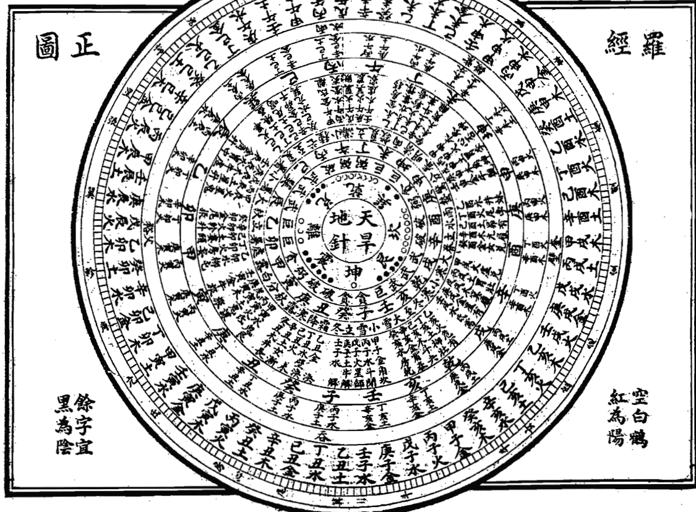
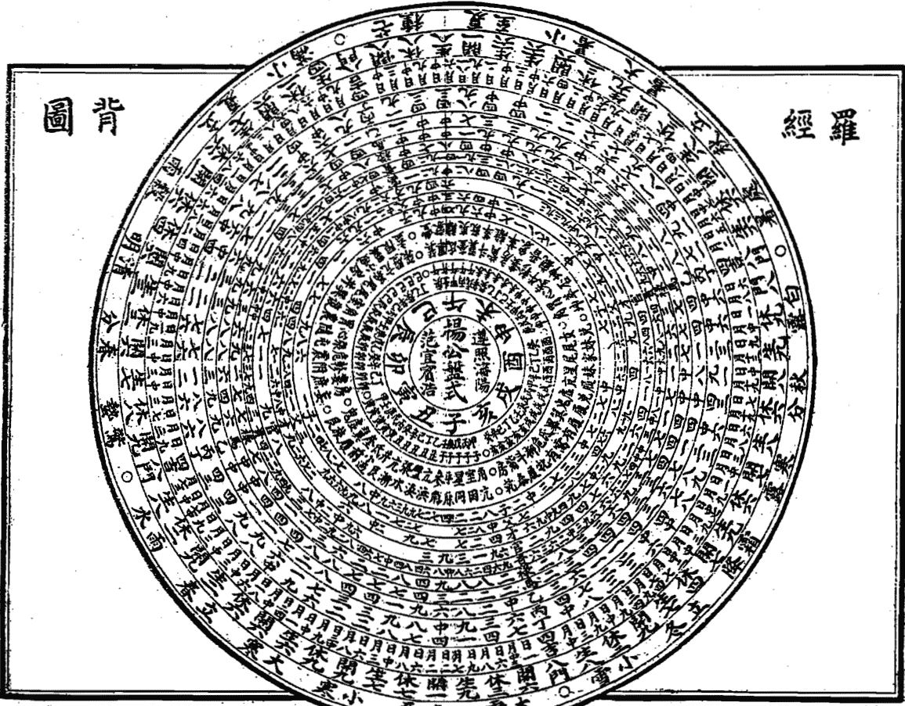
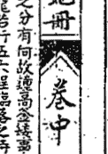
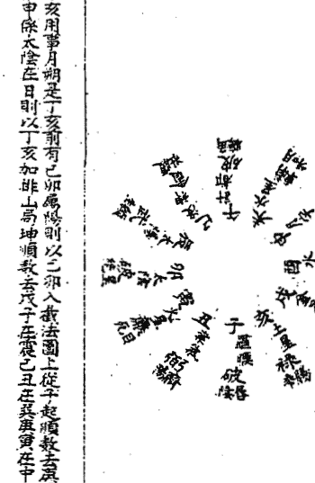

# 乾坤法竅

瀋陽范半池訂

民國七年上海江東茂記書局印行

# 乾坤法竅序

蓋自伏羲畫卦，文王繫辭，周公繫爻，孔子作十翼，而易道備矣。然易之為書，廣大悉備，有天道焉，有人道焉，有地道焉。三才之道，陰陽而已。陰陽之理，流行於天地之間，而人得之以為性。故聖人仰觀俯察，近取諸身，遠取諸物，以通神明之德，以類萬物之情。是以易之為書，雖曰卜筮之書，而實則窮理盡性之書也。後世術數之家，各執一說，或以納甲，或以飛伏，或以河洛，或以先天，紛紛聚訟，莫衷一是。蓋由不明陰陽之理，不達造化之源，故支離破碎，失其本真。余嘗博覽群書，參究奧義，深感術數之學，非淺見所能測。今得乾坤法竅一書，乃古人之真傳，非世俗之偽學。其書以河洛為宗，以先天為用，以納甲飛伏為輔，條理分明，義理深邃。讀之者可以窮陰陽之變，可以通造化之機，可以明吉凶之理，可以決禍福之源。誠術數之正宗，易學之津梁也。余恐其久而失傳，故梓而行之，以公同好。是為序。

乾隆二十五年九月重九日
果親王書

# 乾坤法竅序

余昔之刻此書也，蓋因初皈即蒙果師指示，有救世之意。今即速刻之，以其中草率者有之，含混者有之，後當公餘之暇，詳為改校。覽前之草率者，恐人閱之不明，今後者，恐人行認不真。今復行認真，今後加搜羅，別其中草率者，詳其重複者，刑之不盡者，補之另行。刊刻始覺清純，不雜成一家之言。此雖未盡書楊曾蔣賴諸公之妙用，而地學正宗，庶幾可明。則余救世之心願，亦少伸矣。故又序時。

乾隆三十一年丙戌天中節前一日
洛陽范宜賓賓旭氏識

## 乾坤法竅卷上

序

測驗改竅，法去古經古義，參以真機，以成書。如地理大全，山法全書，原其玉尺，琢玉惟官之類，是矣。然相沿習幾過字內，為禍日熾，弊大難維，有辨正一書，而未免穿鑿之用。申明故人，仍依其說也。無如近今，則偽中更有偽矣。即如今之撥砂，穴立向，全非聖賢之正道。故余將撥砂三合，黃泉八煞，翻卦，挨星，翻卦大小玄空四經，活法，俱以干支陰陽等，復為申說。其謬但余合之，其謬偽者，何敢妄自尊大。皆遵楊公三合所言，記謬者，不過再為申明之意耳。且此偽法，楊公諸經已曾指數于前也。余今得高山先生所授天機諸篇，皆是古本，較市本誠有天壤之殊。真機畢陳，偽法昭然。嘗嘗為天冊最嚴，一經係全所藏古本，發市本之訛，錄為地冊所著之理，經一辯，替天玉諸理之其用定焉。人毋書難三卷，有被此之相需，表裡之為用，缺一不可。故總其名曰乾坤法竅。但此書之作，上以求明楊公之真旨，中以求表楊公之禍人，下以求開後進之鑰。究其非，要石乃大道，為公一片救世之愚衷也。觀者諒之。

乾隆二十三年戊寅仲冬長至日洛陽范宜賓賓旭氏識

# 乾坤法寶天冊

## 卷上

## 目錄

乾坤法寶天冊
天冊
地學正經
龍經辨正
人冊
理氣精一解

天冊
地學正經目錄
青囊經 黃石公授赤松子
上卷 中卷 下卷
葬經 郭璞著 范宜賓注
青囊奧語 楊筠松著 蔣大鴻正訣
天玉經 楊筠松著 蔣大鴻正訣
內傳上 內傳中 內傳下
都天寶照經 楊筠松著 蔣大鴻正訣
上篇 中篇 下篇
青囊經 楊筠松著 蔣大鴻正訣
天元歌 蔣大鴻著
山龍 水龍
辨龍 察脈 定卦 來情 墨符
原隰有圖 條兆
氣化 分用 齡支有圖
諸義有圖
元空正運 范宜賓著 陽基

# 地理正經

## 凡例

- 一青囊經原係黃石公授赤松子之本坊本謬偽郭璞註所著今依古本更正
- 一青囊經之語坊本所刻率多訛誤以化始之語混入化成之中以化成之語混入化始之中以訛傳訛之句又雜入化始之內顯因混淆今依古本改
- 一善書之字句率多後人增刪採擇每以唱形之語收入此蓋為唱形立象故為據入今較之古本等無者刪去更正並為註釋
- 一青囊裏語為坊本採改之處今依古本更正
- 一都天寶照經坊本中原無此篇今據古本錄出
- 一青囊序中後人將字句採改刪去之處甚多今皆依古本更正補入
- 一玄空歌為後人頭腦增刪參前錯後今依古本更正
- 一歸厚錄出句古秀公失作者之名古本中係冷謙註釋後為葉蒼升刊去冷公之名稱為己註今依古本補入更正

## 乾坤法竅卷上

## 凡例

# 羅經正圖

空白鶴
紅為陽

餘字宜
黑為陰

# 羅經

## 圖背

# 地學正經

萬山子古本
青囊經
郭璞傳
楊松子

上卷

經曰天尊地卑陽奇陰禍一六共宗二七同道三八為朋四九為友五十同途闢勝奇耦五兆生成流行八方萬物皆生以合陽陽生於陰陰生於陽德陰德陰陽德陰陽德陰陽德陰陽德陰陽德陰陽德陰陽德陰陽德陰陽德陰陽德陰陽德陰陽德陰陽德陰陽德陰陽德陰陽德陰陽德陰陽德陰陽德陰陽德陰陽德陰陽德陰陽德陰陽德陰陽德陰陽德陰陽德陰陽德陰陽德陰陽德陰陽德陰陽德陰陽德陰陽德陰陽德陰陽德陰陽德陰陽德陰陽德陰陽德陰陽德陰陽德陰陽德陰陽德陰陽德陰陽德陰陽德陰陽德陰陽德陰陽德陰陽德陰陽德陰陽德陰陽德陰陽德陰陽德陰陽德陰陽德陰陽德陰陽德陰陽德陰陽德陰陽德陰陽德陰陽德陰陽德陰陽德陰陽德陰陽德陰陽德陰陽德陰陽德陰陽德陰陽德陰陽德陰陽德陰陽德陰陽德陰陽德陰陽德陰陽德陰陽德陰陽德陰陽德陰陽德陰陽德陰陽德陰陽德陰陽德陰陽德陰陽德陰陽德陰陽德陰陽德陰陽德陰陽德陰陽德陰陽德陰陽德陰陽德陰陽德陰陽德陰陽德陰陽德陰陽德陰陽德陰陽德陰陽德陰陽德陰陽德陰陽德陰陽德陰陽德陰陽德陰陽德陰陽德陰陽德陰陽德陰陽德陰陽德陰陽德陰陽德陰陽德陰陽德陰陽德陰陽德陰陽德陰陽德陰陽德陰陽德陰陽德陰陽德陰陽德陰陽德陰陽德陰陽德陰陽德陰陽德陰陽德陰陽德陰陽德陰陽德陰陽德陰陽德陰陽德陰陽德陰陽德陰陽德陰陽德陰陽德陰陽德陰陽德陰陽德陰陽德陰陽德陰陽德陰陽德陰陽德陰陽德陰陽德陰陽德陰陽德陰陽德陰陽德陰陽德陰陽德陰陽德陰陽德陰陽德陰陽德陰陽德陰陽德陰陽德陰陽德陰陽德陰陽德陰陽德陰陽德陰陽德陰陽德陰陽德陰陽德陰陽德陰陽德陰陽德陰陽德陰陽德陰陽德陰陽德陰陽德陰陽德陰陽德陰陽德陰陽德陰陽德陰陽德陰陽德陰陽德陰陽德陰陽德陰陽德陰陽德陰陽德陰陽德陰陽德陰陽德陰陽德陰陽德陰陽德陰陽德陰陽德陰陽德陰陽德陰陽德陰陽德陰陽德陰陽德陰陽德陰陽德陰陽德陰陽德陰陽德陰陽德陰陽德陰陽德陰陽德陰陽德陰陽德陰陽德陰陽德陰陽德陰陽德陰陽德陰陽德陰陽德陰陽德陰陽德陰陽德陰陽德陰陽德陰陽德陰陽德陰陽德陰陽德陰陽德陰陽德陰陽德陰陽德陰陽德陰陽德陰陽德陰陽德陰陽德陰陽德陰陽德陰陽德陰陽德陰陽德陰陽德陰陽德陰陽德陰陽德陰陽德陰陽德陰陽德陰陽德陰陽德陰陽德陰陽德陰陽德陰陽德陰陽德陰陽德陰陽德陰陽德陰陽德陰陽德陰陽德陰陽德陰陽德陰陽德陰陽德陰陽德陰陽德陰陽德陰陽德陰陽德陰陽德陰陽德陰陽德陰陽德陰陽德陰陽德陰陽德陰陽德陰陽德陰陽德陰陽德陰陽德陰陽德陰陽德陰陽德陰陽德陰陽德陰陽德陰陽德陰陽德陰陽德陰陽德陰陽德陰陽德陰陽德陰陽德陰陽德陰陽德陰陽德陰陽德陰陽德陰陽德陰陽德陰陽德陰陽德陰陽德陰陽德陰陽德陰陽德陰陽德陰陽德陰陽德陰陽德陰陽德陰陽德陰陽德陰陽德陰陽德陰陽德陰陽德陰陽德陰陽德陰陽德陰陽德陰陽德陰陽德陰陽德陰陽德陰陽德陰陽德陰陽德陰陽德陰陽德陰陽德陰陽德陰陽德陰陽德陰陽德陰陽德陰陽德陰陽德陰陽德陰陽德陰陽德陰陽德陰陽德陰陽德陰陽德陰陽德陰陽德陰陽德陰陽德陰陽德陰陽德陰陽德陰陽德陰陽德陰陽德陰陽德陰陽德陰陽德陰陽德陰陽德陰陽德陰陽德陰陽德陰陽德陰陽德陰陽德陰陽德陰陽德陰陽德陰陽德陰陽德陰陽德陰陽德陰陽德陰陽德陰陽德陰陽德陰陽德陰陽德陰陽德陰陽德陰陽德陰陽德陰陽德陰陽德陰陽德陰陽德陰陽德陰陽德陰陽德陰陽德陰陽德陰陽德陰陽德陰陽德陰陽德陰陽德陰陽德陰陽德陰陽德陰陽德陰陽德陰陽德陰陽德陰陽德陰陽德陰陽德陰陽德陰陽德陰陽德陰陽德陰陽德陰陽德陰陽德陰陽德陰陽德陰陽德陰陽德陰陽德陰陽德陰陽德陰陽德陰陽德陰陽德陰陽德陰陽德陰陽德陰陽德陰陽德陰陽德陰陽德陰陽德陰陽德陰陽德陰陽德陰陽德陰陽德陰陽德陰陽德陰陽德陰陽德陰陽德陰陽德陰陽德陰陽德陰陽德陰陽德陰陽德陰陽德陰陽德陰陽德陰陽德陰陽德陰陽德陰陽德陰陽德陰陽德陰陽德陰陽德陰陽德陰陽德陰陽德陰陽德陰陽德陰陽德陰陽德陰陽德陰陽德陰陽德陰陽德陰陽德陰陽德陰陽德陰陽德陰陽德陰陽德陰陽德陰陽德陰陽德陰陽德陰陽德陰陽德陰陽德陰陽德陰陽德陰陽德陰陽德陰陽德陰陽德陰陽德陰陽德陰陽德陰陽德陰陽德陰陽德陰陽德陰陽德陰陽德陰陽德陰陽德陰陽德陰陽德陰陽德陰陽德陰陽德陰陽德陰陽德陰陽德陰陽德陰陽德陰陽德陰陽德陰陽德陰陽德陰陽德陰陽德陰陽德陰陽德陰陽德陰陽德陰陽德陰陽德陰陽德陰陽德陰陽德陰陽德陰陽德陰陽德陰陽德陰陽德陰陽德陰陽德陰陽德陰陽德陰陽德陰陽德陰陽德陰陽德陰陽德陰陽德陰陽德陰陽德陰陽德陰陽德陰陽德陰陽德陰陽德陰陽德陰陽德陰陽德陰陽德陰陽德陰陽德陰陽德陰陽德陰陽德陰陽德陰陽德陰陽德陰陽德陰陽德陰陽德陰陽德陰陽德陰陽德陰陽德陰陽德陰陽德陰陽德陰陽德陰陽德陰陽德陰陽德陰陽德陰陽德陰陽德陰陽德陰陽德陰陽德陰陽德陰陽德陰陽德陰陽德陰陽德陰陽德陰陽德陰陽德陰陽德陰陽德陰陽德陰陽德陰陽德陰陽德陰陽德陰陽德陰陽德陰陽德陰陽德陰陽德陰陽德陰陽德陰陽德陰陽德陰陽德陰陽德陰陽德陰陽德陰陽德陰陽德陰陽德陰陽德陰陽德陰陽德陰陽德陰陽德陰陽德陰陽德陰陽德陰陽德陰陽德陰陽德陰陽德陰陽德陰陽德陰陽德陰陽德陰陽德陰陽德陰陽德陰陽德陰陽德陰陽德陰陽德陰陽德陰陽德陰陽德陰陽德陰陽德陰陽德陰陽德陰陽德陰陽德陰陽德陰陽德陰陽德陰陽德陰陽德陰陽德陰陽德陰陽德陰陽德陰陽德陰陽德陰陽德陰陽德陰陽德陰陽德陰陽德陰陽德陰陽德陰陽德陰陽德陰陽德陰陽德陰陽德陰陽德陰陽德陰陽德陰陽德陰陽德陰陽德陰陽德陰陽德陰陽德陰陽德陰陽德陰陽德陰陽德陰陽德陰陽德陰陽德陰陽德陰陽德陰陽德陰陽德陰陽德陰陽德陰陽德陰陽德陰陽德陰陽德陰陽德陰陽德陰陽德陰陽德陰陽德陰陽德陰陽德陰陽德陰陽德陰陽德陰陽德陰陽德陰陽德陰陽德陰陽德陰陽德陰陽德陰陽德陰陽德陰陽德陰陽德陰陽德陰陽德陰陽德陰陽德陰陽德陰陽德陰陽德陰陽德陰陽德陰陽德陰陽德陰陽德陰陽德陰陽德陰陽德陰陽德陰陽德陰陽德陰陽德陰陽德陰陽德陰陽德陰陽德陰陽德陰陽德陰陽德陰陽德陰陽德陰陽德陰陽德陰陽德陰陽德陰陽德陰陽德陰陽德陰陽德陰陽德陰陽德陰陽德陰陽德陰陽德陰陽德陰陽德陰陽德陰陽德陰陽德陰陽德陰陽德陰陽德陰陽德陰陽德陰陽德陰陽德陰陽德陰陽德陰陽德陰陽德陰陽德陰陽德陰陽德陰陽德陰陽德陰陽德陰陽德陰陽德陰陽德陰陽德陰陽德陰陽德陰陽德陰陽德陰陽德陰陽德陰陽德陰陽德陰陽德陰陽德陰陽德陰陽德陰陽德陰陽德陰陽德陰陽德陰陽德陰陽德陰陽德陰陽德陰陽德陰陽德陰陽德陰陽德陰陽德陰陽德陰陽德陰陽德陰陽德陰陽德陰陽德陰陽德陰陽德陰陽德陰陽德陰陽德陰陽德陰陽德陰陽德陰陽德陰陽德陰陽德陰陽德陰陽德陰陽德陰陽德陰陽德陰陽德陰陽德陰陽德陰陽德陰陽德陰陽德陰陽德陰陽德陰陽德陰陽德陰陽德陰陽德陰陽德陰陽德陰陽德陰陽德陰陽德陰陽德陰陽德陰陽德陰陽德陰陽德陰陽德陰陽德陰陽德陰陽德陰陽德陰陽德陰陽德陰陽德陰陽德陰陽德陰陽德陰陽德陰陽德陰陽德陰陽德陰陽德陰陽德陰陽德陰陽德陰陽德陰陽德陰陽德陰陽德陰陽德陰陽德陰陽德陰陽德陰陽德陰陽德陰陽德陰陽德陰陽德陰陽德陰陽德陰陽德陰陽德陰陽德陰陽德陰陽德陰陽德陰陽德陰陽德陰陽德陰陽德陰陽德陰陽德陰陽德陰陽德陰陽德陰陽德陰陽德陰陽德陰陽德陰陽德陰陽德陰陽德陰陽德陰陽德陰陽德陰陽德陰陽德陰陽德陰陽德陰陽德陰陽德陰陽德陰陽德陰陽德陰陽德陰陽德陰陽德陰陽德陰陽德陰陽德陰陽德陰陽德陰陽德陰陽德陰陽德陰陽德陰陽德陰陽德陰陽德陰陽德陰陽德陰陽德陰陽德陰陽德陰陽德陰陽德陰陽德陰陽德陰陽德陰陽德陰陽德陰陽德陰陽德陰陽德陰陽德陰陽德陰陽德陰陽德陰陽德陰陽德陰陽德陰陽德陰陽德陰陽德陰陽德陰陽德陰陽德陰陽德陰陽德陰陽德陰陽德陰陽德陰陽德陰陽德陰陽德陰陽德陰陽德陰陽德陰陽德陰陽德陰陽德陰陽德陰陽德陰陽德陰陽德陰陽德陰陽德陰陽德陰陽德陰陽德陰陽德陰陽德陰陽德陰陽德陰陽德陰陽德陰陽德陰陽德陰陽德陰陽德陰陽德陰陽德陰陽德陰陽德陰陽德陰陽德陰陽德陰陽德陰陽德陰陽德陰陽德陰陽德陰陽德陰陽德陰陽德陰陽德陰陽德陰陽德陰陽德陰陽德陰陽德陰陽德陰陽德陰陽德陰陽德陰陽德陰陽德陰陽德陰陽德陰陽德陰陽德陰陽德陰陽德陰陽德陰陽德陰陽德陰陽德陰陽德陰陽德陰陽德陰陽德陰陽德陰陽德陰陽德陰陽德陰陽德陰陽德陰陽德陰陽德陰陽德陰陽德陰陽德陰陽德陰陽德陰陽德陰陽德陰陽德陰陽德陰陽德陰陽德陰陽德陰陽德陰陽德陰陽德陰陽德陰陽德陰陽德陰陽德陰陽德陰陽德陰陽德陰陽德陰陽德陰陽德陰陽德陰陽德陰陽德陰陽德陰陽德陰陽德陰陽德陰陽德陰陽德陰陽德陰陽德陰陽德陰陽德陰陽德陰陽德陰陽德陰陽德陰陽德陰陽德陰陽德陰陽德陰陽德陰陽德陰陽德陰陽德陰陽德陰陽德陰陽德陰陽德陰陽德陰陽德陰陽德陰陽德陰陽德陰陽德陰陽德陰陽德陰陽德陰陽德陰陽德陰陽德陰陽德陰陽德陰陽德陰陽德陰陽德陰陽德陰陽德陰陽德陰陽德陰陽德陰陽德陰陽德陰陽德陰陽德陰陽德陰陽德陰陽德陰陽德陰陽德陰陽德陰陽德陰陽德陰陽德陰陽德陰陽德陰陽德陰陽德陰陽德陰陽德陰陽德陰陽德陰陽德陰陽德陰陽德陰陽德陰陽德陰陽德陰陽德陰陽德陰陽德陰陽德陰陽德陰陽德陰陽德陰陽德陰陽德陰陽德陰陽德陰陽德陰陽德陰陽德陰陽德陰陽德陰陽德陰陽德陰陽德陰陽德陰陽德陰陽德陰陽德陰陽德陰陽德陰陽德陰陽德陰陽德陰陽德陰陽德陰陽德陰陽德陰陽德陰陽德陰陽德陰陽德陰陽德陰陽德陰陽德陰陽德陰陽德陰陽德陰陽德陰陽德陰陽德陰陽德陰陽德陰陽德陰陽德陰陽德陰陽德陰陽德陰陽德陰陽德陰陽德陰陽德陰陽德陰陽德陰陽德陰陽德陰陽德陰陽德陰陽德陰陽德陰陽德陰陽德陰陽德陰陽德陰陽德陰陽德陰陽德陰陽德陰陽德陰陽德陰陽德陰陽德陰陽德陰陽德陰陽德陰陽德陰陽德陰陽德陰陽德陰陽德陰陽德陰陽德陰陽德陰陽德陰陽德陰陽德陰陽德陰陽德陰陽德陰陽德陰陽德陰陽德陰陽德陰陽德陰陽德陰陽德陰陽德陰陽德陰陽德陰陽德陰陽德陰陽德陰陽德陰陽德陰陽德陰陽德陰陽德陰陽德陰陽德陰陽德陰陽德陰陽德陰陽德陰陽德陰陽德陰陽德陰陽德陰陽德陰陽德陰陽德陰陽德陰陽德陰陽德陰陽德陰陽德陰陽德陰陽德陰陽德陰陽德陰陽德陰陽德陰陽德陰陽德陰陽德陰陽德陰陽德陰陽德陰陽德陰陽德陰陽德陰陽德陰陽德陰陽德陰陽德陰陽德陰陽德陰陽德陰陽德陰陽德陰陽德陰陽德陰陽德陰陽德陰陽德陰陽德陰陽德陰陽德陰陽德陰陽德陰陽德陰陽德陰陽德陰陽德陰陽德陰陽德陰陽德陰陽德陰陽德陰陽德陰陽德陰陽德陰陽德陰陽德陰陽德陰陽德陰陽德陰陽德陰陽德陰陽德陰陽德陰陽德陰陽德陰陽德陰陽德陰陽德陰陽德陰陽德陰陽德陰陽德陰陽德陰陽德陰陽德陰陽德陰陽德陰陽德陰陽德陰陽德陰陽德陰陽德陰陽德陰陽德陰陽德陰陽德陰陽德陰陽德陰陽德陰陽德陰陽德陰陽德陰陽德陰陽德陰陽德陰陽德陰陽德陰陽德陰陽德陰陽德陰陽德陰陽德陰陽德陰陽德陰陽德陰陽德陰陽德陰陽德陰陽德陰陽德陰陽德陰陽德陰陽德陰陽德陰陽德陰陽德陰陽德陰陽德陰陽德陰陽德陰陽德陰陽德陰陽德陰陽德陰陽德陰陽德陰陽德陰陽德陰陽德陰陽德陰陽德陰陽德陰陽德陰陽德陰陽德陰陽德陰陽德陰陽德陰陽德陰陽德陰陽德陰陽德陰陽德陰陽德陰陽德陰陽德陰陽德陰陽德陰陽德陰陽德陰陽德陰陽德陰陽德陰陽德陰陽德陰陽德陰陽德陰陽德陰陽德陰陽德陰陽德陰陽德陰陽德陰陽德陰陽德陰陽德陰陽德陰陽德陰陽德陰陽德陰陽德陰陽德陰陽德陰陽德陰陽德陰陽德陰陽德陰陽德陰陽德陰陽德陰陽德陰陽德陰陽德陰陽德陰陽德陰陽德陰陽德陰陽德陰陽德陰陽德陰陽德陰陽德陰陽德陰陽德陰陽德陰陽德陰陽德陰陽德陰陽德陰陽德陰陽德陰陽德陰陽德陰陽德陰陽德陰陽德陰陽德陰陽德陰陽德陰陽德陰陽德陰陽德陰陽德陰陽德陰陽德陰陽德陰陽德陰陽德陰陽德陰陽德陰陽德陰陽德陰陽德陰陽德陰陽德陰陽德陰陽德陰陽德陰陽德陰陽德陰陽德陰陽德陰陽德陰陽德陰陽德陰陽德陰陽德陰陽德陰陽德陰陽德陰陽德陰陽德陰陽德陰陽德陰陽德陰陽德陰陽德陰陽德陰陽德陰陽德陰陽德陰陽德陰陽德陰陽德陰陽德陰陽德陰陽德陰陽德陰陽德陰陽德陰陽德陰陽德陰陽德陰陽德陰陽德陰陽德陰陽德陰陽德陰陽德陰陽德陰陽德陰陽德陰陽德陰陽德陰陽德陰陽德陰陽德陰陽德陰陽德陰陽德陰陽德陰陽德陰陽德陰陽德陰陽德陰陽德陰陽德陰陽德陰陽德陰陽德陰陽德陰陽德陰陽德陰陽德陰陽德陰陽德陰陽德陰陽德陰陽德陰陽德陰陽德陰陽德陰陽德陰陽德陰陽德陰陽德陰陽德陰陽德陰陽德陰陽德陰陽德陰陽德陰陽德陰陽德陰陽德陰陽德陰陽德陰陽德陰陽德陰陽德陰陽德陰陽德陰陽德陰陽德陰陽德陰陽德陰陽德陰陽德陰陽德陰陽德陰陽德陰陽德陰陽德陰陽德陰陽德陰陽德陰陽德陰陽德陰陽德陰陽德陰陽德陰陽德陰陽德陰陽德陰陽德陰陽德陰陽德陰陽德陰陽德陰陽德陰陽德陰陽德陰陽德陰陽德陰陽德陰陽德陰陽德陰陽德陰陽德陰陽德陰陽德陰陽德陰陽德陰陽德陰陽德陰陽德陰陽德陰陽德陰陽德陰陽德陰陽德陰陽德陰陽德陰陽德陰陽德陰陽德陰陽德陰陽德陰陽德陰陽德陰陽德陰陽德陰陽德陰陽德陰陽德陰陽德陰陽德陰陽德陰陽德陰陽德陰陽德陰陽德陰陽德陰陽德陰陽德陰陽德陰陽德陰陽德陰陽德陰陽德陰陽德陰陽德陰陽德陰陽德陰陽德陰陽德陰陽德陰陽德陰陽德陰陽德陰陽德陰陽德陰陽德陰陽德陰陽德陰陽德陰陽德陰陽德陰陽德陰陽德陰陽德陰陽德陰陽德陰陽德陰陽德陰陽德陰陽德陰陽德陰陽德陰陽德陰陽德陰陽德陰陽德陰陽德陰陽德陰陽德陰陽德陰陽德陰陽德陰陽德陰陽德陰陽德陰陽德陰陽德陰陽德陰陽德陰陽德陰陽德陰陽德陰陽德陰陽德陰陽德陰陽德陰陽德陰陽德陰陽德陰陽德陰陽德陰陽德陰陽德陰陽德陰陽德陰陽德陰陽德陰陽德陰陽德陰陽德陰陽德陰陽德陰陽德陰陽德陰陽德陰陽德陰陽德陰陽德陰陽德陰陽德陰陽德陰陽德陰陽德陰陽德陰陽德陰陽德陰陽德陰陽德陰陽德陰陽德陰陽德陰陽德陰陽德陰陽德陰陽德陰陽德陰陽德陰陽德陰陽德陰陽德陰陽德陰陽德陰陽德陰陽德陰陽德陰陽德陰陽德陰陽德陰陽德陰陽德陰陽德陰陽德陰陽德陰陽德陰陽德陰陽德陰陽德陰陽德陰陽德陰陽德陰陽德陰陽德陰陽德陰陽德陰陽德陰陽德陰陽德陰陽德陰陽德陰陽德陰陽德陰陽德陰陽德陰陽德陰陽德陰陽德陰陽德陰陽德陰陽德陰陽德陰陽德陰陽德陰陽德陰陽德陰陽德陰陽德陰陽德陰陽德陰陽德陰陽德陰陽德陰陽德陰陽德陰陽德陰陽德陰陽德陰陽德陰陽德陰陽德陰陽德陰陽德陰陽德陰陽德陰陽德陰陽德陰陽德陰陽德陰陽德陰陽德陰陽德陰陽德陰陽德陰陽德陰陽德陰陽德陰陽德陰陽德陰陽德陰陽德陰陽德陰陽德陰陽德陰陽德陰陽德陰陽德陰陽德陰陽德陰陽德陰陽德陰陽德陰陽德陰陽德陰陽德陰陽德陰陽德陰陽德陰陽德陰陽德陰陽德陰陽德陰陽德陰陽德陰陽德陰陽德陰陽德陰陽德陰陽德陰陽德陰陽德陰陽德陰陽德陰陽德陰陽德陰陽德陰陽德陰陽德陰陽德陰陽德陰陽德陰陽德陰陽德陰陽德陰陽德陰陽德陰陽德陰陽德陰陽德陰陽德陰陽德陰陽德陰陽德陰陽德陰陽德陰陽德陰陽德陰陽德陰陽德陰陽德陰陽德陰陽德陰陽德陰陽德陰陽德陰陽德陰陽德陰陽德陰陽德陰陽德陰陽德陰陽德陰陽德陰陽德陰陽德陰陽德陰陽德陰陽德陰陽德陰陽德陰陽德陰陽德陰陽德陰陽德陰陽德陰陽德陰陽德陰陽德陰陽德陰陽德陰陽德陰陽德陰陽德陰陽德陰陽德陰陽德陰陽德陰陽德陰陽德陰陽德陰陽德陰陽德陰陽德陰陽德陰陽德陰陽德陰陽德陰陽德陰陽德陰陽德陰陽德陰陽德陰陽德陰陽德陰陽德陰陽德陰陽德陰陽德陰陽德陰陽德陰陽德陰陽德陰陽德陰陽德陰陽德陰陽德陰陽德陰陽德陰陽德陰陽德陰陽德陰陽德陰陽德陰陽德陰陽德陰陽德陰陽德陰陽德陰陽德陰陽德陰陽德陰陽德陰陽德陰陽德陰陽德陰陽德陰陽德陰陽德陰陽德陰陽德陰陽德陰陽德陰陽德陰陽德陰陽德陰陽德陰陽德陰陽德陰陽德陰陽德陰陽德陰陽德陰陽德陰陽德陰陽德陰陽德陰陽德陰陽德陰陽德陰陽德陰陽德陰陽德陰陽德陰陽德陰陽德陰陽德陰陽德陰陽德陰陽德陰陽德陰陽德陰陽德陰陽德陰陽德陰陽德陰陽德陰陽德陰陽德陰陽德陰陽德陰陽德陰陽德陰陽德陰陽德陰陽德陰陽德陰陽德陰陽德陰陽德陰陽德陰陽德陰陽德陰陽德陰陽德陰陽德陰陽德陰陽德陰陽德陰陽德陰陽德陰陽德陰陽德陰陽德陰陽德陰陽德陰陽德陰陽德陰陽德陰陽德陰陽德陰陽德陰陽德陰陽德陰陽德陰陽德陰陽德陰陽德陰陽德陰陽德陰陽德陰陽德陰陽德陰陽德陰陽德陰陽德陰陽德陰陽德陰陽德陰陽德陰陽德陰陽德陰陽德陰陽德陰陽德陰陽德陰陽德陰陽德陰陽德陰陽德陰陽德陰陽德陰陽德陰陽德陰陽德陰陽德陰陽德陰陽德陰陽德陰陽德陰陽德陰陽德陰陽德陰陽德陰陽德陰陽德陰陽德陰陽德陰陽德陰陽德陰陽德陰陽德陰陽德陰陽德陰陽德陰陽德陰陽德陰陽德陰陽德陰陽德陰陽德陰陽德陰陽德陰陽德陰陽德陰陽德陰陽德陰陽德陰陽德陰陽德陰陽德陰陽德陰陽德陰陽德陰陽德陰陽德陰陽德陰陽德陰陽德陰陽德陰陽德陰陽德陰陽德陰陽德陰陽德陰陽德陰陽德陰陽德陰陽德陰陽德陰陽德陰陽德陰陽德陰陽德陰陽德陰陽德陰陽德陰陽德陰陽德陰陽德陰陽德陰陽德陰陽德陰陽德陰陽德陰陽德陰陽德陰陽德陰陽德陰陽德陰陽德陰陽德陰陽德陰陽德陰陽德陰陽德陰陽德陰陽德陰陽德陰陽德陰陽德陰陽德陰陽德陰陽德陰陽德陰陽德陰陽德陰陽德陰陽德陰陽德陰陽德陰陽德陰陽德陰陽德陰陽德陰陽德陰陽德陰陽德陰陽德陰陽德陰陽德陰陽德陰陽德陰陽德陰陽德陰陽德陰陽德陰陽德陰陽德陰陽德陰陽德陰陽德陰陽德陰陽德陰陽德陰陽德陰陽德陰陽德陰陽德陰陽德陰陽德陰陽德陰陽德陰陽德陰陽德陰陽德陰陽德陰陽德陰陽德陰陽德陰陽德陰陽德陰陽德陰陽德陰陽德陰陽德陰陽德陰陽德陰陽德陰陽德陰陽德陰陽德陰陽德陰陽德陰陽德陰陽德陰陽德陰陽德陰陽德陰陽德陰陽德陰陽德陰陽德陰陽德陰陽德陰陽德陰陽德陰陽德陰陽德陰陽德陰陽德陰陽德陰陽德陰陽德陰陽德陰陽德陰陽德陰陽德陰陽德陰陽德陰陽德陰陽德陰陽德陰陽德陰陽德陰陽德陰陽德陰陽德陰陽德陰陽德陰陽德陰陽德陰陽德陰陽德陰陽德陰陽德陰陽德陰陽德陰陽德陰陽德陰陽德陰陽德陰陽德陰陽德陰陽德陰陽德陰陽德陰陽德陰陽德陰陽德陰陽德陰陽德陰陽德陰陽德陰陽德陰陽德陰陽德陰陽德陰陽德陰陽德陰陽德陰陽德陰陽德陰陽德陰陽德陰陽德陰陽德陰陽德陰陽德陰陽德陰陽德陰陽德陰陽德陰陽德陰陽德陰陽德陰陽德陰陽德陰陽德陰陽德陰陽德陰陽德陰陽德陰陽德陰陽德陰陽德陰陽德陰陽德陰陽德陰陽德陰陽德陰陽德陰陽德陰陽德陰陽德陰陽德陰陽德陰陽德陰陽德陰陽德陰陽德陰陽德陰陽德陰陽德陰陽德陰陽德陰陽德陰陽德陰陽德陰陽德陰陽德陰陽德陰陽德陰陽德陰陽德陰陽德陰陽德陰陽德陰陽德陰陽德陰陽德陰陽德陰陽德陰陽德陰陽德陰陽德陰陽德陰陽德陰陽德陰陽德陰陽德陰陽德陰陽德陰陽德陰陽德陰陽德陰陽德陰陽德陰陽德陰陽德陰陽德陰陽德陰陽德陰陽德陰陽德陰陽德陰陽德陰陽德陰陽德陰陽德陰陽德陰陽德陰陽德陰陽德陰陽德陰陽德陰陽德陰陽德陰陽德陰陽德陰陽德陰陽德陰陽德陰陽德陰陽德陰陽德陰陽德陰陽德陰陽德陰陽德陰陽德陰陽德陰陽德陰陽德陰陽德陰陽德陰陽德陰陽德陰陽德陰陽德陰陽德陰陽德陰陽德陰陽德陰陽德陰陽德陰陽德陰陽德陰陽德陰陽德陰陽德陰陽德陰陽德陰陽德陰陽德陰陽德陰陽德陰陽德陰陽德陰陽德陰陽德陰陽德陰陽德陰陽德陰陽德陰陽德陰陽德陰陽德陰陽德陰陽德陰陽德陰陽德陰陽德陰陽德陰陽德陰陽德陰陽德陰陽德陰陽德陰陽德陰陽德陰陽德陰陽德陰陽德陰陽德陰陽德陰陽德陰陽德陰陽德陰陽德陰陽德陰陽德陰陽德陰陽德陰陽德陰陽德陰陽德陰陽德陰陽德陰陽德陰陽德陰陽德陰陽德陰陽德陰陽德陰陽德陰陽德陰陽德陰陽德陰陽德陰陽德陰陽德陰陽德陰陽德陰陽德陰陽德陰陽德陰陽德陰陽德陰陽德陰陽德陰陽德陰陽德陰陽德陰陽德陰陽德陰陽德陰陽德陰陽德陰陽德陰陽德陰陽德陰陽德陰陽德陰陽德陰陽德陰陽德陰陽德陰陽德陰陽德陰陽德陰陽德陰陽德陰陽德陰陽德陰陽德陰陽德陰陽德陰陽德陰陽德陰陽德陰陽德陰陽德陰陽德陰陽德陰陽德陰陽德陰陽德陰陽德陰陽德陰陽德陰陽德陰陽德陰陽德陰陽德陰陽德陰陽德陰陽德陰陽德陰陽德陰陽德陰陽德陰陽德陰陽德陰陽德陰陽德陰陽德陰陽德陰陽德陰陽德陰陽德陰陽德陰陽德陰陽德陰陽德陰陽德陰陽德陰陽德陰陽德陰陽德陰陽德陰陽德陰陽德陰陽德陰陽德陰陽德陰陽德陰陽德陰陽德陰陽德陰陽德陰陽德陰陽德陰陽德陰陽德陰陽德陰陽德陰陽德陰陽德陰陽德陰陽德陰陽德陰陽德陰陽德陰陽德陰陽德陰陽德陰陽德陰陽德陰陽德陰陽德陰陽德陰陽德陰陽德陰陽德陰陽德陰陽德陰陽德陰陽德陰陽德陰陽德陰陽德陰陽德陰陽德陰陽德陰陽德陰陽德陰陽德陰陽德陰陽德陰陽德陰陽德陰陽德陰陽德陰陽德陰陽德陰陽德陰陽德陰陽德陰陽德陰陽德陰陽德陰陽德陰陽德陰陽德陰陽德陰陽德陰陽德陰陽德陰陽德陰陽德陰陽德陰陽德陰陽德陰陽德陰陽德陰陽德陰陽德陰陽德陰陽德陰陽德陰陽德陰陽德陰陽德陰陽德陰陽德陰陽德陰陽德陰陽德陰陽德陰陽德陰陽德陰陽德陰陽德陰陽德陰陽德陰陽德陰陽德陰陽德陰陽德陰陽德陰陽德陰陽德陰陽德陰陽德陰陽德陰陽德陰陽德陰陽德陰陽德陰陽德陰陽德陰陽德陰陽德陰陽德陰陽德陰陽德陰陽德陰陽德陰陽德陰陽德陰陽德陰陽德陰陽德陰陽德陰陽德陰陽德陰陽德陰陽德陰陽德陰陽德陰陽德陰陽德陰陽德陰陽德陰陽德陰陽德陰陽德陰陽德陰陽德陰陽德陰陽德陰陽德陰陽德陰陽德陰陽德陰陽德陰陽德陰陽德陰陽德陰陽德陰陽德陰陽德陰陽德陰陽德陰陽德陰陽德陰陽德陰陽德陰陽德陰陽德陰陽德陰陽德陰陽德陰陽德陰陽德陰陽德陰陽德陰陽德陰陽德陰陽德陰陽德陰陽德陰陽德陰陽德陰陽德陰陽德陰陽德陰陽德陰陽德陰陽德陰陽德陰陽德陰陽德陰陽德陰陽德陰陽德陰陽德陰陽德陰陽德陰陽德陰陽德陰陽德陰陽德陰陽德陰陽德陰陽德陰陽德陰陽德陰陽德陰陽德陰陽德陰陽德陰陽德陰陽德陰陽德陰陽德陰陽德陰陽德陰陽德陰陽德陰陽德陰陽德陰陽德陰陽德陰陽德陰陽德陰陽德陰陽德陰陽德陰陽德陰陽德陰陽德陰陽德陰陽德陰陽德陰陽德陰陽德陰陽德陰陽德陰陽德陰陽德陰陽德陰陽德陰陽德陰陽德陰陽德陰陽德陰陽德陰陽德陰陽德陰陽德陰陽德陰陽德陰陽德陰陽德陰陽德陰陽德陰陽德陰陽德陰陽德陰陽德陰陽德陰陽德陰陽德陰陽德陰陽德陰陽德陰陽德陰陽德陰陽德陰陽德陰陽德陰陽德陰陽德陰陽德陰陽德陰陽德陰陽德陰陽德陰陽德陰陽德陰陽德陰陽德陰陽德陰陽德陰陽德陰陽德陰陽德陰陽德陰陽德陰陽德陰陽德陰陽德陰陽德陰陽德陰陽德陰陽德陰陽德陰陽德陰陽德陰陽德陰陽德陰陽德陰陽德陰陽德陰陽德陰陽德陰陽德陰陽德陰陽德陰陽德陰陽德陰陽德陰陽德陰陽德陰陽德陰陽德陰陽德陰陽德陰陽德陰陽德陰陽德陰陽德陰陽德陰陽德陰陽德陰陽德陰陽德陰陽德陰陽德陰陽德陰陽德陰陽德陰陽德陰陽德陰陽德陰陽德陰陽德陰陽德陰陽德陰陽德陰陽德陰陽德陰陽德陰陽德陰陽德陰陽德陰陽德陰陽德陰陽德陰陽德陰陽德陰陽德陰陽德陰陽德陰陽德陰陽德陰陽德陰陽德陰陽德陰陽德陰陽德陰陽德陰陽德陰陽德陰陽德陰陽德陰陽德陰陽德陰陽德陰陽德陰陽德陰陽德陰陽德陰陽德陰陽德陰陽德陰陽德陰陽德陰陽德陰陽德陰陽德陰陽德陰陽德陰陽德陰陽德陰陽德陰陽德陰陽德陰陽德陰陽德陰陽德陰陽德陰陽德陰陽德陰陽德陰陽德陰陽德陰陽德陰陽德陰陽德陰陽德陰陽德陰陽德陰陽德陰陽德陰陽德陰陽德陰陽德陰陽德陰陽德陰陽德陰陽德陰陽德陰陽德陰陽德陰陽德陰陽德陰陽德陰陽德陰陽德陰陽德陰陽德陰陽德陰陽德陰陽德陰陽德陰陽德陰陽德陰陽德陰陽德陰陽德陰陽德陰陽德陰陽德陰陽德陰陽德陰陽德陰陽德陰陽德陰陽德陰陽德陰陽德陰陽德陰陽德陰陽德陰陽德陰陽德陰陽德陰陽德陰陽德陰陽德陰陽德陰陽德陰陽德陰陽德陰陽德陰陽德陰陽德陰陽德陰陽德陰陽德陰陽德陰陽德陰陽德陰陽德陰陽德陰陽德陰陽德陰陽德陰陽德陰陽德陰陽德陰陽德陰陽德陰陽德陰陽德陰陽德陰陽德陰陽德陰陽德陰陽德陰陽德陰陽德陰陽德陰陽德陰陽德陰陽德陰陽德陰陽德陰陽德陰陽德陰陽德陰陽德陰陽德陰陽德陰陽德陰陽德陰陽德陰陽德陰陽德陰陽德陰陽德陰陽德陰陽德陰陽德陰陽德陰陽德陰陽德陰陽德陰陽德陰陽德陰陽德陰陽德陰陽德陰陽德陰陽德陰陽德陰陽德陰陽德陰陽德陰陽德陰陽德陰陽德陰陽德陰陽德陰陽德陰陽德陰陽德陰陽德陰陽德陰陽德陰陽德陰陽德陰陽德陰陽德陰陽德陰陽德陰陽德陰陽德陰陽德陰陽德陰陽德陰陽德陰陽德陰陽德陰陽德陰陽德陰陽德陰陽德陰陽德陰陽德陰陽德陰陽德陰陽德陰陽德陰陽德陰陽德陰陽德陰陽德陰陽德陰陽德陰陽德陰陽德陰陽德陰陽德陰陽德陰陽德陰陽德陰陽德陰陽德陰陽德陰陽德陰陽德陰陽德陰陽德陰陽德陰陽德陰陽德陰陽德陰陽德陰陽德陰陽德陰陽德陰陽德陰陽德陰陽德陰陽德陰陽德陰陽德陰陽德陰陽德陰陽德陰陽德陰陽德陰陽德陰陽德陰陽德陰陽德陰陽德陰陽德陰陽德陰陽德陰陽德陰陽德陰陽德陰陽德陰陽德陰陽德陰陽德陰陽德陰陽德陰陽德陰陽德陰陽德陰陽德陰陽德陰陽德陰陽德陰陽德陰陽德陰陽德陰陽德陰陽德陰陽德陰陽德陰陽德陰陽德陰陽德陰陽德陰陽德陰陽德陰陽德陰陽德陰陽德陰陽德陰陽德陰陽德陰陽德陰陽德陰陽德陰陽德陰陽德陰陽德陰陽德陰陽德陰陽德陰陽德陰陽德陰陽德陰陽德陰陽德陰陽德陰陽德陰陽德陰陽德陰陽德陰陽德陰陽德陰陽德陰陽德陰陽德陰陽德陰陽德陰陽德陰陽德陰陽德陰陽德陰陽德陰陽德陰陽德陰陽德陰陽德陰陽德陰陽德陰陽德陰陽德陰陽德陰陽德陰陽德陰陽德陰陽德陰陽德陰陽德陰陽德陰陽德陰陽德陰陽德陰陽德陰陽德陰陽德陰陽德陰陽德陰陽德陰陽德陰陽德陰陽德陰陽德陰陽德陰陽德陰陽德陰陽德陰陽德陰陽德陰陽德陰陽德陰陽德陰陽德陰陽德陰陽德陰陽德陰陽德陰陽德陰陽德陰陽德陰陽德陰陽德陰陽德陰陽德陰陽德陰陽德陰陽德陰陽德陰陽德陰陽德陰陽德陰陽德陰陽德陰陽德陰陽德陰陽德陰陽德陰陽德陰陽德陰陽德陰陽德陰陽德陰陽德陰陽德陰陽德陰陽德陰陽德陰陽德陰陽德陰陽德陰陽德陰陽德陰陽德陰陽德陰陽德陰陽德陰陽德陰陽德陰陽德陰陽德陰陽德陰陽德陰陽德陰陽德陰陽德陰陽德陰陽德陰陽德陰陽德陰陽德陰陽德陰陽德陰陽德陰陽德陰陽德陰陽德陰陽德陰陽德陰陽德陰陽德陰陽德陰陽德陰陽德陰陽德陰陽德陰陽德陰陽德陰陽德陰陽德陰陽德陰陽德陰陽德陰陽德陰陽德陰陽德陰陽德陰陽德陰陽德陰陽德陰陽德陰陽德陰陽德陰陽德陰陽德陰陽德陰陽德陰陽德陰陽德陰陽德陰陽德陰陽德陰陽德陰陽德陰陽德陰陽德陰陽德陰陽德陰陽德陰陽德陰陽德陰陽德陰陽德陰陽德陰陽德陰陽德陰陽德陰陽德陰陽德陰陽德陰陽德陰陽德陰陽德陰陽德陰陽德陰陽德陰陽德陰陽德陰陽德陰陽德陰陽德陰陽德陰陽德陰陽德陰陽德陰陽德陰陽德陰陽德陰陽德陰陽德陰陽德陰陽德陰陽德陰陽德陰陽德陰陽德陰陽德陰陽德陰陽德陰陽德陰陽德陰陽德陰陽德陰陽德陰陽德陰陽德陰陽德陰陽德陰陽德陰陽德陰陽德陰陽德陰陽德陰陽德陰陽德陰陽德陰陽德陰陽德陰陽德陰陽德陰陽德陰陽德陰陽德陰陽德陰陽德陰陽德陰陽德陰陽德陰陽德陰陽德陰陽德陰陽德陰陽德陰陽德陰陽德陰陽德陰陽德陰陽德陰陽德陰陽德陰陽德陰陽德陰陽德陰陽德陰陽德陰陽德陰陽德陰陽德陰陽德陰陽德陰陽德陰陽德陰陽德陰陽德陰陽德陰陽德陰陽德陰陽德陰陽德陰陽德陰陽德陰陽德陰陽德陰陽德陰陽德陰陽德陰陽德陰陽德陰陽德陰陽德陰陽德陰陽德陰陽德陰陽德陰陽德陰陽德陰陽德陰陽德陰陽德陰陽德陰陽德陰陽德陰陽德陰陽德陰陽德陰陽德陰陽德陰陽德陰陽德陰陽德陰陽德陰陽德陰陽德陰陽德陰陽德陰陽德陰陽德陰陽德陰陽德陰陽德陰陽德陰陽德陰陽德陰陽德陰陽德陰陽德陰陽德陰陽德陰陽德陰陽德陰陽德陰陽德陰陽德陰陽德陰陽德陰陽德陰陽德陰陽德陰陽德陰陽德陰陽德陰陽德陰陽德陰陽德陰陽德陰陽德陰陽德陰陽德陰陽德陰陽德陰陽德陰陽德陰陽德陰陽德陰陽德陰陽德陰陽德陰陽德陰陽德陰陽德陰陽德陰陽德陰陽德陰陽德陰陽德陰陽德陰陽德陰陽德陰陽德陰陽德陰陽德陰陽德陰陽德陰陽德陰陽德陰陽德陰陽德陰陽德陰陽德陰陽德陰陽德陰陽德陰陽德陰陽德陰陽德陰陽德陰陽德陰陽德陰陽德陰陽德陰陽德陰陽德陰陽德陰陽德陰陽德陰陽德陰陽德陰陽德陰陽德陰陽德陰陽德陰陽德陰陽德陰陽德陰陽德陰陽德陰陽德陰陽德陰陽德陰陽德陰陽德陰陽德陰陽德陰陽德陰陽德陰陽德陰陽德陰陽德陰陽德陰陽德陰陽德陰陽德陰陽德陰陽德陰陽德陰陽德陰陽德陰陽德陰陽德陰陽德陰陽德陰陽德陰陽德陰陽德陰陽德陰陽德陰陽德陰陽德陰陽德陰陽德陰陽德陰陽德陰陽德陰陽德陰陽德陰陽德陰陽德陰陽德陰陽德陰陽德陰陽德陰陽德陰陽德陰陽德陰陽德陰陽德陰陽德陰陽德陰陽德陰陽德陰陽德陰陽德陰陽德陰陽德陰陽德陰陽德陰陽德陰陽德陰陽德陰陽德陰陽德陰陽德陰陽德陰陽德陰陽德陰陽德陰陽德陰陽德陰陽德陰陽德陰陽德陰陽德陰陽德陰陽德陰陽德陰陽德陰陽德陰陽德陰陽德陰陽德陰陽德陰陽德陰陽德陰陽德陰陽德陰陽德陰陽德陰陽德陰陽德陰陽德陰陽德陰陽德陰陽德陰陽德陰陽德陰陽德陰陽德陰陽德陰陽德陰陽德陰陽德陰陽德陰陽德陰陽德陰陽德陰陽德陰陽德陰陽德陰陽德陰陽德陰陽德陰陽德陰陽德陰陽德陰陽德陰陽德陰陽德陰陽德陰陽德陰陽德陰陽德陰陽德陰陽德陰陽德陰陽德陰陽德陰陽德陰陽德陰陽德陰陽德陰陽德陰陽德陰陽德陰陽德陰陽德陰陽德陰陽德陰陽德陰陽德陰陽德陰陽德陰陽德陰陽德陰陽德陰陽德陰陽德陰陽德陰陽德陰陽德陰陽德陰陽德陰陽德陰陽德陰陽德陰陽德陰陽德陰陽德陰陽德陰陽德陰陽德陰陽德陰陽德陰陽德陰陽德陰陽德陰陽德陰陽德陰陽德陰陽德陰陽德陰陽德陰陽德陰陽德陰陽德陰陽德陰陽德陰陽德陰陽德陰陽德陰陽德陰陽德陰陽德陰陽德陰陽德陰陽德陰陽德陰陽德陰陽德陰陽德陰陽德陰陽德陰陽德陰陽德陰陽德陰陽德陰陽德陰陽德陰陽德陰陽德陰陽德陰陽德陰陽德陰陽德陰陽德陰陽德陰陽德陰陽德陰陽德陰陽德陰陽德陰陽德陰陽德陰陽德陰陽德陰陽德陰陽德陰陽德陰陽德陰陽德陰陽德陰陽德陰陽德陰陽德陰陽德陰陽德陰陽德陰陽德陰陽德陰陽德陰陽德陰陽德陰陽德陰陽德陰陽德陰陽德陰陽德陰陽德陰陽德陰陽德陰陽德陰陽德陰陽德陰陽德陰陽德陰陽德陰陽德陰陽德陰陽德陰陽德陰陽德陰陽德陰陽德陰陽德陰陽德陰陽德陰陽德陰陽德陰陽德陰陽德陰陽德陰陽德陰陽德陰陽德陰陽德陰陽德陰陽德陰陽德陰陽德陰陽德陰陽德陰陽德陰陽德陰陽德陰陽德陰陽德陰陽德陰陽德陰陽德陰陽德陰陽德陰陽德陰陽德陰陽德陰陽德陰陽德陰陽德陰陽德陰陽德陰陽德陰陽德陰陽德陰陽德陰陽德陰陽德陰陽德陰陽德陰陽德陰陽德陰陽德陰陽德陰陽德陰陽德陰陽德陰陽德陰陽德陰陽德陰陽德陰陽德陰陽德陰陽德陰陽德陰陽德陰陽德陰陽德陰陽德陰陽德陰陽德陰陽德陰陽德陰陽德陰陽德陰陽德陰陽德陰陽德陰陽德陰陽德陰陽德陰陽德陰陽德陰陽德陰陽德陰陽德陰陽德陰陽德陰陽德陰陽德陰陽德陰陽德陰陽德陰陽德陰陽德陰陽德陰陽德陰陽德陰陽德陰陽德陰陽德陰陽德陰陽德陰陽德陰陽德陰陽德陰陽德陰陽德陰陽德陰陽德陰陽德陰陽德陰陽德陰陽德陰陽德陰陽德陰陽德陰陽德陰陽德陰陽德陰陽德陰陽德陰陽德陰陽德陰陽德陰陽德陰陽德陰陽德陰陽德陰陽德陰陽德陰陽德陰陽德陰陽德陰陽德陰陽德陰陽德陰陽德陰陽德陰陽德陰陽德陰陽德陰陽德陰陽德陰陽德陰陽德陰陽德陰陽德陰陽德陰陽德陰陽德陰陽德陰陽德陰陽德陰陽德陰陽德陰陽德陰陽德陰陽德陰陽德陰陽德陰陽德陰陽德陰陽德陰陽德陰陽德陰陽德陰陽德陰陽德陰陽德陰陽德陰陽德陰陽德陰陽德陰陽德陰陽德陰陽德陰陽德陰陽德陰陽德陰陽德陰陽德陰陽德陰陽德陰陽德陰陽德陰陽德陰陽德陰陽德陰陽德陰陽德陰陽德陰陽德陰陽德陰陽德陰陽德陰陽德陰陽德陰陽德陰陽德陰陽德陰陽德陰陽德陰陽德陰陽德陰陽德陰陽德陰陽德陰陽德陰陽德陰陽德陰陽德陰陽德陰陽德陰陽德陰陽德陰陽德陰陽德陰陽德陰陽德陰陽德陰陽德陰陽德陰陽德陰陽德陰陽德陰陽德陰陽德陰陽德陰陽德陰陽德陰陽德陰陽德陰陽德陰陽德陰陽德陰陽德陰陽德陰陽德陰陽德陰陽德陰陽德陰陽德陰陽德陰陽德陰陽德陰陽德陰陽德陰陽德陰陽德陰陽德陰陽德陰陽德陰陽德陰陽德陰陽德陰陽德陰陽德陰陽德陰陽德陰陽德陰陽德陰陽德陰陽德陰陽德陰陽德陰陽德陰陽德陰陽德陰陽德陰陽德陰陽德陰陽德陰陽德陰陽德陰陽德陰陽德陰陽德陰陽德陰陽德陰陽德陰陽德陰陽德陰陽德陰陽德陰陽德陰陽德陰陽德陰陽德陰陽德陰陽德陰陽德陰陽德陰陽德陰陽德陰陽德陰陽德陰陽德陰陽德陰陽德陰陽德陰陽德陰陽德陰陽德陰陽德陰陽德陰陽德陰陽德陰陽德陰陽德陰陽德陰陽德陰陽德陰陽德陰陽德陰陽德陰陽德陰陽德陰陽德陰陽德陰陽德陰陽德陰陽德陰陽德陰陽德陰陽德陰陽德陰陽德陰陽德陰陽德陰陽德陰陽德陰陽德陰陽德陰陽德陰陽德陰陽德陰陽德陰陽德陰陽德陰陽德陰陽德陰陽德陰陽德陰陽德陰陽德陰陽德陰陽德陰陽德陰陽德陰陽德陰陽德陰陽德陰陽德陰陽德陰陽德陰陽德陰陽德陰陽德陰陽德陰陽德陰陽德陰陽德陰陽德陰陽德陰陽德陰陽德陰陽德陰陽德陰陽德陰陽德陰陽德陰陽德陰陽德陰陽德陰陽德陰陽德陰陽德陰陽德陰陽德陰陽德陰陽德陰陽德陰陽德陰陽德陰陽德陰陽德陰陽德陰陽德陰陽德陰陽德陰陽德陰陽德陰陽德陰陽德陰陽德陰陽德陰陽德陰陽德陰陽德陰陽德陰陽德陰陽德陰陽德陰陽德陰陽德陰陽德陰陽德陰陽德陰陽德陰陽德陰陽德陰陽德陰陽德陰陽德陰陽德陰陽德陰陽德陰陽德陰陽德陰陽德陰陽德陰陽德陰陽德陰陽德陰陽德陰陽德陰陽德陰陽德陰陽德陰陽德陰陽德陰陽德陰陽德陰陽德陰陽德陰陽德陰陽德陰陽德陰陽德陰陽德陰陽德陰陽德陰陽德陰陽德陰陽德陰陽德陰陽德陰陽德陰陽德陰陽德陰陽德陰陽德陰陽德陰陽德陰陽德陰陽德陰陽德陰陽德陰陽德陰陽德陰陽德陰陽德陰陽德陰陽德陰陽德陰陽德陰陽德陰陽德陰陽德陰陽德陰陽德陰陽德陰陽德陰陽德陰陽德陰陽德陰陽德陰陽德陰陽德陰陽德陰陽德陰陽德陰陽德陰陽德陰陽德陰陽德陰陽德陰陽德陰陽德陰陽德陰陽德陰陽德陰陽德陰陽德陰陽德陰陽德陰陽德陰陽德陰陽德陰陽德陰陽德陰陽德陰陽德陰陽德陰陽德陰陽德陰陽德陰陽德陰陽德陰陽德陰陽德陰陽德陰陽德陰陽德陰陽德陰陽德陰陽德陰陽德陰陽德陰陽德陰陽德陰陽德陰陽德陰陽德陰陽德陰陽德陰陽德陰陽德陰陽德陰陽德陰陽德陰陽德陰陽德陰陽德陰陽德陰陽德陰陽德陰陽德陰陽德陰陽德陰陽德陰陽德陰陽德陰陽德陰陽德陰陽德陰陽德陰陽德陰陽德陰陽德陰陽德陰陽德陰陽德陰陽德陰陽德陰陽德陰陽德陰陽德陰陽德陰陽德陰陽德陰陽德陰陽德陰陽德陰陽德陰陽德陰陽德陰陽德陰陽德陰陽德陰陽德陰陽德陰陽德陰陽德陰陽德陰陽德陰陽德陰陽德陰陽德陰陽德陰陽德陰陽德陰陽德陰陽德陰陽德陰陽德陰陽德陰陽德陰陽德陰陽德陰陽德陰陽德陰陽德陰陽德陰陽德陰陽德陰陽德陰陽德陰陽德陰陽德陰陽德陰陽德陰陽德陰陽德陰陽德陰陽德陰陽德陰陽德陰陽德陰陽德陰陽德陰陽德陰陽德陰陽德陰陽德陰陽德陰陽德陰陽德陰陽德陰陽德陰陽德陰陽德陰陽德陰陽德陰陽德陰陽德陰陽德陰陽德陰陽德陰陽德陰陽德陰陽德陰陽德陰陽德陰陽德陰陽德陰陽德陰陽德陰陽德陰陽德陰陽德陰陽德陰陽德陰陽德陰陽德陰陽德陰陽德陰陽德陰陽德陰陽德陰陽德陰陽德陰陽德陰陽德陰陽德陰陽德陰陽德陰陽德陰陽德陰陽德陰陽德陰陽德陰陽德陰陽德陰陽德陰陽德陰陽德陰陽德陰陽德陰陽德陰陽德陰陽德陰陽德陰陽德陰陽德陰陽德陰陽德陰陽德陰陽德陰陽德陰陽德陰陽德陰陽德陰陽德陰陽德陰陽德陰陽德陰陽德陰陽德陰陽德陰陽德陰陽德陰陽德陰陽德陰陽德陰陽德陰陽德陰陽德陰陽德陰陽德陰陽德陰陽德陰陽德陰陽德陰陽德陰陽德陰陽德陰陽德陰陽德陰陽德陰陽德陰陽德陰陽德陰陽德陰陽德陰陽德陰陽德陰陽德陰陽德陰陽德陰陽德陰陽德陰陽德陰陽德陰陽德陰陽德陰陽德陰陽德陰陽德陰陽德陰陽德陰陽德陰陽德陰陽德陰陽德陰陽德陰陽德陰陽德陰陽德陰陽德陰陽德陰陽德陰陽德陰陽德陰陽德陰陽德陰陽德陰陽德陰陽德陰陽德陰陽德陰陽德陰陽德陰陽德陰陽德陰陽德陰陽德陰陽德陰陽德陰陽德陰陽德陰陽德陰陽德陰陽德陰陽德陰陽德陰陽德陰陽德陰陽德陰陽德陰陽德陰陽德陰陽德陰陽德陰陽德陰陽德陰陽德陰陽德陰陽德陰陽德陰陽德陰陽德陰陽德陰陽德陰陽德陰陽德陰陽德陰陽德陰陽德陰陽德陰陽德陰陽德陰陽德陰陽德陰陽德陰陽德陰陽德陰陽德陰陽德陰陽德陰陽德陰陽德陰陽德陰陽德陰陽德陰陽德陰陽德陰陽德陰陽德陰陽德陰陽德陰陽德陰陽德陰陽德陰陽德陰陽德陰陽德陰陽德陰陽德陰陽德陰陽德陰陽德陰陽德陰陽德陰陽德陰陽德陰陽德陰陽德陰陽德陰陽德陰陽德陰陽德陰陽德陰陽德陰陽德陰陽德陰陽德陰陽德陰陽德陰陽德陰陽德陰陽德陰陽德陰陽德陰陽德陰陽德陰陽德陰陽德陰陽德陰陽德陰陽德陰陽德陰陽德陰陽德陰陽德陰陽德陰陽德陰陽德陰陽德陰陽德陰陽德陰陽德陰陽德陰陽德陰陽德陰陽德陰陽德陰陽德陰陽德陰陽德陰陽德陰陽德陰陽德陰陽德陰陽德陰陽德陰陽德陰陽德陰陽德陰陽德陰陽德陰陽德陰陽德陰陽德陰陽德陰陽德陰陽德陰陽德陰陽德陰陽德陰陽德陰陽德陰陽德陰陽德陰陽德陰陽德陰陽德陰陽德陰陽德陰陽德陰陽德陰陽德陰陽德陰陽德陰陽德陰陽德陰陽德陰陽德陰陽德陰陽德陰陽德陰陽德陰陽德陰陽德陰陽德陰陽德陰陽德陰陽德陰陽德陰陽德陰陽德陰陽德陰陽德陰陽德陰陽德陰陽德陰陽德陰陽德陰陽德陰陽德陰陽德陰陽德陰陽德陰陽德陰陽德陰陽德陰陽德陰陽德陰陽德陰陽德陰陽德陰陽德陰陽德陰陽德陰陽德陰陽德陰陽德陰陽德陰陽德陰陽德陰陽德陰陽德陰陽德陰陽德陰陽德陰陽德陰陽德陰陽德陰陽德陰陽德陰陽德陰陽德陰陽德陰陽德陰陽德陰陽德陰陽德陰陽德陰陽德陰陽德陰陽德陰陽德陰陽德陰陽德陰陽德陰陽德陰陽德陰陽德陰陽德陰陽德陰陽德陰陽德陰陽德陰陽德陰陽德陰陽德陰陽德陰陽德陰陽德陰陽德陰陽德陰陽德陰陽德陰陽德陰陽德陰陽德陰陽德陰陽德陰陽德陰陽德陰陽德陰陽德陰陽德陰陽德陰陽德陰陽德陰陽德陰陽德陰陽德陰陽德陰陽德陰陽德陰陽德陰陽德陰陽德陰陽德陰陽德陰陽德陰陽德陰陽德陰陽德陰陽德陰陽德陰陽德陰陽德陰陽德陰陽德陰陽德陰陽德陰陽德陰陽德陰陽德陰陽德陰陽德陰陽德陰陽德陰陽德陰陽德陰陽德陰陽德陰陽德陰陽德陰陽德陰陽德陰陽德陰陽德陰陽德陰陽德陰陽德陰陽德陰陽德陰陽德陰陽德陰陽德陰陽德陰陽德陰陽德陰陽德陰陽德陰陽德陰陽德陰陽德陰陽德陰陽德陰陽德陰陽德陰陽德陰陽德陰陽德陰陽德陰陽德陰陽德陰陽德陰陽德陰陽德陰陽德陰陽德陰陽德陰陽德陰陽德陰陽德陰陽德陰陽德陰陽德陰陽德陰陽德陰陽德陰陽德陰陽德陰陽德陰陽德陰陽德陰陽德陰陽德陰陽德陰陽德陰陽德陰陽德陰陽德陰陽德陰陽德陰陽德陰陽德陰陽德陰陽德陰陽德陰陽德陰陽德陰陽德陰陽德陰陽德陰陽德陰陽德陰陽德陰陽德陰陽德陰陽德陰陽德陰陽德陰陽德陰陽德陰陽德陰陽德陰陽德陰陽德陰陽德陰陽德陰陽德陰陽德陰陽德陰陽德陰陽德陰陽德陰陽德陰陽德陰陽德陰陽德陰陽德陰陽德陰陽德陰陽德陰陽德陰陽德陰陽德陰陽德陰陽德陰陽德陰陽德陰陽德陰陽德陰陽德陰陽德陰陽德陰陽德陰陽德陰陽德陰陽德陰陽德陰陽德陰陽德陰陽德陰陽德陰陽德陰陽德陰陽德陰陽德陰陽德陰陽德陰陽德陰陽德陰陽德陰陽德陰陽德陰陽德陰陽德陰陽德陰陽德陰陽德陰陽德陰陽德陰陽德陰陽德陰陽德陰陽德陰陽德陰陽德陰陽德陰陽德陰陽德陰陽德陰陽德陰陽德陰陽德陰陽德陰陽德陰陽德陰陽德陰陽德陰陽德陰陽德陰陽德陰陽德陰陽德陰陽德陰陽德陰陽德陰陽德陰陽德陰陽德陰陽德陰陽德陰陽德陰陽德陰陽德陰陽德陰陽德陰陽德陰陽德陰陽德陰陽德陰陽德陰陽德陰陽德陰陽德陰陽德陰陽德陰陽德陰陽德陰陽德陰陽德陰陽德陰陽德陰陽德陰陽德陰陽德陰陽德陰陽德陰陽德陰陽德陰陽德陰陽德陰陽德陰陽德陰陽德陰陽德陰陽德陰陽德陰陽德陰陽德陰陽德陰陽德陰陽德陰陽德陰陽德陰陽德陰陽德陰陽德陰陽德陰陽德陰陽德陰陽德陰陽德陰陽德陰陽德陰陽德陰陽德陰陽德陰陽德陰陽德陰陽德陰陽德陰陽德陰陽德陰陽德陰陽德陰陽德陰陽德陰陽德陰陽德陰陽德陰陽德陰陽德陰陽德陰陽德陰陽德陰陽德陰陽德陰陽德陰陽德陰陽德陰陽德陰陽德陰陽德陰陽德陰陽德陰陽德陰陽德陰陽德陰陽德陰陽德陰陽德陰陽德陰陽德陰陽德陰陽德陰陽德陰陽德陰陽德陰陽德陰陽德陰陽德陰陽德陰陽德陰陽德陰陽德陰陽德陰陽德陰陽德陰陽德陰陽德陰陽德陰陽德陰陽德陰陽德陰陽德陰陽德陰陽德陰陽德陰陽德陰陽德陰陽德陰陽德陰陽德陰陽德陰陽德陰陽德陰陽德陰陽德陰陽德陰陽德陰陽德陰陽德陰陽德陰陽德陰陽德陰陽德陰陽德陰陽德陰陽德陰陽德陰陽德陰陽德陰陽德陰陽德陰陽德陰陽德陰陽德陰陽德陰陽德陰陽德陰陽德陰陽德陰陽德陰陽德陰陽德陰陽德陰陽德陰陽德陰陽德陰陽德陰陽德陰陽德陰陽德陰陽德陰陽德陰陽德陰陽德陰陽德陰陽德陰陽德陰陽德陰陽德陰陽德陰陽德陰陽德陰陽德陰陽德陰陽德陰陽德陰陽德陰陽德陰陽德陰陽德陰陽德陰陽德陰陽德陰陽德陰陽德陰陽德陰陽德陰陽德陰陽德陰陽德陰陽德陰陽德陰陽德陰陽德陰陽德陰陽德陰陽德陰陽德陰陽德陰陽德陰陽德陰陽德陰陽德陰陽德陰陽德陰陽德陰陽德陰陽德陰陽德陰陽德陰陽德陰陽德陰陽德陰陽德陰陽德陰陽德陰陽德陰陽德陰陽德陰陽德陰陽德陰陽德陰陽德陰陽德陰陽德陰陽德陰陽德陰陽德陰陽德陰陽德陰陽德陰陽德陰陽德陰陽德陰陽德陰陽德陰陽德陰陽德陰陽德陰陽德陰陽德陰陽德陰陽德陰陽德陰陽德陰陽德陰陽德陰陽德陰陽德陰陽德陰陽德陰陽德陰陽德陰陽德陰陽德陰陽德陰陽德陰陽德陰陽德陰陽德陰陽德陰陽德陰陽德陰陽德陰陽德陰陽德陰陽德陰陽德陰陽德陰陽德陰陽德陰陽德陰陽德陰陽德陰陽德陰陽德陰陽德陰陽德陰陽德陰陽德陰陽德陰陽德陰陽德陰陽德陰陽德陰陽德陰陽德陰陽德陰陽德陰陽德陰陽德陰陽德陰陽德陰陽德陰陽德陰陽德陰陽德陰陽德陰陽德陰陽德陰陽德陰陽德陰陽德陰陽德陰陽德陰陽德陰陽德陰陽德陰陽德陰陽德陰陽德陰陽德陰陽德陰陽德陰陽德陰陽德陰陽德陰陽德陰陽德陰陽德陰陽德陰陽德陰陽德陰陽德陰陽德陰陽德陰陽德陰陽德陰陽德陰陽德陰陽德陰陽德陰陽德陰陽德陰陽德陰陽德陰陽德陰陽德陰陽德陰陽德陰陽德陰陽德陰陽德陰陽德陰陽德陰陽德陰陽德陰陽德陰陽德陰陽德陰陽德陰陽德陰陽德陰陽德陰陽德陰陽德陰陽德陰陽德陰陽德陰陽德陰陽德陰陽德陰陽德陰陽德陰陽德陰陽德陰陽德陰陽德陰陽德陰陽德陰陽德陰陽德陰陽德陰陽德陰陽德陰陽德陰陽德陰陽德陰陽德陰陽德陰陽德陰陽德陰陽德陰陽德陰陽德陰陽德陰陽德陰陽德陰陽德陰陽德陰陽德陰陽德陰陽德陰陽德陰陽德陰陽德陰陽德陰陽德陰陽德陰陽德陰陽德陰陽德陰陽德陰陽德陰陽德陰陽德陰陽德陰陽德陰陽德陰陽德陰陽德陰陽德陰陽德陰陽德陰陽德陰陽德陰陽德陰陽德陰陽德陰陽德陰陽德陰陽德陰陽德陰陽德陰陽德陰陽德陰陽德陰陽德陰陽德陰陽德陰陽德陰陽德陰陽德陰陽德陰陽德陰陽德陰陽德陰陽德陰陽德陰陽德陰陽德陰陽德陰陽德陰陽德陰陽德陰陽德陰陽德陰陽德陰陽德陰陽德陰陽德陰陽德陰陽德陰陽德陰陽德陰陽德陰陽德陰陽德陰陽德陰陽德陰陽德陰陽德陰陽德陰陽德陰陽德陰陽德陰陽德陰陽德陰陽德陰陽德陰陽德陰陽德陰陽德陰陽德陰陽德陰陽德陰陽德陰陽德陰陽德陰陽德陰陽德陰陽德陰陽德陰陽德陰陽德陰陽德陰陽德陰陽德陰陽德陰陽德陰陽德陰陽德陰陽德陰陽德陰陽德陰陽德陰陽德陰陽德陰陽德陰陽德陰陽德陰陽德陰陽德陰陽德陰陽德陰陽德陰陽德陰陽德陰陽德陰陽德陰陽德陰陽德陰陽德陰陽德陰陽德陰陽德陰陽德陰陽德陰陽德陰陽德陰陽德陰陽德陰陽德陰陽德陰陽德陰陽德陰陽德陰陽德陰陽德陰陽德陰陽德陰陽德陰陽德陰陽德陰陽德陰陽德陰陽德陰陽德陰陽德陰陽德陰陽德陰陽德陰陽德陰陽德陰陽德陰陽德陰陽德陰陽德陰陽德陰陽德陰陽德陰陽德陰陽德陰陽德陰陽德陰陽德陰陽德陰陽德陰陽德陰陽德陰陽德陰陽德陰陽德陰陽德陰陽德陰陽德陰陽德陰陽德陰陽德陰陽德陰陽德陰陽德陰陽德陰陽德陰陽德陰陽德陰陽德陰陽德陰陽德陰陽德陰陽德陰陽德陰陽德陰陽德陰陽德陰陽德陰陽德陰陽德陰陽德陰陽德陰陽德陰陽德陰陽德陰陽德陰陽德陰陽德陰陽德陰陽德陰陽德陰陽德陰陽德陰陽德陰陽德陰陽德陰陽德陰陽德陰陽德陰陽德陰陽德陰陽德陰陽德陰陽德陰陽德陰陽德陰陽德陰陽德陰陽德陰陽德陰陽德陰陽德陰陽德陰陽德陰陽德陰陽德陰陽德陰陽德陰陽德陰陽德陰陽德陰陽德陰陽德陰陽德陰陽德陰陽德陰陽德陰陽德陰陽德陰陽德陰陽德陰陽德陰陽德陰陽德陰陽德陰陽德陰陽德陰陽德陰陽德陰陽德陰陽德陰陽德陰陽德陰陽德陰陽德陰陽德陰陽德陰陽德陰陽德陰陽德陰陽德陰陽德陰陽德陰陽德陰陽德陰陽德陰陽德陰陽德陰陽德陰陽德陰陽德陰陽德陰陽德陰陽德陰陽德陰陽德陰陽德陰陽德陰陽德陰陽德陰陽德陰陽德陰陽德陰陽德陰陽德陰陽德陰陽德陰陽德陰陽德陰陽德陰陽德陰陽德陰陽德陰陽德陰陽德陰陽德陰陽德陰陽德陰陽德陰陽德陰陽德陰陽德陰陽德陰陽德陰陽德陰陽德陰陽德陰陽德陰陽德陰陽德陰陽德陰陽德陰陽德陰陽德陰陽德陰陽德陰陽德陰陽德陰陽德陰陽德陰陽德陰陽德陰陽德陰陽德陰陽德陰陽德陰陽德陰陽德陰陽德陰陽德陰陽德陰陽德陰陽德陰陽德陰陽德陰陽德陰陽德陰陽德陰陽德陰陽德陰陽德陰陽德陰陽德陰陽德陰陽德陰陽德陰陽德陰陽德陰陽德陰陽德陰陽德陰陽德陰陽德陰陽德陰陽德陰陽德陰陽德陰陽德陰陽德陰陽德陰陽德陰陽德陰陽德陰陽德陰陽德陰陽德陰陽德陰陽德陰陽德陰陽德陰陽德陰陽德陰陽德陰陽德陰陽德陰陽德陰陽德陰陽德陰陽德陰陽德陰陽德陰陽德陰陽德陰陽德陰陽德陰陽德陰陽德陰陽德陰陽德陰陽德陰陽德陰陽德陰陽德陰陽德陰陽德陰陽德陰陽德陰陽德陰陽德陰陽德陰陽德陰陽德陰陽德陰陽德陰陽德陰陽德陰陽德陰陽德陰陽德陰陽德陰陽德陰陽德陰陽德陰陽德陰陽德陰陽德陰陽德陰陽德陰陽德陰陽德陰陽德陰陽德陰陽德陰陽德陰陽德陰陽德陰陽德陰陽德陰陽德陰陽德陰陽德陰陽德陰陽德陰陽德陰陽德陰陽德陰陽德陰陽德陰陽德陰陽德陰陽德陰陽德陰陽德陰陽德陰陽德陰陽德陰陽德陰陽德陰陽德陰陽德陰陽德陰陽德陰陽德陰陽德陰陽德陰陽德陰陽德陰陽德陰陽德陰陽德陰陽德陰陽德陰陽德陰陽德陰陽德陰陽德陰陽德陰陽德陰陽德陰陽德陰陽德陰陽德陰陽德陰陽德陰陽德陰陽德陰陽德陰陽德陰陽德陰陽德陰陽德陰陽德陰陽德陰陽德陰陽德陰陽德陰陽德陰陽德陰陽德陰陽德陰陽德陰陽德陰陽德陰陽德陰陽德陰陽德陰陽德陰陽德陰陽德陰陽德陰陽德陰陽德陰陽德陰陽德陰陽德陰陽德陰陽德陰陽德陰陽德陰陽德陰陽德陰陽德陰陽德陰陽德陰陽德陰陽德陰陽德陰陽德陰陽德陰陽德陰陽德陰陽德陰陽德陰陽德陰陽德陰陽德陰陽德陰陽德陰陽德陰陽德陰陽德陰陽德陰陽德陰陽德陰陽德陰陽德陰陽德陰陽德陰陽德陰陽德陰陽德陰陽德陰陽德陰陽德陰陽德陰陽德陰陽德陰陽德陰陽德陰陽德陰陽德陰陽德陰陽德陰陽德陰陽德陰陽德陰陽德陰陽德陰陽德陰陽德陰陽德陰陽德陰陽德陰陽德陰陽德陰陽德陰陽德陰陽德陰陽德陰陽德陰陽德陰陽德陰陽德陰陽德陰陽德陰陽德陰陽德陰陽德陰陽德陰陽德陰陽德陰陽德陰陽德陰陽德陰陽德陰陽德陰陽德陰陽德陰陽德陰陽德陰陽德陰陽德陰陽德陰陽德陰陽德陰陽德陰陽德陰陽德陰陽德陰陽德陰陽德陰陽德陰陽德陰陽德陰陽德陰陽德陰陽德陰陽德陰陽德陰陽德陰陽德陰陽德陰陽德陰陽德陰陽德陰陽德陰陽德陰陽德陰陽德陰陽德陰陽德陰陽德陰陽德陰陽德陰陽德陰陽德陰陽德陰陽德陰陽德陰陽德陰陽德陰陽德陰陽德陰陽德陰陽德陰陽德陰陽德陰陽德陰陽德陰陽德陰陽德陰陽德陰陽德陰陽德陰陽德陰陽德陰陽德陰陽德陰陽德陰陽德陰陽德陰陽德陰陽德陰陽德陰陽德陰陽德陰陽德陰陽德陰陽德陰陽德陰陽德陰陽德陰陽德陰陽德陰陽德陰陽德陰陽德陰陽德陰陽德陰陽德陰陽德陰陽德陰陽德陰陽德陰陽德陰陽德陰陽德陰陽德陰陽德陰陽德陰陽德陰陽德陰陽德陰陽德陰陽德陰陽德陰陽德陰陽德陰陽德陰陽德陰陽德陰陽德陰陽德陰陽德陰陽德陰陽德陰陽德陰陽德陰陽德陰陽德陰陽德陰陽德陰陽德陰陽德陰陽德陰陽德陰陽德陰陽德陰陽德陰陽德陰陽德陰陽德陰陽德陰陽德陰陽德陰陽德陰陽德陰陽德陰陽德陰陽德陰陽德陰陽德陰陽德陰陽德陰陽德陰陽德陰陽德陰陽德陰陽德陰陽德陰陽德陰陽德陰陽德陰陽德陰陽德陰陽德陰陽德陰陽德陰陽德陰陽德陰陽德陰陽德陰陽德陰陽德陰陽德陰陽德陰陽德陰陽德陰陽德陰陽德陰陽德陰陽德陰陽德陰陽德陰陽德陰陽德陰陽德陰陽德陰陽德陰陽德陰陽德陰陽德陰陽德陰陽德陰陽德陰陽德陰陽德陰陽德陰陽德陰陽德陰陽德陰陽德陰陽德陰陽德陰陽德陰陽德陰陽德陰陽德陰陽德陰陽德陰陽德陰陽德陰陽德陰陽德陰陽德陰陽德陰陽德陰陽德陰陽德陰陽德陰陽德陰陽德陰陽德陰陽德陰陽德陰陽德陰陽德陰陽德陰陽德陰陽德陰陽德陰陽德陰陽德陰陽德陰陽德陰陽德陰陽德陰陽德陰陽德陰陽德陰陽德陰陽德陰陽德陰陽德陰陽德陰陽德陰陽德陰陽德陰陽德陰陽德陰陽德陰陽德陰陽德陰陽德陰陽德陰陽德陰陽德陰陽德陰陽德陰陽德陰陽德陰陽德陰陽德陰陽德陰陽德陰陽德陰陽德陰陽德陰陽德陰陽德陰陽德陰陽德陰陽德陰陽德陰陽德陰陽德陰陽德陰陽德陰陽德陰陽德陰陽德陰陽德陰陽德陰陽德陰陽德陰陽德陰陽德陰陽德陰陽德陰陽德陰陽德陰陽德陰陽德陰陽德陰陽德陰陽德陰陽德陰陽德陰陽德陰陽德陰陽德陰陽德陰陽德陰陽德陰陽德陰陽德陰陽德陰陽德陰陽德陰陽德陰陽德陰陽德陰陽德陰陽德陰陽德陰陽德陰陽德陰陽德陰陽德陰陽德陰陽德陰陽德陰陽德陰陽德陰陽德陰陽德陰陽德陰陽德陰陽德陰陽德陰陽德陰陽德陰陽德陰陽德陰陽德陰陽德陰陽德陰陽德陰陽德陰陽德陰陽德陰陽德陰陽德陰陽德陰陽德陰陽德陰陽德陰陽德陰陽德陰陽德陰陽德陰陽德陰陽德陰陽德陰陽德陰陽德陰陽德陰陽德陰陽德陰陽德陰陽德陰陽德陰陽德陰陽德陰陽德陰陽德陰陽德陰陽德陰陽德陰陽德陰陽德陰陽德陰陽德陰陽德陰陽德陰陽德陰陽德陰陽德陰陽德陰陽德陰陽德陰陽德陰陽德陰陽德陰陽德陰陽德陰陽德陰陽德陰陽德陰陽德陰陽德陰陽德陰陽德陰陽德陰陽德陰陽德陰陽德陰陽德陰陽德陰陽德陰陽德陰陽德陰陽德陰陽德陰陽德陰陽德陰陽德陰陽德陰陽德陰陽德陰陽德陰陽德陰陽德陰陽德陰陽德陰陽德陰陽德陰陽德陰陽德陰陽德陰陽德陰陽德陰陽德陰陽德陰陽德陰陽德陰陽德陰陽德陰陽德陰陽德陰陽德陰陽德陰陽德陰陽德陰陽德陰陽德陰陽德陰陽德陰陽德陰陽德陰陽德陰陽德陰陽德陰陽德陰陽德陰陽德陰陽德陰陽德陰陽德陰陽德陰陽德陰陽德陰陽德陰陽德陰陽德陰陽德陰陽德陰陽德陰陽德陰陽德陰陽德陰陽德陰陽德陰陽德陰陽德陰陽德陰陽德陰陽德陰陽德陰陽德陰陽德陰陽德陰陽德陰陽德陰陽德陰陽德陰陽德陰陽德陰陽德陰陽德陰陽德陰陽德陰陽德陰陽德陰陽德陰陽德陰陽德陰陽德陰陽德陰陽德陰陽德陰陽德陰陽德陰陽德陰陽德陰陽德陰陽德陰陽德陰陽德陰陽德陰陽德陰陽德陰陽德陰陽德陰陽德陰陽德陰陽德陰陽德陰陽德陰陽德陰陽德陰陽德陰陽德陰陽德陰陽德陰陽德陰陽德陰陽德陰陽德陰陽德陰陽德陰陽德陰陽德陰陽德陰陽德陰陽德陰陽德陰陽德陰陽德陰陽德陰陽德陰陽德陰陽德陰陽德陰陽德陰陽德陰陽德陰陽德陰陽德陰陽德陰陽德陰陽德陰陽德陰陽德陰陽德陰陽德陰陽德陰陽德陰陽德陰陽德陰陽德陰陽德陰陽德陰陽德陰陽德陰陽德陰陽德陰陽德陰陽德陰陽德陰陽德陰陽德陰陽德陰陽德陰陽德陰陽德陰陽德陰陽德陰陽德陰陽德陰陽德陰陽德陰陽德陰陽德陰陽德陰陽德陰陽德陰陽德陰陽德陰陽德陰陽德陰陽德陰陽德陰陽德陰陽德陰陽德陰陽德陰陽德陰陽德陰陽德陰陽德陰陽德陰陽德陰陽德陰陽德陰陽德陰陽德陰陽德陰陽德陰陽德陰陽德陰陽德陰陽德陰陽德陰陽德陰陽德陰陽德陰陽德陰陽德陰陽德陰陽德陰陽德陰陽德陰陽德陰陽德陰陽德陰陽德陰陽德陰陽德陰陽德陰陽德陰陽德陰陽德陰陽德陰陽德陰陽德陰陽德陰陽德陰陽德陰陽德陰陽德陰陽德陰陽德陰陽德陰陽德陰陽德陰陽德陰陽德陰陽德陰陽德陰陽德陰陽德陰陽德陰陽德陰陽德陰陽德陰陽德陰陽德陰陽德陰陽德陰陽德陰陽德陰陽德陰陽德陰陽德陰陽德陰陽德陰陽德陰陽德陰陽德陰陽德陰陽德陰陽德陰陽德陰陽德陰陽德陰陽德陰陽德陰陽德陰陽德陰陽德陰陽德陰陽德陰陽德陰陽德陰陽德陰陽德陰陽德陰陽德陰陽德陰陽德陰陽德陰陽德陰陽德陰陽德陰陽德陰陽德陰陽德陰陽德陰陽德陰陽德陰陽德陰陽德陰陽德陰陽德陰陽德陰陽德陰陽德陰陽德陰陽德陰陽德陰陽德陰陽德陰陽德陰陽德陰陽德陰陽德陰陽德陰陽德陰陽德陰陽德陰陽德陰陽德陰陽德陰陽德陰陽德陰陽德陰陽德陰陽德陰陽德陰陽德陰陽德陰陽德陰陽德陰陽德陰陽德陰陽德陰陽德陰陽德陰陽德陰陽德陰陽德陰陽德陰陽德陰陽德陰陽德陰陽德陰陽德陰陽德陰陽德陰陽德陰陽德陰陽德陰陽德陰陽德陰陽德陰陽德陰陽德陰陽德陰陽德陰陽德陰陽德陰陽德陰陽德陰陽德陰陽德陰陽德陰陽德陰陽德陰陽德陰陽德陰陽德陰陽德陰陽德陰陽德陰陽德陰陽德陰陽德陰陽德陰陽德陰陽德陰陽德陰陽德陰陽德陰陽德陰陽德陰陽德陰陽德陰陽德陰陽德陰陽德陰陽德陰陽德陰陽德陰陽德陰陽德陰陽德陰陽德陰陽德陰陽德陰陽德陰陽德陰陽德陰陽德陰陽德陰陽德陰陽德陰陽德陰陽德陰陽德陰陽德陰陽德陰陽德陰陽德陰陽德陰陽德陰陽德陰陽德陰陽德陰陽德陰陽德陰陽德陰陽德陰陽德陰陽德陰陽德陰陽德陰陽德陰陽德陰陽德陰陽德陰陽德陰陽德陰陽德陰陽德陰陽德陰陽德陰陽德陰陽德陰陽德陰陽德陰陽德陰陽德陰陽德陰陽德陰陽德陰陽德陰陽德陰陽德陰陽德陰陽德陰陽德陰陽德陰陽德陰陽德陰陽德陰陽德陰陽德陰陽德陰陽德陰陽德陰陽德陰陽德陰陽德陰陽德陰陽德陰陽德陰陽德陰陽德陰陽德陰陽德陰陽德陰陽德陰陽德陰陽德陰陽德陰陽德陰陽德陰陽德陰陽德陰陽德陰陽德陰陽德陰陽德陰陽德陰陽德陰陽德陰陽德陰陽德陰陽德陰陽德陰陽德陰陽德陰陽德陰陽德陰陽德陰陽德陰陽德陰陽德陰陽德陰陽德陰陽德陰陽德陰陽德陰陽德陰陽德陰陽德陰陽德陰陽德陰陽德陰陽德陰陽德陰陽德陰陽德陰陽德陰陽德陰陽德陰陽德陰陽德陰陽德陰陽德陰陽德陰陽德陰陽德陰陽德陰陽德陰陽德陰陽德陰陽德陰陽德陰陽德陰陽德陰陽德陰陽德陰陽德陰陽德陰陽德陰陽德陰陽德陰陽德陰陽德陰陽德陰陽德陰陽德陰陽德陰陽德陰陽德陰陽德陰陽德陰陽德陰陽德陰陽德陰陽德陰陽德陰陽德陰陽德陰陽德陰陽德陰陽德陰陽德陰陽德陰陽德陰陽德陰陽德陰陽德陰陽德陰陽德陰陽德陰陽德陰陽德陰陽德陰陽德陰陽德陰陽德陰陽德陰陽德陰陽德陰陽德陰陽德陰陽德陰陽德陰陽德陰陽德陰陽德陰陽德陰陽德陰陽德陰陽德陰陽德陰陽德陰陽德陰陽德陰陽德陰陽德陰陽德陰陽德陰陽德陰陽德陰陽德陰陽德陰陽德陰陽德陰陽德陰陽德陰陽德陰陽德陰陽德陰陽德陰陽德陰陽德陰陽德陰陽德陰陽德陰陽德陰陽德陰陽德陰陽德陰陽德陰陽德陰陽德陰陽德陰陽德陰陽德陰陽德陰陽德陰陽德陰陽德陰陽德陰陽德陰陽德陰陽德陰陽德陰陽德陰陽德陰陽德陰陽德陰陽德陰陽德陰陽德陰陽德陰陽德陰陽德陰陽德陰陽德陰陽德陰陽德陰陽德陰陽德陰陽德陰陽德陰陽德陰陽德陰陽德陰陽德陰陽德陰陽德陰陽德陰陽德陰陽德陰陽德陰陽德陰陽德陰陽德陰陽德陰陽德陰陽德陰陽德陰陽德陰陽德陰陽德陰陽德陰陽德陰陽德陰陽德陰陽德陰陽德陰陽德陰陽德陰陽德陰陽德陰陽德陰陽德陰陽德陰陽德陰陽德陰陽德陰陽德陰陽德陰陽德陰陽德陰陽德陰陽德陰陽德陰陽德陰陽德陰陽德陰陽德陰陽德陰陽德陰陽德陰陽德陰陽德陰陽德陰陽德陰陽德陰陽德陰陽德陰陽德陰陽德陰陽德陰陽德陰陽德陰陽德陰陽德陰陽德陰陽德陰陽德陰陽德陰陽德陰陽德陰陽德陰陽德陰陽德陰陽德陰陽德陰陽德陰陽德陰陽德陰陽德陰陽德陰陽德陰陽德陰陽德陰陽德陰陽德陰陽德陰陽德陰陽德陰陽德陰陽德陰陽德陰陽德陰陽德陰陽德陰陽德陰陽德陰陽德陰陽德陰陽德陰陽德陰陽德陰陽德陰陽德陰陽德陰陽德陰陽德陰陽德陰陽德陰陽德陰陽德陰陽德陰陽德陰陽德陰陽德陰陽德陰陽德陰陽德陰陽德陰陽德陰陽德陰陽德陰陽德陰陽德陰陽德陰陽德陰陽德陰陽德陰陽德陰陽德陰陽德陰陽德陰陽德陰陽德陰陽德陰陽德陰陽德陰陽德陰陽德陰陽德陰陽德陰陽德陰陽德陰陽德陰陽德陰陽德陰陽德陰陽德陰陽德陰陽德陰陽德陰陽德陰陽德陰陽德陰陽德陰陽德陰陽德陰陽德陰陽德陰陽德陰陽德陰陽德陰陽德陰陽德陰陽德陰陽德陰陽德陰陽德陰陽德陰陽德陰陽德陰陽德陰陽德陰陽德陰陽德陰陽德陰陽德陰陽德陰陽德陰陽德陰陽德陰陽德陰陽德陰陽德陰陽德陰陽德陰陽德陰陽德陰陽德陰陽德陰陽德陰陽德陰陽德陰陽德陰陽德陰陽德陰陽德陰陽德陰陽德陰陽德陰陽德陰陽德陰陽德陰陽德陰陽德陰陽德陰陽德陰陽德陰陽德陰陽德陰陽德陰陽德陰陽德陰陽德陰陽德陰陽德陰陽德陰陽德陰陽德陰陽德陰陽德陰陽德陰陽德陰陽德陰陽德陰陽德陰陽德陰陽德陰陽德陰陽德陰陽德陰陽德陰陽德陰陽德陰陽德陰陽德陰陽德陰陽德陰陽德陰陽德陰陽德陰陽德陰陽德陰陽德陰陽德陰陽德陰陽德陰陽德陰陽德陰陽德陰陽德陰陽德陰陽德陰陽德陰陽德陰陽德陰陽德陰陽德陰陽德陰陽德陰陽德陰陽德陰陽德陰陽德陰陽德陰陽德陰陽德陰陽德陰陽德陰陽德陰陽德陰陽德陰陽德陰陽德陰陽德陰陽德陰陽德陰陽德陰陽德陰陽德陰陽德陰陽德陰陽德陰陽德陰陽德陰陽德陰陽德陰陽德陰陽德陰陽德陰陽德陰陽德陰陽德陰陽德陰陽德陰陽德陰陽德陰陽德陰陽德陰陽德陰陽德陰陽德陰陽德陰陽德陰陽德陰陽德陰陽德陰陽德陰陽德陰陽德陰陽德陰陽德陰陽德陰陽德陰陽德陰陽德陰陽德陰陽德陰陽德陰陽德陰陽德陰陽德陰陽德陰陽德陰陽德陰陽德陰陽德陰陽德陰陽德陰陽德陰陽德陰陽德陰陽德陰陽德陰陽德陰陽德陰陽德陰陽德陰陽德陰陽德陰陽德陰陽德陰陽德陰陽德陰陽德陰陽德陰陽德陰陽德陰陽德陰陽德陰陽德陰陽德陰陽德陰陽德陰陽德陰陽德陰陽德陰陽德陰陽德陰陽德陰陽德陰陽德陰陽德陰陽德陰陽德陰陽德陰陽德陰陽德陰陽德陰陽德陰陽德陰陽德陰陽德陰陽德陰陽德陰陽德陰陽德陰陽德陰陽德陰陽德陰陽德陰陽德陰陽德陰陽德陰陽德陰陽德陰陽德陰陽德陰陽德陰陽德陰陽德陰陽德陰陽德陰陽德陰陽德陰陽德陰陽德陰陽德陰陽德陰陽德陰陽德陰陽德陰陽德陰陽德陰陽德陰陽德陰陽德陰陽德陰陽德陰陽德陰陽德陰陽德陰陽德陰陽德陰陽德陰陽德陰陽德陰陽德陰陽德陰陽德陰陽德陰陽德陰陽德陰陽德陰陽德陰陽德陰陽德陰陽德陰陽德陰陽德陰陽德陰陽德陰陽德陰陽德陰陽德陰陽德陰陽德陰陽德陰陽德陰陽德陰陽德陰陽德陰陽德陰陽德陰陽德陰陽德陰陽德陰陽德陰陽德陰陽德陰陽德陰陽德陰陽德陰陽德陰陽德陰陽德陰陽德陰陽德陰陽德陰陽德陰陽德陰陽德陰陽德陰陽德陰陽德陰陽德陰陽德陰陽德陰陽德陰陽德陰陽德陰陽德陰陽德陰陽德陰陽德陰陽德陰陽德陰陽德陰陽德陰陽德陰陽德陰陽德陰陽德陰陽德陰陽德陰陽德陰陽德陰陽德陰陽德陰陽德陰陽德陰陽德陰陽德陰陽德陰陽德陰陽德陰陽德陰陽德陰陽德陰陽德陰陽德陰陽德陰陽德陰陽德陰陽德陰陽德陰陽德陰陽德陰陽德陰陽德陰陽德陰陽德陰陽德陰陽德陰陽德陰陽德陰陽德陰陽德陰陽德陰陽德陰陽德陰陽德陰陽德陰陽德陰陽德陰陽德陰陽德陰陽德陰陽德陰陽德陰陽德陰陽德陰陽德陰陽德陰陽德陰陽德陰陽德陰陽德陰陽德陰陽德陰陽德陰陽德陰陽德陰陽德陰陽德陰陽德陰陽德陰陽德陰陽德陰陽德陰陽德陰陽德陰陽德陰陽德陰陽德陰陽德陰陽德陰陽德陰陽德陰陽德陰陽德陰陽德陰陽德陰陽德陰陽德陰陽德陰陽德陰陽德陰陽德陰陽德陰陽德陰陽德陰陽德陰陽德陰陽德陰陽德陰陽德陰陽德陰陽德陰陽德陰陽德陰陽德陰陽德陰陽德陰陽德陰陽德陰陽德陰陽德陰陽德陰陽德陰陽德陰陽德陰陽德陰陽德陰陽德陰陽德陰陽德陰陽德陰陽德陰陽德陰陽德陰陽德陰陽德陰陽德陰陽德陰陽德陰陽德陰陽德陰陽德陰陽德陰陽德陰陽德陰陽德陰陽德陰陽德陰陽德陰陽德陰陽德陰陽德陰陽德陰陽德陰陽德陰陽德陰陽德陰陽德陰陽德陰陽德陰陽德陰陽德陰陽德陰陽德陰陽德陰陽德陰陽德陰陽德陰陽德陰陽德陰陽德陰陽德陰陽德陰陽德陰陽德陰陽德陰陽德陰陽德陰陽德陰陽德陰陽德陰陽德陰陽德陰陽德陰陽德陰陽德陰陽德陰陽德陰陽德陰陽德陰陽德陰陽德陰陽德陰陽德陰陽德陰陽德陰陽德陰陽德陰陽德陰陽德陰陽德陰陽德陰陽德陰陽德陰陽德陰陽德陰陽德陰陽德陰陽德陰陽德陰陽德陰陽德陰陽德陰陽德陰陽德陰陽德陰陽德陰陽德陰陽德陰陽德陰陽德陰陽德陰陽德陰陽德陰陽德陰陽德陰陽德陰陽德陰陽德陰陽德陰陽德陰陽德陰陽德陰陽德陰陽德陰陽德陰陽德陰陽德陰陽德陰陽德陰陽德陰陽德陰陽德陰陽德陰陽德陰陽德陰陽德陰陽德陰陽德陰陽德陰陽德陰陽德陰陽德陰陽德陰陽德陰陽德陰陽德陰陽德陰陽德陰陽德陰陽德陰陽德陰陽德陰陽德陰陽德陰陽德陰陽德陰陽德陰陽德陰陽德陰陽德陰陽德陰陽德陰陽德陰陽德陰陽德陰陽德陰陽德陰陽德陰陽德陰陽德陰陽德陰陽德陰陽德陰陽德陰陽德陰陽德陰陽德陰陽德陰陽德陰陽德陰陽德陰陽德陰陽德陰陽德陰陽德陰陽德陰陽德陰陽德陰陽德陰陽德陰陽德陰陽德陰陽德陰陽德陰陽德陰陽德陰陽德陰陽德陰陽德陰陽德陰陽德陰陽德陰陽德陰陽德陰陽德陰陽德陰陽德陰陽德陰陽德陰陽德陰陽德陰陽德陰陽德陰陽德陰陽德陰陽德陰陽德陰陽德陰陽德陰陽德陰陽德陰陽德陰陽德陰陽德陰陽德陰陽德陰陽德陰陽德陰陽德陰陽德陰陽德陰陽德陰陽德陰陽德陰陽德陰陽德陰陽德陰陽德陰陽德陰陽德陰陽德陰陽德陰陽德陰陽德陰陽德陰陽德陰陽德陰陽德陰陽德陰陽德陰陽德陰陽德陰陽德陰陽德陰陽德陰陽德陰陽德陰陽德陰陽德陰陽德陰陽德陰陽德陰陽德陰陽德陰陽德陰陽德陰陽德陰陽德陰陽德陰陽德陰陽德陰陽德陰陽德陰陽德陰陽德陰陽德陰陽德陰陽德陰陽德陰陽德陰陽德陰陽德陰陽德陰陽德陰陽德陰陽德陰陽德陰陽德陰陽德陰陽德陰陽德陰陽德陰陽德陰陽德陰陽德陰陽德陰陽德陰陽德陰陽德陰陽德陰陽德陰陽德陰陽德陰陽德陰陽德陰陽德陰陽德陰陽德陰陽德陰陽德陰陽德陰陽德陰陽德陰陽德陰陽德陰陽德陰陽德陰陽德陰陽德陰陽德陰陽德陰陽德陰陽德陰陽德陰陽德陰陽德陰陽德陰陽德陰陽德陰陽德陰陽德陰陽德陰陽德陰陽德陰陽德陰陽德陰陽德陰陽德陰陽德陰陽德陰陽德陰陽德陰陽德陰陽德陰陽德陰陽德陰陽德陰陽德陰陽德陰陽德陰陽德陰陽德陰陽德陰陽德陰陽德陰陽德陰陽德陰陽德陰陽德陰陽德陰陽德陰陽德陰陽德陰陽德陰陽德陰陽德陰陽德陰陽德陰陽德陰陽德陰陽德陰陽德陰陽德陰陽德陰陽德陰陽德陰陽德陰陽德陰陽德陰陽德陰陽德陰陽德陰陽德陰陽德陰陽德陰陽德陰陽德陰陽德陰陽德陰陽德陰陽德陰陽德陰陽德陰陽德陰陽德陰陽德陰陽德陰陽德陰陽德陰陽德陰陽德陰陽德陰陽德陰陽德陰陽德陰陽德陰陽德陰陽德陰陽德陰陽德陰陽德陰陽德陰陽德陰陽德陰陽德陰陽德陰陽德陰陽德陰陽德陰陽德陰陽德陰陽德陰陽德陰陽德陰陽德陰陽德陰陽德陰陽德陰陽德陰陽德陰陽德陰陽德陰陽德陰陽德陰陽德陰陽德陰陽德陰陽德陰陽德陰陽德陰陽德陰陽德陰陽德陰陽德陰陽德陰陽德陰陽德陰陽德陰陽德陰陽德陰陽德陰陽德陰陽德陰陽德陰陽德陰陽德陰陽德陰陽德陰陽德陰陽德陰陽德陰陽德陰陽德陰陽德陰陽德陰陽德陰陽德陰陽德陰陽德陰陽德陰陽德陰陽德陰陽德陰陽德陰陽德陰陽德陰陽德陰陽德陰陽德陰陽德陰陽德陰陽德陰陽德陰陽德陰陽德陰陽德陰陽德陰陽德陰陽德陰陽德陰陽德陰陽德陰陽德陰陽德陰陽德陰陽德陰陽德陰陽德陰陽德陰陽德陰陽德陰陽德陰陽德陰陽德陰陽德陰陽德陰陽德陰陽德陰陽德陰陽德陰陽德陰陽德陰陽德陰陽德陰陽德陰陽德陰陽德陰陽德陰陽德陰陽德陰陽德陰陽德陰陽德陰陽德陰陽德陰陽德陰陽德陰陽德陰陽德陰陽德陰陽德陰陽德陰陽德陰陽德陰陽德陰陽德陰陽德陰陽德陰陽德陰陽德陰陽德陰陽德陰陽德陰陽德陰陽德陰陽德陰陽德陰陽德陰陽德陰陽德陰陽德陰陽德陰陽德陰陽德陰陽德陰陽德陰陽德陰陽德陰陽德陰陽德陰陽德陰陽德陰陽德陰陽德陰陽德陰陽德陰陽德陰陽德陰陽德陰陽德陰陽德陰陽德陰陽德陰陽德陰陽德陰陽德陰陽德陰陽德陰陽德陰陽德陰陽德陰陽德陰陽德陰陽德陰陽德陰陽德陰陽德陰陽德陰陽德陰陽德陰陽德陰陽德陰陽德陰陽德陰陽德陰陽德陰陽德陰陽德陰陽德陰陽德陰陽德陰陽德陰陽德陰陽德陰陽德陰陽德陰陽德陰陽德陰陽德陰陽德陰陽德陰陽德陰陽德陰陽德陰陽德陰陽德陰陽德陰陽德陰陽德陰陽德陰陽德陰陽德陰陽德陰陽德陰陽德陰陽德陰陽德陰陽德陰陽德陰陽德陰陽德陰陽德陰陽德陰陽德陰陽德陰陽德陰陽德陰陽德陰陽德陰陽德陰陽德陰陽德陰陽德陰陽德陰陽德陰陽德陰陽德陰陽德陰陽德陰陽德陰陽德陰陽德陰陽德陰陽德陰陽德陰陽德陰陽德陰陽德陰陽德陰陽德陰陽德陰陽德陰陽德陰陽德陰陽德陰陽德陰陽德陰陽德陰陽德陰陽德陰陽德陰陽德陰陽德陰陽德陰陽德陰陽德陰陽德陰陽德陰陽德陰陽德陰陽德陰陽德陰陽德陰陽德陰陽德陰陽德陰陽德陰陽德陰陽德陰陽德陰陽德陰陽德陰陽德陰陽德陰陽德陰陽德陰陽德陰陽德陰陽德陰陽德陰陽德陰陽德陰陽德陰陽德陰陽德陰陽德陰陽德陰陽德陰陽德陰陽德陰陽德陰陽德陰陽德陰陽德陰陽德陰陽德陰陽德陰陽德陰陽德陰陽德陰陽德陰陽德陰陽德陰陽德陰陽德陰陽德陰陽德陰陽德陰陽德陰陽德陰陽德陰陽德陰陽德陰陽德陰陽德陰陽德陰陽德陰陽德陰陽德陰陽德陰陽德陰陽德陰陽德陰陽德陰陽德陰陽德陰陽德陰陽德陰陽德陰陽德陰陽德陰陽德陰陽德陰陽德陰陽德陰陽德陰陽德陰陽德陰陽德陰陽德陰陽德陰陽德陰陽德陰陽德陰陽德陰陽德陰陽德陰陽德陰陽德陰陽德陰陽德陰陽德陰陽德陰陽德陰陽德陰陽德陰陽德陰陽德陰陽德陰陽德陰陽德陰陽德陰陽德陰陽德陰陽德陰陽德陰陽德陰陽德陰陽德陰陽德陰陽德陰陽德陰陽德陰陽德陰陽德陰陽德陰陽德陰陽德陰陽德陰陽德陰陽德陰陽德陰陽德陰陽德陰陽德陰陽德陰陽德陰陽德陰陽德陰陽德陰陽德陰陽德陰陽德陰陽德陰陽德陰陽德陰陽德陰陽德陰陽德陰陽德陰陽德陰陽德陰陽德陰陽德陰陽德陰陽德陰陽德陰陽德陰陽德陰陽德陰陽德陰陽德陰陽德陰陽德陰陽德陰陽德陰陽德陰陽德陰陽德陰陽德陰陽德陰陽德陰陽德陰陽德陰陽德陰陽德陰陽德陰陽德陰陽德陰陽德陰陽德陰陽德陰陽德陰陽德陰陽德陰陽德陰陽德陰陽德陰陽德陰陽德陰陽德陰陽德陰陽德陰陽德陰陽德陰陽德陰陽德陰陽德陰陽德陰陽德陰陽德陰陽德陰陽德陰陽德陰陽德陰陽德陰陽德陰陽德陰陽德陰陽德陰陽德陰陽德陰陽德陰陽德陰陽德陰陽德陰陽德陰陽德陰陽德陰陽德陰陽德陰陽德陰陽德陰陽德陰陽德陰陽德陰陽德陰陽德陰陽德陰陽德陰陽德陰陽德陰陽德陰陽德陰陽德陰陽德陰陽德陰陽德陰陽德陰陽德陰陽德陰陽德陰陽德陰陽德陰陽德陰陽德陰陽德陰陽德陰陽德陰陽德陰陽德陰陽德陰陽德陰陽德陰陽德陰陽德陰陽德陰陽德陰陽德陰陽德陰陽德陰陽德陰陽德陰陽德陰陽德陰陽德陰陽德陰陽德陰陽德陰陽德陰陽德陰陽德陰陽德陰陽德陰陽德陰陽德陰陽德陰陽德陰陽德陰陽德陰陽德陰陽德陰陽德陰陽德陰陽德陰陽德陰陽德陰陽德陰陽德陰陽德陰陽德陰陽德陰陽德陰陽德陰陽德陰陽德陰陽德陰陽德陰陽德陰陽德陰陽德陰陽德陰陽德陰陽德陰陽德陰陽德陰陽德陰陽德陰陽德陰陽德陰陽德陰陽德陰陽德陰陽德陰陽德陰陽德陰陽德陰陽德陰陽德陰陽德陰陽德陰陽德陰陽德陰陽德陰陽德陰陽德陰陽德陰陽德陰陽德陰陽德陰陽德陰陽德陰陽德陰陽德陰陽德陰陽德陰陽德陰陽德陰陽德陰陽德陰陽德陰陽德陰陽德陰陽德陰陽德陰陽德陰陽德陰陽德陰陽德陰陽德陰陽德陰陽德陰陽德陰陽德陰陽德陰陽德陰陽德陰陽德陰陽德陰陽德陰陽德陰陽德陰陽德陰陽德陰陽德陰陽德陰陽德陰陽德陰陽德陰陽德陰陽德陰陽德陰陽德陰陽德陰陽德陰陽德陰陽德陰陽德陰陽德陰陽德陰陽德陰陽德陰陽德陰陽德陰陽德陰陽德陰陽德陰陽德陰陽德陰陽德陰陽德陰陽德陰陽德陰陽德陰陽德陰陽德陰陽德陰陽德陰陽德陰陽德陰陽德陰陽德陰陽德陰陽德陰陽德陰陽德陰陽德陰陽德陰陽德陰陽德陰陽德陰陽德陰陽德陰陽德陰陽德陰陽德陰陽德陰陽德陰陽德陰陽德陰陽德陰陽德陰陽德陰陽德陰陽德陰陽德陰陽德陰陽德陰陽德陰陽德陰陽德陰陽德陰陽德陰陽德陰陽德陰陽德陰陽德陰陽德陰陽德陰陽德陰陽德陰陽德陰陽德陰陽德陰陽德陰陽德陰陽德陰陽德陰陽德陰陽德陰陽德陰陽德陰陽德陰陽德陰陽德陰陽德陰陽德陰陽德陰陽德陰陽德陰陽德陰陽德陰陽德陰陽德陰陽德陰陽德陰陽德陰陽德陰陽德陰陽德陰陽德陰陽德陰陽德陰陽德陰陽德陰陽德陰陽德陰陽德陰陽德陰陽德陰陽德陰陽德陰陽德陰陽德陰陽德陰陽德陰陽德陰陽德陰陽德陰陽德陰陽德陰陽德陰陽德陰陽德陰陽德陰陽德陰陽德陰陽德陰陽德陰陽德陰陽德陰陽德陰陽德陰陽德陰陽德陰陽德陰陽德陰陽德陰陽德陰陽德陰陽德陰陽德陰陽德陰陽德陰陽德陰陽德陰陽德陰陽德陰陽德陰陽德陰陽德陰陽德陰陽德陰陽德陰陽德陰陽德陰陽德陰陽德陰陽德陰陽德陰陽德陰陽德陰陽德陰陽德陰陽德陰陽德陰陽德陰陽德陰陽德陰陽德陰陽德陰陽德陰陽德陰陽德陰陽德陰陽德陰陽德陰陽德陰陽德陰陽德陰陽德陰陽德陰陽德陰陽德陰陽德陰陽德陰陽德陰陽德陰陽德陰陽德陰陽德陰陽德陰陽德陰陽德陰陽德陰陽德陰陽德陰陽德陰陽德陰陽德陰陽德陰陽德陰陽德陰陽德陰陽德陰陽德陰陽德陰陽德陰陽德陰陽德陰陽德陰陽德陰陽德陰陽德陰陽德陰陽德陰陽德陰陽德陰陽德陰陽德陰陽德陰陽德陰陽德陰陽德陰陽德陰陽德陰陽德陰陽德陰陽德陰陽德陰陽德陰陽德陰陽德陰陽德陰陽德陰陽德陰陽德陰陽德陰陽德陰陽德陰陽德陰陽德陰陽德陰陽德陰陽德陰陽德陰陽德陰陽德陰陽德陰陽德陰陽德陰陽德陰陽德陰陽德陰陽德陰陽德陰陽德陰陽德陰陽德陰陽德陰陽德陰陽德陰陽德陰陽德陰陽德陰陽德陰陽德陰陽德陰陽德陰陽德陰陽德陰陽德陰陽德陰陽德陰陽德陰陽德陰陽德陰陽德陰陽德陰陽德陰陽德陰陽德陰陽德陰陽德陰陽德陰陽德陰陽德陰陽德陰陽德陰陽德陰陽德陰陽德陰陽德陰陽德陰陽德陰陽德陰陽德陰陽德陰陽德陰陽德陰陽德陰陽德陰陽德陰陽德陰陽德陰陽德陰陽德陰陽德陰陽德陰陽德陰陽德陰陽德陰陽德陰陽德陰陽德陰陽德陰陽德陰陽德陰陽德陰陽德陰陽德陰陽德陰陽德陰陽德陰陽德陰陽德陰陽德陰陽德陰陽德陰陽德陰陽德陰陽德陰陽德陰陽德陰陽德陰陽德陰陽德陰陽德陰陽德陰陽德陰陽德陰陽德陰陽德陰陽德陰陽德陰陽德陰陽德陰陽德陰陽德陰陽德陰陽德陰陽德陰陽德陰陽德陰陽德陰陽德陰陽德陰陽德陰陽德陰陽德陰陽德陰陽德陰陽德陰陽德陰陽德陰陽德陰陽德陰陽德陰陽德陰陽德陰陽德陰陽德陰陽德陰陽德陰陽德陰陽德陰陽德陰陽德陰陽德陰陽德陰陽德陰陽德陰陽德陰陽德陰陽德陰陽德陰陽德陰陽德陰陽德陰陽德陰陽德陰陽德陰陽德陰陽德陰陽德陰陽德陰陽德陰陽德陰陽德陰陽德陰陽德陰陽德陰陽德陰陽德陰陽德陰陽德陰陽德陰陽德陰陽德陰陽德陰陽德陰陽德陰陽德陰陽德陰陽德陰陽德陰陽德陰陽德陰陽德陰陽德陰陽德陰陽德陰陽德陰陽德陰陽德陰陽德陰陽德陰陽德陰陽德陰陽德陰陽德陰陽德陰陽德陰陽德陰陽德陰陽德陰陽德陰陽德陰陽德陰陽德陰陽德陰陽德陰陽德陰陽德陰陽德陰陽德陰陽德陰陽德陰陽德陰陽德陰陽德陰陽德陰陽德陰陽德陰陽德陰陽德陰陽德陰陽德陰陽德陰陽德陰陽德陰陽德陰陽德陰陽德陰陽德陰陽德陰陽德陰陽德陰陽德陰陽德陰陽德陰陽德陰陽德陰陽德陰陽德陰陽德陰陽德陰陽德陰陽德陰陽德陰陽德陰陽德陰陽德陰陽德陰陽德陰陽德陰陽德陰陽德陰陽德陰陽德陰陽德陰陽德陰陽德陰陽德陰陽德陰陽德陰陽德陰陽德陰陽德陰陽德陰陽德陰陽德陰陽德陰陽德陰陽德陰陽德陰陽德陰陽德陰陽德陰陽德陰陽德陰陽德陰陽德陰陽德陰陽德陰陽德陰陽德陰陽德陰陽德陰陽德陰陽德陰陽德陰陽德陰陽德陰陽德陰陽德陰陽德陰陽德陰陽德陰陽德陰陽德陰陽德陰陽德陰陽德陰陽德陰陽德陰陽德陰陽德陰陽德陰陽德陰陽德陰陽德陰陽德陰陽德陰陽德陰陽德陰陽德陰陽德陰陽德陰陽德陰陽德陰陽德陰陽德陰陽德陰陽德陰陽德陰陽德陰陽德陰陽德陰陽德陰陽德陰陽德陰陽德陰陽德陰陽德陰陽德陰陽德陰陽德陰陽德陰陽德陰陽德陰陽德陰陽德陰陽德陰陽德陰陽德陰陽德陰陽德陰陽德陰陽德陰陽德陰陽德陰陽德陰陽德陰陽德陰陽德陰陽德陰陽德陰陽德陰陽德陰陽德陰陽德陰陽德陰陽德陰陽德陰陽德陰陽德陰陽德陰陽德陰陽德陰陽德陰陽德陰陽德陰陽德陰陽德陰陽德陰陽德陰陽德陰陽德陰陽德陰陽德陰陽德陰陽德陰陽德陰陽德陰陽德陰陽德陰陽德陰陽德陰陽德陰陽德陰陽德陰陽德陰陽德陰陽德陰陽德陰陽德陰陽德陰陽德陰陽德陰陽德陰陽德陰陽德陰陽德陰陽德陰陽德陰陽德陰陽德陰陽德陰陽德陰陽德陰陽德陰陽德陰陽德陰陽德陰陽德陰陽德陰陽德陰陽德陰陽德陰陽德陰陽德陰陽德陰陽德陰陽德陰陽德陰陽德陰陽德陰陽德陰陽德陰陽德陰陽德陰陽德陰陽德陰陽德陰陽德陰陽德陰陽德陰陽德陰陽德陰陽德陰陽德陰陽德陰陽德陰陽德陰陽德陰陽德陰陽德陰陽德陰陽德陰陽德陰陽德陰陽德陰陽德陰陽德陰陽德陰陽德陰陽德陰陽德陰陽德陰陽德陰陽德陰陽德陰陽德陰陽德陰陽德陰陽德陰陽德陰陽德陰陽德陰陽德陰陽德陰陽德陰陽德陰陽德陰陽德陰陽德陰陽德陰陽德陰陽德陰陽德陰陽德陰陽德陰陽德陰陽德陰陽德陰陽德陰陽德陰陽德陰陽德陰陽德陰陽德陰陽德陰陽德陰陽德陰陽德陰陽德陰陽德陰陽德陰陽德陰陽德陰陽德陰陽德陰陽德陰陽德陰陽德陰陽德陰陽德陰陽德陰陽德陰陽德陰陽德陰陽德陰陽德陰陽德陰陽德陰陽德陰陽德陰陽德陰陽德陰陽德陰陽德陰陽德陰陽德陰陽德陰陽德陰陽德陰陽德陰陽德陰陽德陰陽德陰陽德陰陽德陰陽德陰陽德陰陽德陰陽德陰陽德陰陽德陰陽德陰陽德陰陽德陰陽德陰陽德陰陽德陰陽德陰陽德陰陽德陰陽德陰陽德陰陽德陰陽德陰陽德陰陽德陰陽德陰陽德陰陽德陰陽德陰陽德陰陽德陰陽德陰陽德陰陽德陰陽德陰陽德陰陽德陰陽德陰陽德陰陽德陰陽德陰陽德陰陽德陰陽德陰陽德陰陽德陰陽德陰陽德陰陽德陰陽德陰陽德陰陽德陰陽德陰陽德陰陽德陰陽德陰陽德陰陽德陰陽德陰陽德陰陽德陰陽德陰陽德陰陽德陰陽德陰陽德陰陽德陰陽德陰陽德陰陽德陰陽德陰陽德陰陽德陰陽德陰陽德陰陽德陰陽德陰陽德陰陽德陰陽德陰陽德陰陽德陰陽德陰陽德陰陽德陰陽德陰陽德陰陽德陰陽德陰陽德陰陽德陰陽德陰陽德陰陽德陰陽德陰陽德陰陽德陰陽德陰陽德陰陽德陰陽德陰陽德陰陽德陰陽德陰陽德陰陽德陰陽德陰陽德陰陽德陰陽德陰陽德陰陽德陰陽德陰陽德陰陽德陰陽德陰陽德陰陽德陰陽德陰陽德陰陽德陰陽德陰陽德陰陽德陰陽德陰陽德陰陽德陰陽德陰陽德陰陽德陰陽德陰陽德陰陽德陰陽德陰陽德陰陽德陰陽德陰陽德陰陽德陰陽德陰陽德陰陽德陰陽德陰陽德陰陽德陰陽德陰陽德陰陽德陰陽德陰陽德陰陽德陰陽德陰陽德陰陽德陰陽德陰陽德陰陽德陰陽德陰陽德陰陽德陰陽德陰陽德陰陽德陰陽德陰陽德陰陽德陰陽德陰陽德陰陽德陰陽德陰陽德陰陽德陰陽德陰陽德陰陽德陰陽德陰陽德陰陽德陰陽德陰陽德陰陽德陰陽德陰陽德陰陽德陰陽德陰陽德陰陽德陰陽德陰陽德陰陽德陰陽德陰陽德陰陽德陰陽德陰陽德陰陽德陰陽德陰陽德陰陽德陰陽德陰陽德陰陽德陰陽德陰陽德陰陽德陰陽德陰陽德陰陽德陰陽德陰陽德陰陽德陰陽德陰陽德陰陽德陰陽德陰陽德陰陽德陰陽德陰陽德陰陽德陰陽德陰陽德陰陽德陰陽德陰陽德陰陽德陰陽德陰陽德陰陽德陰陽德陰陽德陰陽德陰陽德陰陽德陰陽德陰陽德陰陽德陰陽德陰陽德陰陽德陰陽德陰陽德陰陽德陰陽德陰陽德陰陽德陰陽德陰陽德陰陽德陰陽德陰陽德陰陽德陰陽德陰陽德陰陽德陰陽德陰陽德陰陽德陰陽德陰陽德陰陽德陰陽德陰陽德陰陽德陰陽德陰陽德陰陽德陰陽德陰陽德陰陽德陰陽德陰陽德陰陽德陰陽德陰陽德陰陽德陰陽德陰陽德陰陽德陰陽德陰陽德陰陽德陰陽德陰陽德陰陽德陰陽德陰陽德陰陽德陰陽德陰陽德陰陽德陰陽德陰陽德陰陽德陰陽德陰陽德陰陽德陰陽德陰陽德陰陽德陰陽德陰陽德陰陽德陰陽德陰陽德陰陽德陰陽德陰陽德陰陽德陰陽德陰陽德陰陽德陰陽德陰陽德陰陽德陰陽德陰陽德陰陽德陰陽德陰陽德陰陽德陰陽德陰陽德陰陽德陰陽德陰陽德陰陽德陰陽德陰陽德陰陽德陰陽德陰陽德陰陽德陰陽德陰陽德陰陽德陰陽德陰陽德陰陽德陰陽德陰陽德陰陽德陰陽德陰陽德陰陽德陰陽德陰陽德陰陽德陰陽德陰陽德陰陽德陰陽德陰陽德陰陽德陰陽德陰陽德陰陽德陰陽德陰陽德陰陽德陰陽德陰陽德陰陽德陰陽德陰陽德陰陽德陰陽德陰陽德陰陽德陰陽德陰陽德陰陽德陰陽德陰陽德陰陽德陰陽德陰陽德陰陽德陰陽德陰陽德陰陽德陰陽德陰陽德陰陽德陰陽德陰陽德陰陽德陰陽德陰陽德陰陽德陰陽德陰陽德陰陽德陰陽德陰陽德陰陽德陰陽德陰陽德陰陽德陰陽德陰陽德陰陽德陰陽德陰陽德陰陽德陰陽德陰陽德陰陽德陰陽德陰陽德陰陽德陰陽德陰陽德陰陽德陰陽德陰陽德陰陽德陰陽德陰陽德陰陽德陰陽德陰陽德陰陽德陰陽德陰陽德陰陽德陰陽德陰陽德陰陽德陰陽德陰陽德陰陽德陰陽德陰陽德陰陽德陰陽德陰陽德陰陽德陰陽德陰陽德陰陽德陰陽德陰陽德陰陽德陰陽德陰陽德陰陽德陰陽德陰陽德陰陽德陰陽德陰陽德陰陽德陰陽德陰陽德陰陽德陰陽德陰陽德陰陽德陰陽德陰陽德陰陽德陰陽德陰陽德陰陽德陰陽德陰陽德陰陽德陰陽德陰陽德陰陽德陰陽德陰陽德陰陽德陰陽德陰陽德陰陽德陰陽德陰陽德陰陽德陰陽德陰陽德陰陽德陰陽德陰陽德陰陽德陰陽德陰陽德陰陽德陰陽德陰陽德陰陽德陰陽德陰陽德陰陽德陰陽德陰陽德陰陽德陰陽德陰陽德陰陽德陰陽德陰陽德陰陽德陰陽德陰陽德陰陽德陰陽德陰陽德陰陽德陰陽德陰陽德陰陽德陰陽德陰陽德陰陽德陰陽德陰陽德陰陽德陰陽德陰陽德陰陽德陰陽德陰陽德陰陽德陰陽德陰陽德陰陽德陰陽德陰陽德陰陽德陰陽德陰陽德陰陽德陰陽德陰陽德陰陽德陰陽德陰陽德陰陽德陰陽德陰陽德陰陽德陰陽德陰陽德陰陽德陰陽德陰陽德陰陽德陰陽德陰陽德陰陽德陰陽德陰陽德陰陽德陰陽德陰陽德陰陽德陰陽德陰陽德陰陽德陰陽德陰陽德陰陽德陰陽德陰陽德陰陽德陰陽德陰陽德陰陽德陰陽德陰陽德陰陽德陰陽德陰陽德陰陽德陰陽德陰陽德陰陽德陰陽德陰陽德陰陽德陰陽德陰陽德陰陽德陰陽德陰陽德陰陽德陰陽德陰陽德陰陽德陰陽德陰陽德陰陽德陰陽德陰陽德陰陽德陰陽德陰陽德陰陽德陰陽德陰陽德陰陽德陰陽德陰陽德陰陽德陰陽德陰陽德陰陽德陰陽德陰陽德陰陽德陰陽德陰陽德陰陽德陰陽德陰陽德陰陽德陰陽德陰陽德陰陽德陰陽德陰陽德陰陽德陰陽德陰陽德陰陽德陰陽德陰陽德陰陽德陰陽德陰陽德陰陽德陰陽德陰陽德陰陽德陰陽德陰陽德陰陽德陰陽德陰陽德陰陽德陰陽德陰陽德陰陽德陰陽德陰陽德陰陽德陰陽德陰陽德陰陽德陰陽德陰陽德陰陽德陰陽德陰陽德陰陽德陰陽德陰陽德陰陽德陰陽德陰陽德陰陽德陰陽德陰陽德陰陽德陰陽德陰陽德陰陽德陰陽德陰陽德陰陽德陰陽德陰陽德陰陽德陰陽德陰陽德陰陽德陰陽德陰陽德陰陽德陰陽德陰陽德陰陽德陰陽德陰陽德陰陽德陰陽德陰陽德陰陽德陰陽德陰陽德陰陽德陰陽德陰陽德陰陽德陰陽德陰陽德陰陽德陰陽德陰陽德陰陽德陰陽德陰陽德陰陽德陰陽德陰陽德陰陽德陰陽德陰陽德陰陽德陰陽德陰陽德陰陽德陰陽德陰陽德陰陽德陰陽德陰陽德陰陽德陰陽德陰陽德陰陽德陰陽德陰陽德陰陽德陰陽德陰陽德陰陽德陰陽德陰陽德陰陽德陰陽德陰陽德陰陽德陰陽德陰陽德陰陽德陰陽德陰陽德陰陽德陰陽德陰陽德陰陽德陰陽德陰陽德陰陽德陰陽德陰陽德陰陽德陰陽德陰陽德陰陽德陰陽德陰陽德陰陽德陰陽德陰陽德陰陽德陰陽德陰陽德陰陽德陰陽德陰陽德陰陽德陰陽德陰陽德陰陽德陰陽德陰陽德陰陽德陰陽德陰陽德陰陽德陰陽德陰陽德陰陽德陰陽德陰陽德陰陽德陰陽德陰陽德陰陽德陰陽德陰陽德陰陽德陰陽德陰陽德陰陽德陰陽德陰陽德陰陽德陰陽德陰陽德陰陽德陰陽德陰陽德陰陽德陰陽德陰陽德陰陽德陰陽德陰陽德陰陽德陰陽德陰陽德陰陽德陰陽德陰陽德陰陽德陰陽德陰陽德陰陽德陰陽德陰陽德陰陽德陰陽德陰陽德陰陽德陰陽德陰陽德陰陽德陰陽德陰陽德陰陽德陰陽德陰陽德陰陽德陰陽德陰陽德陰陽德陰陽德陰陽德陰陽德陰陽德陰陽德陰陽德陰陽德陰陽德陰陽德陰陽德陰陽德陰陽德陰陽德陰陽德陰陽德陰陽德陰陽德陰陽德陰陽德陰陽德陰陽德陰陽德陰陽德陰陽德陰陽德陰陽德陰陽德陰陽德陰陽德陰陽德陰陽德陰陽德陰陽德陰陽德陰陽德陰陽德陰陽德陰陽德陰陽德陰陽德陰陽德陰陽德陰陽德陰陽德陰陽德陰陽德陰陽德陰陽德陰陽德陰陽德陰陽德陰陽德陰陽德陰陽德陰陽德陰陽德陰陽德陰陽德陰陽德陰陽德陰陽德陰陽德陰陽德陰陽德陰陽德陰陽德陰陽德陰陽德陰陽德陰陽德陰陽德陰陽德陰陽德陰陽德陰陽德陰陽德陰陽德陰陽德陰陽德陰陽德陰陽德陰陽德陰陽德陰陽德陰陽德陰陽德陰陽德陰陽德陰陽德陰陽德陰陽德陰陽德陰陽德陰陽德陰陽德陰陽德陰陽德陰陽德陰陽德陰陽德陰陽德陰陽德陰陽德陰陽德陰陽德陰陽德陰陽德陰陽德陰陽德陰陽德陰陽德陰陽德陰陽德陰陽德陰陽德陰陽德陰陽德陰陽德陰陽德陰陽德陰陽德陰陽德陰陽德陰陽德陰陽德陰陽德陰陽德陰陽德陰陽德陰陽德陰陽德陰陽德陰陽德陰陽德陰陽德陰陽德陰陽德陰陽德陰陽德陰陽德陰陽德陰陽德陰陽德陰陽德陰陽德陰陽德陰陽德陰陽德陰陽德陰陽德陰陽德陰陽德陰陽德陰陽德陰陽德陰陽德陰陽德陰陽德陰陽德陰陽德陰陽德陰陽德陰陽德陰陽德陰陽德陰陽德陰陽德陰陽德陰陽德陰陽德陰陽德陰陽德陰陽德陰陽德陰陽德陰陽德陰陽德陰陽德陰陽德陰陽德陰陽德陰陽德陰陽德陰陽德陰陽德陰陽德陰陽德陰陽德陰陽德陰陽德陰陽德陰陽德陰陽德陰陽德陰陽德陰陽德陰陽德陰陽德陰陽德陰陽德陰陽德陰陽德陰陽德陰陽德陰陽德陰陽德陰陽德陰陽德陰陽德陰陽德陰陽德陰陽德陰陽德陰陽德陰陽德陰陽德陰陽德陰陽德陰陽德陰陽德陰陽德陰陽德陰陽德陰陽德陰陽德陰陽德陰陽德陰陽德陰陽德陰陽德陰陽德陰陽德陰陽德陰陽德陰陽德陰陽德陰陽德陰陽德陰陽德陰陽德陰陽德陰陽德陰陽德陰陽德陰陽德陰陽德陰陽德陰陽德陰陽德陰陽德陰陽德陰陽德陰陽德陰陽德陰陽德陰陽德陰陽德陰陽德陰陽德陰陽德陰陽德陰陽德陰陽德陰陽德陰陽德陰陽德陰陽德陰陽德陰陽德陰陽德陰陽德陰陽德陰陽德陰陽德陰陽德陰陽德陰陽德陰陽德陰陽德陰陽德陰陽德陰陽德陰陽德陰陽德陰陽德陰陽德陰陽德陰陽德陰陽德陰陽德陰陽德陰陽德陰陽德陰陽德陰陽德陰陽德陰陽德陰陽德陰陽德陰陽德陰陽德陰陽德陰陽德陰陽德陰陽德陰陽德陰陽德陰陽德陰陽德陰陽德陰陽德陰陽德陰陽德陰陽德陰陽德陰陽德陰陽德陰陽德陰陽德陰陽德陰陽德陰陽德陰陽德陰陽德陰陽德陰陽德陰陽德陰陽德陰陽德陰陽德陰陽德陰陽德陰陽德陰陽德陰陽德陰陽德陰陽德陰陽德陰陽德陰陽德陰陽德陰陽德陰陽德陰陽德陰陽德陰陽德陰陽德陰陽德陰陽德陰陽德陰陽德陰陽德陰陽德陰陽德陰陽德陰陽德陰陽德陰陽德陰陽德陰陽德陰陽德陰陽德陰陽德陰陽德陰陽德陰陽德陰陽德陰陽德陰陽德陰陽德陰陽德陰陽德陰陽德陰陽德陰陽德陰陽德陰陽德陰陽德陰陽德陰陽德陰陽德陰陽德陰陽德陰陽德陰陽德陰陽德陰陽德陰陽德陰陽德陰陽德陰陽德陰陽德陰陽德陰陽德陰陽德陰陽德陰陽德陰陽德陰陽德陰陽德陰陽德陰陽德陰陽德陰陽德陰陽德陰陽德陰陽德陰陽德陰陽德陰陽德陰陽德陰陽德陰陽德陰陽德陰陽德陰陽德陰陽德陰陽德陰陽德陰陽德陰陽德陰陽德陰陽德陰陽德陰陽德陰陽德陰陽德陰陽德陰陽德陰陽德陰陽德陰陽德陰陽德陰陽德陰陽德陰陽德陰陽德陰陽德陰陽德陰陽德陰陽德陰陽德陰陽德陰陽德陰陽德陰陽德陰陽德陰陽德陰陽德陰陽德陰陽德陰陽德陰陽德陰陽德陰陽德陰陽德陰陽德陰陽德陰陽德陰陽德陰陽德陰陽德陰陽德陰陽德陰陽德陰陽德陰陽德陰陽德陰陽德陰陽德陰陽德陰陽德陰陽德陰陽德陰陽德陰陽德陰陽德陰陽德陰陽德陰陽德陰陽德陰陽德陰陽德陰陽德陰陽德陰陽德陰陽德陰陽德陰陽德陰陽德陰陽德陰陽德陰陽德陰陽德陰陽德陰陽德陰陽德陰陽德陰陽德陰陽德陰陽德陰陽德陰陽德陰陽德陰陽德陰陽德陰陽德陰陽德陰陽德陰陽德陰陽德陰陽德陰陽德陰陽德陰陽德陰陽德陰陽德陰陽德陰陽德陰陽德陰陽德陰陽德陰陽德陰陽德陰陽德陰陽德陰陽德陰陽德陰陽德陰陽德陰陽德陰陽德陰陽德陰陽德陰陽德陰陽德陰陽德陰陽德陰陽德陰陽德陰陽德陰陽德陰陽德陰陽德陰陽德陰陽德陰陽德陰陽德陰陽德陰陽德陰陽德陰陽德陰陽德陰陽德陰陽德陰陽德陰陽德陰陽德陰陽德陰陽德陰陽德陰陽德陰陽德陰陽德陰陽德陰陽德陰陽德陰陽德陰陽德陰陽德陰陽德陰陽德陰陽德陰陽德陰陽德陰陽德陰陽德陰陽德陰陽德陰陽德陰陽德陰陽德陰陽德陰陽德陰陽德陰陽德陰陽德陰陽德陰陽德陰陽德陰陽德陰陽德陰陽德陰陽德陰陽德陰陽德陰陽德陰陽德陰陽德陰陽德陰陽德陰陽德陰陽德陰陽德陰陽德陰陽德陰陽德陰陽德陰陽德陰陽德陰陽德陰陽德陰陽德陰陽德陰陽德陰陽德陰陽德陰陽德陰陽德陰陽德陰陽德陰陽德陰陽德陰陽德陰陽德陰陽德陰陽德陰陽德陰陽德陰陽德陰陽德陰陽德陰陽德陰陽德陰陽德陰陽德陰陽德陰陽德陰陽德陰陽德陰陽德陰陽德陰陽德陰陽德陰陽德陰陽德陰陽德陰陽德陰陽德陰陽德陰陽德陰陽德陰陽德陰陽德陰陽德陰陽德陰陽德陰陽德陰陽德陰陽德陰陽德陰陽德陰陽德陰陽德陰陽德陰陽德陰陽德陰陽德陰陽德陰陽德陰陽德陰陽德陰陽德陰陽德陰陽德陰陽德陰陽德陰陽德陰陽德陰陽德陰陽德陰陽德陰陽德陰陽德陰陽德陰陽德陰陽德陰陽德陰陽德陰陽德陰陽德陰陽德陰陽德陰陽德陰陽德陰陽德陰陽德陰陽德陰陽德陰陽德陰陽德陰陽德陰陽德陰陽德陰陽德陰陽德陰陽德陰陽德陰陽德陰陽德陰陽德陰陽德陰陽德陰陽德陰陽德陰陽德陰陽德陰陽德陰陽德陰陽德陰陽德陰陽德陰陽德陰陽德陰陽德陰陽德陰陽德陰陽德陰陽德陰陽德陰陽德陰陽德陰陽德陰陽德陰陽德陰陽德陰陽德陰陽德陰陽德陰陽德陰陽德陰陽德陰陽德陰陽德陰陽德陰陽德陰陽德陰陽德

## 乾坤法竅卷上

至陽交陰交之處也。此陰陽二氣不少相雜，是陰陽交之處，不在於陽，而在於陰。陰中之陽，乃真陽也。故陰為之庫，而陽來應之。其陽之所以應乎陰者，以陰中有陽，仍以類相從。故水取其陰中之合陰，其一切發用之氣，皆陰司之，亦皆陰陽之說也。

者也是。雖有陽陰之分，實其原總一陰陽司之出之也。故發用之水，皆陰陽之氣化五氣而用，借土以升於九天之下，借土以養生，斯為善首。蓋故開章曰：凡地中有水，即有生氣，亦即有陽氣，必借土以蓄之。所以有穴之說。

人能得其用，故其發用之水，皆陰陽之氣化五氣而用，借土以升於九天之下，借土以養生，斯為善首。蓋故開章曰：凡地中有水，即有生氣，亦即有陽氣，必借土以蓄之。所以有穴之說。

氣行乎中，則萬物有不生者乎？龍無得處，則人亦不能生。陽生之氣凝結所在，為發福之用也。若無脈，即無陽生之氣凝結所在，為發福之用也。

氣如山有陽生之氣，即有脈可尋之。其語中金龍動之謂也。如無脈，即無陽生之氣凝結所在，為發福之用也。

得有陽生脈見之山，而後古來法訣不難有頭尋穴矣。古人云：陽生之氣凝結所在，為發福之用也。若無脈，即無陽生之氣凝結所在，為發福之用也。

吾則不取，吾亦不之信也。九升乃以冷落澗水大凶交訟為生氣凝結處，未有確得其發福者矣。吾本以此而木華二句移入下段重鐘東應之句下，今依古本更正，仍改入此節經曰之上。

蓋生者氣之驅，凝結成骨，死而獨留。故其人及氣散，骨以藏陰，所生之法也。心受體於父母，本骸得氣，遺體受蔭。

此言死骨得氣而為生氣也。蓋人之生也，因父母之氣凝結成骨，死而獨留。故其人及氣散，骨以藏陰，所生之法也。心受體於父母，本骸得氣，遺體受蔭。

有不生者矣。所以地理家重乘生之用，而特術不同。向龍上去，故生氣卻以四長生論水，或論滿盤生旺否。龍穴砂水必失。

陽生之氣也。九升象以雨水入地為生氣凝結處，未有確得其發福者矣。吾本以此而木華二句移入下段重鐘東應之句下，今依古本更正，仍改入此節經曰之上。

蓋生者氣之驅，凝結成骨，死而獨留。故其人及氣散，骨以藏陰，所生之法也。心受體於父母，本骸得氣，遺體受蔭。

此言死骨得氣而為生氣也。蓋人之生也，因父母之氣凝結成骨，死而獨留。故其人及氣散，骨以藏陰，所生之法也。心受體於父母，本骸得氣，遺體受蔭。

有不生者矣。所以地理家重乘生之用，而特術不同。向龍上去，故生氣卻以四長生論水，或論滿盤生旺否。龍穴砂水必失。

陽生之氣也。九升象以雨水入地為生氣凝結處，未有確得其發福者矣。吾本以此而木華二句移入下段重鐘東應之句下，今依古本更正，仍改入此節經曰之上。

蓋生者氣之驅，凝結成骨，死而獨留。故其人及氣散，骨以藏陰，所生之法也。心受體於父母，本骸得氣，遺體受蔭。

此言死骨得氣而為生氣也。蓋人之生也，因父母之氣凝結成骨，死而獨留。故其人及氣散，骨以藏陰，所生之法也。心受體於父母，本骸得氣，遺體受蔭。

有不生者矣。所以地理家重乘生之用，而特術不同。向龍上去，故生氣卻以四長生論水，或論滿盤生旺否。龍穴砂水必失。

陽生之氣也。九升象以雨水入地為生氣凝結處，未有確得其發福者矣。吾本以此而木華二句移入下段重鐘東應之句下，今依古本更正，仍改入此節經曰之上。

蓋生者氣之驅，凝結成骨，死而獨留。故其人及氣散，骨以藏陰，所生之法也。心受體於父母，本骸得氣，遺體受蔭。

此言死骨得氣而為生氣也。蓋人之生也，因父母之氣凝結成骨，死而獨留。故其人及氣散，骨以藏陰，所生之法也。心受體於父母，本骸得氣，遺體受蔭。

有不生者矣。所以地理家重乘生之用，而特術不同。向龍上去，故生氣卻以四長生論水，或論滿盤生旺否。龍穴砂水必失。

陽生之氣也。九升象以雨水入地為生氣凝結處，未有確得其發福者矣。吾本以此而木華二句移入下段重鐘東應之句下，今依古本更正，仍改入此節經曰之上。

蓋生者氣之驅，凝結成骨，死而獨留。故其人及氣散，骨以藏陰，所生之法也。心受體於父母，本骸得氣，遺體受蔭。

此言死骨得氣而為生氣也。蓋人之生也，因父母之氣凝結成骨，死而獨留。故其人及氣散，骨以藏陰，所生之法也。心受體於父母，本骸得氣，遺體受蔭。

有不生者矣。所以地理家重乘生之用，而特術不同。向龍上去，故生氣卻以四長生論水，或論滿盤生旺否。龍穴砂水必失。

陽生之氣也。九升象以雨水入地為生氣凝結處，未有確得其發福者矣。吾本以此而木華二句移入下段重鐘東應之句下，今依古本更正，仍改入此節經曰之上。

蓋生者氣之驅，凝結成骨，死而獨留。故其人及氣散，骨以藏陰，所生之法也。心受體於父母，本骸得氣，遺體受蔭。

此言死骨得氣而為生氣也。蓋人之生也，因父母之氣凝結成骨，死而獨留。故其人及氣散，骨以藏陰，所生之法也。心受體於父母，本骸得氣，遺體受蔭。

有不生者矣。所以地理家重乘生之用，而特術不同。向龍上去，故生氣卻以四長生論水，或論滿盤生旺否。龍穴砂水必失。

陽生之氣也。九升象以雨水入地為生氣凝結處，未有確得其發福者矣。吾本以此而木華二句移入下段重鐘東應之句下，今依古本更正，仍改入此節經曰之上。

蓋生者氣之驅，凝結成骨，死而獨留。故其人及氣散，骨以藏陰，所生之法也。心受體於父母，本骸得氣，遺體受蔭。

此言死骨得氣而為生氣也。蓋人之生也，因父母之氣凝結成骨，死而獨留。故其人及氣散，骨以藏陰，所生之法也。心受體於父母，本骸得氣，遺體受蔭。

有不生者矣。所以地理家重乘生之用，而特術不同。向龍上去，故生氣卻以四長生論水，或論滿盤生旺否。龍穴砂水必失。

陽生之氣也。九升象以雨水入地為生氣凝結處，未有確得其發福者矣。吾本以此而木華二句移入下段重鐘東應之句下，今依古本更正，仍改入此節經曰之上。

蓋生者氣之驅，凝結成骨，死而獨留。故其人及氣散，骨以藏陰，所生之法也。心受體於父母，本骸得氣，遺體受蔭。

此言死骨得氣而為生氣也。蓋人之生也，因父母之氣凝結成骨，死而獨留。故其人及氣散，骨以藏陰，所生之法也。心受體於父母，本骸得氣，遺體受蔭。

有不生者矣。所以地理家重乘生之用，而特術不同。向龍上去，故生氣卻以四長生論水，或論滿盤生旺否。龍穴砂水必失。

陽生之氣也。九升象以雨水入地為生氣凝結處，未有確得其發福者矣。吾本以此而木華二句移入下段重鐘東應之句下，今依古本更正，仍改入此節經曰之上。

蓋生者氣之驅，凝結成骨，死而獨留。故其人及氣散，骨以藏陰，所生之法也。心受體於父母，本骸得氣，遺體受蔭。

此言死骨得氣而為生氣也。蓋人之生也，因父母之氣凝結成骨，死而獨留。故其人及氣散，骨以藏陰，所生之法也。心受體於父母，本骸得氣，遺體受蔭。

有不生者矣。所以地理家重乘生之用，而特術不同。向龍上去，故生氣卻以四長生論水，或論滿盤生旺否。龍穴砂水必失。

陽生之氣也。九升象以雨水入地為生氣凝結處，未有確得其發福者矣。吾本以此而木華二句移入下段重鐘東應之句下，今依古本更正，仍改入此節經曰之上。

蓋生者氣之驅，凝結成骨，死而獨留。故其人及氣散，骨以藏陰，所生之法也。心受體於父母，本骸得氣，遺體受蔭。

此言死骨得氣而為生氣也。蓋人之生也，因父母之氣凝結成骨，死而獨留。故其人及氣散，骨以藏陰，所生之法也。心受體於父母，本骸得氣，遺體受蔭。

有不生者矣。所以地理家重乘生之用，而特術不同。向龍上去，故生氣卻以四長生論水，或論滿盤生旺否。龍穴砂水必失。

陽生之氣也。九升象以雨水入地為生氣凝結處，未有確得其發福者矣。吾本以此而木華二句移入下段重鐘東應之句下，今依古本更正，仍改入此節經曰之上。

蓋生者氣之驅，凝結成骨，死而獨留。故其人及氣散，骨以藏陰，所生之法也。心受體於父母，本骸得氣，遺體受蔭。

此言死骨得氣而為生氣也。蓋人之生也，因父母之氣凝結成骨，死而獨留。故其人及氣散，骨以藏陰，所生之法也。心受體於父母，本骸得氣，遺體受蔭。

有不生者矣。所以地理家重乘生之用，而特術不同。向龍上去，故生氣卻以四長生論水，或論滿盤生旺否。龍穴砂水必失。

陽生之氣也。九升象以雨水入地為生氣凝結處，未有確得其發福者矣。吾本以此而木華二句移入下段重鐘東應之句下，今依古本更正，仍改入此節經曰之上。

蓋生者氣之驅，凝結成骨，死而獨留。故其人及氣散，骨以藏陰，所生之法也。心受體於父母，本骸得氣，遺體受蔭。

此言死骨得氣而為生氣也。蓋人之生也，因父母之氣凝結成骨，死而獨留。故其人及氣散，骨以藏陰，所生之法也。心受體於父母，本骸得氣，遺體受蔭。

有不生者矣。所以地理家重乘生之用，而特術不同。向龍上去，故生氣卻以四長生論水，或論滿盤生旺否。龍穴砂水必失。

陽生之氣也。九升象以雨水入地為生氣凝結處，未有確得其發福者矣。吾本以此而木華二句移入下段重鐘東應之句下，今依古本更正，仍改入此節經曰之上。

蓋生者氣之驅，凝結成骨，死而獨留。故其人及氣散，骨以藏陰，所生之法也。心受體於父母，本骸得氣，遺體受蔭。

此言死骨得氣而為生氣也。蓋人之生也，因父母之氣凝結成骨，死而獨留。故其人及氣散，骨以藏陰，所生之法也。心受體於父母，本骸得氣，遺體受蔭。

有不生者矣。所以地理家重乘生之用，而特術不同。向龍上去，故生氣卻以四長生論水，或論滿盤生旺否。龍穴砂水必失。

陽生之氣也。九升象以雨水入地為生氣凝結處，未有確得其發福者矣。吾本以此而木華二句移入下段重鐘東應之句下，今依古本更正，仍改入此節經曰之上。

蓋生者氣之驅，凝結成骨，死而獨留。故其人及氣散，骨以藏陰，所生之法也。心受體於父母，本骸得氣，遺體受蔭。

此言死骨得氣而為生氣也。蓋人之生也，因父母之氣凝結成骨，死而獨留。故其人及氣散，骨以藏陰，所生之法也。心受體於父母，本骸得氣，遺體受蔭。

有不生者矣。所以地理家重乘生之用，而特術不同。向龍上去，故生氣卻以四長生論水，或論滿盤生旺否。龍穴砂水必失。

陽生之氣也。九升象以雨水入地為生氣凝結處，未有確得其發福者矣。吾本以此而木華二句移入下段重鐘東應之句下，今依古本更正，仍改入此節經曰之上。

蓋生者氣之驅，凝結成骨，死而獨留。故其人及氣散，骨以藏陰，所生之法也。心受體於父母，本骸得氣，遺體受蔭。

此言死骨得氣而為生氣也。蓋人之生也，因父母之氣凝結成骨，死而獨留。故其人及氣散，骨以藏陰，所生之法也。心受體於父母，本骸得氣，遺體受蔭。

有不生者矣。所以地理家重乘生之用，而特術不同。向龍上去，故生氣卻以四長生論水，或論滿盤生旺否。龍穴砂水必失。

陽生之氣也。九升象以雨水入地為生氣凝結處，未有確得其發福者矣。吾本以此而木華二句移入下段重鐘東應之句下，今依古本更正，仍改入此節經曰之上。

蓋生者氣之驅，凝結成骨，死而獨留。故其人及氣散，骨以藏陰，所生之法也。心受體於父母，本骸得氣，遺體受蔭。

此言死骨得氣而為生氣也。蓋人之生也，因父母之氣凝結成骨，死而獨留。故其人及氣散，骨以藏陰，所生之法也。心受體於父母，本骸得氣，遺體受蔭。

有不生者矣。所以地理家重乘生之用，而特術不同。向龍上去，故生氣卻以四長生論水，或論滿盤生旺否。龍穴砂水必失。

陽生之氣也。九升象以雨水入地為生氣凝結處，未有確得其發福者矣。吾本以此而木華二句移入下段重鐘東應之句下，今依古本更正，仍改入此節經曰之上。

蓋生者氣之驅，凝結成骨，死而獨留。故其人及氣散，骨以藏陰，所生之法也。心受體於父母，本骸得氣，遺體受蔭。

此言死骨得氣而為生氣也。蓋人之生也，因父母之氣凝結成骨，死而獨留。故其人及氣散，骨以藏陰，所生之法也。心受體於父母，本骸得氣，遺體受蔭。

有不生者矣。所以地理家重乘生之用，而特術不同。向龍上去，故生氣卻以四長生論水，或論滿盤生旺否。龍穴砂水必失。

陽生之氣也。九升象以雨水入地為生氣凝結處，未有確得其發福者矣。吾本以此而木華二句移入下段重鐘東應之句下，今依古本更正，仍改入此節經曰之上。

蓋生者氣之驅，凝結成骨，死而獨留。故其人及氣散，骨以藏陰，所生之法也。心受體於父母，本骸得氣，遺體受蔭。

此言死骨得氣而為生氣也。蓋人之生也，因父母之氣凝結成骨，死而獨留。故其人及氣散，骨以藏陰，所生之法也。心受體於父母，本骸得氣，遺體受蔭。

有不生者矣。所以地理家重乘生之用，而特術不同。向龍上去，故生氣卻以四長生論水，或論滿盤生旺否。龍穴砂水必失。

陽生之氣也。九升象以雨水入地為生氣凝結處，未有確得其發福者矣。吾本以此而木華二句移入下段重鐘東應之句下，今依古本更正，仍改入此節經曰之上。

蓋生者氣之驅，凝結成骨，死而獨留。故其人及氣散，骨以藏陰，所生之法也。心受體於父母，本骸得氣，遺體受蔭。

此言死骨得氣而為生氣也。蓋人之生也，因父母之氣凝結成骨，死而獨留。故其人及氣散，骨以藏陰，所生之法也。心受體於父母，本骸得氣，遺體受蔭。

有不生者矣。所以地理家重乘生之用，而特術不同。向龍上去，故生氣卻以四長生論水，或論滿盤生旺否。龍穴砂水必失。

陽生之氣也。九升象以雨水入地為生氣凝結處，未有確得其發福者矣。吾本以此而木華二句移入下段重鐘東應之句下，今依古本更正，仍改入此節經曰之上。

蓋生者氣之驅，凝結成骨，死而獨留。故其人及氣散，骨以藏陰，所生之法也。心受體於父母，本骸得氣，遺體受蔭。

此言死骨得氣而為生氣也。蓋人之生也，因父母之氣凝結成骨，死而獨留。故其人及氣散，骨以藏陰，所生之法也。心受體於父母，本骸得氣，遺體受蔭。

有不生者矣。所以地理家重乘生之用，而特術不同。向龍上去，故生氣卻以四長生論水，或論滿盤生旺否。龍穴砂水必失。

陽生之氣也。九升象以雨水入地為生氣凝結處，未有確得其發福者矣。吾本以此而木華二句移入下段重鐘東應之句下，今依古本更正，仍改入此節經曰之上。

蓋生者氣之驅，凝結成骨，死而獨留。故其人及氣散，骨以藏陰，所生之法也。心受體於父母，本骸得氣，遺體受蔭。

此言死骨得氣而為生氣也。蓋人之生也，因父母之氣凝結成骨，死而獨留。故其人及氣散，骨以藏陰，所生之法也。心受體於父母，本骸得氣，遺體受蔭。

有不生者矣。所以地理家重乘生之用，而特術不同。向龍上去，故生氣卻以四長生論水，或論滿盤生旺否。龍穴砂水必失。

陽生之氣也。九升象以雨水入地為生氣凝結處，未有確得其發福者矣。吾本以此而木華二句移入下段重鐘東應之句下，今依古本更正，仍改入此節經曰之上。

蓋生者氣之驅，凝結成骨，死而獨留。故其人及氣散，骨以藏陰，所生之法也。心受體於父母，本骸得氣，遺體受蔭。

此言死骨得氣而為生氣也。蓋人之生也，因父母之氣凝結成骨，死而獨留。故其人及氣散，骨以藏陰，所生之法也。心受體於父母，本骸得氣，遺體受蔭。

有不生者矣。所以地理家重乘生之用，而特術不同。向龍上去，故生氣卻以四長生論水，或論滿盤生旺否。龍穴砂水必失。

陽生之氣也。九升象以雨水入地為生氣凝結處，未有確得其發福者矣。吾本以此而木華二句移入下段重鐘東應之句下，今依古本更正，仍改入此節經曰之上。

蓋生者氣之驅，凝結成骨，死而獨留。故其人及氣散，骨以藏陰，所生之法也。心受體於父母，本骸得氣，遺體受蔭。

此言死骨得氣而為生氣也。蓋人之生也，因父母之氣凝結成骨，死而獨留。故其人及氣散，骨以藏陰，所生之法也。心受體於父母，本骸得氣，遺體受蔭。

有不生者矣。所以地理家重乘生之用，而特術不同。向龍上去，故生氣卻以四長生論水，或論滿盤生旺否。龍穴砂水必失。

陽生之氣也。九升象以雨水入地為生氣凝結處，未有確得其發福者矣。吾本以此而木華二句移入下段重鐘東應之句下，今依古本更正，仍改入此節經曰之上。

蓋生者氣之驅，凝結成骨，死而獨留。故其人及氣散，骨以藏陰，所生之法也。心受體於父母，本骸得氣，遺體受蔭。

此言死骨得氣而為生氣也。蓋人之生也，因父母之氣凝結成骨，死而獨留。故其人及氣散，骨以藏陰，所生之法也。心受體於父母，本骸得氣，遺體受蔭。

有不生者矣。所以地理家重乘生之用，而特術不同。向龍上去，故生氣卻以四長生論水，或論滿盤生旺否。龍穴砂水必失。

陽生之氣也。九升象以雨水入地為生氣凝結處，未有確得其發福者矣。吾本以此而木華二句移入下段重鐘東應之句下，今依古本更正，仍改入此節經曰之上。

蓋生者氣之驅，凝結成骨，死而獨留。故其人及氣散，骨以藏陰，所生之法也。心受體於父母，本骸得氣，遺體受蔭。

此言死骨得氣而為生氣也。蓋人之生也，因父母之氣凝結成骨，死而獨留。故其人及氣散，骨以藏陰，所生之法也。心受體於父母，本骸得氣，遺體受蔭。

有不生者矣。所以地理家重乘生之用，而特術不同。向龍上去，故生氣卻以四長生論水，或論滿盤生旺否。龍穴砂水必失。

陽生之氣也。九升象以雨水入地為生氣凝結處，未有確得其發福者矣。吾本以此而木華二句移入下段重鐘東應之句下，今依古本更正，仍改入此節經曰之上。

蓋生者氣之驅，凝結成骨，死而獨留。故其人及氣散，骨以藏陰，所生之法也。心受體於父母，本骸得氣，遺體受蔭。

此言死骨得氣而為生氣也。蓋人之生也，因父母之氣凝結成骨，死而獨留。故其人及氣散，骨以藏陰，所生之法也。心受體於父母，本骸得氣，遺體受蔭。

有不生者矣。所以地理家重乘生之用，而特術不同。向龍上去，故生氣卻以四長生論水，或論滿盤生旺否。龍穴砂水必失。

陽生之氣也。九升象以雨水入地為生氣凝結處，未有確得其發福者矣。吾本以此而木華二句移入下段重鐘東應之句下，今依古本更正，仍改入此節經曰之上。

蓋生者氣之驅，凝結成骨，死而獨留。故其人及氣散，骨以藏陰，所生之法也。心受體於父母，本骸得氣，遺體受蔭。

此言死骨得氣而為生氣也。蓋人之生也，因父母之氣凝結成骨，死而獨留。故其人及氣散，骨以藏陰，所生之法也。心受體於父母，本骸得氣，遺體受蔭。

有不生者矣。所以地理家重乘生之用，而特術不同。向龍上去，故生氣卻以四長生論水，或論滿盤生旺否。龍穴砂水必失。

陽生之氣也。九升象以雨水入地為生氣凝結處，未有確得其發福者矣。吾本以此而木華二句移入下段重鐘東應之句下，今依古本更正，仍改入此節經曰之上。

蓋生者氣之驅，凝結成骨，死而獨留。故其人及氣散，骨以藏陰，所生之法也。心受體於父母，本骸得氣，遺體受蔭。

此言死骨得氣而為生氣也。蓋人之生也，因父母之氣凝結成骨，死而獨留。故其人及氣散，骨以藏陰，所生之法也。心受體於父母，本骸得氣，遺體受蔭。

有不生者矣。所以地理家重乘生之用，而特術不同。向龍上去，故生氣卻以四長生論水，或論滿盤生旺否。龍穴砂水必失。

陽生之氣也。九升象以雨水入地為生氣凝結處，未有確得其發福者矣。吾本以此而木華二句移入下段重鐘東應之句下，今依古本更正，仍改入此節經曰之上。

蓋生者氣之驅，凝結成骨，死而獨留。故其人及氣散，骨以藏陰，所生之法也。心受體於父母，本骸得氣，遺體受蔭。

此言死骨得氣而為生氣也。蓋人之生也，因父母之氣凝結成骨，死而獨留。故其人及氣散，骨以藏陰，所生之法也。心受體於父母，本骸得氣，遺體受蔭。

有不生者矣。所以地理家重乘生之用，而特術不同。向龍上去，故生氣卻以四長生論水，或論滿盤生旺否。龍穴砂水必失。

陽生之氣也。九升象以雨水入地為生氣凝結處，未有確得其發福者矣。吾本以此而木華二句移入下段重鐘東應之句下，今依古本更正，仍改入此節經曰之上。

蓋生者氣之驅，凝結成骨，死而獨留。故其人及氣散，骨以藏陰，所生之法也。心受體於父母，本骸得氣，遺體受蔭。

此言死骨得氣而為生氣也。蓋人之生也，因父母之氣凝結成骨，死而獨留。故其人及氣散，骨以藏陰，所生之法也。心受體於父母，本骸得氣，遺體受蔭。

有不生者矣。所以地理家重乘生之用，而特術不同。向龍上去，故生氣卻以四長生論水，或論滿盤生旺否。龍穴砂水必失。

陽生之氣也。九升象以雨水入地為生氣凝結處，未有確得其發福者矣。吾本以此而木華二句移入下段重鐘東應之句下，今依古本更正，仍改入此節經曰之上。

蓋生者氣之驅，凝結成骨，死而獨留。故其人及氣散，骨以藏陰，所生之法也。心受體於父母，本骸得氣，遺體受蔭。

此言死骨得氣而為生氣也。蓋人之生也，因父母之氣凝結成骨，死而獨留。故其人及氣散，骨以藏陰，所生之法也。心受體於父母，本骸得氣，遺體受蔭。

有不生者矣。所以地理家重乘生之用，而特術不同。向龍上去，故生氣卻以四長生論水，或論滿盤生旺否。龍穴砂水必失。

陽生之氣也。九升象以雨水入地為生氣凝結處，未有確得其發福者矣。吾本以此而木華二句移入下段重鐘東應之句下，今依古本更正，仍改入此節經曰之上。

蓋生者氣之驅，凝結成骨，死而獨留。故其人及氣散，骨以藏陰，所生之法也。心受體於父母，本骸得氣，遺體受蔭。

此言死骨得氣而為生氣也。蓋人之生也，因父母之氣凝結成骨，死而獨留。故其人及氣散，骨以藏陰，所生之法也。心受體於父母，本骸得氣，遺體受蔭。

有不生者矣。所以地理家重乘生之用，而特術不同。向龍上去，故生氣卻以四長生論水，或論滿盤生旺否。龍穴砂水必失。

陽生之氣也。九升象以雨水入地為生氣凝結處，未有確得其發福者矣。吾本以此而木華二句移入下段重鐘東應之句下，今依古本更正，仍改入此節經曰之上。

蓋生者氣之驅，凝結成骨，死而獨留。故其人及氣散，骨以藏陰，所生之法也。心受體於父母，本骸得氣，遺體受蔭。

此言死骨得氣而為生氣也。蓋人之生也，因父母之氣凝結成骨，死而獨留。故其人及氣散，骨以藏陰，所生之法也。心受體於父母，本骸得氣，遺體受蔭。

有不生者矣。所以地理家重乘生之用，而特術不同。向龍上去，故生氣卻以四長生論水，或論滿盤生旺否。龍穴砂水必失。

陽生之氣也。九升象以雨水入地為生氣凝結處，未有確得其發福者矣。吾本以此而木華二句移入下段重鐘東應之句下，今依古本更正，仍改入此節經曰之上。

蓋生者氣之驅，凝結成骨，死而獨留。故其人及氣散，骨以藏陰，所生之法也。心受體於父母，本骸得氣，遺體受蔭。

此言死骨得氣而為生氣也。蓋人之生也，因父母之氣凝結成骨，死而獨留。故其人及氣散，骨以藏陰，所生之法也。心受體於父母，本骸得氣，遺體受蔭。

有不生者矣。所以地理家重乘生之用，而特術不同。向龍上去，故生氣卻以四長生論水，或論滿盤生旺否。龍穴砂水必失。

陽生之氣也。九升象以雨水入地為生氣凝結處，未有確得其發福者矣。吾本以此而木華二句移入下段重鐘東應之句下，今依古本更正，仍改入此節經曰之上。

蓋生者氣之驅，凝結成骨，死而獨留。故其人及氣散，骨以藏陰，所生之法也。心受體於父母，本骸得氣，遺體受蔭。

此言死骨得氣而為生氣也。蓋人之生也，因父母之氣凝結成骨，死而獨留。故其人及氣散，骨以藏陰，所生之法也。心受體於父母，本骸得氣，遺體受蔭。

有不生者矣。所以地理家重乘生之用，而特術不同。向龍上去，故生氣卻以四長生論水，或論滿盤生旺否。龍穴砂水必失。

陽生之氣也。九升象以雨水入地為生氣凝結處，未有確得其發福者矣。吾本以此而木華二句移入下段重鐘東應之句下，今依古本更正，仍改入此節經曰之上。

蓋生者氣之驅，凝結成骨，死而獨留。故其人及氣散，骨以藏陰，所生之法也。心受體於父母，本骸得氣，遺體受蔭。

此言死骨得氣而為生氣也。蓋人之生也，因父母之氣凝結成骨，死而獨留。故其人及氣散，骨以藏陰，所生之法也。心受體於父母，本骸得氣，遺體受蔭。

有不生者矣。所以地理家重乘生之用，而特術不同。向龍上去，故生氣卻以四長生論水，或論滿盤生旺否。龍穴砂水必失。

陽生之氣也。九升象以雨水入地為生氣凝結處，未有確得其發福者矣。吾本以此而木華二句移入下段重鐘東應之句下，今依古本更正，仍改入此節經曰之上。

蓋生者氣之驅，凝結成骨，死而獨留。故其人及氣散，骨以藏陰，所生之法也。心受體於父母，本骸得氣，遺體受蔭。

此言死骨得氣而為生氣也。蓋人之生也，因父母之氣凝結成骨，死而獨留。故其人及氣散，骨以藏陰，所生之法也。心受體於父母，本骸得氣，遺體受蔭。

有不生者矣。所以地理家重乘生之用，而特術不同。向龍上去，故生氣卻以四長生論水，或論滿盤生旺否。龍穴砂水必失。

陽生之氣也。九升象以雨水入地為生氣凝結處，未有確得其發福者矣。吾本以此而木華二句移入下段重鐘東應之句下，今依古本更正，仍改入此節經曰之上。

蓋生者氣之驅，凝結成骨，死而獨留。故其人及氣散，骨以藏陰，所生之法也。心受體於父母，本骸得氣，遺體受蔭。

此言死骨得氣而為生氣也。蓋人之生也，因父母之氣凝結成骨，死而獨留。故其人及氣散，骨以藏陰，所生之法也。心受體於父母，本骸得氣，遺體受蔭。

有不生者矣。所以地理家重乘生之用，而特術不同。向龍上去，故生氣卻以四長生論水，或論滿盤生旺否。龍穴砂水必失。

陽生之氣也。九升象以雨水入地為生氣凝結處，未有確得其發福者矣。吾本以此而木華二句移入下段重鐘東應之句下，今依古本更正，仍改入此節經曰之上。

蓋生者氣之驅，凝結成骨，死而獨留。故其人及氣散，骨以藏陰，所生之法也。心受體於父母，本骸得氣，遺體受蔭。

此言死骨得氣而為生氣也。蓋人之生也，因父母之氣凝結成骨，死而獨留。故其人及氣散，骨以藏陰，所生之法也。心受體於父母，本骸得氣，遺體受蔭。

有不生者矣。所以地理家重乘生之用，而特術不同。向龍上去，故生氣卻以四長生論水，或論滿盤生旺否。龍穴砂水必失。

陽生之氣也。九升象以雨水入地為生氣凝結處，未有確得其發福者矣。吾本以此而木華二句移入下段重鐘東應之句下，今依古本更正，仍改入此節經曰之上。

蓋生者氣之驅，凝結成骨，死而獨留。故其人及氣散，骨以藏陰，所生之法也。心受體於父母，本骸得氣，遺體受蔭。

此言死骨得氣而為生氣也。蓋人之生也，因父母之氣凝結成骨，死而獨留。故其人及氣散，骨以藏陰，所生之法也。心受體於父母，本骸得氣，遺體受蔭。

有不生者矣。所以地理家重乘生之用，而特術不同。向龍上去，故生氣卻以四長生論水，或論滿盤生旺否。龍穴砂水必失。

陽生之氣也。九升象以雨水入地為生氣凝結處，未有確得其發福者矣。吾本以此而木華二句移入下段重鐘東應之句下，今依古本更正，仍改入此節經曰之上。

蓋生者氣之驅，凝結成骨，死而獨留。故其人及氣散，骨以藏陰，所生之法也。心受體於父母，本骸得氣，遺體受蔭。

此言死骨得氣而為生氣也。蓋人之生也，因父母之氣凝結成骨，死而獨留。故其人及氣散，骨以藏陰，所生之法也。心受體於父母，本骸得氣，遺體受蔭。

有不生者矣。所以地理家重乘生之用，而特術不同。向龍上去，故生氣卻以四長生論水，或論滿盤生旺否。龍穴砂水必失。

陽生之氣也。九升象以雨水入地為生氣凝結處，未有確得其發福者矣。吾本以此而木華二句移入下段重鐘東應之句下，今依古本更正，仍改入此節經曰之上。

蓋生者氣之驅，凝結成骨，死而獨留。故其人及氣散，骨以藏陰，所生之法也。心受體於父母，本骸得氣，遺體受蔭。

此言死骨得氣而為生氣也。蓋人之生也，因父母之氣凝結成骨，死而獨留。故其人及氣散，骨以藏陰，所生之法也。心受體於父母，本骸得氣，遺體受蔭。

有不生者矣。所以地理家重乘生之用，而特術不同。向龍上去，故生氣卻以四長生論水，或論滿盤生旺否。龍穴砂水必失。

陽生之氣也。九升象以雨水入地為生氣凝結處，未有確得其發福者矣。吾本以此而木華二句移入下段重鐘東應之句下，今依古本更正，仍改入此節經曰之上。

蓋生者氣之驅，凝結成骨，死而獨留。故其人及氣散，骨以藏陰，所生之法也。心受體於父母，本骸得氣，遺體受蔭。

此言死骨得氣而為生氣也。蓋人之生也，因父母之氣凝結成骨，死而獨留。故其人及氣散，骨以藏陰，所生之法也。心受體於父母，本骸得氣，遺體受蔭。

有不生者矣。所以地理家重乘生之用，而特術不同。向龍上去，故生氣卻以四長生論水，或論滿盤生旺否。龍穴砂水必失。

陽生之氣也。九升象以雨水入地為生氣凝結處，未有確得其發福者矣。吾本以此而木華二句移入下段重鐘東應之句下，今依古本更正，仍改入此節經曰之上。

蓋生者氣之驅，凝結成骨，死而獨留。故其人及氣散，骨以藏陰，所生之法也。心受體於父母，本骸得氣，遺體受蔭。

此言死骨得氣而為生氣也。蓋人之生也，因父母之氣凝結成骨，死而獨留。故其人及氣散，骨以藏陰，所生之法也。心受體於父母，本骸得氣，遺體受蔭。

有不生者矣。所以地理家重乘生之用，而特術不同。向龍上去，故生氣卻以四長生論水，或論滿盤生旺否。龍穴砂水必失。

陽生之氣也。九升象以雨水入地為生氣凝結處，未有確得其發福者矣。吾本以此而木華二句移入下段重鐘東應之句下，今依古本更正，仍改入此節經曰之上。

蓋生者氣之驅，凝結成骨，死而獨留。故其人及氣散，骨以藏陰，所生之法也。心受體於父母，本骸得氣，遺體受蔭。

此言死骨得氣而為生氣也。蓋人之生也，因父母之氣凝結成骨，死而獨留。故其人及氣散，骨以藏陰，所生之法也。心受體於父母，本骸得氣，遺體受蔭。

有不生者矣。所以地理家重乘生之用，而特術不同。向龍上去，故生氣卻以四長生論水，或論滿盤生旺否。龍穴砂水必失。

陽生之氣也。九升象以雨水入地為生氣凝結處，未有確得其發福者矣。吾本以此而木華二句移入下段重鐘東應之句下，今依古本更正，仍改入此節經曰之上。

蓋生者氣之驅，凝結成骨，死而獨留。故其人及氣散，骨以藏陰，所生之法也。心受體於父母，本骸得氣，遺體受蔭。

此言死骨得氣而為生氣也。蓋人之生也，因父母之氣凝結成骨，死而獨留。故其人及氣散，骨以藏陰，所生之法也。心受體於父母，本骸得氣，遺體受蔭。

有不生者矣。所以地理家重乘生之用，而特術不同。向龍上去，故生氣卻以四長生論水，或論滿盤生旺否。龍穴砂水必失。

陽生之氣也。九升象以雨水入地為生氣凝結處，未有確得其發福者矣。吾本以此而木華二句移入下段重鐘東應之句下，今依古本更正，仍改入此節經曰之上。

蓋生者氣之驅，凝結成骨，死而獨留。故其人及氣散，骨以藏陰，所生之法也。心受體於父母，本骸得氣，遺體受蔭。

此言死骨得氣而為生氣也。蓋人之生也，因父母之氣凝結成骨，死而獨留。故其人及氣散，骨以藏陰，所生之法也。心受體於父母，本骸得氣，遺體受蔭。

有不生者矣。所以地理家重乘生之用，而特術不同。向龍上去，故生氣卻以四長生論水，或論滿盤生旺否。龍穴砂水必失。

陽生之氣也。九升象以雨水入地為生氣凝結處，未有確得其發福者矣。吾本以此而木華二句移入下段重鐘東應之句下，今依古本更正，仍改入此節經曰之上。

蓋生者氣之驅，凝結成骨，死而獨留。故其人及氣散，骨以藏陰，所生之法也。心受體於父母，本骸得氣，遺體受蔭。

此言死骨得氣而為生氣也。蓋人之生也，因父母之氣凝結成骨，死而獨留。故其人及氣散，骨以藏陰，所生之法也。心受體於父母，本骸得氣，遺體受蔭。

有不生者矣。所以地理家重乘生之用，而特術不同。向龍上去，故生氣卻以四長生論水，或論滿盤生旺否。龍穴砂水必失。

陽生之氣也。九升象以雨水入地為生氣凝結處，未有確得其發福者矣。吾本以此而木華二句移入下段重鐘東應之句下，今依古本更正，仍改入此節經曰之上。

蓋生者氣之驅，凝結成骨，死而獨留。故其人及氣散，骨以藏陰，所生之法也。心受體於父母，本骸得氣，遺體受蔭。

此言死骨得氣而為生氣也。蓋人之生也，因父母之氣凝結成骨，死而獨留。故其人及氣散，骨以藏陰，所生之法也。心受體於父母，本骸得氣，遺體受蔭。

有不生者矣。所以地理家重乘生之用，而特術不同。向龍上去，故生氣卻以四長生論水，或論滿盤生旺否。龍穴砂水必失。

陽生之氣也。九升象以雨水入地為生氣凝結處，未有確得其發福者矣。吾本以此而木華二句移入下段重鐘東應之句下，今依古本更正，仍改入此節經曰之上。

蓋生者氣之驅，凝結成骨，死而獨留。故其人及氣散，骨以藏陰，所生之法也。心受體於父母，本骸得氣，遺體受蔭。

此言死骨得氣而為生氣也。蓋人之生也，因父母之氣凝結成骨，死而獨留。故其人及氣散，骨以藏陰，所生之法也。心受體於父母，本骸得氣，遺體受蔭。

有不生者矣。所以地理家重乘生之用，而特術不同。向龍上去，故生氣卻以四長生論水，或論滿盤生旺否。龍穴砂水必失。

陽生之氣也。九升象以雨水入地為生氣凝結處，未有確得其發福者矣。吾本以此而木華二句移入下段重鐘東應之句下，今依古本更正，仍改入此節經曰之上。

蓋生者氣之驅，凝結成骨，死而獨留。故其人及氣散，骨以藏陰，所生之法也。心受體於父母，本骸得氣，遺體受蔭。

此言死骨得氣而為生氣也。蓋人之生也，因父母之氣凝結成骨，死而獨留。故其人及氣散，骨以藏陰，所生之法也。心受體於父母，本骸得氣，遺體受蔭。

有不生者矣。所以地理家重乘生之用，而特術不同。向龍上去，故生氣卻以四長生論水，或論滿盤生旺否。龍穴砂水必失。

陽生之氣也。九升象以雨水入地為生氣凝結處，未有確得其發福者矣。吾本以此而木華二句移入下段重鐘東應之句下，今依古本更正，仍改入此節經曰之上。

蓋生者氣之驅，凝結成骨，死而獨留。故其人及氣散，骨以藏陰，所生之法也。心受體於父母，本骸得氣，遺體受蔭。

此言死骨得氣而為生氣也。蓋人之生也，因父母之氣凝結成骨，死而獨留。故其人及氣散，骨以藏陰，所生之法也。心受體於父母，本骸得氣，遺體受蔭。

有不生者矣。所以地理家重乘生之用，而特術不同。向龍上去，故生氣卻以四長生論水，或論滿盤生旺否。龍穴砂水必失。

陽生之氣也。九升象以雨水入地為生氣凝結處，未有確得其發福者矣。吾本以此而木華二句移入下段重鐘東應之句下，今依古本更正，仍改入此節經曰之上。

蓋生者氣之驅，凝結成骨，死而獨留。故其人及氣散，骨以藏陰，所生之法也。心受體於父母，本骸得氣，遺體受蔭。

此言死骨得氣而為生氣也。蓋人之生也，因父母之氣凝結成骨，死而獨留。故其人及氣散，骨以藏陰，所生之法也。心受體於父母，本骸得氣，遺體受蔭。

有不生者矣。所以地理家重乘生之用，而特術不同。向龍上去，故生氣卻以四長生論水，或論滿盤生旺否。龍穴砂水必失。

陽生之氣也。九升象以雨水入地為生氣凝結處，未有確得其發福者矣。吾本以此而木華二句移入下段重鐘東應之句下，今依古本更正，仍改入此節經曰之上。

蓋生者氣之驅，凝結成骨，死而獨留。故其人及氣散，骨以藏陰，所生之法也。心受體於父母，本骸得氣，遺體受蔭。

此言死骨得氣而為生氣也。蓋人之生也，因父母之氣凝結成骨，死而獨留。故其人及氣散，骨以藏陰，所生之法也。心受體於父母，本骸得氣，遺體受蔭。

有不生者矣。所以地理家重乘生之用，而特術不同。向龍上去，故生氣卻以四長生論水，或論滿盤生旺否。龍穴砂水必失。

陽生之氣也。九升象以雨水入地為生氣凝結處，未有確得其發福者矣。吾本以此而木華二句移入下段重鐘東應之句下，今依古本更正，仍改入此節經曰之上。

蓋生者氣之驅，凝結成骨，死而獨留。故其人及氣散，骨以藏陰，所生之法也。心受體於父母，本骸得氣，遺體受蔭。

此言死骨得氣而為生氣也。蓋人之生也，因父母之氣凝結成骨，死而獨留。故其人及氣散，骨以藏陰，所生之法也。心受體於父母，本骸得氣，遺體受蔭。

有不生者矣。所以地理家重乘生之用，而特術不同。向龍上去，故生氣卻以四長生論水，或論滿盤生旺否。龍穴砂水必失。

陽生之氣也。九升象以雨水入地為生氣凝結處，未有確得其發福者矣。吾本以此而木華二句移入下段重鐘東應之句下，今依古本更正，仍改入此節經曰之上。

蓋生者氣之驅，凝結成骨，死而獨留。故其人及氣散，骨以藏陰，所生之法也。心受體於父母，本骸得氣，遺體受蔭。

此言死骨得氣而為生氣也。蓋人之生也，因父母之氣凝結成骨，死而獨留。故其人及氣散，骨以藏陰，所生之法也。心受體於父母，本骸得氣，遺體受蔭。

有不生者矣。所以地理家重乘生之用，而特術不同。向龍上去，故生氣卻以四長生論水，或論滿盤生旺否。龍穴砂水必失。

陽生之氣也。九升象以雨水入地為生氣凝結處，未有確得其發福者矣。吾本以此而木華二句移入下段重鐘東應之句下，今依古本更正，仍改入此節經曰之上。

蓋生者氣之驅，凝結成骨，死而獨留。故其人及氣散，骨以藏陰，所生之法也。心受體於父母，本骸得氣，遺體受蔭。

此言死骨得氣而為生氣也。蓋人之生也，因父母之氣凝結成骨，死而獨留。故其人及氣散，骨以藏陰，所生之法也。心受體於父母，本骸得氣，遺體受蔭。

有不生者矣。所以地理家重乘生之用，而特術不同。向龍上去，故生氣卻以四長生論水，或論滿盤生旺否。龍穴砂水必失。

陽生之氣也。九升象以雨水入地為生氣凝結處，未有確得其發福者矣。吾本以此而木華二句移入下段重鐘東應之句下，今依古本更正，仍改入此節經曰之上。

蓋生者氣之驅，凝結成骨，死而獨留。故其人及氣散，骨以藏陰，所生之法也。心受體於父母，本骸得氣，遺體受蔭。

此言死骨得氣而為生氣也。蓋人之生也，因父母之氣凝結成骨，死而獨留。故其人及氣散，骨以藏陰，所生之法也。心受體於父母，本骸得氣，遺體受蔭。

有不生者矣。所以地理家重乘生之用，而特術不同。向龍上去，故生氣卻以四長生論水，或論滿盤生旺否。龍穴砂水必失。

陽生之氣也。九升象以雨水入地為生氣凝結處，未有確得其發福者矣。吾本以此而木華二句移入下段重鐘東應之句下，今依古本更正，仍改入此節經曰之上。

蓋生者氣之驅，凝結成骨，死而獨留。故其人及氣散，骨以藏陰，所生之法也。心受體於父母，本骸得氣，遺體受蔭。

此言死骨得氣而為生氣也。蓋人之生也，因父母之氣凝結成骨，死而獨留。故其人及氣散，骨以藏陰，所生之法也。心受體於父母，本骸得氣，遺體受蔭。

有不生者矣。所以地理家重乘生之用，而特術不同。向龍上去，故生氣卻以四長生論水，或論滿盤生旺否。龍穴砂水必失。

陽生之氣也。九升象以雨水入地為生氣凝結處，未有確得其發福者矣。吾本以此而木華二句移入下段重鐘東應之句下，今依古本更正，仍改入此節經曰之上。

蓋生者氣之驅，凝結成骨，死而獨留。故其人及氣散，骨以藏陰，所生之法也。心受體於父母，本骸得氣，遺體受蔭。

此言死骨得氣而為生氣也。蓋人之生也，因父母之氣凝結成骨，死而獨留。故其人及氣散，骨以藏陰，所生之法也。心受體於父母，本骸得氣，遺體受蔭。

有不生者矣。所以地理家重乘生之用，而特術不同。向龍上去，故生氣卻以四長生論水，或論滿盤生旺否。龍穴砂水必失。

陽生之氣也。九升象以雨水入地為生氣凝結處，未有確得其發福者矣。吾本以此而木華二句移入下段重鐘東應之句下，今依古本更正，仍改入此節經曰之上。

蓋生者氣之驅，凝結成骨，死而獨留。故其人及氣散，骨以藏陰，所生之法也。心受體於父母，本骸得氣，遺體受蔭。

此言死骨得氣而為生氣也。蓋人之生也，因父母之氣凝結成骨，死而獨留。故其人及氣散，骨以藏陰，所生之法也。心受體於父母，本骸得氣，遺體受蔭。

有不生者矣。所以地理家重乘生之用，而特術不同。向龍上去，故生氣卻以四長生論水，或論滿盤生旺否。龍穴砂水必失。

陽生之氣也。九升象以雨水入地為生氣凝結處，未有確得其發福者矣。吾本以此而木華二句移入下段重鐘東應之句下，今依古本更正，仍改入此節經曰之上。

蓋生者氣之驅，凝結成骨，死而獨留。故其人及氣散，骨以藏陰，所生之法也。心受體於父母，本骸得氣，遺體受蔭。

此言死骨得氣而為生氣也。蓋人之生也，因父母之氣凝結成骨，死而獨留。故其人及氣散，骨以藏陰，所生之法也。心受體於父母，本骸得氣，遺體受蔭。

有不生者矣。所以地理家重乘生之用，而特術不同。向龍上去，故生氣卻以四長生論水，或論滿盤生旺否。龍穴砂水必失。

陽生之氣也。九升象以雨水入地為生氣凝結處，未有確得其發福者矣。吾本以此而木華二句移入下段重鐘東應之句下，今依古本更正，仍改入此節經曰之上。

蓋生者氣之驅，凝結成骨，死而獨留。故其人及氣散，骨以藏陰，所生之法也。心受體於父母，本骸得氣，遺體受蔭。

此言死骨得氣而為生氣也。蓋人之生也，因父母之氣凝結成骨，死而獨留。故其人及氣散，骨以藏陰，所生之法也。心受體於父母，本骸得氣，遺體受蔭。

有不生者矣。所以地理家重乘生之用，而特術不同。向龍上去，故生氣卻以四長生論水，或論滿盤生旺否。龍穴砂水必失。

陽生之氣也。九升象以雨水入地為生氣凝結處，未有確得其發福者矣。吾本以此而木華二句移入下段重鐘東應之句下，今依古本更正，仍改入此節經曰之上。

蓋生者氣之驅，凝結成骨，死而獨留。故其人及氣散，骨以藏陰，所生之法也。心受體於父母，本骸得氣，遺體受蔭。

此言死骨得氣而為生氣也。蓋人之生也，因父母之氣凝結成骨，死而獨留。故其人及氣散，骨以藏陰，所生之法也。心受體於父母，本骸得氣，遺體受蔭。

有不生者矣。所以地理家重乘生之用，而特術不同。向龍上去，故生氣卻以四長生論水，或論滿盤生旺否。龍穴砂水必失。

陽生之氣也。九升象以雨水入地為生氣凝結處，未有確得其發福者矣。吾本以此而木華二句移入下段重鐘東應之句下，今依古本更正，仍改入此節經曰之上。

蓋生者氣之驅，凝結成骨，死而獨留。故其人及氣散，骨以藏陰，所生之法也。心受體於父母，本骸得氣，遺體受蔭。

此言死骨得氣而為生氣也。蓋人之生也，因父母之氣凝結成骨，死而獨留。故其人及氣散，骨以藏陰，所生之法也。心受體於父母，本骸得氣，遺體受蔭。

有不生者矣。所以地理家重乘生之用，而特術不同。向龍上去，故生氣卻以四長生論水，或論滿盤生旺否。龍穴砂水必失。

陽生之氣也。九升象以雨水入地為生氣凝結處，未有確得其發福者矣。吾本以此而木華二句移入下段重鐘東應之句下，今依古本更正，仍改入此節經曰之上。

蓋生者氣之驅，凝結成骨，死而獨留。故其人及氣散，骨以藏陰，所生之法也。心受體於父母，本骸得氣，遺體受蔭。

此言死骨得氣而為生氣也。蓋人之生也，因父母之氣凝結成骨，死而獨留。故其人及氣散，骨以藏陰，所生之法也。心受體於父母，本骸得氣，遺體受蔭。

有不生者矣。所以地理家重乘生之用，而特術不同。向龍上去，故生氣卻以四長生論水，或論滿盤生旺否。龍穴砂水必失。

陽生之氣也。九升象以雨水入地為生氣凝結處，未有確得其發福者矣。吾本以此而木華二句移入下段重鐘東應之句下，今依古本更正，仍改入此節經曰之上。

蓋生者氣之驅，凝結成骨，死而獨留。故其人及氣散，骨以藏陰，所生之法也。心受體於父母，本骸得氣，遺體受蔭。

此言死骨得氣而為生氣也。蓋人之生也，因父母之氣凝結成骨，死而獨留。故其人及氣散，骨以藏陰，所生之法也。心受體於父母，本骸得氣，遺體受蔭。

有不生者矣。所以地理家重乘生之用，而特術不同。向龍上去，故生氣卻以四長生論水，或論滿盤生旺否。龍穴砂水必失。

陽生之氣也。九升象以雨水入地為生氣凝結處，未有確得其發福者矣。吾本以此而木華二句移入下段重鐘東應之句下，今依古本更正，仍改入此節經曰之上。

蓋生者氣之驅，凝結成骨，死而獨留。故其人及氣散，骨以藏陰，所生之法也。心受體於父母，本骸得氣，遺體受蔭。

此言死骨得氣而為生氣也。蓋人之生也，因父母之氣凝結成骨，死而獨留。故其人及氣散，骨以藏陰，所生之法也。心受體於父母，本骸得氣，遺體受蔭。

有不生者矣。所以地理家重乘生之用，而特術不同。向龍上去，故生氣卻以四長生論水，或論滿盤生旺否。龍穴砂水必失。

陽生之氣也。九升象以雨水入地為生氣凝結處，未有確得其發福者矣。吾本以此而木華二句移入下段重鐘東應之句下，今依古本更正，仍改入此節經曰之上。

蓋生者氣之驅，凝結成骨，死而獨留。故其人及氣散，骨以藏陰，所生之法也。心受體於父母，本骸得氣，遺體受蔭。

此言死骨得氣而為生氣也。蓋人之生也，因父母之氣凝結成骨，死而獨留。故其人及氣散，骨以藏陰，所生之法也。心受體於父母，本骸得氣，遺體受蔭。

有不生者矣。所以地理家重乘生之用，而特術不同。向龍上去，故生氣卻以四長生論水，或論滿盤生旺否。龍穴砂水必失。

陽生之氣也。九升象以雨水入地為生氣凝結處，未有確得其發福者矣。吾本以此而木華二句移入下段重鐘東應之句下，今依古本更正，仍改入此節經曰之上。

蓋生者氣之驅，凝結成骨，死而獨留。故其人及氣散，骨以藏陰，所生之法也。心受體於父母，本骸得氣，遺體受蔭。

此言死骨得氣而為生氣也。蓋人之生也，因父母之氣凝結成骨，死而獨留。故其人及氣散，骨以藏陰，所生之法也。心受體於父母，本骸得氣，遺體受蔭。

有不生者矣。所以地理家重乘生之用，而特術不同。向龍上去，故生氣卻以四長生論水，或論滿盤生旺否。龍穴砂水必失。

陽生之氣也。九升象以雨水入地為生氣凝結處，未有確得其發福者矣。吾本以此而木華二句移入下段重鐘東應之句下，今依古本更正，仍改入此節經曰之上。

蓋生者氣之驅，凝結成骨，死而獨留。故其人及氣散，骨以藏陰，所生之法也。心受體於父母，本骸得氣，遺體受蔭。

此言死骨得氣而為生氣也。蓋人之生也，因父母之氣凝結成骨，死而獨留。故其人及氣散，骨以藏陰，所生之法也。心受體於父母，本骸得氣，遺體受蔭。

有不生者矣。所以地理家重乘生之用，而特術不同。向龍上去，故生氣卻以四長生論水，或論滿盤生旺否。龍穴砂水必失。

陽生之氣也。九升象以雨水入地為生氣凝結處，未有確得其發福者矣。吾本以此而木華二句移入下段重鐘東應之句下，今依古本更正，仍改入此節經曰之上。

蓋生者氣之驅，凝結成骨，死而獨留。故其人及氣散，骨以藏陰，所生之法也。心受體於父母，本骸得氣，遺體受蔭。

此言死骨得氣而為生氣也。蓋人之生也，因父母之氣凝結成骨，死而獨留。故其人及氣散，骨以藏陰，所生之法也。心受體於父母，本骸得氣，遺體受蔭。

有不生者矣。所以地理家重乘生之用，而特術不同。向龍上去，故生氣卻以四長生論水，或論滿盤生旺否。龍穴砂水必失。

陽生之氣也。九升象以雨水入地為生氣凝結處，未有確得其發福者矣。吾本以此而木華二句移入下段重鐘東應之句下，今依古本更正，仍改入此節經曰之上。

蓋生者氣之驅，凝結成骨，死而獨留。故其人及氣散，骨以藏陰，所生之法也。心受體於父母，本骸得氣，遺體受蔭。

此言死骨得氣而為生氣也。蓋人之生也，因父母之氣凝結成骨，死而獨留。故其人及氣散，骨以藏陰，所生之法也。心受體於父母，本骸得氣，遺體受蔭。

有不生者矣。所以地理家重乘生之用，而特術不同。向龍上去，故生氣卻以四長生論水，或論滿盤生旺否。龍穴砂水必失。

陽生之氣也。九升象以雨水入地為生氣凝結處，未有確得其發福者矣。吾本以此而木華二句移入下段重鐘東應之句下，今依古本更正，仍改入此節經曰之上。

蓋生者氣之驅，凝結成骨，死而獨留。故其人及氣散，骨以藏陰，所生之法也。心受體於父母，本骸得氣，遺體受蔭。

此言死骨得氣而為生氣也。蓋人之生也，因父母之氣凝結成骨，死而獨留。故其人及氣散，骨以藏陰，所生之法也。心受體於父母，本骸得氣，遺體受蔭。

有不生者矣。所以地理家重乘生之用，而特術不同。向龍上去，故生氣卻以四長生論水，或論滿盤生旺否。龍穴砂水必失。

陽生之氣也。九升象以雨水入地為生氣凝結處，未有確得其發福者矣。吾本以此而木華二句移入下段重鐘東應之句下，今依古本更正，仍改入此節經曰之上。

蓋生者氣之驅，凝結成骨，死而獨留。故其人及氣散，骨以藏陰，所生之法也。心受體於父母，本骸得氣，遺體受蔭。

此言死骨得氣而為生氣也。蓋人之生也，因父母之氣凝結成骨，死而獨留。故其人及氣散，骨以藏陰，所生之法也。心受體於父母，本骸得氣，遺體受蔭。

有不生者矣。所以地理家重乘生之用，而特術不同。向龍上去，故生氣卻以四長生論水，或論滿盤生旺否。龍穴砂水必失。

陽生之氣也。九升象以雨水入地為生氣凝結處，未有確得其發福者矣。吾本以此而木華二句移入下段重鐘東應之句下，今依古本更正，仍改入此節經曰之上。

蓋生者氣之驅，凝結成骨，死而獨留。故其人及氣散，骨以藏陰，所生之法也。心受體於父母，本骸得氣，遺體受蔭。

此言死骨得氣而為生氣也。蓋人之生也，因父母之氣凝結成骨，死而獨留。故其人及氣散，骨以藏陰，所生之法也。心受體於父母，本骸得氣，遺體受蔭。

有不生者矣。所以地理家重乘生之用，而特術不同。向龍上去，故生氣卻以四長生論水，或論滿盤生旺否。龍穴砂水必失。

陽生之氣也。九升象以雨水入地為生氣凝結處，未有確得其發福者矣。吾本以此而木華二句移入下段重鐘東應之句下，今依古本更正，仍改入此節經曰之上。

蓋生者氣之驅，凝結成骨，死而獨留。故其人及氣散，骨以藏陰，所生之法也。心受體於父母，本骸得氣，遺體受蔭。

此言死骨得氣而為生氣也。蓋人之生也，因父母之氣凝結成骨，死而獨留。故其人及氣散，骨以藏陰，所生之法也。心受體於父母，本骸得氣，遺體受蔭。

有不生者矣。所以地理家重乘生之用，而特術不同。向龍上去，故生氣卻以四長生論水，或論滿盤生旺否。龍穴砂水必失。

陽生之氣也。九升象以雨水入地為生氣凝結處，未有確得其發福者矣。吾本以此而木華二句移入下段重鐘東應之句下，今依古本更正，仍改入此節經曰之上。

蓋生者氣之驅，凝結成骨，死而獨留。故其人及氣散，骨以藏陰，所生之法也。心受體於父母，本骸得氣，遺體受蔭。

此言死骨得氣而為生氣也。蓋人之生也，因父母之氣凝結成骨，死而獨留。故其人及氣散，骨以藏陰，所生之法也。心受體於父母，本骸得氣，遺體受蔭。

有不生者矣。所以地理家重乘生之用，而特術不同。向龍上去，故生氣卻以四長生論水，或論滿盤生旺否。龍穴砂水必失。

陽生之氣也。九升象以雨水入地為生氣凝結處，未有確得其發福者矣。吾本以此而木華二句移入下段重鐘東應之句下，今依古本更正，仍改入此節經曰之上。

蓋生者氣之驅，凝結成骨，死而獨留。故其人及氣散，骨以藏陰，所生之法也。心受體於父母，本骸得氣，遺體受蔭。

此言死骨得氣而為生氣也。蓋人之生也，因父母之氣凝結成骨，死而獨留。故其人及氣散，骨以藏陰，所生之法也。心受體於父母，本骸得氣，遺體受蔭。

有不生者矣。所以地理家重乘生之用，而特術不同。向龍上去，故生氣卻以四長生論水，或論滿盤生旺否。龍穴砂水必失。

陽生之氣也。九升象以雨水入地為生氣凝結處，未有確得其發福者矣。吾本以此而木華二句移入下段重鐘東應之句下，今依古本更正，仍改入此節經曰之上。

蓋生者氣之驅，凝結成骨，死而獨留。故其人及氣散，骨以藏陰，所生之法也。心受體於父母，本骸得氣，遺體受蔭。

此言死骨得氣而為生氣也。蓋人之生也，因父母之氣凝結成骨，死而獨留。故其人及氣散，骨以藏陰，所生之法也。心受體於父母，本骸得氣，遺體受蔭。

有不生者矣。所以地理家重乘生之用，而特術不同。向龍上去，故生氣卻以四長生論水，或論滿盤生旺否。龍穴砂水必失。

陽生之氣也。九升象以雨水入地為生氣凝結處，未有確得其發福者矣。吾本以此而木華二句移入下段重鐘東應之句下，今依古本更正，仍改入此節經曰之上。

蓋生者氣之驅，凝結成骨，死而獨留。故其人及氣散，骨以藏陰，所生之法也。心受體於父母，本骸得氣，遺體受蔭。

此言死骨得氣而為生氣也。蓋人之生也，因父母之氣凝結成骨，死而獨留。故其人及氣散，骨以藏陰，所生之法也。心受體於父母，本骸得氣，遺體受蔭。

有不生者矣。所以地理家重乘生之用，而特術不同。向龍上去，故生氣卻以四長生論水，或論滿盤生旺否。龍穴砂水必失。

陽生之氣也。九升象以雨水入地為生氣凝結處，未有確得其發福者矣。吾本以此而木華二句移入下段重鐘東應之句下，今依古本更正，仍改入此節經曰之上。

蓋生者氣之驅，凝結成骨，死而獨留。故其人及氣散，骨以藏陰，所生之法也。心受體於父母，本骸得氣，遺體受蔭。

此言死骨得氣而為生氣也。蓋人之生也，因父母之氣凝結成骨，死而獨留。故其人及氣散，骨以藏陰，所生之法也。心受體於父母，本骸得氣，遺體受蔭。

有不生者矣。所以地理家重乘生之用，而特術不同。向龍上去，故生氣卻以四長生論水，或論滿盤生旺否。龍穴砂水必失。

陽生之氣也。九升象以雨水入地為生氣凝結處，未有確得其發福者矣。吾本以此而木華二句移入下段重鐘東應之句下，今依古本更正，仍改入此節經曰之上。

蓋生者氣之驅，凝結成骨，死而獨留。故其人及氣散，骨以藏陰，所生之法也。心受體於父母，本骸得氣，遺體受蔭。

此言死骨得氣而為生氣也。蓋人之生也，因父母之氣凝結成骨，死而獨留。故其人及氣散，骨以藏陰，所生之法也。心受體於父母，本骸得氣，遺體受蔭。

有不生者矣。所以地理家重乘生之用，而特術不同。向龍上去，故生氣卻以四長生論水，或論滿盤生旺否。龍穴砂水必失。

陽生之氣也。九升象以雨水入地為生氣凝結處，未有確得其發福者矣。吾本以此而木華二句移入下段重鐘東應之句下，今依古本更正，仍改入此節經曰之上。

蓋生者氣之驅，凝結成骨，死而獨留。故其人及氣散，骨以藏陰，所生之法也。心受體於父母，本骸得氣，遺體受蔭。

此言死骨得氣而為生氣也。蓋人之生也，因父母之氣凝結成骨，死而獨留。故其人及氣散，骨以藏陰，所生之法也。心受體於父母，本骸得氣，遺體受蔭。

有不生者矣。所以地理家重乘生之用，而特術不同。向龍上去，故生氣卻以四長生論水，或論滿盤生旺否。龍穴砂水必失。

陽生之氣也。九升象以雨水入地為生氣凝結處，未有確得其發福者矣。吾本以此而木華二句移入下段重鐘東應之句下，今依古本更正，仍改入此節經曰之上。

蓋生者氣之驅，凝結成骨，死而獨留。故其人及氣散，骨以藏陰，所生之法也。心受體於父母，本骸得氣，遺體受蔭。

此言死骨得氣而為生氣也。蓋人之生也，因父母之氣凝結成骨，死而獨留。故其人及氣散，骨以藏陰，所生之法也。心受體於父母，本骸得氣，遺體受蔭。

有不生者矣。所以地理家重乘生之用，而特術不同。向龍上去，故生氣卻以四長生論水，或論滿盤生旺否。龍穴砂水必失。

陽生之氣也。九升象以雨水入地為生氣凝結處，未有確得其發福者矣。吾本以此而木華二句移入下段重鐘東應之句下，今依古本更正，仍改入此節經曰之上。

蓋生者氣之驅，凝結成骨，死而獨留。故其人及氣散，骨以藏陰，所生之法也。心受體於父母，本骸得氣，遺體受蔭。

此言死骨得氣而為生氣也。蓋人之生也，因父母之氣凝結成骨，死而獨留。故其人及氣散，骨以藏陰，所生之法也。心受體於父母，本骸得氣，遺體受蔭。

有不生者矣。所以地理家重乘生之用，而特術不同。向龍上去，故生氣卻以四長生論水，或論滿盤生旺否。龍穴砂水必失。

陽生之氣也。九升象以雨水入地為生氣凝結處，未有確得其發福者矣。吾本以此而木華二句移入下段重鐘東應之句下，今依古本更正，仍改入此節經曰之上。

蓋生者氣之驅，凝結成骨，死而獨留。故其人及氣散，骨以藏陰，所生之法也。心受體於父母，本骸得氣，遺體受蔭。

此言死骨得氣而為生氣也。蓋人之生也，因父母之氣凝結成骨，死而獨留。故其人及氣散，骨以藏陰，所生之法也。心受體於父母，本骸得氣，遺體受蔭。

有不生者矣。所以地理家重乘生之用，而特術不同。向龍上去，故生氣卻以四長生論水，或論滿盤生旺否。龍穴砂水必失。

陽生之氣也。九升象以雨水入地為生氣凝結處，未有確得其發福者矣。吾本以此而木華二句移入下段重鐘東應之句下，今依古本更正，仍改入此節經曰之上。

蓋生者氣之驅，凝結成骨，死而獨留。故其人及氣散，骨以藏陰，所生之法也。心受體於父母，本骸得氣，遺體受蔭。

此言死骨得氣而為生氣也。蓋人之生也，因父母之氣凝結成骨，死而獨留。故其人及氣散，骨以藏陰，所生之法也。心受體於父母，本骸得氣，遺體受蔭。

有不生者矣。所以地理家重乘生之用，而特術不同。向龍上去，故生氣卻以四長生論水，或論滿盤生旺否。龍穴砂水必失。

陽生之氣也。九升象以雨水入地為生氣凝結處，未有確得其發福者矣。吾本以此而木華二句移入下段重鐘東應之句下，今依古本更正，仍改入此節經曰之上。

蓋生者氣之驅，凝結成骨，死而獨留。故其人及氣散，骨以藏陰，所生之法也。心受體於父母，本骸得氣，遺體受蔭。

此言死骨得氣而為生氣也。蓋人之生也，因父母之氣凝結成骨，死而獨留。故其人及氣散，骨以藏陰，所生之法也。心受體於父母，本骸得氣，遺體受蔭。

有不生者矣。所以地理家重乘生之用，而特術不同。向龍上去，故生氣卻以四長生論水，或論滿盤生旺否。龍穴砂水必失。

陽生之氣也。九升象以雨水入地為生氣凝結處，未有確得其發福者矣。吾本以此而木華二句移入下段重鐘東應之句下，今依古本更正，仍改入此節經曰之上。

蓋生者氣之驅，凝結成骨，死而獨留。故其人及氣散，骨以藏陰，所生之法也。心受體於父母，本骸得氣，遺體受蔭。

此言死骨得氣而為生氣也。蓋人之生也，因父母之氣凝結成骨，死而獨留。故其人及氣散，骨以藏陰，所生之法也。心受體於父母，本骸得氣，遺體受蔭。

有不生者矣。所以地理家重乘生之用，而特術不同。向龍上去，故生氣卻以四長生論水，或論滿盤生旺否。龍穴砂水必失。

陽生之氣也。九升象以雨水入地為生氣凝結處，未有確得其發福者矣。吾本以此而木華二句移入下段重鐘東應之句下，今依古本更正，仍改入此節經曰之上。

蓋生者氣之驅，凝結成骨，死而獨留。故其人及氣散，骨以藏陰，所生之法也。心受體於父母，本骸得氣，遺體受蔭。

此言死骨得氣而為生氣也。蓋人之生也，因父母之氣凝結成骨，死而獨留。故其人及氣散，骨以藏陰，所生之法也。心受體於父母，本骸得氣，遺體受蔭。

有不生者矣。所以地理家重乘生之用，而特術不同。向龍上去，故生氣卻以四長生論水，或論滿盤生旺否。龍穴砂水必失。

陽生之氣也。九升象以雨水入地為生氣凝結處，未有確得其發福者矣。吾本以此而木華二句移入下段重鐘東應之句下，今依古本更正，仍改入此節經曰之上。

蓋生者氣之驅，凝結成骨，死而獨留。故其人及氣散，骨以藏陰，所生之法也。心受體於父母，本骸得氣，遺體受蔭。

此言死骨得氣而為生氣也。蓋人之生也，因父母之氣凝結成骨，死而獨留。故其人及氣散，骨以藏陰，所生之法也。心受體於父母，本骸得氣，遺體受蔭。

有不生者矣。所以地理家重乘生之用，而特術不同。向龍上去，故生氣卻以四長生論水，或論滿盤生旺否。龍穴砂水必失。

陽生之氣也。九升象以雨水入地為生氣凝結處，未有確得其發福者矣。吾本以此而木華二句移入下段重鐘東應之句下，今依古本更正，仍改入此節經曰之上。

蓋生者氣之驅，凝結成骨，死而獨留。故其人及氣散，骨以藏陰，所生之法也。心受體於父母，本骸得氣，遺體受蔭。

此言死骨得氣而為生氣也。蓋人之生也，因父母之氣凝結成骨，死而獨留。故其人及氣散，骨以藏陰，所生之法也。心受體於父母，本骸得氣，遺體受蔭。

有不生者矣。所以地理家重乘生之用，而特術不同。向龍上去，故生氣卻以四長生論水，或論滿盤生旺否。龍穴砂水必失。

陽生之氣也。九升象以雨水入地為生氣凝結處，未有確得其發福者矣。吾本以此而木華二句移入下段重鐘東應之句下，今依古本更正，仍改入此節經曰之上。

蓋生者氣之驅，凝結成骨，死而獨留。故其人及氣散，骨以藏陰，所生之法也。心受體於父母，本骸得氣，遺體受蔭。

此言死骨得氣而為生氣也。蓋人之生也，因父母之氣凝結成骨，死而獨留。故其人及氣散，骨以藏陰，所生之法也。心受體於父母，本骸得氣，遺體受蔭。

有不生者矣。所以地理家重乘生之用，而特術不同。向龍上去，故生氣卻以四長生論水，或論滿盤生旺否。龍穴砂水必失。

陽生之氣也。九升象以雨水入地為生氣凝結處，未有確得其發福者矣。吾本以此而木華二句移入下段重鐘東應之句下，今依古本更正，仍改入此節經曰之上。

蓋生者氣之驅，凝結成骨，死而獨留。故其人及氣散，骨以藏陰，所生之法也。心受體於父母，本骸得氣，遺體受蔭。

此言死骨得氣而為生氣也。蓋人之生也，因父母之氣凝結成骨，死而獨留。故其人及氣散，骨以藏陰，所生之法也。心受體於父母，本骸得氣，遺體受蔭。

有不生者矣。所以地理家重乘生之用，而特術不同。向龍上去，故生氣卻以四長生論水，或論滿盤生旺否。龍穴砂水必失。

陽生之氣也。九升象以雨水入地為生氣凝結處，未有確得其發福者矣。吾本以此而木華二句移入下段重鐘東應之句下，今依古本更正，仍改入此節經曰之上。

蓋生者氣之驅，凝結成骨，死而獨留。故其人及氣散，骨以藏陰，所生之法也。心受體於父母，本骸得氣，遺體受蔭。

此言死骨得氣而為生氣也。蓋人之生也，因父母之氣凝結成骨，死而獨留。故其人及氣散，骨以藏陰，所生之法也。心受體於父母，本骸得氣，遺體受蔭。

有不生者矣。所以地理家重乘生之用，而特術不同。向龍上去，故生氣卻以四長生論水，或論滿盤生旺否。龍穴砂水必失。

陽生之氣也。九升象以雨水入地為生氣凝結處，未有確得其發福者矣。吾本以此而木華二句移入下段重鐘東應之句下，今依古本更正，仍改入此節經曰之上。

蓋生者氣之驅，凝結成骨，死而獨留。故其人及氣散，骨以藏陰，所生之法也。心受體於父母，本骸得氣，遺體受蔭。

此言死骨得氣而為生氣也。蓋人之生也，因父母之氣凝結成骨，死而獨留。故其人及氣散，骨以藏陰，所生之法也。心受體於父母，本骸得氣，遺體受蔭。

有不生者矣。所以地理家重乘生之用，而特術不同。向龍上去，故生氣卻以四長生論水，或論滿盤生旺否。龍穴砂水必失。

陽生之氣也。九升象以雨水入地為生氣凝結處，未有確得其發福者矣。吾本以此而木華二句移入下段重鐘東應之句下，今依古本更正，仍改入此節經曰之上。

蓋生者氣之驅，凝結成骨，死而獨留。故其人及氣散，骨以藏陰，所生之法也。心受體於父母，本骸得氣，遺體受蔭。

此言死骨得氣而為生氣也。蓋人之生也，因父母之氣凝結成骨，死而獨留。故其人及氣散，骨以藏陰，所生之法也。心受體於父母，本骸得氣，遺體受蔭。

有不生者矣。所以地理家重乘生之用，而特術不同。向龍上去，故生氣卻以四長生論水，或論滿盤生旺否。龍穴砂水必失。

陽生之氣也。九升象以雨水入地為生氣凝結處，未有確得其發福者矣。吾本以此而木華二句移入下段重鐘東應之句下，今依古本更正，仍改入此節經曰之上。

蓋生者氣之驅，凝結成骨，死而獨留。故其人及氣散，骨以藏陰，所生之法也。心受體於父母，本骸得氣，遺體受蔭。

此言死骨得氣而為生氣也。蓋人之生也，因父母之氣凝結成骨，死而獨留。故其人及氣散，骨以藏陰，所生之法也。心受體於父母，本骸得氣，遺體受蔭。

有不生者矣。所以地理家重乘生之用，而特術不同。向龍上去，故生氣卻以四長生論水，或論滿盤生旺否。龍穴砂水必失。

陽生之氣也。九升象以雨水入地為生氣凝結處，未有確得其發福者矣。吾本以此而木華二句移入下段重鐘東應之句下，今依古本更正，仍改入此節經曰之上。

蓋生者氣之驅，凝結成骨，死而獨留。故其人及氣散，骨以藏陰，所生之法也。心受體於父母，本骸得氣，遺體受蔭。

此言死骨得氣而為生氣也。蓋人之生也，因父母之氣凝結成骨，死而獨留。故其人及氣散，骨以藏陰，所生之法也。心受體於父母，本骸得氣，遺體受蔭。

有不生者矣。所以地理家重乘生之用，而特術不同。向龍上去，故生氣卻以四長生論水，或論滿盤生旺否。龍穴砂水必失。

陽生之氣也。九升象以雨水入地為生氣凝結處，未有確得其發福者矣。吾本以此而木華二句移入下段重鐘東應之句下，今依古本更正，仍改入此節經曰之上。

蓋生者氣之驅，凝結成骨，死而獨留。故其人及氣散，骨以藏陰，所生之法也。心受體於父母，本骸得氣，遺體受蔭。

此言死骨得氣而為生氣也。蓋人之生也，因父母之氣凝結成骨，死而獨留。故其人及氣散，骨以藏陰，所生之法也。心受體於父母，本骸得氣，遺體受蔭。

有不生者矣。所以地理家重乘生之用，而特術不同。向龍上去，故生氣卻以四長生論水，或論滿盤生旺否。龍穴砂水必失。

陽生之氣也。九升象以雨水入地為生氣凝結處，未有確得其發福者矣。吾本以此而木華二句移入下段重鐘東應之句下，今依古本更正，仍改入此節經曰之上。

蓋生者氣之驅，凝結成骨，死而獨留。故其人及氣散，骨以藏陰，所生之法也。心受體於父母，本骸得氣，遺體受蔭。

此言死骨得氣而為生氣也。蓋人之生也，因父母之氣凝結成骨，死而獨留。故其人及氣散，骨以藏陰，所生之法也。心受體於父母，本骸得氣，遺體受蔭。

有不生者矣。所以地理家重乘生之用，而特術不同。向龍上去，故生氣卻以四長生論水，或論滿盤生旺否。龍穴砂水必失。

陽生之氣也。九升象以雨水入地為生氣凝結處，未有確得其發福者矣。吾本以此而木華二句移入下段重鐘東應之句下，今依古本更正，仍改入此節經曰之上。

蓋生者氣之驅，凝結成骨，死而獨留。故其人及氣散，骨以藏陰，所生之法也。心受體於父母，本骸得氣，遺體受蔭。

此言死骨得氣而為生氣也。蓋人之生也，因父母之氣凝結成骨，死而獨留。故其人及氣散，骨以藏陰，所生之法也。心受體於父母，本骸得氣，遺體受蔭。

有不生者矣。所以地理家重乘生之用，而特術不同。向龍上去，故生氣卻以四長生論水，或論滿盤生旺否。龍穴砂水必失。

陽生之氣也。九升象以雨水入地為生氣凝結處，未有確得其發福者矣。吾本以此而木華二句移入下段重鐘東應之句下，今依古本更正，仍改入此節經曰之上。

蓋生者氣之驅，凝結成骨，死而獨留。故其人及氣散，骨以藏陰，所生之法也。心受體於父母，本骸得氣，遺體受蔭。

此言死骨得氣而為生氣也。蓋人之生也，因父母之氣凝結成骨，死而獨留。故其人及氣散，骨以藏陰，所生之法也。心受體於父母，本骸得氣，遺體受蔭。

有不生者矣。所以地理家重乘生之用，而特術不同。向龍上去，故生氣卻以四長生論水，或論滿盤生旺否。龍穴砂水必失。

陽生之氣也。九升象以雨水入地為生氣凝結處，未有確得其發福者矣。吾本以此而木華二句移入下段重鐘東應之句下，今依古本更正，仍改入此節經曰之上。

蓋生者氣之驅，凝結成骨，死而獨留。故其人及氣散，骨以藏陰，所生之法也。心受體於父母，本骸得氣，遺體受蔭。

此言死骨得氣而為生氣也。蓋人之生也，因父母之氣凝結成骨，死而獨留。故其人及氣散，骨以藏陰，所生之法也。心受體於父母，本骸得氣，遺體受蔭。

有不生者矣。所以地理家重乘生之用，而特術不同。向龍上去，故生氣卻以四長生論水，或論滿盤生旺否。龍穴砂水必失。

陽生之氣也。九升象以雨水入地為生氣凝結處，未有確得其發福者矣。吾本以此而木華二句移入下段重鐘東應之句下，今依古本更正，仍改入此節經曰之上。

蓋生者氣之驅，凝結成骨，死而獨留。故其人及氣散，骨以藏陰，所生之法也。心受體於父母，本骸得氣，遺體受蔭。

此言死骨得氣而為生氣也。蓋人之生也，因父母之氣凝結成骨，死而獨留。故其人及氣散，骨以藏陰，所生之法也。心受體於父母，本骸得氣，遺體受蔭。

有不生者矣。所以地理家重乘生之用，而特術不同。向龍上去，故生氣卻以四長生論水，或論滿盤生旺否。龍穴砂水必失。

陽生之氣也。九升象以雨水入地為生氣凝結處，未有確得其發福者矣。吾本以此而木華二句移入下段重鐘東應之句下，今依古本更正，仍改入此節經曰之上。

蓋生者氣之驅，凝結成骨，死而獨留。故其人及氣散，骨以藏陰，所生之法也。心受體於父母，本骸得氣，遺體受蔭。

此言死骨得氣而為生氣也。蓋人之生也，因父母之氣凝結成骨，死而獨留。故其人及氣散，骨以藏陰，所生之法也。心受體於父母，本骸得氣，遺體受蔭。

有不生者矣。所以地理家重乘生之用，而特術不同。向龍上去，故生氣卻以四長生論水，或論滿盤生旺否。龍穴砂水必失。

陽生之氣也。九升象以雨水入地為生氣凝結處，未有確得其發福者矣。吾本以此而木華二句移入下段重鐘東應之句下，今依古本更正，仍改入此節經曰之上。

蓋生者氣之驅，凝結成骨，死而獨留。故其人及氣散，骨以藏陰，所生之法也。心受體於父母，本骸得氣，遺體受蔭。

此言死骨得氣而為生氣也。蓋人之生也，因父母之氣凝結成骨，死而獨留。故其人及氣散，骨以藏陰，所生之法也。心受體於父母，本骸得氣，遺體受蔭。

有不生者矣。所以地理家重乘生之用，而特術不同。向龍上去，故生氣卻以四長生論水，或論滿盤生旺否。龍穴砂水必失。

陽生之氣也。九升象以雨水入地為生氣凝結處，未有確得其發福者矣。吾本以此而木華二句移入下段重鐘東應之句下，今依古本更正，仍改入此節經曰之上。

蓋生者氣之驅，凝結成骨，死而獨留。故其人及氣散，骨以藏陰，所生之法也。心受體於父母，本骸得氣，遺體受蔭。

此言死骨得氣而為生氣也。蓋人之生也，因父母之氣凝結成骨，死而獨留。故其人及氣散，骨以藏陰，所生之法也。心受體於父母，本骸得氣，遺體受蔭。

有不生者矣。所以地理家重乘生之用，而特術不同。向龍上去，故生氣卻以四長生論水，或論滿盤生旺否。龍穴砂水必失。

陽生之氣也。九升象以雨水入地為生氣凝結處，未有確得其發福者矣。吾本以此而木華二句移入下段重鐘東應之句下，今依古本更正，仍改入此節經曰之上。

蓋生者氣之驅，凝結成骨，死而獨留。故其人及氣散，骨以藏陰，所生之法也。心受體於父母，本骸得氣，遺體受蔭。

此言死骨得氣而為生氣也。蓋人之生也，因父母之氣凝結成骨，死而獨留。故其人及氣散，骨以藏陰，所生之法也。心受體於父母，本骸得氣，遺體受蔭。

有不生者矣。所以地理家重乘生之用，而特術不同。向龍上去，故生氣卻以四長生論水，或論滿盤生旺否。龍穴砂水必失。

陽生之氣也。九升象以雨水入地為生氣凝結處，未有確得其發福者矣。吾本以此而木華二句移入下段重鐘東應之句下，今依古本更正，仍改入此節經曰之上。

蓋生者氣之驅，凝結成骨，死而獨留。故其人及氣散，骨以藏陰，所生之法也。心受體於父母，本骸得氣，遺體受蔭。

此言死骨得氣而為生氣也。蓋人之生也，因父母之氣凝結成骨，死而獨留。故其人及氣散，骨以藏陰，所生之法也。心受體於父母，本骸得氣，遺體受蔭。

有不生者矣。所以地理家重乘生之用，而特術不同。向龍上去，故生氣卻以四長生論水，或論滿盤生旺否。龍穴砂水必失。

陽生之氣也。九升象以雨水入地為生氣凝結處，未有確得其發福者矣。吾本以此而木華二句移入下段重鐘東應之句下，今依古本更正，仍改入此節經曰之上。

蓋生者氣之驅，凝結成骨，死而獨留。故其人及氣散，骨以藏陰，所生之法也。心受體於父母，本骸得氣，遺體受蔭。

此言死骨得氣而為生氣也。蓋人之生也，因父母之氣凝結成骨，死而獨留。故其人及氣散，骨以藏陰，所生之法也。心受體於父母，本骸得氣，遺體受蔭。

有不生者矣。所以地理家重乘生之用，而特術不同。向龍上去，故生氣卻以四長生論水，或論滿盤生旺否。龍穴砂水必失。

陽生之氣也。九升象以雨水入地為生氣凝結處，未有確得其發福者矣。吾本以此而木華二句移入下段重鐘東應之句下，今依古本更正，仍改入此節經曰之上。

蓋生者氣之驅，凝結成骨，死而獨留。故其人及氣散，骨以藏陰，所生之法也。心受體於父母，本骸得氣，遺體受蔭。

此言死骨得氣而為生氣也。蓋人之生也，因父母之氣凝結成骨，死而獨留。故其人及氣散，骨以藏陰，所生之法也。心受體於父母，本骸得氣，遺體受蔭。

有不生者矣。所以地理家重乘生之用，而特術不同。向龍上去，故生氣卻以四長生論水，或論滿盤生旺否。龍穴砂水必失。

陽生之氣也。九升象以雨水入地為生氣凝結處，未有確得其發福者矣。吾本以此而木華二句移入下段重鐘東應之句下，今依古本更正，仍改入此節經曰之上。

蓋生者氣之驅，凝結成骨，死而獨留。故其人及氣散，骨以藏陰，所生之法也。心受體於父母，本骸得氣，遺體受蔭。

此言死骨得氣而為生氣也。蓋人之生也，因父母之氣凝結成骨，死而獨留。故其人及氣散，骨以藏陰，所生之法也。心受體於父母，本骸得氣，遺體受蔭。

有不生者矣。所以地理家重乘生之用，而特術不同。向龍上去，故生氣卻以四長生論水，或論滿盤生旺否。龍穴砂水必失。

陽生之氣也。九升象以雨水入地為生氣凝結處，未有確得其發福者矣。吾本以此而木華二句移入下段重鐘東應之句下，今依古本更正，仍改入此節經曰之上。

蓋生者氣之驅，凝結成骨，死而獨留。故其人及氣散，骨以藏陰，所生之法也。心受體於父母，本骸得氣，遺體受蔭。

此言死骨得氣而為生氣也。蓋人之生也，因父母之氣凝結成骨，死而獨留。故其人及氣散，骨以藏陰，所生之法也。心受體於父母，本骸得氣，遺體受蔭。

有不生者矣。所以地理家重乘生之用，而特術不同。向龍上去，故生氣卻以四長生論水，或論滿盤生旺否。龍穴砂水必失。

陽生之氣也。九升象以雨水入地為生氣凝結處，未有確得其發福者矣。吾本以此而木華二句移入下段重鐘東應之句下，今依古本更正，仍改入此節經曰之上。

蓋生者氣之驅，凝結成骨，死而獨留。故其人及氣散，骨以藏陰，所生之法也。心受體於父母，本骸得氣，遺體受蔭。

此言死骨得氣而為生氣也。蓋人之生也，因父母之氣凝結成骨，死而獨留。故其人及氣散，骨以藏陰，所生之法也。心受體於父母，本骸得氣，遺體受蔭。

有不生者矣。所以地理家重乘生之用，而特術不同。向龍上去，故生氣卻以四長生論水，或論滿盤生旺否。龍穴砂水必失。

陽生之氣也。九升象以雨水入地為生氣凝結處，未有確得其發福者矣。吾本以此而木華二句移入下段重鐘東應之句下，今依古本更正，仍改入此節經曰之上。

蓋生者氣之驅，凝結成骨，死而獨留。故其人及氣散，骨以藏陰，所生之法也。心受體於父母，本骸得氣，遺體受蔭。

此言死骨得氣而為生氣也。蓋人之生也，因父母之氣凝結成骨，死而獨留。故其人及氣散，骨以藏陰，所生之法也。心受體於父母，本骸得氣，遺體受蔭。

有不生者矣。所以地理家重乘生之用，而特術不同。向龍上去，故生氣卻以四長生論水，或論滿盤生旺否。龍穴砂水必失。

陽生之氣也。九升象以雨水入地為生氣凝結處，未有確得其發福者矣。吾本以此而木華二句移入下段重鐘東應之句下，今依古本更正，仍改入此節經曰之上。

蓋生者氣之驅，凝結成骨，死而獨留。故其人及氣散，骨以藏陰，所生之法也。心受體於父母，本骸得氣，遺體受蔭。

此言死骨得氣而為生氣也。蓋人之生也，因父母之氣凝結成骨，死而獨留。故其人及氣散，骨以藏陰，所生之法也。心受體於父母，本骸得氣，遺體受蔭。

有不生者矣。所以地理家重乘生之用，而特術不同。向龍上去，故生氣卻以四長生論水，或論滿盤生旺否。龍穴砂水必失。

陽生之氣也。九升象以雨水入地為生氣凝結處，未有確得其發福者矣。吾本以此而木華二句移入下段重鐘東應之句下，今依古本更正，仍改入此節經曰之上。

蓋生者氣之驅，凝結成骨，死而獨留。故其人及氣散，骨以藏陰，所生之法也。心受體於父母，本骸得氣，遺體受蔭。

此言死骨得氣而為生氣也。蓋人之生也，因父母之氣凝結成骨，死而獨留。故其人及氣散，骨以藏陰，所生之法也。心受體於父母，本骸得氣，遺體受蔭。

有不生者矣。所以地理家重乘生之用，而特術不同。向龍上去，故生氣卻以四長生論水，或論滿盤生旺否。龍穴砂水必失。

陽生之氣也。九升象以雨水入地為生氣凝結處，未有確得其發福者矣。吾本以此而木華二句移入下段重鐘東應之句下，今依古本更正，仍改入此節經曰之上。

蓋生者氣之驅，凝結成骨，死而獨留。故其人及氣散，骨以藏陰，所生之法也。心受體於父母，本骸得氣，遺體受蔭。

此言死骨得氣而為生氣也。蓋人之生也，因父母之氣凝結成骨，死而獨留。故其人及氣散，骨以藏陰，所生之法也。心受體於父母，本骸得氣，遺體受蔭。

有不生者矣。所以地理家重乘生之用，而特術不同。向龍上去，故生氣卻以四長生論水，或論滿盤生旺否。龍穴砂水必失。

陽生之氣也。九升象以雨水入地為生氣凝結處，未有確得其發福者矣。吾本以此而木華二句移入下段重鐘東應之句下，今依古本更正，仍改入此節經曰之上。

蓋生者氣之驅，凝結成骨，死而獨留。故其人及氣散，骨以藏陰，所生之法也。心受體於父母，本骸得氣，遺體受蔭。

此言死骨得氣而為生氣也。蓋人之生也，因父母之氣凝結成骨，死而獨留。故其人及氣散，骨以藏陰，所生之法也。心受體於父母，本骸得氣，遺體受蔭。

有不生者矣。所以地理家重乘生之用，而特術不同。向龍上去，故生氣卻以四長生論水，或論滿盤生旺否。龍穴砂水必失。

陽生之氣也。九升象以雨水入地為生氣凝結處，未有確得其發福者矣。吾本以此而木華二句移入下段重鐘東應之句下，今依古本更正，仍改入此節經曰之上。

蓋生者氣之驅，凝結成骨，死而獨留。故其人及氣散，骨以藏陰，所生之法也。心受體於父母，本骸得氣，遺體受蔭。

此言死骨得氣而為生氣也。蓋人之生也，因父母之氣凝結成骨，死而獨留。故其人及氣散，骨以藏陰，所生之法也。心受體於父母，本骸得氣，遺體受蔭。

有不生者矣。所以地理家重乘生之用，而特術不同。向龍上去，故生氣卻以四長生論水，或論滿盤生旺否。龍穴砂水必失。

陽生之氣也。九升象以雨水入地為生氣凝結處，未有確得其發福者矣。吾本以此而木華二句移入下段重鐘東應之句下，今依古本更正，仍改入此節經曰之上。

蓋生者氣之驅，凝結成骨，死而獨留。故其人及氣散，骨以藏陰，所生之法也。心受體於父母，本骸得氣，遺體受蔭。

此言死骨得氣而為生氣也。蓋人之生也，因父母之氣凝結成骨，死而獨留。故其人及氣散，骨以藏陰，所生之法也。心受體於父母，本骸得氣，遺體受蔭。

有不生者矣。所以地理家重乘生之用，而特術不同。向龍上去，故生氣卻以四長生論水，或論滿盤生旺否。龍穴砂水必失。

陽生之氣也。九升象以雨水入地為生氣凝結處，未有確得其發福者矣。吾本以此而木華二句移入下段重鐘東應之句下，今依古本更正，仍改入此節經曰之上。

蓋生者氣之驅，凝結成骨，死而獨留。故其人及氣散，骨以藏陰，所生之法也。心受體於父母，本骸得氣，遺體受蔭。

此言死骨得氣而為生氣也。蓋人之生也，因父母之氣凝結成骨，死而獨留。故其人及氣散，骨以藏陰，所生之法也。心受體於父母，本骸得氣，遺體受蔭。

有不生者矣。所以地理家重乘生之用，而特術不同。向龍上去，故生氣卻以四長生論水，或論滿盤生旺否。龍穴砂水必失。

陽生之氣也。九升象以雨水入地為生氣凝結處，未有確得其發福者矣。吾本以此而木華二句移入下段重鐘東應之句下，今依古本更正，仍改入此節經曰之上。

蓋生者氣之驅，凝結成骨，死而獨留。故其人及氣散，骨以藏陰，所生之法也。心受體於父母，本骸得氣，遺體受蔭。

此言死骨得氣而為生氣也。蓋人之生也，因父母之氣凝結成骨，死而獨留。故其人及氣散，骨以藏陰，所生之法也。心受體於父母，本骸得氣，遺體受蔭。

有不生者矣。所以地理家重乘生之用，而特術不同。向龍上去，故生氣卻以四長生論水，或論滿盤生旺否。龍穴砂水必失。

陽生之氣也。九升象以雨水入地為生氣凝結處，未有確得其發福者矣。吾本以此而木華二句移入下段重鐘東應之句下，今依古本更正，仍改入此節經曰之上。

蓋生者氣之驅，凝結成骨，死而獨留。故其人及氣散，骨以藏陰，所生之法也。心受體於父母，本骸得氣，遺體受蔭。

此言死骨得氣而為生氣也。蓋人之生也，因父母之氣凝結成骨，死而獨留。故其人及氣散，骨以藏陰，所生之法也。心受體於父母，本骸得氣，遺體受蔭。

有不生者矣。所以地理家重乘生之用，而特術不同。向龍上去，故生氣卻以四長生論水，或論滿盤生旺否。龍穴砂水必失。

陽生之氣也。九升象以雨水入地為生氣凝結處，未有確得其發福者矣。吾本以此而木華二句移入下段重鐘東應之句下，今依古本更正，仍改入此節經曰之上。

蓋生者氣之驅，凝結成骨，死而獨留。故其人及氣散，骨以藏陰，所生之法也。心受體於父母，本骸得氣，遺體受蔭。

此言死骨得氣而為生氣也。蓋人之生也，因父母之氣凝結成骨，死而獨留。故其人及氣散，骨以藏陰，所生之法也。心受體於父母，本骸得氣，遺體受蔭。

有不生者矣。所以地理家重乘生之用，而特術不同。向龍上去，故生氣卻以四長生論水，或論滿盤生旺否。龍穴砂水必失。

陽生之氣也。九升象以雨水入地為生氣凝結處，未有確得其發福者矣。吾本以此而木華二句移入下段重鐘東應之句下，今依古本更正，仍改入此節經曰之上。

蓋生者氣之驅，凝結成骨，死而獨留。故其人及氣散，骨以藏陰，所生之法也。心受體於父母，本骸得氣，遺體受蔭。

此言死骨得氣而為生氣也。蓋人之生也，因父母之氣凝結成骨，死而獨留。故其人及氣散，骨以藏陰，所生之法也。心受體於父母，本骸得氣，遺體受蔭。

有不生者矣。所以地理家重乘生之用，而特術不同。向龍上去，故生氣卻以四長生論水，或論滿盤生旺否。龍穴砂水必失。

陽生之氣也。九升象以雨水入地為生氣凝結處，未有確得其發福者矣。吾本以此而木華二句移入下段重鐘東應之句下，今依古本更正，仍改入此節經曰之上。

蓋生者氣之驅，凝結成骨，死而獨留。故其人及氣散，骨以藏陰，所生之法也。心受體於父母，本骸得氣，遺體受蔭。

此言死骨得氣而為生氣也。蓋人之生也，因父母之氣凝結成骨，死而獨留。故其人及氣散，骨以藏陰，所生之法也。心受體於父母，本骸得氣，遺體受蔭。

有不生者矣。所以地理家重乘生之用，而特術不同。向龍上去，故生氣卻以四長生論水，或論滿盤生旺否。龍穴砂水必失。

陽生之氣也。九升象以雨水入地為生氣凝結處，未有確得其發福者矣。吾本以此而木華二句移入下段重鐘東應之句下，今依古本更正，仍改入此節經曰之上。

蓋生者氣之驅，凝結成骨，死而獨留。故其人及氣散，骨以藏陰，所生之法也。心受體於父母，本骸得氣，遺體受蔭。

此言死骨得氣而為生氣也。蓋人之生也，因父母之氣凝結成骨，死而獨留。故其人及氣散，骨以藏陰，所生之法也。心受體於父母，本骸得氣，遺體受蔭。

有不生者矣。所以地理家重乘生之用，而特術不同。向龍上去，故生氣卻以四長生論水，或論滿盤生旺否。龍穴砂水必失。

陽生之氣也。九升象以雨水入地為生氣凝結處，未有確得其發福者矣。吾本以此而木華二句移入下段重鐘東應之句下，今依古本更正，仍改入此節經曰之上。

蓋生者氣之驅，凝結成骨，死而獨留。故其人及氣散，骨以藏陰，所生之法也。心受體於父母，本骸得氣，遺體受蔭。

此言死骨得氣而為生氣也。蓋人之生也，因父母之氣凝結成骨，死而獨留。故其人及氣散，骨以藏陰，所生之法也。心受體於父母，本骸得氣，遺體受蔭。

有不生者矣。所以地理家重乘生之用，而特術不同。向龍上去，故生氣卻以四長生論水，或論滿盤生旺否。龍穴砂水必失。

陽生之氣也。九升象以雨水入地為生氣凝結處，未有確得其發福者矣。吾本以此而木華二句移入下段重鐘東應之句下，今依古本更正，仍改入此節經曰之上。

蓋生者氣之驅，凝結成骨，死而獨留。故其人及氣散，骨以藏陰，所生之法也。心受體於父母，本骸得氣，遺體受蔭。

此言死骨得氣而為生氣也。蓋人之生也，因父母之氣凝結成骨，死而獨留。故其人及氣散，骨以藏陰，所生之法也。心受體於父母，本骸得氣，遺體受蔭。

有不生者矣。所以地理家重乘生之用，而特術不同。向龍上去，故生氣卻以四長生論水，或論滿盤生旺否。龍穴砂水必失。

陽生之氣也。九升象以雨水入地為生氣凝結處，未有確得其發福者矣。吾本以此而木華二句移入下段重鐘東應之句下，今依古本更正，仍改入此節經曰之上。

蓋生者氣之驅，凝結成骨，死而獨留。故其人及氣散，骨以藏陰，所生之法也。心受體於父母，本骸得氣，遺體受蔭。

此言死骨得氣而為生氣也。蓋人之生也，因父母之氣凝結成骨，死而獨留。故其人及氣散，骨以藏陰，所生之法也。心受體於父母，本骸得氣，遺體受蔭。

有不生者矣。所以地理家重乘生之用，而特術不同。向龍上去，故生氣卻以四長生論水，或論滿盤生旺否。龍穴砂水必失。

陽生之氣也。九升象以雨水入地為生氣凝結處，未有確得其發福者矣。吾本以此而木華二句移入下段重鐘東應之句下，今依古本更正，仍改入此節經曰之上。

蓋生者氣之驅，凝結成骨，死而獨留。故其人及氣散，骨以藏陰，所生之法也。心受體於父母，本骸得氣，遺體受蔭。

此言死骨得氣而為生氣也。蓋人之生也，因父母之氣凝結成骨，死而獨留。故其人及氣散，骨以藏陰，所生之法也。心受體於父母，本骸得氣，遺體受蔭。

有不生者矣。所以地理家重乘生之用，而特術不同。向龍上去，故生氣卻以四長生論水，或論滿盤生旺否。龍穴砂水必失。

陽生之氣也。九升象以雨水入地為生氣凝結處，未有確得其發福者矣。吾本以此而木華二句移入下段重鐘東應之句下，今依古本更正，仍改入此節經曰之上。

蓋生者氣之驅，凝結成骨，死而獨留。故其人及氣散，骨以藏陰，所生之法也。心受體於父母，本骸得氣，遺體受蔭。

此言死骨得氣而為生氣也。蓋人之生也，因父母之氣凝結成骨，死而獨留。故其人及氣散，骨以藏陰，所生之法也。心受體於父母，本骸得氣，遺體受蔭。

有不生者矣。所以地理家重乘生之用，而特術不同。向龍上去，故生氣卻以四長生論水，或論滿盤生旺否。龍穴砂水必失。

陽生之氣也。九升象以雨水入地為生氣凝結處，未有確得其發福者矣。吾本以此而木華二句移入下段重鐘東應之句下，今依古本更正，仍改入此節經曰之上。

蓋生者氣之驅，凝結成骨，死而獨留。故其人及氣散，骨以藏陰，所生之法也。心受體於父母，本骸得氣，遺體受蔭。

此言死骨得氣而為生氣也。蓋人之生也，因父母之氣凝結成骨，死而獨留。故其人及氣散，骨以藏陰，所生之法也。心受體於父母，本骸得氣，遺體受蔭。

有不生者矣。所以地理家重乘生之用，而特術不同。向龍上去，故生氣卻以四長生論水，或論滿盤生旺否。龍穴砂水必失。

陽生之氣也。九升象以雨水入地為生氣凝結處，未有確得其發福者矣。吾本以此而木華二句移入下段重鐘東應之句下，今依古本更正，仍改入此節經曰之上。

蓋生者氣之驅，凝結成骨，死而獨留。故其人及氣散，骨以藏陰，所生之法也。心受體於父母，本骸得氣，遺體受蔭。

此言死骨得氣而為生氣也。蓋人之生也，因父母之氣凝結成骨，死而獨留。故其人及氣散，骨以藏陰，所生之法也。心受體於父母，本骸得氣，遺體受蔭。

有不生者矣。所以地理家重乘生之用，而特術不同。向龍上去，故生氣卻以四長生論水，或論滿盤生旺否。龍穴砂水必失。

陽生之氣也。九升象以雨水入地為生氣凝結處，未有確得其發福者矣。吾本以此而木華二句移入下段重鐘東應之句下，今依古本更正，仍改入此節經曰之上。

蓋生者氣之驅，凝結成骨，死而獨留。故其人及氣散，骨以藏陰，所生之法也。心受體於父母，本骸得氣，遺體受蔭。

此言死骨得氣而為生氣也。蓋人之生也，因父母之氣凝結成骨，死而獨留。故其人及氣散，骨以藏陰，所生之法也。心受體於父母，本骸得氣，遺體受蔭。

有不生者矣。所以地理家重乘生之用，而特術不同。向龍上去，故生氣卻以四長生論水，或論滿盤生旺否。龍穴砂水必失。

陽生之氣也。九升象以雨水入地為生氣凝結處，未有確得其發福者矣。吾本以此而木華二句移入下段重鐘東應之句下，今依古本更正，仍改入此節經曰之上。

蓋生者氣之驅，凝結成骨，死而獨留。故其人及氣散，骨以藏陰，所生之法也。心受體於父母，本骸得氣，遺體受蔭。

此言死骨得氣而為生氣也。蓋人之生也，因父母之氣凝結成骨，死而獨留。故其人及氣散，骨以藏陰，所生之法也。心受體於父母，本骸得氣，遺體受蔭。

有不生者矣。所以地理家重乘生之用，而特術不同。向龍上去，故生氣卻以四長生論水，或論滿盤生旺否。龍穴砂水必失。

陽生之氣也。九升象以雨水入地為生氣凝結處，未有確得其發福者矣。吾本以此而木華二句移入下段重鐘東應之句下，今依古本更正，仍改入此節經曰之上。

蓋生者氣之驅，凝結成骨，死而獨留。故其人及氣散，骨以藏陰，所生之法也。心受體於父母，本骸得氣，遺體受蔭。

此言死骨得氣而為生氣也。蓋人之生也，因父母之氣凝結成骨，死而獨留。故其人及氣散，骨以藏陰，所生之法也。心受體於父母，本骸得氣，遺體受蔭。

有不生者矣。所以地理家重乘生之用，而特術不同。向龍上去，故生氣卻以四長生論水，或論滿盤生旺否。龍穴砂水必失。

陽生之氣也。九升象以雨水入地為生氣凝結處，未有確得其發福者矣。吾本以此而木華二句移入下段重鐘東應之句下，今依古本更正，仍改入此節經曰之上。

蓋生者氣之驅，凝結成骨，死而獨留。故其人及氣散，骨以藏陰，所生之法也。心受體於父母，本骸得氣，遺體受蔭。

此言死骨得氣而為生氣也。蓋人之生也，因父母之氣凝結成骨，死而獨留。故其人及氣散，骨以藏陰，所生之法也。心受體於父母，本骸得氣，遺體受蔭。

有不生者矣。所以地理家重乘生之用，而特術不同。向龍上去，故生氣卻以四長生論水，或論滿盤生旺否。龍穴砂水必失。

陽生之氣也。九升象以雨水入地為生氣凝結處，未有確得其發福者矣。吾本以此而木華二句移入下段重鐘東應之句下，今依古本更正，仍改入此節經曰之上。

蓋生者氣之驅，凝結成骨，死而獨留。故其人及氣散，骨以藏陰，所生之法也。心受體於父母，本骸得氣，遺體受蔭。

此言死骨得氣而為生氣也。蓋人之生也，因父母之氣凝結成骨，死而獨留。故其人及氣散，骨以藏陰，所生之法也。心受體於父母，本骸得氣，遺體受蔭。

有不生者矣。所以地理家重乘生之用，而特術不同。向龍上去，故生氣卻以四長生論水，或論滿盤生旺否。龍穴砂水必失。

陽生之氣也。九升象以雨水入地為生氣凝結處，未有確得其發福者矣。吾本以此而木華二句移入下段重鐘東應之句下，今依古本更正，仍改入此節經曰之上。

蓋生者氣之驅，凝結成骨，死而獨留。故其人及氣散，骨以藏陰，所生之法也。心受體於父母，本骸得氣，遺體受蔭。

此言死骨得氣而為生氣也。蓋人之生也，因父母之氣凝結成骨，死而獨留。故其人及氣散，骨以藏陰，所生之法也。心受體於父母，本骸得氣，遺體受蔭。

有不生者矣。所以地理家重乘生之用，而特術不同。向龍上去，故生氣卻以四長生論水，或論滿盤生旺否。龍穴砂水必失。

陽生之氣也。九升象以雨水入地為生氣凝結處，未有確得其發福者矣。吾本以此而木華二句移入下段重鐘東應之句下，今依古本更正，仍改入此節經曰之上。

蓋生者氣之驅，凝結成骨，死而獨留。故其人及氣散，骨以藏陰，所生之法也。心受體於父母，本骸得氣，遺體受蔭。

此言死骨得氣而為生氣也。蓋人之生也，因父母之氣凝結成骨，死而獨留。故其人及氣散，骨以藏陰，所生之法也。心受體於父母，本骸得氣，遺體受蔭。

有不生者矣。所以地理家重乘生之用，而特術不同。向龍上去，故生氣卻以四長生論水，或論滿盤生旺否。龍穴砂水必失。

陽生之氣也。九升象以雨水入地為生氣凝結處，未有確得其發福者矣。吾本以此而木華二句移入下段重鐘東應之句下，今依古本更正，仍改入此節經曰之上。

蓋生者氣之驅，凝結成骨，死而獨留。故其人及氣散，骨以藏陰，所生之法也。心受體於父母，本骸得氣，遺體受蔭。

此言死骨得氣而為生氣也。蓋人之生也，因父母之氣凝結成骨，死而獨留。故其人及氣散，骨以藏陰，所生之法也。心受體於父母，本骸得氣，遺體受蔭。

有不生者矣。所以地理家重乘生之用，而特術不同。向龍上去，故生氣卻以四長生論水，或論滿盤生旺否。龍穴砂水必失。

陽生之氣也。九升象以雨水入地為生氣凝結處，未有確得其發福者矣。吾本以此而木華二句移入下段重鐘東應之句下，今依古本更正，仍改入此節經曰之上。

蓋生者氣之驅，凝結成骨，死而獨留。故其人及氣散，骨以藏陰，所生之法也。心受體於父母，本骸得氣，遺體受蔭。

此言死骨得氣而為生氣也。蓋人之生也，因父母之氣凝結成骨，死而獨留。故其人及氣散，骨以藏陰，所生之法也。心受體於父母，本骸得氣，遺體受蔭。

有不生者矣。所以地理家重乘生之用，而特術不同。向龍上去，故生氣卻以四長生論水，或論滿盤生旺否。龍穴砂水必失。

陽生之氣也。九升象以雨水入地為生氣凝結處，未有確得其發福者矣。吾本以此而木華二句移入下段重鐘東應之句下，今依古本更正，仍改入此節經曰之上。

蓋生者氣之驅

## 乾坤法竅天冊

卷上

前賢曲回九樣三格形如仰月凶格伏逃形如扑劍刺來倒逃形如橫几子減孫死形如覆舟全病男囚形如仄象大合橫倉

形如投梭百事惶懼形如亂衣姙女淫重形如橫几子減孫死形如覆舟全病男囚形如仄象大合橫倉

此言山法以勢為主四正之山勢為次等之形又次等之見以形勢為重又次等之見以形勢為重又次等之見以形勢為重又次等之見以形勢為重又次等之見以形勢為重又次等之見以形勢為重又次等之見以形勢為重又次等之見以形勢為重又次等之見以形勢為重又次等之見以形勢為重又次等之見以形勢為重又次等之見以形勢為重又次等之見以形勢為重又次等之見以形勢為重又次等之見以形勢為重又次等之見以形勢為重又次等之見以形勢為重又次等之見以形勢為重又次等之見以形勢為重又次等之見以形勢為重又次等之見以形勢為重又次等之見以形勢為重又次等之見以形勢為重又次等之見以形勢為重又次等之見以形勢為重又次等之見以形勢為重又次等之見以形勢為重又次等之見以形勢為重又次等之見以形勢為重又次等之見以形勢為重又次等之見以形勢為重又次等之見以形勢為重又次等之見以形勢為重又次等之見以形勢為重又次等之見以形勢為重又次等之見以形勢為重又次等之見以形勢為重又次等之見以形勢為重又次等之見以形勢為重又次等之見以形勢為重又次等之見以形勢為重又次等之見以形勢為重又次等之見以形勢為重又次等之見以形勢為重又次等之見以形勢為重又次等之見以形勢為重又次等之見以形勢為重又次等之見以形勢為重又次等之見以形勢為重又次等之見以形勢為重又次等之見以形勢為重又次等之見以形勢為重又次等之見以形勢為重又次等之見以形勢為重又次等之見以形勢為重又次等之見以形勢為重又次等之見以形勢為重又次等之見以形勢為重又次等之見以形勢為重又次等之見以形勢為重又次等之見以形勢為重又次等之見以形勢為重又次等之見以形勢為重又次等之見以形勢為重又次等之見以形勢為重又次等之見以形勢為重又次等之見以形勢為重又次等之見以形勢為重又次等之見以形勢為重又次等之見以形勢為重又次等之見以形勢為重又次等之見以形勢為重又次等之見以形勢為重又次等之見以形勢為重又次等之見以形勢為重又次等之見以形勢為重又次等之見以形勢為重又次等之見以形勢為重又次等之見以形勢為重又次等之見以形勢為重又次等之見以形勢為重又次等之見以形勢為重又次等之見以形勢為重又次等之見以形勢為重又次等之見以形勢為重又次等之見以形勢為重又次等之見以形勢為重又次等之見以形勢為重又次等之見以形勢為重又次等之見以形勢為重又次等之見以形勢為重又次等之見以形勢為重又次等之見以形勢為重又次等之見以形勢為重又次等之見以形勢為重又次等之見以形勢為重又次等之見以形勢為重又次等之見以形勢為重又次等之見以形勢為重又次等之見以形勢為重又次等之見以形勢為重又次等之見以形勢為重又次等之見以形勢為重又次等之見以形勢為重又次等之見以形勢為重又次等之見以形勢為重又次等之見以形勢為重又次等之見以形勢為重又次等之見以形勢為重又次等之見以形勢為重又次等之見以形勢為重又次等之見以形勢為重又次等之見以形勢為重又次等之見以形勢為重又次等之見以形勢為重又次等之見以形勢為重又次等之見以形勢為重又次等之見以形勢為重又次等之見以形勢為重又次等之見以形勢為重又次等之見以形勢為重又次等之見以形勢為重又次等之見以形勢為重又次等之見以形勢為重又次等之見以形勢為重又次等之見以形勢為重又次等之見以形勢為重又次等之見以形勢為重又次等之見以形勢為重又次等之見以形勢為重又次等之見以形勢為重又次等之見以形勢為重又次等之見以形勢為重又次等之見以形勢為重又次等之見以形勢為重又次等之見以形勢為重又次等之見以形勢為重又次等之見以形勢為重又次等之見以形勢為重又次等之見以形勢為重又次等之見以形勢為重又次等之見以形勢為重又次等之見以形勢為重又次等之見以形勢為重又次等之見以形勢為重又次等之見以形勢為重又次等之見以形勢為重又次等之見以形勢為重又次等之見以形勢為重又次等之見以形勢為重又次等之見以形勢為重又次等之見以形勢為重又次等之見以形勢為重又次等之見以形勢為重又次等之見以形勢為重又次等之見以形勢為重又次等之見以形勢為重又次等之見以形勢為重又次等之見以形勢為重又次等之見以形勢為重又次等之見以形勢為重又次等之見以形勢為重又次等之見以形勢為重又次等之見以形勢為重又次等之見以形勢為重又次等之見以形勢為重又次等之見以形勢為重又次等之見以形勢為重又次等之見以形勢為重又次等之見以形勢為重又次等之見以形勢為重又次等之見以形勢為重又次等之見以形勢為重又次等之見以形勢為重又次等之見以形勢為重又次等之見以形勢為重又次等之見以形勢為重又次等之見以形勢為重又次等之見以形勢為重又次等之見以形勢為重又次等之見以形勢為重又次等之見以形勢為重又次等之見以形勢為重又次等之見以形勢為重又次等之見以形勢為重又次等之見以形勢為重又次等之見以形勢為重又次等之見以形勢為重又次等之見以形勢為重又次等之見以形勢為重又次等之見以形勢為重又次等之見以形勢為重又次等之見以形勢為重又次等之見以形勢為重又次等之見以形勢為重又次等之見以形勢為重又次等之見以形勢為重又次等之見以形勢為重又次等之見以形勢為重又次等之見以形勢為重又次等之見以形勢為重又次等之見以形勢為重又次等之見以形勢為重又次等之見以形勢為重又次等之見以形勢為重又次等之見以形勢為重又次等之見以形勢為重又次等之見以形勢為重又次等之見以形勢為重又次等之見以形勢為重又次等之見以形勢為重又次等之見以形勢為重又次等之見以形勢為重又次等之見以形勢為重又次等之見以形勢為重又次等之見以形勢為重又次等之見以形勢為重又次等之見以形勢為重又次等之見以形勢為重又次等之見以形勢為重又次等之見以形勢為重又次等之見以形勢為重又次等之見以形勢為重又次等之見以形勢為重又次等之見以形勢為重又次等之見以形勢為重又次等之見以形勢為重又次等之見以形勢為重又次等之見以形勢為重又次等之見以形勢為重又次等之見以形勢為重又次等之見以形勢為重又次等之見以形勢為重又次等之見以形勢為重又次等之見以形勢為重又次等之見以形勢為重又次等之見以形勢為重又次等之見以形勢為重又次等之見以形勢為重又次等之見以形勢為重又次等之見以形勢為重又次等之見以形勢為重又次等之見以形勢為重又次等之見以形勢為重又次等之見以形勢為重又次等之見以形勢為重又次等之見以形勢為重又次等之見以形勢為重又次等之見以形勢為重又次等之見以形勢為重又次等之見以形勢為重又次等之見以形勢為重又次等之見以形勢為重又次等之見以形勢為重又次等之見以形勢為重又次等之見以形勢為重又次等之見以形勢為重又次等之見以形勢為重又次等之見以形勢為重又次等之見以形勢為重又次等之見以形勢為重又次等之見以形勢為重又次等之見以形勢為重又次等之見以形勢為重又次等之見以形勢為重又次等之見以形勢為重又次等之見以形勢為重又次等之見以形勢為重又次等之見以形勢為重又次等之見以形勢為重又次等之見以形勢為重又次等之見以形勢為重又次等之見以形勢為重又次等之見以形勢為重又次等之見以形勢為重又次等之見以形勢為重又次等之見以形勢為重又次等之見以形勢為重又次等之見以形勢為重又次等之見以形勢為重又次等之見以形勢為重又次等之見以形勢為重又次等之見以形勢為重又次等之見以形勢為重又次等之見以形勢為重又次等之見以形勢為重又次等之見以形勢為重又次等之見以形勢為重又次等之見以形勢為重又次等之見以形勢為重又次等之見以形勢為重又次等之見以形勢為重又次等之見以形勢為重又次等之見以形勢為重又次等之見以形勢為重又次等之見以形勢為重又次等之見以形勢為重又次等之見以形勢為重又次等之見以形勢為重又次等之見以形勢為重又次等之見以形勢為重又次等之見以形勢為重又次等之見以形勢為重又次等之見以形勢為重又次等之見以形勢為重又次等之見以形勢為重又次等之見以形勢為重又次等之見以形勢為重又次等之見以形勢為重又次等之見以形勢為重又次等之見以形勢為重又次等之見以形勢為重又次等之見以形勢為重又次等之見以形勢為重又次等之見以形勢為重又次等之見以形勢為重又次等之見以形勢為重又次等之見以形勢為重又次等之見以形勢為重又次等之見以形勢為重又次等之見以形勢為重又次等之見以形勢為重又次等之見以形勢為重又次等之見以形勢為重又次等之見以形勢為重又次等之見以形勢為重又次等之見以形勢為重又次等之見以形勢為重又次等之見以形勢為重又次等之見以形勢為重又次等之見以形勢為重又次等之見以形勢為重又次等之見以形勢為重又次等之見以形勢為重又次等之見以形勢為重又次等之見以形勢為重又次等之見以形勢為重又次等之見以形勢為重又次等之見以形勢為重又次等之見以形勢為重又次等之見以形勢為重又次等之見以形勢為重又次等之見以形勢為重又次等之見以形勢為重又次等之見以形勢為重又次等之見以形勢為重又次等之見以形勢為重又次等之見以形勢為重又次等之見以形勢為重又次等之見以形勢為重又次等之見以形勢為重又次等之見以形勢為重又次等之見以形勢為重又次等之見以形勢為重又次等之見以形勢為重又次等之見以形勢為重又次等之見以形勢為重又次等之見以形勢為重又次等之見以形勢為重又次等之見以形勢為重又次等之見以形勢為重又次等之見以形勢為重又次等之見以形勢為重又次等之見以形勢為重又次等之見以形勢為重又次等之見以形勢為重又次等之見以形勢為重又次等之見以形勢為重又次等之見以形勢為重又次等之見以形勢為重又次等之見以形勢為重又次等之見以形勢為重又次等之見以形勢為重又次等之見以形勢為重又次等之見以形勢為重又次等之見以形勢為重又次等之見以形勢為重又次等之見以形勢為重又次等之見以形勢為重又次等之見以形勢為重又次等之見以形勢為重又次等之見以形勢為重又次等之見以形勢為重又次等之見以形勢為重又次等之見以形勢為重又次等之見以形勢為重又次等之見以形勢為重又次等之見以形勢為重又次等之見以形勢為重又次等之見以形勢為重又次等之見以形勢為重又次等之見以形勢為重又次等之見以形勢為重又次等之見以形勢為重又次等之見以形勢為重又次等之見以形勢為重又次等之見以形勢為重又次等之見以形勢為重又次等之見以形勢為重又次等之見以形勢為重又次等之見以形勢為重又次等之見以形勢為重又次等之見以形勢為重又次等之見以形勢為重又次等之見以形勢為重又次等之見以形勢為重又次等之見以形勢為重又次等之見以形勢為重又次等之見以形勢為重又次等之見以形勢為重又次等之見以形勢為重又次等之見以形勢為重又次等之見以形勢為重又次等之見以形勢為重又次等之見以形勢為重又次等之見以形勢為重又次等之見以形勢為重又次等之見以形勢為重又次等之見以形勢為重又次等之見以形勢為重又次等之見以形勢為重又次等之見以形勢為重又次等之見以形勢為重又次等之見以形勢為重又次等之見以形勢為重又次等之見以形勢為重又次等之見以形勢為重又次等之見以形勢為重又次等之見以形勢為重又次等之見以形勢為重又次等之見以形勢為重又次等之見以形勢為重又次等之見以形勢為重又次等之見以形勢為重又次等之見以形勢為重又次等之見以形勢為重又次等之見以形勢為重又次等之見以形勢為重又次等之見以形勢為重又次等之見以形勢為重又次等之見以形勢為重又次等之見以形勢為重又次等之見以形勢為重又次等之見以形勢為重又次等之見以形勢為重又次等之見以形勢為重又次等之見以形勢為重又次等之見以形勢為重又次等之見以形勢為重又次等之見以形勢為重又次等之見以形勢為重又次等之見以形勢為重又次等之見以形勢為重又次等之見以形勢為重又次等之見以形勢為重又次等之見以形勢為重又次等之見以形勢為重又次等之見以形勢為重又次等之見以形勢為重又次等之見以形勢為重又次等之見以形勢為重又次等之見以形勢為重又次等之見以形勢為重又次等之見以形勢為重又次等之見以形勢為重又次等之見以形勢為重又次等之見以形勢為重又次等之見以形勢為重又次等之見以形勢為重又次等之見以形勢為重又次等之見以形勢為重又次等之見以形勢為重又次等之見以形勢為重又次等之見以形勢為重又次等之見以形勢為重又次等之見以形勢為重又次等之見以形勢為重又次等之見以形勢為重又次等之見以形勢為重又次等之見以形勢為重又次等之見以形勢為重又次等之見以形勢為重又次等之見以形勢為重又次等之見以形勢為重又次等之見以形勢為重又次等之見以形勢為重又次等之見以形勢為重又次等之見以形勢為重又次等之見以形勢為重又次等之見以形勢為重又次等之見以形勢為重又次等之見以形勢為重又次等之見以形勢為重又次等之見以形勢為重又次等之見以形勢為重又次等之見以形勢為重又次等之見以形勢為重又次等之見以形勢為重又次等之見以形勢為重又次等之見以形勢為重又次等之見以形勢為重又次等之見以形勢為重又次等之見以形勢為重又次等之見以形勢為重又次等之見以形勢為重又次等之見以形勢為重又次等之見以形勢為重又次等之見以形勢為重又次等之見以形勢為重又次等之見以形勢為重又次等之見以形勢為重又次等之見以形勢為重又次等之見以形勢為重又次等之見以形勢為重又次等之見以形勢為重又次等之見以形勢為重又次等之見以形勢為重又次等之見以形勢為重又次等之見以形勢為重又次等之見以形勢為重又次等之見以形勢為重又次等之見以形勢為重又次等之見以形勢為重又次等之見以形勢為重又次等之見以形勢為重又次等之見以形勢為重又次等之見以形勢為重又次等之見以形勢為重又次等之見以形勢為重又次等之見以形勢為重又次等之見以形勢為重又次等之見以形勢為重又次等之見以形勢為重又次等之見以形勢為重又次等之見以形勢為重又次等之見以形勢為重又次等之見以形勢為重又次等之見以形勢為重又次等之見以形勢為重又次等之見以形勢為重又次等之見以形勢為重又次等之見以形勢為重又次等之見以形勢為重又次等之見以形勢為重又次等之見以形勢為重又次等之見以形勢為重又次等之見以形勢為重又次等之見以形勢為重又次等之見以形勢為重又次等之見以形勢為重又次等之見以形勢為重又次等之見以形勢為重又次等之見以形勢為重又次等之見以形勢為重又次等之見以形勢為重又次等之見以形勢為重又次等之見以形勢為重又次等之見以形勢為重又次等之見以形勢為重又次等之見以形勢為重又次等之見以形勢為重又次等之見以形勢為重又次等之見以形勢為重又次等之見以形勢為重又次等之見以形勢為重又次等之見以形勢為重又次等之見以形勢為重又次等之見以形勢為重又次等之見以形勢為重又次等之見以形勢為重又次等之見以形勢為重又次等之見以形勢為重又次等之見以形勢為重又次等之見以形勢為重又次等之見以形勢為重又次等之見以形勢為重又次等之見以形勢為重又次等之見以形勢為重又次等之見以形勢為重又次等之見以形勢為重又次等之見以形勢為重又次等之見以形勢為重又次等之見以形勢為重又次等之見以形勢為重又次等之見以形勢為重又次等之見以形勢為重又次等之見以形勢為重又次等之見以形勢為重又次等之見以形勢為重又次等之見以形勢為重又次等之見以形勢為重又次等之見以形勢為重又次等之見以形勢為重又次等之見以形勢為重又次等之見以形勢為重又次等之見以形勢為重又次等之見以形勢為重又次等之見以形勢為重又次等之見以形勢為重又次等之見以形勢為重又次等之見以形勢為重又次等之見以形勢為重又次等之見以形勢為重又次等之見以形勢為重又次等之見以形勢為重又次等之見以形勢為重又次等之見以形勢為重又次等之見以形勢為重又次等之見以形勢為重又次等之見以形勢為重又次等之見以形勢為重又次等之見以形勢為重又次等之見以形勢為重又次等之見以形勢為重又次等之見以形勢為重又次等之見以形勢為重又次等之見以形勢為重又次等之見以形勢為重又次等之見以形勢為重又次等之見以形勢為重又次等之見以形勢為重又次等之見以形勢為重又次等之見以形勢為重又次等之見以形勢為重又次等之見以形勢為重又次等之見以形勢為重又次等之見以形勢為重又次等之見以形勢為重又次等之見以形勢為重又次等之見以形勢為重又次等之見以形勢為重又次等之見以形勢為重又次等之見以形勢為重又次等之見以形勢為重又次等之見以形勢為重又次等之見以形勢為重又次等之見以形勢為重又次等之見以形勢為重又次等之見以形勢為重又次等之見以形勢為重又次等之見以形勢為重又次等之見以形勢為重又次等之見以形勢為重又次等之見以形勢為重又次等之見以形勢為重又次等之見以形勢為重又次等之見以形勢為重又次等之見以形勢為重又次等之見以形勢為重又次等之見以形勢為重又次等之見以形勢為重又次等之見以形勢為重又次等之見以形勢為重又次等之見以形勢為重又次等之見以形勢為重又次等之見以形勢為重又次等之見以形勢為重又次等之見以形勢為重又次等之見以形勢為重又次等之見以形勢為重又次等之見以形勢為重又次等之見以形勢為重又次等之見以形勢為重又次等之見以形勢為重又次等之見以形勢為重又次等之見以形勢為重又次等之見以形勢為重又次等之見以形勢為重又次等之見以形勢為重又次等之見以形勢為重又次等之見以形勢為重又次等之見以形勢為重又次等之見以形勢為重又次等之見以形勢為重又次等之見以形勢為重又次等之見以形勢為重又次等之見以形勢為重又次等之見以形勢為重又次等之見以形勢為重又次等之見以形勢為重又次等之見以形勢為重又次等之見以形勢為重又次等之見以形勢為重又次等之見以形勢為重又次等之見以形勢為重又次等之見以形勢為重又次等之見以形勢為重又次等之見以形勢為重又次等之見以形勢為重又次等之見以形勢為重又次等之見以形勢為重又次等之見以形勢為重又次等之見以形勢為重又次等之見以形勢為重又次等之見以形勢為重又次等之見以形勢為重又次等之見以形勢為重又次等之見以形勢為重又次等之見以形勢為重又次等之見以形勢為重又次等之見以形勢為重又次等之見以形勢為重又次等之見以形勢為重又次等之見以形勢為重又次等之見以形勢為重又次等之見以形勢為重又次等之見以形勢為重又次等之見以形勢為重又次等之見以形勢為重又次等之見以形勢為重又次等之見以形勢為重又次等之見以形勢為重又次等之見以形勢為重又次等之見以形勢為重又次等之見以形勢為重又次等之見以形勢為重又次等之見以形勢為重又次等之見以形勢為重又次等之見以形勢為重又次等之見以形勢為重又次等之見以形勢為重又次等之見以形勢為重又次等之見以形勢為重又次等之見以形勢為重又次等之見以形勢為重又次等之見以形勢為重又次等之見以形勢為重又次等之見以形勢為重又次等之見以形勢為重又次等之見以形勢為重又次等之見以形勢為重又次等之見以形勢為重又次等之見以形勢為重又次等之見以形勢為重又次等之見以形勢為重又次等之見以形勢為重又次等之見以形勢為重又次等之見以形勢為重又次等之見以形勢為重又次等之見以形勢為重又次等之見以形勢為重又次等之見以形勢為重又次等之見以形勢為重又次等之見以形勢為重又次等之見以形勢為重又次等之見以形勢為重又次等之見以形勢為重又次等之見以形勢為重又次等之見以形勢為重又次等之見以形勢為重又次等之見以形勢為重又次等之見以形勢為重又次等之見以形勢為重又次等之見以形勢為重又次等之見以形勢為重又次等之見以形勢為重又次等之見以形勢為重又次等之見以形勢為重又次等之見以形勢為重又次等之見以形勢為重又次等之見以形勢為重又次等之見以形勢為重又次等之見以形勢為重又次等之見以形勢為重又次等之見以形勢為重又次等之見以形勢為重又次等之見以形勢為重又次等之見以形勢為重又次等之見以形勢為重又次等之見以形勢為重又次等之見以形勢為重又次等之見以形勢為重又次等之見以形勢為重又次等之見以形勢為重又次等之見以形勢為重又次等之見以形勢為重又次等之見以形勢為重又次等之見以形勢為重又次等之見以形勢為重又次等之見以形勢為重又次等之見以形勢為重又次等之見以形勢為重又次等之見以形勢為重又次等之見以形勢為重又次等之見以形勢為重又次等之見以形勢為重又次等之見以形勢為重又次等之見以形勢為重又次等之見以形勢為重又次等之見以形勢為重又次等之見以形勢為重又次等之見以形勢為重又次等之見以形勢為重又次等之見以形勢為重又次等之見以形勢為重又次等之見以形勢為重又次等之見以形勢為重又次等之見以形勢為重又次等之見以形勢為重又次等之見以形勢為重又次等之見以形勢為重又次等之見以形勢為重又次等之見以形勢為重又次等之見以形勢為重又次等之見以形勢為重又次等之見以形勢為重又次等之見以形勢為重又次等之見以形勢為重又次等之見以形勢為重又次等之見以形勢為重又次等之見以形勢為重又次等之見以形勢為重又次等之見以形勢為重又次等之見以形勢為重又次等之見以形勢為重又次等之見以形勢為重又次等之見以形勢為重又次等之見以形勢為重又次等之見以形勢為重又次等之見以形勢為重又次等之見以形勢為重又次等之見以形勢為重又次等之見以形勢為重又次等之見以形勢為重又次等之見以形勢為重又次等之見以形勢為重又次等之見以形勢為重又次等之見以形勢為重又次等之見以形勢為重又次等之見以形勢為重又次等之見以形勢為重又次等之見以形勢為重又次等之見以形勢為重又次等之見以形勢為重又次等之見以形勢為重又次等之見以形勢為重又次等之見以形勢為重又次等之見以形勢為重又次等之見以形勢為重又次等之見以形勢為重又次等之見以形勢為重又次等之見以形勢為重又次等之見以形勢為重又次等之見以形勢為重又次等之見以形勢為重又次等之見以形勢為重又次等之見以形勢為重又次等之見以形勢為重又次等之見以形勢為重又次等之見以形勢為重又次等之見以形勢為重又次等之見以形勢為重又次等之見以形勢為重又次等之見以形勢為重又次等之見以形勢為重又次等之見以形勢為重又次等之見以形勢為重又次等之見以形勢為重又次等之見以形勢為重又次等之見以形勢為重又次等之見以形勢為重又次等之見以形勢為重又次等之見以形勢為重又次等之見以形勢為重又次等之見以形勢為重又次等之見以形勢為重又次等之見以形勢為重又次等之見以形勢為重又次等之見以形勢為重又次等之見以形勢為重又次等之見以形勢為重又次等之見以形勢為重又次等之見以形勢為重又次等之見以形勢為重又次等之見以形勢為重又次等之見以形勢為重又次等之見以形勢為重又次等之見以形勢為重又次等之見以形勢為重又次等之見以形勢為重又次等之見以形勢為重又次等之見以形勢為重又次等之見以形勢為重又次等之見以形勢為重又次等之見以形勢為重又次等之見以形勢為重又次等之見以形勢為重又次等之見以形勢為重又次等之見以形勢為重又次等之見以形勢為重又次等之見以形勢為重又次等之見以形勢為重又次等之見以形勢為重又次等之見以形勢為重又次等之見以形勢為重又次等之見以形勢為重又次等之見以形勢為重又次等之見以形勢為重又次等之見以形勢為重又次等之見以形勢為重又次等之見以形勢為重又次等之見以形勢為重又次等之見以形勢為重又次等之見以形勢為重又次等之見以形勢為重又次等之見以形勢為重又次等之見以形勢為重又次等之見以形勢為重又次等之見以形勢為重又次等之見以形勢為重又次等之見以形勢為重又次等之見以形勢為重又次等之見以形勢為重又次等之見以形勢為重又次等之見以形勢為重又次等之見以形勢為重又次等之見以形勢為重又次等之見以形勢為重又次等之見以形勢為重又次等之見以形勢為重又次等之見以形勢為重又次等之見以形勢為重又次等之見以形勢為重又次等之見以形勢為重又次等之見以形勢為重又次等之見以形勢為重又次等之見以形勢為重又次等之見以形勢為重又次等之見以形勢為重又次等之見以形勢為重又次等之見以形勢為重又次等之見以形勢為重又次等之見以形勢為重又次等之見以形勢為重又次等之見以形勢為重又次等之見以形勢為重又次等之見以形勢為重又次等之見以形勢為重又次等之見以形勢為重又次等之見以形勢為重又次等之見以形勢為重又次等之見以形勢為重又次等之見以形勢為重又次等之見以形勢為重又次等之見以形勢為重又次等之見以形勢為重又次等之見以形勢為重又次等之見以形勢為重又次等之見以形勢為重又次等之見以形勢為重又次等之見以形勢為重又次等之見以形勢為重又次等之見以形勢為重又次等之見以形勢為重又次等之見以形勢為重又次等之見以形勢為重又次等之見以形勢為重又次等之見以形勢為重又次等之見以形勢為重又次等之見以形勢為重又次等之見以形勢為重又次等之見以形勢為重又次等之見以形勢為重又次等之見以形勢為重又次等之見以形勢為重又次等之見以形勢為重又次等之見以形勢為重又次等之見以形勢為重又次等之見以形勢為重又次等之見以形勢為重又次等之見以形勢為重又次等之見以形勢為重又次等之見以形勢為重又次等之見以形勢為重又次等之見以形勢為重又次等之見以形勢為重又次等之見以形勢為重又次等之見以形勢為重又次等之見以形勢為重又次等之見以形勢為重又次等之見以形勢為重又次等之見以形勢為重又次等之見以形勢為重又次等之見以形勢為重又次等之見以形勢為重又次等之見以形勢為重又次等之見以形勢為重又次等之見以形勢為重又次等之見以形勢為重又次等之見以形勢為重又次等之見以形勢為重又次等之見以形勢為重又次等之見以形勢為重又次等之見以形勢為重又次等之見以形勢為重又次等之見以形勢為重又次等之見以形勢為重又次等之見以形勢為重又次等之見以形勢為重又次等之見以形勢為重又次等之見以形勢為重又次等之見以形勢為重又次等之見以形勢為重又次等之見以形勢為重又次等之見以形勢為重又次等之見以形勢為重又次等之見以形勢為重又次等之見以形勢為重又次等之見以形勢為重又次等之見以形勢為重又次等之見以形勢為重又次等之見以形勢為重又次等之見以形勢為重又次等之見以形勢為重又次等之見以形勢為重又次等之見以形勢為重又次等之見以形勢為重又次等之見以形勢為重又次等之見以形勢為重又次等之見以形勢為重又次等之見以形勢為重又次等之見以形勢為重又次等之見以形勢為重又次等之見以形勢為重又次等之見以形勢為重又次等之見以形勢為重又次等之見以形勢為重又次等之見以形勢為重又次等之見以形勢為重又次等之見以形勢為重又次等之見以形勢為重又次等之見以形勢為重又次等之見以形勢為重又次等之見以形勢為重又次等之見以形勢為重又次等之見以形勢為重又次等之見以形勢為重又次等之見以形勢為重又次等之見以形勢為重又次等之見以形勢為重又次等之見以形勢為重又次等之見以形勢為重又次等之見以形勢為重又次等之見以形勢為重又次等之見以形勢為重又次等之見以形勢為重又次等之見以形勢為重又次等之見以形勢為重又次等之見以形勢為重又次等之見以形勢為重又次等之見以形勢為重又次等之見以形勢為重又次等之見以形勢為重又次等之見以形勢為重又次等之見以形勢為重又次等之見以形勢為重又次等之見以形勢為重又次等之見以形勢為重又次等之見以形勢為重又次等之見以形勢為重又次等之見以形勢為重又次等之見以形勢為重又次等之見以形勢為重又次等之見以形勢為重又次等之見以形勢為重又次等之見以形勢為重又次等之見以形勢為重又次等之見以形勢為重又次等之見以形勢為重又次等之見以形勢為重又次等之見以形勢為重又次等之見以形勢為重又次等之見以形勢為重又次等之見以形勢為重又次等之見以形勢為重又次等之見以形勢為重又次等之見以形勢為重又次等之見以形勢為重又次等之見以形勢為重又次等之見以形勢為重又次等之見以形勢為重又次等之見以形勢為重又次等之見以形勢為重又次等之見以形勢為重又次等之見以形勢為重又次等之見以形勢為重又次等之見以形勢為重又次等之見以形勢為重又次等之見以形勢為重又次等之見以形勢為重又次等之見以形勢為重又次等之見以形勢為重又次等之見以形勢為重又次等之見以形勢為重又次等之見以形勢為重又次等之見以形勢為重又次等之見以形勢為重又次等之見以形勢為重又次等之見以形勢為重又次等之見以形勢為重又次等之見以形勢為重又次等之見以形勢為重又次等之見以形勢為重又次等之見以形勢為重又次等之見以形勢為重又次等之見以形勢為重又次等之見以形勢為重又次等之見以形勢為重又次等之見以形勢為重又次等之見以形勢為重又次等之見以形勢為重又次等之見以形勢為重又次等之見以形勢為重又次等之見以形勢為重又次等之見以形勢為重又次等之見以形勢為重又次等之見以形勢為重又次等之見以形勢為重又次等之見以形勢為重又次等之見以形勢為重又次等之見以形勢為重又次等之見以形勢為重又次等之見以形勢為重又次等之見以形勢為重又次等之見以形勢為重又次等之見以形勢為重又次等之見以形勢為重又次等之見以形勢為重又次等之見以形勢為重又次等之見以形勢為重又次等之見以形勢為重又次等之見以形勢為重又次等之見以形勢為重又次等之見以形勢為重又次等之見以形勢為重又次等之見以形勢為重又次等之見以形勢為重又次等之見以形勢為重又次等之見以形勢為重又次等之見以形勢為重又次等之見以形勢為重又次等之見以形勢為重又次等之見以形勢為重又次等之見以形勢為重又次等之見以形勢為重又次等之見以形勢為重又次等之見以形勢為重又次等之見以形勢為重又次等之見以形勢為重又次等之見以形勢為重又次等之見以形勢為重又次等之見以形勢為重又次等之見以形勢為重又次等之見以形勢為重又次等之見以形勢為重又次等之見以形勢為重又次等之見以形勢為重又次等之見以形勢為重又次等之見以形勢為重又次等之見以形勢為重又次等之見以形勢為重又次等之見以形勢為重又次等之見以形勢為重又次等之見以形勢為重又次等之見以形勢為重又次等之見以形勢為重又次等之見以形勢為重又次等之見以形勢為重又次等之見以形勢為重又次等之見以形勢為重又次等之見以形勢為重又次等之見以形勢為重又次等之見以形勢為重又次等之見以形勢為重又次等之見以形勢為重又次等之見以形勢為重又次等之見以形勢為重又次等之見以形勢為重又次等之見以形勢為重又次等之見以形勢為重又次等之見以形勢為重又次等之見以形勢為重又次等之見以形勢為重又次等之見以形勢為重又次等之見以形勢為重又次等之見以形勢為重又次等之見以形勢為重又次等之見以形勢為重又次等之見以形勢為重又次等之見以形勢為重又次等之見以形勢為重又次等之見以形勢為重又次等之見以形勢為重又次等之見以形勢為重又次等之見以形勢為重又次等之見以形勢為重又次等之見以形勢為重又次等之見以形勢為重又次等之見以形勢為重又次等之見以形勢為重又次等之見以形勢為重又次等之見以形勢為重又次等之見以形勢為重又次等之見以形勢為重又次等之見以形勢為重又次等之見以形勢為重又次等之見以形勢為重又次等之見以形勢為重又次等之見以形勢為重又次等之見以形勢為重又次等之見以形勢為重又次等之見以形勢為重又次等之見以形勢為重又次等之見以形勢為重又次等之見以形勢為重又次等之見以形勢為重又次等之見以形勢為重又次等之見以形勢為重又次等之見以形勢為重又次等之見以形勢為重又次等之見以形勢為重又次等之見以形勢為重又次等之見以形勢為重又次等之見以形勢為重又次等之見以形勢為重又次等之見以形勢為重又次等之見以形勢為重又次等之見以形勢為重又次等之見以形勢為重又次等之見以形勢為重又次等之見以形勢為重又次等之見以形勢為重又次等之見以形勢為重又次等之見以形勢為重又次等之見以形勢為重又次等之見以形勢為重又次等之見以形勢為重又次等之見以形勢為重又次等之見以形勢為重又次等之見以形勢為重又次等之見以形勢為重又次等之見以形勢為重又次等之見以形勢為重又次等之見以形勢為重又次等之見以形勢為重又次等之見以形勢為重又次等之見以形勢為重又次等之見以形勢為重又次等之見以形勢為重又次等之見以形勢為重又次等之見以形勢為重又次等之見以形勢為重又次等之見以形勢為重又次等之見以形勢為重又次等之見以形勢為重又次等之見以形勢為重又次等之見以形勢為重又次等之見以形勢為重又次等之見以形勢為重又次等之見以形勢為重又次等之見以形勢為重又次等之見以形勢為重又次等之見以形勢為重又次等之見以形勢為重又次等之見以形勢為重又次等之見以形勢為重又次等之見以形勢為重又次等之見以形勢為重又次等之見以形勢為重又次等之見以形勢為重又次等之見以形勢為重又次等之見以形勢為重又次等之見以形勢為重又次等之見以形勢為重又次等之見以形勢為重又次等之見以形勢為重又次等之見以形勢為重又次等之見以形勢為重又次等之見以形勢為重又次等之見以形勢為重又次等之見以形勢為重又次等之見以形勢為重又次等之見以形勢為重又次等之見以形勢為重又次等之見以形勢為重又次等之見以形勢為重又次等之見以形勢為重又次等之見以形勢為重又次等之見以形勢為重又次等之見以形勢為重又次等之見以形勢為重又次等之見以形勢為重又次等之見以形勢為重又次等之見以形勢為重又次等之見以形勢為重又次等之見以形勢為重又次等之見以形勢為重又次等之見以形勢為重又次等之見以形勢為重又次等之見以形勢為重又次等之見以形勢為重又次等之見以形勢為重又次等之見以形勢為重又次等之見以形勢為重又次等之見以形勢為重又次等之見以形勢為重又次等之見以形勢為重又次等之見以形勢為重又次等之見以形勢為重又次等之見以形勢為重又次等之見以形勢為重又次等之見以形勢為重又次等之見以形勢為重又次等之見以形勢為重又次等之見以形勢為重又次等之見以形勢為重又次等之見以形勢為重又次等之見以形勢為重又次等之見以形勢為重又次等之見以形勢為重又次等之見以形勢為重又次等之見以形勢為重又次等之見以形勢為重又次等之見以形勢為重又次等之見以形勢為重又次等之見以形勢為重又次等之見以形勢為重又次等之見以形勢為重又次等之見以形勢為重又次等之見以形勢為重又次等之見以形勢為重又次等之見以形勢為重又次等之見以形勢為重又次等之見以形勢為重又次等之見以形勢為重又次等之見以形勢為重又次等之見以形勢為重又次等之見以形勢為重又次等之見以形勢為重又次等之見以形勢為重又次等之見以形勢為重又次等之見以形勢為重又次等之見以形勢為重又次等之見以形勢為重又次等之見以形勢為重又次等之見以形勢為重又次等之見以形勢為重又次等之見以形勢為重又次等之見以形勢為重又次等之見以形勢為重又次等之見以形勢為重又次等之見以形勢為重又次等之見以形勢為重又次等之見以形勢為重又次等之見以形勢為重又次等之見以形勢為重又次等之見以形勢為重又次等之見以形勢為重又次等之見以形勢為重又次等之見以形勢為重又次等之見以形勢為重又次等之見以形勢為重又次等之見以形勢為重又次等之見以形勢為重又次等之見以形勢為重又次等之見以形勢為重又次等之見以形勢為重又次等之見以形勢為重又次等之見以形勢為重又次等之見以形勢為重又次等之見以形勢為重又次等之見以形勢為重又次等之見以形勢為重又次等之見以形勢為重又次等之見以形勢為重又次等之見以形勢為重又次等之見以形勢為重又次等之見以形勢為重又次等之見以形勢為重又次等之見以形勢為重又次等之見以形勢為重又次等之見以形勢為重又次等之見以形勢為重又次等之見以形勢為重又次等之見以形勢為重又次等之見以形勢為重又次等之見以形勢為重又次等之見以形勢為重又次等之見以形勢為重又次等之見以形勢為重又次等之見以形勢為重又次等之見以形勢為重又次等之見以形勢為重又次等之見以形勢為重又次等之見以形勢為重又次等之見以形勢為重又次等之見以形勢為重又次等之見以形勢為重又次等之見以形勢為重又次等之見以形勢為重又次等之見以形勢為重又次等之見以形勢為重又次等之見以形勢為重又次等之見以形勢為重又次等之見以形勢為重又次等之見以形勢為重又次等之見以形勢為重又次等之見以形勢為重又次等之見以形勢為重又次等之見以形勢為重又次等之見以形勢為重又次等之見以形勢為重又次等之見以形勢為重又次等之見以形勢為重又次等之見以形勢為重又次等之見以形勢為重又次等之見以形勢為重又次等之見以形勢為重又次等之見以形勢為重又次等之見以形勢為重又次等之見以形勢為重又次等之見以形勢為重又次等之見以形勢為重又次等之見以形勢為重又次等之見以形勢為重又次等之見以形勢為重又次等之見以形勢為重又次等之見以形勢為重又次等之見以形勢為重又次等之見以形勢為重又次等之見以形勢為重又次等之見以形勢為重又次等之見以形勢為重又次等之見以形勢為重又次等之見以形勢為重又次等之見以形勢為重又次等之見以形勢為重又次等之見以形勢為重又次等之見以形勢為重又次等之見以形勢為重又次等之見以形勢為重又次等之見以形勢為重又次等之見以形勢為重又次等之見以形勢為重又次等之見以形勢為重又次等之見以形勢為重又次等之見以形勢為重又次等之見以形勢為重又次等之見以形勢為重又次等之見以形勢為重又次等之見以形勢為重又次等之見以形勢為重又次等之見以形勢為重又次等之見以形勢為重又次等之見以形勢為重又次等之見以形勢為重又次等之見以形勢為重又次等之見以形勢為重又次等之見以形勢為重又次等之見以形勢為重又次等之見以形勢為重又次等之見以形勢為重又次等之見以形勢為重又次等之見以形勢為重又次等之見以形勢為重又次等之見以形勢為重又次等之見以形勢為重又次等之見以形勢為重又次等之見以形勢為重又次等之見以形勢為重又次等之見以形勢為重又次等之見以形勢為重又次等之見以形勢為重又次等之見以形勢為重又次等之見以形勢為重又次等之見以形勢為重又次等之見以形勢為重又次等之見以形勢為重又次等之見以形勢為重又次等之見以形勢為重又次等之見以形勢為重又次等之見以形勢為重又次等之見以形勢為重又次等之見以形勢為重又次等之見以形勢為重又次等之見以形勢為重又次等之見以形勢為重又次等之見以形勢為重又次等之見以形勢為重又次等之見以形勢為重又次等之見以形勢為重又次等之見以形勢為重又次等之見以形勢為重又次等之見以形勢為重又次等之見以形勢為重又次等之見以形勢為重又次等之見以形勢為重又次等之見以形勢為重又次等之見以形勢為重又次等之見以形勢為重又次等之見以形勢為重又次等之見以形勢為重又次等之見以形勢為重又次等之見以形勢為重又次等之見以形勢為重又次等之見以形勢為重又次等之見以形勢為重又次等之見以形勢為重又次等之見以形勢為重又次等之見以形勢為重又次等之見以形勢為重又次等之見以形勢為重又次等之見以形勢為重又次等之見以形勢為重又次等之見以形勢為重又次等之見以形勢為重又次等之見以形勢為重又次等之見以形勢為重又次等之見以形勢為重又次等之見以形勢為重又次等之見以形勢為重又次等之見以形勢為重又次等之見以形勢為重又次等之見以形勢為重又次等之見以形勢為重又次等之見以形勢為重又次等之見以形勢為重又次等之見以形勢為重又次等之見以形勢為重又次等之見以形勢為重又次等之見以形勢為重又次等之見以形勢為重又次等之見以形勢為重又次等之見以形勢為重又次等之見以形勢為重又次等之見以形勢為重又次等之見以形勢為重又次等之見以形勢為重又次等之見以形勢為重又次等之見以形勢為重又次等之見以形勢為重又次等之見以形勢為重又次等之見以形勢為重又次等之見以形勢為重又次等之見以形勢為重又次等之見以形勢為重又次等之見以形勢為重又次等之見以形勢為重又次等之見以形勢為重又次等之見以形勢為重又次等之見以形勢為重又次等之見以形勢為重又次等之見以形勢為重又次等之見以形勢為重又次等之見以形勢為重又次等之見以形勢為重又次等之見以形勢為重又次等之見以形勢為重又次等之見以形勢為重又次等之見以形勢為重又次等之見以形勢為重又次等之見以形勢為重又次等之見以形勢為重又次等之見以形勢為重又次等之見以形勢為重又次等之見以形勢為重又次等之見以形勢為重又次等之見以形勢為重又次等之見以形勢為重又次等之見以形勢為重又次等之見以形勢為重又次等之見以形勢為重又次等之見以形勢為重又次等之見以形勢為重又次等之見以形勢為重又次等之見以形勢為重又次等之見以形勢為重又次等之見以形勢為重又次等之見以形勢為重又次等之見以形勢為重又次等之見以形勢為重又次等之見以形勢為重又次等之見以形勢為重又次等之見以形勢為重又次等之見以形勢為重又次等之見以形勢為重又次等之見以形勢為重又次等之見以形勢為重又次等之見以形勢為重又次等之見以形勢為重又次等之見以形勢為重又次等之見以形勢為重又次等之見以形勢為重又次等之見以形勢為重又次等之見以形勢為重又次等之見以形勢為重又次等之見以形勢為重又次等之見以形勢為重又次等之見以形勢為重又次等之見以形勢為重又次等之見以形勢為重又次等之見以形勢為重又次等之見以形勢為重又次等之見以形勢為重又次等之見以形勢為重又次等之見以形勢為重又次等之見以形勢為重又次等之見以形勢為重又次等之見以形勢為重又次等之見以形勢為重又次等之見以形勢為重又次等之見以形勢為重又次等之見以形勢為重又次等之見以形勢為重又次等之見以形勢為重又次等之見以形勢為重又次等之見以形勢為重又次等之見以形勢為重又次等之見以形勢為重又次等之見以形勢為重又次等之見以形勢為重又次等之見以形勢為重又次等之見以形勢為重又次等之見以形勢為重又次等之見以形勢為重又次等之見以形勢為重又次等之見以形勢為重又次等之見以形勢為重又次等之見以形勢為重又次等之見以形勢為重又次等之見以形勢為重又次等之見以形勢為重又次等之見以形勢為重又次等之見以形勢為重又次等之見以形勢為重又次等之見以形勢為重又次等之見以形勢為重又次等之見以形勢為重又次等之見以形勢為重又次等之見以形勢為重又次等之見以形勢為重又次等之見以形勢為重又次等之見以形勢為重又次等之見以形勢為重又次等之見以形勢為重又次等之見以形勢為重又次等之見以形勢為重又次等之見以形勢為重又次等之見以形勢為重又次等之見以形勢為重又次等之見以形勢為重又次等之見以形勢為重又次等之見以形勢為重又次等之見以形勢為重又次等之見以形勢為重又次等之見以形勢為重又次等之見以形勢為重又次等之見以形勢為重又次等之見以形勢為重又次等之見以形勢為重又次等之見以形勢為重又次等之見以形勢為重又次等之見以形勢為重又次等之見以形勢為重又次等之見以形勢為重又次等之見以形勢為重又次等之見以形勢為重又次等之見以形勢為重又次等之見以形勢為重又次等之見以形勢為重又次等之見以形勢為重又次等之見以形勢為重又次等之見以形勢為重又次等之見以形勢為重又次等之見以形勢為重又次等之見以形勢為重又次等之見以形勢為重又次等之見以形勢為重又次等之見以形勢為重又次等之見以形勢為重又次等之見以形勢為重又次等之見以形勢為重又次等之見以形勢為重又次等之見以形勢為重又次等之見以形勢為重又次等之見以形勢為重又次等之見以形勢為重又次等之見以形勢為重又次等之見以形勢為重又次等之見以形勢為重又次等之見以形勢為重又次等之見以形勢為重又次等之見以形勢為重又次等之見以形勢為重又次等之見以形勢為重又次等之見以形勢為重又次等之見以形勢為重又次等之見以形勢為重又次等之見以形勢為重又次等之見以形勢為重又次等之見以形勢為重又次等之見以形勢為重又次等之見以形勢為重又次等之見以形勢為重又次等之見以形勢為重又次等之見以形勢為重又次等之見以形勢為重又次等之見以形勢為重又次等之見以形勢為重又次等之見以形勢為重又次等之見以形勢為重又次等之見以形勢為重又次等之見以形勢為重又次等之見以形勢為重又次等之見以形勢為重又次等之見以形勢為重又次等之見以形勢為重又次等之見以形勢為重又次等之見以形勢為重又次等之見以形勢為重又次等之見以形勢為重又次等之見以形勢為重又次等之見以形勢為重又次等之見以形勢為重又次等之見以形勢為重又次等之見以形勢為重又次等之見以形勢為重又次等之見以形勢為重又次等之見以形勢為重又次等之見以形勢為重又次等之見以形勢為重又次等之見以形勢為重又次等之見以形勢為重又次等之見以形勢為重又次等之見以形勢為重又次等之見以形勢為重又次等之見以形勢為重又次等之見以形勢為重又次等之見以形勢為重又次等之見以形勢為重又次等之見以形勢為重又次等之見以形勢為重又次等之見以形勢為重又次等之見以形勢為重又次等之見以形勢為重又次等之見以形勢為重又次等之見以形勢為重又次等之見以形勢為重又次等之見以形勢為重又次等之見以形勢為重又次等之見以形勢為重又次等之見以形勢為重又次等之見以形勢為重又次等之見以形勢為重又次等之見以形勢為重又次等之見以形勢為重又次等之見以形勢為重又次等之見以形勢為重又次等之見以形勢為重又次等之見以形勢為重又次等之見以形勢為重又次等之見以形勢為重又次等之見以形勢為重又次等之見以形勢為重又次等之見以形勢為重又次等之見以形勢為重又次等之見以形勢為重又次等之見以形勢為重又次等之見以形勢為重又次等之見以形勢為重又次等之見以形勢為重又次等之見以形勢為重又次等之見以形勢為重又次等之見以形勢為重又次等之見以形勢為重又次等之見以形勢為重又次等之見以形勢為重又次等之見以形勢為重又次等之見以形勢為重又次等之見以形勢為重又次等之見以形勢為重又次等之見以形勢為重又次等之見以形勢為重又次等之見以形勢為重又次等之見以形勢為重又次等之見以形勢為重又次等之見以形勢為重又次等之見以形勢為重又次等之見以形勢為重又次等之見以形勢為重又次等之見以形勢為重又次等之見以形勢為重又次等之見以形勢為重又次等之見以形勢為重又次等之見以形勢為重又次等之見以形勢為重又次等之見以形勢為重又次等之見以形勢為重又次等之見以形勢為重又次等之見以形勢為重又次等之見以形勢為重又次等之見以形勢為重又次等之見以形勢為重又次等之見以形勢為重又次等之見以形勢為重又次等之見以形勢為重又次等之見以形勢為重又次等之見以形勢為重又次等之見以形勢為重又次等之見以形勢為重又次等之見以形勢為重又次等之見以形勢為重又次等之見以形勢為重又次等之見以形勢為重又次等之見以形勢為重又次等之見以形勢為重又次等之見以形勢為重又次等之見以形勢為重又次等之見以形勢為重又次等之見以形勢為重又次等之見以形勢為重又次等之見以形勢為重又次等之見以形勢為重又次等之見以形勢為重又次等之見以形勢為重又次等之見以形勢為重又次等之見以形勢為重又次等之見以形勢為重又次等之見以形勢為重又次等之見以形勢為重又次等之見以形勢為重又次等之見以形勢為重又次等之見以形勢為重又次等之見以形勢為重又次等之見以形勢為重又次等之見以形勢為重又次等之見以形勢為重又次等之見以形勢為重又次等之見以形勢為重又次等之見以形勢為重又次等之見以形勢為重又次等之見以形勢為重又次等之見以形勢為重又次等之見以形勢為重又次等之見以形勢為重又次等之見以形勢為重又次等之見以形勢為重又次等之見以形勢為重又次等之見以形勢為重又次等之見以形勢為重又次等之見以形勢為重又次等之見以形勢為重又次等之見以形勢為重又次等之見以形勢為重又次等之見以形勢為重又次等之見以形勢為重又次等之見以形勢為重又次等之見以形勢為重又次等之見以形勢為重又次等之見以形勢為重又次等之見以形勢為重又次等之見以形勢為重又次等之見以形勢為重又次等之見以形勢為重又次等之見以形勢為重又次等之見以形勢為重又次等之見以形勢為重又次等之見以形勢為重又次等之見以形勢為重又次等之見以形勢為重又次等之見以形勢為重又次等之見以形勢為重又次等之見以形勢為重又次等之見以形勢為重又次等之見以形勢為重又次等之見以形勢為重又次等之見以形勢為重又次等之見以形勢為重又次等之見以形勢為重又次等之見以形勢為重又次等之見以形勢為重又次等之見以形勢為重又次等之見以形勢為重又次等之見以形勢為重又次等之見以形勢為重又次等之見以形勢為重又次等之見以形勢為重又次等之見以形勢為重又次等之見以形勢為重又次等之見以形勢為重又次等之見以形勢為重又次等之見以形勢為重又次等之見以形勢為重又次等之見以形勢為重又次等之見以形勢為重又次等之見以形勢為重又次等之見以形勢為重又次等之見以形勢為重又次等之見以形勢為重又次等之見以形勢為重又次等之見以形勢為重又次等之見以形勢為重又次等之見以形勢為重又次等之見以形勢為重又次等之見以形勢為重又次等之見以形勢為重又次等之見以形勢為重又次等之見以形勢為重又次等之見以形勢為重又次等之見以形勢為重又次等之見以形勢為重又次等之見以形勢為重又次等之見以形勢為重又次等之見以形勢為重又次等之見以形勢為重又次等之見以形勢為重又次等之見以形勢為重又次等之見以形勢為重又次等之見以形勢為重又次等之見以形勢為重又次等之見以形勢為重又次等之見以形勢為重又次等之見以形勢為重又次等之見以形勢為重又次等之見以形勢為重又次等之見以形勢為重又次等之見以形勢為重又次等之見以形勢為重又次等之見以形勢為重又次等之見以形勢為重又次等之見以形勢為重又次等之見以形勢為重又次等之見以形勢為重又次等之見以形勢為重又次等之見以形勢為重又次等之見以形勢為重又次等之見以形勢為重又次等之見以形勢為重又次等之見以形勢為重又次等之見以形勢為重又次等之見以形勢為重又次等之見以形勢為重又次等之見以形勢為重又次等之見以形勢為重又次等之見以形勢為重又次等之見以形勢為重又次等之見以形勢為重又次等之見以形勢為重又次等之見以形勢為重又次等之見以形勢為重又次等之見以形勢為重又次等之見以形勢為重又次等之見以形勢為重又次等之見以形勢為重又次等之見以形勢為重又次等之見以形勢為重又次等之見以形勢為重又次等之見以形勢為重又次等之見以形勢為重又次等之見以形勢為重又次等之見以形勢為重又次等之見以形勢為重又次等之見以形勢為重又次等之見以形勢為重又次等之見以形勢為重又次等之見以形勢為重又次等之見以形勢為重又次等之見以形勢為重又次等之見以形勢為重又次等之見以形勢為重又次等之見以形勢為重又次等之見以形勢為重又次等之見以形勢為重又次等之見以形勢為重又次等之見以形勢為重又次等之見以形勢為重又次等之見以形勢為重又次等之見以形勢為重又次等之見以形勢為重又次等之見以形勢為重又次等之見以形勢為重又次等之見以形勢為重又次等之見以形勢為重又次等之見以形勢為重又次等之見以形勢為重又次等之見以形勢為重又次等之見以形勢為重又次等之見以形勢為重又次等之見以形勢為重又次等之見以形勢為重又次等之見以形勢為重又次等之見以形勢為重又次等之見以形勢為重又次等之見以形勢為重又次等之見以形勢為重又次等之見以形勢為重又次等之見以形勢為重又次等之見以形勢為重又次等之見以形勢為重又次等之見以形勢為重又次等之見以形勢為重又次等之見以形勢為重又次等之見以形勢為重又次等之見以形勢為重又次等之見以形勢為重又次等之見以形勢為重又次等之見以形勢為重又次等之見以形勢為重又次等之見以形勢為重又次等之見以形勢為重又次等之見以形勢為重又次等之見以形勢為重又次等之見以形勢為重又次等之見以形勢為重又次等之見以形勢為重又次等之見以形勢為重又次等之見以形勢為重又次等之見以形勢為重又次等之見以形勢為重又次等之見以形勢為重又次等之見以形勢為重又次等之見以形勢為重又次等之見以形勢為重又次等之見以形勢為重又次等之見以形勢為重又次等之見以形勢為重又次等之見以形勢為重又次等之見以形勢為重又次等之見以形勢為重又次等之見以形勢為重又次等之見以形勢為重又次等之見以形勢為重又次等之見以形勢為重又次等之見以形勢為重又次等之見以形勢為重又次等之見以形勢為重又次等之見以形勢為重又次等之見以形勢為重又次等之見以形勢為重又次等之見以形勢為重又次等之見以形勢為重又次等之見以形勢為重又次等之見以形勢為重又次等之見以形勢為重又次等之見以形勢為重又次等之見以形勢為重又次等之見以形勢為重又次等之見以形勢為重又次等之見以形勢為重又次等之見以形勢為重又次等之見以形勢為重又次等之見以形勢為重又次等之見以形勢為重又次等之見以形勢為重又次等之見以形勢為重又次等之見以形勢為重又次等之見以形勢為重又次等之見以形勢為重又次等之見以形勢為重又次等之見以形勢為重又次等之見以形勢為重又次等之見以形勢為重又次等之見以形勢為重又次等之見以形勢為重又次等之見以形勢為重又次等之見以形勢為重又次等之見以形勢為重又次等之見以形勢為重又次等之見以形勢為重又次等之見以形勢為重又次等之見以形勢為重又次等之見以形勢為重又次等之見以形勢為重又次等之見以形勢為重又次等之見以形勢為重又次等之見以形勢為重又次等之見以形勢為重又次等之見以形勢為重又次等之見以形勢為重又次等之見以形勢為重又次等之見以形勢為重又次等之見以形勢為重又次等之見以形勢為重又次等之見以形勢為重又次等之見以形勢為重又次等之見以形勢為重又次等之見以形勢為重又次等之見以形勢為重又次等之見以形勢為重又次等之見以形勢為重又次等之見以形勢為重又次等之見以形勢為重又次等之見以形勢為重又次等之見以形勢為重又次等之見以形勢為重又次等之見以形勢為重又次等之見以形勢為重又次等之見以形勢為重又次等之見以形勢為重又次等之見以形勢為重又次等之見以形勢為重又次等之見以形勢為重又次等之見以形勢為重又次等之見以形勢為重又次等之見以形勢為重又次等之見以形勢為重又次等之見以形勢為重又次等之見以形勢為重又次等之見以形勢為重又次等之見以形勢為重又次等之見以形勢為重又次等之見以形勢為重又次等之見以形勢為重又次等之見以形勢為重又次等之見以形勢為重又次等之見以形勢為重又次等之見以形勢為重又次等之見以形勢為重又次等之見以形勢為重又次等之見以形勢為重又次等之見以形勢為重又次等之見以形勢為重又次等之見以形勢為重又次等之見以形勢為重又次等之見以形勢為重又次等之見以形勢為重又次等之見以形勢為重又次等之見以形勢為重又次等之見以形勢為重又次等之見以形勢為重又次等之見以形勢為重又次等之見以形勢為重又次等之見以形勢為重又次等之見以形勢為重又次等之見以形勢為重又次等之見以形勢為重又次等之見以形勢為重又次等之見以形勢為重又次等之見以形勢為重又次等之見以形勢為重又次等之見以形勢為重又次等之見以形勢為重又次等之見以形勢為重又次等之見以形勢為重又次等之見以形勢為重又次等之見以形勢為重又次等之見以形勢為重又次等之見以形勢為重又次等之見以形勢為重又次等之見以形勢為重又次等之見以形勢為重又次等之見以形勢為重又次等之見以形勢為重又次等之見以形勢為重又次等之見以形勢為重又次等之見以形勢為重又次等之見以形勢為重又次等之見以形勢為重又次等之見以形勢為重又次等之見以形勢為重又次等之見以形勢為重又次等之見以形勢為重又次等之見以形勢為重又次等之見以形勢為重又次等之見以形勢為重又次等之見以形勢為重又次等之見以形勢為重又次等之見以形勢為重又次等之見以形勢為重又次等之見以形勢為重又次等之見以形勢為重又次等之見以形勢為重又次等之見以形勢為重又次等之見以形勢為重又次等之見以形勢為重又次等之見以形勢為重又次等之見以形勢為重又次等之見以形勢為重又次等之見以形勢為重又次等之見以形勢為重又次等之見以形勢為重又次等之見以形勢為重又次等之見以形勢為重又次等之見以形勢為重又次等之見以形勢為重又次等之見以形勢為重又次等之見以形勢為重又次等之見以形勢為重又次等之見以形勢為重又次等之見以形勢為重又次等之見以形勢為重又次等之見以形勢為重又次等之見以形勢為重又次等之見以形勢為重又次等之見以形勢為重又次等之見以形勢為重又次等之見以形勢為重又次等之見以形勢為重又次等之見以形勢為重又次等之見以形勢為重又次等之見以形勢為重又次等之見以形勢為重又次等之見以形勢為重又次等之見以形勢為重又次等之見以形勢為重又次等之見以形勢為重又次等之見以形勢為重又次等之見以形勢為重又次等之見以形勢為重又次等之見以形勢為重又次等之見以形勢為重又次等之見以形勢為重又次等之見以形勢為重又次等之見以形勢為重又次等之見以形勢為重又次等之見以形勢為重又次等之見以形勢為重又次等之見以形勢為重又次等之見以形勢為重又次等之見以形勢為重又次等之見以形勢為重又次等之見以形勢為重又次等之見以形勢為重又次等之見以形勢為重又次等之見以形勢為重又次等之見以形勢為重又次等之見以形勢為重又次等之見以形勢為重又次等之見以形勢為重又次等之見以形勢為重又次等之見以形勢為重又次等之見以形勢為重又次等之見以形勢為重又次等之見以形勢為重又次等之見以形勢為重又次等之見以形勢為重又次等之見以形勢為重又次等之見以形勢為重又次等之見以形勢為重又次等之見以形勢為重又次等之見以形勢為重又次等之見以形勢為重又次等之見以形勢為重又次等之見以形勢為重又次等之見以形勢為重又次等之見以形勢為重又次等之見以形勢為重又次等之見以形勢為重又次等之見以形勢為重又次等之見以形勢為重又次等之見以形勢為重又次等之見以形勢為重又次等之見以形勢為重又次等之見以形勢為重又次等之見以形勢為重又次等之見以形勢為重又次等之見以形勢為重又次等之見以形勢為重又次等之見以形勢為重又次等之見以形勢為重又次等之見以形勢為重又次等之見以形勢為重又次等之見以形勢為重又次等之見以形勢為重又次等之見以形勢為重又次等之見以形勢為重又次等之見以形勢為重又次等之見以形勢為重又次等之見以形勢為重又次等之見以形勢為重又次等之見以形勢為重又次等之見以形勢為重又次等之見以形勢為重又次等之見以形勢為重又次等之見以形勢為重又次等之見以形勢為重又次等之見以形勢為重又次等之見以形勢為重又次等之見以形勢為重又次等之見以形勢為重又次等之見以形勢為重又次等之見以形勢為重又次等之見以形勢為重又次等之見以形勢為重又次等之見以形勢為重又次等之見以形勢為重又次等之見以形勢為重又次等之見以形勢為重又次等之見以形勢為重又次等之見以形勢為重又次等之見以形勢為重又次等之見以形勢為重又次等之見以形勢為重又次等之見以形勢為重又次等之見以形勢為重又次等之見以形勢為重又次等之見以形勢為重又次等之見以形勢為重又次等之見以形勢為重又次等之見以形勢為重又次等之見以形勢為重又次等之見以形勢為重又次等之見以形勢為重又次等之見以形勢為重又次等之見以形勢為重又次等之見以形勢為重又次等之見以形勢為重又次等之見以形勢為重又次等之見以形勢為重又次等之見以形勢為重又次等之見以形勢為重又次等之見以形勢為重又次等之見以形勢為重又次等之見以形勢為重又次等之見以形勢為重又次等之見以形勢為重又次等之見以形勢為重又次等之見以形勢為重又次等之見以形勢為重又次等之見以形勢為重又次等之見以形勢為重又次等之見以形勢為重又次等之見以形勢為重又次等之見以形勢為重又次等之見以形勢為重又次等之見以形勢為重又次等之見以形勢為重又次等之見以形勢為重又次等之見以形勢為重又次等之見以形勢為重又次等之見以形勢為重又次等之見以形勢為重又次等之見以形勢為重又次等之見以形勢為重又次等之見以形勢為重又次等之見以形勢為重又次等之見以形勢為重又次等之見以形勢為重又次等之見以形勢為重又次等之見以形勢為重又次等之見以形勢為重又次等之見以形勢為重又次等之見以形勢為重又次等之見以形勢為重又次等之見以形勢為重又次等之見以形勢為重又次等之見以形勢為重又次等之見以形勢為重又次等之見以形勢為重又次等之見以形勢為重又次等之見以形勢為重又次等之見以形勢為重又次等之見以形勢為重又次等之見以形勢為重又次等之見以形勢為重又次等之見以形勢為重又次等之見以形勢為重又次等之見以形勢為重又次等之見以形勢為重又次等之見以形勢為重又次等之見以形勢為重又次等之見以形勢為重又次等之見以形勢為重又次等之見以形勢為重又次等之見以形勢為重又次等之見以形勢為重又次等之見以形勢為重又次等之見以形勢為重又次等之見以形勢為重又次等之見以形勢為重又次等之見以形勢為重又次等之見以形勢為重又次等之見以形勢為重又次等之見以形勢為重又次等之見以形勢為重又次等之見以形勢為重又次等之見以形勢為重又次等之見以形勢為重又次等之見以形勢為重又次等之見以形勢為重又次等之見以形勢為重又次等之見以形勢為重又次等之見以形勢為重又次等之見以形勢為重又次等之見以形勢為重又次等之見以形勢為重又次等之見以形勢為重又次等之見以形勢為重又次等之見以形勢為重又次等之見以形勢為重又次等之見以形勢為重又次等之見以形勢為重又次等之見以形勢為重又次等之見以形勢為重又次等之見以形勢為重又次等之見以形勢為重又次等之見以形勢為重又次等之見以形勢為重又次等之見以形勢為重又次等之見以形勢為重又次等之見以形勢為重又次等之見以形勢為重又次等之見以形勢為重又次等之見以形勢為重又次等之見以形勢為重又次等之見以形勢為重又次等之見以形勢為重又次等之見以形勢為重又次等之見以形勢為重又次等之見以形勢為重又次等之見以形勢為重又次等之見以形勢為重又次等之見以形勢為重又次等之見以形勢為重又次等之見以形勢為重又次等之見以形勢為重又次等之見以形勢為重又次等之見以形勢為重又次等之見以形勢為重又次等之見以形勢為重又次等之見以形勢為重又次等之見以形勢為重又次等之見以形勢為重又次等之見以形勢為重又次等之見以形勢為重又次等之見以形勢為重又次等之見以形勢為重又次等之見以形勢為重又次等之見以形勢為重又次等之見以形勢為重又次等之見以形勢為重又次等之見以形勢為重又次等之見以形勢為重又次等之見以形勢為重又次等之見以形勢為重又次等之見以形勢為重又次等之見以形勢為重又次等之見以形勢為重又次等之見以形勢為重又次等之見以形勢為重又次等之見以形勢為重又次等之見以形勢為重又次等之見以形勢為重又次等之見以形勢為重又次等之見以形勢為重又次等之見以形勢為重又次等之見以形勢為重又次等之見以形勢為重又次等之見以形勢為重又次等之見以形勢為重又次等之見以形勢為重又次等之見以形勢為重又次等之見以形勢為重又次等之見以形勢為重又次等之見以形勢為重又次等之見以形勢為重又次等之見以形勢為重又次等之見以形勢為重又次等之見以形勢為重又次等之見以形勢為重又次等之見以形勢為重又次等之見以形勢為重又次等之見以形勢為重又次等之見以形勢為重又次等之見以形勢為重又次等之見以形勢為重又次等之見以形勢為重又次等之見以形勢為重又次等之見以形勢為重又次等之見以形勢為重又次等之見以形勢為重又次等之見以形勢為重又次等之見以形勢為重又次等之見以形勢為重又次等之見以形勢為重又次等之見以形勢為重又次等之見以形勢為重又次等之見以形勢為重又次等之見以形勢為重又次等之見以形勢為重又次等之見以形勢為重又次等之見以形勢為重又次等之見以形勢為重又次等之見以形勢為重又次等之見以形勢為重又次等之見以形勢為重又次等之見以形勢為重又次等之見以形勢為重又次等之見以形勢為重又次等之見以形勢為重又次等之見以形勢為重又次等之見以形勢為重又次等之見以形勢為重又次等之見以形勢為重又次等之見以形勢為重又次等之見以形勢為重又次等之見以形勢為重又次等之見以形勢為重又次等之見以形勢為重又次等之見以形勢為重又次等之見以形勢為重又次等之見以形勢為重又次等之見以形勢為重又次等之見以形勢為重又次等之見以形勢為重又次等之見以形勢為重又次等之見以形勢為重又次等之見以形勢為重又次等之見以形勢為重又次等之見以形勢為重又次等之見以形勢為重又次等之見以形勢為重又次等之見以形勢為重又次等之見以形勢為重又次等之見以形勢為重又次等之見以形勢為重又次等之見以形勢為重又次等之見以形勢為重又次等之見以形勢為重又次等之見以形勢為重又次等之見以形勢為重又次等之見以形勢為重又次等之見以形勢為重又次等之見以形勢為重又次等之見以形勢為重又次等之見以形勢為重又次等之見以形勢為重又次等之見以形勢為重又次等之見以形勢為重又次等之見以形勢為重又次等之見以形勢為重又次等之見以形勢為重又次等之見以形勢為重又次等之見以形勢為重又次等之見以形勢為重又次等之見以形勢為重又次等之見以形勢為重又次等之見以形勢為重又次等之見以形勢為重又次等之見以形勢為重又次等之見以形勢為重又次等之見以形勢為重又次等之見以形勢為重又次等之見以形勢為重又次等之見以形勢為重又次等之見以形勢為重又次等之見以形勢為重又次等之見以形勢為重又次等之見以形勢為重又次等之見以形勢為重又次等之見以形勢為重又次等之見以形勢為重又次等之見以形勢為重又次等之見以形勢為重又次等之見以形勢為重又次等之見以形勢為重又次等之見以形勢為重又次等之見以形勢為重又次等之見以形勢為重又次等之見以形勢為重又次等之見以形勢為重又次等之見以形勢為重又次等之見以形勢為重又次等之見以形勢為重又次等之見以形勢為重又次等之見以形勢為重又次等之見以形勢為重又次等之見以形勢為重又次等之見以形勢為重又次等之見以形勢為重又次等之見以形勢為重又次等之見以形勢為重又次等之見以形勢為重又次等之見以形勢為重又次等之見以形勢為重又次等之見以形勢為重又次等之見以形勢為重又次等之見以形勢為重又次等之見以形勢為重又次等之見以形勢為重又次等之見以形勢為重又次等之見以形勢為重又次等之見以形勢為重又次等之見以形勢為重又次等之見以形勢為重又次等之見以形勢為重又次等之見以形勢為重又次等之見以形勢為重又次等之見以形勢為重又次等之見以形勢為重又次等之見以形勢為重又次等之見以形勢為重又次等之見以形勢為重又次等之見以形勢為重又次等之見以形勢為重又次等之見以形勢為重又次等之見以形勢為重又次等之見以形勢為重又次等之見以形勢為重又次等之見以形勢為重又次等之見以形勢為重又次等之見以形勢為重又次等之見以形勢為重又次等之見以形勢為重又次等之見以形勢為重又次等之見以形勢為重又次等之見以形勢為重又次等之見以形勢為重又次等之見以形勢為重又次等之見以形勢為重又次等之見以形勢為重又次等之見以形勢為重又次等之見以形勢為重又次等之見以形勢為重又次等之見以形勢為重又次等之見以形勢為重又次等之見以形勢為重又次等之見以形勢為重又次等之見以形勢為重又次等之見以形勢為重又次等之見以形勢為重又次等之見以形勢為重又次等之見以形勢為重又次等之見以形勢為重又次等之見以形勢為重又次等之見以形勢為重又次等之見以形勢為重又次等之見以形勢為重又次等之見以形勢為重又次等之見以形勢為重又次等之見以形勢為重又次等之見以形勢為重又次等之見以形勢為重又次等之見以形勢為重又次等之見以形勢為重又次等之見以形勢為重又次等之見以形勢為重又次等之見以形勢為重又次等之見以形勢為重又次等之見以形勢為重又次等之見以形勢為重又次等之見以形勢為重又次等之見以形勢為重又次等之見以形勢為重又次等之見以形勢為重又次等之見以形勢為重又次等之見以形勢為重又次等之見以形勢為重又次等之見以形勢為重又次等之見以形勢為重又次等之見以形勢為重又次等之見以形勢為重又次等之見以形勢為重又次等之見以形勢為重又次等之見以形勢為重又次等之見以形勢為重又次等之見以形勢為重又次等之見以形勢為重又次等之見以形勢為重又次等之見以形勢為重又次等之見以形勢為重又次等之見以形勢為重又次等之見以形勢為重又次等之見以形勢為重又次等之見以形勢為重又次等之見以形勢為重又次等之見以形勢為重又次等之見以形勢為重又次等之見以形勢為重又次等之見以形勢為重又次等之見以形勢為重又次等之見以形勢為重又次等之見以形勢為重又次等之見以形勢為重又次等之見以形勢為重又次等之見以形勢為重又次等之見以形勢為重又次等之見以形勢為重又次等之見以形勢為重又次等之見以形勢為重又次等之見以形勢為重又次等之見以形勢為重又次等之見以形勢為重又次等之見以形勢為重又次等之見以形勢為重又次等之見以形勢為重又次等之見以形勢為重又次等之見以形勢為重又次等之見以形勢為重又次等之見以形勢為重又次等之見以形勢為重又次等之見以形勢為重又次等之見以形勢為重又次等之見以形勢為重又次等之見以形勢為重又次等之見以形勢為重又次等之見以形勢為重又次等之見以形勢為重又次等之見以形勢為重又次等之見以形勢為重又次等之見以形勢為重又次等之見以形勢為重又次等之見以形勢為重又次等之見以形勢為重又次等之見以形勢為重又次等之見以形勢為重又次等之見以形勢為重又次等之見以形勢為重又次等之見以形勢為重又次等之見以形勢為重又次等之見以形勢為重又次等之見以形勢為重又次等之見以形勢為重又次等之見以形勢為重又次等之見以形勢為重又次等之見以形勢為重又次等之見以形勢為重又次等之見以形勢為重又次等之見以形勢為重又次等之見以形勢為重又次等之見以形勢為重又次等之見以形勢為重又次等之見以形勢為重又次等之見以形勢為重又次等之見以形勢為重又次等之見以形勢為重又次等之見以形勢為重又次等之見以形勢為重又次等之見以形勢為重又次等之見以形勢為重又次等之見以形勢為重又次等之見以形勢為重又次等之見以形勢為重又次等之見以形勢為重又次等之見以形勢為重又次等之見以形勢為重又次等之見以形勢為重又次等之見以形勢為重又次等之見以形勢為重又次等之見以形勢為重又次等之見以形勢為重又次等之見以形勢為重又次等之見以形勢為重又次等之見以形勢為重又次等之見以形勢為重又次等之見以形勢為重又次等之見以形勢為重又次等之見以形勢為重又次等之見以形勢為重又次等之見以形勢為重又次等之見以形勢為重又次等之見以形勢為重又次等之見以形勢為重又次等之見以形勢為重又次等之見以形勢為重又次等之見以形勢為重又次等之見以形勢為重又次等之見以形勢為重又次等之見以形勢為重又次等之見以形勢為重又次等之見以形勢為重又次等之見以形勢為重又次等之見以形勢為重又次等之見以形勢為重又次等之見以形勢為重又次等之見以形勢為重又次等之見以形勢為重又次等之見以形勢為重又次等之見以形勢為重又次等之見以形勢為重又次等之見以形勢為重又次等之見以形勢為重又次等之見以形勢為重又次等之見以形勢為重又次等之見以形勢為重又次等之見以形勢為重又次等之見以形勢為重又次等之見以形勢為重又次等之見以形勢為重又次等之見以形勢為重又次等之見以形勢為重又次等之見以形勢為重又次等之見以形勢為重又次等之見以形勢為重又次等之見以形勢為重又次等之見以形勢為重又次等之見以形勢為重又次等之見以形勢為重又次等之見以形勢為重又次等之見以形勢為重又次等之見以形勢為重又次等之見以形勢為重又次等之見以形勢為重又次等之見以形勢為重又次等之見以形勢為重又次等之見以形勢為重又次等之見以形勢為重又次等之見以形勢為重又次等之見以形勢為重又次等之見以形勢為重又次等之見以形勢為重又次等之見以形勢為重又次等之見以形勢為重又次等之見以形勢為重又次等之見以形勢為重又次等之見以形勢為重又次等之見以形勢為重又次等之見以形勢為重又次等之見以形勢為重又次等之見以形勢為重又次等之見以形勢為重又次等之見以形勢為重又次等之見以形勢為重又次等之見以形勢為重又次等之見以形勢為重又次等之見以形勢為重又次等之見以形勢為重又次等之見以形勢為重又次等之見以形勢為重又次等之見以形勢為重又次等之見以形勢為重又次等之見以形勢為重又次等之見以形勢為重又次等之見以形勢為重又次等之見以形勢為重又次等之見以形勢為重又次等之見以形勢為重又次等之見以形勢為重又次等之見以形勢為重又次等之見以形勢為重又次等之見以形勢為重又次等之見以形勢為重又次等之見以形勢為重又次等之見以形勢為重又次等之見以形勢為重又次等之見以形勢為重又次等之見以形勢為重又次等之見以形勢為重又次等之見以形勢為重又次等之見以形勢為重又次等之見以形勢為重又次等之見以形勢為重又次等之見以形勢為重又次等之見以形勢為重又次等之見以形勢為重又次等之見以形勢為重又次等之見以形勢為重又次等之見以形勢為重又次等之見以形勢為重又次等之見以形勢為重又次等之見以形勢為重又次等之見以形勢為重又次等之見以形勢為重又次等之見以形勢為重又次等之見以形勢為重又次等之見以形勢為重又次等之見以形勢為重又次等之見以形勢為重又次等之見以形勢為重又次等之見以形勢為重又次等之見以形勢為重又次等之見以形勢為重又次等之見以形勢為重又次等之見以形勢為重又次等之見以形勢為重又次等之見以形勢為重又次等之見以形勢為重又次等之見以形勢為重又次等之見以形勢為重又次等之見以形勢為重又次等之見以形勢為重又次等之見以形勢為重又次等之見以形勢為重又次等之見以形勢為重又次等之見以形勢為重又次等之見以形勢為重又次等之見以形勢為重又次等之見以形勢為重又次等之見以形勢為重又次等之見以形勢為重又次等之見以形勢為重又次等之見以形勢為重又次等之見以形勢為重又次等之見以形勢為重又次等之見以形勢為重又次等之見以形勢為重又次等之見以形勢為重又次等之見以形勢為重又次等之見以形勢為重又次等之見以形勢為重又次等之見以形勢為重又次等之見以形勢為重又次等之見以形勢為重又次等之見以形勢為重又次等之見以形勢為重又次等之見以形勢為重又次等之見以形勢為重又次等之見以形勢為重又次等之見以形勢為重又次等之見以形勢為重又次等之見以形勢為重又次等之見以形勢為重又次等之見以形勢為重又次等之見以形勢為重又次等之見以形勢為重又次等之見以形勢為重又次等之見以形勢為重又次等之見以形勢為重又次等之見以形勢為重又次等之見以形勢為重又次等之見以形勢為重又次等之見以形勢為重又次等之見以形勢為重又次等之見以形勢為重又次等之見以形勢為重又次等之見以形勢為重又次等之見以形勢為重又次等之見以形勢為重又次等之見以形勢為重又次等之見以形勢為重又次等之見以形勢為重又次等之見以形勢為重又次等之見以形勢為重又次等之見以形勢為重又次等之見以形勢為重又次等之見以形勢為重又次等之見以形勢為重又次等之見以形勢為重又次等之見以形勢為重又次等之見以形勢為重又次等之見以形勢為重又次等之見以形勢為重又次等之見以形勢為重又次等之見以形勢為重又次等之見以形勢為重又次等之見以形勢為重又次等之見以形勢為重又次等之見以形勢為重又次等之見以形勢為重又次等之見以形勢為重又次等之見以形勢為重又次等之見以形勢為重又次等之見以形勢為重又次等之見以形勢為重又次等之見以形勢為重又次等之見以形勢為重又次等之見以形勢為重又次等之見以形勢為重又次等之見以形勢為重又次等之見以形勢為重又次等之見以形勢為重又次等之見以形勢為重又次等之見以形勢為重又次等之見以形勢為重又次等之見以形勢為重又次等之見以形勢為重又次等之見以形勢為重又次等之見以形勢為重又次等之見以形勢為重又次等之見以形勢為重又次等之見以形勢為重又次等之見以形勢為重又次等之見以形勢為重又次等之見以形勢為重又次等之見以形勢為重又次等之見以形勢為重又次等之見以形勢為重又次等之見以形勢為重又次等之見以形勢為重又次等之見以形勢為重又次等之見以形勢為重又次等之見以形勢為重又次等之見以形勢為重又次等之見以形勢為重又次等之見以形勢為重又次等之見以形勢為重又次等之見以形勢為重又次等之見以形勢為重又次等之見以形勢為重又次等之見以形勢為重又次等之見以形勢為重又次等之見以形勢為重又次等之見以形勢為重又次等之見以形勢為重又次等之見以形勢為重又次等之見以形勢為重又次等之見以形勢為重又次等之見以形勢為重又次等之見以形勢為重又次等之見以形勢為重又次等之見以形勢為重又次等之見以形勢為重又次等之見以形勢為重又次等之見以形勢為重又次等之見以形勢為重又次等之見以形勢為重又次等之見以形勢為重又次等之見以形勢為重又次等之見以形勢為重又次等之見以形勢為重又次等之見以形勢為重又次等之見以形勢為重又次等之見以形勢為重又次等之見以形勢為重又次等之見以形勢為重又次等之見以形勢為重又次等之見以形勢為重又次等之見以形勢為重又次等之見以形勢為重又次等之見以形勢為重又次等之見以形勢為重又次等之見以形勢為重又次等之見以形勢為重又次等之見以形勢為重又次等之見以形勢為重又次等之見以形勢為重又次等之見以形勢為重又次等之見以形勢為重又次等之見以形勢為重又次等之見以形勢為重又次等之見以形勢為重又次等之見以形勢為重又次等之見以形勢為重又次等之見以形勢為重又次等之見以形勢為重又次等之見以形勢為重又次等之見以形勢為重又次等之見以形勢為重又次等之見以形勢為重又次等之見以形勢為重又次等之見以形勢為重又次等之見以形勢為重又次等之見以形勢為重又次等之見以形勢為重又次等之見以形勢為重又次等之見以形勢為重又次等之見以形勢為重又次等之見以形勢為重又次等之見以形勢為重又次等之見以形勢為重又次等之見以形勢為重又次等之見以形勢為重又次等之見以形勢為重又次等之見以形勢為重又次等之見以形勢為重又次等之見以形勢為重又次等之見以形勢為重又次等之見以形勢為重又次等之見以形勢為重又次等之見以形勢為重又次等之見以形勢為重又次等之見以形勢為重又次等之見以形勢為重又次等之見以形勢為重又次等之見以形勢為重又次等之見以形勢為重又次等之見以形勢為重又次等之見以形勢為重又次等之見以形勢為重又次等之見以形勢為重又次等之見以形勢為重又次等之見以形勢為重又次等之見以形勢為重又次等之見以形勢為重又次等之見以形勢為重又次等之見以形勢為重又次等之見以形勢為重又次等之見以形勢為重又次等之見以形勢為重又次等之見以形勢為重又次等之見以形勢為重又次等之見以形勢為重又次等之見以形勢為重又次等之見以形勢為重又次等之見以形勢為重又次等之見以形勢為重又次等之見以形勢為重又次等之見以形勢為重又次等之見以形勢為重又次等之見以形勢為重又次等之見以形勢為重又次等之見以形勢為重又次等之見以形勢為重又次等之見以形勢為重又次等之見以形勢為重又次等之見以形勢為重又次等之見以形勢為重又次等之見以形勢為重又次等之見以形勢為重又次等之見以形勢為重又次等之見以形勢為重又次等之見以形勢為重又次等之見以形勢為重又次等之見以形勢為重又次等之見以形勢為重又次等之見以形勢為重又次等之見以形勢為重又次等之見以形勢為重又次等之見以形勢為重又次等之見以形勢為重又次等之見以形勢為重又次等之見以形勢為重又次等之見以形勢為重又次等之見以形勢為重又次等之見以形勢為重又次等之見以形勢為重又次等之見以形勢為重又次等之見以形勢為重又次等之見以形勢為重又次等之見以形勢為重又次等之見以形勢為重又次等之見以形勢為重又次等之見以形勢為重又次等之見以形勢為重又次等之見以形勢為重又次等之見以形勢為重又次等之見以形勢為重又次等之見以形勢為重又次等之見以形勢為重又次等之見以形勢為重又次等之見以形勢為重又次等之見以形勢為重又次等之見以形勢為重又次等之見以形勢為重又次等之見以形勢為重又次等之見以形勢為重又次等之見以形勢為重又次等之見以形勢為重又次等之見以形勢為重又次等之見以形勢為重又次等之見以形勢為重又次等之見以形勢為重又次等之見以形勢為重又次等之見以形勢為重又次等之見以形勢為重又次等之見以形勢為重又次等之見以形勢為重又次等之見以形勢為重又次等之見以形勢為重又次等之見以形勢為重又次等之見以形勢為重又次等之見以形勢為重又次等之見以形勢為重又次等之見以形勢為重又次等之見以形勢為重又次等之見以形勢為重又次等之見以形勢為重又次等之見以形勢為重又次等之見以形勢為重又次等之見以形勢為重又次等之見以形勢為重又次等之見以形勢為重又次等之見以形勢為重又次等之見以形勢為重又次等之見以形勢為重又次等之見以形勢為重又次等之見以形勢為重又次等之見以形勢為重又次等之見以形勢為重又次等之見以形勢為重又次等之見以形勢為重又次等之見以形勢為重又次等之見以形勢為重又次等之見以形勢為重又次等之見以形勢為重又次等之見以形勢為重又次等之見以形勢為重又次等之見以形勢為重又次等之見以形勢為重又次等之見以形勢為重又次等之見以形勢為重又次等之見以形勢為重又次等之見以形勢為重又次等之見以形勢為重又次等之見以形勢為重又次等之見以形勢為重又次等之見以形勢為重又次等之見以形勢為重又次等之見以形勢為重又次等之見以形勢為重又次等之見以形勢為重又次等之見以形勢為重又次等之見以形勢為重又次等之見以形勢為重又次等之見以形勢為重又次等之見以形勢為重又次等之見以形勢為重又次等之見以形勢為重又次等之見以形勢為重又次等之見以形勢為重又次等之見以形勢為重又次等之見以形勢為重又次等之見以形勢為重又次等之見以形勢為重又次等之見以形勢為重又次等之見以形勢為重又次等之見以形勢為重又次等之見以形勢為重又次等之見以形勢為重又次等之見以形勢為重又次等之見以形勢為重又次等之見以形勢為重又次等之見以形勢為重又次等之見以形勢為重又次等之見以形勢為重又次等之見以形勢為重又次等之見以形勢為重又次等之見以形勢為重又次等之見以形勢為重又次等之見以形勢為重又次等之見以形勢為重又次等之見以形勢為重又次等之見以形勢為重又次等之見以形勢為重又次等之見以形勢為重又次等之見以形勢為重又次等之見以形勢為重又次等之見以形勢為重又次等之見以形勢為重又次等之見以形勢為重又次等之見以形勢為重又次等之見以形勢為重又次等之見以形勢為重又次等之見以形勢為重又次等之見以形勢為重又次等之見以形勢為重又次等之見以形勢為重又次等之見以形勢為重又次等之見以形勢為重又次等之見以形勢為重又次等之見以形勢為重又次等之見以形勢為重又次等之見以形勢為重又次等之見以形勢為重又次等之見以形勢為重又次等之見以形勢為重又次等之見以形勢為重又次等之見以形勢為重又次等之見以形勢為重又次等之見以形勢為重又次等之見以形勢為重又次等之見以形勢為重又次等之見以形勢為重又次等之見以形勢為重又次等之見以形勢為重又次等之見以形勢為重又次等之見以形勢為重又次等之見以形勢為重又次等之見以形勢為重又次等之見以形勢為重又次等之見以形勢為重又次等之見以形勢為重又次等之見以形勢為重又次等之見以形勢為重又次等之見以形勢為重又次等之見以形勢為重又次等之見以形勢為重又次等之見以形勢為重又次等之見以形勢為重又次等之見以形勢為重又次等之見以形勢為重又次等之見以形勢為重又次等之見以形勢為重又次等之見以形勢為重又次等之見以形勢為重又次等之見以形勢為重又次等之見以形勢為重又次等之見以形勢為重又次等之見以形勢為重又次等之見以形勢為重又次等之見以形勢為重又次等之見以形勢為重又次等之見以形勢為重又次等之見以形勢為重又次等之見以形勢為重又次等之見以形勢為重又次等之見以形勢為重又次等之見以形勢為重又次等之見以形勢為重又次等之見以形勢為重又次等之見以形勢為重又次等之見以形勢為重又次等之見以形勢為重又次等之見以形勢為重又次等之見以形勢為重又次等之見以形勢為重又次等之見以形勢為重又次等之見以形勢為重又次等之見以形勢為重又次等之見以形勢為重又次等之見以形勢為重又次等之見以形勢為重又次等之見以形勢為重又次等之見以形勢為重又次等之見以形勢為重又次等之見以形勢為重又次等之見以形勢為重又次等之見以形勢為重又次等之見以形勢為重又次等之見以形勢為重又次等之見以形勢為重又次等之見以形勢為重又次等之見以形勢為重又次等之見以形勢為重又次等之見以形勢為重又次等之見以形勢為重又次等之見以形勢為重又次等之見以形勢為重又次等之見以形勢為重又次等之見以形勢為重又次等之見以形勢為重又次等之見以形勢為重又次等之見以形勢為重又次等之見以形勢為重又次等之見以形勢為重又次等之見以形勢為重又次等之見以形勢為重又次等之見以形勢為重又次等之見以形勢為重又次等之見以形勢為重又次等之見以形勢為重又次等之見以形勢為重又次等之見以形勢為重又次等之見以形勢為重又次等之見以形勢為重又次等之見以形勢為重又次等之見以形勢為重又次等之見以形勢為重又次等之見以形勢為重又次等之見以形勢為重又次等之見以形勢為重又次等之見以形勢為重又次等之見以形勢為重又次等之見以形勢為重又次等之見以形勢為重又次等之見以形勢為重又次等之見以形勢為重又次等之見以形勢為重又次等之見以形勢為重又次等之見以形勢為重又次等之見以形勢為重又次等之見以形勢為重又次等之見以形勢為重又次等之見以形勢為重又次等之見以形勢為重又次等之見以形勢為重又次等之見以形勢為重又次等之見以形勢為重又次等之見以形勢為重又次等之見以形勢為重又次等之見以形勢為重又次等之見以形勢為重又次等之見以形勢為重又次等之見以形勢為重又次等之見以形勢為重又次等之見以形勢為重又次等之見以形勢為重又次等之見以形勢為重又次等之見以形勢為重又次等之見以形勢為重又次等之見以形勢為重又次等之見以形勢為重又次等之見以形勢為重又次等之見以形勢為重又次等之見以形勢為重又次等之見以形勢為重又次等之見以形勢為重又次等之見以形勢為重又次等之見以形勢為重又次等之見以形勢為重又次等之見以形勢為重又次等之見以形勢為重又次等之見以形勢為重又次等之見以形勢為重又次等之見以形勢為重又次等之見以形勢為重又次等之見以形勢為重又次等之見以形勢為重又次等之見以形勢為重又次等之見以形勢為重又次等之見以形勢為重又次等之見以形勢為重又次等之見以形勢為重又次等之見以形勢為重又次等之見以形勢為重又次等之見以形勢為重又次等之見以形勢為重又次等之見以形勢為重又次等之見以形勢為重又次等之見以形勢為重又次等之見以形勢為重又次等之見以形勢為重又次等之見以形勢為重又次等之見以形勢為重又次等之見以形勢為重又次等之見以形勢為重又次等之見以形勢為重又次等之見以形勢為重又次等之見以形勢為重又次等之見以形勢為重又次等之見以形勢為重又次等之見以形勢為重又次等之見以形勢為重又次等之見以形勢為重又次等之見以形勢為重又次等之見以形勢為重又次等之見以形勢為重又次等之見以形勢為重又次等之見以形勢為重又次等之見以形勢為重又次等之見以形勢為重又次等之見以形勢為重又次等之見以形勢為重又次等之見以形勢為重又次等之見以形勢為重又次等之見以形勢為重又次等之見以形勢為重又次等之見以形勢為重又次等之見以形勢為重又次等之見以形勢為重又次等之見以形勢為重又次等之見以形勢為重又次等之見以形勢為重又次等之見以形勢為重又次等之見以形勢為重又次等之見以形勢為重又次等之見以形勢為重又次等之見以形勢為重又次等之見以形勢為重又次等之見以形勢為重又次等之見以形勢為重又次等之見以形勢為重又次等之見以形勢為重又次等之見以形勢為重又次等之見以形勢為重又次等之見以形勢為重又次等之見以形勢為重又次等之見以形勢為重又次等之見以形勢為重又次等之見以形勢為重又次等之見以形勢為重又次等之見以形勢為重又次等之見以形勢為重又次等之見以形勢為重又次等之見以形勢為重又次等之見以形勢為重又次等之見以形勢為重又次等之見以形勢為重又次等之見以形勢為重又次等之見以形勢為重又次等之見以形勢為重又次等之見以形勢為重又次等之見以形勢為重又次等之見以形勢為重又次等之見以形勢為重又次等之見以形勢為重又次等之見以形勢為重又次等之見以形勢為重又次等之見以形勢為重又次等之見以形勢為重又次等之見以形勢為重又次等之見以形勢為重又次等之見以形勢為重又次等之見以形勢為重又次等之見以形勢為重又次等之見以形勢為重又次等之見以形勢為重又次等之見以形勢為重又次等之見以形勢為重又次等之見以形勢為重又次等之見以形勢為重又次等之見以形勢為重又次等之見以形勢為重又次等之見以形勢為重又次等之見以形勢為重又次等之見以形勢為重又次等之見以形勢為重又次等之見以形勢為重又次等之見以形勢為重又次等之見以形勢為重又次等之見以形勢為重又次等之見以形勢為重又次等之見以形勢為重又次等之見以形勢為重又次等之見以形勢為重又次等之見以形勢為重又次等之見以形勢為重又次等之見以

## 乾坤法竅天冊

卷上

青囊序語

楊公養老看雌雄

天玉經

內傳上

江東一卦從來吉，八神四個一。江西一卦排龍位，八神四個二。南北八神共一卦，端的應無差。

二十四龍管三卦，莫與時師話。忽然知得便通仙，代代鼓駢闐。

俗註：丙壬乙辛丁癸為東卦，甲庚寅申巳亥為西卦，子午卯酉為北卦，辰戌丑未為南卦。

楊公養老看雌雄。

坤壬乙巨門從頭出。

艮丙辛位位是破軍。

巽辰亥盡是武曲位。

甲癸申貪狼一路行。

俗註：以坤壬乙天門從子午戌三合為水局，故曰巨門。艮丙辛龍門從子午戌三合為火局，故曰破軍。巽辰亥將門從子午戌三合為金局，故曰武曲。甲癸申生門從子午戌三合為木局，故曰貪狼。

左為陽，子丑至戌亥。右為陰，午巳至申未。

俗註：自子丑至戌亥為陽，自午巳至申未為陰。

類推二十四山有珠寶。

逆順行二十四山有火坑。

識得陰陽兩路行，富貴達京城。

不識陰陽兩路行，萬丈火坑深。

天機妙訣本不同，八卦只有一卦通。

乾坤艮巽號御街，四大尊神在內排。

甲庚丙壬叫四龍，五行長生在其中。

乙辛丁癸順行，二十四山分兩路。

識得陰陽兩路行，五星挨訣要分明。

不識陰陽兩路行，萬丈火坑深。

## 卓氏玄空大卦

卓氏玄空大卦，乃玄空学之正宗，其法以河图洛书为体，先后天八卦为用，专论山水之理气，以定吉凶祸福。其学说深奥，非浅尝辄止者所能窥其堂奥。

- 玄空大卦以六十四卦为用，配合二十四山向，断事如神。
- 其法重在挨星，以九宫飞星布气，察山水之来去，定旺衰之期。
- 论水以三吉六秀为主，论山以贪巨禄文廉武破辅弼为要。

> “天玉经云：‘江东一卦从来吉，八神四个一。江西一卦排龙位，八神四个二。南北八神共一卦，端的应无差。’此即玄空大卦之精义也。”

| 卦名 | 方位 | 五行 | 吉凶 |
|------|------|------|------|
| 乾 | 西北 | 金 | 吉 |
| 坤 | 西南 | 土 | 吉 |
| 震 | 东 | 木 | 平 |
| 巽 | 东南 | 木 | 平 |
| 坎 | 北 | 水 | 凶 |
| 离 | 南 | 火 | 凶 |
| 艮 | 东北 | 土 | 吉 |
| 兑 | 西 | 金 | 吉 |

## 乾坤法竅卷上

都天寶照海楊益松著

認零正分公位定山向言吉凶斷不離一理書云二十四山分五行向首一星爲禍福之樞其一字一句皆爲堪經之要又兼山水法之用錯減成言最爲詳明爲地理家必用之根也

都天寶照海楊益松著

### 上篇

傳來妙應不多言實實作家傳人生禍福由天定暗得神功定斷然覆與陰文發于傳善蔣氏曰此一節在論深山出脈老龍幹散生支之穴也

若此沙曲星辰正彼得時神定斷墓宅生枝分四個回頭顧祖出平洋百十里來遠祖難公星辰出此是真龍作祖前定結穴如珠水口堆石堆水中此地出家雄若得遠來脫卸封發福共休咎穴見陽神三相照此地出官僚

不問三男並五子富貴房房起水口堆石堆水中此地出家雄若得遠來脫卸封發福共休咎穴見陽神三相照此地出官僚

落頭定有一星形非火土即金正脈落平三五里見水大能止二水相交下用砂要厚如麻更有巨石高高山鎖住水口莫

此是軍州大地形細問與吾聽蔣氏曰此一節言平洋龍格也

天下軍州住空何曾撐得後人眼蔣氏曰此一節言平洋龍格也

明平洋龍格與山龍無涉矣

平陽妙訣無多說因見妙心性拙若無神識到此莫動虛心此是龍脈分水金又從分水脈脊行把羅經照出脈節節同行直若去必有好處子子出脈子子孫孫隱隱非真得口口相傳

與壬若是真龍與發跡勸君不必費心尋蔣氏曰此一節言平洋龍格也

天機得者著書文句句向方圓若山水一要兼二到平入乾坤莫是龍取將輔星五吉山中有此是真龍 蔣氏曰此承

于壬午丁壬癸乙巳丙辛亥二向若山水一要兼二到平入乾坤莫是龍取將輔星五吉山中有此是真龍 蔣氏曰此承

上節推論平洋龍格詳言方圓理氣即天王玄空大卦之作用也

## 乾坤法竅天冊

### 卷三

都天寶照

### 下篇

尋得真龍龍穴，立向坐穴準繩。若遇正向及下，看州縣及台閣。那箇位最貴，後乘龍氣擇。朝向為上，楊公城門訣。六居中，依圖取向。

無差錯，不是聖賢不相傳。吾師昔日口傳心，只因天機不可洩。但云八卦只有一卦，通乾坤艮巽四維。辰戌丑未八干，十二支神各居其位。天機妙訣本不同，八卦只有一卦通。乾坤艮巽天然向，辰戌丑未地元龍。二十四山分順逆，共成四十有八局。五行即在此中分，祖宗卻從陰陽出。陽從左邊團團轉，陰從右路轉相通。有人識得陰陽者，何愁大地不相逢。

世人只愛週迴好，不知水亂山顛倒。時師但知卦例，不知卦例出何處。乾坤艮巽卦例，辰戌丑未卦例。二十四山雙雙起，父母三般卦。二十四山分兩路，認取陰陽路。左右布來龍，此是陰陽祖。乾坤艮巽一路行，二十四山一路行。二十四山分兩路，認取陰陽路。左右布來龍，此是陰陽祖。

天有三才地三元，人有三才合九宮。三才八卦歸一路，此是真陰陽。陰陽配合方為妙，若不配合枉徒然。天機妙訣本不同，八卦只有一卦通。乾坤艮巽天然向，辰戌丑未地元龍。二十四山分順逆，共成四十有八局。五行即在此中分，祖宗卻從陰陽出。陽從左邊團團轉，陰從右路轉相通。有人識得陰陽者，何愁大地不相逢。

世人只愛週迴好，不知水亂山顛倒。時師但知卦例，不知卦例出何處。乾坤艮巽卦例，辰戌丑未卦例。二十四山雙雙起，父母三般卦。二十四山分兩路，認取陰陽路。左右布來龍，此是陰陽祖。乾坤艮巽一路行，二十四山一路行。二十四山分兩路，認取陰陽路。左右布來龍，此是陰陽祖。

天有三才地三元，人有三才合九宮。三才八卦歸一路，此是真陰陽。陰陽配合方為妙，若不配合枉徒然。天機妙訣本不同，八卦只有一卦通。乾坤艮巽天然向，辰戌丑未地元龍。二十四山分順逆，共成四十有八局。五行即在此中分，祖宗卻從陰陽出。陽從左邊團團轉，陰從右路轉相通。有人識得陰陽者，何愁大地不相逢。

世人只愛週迴好，不知水亂山顛倒。時師但知卦例，不知卦例出何處。乾坤艮巽卦例，辰戌丑未卦例。二十四山雙雙起，父母三般卦。二十四山分兩路，認取陰陽路。左右布來龍，此是陰陽祖。乾坤艮巽一路行，二十四山一路行。二十四山分兩路，認取陰陽路。左右布來龍，此是陰陽祖。

天有三才地三元，人有三才合九宮。三才八卦歸一路，此是真陰陽。陰陽配合方為妙，若不配合枉徒然。天機妙訣本不同，八卦只有一卦通。乾坤艮巽天然向，辰戌丑未地元龍。二十四山分順逆，共成四十有八局。五行即在此中分，祖宗卻從陰陽出。陽從左邊團團轉，陰從右路轉相通。有人識得陰陽者，何愁大地不相逢。

世人只愛週迴好，不知水亂山顛倒。時師但知卦例，不知卦例出何處。乾坤艮巽卦例，辰戌丑未卦例。二十四山雙雙起，父母三般卦。二十四山分兩路，認取陰陽路。左右布來龍，此是陰陽祖。乾坤艮巽一路行，二十四山一路行。二十四山分兩路，認取陰陽路。左右布來龍，此是陰陽祖。

天有三才地三元，人有三才合九宮。三才八卦歸一路，此是真陰陽。陰陽配合方為妙，若不配合枉徒然。天機妙訣本不同，八卦只有一卦通。乾坤艮巽天然向，辰戌丑未地元龍。二十四山分順逆，共成四十有八局。五行即在此中分，祖宗卻從陰陽出。陽從左邊團團轉，陰從右路轉相通。有人識得陰陽者，何愁大地不相逢。

世人只愛週迴好，不知水亂山顛倒。時師但知卦例，不知卦例出何處。乾坤艮巽卦例，辰戌丑未卦例。二十四山雙雙起，父母三般卦。二十四山分兩路，認取陰陽路。左右布來龍，此是陰陽祖。乾坤艮巽一路行，二十四山一路行。二十四山分兩路，認取陰陽路。左右布來龍，此是陰陽祖。

天有三才地三元，人有三才合九宮。三才八卦歸一路，此是真陰陽。陰陽配合方為妙，若不配合枉徒然。天機妙訣本不同，八卦只有一卦通。乾坤艮巽天然向，辰戌丑未地元龍。二十四山分順逆，共成四十有八局。五行即在此中分，祖宗卻從陰陽出。陽從左邊團團轉，陰從右路轉相通。有人識得陰陽者，何愁大地不相逢。

世人只愛週迴好，不知水亂山顛倒。時師但知卦例，不知卦例出何處。乾坤艮巽卦例，辰戌丑未卦例。二十四山雙雙起，父母三般卦。二十四山分兩路，認取陰陽路。左右布來龍，此是陰陽祖。乾坤艮巽一路行，二十四山一路行。二十四山分兩路，認取陰陽路。左右布來龍，此是陰陽祖。

天有三才地三元，人有三才合九宮。三才八卦歸一路，此是真陰陽。陰陽配合方為妙，若不配合枉徒然。天機妙訣本不同，八卦只有一卦通。乾坤艮巽天然向，辰戌丑未地元龍。二十四山分順逆，共成四十有八局。五行即在此中分，祖宗卻從陰陽出。陽從左邊團團轉，陰從右路轉相通。有人識得陰陽者，何愁大地不相逢。

世人只愛週迴好，不知水亂山顛倒。時師但知卦例，不知卦例出何處。乾坤艮巽卦例，辰戌丑未卦例。二十四山雙雙起，父母三般卦。二十四山分兩路，認取陰陽路。左右布來龍，此是陰陽祖。乾坤艮巽一路行，二十四山一路行。二十四山分兩路，認取陰陽路。左右布來龍，此是陰陽祖。

天有三才地三元，人有三才合九宮。三才八卦歸一路，此是真陰陽。陰陽配合方為妙，若不配合枉徒然。天機妙訣本不同，八卦只有一卦通。乾坤艮巽天然向，辰戌丑未地元龍。二十四山分順逆，共成四十有八局。五行即在此中分，祖宗卻從陰陽出。陽從左邊團團轉，陰從右路轉相通。有人識得陰陽者，何愁大地不相逢。

世人只愛週迴好，不知水亂山顛倒。時師但知卦例，不知卦例出何處。乾坤艮巽卦例，辰戌丑未卦例。二十四山雙雙起，父母三般卦。二十四山分兩路，認取陰陽路。左右布來龍，此是陰陽祖。乾坤艮巽一路行，二十四山一路行。二十四山分兩路，認取陰陽路。左右布來龍，此是陰陽祖。

天有三才地三元，人有三才合九宮。三才八卦歸一路，此是真陰陽。陰陽配合方為妙，若不配合枉徒然。天機妙訣本不同，八卦只有一卦通。乾坤艮巽天然向，辰戌丑未地元龍。二十四山分順逆，共成四十有八局。五行即在此中分，祖宗卻從陰陽出。陽從左邊團團轉，陰從右路轉相通。有人識得陰陽者，何愁大地不相逢。

世人只愛週迴好，不知水亂山顛倒。時師但知卦例，不知卦例出何處。乾坤艮巽卦例，辰戌丑未卦例。二十四山雙雙起，父母三般卦。二十四山分兩路，認取陰陽路。左右布來龍，此是陰陽祖。乾坤艮巽一路行，二十四山一路行。二十四山分兩路，認取陰陽路。左右布來龍，此是陰陽祖。

天有三才地三元，人有三才合九宮。三才八卦歸一路，此是真陰陽。陰陽配合方為妙，若不配合枉徒然。天機妙訣本不同，八卦只有一卦通。乾坤艮巽天然向，辰戌丑未地元龍。二十四山分順逆，共成四十有八局。五行即在此中分，祖宗卻從陰陽出。陽從左邊團團轉，陰從右路轉相通。有人識得陰陽者，何愁大地不相逢。

世人只愛週迴好，不知水亂山顛倒。時師但知卦例，不知卦例出何處。乾坤艮巽卦例，辰戌丑未卦例。二十四山雙雙起，父母三般卦。二十四山分兩路，認取陰陽路。左右布來龍，此是陰陽祖。乾坤艮巽一路行，二十四山一路行。二十四山分兩路，認取陰陽路。左右布來龍，此是陰陽祖。

天有三才地三元，人有三才合九宮。三才八卦歸一路，此是真陰陽。陰陽配合方為妙，若不配合枉徒然。天機妙訣本不同，八卦只有一卦通。乾坤艮巽天然向，辰戌丑未地元龍。二十四山分順逆，共成四十有八局。五行即在此中分，祖宗卻從陰陽出。陽從左邊團團轉，陰從右路轉相通。有人識得陰陽者，何愁大地不相逢。

世人只愛週迴好，不知水亂山顛倒。時師但知卦例，不知卦例出何處。乾坤艮巽卦例，辰戌丑未卦例。二十四山雙雙起，父母三般卦。二十四山分兩路，認取陰陽路。左右布來龍，此是陰陽祖。乾坤艮巽一路行，二十四山一路行。二十四山分兩路，認取陰陽路。左右布來龍，此是陰陽祖。

天有三才地三元，人有三才合九宮。三才八卦歸一路，此是真陰陽。陰陽配合方為妙，若不配合枉徒然。天機妙訣本不同，八卦只有一卦通。乾坤艮巽天然向，辰戌丑未地元龍。二十四山分順逆，共成四十有八局。五行即在此中分，祖宗卻從陰陽出。陽從左邊團團轉，陰從右路轉相通。有人識得陰陽者，何愁大地不相逢。

世人只愛週迴好，不知水亂山顛倒。時師但知卦例，不知卦例出何處。乾坤艮巽卦例，辰戌丑未卦例。二十四山雙雙起，父母三般卦。二十四山分兩路，認取陰陽路。左右布來龍，此是陰陽祖。乾坤艮巽一路行，二十四山一路行。二十四山分兩路，認取陰陽路。左右布來龍，此是陰陽祖。

天有三才地三元，人有三才合九宮。三才八卦歸一路，此是真陰陽。陰陽配合方為妙，若不配合枉徒然。天機妙訣本不同，八卦只有一卦通。乾坤艮巽天然向，辰戌丑未地元龍。二十四山分順逆，共成四十有八局。五行即在此中分，祖宗卻從陰陽出。陽從左邊團團轉，陰從右路轉相通。有人識得陰陽者，何愁大地不相逢。

世人只愛週迴好，不知水亂山顛倒。時師但知卦例，不知卦例出何處。乾坤艮巽卦例，辰戌丑未卦例。二十四山雙雙起，父母三般卦。二十四山分兩路，認取陰陽路。左右布來龍，此是陰陽祖。乾坤艮巽一路行，二十四山一路行。二十四山分兩路，認取陰陽路。左右布來龍，此是陰陽祖。

天有三才地三元，人有三才合九宮。三才八卦歸一路，此是真陰陽。陰陽配合方為妙，若不配合枉徒然。天機妙訣本不同，八卦只有一卦通。乾坤艮巽天然向，辰戌丑未地元龍。二十四山分順逆，共成四十有八局。五行即在此中分，祖宗卻從陰陽出。陽從左邊團團轉，陰從右路轉相通。有人識得陰陽者，何愁大地不相逢。

世人只愛週迴好，不知水亂山顛倒。時師但知卦例，不知卦例出何處。乾坤艮巽卦例，辰戌丑未卦例。二十四山雙雙起，父母三般卦。二十四山分兩路，認取陰陽路。左右布來龍，此是陰陽祖。乾坤艮巽一路行，二十四山一路行。二十四山分兩路，認取陰陽路。左右布來龍，此是陰陽祖。

天有三才地三元，人有三才合九宮。三才八卦歸一路，此是真陰陽。陰陽配合方為妙，若不配合枉徒然。天機妙訣本不同，八卦只有一卦通。乾坤艮巽天然向，辰戌丑未地元龍。二十四山分順逆，共成四十有八局。五行即在此中分，祖宗卻從陰陽出。陽從左邊團團轉，陰從右路轉相通。有人識得陰陽者，何愁大地不相逢。

世人只愛週迴好，不知水亂山顛倒。時師但知卦例，不知卦例出何處。乾坤艮巽卦例，辰戌丑未卦例。二十四山雙雙起，父母三般卦。二十四山分兩路，認取陰陽路。左右布來龍，此是陰陽祖。乾坤艮巽一路行，二十四山一路行。二十四山分兩路，認取陰陽路。左右布來龍，此是陰陽祖。

天有三才地三元，人有三才合九宮。三才八卦歸一路，此是真陰陽。陰陽配合方為妙，若不配合枉徒然。天機妙訣本不同，八卦只有一卦通。乾坤艮巽天然向，辰戌丑未地元龍。二十四山分順逆，共成四十有八局。五行即在此中分，祖宗卻從陰陽出。陽從左邊團團轉，陰從右路轉相通。有人識得陰陽者，何愁大地不相逢。

世人只愛週迴好，不知水亂山顛倒。時師但知卦例，不知卦例出何處。乾坤艮巽卦例，辰戌丑未卦例。二十四山雙雙起，父母三般卦。二十四山分兩路，認取陰陽路。左右布來龍，此是陰陽祖。乾坤艮巽一路行，二十四山一路行。二十四山分兩路，認取陰陽路。左右布來龍，此是陰陽祖。

天有三才地三元，人有三才合九宮。三才八卦歸一路，此是真陰陽。陰陽配合方為妙，若不配合枉徒然。天機妙訣本不同，八卦只有一卦通。乾坤艮巽天然向，辰戌丑未地元龍。二十四山分順逆，共成四十有八局。五行即在此中分，祖宗卻從陰陽出。陽從左邊團團轉，陰從右路轉相通。有人識得陰陽者，何愁大地不相逢。

世人只愛週迴好，不知水亂山顛倒。時師但知卦例，不知卦例出何處。乾坤艮巽卦例，辰戌丑未卦例。二十四山雙雙起，父母三般卦。二十四山分兩路，認取陰陽路。左右布來龍，此是陰陽祖。乾坤艮巽一路行，二十四山一路行。二十四山分兩路，認取陰陽路。左右布來龍，此是陰陽祖。

天有三才地三元，人有三才合九宮。三才八卦歸一路，此是真陰陽。陰陽配合方為妙，若不配合枉徒然。天機妙訣本不同，八卦只有一卦通。乾坤艮巽天然向，辰戌丑未地元龍。二十四山分順逆，共成四十有八局。五行即在此中分，祖宗卻從陰陽出。陽從左邊團團轉，陰從右路轉相通。有人識得陰陽者，何愁大地不相逢。

世人只愛週迴好，不知水亂山顛倒。時師但知卦例，不知卦例出何處。乾坤艮巽卦例，辰戌丑未卦例。二十四山雙雙起，父母三般卦。二十四山分兩路，認取陰陽路。左右布來龍，此是陰陽祖。乾坤艮巽一路行，二十四山一路行。二十四山分兩路，認取陰陽路。左右布來龍，此是陰陽祖。

天有三才地三元，人有三才合九宮。三才八卦歸一路，此是真陰陽。陰陽配合方為妙，若不配合枉徒然。天機妙訣本不同，八卦只有一卦通。乾坤艮巽天然向，辰戌丑未地元龍。二十四山分順逆，共成四十有八局。五行即在此中分，祖宗卻從陰陽出。陽從左邊團團轉，陰從右路轉相通。有人識得陰陽者，何愁大地不相逢。

世人只愛週迴好，不知水亂山顛倒。時師但知卦例，不知卦例出何處。乾坤艮巽卦例，辰戌丑未卦例。二十四山雙雙起，父母三般卦。二十四山分兩路，認取陰陽路。左右布來龍，此是陰陽祖。乾坤艮巽一路行，二十四山一路行。二十四山分兩路，認取陰陽路。左右布來龍，此是陰陽祖。

天有三才地三元，人有三才合九宮。三才八卦歸一路，此是真陰陽。陰陽配合方為妙，若不配合枉徒然。天機妙訣本不同，八卦只有一卦通。乾坤艮巽天然向，辰戌丑未地元龍。二十四山分順逆，共成四十有八局。五行即在此中分，祖宗卻從陰陽出。陽從左邊團團轉，陰從右路轉相通。有人識得陰陽者，何愁大地不相逢。

世人只愛週迴好，不知水亂山顛倒。時師但知卦例，不知卦例出何處。乾坤艮巽卦例，辰戌丑未卦例。二十四山雙雙起，父母三般卦。二十四山分兩路，認取陰陽路。左右布來龍，此是陰陽祖。乾坤艮巽一路行，二十四山一路行。二十四山分兩路，認取陰陽路。左右布來龍，此是陰陽祖。

天有三才地三元，人有三才合九宮。三才八卦歸一路，此是真陰陽。陰陽配合方為妙，若不配合枉徒然。天機妙訣本不同，八卦只有一卦通。乾坤艮巽天然向，辰戌丑未地元龍。二十四山分順逆，共成四十有八局。五行即在此中分，祖宗卻從陰陽出。陽從左邊團團轉，陰從右路轉相通。有人識得陰陽者，何愁大地不相逢。

世人只愛週迴好，不知水亂山顛倒。時師但知卦例，不知卦例出何處。乾坤艮巽卦例，辰戌丑未卦例。二十四山雙雙起，父母三般卦。二十四山分兩路，認取陰陽路。左右布來龍，此是陰陽祖。乾坤艮巽一路行，二十四山一路行。二十四山分兩路，認取陰陽路。左右布來龍，此是陰陽祖。

天有三才地三元，人有三才合九宮。三才八卦歸一路，此是真陰陽。陰陽配合方為妙，若不配合枉徒然。天機妙訣本不同，八卦只有一卦通。乾坤艮巽天然向，辰戌丑未地元龍。二十四山分順逆，共成四十有八局。五行即在此中分，祖宗卻從陰陽出。陽從左邊團團轉，陰從右路轉相通。有人識得陰陽者，何愁大地不相逢。

世人只愛週迴好，不知水亂山顛倒。時師但知卦例，不知卦例出何處。乾坤艮巽卦例，辰戌丑未卦例。二十四山雙雙起，父母三般卦。二十四山分兩路，認取陰陽路。左右布來龍，此是陰陽祖。乾坤艮巽一路行，二十四山一路行。二十四山分兩路，認取陰陽路。左右布來龍，此是陰陽祖。

天有三才地三元，人有三才合九宮。三才八卦歸一路，此是真陰陽。陰陽配合方為妙，若不配合枉徒然。天機妙訣本不同，八卦只有一卦通。乾坤艮巽天然向，辰戌丑未地元龍。二十四山分順逆，共成四十有八局。五行即在此中分，祖宗卻從陰陽出。陽從左邊團團轉，陰從右路轉相通。有人識得陰陽者，何愁大地不相逢。

世人只愛週迴好，不知水亂山顛倒。時師但知卦例，不知卦例出何處。乾坤艮巽卦例，辰戌丑未卦例。二十四山雙雙起，父母三般卦。二十四山分兩路，認取陰陽路。左右布來龍，此是陰陽祖。乾坤艮巽一路行，二十四山一路行。二十四山分兩路，認取陰陽路。左右布來龍，此是陰陽祖。

天有三才地三元，人有三才合九宮。三才八卦歸一路，此是真陰陽。陰陽配合方為妙，若不配合枉徒然。天機妙訣本不同，八卦只有一卦通。乾坤艮巽天然向，辰戌丑未地元龍。二十四山分順逆，共成四十有八局。五行即在此中分，祖宗卻從陰陽出。陽從左邊團團轉，陰從右路轉相通。有人識得陰陽者，何愁大地不相逢。

世人只愛週迴好，不知水亂山顛倒。時師但知卦例，不知卦例出何處。乾坤艮巽卦例，辰戌丑未卦例。二十四山雙雙起，父母三般卦。二十四山分兩路，認取陰陽路。左右布來龍，此是陰陽祖。乾坤艮巽一路行，二十四山一路行。二十四山分兩路，認取陰陽路。左右布來龍，此是陰陽祖。

天有三才地三元，人有三才合九宮。三才八卦歸一路，此是真陰陽。陰陽配合方為妙，若不配合枉徒然。天機妙訣本不同，八卦只有一卦通。乾坤艮巽天然向，辰戌丑未地元龍。二十四山分順逆，共成四十有八局。五行即在此中分，祖宗卻從陰陽出。陽從左邊團團轉，陰從右路轉相通。有人識得陰陽者，何愁大地不相逢。

世人只愛週迴好，不知水亂山顛倒。時師但知卦例，不知卦例出何處。乾坤艮巽卦例，辰戌丑未卦例。二十四山雙雙起，父母三般卦。二十四山分兩路，認取陰陽路。左右布來龍，此是陰陽祖。乾坤艮巽一路行，二十四山一路行。二十四山分兩路，認取陰陽路。左右布來龍，此是陰陽祖。

天有三才地三元，人有三才合九宮。三才八卦歸一路，此是真陰陽。陰陽配合方為妙，若不配合枉徒然。天機妙訣本不同，八卦只有一卦通。乾坤艮巽天然向，辰戌丑未地元龍。二十四山分順逆，共成四十有八局。五行即在此中分，祖宗卻從陰陽出。陽從左邊團團轉，陰從右路轉相通。有人識得陰陽者，何愁大地不相逢。

世人只愛週迴好，不知水亂山顛倒。時師但知卦例，不知卦例出何處。乾坤艮巽卦例，辰戌丑未卦例。二十四山雙雙起，父母三般卦。二十四山分兩路，認取陰陽路。左右布來龍，此是陰陽祖。乾坤艮巽一路行，二十四山一路行。二十四山分兩路，認取陰陽路。左右布來龍，此是陰陽祖。

天有三才地三元，人有三才合九宮。三才八卦歸一路，此是真陰陽。陰陽配合方為妙，若不配合枉徒然。天機妙訣本不同，八卦只有一卦通。乾坤艮巽天然向，辰戌丑未地元龍。二十四山分順逆，共成四十有八局。五行即在此中分，祖宗卻從陰陽出。陽從左邊團團轉，陰從右路轉相通。有人識得陰陽者，何愁大地不相逢。

世人只愛週迴好，不知水亂山顛倒。時師但知卦例，不知卦例出何處。乾坤艮巽卦例，辰戌丑未卦例。二十四山雙雙起，父母三般卦。二十四山分兩路，認取陰陽路。左右布來龍，此是陰陽祖。乾坤艮巽一路行，二十四山一路行。二十四山分兩路，認取陰陽路。左右布來龍，此是陰陽祖。

天有三才地三元，人有三才合九宮。三才八卦歸一路，此是真陰陽。陰陽配合方為妙，若不配合枉徒然。天機妙訣本不同，八卦只有一卦通。乾坤艮巽天然向，辰戌丑未地元龍。二十四山分順逆，共成四十有八局。五行即在此中分，祖宗卻從陰陽出。陽從左邊團團轉，陰從右路轉相通。有人識得陰陽者，何愁大地不相逢。

世人只愛週迴好，不知水亂山顛倒。時師但知卦例，不知卦例出何處。乾坤艮巽卦例，辰戌丑未卦例。二十四山雙雙起，父母三般卦。二十四山分兩路，認取陰陽路。左右布來龍，此是陰陽祖。乾坤艮巽一路行，二十四山一路行。二十四山分兩路，認取陰陽路。左右布來龍，此是陰陽祖。

天有三才地三元，人有三才合九宮。三才八卦歸一路，此是真陰陽。陰陽配合方為妙，若不配合枉徒然。天機妙訣本不同，八卦只有一卦通。乾坤艮巽天然向，辰戌丑未地元龍。二十四山分順逆，共成四十有八局。五行即在此中分，祖宗卻從陰陽出。陽從左邊團團轉，陰從右路轉相通。有人識得陰陽者，何愁大地不相逢。

世人只愛週迴好，不知水亂山顛倒。時師但知卦例，不知卦例出何處。乾坤艮巽卦例，辰戌丑未卦例。二十四山雙雙起，父母三般卦。二十四山分兩路，認取陰陽路。左右布來龍，此是陰陽祖。乾坤艮巽一路行，二十四山一路行。二十四山分兩路，認取陰陽路。左右布來龍，此是陰陽祖。

天有三才地三元，人有三才合九宮。三才八卦歸一路，此是真陰陽。陰陽配合方為妙，若不配合枉徒然。天機妙訣本不同，八卦只有一卦通。乾坤艮巽天然向，辰戌丑未地元龍。二十四山分順逆，共成四十有八局。五行即在此中分，祖宗卻從陰陽出。陽從左邊團團轉，陰從右路轉相通。有人識得陰陽者，何愁大地不相逢。

世人只愛週迴好，不知水亂山顛倒。時師但知卦例，不知卦例出何處。乾坤艮巽卦例，辰戌丑未卦例。二十四山雙雙起，父母三般卦。二十四山分兩路，認取陰陽路。左右布來龍，此是陰陽祖。乾坤艮巽一路行，二十四山一路行。二十四山分兩路，認取陰陽路。左右布來龍，此是陰陽祖。

天有三才地三元，人有三才合九宮。三才八卦歸一路，此是真陰陽。陰陽配合方為妙，若不配合枉徒然。天機妙訣本不同，八卦只有一卦通。乾坤艮巽天然向，辰戌丑未地元龍。二十四山分順逆，共成四十有八局。五行即在此中分，祖宗卻從陰陽出。陽從左邊團團轉，陰從右路轉相通。有人識得陰陽者，何愁大地不相逢。

世人只愛週迴好，不知水亂山顛倒。時師但知卦例，不知卦例出何處。乾坤艮巽卦例，辰戌丑未卦例。二十四山雙雙起，父母三般卦。二十四山分兩路，認取陰陽路。左右布來龍，此是陰陽祖。乾坤艮巽一路行，二十四山一路行。二十四山分兩路，認取陰陽路。左右布來龍，此是陰陽祖。

天有三才地三元，人有三才合九宮。三才八卦歸一路，此是真陰陽。陰陽配合方為妙，若不配合枉徒然。天機妙訣本不同，八卦只有一卦通。乾坤艮巽天然向，辰戌丑未地元龍。二十四山分順逆，共成四十有八局。五行即在此中分，祖宗卻從陰陽出。陽從左邊團團轉，陰從右路轉相通。有人識得陰陽者，何愁大地不相逢。

世人只愛週迴好，不知水亂山顛倒。時師但知卦例，不知卦例出何處。乾坤艮巽卦例，辰戌丑未卦例。二十四山雙雙起，父母三般卦。二十四山分兩路，認取陰陽路。左右布來龍，此是陰陽祖。乾坤艮巽一路行，二十四山一路行。二十四山分兩路，認取陰陽路。左右布來龍，此是陰陽祖。

天有三才地三元，人有三才合九宮。三才八卦歸一路，此是真陰陽。陰陽配合方為妙，若不配合枉徒然。天機妙訣本不同，八卦只有一卦通。乾坤艮巽天然向，辰戌丑未地元龍。二十四山分順逆，共成四十有八局。五行即在此中分，祖宗卻從陰陽出。陽從左邊團團轉，陰從右路轉相通。有人識得陰陽者，何愁大地不相逢。

世人只愛週迴好，不知水亂山顛倒。時師但知卦例，不知卦例出何處。乾坤艮巽卦例，辰戌丑未卦例。二十四山雙雙起，父母三般卦。二十四山分兩路，認取陰陽路。左右布來龍，此是陰陽祖。乾坤艮巽一路行，二十四山一路行。二十四山分兩路，認取陰陽路。左右布來龍，此是陰陽祖。

天有三才地三元，人有三才合九宮。三才八卦歸一路，此是真陰陽。陰陽配合方為妙，若不配合枉徒然。天機妙訣本不同，八卦只有一卦通。乾坤艮巽天然向，辰戌丑未地元龍。二十四山分順逆，共成四十有八局。五行即在此中分，祖宗卻從陰陽出。陽從左邊團團轉，陰從右路轉相通。有人識得陰陽者，何愁大地不相逢。

世人只愛週迴好，不知水亂山顛倒。時師但知卦例，不知卦例出何處。乾坤艮巽卦例，辰戌丑未卦例。二十四山雙雙起，父母三般卦。二十四山分兩路，認取陰陽路。左右布來龍，此是陰陽祖。乾坤艮巽一路行，二十四山一路行。二十四山分兩路，認取陰陽路。左右布來龍，此是陰陽祖。

天有三才地三元，人有三才合九宮。三才八卦歸一路，此是真陰陽。陰陽配合方為妙，若不配合枉徒然。天機妙訣本不同，八卦只有一卦通。乾坤艮巽天然向，辰戌丑未地元龍。二十四山分順逆，共成四十有八局。五行即在此中分，祖宗卻從陰陽出。陽從左邊團團轉，陰從右路轉相通。有人識得陰陽者，何愁大地不相逢。

世人只愛週迴好，不知水亂山顛倒。時師但知卦例，不知卦例出何處。乾坤艮巽卦例，辰戌丑未卦例。二十四山雙雙起，父母三般卦。二十四山分兩路，認取陰陽路。左右布來龍，此是陰陽祖。乾坤艮巽一路行，二十四山一路行。二十四山分兩路，認取陰陽路。左右布來龍，此是陰陽祖。

天有三才地三元，人有三才合九宮。三才八卦歸一路，此是真陰陽。陰陽配合方為妙，若不配合枉徒然。天機妙訣本不同，八卦只有一卦通。乾坤艮巽天然向，辰戌丑未地元龍。二十四山分順逆，共成四十有八局。五行即在此中分，祖宗卻從陰陽出。陽從左邊團團轉，陰從右路轉相通。有人識得陰陽者，何愁大地不相逢。

世人只愛週迴好，不知水亂山顛倒。時師但知卦例，不知卦例出何處。乾坤艮巽卦例，辰戌丑未卦例。二十四山雙雙起，父母三般卦。二十四山分兩路，認取陰陽路。左右布來龍，此是陰陽祖。乾坤艮巽一路行，二十四山一路行。二十四山分兩路，認取陰陽路。左右布來龍，此是陰陽祖。

天有三才地三元，人有三才合九宮。三才八卦歸一路，此是真陰陽。陰陽配合方為妙，若不配合枉徒然。天機妙訣本不同，八卦只有一卦通。乾坤艮巽天然向，辰戌丑未地元龍。二十四山分順逆，共成四十有八局。五行即在此中分，祖宗卻從陰陽出。陽從左邊團團轉，陰從右路轉相通。有人識得陰陽者，何愁大地不相逢。

世人只愛週迴好，不知水亂山顛倒。時師但知卦例，不知卦例出何處。乾坤艮巽卦例，辰戌丑未卦例。二十四山雙雙起，父母三般卦。二十四山分兩路，認取陰陽路。左右布來龍，此是陰陽祖。乾坤艮巽一路行，二十四山一路行。二十四山分兩路，認取陰陽路。左右布來龍，此是陰陽祖。

天有三才地三元，人有三才合九宮。三才八卦歸一路，此是真陰陽。陰陽配合方為妙，若不配合枉徒然。天機妙訣本不同，八卦只有一卦通。乾坤艮巽天然向，辰戌丑未地元龍。二十四山分順逆，共成四十有八局。五行即在此中分，祖宗卻從陰陽出。陽從左邊團團轉，陰從右路轉相通。有人識得陰陽者，何愁大地不相逢。

世人只愛週迴好，不知水亂山顛倒。時師但知卦例，不知卦例出何處。乾坤艮巽卦例，辰戌丑未卦例。二十四山雙雙起，父母三般卦。二十四山分兩路，認取陰陽路。左右布來龍，此是陰陽祖。乾坤艮巽一路行，二十四山一路行。二十四山分兩路，認取陰陽路。左右布來龍，此是陰陽祖。

天有三才地三元，人有三才合九宮。三才八卦歸一路，此是真陰陽。陰陽配合方為妙，若不配合枉徒然。天機妙訣本不同，八卦只有一卦通。乾坤艮巽天然向，辰戌丑未地元龍。二十四山分順逆，共成四十有八局。五行即在此中分，祖宗卻從陰陽出。陽從左邊團團轉，陰從右路轉相通。有人識得陰陽者，何愁大地不相逢。

世人只愛週迴好，不知水亂山顛倒。時師但知卦例，不知卦例出何處。乾坤艮巽卦例，辰戌丑未卦例。二十四山雙雙起，父母三般卦。二十四山分兩路，認取陰陽路。左右布來龍，此是陰陽祖。乾坤艮巽一路行，二十四山一路行。二十四山分兩路，認取陰陽路。左右布來龍，此是陰陽祖。

天有三才地三元，人有三才合九宮。三才八卦歸一路，此是真陰陽。陰陽配合方為妙，若不配合枉徒然。天機妙訣本不同，八卦只有一卦通。乾坤艮巽天然向，辰戌丑未地元龍。二十四山分順逆，共成四十有八局。五行即在此中分，祖宗卻從陰陽出。陽從左邊團團轉，陰從右路轉相通。有人識得陰陽者，何愁大地不相逢。

世人只愛週迴好，不知水亂山顛倒。時師但知卦例，不知卦例出何處。乾坤艮巽卦例，辰戌丑未卦例。二十四山雙雙起，父母三般卦。二十四山分兩路，認取陰陽路。左右布來龍，此是陰陽祖。乾坤艮巽一路行，二十四山一路行。二十四山分兩路，認取陰陽路。左右布來龍，此是陰陽祖。

天有三才地三元，人有三才合九宮。三才八卦歸一路，此是真陰陽。陰陽配合方為妙，若不配合枉徒然。天機妙訣本不同，八卦只有一卦通。乾坤艮巽天然向，辰戌丑未地元龍。二十四山分順逆，共成四十有八局。五行即在此中分，祖宗卻從陰陽出。陽從左邊團團轉，陰從右路轉相通。有人識得陰陽者，何愁大地不相逢。

世人只愛週迴好，不知水亂山顛倒。時師但知卦例，不知卦例出何處。乾坤艮巽卦例，辰戌丑未卦例。二十四山雙雙起，父母三般卦。二十四山分兩路，認取陰陽路。左右布來龍，此是陰陽祖。乾坤艮巽一路行，二十四山一路行。二十四山分兩路，認取陰陽路。左右布來龍，此是陰陽祖。

天有三才地三元，人有三才合九宮。三才八卦歸一路，此是真陰陽。陰陽配合方為妙，若不配合枉徒然。天機妙訣本不同，八卦只有一卦通。乾坤艮巽天然向，辰戌丑未地元龍。二十四山分順逆，共成四十有八局。五行即在此中分，祖宗卻從陰陽出。陽從左邊團團轉，陰從右路轉相通。有人識得陰陽者，何愁大地不相逢。

世人只愛週迴好，不知水亂山顛倒。時師但知卦例，不知卦例出何處。乾坤艮巽卦例，辰戌丑未卦例。二十四山雙雙起，父母三般卦。二十四山分兩路，認取陰陽路。左右布來龍，此是陰陽祖。乾坤艮巽一路行，二十四山一路行。二十四山分兩路，認取陰陽路。左右布來龍，此是陰陽祖。

天有三才地三元，人有三才合九宮。三才八卦歸一路，此是真陰陽。陰陽配合方為妙，若不配合枉徒然。天機妙訣本不同，八卦只有一卦通。乾坤艮巽天然向，辰戌丑未地元龍。二十四山分順逆，共成四十有八局。五行即在此中分，祖宗卻從陰陽出。陽從左邊團團轉，陰從右路轉相通。有人識得陰陽者，何愁大地不相逢。

世人只愛週迴好，不知水亂山顛倒。時師但知卦例，不知卦例出何處。乾坤艮巽卦例，辰戌丑未卦例。二十四山雙雙起，父母三般卦。二十四山分兩路，認取陰陽路。左右布來龍，此是陰陽祖。乾坤艮巽一路行，二十四山一路行。二十四山分兩路，認取陰陽路。左右布來龍，此是陰陽祖。

天有三才地三元，人有三才合九宮。三才八卦歸一路，此是真陰陽。陰陽配合方為妙，若不配合枉徒然。天機妙訣本不同，八卦只有一卦通。乾坤艮巽天然向，辰戌丑未地元龍。二十四山分順逆，共成四十有八局。五行即在此中分，祖宗卻從陰陽出。陽從左邊團團轉，陰從右路轉相通。有人識得陰陽者，何愁大地不相逢。

世人只愛週迴好，不知水亂山顛倒。時師但知卦例，不知卦例出何處。乾坤艮巽卦例，辰戌丑未卦例。二十四山雙雙起，父母三般卦。二十四山分兩路，認取陰陽路。左右布來龍，此是陰陽祖。乾坤艮巽一路行，二十四山一路行。二十四山分兩路，認取陰陽路。左右布來龍，此是陰陽祖。

天有三才地三元，人有三才合九宮。三才八卦歸一路，此是真陰陽。陰陽配合方為妙，若不配合枉徒然。天機妙訣本不同，八卦只有一卦通。乾坤艮巽天然向，辰戌丑未地元龍。二十四山分順逆，共成四十有八局。五行即在此中分，祖宗卻從陰陽出。陽從左邊團團轉，陰從右路轉相通。有人識得陰陽者，何愁大地不相逢。

世人只愛週迴好，不知水亂山顛倒。時師但知卦例，不知卦例出何處。乾坤艮巽卦例，辰戌丑未卦例。二十四山雙雙起，父母三般卦。二十四山分兩路，認取陰陽路。左右布來龍，此是陰陽祖。乾坤艮巽一路行，二十四山一路行。二十四山分兩路，認取陰陽路。左右布來龍，此是陰陽祖。

天有三才地三元，人有三才合九宮。三才八卦歸一路，此是真陰陽。陰陽配合方為妙，若不配合枉徒然。天機妙訣本不同，八卦只有一卦通。乾坤艮巽天然向，辰戌丑未地元龍。二十四山分順逆，共成四十有八局。五行即在此中分，祖宗卻從陰陽出。陽從左邊團團轉，陰從右路轉相通。有人識得陰陽者，何愁大地不相逢。

世人只愛週迴好，不知水亂山顛倒。時師但知卦例，不知卦例出何處。乾坤艮巽卦例，辰戌丑未卦例。二十四山雙雙起，父母三般卦。二十四山分兩路，認取陰陽路。左右布來龍，此是陰陽祖。乾坤艮巽一路行，二十四山一路行。二十四山分兩路，認取陰陽路。左右布來龍，此是陰陽祖。

天有三才地三元，人有三才合九宮。三才八卦歸一路，此是真陰陽。陰陽配合方為妙，若不配合枉徒然。天機妙訣本不同，八卦只有一卦通。乾坤艮巽天然向，辰戌丑未地元龍。二十四山分順逆，共成四十有八局。五行即在此中分，祖宗卻從陰陽出。陽從左邊團團轉，陰從右路轉相通。有人識得陰陽者，何愁大地不相逢。

世人只愛週迴好，不知水亂山顛倒。時師但知卦例，不知卦例出何處。乾坤艮巽卦例，辰戌丑未卦例。二十四山雙雙起，父母三般卦。二十四山分兩路，認取陰陽路。左右布來龍，此是陰陽祖。乾坤艮巽一路行，二十四山一路行。二十四山分兩路，認取陰陽路。左右布來龍，此是陰陽祖。

天有三才地三元，人有三才合九宮。三才八卦歸一路，此是真陰陽。陰陽配合方為妙，若不配合枉徒然。天機妙訣本不同，八卦只有一卦通。乾坤艮巽天然向，辰戌丑未地元龍。二十四山分順逆，共成四十有八局。五行即在此中分，祖宗卻從陰陽出。陽從左邊團團轉，陰從右路轉相通。有人識得陰陽者，何愁大地不相逢。

世人只愛週迴好，不知水亂山顛倒。時師但知卦例，不知卦例出何處。乾坤艮巽卦例，辰戌丑未卦例。二十四山雙雙起，父母三般卦。二十四山分兩路，認取陰陽路。左右布來龍，此是陰陽祖。乾坤艮巽一路行，二十四山一路行。二十四山分兩路，認取陰陽路。左右布來龍，此是陰陽祖。

天有三才地三元，人有三才合九宮。三才八卦歸一路，此是真陰陽。陰陽配合方為妙，若不配合枉徒然。天機妙訣本不同，八卦只有一卦通。乾坤艮巽天然向，辰戌丑未地元龍。二十四山分順逆，共成四十有八局。五行即在此中分，祖宗卻從陰陽出。陽從左邊團團轉，陰從右路轉相通。有人識得陰陽者，何愁大地不相逢。

世人只愛週迴好，不知水亂山顛倒。時師但知卦例，不知卦例出何處。乾坤艮巽卦例，辰戌丑未卦例。二十四山雙雙起，父母三般卦。二十四山分兩路，認取陰陽路。左右布來龍，此是陰陽祖。乾坤艮巽一路行，二十四山一路行。二十四山分兩路，認取陰陽路。左右布來龍，此是陰陽祖。

天有三才地三元，人有三才合九宮。三才八卦歸一路，此是真陰陽。陰陽配合方為妙，若不配合枉徒然。天機妙訣本不同，八卦只有一卦通。乾坤艮巽天然向，辰戌丑未地元龍。二十四山分順逆，共成四十有八局。五行即在此中分，祖宗卻從陰陽出。陽從左邊團團轉，陰從右路轉相通。有人識得陰陽者，何愁大地不相逢。

世人只愛週迴好，不知水亂山顛倒。時師但知卦例，不知卦例出何處。乾坤艮巽卦例，辰戌丑未卦例。二十四山雙雙起，父母三般卦。二十四山分兩路，認取陰陽路。左右布來龍，此是陰陽祖。乾坤艮巽一路行，二十四山一路行。二十四山分兩路，認取陰陽路。左右布來龍，此是陰陽祖。

天有三才地三元，人有三才合九宮。三才八卦歸一路，此是真陰陽。陰陽配合方為妙，若不配合枉徒然。天機妙訣本不同，八卦只有一卦通。乾坤艮巽天然向，辰戌丑未地元龍。二十四山分順逆，共成四十有八局。五行即在此中分，祖宗卻從陰陽出。陽從左邊團團轉，陰從右路轉相通。有人識得陰陽者，何愁大地不相逢。

世人只愛週迴好，不知水亂山顛倒。時師但知卦例，不知卦例出何處。乾坤艮巽卦例，辰戌丑未卦例。二十四山雙雙起，父母三般卦。二十四山分兩路，認取陰陽路。左右布來龍，此是陰陽祖。乾坤艮巽一路行，二十四山一路行。二十四山分兩路，認取陰陽路。左右布來龍，此是陰陽祖。

天有三才地三元，人有三才合九宮。三才八卦歸一路，此是真陰陽。陰陽配合方為妙，若不配合枉徒然。天機妙訣本不同，八卦只有一卦通。乾坤艮巽天然向，辰戌丑未地元龍。二十四山分順逆，共成四十有八局。五行即在此中分，祖宗卻從陰陽出。陽從左邊團團轉，陰從右路轉相通。有人識得陰陽者，何愁大地不相逢。

世人只愛週迴好，不知水亂山顛倒。時師但知卦例，不知卦例出何處。乾坤艮巽卦例，辰戌丑未卦例。二十四山雙雙起，父母三般卦。二十四山分兩路，認取陰陽路。左右布來龍，此是陰陽祖。乾坤艮巽一路行，二十四山一路行。二十四山分兩路，認取陰陽路。左右布來龍，此是陰陽祖。

天有三才地三元，人有三才合九宮。三才八卦歸一路，此是真陰陽。陰陽配合方為妙，若不配合枉徒然。天機妙訣本不同，八卦只有一卦通。乾坤艮巽天然向，辰戌丑未地元龍。二十四山分順逆，共成四十有八局。五行即在此中分，祖宗卻從陰陽出。陽從左邊團團轉，陰從右路轉相通。有人識得陰陽者，何愁大地不相逢。

世人只愛週迴好，不知水亂山顛倒。時師但知卦例，不知卦例出何處。乾坤艮巽卦例，辰戌丑未卦例。二十四山雙雙起，父母三般卦。二十四山分兩路，認取陰陽路。左右布來龍，此是陰陽祖。乾坤艮巽一路行，二十四山一路行。二十四山分兩路，認取陰陽路。左右布來龍，此是陰陽祖。

天有三才地三元，人有三才合九宮。三才八卦歸一路，此是真陰陽。陰陽配合方為妙，若不配合枉徒然。天機妙訣本不同，八卦只有一卦通。乾坤艮巽天然向，辰戌丑未地元龍。二十四山分順逆，共成四十有八局。五行即在此中分，祖宗卻從陰陽出。陽從左邊團團轉，陰從右路轉相通。有人識得陰陽者，何愁大地不相逢。

世人只愛週迴好，不知水亂山顛倒。時師但知卦例，不知卦例出何處。乾坤艮巽卦例，辰戌丑未卦例。二十四山雙雙起，父母三般卦。二十四山分兩路，認取陰陽路。左右布來龍，此是陰陽祖。乾坤艮巽一路行，二十四山一路行。二十四山分兩路，認取陰陽路。左右布來龍，此是陰陽祖。

天有三才地三元，人有三才合九宮。三才八卦歸一路，此是真陰陽。陰陽配合方為妙，若不配合枉徒然。天機妙訣本不同，八卦只有一卦通。乾坤艮巽天然向，辰戌丑未地元龍。二十四山分順逆，共成四十有八局。五行即在此中分，祖宗卻從陰陽出。陽從左邊團團轉，陰從右路轉相通。有人識得陰陽者，何愁大地不相逢。

世人只愛週迴好，不知水亂山顛倒。時師但知卦例，不知卦例出何處。乾坤艮巽卦例，辰戌丑未卦例。二十四山雙雙起，父母三般卦。二十四山分兩路，認取陰陽路。左右布來龍，此是陰陽祖。乾坤艮巽一路行，二十四山一路行。二十四山分兩路，認取陰陽路。左右布來龍，此是陰陽祖。

天有三才地三元，人有三才合九宮。三才八卦歸一路，此是真陰陽。陰陽配合方為妙，若不配合枉徒然。天機妙訣本不同，八卦只有一卦通。乾坤艮巽天然向，辰戌丑未地元龍。二十四山分順逆，共成四十有八局。五行即在此中分，祖宗卻從陰陽出。陽從左邊團團轉，陰從右路轉相通。有人識得陰陽者，何愁大地不相逢。

世人只愛週迴好，不知水亂山顛倒。時師但知卦例，不知卦例出何處。乾坤艮巽卦例，辰戌丑未卦例。二十四山雙雙起，父母三般卦。二十四山分兩路，認取陰陽路。左右布來龍，此是陰陽祖。乾坤艮巽一路行，二十四山一路行。二十四山分兩路，認取陰陽路。左右布來龍，此是陰陽祖。

天有三才地三元，人有三才合九宮。三才八卦歸一路，此是真陰陽。陰陽配合方為妙，若不配合枉徒然。天機妙訣本不同，八卦只有一卦通。乾坤艮巽天然向，辰戌丑未地元龍。二十四山分順逆，共成四十有八局。五行即在此中分，祖宗卻從陰陽出。陽從左邊團團轉，陰從右路轉相通。有人識得陰陽者，何愁大地不相逢。

世人只愛週迴好，不知水亂山顛倒。時師但知卦例，不知卦例出何處。乾坤艮巽卦例，辰戌丑未卦例。二十四山雙雙起，父母三般卦。二十四山分兩路，認取陰陽路。左右布來龍，此是陰陽祖。乾坤艮巽一路行，二十四山一路行。二十四山分兩路，認取陰陽路。左右布來龍，此是陰陽祖。

天有三才地三元，人有三才合九宮。三才八卦歸一路，此是真陰陽。陰陽配合方為妙，若不配合枉徒然。天機妙訣本不同，八卦只有一卦通。乾坤艮巽天然向，辰戌丑未地元龍。二十四山分順逆，共成四十有八局。五行即在此中分，祖宗卻從陰陽出。陽從左邊團團轉，陰從右路轉相通。有人識得陰陽者，何愁大地不相逢。

世人只愛週迴好，不知水亂山顛倒。時師但知卦例，不知卦例出何處。乾坤艮巽卦例，辰戌丑未卦例。二十四山雙雙起，父母三般卦。二十四山分兩路，認取陰陽路。左右布來龍，此是陰陽祖。乾坤艮巽一路行，二十四山一路行。二十四山分兩路，認取陰陽路。左右布來龍，此是陰陽祖。

天有三才地三元，人有三才合九宮。三才八卦歸一路，此是真陰陽。陰陽配合方為妙，若不配合枉徒然。天機妙訣本不同，八卦只有一卦通。乾坤艮巽天然向，辰戌丑未地元龍。二十四山分順逆，共成四十有八局。五行即在此中分，祖宗卻從陰陽出。陽從左邊團團轉，陰從右路轉相通。有人識得陰陽者，何愁大地不相逢。

世人只愛週迴好，不知水亂山顛倒。時師但知卦例，不知卦例出何處。乾坤艮巽卦例，辰戌丑未卦例。二十四山雙雙起，父母三般卦。二十四山分兩路，認取陰陽路。左右布來龍，此是陰陽祖。乾坤艮巽一路行，二十四山一路行。二十四山分兩路，認取陰陽路。左右布來龍，此是陰陽祖。

天有三才地三元，人有三才合九宮。三才八卦歸一路，此是真陰陽。陰陽配合方為妙，若不配合枉徒然。天機妙訣本不同，八卦只有一卦通。乾坤艮巽天然向，辰戌丑未地元龍。二十四山分順逆，共成四十有八局。五行即在此中分，祖宗卻從陰陽出。陽從左邊團團轉，陰從右路轉相通。有人識得陰陽者，何愁大地不相逢。

世人只愛週迴好，不知水亂山顛倒。時師但知卦例，不知卦例出何處。乾坤艮巽卦例，辰戌丑未卦例。二十四山雙雙起，父母三般卦。二十四山分兩路，認取陰陽路。左右布來龍，此是陰陽祖。乾坤艮巽一路行，二十四山一路行。二十四山分兩路，認取陰陽路。左右布來龍，此是陰陽祖。

天有三才地三元，人有三才合九宮。三才八卦歸一路，此是真陰陽。陰陽配合方為妙，若不配合枉徒然。天機妙訣本不同，八卦只有一卦通。乾坤艮巽天然向，辰戌丑未地元龍。二十四山分順逆，共成四十有八局。五行即在此中分，祖宗卻從陰陽出。陽從左邊團團轉，陰從右路轉相通。有人識得陰陽者，何愁大地不相逢。

世人只愛週迴好，不知水亂山顛倒。時師但知卦例，不知卦例出何處。乾坤艮巽卦例，辰戌丑未卦例。二十四山雙雙起，父母三般卦。二十四山分兩路，認取陰陽路。左右布來龍，此是陰陽祖。乾坤艮巽一路行，二十四山一路行。二十四山分兩路，認取陰陽路。左右布來龍，此是陰陽祖。

天有三才地三元，人有三才合九宮。三才八卦歸一路，此是真陰陽。陰陽配合方為妙，若不配合枉徒然。天機妙訣本不同，八卦只有一卦通。乾坤艮巽天然向，辰戌丑未地元龍。二十四山分順逆，共成四十有八局。五行即在此中分，祖宗卻從陰陽出。陽從左邊團團轉，陰從右路轉相通。有人識得陰陽者，何愁大地不相逢。

世人只愛週迴好，不知水亂山顛倒。時師但知卦例，不知卦例出何處。乾坤艮巽卦例，辰戌丑未卦例。二十四山雙雙起，父母三般卦。二十四山分兩路，認取陰陽路。左右布來龍，此是陰陽祖。乾坤艮巽一路行，二十四山一路行。二十四山分兩路，認取陰陽路。左右布來龍，此是陰陽祖。

天有三才地三元，人有三才合九宮。三才八卦歸一路，此是真陰陽。陰陽配合方為妙，若不配合枉徒然。天機妙訣本不同，八卦只有一卦通。乾坤艮巽天然向，辰戌丑未地元龍。二十四山分順逆，共成四十有八局。五行即在此中分，祖宗卻從陰陽出。陽從左邊團團轉，陰從右路轉相通。有人識得陰陽者，何愁大地不相逢。

世人只愛週迴好，不知水亂山顛倒。時師但知卦例，不知卦例出何處。乾坤艮巽卦例，辰戌丑未卦例。二十四山雙雙起，父母三般卦。二十四山分兩路，認取陰陽路。左右布來龍，此是陰陽祖。乾坤艮巽一路行，二十四山一路行。二十四山分兩路，認取陰陽路。左右布來龍，此是陰陽祖。

天有三才地三元，人有三才合九宮。三才八卦歸一路，此是真陰陽。陰陽配合方為妙，若不配合枉徒然。天機妙訣本不同，八卦只有一卦通。乾坤艮巽天然向，辰戌丑未地元龍。二十四山分順逆，共成四十有八局。五行即在此中分，祖宗卻從陰陽出。陽從左邊團團轉，陰從右路轉相通。有人識得陰陽者，何愁大地不相逢。

世人只愛週迴好，不知水亂山顛倒。時師但知卦例，不知卦例出何處。乾坤艮巽卦例，辰戌丑未卦例。二十四山雙雙起，父母三般卦。二十四山分兩路，認取陰陽路。左右布來龍，此是陰陽祖。乾坤艮巽一路行，二十四山一路行。二十四山分兩路，認取陰陽路。左右布來龍，此是陰陽祖。

天有三才地三元，人有三才合九宮。三才八卦歸一路，此是真陰陽。陰陽配合方為妙，若不配合枉徒然。天機妙訣本不同，八卦只有一卦通。乾坤艮巽天然向，辰戌丑未地元龍。二十四山分順逆，共成四十有八局。五行即在此中分，祖宗卻從陰陽出。陽從左邊團團轉，陰從右路轉相通。有人識得陰陽者，何愁大地不相逢。

世人只愛週迴好，不知水亂山顛倒。時師但知卦例，不知卦例出何處。乾坤艮巽卦例，辰戌丑未卦例。二十四山雙雙起，父母三般卦。二十四山分兩路，認取陰陽路。左右布來龍，此是陰陽祖。乾坤艮巽一路行，二十四山一路行。二十四山分兩路，認取陰陽路。左右布來龍，此是陰陽祖。

天有三才地三元，人有三才合九宮。三才八卦歸一路，此是真陰陽。陰陽配合方為妙，若不配合枉徒然。天機妙訣本不同，八卦只有一卦通。乾坤艮巽天然向，辰戌丑未地元龍。二十四山分順逆，共成四十有八局。五行即在此中分，祖宗卻從陰陽出。陽從左邊團團轉，陰從右路轉相通。有人識得陰陽者，何愁大地不相逢。

世人只愛週迴好，不知水亂山顛倒。時師但知卦例，不知卦例出何處。乾坤艮巽卦例，辰戌丑未卦例。二十四山雙雙起，父母三般卦。二十四山分兩路，認取陰陽路。左右布來龍，此是陰陽祖。乾坤艮巽一路行，二十四山一路行。二十四山分兩路，認取陰陽路。左右布來龍，此是陰陽祖。

天有三才地三元，人有三才合九宮。三才八卦歸一路，此是真陰陽。陰陽配合方為妙，若不配合枉徒然。天機妙訣本不同，八卦只有一卦通。乾坤艮巽天然向，辰戌丑未地元龍。二十四山分順逆，共成四十有八局。五行即在此中分，祖宗卻從陰陽出。陽從左邊團團轉，陰從右路轉相通。有人識得陰陽者，何愁大地不相逢。

世人只愛週迴好，不知水亂山顛倒。時師但知卦例，不知卦例出何處。乾坤艮巽卦例，辰戌丑未卦例。二十四山雙雙起，父母三般卦。二十四山分兩路，認取陰陽路。左右布來龍，此是陰陽祖。乾坤艮巽一路行，二十四山一路行。二十四山分兩路，認取陰陽路。左右布來龍，此是陰陽祖。

天有三才地三元，人有三才合九宮。三才八卦歸一路，此是真陰陽。陰陽配合方為妙，若不配合枉徒然。天機妙訣本不同，八卦只有一卦通。乾坤艮巽天然向，辰戌丑未地元龍。二十四山分順逆，共成四十有八局。五行即在此中分，祖宗卻從陰陽出。陽從左邊團團轉，陰從右路轉相通。有人識得陰陽者，何愁大地不相逢。

世人只愛週迴好，不知水亂山顛倒。時師但知卦例，不知卦例出何處。乾坤艮巽卦例，辰戌丑未卦例。二十四山雙雙起，父母三般卦。二十四山分兩路，認取陰陽路。左右布來龍，此是陰陽祖。乾坤艮巽一路行，二十四山一路行。二十四山分兩路，認取陰陽路。左右布來龍，此是陰陽祖。

天有三才地三元，人有三才合九宮。三才八卦歸一路，此是真陰陽。陰陽配合方為妙，若不配合枉徒然。天機妙訣本不同，八卦只有一卦通。乾坤艮巽天然向，辰戌丑未地元龍。二十四山分順逆，共成四十有八局。五行即在此中分，祖宗卻從陰陽出。陽從左邊團團轉，陰從右路轉相通。有人識得陰陽者，何愁大地不相逢。

世人只愛週迴好，不知水亂山顛倒。時師但知卦例，不知卦例出何處。乾坤艮巽卦例，辰戌丑未卦例。二十四山雙雙起，父母三般卦。二十四山分兩路，認取陰陽路。左右布來龍，此是陰陽祖。乾坤艮巽一路行，二十四山一路行。二十四山分兩路，認取陰陽路。左右布來龍，此是陰陽祖。

天有三才地三元，人有三才合九宮。三才八卦歸一路，此是真陰陽。陰陽配合方為妙，若不配合枉徒然。天機妙訣本不同，八卦只有一卦通。乾坤艮巽天然向，辰戌丑未地元龍。二十四山分順逆，共成四十有八局。五行即在此中分，祖宗卻從陰陽出。陽從左邊團團轉，陰從右路轉相通。有人識得陰陽者，何愁大地不相逢。

世人只愛週迴好，不知水亂山顛倒。時師但知卦例，不知卦例出何處。乾坤艮巽卦例，辰戌丑未卦例。二十四山雙雙起，父母三般卦。二十四山分兩路，認取陰陽路。左右布來龍，此是陰陽祖。乾坤艮巽一路行，二十四山一路行。二十四山分兩路，認取陰陽路。左右布來龍，此是陰陽祖。

天有三才地三元，人有三才合九宮。三才八卦歸一路，此是真陰陽。陰陽配合方為妙，若不配合枉徒然。天機妙訣本不同，八卦只有一卦通。乾坤艮巽天然向，辰戌丑未地元龍。二十四山分順逆，共成四十有八局。五行即在此中分，祖宗卻從陰陽出。陽從左邊團團轉，陰從右路轉相通。有人識得陰陽者，何愁大地不相逢。

世人只愛週迴好，不知水亂山顛倒。時師但知卦例，不知卦例出何處。乾坤艮巽卦例，辰戌丑未卦例。二十四山雙雙起，父母三般卦。二十四山分兩路，認取陰陽路。左右布來龍，此是陰陽祖。乾坤艮巽一路行，二十四山一路行。二十四山分兩路，認取陰陽路。左右布來龍，此是陰陽祖。

天有三才地三元，人有三才合九宮。三才八卦歸一路，此是真陰陽。陰陽配合方為妙，若不配合枉徒然。天機妙訣本不同，八卦只有一卦通。乾坤艮巽天然向，辰戌丑未地元龍。二十四山分順逆，共成四十有八局。五行即在此中分，祖宗卻從陰陽出。陽從左邊團團轉，陰從右路轉相通。有人識得陰陽者，何愁大地不相逢。

世人只愛週迴好，不知水亂山顛倒。時師但知卦例，不知卦例出何處。乾坤艮巽卦例，辰戌丑未卦例。二十四山雙雙起，父母三般卦。二十四山分兩路，認取陰陽路。左右布來龍，此是陰陽祖。乾坤艮巽一路行，二十四山一路行。二十四山分兩路，認取陰陽路。左右布來龍，此是陰陽祖。

天有三才地三元，人有三才合九宮。三才八卦歸一路，此是真陰陽。陰陽配合方為妙，若不配合枉徒然。天機妙訣本不同，八卦只有一卦通。乾坤艮巽天然向，辰戌丑未地元龍。二十四山分順逆，共成四十有八局。五行即在此中分，祖宗卻從陰陽出。陽從左邊團團轉，陰從右路轉相通。有人識得陰陽者，何愁大地不相逢。

世人只愛週迴好，不知水亂山顛倒。時師但知卦例，不知卦例出何處。乾坤艮巽卦例，辰戌丑未卦例。二十四山雙雙起，父母三般卦。二十四山分兩路，認取陰陽路。左右布來龍，此是陰陽祖。乾坤艮巽一路行，二十四山一路行。二十四山分兩路，認取陰陽路。左右布來龍，此是陰陽祖。

天有三才地三元，人有三才合九宮。三才八卦歸一路，此是真陰陽。陰陽配合方為妙，若不配合枉徒然。天機妙訣本不同，八卦只有一卦通。乾坤艮巽天然向，辰戌丑未地元龍。二十四山分順逆，共成四十有八局。五行即在此中分，祖宗卻從陰陽出。陽從左邊團團轉，陰從右路轉相通。有人識得陰陽者，何愁大地不相逢。

世人只愛週迴好，不知水亂山顛倒。時師但知卦例，不知卦例出何處。乾坤艮巽卦例，辰戌丑未卦例。二十四山雙雙起，父母三般卦。二十四山分兩路，認取陰陽路。左右布來龍，此是陰陽祖。乾坤艮巽一路行，二十四山一路行。二十四山分兩路，認取陰陽路。左右布來龍，此是陰陽祖。

天有三才地三元，人有三才合九宮。三才八卦歸一路，此是真陰陽。陰陽配合方為妙，若不配合枉徒然。天機妙訣本不同，八卦只有一卦通。乾坤艮巽天然向，辰戌丑未地元龍。二十四山分順逆，共成四十有八局。五行即在此中分，祖宗卻從陰陽出。陽從左邊團團轉，陰從右路轉相通。有人識得陰陽者，何愁大地不相逢。

世人只愛週迴好，不知水亂山顛倒。時師但知卦例，不知卦例出何處。乾坤艮巽卦例，辰戌丑未卦例。二十四山雙雙起，父母三般卦。二十四山分兩路，認取陰陽路。左右布來龍，此是陰陽祖。乾坤艮巽一路行，二十四山一路行。二十四山分兩路，認取陰陽路。左右布來龍，此是陰陽祖。

天有三才地三元，人有三才合九宮。三才八卦歸一路，此是真陰陽。陰陽配合方為妙，若不配合枉徒然。天機妙訣本不同，八卦只有一卦通。乾坤艮巽天然向，辰戌丑未地元龍。二十四山分順逆，共成四十有八局。五行即在此中分，祖宗卻從陰陽出。陽從左邊團團轉，陰從右路轉相通。有人識得陰陽者，何愁大地不相逢。

世人只愛週迴好，不知水亂山顛倒。時師但知卦例，不知卦例出何處。乾坤艮巽卦例，辰戌丑未卦例。二十四山雙雙起，父母三般卦。二十四山分兩路，認取陰陽路。左右布來龍，此是陰陽祖。乾坤艮巽一路行，二十四山一路行。二十四山分兩路，認取陰陽路。左右布來龍，此是陰陽祖。

天有三才地三元，人有三才合九宮。三才八卦歸一路，此是真陰陽。陰陽配合方為妙，若不配合枉徒然。天機妙訣本不同，八卦只有一卦通。乾坤艮巽天然向，辰戌丑未地元龍。二十四山分順逆，共成四十有八局。五行即在此中分，祖宗卻從陰陽出。陽從左邊團團轉，陰從右路轉相通。有人識得陰陽者，何愁大地不相逢。

世人只愛週迴好，不知水亂山顛倒。時師但知卦例，不知卦例出何處。乾坤艮巽卦例，辰戌丑未卦例。二十四山雙雙起，父母三般卦。二十四山分兩路，認取陰陽路。左右布來龍，此是陰陽祖。乾坤艮巽一路行，二十四山一路行。二十四山分兩路，認取陰陽路。左右布來龍，此是陰陽祖。

天有三才地三元，人有三才合九宮。三才八卦歸一路，此是真陰陽。陰陽配合方為妙，若不配合枉徒然。天機妙訣本不同，八卦只有一卦通。乾坤艮巽天然向，辰戌丑未地元龍。二十四山分順逆，共成四十有八局。五行即在此中分，祖宗卻從陰陽出。陽從左邊團團轉，陰從右路轉相通。有人識得陰陽者，何愁大地不相逢。

世人只愛週迴好，不知水亂山顛倒。時師但知卦例，不知卦例出何處。乾坤艮巽卦例，辰戌丑未卦例。二十四山雙雙起，父母三般卦。二十四山分兩路，認取陰陽路。左右布來龍，此是陰陽祖。乾坤艮巽一路行，二十四山一路行。二十四山分兩路，認取陰陽路。左右布來龍，此是陰陽祖。

天有三才地三元，人有三才合九宮。三才八卦歸一路，此是真陰陽。陰陽配合方為妙，若不配合枉徒然。天機妙訣本不同，八卦只有一卦通。乾坤艮巽天然向，辰戌丑未地元龍。二十四山分順逆，共成四十有八局。五行即在此中分，祖宗卻從陰陽出。陽從左邊團團轉，陰從右路轉相通。有人識得陰陽者，何愁大地不相逢。

世人只愛週迴好，不知水亂山顛倒。時師但知卦例，不知卦例出何處。乾坤艮巽卦例，辰戌丑未卦例。二十四山雙雙起，父母三般卦。二十四山分兩路，認取陰陽路。左右布來龍，此是陰陽祖。乾坤艮巽一路行，二十四山一路行。二十四山分兩路，認取陰陽路。左右布來龍，此是陰陽祖。

天有三才地三元，人有三才合九宮。三才八卦歸一路，此是真陰陽。陰陽配合方為妙，若不配合枉徒然。天機妙訣本不同，八卦只有一卦通。乾坤艮巽天然向，辰戌丑未地元龍。二十四山分順逆，共成四十有八局。五行即在此中分，祖宗卻從陰陽出。陽從左邊團團轉，陰從右路轉相通。有人識得陰陽者，何愁大地不相逢。

世人只愛週迴好，不知水亂山顛倒。時師但知卦例，不知卦例出何處。乾坤艮巽卦例，辰戌丑未卦例。二十四山雙雙起，父母三般卦。二十四山分兩路，認取陰陽路。左右布來龍，此是陰陽祖。乾坤艮巽一路行，二十四山一路行。二十四山分兩路，認取陰陽路。左右布來龍，此是陰陽祖。

天有三才地三元，人有三才合九宮。三才八卦歸一路，此是真陰陽。陰陽配合方為妙，若不配合枉徒然。天機妙訣本不同，八卦只有一卦通。乾坤艮巽天然向，辰戌丑未地元龍。二十四山分順逆，共成四十有八局。五行即在此中分，祖宗卻從陰陽出。陽從左邊團團轉，陰從右路轉相通。有人識得陰陽者，何愁大地不相逢。

世人只愛週迴好，不知水亂山顛倒。時師但知卦例，不知卦例出何處。乾坤艮巽卦例，辰戌丑未卦例。二十四山雙雙起，父母三般卦。二十四山分兩路，認取陰陽路。左右布來龍，此是陰陽祖。乾坤艮巽一路行，二十四山一路行。二十四山分兩路，認取陰陽路。左右布來龍，此是陰陽祖。

天有三才地三元，人有三才合九宮。三才八卦歸一路，此是真陰陽。陰陽配合方為妙，若不配合枉徒然。天機妙訣本不同，八卦只有一卦通。乾坤艮巽天然向，辰戌丑未地元龍。二十四山分順逆，共成四十有八局。五行即在此中分，祖宗卻從陰陽出。陽從左邊團團轉，陰從右路轉相通。有人識得陰陽者，何愁大地不相逢。

世人只愛週迴好，不知水亂山顛倒。時師但知卦例，不知卦例出何處。乾坤艮巽卦例，辰戌丑未卦例。二十四山雙雙起，父母三般卦。二十四山分兩路，認取陰陽路。左右布來龍，此是陰陽祖。乾坤艮巽一路行，二十四山一路行。二十四山分兩路，認取陰陽路。左右布來龍，此是陰陽祖。

天有三才地三元，人有三才合九宮。三才八卦歸一路，此是真陰陽。陰陽配合方為妙，若不配合枉徒然。天機妙訣本不同，八卦只有一卦通。乾坤艮巽天然向，辰戌丑未地元龍。二十四山分順逆，共成四十有八局。五行即在此中分，祖宗卻從陰陽出。陽從左邊團團轉，陰從右路轉相通。有人識得陰陽者，何愁大地不相逢。

世人只愛週迴好，不知水亂山顛倒。時師但知卦例，不知卦例出何處。乾坤艮巽卦例，辰戌丑未卦例。二十四山雙雙起，父母三般卦。二十四山分兩路，認取陰陽路。左右布來龍，此是陰陽祖。乾坤艮巽一路行，二十四山一路行。二十四山分兩路，認取陰陽路。左右布來龍，此是陰陽祖。

天有三才地三元，人有三才合九宮。三才八卦歸一路，此是真陰陽。陰陽配合方為妙，若不配合枉徒然。天機妙訣本不同，八卦只有一卦通。乾坤艮巽天然向，辰戌丑未地元龍。二十四山分順逆，共成四十有八局。五行即在此中分，祖宗卻從陰陽出。陽從左邊團團轉，陰從右路轉相通。有人識得陰陽者，何愁大地不相逢。

世人只愛週迴好，不知水亂山顛倒。時師但知卦例，不知卦例出何處。乾坤艮巽卦例，辰戌丑未卦例。二十四山雙雙起，父母三般卦。二十四山分兩路，認取陰陽路。左右布來龍，此是陰陽祖。乾坤艮巽一路行，二十四山一路行。二十四山分兩路，認取陰陽路。左右布來龍，此是陰陽祖。

天有三才地三元，人有三才合九宮。三才八卦歸一路，此是真陰陽。陰陽配合方為妙，若不配合枉徒然。天機妙訣本不同，八卦只有一卦通。乾坤艮巽天然向，辰戌丑未地元龍。二十四山分順逆，共成四十有八局。五行即在此中分，祖宗卻從陰陽出。陽從左邊團團轉，陰從右路轉相通。有人識得陰陽者，何愁大地不相逢。

世人只愛週迴好，不知水亂山顛倒。時師但知卦例，不知卦例出何處。乾坤艮巽卦例，辰戌丑未卦例。二十四山雙雙起，父母三般卦。二十四山分兩路，認取陰陽路。左右布來龍，此是陰陽祖。乾坤艮巽一路行，二十四山一路行。二十四山分兩路，認取陰陽路。左右布來龍，此是陰陽祖。

天有三才地三元，人有三才合九宮。三才八卦歸一路，此是真陰陽。陰陽配合方為妙，若不配合枉徒然。天機妙訣本不同，八卦只有一卦通。乾坤艮巽天然向，辰戌丑未地元龍。二十四山分順逆，共成四十有八局。五行即在此中分，祖宗卻從陰陽出。陽從左邊團團轉，陰從右路轉相通。有人識得陰陽者，何愁大地不相逢。

世人只愛週迴好，不知水亂山顛倒。時師但知卦例，不知卦例出何處。乾坤艮巽卦例，辰戌丑未卦例。二十四山雙雙起，父母三般卦。二十四山分兩路，認取陰陽路。左右布來龍，此是陰陽祖。乾坤艮巽一路行，二十四山一路行。二十四山分兩路，認取陰陽路。左右布來龍，此是陰陽祖。

天有三才地三元，人有三才合九宮。三才八卦歸一路，此是真陰陽。陰陽配合方為妙，若不配合枉徒然。天機妙訣本不同，八卦只有一卦通。乾坤艮巽天然向，辰戌丑未地元龍。二十四山分順逆，共成四十有八局。五行即在此中分，祖宗卻從陰陽出。陽從左邊團團轉，陰從右路轉相通。有人識得陰陽者，何愁大地不相逢。

世人只愛週迴好，不知水亂山顛倒。時師但知卦例，不知卦例出何處。乾坤艮巽卦例，辰戌丑未卦例。二十四山雙雙起，父母三般卦。二十四山分兩路，認取陰陽路。左右布來龍，此是陰陽祖。乾坤艮巽一路行，二十四山一路行。二十四山分兩路，認取陰陽路。左右布來龍，此是陰陽祖。

天有三才地三元，人有三才合九宮。三才八卦歸一路，此是真陰陽。陰陽配合方為妙，若不配合枉徒然。天機妙訣本不同，八卦只有一卦通。乾坤艮巽天然向，辰戌丑未地元龍。二十四山分順逆，共成四十有八局。五行即在此中分，祖宗卻從陰陽出。陽從左邊團團轉，陰從右路轉相通。有人識得陰陽者，何愁大地不相逢。

世人只愛週迴好，不知水亂山顛倒。時師但知卦例，不知卦例出何處。乾坤艮巽卦例，辰戌丑未卦例。二十四山雙雙起，父母三般卦。二十四山分兩路，認取陰陽路。左右布來龍，此是陰陽祖。乾坤艮巽一路行，二十四山一路行。二十四山分兩路，認取陰陽路。左右布來龍，此是陰陽祖。

天有三才地三元，人有三才合九宮。三才八卦歸一路，此是真陰陽。陰陽配合方為妙，若不配合枉徒然。天機妙訣本不同，八卦只有一卦通。乾坤艮巽天然向，辰戌丑未地元龍。二十四山分順逆，共成四十有八局。五行即在此中分，祖宗卻從陰陽出。陽從左邊團團轉，陰從右路轉相通。有人識得陰陽者，何愁大地不相逢。

世人只愛週迴好，不知水亂山顛倒。時師但知卦例，不知卦例出何處。乾坤艮巽卦例，辰戌丑未卦例。二十四山雙雙起，父母三般卦。二十四山分兩路，認取陰陽路。左右布來龍，此是陰陽祖。乾坤艮巽一路行，二十四山一路行。二十四山分兩路，認取陰陽路。左右布來龍，此是陰陽祖。

天有三才地三元，人有三才合九宮。三才八卦歸一路，此是真陰陽。陰陽配合方為妙，若不配合枉徒然。天機妙訣本不同，八卦只有一卦通。乾坤艮巽天然向，辰戌丑未地元龍。二十四山分順逆，共成四十有八局。五行即在此中分，祖宗卻從陰陽出。陽從左邊團團轉，陰從右路轉相通。有人識得陰陽者，何愁大地不相逢。

世人只愛週迴好，不知水亂山顛倒。時師但知卦例，不知卦例出何處。乾坤艮巽卦例，辰戌丑未卦例。二十四山雙雙起，父母三般卦。二十四山分兩路，認取陰陽路。左右布來龍，此是陰陽祖。乾坤艮巽一路行，二十四山一路行。二十四山分兩路，認取陰陽路。左右布來龍，此是陰陽祖。

天有三才地三元，人有三才合九宮。三才八卦歸一路，此是真陰陽。陰陽配合方為妙，若不配合枉徒然。天機妙訣本不同，八卦只有一卦通。乾坤艮巽天然向，辰戌丑未地元龍。二十四山分順逆，共成四十有八局。五行即在此中分，祖宗卻從陰陽出。陽從左邊團團轉，陰從右路轉相通。有人識得陰陽者，何愁大地不相逢。

世人只愛週迴好，不知水亂山顛倒。時師但知卦例，不知卦例出何處。乾坤艮巽卦例，辰戌丑未卦例。二十四山雙雙起，父母三般卦。二十四山分兩路，認取陰陽路。左右布來龍，此是陰陽祖。乾坤艮巽一路行，二十四山一路行。二十四山分兩路，認取陰陽路。左右布來龍，此是陰陽祖。

天有三才地三元，人有三才合九宮。三才八卦歸一路，此是真陰陽。陰陽配合方為妙，若不配合枉徒然。天機妙訣本不同，八卦只有一卦通。乾坤艮巽天然向，辰戌丑未地元龍。二十四山分順逆，共成四十有八局。五行即在此中分，祖宗卻從陰陽出。陽從左邊團團轉，陰從右路轉相通。有人識得陰陽者，何愁大地不相逢。

世人只愛週迴好，不知水亂山顛倒。時師但知卦例，不知卦例出何處。乾坤艮巽卦例，辰戌丑未卦例。二十四山雙雙起，父母三般卦。二十四山分兩路，認取陰陽路。左右布來龍，此是陰陽祖。乾坤艮巽一路行，二十四山一路行。二十四山分兩路，認取陰陽路。左右布來龍，此是陰陽祖。

天有三才地三元，人有三才合九宮。三才八卦歸一路，此是真陰陽。陰陽配合方為妙，若不配合枉徒然。天機妙訣本不同，八卦只有一卦通。乾坤艮巽天然向，辰戌丑未地元龍。二十四山分順逆，共成四十有八局。五行即在此中分，祖宗卻從陰陽出。陽從左邊團團轉，陰從右路轉相通。有人識得陰陽者，何愁大地不相逢。

世人只愛週迴好，不知水亂山顛倒。時師但知卦例，不知卦例出何處。乾坤艮巽卦例，辰戌丑未卦例。二十四山雙雙起，父母三般卦。二十四山分兩路，認取陰陽路。左右布來龍，此是陰陽祖。乾坤艮巽一路行，二十四山一路行。二十四山分兩路，認取陰陽路。左右布來龍，此是陰陽祖。

天有三才地三元，人有三才合九宮。三才八卦歸一路，此是真陰陽。陰陽配合方為妙，若不配合枉徒然。天機妙訣本不同，八卦只有一卦通。乾坤艮巽天然向，辰戌丑未地元龍。二十四山分順逆，共成四十有八局。五行即在此中分，祖宗卻從陰陽出。陽從左邊團團轉，陰從右路轉相通。有人識得陰陽者，何愁大地不相逢。

世人只愛週迴好，不知水亂山顛倒。時師但知卦例，不知卦例出何處。乾坤艮巽卦例，辰戌丑未卦例。二十四山雙雙起，父母三般卦。二十四山分兩路，認取陰陽路。左右布來龍，此是陰陽祖。乾坤艮巽一路行，二十四山一路行。二十四山分兩路，認取陰陽路。左右布來龍，此是陰陽祖。

天有三才地三元，人有三才合九宮。三才八卦歸一路，此是真陰陽。陰陽配合方為妙，若不配合枉徒然。天機妙訣本不同，八卦只有一卦通。乾坤艮巽天然向，辰戌丑未地元龍。二十四山分順逆，共成四十有八局。五行即在此中分，祖宗卻從陰陽出。陽從左邊團團轉，陰從右路轉相通。有人識得陰陽者，何愁大地不相逢。

世人只愛週迴好，不知水亂山顛倒。時師但知卦例，不知卦例出何處。乾坤艮巽卦例，辰戌丑未卦例。二十四山雙雙起，父母三般卦。二十四山分兩路，認取陰陽路。左右布來龍，此是陰陽祖。乾坤艮巽一路行，二十四山一路行。二十四山分兩路，認取陰陽路。左右布來龍，此是陰陽祖。

天有三才地三元，人有三才合九宮。三才八卦歸一路，此是真陰陽。陰陽配合方為妙，若不配合枉徒然。天機妙訣本不同，八卦只有一卦通。乾坤艮巽天然向，辰戌丑未地元龍。二十四山分順逆，共成四十有八局。五行即在此中分，祖宗卻從陰陽出。陽從左邊團團轉，陰從右路轉相通。有人識得陰陽者，何愁大地不相逢。

世人只愛週迴好，不知水亂山顛倒。時師但知卦例，不知卦例出何處。乾坤艮巽卦例，辰戌丑未卦例。二十四山雙雙起，父母三般卦。二十四山分兩路，認取陰陽路。左右布來龍，此是陰陽祖。乾坤艮巽一路行，二十四山一路行。二十四山分兩路，認取陰陽路。左右布來龍，此是陰陽祖。

天有三才地三元，人有三才合九宮。三才八卦歸一路，此是真陰陽。陰陽配合方為妙，若不配合枉徒然。天機妙訣本不同，八卦只有一卦通。乾坤艮巽天然向，辰戌丑未地元龍。二十四山分順逆，共成四十有八局。五行即在此中分，祖宗卻從陰陽出。陽從左邊團團轉，陰從右路轉相通。有人識得陰陽者，何愁大地不相逢。

世人只愛週迴好，不知水亂山顛倒。時師但知卦例，不知卦例出何處。乾坤艮巽卦例，辰戌丑未卦例。二十四山雙雙起，父母三般卦。二十四山分兩路，認取陰陽路。左右布來龍，此是陰陽祖。乾坤艮巽一路行，二十四山一路行。二十四山分兩路，認取陰陽路。左右布來龍，此是陰陽祖。

天有三才地三元，人有三才合九宮。三才八卦歸一路，此是真陰陽。陰陽配合方為妙，若不配合枉徒然。天機妙訣本不同，八卦只有一卦通。乾坤艮巽天然向，辰戌丑未地元龍。二十四山分順逆，共成四十有八局。五行即在此中分，祖宗卻從陰陽出。陽從左邊團團轉，陰從右路轉相通。有人識得陰陽者，何愁大地不相逢。

世人只愛週迴好，不知水亂山顛倒。時師但知卦例，不知卦例出何處。乾坤艮巽卦例，辰戌丑未卦例。二十四山雙雙起，父母三般卦。二十四山分兩路，認取陰陽路。左右布來龍，此是陰陽祖。乾坤艮巽一路行，二十四山一路行。二十四山分兩路，認取陰陽路。左右布來龍，此是陰陽祖。

天有三才地三元，人有三才合九宮。三才八卦歸一路，此是真陰陽。陰陽配合方為妙，若不配合枉徒然。天機妙訣本不同，八卦只有一卦通。乾坤艮巽天然向，辰戌丑未地元龍。二十四山分順逆，共成四十有八局。五行即在此中分，祖宗卻從陰陽出。陽從左邊團團轉，陰從右路轉相通。有人識得陰陽者，何愁大地不相逢。

世人只愛週迴好，不知水亂山顛倒。時師但知卦例，不知卦例出何處。乾坤艮巽卦例，辰戌丑未卦例。二十四山雙雙起，父母三般卦。二十四山分兩路，認取陰陽路。左右布來龍，此是陰陽祖。乾坤艮巽一路行，二十四山一路行。二十四山分兩路，認取陰陽路。左右布來龍，此是陰陽祖。

天有三才地三元，人有三才合九宮。三才八卦歸一路，此是真陰陽。陰陽配合方為妙，若不配合枉徒然。天機妙訣本不同，八卦只有一卦通。乾坤艮巽天然向，辰戌丑未地元龍。二十四山分順逆，共成四十有八局。五行即在此中分，祖宗卻從陰陽出。陽從左邊團團轉，陰從右路轉相通。有人識得陰陽者，何愁大地不相逢。

世人只愛週迴好，不知水亂山顛倒。時師但知卦例，不知卦例出何處。乾坤艮巽卦例，辰戌丑未卦例。二十四山雙雙起，父母三般卦。二十四山分兩路，認取陰陽路。左右布來龍，此是陰陽祖。乾坤艮巽一路行，二十四山一路行。二十四山分兩路，認取陰陽路。左右布來龍，此是陰陽祖。

天有三才地三元，人有三才合九宮。三才八卦歸一路，此是真陰陽。陰陽配合方為妙，若不配合枉徒然。天機妙訣本不同，八卦只有一卦通。乾坤艮巽天然向，辰戌丑未地元龍。二十四山分順逆，共成四十有八局。五行即在此中分，祖宗卻從陰陽出。陽從左邊團團轉，陰從右路轉相通。有人識得陰陽者，何愁大地不相逢。

世人只愛週迴好，不知水亂山顛倒。時師但知卦例，不知卦例出何處。乾坤艮巽卦例，辰戌丑未卦例。二十四山雙雙起，父母三般卦。二十四山分兩路，認取陰陽路。左右布來龍，此是陰陽祖。乾坤艮巽一路行，二十四山一路行。二十四山分兩路，認取陰陽路。左右布來龍，此是陰陽祖。

天有三才地三元，人有三才合九宮。三才八卦歸一路，此是真陰陽。陰陽配合方為妙，若不配合枉徒然。天機妙訣本不同，八卦只有一卦通。乾坤艮巽天然向，辰戌丑未地元龍。二十四山分順逆，共成四十有八局。五行即在此中分，祖宗卻從陰陽出。陽從左邊團團轉，陰從右路轉相通。有人識得陰陽者，何愁大地不相逢。

世人只愛週迴好，不知水亂山顛倒。時師但知卦例，不知卦例出何處。乾坤艮巽卦例，辰戌丑未卦例。二十四山雙雙起，父母三般卦。二十四山分兩路，認取陰陽路。左右布來龍，此是陰陽祖。乾坤艮巽一路行，二十四山一路行。二十四山分兩路，認取陰陽路。左右布來龍，此是陰陽祖。

天有三才地三元，人有三才合九宮。三才八卦歸一路，此是真陰陽。陰陽配合方為妙，若不配合枉徒然。天機妙訣本不同，八卦只有一卦通。乾坤艮巽天然向，辰戌丑未地元龍。二十四山分順逆，共成四十有八局。五行即在此中分，祖宗卻從陰陽出。陽從左邊團團轉，陰從右路轉相通。有人識得陰陽者，何愁大地不相逢。

世人只愛週迴好，不知水亂山顛倒。時師但知卦例，不知卦例出何處。乾坤艮巽卦例，辰戌丑未卦例。二十四山雙雙起，父母三般卦。二十四山分兩路，認取陰陽路。左右布來龍，此是陰陽祖。乾坤艮巽一路行，二十四山一路行。二十四山分兩路，認取陰陽路。左右布來龍，此是陰陽祖。

天有三才地三元，人有三才合九宮。三才八卦歸一路，此是真陰陽。陰陽配合方為妙，若不配合枉徒然。天機妙訣本不同，八卦只有一卦通。乾坤艮巽天然向，辰戌丑未地元龍。二十四山分順逆，共成四十有八局。五行即在此中分，祖宗卻從陰陽出。陽從左邊團團轉，陰從右路轉相通。有人識得陰陽者，何愁大地不相逢。

世人只愛週迴好，不知水亂山顛倒。時師但知卦例，不知卦例出何處。乾坤艮巽卦例，辰戌丑未卦例。二十四山雙雙起，父母三般卦。二十四山分兩路，認取陰陽路。左右布來龍，此是陰陽祖。乾坤艮巽一路行，二十四山一路行。二十四山分兩路，認取陰陽路。左右布來龍，此是陰陽祖。

天有三才地三元，人有三才合九宮。三才八卦歸一路，此是真陰陽。陰陽配合方為妙，若不配合枉徒然。天機妙訣本不同，八卦只有一卦通。乾坤艮巽天然向，辰戌丑未地元龍。二十四山分順逆，共成四十有八局。五行即在此中分，祖宗卻從陰陽出。陽從左邊團團轉，陰從右路轉相通。有人識得陰陽者，何愁大地不相逢。

世人只愛週迴好，不知水亂山顛倒。時師但知卦例，不知卦例出何處。乾坤艮巽卦例，辰戌丑未卦例。二十四山雙雙起，父母三般卦。二十四山分兩路，認取陰陽路。左右布來龍，此是陰陽祖。乾坤艮巽一路行，二十四山一路行。二十四山分兩路，認取陰陽路。左右布來龍，此是陰陽祖。

天有三才地三元，人有三才合九宮。三才八卦歸一路，此是真陰陽。陰陽配合方為妙，若不配合枉徒然。天機妙訣本不同，八卦只有一卦通。乾坤艮巽天然向，辰戌丑未地元龍。二十四山分順逆，共成四十有八局。五行即在此中分，祖宗卻從陰陽出。陽從左邊團團轉，陰從右路轉相通。有人識得陰陽者，何愁大地不相逢。

世人只愛週迴好，不知水亂山顛倒。時師但知卦例，不知卦例出何處。乾坤艮巽卦例，辰戌丑未卦例。二十四山雙雙起，父母三般卦。二十四山分兩路，認取陰陽路。左右布來龍，此是陰陽祖。乾坤艮巽一路行，二十四山一路行。二十四山分兩路，認取陰陽路。左右布來龍，此是陰陽祖。

天有三才地三元，人有三才合九宮。三才八卦歸一路，此是真陰陽。陰陽配合方為妙，若不配合枉徒然。天機妙訣本不同，八卦只有一卦通。乾坤艮巽天然向，辰戌丑未地元龍。二十四山分順逆，共成四十有八局。五行即在此中分，祖宗卻從陰陽出。陽從左邊團團轉，陰從右路轉相通。有人識得陰陽者，何愁大地不相逢。

世人只愛週迴好，不知水亂山顛倒。時師但知卦例，不知卦例出何處。乾坤艮巽卦例，辰戌丑未卦例。二十四山雙雙起，父母三般卦。二十四山分兩路，認取陰陽路。左右布來龍，此是陰陽祖。乾坤艮巽一路行，二十四山一路行。二十四山分兩路，認取陰陽路。左右布來龍，此是陰陽祖。

天有三才地三元，人有三才合九宮。三才八卦歸一路，此是真陰陽。陰陽配合方為妙，若不配合枉徒然。天機妙訣本不同，八卦只有一卦通。乾坤艮巽天然向，辰戌丑未地元龍。二十四山分順逆，共成四十有八局。五行即在此中分，祖宗卻從陰陽出。陽從左邊團團轉，陰從右路轉相通。有人識得陰陽者，何愁大地不相逢。

世人只愛週迴好，不知水亂山顛倒。時師但知卦例，不知卦例出何處。乾坤艮巽卦例，辰戌丑未卦例。二十四山雙雙起，父母三般卦。二十四山分兩路，認取陰陽路。左右布來龍，此是陰陽祖。乾坤艮巽一路行，二十四山一路行。二十四山分兩路，認取陰陽路。左右布來龍，此是陰陽祖。

天有三才地三元，人有三才合九宮。三才八卦歸一路，此是真陰陽。陰陽配合方為妙，若不配合枉徒然。天機妙訣本不同，八卦只有一卦通。乾坤艮巽天然向，辰戌丑未地元龍。二十四山分順逆，共成四十有八局。五行即在此中分，祖宗卻從陰陽出。陽從左邊團團轉，陰從右路轉相通。有人識得陰陽者，何愁大地不相逢。

世人只愛週迴好，不知水亂山顛倒。時師但知卦例，不知卦例出何處。乾坤艮巽卦例，辰戌丑未卦例。二十四山雙雙起，父母三般卦。二十四山分兩路，認取陰陽路。左右布來龍，此是陰陽祖。乾坤艮巽一路行，二十四山一路行。二十四山分兩路，認取陰陽路。左右布來龍，此是陰陽祖。

天有三才地三元，人有三才合九宮。三才八卦歸一路，此是真陰陽。陰陽配合方為妙，若不配合枉徒然。天機妙訣本不同，八卦只有一卦通。乾坤艮巽天然向，辰戌丑未地元龍。二十四山分順逆，共成四十有八局。五行即在此中分，祖宗卻從陰陽出。陽從左邊團團轉，陰從右路轉相通。有人識得陰陽者，何愁大地不相逢。

世人只愛週迴好，不知水亂山顛倒。時師但知卦例，不知卦例出何處。乾坤艮巽卦例，辰戌丑未卦例。二十四山雙雙起，父母三般卦。二十四山分兩路，認取陰陽路。左右布來龍，此是陰陽祖。乾坤艮巽一路行，二十四山一路行。二十四山分兩路，認取陰陽路。左右布來龍，此是陰陽祖。

天有三才地三元，人有三才合九宮。三才八卦歸一路，此是真陰陽。陰陽配合方為妙，若不配合枉徒然。天機妙訣本不同，八卦只有一卦通。乾坤艮巽天然向，辰戌丑未地元龍。二十四山分順逆，共成四十有八局。五行即在此中分，祖宗卻從陰陽出。陽從左邊團團轉，陰從右路轉相通。有人識得陰陽者，何愁大地不相逢。

世人只愛週迴好，不知水亂山顛倒。時師但知卦例，不知卦例出何處。乾坤艮巽卦例，辰戌丑未卦例。二十四山雙雙起，父母三般卦。二十四山分兩路，認取陰陽路。左右布來龍，此是陰陽祖。乾坤艮巽一路行，二十四山一路行。二十四山分兩路，認取陰陽路。左右布來龍，此是陰陽祖。

天有三才地三元，人有三才合九宮。三才八卦歸一路，此是真陰陽。陰陽配合方為妙，若不配合枉徒然。天機妙訣本不同，八卦只有一卦通。乾坤艮巽天然向，辰戌丑未地元龍。二十四山分順逆，共成四十有八局。五行即在此中分，祖宗卻從陰陽出。陽從左邊團團轉，陰從右路轉相通。有人識得陰陽者，何愁大地不相逢。

世人只愛週迴好，不知水亂山顛倒。時師但知卦例，不知卦例出何處。乾坤艮巽卦例，辰戌丑未卦例。二十四山雙雙起，父母三般卦。二十四山分兩路，認取陰陽路。左右布來龍，此是陰陽祖。乾坤艮巽一路行，二十四山一路行。二十四山分兩路，認取陰陽路。左右布來龍，此是陰陽祖。

天有三才地三元，人有三才合九宮。三才八卦歸一路，此是真陰陽。陰陽配合方為妙，若不配合枉徒然。天機妙訣本不同，八卦只有一卦通。乾坤艮巽天然向，辰戌丑未地元龍。二十四山分順逆，共成四十有八局。五行即在此中分，祖宗卻從陰陽出。陽從左邊團團轉，陰從右路轉相通。有人識得陰陽者，何愁大地不相逢。

世人只愛週迴好，不知水亂山顛倒。時師但知卦例，不知卦例出何處。乾坤艮巽卦例，辰戌丑未卦例。二十四山雙雙起，父母三般卦。二十四山分兩路，認取陰陽路。左右布來龍，此是陰陽祖。乾坤艮巽一路行，二十四山一路行。二十四山分兩路，認取陰陽路。左右布來龍，此是陰陽祖。

天有三才地三元，人有三才合九宮。三才八卦歸一路，此是真陰陽。陰陽配合方為妙，若不配合枉徒然。天機妙訣本不同，八卦只有一卦通。乾坤艮巽天然向，辰戌丑未地元龍。二十四山分順逆，共成四十有八局。五行即在此中分，祖宗卻從陰陽出。陽從左邊團團轉，陰從右路轉相通。有人識得陰陽者，何愁大地不相逢。

世人只愛週迴好，不知水亂山顛倒。時師但知卦例，不知卦例出何處。乾坤艮巽卦例，辰戌丑未卦例。二十四山雙雙起，父母三般卦。二十四山分兩路，認取陰陽路。左右布來龍，此是陰陽祖。乾坤艮巽一路行，二十四山一路行。二十四山分兩路，認取陰陽路。左右布來龍，此是陰陽祖。

天有三才地三元，人有三才合九宮。三才八卦歸一路，此是真陰陽。陰陽配合方為妙，若不配合枉徒然。天機妙訣本不同，八卦只有一卦通。乾坤艮巽天然向，辰戌丑未地元龍。二十四山分順逆，共成四十有八局。五行即在此中分，祖宗卻從陰陽出。陽從左邊團團轉，陰從右路轉相通。有人識得陰陽者，何愁大地不相逢。

世人只愛週迴好，不知水亂山顛倒。時師但知卦例，不知卦例出何處。乾坤艮巽卦例，辰戌丑未卦例。二十四山雙雙起，父母三般卦。二十四山分兩路，認取陰陽路。左右布來龍，此是陰陽祖。乾坤艮巽一路行，二十四山一路行。二十四山分兩路，認取陰陽路。左右布來龍，此是陰陽祖。

天有三才地三元，人有三才合九宮。三才八卦歸一路，此是真陰陽。陰陽配合方為妙，若不配合枉徒然。天機妙訣本不同，八卦只有一卦通。乾坤艮巽天然向，辰戌丑未地元龍。二十四山分順逆，共成四十有八局。五行即在此中分，祖宗卻從陰陽出。陽從左邊團團轉，陰從右路轉相通。有人識得陰陽者，何愁大地不相逢。

世人只愛週迴好，不知水亂山顛倒。時師但知卦例，不知卦例出何處。乾坤艮巽卦例，辰戌丑未卦例。二十四山雙雙起，父母三般卦。二十四山分兩路，認取陰陽路。左右布來龍，此是陰陽祖。乾坤艮巽一路行，二十四山一路行。二十四山分兩路，認取陰陽路。左右布來龍，此是陰陽祖。

天有三才地三元，人有三才合九宮。三才八卦歸一路，此是真陰陽。陰陽配合方為妙，若不配合枉徒然。天機妙訣本不同，八卦只有一卦通。乾坤艮巽天然向，辰戌丑未地元龍。二十四山分順逆，共成四十有八局。五行即在此中分，祖宗卻從陰陽出。陽從左邊團團轉，陰從右路轉相通。有人識得陰陽者，何愁大地不相逢。

世人只愛週迴好，不知水亂山顛倒。時師但知卦例，不知卦例出何處。乾坤艮巽卦例，辰戌丑未卦例。二十四山雙雙起，父母三般卦。二十四山分兩路，認取陰陽路。左右布來龍，此是陰陽祖。乾坤艮巽一路行，二十四山一路行。二十四山分兩路，認取陰陽路。左右布來龍，此是陰陽祖。

天有三才地三元，人有三才合九宮。三才八卦歸一路，此是真陰陽。陰陽配合方為妙，若不配合枉徒然。天機妙訣本不同，八卦只有一卦通。乾坤艮巽天然向，辰戌丑未地元龍。二十四山分順逆，共成四十有八局。五行即在此中分，祖宗卻從陰陽出。陽從左邊團團轉，陰從右路轉相通。有人識得陰陽者，何愁大地不相逢。

世人只愛週迴好，不知水亂山顛倒。時師但知卦例，不知卦例出何處。乾坤艮巽卦例，辰戌丑未卦例。二十四山雙雙起，父母三般卦。二十四山分兩路，認取陰陽路。左右布來龍，此是陰陽祖。乾坤艮巽一路行，二十四山一路行。二十四山分兩路，認取陰陽路。左右布來龍，此是陰陽祖。

天有三才地三元，人有三才合九宮。三才八卦歸一路，此是真陰陽。陰陽配合方為妙，若不配合枉徒然。天機妙訣本不同，八卦只有一卦通。乾坤艮巽天然向，辰戌丑未地元龍。二十四山分順逆，共成四十有八局。五行即在此中分，祖宗卻從陰陽出。陽從左邊團團轉，陰從右路轉相通。有人識得陰陽者，何愁大地不相逢。

世人只愛週迴好，不知水亂山顛倒。時師但知卦例，不知卦例出何處。乾坤艮巽卦例，辰戌丑未卦例。二十四山雙雙起，父母三般卦。二十四山分兩路，認取陰陽路。左右布來龍，此是陰陽祖。乾坤艮巽一路行，二十四山一路行。二十四山分兩路，認取陰陽路。左右布來龍，此是陰陽祖。

天有三才地三元，人有三才合九宮。三才八卦歸一路，此是真陰陽。陰陽配合方為妙，若不配合枉徒然。天機妙訣本不同，八卦只有一卦通。乾坤艮巽天然向，辰戌丑未地元龍。二十四山分順逆，共成四十有八局。五行即在此中分，祖宗卻從陰陽出。陽從左邊團團轉，陰從右路轉相通。有人識得陰陽者，何愁大地不相逢。

世人只愛週迴好，不知水亂山顛倒。時師但知卦例，不知卦例出何處。乾坤艮巽卦例，辰戌丑未卦例。二十四山雙雙起，父母三般卦。二十四山分兩路，認取陰陽路。左右布來龍，此是陰陽祖。乾坤艮巽一路行，二十四山一路行。二十四山分兩路，認取陰陽路。左右布來龍，此是陰陽祖。

天有三才地三元，人有三才合九宮。三才八卦歸一路，此是真陰陽。陰陽配合方為妙，若不配合枉徒然。天機妙訣本不同，八卦只有一卦通。乾坤艮巽天然向，辰戌丑未地元龍。二十四山分順逆，共成四十有八局。五行即在此中分，祖宗卻從陰陽出。陽從左邊團團轉，陰從右路轉相通。有人識得陰陽者，何愁大地不相逢。

世人只愛週迴好，不知水亂山顛倒。時師但知卦例，不知卦例出何處。乾坤艮巽卦例，辰戌丑未卦例。二十四山雙雙起，父母三般卦。二十四山分兩路，認取陰陽路。左右布來龍，此是陰陽祖。乾坤艮巽一路行，二十四山一路行。二十四山分兩路，認取陰陽路。左右布來龍，此是陰陽祖。

天有三才地三元，人有三才合九宮。三才八卦歸一路，此是真陰陽。陰陽配合方為妙，若不配合枉徒然。天機妙訣本不同，八卦只有一卦通。乾坤艮巽天然向，辰戌丑未地元龍。二十四山分順逆，共成四十有八局。五行即在此中分，祖宗卻從陰陽出。陽從左邊團團轉，陰從右路轉相通。有人識得陰陽者，何愁大地不相逢。

世人只愛週迴好，不知水亂山顛倒。時師但知卦例，不知卦例出何處。乾坤艮巽卦例，辰戌丑未卦例。二十四山雙雙起，父母三般卦。二十四山分兩路，認取陰陽路。左右布來龍，此是陰陽祖。乾坤艮巽一路行，二十四山一路行。二十四山分兩路，認取陰陽路。左右布來龍，此是陰陽祖。

天有三才地三元，人有三才合九宮。三才八卦歸一路，此是真陰陽。陰陽配合方為妙，若不配合枉徒然。天機妙訣本不同，八卦只有一卦通。乾坤艮巽天然向，辰戌丑未地元龍。二十四山分順逆，共成四十有八局。五行即在此中分，祖宗卻從陰陽出。陽從左邊團團轉，陰從右路轉相通。有人識得陰陽者，何愁大地不相逢。

世人只愛週迴好，不知水亂山顛倒。時師但知卦例，不知卦例出何處。乾坤艮巽卦例，辰戌丑未卦例。二十四山雙雙起，父母三般卦。二十四山分兩路，認取陰陽路。左右布來龍，此是陰陽祖。乾坤艮巽一路行，二十四山一路行。二十四山分兩路，認取陰陽路。左右布來龍，此是陰陽祖。

天有三才地三元，人有三才合九宮。三才八卦歸一路，此是真陰陽。陰陽配合方為妙，若不配合枉徒然。天機妙訣本不同，八卦只有一卦通。乾坤艮巽天然向，辰戌丑未地元龍。二十四山分順逆，共成四十有八局。五行即在此中分，祖宗卻從陰陽出。陽從左邊團團轉，陰從右路轉相通。有人識得陰陽者，何愁大地不相逢。

世人只愛週迴好，不知水亂山顛倒。時師但知卦例，不知卦例出何處。乾坤艮巽卦例，辰戌丑未卦例。二十四山雙雙起，父母三般卦。二十四山分兩路，認取陰陽路。左右布來龍，此是陰陽祖。乾坤艮巽一路行，二十四山一路行。二十四山分兩路，認取陰陽路。左右布來龍，此是陰陽祖。

天有三才地三元，人有三才合九宮。三才八卦歸一路，此是真陰陽。陰陽配合方為妙，若不配合枉徒然。天機妙訣本不同，八卦只有一卦通。乾坤艮巽天然向，辰戌丑未地元龍。二十四山分順逆，共成四十有八局。五行即在此中分，祖宗卻從陰陽出。陽從左邊團團轉，陰從右路轉相通。有人識得陰陽者，何愁大地不相逢。

世人只愛週迴好，不知水亂山顛倒。時師但知卦例，不知卦例出何處。乾坤艮巽卦例，辰戌丑未卦例。二十四山雙雙起，父母三般卦。二十四山分兩路，認取陰陽路。左右布來龍，此是陰陽祖。乾坤艮巽一路行，二十四山一路行。二十四山分兩路，認取陰陽路。左右布來龍，此是陰陽祖。

天有三才地三元，人有三才合九宮。三才八卦歸一路，此是真陰陽。陰陽配合方為妙，若不配合枉徒然。天機妙訣本不同，八卦只有一卦通。乾坤艮巽天然向，辰戌丑未地元龍。二十四山分順逆，共成四十有八局。五行即在此中分，祖宗卻從陰陽出。陽從左邊團團轉，陰從右路轉相通。有人識得陰陽者，何愁大地不相逢。

世人只愛週迴好，不知水亂山顛倒。時師但知卦例，不知卦例出何處。乾坤艮巽卦例，辰戌丑未卦例。二十四山雙雙起，父母三般卦。二十四山分兩路，認取陰陽路。左右布來龍，此是陰陽祖。乾坤艮巽一路行，二十四山一路行。二十四山分兩路，認取陰陽路。左右布來龍，此是陰陽祖。

天有三才地三元，人有三才合九宮。三才八卦歸一路，此是真陰陽。陰陽配合方為妙，若不配合枉徒然。天機妙訣本不同，八卦只有一卦通。乾坤艮巽天然向，辰戌丑未地元龍。二十四山分順逆，共成四十有八局。五行即在此中分，祖宗卻從陰陽出。陽從左邊團團轉，陰從右路轉相通。有人識得陰陽者，何愁大地不相逢。

世人只愛週迴好，不知水亂山顛倒。時師但知卦例，不知卦例出何處。乾坤艮巽卦例，辰戌丑未卦例。二十四山雙雙起，父母三般卦。二十四山分兩路，認取陰陽路。左右布來龍，此是陰陽祖。乾坤艮巽一路行，二十四山一路行。二十四山分兩路，認取陰陽路。左右布來龍，此是陰陽祖。

天有三才地三元，人有三才合九宮。三才八卦歸一路，此是真陰陽。陰陽配合方為妙，若不配合枉徒然。天機妙訣本不同，八卦只有一卦通。乾坤艮巽天然向，辰戌丑未地元龍。二十四山分順逆，共成四十有八局。五行即在此中分，祖宗卻從陰陽出。陽從左邊團團轉，陰從右路轉相通。有人識得陰陽者，何愁大地不相逢。

世人只愛週迴好，不知水亂山顛倒。時師但知卦例，不知卦例出何處。乾坤艮巽卦例，辰戌丑未卦例。二十四山雙雙起，父母三般卦。二十四山分兩路，認取陰陽路。左右布來龍，此是陰陽祖。乾坤艮巽一路行，二十四山一路行。二十四山分兩路，認取陰陽路。左右布來龍，此是陰陽祖。

天有三才地三元，人有三才合九宮。三才八卦歸一路，此是真陰陽。陰陽配合方為妙，若不配合枉徒然。天機妙訣本不同，八卦只有一卦通。乾坤艮巽天然向，辰戌丑未地元龍。二十四山分順逆，共成四十有八局。五行即在此中分，祖宗卻從陰陽出。陽從左邊團團轉，陰從右路轉相通。有人識得陰陽者，何愁大地不相逢。

世人只愛週迴好，不知水亂山顛倒。時師但知卦例，不知卦例出何處。乾坤艮巽卦例，辰戌丑未卦例。二十四山雙雙起，父母三般卦。二十四山分兩路，認取陰陽路。左右布來龍，此是陰陽祖。乾坤艮巽一路行，二十四山一路行。二十四山分兩路，認取陰陽路。左右布來龍，此是陰陽祖。

天有三才地三元，人有三才合九宮。三才八卦歸一路，此是真陰陽。陰陽配合方為妙，若不配合枉徒然。天機妙訣本不同，八卦只有一卦通。乾坤艮巽天然向，辰戌丑未地元龍。二十四山分順逆，共成四十有八局。五行即在此中分，祖宗卻從陰陽出。陽從左邊團團轉，陰從右路轉相通。有人識得陰陽者，何愁大地不相逢。

世人只愛週迴好，不知水亂山顛倒。時師但知卦例，不知卦例出何處。乾坤艮巽卦例，辰戌丑未卦例。二十四山雙雙起，父母三般卦。二十四山分兩路，認取陰陽路。左右布來龍，此是陰陽祖。乾坤艮巽一路行，二十四山一路行。二十四山分兩路，認取陰陽路。左右布來龍，此是陰陽祖。

天有三才地三元，人有三才合九宮。三才八卦歸一路，此是真陰陽。陰陽配合方為妙，若不配合枉徒然。天機妙訣本不同，八卦只有一卦通。乾坤艮巽天然向，辰戌丑未地元龍。二十四山分順逆，共成四十有八局。五行即在此中分，祖宗卻從陰陽出。陽從左邊團團轉，陰從右路轉相通。有人識得陰陽者，何愁大地不相逢。

世人只愛週迴好，不知水亂山顛倒。時師但知卦例，不知卦例出何處。乾坤艮巽卦例，辰戌丑未卦例。二十四山雙雙起，父母三般卦。二十四山分兩路，認取陰陽路。左右布來龍，此是陰陽祖。乾坤艮巽一路行，二十四山一路行。二十四山分兩路，認取陰陽路。左右布來龍，此是陰陽祖。

天有三才地三元，人有三才合九宮。三才八卦歸一路，此是真陰陽。陰陽配合方為妙，若不配合枉徒然。天機妙訣本不同，八卦只有一卦通。乾坤艮巽天然向，辰戌丑未地元龍。二十四山分順逆，共成四十有八局。五行即在此中分，祖宗卻從陰陽出。陽從左邊團團轉，陰從右路轉相通。有人識得陰陽者，何愁大地不相逢。

世人只愛週迴好，不知水亂山顛倒。時師但知卦例，不知卦例出何處。乾坤艮巽卦例，辰戌丑未卦例。二十四山雙雙起，父母三般卦。二十四山分兩路，認取陰陽路。左右布來龍，此是陰陽祖。乾坤艮巽一路行，二十四山一路行。二十四山分兩路，認取陰陽路。左右布來龍，此是陰陽祖。

天有三才地三元，人有三才合九宮。三才八卦歸一路，此是真陰陽。陰陽配合方為妙，若不配合枉徒然。天機妙訣本不同，八卦只有一卦通。乾坤艮巽天然向，辰戌丑未地元龍。二十四山分順逆，共成四十有八局。五行即在此中分，祖宗卻從陰陽出。陽從左邊團團轉，陰從右路轉相通。有人識得陰陽者，何愁大地不相逢。

世人只愛週迴好，不知水亂山顛倒。時師但知卦例，不知卦例出何處。乾坤艮巽卦例，辰戌丑未卦例。二十四山雙雙起，父母三般卦。二十四山分兩路，認取陰陽路。左右布來龍，此是陰陽祖。乾坤艮巽一路行，二十四山一路行。二十四山分兩路，認取陰陽路。左右布來龍，此是陰陽祖。

天有三才地三元，人有三才合九宮。三才八卦歸一路，此是真陰陽。陰陽配合方為妙，若不配合枉徒然。天機妙訣本不同，八卦只有一卦通。乾坤艮巽天然向，辰戌丑未地元龍。二十四山分順逆，共成四十有八局。五行即在此中分，祖宗卻從陰陽出。陽從左邊團團轉，陰從右路轉相通。有人識得陰陽者，何愁大地不相逢。

世人只愛週迴好，不知水亂山顛倒。時師但知卦例，不知卦例出何處。乾坤艮巽卦例，辰戌丑未卦例。二十四山雙雙起，父母三般卦。二十四山分兩路，認取陰陽路。左右布來龍，此是陰陽祖。乾坤艮巽一路行，二十四山一路行。二十四山分兩路，認取陰陽路。左右布來龍，此是陰陽祖。

天有三才地三元，人有三才合九宮。三才八卦歸一路，此是真陰陽。陰陽配合方為妙，若不配合枉徒然。天機妙訣本不同，八卦只有一卦通。乾坤艮巽天然向，辰戌丑未地元龍。二十四山分順逆，共成四十有八局。五行即在此中分，祖宗卻從陰陽出。陽從左邊團團轉，陰從右路轉相通。有人識得陰陽者，何愁大地不相逢。

世人只愛週迴好，不知水亂山顛倒。時師但知卦例，不知卦例出何處。乾坤艮巽卦例，辰戌丑未卦例。二十四山雙雙起，父母三般卦。二十四山分兩路，認取陰陽路。左右布來龍，此是陰陽祖。乾坤艮巽一路行，二十四山一路行。二十四山分兩路，認取陰陽路。左右布來龍，此是陰陽祖。

天有三才地三元，人有三才合九宮。三才八卦歸一路，此是真陰陽。陰陽配合方為妙，若不配合枉徒然。天機妙訣本不同，八卦只有一卦通。乾坤艮巽天然向，辰戌丑未地元龍。二十四山分順逆，共成四十有八局。五行即在此中分，祖宗卻從陰陽出。陽從左邊團團轉，陰從右路轉相通。有人識得陰陽者，何愁大地不相逢。

世人只愛週迴好，不知水亂山顛倒。時師但知卦例，不知卦例出何處。乾坤艮巽卦例，辰戌丑未卦例。二十四山雙雙起，父母三般卦。二十四山分兩路，認取陰陽路。左右布來龍，此是陰陽祖。乾坤艮巽一路行，二十四山一路行。二十四山分兩路，認取陰陽路。左右布來龍，此是陰陽祖。

天有三才地三元，人有三才合九宮。三才八卦歸一路，此是真陰陽。陰陽配合方為妙，若不配合枉徒然。天機妙訣本不同，八卦只有一卦通。乾坤艮巽天然向，辰戌丑未地元龍。二十四山分順逆，共成四十有八局。五行即在此中分，祖宗卻從陰陽出。陽從左邊團團轉，陰從右路轉相通。有人識得陰陽者，何愁大地不相逢。

世人只愛週迴好，不知水亂山顛倒。時師但知卦例，不知卦例出何處。乾坤艮巽卦例，辰戌丑未卦例。二十四山雙雙起，父母三般卦。二十四山分兩路，認取陰陽路。左右布來龍，此是陰陽祖。乾坤艮巽一路行，二十四山一路行。二十四山分兩路，認取陰陽路。左右布來龍，此是陰陽祖。

天有三才地三元，人有三才合九宮。三才八卦歸一路，此是真陰陽。陰陽配合方為妙，若不配合枉徒然。天機妙訣本不同，八卦只有一卦通。乾坤艮巽天然向，辰戌丑未地元龍。二十四山分順逆，共成四十有八局。五行即在此中分，祖宗卻從陰陽出。陽從左邊團團轉，陰從右路轉相通。有人識得陰陽者，何愁大地不相逢。

世人只愛週迴好，不知水亂山顛倒。時師但知卦例，不知卦例出何處。乾坤艮巽卦例，辰戌丑未卦例。二十四山雙雙起，父母三般卦。二十四山分兩路，認取陰陽路。左右布來龍，此是陰陽祖。乾坤艮巽一路行，二十四山一路行。二十四山分兩路，認取陰陽路。左右布來龍，此是陰陽祖。

天有三才地三元，人有三才合九宮。三才八卦歸一路，此是真陰陽。陰陽配合方為妙，若不配合枉徒然。天機妙訣本不同，八卦只有一卦通。乾坤艮巽天然向，辰戌丑未地元龍。二十四山分順逆，共成四十有八局。五行即在此中分，祖宗卻從陰陽出。陽從左邊團團轉，陰從右路轉相通。有人識得陰陽者，何愁大地不相逢。

世人只愛週迴好，不知水亂山顛倒。時師但知卦例，不知卦例出何處。乾坤艮巽卦例，辰戌丑未卦例。二十四山雙雙起，父母三般卦。二十四山分兩路，認取陰陽路。左右布來龍，此是陰陽祖。乾坤艮巽一路行，二十四山一路行。二十四山分兩路，認取陰陽路。左右布來龍，此是陰陽祖。

天有三才地三元，人有三才合九宮。三才八卦歸一路，此是真陰陽。陰陽配合方為妙，若不配合枉徒然。天機妙訣本不同，八卦只有一卦通。乾坤艮巽天然向，辰戌丑未地元龍。二十四山分順逆，共成四十有八局。五行即在此中分，祖宗卻從陰陽出。陽從左邊團團轉，陰從右路轉相通。有人識得陰陽者，何愁大地不相逢。

世人只愛週迴好，不知水亂山顛倒。時師但知卦例，不知卦例出何處。乾坤艮巽卦例，辰戌丑未卦例。二十四山雙雙起，父母三般卦。二十四山分兩路，認取陰陽路。左右布來龍，此是陰陽祖。乾坤艮巽一路行，二十四山一路行。二十四山分兩路，認取陰陽路。左右布來龍，此是陰陽祖。

天有三才地三元，人有三才合九宮。三才八卦歸一路，此是真陰陽。陰陽配合方為妙，若不配合枉徒然。天機妙訣本不同，八卦只有一卦通。乾坤艮巽天然向，辰戌丑未地元龍。二十四山分順逆，共成四十有八局。五行即在此中分，祖宗卻從陰陽出。陽從左邊團團轉，陰從右路轉相通。有人識得陰陽者，何愁大地不相逢。

世人只愛週迴好，不知水亂山顛倒。時師但知卦例，不知卦例出何處。乾坤艮巽卦例，辰戌丑未卦例。二十四山雙雙起，父母三般卦。二十四山分兩路，認取陰陽路。左右布來龍，此是陰陽祖。乾坤艮巽一路行，二十四山一路行。二十四山分兩路，認取陰陽路。左右布來龍，此是陰陽祖。

天有三才地三元，人有三才合九宮。三才八卦歸一路，此是真陰陽。陰陽配合方為妙，若不配合枉徒然。天機妙訣本不同，八卦只有一卦通。乾坤艮巽天然向，辰戌丑未地元龍。二十四山分順逆，共成四十有八局。五行即在此中分，祖宗卻從陰陽出。陽從左邊團團轉，陰從右路轉相通。有人識得陰陽者，何愁大地不相逢。

世人只愛週迴好，不知水亂山顛倒。時師但知卦例，不知卦例出何處。乾坤艮巽卦例，辰戌丑未卦例。二十四山雙雙起，父母三般卦。二十四山分兩路，認取陰陽路。左右布來龍，此是陰陽祖。乾坤艮巽一路行，二十四山一路行。二十四山分兩路，認取陰陽路。左右布來龍，此是陰陽祖。

天有三才地三元，人有三才合九宮。三才八卦歸一路，此是真陰陽。陰陽配合方為妙，若不配合枉徒然。天機妙訣本不同，八卦只有一卦通。乾坤艮巽天然向，辰戌丑未地元龍。二十四山分順逆，共成四十有八局。五行即在此中分，祖宗卻從陰陽出。陽從左邊團團轉，陰從右路轉相通。有人識得陰陽者，何愁大地不相逢。

世人只愛週迴好，不知水亂山顛倒。時師但知卦例，不知卦例出何處。乾坤艮巽卦例，辰戌丑未卦例。二十四山雙雙起，父母三般卦。二十四山分兩路，認取陰陽路。左右布來龍，此是陰陽祖。乾坤艮巽一路行，二十四山一路行。二十四山分兩路，認取陰陽路。左右布來龍，此是陰陽祖。

天有三才地三元，人有三才合九宮。三才八卦歸一路，此是真陰陽。陰陽配合方為妙，若不配合枉徒然。天機妙訣本不同，八卦只有一卦通。乾坤艮巽天然向，辰戌丑未地元龍。二十四山分順逆，共成四十有八局。五行即在此中分，祖宗卻從陰陽出。陽從左邊團團轉，陰從右路轉相通。有人識得陰陽者，何愁大地不相逢。

世人只愛週迴好，不知水亂山顛倒。時師但知卦例，不知卦例出何處。乾坤艮巽卦例，辰戌丑未卦例。二十四山雙雙起，父母三般卦。二十四山分兩路，認取陰陽路。左右布來龍，此是陰陽

## 乾坤法竅天冊

卷之二

青囊序

天元歌

山龍

九

楊公養老看雌雄，天下諸書對不同。先看金龍動不動，次察血脈認來龍。龍分兩片陰陽取，水對三叉細認宗。俗註以左右為兩片，為左右旋三叉為生墓旺非。

江南龍來江北望，江西龍去望江東。俗註江南午丁未坤為一卦，江北子癸丑艮為一卦，共一父母。江西申庚酉辛戌乾亥壬為一卦，江西龍來江北望，江西龍去望江東。俗註江南午丁未坤為一卦，江北子癸丑艮為一卦，共一父母。江西申庚酉辛戌乾亥壬為一卦，江西龍來江北望，江西龍去望江東。俗註江南午丁未坤為一卦，江北子癸丑艮為一卦，共一父母。江西申庚酉辛戌乾亥壬為一卦，江西龍來江北望，江西龍去望江東。俗註江南午丁未坤為一卦，江北子癸丑艮為一卦，共一父母。江西申庚酉辛戌乾亥壬為一卦，江西龍來江北望，江西龍去望江東。俗註江南午丁未坤為一卦，江北子癸丑艮為一卦，共一父母。江西申庚酉辛戌乾亥壬為一卦，江西龍來江北望，江西龍去望江東。俗註江南午丁未坤為一卦，江北子癸丑艮為一卦，共一父母。江西申庚酉辛戌乾亥壬為一卦，江西龍來江北望，江西龍去望江東。俗註江南午丁未坤為一卦，江北子癸丑艮為一卦，共一父母。江西申庚酉辛戌乾亥壬為一卦，江西龍來江北望，江西龍去望江東。俗註江南午丁未坤為一卦，江北子癸丑艮為一卦，共一父母。江西申庚酉辛戌乾亥壬為一卦，江西龍來江北望，江西龍去望江東。俗註江南午丁未坤為一卦，江北子癸丑艮為一卦，共一父母。江西申庚酉辛戌乾亥壬為一卦，江西龍來江北望，江西龍去望江東。俗註江南午丁未坤為一卦，江北子癸丑艮為一卦，共一父母。江西申庚酉辛戌乾亥壬為一卦，江西龍來江北望，江西龍去望江東。俗註江南午丁未坤為一卦，江北子癸丑艮為一卦，共一父母。江西申庚酉辛戌乾亥壬為一卦，江西龍來江北望，江西龍去望江東。俗註江南午丁未坤為一卦，江北子癸丑艮為一卦，共一父母。江西申庚酉辛戌乾亥壬為一卦，江西龍來江北望，江西龍去望江東。俗註江南午丁未坤為一卦，江北子癸丑艮為一卦，共一父母。江西申庚酉辛戌乾亥壬為一卦，江西龍來江北望，江西龍去望江東。俗註江南午丁未坤為一卦，江北子癸丑艮為一卦，共一父母。江西申庚酉辛戌乾亥壬為一卦，江西龍來江北望，江西龍去望江東。俗註江南午丁未坤為一卦，江北子癸丑艮為一卦，共一父母。江西申庚酉辛戌乾亥壬為一卦，江西龍來江北望，江西龍去望江東。俗註江南午丁未坤為一卦，江北子癸丑艮為一卦，共一父母。江西申庚酉辛戌乾亥壬為一卦，江西龍來江北望，江西龍去望江東。俗註江南午丁未坤為一卦，江北子癸丑艮為一卦，共一父母。江西申庚酉辛戌乾亥壬為一卦，江西龍來江北望，江西龍去望江東。俗註江南午丁未坤為一卦，江北子癸丑艮為一卦，共一父母。江西申庚酉辛戌乾亥壬為一卦，江西龍來江北望，江西龍去望江東。俗註江南午丁未坤為一卦，江北子癸丑艮為一卦，共一父母。江西申庚酉辛戌乾亥壬為一卦，江西龍來江北望，江西龍去望江東。俗註江南午丁未坤為一卦，江北子癸丑艮為一卦，共一父母。江西申庚酉辛戌乾亥壬為一卦，江西龍來江北望，江西龍去望江東。俗註江南午丁未坤為一卦，江北子癸丑艮為一卦，共一父母。江西申庚酉辛戌乾亥壬為一卦，江西龍來江北望，江西龍去望江東。俗註江南午丁未坤為一卦，江北子癸丑艮為一卦，共一父母。江西申庚酉辛戌乾亥壬為一卦，江西龍來江北望，江西龍去望江東。俗註江南午丁未坤為一卦，江北子癸丑艮為一卦，共一父母。江西申庚酉辛戌乾亥壬為一卦，江西龍來江北望，江西龍去望江東。俗註江南午丁未坤為一卦，江北子癸丑艮為一卦，共一父母。江西申庚酉辛戌乾亥壬為一卦，江西龍來江北望，江西龍去望江東。俗註江南午丁未坤為一卦，江北子癸丑艮為一卦，共一父母。江西申庚酉辛戌乾亥壬為一卦，江西龍來江北望，江西龍去望江東。俗註江南午丁未坤為一卦，江北子癸丑艮為一卦，共一父母。江西申庚酉辛戌乾亥壬為一卦，江西龍來江北望，江西龍去望江東。俗註江南午丁未坤為一卦，江北子癸丑艮為一卦，共一父母。江西申庚酉辛戌乾亥壬為一卦，江西龍來江北望，江西龍去望江東。俗註江南午丁未坤為一卦，江北子癸丑艮為一卦，共一父母。江西申庚酉辛戌乾亥壬為一卦，江西龍來江北望，江西龍去望江東。俗註江南午丁未坤為一卦，江北子癸丑艮為一卦，共一父母。江西申庚酉辛戌乾亥壬為一卦，江西龍來江北望，江西龍去望江東。俗註江南午丁未坤為一卦，江北子癸丑艮為一卦，共一父母。江西申庚酉辛戌乾亥壬為一卦，江西龍來江北望，江西龍去望江東。俗註江南午丁未坤為一卦，江北子癸丑艮為一卦，共一父母。江西申庚酉辛戌乾亥壬為一卦，江西龍來江北望，江西龍去望江東。俗註江南午丁未坤為一卦，江北子癸丑艮為一卦，共一父母。江西申庚酉辛戌乾亥壬為一卦，江西龍來江北望，江西龍去望江東。俗註江南午丁未坤為一卦，江北子癸丑艮為一卦，共一父母。江西申庚酉辛戌乾亥壬為一卦，江西龍來江北望，江西龍去望江東。俗註江南午丁未坤為一卦，江北子癸丑艮為一卦，共一父母。江西申庚酉辛戌乾亥壬為一卦，江西龍來江北望，江西龍去望江東。俗註江南午丁未坤為一卦，江北子癸丑艮為一卦，共一父母。江西申庚酉辛戌乾亥壬為一卦，江西龍來江北望，江西龍去望江東。俗註江南午丁未坤為一卦，江北子癸丑艮為一卦，共一父母。江西申庚酉辛戌乾亥壬為一卦，江西龍來江北望，江西龍去望江東。俗註江南午丁未坤為一卦，江北子癸丑艮為一卦，共一父母。江西申庚酉辛戌乾亥壬為一卦，江西龍來江北望，江西龍去望江東。俗註江南午丁未坤為一卦，江北子癸丑艮為一卦，共一父母。江西申庚酉辛戌乾亥壬為一卦，江西龍來江北望，江西龍去望江東。俗註江南午丁未坤為一卦，江北子癸丑艮為一卦，共一父母。江西申庚酉辛戌乾亥壬為一卦，江西龍來江北望，江西龍去望江東。俗註江南午丁未坤為一卦，江北子癸丑艮為一卦，共一父母。江西申庚酉辛戌乾亥壬為一卦，江西龍來江北望，江西龍去望江東。俗註江南午丁未坤為一卦，江北子癸丑艮為一卦，共一父母。江西申庚酉辛戌乾亥壬為一卦，江西龍來江北望，江西龍去望江東。俗註江南午丁未坤為一卦，江北子癸丑艮為一卦，共一父母。江西申庚酉辛戌乾亥壬為一卦，江西龍來江北望，江西龍去望江東。俗註江南午丁未坤為一卦，江北子癸丑艮為一卦，共一父母。江西申庚酉辛戌乾亥壬為一卦，江西龍來江北望，江西龍去望江東。俗註江南午丁未坤為一卦，江北子癸丑艮為一卦，共一父母。江西申庚酉辛戌乾亥壬為一卦，江西龍來江北望，江西龍去望江東。俗註江南午丁未坤為一卦，江北子癸丑艮為一卦，共一父母。江西申庚酉辛戌乾亥壬為一卦，江西龍來江北望，江西龍去望江東。俗註江南午丁未坤為一卦，江北子癸丑艮為一卦，共一父母。江西申庚酉辛戌乾亥壬為一卦，江西龍來江北望，江西龍去望江東。俗註江南午丁未坤為一卦，江北子癸丑艮為一卦，共一父母。江西申庚酉辛戌乾亥壬為一卦，江西龍來江北望，江西龍去望江東。俗註江南午丁未坤為一卦，江北子癸丑艮為一卦，共一父母。江西申庚酉辛戌乾亥壬為一卦，江西龍來江北望，江西龍去望江東。俗註江南午丁未坤為一卦，江北子癸丑艮為一卦，共一父母。江西申庚酉辛戌乾亥壬為一卦，江西龍來江北望，江西龍去望江東。俗註江南午丁未坤為一卦，江北子癸丑艮為一卦，共一父母。江西申庚酉辛戌乾亥壬為一卦，江西龍來江北望，江西龍去望江東。俗註江南午丁未坤為一卦，江北子癸丑艮為一卦，共一父母。江西申庚酉辛戌乾亥壬為一卦，江西龍來江北望，江西龍去望江東。俗註江南午丁未坤為一卦，江北子癸丑艮為一卦，共一父母。江西申庚酉辛戌乾亥壬為一卦，江西龍來江北望，江西龍去望江東。俗註江南午丁未坤為一卦，江北子癸丑艮為一卦，共一父母。江西申庚酉辛戌乾亥壬為一卦，江西龍來江北望，江西龍去望江東。俗註江南午丁未坤為一卦，江北子癸丑艮為一卦，共一父母。江西申庚酉辛戌乾亥壬為一卦，江西龍來江北望，江西龍去望江東。俗註江南午丁未坤為一卦，江北子癸丑艮為一卦，共一父母。江西申庚酉辛戌乾亥壬為一卦，江西龍來江北望，江西龍去望江東。俗註江南午丁未坤為一卦，江北子癸丑艮為一卦，共一父母。江西申庚酉辛戌乾亥壬為一卦，江西龍來江北望，江西龍去望江東。俗註江南午丁未坤為一卦，江北子癸丑艮為一卦，共一父母。江西申庚酉辛戌乾亥壬為一卦，江西龍來江北望，江西龍去望江東。俗註江南午丁未坤為一卦，江北子癸丑艮為一卦，共一父母。江西申庚酉辛戌乾亥壬為一卦，江西龍來江北望，江西龍去望江東。俗註江南午丁未坤為一卦，江北子癸丑艮為一卦，共一父母。江西申庚酉辛戌乾亥壬為一卦，江西龍來江北望，江西龍去望江東。俗註江南午丁未坤為一卦，江北子癸丑艮為一卦，共一父母。江西申庚酉辛戌乾亥壬為一卦，江西龍來江北望，江西龍去望江東。俗註江南午丁未坤為一卦，江北子癸丑艮為一卦，共一父母。江西申庚酉辛戌乾亥壬為一卦，江西龍來江北望，江西龍去望江東。俗註江南午丁未坤為一卦，江北子癸丑艮為一卦，共一父母。江西申庚酉辛戌乾亥壬為一卦，江西龍來江北望，江西龍去望江東。俗註江南午丁未坤為一卦，江北子癸丑艮為一卦，共一父母。江西申庚酉辛戌乾亥壬為一卦，江西龍來江北望，江西龍去望江東。俗註江南午丁未坤為一卦，江北子癸丑艮為一卦，共一父母。江西申庚酉辛戌乾亥壬為一卦，江西龍來江北望，江西龍去望江東。俗註江南午丁未坤為一卦，江北子癸丑艮為一卦，共一父母。江西申庚酉辛戌乾亥壬為一卦，江西龍來江北望，江西龍去望江東。俗註江南午丁未坤為一卦，江北子癸丑艮為一卦，共一父母。江西申庚酉辛戌乾亥壬為一卦，江西龍來江北望，江西龍去望江東。俗註江南午丁未坤為一卦，江北子癸丑艮為一卦，共一父母。江西申庚酉辛戌乾亥壬為一卦，江西龍來江北望，江西龍去望江東。俗註江南午丁未坤為一卦，江北子癸丑艮為一卦，共一父母。江西申庚酉辛戌乾亥壬為一卦，江西龍來江北望，江西龍去望江東。俗註江南午丁未坤為一卦，江北子癸丑艮為一卦，共一父母。江西申庚酉辛戌乾亥壬為一卦，江西龍來江北望，江西龍去望江東。俗註江南午丁未坤為一卦，江北子癸丑艮為一卦，共一父母。江西申庚酉辛戌乾亥壬為一卦，江西龍來江北望，江西龍去望江東。俗註江南午丁未坤為一卦，江北子癸丑艮為一卦，共一父母。江西申庚酉辛戌乾亥壬為一卦，江西龍來江北望，江西龍去望江東。俗註江南午丁未坤為一卦，江北子癸丑艮為一卦，共一父母。江西申庚酉辛戌乾亥壬為一卦，江西龍來江北望，江西龍去望江東。俗註江南午丁未坤為一卦，江北子癸丑艮為一卦，共一父母。江西申庚酉辛戌乾亥壬為一卦，江西龍來江北望，江西龍去望江東。俗註江南午丁未坤為一卦，江北子癸丑艮為一卦，共一父母。江西申庚酉辛戌乾亥壬為一卦，江西龍來江北望，江西龍去望江東。俗註江南午丁未坤為一卦，江北子癸丑艮為一卦，共一父母。江西申庚酉辛戌乾亥壬為一卦，江西龍來江北望，江西龍去望江東。俗註江南午丁未坤為一卦，江北子癸丑艮為一卦，共一父母。江西申庚酉辛戌乾亥壬為一卦，江西龍來江北望，江西龍去望江東。俗註江南午丁未坤為一卦，江北子癸丑艮為一卦，共一父母。江西申庚酉辛戌乾亥壬為一卦，江西龍來江北望，江西龍去望江東。俗註江南午丁未坤為一卦，江北子癸丑艮為一卦，共一父母。江西申庚酉辛戌乾亥壬為一卦，江西龍來江北望，江西龍去望江東。俗註江南午丁未坤為一卦，江北子癸丑艮為一卦，共一父母。江西申庚酉辛戌乾亥壬為一卦，江西龍來江北望，江西龍去望江東。俗註江南午丁未坤為一卦，江北子癸丑艮為一卦，共一父母。江西申庚酉辛戌乾亥壬為一卦，江西龍來江北望，江西龍去望江東。俗註江南午丁未坤為一卦，江北子癸丑艮為一卦，共一父母。江西申庚酉辛戌乾亥壬為一卦，江西龍來江北望，江西龍去望江東。俗註江南午丁未坤為一卦，江北子癸丑艮為一卦，共一父母。江西申庚酉辛戌乾亥壬為一卦，江西龍來江北望，江西龍去望江東。俗註江南午丁未坤為一卦，江北子癸丑艮為一卦，共一父母。江西申庚酉辛戌乾亥壬為一卦，江西龍來江北望，江西龍去望江東。俗註江南午丁未坤為一卦，江北子癸丑艮為一卦，共一父母。江西申庚酉辛戌乾亥壬為一卦，江西龍來江北望，江西龍去望江東。俗註江南午丁未坤為一卦，江北子癸丑艮為一卦，共一父母。江西申庚酉辛戌乾亥壬為一卦，江西龍來江北望，江西龍去望江東。俗註江南午丁未坤為一卦，江北子癸丑艮為一卦，共一父母。江西申庚酉辛戌乾亥壬為一卦，江西龍來江北望，江西龍去望江東。俗註江南午丁未坤為一卦，江北子癸丑艮為一卦，共一父母。江西申庚酉辛戌乾亥壬為一卦，江西龍來江北望，江西龍去望江東。俗註江南午丁未坤為一卦，江北子癸丑艮為一卦，共一父母。江西申庚酉辛戌乾亥壬為一卦，江西龍來江北望，江西龍去望江東。俗註江南午丁未坤為一卦，江北子癸丑艮為一卦，共一父母。江西申庚酉辛戌乾亥壬為一卦，江西龍來江北望，江西龍去望江東。俗註江南午丁未坤為一卦，江北子癸丑艮為一卦，共一父母。江西申庚酉辛戌乾亥壬為一卦，江西龍來江北望，江西龍去望江東。俗註江南午丁未坤為一卦，江北子癸丑艮為一卦，共一父母。江西申庚酉辛戌乾亥壬為一卦，江西龍來江北望，江西龍去望江東。俗註江南午丁未坤為一卦，江北子癸丑艮為一卦，共一父母。江西申庚酉辛戌乾亥壬為一卦，江西龍來江北望，江西龍去望江東。俗註江南午丁未坤為一卦，江北子癸丑艮為一卦，共一父母。江西申庚酉辛戌乾亥壬為一卦，江西龍來江北望，江西龍去望江東。俗註江南午丁未坤為一卦，江北子癸丑艮為一卦，共一父母。江西申庚酉辛戌乾亥壬為一卦，江西龍來江北望，江西龍去望江東。俗註江南午丁未坤為一卦，江北子癸丑艮為一卦，共一父母。江西申庚酉辛戌乾亥壬為一卦，江西龍來江北望，江西龍去望江東。俗註江南午丁未坤為一卦，江北子癸丑艮為一卦，共一父母。江西申庚酉辛戌乾亥壬為一卦，江西龍來江北望，江西龍去望江東。俗註江南午丁未坤為一卦，江北子癸丑艮為一卦，共一父母。江西申庚酉辛戌乾亥壬為一卦，江西龍來江北望，江西龍去望江東。俗註江南午丁未坤為一卦，江北子癸丑艮為一卦，共一父母。江西申庚酉辛戌乾亥壬為一卦，江西龍來江北望，江西龍去望江東。俗註江南午丁未坤為一卦，江北子癸丑艮為一卦，共一父母。江西申庚酉辛戌乾亥壬為一卦，江西龍來江北望，江西龍去望江東。俗註江南午丁未坤為一卦，江北子癸丑艮為一卦，共一父母。江西申庚酉辛戌乾亥壬為一卦，江西龍來江北望，江西龍去望江東。俗註江南午丁未坤為一卦，江北子癸丑艮為一卦，共一父母。江西申庚酉辛戌乾亥壬為一卦，江西龍來江北望，江西龍去望江東。俗註江南午丁未坤為一卦，江北子癸丑艮為一卦，共一父母。江西申庚酉辛戌乾亥壬為一卦，江西龍來江北望，江西龍去望江東。俗註江南午丁未坤為一卦，江北子癸丑艮為一卦，共一父母。江西申庚酉辛戌乾亥壬為一卦，江西龍來江北望，江西龍去望江東。俗註江南午丁未坤為一卦，江北子癸丑艮為一卦，共一父母。江西申庚酉辛戌乾亥壬為一卦，江西龍來江北望，江西龍去望江東。俗註江南午丁未坤為一卦，江北子癸丑艮為一卦，共一父母。江西申庚酉辛戌乾亥壬為一卦，江西龍來江北望，江西龍去望江東。俗註江南午丁未坤為一卦，江北子癸丑艮為一卦，共一父母。江西申庚酉辛戌乾亥壬為一卦，江西龍來江北望，江西龍去望江東。俗註江南午丁未坤為一卦，江北子癸丑艮為一卦，共一父母。江西申庚酉辛戌乾亥壬為一卦，江西龍來江北望，江西龍去望江東。俗註江南午丁未坤為一卦，江北子癸丑艮為一卦，共一父母。江西申庚酉辛戌乾亥壬為一卦，江西龍來江北望，江西龍去望江東。俗註江南午丁未坤為一卦，江北子癸丑艮為一卦，共一父母。江西申庚酉辛戌乾亥壬為一卦，江西龍來江北望，江西龍去望江東。俗註江南午丁未坤為一卦，江北子癸丑艮為一卦，共一父母。江西申庚酉辛戌乾亥壬為一卦，江西龍來江北望，江西龍去望江東。俗註江南午丁未坤為一卦，江北子癸丑艮為一卦，共一父母。江西申庚酉辛戌乾亥壬為一卦，江西龍來江北望，江西龍去望江東。俗註江南午丁未坤為一卦，江北子癸丑艮為一卦，共一父母。江西申庚酉辛戌乾亥壬為一卦，江西龍來江北望，江西龍去望江東。俗註江南午丁未坤為一卦，江北子癸丑艮為一卦，共一父母。江西申庚酉辛戌乾亥壬為一卦，江西龍來江北望，江西龍去望江東。俗註江南午丁未坤為一卦，江北子癸丑艮為一卦，共一父母。江西申庚酉辛戌乾亥壬為一卦，江西龍來江北望，江西龍去望江東。俗註江南午丁未坤為一卦，江北子癸丑艮為一卦，共一父母。江西申庚酉辛戌乾亥壬為一卦，江西龍來江北望，江西龍去望江東。俗註江南午丁未坤為一卦，江北子癸丑艮為一卦，共一父母。江西申庚酉辛戌乾亥壬為一卦，江西龍來江北望，江西龍去望江東。俗註江南午丁未坤為一卦，江北子癸丑艮為一卦，共一父母。江西申庚酉辛戌乾亥壬為一卦，江西龍來江北望，江西龍去望江東。俗註江南午丁未坤為一卦，江北子癸丑艮為一卦，共一父母。江西申庚酉辛戌乾亥壬為一卦，江西龍來江北望，江西龍去望江東。俗註江南午丁未坤為一卦，江北子癸丑艮為一卦，共一父母。江西申庚酉辛戌乾亥壬為一卦，江西龍來江北望，江西龍去望江東。俗註江南午丁未坤為一卦，江北子癸丑艮為一卦，共一父母。江西申庚酉辛戌乾亥壬為一卦，江西龍來江北望，江西龍去望江東。俗註江南午丁未坤為一卦，江北子癸丑艮為一卦，共一父母。江西申庚酉辛戌乾亥壬為一卦，江西龍來江北望，江西龍去望江東。俗註江南午丁未坤為一卦，江北子癸丑艮為一卦，共一父母。江西申庚酉辛戌乾亥壬為一卦，江西龍來江北望，江西龍去望江東。俗註江南午丁未坤為一卦，江北子癸丑艮為一卦，共一父母。江西申庚酉辛戌乾亥壬為一卦，江西龍來江北望，江西龍去望江東。俗註江南午丁未坤為一卦，江北子癸丑艮為一卦，共一父母。江西申庚酉辛戌乾亥壬為一卦，江西龍來江北望，江西龍去望江東。俗註江南午丁未坤為一卦，江北子癸丑艮為一卦，共一父母。江西申庚酉辛戌乾亥壬為一卦，江西龍來江北望，江西龍去望江東。俗註江南午丁未坤為一卦，江北子癸丑艮為一卦，共一父母。江西申庚酉辛戌乾亥壬為一卦，江西龍來江北望，江西龍去望江東。俗註江南午丁未坤為一卦，江北子癸丑艮為一卦，共一父母。江西申庚酉辛戌乾亥壬為一卦，江西龍來江北望，江西龍去望江東。俗註江南午丁未坤為一卦，江北子癸丑艮為一卦，共一父母。江西申庚酉辛戌乾亥壬為一卦，江西龍來江北望，江西龍去望江東。俗註江南午丁未坤為一卦，江北子癸丑艮為一卦，共一父母。江西申庚酉辛戌乾亥壬為一卦，江西龍來江北望，江西龍去望江東。俗註江南午丁未坤為一卦，江北子癸丑艮為一卦，共一父母。江西申庚酉辛戌乾亥壬為一卦，江西龍來江北望，江西龍去望江東。俗註江南午丁未坤為一卦，江北子癸丑艮為一卦，共一父母。江西申庚酉辛戌乾亥壬為一卦，江西龍來江北望，江西龍去望江東。俗註江南午丁未坤為一卦，江北子癸丑艮為一卦，共一父母。江西申庚酉辛戌乾亥壬為一卦，江西龍來江北望，江西龍去望江東。俗註江南午丁未坤為一卦，江北子癸丑艮為一卦，共一父母。江西申庚酉辛戌乾亥壬為一卦，江西龍來江北望，江西龍去望江東。俗註江南午丁未坤為一卦，江北子癸丑艮為一卦，共一父母。江西申庚酉辛戌乾亥壬為一卦，江西龍來江北望，江西龍去望江東。俗註江南午丁未坤為一卦，江北子癸丑艮為一卦，共一父母。江西申庚酉辛戌乾亥壬為一卦，江西龍來江北望，江西龍去望江東。俗註江南午丁未坤為一卦，江北子癸丑艮為一卦，共一父母。江西申庚酉辛戌乾亥壬為一卦，江西龍來江北望，江西龍去望江東。俗註江南午丁未坤為一卦，江北子癸丑艮為一卦，共一父母。江西申庚酉辛戌乾亥壬為一卦，江西龍來江北望，江西龍去望江東。俗註江南午丁未坤為一卦，江北子癸丑艮為一卦，共一父母。江西申庚酉辛戌乾亥壬為一卦，江西龍來江北望，江西龍去望江東。俗註江南午丁未坤為一卦，江北子癸丑艮為一卦，共一父母。江西申庚酉辛戌乾亥壬為一卦，江西龍來江北望，江西龍去望江東。俗註江南午丁未坤為一卦，江北子癸丑艮為一卦，共一父母。江西申庚酉辛戌乾亥壬為一卦，江西龍來江北望，江西龍去望江東。俗註江南午丁未坤為一卦，江北子癸丑艮為一卦，共一父母。江西申庚酉辛戌乾亥壬為一卦，江西龍來江北望，江西龍去望江東。俗註江南午丁未坤為一卦，江北子癸丑艮為一卦，共一父母。江西申庚酉辛戌乾亥壬為一卦，江西龍來江北望，江西龍去望江東。俗註江南午丁未坤為一卦，江北子癸丑艮為一卦，共一父母。江西申庚酉辛戌乾亥壬為一卦，江西龍來江北望，江西龍去望江東。俗註江南午丁未坤為一卦，江北子癸丑艮為一卦，共一父母。江西申庚酉辛戌乾亥壬為一卦，江西龍來江北望，江西龍去望江東。俗註江南午丁未坤為一卦，江北子癸丑艮為一卦，共一父母。江西申庚酉辛戌乾亥壬為一卦，江西龍來江北望，江西龍去望江東。俗註江南午丁未坤為一卦，江北子癸丑艮為一卦，共一父母。江西申庚酉辛戌乾亥壬為一卦，江西龍來江北望，江西龍去望江東。俗註江南午丁未坤為一卦，江北子癸丑艮為一卦，共一父母。江西申庚酉辛戌乾亥壬為一卦，江西龍來江北望，江西龍去望江東。俗註江南午丁未坤為一卦，江北子癸丑艮為一卦，共一父母。江西申庚酉辛戌乾亥壬為一卦，江西龍來江北望，江西龍去望江東。俗註江南午丁未坤為一卦，江北子癸丑艮為一卦，共一父母。江西申庚酉辛戌乾亥壬為一卦，江西龍來江北望，江西龍去望江東。俗註江南午丁未坤為一卦，江北子癸丑艮為一卦，共一父母。江西申庚酉辛戌乾亥壬為一卦，江西龍來江北望，江西龍去望江東。俗註江南午丁未坤為一卦，江北子癸丑艮為一卦，共一父母。江西申庚酉辛戌乾亥壬為一卦，江西龍來江北望，江西龍去望江東。俗註江南午丁未坤為一卦，江北子癸丑艮為一卦，共一父母。江西申庚酉辛戌乾亥壬為一卦，江西龍來江北望，江西龍去望江東。俗註江南午丁未坤為一卦，江北子癸丑艮為一卦，共一父母。江西申庚酉辛戌乾亥壬為一卦，江西龍來江北望，江西龍去望江東。俗註江南午丁未坤為一卦，江北子癸丑艮為一卦，共一父母。江西申庚酉辛戌乾亥壬為一卦，江西龍來江北望，江西龍去望江東。俗註江南午丁未坤為一卦，江北子癸丑艮為一卦，共一父母。江西申庚酉辛戌乾亥壬為一卦，江西龍來江北望，江西龍去望江東。俗註江南午丁未坤為一卦，江北子癸丑艮為一卦，共一父母。江西申庚酉辛戌乾亥壬為一卦，江西龍來江北望，江西龍去望江東。俗註江南午丁未坤為一卦，江北子癸丑艮為一卦，共一父母。江西申庚酉辛戌乾亥壬為一卦，江西龍來江北望，江西龍去望江東。俗註江南午丁未坤為一卦，江北子癸丑艮為一卦，共一父母。江西申庚酉辛戌乾亥壬為一卦，江西龍來江北望，江西龍去望江東。俗註江南午丁未坤為一卦，江北子癸丑艮為一卦，共一父母。江西申庚酉辛戌乾亥壬為一卦，江西龍來江北望，江西龍去望江東。俗註江南午丁未坤為一卦，江北子癸丑艮為一卦，共一父母。江西申庚酉辛戌乾亥壬為一卦，江西龍來江北望，江西龍去望江東。俗註江南午丁未坤為一卦，江北子癸丑艮為一卦，共一父母。江西申庚酉辛戌乾亥壬為一卦，江西龍來江北望，江西龍去望江東。俗註江南午丁未坤為一卦，江北子癸丑艮為一卦，共一父母。江西申庚酉辛戌乾亥壬為一卦，江西龍來江北望，江西龍去望江東。俗註江南午丁未坤為一卦，江北子癸丑艮為一卦，共一父母。江西申庚酉辛戌乾亥壬為一卦，江西龍來江北望，江西龍去望江東。俗註江南午丁未坤為一卦，江北子癸丑艮為一卦，共一父母。江西申庚酉辛戌乾亥壬為一卦，江西龍來江北望，江西龍去望江東。俗註江南午丁未坤為一卦，江北子癸丑艮為一卦，共一父母。江西申庚酉辛戌乾亥壬為一卦，江西龍來江北望，江西龍去望江東。俗註江南午丁未坤為一卦，江北子癸丑艮為一卦，共一父母。江西申庚酉辛戌乾亥壬為一卦，江西龍來江北望，江西龍去望江東。俗註江南午丁未坤為一卦，江北子癸丑艮為一卦，共一父母。江西申庚酉辛戌乾亥壬為一卦，江西龍來江北望，江西龍去望江東。俗註江南午丁未坤為一卦，江北子癸丑艮為一卦，共一父母。江西申庚酉辛戌乾亥壬為一卦，江西龍來江北望，江西龍去望江東。俗註江南午丁未坤為一卦，江北子癸丑艮為一卦，共一父母。江西申庚酉辛戌乾亥壬為一卦，江西龍來江北望，江西龍去望江東。俗註江南午丁未坤為一卦，江北子癸丑艮為一卦，共一父母。江西申庚酉辛戌乾亥壬為一卦，江西龍來江北望，江西龍去望江東。俗註江南午丁未坤為一卦，江北子癸丑艮為一卦，共一父母。江西申庚酉辛戌乾亥壬為一卦，江西龍來江北望，江西龍去望江東。俗註江南午丁未坤為一卦，江北子癸丑艮為一卦，共一父母。江西申庚酉辛戌乾亥壬為一卦，江西龍來江北望，江西龍去望江東。俗註江南午丁未坤為一卦，江北子癸丑艮為一卦，共一父母。江西申庚酉辛戌乾亥壬為一卦，江西龍來江北望，江西龍去望江東。俗註江南午丁未坤為一卦，江北子癸丑艮為一卦，共一父母。江西申庚酉辛戌乾亥壬為一卦，江西龍來江北望，江西龍去望江東。俗註江南午丁未坤為一卦，江北子癸丑艮為一卦，共一父母。江西申庚酉辛戌乾亥壬為一卦，江西龍來江北望，江西龍去望江東。俗註江南午丁未坤為一卦，江北子癸丑艮為一卦，共一父母。江西申庚酉辛戌乾亥壬為一卦，江西龍來江北望，江西龍去望江東。俗註江南午丁未坤為一卦，江北子癸丑艮為一卦，共一父母。江西申庚酉辛戌乾亥壬為一卦，江西龍來江北望，江西龍去望江東。俗註江南午丁未坤為一卦，江北子癸丑艮為一卦，共一父母。江西申庚酉辛戌乾亥壬為一卦，江西龍來江北望，江西龍去望江東。俗註江南午丁未坤為一卦，江北子癸丑艮為一卦，共一父母。江西申庚酉辛戌乾亥壬為一卦，江西龍來江北望，江西龍去望江東。俗註江南午丁未坤為一卦，江北子癸丑艮為一卦，共一父母。江西申庚酉辛戌乾亥壬為一卦，江西龍來江北望，江西龍去望江東。俗註江南午丁未坤為一卦，江北子癸丑艮為一卦，共一父母。江西申庚酉辛戌乾亥壬為一卦，江西龍來江北望，江西龍去望江東。俗註江南午丁未坤為一卦，江北子癸丑艮為一卦，共一父母。江西申庚酉辛戌乾亥壬為一卦，江西龍來江北望，江西龍去望江東。俗註江南午丁未坤為一卦，江北子癸丑艮為一卦，共一父母。江西申庚酉辛戌乾亥壬為一卦，江西龍來江北望，江西龍去望江東。俗註江南午丁未坤為一卦，江北子癸丑艮為一卦，共一父母。江西申庚酉辛戌乾亥壬為一卦，江西龍來江北望，江西龍去望江東。俗註江南午丁未坤為一卦，江北子癸丑艮為一卦，共一父母。江西申庚酉辛戌乾亥壬為一卦，江西龍來江北望，江西龍去望江東。俗註江南午丁未坤為一卦，江北子癸丑艮為一卦，共一父母。江西申庚酉辛戌乾亥壬為一卦，江西龍來江北望，江西龍去望江東。俗註江南午丁未坤為一卦，江北子癸丑艮為一卦，共一父母。江西申庚酉辛戌乾亥壬為一卦，江西龍來江北望，江西龍去望江東。俗註江南午丁未坤為一卦，江北子癸丑艮為一卦，共一父母。江西申庚酉辛戌乾亥壬為一卦，江西龍來江北望，江西龍去望江東。俗註江南午丁未坤為一卦，江北子癸丑艮為一卦，共一父母。江西申庚酉辛戌乾亥壬為一卦，江西龍來江北望，江西龍去望江東。俗註江南午丁未坤為一卦，江北子癸丑艮為一卦，共一父母。江西申庚酉辛戌乾亥壬為一卦，江西龍來江北望，江西龍去望江東。俗註江南午丁未坤為一卦，江北子癸丑艮為一卦，共一父母。江西申庚酉辛戌乾亥壬為一卦，江西龍來江北望，江西龍去望江東。俗註江南午丁未坤為一卦，江北子癸丑艮為一卦，共一父母。江西申庚酉辛戌乾亥壬為一卦，江西龍來江北望，江西龍去望江東。俗註江南午丁未坤為一卦，江北子癸丑艮為一卦，共一父母。江西申庚酉辛戌乾亥壬為一卦，江西龍來江北望，江西龍去望江東。俗註江南午丁未坤為一卦，江北子癸丑艮為一卦，共一父母。江西申庚酉辛戌乾亥壬為一卦，江西龍來江北望，江西龍去望江東。俗註江南午丁未坤為一卦，江北子癸丑艮為一卦，共一父母。江西申庚酉辛戌乾亥壬為一卦，江西龍來江北望，江西龍去望江東。俗註江南午丁未坤為一卦，江北子癸丑艮為一卦，共一父母。江西申庚酉辛戌乾亥壬為一卦，江西龍來江北望，江西龍去望江東。俗註江南午丁未坤為一卦，江北子癸丑艮為一卦，共一父母。江西申庚酉辛戌乾亥壬為一卦，江西龍來江北望，江西龍去望江東。俗註江南午丁未坤為一卦，江北子癸丑艮為一卦，共一父母。江西申庚酉辛戌乾亥壬為一卦，江西龍來江北望，江西龍去望江東。俗註江南午丁未坤為一卦，江北子癸丑艮為一卦，共一父母。江西申庚酉辛戌乾亥壬為一卦，江西龍來江北望，江西龍去望江東。俗註江南午丁未坤為一卦，江北子癸丑艮為一卦，共一父母。江西申庚酉辛戌乾亥壬為一卦，江西龍來江北望，江西龍去望江東。俗註江南午丁未坤為一卦，江北子癸丑艮為一卦，共一父母。江西申庚酉辛戌乾亥壬為一卦，江西龍來江北望，江西龍去望江東。俗註江南午丁未坤為一卦，江北子癸丑艮為一卦，共一父母。江西申庚酉辛戌乾亥壬為一卦，江西龍來江北望，江西龍去望江東。俗註江南午丁未坤為一卦，江北子癸丑艮為一卦，共一父母。江西申庚酉辛戌乾亥壬為一卦，江西龍來江北望，江西龍去望江東。俗註江南午丁未坤為一卦，江北子癸丑艮為一卦，共一父母。江西申庚酉辛戌乾亥壬為一卦，江西龍來江北望，江西龍去望江東。俗註江南午丁未坤為一卦，江北子癸丑艮為一卦，共一父母。江西申庚酉辛戌乾亥壬為一卦，江西龍來江北望，江西龍去望江東。俗註江南午丁未坤為一卦，江北子癸丑艮為一卦，共一父母。江西申庚酉辛戌乾亥壬為一卦，江西龍來江北望，江西龍去望江東。俗註江南午丁未坤為一卦，江北子癸丑艮為一卦，共一父母。江西申庚酉辛戌乾亥壬為一卦，江西龍來江北望，江西龍去望江東。俗註江南午丁未坤為一卦，江北子癸丑艮為一卦，共一父母。江西申庚酉辛戌乾亥壬為一卦，江西龍來江北望，江西龍去望江東。俗註江南午丁未坤為一卦，江北子癸丑艮為一卦，共一父母。江西申庚酉辛戌乾亥壬為一卦，江西龍來江北望，江西龍去望江東。俗註江南午丁未坤為一卦，江北子癸丑艮為一卦，共一父母。江西申庚酉辛戌乾亥壬為一卦，江西龍來江北望，江西龍去望江東。俗註江南午丁未坤為一卦，江北子癸丑艮為一卦，共一父母。江西申庚酉辛戌乾亥壬為一卦，江西龍來江北望，江西龍去望江東。俗註江南午丁未坤為一卦，江北子癸丑艮為一卦，共一父母。江西申庚酉辛戌乾亥壬為一卦，江西龍來江北望，江西龍去望江東。俗註江南午丁未坤為一卦，江北子癸丑艮為一卦，共一父母。江西申庚酉辛戌乾亥壬為一卦，江西龍來江北望，江西龍去望江東。俗註江南午丁未坤為一卦，江北子癸丑艮為一卦，共一父母。江西申庚酉辛戌乾亥壬為一卦，江西龍來江北望，江西龍去望江東。俗註江南午丁未坤為一卦，江北子癸丑艮為一卦，共一父母。江西申庚酉辛戌乾亥壬為一卦，江西龍來江北望，江西龍去望江東。俗註江南午丁未坤為一卦，江北子癸丑艮為一卦，共一父母。江西申庚酉辛戌乾亥壬為一卦，江西龍來江北望，江西龍去望江東。俗註江南午丁未坤為一卦，江北子癸丑艮為一卦，共一父母。江西申庚酉辛戌乾亥壬為一卦，江西龍來江北望，江西龍去望江東。俗註江南午丁未坤為一卦，江北子癸丑艮為一卦，共一父母。江西申庚酉辛戌乾亥壬為一卦，江西龍來江北望，江西龍去望江東。俗註江南午丁未坤為一卦，江北子癸丑艮為一卦，共一父母。江西申庚酉辛戌乾亥壬為一卦，江西龍來江北望，江西龍去望江東。俗註江南午丁未坤為一卦，江北子癸丑艮為一卦，共一父母。江西申庚酉辛戌乾亥壬為一卦，江西龍來江北望，江西龍去望江東。俗註江南午丁未坤為一卦，江北子癸丑艮為一卦，共一父母。江西申庚酉辛戌乾亥壬為一卦，江西龍來江北望，江西龍去望江東。俗註江南午丁未坤為一卦，江北子癸丑艮為一卦，共一父母。江西申庚酉辛戌乾亥壬為一卦，江西龍來江北望，江西龍去望江東。俗註江南午丁未坤為一卦，江北子癸丑艮為一卦，共一父母。江西申庚酉辛戌乾亥壬為一卦，江西龍來江北望，江西龍去望江東。俗註江南午丁未坤為一卦，江北子癸丑艮為一卦，共一父母。江西申庚酉辛戌乾亥壬為一卦，江西龍來江北望，江西龍去望江東。俗註江南午丁未坤為一卦，江北子癸丑艮為一卦，共一父母。江西申庚酉辛戌乾亥壬為一卦，江西龍來江北望，江西龍去望江東。俗註江南午丁未坤為一卦，江北子癸丑艮為一卦，共一父母。江西申庚酉辛戌乾亥壬為一卦，江西龍來江北望，江西龍去望江東。俗註江南午丁未坤為一卦，江北子癸丑艮為一卦，共一父母。江西申庚酉辛戌乾亥壬為一卦，江西龍來江北望，江西龍去望江東。俗註江南午丁未坤為一卦，江北子癸丑艮為一卦，共一父母。江西申庚酉辛戌乾亥壬為一卦，江西龍來江北望，江西龍去望江東。俗註江南午丁未坤為一卦，江北子癸丑艮為一卦，共一父母。江西申庚酉辛戌乾亥壬為一卦，江西龍來江北望，江西龍去望江東。俗註江南午丁未坤為一卦，江北子癸丑艮為一卦，共一父母。江西申庚酉辛戌乾亥壬為一卦，江西龍來江北望，江西龍去望江東。俗註江南午丁未坤為一卦，江北子癸丑艮為一卦，共一父母。江西申庚酉辛戌乾亥壬為一卦，江西龍來江北望，江西龍去望江東。俗註江南午丁未坤為一卦，江北子癸丑艮為一卦，共一父母。江西申庚酉辛戌乾亥壬為一卦，江西龍來江北望，江西龍去望江東。俗註江南午丁未坤為一卦，江北子癸丑艮為一卦，共一父母。江西申庚酉辛戌乾亥壬為一卦，江西龍來江北望，江西龍去望江東。俗註江南午丁未坤為一卦，江北子癸丑艮為一卦，共一父母。江西申庚酉辛戌乾亥壬為一卦，江西龍來江北望，江西龍去望江東。俗註江南午丁未坤為一卦，江北子癸丑艮為一卦，共一父母。江西申庚酉辛戌乾亥壬為一卦，江西龍來江北望，江西龍去望江東。俗註江南午丁未坤為一卦，江北子癸丑艮為一卦，共一父母。江西申庚酉辛戌乾亥壬為一卦，江西龍來江北望，江西龍去望江東。俗註江南午丁未坤為一卦，江北子癸丑艮為一卦，共一父母。江西申庚酉辛戌乾亥壬為一卦，江西龍來江北望，江西龍去望江東。俗註江南午丁未坤為一卦，江北子癸丑艮為一卦，共一父母。江西申庚酉辛戌乾亥壬為一卦，江西龍來江北望，江西龍去望江東。俗註江南午丁未坤為一卦，江北子癸丑艮為一卦，共一父母。江西申庚酉辛戌乾亥壬為一卦，江西龍來江北望，江西龍去望江東。俗註江南午丁未坤為一卦，江北子癸丑艮為一卦，共一父母。江西申庚酉辛戌乾亥壬為一卦，江西龍來江北望，江西龍去望江東。俗註江南午丁未坤為一卦，江北子癸丑艮為一卦，共一父母。江西申庚酉辛戌乾亥壬為一卦，江西龍來江北望，江西龍去望江東。俗註江南午丁未坤為一卦，江北子癸丑艮為一卦，共一父母。江西申庚酉辛戌乾亥壬為一卦，江西龍來江北望，江西龍去望江東。俗註江南午丁未坤為一卦，江北子癸丑艮為一卦，共一父母。江西申庚酉辛戌乾亥壬為一卦，江西龍來江北望，江西龍去望江東。俗註江南午丁未坤為一卦，江北子癸丑艮為一卦，共一父母。江西申庚酉辛戌乾亥壬為一卦，江西龍來江北望，江西龍去望江東。俗註江南午丁未坤為一卦，江北子癸丑艮為一卦，共一父母。江西申庚酉辛戌乾亥壬為一卦，江西龍來江北望，江西龍去望江東。俗註江南午丁未坤為一卦，江北子癸丑艮為一卦，共一父母。江西申庚酉辛戌乾亥壬為一卦，江西龍來江北望，江西龍去望江東。俗註江南午丁未坤為一卦，江北子癸丑艮為一卦，共一父母。江西申庚酉辛戌乾亥壬為一卦，江西龍來江北望，江西龍去望江東。俗註江南午丁未坤為一卦，江北子癸丑艮為一卦，共一父母。江西申庚酉辛戌乾亥壬為一卦，江西龍來江北望，江西龍去望江東。俗註江南午丁未坤為一卦，江北子癸丑艮為一卦，共一父母。江西申庚酉辛戌乾亥壬為一卦，江西龍來江北望，江西龍去望江東。俗註江南午丁未坤為一卦，江北子癸丑艮為一卦，共一父母。江西申庚酉辛戌乾亥壬為一卦，江西龍來江北望，江西龍去望江東。俗註江南午丁未坤為一卦，江北子癸丑艮為一卦，共一父母。江西申庚酉辛戌乾亥壬為一卦，江西龍來江北望，江西龍去望江東。俗註江南午丁未坤為一卦，江北子癸丑艮為一卦，共一父母。江西申庚酉辛戌乾亥壬為一卦，江西龍來江北望，江西龍去望江東。俗註江南午丁未坤為一卦，江北子癸丑艮為一卦，共一父母。江西申庚酉辛戌乾亥壬為一卦，江西龍來江北望，江西龍去望江東。俗註江南午丁未坤為一卦，江北子癸丑艮為一卦，共一父母。江西申庚酉辛戌乾亥壬為一卦，江西龍來江北望，江西龍去望江東。俗註江南午丁未坤為一卦，江北子癸丑艮為一卦，共一父母。江西申庚酉辛戌乾亥壬為一卦，江西龍來江北望，江西龍去望江東。俗註江南午丁未坤為一卦，江北子癸丑艮為一卦，共一父母。江西申庚酉辛戌乾亥壬為一卦，江西龍來江北望，江西龍去望江東。俗註江南午丁未坤為一卦，江北子癸丑艮為一卦，共一父母。江西申庚酉辛戌乾亥壬為一卦，江西龍來江北望，江西龍去望江東。俗註江南午丁未坤為一卦，江北子癸丑艮為一卦，共一父母。江西申庚酉辛戌乾亥壬為一卦，江西龍來江北望，江西龍去望江東。俗註江南午丁未坤為一卦，江北子癸丑艮為一卦，共一父母。江西申庚酉辛戌乾亥壬為一卦，江西龍來江北望，江西龍去望江東。俗註江南午丁未坤為一卦，江北子癸丑艮為一卦，共一父母。江西申庚酉辛戌乾亥壬為一卦，江西龍來江北望，江西龍去望江東。俗註江南午丁未坤為一卦，江北子癸丑艮為一卦，共一父母。江西申庚酉辛戌乾亥壬為一卦，江西龍來江北望，江西龍去望江東。俗註江南午丁未坤為一卦，江北子癸丑艮為一卦，共一父母。江西申庚酉辛戌乾亥壬為一卦，江西龍來江北望，江西龍去望江東。俗註江南午丁未坤為一卦，江北子癸丑艮為一卦，共一父母。江西申庚酉辛戌乾亥壬為一卦，江西龍來江北望，江西龍去望江東。俗註江南午丁未坤為一卦，江北子癸丑艮為一卦，共一父母。江西申庚酉辛戌乾亥壬為一卦，江西龍來江北望，江西龍去望江東。俗註江南午丁未坤為一卦，江北子癸丑艮為一卦，共一父母。江西申庚酉辛戌乾亥壬為一卦，江西龍來江北望，江西龍去望江東。俗註江南午丁未坤為一卦，江北子癸丑艮為一卦，共一父母。江西申庚酉辛戌乾亥壬為一卦，江西龍來江北望，江西龍去望江東。俗註江南午丁未坤為一卦，江北子癸丑艮為一卦，共一父母。江西申庚酉辛戌乾亥壬為一卦，江西龍來江北望，江西龍去望江東。俗註江南午丁未坤為一卦，江北子癸丑艮為一卦，共一父母。江西申庚酉辛戌乾亥壬為一卦，江西龍來江北望，江西龍去望江東。俗註江南午丁未坤為一卦，江北子癸丑艮為一卦，共一父母。江西申庚酉辛戌乾亥壬為一卦，江西龍來江北望，江西龍去望江東。俗註江南午丁未坤為一卦，江北子癸丑艮為一卦，共一父母。江西申庚酉辛戌乾亥壬為一卦，江西龍來江北望，江西龍去望江東。俗註江南午丁未坤為一卦，江北子癸丑艮為一卦，共一父母。江西申庚酉辛戌乾亥壬為一卦，江西龍來江北望，江西龍去望江東。俗註江南午丁未坤為一卦，江北子癸丑艮為一卦，共一父母。江西申庚酉辛戌乾亥壬為一卦，江西龍來江北望，江西龍去望江東。俗註江南午丁未坤為一卦，江北子癸丑艮為一卦，共一父母。江西申庚酉辛戌乾亥壬為一卦，江西龍來江北望，江西龍去望江東。俗註江南午丁未坤為一卦，江北子癸丑艮為一卦，共一父母。江西申庚酉辛戌乾亥壬為一卦，江西龍來江北望，江西龍去望江東。俗註江南午丁未坤為一卦，江北子癸丑艮為一卦，共一父母。江西申庚酉辛戌乾亥壬為一卦，江西龍來江北望，江西龍去望江東。俗註江南午丁未坤為一卦，江北子癸丑艮為一卦，共一父母。江西申庚酉辛戌乾亥壬為一卦，江西龍來江北望，江西龍去望江東。俗註江南午丁未坤為一卦，江北子癸丑艮為一卦，共一父母。江西申庚酉辛戌乾亥壬為一卦，江西龍來江北望，江西龍去望江東。俗註江南午丁未坤為一卦，江北子癸丑艮為一卦，共一父母。江西申庚酉辛戌乾亥壬為一卦，江西龍來江北望，江西龍去望江東。俗註江南午丁未坤為一卦，江北子癸丑艮為一卦，共一父母。江西申庚酉辛戌乾亥壬為一卦，江西龍來江北望，江西龍去望江東。俗註江南午丁未坤為一卦，江北子癸丑艮為一卦，共一父母。江西申庚酉辛戌乾亥壬為一卦，江西龍來江北望，江西龍去望江東。俗註江南午丁未坤為一卦，江北子癸丑艮為一卦，共一父母。江西申庚酉辛戌乾亥壬為一卦，江西龍來江北望，江西龍去望江東。俗註江南午丁未坤為一卦，江北子癸丑艮為一卦，共一父母。江西申庚酉辛戌乾亥壬為一卦，江西龍來江北望，江西龍去望江東。俗註江南午丁未坤為一卦，江北子癸丑艮為一卦，共一父母。江西申庚酉辛戌乾亥壬為一卦，江西龍來江北望，江西龍去望江東。俗註江南午丁未坤為一卦，江北子癸丑艮為一卦，共一父母。江西申庚酉辛戌乾亥壬為一卦，江西龍來江北望，江西龍去望江東。俗註江南午丁未坤為一卦，江北子癸丑艮為一卦，共一父母。江西申庚酉辛戌乾亥壬為一卦，江西龍來江北望，江西龍去望江東。俗註江南午丁未坤為一卦，江北子癸丑艮為一卦，共一父母。江西申庚酉辛戌乾亥壬為一卦，江西龍來江北望，江西龍去望江東。俗註江南午丁未坤為一卦，江北子癸丑艮為一卦，共一父母。江西申庚酉辛戌乾亥壬為一卦，江西龍來江北望，江西龍去望江東。俗註江南午丁未坤為一卦，江北子癸丑艮為一卦，共一父母。江西申庚酉辛戌乾亥壬為一卦，江西龍來江北望，江西龍去望江東。俗註江南午丁未坤為一卦，江北子癸丑艮為一卦，共一父母。江西申庚酉辛戌乾亥壬為一卦，江西龍來江北望，江西龍去望江東。俗註江南午丁未坤為一卦，江北子癸丑艮為一卦，共一父母。江西申庚酉辛戌乾亥壬為一卦，江西龍來江北望，江西龍去望江東。俗註江南午丁未坤為一卦，江北子癸丑艮為一卦，共一父母。江西申庚酉辛戌乾亥壬為一卦，江西龍來江北望，江西龍去望江東。俗註江南午丁未坤為一卦，江北子癸丑艮為一卦，共一父母。江西申庚酉辛戌乾亥壬為一卦，江西龍來江北望，江西龍去望江東。俗註江南午丁未坤為一卦，江北子癸丑艮為一卦，共一父母。江西申庚酉辛戌乾亥壬為一卦，江西龍來江北望，江西龍去望江東。俗註江南午丁未坤為一卦，江北子癸丑艮為一卦，共一父母。江西申庚酉辛戌乾亥壬為一卦，江西龍來江北望，江西龍去望江東。俗註江南午丁未坤為一卦，江北子癸丑艮為一卦，共一父母。江西申庚酉辛戌乾亥壬為一卦，江西龍來江北望，江西龍去望江東。俗註江南午丁未坤為一卦，江北子癸丑艮為一卦，共一父母。江西申庚酉辛戌乾亥壬為一卦，江西龍來江北望，江西龍去望江東。俗註江南午丁未坤為一卦，江北子癸丑艮為一卦，共一父母。江西申庚酉辛戌乾亥壬為一卦，江西龍來江北望，江西龍去望江東。俗註江南午丁未坤為一卦，江北子癸丑艮為一卦，共一父母。江西申庚酉辛戌乾亥壬為一卦，江西龍來江北望，江西龍去望江東。俗註江南午丁未坤為一卦，江北子癸丑艮為一卦，共一父母。江西申庚酉辛戌乾亥壬為一卦，江西龍來江北望，江西龍去望江東。俗註江南午丁未坤為一卦，江北子癸丑艮為一卦，共一父母。江西申庚酉辛戌乾亥壬為一卦，江西龍來江北望，江西龍去望江東。俗註江南午丁未坤為一卦，江北子癸丑艮為一卦，共一父母。江西申庚酉辛戌乾亥壬為一卦，江西龍來江北望，江西龍去望江東。俗註江南午丁未坤為一卦，江北子癸丑艮為一卦，共一父母。江西申庚酉辛戌乾亥壬為一卦，江西龍來江北望，江西龍去望江東。俗註江南午丁未坤為一卦，江北子癸丑艮為一卦，共一父母。江西申庚酉辛戌乾亥壬為一卦，江西龍來江北望，江西龍去望江東。俗註江南午丁未坤為一卦，江北子癸丑艮為一卦，共一父母。江西申庚酉辛戌乾亥壬為一卦，江西龍來江北望，江西龍去望江東。俗註江南午丁未坤為一卦，江北子癸丑艮為一卦，共一父母。江西申庚酉辛戌乾亥壬為一卦，江西龍來江北望，江西龍去望江東。俗註江南午丁未坤為一卦，江北子癸丑艮為一卦，共一父母。江西申庚酉辛戌乾亥壬為一卦，江西龍來江北望，江西龍去望江東。俗註江南午丁未坤為一卦，江北子癸丑艮為一卦，共一父母。江西申庚酉辛戌乾亥壬為一卦，江西龍來江北望，江西龍去望江東。俗註江南午丁未坤為一卦，江北子癸丑艮為一卦，共一父母。江西申庚酉辛戌乾亥壬為一卦，江西龍來江北望，江西龍去望江東。俗註江南午丁未坤為一卦，江北子癸丑艮為一卦，共一父母。江西申庚酉辛戌乾亥壬為一卦，江西龍來江北望，江西龍去望江東。俗註江南午丁未坤為一卦，江北子癸丑艮為一卦，共一父母。江西申庚酉辛戌乾亥壬為一卦，江西龍來江北望，江西龍去望江東。俗註江南午丁未坤為一卦，江北子癸丑艮為一卦，共一父母。江西申庚酉辛戌乾亥壬為一卦，江西龍來江北望，江西龍去望江東。俗註江南午丁未坤為一卦，江北子癸丑艮為一卦，共一父母。江西申庚酉辛戌乾亥壬為一卦，江西龍來江北望，江西龍去望江東。俗註江南午丁未坤為一卦，江北子癸丑艮為一卦，共一父母。江西申庚酉辛戌乾亥壬為一卦，江西龍來江北望，江西龍去望江東。俗註江南午丁未坤為一卦，江北子癸丑艮為一卦，共一父母。江西申庚酉辛戌乾亥壬為一卦，江西龍來江北望，江西龍去望江東。俗註江南午丁未坤為一卦，江北子癸丑艮為一卦，共一父母。江西申庚酉辛戌乾亥壬為一卦，江西龍來江北望，江西龍去望江東。俗註江南午丁未坤為一卦，江北子癸丑艮為一卦，共一父母。江西申庚酉辛戌乾亥壬為一卦，江西龍來江北望，江西龍去望江東。俗註江南午丁未坤為一卦，江北子癸丑艮為一卦，共一父母。江西申庚酉辛戌乾亥壬為一卦，江西龍來江北望，江西龍去望江東。俗註江南午丁未坤為一卦，江北子癸丑艮為一卦，共一父母。江西申庚酉辛戌乾亥壬為一卦，江西龍來江北望，江西龍去望江東。俗註江南午丁未坤為一卦，江北子癸丑艮為一卦，共一父母。江西申庚酉辛戌乾亥壬為一卦，江西龍來江北望，江西龍去望江東。俗註江南午丁未坤為一卦，江北子癸丑艮為一卦，共一父母。江西申庚酉辛戌乾亥壬為一卦，江西龍來江北望，江西龍去望江東。俗註江南午丁未坤為一卦，江北子癸丑艮為一卦，共一父母。江西申庚酉辛戌乾亥壬為一卦，江西龍來江北望，江西龍去望江東。俗註江南午丁未坤為一卦，江北子癸丑艮為一卦，共一父母。江西申庚酉辛戌乾亥壬為一卦，江西龍來江北望，江西龍去望江東。俗註江南午丁未坤為一卦，江北子癸丑艮為一卦，共一父母。江西申庚酉辛戌乾亥壬為一卦，江西龍來江北望，江西龍去望江東。俗註江南午丁未坤為一卦，江北子癸丑艮為一卦，共一父母。江西申庚酉辛戌乾亥壬為一卦，江西龍來江北望，江西龍去望江東。俗註江南午丁未坤為一卦，江北子癸丑艮為一卦，共一父母。江西申庚酉辛戌乾亥壬為一卦，江西龍來江北望，江西龍去望江東。俗註江南午丁未坤為一卦，江北子癸丑艮為一卦，共一父母。江西申庚酉辛戌乾亥壬為一卦，江西龍來江北望，江西龍去望江東。俗註江南午丁未坤為一卦，江北子癸丑艮為一卦，共一父母。江西申庚酉辛戌乾亥壬為一卦，江西龍來江北望，江西龍去望江東。俗註江南午丁未坤為一卦，江北子癸丑艮為一卦，共一父母。江西申庚酉辛戌乾亥壬為一卦，江西龍來江北望，江西龍去望江東。俗註江南午丁未坤為一卦，江北子癸丑艮為一卦，共一父母。江西申庚酉辛戌乾亥壬為一卦，江西龍來江北望，江西龍去望江東。俗註江南午丁未坤為一卦，江北子癸丑艮為一卦，共一父母。江西申庚酉辛戌乾亥壬為一卦，江西龍來江北望，江西龍去望江東。俗註江南午丁未坤為一卦，江北子癸丑艮為一卦，共一父母。江西申庚酉辛戌乾亥壬為一卦，江西龍來江北望，江西龍去望江東。俗註江南午丁未坤為一卦，江北子癸丑艮為一卦，共一父母。江西申庚酉辛戌乾亥壬為一卦，江西龍來江北望，江西龍去望江東。俗註江南午丁未坤為一卦，江北子癸丑艮為一卦，共一父母。江西申庚酉辛戌乾亥壬為一卦，江西龍來江北望，江西龍去望江東。俗註江南午丁未坤為一卦，江北子癸丑艮為一卦，共一父母。江西申庚酉辛戌乾亥壬為一卦，江西龍來江北望，江西龍去望江東。俗註江南午丁未坤為一卦，江北子癸丑艮為一卦，共一父母。江西申庚酉辛戌乾亥壬為一卦，江西龍來江北望，江西龍去望江東。俗註江南午丁未坤為一卦，江北子癸丑艮為一卦，共一父母。江西申庚酉辛戌乾亥壬為一卦，江西龍來江北望，江西龍去望江東。俗註江南午丁未坤為一卦，江北子癸丑艮為一卦，共一父母。江西申庚酉辛戌乾亥壬為一卦，江西龍來江北望，江西龍去望江東。俗註江南午丁未坤為一卦，江北子癸丑艮為一卦，共一父母。江西申庚酉辛戌乾亥壬為一卦，江西龍來江北望，江西龍去望江東。俗註江南午丁未坤為一卦，江北子癸丑艮為一卦，共一父母。江西申庚酉辛戌乾亥壬為一卦，江西龍來江北望，江西龍去望江東。俗註江南午丁未坤為一卦，江北子癸丑艮為一卦，共一父母。江西申庚酉辛戌乾亥壬為一卦，江西龍來江北望，江西龍去望江東。俗註江南午丁未坤為一卦，江北子癸丑艮為一卦，共一父母。江西申庚酉辛戌乾亥壬為一卦，江西龍來江北望，江西龍去望江東。俗註江南午丁未坤為一卦，江北子癸丑艮為一卦，共一父母。江西申庚酉辛戌乾亥壬為一卦，江西龍來江北望，江西龍去望江東。俗註江南午丁未坤為一卦，江北子癸丑艮為一卦，共一父母。江西申庚酉辛戌乾亥壬為一卦，江西龍來江北望，江西龍去望江東。俗註江南午丁未坤為一卦，江北子癸丑艮為一卦，共一父母。江西申庚酉辛戌乾亥壬為一卦，江西龍來江北望，江西龍去望江東。俗註江南午丁未坤為一卦，江北子癸丑艮為一卦，共一父母。江西申庚酉辛戌乾亥壬為一卦，江西龍來江北望，江西龍去望江東。俗註江南午丁未坤為一卦，江北子癸丑艮為一卦，共一父母。江西申庚酉辛戌乾亥壬為一卦，江西龍來江北望，江西龍去望江東。俗註江南午丁未坤為一卦，江北子癸丑艮為一卦，共一父母。江西申庚酉辛戌乾亥壬為一卦，江西龍來江北望，江西龍去望江東。俗註江南午丁未坤為一卦，江北子癸丑艮為一卦，共一父母。江西申庚酉辛戌乾亥壬為一卦，江西龍來江北望，江西龍去望江東。俗註江南午丁未坤為一卦，江北子癸丑艮為一卦，共一父母。江西申庚酉辛戌乾亥壬為一卦，江西龍來江北望，江西龍去望江東。俗註江南午丁未坤為一卦，江北子癸丑艮為一卦，共一父母。江西申庚酉辛戌乾亥壬為一卦，江西龍來江北望，江西龍去望江東。俗註江南午丁未坤為一卦，江北子癸丑艮為一卦，共一父母。江西申庚酉辛戌乾亥壬為一卦，江西龍來江北望，江西龍去望江東。俗註江南午丁未坤為一卦，江北子癸丑艮為一卦，共一父母。江西申庚酉辛戌乾亥壬為一卦，江西龍來江北望，江西龍去望江東。俗註江南午丁未坤為一卦，江北子癸丑艮為一卦，共一父母。江西申庚酉辛戌乾亥壬為一卦，江西龍來江北望，江西龍去望江東。俗註江南午丁未坤為一卦，江北子癸丑艮為一卦，共一父母。江西申庚酉辛戌乾亥壬為一卦，江西龍來江北望，江西龍去望江東。俗註江南午丁未坤為一卦，江北子癸丑艮為一卦，共一父母。江西申庚酉辛戌乾亥壬為一卦，江西龍來江北望，江西龍去望江東。俗註江南午丁未坤為一卦，江北子癸丑艮為一卦，共一父母。江西申庚酉辛戌乾亥壬為一卦，江西龍來江北望，江西龍去望江東。俗註江南午丁未坤為一卦，江北子癸丑艮為一卦，共一父母。江西申庚酉辛戌乾亥壬為一卦，江西龍來江北望，江西龍去望江東。俗註江南午丁未坤為一卦，江北子癸丑艮為一卦，共一父母。江西申庚酉辛戌乾亥壬為一卦，江西龍來江北望，江西龍去望江東。俗註江南午丁未坤為一卦，江北子癸丑艮為一卦，共一父母。江西申庚酉辛戌乾亥壬為一卦，江西龍來江北望，江西龍去望江東。俗註江南午丁未坤為一卦，江北子癸丑艮為一卦，共一父母。江西申庚酉辛戌乾亥壬為一卦，江西龍來江北望，江西龍去望江東。俗註江南午丁未坤為一卦，江北子癸丑艮為一卦，共一父母。江西申庚酉辛戌乾亥壬為一卦，江西龍來江北望，江西龍去望江東。俗註江南午丁未坤為一卦，江北子癸丑艮為一卦，共一父母。江西申庚酉辛戌乾亥壬為一卦，江西龍來江北望，江西龍去望江東。俗註江南午丁未坤為一卦，江北子癸丑艮為一卦，共一父母。江西申庚酉辛戌乾亥壬為一卦，江西龍來江北望，江西龍去望江東。俗註江南午丁未坤為一卦，江北子癸丑艮為一卦，共一父母。江西申庚酉辛戌乾亥壬為一卦，江西龍來江北望，江西龍去望江東。俗註江南午丁未坤為一卦，江北子癸丑艮為一卦，共一父母。江西申庚酉辛戌乾亥壬為一卦，江西龍來江北望，江西龍去望江東。俗註江南午丁未坤為一卦，江北子癸丑艮為一卦，共一父母。江西申庚酉辛戌乾亥壬為一卦，江西龍來江北望，江西龍去望江東。俗註江南午丁未坤為一卦，江北子癸丑艮為一卦，共一父母。江西申庚酉辛戌乾亥壬為一卦，江西龍來江北望，江西龍去望江東。俗註江南午丁未坤為一卦，江北子癸丑艮為一卦，共一父母。江西申庚酉辛戌乾亥壬為一卦，江西龍來江北望，江西龍去望江東。俗註江南午丁未坤為一卦，江北子癸丑艮為一卦，共一父母。江西申庚酉辛戌乾亥壬為一卦，江西龍來江北望，江西龍去望江東。俗註江南午丁未坤為一卦，江北子癸丑艮為一卦，共一父母。江西申庚酉辛戌乾亥壬為一卦，江西龍來江北望，江西龍去望江東。俗註江南午丁未坤為一卦，江北子癸丑艮為一卦，共一父母。江西申庚酉辛戌乾亥壬為一卦，江西龍來江北望，江西龍去望江東。俗註江南午丁未坤為一卦，江北子癸丑艮為一卦，共一父母。江西申庚酉辛戌乾亥壬為一卦，江西龍來江北望，江西龍去望江東。俗註江南午丁未坤為一卦，江北子癸丑艮為一卦，共一父母。江西申庚酉辛戌乾亥壬為一卦，江西龍來江北望，江西龍去望江東。俗註江南午丁未坤為一卦，江北子癸丑艮為一卦，共一父母。江西申庚酉辛戌乾亥壬為一卦，江西龍來江北望，江西龍去望江東。俗註江南午丁未坤為一卦，江北子癸丑艮為一卦，共一父母。江西申庚酉辛戌乾亥壬為一卦，江西龍來江北望，江西龍去望江東。俗註江南午丁未坤為一卦，江北子癸丑艮為一卦，共一父母。江西申庚酉辛戌乾亥壬為一卦，江西龍來江北望，江西龍去望江東。俗註江南午丁未坤為一卦，江北子癸丑艮為一卦，共一父母。江西申庚酉辛戌乾亥壬為一卦，江西龍來江北望，江西龍去望江東。俗註江南午丁未坤為一卦，江北子癸丑艮為一卦，共一父母。江西申庚酉辛戌乾亥壬為一卦，江西龍來江北望，江西龍去望江東。俗註江南午丁未坤為一卦，江北子癸丑艮為一卦，共一父母。江西申庚酉辛戌乾亥壬為一卦，江西龍來江北望，江西龍去望江東。俗註江南午丁未坤為一卦，江北子癸丑艮為一卦，共一父母。江西申庚酉辛戌乾亥壬為一卦，江西龍來江北望，江西龍去望江東。俗註江南午丁未坤為一卦，江北子癸丑艮為一卦，共一父母。江西申庚酉辛戌乾亥壬為一卦，江西龍來江北望，江西龍去望江東。俗註江南午丁未坤為一卦，江北子癸丑艮為一卦，共一父母。江西申庚酉辛戌乾亥壬為一卦，江西龍來江北望，江西龍去望江東。俗註江南午丁未坤為一卦，江北子癸丑艮為一卦，共一父母。江西申庚酉辛戌乾亥壬為一卦，江西龍來江北望，江西龍去望江東。俗註江南午丁未坤為一卦，江北子癸丑艮為一卦，共一父母。江西申庚酉辛戌乾亥壬為一卦，江西龍來江北望，江西龍去望江東。俗註江南午丁未坤為一卦，江北子癸丑艮為一卦，共一父母。江西申庚酉辛戌乾亥壬為一卦，江西龍來江北望，江西龍去望江東。俗註江南午丁未坤為一卦，江北子癸丑艮為一卦，共一父母。江西申庚酉辛戌乾亥壬為一卦，江西龍來江北望，江西龍去望江東。俗註江南午丁未坤為一卦，江北子癸丑艮為一卦，共一父母。江西申庚酉辛戌乾亥壬為一卦，江西龍來江北望，江西龍去望江東。俗註江南午丁未坤為一卦，江北子癸丑艮為一卦，共一父母。江西申庚酉辛戌乾亥壬為一卦，江西龍來江北望，江西龍去望江東。俗註江南午丁未坤為一卦，江北子癸丑艮為一卦，共一父母。江西申庚酉辛戌乾亥壬為一卦，江西龍來江北望，江西龍去望江東。俗註江南午丁未坤為一卦，江北子癸丑艮為一卦，共一父母。江西申庚酉辛戌乾亥壬為一卦，江西龍來江北望，江西龍去望江東。俗註江南午丁未坤為一卦，江北子癸丑艮為一卦，共一父母。江西申庚酉辛戌乾亥壬為一卦，江西龍來江北望，江西龍去望江東。俗註江南午丁未坤為一卦，江北子癸丑艮為一卦，共一父母。江西申庚酉辛戌乾亥壬為一卦，江西龍來江北望，江西龍去望江東。俗註江南午丁未坤為一卦，江北子癸丑艮為一卦，共一父母。江西申庚酉辛戌乾亥壬為一卦，江西龍來江北望，江西龍去望江東。俗註江南午丁未坤為一卦，江北子癸丑艮為一卦，共一父母。江西申庚酉辛戌乾亥壬為一卦，江西龍來江北望，江西龍去望江東。俗註江南午丁未坤為一卦，江北子癸丑艮為一卦，共一父母。江西申庚酉辛戌乾亥壬為一卦，江西龍來江北望，江西龍去望江東。俗註江南午丁未坤為一卦，江北子癸丑艮為一卦，共一父母。江西申庚酉辛戌乾亥壬為一卦，江西龍來江北望，江西龍去望江東。俗註江南午丁未坤為一卦，江北子癸丑艮為一卦，共一父母。江西申庚酉辛戌乾亥壬為一卦，江西龍來江北望，江西龍去望江東。俗註江南午丁未坤為一卦，江北子癸丑艮為一卦，共一父母。江西申庚酉辛戌乾亥壬為一卦，江西龍來江北望，江西龍去望江東。俗註江南午丁未坤為一卦，江北子癸丑艮為一卦，共一父母。江西申庚酉辛戌乾亥壬為一卦，江西龍來江北望，江西龍去望江東。俗註江南午丁未坤為一卦，江北子癸丑艮為一卦，共一父母。江西申庚酉辛戌乾亥壬為一卦，江西龍來江北望，江西龍去望江東。俗註江南午丁未坤為一卦，江北子癸丑艮為一卦，共一父母。江西申庚酉辛戌乾亥壬為一卦，江西龍來江北望，江西龍去望江東。俗註江南午丁未坤為一卦，江北子癸丑艮為一卦，共一父母。江西申庚酉辛戌乾亥壬為一卦，江西龍來江北望，江西龍去望江東。俗註江南午丁未坤為一卦，江北子癸丑艮為一卦，共一父母。江西申庚酉辛戌乾亥壬為一卦，江西龍來江北望，江西龍去望江東。俗註江南午丁未坤為一卦，江北子癸丑艮為一卦，共一父母。江西申庚酉辛戌乾亥壬為一卦，江西龍來江北望，江西龍去望江東。俗註江南午丁未坤為一卦，江北子癸丑艮為一卦，共一父母。江西申庚酉辛戌乾亥壬為一卦，江西龍來江北望，江西龍去望江東。俗註江南午丁未坤為一卦，江北子癸丑艮為一卦，共一父母。江西申庚酉辛戌乾亥壬為一卦，江西龍來江北望，江西龍去望江東。俗註江南午丁未坤為一卦，江北子癸丑艮為一卦，共一父母。江西申庚酉辛戌乾亥壬為一卦，江西龍來江北望，江西龍去望江東。俗註江南午丁未坤為一卦，江北子癸丑艮為一卦，共一父母。江西申庚酉辛戌乾亥壬為一卦，江西龍來江北望，江西龍去望江東。俗註江南午丁未坤為一卦，江北子癸丑艮為一卦，共一父母。江西申庚酉辛戌乾亥壬為一卦，江西龍來江北望，江西龍去望江東。俗註江南午丁未坤為一卦，江北子癸丑艮為一卦，共一父母。江西申庚酉辛戌乾亥壬為一卦，江西龍來江北望，江西龍去望江東。俗註江南午丁未坤為一卦，江北子癸丑艮為一卦，共一父母。江西申庚酉辛戌乾亥壬為一卦，江西龍來江北望，江西龍去望江東。俗註江南午丁未坤為一卦，江北子癸丑艮為一卦，共一父母。江西申庚酉辛戌乾亥壬為一卦，江西龍來江北望，江西龍去望江東。俗註江南午丁未坤為一卦，江北子癸丑艮為一卦，共一父母。江西申庚酉辛戌乾亥壬為一卦，江西龍來江北望，江西龍去望江東。俗註江南午丁未坤為一卦，江北子癸丑艮為一卦，共一父母。江西申庚酉辛戌乾亥壬為一卦，江西龍來江北望，江西龍去望江東。俗註江南午丁未坤為一卦，江北子癸丑艮為一卦，共一父母。江西申庚酉辛戌乾亥壬為一卦，江西龍來江北望，江西龍去望江東。俗註江南午丁未坤為一卦，江北子癸丑艮為一卦，共一父母。江西申庚酉辛戌乾亥壬為一卦，江西龍來江北望，江西龍去望江東。俗註江南午丁未坤為一卦，江北子癸丑艮為一卦，共一父母。江西申庚酉辛戌乾亥壬為一卦，江西龍來江北望，江西龍去望江東。俗註江南午丁未坤為一卦，江北子癸丑艮為一卦，共一父母。江西申庚酉辛戌乾亥壬為一卦，江西龍來江北望，江西龍去望江東。俗註江南午丁未坤為一卦，江北子癸丑艮為一卦，共一父母。江西申庚酉辛戌乾亥壬為一卦，江西龍來江北望，江西龍去望江東。俗註江南午丁未坤為一卦，江北子癸丑艮為一卦，共一父母。江西申庚酉辛戌乾亥壬為一卦，江西龍來江北望，江西龍去望江東。俗註江南午丁未坤為一卦，江北子癸丑艮為一卦，共一父母。江西申庚酉辛戌乾亥壬為一卦，江西龍來江北望，江西龍去望江東。俗註江南午丁未坤為一卦，江北子癸丑艮為一卦，共一父母。江西申庚酉辛戌乾亥壬為一卦，江西龍來江北望，江西龍去望江東。俗註江南午丁未坤為一卦，江北子癸丑艮為一卦，共一父母。江西申庚酉辛戌乾亥壬為一卦，江西龍來江北望，江西龍去望江東。俗註江南午丁未坤為一卦，江北子癸丑艮為一卦，共一父母。江西申庚酉辛戌乾亥壬為一卦，江西龍來江北望，江西龍去望江東。俗註江南午丁未坤為一卦，江北子癸丑艮為一卦，共一父母。江西申庚酉辛戌乾亥壬為一卦，江西龍來江北望，江西龍去望江東。俗註江南午丁未坤為一卦，江北子癸丑艮為一卦，共一父母。江西申庚酉辛戌乾亥壬為一卦，江西龍來江北望，江西龍去望江東。俗註江南午丁未坤為一卦，江北子癸丑艮為一卦，共一父母。江西申庚酉辛戌乾亥壬為一卦，江西龍來江北望，江西龍去望江東。俗註江南午丁未坤為一卦，江北子癸丑艮為一卦，共一父母。江西申庚酉辛戌乾亥壬為一卦，江西龍來江北望，江西龍去望江東。俗註江南午丁未坤為一卦，江北子癸丑艮為一卦，共一父母。江西申庚酉辛戌乾亥壬為一卦，江西龍來江北望，江西龍去望江東。俗註江南午丁未坤為一卦，江北子癸丑艮為一卦，共一父母。江西申庚酉辛戌乾亥壬為一卦，江西龍來江北望，江西龍去望江東。俗註江南午丁未坤為一卦，江北子癸丑艮為一卦，共一父母。江西申庚酉辛戌乾亥壬為一卦，江西龍來江北望，江西龍去望江東。俗註江南午丁未坤為一卦，江北子癸丑艮為一卦，共一父母。江西申庚酉辛戌乾亥壬為一卦，江西龍來江北望，江西龍去望江東。俗註江南午丁未坤為一卦，江北子癸丑艮為一卦，共一父母。江西申庚酉辛戌乾亥壬為一卦，江西龍來江北望，江西龍去望江東。俗註江南午丁未坤為一卦，江北子癸丑艮為一卦，共一父母。江西申庚酉辛戌乾亥壬為一卦，江西龍來江北望，江西龍去望江東。俗註江南午丁未坤為一卦，江北子癸丑艮為一卦，共一父母。江西申庚酉辛戌乾亥壬為一卦，江西龍來江北望，江西龍去望江東。俗註江南午丁未坤為一卦，江北子癸丑艮為一卦，共一父母。江西申庚酉辛戌乾亥壬為一卦，江西龍來江北望，江西龍去望江東。俗註江南午丁未坤為一卦，江北子癸丑艮為一卦，共一父母。江西申庚酉辛戌乾亥壬為一卦，江西龍來江北望，江西龍去望江東。俗註江南午丁未坤為一卦，江北子癸丑艮為一卦，共一父母。江西申庚酉辛戌乾亥壬為一卦，江西龍來江北望，江西龍去望江東。俗註江南午丁未坤為一卦，江北子癸丑艮為一卦，共一父母。江西申庚酉辛戌乾亥壬為一卦，江西龍來江北望，江西龍去望江東。俗註江南午丁未坤為一卦，江北子癸丑艮為一卦，共一父母。江西申庚酉辛戌乾亥壬為一卦，江西龍來江北望，江西龍去望江東。俗註江南午丁未坤為一卦，江北子癸丑艮為一卦，共一父母。江西申庚酉辛戌乾亥壬為一卦，江西龍來江北望，江西龍去望江東。俗註江南午丁未坤為一卦，江北子癸丑艮為一卦，共一父母。江西申庚酉辛戌乾亥壬為一卦，江西龍來江北望，江西龍去望江東。俗註江南午丁未坤為一卦，江北子癸丑艮為一卦，共一父母。江西申庚酉辛戌乾亥壬為一卦，江西龍來江北望，江西龍去望江東。俗註江南午丁未坤為一卦，江北子癸丑艮為一卦，共一父母。江西申庚酉辛戌乾亥壬為一卦，江西龍來江北望，江西龍去望江東。俗註江南午丁未坤為一卦，江北子癸丑艮為一卦，共一父母。江西申庚酉辛戌乾亥壬為一卦，江西龍來江北望，江西龍去望江東。俗註江南午丁未坤為一卦，江北子癸丑艮為一卦，共一父母。江西申庚酉辛戌乾亥壬為一卦，江西龍來江北望，江西龍去望江東。俗註江南午丁未坤為一卦，江北子癸丑艮為一卦，共一父母。江西申庚酉辛戌乾亥壬為一卦，江西龍來江北望，江西龍去望江東。俗註江南午丁未坤為一卦，江北子癸丑艮為一卦，共一父母。江西申庚酉辛戌乾亥壬為一卦，江西龍來江北望，江西龍去望江東。俗註江南午丁未坤為一卦，江北子癸丑艮為一卦，共一父母。江西申庚酉辛戌乾亥壬為一卦，江西龍來江北望，江西龍去望江東。俗註江南午丁未坤為一卦，江北子癸丑艮為一卦，共一父母。江西申庚酉辛戌乾亥壬為一卦，江西龍來江北望，江西龍去望江東。俗註江南午丁未坤為一卦，江北子癸丑艮為一卦，共一父母。江西申庚酉辛戌乾亥壬為一卦，江西龍來江北望，江西龍去望江東。俗註江南午丁未坤為一卦，江北子癸丑艮為一卦，共一父母。江西申庚酉辛戌乾亥壬為一卦，江西龍來江北望，江西龍去望江東。俗註江南午丁未坤為一卦，江北子癸丑艮為一卦，共一父母。江西申庚酉辛戌乾亥壬為一卦，江西龍來江北望，江西龍去望江東。俗註江南午丁未坤為一卦，江北子癸丑艮為一卦，共一父母。江西申庚酉辛戌乾亥壬為一卦，江西龍來江北望，江西龍去望江東。俗註江南午丁未坤為一卦，江北子癸丑艮為一卦，共一父母。江西申庚酉辛戌乾亥壬為一卦，江西龍來江北望，江西龍去望江東。俗註江南午丁未坤為一卦，江北子癸丑艮為一卦，共一父母。江西申庚酉辛戌乾亥壬為一卦，江西龍來江北望，江西龍去望江東。俗註江南午丁未坤為一卦，江北子癸丑艮為一卦，共一父母。江西申庚酉辛戌乾亥壬為一卦，江西龍來江北望，江西龍去望江東。俗註江南午丁未坤為一卦，江北子癸丑艮為一卦，共一父母。江西申庚酉辛戌乾亥壬為一卦，江西龍來江北望，江西龍去望江東。俗註江南午丁未坤為一卦，江北子癸丑艮為一卦，共一父母。江西申庚酉辛戌乾亥壬為一卦，江西龍來江北望，江西龍去望江東。俗註江南午丁未坤為一卦，江北子癸丑艮為一卦，共一父母。江西申庚酉辛戌乾亥壬為一卦，江西龍來江北望，江西龍去望江東。俗註江南午丁未坤為一卦，江北子癸丑艮為一卦，共一父母。江西申庚酉辛戌乾亥壬為一卦，江西龍來江北望，江西龍去望江東。俗註江南午丁未坤為一卦，江北子癸丑艮為一卦，共一父母。江西申庚酉辛戌乾亥壬為一卦，江西龍來江北望，江西龍去望江東。俗註江南午丁未坤為一卦，江北子癸丑艮為一卦，共一父母。江西申庚酉辛戌乾亥壬為一卦，江西龍來江北望，江西龍去望江東。俗註江南午丁未坤為一卦，江北子癸丑艮為一卦，共一父母。江西申庚酉辛戌乾亥壬為一卦，江西龍來江北望，江西龍去望江東。俗註江南午丁未坤為一卦，江北子癸丑艮為一卦，共一父母。江西申庚酉辛戌乾亥壬為一卦，江西龍來江北望，江西龍去望江東。俗註江南午丁未坤為一卦，江北子癸丑艮為一卦，共一父母。江西申庚酉辛戌乾亥壬為一卦，江西龍來江北望，江西龍去望江東。俗註江南午丁未坤為一卦，江北子癸丑艮為一卦，共一父母。江西申庚酉辛戌乾亥壬為一卦，江西龍來江北望，江西龍去望江東。俗註江南午丁未坤為一卦，江北子癸丑艮為一卦，共一父母。江西申庚酉辛戌乾亥壬為一卦，江西龍來江北望，江西龍去望江東。俗註江南午丁未坤為一卦，江北子癸丑艮為一卦，共一父母。江西申庚酉辛戌乾亥壬為一卦，江西龍來江北望，江西龍去望江東。俗註江南午丁未坤為一卦，江北子癸丑艮為一卦，共一父母。江西申庚酉辛戌乾亥壬為一卦，江西龍來江北望，江西龍去望江東。俗註江南午丁未坤為一卦，江北子癸丑艮為一卦，共一父母。江西申庚酉辛戌乾亥壬為一卦，江西龍來江北望，江西龍去望江東。俗註江南午丁未坤為一卦，江北子癸丑艮為一卦，共一父母。江西申庚酉辛戌乾亥壬為一卦，江西龍來江北望，江西龍去望江東。俗註江南午丁未坤為一卦，江北子癸丑艮為一卦，共一父母。江西申庚酉辛戌乾亥壬為一卦，江西龍來江北望，江西龍去望江東。俗註江南午丁未坤為一卦，江北子癸丑艮為一卦，共一父母。江西申庚酉辛戌乾亥壬為一卦，江西龍來江北望，江西龍去望江東。俗註江南午丁未坤為一卦，江北子癸丑艮為一卦，共一父母。江西申庚酉辛戌乾亥壬為一卦，江西龍來江北望，江西龍去望江東。俗註江南午丁未坤為一卦，江北子癸丑艮為一卦，共一父母。江西申庚酉辛戌乾亥壬為一卦，江西龍來江北望，江西龍去望江東。俗註江南午丁未坤為一卦，江北子癸丑艮為一卦，共一父母。江西申庚酉辛戌乾亥壬為一卦，江西龍來江北望，江西龍去望江東。俗註江南午丁未坤為一卦，江北子癸丑艮為一卦，共一父母。江西申庚酉辛戌乾亥壬為一卦，江西龍來江北望，江西龍去望江東。俗註江南午丁未坤為一卦，江北子癸丑艮為一卦，共一父母。江西申庚酉辛戌乾亥壬為一卦，江西龍來江北望，江西龍去望江東。俗註江南午丁未坤為一卦，江北子癸丑艮為一卦，共一父母。江西申庚酉辛戌乾亥壬為一卦，江西龍來江北望，江西龍去望江東。俗註江南午丁未坤為一卦，江北子癸丑艮為一卦，共一父母。江西申庚酉辛戌乾亥壬為一卦，江西龍來江北望，江西龍去望江東。俗註江南午丁未坤為一卦，江北子癸丑艮為一卦，共一父母。江西申庚酉辛戌乾亥壬為一卦，江西龍來江北望，江西龍去望江東。俗註江南午丁未坤為一卦，江北子癸丑艮為一卦，共一父母。江西申庚酉辛戌乾亥壬為一卦，江西龍來江北望，江西龍去望江東。俗註江南午丁未坤為一卦，江北子癸丑艮為一卦，共一父母。江西申庚酉辛戌乾亥壬為一卦，江西龍來江北望，江西龍去望江東。俗註江南午丁未坤為一卦，江北子癸丑艮為一卦，共一父母。江西申庚酉辛戌乾亥壬為一卦，江西龍來江北望，江西龍去望江東。俗註江南午丁未坤為一卦，江北子癸丑艮為一卦，共一父母。江西申庚酉辛戌乾亥壬為一卦，江西龍來江北望，江西龍去望江東。俗註江南午丁未坤為一卦，江北子癸丑艮為一卦，共一父母。江西申庚酉辛戌乾亥壬為一卦，江西龍來江北望，江西龍去望江東。俗註江南午丁未坤為一卦，江北子癸丑艮為一卦，共一父母。江西申庚酉辛戌乾亥壬為一卦，江西龍來江北望，江西龍去望江東。俗註江南午丁未坤為一卦，江北子癸丑艮為一卦，共一父母。江西申庚酉辛戌乾亥壬為一卦，江西龍來江北望，江西龍去望江東。俗註江南午丁未坤為一卦，江北子癸丑艮為一卦，共一父母。江西申庚酉辛戌乾亥壬為一卦，江西龍來江北望，江西龍去望江東。俗註江南午丁未坤為一卦，江北子癸丑艮為一卦，共一父母。江西申庚酉辛戌乾亥壬為一卦，江西龍來江北望，江西龍去望江東。俗註江南午丁未坤為一卦，江北子癸丑艮為一卦，共一父母。江西申庚酉辛戌乾亥壬為一卦，江西龍來江北望，江西龍去望江東。俗註江南午丁未坤為一卦，江北子癸丑艮為一卦，共一父母。江西申庚酉辛戌乾亥壬為一卦，江西龍來江北望，江西龍去望江東。俗註江南午丁未坤為一卦，江北子癸丑艮為一卦，共一父母。江西申庚酉辛戌乾亥壬為一卦，江西龍來江北望，江西龍去望江東。俗註江南午丁未坤為一卦，江北子癸丑艮為一卦，共一父母。江西申庚酉辛戌乾亥壬為一卦，江西龍來江北望，江西龍去望江東。俗註江南午丁未坤為一卦，江北子癸丑艮為一卦，共一父母。江西申庚酉辛戌乾亥壬為一卦，江西龍來江北望，江西龍去望江東。俗註江南午丁未坤為一卦，江北子癸丑艮為一卦，共一父母。江西申庚酉辛戌乾亥壬為一卦，江西龍來江北望，江西龍去望江東。俗註江南午丁未坤為一卦，江北子癸丑艮為一卦，共一父母。江西申庚酉辛戌乾亥壬為一卦，江西龍來江北望，江西龍去望江東。俗註江南午丁未坤為一卦，江北子癸丑艮為一卦，共一父母。江西申庚酉辛戌乾亥壬為一卦，江西龍來江北望，江西龍去望江東。俗註江南午丁未坤為一卦，江北子癸丑艮為一卦，共一父母。江西申庚酉辛戌乾亥壬為一卦，江西龍來江北望，江西龍去望江東。俗註江南午丁未坤為一卦，江北子癸丑艮為一卦，共一父母。江西申庚酉辛戌乾亥壬為一卦，江西龍來江北望，江西龍去望江東。俗註江南午丁未坤為一卦，江北子癸丑艮為一卦，共一父母。江西申庚酉辛戌乾亥壬為一卦，江西龍來江北望，江西龍去望江東。俗註江南午丁未坤為一卦，江北子癸丑艮為一卦，共一父母。江西申庚酉辛戌乾亥壬為一卦，江西龍來江北望，江西龍去望江東。俗註江南午丁未坤為一卦，江北子癸丑艮為一卦，共一父母。江西申庚酉辛戌乾亥壬為一卦，江西龍來江北望，江西龍去望江東。俗註江南午丁未坤為一卦，江北子癸丑艮為一卦，共一父母。江西申庚酉辛戌乾亥壬為一卦，江西龍來江北望，江西龍去望江東。俗註江南午丁未坤為一卦，江北子癸丑艮為一卦，共一父母。江西申庚酉辛戌乾亥壬為一卦，江西龍來江北望，江西龍去望江東。俗註江南午丁未坤為一卦，江北子癸丑艮為一卦，共一父母。江西申庚酉辛戌乾亥壬為一卦，江西龍來江北望，江西龍去望江東。俗註江南午丁未坤為一卦，江北子癸丑艮為一卦，共一父母。江西申庚酉辛戌乾亥壬為一卦，江西龍來江北望，江西龍去望江東。俗註江南午丁未坤為一卦，江北子癸丑艮為一卦，共一父母。江西申庚酉辛戌乾亥壬為一卦，江西龍來江北望，江西龍去望江東。俗註江南午丁未坤為一卦，江北子癸丑艮為一卦，共一父母。江西申庚酉辛戌乾亥壬為一卦，江西龍來江北望，江西龍去望江東。俗註江南午丁未坤為一卦，江北子癸丑艮為一卦，共一父母。江西申庚酉辛戌乾亥壬為一卦，江西龍來江北望，江西龍去望江東。俗註江南午丁未坤為一卦，江北子癸丑艮為一卦，共一父母。江西申庚酉辛戌乾亥壬為一卦，江西龍來江北望，江西龍去望江東。俗註江南午丁未坤為一卦，江北子癸丑艮為一卦，共一父母。江西申庚酉辛戌乾亥壬為一卦，江西龍來江北望，江西龍去望江東。俗註江南午丁未坤為一卦，江北子癸丑艮為一卦，共一父母。江西申庚酉辛戌乾亥壬為一卦，江西龍來江北望，江西龍去望江東。俗註江南午丁未坤為一卦，江北子癸丑艮為一卦，共一父母。江西申庚酉辛戌乾亥壬為一卦，江西龍來江北望，江西龍去望江東。俗註江南午丁未坤為一卦，江北子癸丑艮為一卦，共一父母。江西申庚酉辛戌乾亥壬為一卦，江西龍來江北望，江西龍去望江東。俗註江南午丁未坤為一卦，江北子癸丑艮為一卦，共一父母。江西申庚酉辛戌乾亥壬為一卦，江西龍來江北望，江西龍去望江東。俗註江南午丁未坤為一卦，江北子癸丑艮為一卦，共一父母。江西申庚酉辛戌乾亥壬為一卦，江西龍來江北望，江西龍去望江東。俗註江南午丁未坤為一卦，江北子癸丑艮為一卦，共一父母。江西申庚酉辛戌乾亥壬為一卦，江西龍來江北望，江西龍去望江東。俗註江南午丁未坤為一卦，江北子癸丑艮為一卦，共一父母。江西申庚酉辛戌乾亥壬為一卦，江西龍來江北望，江西龍去望江東。俗註江南午丁未坤為一卦，江北子癸丑艮為一卦，共一父母。江西申庚酉辛戌乾亥壬為一卦，江西龍來江北望，江西龍去望江東。俗註江南午丁未坤為一卦，江北子癸丑艮為一卦，共一父母。江西申庚酉辛戌乾亥壬為一卦，江西龍來江北望，江西龍去望江東。俗註江南午丁未坤為一卦，江北子癸丑艮為一卦，共一父母。江西申庚酉辛戌乾亥壬為一卦，江西龍來江北望，江西龍去望江東。俗註江南午丁未坤為一卦，江北子癸丑艮為一卦，共一父母。江西申庚酉辛戌乾亥壬為一卦，江西龍來江北望，江西龍去望江東。俗註江南午丁未坤為一卦，江北子癸丑艮為一卦，共一父母。江西申庚酉辛戌乾亥壬為一卦，江西龍來江北望，江西龍去望江東。俗註江南午丁未坤為一卦，江北子癸丑艮為一卦，共一父母。江西申庚酉辛戌乾亥壬為一卦，江西龍來江北望，江西龍去望江東。俗註江南午丁未坤為一卦，江北子癸丑艮為一卦，共一父母。江西申庚酉辛戌乾亥壬為一卦，江西龍來江北望，江西龍去望江東。俗註江南午丁未坤為一卦，江北子癸丑艮為一卦，共一父母。江西申庚酉辛戌乾亥壬為一卦，江西龍來江北望，江西龍去望江東。俗註江南午丁未坤為一卦，江北子癸丑艮為一卦，共一父母。江西申庚酉辛戌乾亥壬為一卦，江西龍來江北望，江西龍去望江東。俗註江南午丁未坤為一卦，江北子癸丑艮為一卦，共一父母。江西申庚酉辛戌乾亥壬為一卦，江西龍來江北望，江西龍去望江東。俗註江南午丁未坤為一卦，江北子癸丑艮為一卦，共一父母。江西申庚酉辛戌乾亥壬為一卦，江西龍來江北望，江西龍去望江東。俗註江南午丁未坤為一卦，江北子癸丑艮為一卦，共一父母。江西申庚酉辛戌乾亥壬為一卦，江西龍來江北望，江西龍去望江東。俗註江南午丁未坤為一卦，江北子癸丑艮為一卦，共一父母。江西申庚酉辛戌乾亥壬為一卦，江西龍來江北望，江西龍去望江東。俗註江南午丁未坤為一卦，江北子癸丑艮為一卦，共一父母。江西申庚酉辛戌乾亥壬為一卦，江西龍來江北望，江西龍去望江東。俗註江南午丁未坤為一卦，江北子癸丑艮為一卦，共一父母。江西申庚酉辛戌乾亥壬為一卦，江西龍來江北望，江西龍去望江東。俗註江南午丁未坤為一卦，江北子癸丑艮為一卦，共一父母。江西申庚酉辛戌乾亥壬為一卦，江西龍來江北望，江西龍去望江東。俗註江南午丁未坤為一卦，江北子癸丑艮為一卦，共一父母。江西申庚酉辛戌乾亥壬為一卦，江西龍來江北望，江西龍去望江東。俗註江南午丁未坤為一卦，江北子癸丑艮為一卦，共一父母。江西申庚酉辛戌乾亥壬為一卦，江西龍來江北望，江西龍去望江東。俗註江南午丁未坤為一卦，江北子癸丑艮為一卦，共一父母。江西申庚酉辛戌乾亥壬為一卦，江西龍來江北望，江西龍去望江東。俗註江南午丁未坤為一卦，江北子癸丑艮為一卦，共一父母。江西申庚酉辛戌乾亥壬為一卦，江西龍來江北望，江西龍去望江東。俗註江南午丁未坤為一卦，江北子癸丑艮為一卦，共一父母。江西申庚酉辛戌乾亥壬為一卦，江西龍來江北望，江西龍去望江東。俗註江南午丁未坤為一卦，江北子癸丑艮為一卦，共一父母。江西申庚酉辛戌乾亥壬為一卦，江西龍來江北望，江西龍去望江東。俗註江南午丁未坤為一卦，江北子癸丑艮為一卦，共一父母。江西申庚酉辛戌乾亥壬為一卦，江西龍來江北望，江西龍去望江東。俗註江南午丁未坤為一卦，江北子癸丑艮為一卦，共一父母。江西申庚酉辛戌乾亥壬為一卦，江西龍來江北望，江西龍去望江東。俗註江南午丁未坤為一卦，江北子癸丑艮為一卦，共一父母。江西申庚酉辛戌乾亥壬為一卦，江西龍來江北望，江西龍去望江東。俗註江南午丁未坤為一卦，江北子癸丑艮為一卦，共一父母。江西申庚酉辛戌乾亥壬為一卦，江西龍來江北望，江西龍去望江東。俗註江南午丁未坤為一卦，江北子癸丑艮為一卦，共一父母。江西申庚酉辛戌乾亥壬為一卦，江西龍來江北望，江西龍去望江東。俗註江南午丁未坤為一卦，江北子癸丑艮為一卦，共一父母。江西申庚酉辛戌乾亥壬為一卦，江西龍來江北望，江西龍去望江東。俗註江南午丁未坤為一卦，江北子癸丑艮為一卦，共一父母。江西申庚酉辛戌乾亥壬為一卦，江西龍來江北望，江西龍去望江東。俗註江南午丁未坤為一卦，江北子癸丑艮為一卦，共一父母。江西申庚酉辛戌乾亥壬為一卦，江西龍來江北望，江西龍去望江東。俗註江南午丁未坤為一卦，江北子癸丑艮為一卦，共一父母。江西申庚酉辛戌乾亥壬為一卦，江西龍來江北望，江西龍去望江東。俗註江南午丁未坤為一卦，江北子癸丑艮為一卦，共一父母。江西申庚酉辛戌乾亥壬為一卦，江西龍來江北望，江西龍去望江東。俗註江南午丁未坤為一卦，江北子癸丑艮為一卦，共一父母。江西申庚酉辛戌乾亥壬為一卦，江西龍來江北望，江西龍去望江東。俗註江南午丁未坤為一卦，江北子癸丑艮為一卦，共一父母。江西申庚酉辛戌乾亥壬為一卦，江西龍來江北望，江西龍去望江東。俗註江南午丁未坤為一卦，江北子癸丑艮為一卦，共一父母。江西申庚酉辛戌乾亥壬為一卦，江西龍來江北望，江西龍去望江東。俗註江南午丁未坤為一卦，江北子癸丑艮為一卦，共一父母。江西申庚酉辛戌乾亥壬為一卦，江西龍來江北望，江西龍去望江東。俗註江南午丁未坤為一卦，江北子癸丑艮為一卦，共一父母。江西申庚酉辛戌乾亥壬為一卦，江西龍來江北望，江西龍去望江東。俗註江南午丁未坤為一卦，江北子癸丑艮為一卦，共一父母。江西申庚酉辛戌乾亥壬為一卦，江西龍來江北望，江西龍去望江東。俗註江南午丁未坤為一卦，江北子癸丑艮為一卦，共一父母。江西申庚酉辛戌乾亥壬為一卦，江西龍來江北望，江西龍去望江東。俗註江南午丁未坤為一卦，江北子癸丑艮為一卦，共一父母。江西申庚酉辛戌乾亥壬為一卦，江西龍來江北望，江西龍去望江東。俗註江南午丁未坤為一卦，江北子癸丑艮為一卦，共一父母。江西申庚酉辛戌乾亥壬為一卦，江西龍來江北望，江西龍去望江東。俗註江南午丁未坤為一卦，江北子癸丑艮為一卦，共一父母。江西申庚酉辛戌乾亥壬為一卦，江西龍來江北望，江西龍去望江東。俗註江南午丁未坤為一卦，江北子癸丑艮為一卦，共一父母。江西申庚酉辛戌乾亥壬為一卦，江西龍來江北望，江西龍去望江東。俗註江南午丁未坤為一卦，江北子癸丑艮為一卦，共一父母。江西申庚酉辛戌乾亥壬為一卦，江西龍來江北望，江西龍去望江東。俗註江南午丁未坤為一卦，江北子癸丑艮為一卦，共一父母。江西申庚酉辛戌乾亥壬為一卦，江西龍來江北望，江西龍去望江東。俗註江南午丁未坤為一卦，江北子癸丑艮為一卦，共一父母。江西申庚酉辛戌乾亥壬為一卦，江西龍來江北望，江西龍去望江東。俗註江南午丁未坤為一卦，江北子癸丑艮為一卦，共一父母。江西申庚酉辛戌乾亥壬為一卦，江西龍來江北望，江西龍去望江東。俗註江南午丁未坤為一卦，江北子癸丑艮為一卦，共一父母。江西申庚酉辛戌乾亥壬為一卦，江西龍來江北望，江西龍去望江東。俗註江南午丁未坤為一卦，江北子癸丑艮為一卦，共一父母。江西申庚酉辛戌乾亥壬為一卦，江西龍來江北望，江西龍去望江東。俗註江南午丁未坤為一卦，江北子癸丑艮為一卦，共一父母。江西申庚酉辛戌乾亥壬為一卦，江西龍來江北望，江西龍去望江東。俗註江南午丁未坤為一卦，江北子癸丑艮為一卦，共一父母。江西申庚酉辛戌乾亥壬為一卦，江西龍來江北望，江西龍去望江東。俗註江南午丁未坤為一卦，江北子癸丑艮為一卦，共一父母。江西申庚酉辛戌乾亥壬為一卦，江西龍來江北望，江西龍去望江東。俗註江南午丁未坤為一卦，江北子癸丑艮為一卦，共一父母。江西申庚酉辛戌乾亥壬為一卦，江西龍來江北望，江西龍去望江東。俗註江南午丁未坤為一卦，江北子癸丑艮為一卦，共一父母。江西申庚酉辛戌乾亥壬為一卦，江西龍來江北望，江西龍去望江東。俗註江南午丁未坤為一卦，江北子癸丑艮為一卦，共一父母。江西申庚酉辛戌乾亥壬為一卦，江西龍來江北望，江西龍去望江東。俗註江南午丁未坤為一卦，江北子癸丑艮為一卦，共一父母。江西申庚酉辛戌乾亥壬為一卦，江西龍來江北望，江西龍去望江東。俗註江南午丁未坤為一卦，江北子癸丑艮為一卦，共一父母。江西申庚酉辛戌乾亥壬為一卦，江西龍來江北望，江西龍去望江東。俗註江南午丁未坤為一卦，江北子癸丑艮為一卦，共一父母。江西申庚酉辛戌乾亥壬為一卦，江西龍來江北望，江西龍去望江東。俗註江南午丁未坤為一卦，江北子癸丑艮為一卦，共一父母。江西申庚酉辛戌乾亥壬為一卦，江西龍來江北望，江西龍去望江東。俗註江南午丁未坤為一卦，江北子癸丑艮為一卦，共一父母。江西申庚酉辛戌乾亥壬為一卦，江西龍來江北望，江西龍去望江東。俗註江南午丁未坤為一卦，江北子癸丑艮為一卦，共一父母。江西申庚酉辛戌乾亥壬為一卦，江西龍來江北望，江西龍去望江東。俗註江南午丁未坤為一卦，江北子癸丑艮為一卦，共一父母。江西申庚酉辛戌乾亥壬為一卦，江西龍來江北望，江西龍去望江東。俗註江南午丁未坤為一卦，江北子癸丑艮為一卦，共一父母。江西申庚酉辛戌乾亥壬為一卦，江西龍來江北望，江西龍去望江東。俗註江南午丁未坤為一卦，江北子癸丑艮為一卦，共一父母。江西申庚酉辛戌乾亥壬為一卦，江西龍來江北望，江西龍去望江東。俗註江南午丁未坤為一卦，江北子癸丑艮為一卦，共一父母。江西申庚酉辛戌乾亥壬為一卦，江西龍來江北望，江西龍去望江東。俗註江南午丁未坤為一卦，江北子癸丑艮為一卦，共一父母。江西申庚酉辛戌乾亥壬為一卦，江西龍來江北望，江西龍去望江東。俗註江南午丁未坤為一卦，江北子癸丑艮為一卦，共一父母。江西申庚酉辛戌乾亥壬為一卦，江西龍來江北望，江西龍去望江東。俗註江南午丁未坤為一卦，江北子癸丑艮為一卦，共一父母。江西申庚酉辛戌乾亥壬為一卦，江西龍來江北望，江西龍去望江東。俗註江南午丁未坤為一卦，江北子癸丑艮為一卦，共一父母。江西申庚酉辛戌乾亥壬為一卦，江西龍來江北望，江西龍去望江東。俗註江南午丁未坤為一卦，江北子癸丑艮為一卦，共一父母。江西申庚酉辛戌乾亥壬為一卦，江西龍來江北望，江西龍去望江東。俗註江南午丁未坤為一卦，江北子癸丑艮為一卦，共一父母。江西申庚酉辛戌乾亥壬為一卦，江西龍來江北望，江西龍去望江東。俗註江南午丁未坤為一卦，江北子癸丑艮為一卦，共一父母。江西申庚酉辛戌乾亥壬為一卦，江西龍來江北望，江西龍去望江東。俗註江南午丁未坤為一卦，江北子癸丑艮為一卦，共一父母。江西申庚酉辛戌乾亥壬為一卦，江西龍來江北望，江西龍去望江東。俗註江南午丁未坤為一卦，江北子癸丑艮為一卦，共一父母。江西申庚酉辛戌乾亥壬為一卦，江西龍來江北望，江西龍去望江東。俗註江南午丁未坤為一卦，江北子癸丑艮為一卦，共一父母。江西申庚酉辛戌乾亥壬為一卦，江西龍來江北望，江西龍去望江東。俗註江南午丁未坤為一卦，江北子癸丑艮為一卦，共一父母。江西申庚酉辛戌乾亥壬為一卦，江西龍來江北望，江西龍去望江東。俗註江南午丁未坤為一卦，江北子癸丑艮為一卦，共一父母。江西申庚酉辛戌乾亥壬為一卦，江西龍來江北望，江西龍去望江東。俗註江南午丁未坤為一卦，江北子癸丑艮為一卦，共一父母。江西申庚酉辛戌乾亥壬為一卦，江西龍來江北望，江西龍去望江東。俗註江南午丁未坤為一卦，江北子癸丑艮為一卦，共一父母。江西申庚酉辛戌乾亥壬為一卦，江西龍來江北望，江西龍去望江東。俗註江南午丁未坤為一卦，江北子癸丑艮為一卦，共一父母。江西申庚酉辛戌乾亥壬為一卦，江西龍來江北望，江西龍去望江東。俗註江南午丁未坤為一卦，江北子癸丑艮為一卦，共一父母。江西申庚酉辛戌乾亥壬為一卦，江西龍來江北望，江西龍去望江東。俗註江南午丁未坤為一卦，江北子癸丑艮為一卦，共一父母。江西申庚酉辛戌乾亥壬為一卦，江西龍來江北望，江西龍去望江東。俗註江南午丁未坤為一卦，江北子癸丑艮為一卦，共一父母。江西申庚酉辛戌乾亥壬為一卦，江西龍來江北望，江西龍去望江東。俗註江南午丁未坤為一卦，江北子癸丑艮為一卦，共一父母。江西申庚酉辛戌乾亥壬為一卦，江西龍來江北望，江西龍去望江東。俗註江南午丁未坤為一卦，江北子癸丑艮為一卦，共一父母。江西申庚酉辛戌乾亥壬為一卦，江西龍來江北望，江西龍去望江東。俗註江南午丁未坤為一卦，江北子癸丑艮為一卦，共一父母。江西申庚酉辛戌乾亥壬為一卦，江西龍來江北望，江西龍去望江東。俗註江南午丁未坤為一卦，江北子癸丑艮為一卦，共一父母。江西申庚酉辛戌乾亥壬為一卦，江西龍來江北望，江西龍去望江東。俗註江南午丁未坤為一卦，江北子癸丑艮為一卦，共一父母。江西申庚酉辛戌乾亥壬為一卦，江西龍來江北望，江西龍去望江東。俗註江南午丁未坤為一卦，江北子癸丑艮為一卦，共一父母。江西申庚酉辛戌乾亥壬為一卦，江西龍來江北望，江西龍去望江東。俗註江南午丁未坤為一卦，江北子癸丑艮為一卦，共一父母。江西申庚酉辛戌乾亥壬為一卦，江西龍來江北望，江西龍去望江東。俗註江南午丁未坤為一卦，江北子癸丑艮為一卦，共一父母。江西申庚酉辛戌乾亥壬為一卦，江西龍來江北望，江西龍去望江東。俗註江南午丁未坤為一卦，江北子癸丑艮為一卦，共一父母。江西申庚酉辛戌乾亥壬為一卦，江西龍來江北望，江西龍去望江東。俗註江南午丁未坤為一卦，江北子癸丑艮為一卦，共一父母。江西申庚酉辛戌乾亥壬為一卦，江西龍來江北望，江西龍去望江東。俗註江南午丁未坤為一卦，江北子癸丑艮為一卦，共一父母。江西申庚酉辛戌乾亥壬為一卦，江西龍來江北望，江西龍去望江東。俗註江南午丁未坤為一卦，江北子癸丑艮為一卦，共一父母。江西申庚酉辛戌乾亥壬為一卦，江西龍來江北望，江西龍去望江東。俗註江南午丁未坤為一卦，江北子癸丑艮為一卦，共一父母。江西申庚酉辛戌乾亥壬為一卦，江西龍來江北望，江西龍去望江東。俗註江南午丁未坤為一卦，江北子癸丑艮為一卦，共一父母。江西申庚酉辛戌乾亥壬為一卦，江西龍來江北望，江西龍去望江東。俗註江南午丁未坤為一卦，江北子癸丑艮為一卦，共一父母。江西申庚酉辛戌乾亥壬為一卦，江西龍來江北望，江西龍去望江東。俗註江南午丁未坤為一卦，江北子癸丑艮為一卦，共一父母。江西申庚酉辛戌乾亥壬為一卦，江西龍來江北望，江西龍去望江東。俗註江南午丁未坤為一卦，江北子癸丑艮為一卦，共一父母。江西申庚酉辛戌乾亥壬為一卦，江西龍來江北望，江西龍去望江東。俗註江南午丁未坤為一卦，江北子癸丑艮為一卦，共一父母。江西申庚酉辛戌乾亥壬為一卦，江西龍來江北望，江西龍去望江東。俗註江南午丁未坤為一卦，江北子癸丑艮為一卦，共一父母。江西申庚酉辛戌乾亥壬為一卦，江西龍來江北望，江西龍去望江東。俗註江南午丁未坤為一卦，江北子癸丑艮為一卦，共一父母。江西申庚酉辛戌乾亥壬為一卦，江西龍來江北望，江西龍去望江東。俗註江南午丁未坤為一卦，江北子癸丑艮為一卦，共一父母。江西申庚酉辛戌乾亥壬為一卦，江西龍來江北望，江西龍去望江東。俗註江南午丁未坤為一卦，江北子癸丑艮為一卦，共一父母。江西申庚酉辛戌乾亥壬為一卦，江西龍來江北望，江西龍去望江東。俗註江南午丁未坤為一卦，江北子癸丑艮為一卦，共一父母。江西申庚酉辛戌乾亥壬為一卦，江西龍來江北望，江西龍去望江東。俗註江南午丁未坤為一卦，江北子癸丑艮為一卦，共一父母。江西申庚酉辛戌乾亥壬為一卦，江西龍來江北望，江西龍去望江東。俗註江南午丁未坤為一卦，江北子癸丑艮為一卦，共一父母。江西申庚酉辛戌乾亥壬為一卦，江西龍來江北望，江西龍去望江東。俗註江南午丁未坤為一卦，江北子癸丑艮為一卦，共一父母。江西申庚酉辛戌乾亥壬為一卦，江西龍來江北望，江西龍去望江東。俗註江南午丁未坤為一卦，江北子癸丑艮為一卦，共一父母。江西申庚酉辛戌乾亥壬為一卦，江西龍來江北望，江西龍去望江東。俗註江南午丁未坤為一卦，江北子癸丑艮為一卦，共一父母。江西申庚酉辛戌乾亥壬為一卦，江西龍來江北望，江西龍去望江東。俗註江南午丁未坤為一卦，江北子癸丑艮為一卦，共一父母。江西申庚酉辛戌乾亥壬為一卦，江西龍來江北望，江西龍去望江東。俗註江南午丁未坤為一卦，江北子癸丑艮為一卦，共一父母。江西申庚酉辛戌乾亥壬為一卦，江西龍來江北望，江西龍去望江東。俗註江南午丁未坤為一卦，江北子癸丑艮為一卦，共一父母。江西申庚酉辛戌乾亥壬為一卦，江西龍來江北望，江西龍去望江東。俗註江南午丁未坤為一卦，江北子癸丑艮為一卦，共一父母。江西申庚酉辛戌乾亥壬為一卦，江西龍來江北望，江西龍去望江東。俗註江南午丁未坤為一卦，江北子癸丑艮為一卦，共一父母。江西申庚酉辛戌乾亥壬為一卦，江西龍來江北望，江西龍去望江東。俗註江南午丁未坤為一卦，江北子癸丑艮為一卦，共一父母。江西申庚酉辛戌乾亥壬為一卦，江西龍來江北望，江西龍去望江東。俗註江南午丁未坤為一卦，江北子癸丑艮為一卦，共一父母。江西申庚酉辛戌乾亥壬為一卦，江西龍來江北望，江西龍去望江東。俗註江南午丁未坤為一卦，江北子癸丑艮為一卦，共一父母。江西申庚酉辛戌乾亥壬為一卦，江西龍來江北望，江西龍去望江東。俗註江南午丁未坤為一卦，江北子癸丑艮為一卦，共一父母。江西申庚酉辛戌乾亥壬為一卦，江西龍來江北望，江西龍去望江東。俗註江南午丁未坤為一卦，江北子癸丑艮為一卦，共一父母。江西申庚酉辛戌乾亥壬為一卦，江西龍來江北望，江西龍去望江東。俗註江南午丁未坤為一卦，江北子癸丑艮為一卦，共一父母。江西申庚酉辛戌乾亥壬為一卦，江西龍來江北望，江西龍去望江東。俗註江南午丁未坤為一卦，江北子癸丑艮為一卦，共一父母。江西申庚酉辛戌乾亥壬為一卦，江西龍來江北望，江西龍去望江東。俗註江南午丁未坤為一卦，江北子癸丑艮為一卦，共一父母。江西申庚酉辛戌乾亥壬為一卦，江西龍來江北望，江西龍去望江東。俗註江南午丁未坤為一卦，江北子癸丑艮為一卦，共一父母。江西申庚酉辛戌乾亥壬為一卦，江西龍來江北望，江西龍去望江東。俗註江南午丁未坤為一卦，江北子癸丑艮為一卦，共一父母。江西申庚酉辛戌乾亥壬為一卦，江西龍來江北望，江西龍去望江東。俗註江南午丁未坤為一卦，江北子癸丑艮為一卦，共一父母。江西申庚酉辛戌乾亥壬為一卦，江西龍來江北望，江西龍去望江東。俗註江南午丁未坤為一卦，江北子癸丑艮為一卦，共一父母。江西申庚酉辛戌乾亥壬為一卦，江西龍來江北望，江西龍去望江東。俗註江南午丁未坤為一卦，江北子癸丑艮為一卦，共一父母。江西申庚酉辛戌乾亥壬為一卦，江西龍來江北望，江西龍去望江東。俗註江南午丁未坤為一卦，江北子癸丑艮為一卦，共一父母。江西申庚酉辛戌乾亥壬為一卦，江西龍來江北望，江西龍去望江東。俗註江南午丁未坤為一卦，江北子癸丑艮為一卦，共一父母。江西申庚酉辛戌乾亥壬為一卦，江西龍來江北望，江西龍去望江東。俗註江南午丁未坤為一卦，江北子癸丑艮為一卦，共一父母。江西申庚酉辛戌乾亥壬為一卦，江西龍來江北望，江西龍去望江東。俗註江南午丁未坤為一卦，江北子癸丑艮為一卦，共一父母。江西申庚酉辛戌乾亥壬為一卦，江西龍來江北望，江西龍去望江東。俗註江南午丁未坤為一卦，江北子癸丑艮為一卦，共一父母。江西申庚酉辛戌乾亥壬為一卦，江西龍來江北望，江西龍去望江東。俗註江南午丁未坤為一卦，江北子癸丑艮為一卦，共一父母。江西申庚酉辛戌乾亥壬為一卦，江西龍來江北望，江西龍去望江東。俗註江南午丁未坤為一卦，江北子癸丑艮為一卦，共一父母。江西申庚酉辛戌乾亥壬為一卦，江西龍來江北望，江西龍去望江東。俗註江南午丁未坤為一卦，江北子癸丑艮為一卦，共一父母。江西申庚酉辛戌乾亥壬為一卦，江西龍來江北望，江西龍去望江東。俗註江南午丁未坤為一卦，江北子癸丑艮為一卦，共一父母。江西申庚酉辛戌乾亥壬為一卦，江西龍來江北望，江西龍去望江東。俗註江南午丁未坤為一卦，江北子癸丑艮為一卦，共一父母。江西申庚酉辛戌乾亥壬為一卦，江西龍來江北望，江西龍去望江東。俗註江南午丁未坤為一卦，江北子癸丑艮為一卦，共一父母。江西申庚酉辛戌乾亥壬為一卦，江西龍來江北望，江西龍去望江東。俗註江南午丁未坤為一卦，江北子癸丑艮為一卦，共一父母。江西申庚酉辛戌乾亥壬為一卦，江西龍來江北望，江西龍去望江東。俗註江南午丁未坤為一卦，江北子癸丑艮為一卦，共一父母。江西申庚酉辛戌乾亥壬為一卦，江西龍來江北望，江西龍去望江東。俗註江南午丁未坤為一卦，江北子癸丑艮為一卦，共一父母。江西申庚酉辛戌乾亥壬為一卦，江西龍來江北望，江西龍去望江東。俗註江南午丁未坤為一卦，江北子癸丑艮為一卦，共一父母。江西申庚酉辛戌乾亥壬為一卦，江西龍來江北望，江西龍去望江東。俗註江南午丁未坤為一卦，江北子癸丑艮為一卦，共一父母。江西申庚酉辛戌乾亥壬為一卦，江西龍來江北望，江西龍去望江東。俗註江南午丁未坤為一卦，江北子癸丑艮為一卦，共一父母。江西申庚酉辛戌乾亥壬為一卦，江西龍來江北望，江西龍去望江東。俗註江南午丁未坤為一卦，江北子癸丑艮為一卦，共一父母。江西申庚酉辛戌乾亥壬為一卦，江西龍來江北望，江西龍去望江東。俗註江南午丁未坤為一卦，江北子癸丑艮為一卦，共一父母。江西申庚酉辛戌乾亥壬為一卦，江西龍來江北望，江西龍去望江東。俗註江南午丁未坤為一卦，江北子癸丑艮為一卦，共一父母。江西申庚酉辛戌乾亥壬為一卦，江西龍來江北望，江西龍去望江東。俗註江南午丁未坤為一卦，江北子癸丑艮為一卦，共一父母。江西申庚酉辛戌乾亥壬為一卦，江西龍來江北望，江西龍去望江東。俗註江南午丁未坤為一卦，江北子癸丑艮為一卦，共一父母。江西申庚酉辛戌乾亥壬為一卦，江西龍來江北望，江西龍去望江東。俗註江南午丁未坤為一卦，江北子癸丑艮為一卦，共一父母。江西申庚酉辛戌乾亥壬為一卦，江西龍來江北望，江西龍去望江東。俗註江南午丁未坤為一卦，江北子癸丑艮為一卦，共一父母。江西申庚酉辛戌乾亥壬為一卦，江西龍來江北望，江西龍去望江東。俗註江南午丁未坤為一卦，江北子癸丑艮為一卦，共一父母。江西申庚酉辛戌乾亥壬為一卦，江西龍來江北望，江西龍去望江東。俗註江南午丁未坤為一卦，江北子癸丑艮為一卦，共一父母。江西申庚酉辛戌乾亥壬為一卦，江西龍來江北望，江西龍去望江東。俗註江南午丁未坤為一卦，江北子癸丑艮為一卦，共一父母。江西申庚酉辛戌乾亥壬為一卦，江西龍來江北望，江西龍去望江東。俗註江南午丁未坤為一卦，江北子癸丑艮為一卦，共一父母。江西申庚酉辛戌乾亥壬為一卦，江西龍來江北望，江西龍去望江東。俗註江南午丁未坤為一卦，江北子癸丑艮為一卦，共一父母。江西申庚酉辛戌乾亥壬為一卦，江西龍來江北望，江西龍去望江東。俗註江南午丁未坤為一卦，江北子癸丑艮為一卦，共一父母。江西申庚酉辛戌乾亥壬為一卦，江西龍來江北望，江西龍去望江東。俗註江南午丁未坤為一卦，江北子癸丑艮為一卦，共一父母。江西申庚酉辛戌乾亥壬為一卦，江西龍來江北望，江西龍去望江東。俗註江南午丁未坤為一卦，江北子癸丑艮為一卦，共一父母。江西申庚酉辛戌乾亥壬為一卦，江西龍來江北望，江西龍去望江東。俗註江南午丁未坤為一卦，江北子癸丑艮為一卦，共一父母。江西申庚酉辛戌乾亥壬為一卦，江西龍來江北望，江西龍去望江東。俗註江南午丁未坤為一卦，江北子癸丑艮為一卦，共一父母。江西申庚酉辛戌乾亥壬為一卦，江西龍來江北望，江西龍去望江東。俗註江南午丁未坤為一卦，江北子癸丑艮為一卦，共一父母。江西申庚酉辛戌乾亥壬為一卦，江西龍來江北望，江西龍去望江東。俗註江南午丁未坤為一卦，江北子癸丑艮為一卦，共一父母。江西申庚酉辛戌乾亥壬為一卦，江西龍來江北望，江西龍去望江東。俗註江南午丁未坤為一卦，江北子癸丑艮為一卦，共一父母。江西申庚酉辛戌乾亥壬為一卦，江西龍來江北望，江西龍去望江東。俗註江南午丁未坤為一卦，江北子癸丑艮為一卦，共一父母。江西申庚酉辛戌乾亥壬為一卦，江西龍來江北望，江西龍去望江東。俗註江南午丁未坤為一卦，江北子癸丑艮為一卦，共一父母。江西申庚酉辛戌乾亥壬為一卦，江西龍來江北望，江西龍去望江東。俗註江南午丁未坤為一卦，江北子癸丑艮為一卦，共一父母。江西申庚酉辛戌乾亥壬為一卦，江西龍來江北望，江西龍去望江東。俗註江南午丁未坤為一卦，江北子癸丑艮為一卦，共一父母。江西申庚酉辛戌乾亥壬為一卦，江西龍來江北望，江西龍去望江東。俗註江南午丁未坤為一卦，江北子癸丑艮為一卦，共一父母。江西申庚酉辛戌乾亥壬為一卦，江西龍來江北望，江西龍去望江東。俗註江南午丁未坤為一卦，江北子癸丑艮為一卦，共一父母。江西申庚酉辛戌乾亥壬為一卦，江西龍來江北望，江西龍去望江東。俗註江南午丁未坤為一卦，江北子癸丑艮為一卦，共一父母。江西申庚酉辛戌乾亥壬為一卦，江西龍來江北望，江西龍去望江東。俗註江南午丁未坤為一卦，江北子癸丑艮為一卦，共一父母。江西申庚酉辛戌乾亥壬為一卦，江西龍來江北望，江西龍去望江東。俗註江南午丁未坤為一卦，江北子癸丑艮為一卦，共一父母。江西申庚酉辛戌乾亥壬為一卦，江西龍來江北望，江西龍去望江東。俗註江南午丁未坤為一卦，江北子癸丑艮為一卦，共一父母。江西申庚酉辛戌乾亥壬為一卦，江西龍來江北望，江西龍去望江東。俗註江南午丁未坤為一卦，江北子癸丑艮為一卦，共一父母。江西申庚酉辛戌乾亥壬為一卦，江西龍來江北望，江西龍去望江東。俗註江南午丁未坤為一卦，江北子癸丑艮為一卦，共一父母。江西申庚酉辛戌乾亥壬為一卦，江西龍來江北望，江西龍去

## 山龍

## 水龍

帝宮海外三山萬里遙，此山脈絡通潮脈，東西來去且如人。正面向離發，故生賢哲與英豪。真與祖宗肩背不相同。大幹三條分主輔，三條各有帝王龍。六龍五龍在百里，若作王公但得一龍。數十枝，枝枝葉葉皆繁盛。此是真龍大結作，將軍大座鎮邊城。一枝一葉有龍神，龍斷續斷時百里真蹤跡。

## 乾坤法竅天冊

## 卷上

## 十一

一元氣者天地之根萬物之祖也天開於子地闢於丑人生於寅三才既立萬物化生天有陰陽地有剛柔人有仁義三才之道備矣

天有五星地有五行人有五事三才之道備矣天有九州地有九域人有九竅三才之道備矣

天有四時地有四方人有四肢三才之道備矣天有八風地有八方人有八節三才之道備矣

天有三百六十度地有三百六十里人有三百六十骨節三才之道備矣

天有陰陽地有剛柔人有仁義三才之道備矣

天有五星地有五行人有五事三才之道備矣

天有九州地有九域人有九竅三才之道備矣

天有四時地有四方人有四肢三才之道備矣

## 乾坤法竅天機 卷上

水不澄上非水不潤下非水不相濟則陰陽自易減五行以水為本此即先天之妙萬物不窮者也洋洋含水而言龍脈

### 幹枝

水既成龍遂分枝枝大江千里祖之基百里十里宗派斷一里半里小枝之除氣接大幹建國封拆大抵小幹公卿萬戶氣接大枝建國封拆大抵小幹公卿萬戶氣接大枝建國封拆大抵小幹公卿萬戶氣接大枝建國封拆大抵小幹公卿萬戶氣接大枝建國封拆大抵小幹公卿萬戶氣接大枝建國封拆大抵小幹公卿萬戶氣接大枝建國封拆大抵小幹公卿萬戶氣接大枝建國封拆大抵小幹公卿萬戶氣接大枝建國封拆大抵小幹公卿萬戶氣接大枝建國封拆大抵小幹公卿萬戶氣接大枝建國封拆大抵小幹公卿萬戶氣接大枝建國封拆大抵小幹公卿萬戶氣接大枝建國封拆大抵小幹公卿萬戶氣接大枝建國封拆大抵小幹公卿萬戶氣接大枝建國封拆大抵小幹公卿萬戶氣接大枝建國封拆大抵小幹公卿萬戶氣接大枝建國封拆大抵小幹公卿萬戶氣接大枝建國封拆大抵小幹公卿萬戶氣接大枝建國封拆大抵小幹公卿萬戶氣接大枝建國封拆大抵小幹公卿萬戶氣接大枝建國封拆大抵小幹公卿萬戶氣接大枝建國封拆大抵小幹公卿萬戶氣接大枝建國封拆大抵小幹公卿萬戶氣接大枝建國封拆大抵小幹公卿萬戶氣接大枝建國封拆大抵小幹公卿萬戶氣接大枝建國封拆大抵小幹公卿萬戶氣接大枝建國封拆大抵小幹公卿萬戶氣接大枝建國封拆大抵小幹公卿萬戶氣接大枝建國封拆大抵小幹公卿萬戶氣接大枝建國封拆大抵小幹公卿萬戶氣接大枝建國封拆大抵小幹公卿萬戶氣接大枝建國封拆大抵小幹公卿萬戶氣接大枝建國封拆大抵小幹公卿萬戶氣接大枝建國封拆大抵小幹公卿萬戶氣接大枝建國封拆大抵小幹公卿萬戶氣接大枝建國封拆大抵小幹公卿萬戶氣接大枝建國封拆大抵小幹公卿萬戶氣接大枝建國封拆大抵小幹公卿萬戶氣接大枝建國封拆大抵小幹公卿萬戶氣接大枝建國封拆大抵小幹公卿萬戶氣接大枝建國封拆大抵小幹公卿萬戶氣接大枝建國封拆大抵小幹公卿萬戶氣接大枝建國封拆大抵小幹公卿萬戶氣接大枝建國封拆大抵小幹公卿萬戶氣接大枝建國封拆大抵小幹公卿萬戶氣接大枝建國封拆大抵小幹公卿萬戶氣接大枝建國封拆大抵小幹公卿萬戶氣接大枝建國封拆大抵小幹公卿萬戶氣接大枝建國封拆大抵小幹公卿萬戶氣接大枝建國封拆大抵小幹公卿萬戶氣接大枝建國封拆大抵小幹公卿萬戶氣接大枝建國封拆大抵小幹公卿萬戶氣接大枝建國封拆大抵小幹公卿萬戶氣接大枝建國封拆大抵小幹公卿萬戶氣接大枝建國封拆大抵小幹公卿萬戶氣接大枝建國封拆大抵小幹公卿萬戶氣接大枝建國封拆大抵小幹公卿萬戶氣接大枝建國封拆大抵小幹公卿萬戶氣接大枝建國封拆大抵小幹公卿萬戶氣接大枝建國封拆大抵小幹公卿萬戶氣接大枝建國封拆大抵小幹公卿萬戶氣接大枝建國封拆大抵小幹公卿萬戶氣接大枝建國封拆大抵小幹公卿萬戶氣接大枝建國封拆大抵小幹公卿萬戶氣接大枝建國封拆大抵小幹公卿萬戶氣接大枝建國封拆大抵小幹公卿萬戶氣接大枝建國封拆大抵小幹公卿萬戶氣接大枝建國封拆大抵小幹公卿萬戶氣接大枝建國封拆大抵小幹公卿萬戶氣接大枝建國封拆大抵小幹公卿萬戶氣接大枝建國封拆大抵小幹公卿萬戶氣接大枝建國封拆大抵小幹公卿萬戶氣接大枝建國封拆大抵小幹公卿萬戶氣接大枝建國封拆大抵小幹公卿萬戶氣接大枝建國封拆大抵小幹公卿萬戶氣接大枝建國封拆大抵小幹公卿萬戶氣接大枝建國封拆大抵小幹公卿萬戶氣接大枝建國封拆大抵小幹公卿萬戶氣接大枝建國封拆大抵小幹公卿萬戶氣接大枝建國封拆大抵小幹公卿萬戶氣接大枝建國封拆大抵小幹公卿萬戶氣接大枝建國封拆大抵小幹公卿萬戶氣接大枝建國封拆大抵小幹公卿萬戶氣接大枝建國封拆大抵小幹公卿萬戶氣接大枝建國封拆大抵小幹公卿萬戶氣接大枝建國封拆大抵小幹公卿萬戶氣接大枝建國封拆大抵小幹公卿萬戶氣接大枝建國封拆大抵小幹公卿萬戶氣接大枝建國封拆大抵小幹公卿萬戶氣接大枝建國封拆大抵小幹公卿萬戶氣接大枝建國封拆大抵小幹公卿萬戶氣接大枝建國封拆大抵小幹公卿萬戶氣接大枝建國封拆大抵小幹公卿萬戶氣接大枝建國封拆大抵小幹公卿萬戶氣接大枝建國封拆大抵小幹公卿萬戶氣接大枝建國封拆大抵小幹公卿萬戶氣接大枝建國封拆大抵小幹公卿萬戶氣接大枝建國封拆大抵小幹公卿萬戶氣接大枝建國封拆大抵小幹公卿萬戶氣接大枝建國封拆大抵小幹公卿萬戶氣接大枝建國封拆大抵小幹公卿萬戶氣接大枝建國封拆大抵小幹公卿萬戶氣接大枝建國封拆大抵小幹公卿萬戶氣接大枝建國封拆大抵小幹公卿萬戶氣接大枝建國封拆大抵小幹公卿萬戶氣接大枝建國封拆大抵小幹公卿萬戶氣接大枝建國封拆大抵小幹公卿萬戶氣接大枝建國封拆大抵小幹公卿萬戶氣接大枝建國封拆大抵小幹公卿萬戶氣接大枝建國封拆大抵小幹公卿萬戶氣接大枝建國封拆大抵小幹公卿萬戶氣接大枝建國封拆大抵小幹公卿萬戶氣接大枝建國封拆大抵小幹公卿萬戶氣接大枝建國封拆大抵小幹公卿萬戶氣接大枝建國封拆大抵小幹公卿萬戶氣接大枝建國封拆大抵小幹公卿萬戶氣接大枝建國封拆大抵小幹公卿萬戶氣接大枝建國封拆大抵小幹公卿萬戶氣接大枝建國封拆大抵小幹公卿萬戶氣接大枝建國封拆大抵小幹公卿萬戶氣接大枝建國封拆大抵小幹公卿萬戶氣接大枝建國封拆大抵小幹公卿萬戶氣接大枝建國封拆大抵小幹公卿萬戶氣接大枝建國封拆大抵小幹公卿萬戶氣接大枝建國封拆大抵小幹公卿萬戶氣接大枝建國封拆大抵小幹公卿萬戶氣接大枝建國封拆大抵小幹公卿萬戶氣接大枝建國封拆大抵小幹公卿萬戶氣接大枝建國封拆大抵小幹公卿萬戶氣接大枝建國封拆大抵小幹公卿萬戶氣接大枝建國封拆大抵小幹公卿萬戶氣接大枝建國封拆大抵小幹公卿萬戶氣接大枝建國封拆大抵小幹公卿萬戶氣接大枝建國封拆大抵小幹公卿萬戶氣接大枝建國封拆大抵小幹公卿萬戶氣接大枝建國封拆大抵小幹公卿萬戶氣接大枝建國封拆大抵小幹公卿萬戶氣接大枝建國封拆大抵小幹公卿萬戶氣接大枝建國封拆大抵小幹公卿萬戶氣接大枝建國封拆大抵小幹公卿萬戶氣接大枝建國封拆大抵小幹公卿萬戶氣接大枝建國封拆大抵小幹公卿萬戶氣接大枝建國封拆大抵小幹公卿萬戶氣接大枝建國封拆大抵小幹公卿萬戶氣接大枝建國封拆大抵小幹公卿萬戶氣接大枝建國封拆大抵小幹公卿萬戶氣接大枝建國封拆大抵小幹公卿萬戶氣接大枝建國封拆大抵小幹公卿萬戶氣接大枝建國封拆大抵小幹公卿萬戶氣接大枝建國封拆大抵小幹公卿萬戶氣接大枝建國封拆大抵小幹公卿萬戶氣接大枝建國封拆大抵小幹公卿萬戶氣接大枝建國封拆大抵小幹公卿萬戶氣接大枝建國封拆大抵小幹公卿萬戶氣接大枝建國封拆大抵小幹公卿萬戶氣接大枝建國封拆大抵小幹公卿萬戶氣接大枝建國封拆大抵小幹公卿萬戶氣接大枝建國封拆大抵小幹公卿萬戶氣接大枝建國封拆大抵小幹公卿萬戶氣接大枝建國封拆大抵小幹公卿萬戶氣接大枝建國封拆大抵小幹公卿萬戶氣接大枝建國封拆大抵小幹公卿萬戶氣接大枝建國封拆大抵小幹公卿萬戶氣接大枝建國封拆大抵小幹公卿萬戶氣接大枝建國封拆大抵小幹公卿萬戶氣接大枝建國封拆大抵小幹公卿萬戶氣接大枝建國封拆大抵小幹公卿萬戶氣接大枝建國封拆大抵小幹公卿萬戶氣接大枝建國封拆大抵小幹公卿萬戶氣接大枝建國封拆大抵小幹公卿萬戶氣接大枝建國封拆大抵小幹公卿萬戶氣接大枝建國封拆大抵小幹公卿萬戶氣接大枝建國封拆大抵小幹公卿萬戶氣接大枝建國封拆大抵小幹公卿萬戶氣接大枝建國封拆大抵小幹公卿萬戶氣接大枝建國封拆大抵小幹公卿萬戶氣接大枝建國封拆大抵小幹公卿萬戶氣接大枝建國封拆大抵小幹公卿萬戶氣接大枝建國封拆大抵小幹公卿萬戶氣接大枝建國封拆大抵小幹公卿萬戶氣接大枝建國封拆大抵小幹公卿萬戶氣接大枝建國封拆大抵小幹公卿萬戶氣接大枝建國封拆大抵小幹公卿萬戶氣接大枝建國封拆大抵小幹公卿萬戶氣接大枝建國封拆大抵小幹公卿萬戶氣接大枝建國封拆大抵小幹公卿萬戶氣接大枝建國封拆大抵小幹公卿萬戶氣接大枝建國封拆大抵小幹公卿萬戶氣接大枝建國封拆大抵小幹公卿萬戶氣接大枝建國封拆大抵小幹公卿萬戶氣接大枝建國封拆大抵小幹公卿萬戶氣接大枝建國封拆大抵小幹公卿萬戶氣接大枝建國封拆大抵小幹公卿萬戶氣接大枝建國封拆大抵小幹公卿萬戶氣接大枝建國封拆大抵小幹公卿萬戶氣接大枝建國封拆大抵小幹公卿萬戶氣接大枝建國封拆大抵小幹公卿萬戶氣接大枝建國封拆大抵小幹公卿萬戶氣接大枝建國封拆大抵小幹公卿萬戶氣接大枝建國封拆大抵小幹公卿萬戶氣接大枝建國封拆大抵小幹公卿萬戶氣接大枝建國封拆大抵小幹公卿萬戶氣接大枝建國封拆大抵小幹公卿萬戶氣接大枝建國封拆大抵小幹公卿萬戶氣接大枝建國封拆大抵小幹公卿萬戶氣接大枝建國封拆大抵小幹公卿萬戶氣接大枝建國封拆大抵小幹公卿萬戶氣接大枝建國封拆大抵小幹公卿萬戶氣接大枝建國封拆大抵小幹公卿萬戶氣接大枝建國封拆大抵小幹公卿萬戶氣接大枝建國封拆大抵小幹公卿萬戶氣接大枝建國封拆大抵小幹公卿萬戶氣接大枝建國封拆大抵小幹公卿萬戶氣接大枝建國封拆大抵小幹公卿萬戶氣接大枝建國封拆大抵小幹公卿萬戶氣接大枝建國封拆大抵小幹公卿萬戶氣接大枝建國封拆大抵小幹公卿萬戶氣接大枝建國封拆大抵小幹公卿萬戶氣接大枝建國封拆大抵小幹公卿萬戶氣接大枝建國封拆大抵小幹公卿萬戶氣接大枝建國封拆大抵小幹公卿萬戶氣接大枝建國封拆大抵小幹公卿萬戶氣接大枝建國封拆大抵小幹公卿萬戶氣接大枝建國封拆大抵小幹公卿萬戶氣接大枝建國封拆大抵小幹公卿萬戶氣接大枝建國封拆大抵小幹公卿萬戶氣接大枝建國封拆大抵小幹公卿萬戶氣接大枝建國封拆大抵小幹公卿萬戶氣接大枝建國封拆大抵小幹公卿萬戶氣接大枝建國封拆大抵小幹公卿萬戶氣接大枝建國封拆大抵小幹公卿萬戶氣接大枝建國封拆大抵小幹公卿萬戶氣接大枝建國封拆大抵小幹公卿萬戶氣接大枝建國封拆大抵小幹公卿萬戶氣接大枝建國封拆大抵小幹公卿萬戶氣接大枝建國封拆大抵小幹公卿萬戶氣接大枝建國封拆大抵小幹公卿萬戶氣接大枝建國封拆大抵小幹公卿萬戶氣接大枝建國封拆大抵小幹公卿萬戶氣接大枝建國封拆大抵小幹公卿萬戶氣接大枝建國封拆大抵小幹公卿萬戶氣接大枝建國封拆大抵小幹公卿萬戶氣接大枝建國封拆大抵小幹公卿萬戶氣接大枝建國封拆大抵小幹公卿萬戶氣接大枝建國封拆大抵小幹公卿萬戶氣接大枝建國封拆大抵小幹公卿萬戶氣接大枝建國封拆大抵小幹公卿萬戶氣接大枝建國封拆大抵小幹公卿萬戶氣接大枝建國封拆大抵小幹公卿萬戶氣接大枝建國封拆大抵小幹公卿萬戶氣接大枝建國封拆大抵小幹公卿萬戶氣接大枝建國封拆大抵小幹公卿萬戶氣接大枝建國封拆大抵小幹公卿萬戶氣接大枝建國封拆大抵小幹公卿萬戶氣接大枝建國封拆大抵小幹公卿萬戶氣接大枝建國封拆大抵小幹公卿萬戶氣接大枝建國封拆大抵小幹公卿萬戶氣接大枝建國封拆大抵小幹公卿萬戶氣接大枝建國封拆大抵小幹公卿萬戶氣接大枝建國封拆大抵小幹公卿萬戶氣接大枝建國封拆大抵小幹公卿萬戶氣接大枝建國封拆大抵小幹公卿萬戶氣接大枝建國封拆大抵小幹公卿萬戶氣接大枝建國封拆大抵小幹公卿萬戶氣接大枝建國封拆大抵小幹公卿萬戶氣接大枝建國封拆大抵小幹公卿萬戶氣接大枝建國封拆大抵小幹公卿萬戶氣接大枝建國封拆大抵小幹公卿萬戶氣接大枝建國封拆大抵小幹公卿萬戶氣接大枝建國封拆大抵小幹公卿萬戶氣接大枝建國封拆大抵小幹公卿萬戶氣接大枝建國封拆大抵小幹公卿萬戶氣接大枝建國封拆大抵小幹公卿萬戶氣接大枝建國封拆大抵小幹公卿萬戶氣接大枝建國封拆大抵小幹公卿萬戶氣接大枝建國封拆大抵小幹公卿萬戶氣接大枝建國封拆大抵小幹公卿萬戶氣接大枝建國封拆大抵小幹公卿萬戶氣接大枝建國封拆大抵小幹公卿萬戶氣接大枝建國封拆大抵小幹公卿萬戶氣接大枝建國封拆大抵小幹公卿萬戶氣接大枝建國封拆大抵小幹公卿萬戶氣接大枝建國封拆大抵小幹公卿萬戶氣接大枝建國封拆大抵小幹公卿萬戶氣接大枝建國封拆大抵小幹公卿萬戶氣接大枝建國封拆大抵小幹公卿萬戶氣接大枝建國封拆大抵小幹公卿萬戶氣接大枝建國封拆大抵小幹公卿萬戶氣接大枝建國封拆大抵小幹公卿萬戶氣接大枝建國封拆大抵小幹公卿萬戶氣接大枝建國封拆大抵小幹公卿萬戶氣接大枝建國封拆大抵小幹公卿萬戶氣接大枝建國封拆大抵小幹公卿萬戶氣接大枝建國封拆大抵小幹公卿萬戶氣接大枝建國封拆大抵小幹公卿萬戶氣接大枝建國封拆大抵小幹公卿萬戶氣接大枝建國封拆大抵小幹公卿萬戶氣接大枝建國封拆大抵小幹公卿萬戶氣接大枝建國封拆大抵小幹公卿萬戶氣接大枝建國封拆大抵小幹公卿萬戶氣接大枝建國封拆大抵小幹公卿萬戶氣接大枝建國封拆大抵小幹公卿萬戶氣接大枝建國封拆大抵小幹公卿萬戶氣接大枝建國封拆大抵小幹公卿萬戶氣接大枝建國封拆大抵小幹公卿萬戶氣接大枝建國封拆大抵小幹公卿萬戶氣接大枝建國封拆大抵小幹公卿萬戶氣接大枝建國封拆大抵小幹公卿萬戶氣接大枝建國封拆大抵小幹公卿萬戶氣接大枝建國封拆大抵小幹公卿萬戶氣接大枝建國封拆大抵小幹公卿萬戶氣接大枝建國封拆大抵小幹公卿萬戶氣接大枝建國封拆大抵小幹公卿萬戶氣接大枝建國封拆大抵小幹公卿萬戶氣接大枝建國封拆大抵小幹公卿萬戶氣接大枝建國封拆大抵小幹公卿萬戶氣接大枝建國封拆大抵小幹公卿萬戶氣接大枝建國封拆大抵小幹公卿萬戶氣接大枝建國封拆大抵小幹公卿萬戶氣接大枝建國封拆大抵小幹公卿萬戶氣接大枝建國封拆大抵小幹公卿萬戶氣接大枝建國封拆大抵小幹公卿萬戶氣接大枝建國封拆大抵小幹公卿萬戶氣接大枝建國封拆大抵小幹公卿萬戶氣接大枝建國封拆大抵小幹公卿萬戶氣接大枝建國封拆大抵小幹公卿萬戶氣接大枝建國封拆大抵小幹公卿萬戶氣接大枝建國封拆大抵小幹公卿萬戶氣接大枝建國封拆大抵小幹公卿萬戶氣接大枝建國封拆大抵小幹公卿萬戶氣接大枝建國封拆大抵小幹公卿萬戶氣接大枝建國封拆大抵小幹公卿萬戶氣接大枝建國封拆大抵小幹公卿萬戶氣接大枝建國封拆大抵小幹公卿萬戶氣接大枝建國封拆大抵小幹公卿萬戶氣接大枝建國封拆大抵小幹公卿萬戶氣接大枝建國封拆大抵小幹公卿萬戶氣接大枝建國封拆大抵小幹公卿萬戶氣接大枝建國封拆大抵小幹公卿萬戶氣接大枝建國封拆大抵小幹公卿萬戶氣接大枝建國封拆大抵小幹公卿萬戶氣接大枝建國封拆大抵小幹公卿萬戶氣接大枝建國封拆大抵小幹公卿萬戶氣接大枝建國封拆大抵小幹公卿萬戶氣接大枝建國封拆大抵小幹公卿萬戶氣接大枝建國封拆大抵小幹公卿萬戶氣接大枝建國封拆大抵小幹公卿萬戶氣接大枝建國封拆大抵小幹公卿萬戶氣接大枝建國封拆大抵小幹公卿萬戶氣接大枝建國封拆大抵小幹公卿萬戶氣接大枝建國封拆大抵小幹公卿萬戶氣接大枝建國封拆大抵小幹公卿萬戶氣接大枝建國封拆大抵小幹公卿萬戶氣接大枝建國封拆大抵小幹公卿萬戶氣接大枝建國封拆大抵小幹公卿萬戶氣接大枝建國封拆大抵小幹公卿萬戶氣接大枝建國封拆大抵小幹公卿萬戶氣接大枝建國封拆大抵小幹公卿萬戶氣接大枝建國封拆大抵小幹公卿萬戶氣接大枝建國封拆大抵小幹公卿萬戶氣接大枝建國封拆大抵小幹公卿萬戶氣接大枝建國封拆大抵小幹公卿萬戶氣接大枝建國封拆大抵小幹公卿萬戶氣接大枝建國封拆大抵小幹公卿萬戶氣接大枝建國封拆大抵小幹公卿萬戶氣接大枝建國封拆大抵小幹公卿萬戶氣接大枝建國封拆大抵小幹公卿萬戶氣接大枝建國封拆大抵小幹公卿萬戶氣接大枝建國封拆大抵小幹公卿萬戶氣接大枝建國封拆大抵小幹公卿萬戶氣接大枝建國封拆大抵小幹公卿萬戶氣接大枝建國封拆大抵小幹公卿萬戶氣接大枝建國封拆大抵小幹公卿萬戶氣接大枝建國封拆大抵小幹公卿萬戶氣接大枝建國封拆大抵小幹公卿萬戶氣接大枝建國封拆大抵小幹公卿萬戶氣接大枝建國封拆大抵小幹公卿萬戶氣接大枝建國封拆大抵小幹公卿萬戶氣接大枝建國封拆大抵小幹公卿萬戶氣接大枝建國封拆大抵小幹公卿萬戶氣接大枝建國封拆大抵小幹公卿萬戶氣接大枝建國封拆大抵小幹公卿萬戶氣接大枝建國封拆大抵小幹公卿萬戶氣接大枝建國封拆大抵小幹公卿萬戶氣接大枝建國封拆大抵小幹公卿萬戶氣接大枝建國封拆大抵小幹公卿萬戶氣接大枝建國封拆大抵小幹公卿萬戶氣接大枝建國封拆大抵小幹公卿萬戶氣接大枝建國封拆大抵小幹公卿萬戶氣接大枝建國封拆大抵小幹公卿萬戶氣接大枝建國封拆大抵小幹公卿萬戶氣接大枝建國封拆大抵小幹公卿萬戶氣接大枝建國封拆大抵小幹公卿萬戶氣接大枝建國封拆大抵小幹公卿萬戶氣接大枝建國封拆大抵小幹公卿萬戶氣接大枝建國封拆大抵小幹公卿萬戶氣接大枝建國封拆大抵小幹公卿萬戶氣接大枝建國封拆大抵小幹公卿萬戶氣接大枝建國封拆大抵小幹公卿萬戶氣接大枝建國封拆大抵小幹公卿萬戶氣接大枝建國封拆大抵小幹公卿萬戶氣接大枝建國封拆大抵小幹公卿萬戶氣接大枝建國封拆大抵小幹公卿萬戶氣接大枝建國封拆大抵小幹公卿萬戶氣接大枝建國封拆大抵小幹公卿萬戶氣接大枝建國封拆大抵小幹公卿萬戶氣接大枝建國封拆大抵小幹公卿萬戶氣接大枝建國封拆大抵小幹公卿萬戶氣接大枝建國封拆大抵小幹公卿萬戶氣接大枝建國封拆大抵小幹公卿萬戶氣接大枝建國封拆大抵小幹公卿萬戶氣接大枝建國封拆大抵小幹公卿萬戶氣接大枝建國封拆大抵小幹公卿萬戶氣接大枝建國封拆大抵小幹公卿萬戶氣接大枝建國封拆大抵小幹公卿萬戶氣接大枝建國封拆大抵小幹公卿萬戶氣接大枝建國封拆大抵小幹公卿萬戶氣接大枝建國封拆大抵小幹公卿萬戶氣接大枝建國封拆大抵小幹公卿萬戶氣接大枝建國封拆大抵小幹公卿萬戶氣接大枝建國封拆大抵小幹公卿萬戶氣接大枝建國封拆大抵小幹公卿萬戶氣接大枝建國封拆大抵小幹公卿萬戶氣接大枝建國封拆大抵小幹公卿萬戶氣接大枝建國封拆大抵小幹公卿萬戶氣接大枝建國封拆大抵小幹公卿萬戶氣接大枝建國封拆大抵小幹公卿萬戶氣接大枝建國封拆大抵小幹公卿萬戶氣接大枝建國封拆大抵小幹公卿萬戶氣接大枝建國封拆大抵小幹公卿萬戶氣接大枝建國封拆大抵小幹公卿萬戶氣接大枝建國封拆大抵小幹公卿萬戶氣接大枝建國封拆大抵小幹公卿萬戶氣接大枝建國封拆大抵小幹公卿萬戶氣接大枝建國封拆大抵小幹公卿萬戶氣接大枝建國封拆大抵小幹公卿萬戶氣接大枝建國封拆大抵小幹公卿萬戶氣接大枝建國封拆大抵小幹公卿萬戶氣接大枝建國封拆大抵小幹公卿萬戶氣接大枝建國封拆大抵小幹公卿萬戶氣接大枝建國封拆大抵小幹公卿萬戶氣接大枝建國封拆大抵小幹公卿萬戶氣接大枝建國封拆大抵小幹公卿萬戶氣接大枝建國封拆大抵小幹公卿萬戶氣接大枝建國封拆大抵小幹公卿萬戶氣接大枝建國封拆大抵小幹公卿萬戶氣接大枝建國封拆大抵小幹公卿萬戶氣接大枝建國封拆大抵小幹公卿萬戶氣接大枝建國封拆大抵小幹公卿萬戶氣接大枝建國封拆大抵小幹公卿萬戶氣接大枝建國封拆大抵小幹公卿萬戶氣接大枝建國封拆大抵小幹公卿萬戶氣接大枝建國封拆大抵小幹公卿萬戶氣接大枝建國封拆大抵小幹公卿萬戶氣接大枝建國封拆大抵小幹公卿萬戶氣接大枝建國封拆大抵小幹公卿萬戶氣接大枝建國封拆大抵小幹公卿萬戶氣接大枝建國封拆大抵小幹公卿萬戶氣接大枝建國封拆大抵小幹公卿萬戶氣接大枝建國封拆大抵小幹公卿萬戶氣接大枝建國封拆大抵小幹公卿萬戶氣接大枝建國封拆大抵小幹公卿萬戶氣接大枝建國封拆大抵小幹公卿萬戶氣接大枝建國封拆大抵小幹公卿萬戶氣接大枝建國封拆大抵小幹公卿萬戶氣接大枝建國封拆大抵小幹公卿萬戶氣接大枝建國封拆大抵小幹公卿萬戶氣接大枝建國封拆大抵小幹公卿萬戶氣接大枝建國封拆大抵小幹公卿萬戶氣接大枝建國封拆大抵小幹公卿萬戶氣接大枝建國封拆大抵小幹公卿萬戶氣接大枝建國封拆大抵小幹公卿萬戶氣接大枝建國封拆大抵小幹公卿萬戶氣接大枝建國封拆大抵小幹公卿萬戶氣接大枝建國封拆大抵小幹公卿萬戶氣接大枝建國封拆大抵小幹公卿萬戶氣接大枝建國封拆大抵小幹公卿萬戶氣接大枝建國封拆大抵小幹公卿萬戶氣接大枝建國封拆大抵小幹公卿萬戶氣接大枝建國封拆大抵小幹公卿萬戶氣接大枝建國封拆大抵小幹公卿萬戶氣接大枝建國封拆大抵小幹公卿萬戶氣接大枝建國封拆大抵小幹公卿萬戶氣接大枝建國封拆大抵小幹公卿萬戶氣接大枝建國封拆大抵小幹公卿萬戶氣接大枝建國封拆大抵小幹公卿萬戶氣接大枝建國封拆大抵小幹公卿萬戶氣接大枝建國封拆大抵小幹公卿萬戶氣接大枝建國封拆大抵小幹公卿萬戶氣接大枝建國封拆大抵小幹公卿萬戶氣接大枝建國封拆大抵小幹公卿萬戶氣接大枝建國封拆大抵小幹公卿萬戶氣接大枝建國封拆大抵小幹公卿萬戶氣接大枝建國封拆大抵小幹公卿萬戶氣接大枝建國封拆大抵小幹公卿萬戶氣接大枝建國封拆大抵小幹公卿萬戶氣接大枝建國封拆大抵小幹公卿萬戶氣接大枝建國封拆大抵小幹公卿萬戶氣接大枝建國封拆大抵小幹公卿萬戶氣接大枝建國封拆大抵小幹公卿萬戶氣接大枝建國封拆大抵小幹公卿萬戶氣接大枝建國封拆大抵小幹公卿萬戶氣接大枝建國封拆大抵小幹公卿萬戶氣接大枝建國封拆大抵小幹公卿萬戶氣接大枝建國封拆大抵小幹公卿萬戶氣接大枝建國封拆大抵小幹公卿萬戶氣接大枝建國封拆大抵小幹公卿萬戶氣接大枝建國封拆大抵小幹公卿萬戶氣接大枝建國封拆大抵小幹公卿萬戶氣接大枝建國封拆大抵小幹公卿萬戶氣接大枝建國封拆大抵小幹公卿萬戶氣接大枝建國封拆大抵小幹公卿萬戶氣接大枝建國封拆大抵小幹公卿萬戶氣接大枝建國封拆大抵小幹公卿萬戶氣接大枝建國封拆大抵小幹公卿萬戶氣接大枝建國封拆大抵小幹公卿萬戶氣接大枝建國封拆大抵小幹公卿萬戶氣接大枝建國封拆大抵小幹公卿萬戶氣接大枝建國封拆大抵小幹公卿萬戶氣接大枝建國封拆大抵小幹公卿萬戶氣接大枝建國封拆大抵小幹公卿萬戶氣接大枝建國封拆大抵小幹公卿萬戶氣接大枝建國封拆大抵小幹公卿萬戶氣接大枝建國封拆大抵小幹公卿萬戶氣接大枝建國封拆大抵小幹公卿萬戶氣接大枝建國封拆大抵小幹公卿萬戶氣接大枝建國封拆大抵小幹公卿萬戶氣接大枝建國封拆大抵小幹公卿萬戶氣接大枝建國封拆大抵小幹公卿萬戶氣接大枝建國封拆大抵小幹公卿萬戶氣接大枝建國封拆大抵小幹公卿萬戶氣接大枝建國封拆大抵小幹公卿萬戶氣接大枝建國封拆大抵小幹公卿萬戶氣接大枝建國封拆大抵小幹公卿萬戶氣接大枝建國封拆大抵小幹公卿萬戶氣接大枝建國封拆大抵小幹公卿萬戶氣接大枝建國封拆大抵小幹公卿萬戶氣接大枝建國封拆大抵小幹公卿萬戶氣接大枝建國封拆大抵小幹公卿萬戶氣接大枝建國封拆大抵小幹公卿萬戶氣接大枝建國封拆大抵小幹公卿萬戶氣接大枝建國封拆大抵小幹公卿萬戶氣接大枝建國封拆大抵小幹公卿萬戶氣接大枝建國封拆大抵小幹公卿萬戶氣接大枝建國封拆大抵小幹公卿萬戶氣接大枝建國封拆大抵小幹公卿萬戶氣接大枝建國封拆大抵小幹公卿萬戶氣接大枝建國封拆大抵小幹公卿萬戶氣接大枝建國封拆大抵小幹公卿萬戶氣接大枝建國封拆大抵小幹公卿萬戶氣接大枝建國封拆大抵小幹公卿萬戶氣接大枝建國封拆大抵小幹公卿萬戶氣接大枝建國封拆大抵小幹公卿萬戶氣接大枝建國封拆大抵小幹公卿萬戶氣接大枝建國封拆大抵小幹公卿萬戶氣接大枝建國封拆大抵小幹公卿萬戶氣接大枝建國封拆大抵小幹公卿萬戶氣接大枝建國封拆大抵小幹公卿萬戶氣接大枝建國封拆大抵小幹公卿萬戶氣接大枝建國封拆大抵小幹公卿萬戶氣接大枝建國封拆大抵小幹公卿萬戶氣接大枝建國封拆大抵小幹公卿萬戶氣接大枝建國封拆大抵小幹公卿萬戶氣接大枝建國封拆大抵小幹公卿萬戶氣接大枝建國封拆大抵小幹公卿萬戶氣接大枝建國封拆大抵小幹公卿萬戶氣接大枝建國封拆大抵小幹公卿萬戶氣接大枝建國封拆大抵小幹公卿萬戶氣接大枝建國封拆大抵小幹公卿萬戶氣接大枝建國封拆大抵小幹公卿萬戶氣接大枝建國封拆大抵小幹公卿萬戶氣接大枝建國封拆大抵小幹公卿萬戶氣接大枝建國封拆大抵小幹公卿萬戶氣接大枝建國封拆大抵小幹公卿萬戶氣接大枝建國封拆大抵小幹公卿萬戶氣接大枝建國封拆大抵小幹公卿萬戶氣接大枝建國封拆大抵小幹公卿萬戶氣接大枝建國封拆大抵小幹公卿萬戶氣接大枝建國封拆大抵小幹公卿萬戶氣接大枝建國封拆大抵小幹公卿萬戶氣接大枝建國封拆大抵小幹公卿萬戶氣接大枝建國封拆大抵小幹公卿萬戶氣接大枝建國封拆大抵小幹公卿萬戶氣接大枝建國封拆大抵小幹公卿萬戶氣接大枝建國封拆大抵小幹公卿萬戶氣接大枝建國封拆大抵小幹公卿萬戶氣接大枝建國封拆大抵小幹公卿萬戶氣接大枝建國封拆大抵小幹公卿萬戶氣接大枝建國封拆大抵小幹公卿萬戶氣接大枝建國封拆大抵小幹公卿萬戶氣接大枝建國封拆大抵小幹公卿萬戶氣接大枝建國封拆大抵小幹公卿萬戶氣接大枝建國封拆大抵小幹公卿萬戶氣接大枝建國封拆大抵小幹公卿萬戶氣接大枝建國封拆大抵小幹公卿萬戶氣接大枝建國封拆大抵小幹公卿萬戶氣接大枝建國封拆大抵小幹公卿萬戶氣接大枝建國封拆大抵小幹公卿萬戶氣接大枝建國封拆大抵小幹公卿萬戶氣接大枝建國封拆大抵小幹公卿萬戶氣接大枝建國封拆大抵小幹公卿萬戶氣接大枝建國封拆大抵小幹公卿萬戶氣接大枝建國封拆大抵小幹公卿萬戶氣接大枝建國封拆大抵小幹公卿萬戶氣接大枝建國封拆大抵小幹公卿萬戶氣接大枝建國封拆大抵小幹公卿萬戶氣接大枝建國封拆大抵小幹公卿萬戶氣接大枝建國封拆大抵小幹公卿萬戶氣接大枝建國封拆大抵小幹公卿萬戶氣接大枝建國封拆大抵小幹公卿萬戶氣接大枝建國封拆大抵小幹公卿萬戶氣接大枝建國封拆大抵小幹公卿萬戶氣接大枝建國封拆大抵小幹公卿萬戶氣接大枝建國封拆大抵小幹公卿萬戶氣接大枝建國封拆大抵小幹公卿萬戶氣接大枝建國封拆大抵小幹公卿萬戶氣接大枝建國封拆大抵小幹公卿萬戶氣接大枝建國封拆大抵小幹公卿萬戶氣接大枝建國封拆大抵小幹公卿萬戶氣接大枝建國封拆大抵小幹公卿萬戶氣接大枝建國封拆大抵小幹公卿萬戶氣接大枝建國封拆大抵小幹公卿萬戶氣接大枝建國封拆大抵小幹公卿萬戶氣接大枝建國封拆大抵小幹公卿萬戶氣接大枝建國封拆大抵小幹公卿萬戶氣接大枝建國封拆大抵小幹公卿萬戶氣接大枝建國封拆大抵小幹公卿萬戶氣接大枝建國封拆大抵小幹公卿萬戶氣接大枝建國封拆大抵小幹公卿萬戶氣接大枝建國封拆大抵小幹公卿萬戶氣接大枝建國封拆大抵小幹公卿萬戶氣接大枝建國封拆大抵小幹公卿萬戶氣接大枝建國封拆大抵小幹公卿萬戶氣接大枝建國封拆大抵小幹公卿萬戶氣接大枝建國封拆大抵小幹公卿萬戶氣接大枝建國封拆大抵小幹公卿萬戶氣接大枝建國封拆大抵小幹公卿萬戶氣接大枝建國封拆大抵小幹公卿萬戶氣接大枝建國封拆大抵小幹公卿萬戶氣接大枝建國封拆大抵小幹公卿萬戶氣接大枝建國封拆大抵小幹公卿萬戶氣接大枝建國封拆大抵小幹公卿萬戶氣接大枝建國封拆大抵小幹公卿萬戶氣接大枝建國封拆大抵小幹公卿萬戶氣接大枝建國封拆大抵小幹公卿萬戶氣接大枝建國封拆大抵小幹公卿萬戶氣接大枝建國封拆大抵小幹公卿萬戶氣接大枝建國封拆大抵小幹公卿萬戶氣接大枝建國封拆大抵小幹公卿萬戶氣接大枝建國封拆大抵小幹公卿萬戶氣接大枝建國封拆大抵小幹公卿萬戶氣接大枝建國封拆大抵小幹公卿萬戶氣接大枝建國封拆大抵小幹公卿萬戶氣接大枝建國封拆大抵小幹公卿萬戶氣接大枝建國封拆大抵小幹公卿萬戶氣接大枝建國封拆大抵小幹公卿萬戶氣接大枝建國封拆大抵小幹公卿萬戶氣接大枝建國封拆大抵小幹公卿萬戶氣接大枝建國封拆大抵小幹公卿萬戶氣接大枝建國封拆大抵小幹公卿萬戶氣接大枝建國封拆大抵小幹公卿萬戶氣接大枝建國封拆大抵小幹公卿萬戶氣接大枝建國封拆大抵小幹公卿萬戶氣接大枝建國封拆大抵小幹公卿萬戶氣接大枝建國封拆大抵小幹公卿萬戶氣接大枝建國封拆大抵小幹公卿萬戶氣接大枝建國封拆大抵小幹公卿萬戶氣接大枝建國封拆大抵小幹公卿萬戶氣接大枝建國封拆大抵小幹公卿萬戶氣接大枝建國封拆大抵小幹公卿萬戶氣接大枝建國封拆大抵小幹公卿萬戶氣接大枝建國封拆大抵小幹公卿萬戶氣接大枝建國封拆大抵小幹公卿萬戶氣接大枝建國封拆大抵小幹公卿萬戶氣接大枝建國封拆大抵小幹公卿萬戶氣接大枝建國封拆大抵小幹公卿萬戶氣接大枝建國封拆大抵小幹公卿萬戶氣接大枝建國封拆大抵小幹公卿萬戶氣接大枝建國封拆大抵小幹公卿萬戶氣接大枝建國封拆大抵小幹公卿萬戶氣接大枝建國封拆大抵小幹公卿萬戶氣接大枝建國封拆大抵小幹公卿萬戶氣接大枝建國封拆大抵小幹公卿萬戶氣接大枝建國封拆大抵小幹公卿萬戶氣接大枝建國封拆大抵小幹公卿萬戶氣接大枝建國封拆大抵小幹公卿萬戶氣接大枝建國封拆大抵小幹公卿萬戶氣接大枝建國封拆大抵小幹公卿萬戶氣接大枝建國封拆大抵小幹公卿萬戶氣接大枝建國封拆大抵小幹公卿萬戶氣接大枝建國封拆大抵小幹公卿萬戶氣接大枝建國封拆大抵小幹公卿萬戶氣接大枝建國封拆大抵小幹公卿萬戶氣接大枝建國封拆大抵小幹公卿萬戶氣接大枝建國封拆大抵小幹公卿萬戶氣接大枝建國封拆大抵小幹公卿萬戶氣接大枝建國封拆大抵小幹公卿萬戶氣接大枝建國封拆大抵小幹公卿萬戶氣接大枝建國封拆大抵小幹公卿萬戶氣接大枝建國封拆大抵小幹公卿萬戶氣接大枝建國封拆大抵小幹公卿萬戶氣接大枝建國封拆大抵小幹公卿萬戶氣接大枝建國封拆大抵小幹公卿萬戶氣接大枝建國封拆大抵小幹公卿萬戶氣接大枝建國封拆大抵小幹公卿萬戶氣接大枝建國封拆大抵小幹公卿萬戶氣接大枝建國封拆大抵小幹公卿萬戶氣接大枝建國封拆大抵小幹公卿萬戶氣接大枝建國封拆大抵小幹公卿萬戶氣接大枝建國封拆大抵小幹公卿萬戶氣接大枝建國封拆大抵小幹公卿萬戶氣接大枝建國封拆大抵小幹公卿萬戶氣接大枝建國封拆大抵小幹公卿萬戶氣接大枝建國封拆大抵小幹公卿萬戶氣接大枝建國封拆大抵小幹公卿萬戶氣接大枝建國封拆大抵小幹公卿萬戶氣接大枝建國封拆大抵小幹公卿萬戶氣接大枝建國封拆大抵小幹公卿萬戶氣接大枝建國封拆大抵小幹公卿萬戶氣接大枝建國封拆大抵小幹公卿萬戶氣接大枝建國封拆大抵小幹公卿萬戶氣接大枝建國封拆大抵小幹公卿萬戶氣接大枝建國封拆大抵小幹公卿萬戶氣接大枝建國封拆大抵小幹公卿萬戶氣接大枝建國封拆大抵小幹公卿萬戶氣接大枝建國封拆大抵小幹公卿萬戶氣接大枝建國封拆大抵小幹公卿萬戶氣接大枝建國封拆大抵小幹公卿萬戶氣接大枝建國封拆大抵小幹公卿萬戶氣接大枝建國封拆大抵小幹公卿萬戶氣接大枝建國封拆大抵小幹公卿萬戶氣接大枝建國封拆大抵小幹公卿萬戶氣接大枝建國封拆大抵小幹公卿萬戶氣接大枝建國封拆大抵小幹公卿萬戶氣接大枝建國封拆大抵小幹公卿萬戶氣接大枝建國封拆大抵小幹公卿萬戶氣接大枝建國封拆大抵小幹公卿萬戶氣接大枝建國封拆大抵小幹公卿萬戶氣接大枝建國封拆大抵小幹公卿萬戶氣接大枝建國封拆大抵小幹公卿萬戶氣接大枝建國封拆大抵小幹公卿萬戶氣接大枝建國封拆大抵小幹公卿萬戶氣接大枝建國封拆大抵小幹公卿萬戶氣接大枝建國封拆大抵小幹公卿萬戶氣接大枝建國封拆大抵小幹公卿萬戶氣接大枝建國封拆大抵小幹公卿萬戶氣接大枝建國封拆大抵小幹公卿萬戶氣接大枝建國封拆大抵小幹公卿萬戶氣接大枝建國封拆大抵小幹公卿萬戶氣接大枝建國封拆大抵小幹公卿萬戶氣接大枝建國封拆大抵小幹公卿萬戶氣接大枝建國封拆大抵小幹公卿萬戶氣接大枝建國封拆大抵小幹公卿萬戶氣接大枝建國封拆大抵小幹公卿萬戶氣接大枝建國封拆大抵小幹公卿萬戶氣接大枝建國封拆大抵小幹公卿萬戶氣接大枝建國封拆大抵小幹公卿萬戶氣接大枝建國封拆大抵小幹公卿萬戶氣接大枝建國封拆大抵小幹公卿萬戶氣接大枝建國封拆大抵小幹公卿萬戶氣接大枝建國封拆大抵小幹公卿萬戶氣接大枝建國封拆大抵小幹公卿萬戶氣接大枝建國封拆大抵小幹公卿萬戶氣接大枝建國封拆大抵小幹公卿萬戶氣接大枝建國封拆大抵小幹公卿萬戶氣接大枝建國封拆大抵小幹公卿萬戶氣接大枝建國封拆大抵小幹公卿萬戶氣接大枝建國封拆大抵小幹公卿萬戶氣接大枝建國封拆大抵小幹公卿萬戶氣接大枝建國封拆大抵小幹公卿萬戶氣接大枝建國封拆大抵小幹公卿萬戶氣接大枝建國封拆大抵小幹公卿萬戶氣接大枝建國封拆大抵小幹公卿萬戶氣接大枝建國封拆大抵小幹公卿萬戶氣接大枝建國封拆大抵小幹公卿萬戶氣接大枝建國封拆大抵小幹公卿萬戶氣接大枝建國封拆大抵小幹公卿萬戶氣接大枝建國封拆大抵小幹公卿萬戶氣接大枝建國封拆大抵小幹公卿萬戶氣接大枝建國封拆大抵小幹公卿萬戶氣接大枝建國封拆大抵小幹公卿萬戶氣接大枝建國封拆大抵小幹公卿萬戶氣接大枝建國封拆大抵小幹公卿萬戶氣接大枝建國封拆大抵小幹公卿萬戶氣接大枝建國封拆大抵小幹公卿萬戶氣接大枝建國封拆大抵小幹公卿萬戶氣接大枝建國封拆大抵小幹公卿萬戶氣接大枝建國封拆大抵小幹公卿萬戶氣接大枝建國封拆大抵小幹公卿萬戶氣接大枝建國封拆大抵小幹公卿萬戶氣接大枝建國封拆大抵小幹公卿萬戶氣接大枝建國封拆大抵小幹公卿萬戶氣接大枝建國封拆大抵小幹公卿萬戶氣接大枝建國封拆大抵小幹公卿萬戶氣接大枝建國封拆大抵小幹公卿萬戶氣接大枝建國封拆大抵小幹公卿萬戶氣接大枝建國封拆大抵小幹公卿萬戶氣接大枝建國封拆大抵小幹公卿萬戶氣接大枝建國封拆大抵小幹公卿萬戶氣接大枝建國封拆大抵小幹公卿萬戶氣接大枝建國封拆大抵小幹公卿萬戶氣接大枝建國封拆大抵小幹公卿萬戶氣接大枝建國封拆大抵小幹公卿萬戶氣接大枝建國封拆大抵小幹公卿萬戶氣接大枝建國封拆大抵小幹公卿萬戶氣接大枝建國封拆大抵小幹公卿萬戶氣接大枝建國封拆大抵小幹公卿萬戶氣接大枝建國封拆大抵小幹公卿萬戶氣接大枝建國封拆大抵小幹公卿萬戶氣接大枝建國封拆大抵小幹公卿萬戶氣接大枝建國封拆大抵小幹公卿萬戶氣接大枝建國封拆大抵小幹公卿萬戶氣接大枝建國封拆大抵小幹公卿萬戶氣接大枝建國封拆大抵小幹公卿萬戶氣接大枝建國封拆大抵小幹公卿萬戶氣接大枝建國封拆大抵小幹公卿萬戶氣接大枝建國封拆大抵小幹公卿萬戶氣接大枝建國封拆大抵小幹公卿萬戶氣接大枝建國封拆大抵小幹公卿萬戶氣接大枝建國封拆大抵小幹公卿萬戶氣接大枝建國封拆大抵小幹公卿萬戶氣接大枝建國封拆大抵小幹公卿萬戶氣接大枝建國封拆大抵小幹公卿萬戶氣接大枝建國封拆大抵小幹公卿萬戶氣接大枝建國封拆大抵小幹公卿萬戶氣接大枝建國封拆大抵小幹公卿萬戶氣接大枝建國封拆大抵小幹公卿萬戶氣接大枝建國封拆大抵小幹公卿萬戶氣接大枝建國封拆大抵小幹公卿萬戶氣接大枝建國封拆大抵小幹公卿萬戶氣接大枝建國封拆大抵小幹公卿萬戶氣接大枝建國封拆大抵小幹公卿萬戶氣接大枝建國封拆大抵小幹公卿萬戶氣接大枝建國封拆大抵小幹公卿萬戶氣接大枝建國封拆大抵小幹公卿萬戶氣接大枝建國封拆大抵小幹公卿萬戶氣接大枝建國封拆大抵小幹公卿萬戶氣接大枝建國封拆大抵小幹公卿萬戶氣接大枝建國封拆大抵小幹公卿萬戶氣接大枝建國封拆大抵小幹公卿萬戶氣接大枝建國封拆大抵小幹公卿萬戶氣接大枝建國封拆大抵小幹公卿萬戶氣接大枝建國封拆大抵小幹公卿萬戶氣接大枝建國封拆大抵小幹公卿萬戶氣接大枝建國封拆大抵小幹公卿萬戶氣接大枝建國封拆大抵小幹公卿萬戶氣接大枝建國封拆大抵小幹公卿萬戶氣接大枝建國封拆大抵小幹公卿萬戶氣接大枝建國封拆大抵小幹公卿萬戶氣接大枝建國封拆大抵小幹公卿萬戶氣接大枝建國封拆大抵小幹公卿萬戶氣接大枝建國封拆大抵小幹公卿萬戶氣接大枝建國封拆大抵小幹公卿萬戶氣接大枝建國封拆大抵小幹公卿萬戶氣接大枝建國封拆大抵小幹公卿萬戶氣接大枝建國封拆大抵小幹公卿萬戶氣接大枝建國封拆大抵小幹公卿萬戶氣接大枝建國封拆大抵小幹公卿萬戶氣接大枝建國封拆大抵小幹公卿萬戶氣接大枝建國封拆大抵小幹公卿萬戶氣接大枝建國封拆大抵小幹公卿萬戶氣接大枝建國封拆大抵小幹公卿萬戶氣接大枝建國封拆大抵小幹公卿萬戶氣接大枝建國封拆大抵小幹公卿萬戶氣接大枝建國封拆大抵小幹公卿萬戶氣接大枝建國封拆大抵小幹公卿萬戶氣接大枝建國封拆大抵小幹公卿萬戶氣接大枝建國封拆大抵小幹公卿萬戶氣接大枝建國封拆大抵小幹公卿萬戶氣接大枝建國封拆大抵小幹公卿萬戶氣接大枝建國封拆大抵小幹公卿萬戶氣接大枝建國封拆大抵小幹公卿萬戶氣接大枝建國封拆大抵小幹公卿萬戶氣接大枝建國封拆大抵小幹公卿萬戶氣接大枝建國封拆大抵小幹公卿萬戶氣接大枝建國封拆大抵小幹公卿萬戶氣接大枝建國封拆大抵小幹公卿萬戶氣接大枝建國封拆大抵小幹公卿萬戶氣接大枝建國封拆大抵小幹公卿萬戶氣接大枝建國封拆大抵小幹公卿萬戶氣接大枝建國封拆大抵小幹公卿萬戶氣接大枝建國封拆大抵小幹公卿萬戶氣接大枝建國封拆大抵小幹公卿萬戶氣接大枝建國封拆大抵小幹公卿萬戶氣接大枝建國封拆大抵小幹公卿萬戶氣接大枝建國封拆大抵小幹公卿萬戶氣接大枝建國封拆大抵小幹公卿萬戶氣接大枝建國封拆大抵小幹公卿萬戶氣接大枝建國封拆大抵小幹公卿萬戶氣接大枝建國封拆大抵小幹公卿萬戶氣接大枝建國封拆大抵小幹公卿萬戶氣接大枝建國封拆大抵小幹公卿萬戶氣接大枝建國封拆大抵小幹公卿萬戶氣接大枝建國封拆大抵小幹公卿萬戶氣接大枝建國封拆大抵小幹公卿萬戶氣接大枝建國封拆大抵小幹公卿萬戶氣接大枝建國封拆大抵小幹公卿萬戶氣接大枝建國封拆大抵小幹公卿萬戶氣接大枝建國封拆大抵小幹公卿萬戶氣接大枝建國封拆大抵小幹公卿萬戶氣接大枝建國封拆大抵小幹公卿萬戶氣接大枝建國封拆大抵小幹公卿萬戶氣接大枝建國封拆大抵小幹公卿萬戶氣接大枝建國封拆大抵小幹公卿萬戶氣接大枝建國封拆大抵小幹公卿萬戶氣接大枝建國封拆大抵小幹公卿萬戶氣接大枝建國封拆大抵小幹公卿萬戶氣接大枝建國封拆大抵小幹公卿萬戶氣接大枝建國封拆大抵小幹公卿萬戶氣接大枝建國封拆大抵小幹公卿萬戶氣接大枝建國封拆大抵小幹公卿萬戶氣接大枝建國封拆大抵小幹公卿萬戶氣接大枝建國封拆大抵小幹公卿萬戶氣接大枝建國封拆大抵小幹公卿萬戶氣接大枝建國封拆大抵小幹公卿萬戶氣接大枝建國封拆大抵小幹公卿萬戶氣接大枝建國封拆大抵小幹公卿萬戶氣接大枝建國封拆大抵小幹公卿萬戶氣接大枝建國封拆大抵小幹公卿萬戶氣接大枝建國封拆大抵小幹公卿萬戶氣接大枝建國封拆大抵小幹公卿萬戶氣接大枝建國封拆大抵小幹公卿萬戶氣接大枝建國封拆大抵小幹公卿萬戶氣接大枝建國封拆大抵小幹公卿萬戶氣接大枝建國封拆大抵小幹公卿萬戶氣接大枝建國封拆大抵小幹公卿萬戶氣接大枝建國封拆大抵小幹公卿萬戶氣接大枝建國封拆大抵小幹公卿萬戶氣接大枝建國封拆大抵小幹公卿萬戶氣接大枝建國封拆大抵小幹公卿萬戶氣接大枝建國封拆大抵小幹公卿萬戶氣接大枝建國封拆大抵小幹公卿萬戶氣接大枝建國封拆大抵小幹公卿萬戶氣接大枝建國封拆大抵小幹公卿萬戶氣接大枝建國封拆大抵小幹公卿萬戶氣接大枝建國封拆大抵小幹公卿萬戶氣接大枝建國封拆大抵小幹公卿萬戶氣接大枝建國封拆大抵小幹公卿萬戶氣接大枝建國封拆大抵小幹公卿萬戶氣接大枝建國封拆大抵小幹公卿萬戶氣接大枝建國封拆大抵小幹公卿萬戶氣接大枝建國封拆大抵小幹公卿萬戶氣接大枝建國封拆大抵小幹公卿萬戶氣接大枝建國封拆大抵小幹公卿萬戶氣接大枝建國封拆大抵小幹公卿萬戶氣接大枝建國封拆大抵小幹公卿萬戶氣接大枝建國封拆大抵小幹公卿萬戶氣接大枝建國封拆大抵小幹公卿萬戶氣接大枝建國封拆大抵小幹公卿萬戶氣接大枝建國封拆大抵小幹公卿萬戶氣接大枝建國封拆大抵小幹公卿萬戶氣接大枝建國封拆大抵小幹公卿萬戶氣接大枝建國封拆大抵小幹公卿萬戶氣接大枝建國封拆大抵小幹公卿萬戶氣接大枝建國封拆大抵小幹公卿萬戶氣接大枝建國封拆大抵小幹公卿萬戶氣接大枝建國封拆大抵小幹公卿萬戶氣接大枝建國封拆大抵小幹公卿萬戶氣接大枝建國封拆大抵小幹公卿萬戶氣接大枝建國封拆大抵小幹公卿萬戶氣接大枝建國封拆大抵小幹公卿萬戶氣接大枝建國封拆大抵小幹公卿萬戶氣接大枝建國封拆大抵小幹公卿萬戶氣接大枝建國封拆大抵小幹公卿萬戶氣接大枝建國封拆大抵小幹公卿萬戶氣接大枝建國封拆大抵小幹公卿萬戶氣接大枝建國封拆大抵小幹公卿萬戶氣接大枝建國封拆大抵小幹公卿萬戶氣接大枝建國封拆大抵小幹公卿萬戶氣接大枝建國封拆大抵小幹公卿萬戶氣接大枝建國封拆大抵小幹公卿萬戶氣接大枝建國封拆大抵小幹公卿萬戶氣接大枝建國封拆大抵小幹公卿萬戶氣接大枝建國封拆大抵小幹公卿萬戶氣接大枝建國封拆大抵小幹公卿萬戶氣接大枝建國封拆大抵小幹公卿萬戶氣接大枝建國封拆大抵小幹公卿萬戶氣接大枝建國封拆大抵小幹公卿萬戶氣接大枝建國封拆大抵小幹公卿萬戶氣接大枝建國封拆大抵小幹公卿萬戶氣接大枝建國封拆大抵小幹公卿萬戶氣接大枝建國封拆大抵小幹公卿萬戶氣接大枝建國封拆大抵小幹公卿萬戶氣接大枝建國封拆大抵小幹公卿萬戶氣接大枝建國封拆大抵小幹公卿萬戶氣接大枝建國封拆大抵小幹公卿萬戶氣接大枝建國封拆大抵小幹公卿萬戶氣接大枝建國封拆大抵小幹公卿萬戶氣接大枝建國封拆大抵小幹公卿萬戶氣接大枝建國封拆大抵小幹公卿萬戶氣接大枝建國封拆大抵小幹公卿萬戶氣接大枝建國封拆大抵小幹公卿萬戶氣接大枝建國封拆大抵小幹公卿萬戶氣接大枝建國封拆大抵小幹公卿萬戶氣接大枝建國封拆大抵小幹公卿萬戶氣接大枝建國封拆大抵小幹公卿萬戶氣接大枝建國封拆大抵小幹公卿萬戶氣接大枝建國封拆大抵小幹公卿萬戶氣接大枝建國封拆大抵小幹公卿萬戶氣接大枝建國封拆大抵小幹公卿萬戶氣接大枝建國封拆大抵小幹公卿萬戶氣接大枝建國封拆大抵小幹公卿萬戶氣接大枝建國封拆大抵小幹公卿萬戶氣接大枝建國封拆大抵小幹公卿萬戶氣接大枝建國封拆大抵小幹公卿萬戶氣接大枝建國封拆大抵小幹公卿萬戶氣接大枝建國封拆大抵小幹公卿萬戶氣接大枝建國封拆大抵小幹公卿萬戶氣接大枝建國封拆大抵小幹公卿萬戶氣接大枝建國封拆大抵小幹公卿萬戶氣接大枝建國封拆大抵小幹公卿萬戶氣接大枝建國封拆大抵小幹公卿萬戶氣接大枝建國封拆大抵小幹公卿萬戶氣接大枝建國封拆大抵小幹公卿萬戶氣接大枝建國封拆大抵小幹公卿萬戶氣接大枝建國封拆大抵小幹公卿萬戶氣接大枝建國封拆大抵小幹公卿萬戶氣接大枝建國封拆大抵小幹公卿萬戶氣接大枝建國封拆大抵小幹公卿萬戶氣接大枝建國封拆大抵小幹公卿萬戶氣接大枝建國封拆大抵小幹公卿萬戶氣接大枝建國封拆大抵小幹公卿萬戶氣接大枝建國封拆大抵小幹公卿萬戶氣接大枝建國封拆大抵小幹公卿萬戶氣接大枝建國封拆大抵小幹公卿萬戶氣接大枝建國封拆大抵小幹公卿萬戶氣接大枝建國封拆大抵小幹公卿萬戶氣接大枝建國封拆大抵小幹公卿萬戶氣接大枝建國封拆大抵小幹公卿萬戶氣接大枝建國封拆大抵小幹公卿萬戶氣接大枝建國封拆大抵小幹公卿萬戶氣接大枝建國封拆大抵小幹公卿萬戶氣接大枝建國封拆大抵小幹公卿萬戶氣接大枝建國封拆大抵小幹公卿萬戶氣接大枝建國封拆大抵小幹公卿萬戶氣接大枝建國封拆大抵小幹公卿萬戶氣接大枝建國封拆大抵小幹公卿萬戶氣接大枝建國封拆大抵小幹公卿萬戶氣接大枝建國封拆大抵小幹公卿萬戶氣接大枝建國封拆大抵小幹公卿萬戶氣接大枝建國封拆大抵小幹公卿萬戶氣接大枝建國封拆大抵小幹公卿萬戶氣接大枝建國封拆大抵小幹公卿萬戶氣接大枝建國封拆大抵小幹公卿萬戶氣接大枝建國封拆大抵小幹公卿萬戶氣接大枝建國封拆大抵小幹公卿萬戶氣接大枝建國封拆大抵小幹公卿萬戶氣接大枝建國封拆大抵小幹公卿萬戶氣接大枝建國封拆大抵小幹公卿萬戶氣接大枝建國封拆大抵小幹公卿萬戶氣接大枝建國封拆大抵小幹公卿萬戶氣接大枝建國封拆大抵小幹公卿萬戶氣接大枝建國封拆大抵小幹公卿萬戶氣接大枝建國封拆大抵小幹公卿萬戶氣接大枝建國封拆大抵小幹公卿萬戶氣接大枝建國封拆大抵小幹公卿萬戶氣接大枝建國封拆大抵小幹公卿萬戶氣接大枝建國封拆大抵小幹公卿萬戶氣接大枝建國封拆大抵小幹公卿萬戶氣接大枝建國封拆大抵小幹公卿萬戶氣接大枝建國封拆大抵小幹公卿萬戶氣接大枝建國封拆大抵小幹公卿萬戶氣接大枝建國封拆大抵小幹公卿萬戶氣接大枝建國封拆大抵小幹公卿萬戶氣接大枝建國封拆大抵小幹公卿萬戶氣接大枝建國封拆大抵小幹公卿萬戶氣接大枝建國封拆大抵小幹公卿萬戶氣接大枝建國封拆大抵小幹公卿萬戶氣接大枝建國封拆大抵小幹公卿萬戶氣接大枝建國封拆大抵小幹公卿萬戶氣接大枝建國封拆大抵小幹公卿萬戶氣接大枝建國封拆大抵小幹公卿萬戶氣接大枝建國封拆大抵小幹公卿萬戶氣接大枝建國封拆大抵小幹公卿萬戶氣接大枝建國封拆大抵小幹公卿萬戶氣接大枝建國封拆大抵小幹公卿萬戶氣接大枝建國封拆大抵小幹公卿萬戶氣接大枝建國封拆大抵小幹公卿萬戶氣接大枝建國封拆大抵小幹公卿萬戶氣接大枝建國封拆大抵小幹公卿萬戶氣接大枝建國封拆大抵小幹公卿萬戶氣接大枝建國封拆大抵小幹公卿萬戶氣接大枝建國封拆大抵小幹公卿萬戶氣接大枝建國封拆大抵小幹公卿萬戶氣接大枝建國封拆大抵小幹公卿萬戶氣接大枝建國封拆大抵小幹公卿萬戶氣接大枝建國封拆大抵小幹公卿萬戶氣接大枝建國封拆大抵小幹公卿萬戶氣接大枝建國封拆大抵小幹公卿萬戶氣接大枝建國封拆大抵小幹公卿萬戶氣接大枝建國封拆大抵小幹公卿萬戶氣接大枝建國封拆大抵小幹公卿萬戶氣接大枝建國封拆大抵小幹公卿萬戶氣接大枝建國封拆大抵小幹公卿萬戶氣接大枝建國封拆大抵小幹公卿萬戶氣接大枝建國封拆大抵小幹公卿萬戶氣接大枝建國封拆大抵小幹公卿萬戶氣接大枝建國封拆大抵小幹公卿萬戶氣接大枝建國封拆大抵小幹公卿萬戶氣接大枝建國封拆大抵小幹公卿萬戶氣接大枝建國封拆大抵小幹公卿萬戶氣接大枝建國封拆大抵小幹公卿萬戶氣接大枝建國封拆大抵小幹公卿萬戶氣接大枝建國封拆大抵小幹公卿萬戶氣接大枝建國封拆大抵小幹公卿萬戶氣接大枝建國封拆大抵小幹公卿萬戶氣接大枝建國封拆大抵小幹公卿萬戶氣接大枝建國封拆大抵小幹公卿萬戶氣接大枝建國封拆大抵小幹公卿萬戶氣接大枝建國封拆大抵小幹公卿萬戶氣接大枝建國封拆大抵小幹公卿萬戶氣接大枝建國封拆大抵小幹公卿萬戶氣接大枝建國封拆大抵小幹公卿萬戶氣接大枝建國封拆大抵小幹公卿萬戶氣接大枝建國封拆大抵小幹公卿萬戶氣接大枝建國封拆大抵小幹公卿萬戶氣接大枝建國封拆大抵小幹公卿萬戶氣接大枝建國封拆大抵小幹公卿萬戶氣接大枝建國封拆大抵小幹公卿萬戶氣接大枝建國封拆大抵小幹公卿萬戶氣接大枝建國封拆大抵小幹公卿萬戶氣接大枝建國封拆大抵小幹公卿萬戶氣接大枝建國封拆大抵小幹公卿萬戶氣接大枝建國封拆大抵小幹公卿萬戶氣接大枝建國封拆大抵小幹公卿萬戶氣接大枝建國封拆大抵小幹公卿萬戶氣接大枝建國封拆大抵小幹公卿萬戶氣接大枝建國封拆大抵小幹公卿萬戶氣接大枝建國封拆大抵小幹公卿萬戶氣接大枝建國封拆大抵小幹公卿萬戶氣接大枝建國封拆大抵小幹公卿萬戶氣接大枝建國封拆大抵小幹公卿萬戶氣接大枝建國封拆大抵小幹公卿萬戶氣接大枝建國封拆大抵小幹公卿萬戶氣接大枝建國封拆大抵小幹公卿萬戶氣接大枝建國封拆大抵小幹公卿萬戶氣接大枝建國封拆大抵小幹公卿萬戶氣接大枝建國封拆大抵小幹公卿萬戶氣接大枝建國封拆大抵小幹公卿萬戶氣接大枝建國封拆大抵小幹公卿萬戶氣接大枝建國封拆大抵小幹公卿萬戶氣接大枝建國封拆大抵小幹公卿萬戶氣接大枝建國封拆大抵小幹公卿萬戶氣接大枝建國封拆大抵小幹公卿萬戶氣接大枝建國封拆大抵小幹公卿萬戶氣接大枝建國封拆大抵小幹公卿萬戶氣接大枝建國封拆大抵小幹公卿萬戶氣接大枝建國封拆大抵小幹公卿萬戶氣接大枝建國封拆大抵小幹公卿萬戶氣接大枝建國封拆大抵小幹公卿萬戶氣接大枝建國封拆大抵小幹公卿萬戶氣接大枝建國封拆大抵小幹公卿萬戶氣接大枝建國封拆大抵小幹公卿萬戶氣接大枝建國封拆大抵小幹公卿萬戶氣接大枝建國封拆大抵小幹公卿萬戶氣接大枝建國封拆大抵小幹公卿萬戶氣接大枝建國封拆大抵小幹公卿萬戶氣接大枝建國封拆大抵小幹公卿萬戶氣接大枝建國封拆大抵小幹公卿萬戶氣接大枝建國封拆大抵小幹公卿萬戶氣接大枝建國封拆大抵小幹公卿萬戶氣接大枝建國封拆大抵小幹公卿萬戶氣接大枝建國封拆大抵小幹公卿萬戶氣接大枝建國封拆大抵小幹公卿萬戶氣接大枝建國封拆大抵小幹公卿萬戶氣接大枝建國封拆大抵小幹公卿萬戶氣接大枝建國封拆大抵小幹公卿萬戶氣接大枝建國封拆大抵小幹公卿萬戶氣接大枝建國封拆大抵小幹公卿萬戶氣接大枝建國封拆大抵小幹公卿萬戶氣接大枝建國封拆大抵小幹公卿萬戶氣接大枝建國封拆大抵小幹公卿萬戶氣接大枝建國封拆大抵小幹公卿萬戶氣接大枝建國封拆大抵小幹公卿萬戶氣接大枝建國封拆大抵小幹公卿萬戶氣接大枝建國封拆大抵小幹公卿萬戶氣接大枝建國封拆大抵小幹公卿萬戶氣接大枝建國封拆大抵小幹公卿萬戶氣接大枝建國封拆大抵小幹公卿萬戶氣接大枝建國封拆大抵小幹公卿萬戶氣接大枝建國封拆大抵小幹公卿萬戶氣接大枝建國封拆大抵小幹公卿萬戶氣接大枝建國封拆大抵小幹公卿萬戶氣接大枝建國封拆大抵小幹公卿萬戶氣接大枝建國封拆大抵小幹公卿萬戶氣接大枝建國封拆大抵小幹公卿萬戶氣接大枝建國封拆大抵小幹公卿萬戶氣接大枝建國封拆大抵小幹公卿萬戶氣接大枝建國封拆大抵小幹公卿萬戶氣接大枝建國封拆大抵小幹公卿萬戶氣接大枝建國封拆大抵小幹公卿萬戶氣接大枝建國封拆大抵小幹公卿萬戶氣接大枝建國封拆大抵小幹公卿萬戶氣接大枝建國封拆大抵小幹公卿萬戶氣接大枝建國封拆大抵小幹公卿萬戶氣接大枝建國封拆大抵小幹公卿萬戶氣接大枝建國封拆大抵小幹公卿萬戶氣接大枝建國封拆大抵小幹公卿萬戶氣接大枝建國封拆大抵小幹公卿萬戶氣接大枝建國封拆大抵小幹公卿萬戶氣接大枝建國封拆大抵小幹公卿萬戶氣接大枝建國封拆大抵小幹公卿萬戶氣接大枝建國封拆大抵小幹公卿萬戶氣接大枝建國封拆大抵小幹公卿萬戶氣接大枝建國封拆大抵小幹公卿萬戶氣接大枝建國封拆大抵小幹公卿萬戶氣接大枝建國封拆大抵小幹公卿萬戶氣接大枝建國封拆大抵小幹公卿萬戶氣接大枝建國封拆大抵小幹公卿萬戶氣接大枝建國封拆大抵小幹公卿萬戶氣接大枝建國封拆大抵小幹公卿萬戶氣接大枝建國封拆大抵小幹公卿萬戶氣接大枝建國封拆大抵小幹公卿萬戶氣接大枝建國封拆大抵小幹公卿萬戶氣接大枝建國封拆大抵小幹公卿萬戶氣接大枝建國封拆大抵小幹公卿萬戶氣接大枝建國封拆大抵小幹公卿萬戶氣接大枝建國封拆大抵小幹公卿萬戶氣接大枝建國封拆大抵小幹公卿萬戶氣接大枝建國封拆大抵小幹公卿萬戶氣接大枝建國封拆大抵小幹公卿萬戶氣接大枝建國封拆大抵小幹公卿萬戶氣接大枝建國封拆大抵小幹公卿萬戶氣接大枝建國封拆大抵小幹公卿萬戶氣接大枝建國封拆大抵小幹公卿萬戶氣接大枝建國封拆大抵小幹公卿萬戶氣接大枝建國封拆大抵小幹公卿萬戶氣接大枝建國封拆大抵小幹公卿萬戶氣接大枝建國封拆大抵小幹公卿萬戶氣接大枝建國封拆大抵小幹公卿萬戶氣接大枝建國封拆大抵小幹公卿萬戶氣接大枝建國封拆大抵小幹公卿萬戶氣接大枝建國封拆大抵小幹公卿萬戶氣接大枝建國封拆大抵小幹公卿萬戶氣接大枝建國封拆大抵小幹公卿萬戶氣接大枝建國封拆大抵小幹公卿萬戶氣接大枝建國封拆大抵小幹公卿萬戶氣接大枝建國封拆大抵小幹公卿萬戶氣接大枝建國封拆大抵小幹公卿萬戶氣接大枝建國封拆大抵小幹公卿萬戶氣接大枝建國封拆大抵小幹公卿萬戶氣接大枝建國封拆大抵小幹公卿萬戶氣接大枝建國封拆大抵小幹公卿萬戶氣接大枝建國封拆大抵小幹公卿萬戶氣接大枝建國封拆大抵小幹公卿萬戶氣接大枝建國封拆大抵小幹公卿萬戶氣接大枝建國封拆大抵小幹公卿萬戶氣接大枝建國封拆大抵小幹公卿萬戶氣接大枝建國封拆大抵小幹公卿萬戶氣接大枝建國封拆大抵小幹公卿萬戶氣接大枝建國封拆大抵小幹公卿萬戶氣接大枝建國封拆大抵小幹公卿萬戶氣接大枝建國封拆大抵小幹公卿萬戶氣接大枝建國封拆大抵小幹公卿萬戶氣接大枝建國封拆大抵小幹公卿萬戶氣接大枝建國封拆大抵小幹公卿萬戶氣接大枝建國封拆大抵小幹公卿萬戶氣接大枝建國封拆大抵小幹公卿萬戶氣接大枝建國封拆大抵小幹公卿萬戶氣接大枝建國封拆大抵小幹公卿萬戶氣接大枝建國封拆大抵小幹公卿萬戶氣接大枝建國封拆大抵小幹公卿萬戶氣接大枝建國封拆大抵小幹公卿萬戶氣接大枝建國封拆大抵小幹公卿萬戶氣接大枝建國封拆大抵小幹公卿萬戶氣接大枝建國封拆大抵小幹公卿萬戶氣接大枝建國封拆大抵小幹公卿萬戶氣接大枝建國封拆大抵小幹公卿萬戶氣接大枝建國封拆大抵小幹公卿萬戶氣接大枝建國封拆大抵小幹公卿萬戶氣接大枝建國封拆大抵小幹公卿萬戶氣接大枝建國封拆大抵小幹公卿萬戶氣接大枝建國封拆大抵小幹公卿萬戶氣接大枝建國封拆大抵小幹公卿萬戶氣接大枝建國封拆大抵小幹公卿萬戶氣接大枝建國封拆大抵小幹公卿萬戶氣接大枝建國封拆大抵小幹公卿萬戶氣接大枝建國封拆大抵小幹公卿萬戶氣接大枝建國封拆大抵小幹公卿萬戶氣接大枝建國封拆大抵小幹公卿萬戶氣接大枝建國封拆大抵小幹公卿萬戶氣接大枝建國封拆大抵小幹公卿萬戶氣接大枝建國封拆大抵小幹公卿萬戶氣接大枝建國封拆大抵小幹公卿萬戶氣接大枝建國封拆大抵小幹公卿萬戶氣接大枝建國封拆大抵小幹公卿萬戶氣接大枝建國封拆大抵小幹公卿萬戶氣接大枝建國封拆大抵小幹公卿萬戶氣接大枝建國封拆大抵小幹公卿萬戶氣接大枝建國封拆大抵小幹公卿萬戶氣接大枝建國封拆大抵小幹公卿萬戶氣接大枝建國封拆大抵小幹公卿萬戶氣接大枝建國封拆大抵小幹公卿萬戶氣接大枝建國封拆大抵小幹公卿萬戶氣接大枝建國封拆大抵小幹公卿萬戶氣接大枝建國封拆大抵小幹公卿萬戶氣接大枝建國封拆大抵小幹公卿萬戶氣接大枝建國封拆大抵小幹公卿萬戶氣接大枝建國封拆大抵小幹公卿萬戶氣接大枝建國封拆大抵小幹公卿萬戶氣接大枝建國封拆大抵小幹公卿萬戶氣接大枝建國封拆大抵小幹公卿萬戶氣接大枝建國封拆大抵小幹公卿萬戶氣接大枝建國封拆大抵小幹公卿萬戶氣接大枝建國封拆大抵小幹公卿萬戶氣接大枝建國封拆大抵小幹公卿萬戶氣接大枝建國封拆大抵小幹公卿萬戶氣接大枝建國封拆大抵小幹公卿萬戶氣接大枝建國封拆大抵小幹公卿萬戶氣接大枝建國封拆大抵小幹公卿萬戶氣接大枝建國封拆大抵小幹公卿萬戶氣接大枝建國封拆大抵小幹公卿萬戶氣接大枝建國封拆大抵小幹公卿萬戶氣接大枝建國封拆大抵小幹公卿萬戶氣接大枝建國封拆大抵小幹公卿萬戶氣接大枝建國封拆大抵小幹公卿萬戶氣接大枝建國封拆大抵小幹公卿萬戶氣接大枝建國封拆大抵小幹公卿萬戶氣接大枝建國封拆大抵小幹公卿萬戶氣接大枝建國封拆大抵小幹公卿萬戶氣接大枝建國封拆大抵小幹公卿萬戶氣接大枝建國封拆大抵小幹公卿萬戶氣接大枝建國封拆大抵小幹公卿萬戶氣接大枝建國封拆大抵小幹公卿萬戶氣接大枝建國封拆大抵小幹公卿萬戶氣接大枝建國封拆大抵小幹公卿萬戶氣接大枝建國封拆大抵小幹公卿萬戶氣接大枝建國封拆大抵小幹公卿萬戶氣接大枝建國封拆大抵小幹公卿萬戶氣接大枝建國封拆大抵小幹公卿萬戶氣接大枝建國封拆大抵小幹公卿萬戶氣接大枝建國封拆大抵小幹公卿萬戶氣接大枝建國封拆大抵小幹公卿萬戶氣接大枝建國封拆大抵小幹公卿萬戶氣接大枝建國封拆大抵小幹公卿萬戶氣接大枝建國封拆大抵小幹公卿萬戶氣接大枝建國封拆大抵小幹公卿萬戶氣接大枝建國封拆大抵小幹公卿萬戶氣接大枝建國封拆大抵小幹公卿萬戶氣接大枝建國封拆大抵小幹公卿萬戶氣接大枝建國封拆大抵小幹公卿萬戶氣接大枝建國封拆大抵小幹公卿萬戶氣接大枝建國封拆大抵小幹公卿萬戶氣接大枝建國封拆大抵小幹公卿萬戶氣接大枝建國封拆大抵小幹公卿萬戶氣接大枝建國封拆大抵小幹公卿萬戶氣接大枝建國封拆大抵小幹公卿萬戶氣接大枝建國封拆大抵小幹公卿萬戶氣接大枝建國封拆大抵小幹公卿萬戶氣接大枝建國封拆大抵小幹公卿萬戶氣接大枝建國封拆大抵小幹公卿萬戶氣接大枝建國封拆大抵小幹公卿萬戶氣接大枝建國封拆大抵小幹公卿萬戶氣接大枝建國封拆大抵小幹公卿萬戶氣接大枝建國封拆大抵小幹公卿萬戶氣接大枝建國封拆大抵小幹公卿萬戶氣接大枝建國封拆大抵小幹公卿萬戶氣接大枝建國封拆大抵小幹公卿萬戶氣接大枝建國封拆大抵小幹公卿萬戶氣接大枝建國封拆大抵小幹公卿萬戶氣接大枝建國封拆大抵小幹公卿萬戶氣接大枝建國封拆大抵小幹公卿萬戶氣接大枝建國封拆大抵小幹公卿萬戶氣接大枝建國封拆大抵小幹公卿萬戶氣接大枝建國封拆大抵小幹公卿萬戶氣接大枝建國封拆大抵小幹公卿萬戶氣接大枝建國封拆大抵小幹公卿萬戶氣接大枝建國封拆大抵小幹公卿萬戶氣接大枝建國封拆大抵小幹公卿萬戶氣接大枝建國封拆大抵小幹公卿萬戶氣接大枝建國封拆大抵小幹公卿萬戶氣接大枝建國封拆大抵小幹公卿萬戶氣接大枝建國封拆大抵小幹公卿萬戶氣接大枝建國封拆大抵小幹公卿萬戶氣接大枝建國封拆大抵小幹公卿萬戶氣接大枝建國封拆大抵小幹公卿萬戶氣接大枝建國封拆大抵小幹公卿萬戶氣接大枝建國封拆大抵小幹公卿萬戶氣接大枝建國封拆大抵小幹公卿萬戶氣接大枝建國封拆大抵小幹公卿萬戶氣接大枝建國封拆大抵小幹公卿萬戶氣接大枝建國封拆大抵小幹公卿萬戶氣接大枝建國封拆大抵小幹公卿萬戶氣接大枝建國封拆大抵小幹公卿萬戶氣接大枝建國封拆大抵小幹公卿萬戶氣接大枝建國封拆大抵小幹公卿萬戶氣接大枝建國封拆大抵小幹公卿萬戶氣接大枝建國封拆大抵小幹公卿萬戶氣接大枝建國封拆大抵小幹公卿萬戶氣接大枝建國封拆大抵小幹公卿萬戶氣接大枝建國封拆大抵小幹公卿萬戶氣接大枝建國封拆大抵小幹公卿萬戶氣接大枝建國封拆大抵小幹公卿萬戶氣接大枝建國封拆大抵小幹公卿萬戶氣接大枝建國封拆大抵小幹公卿萬戶氣接大枝建國封拆大抵小幹公卿萬戶氣接大枝建國封拆大抵小幹公卿萬戶氣接大枝建國封拆大抵小幹公卿萬戶氣接大枝建國封拆大抵小幹公卿萬戶氣接大枝建國封拆大抵小幹公卿萬戶氣接大枝建國封拆大抵小幹公卿萬戶氣接大枝建國封拆大抵小幹公卿萬戶氣接大枝建國封拆大抵小幹公卿萬戶氣接大枝建國封拆大抵小幹公卿萬戶氣接大枝建國封拆大抵小幹公卿萬戶氣接大枝建國封拆大抵小幹公卿萬戶氣接大枝建國封拆大抵小幹公卿萬戶氣接大枝建國封拆大抵小幹公卿萬戶氣接大枝建國封拆大抵小幹公卿萬戶氣接大枝建國封拆大抵小幹公卿萬戶氣接大枝建國封拆大抵小幹公卿萬戶氣接大枝建國封拆大抵小幹公卿萬戶氣接大枝建國封拆大抵小幹公卿萬戶氣接大枝建國封拆大抵小幹公卿萬戶氣接大枝建國封拆大抵小幹公卿萬戶氣接大枝建國封拆大抵小幹公卿萬戶氣接大枝建國封拆大抵小幹公卿萬戶氣接大枝建國封拆大抵小幹公卿萬戶氣接大枝建國封拆大抵小幹公卿萬戶氣接大枝建國封拆大抵小幹公卿萬戶氣接大枝建國封拆大抵小幹公卿萬戶氣接大枝建國封拆大抵小幹公卿萬戶氣接大枝建國封拆大抵小幹公卿萬戶氣接大枝建國封拆大抵小幹公卿萬戶氣接大枝建國封拆大抵小幹公卿萬戶氣接大枝建國封拆大抵小幹公卿萬戶氣接大枝建國封拆大抵小幹公卿萬戶氣接大枝建國封拆大抵小幹公卿萬戶氣接大枝建國封拆大抵小幹公卿萬戶氣接大枝建國封拆大抵小幹公卿萬戶氣接大枝建國封拆大抵小幹公卿萬戶氣接大枝建國封拆大抵小幹公卿萬戶氣接大枝建國封拆大抵小幹公卿萬戶氣接大枝建國封拆大抵小幹公卿萬戶氣接大枝建國封拆大抵小幹公卿萬戶氣接大枝建國封拆大抵小幹公卿萬戶氣接大枝建國封拆大抵小幹公卿萬戶氣接大枝建國封拆大抵小幹公卿萬戶氣接大枝建國封拆大抵小幹公卿萬戶氣接大枝建國封拆大抵小幹公卿萬戶氣接大枝建國封拆大抵小幹公卿萬戶氣接大枝建國封拆大抵小幹公卿萬戶氣接大枝建國封拆大抵小幹公卿萬戶氣接大枝建國封拆大抵小幹公卿萬戶氣接大枝建國封拆大抵小幹公卿萬戶氣接大枝建國封拆大抵小幹公卿萬戶氣接大枝建國封拆大抵小幹公卿萬戶氣接大枝建國封拆大抵小幹公卿萬戶氣接大枝建國封拆大抵小幹公卿萬戶氣接大枝建國封拆大抵小幹公卿萬戶氣接大枝建國封拆大抵小幹公卿萬戶氣接大枝建國封拆大抵小幹公卿萬戶氣接大枝建國封拆大抵小幹公卿萬戶氣接大枝建國封拆大抵小幹公卿萬戶氣接大枝建國封拆大抵小幹公卿萬戶氣接大枝建國封拆大抵小幹公卿萬戶氣接大枝建國封拆大抵小幹公卿萬戶氣接大枝建國封拆大抵小幹公卿萬戶氣接大枝建國封拆大抵小幹公卿萬戶氣接大枝建國封拆大抵小幹公卿萬戶氣接大枝建國封拆大抵小幹公卿萬戶氣接大枝建國封拆大抵小幹公卿萬戶氣接大枝建國封拆大抵小幹公卿萬戶氣接大枝建國封拆大抵小幹公卿萬戶氣接大枝建國封拆大抵小幹公卿萬戶氣接大枝建國封拆大抵小幹公卿萬戶氣接大枝建國封拆大抵小幹公卿萬戶氣接大枝建國封拆大抵小幹公卿萬戶氣接大枝建國封拆大抵小幹公卿萬戶氣接大枝建國封拆大抵小幹公卿萬戶氣接大枝建國封拆大抵小幹公卿萬戶氣接大枝建國封拆大抵小幹公卿萬戶氣接大枝建國封拆大抵小幹公卿萬戶氣接大枝建國封拆大抵小幹公卿萬戶氣接大枝建國封拆大抵小幹公卿萬戶氣接大枝建國封拆大抵小幹公卿萬戶氣接大枝建國封拆大抵小幹公卿萬戶氣接大枝建國封拆大抵小幹公卿萬戶氣接大枝建國封拆大抵小幹公卿萬戶氣接大枝建國封拆大抵小幹公卿萬戶氣接大枝建國封拆大抵小幹公卿萬戶氣接大枝建國封拆大抵小幹公卿萬戶氣接大枝建國封拆大抵小幹公卿萬戶氣接大枝建國封拆大抵小幹公卿萬戶氣接大枝建國封拆大抵小幹公卿萬戶氣接大枝建國封拆大抵小幹公卿萬戶氣接大枝建國封拆大抵小幹公卿萬戶氣接大枝建國封拆大抵小幹公卿萬戶氣接大枝建國封拆大抵小幹公卿萬戶氣接大枝建國封拆大抵小幹公卿萬戶氣接大枝建國封拆大抵小幹公卿萬戶氣接大枝建國封拆大抵小幹公卿萬戶氣接大枝建國封拆大抵小幹公卿萬戶氣接大枝建國封拆大抵小幹公卿萬戶氣接大枝建國封拆大抵小幹公卿萬戶氣接大枝建國封拆大抵小幹公卿萬戶氣接大枝建國封拆大抵小幹公卿萬戶氣接大枝建國封拆大抵小幹公卿萬戶氣接大枝建國封拆大抵小幹公卿萬戶氣接大枝建國封拆大抵小幹公卿萬戶氣接大枝建國封拆大抵小幹公卿萬戶氣接大枝建國封拆大抵小幹公卿萬戶氣接大枝建國封拆大抵小幹公卿萬戶氣接大枝建國封拆大抵小幹公卿萬戶氣接大枝建國封拆大抵小幹公卿萬戶氣接大枝建國封拆大抵小幹公卿萬戶氣接大枝建國封拆大抵小幹公卿萬戶氣接大枝建國封拆大抵小幹公卿萬戶氣接大枝建國封拆大抵小幹公卿萬戶氣接大枝建國封拆大抵小幹公卿萬戶氣接大枝建國封拆大抵小幹公卿萬戶氣接大枝建國封拆大抵小幹公卿萬戶氣接大枝建國封拆大抵小幹公卿萬戶氣接大枝建國封拆大抵小幹公卿萬戶氣接大枝建國封拆大抵小幹公卿萬戶氣接大枝建國封拆大抵小幹公卿萬戶氣接大枝建國封拆大抵小幹公卿萬戶氣接大枝建國封拆大抵小幹公卿萬戶氣接大枝建國封拆大抵小幹公卿萬戶氣接大枝建國封拆大抵小幹公卿萬戶氣接大枝建國封拆大抵小幹公卿萬戶氣接大枝建國封拆大抵小幹公卿萬戶氣接大枝建國封拆大抵小幹公卿萬戶氣接大枝建國封拆大抵小幹公卿萬戶氣接大枝建國封拆大抵小幹公卿萬戶氣接大枝建國封拆大抵小幹公卿萬戶氣接大枝建國封拆大抵小幹公卿萬戶氣接大枝建國封拆大抵小幹公卿萬戶氣接大枝建國封拆大抵小幹公卿萬戶氣接大枝建國封拆大抵小幹公卿萬戶氣接大枝建國封拆大抵小幹公卿萬戶氣接大枝建國封拆大抵小幹公卿萬戶氣接大枝建國封拆大抵小幹公卿萬戶氣接大枝建國封拆大抵小幹公卿萬戶氣接大枝建國封拆大抵小幹公卿萬戶氣接大枝建國封拆大抵小幹公卿萬戶氣接大枝建國封拆大抵小幹公卿萬戶氣接大枝建國封拆大抵小幹公卿萬戶氣接大枝建國封拆大抵小幹公卿萬戶氣接大枝建國封拆大抵小幹公卿萬戶氣接大枝建國封拆大抵小幹公卿萬戶氣接大枝建國封拆大抵小幹公卿萬戶氣接大枝建國封拆大抵小幹公卿萬戶氣接大枝建國封拆大抵小幹公卿萬戶氣接大枝建國封拆大抵小幹公卿萬戶氣接大枝建國封拆大抵小幹公卿萬戶氣接大枝建國封拆大抵小幹公卿萬戶氣接大枝建國封拆大抵小幹公卿萬戶氣接大枝建國封拆大抵小幹公卿萬戶氣接大枝建國封拆大抵小幹公卿萬戶氣接大枝建國封拆大抵小幹公卿萬戶氣接大枝建國封拆大抵小幹公卿萬戶氣接大枝建國封拆大抵小幹公卿萬戶氣接大枝建國封拆大抵小幹公卿萬戶氣接大枝建國封拆大抵小幹公卿萬戶氣接大枝建國封拆大抵小幹公卿萬戶氣接大枝建國封拆大抵小幹公卿萬戶氣接大枝建國封拆大抵小幹公卿萬戶氣接大枝建國封拆大抵小幹公卿萬戶氣接大枝建國封拆大抵小幹公卿萬戶氣接大枝建國封拆大抵小幹公卿萬戶氣接大枝建國封拆大抵小幹公卿萬戶氣接大枝建國封拆大抵小幹公卿萬戶氣接大枝建國封拆大抵小幹公卿萬戶氣接大枝建國封拆大抵小幹公卿萬戶氣接大枝建國封拆大抵小幹公卿萬戶氣接大枝建國封拆大抵小幹公卿萬戶氣接大枝建國封拆大抵小幹公卿萬戶氣接大枝建國封拆大抵小幹公卿萬戶氣接大枝建國封拆大抵小幹公卿萬戶氣接大枝建國封拆大抵小幹公卿萬戶氣接大枝建國封拆大抵小幹公卿萬戶氣接大枝建國封拆大抵小幹公卿萬戶氣接大枝建國封拆大抵小幹公卿萬戶氣接大枝建國封拆大抵小幹公卿萬戶氣接大枝建國封拆大抵小幹公卿萬戶氣接大枝建國封拆大抵小幹公卿萬戶氣接大枝建國封拆大抵小幹公卿萬戶氣接大枝建國封拆大抵小幹公卿萬戶氣接大枝建國封拆大抵小幹公卿萬戶氣接大枝建國封拆大抵小幹公卿萬戶氣接大枝建國封拆大抵小幹公卿萬戶氣接大枝建國封拆大抵小幹公卿萬戶氣接大枝建國封拆大抵小幹公卿萬戶氣接大枝建國封拆大抵小幹公卿萬戶氣接大枝建國封拆大抵小幹公卿萬戶氣接大枝建國封拆大抵小幹公卿萬戶氣接大枝建國封拆大抵小幹公卿萬戶氣接大枝建國封拆大抵小幹公卿萬戶氣接大枝建國封拆大抵小幹公卿萬戶氣接大枝建國封拆大抵小幹公卿萬戶氣接大枝建國封拆大抵小幹公卿萬戶氣接大枝建國封拆大抵小幹公卿萬戶氣接大枝建國封拆大抵小幹公卿萬戶氣接大枝建國封拆大抵小幹公卿萬戶氣接大枝建國封拆大抵小幹公卿萬戶氣接大枝建國封拆大抵小幹公卿萬戶氣接大枝建國封拆大抵小幹公卿萬戶氣接大枝建國封拆大抵小幹公卿萬戶氣接大枝建國封拆大抵小幹公卿萬戶氣接大枝建國封拆大抵小幹公卿萬戶氣接大枝建國封拆大抵小幹公卿萬戶氣接大枝建國封拆大抵小幹公卿萬戶氣接大枝建國封拆大抵小幹公卿萬戶氣接大枝建國封拆大抵小幹公卿萬戶氣接大枝建國封拆大抵小幹公卿萬戶氣接大枝建國封拆大抵小幹公卿萬戶氣接大枝建國封拆大抵小幹公卿萬戶氣接大枝建國封拆大抵小幹公卿萬戶氣接大枝建國封拆大抵小幹公卿萬戶氣接大枝建國封拆大抵小幹公卿萬戶氣接大枝建國封拆大抵小幹公卿萬戶氣接大枝建國封拆大抵小幹公卿萬戶氣接大枝建國封拆大抵小幹公卿萬戶氣接大枝建國封拆大抵小幹公卿萬戶氣接大枝建國封拆大抵小幹公卿萬戶氣接大枝建國封拆大抵小幹公卿萬戶氣接大枝建國封拆大抵小幹公卿萬戶氣接大枝建國封拆大抵小幹公卿萬戶氣接大枝建國封拆大抵小幹公卿萬戶氣接大枝建國封拆大抵小幹公卿萬戶氣接大枝建國封拆大抵小幹公卿萬戶氣接大枝建國封拆大抵小幹公卿萬戶氣接大枝建國封拆大抵小幹公卿萬戶氣接大枝建國封拆大抵小幹公卿萬戶氣接大枝建國封拆大抵小幹公卿萬戶氣接大枝建國封拆大抵小幹公卿萬戶氣接大枝建國封拆大抵小幹公卿萬戶氣接大枝建國封拆大抵小幹公卿萬戶氣接大枝建國封拆大抵小幹公卿萬戶氣接大枝建國封拆大抵小幹公卿萬戶氣接大枝建國封拆大抵小幹公卿萬戶氣接大枝建國封拆大抵小幹公卿萬戶氣接大枝建國封拆大抵小幹公卿萬戶氣接大枝建國封拆大抵小幹公卿萬戶氣接大枝建國封拆大抵小幹公卿萬戶氣接大枝建國封拆大抵小幹公卿萬戶氣接大枝建國封拆大抵小幹公卿萬戶氣接大枝建國封拆大抵小幹公卿萬戶氣接大枝建國封拆大抵小幹公卿萬戶氣接大枝建國封拆大抵小幹公卿萬戶氣接大枝建國封拆大抵小幹公卿萬戶氣接大枝建國封拆大抵小幹公卿萬戶氣接大枝建國封拆大抵小幹公卿萬戶氣接大枝建國封拆大抵小幹公卿萬戶氣接大枝建國封拆大抵小幹公卿萬戶氣接大枝建國封拆大抵小幹公卿萬戶氣接大枝建國封拆大抵小幹公卿萬戶氣接大枝建國封拆大抵小幹公卿萬戶氣接大枝建國封拆大抵小幹公卿萬戶氣接大枝建國封拆大抵小幹公卿萬戶氣接大枝建國封拆大抵小幹公卿萬戶氣接大枝建國封拆大抵小幹公卿萬戶氣接大枝建國封拆大抵小幹公卿萬戶氣接大枝建國封拆大抵小幹公卿萬戶氣接大枝建國封拆大抵小幹公卿萬戶氣接大枝建國封拆大抵小幹公卿萬戶氣接大枝建國封拆大抵小幹公卿萬戶氣接大枝建國封拆大抵小幹公卿萬戶氣接大枝建國封拆大抵小幹公卿萬戶氣接大枝建國封拆大抵小幹公卿萬戶氣接大枝建國封拆大抵小幹公卿萬戶氣接大枝建國封拆大抵小幹公卿萬戶氣接大枝建國封拆大抵小幹公卿萬戶氣接大枝建國封拆大抵小幹公卿萬戶氣接大枝建國封拆大抵小幹公卿萬戶氣接大枝建國封拆大抵小幹公卿萬戶氣接大枝建國封拆大抵小幹公卿萬戶氣接大枝建國封拆大抵小幹公卿萬戶氣接大枝建國封拆大抵小幹公卿萬戶氣接大枝建國封拆大抵小幹公卿萬戶氣接大枝建國封拆大抵小幹公卿萬戶氣接大枝建國封拆大抵小幹公卿萬戶氣接大枝建國封拆大抵小幹公卿萬戶氣接大枝建國封拆大抵小幹公卿萬戶氣接大枝建國封拆大抵小幹公卿萬戶氣接大枝建國封拆大抵小幹公卿萬戶氣接大枝建國封拆大抵小幹公卿萬戶氣接大枝建國封拆大抵小幹公卿萬戶氣接大枝建國封拆大抵小幹公卿萬戶氣接大枝建國封拆大抵小幹公卿萬戶氣接大枝建國封拆大抵小幹公卿萬戶氣接大枝建國封拆大抵小幹公卿萬戶氣接大枝建國封拆大抵小幹公卿萬戶氣接大枝建國封拆大抵小幹公卿萬戶氣接大枝建國封拆大抵小幹公卿萬戶氣接大枝建國封拆大抵小幹公卿萬戶氣接大枝建國封拆大抵小幹公卿萬戶氣接大枝建國封拆大抵小幹公卿萬戶氣接大枝建國封拆大抵小幹公卿萬戶氣接大枝建國封拆大抵小幹公卿萬戶氣接大枝建國封拆大抵小幹公卿萬戶氣接大枝建國封拆大抵小幹公卿萬戶氣接大枝建國封拆大抵小幹公卿萬戶氣接大枝建國封拆大抵小幹公卿萬戶氣接大枝建國封拆大抵小幹公卿萬戶氣接大枝建國封拆大抵小幹公卿萬戶氣接大枝建國封拆大抵小幹公卿萬戶氣接大枝建國封拆大抵小幹公卿萬戶氣接大枝建國封拆大抵小幹公卿萬戶氣接大枝建國封拆大抵小幹公卿萬戶氣接大枝建國封拆大抵小幹公卿萬戶氣接大枝建國封拆大抵小幹公卿萬戶氣接大枝建國封拆大抵小幹公卿萬戶氣接大枝建國封拆大抵小幹公卿萬戶氣接大枝建國封拆大抵小幹公卿萬戶氣接大枝建國封拆大抵小幹公卿萬戶氣接大枝建國封拆大抵小幹公卿萬戶氣接大枝建國封拆大抵小幹公卿萬戶氣接大枝建國封拆大抵小幹公卿萬戶氣接大枝建國封拆大抵小幹公卿萬戶氣接大枝建國封拆大抵小幹公卿萬戶氣接大枝建國封拆大抵小幹公卿萬戶氣接大枝建國封拆大抵小幹公卿萬戶氣接大枝建國封拆大抵小幹公卿萬戶氣接大枝建國封拆大抵小幹公卿萬戶氣接大枝建國封拆大抵小幹公卿萬戶氣接大枝建國封拆大抵小幹公卿萬戶氣接大枝建國封拆大抵小幹公卿萬戶氣接大枝建國封拆大抵小幹公卿萬戶氣接大枝建國封拆大抵小幹公卿萬戶氣接大枝建國封拆大抵小幹公卿萬戶氣接大枝建國封拆大抵小幹公卿萬戶氣接大枝建國封拆大抵小幹公卿萬戶氣接大枝建國封拆大抵小幹公卿萬戶氣接大枝建國封拆大抵小幹公卿萬戶氣接大枝建國封拆大抵小幹公卿萬戶氣接大枝建國封拆大抵小幹公卿萬戶氣接大枝建國封拆大抵小幹公卿萬戶氣接大枝建國封拆大抵小幹公卿萬戶氣接大枝建國封拆大抵小幹公卿萬戶氣接大枝建國封拆大抵小幹公卿萬戶氣接大枝建國封拆大抵小幹公卿萬戶氣接大枝建國封拆大抵小幹公卿萬戶氣接大枝建國封拆大抵小幹公卿萬戶氣接大枝建國封拆大抵小幹公卿萬戶氣接大枝建國封拆大抵小幹公卿萬戶氣接大枝建國封拆大抵小幹公卿萬戶氣接大枝建國封拆大抵小幹公卿萬戶氣接大枝建國封拆大抵小幹公卿萬戶氣接大枝建國封拆大抵小幹公卿萬戶氣接大枝建國封拆大抵小幹公卿萬戶氣接大枝建國封拆大抵小幹公卿萬戶氣接大枝建國封拆大抵小幹公卿萬戶氣接大枝建國封拆大抵小幹公卿萬戶氣接大枝建國封拆大抵小幹公卿萬戶氣接大枝建國封拆大抵小幹公卿萬戶氣接大枝建國封拆大抵小幹公卿萬戶氣接大枝建國封拆大抵小幹公卿萬戶氣接大枝建國封拆大抵小幹公卿萬戶氣接大枝建國封拆大抵小幹公卿萬戶氣接大枝建國封拆大抵小幹公卿萬戶氣接大枝建國封拆大抵小幹公卿萬戶氣接大枝建國封拆大抵小幹公卿萬戶氣接大枝建國封拆大抵小幹公卿萬戶氣接大枝建國封拆大抵小幹公卿萬戶氣接大枝建國封拆大抵小幹公卿萬戶氣接大枝建國封拆大抵小幹公卿萬戶氣接大枝建國封拆大抵小幹公卿萬戶氣接大枝建國封拆大抵小幹公卿萬戶氣接大枝建國封拆大抵小幹公卿萬戶氣接大枝建國封拆大抵小幹公卿萬戶氣接大枝建國封拆大抵小幹公卿萬戶氣接大枝建國封拆大抵小幹公卿萬戶氣接大枝建國封拆大抵小幹公卿萬戶氣接大枝建國封拆大抵小幹公卿萬戶氣接大枝建國封拆大抵小幹公卿萬戶氣接大枝建國封拆大抵小幹公卿萬戶氣接大枝建國封拆大抵小幹公卿萬戶氣接大枝建國封拆大抵小幹公卿萬戶氣接大枝建國封拆大抵小幹公卿萬戶氣接大枝建國封拆大抵小幹公卿萬戶氣接大枝建國封拆大抵小幹公卿萬戶氣接大枝建國封拆大抵小幹公卿萬戶氣接大枝建國封拆大抵小幹公卿萬戶氣接大枝建國封拆大抵小幹公卿萬戶氣接大枝建國封拆大抵小幹公卿萬戶氣接大枝建國封拆大抵小幹公卿萬戶氣接大枝建國封拆大抵小幹公卿萬戶氣接大枝建國封拆大抵小幹公卿萬戶氣接大枝建國封拆大抵小幹公卿萬戶氣接大枝建國封拆大抵小幹公卿萬戶氣接大枝建國封拆大抵小幹公卿萬戶氣接大枝建國封拆大抵小幹公卿萬戶氣接大枝建國封拆大抵小幹公卿萬戶氣接大枝建國封拆大抵小幹公卿萬戶氣接大枝建國封拆大抵小幹公卿萬戶氣接大枝建國封拆大抵小幹公卿萬戶氣接大枝建國封拆大抵小幹公卿萬戶氣接大枝建國封拆大抵小幹公卿萬戶氣接大枝建國封拆大抵小幹公卿萬戶氣接大枝建國封拆大抵小幹公卿萬戶氣接大枝建國封拆大抵小幹公卿萬戶氣接大枝建國封拆大抵小幹公卿萬戶氣接大枝建國封拆大抵小幹公卿萬戶氣接大枝建國封拆大抵小幹公卿萬戶氣接大枝建國封拆大抵小幹公卿萬戶氣接大枝建國封拆大抵小幹公卿萬戶氣接大枝建國封拆大抵小幹公卿萬戶氣接大枝建國封拆大抵小幹公卿萬戶氣接大枝建國封拆大抵小幹公卿萬戶氣接大枝建國封拆大抵小幹公卿萬戶氣接大枝建國封拆大抵小幹公卿萬戶氣接大枝建國封拆大抵小幹公卿萬戶氣接大枝建國封拆大抵小幹公卿萬戶氣接大枝建國封拆大抵小幹公卿萬戶氣接大枝建國封拆大抵小幹公卿萬戶氣接大枝建國封拆大抵小幹公卿萬戶氣接大枝建國封拆大抵小幹公卿萬戶氣接大枝建國封拆大抵小幹公卿萬戶氣接大枝建國封拆大抵小幹公卿萬戶氣接大枝建國封拆大抵小幹公卿萬戶氣接大枝建國封拆大抵小幹公卿萬戶氣接大枝建國封拆大抵小幹公卿萬戶氣接大枝建國封拆大抵小幹公卿萬戶氣接大枝建國封拆大抵小幹公卿萬戶氣接大枝建國封拆大抵小幹公卿萬戶氣接大枝建國封拆大抵小幹公卿萬戶氣接大枝建國封拆大抵小幹公卿萬戶氣接大枝建國封拆大抵小幹公卿萬戶氣接大枝建國封拆大抵小幹公卿萬戶氣接大枝建國封拆大抵小幹公卿萬戶氣接大枝建國封拆大抵小幹公卿萬戶氣接大枝建國封拆大抵小幹公卿萬戶氣接大枝建國封拆大抵小幹公卿萬戶氣接大枝建國封拆大抵小幹公卿萬戶氣接大枝建國封拆大抵小幹公卿萬戶氣接大枝建國封拆大抵小幹公卿萬戶氣接大枝建國封拆大抵小幹公卿萬戶氣接大枝建國封拆大抵小幹公卿萬戶氣接大枝建國封拆大抵小幹公卿萬戶氣接大枝建國封拆大抵小幹公卿萬戶氣接大枝建國封拆大抵小幹公卿萬戶氣接大枝建國封拆大抵小幹公卿萬戶氣接大枝建國封拆大抵小幹公卿萬戶氣接大枝建國封拆大抵小幹公卿萬戶氣接大枝建國封拆大抵小幹公卿萬戶氣接大枝建國封拆大抵小幹公卿萬戶氣接大枝建國封拆大抵小幹公卿萬戶氣接大枝建國封拆大抵小幹公卿萬戶氣接大枝建國封拆大抵小幹公卿萬戶氣接大枝建國封拆大抵小幹公卿萬戶氣接大枝建國封拆大抵小幹公卿萬戶氣接大枝建國封拆大抵小幹公卿萬戶氣接大枝建國封拆大抵小幹公卿萬戶氣接大枝建國封拆大抵小幹公卿萬戶氣接大枝建國封拆大抵小幹公卿萬戶氣接大枝建國封拆大抵小幹公卿萬戶氣接大枝建國封拆大抵小幹公卿萬戶氣接大枝建國封拆大抵小幹公卿萬戶氣接大枝建國封拆大抵小幹公卿萬戶氣接大枝建國封拆大抵小幹公卿萬戶氣接大枝建國封拆大抵小幹公卿萬戶氣接大枝建國封拆大抵小幹公卿萬戶氣接大枝建國封拆大抵小幹公卿萬戶氣接大枝建國封拆大抵小幹公卿萬戶氣接大枝建國封拆大抵小幹公卿萬戶氣接大枝建國封拆大抵小幹公卿萬戶氣接大枝建國封拆大抵小幹公卿萬戶氣接大枝建國封拆大抵小幹公卿萬戶氣接大枝建國封拆大抵小幹公卿萬戶氣接大枝建國封拆大抵小幹公卿萬戶氣接大枝建國封拆大抵小幹公卿萬戶氣接大枝建國封拆大抵小幹公卿萬戶氣接大枝建國封拆大抵小幹公卿萬戶氣接大枝建國封拆大抵小幹公卿萬戶氣接大枝建國封拆大抵小幹公卿萬戶氣接大枝建國封拆大抵小幹公卿萬戶氣接大枝建國封拆大抵小幹公卿萬戶氣接大枝建國封拆大抵小幹公卿萬戶氣接大枝建國封拆大抵小幹公卿萬戶氣接大枝建國封拆大抵小幹公卿萬戶氣接大枝建國封拆大抵小幹公卿萬戶氣接大枝建國封拆大抵小幹公卿萬戶氣接大枝建國封拆大抵小幹公卿萬戶氣接大枝建國封拆大抵小幹公卿萬戶氣接大枝建國封拆大抵小幹公卿萬戶氣接大枝建國封拆大抵小幹公卿萬戶氣接大枝建國封拆大抵小幹公卿萬戶氣接大枝建國封拆大抵小幹公卿萬戶氣接大枝建國封拆大抵小幹公卿萬戶氣接大枝建國封拆大抵小幹公卿萬戶氣接大枝建國封拆大抵小幹公卿萬戶氣接大枝建國封拆大抵小幹公卿萬戶氣接大枝建國封拆大抵小幹公卿萬戶氣接大枝建國封拆大抵小幹公卿萬戶氣接大枝建國封拆大抵小幹公卿萬戶氣接大枝建國封拆大抵小幹公卿萬戶氣接大枝建國封拆大抵小幹公卿萬戶氣接大枝建國封拆大抵小幹公卿萬戶氣接大枝建國封拆大抵小幹公卿萬戶氣接大枝建國封拆大抵小幹公卿萬戶氣接大枝建國封拆大抵小幹公卿萬戶氣接大枝建國封拆大抵小幹公卿萬戶氣接大枝建國封拆大抵小幹公卿萬戶氣接大枝建國封拆大抵小幹公卿萬戶氣接大枝建國封拆大抵小幹公卿萬戶氣接大枝建國封拆大抵小幹公卿萬戶氣接大枝建國封拆大抵小幹公卿萬戶氣接大枝建國封拆大抵小幹公卿萬戶氣接大枝建國封拆大抵小幹公卿萬戶氣接大枝建國封拆大抵小幹公卿萬戶氣接大枝建國封拆大抵小幹公卿萬戶氣接大枝建國封拆大抵小幹公卿萬戶氣接大枝建國封拆大抵小幹公卿萬戶氣接大枝建國封拆大抵小幹公卿萬戶氣接大枝建國封拆大抵小幹公卿萬戶氣接大枝建國封拆大抵小幹公卿萬戶氣接大枝建國封拆大抵小幹公卿萬戶氣接大枝建國封拆大抵小幹公卿萬戶氣接大枝建國封拆大抵小幹公卿萬戶氣接大枝建國封拆大抵小幹公卿萬戶氣接大枝建國封拆大抵小幹公卿萬戶氣接大枝建國封拆大抵小幹公卿萬戶氣接大枝建國封拆大抵小幹公卿萬戶氣接大枝建國封拆大抵小幹公卿萬戶氣接大枝建國封拆大抵小幹公卿萬戶氣接大枝建國封拆大抵小幹公卿萬戶氣接大枝建國封拆大抵小幹公卿萬戶氣接大枝建國封拆大抵小幹公卿萬戶氣接大枝建國封拆大抵小幹公卿萬戶氣接大枝建國封拆大抵小幹公卿萬戶氣接大枝建國封拆大抵小幹公卿萬戶氣接大枝建國封拆大抵小幹公卿萬戶氣接大枝建國封拆大抵小幹公卿萬戶氣接大枝建國封拆大抵小幹公卿萬戶氣接大枝建國封拆大抵小幹公卿萬戶氣接大枝建國封拆大抵小幹公卿萬戶氣接大枝建國封拆大抵小幹公卿萬戶氣接大枝建國封拆大抵小幹公卿萬戶氣接大枝建國封拆大抵小幹公卿萬戶氣接大枝建國封拆大抵小幹公卿萬戶氣接大枝建國封拆大抵小幹公卿萬戶氣接大枝建國封拆大抵小幹公卿萬戶氣接大枝建國封拆大抵小幹公卿萬戶氣接大枝建國封拆大抵小幹公卿萬戶氣接大枝建國封拆大抵小幹公卿萬戶氣接大枝建國封拆大抵小幹公卿萬戶氣接大枝建國封拆大抵小幹公卿萬戶氣接大枝建國封拆大抵小幹公卿萬戶氣接大枝建國封拆大抵小幹公卿萬戶氣接大枝建國封拆大抵小幹公卿萬戶氣接大枝建國封拆大抵小幹公卿萬戶氣接大枝建國封拆大抵小幹公卿萬戶氣接大枝建國封拆大抵小幹公卿萬戶氣接大枝建國封拆大抵小幹公卿萬戶氣接大枝建國封拆大抵小幹公卿萬戶氣接大枝建國封拆大抵小幹公卿萬戶氣接大枝建國封拆大抵小幹公卿萬戶氣接大枝建國封拆大抵小幹公卿萬戶氣接大枝建國封拆大抵小幹公卿萬戶氣接大枝建國封拆大抵小幹公卿萬戶氣接大枝建國封拆大抵小幹公卿萬戶氣接大枝建國封拆大抵小幹公卿萬戶氣接大枝建國封拆大抵小幹公卿萬戶氣接大枝建國封拆大抵小幹公卿萬戶氣接大枝建國封拆大抵小幹公卿萬戶氣接大枝建國封拆大抵小幹公卿萬戶氣接大枝建國封拆大抵小幹公卿萬戶氣接大枝建國封拆大抵小幹公卿萬戶氣接大枝建國封拆大抵小幹公卿萬戶氣接大枝建國封拆大抵小幹公卿萬戶氣接大枝建國封拆大抵小幹公卿萬戶氣接大枝建國封拆大抵小幹公卿萬戶氣接大枝建國封拆大抵小幹公卿萬戶氣接大枝建國封拆大抵小幹公卿萬戶氣接大枝建國封拆大抵小幹公卿萬戶氣接大枝建國封拆大抵小幹公卿萬戶氣接大枝建國封拆大抵小幹公卿萬戶氣接大枝建國封拆大抵小幹公卿萬戶氣接大枝建國封拆大抵小幹公卿萬戶氣接大枝建國封拆大抵小幹公卿萬戶氣接大枝建國封拆大抵小幹公卿萬戶氣接大枝建國封拆大抵小幹公卿萬戶氣接大枝建國封拆大抵小幹公卿萬戶氣接大枝建國封拆大抵小幹公卿萬戶氣接大枝建國封拆大抵小幹公卿萬戶氣接大枝建國封拆大抵小幹公卿萬戶氣接大枝建國封拆大抵小幹公卿萬戶氣接大枝建國封拆大抵小幹公卿萬戶氣接大枝建國封拆大抵小幹公卿萬戶氣接大枝建國封拆大抵小幹公卿萬戶氣接大枝建國封拆大抵小幹公卿萬戶氣接大枝建國封拆大抵小幹公卿萬戶氣接大枝建國封拆大抵小幹公卿萬戶氣接大枝建國封拆大抵小幹公卿萬戶氣接大枝建國封拆大抵小幹公卿萬戶氣接大枝建國封拆大抵小幹公卿萬戶氣接大枝建國封拆大抵小幹公卿萬戶氣接大枝建國封拆大抵小幹公卿萬戶氣接大枝建國封拆大抵小幹公卿萬戶氣接大枝建國封拆大抵小幹公卿萬戶氣接大枝建國封拆大抵小幹公卿萬戶氣接大枝建國封拆大抵小幹公卿萬戶氣接大枝建國封拆大抵小幹公卿萬戶氣接大枝建國封拆大抵小幹公卿萬戶氣接大枝建國封拆大抵小幹公卿萬戶氣接大枝建國封拆大抵小幹公卿萬戶氣接大枝建國封拆大抵小幹公卿萬戶氣接大枝建國封拆大抵小幹公卿萬戶氣接大枝建國封拆大抵小幹公卿萬戶氣接大枝建國封拆大抵小幹公卿萬戶氣接大枝建國封拆大抵小幹公卿萬戶氣接大枝建國封拆大抵小幹公卿萬戶氣接大枝建國封拆大抵小幹公卿萬戶氣接大枝建國封拆大抵小幹公卿萬戶氣接大枝建國封拆大抵小幹公卿萬戶氣接大枝建國封拆大抵小幹公卿萬戶氣接大枝建國封拆大抵小幹公卿萬戶氣接大枝建國封拆大抵小幹公卿萬戶氣接大枝建國封拆大抵小幹公卿萬戶氣接大枝建國封拆大抵小幹公卿萬戶氣接大枝建國封拆大抵小幹公卿萬戶氣接大枝建國封拆大抵小幹公卿萬戶氣接大枝建國封拆大抵小幹公卿萬戶氣接大枝建國封拆大抵小幹公卿萬戶氣接大枝建國封拆大抵小幹公卿萬戶氣接大枝建國封拆大抵小幹公卿萬戶氣接大枝建國封拆大抵小幹公卿萬戶氣接大枝建國封拆大抵小幹公卿萬戶氣接大枝建國封拆大抵小幹公卿萬戶氣接大枝建國封拆大抵小幹公卿萬戶氣接大枝建國封拆大抵小幹公卿萬戶氣接大枝建國封拆大抵小幹公卿萬戶氣接大枝建國封拆大抵小幹公卿萬戶氣接大枝建國封拆大抵小幹公卿萬戶氣接大枝建國封拆大抵小幹公卿萬戶氣接大枝建國封拆大抵小幹公卿萬戶氣接大枝建國封拆大抵小幹公卿萬戶氣接大枝建國封拆大抵小幹公卿萬戶氣接大枝建國封拆大抵小幹公卿萬戶氣接大枝建國封拆大抵小幹公卿萬戶氣接大枝建國封拆大抵小幹公卿萬戶氣接大枝建國封拆大抵小幹公卿萬戶氣接大枝建國封拆大抵小幹公卿萬戶氣接大枝建國封拆大抵小幹公卿萬戶氣接大枝建國封拆大抵小幹公卿萬戶氣接大枝建國封拆大抵小幹公卿萬戶氣接大枝建國封拆大抵小幹公卿萬戶氣接大枝建國封拆大抵小幹公卿萬戶氣接大枝建國封拆大抵小幹公卿萬戶氣接大枝建國封拆大抵小幹公卿萬戶氣接大枝建國封拆大抵小幹公卿萬戶氣接大枝建國封拆大抵小幹公卿萬戶氣接大枝建國封拆大抵小幹公卿萬戶氣接大枝建國封拆大抵小幹公卿萬戶氣接大枝建國封拆大抵小幹公卿萬戶氣接大枝建國封拆大抵小幹公卿萬戶氣接大枝建國封拆大抵小幹公卿萬戶氣接大枝建國封拆大抵小幹公卿萬戶氣接大枝建國封拆大抵小幹公卿萬戶氣接大枝建國封拆大抵小幹公卿萬戶氣接大枝建國封拆大抵小幹公卿萬戶氣接大枝建國封拆大抵小幹公卿萬戶氣接大枝建國封拆大抵小幹公卿萬戶氣接大枝建國封拆大抵小幹公卿萬戶氣接大枝建國封拆大抵小幹公卿萬戶氣接大枝建國封拆大抵小幹公卿萬戶氣接大枝建國封拆大抵小幹公卿萬戶氣接大枝建國封拆大抵小幹公卿萬戶氣接大枝建國封拆大抵小幹公卿萬戶氣接大枝建國封拆大抵小幹公卿萬戶氣接大枝建國封拆大抵小幹公卿萬戶氣接大枝建國封拆大抵小幹公卿萬戶氣接大枝建國封拆大抵小幹公卿萬戶氣接大枝建國封拆大抵小幹公卿萬戶氣接大枝建國封拆大抵小幹公卿萬戶氣接大枝建國封拆大抵小幹公卿萬戶氣接大枝建國封拆大抵小幹公卿萬戶氣接大枝建國封拆大抵小幹公卿萬戶氣接大枝建國封拆大抵小幹公卿萬戶氣接大枝建國封拆大抵小幹公卿萬戶氣接大枝建國封拆大抵小幹公卿萬戶氣接大枝建國封拆大抵小幹公卿萬戶氣接大枝建國封拆大抵小幹公卿萬戶氣接大枝建國封拆大抵小幹公卿萬戶氣接大枝建國封拆大抵小幹公卿萬戶氣接大枝建國封拆大抵小幹公卿萬戶氣接大枝建國封拆大抵小幹公卿萬戶氣接大枝建國封拆大抵小幹公卿萬戶氣接大枝建國封拆大抵小幹公卿萬戶氣接大枝建國封拆大抵小幹公卿萬戶氣接大枝建國封拆大抵小幹公卿萬戶氣接大枝建國封拆大抵小幹公卿萬戶氣接大枝建國封拆大抵小幹公卿萬戶氣接大枝建國封拆大抵小幹公卿萬戶氣接大枝建國封拆大抵小幹公卿萬戶氣接大枝建國封拆大抵小幹公卿萬戶氣接大枝建國封拆大抵小幹公卿萬戶氣接大枝建國封拆大抵小幹公卿萬戶氣接大枝建國封拆大抵小幹公卿萬戶氣接大枝建國封拆大抵小幹公卿萬戶氣接大枝建國封拆大抵小幹公卿萬戶氣接大枝建國封拆大抵小幹公卿萬戶氣接大枝建國封拆大抵小幹公卿萬戶氣接大枝建國封拆大抵小幹公卿萬戶氣接大枝建國封拆大抵小幹公卿萬戶氣接大枝建國封拆大抵小幹公卿萬戶氣接大枝建國封拆大抵小幹公卿萬戶氣接大枝建國封拆大抵小幹公卿萬戶氣接大枝建國封拆大抵小幹公卿萬戶氣接大枝建國封拆大抵小幹公卿萬戶氣接大枝建國封拆大抵小幹公卿萬戶氣接大枝建國封拆大抵小幹公卿萬戶氣接大枝建國封拆大抵小幹公卿萬戶氣接大枝建國封拆大抵小幹公卿萬戶氣接大枝建國封拆大抵小幹公卿萬戶氣接大枝建國封拆大抵小幹公卿萬戶氣接大枝建國封拆大抵小幹公卿萬戶氣接大枝建國封拆大抵小幹公卿萬戶氣接大枝建國封拆大抵小幹公卿萬戶氣接大枝建國封拆大抵小幹公卿萬戶氣接大枝建國封拆大抵小幹公卿萬戶氣接大枝建國封拆大抵小幹公卿萬戶氣接大枝建國封拆大抵小幹公卿萬戶氣接大枝建國封拆大抵小幹公卿萬戶氣接大枝建國封拆大抵小幹公卿萬戶氣接大枝建國封拆大抵小幹公卿萬戶氣接大枝建國封拆大抵小幹公卿萬戶氣接大枝建國封拆大抵小幹公卿萬戶氣接大枝建國封拆大抵小幹公卿萬戶氣接大枝建國封拆大抵小幹公卿萬戶氣接大枝建國封拆大抵小幹公卿萬戶氣接大枝建國封拆大抵小幹公卿萬戶氣接大枝建國封拆大抵小幹公卿萬戶氣接大枝建國封拆大抵小幹公卿萬戶氣接大枝建國封拆大抵小幹公卿萬戶氣接大枝建國封拆大抵小幹公卿萬戶氣接大枝建國封拆大抵小幹公卿萬戶氣接大枝建國封拆大抵小幹公卿萬戶氣接大枝建國封拆大抵小幹公卿萬戶氣接大枝建國封拆大抵小幹公卿萬戶氣接大枝建國封拆大抵小幹公卿萬戶氣接大枝建國封拆大抵小幹公卿萬戶氣接大枝建國封拆大抵小幹公卿萬戶氣接大枝建國封拆大抵小幹公卿萬戶氣接大枝建國封拆大抵小幹公卿萬戶氣接大枝建國封拆大抵小幹公卿萬戶氣接大枝建國封拆大抵小幹公卿萬戶氣接大枝建國封拆大抵小幹公卿萬戶氣接大枝建國封拆大抵小幹公卿萬戶氣接大枝建國封拆大抵小幹公卿萬戶氣接大枝建國封拆大抵小幹公卿萬戶氣接大枝建國封拆大抵小幹公卿萬戶氣接大枝建國封拆大抵小幹公卿萬戶氣接大枝建國封拆大抵小幹公卿萬戶氣接大枝建國封拆大抵小幹公卿萬戶氣接大枝建國封拆大抵小幹公卿萬戶氣接大枝建國封拆大抵小幹公卿萬戶氣接大枝建國封拆大抵小幹公卿萬戶氣接大枝建國封拆大抵小幹公卿萬戶氣接大枝建國封拆大抵小幹公卿萬戶氣接大枝建國封拆大抵小幹公卿萬戶氣接大枝建國封拆大抵小幹公卿萬戶氣接大枝建國封拆大抵小幹公卿萬戶氣接大枝建國封拆大抵小幹公卿萬戶氣接大枝建國封拆大抵小幹公卿萬戶氣接大枝建國封拆大抵小幹公卿萬戶氣接大枝建國封拆大抵小幹公卿萬戶氣接大枝建國封拆大抵小幹公卿萬戶氣接大枝建國封拆大抵小幹公卿萬戶氣接大枝建國封拆大抵小幹公卿萬戶氣接大枝建國封拆大抵小幹公卿萬戶氣接大枝建國封拆大抵小幹公卿萬戶氣接大枝建國封拆大抵小幹公卿萬戶氣接大枝建國封拆大抵小幹公卿萬戶氣接大枝建國封拆大抵小幹公卿萬戶氣接大枝建國封拆大抵小幹公卿萬

## 乾坤法竅大冊

## 卷上

## 圖形象

## 審選

## 十三

天有列星，地有群生。象生之禮，因象象形。無橋無蔽，不是星山。易見水星，難明吾為。指出覺世，迷情圖者。合形互看，木體鏡者。象大波者，象水方正。端平中天，之母五行。之中各有，遊魂或獨。或偶素變化，不絕惟五。曜亦有星，壇五曜散。得一則尊，星垣合養。侍蓋拱門，三垣帝座。二十八宿，藩衛中一。司坐下一，宮有類乎。子之象意，者惟星所。司以設靈，源星垣下。降化而為，物焉龍為。象為內垣，或為蓋頂。或似馬翔，或似象舞。或似龜蛇，或似鶴。或似蛇，或似龜。或似蛇，或似龜。或似蛇，或似龜。或似蛇，或似龜。或似蛇，或似龜。或似蛇，或似龜。或似蛇，或似龜。或似蛇，或似龜。或似蛇，或似龜。或似蛇，或似龜。或似蛇，或似龜。或似蛇，或似龜。或似蛇，或似龜。或似蛇，或似龜。或似蛇，或似龜。或似蛇，或似龜。或似蛇，或似龜。或似蛇，或似龜。或似蛇，或似龜。或似蛇，或似龜。或似蛇，或似龜。或似蛇，或似龜。或似蛇，或似龜。或似蛇，或似龜。或似蛇，或似龜。或似蛇，或似龜。或似蛇，或似龜。或似蛇，或似龜。或似蛇，或似龜。或似蛇，或似龜。或似蛇，或似龜。或似蛇，或似龜。或似蛇，或似龜。或似蛇，或似龜。或似蛇，或似龜。或似蛇，或似龜。或似蛇，或似龜。或似蛇，或似龜。或似蛇，或似龜。或似蛇，或似龜。或似蛇，或似龜。或似蛇，或似龜。或似蛇，或似龜。或似蛇，或似龜。或似蛇，或似龜。或似蛇，或似龜。或似蛇，或似龜。或似蛇，或似龜。或似蛇，或似龜。或似蛇，或似龜。或似蛇，或似龜。或似蛇，或似龜。或似蛇，或似龜。或似蛇，或似龜。或似蛇，或似龜。或似蛇，或似龜。或似蛇，或似龜。或似蛇，或似龜。或似蛇，或似龜。或似蛇，或似龜。或似蛇，或似龜。或似蛇，或似龜。或似蛇，或似龜。或似蛇，或似龜。或似蛇，或似龜。或似蛇，或似龜。或似蛇，或似龜。或似蛇，或似龜。或似蛇，或似龜。或似蛇，或似龜。或似蛇，或似龜。或似蛇，或似龜。或似蛇，或似龜。或似蛇，或似龜。或似蛇，或似龜。或似蛇，或似龜。或似蛇，或似龜。或似蛇，或似龜。或似蛇，或似龜。或似蛇，或似龜。或似蛇，或似龜。或似蛇，或似龜。或似蛇，或似龜。或似蛇，或似龜。或似蛇，或似龜。或似蛇，或似龜。或似蛇，或似龜。或似蛇，或似龜。或似蛇，或似龜。或似蛇，或似龜。或似蛇，或似龜。或似蛇，或似龜。或似蛇，或似龜。或似蛇，或似龜。或似蛇，或似龜。或似蛇，或似龜。或似蛇，或似龜。或似蛇，或似龜。或似蛇，或似龜。或似蛇，或似龜。或似蛇，或似龜。或似蛇，或似龜。或似蛇，或似龜。或似蛇，或似龜。或似蛇，或似龜。或似蛇，或似龜。或似蛇，或似龜。或似蛇，或似龜。或似蛇，或似龜。或似蛇，或似龜。或似蛇，或似龜。或似蛇，或似龜。或似蛇，或似龜。或似蛇，或似龜。或似蛇，或似龜。或似蛇，或似龜。或似蛇，或似龜。或似蛇，或似龜。或似蛇，或似龜。或似蛇，或似龜。或似蛇，或似龜。或似蛇，或似龜。或似蛇，或似龜。或似蛇，或似龜。或似蛇，或似龜。或似蛇，或似龜。或似蛇，或似龜。或似蛇，或似龜。或似蛇，或似龜。或似蛇，或似龜。或似蛇，或似龜。或似蛇，或似龜。或似蛇，或似龜。或似蛇，或似龜。或似蛇，或似龜。或似蛇，或似龜。或似蛇，或似龜。或似蛇，或似龜。或似蛇，或似龜。或似蛇，或似龜。或似蛇，或似龜。或似蛇，或似龜。或似蛇，或似龜。或似蛇，或似龜。或似蛇，或似龜。或似蛇，或似龜。或似蛇，或似龜。或似蛇，或似龜。或似蛇，或似龜。或似蛇，或似龜。或似蛇，或似龜。或似蛇，或似龜。或似蛇，或似龜。或似蛇，或似龜。或似蛇，或似龜。或似蛇，或似龜。或似蛇，或似龜。或似蛇，或似龜。或似蛇，或似龜。或似蛇，或似龜。或似蛇，或似龜。或似蛇，或似龜。或似蛇，或似龜。或似蛇，或似龜。或似蛇，或似龜。或似蛇，或似龜。或似蛇，或似龜。或似蛇，或似龜。或似蛇，或似龜。或似蛇，或似龜。或似蛇，或似龜。或似蛇，或似龜。或似蛇，或似龜。或似蛇，或似龜。或似蛇，或似龜。或似蛇，或似龜。或似蛇，或似龜。或似蛇，或似龜。或似蛇，或似龜。或似蛇，或似龜。或似蛇，或似龜。或似蛇，或似龜。或似蛇，或似龜。或似蛇，或似龜。或似蛇，或似龜。或似蛇，或似龜。或似蛇，或似龜。或似蛇，或似龜。或似蛇，或似龜。或似蛇，或似龜。或似蛇，或似龜。或似蛇，或似龜。或似蛇，或似龜。或似蛇，或似龜。或似蛇，或似龜。或似蛇，或似龜。或似蛇，或似龜。或似蛇，或似龜。或似蛇，或似龜。或似蛇，或似龜。或似蛇，或似龜。或似蛇，或似龜。或似蛇，或似龜。或似蛇，或似龜。或似蛇，或似龜。或似蛇，或似龜。或似蛇，或似龜。或似蛇，或似龜。或似蛇，或似龜。或似蛇，或似龜。或似蛇，或似龜。或似蛇，或似龜。或似蛇，或似龜。或似蛇，或似龜。或似蛇，或似龜。或似蛇，或似龜。或似蛇，或似龜。或似蛇，或似龜。或似蛇，或似龜。或似蛇，或似龜。或似蛇，或似龜。或似蛇，或似龜。或似蛇，或似龜。或似蛇，或似龜。或似蛇，或似龜。或似蛇，或似龜。或似蛇，或似龜。或似蛇，或似龜。或似蛇，或似龜。或似蛇，或似龜。或似蛇，或似龜。或似蛇，或似龜。或似蛇，或似龜。或似蛇，或似龜。或似蛇，或似龜。或似蛇，或似龜。或似蛇，或似龜。或似蛇，或似龜。或似蛇，或似龜。或似蛇，或似龜。或似蛇，或似龜。或似蛇，或似龜。或似蛇，或似龜。或似蛇，或似龜。或似蛇，或似龜。或似蛇，或似龜。或似蛇，或似龜。或似蛇，或似龜。或似蛇，或似龜。或似蛇，或似龜。或似蛇，或似龜。或似蛇，或似龜。或似蛇，或似龜。或似蛇，或似龜。或似蛇，或似龜。或似蛇，或似龜。或似蛇，或似龜。或似蛇，或似龜。或似蛇，或似龜。或似蛇，或似龜。或似蛇，或似龜。或似蛇，或似龜。或似蛇，或似龜。或似蛇，或似龜。或似蛇，或似龜。或似蛇，或似龜。或似蛇，或似龜。或似蛇，或似龜。或似蛇，或似龜。或似蛇，或似龜。或似蛇，或似龜。或似蛇，或似龜。或似蛇，或似龜。或似蛇，或似龜。或似蛇，或似龜。或似蛇，或似龜。或似蛇，或似龜。或似蛇，或似龜。或似蛇，或似龜。或似蛇，或似龜。或似蛇，或似龜。或似蛇，或似龜。或似蛇，或似龜。或似蛇，或似龜。或似蛇，或似龜。或似蛇，或似龜。或似蛇，或似龜。或似蛇，或似龜。或似蛇，或似龜。或似蛇，或似龜。或似蛇，或似龜。或似蛇，或似龜。或似蛇，或似龜。或似蛇，或似龜。或似蛇，或似龜。或似蛇，或似龜。或似蛇，或似龜。或似蛇，或似龜。或似蛇，或似龜。或似蛇，或似龜。或似蛇，或似龜。或似蛇，或似龜。或似蛇，或似龜。或似蛇，或似龜。或似蛇，或似龜。或似蛇，或似龜。或似蛇，或似龜。或似蛇，或似龜。或似蛇，或似龜。或似蛇，或似龜。或似蛇，或似龜。或似蛇，或似龜。或似蛇，或似龜。或似蛇，或似龜。或似蛇，或似龜。或似蛇，或似龜。或似蛇，或似龜。或似蛇，或似龜。或似蛇，或似龜。或似蛇，或似龜。或似蛇，或似龜。或似蛇，或似龜。或似蛇，或似龜。或似蛇，或似龜。或似蛇，或似龜。或似蛇，或似龜。或似蛇，或似龜。或似蛇，或似龜。或似蛇，或似龜。或似蛇，或似龜。或似蛇，或似龜。或似蛇，或似龜。或似蛇，或似龜。或似蛇，或似龜。或似蛇，或似龜。或似蛇，或似龜。或似蛇，或似龜。或似蛇，或似龜。或似蛇，或似龜。或似蛇，或似龜。或似蛇，或似龜。或似蛇，或似龜。或似蛇，或似龜。或似蛇，或似龜。或似蛇，或似龜。或似蛇，或似龜。或似蛇，或似龜。或似蛇，或似龜。或似蛇，或似龜。或似蛇，或似龜。或似蛇，或似龜。或似蛇，或似龜。或似蛇，或似龜。或似蛇，或似龜。或似蛇，或似龜。或似蛇，或似龜。或似蛇，或似龜。或似蛇，或似龜。或似蛇，或似龜。或似蛇，或似龜。或似蛇，或似龜。或似蛇，或似龜。或似蛇，或似龜。或似蛇，或似龜。或似蛇，或似龜。或似蛇，或似龜。或似蛇，或似龜。或似蛇，或似龜。或似蛇，或似龜。或似蛇，或似龜。或似蛇，或似龜。或似蛇，或似龜。或似蛇，或似龜。或似蛇，或似龜。或似蛇，或似龜。或似蛇，或似龜。或似蛇，或似龜。或似蛇，或似龜。或似蛇，或似龜。或似蛇，或似龜。或似蛇，或似龜。或似蛇，或似龜。或似蛇，或似龜。或似蛇，或似龜。或似蛇，或似龜。或似蛇，或似龜。或似蛇，或似龜。或似蛇，或似龜。或似蛇，或似龜。或似蛇，或似龜。或似蛇，或似龜。或似蛇，或似龜。或似蛇，或似龜。或似蛇，或似龜。或似蛇，或似龜。或似蛇，或似龜。或似蛇，或似龜。或似蛇，或似龜。或似蛇，或似龜。或似蛇，或似龜。或似蛇，或似龜。或似蛇，或似龜。或似蛇，或似龜。或似蛇，或似龜。或似蛇，或似龜。或似蛇，或似龜。或似蛇，或似龜。或似蛇，或似龜。或似蛇，或似龜。或似蛇，或似龜。或似蛇，或似龜。或似蛇，或似龜。或似蛇，或似龜。或似蛇，或似龜。或似蛇，或似龜。或似蛇，或似龜。或似蛇，或似龜。或似蛇，或似龜。或似蛇，或似龜。或似蛇，或似龜。或似蛇，或似龜。或似蛇，或似龜。或似蛇，或似龜。或似蛇，或似龜。或似蛇，或似龜。或似蛇，或似龜。或似蛇，或似龜。或似蛇，或似龜。或似蛇，或似龜。或似蛇，或似龜。或似蛇，或似龜。或似蛇，或似龜。或似蛇，或似龜。或似蛇，或似龜。或似蛇，或似龜。或似蛇，或似龜。或似蛇，或似龜。或似蛇，或似龜。或似蛇，或似龜。或似蛇，或似龜。或似蛇，或似龜。或似蛇，或似龜。或似蛇，或似龜。或似蛇，或似龜。或似蛇，或似龜。或似蛇，或似龜。或似蛇，或似龜。或似蛇，或似龜。或似蛇，或似龜。或似蛇，或似龜。或似蛇，或似龜。或似蛇，或似龜。或似蛇，或似龜。或似蛇，或似龜。或似蛇，或似龜。或似蛇，或似龜。或似蛇，或似龜。或似蛇，或似龜。或似蛇，或似龜。或似蛇，或似龜。或似蛇，或似龜。或似蛇，或似龜。或似蛇，或似龜。或似蛇，或似龜。或似蛇，或似龜。或似蛇，或似龜。或似蛇，或似龜。或似蛇，或似龜。或似蛇，或似龜。或似蛇，或似龜。或似蛇，或似龜。或似蛇，或似龜。或似蛇，或似龜。或似蛇，或似龜。或似蛇，或似龜。或似蛇，或似龜。或似蛇，或似龜。或似蛇，或似龜。或似蛇，或似龜。或似蛇，或似龜。或似蛇，或似龜。或似蛇，或似龜。或似蛇，或似龜。或似蛇，或似龜。或似蛇，或似龜。或似蛇，或似龜。或似蛇，或似龜。或似蛇，或似龜。或似蛇，或似龜。或似蛇，或似龜。或似蛇，或似龜。或似蛇，或似龜。或似蛇，或似龜。或似蛇，或似龜。或似蛇，或似龜。或似蛇，或似龜。或似蛇，或似龜。或似蛇，或似龜。或似蛇，或似龜。或似蛇，或似龜。或似蛇，或似龜。或似蛇，或似龜。或似蛇，或似龜。或似蛇，或似龜。或似蛇，或似龜。或似蛇，或似龜。或似蛇，或似龜。或似蛇，或似龜。或似蛇，或似龜。或似蛇，或似龜。或似蛇，或似龜。或似蛇，或似龜。或似蛇，或似龜。或似蛇，或似龜。或似蛇，或似龜。或似蛇，或似龜。或似蛇，或似龜。或似蛇，或似龜。或似蛇，或似龜。或似蛇，或似龜。或似蛇，或似龜。或似蛇，或似龜。或似蛇，或似龜。或似蛇，或似龜。或似蛇，或似龜。或似蛇，或似龜。或似蛇，或似龜。或似蛇，或似龜。或似蛇，或似龜。或似蛇，或似龜。或似蛇，或似龜。或似蛇，或似龜。或似蛇，或似龜。或似蛇，或似龜。或似蛇，或似龜。或似蛇，或似龜。或似蛇，或似龜。或似蛇，或似龜。或似蛇，或似龜。或似蛇，或似龜。或似蛇，或似龜。或似蛇，或似龜。或似蛇，或似龜。或似蛇，或似龜。或似蛇，或似龜。或似蛇，或似龜。或似蛇，或似龜。或似蛇，或似龜。或似蛇，或似龜。或似蛇，或似龜。或似蛇，或似龜。或似蛇，或似龜。或似蛇，或似龜。或似蛇，或似龜。或似蛇，或似龜。或似蛇，或似龜。或似蛇，或似龜。或似蛇，或似龜。或似蛇，或似龜。或似蛇，或似龜。或似蛇，或似龜。或似蛇，或似龜。或似蛇，或似龜。或似蛇，或似龜。或似蛇，或似龜。或似蛇，或似龜。或似蛇，或似龜。或似蛇，或似龜。或似蛇，或似龜。或似蛇，或似龜。或似蛇，或似龜。或似蛇，或似龜。或似蛇，或似龜。或似蛇，或似龜。或似蛇，或似龜。或似蛇，或似龜。或似蛇，或似龜。或似蛇，或似龜。或似蛇，或似龜。或似蛇，或似龜。或似蛇，或似龜。或似蛇，或似龜。或似蛇，或似龜。或似蛇，或似龜。或似蛇，或似龜。或似蛇，或似龜。或似蛇，或似龜。或似蛇，或似龜。或似蛇，或似龜。或似蛇，或似龜。或似蛇，或似龜。或似蛇，或似龜。或似蛇，或似龜。或似蛇，或似龜。或似蛇，或似龜。或似蛇，或似龜。或似蛇，或似龜。或似蛇，或似龜。或似蛇，或似龜。或似蛇，或似龜。或似蛇，或似龜。或似蛇，或似龜。或似蛇，或似龜。或似蛇，或似龜。或似蛇，或似龜。或似蛇，或似龜。或似蛇，或似龜。或似蛇，或似龜。或似蛇，或似龜。或似蛇，或似龜。或似蛇，或似龜。或似蛇，或似龜。或似蛇，或似龜。或似蛇，或似龜。或似蛇，或似龜。或似蛇，或似龜。或似蛇，或似龜。或似蛇，或似龜。或似蛇，或似龜。或似蛇，或似龜。或似蛇，或似龜。或似蛇，或似龜。或似蛇，或似龜。或似蛇，或似龜。或似蛇，或似龜。或似蛇，或似龜。或似蛇，或似龜。或似蛇，或似龜。或似蛇，或似龜。或似蛇，或似龜。或似蛇，或似龜。或似蛇，或似龜。或似蛇，或似龜。或似蛇，或似龜。或似蛇，或似龜。或似蛇，或似龜。或似蛇，或似龜。或似蛇，或似龜。或似蛇，或似龜。或似蛇，或似龜。或似蛇，或似龜。或似蛇，或似龜。或似蛇，或似龜。或似蛇，或似龜。或似蛇，或似龜。或似蛇，或似龜。或似蛇，或似龜。或似蛇，或似龜。或似蛇，或似龜。或似蛇，或似龜。或似蛇，或似龜。或似蛇，或似龜。或似蛇，或似龜。或似蛇，或似龜。或似蛇，或似龜。或似蛇，或似龜。或似蛇，或似龜。或似蛇，或似龜。或似蛇，或似龜。或似蛇，或似龜。或似蛇，或似龜。或似蛇，或似龜。或似蛇，或似龜。或似蛇，或似龜。或似蛇，或似龜。或似蛇，或似龜。或似蛇，或似龜。或似蛇，或似龜。或似蛇，或似龜。或似蛇，或似龜。或似蛇，或似龜。或似蛇，或似龜。或似蛇，或似龜。或似蛇，或似龜。或似蛇，或似龜。或似蛇，或似龜。或似蛇，或似龜。或似蛇，或似龜。或似蛇，或似龜。或似蛇，或似龜。或似蛇，或似龜。或似蛇，或似龜。或似蛇，或似龜。或似蛇，或似龜。或似蛇，或似龜。或似蛇，或似龜。或似蛇，或似龜。或似蛇，或似龜。或似蛇，或似龜。或似蛇，或似龜。或似蛇，或似龜。或似蛇，或似龜。或似蛇，或似龜。或似蛇，或似龜。或似蛇，或似龜。或似蛇，或似龜。或似蛇，或似龜。或似蛇，或似龜。或似蛇，或似龜。或似蛇，或似龜。或似蛇，或似龜。或似蛇，或似龜。或似蛇，或似龜。或似蛇，或似龜。或似蛇，或似龜。或似蛇，或似龜。或似蛇，或似龜。或似蛇，或似龜。或似蛇，或似龜。或似蛇，或似龜。或似蛇，或似龜。或似蛇，或似龜。或似蛇，或似龜。或似蛇，或似龜。或似蛇，或似龜。或似蛇，或似龜。或似蛇，或似龜。或似蛇，或似龜。或似蛇，或似龜。或似蛇，或似龜。或似蛇，或似龜。或似蛇，或似龜。或似蛇，或似龜。或似蛇，或似龜。或似蛇，或似龜。或似蛇，或似龜。或似蛇，或似龜。或似蛇，或似龜。或似蛇，或似龜。或似蛇，或似龜。或似蛇，或似龜。或似蛇，或似龜。或似蛇，或似龜。或似蛇，或似龜。或似蛇，或似龜。或似蛇，或似龜。或似蛇，或似龜。或似蛇，或似龜。或似蛇，或似龜。或似蛇，或似龜。或似蛇，或似龜。或似蛇，或似龜。或似蛇，或似龜。或似蛇，或似龜。或似蛇，或似龜。或似蛇，或似龜。或似蛇，或似龜。或似蛇，或似龜。或似蛇，或似龜。或似蛇，或似龜。或似蛇，或似龜。或似蛇，或似龜。或似蛇，或似龜。或似蛇，或似龜。或似蛇，或似龜。或似蛇，或似龜。或似蛇，或似龜。或似蛇，或似龜。或似蛇，或似龜。或似蛇，或似龜。或似蛇，或似龜。或似蛇，或似龜。或似蛇，或似龜。或似蛇，或似龜。或似蛇，或似龜。或似蛇，或似龜。或似蛇，或似龜。或似蛇，或似龜。或似蛇，或似龜。或似蛇，或似龜。或似蛇，或似龜。或似蛇，或似龜。或似蛇，或似龜。或似蛇，或似龜。或似蛇，或似龜。或似蛇，或似龜。或似蛇，或似龜。或似蛇，或似龜。或似蛇，或似龜。或似蛇，或似龜。或似蛇，或似龜。或似蛇，或似龜。或似蛇，或似龜。或似蛇，或似龜。或似蛇，或似龜。或似蛇，或似龜。或似蛇，或似龜。或似蛇，或似龜。或似蛇，或似龜。或似蛇，或似龜。或似蛇，或似龜。或似蛇，或似龜。或似蛇，或似龜。或似蛇，或似龜。或似蛇，或似龜。或似蛇，或似龜。或似蛇，或似龜。或似蛇，或似龜。或似蛇，或似龜。或似蛇，或似龜。或似蛇，或似龜。或似蛇，或似龜。或似蛇，或似龜。或似蛇，或似龜。或似蛇，或似龜。或似蛇，或似龜。或似蛇，或似龜。或似蛇，或似龜。或似蛇，或似龜。或似蛇，或似龜。或似蛇，或似龜。或似蛇，或似龜。或似蛇，或似龜。或似蛇，或似龜。或似蛇，或似龜。或似蛇，或似龜。或似蛇，或似龜。或似蛇，或似龜。或似蛇，或似龜。或似蛇，或似龜。或似蛇，或似龜。或似蛇，或似龜。或似蛇，或似龜。或似蛇，或似龜。或似蛇，或似龜。或似蛇，或似龜。或似蛇，或似龜。或似蛇，或似龜。或似蛇，或似龜。或似蛇，或似龜。或似蛇，或似龜。或似蛇，或似龜。或似蛇，或似龜。或似蛇，或似龜。或似蛇，或似龜。或似蛇，或似龜。或似蛇，或似龜。或似蛇，或似龜。或似蛇，或似龜。或似蛇，或似龜。或似蛇，或似龜。或似蛇，或似龜。或似蛇，或似龜。或似蛇，或似龜。或似蛇，或似龜。或似蛇，或似龜。或似蛇，或似龜。或似蛇，或似龜。或似蛇，或似龜。或似蛇，或似龜。或似蛇，或似龜。或似蛇，或似龜。或似蛇，或似龜。或似蛇，或似龜。或似蛇，或似龜。或似蛇，或似龜。或似蛇，或似龜。或似蛇，或似龜。或似蛇，或似龜。或似蛇，或似龜。或似蛇，或似龜。或似蛇，或似龜。或似蛇，或似龜。或似蛇，或似龜。或似蛇，或似龜。或似蛇，或似龜。或似蛇，或似龜。或似蛇，或似龜。或似蛇，或似龜。或似蛇，或似龜。或似蛇，或似龜。或似蛇，或似龜。或似蛇，或似龜。或似蛇，或似龜。或似蛇，或似龜。或似蛇，或似龜。或似蛇，或似龜。或似蛇，或似龜。或似蛇，或似龜。或似蛇，或似龜。或似蛇，或似龜。或似蛇，或似龜。或似蛇，或似龜。或似蛇，或似龜。或似蛇，或似龜。或似蛇，或似龜。或似蛇，或似龜。或似蛇，或似龜。或似蛇，或似龜。或似蛇，或似龜。或似蛇，或似龜。或似蛇，或似龜。或似蛇，或似龜。或似蛇，或似龜。或似蛇，或似龜。或似蛇，或似龜。或似蛇，或似龜。或似蛇，或似龜。或似蛇，或似龜。或似蛇，或似龜。或似蛇，或似龜。或似蛇，或似龜。或似蛇，或似龜。或似蛇，或似龜。或似蛇，或似龜。或似蛇，或似龜。或似蛇，或似龜。或似蛇，或似龜。或似蛇，或似龜。或似蛇，或似龜。或似蛇，或似龜。或似蛇，或似龜。或似蛇，或似龜。或似蛇，或似龜。或似蛇，或似龜。或似蛇，或似龜。或似蛇，或似龜。或似蛇，或似龜。或似蛇，或似龜。或似蛇，或似龜。或似蛇，或似龜。或似蛇，或似龜。或似蛇，或似龜。或似蛇，或似龜。或似蛇，或似龜。或似蛇，或似龜。或似蛇，或似龜。或似蛇，或似龜。或似蛇，或似龜。或似蛇，或似龜。或似蛇，或似龜。或似蛇，或似龜。或似蛇，或似龜。或似蛇，或似龜。或似蛇，或似龜。或似蛇，或似龜。或似蛇，或似龜。或似蛇，或似龜。或似蛇，或似龜。或似蛇，或似龜。或似蛇，或似龜。或似蛇，或似龜。或似蛇，或似龜。或似蛇，或似龜。或似蛇，或似龜。或似蛇，或似龜。或似蛇，或似龜。或似蛇，或似龜。或似蛇，或似龜。或似蛇，或似龜。或似蛇，或似龜。或似蛇，或似龜。或似蛇，或似龜。或似蛇，或似龜。或似蛇，或似龜。或似蛇，或似龜。或似蛇，或似龜。或似蛇，或似龜。或似蛇，或似龜。或似蛇，或似龜。或似蛇，或似龜。或似蛇，或似龜。或似蛇，或似龜。或似蛇，或似龜。或似蛇，或似龜。或似蛇，或似龜。或似蛇，或似龜。或似蛇，或似龜。或似蛇，或似龜。或似蛇，或似龜。或似蛇，或似龜。或似蛇，或似龜。或似蛇，或似龜。或似蛇，或似龜。或似蛇，或似龜。或似蛇，或似龜。或似蛇，或似龜。或似蛇，或似龜。或似蛇，或似龜。或似蛇，或似龜。或似蛇，或似龜。或似蛇，或似龜。或似蛇，或似龜。或似蛇，或似龜。或似蛇，或似龜。或似蛇，或似龜。或似蛇，或似龜。或似蛇，或似龜。或似蛇，或似龜。或似蛇，或似龜。或似蛇，或似龜。或似蛇，或似龜。或似蛇，或似龜。或似蛇，或似龜。或似蛇，或似龜。或似蛇，或似龜。或似蛇，或似龜。或似蛇，或似龜。或似蛇，或似龜。或似蛇，或似龜。或似蛇，或似龜。或似蛇，或似龜。或似蛇，或似龜。或似蛇，或似龜。或似蛇，或似龜。或似蛇，或似龜。或似蛇，或似龜。或似蛇，或似龜。或似蛇，或似龜。或似蛇，或似龜。或似蛇，或似龜。或似蛇，或似龜。或似蛇，或似龜。或似蛇，或似龜。或似蛇，或似龜。或似蛇，或似龜。或似蛇，或似龜。或似蛇，或似龜。或似蛇，或似龜。或似蛇，或似龜。或似蛇，或似龜。或似蛇，或似龜。或似蛇，或似龜。或似蛇，或似龜。或似蛇，或似龜。或似蛇，或似龜。或似蛇，或似龜。或似蛇，或似龜。或似蛇，或似龜。或似蛇，或似龜。或似蛇，或似龜。或似蛇，或似龜。或似蛇，或似龜。或似蛇，或似龜。或似蛇，或似龜。或似蛇，或似龜。或似蛇，或似龜。或似蛇，或似龜。或似蛇，或似龜。或似蛇，或似龜。或似蛇，或似龜。或似蛇，或似龜。或似蛇，或似龜。或似蛇，或似龜。或似蛇，或似龜。或似蛇，或似龜。或似蛇，或似龜。或似蛇，或似龜。或似蛇，或似龜。或似蛇，或似龜。或似蛇，或似龜。或似蛇，或似龜。或似蛇，或似龜。或似蛇，或似龜。或似蛇，或似龜。或似蛇，或似龜。或似蛇，或似龜。或似蛇，或似龜。或似蛇，或似龜。或似蛇，或似龜。或似蛇，或似龜。或似蛇，或似龜。或似蛇，或似龜。或似蛇，或似龜。或似蛇，或似龜。或似蛇，或似龜。或似蛇，或似龜。或似蛇，或似龜。或似蛇，或似龜。或似蛇，或似龜。或似蛇，或似龜。或似蛇，或似龜。或似蛇，或似龜。或似蛇，或似龜。或似蛇，或似龜。或似蛇，或似龜。或似蛇，或似龜。或似蛇，或似龜。或似蛇，或似龜。或似蛇，或似龜。或似蛇，或似龜。或似蛇，或似龜。或似蛇，或似龜。或似蛇，或似龜。或似蛇，或似龜。或似蛇，或似龜。或似蛇，或似龜。或似蛇，或似龜。或似蛇，或似龜。或似蛇，或似龜。或似蛇，或似龜。或似蛇，或似龜。或似蛇，或似龜。或似蛇，或似龜。或似蛇，或似龜。或似蛇，或似龜。或似蛇，或似龜。或似蛇，或似龜。或似蛇，或似龜。或似蛇，或似龜。或似蛇，或似龜。或似蛇，或似龜。或似蛇，或似龜。或似蛇，或似龜。或似蛇，或似龜。或似蛇，或似龜。或似蛇，或似龜。或似蛇，或似龜。或似蛇，或似龜。或似蛇，或似龜。或似蛇，或似龜。或似蛇，或似龜。或似蛇，或似龜。或似蛇，或似龜。或似蛇，或似龜。或似蛇，或似龜。或似蛇，或似龜。或似蛇，或似龜。或似蛇，或似龜。或似蛇，或似龜。或似蛇，或似龜。或似蛇，或似龜。或似蛇，或似龜。或似蛇，或似龜。或似蛇，或似龜。或似蛇，或似龜。或似蛇，或似龜。或似蛇，或似龜。或似蛇，或似龜。或似蛇，或似龜。或似蛇，或似龜。或似蛇，或似龜。或似蛇，或似龜。或似蛇，或似龜。或似蛇，或似龜。或似蛇，或似龜。或似蛇，或似龜。或似蛇，或似龜。或似蛇，或似龜。或似蛇，或似龜。或似蛇，或似龜。或似蛇，或似龜。或似蛇，或似龜。或似蛇，或似龜。或似蛇，或似龜。或似蛇，或似龜。或似蛇，或似龜。或似蛇，或似龜。或似蛇，或似龜。或似蛇，或似龜。或似蛇，或似龜。或似蛇，或似龜。或似蛇，或似龜。或似蛇，或似龜。或似蛇，或似龜。或似蛇，或似龜。或似蛇，或似龜。或似蛇，或似龜。或似蛇，或似龜。或似蛇，或似龜。或似蛇，或似龜。或似蛇，或似龜。或似蛇，或似龜。或似蛇，或似龜。或似蛇，或似龜。或似蛇，或似龜。或似蛇，或似龜。或似蛇，或似龜。或似蛇，或似龜。或似蛇，或似龜。或似蛇，或似龜。或似蛇，或似龜。或似蛇，或似龜。或似蛇，或似龜。或似蛇，或似龜。或似蛇，或似龜。或似蛇，或似龜。或似蛇，或似龜。或似蛇，或似龜。或似蛇，或似龜。或似蛇，或似龜。或似蛇，或似龜。或似蛇，或似龜。或似蛇，或似龜。或似蛇，或似龜。或似蛇，或似龜。或似蛇，或似龜。或似蛇，或似龜。或似蛇，或似龜。或似蛇，或似龜。或似蛇，或似龜。或似蛇，或似龜。或似蛇，或似龜。或似蛇，或似龜。或似蛇，或似龜。或似蛇，或似龜。或似蛇，或似龜。或似蛇，或似龜。或似蛇，或似龜。或似蛇，或似龜。或似蛇，或似龜。或似蛇，或似龜。或似蛇，或似龜。或似蛇，或似龜。或似蛇，或似龜。或似蛇，或似龜。或似蛇，或似龜。或似蛇，或似龜。或似蛇，或似龜。或似蛇，或似龜。或似蛇，或似龜。或似蛇，或似龜。或似蛇，或似龜。或似蛇，或似龜。或似蛇，或似龜。或似蛇，或似龜。或似蛇，或似龜。或似蛇，或似龜。或似蛇，或似龜。或似蛇，或似龜。或似蛇，或似龜。或似蛇，或似龜。或似蛇，或似龜。或似蛇，或似龜。或似蛇，或似龜。或似蛇，或似龜。或似蛇，或似龜。或似蛇，或似龜。或似蛇，或似龜。或似蛇，或似龜。或似蛇，或似龜。或似蛇，或似龜。或似蛇，或似龜。或似蛇，或似龜。或似蛇，或似龜。或似蛇，或似龜。或似蛇，或似龜。或似蛇，或似龜。或似蛇，或似龜。或似蛇，或似龜。或似蛇，或似龜。或似蛇，或似龜。或似蛇，或似龜。或似蛇，或似龜。或似蛇，或似龜。或似蛇，或似龜。或似蛇，或似龜。或似蛇，或似龜。或似蛇，或似龜。或似蛇，或似龜。或似蛇，或似龜。或似蛇，或似龜。或似蛇，或似龜。或似蛇，或似龜。或似蛇，或似龜。或似蛇，或似龜。或似蛇，或似龜。或似蛇，或似龜。或似蛇，或似龜。或似蛇，或似龜。或似蛇，或似龜。或似蛇，或似龜。或似蛇，或似龜。或似蛇，或似龜。或似蛇，或似龜。或似蛇，或似龜。或似蛇，或似龜。或似蛇，或似龜。或似蛇，或似龜。或似蛇，或似龜。或似蛇，或似龜。或似蛇，或似龜。或似蛇，或似龜。或似蛇，或似龜。或似蛇，或似龜。或似蛇，或似龜。或似蛇，或似龜。或似蛇，或似龜。或似蛇，或似龜。或似蛇，或似龜。或似蛇，或似龜。或似蛇，或似龜。或似蛇，或似龜。或似蛇，或似龜。或似蛇，或似龜。或似蛇，或似龜。或似蛇，或似龜。或似蛇，或似龜。或似蛇，或似龜。或似蛇，或似龜。或似蛇，或似龜。或似蛇，或似龜。或似蛇，或似龜。或似蛇，或似龜。或似蛇，或似龜。或似蛇，或似龜。或似蛇，或似龜。或似蛇，或似龜。或似蛇，或似龜。或似蛇，或似龜。或似蛇，或似龜。或似蛇，或似龜。或似蛇，或似龜。或似蛇，或似龜。或似蛇，或似龜。或似蛇，或似龜。或似蛇，或似龜。或似蛇，或似龜。或似蛇，或似龜。或似蛇，或似龜。或似蛇，或似龜。或似蛇，或似龜。或似蛇，或似龜。或似蛇，或似龜。或似蛇，或似龜。或似蛇，或似龜。或似蛇，或似龜。或似蛇，或似龜。或似蛇，或似龜。或似蛇，或似龜。或似蛇，或似龜。或似蛇，或似龜。或似蛇，或似龜。或似蛇，或似龜。或似蛇，或似龜。或似蛇，或似龜。或似蛇，或似龜。或似蛇，或似龜。或似蛇，或似龜。或似蛇，或似龜。或似蛇，或似龜。或似蛇，或似龜。或似蛇，或似龜。或似蛇，或似龜。或似蛇，或似龜。或似蛇，或似龜。或似蛇，或似龜。或似蛇，或似龜。或似蛇，或似龜。或似蛇，或似龜。或似蛇，或似龜。或似蛇，或似龜。或似蛇，或似龜。或似蛇，或似龜。或似蛇，或似龜。或似蛇，或似龜。或似蛇，或似龜。或似蛇，或似龜。或似蛇，或似龜。或似蛇，或似龜。或似蛇，或似龜。或似蛇，或似龜。或似蛇，或似龜。或似蛇，或似龜。或似蛇，或似龜。或似蛇，或似龜。或似蛇，或似龜。或似蛇，或似龜。或似蛇，或似龜。或似蛇，或似龜。或似蛇，或似龜。或似蛇，或似龜。或似蛇，或似龜。或似蛇，或似龜。或似蛇，或似龜。或似蛇，或似龜。或似蛇，或似龜。或似蛇，或似龜。或似蛇，或似龜。或似蛇，或似龜。或似蛇，或似龜。或似蛇，或似龜。或似蛇，或似龜。或似蛇，或似龜。或似蛇，或似龜。或似蛇，或似龜。或似蛇，或似龜。或似蛇，或似龜。或似蛇，或似龜。或似蛇，或似龜。或似蛇，或似龜。或似蛇，或似龜。或似蛇，或似龜。或似蛇，或似龜。或似蛇，或似龜。或似蛇，或似龜。或似蛇，或似龜。或似蛇，或似龜。或似蛇，或似龜。或似蛇，或似龜。或似蛇，或似龜。或似蛇，或似龜。或似蛇，或似龜。或似蛇，或似龜。或似蛇，或似龜。或似蛇，或似龜。或似蛇，或似龜。或似蛇，或似龜。或似蛇，或似龜。或似蛇，或似龜。或似蛇，或似龜。或似蛇，或似龜。或似蛇，或似龜。或似蛇，或似龜。或似蛇，或似龜。或似蛇，或似龜。或似蛇，或似龜。或似蛇，或似龜。或似蛇，或似龜。或似蛇，或似龜。或似蛇，或似龜。或似蛇，或似龜。或似蛇，或似龜。或似蛇，或似龜。或似蛇，或似龜。或似蛇，或似龜。或似蛇，或似龜。或似蛇，或似龜。或似蛇，或似龜。或似蛇，或似龜。或似蛇，或似龜。或似蛇，或似龜。或似蛇，或似龜。或似蛇，或似龜。或似蛇，或似龜。或似蛇，或似龜。或似蛇，或似龜。或似蛇，或似龜。或似蛇，或似龜。或似蛇，或似龜。或似蛇，或似龜。或似蛇，或似龜。或似蛇，或似龜。或似蛇，或似龜。或似蛇，或似龜。或似蛇，或似龜。或似蛇，或似龜。或似蛇，或似龜。或似蛇，或似龜。或似蛇，或似龜。或似蛇，或似龜。或似蛇，或似龜。或似蛇，或似龜。或似蛇，或似龜。或似蛇，或似龜。或似蛇，或似龜。或似蛇，或似龜。或似蛇，或似龜。或似蛇，或似龜。或似蛇，或似龜。或似蛇，或似龜。或似蛇，或似龜。或似蛇，或似龜。或似蛇，或似龜。或似蛇，或似龜。或似蛇，或似龜。或似蛇，或似龜。或似蛇，或似龜。或似蛇，或似龜。或似蛇，或似龜。或似蛇，或似龜。或似蛇，或似龜。或似蛇，或似龜。或似蛇，或似龜。或似蛇，或似龜。或似蛇，或似龜。或似蛇，或似龜。或似蛇，或似龜。或似蛇，或似龜。或似蛇，或似龜。或似蛇，或似龜。或似蛇，或似龜。或似蛇，或似龜。或似蛇，或似龜。或似蛇，或似龜。或似蛇，或似龜。或似蛇，或似龜。或似蛇，或似龜。或似蛇，或似龜。或似蛇，或似龜。或似蛇，或似龜。或似蛇，或似龜。或似蛇，或似龜。或似蛇，或似龜。或似蛇，或似龜。或似蛇，或似龜。或似蛇，或似龜。或似蛇，或似龜。或似蛇，或似龜。或似蛇，或似龜。或似蛇，或似龜。或似蛇，或似龜。或似蛇，或似龜。或似蛇，或似龜。或似蛇，或似龜。或似蛇，或似龜。或似蛇，或似龜。或似蛇，或似龜。或似蛇，或似龜。或似蛇，或似龜。或似蛇，或似龜。或似蛇，或似龜。或似蛇，或似龜。或似蛇，或似龜。或似蛇，或似龜。或似蛇，或似龜。或似蛇，或似龜。或似蛇，或似龜。或似蛇，或似龜。或似蛇，或似龜。或似蛇，或似龜。或似蛇，或似龜。或似蛇，或似龜。或似蛇，或似龜。或似蛇，或似龜。或似蛇，或似龜。或似蛇，或似龜。或似蛇，或似龜。或似蛇，或似龜。或似蛇，或似龜。或似蛇，或似龜。或似蛇，或似龜。或似蛇，或似龜。或似蛇，或似龜。或似蛇，或似龜。或似蛇，或似龜。或似蛇，或似龜。或似蛇，或似龜。或似蛇，或似龜。或似蛇，或似龜。或似蛇，或似龜。或似蛇，或似龜。或似蛇，或似龜。或似蛇，或似龜。或似蛇，或似龜。或似蛇，或似龜。或似蛇，或似龜。或似蛇，或似龜。或似蛇，或似龜。或似蛇，或似龜。或似蛇，或似龜。或似蛇，或似龜。或似蛇，或似龜。或似蛇，或似龜。或似蛇，或似龜。或似蛇，或似龜。或似蛇，或似龜。或似蛇，或似龜。或似蛇，或似龜。或似蛇，或似龜。或似蛇，或似龜。或似蛇，或似龜。或似蛇，或似龜。或似蛇，或似龜。或似蛇，或似龜。或似蛇，或似龜。或似蛇，或似龜。或似蛇，或似龜。或似蛇，或似龜。或似蛇，或似龜。或似蛇，或似龜。或似蛇，或似龜。或似蛇，或似龜。或似蛇，或似龜。或似蛇，或似龜。或似蛇，或似龜。或似蛇，或似龜。或似蛇，或似龜。或似蛇，或似龜。或似蛇，或似龜。或似蛇，或似龜。或似蛇，或似龜。或似蛇，或似龜。或似蛇，或似龜。或似蛇，或似龜。或似蛇，或似龜。或似蛇，或似龜。或似蛇，或似龜。或似蛇，或似龜。或似蛇，或似龜。或似蛇，或似龜。或似蛇，或似龜。或似蛇，或似龜。或似蛇，或似龜。或似蛇，或似龜。或似蛇，或似龜。或似蛇，或似龜。或似蛇，或似龜。或似蛇，或似龜。或似蛇，或似龜。或似蛇，或似龜。或似蛇，或似龜。或似蛇，或似龜。或似蛇，或似龜。或似蛇，或似龜。或似蛇，或似龜。或似蛇，或似龜。或似蛇，或似龜。或似蛇，或似龜。或似蛇，或似龜。或似蛇，或似龜。或似蛇，或似龜。或似蛇，或似龜。或似蛇，或似龜。或似蛇，或似龜。或似蛇，或似龜。或似蛇，或似龜。或似蛇，或似龜。或似蛇，或似龜。或似蛇，或似龜。或似蛇，或似龜。或似蛇，或似龜。或似蛇，或似龜。或似蛇，或似龜。或似蛇，或似龜。或似蛇，或似龜。或似蛇，或似龜。或似蛇，或似龜。或似蛇，或似龜。或似蛇，或似龜。或似蛇，或似龜。或似蛇，或似龜。或似蛇，或似龜。或似蛇，或似龜。或似蛇，或似龜。或似蛇，或似龜。或似蛇，或似龜。或似蛇，或似龜。或似蛇，或似龜。或似蛇，或似龜。或似蛇，或似龜。或似蛇，或似龜。或似蛇，或似龜。或似蛇，或似龜。或似蛇，或似龜。或似蛇，或似龜。或似蛇，或似龜。或似蛇，或似龜。或似蛇，或似龜。或似蛇，或似龜。或似蛇，或似龜。或似蛇，或似龜。或似蛇，或似龜。或似蛇，或似龜。或似蛇，或似龜。或似蛇，或似龜。或似蛇，或似龜。或似蛇，或似龜。或似蛇，或似龜。或似蛇，或似龜。或似蛇，或似龜。或似蛇，或似龜。或似蛇，或似龜。或似蛇，或似龜。或似蛇，或似龜。或似蛇，或似龜。或似蛇，或似龜。或似蛇，或似龜。或似蛇，或似龜。或似蛇，或似龜。或似蛇，或似龜。或似蛇，或似龜。或似蛇，或似龜。或似蛇，或似龜。或似蛇，或似龜。或似蛇，或似龜。或似蛇，或似龜。或似蛇，或似龜。或似蛇，或似龜。或似蛇，或似龜。或似蛇，或似龜。或似蛇，或似龜。或似蛇，或似龜。或似蛇，或似龜。或似蛇，或似龜。或似蛇，或似龜。或似蛇，或似龜。或似蛇，或似龜。或似蛇，或似龜。或似蛇，或似龜。或似蛇，或似龜。或似蛇，或似龜。或似蛇，或似龜。或似蛇，或似龜。或似蛇，或似龜。或似蛇，或似龜。或似蛇，或似龜。或似蛇，或似龜。或似蛇，或似龜。或似蛇，或似龜。或似蛇，或似龜。或似蛇，或似龜。或似蛇，或似龜。或似蛇，或似龜。或似蛇，或似龜。或似蛇，或似龜。或似蛇，或似龜。或似蛇，或似龜。或似蛇，或似龜。或似蛇，或似龜。或似蛇，或似龜。或似蛇，或似龜。或似蛇，或似龜。或似蛇，或似龜。或似蛇，或似龜。或似蛇，或似龜。或似蛇，或似龜。或似蛇，或似龜。或似蛇，或似龜。或似蛇，或似龜。或似蛇，或似龜。或似蛇，或似龜。或似蛇，或似龜。或似蛇，或似龜。或似蛇，或似龜。或似蛇，或似龜。或似蛇，或似龜。或似蛇，或似龜。或似蛇，或似龜。或似蛇，或似龜。或似蛇，或似龜。或似蛇，或似龜。或似蛇，或似龜。或似蛇，或似龜。或似蛇，或似龜。或似蛇，或似龜。或似蛇，或似龜。或似蛇，或似龜。或似蛇，或似龜。或似蛇，或似龜。或似蛇，或似龜。或似蛇，或似龜。或似蛇，或似龜。或似蛇，或似龜。或似蛇，或似龜。或似蛇，或似龜。或似蛇，或似龜。或似蛇，或似龜。或似蛇，或似龜。或似蛇，或似龜。或似蛇，或似龜。或似蛇，或似龜。或似蛇，或似龜。或似蛇，或似龜。或似蛇，或似龜。或似蛇，或似龜。或似蛇，或似龜。或似蛇，或似龜。或似蛇，或似龜。或似蛇，或似龜。或似蛇，或似龜。或似蛇，或似龜。或似蛇，或似龜。或似蛇，或似龜。或似蛇，或似龜。或似蛇，或似龜。或似蛇，或似龜。或似蛇，或似龜。或似蛇，或似龜。或似蛇，或似龜。或似蛇，或似龜。或似蛇，或似龜。或似蛇，或似龜。或似蛇，或似龜。或似蛇，或似龜。或似蛇，或似龜。或似蛇，或似龜。或似蛇，或似龜。或似蛇，或似龜。或似蛇，或似龜。或似蛇，或似龜。或似蛇，或似龜。或似蛇，或似龜。或似蛇，或似龜。或似蛇，或似龜。或似蛇，或似龜。或似蛇，或似龜。或似蛇，或似龜。或似蛇，或似龜。或似蛇，或似龜。或似蛇，或似龜。或似蛇，或似龜。或似蛇，或似龜。或似蛇，或似龜。或似蛇，或似龜。或似蛇，或似龜。或似蛇，或似龜。或似蛇，或似龜。或似蛇，或似龜。或似蛇，或似龜。或似蛇，或似龜。或似蛇，或似龜。或似蛇，或似龜。或似蛇，或似龜。或似蛇，或似龜。或似蛇，或似龜。或似蛇，或似龜。或似蛇，或似龜。或似蛇，或似龜。或似蛇，或似龜。或似蛇，或似龜。或似蛇，或似龜。或似蛇，或似龜。或似蛇，或似龜。或似蛇，或似龜。或似蛇，或似龜。或似蛇，或似龜。或似蛇，或似龜。或似蛇，或似龜。或似蛇，或似龜。或似蛇，或似龜。或似蛇，或似龜。或似蛇，或似龜。或似蛇，或似龜。或似蛇，或似龜。或似蛇，或似龜。或似蛇，或似龜。或似蛇，或似龜。或似蛇，或似龜。或似蛇，或似龜。或似蛇，或似龜。或似蛇，或似龜。或似蛇，或似龜。或似蛇，或似龜。或似蛇，或似龜。或似蛇，或似龜。或似蛇，或似龜。或似蛇，或似龜。或似蛇，或似龜。或似蛇，或似龜。或似蛇，或似龜。或似蛇，或似龜。或似蛇，或似龜。或似蛇，或似龜。或似蛇，或似龜。或似蛇，或似龜。或似蛇，或似龜。或似蛇，或似龜。或似蛇，或似龜。或似蛇，或似龜。或似蛇，或似龜。或似蛇，或似龜。或似蛇，或似龜。或似蛇，或似龜。或似蛇，或似龜。或似蛇，或似龜。或似蛇，或似龜。或似蛇，或似龜。或似蛇，或似龜。或似蛇，或似龜。或似蛇，或似龜。或似蛇，或似龜。或似蛇，或似龜。或似蛇，或似龜。或似蛇，或似龜。或似蛇，或似龜。或似蛇，或似龜。或似蛇，或似龜。或似蛇，或似龜。或似蛇，或似龜。或似蛇，或似龜。或似蛇，或似龜。或似蛇，或似龜。或似蛇，或似龜。或似蛇，或似龜。或似蛇，或似龜。或似蛇，或似龜。或似蛇，或似龜。或似蛇，或似龜。或似蛇，或似龜。或似蛇，或似龜。或似蛇，或似龜。或似蛇，或似龜。或似蛇，或似龜。或似蛇，或似龜。或似蛇，或似龜。或似蛇，或似龜。或似蛇，或似龜。或似蛇，或似龜。或似蛇，或似龜。或似蛇，或似龜。或似蛇，或似龜。或似蛇，或似龜。或似蛇，或似龜。或似蛇，或似龜。或似蛇，或似龜。或似蛇，或似龜。或似蛇，或似龜。或似蛇，或似龜。或似蛇，或似龜。或似蛇，或似龜。或似蛇，或似龜。或似蛇，或似龜。或似蛇，或似龜。或似蛇，或似龜。或似蛇，或似龜。或似蛇，或似龜。或似蛇，或似龜。或似蛇，或似龜。或似蛇，或似龜。或似蛇，或似龜。或似蛇，或似龜。或似蛇，或似龜。或似蛇，或似龜。或似蛇，或似龜。或似蛇，或似龜。或似蛇，或似龜。或似蛇，或似龜。或似蛇，或似龜。或似蛇，或似龜。或似蛇，或似龜。或似蛇，或似龜。或似蛇，或似龜。或似蛇，或似龜。或似蛇，或似龜。或似蛇，或似龜。或似蛇，或似龜。或似蛇，或似龜。或似蛇，或似龜。或似蛇，或似龜。或似蛇，或似龜。或似蛇，或似龜。或似蛇，或似龜。或似蛇，或似龜。或似蛇，或似龜。或似蛇，或似龜。或似蛇，或似龜。或似蛇，或似龜。或似蛇，或似龜。或似蛇，或似龜。或似蛇，或似龜。或似蛇，或似龜。或似蛇，或似龜。或似蛇，或似龜。或似蛇，或似龜。或似蛇，或似龜。或似蛇，或似龜。或似蛇，或似龜。或似蛇，或似龜。或似蛇，或似龜。或似蛇，或似龜。或似蛇，或似龜。或似蛇，或似龜。或似蛇，或似龜。或似蛇，或似龜。或似蛇，或似龜。或似蛇，或似龜。或似蛇，或似龜。或似蛇，或似龜。或似蛇，或似龜。或似蛇，或似龜。或似蛇，或似龜。或似蛇，或似龜。或似蛇，或似龜。或似蛇，或似龜。或似蛇，或似龜。或似蛇，或似龜。或似蛇，或似龜。或似蛇，或似龜。或似蛇，或似龜。或似蛇，或似龜。或似蛇，或似龜。或似蛇，或似龜。或似蛇，或似龜。或似蛇，或似龜。或似蛇，或似龜。或似蛇，或似龜。或似蛇，或似龜。或似蛇，或似龜。或似蛇，或似龜。或似蛇，或似龜。或似蛇，或似龜。或似蛇，或似龜。或似蛇，或似龜。或似蛇，或似龜。或似蛇，或似龜。或似蛇，或似龜。或似蛇，或似龜。或似蛇，或似龜。或似蛇，或似龜。或似蛇，或似龜。或似蛇，或似龜。或似蛇，或似龜。或似蛇，或似龜。或似蛇，或似龜。或似蛇，或似龜。或似蛇，或似龜。或似蛇，或似龜。或似蛇，或似龜。或似蛇，或似龜。或似蛇，或似龜。或似蛇，或似龜。或似蛇，或似龜。或似蛇，或似龜。或似蛇，或似龜。或似蛇，或似龜。或似蛇，或似龜。或似蛇，或似龜。或似蛇，或似龜。或似蛇，或似龜。或似蛇，或似龜。或似蛇，或似龜。或似蛇，或似龜。或似蛇，或似龜。或似蛇，或似龜。或似蛇，或似龜。或似蛇，或似龜。或似蛇，或似龜。或似蛇，或似龜。或似蛇，或似龜。或似蛇，或似龜。或似蛇，或似龜。或似蛇，或似龜。或似蛇，或似龜。或似蛇，或似龜。或似蛇，或似龜。或似蛇，或似龜。或似蛇，或似龜。或似蛇，或似龜。或似蛇，或似龜。或似蛇，或似龜。或似蛇，或似龜。或似蛇，或似龜。或似蛇，或似龜。或似蛇，或似龜。或似蛇，或似龜。或似蛇，或似龜。或似蛇，或似龜。或似蛇，或似龜。或似蛇，或似龜。或似蛇，或似龜。或似蛇，或似龜。或似蛇，或似龜。或似蛇，或似龜。或似蛇，或似龜。或似蛇，或似龜。或似蛇，或似龜。或似蛇，或似龜。或似蛇，或似龜。或似蛇，或似龜。或似蛇，或似龜。或似蛇，或似龜。或似蛇，或似龜。或似蛇，或似龜。或似蛇，或似龜。或似蛇，或似龜。或似蛇，或似龜。或似蛇，或似龜。或似蛇，或似龜。或似蛇，或似龜。或似蛇，或似龜。或似蛇，或似龜。或似蛇，或似龜。或似蛇，或似龜。或似蛇，或似龜。或似蛇，或似龜。或似蛇，或似龜。或似蛇，或似龜。或似蛇，或似龜。或似蛇，或似龜。或似蛇，或似龜。或似蛇，或似龜。或似蛇，或似龜。或似蛇，或似龜。或似蛇，或似龜。或似蛇，或似龜。或似蛇，或似龜。或似蛇，或似龜。或似蛇，或似龜。或似蛇，或似龜。或似蛇，或似龜。或似蛇，或似龜。或似蛇，或似龜。或似蛇，或似龜。或似蛇，或似龜。或似蛇，或似龜。或似蛇，或似龜。或似蛇，或似龜。或似蛇，或似龜。或似蛇，或似龜。或似蛇，或似龜。或似蛇，或似龜。或似蛇，或似龜。或似蛇，或似龜。或似蛇，或似龜。或似蛇，或似龜。或似蛇，或似龜。或似蛇，或似龜。或似蛇，或似龜。或似蛇，或似龜。或似蛇，或似龜。或似蛇，或似龜。或似蛇，或似龜。或似蛇，或似龜。或似蛇，或似龜。或似蛇，或似龜。或似蛇，或似龜。或似蛇，或似龜。或似蛇，或似龜。或似蛇，或似龜。或似蛇，或似龜。或似蛇，或似龜。或似蛇，或似龜。或似蛇，或似龜。或似蛇，或似龜。或似蛇，或似龜。或似蛇，或似龜。或似蛇，或似龜。或似蛇，或似龜。或似蛇，或似龜。或似蛇，或似龜。或似蛇，或似龜。或似蛇，或似龜。或似蛇，或似龜。或似蛇，或似龜。或似蛇，或似龜。或似蛇，或似龜。或似蛇，或似龜。或似蛇，或似龜。或似蛇，或似龜。或似蛇，或似龜。或似蛇，或似龜。或似蛇，或似龜。或似蛇，或似龜。或似蛇，或似龜。或似蛇，或似龜。或似蛇，或似龜。或似蛇，或似龜。或似蛇，或似龜。或似蛇，或似龜。或似蛇，或似龜。或似蛇，或似龜。或似蛇，或似龜。或似蛇，或似龜。或似蛇，或似龜。或似蛇，或似龜。或似蛇，或似龜。或似蛇，或似龜。或似蛇，或似龜。或似蛇，或似龜。或似蛇，或似龜。或似蛇，或似龜。或似蛇，或似龜。或似蛇，或似龜。或似蛇，或似龜。或似蛇，或似龜。或似蛇，或似龜。或似蛇，或似龜。或似蛇，或似龜。或似蛇，或似龜。或似蛇，或似龜。或似蛇，或似龜。或似蛇，或似龜。或似蛇，或似龜。或似蛇，或似龜。或似蛇，或似龜。或似蛇，或似龜。或似蛇，或似龜。或似蛇，或似龜。或似蛇，或似龜。或似蛇，或似龜。或似蛇，或似龜。或似蛇，或似龜。或似蛇，或似龜。或似蛇，或似龜。或似蛇，或似龜。或似蛇，或似龜。或似蛇，或似龜。或似蛇，或似龜。或似蛇，或似龜。或似蛇，或似龜。或似蛇，或似龜。或似蛇，或似龜。或似蛇，或似龜。或似蛇，或似龜。或似蛇，或似龜。或似蛇，或似龜。或似蛇，或似龜。或似蛇，或似龜。或似蛇，或似龜。或似蛇，或似龜。或似蛇，或似龜。或似蛇，或似龜。或似蛇，或似龜。或似蛇，或似龜。或似蛇，或似龜。或似蛇，或似龜。或似蛇，或似龜。或似蛇，或似龜。或似蛇，或似龜。或似蛇，或似龜。或似蛇，或似龜。或似蛇，或似龜。或似蛇，或似龜。或似蛇，或似龜。或似蛇，或似龜。或似蛇，或似龜。或似蛇，或似龜。或似蛇，或似龜。或似蛇，或似龜。或似蛇，或似龜。或似蛇，或似龜。或似蛇，或似龜。或似蛇，或似龜。或似蛇，或似龜。或似蛇，或似龜。或似蛇，或似龜。或似蛇，或似龜。或似蛇，或似龜。或似蛇，或似龜。或似蛇，或似龜。或似蛇，或似龜。或似蛇，或似龜。或似蛇，或似龜。或似蛇，或似龜。或似蛇，或似龜。或似蛇，或似龜。或似蛇，或似龜。或似蛇，或似龜。或似蛇，或似龜。或似蛇，或似龜。或似蛇，或似龜。或似蛇，或似龜。或似蛇，或似龜。或似蛇，或似龜。或似蛇，或似龜。或似蛇，或似龜。或似蛇，或似龜。或似蛇，或似龜。或似蛇，或似龜。或似蛇，或似龜。或似蛇，或似龜。或似蛇，或似龜。或似蛇，或似龜。或似蛇，或似龜。或似蛇，或似龜。或似蛇，或似龜。或似蛇，或似龜。或似蛇，或似龜。或似蛇，或似龜。或似蛇，或似龜。或似蛇，或似龜。或似蛇，或似龜。或似蛇，或似龜。或似蛇，或似龜。或似蛇，或似龜。或似蛇，或似龜。或似蛇，或似龜。或似蛇，或似龜。或似蛇，或似龜。或似蛇，或似龜。或似蛇，或似龜。或似蛇，或似龜。或似蛇，或似龜。或似蛇，或似龜。或似蛇，或似龜。或似蛇，或似龜。或似蛇，或似龜。或似蛇，或似龜。或似蛇，或似龜。或似蛇，或似龜。或似蛇，或似龜。或似蛇，或似龜。或似蛇，或似龜。或似蛇，或似龜。或似蛇，或似龜。或似蛇，或似龜。或似蛇，或似龜。或似蛇，或似龜。或似蛇，或似龜。或似蛇，或似龜。或似蛇，或似龜。或似蛇，或似龜。或似蛇，或似龜。或似蛇，或似龜。或似蛇，或似龜。或似蛇，或似龜。或似蛇，或似龜。或似蛇，或似龜。或似蛇，或似龜。或似蛇，或似龜。或似蛇，或似龜。或似蛇，或似龜。或似蛇，或似龜。或似蛇，或似龜。或似蛇，或似龜。或似蛇，或似龜。或似蛇，或似龜。或似蛇，或似龜。或似蛇，或似龜。或似蛇，或似龜。或似蛇，或似龜。或似蛇，或似龜。或似蛇，或似龜。或似蛇，或似龜。或似蛇，或似龜。或似蛇，或似龜。或似蛇，或似龜。或似蛇，或似龜。或似蛇，或似龜。或似蛇，或似龜。或似蛇，或似龜。或似蛇，或似龜。或似蛇，或似龜。或似蛇，或似龜。或似蛇，或似龜。或似蛇，或似龜。或似蛇，或似龜。或似蛇，或似龜。或似蛇，或似龜。或似蛇，或似龜。或似蛇，或似龜。或似蛇，或似龜。或似蛇，或似龜。或似蛇，或似龜。或似蛇，或似龜。或似蛇，或似龜。或似蛇，或似龜。或似蛇，或似龜。或似蛇，或似龜。或似蛇，或似龜。或似蛇，或似龜。或似蛇，或似龜。或似蛇，或似龜。或似蛇，或似龜。或似蛇，或似龜。或似蛇，或似龜。或似蛇，或似龜。或似蛇，或似龜。或似蛇，或似龜。或似蛇，或似龜。或似蛇，或似龜。或似蛇，或似龜。或似蛇，或似龜。或似蛇，或似龜。或似蛇，或似龜。或似蛇，或似龜。或似蛇，或似龜。或似蛇，或似龜。或似蛇，或似龜。或似蛇，或似龜。或似蛇，或似龜。或似蛇，或似龜。或似蛇，或似龜。或似蛇，或似龜。或似蛇，或似龜。或似蛇，或似龜。或似蛇，或似龜。或似蛇，或似龜。或似蛇，或似龜。或似蛇，或似龜。或似蛇，或似龜。或似蛇，或似龜。或似蛇，或似龜。或似蛇，或似龜。或似蛇，或似龜。或似蛇，或似龜。或似蛇，或似龜。或似蛇，或似龜。或似蛇，或似龜。或似蛇，或似龜。或似蛇，或似龜。或似蛇，或似龜。或似蛇，或似龜。或似蛇，或似龜。或似蛇，或似龜。或似蛇，或似龜。或似蛇，或似龜。或似蛇，或似龜。或似蛇，或似龜。或似蛇，或似龜。或似蛇，或似龜。或似蛇，或似龜。或似蛇，或似龜。或似蛇，或似龜。或似蛇，或似龜。或似蛇，或似龜。或似蛇，或似龜。或似蛇，或似龜。或似蛇，或似龜。或似蛇，或似龜。或似蛇，或似龜。或似蛇，或似龜。或似蛇，或似龜。或似蛇，或似龜。或似蛇，或似龜。或似蛇，或似龜。或似蛇，或似龜。或似蛇，或似龜。或似蛇，或似龜。或似蛇，或似龜。或似蛇，或似龜。或似蛇，或似龜。或似蛇，或似龜。或似蛇，或似龜。或似蛇，或似龜。或似蛇，或似龜。或似蛇，或似龜。或似蛇，或似龜。或似蛇，或似龜。或似蛇，或似龜。或似蛇，或似龜。或似蛇，或似龜。或似蛇，或似龜。或似蛇，或似龜。或似蛇，或似龜。或似蛇，或似龜。或似蛇，或似龜。或似蛇，或似龜。或似蛇，或似龜。或似蛇，或似龜。或似蛇，或似龜。或似蛇，或似龜。或似蛇，或似龜。或似蛇，或似龜。或似蛇，或似龜。或似蛇，或似龜。或似蛇，或似龜。或似蛇，或似龜。或似蛇，或似龜。或似蛇，或似龜。或似蛇，或似龜。或似蛇，或似龜。或似蛇，或似龜。或似蛇，或似龜。或似蛇，或似龜。或似蛇，或似龜。或似蛇，或似龜。或似蛇，或似龜。或似蛇，或似龜。或似蛇，或似龜。或似蛇，或似龜。或似蛇，或似龜。或似蛇，或似龜。或似蛇，或似龜。或似蛇，或似龜。或似蛇，或似龜。或似蛇，或似龜。或似蛇，或似龜。或似蛇，或似龜。或似蛇，或似龜。或似蛇，或似龜。或似蛇，或似龜。或似蛇，或似龜。或似蛇，或似龜。或似蛇，或似龜。或似蛇，或似龜。或似蛇，或似龜。或似蛇，或似龜。或似蛇，或似龜。或似蛇，或似龜。或似蛇，或似龜。或似蛇，或似龜。或似蛇，或似龜。或似蛇，或似龜。或似蛇，或似龜。或似蛇，或似龜。或似蛇，或似龜。或似蛇，或似龜。或似蛇，或似龜。或似蛇，或似龜。或似蛇，或似龜。或似蛇，或似龜。或似蛇，或似龜。或似蛇，或似龜。或似蛇，或似龜。或似蛇，或似龜。或似蛇，或似龜。或似蛇，或似龜。或似蛇，或似龜。或似蛇，或似龜。或似蛇，或似龜。或似蛇，或似龜。或似蛇，或似龜。或似蛇，或似龜。或似蛇，或似龜。或似蛇，或似龜。或似蛇，或似龜。或似蛇，或似龜。或似蛇，或似龜。或似蛇，或似龜。或似蛇，或似龜。或似蛇，或似龜。或似蛇，或似龜。或似蛇，或似龜。或似蛇，或似龜。或似蛇，或似龜。或似蛇，或似龜。或似蛇，或似龜。或似蛇，或似龜。或似蛇，或似龜。或似蛇，或似龜。或似蛇，或似龜。或似蛇，或似龜。或似蛇，或似龜。或似蛇，或似龜。或似蛇，或似龜。或似蛇，或似龜。或似蛇，或似龜。或似蛇，或似龜。或似蛇，或似龜。或似蛇，或似龜。或似蛇，或似龜。或似蛇，或似龜。或似蛇，或似龜。或似蛇，或似龜。或似蛇，或似龜。或似蛇，或似龜。或似蛇，或似龜。或似蛇，或似龜。或似蛇，或似龜。或似蛇，或似龜。或似蛇，或似龜。或似蛇，或似龜。或似蛇，或似龜。或似蛇，或似龜。或似蛇，或似龜。或似蛇，或似龜。或似蛇，或似龜。或似蛇，或似龜。或似蛇，或似龜。或似蛇，或似龜。或似蛇，或似龜。或似蛇，或似龜。或似蛇，或似龜。或似蛇，或似龜。或似蛇，或似龜。或似蛇，或似龜。或似蛇，或似龜。或似蛇，或似龜。或似蛇，或似龜。或似蛇，或似龜。或似蛇，或似龜。或似蛇，或似龜。或似蛇，或似龜。或似蛇，或似龜。或似蛇，或似龜。或似蛇，或似龜。或似蛇，或似龜。或似蛇，或似龜。或似蛇，或似龜。或似蛇，或似龜。或似蛇，或似龜。或似蛇，或似龜。或似蛇，或似龜。或似蛇，或似龜。或似蛇，或似龜。或似蛇，或似龜。或似蛇，或似龜。或似蛇，或似龜。或似蛇，或似龜。或似蛇，或似龜。或似蛇，或似龜。或似蛇，或似龜。或似蛇，或似龜。或似蛇，或似龜。或似蛇，或似龜。或似蛇，或似龜。或似蛇，或似龜。或似蛇，或似龜。或似蛇，或似龜。或似蛇，或似龜。或似蛇，或似龜。或似蛇，或似龜。或似蛇，或似龜。或似蛇，或似龜。或似蛇，或似龜。或似蛇，或似龜。或似蛇，或似龜。或似蛇，或似龜。或似蛇，或似龜。或似蛇，或似龜。或似蛇，或似龜。或似蛇，或似龜。或似蛇，或似龜。或似蛇，或似龜。或似蛇，或似龜。或似蛇，或似龜。或似蛇，或似龜。或似蛇，或似龜。或似蛇，或似龜。或似蛇，或似龜。或似蛇，或似龜。或似蛇，或似龜。或似蛇，或似龜。或似蛇，或似龜。或似蛇，或似龜。或似蛇，或似龜。或似蛇，或似龜。或似蛇，或似龜。或似蛇，或似龜。或似蛇，或似龜。或似蛇，或似龜。或似蛇，或似龜。或似蛇，或似龜。或似蛇，或似龜。或似蛇，或似龜。或似蛇，或似龜。或似蛇，或似龜。或似蛇，或似龜。或似蛇，或似龜。或似蛇，或似龜。或似蛇，或似龜。或似蛇，或似龜。或似蛇，或似龜。或似蛇，或似龜。或似蛇，或似龜。或似蛇，或似龜。或似蛇，或似龜。或似蛇，或似龜。或似蛇，或似龜。或似蛇，或似龜。或似蛇，或似龜。或似蛇，或似龜。或似蛇，或似龜。或似蛇，或似龜。或似蛇，或似龜。或似蛇，或似龜。或似蛇，或似龜。或似蛇，或似龜。或似蛇，或似龜。或似蛇，或似龜。或似蛇，或似龜。或似蛇，或似龜。或似蛇，或似龜。或似蛇，或似龜。或似蛇，或似龜。或似蛇，或似龜。或似蛇，或似龜。或似蛇，或似龜。或似蛇，或似龜。或似蛇，或似龜。或似蛇，或似龜。或似蛇，或似龜。或似蛇，或似龜。或似蛇，或似龜。或似蛇，或似龜。或似蛇，或似龜。或似蛇，或似龜。或似蛇，或似龜。或似蛇，或似龜。或似蛇，或似龜。或似蛇，或似龜。或似蛇，或似龜。或似蛇，或似龜。或似蛇，或似龜。或似蛇，或似龜。或似蛇，或似龜。或似蛇，或似龜。或似蛇，或似龜。或似蛇，或似龜。或似蛇，或似龜。或似蛇，或似龜。或似蛇，或似龜。或似蛇，或似龜。或似蛇，或似龜。或似蛇，或似龜。或似蛇，或似龜。或似蛇，或似龜。或似蛇，或似龜。或似蛇，或似龜。或似蛇，或似龜。或似蛇，或似龜。或似蛇，或似龜。或似蛇，或似龜。或似蛇，或似龜。或似蛇，或似龜。或似蛇，或似龜。或似蛇，或似龜。或似蛇，或似龜。或似蛇，或似龜。或似蛇，或似龜。或似蛇，或似龜。或似蛇，或似龜。或似蛇，或似龜。或似蛇，或似龜。或似蛇，或似龜。或似蛇，或似龜。或似蛇，或似龜。或似蛇，或似龜。或似蛇，或似龜。或似蛇，或似龜。或似蛇，或似龜。或似蛇，或似龜。或似蛇，或似龜。或似蛇，或似龜。或似蛇，或似龜。或似蛇，或似龜。或似蛇，或似龜。或似蛇，或似龜。或似蛇，或似龜。或似蛇，或似龜。或似蛇，或似龜。或似蛇，或似龜。或似蛇，或似龜。或似蛇，或似龜。或似蛇，或似龜。或似蛇，或似龜。或似蛇，或似龜。或似蛇，或似龜。或似蛇，或似龜。或似蛇，或似龜。或似蛇，或似龜。或似蛇，或似龜。或似蛇，或似龜。或似蛇，或似龜。或似蛇，或似龜。或似蛇，或似龜。或似蛇，或似龜。或似蛇，或似龜。或似蛇，或似龜。或似蛇，或似龜。或似蛇，或似龜。或似蛇，或似龜。或似蛇，或似龜。或似蛇，或似龜。或似蛇，或似龜。或似蛇，或似龜。或似蛇，或似龜。或似蛇，或似龜。或似蛇，或似龜。或似蛇，或似龜。或似蛇，或似龜。或似蛇，或似龜。或似蛇，或似龜。或似蛇，或似龜。或似蛇，或似龜。或似蛇，或似龜。或似蛇，或似龜。或似蛇，或似龜。或似蛇，或似龜。或似蛇，或似龜。或似蛇，或似龜。或似蛇，或似龜。或似蛇，或似龜。或似蛇，或似龜。或似蛇，或似龜。或似蛇，或似龜。或似蛇，或似龜。或似蛇，或似龜。或似蛇，或似龜。或似蛇，或似龜。或似蛇，或似龜。或似蛇，或似龜。或似蛇，或似龜。或似蛇，或似龜。或似蛇，或似龜。或似蛇，或似龜。或似蛇，或似龜。或似蛇，或似龜。或似蛇，或似龜。或似蛇，或似龜。或似蛇，或似龜。或似蛇，或似龜。或似蛇，或似龜。或似蛇，或似龜。或似蛇，或似龜。或似蛇，或似龜。或似蛇，或似龜。或似蛇，或似龜。或似蛇，或似龜。或似蛇，或似龜。或似蛇，或似龜。或似蛇，或似龜。或似蛇，或似龜。或似蛇，或似龜。或似蛇，或似龜。或似蛇，或似龜。或似蛇，或似龜。或似蛇，或似龜。或似蛇，或似龜。或似蛇，或似龜。或似蛇，或似龜。或似蛇，或似龜。或似蛇，或似龜。或似蛇，或似龜。或似蛇，或似龜。或似蛇，或似龜。或似蛇，或似龜。或似蛇，或似龜。或似蛇，或似龜。或似蛇，或似龜。或似蛇，或似龜。或似蛇，或似龜。或似蛇，或似龜。或似蛇，或似龜。或似蛇，或似龜。或似蛇，或似龜。或似蛇，或似龜。或似蛇，或似龜。或似蛇，或似龜。或似蛇，或似龜。或似蛇，或似龜。或似蛇，或似龜。或似蛇，或似龜。或似蛇，或似龜。或似蛇，或似龜。或似蛇，或似龜。或似蛇，或似龜。或似蛇，或似龜。或似蛇，或似龜。或似蛇，或似龜。或似蛇，或似龜。或似蛇，或似龜。或似蛇，或似龜。或似蛇，或似龜。或似蛇，或似龜。或似蛇，或似龜。或似蛇，或似龜。或似蛇，或似龜。或似蛇，或似龜。或似蛇，或似龜。或似蛇，或似龜。或似蛇，或似龜。或似蛇，或似龜。或似蛇，或似龜。或似蛇，或似龜。或似蛇，或似龜。或似蛇，或似龜。或似蛇，或似龜。或似蛇，或似龜。或似蛇，或似龜。或似蛇，或似龜。或似蛇，或似龜。或似蛇，或似龜。或似蛇，或似龜。或似蛇，或似龜。或似蛇，或似龜。或似蛇，或似龜。或似蛇，或似龜。或似蛇，或似龜。或似蛇，或似龜。或似蛇，或似龜。或似蛇，或似龜。或似蛇，或似龜。或似蛇，或似龜。或似蛇，或似龜。或似蛇，或似龜。或似蛇，或似龜。或似蛇，或似龜。或似蛇，或似龜。或似蛇，或似龜。或似蛇，或似龜。或似蛇，或似龜。或似蛇，或似龜。或似蛇，或似龜。或似蛇，或似龜。或似蛇，或似龜。或似蛇，或似龜。或似蛇，或似龜。或似蛇，或似龜。或似蛇，或似龜。或似蛇，或似龜。或似蛇，或似龜。或似蛇，或似龜。或似蛇，或似龜。或似蛇，或似龜。或似蛇，或似龜。或似蛇，或似龜。或似蛇，或似龜。或似蛇，或似龜。或似蛇，或似龜。或似蛇，或似龜。或似蛇，或似龜。或似蛇，或似龜。或似蛇，或似龜。或似蛇，或似龜。或似蛇，或似龜。或似蛇，或似龜。或似蛇，或似龜。或似蛇，或似龜。或似蛇，或似龜。或似蛇，或似龜。或似蛇，或似龜。或似蛇，或似龜。或似蛇，或似龜。或似蛇，或似龜。或似蛇，或似龜。或似蛇，或似龜。或似蛇，或似龜。或似蛇，或似龜。或似蛇，或似龜。或似蛇，或似龜。或似蛇，或似龜。或似蛇，或似龜。或似蛇，或似龜。或似蛇，或似龜。或似蛇，或似龜。或似蛇，或似龜。或似蛇，或似龜。或似蛇，或似龜。或似蛇，或似龜。或似蛇，或似龜。或似蛇，或似龜。或似蛇，或似龜。或似蛇，或似龜。或似蛇，或似龜。或似蛇，或似龜。或似蛇，或似龜。或似蛇，或似龜。或似蛇，或似龜。或似蛇，或似龜。或似蛇，或似龜。或似蛇，或似龜。或似蛇，或似龜。或似蛇，或似龜。或似蛇，或似龜。或似蛇，或似龜。或似蛇，或似龜。或似蛇，或似龜。或似蛇，或似龜。或似蛇，或似龜。或似蛇，或似龜。或似蛇，或似龜。或似蛇，或似龜。或似蛇，或似龜。或似蛇，或似龜。或似蛇，或似龜。或似蛇，或似龜。或似蛇，或似龜。或似蛇，或似龜。或似蛇，或似龜。或似蛇，或似龜。或似蛇，或似龜。或似蛇，或似龜。或似蛇，或似龜。或似蛇，或似龜。或似蛇，或似龜。或似蛇，或似龜。或似蛇，或似龜。或似蛇，或似龜。或似蛇，或似龜。或似蛇，或似龜。或似蛇，或似龜。或似蛇，或似龜。或似蛇，或似龜。或似蛇，或似龜。或似蛇，或似龜。或似蛇，或似龜。或似蛇，或似龜。或似蛇，或似龜。或似蛇，或似龜。或似蛇，或似龜。或似蛇，或似龜。或似蛇，或似龜。或似蛇，或似龜。或似蛇，或似龜。或似蛇，或似龜。或似蛇，或似龜。或似蛇，或似龜。或似蛇，或似龜。或似蛇，或似龜。或似蛇，或似龜。或似蛇，或似龜。或似蛇，或似龜。或似蛇，或似龜。或似蛇，或似龜。或似蛇，或似龜。或似蛇，或似龜。或似蛇，或似龜。或似蛇，或似龜。或似蛇，或似龜。或似蛇，或似龜。或似蛇，或似龜。或似蛇，或似龜。或似蛇，或似龜。或似蛇，或似龜。或似蛇，或似龜。或似蛇，或似龜。或似蛇，或似龜。或似蛇，或似龜。或似蛇，或似龜。或似蛇，或似龜。或似蛇，或似龜。或似蛇，或似龜。或似蛇，或似龜。或似蛇，或似龜。或似蛇，或似龜。或似蛇，或似龜。或似蛇，或似龜。或似蛇，或似龜。或似蛇，或似龜。或似蛇，或似龜。或似蛇，或似龜。或似蛇，或似龜。或似蛇，或似龜。或似蛇，或似龜。或似蛇，或似龜。或似蛇，或似龜。或似蛇，或似龜。或似蛇，或似龜。或似蛇，或似龜。或似蛇，或似龜。或似蛇，或似龜。或似蛇，或似龜。或似蛇，或似龜。或似蛇，或似龜。或似蛇，或似龜。或似蛇，或似龜。或似蛇，或似龜。或似蛇，或似龜。或似蛇，或似龜。或似蛇，或似龜。或似蛇，或似龜。或似蛇，或似龜。或似蛇，或似龜。或似蛇，或似龜。或似蛇，或似龜。或似蛇，或似龜。或似蛇，或似龜。或似蛇，或似龜。或似蛇，或似龜。或似蛇，或似龜。或似蛇，或似龜。或似蛇，或似龜。或似蛇，或似龜。或似蛇，或似龜。或似蛇，或似龜。或似蛇，或似龜。或似蛇，或似龜。或似蛇，或似龜。或似蛇，或似龜。或似蛇，或似龜。或似蛇，或似龜。或似蛇，或似龜。或似蛇，或似龜。或似蛇，或似龜。或似蛇，或似龜。或似蛇，或似龜。或似蛇，或似龜。或似蛇，或似龜。或似蛇，或似龜。或似蛇，或似龜。或似蛇，或似龜。或似蛇，或似龜。或似蛇，或似龜。或似蛇，或似龜。或似蛇，或似龜。或似蛇，或似龜。或似蛇，或似龜。或似蛇，或似龜。或似蛇，或似龜。或似蛇，或似龜。或似蛇，或似龜。或似蛇，或似龜。或似蛇，或似龜。或似蛇，或似龜。或似蛇，或似龜。或似蛇，或似龜。或似蛇，或似龜。或似蛇，或似龜。或似蛇，或似龜。或似蛇，或似龜。或似蛇，或似龜。或似蛇，或似龜。或似蛇，或似龜。或似蛇，或似龜。或似蛇，或似龜。或似蛇，或似龜。或似蛇，或似龜。或似蛇，或似龜。或似蛇，或似龜。或似蛇，或似龜。或似蛇，或似龜。或似蛇，或似龜。或似蛇，或似龜。或似蛇，或似龜。或似蛇，或似龜。或似蛇，或似龜。或似蛇，或似龜。或似蛇，或似龜。或似蛇，或似龜。或似蛇，或似龜。或似蛇，或似龜。或似蛇，或似龜。或似蛇，或似龜。或似蛇，或似龜。或似蛇，或似龜。或似蛇，或似龜。或似蛇，或似龜。或似蛇，或似龜。或似蛇，或似龜。或似蛇，或似龜。或似蛇，或似龜。或似蛇，或似龜。或似蛇，或似龜。或似蛇，或似龜。或似蛇，或似龜。或似蛇，或似龜。或似蛇，或似龜。或似蛇，或似龜。或似蛇，或似龜。或似蛇，或似龜。或似蛇，或似龜。或似蛇，或似龜。或似蛇，或似龜。或似蛇，或似龜。或似蛇，或似龜。或似蛇，或似龜。或似蛇，或似龜。或似蛇，或似龜。或似蛇，或似龜。或似蛇，或似龜。或似蛇，或似龜。或似蛇，或似龜。或似蛇，或似龜。或似蛇，或似龜。或似蛇，或似龜。或似蛇，或似龜。或似蛇，或似龜。或似蛇，或似龜。或似蛇，或似龜。或似蛇，或似龜。或似蛇，或似龜。或似蛇，或似龜。或似蛇，或似龜。或似蛇，或似龜。或似蛇，或似龜。或似蛇，或似龜。或似蛇，或似龜。或似蛇，或似龜。或似蛇，或似龜。或似蛇，或似龜。或似蛇，或似龜。或似蛇，或似龜。或似蛇，或似龜。或似蛇，或似龜。或似蛇，或似龜。或似蛇，或似龜。或似蛇，或似龜。或似蛇，或似龜。或似蛇，或似龜。或似蛇，或似龜。或似蛇，或似龜。或似蛇，或似龜。或似蛇，或似龜。或似蛇，或似龜。或似蛇，或似龜。或似蛇，或似龜。或似蛇，或似龜。或似蛇，或似龜。或似蛇，或似龜。或似蛇，或似龜。或似蛇，或似龜。或似蛇，或似龜。或似蛇，或似龜。或似蛇，或似龜。或似蛇，或似龜。或似蛇，或似龜。或似蛇，或似龜。或似蛇，或似龜。或似蛇，或似龜。或似蛇，或似龜。或似蛇，或似龜。或似蛇，或似龜。或似蛇，或似龜。或似蛇，或似龜。或似蛇，或似龜。或似蛇，或似龜。或似蛇，或似龜。或似蛇，或似龜。或似蛇，或似龜。或似蛇，或似龜。或似蛇，或似龜。或似蛇，或似龜。或似蛇，或似龜。或似蛇，或似龜。或似蛇，或似龜。或似蛇，或似龜。或似蛇，或似龜。或似蛇，或似龜。或似蛇，或似龜。或似蛇，或似龜。或似蛇，或似龜。或似蛇，或似龜。或似蛇，或似龜。或似蛇，或似龜。或似蛇，或似龜。或似蛇，或似龜。或似蛇，或似龜。或似蛇，或似龜。或似蛇，或似龜。或似蛇，或似龜。或似蛇，或似龜。或似蛇，或似龜。或似蛇，或似龜。或似蛇，或似龜。或似蛇，或似龜。或似蛇，或似龜。或似蛇，或似龜。或似蛇，或似龜。或似蛇，或似龜。或似蛇，或似龜。或似蛇，或似龜。或似蛇，或似龜。或似蛇，或似龜。或似蛇，或似龜。或似蛇，或似龜。或似蛇，或似龜。或似蛇，或似龜。或似蛇，或似龜。或似蛇，或似龜。或似蛇，或似龜。或似蛇，或似龜。或似蛇，或似龜。或似蛇，或似龜。或似蛇，或似龜。或似蛇，或似龜。或似蛇，或似龜。或似蛇，或似龜。或似蛇，或似龜。或似蛇，或似龜。或似蛇，或似龜。或似蛇，或似龜。或似蛇，或似龜。或似蛇，或似龜。或似蛇，或似龜。或似蛇，或似龜。或似蛇，或似龜。或似蛇，或似龜。或似蛇，或似龜。或似蛇，或似龜。或似蛇，或似龜。或似蛇，或似龜。或似蛇，或似龜。或似蛇，或似龜。或似蛇，或似龜。或似蛇，或似龜。或似蛇，或似龜。或似蛇，或似龜。或似蛇，或似龜。或似蛇，或似龜。或似蛇，或似龜。或似蛇，或似龜。或似蛇，或似龜。或似蛇，或似龜。或似蛇，或似龜。或似蛇，或似龜。或似蛇，或似龜。或似蛇，或似龜。或似蛇，或似龜。或似蛇，或似龜。或似蛇，或似龜。或似蛇，或似龜。或似蛇，或似龜。或似蛇，或似龜。或似蛇，或似龜。或似蛇，或似龜。或似蛇，或似龜。或似蛇，或似龜。或似蛇，或似龜。或似蛇，或似龜。或似蛇，或似龜。或似蛇，或似龜。或似蛇，或似龜。或似蛇，或似龜。或似蛇，或似龜。或似蛇，或似龜。或似蛇，或似龜。或似蛇，或似龜。或似蛇，或似龜。或似蛇，或似龜。或似蛇，或似龜。或似蛇，或似龜。或似蛇，或似龜。或似蛇，或似龜。或似蛇，或似龜。或似蛇，或似龜。或似蛇，或似龜。或似蛇，或似龜。或似蛇，或似龜。或似蛇，或似龜。或似蛇，或似龜。或似蛇，或似龜。或似蛇，或似龜。或似蛇，或似龜。或似蛇，或似龜。或似蛇，或似龜。或似蛇，或似龜。或似蛇，或似龜。或似蛇，或似龜。或似蛇，或似龜。或似蛇，或似龜。或似蛇，或似龜。或似蛇，或似龜。或似蛇，或似龜。或似蛇，或似龜。或似蛇，或似龜。或似蛇，或似龜。或似蛇，或似龜。或似蛇，或似龜。或似蛇，或似龜。或似蛇，或似龜。或似蛇，或似龜。或似蛇，或似龜。或似蛇，或似龜。或似蛇，或似龜。或似蛇，或似龜。或似蛇，或似龜。或似蛇，或似龜。或似蛇，或似龜。或似蛇，或似龜。或似蛇，或似龜。或似蛇，或似龜。或似蛇，或似龜。或似蛇，或似龜。或似蛇，或似龜。或似蛇，或似龜。或似蛇，或似龜。或似蛇，或似龜。或似蛇，或似龜。或似蛇，或似龜。或似蛇，或似龜。或似蛇，或似龜。或似蛇，或似龜。或似蛇，或似龜。或似蛇，或似龜。或似蛇，或似龜。或似蛇，或似龜。或似蛇，或似龜。或似蛇，或似龜。或似蛇，或似龜。或似蛇，或似龜。或似蛇，或似龜。或似蛇，或似龜。或似蛇，或似龜。或似蛇，或似龜。或似蛇，或似龜。或似蛇，或似龜。或似蛇，或似龜。或似蛇，或似龜。或似蛇，或似龜。或似蛇，或似龜。或似蛇，或似龜。或似蛇，或似龜。或似蛇，或似龜。或似蛇，或似龜。或似蛇，或似龜。或似蛇，或似龜。或似蛇，或似龜。或似蛇，或似龜。或似蛇，或似龜。或似蛇，或似龜。或似蛇，或似龜。或似蛇，或似龜。或似蛇，或似龜。或似蛇，或似龜。或似蛇，或似龜。或似蛇，或似龜。或似蛇，或似龜。或似蛇，或似龜。或似蛇，或似龜。或似蛇，或似龜。或似蛇，或似龜。或似蛇，或似龜。或似蛇，或似龜。或似蛇，或似龜。或似蛇，或似龜。或似蛇，或似龜。或似蛇，或似龜。或似蛇，或似龜。或似蛇，或似龜。或似蛇，或似龜。或似蛇，或似龜。或似蛇，或似龜。或似蛇，或似龜。或似蛇，或似龜。或似蛇，或似龜。或似蛇，或似龜。或似蛇，或似龜。或似蛇，或似龜。或似蛇，或似龜。或似蛇，或似龜。或似蛇，或似龜。或似蛇，或似龜。或似蛇，或似龜。或似蛇，或似龜。或似蛇，或似龜。或似蛇，或似龜。或似蛇，或似龜。或似蛇，或似龜。或似蛇，或似龜。或似蛇，或似龜。或似蛇，或似龜。或似蛇，或似龜。或似蛇，或似龜。或似蛇，或似龜。或似蛇，或似龜。或似蛇，或似龜。或似蛇，或似龜。或似蛇，或似龜。或似蛇，或似龜。或似蛇，或似龜。或似蛇，或似龜。或似蛇，或似龜。或似蛇，或似龜。或似蛇，或似龜。或似蛇，或似龜。或似蛇，或似龜。或似蛇，或似龜。或似蛇，或似龜。或似蛇，或似龜。或似蛇，或似龜。或似蛇，或似龜。或似蛇，或似龜。或似蛇，或似龜。或似蛇，或似龜。或似蛇，或似龜。或似蛇，或似龜。或似蛇，或似龜。或似蛇，或似龜。或似蛇，或似龜。或似蛇，或似龜。或似蛇，或似龜。或似蛇，或似龜。或似蛇，或似龜。或似蛇，或似龜。或似蛇，或似龜。或似蛇，或似龜。或似蛇，或似龜。或似蛇，或似龜。或似蛇，或似龜。或似蛇，或似龜。或似蛇，或似龜。或似蛇，或似龜。或似蛇，或似龜。或似蛇，或似龜。或似蛇，或似龜。或似蛇，或似龜。或似蛇，或似龜。或似蛇，或似龜。或似蛇，或似龜。或似蛇，或似龜。或似蛇，或似龜。或似蛇，或似龜。或似蛇，或似龜。或似蛇，或似龜。或似蛇，或似龜。或似蛇，或似龜。或似蛇，或似龜。或似蛇，或似龜。或似蛇，或似龜。或似蛇，或似龜。或似蛇，或似龜。或似蛇，或似龜。或似蛇，或似龜。或似蛇，或似龜。或似蛇，或似龜。或似蛇，或似龜。或似蛇，或似龜。或似蛇，或似龜。或似蛇，或似龜。或似蛇，或似龜。或似蛇，或似龜。或似蛇，或似龜。或似蛇，或似龜。或似蛇，或似龜。或似蛇，或似龜。或似蛇，或似龜。或似蛇，或似龜。或似蛇，或似龜。或似蛇，或似龜。或似蛇，或似龜。或似蛇，或似龜。或似蛇，或似龜。或似蛇，或似龜。或似蛇，或似龜。或似蛇，或似龜。或似蛇，或似龜。或似蛇，或似龜。或似蛇，或似龜。或似蛇，或似龜。或似蛇，或似龜。或似蛇，或似龜。或似蛇，或似龜。或似蛇，或似龜。或似蛇，或似龜。或似蛇，或似龜。或似蛇，或似龜。或似蛇，或似龜。或似蛇，或似龜。或似蛇，或似龜。或似蛇，或似龜。或似蛇，或似龜。或似蛇，或似龜。或似蛇，或似龜。或似蛇，或似龜。或似蛇，或似龜。或似蛇，或似龜。或似蛇，或似龜。或似蛇，或似龜。或似蛇，或似龜。或似蛇，或似龜。或似蛇，或似龜。或似蛇，或似龜。或似蛇，或似龜。或似蛇，或似龜。或似蛇，或似龜。或似蛇，或似龜。或似蛇，或似龜。或似蛇，或似龜。或似蛇，或似龜。或似蛇，或似龜。或似蛇，或似龜。或似蛇，或似龜。或似蛇，或似龜。或似蛇，或似龜。或似蛇，或似龜。或似蛇，或似龜。或似蛇，或似龜。或似蛇，或似龜。或似蛇，或似龜。或似蛇，或似龜。或似蛇，或似龜。或似蛇，或似龜。或似蛇，或似龜。或似蛇，或似龜。或似蛇，或似龜。或似蛇，或似龜。或似蛇，或似龜。或似蛇，或似龜。或似蛇，或似龜。或似蛇，或似龜。或似蛇，或似龜。或似蛇，或似龜。或似蛇，或似龜。或似蛇，或似龜。或似蛇，或似龜。或似蛇，或似龜。或似蛇，或似龜。或似蛇，或似龜。或似蛇，或似龜。或似蛇，或似龜。或似蛇，或似龜。或似蛇，或似龜。或似蛇，或似龜。或似蛇，或似龜。或似蛇，或似龜。或似蛇，或似龜。或似蛇，或似龜。或似蛇，或似龜。或似蛇，或似龜。或似蛇，或似龜。或似蛇，或似龜。或似蛇，或似龜。或似蛇，或似龜。或似蛇，或似龜。或似蛇，或似龜。或似蛇，或似龜。或似蛇，或似龜。或似蛇，或似龜。或似蛇，或似龜。或似蛇，或似龜。或似蛇，或似龜。或似蛇，或似龜。或似蛇，或似龜。或似蛇，或似龜。或似蛇，或似龜。或似蛇，或似龜。或似蛇，或似龜。或似蛇，或似龜。或似蛇，或似龜。或似蛇，或似龜。或似蛇，或似龜。或似蛇，或似龜。或似蛇，或似龜。或似蛇，或似龜。或似蛇，或似龜。或似蛇，或似龜。或似蛇，或似龜。或似蛇，或似龜。或似蛇，或似龜。或似蛇，或似龜。或似蛇，或似龜。或似蛇，或似龜。或似蛇，或似龜。或似蛇，或似龜。或似蛇，或似龜。或似蛇，或似龜。或似蛇，或似龜。或似蛇，或似龜。或似蛇，或似龜。或似蛇，或似龜。或似蛇，或似龜。或似蛇，或似龜。或似蛇，或似龜。或似蛇，或似龜。或似蛇，或似龜。或似蛇，或似龜。或似蛇，或似龜。或似蛇，或似龜。或似蛇，或似龜。或似蛇，或似龜。或似蛇，或似龜。或似蛇，或似龜。或似蛇，或似龜。或似蛇，或似龜。或似蛇，或似龜。或似蛇，或似龜。或似蛇，或似龜。或似蛇，或似龜。或似蛇，或似龜。或似蛇，或似龜。或似蛇，或似龜。或似蛇，或似龜。或似蛇，或似龜。或似蛇，或似龜。或似蛇，或似龜。或似蛇，或似龜。或似蛇，或似龜。或似蛇，或似龜。或似蛇，或似龜。或似蛇，或似龜。或似蛇，或似龜。或似蛇，或似龜。或似蛇，或似龜。或似蛇，或似龜。或似蛇，或似龜。或似蛇，或似龜。或似蛇，或似龜。或似蛇，或似龜。或似蛇，或似龜。或似蛇，或似龜。或似蛇，或似龜。或似蛇，或似龜。或似蛇，或似龜。或似蛇，或似龜。或似蛇，或似龜。或似蛇，或似龜。或似蛇，或似龜。或似蛇，或似龜。或似蛇，或似龜。或似蛇，或似龜。或似蛇，或似龜。或似蛇，或似龜。或似蛇，或似龜。或似蛇，或似龜。或似蛇，或似龜。或似蛇，或似龜。或似蛇，或似龜。或似蛇，或似龜。或似蛇，或似龜。或似蛇，或似龜。或似蛇，或似龜。或似蛇，或似龜。或似蛇，或似龜。或似蛇，或似龜。或似蛇，或似龜。或似蛇，或似龜。或似蛇，或似龜。或似蛇，或似龜。或似蛇，或似龜。或似蛇，或似龜。或似蛇，或似龜。或似蛇，或似龜。或似蛇，或似龜。或似蛇，或似龜。或似蛇，或似龜。或似蛇，或似龜。或似蛇，或似龜。或似蛇，或似龜。或似蛇，或似龜。或似蛇，或似龜。或似蛇，或似龜。或似蛇，或似龜。或似蛇，或似龜。或似蛇，或似龜。或似蛇，或似龜。或似蛇，或似龜。或似蛇，或似龜。或似蛇，或似龜。或似蛇，或似龜。或似蛇，或似龜。或似蛇，或似龜。或似蛇，或似龜。或似蛇，或似龜。或似蛇，或似龜。或似蛇，或似龜。或似蛇，或似龜。或似蛇，或似龜。或似蛇，或似龜。或似蛇，或似龜。或似蛇，或似龜。或似蛇，或似龜。或似蛇，或似龜。或似蛇，或似龜。或似蛇，或似龜。或似蛇，或似龜。或似蛇，或似龜。或似蛇，或似龜。或似蛇，或似龜。或似蛇，或似龜。或似蛇，或似龜。或似蛇，或似龜。或似蛇，或似龜。或似蛇，或似龜。或似蛇，或似龜。或似蛇，或似龜。或似蛇，或似龜。或似蛇，或似龜。或似蛇，或似龜。或似蛇，或似龜。或似蛇，或似龜。或似蛇，或似龜。或似蛇，或似龜。或似蛇，或似龜。或似蛇，或似龜。或似蛇，或似龜。或似蛇，或似龜。或似蛇，或似龜。或似蛇，或似龜。或似蛇，或似龜。或似蛇，或似龜。或似蛇，或似龜。或似蛇，或似龜。或似蛇，或似龜。或似蛇，或似龜。或似蛇，或似龜。或似蛇，或似龜。或似蛇，或似龜。或似蛇，或似龜。或似蛇，或似龜。或似蛇，或似龜。或似蛇，或似龜。或似蛇，或似龜。或似蛇，或似龜。或似蛇，或似龜。或似蛇，或似龜。或似蛇，或似龜。或似蛇，或似龜。或似蛇，或似龜。或似蛇，或似龜。或似蛇，或似龜。或似蛇，或似龜。或似蛇，或似龜。或似蛇，或似龜。或似蛇，或似龜。或似蛇，或似龜。或似蛇，或似龜。或似蛇，或似龜。或似蛇，或似龜。或似蛇，或似龜。或似蛇，或似龜。或似蛇，或似龜。或似蛇，或似龜。或似蛇，或似龜。或似蛇，或似龜。或似蛇，或似龜。或似蛇，或似龜。或似蛇，或似龜。或似蛇，或似龜。或似蛇，或似龜。或似蛇，或似龜。或似蛇，或似龜。或似蛇，或似龜。或似蛇，或似龜。或似蛇，或似龜。或似蛇，或似龜。或似蛇，或似龜。或似蛇，或似龜。或似蛇，或似龜。或似蛇，或似龜。或似蛇，或似龜。或似蛇，或似龜。或似蛇，或似龜。或似蛇，或似龜。或似蛇，或似龜。或似蛇，或似龜。或似蛇，或似龜。或似蛇，或似龜。或似蛇，或似龜。或似蛇，或似龜。或似蛇，或似龜。或似蛇，或似龜。或似蛇，或似龜。或似蛇，或似龜。或似蛇，或似龜。或似蛇，或似龜。或似蛇，或似龜。或似蛇，或似龜。或似蛇，或似龜。或似蛇，或似龜。或似蛇，或似龜。或似蛇，或似龜。或似蛇，或似龜。或似蛇，或似龜。或似蛇，或似龜。或似蛇，或似龜。或似蛇，或似龜。或似蛇，或似龜。或似蛇，或似龜。或似蛇，或似龜。或似蛇，或似龜。或似蛇，或似龜。或似蛇，或似龜。或似蛇，或似龜。或似蛇，或似龜。或似蛇，或似龜。或似蛇，或似龜。或似蛇，或似龜。或似蛇，或似龜。或似蛇，或似龜。或似蛇，或似龜。或似蛇，或似龜。或似蛇，或似龜。或似蛇，或似龜。或似蛇，或似龜。或似蛇，或似龜。或似蛇，或似龜。或似蛇，或似龜。或似蛇，或似龜。或似蛇，或似龜。或似蛇，或似龜。或似蛇，或似龜。或似蛇，或似龜。或似蛇，或似龜。或似蛇，或似龜。或似蛇，或似龜。或似蛇，或似龜。或似蛇，或似龜。或似蛇，或似龜。或似蛇，或似龜。或似蛇，或似龜。或似蛇，或似龜。或似蛇，或似龜。或似蛇，或似龜。或似蛇，或似龜。或似蛇，或似龜。或似蛇，或似龜。或似蛇，或似龜。或似蛇，或似龜。或似蛇，或似龜。或似蛇，或似龜。或似蛇，或似龜。或似蛇，或似龜。或似蛇，或似龜。或似蛇，或似龜。或似蛇，或似龜。或似蛇，或似龜。或似蛇，或似龜。或似蛇，或似龜。或似蛇，或似龜。或似蛇，或似龜。或似蛇，或似龜。或似蛇，或似龜。或似蛇，或似龜。或似蛇，或似龜。或似蛇，或似龜。或似蛇，或似龜。或似蛇，或似龜。或似蛇，或似龜。或似蛇，或似龜。或似蛇，或似龜。或似蛇，或似龜。或似蛇，或似龜。或似蛇，或似龜。或似蛇，或似龜。或似蛇，或似龜。或似蛇，或似龜。或似蛇，或似龜。或似蛇，或似龜。或似蛇，或似龜。或似蛇，或似�

# 乾坤法窍天册

## 卷上

### 定卦

### 来情

在昔神禹圣画图，大文王演卦象符，立经设教，一用一元所本。无两泉合百八十分途，八卦之方，九宫之位，详定数象。居都会斗柄应之以旋，元气管摄四时，元亨利贞。干则有十干，盖一五居中，四维承时，十四道循环大峡通数。初学惟卦诀，丙丁皆属火，离火坎四正四维同归群辟。正以干辅支，以支辅干，阴阳默运，不相凌夺。何以乘之？匪断无块，亦无起祖宗子来，不加于天州。乾坤或说卦成，大水先到为真气，后到为假气。此一水初观，即便成局。今论作者下手，只将此地内外应合之法，取本元局气旺者，又八宫皆属言之可成。

## 乾坤法訣大冊

## 卷上

## 星符

地而不知乃有出無出有來無去有來無去有來無去有來無去有來無去有來無去有來無去有來無去有來無去有來無去有來無去有來無去有來無去有來無去有來無去有來無去有來無去有來無去有來無去有來無去有來無去有來無去有來無去有來無去有來無去有來無去有來無去有來無去有來無去有來無去有來無去有來無去有來無去有來無去有來無去有來無去有來無去有來無去有來無去有來無去有來無去有來無去有來無去有來無去有來無去有來無去有來無去有來無去有來無去有來無去有來無去有來無去有來無去有來無去有來無去有來無去有來無去有來無去有來無去有來無去有來無去有來無去有來無去有來無去有來無去有來無去有來無去有來無去有來無去有來無去有來無去有來無去有來無去有來無去有來無去有來無去有來無去有來無去有來無去有來無去有來無去有來無去有來無去有來無去有來無去有來無去有來無去有來無去有來無去有來無去有來無去有來無去有來無去有來無去有來無去有來無去有來無去有來無去有來無去有來無去有來無去有來無去有來無去有來無去有來無去有來無去有來無去有來無去有來無去有來無去有來無去有來無去有來無去有來無去有來無去有來無去有來無去有來無去有來無去有來無去有來無去有來無去有來無去有來無去有來無去有來無去有來無去有來無去有來無去有來無去有來無去有來無去有來無去有來無去有來無去有來無去有來無去有來無去有來無去有來無去有來無去有來無去有來無去有來無去有來無去有來無去有來無去有來無去有來無去有來無去有來無去有來無去有來無去有來無去有來無去有來無去有來無去有來無去有來無去有來無去有來無去有來無去有來無去有來無去有來無去有來無去有來無去有來無去有來無去有來無去有來無去有來無去有來無去有來無去有來無去有來無去有來無去有來無去有來無去有來無去有來無去有來無去有來無去有來無去有來無去有來無去有來無去有來無去有來無去有來無去有來無去有來無去有來無去有來無去有來無去有來無去有來無去有來無去有來無去有來無去有來無去有來無去有來無去有來無去有來無去有來無去有來無去有來無去有來無去有來無去有來無去有來無去有來無去有來無去有來無去有來無去有來無去有來無去有來無去有來無去有來無去有來無去有來無去有來無去有來無去有來無去有來無去有來無去有來無去有來無去有來無去有來無去有來無去有來無去有來無去有來無去有來無去有來無去有來無去有來無去有來無去有來無去有來無去有來無去有來無去有來無去有來無去有來無去有來無去有來無去有來無去有來無去有來無去有來無去有來無去有來無去有來無去有來無去有來無去有來無去有來無去有來無去有來無去有來無去有來無去有來無去有來無去有來無去有來無去有來無去有來無去有來無去有來無去有來無去有來無去有來無去有來無去有來無去有來無去有來無去有來無去有來無去有來無去有來無去有來無去有來無去有來無去有來無去有來無去有來無去有來無去有來無去有來無去有來無去有來無去有來無去有來無去有來無去有來無去有來無去有來無去有來無去有來無去有來無去有來無去有來無去有來無去有來無去有來無去有來無去有來無去有來無去有來無去有來無去有來無去有來無去有來無去有來無去有來無去有來無去有來無去有來無去有來無去有來無去有來無去有來無去有來無去有來無去有來無去有來無去有來無去有來無去有來無去有來無去有來無去有來無去有來無去有來無去有來無去有來無去有來無去有來無去有來無去有來無去有來無去有來無去有來無去有來無去有來無去有來無去有來無去有來無去有來無去有來無去有來無去有來無去有來無去有來無去有來無去有來無去有來無去有來無去有來無去有來無去有來無去有來無去有來無去有來無去有來無去有來無去有來無去有來無去有來無去有來無去有來無去有來無去有來無去有來無去有來無去有來無去有來無去有來無去有來無去有來無去有來無去有來無去有來無去有來無去有來無去有來無去有來無去有來無去有來無去有來無去有來無去有來無去有來無去有來無去有來無去有來無去有來無去有來無去有來無去有來無去有來無去有來無去有來無去有來無去有來無去有來無去有來無去有來無去有來無去有來無去有來無去有來無去有來無去有來無去有來無去有來無去有來無去有來無去有來無去有來無去有來無去有來無去有來無去有來無去有來無去有來無去有來無去有來無去有來無去有來無去有來無去有來無去有來無去有來無去有來無去有來無去有來無去有來無去有來無去有來無去有來無去有來無去有來無去有來無去有來無去有來無去有來無去有來無去有來無去有來無去有來無去有來無去有來無去有來無去有來無去有來無去有來無去有來無去有來無去有來無去有來無去有來無去有來無去有來無去有來無去有來無去有來無去有來無去有來無去有來無去有來無去有來無去有來無去有來無去有來無去有來無去有來無去有來無去有來無去有來無去有來無去有來無去有來無去有來無去有來無去有來無去有來無去有來無去有來無去有來無去有來無去有來無去有來無去有來無去有來無去有來無去有來無去有來無去有來無去有來無去有來無去有來無去有來無去有來無去有來無去有來無去有來無去有來無去有來無去有來無去有來無去有來無去有來無去有來無去有來無去有來無去有來無去有來無去有來無去有來無去有來無去有來無去有來無去有來無去有來無去有來無去有來無去有來無去有來無去有來無去有來無去有來無去有來無去有來無去有來無去有來無去有來無去有來無去有來無去有來無去有來無去有來無去有來無去有來無去有來無去有來無去有來無去有來無去有來無去有來無去有來無去有來無去有來無去有來無去有來無去有來無去有來無去有來無去有來無去有來無去有來無去有來無去有來無去有來無去有來無去有來無去有來無去有來無去有來無去有來無去有來無去有來無去有來無去有來無去有來無去有來無去有來無去有來無去有來無去有來無去有來無去有來無去有來無去有來無去有來無去有來無去有來無去有來無去有來無去有來無去有來無去有來無去有來無去有來無去有來無去有來無去有來無去有來無去有來無去有來無去有來無去有來無去有來無去有來無去有來無去有來無去有來無去有來無去有來無去有來無去有來無去有來無去有來無去有來無去有來無去有來無去有來無去有來無去有來無去有來無去有來無去有來無去有來無去有來無去有來無去有來無去有來無去有來無去有來無去有來無去有來無去有來無去有來無去有來無去有來無去有來無去有來無去有來無去有來無去有來無去有來無去有來無去有來無去有來無去有來無去有來無去有來無去有來無去有來無去有來無去有來無去有來無去有來無去有來無去有來無去有來無去有來無去有來無去有來無去有來無去有來無去有來無去有來無去有來無去有來無去有來無去有來無去有來無去有來無去有來無去有來無去有來無去有來無去有來無去有來無去有來無去有來無去有來無去有來無去有來無去有來無去有來無去有來無去有來無去有來無去有來無去有來無去有來無去有來無去有來無去有來無去有來無去有來無去有來無去有來無去有來無去有來無去有來無去有來無去有來無去有來無去有來無去有來無去有來無去有來無去有來無去有來無去有來無去有來無去有來無去有來無去有來無去有來無去有來無去有來無去有來無去有來無去有來無去有來無去有來無去有來無去有來無去有來無去有來無去有來無去有來無去有來無去有來無去有來無去有來無去有來無去有來無去有來無去有來無去有來無去有來無去有來無去有來無去有來無去有來無去有來無去有來無去有來無去有來無去有來無去有來無去有來無去有來無去有來無去有來無去有來無去有來無去有來無去有來無去有來無去有來無去有來無去有來無去有來無去有來無去有來無去有來無去有來無去有來無去有來無去有來無去有來無去有來無去有來無去有來無去有來無去有來無去有來無去有來無去有來無去有來無去有來無去有來無去有來無去有來無去有來無去有來無去有來無去有來無去有來無去有來無去有來無去有來無去有來無去有來無去有來無去有來無去有來無去有來無去有來無去有來無去有來無去有來無去有來無去有來無去有來無去有來無去有來無去有來無去有來無去有來無去有來無去有來無去有來無去有來無去有來無去有來無去有來無去有來無去有來無去有來無去有來無去有來無去有來無去有來無去有來無去有來無去有來無去有來無去有來無去有來無去有來無去有來無去有來無去有來無去有來無去有來無去有來無去有來無去有來無去有來無去有來無去有來無去有來無去有來無去有來無去有來無去有來無去有來無去有來無去有來無去有來無去有來無去有來無去有來無去有來無去有來無去有來無去有來無去有來無去有來無去有來無去有來無去有來無去有來無去有來無去有來無去有來無去有來無去有來無去有來無去有來無去有來無去有來無去有來無去有來無去有來無去有來無去有來無去有來無去有來無去有來無去有來無去有來無去有來無去有來無去有來無去有來無去有來無去有來無去有來無去有來無去有來無去有來無去有來無去有來無去有來無去有來無去有來無去有來無去有來無去有來無去有來無去有來無去有來無去有來無去有來無去有來無去有來無去有來無去有來無去有來無去有來無去有來無去有來無去有來無去有來無去有來無去有來無去有來無去有來無去有來無去有來無去有來無去有來無去有來無去有來無去有來無去有來無去有來無去有來無去有來無去有來無去有來無去有來無去有來無去有來無去有來無去有來無去有來無去有來無去有來無去有來無去有來無去有來無去有來無去有來無去有來無去有來無去有來無去有來無去有來無去有來無去有來無去有來無去有來無去有來無去有來無去有來無去有來無去有來無去有來無去有來無去有來無去有來無去有來無去有來無去有來無去有來無去有來無去有來無去有來無去有來無去有來無去有來無去有來無去有來無去有來無去有來無去有來無去有來無去有來無去有來無去有來無去有來無去有來無去有來無去有來無去有來無去有來無去有來無去有來無去有來無去有來無去有來無去有來無去有來無去有來無去有來無去有來無去有來無去有來無去有來無去有來無去有來無去有來無去有來無去有來無去有來無去有來無去有來無去有來無去有來無去有來無去有來無去有來無去有來無去有來無去有來無去有來無去有來無去有來無去有來無去有來無去有來無去有來無去有來無去有來無去有來無去有來無去有來無去有來無去有來無去有來無去有來無去有來無去有來無去有來無去有來無去有來無去有來無去有來無去有來無去有來無去有來無去有來無去有來無去有來無去有來無去有來無去有來無去有來無去有來無去有來無去有來無去有來無去有來無去有來無去有來無去有來無去有來無去有來無去有來無去有來無去有來無去有來無去有來無去有來無去有來無去有來無去有來無去有來無去有來無去有來無去有來無去有來無去有來無去有來無去有來無去有來無去有來無去有來無去有來無去有來無去有來無去有來無去有來無去有來無去有來無去有來無去有來無去有來無去有來無去有來無去有來無去有來無去有來無去有來無去有來無去有來無去有來無去有來無去有來無去有來無去有來無去有來無去有來無去有來無去有來無去有來無去有來無去有來無去有來無去有來無去有來無去有來無去有來無去有來無去有來無去有來無去有來無去有來無去有來無去有來無去有來無去有來無去有來無去有來無去有來無去有來無去有來無去有來無去有來無去有來無去有來無去有來無去有來無去有來無去有來無去有來無去有來無去有來無去有來無去有來無去有來無去有來無去有來無去有來無去有來無去有來無去有來無去有來無去有來無去有來無去有來無去有來無去有來無去有來無去有來無去有來無去有來無去有來無去有來無去有來無去有來無去有來無去有來無去有來無去有來無去有來無去有來無去有來無去有來無去有來無去有來無去有來無去有來無去有來無去有來無去有來無去有來無去有來無去有來無去有來無去有來無去有來無去有來無去有來無去有來無去有來無去有來無去有來無去有來無去有來無去有來無去有來無去有來無去有來無去有來無去有來無去有來無去有來無去有來無去有來無去有來無去有來無去有來無去有來無去有來無去有來無去有來無去有來無去有來無去有來無去有來無去有來無去有來無去有來無去有來無去有來無去有來無去有來無去有來無去有來無去有來無去有來無去有來無去有來無去有來無去有來無去有來無去有來無去有來無去有來無去有來無去有來無去有來無去有來無去有來無去有來無去有來無去有來無去有來無去有來無去有來無去有來無去有來無去有來無去有來無去有來無去有來無去有來無去有來無去有來無去有來無去有來無去有來無去有來無去有來無去有來無去有來無去有來無去有來無去有來無去有來無去有來無去有來無去有來無去有來無去有來無去有來無去有來無去有來無去有來無去有來無去有來無去有來無去有來無去有來無去有來無去有來無去有來無去有來無去有來無去有來無去有來無去有來無去有來無去有來無去有來無去有來無去有來無去有來無去有來無去有來無去有來無去有來無去有來無去有來無去有來無去有來無去有來無去有來無去有來無去有來無去有來無去有來無去有來無去有來無去有來無去有來無去有來無去有來無去有來無去有來無去有來無去有來無去有來無去有來無去有來無去有來無去有來無去有來無去有來無去有來無去有來無去有來無去有來無去有來無去有來無去有來無去有來無去有來無去有來無去有來無去有來無去有來無去有來無去有來無去有來無去有來無去有來無去有來無去有來無去有來無去有來無去有來無去有來無去有來無去有來無去有來無去有來無去有來無去有來無去有來無去有來無去有來無去有來無去有來無去有來無去有來無去有來無去有來無去有來無去有來無去有來無去有來無去有來無去有來無去有來無去有來無去有來無去有來無去有來無去有來無去有來無去有來無去有來無去有來無去有來無去有來無去有來無去有來無去有來無去有來無去有來無去有來無去有來無去有來無去有來無去有來無去有來無去有來無去有來無去有來無去有來無去有來無去有來無去有來無去有來無去有來無去有來無去有來無去有來無去有來無去有來無去有來無去有來無去有來無去有來無去有來無去有來無去有來無去有來無去有來無去有來無去有來無去有來無去有來無去有來無去有來無去有來無去有來無去有來無去有來無去有來無去有來無去有來無去有來無去有來無去有來無去有來無去有來無去有來無去有來無去有來無去有來無去有來無去有來無去有來無去有來無去有來無去有來無去有來無去有來無去有來無去有來無去有來無去有來無去有來無去有來無去有來無去有來無去有來無去有來無去有來無去有來無去有來無去有來無去有來無去有來無去有來無去有來無去有來無去有來無去有來無去有來無去有來無去有來無去有來無去有來無去有來無去有來無去有來無去有來無去有來無去有來無去有來無去有來無去有來無去有來無去有來無去有來無去有來無去有來無去有來無去有來無去有來無去有來無去有來無去有來無去有來無去有來無去有來無去有來無去有來無去有來無去有來無去有來無去有來無去有來無去有來無去有來無去有來無去有來無去有來無去有來無去有來無去有來無去有來無去有來無去有來無去有來無去有來無去有來無去有來無去有來無去有來無去有來無去有來無去有來無去有來無去有來無去有來無去有來無去有來無去有來無去有來無去有來無去有來無去有來無去有來無去有來無去有來無去有來無去有來無去有來無去有來無去有來無去有來無去有來無去有來無去有來無去有來無去有來無去有來無去有來無去有來無去有來無去有來無去有來無去有來無去有來無去有來無去有來無去有來無去有來無去有來無去有來無去有來無去有來無去有來無去有來無去有來無去有來無去有來無去有來無去有來無去有來無去有來無去有來無去有來無去有來無去有來無去有來無去有來無去有來無去有來無去有來無去有來無去有來無去有來無去有來無去有來無去有來無去有來無去有來無去有來無去有來無去有來無去有來無去有來無去有來無去有來無去有來無去有來無去有來無去有來無去有來無去有來無去有來無去有來無去有來無去有來無去有來無去有來無去有來無去有來無去有來無去有來無去有來無去有來無去有來無去有來無去有來無去有來無去有來無去有來無去有來無去有來無去有來無去有來無去有來無去有來無去有來無去有來無去有來無去有來無去有來無去有來無去有來無去有來無去有來無去有來無去有來無去有來無去有來無去有來無去有來無去有來無去有來無去有來無去有來無去有來無去有來無去有來無去有來無去有來無去有來無去有來無去有來無去有來無去有來無去有來無去有來無去有來無去有來無去有來無去有來無去有來無去有來無去有來無去有來無去有來無去有來無去有來無去有來無去有來無去有來無去有來無去有來無去有來無去有來無去有來無去有來無去有來無去有來無去有來無去有來無去有來無去有來無去有來無去有來無去有來無去有來無去有來無去有來無去有來無去有來無去有來無去有來無去有來無去有來無去有來無去有來無去有來無去有來無去有來無去有來無去有來無去有來無去有來無去有來無去有來無去有來無去有來無去有來無去有來無去有來無去有來無去有來無去有來無去有來無去有來無去有來無去有來無去有來無去有來無去有來無去有來無去有來無去有來無去有來無去有來無去有來無去有來無去有來無去有來無去有來無去有來無去有來無去有來無去有來無去有來無去有來無去有來無去有來無去有來無去有來無去有來無去有來無去有來無去有來無去有來無去有來無去有來無去有來無去有來無去有來無去有來無去有來無去有來無去有來無去有來無去有來無去有來無去有來無去有來無去有來無去有來無去有來無去有來無去有來無去有來無去有來無去有來無去有來無去有來無去有來無去有來無去有來無去有來無去有來無去有來無去有來無去有來無去有來無去有來無去有來無去有來無去有來無去有來無去有來無去有來無去有來無去有來無去有來無去有來無去有來無去有來無去有來無去有來無去有來無去有來無去有來無去有來無去有來無去有來無去有來無去有來無去有來無去有來無去有來無去有來無去有來無去有來無去有來無去有來無去有來無去有來無去有來無去有來無去有來無去有來無去有來無去有來無去有來無去有來無去有來無去有來無去有來無去有來無去有來無去有來無去有來無去有來無去有來無去有來無去有來無去有來無去有來無去有來無去有來無去有來無去有來無去有來無去有來無去有來無去有來無去有來無去有來無去有來無去有來無去有來無去有來無去有來無去有來無去有來無去有來無去有來無去有來無去有來無去有來無去有來無去有來無去有來無去有來無去有來無去有來無去有來無去有來無去有來無去有來無去有來無去有來無去有來無去有來無去有來無去有來無去有來無去有來無去有來無去有來無去有來無去有來無去有來無去有來無去有來無去有來無去有來無去有來無去有來無去有來無去有來無去有來無去有來無去有來無去有來無去有來無去有來無去有來無去有來無去有來無去有來無去有來無去有來無去有來無去有來無去有來無去有來無去有來無去有來無去有來無去有來無去有來無去有來無去有來無去有來無去有來無去有來無去有來無去有來無去有來無去有來無去有來無去有來無去有來無去有來無去有來無去有來無去有來無去有來無去有來無去有來無去有來無去有來無去有來無去有來無去有來無去有來無去有來無去有來無去有來無去有來無去有來無去有來無去有來無去有來無去有來無去有來無去有來無去有來無去有來無去有來無去有來無去有來無去有來無去有來無去有來無去有來無去有來無去有來無去有來無去有來無去有來無去有來無去有來無去有來無去有來無去有來無去有來無去有來無去有來無去有來無去有來無去有來無去有來無去有來無去有來無去有來無去有來無去有來無去有來無去有來無去有來無去有來無去有來無去有來無去有來無去有來無去有來無去有來無去有來無去有來無去有來無去有來無去有來無去有來無去有來無去有來無去有來無去有來無去有來無去有來無去有來無去有來無去有來無去有來無去有來無去有來無去有來無去有來無去有來無去有來無去有來無去有來無去有來無去有來無去有來無去有來無去有來無去有來無去有來無去有來無去有來無去有來無去有來無去有來無去有來無去有來無去有來無去有來無去有來無去有來無去有來無去有來無去有來無去有來無去有來無去有來無去有來無去有來無去有來無去有來無去有來無去有來無去有來無去有來無去有來無去有來無去有來無去有來無去有來無去有來無去有來無去有來無去有來無去有來無去有來無去有來無去有來無去有來無去有來無去有來無去有來無去有來無去有來無去有來無去有來無去有來無去有來無去有來無去有來無去有來無去有來無去有來無去有來無去有來無去有來無去有來無去有來無去有來無去有來無去有來無去有來無去有來無去有來無去有來無去有來無去有來無去有來無去有來無去有來無去有來無去有來無去有來無去有來無去有來無去有來無去有來無去有來無去有來無去有來無去有來無去有來無去有來無去有來無去有來無去有來無去有來無去有來無去有來無去有來無去有來無去有來無去有來無去有來無去有來無去有來無去有來無去有來無去有來無去有來無去有來無去有來無去有來無去有來無去有來無去有來無去有來無去有來無去有來無去有來無去有來無去有來無去有來無去有來無去有來無去有來無去有來無去有來無去有來無去有來無去有來無去有來無去有來無去有來無去有來無去有來無去有來無去有來無去有來無去有來無去有來無去有來無去有來無去有來無去有來無去有來無去有來無去有來無去有來無去有來無去有來無去有來無去有來無去有來無去有來無去有來無去有來無去有來無去有來無去有來無去有來無去有來無去有來無去有來無去有來無去有來無去有來無去有來無去有來無去有來無去有來無去有來無去有來無去有來無去有來無去有來無去有來無去有來無去有來無去有來無去有來無去有來無去有來無去有來無去有來無去有來無去有來無去有來無去有來無去有來無去有來無去有來無去有來無去有來無去有來無去有來無去有來無去有來無去有來無去有來無去有來無去有來無去有來無去有來無去有來無去有來無去有來無去有來無去有來無去有來無去有來無去有來無去有來無去有來無去有來無去有來無去有來無去有來無去有來無去有來無去有來無去有來無去有來無去有來無去有來無去有來無去有來無去有來無去有來無去有來無去有來無去有來無去有來無去有來無去有來無去有來無去有來無去有來無去有來無去有來無去有來無去有來無去有來無去有來無去有來無去有來無去有來無去有來無去有來無去有來無去有來無去有來無去有來無去有來無去有來無去有來無去有來無去有來無去有來無去有來無去有來無去有來無去有來無去有來無去有來無去有來無去有來無去有來無去有來無去有來無去有來無去有來無去有來無去有來無去有來無去有來無去有來無去有來無去有來無去有來無去有來無去有來無去有來無去有來無去有來無去有來無去有來無去有來無去有來無去有來無去有來無去有來無去有來無去有來無去有來無去有來無去有來無去有來無去有來無去有來無去有來無去有來無去有來無去有來無去有來無去有來無去有來無去有來無去有來無去有來無去有來無去有來無去有來無去有來無去有來無去有來無去有來無去有來無去有來無去有來無去有來無去有來無去有來無去有來無去有來無去有來無去有來無去有來無去有來無去有來無去有來無去有來無去有來無去有來無去有來無去有來無去有來無去有來無去有來無去有來無去有來無去有來無去有來無去有來無去有來無去有來無去有來無去有來無去有來無去有來無去有來無去有來無去有來無去有來無去有來無去有來無去有來無去有來無去有來無去有來無去有來無去有來無去有來無去有來無去有來無去有來無去有來無去有來無去有來無去有來無去有來無去有來無去有來無去有來無去有來無去有來無去有來無去有來無去有來無去有來無去有來無去有來無去有來無去有來無去有來無去有來無去有來無去有來無去有來無去有來無去有來無去有來無去有來無去有來無去有來無去有來無去有來無去有來無去有來無去有來無去有來無去有來無去有來無去有來無去有來無去有來無去有來無去有來無去有來無去有來無去有來無去有來無去有來無去有來無去有來無去有來無去有來無去有來無去有來無去有來無去有來無去有來無去有來無去有來無去有來無去有來無去有來無去有來無去有來無去有來無去有來無去有來無去有來無去有來無去有來無去有來無去有來無去有來無去有來無去有來無去有來無去有來無去有來無去有來無去有來無去有來無去有來無去有來無去有來無去有來無去有來無去有來無去有來無去有來無去有來無去有來無去有來無去有來無去有來無去有來無去有來無去有來無去有來無去有來無去有來無去有來無去有來無去有來無去有來無去有來無去有來無去有來無去有來無去有來無去有來無去有來無去有來無去有來無去有來無去有來無去有來無去有來無去有來無去有來無去有來無去有來無去有來無去有來無去有來無去有來無去有來無去有來無去有來無去有來無去有來無去有來無去有來無去有來無去有來無去有來無去有來無去有來無去有來無去有來無去有來無去有來無去有來無去有來無去有來無去有來無去有來無去有來無去有來無去有來無去有來無去有來無去有來無去有來無去有來無去有來無去有來無去有來無去有來無去有來無去有來無去有來無去有來無去有來無去有來無去有來無去有來無去有來無去有來無去有來無去有來無去有來無去有來無去有來無去有來無去有來無去有來無去有來無去有來無去有來無去有來無去有來無去有來無去有來無去有來無去有來無去有來無去有來無去有來無去有來無去有來無去有來無去有來無去有來無去有來無去有來無去有來無去有來無去有來無去有來無去有來無去有來無去有來無去有來無去有來無去有來無去有來無去有來無去有來無去有來無去有來無去有來無去有來無去有來無去有來無去有來無去有來無去有來無去有來無去有來無去有來無去有來無去有來無去有來無去有來無去有來無去有來無去有來無去有來無去有來無去有來無去有來無去有來無去有來無去有來無去有來無去有來無去有來無去有來無去有來無去有來無去有來無去有來無去有來無去有來無去有來無去有來無去有來無去有來無去有來無去有來無去有來無去有來無去有來無去有來無去有來無去有來無去有來無去有來無去有來無去有來無去有來無去有來無去有來無去有來無去有來無去有來無去有來無去有來無去有來無去有來無去有來無去有來無去有來無去有來無去有來無去有來無去有來無去有來無去有來無去有來無去有來無去有來無去有來無去有來無去有來無去有來無去有來無去有來無去有來無去有來無去有來無去有來無去有來無去有來無去有來無去有來無去有來無去有來無去有來無去有來無去有來無去有來無去有來無去有來無去有來無去有來無去有來無去有來無去有來無去有來無去有來無去有來無去有來無去有來無去有來無去有來無去有來無去有來無去有來無去有來無去有來無去有來無去有來無去有來無去有來無去有來無去有來無去有來無去有來無去有來無去有來無去有來無去有來無去有來無去有來無去有來無去有來無去有來無去有來無去有來無去有來無去有來無去有來無去有來無去有來無去有來無去有來無去有來無去有來無去有來無去有來無去有來無去有來無去有來無去有來無去有來無去有來無去有來無去有來無去有來無去有來無去有來無去有來無去有來無去有來無去有來無去有來無去有來無去有來無去有來無去有來無去有來無去有來無去有來無去有來無去有來無去有來無去有來無去有來無去有來無去有來無去有來無去有來無去有來無去有來無去有來無去有來無去有來無去有來無去有來無去有來無去有來無去有來無去有來無去有來無去有來無去有來無去有來無去有來無去有來無去有來無去有來無去有來無去有來無去有來無去有來無去有來無去有來無去有來無去有來無去有來無去有來無去有來無去有來無去有來無去有來無去有來無去有來無去有來無去有來無去有來無去有來無去有來無去有來無去有來無去有來無去有來無去有來無去有來無去有來無去有來無去有來無去有來無去有來無去有來無去有來無去有來無去有來無去有來無去有來無去有來無去有來無去有來無去有來無去有來無去有來無去有來無去有來無去有來無去有來無去有來無去有來無去有來無去有來無去有來無去有來無去有來無去有來無去有來無去有來無去有來無去有來無去有來無去有來無去有來無去有來無去有來無去有來無去有來無去有來無去有來無去有來無去有來無去有來無去有來無去有來無去有來無去有來無去有來無去有來無去有來無去有來無去有來無去有來無去有來無去有來無去有來無去有來無去有來無去有來無去有來無去有來無去有來無去有來無去有來無去有來無去有來無去有來無去有來無去有來無去有來無去有來無去有來無去有來無去有來無去有來無去有來無去有來無去有來無去有來無去有來無去有來無去有來無去有來無去有來無去有來無去有來無去有來無去有來無去有來無去有來無去有來無去有來無去有來無去有來無去有來無去有來無去有來無去有來無去有來無去有來無去有來無去有來無去有來無去有來無去有來無去有來無去有來無去有來無去有來無去有來無去有來無去有來無去有來無去有來無去有來無去有來無去有來無去有來無去有來無去有來無去有來無去有來無去有來無去有來無去有來無去有來無去有來無去有來無去有來無去有來無去有來無去有來無去有來無去有來無去有來無去有來無去有來無去有來無去有來無去有來無去有來無去有來無去有來無去有來無去有來無去有來無去有來無去有來無去有來無去有來無去有來無去有來無去有來無去有來無去有來無去有來無去有來無去有來無去有來無去有來無去有來無去有來無去有來無去有來無去有來無去有來無去有來無去有來無去有來無去有來無去有來無去有來無去有來無去有來無去有來無去有來無去有來無去有來無去有來無去有來無去有來無去有來無去有來無去有來無去有來無去有來無去有來無去有來無去有來無去有來無去有來無去有來無去有來無去有來無去有來無去有來無去有來無去有來無去有來無去有來無去有來無去有來無去有來無去有來無去有來無去有來無去有來無去有來無去有來無去有來無去有來無去有來無去有來無去有來無去有來無去有來無去有來無去有來無去有來無去有來無去有來無去有來無去有來無去有來無去有來無去有來無去有來無去有來無去有來無去有來無去有來無去有來無去有來無去有來無去有來無去有來無去有來無去有來無去有來無去有來無去有來無去有來無去有來無去有來無去有來無去有來無去有來無去有來無去有來無去有來無去有來無去有來無去有來無去有來無去有來無去有來無去有來無去有來無去有來無去有來無去有來無去有來無去有來無去有來無去有來無去有來無去有來無去有來無去有來無去有來無去有來無去有來無去有來無去有來無去有來無去有來無去有來無去有來無去有來無去有來無去有來無去有來無去有來無去有來無去有來無去有來無去有來無去有來無去有來無去有來無去有來無去有來無去有來無去有來無去有來無去有來無去有來無去有來無去有來無去有來無去有來無去有來無去有來無去有來無去有來無去有來無去有來無去有來無去有來無去有來無去有來無去有來無去有來無去有來無去有來無去有來無去有來無去有來無去有來無去有來無去有來無去有來無去有來無去有來無去有來無去有來無去有來無去有來無去有來無去有來無去有來無去有來無去有來無去有來無去有來無去有來無去有來無去有來無去有來無去有來無去有來無去有來無去有來無去有來無去有來無去有來無去有來無去有來無去有來無去有來無去有來無去有來無去有來無去有來無去有來無去有來無去有來無去有來無去有來無去有來無去有來無去有來無去有來無去有來無去有來無去有來無去有來無去有來無去有來無去有來無去有來無去有來無去有來無去有來無去有來無去有來無去有來無去有來無去有來無去有來無去有來無去有來無去有來無去有來無去有來無去有來無去有來無去有來無去有來無去有來無去有來無去有來無去有來無去有來無去有來無去有來無去有來無去有來無去有來無去有來無去有來無去有來無去有來無去有來無去有來無去有來無去有來無去有來無去有來無去有來無去有來無去有來無去有來無去有來無去有來無去有來無去有來無去有來無去有來無去有來無去有來無去有來無去有來無去有來無去有來無去有來無去有來無去有來無去有來無去有來無去有來無去有來無去有來無去有來無去有來無去有來無去有來無去有來無去有來無去有來無去有來無去有來無去有來無去有來無去有來無去有來無去有來無去有來無去有來無去有來無去有來無去有來無去有來無去有來無去有來無去有來無去有來無去有來無去有來無去有來無去有來無去有來無去有來無去有來無去有來無去有來無去有來無去有來無去有來無去有來無去有來無去有來無去有來無去有來無去有來無去有來無去有來無去有來無去有來無去有來無去有來無去有來無去有來無去有來無去有來無去有來無去有來無去有來無去有來無去有來無去有來無去有來無去有來無去有來無去有來無去有來無去有來無去有來無去有來無去有來無去有來無去有來無去有來無去有來無去有來無去有來無去有來無去有來無去有來無去有來無去有來無去有來無去有來無去有來無去有來無去有來無去有來無去有來無去有來無去有來無去有來無去有來無去有來無去有來無去有來無去有來無去有來無去有來無去有來無去有來無去有來無去有來無去有來無去有來無去有來無去有來無去有來無去有來無去有來無去有來無去有來無去有來無去有來無去有來無去有來無去有來無去有來無去有來無去有來無去有來無去有來無去有來無去有來無去有來無去有來無去有來無去有來無去有來無去有來無去有來無去有來無去有來無去有來無去有來無去有來無去有來無去有來無去有來無去有來無去有來無去有來無去有來無去有來無去有來無去有來無去有來無去有來無去有來無去有來無去有來無去有來無去有來無去有來無去有來無去有來無去有來無去有來無去有來無去有來無去有來無去有來無去有來無去有來無去有來無去有來無去有來無去有來無去有來無去有來無去有來無去有來無去有來無去有來無去有來無去有來無去有來無去有來無去有來無去有來無去有來無去有來無去有來無去有來無去有來無去有來無去有來無去有來無去有來無去有來無去有來無去有來無去有來無去有來無去有來無去有來無去有來無去有來無去有來無去有來無去有來無去有來無去有來無去有來無去有來無去有來無去有來無去有來無去有來無去有來無去有來無去有來無去有來無去有來無去有來無去有來無去有來無去有來無去有來無去有來無去有來無去有來無去有來無去有來無去有來無去有來無去有來無去有來無去有來無去有來無去有來無去有來無去有來無去有來無去有來無去有來無去有來無去有來無去有來無去有來無去有來無去有來無去有來無去有來無去有來無去有來無去有來無去有來無去有來無去有來無去有來無去有來無去有來無去有來無去有來無去有來無去有來無去有來無去有來無去有來無去有來無去有來無去有來無去有來無去有來無去有來無去有來無去有來無去有來無去有來無去有來無去有來無去有來無去有來無去有來無去有來無去有來無去有來無去有來無去有來無去有來無去有來無去有來無去有來無去有來無去有來無去有來無去有來無去有來無去有來無去有來無去有來無去有來無去有來無去有來無去有來無去有來無去有來無去有來無去有來無去有來無去有來無去有來無去有來無去有來無去有來無去有來無去有來無去有來無去有來無去有來無去有來無去有來無去有來無去有來無去有來無去有來無去有來無去有來無去有來無去有來無去有來無去有來無去有來無去有來無去有來無去有來無去有來無去有來無去有來無去有來無去有來無去有來無去有來無去有來無去有來無去有來無去有來無去有來無去有來無去有來無去有來無去有來無去有來無去有來無去有來無去有來無去有來無去有來無去有來無去有來無去有來無去有來無去有來無去有來無去有來無去有來無去有來無去有來無去有來無去有來無去有來無去有來無去有來無去有來無去有來無去有來無去有來無去有來無去有來無去有來無去有來無去有來無去有來無去有來無去有來無去有來無去有來無去有來無去有來無去有來無去有來無去有來無去有來無去有來無去有來無去有來無去有來無去有來無去有來無去有來無去有來無去有來無去有來無去有來無去有來無去有來無去有來無去有來無去有來無去有來無去有來無去有來無去有來無去有來無去有來無去有來無去有來無去有來無去有來無去有來無去有來無去有來無去有來無去有來無去有來無去有來無去有來無去有來無去有來無去有來無去有來無去有來無去有來無去有來無去有來無去有來無去有來無去有來無去有來無去有來無去有來無去有來無去有來無去有來無去有來無去有來無去有來無去有來無去有來無去有來無去有來無去有來無去有來無去有來無去有來無去有來無去有來無去有來無去有來無去有來無去有來無去有來無去有來無去有來無去有來無去有來無去有來無去有來無去有來無去有來無去有來無去有來無去有來無去有來無去有來無去有來無去有來無去有來無去有來無去有來無去有來無去有來無去有來無去有來無去有來無去有來無去有來無去有來無去有來無去有來無去有來無去有來無去有來無去有來無去有來無去有來無去有來無去有來無去有來無去有來無去有來無去有來無去有來無去有來無去有來無去有來無去有來無去有來無去有來無去有來無去有來無去有來無去有來無去有來無去有來無去有來無去有來無去有來無去有來無去有來無去有來無去有來無去有來無去有來無去有來無去有來無去有來無去有來無去有來無去有來無去有來無去有來無去有來無去有來無去有來無去有來無去有來無去有來無去有來無去有來無去有來無去有來無去有來無去有來無去有來無去有來無去有來無去有來無去有來無去有來無去有來無去有來無去有來無去有來無去有來無去有來無去有來無去有來無去有來無去有來無去有來無去有來無去有來無去有來無去有來無去有來無去有來無去有來無去有來無去有來無去有來無去有來無去有來無去有來無去有來無去有來無去有來無去有來無去有來無去有來無去有來無去有來無去有來無去有來無去有來無去有來無去有來無去有來無去有來無去有來無去有來無去有來無去有來無去有來無去有來無去有來無去有來無去有來無去有來無去有來無去有來無去有來無去有來無去有來無去有來無去有來無去有來無去有來無去有來無去有來無去有來無去有來無去有來無去有來無去有來無去有來無去有來無去有來無去有來無去有來無去有來無去有來無去有來無去有來無去有來無去有來無去有來無去有來無去有來無去有來無去有來無去有來無去有來無去有來無去有來無去有來無去有來無去有來無去有來無去有來無去有來無去有來無去有來無去有來無去有來無去有來無去有來無去有來無去有來無去有來無去有來無去有來無去有來無去有來無去有來無去有來無去有來無去有來無去有來無去有來無去有來無去有來無去有來無去有來無去有來無去有來無去有來無去有來無去有來無去有來無去有來無去有來無去有來無去有來無去有來無去有來無去有來無去有來無去有來無去有來無去有來無去有來無去有來無去有來無去有來無去有來無去有來無去有來無去有來無去有來無去有來無去有來無去有來無去有來無去有來無去有來無去有來無去有來無去有來無去有來無去有來無去有來無去有來無去有來無去有來無去有來無去有來無去有來無去有來無去有來無去有來無去有來無去有來無去有來無去有來無去有來無去有來無去有來無去有來無去有來無去有來無去有來無去有來無去有來無去有來無去有來無去有來無去有來無去有來無去有來無去有來無去有來無去有來無去有來無去有來無去有來無去有來無去有來無去有來無去有來無去有來無去有來無去有來無去有來無去有來無去有來無去有來無去有來無去有來無去有來無去有來無去有來無去有來無去有來無去有來無去有來無去有來無去有來無去有來無去有來無去有來無去有來無去有來無去有來無去有來無去有來無去有來無去有來無去有來無去有來無去有來無去有來無去有來無去有來無去有來無去有來無去有來無去有來無去有來無去有來無去有來無去有來無去有來無去有來無去有來無去有來無去有來無去有來無去有來無去有來無去有來無去有來無去有來無去有來無去有來無去有來無去有來無去有來無去有來無去有來無去有來無去有來無去有來無去有來無去有來無去有來無去有來無去有來無去有來無去有來無去有來無去有來無去有來無去有來無去有來無去有來無去有來無去有來無去有來無去有來無去有來無去有來無去有來無去有來無去有來無去有來無去有來無去有來無去有來無去有來無去有來無去有來無去有來無去有來無去有來無去有來無去有來無去有來無去有來無去有來無去有來無去有來無去有來無去有來無去有來無去有來無去有來無去有來無去有來無去有來無去有來無去有來無去有來無去有來無去有來無去有來無去有來無去有來無去有來無去有來無去有來無去有來無去有來無去有來無去有來無去有來無去有來無去有來無去有來無去有來無去有來無去有來無去有來無去有來無去有來無去有來無去有來無去有來無去有來無去有來無去有來無去有來無去有來無去有來無去有來無去有來無去有來無去有來無去有來無去有來無去有來無去有來無去有來無去有來無去有來無去有來無去有來無去有來無去有來無去有來無去有來無去有來無去有來無去有來無去有來無去有來無去有來無去有來無去有來無去有來無去有來無去有來無去有來無去有來無去有來無去有來無去有來無去有來無去有來無去有來無去有來無去有來無去有來無去有來無去有來無去有來無去有來無去有來無去有來無去有來無去有來無去有來無去有來無去有來無去有來無去有來無去有來無去有來無去有來無去有來無去有來無去有來無去有來無去有來無去有來無去有來無去有來無去有來無去有來無去有來無去有來無去有來無去有來無去有來無去有來無去有來無去有來無去有來無去有來無去有來無去有來無去有來無去有來無去有來無去有來無去有來無去有來無去有來無去有來無去有來無去有來無去有來無去有來無去有來無去有來無去有來無去有來無去有來無去有來無去有來無去有來無去有來無去有來無去有來無去有來無去有來無去有來無去有來無去有來無去有來無去有來無去有來無去有來無去有來無去有來無去有來無去有來無去有來無去有來無去有來無去有來無去有來無去有來無去有來無去有來無去有來無去有來無去有來無去有來無去有來無去有來無去有來無去有來無去有來無去有來無去有來無去有來無去有來無去有來無去有來無去有來無去有來無去有來無去有來無去有來無去有來無去有來無去有來無去有來無去有來無去有來無去有來無去有來無去有來無去有來無去有來無去有來無去有來無去有來無去有來無去有來無去有來無去有來無去有來無去有來無去有來無去有來無去有來無去有來無去有來無去有來無去有來無去有來無去有來無去有來無去有來無去有來無去有來無去有來無去有來無去有來無去有來無去有來無去有來無去有來無去有來無去有來無去有來無去有來無去有來無去有來無去有來無去有來無去有來無去有來無去有來無去有來無去有來無去有來無去有來無去有來無去有來無去有來無去有來無去有來無去有來無去有來無去有來無去有來無去有來無去有來無去有來無去有來無去有來無去有來無去有來無去有來無去有來無去有來無去有來無去有來無去有來無去有來無去有來無去有來無去有來無去有來無去有來無去有來無去有來無去有來無去有來無去有來無去有來無去有來無去有來無去有來無去有來無去有來無去有來無去有來無去有來無去有來無去有來無去有來無去有來無去有來無去有來無去有來無去有來無去有來無去有來無去有來無去有來無去有來無去有來無去有來無去有來無去有來無去有來無去有來無去有來無去有來無去有來無去有來無去有來無去有來無去有來無去有來無去有來無去有來無去有來無去有來無去有來無去有來無去有來無去有來無去有來無去有來無去有來無去有來無去有來無去有來無去有來無去有來無去有來無去有來無去有來無去有來無去有來無去有來無去有來無去有來無去有來無去有來無去有來無去有來無去有來無去有來無去有來無去有來無去有來無去有來無去有來無去有來無去有來無去有來無去有來無去有來無去有來無去有來無去有來無去有來無去有來無去有來無去有來無去有來無去有來無去有來無去有來無去有來無去有來無去有來無去有來無去有來無去有來無去有來無去有來無去有來無去有來無去有來無去有來無去有來無去有來無去有來無去有來無去有來無去有來無去有來無去有來無去有來無去有來無去有來無去有來無去有來無去有來無去有來無去有來無去有來無去有來無去有來無去有來無去有來無去有來無去有來無去有來無去有來無去有來無去有來無去有來無去有來無去有來無去有來無去有來無去有來無去有來無去有來無去有來無去有來無去有來無去有來無去有來無去有來無去有來無去有來無去有來無去有來無去有來無去有來無去有來無去有來無去有來無去有來無去有來無去有來無去有來無去有來無去有來無去有來無去有來無去有來無去有來無去有來無去有來無去有來無去有來無去有來無去有來無去有來無去有來無去有來無去有來無去有來無去有來無去有來無去有來無去有來無去有來無去有來無去有來無去有來無去有來無去有來無去有來無去有來無去有來無去有來無去有來無去有來無去有來無去有來無去有來無去有來無去有來無去有來無去有來無去有來無去有來無去有來無去有來無去有來無去有來無去有來無去有來無去有來無去有來無去有來無去有來無去有來無去有來無去有來無去有來無去有來無去有來無去有來無去有來無去有來無去有來無去有來無去有來無去有來無去有來無去有來無去有來無去有來無去有來無去有來無去有來無去有來無去有來無去有來無去有來無去有來無去有來無去有來無去有來無去有來無去有來無去有來無去有來無去有來無去有來無去有來無去有來無去有來無去有來無去有來無去有來無去有來無去有來無去有來無去有來無去有來無去有來無去有來無去有來無去有來無去有來無去有來無去有來無去有來無去有來無去有來無去有來無去有來無去有來無去有來無去有來無去有來無去有來無去有來無去有來無去有來無去有來無去有來無去有來無去有來無去有來無去有來無去有來無去有來無去有來無去有來無去有來無去有來無去有來無去有來無去有來無去有來無去有來無去有來無去有來無去有來無去有來無去有來無去有來無去有來無去有來無去有來無去有來無去有來無去有來無去有來無去有來無去有來無去有來無去有來無去有來無去有來無去有來無去有來無去有來無去有來無去有來無去有來無去有來無去有來無去有來無去有來無去有來無去有來無去有來無去有來無去有來無去有來無去有來無去有來無去有來無去有來無去有來無去有來無去有來無去有來無去有來無去有來無去有來無去有來無去有來無去有來無去有來無去有來無去有來無去有來無去有來無去有來無去有來無去有來無去有來無去有來無去有來無去有來無去有來無去有來無去有來無去有來無去有來無去有來無去有來無去有來無去有來無去有來無去有來無去有來無去有來無去有來無去有來無去有來無去有來無去有來無去有來無去有來無去有來無去有來無去有來無去有來無去有來無去有來無去有來無去有來無去有來無去有來無去有來無去有來無去有來無去有來無去有來無去有來無去有來無去有來無去有來無去有來無去有來無去有來無去有來無去有來無去有來無去有來無去有來無去有來無去有來無去有來無去有來無去有來無去有來無去有來無去有來無去有來無去有來無去有來無去有來無去有來無去有來無去有來無去有來無去有來無去有來無去有來無去有來無去有來無去有來無去有來無去有來無去有來無去有來無去有來無去有來無去有來無去有來無去有來無去有來無去有來無去有來無去有來無去有來無去有來無去有來無去有來無去有來無去有來無去有來無去有來無去有來無去有來無去有來無去有來無去有來無去有來無去有來無去有來無去有來無去有來無去有來無去有來無去有來無去有來無去有來無去有來無去有來無去有來無去有來無去有來無去有來無去有來無去有來無去有來無去有來無去有來無去有來無去有來無去有來無去有來無去有來無去有來無去有來無去有來無去有來無去有來無去有來無去有來無去有來無去有來無去有來無去有來無去有來無去有來無去有來無去有來無去有來無去有來無去有來無去有來無去有來無去有來無去有來無去有來無去有來無去有來無去有來無去有來無去有來無去有來無去有來無去有來無去有來無去有來無去有來無去有來無去有來無去有來無去有來無去有來無去有來無去有來無去有來無去有來無去有來無去有來無去有來無去有來無去有來無去有來無去有來無去有來無去有來無去有來無去有來無去有來無去有來無去有來無去有來無去有來無去有來無去有來無去有來無去有來無去有來無去有來無去有來無去有來無去有來無去有來無去有來無去有來無去有來無去有來無去有來無去有來無去有來無去有來無去有來無去有來無去有來無去有來無去有來無去有來無去有來無去有來無去有來無去有來無去有來無去有來無去有來無去有來無去有來無去有來無去有來無去有來無去有來無去有來無去有來無去有來無去有來無去有來無去有來無去有來無去有來無去有來無去有來無去有來無去有來無去有來無去有來無去有來無去有來無去有來無去有來無去有來無去有來無去有來無去有來無去有來無去有來無去有來無去有來無去有來無去有來無去有來無去有來無去有來無去有來無去有來無去有來無去有來無去有來無去有來無去有來無去有來無去有來無去有來無去有來無去有來無去有來無去有來無去有來無去有來無去有來無去有來無去有來無去有來無去有來無去有來無去有來無去有來無去有來無去有來無去有來無去有來無去有來無去有來無去有來無去有來無去有來無去有來無去有來無去有來無去有來無去有來無去有來無去有來無去有來無去有來無去有來無去有來無去有來無去有來無去有來無去有來無去有來無去有來無去有來無去有來無去有來無去有來無去有來無去有來無去有來無去有來無去有來無去有來無去有來無去有來無去有來無去有來無去有來無去有來無去有來無去有來無去有來無去有來無去有來無去有來無去有來無去有來無去有來無去有來無去有來無去有來無去有來無去有來無去有來無去有來無去有來無去有來無去有來無去有來無去有來無去有來無去有來無去有來無去有來無去有來無去有來無去有來無去有來無去有來無去有來無去有來無去有來無去有來無去有來無去有來無去有來無去有來無去有來無去有來無去有來無去有來無去有來無去有來無去有來無去有來無去有來無去有來無去有來無去有來無去有來無去有來無去有來無去有來無去有來無去有來無去有來無去有來無去有來無去有來無去有來無去有來無去有來無去有來無去有來無去有來無去有來無去有來無去有來無去有來無去有來無去有來無去有來無去有來無去有來無去有來無去有來無去有來無去有來無去有來無去有來無去有來無去有來無去有來無去有來無去有來無去有來無去有來無去有來無去有來無去有來無去有來無去有來無去有來無去有來無去有來無去有來無去有來無去有來無去有來無去有來無去有來無去有來無去有來無去有來無去有來無去有來無去有來無去有來無去有來無去有來無去有來無去有來無去有來無去有來無去有來無去有來無去有來無去有來無去有來無去有來無去有來無去有來無去有來無去有來無去有來無去有來無去有來無去有來無去有來無去有來無去有來無去有來無去有來無去有來無去有來無去有來無去有來無去有來無去有來無去有來無去有來無去有來無去有來無去有來無去有來無去有來無去有來無去有來無去有來無去有來無去有來無去有來無去有來無去有來無去有來無去有來無去有來無去有來無去有來無去有來無去有來無去有來無去有來無去有來無去有來無去有來無去有來無去有來無去有來無去有來無去有來無去有來無去有來無去有來無去有來無去有來無去有來無去有來無去有來無去有來無去有來無去有來無去有來無去有來無去有來無去有來無去有來無去有來無去有來無去有來無去有來無去有來無去有來無去有來無去有來無去有來無去有來無去有來無去有來無去有來無去有來無去有來無去有來無去有來無去有來無去有來無去有來無去有來無去有來無去有來無去有來無去有來無去有來無去有來無去有來無去有來無去有來無去有來無去有來無去有來無去有來無去有來無去有來無去有來無去有來無去有來無去有來無去有來無去有來無去有來無去有來無去有來無去有來無去有來無去有來無去有來無去有來無去有來無去有來無去有來無去有來無去有來無去有來無去有來無去有來無去有來無去有來無去有來無去有來無去有來無去有來無去有來無去有來無去有來無去有來無去有來無去有來無去有來無去有來無去有來無去有來無去有來無去有來無去有來無去有來無去有來無去有來無去有來無去有來無去有來無去有來無去有來無去有來無去有來無去有來無去有來無去有來無去有來無去有來無去有來無去有來無去有來無去有來無去有來無去有來無去有來無去有來無去有來無去有來無去有來無去有來無去有來無去有來無去有來無去有來無去有來無去有來無去有來無去有來無去有來無去有來無去有來無去有來無去有來無去有來無去有來無去有來無去有來無去有來無去有來無去有來無去有來無去有來無去有來無去有來無去有來無去有來無去有來無去有來無去有來無去有來無去有來無去有來無去有來無去有來無去有來無去有來無去有來無去有來無去有來無去有來無去有來無去有來無去有來無去有來無去有來無去有來無去有來無去有來無去有來無去有來無去有來無去有來無去有來無去有來無去有來無去有來無去有來無去有來無去有來無去有來無去有來無去有來無去有來無去有來無去有來無去有來無去有來無去有來無去有來無去有來無去有來無去有來無去有來無去有來無去有來無去有來無去有來無去有來無去有來無去有來無去有來無去有來無去有來無去有來無去有來無去有來無去有來無去有來無去有來無去有來無去有來無去有來無去有來無去有來無去有來無去有來無去有來無去有來無去有來無去有來無去有來無去有來無去有來無去有來無去有來無去有來無去有來無去有來無去有來無去有來無去有來無去有來無去有來無去有來無去有來無去有來無去有來無去有來無去有來無去有來無去有來無去有來無去有來無去有來無去有來無去有來無去有來無去有來無去有來無去有來無去有來無去有來無去有來無去有來無去有來無去有來無去有來無去有來無去有來無去有來無去有來無去有來無去有來無去有來無去有來無去有來無去有來無去有來無去有來無去有來無去有來無去有來無去有來無去有來無去有來無去有來無去有來無去有來無去有來無去有來無去有來無去有來無去有來無去有來無去有來無去有來無去有來無去有來無去有來無去有來無去有來無去有來無去有來無去有來無去有來無去有來無去有來無去有來無去有來無去有來無去有來無去有來無去有來無去有來無去有來無去有來無去有來無去有來無去有來無去有來無去有來無去有來無去有來無去有來無去有來無去有來無去有來無去有來無去有來無去有來無去有來無去有來無去有來無去有來無去有來無去有來無去有來無去有來無去有來無去有來無去有來無去有來無去有來無去有來無去有來無去有來無去有來無去有來無去有來無去有來無去有來無去有來無去有來無去有來無去有來無去有來無去有來無去有來無去有來無去有來無去有來無去有來無去有來無去有來無去有來無去有來無去有來無去有來無去有來無去有來無去有來無去有來無去有來無去有來無去有來無去有來無去有來無去有來無去有來無去有來無去有來無去有來無去有來無去有來無去有來無去有來無去有來無去有來無去有來無去有來無去有來無去有來無去有來無去有來無去有來無去有來無去有來無去有來無去有來無去有來無去有來無去有來無去有來無去有來無去有來無去有來無去有來無去有來無去有來無去有來無去有來無去有來無去有來無去有來無去有來無去有來無去有來無去有來無去有來無去有來無去有來無去有來無去有來無去有來無去有來無去有來無去有來無去有來無去有來無去有來無去有來無去有來無去有來無去有來無去有來無去有來無去有來無去有來無去有來無去有來無去有來無去有來無去有來無去有來無去有來無去有來無去有來無去有來無去有來無去有來無去有來無去有來無去有來無去有來無去有來無去有來無去有來無去有來無去有來無去有來無去有來無去有來無去有來無去有來無去有來無去有來無去有來無去有來無去有來無去有來無去有來無去有來無去有來無去有來無去有來無去有來無去有來無去有來無去有來無去有來無去有來無去有來無去有來無去有來無去有來無去有來無去有來無去有來無去有來無去有來無去有來無去有來無去有來無去有來無去有來無去有來無去有來無去有來無去有來無去有來無去有來無去有來無去有來無去有來無去有來無去有來無去有來無去有來無去有來無去有來無去有來無去有來無去有來無去有來無去有來無去有來無去有來無去有來無去有來無去有來無去有來無去有來無去有來無去有來無去有來無去有來無去有來無去有來無去有來無去有來無去有來無去有來無去有來無去有來無去有來無去有來無去有來無去有來無去有來無去有來無去有來無去有來無去有來無去有來無去有來無去有來無去有來無去有來無去有來無去有來無去有來無去有來無去有來無去有來無去有來無去有來無去有來無去有來無去有來無去有來無去有來無去有來無去有來無去有來無去有來無去有來無去有來無去有來無去有來無去有來無去有來無去有來無去有來無去有來無去有來無去有來無去有來無去有來無去有來無去有來無去有來無去有來無去有來無去有來無去有來無去有來無去有來無去有來無去有來無去有來無去有來無去有來無去有來無去有來無去有來無去有來無去有來無去有來無去有來無去有來無去有來無去有來無去有來無去有來無去有來無去有來無去有來無去有來無去有來無去有來無去有來無去有來無去有來無去有來無去有來無去有來無去有來無去有來無去有來無去有來無去有來無去有來無去有來無去有來無去有來無去有來無去有來無去有來無去有來無去有來無去有來無去有來無去有來無去有來無去有來無去有來無去有來無去有來無去有來無去有來無去有來無去有來無去有來無去有來無去有來無去有來無去有來無去有來無去有來無去有來無去有來無去有來無去有來無去有來無去有來無去有來無去有來無去有來無去有來無去有來無去有來無去有來無去有來無去有來無去有來無去有來無去有來無去有來無去有來無去有來無去有來無去有來無去有來無去有來無去有來無去有來無去有來無去有來無去有來無去有來無去有來無去有來無去有來無去有來無去有來無去有來無去有來無去有來無去有來無去有來無去有來無去有來無去有來無去有來無去有來無去有來無去有來無去有來無去有來無去有來無去有來無去有來無去有來無去有來無去有來無去有來無去有來無去有來無去有來無去有來無去有來無去有來無去有來無去有來無去有來無去有來無去有來無去有來無去有來無去有來無去有來無去有來無去有來無去有來無去有來無去有來無去有來無去有來無去有來無去有來無去有來無去有來無去有來無去有來無去有來無去有來無去有來無去有來無去有來無去有來無去有來無去有來無去有來無去有來無去有來無去有來無去有來無去有來無去有來無去有來無去有來無去有來無去有來無去有來無去有來無去有來無去有來無去有來無去有來無去有來無去有來無去有來無去有來無去有來無去有來無去有來無去有來無去有來無去有來無去有來無去有來無去有來無去有來無去有來無去有來無去有來無去有來無去有來無去有來無去有來無去有來無去有來無去有來無去有來無去有來無去有來無去有來無去有來無去有來無去有來無去有來無去有來無去有來無去有來無去有來無去有來無去有來無去有來無去有來無去有來無去有來無去有來無去有來無去有來無去有來無去有來無去有來無去有來無去有來無去有來無去有來無去有來無去有來無去有來無去有來無去有來無去有來無去有來無去有來無去有來無去有來無去有來無去有來無去有來無去有來無去有來無去有來無去有來無去有來無去有來無去有來無去有來無去有來無去有來無去有來無去有來無去有來無去有來無去有來無去有來無去有來無去有來無去有來無去有來無去有來無去有來無去有來無去有來無去有來無去有來無去有來無去有來無去有來無去有來無去有來無去有來無去有來無去有來無去有來無去有來無去有來無去有來無去有來無去有來無去有來無去有來無去有來無去有來無去有來無去有來無去有來無去有來無去有來無去有來無去有來無去有來無去有來無去有來無去有來無去有來無去有來無去有來無去有來無去有來無去有來無去有來無去有來無去有來無去有來無去有來無去有來無去有來無去有來無去有來無去有來無去有來無去有來無去有來無去有來無去有來無去有來無去有來無去有來無去有來無去有來無去有來無去有來無去有來無去有來無去有來無去有來無去有來無去有來無去有來無去有來無去有來無去有來無去有來無去有來無去有來無去有來無去有來無去有來無去有來無去有來無去有來無去有來無去有來無去有來無去有來無去有來無去有來無去有來無去有來無去有來無去有來無去有來無去有來無去有來無去有來無去有來無去有來無去有來無去有來無去有來無去有來無去有來無去有來無去有來無去有來無去有來無去有來無去有來無去有來無去有來無去有來無去有來無去有來無去有來無去有來無去有來無去有來無去有來無去有來無去有來無去有來無去有來無去有來無去有來無去有來無去有來無去有來無去有來無去有來無去有來無去有來無去有來無去有來無去有來無去有來無去有來無去有來無去有來無去有來無去有來無去有來無去有來無去有來無去有來無去有來無去有來無去有來無去有來無去有來無去有來無去有來無去有來無去有來無去有來無去有來無去有來無去有來無去有來無去有來無去有來無去有來無去有來無去有來無去有來無去有來無去有來無去有來無去有來無去有來無去有來無去有來無去有來無去有來無去有來無去有來無去有來無去有來無去有來無去有來無去有來無去有來無去有來無去有來無去有來無去有來無去有來無去有來無去有來無去有來無去有來無去有來無去有來無去有來無去有來無去有來無去有來無去有來無去有來無去有來無去有來無去有來無去有來無去有來無去有來無去有來無去有來無去有來無去有來無去有來無去有來無去有來無去有來無去有來無去有來無去有來無去有來無去有來無去有來無去有來無去有來無去有來無去有來無去有來無去有來無去有來無去有來無去有來無去有來無去有來無去有來無去有來無去有來無去有來無去有來無去有來無去有來無去有來無去有來無去有來無去有來無去有來無去有來無去有來無去有來無去有來無去有來無去有來無去有來無去有來無去有來無去有來無去有來無去有來無去有來無去有來無去有來無去有來無去有來無去有來無去有來無去有來無去有來無去有來無去有來無去有來無去有來無去有來無去有來無去有來無去有來無去有來無去有來無去有來無去有來無去有來無去有來無去有來無去有來無去有來無去有來無去有來無去有來無去有來無去有來無去有來無去有來無去有來無去有來無去有來無去有來無去有來無去有來無去有來無去有來無去有來無去有來無去有來無去有來無去有來無去有來無去有來無去有來無去有來無去有來無去有來無去有來無去有來無去有來無去有來無去有來無去有來無去有來無去有來無去有來無去有來無去有來無去有來無去有來無去有來無去有來無去有來無去有來無去有來無去有來無去有來無去有來無去有來無去有來無去有來無去有來無去有來無去有來無去有來無去有來無去有來無去有來無去有來無去有來無去有來無去有來無去有來無去有來無去有來無去有來無去有來無去有來無去有來無去有來無去有來無去有來無去有來無去有來無去有來無去有來無去有來無去有來無去有來無去有來無去有來無去有來無去有來無去有來無去有來無去有來無去有來無去有來無去有來無去有來無去有來無去有來無去有來無去有來無去有來無去有來無去有來無去有來無去有來無去有來無去有來無去有來無去有來無去有來無去有來無去有來無去有來無去有來無去有來無去有來無去有來無去有來無去有來無去有來無去有來無去有來無去有來無去有來無去有來無去有來無去有來無去有來無去有來無去有來無去有來無去有來無去有來無去有來無去有來無去有來無去有來無去有來無去有來無去有來無去有來無去有來無去有來無去有來無去有來無去有來無去有來無去有來無去有來無去有來無去有來無去有來無去有來無去有來無去有來無去有來無去有來無去有來無去有來無去有來無去有來無去有來無去有來無去有來無去有來無去有來無去有來無去有來無去有來無去有來無去有來無去有來無去有來無去有來無去有來無去有來無去有來無去有來無去有來無去有來無去有來無去有來無去有來無去有來無去有來無去有來無去有來無去有來無去有來無去有來無去有來無去有來無去有來無去有來無去有來無去有來無去有來無去有來無去有來無去有來無去有來無去有來無去有來無去有來無去有來無去有來無去有來無去有來無去有來無去有來無去有來無去有來無去有來無去有來無去有來無去有來無去有來無去有來無去有來無去有來無去有來無去有來無去有來無去有來無去有來無去有來無去有來無去有來無去有來無去有來無去有來無去有來無去有來無去有來無去有來無去有來無去有來無去有來無去有來無去有來無去有來無去有來無去有來無去有來無去有來無去有來無去有來無去有來無去有來無去有來無去有來無去有來無去有來無去有來無去有來無去有來無去有來無去有來無去有來無去有來無去有來無去有來無去有來無去有來無去有來無去有來無去有來無去有來無去有來無去有來無去有來無去有來無去有來無去有來無去有來無去有來無去有來無去有來無去有來無去有來無去有來無去有來無去有來無去有來無去有來無去有來無去有來無去有來無去有來無去有來無去有來無去有來無去有來無去有來無去有來無去有來無去有來無去有來無去有來無去有來無去有來無去有來無去有來無去有來無去有來無去有來無去有來無去有來無去有來無去有來無去有來無去有來無去有來無去有來無去有來無去有來無去有來無去有來無去有來無去有來無去有來無去有來無去有來無去有來無去有來無去有來無去有來無去有來無去有來無去有來無去有來無去有來無去有來無去有來無去有來無去有來無去有來無去有來無去有來無去有來無去有來無去有來無去有來無去有來無去有來無去有來無去有來無去有來無去有來無去有來無去有來無去有來無去有來無去有來無去有來無去有來無去有來無去有來無去有來無去有來無去有來無去有來無去有來無去有來無去有來無去有來無去有來無去有來無去有來無去有來無去有來無去有來無去有來無去有來無去有來無去有來無去有來無去有來無去有來無去有來無去有來無去有來無去有來無去有來無去有來無去有來無去有來無去有來無去有來無去有來無去有來無去有來無去有來無去有來無去有來無去有來無去有來無去有來無去有來無去有來無去有來無去有來無去有來無去有來無去有來無去有來無去有來無去有來無去有來無去有來無去有來無去有來無去有來無去有來無去有來無去有來無去有來無去有來無去有來無去有來無去有來無去有來無去有來無去有來無去有來無去有來無去有來無去有來無去有來無去有來無去有來無去有來無去有來無去有來無去有來無去有來無去有來無去有來無去有來無去有來無去有來無去有來無去有來無去有來無去有來無去有來無去有來無去有來無去有來無去有來無去有來無去有來無去有來無去有來無去有來無去有來無去有來無去有來無去有來無去有來無去有來無去有來無去有來無去有來無去有來無去有來無去有來無去有來無去有來無去有來無去有來無去有來無去有來無去有來無去有來無去有來無去有來無去有來無去有來無去有來無去有來無去有來無去有來無去有來無去有來無去有來無去有來無去有來無去有來無去有來無去有來無去有來無去有來無去有來無去有來無去有來無去有來無去有來無去有來無去有來無去有來無去有來無去有來無去有來無去有來無去有來無去有來無去有來無去有來無去有來無去有來無去有來無去有來無去有來無去有來無去有來無去有來無去有來無去有來無去有來無去有來無去有來無去有來無去有來無去有來無去有來無去有來無去有來無去有來無去有來無去有來無去有來無去有來無去有來無去有來無去有來無去有來無去有來無去有來無去有來無去有來無去有來無去有來無去有來無去有來無去有來無去有來無去有來無去有來無去有來無去有來無去有來無去有來無去有來無去有來無去有來無去有來無去有來無去有來無去有來無去有來無去有來無去有來無去有來無去有來無去有來無去有來無去有來無去有來無去有來無去有來無去有來無去有來無去有來無去有來無去有來無去有來無去有來無去有來無去有來無去有來無去有來無去有來無去有來無去有來無去有來無去有來無去有來無去有來無去有來無去有來無去有來無去有來無去有來無去有來無去有來無去有來無去有來無去有來無去有來無去有來無去有來無去有來無去有來無去有來無去有來無去有來無去有來無去有來無去有來無去有來無去有來無去有來無去有來無去有來無去有來無去有來無去有來無去有來無去有來無去有來無去有來無去有來無去有來無去有來無去有來無去有來無去有來無去有來無去有來無去有來無去有來無去有來無去有來無去有來無去有來無去有來無去有來無去有來無去有來無去有來無去有來無去有來無去有來無去有來無去有來無去有來無去有來無去有來無去有來無去有來無去有來無去有來無去有來無去有來無去有來無去有來無去有來無去有來無去有來無去有來無去有來無去有來無去有來無去有來無去有來無去有來無去有來無去有來無去有來無去有來無去有來無去有來無去有來無去有來無去有來無去有來無去有來無去有來無去有來無去有來無去有來無去有來無去有來無去有來無去有來無去有來無去有來無去有來無去有來無去有來無去有來無去有來無去有來無去有來無去有來無去有來無去有來無去有來無去有來無去有來無去有來無去有來無去有來無去有來無去有來無去有來無去有來無去有來無去有來無去有來無去有來無去有來無去有來無去有來無去有來無去有來無去有來無去有來無去有來無去有來無去有來無去有來無去有來無去有來無去有來無去有來無去有來無去有來無去有來無去有來無去有來無去有來無去有來無去有來無去有來無去有來無去有來無去有來無去有來無去有來無去有來無去有來無去有來無去有來無去有來無去有來無去有來無去有來無去有來無去有來無去有來無去有來無去有來無去有來無去有來無去有來無去有來無去有來無去有來無去有來無去有來無去有來無去有來無去有來無去有來無去有來無去有來無去有來無去有來無去有來無去有來無去有來無去有來無去有來無去有來無去有來無去有來無去有來無去有來無去有來無去有來無去有來無去有來無去有來無去有來無去有來無去有來無去有來無去有來無去有來無去有來無去有來無去有來無去有來無去有來無去有來無去有來無去有來無去有來無去有來無去有來無去有來無去有來無去有來無去有來無去有來無去有來無去有來無去有來無去有來無去有來無去有來無去有來無去有來無去有來無去有來無去有來無去有來無去有來無去有來無去有來無去有來無去有來無去有來無去有來無去有來無去有來無去有來無去有來無去有來無去有來無去有來無去有來無去有來無去有來無去有來無去有來無去有來無去有來無去有來無去有來無去有來無去有來無去有來無去有來無去有來無去有來無去有來無去有來無去有來無去有來無去有來無去有來無去有來無去有來無去有來無去有來無去有來無去有來無去有來無去有來無去有來無去有來無去有來無去有來無去有來無去有來無去有來無去有來無去有來無去有來無去有來無去有來無去有來無去有來無去有來無去有來無去有來無去有來無去有來無去有來無去有來無去有來無去有來無去有來無去有來無去有來無去有來無去有來無去有來無去有來無去有來無去有來無去有來無去有來無去有來無去有來無去有來無去有來無去有來無去有來無去有來無去有來無去有來無去有來無去有來無去有來無去有來無去有來無去有來無去有來無去有來無去有來無去有來無去有來無去有來無去有來無去有來無去有來無去有來無去有來無去有來無去有來無去有來無去有來無去有來無去有來無去有來無去有來無去有來無去有來無去有來無去有來無去有來無去有來無去有來無去有來無去有來無去有來無去有來無去有來無去有來無去有來無去有來無去有來無去有來無去有來無去有來無去有來無去有來無去有來無去有來無去有來無去有來無去有來無去有來無去有來無去有來無去有來無去有來無去有來無去有來無去有來無去有來無去有來無去有來無去有來無去有來無去有來無去有來無去有來無去有來無去有來無去有來無去有來無去有來無去有來無去有來無去有來無去有來無去有來無去有來無去有來無去有來無去有來無去有來無去有來無去有來無去有來無去有來無去有來無去有來無去有來無去有來無去有來無去有來無去有來無去有來無去有來無去有來無去有來無去有來無去有來無去有來無去有來無去有來無去有來無去有來無去有來無去有來無去有來無去有來無去有來無去有來無去有來無去有來無去有來無去有來無去有來無去有來無去有來無去有來無去有來無去有來無去有來無去有來無去有來無去有來無去有來無去有來無去有來無去有來無去有來無去有來無去有來無去有來無去有來無去有來無去有來無去有來無去有來無去有來無去有來無去有來無去有來無去有來無去有來無去有來無去有來無去有來無去有來無去有來無去有來無去有來無去有來無去有來無去有來無去有來無去有來無去有來無去有來無去有來無去有來無去有來無去有來無去有來無去有來無去有來無去有來無去有來無去有來無去有來無去有來無去有來無去有來無去有來無去有來無去有來無去有來無去有來無去有來無去有來無去有來無去有來無去有來無去有來無去有來無去有來無去有來無去有來無去有來無去有來無去有來無去有來無去有來無去有來無去有來無去有來無去有來無去有來無去有來無去有來無去有來無去有來無去有來無去有來無去有來無去有來無去有來無去有來無去有來無去有來無去有來無去有來無去有來無去有來無去有來無去有來無去有來無去有來無去有來無去有來無去有來無去有來無去有來無去有來無去有來無去有來無去有來無去有來無去有來無去有來無去有來無去有來無去有來無去有來無去有來無去有來無去有來無去有來無去有來無去有來無去有來無去有來無去有來無去有來無去有來無去有來無去有來無去有來無去有來無去有來無去有來無去有來無去有來無去有來無去有來無去有來無去有來無去有來無去有來無去有來無去有來無去有來無去有來無去有來無去有來無去有來無去有來無去有來無去有來無去有來無去有來無去有來無去有來無去有來無去有來無去有來無去有來無去有來無去有來無去有來無去有來無去有來無去有來無去有來無去有來無去有來無去有來無去有來無去有來無去有來無去有來無去有來無去有來無去有來無去有來無去有來無去有來無去有來無去有來無去有來無去有來無去有來無去有來無去有來無去有來無去有來無去有來無去有來無去有來無去有來無去有來無去有來無去有來無去有來無去有來無去有來無去有來無去有來無去有來無去有來無去有來無去有來無去有來無去有來無去有來無去有來無去有來無去有來無去有來無去有來無去有來無去有來無去有來無去有來無去有來無去有來無去有來無去有來無去有來無去有來無去有來無去有來無去有來無去有來無去有來無去有來無去有來無去有來無去有來無去有來無去有來無去有來無去有來無去有來無去有來無去有來無去有來無去有來無去有來無去有來無去有來無去有來無去有來無去有來無去有來無去有來無去有來無去有來無去有來無去有來無去有來無去有來無去有來無去有來無去有來無去有來無去有來無去有來無去有來無去有來無去有來無去有來無去有來無去有來無去有來無去有來無去有來無去有來無去有來無去有來無去有來無去有來無去有來無去有來無去有來無去有來無去有來無去有來無去有來無去有來無去有來無去有來無去有來無去有來無去有來無去有來無去有來無去有來無去有來無去有來無去有來無去有來無去有來無去有來無去有來無去有來無去有來無去有來無去有來無去有來無去有來無去有來無去有來無去有來無去有來無去有來無去有來無去有來無去有來無去有來無去有來無去有來無去有來無去有來無去有來無去有來無去有來無去有來無去有來無去有來無去有來無去有來無去有來無去有來無去有來無去有來無去有來無去有來無去有來無去有來無去有來無去有來無去有來無去有來無去有來無去有來無去有來無去有來無去有來無去有來無去有來無去有來無去有來無去有來無去有來無去有來無去有來無去有來無去有來無去有來無去有來無去有來無去有來無去有來無去有來無去有來無去有來無去有來無去有來無去有來無去有來無去有來無去有來無去有來無去有來無去有來無去有來無去有來無去有來無去有來無去有來無去有來無去有來無去有來無去有來無去有來無去有來無去有來無去有來無去有來無去有來無去有來無去有來無去有來無去有來無去有來無去有來無去有來無去有來無去有來無去有來無去有來無去有來無去有來無去有來無去有來無去有來無去有來無去有來無去有來無去有來無去有來無去有來無去有來無去有來無去有來無去有來無去有來無去有來無去有來無去有來無去有來無去有來無去有來無去有來無去有來無去有來無去有來無去有來無去有來無去有來無去有來無去有來無去有來無去有來無去有來無去有來無去有來無去有來無去有來無去有來無去有來無去有來無去有來無去有來無去有來無去有來無去有來無去有來無去有來無去有來無去有來無去有來無去有來無去有來無去有來無去有來無去有來無去有來無去有來無去有來無去有來無去有來無去有來無去有來無去有來無去有來無去有來無去有來無去有來無去有來無去有來無去有來無去有來無去有來無去有來無去有來無去有來無去有來無去有來無去有來無去有來無去有來無去有來無去有來無去有來無去有來無去有來無去有來無去有來無去有來無去有來無去有來無去有來無去有來無去有來無去有來無去有來無去有來無去有來無去有來無去有來無去有來無去有來無去有來無去有來無去有來無去有來無去有來無去有來無去有來無去有來無去有來無去有來無去有來無去有來無去有來無去有來無去有來無去有來無去有來無去有來無去有來無去有來無去有來無去有來無去有來無去有來無去有來無去有來無去有來無去有來無去有來無去有來無去有來無去有來無去有來無去有來無去有來無去有來無去有來無去有來無去有來無去有來無去有來無去有來無去有來無去有來無去有來無去有來無去有來無去有來無去有來無去有來無去有來無去有來無去有來無去有來無去有來無去有來無去有來無去有來無去有來無去有來無去有來無去有來無去有來無去有來無去有來無去有來無去有來無去有來無去有來無去有來無去有來無去有來無去有來無去有來無去有來無去有來無去有來無去有來無去有來無去有來無去有來無去有來無去有來無去有來無去有來無去有來無去有來無去有來無去有來無去有來無去有來無去有來無去有來無去有來無去有來無去有來無去有來無去有來無去有來無去有來無去有來無去有來無去有來無去有來無去有來無去有來無去有來無去有來無去有來無去有來無去有來無去有來無去有來無去有來無去有來無去有來無去有來無去有來無去有來無去有來無去有來無去有來無去有來無去有來無去有來無去有來無去有來無去有來無去有來無去有來無去有來無去有來無去有來無去有來無去有來無去有來無去有來無去有來無去有來無去有來無去有來無去有來無去有來無去有來無去有來無去有來無去有來無去有來無去有來無去有來無去有來無去有來無去有來無去有來無去有來無去有來無去有來無去有來無去有來無去有來無去有來無去有來無去有來無去有來無去有來無去有來無去有來無去有來無去有來無去有來無去有來無去有來無去有來無去有來無去有來無去有來無去有來無去有來無去有來無去有來無去有來無去有來無去有來無去有來無去有來無去有來無去有來無去有來無去有來無去有來無去有來無去有來無去有來無去有來無去有來無去有來無去有來無去有來無去有來無去有來無去有來無去有來無去有來無去有來無去有來無去有來無去有來無去有來無去有來無去有來無去有來無去有來無去有來無去有來無去有來無去有來無去有來無去有來無去有來無去有來無去有來無去有來無去有來無去有來無去有來無去有來無去有來無去有來無去有來無去有來無去有來無去有來無去有來無去有來無去有來無去有來無去有來無去有來無去有來無去有來無去有來無去有來無去有來無去有來無去有來無去有來無去有來無去有來無去有來無去有來無去有來無去有來無去有來無去有來無去有來無去有來無去有來無去有來無去有來無去有來無去有來無去有來無去有來無去有來無去有來無去有來無去有來無去有來無去有來無去有來無去有來無去有來無去有來無去有來無去有來無去有來無去有來無去有來無去有來無去有來無去有來無去有來無去有來無去有來無去有來無去有來無去有來無去有來無去有來無去有來無去有來無去有來無去有來無去有來無去有來無去有來無去有來無去有來無去有來無去有來無去有來無去有來無去有來無去有來無去有來無去有來無去有來無去有來無去有來無去有來無去有來無去有來無去有來無去有來無去有來無去有來無去有來無去有來無去有來無去有來無去有來無去有來無去有來無去有來無去有來無去有來無去有來無去有來無去有來無去有來無去有來無去有來無去有來無去有來無去有來無去有來無去有來無去有來無去有來無去有來無去有來無去有來無去有來無去有來無去有來無去有來無去有來無去有來無去有來無去有來無去有來無去有來無去有來無去有來無去有來無去有來無去有來無去有來無去有來無去有來無去有來無去有來無去有來無去有來無去有來無去有來無去有來無去有來無去有來無去有來無去有來無去有來無去有來無去有來無去有來無去有來無去有來無去有來無去有來無去有來無去有來無去有來無去有來無去有來無去有來無去有來無去有來無去有來無去有來無去有來無去有來無去有來無去有來無去有來無去有來無去有來無去有來無去有來無去有來無去有來無去有來無去有來無去有來無去有來無去有來無去有來無去有來無去有來無去有來無去有來無去有來無去有來無去有來無去有來無去有來無去有來無去有來無去有來無去有來無去有來無去有來無去有來無去有來無去有來無去有來無去有來無去有來無去有來無去有來無去有來無去有來無去有來無去有來無去有來無去有來無去有來無去有來無去有來無去有來無去有來無去有來無去有來無去有來無去有來無去有來無去有來無去有來無去有來無去有來無去有來無去有來無去有來無去有來無去有來無去有來無去有來無去有來無去有來無去有來無去有來無去有來無去有來無去有來無去有來無去有來無去有來無去有來無去有來無去有來無去有來無去有來無去有來無去有來無去有來無去有來無去有來無去有來無去有來無去有來無去有來無去有來無去有來無去有來無去有來無去有來無去有來無去有來無去有來無去有來無去有來無去有來無去有來無去有來無去有來無去有來無去有來無去有來無去有來無去有來無去有來無去有來無去有來無去有來無去有來無去有來無去有來無去有來無去有來無去有來無去有來無去有來無去有來無去有來無去有來無去有來無去有來無去有來無去有來無去有來無去有來無去有來無去有來無去有來無去有來無去有來無去有來無去有來無去有來無去有來無去有來無去有來無去有來無去有來無去有來無去有來無去有來無去有來無去有來無去有來無去有來無去有來無去有來無去有來無去有來無去有來無去有來無去有來無去有來無去有來無去有來無去有來無去有來無去有來無去有來無去有來無去有來無去有來無去有來無去有來無去有來無去有來無去有來無去有來無去有來無去有來無去有來無去有來無去有來無去有來無去有來無去有來無去有來無去有來無去有來無去有來無去有來無去有來無去有來無去有來無去有來無去有來無去有來無去有來無去有來無去有來無去有來無去有來無去有來無去有來無去有來無去有來無去有來無去有來無去有來無去有來無去有來無去有來無去有來無去有來無去有來無去有來無去有來無去有來無去有來無去有來無去有來無去有來無去有來無去有來無去有來無去有來無去有來無去有來無去有來無去有來無去有來無去有來無去有來無去有來無去有來無去有來無去有來無去有來無去有來無去有來無去有來無去有來無去有來無去有來無去有來無去有來無去有來無去有來無去有來無去有來無去有來無去有來無去有來無去有來無去有來無去有來無去有來無去有來無去有來無去有來無去有來無去有來無去有來無去有來無去有來無去有來無去有來無去有來無去有來無去有來無去有來無去有來無去有來無去有來無去有來無去有來無去有來無去有來無去有來無去有來無去有來無去有來無去有來無去有來無去有來無去有來無去有來無去有來無去有來無去有來無去有來無去有來無去有來無去有來無去有來無去有來無去有來無去有來無去有來無去有來無去有來無去有來無去有來無去有來無去有來無去有來無去有來無去有來無去有來無去有來無去有來無去有來無去有來無去有來無去有來無去有來無去有來無去有來無去有來無去有來無去有來無去有來無去有來無去有來無去有來無去有來無去有來無去有來無去有來無去有來無去有來無去有來無去有來無去有來無去有來無去有來無去有來無去有來無去有來無去有來無去有來無去有來無去有來無去有來無去有來無去有來無去有來無去有來無去有來無去有來無去有來無去有來無去有來無去有來無去有來無去有來無去有來無去有來無去有來無去有來無去有來無去有來無去有來無去有來無去有來無去有來無去有來無去有來無去有來無去有來無去有來無去有來無去有來無去有來無去有來無去有來無去有來無去有來無去有來無去有來無去有來無去有來無去有來無去有來無去有來無去有來無去有來無去有來無去有來無去有來無去有來無去有來無去有來無去有來無去有來無去有來無去有來無去有來無去有來無去有來無去有來無去有來無去有來無去有來無去有來無去有來無去有來無去有來無去有來無去有來無去有來無去有來無去有來無去有來無去有來無去有來無去有來無去有來無去有來無去有來無去有來無去有來無去有來無去有來無去有來無去有來無去有來無去有來無去有來無去有來無去有來無去有來無去有來無去有來無去有來無去有來無去有來無去有來無去有來無去有來無去有來無去有來無去有來無去有來無去有來無去有來無去有來無去有來無去有來無去有來無去有來無去有來無去有來無去有來無去有來無去有來無去有來無去有來無去有來無去有來無去有來無去有來無去有來無去有來無去有來無去有來無去有來無去有來無去有來無去有來無去有來無去有來無去有來無去有來無去有來無去有來無去有來無去有來無去有來無去有來無去有來無去有來無去有來無去有來無去有來無去有來無去有來無去有來無去有來無去有來無去有來無去有來無去有來無去有來無去有來無去有來無去有來無去有來無去有來無去有來無去有來無去有來無去有來無去有來無去有來無去有來無去有來無去有來無去有來無去有來無去有來無去有來無去有來無去有來無去有來無去有來無去有來無去有來無去有來無去有來無去有來無去有來無去有來無去有來無去有來無去有來無去有來無去有來無去有來無去有來無去有來無去有來無去有來無去有來無去有來無去有來無去有來無去有來無去有來無去有來無去有來無去有來無去有來無去有來無去有來無去有來無去有來無去有來無去有來無去有來無去有來無去有來無去有來無去有來無去有來無去有來無去有來無去有來無去有來無去有來無去有來無去有來無去有來無去有來無去有來無去有來無去有來無去有來無去有來無去有

# 乾坤法竅天冊 卷上

原隰圖 警兆 十六

## 乾坤法窍

## 卷上

## 阳基

阳基之理，盖惟形胜。古昔圣贤建都作邑，惟取江河九曲，来龙远，去水长，四隅之地，层峦叠嶂，不移步而宫室改，步而神灵安。惟阳宅有四格，定惟宗庙、一地、二门、三衢、四隅。盖三元九曜，游年卦例，祸福不验。盖气从地宅气，从门一易，向善恶论。门通大道，气入间，室前为客，后为主。分均势，均形男女，居室曰惟大伦。房闺是主，堂阶是宾。

## 乾坤法竅天冊

## 卷上

元空正變率　地學正變後序

十八

地學正變後序

莫隆二十二年歲次丁丑秋九月重陽日錄于雙營山房之北窗平池賞識

玉譜篇相為未悟之用談者之細如玩味自得其中真妙切不可泛濫過即余之幸也夫時

余讀此經疑其不工而談者之細如玩味自得其中真妙切不可泛濫過即余之幸也夫時

非余亦不敢信焉也緣人不知斯道之正而安余之是非也又何喜何愠之有過是書者宜鑑諸

宜者之識

自余公諸同好一以救人一以明正脈不使斯道泯滅為前賢之罪人矣乎以余書為是者固不敢

非余亦不敢信焉也緣人不知斯道之正而安余之是非也又何喜何愠之有過是書者宜鑑諸

自余公諸同好一以救人一以明正脈不使斯道泯滅為前賢之罪人矣乎以余書為是者固不敢

非余亦不敢信焉也緣人不知斯道之正而安余之是非也又何喜何愠之有過是書者宜鑑諸

自余公諸同好一以救人一以明正脈不使斯道泯滅為前賢之罪人矣乎以余書為是者固不敢

非余亦不敢信焉也緣人不知斯道之正而安余之是非也又何喜何愠之有過是書者宜鑑諸

自余公諸同好一以救人一以明正脈不使斯道泯滅為前賢之罪人矣乎以余書為是者固不敢

非余亦不敢信焉也緣人不知斯道之正而安余之是非也又何喜何愠之有過是書者宜鑑諸

自余公諸同好一以救人一以明正脈不使斯道泯滅為前賢之罪人矣乎以余書為是者固不敢

非余亦不敢信焉也緣人不知斯道之正而安余之是非也又何喜何愠之有過是書者宜鑑諸

自余公諸同好一以救人一以明正脈不使斯道泯滅為前賢之罪人矣乎以余書為是者固不敢

非余亦不敢信焉也緣人不知斯道之正而安余之是非也又何喜何愠之有過是書者宜鑑諸

陰而卑下作山雷之附震東曰明夷卦西曰升戶山水去來依方而應雌雄並持此可知乾坤必須坤艮名方得配而發福

見于其位始是正交不出卦已純陰再扦星尤美局一路分兩片取情意之趣其害到半路而他注不必求之有當

面之反流不足觀矣老陽少陰少陽而補之者元武水向何陰而陽向何陽而那堪着眼若人情入橫而不用心參之自何

而來何從而轉受其地之順逆抱之定無敢沖射者王者用神得得之正合元配之斜氣取清而不取濁形勢秀而

不貴粗昌而貴秀多情多托支干之生旺衰伏于左案右案橫擔抱若雲朝峰拱其前面不向上四字由對應觀來水環繞

繞的是陰以求陽之法也穴之深淺高低要迎送往來若夫平洋

地要眼倒看有動氣切不可穴認龍之生旺衰之九星要變活入也卻要天成大小取大庫便擺盡正脈斜飛正聚散無不

可以飛形而法必先去認得格龍掌龍脈清察其陰陽山水則純其頭腦如陰在水而陰在山名為一局之短順便陰在水而

陽在山曜作一局之起送此之一山兩用正為四十八局非安插一山西就東就為雙起也若得穴惟有高而甜乳突求之

前後左右定之四象要迎送往來若夫平洋

## 乾坤法竅地冊

## 卷中

## 凡例

## 龍經辨正

龍經辨正自序

天地理之學無非河圖洛書先天後天卦象生成之真機陰陽相見之妙理降於九天之上升於九地之下周流六虛無有休息然終極而終始而始莫不有構當其無而其體渾然有象者其用以氣言無形者其用以形言天之常經以陰陽之盈虛消長而人則剛柔有形之質以觀無形之氣故龍穴砂水此有形之陰陽雌雄交媾乃無形之陰陽也此豈非正經何能適乎弟此形氣之中惟願人取只我所取之形足矣納氣而氣不我我則形與天交而為一天地之氣合而為一則所望之形足矣納氣而氣不我我則形與天交而為一天地之氣合而為一則所望之形足矣納氣而氣不我我則形與天交而為一天地之氣合而為一則所望之形足矣納氣而氣不我我則形與天交而為一天地之氣合而為一則所望之形足矣納氣而氣不我我則形與天交而為一天地之氣合而為一則所望之形足矣納氣而氣不我我則形與天交而為一天地之氣合而為一則所望之形足矣納氣而氣不我我則形與天交而為一天地之氣合而為一則所望之形足矣納氣而氣不我我則形與天交而為一天地之氣合而為一則所望之形足矣納氣而氣不我我則形與天交而為一天地之氣合而為一則所望之形足矣納氣而氣不我我則形與天交而為一天地之氣合而為一則所望之形足矣納氣而氣不我我則形與天交而為一天地之氣合而為一則所望之形足矣納氣而氣不我我則形與天交而為一天地之氣合而為一則所望之形足矣納氣而氣不我我則形與天交而為一天地之氣合而為一則所望之形足矣納氣而氣不我我則形與天交而為一天地之氣合而為一則所望之形足矣納氣而氣不我我則形與天交而為一天地之氣合而為一則所望之形足矣納氣而氣不我我則形與天交而為一天地之氣合而為一則所望之形足矣納氣而氣不我我則形與天交而為一天地之氣合而為一則所望之形足矣納氣而氣不我我則形與天交而為一天地之氣合而為一則所望之形足矣納氣而氣不我我則形與天交而為一天地之氣合而為一則所望之形足矣納氣而氣不我我則形與天交而為一天地之氣合而為一則所望之形足矣納氣而氣不我我則形與天交而為一天地之氣合而為一則所望之形足矣納氣而氣不我我則形與天交而為一天地之氣合而為一則所望之形足矣納氣而氣不我我則形與天交而為一天地之氣合而為一則所望之形足矣納氣而氣不我我則形與天交而為一天地之氣合而為一則所望之形足矣納氣而氣不我我則形與天交而為一天地之氣合而為一則所望之形足矣納氣而氣不我我則形與天交而為一天地之氣合而為一則所望之形足矣納氣而氣不我我則形與天交而為一天地之氣合而為一則所望之形足矣納氣而氣不我我則形與天交而為一天地之氣合而為一則所望之形足矣納氣而氣不我我則形與天交而為一天地之氣合而為一則所望之形足矣納氣而氣不我我則形與天交而為一天地之氣合而為一則所望之形足矣納氣而氣不我我則形與天交而為一天地之氣合而為一則所望之形足矣納氣而氣不我我則形與天交而為一天地之氣合而為一則所望之形足矣納氣而氣不我我則形與天交而為一天地之氣合而為一則所望之形足矣納氣而氣不我我則形與天交而為一天地之氣合而為一則所望之形足矣納氣而氣不我我則形與天交而為一天地之氣合而為一則所望之形足矣納氣而氣不我我則形與天交而為一天地之氣合而為一則所望之形足矣納氣而氣不我我則形與天交而為一天地之氣合而為一則所望之形足矣納氣而氣不我我則形與天交而為一天地之氣合而為一則所望之形足矣納氣而氣不我我則形與天交而為一天地之氣合而為一則所望之形足矣納氣而氣不我我則形與天交而為一天地之氣合而為一則所望之形足矣納氣而氣不我我則形與天交而為一天地之氣合而為一則所望之形足矣納氣而氣不我我則形與天交而為一天地之氣合而為一則所望之形足矣納氣而氣不我我則形與天交而為一天地之氣合而為一則所望之形足矣納氣而氣不我我則形與天交而為一天地之氣合而為一則所望之形足矣納氣而氣不我我則形與天交而為一天地之氣合而為一則所望之形足矣納氣而氣不我我則形與天交而為一天地之氣合而為一則所望之形足矣納氣而氣不我我則形與天交而為一天地之氣合而為一則所望之形足矣納氣而氣不我我則形與天交而為一天地之氣合而為一則所望之形足矣納氣而氣不我我則形與天交而為一天地之氣合而為一則所望之形足矣納氣而氣不我我則形與天交而為一天地之氣合而為一則所望之形足矣納氣而氣不我我則形與天交而為一天地之氣合而為一則所望之形足矣納氣而氣不我我則形與天交而為一天地之氣合而為一則所望之形足矣納氣而氣不我我則形與天交而為一天地之氣合而為一則所望之形足矣納氣而氣不我我則形與天交而為一天地之氣合而為一則所望之形足矣納氣而氣不我我則形與天交而為一天地之氣合而為一則所望之形足矣納氣而氣不我我則形與天交而為一天地之氣合而為一則所望之形足矣納氣而氣不我我則形與天交而為一天地之氣合而為一則所望之形足矣納氣而氣不我我則形與天交而為一天地之氣合而為一則所望之形足矣納氣而氣不我我則形與天交而為一天地之氣合而為一則所望之形足矣納氣而氣不我我則形與天交而為一天地之氣合而為一則所望之形足矣納氣而氣不我我則形與天交而為一天地之氣合而為一則所望之形足矣納氣而氣不我我則形與天交而為一天地之氣合而為一則所望之形足矣納氣而氣不我我則形與天交而為一天地之氣合而為一則所望之形足矣納氣而氣不我我則形與天交而為一天地之氣合而為一則所望之形足矣納氣而氣不我我則形與天交而為一天地之氣合而為一則所望之形足矣納氣而氣不我我則形與天交而為一天地之氣合而為一則所望之形足矣納氣而氣不我我則形與天交而為一天地之氣合而為一則所望之形足矣納氣而氣不我我則形與天交而為一天地之氣合而為一則所望之形足矣納氣而氣不我我則形與天交而為一天地之氣合而為一則所望之形足矣納氣而氣不我我則形與天交而為一天地之氣合而為一則所望之形足矣納氣而氣不我我則形與天交而為一天地之氣合而為一則所望之形足矣納氣而氣不我我則形與天交而為一天地之氣合而為一則所望之形足矣納氣而氣不我我則形與天交而為一天地之氣合而為一則所望之形足矣納氣而氣不我我則形與天交而為一天地之氣合而為一則所望之形足矣納氣而氣不我我則形與天交而為一天地之氣合而為一則所望之形足矣納氣而氣不我我則形與天交而為一天地之氣合而為一則所望之形足矣納氣而氣不我我則形與天交而為一天地之氣合而為一則所望之形足矣納氣而氣不我我則形與天交而為一天地之氣合而為一則所望之形足矣納氣而氣不我我則形與天交而為一天地之氣合而為一則所望之形足矣納氣而氣不我我則形與天交而為一天地之氣合而為一則所望之形足矣納氣而氣不我我則形與天交而為一天地之氣合而為一則所望之形足矣納氣而氣不我我則形與天交而為一天地之氣合而為一則所望之形足矣納氣而氣不我我則形與天交而為一天地之氣合而為一則所望之形足矣納氣而氣不我我則形與天交而為一天地之氣合而為一則所望之形足矣納氣而氣不我我則形與天交而為一天地之氣合而為一則所望之形足矣納氣而氣不我我則形與天交而為一天地之氣合而為一則所望之形足矣納氣而氣不我我則形與天交而為一天地之氣合而為一則所望之形足矣納氣而氣不我我則形與天交而為一天地之氣合而為一則所望之形足矣納氣而氣不我我則形與天交而為一天地之氣合而為一則所望之形足矣納氣而氣不我我則形與天交而為一天地之氣合而為一則所望之形足矣納氣而氣不我我則形與天交而為一天地之氣合而為一則所望之形足矣納氣而氣不我我則形與天交而為一天地之氣合而為一則所望之形足矣納氣而氣不我我則形與天交而為一天地之氣合而為一則所望之形足矣納氣而氣不我我則形與天交而為一天地之氣合而為一則所望之形足矣納氣而氣不我我則形與天交而為一天地之氣合而為一則所望之形足矣納氣而氣不我我則形與天交而為一天地之氣合而為一則所望之形足矣納氣而氣不我我則形與天交而為一天地之氣合而為一則所望之形足矣納氣而氣不我我則形與天交而為一天地之氣合而為一則所望之形足矣納氣而氣不我我則形與天交而為一天地之氣合而為一則所望之形足矣納氣而氣不我我則形與天交而為一天地之氣合而為一則所望之形足矣納氣而氣不我我則形與天交而為一天地之氣合而為一則所望之形足矣納氣而氣不我我則形與天交而為一天地之氣合而為一則所望之形足矣納氣而氣不我我則形與天交而為一天地之氣合而為一則所望之形足矣納氣而氣不我我則形與天交而為一天地之氣合而為一則所望之形足矣納氣而氣不我我則形與天交而為一天地之氣合而為一則所望之形足矣納氣而氣不我我則形與天交而為一天地之氣合而為一則所望之形足矣納氣而氣不我我則形與天交而為一天地之氣合而為一則所望之形足矣納氣而氣不我我則形與天交而為一天地之氣合而為一則所望之形足矣納氣而氣不我我則形與天交而為一天地之氣合而為一則所望之形足矣納氣而氣不我我則形與天交而為一天地之氣合而為一則所望之形足矣納氣而氣不我我則形與天交而為一天地之氣合而為一則所望之形足矣納氣而氣不我我則形與天交而為一天地之氣合而為一則所望之形足矣納氣而氣不我我則形與天交而為一天地之氣合而為一則所望之形足矣納氣而氣不我我則形與天交而為一天地之氣合而為一則所望之形足矣納氣而氣不我我則形與天交而為一天地之氣合而為一則所望之形足矣納氣而氣不我我則形與天交而為一天地之氣合而為一則所望之形足矣納氣而氣不我我則形與天交而為一天地之氣合而為一則所望之形足矣納氣而氣不我我則形與天交而為一天地之氣合而為一則所望之形足矣納氣而氣不我我則形與天交而為一天地之氣合而為一則所望之形足矣納氣而氣不我我則形與天交而為一天地之氣合而為一則所望之形足矣納氣而氣不我我則形與天交而為一天地之氣合而為一則所望之形足矣納氣而氣不我我則形與天交而為一天地之氣合而為一則所望之形足矣納氣而氣不我我則形與天交而為一天地之氣合而為一則所望之形足矣納氣而氣不我我則形與天交而為一天地之氣合而為一則所望之形足矣納氣而氣不我我則形與天交而為一天地之氣合而為一則所望之形足矣納氣而氣不我我則形與天交而為一天地之氣合而為一則所望之形足矣納氣而氣不我我則形與天交而為一天地之氣合而為一則所望之形足矣納氣而氣不我我則形與天交而為一天地之氣合而為一則所望之形足矣納氣而氣不我我則形與天交而為一天地之氣合而為一則所望之形足矣納氣而氣不我我則形與天交而為一天地之氣合而為一則所望之形足矣納氣而氣不我我則形與天交而為一天地之氣合而為一則所望之形足矣納氣而氣不我我則形與天交而為一天地之氣合而為一則所望之形足矣納氣而氣不我我則形與天交而為一天地之氣合而為一則所望之形足矣納氣而氣不我我則形與天交而為一天地之氣合而為一則所望之形足矣納氣而氣不我我則形與天交而為一天地之氣合而為一則所望之形足矣納氣而氣不我我則形與天交而為一天地之氣合而為一則所望之形足矣納氣而氣不我我則形與天交而為一天地之氣合而為一則所望之形足矣納氣而氣不我我則形與天交而為一天地之氣合而為一則所望之形足矣納氣而氣不我我則形與天交而為一天地之氣合而為一則所望之形足矣納氣而氣不我我則形與天交而為一天地之氣合而為一則所望之形足矣納氣而氣不我我則形與天交而為一天地之氣合而為一則所望之形足矣納氣而氣不我我則形與天交而為一天地之氣合而為一則所望之形足矣納氣而氣不我我則形與天交而為一天地之氣合而為一則所望之形足矣納氣而氣不我我則形與天交而為一天地之氣合而為一則所望之形足矣納氣而氣不我我則形與天交而為一天地之氣合而為一則所望之形足矣納氣而氣不我我則形與天交而為一天地之氣合而為一則所望之形足矣納氣而氣不我我則形與天交而為一天地之氣合而為一則所望之形足矣納氣而氣不我我則形與天交而為一天地之氣合而為一則所望之形足矣納氣而氣不我我則形與天交而為一天地之氣合而為一則所望之形足矣納氣而氣不我我則形與天交而為一天地之氣合而為一則所望之形足矣納氣而氣不我我則形與天交而為一天地之氣合而為一則所望之形足矣納氣而氣不我我則形與天交而為一天地之氣合而為一則所望之形足矣納氣而氣不我我則形與天交而為一天地之氣合而為一則所望之形足矣納氣而氣不我我則形與天交而為一天地之氣合而為一則所望之形足矣納氣而氣不我我則形與天交而為一天地之氣合而為一則所望之形足矣納氣而氣不我我則形與天交而為一天地之氣合而為一則所望之形足矣納氣而氣不我我則形與天交而為一天地之氣合而為一則所望之形足矣納氣而氣不我我則形與天交而為一天地之氣合而為一則所望之形足矣納氣而氣不我我則形與天交而為一天地之氣合而為一則所望之形足矣納氣而氣不我我則形與天交而為一天地之氣合而為一則所望之形足矣納氣而氣不我我則形與天交而為一天地之氣合而為一則所望之形足矣納氣而氣不我我則形與天交而為一天地之氣合而為一則所望之形足矣納氣而氣不我我則形與天交而為一天地之氣合而為一則所望之形足矣納氣而氣不我我則形與天交而為一天地之氣合而為一則所望之形足矣納氣而氣不我我則形與天交而為一天地之氣合而為一則所望之形足矣納氣而氣不我我則形與天交而為一天地之氣合而為一則所望之形足矣納氣而氣不我我則形與天交而為一天地之氣合而為一則所望之形足矣納氣而氣不我我則形與天交而為一天地之氣合而為一則所望之形足矣納氣而氣不我我則形與天交而為一天地之氣合而為一則所望之形足矣納氣而氣不我我則形與天交而為一天地之氣合而為一則所望之形足矣納氣而氣不我我則形與天交而為一天地之氣合而為一則所望之形足矣納氣而氣不我我則形與天交而為一天地之氣合而為一則所望之形足矣納氣而氣不我我則形與天交而為一天地之氣合而為一則所望之形足矣納氣而氣不我我則形與天交而為一天地之氣合而為一則所望之形足矣納氣而氣不我我則形與天交而為一天地之氣合而為一則所望之形足矣納氣而氣不我我則形與天交而為一天地之氣合而為一則所望之形足矣納氣而氣不我我則形與天交而為一天地之氣合而為一則所望之形足矣納氣而氣不我我則形與天交而為一天地之氣合而為一則所望之形足矣納氣而氣不我我則形與天交而為一天地之氣合而為一則所望之形足矣納氣而氣不我我則形與天交而為一天地之氣合而為一則所望之形足矣納氣而氣不我我則形與天交而為一天地之氣合而為一則所望之形足矣納氣而氣不我我則形與天交而為一天地之氣合而為一則所望之形足矣納氣而氣不我我則形與天交而為一天地之氣合而為一則所望之形足矣納氣而氣不我我則形與天交而為一天地之氣合而為一則所望之形足矣納氣而氣不我我則形與天交而為一天地之氣合而為一則所望之形足矣納氣而氣不我我則形與天交而為一天地之氣合而為一則所望之形足矣納氣而氣不我我則形與天交而為一天地之氣合而為一則所望之形足矣納氣而氣不我我則形與天交而為一天地之氣合而為一則所望之形足矣納氣而氣不我我則形與天交而為一天地之氣合而為一則所望之形足矣納氣而氣不我我則形與天交而為一天地之氣合而為一則所望之形足矣納氣而氣不我我則形與天交而為一天地之氣合而為一則所望之形足矣納氣而氣不我我則形與天交而為一天地之氣合而為一則所望之形足矣納氣而氣不我我則形與天交而為一天地之氣合而為一則所望之形足矣納氣而氣不我我則形與天交而為一天地之氣合而為一則所望之形足矣納氣而氣不我我則形與天交而為一天地之氣合而為一則所望之形足矣納氣而氣不我我則形與天交而為一天地之氣合而為一則所望之形足矣納氣而氣不我我則形與天交而為一天地之氣合而為一則所望之形足矣納氣而氣不我我則形與天交而為一天地之氣合而為一則所望之形足矣納氣而氣不我我則形與天交而為一天地之氣合而為一則所望之形足矣納氣而氣不我我則形與天交而為一天地之氣合而為一則所望之形足矣納氣而氣不我我則形與天交而為一天地之氣合而為一則所望之形足矣納氣而氣不我我則形與天交而為一天地之氣合而為一則所望之形足矣納氣而氣不我我則形與天交而為一天地之氣合而為一則所望之形足矣納氣而氣不我我則形與天交而為一天地之氣合而為一則所望之形足矣納氣而氣不我我則形與天交而為一天地之氣合而為一則所望之形足矣納氣而氣不我我則形與天交而為一天地之氣合而為一則所望之形足矣納氣而氣不我我則形與天交而為一天地之氣合而為一則所望之形足矣納氣而氣不我我則形與天交而為一天地之氣合而為一則所望之形足矣納氣而氣不我我則形與天交而為一天地之氣合而為一則所望之形足矣納氣而氣不我我則形與天交而為一天地之氣合而為一則所望之形足矣納氣而氣不我我則形與天交而為一天地之氣合而為一則所望之形足矣納氣而氣不我我則形與天交而為一天地之氣合而為一則所望之形足矣納氣而氣不我我則形與天交而為一天地之氣合而為一則所望之形足矣納氣而氣不我我則形與天交而為一天地之氣合而為一則所望之形足矣納氣而氣不我我則形與天交而為一天地之氣合而為一則所望之形足矣納氣而氣不我我則形與天交而為一天地之氣合而為一則所望之形足矣納氣而氣不我我則形與天交而為一天地之氣合而為一則所望之形足矣納氣而氣不我我則形與天交而為一天地之氣合而為一則所望之形足矣納氣而氣不我我則形與天交而為一天地之氣合而為一則所望之形足矣納氣而氣不我我則形與天交而為一天地之氣合而為一則所望之形足矣納氣而氣不我我則形與天交而為一天地之氣合而為一則所望之形足矣納氣而氣不我我則形與天交而為一天地之氣合而為一則所望之形足矣納氣而氣不我我則形與天交而為一天地之氣合而為一則所望之形足矣納氣而氣不我我則形與天交而為一天地之氣合而為一則所望之形足矣納氣而氣不我我則形與天交而為一天地之氣合而為一則所望之形足矣納氣而氣不我我則形與天交而為一天地之氣合而為一則所望之形足矣納氣而氣不我我則形與天交而為一天地之氣合而為一則所望之形足矣納氣而氣不我我則形與天交而為一天地之氣合而為一則所望之形足矣納氣而氣不我我則形與天交而為一天地之氣合而為一則所望之形足矣納氣而氣不我我則形與天交而為一天地之氣合而為一則所望之形足矣納氣而氣不我我則形與天交而為一天地之氣合而為一則所望之形足矣納氣而氣不我我則形與天交而為一天地之氣合而為一則所望之形足矣納氣而氣不我我則形與天交而為一天地之氣合而為一則所望之形足矣納氣而氣不我我則形與天交而為一天地之氣合而為一則所望之形足矣納氣而氣不我我則形與天交而為一天地之氣合而為一則所望之形足矣納氣而氣不我我則形與天交而為一天地之氣合而為一則所望之形足矣納氣而氣不我我則形與天交而為一天地之氣合而為一則所望之形足矣納氣而氣不我我則形與天交而為一天地之氣合而為一則所望之形足矣納氣而氣不我我則形與天交而為一天地之氣合而為一則所望之形足矣納氣而氣不我我則形與天交而為一天地之氣合而為一則所望之形足矣納氣而氣不我我則形與天交而為一天地之氣合而為一則所望之形足矣納氣而氣不我我則形與天交而為一天地之氣合而為一則所望之形足矣納氣而氣不我我則形與天交而為一天地之氣合而為一則所望之形足矣納氣而氣不我我則形與天交而為一天地之氣合而為一則所望之形足矣納氣而氣不我我則形與天交而為一天地之氣合而為一則所望之形足矣納氣而氣不我我則形與天交而為一天地之氣合而為一則所望之形足矣納氣而氣不我我則形與天交而為一天地之氣合而為一則所望之形足矣納氣而氣不我我則形與天交而為一天地之氣合而為一則所望之形足矣納氣而氣不我我則形與天交而為一天地之氣合而為一則所望之形足矣納氣而氣不我我則形與天交而為一天地之氣合而為一則所望之形足矣納氣而氣不我我則形與天交而為一天地之氣合而為一則所望之形足矣納氣而氣不我我則形與天交而為一天地之氣合而為一則所望之形足矣納氣而氣不我我則形與天交而為一天地之氣合而為一則所望之形足矣納氣而氣不我我則形與天交而為一天地之氣合而為一則所望之形足矣納氣而氣不我我則形與天交而為一天地之氣合而為一則所望之形足矣納氣而氣不我我則形與天交而為一天地之氣合而為一則所望之形足矣納氣而氣不我我則形與天交而為一天地之氣合而為一則所望之形足矣納氣而氣不我我則形與天交而為一天地之氣合而為一則所望之形足矣納氣而氣不我我則形與天交而為一天地之氣合而為一則所望之形足矣納氣而氣不我我則形與天交而為一天地之氣合而為一則所望之形足矣納氣而氣不我我則形與天交而為一天地之氣合而為一則所望之形足矣納氣而氣不我我則形與天交而為一天地之氣合而為一則所望之形足矣納氣而氣不我我則形與天交而為一天地之氣合而為一則所望之形足矣納氣而氣不我我則形與天交而為一天地之氣合而為一則所望之形足矣納氣而氣不我我則形與天交而為一天地之氣合而為一則所望之形足矣納氣而氣不我我則形與天交而為一天地之氣合而為一則所望之形足矣納氣而氣不我我則形與天交而為一天地之氣合而為一則所望之形足矣納氣而氣不我我則形與天交而為一天地之氣合而為一則所望之形足矣納氣而氣不我我則形與天交而為一天地之氣合而為一則所望之形足矣納氣而氣不我我則形與天交而為一天地之氣合而為一則所望之形足矣納氣而氣不我我則形與天交而為一天地之氣合而為一則所望之形足矣納氣而氣不我我則形與天交而為一天地之氣合而為一則所望之形足矣納氣而氣不我我則形與天交而為一天地之氣合而為一則所望之形足矣納氣而氣不我我則形與天交而為一天地之氣合而為一則所望之形足矣納氣而氣不我我則形與天交而為一天地之氣合而為一則所望之形足矣納氣而氣不我我則形與天交而為一天地之氣合而為一則所望之形足矣納氣而氣不我我則形與天交而為一天地之氣合而為一則所望之形足矣納氣而氣不我我則形與天交而為一天地之氣合而為一則所望之形足矣納氣而氣不我我則形與天交而為一天地之氣合而為一則所望之形足矣納氣而氣不我我則形與天交而為一天地之氣合而為一則所望之形足矣納氣而氣不我我則形與天交而為一天地之氣合而為一則所望之形足矣納氣而氣不我我則形與天交而為一天地之氣合而為一則所望之形足矣納氣而氣不我我則形與天交而為一天地之氣合而為一則所望之形足矣納氣而氣不我我則形與天交而為一天地之氣合而為一則所望之形足矣納氣而氣不我我則形與天交而為一天地之氣合而為一則所望之形足矣納氣而氣不我我則形與天交而為一天地之氣合而為一則所望之形足矣納氣而氣不我我則形與天交而為一天地之氣合而為一則所望之形足矣納氣而氣不我我則形與天交而為一天地之氣合而為一則所望之形足矣納氣而氣不我我則形與天交而為一天地之氣合而為一則所望之形足矣納氣而氣不我我則形與天交而為一天地之氣合而為一則所望之形足矣納氣而氣不我我則形與天交而為一天地之氣合而為一則所望之形足矣納氣而氣不我我則形與天交而為一天地之氣合而為一則所望之形足矣納氣而氣不我我則形與天交而為一天地之氣合而為一則所望之形足矣納氣而氣不我我則形與天交而為一天地之氣合而為一則所望之形足矣納氣而氣不我我則形與天交而為一天地之氣合而為一則所望之形足矣納氣而氣不我我則形與天交而為一天地之氣合而為一則所望之形足矣納氣而氣不我我則形與天交而為一天地之氣合而為一則所望之形足矣納氣而氣不我我則形與天交而為一天地之氣合而為一則所望之形足矣納氣而氣不我我則形與天交而為一天地之氣合而為一則所望之形足矣納氣而氣不我我則形與天交而為一天地之氣合而為一則所望之形足矣納氣而氣不我我則形與天交而為一天地之氣合而為一則所望之形足矣納氣而氣不我我則形與天交而為一天地之氣合而為一則所望之形足矣納氣而氣不我我則形與天交而為一天地之氣合而為一則所望之形足矣納氣而氣不我我則形與天交而為一天地之氣合而為一則所望之形足矣納氣而氣不我我則形與天交而為一天地之氣合而為一則所望之形足矣納氣而氣不我我則形與天交而為一天地之氣合而為一則所望之形足矣納氣而氣不我我則形與天交而為一天地之氣合而為一則所望之形足矣納氣而氣不我我則形與天交而為一天地之氣合而為一則所望之形足矣納氣而氣不我我則形與天交而為一天地之氣合而為一則所望之形足矣納氣而氣不我我則形與天交而為一天地之氣合而為一則所望之形足矣納氣而氣不我我則形與天交而為一天地之氣合而為一則所望之形足矣納氣而氣不我我則形與天交而為一天地之氣合而為一則所望之形足矣納氣而氣不我我則形與天交而為一天地之氣合而為一則所望之形足矣納氣而氣不我我則形與天交而為一天地之氣合而為一則所望之形足矣納氣而氣不我我則形與天交而為一天地之氣合而為一則所望之形足矣納氣而氣不我我則形與天交而為一天地之氣合而為一則所望之形足矣納氣而氣不我我則形與天交而為一天地之氣合而為一則所望之形足矣納氣而氣不我我則形與天交而為一天地之氣合而為一則所望之形足矣納氣而氣不我我則形與天交而為一天地之氣合而為一則所望之形足矣納氣而氣不我我則形與天交而為一天地之氣合而為一則所望之形足矣納氣而氣不我我則形與天交而為一天地之氣合而為一則所望之形足矣納氣而氣不我我則形與天交而為一天地之氣合而為一則所望之形足矣納氣而氣不我我則形與天交而為一天地之氣合而為一則所望之形足矣納氣而氣不我我則形與天交而為一天地之氣合而為一則所望之形足矣納氣而氣不我我則形與天交而為一天地之氣合而為一則所望之形足矣納氣而氣不我我則形與天交而為一天地之氣合而為一則所望之形足矣納氣而氣不我我則形與天交而為一天地之氣合而為一則所望之形足矣納氣而氣不我我則形與天交而為一天地之氣合而為一則所望之形足矣納氣而氣不我我則形與天交而為一天地之氣合而為一則所望之形足矣納氣而氣不我我則形與天交而為一天地之氣合而為一則所望之形足矣納氣而氣不我我則形與天交而為一天地之氣合而為一則所望之形足矣納氣而氣不我我則形與天交而為一天地之氣合而為一則所望之形足矣納氣而氣不我我則形與天交而為一天地之氣合而為一則所望之形足矣納氣而氣不我我則形與天交而為一天地之氣合而為一則所望之形足矣納氣而氣不我我則形與天交而為一天地之氣合而為一則所望之形足矣納氣而氣不我我則形與天交而為一天地之氣合而為一則所望之形足矣納氣而氣不我我則形與天交而為一天地之氣合而為一則所望之形足矣納氣而氣不我我則形與天交而為一天地之氣合而為一則所望之形足矣納氣而氣不我我則形與天交而為一天地之氣合而為一則所望之形足矣納氣而氣不我我則形與天交而為一天地之氣合而為一則所望之形足矣納氣而氣不我我則形與天交而為一天地之氣合而為一則所望之形足矣納氣而氣不我我則形與天交而為一天地之氣合而為一則所望之形足矣納氣而氣不我我則形與天交而為一天地之氣合而為一則所望之形足矣納氣而氣不我我則形與天交而為一天地之氣合而為一則所望之形足矣納氣而氣不我我則形與天交而為一天地之氣合而為一則所望之形足矣納氣而氣不我我則形與天交而為一天地之氣合而為一則所望之形足矣納氣而氣不我我則形與天交而為一天地之氣合而為一則所望之形足矣納氣而氣不我我則形與天交而為一天地之氣合而為一則所望之形足矣納氣而氣不我我則形與天交而為一天地之氣合而為一則所望之形足矣納氣而氣不我我則形與天交而為一天地之氣合而為一則所望之形足矣納氣而氣不我我則形與天交而為一天地之氣合而為一則所望之形足矣納氣而氣不我我則形與天交而為一天地之氣合而為一則所望之形足矣納氣而氣不我我則形與天交而為一天地之氣合而為一則所望之形足矣納氣而氣不我我則形與天交而為一天地之氣合而為一則所望之形足矣納氣而氣不我我則形與天交而為一天地之氣合而為一則所望之形足矣納氣而氣不我我則形與天交而為一天地之氣合而為一則所望之形足矣納氣而氣不我我則形與天交而為一天地之氣合而為一則所望之形足矣納氣而氣不我我則形與天交而為一天地之氣合而為一則所望之形足矣納氣而氣不我我則形與天交而為一天地之氣合而為一則所望之形足矣納氣而氣不我我則形與天交而為一天地之氣合而為一則所望之形足矣納氣而氣不我我則形與天交而為一天地之氣合而為一則所望之形足矣納氣而氣不我我則形與天交而為一天地之氣合而為一則所望之形足矣納氣而氣不我我則形與天交而為一天地之氣合而為一則所望之形足矣納氣而氣不我我則形與天交而為一天地之氣合而為一則所望之形足矣納氣而氣不我我則形與天交而為一天地之氣合而為一則所望之形足矣納氣而氣不我我則形與天交而為一天地之氣合而為一則所望之形足矣納氣而氣不我我則形與天交而為一天地之氣合而為一則所望之形足矣納氣而氣不我我則形與天交而為一天地之氣合而為一則所望之形足矣納氣而氣不我我則形與天交而為一天地之氣合而為一則所望之形足矣納氣而氣不我我則形與天交而為一天地之氣合而為一則所望之形足矣納氣而氣不我我則形與天交而為一天地之氣合而為一則所望之形足矣納氣而氣不我我則形與天交而為一天地之氣合而為一則所望之形足矣納氣而氣不我我則形與天交而為一天地之氣合而為一則所望之形足矣納氣而氣不我我則形與天交而為一天地之氣合而為一則所望之形足矣納氣而氣不我我則形與天交而為一天地之氣合而為一則所望之形足矣納氣而氣不我我則形與天交而為一天地之氣合而為一則所望之形足矣納氣而氣不我我則形與天交而為一天地之氣合而為一則所望之形足矣納氣而氣不我我則形與天交而為一天地之氣合而為一則所望之形足矣納氣而氣不我我則形與天交而為一天地之氣合而為一則所望之形足矣納氣而氣不我我則形與天交而為一天地之氣合而為一則所望之形足矣納氣而氣不我我則形與天交而為一天地之氣合而為一則所望之形足矣納氣而氣不我我則形與天交而為一天地之氣合而為一則所望之形足矣納氣而氣不我我則形與天交而為一天地之氣合而為一則所望之形足矣納氣而氣不我我則形與天交而為一天地之氣合而為一則所望之形足矣納氣而氣不我我則形與天交而為一天地之氣合而為一則所望之形足矣納氣而氣不我我則形與天交而為一天地之氣合而為一則所望之形足矣納氣而氣不我我則形與天交而為一天地之氣合而為一則所望之形足矣納氣而氣不我我則形與天交而為一天地之氣合而為一則所望之形足矣納氣而氣不我我則形與天交而為一天地之氣合而為一則所望之形足矣納氣而氣不我我則形與天交而為一天地之氣合而為一則所望之形足矣納氣而氣不我我則形與天交而為一天地之氣合而為一則所望之形足矣納氣而氣不我我則形與天交而為一天地之氣合而為一則所望之形足矣納氣而氣不我我則形與天交而為一天地之氣合而為一則所望之形足矣納氣而氣不我我則形與天交而為一天地之氣合而為一則所望之形足矣納氣而氣不我我則形與天交而為一天地之氣合而為一則所望之形足矣納氣而氣不我我則形與天交而為一天地之氣合而為一則所望之形足矣納氣而氣不我我則形與天交而為一天地之氣合而為一則所望之形足矣納氣而氣不我我則形與天交而為一天地之氣合而為一則所望之形足矣納氣而氣不我我則形與天交而為一天地之氣合而為一則所望之形足矣納氣而氣不我我則形與天交而為一天地之氣合而為一則所望之形足矣納氣而氣不我我則形與天交而為一天地之氣合而為一則所望之形足矣納氣而氣不我我則形與天交而為一天地之氣合而為一則所望之形足矣納氣而氣不我我則形與天交而為一天地之氣合而為一則所望之形足矣納氣而氣不我我則形與天交而為一天地之氣合而為一則所望之形足矣納氣而氣不我我則形與天交而為一天地之氣合而為一則所望之形足矣納氣而氣不我我則形與天交而為一天地之氣合而為一則所望之形足矣納氣而氣不我我則形與天交而為一天地之氣合而為一則所望之形足矣納氣而氣不我我則形與天交而為一天地之氣合而為一則所望之形足矣納氣而氣不我我則形與天交而為一天地之氣合而為一則所望之形足矣納氣而氣不我我則形與天交而為一天地之氣合而為一則所望之形足矣納氣而氣不我我則形與天交而為一天地之氣合而為一則所望之形足矣納氣而氣不我我則形與天交而為一天地之氣合而為一則所望之形足矣納氣而氣不我我則形與天交而為一天地之氣合而為一則所望之形足矣納氣而氣不我我則形與天交而為一天地之氣合而為一則所望之形足矣納氣而氣不我我則形與天交而為一天地之氣合而為一則所望之形足矣納氣而氣不我我則形與天交而為一天地之氣合而為一則所望之形足矣納氣而氣不我我則形與天交而為一天地之氣合而為一則所望之形足矣納氣而氣不我我則形與天交而為一天地之氣合而為一則所望之形足矣納氣而氣不我我則形與天交而為一天地之氣合而為一則所望之形足矣納氣而氣不我我則形與天交而為一天地之氣合而為一則所望之形足矣納氣而氣不我我則形與天交而為一天地之氣合而為一則所望之形足矣納氣而氣不我我則形與天交而為一天地之氣合而為一則所望之形足矣納氣而氣不我我則形與天交而為一天地之氣合而為一則所望之形足矣納氣而氣不我我則形與天交而為一天地之氣合而為一則所望之形足矣納氣而氣不我我則形與天交而為一天地之氣合而為一則所望之形足矣納氣而氣不我我則形與天交而為一天地之氣合而為一則所望之形足矣納氣而氣不我我則形與天交而為一天地之氣合而為一則所望之形足矣納氣而氣不我我則形與天交而為一天地之氣合而為一則所望之形足矣納氣而氣不我我則形與天交而為一天地之氣合而為一則所望之形足矣納氣而氣不我我則形與天交而為一天地之氣合而為一則所望之形足矣納氣而氣不我我則形與天交而為一天地之氣合而為一則所望之形足矣納氣而氣不我我則形與天交而為一天地之氣合而為一則所望之形足矣納氣而氣不我我則形與天交而為一天地之氣合而為一則所望之形足矣納氣而氣不我我則形與天交而為一天地之氣合而為一則所望之形足矣納氣而氣不我我則形與天交而為一天地之氣合而為一則所望之形足矣納氣而氣不我我則形與天交而為一天地之氣合而為一則所望之形足矣納氣而氣不我我則形與天交而為一天地之氣合而為一則所望之形足矣納氣而氣不我我則形與天交而為一天地之氣合而為一則所望之形足矣納氣而氣不我我則形與天交而為一天地之氣合而為一則所望之形足矣納氣而氣不我我則形與天交而為一天地之氣合而為一則所望之形足矣納氣而氣不我我則形與天交而為一天地之氣合而為一則所望之形足矣納氣而氣不我我則形與天交而為一天地之氣合而為一則所望之形足矣納氣而氣不我我則形與天交而為一天地之氣合而為一則所望之形足矣納氣而氣不我我則形與天交而為一天地之氣合而為一則所望之形足矣納氣而氣不我我則形與天交而為一天地之氣合而為一則所望之形足矣納氣而氣不我我則形與天交而為一天地之氣合而為一則所望之形足矣納氣而氣不我我則形與天交而為一天地之氣合而為一則所望之形足矣納氣而氣不我我則形與天交而為一天地之氣合而為一則所望之形足矣納氣而氣不我我則形與天交而為一天地之氣合而為一則所望之形足矣納氣而氣不我我則形與天交而為一天地之氣合而為一則所望之形足矣納氣而氣不我我則形與天交而為一天地之氣合而為一則所望之形足矣納氣而氣不我我則形與天交而為一天地之氣合而為一則所望之形足矣納氣而氣不我我則形與天交而為一天地之氣合而為一則所望之形足矣納氣而氣不我我則形與天交而為一天地之氣合而為一則所望之形足矣納氣而氣不我我則形與天交而為一天地之氣合而為一則所望之形足矣納氣而氣不我我則形與天交而為一天地之氣合而為一則所望之形足矣納氣而氣不我我則形與天交而為一天地之氣合而為一則所望之形足矣納氣而氣不我我則形與天交而為一天地之氣合而為一則所望之形足矣納氣而氣不我我則形與天交而為一天地之氣合而為一則所望之形足矣納氣而氣不我我則形與天交而為一天地之氣合而為一則所望之形足矣納氣而氣不我我則形與天交而為一天地之氣合而為一則所望之形足矣納氣而氣不我我則形與天交而為一天地之氣合而為一則所望之形足矣納氣而氣不我我則形與天交而為一天地之氣合而為一則所望之形足矣納氣而氣不我我則形與天交而為一天地之氣合而為一則所望之形足矣納氣而氣不我我則形與天交而為一天地之氣合而為一則所望之形足矣納氣而氣不我我則形與天交而為一天地之氣合而為一則所望之形足矣納氣而氣不我我則形與天交而為一天地之氣合而為一則所望之形足矣納氣而氣不我我則形與天交而為一天地之氣合而為一則所望之形足矣納氣而氣不我我則形與天交而為一天地之氣合而為一則所望之形足矣納氣而氣不我我則形與天交而為一天地之氣合而為一則所望之形足矣納氣而氣不我我則形與天交而為一天地之氣合而為一則所望之形足矣納氣而氣不我我則形與天交而為一天地之氣合而為一則所望之形足矣納氣而氣不我我則形與天交而為一天地之氣合而為一則所望之形足矣納氣而氣不我我則形與天交而為一天地之氣合而為一則所望之形足矣納氣而氣不我我則形與天交而為一天地之氣合而為一則所望之形足矣納氣而氣不我我則形與天交而為一天地之氣合而為一則所望之形足矣納氣而氣不我我則形與天交而為一天地之氣合而為一則所望之形足矣納氣而氣不我我則形與天交而為一天地之氣合而為一則所望之形足矣納氣而氣不我我則形與天交而為一天地之氣合而為一則所望之形足矣納氣而氣不我我則形與天交而為一天地之氣合而為一則所望之形足矣納氣而氣不我我則形與天交而為一天地之氣合而為一則所望之形足矣納氣而氣不我我則形與天交而為一天地之氣合而為一則所望之形足矣納氣而氣不我我則形與天交而為一天地之氣合而為一則所望之形足矣納氣而氣不我我則形與天交而為一天地之氣合而為一則所望之形足矣納氣而氣不我我則形與天交而為一天地之氣合而為一則所望之形足矣納氣而氣不我我則形與天交而為一天地之氣合而為一則所望之形足矣納氣而氣不我我則形與天交而為一天地之氣合而為一則所望之形足矣納氣而氣不我我則形與天交而為一天地之氣合而為一則所望之形足矣納氣而氣不我我則形與天交而為一天地之氣合而為一則所望之形足矣納氣而氣不我我則形與天交而為一天地之氣合而為一則所望之形足矣納氣而氣不我我則形與天交而為一天地之氣合而為一則所望之形足矣納氣而氣不我我則形與天交而為一天地之氣合而為一則所望之形足矣納氣而氣不我我則形與天交而為一天地之氣合而為一則所望之形足矣納氣而氣不我我則形與天交而為一天地之氣合而為一則所望之形足矣納氣而氣不我我則形與天交而為一天地之氣合而為一則所望之形足矣納氣而氣不我我則形與天交而為一天地之氣合而為一則所望之形足矣納氣而氣不我我則形與天交而為一天地之氣合而為一則所望之形足矣納氣而氣不我我則形與天交而為一天地之氣合而為一則所望之形足矣納氣而氣不我我則形與天交而為一天地之氣合而為一則所望之形足矣納氣而氣不我我則形與天交而為一天地之氣合而為一則所望之形足矣納氣而氣不我我則形與天交而為一天地之氣合而為一則所望之形足矣納氣而氣不我我則形與天交而為一天地之氣合而為一則所望之形足矣納氣而氣不我我則形與天交而為一天地之氣合而為一則所望之形足矣納氣而氣不我我則形與天交而為一天地之氣合而為一則所望之形足矣納氣而氣不我我則形與天交而為一天地之氣合而為一則所望之形足矣納氣而氣不我我則形與天交而為一天地之氣合而為一則所望之形足矣納氣而氣不我我則形與天交而為一天地之氣合而為一則所望之形足矣納氣而氣不我我則形與天交而為一天地之氣合而為一則所望之形足矣納氣而氣不我我則形與天交而為一天地之氣合而為一則所望之形足矣納氣而氣不我我則形與天交而為一天地之氣合而為一則所望之形足矣納氣而氣不我我則形與天交而為一天地之氣合而為一則所望之形足矣納氣而氣不我我則形與天交而為一天地之氣合而為一則所望之形足矣納氣而氣不我我則形與天交而為一天地之氣合而為一則所望之形足矣納氣而氣不我我則形與天交而為一天地之氣合而為一則所望之形足矣納氣而氣不我我則形與天交而為一天地之氣合而為一則所望之形足矣納氣而氣不我我則形與天交而為一天地之氣合而為一則所望之形足矣納氣而氣不我我則形與天交而為一天地之氣合而為一則所望之形足矣納氣而氣不我我則形與天交而為一天地之氣合而為一則所望之形足矣納氣而氣不我我則形與天交而為一天地之氣合而為一則所望之形足矣納氣而氣不我我則形與天交而為一天地之氣合而為一則所望之形足矣納氣而氣不我我則形與天交而為一天地之氣合而為一則所望之形足矣納氣而氣不我我則形與天交而為一天地之氣合而為一則所望之形足矣納氣而氣不我我則形與天交而為一天地之氣合而為一則所望之形足矣納氣而氣不我我則形與天交而為一天地之氣合而為一則所望之形足矣納氣而氣不我我則形與天交而為一天地之氣合而為一則所望之形足矣納氣而氣不我我則形與天交而為一天地之氣合而為一則所望之形足矣納氣而氣不我我則形與天交而為一天地之氣合而為一則所望之形足矣納氣而氣不我我則形與天交而為一天地之氣合而為一則所望之形足矣納氣而氣不我我則形與天交而為一天地之氣合而為一則所望之形足矣納氣而氣不我我則形與天交而為一天地之氣合而為一則所望之形足矣納氣而氣不我我則形與天交而為一天地之氣合而為一則所望之形足矣納氣而氣不我我則形與天交而為一天地之氣合而為一則所望之形足矣納氣而氣不我我則形與天交而為一天地之氣合而為一則所望之形足矣納氣而氣不我我則形與天交而為一天地之氣合而為一則所望之形足矣納氣而氣不我我則形與天交而為一天地之氣合而為一則所望之形足矣納氣而氣不我我則形與天交而為一天地之氣合而為一則所望之形足矣納氣而氣不我我則形與天交而為一天地之氣合而為一則所望之形足矣納氣而氣不我我則形與天交而為一天地之氣合而為一則所望之形足矣納氣而氣不我我則形與天交而為一天地之氣合而為一則所望之形足矣納氣而氣不我我則形與天交而為一天地之氣合而為一則所望之形足矣納氣而氣不我我則形與天交而為一天地之氣合而為一則所望之形足矣納氣而氣不我我則形與天交而為一天地之氣合而為一則所望之形足矣納氣而氣不我我則形與天交而為一天地之氣合而為一則所望之形足矣納氣而氣不我我則形與天交而為一天地之氣合而為一則所望之形足矣納氣而氣不我我則形與天交而為一天地之氣合而為一則所望之形足矣納氣而氣不我我則形與天交而為一天地之氣合而為一則所望之形足矣納氣而氣不我我則形與天交而為一天地之氣合而為一則所望之形足矣納氣而氣不我我則形與天交而為一天地之氣合而為一則所望之形足矣納氣而氣不我我則形與天交而為一天地之氣合而為一則所望之形足矣納氣而氣不我我則形與天交而為一天地之氣合而為一則所望之形足矣納氣而氣不我我則形與天交而為一天地之氣合而為一則所望之形足矣納氣而氣不我我則形與天交而為一天地之氣合而為一則所望之形足矣納氣而氣不我我則形與天交而為一天地之氣合而為一則所望之形足矣納氣而氣不我我則形與天交而為一天地之氣合而為一則所望之形足矣納氣而氣不我我則形與天交而為一天地之氣合而為一則所望之形足矣納氣而氣不我我則形與天交而為一天地之氣合而為一則所望之形足矣納氣而氣不我我則形與天交而為一天地之氣合而為一則所望之形足矣納氣而氣不我我則形與天交而為一天地之氣合而為一則所望之形足矣納氣而氣不我我則形與天交而為一天地之氣合而為一則所望之形足矣納氣而氣不我我則形與天交而為一天地之氣合而為一則所望之形足矣納氣而氣不我我則形與天交而為一天地之氣合而為一則所望之形足矣納氣而氣不我我則形與天交而為一天地之氣合而為一則所望之形足矣納氣而氣不我我則形與天交而為一天地之氣合而為一則所望之形足矣納氣而氣不我我則形與天交而為一天地之氣合而為一則所望之形足矣納氣而氣不我我則形與天交而為一天地之氣合而為一則所望之形足矣納氣而氣不我我則形與天交而為一天地之氣合而為一則所望之形足矣納氣而氣不我我則形與天交而為一天地之氣合而為一則所望之形足矣納氣而氣不我我則形與天交而為一天地之氣合而為一則所望之形足矣納氣而氣不我我則形與天交而為一天地之氣合而為一則所望之形足矣納氣而氣不我我則形與天交而為一天地之氣合而為一則所望之形足矣納氣而氣不我我則形與天交而為一天地之氣合而為一則所望之形足矣納氣而氣不我我則形與天交而為一天地之氣合而為一則所望之形足矣納氣而氣不我我則形與天交而為一天地之氣合而為一則所望之形足矣納氣而氣不我我則形與天交而為一天地之氣合而為一則所望之形足矣納氣而氣不我我則形與天交而為一天地之氣合而為一則所望之形足矣納氣而氣不我我則形與天交而為一天地之氣合而為一則所望之形足矣納氣而氣不我我則形與天交而為一天地之氣合而為一則所望之形足矣納氣而氣不我我則形與天交而為一天地之氣合而為一則所望之形足矣納氣而氣不我我則形與天交而為一天地之氣合而為一則所望之形足矣納氣而氣不我我則形與天交而為一天地之氣合而為一則所望之形足矣納氣而氣不我我則形與天交而為一天地之氣合而為一則所望之形足矣納氣而氣不我我則形與天交而為一天地之氣合而為一則所望之形足矣納氣而氣不我我則形與天交而為一天地之氣合而為一則所望之形足矣納氣而氣不我我則形與天交而為一天地之氣合而為一則所望之形足矣納氣而氣不我我則形與天交而為一天地之氣合而為一則所望之形足矣納氣而氣不我我則形與天交而為一天地之氣合而為一則所望之形足矣納氣而氣不我我則形與天交而為一天地之氣合而為一則所望之形足矣納氣而氣不我我則形與天交而為一天地之氣合而為一則所望之形足矣納氣而氣不我我則形與天交而為一天地之氣合而為一則所望之形足矣納氣而氣不我我則形與天交而為一天地之氣合而為一則所望之形足矣納氣而氣不我我則形與天交而為一天地之氣合而為一則所望之形足矣納氣而氣不我我則形與天交而為一天地之氣合而為一則所望之形足矣納氣而氣不我我則形與天交而為一天地之氣合而為一則所望之形足矣納氣而氣不我我則形與天交而為一天地之氣合而為一則所望之形足矣納氣而氣不我我則形與天交而為一天地之氣合而為一則所望之形足矣納氣而氣不我我則形與天交而為一天地之氣合而為一則所望之形足矣納氣而氣不我我則形與天交而為一天地之氣合而為一則所望之形足矣納氣而氣不我我則形與天交而為一天地之氣合而為一則所望之形足矣納氣而氣不我我則形與天交而為一天地之氣合而為一則所望之形足矣納氣而氣不我我則形與天交而為一天地之氣合而為一則所望之形足矣納氣而氣不我我則形與天交而為一天地之氣合而為一則所望之形足矣納氣而氣不我我則形與天交而為一天地之氣合而為一則所望之形足矣納氣而氣不我我則形與天交而為一天地之氣合而為一則所望之形足矣納氣而氣不我我則形與天交而為一天地之氣合而為一則所望之形足矣納氣而氣不我我則形與天交而為一天地之氣合而為一則所望之形足矣納氣而氣不我我則形與天交而為一天地之氣合而為一則所望之形足矣納氣而氣不我我則形與天交而為一天地之氣合而為一則所望之形足矣納氣而氣不我我則形與天交而為一天地之氣合而為一則所望之形足矣納氣而氣不我我則形與天交而為一天地之氣合而為一則所望之形足矣納氣而氣不我我則形與天交而為一天地之氣合而為一則所望之形足矣納氣而氣不我我則形與天交而為一天地之氣合而為一則所望之形足矣納氣而氣不我我則形與天交而為一天地之氣合而為一則所望之形足矣納氣而氣不我我則形與天交而為一天地之氣合而為一則所望之形足矣納氣而氣不我我則形與天交而為一天地之氣合而為一則所望之形足矣納氣而氣不我我則形與天交而為一天地之氣合而為一則所望之形足矣納氣而氣不我我則形與天交而為一天地之氣合而為一則所望之形足矣納氣而氣不我我則形與天交而為一天地之氣合而為一則所望之形足矣納氣而氣不我我則形與天交而為一天地之氣合而為一則所望之形足矣納氣而氣不我我則形與天交而為一天地之氣合而為一則所望之形足矣納氣而氣不我我則形與天交而為一天地之氣合而為一則所望之形足矣納氣而氣不我我則形與天交而為一天地之氣合而為一則所望之形足矣納氣而氣不我我則形與天交而為一天地之氣合而為一則所望之形足矣納氣而氣不我我則形與天交而為一天地之氣合而為一則所望之形足矣納氣而氣不我我則形與天交而為一天地之氣合而為一則所望之形足矣納氣而氣不我我則形與天交而為一天地之氣合而為一則所望之形足矣納氣而氣不我我則形與天交而為一天地之氣合而為一則所望之形足矣納氣而氣不我我則形與天交而為一天地之氣合而為一則所望之形足矣納氣而氣不我我則形與天交而為一天地之氣合而為一則所望之形足矣納氣而氣不我我則形與天交而為一天地之氣合而為一則所望之形足矣納氣而氣不我我則形與天交而為一天地之氣合而為一則所望之形足矣納氣而氣不我我則形與天交而為一天地之氣合而為一則所望之形足矣納氣而氣不我我則形與天交而為一天地之氣合而為一則所望之形足矣納氣而氣不我我則形與天交而為一天地之氣合而為一則所望之形足矣納氣而氣不我我則形與天交而為一天地之氣合而為一則所望之形足矣納氣而氣不我我則形與天交而為一天地之氣合而為一則所望之形足矣納氣而氣不我我則形與天交而為一天地之氣合而為一則所望之形足矣納氣而氣不我我則形與天交而為一天地之氣合而為一則所望之形足矣納氣而氣不我我則形與天交而為一天地之氣合而為一則所望之形足矣納氣而氣不我我則形與天交而為一天地之氣合而為一則所望之形足矣納氣而氣不我我則形與天交而為一天地之氣合而為一則所望之形足矣納氣而氣不我我則形與天交而為一天地之氣合而為一則所望之形足矣納氣而氣不我我則形與天交而為一天地之氣合而為一則所望之形足矣納氣而氣不我我則形與天交而為一天地之氣合而為一則所望之形足矣納氣而氣不我我則形與天交而為一天地之氣合而為一則所望之形足矣納氣而氣不我我則形與天交而為一天地之氣合而為一則所望之形足矣納氣而氣不我我則形與天交而為一天地之氣合而為一則所望之形足矣納氣而氣不我我則形與天交而為一天地之氣合而為一則所望之形足矣納氣而氣不我我則形與天交而為一天地之氣合而為一則所望之形足矣納氣而氣不我我則形與天交而為一天地之氣合而為一則所望之形足矣納氣而氣不我我則形與天交而為一天地之氣合而為一則所望之形足矣納氣而氣不我我則形與天交而為一天地之氣合而為一則所望之形足矣納氣而氣不我我則形與天交而為一天地之氣合而為一則所望之形足矣納氣而氣不我我則形與天交而為一天地之氣合而為一則所望之形足矣納氣而氣不我我則形與天交而為一天地之氣合而為一則所望之形足矣納氣而氣不我我則形與天交而為一天地之氣合而為一則所望之形足矣納氣而氣不我我則形與天交而為一天地之氣合而為一則所望之形足矣納氣而氣不我我則形與天交而為一天地之氣合而為一則所望之形足矣納氣而氣不我我則形與天交而為一天地之氣合而為一則所望之形足矣納氣而氣不我我則形與天交而為一天地之氣合而為一則所望之形足矣納氣而氣不我我則形與天交而為一天地之氣合而為一則所望之形足矣納氣而氣不我我則形與天交而為一天地之氣合而為一則所望之形足矣納氣而氣不我我則形與天交而為一天地之氣合而為一則所望之形足矣納氣而氣不我我則形與天交而為一天地之氣合而為一則所望之形足矣納氣而氣不我我則形與天交而為一天地之氣合而為一則所望之形足矣納氣而氣不我我則形與天交而為一天地之氣合而為一則所望之形足矣納氣而氣不我我則形與天交而為一天地之氣合而為一則所望之形足矣納氣而氣不我我則形與天交而為一天地之氣合而為一則所望之形足矣納氣而氣不我我則形與天交而為一天地之氣合而為一則所望之形足矣納氣而氣不我我則形與天交而為一天地之氣合而為一則所望之形足矣納氣而氣不我我則形與天交而為一天地之氣合而為一則所望之形足矣納氣而氣不我我則形與天交而為一天地之氣合而為一則所望之形足矣納氣而氣不我我則形與天交而為一天地之氣合而為一則所望之形足矣納氣而氣不我我則形與天交而為一天地之氣合而為一則所望之形足矣納氣而氣不我我則形與天交而為一天地之氣合而為一則所望之形足矣納氣而氣不我我則形與天交而為一天地之氣合而為一則所望之形足矣納氣而氣不我我則形與天交而為一天地之氣合而為一則所望之形足矣納氣而氣不我我則形與天交而為一天地之氣合而為一則所望之形足矣納氣而氣不我我則形與天交而為一天地之氣合而為一則所望之形足矣納氣而氣不我我則形與天交而為一天地之氣合而為一則所望之形足矣納氣而氣不我我則形與天交而為一天地之氣合而為一則所望之形足矣納氣而氣不我我則形與天交而為一天地之氣合而為一則所望之形足矣納氣而氣不我我則形與天交而為一天地之氣合而為一則所望之形足矣納氣而氣不我我則形與天交而為一天地之氣合而為一則所望之形足矣納氣而氣不我我則形與天交而為一天地之氣合而為一則所望之形足矣納氣而氣不我我則形與天交而為一天地之氣合而為一則所望之形足矣納氣而氣不我我則形與天交而為一天地之氣合而為一則所望之形足矣納氣而氣不我我則形與天交而為一天地之氣合而為一則所望之形足矣納氣而氣不我我則形與天交而為一天地之氣合而為一則所望之形足矣納氣而氣不我我則形與天交而為一天地之氣合而為一則所望之形足矣納氣而氣不我我則形與天交而為一天地之氣合而為一則所望之形足矣納氣而氣不我我則形與天交而為一天地之氣合而為一則所望之形足矣納氣而氣不我我則形與天交而為一天地之氣合而為一則所望之形足矣納氣而氣不我我則形與天交而為一天地之氣合而為一則所望之形足矣納氣而氣不我我則形與天交而為一天地之氣合而為一則所望之形足矣納氣而氣不我我則形與天交而為一天地之氣合而為一則所望之形足矣納氣而氣不我我則形與天交而為一天地之氣合而為一則所望之形足矣納氣而氣不我我則形與天交而為一天地之氣合而為一則所望之形足矣納氣而氣不我我則形與天交而為一天地之氣合而為一則所望之形足矣納氣而氣不我我則形與天交而為一天地之氣合而為一則所望之形足矣納氣而氣不我我則形與天交而為一天地之氣合而為一則所望之形足矣納氣而氣不我我則形與天交而為一天地之氣合而為一則所望之形足矣納氣而氣不我我則形與天交而為一天地之氣合而為一則所望之形足矣納氣而氣不我我則形與天交而為一天地之氣合而為一則所望之形足矣納氣而氣不我我則形與天交而為一天地之氣合而為一則所望之形足矣納氣而氣不我我則形與天交而為一天地之氣合而為一則所望之形足矣納氣而氣不我我則形與天交而為一天地之氣合而為一則所望之形足矣納氣而氣不我我則形與天交而為一天地之氣合而為一則所望之形足矣納氣而氣不我我則形與天交而為一天地之氣合而為一則所望之形足矣納氣而氣不我我則形與天交而為一天地之氣合而為一則所望之形足矣納氣而氣不我我則形與天交而為一天地之氣合而為一則所望之形足矣納氣而氣不我我則形與天交而為一天地之氣合而為一則所望之形足矣納氣而氣不我我則形與天交而為一天地之氣合而為一則所望之形足矣納氣而氣不我我則形與天交而為一天地之氣合而為一則所望之形足矣納氣而氣不我我則形與天交而為一天地之氣合而為一則所望之形足矣納氣而氣不我我則形與天交而為一天地之氣合而為一則所望之形足矣納氣而氣不我我則形與天交而為一天地之氣合而為一則所望之形足矣納氣而氣不我我則形與天交而為一天地之氣合而為一則所望之形足矣納氣而氣不我我則形與天交而為一天地之氣合而為一則所望之形足矣納氣而氣不我我則形與天交而為一天地之氣合而為一則所望之形足矣納氣而氣不我我則形與天交而為一天地之氣合而為一則所望之形足矣納氣而氣不我我則形與天交而為一天地之氣合而為一則所望之形足矣納氣而氣不我我則形與天交而為一天地之氣合而為一則所望之形足矣納氣而氣不我我則形與天交而為一天地之氣合而為一則所望之形足矣納氣而氣不我我則形與天交而為一天地之氣合而為一則所望之形足矣納氣而氣不我我則形與天交而為一天地之氣合而為一則所望之形足矣納氣而氣不我我則形與天交而為一天地之氣合而為一則所望之形足矣納氣而氣不我我則形與天交而為一天地之氣合而為一則所望之形足矣納氣而氣不我我則形與天交而為一天地之氣合而為一則所望之形足矣納氣而氣不我我則形與天交而為一天地之氣合而為一則所望之形足矣納氣而氣不我我則形與天交而為一天地之氣合而為一則所望之形足矣納氣而氣不我我則形與天交而為一天地之氣合而為一則所望之形足矣納氣而氣不我我則形與天交而為一天地之氣合而為一則所望之形足矣納氣而氣不我我則形與天交而為一天地之氣合而為一則所望之形足矣納氣而氣不我我則形與天交而為一天地之氣合而為一則所望之形足矣納氣而氣不我我則形與天交而為一天地之氣合而為一則所望之形足矣納氣而氣不我我則形與天交而為一天地之氣合而為一則所望之形足矣納氣而氣不我我則形與天交而為一天地之氣合而為一則所望之形足矣納氣而氣不我我則形與天交而為一天地之氣合而為一則所望之形足矣納氣而氣不我我則形與天交而為一天地之氣合而為一則所望之形足矣納氣而氣不我我則形與天交而為一天地之氣合而為一則所望之形足矣納氣而氣不我我則形與天交而為一天地之氣合而為一則所望之形足矣納氣而氣不我我則形與天交而為一天地之氣合而為一則所望之形足矣納氣而氣不我我則形與天交而為一天地之氣合而為一則所望之形足矣納氣而氣不我我則形與天交而為一天地之氣合而為一則所望之形足矣納氣而氣不我我則形與天交而為一天地之氣合而為一則所望之形足矣納氣而氣不我我則形與天交而為一天地之氣合而為一則所望之形足矣納氣而氣不我我則形與天交而為一天地之氣合而為一則所望之形足矣納氣而氣不我我則形與天交而為一天地之氣合而為一則所望之形足矣納氣而氣不我我則形與天交而為一天地之氣合而為一則所望之形足矣納氣而氣不我我則形與天交而為一天地之氣合而為一則所望之形足矣納氣而氣不我我則形與天交而為一天地之氣合而為一則所望之形足矣納氣而氣不我我則形與天交而為一天地之氣合而為一則所望之形足矣納氣而氣不我我則形與天交而為一天地之氣合而為一則所望之形足矣納氣而氣不我我則形與天交而為一天地之氣合而為一則所望之形足矣納氣而氣不我我則形與天交而為一天地之氣合而為一則所望之形足矣納氣而氣不我我則形與天交而為一天地之氣合而為一則所望之形足矣納氣而氣不我我則形與天交而為一天地之氣合而為一則所望之形足矣納氣而氣不我我則形與天交而為一天地之氣合而為一則所望之形足矣納氣而氣不我我則形與天交而為一天地之氣合而為一則所望之形足矣納氣而氣不我我則形與天交而為一天地之氣合而為一則所望之形足矣納氣而氣不我我則形與天交而為一天地之氣合而為一則所望之形足矣納氣而氣不我我則形與天交而為一天地之氣合而為一則所望之形足矣納氣而氣不我我則形與天交而為一天地之氣合而為一則所望之形足矣納氣而氣不我我則形與天交而為一天地之氣合而為一則所望之形足矣納氣而氣不我我則形與天交而為一天地之氣合而為一則所望之形足矣納氣而氣不我我則形與天交而為一天地之氣合而為一則所望之形足矣納氣而氣不我我則形與天交而為一天地之氣合而為一則所望之形足矣納氣而氣不我我則形與天交而為一天地之氣合而為一則所望之形足矣納氣而氣不我我則形與天交而為一天地之氣合而為一則所望之形足矣納氣而氣不我我則形與天交而為一天地之氣合而為一則所望之形足矣納氣而氣不我我則形與天交而為一天地之氣合而為一則所望之形足矣納氣而氣不我我則形與天交而為一天地之氣合而為一則所望之形足矣納氣而氣不我我則形與天交而為一天地之氣合而為一則所望之形足矣納氣而氣不我我則形與天交而為一天地之氣合而為一則所望之形足矣納氣而氣不我我則形與天交而為一天地之氣合而為一則所望之形足矣納氣而氣不我我則形與天交而為一天地之氣合而為一則所望之形足矣納氣而氣不我我則形與天交而為一天地之氣合而為一則所望之形足矣納氣而氣不我我則形與天交而為一天地之氣合而為一則所望之形足矣納氣而氣不我我則形與天交而為一天地之氣合而為一則所望之形足矣納氣而氣不我我則形與天交而為一天地之氣合而為一則所望之形足矣納氣而氣不我我則形與天交而為一天地之氣合而為一則所望之形足矣納氣而氣不我我則形與天交而為一天地之氣合而為一則所望之形足矣納氣而氣不我我則形與天交而為一天地之氣合而為一則所望之形足矣納氣而氣不我我則形與天交而為一天地之氣合而為一則所望之形足矣納氣而氣不我我則形與天交而為一天地之氣合而為一則所望之形足矣納氣而氣不我我則形與天交而為一天地之氣合而為一則所望之形足矣納氣而氣不我我則形與天交而為一天地之氣合而為一則所望之形足矣納氣而氣不我我則形與天交而為一天地之氣合而為一則所望之形足矣納氣而氣不我我則形與天交而為一天地之氣合而為一則所望之形足矣納氣而氣不我我則形與天交而為一天地之氣合而為一則所望之形足矣納氣而氣不我我則形與天交而為一天地之氣合而為一則所望之形足矣納氣而氣不我我則形與天交而為一天地之氣合而為一則所望之形足矣納氣而氣不我我則形與天交而為一天地之氣合而為一則所望之形足矣納氣而氣不我我則形與天交而為一天地之氣合而為一則所望之形足矣納氣而氣不我我則形與天交而為一天地之氣合而為一則所望之形足矣納氣而氣不我我則形與天交而為一天地之氣合而為一則所望之形足矣納氣而氣不我我則形與天交而為一天地之氣合而為一則所望之形足矣納氣而氣不我我則形與天交而為一天地之氣合而為一則所望之形足矣納氣而氣不我我則形與天交而為一天地之氣合而為一則所望之形足矣納氣而氣不我我則形與天交而為一天地之氣合而為一則所望之形足矣納氣而氣不我我則形與天交而為一天地之氣合而為一則所望之形足矣納氣而氣不我我則形與天交而為一天地之氣合而為一則所望之形足矣納氣而氣不我我則形與天交而為一天地之氣合而為一則所望之形足矣納氣而氣不我我則形與天交而為一天地之氣合而為一則所望之形足矣納氣而氣不我我則形與天交而為一天地之氣合而為一則所望之形足矣納氣而氣不我我則形與天交而為一天地之氣合而為一則所望之形足矣納氣而氣不我我則形與天交而為一天地之氣合而為一則所望之形足矣納氣而氣不我我則形與天交而為一天地之氣合而為一則所望之形足矣納氣而氣不我我則形與天交而為一天地之氣合而為一則所望之形足矣納氣而氣不我我則形與天交而為一天地之氣合而為一則所望之形足矣納氣而氣不我我則形與天交而為一天地之氣合而為一則所望之形足矣納氣而氣不我我則形與天交而為一天地之氣合而為一則所望之形足矣納氣而氣不我我則形與天交而為一天地之氣合而為一則所望之形足矣納氣而氣不我我則形與天交而為一天地之氣合而為一則所望之形足矣納氣而氣不我我則形與天交而為一天地之氣合而為一則所望之形足矣納氣而氣不我我則形與天交而為一天地之氣合而為一則所望之形足矣納氣而氣不我我則形與天交而為一天地之氣合而為一則所望之形足矣納氣而氣不我我則形與天交而為一天地之氣合而為一則所望之形足矣納氣而氣不我我則形與天交而為一天地之氣合而為一則所望之形足矣納氣而氣不我我則形與天交而為一天地之氣合而為一則所望之形足矣納氣而氣不我我則形與天交而為一天地之氣合而為一則所望之形足矣納氣而氣不我我則形與天交而為一天地之氣合而為一則所望之形足矣納氣而氣不我我則形與天交而為一天地之氣合而為一則所望之形足矣納氣而氣不我我則形與天交而為一天地之氣合而為一則所望之形足矣納氣而氣不我我則形與天交而為一天地之氣合而為一則所望之形足矣納氣而氣不我我則形與天交而為一天地之氣合而為一則所望之形足矣納氣而氣不我我則形與天交而為一天地之氣合而為一則所望之形足矣納氣而氣不我我則形與天交而為一天地之氣合而為一則所望之形足矣納氣而氣不我我則形與天交而為一天地之氣合而為一則所望之形足矣納氣而氣不我我則形與天交而為一天地之氣合而為一則所望之形足矣納氣而氣不我我則形與天交而為一天地之氣合而為一則所望之形足矣納氣而氣不我我則形與天交而為一天地之氣合而為一則所望之形足矣納氣而氣不我我則形與天交而為一天地之氣合而為一則所望之形足矣納氣而氣不我我則形與天交而為一天地之氣合而為一則所望之形足矣納氣而氣不我我則形與天交而為一天地之氣合而為一則所望之形足矣納氣而氣不我我則形與天交而為一天地之氣合而為一則所望之形足矣納氣而氣不我我則形與天交而為一天地之氣合而為一則所望之形足矣納氣而氣不我我則形與天交而為一天地之氣合而為一則所望之形足矣納氣而氣不我我則形與天交而為一天地之氣合而為一則所望之形足矣納氣而氣不我我則形與天交而為一天地之氣合而為一則所望之形足矣納氣而氣不我我則形與天交而為一天地之氣合而為一則所望之形足矣納氣而氣不我我則形與天交而為一天地之氣合而為一則所望之形足矣納氣而氣不我我則形與天交而為一天地之氣合而為一則所望之形足矣納氣而氣不我我則形與天交而為一天地之氣合而為一則所望之形足矣納氣而氣不我我則形與天交而為一天地之氣合而為一則所望之形足矣納氣而氣不我我則形與天交而為一天地之氣合而為一則所望之形足矣納氣而氣不我我則形與天交而為一天地之氣合而為一則所望之形足矣納氣而氣不我我則形與天交而為一天地之氣合而為一則所望之形足矣納氣而氣不我我則形與天交而為一天地之氣合而為一則所望之形足矣納氣而氣不我我則形與天交而為一天地之氣合而為一則所望之形足矣納氣而氣不我我則形與天交而為一天地之氣合而為一則所望之形足矣納氣而氣不我我則形與天交而為一天地之氣合而為一則所望之形足矣納氣而氣不我我則形與天交而為一天地之氣合而為一則所望之形足矣納氣而氣不我我則形與天交而為一天地之氣合而為一則所望之形足矣納氣而氣不我我則形與天交而為一天地之氣合而為一則所望之形足矣納氣而氣不我我則形與天交而為一天地之氣合而為一則所望之形足矣納氣而氣不我我則形與天交而為一天地之氣合而為一則所望之形足矣納氣而氣不我我則形與天交而為一天地之氣合而為一則所望之形足矣納氣而氣不我我則形與天交而為一天地之氣合而為一則所望之形足矣納氣而氣不我我則形與天交而為一天地之氣合而為一則所望之形足矣納氣而氣不我我則形與天交而為一天地之氣合而為一則所望之形足矣納氣而氣不我我則形與天交而為一天地之氣合而為一則所望之形足矣納氣而氣不我我則形與天交而為一天地之氣合而為一則所望之形足矣納氣而氣不我我則形與天交而為一天地之氣合而為一則所望之形足矣納氣而氣不我我則形與天交而為一天地之氣合而為一則所望之形足矣納氣而氣不我我則形與天交而為一天地之氣合而為一則所望之形足矣納氣而氣不我我則形與天交而為一天地之氣合而為一則所望之形足矣納氣而氣不我我則形與天交而為一天地之氣合而為一則所望之形足矣納氣而氣不我我則形與天交而為一天地之氣合而為一則所望之形足矣納氣而氣不我我則形與天交而為一天地之氣合而為一則所望之形足矣納氣而氣不我我則形與天交而為一天地之氣合而為一則所望之形足矣納氣而氣不我我則形與天交而為一天地之氣合而為一則所望之形足矣納氣而氣不我我則形與天交而為一天地之氣合而為一則所望之形足矣納氣而氣不我我則形與天交而為一天地之氣合而為一則所望之形足矣納氣而氣不我我則形與天交而為一天地之氣合而為一則所望之形足矣納氣而氣不我我則形與天交而為一天地之氣合而為一則所望之形足矣納氣而氣不我我則形與天交而為一天地之氣合而為一則所望之形足矣納氣而氣不我我則形與天交而為一天地之氣合而為一則所望之形足矣納氣而氣不我我則形與天交而為一天地之氣合而為一則所望之形足矣納氣而氣不我我則形與天交而為一天地之氣合而為一則所望之形足矣納氣而氣不我我則形與天交而為一天地之氣合而為一則所望之形足矣納氣而氣不我我則形與天交而為一天地之氣合而為一則所望之形足矣納氣而氣不我我則形與天交而為一天地之氣合而為一則所望之形足矣納氣而氣不我我則形與天交而為一天地之氣合而為一則所望之形足矣納氣而氣不我我則形與天交而為一天地之氣合而為一則所望之形足矣納氣而氣不我我則形與天交而為一天地之氣合而為一則所望之形足矣納氣而氣不我我則形與天交而為一天地之氣合而為一則所望之形足矣納氣而氣不我我則形與天交而為一天地之氣合而為一則所望之形足矣納氣而氣不我我則形與天交而為一天地之氣合而為一則所望之形足矣納氣而氣不我我則形與天交而為一天地之氣合而為一則所望之形足矣納氣而氣不我我則形與天交而為一天地之氣合而為一則所望之形足矣納氣而氣不我我則形與天交而為一天地之氣合而為一則所望之形足矣納氣而氣不我我則形與天交而為一天地之氣合而為一則所望之形足矣納氣而氣不我我則形與天交而為一天地之氣合而為一則所望之形足矣納氣而氣不我我則形與天交而為一天地之氣合而為一則所望之形足矣納氣而氣不我我則形與天交而為一天地之氣合而為一則所望之形足矣納氣而氣不我我則形與天交而為一天地之氣合而為一則所望之形足矣納氣而氣不我我則形與天交而為一天地之氣合而為一則所望之形足矣納氣而氣不我我則形與天交而為一天地之氣合而為一則所望之形足矣納氣而氣不我我則形與天交而為一天地之氣合而為一則所望之形足矣納氣而氣不我我則形與天交而為一天地之氣合而為一則所望之形足矣納氣而氣不我我則形與天交而為一天地之氣合而為一則所望之形足矣納氣而氣不我我則形與天交而為一天地之氣合而為一則所望之形足矣納氣而氣不我我則形與天交而為一天地之氣合而為一則所望之形足矣納氣而氣不我我則形與天交而為一天地之氣合而為一則所望之形足矣納氣而氣不我我則形與天交而為一天地之氣合而為一則所望之形足矣納氣而氣不我我則形與天交而為一天地之氣合而為一則所望之形足矣納氣而氣不我我則形與天交而為一天地之氣合而為一則所望之形足矣納氣而氣不我我則形與天交而為一天地之氣合而為一則所望之形足矣納氣而氣不我我則形與天交而為一天地之氣合而為一則所望之形足矣納氣而氣不我我則形與天交而為一天地之氣合而為一則所望之形足矣納氣而氣不我我則形與天交而為一天地之氣合而為一則所望之形足矣納氣而氣不我我則形與天交而為一天地之氣合而為一則所望之形足矣納氣而氣不我我則形與天交而為一天地之氣合而為一則所望之形足矣納氣而氣不我我則形與天交而為一天地之氣合而為一則所望之形足矣納氣而氣不我我則形與天交而為一天地之氣合而為一則所望之形足矣納氣而氣不我我則形與天交而為一天地之氣合而為一則所望之形足矣納氣而氣不我我則形與天交而為一天地之氣合而為一則所望之形足矣納氣而氣不我我則形與天交而為一天地之氣合而為一則所望之形足矣納氣而氣不我我則形與天交而為一天地之氣合而為一則所望之形足矣納氣而氣不我我則形與天交而為一天地之氣合而為一則所望之形足矣納氣而氣不我我則形與天交而為一天地之氣合而為一則所望之形足矣納氣而氣不我我則形與天交而為一天地之氣合而為一則所望之形足矣納氣而氣不我我則形與天交而為一天地之氣合而為一則所望之形足矣納氣而氣不我我則形與天交而為一天地之氣合而為一則所望之形足矣納氣而氣不我我則形與天交而為一天地之氣合而為一則所望之形足矣納氣而氣不我我則形與天交而為一天地之氣合而為一則所望之形足矣納氣而氣不我我則形與天交而為一天地之氣合而為一則所望之形足矣納氣而氣不我我則形與天交而為一天地之氣合而為一則所望之形足矣納氣而氣不我我則形與天交而為一天地之氣合而為一則所望之形足矣納氣而氣不我我則形與天交而為一天地之氣合而為一則所望之形足矣納氣而氣不我我則形與天交而為一天地之氣合而為一則所望之形足矣納氣而氣不我我則形與天交而為一天地之氣合而為一則所望之形足矣納氣而氣不我我則形與天交而為一天地之氣合而為一則所望之形足矣納氣而氣不我我則形與天交而為一天地之氣合而為一則所望之形足矣納氣而氣不我我則形與天交而為一天地之氣合而為一則所望之形足矣納氣而氣不我我則形與天交而為一天地之氣合而為一則所望之形足矣納氣而氣不我我則形與天交而為一天地之氣合而為一則所望之形足矣納氣而氣不我我則形與天交而為一天地之氣合而為一則所望之形足矣納氣而氣不我我則形與天交而為一天地之氣合而為一則所望之形足矣納氣而氣不我我則形與天交而為一天地之氣合而為一則所望之形足矣納氣而氣不我我則形與天交而為一天地之氣合而為一則所望之形足矣納氣而氣不我我則形與天交而為一天地之氣合而為一則所望之形足矣納氣而氣不我我則形與天交而為一天地之氣合而為一則所望之形足矣納氣而氣不我我則形與天交而為一天地之氣合而為一則所望之形足矣納氣而氣不我我則形與天交而為一天地之氣合而為一則所望之形足矣納氣而氣不我我則形與天交而為一天地之氣合而為一則所望之形足矣納氣而氣不我我則形與天交而為一天地之氣合而為一則所望之形足矣納氣而氣不我我則形與天交而為一天地之氣合而為一則所望之形足矣納氣而氣不我我則形與天交而為一天地之氣合而為一則所望之形足矣納氣而氣不我我則形與天交而為一天地之氣合而為一則所望之形足矣納氣而氣不我我則形與天交而為一天地之氣合而為一則所望之形足矣納氣而氣不我我則形與天交而為一天地之氣合而為一則所望之形足矣納氣而氣不我我則形與天交而為一天地之氣合而為一則所望之形足矣納氣而氣不我我則形與天交而為一天地之氣合而為一則所望之形足矣納氣而氣不我我則形與天交而為一天地之氣合而為一則所望之形足矣納氣而氣不我我則形與天交而為一天地之氣合而為一則所望之形足矣納氣而氣不我我則形與天交而為一天地之氣合而為一則所望之形足矣納氣而氣不我我則形與天交而為一天地之氣合而為一則所望之形足矣納氣而氣不我我則形與天交而為一天地之氣合而為一則所望之形足矣納氣而氣不我我則形與天交而為一天地之氣合而為一則所望之形足矣納氣而氣不我我則形與天交而為一天地之氣合而為一則所望之形足矣納氣而氣不我我則形與天交而為一天地之氣合而為一則所望之形足矣納氣而氣不我我則形與天交而為一天地之氣合而為一則所望之形足矣納氣而氣不我我則形與天交而為一天地之氣合而為一則所望之形足矣納氣而氣不我我則形與天交而為一天地之氣合而為一則所望之形足矣納氣而氣不我我則形與天交而為一天地之氣合而為一則所望之形足矣納氣而氣不我我則形與天交而為一天地之氣合而為一則所望之形足矣納氣而氣不我我則形與天交而為一天地之氣合而為一則所望之形足矣納氣而氣不我我則形與天交而為一天地之氣合而為一則所望之形足矣納氣而氣不我我則形與天交而為一天地之氣合而為一則所望之形足矣納氣而氣不我我則形與天交而為一天地之氣合而為一則所望之形足矣納氣而氣不我我則形與天交而為一天地之氣合而為一則所望之形足矣納氣而氣不我我則形與天交而為一天地之氣合而為一則所望之形足矣納氣而氣不我我則形與天交而為一天地之氣合而為一則所望之形足矣納氣而氣不我我則形與天交而為一天地之氣合而為一則所望之形足矣納氣而氣不我我則形與天交而為一天地之氣合而為一則所望之形足矣納氣而氣不我我則形與天交而為一天地之氣合而為一則所望之形足矣納氣而氣不我我則形與天交而為一天地之氣合而為一則所望之形足矣納氣而氣不我我則形與天交而為一天地之氣合而為一則所望之形足矣納氣而氣不我我則形與天交而為一天地之氣合而為一則所望之形足矣納氣而氣不我我則形與天交而為一天地之氣合而為一則所望之形足矣納氣而氣不我我則形與天交而為一天地之氣合而為一則所望之形足矣納氣而氣不我我則形與天交而為一天地之氣合而為一則所望之形足矣納氣而氣不我我則形與天交而為一天地之氣合而為一則所望之形足矣納氣而氣不我我則形與天交而為一天地之氣合而為一則所望之形足矣納氣而氣不我我則形與天交而為一天地之氣合而為一則所望之形足矣納氣而氣不我我則形與天交而為一天地之氣合而為一則所望之形足矣納氣而氣不我我則形與天交而為一天地之氣合而為一則所望之形足矣納氣而氣不我我則形與天交而為一天地之氣合而為一則所望之形足矣納氣而氣不我我則形與天交而為一天地之氣合而為一則所望之形足矣納氣而氣不我我則形與天交而為一天地之氣合而為一則所望之形足矣納氣而氣不我我則形與天交而為一天地之氣合而為一則所望之形足矣納氣而氣不我我則形與天交而為一天地之氣合而為一則所望之形足矣納氣而氣不我我則形與天交而為一天地之氣合而為一則所望之形足矣納氣而氣不我我則形與天交而為一天地之氣合而為一則所望之形足矣納氣而氣不我我則形與天交而為一天地之氣合而為一則所望之形足矣納氣而氣不我我則形與天交而為一天地之氣合而為一則所望之形足矣納氣而氣不我我則形與天交而為一天地之氣合而為一則所望之形足矣納氣而氣不我我則形與天交而為一天地之氣合而為一則所望之形足矣納氣而氣不我我則形與天交而為一天地之氣合而為一則所望之形足矣納氣而氣不我我則形與天交而為一天地之氣合而為一則所望之形足矣納氣而氣不我我則形與天交而為一天地之氣合而為一則所望之形足矣納氣而氣不我我則形與天交而為一天地之氣合而為一則所望之形足矣納氣而氣不我我則形與天交而為一天地之氣合而為一則所望之形足矣納氣而氣不我我則形與天交而為一天地之氣合而為一則所望之形足矣納氣而氣不我我則形與天交而為一天地之氣合而為一則所望之形足矣納氣而氣不我我則形與天交而為一天地之氣合而為一則所望之形足矣納氣而氣不我我則形與天交而為一天地之氣合而為一則所望之形足矣納氣而氣不我我則形與天交而為一天地之氣合而為一則所望之形足矣納氣而氣不我我則形與天交而為一天地之氣合而為一則所望之形足矣納氣而氣不我我則形與天交而為一天地之氣合而為一則所望之形足矣納氣而氣不我我則形與天交而為一天地之氣合而為一則所望之形足矣納氣而氣不我我則形與天交而為一天地之氣合而為一則所望之形足矣納氣而氣不我我則形與天交而為一天地之氣合而為一則所望之形足矣納氣而氣不我我則形與天交而為一天地之氣合而為一則所望之形足矣納氣而氣不我我則形與天交而為一天地之氣合而為一則所望之形足矣納氣而氣不我我則形與天交而為一天地之氣合而為一則所望之形足矣納氣而氣不我我則形與天交而為一天地之氣合而為一則所望之形足矣納氣而氣不我我則形與天交而為一天地之氣合而為一則所望之形足矣納氣而氣不我我則形與天交而為一天地之氣合而為一則所望之形足矣納氣而氣不我我則形與天交而為一天地之氣合而為一則所望之形足矣納氣而氣不我我則形與天交而為一天地之氣合而為一則所望之形足矣納氣而氣不我我則形與天交而為一天地之氣合而為一則所望之形足矣納氣而氣不我我則形與天交而為一天地之氣合而為一則所望之形足矣納氣而氣不我我則形與天交而為一天地之氣合而為一則所望之形足矣納氣而氣不我我則形與天交而為一天地之氣合而為一則所望之形足矣納氣而氣不我我則形與天交而為一天地之氣合而為一則所望之形足矣納氣而氣不我我則形與天交而為一天地之氣合而為一則所望之形足矣納氣而氣不我我則形與天交而為一天地之氣合而為一則所望之形足矣納氣而氣不我我則形與天交而為一天地之氣合而為一則所望之形足矣納氣而氣不我我則形與天交而為一天地之氣合而為一則所望之形足矣納氣而氣不我我則形與天交而為一天地之氣合而為一則所望之形足矣納氣而氣不我我則形與天交而為一天地之氣合而為一則所望之形足矣納氣而氣不我我則形與天交而為一天地之氣合而為一則所望之形足矣納氣而氣不我我則形與天交而為一天地之氣合而為一則所望之形足矣納氣而氣不我我則形與天交而為一天地之氣合而為一則所望之形足矣納氣而氣不我我則形與天交而為一天地之氣合而為一則所望之形足矣納氣而氣不我我則形與天交而為一天地之氣合而為一則所望之形足矣納氣而氣不我我則形與天交而為一天地之氣合而為一則所望之形足矣納氣而氣不我我則形與天交而為一天地之氣合而為一則所望之形足矣納氣而氣不我我則形與天交而為一天地之氣合而為一則所望之形足矣納氣而氣不我我則形與天交而為一天地之氣合而為一則所望之形足矣納氣而氣不我我則形與天交而為一天地之氣合而為一則所望之形足矣納氣而氣不我我則形與天交而為一天地之氣合而為一則所望之形足矣納氣而氣不我我則形與天交而為一天地之氣合而為一則所望之形足矣納氣而氣不我我則形與天交而為一天地之氣合而為一則所望之形足矣納氣而氣不我我則形與天交而為一天地之氣合而為一則所望之形足矣納氣而氣不我我則形與天交而為一天地之氣合而為一則所望之形足矣納氣而氣不我我則形與天交而為一天地之氣合而為一則所望之形足矣納氣而氣不我我則形與天交而為一天地之氣合而為一則所望之形足矣納氣而氣不我我則形與天交而為一天地之氣合而為一則所望之形足矣納氣而氣不我我則形與天交而為一天地之氣合而為一則所望之形足矣納氣而氣不我我則形與天交而為一天地之氣合而為一則所望之形足矣納氣而氣不我我則形與天交而為一天地之氣合而為一則所望之形足矣納氣而氣不我我則形與天交而為一天地之氣合而為一則所望之形足矣納氣而氣不我我則形與天交而為一天地之氣合而為一則所望之形足矣納氣而氣不我我則形與天交而為一天地之氣合而為一則所望之形足矣納氣而氣不我我則形與天交而為一天地之氣合而為一則所望之形足矣納氣而氣不我我則形與天交而為一天地之氣合而為一則所望之形足矣納氣而氣不我我則形與天交而為一天地之氣合而為一則所望之形足矣納氣而氣不我我則形與天交而為一天地之氣合而為一則所望之形足矣納氣而氣不我我則形與天交而為一天地之氣合而為一則所望之形足矣納氣而氣不我我則形與天交而為一天地之氣合而為一則所望之形足矣納氣而氣不我我則形與天交而為一天地之氣合而為一則所望之形足矣納氣而氣不我我則形與天交而為一天地之氣合而為一則所望之形足矣納氣而氣不我我則形與天交而為一天地之氣合而為一則所望之形足矣納氣而氣不我我則形與天交而為一天地之氣合而為一則所望之形足矣納氣而氣不我我則形與天交而為一天地之氣合而為一則所望之形足矣納氣而氣不我我則形與天交而為一天地之氣合而為一則所望之形足矣納氣而氣不我我則形與天交而為一天地之氣合而為一則所望之形足矣納氣而氣不我我則形與天交而為一天地之氣合而為一則所望之形足矣納氣而氣不我我則形與天交而為一天地之氣合而為一則所望之形足矣納氣而氣不我我則形與天交而為一天地之氣合而為一則所望之形足矣納氣而氣不我我則形與天交而為一天地之氣合而為一則所望之形足矣納氣而氣不我我則形與天交而為一天地之氣合而為一則所望之形足矣納氣而氣不我我則形與天交而為一天地之氣合而為一則所望之形足矣納氣而氣不我我則形與天交而為一天地之氣合而為一則所望之形足矣納氣而氣不我我則形與天交而為一天地之氣合而為一則所望之形足矣納氣而氣不我我則形與天交而為一天地之氣合而為一則所望之形足矣納氣而氣不我我則形與天交而為一天地之氣合而為一則所望之形足矣納氣而氣不我我則形與天交而為一天地之氣合而為一則所望之形足矣納氣而氣不我我則形與天交而為一天地之氣合而為一則所望之形足矣納氣而氣不我我則形與天交而為一天地之氣合而為一則所望之形足矣納氣而氣不我我則形與天交而為一天地之氣合而為一則所望之形足矣納氣而氣不我我則形與天交而為一天地之氣合而為一則所望之形足矣納氣而氣不我我則形與天交而為一天地之氣合而為一則所望之形足矣納氣而氣不我我則形與天交而為一天地之氣合而為一則所望之形足矣納氣而氣不我我則形與天交而為一天地之氣合而為一則所望之形足矣納氣而氣不我我則形與天交而為一天地之氣合而為一則所望之形足矣納氣而氣不我我則形與天交而為一天地之氣合而為一則所望之形足矣納氣而氣不我我則形與天交而為一天地之氣合而為一則所望之形足矣納氣而氣不我我則形與天交而為一天地之氣合而為一則所望之形足矣納氣而氣不我我則形與天交而為一天地之氣合而為一則所望之形足矣納氣而氣不我我則形與天交而為一天地之氣合而為一則所望之形足矣納氣而氣不我我則形與天交而為一天地之氣合而為一則所望之形足矣納氣而氣不我我則形與天交而為一天地之氣合而為一則所望之形足矣納氣而氣不我我則形與天交而為一天地之氣合而為一則所望之形足矣納氣而氣不我我則形與天交而為一天地之氣合而為一則所望之形足矣納氣而氣不我我則形與天交而為一天地之氣合而為一則所望之形足矣納氣而氣不我我則形與天交而為一天地之氣合而為一則所望之形足矣納氣而氣不我我則形與天交而為一天地之氣合而為一則所望之形足矣納氣而氣不我我則形與天交而為一天地之氣合而為一則所望之形足矣納氣而氣不我我則形與天交而為一天地之氣合而為一則所望之形足矣納氣而氣不我我則形與天交而為一天地之氣合而為一則所望之形足矣納氣而氣不我我則形與天交而為一天地之氣合而為一則所望之形足矣納氣而氣不我我則形與天交而為一天地之氣合而為一則所望之形足矣納氣而氣不我我則形與天交而為一天地之氣合而為一則所望之形足矣納氣而氣不我我則形與天交而為一天地之氣合而為一則所望之形足矣納氣而氣不我我則形與天交而為一天地之氣合而為一則所望之形足矣納氣而氣不我我則形與天交而為一天地之氣合而為一則所望之形足矣納氣而氣不我我則形與天交而為一天地之氣合而為一則所望之形足矣納氣而氣不我我則形與天交而為一天地之氣合而為一則所望之形足矣納氣而氣不我我則形與天交而為一天地之氣合而為一則所望之形足矣納氣而氣不我我則形與天交而為一天地之氣合而為一則所望之形足矣納氣而氣不我我則形與天交而為一天地之氣合而為一則所望之形足矣納氣而氣不我我則形與天交而為一天地之氣合而為一則所望之形足矣納氣而氣不我我則形與天交而為一天地之氣合而為一則所望之形足矣納氣而氣不我我則形與天交而為一天地之氣合而為一則所望之形足矣納氣而氣不我我則形與天交而為一天地之氣合而為一則所望之形足矣納氣而氣不我我則形與天交而為一天地之氣合而為一則所望之形足矣納氣而氣不我我則形與天交而為一天地之氣合而為一則所望之形足矣納氣而氣不我我則形與天交而為一天地之氣合而為一則所望之形足矣納氣而氣不我我則形與天交而為一天地之氣合而為一則所望之形足矣納氣而氣不我我則形與天交而為一天地之氣合而為一則所望之形足矣納氣而氣不我我則形與天交而為一天地之氣合而為一則所望之形足矣納氣而氣不我我則形與天交而為一天地之氣合而為一則所望之形足矣納氣而氣不我我則形與天交而為一天地之氣合而為一則所望之形足矣納氣而氣不我我則形與天交而為一天地之氣合而為一則所望之形足矣納氣而氣不我我則形與天交而為一天地之氣合而為一則所望之形足矣納氣而氣不我我則形與天交而為一天地之氣合而為一則所望之形足矣納氣而氣不我我則形與天交而為一天地之氣合而為一則所望之形足矣納氣而氣不我我則形與天交而為一天地之氣合而為一則所望之形足矣納氣而氣不我我則形與天交而為一天地之氣合而為一則所望之形足矣納氣而氣不我我則形與天交而為一天地之氣合而為一則所望之形足矣納氣而氣不我我則形與天交而為一天地之氣合而為一則所望之形足矣納氣而氣不我我則形與天交而為一天地之氣合而為一則所望之形足矣納氣而氣不我我則形與天交而為一天地之氣合而為一則所望之形足矣納氣而氣不我我則形與天交而為一天地之氣合而為一則所望之形足矣納氣而氣不我我則形與天交而為一天地之氣合而為一則所望之形足矣納氣而氣不我我則形與天交而為一天地之氣合而為一則所望之形足矣納氣而氣不我我則形與天交而為一天地之氣合而為一則所望之形足矣納氣而氣不我我則形與天交而為一天地之氣合而為一則所望之形足矣納氣而氣不我我則形與天交而為一天地之氣合而為一則所望之形足矣納氣而氣不我我則形與天交而為一天地之氣合而為一則所望之形足矣納氣而氣不我我則形與天交而為一天地之氣合而為一則所望之形足矣納氣而氣不我我則形與天交而為一天地之氣合而為一則所望之形足矣納氣而氣不我我則形與天交而為一天地之氣合而為一則所望之形足矣納氣而氣不我我則形與天交而為一天地之氣合而為一則所望之形足矣納氣而氣不我我則形與天交而為一天地之氣合而為一則所望之形足矣納氣而氣不我我則形與天交而為一天地之氣合而為一則所望之形足矣納氣而氣不我我則形與天交而為一天地之氣合而為一則所望之形足矣納氣而氣不我我則形與天交而為一天地之氣合而為一則所望之形足矣納氣而氣不我我則形與天交而為一天地之氣合而為一則所望之形足矣納氣而氣不我我則形與天交而為一天地之氣合而為一則所望之形足矣納氣而氣不我我則形與天交而為一天地之氣合而為一則所望之形足矣納氣而氣不我我則形與天交而為一天地之氣合而為一則所望之形足矣納氣而氣不我我則形與天交而為一天地之氣合而為一則所望之形足矣納氣而氣不我我則形與天交而為一天地之氣合而為一則所望之形足矣納氣而氣不我我則形與天交而為一天地之氣合而為一則所望之形足矣納氣而氣不我我則形與天交而為一天地之氣合而為一則所望之形足矣納氣而氣不我我則形與天交而為一天地之氣合而為一則所望之形足矣納氣而氣不我我則形與天交而為一天地之氣合而為一則所望之形足矣納氣而氣不我我則形與天交而為一天地之氣合而為一則所望之形足矣納氣而氣不我我則形與天交而為一天地之氣合而為一則所望之形足矣納氣而氣不我我則形與天交

## 地冊

## 乾坤法竅地冊

## 卷中

## 目錄

- 龍經補正目錄
  - 撼龍經楊筠松著
    - 統論第一
    - 垣局第二
    - 貪狼第三 有圖
    - 巨門土第四 有圖
    - 祿存土第五 有圖
    - 文曲水第六 有圖
    - 廉貞火第七 有圖
    - 武曲金第八 有圖
    - 破軍金第九 有圖
    - 左輔金第十 有圖
    - 右弼水第十一 有圖
    - 九星變穴第十二
  - 疑龍經楊筠松著
    - 上卷 論龍
    - 中卷 論穴
    - 下卷 論砂
    - 後總序元亨利貞

## 龍經辨正

世美堂本

楊公龍經

唐 楊筠松 著

楊公著書惟恐失其真傳故以及惑龍經二經其名曰曾楊偶造而高文良公獨以此二經為真書反以天玉青囊為偽書萬視以假託楊公未受正傳未見是書其本所見者亦係市本之故耳市本字字自白謬字字目為偽託也今閱文良公批註之懷疑龍經二經其中謬尤升之偽增記註之所難理批出究未將如何方是之處指明而公之批註云云理亦未言如何為不錯不謬也旨意殊未為清白今余註釋正葉氏之是理處吾不敢隱諱而文良公之錯處吾亦不敢因諱位而不言惟願使楊公之真書清白不雜成一家之法言昭然行於世間云爾

## 統論第一

靈奇山是天地骨中鎮天地為巨物如人背脊與項梁生出四肢龍突兀四肢分出四世界南北東西為四派西北崢峨萬程東八三輝陽者更有兩龍入中國胎宗孕祖來奇特黃河九曲為大腸江屈曲為膀胱分肢膀胱縱橫去氣血勾連連水住大為都邑帝三州小為郡縣君侯侯其次偏方小鎮市亦有富貴居其地

此言天下大龍來脈只自息論山發源者是將意高以喻之極中黃者分四股為四世界以喻全不水火四象也惟有南枝入中國惟宗祖來奇特黃河九曲為大腸江屈曲為膀胱分肢膀胱縱橫去氣血勾連連水住大為都邑帝三州小為郡縣君侯侯其次偏方小鎮市亦有富貴居其地

此言山龍平地為三河源流詳具以言山龍固為大錯而高文良公以高山批為龍平地批為又豈是言天下大龍之形勢乎其中又分龍脈脈而去則就血氣祖山龍脈是相連至山止水會大為都邑小為郡縣鎮市內亦有富貴之地但基址固為人道之所以終而子孫世澤皆出乎其中正為人道之所以始此非化始之謂乎案兼朝案頭案是處處有案即高文良公之真書清白不雜成一家之法言昭然行於世間云爾

大率行龍自有真星峰磊落龍身萬星峰起平地龍行別有情情以星名取其類星辰下照山成形龍神二字尋山脉

此言山龍平地為三河源流詳具以言山龍固為大錯而高文良公以高山批為龍平地批為又豈是言天下大龍之形勢乎其中又分龍脈脈而去則就血氣祖山龍脈是相連至山止水會大為都邑小為郡縣鎮市內亦有富貴之地但基址固為人道之所以終而子孫世澤皆出乎其中正為人道之所以始此非化始之謂乎案兼朝案頭案是處處有案即高文良公之真書清白不雜成一家之法言昭然行於世間云爾

莫道高山方有龍卻稱平地失真蹤平地龍從高脉發高起星峰低落穴高山既失星峰落平地多歸脾脈中脾脈草蛇灰線過此是平陽大地龍氣以成其形而精神是從龍是剛質以無形之則質以觀無形之則氣以觀無形之則氣以觀無形之則氣以觀無形之則氣以觀無形之則氣以觀無形之則氣以觀無形之則氣以觀無形之則氣以觀無形之則氣以觀無形之則氣以觀無形之則氣以觀無形之則氣以觀無形之則氣以觀無形之則氣以觀無形之則氣以觀無形之則氣以觀無形之則氣以觀無形之則氣以觀無形之則氣以觀無形之則氣以觀無形之則氣以觀無形之則氣以觀無形之則氣以觀無形之則氣以觀無形之則氣以觀無形之則氣以觀無形之則氣以觀無形之則氣以觀無形之則氣以觀無形之則氣以觀無形之則氣以觀無形之則氣以觀無形之則氣以觀無形之則氣以觀無形之則氣以觀無形之則氣以觀無形之則氣以觀無形之則氣以觀無形之則氣以觀無形之則氣以觀無形之則氣以觀無形之則氣以觀無形之則氣以觀無形之則氣以觀無形之則氣以觀無形之則氣以觀無形之則氣以觀無形之則氣以觀無形之則氣以觀無形之則氣以觀無形之則氣以觀無形之則氣以觀無形之則氣以觀無形之則氣以觀無形之則氣以觀無形之則氣以觀無形之則氣以觀無形之則氣以觀無形之則氣以觀無形之則氣以觀無形之則氣以觀無形之則氣以觀無形之則氣以觀無形之則氣以觀無形之則氣以觀無形之則氣以觀無形之則氣以觀無形之則氣以觀無形之則氣以觀無形之則氣以觀無形之則氣以觀無形之則氣以觀無形之則氣以觀無形之則氣以觀無形之則氣以觀無形之則氣以觀無形之則氣以觀無形之則氣以觀無形之則氣以觀無形之則氣以觀無形之則氣以觀無形之則氣以觀無形之則氣以觀無形之則氣以觀無形之則氣以觀無形之則氣以觀無形之則氣以觀無形之則氣以觀無形之則氣以觀無形之則氣以觀無形之則氣以觀無形之則氣以觀無形之則氣以觀無形之則氣以觀無形之則氣以觀無形之則氣以觀無形之則氣以觀無形之則氣以觀無形之則氣以觀無形之則氣以觀無形之則氣以觀無形之則氣以觀無形之則氣以觀無形之則氣以觀無形之則氣以觀無形之則氣以觀無形之則氣以觀無形之則氣以觀無形之則氣以觀無形之則氣以觀無形之則氣以觀無形之則氣以觀無形之則氣以觀無形之則氣以觀無形之則氣以觀無形之則氣以觀無形之則氣以觀無形之則氣以觀無形之則氣以觀無形之則氣以觀無形之則氣以觀無形之則氣以觀無形之則氣以觀無形之則氣以觀無形之則氣以觀無形之則氣以觀無形之則氣以觀無形之則氣以觀無形之則氣以觀無形之則氣以觀無形之則氣以觀無形之則氣以觀無形之則氣以觀無形之則氣以觀無形之則氣以觀無形之則氣以觀無形之則氣以觀無形之則氣以觀無形之則氣以觀無形之則氣以觀無形之則氣以觀無形之則氣以觀無形之則氣以觀無形之則氣以觀無形之則氣以觀無形之則氣以觀無形之則氣以觀無形之則氣以觀無形之則氣以觀無形之則氣以觀無形之則氣以觀無形之則氣以觀無形之則氣以觀無形之則氣以觀無形之則氣以觀無形之則氣以觀無形之則氣以觀無形之則氣以觀無形之則氣以觀無形之則氣以觀無形之則氣以觀無形之則氣以觀無形之則氣以觀無形之則氣以觀無形之則氣以觀無形之則氣以觀無形之則氣以觀無形之則氣以觀無形之則氣以觀無形之則氣以觀無形之則氣以觀無形之則氣以觀無形之則氣以觀無形之則氣以觀無形之則氣以觀無形之則氣以觀無形之則氣以觀無形之則氣以觀無形之則氣以觀無形之則氣以觀無形之則氣以觀無形之則氣以觀無形之則氣以觀無形之則氣以觀無形之則氣以觀無形之則氣以觀無形之則氣以觀無形之則氣以觀無形之則氣以觀無形之則氣以觀無形之則氣以觀無形之則氣以觀無形之則氣以觀無形之則氣以觀無形之則氣以觀無形之則氣以觀無形之則氣以觀無形之則氣以觀無形之則氣以觀無形之則氣以觀無形之則氣以觀無形之則氣以觀無形之則氣以觀無形之則氣以觀無形之則氣以觀無形之則氣以觀無形之則氣以觀無形之則氣以觀無形之則氣以觀無形之則氣以觀無形之則氣以觀無形之則氣以觀無形之則氣以觀無形之則氣以觀無形之則氣以觀無形之則氣以觀無形之則氣以觀無形之則氣以觀無形之則氣以觀無形之則氣以觀無形之則氣以觀無形之則氣以觀無形之則氣以觀無形之則氣以觀無形之則氣以觀無形之則氣以觀無形之則氣以觀無形之則氣以觀無形之則氣以觀無形之則氣以觀無形之則氣以觀無形之則氣以觀無形之則氣以觀無形之則氣以觀無形之則氣以觀無形之則氣以觀無形之則氣以觀無形之則氣以觀無形之則氣以觀無形之則氣以觀無形之則氣以觀無形之則氣以觀無形之則氣以觀無形之則氣以觀無形之則氣以觀無形之則氣以觀無形之則氣以觀無形之則氣以觀無形之則氣以觀無形之則氣以觀無形之則氣以觀無形之則氣以觀無形之則氣以觀無形之則氣以觀無形之則氣以觀無形之則氣以觀無形之則氣以觀無形之則氣以觀無形之則氣以觀無形之則氣以觀無形之則氣以觀無形之則氣以觀無形之則氣以觀無形之則氣以觀無形之則氣以觀無形之則氣以觀無形之則氣以觀無形之則氣以觀無形之則氣以觀無形之則氣以觀無形之則氣以觀無形之則氣以觀無形之則氣以觀無形之則氣以觀無形之則氣以觀無形之則氣以觀無形之則氣以觀無形之則氣以觀無形之則氣以觀無形之則氣以觀無形之則氣以觀無形之則氣以觀無形之則氣以觀無形之則氣以觀無形之則氣以觀無形之則氣以觀無形之則氣以觀無形之則氣以觀無形之則氣以觀無形之則氣以觀無形之則氣以觀無形之則氣以觀無形之則氣以觀無形之則氣以觀無形之則氣以觀無形之則氣以觀無形之則氣以觀無形之則氣以觀無形之則氣以觀無形之則氣以觀無形之則氣以觀無形之則氣以觀無形之則氣以觀無形之則氣以觀無形之則氣以觀無形之則氣以觀無形之則氣以觀無形之則氣以觀無形之則氣以觀無形之則氣以觀無形之則氣以觀無形之則氣以觀無形之則氣以觀無形之則氣以觀無形之則氣以觀無形之則氣以觀無形之則氣以觀無形之則氣以觀無形之則氣以觀無形之則氣以觀無形之則氣以觀無形之則氣以觀無形之則氣以觀無形之則氣以觀無形之則氣以觀無形之則氣以觀無形之則氣以觀無形之則氣以觀無形之則氣以觀無形之則氣以觀無形之則氣以觀無形之則氣以觀無形之則氣以觀無形之則氣以觀無形之則氣以觀無形之則氣以觀無形之則氣以觀無形之則氣以觀無形之則氣以觀無形之則氣以觀無形之則氣以觀無形之則氣以觀無形之則氣以觀無形之則氣以觀無形之則氣以觀無形之則氣以觀無形之則氣以觀無形之則氣以觀無形之則氣以觀無形之則氣以觀無形之則氣以觀無形之則氣以觀無形之則氣以觀無形之則氣以觀無形之則氣以觀無形之則氣以觀無形之則氣以觀無形之則氣以觀無形之則氣以觀無形之則氣以觀無形之則氣以觀無形之則氣以觀無形之則氣以觀無形之則氣以觀無形之則氣以觀無形之則氣以觀無形之則氣以觀無形之則氣以觀無形之則氣以觀無形之則氣以觀無形之則氣以觀無形之則氣以觀無形之則氣以觀無形之則氣以觀無形之則氣以觀無形之則氣以觀無形之則氣以觀無形之則氣以觀無形之則氣以觀無形之則氣以觀無形之則氣以觀無形之則氣以觀無形之則氣以觀無形之則氣以觀無形之則氣以觀無形之則氣以觀無形之則氣以觀無形之則氣以觀無形之則氣以觀無形之則氣以觀無形之則氣以觀無形之則氣以觀無形之則氣以觀無形之則氣以觀無形之則氣以觀無形之則氣以觀無形之則氣以觀無形之則氣以觀無形之則氣以觀無形之則氣以觀無形之則氣以觀無形之則氣以觀無形之則氣以觀無形之則氣以觀無形之則氣以觀無形之則氣以觀無形之則氣以觀無形之則氣以觀無形之則氣以觀無形之則氣以觀無形之則氣以觀無形之則氣以觀無形之則氣以觀無形之則氣以觀無形之則氣以觀無形之則氣以觀無形之則氣以觀無形之則氣以觀無形之則氣以觀無形之則氣以觀無形之則氣以觀無形之則氣以觀無形之則氣以觀無形之則氣以觀無形之則氣以觀無形之則氣以觀無形之則氣以觀無形之則氣以觀無形之則氣以觀無形之則氣以觀無形之則氣以觀無形之則氣以觀無形之則氣以觀無形之則氣以觀無形之則氣以觀無形之則氣以觀無形之則氣以觀無形之則氣以觀無形之則氣以觀無形之則氣以觀無形之則氣以觀無形之則氣以觀無形之則氣以觀無形之則氣以觀無形之則氣以觀無形之則氣以觀無形之則氣以觀無形之則氣以觀無形之則氣以觀無形之則氣以觀無形之則氣以觀無形之則氣以觀無形之則氣以觀無形之則氣以觀無形之則氣以觀無形之則氣以觀無形之則氣以觀無形之則氣以觀無形之則氣以觀無形之則氣以觀無形之則氣以觀無形之則氣以觀無形之則氣以觀無形之則氣以觀無形之則氣以觀無形之則氣以觀無形之則氣以觀無形之則氣以觀無形之則氣以觀無形之則氣以觀無形之則氣以觀無形之則氣以觀無形之則氣以觀無形之則氣以觀無形之則氣以觀無形之則氣以觀無形之則氣以觀無形之則氣以觀無形之則氣以觀無形之則氣以觀無形之則氣以觀無形之則氣以觀無形之則氣以觀無形之則氣以觀無形之則氣以觀無形之則氣以觀無形之則氣以觀無形之則氣以觀無形之則氣以觀無形之則氣以觀無形之則氣以觀無形之則氣以觀無形之則氣以觀無形之則氣以觀無形之則氣以觀無形之則氣以觀無形之則氣以觀無形之則氣以觀無形之則氣以觀無形之則氣以觀無形之則氣以觀無形之則氣以觀無形之則氣以觀無形之則氣以觀無形之則氣以觀無形之則氣以觀無形之則氣以觀無形之則氣以觀無形之則氣以觀無形之則氣以觀無形之則氣以觀無形之則氣以觀無形之則氣以觀無形之則氣以觀無形之則氣以觀無形之則氣以觀無形之則氣以觀無形之則氣以觀無形之則氣以觀無形之則氣以觀無形之則氣以觀無形之則氣以觀無形之則氣以觀無形之則氣以觀無形之則氣以觀無形之則氣以觀無形之則氣以觀無形之則氣以觀無形之則氣以觀無形之則氣以觀無形之則氣以觀無形之則氣以觀無形之則氣以觀無形之則氣以觀無形之則氣以觀無形之則氣以觀無形之則氣以觀無形之則氣以觀無形之則氣以觀無形之則氣以觀無形之則氣以觀無形之則氣以觀無形之則氣以觀無形之則氣以觀無形之則氣以觀無形之則氣以觀無形之則氣以觀無形之則氣以觀無形之則氣以觀無形之則氣以觀無形之則氣以觀無形之則氣以觀無形之則氣以觀無形之則氣以觀無形之則氣以觀無形之則氣以觀無形之則氣以觀無形之則氣以觀無形之則氣以觀無形之則氣以觀無形之則氣以觀無形之則氣以觀無形之則氣以觀無形之則氣以觀無形之則氣以觀無形之則氣以觀無形之則氣以觀無形之則氣以觀無形之則氣以觀無形之則氣以觀無形之則氣以觀無形之則氣以觀無形之則氣以觀無形之則氣以觀無形之則氣以觀無形之則氣以觀無形之則氣以觀無形之則氣以觀無形之則氣以觀無形之則氣以觀無形之則氣以觀無形之則氣以觀無形之則氣以觀無形之則氣以觀無形之則氣以觀無形之則氣以觀無形之則氣以觀無形之則氣以觀無形之則氣以觀無形之則氣以觀無形之則氣以觀無形之則氣以觀無形之則氣以觀無形之則氣以觀無形之則氣以觀無形之則氣以觀無形之則氣以觀無形之則氣以觀無形之則氣以觀無形之則氣以觀無形之則氣以觀無形之則氣以觀無形之則氣以觀無形之則氣以觀無形之則氣以觀無形之則氣以觀無形之則氣以觀無形之則氣以觀無形之則氣以觀無形之則氣以觀無形之則氣以觀無形之則氣以觀無形之則氣以觀無形之則氣以觀無形之則氣以觀無形之則氣以觀無形之則氣以觀無形之則氣以觀無形之則氣以觀無形之則氣以觀無形之則氣以觀無形之則氣以觀無形之則氣以觀無形之則氣以觀無形之則氣以觀無形之則氣以觀無形之則氣以觀無形之則氣以觀無形之則氣以觀無形之則氣以觀無形之則氣以觀無形之則氣以觀無形之則氣以觀無形之則氣以觀無形之則氣以觀無形之則氣以觀無形之則氣以觀無形之則氣以觀無形之則氣以觀無形之則氣以觀無形之則氣以觀無形之則氣以觀無形之則氣以觀無形之則氣以觀無形之則氣以觀無形之則氣以觀無形之則氣以觀無形之則氣以觀無形之則氣以觀無形之則氣以觀無形之則氣以觀無形之則氣以觀無形之則氣以觀無形之則氣以觀無形之則氣以觀無形之則氣以觀無形之則氣以觀無形之則氣以觀無形之則氣以觀無形之則氣以觀無形之則氣以觀無形之則氣以觀無形之則氣以觀無形之則氣以觀無形之則氣以觀無形之則氣以觀無形之則氣以觀無形之則氣以觀無形之則氣以觀無形之則氣以觀無形之則氣以觀無形之則氣以觀無形之則氣以觀無形之則氣以觀無形之則氣以觀無形之則氣以觀無形之則氣以觀無形之則氣以觀無形之則氣以觀無形之則氣以觀無形之則氣以觀無形之則氣以觀無形之則氣以觀無形之則氣以觀無形之則氣以觀無形之則氣以觀無形之則氣以觀無形之則氣以觀無形之則氣以觀無形之則氣以觀無形之則氣以觀無形之則氣以觀無形之則氣以觀無形之則氣以觀無形之則氣以觀無形之則氣以觀無形之則氣以觀無形之則氣以觀無形之則氣以觀無形之則氣以觀無形之則氣以觀無形之則氣以觀無形之則氣以觀無形之則氣以觀無形之則氣以觀無形之則氣以觀無形之則氣以觀無形之則氣以觀無形之則氣以觀無形之則氣以觀無形之則氣以觀無形之則氣以觀無形之則氣以觀無形之則氣以觀無形之則氣以觀無形之則氣以觀無形之則氣以觀無形之則氣以觀無形之則氣以觀無形之則氣以觀無形之則氣以觀無形之則氣以觀無形之則氣以觀無形之則氣以觀無形之則氣以觀無形之則氣以觀無形之則氣以觀無形之則氣以觀無形之則氣以觀無形之則氣以觀無形之則氣以觀無形之則氣以觀無形之則氣以觀無形之則氣以觀無形之則氣以觀無形之則氣以觀無形之則氣以觀無形之則氣以觀無形之則氣以觀無形之則氣以觀無形之則氣以觀無形之則氣以觀無形之則氣以觀無形之則氣以觀無形之則氣以觀無形之則氣以觀無形之則氣以觀無形之則氣以觀無形之則氣以觀無形之則氣以觀無形之則氣以觀無形之則氣以觀無形之則氣以觀無形之則氣以觀無形之則氣以觀無形之則氣以觀無形之則氣以觀無形之則氣以觀無形之則氣以觀無形之則氣以觀無形之則氣以觀無形之則氣以觀無形之則氣以觀無形之則氣以觀無形之則氣以觀無形之則氣以觀無形之則氣以觀無形之則氣以觀無形之則氣以觀無形之則氣以觀無形之則氣以觀無形之則氣以觀無形之則氣以觀無形之則氣以觀無形之則氣以觀無形之則氣以觀無形之則氣以觀無形之則氣以觀無形之則氣以觀無形之則氣以觀無形之則氣以觀無形之則氣以觀無形之則氣以觀無形之則氣以觀無形之則氣以觀無形之則氣以觀無形之則氣以觀無形之則氣以觀無形之則氣以觀無形之則氣以觀無形之則氣以觀無形之則氣以觀無形之則氣以觀無形之則氣以觀無形之則氣以觀無形之則氣以觀無形之則氣以觀無形之則氣以觀無形之則氣以觀無形之則氣以觀無形之則氣以觀無形之則氣以觀無形之則氣以觀無形之則氣以觀無形之則氣以觀無形之則氣以觀無形之則氣以觀無形之則氣以觀無形之則氣以觀無形之則氣以觀無形之則氣以觀無形之則氣以觀無形之則氣以觀無形之則氣以觀無形之則氣以觀無形之則氣以觀無形之則氣以觀無形之則氣以觀無形之則氣以觀無形之則氣以觀無形之則氣以觀無形之則氣以觀無形之則氣以觀無形之則氣以觀無形之則氣以觀無形之則氣以觀無形之則氣以觀無形之則氣以觀無形之則氣以觀無形之則氣以觀無形之則氣以觀無形之則氣以觀無形之則氣以觀無形之則氣以觀無形之則氣以觀無形之則氣以觀無形之則氣以觀無形之則氣以觀無形之則氣以觀無形之則氣以觀無形之則氣以觀無形之則氣以觀無形之則氣以觀無形之則氣以觀無形之則氣以觀無形之則氣以觀無形之則氣以觀無形之則氣以觀無形之則氣以觀無形之則氣以觀無形之則氣以觀無形之則氣以觀無形之則氣以觀無形之則氣以觀無形之則氣以觀無形之則氣以觀無形之則氣以觀無形之則氣以觀無形之則氣以觀無形之則氣以觀無形之則氣以觀無形之則氣以觀無形之則氣以觀無形之則氣以觀無形之則氣以觀無形之則氣以觀無形之則氣以觀無形之則氣以觀無形之則氣以觀無形之則氣以觀無形之則氣以觀無形之則氣以觀無形之則氣以觀無形之則氣以觀無形之則氣以觀無形之則氣以觀無形之則氣以觀無形之則氣以觀無形之則氣以觀無形之則氣以觀無形之則氣以觀無形之則氣以觀無形之則氣以觀無形之則氣以觀無形之則氣以觀無形之則氣以觀無形之則氣以觀無形之則氣以觀無形之則氣以觀無形之則氣以觀無形之則氣以觀無形之則氣以觀無形之則氣以觀無形之則氣以觀無形之則氣以觀無形之則氣以觀無形之則氣以觀無形之則氣以觀無形之則氣以觀無形之則氣以觀無形之則氣以觀無形之則氣以觀無形之則氣以觀無形之則氣以觀無形之則氣以觀無形之則氣以觀無形之則氣以觀無形之則氣以觀無形之則氣以觀無形之則氣以觀無形之則氣以觀無形之則氣以觀無形之則氣以觀無形之則氣以觀無形之則氣以觀無形之則氣以觀無形之則氣以觀無形之則氣以觀無形之則氣以觀無形之則氣以觀無形之則氣以觀無形之則氣以觀無形之則氣以觀無形之則氣以觀無形之則氣以觀無形之則氣以觀無形之則氣以觀無形之則氣以觀無形之則氣以觀無形之則氣以觀無形之則氣以觀無形之則氣以觀無形之則氣以觀無形之則氣以觀無形之則氣以觀無形之則氣以觀無形之則氣以觀無形之則氣以觀無形之則氣以觀無形之則氣以觀無形之則氣以觀無形之則氣以觀無形之則氣以觀無形之則氣以觀無形之則氣以觀無形之則氣以觀無形之則氣以觀無形之則氣以觀無形之則氣以觀無形之則氣以觀無形之則氣以觀無形之則氣以觀無形之則氣以觀無形之則氣以觀無形之則氣以觀無形之則氣以觀無形之則氣以觀無形之則氣以觀無形之則氣以觀無形之則氣以觀無形之則氣以觀無形之則氣以觀無形之則氣以觀無形之則氣以觀無形之則氣以觀無形之則氣以觀無形之則氣以觀無形之則氣以觀無形之則氣以觀無形之則氣以觀無形之則氣以觀無形之則氣以觀無形之則氣以觀無形之則氣以觀無形之則氣以觀無形之則氣以觀無形之則氣以觀無形之則氣以觀無形之則氣以觀無形之則氣以觀無形之則氣以觀無形之則氣以觀無形之則氣以觀無形之則氣以觀無形之則氣以觀無形之則氣以觀無形之則氣以觀無形之則氣以觀無形之則氣以觀無形之則氣以觀無形之則氣以觀無形之則氣以觀無形之則氣以觀無形之則氣以觀無形之則氣以觀無形之則氣以觀無形之則氣以觀無形之則氣以觀無形之則氣以觀無形之則氣以觀無形之則氣以觀無形之則氣以觀無形之則氣以觀無形之則氣以觀無形之則氣以觀無形之則氣以觀無形之則氣以觀無形之則氣以觀無形之則氣以觀無形之則氣以觀無形之則氣以觀無形之則氣以觀無形之則氣以觀無形之則氣以觀無形之則氣以觀無形之則氣以觀無形之則氣以觀無形之則氣以觀無形之則氣以觀無形之則氣以觀無形之則氣以觀無形之則氣以觀無形之則氣以觀無形之則氣以觀無形之則氣以觀無形之則氣以觀無形之則氣以觀無形之則氣以觀無形之則氣以觀無形之則氣以觀無形之則氣以觀無形之則氣以觀無形之則氣以觀無形之則氣以觀無形之則氣以觀無形之則氣以觀無形之則氣以觀無形之則氣以觀無形之則氣以觀無形之則氣以觀無形之則氣以觀無形之則氣以觀無形之則氣以觀無形之則氣以觀無形之則氣以觀無形之則氣以觀無形之則氣以觀無形之則氣以觀無形之則氣以觀無形之則氣以觀無形之則氣以觀無形之則氣以觀無形之則氣以觀無形之則氣以觀無形之則氣以觀無形之則氣以觀無形之則氣以觀無形之則氣以觀無形之則氣以觀無形之則氣以觀無形之則氣以觀無形之則氣以觀無形之則氣以觀無形之則氣以觀無形之則氣以觀無形之則氣以觀無形之則氣以觀無形之則氣以觀無形之則氣以觀無形之則氣以觀無形之則氣以觀無形之則氣以觀無形之則氣以觀無形之則氣以觀無形之則氣以觀無形之則氣以觀無形之則氣以觀無形之則氣以觀無形之則氣以觀無形之則氣以觀無形之則氣以觀無形之則氣以觀無形之則氣以觀無形之則氣以觀無形之則氣以觀無形之則氣以觀無形之則氣以觀無形之則氣以觀無形之則氣以觀無形之則氣以觀無形之則氣以觀無形之則氣以觀無形之則氣以觀無形之則氣以觀無形之則氣以觀無形之則氣以觀無形之則氣以觀無形之則氣以觀無形之則氣以觀無形之則氣以觀無形之則氣以觀無形之則氣以觀無形之則氣以觀無形之則氣以觀無形之則氣以觀無形之則氣以觀無形之則氣以觀無形之則氣以觀無形之則氣以觀無形之則氣以觀無形之則氣以觀無形之則氣以觀無形之則氣以觀無形之則氣以觀無形之則氣以觀無形之則氣以觀無形之則氣以觀無形之則氣以觀無形之則氣以觀無形之則氣以觀無形之則氣以觀無形之則氣以觀無形之則氣以觀無形之則氣以觀無形之則氣以觀無形之則氣以觀無形之則氣以觀無形之則氣以觀無形之則氣以觀無形之則氣以觀無形之則氣以觀無形之則氣以觀無形之則氣以觀無形之則氣以觀無形之則氣以觀無形之則氣以觀無形之則氣以觀無形之則氣以觀無形之則氣以觀無形之則氣以觀無形之則氣以觀無形之則氣以觀無形之則氣以觀無形之則氣以觀無形之則氣以觀無形之則氣以觀無形之則氣以觀無形之則氣以觀無形之則氣以觀無形之則氣以觀無形之則氣以觀無形之則氣以觀無形之則氣以觀無形之則氣以觀無形之則氣以觀無形之則氣以觀無形之則氣以觀無形之則氣以觀無形之則氣以觀無形之則氣以觀無形之則氣以觀無形之則氣以觀無形之則氣以觀無形之則氣以觀無形之則氣以觀無形之則氣以觀無形之則氣以觀無形之則氣以觀無形之則氣以觀無形之則氣以觀無形之則氣以觀無形之則氣以觀無形之則氣以觀無形之則氣以觀無形之則氣以觀無形之則氣以觀無形之則氣以觀無形之則氣以觀無形之則氣以觀無形之則氣以觀無形之則氣以觀無形之則氣以觀無形之則氣以觀無形之則氣以觀無形之則氣以觀無形之則氣以觀無形之則氣以觀無形之則氣以觀無形之則氣以觀無形之則氣以觀無形之則氣以觀無形之則氣以觀無形之則氣以觀無形之則氣以觀無形之則氣以觀無形之則氣以觀無形之則氣以觀無形之則氣以觀無形之則氣以觀無形之則氣以觀無形之則氣以觀無形之則氣以觀無形之則氣以觀無形之則氣以觀無形之則氣以觀無形之則氣以觀無形之則氣以觀無形之則氣以觀無形之則氣以觀無形之則氣以觀無形之則氣以觀無形之則氣以觀無形之則氣以觀無形之則氣以觀無形之則氣以觀無形之則氣以觀無形之則氣以觀無形之則氣以觀無形之則氣以觀無形之則氣以觀無形之則氣以觀無形之則氣以觀無形之則氣以觀無形之則氣以觀無形之則氣以觀無形之則氣以觀無形之則氣以觀無形之則氣以觀無形之則氣以觀無形之則氣以觀無形之則氣以觀無形之則氣以觀無形之則氣以觀無形之則氣以觀無形之則氣以觀無形之則氣以觀無形之則氣以觀無形之則氣以觀無形之則氣以觀無形之則氣以觀無形之則氣以觀無形之則氣以觀無形之則氣以觀無形之則氣以觀無形之則氣以觀無形之則氣以觀無形之則氣以觀無形之則氣以觀無形之則氣以觀無形之則氣以觀無形之則氣以觀無形之則氣以觀無形之則氣以觀無形之則氣以觀無形之則氣以觀無形之則氣以觀無形之則氣以觀無形之則氣以觀無形之則氣以觀無形之則氣以觀無形之則氣以觀無形之則氣以觀無形之則氣以觀無形之則氣以觀無形之則氣以觀無形之則氣以觀無形之則氣以觀無形之則氣以觀無形之則氣以觀無形之則氣以觀無形之則氣以觀無形之則氣以觀無形之則氣以觀無形之則氣以觀無形之則氣以觀無形之則氣以觀無形之則氣以觀無形之則氣以觀無形之則氣以觀無形之則氣以觀無形之則氣以觀無形之則氣以觀無形之則氣以觀無形之則氣以觀無形之則氣以觀無形之則氣以觀無形之則氣以觀無形之則氣以觀無形之則氣以觀無形之則氣以觀無形之則氣以觀無形之則氣以觀無形之則氣以觀無形之則氣以觀無形之則氣以觀無形之則氣以觀無形之則氣以觀無形之則氣以觀無形之則氣以觀無形之則氣以觀無形之則氣以觀無形之則氣以觀無形之則氣以觀無形之則氣以觀無形之則氣以觀無形之則氣以觀無形之則氣以觀無形之則氣以觀無形之則氣以觀無形之則氣以觀無形之則氣以觀無形之則氣以觀無形之則氣以觀無形之則氣以觀無形之則氣以觀無形之則氣以觀無形之則氣以觀無形之則氣以觀無形之則氣以觀無形之則氣以觀無形之則氣以觀無形之則氣以觀無形之則氣以觀無形之則氣以觀無形之則氣以觀無形之則氣以觀無形之則氣以觀無形之則氣以觀無形之則氣以觀無形之則氣以觀無形之則氣以觀無形之則氣以觀無形之則氣以觀無形之則氣以觀無形之則氣以觀無形之則氣以觀無形之則氣以觀無形之則氣以觀無形之則氣以觀無形之則氣以觀無形之則氣以觀無形之則氣以觀無形之則氣以觀無形之則氣以觀無形之則氣以觀無形之則氣以觀無形之則氣以觀無形之則氣以觀無形之則氣以觀無形之則氣以觀無形之則氣以觀無形之則氣以觀無形之則氣以觀無形之則氣以觀無形之則氣以觀無形之則氣以觀無形之則氣以觀無形之則氣以觀無形之則氣以觀無形之則氣以觀無形之則氣以觀無形之則氣以觀無形之則氣以觀無形之則氣以觀無形之則氣以觀無形之則氣以觀無形之則氣以觀無形之則氣以觀無形之則氣以觀無形之則氣以觀無形之則氣以觀無形之則氣以觀無形之則氣以觀無形之則氣以觀無形之則氣以觀無形之則氣以觀無形之則氣以觀無形之則氣以觀無形之則氣以觀無形之則氣以觀無形之則氣以觀無形之則氣以觀無形之則氣以觀無形之則氣以觀無形之則氣以觀無形之則氣以觀無形之則氣以觀無形之則氣以觀無形之則氣以觀無形之則氣以觀無形之則氣以觀無形之則氣以觀無形之則氣以觀無形之則氣以觀無形之則氣以觀無形之則氣以觀無形之則氣以觀無形之則氣以觀無形之則氣以觀無形之則氣以觀無形之則氣以觀無形之則氣以觀無形之則氣以觀無形之則氣以觀無形之則氣以觀無形之則氣以觀無形之則氣以觀無形之則氣以觀無形之則氣以觀無形之則氣以觀無形之則氣以觀無形之則氣以觀無形之則氣以觀無形之則氣以觀無形之則氣以觀無形之則氣以觀無形之則氣以觀無形之則氣以觀無形之則氣以觀無形之則氣以觀無形之則氣以觀無形之則氣以觀無形之則氣以觀無形之則氣以觀無形之則氣以觀無形之則氣以觀無形之則氣以觀無形之則氣以觀無形之則氣以觀無形之則氣以觀無形之則氣以觀無形之則氣以觀無形之則氣以觀無形之則氣以觀無形之則氣以觀無形之則氣以觀無形之則氣以觀無形之則氣以觀無形之則氣以觀無形之則氣以觀無形之則氣以觀無形之則氣以觀無形之則氣以觀無形之則氣以觀無形之則氣以觀無形之則氣以觀無形之則氣以觀無形之則氣以觀無形之則氣以觀無形之則氣以觀無形之則氣以觀無形之則氣以觀無形之則氣以觀無形之則氣以觀無形之則氣以觀無形之則氣以觀無形之則氣以觀無形之則氣以觀無形之則氣以觀無形之則氣以觀無形之則氣以觀無形之則氣以觀無形之則氣以觀無形之則氣以觀無形之則氣以觀無形之則氣以觀無形之則氣以觀無形之則氣以觀無形之則氣以觀無形之則氣以觀無形之則氣以觀無形之則氣以觀無形之則氣以觀無形之則氣以觀無形之則氣以觀無形之則氣以觀無形之則氣以觀無形之則氣以觀無形之則氣以觀無形之則氣以觀無形之則氣以觀無形之則氣以觀無形之則氣以觀無形之則氣以觀無形之則氣以觀無形之則氣以觀無形之則氣以觀無形之則氣以觀無形之則氣以觀無形之則氣以觀無形之則氣以觀無形之則氣以觀無形之則氣以觀無形之則氣以觀無形之則氣以觀無形之則氣以觀無形之則氣以觀無形之則氣以觀無形之則氣以觀無形之則氣以觀無形之則氣以觀無形之則氣以觀無形之則氣以觀無形之則氣以觀無形之則氣以觀無形之則氣以觀無形之則氣以觀無形之則氣以觀無形之則氣以觀無形之則氣以觀無形之則氣以觀無形之則氣以觀無形之則氣以觀無形之則氣以觀無形之則氣以觀無形之則氣以觀無形之則氣以觀無形之則氣以觀無形之則氣以觀無形之則氣以觀無形之則氣以觀無形之則氣以觀無形之則氣以觀無形之則氣以觀無形之則氣以觀無形之則氣以觀無形之則氣以觀無形之則氣以觀無形之則氣以觀無形之則氣以觀無形之則氣以觀無形之則氣以觀無形之則氣以觀無形之則氣以觀無形之則氣以觀無形之則氣以觀無形之則氣以觀無形之則氣以觀無形之則氣以觀無形之則氣以觀無形之則氣以觀無形之則氣以觀無形之則氣以觀無形之則氣以觀無形之則氣以觀無形之則氣以觀無形之則氣以觀無形之則氣以觀無形之則氣以觀無形之則氣以觀無形之則氣以觀無形之則氣以觀無形之則氣以觀無形之則氣以觀無形之則氣以觀無形之則氣以觀無形之則氣以觀無形之則氣以觀無形之則氣以觀無形之則氣以觀無形之則氣以觀無形之則氣以觀無形之則氣以觀無形之則氣以觀無形之則氣以觀無形之則氣以觀無形之則氣以觀無形之則氣以觀無形之則氣以觀無形之則氣以觀無形之則氣以觀無形之則氣以觀無形之則氣以觀無形之則氣以觀無形之則氣以觀無形之則氣以觀無形之則氣以觀無形之則氣以觀無形之則氣以觀無形之則氣以觀無形之則氣以觀無形之則氣以觀無形之則氣以觀無形之則氣以觀無形之則氣以觀無形之則氣以觀無形之則氣以觀無形之則氣以觀無形之則氣以觀無形之則氣以觀無形之則氣以觀無形之則氣以觀無形之則氣以觀無形之則氣以觀無形之則氣以觀無形之則氣以觀無形之則氣以觀無形之則氣以觀無形之則氣以觀無形之則氣以觀無形之則氣以觀無形之則氣以觀無形之則氣以觀無形之則氣以觀無形之則氣以觀無形之則氣以觀無形之則氣以觀無形之則氣以觀無形之則氣以觀無形之則氣以觀無形之則氣以觀無形之則氣以觀無形之則氣以觀無形之則氣以觀無形之則氣以觀無形之則氣以觀無形之則氣以觀無形之則氣以觀無形之則氣以觀無形之則氣以觀無形之則氣以觀無形之則氣以觀無形之則氣以觀無形之則氣以觀無形之則氣以觀無形之則氣以觀無形之則氣以觀無形之則氣以觀無形之則氣以觀無形之則氣以觀無形之則氣以觀無形之則氣以觀無形之則氣以觀無形之則氣以觀無形之則氣以觀無形之則氣以觀無形之則氣以觀無形之則氣以觀無形之則氣以觀無形之則氣以觀無形之則氣以觀無形之則氣以觀無形之則氣以觀無形之則氣以觀無形之則氣以觀無形之則氣以觀無形之則氣以觀無形之則氣以觀無形之則氣以觀無形之則氣以觀無形之則氣以觀無形之則氣以觀無形之則氣以觀無形之則氣以觀無形之則氣以觀無形之則氣以觀無形之則氣以觀無形之則氣以觀無形之則氣以觀無形之則氣以觀無形之則氣以觀無形之則氣以觀無形之則氣以觀無形之則氣以觀無形之則氣以觀無形之則氣以觀無形之則氣以觀無形之則氣以觀無形之則氣以觀無形之則氣以觀無形之則氣以觀無形之則氣以觀無形之則氣以觀無形之則氣以觀無形之則氣以觀無形之則氣以觀無形之則氣以觀無形之則氣以觀無形之則氣以觀無形之則氣以觀無形之則氣以觀無形之則氣以觀無形之則氣以觀無形之則氣以觀無形之則氣以觀無形之則氣以觀無形之則氣以觀無形之則氣以觀無形之則氣以觀無形之則氣以觀無形之則氣以觀無形之則氣以觀無形之則氣以觀無形之則氣以觀無形之則氣以觀無形之則氣以觀無形之則氣以觀無形之則氣以觀無形之則氣以觀無形之則氣以觀無形之則氣以觀無形之則氣以觀無形之則氣以觀無形之則氣以觀無形之則氣以觀無形之則氣以觀無形之則氣以觀無形之則氣以觀無形之則氣以觀無形之則氣以觀無形之則氣以觀無形之則氣以觀無形之則氣以觀無形之則氣以觀無形之則氣以觀無形之則氣以觀無形之則氣以觀無形之則氣以觀無形之則氣以觀無形之則氣以觀無形之則氣以觀無形之則氣以觀無形之則氣以觀無形之則氣以觀無形之則氣以觀無形之則氣以觀無形之則氣以觀無形之則氣以觀無形之則氣以觀無形之則氣以觀無形之則氣以觀無形之則氣以觀無形之則氣以觀無形之則氣以觀無形之則氣以觀無形之則氣以觀無形之則氣以觀無形之則氣以觀無形之則氣以觀無形之則氣以觀無形之則氣以觀無形之則氣以觀無形之則氣以觀無形之則氣以觀無形之則氣以觀無形之則氣以觀無形之則氣以觀無形之則氣以觀無形之則氣以觀無形之則氣以觀無形之則氣以觀無形之則氣以觀無形之則氣以觀無形之則氣以觀無形之則氣以觀無形之則氣以觀無形之則氣以觀無形之則氣以觀無形之則氣以觀無形之則氣以觀無形之則氣以觀無形之則氣以觀無形之則氣以觀無形之則氣以觀無形之則氣以觀無形之則氣以觀無形之則氣以觀無形之則氣以觀無形之則氣以觀無形之則氣以觀無形之則氣以觀無形之則氣以觀無形之則氣以觀無形之則氣以觀無形之則氣以觀無形之則氣以觀無形之則氣以觀無形之則氣以觀無形之則氣以觀無形之則氣以觀無形之則氣以觀無形之則氣以觀無形之則氣以觀無形之則氣以觀無形之則氣以觀無形之則氣以觀無形之則氣以觀無形之則氣以觀無形之則氣以觀無形之則氣以觀無形之則氣以觀無形之則氣以觀無形之則氣以觀無形之則氣以觀無形之則氣以觀無形之則氣以觀無形之則氣以觀無形之則氣以觀無形之則氣以觀無形之則氣以觀無形之則氣以觀無形之則氣以觀無形之則氣以觀無形之則氣以觀無形之則氣以觀無形之則氣以觀無形之則氣以觀無形之則氣以觀無形之則氣以觀無形之則氣以觀無形之則氣以觀無形之則氣以觀無形之則氣以觀無形之則氣以觀無形之則氣以觀無形之則氣以觀無形之則氣以觀無形之則氣以觀無形之則氣以觀無形之則氣以觀無形之則氣以觀無形之則氣以觀無形之則氣以觀無形之則氣以觀無形之則氣以觀無形之則氣以觀無形之則氣以觀無形之則氣以觀無形之則氣以觀無形之則氣以觀無形之則氣以觀無形之則氣以觀無形之則氣以觀無形之則氣以觀無形之則氣以觀無形之則氣以觀無形之則氣以觀無形之則氣以觀無形之則氣以觀無形之則氣以觀無形之則氣以觀無形之則氣以觀無形之則氣以觀無形之則氣以觀無形之則氣以觀無形之則氣以觀無形之則氣以觀無形之則氣以觀無形之則氣以觀無形之則氣以觀無形之則氣以觀無形之則氣以觀無形之則氣以觀無形之則氣以觀無形之則氣以觀無形之則氣以觀無形之則氣以觀無形之則氣以觀無形之則氣以觀無形之則氣以觀無形之則氣以觀無形之則氣以觀無形之則氣以觀無形之則氣以觀無形之則氣以觀無形之則氣以觀無形之則氣以觀無形之則氣以觀無形之則氣以觀無形之則氣以觀無形之則氣以觀無形之則氣以觀無形之則氣以觀無形之則氣以觀無形之則氣以觀無形之則氣以觀無形之則氣以觀無形之則氣以觀無形之則氣以觀無形之則氣以觀無形之則氣以觀無形之則氣以觀無形之則氣以觀無形之則氣以觀無形之則氣以觀無形之則氣以觀無形之則氣以觀無形之則氣以觀無形之則氣以觀無形之則氣以觀無形之則氣以觀無形之則氣以觀無形之則氣以觀無形之則氣以觀無形之則氣以觀無形之則氣以觀無形之則氣以觀無形之則氣以觀無形之則氣以觀無形之則氣以觀無形之則氣以觀無形之則氣以觀無形之則氣以觀無形之則氣以觀無形之則氣以觀無形之則氣以觀無形之則氣以觀無形之則氣以觀無形之則氣以觀無形之則氣以觀無形之則氣以觀無形之則氣以觀無形之則氣以觀無形之則氣以觀無形之則氣以觀無形之則氣以觀無形之則氣以觀無形之則氣以觀無形之則氣以觀無形之則氣以觀無形之則氣以觀無形之則氣以觀無形之則氣以觀無形之則氣以觀無形之則氣以觀無形之則氣以觀無形之則氣以觀無形之則氣以觀無形之則氣以觀無形之則氣以觀無形之則氣以觀無形之則氣以觀無形之則氣以觀無形之則氣以觀無形之則氣以觀無形之則氣以觀無形之則氣以觀無形之則氣以觀無形之則氣以觀無形之則氣以觀無形之則氣以觀無形之則氣以觀無形之則氣以觀無形之則氣以觀無形之則氣以觀無形之則氣以觀無形之則氣以觀無形之則氣以觀無形之則氣以觀無形之則氣以觀無形之則氣以觀無形之則氣以觀無形之則氣以觀無形之則氣以觀無形之則氣以觀無形之則氣以觀無形之則氣以觀無形之則氣以觀無形之則氣以觀無形之則氣以觀無形之則氣以觀無形之則氣以觀無形之則氣以觀無形之則氣以觀無形之則氣以觀無形之則氣以觀無形之則氣以觀無形之則氣以觀無形之則氣以觀無形之則氣以觀無形之則氣以觀無形之則氣以觀無形之則氣以觀無形之則氣以觀無形之則氣以觀無形之則氣以觀無形之則氣以觀無形之則氣以觀無形之則氣以觀無形之則氣以觀無形之則氣以觀無形之則氣以觀無形之則氣以觀無形之則氣以觀無形之則氣以觀無形之則氣以觀無形之則氣以觀無形之則氣以觀無形之則氣以觀無形之則氣以觀無形之則氣以觀無形之則氣以觀無形之則氣以觀無形之則氣以觀無形之則氣以觀無形之則氣以觀無形之則氣以觀無形之則氣以觀無形之則氣以觀無形之則氣以觀無形之則氣以觀無形之則氣以觀無形之則氣以觀無形之則氣以觀無形之則氣以觀無形之則氣以觀無形之則氣以觀無形之則氣以觀無形之則氣以觀無形之則氣以觀無形之則氣以觀無形之則氣以觀無形之則氣以觀無形之則氣以觀無形之則氣以觀無形之則氣以觀無形之則氣以觀無形之則氣以觀無形之則氣以觀無形之則氣以觀無形之則氣以觀無形之則氣以觀無形之則氣以觀無形之則氣以觀無形之則氣以觀無形之則氣以觀無形之則氣以觀無形之則氣以觀無形之則氣以觀無形之則氣以觀無形之則氣以觀無形之則氣以觀無形之則氣以觀無形之則氣以觀無形之則氣以觀無形之則氣以觀無形之則氣以觀無形之則氣以觀無形之則氣以觀無形之則氣以觀無形之則氣以觀無形之則氣以觀無形之則氣以觀無形之則氣以觀無形之則氣以觀無形之則氣以觀無形之則氣以觀無形之則氣以觀無形之則氣以觀無形之則氣以觀無形之則氣以觀無形之則氣以觀無形之則氣以觀無形之則氣以觀無形之則氣以觀無形之則氣以觀無形之則氣以觀無形之則氣以觀無形之則氣以觀無形之則氣以觀無形之則氣以觀無形之則氣以觀無形之則氣以觀無形之則氣以觀無形之則氣以觀無形之則氣以觀無形之則氣以觀無形之則氣以觀無形之則氣以觀無形之則氣以觀無形之則氣以觀無形之則氣以觀無形之則氣以觀無形之則氣以觀無形之則氣以觀無形之則氣以觀無形之則氣以觀無形之則氣以觀無形之則氣以觀無形之則氣以觀無形之則氣以觀無形之則氣以觀無形之則氣以觀無形之則氣以觀無形之則氣以觀無形之則氣以觀無形之則氣以觀無形之則氣以觀無形之則氣以觀無形之則氣以觀無形之則氣以觀無形之則氣以觀無形之則氣以觀無形之則氣以觀無形之則氣以觀無形之則氣以觀無形之則氣以觀無形之則氣以觀無形之則氣以觀無形之則氣以觀無形之則氣以觀無形之則氣以觀無形之則氣以觀無形之則氣以觀無形之則氣以觀無形之則氣以觀無形之則氣以觀無形之則氣以觀無形之則氣以觀無形之則氣以觀無形之則氣以觀無形之則氣以觀無形之則氣以觀無形之則氣以觀無形之則氣以觀無形之則氣以觀無形之則氣以觀無形之則氣以觀無形之則氣以觀無形之則氣以觀無形之則氣以觀無形之則氣以觀無形之則氣以觀無形之則氣以觀無形之則氣以觀無形之則氣以觀無形之則氣以觀無形之則氣以觀無形之則氣以觀無形之則氣以觀無形之則氣以觀無形之則氣以觀無形之則氣以觀無形之則氣以觀無形之則氣以觀無形之則氣以觀無形之則氣以觀無形之則氣以觀無形之則氣以觀無形之則氣以觀無形之則氣以觀無形之則氣以觀無形之則氣以觀無形之則氣以觀無形之則氣以觀無形之則氣以觀無形之則氣以觀無形之則氣以觀無形之則氣以觀無形之則氣以觀無形之則氣以觀無形之則氣以觀無形之則氣以觀無形之則氣以觀無形之則氣以觀無形之則氣以觀無形之則氣以觀無形之則氣以觀無形之則氣以觀無形之則氣以觀無形之則氣以觀無形之則氣以觀無形之則氣以觀無形之則氣以觀無形之則氣以觀無形之則氣以觀無形之則氣以觀無形之則氣以觀無形之則氣以觀無形之則氣以觀無形之則氣以觀無形之則氣以觀無形之則氣以觀無形之則氣以觀無形之則氣以觀無形之則氣以觀無形之則氣以觀無形之則氣以觀無形之則氣以觀無形之則氣以觀無形之則氣以觀無形之則氣以觀無形之則氣以觀無形之則氣以觀無形之則氣以觀無形之則氣以觀無形之則氣以觀無形之則氣以觀無形之則氣以觀無形之則氣以觀無形之則氣以觀無形之則氣以觀無形之則氣以觀無形之則氣以觀無形之則氣以觀無形之則氣以觀無形之則氣以觀無形之則氣以觀無形之則氣以觀無形之則氣以觀無形之則氣以觀無形之則氣以觀無形之則氣以觀無形之則氣以觀無形之則氣以觀無形之則氣以觀無形之則氣以觀無形之則氣以觀無形之則氣以觀無形之則氣以觀無形之則氣以觀無形之則氣以觀無形之則氣以觀無形之則氣以觀無形之則氣以觀無形之則氣以觀無形之則氣以觀無形之則氣以觀無形之則氣以觀無形之則氣以觀無形之則氣以觀無形之則氣以觀無形之則氣以觀無形之則氣以觀無形之則氣以觀無形之則氣以觀無形之則氣以觀無形之則氣以觀無形之則氣以觀無形之則氣以觀無形之則氣以觀無形之則氣以觀無形之則氣以觀無形之則氣以觀無形之則氣以觀無形之則氣以觀無形之則氣以觀無形之則氣以觀無形之則氣以觀無形之則氣以觀無形之則氣以觀無形之則氣以觀無形之則氣以觀無形之則氣以觀無形之則氣以觀無形之則氣以觀無形之則氣以觀無形之則氣以觀無形之則氣以觀無形之則氣以觀無形之則氣以觀無形之則氣以觀無形之則氣以觀無形之則氣以觀無形之則氣以觀無形之則氣以觀無形之則氣以觀無形之則氣以觀無形之則氣以觀無形之則氣以觀無形之則氣以觀無形之則氣以觀無形之則氣以觀無形之則氣以觀無形之則氣以觀無形之則氣以觀無形之則氣以觀無形之則氣以觀無形之則氣以觀無形之則氣以觀無形之則氣以觀無形之則氣以觀無形之則氣以觀無形之則氣以觀無形之則氣以觀無形之則氣以觀無形之則氣以觀無形之則氣以觀無形之則氣以觀無形之則氣以觀無形之則氣以觀無形之則氣以觀無形之則氣以觀無形之則氣以觀無形之則氣以觀無形之則氣以觀無形之則氣以觀無形之則氣以觀無形之則氣以觀無形之則氣以觀無形之則氣以觀無形之則氣以觀無形之則氣以觀無形之則氣以觀無形之則氣以觀無形之則氣以觀無形之則氣以觀無形之則氣以觀無形之則氣以觀無形之則氣以觀無形之則氣以觀無形之則氣以觀無形之則氣以觀無形之則氣以觀無形之則氣以觀無形之則氣以觀無形之則氣以觀無形之則氣以觀無形之則氣以觀無形之則氣以觀無形之則氣以觀無形之則氣以觀無形之則氣以觀無形之則氣以觀無形之則氣以觀無形之則氣以觀無形之則氣以觀無形之則氣以觀無形之則氣以觀無形之則氣以觀無形之則氣以觀無形之則氣以觀無形之則氣以觀無形之則氣以觀無形之則氣以觀無形之則氣以觀無形之則氣以觀無形之則氣以觀無形之則氣以觀無形之則氣以觀無形之則氣以觀無形之則氣以觀無形之則氣以觀無形之則氣以觀無形之則氣以觀無形之則氣以觀無形之則氣以觀無形之則氣以觀無形之則氣以觀無形之則氣以觀無形之則氣以觀無形之則氣以觀無形之則氣以觀無形之則氣以觀無形之則氣以觀無形之則氣以觀無形之則氣以觀無形之則氣以觀無形之則氣以觀無形之則氣以觀無形之則氣以觀無形之則氣以觀無形之則氣以觀無形之則氣以觀無形之則氣以觀無形之則氣以觀無形之則氣以觀無形之則氣以觀無形之則氣以觀無形之則氣以觀無形之則氣以觀無形之則氣以觀無形之則氣以觀無形之則氣以觀無形之則氣以觀無形之則氣以觀無形之則氣以觀無形之則氣以觀無形之則氣以觀無形之則氣以觀無形之則氣以觀無形之則氣以觀無形之則氣以觀無形之則氣以觀無形之則氣以觀無形之則氣以觀無形之則氣以觀無形之則氣以觀無形之則氣以觀無形之則氣以觀無形之則氣以觀無形之則氣以觀無形之則氣以觀無形之則氣以觀無形之則氣以觀無形之則氣以觀無形之則氣以觀無形之則氣以觀無形之則氣以觀無形之則氣以觀無形之則氣以觀無形之則氣以觀無形之則氣以觀無形之則氣以觀無形之則氣以觀無形之則氣以觀無形之則氣以觀無形之則氣以觀無形之則氣以觀無形之則氣以觀無形之則氣以觀無形之則氣以觀無形之則氣以觀無形之則氣以觀無形之則氣以觀無形之則氣以觀無形之則氣以觀無形之則氣以觀無形之則氣以觀無形之則氣以觀無形之則氣以觀無形之則氣以觀無形之則氣以觀無形之則氣以觀無形之則氣以觀無形之則氣以觀無形之則氣以觀無形之則氣以觀無形之則氣以觀無形之則氣以觀無形之則氣以觀無形之則氣以觀無形之則氣以觀無形之則氣以觀無形之則氣以觀無形之則氣以觀無形之則氣以觀無形之則氣以觀無形之則氣以觀無形之則氣以觀無形之則氣以觀無形之則氣以觀無形之則氣以觀無形之則氣以觀無形之則氣以觀無形之則氣以觀無形之則氣以觀無形之則氣以觀無形之則氣以觀無形之則氣以觀無形之則氣以觀無形之則氣以觀無形之則氣以觀無形之則氣以觀無形之則氣以觀無形之則氣以觀無形之則氣以觀無形之則氣以觀無形之則氣以觀無形之則氣以觀無形之則氣以觀無形之則氣以觀無形之則氣以觀無形之則氣以觀無形之則氣以觀無形之則氣以觀無形之則氣以觀無形之則氣以觀無形之則氣以觀無形之則氣以觀無形之則氣以觀無形之則氣以觀無形之則氣以觀無形之則氣以觀無形之則氣以觀無形之則氣以觀無形之則氣以觀無形之則氣以觀無形之則氣以觀無形之則氣以觀無形之則氣以觀無形之則氣以觀無形之則氣以觀無形之則氣以觀無形之則氣以觀無形之則氣以觀無形之則氣以觀無形之則氣以觀無形之則氣以觀無形之則氣以觀無形之則氣以觀無形之則氣以觀無形之則氣以觀無形之則氣以觀無形之則氣以觀無形之則氣以觀無形之則氣以觀無形之則氣以觀無形之則氣以觀無形之則氣以觀無形之則氣以觀無形之則氣以觀無形之則氣以觀無形之則氣以觀無形之則氣以觀無形之則氣以觀無形之則氣以觀無形之則氣以觀無形之則氣以觀無形之則氣以觀無形之則氣以觀無形之則氣以觀無形之則氣以觀無形之則氣以觀無形之則氣以觀無形之則氣以觀無形之則氣以觀無形之則氣以觀無形之則氣以觀無形之則氣以觀無形之則氣以觀無形之則氣以觀無形之則氣以觀無形之則氣以觀無形之則氣以觀無形之則氣以觀無形之則氣以觀無形之則氣以觀無形之則氣以觀無形之則氣以觀無形之則氣以觀無形之則氣以觀無形之則氣以觀無形之則氣以觀無形之則氣以觀無形之則氣以觀無形之則氣以觀無形之則氣以觀無形之則氣以觀無形之則氣以觀無形之則氣以觀無形之則氣以觀無形之則氣以觀無形之則氣以觀無形之則氣以觀無形之則氣以觀無形之則氣以觀無形之則氣以觀無形之則氣以觀無形之則氣以觀無形之則氣以觀無形之則氣以觀無形之則氣以觀無形之則氣以觀無形之則氣以觀無形之則氣以觀無形之則氣以觀無形之則氣以觀無形之則氣以觀無形之則氣以觀無形之則氣以觀無形之則氣以觀無形之則氣以觀無形之則氣以觀無形之則氣以觀無形之則氣以觀無形之則氣以觀無形之則氣以觀無形之則氣以觀無形之則氣以觀無形之則氣以觀無形之則氣以觀無形之則氣以觀無形之則氣以觀無形之則氣以觀無形之則氣以觀無形之則氣以觀無形之則氣以觀無形之則氣以觀無形之則氣以觀無形之則氣以觀無形之則氣以觀無形之則氣以觀無形之則氣以觀無形之則氣以觀無形之則氣以觀無形之則氣以觀無形之則氣以觀無形之則氣以觀無形之則氣以觀無形之則氣以觀無形之則氣以觀無形之則氣以觀無形之則氣以觀無形之則氣以觀無形之則氣以觀無形之則氣以觀無形之則氣以觀無形之則氣以觀無形之則氣以觀無形之則氣以觀無形之則氣以觀無形之則氣以觀無形之則氣以觀無形之則氣以觀無形之則氣以觀無形之則氣以觀無形之則氣以觀無形之則氣以觀無形之則氣以觀無形之則氣以觀無形之則氣以觀無形之則氣以觀無形之則氣以觀無形之則氣以觀無形之則氣以觀無形之則氣以觀無形之則氣以觀無形之則氣以觀無形之則氣以觀無形之則氣以觀無形之則氣以觀無形之則氣以觀無形之則氣以觀無形之則氣以觀無形之則氣以觀無形之則氣以觀無形之則氣以觀無形之則氣以觀無形之則氣以觀無形之則氣以觀無形之則氣以觀無形之則氣以觀無形之則氣以觀無形之則氣以觀無形之則氣以觀無形之則氣以觀無形之則氣以觀無形之則氣以觀無形之則氣以觀無形之則氣以觀無形之則氣以觀無形之則氣以觀無形之則氣以觀無形之則氣以觀無形之則氣以觀無形之則氣以觀無形之則氣以觀無形之則氣以觀無形之則氣以觀無形之則氣以觀無形之則氣以觀無形之則氣以觀無形之則氣以觀無形之則氣以觀無形之則氣以觀無形之則氣以觀無形之則氣以觀無形之則氣以觀無形之則氣以觀無形之則氣以觀無形之則氣以觀無形之則氣以觀無形之則氣以觀無形之則氣以觀無形之則氣以觀無形之則氣以觀無形之則氣以觀無形之則氣以觀無形之則氣以觀無形之則氣以觀無形之則氣以觀無形之則氣以觀無形之則氣以觀無形之則氣以觀無形之則氣以觀無形之則氣以觀無形之則氣以觀無形之則氣以觀無形之則氣以觀無形之則氣以觀無形之則氣以觀無形之則氣以觀無形之則氣以觀無形之則氣以觀無形之則氣以觀無形之則氣以觀無形之則氣以觀無形之則氣以觀無形之則氣以觀無形之則氣以觀無形之則氣以觀無形之則氣以觀無形之則氣以觀無形之則氣以觀無形之則氣以觀無形之則氣以觀無形之則氣以觀無形之則氣以觀無形之則氣以觀無形之則氣以觀無形之則氣以觀無形之則氣以觀無形之則氣以觀無形之則氣以觀無形之則氣以觀無形之則氣以觀無形之則氣以觀無形之則氣以觀無形之則氣以觀無形之則氣以觀無形之則氣以觀無形之則氣以觀無形之則氣以觀無形之則氣以觀無形之則氣以觀無形之則氣以觀無形之則氣以觀無形之則氣以觀無形之則氣以觀無形之則氣以觀無形之則氣以觀無形之則氣以觀無形之則氣以觀無形之則氣以觀無形之則氣以觀無形之則氣以觀無形之則氣以觀無形之則氣以觀無形之則氣以觀無形之則氣以觀無形之則氣以觀無形之則氣以觀無形之則氣以觀無形之則氣以觀無形之則氣以觀無形之則氣以觀無形之則氣以觀無形之則氣以觀無形之則氣以觀無形之則氣以觀無形之則氣以觀無形之則氣以觀無形之則氣以觀無形之則氣以觀無形之則氣以觀無形之則氣以觀無形之則氣以觀無形之則氣以觀無形之則氣以觀無形之則氣以觀無形之則氣以觀無形之則氣以觀無形之則氣以觀無形之則氣以觀無形之則氣以觀無形之則氣以觀無形之則氣以觀無形之則氣以觀無形之則氣以觀無形之則氣以觀無形之則氣以觀無形之則氣以觀無形之則氣以觀無形之則氣以觀無形之則氣以觀無形之則氣以觀無形之則氣以觀無形之則氣以觀無形之則氣以觀無形之則氣以觀無形之則氣以觀無形之則氣以觀無形之則氣以觀無形之則氣以觀無形之則氣以觀無形之則氣以觀無形之則氣以觀無形之則氣以觀無形之則氣以觀無形之則氣以觀無形之則氣以觀無形之則氣以觀無形之則氣以觀無形之則氣以觀無形之則氣以觀無形之則氣以觀無形之則氣以觀無形之則氣以觀無形之則氣以觀無形之則氣以觀無形之則氣以觀無形之則氣以觀無形之則氣以觀無形之則氣以觀無形之則氣以觀無形之則氣以觀無形之則氣以觀無形之則氣以觀無形之則氣以觀無形之則氣以觀無形之則氣以觀無形之則氣以觀無形之則氣以觀無形之則氣以觀無形之則氣以觀無形之則氣以觀無形之則氣以觀無形之則氣以觀無形之則氣以觀無形之則氣以觀無形之則氣以觀無形之則氣以觀無形之則氣以觀無形之則氣以觀無形之則氣以觀無形之則氣以觀無形之則氣以觀無形之則氣以觀無形之則氣以觀無形之則氣以觀無形之則氣以觀無形之則氣以觀無形之則氣以觀無形之則氣以觀無形之則氣以觀無形之則氣以觀無形之則氣以觀無形之則氣以觀無形之則氣以觀無形之則氣以觀無形之則氣以觀無形之則氣以觀無形之則氣以觀無形之則氣以觀無形之則氣以觀無形之則氣以觀無形之則氣以觀無形之則氣以觀無形之則氣以觀無形之則氣以觀無形之則氣以觀無形之則氣以觀無形之則氣以觀無形之則氣以觀無形之則氣以觀無形之則氣以觀無形之則氣以觀無形之則氣以觀無形之則氣以觀無形之則氣以觀無形之則氣以觀無形之則氣以觀無形之則氣以觀無形之則氣以觀無形之則氣以觀無形之則氣以觀無形之則氣以觀無形之則氣以觀無形之則氣以觀無形之則氣以觀無形之則氣以觀無形之則氣以觀無形之則氣以觀無形之則氣以觀無形之則氣以觀無形之則氣以觀無形之則氣以觀無形之則氣以觀無形之則氣以觀無形之則氣以觀無形之則氣以觀無形之則氣以觀無形之則氣以觀無形之則氣以觀無形之則氣以觀無形之則氣以觀無形之則氣以觀無形之則氣以觀無形之則氣以觀無形之則氣以觀無形之則氣以觀無形之則氣以觀無形之則氣以觀無形之則氣以觀無形之則氣以觀無形之則氣以觀無形之則氣以觀無形之則氣以觀無形之則氣以觀無形之則氣以觀無形之則氣以觀無形之則氣以觀無形之則氣以觀無形之則氣以觀無形之則氣以觀無形之則氣以觀無形之則氣以觀無形之則氣以觀無形之則氣以觀無形之則氣以觀無形之則氣以觀無形之則氣以觀無形之則氣以觀無形之則氣以觀無形之則氣以觀無形之則氣以觀無形之則氣以觀無形之則氣以觀無形之則氣以觀無形之則氣以觀無形之則氣以觀無形之則氣以觀無形之則氣以觀無形之則氣以觀無形之則氣以觀無形之則氣以觀無形之則氣以觀無形之則氣以觀無形之則氣以觀無形之則氣以觀無形之則氣以觀無形之則氣以觀無形之則氣以觀無形之則氣以觀無形之則氣以觀無形之則氣以觀無形之則氣以觀無形之則氣以觀無形之則氣以觀無形之則氣以觀無形之則氣以觀無形之則氣以觀無形之則氣以觀無形之則氣以觀無形之則氣以觀無形之則氣以觀無形之則氣以觀無形之則氣以觀無形之則氣以觀無形之則氣以觀無形之則氣以觀無形之則氣以觀無形之則氣以觀無形之則氣以觀無形之則氣以觀無形之則氣以觀無形之則氣以觀無形之則氣以觀無形之則氣以觀無形之則氣以觀無形之則氣以觀無形之則氣以觀無形之則氣以觀無形之則氣以觀無形之則氣以觀無形之則氣以觀無形之則氣以觀無形之則氣以觀無形之則氣以觀無形之則氣以觀無形之則氣以觀無形之則氣以觀無形之則氣以觀無形之則氣以觀無形之則氣以觀無形之則氣以觀無形之則氣以觀無形之則氣以觀無形之則氣以觀無形之則氣以觀無形之則氣以觀無形之則氣以觀無形之則氣以觀無形之則氣以觀無形之則氣以觀無形之則氣以觀無形之則氣以觀無形之則氣以觀無形之則氣以觀無形之則氣以觀無形之則氣以觀無形之則氣以觀無形之則氣以觀無形之則氣以觀無形之則氣以觀無形之則氣以觀無形之則氣以觀無形之則氣以觀無形之則氣以觀無形之則氣以觀無形之則氣以觀無形之則氣以觀無形之則氣以觀無形之則氣以觀無形之則氣以觀無形之則氣以觀無形之則氣以觀無形之則氣以觀無形之則氣以觀無形之則氣以觀無形之則氣以觀無形之則氣以觀無形之則氣以觀無形之則氣以觀無形之則氣以觀無形之則氣以觀無形之則氣以觀無形之則氣以觀無形之則氣以觀無形之則氣以觀無形之則氣以觀無形之則氣以觀無形之則氣以觀無形之則氣以觀無形之則氣以觀無形之則氣以觀無形之則氣以觀無形之則氣以觀無形之則氣以觀無形之則氣以觀無形之則氣以觀無形之則氣以觀無形之則氣以觀無形之則氣以觀無形之則氣以觀無形之則氣以觀無形之則氣以觀無形之則氣以觀無形之則氣以觀無形之則氣以觀無形之則氣以觀無形之則氣以觀無形之則氣以觀無形之則氣以觀無形之則氣以觀無形之則氣以觀無形之則氣以觀無形之則氣以觀無形之則氣以觀無形之則氣以觀無形之則氣以觀無形之則氣以觀無形之則氣以觀無形之則氣以觀無形之則氣以觀無形之則氣以觀無形之則氣以觀無形之則氣以觀無形之則氣以觀無形之則氣以觀無形之則氣以觀無形之則氣以觀無形之則氣以觀無形之則氣以觀無形之則氣以觀無形之則氣以觀無形之則氣以觀無形之則氣以觀無形之則氣以觀無形之則氣以觀無形之則氣以觀無形之則氣以觀無形之則氣以觀無形之則氣以觀無形之則氣以觀無形之則氣以觀無形之則氣以觀無形之則氣以觀無形之則氣以觀無形之則氣以觀無形之則氣以觀無形之則氣以觀無形之則氣以觀無形之則氣以觀無形之則氣以觀無形之則氣以觀無形之則氣以觀無形之則氣以觀無形之則氣以觀無形之則氣以觀無形之則氣以觀無形之則氣以觀無形之則氣以觀無形之則氣以觀無形之則氣以觀無形之則氣以觀無形之則氣以觀無形之則氣以觀無形之則氣以觀無形之則氣以觀無形之則氣以觀無形之則氣以觀無形之則氣以觀無形之則氣以觀無形之則氣以觀無形之則氣以觀無形之則氣以觀無形之則氣以觀無形之則氣以觀無形之則氣以觀無形之則氣以觀無形之則氣以觀無形之則氣以觀無形之則氣以觀無形之則氣以觀無形之則氣以觀無形之則氣以觀無形之則氣以觀無形之則氣以觀無形之則氣以觀無形之則氣以觀無形之則氣以觀無形之則氣以觀無形之則氣以觀無形之則氣以觀無形之則氣以觀無形之則氣以觀無形之則氣以觀無形之則氣以觀無形之則氣以觀無形之則氣以觀無形之則氣以觀無形之則氣以觀無形之則氣以觀無形之則氣以觀無形之則氣以觀無形之則氣以觀無形之則氣以觀無形之則氣以觀無形之則氣以觀無形之則氣以觀無形之則氣以觀無形之則氣以觀無形之則氣以觀無形之則氣以觀無形之則氣以觀無形之則氣以觀無形之則氣以觀無形之則氣以觀無形之則氣以觀無形之則氣以觀無形之則氣以觀無形之則氣以觀無形之則氣以觀無形之則氣以觀無形之則氣以觀無形之則氣以觀無形之則氣以觀無形之則氣以觀無形之則氣以觀無形之則氣以觀無形之則氣以觀無形之則氣以觀無形之則氣以觀無形之則氣以觀無形之則氣以觀無形之則氣以觀無形之則氣以觀無形之則氣以觀無形之則氣以觀無形之則氣以觀無形之則氣以觀無形之則氣以觀無形之則氣以觀無形之則氣以觀無形之則氣以觀無形之則氣以觀無形之則氣以觀無形之則氣以觀無形之則氣以觀無形之則氣以觀無形之則氣以觀無形之則氣以觀無形之則氣以觀無形之則氣以觀無形之則氣以觀無形之則氣以觀無形之則氣以觀無形之則氣以觀無形之則氣以觀無形之則氣以觀無形之則氣以觀無形之則氣以觀無形之則氣以觀無形之則氣以觀無形之則氣以觀無形之則氣以觀無形之則氣以觀無形之則氣以觀無形之則氣以觀無形之則氣以觀無形之則氣以觀無形之則氣以觀無形之則氣以觀無形之則氣以觀無形之則氣以觀無形之則氣以觀無形之則氣以觀無形之則氣以觀無形之則氣以觀無形之則氣以觀無形之則氣以觀無形之則氣以觀無形之則氣以觀無形之則氣以觀無形之則氣以觀無形之則氣以觀無形之則氣以觀無形之則氣以觀無形之則氣以觀無形之則氣以觀無形之則氣以觀無形之則氣以觀無形之則氣以觀無形之則氣以觀無形之則氣以觀無形之則氣以觀無形之則氣以觀無形之則氣以觀無形之則氣以觀無形之則氣以觀無形之則氣以觀無形之則氣以觀無形之則氣以觀無形之則氣以觀無形之則氣以觀無形之則氣以觀無形之則氣以觀無形之則氣以觀無形之則氣以觀無形之則氣以觀無形之則氣以觀無形之則氣以觀無形之則氣以觀無形之則氣以觀無形之則氣以觀無形之則氣以觀無形之則氣以觀無形之則氣以觀無形之則氣以觀無形之則氣以觀無形之則氣以觀無形之則氣以觀無形之則氣以觀無形之則氣以觀無形之則氣以觀無形之則氣以觀無形之則氣以觀無形之則氣以觀無形之則氣以觀無形之則氣以觀無形之則氣以觀無形之則氣以觀無形之則氣以觀無形之則氣以觀無形之則氣以觀無形之則氣以觀無形之則氣以觀無形之則氣以觀無形之則氣以觀無形之則氣以觀無形之則氣以觀無形之則氣以觀無形之則氣以觀無形之則氣以觀無形之則氣以觀無形之則氣以觀無形之則氣以觀無形之則氣以觀無形之則氣以觀無形之則氣以觀無形之則氣以觀無形之則氣以觀無形之則氣以觀無形之則氣以觀無形之則氣以觀無形之則氣以觀無形之則氣以觀無形之則氣以觀無形之則氣以觀無形之則氣以觀無形之則氣以觀無形之則氣以觀無形之則氣以觀無形之則氣以觀無形之則氣以觀無形之則氣以觀無形之則氣以觀無形之則氣以觀無形之則氣以觀無形之則氣以觀無形之則氣以觀無形之則氣以觀無形之則氣以觀無形之則氣以觀無形之則氣以觀無形之則氣以觀無形之則氣以觀無形之則氣以觀無形之則氣以觀無形之則氣以觀無形之則氣以觀無形之則氣以觀無形之則氣以觀無形之則氣以觀無形之則氣以觀無形之則氣以觀無形之則氣以觀無形之則氣以觀無形之則氣以觀無形之則氣以觀無形之則氣以觀無形之則氣以觀無形之則氣以觀無形之則氣以觀無形之則氣以觀無形之則氣以觀無形之則氣以觀無形之則氣以觀無形之則氣以觀無形之則氣以觀無形之則氣以觀無形之則氣以觀無形之則氣以觀無形之則氣以觀無形之則氣以觀無形之則氣以觀無形之則氣以觀無形之則氣以觀無形之則氣以觀無形之則氣以觀無形之則氣以觀無形之則氣以觀無形之則氣以觀無形之則氣以觀無形之則氣以觀無形之則氣以觀無形之則氣以觀無形之則氣以觀無形之則氣以觀無形之則氣以觀無形之則氣以觀無形之則氣以觀無形之則氣以觀無形之則氣以觀無形之則氣以觀無形之則氣以觀無形之則氣以觀無形之則氣以觀無形之則氣以觀無形之則氣以觀無形之則氣以觀無形之則氣以觀無形之則氣以觀無形之則氣以觀無形之則氣以觀無形之則氣以觀無形之則氣以觀無形之則氣以觀無形之則氣以觀無形之則氣以觀無形之則氣以觀無形之則氣以觀無形之則氣以觀無形之則氣以觀無形之則氣以觀無形之則氣以觀無形之則氣以觀無形之則氣以觀無形之則氣以觀無形之則氣以觀無形之則氣以觀無形之則氣以觀無形之則氣以觀無形之則氣以觀無形之則氣以觀無形之則氣以觀無形之則氣以觀無形之則氣以觀無形之則氣以觀無形之則氣以觀無形之則氣以觀無形之則氣以觀無形之則氣以觀無形之則氣以觀無形之則氣以觀無形之則氣以觀無形之則氣以觀無形之則氣以觀無形之則氣以觀無形之則氣以觀無形之則氣以觀無形之則氣以觀無形之則氣以觀無形之則氣以觀無形之則氣以觀無形之則氣以觀無形之則氣以觀無形之則氣以觀無形之則氣以觀無形之則氣以觀無形之則氣以觀無形之則氣以觀無形之則氣以觀無形之則氣以觀無形之則氣以觀無形之則氣以觀無形之則氣以觀無形之則氣以觀無形之則氣以觀無形之則氣以觀無形之則氣以觀無形之則氣以觀無形之則氣以觀無形之則氣以觀無形之則氣以觀無形之則氣以觀無形之則氣以觀無形之則氣以觀無形之則氣以觀無形之則氣以觀無形之則氣以觀無形之則氣以觀無形之則氣以觀無形之則氣以觀無形之則氣以觀無形之則氣以觀無形之則氣以觀無形之則氣以觀無形之則氣以觀無形之則氣以觀無形之則氣以觀無形之則氣以觀無形之則氣以觀無形之則氣以觀無形之則氣以觀無形之則氣以觀無形之則氣以觀無形之則氣以觀無形之則氣以觀無形之則氣以觀無形之則氣以觀無形之則氣以觀無形之則氣以觀無形之則氣以觀無形之則氣以觀無形之則氣以觀無形之則氣以觀無形之則氣以觀無形之則氣以觀無形之則氣以觀無形之則氣以觀無形之則氣以觀無形之則氣以觀無形之則氣以觀無形之則氣以觀無形之則氣以觀無形之則氣以觀無形之則氣以觀無形之則氣以觀無形之則氣以觀無形之則氣以觀無形之則氣以觀無形之則氣以觀無形之則氣以觀無形之則氣以觀無形之則氣以觀無形之則氣以觀無形之則氣以觀無形之則氣以觀無形之則氣以觀無形之則氣以觀無形之則氣以觀無形之則氣以觀無形之則氣以觀無形之則氣以觀無形之則氣以觀無形之則氣以觀無形之則氣以觀無形之則氣以觀無形之則氣以觀無形之則氣以觀無形之則氣以觀無形之則氣以觀無形之則氣以觀無形之則氣以觀無形之則氣以觀無形之則氣以觀無形之則氣以觀無形之則氣以觀無形之則氣以觀無形之則氣以觀無形之則氣以觀無形之則氣以觀無形之則氣以觀無形之則氣以觀無形之則氣以觀無形之則氣以觀無形之則氣以觀無形之則氣以觀無形之則氣以觀無形之則氣以觀無形之則氣以觀無形之則氣以觀無形之則氣以觀無形之則氣以觀無形之則氣以觀無形之則氣以觀無形之則氣以觀無形之則氣以觀無形之則氣以觀無形之則氣以觀無形之則氣以觀無形之則氣以觀無形之則氣以觀無形之則氣以觀無形之則氣以觀無形之則氣以觀無形之則氣以觀無形之則氣以觀無形之則氣以觀無形之則氣以觀無形之則氣以觀無形之則氣以觀無形之則氣以觀無形之則氣以觀無形之則氣以觀無形之則氣以觀無形之則氣以觀無形之則氣以觀無形之則氣以觀無形之則氣以觀無形之則氣以觀無形之則氣以觀無形之則氣以觀無形之則氣以觀無形之則氣以觀無形之則氣以觀無形之則氣以觀無形之則氣以觀無形之則氣以觀無形之則氣以觀無形之則氣以觀無形之則氣以觀無形之則氣以觀無形之則氣以觀無形之則氣以觀無形之則氣以觀無形之則氣以觀無形之則氣以觀無形之則氣以觀無形之則氣以觀無形之則氣以觀無形之則氣以觀無形之則氣以觀無形之則氣以觀無形之則氣以觀無形之則氣以觀無形之則氣以觀無形之則氣以觀無形之則氣以觀無形之則氣以觀無形之則氣以觀無形之則氣以觀無形之則氣以觀無形之則氣以觀無形之則氣以觀無形之則氣以觀無形之則氣以觀無形之則氣以觀無形之則氣以觀無形之則氣以觀無形之則氣以觀無形之則氣以觀無形之則氣以觀無形之則氣以觀無形之則氣以觀無形之則氣以觀無形之則氣以觀無形之則氣以觀無形之則氣以觀無形之則氣以觀無形之則氣以觀無形之則氣以觀無形之則氣以觀無形之則氣以觀無形之則氣以觀無形之則氣以觀無形之則氣以觀無形之則氣以觀無形之則氣以觀無形之則氣以觀無形之則氣以觀無形之則氣以觀無形之則氣以觀無形之則氣以觀無形之則氣以觀無形之則氣以觀無形之則氣以觀無形之則氣以觀無形之則氣以觀無形之則氣以觀無形之則氣以觀無形之則氣以觀無形之則氣以觀無形之則氣以觀無形之則氣以觀無形之則氣以觀無形之則氣以觀無形之則氣以觀無形之則氣以觀無形之則氣以觀無形之則氣以觀無形之則氣以觀無形之則氣以觀無形之則氣以觀無形之則氣以觀無形之則氣以觀無形之則氣以觀無形之則氣以觀無形之則氣以觀無形之則氣以觀無形之則氣以觀無形之則氣以觀無形之則氣以觀無形之則氣以觀無形之則氣以觀無形之則氣以觀無形之則氣以觀無形之則氣以觀無形之則氣以觀無形之則氣以觀無形之則氣以觀無形之則氣以觀無形之則氣以觀無形之則氣以觀無形之則氣以觀無形之則氣以觀無形之則氣以觀無形之則氣以觀無形之則氣以觀無形之則氣以觀無形之則氣以觀無形之則氣以觀無形之則氣以觀無形之則氣以觀無形之則氣以觀無形之則氣以觀無形之則氣以觀無形之則氣以觀無形之則氣以觀無形之則氣以觀無形之則氣以觀無形之則氣以觀無形之則氣以觀無形之則氣以觀無形之則氣以觀無形之則氣以觀無形之則氣以觀無形之則氣以觀無形之則氣以觀無形之則氣以觀無形之則氣以觀無形之則氣以觀無形之則氣以觀無形之則氣以觀無形之則氣以觀無形之則氣以觀無形之則氣以觀無形之則氣以觀無形之則氣以觀無形之則氣以觀無形之則氣以觀無形之則氣以觀無形之則氣以觀無形之則氣以觀無形之則氣以觀無形之則氣以觀無形之則氣以觀無形之則氣以觀無形之則氣以觀無形之則氣以觀無形之則氣以觀無形之則氣以觀無形之則氣以觀無形之則氣以觀無形之則氣以觀無形之則氣以觀無形之則氣以觀無形之則氣以觀無形之則氣以觀無形之則氣以觀無形之則氣以觀無形之則氣以觀無形之則氣以觀無形之則氣以觀無形之則氣以觀無形之則氣以觀無形之則氣以觀無形之則氣以觀無形之則氣以觀無形之則氣以觀無形之則氣以觀無形之則氣以觀無形之則氣以觀無形之則氣以觀無形之則氣以觀無形之則氣以觀無形之則氣以觀無形之則氣以觀無形之則氣以觀無形之則氣以觀無形之則氣以觀無形之則氣以觀無形之則氣以觀無形之則氣以觀無形之則氣以觀無形之則氣以觀無形之則氣以觀無形之則氣以觀無形之則氣以觀無形之則氣以觀無形之則氣以觀無形之則氣以觀無形之則氣以觀無形之則氣以觀無形之則氣以觀無形之則氣以觀無形之則氣以觀無形之則氣以觀無形之則氣以觀無形之則氣以觀無形之則氣以觀無形之則氣以觀無形之則氣以觀無形之則氣以觀無形之則氣以觀無形之則氣以觀無形之則氣以觀無形之則氣以觀無形之則氣以觀無形之則氣以觀無形之則氣以觀無形之則氣以觀無形之則氣以觀無形之則氣以觀無形之則氣以觀無形之則氣以觀無形之則氣以觀無形之則氣以觀無形之則氣以觀無形之則氣以觀無形之則氣以觀無形之則氣以觀無形之則氣以觀無形之則氣以觀無形之則氣以觀無形之則氣以觀無形之則氣以觀無形之則氣以觀無形之則氣以觀無形之則氣以觀無形之則氣以觀無形之則氣以觀無形之則氣以觀無形之則氣以觀無形之則氣以觀無形之則氣以觀無形之則氣以觀無形之則氣以觀無形之則氣以觀無形之則氣以觀無形之則氣以觀無形之則氣以觀無形之則氣以觀無形之則氣以觀無形之則氣以觀無形之則氣以觀無形之則氣以觀無形之則氣以觀無形之則氣以觀無形之則氣以觀無形之則氣以觀無形之則氣以觀無形之則氣以觀無形之則氣以觀無形之則氣以觀無形之則氣以觀無形之則氣以觀無形之則氣以觀無形之則氣以觀無形之則氣以觀無形之則氣以觀無形之則氣以觀無形之則氣以觀無形之則氣以觀無形之則氣以觀無形之則氣以觀無形之則氣以觀無形之則氣以觀無形之則氣以觀無形之則氣以觀無形之則氣以觀無形之則氣以觀無形之則氣以觀無形之則氣以觀無形之則氣以觀無形之則氣以觀無形之則氣以觀無形之則氣以觀無形之則氣以觀無形之則氣以觀無形之則氣以觀無形之則氣以觀無形之則氣以觀無形之則氣以觀無形之則氣以觀無形之則氣以觀無形之則氣以觀無形之則氣以觀無形之則氣以觀無形之則氣以觀無形之則氣以觀無形之則氣以觀無形之則氣以觀無形之則氣以觀無形之則氣以觀無形之則氣以觀無形之則氣以觀無形之則氣以觀無形之則氣以觀無形之則氣以觀無形之則氣以觀無形之則氣以觀無形之則氣以觀無形之則氣以觀無形之則氣以觀無形之則氣以觀無形之則氣以觀無形之則氣以觀無形之則氣以觀無形之則氣以觀無形之則氣以觀無形之則氣以觀無形之則氣以觀無形之則氣以觀無形之則氣以觀無形之則氣以觀無形之則氣以觀無形之則氣以觀無形之則氣以觀無形之則氣以觀無形之則氣以觀無形之則氣以觀無形之則氣以觀無形之則氣以觀無形之則氣以觀無形之則氣以觀無形之則氣以觀無形之則氣以觀無形之則氣以觀無形之則氣以觀無形之則氣以觀無形之則氣以觀無形之則氣以觀無形之則氣以觀無形之則氣以觀無形之則氣以觀無形之則氣以觀無形之則氣以觀無形之則氣以觀無形之則氣以觀無形之則氣以觀無形之則氣以觀無形之則氣以觀無形之則氣以觀無形之則氣以觀無形之則氣以觀無形之則氣以觀無形之則氣以觀無形之則氣以觀無形之則氣以觀無形之則氣以觀無形之則氣以觀無形之則氣以觀無形之則氣以觀無形之則氣以觀無形之則氣以觀無形之則氣以觀無形之則氣以觀無形之則氣以觀無形之則氣以觀無形之則氣以觀無形之則氣以觀無形之則氣以觀無形之則氣以觀無形之則氣以觀無形之則氣以觀無形之則氣以觀無形之則氣以觀無形之則氣以觀無形之則氣以觀無形之則氣以觀無形之則氣以觀無形之則氣以觀無形之則氣以觀無形之則氣以觀無形之則氣以觀無形之則氣以觀無形之則氣以觀無形之則氣以觀無形之則氣以觀無形之則氣以觀無形之則氣以觀無形之則氣以觀無形之則氣以觀無形之則氣以觀無形之則氣以觀無形之則氣以觀無形之則氣以觀無形之則氣以觀無形之則氣以觀無形之則氣以觀無形之則氣以觀無形之則氣以觀無形之則氣以觀無形之則氣以觀無形之則氣以觀無形之則氣以觀無形之則氣以觀無形之則氣以觀無形之則氣以觀無形之則氣以觀無形之則氣以觀無形之則氣以觀無形之則氣以觀無形之則氣以觀無形之則氣以觀無形之則氣以觀無形之則氣以觀無形之則氣以觀無形之則氣以觀無形之則氣以觀無形之則氣以觀無形之則氣以觀無形之則氣以觀無形之則氣以觀無形之則氣以觀無形之則氣以觀無形之則氣以觀無形之則氣以觀無形之則氣以觀無形之則氣以觀無形之則氣以觀無形之則氣以觀無形之則氣以觀無形之則氣以觀無形之則氣以觀無形之則氣以觀無形之則氣以觀無形之則氣以觀無形之則氣以觀無形之則氣以觀無形之則氣以觀無形之則氣以觀無形之則氣以觀無形之則氣以觀無形之則氣以觀無形之則氣以觀無形之則氣以觀無形之則氣以觀無形之則氣以觀無形之則氣以觀無形之則氣以觀無形之則氣以觀無形之則氣以觀無形之則氣以觀無形之則氣以觀無形之則氣以觀無形之則氣以觀無形之則氣以觀無形之則氣以觀無形之則氣以觀無形之則氣以觀無形之則氣以觀無形之則氣以觀無形之則氣以觀無形之則氣以觀無形之則氣以觀無形之則氣以觀無形之則氣以觀無形之則氣以觀無形之則氣以觀無形之則氣以觀無形之則氣以觀無形之則氣以觀無形之則氣以觀無形之則氣以觀無形之則氣以觀無形之則氣以觀無形之則氣以觀無形之則氣以觀無形之則氣以觀無形之則氣以觀無形之則氣以觀無形之則氣以觀無形之則氣以觀無形之則氣以觀無形之則氣以觀無形之則氣以觀無形之則氣以觀無形之則氣以觀無形之則氣以觀無形之則氣以觀無形之則氣以觀無形之則氣以觀無形之則氣以觀無形之則氣以觀無形之則氣以觀無形之則氣以觀無形之則氣以觀無形之則氣以觀無形之則氣以觀無形之則氣以觀無形之則氣以觀無形之則氣以觀無形之則氣以觀無形之則氣以觀無形之則氣以觀無形之則氣以觀無形之則氣以觀無形之則氣以觀無形之則氣以觀無形之則氣以觀無形之則氣以觀無形之則氣以觀無形之則氣以觀無形之則氣以觀無形之則氣以觀無形之則氣以觀無形之則氣以觀無形之則氣以觀無形之則氣以觀無形之則氣以觀無形之則氣以觀無形之則氣以觀無形之則氣以觀無形之則氣以觀無形之則氣以觀無形之則氣以觀無形之則氣以觀無形之則氣以觀無形之則氣以觀無形之則氣以觀無形之則氣以觀無形之則氣以觀無形之則氣以觀無形之則氣以觀無形之則氣以觀無形之則氣以觀無形之則氣以觀無形之則氣以觀無形之則氣以觀無形之則氣以觀無形之則氣以觀無形之則氣以觀無形之則氣以觀無形之則氣以觀無形之則氣以觀無形之則氣以觀無形之則氣以觀無形之則氣以觀無形之則氣以觀無形之則氣以觀無形之則氣以觀無形之則氣以觀無形之則氣以觀無形之則氣以觀無形之則氣以觀無形之則氣以觀無形之則氣以觀無形之則氣以觀無形之則氣以觀無形之則氣以觀無形之則氣以觀無形之則氣以觀無形之則氣以觀無形之則氣以觀無形之則氣以觀無形之則氣以觀無形之則氣以觀無形之則氣以觀無形之則氣以觀無形之則氣以觀無形之則氣以觀無形之則氣以觀無形之則氣以觀無形之則氣以觀無形之則氣以觀無形之則氣以觀無形之則氣以觀無形之則氣以觀無形之則氣以觀無形之則氣以觀無形之則氣以觀無形之則氣以觀無形之則氣以觀無形之則氣以觀無形之則氣以觀無形之則氣以觀無形之則氣以觀無形之則氣以觀無形之則氣以觀無形之則氣以觀無形之則氣以觀無形之則氣以觀無形之則氣以觀無形之則氣以觀無形之則氣以觀無形之則氣以觀無形之則氣以觀無形之則氣以觀無形之則氣以觀無形之則氣以觀無形之則氣以觀無形之則氣以觀無形之則氣以觀無形之則氣以觀無形之則氣以觀無形之則氣以觀無形之則氣以觀無形之則氣以觀無形之則氣以觀無形之則氣以觀無形之則氣以觀無形之則氣以觀無形之則氣以觀無形之則氣以觀無形之則氣以觀無形之則氣以觀無形之則氣以觀無形之則氣以觀無形之則氣以觀無形之則氣以觀無形之則氣以觀無形之則氣以觀無形之則氣以觀無形之則氣以觀無形之則氣以觀無形之則氣以觀無形之則氣以觀無形之則氣以觀無形之則氣以觀無形之則氣以觀無形之則氣以觀無形之則氣以觀無形之則氣以觀無形之則氣以觀無形之則氣以觀無形之則氣以觀無形之則氣以觀無形之則氣以觀無形之則氣以觀無形之則氣以觀無形之則氣以觀無形之則氣以觀無形之則氣以觀無形之則氣以觀無形之則氣以觀無形之則氣以觀無形之則氣以觀無形之則氣以觀無形之則氣以觀無形之則氣以觀無形之則氣以觀無形之則氣以觀無形之則氣以觀無形之則氣以觀無形之則氣以觀無形之則氣以觀無形之則氣以觀無形之則氣以觀無形之則氣以觀無形之則氣以觀無形之則氣以觀無形之則氣以觀無形之則氣以觀無形之則氣以觀無形之則氣以觀無形之則氣以觀無形之則氣以觀無形之則氣以觀無形之則氣以觀無形之則氣以觀無形之則氣以觀無形之則氣以觀無形之則氣以觀無形之則氣以觀無形之則氣以觀無形之則氣以觀無形之則氣以觀無形之則氣以觀無形之則氣以觀無形之則氣以觀無形之則氣以觀無形之則氣以觀無形之則氣以觀無形之則氣以觀無形之則氣以觀無形之則氣以觀無形之則氣以觀無形之則氣以觀無形之則氣以觀無形之則氣以觀無形之則氣以觀無形之則氣以觀無形之則氣以觀無形之則氣以觀無形之則氣以觀無形之則氣以觀無形之則氣以觀無形之則氣以觀無形之則氣以觀無形之則氣以觀無形之則氣以觀無形之則氣以觀無形之則氣以觀無形之則氣以觀無形之則氣以觀無形之則氣以觀無形之則氣以觀無形之則氣以觀無形之則氣以觀無形之則氣以觀無形之則氣以觀無形之則氣以觀無形之則氣以觀無形之則氣以觀無形之則氣以觀無形之則氣以觀無形之則氣以觀無形之則氣以觀無形之則氣以觀無形之則氣以觀無形之則氣以觀無形之則氣以觀無形之則氣以觀無形之則氣以觀無形之則氣以觀無形之則氣以觀無形之則氣以觀無形之則氣以觀無形之則氣以觀無形之則氣以觀無形之則氣以觀無形之則氣以觀無形之則氣以觀無形之則氣以觀無形之則氣以觀無形之則氣以觀無形之則氣以觀無形之則氣以觀無形之則氣以觀無形之則氣以觀無形之則氣以觀無形之則氣以觀無形之則氣以觀無形之則氣以觀無形之則氣以觀無形之則氣以觀無形之則氣以觀無形之則氣以觀無形之則氣以觀無形之則氣以觀無形之則氣以觀無形之則氣以觀無形之則氣以觀無形之則氣以觀無形之則氣以觀無形之則氣以觀無形之則氣以觀無形之則氣以觀無形之則氣以觀無形之則氣以觀無形之則氣以觀無形之則氣以觀無形之則氣以觀無形之則氣以觀無形之則氣以觀無形之則氣以觀無形之則氣以觀無形之則氣以觀無形之則氣以觀無形之則氣以觀無形之則氣以觀無形之則氣以觀無形之則氣以觀無形之則氣以觀無形之則氣以觀無形之則氣以觀無形之則氣以觀無形之則氣以觀無形之則氣以觀無形之則氣以觀無形之則氣以觀無形之則氣以觀無形之則氣以觀無形之則氣以觀無形之則氣以觀無形之則氣以觀無形之則氣以觀無形之則氣以觀無形之則氣以觀無形之則氣以觀無形之則氣以觀無形之則氣以觀無形之則氣以觀無形之則氣以觀無形之則氣以觀無形之則氣以觀無形之則氣以觀無形之則氣以觀無形之則氣以觀無形之則氣以觀無形之則氣以觀無形之則氣以觀無形之則氣以觀無形之則氣以觀無形之則氣以觀無形之則氣以觀無形之則氣以觀無形之則氣以觀無形之則氣以觀無形之則氣以觀無形之則氣以觀無形之則氣以觀無形之則氣以觀無形之則氣以觀無形之則氣以觀無形之則氣以觀無形之則氣以觀無形之則氣以觀無形之則氣以觀無形之則氣以觀無形之則氣以觀無形之則氣以觀無形之則氣以觀無形之則氣以觀無形之則氣以觀無形之則氣以觀無形之則氣以觀無形之則氣以觀無形之則氣以觀無形之則氣以觀無形之則氣以觀無形之則氣以觀無形之則氣以觀無形之則氣以觀無形之則氣以觀無形之則氣以觀無形之則氣以觀無形之則氣以觀無形之則氣以觀無形之則氣以觀無形之則氣以觀無形之則氣以觀無形之則氣以觀無形之則氣以觀無形之則氣以觀無形之則氣以觀無形之則氣以觀無形之則氣以觀無形之則氣以觀無形之則氣以觀無形之則氣以觀無形之則氣以觀無形之則氣以觀無形之則氣以觀無形之則氣以觀無形之則氣以觀無形之則氣以觀無形之則氣以觀無形之則氣以觀無形之則氣以觀無形之則氣以觀無形之則氣以觀無形之則氣以觀無形之則氣以觀無形之則氣以觀無形之則氣以觀無形之則氣以觀無形之則氣以觀無形之則氣以觀無形之則氣以觀無形之則氣以觀無形之則氣以觀無形之則氣以觀無形之則氣以觀無形之則氣以觀無形之則氣以觀無形之則氣以觀無形之則氣以觀無形之則氣以觀無形之則氣以觀無形之則氣以觀無形之則氣以觀無形之則氣以觀無形之則氣以觀無形之則氣以觀無形之則氣以觀無形之則氣以觀無形之則氣以觀無形之則氣以觀無形之則氣以觀無形之則氣以觀無形之則氣以觀無形之則氣以觀無形之則氣以觀無形之則氣以觀無形之則氣以觀無形之則氣以觀無形之則氣以觀無形之則氣以觀無形之則氣以觀無形之則氣以觀無形之則氣以觀無形之則氣以觀無形之則氣以觀無形之則氣以觀無形之則氣以觀無形之則氣以觀無形之則氣以觀無形之則氣以觀無形之則氣以觀無形之則氣以觀無形之則氣以觀無形之則氣以觀無形之則氣以觀無形之則氣以觀無形之則氣以觀無形之則氣以觀無形之則氣以觀無形之則氣以觀無形之則氣以觀無形之則氣以觀無形之則氣以觀無形之則氣以觀無形之則氣以觀無形之則氣以觀無形之則氣以觀無形之則氣以觀無形之則氣以觀無形之則氣以觀無形之則氣以觀無形之則氣以觀無形之則氣以觀無形之則氣以觀無形之則氣以觀無形之則氣以觀無形之則氣以觀無形之則氣以觀無形之則氣以觀無形之則氣以觀無形之則氣以觀無形之則氣以觀無形之則氣以觀無形之則氣以觀無形之則氣以觀無形之則氣以觀無形之則氣以觀無形之則氣以觀無形之則氣以觀無形之則氣以觀無形之則氣以觀無形之則氣以觀無形之則氣以觀無形之則氣以觀無形之則氣以觀無形之則氣以觀無形之則氣以觀無形之則氣以觀無形之則氣以觀無形之則氣以觀無形之則氣以觀無形之則氣以觀無形之則氣以觀無形之則氣以觀無形之則氣以觀無形之則氣以觀無形之則氣以觀無形之則氣以觀無形之則氣以觀無形之則氣以觀無形之則氣以觀無形之則氣以觀無形之則氣以觀無形之則氣以觀無形之則氣以觀無形之則氣以觀無形之則氣以觀無形之則氣以觀無形之則氣以觀無形之則氣以觀無形之則氣以觀無形之則氣以觀無形之則氣以觀無形之則氣以觀無形之則氣以觀無形之則氣以觀無形之則氣以觀無形之則氣以觀無形之則氣以觀無形之則氣以觀無形之則氣以觀無形之則氣以觀無形之則氣以觀無形之則氣以觀無形之則氣以觀無形之則氣以觀無形之則氣以觀無形之則氣以觀無形之則氣以觀無形之則氣以觀無形之則氣以觀無形之則氣以觀無形之則氣以觀無形之則氣以觀無形之則氣以觀無形之則氣以觀無形之則氣以觀無形之則氣以觀無形之則氣以觀無形之則氣以觀無形之則氣以觀無形之則氣以觀無形之則氣以觀無形之則氣以觀無形之則氣以觀無形之則氣以觀無形之則氣以觀無形之則氣以觀無形之則氣以觀無形之則氣以觀無形之則氣以觀無形之則氣以觀無形之則氣以觀無形之則氣以觀無形之則氣以觀無形之則氣以觀無形之則氣以觀無形之則氣以觀無形之則氣以觀無形之則氣以觀無形之則氣以觀無形之則氣以觀無形之則氣以觀無形之則氣以觀無形之則氣以觀無形之則氣以觀無形之則氣以觀無形之則氣以觀無形之則氣以觀無形之則氣以觀無形之則氣以觀無形之則氣以觀無形之則氣以觀無形之則氣以觀無形之則氣以觀無形之則氣以觀無形之則氣以觀無形之則氣以觀無形之則氣以觀無形之則氣以觀無形之則氣以觀無形之則氣以觀無形之則氣以觀無形之則氣以觀無形之則氣以觀無形之則氣以觀無形之則氣以觀無形之則氣以觀無形之則氣以觀無形之則氣以觀無形之則氣以觀無形之則氣以觀無形之則氣以觀無形之則氣以觀無形之則氣以觀無形之則氣以觀無形之則氣以觀無形之則氣以觀無形之則氣以觀無形之則氣以觀無形之則氣以觀無形之則氣以觀無形之則氣以觀無形之則氣以觀無形之則氣以觀無形之則氣以觀無形之則氣以觀無形之則氣以觀無形之則氣以觀無形之則氣以觀無形之則氣以觀無形之則氣以觀無形之則氣以觀無形之則氣以觀無形之則氣以觀無形之則氣以觀無形之則氣以觀無形之則氣以觀無形之則氣以觀無形之則氣以觀無形之則氣以觀無形之則氣以觀無形之則氣以觀無形之則氣以觀無形之則氣以觀無形之則氣以觀無形之則氣以觀無形之則氣以觀無形之則氣以觀無形之則氣以觀無形之則氣以觀無形之則氣以觀無形之則氣以觀無形之則氣以觀無形之則氣以觀無形之則氣以觀無形之則氣以觀無形之則氣以觀無形之則氣以觀無形之則氣以觀無形之則氣以觀無形之則氣以觀無形之則氣以觀無形之則氣以觀無形之則氣以觀無形之則氣以觀無形之則氣以觀無形之則氣以觀無形之則氣以觀無形之則氣以觀無形之則氣以觀無形之則氣以觀無形之則氣以觀無形之則氣以觀無形之則氣以觀無形之則氣以觀無形之則氣以觀無形之則氣以觀無形之則氣以觀無形之則氣以觀無形之則氣以觀無形之則氣以觀無形之則氣以觀無形之則氣以觀無形之則氣以觀無形之則氣以觀無形之則氣以觀無形之則氣以觀無形之則氣以觀無形之則氣以觀無形之則氣以觀無形之則氣以觀無形之則氣以觀無形之則氣以觀無形之則氣以觀無形之則氣以觀無形之則氣以觀無形之則氣以觀無形之則氣以觀無形之則氣以觀無形之則氣以觀無形之則氣以觀無形之則氣以觀無形之則氣以觀無形之則氣以觀無形之則氣以觀無形之則氣以觀無形之則氣以觀無形之則氣以觀無形之則氣以觀無形之則氣以觀無形之則氣以觀無形之則氣以觀無形之則氣以觀無形之則氣以觀無形之則氣以觀無形之則氣以觀無形之則氣以觀無形之則氣以觀無形之則氣以觀無形之則氣以觀無形之則氣以觀無形之則氣以觀無形之則氣以觀無形之則氣以觀無形之則氣以觀無形之則氣以觀無形之則氣以觀無形之則氣以觀無形之則氣以觀無形之則氣以觀無形之則氣以觀無形之則氣以觀無形之則氣以觀無形之則氣以觀無形之則氣以觀無形之則氣以觀無形之則氣以觀無形之則氣以觀無形之則氣以觀無形之則氣以觀無形之則氣以觀無形之則氣以觀無形之則氣以觀無形之則氣以觀無形之則氣以觀無形之則氣以觀無形之則氣以觀無形之則氣以觀無形之則氣以觀無形之則氣以觀無形之則氣以觀無形之則氣以觀無形之則氣以觀無形之則氣以觀無形之則氣以觀無形之則氣以觀無形之則氣以觀無形之則氣以觀無形之則氣以觀無形之則氣以觀無形之則氣以觀無形之則氣以觀無形之則氣以觀無形之則氣以觀無形之則氣以觀無形之則氣以觀無形之則氣以觀無形之則氣以觀無形之則氣以觀無形之則氣以觀無形之則氣以觀無形之則氣以觀無形之則氣以觀無形之則氣以觀無形之則氣以觀無形之則氣以觀無形之則氣以觀無形之則氣以觀無形之則氣以觀無形之則氣以觀無形之則氣以觀無形之則氣以觀無形之則氣以觀無形之則氣以觀無形之則氣以觀無形之則氣以觀無形之則氣以觀無形之則氣以觀無形之則氣以觀無形之則氣以觀無形之則氣以觀無形之則氣以觀無形之則氣以觀無形之則氣以觀無形之則氣以觀無形之則氣以觀無形之則氣以觀無形之則氣以觀無形之則氣以觀無形之則氣以觀無形之則氣以觀無形之則氣以觀無形之則氣以觀無形之則氣以觀無形之則氣以觀無形之則氣以觀無形之則氣以觀無形之則氣以觀無形之則氣以觀無形之則氣以觀無形之則氣以觀無形之則氣以觀無形之則氣以觀無形之則氣以觀無形之則氣以觀無形之則氣以觀無形之則氣以觀無形之則氣以觀無形之則氣以觀無形之則氣以觀無形之則氣以觀無形之則氣以觀無形之則氣以觀無形之則氣以觀無形之則氣以觀無形之則氣以觀無形之則氣以觀無形之則氣以觀無形之則氣以觀無形之則氣以觀無形之則氣以觀無形之則氣以觀無形之則氣以觀無形之則氣以觀無形之則氣以觀無形之則氣以觀無形之則氣以觀無形之則氣以觀無形之則氣以觀無形之則氣以觀無形之則氣以觀無形之則氣以觀無形之則氣以觀無形之則氣以觀無形之則氣以觀無形之則氣以觀無形之則氣以觀無形之則氣以觀無形之則氣以觀無形之則氣以觀無形之則氣以觀無形之則氣以觀無形之則氣以觀無形之則氣以觀無形之則氣以觀無形之則氣以觀無形之則氣以觀無形之則氣以觀無形之則氣以觀無形之則氣以觀無形之則氣以觀無形之則氣以觀無形之則氣以觀無形之則氣以觀無形之則氣以觀無形之則氣以觀無形之則氣以觀無形之則氣以觀無形之則氣以觀無形之則氣以觀無形之則氣以觀無形之則氣以觀無形之則氣以觀無形之則氣以觀無形之則氣以觀無形之

## 乾坤法竅地冊

## 卷中

## 貪狼

此言貪狼之形，引九星之說，蓋九星者，北斗之精也。北斗居天之中，為樞紐，故曰天樞。貪狼者，北斗第一星也，其形如貪狼，故名。貪狼之形，尖而長，如筍，如筆，如槍，如劍，如矛，如戟，如旗，如幡，如幢，如蓋，如傘，如笠，如帽，如冠，如帶，如笏，如圭，如璧，如環，如珠，如玉，如金，如銀，如銅，如鐵，如錫，如鉛，如石，如土，如木，如火，如水，如風，如雲，如霧，如露，如霜，如雪，如冰，如雷，如電，如虹，如霓，如霞，如彩，如錦，如繡，如綾，如羅，如綢，如緞，如絹，如紗，如布，如麻，如絲，如毛，如羽，如皮，如革，如角，如牙，如骨，如肉，如血，如髓，如腦，如心，如肝，如脾，如肺，如腎，如胃，如膽，如腸，如膀胱，如三焦，如命門，如丹田，如泥丸，如玉枕，如夾脊，如尾閭，如會陰，如氣海，如關元，如中極，如水分，如石門，如陰交，如神闕，如建里，如下脘，如中脘，如上脘，如巨闕，如鳩尾，如中庭，如膻中，如玉堂，如紫宮，如華蓋，如璇璣，如天突，如廉泉，如承漿，如人中，如素髎，如神庭，如上星，如前頂，如百會，如後頂，如強間，如腦戶，如風府，如啞門，如大椎，如陶道，如身柱，如神道，如靈台，如至陽，如筋縮，如中樞，如脊中，如懸樞，如命門，如腰陽關，如腰俞，如長強，如會陽，如承扶，如殷門，如浮郄，如委陽，如委中，如合陽，如承筋，如承山，如飛揚，如跗陽，如崑崙，如僕參，如申脈，如金門，如京骨，如束骨，如足通谷，如至陰。

貪狼者，貪得無厭之狼也。其性貪，其形尖，其勢銳，其氣盛，其力強，其威猛，其勢不可當。貪狼之形，如狼之貪，如狼之猛，如狼之威，如狼之勢，如狼之形，如狼之狀，如狼之貌，如狼之容，如狼之色，如狼之氣，如狼之神，如狼之魂，如狼之魄，如狼之精，如狼之靈，如狼之性，如狼之情，如狼之意，如狼之志，如狼之欲，如狼之念，如狼之思，如狼之想，如狼之夢，如狼之幻，如狼之虛，如狼之實，如狼之真，如狼之假，如狼之有，如狼之無，如狼之生，如狼之死，如狼之存，如狼之亡，如狼之來，如狼之去，如狼之動，如狼之靜，如狼之行，如狼之止，如狼之進，如狼之退，如狼之升，如狼之降，如狼之起，如狼之落，如狼之飛，如狼之伏，如狼之躍，如狼之蹲，如狼之坐，如狼之臥，如狼之立，如狼之行，如狼之走，如狼之奔，如狼之馳，如狼之驅，如狼之馭，如狼之駕，如狼之乘，如狼之御，如狼之使，如狼之令，如狼之命，如狼之召，如狼之呼，如狼之喚，如狼之叫，如狼之吼，如狼之嘯，如狼之啼，如狼之哭，如狼之笑，如狼之歌，如狼之舞，如狼之吟，如狼之詠，如狼之誦，如狼之讀，如狼之書，如狼之畫，如狼之刻，如狼之雕，如狼之塑，如狼之鑄，如狼之鍛，如狼之煉，如狼之燒，如狼之烤，如狼之煮，如狼之蒸，如狼之煎，如狼之炒，如狼之炸，如狼之烹，如狼之調，如狼之和，如狼之拌，如狼之攪，如狼之打，如狼之擊，如狼之敲，如狼之撞，如狼之碰，如狼之觸，如狼之摸，如狼之撫，如狼之按，如狼之摩，如狼之揉，如狼之搓，如狼之捏，如狼之抓，如狼之撈，如狼之撿，如狼之拾，如狼之取，如狼之拿，如狼之抓，如狼之握，如狼之持，如狼之執，如狼之操，如狼之持，如狼之守，如狼之護，如狼之衛，如狼之防，如狼之禦，如狼之攻，如狼之擊，如狼之伐，如狼之討，如狼之征，如狼之戰，如狼之鬥，如狼之爭，如狼之奪，如狼之搶，如狼之劫，如狼之掠，如狼之奪，如狼之取，如狼之得，如狼之獲，如狼之收，如狼之納，如狼之受，如狼之領，如狼之受，如狼之承，如狼之繼，如狼之傳，如狼之授，如狼之教，如狼之訓，如狼之導，如狼之引，如狼之領，如狼之率，如狼之將，如狼之帥，如狼之主，如狼之君，如狼之王，如狼之帝，如狼之皇，如狼之神，如狼之聖，如狼之賢，如狼之哲，如狼之智，如狼之慧，如狼之聰，如狼之明，如狼之察，如狼之覺，如狼之悟，如狼之醒，如狼之夢，如狼之幻，如狼之虛，如狼之實，如狼之真，如狼之假，如狼之有，如狼之無，如狼之生，如狼之死，如狼之存，如狼之亡，如狼之來，如狼之去，如狼之動，如狼之靜，如狼之行，如狼之止，如狼之進，如狼之退，如狼之升，如狼之降，如狼之起，如狼之落，如狼之飛，如狼之伏，如狼之躍，如狼之蹲，如狼之坐，如狼之臥，如狼之立，如狼之行，如狼之走，如狼之奔，如狼之馳，如狼之驅，如狼之馭，如狼之駕，如狼之乘，如狼之御，如狼之使，如狼之令，如狼之命，如狼之召，如狼之呼，如狼之喚，如狼之叫，如狼之吼，如狼之嘯，如狼之啼，如狼之哭，如狼之笑，如狼之歌，如狼之舞，如狼之吟，如狼之詠，如狼之誦，如狼之讀，如狼之書，如狼之畫，如狼之刻，如狼之雕，如狼之塑，如狼之鑄，如狼之鍛，如狼之煉，如狼之燒，如狼之烤，如狼之煮，如狼之蒸，如狼之煎，如狼之炒，如狼之炸，如狼之烹，如狼之調，如狼之和，如狼之拌，如狼之攪，如狼之打，如狼之擊，如狼之敲，如狼之撞，如狼之碰，如狼之觸，如狼之摸，如狼之撫，如狼之按，如狼之摩，如狼之揉，如狼之搓，如狼之捏，如狼之抓，如狼之撈，如狼之撿，如狼之拾，如狼之取，如狼之拿，如狼之抓，如狼之握，如狼之持，如狼之執，如狼之操，如狼之持，如狼之守，如狼之護，如狼之衛，如狼之防，如狼之禦，如狼之攻，如狼之擊，如狼之伐，如狼之討，如狼之征，如狼之戰，如狼之鬥，如狼之爭，如狼之奪，如狼之搶，如狼之劫，如狼之掠，如狼之奪，如狼之取，如狼之得，如狼之獲，如狼之收，如狼之納，如狼之受，如狼之領，如狼之受，如狼之承，如狼之繼，如狼之傳，如狼之授，如狼之教，如狼之訓，如狼之導，如狼之引，如狼之領，如狼之率，如狼之將，如狼之帥，如狼之主，如狼之君，如狼之王，如狼之帝，如狼之皇，如狼之神，如狼之聖，如狼之賢，如狼之哲，如狼之智，如狼之慧，如狼之聰，如狼之明，如狼之察，如狼之覺，如狼之悟，如狼之醒，如狼之夢，如狼之幻，如狼之虛，如狼之實，如狼之真，如狼之假，如狼之有，如狼之無，如狼之生，如狼之死，如狼之存，如狼之亡，如狼之來，如狼之去，如狼之動，如狼之靜，如狼之行，如狼之止，如狼之進，如狼之退，如狼之升，如狼之降，如狼之起，如狼之落，如狼之飛，如狼之伏，如狼之躍，如狼之蹲，如狼之坐，如狼之臥，如狼之立，如狼之行，如狼之走，如狼之奔，如狼之馳，如狼之驅，如狼之馭，如狼之駕，如狼之乘，如狼之御，如狼之使，如狼之令，如狼之命，如狼之召，如狼之呼，如狼之喚，如狼之叫，如狼之吼，如狼之嘯，如狼之啼，如狼之哭，如狼之笑，如狼之歌，如狼之舞，如狼之吟，如狼之詠，如狼之誦，如狼之讀，如狼之書，如狼之畫，如狼之刻，如狼之雕，如狼之塑，如狼之鑄，如狼之鍛，如狼之煉，如狼之燒，如狼之烤，如狼之煮，如狼之蒸，如狼之煎，如狼之炒，如狼之炸，如狼之烹，如狼之調，如狼之和，如狼之拌，如狼之攪，如狼之打，如狼之擊，如狼之敲，如狼之撞，如狼之碰，如狼之觸，如狼之摸，如狼之撫，如狼之按，如狼之摩，如狼之揉，如狼之搓，如狼之捏，如狼之抓，如狼之撈，如狼之撿，如狼之拾，如狼之取，如狼之拿，如狼之抓，如狼之握，如狼之持，如狼之執，如狼之操，如狼之持，如狼之守，如狼之護，如狼之衛，如狼之防，如狼之禦，如狼之攻，如狼之擊，如狼之伐，如狼之討，如狼之征，如狼之戰，如狼之鬥，如狼之爭，如狼之奪，如狼之搶，如狼之劫，如狼之掠，如狼之奪，如狼之取，如狼之得，如狼之獲，如狼之收，如狼之納，如狼之受，如狼之領，如狼之受，如狼之承，如狼之繼，如狼之傳，如狼之授，如狼之教，如狼之訓，如狼之導，如狼之引，如狼之領，如狼之率，如狼之將，如狼之帥，如狼之主，如狼之君，如狼之王，如狼之帝，如狼之皇，如狼之神，如狼之聖，如狼之賢，如狼之哲，如狼之智，如狼之慧，如狼之聰，如狼之明，如狼之察，如狼之覺，如狼之悟，如狼之醒，如狼之夢，如狼之幻，如狼之虛，如狼之實，如狼之真，如狼之假，如狼之有，如狼之無，如狼之生，如狼之死，如狼之存，如狼之亡，如狼之來，如狼之去，如狼之動，如狼之靜，如狼之行，如狼之止，如狼之進，如狼之退，如狼之升，如狼之降，如狼之起，如狼之落，如狼之飛，如狼之伏，如狼之躍，如狼之蹲，如狼之坐，如狼之臥，如狼之立，如狼之行，如狼之走，如狼之奔，如狼之馳，如狼之驅，如狼之馭，如狼之駕，如狼之乘，如狼之御，如狼之使，如狼之令，如狼之命，如狼之召，如狼之呼，如狼之喚，如狼之叫，如狼之吼，如狼之嘯，如狼之啼，如狼之哭，如狼之笑，如狼之歌，如狼之舞，如狼之吟，如狼之詠，如狼之誦，如狼之讀，如狼之書，如狼之畫，如狼之刻，如狼之雕，如狼之塑，如狼之鑄，如狼之鍛，如狼之煉，如狼之燒，如狼之烤，如狼之煮，如狼之蒸，如狼之煎，如狼之炒，如狼之炸，如狼之烹，如狼之調，如狼之和，如狼之拌，如狼之攪，如狼之打，如狼之擊，如狼之敲，如狼之撞，如狼之碰，如狼之觸，如狼之摸，如狼之撫，如狼之按，如狼之摩，如狼之揉，如狼之搓，如狼之捏，如狼之抓，如狼之撈，如狼之撿，如狼之拾，如狼之取，如狼之拿，如狼之抓，如狼之握，如狼之持，如狼之執，如狼之操，如狼之持，如狼之守，如狼之護，如狼之衛，如狼之防，如狼之禦，如狼之攻，如狼之擊，如狼之伐，如狼之討，如狼之征，如狼之戰，如狼之鬥，如狼之爭，如狼之奪，如狼之搶，如狼之劫，如狼之掠，如狼之奪，如狼之取，如狼之得，如狼之獲，如狼之收，如狼之納，如狼之受，如狼之領，如狼之受，如狼之承，如狼之繼，如狼之傳，如狼之授，如狼之教，如狼之訓，如狼之導，如狼之引，如狼之領，如狼之率，如狼之將，如狼之帥，如狼之主，如狼之君，如狼之王，如狼之帝，如狼之皇，如狼之神，如狼之聖，如狼之賢，如狼之哲，如狼之智，如狼之慧，如狼之聰，如狼之明，如狼之察，如狼之覺，如狼之悟，如狼之醒，如狼之夢，如狼之幻，如狼之虛，如狼之實，如狼之真，如狼之假，如狼之有，如狼之無，如狼之生，如狼之死，如狼之存，如狼之亡，如狼之來，如狼之去，如狼之動，如狼之靜，如狼之行，如狼之止，如狼之進，如狼之退，如狼之升，如狼之降，如狼之起，如狼之落，如狼之飛，如狼之伏，如狼之躍，如狼之蹲，如狼之坐，如狼之臥，如狼之立，如狼之行，如狼之走，如狼之奔，如狼之馳，如狼之驅，如狼之馭，如狼之駕，如狼之乘，如狼之御，如狼之使，如狼之令，如狼之命，如狼之召，如狼之呼，如狼之喚，如狼之叫，如狼之吼，如狼之嘯，如狼之啼，如狼之哭，如狼之笑，如狼之歌，如狼之舞，如狼之吟，如狼之詠，如狼之誦，如狼之讀，如狼之書，如狼之畫，如狼之刻，如狼之雕，如狼之塑，如狼之鑄，如狼之鍛，如狼之煉，如狼之燒，如狼之烤，如狼之煮，如狼之蒸，如狼之煎，如狼之炒，如狼之炸，如狼之烹，如狼之調，如狼之和，如狼之拌，如狼之攪，如狼之打，如狼之擊，如狼之敲，如狼之撞，如狼之碰，如狼之觸，如狼之摸，如狼之撫，如狼之按，如狼之摩，如狼之揉，如狼之搓，如狼之捏，如狼之抓，如狼之撈，如狼之撿，如狼之拾，如狼之取，如狼之拿，如狼之抓，如狼之握，如狼之持，如狼之執，如狼之操，如狼之持，如狼之守，如狼之護，如狼之衛，如狼之防，如狼之禦，如狼之攻，如狼之擊，如狼之伐，如狼之討，如狼之征，如狼之戰，如狼之鬥，如狼之爭，如狼之奪，如狼之搶，如狼之劫，如狼之掠，如狼之奪，如狼之取，如狼之得，如狼之獲，如狼之收，如狼之納，如狼之受，如狼之領，如狼之受，如狼之承，如狼之繼，如狼之傳，如狼之授，如狼之教，如狼之訓，如狼之導，如狼之引，如狼之領，如狼之率，如狼之將，如狼之帥，如狼之主，如狼之君，如狼之王，如狼之帝，如狼之皇，如狼之神，如狼之聖，如狼之賢，如狼之哲，如狼之智，如狼之慧，如狼之聰，如狼之明，如狼之察，如狼之覺，如狼之悟，如狼之醒，如狼之夢，如狼之幻，如狼之虛，如狼之實，如狼之真，如狼之假，如狼之有，如狼之無，如狼之生，如狼之死，如狼之存，如狼之亡，如狼之來，如狼之去，如狼之動，如狼之靜，如狼之行，如狼之止，如狼之進，如狼之退，如狼之升，如狼之降，如狼之起，如狼之落，如狼之飛，如狼之伏，如狼之躍，如狼之蹲，如狼之坐，如狼之臥，如狼之立，如狼之行，如狼之走，如狼之奔，如狼之馳，如狼之驅，如狼之馭，如狼之駕，如狼之乘，如狼之御，如狼之使，如狼之令，如狼之命，如狼之召，如狼之呼，如狼之喚，如狼之叫，如狼之吼，如狼之嘯，如狼之啼，如狼之哭，如狼之笑，如狼之歌，如狼之舞，如狼之吟，如狼之詠，如狼之誦，如狼之讀，如狼之書，如狼之畫，如狼之刻，如狼之雕，如狼之塑，如狼之鑄，如狼之鍛，如狼之煉，如狼之燒，如狼之烤，如狼之煮，如狼之蒸，如狼之煎，如狼之炒，如狼之炸，如狼之烹，如狼之調，如狼之和，如狼之拌，如狼之攪，如狼之打，如狼之擊，如狼之敲，如狼之撞，如狼之碰，如狼之觸，如狼之摸，如狼之撫，如狼之按，如狼之摩，如狼之揉，如狼之搓，如狼之捏，如狼之抓，如狼之撈，如狼之撿，如狼之拾，如狼之取，如狼之拿，如狼之抓，如狼之握，如狼之持，如狼之執，如狼之操，如狼之持，如狼之守，如狼之護，如狼之衛，如狼之防，如狼之禦，如狼之攻，如狼之擊，如狼之伐，如狼之討，如狼之征，如狼之戰，如狼之鬥，如狼之爭，如狼之奪，如狼之搶，如狼之劫，如狼之掠，如狼之奪，如狼之取，如狼之得，如狼之獲，如狼之收，如狼之納，如狼之受，如狼之領，如狼之受，如狼之承，如狼之繼，如狼之傳，如狼之授，如狼之教，如狼之訓，如狼之導，如狼之引，如狼之領，如狼之率，如狼之將，如狼之帥，如狼之主，如狼之君，如狼之王，如狼之帝，如狼之皇，如狼之神，如狼之聖，如狼之賢，如狼之哲，如狼之智，如狼之慧，如狼之聰，如狼之明，如狼之察，如狼之覺，如狼之悟，如狼之醒，如狼之夢，如狼之幻，如狼之虛，如狼之實，如狼之真，如狼之假，如狼之有，如狼之無，如狼之生，如狼之死，如狼之存，如狼之亡，如狼之來，如狼之去，如狼之動，如狼之靜，如狼之行，如狼之止，如狼之進，如狼之退，如狼之升，如狼之降，如狼之起，如狼之落，如狼之飛，如狼之伏，如狼之躍，如狼之蹲，如狼之坐，如狼之臥，如狼之立，如狼之行，如狼之走，如狼之奔，如狼之馳，如狼之驅，如狼之馭，如狼之駕，如狼之乘，如狼之御，如狼之使，如狼之令，如狼之命，如狼之召，如狼之呼，如狼之喚，如狼之叫，如狼之吼，如狼之嘯，如狼之啼，如狼之哭，如狼之笑，如狼之歌，如狼之舞，如狼之吟，如狼之詠，如狼之誦，如狼之讀，如狼之書，如狼之畫，如狼之刻，如狼之雕，如狼之塑，如狼之鑄，如狼之鍛，如狼之煉，如狼之燒，如狼之烤，如狼之煮，如狼之蒸，如狼之煎，如狼之炒，如狼之炸，如狼之烹，如狼之調，如狼之和，如狼之拌，如狼之攪，如狼之打，如狼之擊，如狼之敲，如狼之撞，如狼之碰，如狼之觸，如狼之摸，如狼之撫，如狼之按，如狼之摩，如狼之揉，如狼之搓，如狼之捏，如狼之抓，如狼之撈，如狼之撿，如狼之拾，如狼之取，如狼之拿，如狼之抓，如狼之握，如狼之持，如狼之執，如狼之操，如狼之持，如狼之守，如狼之護，如狼之衛，如狼之防，如狼之禦，如狼之攻，如狼之擊，如狼之伐，如狼之討，如狼之征，如狼之戰，如狼之鬥，如狼之爭，如狼之奪，如狼之搶，如狼之劫，如狼之掠，如狼之奪，如狼之取，如狼之得，如狼之獲，如狼之收，如狼之納，如狼之受，如狼之領，如狼之受，如狼之承，如狼之繼，如狼之傳，如狼之授，如狼之教，如狼之訓，如狼之導，如狼之引，如狼之領，如狼之率，如狼之將，如狼之帥，如狼之主，如狼之君，如狼之王，如狼之帝，如狼之皇，如狼之神，如狼之聖，如狼之賢，如狼之哲，如狼之智，如狼之慧，如狼之聰，如狼之明，如狼之察，如狼之覺，如狼之悟，如狼之醒，如狼之夢，如狼之幻，如狼之虛，如狼之實，如狼之真，如狼之假，如狼之有，如狼之無，如狼之生，如狼之死，如狼之存，如狼之亡，如狼之來，如狼之去，如狼之動，如狼之靜，如狼之行，如狼之止，如狼之進，如狼之退，如狼之升，如狼之降，如狼之起，如狼之落，如狼之飛，如狼之伏，如狼之躍，如狼之蹲，如狼之坐，如狼之臥，如狼之立，如狼之行，如狼之走，如狼之奔，如狼之馳，如狼之驅，如狼之馭，如狼之駕，如狼之乘，如狼之御，如狼之使，如狼之令，如狼之命，如狼之召，如狼之呼，如狼之喚，如狼之叫，如狼之吼，如狼之嘯，如狼之啼，如狼之哭，如狼之笑，如狼之歌，如狼之舞，如狼之吟，如狼之詠，如狼之誦，如狼之讀，如狼之書，如狼之畫，如狼之刻，如狼之雕，如狼之塑，如狼之鑄，如狼之鍛，如狼之煉，如狼之燒，如狼之烤，如狼之煮，如狼之蒸，如狼之煎，如狼之炒，如狼之炸，如狼之烹，如狼之調，如狼之和，如狼之拌，如狼之攪，如狼之打，如狼之擊，如狼之敲，如狼之撞，如狼之碰，如狼之觸，如狼之摸，如狼之撫，如狼之按，如狼之摩，如狼之揉，如狼之搓，如狼之捏，如狼之抓，如狼之撈，如狼之撿，如狼之拾，如狼之取，如狼之拿，如狼之抓，如狼之握，如狼之持，如狼之執，如狼之操，如狼之持，如狼之守，如狼之護，如狼之衛，如狼之防，如狼之禦，如狼之攻，如狼之擊，如狼之伐，如狼之討，如狼之征，如狼之戰，如狼之鬥，如狼之爭，如狼之奪，如狼之搶，如狼之劫，如狼之掠，如狼之奪，如狼之取，如狼之得，如狼之獲，如狼之收，如狼之納，如狼之受，如狼之領，如狼之受，如狼之承，如狼之繼，如狼之傳，如狼之授，如狼之教，如狼之訓，如狼之導，如狼之引，如狼之領，如狼之率，如狼之將，如狼之帥，如狼之主，如狼之君，如狼之王，如狼之帝，如狼之皇，如狼之神，如狼之聖，如狼之賢，如狼之哲，如狼之智，如狼之慧，如狼之聰，如狼之明，如狼之察，如狼之覺，如狼之悟，如狼之醒，如狼之夢，如狼之幻，如狼之虛，如狼之實，如狼之真，如狼之假，如狼之有，如狼之無，如狼之生，如狼之死，如狼之存，如狼之亡，如狼之來，如狼之去，如狼之動，如狼之靜，如狼之行，如狼之止，如狼之進，如狼之退，如狼之升，如狼之降，如狼之起，如狼之落，如狼之飛，如狼之伏，如狼之躍，如狼之蹲，如狼之坐，如狼之臥，如狼之立，如狼之行，如狼之走，如狼之奔，如狼之馳，如狼之驅，如狼之馭，如狼之駕，如狼之乘，如狼之御，如狼之使，如狼之令，如狼之命，如狼之召，如狼之呼，如狼之喚，如狼之叫，如狼之吼，如狼之嘯，如狼之啼，如狼之哭，如狼之笑，如狼之歌，如狼之舞，如狼之吟，如狼之詠，如狼之誦，如狼之讀，如狼之書，如狼之畫，如狼之刻，如狼之雕，如狼之塑，如狼之鑄，如狼之鍛，如狼之煉，如狼之燒，如狼之烤，如狼之煮，如狼之蒸，如狼之煎，如狼之炒，如狼之炸，如狼之烹，如狼之調，如狼之和，如狼之拌，如狼之攪，如狼之打，如狼之擊，如狼之敲，如狼之撞，如狼之碰，如狼之觸，如狼之摸，如狼之撫，如狼之按，如狼之摩，如狼之揉，如狼之搓，如狼之捏，如狼之抓，如狼之撈，如狼之撿，如狼之拾，如狼之取，如狼之拿，如狼之抓，如狼之握，如狼之持，如狼之執，如狼之操，如狼之持，如狼之守，如狼之護，如狼之衛，如狼之防，如狼之禦，如狼之攻，如狼之擊，如狼之伐，如狼之討，如狼之征，如狼之戰，如狼之鬥，如狼之爭，如狼之奪，如狼之搶，如狼之劫，如狼之掠，如狼之奪，如狼之取，如狼之得，如狼之獲，如狼之收，如狼之納，如狼之受，如狼之領，如狼之受，如狼之承，如狼之繼，如狼之傳，如狼之授，如狼之教，如狼之訓，如狼之導，如狼之引，如狼之領，如狼之率，如狼之將，如狼之帥，如狼之主，如狼之君，如狼之王，如狼之帝，如狼之皇，如狼之神，如狼之聖，如狼之賢，如狼之哲，如狼之智，如狼之慧，如狼之聰，如狼之明，如狼之察，如狼之覺，如狼之悟，如狼之醒，如狼之夢，如狼之幻，如狼之虛，如狼之實，如狼之真，如狼之假，如狼之有，如狼之無，如狼之生，如狼之死，如狼之存，如狼之亡，如狼之來，如狼之去，如狼之動，如狼之靜，如狼之行，如狼之止，如狼之進，如狼之退，如狼之升，如狼之降，如狼之起，如狼之落，如狼之飛，如狼之伏，如狼之躍，如狼之蹲，如狼之坐，如狼之臥，如狼之立，如狼之行，如狼之走，如狼之奔，如狼之馳，如狼之驅，如狼之馭，如狼之駕，如狼之乘，如狼之御，如狼之使，如狼之令，如狼之命，如狼之召，如狼之呼，如狼之喚，如狼之叫，如狼之吼，如狼之嘯，如狼之啼，如狼之哭，如狼之笑，如狼之歌，如狼之舞，如狼之吟，如狼之詠，如狼之誦，如狼之讀，如狼之書，如狼之畫，如狼之刻，如狼之雕，如狼之塑，如狼之鑄，如狼之鍛，如狼之煉，如狼之燒，如狼之烤，如狼之煮，如狼之蒸，如狼之煎，如狼之炒，如狼之炸，如狼之烹，如狼之調，如狼之和，如狼之拌，如狼之攪，如狼之打，如狼之擊，如狼之敲，如狼之撞，如狼之碰，如狼之觸，如狼之摸，如狼之撫，如狼之按，如狼之摩，如狼之揉，如狼之搓，如狼之捏，如狼之抓，如狼之撈，如狼之撿，如狼之拾，如狼之取，如狼之拿，如狼之抓，如狼之握，如狼之持，如狼之執，如狼之操，如狼之持，如狼之守，如狼之護，如狼之衛，如狼之防，如狼之禦，如狼之攻，如狼之擊，如狼之伐，如狼之討，如狼之征，如狼之戰，如狼之鬥，如狼之爭，如狼之奪，如狼之搶，如狼之劫，如狼之掠，如狼之奪，如狼之取，如狼之得，如狼之獲，如狼之收，如狼之納，如狼之受，如狼之領，如狼之受，如狼之承，如狼之繼，如狼之傳，如狼之授，如狼之教，如狼之訓，如狼之導，如狼之引，如狼之領，如狼之率，如狼之將，如狼之帥，如狼之主，如狼之君，如狼之王，如狼之帝，如狼之皇，如狼之神，如狼之聖，如狼之賢，如狼之哲，如狼之智，如狼之慧，如狼之聰，如狼之明，如狼之察，如狼之覺，如狼之悟，如狼之醒，如狼之夢，如狼之幻，如狼之虛，如狼之實，如狼之真，如狼之假，如狼之有，如狼之無，如狼之生，如狼之死，如狼之存，如狼之亡，如狼之來，如狼之去，如狼之動，如狼之靜，如狼之行，如狼之止，如狼之進，如狼之退，如狼之升，如狼之降，如狼之起，如狼之落，如狼之飛，如狼之伏，如狼之躍，如狼之蹲，如狼之坐，如狼之臥，如狼之立，如狼之行，如狼之走，如狼之奔，如狼之馳，如狼之驅，如狼之馭，如狼之駕，如狼之乘，如狼之御，如狼之使，如狼之令，如狼之命，如狼之召，如狼之呼，如狼之喚，如狼之叫，如狼之吼，如狼之嘯，如狼之啼，如狼之哭，如狼之笑，如狼之歌，如狼之舞，如狼之吟，如狼之詠，如狼之誦，如狼之讀，如狼之書，如狼之畫，如狼之刻，如狼之雕，如狼之塑，如狼之鑄，如狼之鍛，如狼之煉，如狼之燒，如狼之烤，如狼之煮，如狼之蒸，如狼之煎，如狼之炒，如狼之炸，如狼之烹，如狼之調，如狼之和，如狼之拌，如狼之攪，如狼之打，如狼之擊，如狼之敲，如狼之撞，如狼之碰，如狼之觸，如狼之摸，如狼之撫，如狼之按，如狼之摩，如狼之揉，如狼之搓，如狼之捏，如狼之抓，如狼之撈，如狼之撿，如狼之拾，如狼之取，如狼之拿，如狼之抓，如狼之握，如狼之持，如狼之執，如狼之操，如狼之持，如狼之守，如狼之護，如狼之衛，如狼之防，如狼之禦，如狼之攻，如狼之擊，如狼之伐，如狼之討，如狼之征，如狼之戰，如狼之鬥，如狼之爭，如狼之奪，如狼之搶，如狼之劫，如狼之掠，如狼之奪，如狼之取，如狼之得，如狼之獲，如狼之收，如狼之納，如狼之受，如狼之領，如狼之受，如狼之承，如狼之繼，如狼之傳，如狼之授，如狼之教，如狼之訓，如狼之導，如狼之引，如狼之領，如狼之率，如狼之將，如狼之帥，如狼之主，如狼之君，如狼之王，如狼之帝，如狼之皇，如狼之神，如狼之聖，如狼之賢，如狼之哲，如狼之智，如狼之慧，如狼之聰，如狼之明，如狼之察，如狼之覺，如狼之悟，如狼之醒，如狼之夢，如狼之幻，如狼之虛，如狼之實，如狼之真，如狼之假，如狼之有，如狼之無，如狼之生，如狼之死，如狼之存，如狼之亡，如狼之來，如狼之去，如狼之動，如狼之靜，如狼之行，如狼之止，如狼之進，如狼之退，如狼之升，如狼之降，如狼之起，如狼之落，如狼之飛，如狼之伏，如狼之躍，如狼之蹲，如狼之坐，如狼之臥，如狼之立，如狼之行，如狼之走，如狼之奔，如狼之馳，如狼之驅，如狼之馭，如狼之駕，如狼之乘，如狼之御，如狼之使，如狼之令，如狼之命，如狼之召，如狼之呼，如狼之喚，如狼之叫，如狼之吼，如狼之嘯，如狼之啼，如狼之哭，如狼之笑，如狼之歌，如狼之舞，如狼之吟，如狼之詠，如狼之誦，如狼之讀，如狼之書，如狼之畫，如狼之刻，如狼之雕，如狼之塑，如狼之鑄，如狼之鍛，如狼之煉，如狼之燒，如狼之烤，如狼之煮，如狼之蒸，如狼之煎，如狼之炒，如狼之炸，如狼之烹，如狼之調，如狼之和，如狼之拌，如狼之攪，如狼之打，如狼之擊，如狼之敲，如狼之撞，如狼之碰，如狼之觸，如狼之摸，如狼之撫，如狼之按，如狼之摩，如狼之揉，如狼之搓，如狼之捏，如狼之抓，如狼之撈，如狼之撿，如狼之拾，如狼之取，如狼之拿，如狼之抓，如狼之握，如狼之持，如狼之執，如狼之操，如狼之持，如狼之守，如狼之護，如狼之衛，如狼之防，如狼之禦，如狼之攻，如狼之擊，如狼之伐，如狼之討，如狼之征，如狼之戰，如狼之鬥，如狼之爭，如狼之奪，如狼之搶，如狼之劫，如狼之掠，如狼之奪，如狼之取，如狼之得，如狼之獲，如狼之收，如狼之納，如狼之受，如狼之領，如狼之受，如狼之承，如狼之繼，如狼之傳，如狼之授，如狼之教，如狼之訓，如狼之導，如狼之引，如狼之領，如狼之率，如狼之將，如狼之帥，如狼之主，如狼之君，如狼之王，如狼之帝，如狼之皇，如狼之神，如狼之聖，如狼之賢，如狼之哲，如狼之智，如狼之慧，如狼之聰，如狼之明，如狼之察，如狼之覺，如狼之悟，如狼之醒，如狼之夢，如狼之幻，如狼之虛，如狼之實，如狼之真，如狼之假，如狼之有，如狼之無，如狼之生，如狼之死，如狼之存，如狼之亡，如狼之來，如狼之去，如狼之動，如狼之靜，如狼之行，如狼之止，如狼之進，如狼之退，如狼之升，如狼之降，如狼之起，如狼之落，如狼之飛，如狼之伏，如狼之躍，如狼之蹲，如狼之坐，如狼之臥，如狼之立，如狼之行，如狼之走，如狼之奔，如狼之馳，如狼之驅，如狼之馭，如狼之駕，如狼之乘，如狼之御，如狼之使，如狼之令，如狼之命，如狼之召，如狼之呼，如狼之喚，如狼之叫，如狼之吼，如狼之嘯，如狼之啼，如狼之哭，如狼之笑，如狼之歌，如狼之舞，如狼之吟，如狼之詠，如狼之誦，如狼之讀，如狼之書，如狼之畫，如狼之刻，如狼之雕，如狼之塑，如狼之鑄，如狼之鍛，如狼之煉，如狼之燒，如狼之烤，如狼之煮，如狼之蒸，如狼之煎，如狼之炒，如狼之炸，如狼之烹，如狼之調，如狼之和，如狼之拌，如狼之攪，如狼之打，如狼之擊，如狼之敲，如狼之撞，如狼之碰，如狼之觸，如狼之摸，如狼之撫，如狼之按，如狼之摩，如狼之揉，如狼之搓，如狼之捏，如狼之抓，如狼之撈，如狼之撿，如狼之拾，如狼之取，如狼之拿，如狼之抓，如狼之握，如狼之持，如狼之執，如狼之操，如狼之持，如狼之守，如狼之護，如狼之衛，如狼之防，如狼之禦，如狼之攻，如狼之擊，如狼之伐，如狼之討，如狼之征，如狼之戰，如狼之鬥，如狼之爭，如狼之奪，如狼之搶，如狼之劫，如狼之掠，如狼之奪，如狼之取，如狼之得，如狼之獲，如狼之收，如狼之納，如狼之受，如狼之領，如狼之受，如狼之承，如狼之繼，如狼之傳，如狼之授，如狼之教，如狼之訓，如狼之導，如狼之引，如狼之領，如狼之率，如狼之將，如狼之帥，如狼之主，如狼之君，如狼之王，如狼之帝，如狼之皇，如狼之神，如狼之聖，如狼之賢，如狼之哲，如狼之智，如狼之慧，如狼之聰，如狼之明，如狼之察，如狼之覺，如狼之悟，如狼之醒，如狼之夢，如狼之幻，如狼之虛，如狼之實，如狼之真，如狼之假，如狼之有，如狼之無，如狼之生，如狼之死，如狼之存，如狼之亡，如狼之來，如狼之去，如狼之動，如狼之靜，如狼之行，如狼之止，如狼之進，如狼之退，如狼之升，如狼之降，如狼之起，如狼之落，如狼之飛，如狼之伏，如狼之躍，如狼之蹲，如狼之坐，如狼之臥，如狼之立，如狼之行，如狼之走，如狼之奔，如狼之馳，如狼之驅，如狼之馭，如狼之駕，如狼之乘，如狼之御，如狼之使，如狼之令，如狼之命，如狼之召，如狼之呼，如狼之喚，如狼之叫，如狼之吼，如狼之嘯，如狼之啼，如狼之哭，如狼之笑，如狼之歌，如狼之舞，如狼之吟，如狼之詠，如狼之誦，如狼之讀，如狼之書，如狼之畫，如狼之刻，如狼之雕，如狼之塑，如狼之鑄，如狼之鍛，如狼之煉，如狼之燒，如狼之烤，如狼之煮，如狼之蒸，如狼之煎，如狼之炒，如狼之炸，如狼之烹，如狼之調，如狼之和，如狼之拌，如狼之攪，如狼之打，如狼之擊，如狼之敲，如狼之撞，如狼之碰，如狼之觸，如狼之摸，如狼之撫，如狼之按，如狼之摩，如狼之揉，如狼之搓，如狼之捏，如狼之抓，如狼之撈，如狼之撿，如狼之拾，如狼之取，如狼之拿，如狼之抓，如狼之握，如狼之持，如狼之執，如狼之操，如狼之持，如狼之守，如狼之護，如狼之衛，如狼之防，如狼之禦，如狼之攻，如狼之擊，如狼之伐，如狼之討，如狼之征，如狼之戰，如狼之鬥，如狼之爭，如狼之奪，如狼之搶，如狼之劫，如狼之掠，如狼之奪，如狼之取，如狼之得，如狼之獲，如狼之收，如狼之納，如狼之受，如狼之領，如狼之受，如狼之承，如狼之繼，如狼之傳，如狼之授，如狼之教，如狼之訓，如狼之導，如狼之引，如狼之領，如狼之率，如狼之將，如狼之帥，如狼之主，如狼之君，如狼之王，如狼之帝，如狼之皇，如狼之神，如狼之聖，如狼之賢，如狼之哲，如狼之智，如狼之慧，如狼之聰，如狼之明，如狼之察，如狼之覺，如狼之悟，如狼之醒，如狼之夢，如狼之幻，如狼之虛，如狼之實，如狼之真，如狼之假，如狼之有，如狼之無，如狼之生，如狼之死，如狼之存，如狼之亡，如狼之來，如狼之去，如狼之動，如狼之靜，如狼之行，如狼之止，如狼之進，如狼之退，如狼之升，如狼之降，如狼之起，如狼之落，如狼之飛，如狼之伏，如狼之躍，如狼之蹲，如狼之坐，如狼之臥，如狼之立，如狼之行，如狼之走，如狼之奔，如狼之馳，如狼之驅，如狼之馭，如狼之駕，如狼之乘，如狼之御，如狼之使，如狼之令，如狼之命，如狼之召，如狼之呼，如狼之喚，如狼之叫，如狼之吼，如狼之嘯，如狼之啼，如狼之哭，如狼之笑，如狼之歌，如狼之舞，如狼之吟，如狼之詠，如狼之誦，如狼之讀，如狼之書，如狼之畫，如狼之刻，如狼之雕，如狼之塑，如狼之鑄，如狼之鍛，如狼之煉，如狼之燒，如狼之烤，如狼之煮，如狼之蒸，如狼之煎，如狼之炒，如狼之炸，如狼之烹，如狼之調，如狼之和，如狼之拌，如狼之攪，如狼之打，如狼之擊，如狼之敲，如狼之撞，如狼之碰，如狼之觸，如狼之摸，如狼之撫，如狼之按，如狼之摩，如狼之揉，如狼之搓，如狼之捏，如狼之抓，如狼之撈，如狼之撿，如狼之拾，如狼之取，如狼之拿，如狼之抓，如狼之握，如狼之持，如狼之執，如狼之操，如狼之持，如狼之守，如狼之護，如狼之衛，如狼之防，如狼之禦，如狼之攻，如狼之擊，如狼之伐，如狼之討，如狼之征，如狼之戰，如狼之鬥，如狼之爭，如狼之奪，如狼之搶，如狼之劫，如狼之掠，如狼之奪，如狼之取，如狼之得，如狼之獲，如狼之收，如狼之納，如狼之受，如狼之領，如狼之受，如狼之承，如狼之繼，如狼之傳，如狼之授，如狼之教，如狼之訓，如狼之導，如狼之引，如狼之領，如狼之率，如狼之將，如狼之帥，如狼之主，如狼之君，如狼之王，如狼之帝，如狼之皇，如狼之神，如狼之聖，如狼之賢，如狼之哲，如狼之智，如狼之慧，如狼之聰，如狼之明，如狼之察，如狼之覺，如狼之悟，如狼之醒，如狼之夢，如狼之幻，如狼之虛，如狼之實，如狼之真，如狼之假，如狼之有，如狼之無，如狼之生，如狼之死，如狼之存，如狼之亡，如狼之來，如狼之去，如狼之動，如狼之靜，如狼之行，如狼之止，如狼之進，如狼之退，如狼之升，如狼之降，如狼之起，如狼之落，如狼之飛，如狼之伏，如狼之躍，如狼之蹲，如狼之坐，如狼之臥，如狼之立，如狼之行，如狼之走，如狼之奔，如狼之馳，如狼之驅，如狼之馭，如狼之駕，如狼之乘，如狼之御，如狼之使，如狼之令，如狼之命，如狼之召，如狼之呼，如狼之喚，如狼之叫，如狼之吼，如狼之嘯，如狼之啼，如狼之哭，如狼之笑，如狼之歌，如狼之舞，如狼之吟，如狼之詠，如狼之誦，如狼之讀，如狼之書，如狼之畫，如狼之刻，如狼之雕，如狼之塑，如狼之鑄，如狼之鍛，如狼之煉，如狼之燒，如狼之烤，如狼之煮，如狼之蒸，如狼之煎，如狼之炒，如狼之炸，如狼之烹，如狼之調，如狼之和，如狼之拌，如狼之攪，如狼之打，如狼之擊，如狼之敲，如狼之撞，如狼之碰，如狼之觸，如狼之摸，如狼之撫，如狼之按，如狼之摩，如狼之揉，如狼之搓，如狼之捏，如狼之抓，如狼之撈，如狼之撿，如狼之拾，如狼之取，如狼之拿，如狼之抓，如狼之握，如狼之持，如狼之執，如狼之操，如狼之持，如狼之守，如狼之護，如狼之衛，如狼之防，如狼之禦，如狼之攻，如狼之擊，如狼之伐，如狼之討，如狼之征，如狼之戰，如狼之鬥，如狼之爭，如狼之奪，如狼之搶，如狼之劫，如狼之掠，如狼之奪，如狼之取，如狼之得，如狼之獲，如狼之收，如狼之納，如狼之受，如狼之領，如狼之受，如狼之承，如狼之繼，如狼之傳，如狼之授，如狼之教，如狼之訓，如狼之導，如狼之引，如狼之領，如狼之率，如狼之將，如狼之帥，如狼之主，如狼之君，如狼之王，如狼之帝，如狼之皇，如狼之神，如狼之聖，如狼之賢，如狼之哲，如狼之智，如狼之慧，如狼之聰，如狼之明，如狼之察，如狼之覺，如狼之悟，如狼之醒，如狼之夢，如狼之幻，如狼之虛，如狼之實，如狼之真，如狼之假，如狼之有，如狼之無，如狼之生，如狼之死，如狼之存，如狼之亡，如狼之來，如狼之去，如狼之動，如狼之靜，如狼之行，如狼之止，如狼之進，如狼之退，如狼之升，如狼之降，如狼之起，如狼之落，如狼之飛，如狼之伏，如狼之躍，如狼之蹲，如狼之坐，如狼之臥，如狼之立，如狼之行，如狼之走，如狼之奔，如狼之馳，如狼之驅，如狼之馭，如狼之駕，如狼之乘，如狼之御，如狼之使，如狼之令，如狼之命，如狼之召，如狼之呼，如狼之喚，如狼之叫，如狼之吼，如狼之嘯，如狼之啼，如狼之哭，如狼之笑，如狼之歌，如狼之舞，如狼之吟，如狼之詠，如狼之誦，如狼之讀，如狼之書，如狼之畫，如狼之刻，如狼之雕，如狼之塑，如狼之鑄，如狼之鍛，如狼之煉，如狼之燒，如狼之烤，如狼之煮，如狼之蒸，如狼之煎，如狼之炒，如狼之炸，如狼之烹，如狼之調，如狼之和，如狼之拌，如狼之攪，如狼之打，如狼之擊，如狼之敲，如狼之撞，如狼之碰，如狼之觸，如狼之摸，如狼之撫，如狼之按，如狼之摩，如狼之揉，如狼之搓，如狼之捏，如狼之抓，如狼之撈，如狼之撿，如狼之拾，如狼之取，如狼之拿，如狼之抓，如狼之握，如狼之持，如狼之執，如狼之操，如狼之持，如狼之守，如狼之護，如狼之衛，如狼之防，如狼之禦，如狼之攻，如狼之擊，如狼之伐，如狼之討，如狼之征，如狼之戰，如狼之鬥，如狼之爭，如狼之奪，如狼之搶，如狼之劫，如狼之掠，如狼之奪，如狼之取，如狼之得，如狼之獲，如狼之收，如狼之納，如狼之受，如狼之領，如狼之受，如狼之承，如狼之繼，如狼之傳，如狼之授，如狼之教，如狼之訓，如狼之導，如狼之引，如狼之領，如狼之率，如狼之將，如狼之帥，如狼之主，如狼之君，如狼之王，如狼之帝，如狼之皇，如狼之神，如狼之聖，如狼之賢，如狼之哲，如狼之智，如狼之慧，如狼之聰，如狼之明，如狼之察，如狼之覺，如狼之悟，如狼之醒，如狼之夢，如狼之幻，如狼之虛，如狼之實，如狼之真，如狼之假，如狼之有，如狼之無，如狼之生，如狼之死，如狼之存，如狼之亡，如狼之來，如狼之去，如狼之動，如狼之靜，如狼之行，如狼之止，如狼之進，如狼之退，如狼之升，如狼之降，如狼之起，如狼之落，如狼之飛，如狼之伏，如狼之躍，如狼之蹲，如狼之坐，如狼之臥，如狼之立，如狼之行，如狼之走，如狼之奔，如狼之馳，如狼之驅，如狼之馭，如狼之駕，如狼之乘，如狼之御，如狼之使，如狼之令，如狼之命，如狼之召，如狼之呼，如狼之喚，如狼之叫，如狼之吼，如狼之嘯，如狼之啼，如狼之哭，如狼之笑，如狼之歌，如狼之舞，如狼之吟，如狼之詠，如狼之誦，如狼之讀，如狼之書，如狼之畫，如狼之刻，如狼之雕，如狼之塑，如狼之鑄，如狼之鍛，如狼之煉，如狼之燒，如狼之烤，如狼之煮，如狼之蒸，如狼之煎，如狼之炒，如狼之炸，如狼之烹，如狼之調，如狼之和，如狼之拌，如狼之攪，如狼之打，如狼之擊，如狼之敲，如狼之撞，如狼之碰，如狼之觸，如狼之摸，如狼之撫，如狼之按，如狼之摩，如狼之揉，如狼之搓，如狼之捏，如狼之抓，如狼之撈，如狼之撿，如狼之拾，如狼之取，如狼之拿，如狼之抓，如狼之握，如狼之持，如狼之執，如狼之操，如狼之持，如狼之守，如狼之護，如狼之衛，如狼之防，如狼之禦，如狼之攻，如狼之擊，如狼之伐，如狼之討，如狼之征，如狼之戰，如狼之鬥，如狼之爭，如狼之奪，如狼之搶，如狼之劫，如狼之掠，如狼之奪，如狼之取，如狼之得，如狼之獲，如狼之收，如狼之納，如狼之受，如狼之領，如狼之受，如狼之承，如狼之繼，如狼之傳，如狼之授，如狼之教，如狼之訓，如狼之導，如狼之引，如狼之領，如狼之率，如狼之將，如狼之帥，如狼之主，如狼之君，如狼之王，如狼之帝，如狼之皇，如狼之神，如狼之聖，如狼之賢，如狼之哲，如狼之智，如狼之慧，如狼之聰，如狼之明，如狼之察，如狼之覺，如狼之悟，如狼之醒，如狼之夢，如狼之幻，如狼之虛，如狼之實，如狼之真，如狼之假，如狼之有，如狼之無，如狼之生，如狼之死，如狼之存，如狼之亡，如狼之來，如狼之去，如狼之動，如狼之靜，如狼之行，如狼之止，如狼之進，如狼之退，如狼之升，如狼之降，如狼之起，如狼之落，如狼之飛，如狼之伏，如狼之躍，如狼之蹲，如狼之坐，如狼之臥，如狼之立，如狼之行，如狼之走，如狼之奔，如狼之馳，如狼之驅，如狼之馭，如狼之駕，如狼之乘，如狼之御，如狼之使，如狼之令，如狼之命，如狼之召，如狼之呼，如狼之喚，如狼之叫，如狼之吼，如狼之嘯，如狼之啼，如狼之哭，如狼之笑，如狼之歌，如狼之舞，如狼之吟，如狼之詠，如狼之誦，如狼之讀，如狼之書，如狼之畫，如狼之刻，如狼之雕，如狼之塑，如狼之鑄，如狼之鍛，如狼之煉，如狼之燒，如狼之烤，如狼之煮，如狼之蒸，如狼之煎，如狼之炒，如狼之炸，如狼之烹，如狼之調，如狼之和，如狼之拌，如狼之攪，如狼之打，如狼之擊，如狼之敲，如狼之撞，如狼之碰，如狼之觸，如狼之摸，如狼之撫，如狼之按，如狼之摩，如狼之揉，如狼之搓，如狼之捏，如狼之抓，如狼之撈，如狼之撿，如狼之拾，如狼之取，如狼之拿，如狼之抓，如狼之握，如狼之持，如狼之執，如狼之操，如狼之持，如狼之守，如狼之護，如狼之衛，如狼之防，如狼之禦，如狼之攻，如狼之擊，如狼之伐，如狼之討，如狼之征，如狼之戰，如狼之鬥，如狼之爭，如狼之奪，如狼之搶，如狼之劫，如狼之掠，如狼之奪，如狼之取，如狼之得，如狼之獲，如狼之收，如狼之納，如狼之受，如狼之領，如狼之受，如狼之承，如狼之繼，如狼之傳，如狼之授，如狼之教，如狼之訓，如狼之導，如狼之引，如狼之領，如狼之率，如狼之將，如狼之帥，如狼之主，如狼之君，如狼之王，如狼之帝，如狼之皇，如狼之神，如狼之聖，如狼之賢，如狼之哲，如狼之智，如狼之慧，如狼之聰，如狼之明，如狼之察，如狼之覺，如狼之悟，如狼之醒，如狼之夢，如狼之幻，如狼之虛，如狼之實，如狼之真，如狼之假，如狼之有，如狼之無，如狼之生，如狼之死，如狼之存，如狼之亡，如狼之來，如狼之去，如狼之動，如狼之靜，如狼之行，如狼之止，如狼之進，如狼之退，如狼之升，如狼之降，如狼之起，如狼之落，如狼之飛，如狼之伏，如狼之躍，如狼之蹲，如狼之坐，如狼之臥，如狼之立，如狼之行，如狼之走，如狼之奔，如狼之馳，如狼之驅，如狼之馭，如狼之駕，如狼之乘，如狼之御，如狼之使，如狼之令，如狼之命，如狼之召，如狼之呼，如狼之喚，如狼之叫，如狼之吼，如狼之嘯，如狼之啼，如狼之哭，如狼之笑，如狼之歌，如狼之舞，如狼之吟，如狼之詠，如狼之誦，如狼之讀，如狼之書，如狼之畫，如狼之刻，如狼之雕，如狼之塑，如狼之鑄，如狼之鍛，如狼之煉，如狼之燒，如狼之烤，如狼之煮，如狼之蒸，如狼之煎，如狼之炒，如狼之炸，如狼之烹，如狼之調，如狼之和，如狼之拌，如狼之攪，如狼之打，如狼之擊，如狼之敲，如狼之撞，如狼之碰，如狼之觸，如狼之摸，如狼之撫，如狼之按，如狼之摩，如狼之揉，如狼之搓，如狼之捏，如狼之抓，如狼之撈，如狼之撿，如狼之拾，如狼之取，如狼之拿，如狼之抓，如狼之握，如狼之持，如狼之執，如狼之操，如狼之持，如狼之守，如狼之護，如狼之衛，如狼之防，如狼之禦，如狼之攻，如狼之擊，如狼之伐，如狼之討，如狼之征，如狼之戰，如狼之鬥，如狼之爭，如狼之奪，如狼之搶，如狼之劫，如狼之掠，如狼之奪，如狼之取，如狼之得，如狼之獲，如狼之收，如狼之納，如狼之受，如狼之領，如狼之受，如狼之承，如狼之繼，如狼之傳，如狼之授，如狼之教，如狼之訓，如狼之導，如狼之引，如狼之領，如狼之率，如狼之將，如狼之帥，如狼之主，如狼之君，如狼之王，如狼之帝，如狼之皇，如狼之神，如狼之聖，如狼之賢，如狼之哲，如狼之智，如狼之慧，如狼之聰，如狼之明，如狼之察，如狼之覺，如狼之悟，如狼之醒，如狼之夢，如狼之幻，如狼之虛，如狼之實，如狼之真，如狼之假，如狼之有，如狼之無，如狼之生，如狼之死，如狼之存，如狼之亡，如狼之來，如狼之去，如狼之動，如狼之靜，如狼之行，如狼之止，如狼之進，如狼之退，如狼之升，如狼之降，如狼之起，如狼之落，如狼之飛，如狼之伏，如狼之躍，如狼之蹲，如狼之坐，如狼之臥，如狼之立，如狼之行，如狼之走，如狼之奔，如狼之馳，如狼之驅，如狼之馭，如狼之駕，如狼之乘，如狼之御，如狼之使，如狼之令，如狼之命，如狼之召，如狼之呼，如狼之喚，如狼之叫，如狼之吼，如狼之嘯，如狼之啼，如狼之哭，如狼之笑，如狼之歌，如狼之舞，如狼之吟，如狼之詠，如狼之誦，如狼之讀，如狼之書，如狼之畫，如狼之刻，如狼之雕，如狼之塑，如狼之鑄，如狼之鍛，如狼之煉，如狼之燒，如狼之烤，如狼之煮，如狼之蒸，如狼之煎，如狼之炒，如狼之炸，如狼之烹，如狼之調，如狼之和，如狼之拌，如狼之攪，如狼之打，如狼之擊，如狼之敲，如狼之撞，如狼之碰，如狼之觸，如狼之摸，如狼之撫，如狼之按，如狼之摩，如狼之揉，如狼之搓，如狼之捏，如狼之抓，如狼之撈，如狼之撿，如狼之拾，如狼之取，如狼之拿，如狼之抓，如狼之握，如狼之持，如狼之執，如狼之操，如狼之持，如狼之守，如狼之護，如狼之衛，如狼之防，如狼之禦，如狼之攻，如狼之擊，如狼之伐，如狼之討，如狼之征，如狼之戰，如狼之鬥，如狼之爭，如狼之奪，如狼之搶，如狼之劫，如狼之掠，如狼之奪，如狼之取，如狼之得，如狼之獲，如狼之收，如狼之納，如狼之受，如狼之領，如狼之受，如狼之承，如狼之繼，如狼之傳，如狼之授，如狼之教，如狼之訓，如狼之導，如狼之引，如狼之領，如狼之率，如狼之將，如狼之帥，如狼之主，如狼之君，如狼之王，如狼之帝，如狼之皇，如狼之神，如狼之聖，如狼之賢，如狼之哲，如狼之智，如狼之慧，如狼之聰，如狼之明，如狼之察，如狼之覺，如狼之悟，如狼之醒，如狼之夢，如狼之幻，如狼之虛，如狼之實，如狼之真，如狼之假，如狼之有，如狼之無，如狼之生，如狼之死，如狼之存，如狼之亡，如狼之來，如狼之去，如狼之動，如狼之靜，如狼之行，如狼之止，如狼之進，如狼之退，如狼之升，如狼之降，如狼之起，如狼之落，如狼之飛，如狼之伏，如狼之躍，如狼之蹲，如狼之坐，如狼之臥，如狼之立，如狼之行，如狼之走，如狼之奔，如狼之馳，如狼之驅，如狼之馭，如狼之駕，如狼之乘，如狼之御，如狼之使，如狼之令，如狼之命，如狼之召，如狼之呼，如狼之喚，如狼之叫，如狼之吼，如狼之嘯，如狼之啼，如狼之哭，如狼之笑，如狼之歌，如狼之舞，如狼之吟，如狼之詠，如狼之誦，如狼之讀，如狼之書，如狼之畫，如狼之刻，如狼之雕，如狼之塑，如狼之鑄，如狼之鍛，如狼之煉，如狼之燒，如狼之烤，如狼之煮，如狼之蒸，如狼之煎，如狼之炒，如狼之炸，如狼之烹，如狼之調，如狼之和，如狼之拌，如狼之攪，如狼之打，如狼之擊，如狼之敲，如狼之撞，如狼之碰，如狼之觸，如狼之摸，如狼之撫，如狼之按，如狼之摩，如狼之揉，如狼之搓，如狼之捏，如狼之抓，如狼之撈，如狼之撿，如狼之拾，如狼之取，如狼之拿，如狼之抓，如狼之握，如狼之持，如狼之執，如狼之操，如狼之持，如狼之守，如狼之護，如狼之衛，如狼之防，如狼之禦，如狼之攻，如狼之擊，如狼之伐，如狼之討，如狼之征，如狼之戰，如狼之鬥，如狼之爭，如狼之奪，如狼之搶，如狼之劫，如狼之掠，如狼之奪，如狼之取，如狼之得，如狼之獲，如狼之收，如狼之納，如狼之受，如狼之領，如狼之受，如狼之承，如狼之繼，如狼之傳，如狼之授，如狼之教，如狼之訓，如狼之導，如狼之引，如狼之領，如狼之率，如狼之將，如狼之帥，如狼之主，如狼之君，如狼之王，如狼之帝，如狼之皇，如狼之神，如狼之聖，如狼之賢，如狼之哲，如狼之智，如狼之慧，如狼之聰，如狼之明，如狼之察，如狼之覺，如狼之悟，如狼之醒，如狼之夢，如狼之幻，如狼之虛，如狼之實，如狼之真，如狼之假，如狼之有，如狼之無，如狼之生，如狼之死，如狼之存，如狼之亡，如狼之來，如狼之去，如狼之動，如狼之靜，如狼之行，如狼之止，如狼之進，如狼之退，如狼之升，如狼之降，如狼之起，如狼之落，如狼之飛，如狼之伏，如狼之躍，如狼之蹲，如狼之坐，如狼之臥，如狼之立，如狼之行，如狼之走，如狼之奔，如狼之馳，如狼之驅，如狼之馭，如狼之駕，如狼之乘，如狼之御，如狼之使，如狼之令，如狼之命，如狼之召，如狼之呼，如狼之喚，如狼之叫，如狼之吼，如狼之嘯，如狼之啼，如狼之哭，如狼之笑，如狼之歌，如狼之舞，如狼之吟，如狼之詠，如狼之誦，如狼之讀，如狼之書，如狼之畫，如狼之刻，如狼之雕，如狼之塑，如狼之鑄，如狼之鍛，如狼之煉，如狼之燒，如狼之烤，如狼之煮，如狼之蒸，如狼之煎，如狼之炒，如狼之炸，如狼之烹，如狼之調，如狼之和，如狼之拌，如狼之攪，如狼之打，如狼之擊，如狼之敲，如狼之撞，如狼之碰，如狼之觸，如狼之摸，如狼之撫，如狼之按，如狼之摩，如狼之揉，如狼之搓，如狼之捏，如狼之抓，如狼之撈，如狼之撿，如狼之拾，如狼之取，如狼之拿，如狼之抓，如狼之握，如狼之持，如狼之執，如狼之操，如狼之持，如狼之守，如狼之護，如狼之衛，如狼之防，如狼之禦，如狼之攻，如狼之擊，如狼之伐，如狼之討，如狼之征，如狼之戰，如狼之鬥，如狼之爭，如狼之奪，如狼之搶，如狼之劫，如狼之掠，如狼之奪，如狼之取，如狼之得，如狼之獲，如狼之收，如狼之納，如狼之受，如狼之領，如狼之受，如狼之承，如狼之繼，如狼之傳，如狼之授，如狼之教，如狼之訓，如狼之導，如狼之引，如狼之領，如狼之率，如狼之將，如狼之帥，如狼之主，如狼之君，如狼之王，如狼之帝，如狼之皇，如狼之神，如狼之聖，如狼之賢，如狼之哲，如狼之智，如狼之慧，如狼之聰，如狼之明，如狼之察，如狼之覺，如狼之悟，如狼之醒，如狼之夢，如狼之幻，如狼之虛，如狼之實，如狼之真，如狼之假，如狼之有，如狼之無，如狼之生，如狼之死，如狼之存，如狼之亡，如狼之來，如狼之去，如狼之動，如狼之靜，如狼之行，如狼之止，如狼之進，如狼之退，如狼之升，如狼之降，如狼之起，如狼之落，如狼之飛，如狼之伏，如狼之躍，如狼之蹲，如狼之坐，如狼之臥，如狼之立，如狼之行，如狼之走，如狼之奔，如狼之馳，如狼之驅，如狼之馭，如狼之駕，如狼之乘，如狼之御，如狼之使，如狼之令，如狼之命，如狼之召，如狼之呼，如狼之喚，如狼之叫，如狼之吼，如狼之嘯，如狼之啼，如狼之哭，如狼之笑，如狼之歌，如狼之舞，如狼之吟，如狼之詠，如狼之誦，如狼之讀，如狼之書，如狼之畫，如狼之刻，如狼之雕，如狼之塑，如狼之鑄，如狼之鍛，如狼之煉，如狼之燒，如狼之烤，如狼之煮，如狼之蒸，如狼之煎，如狼之炒，如狼之炸，如狼之烹，如狼之調，如狼之和，如狼之拌，如狼之攪，如狼之打，如狼之擊，如狼之敲，如狼之撞，如狼之碰，如狼之觸，如狼之摸，如狼之撫，如狼之按，如狼之摩，如狼之揉，如狼之搓，如狼之捏，如狼之抓，如狼之撈，如狼之撿，如狼之拾，如狼之取，如狼之拿，如狼之抓，如狼之握，如狼之持，如狼之執，如狼之操，如狼之持，如狼之守，如狼之護，如狼之衛，如狼之防，如狼之禦，如狼之攻，如狼之擊，如狼之伐，如狼之討，如狼之征，如狼之戰，如狼之鬥，如狼之爭，如狼之奪，如狼之搶，如狼之劫，如狼之掠，如狼之奪，如狼之取，如狼之得，如狼之獲，如狼之收，如狼之納，如狼之受，如狼之領，如狼之受，如狼之承，如狼之繼，如狼之傳，如狼之授，如狼之教，如狼之訓，如狼之導，如狼之引，如狼之領，如狼之率，如狼之將，如狼之帥，如狼之主，如狼之君，如狼之王，如狼之帝，如狼之皇，如狼之神，如狼之聖，如狼之賢，如狼之哲，如狼之智，如狼之慧，如狼之聰，如狼之明，如狼之察，如狼之覺，如狼之悟，如狼之醒，如狼之夢，如狼之幻，如狼之虛，如狼之實，如狼之真，如狼之假，如狼之有，如狼之無，如狼之生，如狼之死，如狼之存，如狼之亡，如狼之來，如狼之去，如狼之動，如狼之靜，如狼之行，如狼之止，如狼之進，如狼之退，如狼之升，如狼之降，如狼之起，如狼之落，如狼之飛，如狼之伏，如狼之躍，如狼之蹲，如狼之坐，如狼之臥，如狼之立，如狼之行，如狼之走，如狼之奔，如狼之馳，如狼之驅，如狼之馭，如狼之駕，如狼之乘，如狼之御，如狼之使，如狼之令，如狼之命，如狼之召，如狼之呼，如狼之喚，如狼之叫，如狼之吼，如狼之嘯，如狼之啼，如狼之哭，如狼之笑，如狼之歌，如狼之舞，如狼之吟，如狼之詠，如狼之誦，如狼之讀，如狼之書，如狼之畫，如狼之刻，如狼之雕，如狼之塑，如狼之鑄，如狼之鍛，如狼之煉，如狼之燒，如狼之烤，如狼之煮，如狼之蒸，如狼之煎，如狼之炒，如狼之炸，如狼之烹，如狼之調，如狼之和，如狼之拌，如狼之攪，如狼之打，如狼之擊，如狼之敲，如狼之撞，如狼之碰，如狼之觸，如狼之摸，如狼之撫，如狼之按，如狼之摩，如狼之揉，如狼之搓，如狼之捏，如狼之抓，如狼之撈，如狼之撿，如狼之拾，如狼之取，如狼之拿，如狼之抓，如狼之握，如狼之持，如狼之執，如狼之操，如狼之持，如狼之守，如狼之護，如狼之衛，如狼之防，如狼之禦，如狼之攻，如狼之擊，如狼之伐，如狼之討，如狼之征，如狼之戰，如狼之鬥，如狼之爭，如狼之奪，如狼之搶，如狼之劫，如狼之掠，如狼之奪，如狼之取，如狼之得，如狼之獲，如狼之收，如狼之納，如狼之受，如狼之領，如狼之受，如狼之承，如狼之繼，如狼之傳，如狼之授，如狼之教，如狼之訓，如狼之導，如狼之引，如狼之領，如狼之率，如狼之將，如狼之帥，如狼之主，如狼之君，如狼之王，如狼之帝，如狼之皇，如狼之神，如狼之聖，如狼之賢，如狼之哲，如狼之智，如狼之慧，如狼之聰，如狼之明，如狼之察，如狼之覺，如狼之悟，如狼之醒，如狼之夢，如狼之幻，如狼之虛，如狼之實，如狼之真，如狼之假，如狼之有，如狼之無，如狼之生，如狼之死，如狼之存，如狼之亡，如狼之來，如狼之去，如狼之動，如狼之靜，如狼之行，如狼之止，如狼之進，如狼之退，如狼之升，如狼之降，如狼之起，如狼之落，如狼之飛，如狼之伏，如狼之躍，如狼之蹲，如狼之坐，如狼之臥，如狼之立，如狼之行，如狼之走，如狼之奔，如狼之馳，如狼之驅，如狼之馭，如狼之駕，如狼之乘，如狼之御，如狼之使，如狼之令，如狼之命，如狼之召，如狼之呼，如狼之喚，如狼之叫，如狼之吼，如狼之嘯，如狼之啼，如狼之哭，如狼之笑，如狼之歌，如狼之舞，如狼之吟，如狼之詠，如狼之誦，如狼之讀，如狼之書，如狼之畫，如狼之刻，如狼之雕，如狼之塑，如狼之鑄，如狼之鍛，如狼之煉，如狼之燒，如狼之烤，如狼之煮，如狼之蒸，如狼之煎，如狼之炒，如狼之炸，如狼之烹，如狼之調，如狼之和，如狼之拌，如狼之攪，如狼之打，如狼之擊，如狼之敲，如狼之撞，如狼之碰，如狼之觸，如狼之摸，如狼之撫，如狼之按，如狼之摩，如狼之揉，如狼之搓，如狼之捏，如狼之抓，如狼之撈，如狼之撿，如狼之拾，如狼之取，如狼之拿，如狼之抓，如狼之握，如狼之持，如狼之執，如狼之操，如狼之持，如狼之守，如狼之護，如狼之衛，如狼之防，如狼之禦，如狼之攻，如狼之擊，如狼之伐，如狼之討，如狼之征，如狼之戰，如狼之鬥，如狼之爭，如狼之奪，如狼之搶，如狼之劫，如狼之掠，如狼之奪，如狼之取，如狼之得，如狼之獲，如狼之收，如狼之納，如狼之受，如狼之領，如狼之受，如狼之承，如狼之繼，如狼之傳，如狼之授，如狼之教，如狼之訓，如狼之導，如狼之引，如狼之領，如狼之率，如狼之將，如狼之帥，如狼之主，如狼之君，如狼之王，如狼之帝，如狼之皇，如狼之神，如狼之聖，如狼之賢，如狼之哲，如狼之智，如狼之慧，如狼之聰，如狼之明，如狼之察，如狼之覺，如狼之悟，如狼之醒，如狼之夢，如狼之幻，如狼之虛，如狼之實，如狼之真，如狼之假，如狼之有，如狼之無，如狼之生，如狼之死，如狼之存，如狼之亡，如狼之來，如狼之去，如狼之動，如狼之靜，如狼之行，如狼之止，如狼之進，如狼之退，如狼之升，如狼之降，如狼之起，如狼之落，如狼之飛，如狼之伏，如狼之躍，如狼之蹲，如狼之坐，如狼之臥，如狼之立，如狼之行，如狼之走，如狼之奔，如狼之馳，如狼之驅，如狼之馭，如狼之駕，如狼之乘，如狼之御，如狼之使，如狼之令，如狼之命，如狼之召，如狼之呼，如狼之喚，如狼之叫，如狼之吼，如狼之嘯，如狼之啼，如狼之哭，如狼之笑，如狼之歌，如狼之舞，如狼之吟，如狼之詠，如狼之誦，如狼之讀，如狼之書，如狼之畫，如狼之刻，如狼之雕，如狼之塑，如狼之鑄，如狼之鍛，如狼之煉，如狼之燒，如狼之烤，如狼之煮，如狼之蒸，如狼之煎，如狼之炒，如狼之炸，如狼之烹，如狼之調，如狼之和，如狼之拌，如狼之攪，如狼之打，如狼之擊，如狼之敲，如狼之撞，如狼之碰，如狼之觸，如狼之摸，如狼之撫，如狼之按，如狼之摩，如狼之揉，如狼之搓，如狼之捏，如狼之抓，如狼之撈，如狼之撿，如狼之拾，如狼之取，如狼之拿，如狼之抓，如狼之握，如狼之持，如狼之執，如狼之操，如狼之持，如狼之守，如狼之護，如狼之衛，如狼之防，如狼之禦，如狼之攻，如狼之擊，如狼之伐，如狼之討，如狼之征，如狼之戰，如狼之鬥，如狼之爭，如狼之奪，如狼之搶，如狼之劫，如狼之掠，如狼之奪，如狼之取，如狼之得，如狼之獲，如狼之收，如狼之納，如狼之受，如狼之領，如狼之受，如狼之承，如狼之繼，如狼之傳，如狼之授，如狼之教，如狼之訓，如狼之導，如狼之引，如狼之領，如狼之率，如狼之將，如狼之帥，如狼之主，如狼之君，如狼之王，如狼之帝，如狼之皇，如狼之神，如狼之聖，如狼之賢，如狼之哲，如狼之智，如狼之慧，如狼之聰，如狼之明，如狼之察，如狼之覺，如狼之悟，如狼之醒，如狼之夢，如狼之幻，如狼之虛，如狼之實，如狼之真，如狼之假，如狼之有，如狼之無，如狼之生，如狼之死，如狼之存，如狼之亡，如狼之來，如狼之去，如狼之動，如狼之靜，如狼之行，如狼之止，如狼之進，如狼之退，如狼之升，如狼之降，如狼之起，如狼之落，如狼之飛，如狼之伏，如狼之躍，如狼之蹲，如狼之坐，如狼之臥，如狼之立，如狼之行，如狼之走，如狼之奔，如狼之馳，如狼之驅，如狼之馭，如狼之駕，如狼之乘，如狼之御，如狼之使，如狼之令，如狼之命，如狼之召，如狼之呼，如狼之喚，如狼之叫，如狼之吼，如狼之嘯，如狼之啼，如狼之哭，如狼之笑，如狼之歌，如狼之舞，如狼之吟，如狼之詠，如狼之誦，如狼之讀，如狼之書，如狼之畫，如狼之刻，如狼之雕，如狼之塑，如狼之鑄，如狼之鍛，如狼之煉，如狼之燒，如狼之烤，如狼之煮，如狼之蒸，如狼之煎，如狼之炒，如狼之炸，如狼之烹，如狼之調，如狼之和，如狼之拌，如狼之攪，如狼之打，如狼之擊，如狼之敲，如狼之撞，如狼之碰，如狼之觸，如狼之摸，如狼之撫，如狼之按，如狼之摩，如狼之揉，如狼之搓，如狼之捏，如狼之抓，如狼之撈，如狼之撿，如狼之拾，如狼之取，如狼之拿，如狼之抓，如狼之握，如狼之持，如狼之執，如狼之操，如狼之持，如狼之守，如狼之護，如狼之衛，如狼之防，如狼之禦，如狼之攻，如狼之擊，如狼之伐，如狼之討，如狼之征，如狼之戰，如狼之鬥，如狼之爭，如狼之奪，如狼之搶，如狼之劫，如狼之掠，如狼之奪，如狼之取，如狼之得，如狼之獲，如狼之收，如狼之納，如狼之受，如狼之領，如狼之受，如狼之承，如狼之繼，如狼之傳，如狼之授，如狼之教，如狼之訓，如狼之導，如狼之引，如狼之領，如狼之率，如狼之將，如狼之帥，如狼之主，如狼之君，如狼之王，如狼之帝，如狼之皇，如狼之神，如狼之聖，如狼之賢，如狼之哲，如狼之智，如狼之慧，如狼之聰，如狼之明，如狼之察，如狼之覺，如狼之悟，如狼之醒，如狼之夢，如狼之幻，如狼之虛，如狼之實，如狼之真，如狼之假，如狼之有，如狼之無，如狼之生，如狼之死，如狼之存，如狼之亡，如狼之來，如狼之去，如狼之動，如狼之靜，如狼之行，如狼之止，如狼之進，如狼之退，如狼之升，如狼之降，如狼之起，如狼之落，如狼之飛，如狼之伏，如狼之躍，如狼之蹲，如狼之坐，如狼之臥，如狼之立，如狼之行，如狼之走，如狼之奔，如狼之馳，如狼之驅，如狼之馭，如狼之駕，如狼之乘，如狼之御，如狼之使，如狼之令，如狼之命，如狼之召，如狼之呼，如狼之喚，如狼之叫，如狼之吼，如狼之嘯，如狼之啼，如狼之哭，如狼之笑，如狼之歌，如狼之舞，如狼之吟，如狼之詠，如狼之誦，如狼之讀，如狼之書，如狼之畫，如狼之刻，如狼之雕，如狼之塑，如狼之鑄，如狼之鍛，如狼之煉，如狼之燒，如狼之烤，如狼之煮，如狼之蒸，如狼之煎，如狼之炒，如狼之炸，如狼之烹，如狼之調，如狼之和，如狼之拌，如狼之攪，如狼之打，如狼之擊，如狼之敲，如狼之撞，如狼之碰，如狼之觸，如狼之摸，如狼之撫，如狼之按，如狼之摩，如狼之揉，如狼之搓，如狼之捏，如狼之抓，如狼之撈，如狼之撿，如狼之拾，如狼之取，如狼之拿，如狼之抓，如狼之握，如狼之持，如狼之執，如狼之操，如狼之持，如狼之守，如狼之護，如狼之衛，如狼之防，如狼之禦，如狼之攻，如狼之擊，如狼之伐，如狼之討，如狼之征，如狼之戰，如狼之鬥，如狼之爭，如狼之奪，如狼之搶，如狼之劫，如狼之掠，如狼之奪，如狼之取，如狼之得，如狼之獲，如狼之收，如狼之納，如狼之受，如狼之領，如狼之受，如狼之承，如狼之繼，如狼之傳，如狼之授，如狼之教，如狼之訓，如狼之導，如狼之引，如狼之領，如狼之率，如狼之將，如狼之帥，如狼之主，如狼之君，如狼之王，如狼之帝，如狼之皇，如狼之神，如狼之聖，如狼之賢，如狼之哲，如狼之智，如狼之慧，如狼之聰，如狼之明，如狼之察，如狼之覺，如狼之悟，如狼之醒，如狼之夢，如狼之幻，如狼之虛，如狼之實，如狼之真，如狼之假，如狼之有，如狼之無，如狼之生，如狼之死，如狼之存，如狼之亡，如狼之來，如狼之去，如狼之動，如狼之靜，如狼之行，如狼之止，如狼之進，如狼之退，如狼之升，如狼之降，如狼之起，如狼之落，如狼之飛，如狼之伏，如狼之躍，如狼之蹲，如狼之坐，如狼之臥，如狼之立，如狼之行，如狼之走，如狼之奔，如狼之馳，如狼之驅，如狼之馭，如狼之駕，如狼之乘，如狼之御，如狼之使，如狼之令，如狼之命，如狼之召，如狼之呼，如狼之喚，如狼之叫，如狼之吼，如狼之嘯，如狼之啼，如狼之哭，如狼之笑，如狼之歌，如狼之舞，如狼之吟，如狼之詠，如狼之誦，如狼之讀，如狼之書，如狼之畫，如狼之刻，如狼之雕，如狼之塑，如狼之鑄，如狼之鍛，如狼之煉，如狼之燒，如狼之烤，如狼之煮，如狼之蒸，如狼之煎，如狼之炒，如狼之炸，如狼之烹，如狼之調，如狼之和，如狼之拌，如狼之攪，如狼之打，如狼之擊，如狼之敲，如狼之撞，如狼之碰，如狼之觸，如狼之摸，如狼之撫，如狼之按，如狼之摩，如狼之揉，如狼之搓，如狼之捏，如狼之抓，如狼之撈，如狼之撿，如狼之拾，如狼之取，如狼之拿，如狼之抓，如狼之握，如狼之持，如狼之執，如狼之操，如狼之持，如狼之守，如狼之護，如狼之衛，如狼之防，如狼之禦，如狼之攻，如狼之擊，如狼之伐，如狼之討，如狼之征，如狼之戰，如狼之鬥，如狼之爭，如狼之奪，如狼之搶，如狼之劫，如狼之掠，如狼之奪，如狼之取，如狼之得，如狼之獲，如狼之收，如狼之納，如狼之受，如狼之領，如狼之受，如狼之承，如狼之繼，如狼之傳，如狼之授，如狼之教，如狼之訓，如狼之導，如狼之引，如狼之領，如狼之率，如狼之將，如狼之帥，如狼之主，如狼之君，如狼之王，如狼之帝，如狼之皇，如狼之神，如狼之聖，如狼之賢，如狼之哲，如狼之智，如狼之慧，如狼之聰，如狼之明，如狼之察，如狼之覺，如狼之悟，如狼之醒，如狼之夢，如狼之幻，如狼之虛，如狼之實，如狼之真，如狼之假，如狼之有，如狼之無，如狼之生，如狼之死，如狼之存，如狼之亡，如狼之來，如狼之去，如狼之動，如狼之靜，如狼之行，如狼之止，如狼之進，如狼之退，如狼之升，如狼之降，如狼之起，如狼之落，如狼之飛，如狼之伏，如狼之躍，如狼之蹲，如狼之坐，如狼之臥，如狼之立，如狼之行，如狼之走，如狼之奔，如狼之馳，如狼之驅，如狼之馭，如狼之駕，如狼之乘，如狼之御，如狼之使，如狼之令，如狼之命，如狼之召，如狼之呼，如狼之喚，如狼之叫，如狼之吼，如狼之嘯，如狼之啼，如狼之哭，如狼之笑，如狼之歌，如狼之舞，如狼之吟，如狼之詠，如狼之誦，如狼之讀，如狼之書，如狼之畫，如狼之刻，如狼之雕，如狼之塑，如狼之鑄，如狼之鍛，如狼之煉，如狼之燒，如狼之烤，如狼之煮，如狼之蒸，如狼之煎，如狼之炒，如狼之炸，如狼之烹，如狼之調，如狼之和，如狼之拌，如狼之攪，如狼之打，如狼之擊，如狼之敲，如狼之撞，如狼之碰，如狼之觸，如狼之摸，如狼之撫，如狼之按，如狼之摩，如狼之揉，如狼之搓，如狼之捏，如狼之抓，如狼之撈，如狼之撿，如狼之拾，如狼之取，如狼之拿，如狼之抓，如狼之握，如狼之持，如狼之執，如狼之操，如狼之持，如狼之守，如狼之護，如狼之衛，如狼之防，如狼之禦，如狼之攻，如狼之擊，如狼之伐，如狼之討，如狼之征，如狼之戰，如狼之鬥，如狼之爭，如狼之奪，如狼之搶，如狼之劫，如狼之掠，如狼之奪，如狼之取，如狼之得，如狼之獲，如狼之收，如狼之納，如狼之受，如狼之領，如狼之受，如狼之承，如狼之繼，如狼之傳，如狼之授，如狼之教，如狼之訓，如狼之導，如狼之引，如狼之領，如狼之率，如狼之將，如狼之帥，如狼之主，如狼之君，如狼之王，如狼之帝，如狼之皇，如狼之神，如狼之聖，如狼之賢，如狼之哲，如狼之智，如狼之慧，如狼之聰，如狼之明，如狼之察，如狼之覺，如狼之悟，如狼之醒，如狼之夢，如狼之幻，如狼之虛，如狼之實，如狼之真，如狼之假，如狼之有，如狼之無，如狼之生，如狼之死，如狼之存，如狼之亡，如狼之來，如狼之去，如狼之動，如狼之靜，如狼之行，如狼之止，如狼之進，如狼之退，如狼之升，如狼之降，如狼之起，如狼之落，如狼之飛，如狼之伏，如狼之躍，如狼之蹲，如狼之坐，如狼之臥，如狼之立，如狼之行，如狼之走，如狼之奔，如狼之馳，如狼之驅，如狼之馭，如狼之駕，如狼之乘，如狼之御，如狼之使，如狼之令，如狼之命，如狼之召，如狼之呼，如狼之喚，如狼之叫，如狼之吼，如狼之嘯，如狼之啼，如狼之哭，如狼之笑，如狼之歌，如狼之舞，如狼之吟，如狼之詠，如狼之誦，如狼之讀，如狼之書，如狼之畫，如狼之刻，如狼之雕，如狼之塑，如狼之鑄，如狼之鍛，如狼之煉，如狼之燒，如狼之烤，如狼之煮，如狼之蒸，如狼之煎，如狼之炒，如狼之炸，如狼之烹，如狼之調，如狼之和，如狼之拌，如狼之攪，如狼之打，如狼之擊，如狼之敲，如狼之撞，如狼之碰，如狼之觸，如狼之摸，如狼之撫，如狼之按，如狼之摩，如狼之揉，如狼之搓，如狼之捏，如狼之抓，如狼之撈，如狼之撿，如狼之拾，如狼之取，如狼之拿，如狼之抓，如狼之握，如狼之持，如狼之執，如狼之操，如狼之持，如狼之守，如狼之護，如狼之衛，如狼之防，如狼之禦，如狼之攻，如狼之擊，如狼之伐，如狼之討，如狼之征，如狼之戰，如狼之鬥，如狼之爭，如狼之奪，如狼之搶，如狼之劫，如狼之掠，如狼之奪，如狼之取，如狼之得，如狼之獲，如狼之收，如狼之納，如狼之受，如狼之領，如狼之受，如狼之承，如狼之繼，如狼之傳，如狼之授，如狼之教，如狼之訓，如狼之導，如狼之引，如狼之領，如狼之率，如狼之將，如狼之帥，如狼之主，如狼之君，如狼之王，如狼之帝，如狼之皇，如狼之神，如狼之聖，如狼之賢，如狼之哲，如狼之智，如狼之慧，如狼之聰，如狼之明，如狼之察，如狼之覺，如狼之悟，如狼之醒，如狼之夢，如狼之幻，如狼之虛，如狼之實，如狼之真，如狼之假，如狼之有，如狼之無，如狼之生，如狼之死，如狼之存，如狼之亡，如狼之來，如狼之去，如狼之動，如狼之靜，如狼之行，如狼之止，如狼之進，如狼之退，如狼之升，如狼之降，如狼之起，如狼之落，如狼之飛，如狼之伏，如狼之躍，如狼之蹲，如狼之坐，如狼之臥，如狼之立，如狼之行，如狼之走，如狼之奔，如狼之馳，如狼之驅，如狼之馭，如狼之駕，如狼之乘，如狼之御，如狼之使，如狼之令，如狼之命，如狼之召，如狼之呼，如狼之喚，如狼之叫，如狼之吼，如狼之嘯，如狼之啼，如狼之哭，如狼之笑，如狼之歌，如狼之舞，如狼之吟，如狼之詠，如狼之誦，如狼之讀，如狼之書，如狼之畫，如狼之刻，如狼之雕，如狼之塑，如狼之鑄，如狼之鍛，如狼之煉，如狼之燒，如狼之烤，如狼之煮，如狼之蒸，如狼之煎，如狼之炒，如狼之炸，如狼之烹，如狼之調，如狼之和，如狼之拌，如狼之攪，如狼之打，如狼之擊，如狼之敲，如狼之撞，如狼之碰，如狼之觸，如狼之摸，如狼之撫，如狼之按，如狼之摩，如狼之揉，如狼之搓，如狼之捏，如狼之抓，如狼之撈，如狼之撿，如狼之拾，如狼之取，如狼之拿，如狼之抓，如狼之握，如狼之持，如狼之執，如狼之操，如狼之持，如狼之守，如狼之護，如狼之衛，如狼之防，如狼之禦，如狼之攻，如狼之擊，如狼之伐，如狼之討，如狼之征，如狼之戰，如狼之鬥，如狼之爭，如狼之奪，如狼之搶，如狼之劫，如狼之掠，如狼之奪，如狼之取，如狼之得，如狼之獲，如狼之收，如狼之納，如狼之受，如狼之領，如狼之受，如狼之承，如狼之繼，如狼之傳，如狼之授，如狼之教，如狼之訓，如狼之導，如狼之引，如狼之領，如狼之率，如狼之將，如狼之帥，如狼之主，如狼之君，如狼之王，如狼之帝，如狼之皇，如狼之神，如狼之聖，如狼之賢，如狼之哲，如狼之智，如狼之慧，如狼之聰，如狼之明，如狼之察，如狼之覺，如狼之悟，如狼之醒，如狼之夢，如狼之幻，如狼之虛，如狼之實，如狼之真，如狼之假，如狼之有，如狼之無，如狼之生，如狼之死，如狼之存，如狼之亡，如狼之來，如狼之去，如狼之動，如狼之靜，如狼之行，如狼之止，如狼之進，如狼之退，如狼之升，如狼之降，如狼之起，如狼之落，如狼之飛，如狼之伏，如狼之躍，如狼之蹲，如狼之坐，如狼之臥，如狼之立，如狼之行，如狼之走，如狼之奔，如狼之馳，如狼之驅，如狼之馭，如狼之駕，如狼之乘，如狼之御，如狼之使，如狼之令，如狼之命，如狼之召，如狼之呼，如狼之喚，如狼之叫，如狼之吼，如狼之嘯，如狼之啼，如狼之哭，如狼之笑，如狼之歌，如狼之舞，如狼之吟，如狼之詠，如狼之誦，如狼之讀，如狼之書，如狼之畫，如狼之刻，如狼之雕，如狼之塑，如狼之鑄，如狼之鍛，如狼之煉，如狼之燒，如狼之烤，如狼之煮，如狼之蒸，如狼之煎，如狼之炒，如狼之炸，如狼之烹，如狼之調，如狼之和，如狼之拌，如狼之攪，如狼之打，如狼之擊，如狼之敲，如狼之撞，如狼之碰，如狼之觸，如狼之摸，如狼之撫，如狼之按，如狼之摩，如狼之揉，如狼之搓，如狼之捏，如狼之抓，如狼之撈，如狼之撿，如狼之拾，如狼之取，如狼之拿，如狼之抓，如狼之握，如狼之持，如狼之執，如狼之操，如狼之持，如狼之守，如狼之護，如狼之衛，如狼之防，如狼之禦，如狼之攻，如狼之擊，如狼之伐，如狼之討，如狼之征，如狼之戰，如狼之鬥，如狼之爭，如狼之奪，如狼之搶，如狼之劫，如狼之掠，如狼之奪，如狼之取，如狼之得，如狼之獲，如狼之收，如狼之納，如狼之受，如狼之領，如狼之受，如狼之承，如狼之繼，如狼之傳，如狼之授，如狼之教，如狼之訓，如狼之導，如狼之引，如狼之領，如狼之率，如狼之將，如狼之帥，如狼之主，如狼之君，如狼之王，如狼之帝，如狼之皇，如狼之神，如狼之聖，如狼之賢，如狼之哲，如狼之智，如狼之慧，如狼之聰，如狼之明，如狼之察，如狼之覺，如狼之悟，如狼之醒，如狼之夢，如狼之幻，如狼之虛，如狼之實，如狼之真，如狼之假，如狼之有，如狼之無，如狼之生，如狼之死，如狼之存，如狼之亡，如狼之來，如狼之去，如狼之動，如狼之靜，如狼之行，如狼之止，如狼之進，如狼之退，如狼之升，如狼之降，如狼之起，如狼之落，如狼之飛，如狼之伏，如狼之躍，如狼之蹲，如狼之坐，如狼之臥，如狼之立，如狼之行，如狼之走，如狼之奔，如狼之馳，如狼之驅，如狼之馭，如狼之駕，如狼之乘，如狼之御，如狼之使，如狼之令，如狼之命，如狼之召，如狼之呼，如狼之喚，如狼之叫，如狼之吼，如狼之嘯，如狼之啼，如狼之哭，如狼之笑，如狼之歌，如狼之舞，如狼之吟，如狼之詠，如狼之誦，如狼之讀，如狼之書，如狼之畫，如狼之刻，如狼之雕，如狼之塑，如狼之鑄，如狼之鍛，如狼之煉，如狼之燒，如狼之烤，如狼之煮，如狼之蒸，如狼之煎，如狼之炒，如狼之炸，如狼之烹，如狼之調，如狼之和，如狼之拌，如狼之攪，如狼之打，如狼之擊，如狼之敲，如狼之撞，如狼之碰，如狼之觸，如狼之摸，如狼之撫，如狼之按，如狼之摩，如狼之揉，如狼之搓，如狼之捏，如狼之抓，如狼之撈，如狼之撿，如狼之拾，如狼之取，如狼之拿，如狼之抓，如狼之握，如狼之持，如狼之執，如狼之操，如狼之持，如狼之守，如狼之護，如狼之衛，如狼之防，如狼之禦，如狼之攻，如狼之擊，如狼之伐，如狼之討，如狼之征，如狼之戰，如狼之鬥，如狼之爭，如狼之奪，如狼之搶，如狼之劫，如狼之掠，如狼之奪，如狼之取，如狼之得，如狼之獲，如狼之收，如狼之納，如狼之受，如狼之領，如狼之受，如狼之承，如狼之繼，如狼之傳，如狼之授，如狼之教，如狼之訓，如狼之導，如狼之引，如狼之領，如狼之率，如狼之將，如狼之帥，如狼之主，如狼之君，如狼之王，如狼之帝，如狼之皇，如狼之神，如狼之聖，如狼之賢，如狼之哲，如狼之智，如狼之慧，如狼之聰，如狼之明，如狼之察，如狼之覺，如狼之悟，如狼之醒，如狼之夢，如狼之幻，如狼之虛，如狼之實，如狼之真，如狼之假，如狼之有，如狼之無，如狼之生，如狼之死，如狼之存，如狼之亡，如狼之來，如狼之去，如狼之動，如狼之靜，如狼之行，如狼之止，如狼之進，如狼之退，如狼之升，如狼之降，如狼之起，如狼之落，如狼之飛，如狼之伏，如狼之躍，如狼之蹲，如狼之坐，如狼之臥，如狼之立，如狼之行，如狼之走，如狼之奔，如狼之馳，如狼之驅，如狼之馭，如狼之駕，如狼之乘，如狼之御，如狼之使，如狼之令，如狼之命，如狼之召，如狼之呼，如狼之喚，如狼之叫，如狼之吼，如狼之嘯，如狼之啼，如狼之哭，如狼之笑，如狼之歌，如狼之舞，如狼之吟，如狼之詠，如狼之誦，如狼之讀，如狼之書，如狼之畫，如狼之刻，如狼之雕，如狼之塑，如狼之鑄，如狼之鍛，如狼之煉，如狼之燒，如狼之烤，如狼之煮，如狼之蒸，如狼之煎，如狼之炒，如狼之炸，如狼之烹，如狼之調，如狼之和，如狼之拌，如狼之攪，如狼之打，如狼之擊，如狼之敲，如狼之撞，如狼之碰，如狼之觸，如狼之摸，如狼之撫，如狼之按，如狼之摩，如狼之揉，如狼之搓，如狼之捏，如狼之抓，如狼之撈，如狼之撿，如狼之拾，如狼之取，如狼之拿，如狼之抓，如狼之握，如狼之持，如狼之執，如狼之操，如狼之持，如狼之守，如狼之護，如狼之衛，如狼之防，如狼之禦，如狼之攻，如狼之擊，如狼之伐，如狼之討，如狼之征，如狼之戰，如狼之鬥，如狼之爭，如狼之奪，如狼之搶，如狼之劫，如狼之掠，如狼之奪，如狼之取，如狼之得，如狼之獲，如狼之收，如狼之納，如狼之受，如狼之領，如狼之受，如狼之承，如狼之繼，如狼之傳，如狼之授，如狼之教，如狼之訓，如狼之導，如狼之引，如狼之領，如狼之率，如狼之將，如狼之帥，如狼之主，如狼之君，如狼之王，如狼之帝，如狼之皇，如狼之神，如狼之聖，如狼之賢，如狼之哲，如狼之智，如狼之慧，如狼之聰，如狼之明，如狼之察，如狼之覺，如狼之悟，如狼之醒，如狼之夢，如狼之幻，如狼之虛，如狼之實，如狼之真，如狼之假，如狼之有，如狼之無，如狼之生，如狼之死，如狼之存，如狼之亡，如狼之來，如狼之去，如狼之動，如狼之靜，如狼之行，如狼之止，如狼之進，如狼之退，如狼之升，如狼之降，如狼之起，如狼之落，如狼之飛，如狼之伏，如狼之躍，如狼之蹲，如狼之坐，如狼之臥，如狼之立，如狼之行，如狼之走，如狼之奔，如狼之馳，如狼之驅，如狼之馭，如狼之駕，如狼之乘，如狼之御，如狼之使，如狼之令，如狼之命，如狼之召，如狼之呼，如狼之喚，如狼之叫，如狼之吼，如狼之嘯，如狼之啼，如狼之哭，如狼之笑，如狼之歌，如狼之舞，如狼之吟，如狼之詠，如狼之誦，如狼之讀，如狼之書，如狼之畫，如狼之刻，如狼之雕，如狼之塑，如狼之鑄，如狼之鍛，如狼之煉，如狼之燒，如狼之烤，如狼之煮，如狼之蒸，如狼之煎，如狼之炒，如狼之炸，如狼之烹，如狼之調，如狼之和，如狼之拌，如狼之攪，如狼之打，如狼之擊，如狼之敲，如狼之撞，如狼之碰，如狼之觸，如狼之摸，如狼之撫，如狼之按，如狼之摩，如狼之揉，如狼之搓，如狼之捏，如狼之抓，如狼之撈，如狼之撿，如狼之拾，如狼之取，如狼之拿，如狼之抓，如狼之握，如狼之持，如狼之執，如狼之操，如狼之持，如狼之守，如狼之護，如狼之衛，如狼之防，如狼之禦，如狼之攻，如狼之擊，如狼之伐，如狼之討，如狼之征，如狼之戰，如狼之鬥，如狼之爭，如狼之奪，如狼之搶，如狼之劫，如狼之掠，如狼之奪，如狼之取，如狼之得，如狼之獲，如狼之收，如狼之納，如狼之受，如狼之領，如狼之受，如狼之承，如狼之繼，如狼之傳，如狼之授，如狼之教，如狼之訓，如狼之導，如狼之引，如狼之領，如狼之率，如狼之將，如狼之帥，如狼之主，如狼之君，如狼之王，如狼之帝，如狼之皇，如狼之神，如狼之聖，如狼之賢，如狼之哲，如狼之智，如狼之慧，如狼之聰，如狼之明，如狼之察，如狼之覺，如狼之悟，如狼之醒，如狼之夢，如狼之幻，如狼之虛，如狼之實，如狼之真，如狼之假，如狼之有，如狼之無，如狼之生，如狼之死，如狼之存，如狼之亡，如狼之來，如狼之去，如狼之動，如狼之靜，如狼之行，如狼之止，如狼之進，如狼之退，如狼之升，如狼之降，如狼之起，如狼之落，如狼之飛，如狼之伏，如狼之躍，如狼之蹲，如狼之坐，如狼之臥，如狼之立，如狼之行，如狼之走，如狼之奔，如狼之馳，如狼之驅，如狼之馭，如狼之駕，如狼之乘，如狼之御，如狼之使，如狼之令，如狼之命，如狼之召，如狼之呼，如狼之喚，如狼之叫，如狼之吼，如狼之嘯，如狼之啼，如狼之哭，如狼之笑，如狼之歌，如狼之舞，如狼之吟，如狼之詠，如狼之誦，如狼之讀，如狼之書，如狼之畫，如狼之刻，如狼之雕，如狼之塑，如狼之鑄，如狼之鍛，如狼之煉，如狼之燒，如狼之烤，如狼之煮，如狼之蒸，如狼之煎，如狼之炒，如狼之炸，如狼之烹，如狼之調，如狼之和，如狼之拌，如狼之攪，如狼之打，如狼之擊，如狼之敲，如狼之撞，如狼之碰，如狼之觸，如狼之摸，如狼之撫，如狼之按，如狼之摩，如狼之揉，如狼之搓，如狼之捏，如狼之抓，如狼之撈，如狼之撿，如狼之拾，如狼之取，如狼之拿，如狼之抓，如狼之握，如狼之持，如狼之執，如狼之操，如狼之持，如狼之守，如狼之護，如狼之衛，如狼之防，如狼之禦，如狼之攻，如狼之擊，如狼之伐，如狼之討，如狼之征，如狼之戰，如狼之鬥，如狼之爭，如狼之奪，如狼之搶，如狼之劫，如狼之掠，如狼之奪，如狼之取，如狼之得，如狼之獲，如狼之收，如狼之納，如狼之受，如狼之領，如狼之受，如狼之承，如狼之繼，如狼之傳，如狼之授，如狼之教，如狼之訓，如狼之導，如狼之引，如狼之領，如狼之率，如狼之將，如狼之帥，如狼之主，如狼之君，如狼之王，如狼之帝，如狼之皇，如狼之神，如狼之聖，如狼之賢，如狼之哲，如狼之智，如狼之慧，如狼之聰，如狼之明，如狼之察，如狼之覺，如狼之悟，如狼之醒，如狼之夢，如狼之幻，如狼之虛，如狼之實，如狼之真，如狼之假，如狼之有，如狼之無，如狼之生，如狼之死，如狼之存，如狼之亡，如狼之來，如狼之去，如狼之動，如狼之靜，如狼之行，如狼之止，如狼之進，如狼之退，如狼之升，如狼之降，如狼之起，如狼之落，如狼之飛，如狼之伏，如狼之躍，如狼之蹲，如狼之坐，如狼之臥，如狼之立，如狼之行，如狼之走，如狼之奔，如狼之馳，如狼之驅，如狼之馭，如狼之駕，如狼之乘，如狼之御，如狼之使，如狼之令，如狼之命，如狼之召，如狼之呼，如狼之喚，如狼之叫，如狼之吼，如狼之嘯，如狼之啼，如狼之哭，如狼之笑，如狼之歌，如狼之舞，如狼之吟，如狼之詠，如狼之誦，如狼之讀，如狼之書，如狼之畫，如狼之刻，如狼之雕，如狼之塑，如狼之鑄，如狼之鍛，如狼之煉，如狼之燒，如狼之烤，如狼之煮，如狼之蒸，如狼之煎，如狼之炒，如狼之炸，如狼之烹，如狼之調，如狼之和，如狼之拌，如狼之攪，如狼之打，如狼之擊，如狼之敲，如狼之撞，如狼之碰，如狼之觸，如狼之摸，如狼之撫，如狼之按，如狼之摩，如狼之揉，如狼之搓，如狼之捏，如狼之抓，如狼之撈，如狼之撿，如狼之拾，如狼之取，如狼之拿，如狼之抓，如狼之握，如狼之持，如狼之執，如狼之操，如狼之持，如狼之守，如狼之護，如狼之衛，如狼之防，如狼之禦，如狼之攻，如狼之擊，如狼之伐，如狼之討，如狼之征，如狼之戰，如狼之鬥，如狼之爭，如狼之奪，如狼之搶，如狼之劫，如狼之掠，如狼之奪，如狼之取，如狼之得，如狼之獲，如狼之收，如狼之納，如狼之受，如狼之領，如狼之受，如狼之承，如狼之繼，如狼之傳，如狼之授，如狼之教，如狼之訓，如狼之導，如狼之引，如狼之領，如狼之率，如狼之將，如狼之帥，如狼之主，如狼之君，如狼之王，如狼之帝，如狼之皇，如狼之神，如狼之聖，如狼之賢，如狼之哲，如狼之智，如狼之慧，如狼之聰，如狼之明，如狼之察，如狼之覺，如狼之悟，如狼之醒，如狼之夢，如狼之幻，如狼之虛，如狼之實，如狼之真，如狼之假，如狼之有，如狼之無，如狼之生，如狼之死，如狼之存，如狼之亡，如狼之來，如狼之去，如狼之動，如狼之靜，如狼之行，如狼之止，如狼之進，如狼之退，如狼之升，如狼之降，如狼之起，如狼之落，如狼之飛，如狼之伏，如狼之躍，如狼之蹲，如狼之坐，如狼之臥，如狼之立，如狼之行，如狼之走，如狼之奔，如狼之馳，如狼之驅，如狼之馭，如狼之駕，如狼之乘，如狼之御，如狼之使，如狼之令，如狼之命，如狼之召，如狼之呼，如狼之喚，如狼之叫，如狼之吼，如狼之嘯，如狼之啼，如狼之哭，如狼之笑，如狼之歌，如狼之舞，如狼之吟，如狼之詠，如狼之誦，如狼之讀，如狼之書，如狼之畫，如狼之刻，如狼之雕，如狼之塑，如狼之鑄，如狼之鍛，如狼之煉，如狼之燒，如狼之烤，如狼之煮，如狼之蒸，如狼之煎，如狼之炒，如狼之炸，如狼之烹，如狼之調，如狼之和，如狼之拌，如狼之攪，如狼之打，如狼之擊，如狼之敲，如狼之撞，如狼之碰，如狼之觸，如狼之摸，如狼之撫，如狼之按，如狼之摩，如狼之揉，如狼之搓，如狼之捏，如狼之抓，如狼之撈，如狼之撿，如狼之拾，如狼之取，如狼之拿，如狼之抓，如狼之握，如狼之持，如狼之執，如狼之操，如狼之持，如狼之守，如狼之護，如狼之衛，如狼之防，如狼之禦，如狼之攻，如狼之擊，如狼之伐，如狼之討，如狼之征，如狼之戰，如狼之鬥，如狼之爭，如狼之奪，如狼之搶，如狼之劫，如狼之掠，如狼之奪，如狼之取，如狼之得，如狼之獲，如狼之收，如狼之納，如狼之受，如狼之領，如狼之受，如狼之承，如狼之繼，如狼之傳，如狼之授，如狼之教，如狼之訓，如狼之導，如狼之引，如狼之領，如狼之率，如狼之將，如狼之帥，如狼之主，如狼之君，如狼之王，如狼之帝，如狼之皇，如狼之神，如狼之聖，如狼之賢，如狼之哲，如狼之智，如狼之慧，如狼之聰，如狼之明，如狼之察，如狼之覺，如狼之悟，如狼之醒，如狼之夢，如狼之幻，如狼之虛，如狼之實，如狼之真，如狼之假，如狼之有，如狼之無，如狼之生，如狼之死，如狼之存，如狼之亡，如狼之來，如狼之去，如狼之動，如狼之靜，如狼之行，如狼之止，如狼之進，如狼之退，如狼之升，如狼之降，如狼之起，如狼之落，如狼之飛，如狼之伏，如狼之躍，如狼之蹲，如狼之坐，如狼之臥，如狼之立，如狼之行，如狼之走，如狼之奔，如狼之馳，如狼之驅，如狼之馭，如狼之駕，如狼之乘，如狼之御，如狼之使，如狼之令，如狼之命，如狼之召，如狼之呼，如狼之喚，如狼之叫，如狼之吼，如狼之嘯，如狼之啼，如狼之哭，如狼之笑，如狼之歌，如狼之舞，如狼之吟，如狼之詠，如狼之誦，如狼之讀，如狼之書，如狼之畫，如狼之刻，如狼之雕，如狼之塑，如狼之鑄，如狼之鍛，如狼之煉，如狼之燒，如狼之烤，如狼之煮，如狼之蒸，如狼之煎，如狼之炒，如狼之炸，如狼之烹，如狼之調，如狼之和，如狼之拌，如狼之攪，如狼之打，如狼之擊，如狼之敲，如狼之撞，如狼之碰，如狼之觸，如狼之摸，如狼之撫，如狼之按，如狼之摩，如狼之揉，如狼之搓，如狼之捏，如狼之抓，如狼之撈，如狼之撿，如狼之拾，如狼之取，如狼之拿，如狼之抓，如狼之握，如狼之持，如狼之執，如狼之操，如狼之持，如狼之守，如狼之護，如狼之衛，如狼之防，如狼之禦，如狼之攻，如狼之擊，如狼之伐，如狼之討，如狼之征，如狼之戰，如狼之鬥，如狼之爭，如狼之奪，如狼之搶，如狼之劫，如狼之掠，如狼之奪，如狼之取，如狼之得，如狼之獲，如狼之收，如狼之納，如狼之受，如狼之領，如狼之受，如狼之承，如狼之繼，如狼之傳，如狼之授，如狼之教，如狼之訓，如狼之導，如狼之引，如狼之領，如狼之率，如狼之將，如狼之帥，如狼之主，如狼之君，如狼之王，如狼之帝，如狼之皇，如狼之神，如狼之聖，如狼之賢，如狼之哲，如狼之智，如狼之慧，如狼之聰，如狼之明，如狼之察，如狼之覺，如狼之悟，如狼之醒，如狼之夢，如狼之幻，如狼之虛，如狼之實，如狼之真，如狼之假，如狼之有，如狼之無，如狼之生，如狼之死，如狼之存，如狼之亡，如狼之來，如狼之去，如狼之動，如狼之靜，如狼之行，如狼之止，如狼之進，如狼之退，如狼之升，如狼之降，如狼之起，如狼之落，如狼之飛，如狼之伏，如狼之躍，如狼之蹲，如狼之坐，如狼之臥，如狼之立，如狼之行，如狼之走，如狼之奔，如狼之馳，如狼之驅，如狼之馭，如狼之駕，如狼之乘，如狼之御，如狼之使，如狼之令，如狼之命，如狼之召，如狼之呼，如狼之喚，如狼之叫，如狼之吼，如狼之嘯，如狼之啼，如狼之哭，如狼之笑，如狼之歌，如狼之舞，如狼之吟，如狼之詠，如狼之誦，如狼之讀，如狼之書，如狼之畫，如狼之刻，如狼之雕，如狼之塑，如狼之鑄，如狼之鍛，如狼之煉，如狼之燒，如狼之烤，如狼之煮，如狼之蒸，如狼之煎，如狼之炒，如狼之炸，如狼之烹，如狼之調，如狼之和，如狼之拌，如狼之攪，如狼之打，如狼之擊，如狼之敲，如狼之撞，如狼之碰，如狼之觸，如狼之摸，如狼之撫，如狼之按，如狼之摩，如狼之揉，如狼之搓，如狼之捏，如狼之抓，如狼之撈，如狼之撿，如狼之拾，如狼之取，如狼之拿，如狼之抓，如狼之握，如狼之持，如狼之執，如狼之操，如狼之持，如狼之守，如狼之護，如狼之衛，如狼之防，如狼之禦，如狼之攻，如狼之擊，如狼之伐，如狼之討，如狼之征，如狼之戰，如狼之鬥，如狼之爭，如狼之奪，如狼之搶，如狼之劫，如狼之掠，如狼之奪，如狼之取，如狼之得，如狼之獲，如狼之收，如狼之納，如狼之受，如狼之領，如狼之受，如狼之承，如狼之繼，如狼之傳，如狼之授，如狼之教，如狼之訓，如狼之導，如狼之引，如狼之領，如狼之率，如狼之將，如狼之帥，如狼之主，如狼之君，如狼之王，如狼之帝，如狼之皇，如狼之神，如狼之聖，如狼之賢，如狼之哲，如狼之智，如狼之慧，如狼之聰，如狼之明，如狼之察，如狼之覺，如狼之悟，如狼之醒，如狼之夢，如狼之幻，如狼之虛，如狼之實，如狼之真，如狼之假，如狼之有，如狼之無，如狼之生，如狼之死，如狼之存，如狼之亡，如狼之來，如狼之去，如狼之動，如狼之靜，如狼之行，如狼之止，如狼之進，如狼之退，如狼之升，如狼之降，如狼之起，如狼之落，如狼之飛，如狼之伏，如狼之躍，如狼之蹲，如狼之坐，如狼之臥，如狼之立，如狼之行，如狼之走，如狼之奔，如狼之馳，如狼之驅，如狼之馭，如狼之駕，如狼之乘，如狼之御，如狼之使，如狼之令，如狼之命，如狼之召，如狼之呼，如狼之喚，如狼之叫，如狼之吼，如狼之嘯，如狼之啼，如狼之哭，如狼之笑，如狼之歌，如狼之舞，如狼之吟，如狼之詠，如狼之誦，如狼之讀

## 乾坤法竅地冊

## 卷中

## 貪狼圖

形正貪狼

形以下帶劍

乘龍

出陣

上蟠蛇下橫蛇

尖平地頓起

圓四面同

小在頂

直吊出正形平

破

斜

側

石

倒

破

貪狼羅

巨門羅

祿存文曲星多破碎

武輔羅

破軍羅多尖

右弼羅

羅星九種

三

貪狼圖

此言羅星所生者，要在羅城外，其次要在羅城口，又其次要在羅城間。過不離一邊在水，一邊在山，方是也。廉貞作祖，如有羅星，圖是流行終始之謂，而形狀又依九星生出。刺翅中寫其吉凶形體，尤當熟察。

羅星要在羅城外，此與火星當作對。火星龍招有羅星，若無羅星，不合名為死曜。又有為禍眼胎山，羅星若生羅城口，皆是玉印羅星。城却似城垣樣，在城中聚氣藏風。若在城關，時師接作水口羅星。真訣一連接水口，田中皆有骨脈相連，或作頑石堆上堅。此支羅星有餘氣乎？立為水口羅星，大與國關。識羅星，武曲方圓，祿文廉貞多破碎，破碎大破軍為害。只見大圓方為星，此是羅星正形。忽然四面皆水，兩山環合，縱然有羅星，亦自有種類，須識星。

洋水法仍以山龍之法言平洋也。

此貪狼行龍之結作也。如十條九條之亂，中有一條是真，而真者必斷。其餘之條回抱作穴之羅城，而出水處所，必有兩山夾護以為門戶，以鎖內氣。又必有羅星當門以塞水口。如此結作，必合貪狼行龍，廉貞作祖者也。誠為天地文良公云：「貪狼落平，亦是不如乎。」

退卸剝換成幾段，十條九條亂中，有一條却是真。時斷斷亂山回抱在面前，不許一條出外邊，只有真龍坐穴。此亂山莊外，却為護此龍，多從腰裏落，迴轉餘枝作城郭。城郭外面羅星塞者。

羅星要在羅城外，此與火星當作對。火星龍招有羅星，若無羅星，不合名為死曜。又有為禍眼胎山，羅星若生羅城口，皆是玉印羅星。城却似城垣樣，在城中聚氣藏風。若在城關，時師接作水口羅星。真訣一連接水口，田中皆有骨脈相連，或作頑石堆上堅。此支羅星有餘氣乎？立為水口羅星，大與國關。識羅星，武曲方圓，祿文廉貞多破碎，破碎大破軍為害。只見大圓方為星，此是羅星正形。忽然四面皆水，兩山環合，縱然有羅星，亦自有種類，須識星。

貪狼圖

此言羅星所生者，要在羅城外，其次要在羅城口，又其次要在羅城間。過不離一邊在水，一邊在山，方是也。廉貞作祖，如有羅星，圖是流行終始之謂，而形狀又依九星生出。刺翅中寫其吉凶形體，尤當熟察。

羅星要在羅城外，此與火星當作對。火星龍招有羅星，若無羅星，不合名為死曜。又有為禍眼胎山，羅星若生羅城口，皆是玉印羅星。城却似城垣樣，在城中聚氣藏風。若在城關，時師接作水口羅星。真訣一連接水口，田中皆有骨脈相連，或作頑石堆上堅。此支羅星有餘氣乎？立為水口羅星，大與國關。識羅星，武曲方圓，祿文廉貞多破碎，破碎大破軍為害。只見大圓方為星，此是羅星正形。忽然四面皆水，兩山環合，縱然有羅星，亦自有種類，須識星。

洋水法仍以山龍之法言平洋也。

此貪狼行龍之結作也。如十條九條之亂，中有一條是真，而真者必斷。其餘之條回抱作穴之羅城，而出水處所，必有兩山夾護以為門戶，以鎖內氣。又必有羅星當門以塞水口。如此結作，必合貪狼行龍，廉貞作祖者也。誠為天地文良公云：「貪狼落平，亦是不如乎。」

退卸剝換成幾段，十條九條亂中，有一條却是真。時斷斷亂山回抱在面前，不許一條出外邊，只有真龍坐穴。此亂山莊外，却為護此龍，多從腰裏落，迴轉餘枝作城郭。城郭外面羅星塞者。

羅星要在羅城外，此與火星當作對。火星龍招有羅星，若無羅星，不合名為死曜。又有為禍眼胎山，羅星若生羅城口，皆是玉印羅星。城却似城垣樣，在城中聚氣藏風。若在城關，時師接作水口羅星。真訣一連接水口，田中皆有骨脈相連，或作頑石堆上堅。此支羅星有餘氣乎？立為水口羅星，大與國關。識羅星，武曲方圓，祿文廉貞多破碎，破碎大破軍為害。只見大圓方為星，此是羅星正形。忽然四面皆水，兩山環合，縱然有羅星，亦自有種類，須識星。

貪狼圖

此言羅星所生者，要在羅城外，其次要在羅城口，又其次要在羅城間。過不離一邊在水，一邊在山，方是也。廉貞作祖，如有羅星，圖是流行終始之謂，而形狀又依九星生出。刺翅中寫其吉凶形體，尤當熟察。

羅星要在羅城外，此與火星當作對。火星龍招有羅星，若無羅星，不合名為死曜。又有為禍眼胎山，羅星若生羅城口，皆是玉印羅星。城却似城垣樣，在城中聚氣藏風。若在城關，時師接作水口羅星。真訣一連接水口，田中皆有骨脈相連，或作頑石堆上堅。此支羅星有餘氣乎？立為水口羅星，大與國關。識羅星，武曲方圓，祿文廉貞多破碎，破碎大破軍為害。只見大圓方為星，此是羅星正形。忽然四面皆水，兩山環合，縱然有羅星，亦自有種類，須識星。

洋水法仍以山龍之法言平洋也。

此貪狼行龍之結作也。如十條九條之亂，中有一條是真，而真者必斷。其餘之條回抱作穴之羅城，而出水處所，必有兩山夾護以為門戶，以鎖內氣。又必有羅星當門以塞水口。如此結作，必合貪狼行龍，廉貞作祖者也。誠為天地文良公云：「貪狼落平，亦是不如乎。」

退卸剝換成幾段，十條九條亂中，有一條却是真。時斷斷亂山回抱在面前，不許一條出外邊，只有真龍坐穴。此亂山莊外，却為護此龍，多從腰裏落，迴轉餘枝作城郭。城郭外面羅星塞者。

羅星要在羅城外，此與火星當作對。火星龍招有羅星，若無羅星，不合名為死曜。又有為禍眼胎山，羅星若生羅城口，皆是玉印羅星。城却似城垣樣，在城中聚氣藏風。若在城關，時師接作水口羅星。真訣一連接水口，田中皆有骨脈相連，或作頑石堆上堅。此支羅星有餘氣乎？立為水口羅星，大與國關。識羅星，武曲方圓，祿文廉貞多破碎，破碎大破軍為害。只見大圓方為星，此是羅星正形。忽然四面皆水，兩山環合，縱然有羅星，亦自有種類，須識星。

貪狼圖

此言羅星所生者，要在羅城外，其次要在羅城口，又其次要在羅城間。過不離一邊在水，一邊在山，方是也。廉貞作祖，如有羅星，圖是流行終始之謂，而形狀又依九星生出。刺翅中寫其吉凶形體，尤當熟察。

羅星要在羅城外，此與火星當作對。火星龍招有羅星，若無羅星，不合名為死曜。又有為禍眼胎山，羅星若生羅城口，皆是玉印羅星。城却似城垣樣，在城中聚氣藏風。若在城關，時師接作水口羅星。真訣一連接水口，田中皆有骨脈相連，或作頑石堆上堅。此支羅星有餘氣乎？立為水口羅星，大與國關。識羅星，武曲方圓，祿文廉貞多破碎，破碎大破軍為害。只見大圓方為星，此是羅星正形。忽然四面皆水，兩山環合，縱然有羅星，亦自有種類，須識星。

洋水法仍以山龍之法言平洋也。

此貪狼行龍之結作也。如十條九條之亂，中有一條是真，而真者必斷。其餘之條回抱作穴之羅城，而出水處所，必有兩山夾護以為門戶，以鎖內氣。又必有羅星當門以塞水口。如此結作，必合貪狼行龍，廉貞作祖者也。誠為天地文良公云：「貪狼落平，亦是不如乎。」

退卸剝換成幾段，十條九條亂中，有一條却是真。時斷斷亂山回抱在面前，不許一條出外邊，只有真龍坐穴。此亂山莊外，却為護此龍，多從腰裏落，迴轉餘枝作城郭。城郭外面羅星塞者。

羅星要在羅城外，此與火星當作對。火星龍招有羅星，若無羅星，不合名為死曜。又有為禍眼胎山，羅星若生羅城口，皆是玉印羅星。城却似城垣樣，在城中聚氣藏風。若在城關，時師接作水口羅星。真訣一連接水口，田中皆有骨脈相連，或作頑石堆上堅。此支羅星有餘氣乎？立為水口羅星，大與國關。識羅星，武曲方圓，祿文廉貞多破碎，破碎大破軍為害。只見大圓方為星，此是羅星正形。忽然四面皆水，兩山環合，縱然有羅星，亦自有種類，須識星。

貪狼圖

此言羅星所生者，要在羅城外，其次要在羅城口，又其次要在羅城間。過不離一邊在水，一邊在山，方是也。廉貞作祖，如有羅星，圖是流行終始之謂，而形狀又依九星生出。刺翅中寫其吉凶形體，尤當熟察。

羅星要在羅城外，此與火星當作對。火星龍招有羅星，若無羅星，不合名為死曜。又有為禍眼胎山，羅星若生羅城口，皆是玉印羅星。城却似城垣樣，在城中聚氣藏風。若在城關，時師接作水口羅星。真訣一連接水口，田中皆有骨脈相連，或作頑石堆上堅。此支羅星有餘氣乎？立為水口羅星，大與國關。識羅星，武曲方圓，祿文廉貞多破碎，破碎大破軍為害。只見大圓方為星，此是羅星正形。忽然四面皆水，兩山環合，縱然有羅星，亦自有種類，須識星。

洋水法仍以山龍之法言平洋也。

此貪狼行龍之結作也。如十條九條之亂，中有一條是真，而真者必斷。其餘之條回抱作穴之羅城，而出水處所，必有兩山夾護以為門戶，以鎖內氣。又必有羅星當門以塞水口。如此結作，必合貪狼行龍，廉貞作祖者也。誠為天地文良公云：「貪狼落平，亦是不如乎。」

退卸剝換成幾段，十條九條亂中，有一條却是真。時斷斷亂山回抱在面前，不許一條出外邊，只有真龍坐穴。此亂山莊外，却為護此龍，多從腰裏落，迴轉餘枝作城郭。城郭外面羅星塞者。

羅星要在羅城外，此與火星當作對。火星龍招有羅星，若無羅星，不合名為死曜。又有為禍眼胎山，羅星若生羅城口，皆是玉印羅星。城却似城垣樣，在城中聚氣藏風。若在城關，時師接作水口羅星。真訣一連接水口，田中皆有骨脈相連，或作頑石堆上堅。此支羅星有餘氣乎？立為水口羅星，大與國關。識羅星，武曲方圓，祿文廉貞多破碎，破碎大破軍為害。只見大圓方為星，此是羅星正形。忽然四面皆水，兩山環合，縱然有羅星，亦自有種類，須識星。

貪狼圖

此言羅星所生者，要在羅城外，其次要在羅城口，又其次要在羅城間。過不離一邊在水，一邊在山，方是也。廉貞作祖，如有羅星，圖是流行終始之謂，而形狀又依九星生出。刺翅中寫其吉凶形體，尤當熟察。

羅星要在羅城外，此與火星當作對。火星龍招有羅星，若無羅星，不合名為死曜。又有為禍眼胎山，羅星若生羅城口，皆是玉印羅星。城却似城垣樣，在城中聚氣藏風。若在城關，時師接作水口羅星。真訣一連接水口，田中皆有骨脈相連，或作頑石堆上堅。此支羅星有餘氣乎？立為水口羅星，大與國關。識羅星，武曲方圓，祿文廉貞多破碎，破碎大破軍為害。只見大圓方為星，此是羅星正形。忽然四面皆水，兩山環合，縱然有羅星，亦自有種類，須識星。

洋水法仍以山龍之法言平洋也。

此貪狼行龍之結作也。如十條九條之亂，中有一條是真，而真者必斷。其餘之條回抱作穴之羅城，而出水處所，必有兩山夾護以為門戶，以鎖內氣。又必有羅星當門以塞水口。如此結作，必合貪狼行龍，廉貞作祖者也。誠為天地文良公云：「貪狼落平，亦是不如乎。」

退卸剝換成幾段，十條九條亂中，有一條却是真。時斷斷亂山回抱在面前，不許一條出外邊，只有真龍坐穴。此亂山莊外，却為護此龍，多從腰裏落，迴轉餘枝作城郭。城郭外面羅星塞者。

羅星要在羅城外，此與火星當作對。火星龍招有羅星，若無羅星，不合名為死曜。又有為禍眼胎山，羅星若生羅城口，皆是玉印羅星。城却似城垣樣，在城中聚氣藏風。若在城關，時師接作水口羅星。真訣一連接水口，田中皆有骨脈相連，或作頑石堆上堅。此支羅星有餘氣乎？立為水口羅星，大與國關。識羅星，武曲方圓，祿文廉貞多破碎，破碎大破軍為害。只見大圓方為星，此是羅星正形。忽然四面皆水，兩山環合，縱然有羅星，亦自有種類，須識星。

貪狼圖

此言羅星所生者，要在羅城外，其次要在羅城口，又其次要在羅城間。過不離一邊在水，一邊在山，方是也。廉貞作祖，如有羅星，圖是流行終始之謂，而形狀又依九星生出。刺翅中寫其吉凶形體，尤當熟察。

羅星要在羅城外，此與火星當作對。火星龍招有羅星，若無羅星，不合名為死曜。又有為禍眼胎山，羅星若生羅城口，皆是玉印羅星。城却似城垣樣，在城中聚氣藏風。若在城關，時師接作水口羅星。真訣一連接水口，田中皆有骨脈相連，或作頑石堆上堅。此支羅星有餘氣乎？立為水口羅星，大與國關。識羅星，武曲方圓，祿文廉貞多破碎，破碎大破軍為害。只見大圓方為星，此是羅星正形。忽然四面皆水，兩山環合，縱然有羅星，亦自有種類，須識星。

洋水法仍以山龍之法言平洋也。

此貪狼行龍之結作也。如十條九條之亂，中有一條是真，而真者必斷。其餘之條回抱作穴之羅城，而出水處所，必有兩山夾護以為門戶，以鎖內氣。又必有羅星當門以塞水口。如此結作，必合貪狼行龍，廉貞作祖者也。誠為天地文良公云：「貪狼落平，亦是不如乎。」

退卸剝換成幾段，十條九條亂中，有一條却是真。時斷斷亂山回抱在面前，不許一條出外邊，只有真龍坐穴。此亂山莊外，却為護此龍，多從腰裏落，迴轉餘枝作城郭。城郭外面羅星塞者。

羅星要在羅城外，此與火星當作對。火星龍招有羅星，若無羅星，不合名為死曜。又有為禍眼胎山，羅星若生羅城口，皆是玉印羅星。城却似城垣樣，在城中聚氣藏風。若在城關，時師接作水口羅星。真訣一連接水口，田中皆有骨脈相連，或作頑石堆上堅。此支羅星有餘氣乎？立為水口羅星，大與國關。識羅星，武曲方圓，祿文廉貞多破碎，破碎大破軍為害。只見大圓方為星，此是羅星正形。忽然四面皆水，兩山環合，縱然有羅星，亦自有種類，須識星。

貪狼圖

此言羅星所生者，要在羅城外，其次要在羅城口，又其次要在羅城間。過不離一邊在水，一邊在山，方是也。廉貞作祖，如有羅星，圖是流行終始之謂，而形狀又依九星生出。刺翅中寫其吉凶形體，尤當熟察。

羅星要在羅城外，此與火星當作對。火星龍招有羅星，若無羅星，不合名為死曜。又有為禍眼胎山，羅星若生羅城口，皆是玉印羅星。城却似城垣樣，在城中聚氣藏風。若在城關，時師接作水口羅星。真訣一連接水口，田中皆有骨脈相連，或作頑石堆上堅。此支羅星有餘氣乎？立為水口羅星，大與國關。識羅星，武曲方圓，祿文廉貞多破碎，破碎大破軍為害。只見大圓方為星，此是羅星正形。忽然四面皆水，兩山環合，縱然有羅星，亦自有種類，須識星。

洋水法仍以山龍之法言平洋也。

此貪狼行龍之結作也。如十條九條之亂，中有一條是真，而真者必斷。其餘之條回抱作穴之羅城，而出水處所，必有兩山夾護以為門戶，以鎖內氣。又必有羅星當門以塞水口。如此結作，必合貪狼行龍，廉貞作祖者也。誠為天地文良公云：「貪狼落平，亦是不如乎。」

退卸剝換成幾段，十條九條亂中，有一條却是真。時斷斷亂山回抱在面前，不許一條出外邊，只有真龍坐穴。此亂山莊外，却為護此龍，多從腰裏落，迴轉餘枝作城郭。城郭外面羅星塞者。

羅星要在羅城外，此與火星當作對。火星龍招有羅星，若無羅星，不合名為死曜。又有為禍眼胎山，羅星若生羅城口，皆是玉印羅星。城却似城垣樣，在城中聚氣藏風。若在城關，時師接作水口羅星。真訣一連接水口，田中皆有骨脈相連，或作頑石堆上堅。此支羅星有餘氣乎？立為水口羅星，大與國關。識羅星，武曲方圓，祿文廉貞多破碎，破碎大破軍為害。只見大圓方為星，此是羅星正形。忽然四面皆水，兩山環合，縱然有羅星，亦自有種類，須識星。

貪狼圖

此言羅星所生者，要在羅城外，其次要在羅城口，又其次要在羅城間。過不離一邊在水，一邊在山，方是也。廉貞作祖，如有羅星，圖是流行終始之謂，而形狀又依九星生出。刺翅中寫其吉凶形體，尤當熟察。

羅星要在羅城外，此與火星當作對。火星龍招有羅星，若無羅星，不合名為死曜。又有為禍眼胎山，羅星若生羅城口，皆是玉印羅星。城却似城垣樣，在城中聚氣藏風。若在城關，時師接作水口羅星。真訣一連接水口，田中皆有骨脈相連，或作頑石堆上堅。此支羅星有餘氣乎？立為水口羅星，大與國關。識羅星，武曲方圓，祿文廉貞多破碎，破碎大破軍為害。只見大圓方為星，此是羅星正形。忽然四面皆水，兩山環合，縱然有羅星，亦自有種類，須識星。

洋水法仍以山龍之法言平洋也。

此貪狼行龍之結作也。如十條九條之亂，中有一條是真，而真者必斷。其餘之條回抱作穴之羅城，而出水處所，必有兩山夾護以為門戶，以鎖內氣。又必有羅星當門以塞水口。如此結作，必合貪狼行龍，廉貞作祖者也。誠為天地文良公云：「貪狼落平，亦是不如乎。」

退卸剝換成幾段，十條九條亂中，有一條却是真。時斷斷亂山回抱在面前，不許一條出外邊，只有真龍坐穴。此亂山莊外，却為護此龍，多從腰裏落，迴轉餘枝作城郭。城郭外面羅星塞者。

羅星要在羅城外，此與火星當作對。火星龍招有羅星，若無羅星，不合名為死曜。又有為禍眼胎山，羅星若生羅城口，皆是玉印羅星。城却似城垣樣，在城中聚氣藏風。若在城關，時師接作水口羅星。真訣一連接水口，田中皆有骨脈相連，或作頑石堆上堅。此支羅星有餘氣乎？立為水口羅星，大與國關。識羅星，武曲方圓，祿文廉貞多破碎，破碎大破軍為害。只見大圓方為星，此是羅星正形。忽然四面皆水，兩山環合，縱然有羅星，亦自有種類，須識星。

貪狼圖

此言羅星所生者，要在羅城外，其次要在羅城口，又其次要在羅城間。過不離一邊在水，一邊在山，方是也。廉貞作祖，如有羅星，圖是流行終始之謂，而形狀又依九星生出。刺翅中寫其吉凶形體，尤當熟察。

羅星要在羅城外，此與火星當作對。火星龍招有羅星，若無羅星，不合名為死曜。又有為禍眼胎山，羅星若生羅城口，皆是玉印羅星。城却似城垣樣，在城中聚氣藏風。若在城關，時師接作水口羅星。真訣一連接水口，田中皆有骨脈相連，或作頑石堆上堅。此支羅星有餘氣乎？立為水口羅星，大與國關。識羅星，武曲方圓，祿文廉貞多破碎，破碎大破軍為害。只見大圓方為星，此是羅星正形。忽然四面皆水，兩山環合，縱然有羅星，亦自有種類，須識星。

洋水法仍以山龍之法言平洋也。

此貪狼行龍之結作也。如十條九條之亂，中有一條是真，而真者必斷。其餘之條回抱作穴之羅城，而出水處所，必有兩山夾護以為門戶，以鎖內氣。又必有羅星當門以塞水口。如此結作，必合貪狼行龍，廉貞作祖者也。誠為天地文良公云：「貪狼落平，亦是不如乎。」

退卸剝換成幾段，十條九條亂中，有一條却是真。時斷斷亂山回抱在面前，不許一條出外邊，只有真龍坐穴。此亂山莊外，却為護此龍，多從腰裏落，迴轉餘枝作城郭。城郭外面羅星塞者。

羅星要在羅城外，此與火星當作對。火星龍招有羅星，若無羅星，不合名為死曜。又有為禍眼胎山，羅星若生羅城口，皆是玉印羅星。城却似城垣樣，在城中聚氣藏風。若在城關，時師接作水口羅星。真訣一連接水口，田中皆有骨脈相連，或作頑石堆上堅。此支羅星有餘氣乎？立為水口羅星，大與國關。識羅星，武曲方圓，祿文廉貞多破碎，破碎大破軍為害。只見大圓方為星，此是羅星正形。忽然四面皆水，兩山環合，縱然有羅星，亦自有種類，須識星。

貪狼圖

此言羅星所生者，要在羅城外，其次要在羅城口，又其次要在羅城間。過不離一邊在水，一邊在山，方是也。廉貞作祖，如有羅星，圖是流行終始之謂，而形狀又依九星生出。刺翅中寫其吉凶形體，尤當熟察。

羅星要在羅城外，此與火星當作對。火星龍招有羅星，若無羅星，不合名為死曜。又有為禍眼胎山，羅星若生羅城口，皆是玉印羅星。城却似城垣樣，在城中聚氣藏風。若在城關，時師接作水口羅星。真訣一連接水口，田中皆有骨脈相連，或作頑石堆上堅。此支羅星有餘氣乎？立為水口羅星，大與國關。識羅星，武曲方圓，祿文廉貞多破碎，破碎大破軍為害。只見大圓方為星，此是羅星正形。忽然四面皆水，兩山環合，縱然有羅星，亦自有種類，須識星。

洋水法仍以山龍之法言平洋也。

此貪狼行龍之結作也。如十條九條之亂，中有一條是真，而真者必斷。其餘之條回抱作穴之羅城，而出水處所，必有兩山夾護以為門戶，以鎖內氣。又必有羅星當門以塞水口。如此結作，必合貪狼行龍，廉貞作祖者也。誠為天地文良公云：「貪狼落平，亦是不如乎。」

退卸剝換成幾段，十條九條亂中，有一條却是真。時斷斷亂山回抱在面前，不許一條出外邊，只有真龍坐穴。此亂山莊外，却為護此龍，多從腰裏落，迴轉餘枝作城郭。城郭外面羅星塞者。

羅星要在羅城外，此與火星當作對。火星龍招有羅星，若無羅星，不合名為死曜。又有為禍眼胎山，羅星若生羅城口，皆是玉印羅星。城却似城垣樣，在城中聚氣藏風。若在城關，時師接作水口羅星。真訣一連接水口，田中皆有骨脈相連，或作頑石堆上堅。此支羅星有餘氣乎？立為水口羅星，大與國關。識羅星，武曲方圓，祿文廉貞多破碎，破碎大破軍為害。只見大圓方為星，此是羅星正形。忽然四面皆水，兩山環合，縱然有羅星，亦自有種類，須識星。

貪狼圖

此言羅星所生者，要在羅城外，其次要在羅城口，又其次要在羅城間。過不離一邊在水，一邊在山，方是也。廉貞作祖，如有羅星，圖是流行終始之謂，而形狀又依九星生出。刺翅中寫其吉凶形體，尤當熟察。

羅星要在羅城外，此與火星當作對。火星龍招有羅星，若無羅星，不合名為死曜。又有為禍眼胎山，羅星若生羅城口，皆是玉印羅星。城却似城垣樣，在城中聚氣藏風。若在城關，時師接作水口羅星。真訣一連接水口，田中皆有骨脈相連，或作頑石堆上堅。此支羅星有餘氣乎？立為水口羅星，大與國關。識羅星，武曲方圓，祿文廉貞多破碎，破碎大破軍為害。只見大圓方為星，此是羅星正形。忽然四面皆水，兩山環合，縱然有羅星，亦自有種類，須識星。

洋水法仍以山龍之法言平洋也。

此貪狼行龍之結作也。如十條九條之亂，中有一條是真，而真者必斷。其餘之條回抱作穴之羅城，而出水處所，必有兩山夾護以為門戶，以鎖內氣。又必有羅星當門以塞水口。如此結作，必合貪狼行龍，廉貞作祖者也。誠為天地文良公云：「貪狼落平，亦是不如乎。」

退卸剝換成幾段，十條九條亂中，有一條却是真。時斷斷亂山回抱在面前，不許一條出外邊，只有真龍坐穴。此亂山莊外，却為護此龍，多從腰裏落，迴轉餘枝作城郭。城郭外面羅星塞者。

羅星要在羅城外，此與火星當作對。火星龍招有羅星，若無羅星，不合名為死曜。又有為禍眼胎山，羅星若生羅城口，皆是玉印羅星。城却似城垣樣，在城中聚氣藏風。若在城關，時師接作水口羅星。真訣一連接水口，田中皆有骨脈相連，或作頑石堆上堅。此支羅星有餘氣乎？立為水口羅星，大與國關。識羅星，武曲方圓，祿文廉貞多破碎，破碎大破軍為害。只見大圓方為星，此是羅星正形。忽然四面皆水，兩山環合，縱然有羅星，亦自有種類，須識星。

貪狼圖

此言羅星所生者，要在羅城外，其次要在羅城口，又其次要在羅城間。過不離一邊在水，一邊在山，方是也。廉貞作祖，如有羅星，圖是流行終始之謂，而形狀又依九星生出。刺翅中寫其吉凶形體，尤當熟察。

羅星要在羅城外，此與火星當作對。火星龍招有羅星，若無羅星，不合名為死曜。又有為禍眼胎山，羅星若生羅城口，皆是玉印羅星。城却似城垣樣，在城中聚氣藏風。若在城關，時師接作水口羅星。真訣一連接水口，田中皆有骨脈相連，或作頑石堆上堅。此支羅星有餘氣乎？立為水口羅星，大與國關。識羅星，武曲方圓，祿文廉貞多破碎，破碎大破軍為害。只見大圓方為星，此是羅星正形。忽然四面皆水，兩山環合，縱然有羅星，亦自有種類，須識星。

洋水法仍以山龍之法言平洋也。

此貪狼行龍之結作也。如十條九條之亂，中有一條是真，而真者必斷。其餘之條回抱作穴之羅城，而出水處所，必有兩山夾護以為門戶，以鎖內氣。又必有羅星當門以塞水口。如此結作，必合貪狼行龍，廉貞作祖者也。誠為天地文良公云：「貪狼落平，亦是不如乎。」

退卸剝換成幾段，十條九條亂中，有一條却是真。時斷斷亂山回抱在面前，不許一條出外邊，只有真龍坐穴。此亂山莊外，却為護此龍，多從腰裏落，迴轉餘枝作城郭。城郭外面羅星塞者。

羅星要在羅城外，此與火星當作對。火星龍招有羅星，若無羅星，不合名為死曜。又有為禍眼胎山，羅星若生羅城口，皆是玉印羅星。城却似城垣樣，在城中聚氣藏風。若在城關，時師接作水口羅星。真訣一連接水口，田中皆有骨脈相連，或作頑石堆上堅。此支羅星有餘氣乎？立為水口羅星，大與國關。識羅星，武曲方圓，祿文廉貞多破碎，破碎大破軍為害。只見大圓方為星，此是羅星正形。忽然四面皆水，兩山環合，縱然有羅星，亦自有種類，須識星。

貪狼圖

此言羅星所生者，要在羅城外，其次要在羅城口，又其次要在羅城間。過不離一邊在水，一邊在山，方是也。廉貞作祖，如有羅星，圖是流行終始之謂，而形狀又依九星生出。刺翅中寫其吉凶形體，尤當熟察。

羅星要在羅城外，此與火星當作對。火星龍招有羅星，若無羅星，不合名為死曜。又有為禍眼胎山，羅星若生羅城口，皆是玉印羅星。城却似城垣樣，在城中聚氣藏風。若在城關，時師接作水口羅星。真訣一連接水口，田中皆有骨脈相連，或作頑石堆上堅。此支羅星有餘氣乎？立為水口羅星，大與國關。識羅星，武曲方圓，祿文廉貞多破碎，破碎大破軍為害。只見大圓方為星，此是羅星正形。忽然四面皆水，兩山環合，縱然有羅星，亦自有種類，須識星。

洋水法仍以山龍之法言平洋也。

此貪狼行龍之結作也。如十條九條之亂，中有一條是真，而真者必斷。其餘之條回抱作穴之羅城，而出水處所，必有兩山夾護以為門戶，以鎖內氣。又必有羅星當門以塞水口。如此結作，必合貪狼行龍，廉貞作祖者也。誠為天地文良公云：「貪狼落平，亦是不如乎。」

退卸剝換成幾段，十條九條亂中，有一條却是真。時斷斷亂山回抱在面前，不許一條出外邊，只有真龍坐穴。此亂山莊外，却為護此龍，多從腰裏落，迴轉餘枝作城郭。城郭外面羅星塞者。

羅星要在羅城外，此與火星當作對。火星龍招有羅星，若無羅星，不合名為死曜。又有為禍眼胎山，羅星若生羅城口，皆是玉印羅星。城却似城垣樣，在城中聚氣藏風。若在城關，時師接作水口羅星。真訣一連接水口，田中皆有骨脈相連，或作頑石堆上堅。此支羅星有餘氣乎？立為水口羅星，大與國關。識羅星，武曲方圓，祿文廉貞多破碎，破碎大破軍為害。只見大圓方為星，此是羅星正形。忽然四面皆水，兩山環合，縱然有羅星，亦自有種類，須識星。

貪狼圖

此言羅星所生者，要在羅城外，其次要在羅城口，又其次要在羅城間。過不離一邊在水，一邊在山，方是也。廉貞作祖，如有羅星，圖是流行終始之謂，而形狀又依九星生出。刺翅中寫其吉凶形體，尤當熟察。

羅星要在羅城外，此與火星當作對。火星龍招有羅星，若無羅星，不合名為死曜。又有為禍眼胎山，羅星若生羅城口，皆是玉印羅星。城却似城垣樣，在城中聚氣藏風。若在城關，時師接作水口羅星。真訣一連接水口，田中皆有骨脈相連，或作頑石堆上堅。此支羅星有餘氣乎？立為水口羅星，大與國關。識羅星，武曲方圓，祿文廉貞多破碎，破碎大破軍為害。只見大圓方為星，此是羅星正形。忽然四面皆水，兩山環合，縱然有羅星，亦自有種類，須識星。

洋水法仍以山龍之法言平洋也。

此貪狼行龍之結作也。如十條九條之亂，中有一條是真，而真者必斷。其餘之條回抱作穴之羅城，而出水處所，必有兩山夾護以為門戶，以鎖內氣。又必有羅星當門以塞水口。如此結作，必合貪狼行龍，廉貞作祖者也。誠為天地文良公云：「貪狼落平，亦是不如乎。」

退卸剝換成幾段，十條九條亂中，有一條却是真。時斷斷亂山回抱在面前，不許一條出外邊，只有真龍坐穴。此亂山莊外，却為護此龍，多從腰裏落，迴轉餘枝作城郭。城郭外面羅星塞者。

羅星要在羅城外，此與火星當作對。火星龍招有羅星，若無羅星，不合名為死曜。又有為禍眼胎山，羅星若生羅城口，皆是玉印羅星。城却似城垣樣，在城中聚氣藏風。若在城關，時師接作水口羅星。真訣一連接水口，田中皆有骨脈相連，或作頑石堆上堅。此支羅星有餘氣乎？立為水口羅星，大與國關。識羅星，武曲方圓，祿文廉貞多破碎，破碎大破軍為害。只見大圓方為星，此是羅星正形。忽然四面皆水，兩山環合，縱然有羅星，亦自有種類，須識星。

貪狼圖

此言羅星所生者，要在羅城外，其次要在羅城口，又其次要在羅城間。過不離一邊在水，一邊在山，方是也。廉貞作祖，如有羅星，圖是流行終始之謂，而形狀又依九星生出。刺翅中寫其吉凶形體，尤當熟察。

羅星要在羅城外，此與火星當作對。火星龍招有羅星，若無羅星，不合名為死曜。又有為禍眼胎山，羅星若生羅城口，皆是玉印羅星。城却似城垣樣，在城中聚氣藏風。若在城關，時師接作水口羅星。真訣一連接水口，田中皆有骨脈相連，或作頑石堆上堅。此支羅星有餘氣乎？立為水口羅星，大與國關。識羅星，武曲方圓，祿文廉貞多破碎，破碎大破軍為害。只見大圓方為星，此是羅星正形。忽然四面皆水，兩山環合，縱然有羅星，亦自有種類，須識星。

洋水法仍以山龍之法言平洋也。

此貪狼行龍之結作也。如十條九條之亂，中有一條是真，而真者必斷。其餘之條回抱作穴之羅城，而出水處所，必有兩山夾護以為門戶，以鎖內氣。又必有羅星當門以塞水口。如此結作，必合貪狼行龍，廉貞作祖者也。誠為天地文良公云：「貪狼落平，亦是不如乎。」

退卸剝換成幾段，十條九條亂中，有一條却是真。時斷斷亂山回抱在面前，不許一條出外邊，只有真龍坐穴。此亂山莊外，却為護此龍，多從腰裏落，迴轉餘枝作城郭。城郭外面羅星塞者。

羅星要在羅城外，此與火星當作對。火星龍招有羅星，若無羅星，不合名為死曜。又有為禍眼胎山，羅星若生羅城口，皆是玉印羅星。城却似城垣樣，在城中聚氣藏風。若在城關，時師接作水口羅星。真訣一連接水口，田中皆有骨脈相連，或作頑石堆上堅。此支羅星有餘氣乎？立為水口羅星，大與國關。識羅星，武曲方圓，祿文廉貞多破碎，破碎大破軍為害。只見大圓方為星，此是羅星正形。忽然四面皆水，兩山環合，縱然有羅星，亦自有種類，須識星。

貪狼圖

此言羅星所生者，要在羅城外，其次要在羅城口，又其次要在羅城間。過不離一邊在水，一邊在山，方是也。廉貞作祖，如有羅星，圖是流行終始之謂，而形狀又依九星生出。刺翅中寫其吉凶形體，尤當熟察。

羅星要在羅城外，此與火星當作對。火星龍招有羅星，若無羅星，不合名為死曜。又有為禍眼胎山，羅星若生羅城口，皆是玉印羅星。城却似城垣樣，在城中聚氣藏風。若在城關，時師接作水口羅星。真訣一連接水口，田中皆有骨脈相連，或作頑石堆上堅。此支羅星有餘氣乎？立為水口羅星，大與國關。識羅星，武曲方圓，祿文廉貞多破碎，破碎大破軍為害。只見大圓方為星，此是羅星正形。忽然四面皆水，兩山環合，縱然有羅星，亦自有種類，須識星。

洋水法仍以山龍之法言平洋也。

此貪狼行龍之結作也。如十條九條之亂，中有一條是真，而真者必斷。其餘之條回抱作穴之羅城，而出水處所，必有兩山夾護以為門戶，以鎖內氣。又必有羅星當門以塞水口。如此結作，必合貪狼行龍，廉貞作祖者也。誠為天地文良公云：「貪狼落平，亦是不如乎。」

退卸剝換成幾段，十條九條亂中，有一條却是真。時斷斷亂山回抱在面前，不許一條出外邊，只有真龍坐穴。此亂山莊外，却為護此龍，多從腰裏落，迴轉餘枝作城郭。城郭外面羅星塞者。

羅星要在羅城外，此與火星當作對。火星龍招有羅星，若無羅星，不合名為死曜。又有為禍眼胎山，羅星若生羅城口，皆是玉印羅星。城却似城垣樣，在城中聚氣藏風。若在城關，時師接作水口羅星。真訣一連接水口，田中皆有骨脈相連，或作頑石堆上堅。此支羅星有餘氣乎？立為水口羅星，大與國關。識羅星，武曲方圓，祿文廉貞多破碎，破碎大破軍為害。只見大圓方為星，此是羅星正形。忽然四面皆水，兩山環合，縱然有羅星，亦自有種類，須識星。

貪狼圖

此言羅星所生者，要在羅城外，其次要在羅城口，又其次要在羅城間。過不離一邊在水，一邊在山，方是也。廉貞作祖，如有羅星，圖是流行終始之謂，而形狀又依九星生出。刺翅中寫其吉凶形體，尤當熟察。

羅星要在羅城外，此與火星當作對。火星龍招有羅星，若無羅星，不合名為死曜。又有為禍眼胎山，羅星若生羅城口，皆是玉印羅星。城却似城垣樣，在城中聚氣藏風。若在城關，時師接作水口羅星。真訣一連接水口，田中皆有骨脈相連，或作頑石堆上堅。此支羅星有餘氣乎？立為水口羅星，大與國關。識羅星，武曲方圓，祿文廉貞多破碎，破碎大破軍為害。只見大圓方為星，此是羅星正形。忽然四面皆水，兩山環合，縱然有羅星，亦自有種類，須識星。

洋水法仍以山龍之法言平洋也。

此貪狼行龍之結作也。如十條九條之亂，中有一條是真，而真者必斷。其餘之條回抱作穴之羅城，而出水處所，必有兩山夾護以為門戶，以鎖內氣。又必有羅星當門以塞水口。如此結作，必合貪狼行龍，廉貞作祖者也。誠為天地文良公云：「貪狼落平，亦是不如乎。」

退卸剝換成幾段，十條九條亂中，有一條却是真。時斷斷亂山回抱在面前，不許一條出外邊，只有真龍坐穴。此亂山莊外，却為護此龍，多從腰裏落，迴轉餘枝作城郭。城郭外面羅星塞者。

羅星要在羅城外，此與火星當作對。火星龍招有羅星，若無羅星，不合名為死曜。又有為禍眼胎山，羅星若生羅城口，皆是玉印羅星。城却似城垣樣，在城中聚氣藏風。若在城關，時師接作水口羅星。真訣一連接水口，田中皆有骨脈相連，或作頑石堆上堅。此支羅星有餘氣乎？立為水口羅星，大與國關。識羅星，武曲方圓，祿文廉貞多破碎，破碎大破軍為害。只見大圓方為星，此是羅星正形。忽然四面皆水，兩山環合，縱然有羅星，亦自有種類，須識星。

貪狼圖

此言羅星所生者，要在羅城外，其次要在羅城口，又其次要在羅城間。過不離一邊在水，一邊在山，方是也。廉貞作祖，如有羅星，圖是流行終始之謂，而形狀又依九星生出。刺翅中寫其吉凶形體，尤當熟察。

羅星要在羅城外，此與火星當作對。火星龍招有羅星，若無羅星，不合名為死曜。又有為禍眼胎山，羅星若生羅城口，皆是玉印羅星。城却似城垣樣，在城中聚氣藏風。若在城關，時師接作水口羅星。真訣一連接水口，田中皆有骨脈相連，或作頑石堆上堅。此支羅星有餘氣乎？立為水口羅星，大與國關。識羅星，武曲方圓，祿文廉貞多破碎，破碎大破軍為害。只見大圓方為星，此是羅星正形。忽然四面皆水，兩山環合，縱然有羅星，亦自有種類，須識星。

洋水法仍以山龍之法言平洋也。

此貪狼行龍之結作也。如十條九條之亂，中有一條是真，而真者必斷。其餘之條回抱作穴之羅城，而出水處所，必有兩山夾護以為門戶，以鎖內氣。又必有羅星當門以塞水口。如此結作，必合貪狼行龍，廉貞作祖者也。誠為天地文良公云：「貪狼落平，亦是不如乎。」

退卸剝換成幾段，十條九條亂中，有一條却是真。時斷斷亂山回抱在面前，不許一條出外邊，只有真龍坐穴。此亂山莊外，却為護此龍，多從腰裏落，迴轉餘枝作城郭。城郭外面羅星塞者。

羅星要在羅城外，此與火星當作對。火星龍招有羅星，若無羅星，不合名為死曜。又有為禍眼胎山，羅星若生羅城口，皆是玉印羅星。城却似城垣樣，在城中聚氣藏風。若在城關，時師接作水口羅星。真訣一連接水口，田中皆有骨脈相連，或作頑石堆上堅。此支羅星有餘氣乎？立為水口羅星，大與國關。識羅星，武曲方圓，祿文廉貞多破碎，破碎大破軍為害。只見大圓方為星，此是羅星正形。忽然四面皆水，兩山環合，縱然有羅星，亦自有種類，須識星。

貪狼圖

此言羅星所生者，要在羅城外，其次要在羅城口，又其次要在羅城間。過不離一邊在水，一邊在山，方是也。廉貞作祖，如有羅星，圖是流行終始之謂，而形狀又依九星生出。刺翅中寫其吉凶形體，尤當熟察。

羅星要在羅城外，此與火星當作對。火星龍招有羅星，若無羅星，不合名為死曜。又有為禍眼胎山，羅星若生羅城口，皆是玉印羅星。城却似城垣樣，在城中聚氣藏風。若在城關，時師接作水口羅星。真訣一連接水口，田中皆有骨脈相連，或作頑石堆上堅。此支羅星有餘氣乎？立為水口羅星，大與國關。識羅星，武曲方圓，祿文廉貞多破碎，破碎大破軍為害。只見大圓方為星，此是羅星正形。忽然四面皆水，兩山環合，縱然有羅星，亦自有種類，須識星。

洋水法仍以山龍之法言平洋也。

此貪狼行龍之結作也。如十條九條之亂，中有一條是真，而真者必斷。其餘之條回抱作穴之羅城，而出水處所，必有兩山夾護以為門戶，以鎖內氣。又必有羅星當門以塞水口。如此結作，必合貪狼行龍，廉貞作祖者也。誠為天地文良公云：「貪狼落平，亦是不如乎。」

退卸剝換成幾段，十條九條亂中，有一條却是真。時斷斷亂山回抱在面前，不許一條出外邊，只有真龍坐穴。此亂山莊外，却為護此龍，多從腰裏落，迴轉餘枝作城郭。城郭外面羅星塞者。

羅星要在羅城外，此與火星當作對。火星龍招有羅星，若無羅星，不合名為死曜。又有為禍眼胎山，羅星若生羅城口，皆是玉印羅星。城却似城垣樣，在城中聚氣藏風。若在城關，時師接作水口羅星。真訣一連接水口，田中皆有骨脈相連，或作頑石堆上堅。此支羅星有餘氣乎？立為水口羅星，大與國關。識羅星，武曲方圓，祿文廉貞多破碎，破碎大破軍為害。只見大圓方為星，此是羅星正形。忽然四面皆水，兩山環合，縱然有羅星，亦自有種類，須識星。

貪狼圖

此言羅星所生者，要在羅城外，其次要在羅城口，又其次要在羅城間。過不離一邊在水，一邊在山，方是也。廉貞作祖，如有羅星，圖是流行終始之謂，而形狀又依九星生出。刺翅中寫其吉凶形體，尤當熟察。

羅星要在羅城外，此與火星當作對。火星龍招有羅星，若無羅星，不合名為死曜。又有為禍眼胎山，羅星若生羅城口，皆是玉印羅星。城却似城垣樣，在城中聚氣藏風。若在城關，時師接作水口羅星。真訣一連接水口，田中皆有骨脈相連，或作頑石堆上堅。此支羅星有餘氣乎？立為水口羅星，大與國關。識羅星，武曲方圓，祿文廉貞多破碎，破碎大破軍為害。只見大圓方為星，此是羅星正形。忽然四面皆水，兩山環合，縱然有羅星，亦自有種類，須識星。

洋水法仍以山龍之法言平洋也。

此貪狼行龍之結作也。如十條九條之亂，中有一條是真，而真者必斷。其餘之條回抱作穴之羅城，而出水處所，必有兩山夾護以為門戶，以鎖內氣。又必有羅星當門以塞水口。如此結作，必合貪狼行龍，廉貞作祖者也。誠為天地文良公云：「貪狼落平，亦是不如乎。」

退卸剝換成幾段，十條九條亂中，有一條却是真。時斷斷亂山回抱在面前，不許一條出外邊，只有真龍坐穴。此亂山莊外，却為護此龍，多從腰裏落，迴轉餘枝作城郭。城郭外面羅星塞者。

羅星要在羅城外，此與火星當作對。火星龍招有羅星，若無羅星，不合名為死曜。又有為禍眼胎山，羅星若生羅城口，皆是玉印羅星。城却似城垣樣，在城中聚氣藏風。若在城關，時師接作水口羅星。真訣一連接水口，田中皆有骨脈相連，或作頑石堆上堅。此支羅星有餘氣乎？立為水口羅星，大與國關。識羅星，武曲方圓，祿文廉貞多破碎，破碎大破軍為害。只見大圓方為星，此是羅星正形。忽然四面皆水，兩山環合，縱然有羅星，亦自有種類，須識星。

貪狼圖

此言羅星所生者，要在羅城外，其次要在羅城口，又其次要在羅城間。過不離一邊在水，一邊在山，方是也。廉貞作祖，如有羅星，圖是流行終始之謂，而形狀又依九星生出。刺翅中寫其吉凶形體，尤當熟察。

羅星要在羅城外，此與火星當作對。火星龍招有羅星，若無羅星，不合名為死曜。又有為禍眼胎山，羅星若生羅城口，皆是玉印羅星。城却似城垣樣，在城中聚氣藏風。若在城關，時師接作水口羅星。真訣一連接水口，田中皆有骨脈相連，或作頑石堆上堅。此支羅星有餘氣乎？立為水口羅星，大與國關。識羅星，武曲方圓，祿文廉貞多破碎，破碎大破軍為害。只見大圓方為星，此是羅星正形。忽然四面皆水，兩山環合，縱然有羅星，亦自有種類，須識星。

洋水法仍以山龍之法言平洋也。

此貪狼行龍之結作也。如十條九條之亂，中有一條是真，而真者必斷。其餘之條回抱作穴之羅城，而出水處所，必有兩山夾護以為門戶，以鎖內氣。又必有羅星當門以塞水口。如此結作，必合貪狼行龍，廉貞作祖者也。誠為天地文良公云：「貪狼落平，亦是不如乎。」

退卸剝換成幾段，十條九條亂中，有一條却是真。時斷斷亂山回抱在面前，不許一條出外邊，只有真龍坐穴。此亂山莊外，却為護此龍，多從腰裏落，迴轉餘枝作城郭。城郭外面羅星塞者。

羅星要在羅城外，此與火星當作對。火星龍招有羅星，若無羅星，不合名為死曜。又有為禍眼胎山，羅星若生羅城口，皆是玉印羅星。城却似城垣樣，在城中聚氣藏風。若在城關，時師接作水口羅星。真訣一連接水口，田中皆有骨脈相連，或作頑石堆上堅。此支羅星有餘氣乎？立為水口羅星，大與國關。識羅星，武曲方圓，祿文廉貞多破碎，破碎大破軍為害。只見大圓方為星，此是羅星正形。忽然四面皆水，兩山環合，縱然有羅星，亦自有種類，須識星。

貪狼圖

此言羅星所生者，要在羅城外，其次要在羅城口，又其次要在羅城間。過不離一邊在水，一邊在山，方是也。廉貞作祖，如有羅星，圖是流行終始之謂，而形狀又依九星生出。刺翅中寫其吉凶形體，尤當熟察。

羅星要在羅城外，此與火星當作對。火星龍招有羅星，若無羅星，不合名為死曜。又有為禍眼胎山，羅星若生羅城口，皆是玉印羅星。城却似城垣樣，在城中聚氣藏風。若在城關，時師接作水口羅星。真訣一連接水口，田中皆有骨脈相連，或作頑石堆上堅。此支羅星有餘氣乎？立為水口羅星，大與國關。識羅星，武曲方圓，祿文廉貞多破碎，破碎大破軍為害。只見大圓方為星，此是羅星正形。忽然四面皆水，兩山環合，縱然有羅星，亦自有種類，須識星。

洋水法仍以山龍之法言平洋也。

此貪狼行龍之結作也。如十條九條之亂，中有一條是真，而真者必斷。其餘之條回抱作穴之羅城，而出水處所，必有兩山夾護以為門戶，以鎖內氣。又必有羅星當門以塞水口。如此結作，必合貪狼行龍，廉貞作祖者也。誠為天地文良公云：「貪狼落平，亦是不如乎。」

退卸剝換成幾段，十條九條亂中，有一條却是真。時斷斷亂山回抱在面前，不許一條出外邊，只有真龍坐穴。此亂山莊外，却為護此龍，多從腰裏落，迴轉餘枝作城郭。城郭外面羅星塞者。

羅星要在羅城外，此與火星當作對。火星龍招有羅星，若無羅星，不合名為死曜。又有為禍眼胎山，羅星若生羅城口，皆是玉印羅星。城却似城垣樣，在城中聚氣藏風。若在城關，時師接作水口羅星。真訣一連接水口，田中皆有骨脈相連，或作頑石堆上堅。此支羅星有餘氣乎？立為水口羅星，大與國關。識羅星，武曲方圓，祿文廉貞多破碎，破碎大破軍為害。只見大圓方為星，此是羅星正形。忽然四面皆水，兩山環合，縱然有羅星，亦自有種類，須識星。

貪狼圖

此言羅星所生者，要在羅城外，其次要在羅城口，又其次要在羅城間。過不離一邊在水，一邊在山，方是也。廉貞作祖，如有羅星，圖是流行終始之謂，而形狀又依九星生出。刺翅中寫其吉凶形體，尤當熟察。

羅星要在羅城外，此與火星當作對。火星龍招有羅星，若無羅星，不合名為死曜。又有為禍眼胎山，羅星若生羅城口，皆是玉印羅星。城却似城垣樣，在城中聚氣藏風。若在城關，時師接作水口羅星。真訣一連接水口，田中皆有骨脈相連，或作頑石堆上堅。此支羅星有餘氣乎？立為水口羅星，大與國關。識羅星，武曲方圓，祿文廉貞多破碎，破碎大破軍為害。只見大圓方為星，此是羅星正形。忽然四面皆水，兩山環合，縱然有羅星，亦自有種類，須識星。

洋水法仍以山龍之法言平洋也。

此貪狼行龍之結作也。如十條九條之亂，中有一條是真，而真者必斷。其餘之條回抱作穴之羅城，而出水處所，必有兩山夾護以為門戶，以鎖內氣。又必有羅星當門以塞水口。如此結作，必合貪狼行龍，廉貞作祖者也。誠為天地文良公云：「貪狼落平，亦是不如乎。」

退卸剝換成幾段，十條九條亂中，有一條却是真。時斷斷亂山回抱在面前，不許一條出外邊，只有真龍坐穴。此亂山莊外，却為護此龍，多從腰裏落，迴轉餘枝作城郭。城郭外面羅星塞者。

羅星要在羅城外，此與火星當作對。火星龍招有羅星，若無羅星，不合名為死曜。又有為禍眼胎山，羅星若生羅城口，皆是玉印羅星。城却似城垣樣，在城中聚氣藏風。若在城關，時師接作水口羅星。真訣一連接水口，田中皆有骨脈相連，或作頑石堆上堅。此支羅星有餘氣乎？立為水口羅星，大與國關。識羅星，武曲方圓，祿文廉貞多破碎，破碎大破軍為害。只見大圓方為星，此是羅星正形。忽然四面皆水，兩山環合，縱然有羅星，亦自有種類，須識星。

貪狼圖

此言羅星所生者，要在羅城外，其次要在羅城口，又其次要在羅城間。過不離一邊在水，一邊在山，方是也。廉貞作祖，如有羅星，圖是流行終始之謂，而形狀又依九星生出。刺翅中寫其吉凶形體，尤當熟察。

羅星要在羅城外，此與火星當作對。火星龍招有羅星，若無羅星，不合名為死曜。又有為禍眼胎山，羅星若生羅城口，皆是玉印羅星。城却似城垣樣，在城中聚氣藏風。若在城關，時師接作水口羅星。真訣一連接水口，田中皆有骨脈相連，或作頑石堆上堅。此支羅星有餘氣乎？立為水口羅星，大與國關。識羅星，武曲方圓，祿文廉貞多破碎，破碎大破軍為害。只見大圓方為星，此是羅星正形。忽然四面皆水，兩山環合，縱然有羅星，亦自有種類，須識星。

洋水法仍以山龍之法言平洋也。

此貪狼行龍之結作也。如十條九條之亂，中有一條是真，而真者必斷。其餘之條回抱作穴之羅城，而出水處所，必有兩山夾護以為門戶，以鎖內氣。又必有羅星當門以塞水口。如此結作，必合貪狼行龍，廉貞作祖者也。誠為天地文良公云：「貪狼落平，亦是不如乎。」

退卸剝換成幾段，十條九條亂中，有一條却是真。時斷斷亂山回抱在面前，不許一條出外邊，只有真龍坐穴。此亂山莊外，却為護此龍，多從腰裏落，迴轉餘枝作城郭。城郭外面羅星塞者。

羅星要在羅城外，此與火星當作對。火星龍招有羅星，若無羅星，不合名為死曜。又有為禍眼胎山，羅星若生羅城口，皆是玉印羅星。城却似城垣樣，在城中聚氣藏風。若在城關，時師接作水口羅星。真訣一連接水口，田中皆有骨脈相連，或作頑石堆上堅。此支羅星有餘氣乎？立為水口羅星，大與國關。識羅星，武曲方圓，祿文廉貞多破碎，破碎大破軍為害。只見大圓方為星，此是羅星正形。忽然四面皆水，兩山環合，縱然有羅星，亦自有種類，須識星。

貪狼圖

此言羅星所生者，要在羅城外，其次要在羅城口，又其次要在羅城間。過不離一邊在水，一邊在山，方是也。廉貞作祖，如有羅星，圖是流行終始之謂，而形狀又依九星生出。刺翅中寫其吉凶形體，尤當熟察。

羅星要在羅城外，此與火星當作對。火星龍招有羅星，若無羅星，不合名為死曜。又有為禍眼胎山，羅星若生羅城口，皆是玉印羅星。城却似城垣樣，在城中聚氣藏風。若在城關，時師接作水口羅星。真訣一連接水口，田中皆有骨脈相連，或作頑石堆上堅。此支羅星有餘氣乎？立為水口羅星，大與國關。識羅星，武曲方圓，祿文廉貞多破碎，破碎大破軍為害。只見大圓方為星，此是羅星正形。忽然四面皆水，兩山環合，縱然有羅星，亦自有種類，須識星。

洋水法仍以山龍之法言平洋也。

此貪狼行龍之結作也。如十條九條之亂，中有一條是真，而真者必斷。其餘之條回抱作穴之羅城，而出水處所，必有兩山夾護以為門戶，以鎖內氣。又必有羅星當門以塞水口。如此結作，必合貪狼行龍，廉貞作祖者也。誠為天地文良公云：「貪狼落平，亦是不如乎。」

退卸剝換成幾段，十條九條亂中，有一條却是真。時斷斷亂山回抱在面前，不許一條出外邊，只有真龍坐穴。此亂山莊外，却為護此龍，多從腰裏落，迴轉餘枝作城郭。城郭外面羅星塞者。

羅星要在羅城外，此與火星當作對。火星龍招有羅星，若無羅星，不合名為死曜。又有為禍眼胎山，羅星若生羅城口，皆是玉印羅星。城却似城垣樣，在城中聚氣藏風。若在城關，時師接作水口羅星。真訣一連接水口，田中皆有骨脈相連，或作頑石堆上堅。此支羅星有餘氣乎？立為水口羅星，大與國關。識羅星，武曲方圓，祿文廉貞多破碎，破碎大破軍為害。只見大圓方為星，此是羅星正形。忽然四面皆水，兩山環合，縱然有羅星，亦自有種類，須識星。

貪狼圖

此言羅星所生者，要在羅城外，其次要在羅城口，又其次要在羅城間。過不離一邊在水，一邊在山，方是也。廉貞作祖，如有羅星，圖是流行終始之謂，而形狀又依九星生出。刺翅中寫其吉凶形體，尤當熟察。

羅星要在羅城外，此與火星當作對。火星龍招有羅星，若無羅星，不合名為死曜。又有為禍眼胎山，羅星若生羅城口，皆是玉印羅星。城却似城垣樣，在城中聚氣藏風。若在城關，時師接作水口羅星。真訣一連接水口，田中皆有骨脈相連，或作頑石堆上堅。此支羅星有餘氣乎？立為水口羅星，大與國關。識羅星，武曲方圓，祿文廉貞多破碎，破碎大破軍為害。只見大圓方為星，此是羅星正形。忽然四面皆水，兩山環合，縱然有羅星，亦自有種類，須識星。

洋水法仍以山龍之法言平洋也。

此貪狼行龍之結作也。如十條九條之亂，中有一條是真，而真者必斷。其餘之條回抱作穴之羅城，而出水處所，必有兩山夾護以為門戶，以鎖內氣。又必有羅星當門以塞水口。如此結作，必合貪狼行龍，廉貞作祖者也。誠為天地文良公云：「貪狼落平，亦是不如乎。」

退卸剝換成幾段，十條九條亂中，有一條却是真。時斷斷亂山回抱在面前，不許一條出外邊，只有真龍坐穴。此亂山莊外，却為護此龍，多從腰裏落，迴轉餘枝作城郭。城郭外面羅星塞者。

羅星要在羅城外，此與火星當作對。火星龍招有羅星，若無羅星，不合名為死曜。又有為禍眼胎山，羅星若生羅城口，皆是玉印羅星。城却似城垣樣，在城中聚氣藏風。若在城關，時師接作水口羅星。真訣一連接水口，田中皆有骨脈相連，或作頑石堆上堅。此支羅星有餘氣乎？立為水口羅星，大與國關。識羅星，武曲方圓，祿文廉貞多破碎，破碎大破軍為害。只見大圓方為星，此是羅星正形。忽然四面皆水，兩山環合，縱然有羅星，亦自有種類，須識星。

貪狼圖

此言羅星所生者，要在羅城外，其次要在羅城口，又其次要在羅城間。過不離一邊在水，一邊在山，方是也。廉貞作祖，如有羅星，圖是流行終始之謂，而形狀又依九星生出。刺翅中寫其吉凶形體，尤當熟察。

羅星要在羅城外，此與火星當作對。火星龍招有羅星，若無羅星，不合名為死曜。又有為禍眼胎山，羅星若生羅城口，皆是玉印羅星。城却似城垣樣，在城中聚氣藏風。若在城關，時師接作水口羅星。真訣一連接水口，田中皆有骨脈相連，或作頑石堆上堅。此支羅星有餘氣乎？立為水口羅星，大與國關。識羅星，武曲方圓，祿文廉貞多破碎，破碎大破軍為害。只見大圓方為星，此是羅星正形。忽然四面皆水，兩山環合，縱然有羅星，亦自有種類，須識星。

洋水法仍以山龍之法言平洋也。

此貪狼行龍之結作也。如十條九條之亂，中有一條是真，而真者必斷。其餘之條回抱作穴之羅城，而出水處所，必有兩山夾護以為門戶，以鎖內氣。又必有羅星當門以塞水口。如此結作，必合貪狼行龍，廉貞作祖者也。誠為天地文良公云：「貪狼落平，亦是不如乎。」

退卸剝換成幾段，十條九條亂中，有一條却是真。時斷斷亂山回抱在面前，不許一條出外邊，只有真龍坐穴。此亂山莊外，却為護此龍，多從腰裏落，迴轉餘枝作城郭。城郭外面羅星塞者。

羅星要在羅城外，此與火星當作對。火星龍招有羅星，若無羅星，不合名為死曜。又有為禍眼胎山，羅星若生羅城口，皆是玉印羅星。城却似城垣樣，在城中聚氣藏風。若在城關，時師接作水口羅星。真訣一連接水口，田中皆有骨脈相連，或作頑石堆上堅。此支羅星有餘氣乎？立為水口羅星，大與國關。識羅星，武曲方圓，祿文廉貞多破碎，破碎大破軍為害。只見大圓方為星，此是羅星正形。忽然四面皆水，兩山環合，縱然有羅星，亦自有種類，須識星。

貪狼圖

此言羅星所生者，要在羅城外，其次要在羅城口，又其次要在羅城間。過不離一邊在水，一邊在山，方是也。廉貞作祖，如有羅星，圖是流行終始之謂，而形狀又依九星生出。刺翅中寫其吉凶形體，尤當熟察。

羅星要在羅城外，此與火星當作對。火星龍招有羅星，若無羅星，不合名為死曜。又有為禍眼胎山，羅星若生羅城口，皆是玉印羅星。城却似城垣樣，在城中聚氣藏風。若在城關，時師接作水口羅星。真訣一連接水口，田中皆有骨脈相連，或作頑石堆上堅。此支羅星有餘氣乎？立為水口羅星，大與國關。識羅星，武曲方圓，祿文廉貞多破碎，破碎大破軍為害。只見大圓方為星，此是羅星正形。忽然四面皆水，兩山環合，縱然有羅星，亦自有種類，須識星。

洋水法仍以山龍之法言平洋也。

此貪狼行龍之結作也。如十條九條之亂，中有一條是真，而真者必斷。其餘之條回抱作穴之羅城，而出水處所，必有兩山夾護以為門戶，以鎖內氣。又必有羅星當門以塞水口。如此結作，必合貪狼行龍，廉貞作祖者也。誠為天地文良公云：「貪狼落平，亦是不如乎。」

退卸剝換成幾段，十條九條亂中，有一條却是真。時斷斷亂山回抱在面前，不許一條出外邊，只有真龍坐穴。此亂山莊外，却為護此龍，多從腰裏落，迴轉餘枝作城郭。城郭外面羅星塞者。

羅星要在羅城外，此與火星當作對。火星龍招有羅星，若無羅星，不合名為死曜。又有為禍眼胎山，羅星若生羅城口，皆是玉印羅星。城却似城垣樣，在城中聚氣藏風。若在城關，時師接作水口羅星。真訣一連接水口，田中皆有骨脈相連，或作頑石堆上堅。此支羅星有餘氣乎？立為水口羅星，大與國關。識羅星，武曲方圓，祿文廉貞多破碎，破碎大破軍為害。只見大圓方為星，此是羅星正形。忽然四面皆水，兩山環合，縱然有羅星，亦自有種類，須識星。

貪狼圖

此言羅星所生者，要在羅城外，其次要在羅城口，又其次要在羅城間。過不離一邊在水，一邊在山，方是也。廉貞作祖，如有羅星，圖是流行終始之謂，而形狀又依九星生出。刺翅中寫其吉凶形體，尤當熟察。

羅星要在羅城外，此與火星當作對。火星龍招有羅星，若無羅星，不合名為死曜。又有為禍眼胎山，羅星若生羅城口，皆是玉印羅星。城却似城垣樣，在城中聚氣藏風。若在城關，時師接作水口羅星。真訣一連接水口，田中皆有骨脈相連，或作頑石堆上堅。此支羅星有餘氣乎？立為水口羅星，大與國關。識羅星，武曲方圓，祿文廉貞多破碎，破碎大破軍為害。只見大圓方為星，此是羅星正形。忽然四面皆水，兩山環合，縱然有羅星，亦自有種類，須識星。

洋水法仍以山龍之法言平洋也。

此貪狼行龍之結作也。如十條九條之亂，中有一條是真，而真者必斷。其餘之條回抱作穴之羅城，而出水處所，必有兩山夾護以為門戶，以鎖內氣。又必有羅星當門以塞水口。如此結作，必合貪狼行龍，廉貞作祖者也。誠為天地文良公云：「貪狼落平，亦是不如乎。」

退卸剝換成幾段，十條九條亂中，有一條却是真。時斷斷亂山回抱在面前，不許一條出外邊，只有真龍坐穴。此亂山莊外，却為護此龍，多從腰裏落，迴轉餘枝作城郭。城郭外面羅星塞者。

羅星要在羅城外，此與火星當作對。火星龍招有羅星，若無羅星，不合名為死曜。又有為禍眼胎山，羅星若生羅城口，皆是玉印羅星。城却似城垣樣，在城中聚氣藏風。若在城關，時師接作水口羅星。真訣一連接水口，田中皆有骨脈相連，或作頑石堆上堅。此支羅星有餘氣乎？立為水口羅星，大與國關。識羅星，武曲方圓，祿文廉貞多破碎，破碎大破軍為害。只見大圓方為星，此是羅星正形。忽然四面皆水，兩山環合，縱然有羅星，亦自有種類，須識星。

貪狼圖

此言羅星所生者，要在羅城外，其次要在羅城口，又其次要在羅城間。過不離一邊在水，一邊在山，方是也。廉貞作祖，如有羅星，圖是流行終始之謂，而形狀又依九星生出。刺翅中寫其吉凶形體，尤當熟察。

羅星要在羅城外，此與火星當作對。火星龍招有羅星，若無羅星，不合名為死曜。又有為禍眼胎山，羅星若生羅城口，皆是玉印羅星。城却似城垣樣，在城中聚氣藏風。若在城關，時師接作水口羅星。真訣一連接水口，田中皆有骨脈相連，或作頑石堆上堅。此支羅星有餘氣乎？立為水口羅星，大與國關。識羅星，武曲方圓，祿文廉貞多破碎，破碎大破軍為害。只見大圓方為星，此是羅星正形。忽然四面皆水，兩山環合，縱然有羅星，亦自有種類，須識星。

洋水法仍以山龍之法言平洋也。

此貪狼行龍之結作也。如十條九條之亂，中有一條是真，而真者必斷。其餘之條回抱作穴之羅城，而出水處所，必有兩山夾護以為門戶，以鎖內氣。又必有羅星當門以塞水口。如此結作，必合貪狼行龍，廉貞作祖者也。誠為天地文良公云：「貪狼落平，亦是不如乎。」

退卸剝換成幾段，十條九條亂中，有一條却是真。時斷斷亂山回抱在面前，不許一條出外邊，只有真龍坐穴。此亂山莊外，却為護此龍，多從腰裏落，迴轉餘枝作城郭。城郭外面羅星塞者。

羅星要在羅城外，此與火星當作對。火星龍招有羅星，若無羅星，不合名為死曜。又有為禍眼胎山，羅星若生羅城口，皆是玉印羅星。城却似城垣樣，在城中聚氣藏風。若在城關，時師接作水口羅星。真訣一連接水口，田中皆有骨脈相連，或作頑石堆上堅。此支羅星有餘氣乎？立為水口羅星，大與國關。識羅星，武曲方圓，祿文廉貞多破碎，破碎大破軍為害。只見大圓方為星，此是羅星正形。忽然四面皆水，兩山環合，縱然有羅星，亦自有種類，須識星。

貪狼圖

此言羅星所生者，要在羅城外，其次要在羅城口，又其次要在羅城間。過不離一邊在水，一邊在山，方是也。廉貞作祖，如有羅星，圖是流行終始之謂，而形狀又依九星生出。刺翅中寫其吉凶形體，尤當熟察。

羅星要在羅城外，此與火星當作對。火星龍招有羅星，若無羅星，不合名為死曜。又有為禍眼胎山，羅星若生羅城口，皆是玉印羅星。城却似城垣樣，在城中聚氣藏風。若在城關，時師接作水口羅星。真訣一連接水口，田中皆有骨脈相連，或作頑石堆上堅。此支羅星有餘氣乎？立為水口羅星，大與國關。識羅星，武曲方圓，祿文廉貞多破碎，破碎大破軍為害。只見大圓方為星，此是羅星正形。忽然四面皆水，兩山環合，縱然有羅星，亦自有種類，須識星。

洋水法仍以山龍之法言平洋也。

此貪狼行龍之結作也。如十條九條之亂，中有一條是真，而真者必斷。其餘之條回抱作穴之羅城，而出水處所，必有兩山夾護以為門戶，以鎖內氣。又必有羅星當門以塞水口。如此結作，必合貪狼行龍，廉貞作祖者也。誠為天地文良公云：「貪狼落平，亦是不如乎。」

退卸剝換成幾段，十條九條亂中，有一條却是真。時斷斷亂山回抱在面前，不許一條出外邊，只有真龍坐穴。此亂山莊外，却為護此龍，多從腰裏落，迴轉餘枝作城郭。城郭外面羅星塞者。

羅星要在羅城外，此與火星當作對。火星龍招有羅星，若無羅星，不合名為死曜。又有為禍眼胎山，羅星若生羅城口，皆是玉印羅星。城却似城垣樣，在城中聚氣藏風。若在城關，時師接作水口羅星。真訣一連接水口，田中皆有骨脈相連，或作頑石堆上堅。此支羅星有餘氣乎？立為水口羅星，大與國關。識羅星，武曲方圓，祿文廉貞多破碎，破碎大破軍為害。只見大圓方為星，此是羅星正形。忽然四面皆水，兩山環合，縱然有羅星，亦自有種類，須識星。

貪狼圖

此言羅星所生者，要在羅城外，其次要在羅城口，又其次要在羅城間。過不離一邊在水，一邊在山，方是也。廉貞作祖，如有羅星，圖是流行終始之謂，而形狀又依九星生出。刺翅中寫其吉凶形體，尤當熟察。

羅星要在羅城外，此與火星當作對。火星龍招有羅星，若無羅星，不合名為死曜。又有為禍眼胎山，羅星若生羅城口，皆是玉印羅星。城却似城垣樣，在城中聚氣藏風。若在城關，時師接作水口羅星。真訣一連接水口，田中皆有骨脈相連，或作頑石堆上堅。此支羅星有餘氣乎？立為水口羅星，大與國關。識羅星，武曲方圓，祿文廉貞多破碎，破碎大破軍為害。只見大圓方為星，此是羅星正形。忽然四面皆水，兩山環合，縱然有羅星，亦自有種類，須識星。

洋水法仍以山龍之法言平洋也。

此貪狼行龍之結作也。如十條九條之亂，中有一條是真，而真者必斷。其餘之條回抱作穴之羅城，而出水處所，必有兩山夾護以為門戶，以鎖內氣。又必有羅星當門以塞水口。如此結作，必合貪狼行龍，廉貞作祖者也。誠為天地文良公云：「貪狼落平，亦是不如乎。」

退卸剝換成幾段，十條九條亂中，有一條却是真。時斷斷亂山回抱在面前，不許一條出外邊，只有真龍坐穴。此亂山莊外，却為護此龍，多從腰裏落，迴轉餘枝作城郭。城郭外面羅星塞者。

羅星要在羅城外，此與火星當作對。火星龍招有羅星，若無羅星，不合名為死曜。又有為禍眼胎山，羅星若生羅城口，皆是玉印羅星。城却似城垣樣，在城中聚氣藏風。若在城關，時師接作水口羅星。真訣一連接水口，田中皆有骨脈相連，或作頑石堆上堅。此支羅星有餘氣乎？立為水口羅星，大與國關。識羅星，武曲方圓，祿文廉貞多破碎，破碎大破軍為害。只見大圓方為星，此是羅星正形。忽然四面皆水，兩山環合，縱然有羅星，亦自有種類，須識星。

貪狼圖

此言羅星所生者，要在羅城外，其次要在羅城口，又其次要在羅城間。過不離一邊在水，一邊在山，方是也。廉貞作祖，如有羅星，圖是流行終始之謂，而形狀又依九星生出。刺翅中寫其吉凶形體，尤當熟察。

羅星要在羅城外，此與火星當作對。火星龍招有羅星，若無羅星，不合名為死曜。又有為禍眼胎山，羅星若生羅城口，皆是玉印羅星。城却似城垣樣，在城中聚氣藏風。若在城關，時師接作水口羅星。真訣一連接水口，田中皆有骨脈相連，或作頑石堆上堅。此支羅星有餘氣乎？立為水口羅星，大與國關。識羅星，武曲方圓，祿文廉貞多破碎，破碎大破軍為害。只見大圓方為星，此是羅星正形。忽然四面皆水，兩山環合，縱然有羅星，亦自有種類，須識星。

洋水法仍以山龍之法言平洋也。

此貪狼行龍之結作也。如十條九條之亂，中有一條是真，而真者必斷。其餘之條回抱作穴之羅城，而出水處所，必有兩山夾護以為門戶，以鎖內氣。又必有羅星當門以塞水口。如此結作，必合貪狼行龍，廉貞作祖者也。誠為天地文良公云：「貪狼落平，亦是不如乎。」

退卸剝換成幾段，十條九條亂中，有一條却是真。時斷斷亂山回抱在面前，不許一條出外邊，只有真龍坐穴。此亂山莊外，却為護此龍，多從腰裏落，迴轉餘枝作城郭。城郭外面羅星塞者。

羅星要在羅城外，此與火星當作對。火星龍招有羅星，若無羅星，不合名為死曜。又有為禍眼胎山，羅星若生羅城口，皆是玉印羅星。城却似城垣樣，在城中聚氣藏風。若在城關，時師接作水口羅星。真訣一連接水口，田中皆有骨脈相連，或作頑石堆上堅。此支羅星有餘氣乎？立為水口羅星，大與國關。識羅星，武曲方圓，祿文廉貞多破碎，破碎大破軍為害。只見大圓方為星，此是羅星正形。忽然四面皆水，兩山環合，縱然有羅星，亦自有種類，須識星。

貪狼圖

此言羅星所生者，要在羅城外，其次要在羅城口，又其次要在羅城間。過不離一邊在水，一邊在山，方是也。廉貞作祖，如有羅星，圖是流行終始之謂，而形狀又依九星生出。刺翅中寫其吉凶形體，尤當熟察。

羅星要在羅城外，此與火星當作對。火星龍招有羅星，若無羅星，不合名為死曜。又有為禍眼胎山，羅星若生羅城口，皆是玉印羅星。城却似城垣樣，在城中聚氣藏風。若在城關，時師接作水口羅星。真訣一連接水口，田中皆有骨脈相連，或作頑石堆上堅。此支羅星有餘氣乎？立為水口羅星，大與國關。識羅星，武曲方圓，祿文廉貞多破碎，破碎大破軍為害。只見大圓方為星，此是羅星正形。忽然四面皆水，兩山環合，縱然有羅星，亦自有種類，須識星。

洋水法仍以山龍之法言平洋也。

此貪狼行龍之結作也。如十條九條之亂，中有一條是真，而真者必斷。其餘之條回抱作穴之羅城，而出水處所，必有兩山夾護以為門戶，以鎖內氣。又必有羅星當門以塞水口。如此結作，必合貪狼行龍，廉貞作祖者也。誠為天地文良公云：「貪狼落平，亦是不如乎。」

退卸剝換成幾段，十條九條亂中，有一條却是真。時斷斷亂山回抱在面前，不許一條出外邊，只有真龍坐穴。此亂山莊外，却為護此龍，多從腰裏落，迴轉餘枝作城郭。城郭外面羅星塞者。

羅星要在羅城外，此與火星當作對。火星龍招有羅星，若無羅星，不合名為死曜。又有為禍眼胎山，羅星若生羅城口，皆是玉印羅星。城却似城垣樣，在城中聚氣藏風。若在城關，時師接作水口羅星。真訣一連接水口，田中皆有骨脈相連，或作頑石堆上堅。此支羅星有餘氣乎？立為水口羅星，大與國關。識羅星，武曲方圓，祿文廉貞多破碎，破碎大破軍為害。只見大圓方為星，此是羅星正形。忽然四面皆水，兩山環合，縱然有羅星，亦自有種類，須識星。

貪狼圖

此言羅星所生者，要在羅城外，其次要在羅城口，又其次要在羅城間。過不離一邊在水，一邊在山，方是也。廉貞作祖，如有羅星，圖是流行終始之謂，而形狀又依九星生出。刺翅中寫其吉凶形體，尤當熟察。

羅星要在羅城外，此與火星當作對。火星龍招有羅星，若無羅星，不合名為死曜。又有為禍眼胎山，羅星若生羅城口，皆是玉印羅星。城却似城垣樣，在城中聚氣藏風。若在城關，時師接作水口羅星。真訣一連接水口，田中皆有骨脈相連，或作頑石堆上堅。此支羅星有餘氣乎？立為水口羅星，大與國關。識羅星，武曲方圓，祿文廉貞多破碎，破碎大破軍為害。只見大圓方為星，此是羅星正形。忽然四面皆水，兩山環合，縱然有羅星，亦自有種類，須識星。

洋水法仍以山龍之法言平洋也。

此貪狼行龍之結作也。如十條九條之亂，中有一條是真，而真者必斷。其餘之條回抱作穴之羅城，而出水處所，必有兩山夾護以為門戶，以鎖內氣。又必有羅星當門以塞水口。如此結作，必合貪狼行龍，廉貞作祖者也。誠為天地文良公云：「貪狼落平，亦是不如乎。」

退卸剝換成幾段，十條九條亂中，有一條却是真。時斷斷亂山回抱在面前，不許一條出外邊，只有真龍坐穴。此亂山莊外，却為護此龍，多從腰裏落，迴轉餘枝作城郭。城郭外面羅星塞者。

羅星要在羅城外，此與火星當作對。火星龍招有羅星，若無羅星，不合名為死曜。又有為禍眼胎山，羅星若生羅城口，皆是玉印羅星。城却似城垣樣，在城中聚氣藏風。若在城關，時師接作水口羅星。真訣一連接水口，田中皆有骨脈相連，或作頑石堆上堅。此支羅星有餘氣乎？立為水口羅星，大與國關。識羅星，武曲方圓，祿文廉貞多破碎，破碎大破軍為害。只見大圓方為星，此是羅星正形。忽然四面皆水，兩山環合，縱然有羅星，亦自有種類，須識星。

貪狼圖

此言羅星所生者，要在羅城外，其次要在羅城口，又其次要在羅城間。過不離一邊在水，一邊在山，方是也。廉貞作祖，如有羅星，圖是流行終始之謂，而形狀又依九星生出。刺翅中寫其吉凶形體，尤當熟察。

羅星要在羅城外，此與火星當作對。火星龍招有羅星，若無羅星，不合名為死曜。又有為禍眼胎山，羅星若生羅城口，皆是玉印羅星。城却似城垣樣，在城中聚氣藏風。若在城關，時師接作水口羅星。真訣一連接水口，田中皆有骨脈相連，或作頑石堆上堅。此支羅星有餘氣乎？立為水口羅星，大與國關。識羅星，武曲方圓，祿文廉貞多破碎，破碎大破軍為害。只見大圓方為星，此是羅星正形。忽然四面皆水，兩山環合，縱然有羅星，亦自有種類，須識星。

洋水法仍以山龍之法言平洋也。

此貪狼行龍之結作也。如十條九條之亂，中有一條是真，而真者必斷。其餘之條回抱作穴之羅城，而出水處所，必有兩山夾護以為門戶，以鎖內氣。又必有羅星當門以塞水口。如此結作，必合貪狼行龍，廉貞作祖者也。誠為天地文良公云：「貪狼落平，亦是不如乎。」

退卸剝換成幾段，十條九條亂中，有一條却是真。時斷斷亂山回抱在面前，不許一條出外邊，只有真龍坐穴。此亂山莊外，却為護此龍，多從腰裏落，迴轉餘枝作城郭。城郭外面羅星塞者。

羅星要在羅城外，此與火星當作對。火星龍招有羅星，若無羅星，不合名為死曜。又有為禍眼胎山，羅星若生羅城口，皆是玉印羅星。城却似城垣樣，在城中聚氣藏風。若在城關，時師接作水口羅星。真訣一連接水口，田中皆有骨脈相連，或作頑石堆上堅。此支羅星有餘氣乎？立為水口羅星，大與國關。識羅星，武曲方圓，祿文廉貞多破碎，破碎大破軍為害。只見大圓方為星，此是羅星正形。忽然四面皆水，兩山環合，縱然有羅星，亦自有種類，須識星。

貪狼圖

此言羅星所生者，要在羅城外，其次要在羅城口，又其次要在羅城間。過不離一邊在水，一邊在山，方是也。廉貞作祖，如有羅星，圖是流行終始之謂，而形狀又依九星生出。刺翅中寫其吉凶形體，尤當熟察。

羅星要在羅城外，此與火星當作對。火星龍招有羅星，若無羅星，不合名為死曜。又有為禍眼胎山，羅星若生羅城口，皆是玉印羅星。城却似城垣樣，在城中聚氣藏風。若在城關，時師接作水口羅星。真訣一連接水口，田中皆有骨脈相連，或作頑石堆上堅。此支羅星有餘氣乎？立為水口羅星，大與國關。識羅星，武曲方圓，祿文廉貞多破碎，破碎大破軍為害。只見大圓方為星，此是羅星正形。忽然四面皆水，兩山環合，縱然有羅星，亦自有種類，須識星。

洋水法仍以山龍之法言平洋也。

此貪狼行龍之結作也。如十條九條之亂，中有一條是真，而真者必斷。其餘之條回抱作穴之羅城，而出水處所，必有兩山夾護以為門戶，以鎖內氣。又必有羅星當門以塞水口。如此結作，必合貪狼行龍，廉貞作祖者也。誠為天地文良公云：「貪狼落平，亦是不如乎。」

退卸剝換成幾段，十條九條亂中，有一條却是真。時斷斷亂山回抱在面前，不許一條出外邊，只有真龍坐穴。此亂山莊外，却為護此龍，多從腰裏落，迴轉餘枝作城郭。城郭外面羅星塞者。

羅星要在羅城外，此與火星當作對。火星龍招有羅星，若無羅星，不合名為死曜。又有為禍眼胎山，羅星若生羅城口，皆是玉印羅星。城却似城垣樣，在城中聚氣藏風。若在城關，時師接作水口羅星。真訣一連接水口，田中皆有骨脈相連，或作頑石堆上堅。此支羅星有餘氣乎？立為水口羅星，大與國關。識羅星，武曲方圓，祿文廉貞多破碎，破碎大破軍為害。只見大圓方為星，此是羅星正形。忽然四面皆水，兩山環合，縱然有羅星，亦自有種類，須識星。

貪狼圖

此言羅星所生者，要在羅城外，其次要在羅城口，又其次要在羅城間。過不離一邊在水，一邊在山，方是也。廉貞作祖，如有羅星，圖是流行終始之謂，而形狀又依九星生出。刺翅中寫其吉凶形體，尤當熟察。

羅星要在羅城外，此與火星當作對。火星龍招有羅星，若無羅星，不合名為死曜。又有為禍眼胎山，羅星若生羅城口，皆是玉印羅星。城却似城垣樣，在城中聚氣藏風。若在城關，時師接作水口羅星。真訣一連接水口，田中皆有骨脈相連，或作頑石堆上堅。此支羅星有餘氣乎？立為水口羅星，大與國關。識羅星，武曲方圓，祿文廉貞多破碎，破碎大破軍為害。只見大圓方為星，此是羅星正形。忽然四面皆水，兩山環合，縱然有羅星，亦自有種類，須識星。

洋水法仍以山龍之法言平洋也。

此貪狼行龍之結作也。如十條九條之亂，中有一條是真，而真者必斷。其餘之條回抱作穴之羅城，而出水處所，必有兩山夾護以為門戶，以鎖內氣。又必有羅星當門以塞水口。如此結作，必合貪狼行龍，廉貞作祖者也。誠為天地文良公云：「貪狼落平，亦是不如乎。」

退卸剝換成幾段，十條九條亂中，有一條却是真。時斷斷亂山回抱在面前，不許一條出外邊，只有真龍坐穴。此亂山莊外，却為護此龍，多從腰裏落，迴轉餘枝作城郭。城郭外面羅星塞者。

羅星要在羅城外，此與火星當作對。火星龍招有羅星，若無羅星，不合名為死曜。又有為禍眼胎山，羅星若生羅城口，皆是玉印羅星。城却似城垣樣，在城中聚氣藏風。若在城關，時師接作水口羅星。真訣一連接水口，田中皆有骨脈相連，或作頑石堆上堅。此支羅星有餘氣乎？立為水口羅星，大與國關。識羅星，武曲方圓，祿文廉貞多破碎，破碎大破軍為害。只見大圓方為星，此是羅星正形。忽然四面皆水，兩山環合，縱然有羅星，亦自有種類，須識星。

貪狼圖

此言羅星所生者，要在羅城外，其次要在羅城口，又其次要在羅城間。過不離一邊在水，一邊在山，方是也。廉貞作祖，如有羅星，圖是流行終始之謂，而形狀又依九星生出。刺翅中寫其吉凶形體，尤當熟察。

羅星要在羅城外，此與火星當作對。火星龍招有羅星，若無羅星，不合名為死曜。又有為禍眼胎山，羅星若生羅城口，皆是玉印羅星。城却似城垣樣，在城中聚氣藏風。若在城關，時師接作水口羅星。真訣一連接水口，田中皆有骨脈相連，或作頑石堆上堅。此支羅星有餘氣乎？立為水口羅星，大與國關。識羅星，武曲方圓，祿文廉貞多破碎，破碎大破軍為害。只見大圓方為星，此是羅星正形。忽然四面皆水，兩山環合，縱然有羅星，亦自有種類，須識星。

洋水法仍以山龍之法言平洋也。

此貪狼行龍之結作也。如十條九條之亂，中有一條是真，而真者必斷。其餘之條回抱作穴之羅城，而出水處所，必有兩山夾護以為門戶，以鎖內氣。又必有羅星當門以塞水口。如此結作，必合貪狼行龍，廉貞作祖者也。誠為天地文良公云：「貪狼落平，亦是不如乎。」

退卸剝換成幾段，十條九條亂中，有一條却是真。時斷斷亂山回抱在面前，不許一條出外邊，只有真龍坐穴。此亂山莊外，却為護此龍，多從腰裏落，迴轉餘枝作城郭。城郭外面羅星塞者。

羅星要在羅城外，此與火星當作對。火星龍招有羅星，若無羅星，不合名為死曜。又有為禍眼胎山，羅星若生羅城口，皆是玉印羅星。城却似城垣樣，在城中聚氣藏風。若在城關，時師接作水口羅星。真訣一連接水口，田中皆有骨脈相連，或作頑石堆上堅。此支羅星有餘氣乎？立為水口羅星，大與國關。識羅星，武曲方圓，祿文廉貞多破碎，破碎大破軍為害。只見大圓方為星，此是羅星正形。忽然四面皆水，兩山環合，縱然有羅星，亦自有種類，須識星。

貪狼圖

此言羅星所生者，要在羅城外，其次要在羅城口，又其次要在羅城間。過不離一邊在水，一邊在山，方是也。廉貞作祖，如有羅星，圖是流行終始之謂，而形狀又依九星生出。刺翅中寫其吉凶形體，尤當熟察。

羅星要在羅城外，此與火星當作對。火星龍招有羅星，若無羅星，不合名為死曜。又有為禍眼胎山，羅星若生羅城口，皆是玉印羅星。城却似城垣樣，在城中聚氣藏風。若在城關，時師接作水口羅星。真訣一連接水口，田中皆有骨脈相連，或作頑石堆上堅。此支羅星有餘氣乎？立為水口羅星，大與國關。識羅星，武曲方圓，祿文廉貞多破碎，破碎大破軍為害。只見大圓方為星，此是羅星正形。忽然四面皆水，兩山環合，縱然有羅星，亦自有種類，須識星。

洋水法仍以山龍之法言平洋也。

此貪狼行龍之結作也。如十條九條之亂，中有一條是真，而真者必斷。其餘之條回抱作穴之羅城，而出水處所，必有兩山夾護以為門戶，以鎖內氣。又必有羅星當門以塞水口。如此結作，必合貪狼行龍，廉貞作祖者也。誠為天地文良公云：「貪狼落平，亦是不如乎。」

退卸剝換成幾段，十條九條亂中，有一條却是真。時斷斷亂山回抱在面前，不許一條出外邊，只有真龍坐穴。此亂山莊外，却為護此龍，多從腰裏落，迴轉餘枝作城郭。城郭外面羅星塞者。

羅星要在羅城外，此與火星當作對。火星龍招有羅星，若無羅星，不合名為死曜。又有為禍眼胎山，羅星若生羅城口，皆是玉印羅星。城却似城垣樣，在城中聚氣藏風。若在城關，時師接作水口羅星。真訣一連接水口，田中皆有骨脈相連，或作頑石堆上堅。此支羅星有餘氣乎？立為水口羅星，大與國關。識羅星，武曲方圓，祿文廉貞多破碎，破碎大破軍為害。只見大圓方為星，此是羅星正形。忽然四面皆水，兩山環合，縱然有羅星，亦自有種類，須識星。

貪狼圖

此言羅星所生者，要在羅城外，其次要在羅城口，又其次要在羅城間。過不離一邊在水，一邊在山，方是也。廉貞作祖，如有羅星，圖是流行終始之謂，而形狀又依九星生出。刺翅中寫其吉凶形體，尤當熟察。

羅星要在羅城外，此與火星當作對。火星龍招有羅星，若無羅星，不合名為死曜。又有為禍眼胎山，羅星若生羅城口，皆是玉印羅星。城却似城垣樣，在城中聚氣藏風。若在城關，時師接作水口羅星。真訣一連接水口，田中皆有骨脈相連，或作頑石堆上堅。此支羅星有餘氣乎？立為水口羅星，大與國關。識羅星，武曲方圓，祿文廉貞多破碎，破碎大破軍為害。只見大圓方為星，此是羅星正形。忽然四面皆水，兩山環合，縱然有羅星，亦自有種類，須識星。

洋水法仍以山龍之法言平洋也。

此貪狼行龍之結作也。如十條九條之亂，中有一條是真，而真者必斷。其餘之條回抱作穴之羅城，而出水處所，必有兩山夾護以為門戶，以鎖內氣。又必有羅星當門以塞水口。如此結作，必合貪狼行龍，廉貞作祖者也。誠為天地文良公云：「貪狼落平，亦是不如乎。」

退卸剝換成幾段，十條九條亂中，有一條却是真。時斷斷亂山回抱在面前，不許一條出外邊，只有真龍坐穴。此亂山莊外，却為護此龍，多從腰裏落，迴轉餘枝作城郭。城郭外面羅星塞者。

羅星要在羅城外，此與火星當作對。火星龍招有羅星，若無羅星，不合名為死曜。又有為禍眼胎山，羅星若生羅城口，皆是玉印羅星。城却似城垣樣，在城中聚氣藏風。若在城關，時師接作水口羅星。真訣一連接水口，田中皆有骨脈相連，或作頑石堆上堅。此支羅星有餘氣乎？立為水口羅星，大與國關。識羅星，武曲方圓，祿文廉貞多破碎，破碎大破軍為害。只見大圓方為星，此是羅星正形。忽然四面皆水，兩山環合，縱然有羅星，亦自有種類，須識星。

貪狼圖

此言羅星所生者，要在羅城外，其次要在羅城口，又其次要在羅城間。過不離一邊在水，一邊在山，方是也。廉貞作祖，如有羅星，圖是流行終始之謂，而形狀又依九星生出。刺翅中寫其吉凶形體，尤當熟察。

羅星要在羅城外，此與火星當作對。火星龍招有羅星，若無羅星，不合名為死曜。又有為禍眼胎山，羅星若生羅城口，皆是玉印羅星。城却似城垣樣，在城中聚氣藏風。若在城關，時師接作水口羅星。真訣一連接水口，田中皆有骨脈相連，或作頑石堆上堅。此支羅星有餘氣乎？立為水口羅星，大與國關。識羅星，武曲方圓，祿文廉貞多破碎，破碎大破軍為害。只見大圓方為星，此是羅星正形。忽然四面皆水，兩山環合，縱然有羅星，亦自有種類，須識星。

洋水法仍以山龍之法言平洋也。

此貪狼行龍之結作也。如十條九條之亂，中有一條是真，而真者必斷。其餘之條回抱作穴之羅城，而出水處所，必有兩山夾護以為門戶，以鎖內氣。又必有羅星當門以塞水口。如此結作，必合貪狼行龍，廉貞作祖者也。誠為天地文良公云：「貪狼落平，亦是不如乎。」

退卸剝換成幾段，十條九條亂中，有一條却是真。時斷斷亂山回抱在面前，不許一條出外邊，只有真龍坐穴。此亂山莊外，却為護此龍，多從腰裏落，迴轉餘枝作城郭。城郭外面羅星塞者。

羅星要在羅城外，此與火星當作對。火星龍招有羅星，若無羅星，不合名為死曜。又有為禍眼胎山，羅星若生羅城口，皆是玉印羅星。城却似城垣樣，在城中聚氣藏風。若在城關，時師接作水口羅星。真訣一連接水口，田中皆有骨脈相連，或作頑石堆上堅。此支羅星有餘氣乎？立為水口羅星，大與國關。識羅星，武曲方圓，祿文廉貞多破碎，破碎大破軍為害。只見大圓方為星，此是羅星正形。忽然四面皆水，兩山環合，縱然有羅星，亦自有種類，須識星。

貪狼圖

此言羅星所生者，要在羅城外，其次要在羅城口，又其次要在羅城間。過不離一邊在水，一邊在山，方是也。廉貞作祖，如有羅星，圖是流行終始之謂，而形狀又依九星生出。刺翅中寫其吉凶形體，尤當熟察。

羅星要在羅城外，此與火星當作對。火星龍招有羅星，若無羅星，不合名為死曜。又有為禍眼胎山，羅星若生羅城口，皆是玉印羅星。城却似城垣樣，在城中聚氣藏風。若在城關，時師接作水口羅星。真訣一連接水口，田中皆有骨脈相連，或作頑石堆上堅。此支羅星有餘氣乎？立為水口羅星，大與國關。識羅星，武曲方圓，祿文廉貞多破碎，破碎大破軍為害。只見大圓方為星，此是羅星正形。忽然四面皆水，兩山環合，縱然有羅星，亦自有種類，須識星。

洋水法仍以山龍之法言平洋也。

此貪狼行龍之結作也。如十條九條之亂，中有一條是真，而真者必斷。其餘之條回抱作穴之羅城，而出水處所，必有兩山夾護以為門戶，以鎖內氣。又必有羅星當門以塞水口。如此結作，必合貪狼行龍，廉貞作祖者也。誠為天地文良公云：「貪狼落平，亦是不如乎。」

退卸剝換成幾段，十條九條亂中，有一條却是真。時斷斷亂山回抱在面前，不許一條出外邊，只有真龍坐穴。此亂山莊外，却為護此龍，多從腰裏落，迴轉餘枝作城郭。城郭外面羅星塞者。

羅星要在羅城外，此與火星當作對。火星龍招有羅星，若無羅星，不合名為死曜。又有為禍眼胎山，羅星若生羅城口，皆是玉印羅星。城却似城垣樣，在城中聚氣藏風。若在城關，時師接作水口羅星。真訣一連接水口，田中皆有骨脈相連，或作頑石堆上堅。此支羅星有餘氣乎？立為水口羅星，大與國關。識羅星，武曲方圓，祿文廉貞多破碎，破碎大破軍為害。只見大圓方為星，此是羅星正形。忽然四面皆水，兩山環合，縱然有羅星，亦自有種類，須識星。

貪狼圖

此言羅星所生者，要在羅城外，其次要在羅城口，又其次要在羅城間。過不離一邊在水，一邊在山，方是也。廉貞作祖，如有羅星，圖是流行終始之謂，而形狀又依九星生出。刺翅中寫其吉凶形體，尤當熟察。

羅星要在羅城外，此與火星當作對。火星龍招有羅星，若無羅星，不合名為死曜。又有為禍眼胎山，羅星若生羅城口，皆是玉印羅星。城却似城垣樣，在城中聚氣藏風。若在城關，時師接作水口羅星。真訣一連接水口，田中皆有骨脈相連，或作頑石堆上堅。此支羅星有餘氣乎？立為水口羅星，大與國關。識羅星，武曲方圓，祿文廉貞多破碎，破碎大破軍為害。只見大圓方為星，此是羅星正形。忽然四面皆水，兩山環合，縱然有羅星，亦自有種類，須識星。

洋水法仍以山龍之法言平洋也。

此貪狼行龍之結作也。如十條九條之亂，中有一條是真，而真者必斷。其餘之條回抱作穴之羅城，而出水處所，必有兩山夾護以為門戶，以鎖內氣。又必有羅星當門以塞水口。如此結作，必合貪狼行龍，廉貞作祖者也。誠為天地文良公云：「貪狼落平，亦是不如乎。」

退卸剝換成幾段，十條九條亂中，有一條却是真。時斷斷亂山回抱在面前，不許一條出外邊，只有真龍坐穴。此亂山莊外，却為護此龍，多從腰裏落，迴轉餘枝作城郭。城郭外面羅星塞者。

羅星要在羅城外，此與火星當作對。火星龍招有羅星，若無羅星，不合名為死曜。又有為禍眼胎山，羅星若生羅城口，皆是玉印羅星。城却似城垣樣，在城中聚氣藏風。若在城關，時師接作水口羅星。真訣一連接水口，田中皆有骨脈相連，或作頑石堆上堅。此支羅星有餘氣乎？立為水口羅星，大與國關。識羅星，武曲方圓，祿文廉貞多破碎，破碎大破軍為害。只見大圓方為星，此是羅星正形。忽然四面皆水，兩山環合，縱然有羅星，亦自有種類，須識星。

貪狼圖

此言羅星所生者，要在羅城外，其次要在羅城口，又其次要在羅城間。過不離一邊在水，一邊在山，方是也。廉貞作祖，如有羅星，圖是流行終始之謂，而形狀又依九星生出。刺翅中寫其吉凶形體，尤當熟察。

羅星要在羅城外，此與火星當作對。火星龍招有羅星，若無羅星，不合名為死曜。又有為禍眼胎山，羅星若生羅城口，皆是玉印羅星。城却似城垣樣，在城中聚氣藏風。若在城關，時師接作水口羅星。真訣一連接水口，田中皆有骨脈相連，或作頑石堆上堅。此支羅星有餘氣乎？立為水口羅星，大與國關。識羅星，武曲方圓，祿文廉貞多破碎，破碎大破軍為害。只見大圓方為星，此是羅星正形。忽然四面皆水，兩山環合，縱然有羅星，亦自有種類，須識星。

洋水法仍以山龍之法言平洋也。

此貪狼行龍之結作也。如十條九條之亂，中有一條是真，而真者必斷。其餘之條回抱作穴之羅城，而出水處所，必有兩山夾護以為門戶，以鎖內氣。又必有羅星當門以塞水口。如此結作，必合貪狼行龍，廉貞作祖者也。誠為天地文良公云：「貪狼落平，亦是不如乎。」

退卸剝換成幾段，十條九條亂中，有一條却是真。時斷斷亂山回抱在面前，不許一條出外邊，只有真龍坐穴。此亂山莊外，却為護此龍，多從腰裏落，迴轉餘枝作城郭。城郭外面羅星塞者。

羅星要在羅城外，此與火星當作對。火星龍招有羅星，若無羅星，不合名為死曜。又有為禍眼胎山，羅星若生羅城口，皆是玉印羅星。城却似城垣樣，在城中聚氣藏風。若在城關，時師接作水口羅星。真訣一連接水口，田中皆有骨脈相連，或作頑石堆上堅。此支羅星有餘氣乎？立為水口羅星，大與國關。識羅星，武曲方圓，祿文廉貞多破碎，破碎大破軍為害。只見大圓方為星，此是羅星正形。忽然四面皆水，兩山環合，縱然有羅星，亦自有種類，須識星。

貪狼圖

此言羅星所生者，要在羅城外，其次要在羅城口，又其次要在羅城間。過不離一邊在水，一邊在山，方是也。廉貞作祖，如有羅星，圖是流行終始之謂，而形狀又依九星生出。刺翅中寫其吉凶形體，尤當熟察。

羅星要在羅城外，此與火星當作對。火星龍招有羅星，若無羅星，不合名為死曜。又有為禍眼胎山，羅星若生羅城口，皆是玉印羅星。城却似城垣樣，在城中聚氣藏風。若在城關，時師接作水口羅星。真訣一連接水口，田中皆有骨脈相連，或作頑石堆上堅。此支羅星有餘氣乎？立為水口羅星，大與國關。識羅星，武曲方圓，祿文廉貞多破碎，破碎大破軍為害。只見大圓方為星，此是羅星正形。忽然四面皆水，兩山環合，縱然有羅星，亦自有種類，須識星。

洋水法仍以山龍之法言平洋也。

此貪狼行龍之結作也。如十條九條之亂，中有一條是真，而真者必斷。其餘之條回抱作穴之羅城，而出水處所，必有兩山夾護以為門戶，以鎖內氣。又必有羅星當門以塞水口。如此結作，必合貪狼行龍，廉貞作祖者也。誠為天地文良公云：「貪狼落平，亦是不如乎。」

退卸剝換成幾段，十條九條亂中，有一條却是真。時斷斷亂山回抱在面前，不許一條出外邊，只有真龍坐穴。此亂山莊外，却為護此龍，多從腰裏落，迴轉餘枝作城郭。城郭外面羅星塞者。

羅星要在羅城外，此與火星當作對。火星龍招有羅星，若無羅星，不合名為死曜。又有為禍眼胎山，羅星若生羅城口，皆是玉印羅星。城却似城垣樣，在城中聚氣藏風。若在城關，時師接作水口羅星。真訣一連接水口，田中皆有骨脈相連，或作頑石堆上堅。此支羅星有餘氣乎？立為水口羅星，大與國關。識羅星，武曲方圓，祿文廉貞多破碎，破碎大破軍為害。只見大圓方為星，此是羅星正形。忽然四面皆水，兩山環合，縱然有羅星，亦自有種類，須識星。

貪狼圖

此言羅星所生者，要在羅城外，其次要在羅城口，又其次要在羅城間。過不離一邊在水，一邊在山，方是也。廉貞作祖，如有羅星，圖是流行終始之謂，而形狀又依九星生出。刺翅中寫其吉凶形體，尤當熟察。

羅星要在羅城外，此與火星當作對。火星龍招有羅星，若無羅星，不合名為死曜。又有為禍眼胎山，羅星若生羅城口，皆是玉印羅星。城却似城垣樣，在城中聚氣藏風。若在城關，時師接作水口羅星。真訣一連接水口，田中皆有骨脈相連，或作頑石堆上堅。此支羅星有餘氣乎？立為水口羅星，大與國關。識羅星，武曲方圓，祿文廉貞多破碎，破碎大破軍為害。只見大圓方為星，此是羅星正形。忽然四面皆水，兩山環合，縱然有羅星，亦自有種類，須識星。

洋水法仍以山龍之法言平洋也。

此貪狼行龍之結作也。如十條九條之亂，中有一條是真，而真者必斷。其餘之條回抱作穴之羅城，而出水處所，必有兩山夾護以為門戶，以鎖內氣。又必有羅星當門以塞水口。如此結作，必合貪狼行龍，廉貞作祖者也。誠為天地文良公云：「貪狼落平，亦是不如乎。」

退卸剝換成幾段，十條九條亂中，有一條却是真。時斷斷亂山回抱在面前，不許一條出外邊，只有真龍坐穴。此亂山莊外，却為護此龍，多從腰裏落，迴轉餘枝作城郭。城郭外面羅星塞者。

羅星要在羅城外，此與火星當作對。火星龍招有羅星，若無羅星，不合名為死曜。又有為禍眼胎山，羅星若生羅城口，皆是玉印羅星。城却似城垣樣，在城中聚氣藏風。若在城關，時師接作水口羅星。真訣一連接水口，田中皆有骨脈相連，或作頑石堆上堅。此支羅星有餘氣乎？立為水口羅星，大與國關。識羅星，武曲方圓，祿文廉貞多破碎，破碎大破軍為害。只見大圓方為星，此是羅星正形。忽然四面皆水，兩山環合，縱然有羅星，亦自有種類，須識星。

貪狼圖

此言羅星所生者，要在羅城外，其次要在羅城口，又其次要在羅城間。過不離一邊在水，一邊在山，方是也。廉貞作祖，如有羅星，圖是流行終始之謂，而形狀又依九星生出。刺翅中寫其吉凶形體，尤當熟察。

羅星要在羅城外，此與火星當作對。火星龍招有羅星，若無羅星，不合名為死曜。又有為禍眼胎山，羅星若生羅城口，皆是玉印羅星。城却似城垣樣，在城中聚氣藏風。若在城關，時師接作水口羅星。真訣一連接水口，田中皆有骨脈相連，或作頑石堆上堅。此支羅星有餘氣乎？立為水口羅星，大與國關。識羅星，武曲方圓，祿文廉貞多破碎，破碎大破軍為害。只見大圓方為星，此是羅星正形。忽然四面皆水，兩山環合，縱然有羅星，亦自有種類，須識星。

洋水法仍以山龍之法言平洋也。

此貪狼行龍之結作也。如十條九條之亂，中有一條是真，而真者必斷。其餘之條回抱作穴之羅城，而出水處所，必有兩山夾護以為門戶，以鎖內氣。又必有羅星當門以塞水口。如此結作，必合貪狼行龍，廉貞作祖者也。誠為天地文良公云：「貪狼落平，亦是不如乎。」

退卸剝換成幾段，十條九條亂中，有一條却是真。時斷斷亂山回抱在面前，不許一條出外邊，只有真龍坐穴。此亂山莊外，却為護此龍，多從腰裏落，迴轉餘枝作城郭。城郭外面羅星塞者。

羅星要在羅城外，此與火星當作對。火星龍招有羅星，若無羅星，不合名為死曜。又有為禍眼胎山，羅星若生羅城口，皆是玉印羅星。城却似城垣樣，在城中聚氣藏風。若在城關，時師接作水口羅星。真訣一連接水口，田中皆有骨脈相連，或作頑石堆上堅。此支羅星有餘氣乎？立為水口羅星，大與國關。識羅星，武曲方圓，祿文廉貞多破碎，破碎大破軍為害。只見大圓方為星，此是羅星正形。忽然四面皆水，兩山環合，縱然有羅星，亦自有種類，須識星。

貪狼圖

此言羅星所生者，要在羅城外，其次要在羅城口，又其次要在羅城間。過不離一邊在水，一邊在山，方是也。廉貞作祖，如有羅星，圖是流行終始之謂，而形狀又依九星生出。刺翅中寫其吉凶形體，尤當熟察。

羅星要在羅城外，此與火星當作對。火星龍招有羅星，若無羅星，不合名為死曜。又有為禍眼胎山，羅星若生羅城口，皆是玉印羅星。城却似城垣樣，在城中聚氣藏風。若在城關，時師接作水口羅星。真訣一連接水口，田中皆有骨脈相連，或作頑石堆上堅。此支羅星有餘氣乎？立為水口羅星，大與國關。識羅星，武曲方圓，祿文廉貞多破碎，破碎大破軍為害。只見大圓方為星，此是羅星正形。忽然四面皆水，兩山環合，縱然有羅星，亦自有種類，須識星。

洋水法仍以山龍之法言平洋也。

此貪狼行龍之結作也。如十條九條之亂，中有一條是真，而真者必斷。其餘之條回抱作穴之羅城，而出水處所，必有兩山夾護以為門戶，以鎖內氣。又必有羅星當門以塞水口。如此結作，必合貪狼行龍，廉貞作祖者也。誠為天地文良公云：「貪狼落平，亦是不如乎。」

退卸剝換成幾段，十條九條亂中，有一條却是真。時斷斷亂山回抱在面前，不許一條出外邊，只有真龍坐穴。此亂山莊外，却為護此龍，多從腰裏落，迴轉餘枝作城郭。城郭外面羅星塞者。

羅星要在羅城外，此與火星當作對。火星龍招有羅星，若無羅星，不合名為死曜。又有為禍眼胎山，羅星若生羅城口，皆是玉印羅星。城却似城垣樣，在城中聚氣藏風。若在城關，時師接作水口羅星。真訣一連接水口，田中皆有骨脈相連，或作頑石堆上堅。此支羅星有餘氣乎？立為水口羅星，大與國關。識羅星，武曲方圓，祿文廉貞多破碎，破碎大破軍為害。只見大圓方為星，此是羅星正形。忽然四面皆水，兩山環合，縱然有羅星，亦自有種類，須識星。

貪狼圖

此言羅星所生者，要在羅城外，其次要在羅城口，又其次要在羅城間。過不離一邊在水，一邊在山，方是也。廉貞作祖，如有羅星，圖是流行終始之謂，而形狀又依九星生出。刺翅中寫其吉凶形體，尤當熟察。

羅星要在羅城外，此與火星當作對。火星龍招有羅星，若無羅星，不合名為死曜。又有為禍眼胎山，羅星若生羅城口，皆是玉印羅星。城却似城垣樣，在城中聚氣藏風。若在城關，時師接作水口羅星。真訣一連接水口，田中皆有骨脈相連，或作頑石堆上堅。此支羅星有餘氣乎？立為水口羅星，大與國關。識羅星，武曲方圓，祿文廉貞多破碎，破碎大破軍為害。只見大圓方為星，此是羅星正形。忽然四面皆水，兩山環合，縱然有羅星，亦自有種類，

## 乾坤法竅地冊

## 卷中

## 巨門

## 巨門圖

巨門星皇連珠堆疊祖宗即高祖星自立屏星到不尖不圓其體方正高處定為橫方樣但是無腳生兩傍如此至頂上一
二方開之下如展平方面或如四角帳慢等出藏牙出帳慢等出藏牙出帳慢等出藏牙出帳慢等出藏牙出帳慢等出藏牙出帳慢等出藏牙出帳慢等出藏牙出帳慢等出藏牙出帳慢等出藏牙出帳慢等出藏牙出帳慢等出藏牙出帳慢等出藏牙出帳慢等出藏牙出帳慢等出藏牙出帳慢等出藏牙出帳慢等出藏牙出帳慢等出藏牙出帳慢等出藏牙出帳慢等出藏牙出帳慢等出藏牙出帳慢等出藏牙出帳慢等出藏牙出帳慢等出藏牙出帳慢等出藏牙出帳慢等出藏牙出帳慢等出藏牙出帳慢等出藏牙出帳慢等出藏牙出帳慢等出藏牙出帳慢等出藏牙出帳慢等出藏牙出帳慢等出藏牙出帳慢等出藏牙出帳慢等出藏牙出帳慢等出藏牙出帳慢等出藏牙出帳慢等出藏牙出帳慢等出藏牙出帳慢等出藏牙出帳慢等出藏牙出帳慢等出藏牙出帳慢等出藏牙出帳慢等出藏牙出帳慢等出藏牙出帳慢等出藏牙出帳慢等出藏牙出帳慢等出藏牙出帳慢等出藏牙出帳慢等出藏牙出帳慢等出藏牙出帳慢等出藏牙出帳慢等出藏牙出帳慢等出藏牙出帳慢等出藏牙出帳慢等出藏牙出帳慢等出藏牙出帳慢等出藏牙出帳慢等出藏牙出帳慢等出藏牙出帳慢等出藏牙出帳慢等出藏牙出帳慢等出藏牙出帳慢等出藏牙出帳慢等出藏牙出帳慢等出藏牙出帳慢等出藏牙出帳慢等出藏牙出帳慢等出藏牙出帳慢等出藏牙出帳慢等出藏牙出帳慢等出藏牙出帳慢等出藏牙出帳慢等出藏牙出帳慢等出藏牙出帳慢等出藏牙出帳慢等出藏牙出帳慢等出藏牙出帳慢等出藏牙出帳慢等出藏牙出帳慢等出藏牙出帳慢等出藏牙出帳慢等出藏牙出帳慢等出藏牙出帳慢等出藏牙出帳慢等出藏牙出帳慢等出藏牙出帳慢等出藏牙出帳慢等出藏牙出帳慢等出藏牙出帳慢等出藏牙出帳慢等出藏牙出帳慢等出藏牙出帳慢等出藏牙出帳慢等出藏牙出帳慢等出藏牙出帳慢等出藏牙出帳慢等出藏牙出帳慢等出藏牙出帳慢等出藏牙出帳慢等出藏牙出帳慢等出藏牙出帳慢等出藏牙出帳慢等出藏牙出帳慢等出藏牙出帳慢等出藏牙出帳慢等出藏牙出帳慢等出藏牙出帳慢等出藏牙出帳慢等出藏牙出帳慢等出藏牙出帳慢等出藏牙出帳慢等出藏牙出帳慢等出藏牙出帳慢等出藏牙出帳慢等出藏牙出帳慢等出藏牙出帳慢等出藏牙出帳慢等出藏牙出帳慢等出藏牙出帳慢等出藏牙出帳慢等出藏牙出帳慢等出藏牙出帳慢等出藏牙出帳慢等出藏牙出帳慢等出藏牙出帳慢等出藏牙出帳慢等出藏牙出帳慢等出藏牙出帳慢等出藏牙出帳慢等出藏牙出帳慢等出藏牙出帳慢等出藏牙出帳慢等出藏牙出帳慢等出藏牙出帳慢等出藏牙出帳慢等出藏牙出帳慢等出藏牙出帳慢等出藏牙出帳慢等出藏牙出帳慢等出藏牙出帳慢等出藏牙出帳慢等出藏牙出帳慢等出藏牙出帳慢等出藏牙出帳慢等出藏牙出帳慢等出藏牙出帳慢等出藏牙出帳慢等出藏牙出帳慢等出藏牙出帳慢等出藏牙出帳慢等出藏牙出帳慢等出藏牙出帳慢等出藏牙出帳慢等出藏牙出帳慢等出藏牙出帳慢等出藏牙出帳慢等出藏牙出帳慢等出藏牙出帳慢等出藏牙出帳慢等出藏牙出帳慢等出藏牙出帳慢等出藏牙出帳慢等出藏牙出帳慢等出藏牙出帳慢等出藏牙出帳慢等出藏牙出帳慢等出藏牙出帳慢等出藏牙出帳慢等出藏牙出帳慢等出藏牙出帳慢等出藏牙出帳慢等出藏牙出帳慢等出藏牙出帳慢等出藏牙出帳慢等出藏牙出帳慢等出藏牙出帳慢等出藏牙出帳慢等出藏牙出帳慢等出藏牙出帳慢等出藏牙出帳慢等出藏牙出帳慢等出藏牙出帳慢等出藏牙出帳慢等出藏牙出帳慢等出藏牙出帳慢等出藏牙出帳慢等出藏牙出帳慢等出藏牙出帳慢等出藏牙出帳慢等出藏牙出帳慢等出藏牙出帳慢等出藏牙出帳慢等出藏牙出帳慢等出藏牙出帳慢等出藏牙出帳慢等出藏牙出帳慢等出藏牙出帳慢等出藏牙出帳慢等出藏牙出帳慢等出藏牙出帳慢等出藏牙出帳慢等出藏牙出帳慢等出藏牙出帳慢等出藏牙出帳慢等出藏牙出帳慢等出藏牙出帳慢等出藏牙出帳慢等出藏牙出帳慢等出藏牙出帳慢等出藏牙出帳慢等出藏牙出帳慢等出藏牙出帳慢等出藏牙出帳慢等出藏牙出帳慢等出藏牙出帳慢等出藏牙出帳慢等出藏牙出帳慢等出藏牙出帳慢等出藏牙出帳慢等出藏牙出帳慢等出藏牙出帳慢等出藏牙出帳慢等出藏牙出帳慢等出藏牙出帳慢等出藏牙出帳慢等出藏牙出帳慢等出藏牙出帳慢等出藏牙出帳慢等出藏牙出帳慢等出藏牙出帳慢等出藏牙出帳慢等出藏牙出帳慢等出藏牙出帳慢等出藏牙出帳慢等出藏牙出帳慢等出藏牙出帳慢等出藏牙出帳慢等出藏牙出帳慢等出藏牙出帳慢等出藏牙出帳慢等出藏牙出帳慢等出藏牙出帳慢等出藏牙出帳慢等出藏牙出帳慢等出藏牙出帳慢等出藏牙出帳慢等出藏牙出帳慢等出藏牙出帳慢等出藏牙出帳慢等出藏牙出帳慢等出藏牙出帳慢等出藏牙出帳慢等出藏牙出帳慢等出藏牙出帳慢等出藏牙出帳慢等出藏牙出帳慢等出藏牙出帳慢等出藏牙出帳慢等出藏牙出帳慢等出藏牙出帳慢等出藏牙出帳慢等出藏牙出帳慢等出藏牙出帳慢等出藏牙出帳慢等出藏牙出帳慢等出藏牙出帳慢等出藏牙出帳慢等出藏牙出帳慢等出藏牙出帳慢等出藏牙出帳慢等出藏牙出帳慢等出藏牙出帳慢等出藏牙出帳慢等出藏牙出帳慢等出藏牙出帳慢等出藏牙出帳慢等出藏牙出帳慢等出藏牙出帳慢等出藏牙出帳慢等出藏牙出帳慢等出藏牙出帳慢等出藏牙出帳慢等出藏牙出帳慢等出藏牙出帳慢等出藏牙出帳慢等出藏牙出帳慢等出藏牙出帳慢等出藏牙出帳慢等出藏牙出帳慢等出藏牙出帳慢等出藏牙出帳慢等出藏牙出帳慢等出藏牙出帳慢等出藏牙出帳慢等出藏牙出帳慢等出藏牙出帳慢等出藏牙出帳慢等出藏牙出帳慢等出藏牙出帳慢等出藏牙出帳慢等出藏牙出帳慢等出藏牙出帳慢等出藏牙出帳慢等出藏牙出帳慢等出藏牙出帳慢等出藏牙出帳慢等出藏牙出帳慢等出藏牙出帳慢等出藏牙出帳慢等出藏牙出帳慢等出藏牙出帳慢等出藏牙出帳慢等出藏牙出帳慢等出藏牙出帳慢等出藏牙出帳慢等出藏牙出帳慢等出藏牙出帳慢等出藏牙出帳慢等出藏牙出帳慢等出藏牙出帳慢等出藏牙出帳慢等出藏牙出帳慢等出藏牙出帳慢等出藏牙出帳慢等出藏牙出帳慢等出藏牙出帳慢等出藏牙出帳慢等出藏牙出帳慢等出藏牙出帳慢等出藏牙出帳慢等出藏牙出帳慢等出藏牙出帳慢等出藏牙出帳慢等出藏牙出帳慢等出藏牙出帳慢等出藏牙出帳慢等出藏牙出帳慢等出藏牙出帳慢等出藏牙出帳慢等出藏牙出帳慢等出藏牙出帳慢等出藏牙出帳慢等出藏牙出帳慢等出藏牙出帳慢等出藏牙出帳慢等出藏牙出帳慢等出藏牙出帳慢等出藏牙出帳慢等出藏牙出帳慢等出藏牙出帳慢等出藏牙出帳慢等出藏牙出帳慢等出藏牙出帳慢等出藏牙出帳慢等出藏牙出帳慢等出藏牙出帳慢等出藏牙出帳慢等出藏牙出帳慢等出藏牙出帳慢等出藏牙出帳慢等出藏牙出帳慢等出藏牙出帳慢等出藏牙出帳慢等出藏牙出帳慢等出藏牙出帳慢等出藏牙出帳慢等出藏牙出帳慢等出藏牙出帳慢等出藏牙出帳慢等出藏牙出帳慢等出藏牙出帳慢等出藏牙出帳慢等出藏牙出帳慢等出藏牙出帳慢等出藏牙出帳慢等出藏牙出帳慢等出藏牙出帳慢等出藏牙出帳慢等出藏牙出帳慢等出藏牙出帳慢等出藏牙出帳慢等出藏牙出帳慢等出藏牙出帳慢等出藏牙出帳慢等出藏牙出帳慢等出藏牙出帳慢等出藏牙出帳慢等出藏牙出帳慢等出藏牙出帳慢等出藏牙出帳慢等出藏牙出帳慢等出藏牙出帳慢等出藏牙出帳慢等出藏牙出帳慢等出藏牙出帳慢等出藏牙出帳慢等出藏牙出帳慢等出藏牙出帳慢等出藏牙出帳慢等出藏牙出帳慢等出藏牙出帳慢等出藏牙出帳慢等出藏牙出帳慢等出藏牙出帳慢等出藏牙出帳慢等出藏牙出帳慢等出藏牙出帳慢等出藏牙出帳慢等出藏牙出帳慢等出藏牙出帳慢等出藏牙出帳慢等出藏牙出帳慢等出藏牙出帳慢等出藏牙出帳慢等出藏牙出帳慢等出藏牙出帳慢等出藏牙出帳慢等出藏牙出帳慢等出藏牙出帳慢等出藏牙出帳慢等出藏牙出帳慢等出藏牙出帳慢等出藏牙出帳慢等出藏牙出帳慢等出藏牙出帳慢等出藏牙出帳慢等出藏牙出帳慢等出藏牙出帳慢等出藏牙出帳慢等出藏牙出帳慢等出藏牙出帳慢等出藏牙出帳慢等出藏牙出帳慢等出藏牙出帳慢等出藏牙出帳慢等出藏牙出帳慢等出藏牙出帳慢等出藏牙出帳慢等出藏牙出帳慢等出藏牙出帳慢等出藏牙出帳慢等出藏牙出帳慢等出藏牙出帳慢等出藏牙出帳慢等出藏牙出帳慢等出藏牙出帳慢等出藏牙出帳慢等出藏牙出帳慢等出藏牙出帳慢等出藏牙出帳慢等出藏牙出帳慢等出藏牙出帳慢等出藏牙出帳慢等出藏牙出帳慢等出藏牙出帳慢等出藏牙出帳慢等出藏牙出帳慢等出藏牙出帳慢等出藏牙出帳慢等出藏牙出帳慢等出藏牙出帳慢等出藏牙出帳慢等出藏牙出帳慢等出藏牙出帳慢等出藏牙出帳慢等出藏牙出帳慢等出藏牙出帳慢等出藏牙出帳慢等出藏牙出帳慢等出藏牙出帳慢等出藏牙出帳慢等出藏牙出帳慢等出藏牙出帳慢等出藏牙出帳慢等出藏牙出帳慢等出藏牙出帳慢等出藏牙出帳慢等出藏牙出帳慢等出藏牙出帳慢等出藏牙出帳慢等出藏牙出帳慢等出藏牙出帳慢等出藏牙出帳慢等出藏牙出帳慢等出藏牙出帳慢等出藏牙出帳慢等出藏牙出帳慢等出藏牙出帳慢等出藏牙出帳慢等出藏牙出帳慢等出藏牙出帳慢等出藏牙出帳慢等出藏牙出帳慢等出藏牙出帳慢等出藏牙出帳慢等出藏牙出帳慢等出藏牙出帳慢等出藏牙出帳慢等出藏牙出帳慢等出藏牙出帳慢等出藏牙出帳慢等出藏牙出帳慢等出藏牙出帳慢等出藏牙出帳慢等出藏牙出帳慢等出藏牙出帳慢等出藏牙出帳慢等出藏牙出帳慢等出藏牙出帳慢等出藏牙出帳慢等出藏牙出帳慢等出藏牙出帳慢等出藏牙出帳慢等出藏牙出帳慢等出藏牙出帳慢等出藏牙出帳慢等出藏牙出帳慢等出藏牙出帳慢等出藏牙出帳慢等出藏牙出帳慢等出藏牙出帳慢等出藏牙出帳慢等出藏牙出帳慢等出藏牙出帳慢等出藏牙出帳慢等出藏牙出帳慢等出藏牙出帳慢等出藏牙出帳慢等出藏牙出帳慢等出藏牙出帳慢等出藏牙出帳慢等出藏牙出帳慢等出藏牙出帳慢等出藏牙出帳慢等出藏牙出帳慢等出藏牙出帳慢等出藏牙出帳慢等出藏牙出帳慢等出藏牙出帳慢等出藏牙出帳慢等出藏牙出帳慢等出藏牙出帳慢等出藏牙出帳慢等出藏牙出帳慢等出藏牙出帳慢等出藏牙出帳慢等出藏牙出帳慢等出藏牙出帳慢等出藏牙出帳慢等出藏牙出帳慢等出藏牙出帳慢等出藏牙出帳慢等出藏牙出帳慢等出藏牙出帳慢等出藏牙出帳慢等出藏牙出帳慢等出藏牙出帳慢等出藏牙出帳慢等出藏牙出帳慢等出藏牙出帳慢等出藏牙出帳慢等出藏牙出帳慢等出藏牙出帳慢等出藏牙出帳慢等出藏牙出帳慢等出藏牙出帳慢等出藏牙出帳慢等出藏牙出帳慢等出藏牙出帳慢等出藏牙出帳慢等出藏牙出帳慢等出藏牙出帳慢等出藏牙出帳慢等出藏牙出帳慢等出藏牙出帳慢等出藏牙出帳慢等出藏牙出帳慢等出藏牙出帳慢等出藏牙出帳慢等出藏牙出帳慢等出藏牙出帳慢等出藏牙出帳慢等出藏牙出帳慢等出藏牙出帳慢等出藏牙出帳慢等出藏牙出帳慢等出藏牙出帳慢等出藏牙出帳慢等出藏牙出帳慢等出藏牙出帳慢等出藏牙出帳慢等出藏牙出帳慢等出藏牙出帳慢等出藏牙出帳慢等出藏牙出帳慢等出藏牙出帳慢等出藏牙出帳慢等出藏牙出帳慢等出藏牙出帳慢等出藏牙出帳慢等出藏牙出帳慢等出藏牙出帳慢等出藏牙出帳慢等出藏牙出帳慢等出藏牙出帳慢等出藏牙出帳慢等出藏牙出帳慢等出藏牙出帳慢等出藏牙出帳慢等出藏牙出帳慢等出藏牙出帳慢等出藏牙出帳慢等出藏牙出帳慢等出藏牙出帳慢等出藏牙出帳慢等出藏牙出帳慢等出藏牙出帳慢等出藏牙出帳慢等出藏牙出帳慢等出藏牙出帳慢等出藏牙出帳慢等出藏牙出帳慢等出藏牙出帳慢等出藏牙出帳慢等出藏牙出帳慢等出藏牙出帳慢等出藏牙出帳慢等出藏牙出帳慢等出藏牙出帳慢等出藏牙出帳慢等出藏牙出帳慢等出藏牙出帳慢等出藏牙出帳慢等出藏牙出帳慢等出藏牙出帳慢等出藏牙出帳慢等出藏牙出帳慢等出藏牙出帳慢等出藏牙出帳慢等出藏牙出帳慢等出藏牙出帳慢等出藏牙出帳慢等出藏牙出帳慢等出藏牙出帳慢等出藏牙出帳慢等出藏牙出帳慢等出藏牙出帳慢等出藏牙出帳慢等出藏牙出帳慢等出藏牙出帳慢等出藏牙出帳慢等出藏牙出帳慢等出藏牙出帳慢等出藏牙出帳慢等出藏牙出帳慢等出藏牙出帳慢等出藏牙出帳慢等出藏牙出帳慢等出藏牙出帳慢等出藏牙出帳慢等出藏牙出帳慢等出藏牙出帳慢等出藏牙出帳慢等出藏牙出帳慢等出藏牙出帳慢等出藏牙出帳慢等出藏牙出帳慢等出藏牙出帳慢等出藏牙出帳慢等出藏牙出帳慢等出藏牙出帳慢等出藏牙出帳慢等出藏牙出帳慢等出藏牙出帳慢等出藏牙出帳慢等出藏牙出帳慢等出藏牙出帳慢等出藏牙出帳慢等出藏牙出帳慢等出藏牙出帳慢等出藏牙出帳慢等出藏牙出帳慢等出藏牙出帳慢等出藏牙出帳慢等出藏牙出帳慢等出藏牙出帳慢等出藏牙出帳慢等出藏牙出帳慢等出藏牙出帳慢等出藏牙出帳慢等出藏牙出帳慢等出藏牙出帳慢等出藏牙出帳慢等出藏牙出帳慢等出藏牙出帳慢等出藏牙出帳慢等出藏牙出帳慢等出藏牙出帳慢等出藏牙出帳慢等出藏牙出帳慢等出藏牙出帳慢等出藏牙出帳慢等出藏牙出帳慢等出藏牙出帳慢等出藏牙出帳慢等出藏牙出帳慢等出藏牙出帳慢等出藏牙出帳慢等出藏牙出帳慢等出藏牙出帳慢等出藏牙出帳慢等出藏牙出帳慢等出藏牙出帳慢等出藏牙出帳慢等出藏牙出帳慢等出藏牙出帳慢等出藏牙出帳慢等出藏牙出帳慢等出藏牙出帳慢等出藏牙出帳慢等出藏牙出帳慢等出藏牙出帳慢等出藏牙出帳慢等出藏牙出帳慢等出藏牙出帳慢等出藏牙出帳慢等出藏牙出帳慢等出藏牙出帳慢等出藏牙出帳慢等出藏牙出帳慢等出藏牙出帳慢等出藏牙出帳慢等出藏牙出帳慢等出藏牙出帳慢等出藏牙出帳慢等出藏牙出帳慢等出藏牙出帳慢等出藏牙出帳慢等出藏牙出帳慢等出藏牙出帳慢等出藏牙出帳慢等出藏牙出帳慢等出藏牙出帳慢等出藏牙出帳慢等出藏牙出帳慢等出藏牙出帳慢等出藏牙出帳慢等出藏牙出帳慢等出藏牙出帳慢等出藏牙出帳慢等出藏牙出帳慢等出藏牙出帳慢等出藏牙出帳慢等出藏牙出帳慢等出藏牙出帳慢等出藏牙出帳慢等出藏牙出帳慢等出藏牙出帳慢等出藏牙出帳慢等出藏牙出帳慢等出藏牙出帳慢等出藏牙出帳慢等出藏牙出帳慢等出藏牙出帳慢等出藏牙出帳慢等出藏牙出帳慢等出藏牙出帳慢等出藏牙出帳慢等出藏牙出帳慢等出藏牙出帳慢等出藏牙出帳慢等出藏牙出帳慢等出藏牙出帳慢等出藏牙出帳慢等出藏牙出帳慢等出藏牙出帳慢等出藏牙出帳慢等出藏牙出帳慢等出藏牙出帳慢等出藏牙出帳慢等出藏牙出帳慢等出藏牙出帳慢等出藏牙出帳慢等出藏牙出帳慢等出藏牙出帳慢等出藏牙出帳慢等出藏牙出帳慢等出藏牙出帳慢等出藏牙出帳慢等出藏牙出帳慢等出藏牙出帳慢等出藏牙出帳慢等出藏牙出帳慢等出藏牙出帳慢等出藏牙出帳慢等出藏牙出帳慢等出藏牙出帳慢等出藏牙出帳慢等出藏牙出帳慢等出藏牙出帳慢等出藏牙出帳慢等出藏牙出帳慢等出藏牙出帳慢等出藏牙出帳慢等出藏牙出帳慢等出藏牙出帳慢等出藏牙出帳慢等出藏牙出帳慢等出藏牙出帳慢等出藏牙出帳慢等出藏牙出帳慢等出藏牙出帳慢等出藏牙出帳慢等出藏牙出帳慢等出藏牙出帳慢等出藏牙出帳慢等出藏牙出帳慢等出藏牙出帳慢等出藏牙出帳慢等出藏牙出帳慢等出藏牙出帳慢等出藏牙出帳慢等出藏牙出帳慢等出藏牙出帳慢等出藏牙出帳慢等出藏牙出帳慢等出藏牙出帳慢等出藏牙出帳慢等出藏牙出帳慢等出藏牙出帳慢等出藏牙出帳慢等出藏牙出帳慢等出藏牙出帳慢等出藏牙出帳慢等出藏牙出帳慢等出藏牙出帳慢等出藏牙出帳慢等出藏牙出帳慢等出藏牙出帳慢等出藏牙出帳慢等出藏牙出帳慢等出藏牙出帳慢等出藏牙出帳慢等出藏牙出帳慢等出藏牙出帳慢等出藏牙出帳慢等出藏牙出帳慢等出藏牙出帳慢等出藏牙出帳慢等出藏牙出帳慢等出藏牙出帳慢等出藏牙出帳慢等出藏牙出帳慢等出藏牙出帳慢等出藏牙出帳慢等出藏牙出帳慢等出藏牙出帳慢等出藏牙出帳慢等出藏牙出帳慢等出藏牙出帳慢等出藏牙出帳慢等出藏牙出帳慢等出藏牙出帳慢等出藏牙出帳慢等出藏牙出帳慢等出藏牙出帳慢等出藏牙出帳慢等出藏牙出帳慢等出藏牙出帳慢等出藏牙出帳慢等出藏牙出帳慢等出藏牙出帳慢等出藏牙出帳慢等出藏牙出帳慢等出藏牙出帳慢等出藏牙出帳慢等出藏牙出帳慢等出藏牙出帳慢等出藏牙出帳慢等出藏牙出帳慢等出藏牙出帳慢等出藏牙出帳慢等出藏牙出帳慢等出藏牙出帳慢等出藏牙出帳慢等出藏牙出帳慢等出藏牙出帳慢等出藏牙出帳慢等出藏牙出帳慢等出藏牙出帳慢等出藏牙出帳慢等出藏牙出帳慢等出藏牙出帳慢等出藏牙出帳慢等出藏牙出帳慢等出藏牙出帳慢等出藏牙出帳慢等出藏牙出帳慢等出藏牙出帳慢等出藏牙出帳慢等出藏牙出帳慢等出藏牙出帳慢等出藏牙出帳慢等出藏牙出帳慢等出藏牙出帳慢等出藏牙出帳慢等出藏牙出帳慢等出藏牙出帳慢等出藏牙出帳慢等出藏牙出帳慢等出藏牙出帳慢等出藏牙出帳慢等出藏牙出帳慢等出藏牙出帳慢等出藏牙出帳慢等出藏牙出帳慢等出藏牙出帳慢等出藏牙出帳慢等出藏牙出帳慢等出藏牙出帳慢等出藏牙出帳慢等出藏牙出帳慢等出藏牙出帳慢等出藏牙出帳慢等出藏牙出帳慢等出藏牙出帳慢等出藏牙出帳慢等出藏牙出帳慢等出藏牙出帳慢等出藏牙出帳慢等出藏牙出帳慢等出藏牙出帳慢等出藏牙出帳慢等出藏牙出帳慢等出藏牙出帳慢等出藏牙出帳慢等出藏牙出帳慢等出藏牙出帳慢等出藏牙出帳慢等出藏牙出帳慢等出藏牙出帳慢等出藏牙出帳慢等出藏牙出帳慢等出藏牙出帳慢等出藏牙出帳慢等出藏牙出帳慢等出藏牙出帳慢等出藏牙出帳慢等出藏牙出帳慢等出藏牙出帳慢等出藏牙出帳慢等出藏牙出帳慢等出藏牙出帳慢等出藏牙出帳慢等出藏牙出帳慢等出藏牙出帳慢等出藏牙出帳慢等出藏牙出帳慢等出藏牙出帳慢等出藏牙出帳慢等出藏牙出帳慢等出藏牙出帳慢等出藏牙出帳慢等出藏牙出帳慢等出藏牙出帳慢等出藏牙出帳慢等出藏牙出帳慢等出藏牙出帳慢等出藏牙出帳慢等出藏牙出帳慢等出藏牙出帳慢等出藏牙出帳慢等出藏牙出帳慢等出藏牙出帳慢等出藏牙出帳慢等出藏牙出帳慢等出藏牙出帳慢等出藏牙出帳慢等出藏牙出帳慢等出藏牙出帳慢等出藏牙出帳慢等出藏牙出帳慢等出藏牙出帳慢等出藏牙出帳慢等出藏牙出帳慢等出藏牙出帳慢等出藏牙出帳慢等出藏牙出帳慢等出藏牙出帳慢等出藏牙出帳慢等出藏牙出帳慢等出藏牙出帳慢等出藏牙出帳慢等出藏牙出帳慢等出藏牙出帳慢等出藏牙出帳慢等出藏牙出帳慢等出藏牙出帳慢等出藏牙出帳慢等出藏牙出帳慢等出藏牙出帳慢等出藏牙出帳慢等出藏牙出帳慢等出藏牙出帳慢等出藏牙出帳慢等出藏牙出帳慢等出藏牙出帳慢等出藏牙出帳慢等出藏牙出帳慢等出藏牙出帳慢等出藏牙出帳慢等出藏牙出帳慢等出藏牙出帳慢等出藏牙出帳慢等出藏牙出帳慢等出藏牙出帳慢等出藏牙出帳慢等出藏牙出帳慢等出藏牙出帳慢等出藏牙出帳慢等出藏牙出帳慢等出藏牙出帳慢等出藏牙出帳慢等出藏牙出帳慢等出藏牙出帳慢等出藏牙出帳慢等出藏牙出帳慢等出藏牙出帳慢等出藏牙出帳慢等出藏牙出帳慢等出藏牙出帳慢等出藏牙出帳慢等出藏牙出帳慢等出藏牙出帳慢等出藏牙出帳慢等出藏牙出帳慢等出藏牙出帳慢等出藏牙出帳慢等出藏牙出帳慢等出藏牙出帳慢等出藏牙出帳慢等出藏牙出帳慢等出藏牙出帳慢等出藏牙出帳慢等出藏牙出帳慢等出藏牙出帳慢等出藏牙出帳慢等出藏牙出帳慢等出藏牙出帳慢等出藏牙出帳慢等出藏牙出帳慢等出藏牙出帳慢等出藏牙出帳慢等出藏牙出帳慢等出藏牙出帳慢等出藏牙出帳慢等出藏牙出帳慢等出藏牙出帳慢等出藏牙出帳慢等出藏牙出帳慢等出藏牙出帳慢等出藏牙出帳慢等出藏牙出帳慢等出藏牙出帳慢等出藏牙出帳慢等出藏牙出帳慢等出藏牙出帳慢等出藏牙出帳慢等出藏牙出帳慢等出藏牙出帳慢等出藏牙出帳慢等出藏牙出帳慢等出藏牙出帳慢等出藏牙出帳慢等出藏牙出帳慢等出藏牙出帳慢等出藏牙出帳慢等出藏牙出帳慢等出藏牙出帳慢等出藏牙出帳慢等出藏牙出帳慢等出藏牙出帳慢等出藏牙出帳慢等出藏牙出帳慢等出藏牙出帳慢等出藏牙出帳慢等出藏牙出帳慢等出藏牙出帳慢等出藏牙出帳慢等出藏牙出帳慢等出藏牙出帳慢等出藏牙出帳慢等出藏牙出帳慢等出藏牙出帳慢等出藏牙出帳慢等出藏牙出帳慢等出藏牙出帳慢等出藏牙出帳慢等出藏牙出帳慢等出藏牙出帳慢等出藏牙出帳慢等出藏牙出帳慢等出藏牙出帳慢等出藏牙出帳慢等出藏牙出帳慢等出藏牙出帳慢等出藏牙出帳慢等出藏牙出帳慢等出藏牙出帳慢等出藏牙出帳慢等出藏牙出帳慢等出藏牙出帳慢等出藏牙出帳慢等出藏牙出帳慢等出藏牙出帳慢等出藏牙出帳慢等出藏牙出帳慢等出藏牙出帳慢等出藏牙出帳慢等出藏牙出帳慢等出藏牙出帳慢等出藏牙出帳慢等出藏牙出帳慢等出藏牙出帳慢等出藏牙出帳慢等出藏牙出帳慢等出藏牙出帳慢等出藏牙出帳慢等出藏牙出帳慢等出藏牙出帳慢等出藏牙出帳慢等出藏牙出帳慢等出藏牙出帳慢等出藏牙出帳慢等出藏牙出帳慢等出藏牙出帳慢等出藏牙出帳慢等出藏牙出帳慢等出藏牙出帳慢等出藏牙出帳慢等出藏牙出帳慢等出藏牙出帳慢等出藏牙出帳慢等出藏牙出帳慢等出藏牙出帳慢等出藏牙出帳慢等出藏牙出帳慢等出藏牙出帳慢等出藏牙出帳慢等出藏牙出帳慢等出藏牙出帳慢等出藏牙出帳慢等出藏牙出帳慢等出藏牙出帳慢等出藏牙出帳慢等出藏牙出帳慢等出藏牙出帳慢等出藏牙出帳慢等出藏牙出帳慢等出藏牙出帳慢等出藏牙出帳慢等出藏牙出帳慢等出藏牙出帳慢等出藏牙出帳慢等出藏牙出帳慢等出藏牙出帳慢等出藏牙出帳慢等出藏牙出帳慢等出藏牙出帳慢等出藏牙出帳慢等出藏牙出帳慢等出藏牙出帳慢等出藏牙出帳慢等出藏牙出帳慢等出藏牙出帳慢等出藏牙出帳慢等出藏牙出帳慢等出藏牙出帳慢等出藏牙出帳慢等出藏牙出帳慢等出藏牙出帳慢等出藏牙出帳慢等出藏牙出帳慢等出藏牙出帳慢等出藏牙出帳慢等出藏牙出帳慢等出藏牙出帳慢等出藏牙出帳慢等出藏牙出帳慢等出藏牙出帳慢等出藏牙出帳慢等出藏牙出帳慢等出藏牙出帳慢等出藏牙出帳慢等出藏牙出帳慢等出藏牙出帳慢等出藏牙出帳慢等出藏牙出帳慢等出藏牙出帳慢等出藏牙出帳慢等出藏牙出帳慢等出藏牙出帳慢等出藏牙出帳慢等出藏牙出帳慢等出藏牙出帳慢等出藏牙出帳慢等出藏牙出帳慢等出藏牙出帳慢等出藏牙出帳慢等出藏牙出帳慢等出藏牙出帳慢等出藏牙出帳慢等出藏牙出帳慢等出藏牙出帳慢等出藏牙出帳慢等出藏牙出帳慢等出藏牙出帳慢等出藏牙出帳慢等出藏牙出帳慢等出藏牙出帳慢等出藏牙出帳慢等出藏牙出帳慢等出藏牙出帳慢等出藏牙出帳慢等出藏牙出帳慢等出藏牙出帳慢等出藏牙出帳慢等出藏牙出帳慢等出藏牙出帳慢等出藏牙出帳慢等出藏牙出帳慢等出藏牙出帳慢等出藏牙出帳慢等出藏牙出帳慢等出藏牙出帳慢等出藏牙出帳慢等出藏牙出帳慢等出藏牙出帳慢等出藏牙出帳慢等出藏牙出帳慢等出藏牙出帳慢等出藏牙出帳慢等出藏牙出帳慢等出藏牙出帳慢等出藏牙出帳慢等出藏牙出帳慢等出藏牙出帳慢等出藏牙出帳慢等出藏牙出帳慢等出藏牙出帳慢等出藏牙出帳慢等出藏牙出帳慢等出藏牙出帳慢等出藏牙出帳慢等出藏牙出帳慢等出藏牙出帳慢等出藏牙出帳慢等出藏牙出帳慢等出藏牙出帳慢等出藏牙出帳慢等出藏牙出帳慢等出藏牙出帳慢等出藏牙出帳慢等出藏牙出帳慢等出藏牙出帳慢等出藏牙出帳慢等出藏牙出帳慢等出藏牙出帳慢等出藏牙出帳慢等出藏牙出帳慢等出藏牙出帳慢等出藏牙出帳慢等出藏牙出帳慢等出藏牙出帳慢等出藏牙出帳慢等出藏牙出帳慢等出藏牙出帳慢等出藏牙出帳慢等出藏牙出帳慢等出藏牙出帳慢等出藏牙出帳慢等出藏牙出帳慢等出藏牙出帳慢等出藏牙出帳慢等出藏牙出帳慢等出藏牙出帳慢等出藏牙出帳慢等出藏牙出帳慢等出藏牙出帳慢等出藏牙出帳慢等出藏牙出帳慢等出藏牙出帳慢等出藏牙出帳慢等出藏牙出帳慢等出藏牙出帳慢等出藏牙出帳慢等出藏牙出帳慢等出藏牙出帳慢等出藏牙出帳慢等出藏牙出帳慢等出藏牙出帳慢等出藏牙出帳慢等出藏牙出帳慢等出藏牙出帳慢等出藏牙出帳慢等出藏牙出帳慢等出藏牙出帳慢等出藏牙出帳慢等出藏牙出帳慢等出藏牙出帳慢等出藏牙出帳慢等出藏牙出帳慢等出藏牙出帳慢等出藏牙出帳慢等出藏牙出帳慢等出藏牙出帳慢等出藏牙出帳慢等出藏牙出帳慢等出藏牙出帳慢等出藏牙出帳慢等出藏牙出帳慢等出藏牙出帳慢等出藏牙出帳慢等出藏牙出帳慢等出藏牙出帳慢等出藏牙出帳慢等出藏牙出帳慢等出藏牙出帳慢等出藏牙出帳慢等出藏牙出帳慢等出藏牙出帳慢等出藏牙出帳慢等出藏牙出帳慢等出藏牙出帳慢等出藏牙出帳慢等出藏牙出帳慢等出藏牙出帳慢等出藏牙出帳慢等出藏牙出帳慢等出藏牙出帳慢等出藏牙出帳慢等出藏牙出帳慢等出藏牙出帳慢等出藏牙出帳慢等出藏牙出帳慢等出藏牙出帳慢等出藏牙出帳慢等出藏牙出帳慢等出藏牙出帳慢等出藏牙出帳慢等出藏牙出帳慢等出藏牙出帳慢等出藏牙出帳慢等出藏牙出帳慢等出藏牙出帳慢等出藏牙出帳慢等出藏牙出帳慢等出藏牙出帳慢等出藏牙出帳慢等出藏牙出帳慢等出藏牙出帳慢等出藏牙出帳慢等出藏牙出帳慢等出藏牙出帳慢等出藏牙出帳慢等出藏牙出帳慢等出藏牙出帳慢等出藏牙出帳慢等出藏牙出帳慢等出藏牙出帳慢等出藏牙出帳慢等出藏牙出帳慢等出藏牙出帳慢等出藏牙出帳慢等出藏牙出帳慢等出藏牙出帳慢等出藏牙出帳慢等出藏牙出帳慢等出藏牙出帳慢等出藏牙出帳慢等出藏牙出帳慢等出藏牙出帳慢等出藏牙出帳慢等出藏牙出帳慢等出藏牙出帳慢等出藏牙出帳慢等出藏牙出帳慢等出藏牙出帳慢等出藏牙出帳慢等出藏牙出帳慢等出藏牙出帳慢等出藏牙出帳慢等出藏牙出帳慢等出藏牙出帳慢等出藏牙出帳慢等出藏牙出帳慢等出藏牙出帳慢等出藏牙出帳慢等出藏牙出帳慢等出藏牙出帳慢等出藏牙出帳慢等出藏牙出帳慢等出藏牙出帳慢等出藏牙出帳慢等出藏牙出帳慢等出藏牙出帳慢等出藏牙出帳慢等出藏牙出帳慢等出藏牙出帳慢等出藏牙出帳慢等出藏牙出帳慢等出藏牙出帳慢等出藏牙出帳慢等出藏牙出帳慢等出藏牙出帳慢等出藏牙出帳慢等出藏牙出帳慢等出藏牙出帳慢等出藏牙出帳慢等出藏牙出帳慢等出藏牙出帳慢等出藏牙出帳慢等出藏牙出帳慢等出藏牙出帳慢等出藏牙出帳慢等出藏牙出帳慢等出藏牙出帳慢等出藏牙出帳慢等出藏牙出帳慢等出藏牙出帳慢等出藏牙出帳慢等出藏牙出帳慢等出藏牙出帳慢等出藏牙出帳慢等出藏牙出帳慢等出藏牙出帳慢等出藏牙出帳慢等出藏牙出帳慢等出藏牙出帳慢等出藏牙出帳慢等出藏牙出帳慢等出藏牙出帳慢等出藏牙出帳慢等出藏牙出帳慢等出藏牙出帳慢等出藏牙出帳慢等出藏牙出帳慢等出藏牙出帳慢等出藏牙出帳慢等出藏牙出帳慢等出藏牙出帳慢等出藏牙出帳慢等出藏牙出帳慢等出藏牙出帳慢等出藏牙出帳慢等出藏牙出帳慢等出藏牙出帳慢等出藏牙出帳慢等出藏牙出帳慢等出藏牙出帳慢等出藏牙出帳慢等出藏牙出帳慢等出藏牙出帳慢等出藏牙出帳慢等出藏牙出帳慢等出藏牙出帳慢等出藏牙出帳慢等出藏牙出帳慢等出藏牙出帳慢等出藏牙出帳慢等出藏牙出帳慢等出藏牙出帳慢等出藏牙出帳慢等出藏牙出帳慢等出藏牙出帳慢等出藏牙出帳慢等出藏牙出帳慢等出藏牙出帳慢等出藏牙出帳慢等出藏牙出帳慢等出藏牙出帳慢等出藏牙出帳慢等出藏牙出帳慢等出藏牙出帳慢等出藏牙出帳慢等出藏牙出帳慢等出藏牙出帳慢等出藏牙出帳慢等出藏牙出帳慢等出藏牙出帳慢等出藏牙出帳慢等出藏牙出帳慢等出藏牙出帳慢等出藏牙出帳慢等出藏牙出帳慢等出藏牙出帳慢等出藏牙出帳慢等出藏牙出帳慢等出藏牙出帳慢等出藏牙出帳慢等出藏牙出帳慢等出藏牙出帳慢等出藏牙出帳慢等出藏牙出帳慢等出藏牙出帳慢等出藏牙出帳慢等出藏牙出帳慢等出藏牙出帳慢等出藏牙出帳慢等出藏牙出帳慢等出藏牙出帳慢等出藏牙出帳慢等出藏牙出帳慢等出藏牙出帳慢等出藏牙出帳慢等出藏牙出帳慢等出藏牙出帳慢等出藏牙出帳慢等出藏牙出帳慢等出藏牙出帳慢等出藏牙出帳慢等出藏牙出帳慢等出藏牙出帳慢等出藏牙出帳慢等出藏牙出帳慢等出藏牙出帳慢等出藏牙出帳慢等出藏牙出帳慢等出藏牙出帳慢等出藏牙出帳慢等出藏牙出帳慢等出藏牙出帳慢等出藏牙出帳慢等出藏牙出帳慢等出藏牙出帳慢等出藏牙出帳慢等出藏牙出帳慢等出藏牙出帳慢等出藏牙出帳慢等出藏牙出帳慢等出藏牙出帳慢等出藏牙出帳慢等出藏牙出帳慢等出藏牙出帳慢等出藏牙出帳慢等出藏牙出帳慢等出藏牙出帳慢等出藏牙出帳慢等出藏牙出帳慢等出藏牙出帳慢等出藏牙出帳慢等出藏牙出帳慢等出藏牙出帳慢等出藏牙出帳慢等出藏牙出帳慢等出藏牙出帳慢等出藏牙出帳慢等出藏牙出帳慢等出藏牙出帳慢等出藏牙出帳慢等出藏牙出帳慢等出藏牙出帳慢等出藏牙出帳慢等出藏牙出帳慢等出藏牙出帳慢等出藏牙出帳慢等出藏牙出帳慢等出藏牙出帳慢等出藏牙出帳慢等出藏牙出帳慢等出藏牙出帳慢等出藏牙出帳慢等出藏牙出帳慢等出藏牙出帳慢等出藏牙出帳慢等出藏牙出帳慢等出藏牙出帳慢等出藏牙出帳慢等出藏牙出帳慢等出藏牙出帳慢等出藏牙出帳慢等出藏牙出帳慢等出藏牙出帳慢等出藏牙出帳慢等出藏牙出帳慢等出藏牙出帳慢等出藏牙出帳慢等出藏牙出帳慢等出藏牙出帳慢等出藏牙出帳慢等出藏牙出帳慢等出藏牙出帳慢等出藏牙出帳慢等出藏牙出帳慢等出藏牙出帳慢等出藏牙出帳慢等出藏牙出帳慢等出藏牙出帳慢等出藏牙出帳慢等出藏牙出帳慢等出藏牙出帳慢等出藏牙出帳慢等出藏牙出帳慢等出藏牙出帳慢等出藏牙出帳慢等出藏牙出帳慢等出藏牙出帳慢等出藏牙出帳慢等出藏牙出帳慢等出藏牙出帳慢等出藏牙出帳慢等出藏牙出帳慢等出藏牙出帳慢等出藏牙出帳慢等出藏牙出帳慢等出藏牙出帳慢等出藏牙出帳慢等出藏牙出帳慢等出藏牙出帳慢等出藏牙出帳慢等出藏牙出帳慢等出藏牙出帳慢等出藏牙出帳慢等出藏牙出帳慢等出藏牙出帳慢等出藏牙出帳慢等出藏牙出帳慢等出藏牙出帳慢等出藏牙出帳慢等出藏牙出帳慢等出藏牙出帳慢等出藏牙出帳慢等出藏牙出帳慢等出藏牙出帳慢等出藏牙出帳慢等出藏牙出帳慢等出藏牙出帳慢等出藏牙出帳慢等出藏牙出帳慢等出藏牙出帳慢等出藏牙出帳慢等出藏牙出帳慢等出藏牙出帳慢等出藏牙出帳慢等出藏牙出帳慢等出藏牙出帳慢等出藏牙出帳慢等出藏牙出帳慢等出藏牙出帳慢等出藏牙出帳慢等出藏牙出帳慢等出藏牙出帳慢等出藏牙出帳慢等出藏牙出帳慢等出藏牙出帳慢等出藏牙出帳慢等出藏牙出帳慢等出藏牙出帳慢等出藏牙出帳慢等出藏牙出帳慢等出藏牙出帳慢等出藏牙出帳慢等出藏牙出帳慢等出藏牙出帳慢等出藏牙出帳慢等出藏牙出帳慢等出藏牙出帳慢等出藏牙出帳慢等出藏牙出帳慢等出藏牙出帳慢等出藏牙出帳慢等出藏牙出帳慢等出藏牙出帳慢等出藏牙出帳慢等出藏牙出帳慢等出藏牙出帳慢等出藏牙出帳慢等出藏牙出帳慢等出藏牙出帳慢等出藏牙出帳慢等出藏牙出帳慢等出藏牙出帳慢等出藏牙出帳慢等出藏牙出帳慢等出藏牙出帳慢等出藏牙出帳慢等出藏牙出帳慢等出藏牙出帳慢等出藏牙出帳慢等出藏牙出帳慢等出藏牙出帳慢等出藏牙出帳慢等出藏牙出帳慢等出藏牙出帳慢等出藏牙出帳慢等出藏牙出帳慢等出藏牙出帳慢等出藏牙出帳慢等出藏牙出帳慢等出藏牙出帳慢等出藏牙出帳慢等出藏牙出帳慢等出藏牙出帳慢等出藏牙出帳慢等出藏牙出帳慢等出藏牙出帳慢等出藏牙出帳慢等出藏牙出帳慢等出藏牙出帳慢等出藏牙出帳慢等出藏牙出帳慢等出藏牙出帳慢等出藏牙出帳慢等出藏牙出帳慢等出藏牙出帳慢等出藏牙出帳慢等出藏牙出帳慢等出藏牙出帳慢等出藏牙出帳慢等出藏牙出帳慢等出藏牙出帳慢等出藏牙出帳慢等出藏牙出帳慢等出藏牙出帳慢等出藏牙出帳慢等出藏牙出帳慢等出藏牙出帳慢等出藏牙出帳慢等出藏牙出帳慢等出藏牙出帳慢等出藏牙出帳慢等出藏牙出帳慢等出藏牙出帳慢等出藏牙出帳慢等出藏牙出帳慢等出藏牙出帳慢等出藏牙出帳慢等出藏牙出帳慢等出藏牙出帳慢等出藏牙出帳慢等出藏牙出帳慢等出藏牙出帳慢等出藏牙出帳慢等出藏牙出帳慢等出藏牙出帳慢等出藏牙出帳慢等出藏牙出帳慢等出藏牙出帳慢等出藏牙出帳慢等出藏牙出帳慢等出藏牙出帳慢等出藏牙出帳慢等出藏牙出帳慢等出藏牙出帳慢等出藏牙出帳慢等出藏牙出帳慢等出藏牙出帳慢等出藏牙出帳慢等出藏牙出帳慢等出藏牙出帳慢等出藏牙出帳慢等出藏牙出帳慢等出藏牙出帳慢等出藏牙出帳慢等出藏牙出帳慢等出藏牙出帳慢等出藏牙出帳慢等出藏牙出帳慢等出藏牙出帳慢等出藏牙出帳慢等出藏牙出帳慢等出藏牙出帳慢等出藏牙出帳慢等出藏牙出帳慢等出藏牙出帳慢等出藏牙出帳慢等出藏牙出帳慢等出藏牙出帳慢等出藏牙出帳慢等出藏牙出帳慢等出藏牙出帳慢等出藏牙出帳慢等出藏牙出帳慢等出藏牙出帳慢等出藏牙出帳慢等出藏牙出帳慢等出藏牙出帳慢等出藏牙出帳慢等出藏牙出帳慢等出藏牙出帳慢等出藏牙出帳慢等出藏牙出帳慢等出藏牙出帳慢等出藏牙出帳慢等出藏牙出帳慢等出藏牙出帳慢等出藏牙出帳慢等出藏牙出帳慢等出藏牙出帳慢等出藏牙出帳慢等出藏牙出帳慢等出藏牙出帳慢等出藏牙出帳慢等出藏牙出帳慢等出藏牙出帳慢等出藏牙出帳慢等出藏牙出帳慢等出藏牙出帳慢等出藏牙出帳慢等出藏牙出帳慢等出藏牙出帳慢等出藏牙出帳慢等出藏牙出帳慢等出藏牙出帳慢等出藏牙出帳慢等出藏牙出帳慢等出藏牙出帳慢等出藏牙出帳慢等出藏牙出帳慢等出藏牙出帳慢等出藏牙出帳慢等出藏牙出帳慢等出藏牙出帳慢等出藏牙出帳慢等出藏牙出帳慢等出藏牙出帳慢等出藏牙出帳慢等出藏牙出帳慢等出藏牙出帳慢等出藏牙出帳慢等出藏牙出帳慢等出藏牙出帳慢等出藏牙出帳慢等出藏牙出帳慢等出藏牙出帳慢等出藏牙出帳慢等出藏牙出帳慢等出藏牙出帳慢等出藏牙出帳慢等出藏牙出帳慢等出藏牙出帳慢等出藏牙出帳慢等出藏牙出帳慢等出藏牙出帳慢等出藏牙出帳慢等出藏牙出帳慢等出藏牙出帳慢等出藏牙出帳慢等出藏牙出帳慢等出藏牙出帳慢等出藏牙出帳慢等出藏牙出帳慢等出藏牙出帳慢等出藏牙出帳慢等出藏牙出帳慢等出藏牙出帳慢等出藏牙出帳慢等出藏牙出帳慢等出藏牙出帳慢等出藏牙出帳慢等出藏牙出帳慢等出藏牙出帳慢等出藏牙出帳慢等出藏牙出帳慢等出藏牙出帳慢等出藏牙出帳慢等出藏牙出帳慢等出藏牙出帳慢等出藏牙出帳慢等出藏牙出帳慢等出藏牙出帳慢等出藏牙出帳慢等出藏牙出帳慢等出藏牙出帳慢等出藏牙出帳慢等出藏牙出帳慢等出藏牙出帳慢等出藏牙出帳慢等出藏牙出帳慢等出藏牙出帳慢等出藏牙出帳慢等出藏牙出帳慢等出藏牙出帳慢等出藏牙出帳慢等出藏牙出帳慢等出藏牙出帳慢等出藏牙出帳慢等出藏牙出帳慢等出藏牙出帳慢等出藏牙出帳慢等出藏牙出帳慢等出藏牙出帳慢等出藏牙出帳慢等出藏牙出帳慢等出藏牙出帳慢等出藏牙出帳慢等出藏牙出帳慢等出藏牙出帳慢等出藏牙出帳慢等出藏牙出帳慢等出藏牙出帳慢等出藏牙出帳慢等出藏牙出帳慢等出藏牙出帳慢等出藏牙出帳慢等出藏牙出帳慢等出藏牙出帳慢等出藏牙出帳慢等出藏牙出帳慢等出藏牙出帳慢等出藏牙出帳慢等出藏牙出帳慢等出藏牙出帳慢等出藏牙出帳慢等出藏牙出帳慢等出藏牙出帳慢等出藏牙出帳慢等出藏牙出帳慢等出藏牙出帳慢等出藏牙出帳慢等出藏牙出帳慢等出藏牙出帳慢等出藏牙出帳慢等出藏牙出帳慢等出藏牙出帳慢等出藏牙出帳慢等出藏牙出帳慢等出藏牙出帳慢等出藏牙出帳慢等出藏牙出帳慢等出藏牙出帳慢等出藏牙出帳慢等出藏牙出帳慢等出藏牙出帳慢等出藏牙出帳慢等出藏牙出帳慢等出藏牙出帳慢等出藏牙出帳慢等出藏牙出帳慢等出藏牙出帳慢等出藏牙出帳慢等出藏牙出帳慢等出藏牙出帳慢等出藏牙出帳慢等出藏牙出帳慢等出藏牙出帳慢等出藏牙出帳慢等出藏牙出帳慢等出藏牙出帳慢等出藏牙出帳慢等出藏牙出帳慢等出藏牙出帳慢等出藏牙出帳慢等出藏牙出帳慢等出藏牙出帳慢等出藏牙出帳慢等出藏牙出帳慢等出藏牙出帳慢等出藏牙出帳慢等出藏牙出帳慢等出藏牙出帳慢等出藏牙出帳慢等出藏牙出帳慢等出藏牙出帳慢等出藏牙出帳慢等出藏牙出帳慢等出藏牙出帳慢等出藏牙出帳慢等出藏牙出帳慢等出藏牙出帳慢等出藏牙出帳慢等出藏牙出帳慢等出藏牙出帳慢等出藏牙出帳慢等出藏牙出帳慢等出藏牙出帳慢等出藏牙出帳慢等出藏牙出帳慢等出藏牙出帳慢等出藏牙出帳慢等出藏牙出帳慢等出藏牙出帳慢等出藏牙出帳慢等出藏牙出帳慢等出藏牙出帳慢等出藏牙出帳慢等出藏牙出帳慢等出藏牙出帳慢等出藏牙出帳慢等出藏牙出帳慢等出藏牙出帳慢等出藏牙出帳慢等出藏牙出帳慢等出藏牙出帳慢等出藏牙出帳慢等出藏牙出帳慢等出藏牙出帳慢等出藏牙出帳慢等出藏牙出帳慢等出藏牙出帳慢等出藏牙出帳慢等出藏牙出帳慢等出藏牙出帳慢等出藏牙出帳慢等出藏牙出帳慢等出藏牙出帳慢等出藏牙出帳慢等出藏牙出帳慢等出藏牙出帳慢等出藏牙出帳慢等出藏牙出帳慢等出藏牙出帳慢等出藏牙出帳慢等出藏牙出帳慢等出藏牙出帳慢等出藏牙出帳慢等出藏牙出帳慢等出藏牙出帳慢等出藏牙出帳慢等出藏牙出帳慢等出藏牙出帳慢等出藏牙出帳慢等出藏牙出帳慢等出藏牙出帳慢等出藏牙出帳慢等出藏牙出帳慢等出藏牙出帳慢等出藏牙出帳慢等出藏牙出帳慢等出藏牙出帳慢等出藏牙出帳慢等出藏牙出帳慢等出藏牙出帳慢等出藏牙出帳慢等出藏牙出帳慢等出藏牙出帳慢等出藏牙出帳慢等出藏牙出帳慢等出藏牙出帳慢等出藏牙出帳慢等出藏牙出帳慢等出藏牙出帳慢等出藏牙出帳慢等出藏牙出帳慢等出藏牙出帳慢等出藏牙出帳慢等出藏牙出帳慢等出藏牙出帳慢等出藏牙出帳慢等出藏牙出帳慢等出藏牙出帳慢等出藏牙出帳慢等出藏牙出帳慢等出藏牙出帳慢等出藏牙出帳慢等出藏牙出帳慢等出藏牙出帳慢等出藏牙出帳慢等出藏牙出帳慢等出藏牙出帳慢等出藏牙出帳慢等出藏牙出帳慢等出藏牙出帳慢等出藏牙出帳慢等出藏牙出帳慢等出藏牙出帳慢等出藏牙出帳慢等出藏牙出帳慢等出藏牙出帳慢等出藏牙出帳慢等出藏牙出帳慢等出藏牙出帳慢等出藏牙出帳慢等出藏牙出帳慢等出藏牙出帳慢等出藏牙出帳慢等出藏牙出帳慢等出藏牙出帳慢等出藏牙出帳慢等出藏牙出帳慢等出藏牙出帳慢等出藏牙出帳慢等出藏牙出帳慢等出藏牙出帳慢等出藏牙出帳慢等出藏牙出帳慢等出藏牙出帳慢等出藏牙出帳慢等出藏牙出帳慢等出藏牙出帳慢等出藏牙出帳慢等出藏牙出帳慢等出藏牙出帳慢等出藏牙出帳慢等出藏牙出帳慢等出藏牙出帳慢等出藏牙出帳慢等出藏牙出帳慢等出藏牙出帳慢等出藏牙出帳慢等出藏牙出帳慢等出藏牙出帳慢等出藏牙出帳慢等出藏牙出帳慢等出藏牙出帳慢等出藏牙出帳慢等出藏牙出帳慢等出藏牙出帳慢等出藏牙出帳慢等出藏牙出帳慢等出藏牙出帳慢等出藏牙出帳慢等出藏牙出帳慢等出藏牙出帳慢等出藏牙出帳慢等出藏牙出帳慢等出藏牙出帳慢等出藏牙出帳慢等出藏牙出帳慢等出藏牙出帳慢等出藏牙出帳慢等出藏牙出帳慢等出藏牙出帳慢等出藏牙出帳慢等出藏牙出帳慢等出藏牙出帳慢等出藏牙出帳慢等出藏牙出帳慢等出藏牙出帳慢等出藏牙出帳慢等出藏牙出帳慢等出藏牙出帳慢等出藏牙出帳慢等出藏牙出帳慢等出藏牙出帳慢等出藏牙出帳慢等出藏牙出帳慢等出藏牙出帳慢等出藏牙出帳慢等出藏牙出帳慢等出藏牙出帳慢等出藏牙出帳慢等出藏牙出帳慢等出藏牙出帳慢等出藏牙出帳慢等出藏牙出帳慢等出藏牙出帳慢等出藏牙出帳慢等出藏牙出帳慢等出藏牙出帳慢等出藏牙出帳慢等出藏牙出帳慢等出藏牙出帳慢等出藏牙出帳慢等出藏牙出帳慢等出藏牙出帳慢等出藏牙出帳慢等出藏牙出帳慢等出藏牙出帳慢等出藏牙出帳慢等出藏牙出帳慢等出藏牙出帳慢等出藏牙出帳慢等出藏牙出帳慢等出藏牙出帳慢等出藏牙出帳慢等出藏牙出帳慢等出藏牙出帳慢等出藏牙出帳慢等出藏牙出帳慢等出藏牙出帳慢等出藏牙出帳慢等出藏牙出帳慢等出藏牙出帳慢等出藏牙出帳慢等出藏牙出帳慢等出藏牙出帳慢等出藏牙出帳慢等出藏牙出帳慢等出藏牙出帳慢等出藏牙出帳慢等出藏牙出帳慢等出藏牙出帳慢等出藏牙出帳慢等出藏牙出帳慢等出藏牙出帳慢等出藏牙出帳慢等出藏牙出帳慢等出藏牙出帳慢等出藏牙出帳慢等出藏牙出帳慢等出藏牙出帳慢等出藏牙出帳慢等出藏牙出帳慢等出藏牙出帳慢等出藏牙出帳慢等出藏牙出帳慢等出藏牙出帳慢等出藏牙出帳慢等出藏牙出帳慢等出藏牙出帳慢等出藏牙出帳慢等出藏牙出帳慢等出藏牙出帳慢等出藏牙出帳慢等出藏牙出帳慢等出藏牙出帳慢等出藏牙出帳慢等出藏牙出帳慢等出藏牙出帳慢等出藏牙出帳慢等出藏牙出帳慢等出藏牙出帳慢等出藏牙出帳慢等出藏牙出帳慢等出藏牙出帳慢等出藏牙出帳慢等出藏牙出帳慢等出藏牙出帳慢等出藏牙出帳慢等出藏牙出帳慢等出藏牙出帳慢等出藏牙出帳慢等出藏牙出帳慢等出藏牙出帳慢等出藏牙出帳慢等出藏牙出帳慢等出藏牙出帳慢等出藏牙出帳慢等出藏牙出帳慢等出藏牙出帳慢等出藏牙出帳慢等出藏牙出帳慢等出藏牙出帳慢等出藏牙出帳慢等出藏牙出帳慢等出藏牙出帳慢等出藏牙出帳慢等出藏牙出帳慢等出藏牙出帳慢等出藏牙出帳慢等出藏牙出帳慢等出藏牙出帳慢等出藏牙出帳慢等出藏牙出帳慢等出藏牙出帳慢等出藏牙出帳慢等出藏牙出帳慢等出藏牙出帳慢等出藏牙出帳慢等出藏牙出帳慢等出藏牙出帳慢等出藏牙出帳慢等出藏牙出帳慢等出藏牙出帳慢等出藏牙出帳慢等出藏牙出帳慢等出藏牙出帳慢等出藏牙出帳慢等出藏牙出帳慢等出藏牙出帳慢等出藏牙出帳慢等出藏牙出帳慢等出藏牙出帳慢等出藏牙出帳慢等出藏牙出帳慢等出藏牙出帳慢等出藏牙出帳慢等出藏牙出帳慢等出藏牙出帳慢等出藏牙出帳慢等出藏牙出帳慢等出藏牙出帳慢等出藏牙出帳慢等出藏牙出帳慢等出藏牙出帳慢等出藏牙出帳慢等出藏牙出帳慢等出藏牙出帳慢等出藏牙出帳慢等出藏牙出帳慢等出藏牙出帳慢等出藏牙出帳慢等出藏牙出帳慢等出藏牙出帳慢等出藏牙出帳慢等出藏牙出帳慢等出藏牙出帳慢等出藏牙出帳慢等出藏牙出帳慢等出藏牙出帳慢等出藏牙出帳慢等出藏牙出帳慢等出藏牙出帳慢等出藏牙出帳慢等出藏牙出帳慢等出藏牙出帳慢等出藏牙出帳慢等出藏牙出帳慢等出藏牙出帳慢等出藏牙出帳慢等出藏牙出帳慢等出藏牙出帳慢等出藏牙出帳慢等出藏牙出帳慢等出藏牙出帳慢等出藏牙出帳慢等出藏牙出帳慢等出藏牙出帳慢等出藏牙出帳慢等出藏牙出帳慢等出藏牙出帳慢等出藏牙出帳慢等出藏牙出帳慢等出藏牙出帳慢等出藏牙出帳慢等出藏牙出帳慢等出藏牙出帳慢等出藏牙出帳慢等出藏牙出帳慢等出藏牙出帳慢等出藏牙出帳慢等出藏牙出帳慢等出藏牙出帳慢等出藏牙出帳慢等出藏牙出帳慢等出藏牙出帳慢等出藏牙出帳慢等出藏牙出帳慢等出藏牙出帳慢等出藏牙出帳慢等出藏牙出帳慢等出藏牙出帳慢等出藏牙出帳慢等出藏牙出帳慢等出藏牙出帳慢等出藏牙出帳慢等出藏牙出帳慢等出藏牙出帳慢等出藏牙出帳慢等出藏牙出帳慢等出藏牙出帳慢等出藏牙出帳慢等出藏牙出帳慢等出藏牙出帳慢等出藏牙出帳慢等出藏牙出帳慢等出藏牙出帳慢等出藏牙出帳慢等出藏牙出帳慢等出藏牙出帳慢等出藏牙出帳慢等出藏牙出帳慢等出藏牙出帳慢等出藏牙出帳慢等出藏牙出帳慢等出藏牙出帳慢等出藏牙出帳慢等出藏牙出帳慢等出藏牙出帳慢等出藏牙出帳慢等出藏牙出帳慢等出藏牙出帳慢等出藏牙出帳慢等出藏牙出帳慢等出藏牙出帳慢等出藏牙出帳慢等出藏牙出帳慢等出藏牙出帳慢等出藏牙出帳慢等出藏牙出帳慢等出藏牙出帳慢等出藏牙出帳慢等出藏牙出帳慢等出藏牙出帳慢等出藏牙出帳慢等出藏牙出帳慢等出藏牙出帳慢等出藏牙出帳慢等出藏牙出帳慢等出藏牙出帳慢等出藏牙出帳慢等出藏牙出帳慢等出藏牙出帳慢等出藏牙出帳慢等出藏牙出帳慢等出藏牙出帳慢等出藏牙出帳慢等出藏牙出帳慢等出藏牙出帳慢等出藏牙出帳慢等出藏牙出帳慢等出藏牙出帳慢等出藏牙出帳慢等出藏牙出帳慢等出藏牙出帳慢等出藏牙出帳慢等出藏牙出帳慢等出藏牙出帳慢等出藏牙出帳慢等出藏牙出帳慢等出藏牙出帳慢等出藏牙出帳慢等出藏牙出帳慢等出藏牙出帳慢等出藏牙出帳慢等出藏牙出帳慢等出藏牙出帳慢等出藏牙出帳慢等出藏牙出帳慢等出藏牙出帳慢等出藏牙出帳慢等出藏牙出帳慢等出藏牙出帳慢等出藏牙出帳慢等出藏牙出帳慢等出藏牙出帳慢等出藏牙出帳慢等出藏牙出帳慢等出藏牙出帳慢等出藏牙出帳慢等出藏牙出帳慢等出藏牙出帳慢等出藏牙出帳慢等出藏牙出帳慢等出藏牙出帳慢等出藏牙出帳慢等出藏牙出帳慢等出藏牙出帳慢等出藏牙出帳慢等出藏牙出帳慢等出藏牙出帳慢等出藏牙出帳慢等出藏牙出帳慢等出藏牙出帳慢等出藏牙出帳慢等出藏牙出帳慢等出藏牙出帳慢等出藏牙出帳慢等出藏牙出帳慢等出藏牙出帳慢等出藏牙出帳慢等出藏牙出帳慢等出藏牙出帳慢等出藏牙出帳慢等出藏牙出帳慢等出藏牙出帳慢等出藏牙出帳慢等出藏牙出帳慢等出藏牙出帳慢等出藏牙出帳慢等出藏牙出帳慢等出藏牙出帳慢等出藏牙出帳慢等出藏牙出帳慢等出藏牙出帳慢等出藏牙出帳慢等出藏牙出帳慢等出藏牙出帳慢等出藏牙出帳慢等出藏牙出帳慢等出藏牙出帳慢等出藏牙出帳慢等出藏牙出帳慢等出藏牙出帳慢等出藏牙出帳慢等出藏牙出帳慢等出藏牙出帳慢等出藏牙出帳慢等出藏牙出帳慢等出藏牙出帳慢等出藏牙出帳慢等出藏牙出帳慢等出藏牙出帳慢等出藏牙出帳慢等出藏牙出帳慢等出藏牙出帳慢等出藏牙出帳慢等出藏牙出帳慢等出藏牙出帳慢等出藏牙出帳慢等出藏牙出帳慢等出藏牙出帳慢等出藏牙出帳慢等出藏牙出帳慢等出藏牙出帳慢等出藏牙出帳慢等出藏牙出帳慢等出藏牙出帳慢等出藏牙出帳慢等出藏牙出帳慢等出藏牙出帳慢等出藏牙出帳慢等出藏牙出帳慢等出藏牙出帳慢等出藏牙出帳慢等出藏牙出帳慢等出藏牙出帳慢等出藏牙出帳慢等出藏牙出帳慢等出藏牙出帳慢等出藏牙出帳慢等出藏牙出帳慢等出藏牙出帳慢等出藏牙出帳慢等出藏牙出帳慢等出藏牙出帳慢等出藏牙出帳慢等出藏牙出帳慢等出藏牙出帳慢等出藏牙出帳慢等出藏牙出帳慢等出藏牙出帳慢等出藏牙出帳慢等出藏牙出帳慢等出藏牙出帳慢等出藏牙出帳慢等出藏牙出帳慢等出藏牙出帳慢等出藏牙出帳慢等出藏牙出帳慢等出藏牙出帳慢等出藏牙出帳慢等出藏牙出帳慢等出藏牙出帳慢等出藏牙出帳慢等出藏牙出帳慢等出藏牙出帳慢等出藏牙出帳慢等出藏牙出帳慢等出藏牙出帳慢等出藏牙出帳慢等出藏牙出帳慢等出藏牙出帳慢等出藏牙出帳慢等出藏牙出帳慢等出藏牙出帳慢等出藏牙出帳慢等出藏牙出帳慢等出藏牙出帳慢等出藏牙出帳慢等出藏牙出帳慢等出藏牙出帳慢等出藏牙出帳慢等出藏牙出帳慢等出藏牙出帳慢等出藏牙出帳慢等出藏牙出帳慢等出藏牙出帳慢等出藏牙出帳慢等出藏牙出帳慢等出藏牙出帳慢等出藏牙出帳慢等出藏牙出帳慢等出藏牙出帳慢等出藏牙出帳慢等出藏牙出帳慢等出藏牙出帳慢等出藏牙出帳慢等出藏牙出帳慢等出藏牙出帳慢等出藏牙出帳慢等出藏牙出帳慢等出藏牙出帳慢等出藏牙出帳慢等出藏牙出帳慢等出藏牙出帳慢等出藏牙出帳慢等出藏牙出帳慢等出藏牙出帳慢等出藏牙出帳慢等出藏牙出帳慢等出藏牙出帳慢等出藏牙出帳慢等出藏牙出帳慢等出藏牙出帳慢等出藏牙出帳慢等出藏牙出帳慢等出藏牙出帳慢等出藏牙出帳慢等出藏牙出帳慢等出藏牙出帳慢等出藏牙出帳慢等出藏牙出帳慢等出藏牙出帳慢等出藏牙出帳慢等出藏牙出帳慢等出藏牙出帳慢等出藏牙出帳慢等出藏牙出帳慢等出藏牙出帳慢等出藏牙出帳慢等出藏牙出帳慢等出藏牙出帳慢等出藏牙出帳慢等出藏牙出帳慢等出藏牙出帳慢等出藏牙出帳慢等出藏牙出帳慢等出藏牙出帳慢等出藏牙出帳慢等出藏牙出帳慢等出藏牙出帳慢等出藏牙出帳慢等出藏牙出帳慢等出藏牙出帳慢等出藏牙出帳慢等出藏牙出帳慢等出藏牙出帳慢等出藏牙出帳慢等出藏牙出帳慢等出藏牙出帳慢等出藏牙出帳慢等出藏牙出帳慢等出藏牙出帳慢等出藏牙出帳慢等出藏牙出帳慢等出藏牙出帳慢等出藏牙出帳慢等出藏牙出帳慢等出藏牙出帳慢等出藏牙出帳慢等出藏牙出帳慢等出藏牙出帳慢等出藏牙出帳慢等出藏牙出帳慢等出藏牙出帳慢等出藏牙出帳慢等出藏牙出帳慢等出藏牙出帳慢等出藏牙出帳慢等出藏牙出帳慢等出藏牙出帳慢等出藏牙出帳慢等出藏牙出帳慢等出藏牙出帳慢等出藏牙出帳慢等出藏牙出帳慢等出藏牙出帳慢等出藏牙出帳慢等出藏牙出帳慢等出藏牙出帳慢等出藏牙出帳慢等出藏牙出帳慢等出藏牙出帳慢等出藏牙出帳慢等出藏牙出帳慢等出藏牙出帳慢等出藏牙出帳慢等出藏牙出帳慢等出藏牙出帳慢等出藏牙出帳慢等出藏牙出帳慢等出藏牙出帳慢等出藏牙出帳慢等出藏牙出帳慢等出藏牙出帳慢等出藏牙出帳慢等出藏牙出帳慢等出藏牙出帳慢等出藏牙出帳慢等出藏牙出帳慢等出藏牙出帳慢等出藏牙出帳慢等出藏牙出帳慢等出藏牙出帳慢等出藏牙出帳慢等出藏牙出帳慢等出藏牙出帳慢等出藏牙出帳慢等出藏牙出帳慢等出藏牙出帳慢等出藏牙出帳慢等出藏牙出帳慢等出藏牙出帳慢等出藏牙出帳慢等出藏牙出帳慢等出藏牙出帳慢等出藏牙出帳慢等出藏牙出帳慢等出藏牙出帳慢等出藏牙出帳慢等出藏牙出帳慢等出藏牙出帳慢等出藏牙出帳慢等出藏牙出帳慢等出藏牙出帳慢等出藏牙出帳慢等出藏牙出帳慢等出藏牙出帳慢等出藏牙出帳慢等出藏牙出帳慢等出藏牙出帳慢等出藏牙出帳慢等出藏牙出帳慢等出藏牙出帳慢等出藏牙出帳慢等出藏牙出帳慢等出藏牙出帳慢等出藏牙出帳慢等出藏牙出帳慢等出藏牙出帳慢等出藏牙出帳慢等出藏牙出帳慢等出藏牙出帳慢等出藏牙出帳慢等出藏牙出帳慢等出藏牙出帳慢等出藏牙出帳慢等出藏牙出帳慢等出藏牙出帳慢等出藏牙出帳慢等出藏牙出帳慢等出藏牙出帳慢等出藏牙出帳慢等出藏牙出帳慢等出藏牙出帳慢等出藏牙出帳慢等出藏牙出帳慢等出藏牙出帳慢等出藏牙出帳慢等出藏牙出帳慢等出藏牙出帳慢等出藏牙出帳慢等出藏牙出帳慢等出藏牙出帳慢等出藏牙出帳慢等出藏牙出帳慢等出藏牙出帳慢等出藏牙出帳慢等出藏牙出帳慢等出藏牙出帳慢等出藏牙出帳慢等出藏牙出帳慢等出藏牙出帳慢等出藏牙出帳慢等出藏牙出帳慢等出藏牙出帳慢等出藏牙出帳慢等出藏牙出帳慢等出藏牙出帳慢等出藏牙出帳慢等出藏牙出帳慢等出藏牙出帳慢等出藏牙出帳慢等出藏牙出帳慢等出藏牙出帳慢等出藏牙出帳慢等出藏牙出帳慢等出藏牙出帳慢等出藏牙出帳慢等出藏牙出帳慢等出藏牙出帳慢等出藏牙出帳慢等出藏牙出帳慢等出藏牙出帳慢等出藏牙出帳慢等出藏牙出帳慢等出藏牙出帳慢等出藏牙出帳慢等出藏牙出帳慢等出藏牙出帳慢等出藏牙出帳慢等出藏牙出帳慢等出藏牙出帳慢等出藏牙出帳慢等出藏牙出帳慢等出藏牙出帳慢等出藏牙出帳慢等出藏牙出帳慢等出藏牙出帳慢等出藏牙出帳慢等出藏牙出帳慢等出藏牙出帳慢等出藏牙出帳慢等出藏牙出帳慢等出藏牙出帳慢等出藏牙出帳慢等出藏牙出帳慢等出藏牙出帳慢等出藏牙出帳慢等出藏牙出帳慢等出藏牙出帳慢等出藏牙出帳慢等出藏牙出帳慢等出藏牙出帳慢等出藏牙出帳慢等出藏牙出帳慢等出藏牙出帳慢等出藏牙出帳慢等出藏牙出帳慢等出藏牙出帳慢等出藏牙出帳慢等出藏牙出帳慢等出藏牙出帳慢等出藏牙出帳慢等出藏牙出帳慢等出藏牙出帳慢等出藏牙出帳慢等出藏牙出帳慢等出藏牙出帳慢等出藏牙出帳慢等出藏牙出帳慢等出藏牙出帳慢等出藏牙出帳慢等出藏牙出帳慢等出藏牙出帳慢等出藏牙出帳慢等出藏牙出帳慢等出藏牙出帳慢等出藏牙出帳慢等出藏牙出帳慢等出藏牙出帳慢等出藏牙出帳慢等出藏牙出帳慢等出藏牙出帳慢等出藏牙出帳慢等出藏牙出帳慢等出藏牙出帳慢等出藏牙出帳慢等出藏牙出帳慢等出藏牙出帳慢等出藏牙出帳慢等出藏牙出帳慢等出藏牙出帳慢等出藏牙出帳慢等出藏牙出帳慢等出藏牙出帳慢等出藏牙出帳慢等出藏牙出帳慢等出藏牙出帳慢等出藏牙出帳慢等出藏牙出帳慢等出藏牙出帳慢等出藏牙出帳慢等出藏牙出帳慢等出藏牙出帳慢等出藏牙出帳慢等出藏牙出帳慢等出藏牙出帳慢等出藏牙出帳慢等出藏牙出帳慢等出藏牙出帳慢等出藏牙出帳慢等出藏牙出帳慢等出藏牙出帳慢等出藏牙出帳慢等出藏牙出帳慢等出藏牙出帳慢等出藏牙出帳慢等出藏牙出帳慢等出藏牙出帳慢等出藏牙出帳慢等出藏牙出帳慢等出藏牙出帳慢等出藏牙出帳慢等出藏牙出帳慢等出藏牙出帳慢等出藏牙出帳慢等出藏牙出帳慢等出藏牙出帳慢等出藏牙出帳慢等出藏牙出帳慢等出藏牙出帳慢等出藏牙出帳慢等出藏牙出帳慢等出藏牙出帳慢等出藏牙出帳慢等出藏牙出帳慢等出藏牙出帳慢等出藏牙出帳慢等出藏牙出帳慢等出藏牙出帳慢等出藏牙出帳慢等出藏牙出帳慢等出藏牙出帳慢等出藏牙出帳慢等出藏牙出帳慢等出藏牙出帳慢等出藏牙出帳慢等出藏牙出帳慢等出藏牙出帳慢等出藏牙出帳慢等出藏牙出帳慢等出藏牙出帳慢等出藏牙出帳慢等出藏牙出帳慢等出藏牙出帳慢等出藏牙出帳慢等出藏牙出帳慢等出藏牙出帳慢等出藏牙出帳慢等出藏牙出帳慢等出藏牙出帳慢等出藏牙出帳慢等出藏牙出帳慢等出藏牙出帳慢等出藏牙出帳慢等出藏牙出帳慢等出藏牙出帳慢等出藏牙出帳慢等出藏牙出帳慢等出藏牙出帳慢等出藏牙出帳慢等出藏牙出帳慢等出藏牙出帳慢等出藏牙出帳慢等出藏牙出帳慢等出藏牙出帳慢等出藏牙出帳慢等出藏牙出帳慢等出藏牙出帳慢等出藏牙出帳慢等出藏牙出帳慢等出藏牙出帳慢等出藏牙出帳慢等出藏牙出帳慢等出藏牙出帳慢等出藏牙出帳慢等出藏牙出帳慢等出藏牙出帳慢等出藏牙出帳慢等出藏牙出帳慢等出藏牙出帳慢等出藏牙出帳慢等出藏牙出帳慢等出藏牙出帳慢等出藏牙出帳慢等出藏牙出帳慢等出藏牙出帳慢等出藏牙出帳慢等出藏牙出帳慢等出藏牙出帳慢等出藏牙出帳慢等出藏牙出帳慢等出藏牙出帳慢等出藏牙出帳慢等出藏牙出帳慢等出藏牙出帳慢等出藏牙出帳慢等出藏牙出帳慢等出藏牙出帳慢等出藏牙出帳慢等出藏牙出帳慢等出藏牙出帳慢等出藏牙出帳慢等出藏牙出帳慢等出藏牙出帳慢等出藏牙出帳慢等出藏牙出帳慢等出藏牙出帳慢等出藏牙出帳慢等出藏牙出帳慢等出藏牙出帳慢等出藏牙出帳慢等出藏牙出帳慢等出藏牙出帳慢等出藏牙出帳慢等出藏牙出帳慢等出藏牙出帳慢等出藏牙出帳慢等出藏牙出帳慢等出藏牙出帳慢等出藏牙出帳慢等出藏牙出帳慢等出藏牙出帳慢等出藏牙出帳慢等出藏牙出帳慢等出藏牙出帳慢等出藏牙出帳慢等出藏牙出帳慢等出藏牙出帳慢等出藏牙出帳慢等出藏牙出帳慢等出藏牙出帳慢等出藏牙出帳慢等出藏牙出帳慢等出藏牙出帳慢等出藏牙出帳慢等出藏牙出帳慢等出藏牙出帳慢等出藏牙出帳慢等出藏牙出帳慢等出藏牙出帳慢等出藏牙出帳慢等出藏牙出帳慢等出藏牙出帳慢等出藏牙出帳慢等出藏牙出帳慢等出藏牙出帳慢等出藏牙出帳慢等出藏牙出帳慢等出藏牙出帳慢等出藏牙出帳慢等出藏牙出帳慢等出藏牙出帳慢等出藏牙出帳慢等出藏牙出帳慢等出藏牙出帳慢等出藏牙出帳慢等出藏牙出帳慢等出藏牙出帳慢等出藏牙出帳慢等出藏牙出帳慢等出藏牙出帳慢等出藏牙出帳慢等出藏牙出帳慢等出藏牙出帳慢等出藏牙出帳慢等出藏牙出帳慢等出藏牙出帳慢等出藏牙出帳慢等出藏牙出帳慢等出藏牙出帳慢等出藏牙出帳慢等出藏牙出帳慢等出藏牙出帳慢等出藏牙出帳慢等出藏牙出帳慢等出藏牙出帳慢等出藏牙出帳慢等出藏牙出帳慢等出藏牙出帳慢等出藏牙出帳慢等出藏牙出帳慢等出藏牙出帳慢等出藏牙出帳慢等出藏牙出帳慢等出藏牙出帳慢等出藏牙出帳慢等出藏牙出帳慢等出藏牙出帳慢等出藏牙出帳慢等出藏牙出帳慢等出藏牙出帳慢等出藏牙出帳慢等出藏牙出帳慢等出藏牙出帳慢等出藏牙出帳慢等出藏牙出帳慢等出藏牙出帳慢等出藏牙出帳慢等出藏牙出帳慢等出藏牙出帳慢等出藏牙出帳慢等出藏牙出帳慢等出藏牙出帳慢等出藏牙出帳慢等出藏牙出帳慢等出藏牙出帳慢等出藏牙出帳慢等出藏牙出帳慢等出藏牙出帳慢等出藏牙出帳慢等出藏牙出帳慢等出藏牙出帳慢等出藏牙出帳慢等出藏牙出帳慢等出藏牙出帳慢等出藏牙出帳慢等出藏牙出帳慢等出藏牙出帳慢等出藏牙出帳慢等出藏牙出帳慢等出藏牙出帳慢等出藏牙出帳慢等出藏牙出帳慢等出藏牙出帳慢等出藏牙出帳慢等出藏牙出帳慢等出藏牙出帳慢等出藏牙出帳慢等出藏牙出帳慢等出藏牙出帳慢等出藏牙出帳慢等出藏牙出帳慢等出藏牙出帳慢等出藏牙出帳慢等出藏牙出帳慢等出藏牙出帳慢等出藏牙出帳慢等出藏牙出帳慢等出藏牙出帳慢等出藏牙出帳慢等出藏牙出帳慢等出藏牙出帳慢等出藏牙出帳慢等出藏牙出帳慢等出藏牙出帳慢等出藏牙出帳慢等出藏牙出帳慢等出藏牙出帳慢等出藏牙出帳慢等出藏牙出帳慢等出藏牙出帳慢等出藏牙出帳慢等出藏牙出帳慢等出藏牙出帳慢等出藏牙出帳慢等出藏牙出帳慢等出藏牙出帳慢等出藏牙出帳慢等出藏牙出帳慢等出藏牙出帳慢等出藏牙出帳慢等出藏牙出帳慢等出藏牙出帳慢等出藏牙出帳慢等出藏牙出帳慢等出藏牙出帳慢等出藏牙出帳慢等出藏牙出帳慢等出藏牙出帳慢等出藏牙出帳慢等出藏牙出帳慢等出藏牙出帳慢等出藏牙出帳慢等出藏牙出帳慢等出藏牙出帳慢等出藏牙出帳慢等出藏牙出帳慢等出藏牙出帳慢等出藏牙出帳慢等出藏牙出帳慢等出藏牙出帳慢等出藏牙出帳慢等出藏牙出帳慢等出藏牙出帳慢等出藏牙出帳慢等出藏牙出帳慢等出藏牙出帳慢等出藏牙出帳慢等出藏牙出帳慢等出藏牙出帳慢等出藏牙出帳慢等出藏牙出帳慢等出藏牙出帳慢等出藏牙出帳慢等出藏牙出帳慢等出藏牙出帳慢等出藏牙出帳慢等出藏牙出帳慢等出藏牙出帳慢等出藏牙出帳慢等出藏牙出帳慢等出藏牙出帳慢等出藏牙出帳慢等出藏牙出帳慢等出藏牙出帳慢等出藏牙出帳慢等出藏牙出帳慢等出藏牙出帳慢等出藏牙出帳慢等出藏牙出帳慢等出藏牙出帳慢等出藏牙出帳慢等出藏牙出帳慢等出藏牙出帳慢等出藏牙出帳慢等出藏牙出帳慢等出藏牙出帳慢等出藏牙出帳慢等出藏牙出帳慢等出藏牙出帳慢等出藏牙出帳慢等出藏牙出帳慢等出藏牙出帳慢等出藏牙出帳慢等出藏牙出帳慢等出藏牙出帳慢等出藏牙出帳慢等出藏牙出帳慢等出藏牙出帳慢等出藏牙出帳慢等出藏牙出帳慢等出藏牙出帳慢等出藏牙出帳慢等出藏牙出帳慢等出藏牙出帳慢等出藏牙出帳慢等出藏牙出帳慢等出藏牙出帳慢等出藏牙出帳慢等出藏牙出帳慢等出藏牙出帳慢等出藏牙出帳慢等出藏牙出帳慢等出藏牙出帳慢等出藏牙出帳慢等出藏牙出帳慢等出藏牙出帳慢等出藏牙出帳慢等出藏牙出帳慢等出藏牙出帳慢等出藏牙出帳慢等出藏牙出帳慢等出藏牙出帳慢等出藏牙出帳慢等出藏牙出帳慢等出藏牙出帳慢等出藏牙出帳慢等出藏牙出帳慢等出藏牙出帳慢等出藏牙出帳慢等出藏牙出帳慢等出藏牙出帳慢等出藏牙出帳慢等出藏牙出帳慢等出藏牙出帳慢等出藏牙出帳慢等出藏牙出帳慢等出藏牙出帳慢等出藏牙出帳慢等出藏牙出帳慢等出藏牙出帳慢等出藏牙出帳慢等出藏牙出帳慢等出藏牙出帳慢等出藏牙出帳慢等出藏牙出帳慢等出藏牙出帳慢等出藏牙出帳慢等出藏牙出帳慢等出藏牙出帳慢等出藏牙出帳慢等出藏牙出帳慢等出藏牙出帳慢等出藏牙出帳慢等出藏牙出帳慢等出藏牙出帳慢等出藏牙出帳慢等出藏牙出帳慢等出藏牙出帳慢等出藏牙出帳慢等出藏牙出帳慢等出藏牙出帳慢等出藏牙出帳慢等出藏牙出帳慢等出藏牙出帳慢等出藏牙出帳慢等出藏牙出帳慢等出藏牙出帳慢等出藏牙出帳慢等出藏牙出帳慢等出藏牙出帳慢等出藏牙出帳慢等出藏牙出帳慢等出藏牙出帳慢等出藏牙出帳慢等出藏牙出帳慢等出藏牙出帳慢等出藏牙出帳慢等出藏牙出帳慢等出藏牙出帳慢等出藏牙出帳慢等出藏牙出帳慢等出藏牙出帳慢等出藏牙出帳慢等出藏牙出帳慢等出藏牙出帳慢等出藏牙出帳慢等出藏牙出帳慢等出藏牙出帳慢等出藏牙出帳慢等出藏牙出帳慢等出藏牙出帳慢等出藏牙出帳慢等出藏牙出帳慢等出藏牙出帳慢等出藏牙出帳慢等出藏牙出帳慢等出藏牙出帳慢等出藏牙出帳慢等出藏牙出帳慢等出藏牙出帳慢等出藏牙出帳慢等出藏牙出帳慢等出藏牙出帳慢等出藏牙出帳慢等出藏牙出帳慢等出藏牙出帳慢等出藏牙出帳慢等出藏牙出帳慢等出藏牙出帳慢等出藏牙出帳慢等出藏牙出帳慢等出藏牙出帳慢等出藏牙出帳慢等出藏牙出帳慢等出藏牙出帳慢等出藏牙出帳慢等出藏牙出帳慢等出藏牙出帳慢等出藏牙出帳慢等出藏牙出帳慢等出藏牙出帳慢等出藏牙出帳慢等出藏牙出帳慢等出藏牙出帳慢等出藏牙出帳慢等出藏牙出帳慢等出藏牙出帳慢等出藏牙出帳慢等出藏牙出帳慢等出藏牙出帳慢等出藏牙出帳慢等出藏牙出帳慢等出藏牙出帳慢等出藏牙出帳慢等出藏牙出帳慢等出藏牙出帳慢等出藏牙出帳慢等出藏牙出帳慢等出藏牙出帳慢等出藏牙出帳慢等出藏牙出帳慢等出藏牙出帳慢等出藏牙出帳慢等出藏牙出帳慢等出藏牙出帳慢等出藏牙出帳慢等出藏牙出帳慢等出藏牙出帳慢等出藏牙出帳慢等出藏牙出帳慢等出藏牙出帳慢等出藏牙出帳慢等出藏牙出帳慢等出藏牙出帳慢等出藏牙出帳慢等出藏牙出帳慢等出藏牙出帳慢等出藏牙出帳慢等出藏牙出帳慢等出藏牙出帳慢等出藏牙出帳慢等出藏牙出帳慢等出藏牙出帳慢等出藏牙出帳慢等出藏牙出帳慢等出藏牙出帳慢等出藏牙出帳慢等出藏牙出帳慢等出藏牙出帳慢等出藏牙出帳慢等出藏牙出帳慢等出藏牙出帳慢等出藏牙出帳慢等出藏牙出帳慢等出藏牙出帳慢等出藏牙出帳慢等出藏牙出帳慢等出藏牙出帳慢等出藏牙出帳慢等出藏牙出帳慢等出藏牙出帳慢等出藏牙出帳慢等出藏牙出帳慢等出藏牙出帳慢等出藏牙出帳慢等出藏牙出帳慢等出藏牙出帳慢等出藏牙出帳慢等出藏牙出帳慢等出藏牙出帳慢等出藏牙出帳慢等出藏牙出帳慢等出藏牙出帳慢等出藏牙出帳慢等出藏牙出帳慢等出藏牙出帳慢等出藏牙出帳慢等出藏牙出帳慢等出藏牙出帳慢等出藏牙出帳慢等出藏牙出帳慢等出藏牙出帳慢等出藏牙出帳慢等出藏牙出帳慢等出藏牙出帳慢等出藏牙出帳慢等出藏牙出帳慢等出藏牙出帳慢等出藏牙出帳慢等出藏牙出帳慢等出藏牙出帳慢等出藏牙出帳慢等出藏牙出帳慢等出藏牙出帳慢等出藏牙出帳慢等出藏牙出帳慢等出藏牙出帳慢等出藏牙出帳慢等出藏牙出帳慢等出藏牙出帳慢等出藏牙出帳慢等出藏牙出帳慢等出藏牙出帳慢等出藏牙出帳慢等出藏牙出帳慢等出藏牙出帳慢等出藏牙出帳慢等出藏牙出帳慢等出藏牙出帳慢等出藏牙出帳慢等出藏牙出帳慢等出藏牙出帳慢等出藏牙出帳慢等出藏牙出帳慢等出藏牙出帳慢等出藏牙出帳慢等出藏牙出帳慢等出藏牙出帳慢等出藏牙出帳慢等出藏牙出帳慢等出藏牙出帳慢等出藏牙出帳慢等出藏牙出帳慢等出藏牙出帳慢等出藏牙出帳慢等出藏牙出帳慢等出藏牙出帳慢等出藏牙出帳慢等出藏牙出帳慢等出藏牙出帳慢等出藏牙出帳慢等出藏牙出帳慢等出藏牙出帳慢等出藏牙出帳慢等出藏牙出帳慢等出藏牙出帳慢等出藏牙出帳慢等出藏牙出帳慢等出藏牙出帳慢等出藏牙出帳慢等出藏牙出帳慢等出藏牙出帳慢等出藏牙出帳慢等出藏牙出帳慢等出藏牙出帳慢等出藏牙出帳慢等出藏牙出帳慢等出藏牙出帳慢等出藏牙出帳慢等出藏牙出帳慢等出藏牙出帳慢等出藏牙出帳慢等出藏牙出帳慢等出藏牙出帳慢等出藏牙出帳慢等出藏牙出帳慢等出藏牙出帳慢等出藏牙出帳慢等出藏牙出帳慢等出藏牙出帳慢等出藏牙出帳慢等出藏牙出帳慢等出藏牙出帳慢等出藏牙出帳慢等出藏牙出帳慢等出藏牙出帳慢等出藏牙出帳慢等出藏牙出帳慢等出藏牙出帳慢等出藏牙出帳慢等出藏牙出帳慢等出藏牙出帳慢等出藏牙出帳慢等出藏牙出帳慢等出藏牙出帳慢等出藏牙出帳慢等出藏牙出帳慢等出藏牙出帳慢等出藏牙出帳慢等出藏牙出帳慢等出藏牙出帳慢等出藏牙出帳慢等出藏牙出帳慢等出藏牙出帳慢等出藏牙出帳慢等出藏牙出帳慢等出藏牙出帳慢等出藏牙出帳慢等出藏牙出帳慢等出藏牙出帳慢等出藏牙出帳慢等出藏牙出帳慢等出藏牙出帳慢等出藏牙出帳慢等出藏牙出帳慢等出藏牙出帳慢等出藏牙出帳慢等出藏牙出帳慢等出藏牙出帳慢等出藏牙出帳慢等出藏牙出帳慢等出藏牙出帳慢等出藏牙出帳慢等出藏牙出帳慢等出藏牙出帳慢等出藏牙出帳慢等出藏牙出帳慢等出藏牙出帳慢等出藏牙出帳慢等出藏牙出帳慢等出藏牙出帳慢等出藏牙出帳慢等出藏牙出帳慢等出藏牙出帳慢等出藏牙出帳慢等出藏牙出帳慢等出藏牙出帳慢等出藏牙出帳慢等出藏牙出帳慢等出藏牙出帳慢等出藏牙出帳慢等出藏牙出帳慢等出藏牙出帳慢等出藏牙出帳慢等出藏牙出帳慢等出藏牙出帳慢等出藏牙出帳慢等出藏牙出帳慢等出藏牙出帳慢等出藏牙出帳慢等出藏牙出帳慢等出藏牙出帳慢等出藏牙出帳慢等出藏牙出帳慢等出藏牙出帳慢等出藏牙出帳慢等出藏牙出帳慢等出藏牙出帳慢等出藏牙出帳慢等出藏牙出帳慢等出藏牙出帳慢等出藏牙出帳慢等出藏牙出帳慢等出藏牙出帳慢等出藏牙出帳慢等出藏牙出帳慢等出藏牙出帳慢等出藏牙出帳慢等出藏牙出帳慢等出藏牙出帳慢等出藏牙出帳慢等出藏牙出帳慢等出藏牙出帳慢等出藏牙出帳慢等出藏牙出帳慢等出藏牙出帳慢等出藏牙出帳慢等出藏牙出帳慢等出藏牙出帳慢等出藏牙出帳慢等出藏牙出帳慢等出藏牙出帳慢等出藏牙出帳慢等出藏牙出帳慢等出藏牙出帳慢等出藏牙出帳慢等出藏牙出帳慢等出藏牙出帳慢等出藏牙出帳慢等出藏牙出帳慢等出藏牙出帳慢等出藏牙出帳慢等出藏牙出帳慢等出藏牙出帳慢等出藏牙出帳慢等出藏牙出帳慢等出藏牙出帳慢等出藏牙出帳慢等出藏牙出帳慢等出藏牙出帳慢等出藏牙出帳慢等出藏牙出帳慢等出藏牙出帳慢等出藏牙出帳慢等出藏牙出帳慢等出藏牙出帳慢等出藏牙出帳慢等出藏牙出帳慢等出藏牙出帳慢等出藏牙出帳慢等出藏牙出帳慢等出藏牙出帳慢等出藏牙出帳慢等出藏牙出帳慢等出藏牙出帳慢等出藏牙出帳慢等出藏牙出帳慢等出藏牙出帳慢等出藏牙出帳慢等出藏牙出帳慢等出藏牙出帳慢等出藏牙出帳慢等出藏牙出帳慢等出藏牙出帳慢等出藏牙出帳慢等出藏牙出帳慢等出藏牙出帳慢等出藏牙出帳慢等出藏牙出帳慢等出藏牙出帳慢等出藏牙出帳慢等出藏牙出帳慢等出藏牙出帳慢等出藏牙出帳慢等出藏牙出帳慢等出藏牙出帳慢等出藏牙出帳慢等出藏牙出帳慢等出藏牙出帳慢等出藏牙出帳慢等出藏牙出帳慢等出藏牙出帳慢等出藏牙出帳慢等出藏牙出帳慢等出藏牙出帳慢等出藏牙出帳慢等出藏牙出帳慢等出藏牙出帳慢等出藏牙出帳慢等出藏牙出帳慢等出藏牙出帳慢等出藏牙出帳慢等出藏牙出帳慢等出藏牙出帳慢等出藏牙出帳慢等出藏牙出帳慢等出藏牙出帳慢等出藏牙出帳慢等出藏牙出帳慢等出藏牙出帳慢等出藏牙出帳慢等出藏牙出帳慢等出藏牙出帳慢等出藏牙出帳慢等出藏牙出帳慢等出藏牙出帳慢等出藏牙出帳慢等出藏牙出帳慢等出藏牙出帳慢等出藏牙出帳慢等出藏牙出帳慢等出藏牙出帳慢等出藏牙出帳慢等出藏牙出帳慢等出藏牙出帳慢等出藏牙出帳慢等出藏牙出帳慢等出藏牙出帳慢等出藏牙出帳慢等出藏牙出帳慢等出藏牙出帳慢等出藏牙出帳慢等出藏牙出帳慢等出藏牙出帳慢等出藏牙出帳慢等出藏牙出帳慢等出藏牙出帳慢等出藏牙出帳慢等出藏牙出帳慢等出藏牙出帳慢等出藏牙出帳慢等出藏牙出帳慢等出藏牙出帳慢等出藏牙出帳慢等出藏牙出帳慢等出藏牙出帳慢等出藏牙出帳慢等出藏牙出帳慢等出藏牙出帳慢等出藏牙出帳慢等出藏牙出帳慢等出藏牙出帳慢等出藏牙出帳慢等出藏牙出帳慢等出藏牙出帳慢等出藏牙出帳慢等出藏牙出帳慢等出藏牙出帳慢等出藏牙出帳慢等出藏牙出帳慢等出藏牙出帳慢等出藏牙出帳慢等出藏牙出帳慢等出藏牙出帳慢等出藏牙出帳慢等出藏牙出帳慢等出藏牙出帳慢等出藏牙出帳慢等出藏牙出帳慢等出藏牙出帳慢等出藏牙出帳慢等出藏牙出帳慢等出藏牙出帳慢等出藏牙出帳慢等出藏牙出帳慢等出藏牙出帳慢等出藏牙出帳慢等出藏牙出帳慢等出藏牙出帳慢等出藏牙出帳慢等出藏牙出帳慢等出藏牙出帳慢等出藏牙出帳慢等出藏牙出帳慢等出藏牙出帳慢等出藏牙出帳慢等出藏牙出帳慢等出藏牙出帳慢等出藏牙出帳慢等出藏牙出帳慢等出藏牙出帳慢等出藏牙出帳慢等出藏牙出帳慢等出藏牙出帳慢等出藏牙出帳慢等出藏牙出帳慢等出藏牙出帳慢等出藏牙出帳慢等出藏牙出帳慢等出藏牙出帳慢等出藏牙出帳慢等出藏牙出帳慢等出藏牙出帳慢等出藏牙出帳慢等出藏牙出帳慢等出藏牙出帳慢等出藏牙出帳慢等出藏牙出帳慢等出藏牙出帳慢等出藏牙出帳慢等出藏牙出帳慢等出藏牙出帳慢等出藏牙出帳慢等出藏牙出帳慢等出藏牙出帳慢等出藏牙出帳慢等出藏牙出帳慢等出藏牙出帳慢等出藏牙出帳慢等出藏牙出帳慢等出藏牙出帳慢等出藏牙出帳慢等出藏牙出帳慢等出藏牙出帳慢等出藏牙出帳慢等出藏牙出帳慢等出藏牙出帳慢等出藏牙出帳慢等出藏牙出帳慢等出藏牙出帳慢等出藏牙出帳慢等出藏牙出帳慢等出藏牙出帳慢等出藏牙出帳慢等出藏牙出帳慢等出藏牙出帳慢等出藏牙出帳慢等出藏牙出帳慢等出藏牙出帳慢等出藏牙出帳慢等出藏牙出帳慢等出藏牙出帳慢等出藏牙出帳慢等出藏牙出帳慢等出藏牙出帳慢等出藏牙出帳慢等出藏牙出帳慢等出藏牙出帳慢等出藏牙出帳慢等出藏牙出帳慢等出藏牙出帳慢等出藏牙出帳慢等出藏牙出帳慢等出藏牙出帳慢等出藏牙出帳慢等出藏牙出帳慢等出藏牙出帳慢等出藏牙出帳慢等出藏牙出帳慢等出藏牙出帳慢等出藏牙出帳慢等出藏牙出帳慢等出藏牙出帳慢等出藏牙出帳慢等出藏牙出帳慢等出藏牙出帳慢等出藏牙出帳慢等出藏牙出帳慢等出藏牙出帳慢等出藏牙出帳慢等出藏牙出帳慢等出藏牙出帳慢等出藏牙出帳慢等出藏牙出帳慢等出藏牙出帳慢等出藏牙出帳慢等出藏牙出帳慢等出藏牙出帳慢等出藏牙出帳慢等出藏牙出帳慢等出藏牙出帳慢等出藏牙出帳慢等出藏牙出帳慢等出藏牙出帳慢等出藏牙出帳慢等出藏牙出帳慢等出藏牙出帳慢等出藏牙出帳慢等出藏牙出帳慢等出藏牙出帳慢等出藏牙出帳慢等出藏牙出帳慢等出藏牙出帳慢等出藏牙出帳慢等出藏牙出帳慢等出藏牙出帳慢等出藏牙出帳慢等出藏牙出帳慢等出藏牙出帳慢等出藏牙出帳慢等出藏牙出帳慢等出藏牙出帳慢等出藏牙出帳慢等出藏牙出帳慢等出藏牙出帳慢等出藏牙出帳慢等出藏牙出帳慢等出藏牙出帳慢等出藏牙出帳慢等出藏牙出帳慢等出藏牙出帳慢等出藏牙出帳慢等出藏牙出帳慢等出藏牙出帳慢等出藏牙出帳慢等出藏牙出帳慢等出藏牙出帳慢等出藏牙出帳慢等出藏牙出帳慢等出藏牙出帳慢等出藏牙出帳慢等出藏牙出帳慢等出藏牙出帳慢等出藏牙出帳慢等出藏牙出帳慢等出藏牙出帳慢等出藏牙出帳慢等出藏牙出帳慢等出藏牙出帳慢等出藏牙出帳慢等出藏牙出帳慢等出藏牙出帳慢等出藏牙出帳慢等出藏牙出帳慢等出藏牙出帳慢等出藏牙出帳慢等出藏牙出帳慢等出藏牙出帳慢等出藏牙出帳慢等出藏牙出帳慢等出藏牙出帳慢等出藏牙出帳慢等出藏牙出帳慢等出藏牙出帳慢等出藏牙出帳慢等出藏牙出帳慢等出藏牙出帳慢等出藏牙出帳慢等出藏牙出帳慢等出藏牙出帳慢等出藏牙出帳慢等出藏牙出帳慢等出藏牙出帳慢等出藏牙出帳慢等出藏牙出帳慢等出藏牙出帳慢等出藏牙出帳慢等出藏牙出帳慢等出藏牙出帳慢等出藏牙出帳慢等出藏牙出帳慢等出藏牙出帳慢等出藏牙出帳慢等出藏牙出帳慢等出藏牙出帳慢等出藏牙出帳慢等出藏牙出帳慢等出藏牙出帳慢等出藏牙出帳慢等出藏牙出帳慢等出藏牙出帳慢等出藏牙出帳慢等出藏牙出帳慢等出藏牙出帳慢等出藏牙出帳慢等出藏牙出帳慢等出藏牙出帳慢等出藏牙出帳慢等出藏牙出帳慢等出藏牙出帳慢等出藏牙出帳慢等出藏牙出帳慢等出藏牙出帳慢等出藏牙出帳慢等出藏牙出帳慢等出藏牙出帳慢等出藏牙出帳慢等出藏牙出帳慢等出藏牙出帳慢等出藏牙出帳慢等出藏牙出帳慢等出藏牙出帳慢等出藏牙出帳慢等出藏牙出帳慢等出藏牙出帳慢等出藏牙出帳慢等出藏牙出帳慢等出藏牙出帳慢等出藏牙出帳慢等出藏牙出帳慢等出藏牙出帳慢等出藏牙出帳慢等出藏牙出帳慢等出藏牙出帳慢等出藏牙出帳慢等出藏牙出帳慢等出藏牙出帳慢等出藏牙出帳慢等出藏牙出帳慢等出藏牙出帳慢等出藏牙出帳慢等出藏牙出帳慢等出藏牙出帳慢等出藏牙出帳慢等出藏牙出帳慢等出藏牙出帳慢等出藏牙出帳慢等出藏牙出帳慢等出藏牙出帳慢等出藏牙出帳慢等出藏牙出帳慢等出藏牙出帳慢等出藏牙出帳慢等出藏牙出帳慢等出藏牙出帳慢等出藏牙出帳慢等出藏牙出帳慢等出藏牙出帳慢等出藏牙出帳慢等出藏牙出帳慢等出藏牙出帳慢等出藏牙出帳慢等出藏牙出帳慢等出藏牙出帳慢等出藏牙出帳慢等出藏牙出帳慢等出藏牙出帳慢等出藏牙出帳慢等出藏牙出帳慢等出藏牙出帳慢等出藏牙出帳慢等出藏牙出帳慢等出藏牙出帳慢等出藏牙出帳慢等出藏牙出帳慢等出藏牙出帳慢等出藏牙出帳慢等出藏牙出帳慢等出藏牙出帳慢等出藏牙出帳慢等出藏牙出帳慢等出藏牙出帳慢等出藏牙出帳慢等出藏牙出帳慢等出藏牙出帳慢等出藏牙出帳慢等出藏牙出帳慢等出藏牙出帳慢等出藏牙出帳慢等出藏牙出帳慢等出藏牙出帳慢等出藏牙出帳慢等出藏牙出帳慢等出藏牙出帳慢等出藏牙出帳慢等出藏牙出帳慢等出藏牙出帳慢等出藏牙出帳慢等出藏牙出帳慢等出藏牙出帳慢等出藏牙出帳慢等出藏牙出帳慢等出藏牙出帳慢等出藏牙出帳慢等出藏牙出帳慢等出藏牙出帳慢等出藏牙出帳慢等出藏牙出帳慢等出藏牙出帳慢等出藏牙出帳慢等出藏牙出帳慢等出藏牙出帳慢等出藏牙出帳慢等出藏牙出帳慢等出藏牙出帳慢等出藏牙出帳慢等出藏牙出帳慢等出藏牙出帳慢等出藏牙出帳慢等出藏牙出帳慢等出藏牙出帳慢等出藏牙出帳慢等出藏牙出帳慢等出藏牙出帳慢等出藏牙出帳慢等出藏牙出帳慢等出藏牙出帳慢等出藏牙出帳慢等出藏牙出帳慢等出藏牙出帳慢等出藏牙出帳慢等出藏牙出帳慢等出藏牙出帳慢等出藏牙出帳慢等出藏牙出帳慢等出藏牙出帳慢等出藏牙出帳慢等出藏牙出帳慢等出藏牙出帳慢等出藏牙出帳慢等出藏牙出帳慢等出藏牙出帳慢等出藏牙出帳慢等出藏牙出帳慢等出藏牙出帳慢等出藏牙出帳慢等出藏牙出帳慢等出藏牙出帳慢等出藏牙出帳慢等出藏牙出帳慢等出藏牙出帳慢等出藏牙出帳慢等出藏牙出帳慢等出藏牙出帳慢等出藏牙出帳慢等出藏牙出帳慢等出藏牙出帳慢等出藏牙出帳慢等出藏牙出帳慢等出藏牙出帳慢等出藏牙出帳慢等出藏牙出帳慢等出藏牙出帳慢等出藏牙出帳慢等出藏牙出帳慢等出藏牙出帳慢等出藏牙出帳慢等出藏牙出帳慢等出藏牙出帳慢等出藏牙出帳慢等出藏牙出帳慢等出藏牙出帳慢等出藏牙出帳慢等出藏牙出帳慢等出藏牙出帳慢等出藏牙出帳慢等出藏牙出帳慢等出藏牙出帳慢等出藏牙出帳慢等出藏牙出帳慢等出藏牙出帳慢等出藏牙出帳慢等出藏牙出帳慢等出藏牙出帳慢等出藏牙出帳慢等出藏牙出帳慢等出藏牙出帳慢等出藏牙出帳慢等出藏牙出帳慢等出藏牙出帳慢等出藏牙出帳慢等出藏牙出帳慢等出藏牙出帳慢等出藏牙出帳慢等出藏牙出帳慢等出藏牙出帳慢等出藏牙出帳慢等出藏牙出帳慢等出藏牙出帳慢等出藏牙出帳慢等出藏牙出帳慢等出藏牙出帳慢等出藏牙出帳慢等出藏牙出帳慢等出藏牙出帳慢等出藏牙出帳慢等出藏牙出帳慢等出藏牙出帳慢等出藏牙出帳慢等出藏牙出帳慢等出藏牙出帳慢等出藏牙出帳慢等出藏牙出帳慢等出藏牙出帳慢等出藏牙出帳慢等出藏牙出帳慢等出藏牙出帳慢等出藏牙出帳慢等出藏牙出帳慢等出藏牙出帳慢等出藏牙出帳慢等出藏牙出帳慢等出藏牙出帳慢等出藏牙出帳慢等出藏牙出帳慢等出藏牙出帳慢等出藏牙出帳慢等出藏牙出帳慢等出藏牙出帳慢等出藏牙出帳慢等出藏牙出帳慢等出藏牙出帳慢等出藏牙出帳慢等出藏牙出帳慢等出藏牙出帳慢等出藏牙出帳慢等出藏牙出帳慢等出藏牙出帳慢等出藏牙出帳慢等出藏牙出帳慢等出藏牙出帳慢等出藏牙出帳慢等出藏牙出帳慢等出藏牙出帳慢等出藏牙出帳慢等出藏牙出帳慢等出藏牙出帳慢等出藏牙出帳慢等出藏牙出帳慢等出藏牙出帳慢等出藏牙出帳慢等出藏牙出帳慢等出藏牙出帳慢等出藏牙出帳慢等出藏牙出帳慢等出藏牙出帳慢等出藏牙出帳慢等出藏牙出帳慢等出藏牙出帳慢等出藏牙出帳慢等出藏牙出帳慢等出藏牙出帳慢等出藏牙出帳慢等出藏牙出帳慢等出藏牙出帳慢等出藏牙出帳慢等出藏牙出帳慢等出藏牙出帳慢等出藏牙出帳慢等出藏牙出帳慢等出藏牙出帳慢等出藏牙出帳慢等出藏牙出帳慢等出藏牙出帳慢等出藏牙出帳慢等出藏牙出帳慢等出藏牙出帳慢等出藏牙出帳慢等出藏牙出帳慢等出藏牙出帳慢等出藏牙出帳慢等出藏牙出帳慢等出藏牙出帳慢等出藏牙出帳慢等出藏牙出帳慢等出藏牙出帳慢等出藏牙出帳慢等出藏牙出帳慢等出藏牙出帳慢等出藏牙出帳慢等出藏牙出帳慢等出藏牙出帳慢等出藏牙出帳慢等出藏牙出帳慢等出藏牙出帳慢等出藏牙出帳慢等出藏牙出帳慢等出藏牙出帳慢等出藏牙出帳慢等出藏牙出帳慢等出藏牙出帳慢等出藏牙出帳慢等出藏牙出帳慢等出藏牙出帳慢等出藏牙出帳慢等出藏牙出帳慢等出藏牙出帳慢等出藏牙出帳慢等出藏牙出帳慢等出藏牙出帳慢等出藏牙出帳慢等出藏牙出帳慢等出藏牙出帳慢等出藏牙出帳慢等出藏牙出帳慢等出藏牙出帳慢等出藏牙出帳慢等出藏牙出帳慢等出藏牙出帳慢等出藏牙出帳慢等出藏牙出帳慢等出藏牙出帳慢等出藏牙出帳慢等出藏牙出帳慢等出藏牙出帳慢等出藏牙出帳慢等出藏牙出帳慢等出藏牙出帳慢等出藏牙出帳慢等出藏牙出帳慢等出藏牙出帳慢等出藏牙出帳慢等出藏牙出帳慢等出藏牙出帳慢等出藏牙出帳慢等出藏牙出帳慢等出藏牙出帳慢等出藏牙出帳慢等出藏牙出帳慢等出藏牙出帳慢等出藏牙出帳慢等出藏牙出帳慢等出藏牙出帳慢等出藏牙出帳慢等出藏牙出帳慢等出藏牙出帳慢等出藏牙出帳慢等出藏牙出帳慢等出藏牙出帳慢等出藏牙出帳慢等出藏牙出帳慢等出藏牙出帳慢等出藏牙出帳慢等出藏牙出帳慢等出藏牙出帳慢等出藏牙出帳慢等出藏牙出帳慢等出藏牙出帳慢等出藏牙出帳慢等出藏牙出帳慢等出藏牙出帳慢等出藏牙出帳慢等出藏牙出帳慢等出藏牙出帳慢等出藏牙出帳慢等出藏牙出帳慢等出藏牙出帳慢等出藏牙出帳慢等出藏牙出帳慢等出藏牙出帳慢等出藏牙出帳慢等出藏牙出帳慢等出藏牙出帳慢等出藏牙出帳慢等出藏牙出帳慢等出藏牙出帳慢等出藏牙出帳慢等出藏牙出帳慢等出藏牙出帳慢等出藏牙出帳慢等出藏牙出帳慢等出藏牙出帳慢等出藏牙出帳慢等出藏牙出帳慢等出藏牙出帳慢等出藏牙出帳慢等出藏牙出帳慢等出藏牙出帳慢等出藏牙出帳慢等出藏牙出帳慢等出藏牙出帳慢等出藏牙出帳慢等出藏牙出帳慢等出藏牙出帳慢等出藏牙出帳慢等出藏牙出帳慢等出藏牙出帳慢等出藏牙出帳慢等出藏牙出帳慢等出藏牙出帳慢等出藏牙出帳慢等出藏牙出帳慢等出藏牙出帳慢等出藏牙出帳慢等出藏牙出帳慢等出藏牙出帳慢等出藏牙出帳慢等出藏牙出帳慢等出藏牙出帳慢等出藏牙出帳慢等出藏牙出帳慢等出藏牙出帳慢等出藏牙出帳慢等出藏牙出帳慢等出藏牙出帳慢等出藏牙出帳慢等出藏牙出帳慢等出藏牙出帳慢等出藏牙出帳慢等出藏牙出帳慢等出藏牙出帳慢等出藏牙出帳慢等出藏牙出帳慢等出藏牙出帳慢等出藏牙出帳慢等出藏牙出帳慢等出藏牙出帳慢等出藏牙出帳慢等出藏牙出帳慢等出藏牙出帳慢等出藏牙出帳慢等出藏牙出帳慢等出藏牙出帳慢等出藏牙出帳慢等出藏牙出帳慢等出藏牙出帳慢等出藏牙出帳慢等出藏牙出帳慢等出藏牙出帳慢等出藏牙出帳慢等出藏牙出帳慢等出藏牙出帳慢等出藏牙出帳慢等出藏牙出帳慢等出藏牙出帳慢等出藏牙出帳慢等出藏牙出帳慢等出藏牙出帳慢等出藏牙出帳慢等出藏牙出帳慢等出藏牙出帳慢等出藏牙出帳慢等出藏牙出帳慢等出藏牙出帳慢等出藏牙出帳慢等出藏牙出帳慢等出藏牙出帳慢等出藏牙出帳慢等出藏牙出帳慢等出藏牙出帳慢等出藏牙出帳慢等出藏牙出帳慢等出藏牙出帳慢等出藏牙出帳慢等出藏牙出帳慢等出藏牙出帳慢等出藏牙出帳慢等出藏牙出帳慢等出藏牙出帳慢等出藏牙出帳慢等出藏牙出帳慢等出藏牙出帳慢等出藏牙出帳慢等出藏牙出帳慢等出藏牙出帳慢等出藏牙出帳慢等出藏牙出帳慢等出藏牙出帳慢等出藏牙出帳慢等出藏牙出帳慢等出藏牙出帳慢等出藏牙出帳慢等出藏牙出帳慢等出藏牙出帳慢等出藏牙出帳慢等出藏牙出帳慢等出藏牙出帳慢等出藏牙出帳慢等出藏牙出帳慢等出藏牙出帳慢等出藏牙出帳慢等出藏牙出帳慢等出藏牙出帳慢等出藏牙出帳慢等出藏牙出帳慢等出藏牙出帳慢等出藏牙出帳慢等出藏牙出帳慢等出藏牙出帳慢等出藏牙出帳慢等出藏牙出帳慢等出藏牙出帳慢等出藏牙出帳慢等出藏牙出帳慢等出藏牙出帳慢等出藏牙出帳慢等出藏牙出帳慢等出藏牙出帳慢等出藏牙出帳慢等出藏牙出帳慢等出藏牙出帳慢等出藏牙出帳慢等出藏牙出帳慢等出藏牙出帳慢等出藏牙出帳慢等出藏牙出帳慢等出藏牙出帳慢等出藏牙出帳慢等出藏牙出帳慢等出藏牙出帳慢等出藏牙出帳慢等出藏牙出帳慢等出藏牙出帳慢等出藏牙出帳慢等出藏牙出帳慢等出藏牙出帳慢等出藏牙出帳慢等出藏牙出帳慢等出藏牙出帳慢等出藏牙出帳慢等出藏牙出帳慢等出藏牙出帳慢等出藏牙出帳慢等出藏牙出帳慢等出藏牙出帳慢等出藏牙出帳慢等出藏牙出帳慢等出藏牙出帳慢等出藏牙出帳慢等出藏牙出帳慢等出藏牙出帳慢等出藏牙出帳慢等出藏牙出帳慢等出藏牙出帳慢等出藏牙出帳慢等出藏牙出帳慢等出藏牙出帳慢等出藏牙出帳慢等出藏牙出帳慢等出藏牙出帳慢等出藏牙出帳慢等出藏牙出帳慢等出藏牙出帳慢等出藏牙出帳慢等出藏牙出帳慢等出藏牙出帳慢等出藏牙出帳慢等出藏牙出帳慢等出藏牙出帳慢等出藏牙出帳慢等出藏牙出帳慢等出藏牙出帳慢等出藏牙出帳慢等出藏牙出帳慢等出藏牙出帳慢等出藏牙出帳慢等出藏牙出帳慢等出藏牙出帳慢等出藏牙出帳慢等出藏牙出帳慢等出藏牙出帳慢等出藏牙出帳慢等出藏牙出帳慢等出藏牙出帳慢等出藏牙出帳慢等出藏牙出帳慢等出藏牙出帳慢等出藏牙出帳慢等出藏牙出帳慢等出藏牙出帳慢等出藏牙出帳慢等出藏牙出帳慢等出藏牙出帳慢等出藏牙出帳慢等出藏牙出帳慢等出藏牙出帳慢等出藏牙出帳慢等出藏牙出帳慢等出藏牙出帳慢等出藏牙出帳慢等出藏牙出帳慢等出藏牙出帳慢等出藏牙出帳慢等出藏牙出帳慢等出藏牙出帳慢等出藏牙出帳慢等出藏牙出帳慢等出藏牙出帳慢等出藏牙出帳慢等出藏牙出帳慢等出藏牙出帳慢等出藏牙出帳慢等出藏牙出帳慢等出藏牙出帳慢等出藏牙出帳慢等出藏牙出帳慢等出藏牙出帳慢等出藏牙出帳慢等出藏牙出帳慢等出藏牙出帳慢等出藏牙出帳慢等出藏牙出帳慢等出藏牙出帳慢等出藏牙出帳慢等出藏牙出帳慢等出藏牙出帳慢等出藏牙出帳慢等出藏牙出帳慢等出藏牙出帳慢等出藏牙出帳慢等出藏牙出帳慢等出藏牙出帳慢等出藏牙出帳慢等出藏牙出帳慢等出藏牙出帳慢等出藏牙出帳慢等出藏牙出帳慢等出藏牙出帳慢等出藏牙出帳慢等出藏牙出帳慢等出藏牙出帳慢等出藏牙出帳慢等出藏牙出帳慢等出藏牙出帳慢等出藏牙出帳慢等出藏牙出帳慢等出藏牙出帳慢等出藏牙出帳慢等出藏牙出帳慢等出藏牙出帳慢等出藏牙出帳慢等出藏牙出帳慢等出藏牙出帳慢等出藏牙出帳慢等出藏牙出帳慢等出藏牙出帳慢等出藏牙出帳慢等出藏牙出帳慢等出藏牙出帳慢等出藏牙出帳慢等出藏牙出帳慢等出藏牙出帳慢等出藏牙出帳慢等出藏牙出帳慢等出藏牙出帳慢等出藏牙出帳慢等出藏牙出帳慢等出藏牙出帳慢等出藏牙出帳慢等出藏牙出帳慢等出藏牙出帳慢等出藏牙出帳慢等出藏牙出帳慢等出藏牙出帳慢等出藏牙出帳慢等出藏牙出帳慢等出藏牙出帳慢等出藏牙出帳慢等出藏牙出帳慢等出藏牙出帳慢等出藏牙出帳慢等出藏牙出帳慢等出藏牙出帳慢等出藏牙出帳慢等出藏牙出帳慢等出藏牙出帳慢等出藏牙出帳慢等出藏牙出帳慢等出藏牙出帳慢等出藏牙出帳慢等出藏牙出帳慢等出藏牙出帳慢等出藏牙出帳慢等出藏牙出帳慢等出藏牙出帳慢等出藏牙出帳慢等出藏牙出帳慢等出藏牙出帳慢等出藏牙出帳慢等出藏牙出帳慢等出藏牙出帳慢等出藏牙出帳慢等出藏牙出帳慢等出藏牙出帳慢等出藏牙出帳慢等出藏牙出帳慢等出藏牙出帳慢等出藏牙出帳慢等出藏牙出帳慢等出藏牙出帳慢等出藏牙出帳慢等出藏牙出帳慢等出藏牙出帳慢等出藏牙出帳慢等出藏牙出帳慢等出藏牙出帳慢等出藏牙出帳慢等出藏牙出帳慢等出藏牙出帳慢等出藏牙出帳慢等出藏牙出帳慢等出藏牙出帳慢等出藏牙出帳慢等出藏牙出帳慢等出藏牙出帳慢等出藏牙出帳慢等出藏牙出帳慢等出藏牙出帳慢等出藏牙出帳慢等出藏牙出帳慢等出藏牙出帳慢等出藏牙出帳慢等出藏牙出帳慢等出藏牙出帳慢等出藏牙出帳慢等出藏牙出帳慢等出藏牙出帳慢等出藏牙出帳慢等出藏牙出帳慢等出藏牙出帳慢等出藏牙出帳慢等出藏牙出帳慢等出藏牙出帳慢等出藏牙出帳慢等出藏牙出帳慢等出藏牙出帳慢等出藏牙出帳慢等出藏牙出帳慢等出藏牙出帳慢等出藏牙出帳慢等出藏牙出帳慢等出藏牙出帳慢等出藏牙出帳慢等出藏牙出帳慢等出藏牙出帳慢等出藏牙出帳慢等出藏牙出帳慢等出藏牙出帳慢等出藏牙出帳慢等出藏牙出帳慢等出藏牙出帳慢等出藏牙出帳慢等出藏牙出帳慢等出藏牙出帳慢等出藏牙出帳慢等出藏牙出帳慢等出藏牙出帳慢等出藏牙出帳慢等出藏牙出帳慢等出藏牙出帳慢等出藏牙出帳慢等出藏牙出帳慢等出藏牙出帳慢等出藏牙出帳慢等出藏牙出帳慢等出藏牙出帳慢等出藏牙出帳慢等出藏牙出帳慢等出藏牙出帳慢等出藏牙出帳慢等出藏牙出帳慢等出藏牙出帳慢等出藏牙出帳慢等出藏牙出帳慢等出藏牙出帳慢等出藏牙出帳慢等出藏牙出帳慢等出藏牙出帳慢等出藏牙出帳慢等出藏牙出帳慢等出藏牙出帳慢等出藏牙出帳慢等出藏牙出帳慢等出藏牙出帳慢等出藏牙出帳慢等出藏牙出帳慢等出藏牙出帳慢等出藏牙出帳慢等出藏牙出帳慢等出藏牙出帳慢等出藏牙出帳慢等出藏牙出帳慢等出藏牙出帳慢等出藏牙出帳慢等出藏牙出帳慢等出藏牙出帳慢等出藏牙出帳慢等出藏牙出帳慢等出藏牙出帳慢等出藏牙出帳慢等出藏牙出帳慢等出藏牙出帳慢等出藏牙出帳慢等出藏牙出帳慢等出藏牙出帳慢等出藏牙出帳慢等出藏牙出帳慢等出藏牙出帳慢等出藏牙出帳慢等出藏牙出帳慢等出藏牙出帳慢等出藏牙出帳慢等出藏牙出帳慢等出藏牙出帳慢等出藏牙出帳慢等出藏牙出帳慢等出藏牙出帳慢等出藏牙出帳慢等出藏牙出帳慢等出藏牙出帳慢等出藏牙出帳慢等出藏牙出帳慢等出藏牙出帳慢等出藏牙出帳慢等出藏牙出帳慢等出藏牙出帳慢等出藏牙出帳慢等出藏牙出帳慢等出藏牙出帳慢等出藏牙出帳慢等出藏牙出帳慢等出藏牙出帳慢等出藏牙出帳慢等出藏牙出帳慢等出藏牙出帳慢等出藏牙出帳慢等出藏牙出帳慢等出藏牙出帳慢等出藏牙出帳慢等出藏牙出帳慢等出藏牙出帳慢等出藏牙出帳慢等出藏牙出帳慢等出藏牙出帳慢等出藏牙出帳慢等出藏牙出帳慢等出藏牙出帳慢等出藏牙出帳慢等出藏牙出帳慢等出藏牙出帳慢等出藏牙出帳慢等出藏牙出帳慢等出藏牙出帳慢等出藏牙出帳慢等出藏牙出帳慢等出藏牙出帳慢等出藏牙出帳慢等出藏牙出帳慢等出藏牙出帳慢等出藏牙出帳慢等出藏牙出帳慢等出藏牙出帳慢等出藏牙出帳慢等出藏牙出帳慢等出藏牙出帳慢等出藏牙出帳慢等出藏牙出帳慢等出藏牙出帳慢等出藏牙出帳慢等出藏牙出帳慢等出藏牙出帳慢等出藏牙出帳慢等出藏牙出帳慢等出藏牙出帳慢等出藏牙出帳慢等出藏牙出帳慢等出藏牙出帳慢等出藏牙出帳慢等出藏牙出帳慢等出藏牙出帳慢等出藏牙出帳慢等出藏牙出帳慢等出藏牙出帳慢等出藏牙出帳慢等出藏牙出帳慢等出藏牙出帳慢等出藏牙出帳慢等出藏牙出帳慢等出藏牙出帳慢等出藏牙出帳慢等出藏牙出帳慢等出藏牙出帳慢等出藏牙出帳慢等出藏牙出帳慢等出藏牙出帳慢等出藏牙出帳慢等出藏牙出帳慢等出藏牙出帳慢等出藏牙出帳慢等出藏牙出帳慢等出藏牙出帳慢等出藏牙出帳慢等出藏牙出帳慢等出藏牙出帳慢等出藏牙出帳慢等出藏牙出帳慢等出藏牙出帳慢等出藏牙出帳慢等出藏牙出帳慢等出藏牙出帳慢等出藏牙出帳慢等出藏牙出帳慢等出藏牙出帳慢等出藏牙出帳慢等出藏牙出帳慢等出藏牙出帳慢等出藏牙出帳慢等出藏牙出帳慢等出藏牙出帳慢等出藏牙出帳慢等出藏牙出帳慢等出藏牙出帳慢等出藏牙出帳慢等出藏牙出帳慢等出藏牙出帳慢等出藏牙出帳慢等出藏牙出帳慢等出藏牙出帳慢等出藏牙出帳慢等出藏牙出帳慢等出藏牙出帳慢等出藏牙出帳慢等出藏牙出帳慢等出藏牙出帳慢等出藏牙出帳慢等出藏牙出帳慢等出藏牙出帳慢等出藏牙出帳慢等出藏牙出帳慢等出藏牙出帳慢等出藏牙出帳慢等出藏牙出帳慢等出藏牙出帳慢等出藏牙出帳慢等出藏牙出帳慢等出藏牙出帳慢等出藏牙出帳慢等出藏牙出帳慢等出藏牙出帳慢等出藏牙出帳慢等出藏牙出帳慢等出藏牙出帳慢等出藏牙出帳慢等出藏牙出帳慢等出藏牙出帳慢等出藏牙出帳慢等出藏牙出帳慢等出藏牙出帳慢等出藏牙出帳慢等出藏牙出帳慢等出藏牙出帳慢等出藏牙出帳慢等出藏牙出帳慢等出藏牙出帳慢等出藏牙出帳慢等出藏牙出帳慢等出藏牙出帳慢等出藏牙出帳慢等出藏牙出帳慢等出藏牙出帳慢等出藏牙出帳慢等出藏牙出帳慢等出藏牙出帳慢等出藏牙出帳慢等出藏牙出帳慢等出藏牙出帳慢等出藏牙出帳慢等出藏牙出帳慢等出藏牙出帳慢等出藏牙出帳慢等出藏牙出帳慢等出藏牙出帳慢等出藏牙出帳慢等出藏牙出帳慢等出藏牙出帳慢等出藏牙出帳慢等出藏牙出帳慢等出藏牙出帳慢等出藏牙出帳慢等出藏牙出帳慢等出藏牙出帳慢等出藏牙出帳慢等出藏牙出帳慢等出藏牙出帳慢等出藏牙出帳慢等出藏牙出帳慢等出藏牙出帳慢等出藏牙出帳慢等出藏牙出帳慢等出藏牙出帳慢等出藏牙出帳慢等出藏牙出帳慢等出藏牙出帳慢等出藏牙出帳慢等出藏牙出帳慢等出藏牙出帳慢等出藏牙出帳慢等出藏牙出帳慢等出藏牙出帳慢等出藏牙出帳慢等出藏牙出帳慢等出藏牙出帳慢等出藏牙出帳慢等出藏牙出帳慢等出藏牙出帳慢等出藏牙出帳慢等出藏牙出帳慢等出藏牙出帳慢等出藏牙出帳慢等出藏牙出帳慢等出藏牙出帳慢等出藏牙出帳慢等出藏牙出帳慢等出藏牙出帳慢等出藏牙出帳慢等出藏牙出帳慢等出藏牙出帳慢等出藏牙出帳慢等出藏牙出帳慢等出藏牙出帳慢等出藏牙出帳慢等出藏牙出帳慢等出藏牙出帳慢等出藏牙出帳慢等出藏牙出帳慢等出藏牙出帳慢等出藏牙出帳慢等出藏牙出帳慢等出藏牙出帳慢等出藏牙出帳慢等出藏牙出帳慢等出藏牙出帳慢等出藏牙出帳慢等出藏牙出帳慢等出藏牙出帳慢等出藏牙出帳慢等出藏牙出帳慢等出藏牙出帳慢等出藏牙出帳慢等出藏牙出帳慢等出藏牙出帳慢等出藏牙出帳慢等出藏牙出帳慢等出藏牙出帳慢等出藏牙出帳慢等出藏牙出帳慢等出藏牙出帳慢等出藏牙出帳慢等出藏牙出帳慢等出藏牙出帳慢等出藏牙出帳慢等出藏牙出帳慢等出藏牙出帳慢等出藏牙出帳慢等出藏牙出帳慢等出藏牙出帳慢等出藏牙出帳慢等出藏牙出帳慢等出藏牙出帳慢等出藏牙出帳慢等出藏牙出帳慢等出藏牙出帳慢等出藏牙出帳慢等出藏牙出帳慢等出藏牙出帳慢等出藏牙出帳慢等出藏牙出帳慢等出藏牙出帳慢等出藏牙出帳慢等出藏牙出帳慢等出藏牙出帳慢等出藏牙出帳慢等出藏牙出帳慢等出藏牙出帳慢等出藏牙出帳慢等出藏牙出帳慢等出藏牙出帳慢等出藏牙出帳慢等出藏牙出帳慢等出藏牙出帳慢等出藏牙出帳慢等出藏牙出帳慢等出藏牙出

## 乾坤法窍

## 卷中

## 禄存

## 五

此图内有禄金榜特结语一式，乃后人混入，叶九升不能辨之，即高文良公犹能指出，亦未判玄珠为不清。今依古本更正。

禄存土形如顿鼓，下形有脚如瓜瓠。瓜瓠顶间有小峰，此是禄存带禄处。大围带禄阔本身，将相公侯出。方虎大如螃蟹，小如蛛，此是禄存有带禄兼带煞者，其中可精磨历创。此是禄存星之形也。顿鼓形者，是下圆则上细，下大不尖利而微曲，由硬腿建土金水三气驳杂不清，故为凶星。然此星能舒展飞舞，故三吉行龙亦要禄存作间，以其能分牙布爪开飞局势之故。而禄存亦能出吉出凶，如梭脚前去起三围芳之峰，若为禄头，要本星星曜对之也。若梭脚前有大龙大峡百十里结作，则禄存作间亦非吉也，其凶恶至于为满禄禄恶处，分别细看。

磨剑者虽为禄星三出式，亦非吉也，其凶恶至于为满禄禄恶处，分别细看。

大龙大峡百十里结作，则禄存作间亦非吉也，其凶恶至于为满禄禄恶处，分别细看。

大龙大峡百十里结作，则禄存作间亦非吉也，其凶恶至于为满禄禄恶处，分别细看。

大龙大峡百十里结作，则禄存作间亦非吉也，其凶恶至于为满禄禄恶处，分别细看。

大龙大峡百十里结作，则禄存作间亦非吉也，其凶恶至于为满禄禄恶处，分别细看。

大龙大峡百十里结作，则禄存作间亦非吉也，其凶恶至于为满禄禄恶处，分别细看。

大龙大峡百十里结作，则禄存作间亦非吉也，其凶恶至于为满禄禄恶处，分别细看。

大龙大峡百十里结作，则禄存作间亦非吉也，其凶恶至于为满禄禄恶处，分别细看。

大龙大峡百十里结作，则禄存作间亦非吉也，其凶恶至于为满禄禄恶处，分别细看。

大龙大峡百十里结作，则禄存作间亦非吉也，其凶恶至于为满禄禄恶处，分别细看。

大龙大峡百十里结作，则禄存作间亦非吉也，其凶恶至于为满禄禄恶处，分别细看。

大龙大峡百十里结作，则禄存作间亦非吉也，其凶恶至于为满禄禄恶处，分别细看。

大龙大峡百十里结作，则禄存作间亦非吉也，其凶恶至于为满禄禄恶处，分别细看。

大龙大峡百十里结作，则禄存作间亦非吉也，其凶恶至于为满禄禄恶处，分别细看。

大龙大峡百十里结作，则禄存作间亦非吉也，其凶恶至于为满禄禄恶处，分别细看。

大龙大峡百十里结作，则禄存作间亦非吉也，其凶恶至于为满禄禄恶处，分别细看。

大龙大峡百十里结作，则禄存作间亦非吉也，其凶恶至于为满禄禄恶处，分别细看。

大龙大峡百十里结作，则禄存作间亦非吉也，其凶恶至于为满禄禄恶处，分别细看。

大龙大峡百十里结作，则禄存作间亦非吉也，其凶恶至于为满禄禄恶处，分别细看。

大龙大峡百十里结作，则禄存作间亦非吉也，其凶恶至于为满禄禄恶处，分别细看。

大龙大峡百十里结作，则禄存作间亦非吉也，其凶恶至于为满禄禄恶处，分别细看。

大龙大峡百十里结作，则禄存作间亦非吉也，其凶恶至于为满禄禄恶处，分别细看。

大龙大峡百十里结作，则禄存作间亦非吉也，其凶恶至于为满禄禄恶处，分别细看。

大龙大峡百十里结作，则禄存作间亦非吉也，其凶恶至于为满禄禄恶处，分别细看。

大龙大峡百十里结作，则禄存作间亦非吉也，其凶恶至于为满禄禄恶处，分别细看。

大龙大峡百十里结作，则禄存作间亦非吉也，其凶恶至于为满禄禄恶处，分别细看。

大龙大峡百十里结作，则禄存作间亦非吉也，其凶恶至于为满禄禄恶处，分别细看。

大龙大峡百十里结作，则禄存作间亦非吉也，其凶恶至于为满禄禄恶处，分别细看。

大龙大峡百十里结作，则禄存作间亦非吉也，其凶恶至于为满禄禄恶处，分别细看。

大龙大峡百十里结作，则禄存作间亦非吉也，其凶恶至于为满禄禄恶处，分别细看。

大龙大峡百十里结作，则禄存作间亦非吉也，其凶恶至于为满禄禄恶处，分别细看。

大龙大峡百十里结作，则禄存作间亦非吉也，其凶恶至于为满禄禄恶处，分别细看。

大龙大峡百十里结作，则禄存作间亦非吉也，其凶恶至于为满禄禄恶处，分别细看。

大龙大峡百十里结作，则禄存作间亦非吉也，其凶恶至于为满禄禄恶处，分别细看。

大龙大峡百十里结作，则禄存作间亦非吉也，其凶恶至于为满禄禄恶处，分别细看。

大龙大峡百十里结作，则禄存作间亦非吉也，其凶恶至于为满禄禄恶处，分别细看。

大龙大峡百十里结作，则禄存作间亦非吉也，其凶恶至于为满禄禄恶处，分别细看。

大龙大峡百十里结作，则禄存作间亦非吉也，其凶恶至于为满禄禄恶处，分别细看。

大龙大峡百十里结作，则禄存作间亦非吉也，其凶恶至于为满禄禄恶处，分别细看。

大龙大峡百十里结作，则禄存作间亦非吉也，其凶恶至于为满禄禄恶处，分别细看。

大龙大峡百十里结作，则禄存作间亦非吉也，其凶恶至于为满禄禄恶处，分别细看。

大龙大峡百十里结作，则禄存作间亦非吉也，其凶恶至于为满禄禄恶处，分别细看。

大龙大峡百十里结作，则禄存作间亦非吉也，其凶恶至于为满禄禄恶处，分别细看。

大龙大峡百十里结作，则禄存作间亦非吉也，其凶恶至于为满禄禄恶处，分别细看。

大龙大峡百十里结作，则禄存作间亦非吉也，其凶恶至于为满禄禄恶处，分别细看。

大龙大峡百十里结作，则禄存作间亦非吉也，其凶恶至于为满禄禄恶处，分别细看。

大龙大峡百十里结作，则禄存作间亦非吉也，其凶恶至于为满禄禄恶处，分别细看。

大龙大峡百十里结作，则禄存作间亦非吉也，其凶恶至于为满禄禄恶处，分别细看。

大龙大峡百十里结作，则禄存作间亦非吉也，其凶恶至于为满禄禄恶处，分别细看。

大龙大峡百十里结作，则禄存作间亦非吉也，其凶恶至于为满禄禄恶处，分别细看。

大龙大峡百十里结作，则禄存作间亦非吉也，其凶恶至于为满禄禄恶处，分别细看。

大龙大峡百十里结作，则禄存作间亦非吉也，其凶恶至于为满禄禄恶处，分别细看。

大龙大峡百十里结作，则禄存作间亦非吉也，其凶恶至于为满禄禄恶处，分别细看。

大龙大峡百十里结作，则禄存作间亦非吉也，其凶恶至于为满禄禄恶处，分别细看。

大龙大峡百十里结作，则禄存作间亦非吉也，其凶恶至于为满禄禄恶处，分别细看。

大龙大峡百十里结作，则禄存作间亦非吉也，其凶恶至于为满禄禄恶处，分别细看。

大龙大峡百十里结作，则禄存作间亦非吉也，其凶恶至于为满禄禄恶处，分别细看。

大龙大峡百十里结作，则禄存作间亦非吉也，其凶恶至于为满禄禄恶处，分别细看。

大龙大峡百十里结作，则禄存作间亦非吉也，其凶恶至于为满禄禄恶处，分别细看。

大龙大峡百十里结作，则禄存作间亦非吉也，其凶恶至于为满禄禄恶处，分别细看。

大龙大峡百十里结作，则禄存作间亦非吉也，其凶恶至于为满禄禄恶处，分别细看。

大龙大峡百十里结作，则禄存作间亦非吉也，其凶恶至于为满禄禄恶处，分别细看。

大龙大峡百十里结作，则禄存作间亦非吉也，其凶恶至于为满禄禄恶处，分别细看。

大龙大峡百十里结作，则禄存作间亦非吉也，其凶恶至于为满禄禄恶处，分别细看。

大龙大峡百十里结作，则禄存作间亦非吉也，其凶恶至于为满禄禄恶处，分别细看。

大龙大峡百十里结作，则禄存作间亦非吉也，其凶恶至于为满禄禄恶处，分别细看。

大龙大峡百十里结作，则禄存作间亦非吉也，其凶恶至于为满禄禄恶处，分别细看。

大龙大峡百十里结作，则禄存作间亦非吉也，其凶恶至于为满禄禄恶处，分别细看。

大龙大峡百十里结作，则禄存作间亦非吉也，其凶恶至于为满禄禄恶处，分别细看。

大龙大峡百十里结作，则禄存作间亦非吉也，其凶恶至于为满禄禄恶处，分别细看。

大龙大峡百十里结作，则禄存作间亦非吉也，其凶恶至于为满禄禄恶处，分别细看。

大龙大峡百十里结作，则禄存作间亦非吉也，其凶恶至于为满禄禄恶处，分别细看。

大龙大峡百十里结作，则禄存作间亦非吉也，其凶恶至于为满禄禄恶处，分别细看。

大龙大峡百十里结作，则禄存作间亦非吉也，其凶恶至于为满禄禄恶处，分别细看。

大龙大峡百十里结作，则禄存作间亦非吉也，其凶恶至于为满禄禄恶处，分别细看。

大龙大峡百十里结作，则禄存作间亦非吉也，其凶恶至于为满禄禄恶处，分别细看。

大龙大峡百十里结作，则禄存作间亦非吉也，其凶恶至于为满禄禄恶处，分别细看。

大龙大峡百十里结作，则禄存作间亦非吉也，其凶恶至于为满禄禄恶处，分别细看。

大龙大峡百十里结作，则禄存作间亦非吉也，其凶恶至于为满禄禄恶处，分别细看。

大龙大峡百十里结作，则禄存作间亦非吉也，其凶恶至于为满禄禄恶处，分别细看。

大龙大峡百十里结作，则禄存作间亦非吉也，其凶恶至于为满禄禄恶处，分别细看。

大龙大峡百十里结作，则禄存作间亦非吉也，其凶恶至于为满禄禄恶处，分别细看。

大龙大峡百十里结作，则禄存作间亦非吉也，其凶恶至于为满禄禄恶处，分别细看。

大龙大峡百十里结作，则禄存作间亦非吉也，其凶恶至于为满禄禄恶处，分别细看。

大龙大峡百十里结作，则禄存作间亦非吉也，其凶恶至于为满禄禄恶处，分别细看。

大龙大峡百十里结作，则禄存作间亦非吉也，其凶恶至于为满禄禄恶处，分别细看。

大龙大峡百十里结作，则禄存作间亦非吉也，其凶恶至于为满禄禄恶处，分别细看。

大龙大峡百十里结作，则禄存作间亦非吉也，其凶恶至于为满禄禄恶处，分别细看。

大龙大峡百十里结作，则禄存作间亦非吉也，其凶恶至于为满禄禄恶处，分别细看。

大龙大峡百十里结作，则禄存作间亦非吉也，其凶恶至于为满禄禄恶处，分别细看。

大龙大峡百十里结作，则禄存作间亦非吉也，其凶恶至于为满禄禄恶处，分别细看。

大龙大峡百十里结作，则禄存作间亦非吉也，其凶恶至于为满禄禄恶处，分别细看。

大龙大峡百十里结作，则禄存作间亦非吉也，其凶恶至于为满禄禄恶处，分别细看。

大龙大峡百十里结作，则禄存作间亦非吉也，其凶恶至于为满禄禄恶处，分别细看。

大龙大峡百十里结作，则禄存作间亦非吉也，其凶恶至于为满禄禄恶处，分别细看。

大龙大峡百十里结作，则禄存作间亦非吉也，其凶恶至于为满禄禄恶处，分别细看。

大龙大峡百十里结作，则禄存作间亦非吉也，其凶恶至于为满禄禄恶处，分别细看。

大龙大峡百十里结作，则禄存作间亦非吉也，其凶恶至于为满禄禄恶处，分别细看。

大龙大峡百十里结作，则禄存作间亦非吉也，其凶恶至于为满禄禄恶处，分别细看。

大龙大峡百十里结作，则禄存作间亦非吉也，其凶恶至于为满禄禄恶处，分别细看。

大龙大峡百十里结作，则禄存作间亦非吉也，其凶恶至于为满禄禄恶处，分别细看。

大龙大峡百十里结作，则禄存作间亦非吉也，其凶恶至于为满禄禄恶处，分别细看。

大龙大峡百十里结作，则禄存作间亦非吉也，其凶恶至于为满禄禄恶处，分别细看。

大龙大峡百十里结作，则禄存作间亦非吉也，其凶恶至于为满禄禄恶处，分别细看。

大龙大峡百十里结作，则禄存作间亦非吉也，其凶恶至于为满禄禄恶处，分别细看。

大龙大峡百十里结作，则禄存作间亦非吉也，其凶恶至于为满禄禄恶处，分别细看。

大龙大峡百十里结作，则禄存作间亦非吉也，其凶恶至于为满禄禄恶处，分别细看。

大龙大峡百十里结作，则禄存作间亦非吉也，其凶恶至于为满禄禄恶处，分别细看。

大龙大峡百十里结作，则禄存作间亦非吉也，其凶恶至于为满禄禄恶处，分别细看。

大龙大峡百十里结作，则禄存作间亦非吉也，其凶恶至于为满禄禄恶处，分别细看。

大龙大峡百十里结作，则禄存作间亦非吉也，其凶恶至于为满禄禄恶处，分别细看。

大龙大峡百十里结作，则禄存作间亦非吉也，其凶恶至于为满禄禄恶处，分别细看。

大龙大峡百十里结作，则禄存作间亦非吉也，其凶恶至于为满禄禄恶处，分别细看。

大龙大峡百十里结作，则禄存作间亦非吉也，其凶恶至于为满禄禄恶处，分别细看。

大龙大峡百十里结作，则禄存作间亦非吉也，其凶恶至于为满禄禄恶处，分别细看。

大龙大峡百十里结作，则禄存作间亦非吉也，其凶恶至于为满禄禄恶处，分别细看。

大龙大峡百十里结作，则禄存作间亦非吉也，其凶恶至于为满禄禄恶处，分别细看。

大龙大峡百十里结作，则禄存作间亦非吉也，其凶恶至于为满禄禄恶处，分别细看。

大龙大峡百十里结作，则禄存作间亦非吉也，其凶恶至于为满禄禄恶处，分别细看。

大龙大峡百十里结作，则禄存作间亦非吉也，其凶恶至于为满禄禄恶处，分别细看。

大龙大峡百十里结作，则禄存作间亦非吉也，其凶恶至于为满禄禄恶处，分别细看。

大龙大峡百十里结作，则禄存作间亦非吉也，其凶恶至于为满禄禄恶处，分别细看。

大龙大峡百十里结作，则禄存作间亦非吉也，其凶恶至于为满禄禄恶处，分别细看。

大龙大峡百十里结作，则禄存作间亦非吉也，其凶恶至于为满禄禄恶处，分别细看。

大龙大峡百十里结作，则禄存作间亦非吉也，其凶恶至于为满禄禄恶处，分别细看。

大龙大峡百十里结作，则禄存作间亦非吉也，其凶恶至于为满禄禄恶处，分别细看。

大龙大峡百十里结作，则禄存作间亦非吉也，其凶恶至于为满禄禄恶处，分别细看。

大龙大峡百十里结作，则禄存作间亦非吉也，其凶恶至于为满禄禄恶处，分别细看。

大龙大峡百十里结作，则禄存作间亦非吉也，其凶恶至于为满禄禄恶处，分别细看。

大龙大峡百十里结作，则禄存作间亦非吉也，其凶恶至于为满禄禄恶处，分别细看。

大龙大峡百十里结作，则禄存作间亦非吉也，其凶恶至于为满禄禄恶处，分别细看。

大龙大峡百十里结作，则禄存作间亦非吉也，其凶恶至于为满禄禄恶处，分别细看。

大龙大峡百十里结作，则禄存作间亦非吉也，其凶恶至于为满禄禄恶处，分别细看。

大龙大峡百十里结作，则禄存作间亦非吉也，其凶恶至于为满禄禄恶处，分别细看。

大龙大峡百十里结作，则禄存作间亦非吉也，其凶恶至于为满禄禄恶处，分别细看。

大龙大峡百十里结作，则禄存作间亦非吉也，其凶恶至于为满禄禄恶处，分别细看。

大龙大峡百十里结作，则禄存作间亦非吉也，其凶恶至于为满禄禄恶处，分别细看。

大龙大峡百十里结作，则禄存作间亦非吉也，其凶恶至于为满禄禄恶处，分别细看。

大龙大峡百十里结作，则禄存作间亦非吉也，其凶恶至于为满禄禄恶处，分别细看。

大龙大峡百十里结作，则禄存作间亦非吉也，其凶恶至于为满禄禄恶处，分别细看。

大龙大峡百十里结作，则禄存作间亦非吉也，其凶恶至于为满禄禄恶处，分别细看。

大龙大峡百十里结作，则禄存作间亦非吉也，其凶恶至于为满禄禄恶处，分别细看。

大龙大峡百十里结作，则禄存作间亦非吉也，其凶恶至于为满禄禄恶处，分别细看。

大龙大峡百十里结作，则禄存作间亦非吉也，其凶恶至于为满禄禄恶处，分别细看。

大龙大峡百十里结作，则禄存作间亦非吉也，其凶恶至于为满禄禄恶处，分别细看。

大龙大峡百十里结作，则禄存作间亦非吉也，其凶恶至于为满禄禄恶处，分别细看。

大龙大峡百十里结作，则禄存作间亦非吉也，其凶恶至于为满禄禄恶处，分别细看。

大龙大峡百十里结作，则禄存作间亦非吉也，其凶恶至于为满禄禄恶处，分别细看。

大龙大峡百十里结作，则禄存作间亦非吉也，其凶恶至于为满禄禄恶处，分别细看。

大龙大峡百十里结作，则禄存作间亦非吉也，其凶恶至于为满禄禄恶处，分别细看。

大龙大峡百十里结作，则禄存作间亦非吉也，其凶恶至于为满禄禄恶处，分别细看。

大龙大峡百十里结作，则禄存作间亦非吉也，其凶恶至于为满禄禄恶处，分别细看。

大龙大峡百十里结作，则禄存作间亦非吉也，其凶恶至于为满禄禄恶处，分别细看。

大龙大峡百十里结作，则禄存作间亦非吉也，其凶恶至于为满禄禄恶处，分别细看。

大龙大峡百十里结作，则禄存作间亦非吉也，其凶恶至于为满禄禄恶处，分别细看。

大龙大峡百十里结作，则禄存作间亦非吉也，其凶恶至于为满禄禄恶处，分别细看。

大龙大峡百十里结作，则禄存作间亦非吉也，其凶恶至于为满禄禄恶处，分别细看。

大龙大峡百十里结作，则禄存作间亦非吉也，其凶恶至于为满禄禄恶处，分别细看。

大龙大峡百十里结作，则禄存作间亦非吉也，其凶恶至于为满禄禄恶处，分别细看。

大龙大峡百十里结作，则禄存作间亦非吉也，其凶恶至于为满禄禄恶处，分别细看。

大龙大峡百十里结作，则禄存作间亦非吉也，其凶恶至于为满禄禄恶处，分别细看。

大龙大峡百十里结作，则禄存作间亦非吉也，其凶恶至于为满禄禄恶处，分别细看。

大龙大峡百十里结作，则禄存作间亦非吉也，其凶恶至于为满禄禄恶处，分别细看。

大龙大峡百十里结作，则禄存作间亦非吉也，其凶恶至于为满禄禄恶处，分别细看。

大龙大峡百十里结作，则禄存作间亦非吉也，其凶恶至于为满禄禄恶处，分别细看。

大龙大峡百十里结作，则禄存作间亦非吉也，其凶恶至于为满禄禄恶处，分别细看。

大龙大峡百十里结作，则禄存作间亦非吉也，其凶恶至于为满禄禄恶处，分别细看。

大龙大峡百十里结作，则禄存作间亦非吉也，其凶恶至于为满禄禄恶处，分别细看。

大龙大峡百十里结作，则禄存作间亦非吉也，其凶恶至于为满禄禄恶处，分别细看。

大龙大峡百十里结作，则禄存作间亦非吉也，其凶恶至于为满禄禄恶处，分别细看。

大龙大峡百十里结作，则禄存作间亦非吉也，其凶恶至于为满禄禄恶处，分别细看。

大龙大峡百十里结作，则禄存作间亦非吉也，其凶恶至于为满禄禄恶处，分别细看。

大龙大峡百十里结作，则禄存作间亦非吉也，其凶恶至于为满禄禄恶处，分别细看。

大龙大峡百十里结作，则禄存作间亦非吉也，其凶恶至于为满禄禄恶处，分别细看。

大龙大峡百十里结作，则禄存作间亦非吉也，其凶恶至于为满禄禄恶处，分别细看。

大龙大峡百十里结作，则禄存作间亦非吉也，其凶恶至于为满禄禄恶处，分别细看。

大龙大峡百十里结作，则禄存作间亦非吉也，其凶恶至于为满禄禄恶处，分别细看。

大龙大峡百十里结作，则禄存作间亦非吉也，其凶恶至于为满禄禄恶处，分别细看。

大龙大峡百十里结作，则禄存作间亦非吉也，其凶恶至于为满禄禄恶处，分别细看。

大龙大峡百十里结作，则禄存作间亦非吉也，其凶恶至于为满禄禄恶处，分别细看。

大龙大峡百十里结作，则禄存作间亦非吉也，其凶恶至于为满禄禄恶处，分别细看。

大龙大峡百十里结作，则禄存作间亦非吉也，其凶恶至于为满禄禄恶处，分别细看。

大龙大峡百十里结作，则禄存作间亦非吉也，其凶恶至于为满禄禄恶处，分别细看。

大龙大峡百十里结作，则禄存作间亦非吉也，其凶恶至于为满禄禄恶处，分别细看。

大龙大峡百十里结作，则禄存作间亦非吉也，其凶恶至于为满禄禄恶处，分别细看。

大龙大峡百十里结作，则禄存作间亦非吉也，其凶恶至于为满禄禄恶处，分别细看。

大龙大峡百十里结作，则禄存作间亦非吉也，其凶恶至于为满禄禄恶处，分别细看。

大龙大峡百十里结作，则禄存作间亦非吉也，其凶恶至于为满禄禄恶处，分别细看。

大龙大峡百十里结作，则禄存作间亦非吉也，其凶恶至于为满禄禄恶处，分别细看。

大龙大峡百十里结作，则禄存作间亦非吉也，其凶恶至于为满禄禄恶处，分别细看。

大龙大峡百十里结作，则禄存作间亦非吉也，其凶恶至于为满禄禄恶处，分别细看。

大龙大峡百十里结作，则禄存作间亦非吉也，其凶恶至于为满禄禄恶处，分别细看。

大龙大峡百十里结作，则禄存作间亦非吉也，其凶恶至于为满禄禄恶处，分别细看。

大龙大峡百十里结作，则禄存作间亦非吉也，其凶恶至于为满禄禄恶处，分别细看。

大龙大峡百十里结作，则禄存作间亦非吉也，其凶恶至于为满禄禄恶处，分别细看。

大龙大峡百十里结作，则禄存作间亦非吉也，其凶恶至于为满禄禄恶处，分别细看。

大龙大峡百十里结作，则禄存作间亦非吉也，其凶恶至于为满禄禄恶处，分别细看。

大龙大峡百十里结作，则禄存作间亦非吉也，其凶恶至于为满禄禄恶处，分别细看。

大龙大峡百十里结作，则禄存作间亦非吉也，其凶恶至于为满禄禄恶处，分别细看。

大龙大峡百十里结作，则禄存作间亦非吉也，其凶恶至于为满禄禄恶处，分别细看。

大龙大峡百十里结作，则禄存作间亦非吉也，其凶恶至于为满禄禄恶处，分别细看。

大龙大峡百十里结作，则禄存作间亦非吉也，其凶恶至于为满禄禄恶处，分别细看。

大龙大峡百十里结作，则禄存作间亦非吉也，其凶恶至于为满禄禄恶处，分别细看。

大龙大峡百十里结作，则禄存作间亦非吉也，其凶恶至于为满禄禄恶处，分别细看。

大龙大峡百十里结作，则禄存作间亦非吉也，其凶恶至于为满禄禄恶处，分别细看。

大龙大峡百十里结作，则禄存作间亦非吉也，其凶恶至于为满禄禄恶处，分别细看。

大龙大峡百十里结作，则禄存作间亦非吉也，其凶恶至于为满禄禄恶处，分别细看。

大龙大峡百十里结作，则禄存作间亦非吉也，其凶恶至于为满禄禄恶处，分别细看。

大龙大峡百十里结作，则禄存作间亦非吉也，其凶恶至于为满禄禄恶处，分别细看。

大龙大峡百十里结作，则禄存作间亦非吉也，其凶恶至于为满禄禄恶处，分别细看。

大龙大峡百十里结作，则禄存作间亦非吉也，其凶恶至于为满禄禄恶处，分别细看。

大龙大峡百十里结作，则禄存作间亦非吉也，其凶恶至于为满禄禄恶处，分别细看。

大龙大峡百十里结作，则禄存作间亦非吉也，其凶恶至于为满禄禄恶处，分别细看。

大龙大峡百十里结作，则禄存作间亦非吉也，其凶恶至于为满禄禄恶处，分别细看。

大龙大峡百十里结作，则禄存作间亦非吉也，其凶恶至于为满禄禄恶处，分别细看。

大龙大峡百十里结作，则禄存作间亦非吉也，其凶恶至于为满禄禄恶处，分别细看。

大龙大峡百十里结作，则禄存作间亦非吉也，其凶恶至于为满禄禄恶处，分别细看。

大龙大峡百十里结作，则禄存作间亦非吉也，其凶恶至于为满禄禄恶处，分别细看。

大龙大峡百十里结作，则禄存作间亦非吉也，其凶恶至于为满禄禄恶处，分别细看。

大龙大峡百十里结作，则禄存作间亦非吉也，其凶恶至于为满禄禄恶处，分别细看。

大龙大峡百十里结作，则禄存作间亦非吉也，其凶恶至于为满禄禄恶处，分别细看。

大龙大峡百十里结作，则禄存作间亦非吉也，其凶恶至于为满禄禄恶处，分别细看。

大龙大峡百十里结作，则禄存作间亦非吉也，其凶恶至于为满禄禄恶处，分别细看。

大龙大峡百十里结作，则禄存作间亦非吉也，其凶恶至于为满禄禄恶处，分别细看。

大龙大峡百十里结作，则禄存作间亦非吉也，其凶恶至于为满禄禄恶处，分别细看。

大龙大峡百十里结作，则禄存作间亦非吉也，其凶恶至于为满禄禄恶处，分别细看。

大龙大峡百十里结作，则禄存作间亦非吉也，其凶恶至于为满禄禄恶处，分别细看。

大龙大峡百十里结作，则禄存作间亦非吉也，其凶恶至于为满禄禄恶处，分别细看。

大龙大峡百十里结作，则禄存作间亦非吉也，其凶恶至于为满禄禄恶处，分别细看。

大龙大峡百十里结作，则禄存作间亦非吉也，其凶恶至于为满禄禄恶处，分别细看。

大龙大峡百十里结作，则禄存作间亦非吉也，其凶恶至于为满禄禄恶处，分别细看。

大龙大峡百十里结作，则禄存作间亦非吉也，其凶恶至于为满禄禄恶处，分别细看。

大龙大峡百十里结作，则禄存作间亦非吉也，其凶恶至于为满禄禄恶处，分别细看。

大龙大峡百十里结作，则禄存作间亦非吉也，其凶恶至于为满禄禄恶处，分别细看。

大龙大峡百十里结作，则禄存作间亦非吉也，其凶恶至于为满禄禄恶处，分别细看。

大龙大峡百十里结作，则禄存作间亦非吉也，其凶恶至于为满禄禄恶处，分别细看。

大龙大峡百十里结作，则禄存作间亦非吉也，其凶恶至于为满禄禄恶处，分别细看。

大龙大峡百十里结作，则禄存作间亦非吉也，其凶恶至于为满禄禄恶处，分别细看。

大龙大峡百十里结作，则禄存作间亦非吉也，其凶恶至于为满禄禄恶处，分别细看。

大龙大峡百十里结作，则禄存作间亦非吉也，其凶恶至于为满禄禄恶处，分别细看。

大龙大峡百十里结作，则禄存作间亦非吉也，其凶恶至于为满禄禄恶处，分别细看。

大龙大峡百十里结作，则禄存作间亦非吉也，其凶恶至于为满禄禄恶处，分别细看。

大龙大峡百十里结作，则禄存作间亦非吉也，其凶恶至于为满禄禄恶处，分别细看。

大龙大峡百十里结作，则禄存作间亦非吉也，其凶恶至于为满禄禄恶处，分别细看。

大龙大峡百十里结作，则禄存作间亦非吉也，其凶恶至于为满禄禄恶处，分别细看。

大龙大峡百十里结作，则禄存作间亦非吉也，其凶恶至于为满禄禄恶处，分别细看。

大龙大峡百十里结作，则禄存作间亦非吉也，其凶恶至于为满禄禄恶处，分别细看。

大龙大峡百十里结作，则禄存作间亦非吉也，其凶恶至于为满禄禄恶处，分别细看。

大龙大峡百十里结作，则禄存作间亦非吉也，其凶恶至于为满禄禄恶处，分别细看。

大龙大峡百十里结作，则禄存作间亦非吉也，其凶恶至于为满禄禄恶处，分别细看。

大龙大峡百十里结作，则禄存作间亦非吉也，其凶恶至于为满禄禄恶处，分别细看。

大龙大峡百十里结作，则禄存作间亦非吉也，其凶恶至于为满禄禄恶处，分别细看。

大龙大峡百十里结作，则禄存作间亦非吉也，其凶恶至于为满禄禄恶处，分别细看。

大龙大峡百十里结作，则禄存作间亦非吉也，其凶恶至于为满禄禄恶处，分别细看。

大龙大峡百十里结作，则禄存作间亦非吉也，其凶恶至于为满禄禄恶处，分别细看。

大龙大峡百十里结作，则禄存作间亦非吉也，其凶恶至于为满禄禄恶处，分别细看。

大龙大峡百十里结作，则禄存作间亦非吉也，其凶恶至于为满禄禄恶处，分别细看。

大龙大峡百十里结作，则禄存作间亦非吉也，其凶恶至于为满禄禄恶处，分别细看。

大龙大峡百十里结作，则禄存作间亦非吉也，其凶恶至于为满禄禄恶处，分别细看。

大龙大峡百十里结作，则禄存作间亦非吉也，其凶恶至于为满禄禄恶处，分别细看。

大龙大峡百十里结作，则禄存作间亦非吉也，其凶恶至于为满禄禄恶处，分别细看。

大龙大峡百十里结作，则禄存作间亦非吉也，其凶恶至于为满禄禄恶处，分别细看。

大龙大峡百十里结作，则禄存作间亦非吉也，其凶恶至于为满禄禄恶处，分别细看。

大龙大峡百十里结作，则禄存作间亦非吉也，其凶恶至于为满禄禄恶处，分别细看。

大龙大峡百十里结作，则禄存作间亦非吉也，其凶恶至于为满禄禄恶处，分别细看。

大龙大峡百十里结作，则禄存作间亦非吉也，其凶恶至于为满禄禄恶处，分别细看。

大龙大峡百十里结作，则禄存作间亦非吉也，其凶恶至于为满禄禄恶处，分别细看。

大龙大峡百十里结作，则禄存作间亦非吉也，其凶恶至于为满禄禄恶处，分别细看。

大龙大峡百十里结作，则禄存作间亦非吉也，其凶恶至于为满禄禄恶处，分别细看。

大龙大峡百十里结作，则禄存作间亦非吉也，其凶恶至于为满禄禄恶处，分别细看。

大龙大峡百十里结作，则禄存作间亦非吉也，其凶恶至于为满禄禄恶处，分别细看。

大龙大峡百十里结作，则禄存作间亦非吉也，其凶恶至于为满禄禄恶处，分别细看。

大龙大峡百十里结作，则禄存作间亦非吉也，其凶恶至于为满禄禄恶处，分别细看。

大龙大峡百十里结作，则禄存作间亦非吉也，其凶恶至于为满禄禄恶处，分别细看。

大龙大峡百十里结作，则禄存作间亦非吉也，其凶恶至于为满禄禄恶处，分别细看。

大龙大峡百十里结作，则禄存作间亦非吉也，其凶恶至于为满禄禄恶处，分别细看。

大龙大峡百十里结作，则禄存作间亦非吉也，其凶恶至于为满禄禄恶处，分别细看。

大龙大峡百十里结作，则禄存作间亦非吉也，其凶恶至于为满禄禄恶处，分别细看。

大龙大峡百十里结作，则禄存作间亦非吉也，其凶恶至于为满禄禄恶处，分别细看。

大龙大峡百十里结作，则禄存作间亦非吉也，其凶恶至于为满禄禄恶处，分别细看。

大龙大峡百十里结作，则禄存作间亦非吉也，其凶恶至于为满禄禄恶处，分别细看。

大龙大峡百十里结作，则禄存作间亦非吉也，其凶恶至于为满禄禄恶处，分别细看。

大龙大峡百十里结作，则禄存作间亦非吉也，其凶恶至于为满禄禄恶处，分别细看。

大龙大峡百十里结作，则禄存作间亦非吉也，其凶恶至于为满禄禄恶处，分别细看。

大龙大峡百十里结作，则禄存作间亦非吉也，其凶恶至于为满禄禄恶处，分别细看。

大龙大峡百十里结作，则禄存作间亦非吉也，其凶恶至于为满禄禄恶处，分别细看。

大龙大峡百十里结作，则禄存作间亦非吉也，其凶恶至于为满禄禄恶处，分别细看。

大龙大峡百十里结作，则禄存作间亦非吉也，其凶恶至于为满禄禄恶处，分别细看。

大龙大峡百十里结作，则禄存作间亦非吉也，其凶恶至于为满禄禄恶处，分别细看。

大龙大峡百十里结作，则禄存作间亦非吉也，其凶恶至于为满禄禄恶处，分别细看。

大龙大峡百十里结作，则禄存作间亦非吉也，其凶恶至于为满禄禄恶处，分别细看。

大龙大峡百十里结作，则禄存作间亦非吉也，其凶恶至于为满禄禄恶处，分别细看。

大龙大峡百十里结作，则禄存作间亦非吉也，其凶恶至于为满禄禄恶处，分别细看。

大龙大峡百十里结作，则禄存作间亦非吉也，其凶恶至于为满禄禄恶处，分别细看。

大龙大峡百十里结作，则禄存作间亦非吉也，其凶恶至于为满禄禄恶处，分别细看。

大龙大峡百十里结作，则禄存作间亦非吉也，其凶恶至于为满禄禄恶处，分别细看。

大龙大峡百十里结作，则禄存作间亦非吉也，其凶恶至于为满禄禄恶处，分别细看。

大龙大峡百十里结作，则禄存作间亦非吉也，其凶恶至于为满禄禄恶处，分别细看。

大龙大峡百十里结作，则禄存作间亦非吉也，其凶恶至于为满禄禄恶处，分别细看。

大龙大峡百十里结作，则禄存作间亦非吉也，其凶恶至于为满禄禄恶处，分别细看。

大龙大峡百十里结作，则禄存作间亦非吉也，其凶恶至于为满禄禄恶处，分别细看。

大龙大峡百十里结作，则禄存作间亦非吉也，其凶恶至于为满禄禄恶处，分别细看。

大龙大峡百十里结作，则禄存作间亦非吉也，其凶恶至于为满禄禄恶处，分别细看。

大龙大峡百十里结作，则禄存作间亦非吉也，其凶恶至于为满禄禄恶处，分别细看。

大龙大峡百十里结作，则禄存作间亦非吉也，其凶恶至于为满禄禄恶处，分别细看。

大龙大峡百十里结作，则禄存作间亦非吉也，其凶恶至于为满禄禄恶处，分别细看。

大龙大峡百十里结作，则禄存作间亦非吉也，其凶恶至于为满禄禄恶处，分别细看。

大龙大峡百十里结作，则禄存作间亦非吉也，其凶恶至于为满禄禄恶处，分别细看。

大龙大峡百十里结作，则禄存作间亦非吉也，其凶恶至于为满禄禄恶处，分别细看。

大龙大峡百十里结作，则禄存作间亦非吉也，其凶恶至于为满禄禄恶处，分别细看。

大龙大峡百十里结作，则禄存作间亦非吉也，其凶恶至于为满禄禄恶处，分别细看。

大龙大峡百十里结作，则禄存作间亦非吉也，其凶恶至于为满禄禄恶处，分别细看。

大龙大峡百十里结作，则禄存作间亦非吉也，其凶恶至于为满禄禄恶处，分别细看。

大龙大峡百十里结作，则禄存作间亦非吉也，其凶恶至于为满禄禄恶处，分别细看。

大龙大峡百十里结作，则禄存作间亦非吉也，其凶恶至于为满禄禄恶处，分别细看。

大龙大峡百十里结作，则禄存作间亦非吉也，其凶恶至于为满禄禄恶处，分别细看。

大龙大峡百十里结作，则禄存作间亦非吉也，其凶恶至于为满禄禄恶处，分别细看。

大龙大峡百十里结作，则禄存作间亦非吉也，其凶恶至于为满禄禄恶处，分别细看。

大龙大峡百十里结作，则禄存作间亦非吉也，其凶恶至于为满禄禄恶处，分别细看。

大龙大峡百十里结作，则禄存作间亦非吉也，其凶恶至于为满禄禄恶处，分别细看。

大龙大峡百十里结作，则禄存作间亦非吉也，其凶恶至于为满禄禄恶处，分别细看。

大龙大峡百十里结作，则禄存作间亦非吉也，其凶恶至于为满禄禄恶处，分别细看。

大龙大峡百十里结作，则禄存作间亦非吉也，其凶恶至于为满禄禄恶处，分别细看。

大龙大峡百十里结作，则禄存作间亦非吉也，其凶恶至于为满禄禄恶处，分别细看。

大龙大峡百十里结作，则禄存作间亦非吉也，其凶恶至于为满禄禄恶处，分别细看。

大龙大峡百十里结作，则禄存作间亦非吉也，其凶恶至于为满禄禄恶处，分别细看。

大龙大峡百十里结作，则禄存作间亦非吉也，其凶恶至于为满禄禄恶处，分别细看。

大龙大峡百十里结作，则禄存作间亦非吉也，其凶恶至于为满禄禄恶处，分别细看。

大龙大峡百十里结作，则禄存作间亦非吉也，其凶恶至于为满禄禄恶处，分别细看。

大龙大峡百十里结作，则禄存作间亦非吉也，其凶恶至于为满禄禄恶处，分别细看。

大龙大峡百十里结作，则禄存作间亦非吉也，其凶恶至于为满禄禄恶处，分别细看。

大龙大峡百十里结作，则禄存作间亦非吉也，其凶恶至于为满禄禄恶处，分别细看。

大龙大峡百十里结作，则禄存作间亦非吉也，其凶恶至于为满禄禄恶处，分别细看。

大龙大峡百十里结作，则禄存作间亦非吉也，其凶恶至于为满禄禄恶处，分别细看。

大龙大峡百十里结作，则禄存作间亦非吉也，其凶恶至于为满禄禄恶处，分别细看。

大龙大峡百十里结作，则禄存作间亦非吉也，其凶恶至于为满禄禄恶处，分别细看。

大龙大峡百十里结作，则禄存作间亦非吉也，其凶恶至于为满禄禄恶处，分别细看。

大龙大峡百十里结作，则禄存作间亦非吉也，其凶恶至于为满禄禄恶处，分别细看。

大龙大峡百十里结作，则禄存作间亦非吉也，其凶恶至于为满禄禄恶处，分别细看。

大龙大峡百十里结作，则禄存作间亦非吉也，其凶恶至于为满禄禄恶处，分别细看。

大龙大峡百十里结作，则禄存作间亦非吉也，其凶恶至于为满禄禄恶处，分别细看。

大龙大峡百十里结作，则禄存作间亦非吉也，其凶恶至于为满禄禄恶处，分别细看。

大龙大峡百十里结作，则禄存作间亦非吉也，其凶恶至于为满禄禄恶处，分别细看。

大龙大峡百十里结作，则禄存作间亦非吉也，其凶恶至于为满禄禄恶处，分别细看。

大龙大峡百十里结作，则禄存作间亦非吉也，其凶恶至于为满禄禄恶处，分别细看。

大龙大峡百十里结作，则禄存作间亦非吉也，其凶恶至于为满禄禄恶处，分别细看。

大龙大峡百十里结作，则禄存作间亦非吉也，其凶恶至于为满禄禄恶处，分别细看。

大龙大峡百十里结作，则禄存作间亦非吉也，其凶恶至于为满禄禄恶处，分别细看。

大龙大峡百十里结作，则禄存作间亦非吉也，其凶恶至于为满禄禄恶处，分别细看。

大龙大峡百十里结作，则禄存作间亦非吉也，其凶恶至于为满禄禄恶处，分别细看。

大龙大峡百十里结作，则禄存作间亦非吉也，其凶恶至于为满禄禄恶处，分别细看。

大龙大峡百十里结作，则禄存作间亦非吉也，其凶恶至于为满禄禄恶处，分别细看。

大龙大峡百十里结作，则禄存作间亦非吉也，其凶恶至于为满禄禄恶处，分别细看。

大龙大峡百十里结作，则禄存作间亦非吉也，其凶恶至于为满禄禄恶处，分别细看。

大龙大峡百十里结作，则禄存作间亦非吉也，其凶恶至于为满禄禄恶处，分别细看。

大龙大峡百十里结作，则禄存作间亦非吉也，其凶恶至于为满禄禄恶处，分别细看。

大龙大峡百十里结作，则禄存作间亦非吉也，其凶恶至于为满禄禄恶处，分别细看。

大龙大峡百十里结作，则禄存作间亦非吉也，其凶恶至于为满禄禄恶处，分别细看。

大龙大峡百十里结作，则禄存作间亦非吉也，其凶恶至于为满禄禄恶处，分别细看。

大龙大峡百十里结作，则禄存作间亦非吉也，其凶恶至于为满禄禄恶处，分别细看。

大龙大峡百十里结作，则禄存作间亦非吉也，其凶恶至于为满禄禄恶处，分别细看。

大龙大峡百十里结作，则禄存作间亦非吉也，其凶恶至于为满禄禄恶处，分别细看。

大龙大峡百十里结作，则禄存作间亦非吉也，其凶恶至于为满禄禄恶处，分别细看。

大龙大峡百十里结作，则禄存作间亦非吉也，其凶恶至于为满禄禄恶处，分别细看。

大龙大峡百十里结作，则禄存作间亦非吉也，其凶恶至于为满禄禄恶处，分别细看。

大龙大峡百十里结作，则禄存作间亦非吉也，其凶恶至于为满禄禄恶处，分别细看。

大龙大峡百十里结作，则禄存作间亦非吉也，其凶恶至于为满禄禄恶处，分别细看。

大龙大峡百十里结作，则禄存作间亦非吉也，其凶恶至于为满禄禄恶处，分别细看。

大龙大峡百十里结作，则禄存作间亦非吉也，其凶恶至于为满禄禄恶处，分别细看。

大龙大峡百十里结作，则禄存作间亦非吉也，其凶恶至于为满禄禄恶处，分别细看。

大龙大峡百十里结作，则禄存作间亦非吉也，其凶恶至于为满禄禄恶处，分别细看。

大龙大峡百十里结作，则禄存作间亦非吉也，其凶恶至于为满禄禄恶处，分别细看。

大龙大峡百十里结作，则禄存作间亦非吉也，其凶恶至于为满禄禄恶处，分别细看。

大龙大峡百十里结作，则禄存作间亦非吉也，其凶恶至于为满禄禄恶处，分别细看。

大龙大峡百十里结作，则禄存作间亦非吉也，其凶恶至于为满禄禄恶处，分别细看。

大龙大峡百十里结作，则禄存作间亦非吉也，其凶恶至于为满禄禄恶处，分别细看。

大龙大峡百十里结作，则禄存作间亦非吉也，其凶恶至于为满禄禄恶处，分别细看。

大龙大峡百十里结作，则禄存作间亦非吉也，其凶恶至于为满禄禄恶处，分别细看。

大龙大峡百十里结作，则禄存作间亦非吉也，其凶恶至于为满禄禄恶处，分别细看。

大龙大峡百十里结作，则禄存作间亦非吉也，其凶恶至于为满禄禄恶处，分别细看。

大龙大峡百十里结作，则禄存作间亦非吉也，其凶恶至于为满禄禄恶处，分别细看。

大龙大峡百十里结作，则禄存作间亦非吉也，其凶恶至于为满禄禄恶处，分别细看。

大龙大峡百十里结作，则禄存作间亦非吉也，其凶恶至于为满禄禄恶处，分别细看。

大龙大峡百十里结作，则禄存作间亦非吉也，其凶恶至于为满禄禄恶处，分别细看。

大龙大峡百十里结作，则禄存作间亦非吉也，其凶恶至于为满禄禄恶处，分别细看。

大龙大峡百十里结作，则禄存作间亦非吉也，其凶恶至于为满禄禄恶处，分别细看。

大龙大峡百十里结作，则禄存作间亦非吉也，其凶恶至于为满禄禄恶处，分别细看。

大龙大峡百十里结作，则禄存作间亦非吉也，其凶恶至于为满禄禄恶处，分别细看。

大龙大峡百十里结作，则禄存作间亦非吉也，其凶恶至于为满禄禄恶处，分别细看。

大龙大峡百十里结作，则禄存作间亦非吉也，其凶恶至于为满禄禄恶处，分别细看。

大龙大峡百十里结作，则禄存作间亦非吉也，其凶恶至于为满禄禄恶处，分别细看。

大龙大峡百十里结作，则禄存作间亦非吉也，其凶恶至于为满禄禄恶处，分别细看。

大龙大峡百十里结作，则禄存作间亦非吉也，其凶恶至于为满禄禄恶处，分别细看。

大龙大峡百十里结作，则禄存作间亦非吉也，其凶恶至于为满禄禄恶处，分别细看。

大龙大峡百十里结作，则禄存作间亦非吉也，其凶恶至于为满禄禄恶处，分别细看。

大龙大峡百十里结作，则禄存作间亦非吉也，其凶恶至于为满禄禄恶处，分别细看。

大龙大峡百十里结作，则禄存作间亦非吉也，其凶恶至于为满禄禄恶处，分别细看。

大龙大峡百十里结作，则禄存作间亦非吉也，其凶恶至于为满禄禄恶处，分别细看。

大龙大峡百十里结作，则禄存作间亦非吉也，其凶恶至于为满禄禄恶处，分别细看。

大龙大峡百十里结作，则禄存作间亦非吉也，其凶恶至于为满禄禄恶处，分别细看。

大龙大峡百十里结作，则禄存作间亦非吉也，其凶恶至于为满禄禄恶处，分别细看。

大龙大峡百十里结作，则禄存作间亦非吉也，其凶恶至于为满禄禄恶处，分别细看。

大龙大峡百十里结作，则禄存作间亦非吉也，其凶恶至于为满禄禄恶处，分别细看。

大龙大峡百十里结作，则禄存作间亦非吉也，其凶恶至于为满禄禄恶处，分别细看。

大龙大峡百十里结作，则禄存作间亦非吉也，其凶恶至于为满禄禄恶处，分别细看。

大龙大峡百十里结作，则禄存作间亦非吉也，其凶恶至于为满禄禄恶处，分别细看。

大龙大峡百十里结作，则禄存作间亦非吉也，其凶恶至于为满禄禄恶处，分别细看。

大龙大峡百十里结作，则禄存作间亦非吉也，其凶恶至于为满禄禄恶处，分别细看。

大龙大峡百十里结作，则禄存作间亦非吉也，其凶恶至于为满禄禄恶处，分别细看。

大龙大峡百十里结作，则禄存作间亦非吉也，其凶恶至于为满禄禄恶处，分别细看。

大龙大峡百十里结作，则禄存作间亦非吉也，其凶恶至于为满禄禄恶处，分别细看。

大龙大峡百十里结作，则禄存作间亦非吉也，其凶恶至于为满禄禄恶处，分别细看。

大龙大峡百十里结作，则禄存作间亦非吉也，其凶恶至于为满禄禄恶处，分别细看。

大龙大峡百十里结作，则禄存作间亦非吉也，其凶恶至于为满禄禄恶处，分别细看。

大龙大峡百十里结作，则禄存作间亦非吉也，其凶恶至于为满禄禄恶处，分别细看。

大龙大峡百十里结作，则禄存作间亦非吉也，其凶恶至于为满禄禄恶处，分别细看。

大龙大峡百十里结作，则禄存作间亦非吉也，其凶恶至于为满禄禄恶处，分别细看。

大龙大峡百十里结作，则禄存作间亦非吉也，其凶恶至于为满禄禄恶处，分别细看。

大龙大峡百十里结作，则禄存作间亦非吉也，其凶恶至于为满禄禄恶处，分别细看。

大龙大峡百十里结作，则禄存作间亦非吉也，其凶恶至于为满禄禄恶处，分别细看。

大龙大峡百十里结作，则禄存作间亦非吉也，其凶恶至于为满禄禄恶处，分别细看。

大龙大峡百十里结作，则禄存作间亦非吉也，其凶恶至于为满禄禄恶处，分别细看。

大龙大峡百十里结作，则禄存作间亦非吉也，其凶恶至于为满禄禄恶处，分别细看。

大龙大峡百十里结作，则禄存作间亦非吉也，其凶恶至于为满禄禄恶处，分别细看。

大龙大峡百十里结作，则禄存作间亦非吉也，其凶恶至于为满禄禄恶处，分别细看。

大龙大峡百十里结作，则禄存作间亦非吉也，其凶恶至于为满禄禄恶处，分别细看。

大龙大峡百十里结作，则禄存作间亦非吉也，其凶恶至于为满禄禄恶处，分别细看。

大龙大峡百十里结作，则禄存作间亦非吉也，其凶恶至于为满禄禄恶处，分别细看。

大龙大峡百十里结作，则禄存作间亦非吉也，其凶恶至于为满禄禄恶处，分别细看。

大龙大峡百十里结作，则禄存作间亦非吉也，其凶恶至于为满禄禄恶处，分别细看。

大龙大峡百十里结作，则禄存作间亦非吉也，其凶恶至于为满禄禄恶处，分别细看。

大龙大峡百十里结作，则禄存作间亦非吉也，其凶恶至于为满禄禄恶处，分别细看。

大龙大峡百十里结作，则禄存作间亦非吉也，其凶恶至于为满禄禄恶处，分别细看。

大龙大峡百十里结作，则禄存作间亦非吉也，其凶恶至于为满禄禄恶处，分别细看。

大龙大峡百十里结作，则禄存作间亦非吉也，其凶恶至于为满禄禄恶处，分别细看。

大龙大峡百十里结作，则禄存作间亦非吉也，其凶恶至于为满禄禄恶处，分别细看。

大龙大峡百十里结作，则禄存作间亦非吉也，其凶恶至于为满禄禄恶处，分别细看。

大龙大峡百十里结作，则禄存作间亦非吉也，其凶恶至于为满禄禄恶处，分别细看。

大龙大峡百十里结作，则禄存作间亦非吉也，其凶恶至于为满禄禄恶处，分别细看。

大龙大峡百十里结作，则禄存作间亦非吉也，其凶恶至于为满禄禄恶处，分别细看。

大龙大峡百十里结作，则禄存作间亦非吉也，其凶恶至于为满禄禄恶处，分别细看。

大龙大峡百十里结作，则禄存作间亦非吉也，其凶恶至于为满禄禄恶处，分别细看。

大龙大峡百十里结作，则禄存作间亦非吉也，其凶恶至于为满禄禄恶处，分别细看。

大龙大峡百十里结作，则禄存作间亦非吉也，其凶恶至于为满禄禄恶处，分别细看。

大龙大峡百十里结作，则禄存作间亦非吉也，其凶恶至于为满禄禄恶处，分别细看。

大龙大峡百十里结作，则禄存作间亦非吉也，其凶恶至于为满禄禄恶处，分别细看。

大龙大峡百十里结作，则禄存作间亦非吉也，其凶恶至于为满禄禄恶处，分别细看。

大龙大峡百十里结作，则禄存作间亦非吉也，其凶恶至于为满禄禄恶处，分别细看。

大龙大峡百十里结作，则禄存作间亦非吉也，其凶恶至于为满禄禄恶处，分别细看。

大龙大峡百十里结作，则禄存作间亦非吉也，其凶恶至于为满禄禄恶处，分别细看。

大龙大峡百十里结作，则禄存作间亦非吉也，其凶恶至于为满禄禄恶处，分别细看。

大龙大峡百十里结作，则禄存作间亦非吉也，其凶恶至于为满禄禄恶处，分别细看。

大龙大峡百十里结作，则禄存作间亦非吉也，其凶恶至于为满禄禄恶处，分别细看。

大龙大峡百十里结作，则禄存作间亦非吉也，其凶恶至于为满禄禄恶处，分别细看。

大龙大峡百十里结作，则禄存作间亦非吉也，其凶恶至于为满禄禄恶处，分别细看。

大龙大峡百十里结作，则禄存作间亦非吉也，其凶恶至于为满禄禄恶处，分别细看。

大龙大峡百十里结作，则禄存作间亦非吉也，其凶恶至于为满禄禄恶处，分别细看。

大龙大峡百十里结作，则禄存作间亦非吉也，其凶恶至于为满禄禄恶处，分别细看。

大龙大峡百十里结作，则禄存作间亦非吉也，其凶恶至于为满禄禄恶处，分别细看。

大龙大峡百十里结作，则禄存作间亦非吉也，其凶恶至于为满禄禄恶处，分别细看。

大龙大峡百十里结作，则禄存作间亦非吉也，其凶恶至于为满禄禄恶处，分别细看。

大龙大峡百十里结作，则禄存作间亦非吉也，其凶恶至于为满禄禄恶处，分别细看。

大龙大峡百十里结作，则禄存作间亦非吉也，其凶恶至于为满禄禄恶处，分别细看。

大龙大峡百十里结作，则禄存作间亦非吉也，其凶恶至于为满禄禄恶处，分别细看。

大龙大峡百十里结作，则禄存作间亦非吉也，其凶恶至于为满禄禄恶处，分别细看。

大龙大峡百十里结作，则禄存作间亦非吉也，其凶恶至于为满禄禄恶处，分别细看。

大龙大峡百十里结作，则禄存作间亦非吉也，其凶恶至于为满禄禄恶处，分别细看。

大龙大峡百十里结作，则禄存作间亦非吉也，其凶恶至于为满禄禄恶处，分别细看。

大龙大峡百十里结作，则禄存作间亦非吉也，其凶恶至于为满禄禄恶处，分别细看。

大龙大峡百十里结作，则禄存作间亦非吉也，其凶恶至于为满禄禄恶处，分别细看。

大龙大峡百十里结作，则禄存作间亦非吉也，其凶恶至于为满禄禄恶处，分别细看。

大龙大峡百十里结作，则禄存作间亦非吉也，其凶恶至于为满禄禄恶处，分别细看。

大龙大峡百十里结作，则禄存作间亦非吉也，其凶恶至于为满禄禄恶处，分别细看。

大龙大峡百十里结作，则禄存作间亦非吉也，其凶恶至于为满禄禄恶处，分别细看。

大龙大峡百十里结作，则禄存作间亦非吉也，其凶恶至于为满禄禄恶处，分别细看。

大龙大峡百十里结作，则禄存作间亦非吉也，其凶恶至于为满禄禄恶处，分别细看。

大龙大峡百十里结作，则禄存作间亦非吉也，其凶恶至于为满禄禄恶处，分别细看。

大龙大峡百十里结作，则禄存作间亦非吉也，其凶恶至于为满禄禄恶处，分别细看。

大龙大峡百十里结作，则禄存作间亦非吉也，其凶恶至于为满禄禄恶处，分别细看。

大龙大峡百十里结作，则禄存作间亦非吉也，其凶恶至于为满禄禄恶处，分别细看。

大龙大峡百十里结作，则禄存作间亦非吉也，其凶恶至于为满禄禄恶处，分别细看。

大龙大峡百十里结作，则禄存作间亦非吉也，其凶恶至于为满禄禄恶处，分别细看。

大龙大峡百十里结作，则禄存作间亦非吉也，其凶恶至于为满禄禄恶处，分别细看。

大龙大峡百十里结作，则禄存作间亦非吉也，其凶恶至于为满禄禄恶处，分别细看。

大龙大峡百十里结作，则禄存作间亦非吉也，其凶恶至于为满禄禄恶处，分别细看。

大龙大峡百十里结作，则禄存作间亦非吉也，其凶恶至于为满禄禄恶处，分别细看。

大龙大峡百十里结作，则禄存作间亦非吉也，其凶恶至于为满禄禄恶处，分别细看。

大龙大峡百十里结作，则禄存作间亦非吉也，其凶恶至于为满禄禄恶处，分别细看。

大龙大峡百十里结作，则禄存作间亦非吉也，其凶恶至于为满禄禄恶处，分别细看。

大龙大峡百十里结作，则禄存作间亦非吉也，其凶恶至于为满禄禄恶处，分别细看。

大龙大峡百十里结作，则禄存作间亦非吉也，其凶恶至于为满禄禄恶处，分别细看。

大龙大峡百十里结作，则禄存作间亦非吉也，其凶恶至于为满禄禄恶处，分别细看。

大龙大峡百十里结作，则禄存作间亦非吉也，其凶恶至于为满禄禄恶处，分别细看。

大龙大峡百十里结作，则禄存作间亦非吉也，其凶恶至于为满禄禄恶处，分别细看。

大龙大峡百十里结作，则禄存作间亦非吉也，其凶恶至于为满禄禄恶处，分别细看。

大龙大峡百十里结作，则禄存作间亦非吉也，其凶恶至于为满禄禄恶处，分别细看。

大龙大峡百十里结作，则禄存作间亦非吉也，其凶恶至于为满禄禄恶处，分别细看。

大龙大峡百十里结作，则禄存作间亦非吉也，其凶恶至于为满禄禄恶处，分别细看。

大龙大峡百十里结作，则禄存作间亦非吉也，其凶恶至于为满禄禄恶处，分别细看。

大龙大峡百十里结作，则禄存作间亦非吉也，其凶恶至于为满禄禄恶处，分别细看。

大龙大峡百十里结作，则禄存作间亦非吉也，其凶恶至于为满禄禄恶处，分别细看。

大龙大峡百十里结作，则禄存作间亦非吉也，其凶恶至于为满禄禄恶处，分别细看。

大龙大峡百十里结作，则禄存作间亦非吉也，其凶恶至于为满禄禄恶处，分别细看。

大龙大峡百十里结作，则禄存作间亦非吉也，其凶恶至于为满禄禄恶处，分别细看。

大龙大峡百十里结作，则禄存作间亦非吉也，其凶恶至于为满禄禄恶处，分别细看。

大龙大峡百十里结作，则禄存作间亦非吉也，其凶恶至于为满禄禄恶处，分别细看。

大龙大峡百十里结作，则禄存作间亦非吉也，其凶恶至于为满禄禄恶处，分别细看。

大龙大峡百十里结作，则禄存作间亦非吉也，其凶恶至于为满禄禄恶处，分别细看。

大龙大峡百十里结作，则禄存作间亦非吉也，其凶恶至于为满禄禄恶处，分别细看。

大龙大峡百十里结作，则禄存作间亦非吉也，其凶恶至于为满禄禄恶处，分别细看。

大龙大峡百十里结作，则禄存作间亦非吉也，其凶恶至于为满禄禄恶处，分别细看。

大龙大峡百十里结作，则禄存作间亦非吉也，其凶恶至于为满禄禄恶处，分别细看。

大龙大峡百十里结作，则禄存作间亦非吉也，其凶恶至于为满禄禄恶处，分别细看。

大龙大峡百十里结作，则禄存作间亦非吉也，其凶恶至于为满禄禄恶处，分别细看。

大龙大峡百十里结作，则禄存作间亦非吉也，其凶恶至于为满禄禄恶处，分别细看。

大龙大峡百十里结作，则禄存作间亦非吉也，其凶恶至于为满禄禄恶处，分别细看。

大龙大峡百十里结作，则禄存作间亦非吉也，其凶恶至于为满禄禄恶处，分别细看。

大龙大峡百十里结作，则禄存作间亦非吉也，其凶恶至于为满禄禄恶处，分别细看。

大龙大峡百十里结作，则禄存作间亦非吉也，其凶恶至于为满禄禄恶处，分别细看。

大龙大峡百十里结作，则禄存作间亦非吉也，其凶恶至于为满禄禄恶处，分别细看。

大龙大峡百十里结作，则禄存作间亦非吉也，其凶恶至于为满禄禄恶处，分别细看。

大龙大峡百十里结作，则禄存作间亦非吉也，其凶恶至于为满禄禄恶处，分别细看。

大龙大峡百十里结作，则禄存作间亦非吉也，其凶恶至于为满禄禄恶处，分别细看。

大龙大峡百十里结作，则禄存作间亦非吉也，其凶恶至于为满禄禄恶处，分别细看。

大龙大峡百十里结作，则禄存作间亦非吉也，其凶恶至于为满禄禄恶处，分别细看。

大龙大峡百十里结作，则禄存作间亦非吉也，其凶恶至于为满禄禄恶处，分别细看。

大龙大峡百十里结作，则禄存作间亦非吉也，其凶恶至于为满禄禄恶处，分别细看。

大龙大峡百十里结作，则禄存作间亦非吉也，其凶恶至于为满禄禄恶处，分别细看。

大龙大峡百十里结作，则禄存作间亦非吉也，其凶恶至于为满禄禄恶处，分别细看。

大龙大峡百十里结作，则禄存作间亦非吉也，其凶恶至于为满禄禄恶处，分别细看。

大龙大峡百十里结作，则禄存作间亦非吉也，其凶恶至于为满禄禄恶处，分别细看。

大龙大峡百十里结作，则禄存作间亦非吉也，其凶恶至于为满禄禄恶处，分别细看。

大龙大峡百十里结作，则禄存作间亦非吉也，其凶恶至于为满禄禄恶处，分别细看。

大龙大峡百十里结作，则禄存作间亦非吉也，其凶恶至于为满禄禄恶处，分别细看。

大龙大峡百十里结作，则禄存作间亦非吉也，其凶恶至于为满禄禄恶处，分别细看。

大龙大峡百十里结作，则禄存作间亦非吉也，其凶恶至于为满禄禄恶处，分别细看。

大龙大峡百十里结作，则禄存作间亦非吉也，其凶恶至于为满禄禄恶处，分别细看。

大龙大峡百十里结作，则禄存作间亦非吉也，其凶恶至于为满禄禄恶处，分别细看。

大龙大峡百十里结作，则禄存作间亦非吉也，其凶恶至于为满禄禄恶处，分别细看。

大龙大峡百十里结作，则禄存作间亦非吉也，其凶恶至于为满禄禄恶处，分别细看。

大龙大峡百十里结作，则禄存作间亦非吉也，其凶恶至于为满禄禄恶处，分别细看。

大龙大峡百十里结作，则禄存作间亦非吉也，其凶恶至于为满禄禄恶处，分别细看。

大龙大峡百十里结作，则禄存作间亦非吉也，其凶恶至于为满禄禄恶处，分别细看。

大龙大峡百十里结作，则禄存作间亦非吉也，其凶恶至于为满禄禄恶处，分别细看。

大龙大峡百十里结作，则禄存作间亦非吉也，其凶恶至于为满禄禄恶处，分别细看。

大龙大峡百十里结作，则禄存作间亦非吉也，其凶恶至于为满禄禄恶处，分别细看。

大龙大峡百十里结作，则禄存作间亦非吉也，其凶恶至于为满禄禄恶处，分别细看。

大龙大峡百十里结作，则禄存作间亦非吉也，其凶恶至于为满禄禄恶处，分别细看。

大龙大峡百十里结作，则禄存作间亦非吉也，其凶恶至于为满禄禄恶处，分别细看。

大龙大峡百十里结作，则禄存作间亦非吉也，其凶恶至于为满禄禄恶处，分别细看。

大龙大峡百十里结作，则禄存作间亦非吉也，其凶恶至于为满禄禄恶处，分别细看。

大龙大峡百十里结作，则禄存作间亦非吉也，其凶恶至于为满禄禄恶处，分别细看。

大龙大峡百十里结作，则禄存作间亦非吉也，其凶恶至于为满禄禄恶处，分别细看。

大龙大峡百十里结作，则禄存作间亦非吉也，其凶恶至于为满禄禄恶处，分别细看。

大龙大峡百十里结作，则禄存作间亦非吉也，其凶恶至于为满禄禄恶处，分别细看。

大龙大峡百十里结作，则禄存作间亦非吉也，其凶恶至于为满禄禄恶处，分别细看。

大龙大峡百十里结作，则禄存作间亦非吉也，其凶恶至于为满禄禄恶处，分别细看。

大龙大峡百十里结作，则禄存作间亦非吉也，其凶恶至于为满禄禄恶处，分别细看。

大龙大峡百十里结作，则禄存作间亦非吉也，其凶恶至于为满禄禄恶处，分别细看。

大龙大峡百十里结作，则禄存作间亦非吉也，其凶恶至于为满禄禄恶处，分别细看。

大龙大峡百十里结作，则禄存作间亦非吉也，其凶恶至于为满禄禄恶处，分别细看。

大龙大峡百十里结作，则禄存作间亦非吉也，其凶恶至于为满禄禄恶处，分别细看。

大龙大峡百十里结作，则禄存作间亦非吉也，其凶恶至于为满禄禄恶处，分别细看。

大龙大峡百十里结作，则禄存作间亦非吉也，其凶恶至于为满禄禄恶处，分别细看。

大龙大峡百十里结作，则禄存作间亦非吉也，其凶恶至于为满禄禄恶处，分别细看。

大龙大峡百十里结作，则禄存作间亦非吉也，其凶恶至于为满禄禄恶处，分别细看。

大龙大峡百十里结作，则禄存作间亦非吉也，其凶恶至于为满禄禄恶处，分别细看。

大龙大峡百十里结作，则禄存作间亦非吉也，其凶恶至于为满禄禄恶处，分别细看。

大龙大峡百十里结作，则禄存作间亦非吉也，其凶恶至于为满禄禄恶处，分别细看。

大龙大峡百十里结作，则禄存作间亦非吉也，其凶恶至于为满禄禄恶处，分别细看。

大龙大峡百十里结作，则禄存作间亦非吉也，其凶恶至于为满禄禄恶处，分别细看。

大龙大峡百十里结作，则禄存作间亦非吉也，其凶恶至于为满禄禄恶处，分别细看。

大龙大峡百十里结作，则禄存作间亦非吉也，其凶恶至于为满禄禄恶处，分别细看。

大龙大峡百十里结作，则禄存作间亦非吉也，其凶恶至于为满禄禄恶处，分别细看。

大龙大峡百十里结作，则禄存作间亦非吉也，其凶恶至于为满禄禄恶处，分别细看。

大龙大峡百十里结作，则禄存作间亦非吉也，其凶恶至于为满禄禄恶处，分别细看。

大龙大峡百十里结作，则禄存作间亦非吉也，其凶恶至于为满禄禄恶处，分别细看。

大龙大峡百十里结作，则禄存作间亦非吉也，其凶恶至于为满禄禄恶处，分别细看。

大龙大峡百十里结作，则禄存作间亦非吉也，其凶恶至于为满禄禄恶处，分别细看。

大龙大峡百十里结作，则禄存作间亦非吉也，其凶恶至于为满禄禄恶处，分别细看。

大龙大峡百十里结作，则禄存作间亦非吉也，其凶恶至于为满禄禄恶处，分别细看。

大龙大峡百十里结作，则禄存作间亦非吉也，其凶恶至于为满禄禄恶处，分别细看。

大龙大峡百十里结作，则禄存作间亦非吉也，其凶恶至于为满禄禄恶处，分别细看。

大龙大峡百十里结作，则禄存作间亦非吉也，其凶恶至于为满禄禄恶处，分别细看。

大龙大峡百十里结作，则禄存作间亦非吉也，其凶恶至于为满禄禄恶处，分别细看。

大龙大峡百十里结作，则禄存作间亦非吉也，其凶恶至于为满禄禄恶处，分别细看。

大龙大峡百十里结作，则禄存作间亦非吉也，其凶恶至于为满禄禄恶处，分别细看。

大龙大峡百十里结作，则禄存作间亦非吉也，其凶恶至于为满禄禄恶处，分别细看。

大龙大峡百十里结作，则禄存作间亦非吉也，其凶恶至于为满禄禄恶处，分别细看。

大龙大峡百十里结作，则禄存作间亦非吉也，其凶恶至于为满禄禄恶处，分别细看。

大龙大峡百十里结作，则禄存作间亦非吉也，其凶恶至于为满禄禄恶处，分别细看。

大龙大峡百十里结作，则禄存作间亦非吉也，其凶恶至于为满禄禄恶处，分别细看。

大龙大峡百十里结作，则禄存作间亦非吉也，其凶恶至于为满禄禄恶处，分别细看。

大龙大峡百十里结作，则禄存作间亦非吉也，其凶恶至于为满禄禄恶处，分别细看。

大龙大峡百十里结作，则禄存作间亦非吉也，其凶恶至于为满禄禄恶处，分别细看。

大龙大峡百十里结作，则禄存作间亦非吉也，其凶恶至于为满禄禄恶处，分别细看。

大龙大峡百十里结作，则禄存作间亦非吉也，其凶恶至于为满禄禄恶处，分别细看。

大龙大峡百十里结作，则禄存作间亦非吉也，其凶恶至于为满禄禄恶处，分别细看。

大龙大峡百十里结作，则禄存作间亦非吉也，其凶恶至于为满禄禄恶处，分别细看。

大龙大峡百十里结作，则禄存作间亦非吉也，其凶恶至于为满禄禄恶处，分别细看。

大龙大峡百十里结作，则禄存作间亦非吉也，其凶恶至于为满禄禄恶处，分别细看。

大龙大峡百十里结作，则禄存作间亦非吉也，其凶恶至于为满禄禄恶处，分别细看。

大龙大峡百十里结作，则禄存作间亦非吉也，其凶恶至于为满禄禄恶处，分别细看。

大龙大峡百十里结作，则禄存作间亦非吉也，其凶恶至于为满禄禄恶处，分别细看。

大龙大峡百十里结作，则禄存作间亦非吉也，其凶恶至于为满禄禄恶处，分别细看。

大龙大峡百十里结作，则禄存作间亦非吉也，其凶恶至于为满禄禄恶处，分别细看。

大龙大峡百十里结作，则禄存作间亦非吉也，其凶恶至于为满禄禄恶处，分别细看。

大龙大峡百十里结作，则禄存作间亦非吉也，其凶恶至于为满禄禄恶处，分别细看。

大龙大峡百十里结作，则禄存作间亦非吉也，其凶恶至于为满禄禄恶处，分别细看。

大龙大峡百十里结作，则禄存作间亦非吉也，其凶恶至于为满禄禄恶处，分别细看。

大龙大峡百十里结作，则禄存作间亦非吉也，其凶恶至于为满禄禄恶处，分别细看。

大龙大峡百十里结作，则禄存作间亦非吉也，其凶恶至于为满禄禄恶处，分别细看。

大龙大峡百十里结作，则禄存作间亦非吉也，其凶恶至于为满禄禄恶处，分别细看。

大龙大峡百十里结作，则禄存作间亦非吉也，其凶恶至于为满禄禄恶处，分别细看。

大龙大峡百十里结作，则禄存作间亦非吉也，其凶恶至于为满禄禄恶处，分别细看。

大龙大峡百十里结作，则禄存作间亦非吉也，其凶恶至于为满禄禄恶处，分别细看。

大龙大峡百十里结作，则禄存作间亦非吉也，其凶恶至于为满禄禄恶处，分别细看。

大龙大峡百十里结作，则禄存作间亦非吉也，其凶恶至于为满禄禄恶处，分别细看。

大龙大峡百十里结作，则禄存作间亦非吉也，其凶恶至于为满禄禄恶处，分别细看。

大龙大峡百十里结作，则禄存作间亦非吉也，其凶恶至于为满禄禄恶处，分别细看。

大龙大峡百十里结作，则禄存作间亦非吉也，其凶恶至于为满禄禄恶处，分别细看。

大龙大峡百十里结作，则禄存作间亦非吉也，其凶恶至于为满禄禄恶处，分别细看。

大龙大峡百十里结作，则禄存作间亦非吉也，其凶恶至于为满禄禄恶处，分别细看。

大龙大峡百十里结作，则禄存作间亦非吉也，其凶恶至于为满禄禄恶处，分别细看。

大龙大峡百十里结作，则禄存作间亦非吉也，其凶恶至于为满禄禄恶处，分别细看。

大龙大峡百十里结作，则禄存作间亦非吉也，其凶恶至于为满禄禄恶处，分别细看。

大龙大峡百十里结作，则禄存作间亦非吉也，其凶恶至于为满禄禄恶处，分别细看。

大龙大峡百十里结作，则禄存作间亦非吉也，其凶恶至于为满禄禄恶处，分别细看。

大龙大峡百十里结作，则禄存作间亦非吉也，其凶恶至于为满禄禄恶处，分别细看。

大龙大峡百十里结作，则禄存作间亦非吉也，其凶恶至于为满禄禄恶处，分别细看。

大龙大峡百十里结作，则禄存作间亦非吉也，其凶恶至于为满禄禄恶处，分别细看。

大龙大峡百十里结作，则禄存作间亦非吉也，其凶恶至于为满禄禄恶处，分别细看。

大龙大峡百十里结作，则禄存作间亦非吉也，其凶恶至于为满禄禄恶处，分别细看。

大龙大峡百十里结作，则禄存作间亦非吉也，其凶恶至于为满禄禄恶处，分别细看。

大龙大峡百十里结作，则禄存作间亦非吉也，其凶恶至于为满禄禄恶处，分别细看。

大龙大峡百十里结作，则禄存作间亦非吉也，其凶恶至于为满禄禄恶处，分别细看。

大龙大峡百十里结作，则禄存作间亦非吉也，其凶恶至于为满禄禄恶处，分别细看。

大龙大峡百十里结作，则禄存作间亦非吉也，其凶恶至于为满禄禄恶处，分别细看。

大龙大峡百十里结作，则禄存作间亦非吉也，其凶恶至于为满禄禄恶处，分别细看。

大龙大峡百十里结作，则禄存作间亦非吉也，其凶恶至于为满禄禄恶处，分别细看。

大龙大峡百十里结作，则禄存作间亦非吉也，其凶恶至于为满禄禄恶处，分别细看。

大龙大峡百十里结作，则禄存作间亦非吉也，其凶恶至于为满禄禄恶处，分别细看。

大龙大峡百十里结作，则禄存作间亦非吉也，其凶恶至于为满禄禄恶处，分别细看。

大龙大峡百十里结作，则禄存作间亦非吉也，其凶恶至于为满禄禄恶处，分别细看。

大龙大峡百十里结作，则禄存作间亦非吉也，其凶恶至于为满禄禄恶处，分别细看。

大龙大峡百十里结作，则禄存作间亦非吉也，其凶恶至于为满禄禄恶处，分别细看。

大龙大峡百十里结作，则禄存作间亦非吉也，其凶恶至于为满禄禄恶处，分别细看。

大龙大峡百十里结作，则禄存作间亦非吉也，其凶恶至于为满禄禄恶处，分别细看。

大龙大峡百十里结作，则禄存作间亦非吉也，其凶恶至于为满禄禄恶处，分别细看。

大龙大峡百十里结作，则禄存作间亦非吉也，其凶恶至于为满禄禄恶处，分别细看。

大龙大峡百十里结作，则禄存作间亦非吉也，其凶恶至于为满禄禄恶处，分别细看。

大龙大峡百十里结作，则禄存作间亦非吉也，其凶恶至于为满禄禄恶处，分别细看。

大龙大峡百十里结作，则禄存作间亦非吉也，其凶恶至于为满禄禄恶处，分别细看。

大龙大峡百十里结作，则禄存作间亦非吉也，其凶恶至于为满禄禄恶处，分别细看。

大龙大峡百十里结作，则禄存作间亦非吉也，其凶恶至于为满禄禄恶处，分别细看。

大龙大峡百十里结作，则禄存作间亦非吉也，其凶恶至于为满禄禄恶处，分别细看。

大龙大峡百十里结作，则禄存作间亦非吉也，其凶恶至于为满禄禄恶处，分别细看。

大龙大峡百十里结作，则禄存作间亦非吉也，其凶恶至于为满禄禄恶处，分别细看。

大龙大峡百十里结作，则禄存作间亦非吉也，其凶恶至于为满禄禄恶处，分别细看。

大龙大峡百十里结作，则禄存作间亦非吉也，其凶恶至于为满禄禄恶处，分别细看。

大龙大峡百十里结作，则禄存作间亦非吉也，其凶恶至于为满禄禄恶处，分别细看。

大龙大峡百十里结作，则禄存作间亦非吉也，其凶恶至于为满禄禄恶处，分别细看。

大龙大峡百十里结作，则禄存作间亦非吉也，其凶恶至于为满禄禄恶处，分别细看。

大龙大峡百十里结作，则禄存作间亦非吉也，其凶恶至于为满禄禄恶处，分别细看。

大龙大峡百十里结作，则禄存作间亦非吉也，其凶恶至于为满禄禄恶处，分别细看。

大龙大峡百十里结作，则禄存作间亦非吉也，其凶恶至于为满禄禄恶处，分别细看。

大龙大峡百十里结作，则禄存作间亦非吉也，其凶恶至于为满禄禄恶处，分别细看。

大龙大峡百十里结作，则禄存作间亦非吉也，其凶恶至于为满禄禄恶处，分别细看。

大龙大峡百十里结作，则禄存作间亦非吉也，其凶恶至于为满禄禄恶处，分别细看。

大龙大峡百十里结作，则禄存作间亦非吉也，其凶恶至于为满禄禄恶处，分别细看。

大龙大峡百十里结作，则禄存作间亦非吉也，其凶恶至于为满禄禄恶处，分别细看。

大龙大峡百十里结作，则禄存作间亦非吉也，其凶恶至于为满禄禄恶处，分别细看。

大龙大峡百十里结作，则禄存作间亦非吉也，其凶恶至于为满禄禄恶处，分别细看。

大龙大峡百十里结作，则禄存作间亦非吉也，其凶恶至于为满禄禄恶处，分别细看。

大龙大峡百十里结作，则禄存作间亦非吉也，其凶恶至于为满禄禄恶处，分别细看。

大龙大峡百十里结作，则禄存作间亦非吉也，其凶恶至于为满禄禄恶处，分别细看。

大龙大峡百十里结作，则禄存作间亦非吉也，其凶恶至于为满禄禄恶处，分别细看。

大龙大峡百十里结作，则禄存作间亦非吉也，其凶恶至于为满禄禄恶处，分别细看。

大龙大峡百十里结作，则禄存作间亦非吉也，其凶恶至于为满禄禄恶处，分别细看。

大龙大峡百十里结作，则禄存作间亦非吉也，其凶恶至于为满禄禄恶处，分别细看。

大龙大峡百十里结作，则禄存作间亦非吉也，其凶恶至于为满禄禄恶处，分别细看。

大龙大峡百十里结作，则禄存作间亦非吉也，其凶恶至于为满禄禄恶处，分别细看。

大龙大峡百十里结作，则禄存作间亦非吉也，其凶恶至于为满禄禄恶处，分别细看。

大龙大峡百十里结作，则禄存作间亦非吉也，其凶恶至于为满禄禄恶处，分别细看。

大龙大峡百十里结作，则禄存作间亦非吉也，其凶恶至于为满禄禄恶处，分别细看。

大龙大峡百十里结作，则禄存作间亦非吉也，其凶恶至于为满禄禄恶处，分别细看。

大龙大峡百十里结作，则禄存作间亦非吉也，其凶恶至于为满禄禄恶处，分别细看。

大龙大峡百十里结作，则禄存作间亦非吉也，其凶恶至于为满禄禄恶处，分别细看。

大龙大峡百十里结作，则禄存作间亦非吉也，其凶恶至于为满禄禄恶处，分别细看。

大龙大峡百十里结作，则禄存作间亦非吉也，其凶恶至于为满禄禄恶处，分别细看。

大龙大峡百十里结作，则禄存作间亦非吉也，其凶恶至于为满禄禄恶处，分别细看。

大龙大峡百十里结作，则禄存作间亦非吉也，其凶恶至于为满禄禄恶处，分别细看。

大龙大峡百十里结作，则禄存作间亦非吉也，其凶恶至于为满禄禄恶处，分别细看。

大龙大峡百十里结作，则禄存作间亦非吉也，其凶恶至于为满禄禄恶处，分别细看。

大龙大峡百十里结作，则禄存作间亦非吉也，其凶恶至于为满禄禄恶处，分别细看。

大龙大峡百十里结作，则禄存作间亦非吉也，其凶恶至于为满禄禄恶处，分别细看。

大龙大峡百十里结作，则禄存作间亦非吉也，其凶恶至于为满禄禄恶处，分别细看。

大龙大峡百十里结作，则禄存作间亦非吉也，其凶恶至于为满禄禄恶处，分别细看。

大龙大峡百十里结作，则禄存作间亦非吉也，其凶恶至于为满禄禄恶处，分别细看。

大龙大峡百十里结作，则禄存作间亦非吉也，其凶恶至于为满禄禄恶处，分别细看。

大龙大峡百十里结作，则禄存作间亦非吉也，其凶恶至于为满禄禄恶处，分别细看。

大龙大峡百十里结作，则禄存作间亦非吉也，其凶恶至于为满禄禄恶处，分别细看。

大龙大峡百十里结作，则禄存作间亦非吉也，其凶恶至于为满禄禄恶处，分别细看。

大龙大峡百十里结作，则禄存作间亦非吉也，其凶恶至于为满禄禄恶处，分别细看。

大龙大峡百十里结作，则禄存作间亦非吉也，其凶恶至于为满禄禄恶处，分别细看。

大龙大峡百十里结作，则禄存作间亦非吉也，其凶恶至于为满禄禄恶处，分别细看。

大龙大峡百十里结作，则禄存作间亦非吉也，其凶恶至于为满禄禄恶处，分别细看。

大龙大峡百十里结作，则禄存作间亦非吉也，其凶恶至于为满禄禄恶处，分别细看。

大龙大峡百十里结作，则禄存作间亦非吉也，其凶恶至于为满禄禄恶处，分别细看。

大龙大峡百十里结作，则禄存作间亦非吉也，其凶恶至于为满禄禄恶处，分别细看。

大龙大峡百十里结作，则禄存作间亦非吉也，其凶恶至于为满禄禄恶处，分别细看。

大龙大峡百十里结作，则禄存作间亦非吉也，其凶恶至于为满禄禄恶处，分别细看。

大龙大峡百十里结作，则禄存作间亦非吉也，其凶恶至于为满禄禄恶处，分别细看。

大龙大峡百十里结作，则禄存作间亦非吉也，其凶恶至于为满禄禄恶处，分别细看。

大龙大峡百十里结作，则禄存作间亦非吉也，其凶恶至于为满禄禄恶处，分别细看。

大龙大峡百十里结作，则禄存作间亦非吉也，其凶恶至于为满禄禄恶处，分别细看。

大龙大峡百十里结作，则禄存作间亦非吉也，其凶恶至于为满禄禄恶处，分别细看。

大龙大峡百十里结作，则禄存作间亦非吉也，其凶恶至于为满禄禄恶处，分别细看。

大龙大峡百十里结作，则禄存作间亦非吉也，其凶恶至于为满禄禄恶处，分别细看。

大龙大峡百十里结作，则禄存作间亦非吉也，其凶恶至于为满禄禄恶处，分别细看。

大龙大峡百十里结作，则禄存作间亦非吉也，其凶恶至于为满禄禄恶处，分别细看。

大龙大峡百十里结作，则禄存作间亦非吉也，其凶恶至于为满禄禄恶处，分别细看。

大龙大峡百十里结作，则禄存作间亦非吉也，其凶恶至于为满禄禄恶处，分别细看。

大龙大峡百十里结作，则禄存作间亦非吉也，其凶恶至于为满禄禄恶处，分别细看。

大龙大峡百十里结作，则禄存作间亦非吉也，其凶恶至于为满禄禄恶处，分别细看。

大龙大峡百十里结作，则禄存作间亦非吉也，其凶恶至于为满禄禄恶处，分别细看。

大龙大峡百十里结作，则禄存作间亦非吉也，其凶恶至于为满禄禄恶处，分别细看。

大龙大峡百十里结作，则禄存作间亦非吉也，其凶恶至于为满禄禄恶处，分别细看。

大龙大峡百十里结作，则禄存作间亦非吉也，其凶恶至于为满禄禄恶处，分别细看。

大龙大峡百十里结作，则禄存作间亦非吉也，其凶恶至于为满禄禄恶处，分别细看。

大龙大峡百十里结作，则禄存作间亦非吉也，其凶恶至于为满禄禄恶处，分别细看。

大龙大峡百十里结作，则禄存作间亦非吉也，其凶恶至于为满禄禄恶处，分别细看。

大龙大峡百十里结作，则禄存作间亦非吉也，其凶恶至于为满禄禄恶处，分别细看。

大龙大峡百十里结作，则禄存作间亦非吉也，其凶恶至于为满禄禄恶处，分别细看。

大龙大峡百十里结作，则禄存作间亦非吉也，其凶恶至于为满禄禄恶处，分别细看。

大龙大峡百十里结作，则禄存作间亦非吉也，其凶恶至于为满禄禄恶处，分别细看。

大龙大峡百十里结作，则禄存作间亦非吉也，其凶恶至于为满禄禄恶处，分别细看。

大龙大峡百十里结作，则禄存作间亦非吉也，其凶恶至于为满禄禄恶处，分别细看。

大龙大峡百十里结作，则禄存作间亦非吉也，其凶恶至于为满禄禄恶处，分别细看。

大龙大峡百十里结作，则禄存作间亦非吉也，其凶恶至于为满禄禄恶处，分别细看。

大龙大峡百十里结作，则禄存作间亦非吉也，其凶恶至于为满禄禄恶处，分别细看。

大龙大峡百十里结作，则禄存作间亦非吉也，其凶恶至于为满禄禄恶处，分别细看。

大龙大峡百十里结作，则禄存作间亦非吉也，其凶恶至于为满禄禄恶处，分别细看。

大龙大峡百十里结作，则禄存作间亦非吉也，其凶恶至于为满禄禄恶处，分别细看。

大龙大峡百十里结作，则禄存作间亦非吉也，其凶恶至于为满禄禄恶处，分别细看。

大龙大峡百十里结作，则禄存作间亦非吉也，其凶恶至于为满禄禄恶处，分别细看。

大龙大峡百十里结作，则禄存作间亦非吉也，其凶恶至于为满禄禄恶处，分别细看。

大龙大峡百十里结作，则禄存作间亦非吉也，其凶恶至于为满禄禄恶处，分别细看。

大龙大峡百十里结作，则禄存作间亦非吉也，其凶恶至于为满禄禄恶处，分别细看。

大龙大峡百十里结作，则禄存作间亦非吉也，其凶恶至于为满禄禄恶处，分别细看。

大龙大峡百十里结作，则禄存作间亦非吉也，其凶恶至于为满禄禄恶处，分别细看。

大龙大峡百十里结作，则禄存作间亦非吉也，其凶恶至于为满禄禄恶处，分别细看。

大龙大峡百十里结作，则禄存作间亦非吉也，其凶恶至于为满禄禄恶处，分别细看。

大龙大峡百十里结作，则禄存作间亦非吉也，其凶恶至于为满禄禄恶处，分别细看。

大龙大峡百十里结作，则禄存作间亦非吉也，其凶恶至于为满禄禄恶处，分别细看。

大龙大峡百十里结作，则禄存作间亦非吉也，其凶恶至于为满禄禄恶处，分别细看。

大龙大峡百十里结作，则禄存作间亦非吉也，其凶恶至于为满禄禄恶处，分别细看。

大龙大峡百十里结作，则禄存作间亦非吉也，其凶恶至于为满禄禄恶处，分别细看。

大龙大峡百十里结作，则禄存作间亦非吉也，其凶恶至于为满禄禄恶处，分别细看。

大龙大峡百十里结作，则禄存作间亦非吉也，其凶恶至于为满禄禄恶处，分别细看。

大龙大峡百十里结作，则禄存作间亦非吉也，其凶恶至于为满禄禄恶处，分别细看。

大龙大峡百十里结作，则禄存作间亦非吉也，其凶恶至于为满禄禄恶处，分别细看。

大龙大峡百十里结作，则禄存作间亦非吉也，其凶恶至于为满禄禄恶处，分别细看。

大龙大峡百十里结作，则禄存作间亦非吉也，其凶恶至于为满禄禄恶处，分别细看。

大龙大峡百十里结作，则禄存作间亦非吉也，其凶恶至于为满禄禄恶处，分别细看。

大龙大峡百十里结作，则禄存作间亦非吉也，其凶恶至于为满禄禄恶处，分别细看。

大龙大峡百十里结作，则禄存作间亦非吉也，其凶恶至于为满禄禄恶处，分别细看。

大龙大峡百十里结作，则禄存作间亦非吉也，其凶恶至于为满禄禄恶处，分别细看。

大龙大峡百十里结作，则禄存作间亦非吉也，其凶恶至于为满禄禄恶处，分别细看。

大龙大峡百十里结作，则禄存作间亦非吉也，其凶恶至于为满禄禄恶处，分别细看。

大龙大峡百十里结作，则禄存作间亦非吉也，其凶恶至于为满禄禄恶处，分别细看。

大龙大峡百十里结作，则禄存作间亦非吉也，其凶恶至于为满禄禄恶处，分别细看。

大龙大峡百十里结作，则禄存作间亦非吉也，其凶恶至于为满禄禄恶处，分别细看。

大龙大峡百十里结作，则禄存作间亦非吉也，其凶恶至于为满禄禄恶处，分别细看。

大龙大峡百十里结作，则禄存作间亦非吉也，其凶恶至于为满禄禄恶处，分别细看。

大龙大峡百十里结作，则禄存作间亦非吉也，其凶恶至于为满禄禄恶处，分别细看。

大龙大峡百十里结作，则禄存作间亦非吉也，其凶恶至于为满禄禄恶处，分别细看。

大龙大峡百十里结作，则禄存作间亦非吉也，其凶恶至于为满禄禄恶处，分别细看。

大龙大峡百十里结作，则禄存作间亦非吉也，其凶恶至于为满禄禄恶处，分别细看。

大龙大峡百十里结作，则禄存作间亦非吉也，其凶恶至于为满禄禄恶处，分别细看。

大龙大峡百十里结作，则禄存作间亦非吉也，其凶恶至于为满禄禄恶处，分别细看。

大龙大峡百十里结作，则禄存作间亦非吉也，其凶恶至于为满禄禄恶处，分别细看。

大龙大峡百十里结作，则禄存作间亦非吉也，其凶恶至于为满禄禄恶处，分别细看。

大龙大峡百十里结作，则禄存作间亦非吉也，其凶恶至于为满禄禄恶处，分别细看。

大龙大峡百十里结作，则禄存作间亦非吉也，其凶恶至于为满禄禄恶处，分别细看。

大龙大峡百十里结作，则禄存作间亦非吉也，其凶恶至于为满禄禄恶处，分别细看。

大龙大峡百十里结作，则禄存作间亦非吉也，其凶恶至于为满禄禄恶处，分别细看。

大龙大峡百十里结作，则禄存作间亦非吉也，其凶恶至于为满禄禄恶处，分别细看。

大龙大峡百十里结作，则禄存作间亦非吉也，其凶恶至于为满禄禄恶处，分别细看。

大龙大峡百十里结作，则禄存作间亦非吉也，其凶恶至于为满禄禄恶处，分别细看。

大龙大峡百十里结作，则禄存作间亦非吉也，其凶恶至于为满禄禄恶处，分别细看。

大龙大峡百十里结作，则禄存作间亦非吉也，其凶恶至于为满禄禄恶处，分别细看。

大龙大峡百十里结作，则禄存作间亦非吉也，其凶恶至于为满禄禄恶处，分别细看。

大龙大峡百十里结作，则禄存作间亦非吉也，其凶恶至于为满禄禄恶处，分别细看。

大龙大峡百十里结作，则禄存作间亦非吉也，其凶恶至于为满禄禄恶处，分别细看。

大龙大峡百十里结作，则禄存作间亦非吉也，其凶恶至于为满禄禄恶处，分别细看。

大龙大峡百十里结作，则禄存作间亦非吉也，其凶恶至于为满禄禄恶处，分别细看。

大龙大峡百十里结作，则禄存作间亦非吉也，其凶恶至于为满禄禄恶处，分别细看。

大龙大峡百十里结作，则禄存作间亦非吉也，其凶恶至于为满禄禄恶处，分别细看。

大龙大峡百十里结作，则禄存作间亦非吉也，其凶恶至于为满禄禄恶处，分别细看。

大龙大峡百十里结作，则禄存作间亦非吉也，其凶恶至于为满禄禄恶处，分别细看。

大龙大峡百十里结作，则禄存作间亦非吉也，其凶恶至于为满禄禄恶处，分别细看。

大龙大峡百十里结作，则禄存作间亦非吉也，其凶恶至于为满禄禄恶处，分别细看。

大龙大峡百十里结作，则禄存作间亦非吉也，其凶恶至于为满禄禄恶处，分别细看。

大龙大峡百十里结作，则禄存作间亦非吉也，其凶恶至于为满禄禄恶处，分别细看。

大龙大峡百十里结作，则禄存作间亦非吉也，其凶恶至于为满禄禄恶处，分别细看。

大龙大峡百十里结作，则禄存作间亦非吉也，其凶恶至于为满禄禄恶处，分别细看。

大龙大峡百十里结作，则禄存作间亦非吉也，其凶恶至于为满禄禄恶处，分别细看。

大龙大峡百十里结作，则禄存作间亦非吉也，其凶恶至于为满禄禄恶处，分别细看。

大龙大峡百十里结作，则禄存作间亦非吉也，其凶恶至于为满禄禄恶处，分别细看。

大龙大峡百十里结作，则禄存作间亦非吉也，其凶恶至于为满禄禄恶处，分别细看。

大龙大峡百十里结作，则禄存作间亦非吉也，其凶恶至于为满禄禄恶处，分别细看。

大龙大峡百十里结作，则禄存作间亦非吉也，其凶恶至于为满禄禄恶处，分别细看。

大龙大峡百十里结作，则禄存作间亦非吉也，其凶恶至于为满禄禄恶处，分别细看。

大龙大峡百十里结作，则禄存作间亦非吉也，其凶恶至于为满禄禄恶处，分别细看。

大龙大峡百十里结作，则禄存作间亦非吉也，其凶恶至于为满禄禄恶处，分别细看。

大龙大峡百十里结作，则禄存作间亦非吉也，其凶恶至于为满禄禄恶处，分别细看。

大龙大峡百十里结作，则禄存作间亦非吉也，其凶恶至于为满禄禄恶处，分别细看。

大龙大峡百十里结作，则禄存作间亦非吉也，其凶恶至于为满禄禄恶处，分别细看。

大龙大峡百十里结作，则禄存作间亦非吉也，其凶恶至于为满禄禄恶处，分别细看。

大龙大峡百十里结作，则禄存作间亦非吉也，其凶恶至于为满禄禄恶处，分别细看。

大龙大峡百十里结作，则禄存作间亦非吉也，其凶恶至于为满禄禄恶处，分别细看。

大龙大峡百十里结作，则禄存作间亦非吉也，其凶恶至于为满禄禄恶处，分别细看。

大龙大峡百十里结作，则禄存作间亦非吉也，其凶恶至于为满禄禄恶处，分别细看。

大龙大峡百十里结作，则禄存作间亦非吉也，其凶恶至于为满禄禄恶处，分别细看。

大龙大峡百十里结作，则禄存作间亦非吉也，其凶恶至于为满禄禄恶处，分别细看。

大龙大峡百十里结作，则禄存作间亦非吉也，其凶恶至于为满禄禄恶处，分别细看。

大龙大峡百十里结作，则禄存作间亦非吉也，其凶恶至于为满禄禄恶处，分别细看。

大龙大峡百十里结作，则禄存作间亦非吉也，其凶恶至于为满禄禄恶处，分别细看。

大龙大峡百十里结作，则禄存作间亦非吉也，其凶恶至于为满禄禄恶处，分别细看。

大龙大峡百十里结作，则禄存作间亦非吉也，其凶恶至于为满禄禄恶处，分别细看。

大龙大峡百十里结作，则禄存作间亦非吉也，其凶恶至于为满禄禄恶处，分别细看。

大龙大峡百十里结作，则禄存作间亦非吉也，其凶恶至于为满禄禄恶处，分别细看。

大龙大峡百十里结作，则禄存作间亦非吉也，其凶恶至于为满禄禄恶处，分别细看。

大龙大峡百十里结作，则禄存作间亦非吉也，其凶恶至于为满禄禄恶处，分别细看。

大龙大峡百十里结作，则禄存作间亦非吉也，其凶恶至于为满禄禄恶处，分别细看。

大龙大峡百十里结作，则禄存作间亦非吉也，其凶恶至于为满禄禄恶处，分别细看。

大龙大峡百十里结作，则禄存作间亦非吉也，其凶恶至于为满禄禄恶处，分别细看。

大龙大峡百十里结作，则禄存作间亦非吉也，其凶恶至于为满禄禄恶处，分别细看。

大龙大峡百十里结作，则禄存作间亦非吉也，其凶恶至于为满禄禄恶处，分别细看。

大龙大峡百十里结作，则禄存作间亦非吉也，其凶恶至于为满禄禄恶处，分别细看。

大龙大峡百十里结作，则禄存作间亦非吉也，其凶恶至于为满禄禄恶处，分别细看。

大龙大峡百十里结作，则禄存作间亦非吉也，其凶恶至于为满禄禄恶处，分别细看。

大龙大峡百十里结作，则禄存作间亦非吉也，其凶恶至于为满禄禄恶处，分别细看。

大龙大峡百十里结作，则禄存作间亦非吉也，其凶恶至于为满禄禄恶处，分别细看。

大龙大峡百十里结作，则禄存作间亦非吉也，其凶恶至于为满禄禄恶处，分别细看。

大龙大峡百十里结作，则禄存作间亦非吉也，其凶恶至于为满禄禄恶处，分别细看。

大龙大峡百十里结作，则禄存作间亦非吉也，其凶恶至于为满禄禄恶处，分别细看。

大龙大峡百十里结作，则禄存作间亦非吉也，其凶恶至于为满禄禄恶处，分别细看。

大龙大峡百十里结作，则禄存作间亦非吉也，其凶恶至于为满禄禄恶处，分别细看。

大龙大峡百十里结作，则禄存作间亦非吉也，其凶恶至于为满禄禄恶处，分别细看。

大龙大峡百十里结作，则禄存作间亦非吉也，其凶恶至于为满禄禄恶处，分别细看。

大龙大峡百十里结作，则禄存作间亦非吉也，其凶恶至于为满禄禄恶处，分别细看。

大龙大峡百十里结作，则禄存作间亦非吉也，其凶恶至于为满禄禄恶处，分别细看。

大龙大峡百十里结作，则禄存作间亦非吉也，其凶恶至于为满禄禄恶处，分别细看。

大龙大峡百十里结作，则禄存作间亦非吉也，其凶恶至于为满禄禄恶处，分别细看。

大龙大峡百十里结作，则禄存作间亦非吉也，其凶恶至于为满禄禄恶处，分别细看。

大龙大峡百十里结作，则禄存作间亦非吉也，其凶恶至于为满禄禄恶处，分别细看。

大龙大峡百十里结作，则禄存作间亦非吉也，其凶恶至于为满禄禄恶处，分别细看。

大龙大峡百十里结作，则禄存作间亦非吉也，其凶恶至于为满禄禄恶处，分别细看。

大龙大峡百十里结作，则禄存作间亦非吉也，其凶恶至于为满禄禄恶处，分别细看。

大龙大峡百十里结作，则禄存作间亦非吉也，其凶恶至于为满禄禄恶处，分别细看。

大龙大峡百十里结作，则禄存作间亦非吉也，其凶恶至于为满禄禄恶处，分别细看。

大龙大峡百十里结作，则禄存作间亦非吉也，其凶恶至于为满禄禄恶处，分别细看。

大龙大峡百十里结作，则禄存作间亦非吉也，其凶恶至于为满禄禄恶处，分别细看。

大龙大峡百十里结作，则禄存作间亦非吉也，其凶恶至于为满禄禄恶处，分别细看。

大龙大峡百十里结作，则禄存作间亦非吉也，其凶恶至于为满禄禄恶处，分别细看。

大龙大峡百十里结作，则禄存作间亦非吉也，其凶恶至于为满禄禄恶处，分别细看。

大龙大峡百十里结作，则禄存作间亦非吉也，其凶恶至于为满禄禄恶处，分别细看。

大龙大峡百十里结作，则禄存作间亦非吉也，其凶恶至于为满禄禄恶处，分别细看。

大龙大峡百十里结作，则禄存作间亦非吉也，其凶恶至于为满禄禄恶处，分别细看。

大龙大峡百十里结作，则禄存作间亦非吉也，其凶恶至于为满禄禄恶处，分别细看。

大龙大峡百十里结作，则禄存作间亦非吉也，其凶恶至于为满禄禄恶处，分别细看。

大龙大峡百十里结作，则禄存作间亦非吉也，其凶恶至于为满禄禄恶处，分别细看。

大龙大峡百十里结作，则禄存作间亦非吉也，其凶恶至于为满禄禄恶处，分别细看。

大龙大峡百十里结作，则禄存作间亦非吉也，其凶恶至于为满禄禄恶处，分别细看。

大龙大峡百十里结作，则禄存作间亦非吉也，其凶恶至于为满禄禄恶处，分别细看。

大龙大峡百十里结作，则禄存作间亦非吉也，其凶恶至于为满禄禄恶处，分别细看。

大龙大峡百十里结作，则禄存作间亦非吉也，其凶恶至于为满禄禄恶处，分别细看。

大龙大峡百十里结作，则禄存作间亦非吉也，其凶恶至于为满禄禄恶处，分别细看。

大龙大峡百十里结作，则禄存作间亦非吉也，其凶恶至于为满禄禄恶处，分别细看。

大龙大峡百十里结作，则禄存作间亦非吉也，其凶恶至于为满禄禄恶处，分别细看。

大龙大峡百十里结作，则禄存作间亦非吉也，其凶恶至于为满禄禄恶处，分别细看。

大龙大峡百十里结作，则禄存作间亦非吉也，其凶恶至于为满禄禄恶处，分别细看。

大龙大峡百十里结作，则禄存作间亦非吉也，其凶恶至于为满禄禄恶处，分别细看。

大龙大峡百十里结作，则禄存作间亦非吉也，其凶恶至于为满禄禄恶处，分别细看。

大龙大峡百十里结作，则禄存作间亦非吉也，其凶恶至于为满禄禄恶处，分别细看。

大龙大峡百十里结作，则禄存作间亦非吉也，其凶恶至于为满禄禄恶处，分别细看。

大龙大峡百十里结作，则禄存作间亦非吉也，其凶恶至于为满禄禄恶处，分别细看。

大龙大峡百十里结作，则禄存作间亦非吉也，其凶恶至于为满禄禄恶处，分别细看。

大龙大峡百十里结作，则禄存作间亦非吉也，其凶恶至于为满禄禄恶处，分别细看。

大龙大峡百十里结作，则禄存作间亦非吉也，其凶恶至于为满禄禄恶处，分别细看。

大龙大峡百十里结作，则禄存作间亦非吉也，其凶恶至于为满禄禄恶处，分别细看。

大龙大峡百十里结作，则禄存作间亦非吉也，其凶恶至于为满禄禄恶处，分别细看。

大龙大峡百十里结作，则禄存作间亦非吉也，其凶恶至于为满禄禄恶处，分别细看。

大龙大峡百十里结作，则禄存作间亦非吉也，其凶恶至于为满禄禄恶处，分别细看。

大龙大峡百十里结作，则禄存作间亦非吉也，其凶恶至于为满禄禄恶处，分别细看。

大龙大峡百十里结作，则禄存作间亦非吉也，其凶恶至于为满禄禄恶处，分别细看。

大龙大峡百十里结作，则禄存作间亦非吉也，其凶恶至于为满禄禄恶处，分别细看。

大龙大峡百十里结作，则禄存作间亦非吉也，其凶恶至于为满禄禄恶处，分别细看。

大龙大峡百十里结作，则禄存作间亦非吉也，其凶恶至于为满禄禄恶处，分别细看。

大龙大峡百十里结作，则禄存作间亦非吉也，其凶恶至于为满禄禄恶处，分别细看。

大龙大峡百十里结作，则禄存作间亦非吉也，其凶恶至于为满禄禄恶处，分别细看。

大龙大峡百十里结作，则禄存作间亦非吉也，其凶恶至于为满禄禄恶处，分别细看。

大龙大峡百十里结作，则禄存作间亦非吉也，其凶恶至于为满禄禄恶处，分别细看。

大龙大峡百十里结作，则禄存作间亦非吉也，其凶恶至于为满禄禄恶处，分别细看。

大龙大峡百十里结作，则禄存作间亦非吉也，其凶恶至于为满禄禄恶处，分别细看。

大龙大峡百十里结作，则禄存作间亦非吉也，其凶恶至于为满禄禄恶处，分别细看。

大龙大峡百十里结作，则禄存作间亦非吉也，其凶恶至于为满禄禄恶处，分别细看。

大龙大峡百十里结作，则禄存作间亦非吉也，其凶恶至于为满禄禄恶处，分别细看。

大龙大峡百十里结作，则禄存作间亦非吉也，其凶恶至于为满禄禄恶处，分别细看。

大龙大峡百十里结作，则禄存作间亦非吉也，其凶恶至于为满禄禄恶处，分别细看。

大龙大峡百十里结作，则禄存作间亦非吉也，其凶恶至于为满禄禄恶处，分别细看。

大龙大峡百十里结作，则禄存作间亦非吉也，其凶恶至于为满禄禄恶处，分别细看。

大龙大峡百十里结作，则禄存作间亦非吉也，其凶恶至于为满禄禄恶处，分别细看。

大龙大峡百十里结作，则禄存作间亦非吉也，其凶恶至于为满禄禄恶处，分别细看。

大龙大峡百十里结作，则禄存作间亦非吉也，其凶恶至于为满禄禄恶处，分别细看。

大龙大峡百十里结作，则禄存作间亦非吉也，其凶恶至于为满禄禄恶处，分别细看。

大龙大峡百十里结作，则禄存作间亦非吉也，其凶恶至于为满禄禄恶处，分别细看。

大龙大峡百十里结作，则禄存作间亦非吉也，其凶恶至于为满禄禄恶处，分别细看。

大龙大峡百十里结作，则禄存作间亦非吉也，其凶恶至于为满禄禄恶处，分别细看。

大龙大峡百十里结作，则禄存作间亦非吉也，其凶恶至于为满禄禄恶处，分别细看。

大龙大峡百十里结作，则禄存作间亦非吉也，其凶恶至于为满禄禄恶处，分别细看。

大龙大峡百十里结作，则禄存作间亦非吉也，其凶恶至于为满禄禄恶处，分别细看。

大龙大峡百十里结作，则禄存作间亦非吉也，其凶恶至于为满禄禄恶处，分别细看。

大龙大峡百十里结作，则禄存作间亦非吉也，其凶恶至于为满禄禄恶处，分别细看。

大龙大峡百十里结作，则禄存作间亦非吉也，其凶恶至于为满禄禄恶处，分别细看。

大龙大峡百十里结作，则禄存作间亦非吉也，其凶恶至于为满禄禄恶处，分别细看。

大龙大峡百十里结作，则禄存作间亦非吉也，其凶恶至于为满禄禄恶处，分别细看。

大龙大峡百十里结作，则禄存作间亦非吉也，其凶恶至于为满禄禄恶处，分别细看。

大龙大峡百十里结作，则禄存作间亦非吉也，其凶恶至于为满禄禄恶处，分别细看。

大龙大峡百十里结作，则禄存作间亦非吉也，其凶恶至于为满禄禄恶处，分别细看。

大龙大峡百十里结作，则禄存作间亦非吉也，其凶恶至于为满禄禄恶处，分别细看。

大龙大峡百十里结作，则禄存作间亦非吉也，其凶恶至于为满禄禄恶处，分别细看。

大龙大峡百十里结作，则禄存作间亦非吉也，其凶恶至于为满禄禄恶处，分别细看。

大龙大峡百十里结作，则禄存作间亦非吉也，其凶恶至于为满禄禄恶处，分别细看。

大龙大峡百十里结作，则禄存作间亦非吉也，其凶恶至于为满禄禄恶处，分别细看。

大龙大峡百十里结作，则禄存作间亦非吉也，其凶恶至于为满禄禄恶处，分别细看。

大龙大峡百十里结作，则禄存作间亦非吉也，其凶恶至于为满禄禄恶处，分别细看。

大龙大峡百十里结作，则禄存作间亦非吉也，其凶恶至于为满禄禄恶处，分别细看。

大龙大峡百十里结作，则禄存作间亦非吉也，其凶恶至于为满禄禄恶处，分别细看。

大龙大峡百十里结作，则禄存作间亦非吉也，其凶恶至于为满禄禄恶处，分别细看。

大龙大峡百十里结作，则禄存作间亦非吉也，其凶恶至于为满禄禄恶处，分别细看。

大龙大峡百十里结作，则禄存作间亦非吉也，其凶恶至于为满禄禄恶处，分别细看。

大龙大峡百十里结作，则禄存作间亦非吉也，其凶恶至于为满禄禄恶处，分别细看。

大龙大峡百十里结作，则禄存作间亦非吉也，其凶恶至于为满禄禄恶处，分别细看。

大龙大峡百十里结作，则禄存作间亦非吉也，其凶恶至于为满禄禄恶处，分别细看。

大龙大峡百十里结作，则禄存作间亦非吉也，其凶恶至于为满禄禄恶处，分别细看。

大龙大峡百十里结作，则禄存作间亦非吉也，其凶恶至于为满禄禄恶处，分别细看。

大龙大峡百十里结作，则禄存作间亦非吉也，其凶恶至于为满禄禄恶处，分别细看。

大龙大峡百十里结作，则禄存作间亦非吉也，其凶恶至于为满禄禄恶处，分别细看。

大龙大峡百十里结作，则禄存作间亦非吉也，其凶恶至于为满禄禄恶处，分别细看。

大龙大峡百十里结作，则禄存作间亦非吉也，其凶恶至于为满禄禄恶处，分别细看。

大龙大峡百十里结作，则禄存作间亦非吉也，其凶恶至于为满禄禄恶处，分别细看。

大龙大峡百十里结作，则禄存作间亦非吉也，其凶恶至于为满禄禄恶处，分别细看。

大龙大峡百十里结作，则禄存作间亦非吉也，其凶恶至于为满禄禄恶处，分别细看。

大龙大峡百十里结作，则禄存作间亦非吉也，其凶恶至于为满禄禄恶处，分别细看。

大龙大峡百十里结作，则禄存作间亦非吉也，其凶恶至于为满禄禄恶处，分别细看。

大龙大峡百十里结作，则禄存作间亦非吉也，其凶恶至于为满禄禄恶处，分别细看。

大龙大峡百十里结作，则禄存作间亦非吉也，其凶恶至于为满禄禄恶处，分别细看。

大龙大峡百十里结作，则禄存作间亦非吉也，其凶恶至于为满禄禄恶处，分别细看。

大龙大峡百十里结作，则禄存作间亦非吉也，其凶恶至于为满禄禄恶处，分别细看。

大龙大峡百十里结作，则禄存作间亦非吉也，其凶恶至于为满禄禄恶处，分别细看。

大龙大峡百十里结作，则禄存作间亦非吉也，其凶恶至于为满禄禄恶处，分别细看。

大龙大峡百十里结作，则禄存作间亦非吉也，其凶恶至于为满禄禄恶处，分别细看。

大龙大峡百十里结作，则禄存作间亦非吉也，其凶恶至于为满禄禄恶处，分别细看。

大龙大峡百十里结作，则禄存作间亦非吉也，其凶恶至于为满禄禄恶处，分别细看。

大龙大峡百十里结作，则禄存作间亦非吉也，其凶恶至于为满禄禄恶处，分别细看。

大龙大峡百十里结作，则禄存作间亦非吉也，其凶恶至于为满禄禄恶处，分别细看。

大龙大峡百十里结作，则禄存作间亦非吉也，其凶恶至于为满禄禄恶处，分别细看。

大龙大峡百十里结作，则禄存作间亦非吉也，其凶恶至于为满禄禄恶处，分别细看。

大龙大峡百十里结作，则禄存作间亦非吉也，其凶恶至于为满禄禄恶处，分别细看。

大龙大峡百十里结作，则禄存作间亦非吉也，其凶恶至于为满禄禄恶处，分别细看。

大龙大峡百十里结作，则禄存作间亦非吉也，其凶恶至于为满禄禄恶处，分别细看。

大龙大峡百十里结作，则禄存作间亦非吉也，其凶恶至于为满禄禄恶处，分别细看。

大龙大峡百十里结作，则禄存作间亦非吉也，其凶恶至于为满禄禄恶处，分别细看。

大龙大峡百十里结作，则禄存作间亦非吉也，其凶恶至于为满禄禄恶处，分别细看。

大龙大峡百十里结作，则禄存作间亦非吉也，其凶恶至于为满禄禄恶处，分别细看。

大龙大峡百十里结作，则禄存作间亦非吉也，其凶恶至于为满禄禄恶处，分别细看。

大龙大峡百十里结作，则禄存作间亦非吉也，其凶恶至于为满禄禄恶处，分别细看。

大龙大峡百十里结作，则禄存作间亦非吉也，其凶恶至于为满禄禄恶处，分别细看。

大龙大峡百十里结作，则禄存作间亦非吉也，其凶恶至于为满禄禄恶处，分别细看。

大龙大峡百十里结作，则禄存作间亦非吉也，其凶恶至于为满禄禄恶处，分别细看。

大龙大峡百十里结作，则禄存作间亦非吉也，其凶恶至于为满禄禄恶处，分别细看。

大龙大峡百十里结作，则禄存作间亦非吉也，其凶恶至于为满禄禄恶处，分别细看。

大龙大峡百十里结作，则禄存作间亦非吉也，其凶恶至于为满禄禄恶处，分别细看。

大龙大峡百十里结作，则禄存作间亦非吉也，其凶恶至于为满禄禄恶处，分别细看。

大龙大峡百十里结作，则禄存作间亦非吉也，其凶恶至于为满禄禄恶处，分别细看。

大龙大峡百十里结作，则禄存作间亦非吉也，其凶恶至于为满禄禄恶处，分别细看。

大龙大峡百十里结作，则禄存作间亦非吉也，其凶恶至于为满禄禄恶处，分别细看。

大龙大峡百十里结作，则禄存作间亦非吉也，其凶恶至于为满禄禄恶处，分别细看。

大龙大峡百十里结作，则禄存作间亦非吉也，其凶恶至于为满禄禄恶处，分别细看。

大龙大峡百十里结作，则禄存作间亦非吉也，其凶恶至于为满禄禄恶处，分别细看。

大龙大峡百十里结作，则禄存作间亦非吉也，其凶恶至于为满禄禄恶处，分别细看。

大龙大峡百十里结作，则禄存作间亦非吉也，其凶恶至于为满禄禄恶处，分别细看。

大龙大峡百十里结作，则禄存作间亦非吉也，其凶恶至于为满禄禄恶处，分别细看。

大龙大峡百十里结作，则禄存作间亦非吉也，其凶恶至于为满禄禄恶处，分别细看。

大龙大峡百十里结作，则禄存作间亦非吉也，其凶恶至于为满禄禄恶处，分别细看。

大龙大峡百十里结作，则禄存作间亦非吉也，其凶恶至于为满禄禄恶处，分别细看。

大龙大峡百十里结作，则禄存作间亦非吉也，其凶恶至于为满禄禄恶处，分别细看。

大龙大峡百十里结作，则禄存作间亦非吉也，其凶恶至于为满禄禄恶处，分别细看。

大龙大峡百十里结作，则禄存作间亦非吉也，其凶恶至于为满禄禄恶处，分别细看。

大龙大峡百十里结作，则禄存作间亦非吉也，其凶恶至于为满禄禄恶处，分别细看。

大龙大峡百十里结作，则禄存作间亦非吉也，其凶恶至于为满禄禄恶处，分别细看。

大龙大峡百十里结作，则禄存作间亦非吉也，其凶恶至于为满禄禄恶处，分别细看。

大龙大峡百十里结作，则禄存作间亦非吉也，其凶恶至于为满禄禄恶处，分别细看。

大龙大峡百十里结作，则禄存作间亦非吉也，其凶恶至于为满禄禄恶处，分别细看。

大龙大峡百十里结作，则禄存作间亦非吉也，其凶恶至于为满禄禄恶处，分别细看。

大龙大峡百十里结作，则禄存作间亦非吉也，其凶恶至于为满禄禄恶处，分别细看。

大龙大峡百十里结作，则禄存作间亦非吉也，其凶恶至于为满禄禄恶处，分别细看。

大龙大峡百十里结作，则禄存作间亦非吉也，其凶恶至于为满禄禄恶处，分别细看。

大龙大峡百十里结作，则禄存作间亦非吉也，其凶恶至于为满禄禄恶处，分别细看。

大龙大峡百十里结作，则禄存作间亦非吉也，其凶恶至于为满禄禄恶处，分别细看。

大龙大峡百十里结作，则禄存作间亦非吉也，其凶恶至于为满禄禄恶处，分别细看。

大龙大峡百十里结作，则禄存作间亦非吉也，其凶恶至于为满禄禄恶处，分别细看。

大龙大峡百十里结作，则禄存作间亦非吉也，其凶恶至于为满禄禄恶处，分别细看。

大龙大峡百十里结作，则禄存作间亦非吉也，其凶恶至于为满禄禄恶处，分别细看。

大龙大峡百十里结作，则禄存作间亦非吉也，其凶恶至于为满禄禄恶处，分别细看。

大龙大峡百十里结作，则禄存作间亦非吉也，其凶恶至于为满禄禄恶处，分别细看。

大龙大峡百十里结作，则禄存作间亦非吉也，其凶恶至于为满禄禄恶处，分别细看。

大龙大峡百十里结作，则禄存作间亦非吉也，其凶恶至于为满禄禄恶处，分别细看。

大龙大峡百十里结作，则禄存作间亦非吉也，其凶恶至于为满禄禄恶处，分别细看。

大龙大峡百十里结作，则禄存作间亦非吉也，其凶恶至于为满禄禄恶处，分别细看。

大龙大峡百十里结作，则禄存作间亦非吉也，其凶恶至于为满禄禄恶处，分别细看。

大龙大峡百十里结作，则禄存作间亦非吉也，其凶恶至于为满禄禄恶处，分别细看。

大龙大峡百十里结作，则禄存作间亦非吉也，其凶恶至于为满禄禄恶处，分别细看。

大龙大峡百十里结作，则禄存作间亦非吉也，其凶恶至于为满禄禄恶处，分别细看。

大龙大峡百十里结作，则禄存作间亦非吉也，其凶恶至于为满禄禄恶处，分别细看。

大龙大峡百十里结作，则禄存作间亦非吉也，其凶恶至于为满禄禄恶处，分别细看。

大龙大峡百十里结作，则禄存作间亦非吉也，其凶恶至于为满禄禄恶处，分别细看。

大龙大峡百十里结作，则禄存作间亦非吉也，其凶恶至于为满禄禄恶处，分别细看。

大龙大峡百十里结作，则禄存作间亦非吉也，其凶恶至于为满禄禄恶处，分别细看。

大龙大峡百十里结作，则禄存作间亦非吉也，其凶恶至于为满禄禄恶处，分别细看。

大龙大峡百十里结作，则禄存作间亦非吉也，其凶恶至于为满禄禄恶处，分别细看。

大龙大峡百十里结作，则禄存作间亦非吉也，其凶恶至于为满禄禄恶处，分别细看。

大龙大峡百十里结作，则禄存作间亦非吉也，其凶恶至于为满禄禄恶处，分别细看。

大龙大峡百十里结作，则禄存作间亦非吉也，其凶恶至于为满禄禄恶处，分别细看。

大龙大峡百十里结作，则禄存作间亦非吉也，其凶恶至于为满禄禄恶处，分别细看。

大龙大峡百十里结作，则禄存作间亦非吉也，其凶恶至于为满禄禄恶处，分别细看。

大龙大峡百十里结作，则禄存作间亦非吉也，其凶恶至于为满禄禄恶处，分别细看。

大龙大峡百十里结作，则禄存作间亦非吉也，其凶恶至于为满禄禄恶处，分别细看。

大龙大峡百十里结作，则禄存作间亦非吉也，其凶恶至于为满禄禄恶处，分别细看。

大龙大峡百十里结作，则禄存作间亦非吉也，其凶恶至于为满禄禄恶处，分别细看。

大龙大峡百十里结作，则禄存作间亦非吉也，其凶恶至于为满禄禄恶处，分别细看。

大龙大峡百十里结作，则禄存作间亦非吉也，其凶恶至于为满禄禄恶处，分别细看。

大龙大峡百十里结作，则禄存作间亦非吉也，其凶恶至于为满禄禄恶处，分别细看。

大龙大峡百十里结作，则禄存作间亦非吉也，其凶恶至于为满禄禄恶处，分别细看。

大龙大峡百十里结作，则禄存作间亦非吉也，其凶恶至于为满禄禄恶处，分别细看。

大龙大峡百十里结作，则禄存作间亦非吉也，其凶恶至于为满禄禄恶处，分别细看。

大龙大峡百十里结作，则禄存作间亦非吉也，其凶恶至于为满禄禄恶处，分别细看。

大龙大峡百十里结作，则禄存作间亦非吉也，其凶恶至于为满禄禄恶处，分别细看。

大龙大峡百十里结作，则禄存作间亦非吉也，其凶

## 廉贞第七

廉贞如何破火，此星得形为高大，火星顶上石嵯峨，率领群火破。只缘火嘴大，座其性炎炎，火起作龙楼并宝殿。

## 乾坤法窍地册

## 卷中

### 廉贞

此言廉贞之形，乃尖耸嵯峨，高耸亦不见石山，如贪狼有裂缝之硬痕是也。乃祖师以火穿连廉贞之贫狼，当殿会言武曲，因生此星。古人深识廉贞体，唤作红旗并发气。此星威烈属阳精，高耸高峰起。

叶九升以一峰为父，又以多峰为廉贞，亦非分为二大乎？平廉贞星为火之精，体高势欲，故唤红旗发气，立此而尊廉分枝，生九星为各方位行龙之祖也。

高长是祖山，平是行龙。请君细认乱峰顶上气石，问此处为何聚讲山发迹成？即分六宗拜祖追迢递，五吉奉祖。

此言廉贞为祖山也。

凡龙起祖处最堪疑，却来此处落生旺形，如狼旗开帐。帐一重入帐，重出四重五重如巨浪。帐中有帐穿心行，帐不穿心不入相。帐帐多时贵亦多，一重只是富妻样。两帐两帐是贵龙，帐里贵人成为上。帐中隐隐仙桥变，无低无主魂旺。天关地轴两边迎送，石堆过度住。

此言廉贞之分脉出脉之龙楼者，一尖居中而高者，皆应龙之尖平列也。顶上稍下之气石处为聚讲发请之下，即其所分之脉前行开帐阔气之地，必无脉过处，定可刷出护卫，得龙蛇真形之石，以子过帐大为上等。是见廉贞分龙过帐之形。

龙起祖处最堪疑，却来此处落生旺形，如狼旗开帐。帐一重入帐，重出四重五重如巨浪。帐中有帐穿心行，帐不穿心不入相。帐帐多时贵亦多，一重只是富妻样。两帐两帐是贵龙，帐里贵人成为上。帐中隐隐仙桥变，无低无主魂旺。天关地轴两边迎送，石堆过度住。

此言廉贞之分脉出脉之龙楼者，一尖居中而高者，皆应龙之尖平列也。顶上稍下之气石处为聚讲发请之下，即其所分之脉前行开帐阔气之地，必无脉过处，定可刷出护卫，得龙蛇真形之石，以子过帐大为上等。是见廉贞分龙过帐之形。

## 乾坤法窍地册

## 卷中

## 武曲金第八

### 廉贞图

正龙楼形宝殿

龙楼宝殿即廉贞，只看其高大好嵯，而礼端正是也。此二图兼九升移入破军图内，名之为兼贞破军，直胡说之极。经文不解，安可註书？今按古本改归廉贞篇末。

## 武曲金第一

武曲图

## 武曲金第二

武曲图

## 武曲金第三

武曲图

## 武曲金第四

武曲图

## 武曲金第五

武曲图

## 武曲金第六

武曲图

## 武曲金第七

武曲图

## 武曲金第八

武曲图

## 武曲金第九

武曲图

## 武曲金第十

武曲图

## 武曲金第十一

武曲图

## 武曲金第十二

武曲图

## 武曲金第十三

武曲图

## 武曲金第十四

武曲图

## 武曲金第十五

武曲图

## 武曲金第十六

武曲图

## 武曲金第十七

武曲图

## 武曲金第十八

武曲图

## 武曲金第十九

武曲图

## 武曲金第二十

武曲图

## 武曲金第二十一

武曲图

## 武曲金第二十二

武曲图

## 武曲金第二十三

武曲图

## 武曲金第二十四

武曲图

## 武曲金第二十五

武曲图

## 武曲金第二十六

武曲图

## 武曲金第二十七

武曲图

## 武曲金第二十八

武曲图

## 武曲金第二十九

武曲图

## 武曲金第三十

武曲图

## 武曲金第三十一

武曲图

## 武曲金第三十二

武曲图

## 武曲金第三十三

武曲图

## 武曲金第三十四

武曲图

## 武曲金第三十五

武曲图

## 武曲金第三十六

武曲图

## 武曲金第三十七

武曲图

## 武曲金第三十八

武曲图

## 武曲金第三十九

武曲图

## 武曲金第四十

武曲图

## 武曲金第四十一

武曲图

## 武曲金第四十二

武曲图

## 武曲金第四十三

武曲图

## 武曲金第四十四

武曲图

## 武曲金第四十五

武曲图

## 武曲金第四十六

武曲图

## 武曲金第四十七

武曲图

## 武曲金第四十八

武曲图

## 武曲金第四十九

武曲图

## 武曲金第五十

武曲图

## 武曲金第五十一

武曲图

## 武曲金第五十二

武曲图

## 武曲金第五十三

武曲图

## 武曲金第五十四

武曲图

## 武曲金第五十五

武曲图

## 武曲金第五十六

武曲图

## 武曲金第五十七

武曲图

## 武曲金第五十八

武曲图

## 武曲金第五十九

武曲图

## 武曲金第六十

武曲图

## 武曲金第六十一

武曲图

## 武曲金第六十二

武曲图

## 武曲金第六十三

武曲图

## 武曲金第六十四

武曲图

## 武曲金第六十五

武曲图

## 武曲金第六十六

武曲图

## 武曲金第六十七

武曲图

## 武曲金第六十八

武曲图

## 武曲金第六十九

武曲图

## 武曲金第七十

武曲图

## 武曲金第七十一

武曲图

## 武曲金第七十二

武曲图

## 武曲金第七十三

武曲图

## 武曲金第七十四

武曲图

## 武曲金第七十五

武曲图

## 武曲金第七十六

武曲图

## 武曲金第七十七

武曲图

## 武曲金第七十八

武曲图

## 武曲金第七十九

武曲图

## 武曲金第八十

武曲图

## 武曲金第八十一

武曲图

## 武曲金第八十二

武曲图

## 武曲金第八十三

武曲图

## 武曲金第八十四

武曲图

## 武曲金第八十五

武曲图

## 武曲金第八十六

武曲图

## 武曲金第八十七

武曲图

## 武曲金第八十八

武曲图

## 武曲金第八十九

武曲图

## 武曲金第九十

武曲图

## 武曲金第九十一

武曲图

## 武曲金第九十二

武曲图

## 武曲金第九十三

武曲图

## 武曲金第九十四

武曲图

## 武曲金第九十五

武曲图

## 武曲金第九十六

武曲图

## 武曲金第九十七

武曲图

## 武曲金第九十八

武曲图

## 武曲金第九十九

武曲图

## 武曲金第一百

武曲图

## 武曲金第一百零一

武曲图

## 武曲金第一百零二

武曲图

## 武曲金第一百零三

武曲图

## 武曲金第一百零四

武曲图

## 武曲金第一百零五

武曲图

## 武曲金第一百零六

武曲图

## 武曲金第一百零七

武曲图

## 武曲金第一百零八

武曲图

## 武曲金第一百零九

武曲图

## 武曲金第一百一十

武曲图

## 武曲金第一百一十一

武曲图

## 武曲金第一百一十二

武曲图

## 武曲金第一百一十三

武曲图

## 武曲金第一百一十四

武曲图

## 武曲金第一百一十五

武曲图

## 武曲金第一百一十六

武曲图

## 武曲金第一百一十七

武曲图

## 武曲金第一百一十八

武曲图

## 武曲金第一百一十九

武曲图

## 武曲金第一百二十

武曲图

## 武曲金第一百二十一

武曲图

## 武曲金第一百二十二

武曲图

## 武曲金第一百二十三

武曲图

## 武曲金第一百二十四

武曲图

## 武曲金第一百二十五

武曲图

## 武曲金第一百二十六

武曲图

## 武曲金第一百二十七

武曲图

## 武曲金第一百二十八

武曲图

## 武曲金第一百二十九

武曲图

## 武曲金第一百三十

武曲图

## 武曲金第一百三十一

武曲图

## 武曲金第一百三十二

武曲图

## 武曲金第一百三十三

武曲图

## 武曲金第一百三十四

武曲图

## 武曲金第一百三十五

武曲图

## 武曲金第一百三十六

武曲图

## 武曲金第一百三十七

武曲图

## 武曲金第一百三十八

武曲图

## 武曲金第一百三十九

武曲图

## 武曲金第一百四十

武曲图

## 武曲金第一百四十一

武曲图

## 武曲金第一百四十二

武曲图

## 武曲金第一百四十三

武曲图

## 武曲金第一百四十四

武曲图

## 武曲金第一百四十五

武曲图

## 武曲金第一百四十六

武曲图

## 武曲金第一百四十七

武曲图

## 武曲金第一百四十八

武曲图

## 武曲金第一百四十九

武曲图

## 武曲金第一百五十

武曲图

## 武曲金第一百五十一

武曲图

## 武曲金第一百五十二

武曲图

## 武曲金第一百五十三

武曲图

## 武曲金第一百五十四

武曲图

## 武曲金第一百五十五

武曲图

## 武曲金第一百五十六

武曲图

## 武曲金第一百五十七

武曲图

## 武曲金第一百五十八

武曲图

## 武曲金第一百五十九

武曲图

## 武曲金第一百六十

武曲图

## 武曲金第一百六十一

武曲图

## 武曲金第一百六十二

## 乾坤法鉴地册

## 卷中

### 破军

似六星生出九星形排列。

此言破军形势，并破军之所由来也。凡观星形，必先认其形状如何。破军形势如矛，三三两两并列于三度，相去六府。六星连于一处，其形头散，非细心人莫辨。而叶氏以三台六府为一楼，是以太阳、太阴、金水、紫气、月孛六星许推六名，实之气可请不知星龙者也。今皆刚去此诀。凡九星皆有三台六府，此形便知其下有破军星成下，或福禄之星堆起收了枝叶，皆是破军星。虽云有三吉三凶之余，有辅弼，不知此五者皆少，破禄星最多。若论三吉之破禄，不能识破禄之形，亦不能破及以杨公之书为不可不遵矣。

字内无据地矣。要知破禄之带三吉者多，若于三吉之破禄不能识破禄之形，亦不能破及以杨公之书为不可不遵矣。

踏于要识得破禄之形，并九星之变象，则三吉辅弼之三台峰自然会得矣。

贪狼破重加辅弼一层，名天禄。禄前有三台伸头，有辅弼有带，下有破禄去为垣局，不过东西隐隐接中络。三吉之星总如此，此处名为言破禄过中通。不言者是有星曜两旁随，贪下破军巨门去为垣局，不须疑。

此言贪狼破军之形势作也。须知贪者其秀而有破立，则裂之状必冲前之君，却要有脉落下如蛛丝马迹，后中以线过。

武曲破军形势从低而高，如啄木鸟之上枝，夜上之顶必吉凶。而吉者落脉行龙，必生个字如蛛距也。顶上微圆形，武曲形势是破军之气，必要剥换过方是大地。观顶上圆形之句，可见武曲顶非是平平之怪也。

候五换六移出平辅。

此言武曲破军之形势从低而高，如啄木鸟之上枝，夜上之顶必吉凶。而吉者落脉行龙，必生个字如蛛距也。顶上微圆形，武曲形势是破军之气，必要剥换过方是大地。观顶上圆形之句，可见武曲顶非是平平之怪也。

此言破军形势从低而高，如啄木鸟之上枝，夜上之顶必吉凶。而吉者落脉行龙，必生个字如蛛距也。顶上微圆形，武曲形势是破军之气，必要剥换过方是大地。观顶上圆形之句，可见武曲顶非是平平之怪也。

此言破军形势从低而高，如啄木鸟之上枝，夜上之顶必吉凶。而吉者落脉行龙，必生个字如蛛距也。顶上微圆形，武曲形势是破军之气，必要剥换过方是大地。观顶上圆形之句，可见武曲顶非是平平之怪也。

此言破军形势从低而高，如啄木鸟之上枝，夜上之顶必吉凶。而吉者落脉行龙，必生个字如蛛距也。顶上微圆形，武曲形势是破军之气，必要剥换过方是大地。观顶上圆形之句，可见武曲顶非是平平之怪也。

此言破军形势从低而高，如啄木鸟之上枝，夜上之顶必吉凶。而吉者落脉行龙，必生个字如蛛距也。顶上微圆形，武曲形势是破军之气，必要剥换过方是大地。观顶上圆形之句，可见武曲顶非是平平之怪也。

此言破军形势从低而高，如啄木鸟之上枝，夜上之顶必吉凶。而吉者落脉行龙，必生个字如蛛距也。顶上微圆形，武曲形势是破军之气，必要剥换过方是大地。观顶上圆形之句，可见武曲顶非是平平之怪也。

此言破军形势从低而高，如啄木鸟之上枝，夜上之顶必吉凶。而吉者落脉行龙，必生个字如蛛距也。顶上微圆形，武曲形势是破军之气，必要剥换过方是大地。观顶上圆形之句，可见武曲顶非是平平之怪也。

此言破军形势从低而高，如啄木鸟之上枝，夜上之顶必吉凶。而吉者落脉行龙，必生个字如蛛距也。顶上微圆形，武曲形势是破军之气，必要剥换过方是大地。观顶上圆形之句，可见武曲顶非是平平之怪也。

此言破军形势从低而高，如啄木鸟之上枝，夜上之顶必吉凶。而吉者落脉行龙，必生个字如蛛距也。顶上微圆形，武曲形势是破军之气，必要剥换过方是大地。观顶上圆形之句，可见武曲顶非是平平之怪也。

此言破军形势从低而高，如啄木鸟之上枝，夜上之顶必吉凶。而吉者落脉行龙，必生个字如蛛距也。顶上微圆形，武曲形势是破军之气，必要剥换过方是大地。观顶上圆形之句，可见武曲顶非是平平之怪也。

此言破军形势从低而高，如啄木鸟之上枝，夜上之顶必吉凶。而吉者落脉行龙，必生个字如蛛距也。顶上微圆形，武曲形势是破军之气，必要剥换过方是大地。观顶上圆形之句，可见武曲顶非是平平之怪也。

此言破军形势从低而高，如啄木鸟之上枝，夜上之顶必吉凶。而吉者落脉行龙，必生个字如蛛距也。顶上微圆形，武曲形势是破军之气，必要剥换过方是大地。观顶上圆形之句，可见武曲顶非是平平之怪也。

此言破军形势从低而高，如啄木鸟之上枝，夜上之顶必吉凶。而吉者落脉行龙，必生个字如蛛距也。顶上微圆形，武曲形势是破军之气，必要剥换过方是大地。观顶上圆形之句，可见武曲顶非是平平之怪也。

此言破军形势从低而高，如啄木鸟之上枝，夜上之顶必吉凶。而吉者落脉行龙，必生个字如蛛距也。顶上微圆形，武曲形势是破军之气，必要剥换过方是大地。观顶上圆形之句，可见武曲顶非是平平之怪也。

此言破军形势从低而高，如啄木鸟之上枝，夜上之顶必吉凶。而吉者落脉行龙，必生个字如蛛距也。顶上微圆形，武曲形势是破军之气，必要剥换过方是大地。观顶上圆形之句，可见武曲顶非是平平之怪也。

此言破军形势从低而高，如啄木鸟之上枝，夜上之顶必吉凶。而吉者落脉行龙，必生个字如蛛距也。顶上微圆形，武曲形势是破军之气，必要剥换过方是大地。观顶上圆形之句，可见武曲顶非是平平之怪也。

此言破军形势从低而高，如啄木鸟之上枝，夜上之顶必吉凶。而吉者落脉行龙，必生个字如蛛距也。顶上微圆形，武曲形势是破军之气，必要剥换过方是大地。观顶上圆形之句，可见武曲顶非是平平之怪也。

此言破军形势从低而高，如啄木鸟之上枝，夜上之顶必吉凶。而吉者落脉行龙，必生个字如蛛距也。顶上微圆形，武曲形势是破军之气，必要剥换过方是大地。观顶上圆形之句，可见武曲顶非是平平之怪也。

此言破军形势从低而高，如啄木鸟之上枝，夜上之顶必吉凶。而吉者落脉行龙，必生个字如蛛距也。顶上微圆形，武曲形势是破军之气，必要剥换过方是大地。观顶上圆形之句，可见武曲顶非是平平之怪也。

此言破军形势从低而高，如啄木鸟之上枝，夜上之顶必吉凶。而吉者落脉行龙，必生个字如蛛距也。顶上微圆形，武曲形势是破军之气，必要剥换过方是大地。观顶上圆形之句，可见武曲顶非是平平之怪也。

此言破军形势从低而高，如啄木鸟之上枝，夜上之顶必吉凶。而吉者落脉行龙，必生个字如蛛距也。顶上微圆形，武曲形势是破军之气，必要剥换过方是大地。观顶上圆形之句，可见武曲顶非是平平之怪也。

此言破军形势从低而高，如啄木鸟之上枝，夜上之顶必吉凶。而吉者落脉行龙，必生个字如蛛距也。顶上微圆形，武曲形势是破军之气，必要剥换过方是大地。观顶上圆形之句，可见武曲顶非是平平之怪也。

此言破军形势从低而高，如啄木鸟之上枝，夜上之顶必吉凶。而吉者落脉行龙，必生个字如蛛距也。顶上微圆形，武曲形势是破军之气，必要剥换过方是大地。观顶上圆形之句，可见武曲顶非是平平之怪也。

此言破军形势从低而高，如啄木鸟之上枝，夜上之顶必吉凶。而吉者落脉行龙，必生个字如蛛距也。顶上微圆形，武曲形势是破军之气，必要剥换过方是大地。观顶上圆形之句，可见武曲顶非是平平之怪也。

此言破军形势从低而高，如啄木鸟之上枝，夜上之顶必吉凶。而吉者落脉行龙，必生个字如蛛距也。顶上微圆形，武曲形势是破军之气，必要剥换过方是大地。观顶上圆形之句，可见武曲顶非是平平之怪也。

此言破军形势从低而高，如啄木鸟之上枝，夜上之顶必吉凶。而吉者落脉行龙，必生个字如蛛距也。顶上微圆形，武曲形势是破军之气，必要剥换过方是大地。观顶上圆形之句，可见武曲顶非是平平之怪也。

此言破军形势从低而高，如啄木鸟之上枝，夜上之顶必吉凶。而吉者落脉行龙，必生个字如蛛距也。顶上微圆形，武曲形势是破军之气，必要剥换过方是大地。观顶上圆形之句，可见武曲顶非是平平之怪也。

此言破军形势从低而高，如啄木鸟之上枝，夜上之顶必吉凶。而吉者落脉行龙，必生个字如蛛距也。顶上微圆形，武曲形势是破军之气，必要剥换过方是大地。观顶上圆形之句，可见武曲顶非是平平之怪也。

此言破军形势从低而高，如啄木鸟之上枝，夜上之顶必吉凶。而吉者落脉行龙，必生个字如蛛距也。顶上微圆形，武曲形势是破军之气，必要剥换过方是大地。观顶上圆形之句，可见武曲顶非是平平之怪也。

此言破军形势从低而高，如啄木鸟之上枝，夜上之顶必吉凶。而吉者落脉行龙，必生个字如蛛距也。顶上微圆形，武曲形势是破军之气，必要剥换过方是大地。观顶上圆形之句，可见武曲顶非是平平之怪也。

此言破军形势从低而高，如啄木鸟之上枝，夜上之顶必吉凶。而吉者落脉行龙，必生个字如蛛距也。顶上微圆形，武曲形势是破军之气，必要剥换过方是大地。观顶上圆形之句，可见武曲顶非是平平之怪也。

此言破军形势从低而高，如啄木鸟之上枝，夜上之顶必吉凶。而吉者落脉行龙，必生个字如蛛距也。顶上微圆形，武曲形势是破军之气，必要剥换过方是大地。观顶上圆形之句，可见武曲顶非是平平之怪也。

此言破军形势从低而高，如啄木鸟之上枝，夜上之顶必吉凶。而吉者落脉行龙，必生个字如蛛距也。顶上微圆形，武曲形势是破军之气，必要剥换过方是大地。观顶上圆形之句，可见武曲顶非是平平之怪也。

此言破军形势从低而高，如啄木鸟之上枝，夜上之顶必吉凶。而吉者落脉行龙，必生个字如蛛距也。顶上微圆形，武曲形势是破军之气，必要剥换过方是大地。观顶上圆形之句，可见武曲顶非是平平之怪也。

此言破军形势从低而高，如啄木鸟之上枝，夜上之顶必吉凶。而吉者落脉行龙，必生个字如蛛距也。顶上微圆形，武曲形势是破军之气，必要剥换过方是大地。观顶上圆形之句，可见武曲顶非是平平之怪也。

此言破军形势从低而高，如啄木鸟之上枝，夜上之顶必吉凶。而吉者落脉行龙，必生个字如蛛距也。顶上微圆形，武曲形势是破军之气，必要剥换过方是大地。观顶上圆形之句，可见武曲顶非是平平之怪也。

此言破军形势从低而高，如啄木鸟之上枝，夜上之顶必吉凶。而吉者落脉行龙，必生个字如蛛距也。顶上微圆形，武曲形势是破军之气，必要剥换过方是大地。观顶上圆形之句，可见武曲顶非是平平之怪也。

此言破军形势从低而高，如啄木鸟之上枝，夜上之顶必吉凶。而吉者落脉行龙，必生个字如蛛距也。顶上微圆形，武曲形势是破军之气，必要剥换过方是大地。观顶上圆形之句，可见武曲顶非是平平之怪也。

此言破军形势从低而高，如啄木鸟之上枝，夜上之顶必吉凶。而吉者落脉行龙，必生个字如蛛距也。顶上微圆形，武曲形势是破军之气，必要剥换过方是大地。观顶上圆形之句，可见武曲顶非是平平之怪也。

此言破军形势从低而高，如啄木鸟之上枝，夜上之顶必吉凶。而吉者落脉行龙，必生个字如蛛距也。顶上微圆形，武曲形势是破军之气，必要剥换过方是大地。观顶上圆形之句，可见武曲顶非是平平之怪也。

此言破军形势从低而高，如啄木鸟之上枝，夜上之顶必吉凶。而吉者落脉行龙，必生个字如蛛距也。顶上微圆形，武曲形势是破军之气，必要剥换过方是大地。观顶上圆形之句，可见武曲顶非是平平之怪也。

此言破军形势从低而高，如啄木鸟之上枝，夜上之顶必吉凶。而吉者落脉行龙，必生个字如蛛距也。顶上微圆形，武曲形势是破军之气，必要剥换过方是大地。观顶上圆形之句，可见武曲顶非是平平之怪也。

此言破军形势从低而高，如啄木鸟之上枝，夜上之顶必吉凶。而吉者落脉行龙，必生个字如蛛距也。顶上微圆形，武曲形势是破军之气，必要剥换过方是大地。观顶上圆形之句，可见武曲顶非是平平之怪也。

此言破军形势从低而高，如啄木鸟之上枝，夜上之顶必吉凶。而吉者落脉行龙，必生个字如蛛距也。顶上微圆形，武曲形势是破军之气，必要剥换过方是大地。观顶上圆形之句，可见武曲顶非是平平之怪也。

此言破军形势从低而高，如啄木鸟之上枝，夜上之顶必吉凶。而吉者落脉行龙，必生个字如蛛距也。顶上微圆形，武曲形势是破军之气，必要剥换过方是大地。观顶上圆形之句，可见武曲顶非是平平之怪也。

此言破军形势从低而高，如啄木鸟之上枝，夜上之顶必吉凶。而吉者落脉行龙，必生个字如蛛距也。顶上微圆形，武曲形势是破军之气，必要剥换过方是大地。观顶上圆形之句，可见武曲顶非是平平之怪也。

此言破军形势从低而高，如啄木鸟之上枝，夜上之顶必吉凶。而吉者落脉行龙，必生个字如蛛距也。顶上微圆形，武曲形势是破军之气，必要剥换过方是大地。观顶上圆形之句，可见武曲顶非是平平之怪也。

此言破军形势从低而高，如啄木鸟之上枝，夜上之顶必吉凶。而吉者落脉行龙，必生个字如蛛距也。顶上微圆形，武曲形势是破军之气，必要剥换过方是大地。观顶上圆形之句，可见武曲顶非是平平之怪也。

此言破军形势从低而高，如啄木鸟之上枝，夜上之顶必吉凶。而吉者落脉行龙，必生个字如蛛距也。顶上微圆形，武曲形势是破军之气，必要剥换过方是大地。观顶上圆形之句，可见武曲顶非是平平之怪也。

此言破军形势从低而高，如啄木鸟之上枝，夜上之顶必吉凶。而吉者落脉行龙，必生个字如蛛距也。顶上微圆形，武曲形势是破军之气，必要剥换过方是大地。观顶上圆形之句，可见武曲顶非是平平之怪也。

此言破军形势从低而高，如啄木鸟之上枝，夜上之顶必吉凶。而吉者落脉行龙，必生个字如蛛距也。顶上微圆形，武曲形势是破军之气，必要剥换过方是大地。观顶上圆形之句，可见武曲顶非是平平之怪也。

此言破军形势从低而高，如啄木鸟之上枝，夜上之顶必吉凶。而吉者落脉行龙，必生个字如蛛距也。顶上微圆形，武曲形势是破军之气，必要剥换过方是大地。观顶上圆形之句，可见武曲顶非是平平之怪也。

此言破军形势从低而高，如啄木鸟之上枝，夜上之顶必吉凶。而吉者落脉行龙，必生个字如蛛距也。顶上微圆形，武曲形势是破军之气，必要剥换过方是大地。观顶上圆形之句，可见武曲顶非是平平之怪也。

此言破军形势从低而高，如啄木鸟之上枝，夜上之顶必吉凶。而吉者落脉行龙，必生个字如蛛距也。顶上微圆形，武曲形势是破军之气，必要剥换过方是大地。观顶上圆形之句，可见武曲顶非是平平之怪也。

此言破军形势从低而高，如啄木鸟之上枝，夜上之顶必吉凶。而吉者落脉行龙，必生个字如蛛距也。顶上微圆形，武曲形势是破军之气，必要剥换过方是大地。观顶上圆形之句，可见武曲顶非是平平之怪也。

此言破军形势从低而高，如啄木鸟之上枝，夜上之顶必吉凶。而吉者落脉行龙，必生个字如蛛距也。顶上微圆形，武曲形势是破军之气，必要剥换过方是大地。观顶上圆形之句，可见武曲顶非是平平之怪也。

此言破军形势从低而高，如啄木鸟之上枝，夜上之顶必吉凶。而吉者落脉行龙，必生个字如蛛距也。顶上微圆形，武曲形势是破军之气，必要剥换过方是大地。观顶上圆形之句，可见武曲顶非是平平之怪也。

此言破军形势从低而高，如啄木鸟之上枝，夜上之顶必吉凶。而吉者落脉行龙，必生个字如蛛距也。顶上微圆形，武曲形势是破军之气，必要剥换过方是大地。观顶上圆形之句，可见武曲顶非是平平之怪也。

此言破军形势从低而高，如啄木鸟之上枝，夜上之顶必吉凶。而吉者落脉行龙，必生个字如蛛距也。顶上微圆形，武曲形势是破军之气，必要剥换过方是大地。观顶上圆形之句，可见武曲顶非是平平之怪也。

此言破军形势从低而高，如啄木鸟之上枝，夜上之顶必吉凶。而吉者落脉行龙，必生个字如蛛距也。顶上微圆形，武曲形势是破军之气，必要剥换过方是大地。观顶上圆形之句，可见武曲顶非是平平之怪也。

此言破军形势从低而高，如啄木鸟之上枝，夜上之顶必吉凶。而吉者落脉行龙，必生个字如蛛距也。顶上微圆形，武曲形势是破军之气，必要剥换过方是大地。观顶上圆形之句，可见武曲顶非是平平之怪也。

此言破军形势从低而高，如啄木鸟之上枝，夜上之顶必吉凶。而吉者落脉行龙，必生个字如蛛距也。顶上微圆形，武曲形势是破军之气，必要剥换过方是大地。观顶上圆形之句，可见武曲顶非是平平之怪也。

此言破军形势从低而高，如啄木鸟之上枝，夜上之顶必吉凶。而吉者落脉行龙，必生个字如蛛距也。顶上微圆形，武曲形势是破军之气，必要剥换过方是大地。观顶上圆形之句，可见武曲顶非是平平之怪也。

此言破军形势从低而高，如啄木鸟之上枝，夜上之顶必吉凶。而吉者落脉行龙，必生个字如蛛距也。顶上微圆形，武曲形势是破军之气，必要剥换过方是大地。观顶上圆形之句，可见武曲顶非是平平之怪也。

此言破军形势从低而高，如啄木鸟之上枝，夜上之顶必吉凶。而吉者落脉行龙，必生个字如蛛距也。顶上微圆形，武曲形势是破军之气，必要剥换过方是大地。观顶上圆形之句，可见武曲顶非是平平之怪也。

此言破军形势从低而高，如啄木鸟之上枝，夜上之顶必吉凶。而吉者落脉行龙，必生个字如蛛距也。顶上微圆形，武曲形势是破军之气，必要剥换过方是大地。观顶上圆形之句，可见武曲顶非是平平之怪也。

此言破军形势从低而高，如啄木鸟之上枝，夜上之顶必吉凶。而吉者落脉行龙，必生个字如蛛距也。顶上微圆形，武曲形势是破军之气，必要剥换过方是大地。观顶上圆形之句，可见武曲顶非是平平之怪也。

此言破军形势从低而高，如啄木鸟之上枝，夜上之顶必吉凶。而吉者落脉行龙，必生个字如蛛距也。顶上微圆形，武曲形势是破军之气，必要剥换过方是大地。观顶上圆形之句，可见武曲顶非是平平之怪也。

此言破军形势从低而高，如啄木鸟之上枝，夜上之顶必吉凶。而吉者落脉行龙，必生个字如蛛距也。顶上微圆形，武曲形势是破军之气，必要剥换过方是大地。观顶上圆形之句，可见武曲顶非是平平之怪也。

此言破军形势从低而高，如啄木鸟之上枝，夜上之顶必吉凶。而吉者落脉行龙，必生个字如蛛距也。顶上微圆形，武曲形势是破军之气，必要剥换过方是大地。观顶上圆形之句，可见武曲顶非是平平之怪也。

此言破军形势从低而高，如啄木鸟之上枝，夜上之顶必吉凶。而吉者落脉行龙，必生个字如蛛距也。顶上微圆形，武曲形势是破军之气，必要剥换过方是大地。观顶上圆形之句，可见武曲顶非是平平之怪也。

此言破军形势从低而高，如啄木鸟之上枝，夜上之顶必吉凶。而吉者落脉行龙，必生个字如蛛距也。顶上微圆形，武曲形势是破军之气，必要剥换过方是大地。观顶上圆形之句，可见武曲顶非是平平之怪也。

此言破军形势从低而高，如啄木鸟之上枝，夜上之顶必吉凶。而吉者落脉行龙，必生个字如蛛距也。顶上微圆形，武曲形势是破军之气，必要剥换过方是大地。观顶上圆形之句，可见武曲顶非是平平之怪也。

此言破军形势从低而高，如啄木鸟之上枝，夜上之顶必吉凶。而吉者落脉行龙，必生个字如蛛距也。顶上微圆形，武曲形势是破军之气，必要剥换过方是大地。观顶上圆形之句，可见武曲顶非是平平之怪也。

此言破军形势从低而高，如啄木鸟之上枝，夜上之顶必吉凶。而吉者落脉行龙，必生个字如蛛距也。顶上微圆形，武曲形势是破军之气，必要剥换过方是大地。观顶上圆形之句，可见武曲顶非是平平之怪也。

此言破军形势从低而高，如啄木鸟之上枝，夜上之顶必吉凶。而吉者落脉行龙，必生个字如蛛距也。顶上微圆形，武曲形势是破军之气，必要剥换过方是大地。观顶上圆形之句，可见武曲顶非是平平之怪也。

此言破军形势从低而高，如啄木鸟之上枝，夜上之顶必吉凶。而吉者落脉行龙，必生个字如蛛距也。顶上微圆形，武曲形势是破军之气，必要剥换过方是大地。观顶上圆形之句，可见武曲顶非是平平之怪也。

此言破军形势从低而高，如啄木鸟之上枝，夜上之顶必吉凶。而吉者落脉行龙，必生个字如蛛距也。顶上微圆形，武曲形势是破军之气，必要剥换过方是大地。观顶上圆形之句，可见武曲顶非是平平之怪也。

此言破军形势从低而高，如啄木鸟之上枝，夜上之顶必吉凶。而吉者落脉行龙，必生个字如蛛距也。顶上微圆形，武曲形势是破军之气，必要剥换过方是大地。观顶上圆形之句，可见武曲顶非是平平之怪也。

此言破军形势从低而高，如啄木鸟之上枝，夜上之顶必吉凶。而吉者落脉行龙，必生个字如蛛距也。顶上微圆形，武曲形势是破军之气，必要剥换过方是大地。观顶上圆形之句，可见武曲顶非是平平之怪也。

此言破军形势从低而高，如啄木鸟之上枝，夜上之顶必吉凶。而吉者落脉行龙，必生个字如蛛距也。顶上微圆形，武曲形势是破军之气，必要剥换过方是大地。观顶上圆形之句，可见武曲顶非是平平之怪也。

此言破军形势从低而高，如啄木鸟之上枝，夜上之顶必吉凶。而吉者落脉行龙，必生个字如蛛距也。顶上微圆形，武曲形势是破军之气，必要剥换过方是大地。观顶上圆形之句，可见武曲顶非是平平之怪也。

此言破军形势从低而高，如啄木鸟之上枝，夜上之顶必吉凶。而吉者落脉行龙，必生个字如蛛距也。顶上微圆形，武曲形势是破军之气，必要剥换过方是大地。观顶上圆形之句，可见武曲顶非是平平之怪也。

此言破军形势从低而高，如啄木鸟之上枝，夜上之顶必吉凶。而吉者落脉行龙，必生个字如蛛距也。顶上微圆形，武曲形势是破军之气，必要剥换过方是大地。观顶上圆形之句，可见武曲顶非是平平之怪也。

此言破军形势从低而高，如啄木鸟之上枝，夜上之顶必吉凶。而吉者落脉行龙，必生个字如蛛距也。顶上微圆形，武曲形势是破军之气，必要剥换过方是大地。观顶上圆形之句，可见武曲顶非是平平之怪也。

此言破军形势从低而高，如啄木鸟之上枝，夜上之顶必吉凶。而吉者落脉行龙，必生个字如蛛距也。顶上微圆形，武曲形势是破军之气，必要剥换过方是大地。观顶上圆形之句，可见武曲顶非是平平之怪也。

此言破军形势从低而高，如啄木鸟之上枝，夜上之顶必吉凶。而吉者落脉行龙，必生个字如蛛距也。顶上微圆形，武曲形势是破军之气，必要剥换过方是大地。观顶上圆形之句，可见武曲顶非是平平之怪也。

此言破军形势从低而高，如啄木鸟之上枝，夜上之顶必吉凶。而吉者落脉行龙，必生个字如蛛距也。顶上微圆形，武曲形势是破军之气，必要剥换过方是大地。观顶上圆形之句，可见武曲顶非是平平之怪也。

此言破军形势从低而高，如啄木鸟之上枝，夜上之顶必吉凶。而吉者落脉行龙，必生个字如蛛距也。顶上微圆形，武曲形势是破军之气，必要剥换过方是大地。观顶上圆形之句，可见武曲顶非是平平之怪也。

此言破军形势从低而高，如啄木鸟之上枝，夜上之顶必吉凶。而吉者落脉行龙，必生个字如蛛距也。顶上微圆形，武曲形势是破军之气，必要剥换过方是大地。观顶上圆形之句，可见武曲顶非是平平之怪也。

此言破军形势从低而高，如啄木鸟之上枝，夜上之顶必吉凶。而吉者落脉行龙，必生个字如蛛距也。顶上微圆形，武曲形势是破军之气，必要剥换过方是大地。观顶上圆形之句，可见武曲顶非是平平之怪也。

此言破军形势从低而高，如啄木鸟之上枝，夜上之顶必吉凶。而吉者落脉行龙，必生个字如蛛距也。顶上微圆形，武曲形势是破军之气，必要剥换过方是大地。观顶上圆形之句，可见武曲顶非是平平之怪也。

此言破军形势从低而高，如啄木鸟之上枝，夜上之顶必吉凶。而吉者落脉行龙，必生个字如蛛距也。顶上微圆形，武曲形势是破军之气，必要剥换过方是大地。观顶上圆形之句，可见武曲顶非是平平之怪也。

此言破军形势从低而高，如啄木鸟之上枝，夜上之顶必吉凶。而吉者落脉行龙，必生个字如蛛距也。顶上微圆形，武曲形势是破军之气，必要剥换过方是大地。观顶上圆形之句，可见武曲顶非是平平之怪也。

此言破军形势从低而高，如啄木鸟之上枝，夜上之顶必吉凶。而吉者落脉行龙，必生个字如蛛距也。顶上微圆形，武曲形势是破军之气，必要剥换过方是大地。观顶上圆形之句，可见武曲顶非是平平之怪也。

此言破军形势从低而高，如啄木鸟之上枝，夜上之顶必吉凶。而吉者落脉行龙，必生个字如蛛距也。顶上微圆形，武曲形势是破军之气，必要剥换过方是大地。观顶上圆形之句，可见武曲顶非是平平之怪也。

此言破军形势从低而高，如啄木鸟之上枝，夜上之顶必吉凶。而吉者落脉行龙，必生个字如蛛距也。顶上微圆形，武曲形势是破军之气，必要剥换过方是大地。观顶上圆形之句，可见武曲顶非是平平之怪也。

此言破军形势从低而高，如啄木鸟之上枝，夜上之顶必吉凶。而吉者落脉行龙，必生个字如蛛距也。顶上微圆形，武曲形势是破军之气，必要剥换过方是大地。观顶上圆形之句，可见武曲顶非是平平之怪也。

此言破军形势从低而高，如啄木鸟之上枝，夜上之顶必吉凶。而吉者落脉行龙，必生个字如蛛距也。顶上微圆形，武曲形势是破军之气，必要剥换过方是大地。观顶上圆形之句，可见武曲顶非是平平之怪也。

此言破军形势从低而高，如啄木鸟之上枝，夜上之顶必吉凶。而吉者落脉行龙，必生个字如蛛距也。顶上微圆形，武曲形势是破军之气，必要剥换过方是大地。观顶上圆形之句，可见武曲顶非是平平之怪也。

此言破军形势从低而高，如啄木鸟之上枝，夜上之顶必吉凶。而吉者落脉行龙，必生个字如蛛距也。顶上微圆形，武曲形势是破军之气，必要剥换过方是大地。观顶上圆形之句，可见武曲顶非是平平之怪也。

此言破军形势从低而高，如啄木鸟之上枝，夜上之顶必吉凶。而吉者落脉行龙，必生个字如蛛距也。顶上微圆形，武曲形势是破军之气，必要剥换过方是大地。观顶上圆形之句，可见武曲顶非是平平之怪也。

此言破军形势从低而高，如啄木鸟之上枝，夜上之顶必吉凶。而吉者落脉行龙，必生个字如蛛距也。顶上微圆形，武曲形势是破军之气，必要剥换过方是大地。观顶上圆形之句，可见武曲顶非是平平之怪也。

此言破军形势从低而高，如啄木鸟之上枝，夜上之顶必吉凶。而吉者落脉行龙，必生个字如蛛距也。顶上微圆形，武曲形势是破军之气，必要剥换过方是大地。观顶上圆形之句，可见武曲顶非是平平之怪也。

此言破军形势从低而高，如啄木鸟之上枝，夜上之顶必吉凶。而吉者落脉行龙，必生个字如蛛距也。顶上微圆形，武曲形势是破军之气，必要剥换过方是大地。观顶上圆形之句，可见武曲顶非是平平之怪也。

此言破军形势从低而高，如啄木鸟之上枝，夜上之顶必吉凶。而吉者落脉行龙，必生个字如蛛距也。顶上微圆形，武曲形势是破军之气，必要剥换过方是大地。观顶上圆形之句，可见武曲顶非是平平之怪也。

此言破军形势从低而高，如啄木鸟之上枝，夜上之顶必吉凶。而吉者落脉行龙，必生个字如蛛距也。顶上微圆形，武曲形势是破军之气，必要剥换过方是大地。观顶上圆形之句，可见武曲顶非是平平之怪也。

此言破军形势从低而高，如啄木鸟之上枝，夜上之顶必吉凶。而吉者落脉行龙，必生个字如蛛距也。顶上微圆形，武曲形势是破军之气，必要剥换过方是大地。观顶上圆形之句，可见武曲顶非是平平之怪也。

此言破军形势从低而高，如啄木鸟之上枝，夜上之顶必吉凶。而吉者落脉行龙，必生个字如蛛距也。顶上微圆形，武曲形势是破军之气，必要剥换过方是大地。观顶上圆形之句，可见武曲顶非是平平之怪也。

此言破军形势从低而高，如啄木鸟之上枝，夜上之顶必吉凶。而吉者落脉行龙，必生个字如蛛距也。顶上微圆形，武曲形势是破军之气，必要剥换过方是大地。观顶上圆形之句，可见武曲顶非是平平之怪也。

此言破军形势从低而高，如啄木鸟之上枝，夜上之顶必吉凶。而吉者落脉行龙，必生个字如蛛距也。顶上微圆形，武曲形势是破军之气，必要剥换过方是大地。观顶上圆形之句，可见武曲顶非是平平之怪也。

此言破军形势从低而高，如啄木鸟之上枝，夜上之顶必吉凶。而吉者落脉行龙，必生个字如蛛距也。顶上微圆形，武曲形势是破军之气，必要剥换过方是大地。观顶上圆形之句，可见武曲顶非是平平之怪也。

此言破军形势从低而高，如啄木鸟之上枝，夜上之顶必吉凶。而吉者落脉行龙，必生个字如蛛距也。顶上微圆形，武曲形势是破军之气，必要剥换过方是大地。观顶上圆形之句，可见武曲顶非是平平之怪也。

此言破军形势从低而高，如啄木鸟之上枝，夜上之顶必吉凶。而吉者落脉行龙，必生个字如蛛距也。顶上微圆形，武曲形势是破军之气，必要剥换过方是大地。观顶上圆形之句，可见武曲顶非是平平之怪也。

此言破军形势从低而高，如啄木鸟之上枝，夜上之顶必吉凶。而吉者落脉行龙，必生个字如蛛距也。顶上微圆形，武曲形势是破军之气，必要剥换过方是大地。观顶上圆形之句，可见武曲顶非是平平之怪也。

此言破军形势从低而高，如啄木鸟之上枝，夜上之顶必吉凶。而吉者落脉行龙，必生个字如蛛距也。顶上微圆形，武曲形势是破军之气，必要剥换过方是大地。观顶上圆形之句，可见武曲顶非是平平之怪也。

此言破军形势从低而高，如啄木鸟之上枝，夜上之顶必吉凶。而吉者落脉行龙，必生个字如蛛距也。顶上微圆形，武曲形势是破军之气，必要剥换过方是大地。观顶上圆形之句，可见武曲顶非是平平之怪也。

此言破军形势从低而高，如啄木鸟之上枝，夜上之顶必吉凶。而吉者落脉行龙，必生个字如蛛距也。顶上微圆形，武曲形势是破军之气，必要剥换过方是大地。观顶上圆形之句，可见武曲顶非是平平之怪也。

此言破军形势从低而高，如啄木鸟之上枝，夜上之顶必吉凶。而吉者落脉行龙，必生个字如蛛距也。顶上微圆形，武曲形势是破军之气，必要剥换过方是大地。观顶上圆形之句，可见武曲顶非是平平之怪也。

此言破军形势从低而高，如啄木鸟之上枝，夜上之顶必吉凶。而吉者落脉行龙，必生个字如蛛距也。顶上微圆形，武曲形势是破军之气，必要剥换过方是大地。观顶上圆形之句，可见武曲顶非是平平之怪也。

此言破军形势从低而高，如啄木鸟之上枝，夜上之顶必吉凶。而吉者落脉行龙，必生个字如蛛距也。顶上微圆形，武曲形势是破军之气，必要剥换过方是大地。观顶上圆形之句，可见武曲顶非是平平之怪也。

此言破军形势从低而高，如啄木鸟之上枝，夜上之顶必吉凶。而吉者落脉行龙，必生个字如蛛距也。顶上微圆形，武曲形势是破军之气，必要剥换过方是大地。观顶上圆形之句，可见武曲顶非是平平之怪也。

此言破军形势从低而高，如啄木鸟之上枝，夜上之顶必吉凶。而吉者落脉行龙，必生个字如蛛距也。顶上微圆形，武曲形势是破军之气，必要剥换过方是大地。观顶上圆形之句，可见武曲顶非是平平之怪也。

此言破军形势从低而高，如啄木鸟之上枝，夜上之顶必吉凶。而吉者落脉行龙，必生个字如蛛距也。顶上微圆形，武曲形势是破军之气，必要剥换过方是大地。观顶上圆形之句，可见武曲顶非是平平之怪也。

此言破军形势从低而高，如啄木鸟之上枝，夜上之顶必吉凶。而吉者落脉行龙，必生个字如蛛距也。顶上微圆形，武曲形势是破军之气，必要剥换过方是大地。观顶上圆形之句，可见武曲顶非是平平之怪也。

此言破军形势从低而高，如啄木鸟之上枝，夜上之顶必吉凶。而吉者落脉行龙，必生个字如蛛距也。顶上微圆形，武曲形势是破军之气，必要剥换过方是大地。观顶上圆形之句，可见武曲顶非是平平之怪也。

此言破军形势从低而高，如啄木鸟之上枝，夜上之顶必吉凶。而吉者落脉行龙，必生个字如蛛距也。顶上微圆形，武曲形势是破军之气，必要剥换过方是大地。观顶上圆形之句，可见武曲顶非是平平之怪也。

此言破军形势从低而高，如啄木鸟之上枝，夜上之顶必吉凶。而吉者落脉行龙，必生个字如蛛距也。顶上微圆形，武曲形势是破军之气，必要剥换过方是大地。观顶上圆形之句，可见武曲顶非是平平之怪也。

此言破军形势从低而高，如啄木鸟之上枝，夜上之顶必吉凶。而吉者落脉行龙，必生个字如蛛距也。顶上微圆形，武曲形势是破军之气，必要剥换过方是大地。观顶上圆形之句，可见武曲顶非是平平之怪也。

此言破军形势从低而高，如啄木鸟之上枝，夜上之顶必吉凶。而吉者落脉行龙，必生个字如蛛距也。顶上微圆形，武曲形势是破军之气，必要剥换过方是大地。观顶上圆形之句，可见武曲顶非是平平之怪也。

此言破军形势从低而高，如啄木鸟之上枝，夜上之顶必吉凶。而吉者落脉行龙，必生个字如蛛距也。顶上微圆形，武曲形势是破军之气，必要剥换过方是大地。观顶上圆形之句，可见武曲顶非是平平之怪也。

此言破军形势从低而高，如啄木鸟之上枝，夜上之顶必吉凶。而吉者落脉行龙，必生个字如蛛距也。顶上微圆形，武曲形势是破军之气，必要剥换过方是大地。观顶上圆形之句，可见武曲顶非是平平之怪也。

此言破军形势从低而高，如啄木鸟之上枝，夜上之顶必吉凶。而吉者落脉行龙，必生个字如蛛距也。顶上微圆形，武曲形势是破军之气，必要剥换过方是大地。观顶上圆形之句，可见武曲顶非是平平之怪也。

此言破军形势从低而高，如啄木鸟之上枝，夜上之顶必吉凶。而吉者落脉行龙，必生个字如蛛距也。顶上微圆形，武曲形势是破军之气，必要剥换过方是大地。观顶上圆形之句，可见武曲顶非是平平之怪也。

此言破军形势从低而高，如啄木鸟之上枝，夜上之顶必吉凶。而吉者落脉行龙，必生个字如蛛距也。顶上微圆形，武曲形势是破军之气，必要剥换过方是大地。观顶上圆形之句，可见武曲顶非是平平之怪也。

此言破军形势从低而高，如啄木鸟之上枝，夜上之顶必吉凶。而吉者落脉行龙，必生个字如蛛距也。顶上微圆形，武曲形势是破军之气，必要剥换过方是大地。观顶上圆形之句，可见武曲顶非是平平之怪也。

此言破军形势从低而高，如啄木鸟之上枝，夜上之顶必吉凶。而吉者落脉行龙，必生个字如蛛距也。顶上微圆形，武曲形势是破军之气，必要剥换过方是大地。观顶上圆形之句，可见武曲顶非是平平之怪也。

此言破军形势从低而高，如啄木鸟之上枝，夜上之顶必吉凶。而吉者落脉行龙，必生个字如蛛距也。顶上微圆形，武曲形势是破军之气，必要剥换过方是大地。观顶上圆形之句，可见武曲顶非是平平之怪也。

此言破军形势从低而高，如啄木鸟之上枝，夜上之顶必吉凶。而吉者落脉行龙，必生个字如蛛距也。顶上微圆形，武曲形势是破军之气，必要剥换过方是大地。观顶上圆形之句，可见武曲顶非是平平之怪也。

此言破军形势从低而高，如啄木鸟之上枝，夜上之顶必吉凶。而吉者落脉行龙，必生个字如蛛距也。顶上微圆形，武曲形势是破军之气，必要剥换过方是大地。观顶上圆形之句，可见武曲顶非是平平之怪也。

此言破军形势从低而高，如啄木鸟之上枝，夜上之顶必吉凶。而吉者落脉行龙，必生个字如蛛距也。顶上微圆形，武曲形势是破军之气，必要剥换过方是大地。观顶上圆形之句，可见武曲顶非是平平之怪也。

此言破军形势从低而高，如啄木鸟之上枝，夜上之顶必吉凶。而吉者落脉行龙，必生个字如蛛距也。顶上微圆形，武曲形势是破军之气，必要剥换过方是大地。观顶上圆形之句，可见武曲顶非是平平之怪也。

此言破军形势从低而高，如啄木鸟之上枝，夜上之顶必吉凶。而吉者落脉行龙，必生个字如蛛距也。顶上微圆形，武曲形势是破军之气，必要剥换过方是大地。观顶上圆形之句，可见武曲顶非是平平之怪也。

此言破军形势从低而高，如啄木鸟之上枝，夜上之顶必吉凶。而吉者落脉行龙，必生个字如蛛距也。顶上微圆形，武曲形势是破军之气，必要剥换过方是大地。观顶上圆形之句，可见武曲顶非是平平之怪也。

此言破军形势从低而高，如啄木鸟之上枝，夜上之顶必吉凶。而吉者落脉行龙，必生个字如蛛距也。顶上微圆形，武曲形势是破军之气，必要剥换过方是大地。观顶上圆形之句，可见武曲顶非是平平之怪也。

此言破军形势从低而高，如啄木鸟之上枝，夜上之顶必吉凶。而吉者落脉行龙，必生个字如蛛距也。顶上微圆形，武曲形势是破军之气，必要剥换过方是大地。观顶上圆形之句，可见武曲顶非是平平之怪也。

此言破军形势从低而高，如啄木鸟之上枝，夜上之顶必吉凶。而吉者落脉行龙，必生个字如蛛距也。顶上微圆形，武曲形势是破军之气，必要剥换过方是大地。观顶上圆形之句，可见武曲顶非是平平之怪也。

此言破军形势从低而高，如啄木鸟之上枝，夜上之顶必吉凶。而吉者落脉行龙，必生个字如蛛距也。顶上微圆形，武曲形势是破军之气，必要剥换过方是大地。观顶上圆形之句，可见武曲顶非是平平之怪也。

此言破军形势从低而高，如啄木鸟之上枝，夜上之顶必吉凶。而吉者落脉行龙，必生个字如蛛距也。顶上微圆形，武曲形势是破军之气，必要剥换过方是大地。观顶上圆形之句，可见武曲顶非是平平之怪也。

此言破军形势从低而高，如啄木鸟之上枝，夜上之顶必吉凶。而吉者落脉行龙，必生个字如蛛距也。顶上微圆形，武曲形势是破军之气，必要剥换过方是大地。观顶上圆形之句，可见武曲顶非是平平之怪也。

此言破军形势从低而高，如啄木鸟之上枝，夜上之顶必吉凶。而吉者落脉行龙，必生个字如蛛距也。顶上微圆形，武曲形势是破军之气，必要剥换过方是大地。观顶上圆形之句，可见武曲顶非是平平之怪也。

此言破军形势从低而高，如啄木鸟之上枝，夜上之顶必吉凶。而吉者落脉行龙，必生个字如蛛距也。顶上微圆形，武曲形势是破军之气，必要剥换过方是大地。观顶上圆形之句，可见武曲顶非是平平之怪也。

此言破军形势从低而高，如啄木鸟之上枝，夜上之顶必吉凶。而吉者落脉行龙，必生个字如蛛距也。顶上微圆形，武曲形势是破军之气，必要剥换过方是大地。观顶上圆形之句，可见武曲顶非是平平之怪也。

此言破军形势从低而高，如啄木鸟之上枝，夜上之顶必吉凶。而吉者落脉行龙，必生个字如蛛距也。顶上微圆形，武曲形势是破军之气，必要剥换过方是大地。观顶上圆形之句，可见武曲顶非是平平之怪也。

此言破军形势从低而高，如啄木鸟之上枝，夜上之顶必吉凶。而吉者落脉行龙，必生个字如蛛距也。顶上微圆形，武曲形势是破军之气，必要剥换过方是大地。观顶上圆形之句，可见武曲顶非是平平之怪也。

此言破军形势从低而高，如啄木鸟之上枝，夜上之顶必吉凶。而吉者落脉行龙，必生个字如蛛距也。顶上微圆形，武曲形势是破军之气，必要剥换过方是大地。观顶上圆形之句，可见武曲顶非是平平之怪也。

此言破军形势从低而高，如啄木鸟之上枝，夜上之顶必吉凶。而吉者落脉行龙，必生个字如蛛距也。顶上微圆形，武曲形势是破军之气，必要剥换过方是大地。观顶上圆形之句，可见武曲顶非是平平之怪也。

此言破军形势从低而高，如啄木鸟之上枝，夜上之顶必吉凶。而吉者落脉行龙，必生个字如蛛距也。顶上微圆形，武曲形势是破军之气，必要剥换过方是大地。观顶上圆形之句，可见武曲顶非是平平之怪也。

此言破军形势从低而高，如啄木鸟之上枝，夜上之顶必吉凶。而吉者落脉行龙，必生个字如蛛距也。顶上微圆形，武曲形势是破军之气，必要剥换过方是大地。观顶上圆形之句，可见武曲顶非是平平之怪也。

此言破军形势从低而高，如啄木鸟之上枝，夜上之顶必吉凶。而吉者落脉行龙，必生个字如蛛距也。顶上微圆形，武曲形势是破军之气，必要剥换过方是大地。观顶上圆形之句，可见武曲顶非是平平之怪也。

此言破军形势从低而高，如啄木鸟之上枝，夜上之顶必吉凶。而吉者落脉行龙，必生个字如蛛距也。顶上微圆形，武曲形势是破军之气，必要剥换过方是大地。观顶上圆形之句，可见武曲顶非是平平之怪也。

此言破军形势从低而高，如啄木鸟之上枝，夜上之顶必吉凶。而吉者落脉行龙，必生个字如蛛距也。顶上微圆形，武曲形势是破军之气，必要剥换过方是大地。观顶上圆形之句，可见武曲顶非是平平之怪也。

此言破军形势从低而高，如啄木鸟之上枝，夜上之顶必吉凶。而吉者落脉行龙，必生个字如蛛距也。顶上微圆形，武曲形势是破军之气，必要剥换过方是大地。观顶上圆形之句，可见武曲顶非是平平之怪也。

此言破军形势从低而高，如啄木鸟之上枝，夜上之顶必吉凶。而吉者落脉行龙，必生个字如蛛距也。顶上微圆形，武曲形势是破军之气，必要剥换过方是大地。观顶上圆形之句，可见武曲顶非是平平之怪也。

此言破军形势从低而高，如啄木鸟之上枝，夜上之顶必吉凶。而吉者落脉行龙，必生个字如蛛距也。顶上微圆形，武曲形势是破军之气，必要剥换过方是大地。观顶上圆形之句，可见武曲顶非是平平之怪也。

此言破军形势从低而高，如啄木鸟之上枝，夜上之顶必吉凶。而吉者落脉行龙，必生个字如蛛距也。顶上微圆形，武曲形势是破军之气，必要剥换过方是大地。观顶上圆形之句，可见武曲顶非是平平之怪也。

此言破军形势从低而高，如啄木鸟之上枝，夜上之顶必吉凶。而吉者落脉行龙，必生个字如蛛距也。顶上微圆形，武曲形势是破军之气，必要剥换过方是大地。观顶上圆形之句，可见武曲顶非是平平之怪也。

此言破军形势从低而高，如啄木鸟之上枝，夜上之顶必吉凶。而吉者落脉行龙，必生个字如蛛距也。顶上微圆形，武曲形势是破军之气，必要剥换过方是大地。观顶上圆形之句，可见武曲顶非是平平之怪也。

此言破军形势从低而高，如啄木鸟之上枝，夜上之顶必吉凶。而吉者落脉行龙，必生个字如蛛距也。顶上微圆形，武曲形势是破军之气，必要剥换过方是大地。观顶上圆形之句，可见武曲顶非是平平之怪也。

此言破军形势从低而高，如啄木鸟之上枝，夜上之顶必吉凶。而吉者落脉行龙，必生个字如蛛距也。顶上微圆形，武曲形势是破军之气，必要剥换过方是大地。观顶上圆形之句，可见武曲顶非是平平之怪也。

此言破军形势从低而高，如啄木鸟之上枝，夜上之顶必吉凶。而吉者落脉行龙，必生个字如蛛距也。顶上微圆形，武曲形势是破军之气，必要剥换过方是大地。观顶上圆形之句，可见武曲顶非是平平之怪也。

此言破军形势从低而高，如啄木鸟之上枝，夜上之顶必吉凶。而吉者落脉行龙，必生个字如蛛距也。顶上微圆形，武曲形势是破军之气，必要剥换过方是大地。观顶上圆形之句，可见武曲顶非是平平之怪也。

此言破军形势从低而高，如啄木鸟之上枝，夜上之顶必吉凶。而吉者落脉行龙，必生个字如蛛距也。顶上微圆形，武曲形势是破军之气，必要剥换过方是大地。观顶上圆形之句，可见武曲顶非是平平之怪也。

此言破军形势从低而高，如啄木鸟之上枝，夜上之顶必吉凶。而吉者落脉行龙，必生个字如蛛距也。顶上微圆形，武曲形势是破军之气，必要剥换过方是大地。观顶上圆形之句，可见武曲顶非是平平之怪也。

此言破军形势从低而高，如啄木鸟之上枝，夜上之顶必吉凶。而吉者落脉行龙，必生个字如蛛距也。顶上微圆形，武曲形势是破军之气，必要剥换过方是大地。观顶上圆形之句，可见武曲顶非是平平之怪也。

此言破军形势从低而高，如啄木鸟之上枝，夜上之顶必吉凶。而吉者落脉行龙，必生个字如蛛距也。顶上微圆形，武曲形势是破军之气，必要剥换过方是大地。观顶上圆形之句，可见武曲顶非是平平之怪也。

此言破军形势从低而高，如啄木鸟之上枝，夜上之顶必吉凶。而吉者落脉行龙，必生个字如蛛距也。顶上微圆形，武曲形势是破军之气，必要剥换过方是大地。观顶上圆形之句，可见武曲顶非是平平之怪也。

此言破军形势从低而高，如啄木鸟之上枝，夜上之顶必吉凶。而吉者落脉行龙，必生个字如蛛距也。顶上微圆形，武曲形势是破军之气，必要剥换过方是大地。观顶上圆形之句，可见武曲顶非是平平之怪也。

此言破军形势从低而高，如啄木鸟之上枝，夜上之顶必吉凶。而吉者落脉行龙，必生个字如蛛距也。顶上微圆形，武曲形势是破军之气，必要剥换过方是大地。观顶上圆形之句，可见武曲顶非是平平之怪也。

此言破军形势从低而高，如啄木鸟之上枝，夜上之顶必吉凶。而吉者落脉行龙，必生个字如蛛距也。顶上微圆形，武曲形势是破军之气，必要剥换过方是大地。观顶上圆形之句，可见武曲顶非是平平之怪也。

此言破军形势从低而高，如啄木鸟之上枝，夜上之顶必吉凶。而吉者落脉行龙，必生个字如蛛距也。顶上微圆形，武曲形势是破军之气，必要剥换过方是大地。观顶上圆形之句，可见武曲顶非是平平之怪也。

此言破军形势从低而高，如啄木鸟之上枝，夜上之顶必吉凶。而吉者落脉行龙，必生个字如蛛距也。顶上微圆形，武曲形势是破军之气，必要剥换过方是大地。观顶上圆形之句，可见武曲顶非是平平之怪也。

此言破军形势从低而高，如啄木鸟之上枝，夜上之顶必吉凶。而吉者落脉行龙，必生个字如蛛距也。顶上微圆形，武曲形势是破军之气，必要剥换过方是大地。观顶上圆形之句，可见武曲顶非是平平之怪也。

此言破军形势从低而高，如啄木鸟之上枝，夜上之顶必吉凶。而吉者落脉行龙，必生个字如蛛距也。顶上微圆形，武曲形势是破军之气，必要剥换过方是大地。观顶上圆形之句，可见武曲顶非是平平之怪也。

此言破军形势从低而高，如啄木鸟之上枝，夜上之顶必吉凶。而吉者落脉行龙，必生个字如蛛距也。顶上微圆形，武曲形势是破军之气，必要剥换过方是大地。观顶上圆形之句，可见武曲顶非是平平之怪也。

此言破军形势从低而高，如啄木鸟之上枝，夜上之顶必吉凶。而吉者落脉行龙，必生个字如蛛距也。顶上微圆形，武曲形势是破军之气，必要剥换过方是大地。观顶上圆形之句，可见武曲顶非是平平之怪也。

此言破军形势从低而高，如啄木鸟之上枝，夜上之顶必吉凶。而吉者落脉行龙，必生个字如蛛距也。顶上微圆形，武曲形势是破军之气，必要剥换过方是大地。观顶上圆形之句，可见武曲顶非是平平之怪也。

此言破军形势从低而高，如啄木鸟之上枝，夜上之顶必吉凶。而吉者落脉行龙，必生个字如蛛距也。顶上微圆形，武曲形势是破军之气，必要剥换过方是大地。观顶上圆形之句，可见武曲顶非是平平之怪也。

此言破军形势从低而高，如啄木鸟之上枝，夜上之顶必吉凶。而吉者落脉行龙，必生个字如蛛距也。顶上微圆形，武曲形势是破军之气，必要剥换过方是大地。观顶上圆形之句，可见武曲顶非是平平之怪也。

此言破军形势从低而高，如啄木鸟之上枝，夜上之顶必吉凶。而吉者落脉行龙，必生个字如蛛距也。顶上微圆形，武曲形势是破军之气，必要剥换过方是大地。观顶上圆形之句，可见武曲顶非是平平之怪也。

此言破军形势从低而高，如啄木鸟之上枝，夜上之顶必吉凶。而吉者落脉行龙，必生个字如蛛距也。顶上微圆形，武曲形势是破军之气，必要剥换过方是大地。观顶上圆形之句，可见武曲顶非是平平之怪也。

此言破军形势从低而高，如啄木鸟之上枝，夜上之顶必吉凶。而吉者落脉行龙，必生个字如蛛距也。顶上微圆形，武曲形势是破军之气，必要剥换过方是大地。观顶上圆形之句，可见武曲顶非是平平之怪也。

此言破军形势从低而高，如啄木鸟之上枝，夜上之顶必吉凶。而吉者落脉行龙，必生个字如蛛距也。顶上微圆形，武曲形势是破军之气，必要剥换过方是大地。观顶上圆形之句，可见武曲顶非是平平之怪也。

此言破军形势从低而高，如啄木鸟之上枝，夜上之顶必吉凶。而吉者落脉行龙，必生个字如蛛距也。顶上微圆形，武曲形势是破军之气，必要剥换过方是大地。观顶上圆形之句，可见武曲顶非是平平之怪也。

此言破军形势从低而高，如啄木鸟之上枝，夜上之顶必吉凶。而吉者落脉行龙，必生个字如蛛距也。顶上微圆形，武曲形势是破军之气，必要剥换过方是大地。观顶上圆形之句，可见武曲顶非是平平之怪也。

此言破军形势从低而高，如啄木鸟之上枝，夜上之顶必吉凶。而吉者落脉行龙，必生个字如蛛距也。顶上微圆形，武曲形势是破军之气，必要剥换过方是大地。观顶上圆形之句，可见武曲顶非是平平之怪也。

此言破军形势从低而高，如啄木鸟之上枝，夜上之顶必吉凶。而吉者落脉行龙，必生个字如蛛距也。顶上微圆形，武曲形势是破军之气，必要剥换过方是大地。观顶上圆形之句，可见武曲顶非是平平之怪也。

此言破军形势从低而高，如啄木鸟之上枝，夜上之顶必吉凶。而吉者落脉行龙，必生个字如蛛距也。顶上微圆形，武曲形势是破军之气，必要剥换过方是大地。观顶上圆形之句，可见武曲顶非是平平之怪也。

此言破军形势从低而高，如啄木鸟之上枝，夜上之顶必吉凶。而吉者落脉行龙，必生个字如蛛距也。顶上微圆形，武曲形势是破军之气，必要剥换过方是大地。观顶上圆形之句，可见武曲顶非是平平之怪也。

此言破军形势从低而高，如啄木鸟之上枝，夜上之顶必吉凶。而吉者落脉行龙，必生个字如蛛距也。顶上微圆形，武曲形势是破军之气，必要剥换过方是大地。观顶上圆形之句，可见武曲顶非是平平之怪也。

此言破军形势从低而高，如啄木鸟之上枝，夜上之顶必吉凶。而吉者落脉行龙，必生个字如蛛距也。顶上微圆形，武曲形势是破军之气，必要剥换过方是大地。观顶上圆形之句，可见武曲顶非是平平之怪也。

此言破军形势从低而高，如啄木鸟之上枝，夜上之顶必吉凶。而吉者落脉行龙，必生个字如蛛距也。顶上微圆形，武曲形势是破军之气，必要剥换过方是大地。观顶上圆形之句，可见武曲顶非是平平之怪也。

此言破军形势从低而高，如啄木鸟之上枝，夜上之顶必吉凶。而吉者落脉行龙，必生个字如蛛距也。顶上微圆形，武曲形势是破军之气，必要剥换过方是大地。观顶上圆形之句，可见武曲顶非是平平之怪也。

此言破军形势从低而高，如啄木鸟之上枝，夜上之顶必吉凶。而吉者落脉行龙，必生个字如蛛距也。顶上微圆形，武曲形势是破军之气，必要剥换过方是大地。观顶上圆形之句，可见武曲顶非是平平之怪也。

此言破军形势从低而高，如啄木鸟之上枝，夜上之顶必吉凶。而吉者落脉行龙，必生个字如蛛距也。顶上微圆形，武曲形势是破军之气，必要剥换过方是大地。观顶上圆形之句，可见武曲顶非是平平之怪也。

此言破军形势从低而高，如啄木鸟之上枝，夜上之顶必吉凶。而吉者落脉行龙，必生个字如蛛距也。顶上微圆形，武曲形势是破军之气，必要剥换过方是大地。观顶上圆形之句，可见武曲顶非是平平之怪也。

此言破军形势从低而高，如啄木鸟之上枝，夜上之顶必吉凶。而吉者落脉行龙，必生个字如蛛距也。顶上微圆形，武曲形势是破军之气，必要剥换过方是大地。观顶上圆形之句，可见武曲顶非是平平之怪也。

此言破军形势从低而高，如啄木鸟之上枝，夜上之顶必吉凶。而吉者落脉行龙，必生个字如蛛距也。顶上微圆形，武曲形势是破军之气，必要剥换过方是大地。观顶上圆形之句，可见武曲顶非是平平之怪也。

此言破军形势从低而高，如啄木鸟之上枝，夜上之顶必吉凶。而吉者落脉行龙，必生个字如蛛距也。顶上微圆形，武曲形势是破军之气，必要剥换过方是大地。观顶上圆形之句，可见武曲顶非是平平之怪也。

此言破军形势从低而高，如啄木鸟之上枝，夜上之顶必吉凶。而吉者落脉行龙，必生个字如蛛距也。顶上微圆形，武曲形势是破军之气，必要剥换过方是大地。观顶上圆形之句，可见武曲顶非是平平之怪也。

此言破军形势从低而高，如啄木鸟之上枝，夜上之顶必吉凶。而吉者落脉行龙，必生个字如蛛距也。顶上微圆形，武曲形势是破军之气，必要剥换过方是大地。观顶上圆形之句，可见武曲顶非是平平之怪也。

此言破军形势从低而高，如啄木鸟之上枝，夜上之顶必吉凶。而吉者落脉行龙，必生个字如蛛距也。顶上微圆形，武曲形势是破军之气，必要剥换过方是大地。观顶上圆形之句，可见武曲顶非是平平之怪也。

此言破军形势从低而高，如啄木鸟之上枝，夜上之顶必吉凶。而吉者落脉行龙，必生个字如蛛距也。顶上微圆形，武曲形势是破军之气，必要剥换过方是大地。观顶上圆形之句，可见武曲顶非是平平之怪也。

此言破军形势从低而高，如啄木鸟之上枝，夜上之顶必吉凶。而吉者落脉行龙，必生个字如蛛距也。顶上微圆形，武曲形势是破军之气，必要剥换过方是大地。观顶上圆形之句，可见武曲顶非是平平之怪也。

此言破军形势从低而高，如啄木鸟之上枝，夜上之顶必吉凶。而吉者落脉行龙，必生个字如蛛距也。顶上微圆形，武曲形势是破军之气，必要剥换过方是大地。观顶上圆形之句，可见武曲顶非是平平之怪也。

此言破军形势从低而高，如啄木鸟之上枝，夜上之顶必吉凶。而吉者落脉行龙，必生个字如蛛距也。顶上微圆形，武曲形势是破军之气，必要剥换过方是大地。观顶上圆形之句，可见武曲顶非是平平之怪也。

此言破军形势从低而高，如啄木鸟之上枝，夜上之顶必吉凶。而吉者落脉行龙，必生个字如蛛距也。顶上微圆形，武曲形势是破军之气，必要剥换过方是大地。观顶上圆形之句，可见武曲顶非是平平之怪也。

此言破军形势从低而高，如啄木鸟之上枝，夜上之顶必吉凶。而吉者落脉行龙，必生个字如蛛距也。顶上微圆形，武曲形势是破军之气，必要剥换过方是大地。观顶上圆形之句，可见武曲顶非是平平之怪也。

此言破军形势从低而高，如啄木鸟之上枝，夜上之顶必吉凶。而吉者落脉行龙，必生个字如蛛距也。顶上微圆形，武曲形势是破军之气，必要剥换过方是大地。观顶上圆形之句，可见武曲顶非是平平之怪也。

此言破军形势从低而高，如啄木鸟之上枝，夜上之顶必吉凶。而吉者落脉行龙，必生个字如蛛距也。顶上微圆形，武曲形势是破军之气，必要剥换过方是大地。观顶上圆形之句，可见武曲顶非是平平之怪也。

此言破军形势从低而高，如啄木鸟之上枝，夜上之顶必吉凶。而吉者落脉行龙，必生个字如蛛距也。顶上微圆形，武曲形势是破军之气，必要剥换过方是大地。观顶上圆形之句，可见武曲顶非是平平之怪也。

此言破军形势从低而高，如啄木鸟之上枝，夜上之顶必吉凶。而吉者落脉行龙，必生个字如蛛距也。顶上微圆形，武曲形势是破军之气，必要剥换过方是大地。观顶上圆形之句，可见武曲顶非是平平之怪也。

此言破军形势从低而高，如啄木鸟之上枝，夜上之顶必吉凶。而吉者落脉行龙，必生个字如蛛距也。顶上微圆形，武曲形势是破军之气，必要剥换过方是大地。观顶上圆形之句，可见武曲顶非是平平之怪也。

此言破军形势从低而高，如啄木鸟之上枝，夜上之顶必吉凶。而吉者落脉行龙，必生个字如蛛距也。顶上微圆形，武曲形势是破军之气，必要剥换过方是大地。观顶上圆形之句，可见武曲顶非是平平之怪也。

此言破军形势从低而高，如啄木鸟之上枝，夜上之顶必吉凶。而吉者落脉行龙，必生个字如蛛距也。顶上微圆形，武曲形势是破军之气，必要剥换过方是大地。观顶上圆形之句，可见武曲顶非是平平之怪也。

此言破军形势从低而高，如啄木鸟之上枝，夜上之顶必吉凶。而吉者落脉行龙，必生个字如蛛距也。顶上微圆形，武曲形势是破军之气，必要剥换过方是大地。观顶上圆形之句，可见武曲顶非是平平之怪也。

此言破军形势从低而高，如啄木鸟之上枝，夜上之顶必吉凶。而吉者落脉行龙，必生个字如蛛距也。顶上微圆形，武曲形势是破军之气，必要剥换过方是大地。观顶上圆形之句，可见武曲顶非是平平之怪也。

此言破军形势从低而高，如啄木鸟之上枝，夜上之顶必吉凶。而吉者落脉行龙，必生个字如蛛距也。顶上微圆形，武曲形势是破军之气，必要剥换过方是大地。观顶上圆形之句，可见武曲顶非是平平之怪也。

此言破军形势从低而高，如啄木鸟之上枝，夜上之顶必吉凶。而吉者落脉行龙，必生个字如蛛距也。顶上微圆形，武曲形势是破军之气，必要剥换过方是大地。观顶上圆形之句，可见武曲顶非是平平之怪也。

此言破军形势从低而高，如啄木鸟之上枝，夜上之顶必吉凶。而吉者落脉行龙，必生个字如蛛距也。顶上微圆形，武曲形势是破军之气，必要剥换过方是大地。观顶上圆形之句，可见武曲顶非是平平之怪也。

此言破军形势从低而高，如啄木鸟之上枝，夜上之顶必吉凶。而吉者落脉行龙，必生个字如蛛距也。顶上微圆形，武曲形势是破军之气，必要剥换过方是大地。观顶上圆形之句，可见武曲顶非是平平之怪也。

此言破军形势从低而高，如啄木鸟之上枝，夜上之顶必吉凶。而吉者落脉行龙，必生个字如蛛距也。顶上微圆形，武曲形势是破军之气，必要剥换过方是大地。观顶上圆形之句，可见武曲顶非是平平之怪也。

此言破军形势从低而高，如啄木鸟之上枝，夜上之顶必吉凶。而吉者落脉行龙，必生个字如蛛距也。顶上微圆形，武曲形势是破军之气，必要剥换过方是大地。观顶上圆形之句，可见武曲顶非是平平之怪也。

此言破军形势从低而高，如啄木鸟之上枝，夜上之顶必吉凶。而吉者落脉行龙，必生个字如蛛距也。顶上微圆形，武曲形势是破军之气，必要剥换过方是大地。观顶上圆形之句，可见武曲顶非是平平之怪也。

此言破军形势从低而高，如啄木鸟之上枝，夜上之顶必吉凶。而吉者落脉行龙，必生个字如蛛距也。顶上微圆形，武曲形势是破军之气，必要剥换过方是大地。观顶上圆形之句，可见武曲顶非是平平之怪也。

此言破军形势从低而高，如啄木鸟之上枝，夜上之顶必吉凶。而吉者落脉行龙，必生个字如蛛距也。顶上微圆形，武曲形势是破军之气，必要剥换过方是大地。观顶上圆形之句，可见武曲顶非是平平之怪也。

此言破军形势从低而高，如啄木鸟之上枝，夜上之顶必吉凶。而吉者落脉行龙，必生个字如蛛距也。顶上微圆形，武曲形势是破军之气，必要剥换过方是大地。观顶上圆形之句，可见武曲顶非是平平之怪也。

此言破军形势从低而高，如啄木鸟之上枝，夜上之顶必吉凶。而吉者落脉行龙，必生个字如蛛距也。顶上微圆形，武曲形势是破军之气，必要剥换过方是大地。观顶上圆形之句，可见武曲顶非是平平之怪也。

此言破军形势从低而高，如啄木鸟之上枝，夜上之顶必吉凶。而吉者落脉行龙，必生个字如蛛距也。顶上微圆形，武曲形势是破军之气，必要剥换过方是大地。观顶上圆形之句，可见武曲顶非是平平之怪也。

此言破军形势从低而高，如啄木鸟之上枝，夜上之顶必吉凶。而吉者落脉行龙，必生个字如蛛距也。顶上微圆形，武曲形势是破军之气，必要剥换过方是大地。观顶上圆形之句，可见武曲顶非是平平之怪也。

此言破军形势从低而高，如啄木鸟之上枝，夜上之顶必吉凶。而吉者落脉行龙，必生个字如蛛距也。顶上微圆形，武曲形势是破军之气，必要剥换过方是大地。观顶上圆形之句，可见武曲顶非是平平之怪也。

此言破军形势从低而高，如啄木鸟之上枝，夜上之顶必吉凶。而吉者落脉行龙，必生个字如蛛距也。顶上微圆形，武曲形势是破军之气，必要剥换过方是大地。观顶上圆形之句，可见武曲顶非是平平之怪也。

此言破军形势从低而高，如啄木鸟之上枝，夜上之顶必吉凶。而吉者落脉行龙，必生个字如蛛距也。顶上微圆形，武曲形势是破军之气，必要剥换过方是大地。观顶上圆形之句，可见武曲顶非是平平之怪也。

此言破军形势从低而高，如啄木鸟之上枝，夜上之顶必吉凶。而吉者落脉行龙，必生个字如蛛距也。顶上微圆形，武曲形势是破军之气，必要剥换过方是大地。观顶上圆形之句，可见武曲顶非是平平之怪也。

此言破军形势从低而高，如啄木鸟之上枝，夜上之顶必吉凶。而吉者落脉行龙，必生个字如蛛距也。顶上微圆形，武曲形势是破军之气，必要剥换过方是大地。观顶上圆形之句，可见武曲顶非是平平之怪也。

此言破军形势从低而高，如啄木鸟之上枝，夜上之顶必吉凶。而吉者落脉行龙，必生个字如蛛距也。顶上微圆形，武曲形势是破军之气，必要剥换过方是大地。观顶上圆形之句，可见武曲顶非是平平之怪也。

此言破军形势从低而高，如啄木鸟之上枝，夜上之顶必吉凶。而吉者落脉行龙，必生个字如蛛距也。顶上微圆形，武曲形势是破军之气，必要剥换过方是大地。观顶上圆形之句，可见武曲顶非是平平之怪也。

此言破军形势从低而高，如啄木鸟之上枝，夜上之顶必吉凶。而吉者落脉行龙，必生个字如蛛距也。顶上微圆形，武曲形势是破军之气，必要剥换过方是大地。观顶上圆形之句，可见武曲顶非是平平之怪也。

此言破军形势从低而高，如啄木鸟之上枝，夜上之顶必吉凶。而吉者落脉行龙，必生个字如蛛距也。顶上微圆形，武曲形势是破军之气，必要剥换过方是大地。观顶上圆形之句，可见武曲顶非是平平之怪也。

此言破军形势从低而高，如啄木鸟之上枝，夜上之顶必吉凶。而吉者落脉行龙，必生个字如蛛距也。顶上微圆形，武曲形势是破军之气，必要剥换过方是大地。观顶上圆形之句，可见武曲顶非是平平之怪也。

此言破军形势从低而高，如啄木鸟之上枝，夜上之顶必吉凶。而吉者落脉行龙，必生个字如蛛距也。顶上微圆形，武曲形势是破军之气，必要剥换过方是大地。观顶上圆形之句，可见武曲顶非是平平之怪也。

此言破军形势从低而高，如啄木鸟之上枝，夜上之顶必吉凶。而吉者落脉行龙，必生个字如蛛距也。顶上微圆形，武曲形势是破军之气，必要剥换过方是大地。观顶上圆形之句，可见武曲顶非是平平之怪也。

此言破军形势从低而高，如啄木鸟之上枝，夜上之顶必吉凶。而吉者落脉行龙，必生个字如蛛距也。顶上微圆形，武曲形势是破军之气，必要剥换过方是大地。观顶上圆形之句，可见武曲顶非是平平之怪也。

此言破军形势从低而高，如啄木鸟之上枝，夜上之顶必吉凶。而吉者落脉行龙，必生个字如蛛距也。顶上微圆形，武曲形势是破军之气，必要剥换过方是大地。观顶上圆形之句，可见武曲顶非是平平之怪也。

此言破军形势从低而高，如啄木鸟之上枝，夜上之顶必吉凶。而吉者落脉行龙，必生个字如蛛距也。顶上微圆形，武曲形势是破军之气，必要剥换过方是大地。观顶上圆形之句，可见武曲顶非是平平之怪也。

此言破军形势从低而高，如啄木鸟之上枝，夜上之顶必吉凶。而吉者落脉行龙，必生个字如蛛距也。顶上微圆形，武曲形势是破军之气，必要剥换过方是大地。观顶上圆形之句，可见武曲顶非是平平之怪也。

此言破军形势从低而高，如啄木鸟之上枝，夜上之顶必吉凶。而吉者落脉行龙，必生个字如蛛距也。顶上微圆形，武曲形势是破军之气，必要剥换过方是大地。观顶上圆形之句，可见武曲顶非是平平之怪也。

此言破军形势从低而高，如啄木鸟之上枝，夜上之顶必吉凶。而吉者落脉行龙，必生个字如蛛距也。顶上微圆形，武曲形势是破军之气，必要剥换过方是大地。观顶上圆形之句，可见武曲顶非是平平之怪也。

此言破军形势从低而高，如啄木鸟之上枝，夜上之顶必吉凶。而吉者落脉行龙，必生个字如蛛距也。顶上微圆形，武曲形势是破军之气，必要剥换过方是大地。观顶上圆形之句，可见武曲顶非是平平之怪也。

此言破军形势从低而高，如啄木鸟之上枝，夜上之顶必吉凶。而吉者落脉行龙，必生个字如蛛距也。顶上微圆形，武曲形势是破军之气，必要剥换过方是大地。观顶上圆形之句，可见武曲顶非是平平之怪也。

此言破军形势从低而高，如啄木鸟之上枝，夜上之顶必吉凶。而吉者落脉行龙，必生个字如蛛距也。顶上微圆形，武曲形势是破军之气，必要剥换过方是大地。观顶上圆形之句，可见武曲顶非是平平之怪也。

此言破军形势从低而高，如啄木鸟之上枝，夜上之顶必吉凶。而吉者落脉行龙，必生个字如蛛距也。顶上微圆形，武曲形势是破军之气，必要剥换过方是大地。观顶上圆形之句，可见武曲顶非是平平之怪也。

此言破军形势从低而高，如啄木鸟之上枝，夜上之顶必吉凶。而吉者落脉行龙，必生个字如蛛距也。顶上微圆形，武曲形势是破军之气，必要剥换过方是大地。观顶上圆形之句，可见武曲顶非是平平之怪也。

此言破军形势从低而高，如啄木鸟之上枝，夜上之顶必吉凶。而吉者落脉行龙，必生个字如蛛距也。顶上微圆形，武曲形势是破军之气，必要剥换过方是大地。观顶上圆形之句，可见武曲顶非是平平之怪也。

此言破军形势从低而高，如啄木鸟之上枝，夜上之顶必吉凶。而吉者落脉行龙，必生个字如蛛距也。顶上微圆形，武曲形势是破军之气，必要剥换过方是大地。观顶上圆形之句，可见武曲顶非是平平之怪也。

此言破军形势从低而高，如啄木鸟之上枝，夜上之顶必吉凶。而吉者落脉行龙，必生个字如蛛距也。顶上微圆形，武曲形势是破军之气，必要剥换过方是大地。观顶上圆形之句，可见武曲顶非是平平之怪也。

此言破军形势从低而高，如啄木鸟之上枝，夜上之顶必吉凶。而吉者落脉行龙，必生个字如蛛距也。顶上微圆形，武曲形势是破军之气，必要剥换过方是大地。观顶上圆形之句，可见武曲顶非是平平之怪也。

此言破军形势从低而高，如啄木鸟之上枝，夜上之顶必吉凶。而吉者落脉行龙，必生个字如蛛距也。顶上微圆形，武曲形势是破军之气，必要剥换过方是大地。观顶上圆形之句，可见武曲顶非是平平之怪也。

此言破军形势从低而高，如啄木鸟之上枝，夜上之顶必吉凶。而吉者落脉行龙，必生个字如蛛距也。顶上微圆形，武曲形势是破军之气，必要剥换过方是大地。观顶上圆形之句，可见武曲顶非是平平之怪也。

此言破军形势从低而高，如啄木鸟之上枝，夜上之顶必吉凶。而吉者落脉行龙，必生个字如蛛距也。顶上微圆形，武曲形势是破军之气，必要剥换过方是大地。观顶上圆形之句，可见武曲顶非是平平之怪也。

此言破军形势从低而高，如啄木鸟之上枝，夜上之顶必吉凶。而吉者落脉行龙，必生个字如蛛距也。顶上微圆形，武曲形势是破军之气，必要剥换过方是大地。观顶上圆形之句，可见武曲顶非是平平之怪也。

此言破军形势从低而高，如啄木鸟之上枝，夜上之顶必吉凶。而吉者落脉行龙，必生个字如蛛距也。顶上微圆形，武曲形势是破军之气，必要剥换过方是大地。观顶上圆形之句，可见武曲顶非是平平之怪也。

此言破军形势从低而高，如啄木鸟之上枝，夜上之顶必吉凶。而吉者落脉行龙，必生个字如蛛距也。顶上微圆形，武曲形势是破军之气，必要剥换过方是大地。观顶上圆形之句，可见武曲顶非是平平之怪也。

此言破军形势从低而高，如啄木鸟之上枝，夜上之顶必吉凶。而吉者落脉行龙，必生个字如蛛距也。顶上微圆形，武曲形势是破军之气，必要剥换过方是大地。观顶上圆形之句，可见武曲顶非是平平之怪也。

此言破军形势从低而高，如啄木鸟之上枝，夜上之顶必吉凶。而吉者落脉行龙，必生个字如蛛距也。顶上微圆形，武曲形势是破军之气，必要剥换过方是大地。观顶上圆形之句，可见武曲顶非是平平之怪也。

此言破军形势从低而高，如啄木鸟之上枝，夜上之顶必吉凶。而吉者落脉行龙，必生个字如蛛距也。顶上微圆形，武曲形势是破军之气，必要剥换过方是大地。观顶上圆形之句，可见武曲顶非是平平之怪也。

此言破军形势从低而高，如啄木鸟之上枝，夜上之顶必吉凶。而吉者落脉行龙，必生个字如蛛距也。顶上微圆形，武曲形势是破军之气，必要剥换过方是大地。观顶上圆形之句，可见武曲顶非是平平之怪也。

此言破军形势从低而高，如啄木鸟之上枝，夜上之顶必吉凶。而吉者落脉行龙，必生个字如蛛距也。顶上微圆形，武曲形势是破军之气，必要剥换过方是大地。观顶上圆形之句，可见武曲顶非是平平之怪也。

此言破军形势从低而高，如啄木鸟之上枝，夜上之顶必吉凶。而吉者落脉行龙，必生个字如蛛距也。顶上微圆形，武曲形势是破军之气，必要剥换过方是大地。观顶上圆形之句，可见武曲顶非是平平之怪也。

此言破军形势从低而高，如啄木鸟之上枝，夜上之顶必吉凶。而吉者落脉行龙，必生个字如蛛距也。顶上微圆形，武曲形势是破军之气，必要剥换过方是大地。观顶上圆形之句，可见武曲顶非是平平之怪也。

此言破军形势从低而高，如啄木鸟之上枝，夜上之顶必吉凶。而吉者落脉行龙，必生个字如蛛距也。顶上微圆形，武曲形势是破军之气，必要剥换过方是大地。观顶上圆形之句，可见武曲顶非是平平之怪也。

此言破军形势从低而高，如啄木鸟之上枝，夜上之顶必吉凶。而吉者落脉行龙，必生个字如蛛距也。顶上微圆形，武曲形势是破军之气，必要剥换过方是大地。观顶上圆形之句，可见武曲顶非是平平之怪也。

此言破军形势从低而高，如啄木鸟之上枝，夜上之顶必吉凶。而吉者落脉行龙，必生个字如蛛距也。顶上微圆形，武曲形势是破军之气，必要剥换过方是大地。观顶上圆形之句，可见武曲顶非是平平之怪也。

此言破军形势从低而高，如啄木鸟之上枝，夜上之顶必吉凶。而吉者落脉行龙，必生个字如蛛距也。顶上微圆形，武曲形势是破军之气，必要剥换过方是大地。观顶上圆形之句，可见武曲顶非是平平之怪也。

此言破军形势从低而高，如啄木鸟之上枝，夜上之顶必吉凶。而吉者落脉行龙，必生个字如蛛距也。顶上微圆形，武曲形势是破军之气，必要剥换过方是大地。观顶上圆形之句，可见武曲顶非是平平之怪也。

此言破军形势从低而高，如啄木鸟之上枝，夜上之顶必吉凶。而吉者落脉行龙，必生个字如蛛距也。顶上微圆形，武曲形势是破军之气，必要剥换过方是大地。观顶上圆形之句，可见武曲顶非是平平之怪也。

此言破军形势从低而高，如啄木鸟之上枝，夜上之顶必吉凶。而吉者落脉行龙，必生个字如蛛距也。顶上微圆形，武曲形势是破军之气，必要剥换过方是大地。观顶上圆形之句，可见武曲顶非是平平之怪也。

此言破军形势从低而高，如啄木鸟之上枝，夜上之顶必吉凶。而吉者落脉行龙，必生个字如蛛距也。顶上微圆形，武曲形势是破军之气，必要剥换过方是大地。观顶上圆形之句，可见武曲顶非是平平之怪也。

此言破军形势从低而高，如啄木鸟之上枝，夜上之顶必吉凶。而吉者落脉行龙，必生个字如蛛距也。顶上微圆形，武曲形势是破军之气，必要剥换过方是大地。观顶上圆形之句，可见武曲顶非是平平之怪也。

此言破军形势从低而高，如啄木鸟之上枝，夜上之顶必吉凶。而吉者落脉行龙，必生个字如蛛距也。顶上微圆形，武曲形势是破军之气，必要剥换过方是大地。观顶上圆形之句，可见武曲顶非是平平之怪也。

此言破军形势从低而高，如啄木鸟之上枝，夜上之顶必吉凶。而吉者落脉行龙，必生个字如蛛距也。顶上微圆形，武曲形势是破军之气，必要剥换过方是大地。观顶上圆形之句，可见武曲顶非是平平之怪也。

此言破军形势从低而高，如啄木鸟之上枝，夜上之顶必吉凶。而吉者落脉行龙，必生个字如蛛距也。顶上微圆形，武曲形势是破军之气，必要剥换过方是大地。观顶上圆形之句，可见武曲顶非是平平之怪也。

此言破军形势从低而高，如啄木鸟之上枝，夜上之顶必吉凶。而吉者落脉行龙，必生个字如蛛距也。顶上微圆形，武曲形势是破军之气，必要剥换过方是大地。观顶上圆形之句，可见武曲顶非是平平之怪也。

此言破军形势从低而高，如啄木鸟之上枝，夜上之顶必吉凶。而吉者落脉行龙，必生个字如蛛距也。顶上微圆形，武曲形势是破军之气，必要剥换过方是大地。观顶上圆形之句，可见武曲顶非是平平之怪也。

此言破军形势从低而高，如啄木鸟之上枝，夜上之顶必吉凶。而吉者落脉行龙，必生个字如蛛距也。顶上微圆形，武曲形势是破军之气，必要剥换过方是大地。观顶上圆形之句，可见武曲顶非是平平之怪也。

此言破军形势从低而高，如啄木鸟之上枝，夜上之顶必吉凶。而吉者落脉行龙，必生个字如蛛距也。顶上微圆形，武曲形势是破军之气，必要剥换过方是大地。观顶上圆形之句，可见武曲顶非是平平之怪也。

此言破军形势从低而高，如啄木鸟之上枝，夜上之顶必吉凶。而吉者落脉行龙，必生个字如蛛距也。顶上微圆形，武曲形势是破军之气，必要剥换过方是大地。观顶上圆形之句，可见武曲顶非是平平之怪也。

此言破军形势从低而高，如啄木鸟之上枝，夜上之顶必吉凶。而吉者落脉行龙，必生个字如蛛距也。顶上微圆形，武曲形势是破军之气，必要剥换过方是大地。观顶上圆形之句，可见武曲顶非是平平之怪也。

此言破军形势从低而高，如啄木鸟之上枝，夜上之顶必吉凶。而吉者落脉行龙，必生个字如蛛距也。顶上微圆形，武曲形势是破军之气，必要剥换过方是大地。观顶上圆形之句，可见武曲顶非是平平之怪也。

此言破军形势从低而高，如啄木鸟之上枝，夜上之顶必吉凶。而吉者落脉行龙，必生个字如蛛距也。顶上微圆形，武曲形势是破军之气，必要剥换过方是大地。观顶上圆形之句，可见武曲顶非是平平之怪也。

此言破军形势从低而高，如啄木鸟之上枝，夜上之顶必吉凶。而吉者落脉行龙，必生个字如蛛距也。顶上微圆形，武曲形势是破军之气，必要剥换过方是大地。观顶上圆形之句，可见武曲顶非是平平之怪也。

此言破军形势从低而高，如啄木鸟之上枝，夜上之顶必吉凶。而吉者落脉行龙，必生个字如蛛距也。顶上微圆形，武曲形势是破军之气，必要剥换过方是大地。观顶上圆形之句，可见武曲顶非是平平之怪也。

此言破军形势从低而高，如啄木鸟之上枝，夜上之顶必吉凶。而吉者落脉行龙，必生个字如蛛距也。顶上微圆形，武曲形势是破军之气，必要剥换过方是大地。观顶上圆形之句，可见武曲顶非是平平之怪也。

此言破军形势从低而高，如啄木鸟之上枝，夜上之顶必吉凶。而吉者落脉行龙，必生个字如蛛距也。顶上微圆形，武曲形势是破军之气，必要剥换过方是大地。观顶上圆形之句，可见武曲顶非是平平之怪也。

此言破军形势从低而高，如啄木鸟之上枝，夜上之顶必吉凶。而吉者落脉行龙，必生个字如蛛距也。顶上微圆形，武曲形势是破军之气，必要剥换过方是大地。观顶上圆形之句，可见武曲顶非是平平之怪也。

此言破军形势从低而高，如啄木鸟之上枝，夜上之顶必吉凶。而吉者落脉行龙，必生个字如蛛距也。顶上微圆形，武曲形势是破军之气，必要剥换过方是大地。观顶上圆形之句，可见武曲顶非是平平之怪也。

此言破军形势从低而高，如啄木鸟之上枝，夜上之顶必吉凶。而吉者落脉行龙，必生个字如蛛距也。顶上微圆形，武曲形势是破军之气，必要剥换过方是大地。观顶上圆形之句，可见武曲顶非是平平之怪也。

此言破军形势从低而高，如啄木鸟之上枝，夜上之顶必吉凶。而吉者落脉行龙，必生个字如蛛距也。顶上微圆形，武曲形势是破军之气，必要剥换过方是大地。观顶上圆形之句，可见武曲顶非是平平之怪也。

此言破军形势从低而高，如啄木鸟之上枝，夜上之顶必吉凶。而吉者落脉行龙，必生个字如蛛距也。顶上微圆形，武曲形势是破军之气，必要剥换过方是大地。观顶上圆形之句，可见武曲顶非是平平之怪也。

此言破军形势从低而高，如啄木鸟之上枝，夜上之顶必吉凶。而吉者落脉行龙，必生个字如蛛距也。顶上微圆形，武曲形势是破军之气，必要剥换过方是大地。观顶上圆形之句，可见武曲顶非是平平之怪也。

此言破军形势从低而高，如啄木鸟之上枝，夜上之顶必吉凶。而吉者落脉行龙，必生个字如蛛距也。顶上微圆形，武曲形势是破军之气，必要剥换过方是大地。观顶上圆形之句，可见武曲顶非是平平之怪也。

此言破军形势从低而高，如啄木鸟之上枝，夜上之顶必吉凶。而吉者落脉行龙，必生个字如蛛距也。顶上微圆形，武曲形势是破军之气，必要剥换过方是大地。观顶上圆形之句，可见武曲顶非是平平之怪也。

此言破军形势从低而高，如啄木鸟之上枝，夜上之顶必吉凶。而吉者落脉行龙，必生个字如蛛距也。顶上微圆形，武曲形势是破军之气，必要剥换过方是大地。观顶上圆形之句，可见武曲顶非是平平之怪也。

此言破军形势从低而高，如啄木鸟之上枝，夜上之顶必吉凶。而吉者落脉行龙，必生个字如蛛距也。顶上微圆形，武曲形势是破军之气，必要剥换过方是大地。观顶上圆形之句，可见武曲顶非是平平之怪也。

此言破军形势从低而高，如啄木鸟之上枝，夜上之顶必吉凶。而吉者落脉行龙，必生个字如蛛距也。顶上微圆形，武曲形势是破军之气，必要剥换过方是大地。观顶上圆形之句，可见武曲顶非是平平之怪也。

此言破军形势从低而高，如啄木鸟之上枝，夜上之顶必吉凶。而吉者落脉行龙，必生个字如蛛距也。顶上微圆形，武曲形势是破军之气，必要剥换过方是大地。观顶上圆形之句，可见武曲顶非是平平之怪也。

此言破军形势从低而高，如啄木鸟之上枝，夜上之顶必吉凶。而吉者落脉行龙，必生个字如蛛距也。顶上微圆形，武曲形势是破军之气，必要剥换过方是大地。观顶上圆形之句，可见武曲顶非是平平之怪也。

此言破军形势从低而高，如啄木鸟之上枝，夜上之顶必吉凶。而吉者落脉行龙，必生个字如蛛距也。顶上微圆形，武曲形势是破军之气，必要剥换过方是大地。观顶上圆形之句，可见武曲顶非是平平之怪也。

此言破军形势从低而高，如啄木鸟之上枝，夜上之顶必吉凶。而吉者落脉行龙，必生个字如蛛距也。顶上微圆形，武曲形势是破军之气，必要剥换过方是大地。观顶上圆形之句，可见武曲顶非是平平之怪也。

此言破军形势从低而高，如啄木鸟之上枝，夜上之顶必吉凶。而吉者落脉行龙，必生个字如蛛距也。顶上微圆形，武曲形势是破军之气，必要剥换过方是大地。观顶上圆形之句，可见武曲顶非是平平之怪也。

此言破军形势从低而高，如啄木鸟之上枝，夜上之顶必吉凶。而吉者落脉行龙，必生个字如蛛距也。顶上微圆形，武曲形势是破军之气，必要剥换过方是大地。观顶上圆形之句，可见武曲顶非是平平之怪也。

此言破军形势从低而高，如啄木鸟之上枝，夜上之顶必吉凶。而吉者落脉行龙，必生个字如蛛距也。顶上微圆形，武曲形势是破军之气，必要剥换过方是大地。观顶上圆形之句，可见武曲顶非是平平之怪也。

此言破军形势从低而高，如啄木鸟之上枝，夜上之顶必吉凶。而吉者落脉行龙，必生个字如蛛距也。顶上微圆形，武曲形势是破军之气，必要剥换过方是大地。观顶上圆形之句，可见武曲顶非是平平之怪也。

此言破军形势从低而高，如啄木鸟之上枝，夜上之顶必吉凶。而吉者落脉行龙，必生个字如蛛距也。顶上微圆形，武曲形势是破军之气，必要剥换过方是大地。观顶上圆形之句，可见武曲顶非是平平之怪也。

此言破军形势从低而高，如啄木鸟之上枝，夜上之顶必吉凶。而吉者落脉行龙，必生个字如蛛距也。顶上微圆形，武曲形势是破军之气，必要剥换过方是大地。观顶上圆形之句，可见武曲顶非是平平之怪也。

此言破军形势从低而高，如啄木鸟之上枝，夜上之顶必吉凶。而吉者落脉行龙，必生个字如蛛距也。顶上微圆形，武曲形势是破军之气，必要剥换过方是大地。观顶上圆形之句，可见武曲顶非是平平之怪也。

此言破军形势从低而高，如啄木鸟之上枝，夜上之顶必吉凶。而吉者落脉行龙，必生个字如蛛距也。顶上微圆形，武曲形势是破军之气，必要剥换过方是大地。观顶上圆形之句，可见武曲顶非是平平之怪也。

此言破军形势从低而高，如啄木鸟之上枝，夜上之顶必吉凶。而吉者落脉行龙，必生个字如蛛距也。顶上微圆形，武曲形势是破军之气，必要剥换过方是大地。观顶上圆形之句，可见武曲顶非是平平之怪也。

此言破军形势从低而高，如啄木鸟之上枝，夜上之顶必吉凶。而吉者落脉行龙，必生个字如蛛距也。顶上微圆形，武曲形势是破军之气，必要剥换过方是大地。观顶上圆形之句，可见武曲顶非是平平之怪也。

此言破军形势从低而高，如啄木鸟之上枝，夜上之顶必吉凶。而吉者落脉行龙，必生个字如蛛距也。顶上微圆形，武曲形势是破军之气，必要剥换过方是大地。观顶上圆形之句，可见武曲顶非是平平之怪也。

此言破军形势从低而高，如啄木鸟之上枝，夜上之顶必吉凶。而吉者落脉行龙，必生个字如蛛距也。顶上微圆形，武曲形势是破军之气，必要剥换过方是大地。观顶上圆形之句，可见武曲顶非是平平之怪也。

此言破军形势从低而高，如啄木鸟之上枝，夜上之顶必吉凶。而吉者落脉行龙，必生个字如蛛距也。顶上微圆形，武曲形势是破军之气，必要剥换过方是大地。观顶上圆形之句，可见武曲顶非是平平之怪也。

此言破军形势从低而高，如啄木鸟之上枝，夜上之顶必吉凶。而吉者落脉行龙，必生个字如蛛距也。顶上微圆形，武曲形势是破军之气，必要剥换过方是大地。观顶上圆形之句，可见武曲顶非是平平之怪也。

此言破军形势从低而高，如啄木鸟之上枝，夜上之顶必吉凶。而吉者落脉行龙，必生个字如蛛距也。顶上微圆形，武曲形势是破军之气，必要剥换过方是大地。观顶上圆形之句，可见武曲顶非是平平之怪也。

此言破军形势从低而高，如啄木鸟之上枝，夜上之顶必吉凶。而吉者落脉行龙，必生个字如蛛距也。顶上微圆形，武曲形势是破军之气，必要剥换过方是大地。观顶上圆形之句，可见武曲顶非是平平之怪也。

此言破军形势从低而高，如啄木鸟之上枝，夜上之顶必吉凶。而吉者落脉行龙，必生个字如蛛距也。顶上微圆形，武曲形势是破军之气，必要剥换过方是大地。观顶上圆形之句，可见武曲顶非是平平之怪也。

此言破军形势从低而高，如啄木鸟之上枝，夜上之顶必吉凶。而吉者落脉行龙，必生个字如蛛距也。顶上微圆形，武曲形势是破军之气，必要剥换过方是大地。观顶上圆形之句，可见武曲顶非是平平之怪也。

此言破军形势从低而高，如啄木鸟之上枝，夜上之顶必吉凶。而吉者落脉行龙，必生个字如蛛距也。顶上微圆形，武曲形势是破军之气，必要剥换过方是大地。观顶上圆形之句，可见武曲顶非是平平之怪也。

此言破军形势从低而高，如啄木鸟之上枝，夜上之顶必吉凶。而吉者落脉行龙，必生个字如蛛距也。顶上微圆形，武曲形势是破军之气，必要剥换过方是大地。观顶上圆形之句，可见武曲顶非是平平之怪也。

此言破军形势从低而高，如啄木鸟之上枝，夜上之顶必吉凶。而吉者落脉行龙，必生个字如蛛距也。顶上微圆形，武曲形势是破军之气，必要剥换过方是大地。观顶上圆形之句，可见武曲顶非是平平之怪也。

此言破军形势从低而高，如啄木鸟之上枝，夜上之顶必吉凶。而吉者落脉行龙，必生个字如蛛距也。顶上微圆形，武曲形势是破军之气，必要剥换过方是大地。观顶上圆形之句，可见武曲顶非是平平之怪也。

此言破军形势从低而高，如啄木鸟之上枝，夜上之顶必吉凶。而吉者落脉行龙，必生个字如蛛距也。顶上微圆形，武曲形势是破军之气，必要剥换过方是大地。观顶上圆形之句，可见武曲顶非是平平之怪也。

此言破军形势从低而高，如啄木鸟之上枝，夜上之顶必吉凶。而吉者落脉行龙，必生个字如蛛距也。顶上微圆形，武曲形势是破军之气，必要剥换过方是大地。观顶上圆形之句，可见武曲顶非是平平之怪也。

此言破军形势从低而高，如啄木鸟之上枝，夜上之顶必吉凶。而吉者落脉行龙，必生个字如蛛距也。顶上微圆形，武曲形势是破军之气，必要剥换过方是大地。观顶上圆形之句，可见武曲顶非是平平之怪也。

此言破军形势从低而高，如啄木鸟之上枝，夜上之顶必吉凶。而吉者落脉行龙，必生个字如蛛距也。顶上微圆形，武曲形势是破军之气，必要剥换过方是大地。观顶上圆形之句，可见武曲顶非是平平之怪也。

此言破军形势从低而高，如啄木鸟之上枝，夜上之顶必吉凶。而吉者落脉行龙，必生个字如蛛距也。顶上微圆形，武曲形势是破军之气，必要剥换过方是大地。观顶上圆形之句，可见武曲顶非是平平之怪也。

此言破军形势从低而高，如啄木鸟之上枝，夜上之顶必吉凶。而吉者落脉行龙，必生个字如蛛距也。顶上微圆形，武曲形势是破军之气，必要剥换过方是大地。观顶上圆形之句，可见武曲顶非是平平之怪也。

此言破军形势从低而高，如啄木鸟之上枝，夜上之顶必吉凶。而吉者落脉行龙，必生个字如蛛距也。顶上微圆形，武曲形势是破军之气，必要剥换过方是大地。观顶上圆形之句，可见武曲顶非是平平之怪也。

此言破军形势从低而高，如啄木鸟之上枝，夜上之顶必吉凶。而吉者落脉行龙，必生个字如蛛距也。顶上微圆形，武曲形势是破军之气，必要剥换过方是大地。观顶上圆形之句，可见武曲顶非是平平之怪也。

此言破军形势从低而高，如啄木鸟之上枝，夜上之顶必吉凶。而吉者落脉行龙，必生个字如蛛距也。顶上微圆形，武曲形势是破军之气，必要剥换过方是大地。观顶上圆形之句，可见武曲顶非是平平之怪也。

此言破军形势从低而高，如啄木鸟之上枝，夜上之顶必吉凶。而吉者落脉行龙，必生个字如蛛距也。顶上微圆形，武曲形势是破军之气，必要剥换过方是大地。观顶上圆形之句，可见武曲顶非是平平之怪也。

此言破军形势从低而高，如啄木鸟之上枝，夜上之顶必吉凶。而吉者落脉行龙，必生个字如蛛距也。顶上微圆形，武曲形势是破军之气，必要剥换过方是大地。观顶上圆形之句，可见武曲顶非是平平之怪也。

此言破军形势从低而高，如啄木鸟之上枝，夜上之顶必吉凶。而吉者落脉行龙，必生个字如蛛距也。顶上微圆形，武曲形势是破军之气，必要剥换过方是大地。观顶上圆形之句，可见武曲顶非是平平之怪也。

此言破军形势从低而高，如啄木鸟之上枝，夜上之顶必吉凶。而吉者落脉行龙，必生个字如蛛距也。顶上微圆形，武曲形势是破军之气，必要剥换过方是大地。观顶上圆形之句，可见武曲顶非是平平之怪也。

此言破军形势从低而高，如啄木鸟之上枝，夜上之顶必吉凶。而吉者落脉行龙，必生个字如蛛距也。顶上微圆形，武曲形势是破军之气，必要剥换过方是大地。观顶上圆形之句，可见武曲顶非是平平之怪也。

此言破军形势从低而高，如啄木鸟之上枝，夜上之顶必吉凶。而吉者落脉行龙，必生个字如蛛距也。顶上微圆形，武曲形势是破军之气，必要剥换过方是大地。观顶上圆形之句，可见武曲顶非是平平之怪也。

此言破军形势从低而高，如啄木鸟之上枝，夜上之顶必吉凶。而吉者落脉行龙，必生个字如蛛距也。顶上微圆形，武曲形势是破军之气，必要剥换过方是大地。观顶上圆形之句，可见武曲顶非是平平之怪也。

此言破军形势从低而高，如啄木鸟之上枝，夜上之顶必吉凶。而吉者落脉行龙，必生个字如蛛距也。顶上微圆形，武曲形势是破军之气，必要剥换过方是大地。观顶上圆形之句，可见武曲顶非是平平之怪也。

此言破军形势从低而高，如啄木鸟之上枝，夜上之顶必吉凶。而吉者落脉行龙，必生个字如蛛距也。顶上微圆形，武曲形势是破军之气，必要剥换过方是大地。观顶上圆形之句，可见武曲顶非是平平之怪也。

此言破军形势从低而高，如啄木鸟之上枝，夜上之顶必吉凶。而吉者落脉行龙，必生个字如蛛距也。顶上微圆形，武曲形势是破军之气，必要剥换过方是大地。观顶上圆形之句，可见武曲顶非是平平之怪也。

此言破军形势从低而高，如啄木鸟之上枝，夜上之顶必吉凶。而吉者落脉行龙，必生个字如蛛距也。顶上微圆形，武曲形势是破军之气，必要剥换过方是大地。观顶上圆形之句，可见武曲顶非是平平之怪也。

此言破军形势从低而高，如啄木鸟之上枝，夜上之顶必吉凶。而吉者落脉行龙，必生个字如蛛距也。顶上微圆形，武曲形势是破军之气，必要剥换过方是大地。观顶上圆形之句，可见武曲顶非是平平之怪也。

此言破军形势从低而高，如啄木鸟之上枝，夜上之顶必吉凶。而吉者落脉行龙，必生个字如蛛距也。顶上微圆形，武曲形势是破军之气，必要剥换过方是大地。观顶上圆形之句，可见武曲顶非是平平之怪也。

此言破军形势从低而高，如啄木鸟之上枝，夜上之顶必吉凶。而吉者落脉行龙，必生个字如蛛距也。顶上微圆形，武曲形势是破军之气，必要剥换过方是大地。观顶上圆形之句，可见武曲顶非是平平之怪也。

此言破军形势从低而高，如啄木鸟之上枝，夜上之顶必吉凶。而吉者落脉行龙，必生个字如蛛距也。顶上微圆形，武曲形势是破军之气，必要剥换过方是大地。观顶上圆形之句，可见武曲顶非是平平之怪也。

此言破军形势从低而高，如啄木鸟之上枝，夜上之顶必吉凶。而吉者落脉行龙，必生个字如蛛距也。顶上微圆形，武曲形势是破军之气，必要剥换过方是大地。观顶上圆形之句，可见武曲顶非是平平之怪也。

此言破军形势从低而高，如啄木鸟之上枝，夜上之顶必吉凶。而吉者落脉行龙，必生个字如蛛距也。顶上微圆形，武曲形势是破军之气，必要剥换过方是大地。观顶上圆形之句，可见武曲顶非是平平之怪也。

此言破军形势从低而高，如啄木鸟之上枝，夜上之顶必吉凶。而吉者落脉行龙，必生个字如蛛距也。顶上微圆形，武曲形势是破军之气，必要剥换过方是大地。观顶上圆形之句，可见武曲顶非是平平之怪也。

此言破军形势从低而高，如啄木鸟之上枝，夜上之顶必吉凶。而吉者落脉行龙，必生个字如蛛距也。顶上微圆形，武曲形势是破军之气，必要剥换过方是大地。观顶上圆形之句，可见武曲顶非是平平之怪也。

此言破军形势从低而高，如啄木鸟之上枝，夜上之顶必吉凶。而吉者落脉行龙，必生个字如蛛距也。顶上微圆形，武曲形势是破军之气，必要剥换过方是大地。观顶上圆形之句，可见武曲顶非是平平之怪也。

此言破军形势从低而高，如啄木鸟之上枝，夜上之顶必吉凶。而吉者落脉行龙，必生个字如蛛距也。顶上微圆形，武曲形势是破军之气，必要剥换过方是大地。观顶上圆形之句，可见武曲顶非是平平之怪也。

此言破军形势从低而高，如啄木鸟之上枝，夜上之顶必吉凶。而吉者落脉行龙，必生个字如蛛距也。顶上微圆形，武曲形势是破军之气，必要剥换过方是大地。观顶上圆形之句，可见武曲顶非是平平之怪也。

此言破军形势从低而高，如啄木鸟之上枝，夜上之顶必吉凶。而吉者落脉行龙，必生个字如蛛距也。顶上微圆形，武曲形势是破军之气，必要剥换过方是大地。观顶上圆形之句，可见武曲顶非是平平之怪也。

此言破军形势从低而高，如啄木鸟之上枝，夜上之顶必吉凶。而吉者落脉行龙，必生个字如蛛距也。顶上微圆形，武曲形势是破军之气，必要剥换过方是大地。观顶上圆形之句，可见武曲顶非是平平之怪也。

此言破军形势从低而高，如啄木鸟之上枝，夜上之顶必吉凶。而吉者落脉行龙，必生个字如蛛距也。顶上微圆形，武曲形势是破军之气，必要剥换过方是大地。观顶上圆形之句，可见武曲顶非是平平之怪也。

此言破军形势从低而高，如啄木鸟之上枝，夜上之顶必吉凶。而吉者落脉行龙，必生个字如蛛距也。顶上微圆形，武曲形势是破军之气，必要剥换过方是大地。观顶上圆形之句，可见武曲顶非是平平之怪也。

此言破军形势从低而高，如啄木鸟之上枝，夜上之顶必吉凶。而吉者落脉行龙，必生个字如蛛距也。顶上微圆形，武曲形势是破军之气，必要剥换过方是大地。观顶上圆形之句，可见武曲顶非是平平之怪也。

此言破军形势从低而高，如啄木鸟之上枝，夜上之顶必吉凶。而吉者落脉行龙，必生个字如蛛距也。顶上微圆形，武曲形势是破军之气，必要剥换过方是大地。观顶上圆形之句，可见武曲顶非是平平之怪也。

此言破军形势从低而高，如啄木鸟之上枝，夜上之顶必吉凶。而吉者落脉行龙，必生个字如蛛距也。顶上微圆形，武曲形势是破军之气，必要剥换过方是大地。观顶上圆形之句，可见武曲顶非是平平之怪也。

此言破军形势从低而高，如啄木鸟之上枝，夜上之顶必吉凶。而吉者落脉行龙，必生个字如蛛距也。顶上微圆形，武曲形势是破军之气，必要剥换过方是大地。观顶上圆形之句，可见武曲顶非是平平之怪也。

此言破军形势从低而高，如啄木鸟之上枝，夜上之顶必吉凶。而吉者落脉行龙，必生个字如蛛距也。顶上微圆形，武曲形势是破军之气，必要剥换过方是大地。观顶上圆形之句，可见武曲顶非是平平之怪也。

此言破军形势从低而高，如啄木鸟之上枝，夜上

## 乾坤法竅地冊

## 卷中

## 破軍

為不方則圖又以九星俱帶巨祿理中無此語葉之乖謬極矣此等學問安可讀書又認將軍為出武貴尤為俗鑒之此之破軍象最為多樣形勢不同不作行軍柳卿後出述六秀方位上上與六氣橫天河大氣變而生六秀凶星到此亦消磨當凶消磨生吉氣定有星辰巨浪波此走神仙經妙法不比尋常格地龍此言破軍武曲多為刃劍或蛇行梭校之形若自六府來山合吉星如巨浪之橫浪生出吉峰也六秀方位即六府所在之處若犯祿存六秀方位是遇非非俗本所謂是丙與辛合丁之合美稱為大祿如何不思不比尋常格地龍之句與君略舉大形海舉一望香江河天下江山萬里長我見破軍到處是破軍山連綿走出幹海北風俗强悍人粗頑生見三子結釗始只有高山形卓卓略舉大綱君請見龍門頂上破軍山連綿走出幹海北風俗强悍人粗頑生見三子結釗始只有高山形卓卓略舉大綱君請見龍門頂上破軍山連綿走出幹海北風俗强悍人粗頑生見三子結釗始只有高山形卓卓略舉大綱君請見龍門頂上破軍山連綿走出幹海北風俗强悍人粗頑生見三子結釗始只有高山形卓卓略舉大綱君請見龍門頂上破軍山連綿走出幹海北風俗强悍人粗頑生見三子結釗始只有高山形卓卓略舉大綱君請見龍門頂上破軍山連綿走出幹海北風俗强悍人粗頑生見三子結釗始只有高山形卓卓略舉大綱君請見龍門頂上破軍山連綿走出幹海北風俗强悍人粗頑生見三子結釗始只有高山形卓卓略舉大綱君請見龍門頂上破軍山連綿走出幹海北風俗强悍人粗頑生見三子結釗始只有高山形卓卓略舉大綱君請見龍門頂上破軍山連綿走出幹海北風俗强悍人粗頑生見三子結釗始只有高山形卓卓略舉大綱君請見龍門頂上破軍山連綿走出幹海北風俗强悍人粗頑生見三子結釗始只有高山形卓卓略舉大綱君請見龍門頂上破軍山連綿走出幹海北風俗强悍人粗頑生見三子結釗始只有高山形卓卓略舉大綱君請見龍門頂上破軍山連綿走出幹海北風俗强悍人粗頑生見三子結釗始只有高山形卓卓略舉大綱君請見龍門頂上破軍山連綿走出幹海北風俗强悍人粗頑生見三子結釗始只有高山形卓卓略舉大綱君請見龍門頂上破軍山連綿走出幹海北風俗强悍人粗頑生見三子結釗始只有高山形卓卓略舉大綱君請見龍門頂上破軍山連綿走出幹海北風俗强悍人粗頑生見三子結釗始只有高山形卓卓略舉大綱君請見龍門頂上破軍山連綿走出幹海北風俗强悍人粗頑生見三子結釗始只有高山形卓卓略舉大綱君請見龍門頂上破軍山連綿走出幹海北風俗强悍人粗頑生見三子結釗始只有高山形卓卓略舉大綱君請見龍門頂上破軍山連綿走出幹海北風俗强悍人粗頑生見三子結釗始只有高山形卓卓略舉大綱君請見龍門頂上破軍山連綿走出幹海北風俗强悍人粗頑生見三子結釗始只有高山形卓卓略舉大綱君請見龍門頂上破軍山連綿走出幹海北風俗强悍人粗頑生見三子結釗始只有高山形卓卓略舉大綱君請見龍門頂上破軍山連綿走出幹海北風俗强悍人粗頑生見三子結釗始只有高山形卓卓略舉大綱君請見龍門頂上破軍山連綿走出幹海北風俗强悍人粗頑生見三子結釗始只有高山形卓卓略舉大綱君請見龍門頂上破軍山連綿走出幹海北風俗强悍人粗頑生見三子結釗始只有高山形卓卓略舉大綱君請見龍門頂上破軍山連綿走出幹海北風俗强悍人粗頑生見三子結釗始只有高山形卓卓略舉大綱君請見龍門頂上破軍山連綿走出幹海北風俗强悍人粗頑生見三子結釗始只有高山形卓卓略舉大綱君請見龍門頂上破軍山連綿走出幹海北風俗强悍人粗頑生見三子結釗始只有高山形卓卓略舉大綱君請見龍門頂上破軍山連綿走出幹海北風俗强悍人粗頑生見三子結釗始只有高山形卓卓略舉大綱君請見龍門頂上破軍山連綿走出幹海北風俗强悍人粗頑生見三子結釗始只有高山形卓卓略舉大綱君請見龍門頂上破軍山連綿走出幹海北風俗强悍人粗頑生見三子結釗始只有高山形卓卓略舉大綱君請見龍門頂上破軍山連綿走出幹海北風俗强悍人粗頑生見三子結釗始只有高山形卓卓略舉大綱君請見龍門頂上破軍山連綿走出幹海北風俗强悍人粗頑生見三子結釗始只有高山形卓卓略舉大綱君請見龍門頂上破軍山連綿走出幹海北風俗强悍人粗頑生見三子結釗始只有高山形卓卓略舉大綱君請見龍門頂上破軍山連綿走出幹海北風俗强悍人粗頑生見三子結釗始只有高山形卓卓略舉大綱君請見龍門頂上破軍山連綿走出幹海北風俗强悍人粗頑生見三子結釗始只有高山形卓卓略舉大綱君請見龍門頂上破軍山連綿走出幹海北風俗强悍人粗頑生見三子結釗始只有高山形卓卓略舉大綱君請見龍門頂上破軍山連綿走出幹海北風俗强悍人粗頑生見三子結釗始只有高山形卓卓略舉大綱君請見龍門頂上破軍山連綿走出幹海北風俗强悍人粗頑生見三子結釗始只有高山形卓卓略舉大綱君請見龍門頂上破軍山連綿走出幹海北風俗强悍人粗頑生見三子結釗始只有高山形卓卓略舉大綱君請見龍門頂上破軍山連綿走出幹海北風俗强悍人粗頑生見三子結釗始只有高山形卓卓略舉大綱君請見龍門頂上破軍山連綿走出幹海北風俗强悍人粗頑生見三子結釗始只有高山形卓卓略舉大綱君請見龍門頂上破軍山連綿走出幹海北風俗强悍人粗頑生見三子結釗始只有高山形卓卓略舉大綱君請見龍門頂上破軍山連綿走出幹海北風俗强悍人粗頑生見三子結釗始只有高山形卓卓略舉大綱君請見龍門頂上破軍山連綿走出幹海北風俗强悍人粗頑生見三子結釗始只有高山形卓卓略舉大綱君請見龍門頂上破軍山連綿走出幹海北風俗强悍人粗頑生見三子結釗始只有高山形卓卓略舉大綱君請見龍門頂上破軍山連綿走出幹海北風俗强悍人粗頑生見三子結釗始只有高山形卓卓略舉大綱君請見龍門頂上破軍山連綿走出幹海北風俗强悍人粗頑生見三子結釗始只有高山形卓卓略舉大綱君請見龍門頂上破軍山連綿走出幹海北風俗强悍人粗頑生見三子結釗始只有高山形卓卓略舉大綱君請見龍門頂上破軍山連綿走出幹海北風俗强悍人粗頑生見三子結釗始只有高山形卓卓略舉大綱君請見龍門頂上破軍山連綿走出幹海北風俗强悍人粗頑生見三子結釗始只有高山形卓卓略舉大綱君請見龍門頂上破軍山連綿走出幹海北風俗强悍人粗頑生見三子結釗始只有高山形卓卓略舉大綱君請見龍門頂上破軍山連綿走出幹海北風俗强悍人粗頑生見三子結釗始只有高山形卓卓略舉大綱君請見龍門頂上破軍山連綿走出幹海北風俗强悍人粗頑生見三子結釗始只有高山形卓卓略舉大綱君請見龍門頂上破軍山連綿走出幹海北風俗强悍人粗頑生見三子結釗始只有高山形卓卓略舉大綱君請見龍門頂上破軍山連綿走出幹海北風俗强悍人粗頑生見三子結釗始只有高山形卓卓略舉大綱君請見龍門頂上破軍山連綿走出幹海北風俗强悍人粗頑生見三子結釗始只有高山形卓卓略舉大綱君請見龍門頂上破軍山連綿走出幹海北風俗强悍人粗頑生見三子結釗始只有高山形卓卓略舉大綱君請見龍門頂上破軍山連綿走出幹海北風俗强悍人粗頑生見三子結釗始只有高山形卓卓略舉大綱君請見龍門頂上破軍山連綿走出幹海北風俗强悍人粗頑生見三子結釗始只有高山形卓卓略舉大綱君請見龍門頂上破軍山連綿走出幹海北風俗强悍人粗頑生見三子結釗始只有高山形卓卓略舉大綱君請見龍門頂上破軍山連綿走出幹海北風俗强悍人粗頑生見三子結釗始只有高山形卓卓略舉大綱君請見龍門頂上破軍山連綿走出幹海北風俗强悍人粗頑生見三子結釗始只有高山形卓卓略舉大綱君請見龍門頂上破軍山連綿走出幹海北風俗强悍人粗頑生見三子結釗始只有高山形卓卓略舉大綱君請見龍門頂上破軍山連綿走出幹海北風俗强悍人粗頑生見三子結釗始只有高山形卓卓略舉大綱君請見龍門頂上破軍山連綿走出幹海北風俗强悍人粗頑生見三子結釗始只有高山形卓卓略舉大綱君請見龍門頂上破軍山連綿走出幹海北風俗强悍人粗頑生見三子結釗始只有高山形卓卓略舉大綱君請見龍門頂上破軍山連綿走出幹海北風俗强悍人粗頑生見三子結釗始只有高山形卓卓略舉大綱君請見龍門頂上破軍山連綿走出幹海北風俗强悍人粗頑生見三子結釗始只有高山形卓卓略舉大綱君請見龍門頂上破軍山連綿走出幹海北風俗强悍人粗頑生見三子結釗始只有高山形卓卓略舉大綱君請見龍門頂上破軍山連綿走出幹海北風俗强悍人粗頑生見三子結釗始只有高山形卓卓略舉大綱君請見龍門頂上破軍山連綿走出幹海北風俗强悍人粗頑生見三子結釗始只有高山形卓卓略舉大綱君請見龍門頂上破軍山連綿走出幹海北風俗强悍人粗頑生見三子結釗始只有高山形卓卓略舉大綱君請見龍門頂上破軍山連綿走出幹海北風俗强悍人粗頑生見三子結釗始只有高山形卓卓略舉大綱君請見龍門頂上破軍山連綿走出幹海北風俗强悍人粗頑生見三子結釗始只有高山形卓卓略舉大綱君請見龍門頂上破軍山連綿走出幹海北風俗强悍人粗頑生見三子結釗始只有高山形卓卓略舉大綱君請見龍門頂上破軍山連綿走出幹海北風俗强悍人粗頑生見三子結釗始只有高山形卓卓略舉大綱君請見龍門頂上破軍山連綿走出幹海北風俗强悍人粗頑生見三子結釗始只有高山形卓卓略舉大綱君請見龍門頂上破軍山連綿走出幹海北風俗强悍人粗頑生見三子結釗始只有高山形卓卓略舉大綱君請見龍門頂上破軍山連綿走出幹海北風俗强悍人粗頑生見三子結釗始只有高山形卓卓略舉大綱君請見龍門頂上破軍山連綿走出幹海北風俗强悍人粗頑生見三子結釗始只有高山形卓卓略舉大綱君請見龍門頂上破軍山連綿走出幹海北風俗强悍人粗頑生見三子結釗始只有高山形卓卓略舉大綱君請見龍門頂上破軍山連綿走出幹海北風俗强悍人粗頑生見三子結釗始只有高山形卓卓略舉大綱君請見龍門頂上破軍山連綿走出幹海北風俗强悍人粗頑生見三子結釗始只有高山形卓卓略舉大綱君請見龍門頂上破軍山連綿走出幹海北風俗强悍人粗頑生見三子結釗始只有高山形卓卓略舉大綱君請見龍門頂上破軍山連綿走出幹海北風俗强悍人粗頑生見三子結釗始只有高山形卓卓略舉大綱君請見龍門頂上破軍山連綿走出幹海北風俗强悍人粗頑生見三子結釗始只有高山形卓卓略舉大綱君請見龍門頂上破軍山連綿走出幹海北風俗强悍人粗頑生見三子結釗始只有高山形卓卓略舉大綱君請見龍門頂上破軍山連綿走出幹海北風俗强悍人粗頑生見三子結釗始只有高山形卓卓略舉大綱君請見龍門頂上破軍山連綿走出幹海北風俗强悍人粗頑生見三子結釗始只有高山形卓卓略舉大綱君請見龍門頂上破軍山連綿走出幹海北風俗强悍人粗頑生見三子結釗始只有高山形卓卓略舉大綱君請見龍門頂上破軍山連綿走出幹海北風俗强悍人粗頑生見三子結釗始只有高山形卓卓略舉大綱君請見龍門頂上破軍山連綿走出幹海北風俗强悍人粗頑生見三子結釗始只有高山形卓卓略舉大綱君請見龍門頂上破軍山連綿走出幹海北風俗强悍人粗頑生見三子結釗始只有高山形卓卓略舉大綱君請見龍門頂上破軍山連綿走出幹海北風俗强悍人粗頑生見三子結釗始只有高山形卓卓略舉大綱君請見龍門頂上破軍山連綿走出幹海北風俗强悍人粗頑生見三子結釗始只有高山形卓卓略舉大綱君請見龍門頂上破軍山連綿走出幹海北風俗强悍人粗頑生見三子結釗始只有高山形卓卓略舉大綱君請見龍門頂上破軍山連綿走出幹海北風俗强悍人粗頑生見三子結釗始只有高山形卓卓略舉大綱君請見龍門頂上破軍山連綿走出幹海北風俗强悍人粗頑生見三子結釗始只有高山形卓卓略舉大綱君請見龍門頂上破軍山連綿走出幹海北風俗强悍人粗頑生見三子結釗始只有高山形卓卓略舉大綱君請見龍門頂上破軍山連綿走出幹海北風俗强悍人粗頑生見三子結釗始只有高山形卓卓略舉大綱君請見龍門頂上破軍山連綿走出幹海北風俗强悍人粗頑生見三子結釗始只有高山形卓卓略舉大綱君請見龍門頂上破軍山連綿走出幹海北風俗强悍人粗頑生見三子結釗始只有高山形卓卓略舉大綱君請見龍門頂上破軍山連綿走出幹海北風俗强悍人粗頑生見三子結釗始只有高山形卓卓略舉大綱君請見龍門頂上破軍山連綿走出幹海北風俗强悍人粗頑生見三子結釗始只有高山形卓卓略舉大綱君請見龍門頂上破軍山連綿走出幹海北風俗强悍人粗頑生見三子結釗始只有高山形卓卓略舉大綱君請見龍門頂上破軍山連綿走出幹海北風俗强悍人粗頑生見三子結釗始只有高山形卓卓略舉大綱君請見龍門頂上破軍山連綿走出幹海北風俗强悍人粗頑生見三子結釗始只有高山形卓卓略舉大綱君請見龍門頂上破軍山連綿走出幹海北風俗强悍人粗頑生見三子結釗始只有高山形卓卓略舉大綱君請見龍門頂上破軍山連綿走出幹海北風俗强悍人粗頑生見三子結釗始只有高山形卓卓略舉大綱君請見龍門頂上破軍山連綿走出幹海北風俗强悍人粗頑生見三子結釗始只有高山形卓卓略舉大綱君請見龍門頂上破軍山連綿走出幹海北風俗强悍人粗頑生見三子結釗始只有高山形卓卓略舉大綱君請見龍門頂上破軍山連綿走出幹海北風俗强悍人粗頑生見三子結釗始只有高山形卓卓略舉大綱君請見龍門頂上破軍山連綿走出幹海北風俗强悍人粗頑生見三子結釗始只有高山形卓卓略舉大綱君請見龍門頂上破軍山連綿走出幹海北風俗强悍人粗頑生見三子結釗始只有高山形卓卓略舉大綱君請見龍門頂上破軍山連綿走出幹海北風俗强悍人粗頑生見三子結釗始只有高山形卓卓略舉大綱君請見龍門頂上破軍山連綿走出幹海北風俗强悍人粗頑生見三子結釗始只有高山形卓卓略舉大綱君請見龍門頂上破軍山連綿走出幹海北風俗强悍人粗頑生見三子結釗始只有高山形卓卓略舉大綱君請見龍門頂上破軍山連綿走出幹海北風俗强悍人粗頑生見三子結釗始只有高山形卓卓略舉大綱君請見龍門頂上破軍山連綿走出幹海北風俗强悍人粗頑生見三子結釗始只有高山形卓卓略舉大綱君請見龍門頂上破軍山連綿走出幹海北風俗强悍人粗頑生見三子結釗始只有高山形卓卓略舉大綱君請見龍門頂上破軍山連綿走出幹海北風俗强悍人粗頑生見三子結釗始只有高山形卓卓略舉大綱君請見龍門頂上破軍山連綿走出幹海北風俗强悍人粗頑生見三子結釗始只有高山形卓卓略舉大綱君請見龍門頂上破軍山連綿走出幹海北風俗强悍人粗頑生見三子結釗始只有高山形卓卓略舉大綱君請見龍門頂上破軍山連綿走出幹海北風俗强悍人粗頑生見三子結釗始只有高山形卓卓略舉大綱君請見龍門頂上破軍山連綿走出幹海北風俗强悍人粗頑生見三子結釗始只有高山形卓卓略舉大綱君請見龍門頂上破軍山連綿走出幹海北風俗强悍人粗頑生見三子結釗始只有高山形卓卓略舉大綱君請見龍門頂上破軍山連綿走出幹海北風俗强悍人粗頑生見三子結釗始只有高山形卓卓略舉大綱君請見龍門頂上破軍山連綿走出幹海北風俗强悍人粗頑生見三子結釗始只有高山形卓卓略舉大綱君請見龍門頂上破軍山連綿走出幹海北風俗强悍人粗頑生見三子結釗始只有高山形卓卓略舉大綱君請見龍門頂上破軍山連綿走出幹海北風俗强悍人粗頑生見三子結釗始只有高山形卓卓略舉大綱君請見龍門頂上破軍山連綿走出幹海北風俗强悍人粗頑生見三子結釗始只有高山形卓卓略舉大綱君請見龍門頂上破軍山連綿走出幹海北風俗强悍人粗頑生見三子結釗始只有高山形卓卓略舉大綱君請見龍門頂上破軍山連綿走出幹海北風俗强悍人粗頑生見三子結釗始只有高山形卓卓略舉大綱君請見龍門頂上破軍山連綿走出幹海北風俗强悍人粗頑生見三子結釗始只有高山形卓卓略舉大綱君請見龍門頂上破軍山連綿走出幹海北風俗强悍人粗頑生見三子結釗始只有高山形卓卓略舉大綱君請見龍門頂上破軍山連綿走出幹海北風俗强悍人粗頑生見三子結釗始只有高山形卓卓略舉大綱君請見龍門頂上破軍山連綿走出幹海北風俗强悍人粗頑生見三子結釗始只有高山形卓卓略舉大綱君請見龍門頂上破軍山連綿走出幹海北風俗强悍人粗頑生見三子結釗始只有高山形卓卓略舉大綱君請見龍門頂上破軍山連綿走出幹海北風俗强悍人粗頑生見三子結釗始只有高山形卓卓略舉大綱君請見龍門頂上破軍山連綿走出幹海北風俗强悍人粗頑生見三子結釗始只有高山形卓卓略舉大綱君請見龍門頂上破軍山連綿走出幹海北風俗强悍人粗頑生見三子結釗始只有高山形卓卓略舉大綱君請見龍門頂上破軍山連綿走出幹海北風俗强悍人粗頑生見三子結釗始只有高山形卓卓略舉大綱君請見龍門頂上破軍山連綿走出幹海北風俗强悍人粗頑生見三子結釗始只有高山形卓卓略舉大綱君請見龍門頂上破軍山連綿走出幹海北風俗强悍人粗頑生見三子結釗始只有高山形卓卓略舉大綱君請見龍門頂上破軍山連綿走出幹海北風俗强悍人粗頑生見三子結釗始只有高山形卓卓略舉大綱君請見龍門頂上破軍山連綿走出幹海北風俗强悍人粗頑生見三子結釗始只有高山形卓卓略舉大綱君請見龍門頂上破軍山連綿走出幹海北風俗强悍人粗頑生見三子結釗始只有高山形卓卓略舉大綱君請見龍門頂上破軍山連綿走出幹海北風俗强悍人粗頑生見三子結釗始只有高山形卓卓略舉大綱君請見龍門頂上破軍山連綿走出幹海北風俗强悍人粗頑生見三子結釗始只有高山形卓卓略舉大綱君請見龍門頂上破軍山連綿走出幹海北風俗强悍人粗頑生見三子結釗始只有高山形卓卓略舉大綱君請見龍門頂上破軍山連綿走出幹海北風俗强悍人粗頑生見三子結釗始只有高山形卓卓略舉大綱君請見龍門頂上破軍山連綿走出幹海北風俗强悍人粗頑生見三子結釗始只有高山形卓卓略舉大綱君請見龍門頂上破軍山連綿走出幹海北風俗强悍人粗頑生見三子結釗始只有高山形卓卓略舉大綱君請見龍門頂上破軍山連綿走出幹海北風俗强悍人粗頑生見三子結釗始只有高山形卓卓略舉大綱君請見龍門頂上破軍山連綿走出幹海北風俗强悍人粗頑生見三子結釗始只有高山形卓卓略舉大綱君請見龍門頂上破軍山連綿走出幹海北風俗强悍人粗頑生見三子結釗始只有高山形卓卓略舉大綱君請見龍門頂上破軍山連綿走出幹海北風俗强悍人粗頑生見三子結釗始只有高山形卓卓略舉大綱君請見龍門頂上破軍山連綿走出幹海北風俗强悍人粗頑生見三子結釗始只有高山形卓卓略舉大綱君請見龍門頂上破軍山連綿走出幹海北風俗强悍人粗頑生見三子結釗始只有高山形卓卓略舉大綱君請見龍門頂上破軍山連綿走出幹海北風俗强悍人粗頑生見三子結釗始只有高山形卓卓略舉大綱君請見龍門頂上破軍山連綿走出幹海北風俗强悍人粗頑生見三子結釗始只有高山形卓卓略舉大綱君請見龍門頂上破軍山連綿走出幹海北風俗强悍人粗頑生見三子結釗始只有高山形卓卓略舉大綱君請見龍門頂上破軍山連綿走出幹海北風俗强悍人粗頑生見三子結釗始只有高山形卓卓略舉大綱君請見龍門頂上破軍山連綿走出幹海北風俗强悍人粗頑生見三子結釗始只有高山形卓卓略舉大綱君請見龍門頂上破軍山連綿走出幹海北風俗强悍人粗頑生見三子結釗始只有高山形卓卓略舉大綱君請見龍門頂上破軍山連綿走出幹海北風俗强悍人粗頑生見三子結釗始只有高山形卓卓略舉大綱君請見龍門頂上破軍山連綿走出幹海北風俗强悍人粗頑生見三子結釗始只有高山形卓卓略舉大綱君請見龍門頂上破軍山連綿走出幹海北風俗强悍人粗頑生見三子結釗始只有高山形卓卓略舉大綱君請見龍門頂上破軍山連綿走出幹海北風俗强悍人粗頑生見三子結釗始只有高山形卓卓略舉大綱君請見龍門頂上破軍山連綿走出幹海北風俗强悍人粗頑生見三子結釗始只有高山形卓卓略舉大綱君請見龍門頂上破軍山連綿走出幹海北風俗强悍人粗頑生見三子結釗始只有高山形卓卓略舉大綱君請見龍門頂上破軍山連綿走出幹海北風俗强悍人粗頑生見三子結釗始只有高山形卓卓略舉大綱君請見龍門頂上破軍山連綿走出幹海北風俗强悍人粗頑生見三子結釗始只有高山形卓卓略舉大綱君請見龍門頂上破軍山連綿走出幹海北風俗强悍人粗頑生見三子結釗始只有高山形卓卓略舉大綱君請見龍門頂上破軍山連綿走出幹海北風俗强悍人粗頑生見三子結釗始只有高山形卓卓略舉大綱君請見龍門頂上破軍山連綿走出幹海北風俗强悍人粗頑生見三子結釗始只有高山形卓卓略舉大綱君請見龍門頂上破軍山連綿走出幹海北風俗强悍人粗頑生見三子結釗始只有高山形卓卓略舉大綱君請見龍門頂上破軍山連綿走出幹海北風俗强悍人粗頑生見三子結釗始只有高山形卓卓略舉大綱君請見龍門頂上破軍山連綿走出幹海北風俗强悍人粗頑生見三子結釗始只有高山形卓卓略舉大綱君請見龍門頂上破軍山連綿走出幹海北風俗强悍人粗頑生見三子結釗始只有高山形卓卓略舉大綱君請見龍門頂上破軍山連綿走出幹海北風俗强悍人粗頑生見三子結釗始只有高山形卓卓略舉大綱君請見龍門頂上破軍山連綿走出幹海北風俗强悍人粗頑生見三子結釗始只有高山形卓卓略舉大綱君請見龍門頂上破軍山連綿走出幹海北風俗强悍人粗頑生見三子結釗始只有高山形卓卓略舉大綱君請見龍門頂上破軍山連綿走出幹海北風俗强悍人粗頑生見三子結釗始只有高山形卓卓略舉大綱君請見龍門頂上破軍山連綿走出幹海北風俗强悍人粗頑生見三子結釗始只有高山形卓卓略舉大綱君請見龍門頂上破軍山連綿走出幹海北風俗强悍人粗頑生見三子結釗始只有高山形卓卓略舉大綱君請見龍門頂上破軍山連綿走出幹海北風俗强悍人粗頑生見三子結釗始只有高山形卓卓略舉大綱君請見龍門頂上破軍山連綿走出幹海北風俗强悍人粗頑生見三子結釗始只有高山形卓卓略舉大綱君請見龍門頂上破軍山連綿走出幹海北風俗强悍人粗頑生見三子結釗始只有高山形卓卓略舉大綱君請見龍門頂上破軍山連綿走出幹海北風俗强悍人粗頑生見三子結釗始只有高山形卓卓略舉大綱君請見龍門頂上破軍山連綿走出幹海北風俗强悍人粗頑生見三子結釗始只有高山形卓卓略舉大綱君請見龍門頂上破軍山連綿走出幹海北風俗强悍人粗頑生見三子結釗始只有高山形卓卓略舉大綱君請見龍門頂上破軍山連綿走出幹海北風俗强悍人粗頑生見三子結釗始只有高山形卓卓略舉大綱君請見龍門頂上破軍山連綿走出幹海北風俗强悍人粗頑生見三子結釗始只有高山形卓卓略舉大綱君請見龍門頂上破軍山連綿走出幹海北風俗强悍人粗頑生見三子結釗始只有高山形卓卓略舉大綱君請見龍門頂上破軍山連綿走出幹海北風俗强悍人粗頑生見三子結釗始只有高山形卓卓略舉大綱君請見龍門頂上破軍山連綿走出幹海北風俗强悍人粗頑生見三子結釗始只有高山形卓卓略舉大綱君請見龍門頂上破軍山連綿走出幹海北風俗强悍人粗頑生見三子結釗始只有高山形卓卓略舉大綱君請見龍門頂上破軍山連綿走出幹海北風俗强悍人粗頑生見三子結釗始只有高山形卓卓略舉大綱君請見龍門頂上破軍山連綿走出幹海北風俗强悍人粗頑生見三子結釗始只有高山形卓卓略舉大綱君請見龍門頂上破軍山連綿走出幹海北風俗强悍人粗頑生見三子結釗始只有高山形卓卓略舉大綱君請見龍門頂上破軍山連綿走出幹海北風俗强悍人粗頑生見三子結釗始只有高山形卓卓略舉大綱君請見龍門頂上破軍山連綿走出幹海北風俗强悍人粗頑生見三子結釗始只有高山形卓卓略舉大綱君請見龍門頂上破軍山連綿走出幹海北風俗强悍人粗頑生見三子結釗始只有高山形卓卓略舉大綱君請見龍門頂上破軍山連綿走出幹海北風俗强悍人粗頑生見三子結釗始只有高山形卓卓略舉大綱君請見龍門頂上破軍山連綿走出幹海北風俗强悍人粗頑生見三子結釗始只有高山形卓卓略舉大綱君請見龍門頂上破軍山連綿走出幹海北風俗强悍人粗頑生見三子結釗始只有高山形卓卓略舉大綱君請見龍門頂上破軍山連綿走出幹海北風俗强悍人粗頑生見三子結釗始只有高山形卓卓略舉大綱君請見龍門頂上破軍山連綿走出幹海北風俗强悍人粗頑生見三子結釗始只有高山形卓卓略舉大綱君請見龍門頂上破軍山連綿走出幹海北風俗强悍人粗頑生見三子結釗始只有高山形卓卓略舉大綱君請見龍門頂上破軍山連綿走出幹海北風俗强悍人粗頑生見三子結釗始只有高山形卓卓略舉大綱君請見龍門頂上破軍山連綿走出幹海北風俗强悍人粗頑生見三子結釗始只有高山形卓卓略舉大綱君請見龍門頂上破軍山連綿走出幹海北風俗强悍人粗頑生見三子結釗始只有高山形卓卓略舉大綱君請見龍門頂上破軍山連綿走出幹海北風俗强悍人粗頑生見三子結釗始只有高山形卓卓略舉大綱君請見龍門頂上破軍山連綿走出幹海北風俗强悍人粗頑生見三子結釗始只有高山形卓卓略舉大綱君請見龍門頂上破軍山連綿走出幹海北風俗强悍人粗頑生見三子結釗始只有高山形卓卓略舉大綱君請見龍門頂上破軍山連綿走出幹海北風俗强悍人粗頑生見三子結釗始只有高山形卓卓略舉大綱君請見龍門頂上破軍山連綿走出幹海北風俗强悍人粗頑生見三子結釗始只有高山形卓卓略舉大綱君請見龍門頂上破軍山連綿走出幹海北風俗强悍人粗頑生見三子結釗始只有高山形卓卓略舉大綱君請見龍門頂上破軍山連綿走出幹海北風俗强悍人粗頑生見三子結釗始只有高山形卓卓略舉大綱君請見龍門頂上破軍山連綿走出幹海北風俗强悍人粗頑生見三子結釗始只有高山形卓卓略舉大綱君請見龍門頂上破軍山連綿走出幹海北風俗强悍人粗頑生見三子結釗始只有高山形卓卓略舉大綱君請見龍門頂上破軍山連綿走出幹海北風俗强悍人粗頑生見三子結釗始只有高山形卓卓略舉大綱君請見龍門頂上破軍山連綿走出幹海北風俗强悍人粗頑生見三子結釗始只有高山形卓卓略舉大綱君請見龍門頂上破軍山連綿走出幹海北風俗强悍人粗頑生見三子結釗始只有高山形卓卓略舉大綱君請見龍門頂上破軍山連綿走出幹海北風俗强悍人粗頑生見三子結釗始只有高山形卓卓略舉大綱君請見龍門頂上破軍山連綿走出幹海北風俗强悍人粗頑生見三子結釗始只有高山形卓卓略舉大綱君請見龍門頂上破軍山連綿走出幹海北風俗强悍人粗頑生見三子結釗始只有高山形卓卓略舉大綱君請見龍門頂上破軍山連綿走出幹海北風俗强悍人粗頑生見三子結釗始只有高山形卓卓略舉大綱君請見龍門頂上破軍山連綿走出幹海北風俗强悍人粗頑生見三子結釗始只有高山形卓卓略舉大綱君請見龍門頂上破軍山連綿走出幹海北風俗强悍人粗頑生見三子結釗始只有高山形卓卓略舉大綱君請見龍門頂上破軍山連綿走出幹海北風俗强悍人粗頑生見三子結釗始只有高山形卓卓略舉大綱君請見龍門頂上破軍山連綿走出幹海北風俗强悍人粗頑生見三子結釗始只有高山形卓卓略舉大綱君請見龍門頂上破軍山連綿走出幹海北風俗强悍人粗頑生見三子結釗始只有高山形卓卓略舉大綱君請見龍門頂上破軍山連綿走出幹海北風俗强悍人粗頑生見三子結釗始只有高山形卓卓略舉大綱君請見龍門頂上破軍山連綿走出幹海北風俗强悍人粗頑生見三子結釗始只有高山形卓卓略舉大綱君請見龍門頂上破軍山連綿走出幹海北風俗强悍人粗頑生見三子結釗始只有高山形卓卓略舉大綱君請見龍門頂上破軍山連綿走出幹海北風俗强悍人粗頑生見三子結釗始只有高山形卓卓略舉大綱君請見龍門頂上破軍山連綿走出幹海北風俗强悍人粗頑生見三子結釗始只有高山形卓卓略舉大綱君請見龍門頂上破軍山連綿走出幹海北風俗强悍人粗頑生見三子結釗始只有高山形卓卓略舉大綱君請見龍門頂上破軍山連綿走出幹海北風俗强悍人粗頑生見三子結釗始只有高山形卓卓略舉大綱君請見龍門頂上破軍山連綿走出幹海北風俗强悍人粗頑生見三子結釗始只有高山形卓卓略舉大綱君請見龍門頂上破軍山連綿走出幹海北風俗强悍人粗頑生見三子結釗始只有高山形卓卓略舉大綱君請見龍門頂上破軍山連綿走出幹海北風俗强悍人粗頑生見三子結釗始只有高山形卓卓略舉大綱君請見龍門頂上破軍山連綿走出幹海北風俗强悍人粗頑生見三子結釗始只有高山形卓卓略舉大綱君請見龍門頂上破軍山連綿走出幹海北風俗强悍人粗頑生見三子結釗始只有高山形卓卓略舉大綱君請見龍門頂上破軍山連綿走出幹海北風俗强悍人粗頑生見三子結釗始只有高山形卓卓略舉大綱君請見龍門頂上破軍山連綿走出幹海北風俗强悍人粗頑生見三子結釗始只有高山形卓卓略舉大綱君請見龍門頂上破軍山連綿走出幹海北風俗强悍人粗頑生見三子結釗始只有高山形卓卓略舉大綱君請見龍門頂上破軍山連綿走出幹海北風俗强悍人粗頑生見三子結釗始只有高山形卓卓略舉大綱君請見龍門頂上破軍山連綿走出幹海北風俗强悍人粗頑生見三子結釗始只有高山形卓卓略舉大綱君請見龍門頂上破軍山連綿走出幹海北風俗强悍人粗頑生見三子結釗始只有高山形卓卓略舉大綱君請見龍門頂上破軍山連綿走出幹海北風俗强悍人粗頑生見三子結釗始只有高山形卓卓略舉大綱君請見龍門頂上破軍山連綿走出幹海北風俗强悍人粗頑生見三子結釗始只有高山形卓卓略舉大綱君請見龍門頂上破軍山連綿走出幹海北風俗强悍人粗頑生見三子結釗始只有高山形卓卓略舉大綱君請見龍門頂上破軍山連綿走出幹海北風俗强悍人粗頑生見三子結釗始只有高山形卓卓略舉大綱君請見龍門頂上破軍山連綿走出幹海北風俗强悍人粗頑生見三子結釗始只有高山形卓卓略舉大綱君請見龍門頂上破軍山連綿走出幹海北風俗强悍人粗頑生見三子結釗始只有高山形卓卓略舉大綱君請見龍門頂上破軍山連綿走出幹海北風俗强悍人粗頑生見三子結釗始只有高山形卓卓略舉大綱君請見龍門頂上破軍山連綿走出幹海北風俗强悍人粗頑生見三子結釗始只有高山形卓卓略舉大綱君請見龍門頂上破軍山連綿走出幹海北風俗强悍人粗頑生見三子結釗始只有高山形卓卓略舉大綱君請見龍門頂上破軍山連綿走出幹海北風俗强悍人粗頑生見三子結釗始只有高山形卓卓略舉大綱君請見龍門頂上破軍山連綿走出幹海北風俗强悍人粗頑生見三子結釗始只有高山形卓卓略舉大綱君請見龍門頂上破軍山連綿走出幹海北風俗强悍人粗頑生見三子結釗始只有高山形卓卓略舉大綱君請見龍門頂上破軍山連綿走出幹海北風俗强悍人粗頑生見三子結釗始只有高山形卓卓略舉大綱君請見龍門頂上破軍山連綿走出幹海北風俗强悍人粗頑生見三子結釗始只有高山形卓卓略舉大綱君請見龍門頂上破軍山連綿走出幹海北風俗强悍人粗頑生見三子結釗始只有高山形卓卓略舉大綱君請見龍門頂上破軍山連綿走出幹海北風俗强悍人粗頑生見三子結釗始只有高山形卓卓略舉大綱君請見龍門頂上破軍山連綿走出幹海北風俗强悍人粗頑生見三子結釗始只有高山形卓卓略舉大綱君請見龍門頂上破軍山連綿走出幹海北風俗强悍人粗頑生見三子結釗始只有高山形卓卓略舉大綱君請見龍門頂上破軍山連綿走出幹海北風俗强悍人粗頑生見三子結釗始只有高山形卓卓略舉大綱君請見龍門頂上破軍山連綿走出幹海北風俗强悍人粗頑生見三子結釗始只有高山形卓卓略舉大綱君請見龍門頂上破軍山連綿走出幹海北風俗强悍人粗頑生見三子結釗始只有高山形卓卓略舉大綱君請見龍門頂上破軍山連綿走出幹海北風俗强悍人粗頑生見三子結釗始只有高山形卓卓略舉大綱君請見龍門頂上破軍山連綿走出幹海北風俗强悍人粗頑生見三子結釗始只有高山形卓卓略舉大綱君請見龍門頂上破軍山連綿走出幹海北風俗强悍人粗頑生見三子結釗始只有高山形卓卓略舉大綱君請見龍門頂上破軍山連綿走出幹海北風俗强悍人粗頑生見三子結釗始只有高山形卓卓略舉大綱君請見龍門頂上破軍山連綿走出幹海北風俗强悍人粗頑生見三子結釗始只有高山形卓卓略舉大綱君請見龍門頂上破軍山連綿走出幹海北風俗强悍人粗頑生見三子結釗始只有高山形卓卓略舉大綱君請見龍門頂上破軍山連綿走出幹海北風俗强悍人粗頑生見三子結釗始只有高山形卓卓略舉大綱君請見龍門頂上破軍山連綿走出幹海北風俗强悍人粗頑生見三子結釗始只有高山形卓卓略舉大綱君請見龍門頂上破軍山連綿走出幹海北風俗强悍人粗頑生見三子結釗始只有高山形卓卓略舉大綱君請見龍門頂上破軍山連綿走出幹海北風俗强悍人粗頑生見三子結釗始只有高山形卓卓略舉大綱君請見龍門頂上破軍山連綿走出幹海北風俗强悍人粗頑生見三子結釗始只有高山形卓卓略舉大綱君請見龍門頂上破軍山連綿走出幹海北風俗强悍人粗頑生見三子結釗始只有高山形卓卓略舉大綱君請見龍門頂上破軍山連綿走出幹海北風俗强悍人粗頑生見三子結釗始只有高山形卓卓略舉大綱君請見龍門頂上破軍山連綿走出幹海北風俗强悍人粗頑生見三子結釗始只有高山形卓卓略舉大綱君請見龍門頂上破軍山連綿走出幹海北風俗强悍人粗頑生見三子結釗始只有高山形卓卓略舉大綱君請見龍門頂上破軍山連綿走出幹海北風俗强悍人粗頑生見三子結釗始只有高山形卓卓略舉大綱君請見龍門頂上破軍山連綿走出幹海北風俗强悍人粗頑生見三子結釗始只有高山形卓卓略舉大綱君請見龍門頂上破軍山連綿走出幹海北風俗强悍人粗頑生見三子結釗始只有高山形卓卓略舉大綱君請見龍門頂上破軍山連綿走出幹海北風俗强悍人粗頑生見三子結釗始只有高山形卓卓略舉大綱君請見龍門頂上破軍山連綿走出幹海北風俗强悍人粗頑生見三子結釗始只有高山形卓卓略舉大綱君請見龍門頂上破軍山連綿走出幹海北風俗强悍人粗頑生見三子結釗始只有高山形卓卓略舉大綱君請見龍門頂上破軍山連綿走出幹海北風俗强悍人粗頑生見三子結釗始只有高山形卓卓略舉大綱君請見龍門頂上破軍山連綿走出幹海北風俗强悍人粗頑生見三子結釗始只有高山形卓卓略舉大綱君請見龍門頂上破軍山連綿走出幹海北風俗强悍人粗頑生見三子結釗始只有高山形卓卓略舉大綱君請見龍門頂上破軍山連綿走出幹海北風俗强悍人粗頑生見三子結釗始只有高山形卓卓略舉大綱君請見龍門頂上破軍山連綿走出幹海北風俗强悍人粗頑生見三子結釗始只有高山形卓卓略舉大綱君請見龍門頂上破軍山連綿走出幹海北風俗强悍人粗頑生見三子結釗始只有高山形卓卓略舉大綱君請見龍門頂上破軍山連綿走出幹海北風俗强悍人粗頑生見三子結釗始只有高山形卓卓略舉大綱君請見龍門頂上破軍山連綿走出幹海北風俗强悍人粗頑生見三子結釗始只有高山形卓卓略舉大綱君請見龍門頂上破軍山連綿走出幹海北風俗强悍人粗頑生見三子結釗始只有高山形卓卓略舉大綱君請見龍門頂上破軍山連綿走出幹海北風俗强悍人粗頑生見三子結釗始只有高山形卓卓略舉大綱君請見龍門頂上破軍山連綿走出幹海北風俗强悍人粗頑生見三子結釗始只有高山形卓卓略舉大綱君請見龍門頂上破軍山連綿走出幹海北風俗强悍人粗頑生見三子結釗始只有高山形卓卓略舉大綱君請見龍門頂上破軍山連綿走出幹海北風俗强悍人粗頑生見三子結釗始只有高山形卓卓略舉大綱君請見龍門頂上破軍山連綿走出幹海北風俗强悍人粗頑生見三子結釗始只有高山形卓卓略舉大綱君請見龍門頂上破軍山連綿走出幹海北風俗强悍人粗頑生見三子結釗始只有高山形卓卓略舉大綱君請見龍門頂上破軍山連綿走出幹海北風俗强悍人粗頑生見三子結釗始只有高山形卓卓略舉大綱君請見龍門頂上破軍山連綿走出幹海北風俗强悍人粗頑生見三子結釗始只有高山形卓卓略舉大綱君請見龍門頂上破軍山連綿走出幹海北風俗强悍人粗頑生見三子結釗始只有高山形卓卓略舉大綱君請見龍門頂上破軍山連綿走出幹海北風俗强悍人粗頑生見三子結釗始只有高山形卓卓略舉大綱君請見龍門頂上破軍山連綿走出幹海北風俗强悍人粗頑生見三子結釗始只有高山形卓卓略舉大綱君請見龍門頂上破軍山連綿走出幹海北風俗强悍人粗頑生見三子結釗始只有高山形卓卓略舉大綱君請見龍門頂上破軍山連綿走出幹海北風俗强悍人粗頑生見三子結釗始只有高山形卓卓略舉大綱君請見龍門頂上破軍山連綿走出幹海北風俗强悍人粗頑生見三子結釗始只有高山形卓卓略舉大綱君請見龍門頂上破軍山連綿走出幹海北風俗强悍人粗頑生見三子結釗始只有高山形卓卓略舉大綱君請見龍門頂上破軍山連綿走出幹海北風俗强悍人粗頑生見三子結釗始只有高山形卓卓略舉大綱君請見龍門頂上破軍山連綿走出幹海北風俗强悍人粗頑生見三子結釗始只有高山形卓卓略舉大綱君請見龍門頂上破軍山連綿走出幹海北風俗强悍人粗頑生見三子結釗始只有高山形卓卓略舉大綱君請見龍門頂上破軍山連綿走出幹海北風俗强悍人粗頑生見三子結釗始只有高山形卓卓略舉大綱君請見龍門頂上破軍山連綿走出幹海北風俗强悍人粗頑生見三子結釗始只有高山形卓卓略舉大綱君請見龍門頂上破軍山連綿走出幹海北風俗强悍人粗頑生見三子結釗始只有高山形卓卓略舉大綱君請見龍門頂上破軍山連綿走出幹海北風俗强悍人粗頑生見三子結釗始只有高山形卓卓略舉大綱君請見龍門頂上破軍山連綿走出幹海北風俗强悍人粗頑生見三子結釗始只有高山形卓卓略舉大綱君請見龍門頂上破軍山連綿走出幹海北風俗强悍人粗頑生見三子結釗始只有高山形卓卓略舉大綱君請見龍門頂上破軍山連綿走出幹海北風俗强悍人粗頑生見三子結釗始只有高山形卓卓略舉大綱君請見龍門頂上破軍山連綿走出幹海北風俗强悍人粗頑生見三子結釗始只有高山形卓卓略舉大綱君請見龍門頂上破軍山連綿走出幹海北風俗强悍人粗頑生見三子結釗始只有高山形卓卓略舉大綱君請見龍門頂上破軍山連綿走出幹海北風俗强悍人粗頑生見三子結釗始只有高山形卓卓略舉大綱君請見龍門頂上破軍山連綿走出幹海北風俗强悍人粗頑生見三子結釗始只有高山形卓卓略舉大綱君請見龍門頂上破軍山連綿走出幹海北風俗强悍人粗頑生見三子結釗始只有高山形卓卓略舉大綱君請見龍門頂上破軍山連綿走出幹海北風俗强悍人粗頑生見三子結釗始只有高山形卓卓略舉大綱君請見龍門頂上破軍山連綿走出幹海北風俗强悍人粗頑生見三子結釗始只有高山形卓卓略舉大綱君請見龍門頂上破軍山連綿走出幹海北風俗强悍人粗頑生見三子結釗始只有高山形卓卓略舉大綱君請見龍門頂上破軍山連綿走出幹海北風俗强悍人粗頑生見三子結釗始只有高山形卓卓略舉大綱君請見龍門頂上破軍山連綿走出幹海北風俗强悍人粗頑生見三子結釗始只有高山形卓卓略舉大綱君請見龍門頂上破軍山連綿走出幹海北風俗强悍人粗頑生見三子結釗始只有高山形卓卓略舉大綱君請見龍門頂上破軍山連綿走出幹海北風俗强悍人粗頑生見三子結釗始只有高山形卓卓略舉大綱君請見龍門頂上破軍山連綿走出幹海北風俗强悍人粗頑生見三子結釗始只有高山形卓卓略舉大綱君請見龍門頂上破軍山連綿走出幹海北風俗强悍人粗頑生見三子結釗始只有高山形卓卓略舉大綱君請見龍門頂上破軍山連綿走出幹海北風俗强悍人粗頑生見三子結釗始只有高山形卓卓略舉大綱君請見龍門頂上破軍山連綿走出幹海北風俗强悍人粗頑生見三子結釗始只有高山形卓卓略舉大綱君請見龍門頂上破軍山連綿走出幹海北風俗强悍人粗頑生見三子結釗始只有高山形卓卓略舉大綱君請見龍門頂上破軍山連綿走出幹海北風俗强悍人粗頑生見三子結釗始只有高山形卓卓略舉大綱君請見龍門頂上破軍山連綿走出幹海北風俗强悍人粗頑生見三子結釗始只有高山形卓卓略舉大綱君請見龍門頂上破軍山連綿走出幹海北風俗强悍人粗頑生見三子結釗始只有高山形卓卓略舉大綱君請見龍門頂上破軍山連綿走出幹海北風俗强悍人粗頑生見三子結釗始只有高山形卓卓略舉大綱君請見龍門頂上破軍山連綿走出幹海北風俗强悍人粗頑生見三子結釗始只有高山形卓卓略舉大綱君請見龍門頂上破軍山連綿走出幹海北風俗强悍人粗頑生見三子結釗始只有高山形卓卓略舉大綱君請見龍門頂上破軍山連綿走出幹海北風俗强悍人粗頑生見三子結釗始只有高山形卓卓略舉大綱君請見龍門頂上破軍山連綿走出幹海北風俗强悍人粗頑生見三子結釗始只有高山形卓卓略舉大綱君請見龍門頂上破軍山連綿走出幹海北風俗强悍人粗頑生見三子結釗始只有高山形卓卓略舉大綱君請見龍門頂上破軍山連綿走出幹海北風俗强悍人粗頑生見三子結釗始只有高山形卓卓略舉大綱君請見龍門頂上破軍山連綿走出幹海北風俗强悍人粗頑生見三子結釗始只有高山形卓卓略舉大綱君請見龍門頂上破軍山連綿走出幹海北風俗强悍人粗頑生見三子結釗始只有高山形卓卓略舉大綱君請見龍門頂上破軍山連綿走出幹海北風俗强悍人粗頑生見三子結釗始只有高山形卓卓略舉大綱君請見龍門頂上破軍山連綿走出幹海北風俗强悍人粗頑生見三子結釗始只有高山形卓卓略舉大綱君請見龍門頂上破軍山連綿走出幹海北風俗强悍人粗頑生見三子結釗始只有高山形卓卓略舉大綱君請見龍門頂上破軍山連綿走出幹海北風俗强悍人粗頑生見三子結釗始只有高山形卓卓略舉大綱君請見龍門頂上破軍山連綿走出幹海北風俗强悍人粗頑生見三子結釗始只有高山形卓卓略舉大綱君請見龍門頂上破軍山連綿走出幹海北風俗强悍人粗頑生見三子結釗始只有高山形卓卓略舉大綱君請見龍門頂上破軍山連綿走出幹海北風俗强悍人粗頑生見三子結釗始只有高山形卓卓略舉大綱君請見龍門頂上破軍山連綿走出幹海北風俗强悍人粗頑生見三子結釗始只有高山形卓卓略舉大綱君請見龍門頂上破軍山連綿走出幹海北風俗强悍人粗頑生見三子結釗始只有高山形卓卓略舉大綱君請見龍門頂上破軍山連綿走出幹海北風俗强悍人粗頑生見三子結釗始只有高山形卓卓略舉大綱君請見龍門頂上破軍山連綿走出幹海北風俗强悍人粗頑生見三子結釗始只有高山形卓卓略舉大綱君請見龍門頂上破軍山連綿走出幹海北風俗强悍人粗頑生見三子結釗始只有高山形卓卓略舉大綱君請見龍門頂上破軍山連綿走出幹海北風俗强悍人粗頑生見三子結釗始只有高山形卓卓略舉大綱君請見龍門頂上破軍山連綿走出幹海北風俗强悍人粗頑生見三子結釗始只有高山形卓卓略舉大綱君請見龍門頂上破軍山連綿走出幹海北風俗强悍人粗頑生見三子結釗始只有高山形卓卓略舉大綱君請見龍門頂上破軍山連綿走出幹海北風俗强悍人粗頑生見三子結釗始只有高山形卓卓略舉大綱君請見龍門頂上破軍山連綿走出幹海北風俗强悍人粗頑生見三子結釗始只有高山形卓卓略舉大綱君請見龍門頂上破軍山連綿走出幹海北風俗强悍人粗頑生見三子結釗始只有高山形卓卓略舉大綱君請見龍門頂上破軍山連綿走出幹海北風俗强悍人粗頑生見三子結釗始只有高山形卓卓略舉大綱君請見龍門頂上破軍山連綿走出幹海北風俗强悍人粗頑生見三子結釗始只有高山形卓卓略舉大綱君請見龍門頂上破軍山連綿走出幹海北風俗强悍人粗頑生見三子結釗始只有高山形卓卓略舉大綱君請見龍門頂上破軍山連綿走出幹海北風俗强悍人粗頑生見三子結釗始只有高山形卓卓略舉大綱君請見龍門頂上破軍山連綿走出幹海北風俗强悍人粗頑生見三子結釗始只有高山形卓卓略舉大綱君請見龍門頂上破軍山連綿走出幹海北風俗强悍人粗頑生見三子結釗始只有高山形卓卓略舉大綱君請見龍門頂上破軍山連綿走出幹海北風俗强悍人粗頑生見三子結釗始只有高山形卓卓略舉大綱君請見龍門頂上破軍山連綿走出幹海北風俗强悍人粗頑生見三子結釗始只有高山形卓卓略舉大綱君請見龍門頂上破軍山連綿走出幹海北風俗强悍人粗頑生見三子結釗始只有高山形卓卓略舉大綱君請見龍門頂上破軍山連綿走出幹海北風俗强悍人粗頑生見三子結釗始只有高山形卓卓略舉大綱君請見龍門頂上破軍山連綿走出幹海北風俗强悍人粗頑生見三子結釗始只有高山形卓卓略舉大綱君請見龍門頂上破軍山連綿走出幹海北風俗强悍人粗頑生見三子結釗始只有高山形卓卓略舉大綱君請見龍門頂上破軍山連綿走出幹海北風俗强悍人粗頑生見三子結釗始只有高山形卓卓略舉大綱君請見龍門頂上破軍山連綿走出幹海北風俗强悍人粗頑生見三子結釗始只有高山形卓卓略舉大綱君請見龍門頂上破軍山連綿走出幹海北風俗强悍人粗頑生見三子結釗始只有高山形卓卓略舉大綱君請見龍門頂上破軍山連綿走出幹海北風俗强悍人粗頑生見三子結釗始只有高山形卓卓略舉大綱君請見龍門頂上破軍山連綿走出幹海北風俗强悍人粗頑生見三子結釗始只有高山形卓卓略舉大綱君請見龍門頂上破軍山連綿走出幹海北風俗强悍人粗頑生見三子結釗始只有高山形卓卓略舉大綱君請見龍門頂上破軍山連綿走出幹海北風俗强悍人粗頑生見三子結釗始只有高山形卓卓略舉大綱君請見龍門頂上破軍山連綿走出幹海北風俗强悍人粗頑生見三子結釗始只有高山形卓卓略舉大綱君請見龍門頂上破軍山連綿走出幹海北風俗强悍人粗頑生見三子結釗始只有高山形卓卓略舉大綱君請見龍門頂上破軍山連綿走出幹海北風俗强悍人粗頑生見三子結釗始只有高山形卓卓略舉大綱君請見龍門頂上破軍山連綿走出幹海北風俗强悍人粗頑生見三子結釗始只有高山形卓卓略舉大綱君請見龍門頂上破軍山連綿走出幹海北風俗强悍人粗頑生見三子結釗始只有高山形卓卓略舉大綱君請見龍門頂上破軍山連綿走出幹海北風俗强悍人粗頑生見三子結釗始只有高山形卓卓略舉大綱君請見龍門頂上破軍山連綿走出幹海北風俗强悍人粗頑生見三子結釗始只有高山形卓卓略舉大綱君請見龍門頂上破軍山連綿走出幹海北風俗强悍人粗頑生見三子結釗始只有高山形卓卓略舉大綱君請見龍門頂上破軍山連綿走出幹海北風俗强悍人粗頑生見三子結釗始只有高山形卓卓略舉大綱君請見龍門頂上破軍山連綿走出幹海北風俗强悍人粗頑生見三子結釗始只有高山形卓卓略舉大綱君請見龍門頂上破軍山連綿走出幹海北風俗强悍人粗頑生見三子結釗始只有高山形卓卓略舉大綱君請見龍門頂上破軍山連綿走出幹海北風俗强悍人粗頑生見三子結釗始只有高山形卓卓略舉大綱君請見龍門頂上破軍山連綿走出幹海北風俗强悍人粗頑生見三子結釗始只有高山形卓卓略舉大綱君請見龍門頂上破軍山連綿走出幹海北風俗强悍人粗頑生見三子結釗始只有高山形卓卓略舉大綱君請見龍門頂上破軍山連綿走出幹海北風俗强悍人粗頑生見三子結釗始只有高山形卓卓略舉大綱君請見龍門頂上破軍山連綿走出幹海北風俗强悍人粗頑生見三子結釗始只有高山形卓卓略舉大綱君請見龍門頂上破軍山連綿走出幹海北風俗强悍人粗頑生見三子結釗始只有高山形卓卓略舉大綱君請見龍門頂上破軍山連綿走出幹海北風俗强悍人粗頑生見三子結釗始只有高山形卓卓略舉大綱君請見龍門頂上破軍山連綿走出幹海北風俗强悍人粗頑生見三子結釗始只有高山形卓卓略舉大綱君請見龍門頂上破軍山連綿走出幹海北風俗强悍人粗頑生見三子結釗始只有高山形卓卓略舉大綱君請見龍門頂上破軍山連綿走出幹海北風俗强悍人粗頑生見三子結釗始只有高山形卓卓略舉大綱君請見龍門頂上破軍山連綿走出幹海北風俗强悍人粗頑生見三子結釗始只有高山形卓卓略舉大綱君請見龍門頂上破軍山連綿走出幹海北風俗强悍人粗頑生見三子結釗始只有高山形卓卓略舉大綱君請見龍門頂上破軍山連綿走出幹海北風俗强悍人粗頑生見三子結釗始只有高山形卓卓略舉大綱君請見龍門頂上破軍山連綿走出幹海北風俗强悍人粗頑生見三子結釗始只有高山形卓卓略舉大綱君請見龍門頂上破軍山連綿走出幹海北風俗强悍人粗頑生見三子結釗始只有高山形卓卓略舉大綱君請見龍門頂上破軍山連綿走出幹海北風俗强悍人粗頑生見三子結釗始只有高山形卓卓略舉大綱君請見龍門頂上破軍山連綿走出幹海北風俗强悍人粗頑生見三子結釗始只有高山形卓卓略舉大綱君請見龍門頂上破軍山連綿走出幹海北風俗强悍人粗頑生見三子結釗始只有高山形卓卓略舉大綱君請見龍門頂上破軍山連綿走出幹海北風俗强悍人粗頑生見三子結釗始只有高山形卓卓略舉大綱君請見龍門頂上破軍山連綿走出幹海北風俗强悍人粗頑生見三子結釗始只有高山形卓卓略舉大綱君請見龍門頂上破軍山連綿走出幹海北風俗强悍人粗頑生見三子結釗始只有高山形卓卓略舉大綱君請見龍門頂上破軍山連綿走出幹海北風俗强悍人粗頑生見三子結釗始只有高山形卓卓略舉大綱君請見龍門頂上破軍山連綿走出幹海北風俗强悍人粗頑生見三子結釗始只有高山形卓卓略舉大綱君請見龍門頂上破軍山連綿走出幹海北風俗强悍人粗頑生見三子結釗始只有高山形卓卓略舉大綱君請見龍門頂上破軍山連綿走出幹海北風俗强悍人粗頑生見三子結釗始只有高山形卓卓略舉大綱君請見龍門頂上破軍山連綿走出幹海北風俗强悍人粗頑生見三子結釗始只有高山形卓卓略舉大綱君請見龍門頂上破軍山連綿走出幹海北風俗强悍人粗頑生見三子結釗始只有高山形卓卓略舉大綱君請見龍門頂上破軍山連綿走出幹海北風俗强悍人粗頑生見三子結釗始只有高山形卓卓略舉大綱君請見龍門頂上破軍山連綿走出幹海北風俗强悍人粗頑生見三子結釗始只有高山形卓卓略舉大綱君請見龍門頂上破軍山連綿走出幹海北風俗强悍人粗頑生見三子結釗始只有高山形卓卓略舉大綱君請見龍門頂上破軍山連綿走出幹海北風俗强悍人粗頑生見三子結釗始只有高山形卓卓略舉大綱君請見龍門頂上破軍山連綿走出幹海北風俗强悍人粗頑生見三子結釗始只有高山形卓卓略舉大綱君請見龍門頂上破軍山連綿走出幹海北風俗强悍人粗頑生見三子結釗始只有高山形卓卓略舉大綱君請見龍門頂上破軍山連綿走出幹海北風俗强悍人粗頑生見三子結釗始只有高山形卓卓略舉大綱君請見龍門頂上破軍山連綿走出幹海北風俗强悍人粗頑生見三子結釗始只有高山形卓卓略舉大綱君請見龍門頂上破軍山連綿走出幹海北風俗强悍人粗頑生見三子結釗始只有高山形卓卓略舉大綱君請見龍門頂上破軍山連綿走出幹海北風俗强悍人粗頑生見三子結釗始只有高山形卓卓略舉大綱君請見龍門頂上破軍山連綿走出幹海北風俗强悍人粗頑生見三子結釗始只有高山形卓卓略舉大綱君請見龍門頂上破軍山連綿走出幹海北風俗强悍人粗頑生見三子結釗始只有高山形卓卓略舉大綱君請見龍門頂上破軍山連綿走出幹海北風俗强悍人粗頑生見三子結釗始只有高山形卓卓略舉大綱君請見龍門頂上破軍山連綿走出幹海北風俗强悍人粗頑生見三子結釗始只有高山形卓卓略舉大綱君請見龍門頂上破軍山連綿走出幹海北風俗强悍人粗頑生見三子結釗始只有高山形卓卓略舉大綱君請見龍門頂上破軍山連綿走出幹海北風俗强悍人粗頑生見三子結釗始只有高山形卓卓略舉大綱君請見龍門頂上破軍山連綿走出幹海北風俗强悍人粗頑生見三子結釗始只有高山形卓卓略舉大綱君請見龍門頂上破軍山連綿走出幹海北風俗强悍人粗頑生見三子結釗始只有高山形卓卓略舉大綱君請見龍門頂上破軍山連綿走出幹海北風俗强悍人粗頑生見三子結釗始只有高山形卓卓略舉大綱君請見龍門頂上破軍山連綿走出幹海北風俗强悍人粗頑生見三子結釗始只有高山形卓卓略舉大綱君請見龍門頂上破軍山連綿走出幹海北風俗强悍人粗頑生見三子結釗始只有高山形卓卓略舉大綱君請見龍門頂上破軍山連綿走出幹海北風俗强悍人粗頑生見三子結釗始只有高山形卓卓略舉大綱君請見龍門頂上破軍山連綿走出幹海北風俗强悍人粗頑生見三子結釗始只有高山形卓卓略舉大綱君請見龍門頂上破軍山連綿走出幹海北風俗强悍人粗頑生見三子結釗始只有高山形卓卓略舉大綱君請見龍門頂上破軍山連綿走出幹海北風俗强悍人粗頑生見三子結釗始只有高山形卓卓略舉大綱君請見龍門頂上破軍山連綿走出幹海北風俗强悍人粗頑生見三子結釗始只有高山形卓卓略舉大綱君請見龍門頂上破軍山連綿走出幹海北風俗强悍人粗頑生見三子結釗始只有高山形卓卓略舉大綱君請見龍門頂上破軍山連綿走出幹海北風俗强悍人粗頑生見三子結釗始只有高山形卓卓略舉大綱君請見龍門頂上破軍山連綿走出幹海北風俗强悍人粗頑生見三子結釗始只有高山形卓卓略舉大綱君請見龍門頂上破軍山連綿走出幹海北風俗强悍人粗頑生見三子結釗始只有高山形卓卓略舉大綱君請見龍門頂上破軍山連綿走出幹海北風俗强悍人粗頑生見三子結釗始只有高山形卓卓略舉大綱君請見龍門頂上破軍山連綿走出幹海北風俗强悍人粗頑生見三子結釗始只有高山形卓卓略舉大綱君請見龍門頂上破軍山連綿走出幹海北風俗强悍人粗頑生見三子結釗始只有高山形卓卓略舉大綱君請見龍門頂上破軍山連綿走出幹海北風俗强悍人粗頑生見三子結釗始只有高山形卓卓略舉大綱君請見龍門頂上破軍山連綿走出幹海北風俗强悍人粗頑生見三子結釗始只有高山形卓卓略舉大綱君請見龍門頂上破軍山連綿走出幹海北風俗强悍人粗頑生見三子結釗始只有高山形卓卓略舉大綱君請見龍門頂上破軍山連綿走出幹海北風俗强悍人粗頑生見三子結釗始只有高山形卓卓略舉大綱君請見龍門頂上破軍山連綿走出幹海北風俗强悍人粗頑生見三子結釗始只有高山形卓卓略舉大綱君請見龍門頂上破軍山連綿走出幹海北風俗强悍人粗頑生見三子結釗始只有高山形卓卓略舉大綱君請見龍門頂上破軍山連綿走出幹海北風俗强悍人粗頑生見三子結釗始只有高山形卓卓略舉大綱君請見龍門頂上破軍山連綿走出幹海北風俗强悍人粗頑生見三子結釗始只有高山形卓卓略舉大綱君請見龍門頂上破軍山連綿走出幹海北風俗强悍人粗頑生見三子結釗始只有高山形卓卓略舉大綱君請見龍門頂上破軍山連綿走出幹海北風俗强悍人粗頑生見三子結釗始只有高山形卓卓略舉大綱君請見龍門頂上破軍山連綿走出幹海北風俗强悍人粗頑生見三子結釗始只有高山形卓卓略舉大綱君請見龍門頂上破軍山連綿走出幹海北風俗强悍人粗頑生見三子結釗始只有高山形卓卓略舉大綱君請見龍門頂上破軍山連綿走出幹海北風俗强悍人粗頑生見三子結釗始只有高山形卓卓略舉大綱君請見龍門頂上破軍山連綿走出幹海北風俗强悍人粗頑生見三子結釗始只有高山形卓卓略舉大綱君請見龍門頂上破軍山連綿走出幹海北風俗强悍人粗頑生見三子結釗始只有高山形卓卓略舉大綱君請見龍門頂上破軍山連綿走出幹海北風俗强悍人粗頑生見三子結釗始只有高山形卓卓略舉大綱君請見龍門頂上破軍山連綿走出幹海北風俗强悍人粗頑生見三子結釗始只有高山形卓卓略舉大綱君請見龍門頂上破軍山連綿走出幹海北風俗强悍人粗頑生見三子結釗始只有高山形卓卓略舉大綱君請見龍門頂上破軍山連綿走出幹海北風俗强悍人粗頑生見三子結釗始只有高山形卓卓略舉大綱君請見龍門頂上破軍山連綿走出幹海北風俗强悍人粗頑生見三子結釗始只有高山形卓卓略舉大綱君請見龍門頂上破軍山連綿走出幹海北風俗强悍人粗頑生見三子結釗始只有高山形卓卓略舉大綱君請見龍門頂上破軍山連綿走出幹海北風俗强悍人粗頑生見三子結釗始只有高山形卓卓略舉大綱君請見龍門頂上破軍山連綿走出幹海北風俗强悍人粗頑生見三子結釗始只有高山形卓卓略舉大綱君請見龍門頂上破軍山連綿走出幹海北風俗强悍人粗頑生見三子結釗始只有高山形卓卓略舉大綱君請見龍門頂上破軍山連綿走出幹海北風俗强悍人粗頑生見三子結釗始只有高山形卓卓略舉大綱君請見龍門頂上破軍山連綿走出幹海北風俗强悍人粗頑生見三子結釗始只有高山形卓卓略舉大綱君請見龍門頂上破軍山連綿走出幹海北風俗强悍人粗頑生見三子結釗始只有高山形卓卓略舉大綱君請見龍門頂上破軍山連綿走出幹海北風俗强悍人粗頑生見三子結釗始只有高山形卓卓略舉大綱君請見龍門頂上破軍山連綿走出幹海北風俗强悍人粗頑生見三子結釗始只有高山形卓卓略舉大綱君請見龍門頂上破軍山連綿走出幹海北風俗强悍人粗頑生見三子結釗始只有高山形卓卓略舉大綱君請見龍門頂上破軍山連綿走出幹海北風俗强悍人粗頑生見三子結釗始只有高山形卓卓略舉大綱君請見龍門頂上破軍山連綿走出幹海北風俗强悍人粗頑生見三子結釗始只有高山形卓卓略舉大綱君請見龍門頂上破軍山連綿走出幹海北風俗强悍人粗頑生見三子結釗始只有高山形卓卓略舉大綱君請見龍門頂上破軍山連綿走出幹海北風俗强悍人粗頑生見三子結釗始只有高山形卓卓略舉大綱君請見龍門頂上破軍山連綿走出幹海北風俗强悍人粗頑生見三子結釗始只有高山形卓卓略舉大綱君請見龍門頂上破軍山連綿走出幹海北風俗强悍人粗頑生見三子結釗始只有高山形卓卓略舉大綱君請見龍門頂上破軍山連綿走出幹海北風俗强悍人粗頑生見三子結釗始只有高山形卓卓略舉大綱君請見龍門頂上破軍山連綿走出幹海北風俗强悍人粗頑生見三子結釗始只有高山形卓卓略舉大綱君請見龍門頂上破軍山連綿走出幹海北風俗强悍人粗頑生見三子結釗始只有高山形卓卓略舉大綱君請見龍門頂上破軍山連綿走出幹海北風俗强悍人粗頑生見三子結釗始只有高山形卓卓略舉大綱君請見龍門頂上破軍山連綿走出幹海北風俗强悍人粗頑生見三子結釗始只有高山形卓卓略舉大綱君請見龍門頂上破軍山連綿走出幹海北風俗强悍人粗頑生見三子結釗始只有高山形卓卓略舉大綱君請見龍門頂上破軍山連綿走出幹海北風俗强悍人粗頑生見三子結釗始只有高山形卓卓略舉大綱君請見龍門頂上破軍山連綿走出幹海北風俗强悍人粗頑生見三子結釗始只有高山形卓卓略舉大綱君請見龍門頂上破軍山連綿走出幹海北風俗强悍人粗頑生見三子結釗始只有高山形卓卓略舉大綱君請見龍門頂上破軍山連綿走出幹海北風俗强悍人粗頑生見三子結釗始只有高山形卓卓略舉大綱君請見龍門頂上破軍山連綿走出幹海北風俗强悍人粗頑生見三子結釗始只有高山形卓卓略舉大綱君請見龍門頂上破軍山連綿走出幹海北風俗强悍人粗頑生見三子結釗始只有高山形卓卓略舉大綱君請見龍門頂上破軍山連綿走出幹海北風俗强悍人粗頑生見三子結釗始只有高山形卓卓略舉大綱君請見龍門頂上破軍山連綿走出幹海北風俗强悍人粗頑生見三子結釗始只有高山形卓卓略舉大綱君請見龍門頂上破軍山連綿走出幹海北風俗强悍人粗頑生見三子結釗始只有高山形卓卓略舉大綱君請見龍門頂上破軍山連綿走出幹海北風俗强悍人粗頑生見三子結釗始只有高山形卓卓略舉大綱君請見龍門頂上破軍山連綿走出幹海北風俗强悍人粗頑生見三子結釗始只有高山形卓卓略舉大綱君請見龍門頂上破軍山連綿走出幹海北風俗强悍人粗頑生見三子結釗始只有高山形卓卓略舉大綱君請見龍門頂上破軍山連綿走出幹海北風俗强悍人粗頑生見三子結釗始只有高山形卓卓略舉大綱君請見龍門頂上破軍山連綿走出幹海北風俗强悍人粗頑生見三子結釗始只有高山形卓卓略舉大綱君請見龍門頂上破軍山連綿走出幹海北風俗强悍人粗頑生見三子結釗始只有高山形卓卓略舉大綱君請見龍門頂上破軍山連綿走出幹海北風俗强悍人粗頑生見三子結釗始只有高山形卓卓略舉大綱君請見龍門頂上破軍山連綿走出幹海北風俗强悍人粗頑生見三子結釗始只有高山形卓卓略舉大綱君請見龍門頂上破軍山連綿走出幹海北風俗强悍人粗頑生見三子結釗始只有高山形卓卓略舉大綱君請見龍門頂上破軍山連綿走出幹海北風俗强悍人粗頑生見三子結釗始只有高山形卓卓略舉大綱君請見龍門頂上破軍山連綿走出幹海北風俗强悍人粗頑生見三子結釗始只有高山形卓卓略舉大綱君請見龍門頂上破軍山連綿走出幹海北風俗强悍人粗頑生見三子結釗始只有高山形卓卓略舉大綱君請見龍門頂上破軍山連綿走出幹海北風俗强悍人粗頑生見三子結釗始只有高山形卓卓略舉大綱君請見龍門頂上破軍山連綿走出幹海北風俗强悍人粗頑生見三子結釗始只有高山形卓卓略舉大綱君請見龍門頂上破軍山連綿走出幹海北風俗强悍人粗頑生見三子結釗始只有高山形卓卓略舉大綱君請見龍門頂上破軍山連綿走出幹海北風俗强悍人粗頑生見三子結釗始只有高山形卓卓略舉大綱君請見龍門頂上破軍山連綿走出幹海北風俗强悍人粗頑生見三子結釗始只有高山形卓卓略舉大綱君請見龍門頂上破軍山連綿走出幹海北風俗强悍人粗頑生見三子結釗始只有高山形卓卓略舉大綱君請見龍門頂上破軍山連綿走出幹海北風俗强悍人粗頑生見三子結釗始只有高山形卓卓略舉大綱君請見龍門頂上破軍山連綿走出幹海北風俗强悍人粗頑生見三子結釗始只有高山形卓卓略舉大綱君請見龍門頂上破軍山連綿走出幹海北風俗强悍人粗頑生見三子結釗始只有高山形卓卓略舉大綱君請見龍門頂上破軍山連綿走出幹海北風俗强悍人粗頑生見三子結釗始只有高山形卓卓略舉大綱君請見龍門頂上破軍山連綿走出幹海北風俗强悍人粗頑生見三子結釗始只有高山形卓卓略舉大綱君請見龍門頂上破軍山連綿走出幹海北風俗强悍人粗頑生見三子結釗始只有高山形卓卓略舉大綱君請見龍門頂上破軍山連綿走出幹海北風俗强悍人粗頑生見三子結釗始只有高山形卓卓略舉大綱君請見龍門頂上破軍山連綿走出幹海北風俗强悍人粗頑生見三子結釗始只有高山形卓卓略舉大綱君請見龍門頂上破軍山連綿走出幹海北風俗强悍人粗頑生見三子結釗始只有高山形卓卓略舉大綱君請見龍門頂上破軍山連綿走出幹海北風俗强悍人粗頑生見三子結釗始只有高山形卓卓略舉大綱君請見龍門頂上破軍山連綿走出幹海北風俗强悍人粗頑生見三子結釗始只有高山形卓卓略舉大綱君請見龍門頂上破軍山連綿走出幹海北風俗强悍人粗頑生見三子結釗始只有高山形卓卓略舉大綱君請見龍門頂上破軍山連綿走出幹海北風俗强悍人粗頑生見三子結釗始只有高山形卓卓略舉大綱君請見龍門頂上破軍山連綿走出幹海北風俗强悍人粗頑生見三子結釗始只有高山形卓卓略舉大綱君請見龍門頂上破軍山連綿走出幹海北風俗强悍人粗頑生見三子結釗始只有高山形卓卓略舉大綱君請見龍門頂上破軍山連綿走出幹海北風俗强悍人粗頑生見三子結釗始只有高山形卓卓略舉大綱君請見龍門頂上破軍山連綿走出幹海北風俗强悍人粗頑生見三子結釗始只有高山形卓卓略舉大綱君請見龍門頂上破軍山連綿走出幹海北風俗强悍人粗頑生見三子結釗始只有高山形卓卓略舉大綱君請見龍門頂上破軍山連綿走出幹海北風俗强悍人粗頑生見三子結釗始只有高山形卓卓略舉大綱君請見龍門頂上破軍山連綿走出幹海北風俗强悍人粗頑生見三子結釗始只有高山形卓卓略舉大綱君請見龍門頂上破軍山連綿走出幹海北風俗强悍人粗頑生見三子結釗始只有高山形卓卓略舉大綱君請見龍門頂上破軍山連綿走出幹海北風俗强悍人粗頑生見三子結釗始只有高山形卓卓略舉大綱君請見龍門頂上破軍山連綿走出幹海北風俗强悍人粗頑生見三子結釗始只有高山形卓卓略舉大綱君請見龍門頂上破軍山連綿走出幹海北風俗强悍人粗頑生見三子結釗始只有高山形卓卓略舉大綱君請見龍門頂上破軍山連綿走出幹海北風俗强悍人粗頑生見三子結釗始只有高山形卓卓略舉大綱君請見龍門頂上破軍山連綿走出幹海北風俗强悍人粗頑生見三子結釗始只有高山形卓卓略舉大綱君請見龍門頂上破軍山連綿走出幹海北風俗强悍人粗頑生見三子結釗始只有高山形卓卓略舉大綱君請見龍門頂上破軍山連綿走出幹海北風俗强悍人粗頑生見三子結釗始只有高山形卓卓略舉大綱君請見龍門頂上破軍山連綿走出幹海北風俗强悍人粗頑生見三子結釗始只有高山形卓卓略舉大綱君請見龍門頂上破軍山連綿走出幹海北風俗强悍人粗頑生見三子結釗始只有高山形卓卓略舉大綱君請見龍門頂上破軍山連綿走出幹海北風俗强悍人粗頑生見三子結釗始只有高山形卓卓略舉大綱君請見龍門頂上破軍山連綿走出幹海北風俗强悍人粗頑生見三子結釗始只有高山形卓卓略舉大綱君請見龍門頂上破軍山連綿走出幹海北風俗强悍人粗頑生見三子結釗始只有高山形卓卓略舉大綱君請見龍門頂上破軍山連綿走出幹海北風俗强悍人粗頑生見三子結釗始只有高山形卓卓略舉大綱君請見龍門頂上破軍山連綿走出幹海北風俗强悍人粗頑生見三子結釗始只有高山形卓卓略舉大綱君請見龍門頂上破軍山連綿走出幹海北風俗强悍人粗頑生見三子結釗始只有高山形卓卓略舉大綱君請見龍門頂上破軍山連綿走出幹海北風俗强悍人粗頑生見三子結釗始只有高山形卓卓略舉大綱君請見龍門頂上破軍山連綿走出幹海北風俗强悍人粗頑生見三子結釗始只有高山形卓卓略舉大綱君請見龍門頂上破軍山連綿走出幹海北風俗强悍人粗頑生見三子結釗始只有高山形卓卓略舉大綱君請見龍門頂上破軍山連綿走出幹海北風俗强悍人粗頑生見三子結釗始只有高山形卓卓略舉大綱君請見龍門頂上破軍山連綿走出幹海北風俗强悍人粗頑生見三子結釗始只有高山形卓卓略舉大綱君請見龍門頂上破軍山連綿走出幹海北風俗强悍人粗頑生見三子結釗始只有高山形卓卓略舉大綱君請見龍門頂上破軍山連綿走出幹海北風俗强悍人粗頑生見三子結釗始只有高山形卓卓略舉大綱君請見龍門頂上破軍山連綿走出幹海北風俗强悍人粗頑生見三子結釗始只有高山形卓卓略舉大綱君請見龍門頂上破軍山連綿走出幹海北風俗强悍人粗頑生見三子結釗始只有高山形卓卓略舉大綱君請見龍門頂上破軍山連綿走出幹海北風俗强悍人粗頑生見三子結釗始只有高山形卓卓略舉大綱君請見龍門頂上破軍山連綿走出幹海北風俗强悍人粗頑生見三子結釗始只有高山形卓卓略舉大綱君請見龍門頂上破軍山連綿走出幹海北風俗强悍人粗頑生見三子結釗始只有高山形卓卓略舉大綱君請見龍門頂上破軍山連綿走出幹海北風俗强悍人粗頑生見三子結釗始只有高山形卓卓略舉大綱君請見龍門頂上破軍山連綿走出幹海北風俗强悍人粗頑生見三子結釗始只有高山形卓卓略舉大綱君請見龍門頂上破軍山連綿走出幹海北風俗强悍人粗頑生見三子結釗始只有高山形卓卓略舉大綱君請見龍門頂上破軍山連綿走出幹海北風俗强悍人粗頑生見三子結釗始只有高山形卓卓略舉大綱君請見龍門頂上破軍山連綿走出幹海北風俗强悍人粗頑生見三子結釗始只有高山形卓卓略舉大綱君請見龍門頂上破軍山連綿走出幹海北風俗强悍人粗頑生見三子結釗始只有高山形卓卓略舉大綱君請見龍門頂上破軍山連綿走出幹海北風俗强悍人粗頑生見三子結釗始只有高山形卓卓略舉大綱君請見龍門頂上破軍山連綿走出幹海北風俗强悍人粗頑生見三子結釗始只有高山形卓卓略舉大綱君請見龍門頂上破軍山連綿走出幹海北風俗强悍人粗頑生見三子結釗始只有高山形卓卓略舉大綱君請見龍門頂上破軍山連綿走出幹海北風俗强悍人粗頑生見三子結釗始只有高山形卓卓略舉大綱君請見龍門頂上破軍山連綿走出幹海北風俗强悍人粗頑生見三子結釗始只有高山形卓卓略舉大綱君請見龍門頂上破軍山連綿走出幹海北風俗强悍人粗頑生見三子結釗始只有高山形卓卓略舉大綱君請見龍門頂上破軍山連綿走出幹海北風俗强悍人粗頑生見三子結釗始只有高山形卓卓略舉大綱君請見龍門頂上破軍山連綿走出幹海北風俗强悍人粗頑生見三子結釗始只有高山形卓卓略舉大綱君請見龍門頂上破軍山連綿走出幹海北風俗强悍人粗頑生見三子結釗始只有高山形卓卓略舉大綱君請見龍門頂上破軍山連綿走出幹海北風俗强悍人粗頑生見三子結釗始只有高山形卓卓略舉大綱君請見龍門頂上破軍山連綿走出幹海北風俗强悍人粗頑生見三子結釗始只有高山形卓卓略舉大綱君請見龍門頂上破軍山連綿走出幹海北風俗强悍人粗頑生見三子結釗始只有高山形卓卓略舉大綱君請見龍門頂上破軍山連綿走出幹海北風俗强悍人粗頑生見三子結釗始只有高山形卓卓略舉大綱君請見龍門頂上破軍山連綿走出幹海北風俗强悍人粗頑生見三子結釗始只有高山形卓卓略舉大綱君請見龍門頂上破軍山連綿走出幹海北風俗强悍人粗頑生見三子結釗始只有高山形卓卓略舉大綱君請見龍門頂上破軍山連綿走出幹海北風俗强悍人粗頑生見三子結釗始只有高山形卓卓略舉大綱君請見龍門頂上破軍山連綿走出幹海北風俗强悍人粗頑生見三子結釗始只有高山形卓卓略舉大綱君請見龍門頂上破軍山連綿走出幹海北風俗强悍人粗頑生見三子結釗始只有高山形卓卓略舉大綱君請見龍門頂上破軍山連綿走出幹海北風俗强悍人粗頑生見三子結釗始只有高山形卓卓略舉大綱君請見龍門頂上破軍山連綿走出幹海北風俗强悍人粗頑生見三子結釗始只有高山形卓卓略舉大綱君請見龍門頂上破軍山連綿走出幹海北風俗强悍人粗頑生見三子結釗始只有高山形卓卓略舉大綱君請見龍門頂上破軍山連綿走出幹海北風俗强悍人粗頑生見三子結釗始只有高山形卓卓略舉大綱君請見龍門頂上破軍山連綿走出幹海北風俗强悍人粗頑生見三子結釗始只有高山形卓卓略舉大綱君請見龍門頂上破軍山連綿走出幹海北風俗强悍人粗頑生見三子結釗始只有高山形卓卓略舉大綱君請見龍門頂上破軍山連綿走出幹海北風俗强悍人粗頑生見三子結釗始只有高山形卓卓略舉大綱君請見龍門頂上破軍山連綿走出幹海北風俗强悍人粗頑生見三子結釗始只有高山形卓卓略舉大綱君請見龍門頂上破軍山連綿走出幹海北風俗强悍人粗頑生見三子結釗始只有高山形卓卓略舉大綱君請見龍門頂上破軍山連綿走出幹海北風俗强悍人粗頑生見三子結釗始只有高山形卓卓略舉大綱君請見龍門頂上破軍山連綿走出幹海北風俗强悍人粗頑生見三子結釗始只有高山形卓卓略舉大綱君請見龍門頂上破軍山連綿走出幹海北風俗强悍人粗頑生見三子結釗始只有高山形卓卓略舉大綱君請見龍門頂上破軍山連綿走出幹海北風俗强悍人粗頑生見三子結釗始只有高山形卓卓略舉大綱君請見龍門頂上破軍山連綿走出幹海北風俗强悍人粗頑生見三子結釗始只有高山形卓卓略舉大綱君請見龍門頂上破軍山連綿走出幹海北風俗强悍人粗頑生見三子結釗始只有高山形卓卓略舉大綱君請見龍門頂上破軍山連綿走出幹海北風俗强悍人粗頑生見三子結釗始只有高山形卓卓略舉大綱君請見龍門頂上破軍山連綿走出幹海北風俗强悍人粗頑生見三子結釗始只有高山形卓卓略舉大綱君請見龍門頂上破軍山連綿走出幹海北風俗强悍人粗頑生見三子結釗始只有高山形卓卓略舉大綱君請見龍門頂上破軍山連綿走出幹海北風俗强悍人粗頑生見三子結釗始只有高山形卓卓略舉大綱君請見龍門頂上破軍山連綿走出幹海北風俗强悍人粗頑生見三子結釗始只有高山形卓卓略舉大綱君請見龍門頂上破軍山連綿走出幹海北風俗强悍人粗頑生見三子結釗始只有高山形卓卓略舉大綱君請見龍門頂上破軍山連綿走出幹海北風俗强悍人粗頑生見三子結釗始只有高山形卓卓略舉大綱君請見龍門頂上破軍山連綿走出幹海北風俗强悍人粗頑生見三子結釗始只有高山形卓卓略舉大綱君請見龍門頂上破軍山連綿走出幹海北風俗强悍人粗頑生見三子結釗始只有高山形卓卓略舉大綱君請見龍門頂上破軍山連綿走出幹海北風俗强悍人粗頑生見三子結釗始只有高山形卓卓略舉大綱君請見龍門頂上破軍山連綿走出幹海北風俗强悍人粗頑生見三子結釗始只有高山形卓卓略舉大綱君請見龍門頂上破軍山連綿走出幹海北風俗强悍人粗頑生見三子結釗始只有高山形卓卓略舉大綱君請見龍門頂上破軍山連綿走出幹海北風俗强悍人粗頑生見三子結釗始只有高山形卓卓略舉大綱君請見龍門頂上破軍山連綿走出幹海北風俗强悍人粗頑生見三子結釗始只有高山形卓卓略舉大綱君請見龍門頂上破軍山連綿走出幹海北風俗强悍人粗頑生見三子結釗始只有高山形卓卓略舉大綱君請見龍門頂上破軍山連綿走出幹海北風俗强悍人粗頑生見三子結釗始只有高山形卓卓略舉大綱君請見龍門頂上破軍山連綿走出幹海北風俗强悍人粗頑生見三子結釗始只有高山形卓卓略舉大綱君請見龍門頂上破軍山連綿走出幹海北風俗强悍人粗頑生見三子結釗始只有高山形卓卓略舉大綱君請見龍門頂上破軍山連綿走出幹海北風俗强悍人粗頑生見三子結釗始只有高山形卓卓略舉大綱君請見龍門頂上破軍山連綿走出幹海北風俗强悍人粗頑生見三子結釗始只有高山形卓卓略舉大綱君請見龍門頂上破軍山連綿走出幹海北風俗强悍人粗頑生見三子結釗始只有高山形卓卓略舉大綱君請見龍門頂上破軍山連綿走出幹海北風俗强悍人粗頑生見三子結釗始只有高山形卓卓略舉大綱君請見龍門頂上破軍山連綿走出幹海北風俗强悍人粗頑生見三子結釗始只有高山形卓卓略舉大綱君請見龍門頂上破軍山連綿走出幹海北風俗强悍人粗頑生見三子結釗始只有高山形卓卓略舉大綱君請見龍門頂上破軍山連綿走出幹海北風俗强悍人粗頑生見三子結釗始只有高山形卓卓略舉大綱君請見龍門頂上破軍山連綿走出幹海北風俗强悍人粗頑生見三子結釗始只有高山形卓卓略舉大綱君請見龍門頂上破軍山連綿走出幹海北風俗强悍人粗頑生見三子結釗始只有高山形卓卓略舉大綱君請見龍門頂上破軍山連綿走出幹海北風俗强悍人粗頑生見三子結釗始只有高山形卓卓略舉大綱君請見龍門頂上破軍山連綿走出幹海北風俗强悍人粗頑生見三子結釗始只有高山形卓卓略舉大綱君請見龍門頂上破軍山連綿走出幹海北風俗强悍人粗頑生見三子結釗始只有高山形卓卓略舉大綱君請見龍門頂上破軍山連綿走出幹海北風俗强悍人粗頑生見三子結釗始只有高山形卓卓略舉大綱君請見龍門頂上破軍山連綿走出幹海北風俗强悍人粗頑生見三子結釗始只有高山形卓卓略舉大綱君請見龍門頂上破軍山連綿走出幹海北風俗强悍人粗頑生見三子結釗始只有高山形卓卓略舉大綱君請見龍門頂上破軍山連綿走出幹海北風俗强悍人粗頑生見三子結釗始只有高山形卓卓略舉大綱君請見龍門頂上破軍山連綿走出幹海北風俗强悍人粗頑生見三子結釗始只有高山形卓卓略舉大綱君請見龍門頂上破軍山連綿走出幹海北風俗强悍人粗頑生見三子結釗始只有高山形卓卓略舉大綱君請見龍門頂上破軍山連綿走出幹海北風俗强悍人粗頑生見三子結釗始只有高山形卓卓略舉大綱君請見龍門頂上破軍山連綿走出幹海北風俗强悍人粗頑生見三子結釗始只有高山形卓卓略舉大綱君請見龍門頂上破軍山連綿走出幹海北風俗强悍人粗頑生見三子結釗始只有高山形卓卓略舉大綱君請見龍門頂上破軍山連綿走出幹海北風俗强悍人粗頑生見三子結釗始只有高山形卓卓略舉大綱君請見龍門頂上破軍山連綿走出幹海北風俗强悍人粗頑生見三子結釗始只有高山形卓卓略舉大綱君請見龍門頂上破軍山連綿走出幹海北風俗强悍人粗頑生見三子結釗始只有高山形卓卓略舉大綱君請見龍門頂上破軍山連綿走出幹海北風俗强悍人粗頑生見三子結釗始只有高山形卓卓略舉大綱君請見龍門頂上破軍山連綿走出幹海北風俗强悍人粗頑生見三子結釗始只有高山形卓卓略舉大綱君請見龍門頂上破軍山連綿走出幹海北風俗强悍人粗頑生見三子結釗始只有高山形卓卓略舉大綱君請見龍門頂上破軍山連綿走出幹海北風俗强悍人粗頑生見三子結釗始只有高山形卓卓略舉大綱君請見龍門頂上破軍山連綿走出幹海北風俗强悍人粗頑生見三子結釗始只有高山形卓卓略舉大綱君請見龍門頂上破軍山連綿走出幹海北風俗强悍人粗頑生見三子結釗始只有高山形卓卓略舉大綱君請見龍門頂上破軍山連綿走出幹海北風俗强悍人粗頑生見三子結釗始只有高山形卓卓略舉大綱君請見龍門頂上破軍山連綿走出幹海北風俗强悍人粗頑生見三子結釗始只有高山形卓卓略舉大綱君請見龍門頂上破軍山連綿走出幹海北風俗强悍人粗頑生見三子結釗始只有高山形卓卓略舉大綱君請見龍門頂上破軍山連綿走出幹海北風俗强悍人粗頑生見三子結釗始只有高山形卓卓略舉大綱君請見龍門頂上破軍山連綿走出幹海北風俗强悍人粗頑生見三子結釗始只有高山形卓卓略舉大綱君請見龍門頂上破軍山連綿走出幹海北風俗强悍人粗頑生見三子結釗始只有高山形卓卓略舉大綱君請見龍門頂上破軍山連綿走出幹海北風俗强悍人粗頑生見三子結釗始只有高山形卓卓略舉大綱君請見龍門頂上破軍山連綿走出幹海北風俗强悍人粗頑生見三子結釗始只有高山形卓卓略舉大綱君請見龍門頂上破軍山連綿走出幹海北風俗强悍人粗頑生見三子結釗始只有高山形卓卓略舉大綱君請見龍門頂上破軍山連綿走出幹海北風俗强悍人粗頑生見三子結釗始只有高山形卓卓略舉大綱君請見龍門頂上破軍山連綿走出幹海北風俗强悍人粗頑生見三子結釗始只有高山形卓卓略舉大綱君請見龍門頂上破軍山連綿走出幹海北風俗强悍人粗頑生見三子結釗始只有高山形卓卓略舉大綱君請見龍門頂上破軍山連綿走出幹海北風俗强悍人粗頑生見三子結釗始只有高山形卓卓略舉大綱君請見龍門頂上破軍山連綿走出幹海北風俗强悍人粗頑生見三子結釗始只有高山形卓卓略舉大綱君請見龍門頂上破軍山連綿走出幹海北風俗强悍人粗頑生見三子結釗始只有高山形卓卓略舉大綱君請見龍門頂上破軍山連綿走出幹海北風俗强悍人粗頑生見三子結釗始只有高山形卓卓略舉大綱君請見龍門頂上破軍山連綿走出幹海北風俗强悍人粗頑生見三子結釗始只有高山形卓卓略舉大綱君請見龍門頂上破軍山連綿走出幹海北風俗强悍人粗頑生見三子結釗始只有高山形卓卓略舉大綱君請見龍門頂上破軍山連綿走出幹海北風俗强悍人粗頑生見三子結釗始只有高山形卓卓略舉大綱君請見龍門頂上破軍山連綿走出幹海北風俗强悍人粗頑生見三子結釗始只有高山形卓卓略舉大綱君請見龍門頂上破軍山連綿走出幹海北風俗强悍人粗頑生見三子結釗始只有高山形卓卓略舉大綱君請見龍門頂上破軍山連綿走出幹海北風俗强悍人粗頑生見三子結釗始只有高山形卓卓略舉大綱君請見龍門頂上破軍山連綿走出幹海北風俗强悍人粗頑生見三子結釗始只有高山形卓卓略舉大綱君請見龍門頂上破軍山連綿走出幹海北風俗强悍人粗頑生見三子結釗始只有高山形卓卓略舉大綱君請見龍門頂上破軍山連綿走出幹海北風俗强悍人粗頑生見三子結釗始只有高山形卓卓略舉大綱君請見龍門頂上破軍山連綿走出幹海北風俗强悍人粗頑生見三子結釗始只有高山形卓卓略舉大綱君請見龍門頂上破軍山連綿走出幹海北風俗强悍人粗頑生見三子結釗始只有高山形卓卓略舉大綱君請見龍門頂上破軍山連綿走出幹海北風俗强悍人粗頑生見三子結釗始只有高山形卓卓略舉大綱君請見龍門頂上破軍山連綿走出幹海北風俗强悍人粗頑生見三子結釗始只有高山形卓卓略舉大綱君請見龍門頂上破軍山連綿走出幹海北風俗强悍人粗頑生見三子結釗始只有高山形卓卓略舉大綱君請見龍門頂上破軍山連綿走出幹海北風俗强悍人粗頑生見三子結釗始只有高山形卓卓略舉大綱君請見龍門頂上破軍山連綿走出幹海北風俗强悍人粗頑生見三子結釗始只有高山形卓卓略舉大綱君請見龍門頂上破軍山連綿走出幹海北風俗强悍人粗頑生見三子結釗始只有高山形卓卓略舉大綱君請見龍門頂上破軍山連綿走出幹海北風俗强悍人粗頑生見三子結釗始只有高山形卓卓略舉大綱君請見龍門頂上破軍山連綿走出幹海北風俗强悍人粗頑生見三子結釗始只有高山形卓卓略舉大綱君請見龍門頂上破軍山連綿走出幹海北風俗强悍人粗頑生見三子結釗始只有高山形卓卓略舉大綱君請見龍門頂上破軍山連綿走出幹海北風俗强悍人粗頑生見三子結釗始只有高山形卓卓略舉大綱君請見龍門頂上破軍山連綿走出幹海北風俗强悍人粗頑生見三子結釗始只有高山形卓卓略舉大綱君請見龍門頂上破軍山連綿走出幹海北風俗强悍人粗頑生見三子結釗始只有高山形卓卓略舉大綱君請見龍門頂上破軍山連綿走出幹海北風俗强悍人粗頑生見三子結釗始只有高山形卓卓略舉大綱君請見龍門頂上破軍山連綿走出幹海北風俗强悍人粗頑生見三子結釗始只有高山形卓卓略舉大綱君請見龍門頂上破軍山連綿走出幹海北風俗强悍人粗頑生見三子結釗始只有高山形卓卓略舉大綱君請見龍門頂上破軍山連綿走出幹海北風俗强悍人粗頑生見三子結釗始只有高山形卓卓略舉大綱君請見龍門頂上破軍山連綿走出幹海北風俗强悍人粗頑生見三子結釗始只有高山形卓卓略舉大綱君請見龍門頂上破軍山連綿走出幹海北風俗强悍人粗頑生見三子結釗始只有高山形卓卓略舉大綱君請見龍門頂上破軍山連綿走出幹海北風俗强悍人粗頑生見三子結釗始只有高山形卓卓略舉大綱君請見龍門頂上破軍山連綿走出幹海北風俗强悍人粗頑生見三子結釗始只有高山形卓卓略舉大綱君請見龍門頂上破軍山連綿走出幹海北風俗强悍人粗頑生見三子結釗始只有高山形卓卓略舉大綱君請見龍門頂上破軍山連綿走出幹海北風俗强悍人粗頑生見三子結釗始只有高山形卓卓略舉大綱君請見龍門頂上破軍山連綿走出幹海北風俗强悍人粗頑生見三子結釗始只有高山形卓卓略舉大綱君請見龍門頂上破軍山連綿走出幹海北風俗强悍人粗頑生見三子結釗始只有高山形卓卓略舉大綱君請見龍門頂上破軍山連綿走出幹海北風俗强悍人粗頑生見三子結釗始只有高山形卓卓略舉大綱君請見龍門頂上破軍山連綿走出幹海北風俗强悍人粗頑生見三子結釗始只有高山形卓卓略舉大綱君請見龍門頂上破軍山連綿走出幹海北風俗强悍人粗頑生見三子結釗始只有高山形卓卓略舉大綱君請見龍門頂上破軍山連綿走出幹海北風俗强悍人粗頑生見三子結釗始只有高山形卓卓略舉大綱君請見龍門頂上破軍山連綿走出幹海北風俗强悍人粗頑生見三子結釗始只有高山形卓卓略舉大綱君請見龍門頂上破軍山連綿走出幹海北風俗强悍人粗頑生見三子結釗始只有高山形卓卓略舉大綱君請見龍門頂上破軍山連綿走出幹海北風俗强悍人粗頑生見三子結釗始只有高山形卓卓略舉大綱君請見龍門頂上破軍山連綿走出幹海北風俗强悍人粗頑生見三子結釗始只有高山形卓卓略舉大綱君請見龍門頂上破軍山連綿走出幹海北風俗强悍人粗頑生見三子結釗始只有高山形卓卓略舉大綱君請見龍門頂上破軍山連綿走出幹海北風俗强悍人粗頑生見三子結釗始只有高山形卓卓略舉大綱君請見龍門頂上破軍山連綿走出幹海北風俗强悍人粗頑生見三子結釗始只有高山形卓卓略舉大綱君請見龍門頂上破軍山連綿走出幹海北風俗强悍人粗頑生見三子結釗始只有高山形卓卓略舉大綱君請見龍門頂上破軍山連綿走出幹海北風俗强悍人粗頑生見三子結釗始只有高山形卓卓略舉大綱君請見龍門頂上破軍山連綿走出幹海北風俗强悍人粗頑生見三子結釗始只有高山形卓卓略舉大綱君請見龍門頂上破軍山連綿走出幹海北風俗强悍人粗頑生見三子結釗始只有高山形卓卓略舉大綱君請見龍門頂上破軍山連綿走出幹海北風俗强悍人粗頑生見三子結釗始只有高山形卓卓略舉大綱君請見龍門頂上破軍山連綿走出幹海北風俗强悍人粗頑生見三子結釗始只有高山形卓卓略舉大綱君請見龍門頂上破軍山連綿走出幹海北風俗强悍人粗頑生見三子結釗始只有高山形卓卓略舉大綱君請見龍門頂上破軍山連綿走出幹海北風俗强悍人粗頑生見三子結釗始只有高山形卓卓略舉大綱君請見龍門頂上破軍山連綿走出幹海北風俗强悍人粗頑生見三子結釗始只有高山形卓卓略舉大綱君請見龍門頂上破軍山連綿走出幹海北風俗强悍人粗頑生見三子結釗始只有高山形卓卓略舉大綱君請見龍門頂上破軍山連綿走出幹海北風俗强悍人粗頑生見三子結釗始只有高山形卓卓略舉大綱君請見龍門頂上破軍山連綿走出幹海北風俗强悍人粗頑生見三子結釗始只有高山形卓卓略舉大綱君請見龍門頂上破軍山連綿走出幹海北風俗强悍人粗頑生見三子結釗始只有高山形卓卓略舉大綱君請見龍門頂上破軍山連綿走出幹海北風俗强悍人粗頑生見三子結釗始只有高山形卓卓略舉大綱君請見龍門頂上破軍山連綿走出幹海北風俗强悍人粗頑生見三子結釗始只有高山形卓卓略舉大綱君請見龍門頂上破軍山連綿走出幹海北風俗强悍人粗頑生見三子結釗始只有高山形卓卓略舉大綱君請見龍門頂上破軍山連綿走出幹海北風俗强悍人粗頑生見三子結釗始只有高山形卓卓略舉大綱君請見龍門頂上破軍山連綿走出幹海北風俗强悍人粗頑生見三子結釗始只有高山形卓卓略舉大綱君請見龍門頂上破軍山連綿走出幹海北風俗强悍人粗頑生見三子結釗始只有高山形卓卓略舉大綱君請見龍門頂上破軍山連綿走出幹海北風俗强悍人粗頑生見三子結釗始只有高山形卓卓略舉大綱君請見龍門頂上破軍山連綿走出幹海北風俗强悍人粗頑生見三子結釗始只有高山形卓卓略舉大綱君請見龍門頂上破軍山連綿走出幹海北風俗强悍人粗頑生見三子結釗始只有高山形卓卓略舉大綱君請見龍門頂上破軍山連綿走出幹海北風俗强悍人粗頑生見三子結釗始只有高山形卓卓略舉大綱君請見龍門頂上破軍山連綿走出幹海北風俗强悍人粗頑生見三子結釗始只有高山形卓卓略舉大綱君請見龍門頂上破軍山連綿走出幹海北風俗强悍人粗頑生見三子結釗始只有高山形卓卓略舉大綱君請見龍門頂上破軍山連綿走出幹海北風俗强悍人粗頑生見三子結釗始只有高山形卓卓略舉大綱君請見龍門頂上破軍山連綿走出幹海北風俗强悍人粗頑生見三子結釗始只有高山形卓卓略舉大綱君請見龍門頂上破軍山連綿走出幹海北風俗强悍人粗頑生見三子結釗始只有高山形卓卓略舉大綱君請見龍門頂上破軍山連綿走出幹海北風俗强悍人粗頑生見三子結釗始只有高山形卓卓略舉大綱君請見龍門頂上破軍山連綿走出幹海北風俗强悍人粗頑生見三子結釗始只有高山形卓卓略舉大綱君請見龍門頂上破軍山連綿走出幹海北風俗强悍人粗頑生見三子結釗始只有高山形卓卓略舉大綱君請見龍門頂上破軍山連綿走出幹海北風俗强悍人粗頑生見三子結釗始只有高山形卓卓略舉大綱君請見龍門頂上破軍山連綿走出幹海北風俗强悍人粗頑生見三子結釗始只有高山形卓卓略舉大綱君請見龍門頂上破軍山連綿走出幹海北風俗强悍人粗頑生見三子結釗始只有高山形卓卓略舉大綱君請見龍門頂上破軍山連綿走出幹海北風俗强悍人粗頑生見三子結釗始只有高山形卓卓略舉大綱君請見龍門頂上破軍山連綿走出幹海北風俗强悍人粗頑生見三子結釗始只有高山形卓卓略舉大綱君請見龍門頂上破軍山連綿走出幹海北風俗强悍人粗頑生見三子結釗始只有高山形卓卓略舉大綱君請見龍門頂上破軍山連綿走出幹海北風俗强悍人粗頑生見三子結釗始只有高山形卓卓略舉大綱君請見龍門頂上破軍山連綿走出幹海北風俗强悍人粗頑生見三子結釗始只有高山形卓卓略舉大綱君請見龍門頂上破軍山連綿走出幹海北風俗强悍人粗頑生見三子結釗始只有高山形卓卓略舉大綱君請見龍門頂上破軍山連綿走出幹海北風俗强悍人粗頑生見三子結釗始只有高山形卓卓略舉大綱君請見龍門頂上破軍山連綿走出幹海北風俗强悍人粗頑生見三子結釗始只有高山形卓卓略舉大綱君請見龍門頂上破軍山連綿走出幹海北風俗强悍人粗頑生見三子結釗始只有高山形卓卓略舉大綱君請見龍門頂上破軍山連綿走出幹海北風俗强悍人粗頑生見三子結釗始只有高山形卓卓略舉大綱君請見龍門頂上破軍山連綿走出幹海北風俗强悍人粗頑生見三子結釗始只有高山形卓卓略舉大綱君請見龍門頂上破軍山連綿走出幹海北風俗强悍人粗頑生見三子結釗始只有高山形卓卓略舉大綱君請見龍門頂上破軍山連綿走出幹海北風俗强悍人粗頑生見三子結釗始只有高山形卓卓略舉大綱君請見龍門頂上破軍山連綿走出幹海北風俗强悍人粗頑生見三子結釗始只有高山形卓卓略舉大綱君請見龍門頂上破軍山連綿走出幹海北風俗强悍人粗頑生見三子結釗始只有高山形卓卓略舉大綱君請見龍門頂上破軍山連綿走出幹海北風俗强悍人粗頑生見三子結釗始只有高山形卓卓略舉大綱君請見龍門頂上破軍山連綿走出幹海北風俗强悍人粗頑生見三子結釗始只有高山形卓卓略舉大綱君請見龍門頂上破軍山連綿走出幹海北風俗强悍人粗頑生見三子結釗始只有高山形卓卓略舉大綱君請見龍門頂上破軍山連綿走出幹海北風俗强悍人粗頑生見三子結釗始只有高山形卓卓略舉大綱君請見龍門頂上破軍山連綿走出幹海北風俗强悍人粗頑生見三子結釗始只有高山形卓卓略舉大綱君請見龍門頂上破軍山連綿走出幹海北風俗强悍人粗頑生見三子結釗始只有高山形卓卓略舉大綱君請見龍門頂上破軍山連綿走出幹海北風俗强悍人粗頑生見三子結釗始只有高山形卓卓略舉大綱君請見龍門頂上破軍山連綿走出幹海北風俗强悍人粗頑生見三子結釗始只有高山形卓卓略舉大綱君請見龍門頂上破軍山連綿走出幹海北風俗强悍人粗頑生見三子結釗始只有高山形卓卓略舉大綱君請見龍門頂上破軍山連綿走出幹海北風俗强悍人粗頑生見三子結釗始只有高山形卓卓略舉大綱君請見龍門頂上破軍山連綿走出幹海北風俗强悍人粗頑生見三子結釗始只有高山形卓卓略舉大綱君請見龍門頂上破軍山連綿走出幹海北風俗强悍人粗頑生見三子結釗始只有高山形卓卓略舉大綱君請見龍門頂上破軍山連綿走出幹海北風俗强悍人粗頑生見三子結釗始只有高山形卓卓略舉大綱君請見龍門頂上破軍山連綿走出幹海北風俗强悍人粗頑生見三子結釗始只有高山形卓卓略舉大綱君請見龍門頂上破軍山連綿走出幹海北風俗强悍人粗頑生見三子結釗始只有高山形卓卓略舉大綱君請見龍門頂上破軍山連綿走出幹海北風俗强悍人粗頑生見三子結釗始只有高山形卓卓略舉大綱君請見龍門頂上破軍山連綿走出幹海北風俗强悍人粗頑生見三子結釗始只有高山形卓卓略舉大綱君請見龍門頂上破軍山連綿走出幹海北風俗强悍人粗頑生見三子結釗始只有高山形卓卓略舉大綱君請見龍門頂上破軍山連綿走出幹海北風俗强悍人粗頑生見三子結釗始只有高山形卓卓略舉大綱君請見龍門頂上破軍山連綿走出幹海北風俗强悍人粗頑生見三子結釗始只有高山形卓卓略舉大綱君請見龍門頂上破軍山連綿走出幹海北風俗强悍人粗頑生見三子結釗始只有高山形卓卓略舉大綱君請見龍門頂上破軍山連綿走出幹海北風俗强悍人粗頑生見三子結釗始只有高山形卓卓略舉大綱君請見龍門頂上破軍山連綿走出幹海北風俗强悍人粗頑生見三子結釗始只有高山形卓卓略舉大綱君請見龍門頂上破軍山連綿走出幹海北風俗强悍人粗頑生見三子結釗始只有高山形卓卓略舉大綱君請見龍門頂上破軍山連綿走出幹海北風俗强悍人粗頑生見三子結釗始只有高山形卓卓略舉大綱君請見龍門頂上破軍山連綿走出幹海北風俗强悍人粗頑生見三子結釗始只有高山形卓卓略舉大綱君請見龍門頂上破軍山連綿走出幹海北風俗强悍人粗頑生見三子結釗始只有高山形卓卓略舉大綱君請見龍門頂上破軍山連綿走出幹海北風俗强悍人粗頑生見三子結釗始只有高山形卓卓略舉大綱君請見龍門頂上破軍山連綿走出幹海北風俗强悍人粗頑生見三子結釗始只有高山形卓卓略舉大綱君請見龍門頂上破軍山連綿走出幹海北風俗强悍人粗頑生見三子結釗始只有高山形卓卓略舉大綱君請見龍門頂上破軍山連綿走出幹海北風俗强悍人粗頑生見三子結釗始只有高山形卓卓略舉大綱君請見龍門頂上破軍山連綿走出幹海北風俗强悍人粗頑生見三子結釗始只有高山形卓卓略舉大綱君請見龍門頂上破軍山連綿走出幹海北風俗强悍人粗頑生見三子結釗始只有高山形卓卓略舉大綱君請見龍門頂上破軍山連綿走出幹海北風俗强悍人粗頑生見三子結釗始只有高山形卓卓略舉大綱君請見龍門頂上破軍山連綿走出幹海北風俗强悍人粗頑生見三子結釗始只有高山形卓卓略舉大綱君請見龍門頂上破軍山連綿走出幹海北風俗强悍人粗頑生見三子結釗始只有高山形卓卓略舉大綱君請見龍門頂上破軍山連綿走出幹海北風俗强悍人粗頑生見三子結釗始只有高山形卓卓略舉大綱君請見龍門頂上破軍山連綿走出幹海北風俗强悍人粗頑生見三子結釗始只有高山形卓卓略舉大綱君請見龍門頂上破軍山連綿走出幹海北風俗强悍人粗頑生見三子結釗始只有高山形卓卓略舉大綱君請見龍門頂上破軍山連綿走出幹海北風俗强悍人粗頑生見三子結釗始只有高山形卓卓略舉大綱君請見龍門頂上破軍山連綿走出幹海北風俗强悍人粗頑生見三子結釗始只有高山形卓卓略舉大綱君請見龍門頂上破軍山連綿走出幹海北風俗强悍人粗頑生見三子結釗始只有高山形卓卓略舉大綱君請見龍門頂上破軍山連綿走出幹海北風俗强悍人粗頑生見三子結釗始只有高山形卓卓略舉大綱君請見龍門頂上破軍山連綿走出幹海北風俗强悍人粗頑生見三子結釗始只有高山形卓卓略舉大綱君請見龍門頂上破軍山連綿走出幹海北風俗强悍人粗頑生見三子結釗始只有高山形卓卓略舉大綱君請見龍門頂上破軍山連綿走出幹海北風俗强悍人粗頑生見三子結釗始只有高山形卓卓略舉大綱君請見龍門頂上破軍山連綿走出幹海北風俗强悍人粗頑生見三子結釗始只有高山形卓卓略舉大綱君請見龍門頂上破軍山連綿走出幹海北風俗强悍人粗頑生見三子結釗始只有高山形卓卓略舉大綱君請見龍門頂上破軍山連綿走出幹海北風俗强悍人粗

## 乾坤法窍地册

卷中

左辅

十二

左辅金星十

此中星图以廉贞正形混入为廉贞破军为武曲破军令皆改正。

左辅正形如幞头，前高后低，大小尖峰，伸舒展长如杖鼓，后大前小，蛇蜿蜒下有两脚平行去，或在田左右趋。此龙地可进武曲，是分宗为伯叔，分宗作两贵龙。此与他星事不同，武曲由两傍必左辅，不似他星要形去。左辅自有左辅形，如幞头横脚高低，云高顶高峰圆，肩处低落斜，两脚圆抱环起如蟠卵。天如幞头簇簇，顶上束聚山头，结顶断足头深入垣。

此言左辅之形，前高后低，大小前小后大，如幞头等字画尽左辅之形。而又在左辅方峰之下，如卓斧者亦在辅也。其高低是言顶前后脚有高低，看下圆抱为顶圆之句可晓。此见堆起之蟠卵，如堆簇之拳结，如山顶则前脚必作窝钳，乃正作窝钳为细腰小鼓者。俗本不备造此名目，文良公托名曰天马盖鼓者。

## 乾坤法竅地冊

## 卷中

## 左輔圖

## 十三

星凡安星法內向垣星本不許人知若不明言其惡是只到京師尋得重重外圍內垣平此龍不待時人識自是帝王家國請從九曜尋到龍盡祖龍尋跡此言左輔為上相及九垣皆帝垣之侍衛又要重重圍繞此龍必從九曜尋其剥換之處此是楊公盛地之要談莫泛泛看過

蓋識真龍先相輔相看高低坦頂却是輔星只作龍行不盡是真龍受變遷三吉三作龍頭龍尾形却不同貪巨武大小尖圓要君辨此龍初終在高山高處生峰亦立武巨方圓三個峰三峰頭頂遠尋踪中有一峰是正面兩傍夾者是輔頭大小尖圓要君辨此龍初終在高山高處生峰亦立武巨方圓三個峰三峰頭頂遠尋踪中有一峰是正面兩傍夾者是輔頭大小尖圓要君辨此龍初終在高山高處生峰亦立武巨方圓三個峰三峰頭頂遠尋踪中有一峰是正面兩傍夾者是輔頭大小尖圓要君辨此龍初終在高山高處生峰亦立武巨方圓三個峰三峰頭頂遠尋踪中有一峰是正面兩傍夾者是輔頭大小尖圓要君辨此龍初終在高山高處生峰亦立武巨方圓三個峰三峰頭頂遠尋踪中有一峰是正面兩傍夾者是輔頭大小尖圓要君辨此龍初終在高山高處生峰亦立武巨方圓三個峰三峰頭頂遠尋踪中有一峰是正面兩傍夾者是輔頭大小尖圓要君辨此龍初終在高山高處生峰亦立武巨方圓三個峰三峰頭頂遠尋踪中有一峰是正面兩傍夾者是輔頭大小尖圓要君辨此龍初終在高山高處生峰亦立武巨方圓三個峰三峰頭頂遠尋踪中有一峰是正面兩傍夾者是輔頭大小尖圓要君辨此龍初終在高山高處生峰亦立武巨方圓三個峰三峰頭頂遠尋踪中有一峰是正面兩傍夾者是輔頭大小尖圓要君辨此龍初終在高山高處生峰亦立武巨方圓三個峰三峰頭頂遠尋踪中有一峰是正面兩傍夾者是輔頭大小尖圓要君辨此龍初終在高山高處生峰亦立武巨方圓三個峰三峰頭頂遠尋踪中有一峰是正面兩傍夾者是輔頭大小尖圓要君辨此龍初終在高山高處生峰亦立武巨方圓三個峰三峰頭頂遠尋踪中有一峰是正面兩傍夾者是輔頭大小尖圓要君辨此龍初終在高山高處生峰亦立武巨方圓三個峰三峰頭頂遠尋踪中有一峰是正面兩傍夾者是輔頭大小尖圓要君辨此龍初終在高山高處生峰亦立武巨方圓三個峰三峰頭頂遠尋踪中有一峰是正面兩傍夾者是輔頭大小尖圓要君辨此龍初終在高山高處生峰亦立武巨方圓三個峰三峰頭頂遠尋踪中有一峰是正面兩傍夾者是輔頭大小尖圓要君辨此龍初終在高山高處生峰亦立武巨方圓三個峰三峰頭頂遠尋踪中有一峰是正面兩傍夾者是輔頭大小尖圓要君辨此龍初終在高山高處生峰亦立武巨方圓三個峰三峰頭頂遠尋踪中有一峰是正面兩傍夾者是輔頭大小尖圓要君辨此龍初終在高山高處生峰亦立武巨方圓三個峰三峰頭頂遠尋踪中有一峰是正面兩傍夾者是輔頭大小尖圓要君辨此龍初終在高山高處生峰亦立武巨方圓三個峰三峰頭頂遠尋踪中有一峰是正面兩傍夾者是輔頭大小尖圓要君辨此龍初終在高山高處生峰亦立武巨方圓三個峰三峰頭頂遠尋踪中有一峰是正面兩傍夾者是輔頭大小尖圓要君辨此龍初終在高山高處生峰亦立武巨方圓三個峰三峰頭頂遠尋踪中有一峰是正面兩傍夾者是輔頭大小尖圓要君辨此龍初終在高山高處生峰亦立武巨方圓三個峰三峰頭頂遠尋踪中有一峰是正面兩傍夾者是輔頭大小尖圓要君辨此龍初終在高山高處生峰亦立武巨方圓三個峰三峰頭頂遠尋踪中有一峰是正面兩傍夾者是輔頭大小尖圓要君辨此龍初終在高山高處生峰亦立武巨方圓三個峰三峰頭頂遠尋踪中有一峰是正面兩傍夾者是輔頭大小尖圓要君辨此龍初終在高山高處生峰亦立武巨方圓三個峰三峰頭頂遠尋踪中有一峰是正面兩傍夾者是輔頭大小尖圓要君辨此龍初終在高山高處生峰亦立武巨方圓三個峰三峰頭頂遠尋踪中有一峰是正面兩傍夾者是輔頭大小尖圓要君辨此龍初終在高山高處生峰亦立武巨方圓三個峰三峰頭頂遠尋踪中有一峰是正面兩傍夾者是輔頭大小尖圓要君辨此龍初終在高山高處生峰亦立武巨方圓三個峰三峰頭頂遠尋踪中有一峰是正面兩傍夾者是輔頭大小尖圓要君辨此龍初終在高山高處生峰亦立武巨方圓三個峰三峰頭頂遠尋踪中有一峰是正面兩傍夾者是輔頭大小尖圓要君辨此龍初終在高山高處生峰亦立武巨方圓三個峰三峰頭頂遠尋踪中有一峰是正面兩傍夾者是輔頭大小尖圓要君辨此龍初終在高山高處生峰亦立武巨方圓三個峰三峰頭頂遠尋踪中有一峰是正面兩傍夾者是輔頭大小尖圓要君辨此龍初終在高山高處生峰亦立武巨方圓三個峰三峰頭頂遠尋踪中有一峰是正面兩傍夾者是輔頭大小尖圓要君辨此龍初終在高山高處生峰亦立武巨方圓三個峰三峰頭頂遠尋踪中有一峰是正面兩傍夾者是輔頭大小尖圓要君辨此龍初終在高山高處生峰亦立武巨方圓三個峰三峰頭頂遠尋踪中有一峰是正面兩傍夾者是輔頭大小尖圓要君辨此龍初終在高山高處生峰亦立武巨方圓三個峰三峰頭頂遠尋踪中有一峰是正面兩傍夾者是輔頭大小尖圓要君辨此龍初終在高山高處生峰亦立武巨方圓三個峰三峰頭頂遠尋踪中有一峰是正面兩傍夾者是輔頭大小尖圓要君辨此龍初終在高山高處生峰亦立武巨方圓三個峰三峰頭頂遠尋踪中有一峰是正面兩傍夾者是輔頭大小尖圓要君辨此龍初終在高山高處生峰亦立武巨方圓三個峰三峰頭頂遠尋踪中有一峰是正面兩傍夾者是輔頭大小尖圓要君辨此龍初終在高山高處生峰亦立武巨方圓三個峰三峰頭頂遠尋踪中有一峰是正面兩傍夾者是輔頭大小尖圓要君辨此龍初終在高山高處生峰亦立武巨方圓三個峰三峰頭頂遠尋踪中有一峰是正面兩傍夾者是輔頭大小尖圓要君辨此龍初終在高山高處生峰亦立武巨方圓三個峰三峰頭頂遠尋踪中有一峰是正面兩傍夾者是輔頭大小尖圓要君辨此龍初終在高山高處生峰亦立武巨方圓三個峰三峰頭頂遠尋踪中有一峰是正面兩傍夾者是輔頭大小尖圓要君辨此龍初終在高山高處生峰亦立武巨方圓三個峰三峰頭頂遠尋踪中有一峰是正面兩傍夾者是輔頭大小尖圓要君辨此龍初終在高山高處生峰亦立武巨方圓三個峰三峰頭頂遠尋踪中有一峰是正面兩傍夾者是輔頭大小尖圓要君辨此龍初終在高山高處生峰亦立武巨方圓三個峰三峰頭頂遠尋踪中有一峰是正面兩傍夾者是輔頭大小尖圓要君辨此龍初終在高山高處生峰亦立武巨方圓三個峰三峰頭頂遠尋踪中有一峰是正面兩傍夾者是輔頭大小尖圓要君辨此龍初終在高山高處生峰亦立武巨方圓三個峰三峰頭頂遠尋踪中有一峰是正面兩傍夾者是輔頭大小尖圓要君辨此龍初終在高山高處生峰亦立武巨方圓三個峰三峰頭頂遠尋踪中有一峰是正面兩傍夾者是輔頭大小尖圓要君辨此龍初終在高山高處生峰亦立武巨方圓三個峰三峰頭頂遠尋踪中有一峰是正面兩傍夾者是輔頭大小尖圓要君辨此龍初終在高山高處生峰亦立武巨方圓三個峰三峰頭頂遠尋踪中有一峰是正面兩傍夾者是輔頭大小尖圓要君辨此龍初終在高山高處生峰亦立武巨方圓三個峰三峰頭頂遠尋踪中有一峰是正面兩傍夾者是輔頭大小尖圓要君辨此龍初終在高山高處生峰亦立武巨方圓三個峰三峰頭頂遠尋踪中有一峰是正面兩傍夾者是輔頭大小尖圓要君辨此龍初終在高山高處生峰亦立武巨方圓三個峰三峰頭頂遠尋踪中有一峰是正面兩傍夾者是輔頭大小尖圓要君辨此龍初終在高山高處生峰亦立武巨方圓三個峰三峰頭頂遠尋踪中有一峰是正面兩傍夾者是輔頭大小尖圓要君辨此龍初終在高山高處生峰亦立武巨方圓三個峰三峰頭頂遠尋踪中有一峰是正面兩傍夾者是輔頭大小尖圓要君辨此龍初終在高山高處生峰亦立武巨方圓三個峰三峰頭頂遠尋踪中有一峰是正面兩傍夾者是輔頭大小尖圓要君辨此龍初終在高山高處生峰亦立武巨方圓三個峰三峰頭頂遠尋踪中有一峰是正面兩傍夾者是輔頭大小尖圓要君辨此龍初終在高山高處生峰亦立武巨方圓三個峰三峰頭頂遠尋踪中有一峰是正面兩傍夾者是輔頭大小尖圓要君辨此龍初終在高山高處生峰亦立武巨方圓三個峰三峰頭頂遠尋踪中有一峰是正面兩傍夾者是輔頭大小尖圓要君辨此龍初終在高山高處生峰亦立武巨方圓三個峰三峰頭頂遠尋踪中有一峰是正面兩傍夾者是輔頭大小尖圓要君辨此龍初終在高山高處生峰亦立武巨方圓三個峰三峰頭頂遠尋踪中有一峰是正面兩傍夾者是輔頭大小尖圓要君辨此龍初終在高山高處生峰亦立武巨方圓三個峰三峰頭頂遠尋踪中有一峰是正面兩傍夾者是輔頭大小尖圓要君辨此龍初終在高山高處生峰亦立武巨方圓三個峰三峰頭頂遠尋踪中有一峰是正面兩傍夾者是輔頭大小尖圓要君辨此龍初終在高山高處生峰亦立武巨方圓三個峰三峰頭頂遠尋踪中有一峰是正面兩傍夾者是輔頭大小尖圓要君辨此龍初終在高山高處生峰亦立武巨方圓三個峰三峰頭頂遠尋踪中有一峰是正面兩傍夾者是輔頭大小尖圓要君辨此龍初終在高山高處生峰亦立武巨方圓三個峰三峰頭頂遠尋踪中有一峰是正面兩傍夾者是輔頭大小尖圓要君辨此龍初終在高山高處生峰亦立武巨方圓三個峰三峰頭頂遠尋踪中有一峰是正面兩傍夾者是輔頭大小尖圓要君辨此龍初終在高山高處生峰亦立武巨方圓三個峰三峰頭頂遠尋踪中有一峰是正面兩傍夾者是輔頭大小尖圓要君辨此龍初終在高山高處生峰亦立武巨方圓三個峰三峰頭頂遠尋踪中有一峰是正面兩傍夾者是輔頭大小尖圓要君辨此龍初終在高山高處生峰亦立武巨方圓三個峰三峰頭頂遠尋踪中有一峰是正面兩傍夾者是輔頭大小尖圓要君辨此龍初終在高山高處生峰亦立武巨方圓三個峰三峰頭頂遠尋踪中有一峰是正面兩傍夾者是輔頭大小尖圓要君辨此龍初終在高山高處生峰亦立武巨方圓三個峰三峰頭頂遠尋踪中有一峰是正面兩傍夾者是輔頭大小尖圓要君辨此龍初終在高山高處生峰亦立武巨方圓三個峰三峰頭頂遠尋踪中有一峰是正面兩傍夾者是輔頭大小尖圓要君辨此龍初終在高山高處生峰亦立武巨方圓三個峰三峰頭頂遠尋踪中有一峰是正面兩傍夾者是輔頭大小尖圓要君辨此龍初終在高山高處生峰亦立武巨方圓三個峰三峰頭頂遠尋踪中有一峰是正面兩傍夾者是輔頭大小尖圓要君辨此龍初終在高山高處生峰亦立武巨方圓三個峰三峰頭頂遠尋踪中有一峰是正面兩傍夾者是輔頭大小尖圓要君辨此龍初終在高山高處生峰亦立武巨方圓三個峰三峰頭頂遠尋踪中有一峰是正面兩傍夾者是輔頭大小尖圓要君辨此龍初終在高山高處生峰亦立武巨方圓三個峰三峰頭頂遠尋踪中有一峰是正面兩傍夾者是輔頭大小尖圓要君辨此龍初終在高山高處生峰亦立武巨方圓三個峰三峰頭頂遠尋踪中有一峰是正面兩傍夾者是輔頭大小尖圓要君辨此龍初終在高山高處生峰亦立武巨方圓三個峰三峰頭頂遠尋踪中有一峰是正面兩傍夾者是輔頭大小尖圓要君辨此龍初終在高山高處生峰亦立武巨方圓三個峰三峰頭頂遠尋踪中有一峰是正面兩傍夾者是輔頭大小尖圓要君辨此龍初終在高山高處生峰亦立武巨方圓三個峰三峰頭頂遠尋踪中有一峰是正面兩傍夾者是輔頭大小尖圓要君辨此龍初終在高山高處生峰亦立武巨方圓三個峰三峰頭頂遠尋踪中有一峰是正面兩傍夾者是輔頭大小尖圓要君辨此龍初終在高山高處生峰亦立武巨方圓三個峰三峰頭頂遠尋踪中有一峰是正面兩傍夾者是輔頭大小尖圓要君辨此龍初終在高山高處生峰亦立武巨方圓三個峰三峰頭頂遠尋踪中有一峰是正面兩傍夾者是輔頭大小尖圓要君辨此龍初終在高山高處生峰亦立武巨方圓三個峰三峰頭頂遠尋踪中有一峰是正面兩傍夾者是輔頭大小尖圓要君辨此龍初終在高山高處生峰亦立武巨方圓三個峰三峰頭頂遠尋踪中有一峰是正面兩傍夾者是輔頭大小尖圓要君辨此龍初終在高山高處生峰亦立武巨方圓三個峰三峰頭頂遠尋踪中有一峰是正面兩傍夾者是輔頭大小尖圓要君辨此龍初終在高山高處生峰亦立武巨方圓三個峰三峰頭頂遠尋踪中有一峰是正面兩傍夾者是輔頭大小尖圓要君辨此龍初終在高山高處生峰亦立武巨方圓三個峰三峰頭頂遠尋踪中有一峰是正面兩傍夾者是輔頭大小尖圓要君辨此龍初終在高山高處生峰亦立武巨方圓三個峰三峰頭頂遠尋踪中有一峰是正面兩傍夾者是輔頭大小尖圓要君辨此龍初終在高山高處生峰亦立武巨方圓三個峰三峰頭頂遠尋踪中有一峰是正面兩傍夾者是輔頭大小尖圓要君辨此龍初終在高山高處生峰亦立武巨方圓三個峰三峰頭頂遠尋踪中有一峰是正面兩傍夾者是輔頭大小尖圓要君辨此龍初終在高山高處生峰亦立武巨方圓三個峰三峰頭頂遠尋踪中有一峰是正面兩傍夾者是輔頭大小尖圓要君辨此龍初終在高山高處生峰亦立武巨方圓三個峰三峰頭頂遠尋踪中有一峰是正面兩傍夾者是輔頭大小尖圓要君辨此龍初終在高山高處生峰亦立武巨方圓三個峰三峰頭頂遠尋踪中有一峰是正面兩傍夾者是輔頭大小尖圓要君辨此龍初終在高山高處生峰亦立武巨方圓三個峰三峰頭頂遠尋踪中有一峰是正面兩傍夾者是輔頭大小尖圓要君辨此龍初終在高山高處生峰亦立武巨方圓三個峰三峰頭頂遠尋踪中有一峰是正面兩傍夾者是輔頭大小尖圓要君辨此龍初終在高山高處生峰亦立武巨方圓三個峰三峰頭頂遠尋踪中有一峰是正面兩傍夾者是輔頭大小尖圓要君辨此龍初終在高山高處生峰亦立武巨方圓三個峰三峰頭頂遠尋踪中有一峰是正面兩傍夾者是輔頭大小尖圓要君辨此龍初終在高山高處生峰亦立武巨方圓三個峰三峰頭頂遠尋踪中有一峰是正面兩傍夾者是輔頭大小尖圓要君辨此龍初終在高山高處生峰亦立武巨方圓三個峰三峰頭頂遠尋踪中有一峰是正面兩傍夾者是輔頭大小尖圓要君辨此龍初終在高山高處生峰亦立武巨方圓三個峰三峰頭頂遠尋踪中有一峰是正面兩傍夾者是輔頭大小尖圓要君辨此龍初終在高山高處生峰亦立武巨方圓三個峰三峰頭頂遠尋踪中有一峰是正面兩傍夾者是輔頭大小尖圓要君辨此龍初終在高山高處生峰亦立武巨方圓三個峰三峰頭頂遠尋踪中有一峰是正面兩傍夾者是輔頭大小尖圓要君辨此龍初終在高山高處生峰亦立武巨方圓三個峰三峰頭頂遠尋踪中有一峰是正面兩傍夾者是輔頭大小尖圓要君辨此龍初終在高山高處生峰亦立武巨方圓三個峰三峰頭頂遠尋踪中有一峰是正面兩傍夾者是輔頭大小尖圓要君辨此龍初終在高山高處生峰亦立武巨方圓三個峰三峰頭頂遠尋踪中有一峰是正面兩傍夾者是輔頭大小尖圓要君辨此龍初終在高山高處生峰亦立武巨方圓三個峰三峰頭頂遠尋踪中有一峰是正面兩傍夾者是輔頭大小尖圓要君辨此龍初終在高山高處生峰亦立武巨方圓三個峰三峰頭頂遠尋踪中有一峰是正面兩傍夾者是輔頭大小尖圓要君辨此龍初終在高山高處生峰亦立武巨方圓三個峰三峰頭頂遠尋踪中有一峰是正面兩傍夾者是輔頭大小尖圓要君辨此龍初終在高山高處生峰亦立武巨方圓三個峰三峰頭頂遠尋踪中有一峰是正面兩傍夾者是輔頭大小尖圓要君辨此龍初終在高山高處生峰亦立武巨方圓三個峰三峰頭頂遠尋踪中有一峰是正面兩傍夾者是輔頭大小尖圓要君辨此龍初終在高山高處生峰亦立武巨方圓三個峰三峰頭頂遠尋踪中有一峰是正面兩傍夾者是輔頭大小尖圓要君辨此龍初終在高山高處生峰亦立武巨方圓三個峰三峰頭頂遠尋踪中有一峰是正面兩傍夾者是輔頭大小尖圓要君辨此龍初終在高山高處生峰亦立武巨方圓三個峰三峰頭頂遠尋踪中有一峰是正面兩傍夾者是輔頭大小尖圓要君辨此龍初終在高山高處生峰亦立武巨方圓三個峰三峰頭頂遠尋踪中有一峰是正面兩傍夾者是輔頭大小尖圓要君辨此龍初終在高山高處生峰亦立武巨方圓三個峰三峰頭頂遠尋踪中有一峰是正面兩傍夾者是輔頭大小尖圓要君辨此龍初終在高山高處生峰亦立武巨方圓三個峰三峰頭頂遠尋踪中有一峰是正面兩傍夾者是輔頭大小尖圓要君辨此龍初終在高山高處生峰亦立武巨方圓三個峰三峰頭頂遠尋踪中有一峰是正面兩傍夾者是輔頭大小尖圓要君辨此龍初終在高山高處生峰亦立武巨方圓三個峰三峰頭頂遠尋踪中有一峰是正面兩傍夾者是輔頭大小尖圓要君辨此龍初終在高山高處生峰亦立武巨方圓三個峰三峰頭頂遠尋踪中有一峰是正面兩傍夾者是輔頭大小尖圓要君辨此龍初終在高山高處生峰亦立武巨方圓三個峰三峰頭頂遠尋踪中有一峰是正面兩傍夾者是輔頭大小尖圓要君辨此龍初終在高山高處生峰亦立武巨方圓三個峰三峰頭頂遠尋踪中有一峰是正面兩傍夾者是輔頭大小尖圓要君辨此龍初終在高山高處生峰亦立武巨方圓三個峰三峰頭頂遠尋踪中有一峰是正面兩傍夾者是輔頭大小尖圓要君辨此龍初終在高山高處生峰亦立武巨方圓三個峰三峰頭頂遠尋踪中有一峰是正面兩傍夾者是輔頭大小尖圓要君辨此龍初終在高山高處生峰亦立武巨方圓三個峰三峰頭頂遠尋踪中有一峰是正面兩傍夾者是輔頭大小尖圓要君辨此龍初終在高山高處生峰亦立武巨方圓三個峰三峰頭頂遠尋踪中有一峰是正面兩傍夾者是輔頭大小尖圓要君辨此龍初終在高山高處生峰亦立武巨方圓三個峰三峰頭頂遠尋踪中有一峰是正面兩傍夾者是輔頭大小尖圓要君辨此龍初終在高山高處生峰亦立武巨方圓三個峰三峰頭頂遠尋踪中有一峰是正面兩傍夾者是輔頭大小尖圓要君辨此龍初終在高山高處生峰亦立武巨方圓三個峰三峰頭頂遠尋踪中有一峰是正面兩傍夾者是輔頭大小尖圓要君辨此龍初終在高山高處生峰亦立武巨方圓三個峰三峰頭頂遠尋踪中有一峰是正面兩傍夾者是輔頭大小尖圓要君辨此龍初終在高山高處生峰亦立武巨方圓三個峰三峰頭頂遠尋踪中有一峰是正面兩傍夾者是輔頭大小尖圓要君辨此龍初終在高山高處生峰亦立武巨方圓三個峰三峰頭頂遠尋踪中有一峰是正面兩傍夾者是輔頭大小尖圓要君辨此龍初終在高山高處生峰亦立武巨方圓三個峰三峰頭頂遠尋踪中有一峰是正面兩傍夾者是輔頭大小尖圓要君辨此龍初終在高山高處生峰亦立武巨方圓三個峰三峰頭頂遠尋踪中有一峰是正面兩傍夾者是輔頭大小尖圓要君辨此龍初終在高山高處生峰亦立武巨方圓三個峰三峰頭頂遠尋踪中有一峰是正面兩傍夾者是輔頭大小尖圓要君辨此龍初終在高山高處生峰亦立武巨方圓三個峰三峰頭頂遠尋踪中有一峰是正面兩傍夾者是輔頭大小尖圓要君辨此龍初終在高山高處生峰亦立武巨方圓三個峰三峰頭頂遠尋踪中有一峰是正面兩傍夾者是輔頭大小尖圓要君辨此龍初終在高山高處生峰亦立武巨方圓三個峰三峰頭頂遠尋踪中有一峰是正面兩傍夾者是輔頭大小尖圓要君辨此龍初終在高山高處生峰亦立武巨方圓三個峰三峰頭頂遠尋踪中有一峰是正面兩傍夾者是輔頭大小尖圓要君辨此龍初終在高山高處生峰亦立武巨方圓三個峰三峰頭頂遠尋踪中有一峰是正面兩傍夾者是輔頭大小尖圓要君辨此龍初終在高山高處生峰亦立武巨方圓三個峰三峰頭頂遠尋踪中有一峰是正面兩傍夾者是輔頭大小尖圓要君辨此龍初終在高山高處生峰亦立武巨方圓三個峰三峰頭頂遠尋踪中有一峰是正面兩傍夾者是輔頭大小尖圓要君辨此龍初終在高山高處生峰亦立武巨方圓三個峰三峰頭頂遠尋踪中有一峰是正面兩傍夾者是輔頭大小尖圓要君辨此龍初終在高山高處生峰亦立武巨方圓三個峰三峰頭頂遠尋踪中有一峰是正面兩傍夾者是輔頭大小尖圓要君辨此龍初終在高山高處生峰亦立武巨方圓三個峰三峰頭頂遠尋踪中有一峰是正面兩傍夾者是輔頭大小尖圓要君辨此龍初終在高山高處生峰亦立武巨方圓三個峰三峰頭頂遠尋踪中有一峰是正面兩傍夾者是輔頭大小尖圓要君辨此龍初終在高山高處生峰亦立武巨方圓三個峰三峰頭頂遠尋踪中有一峰是正面兩傍夾者是輔頭大小尖圓要君辨此龍初終在高山高處生峰亦立武巨方圓三個峰三峰頭頂遠尋踪中有一峰是正面兩傍夾者是輔頭大小尖圓要君辨此龍初終在高山高處生峰亦立武巨方圓三個峰三峰頭頂遠尋踪中有一峰是正面兩傍夾者是輔頭大小尖圓要君辨此龍初終在高山高處生峰亦立武巨方圓三個峰三峰頭頂遠尋踪中有一峰是正面兩傍夾者是輔頭大小尖圓要君辨此龍初終在高山高處生峰亦立武巨方圓三個峰三峰頭頂遠尋踪中有一峰是正面兩傍夾者是輔頭大小尖圓要君辨此龍初終在高山高處生峰亦立武巨方圓三個峰三峰頭頂遠尋踪中有一峰是正面兩傍夾者是輔頭大小尖圓要君辨此龍初終在高山高處生峰亦立武巨方圓三個峰三峰頭頂遠尋踪中有一峰是正面兩傍夾者是輔頭大小尖圓要君辨此龍初終在高山高處生峰亦立武巨方圓三個峰三峰頭頂遠尋踪中有一峰是正面兩傍夾者是輔頭大小尖圓要君辨此龍初終在高山高處生峰亦立武巨方圓三個峰三峰頭頂遠尋踪中有一峰是正面兩傍夾者是輔頭大小尖圓要君辨此龍初終在高山高處生峰亦立武巨方圓三個峰三峰頭頂遠尋踪中有一峰是正面兩傍夾者是輔頭大小尖圓要君辨此龍初終在高山高處生峰亦立武巨方圓三個峰三峰頭頂遠尋踪中有一峰是正面兩傍夾者是輔頭大小尖圓要君辨此龍初終在高山高處生峰亦立武巨方圓三個峰三峰頭頂遠尋踪中有一峰是正面兩傍夾者是輔頭大小尖圓要君辨此龍初終在高山高處生峰亦立武巨方圓三個峰三峰頭頂遠尋踪中有一峰是正面兩傍夾者是輔頭大小尖圓要君辨此龍初終在高山高處生峰亦立武巨方圓三個峰三峰頭頂遠尋踪中有一峰是正面兩傍夾者是輔頭大小尖圓要君辨此龍初終在高山高處生峰亦立武巨方圓三個峰三峰頭頂遠尋踪中有一峰是正面兩傍夾者是輔頭大小尖圓要君辨此龍初終在高山高處生峰亦立武巨方圓三個峰三峰頭頂遠尋踪中有一峰是正面兩傍夾者是輔頭大小尖圓要君辨此龍初終在高山高處生峰亦立武巨方圓三個峰三峰頭頂遠尋踪中有一峰是正面兩傍夾者是輔頭大小尖圓要君辨此龍初終在高山高處生峰亦立武巨方圓三個峰三峰頭頂遠尋踪中有一峰是正面兩傍夾者是輔頭大小尖圓要君辨此龍初終在高山高處生峰亦立武巨方圓三個峰三峰頭頂遠尋踪中有一峰是正面兩傍夾者是輔頭大小尖圓要君辨此龍初終在高山高處生峰亦立武巨方圓三個峰三峰頭頂遠尋踪中有一峰是正面兩傍夾者是輔頭大小尖圓要君辨此龍初終在高山高處生峰亦立武巨方圓三個峰三峰頭頂遠尋踪中有一峰是正面兩傍夾者是輔頭大小尖圓要君辨此龍初終在高山高處生峰亦立武巨方圓三個峰三峰頭頂遠尋踪中有一峰是正面兩傍夾者是輔頭大小尖圓要君辨此龍初終在高山高處生峰亦立武巨方圓三個峰三峰頭頂遠尋踪中有一峰是正面兩傍夾者是輔頭大小尖圓要君辨此龍初終在高山高處生峰亦立武巨方圓三個峰三峰頭頂遠尋踪中有一峰是正面兩傍夾者是輔頭大小尖圓要君辨此龍初終在高山高處生峰亦立武巨方圓三個峰三峰頭頂遠尋踪中有一峰是正面兩傍夾者是輔頭大小尖圓要君辨此龍初終在高山高處生峰亦立武巨方圓三個峰三峰頭頂遠尋踪中有一峰是正面兩傍夾者是輔頭大小尖圓要君辨此龍初終在高山高處生峰亦立武巨方圓三個峰三峰頭頂遠尋踪中有一峰是正面兩傍夾者是輔頭大小尖圓要君辨此龍初終在高山高處生峰亦立武巨方圓三個峰三峰頭頂遠尋踪中有一峰是正面兩傍夾者是輔頭大小尖圓要君辨此龍初終在高山高處生峰亦立武巨方圓三個峰三峰頭頂遠尋踪中有一峰是正面兩傍夾者是輔頭大小尖圓要君辨此龍初終在高山高處生峰亦立武巨方圓三個峰三峰頭頂遠尋踪中有一峰是正面兩傍夾者是輔頭大小尖圓要君辨此龍初終在高山高處生峰亦立武巨方圓三個峰三峰頭頂遠尋踪中有一峰是正面兩傍夾者是輔頭大小尖圓要君辨此龍初終在高山高處生峰亦立武巨方圓三個峰三峰頭頂遠尋踪中有一峰是正面兩傍夾者是輔頭大小尖圓要君辨此龍初終在高山高處生峰亦立武巨方圓三個峰三峰頭頂遠尋踪中有一峰是正面兩傍夾者是輔頭大小尖圓要君辨此龍初終在高山高處生峰亦立武巨方圓三個峰三峰頭頂遠尋踪中有一峰是正面兩傍夾者是輔頭大小尖圓要君辨此龍初終在高山高處生峰亦立武巨方圓三個峰三峰頭頂遠尋踪中有一峰是正面兩傍夾者是輔頭大小尖圓要君辨此龍初終在高山高處生峰亦立武巨方圓三個峰三峰頭頂遠尋踪中有一峰是正面兩傍夾者是輔頭大小尖圓要君辨此龍初終在高山高處生峰亦立武巨方圓三個峰三峰頭頂遠尋踪中有一峰是正面兩傍夾者是輔頭大小尖圓要君辨此龍初終在高山高處生峰亦立武巨方圓三個峰三峰頭頂遠尋踪中有一峰是正面兩傍夾者是輔頭大小尖圓要君辨此龍初終在高山高處生峰亦立武巨方圓三個峰三峰頭頂遠尋踪中有一峰是正面兩傍夾者是輔頭大小尖圓要君辨此龍初終在高山高處生峰亦立武巨方圓三個峰三峰頭頂遠尋踪中有一峰是正面兩傍夾者是輔頭大小尖圓要君辨此龍初終在高山高處生峰亦立武巨方圓三個峰三峰頭頂遠尋踪中有一峰是正面兩傍夾者是輔頭大小尖圓要君辨此龍初終在高山高處生峰亦立武巨方圓三個峰三峰頭頂遠尋踪中有一峰是正面兩傍夾者是輔頭大小尖圓要君辨此龍初終在高山高處生峰亦立武巨方圓三個峰三峰頭頂遠尋踪中有一峰是正面兩傍夾者是輔頭大小尖圓要君辨此龍初終在高山高處生峰亦立武巨方圓三個峰三峰頭頂遠尋踪中有一峰是正面兩傍夾者是輔頭大小尖圓要君辨此龍初終在高山高處生峰亦立武巨方圓三個峰三峰頭頂遠尋踪中有一峰是正面兩傍夾者是輔頭大小尖圓要君辨此龍初終在高山高處生峰亦立武巨方圓三個峰三峰頭頂遠尋踪中有一峰是正面兩傍夾者是輔頭大小尖圓要君辨此龍初終在高山高處生峰亦立武巨方圓三個峰三峰頭頂遠尋踪中有一峰是正面兩傍夾者是輔頭大小尖圓要君辨此龍初終在高山高處生峰亦立武巨方圓三個峰三峰頭頂遠尋踪中有一峰是正面兩傍夾者是輔頭大小尖圓要君辨此龍初終在高山高處生峰亦立武巨方圓三個峰三峰頭頂遠尋踪中有一峰是正面兩傍夾者是輔頭大小尖圓要君辨此龍初終在高山高處生峰亦立武巨方圓三個峰三峰頭頂遠尋踪中有一峰是正面兩傍夾者是輔頭大小尖圓要君辨此龍初終在高山高處生峰亦立武巨方圓三個峰三峰頭頂遠尋踪中有一峰是正面兩傍夾者是輔頭大小尖圓要君辨此龍初終在高山高處生峰亦立武巨方圓三個峰三峰頭頂遠尋踪中有一峰是正面兩傍夾者是輔頭大小尖圓要君辨此龍初終在高山高處生峰亦立武巨方圓三個峰三峰頭頂遠尋踪中有一峰是正面兩傍夾者是輔頭大小尖圓要君辨此龍初終在高山高處生峰亦立武巨方圓三個峰三峰頭頂遠尋踪中有一峰是正面兩傍夾者是輔頭大小尖圓要君辨此龍初終在高山高處生峰亦立武巨方圓三個峰三峰頭頂遠尋踪中有一峰是正面兩傍夾者是輔頭大小尖圓要君辨此龍初終在高山高處生峰亦立武巨方圓三個峰三峰頭頂遠尋踪中有一峰是正面兩傍夾者是輔頭大小尖圓要君辨此龍初終在高山高處生峰亦立武巨方圓三個峰三峰頭頂遠尋踪中有一峰是正面兩傍夾者是輔頭大小尖圓要君辨此龍初終在高山高處生峰亦立武巨方圓三個峰三峰頭頂遠尋踪中有一峰是正面兩傍夾者是輔頭大小尖圓要君辨此龍初終在高山高處生峰亦立武巨方圓三個峰三峰頭頂遠尋踪中有一峰是正面兩傍夾者是輔頭大小尖圓要君辨此龍初終在高山高處生峰亦立武巨方圓三個峰三峰頭頂遠尋踪中有一峰是正面兩傍夾者是輔頭大小尖圓要君辨此龍初終在高山高處生峰亦立武巨方圓三個峰三峰頭頂遠尋踪中有一峰是正面兩傍夾者是輔頭大小尖圓要君辨此龍初終在高山高處生峰亦立武巨方圓三個峰三峰頭頂遠尋踪中有一峰是正面兩傍夾者是輔頭大小尖圓要君辨此龍初終在高山高處生峰亦立武巨方圓三個峰三峰頭頂遠尋踪中有一峰是正面兩傍夾者是輔頭大小尖圓要君辨此龍初終在高山高處生峰亦立武巨方圓三個峰三峰頭頂遠尋踪中有一峰是正面兩傍夾者是輔頭大小尖圓要君辨此龍初終在高山高處生峰亦立武巨方圓三個峰三峰頭頂遠尋踪中有一峰是正面兩傍夾者是輔頭大小尖圓要君辨此龍初終在高山高處生峰亦立武巨方圓三個峰三峰頭頂遠尋踪中有一峰是正面兩傍夾者是輔頭大小尖圓要君辨此龍初終在高山高處生峰亦立武巨方圓三個峰三峰頭頂遠尋踪中有一峰是正面兩傍夾者是輔頭大小尖圓要君辨此龍初終在高山高處生峰亦立武巨方圓三個峰三峰頭頂遠尋踪中有一峰是正面兩傍夾者是輔頭大小尖圓要君辨此龍初終在高山高處生峰亦立武巨方圓三個峰三峰頭頂遠尋踪中有一峰是正面兩傍夾者是輔頭大小尖圓要君辨此龍初終在高山高處生峰亦立武巨方圓三個峰三峰頭頂遠尋踪中有一峰是正面兩傍夾者是輔頭大小尖圓要君辨此龍初終在高山高處生峰亦立武巨方圓三個峰三峰頭頂遠尋踪中有一峰是正面兩傍夾者是輔頭大小尖圓要君辨此龍初終在高山高處生峰亦立武巨方圓三個峰三峰頭頂遠尋踪中有一峰是正面兩傍夾者是輔頭大小尖圓要君辨此龍初終在高山高處生峰亦立武巨方圓三個峰三峰頭頂遠尋踪中有一峰是正面兩傍夾者是輔頭大小尖圓要君辨此龍初終在高山高處生峰亦立武巨方圓三個峰三峰頭頂遠尋踪中有一峰是正面兩傍夾者是輔頭大小尖圓要君辨此龍初終在高山高處生峰亦立武巨方圓三個峰三峰頭頂遠尋踪中有一峰是正面兩傍夾者是輔頭大小尖圓要君辨此龍初終在高山高處生峰亦立武巨方圓三個峰三峰頭頂遠尋踪中有一峰是正面兩傍夾者是輔頭大小尖圓要君辨此龍初終在高山高處生峰亦立武巨方圓三個峰三峰頭頂遠尋踪中有一峰是正面兩傍夾者是輔頭大小尖圓要君辨此龍初終在高山高處生峰亦立武巨方圓三個峰三峰頭頂遠尋踪中有一峰是正面兩傍夾者是輔頭大小尖圓要君辨此龍初終在高山高處生峰亦立武巨方圓三個峰三峰頭頂遠尋踪中有一峰是正面兩傍夾者是輔頭大小尖圓要君辨此龍初終在高山高處生峰亦立武巨方圓三個峰三峰頭頂遠尋踪中有一峰是正面兩傍夾者是輔頭大小尖圓要君辨此龍初終在高山高處生峰亦立武巨方圓三個峰三峰頭頂遠尋踪中有一峰是正面兩傍夾者是輔頭大小尖圓要君辨此龍初終在高山高處生峰亦立武巨方圓三個峰三峰頭頂遠尋踪中有一峰是正面兩傍夾者是輔頭大小尖圓要君辨此龍初終在高山高處生峰亦立武巨方圓三個峰三峰頭頂遠尋踪中有一峰是正面兩傍夾者是輔頭大小尖圓要君辨此龍初終在高山高處生峰亦立武巨方圓三個峰三峰頭頂遠尋踪中有一峰是正面兩傍夾者是輔頭大小尖圓要君辨此龍初終在高山高處生峰亦立武巨方圓三個峰三峰頭頂遠尋踪中有一峰是正面兩傍夾者是輔頭大小尖圓要君辨此龍初終在高山高處生峰亦立武巨方圓三個峰三峰頭頂遠尋踪中有一峰是正面兩傍夾者是輔頭大小尖圓要君辨此龍初終在高山高處生峰亦立武巨方圓三個峰三峰頭頂遠尋踪中有一峰是正面兩傍夾者是輔頭大小尖圓要君辨此龍初終在高山高處生峰亦立武巨方圓三個峰三峰頭頂遠尋踪中有一峰是正面兩傍夾者是輔頭大小尖圓要君辨此龍初終在高山高處生峰亦立武巨方圓三個峰三峰頭頂遠尋踪中有一峰是正面兩傍夾者是輔頭大小尖圓要君辨此龍初終在高山高處生峰亦立武巨方圓三個峰三峰頭頂遠尋踪中有一峰是正面兩傍夾者是輔頭大小尖圓要君辨此龍初終在高山高處生峰亦立武巨方圓三個峰三峰頭頂遠尋踪中有一峰是正面兩傍夾者是輔頭大小尖圓要君辨此龍初終在高山高處生峰亦立武巨方圓三個峰三峰頭頂遠尋踪中有一峰是正面兩傍夾者是輔頭大小尖圓要君辨此龍初終在高山高處生峰亦立武巨方圓三個峰三峰頭頂遠尋踪中有一峰是正面兩傍夾者是輔頭大小尖圓要君辨此龍初終在高山高處生峰亦立武巨方圓三個峰三峰頭頂遠尋踪中有一峰是正面兩傍夾者是輔頭大小尖圓要君辨此龍初終在高山高處生峰亦立武巨方圓三個峰三峰頭頂遠尋踪中有一峰是正面兩傍夾者是輔頭大小尖圓要君辨此龍初終在高山高處生峰亦立武巨方圓三個峰三峰頭頂遠尋踪中有一峰是正面兩傍夾者是輔頭大小尖圓要君辨此龍初終在高山高處生峰亦立武巨方圓三個峰三峰頭頂遠尋踪中有一峰是正面兩傍夾者是輔頭大小尖圓要君辨此龍初終在高山高處生峰亦立武巨方圓三個峰三峰頭頂遠尋踪中有一峰是正面兩傍夾者是輔頭大小尖圓要君辨此龍初終在高山高處生峰亦立武巨方圓三個峰三峰頭頂遠尋踪中有一峰是正面兩傍夾者是輔頭大小尖圓要君辨此龍初終在高山高處生峰亦立武巨方圓三個峰三峰頭頂遠尋踪中有一峰是正面兩傍夾者是輔頭大小尖圓要君辨此龍初終在高山高處生峰亦立武巨方圓三個峰三峰頭頂遠尋踪中有一峰是正面兩傍夾者是輔頭大小尖圓要君辨此龍初終在高山高處生峰亦立武巨方圓三個峰三峰頭頂遠尋踪中有一峰是正面兩傍夾者是輔頭大小尖圓要君辨此龍初終在高山高處生峰亦立武巨方圓三個峰三峰頭頂遠尋踪中有一峰是正面兩傍夾者是輔頭大小尖圓要君辨此龍初終在高山高處生峰亦立武巨方圓三個峰三峰頭頂遠尋踪中有一峰是正面兩傍夾者是輔頭大小尖圓要君辨此龍初終在高山高處生峰亦立武巨方圓三個峰三峰頭頂遠尋踪中有一峰是正面兩傍夾者是輔頭大小尖圓要君辨此龍初終在高山高處生峰亦立武巨方圓三個峰三峰頭頂遠尋踪中有一峰是正面兩傍夾者是輔頭大小尖圓要君辨此龍初終在高山高處生峰亦立武巨方圓三個峰三峰頭頂遠尋踪中有一峰是正面兩傍夾者是輔頭大小尖圓要君辨此龍初終在高山高處生峰亦立武巨方圓三個峰三峰頭頂遠尋踪中有一峰是正面兩傍夾者是輔頭大小尖圓要君辨此龍初終在高山高處生峰亦立武巨方圓三個峰三峰頭頂遠尋踪中有一峰是正面兩傍夾者是輔頭大小尖圓要君辨此龍初終在高山高處生峰亦立武巨方圓三個峰三峰頭頂遠尋踪中有一峰是正面兩傍夾者是輔頭大小尖圓要君辨此龍初終在高山高處生峰亦立武巨方圓三個峰三峰頭頂遠尋踪中有一峰是正面兩傍夾者是輔頭大小尖圓要君辨此龍初終在高山高處生峰亦立武巨方圓三個峰三峰頭頂遠尋踪中有一峰是正面兩傍夾者是輔頭大小尖圓要君辨此龍初終在高山高處生峰亦立武巨方圓三個峰三峰頭頂遠尋踪中有一峰是正面兩傍夾者是輔頭大小尖圓要君辨此龍初終在高山高處生峰亦立武巨方圓三個峰三峰頭頂遠尋踪中有一峰是正面兩傍夾者是輔頭大小尖圓要君辨此龍初終在高山高處生峰亦立武巨方圓三個峰三峰頭頂遠尋踪中有一峰是正面兩傍夾者是輔頭大小尖圓要君辨此龍初終在高山高處生峰亦立武巨方圓三個峰三峰頭頂遠尋踪中有一峰是正面兩傍夾者是輔頭大小尖圓要君辨此龍初終在高山高處生峰亦立武巨方圓三個峰三峰頭頂遠尋踪中有一峰是正面兩傍夾者是輔頭大小尖圓要君辨此龍初終在高山高處生峰亦立武巨方圓三個峰三峰頭頂遠尋踪中有一峰是正面兩傍夾者是輔頭大小尖圓要君辨此龍初終在高山高處生峰亦立武巨方圓三個峰三峰頭頂遠尋踪中有一峰是正面兩傍夾者是輔頭大小尖圓要君辨此龍初終在高山高處生峰亦立武巨方圓三個峰三峰頭頂遠尋踪中有一峰是正面兩傍夾者是輔頭大小尖圓要君辨此龍初終在高山高處生峰亦立武巨方圓三個峰三峰頭頂遠尋踪中有一峰是正面兩傍夾者是輔頭大小尖圓要君辨此龍初終在高山高處生峰亦立武巨方圓三個峰三峰頭頂遠尋踪中有一峰是正面兩傍夾者是輔頭大小尖圓要君辨此龍初終在高山高處生峰亦立武巨方圓三個峰三峰頭頂遠尋踪中有一峰是正面兩傍夾者是輔頭大小尖圓要君辨此龍初終在高山高處生峰亦立武巨方圓三個峰三峰頭頂遠尋踪中有一峰是正面兩傍夾者是輔頭大小尖圓要君辨此龍初終在高山高處生峰亦立武巨方圓三個峰三峰頭頂遠尋踪中有一峰是正面兩傍夾者是輔頭大小尖圓要君辨此龍初終在高山高處生峰亦立武巨方圓三個峰三峰頭頂遠尋踪中有一峰是正面兩傍夾者是輔頭大小尖圓要君辨此龍初終在高山高處生峰亦立武巨方圓三個峰三峰頭頂遠尋踪中有一峰是正面兩傍夾者是輔頭大小尖圓要君辨此龍初終在高山高處生峰亦立武巨方圓三個峰三峰頭頂遠尋踪中有一峰是正面兩傍夾者是輔頭大小尖圓要君辨此龍初終在高山高處生峰亦立武巨方圓三個峰三峰頭頂遠尋踪中有一峰是正面兩傍夾者是輔頭大小尖圓要君辨此龍初終在高山高處生峰亦立武巨方圓三個峰三峰頭頂遠尋踪中有一峰是正面兩傍夾者是輔頭大小尖圓要君辨此龍初終在高山高處生峰亦立武巨方圓三個峰三峰頭頂遠尋踪中有一峰是正面兩傍夾者是輔頭大小尖圓要君辨此龍初終在高山高處生峰亦立武巨方圓三個峰三峰頭頂遠尋踪中有一峰是正面兩傍夾者是輔頭大小尖圓要君辨此龍初終在高山高處生峰亦立武巨方圓三個峰三峰頭頂遠尋踪中有一峰是正面兩傍夾者是輔頭大小尖圓要君辨此龍初終在高山高處生峰亦立武巨方圓三個峰三峰頭頂遠尋踪中有一峰是正面兩傍夾者是輔頭大小尖圓要君辨此龍初終在高山高處生峰亦立武巨方圓三個峰三峰頭頂遠尋踪中有一峰是正面兩傍夾者是輔頭大小尖圓要君辨此龍初終在高山高處生峰亦立武巨方圓三個峰三峰頭頂遠尋踪中有一峰是正面兩傍夾者是輔頭大小尖圓要君辨此龍初終在高山高處生峰亦立武巨方圓三個峰三峰頭頂遠尋踪中有一峰是正面兩傍夾者是輔頭大小尖圓要君辨此龍初終在高山高處生峰亦立武巨方圓三個峰三峰頭頂遠尋踪中有一峰是正面兩傍夾者是輔頭大小尖圓要君辨此龍初終在高山高處生峰亦立武巨方圓三個峰三峰頭頂遠尋踪中有一峰是正面兩傍夾者是輔頭大小尖圓要君辨此龍初終在高山高處生峰亦立武巨方圓三個峰三峰頭頂遠尋踪中有一峰是正面兩傍夾者是輔頭大小尖圓要君辨此龍初終在高山高處生峰亦立武巨方圓三個峰三峰頭頂遠尋踪中有一峰是正面兩傍夾者是輔頭大小尖圓要君辨此龍初終在高山高處生峰亦立武巨方圓三個峰三峰頭頂遠尋踪中有一峰是正面兩傍夾者是輔頭大小尖圓要君辨此龍初終在高山高處生峰亦立武巨方圓三個峰三峰頭頂遠尋踪中有一峰是正面兩傍夾者是輔頭大小尖圓要君辨此龍初終在高山高處生峰亦立武巨方圓三個峰三峰頭頂遠尋踪中有一峰是正面兩傍夾者是輔頭大小尖圓要君辨此龍初終在高山高處生峰亦立武巨方圓三個峰三峰頭頂遠尋踪中有一峰是正面兩傍夾者是輔頭大小尖圓要君辨此龍初終在高山高處生峰亦立武巨方圓三個峰三峰頭頂遠尋踪中有一峰是正面兩傍夾者是輔頭大小尖圓要君辨此龍初終在高山高處生峰亦立武巨方圓三個峰三峰頭頂遠尋踪中有一峰是正面兩傍夾者是輔頭大小尖圓要君辨此龍初終在高山高處生峰亦立武巨方圓三個峰三峰頭頂遠尋踪中有一峰是正面兩傍夾者是輔頭大小尖圓要君辨此龍初終在高山高處生峰亦立武巨方圓三個峰三峰頭頂遠尋踪中有一峰是正面兩傍夾者是輔頭大小尖圓要君辨此龍初終在高山高處生峰亦立武巨方圓三個峰三峰頭頂遠尋踪中有一峰是正面兩傍夾者是輔頭大小尖圓要君辨此龍初終在高山高處生峰亦立武巨方圓三個峰三峰頭頂遠尋踪中有一峰是正面兩傍夾者是輔頭大小尖圓要君辨此龍初終在高山高處生峰亦立武巨方圓三個峰三峰頭頂遠尋踪中有一峰是正面兩傍夾者是輔頭大小尖圓要君辨此龍初終在高山高處生峰亦立武巨方圓三個峰三峰頭頂遠尋踪中有一峰是正面兩傍夾者是輔頭大小尖圓要君辨此龍初終在高山高處生峰亦立武巨方圓三個峰三峰頭頂遠尋踪中有一峰是正面兩傍夾者是輔頭大小尖圓要君辨此龍初終在高山高處生峰亦立武巨方圓三個峰三峰頭頂遠尋踪中有一峰是正面兩傍夾者是輔頭大小尖圓要君辨此龍初終在高山高處生峰亦立武巨方圓三個峰三峰頭頂遠尋踪中有一峰是正面兩傍夾者是輔頭大小尖圓要君辨此龍初終在高山高處生峰亦立武巨方圓三個峰三峰頭頂遠尋踪中有一峰是正面兩傍夾者是輔頭大小尖圓要君辨此龍初終在高山高處生峰亦立武巨方圓三個峰三峰頭頂遠尋踪中有一峰是正面兩傍夾者是輔頭大小尖圓要君辨此龍初終在高山高處生峰亦立武巨方圓三個峰三峰頭頂遠尋踪中有一峰是正面兩傍夾者是輔頭大小尖圓要君辨此龍初終在高山高處生峰亦立武巨方圓三個峰三峰頭頂遠尋踪中有一峰是正面兩傍夾者是輔頭大小尖圓要君辨此龍初終在高山高處生峰亦立武巨方圓三個峰三峰頭頂遠尋踪中有一峰是正面兩傍夾者是輔頭大小尖圓要君辨此龍初終在高山高處生峰亦立武巨方圓三個峰三峰頭頂遠尋踪中有一峰是正面兩傍夾者是輔頭大小尖圓要君辨此龍初終在高山高處生峰亦立武巨方圓三個峰三峰頭頂遠尋踪中有一峰是正面兩傍夾者是輔頭大小尖圓要君辨此龍初終在高山高處生峰亦立武巨方圓三個峰三峰頭頂遠尋踪中有一峰是正面兩傍夾者是輔頭大小尖圓要君辨此龍初終在高山高處生峰亦立武巨方圓三個峰三峰頭頂遠尋踪中有一峰是正面兩傍夾者是輔頭大小尖圓要君辨此龍初終在高山高處生峰亦立武巨方圓三個峰三峰頭頂遠尋踪中有一峰是正面兩傍夾者是輔頭大小尖圓要君辨此龍初終在高山高處生峰亦立武巨方圓三個峰三峰頭頂遠尋踪中有一峰是正面兩傍夾者是輔頭大小尖圓要君辨此龍初終在高山高處生峰亦立武巨方圓三個峰三峰頭頂遠尋踪中有一峰是正面兩傍夾者是輔頭大小尖圓要君辨此龍初終在高山高處生峰亦立武巨方圓三個峰三峰頭頂遠尋踪中有一峰是正面兩傍夾者是輔頭大小尖圓要君辨此龍初終在高山高處生峰亦立武巨方圓三個峰三峰頭頂遠尋踪中有一峰是正面兩傍夾者是輔頭大小尖圓要君辨此龍初終在高山高處生峰亦立武巨方圓三個峰三峰頭頂遠尋踪中有一峰是正面兩傍夾者是輔頭大小尖圓要君辨此龍初終在高山高處生峰亦立武巨方圓三個峰三峰頭頂遠尋踪中有一峰是正面兩傍夾者是輔頭大小尖圓要君辨此龍初終在高山高處生峰亦立武巨方圓三個峰三峰頭頂遠尋踪中有一峰是正面兩傍夾者是輔頭大小尖圓要君辨此龍初終在高山高處生峰亦立武巨方圓三個峰三峰頭頂遠尋踪中有一峰是正面兩傍夾者是輔頭大小尖圓要君辨此龍初終在高山高處生峰亦立武巨方圓三個峰三峰頭頂遠尋踪中有一峰是正面兩傍夾者是輔頭大小尖圓要君辨此龍初終在高山高處生峰亦立武巨方圓三個峰三峰頭頂遠尋踪中有一峰是正面兩傍夾者是輔頭大小尖圓要君辨此龍初終在高山高處生峰亦立武巨方圓三個峰三峰頭頂遠尋踪中有一峰是正面兩傍夾者是輔頭大小尖圓要君辨此龍初終在高山高處生峰亦立武巨方圓三個峰三峰頭頂遠尋踪中有一峰是正面兩傍夾者是輔頭大小尖圓要君辨此龍初終在高山高處生峰亦立武巨方圓三個峰三峰頭頂遠尋踪中有一峰是正面兩傍夾者是輔頭大小尖圓要君辨此龍初終在高山高處生峰亦立武巨方圓三個峰三峰頭頂遠尋踪中有一峰是正面兩傍夾者是輔頭大小尖圓要君辨此龍初終在高山高處生峰亦立武巨方圓三個峰三峰頭頂遠尋踪中有一峰是正面兩傍夾者是輔頭大小尖圓要君辨此龍初終在高山高處生峰亦立武巨方圓三個峰三峰頭頂遠尋踪中有一峰是正面兩傍夾者是輔頭大小尖圓要君辨此龍初終在高山高處生峰亦立武巨方圓三個峰三峰頭頂遠尋踪中有一峰是正面兩傍夾者是輔頭大小尖圓要君辨此龍初終在高山高處生峰亦立武巨方圓三個峰三峰頭頂遠尋踪中有一峰是正面兩傍夾者是輔頭大小尖圓要君辨此龍初終在高山高處生峰亦立武巨方圓三個峰三峰頭頂遠尋踪中有一峰是正面兩傍夾者是輔頭大小尖圓要君辨此龍初終在高山高處生峰亦立武巨方圓三個峰三峰頭頂遠尋踪中有一峰是正面兩傍夾者是輔頭大小尖圓要君辨此龍初終在高山高處生峰亦立武巨方圓三個峰三峰頭頂遠尋踪中有一峰是正面兩傍夾者是輔頭大小尖圓要君辨此龍初終在高山高處生峰亦立武巨方圓三個峰三峰頭頂遠尋踪中有一峰是正面兩傍夾者是輔頭大小尖圓要君辨此龍初終在高山高處生峰亦立武巨方圓三個峰三峰頭頂遠尋踪中有一峰是正面兩傍夾者是輔頭大小尖圓要君辨此龍初終在高山高處生峰亦立武巨方圓三個峰三峰頭頂遠尋踪中有一峰是正面兩傍夾者是輔頭大小尖圓要君辨此龍初終在高山高處生峰亦立武巨方圓三個峰三峰頭頂遠尋踪中有一峰是正面兩傍夾者是輔頭大小尖圓要君辨此龍初終在高山高處生峰亦立武巨方圓三個峰三峰頭頂遠尋踪中有一峰是正面兩傍夾者是輔頭大小尖圓要君辨此龍初終在高山高處生峰亦立武巨方圓三個峰三峰頭頂遠尋踪中有一峰是正面兩傍夾者是輔頭大小尖圓要君辨此龍初終在高山高處生峰亦立武巨方圓三個峰三峰頭頂遠尋踪中有一峰是正面兩傍夾者是輔頭大小尖圓要君辨此龍初終在高山高處生峰亦立武巨方圓三個峰三峰頭頂遠尋踪中有一峰是正面兩傍夾者是輔頭大小尖圓要君辨此龍初終在高山高處生峰亦立武巨方圓三個峰三峰頭頂遠尋踪中有一峰是正面兩傍夾者是輔頭大小尖圓要君辨此龍初終在高山高處生峰亦立武巨方圓三個峰三峰頭頂遠尋踪中有一峰是正面兩傍夾者是輔頭大小尖圓要君辨此龍初終在高山高處生峰亦立武巨方圓三個峰三峰頭頂遠尋踪中有一峰是正面兩傍夾者是輔頭大小尖圓要君辨此龍初終在高山高處生峰亦立武巨方圓三個峰三峰頭頂遠尋踪中有一峰是正面兩傍夾者是輔頭大小尖圓要君辨此龍初終在高山高處生峰亦立武巨方圓三個峰三峰頭頂遠尋踪中有一峰是正面兩傍夾者是輔頭大小尖圓要君辨此龍初終在高山高處生峰亦立武巨方圓三個峰三峰頭頂遠尋踪中有一峰是正面兩傍夾者是輔頭大小尖圓要君辨此龍初終在高山高處生峰亦立武巨方圓三個峰三峰頭頂遠尋踪中有一峰是正面兩傍夾者是輔頭大小尖圓要君辨此龍初終在高山高處生峰亦立武巨方圓三個峰三峰頭頂遠尋踪中有一峰是正面兩傍夾者是輔頭大小尖圓要君辨此龍初終在高山高處生峰亦立武巨方圓三個峰三峰頭頂遠尋踪中有一峰是正面兩傍夾者是輔頭大小尖圓要君辨此龍初終在高山高處生峰亦立武巨方圓三個峰三峰頭頂遠尋踪中有一峰是正面兩傍夾者是輔頭大小尖圓要君辨此龍初終在高山高處生峰亦立武巨方圓三個峰三峰頭頂遠尋踪中有一峰是正面兩傍夾者是輔頭大小尖圓要君辨此龍初終在高山高處生峰亦立武巨方圓三個峰三峰頭頂遠尋踪中有一峰是正面兩傍夾者是輔頭大小尖圓要君辨此龍初終在高山高處生峰亦立武巨方圓三個峰三峰頭頂遠尋踪中有一峰是正面兩傍夾者是輔頭大小尖圓要君辨此龍初終在高山高處生峰亦立武巨方圓三個峰三峰頭頂遠尋踪中有一峰是正面兩傍夾者是輔頭大小尖圓要君辨此龍初終在高山高處生峰亦立武巨方圓三個峰三峰頭頂遠尋踪中有一峰是正面兩傍夾者是輔頭大小尖圓要君辨此龍初終在高山高處生峰亦立武巨方圓三個峰三峰頭頂遠尋踪中有一峰是正面兩傍夾者是輔頭大小尖圓要君辨此龍初終在高山高處生峰亦立武巨方圓三個峰三峰頭頂遠尋踪中有一峰是正面兩傍夾者是輔頭大小尖圓要君辨此龍初終在高山高處生峰亦立武巨方圓三個峰三峰頭頂遠尋踪中有一峰是正面兩傍夾者是輔頭大小尖圓要君辨此龍初終在高山高處生峰亦立武巨方圓三個峰三峰頭頂遠尋踪中有一峰是正面兩傍夾者是輔頭大小尖圓要君辨此龍初終在高山高處生峰亦立武巨方圓三個峰三峰頭頂遠尋踪中有一峰是正面兩傍夾者是輔頭大小尖圓要君辨此龍初終在高山高處生峰亦立武巨方圓三個峰三峰頭頂遠尋踪中有一峰是正面兩傍夾者是輔頭大小尖圓要君辨此龍初終在高山高處生峰亦立武巨方圓三個峰三峰頭頂遠尋踪中有一峰是正面兩傍夾者是輔頭大小尖圓要君辨此龍初終在高山高處生峰亦立武巨方圓三個峰三峰頭頂遠尋踪中有一峰是正面兩傍夾者是輔頭大小尖圓要君辨此龍初終在高山高處生峰亦立武巨方圓三個峰三峰頭頂遠尋踪中有一峰是正面兩傍夾者是輔頭大小尖圓要君辨此龍初終在高山高處生峰亦立武巨方圓三個峰三峰頭頂遠尋踪中有一峰是正面兩傍夾者是輔頭大小尖圓要君辨此龍初終在高山高處生峰亦立武巨方圓三個峰三峰頭頂遠尋踪中有一峰是正面兩傍夾者是輔頭大小尖圓要君辨此龍初終在高山高處生峰亦立武巨方圓三個峰三峰頭頂遠尋踪中有一峰是正面兩傍夾者是輔頭大小尖圓要君辨此龍初終在高山高處生峰亦立武巨方圓三個峰三峰頭頂遠尋踪中有一峰是正面兩傍夾者是輔頭大小尖圓要君辨此龍初終在高山高處生峰亦立武巨方圓三個峰三峰頭頂遠尋踪中有一峰是正面兩傍夾者是輔頭大小尖圓要君辨此龍初終在高山高處生峰亦立武巨方圓三個峰三峰頭頂遠尋踪中有一峰是正面兩傍夾者是輔頭大小尖圓要君辨此龍初終在高山高處生峰亦立武巨方圓三個峰三峰頭頂遠尋踪中有一峰是正面兩傍夾者是輔頭大小尖圓要君辨此龍初終在高山高處生峰亦立武巨方圓三個峰三峰頭頂遠尋踪中有一峰是正面兩傍夾者是輔頭大小尖圓要君辨此龍初終在高山高處生峰亦立武巨方圓三個峰三峰頭頂遠尋踪中有一峰是正面兩傍夾者是輔頭大小尖圓要君辨此龍初終在高山高處生峰亦立武巨方圓三個峰三峰頭頂遠尋踪中有一峰是正面兩傍夾者是輔頭大小尖圓要君辨此龍初終在高山高處生峰亦立武巨方圓三個峰三峰頭頂遠尋踪中有一峰是正面兩傍夾者是輔頭大小尖圓要君辨此龍初終在高山高處生峰亦立武巨方圓三個峰三峰頭頂遠尋踪中有一峰是正面兩傍夾者是輔頭大小尖圓要君辨此龍初終在高山高處生峰亦立武巨方圓三個峰三峰頭頂遠尋踪中有一峰是正面兩傍夾者是輔頭大小尖圓要君辨此龍初終在高山高處生峰亦立武巨方圓三個峰三峰頭頂遠尋踪中有一峰是正面兩傍夾者是輔頭大小尖圓要君辨此龍初終在高山高處生峰亦立武巨方圓三個峰三峰頭頂遠尋踪中有一峰是正面兩傍夾者是輔頭大小尖圓要君辨此龍初終在高山高處生峰亦立武巨方圓三個峰三峰頭頂遠尋踪中有一峰是正面兩傍夾者是輔頭大小尖圓要君辨此龍初終在高山高處生峰亦立武巨方圓三個峰三峰頭頂遠尋踪中有一峰是正面兩傍夾者是輔頭大小尖圓要君辨此龍初終在高山高處生峰亦立武巨方圓三個峰三峰頭頂遠尋踪中有一峰是正面兩傍夾者是輔頭大小尖圓要君辨此龍初終在高山高處生峰亦立武巨方圓三個峰三峰頭頂遠尋踪中有一峰是正面兩傍夾者是輔頭大小尖圓要君辨此龍初終在高山高處生峰亦立武巨方圓三個峰三峰頭頂遠尋踪中有一峰是正面兩傍夾者是輔頭大小尖圓要君辨此龍初終在高山高處生峰亦立武巨方圓三個峰三峰頭頂遠尋踪中有一峰是正面兩傍夾者是輔頭大小尖圓要君辨此龍初終在高山高處生峰亦立武巨方圓三個峰三峰頭頂遠尋踪中有一峰是正面兩傍夾者是輔頭大小尖圓要君辨此龍初終在高山高處生峰亦立武巨方圓三個峰三峰頭頂遠尋踪中有一峰是正面兩傍夾者是輔頭大小尖圓要君辨此龍初終在高山高處生峰亦立武巨方圓三個峰三峰頭頂遠尋踪中有一峰是正面兩傍夾者是輔頭大小尖圓要君辨此龍初終在高山高處生峰亦立武巨方圓三個峰三峰頭頂遠尋踪中有一峰是正面兩傍夾者是輔頭大小尖圓要君辨此龍初終在高山高處生峰亦立武巨方圓三個峰三峰頭頂遠尋踪中有一峰是正面兩傍夾者是輔頭大小尖圓要君辨此龍初終在高山高處生峰亦立武巨方圓三個峰三峰頭頂遠尋踪中有一峰是正面兩傍夾者是輔頭大小尖圓要君辨此龍初終在高山高處生峰亦立武巨方圓三個峰三峰頭頂遠尋踪中有一峰是正面兩傍夾者是輔頭大小尖圓要君辨此龍初終在高山高處生峰亦立武巨方圓三個峰三峰頭頂遠尋踪中有一峰是正面兩傍夾者是輔頭大小尖圓要君辨此龍初終在高山高處生峰亦立武巨方圓三個峰三峰頭頂遠尋踪中有一峰是正面兩傍夾者是輔頭大小尖圓要君辨此龍初終在高山高處生峰亦立武巨方圓三個峰三峰頭頂遠尋踪中有一峰是正面兩傍夾者是輔頭大小尖圓要君辨此龍初終在高山高處生峰亦立武巨方圓三個峰三峰頭頂遠尋踪中有一峰是正面兩傍夾者是輔頭大小尖圓要君辨此龍初終在高山高處生峰亦立武巨方圓三個峰三峰頭頂遠尋踪中有一峰是正面兩傍夾者是輔頭大小尖圓要君辨此龍初終在高山高處生峰亦立武巨方圓三個峰三峰頭頂遠尋踪中有一峰是正面兩傍夾者是輔頭大小尖圓要君辨此龍初終在高山高處生峰亦立武巨方圓三個峰三峰頭頂遠尋踪中有一峰是正面兩傍夾者是輔頭大小尖圓要君辨此龍初終在高山高處生峰亦立武巨方圓三個峰三峰頭頂遠尋踪中有一峰是正面兩傍夾者是輔頭大小尖圓要君辨此龍初終在高山高處生峰亦立武巨方圓三個峰三峰頭頂遠尋踪中有一峰是正面兩傍夾者是輔頭大小尖圓要君辨此龍初終在高山高處生峰亦立武巨方圓三個峰三峰頭頂遠尋踪中有一峰是正面兩傍夾者是輔頭大小尖圓要君辨此龍初終在高山高處生峰亦立武巨方圓三個峰三峰頭頂遠尋踪中有一峰是正面兩傍夾者是輔頭大小尖圓要君辨此龍初終在高山高處生峰亦立武巨方圓三個峰三峰頭頂遠尋踪中有一峰是正面兩傍夾者是輔頭大小尖圓要君辨此龍初終在高山高處生峰亦立武巨方圓三個峰三峰頭頂遠尋踪中有一峰是正面兩傍夾者是輔頭大小尖圓要君辨此龍初終在高山高處生峰亦立武巨方圓三個峰三峰頭頂遠尋踪中有一峰是正面兩傍夾者是輔頭大小尖圓要君辨此龍初終在高山高處生峰亦立武巨方圓三個峰三峰頭頂遠尋踪中有一峰是正面兩傍夾者是輔頭大小尖圓要君辨此龍初終在高山高處生峰亦立武巨方圓三個峰三峰頭頂遠尋踪中有一峰是正面兩傍夾者是輔頭大小尖圓要君辨此龍初終在高山高處生峰亦立武巨方圓三個峰三峰頭頂遠尋踪中有一峰是正面兩傍夾者是輔頭大小尖圓要君辨此龍初終在高山高處生峰亦立武巨方圓三個峰三峰頭頂遠尋踪中有一峰是正面兩傍夾者是輔頭大小尖圓要君辨此龍初終在高山高處生峰亦立武巨方圓三個峰三峰頭頂遠尋踪中有一峰是正面兩傍夾者是輔頭大小尖圓要君辨此龍初終在高山高處生峰亦立武巨方圓三個峰三峰頭頂遠尋踪中有一峰是正面兩傍夾者是輔頭大小尖圓要君辨此龍初終在高山高處生峰亦立武巨方圓三個峰三峰頭頂遠尋踪中有一峰是正面兩傍夾者是輔頭大小尖圓要君辨此龍初終在高山高處生峰亦立武巨方圓三個峰三峰頭頂遠尋踪中有一峰是正面兩傍夾者是輔頭大小尖圓要君辨此龍初終在高山高處生峰亦立武巨方圓三個峰三峰頭頂遠尋踪中有一峰是正面兩傍夾者是輔頭大小尖圓要君辨此龍初終在高山高處生峰亦立武巨方圓三個峰三峰頭頂遠尋踪中有一峰是正面兩傍夾者是輔頭大小尖圓要君辨此龍初終在高山高處生峰亦立武巨方圓三個峰三峰頭頂遠尋踪中有一峰是正面兩傍夾者是輔頭大小尖圓要君辨此龍初終在高山高處生峰亦立武巨方圓三個峰三峰頭頂遠尋踪中有一峰是正面兩傍夾者是輔頭大小尖圓要君辨此龍初終在高山高處生峰亦立武巨方圓三個峰三峰頭頂遠尋踪中有一峰是正面兩傍夾者是輔頭大小尖圓要君辨此龍初終在高山高處生峰亦立武巨方圓三個峰三峰頭頂遠尋踪中有一峰是正面兩傍夾者是輔頭大小尖圓要君辨此龍初終在高山高處生峰亦立武巨方圓三個峰三峰頭頂遠尋踪中有一峰是正面兩傍夾者是輔頭大小尖圓要君辨此龍初終在高山高處生峰亦立武巨方圓三個峰三峰頭頂遠尋踪中有一峰是正面兩傍夾者是輔頭大小尖圓要君辨此龍初終在高山高處生峰亦立武巨方圓三個峰三峰頭頂遠尋踪中有一峰是正面兩傍夾者是輔頭大小尖圓要君辨此龍初終在高山高處生峰亦立武巨方圓三個峰三峰頭頂遠尋踪中有一峰是正面兩傍夾者是輔頭大小尖圓要君辨此龍初終在高山高處生峰亦立武巨方圓三個峰三峰頭頂遠尋踪中有一峰是正面兩傍夾者是輔頭大小尖圓要君辨此龍初終在高山高處生峰亦立武巨方圓三個峰三峰頭頂遠尋踪中有一峰是正面兩傍夾者是輔頭大小尖圓要君辨此龍初終在高山高處生峰亦立武巨方圓三個峰三峰頭頂遠尋踪中有一峰是正面兩傍夾者是輔頭大小尖圓要君辨此龍初終在高山高處生峰亦立武巨方圓三個峰三峰頭頂遠尋踪中有一峰是正面兩傍夾者是輔頭大小尖圓要君辨此龍初終在高山高處生峰亦立武巨方圓三個峰三峰頭頂遠尋踪中有一峰是正面兩傍夾者是輔頭大小尖圓要君辨此龍初終在高山高處生峰亦立武巨方圓三個峰三峰頭頂遠尋踪中有一峰是正面兩傍夾者是輔頭大小尖圓要君辨此龍初終在高山高處生峰亦立武巨方圓三個峰三峰頭頂遠尋踪中有一峰是正面兩傍夾者是輔頭大小尖圓要君辨此龍初終在高山高處生峰亦立武巨方圓三個峰三峰頭頂遠尋踪中有一峰是正面兩傍夾者是輔頭大小尖圓要君辨此龍初終在高山高處生峰亦立武巨方圓三個峰三峰頭頂遠尋踪中有一峰是正面兩傍夾者是輔頭大小尖圓要君辨此龍初終在高山高處生峰亦立武巨方圓三個峰三峰頭頂遠尋踪中有一峰是正面兩傍夾者是輔頭大小尖圓要君辨此龍初終在高山高處生峰亦立武巨方圓三個峰三峰頭頂遠尋踪中有一峰是正面兩傍夾者是輔頭大小尖圓要君辨此龍初終在高山高處生峰亦立武巨方圓三個峰三峰頭頂遠尋踪中有一峰是正面兩傍夾者是輔頭大小尖圓要君辨此龍初終在高山高處生峰亦立武巨方圓三個峰三峰頭頂遠尋踪中有一峰是正面兩傍夾者是輔頭大小尖圓要君辨此龍初終在高山高處生峰亦立武巨方圓三個峰三峰頭頂遠尋踪中有一峰是正面兩傍夾者是輔頭大小尖圓要君辨此龍初終在高山高處生峰亦立武巨方圓三個峰三峰頭頂遠尋踪中有一峰是正面兩傍夾者是輔頭大小尖圓要君辨此龍初終在高山高處生峰亦立武巨方圓三個峰三峰頭頂遠尋踪中有一峰是正面兩傍夾者是輔頭大小尖圓要君辨此龍初終在高山高處生峰亦立武巨方圓三個峰三峰頭頂遠尋踪中有一峰是正面兩傍夾者是輔頭大小尖圓要君辨此龍初終在高山高處生峰亦立武巨方圓三個峰三峰頭頂遠尋踪中有一峰是正面兩傍夾者是輔頭大小尖圓要君辨此龍初終在高山高處生峰亦立武巨方圓三個峰三峰頭頂遠尋踪中有一峰是正面兩傍夾者是輔頭大小尖圓要君辨此龍初終在高山高處生峰亦立武巨方圓三個峰三峰頭頂遠尋踪中有一峰是正面兩傍夾者是輔頭大小尖圓要君辨此龍初終在高山高處生峰亦立武巨方圓三個峰三峰頭頂遠尋踪中有一峰是正面兩傍夾者是輔頭大小尖圓要君辨此龍初終在高山高處生峰亦立武巨方圓三個峰三峰頭頂遠尋踪中有一峰是正面兩傍夾者是輔頭大小尖圓要君辨此龍初終在高山高處生峰亦立武巨方圓三個峰三峰頭頂遠尋踪中有一峰是正面兩傍夾者是輔頭大小尖圓要君辨此龍初終在高山高處生峰亦立武巨方圓三個峰三峰頭頂遠尋踪中有一峰是正面兩傍夾者是輔頭大小尖圓要君辨此龍初終在高山高處生峰亦立武巨方圓三個峰三峰頭頂遠尋踪中有一峰是正面兩傍夾者是輔頭大小尖圓要君辨此龍初終在高山高處生峰亦立武巨方圓三個峰三峰頭頂遠尋踪中有一峰是正面兩傍夾者是輔頭大小尖圓要君辨此龍初終在高山高處生峰亦立武巨方圓三個峰三峰頭頂遠尋踪中有一峰是正面兩傍夾者是輔頭大小尖圓要君辨此龍初終在高山高處生峰亦立武巨方圓三個峰三峰頭頂遠尋踪中有一峰是正面兩傍夾者是輔頭大小尖圓要君辨此龍初終在高山高處生峰亦立武巨方圓三個峰三峰頭頂遠尋踪中有一峰是正面兩傍夾者是輔頭大小尖圓要君辨此龍初終在高山高處生峰亦立武巨方圓三個峰三峰頭頂遠尋踪中有一峰是正面兩傍夾者是輔頭大小尖圓要君辨此龍初終在高山高處生峰亦立武巨方圓三個峰三峰頭頂遠尋踪中有一峰是正面兩傍夾者是輔頭大小尖圓要君辨此龍初終在高山高處生峰亦立武巨方圓三個峰三峰頭頂遠尋踪中有一峰是正面兩傍夾者是輔頭大小尖圓要君辨此龍初終在高山高處生峰亦立武巨方圓三個峰三峰頭頂遠尋踪中有一峰是正面兩傍夾者是輔頭大小尖圓要君辨此龍初終在高山高處生峰亦立武巨方圓三個峰三峰頭頂遠尋踪中有一峰是正面兩傍夾者是輔頭大小尖圓要君辨此龍初終在高山高處生峰亦立武巨方圓三個峰三峰頭頂遠尋踪中有一峰是正面兩傍夾者是輔頭大小尖圓要君辨此龍初終在高山高處生峰亦立武巨方圓三個峰三峰頭頂遠尋踪中有一峰是正面兩傍夾者是輔頭大小尖圓要君辨此龍初終在高山高處生峰亦立武巨方圓三個峰三峰頭頂遠尋踪中有一峰是正面兩傍夾者是輔頭大小尖圓要君辨此龍初終在高山高處生峰亦立武巨方圓三個峰三峰頭頂遠尋踪中有一峰是正面兩傍夾者是輔頭大小尖圓要君辨此龍初終在高山高處生峰亦立武巨方圓三個峰三峰頭頂遠尋踪中有一峰是正面兩傍夾者是輔頭大小尖圓要君辨此龍初終在高山高處生峰亦立武巨方圓三個峰三峰頭頂遠尋踪中有一峰是正面兩傍夾者是輔頭大小尖圓要君辨此龍初終在高山高處生峰亦立武巨方圓三個峰三峰頭頂遠尋踪中有一峰是正面兩傍夾者是輔頭大小尖圓要君辨此龍初終在高山高處生峰亦立武巨方圓三個峰三峰頭頂遠尋踪中有一峰是正面兩傍夾者是輔頭大小尖圓要君辨此龍初終在高山高處生峰亦立武巨方圓三個峰三峰頭頂遠尋踪中有一峰是正面兩傍夾者是輔頭大小尖圓要君辨此龍初終在高山高處生峰亦立武巨方圓三個峰三峰頭頂遠尋踪中有一峰是正面兩傍夾者是輔頭大小尖圓要君辨此龍初終在高山高處生峰亦立武巨方圓三個峰三峰頭頂遠尋踪中有一峰是正面兩傍夾者是輔頭大小尖圓要君辨此龍初終在高山高處生峰亦立武巨方圓三個峰三峰頭頂遠尋踪中有一峰是正面兩傍夾者是輔頭大小尖圓要君辨此龍初終在高山高處生峰亦立武巨方圓三個峰三峰頭頂遠尋踪中有一峰是正面兩傍夾者是輔頭大小尖圓要君辨此龍初終在高山高處生峰亦立武巨方圓三個峰三峰頭頂遠尋踪中有一峰是正面兩傍夾者是輔頭大小尖圓要君辨此龍初終在高山高處生峰亦立武巨方圓三個峰三峰頭頂遠尋踪中有一峰是正面兩傍夾者是輔頭大小尖圓要君辨此龍初終在高山高處生峰亦立武巨方圓三個峰三峰頭頂遠尋踪中有一峰是正面兩傍夾者是輔頭大小尖圓要君辨此龍初終在高山高處生峰亦立武巨方圓三個峰三峰頭頂遠尋踪中有一峰是正面兩傍夾者是輔頭大小尖圓要君辨此龍初終在高山高處生峰亦立武巨方圓三個峰三峰頭頂遠尋踪中有一峰是正面兩傍夾者是輔頭大小尖圓要君辨此龍初終在高山高處生峰亦立武巨方圓三個峰三峰頭頂遠尋踪中有一峰是正面兩傍夾者是輔頭大小尖圓要君辨此龍初終在高山高處生峰亦立武巨方圓三個峰三峰頭頂遠尋踪中有一峰是正面兩傍夾者是輔頭大小尖圓要君辨此龍初終在高山高處生峰亦立武巨方圓三個峰三峰頭頂遠尋踪中有一峰是正面兩傍夾者是輔頭大小尖圓要君辨此龍初終在高山高處生峰亦立武巨方圓三個峰三峰頭頂遠尋踪中有一峰是正面兩傍夾者是輔頭大小尖圓要君辨此龍初終在高山高處生峰亦立武巨方圓三個峰三峰頭頂遠尋踪中有一峰是正面兩傍夾者是輔頭大小尖圓要君辨此龍初終在高山高處生峰亦立武巨方圓三個峰三峰頭頂遠尋踪中有一峰是正面兩傍夾者是輔頭大小尖圓要君辨此龍初終在高山高處生峰亦立武巨方圓三個峰三峰頭頂遠尋踪中有一峰是正面兩傍夾者是輔頭大小尖圓要君辨此龍初終在高山高處生峰亦立武巨方圓三個峰三峰頭頂遠尋踪中有一峰是正面兩傍夾者是輔頭大小尖圓要君辨此龍初終在高山高處生峰亦立武巨方圓三個峰三峰頭頂遠尋踪中有一峰是正面兩傍夾者是輔頭大小尖圓要君辨此龍初終在高山高處生峰亦立武巨方圓三個峰三峰頭頂遠尋踪中有一峰是正面兩傍夾者是輔頭大小尖圓要君辨此龍初終在高山高處生峰亦立武巨方圓三個峰三峰頭頂遠尋踪中有一峰是正面兩傍夾者是輔頭大小尖圓要君辨此龍初終在高山高處生峰亦立武巨方圓三個峰三峰頭頂遠尋踪中有一峰是正面兩傍夾者是輔頭大小尖圓要君辨此龍初終在高山高處生峰亦立武巨方圓三個峰三峰頭頂遠尋踪中有一峰是正面兩傍夾者是輔頭大小尖圓要君辨此龍初終在高山高處生峰亦立武巨方圓三個峰三峰頭頂遠尋踪中有一峰是正面兩傍夾者是輔頭大小尖圓要君辨此龍初終在高山高處生峰亦立武巨方圓三個峰三峰頭頂遠尋踪中有一峰是正面兩傍夾者是輔頭大小尖圓要君辨此龍初終在高山高處生峰亦立武巨方圓三個峰三峰頭頂遠尋踪中有一峰是正面兩傍夾者是輔頭大小尖圓要君辨此龍初終在高山高處生峰亦立武巨方圓三個峰三峰頭頂遠尋踪中有一峰是正面兩傍夾者是輔頭大小尖圓要君辨此龍初終在高山高處生峰亦立武巨方圓三個峰三峰頭頂遠尋踪中有一峰是正面兩傍夾者是輔頭大小尖圓要君辨此龍初終在高山高處生峰亦立武巨方圓三個峰三峰頭頂遠尋踪中有一峰是正面兩傍夾者是輔頭大小尖圓要君辨此龍初終在高山高處生峰亦立武巨方圓三個峰三峰頭頂遠尋踪中有一峰是正面兩傍夾者是輔頭大小尖圓要君辨此龍初終在高山高處生峰亦立武巨方圓三個峰三峰頭頂遠尋踪中有一峰是正面兩傍夾者是輔頭大小尖圓要君辨此龍初終在高山高處生峰亦立武巨方圓三個峰三峰頭頂遠尋踪中有一峰是正面兩傍夾者是輔頭大小尖圓要君辨此龍初終在高山高處生峰亦立武巨方圓三個峰三峰頭頂遠尋踪中有一峰是正面兩傍夾者是輔頭大小尖圓要君辨此龍初終在高山高處生峰亦立武巨方圓三個峰三峰頭頂遠尋踪中有一峰是正面兩傍夾者是輔頭大小尖圓要君辨此龍初終在高山高處生峰亦立武巨方圓三個峰三峰頭頂遠尋踪中有一峰是正面兩傍夾者是輔頭大小尖圓要君辨此龍初終在高山高處生峰亦立武巨方圓三個峰三峰頭頂遠尋踪中有一峰是正面兩傍夾者是輔頭大小尖圓要君辨此龍初終在高山高處生峰亦立武巨方圓三個峰三峰頭頂遠尋踪中有一峰是正面兩傍夾者是輔頭大小尖圓要君辨此龍初終在高山高處生峰亦立武巨方圓三個峰三峰頭頂遠尋踪中有一峰是正面兩傍夾者是輔頭大小尖圓要君辨此龍初終在高山高處生峰亦立武巨方圓三個峰三峰頭頂遠尋踪中有一峰是正面兩傍夾者是輔頭大小尖圓要君辨此龍初終在高山高處生峰亦立武巨方圓三個峰三峰頭頂遠尋踪中有一峰是正面兩傍夾者是輔頭大小尖圓要君辨此龍初終在高山高處生峰亦立武巨方圓三個峰三峰頭頂遠尋踪中有一峰是正面兩傍夾者是輔頭大小尖圓要君辨此龍初終在高山高處生峰亦立武巨方圓三個峰三峰頭頂遠尋踪中有一峰是正面兩傍夾者是輔頭大小尖圓要君辨此龍初終在高山高處生峰亦立武巨方圓三個峰三峰頭頂遠尋踪中有一峰是正面兩傍夾者是輔頭大小尖圓要君辨此龍初終在高山高處生峰亦立武巨方圓三個峰三峰頭頂遠尋踪中有一峰是正面兩傍夾者是輔頭大小尖圓要君辨此龍初終在高山高處生峰亦立武巨方圓三個峰三峰頭頂遠尋踪中有一峰是正面兩傍夾者是輔頭大小尖圓要君辨此龍初終在高山高處生峰亦立武巨方圓三個峰三峰頭頂遠尋踪中有一峰是正面兩傍夾者是輔頭大小尖圓要君辨此龍初終在高山高處生峰亦立武巨方圓三個峰三峰頭頂遠尋踪中有一峰是正面兩傍夾者是輔頭大小尖圓要君辨此龍初終在高山高處生峰亦立武巨方圓三個峰三峰頭頂遠尋踪中有一峰是正面兩傍夾者是輔頭大小尖圓要君辨此龍初終在高山高處生峰亦立武巨方圓三個峰三峰頭頂遠尋踪中有一峰是正面兩傍夾者是輔頭大小尖圓要君辨此龍初終在高山高處生峰亦立武巨方圓三個峰三峰頭頂遠尋踪中有一峰是正面兩傍夾者是輔頭大小尖圓要君辨此龍初終在高山高處生峰亦立武巨方圓三個峰三峰頭頂遠尋踪中有一峰是正面兩傍夾者是輔頭大小尖圓要君辨此龍初終在高山高處生峰亦立武巨方圓三個峰三峰頭頂遠尋踪中有一峰是正面兩傍夾者是輔頭大小尖圓要君辨此龍初終在高山高處生峰亦立武巨方圓三個峰三峰頭頂遠尋踪中有一峰是正面兩傍夾者是輔頭大小尖圓要君辨此龍初終在高山高處生峰亦立武巨方圓三個峰三峰頭頂遠尋踪中有一峰是正面兩傍夾者是輔頭大小尖圓要君辨此龍初終在高山高處生峰亦立武巨方圓三個峰三峰頭頂遠尋踪中有一峰是正面兩傍夾者是輔頭大小尖圓要君辨此龍初終在高山高處生峰亦立武巨方圓三個峰三峰頭頂遠尋踪中有一峰是正面兩傍夾者是輔頭大小尖圓要君辨此龍初終在高山高處生峰亦立武巨方圓三個峰三峰頭頂遠尋踪中有一峰是正面兩傍夾者是輔頭大小尖圓要君辨此龍初終在高山高處生峰亦立武巨方圓三個峰三峰頭頂遠尋踪中有一峰是正面兩傍夾者是輔頭大小尖圓要君辨此龍初終在高山高處生峰亦立武巨方圓三個峰三峰頭頂遠尋踪中有一峰是正面兩傍夾者是輔頭大小尖圓要君辨此龍初終在高山高處生峰亦立武巨方圓三個峰三峰頭頂遠尋踪中有一峰是正面兩傍夾者是輔頭大小尖圓要君辨此龍初終在高山高處生峰亦立武巨方圓三個峰三峰頭頂遠尋踪中有一峰是正面兩傍夾者是輔頭大小尖圓要君辨此龍初終在高山高處生峰亦立武巨方圓三個峰三峰頭頂遠尋踪中有一峰是正面兩傍夾者是輔頭大小尖圓要君辨此龍初終在高山高處生峰亦立武巨方圓三個峰三峰頭頂遠尋踪中有一峰是正面兩傍夾者是輔頭大小尖圓要君辨此龍初終在高山高處生峰亦立武巨方圓三個峰三峰頭頂遠尋踪中有一峰是正面兩傍夾者是輔頭大小尖圓要君辨此龍初終在高山高處生峰亦立武巨方圓三個峰三峰頭頂遠尋踪中有一峰是正面兩傍夾者是輔頭大小尖圓要君辨此龍初終在高山高處生峰亦立武巨方圓三個峰三峰頭頂遠尋踪中有一峰是正面兩傍夾者是輔頭大小尖圓要君辨此龍初終在高山高處生峰亦立武巨方圓三個峰三峰頭頂遠尋踪中有一峰是正面兩傍夾者是輔頭大小尖圓要君辨此龍初終在高山高處生峰亦立武巨方圓三個峰三峰頭頂遠尋踪中有一峰是正面兩傍夾者是輔頭大小尖圓要君辨此龍初終在高山高處生峰亦立武巨方圓三個峰三峰頭頂遠尋踪中有一峰是正面兩傍夾者是輔頭大小尖圓要君辨此龍初終在高山高處生峰亦立武巨方圓三個峰三峰頭頂遠尋踪中有一峰是正面兩傍夾者是輔頭大小尖圓要君辨此龍初終在高山高處生峰亦立武巨方圓三個峰三峰頭頂遠尋踪中有一峰是正面兩傍夾者是輔頭大小尖圓要君辨此龍初終在高山高處生峰亦立武巨方圓三個峰三峰頭頂遠尋踪中有一峰是正面兩傍夾者是輔頭大小尖圓要君辨此龍初終在高山高處生峰亦立武巨方圓三個峰三峰頭頂遠尋踪中有一峰是正面兩傍夾者是輔頭大小尖圓要君辨此龍初終在高山高處生峰亦立武巨方圓三個峰三峰頭頂遠尋踪中有一峰是正面兩傍夾者是輔頭大小尖圓要君辨此龍初終在高山高處生峰亦立武巨方圓三個峰三峰頭頂遠尋踪中有一峰是正面兩傍夾者是輔頭大小尖圓要君辨此龍初終在高山高處生峰亦立武巨方圓三個峰三峰頭頂遠尋踪中有一峰是正面兩傍夾者是輔頭大小尖圓要君辨此龍初終在高山高處生峰亦立武巨方圓三個峰三峰頭頂遠尋踪中有一峰是正面兩傍夾者是輔頭大小尖圓要君辨此龍初終在高山高處生峰亦立武巨方圓三個峰三峰頭頂遠尋踪中有一峰是正面兩傍夾者是輔頭大小尖圓要君辨此龍初終在高山高處生峰亦立武巨方圓三個峰三峰頭頂遠尋踪中有一峰是正面兩傍夾者是輔頭大小尖圓要君辨此龍初終在高山高處生峰亦立武巨方圓三個峰三峰頭頂遠尋踪中有一峰是正面兩傍夾者是輔頭大小尖圓要君辨此龍初終在高山高處生峰亦立武巨方圓三個峰三峰頭頂遠尋踪中有一峰是正面兩傍夾者是輔頭大小尖圓要君辨此龍初終在高山高處生峰亦立武巨方圓三個峰三峰頭頂遠尋踪中有一峰是正面兩傍夾者是輔頭大小尖圓要君辨此龍初終在高山高處生峰亦立武巨方圓三個峰三峰頭頂遠尋踪中有一峰是正面兩傍夾者是輔頭大小尖圓要君辨此龍初終在高山高處生峰亦立武巨方圓三個峰三峰頭頂遠尋踪中有一峰是正面兩傍夾者是輔頭大小尖圓要君辨此龍初終在高山高處生峰亦立武巨方圓三個峰三峰頭頂遠尋踪中有一峰是正面兩傍夾者是輔頭大小尖圓要君辨此龍初終在高山高處生峰亦立武巨方圓三個峰三峰頭頂遠尋踪中有一峰是正面兩傍夾者是輔頭大小尖圓要君辨此龍初終在高山高處生峰亦立武巨方圓三個峰三峰頭頂遠尋踪中有一峰是正面兩傍夾者是輔頭大小尖圓要君辨此龍初終在高山高處生峰亦立武巨方圓三個峰三峰頭頂遠尋踪中有一峰是正面兩傍夾者是輔頭大小尖圓要君辨此龍初終在高山高處生峰亦立武巨方圓三個峰三峰頭頂遠尋踪中有一峰是正面兩傍夾者是輔頭大小尖圓要君辨此龍初終在高山高處生峰亦立武巨方圓三個峰三峰頭頂遠尋踪中有一峰是正面兩傍夾者是輔頭大小尖圓要君辨此龍初終在高山高處生峰亦立武巨方圓三個峰三峰頭頂遠尋踪中有一峰是正面兩傍夾者是輔頭大小尖圓要君辨此龍初終在高山高處生峰亦立武巨方圓三個峰三峰頭頂遠尋踪中有一峰是正面兩傍夾者是輔頭大小尖圓要君辨此龍初終在高山高處生峰亦立武巨方圓三個峰三峰頭頂遠尋踪中有一峰是正面兩傍夾者是輔頭大小尖圓要君辨此龍初終在高山高處生峰亦立武巨方圓三個峰三峰頭頂遠尋踪中有一峰是正面兩傍夾者是輔頭大小尖圓要君辨此龍初終在高山高處生峰亦立武巨方圓三個峰三峰頭頂遠尋踪中有一峰是正面兩傍夾者是輔頭大小尖圓要君辨此龍初終在高山高處生峰亦立武巨方圓三個峰三峰頭頂遠尋踪中有一峰是正面兩傍夾者是輔頭大小尖圓要君辨此龍初終在高山高處生峰亦立武巨方圓三個峰三峰頭頂遠尋踪中有一峰是正面兩傍夾者是輔頭大小尖圓要君辨此龍初終在高山高處生峰亦立武巨方圓三個峰三峰頭頂遠尋踪中有一峰是正面兩傍夾者是輔頭大小尖圓要君辨此龍初終在高山高處生峰亦立武巨方圓三個峰三峰頭頂遠尋踪中有一峰是正面兩傍夾者是輔頭大小尖圓要君辨此龍初終在高山高處生峰亦立武巨方圓三個峰三峰頭頂遠尋踪中有一峰是正面兩傍夾者是輔頭大小尖圓要君辨此龍初終在高山高處生峰亦立武巨方圓三個峰三峰頭頂遠尋踪中有一峰是正面兩傍夾者是輔頭大小尖圓要君辨此龍初終在高山高處生峰亦立武巨方圓三個峰三峰頭頂遠尋踪中有一峰是正面兩傍夾者是輔頭大小尖圓要君辨此龍初終在高山高處生峰亦立武巨方圓三個峰三峰頭頂遠尋踪中有一峰是正面兩傍夾者是輔頭大小尖圓要君辨此龍初終在高山高處生峰亦立武巨方圓三個峰三峰頭頂遠尋踪中有一峰是正面兩傍夾者是輔頭大小尖圓要君辨此龍初終在高山高處生峰亦立武巨方圓三個峰三峰頭頂遠尋踪中有一峰是正面兩傍夾者是輔頭大小尖圓要君辨此龍初終在高山高處生峰亦立武巨方圓三個峰三峰頭頂遠尋踪中有一峰是正面兩傍夾者是輔頭大小尖圓要君辨此龍初終在高山高處生峰亦立武巨方圓三個峰三峰頭頂遠尋踪中有一峰是正面兩傍夾者是輔頭大小尖圓要君辨此龍初終在高山高處生峰亦立武巨方圓三個峰三峰頭頂遠尋踪中有一峰是正面兩傍夾者是輔頭大小尖圓要君辨此龍初終在高山高處生峰亦立武巨方圓三個峰三峰頭頂遠尋踪中有一峰是正面兩傍夾者是輔頭大小尖圓要君辨此龍初終在高山高處生峰亦立武巨方圓三個峰三峰頭頂遠尋踪中有一峰是正面兩傍夾者是輔頭大小尖圓要君辨此龍初終在高山高處生峰亦立武巨方圓三個峰三峰頭頂遠尋踪中有一峰是正面兩傍夾者是輔頭大小尖圓要君辨此龍初終在高山高處生峰亦立武巨方圓三個峰三峰頭頂遠尋踪中有一峰是正面兩傍夾者是輔頭大小尖圓要君辨此龍初終在高山高處生峰亦立武巨方圓三個峰三峰頭頂遠尋踪中有一峰是正面兩傍夾者是輔頭大小尖圓要君辨此龍初終在高山高處生峰亦立武巨方圓三個峰三峰頭頂遠尋踪中有一峰是正面兩傍夾者是輔頭大小尖圓要君辨此龍初終在高山高處生峰亦立武巨方圓三個峰三峰頭頂遠尋踪中有一峰是正面兩傍夾者是輔頭大小尖圓要君辨此龍初終在高山高處生峰亦立武巨方圓三個峰三峰頭頂遠尋踪中有一峰是正面兩傍夾者是輔頭大小尖圓要君辨此龍初終在高山高處生峰亦立武巨方圓三個峰三峰頭頂遠尋踪中有一峰是正面兩傍夾者是輔頭大小尖圓要君辨此龍初終在高山高處生峰亦立武巨方圓三個峰三峰頭頂遠尋踪中有一峰是正面兩傍夾者是輔頭大小尖圓要君辨此龍初終在高山高處生峰亦立武巨方圓三個峰三峰頭頂遠尋踪中有一峰是正面兩傍夾者是輔頭大小尖圓要君辨此龍初終在高山高處生峰亦立武巨方圓三個峰三峰頭頂遠尋踪中有一峰是正面兩傍夾者是輔頭大小尖圓要君辨此龍初終在高山高處生峰亦立武巨方圓三個峰三峰頭頂遠尋踪中有一峰是正面兩傍夾者是輔頭大小尖圓要君辨此龍初終在高山高處生峰亦立武巨方圓三個峰三峰頭頂遠尋踪中有一峰是正面兩傍夾者是輔頭大小尖圓要君辨此龍初終在高山高處生峰亦立武巨方圓三個峰三峰頭頂遠尋踪中有一峰是正面兩傍夾者是輔頭大小尖圓要君辨此龍初終在高山高處生峰亦立武巨方圓三個峰三峰頭頂遠尋踪中有一峰是正面兩傍夾者是輔頭大小尖圓要君辨此龍初終在高山高處生峰亦立武巨方圓三個峰三峰頭頂遠尋踪中有一峰是正面兩傍夾者是輔頭大小尖圓要君辨此龍初終在高山高處生峰亦立武巨方圓三個峰三峰頭頂遠尋踪中有一峰是正面兩傍夾者是輔頭大小尖圓要君辨此龍初終在高山高處生峰亦立武巨方圓三個峰三峰頭頂遠尋踪中有一峰是正面兩傍夾者是輔頭大小尖圓要君辨此龍初終在高山高處生峰亦立武巨方圓三個峰三峰頭頂遠尋踪中有一峰是正面兩傍夾者是輔頭大小尖圓要君辨此龍初終在高山高處生峰亦立武巨方圓三個峰三峰頭頂遠尋踪中有一峰是正面兩傍夾者是輔頭大小尖圓要君辨此龍初終在高山高處生峰亦立武巨方圓三個峰三峰頭頂遠尋踪中有一峰是正面兩傍夾者是輔頭大小尖圓要君辨此龍初終在高山高處生峰亦立武巨方圓三個峰三峰頭頂遠尋踪中有一峰是正面兩傍夾者是輔頭大小尖圓要君辨此龍初終在高山高處生峰亦立武巨方圓三個峰三峰頭頂遠尋踪中有一峰是正面兩傍夾者是輔頭大小尖圓要君辨此龍初終在高山高處生峰亦立武巨方圓三個峰三峰頭頂遠尋踪中有一峰是正面兩傍夾者是輔頭大小尖圓要君辨此龍初終在高山高處生峰亦立武巨方圓三個峰三峰頭頂遠尋踪中有一峰是正面兩傍夾者是輔頭大小尖圓要君辨此龍初終在高山高處生峰亦立武巨方圓三個峰三峰頭頂遠尋踪中有一峰是正面兩傍夾者是輔頭大小尖圓要君辨此龍初終在高山高處生峰亦立武巨方圓三個峰三峰頭頂遠尋踪中有一峰是正面兩傍夾者是輔頭大小尖圓要君辨此龍初終在高山高處生峰亦立武巨方圓三個峰三峰頭頂遠尋踪中有一峰是正面兩傍夾者是輔頭大小尖圓要君辨此龍初終在高山高處生峰亦立武巨方圓三個峰三峰頭頂遠尋踪中有一峰是正面兩傍夾者是輔頭大小尖圓要君辨此龍初終在高山高處生峰亦立武巨方圓三個峰三峰頭頂遠尋踪中有一峰是正面兩傍夾者是輔頭大小尖圓要君辨此龍初終在高山高處生峰亦立武巨方圓三個峰三峰頭頂遠尋踪中有一峰是正面兩傍夾者是輔頭大小尖圓要君辨此龍初終在高山高處生峰亦立武巨方圓三個峰三峰頭頂遠尋踪中有一峰是正面兩傍夾者是輔頭大小尖圓要君辨此龍初終在高山高處生峰亦立武巨方圓三個峰三峰頭頂遠尋踪中有一峰是正面兩傍夾者是輔頭大小尖圓要君辨此龍初終在高山高處生峰亦立武巨方圓三個峰三峰頭頂遠尋踪中有一峰是正面兩傍夾者是輔頭大小尖圓要君辨此龍初終在高山高處生峰亦立武巨方圓三個峰三峰頭頂遠尋踪中有一峰是正面兩傍夾者是輔頭大小尖圓要君辨此龍初終在高山高處生峰亦立武巨方圓三個峰三峰頭頂遠尋踪中有一峰是正面兩傍夾者是輔頭大小尖圓要君辨此龍初終在高山高處生峰亦立武巨方圓三個峰三峰頭頂遠尋踪中有一峰是正面兩傍夾者是輔頭大小尖圓要君辨此龍初終在高山高處生峰亦立武巨方圓三個峰三峰頭頂遠尋踪中有一峰是正面兩傍夾者是輔頭大小尖圓要君辨此龍初終在高山高處生峰亦立武巨方圓三個峰三峰頭頂遠尋踪中有一峰是正面兩傍夾者是輔頭大小尖圓要君辨此龍初終在高山高處生峰亦立武巨方圓三個峰三峰頭頂遠尋踪中有一峰是正面兩傍夾者是輔頭大小尖圓要君辨此龍初終在高山高處生峰亦立武巨方圓三個峰三峰頭頂遠尋踪中有一峰是正面兩傍夾者是輔頭大小尖圓要君辨此龍初終在高山高處生峰亦立武巨方圓三個峰三峰頭頂遠尋踪中有一峰是正面兩傍夾者是輔頭大小尖圓要君辨此龍初終在高山高處生峰亦立武巨方圓三個峰三峰頭頂遠尋踪中有一峰是正面兩傍夾者是輔頭大小尖圓要君辨此龍初終在高山高處生峰亦立武巨方圓三個峰三峰頭頂遠尋踪中有一峰是正面兩傍夾者是輔頭大小尖圓要君辨此龍初終在高山高處生峰亦立武巨方圓三個峰三峰頭頂遠尋踪中有一峰是正面兩傍夾者是輔頭大小尖圓要君辨此龍初終在高山高處生峰亦立武巨方圓三個峰三峰頭頂遠尋踪中有一峰是正面兩傍夾者是輔頭大小尖圓要君辨此龍初終在高山高處生峰亦立武巨方圓三個峰三峰頭頂遠尋踪中有一峰是正面兩傍夾者是輔頭大小尖圓要君辨此龍初終在高山高處生峰亦立武巨方圓三個峰三峰頭頂遠尋踪中有一峰是正面兩傍夾者是輔頭大小尖圓要君辨此龍初終在高山高處生峰亦立武巨方圓三個峰三峰頭頂遠尋踪中有一峰是正面兩傍夾者是輔頭大小尖圓要君辨此龍初終在高山高處生峰亦立武巨方圓三個峰三峰頭頂遠尋踪中有一峰是正面兩傍夾者是輔頭大小尖圓要君辨此龍初終在高山高處生峰亦立武巨方圓三個峰三峰頭頂遠尋踪中有一峰是正面兩傍夾者是輔頭大小尖圓要君辨此龍初終在高山高處生峰亦立武巨方圓三個峰三峰頭頂遠尋踪中有一峰是正面兩傍夾者是輔頭大小尖圓要君辨此龍初終在高山高處生峰亦立武巨方圓三個峰三峰頭頂遠尋踪中有一峰是正面兩傍夾者是輔頭大小尖圓要君辨此龍初終在高山高處生峰亦立武巨方圓三個峰三峰頭頂遠尋踪中有一峰是正面兩傍夾者是輔頭大小尖圓要君辨此龍初終在高山高處生峰亦立武巨方圓三個峰三峰頭頂遠尋踪中有一峰是正面兩傍夾者是輔頭大小尖圓要君辨此龍初終在高山高處生峰亦立武巨方圓三個峰三峰頭頂遠尋踪中有一峰是正面兩傍夾者是輔頭大小尖圓要君辨此龍初終在高山高處生峰亦立武巨方圓三個峰三峰頭頂遠尋踪中有一峰是正面兩傍夾者是輔頭大小尖圓要君辨此龍初終在高山高處生峰亦立武巨方圓三個峰三峰頭頂遠尋踪中有一峰是正面兩傍夾者是輔頭大小尖圓要君辨此龍初終在高山高處生峰亦立武巨方圓三個峰三峰頭頂遠尋踪中有一峰是正面兩傍夾者是輔頭大小尖圓要君辨此龍初終在高山高處生峰亦立武巨方圓三個峰三峰頭頂遠尋踪中有一峰是正面兩傍夾者是輔頭大小尖圓要君辨此龍初終在高山高處生峰亦立武巨方圓三個峰三峰頭頂遠尋踪中有一峰是正面兩傍夾者是輔頭大小尖圓要君辨此龍初終在高山高處生峰亦立武巨方圓三個峰三峰頭頂遠尋踪中有一峰是正面兩傍夾者是輔頭大小尖圓要君辨此龍初終在高山高處生峰亦立武巨方圓三個峰三峰頭頂遠尋踪中有一峰是正面兩傍夾者是輔頭大小尖圓要君辨此龍初終在高山高處生峰亦立武巨方圓三個峰三峰頭頂遠尋踪中有一峰是正面兩傍夾者是輔頭大小尖圓要君辨此龍初終在高山高處生峰亦立武巨方圓三個峰三峰頭頂遠尋踪中有一峰是正面兩傍夾者是輔頭大小尖圓要君辨此龍初終在高山高處生峰亦立武巨方圓三個峰三峰頭頂遠尋踪中有一峰是正面兩傍夾者是輔頭大小尖圓要君辨此龍初終在高山高處生峰亦立武巨方圓三個峰三峰頭頂遠尋踪中有一峰是正面兩傍夾者是輔頭大小尖圓要君辨此龍初終在高山高處生峰亦立武巨方圓三個峰三峰頭頂遠尋踪中有一峰是正面兩傍夾者是輔頭大小尖圓要君辨此龍初終在高山高處生峰亦立武巨方圓三個峰三峰頭頂遠尋踪中有一峰是正面兩傍夾者是輔頭大小尖圓要君辨此龍初終在高山高處生峰亦立武巨方圓三個峰三峰頭頂遠尋踪中有一峰是正面兩傍夾者是輔頭大小尖圓要君辨此龍初終在高山高處生峰亦立武巨方圓三個峰三峰頭頂遠尋踪中有一峰是正面兩傍夾者是輔頭大小尖圓要君辨此龍初終在高山高處生峰亦立武巨方圓三個峰三峰頭頂遠尋踪中有一峰是正面兩傍夾者是輔頭大小尖圓要君辨此龍初終在高山高處生峰亦立武巨方圓三個峰三峰頭頂遠尋踪中有一峰是正面兩傍夾者是輔頭大小尖圓要君辨此龍初終在高山高處生峰亦立武巨方圓三個峰三峰頭頂遠尋踪中有一峰是正面兩傍夾者是輔頭大小尖圓要君辨此龍初終在高山高處生峰亦立武巨方圓三個峰三峰頭頂遠尋踪中有一峰是正面兩傍夾者是輔頭大小尖圓要君辨此龍初終在高山高處生峰亦立武巨方圓三個峰三峰頭頂遠尋踪中有一峰是正面兩傍夾者是輔頭大小尖圓要君辨此龍初終在高山高處生峰亦立武巨方圓三個峰三峰頭頂遠尋踪中有一峰是正面兩傍夾者是輔頭大小尖圓要君辨此龍初終在高山高處生峰亦立武巨方圓三個峰三峰頭頂遠尋踪中有一峰是正面兩傍夾者是輔頭大小尖圓要君辨此龍初終在高山高處生峰亦立武巨方圓三個峰三峰頭頂遠尋踪中有一峰是正面兩傍夾者是輔頭大小尖圓要君辨此龍初終在高山高處生峰亦立武巨方圓三個峰三峰頭頂遠尋踪中有一峰是正面兩傍夾者是輔頭大小尖圓要君辨此龍初終在高山高處生峰亦立武巨方圓三個峰三峰頭頂遠尋踪中有一峰是正面兩傍夾者是輔頭大小尖圓要君辨此龍初終在高山高處生峰亦立武巨方圓三個峰三峰頭頂遠尋踪中有一峰是正面兩傍夾者是輔頭大小尖圓要君辨此龍初終在高山高處生峰亦立武巨方圓三個峰三峰頭頂遠尋踪中有一峰是正面兩傍夾者是輔頭大小尖圓要君辨此龍初終在高山高處生峰亦立武巨方圓三個峰三峰頭頂遠尋踪中有一峰是正面兩傍夾者是輔頭大小尖圓要君辨此龍初終在高山高處生峰亦立武巨方圓三個峰三峰頭頂遠尋踪中有一峰是正面兩傍夾者是輔頭大小尖圓要君辨此龍初終在高山高處生峰亦立武巨方圓三個峰三峰頭頂遠尋踪中有一峰是正面兩傍夾者是輔頭大小尖圓要君辨此龍初終在高山高處生峰亦立武巨方圓三個峰三峰頭頂遠尋踪中有一峰是正面兩傍夾者是輔頭大小尖圓要君辨此龍初終在高山高處生峰亦立武巨方圓三個峰三峰頭頂遠尋踪中有一峰是正面兩傍夾者是輔頭大小尖圓要君辨此龍初終在高山高處生峰亦立武巨方圓三個峰三峰頭頂遠尋踪中有一峰是正面兩傍夾者是輔頭大小尖圓要君辨此龍初終在高山高處生峰亦立武巨方圓三個峰三峰頭頂遠尋踪中有一峰是正面兩傍夾者是輔頭大小尖圓要君辨此龍初終在高山高處生峰亦立武巨方圓三個峰三峰頭頂遠尋踪中有一峰是正面兩傍夾者是輔頭大小尖圓要君辨此龍初終在高山高處生峰亦立武巨方圓三個峰三峰頭頂遠尋踪中有一峰是正面兩傍夾者是輔頭大小尖圓要君辨此龍初終在高山高處生峰亦立武巨方圓三個峰三峰頭頂遠尋踪中有一峰是正面兩傍夾者是輔頭大小尖圓要君辨此龍初終在高山高處生峰亦立武巨方圓三個峰三峰頭頂遠尋踪中有一峰是正面兩傍夾者是輔頭大小尖圓要君辨此龍初終在高山高處生峰亦立武巨方圓三個峰三峰頭頂遠尋踪中有一峰是正面兩傍夾者是輔頭大小尖圓要君辨此龍初終在高山高處生峰亦立武巨方圓三個峰三峰頭頂遠尋踪中有一峰是正面兩傍夾者是輔頭大小尖圓要君辨此龍初終在高山高處生峰亦立武巨方圓三個峰三峰頭頂遠尋踪中有一峰是正面兩傍夾者是輔頭大小尖圓要君辨此龍初終在高山高處生峰亦立武巨方圓三個峰三峰頭頂遠尋踪中有一峰是正面兩傍夾者是輔頭大小尖圓要君辨此龍初終在高山高處生峰亦立武巨方圓三個峰三峰頭頂遠尋踪中有一峰是正面兩傍夾者是輔頭大小尖圓要君辨此龍初終在高山高處生峰亦立武巨方圓三個峰三峰頭頂遠尋踪中有一峰是正面兩傍夾者是輔頭大小尖圓要君辨此龍初終在高山高處生峰亦立武巨方圓三個峰三峰頭頂遠尋踪中有一峰是正面兩傍夾者是輔頭大小尖圓要君辨此龍初終在高山高處生峰亦立武巨方圓三個峰三峰頭頂遠尋踪中有一峰是正面兩傍夾者是輔頭大小尖圓要君辨此龍初終在高山高處生峰亦立武巨方圓三個峰三峰頭頂遠尋踪中有一峰是正面兩傍夾者是輔頭大小尖圓要君辨此龍初終在高山高處生峰亦立武巨方圓三個峰三峰頭頂遠尋踪中有一峰是正面兩傍夾者是輔頭大小尖圓要君辨此龍初終在高山高處生峰亦立武巨方圓三個峰三峰頭頂遠尋踪中有一峰是正面兩傍夾者是輔頭大小尖圓要君辨此龍初終在高山高處生峰亦立武巨方圓三個峰三峰頭頂遠尋踪中有一峰是正面兩傍夾者是輔頭大小尖圓要君辨此龍初終在高山高處生峰亦立武巨方圓三個峰三峰頭頂遠尋踪中有一峰是正面兩傍夾者是輔頭大小尖圓要君辨此龍初終在高山高處生峰亦立武巨方圓三個峰三峰頭頂遠尋踪中有一峰是正面兩傍夾者是輔頭大小尖圓要君辨此龍初終在高山高處生峰亦立武巨方圓三個峰三峰頭頂遠尋踪中有一峰是正面兩傍夾者是輔頭大小尖圓要君辨此龍初終在高山高處生峰亦立武巨方圓三個峰三峰頭頂遠尋踪中有一峰是正面兩傍夾者是輔頭大小尖圓要君辨此龍初終在高山高處生峰亦立武巨方圓三個峰三峰頭頂遠尋踪中有一峰是正面兩傍夾者是輔頭大小尖圓要君辨此龍初終在高山高處生峰亦立武巨方圓三個峰三峰頭頂遠尋踪中有一峰是正面兩傍夾者是輔頭大小尖圓要君辨此龍初終在高山高處生峰亦立武巨方圓三個峰三峰頭頂遠尋踪中有一峰是正面兩傍夾者是輔頭大小尖圓要君辨此龍初終在高山高處生峰亦立武巨方圓三個峰三峰頭頂遠尋踪中有一峰是正面兩傍夾者是輔頭大小尖圓要君辨此龍初終在高山高處生峰亦立武巨方圓三個峰三峰頭頂遠尋踪中有一峰是正面兩傍夾者是輔頭大小尖圓要君辨此龍初終在高山高處生峰亦立武巨方圓三個峰三峰頭頂遠尋踪中有一峰是正面兩傍夾者是輔頭大小尖圓要君辨此龍初終在高山高處生峰亦立武巨方圓三個峰三峰頭頂遠尋踪中有一峰是正面兩傍夾者是輔頭大小尖圓要君辨此龍初終在高山高處生峰亦立武巨方圓三個峰三峰頭頂遠尋踪中有一峰是正面兩傍夾者是輔頭大小尖圓要君辨此龍初終在高山高處生峰亦立武巨方圓三個峰三峰頭頂遠尋踪中有一峰是正面兩傍夾者是輔頭大小尖圓要君辨此龍初終在高山高處生峰亦立武巨方圓三個峰三峰頭頂遠尋踪中有一峰是正面兩傍夾者是輔頭大小尖圓要君辨此龍初終在高山高處生峰亦立武巨方圓三個峰三峰頭頂遠尋踪中有一峰是正面兩傍夾者是輔頭大小尖圓要君辨此龍初終在高山高處生峰亦立武巨方圓三個峰三峰頭頂遠尋踪中有一峰是正面兩傍夾者是輔頭大小尖圓要君辨此龍初終在高山高處生峰亦立武巨方圓三個峰三峰頭頂遠尋踪中有一峰是正面兩傍夾者是輔頭大小尖圓要君辨此龍初終在高山高處生峰亦立武巨方圓三個峰三峰頭頂遠尋踪中有一峰是正面兩傍夾者是輔頭大小尖圓要君辨此龍初終在高山高處生峰亦立武巨方圓三個峰三峰頭頂遠尋踪中有一峰是正面兩傍夾者是輔頭大小尖圓要君辨此龍初終在高山高處生峰亦立武巨方圓三個峰三峰頭頂遠尋踪中有一峰是正面兩傍夾者是輔頭大小尖圓要君辨此龍初終在高山高處生峰亦立武巨方圓三個峰三峰頭頂遠尋踪中有一峰是正面兩傍夾者是輔頭大小尖圓要君辨此龍初終在高山高處生峰亦立武巨方圓三個峰三峰頭頂遠尋踪中有一峰是正面兩傍夾者是輔頭大小尖圓要君辨此龍初終在高山高處生峰亦立武巨方圓三個峰三峰頭頂遠尋踪中有一峰是正面兩傍夾者是輔頭大小尖圓要君辨此龍初終在高山高處生峰亦立武巨方圓三個峰三峰頭頂遠尋踪中有一峰是正面兩傍夾者是輔頭大小尖圓要君辨此龍初終在高山高處生峰亦立武巨方圓三個峰三峰頭頂遠尋踪中有一峰是正面兩傍夾者是輔頭大小尖圓要君辨此龍初終在高山高處生峰亦立武巨方圓三個峰三峰頭頂遠尋踪中有一峰是正面兩傍夾者是輔頭大小尖圓要君辨此龍初終在高山高處生峰亦立武巨方圓三個峰三峰頭頂遠尋踪中有一峰是正面兩傍夾者是輔頭大小尖圓要君辨此龍初終在高山高處生峰亦立武巨方圓三個峰三峰頭頂遠尋踪中有一峰是正面兩傍夾者是輔頭大小尖圓要君辨此龍初終在高山高處生峰亦立武巨方圓三個峰三峰頭頂遠尋踪中有一峰是正面兩傍夾者是輔頭大小尖圓要君辨此龍初終在高山高處生峰亦立武巨方圓三個峰三峰頭頂遠尋踪中有一峰是正面兩傍夾者是輔頭大小尖圓要君辨此龍初終在高山高處生峰亦立武巨方圓三個峰三峰頭頂遠尋踪中有一峰是正面兩傍夾者是輔頭大小尖圓要君辨此龍初終在高山高處生峰亦立武巨方圓三個峰三峰頭頂遠尋踪中有一峰是正面兩傍夾者是輔頭大小尖圓要君辨此龍初終在高山高處生峰亦立武巨方圓三個峰三峰頭頂遠尋踪中有一峰是正面兩傍夾者是輔頭大小尖圓要君辨此龍初終在高山高處生峰亦立武巨方圓三個峰三峰頭頂遠尋踪中有一峰是正面兩傍夾者是輔頭大小尖圓要君辨此龍初終在高山高處生峰亦立武巨方圓三個峰三峰頭頂遠尋踪中有一峰是正面兩傍夾者是輔頭大小尖圓要君辨此龍初終在高山高處生峰亦立武巨方圓三個峰三峰頭頂遠尋踪中有一峰是正面兩傍夾者是輔頭大小尖圓要君辨此龍初終在高山高處生峰亦立武巨方圓三個峰三峰頭頂遠尋踪中有一峰是正面兩傍夾者是輔頭大小尖圓要君辨此龍初終在高山高處生峰亦立武巨方圓三個峰三峰頭頂遠尋踪中有一峰是正面兩傍夾者是輔頭大小尖圓要君辨此龍初終在高山高處生峰亦立武巨方圓三個峰三峰頭頂遠尋踪中有一峰是正面兩傍夾者是輔頭大小尖圓要君辨此龍初終在高山高處生峰亦立武巨方圓三個峰三峰頭頂遠尋踪中有一峰是正面兩傍夾者是輔頭大小尖圓要君辨此龍初終在高山高處生峰亦立武巨方圓三個峰三峰頭頂遠尋踪中有一峰是正面兩傍夾者是輔頭大小尖圓要君辨此龍初終在高山高處生峰亦立武巨方圓三個峰三峰頭頂遠尋踪中有一峰是正面兩傍夾者是輔頭大小尖圓要君辨此龍初終在高山高處生峰亦立武巨方圓三個峰三峰頭頂遠尋踪中有一峰是正面兩傍夾者是輔頭大小尖圓要君辨此龍初終在高山高處生峰亦立武巨方圓三個峰三峰頭頂遠尋踪中有一峰是正面兩傍夾者是輔頭大小尖圓要君辨此龍初終在高山高處生峰亦立武巨方圓三個峰三峰頭頂遠尋踪中有一峰是正面兩傍夾者是輔頭大小尖圓要君辨此龍初終在高山高處生峰亦立武巨方圓三個峰三峰頭頂遠尋踪中有一峰是正面兩傍夾者是輔頭大小尖圓要君辨此龍初終在高山高處生峰亦立武巨方圓三個峰三峰頭頂遠尋踪中有一峰是正面兩傍夾者是輔頭大小尖圓要君辨此龍初終在高山高處生峰亦立武巨方圓三個峰三峰頭頂遠尋踪中有一峰是正面兩傍夾者是輔頭大小尖圓要君辨此龍初終在高山高處生峰亦立武巨方圓三個峰三峰頭頂遠尋踪中有一峰是正面兩傍夾者是輔頭大小尖圓要君辨此龍初終在高山高處生峰亦立武巨方圓三個峰三峰頭頂遠尋踪中有一峰是正面兩傍夾者是輔頭大小尖圓要君辨此龍初終在高山高處生峰亦立武巨方圓三個峰三峰頭頂遠尋踪中有一峰是正面兩傍夾者是輔頭大小尖圓要君辨此龍初終在高山高處生峰亦立武巨方圓三個峰三峰頭頂遠尋踪中有一峰是正面兩傍夾者是輔頭大小尖圓要君辨此龍初終在高山高處生峰亦立武巨方圓三個峰三峰頭頂遠尋踪中有一峰是正面兩傍夾者是輔頭大小尖圓要君辨此龍初終在高山高處生峰亦立武巨方圓三個峰三峰頭頂遠尋踪中有一峰是正面兩傍夾者是輔頭大小尖圓要君辨此龍初終在高山高處生峰亦立武巨方圓三個峰三峰頭頂遠尋踪中有一峰是正面兩傍夾者是輔頭大小尖圓要君辨此龍初終在高山高處生峰亦立武巨方圓三個峰三峰頭頂遠尋踪中有一峰是正面兩傍夾者是輔頭大小尖圓要君辨此龍初終在高山高處生峰亦立武巨方圓三個峰三峰頭頂遠尋踪中有一峰是正面兩傍夾者是輔頭大小尖圓要君辨此龍初終在高山高處生峰亦立武巨方圓三個峰三峰頭頂遠尋踪中有一峰是正面兩傍夾者是輔頭大小尖圓要君辨此龍初終在高山高處生峰亦立武巨方圓三個峰三峰頭頂遠尋踪中有一峰是正面兩傍夾者是輔頭大小尖圓要君辨此龍初終在高山高處生峰亦立武巨方圓三個峰三峰頭頂遠尋踪中有一峰是正面兩傍夾者是輔頭大小尖圓要君辨此龍初終在高山高處生峰亦立武巨方圓三個峰三峰頭頂遠尋踪中有一峰是正面兩傍夾者是輔頭大小尖圓要君辨此龍初終在高山高處生峰亦立武巨方圓三個峰三峰頭頂遠尋踪中有一峰是正面兩傍夾者是輔頭大小尖圓要君辨此龍初終在高山高處生峰亦立武巨方圓三個峰三峰頭頂遠尋踪中有一峰是正面兩傍夾者是輔頭大小尖圓要君辨此龍初終在高山高處生峰亦立武巨方圓三個峰三峰頭頂遠尋踪中有一峰是正面兩傍夾者是輔頭大小尖圓要君辨此龍初終在高山高處生峰亦立武巨方圓三個峰三峰頭頂遠尋踪中有一峰是正面兩傍夾者是輔頭大小尖圓要君辨此龍初終在高山高處生峰亦立武巨方圓三個峰三峰頭頂遠尋踪中有一峰是正面兩傍夾者是輔頭大小尖圓要君辨此龍初終在高山高處生峰亦立武巨方圓三個峰三峰頭頂遠尋踪中有一峰是正面兩傍夾者是輔頭大小尖圓要君辨此龍初終在高山高處生峰亦立武巨方圓三個峰三峰頭頂遠尋踪中有一峰是正面兩傍夾者是輔頭大小尖圓要君辨此龍初終在高山高處生峰亦立武巨方圓三個峰三峰頭頂遠尋踪中有一峰是正面兩傍夾者是輔頭大小尖圓要君辨此龍初終在高山高處生峰亦立武巨方圓三個峰三峰頭頂遠尋踪中有一峰是正面兩傍夾者是輔頭大小尖圓要君辨此龍初終在高山高處生峰亦立武巨方圓三個峰三峰頭頂遠尋踪中有一峰是正面兩傍夾者是輔頭大小尖圓要君辨此龍初終在高山高處生峰亦立武巨方圓三個峰三峰頭頂遠尋踪中有一峰是正面兩傍夾者是輔頭大小尖圓要君辨此龍初終在高山高處生峰亦立武巨方圓三個峰三峰頭頂遠尋踪中有一峰是正面兩傍夾者是輔頭大小尖圓要君辨此龍初終在高山高處生峰亦立武巨方圓三個峰三峰頭頂遠尋踪中有一峰是正面兩傍夾者是輔頭大小尖圓要君辨此龍初終在高山高處生峰亦立武巨方圓三個峰三峰頭頂遠尋踪中有一峰是正面兩傍夾者是輔頭大小尖圓要君辨此龍初終在高山高處生峰亦立武巨方圓三個峰三峰頭頂遠尋踪中有一峰是正面兩傍夾者是輔頭大小尖圓要君辨此龍初終在高山高處生峰亦立武巨方圓三個峰三峰頭頂遠尋踪中有一峰是正面兩傍夾者是輔頭大小尖圓要君辨此龍初終在高山高處生峰亦立武巨方圓三個峰三峰頭頂遠尋踪中有一峰是正面兩傍夾者是輔頭大小尖圓要君辨此龍初終在高山高處生峰亦立武巨方圓三個峰三峰頭頂遠尋踪中有一峰是正面兩傍夾者是輔頭大小尖圓要君辨此龍初終在高山高處生峰亦立武巨方圓三個峰三峰頭頂遠尋踪中有一峰是正面兩傍夾者是輔頭大小尖圓要君辨此龍初終在高山高處生峰亦立武巨方圓三個峰三峰頭頂遠尋踪中有一峰是正面兩傍夾者是輔頭大小尖圓要君辨此龍初終在高山高處生峰亦立武巨方圓三個峰三峰頭頂遠尋踪中有一峰是正面兩傍夾者是輔頭大小尖圓要君辨此龍初終在高山高處生峰亦立武巨方圓三個峰三峰頭頂遠尋踪中有一峰是正面兩傍夾者是輔頭大小尖圓要君辨此龍初終在高山高處生峰亦立武巨方圓三個峰三峰頭頂遠尋踪中有一峰是正面兩傍夾者是輔頭大小尖圓要君辨此龍初終在高山高處生峰亦立武巨方圓三個峰三峰頭頂遠尋踪中有一峰是正面兩傍夾者是輔頭大小尖圓要君辨此龍初終在高山高處生峰亦立武巨方圓三個峰三峰頭頂遠尋踪中有一峰是正面兩傍夾者是輔頭大小尖圓要君辨此龍初終在高山高處生峰亦立武巨方圓三個峰三峰頭頂遠尋踪中有一峰是正面兩傍夾者是輔頭大小尖圓要君辨此龍初終在高山高處生峰亦立武巨方圓三個峰三峰頭頂遠尋踪中有一峰是正面兩傍夾者是輔頭大小尖圓要君辨此龍初終在高山高處生峰亦立武巨方圓三個峰三峰頭頂遠尋踪中有一峰是正面兩傍夾者是輔頭大小尖圓要君辨此龍初終在高山高處生峰亦立武巨方圓三個峰三峰頭頂遠尋踪中有一峰是正面兩傍夾者是輔頭大小尖圓要君辨此龍初終在高山高處生峰亦立武巨方圓三個峰三峰頭頂遠尋踪中有一峰是正面兩傍夾者是輔頭大小尖圓要君辨此龍初終在高山高處生峰亦立武巨方圓三個峰三峰頭頂遠尋踪中有一峰是正面兩傍夾者是輔頭大小尖圓要君辨此龍初終在高山高處生峰亦立武巨方圓三個峰三峰頭頂遠尋踪中有一峰是正面兩傍夾者是輔頭大小尖圓要君辨此龍初終在高山高處生峰亦立武巨方圓三個峰三峰頭頂遠尋踪中有一峰是正面兩傍夾者是輔頭大小尖圓要君辨此龍初終在高山高處生峰亦立武巨方圓三個峰三峰頭頂遠尋踪中有一峰是正面兩傍夾者是輔頭大小尖圓要君辨此龍初終在高山高處生峰亦立武巨方圓三個峰三峰頭頂遠尋踪中有一峰是正面兩傍夾者是輔頭大小尖圓要君辨此龍初終在高山高處生峰亦立武巨方圓三個峰三峰頭頂遠尋踪中有一峰是正面兩傍夾者是輔頭大小尖圓要君辨此龍初終在高山高處生峰亦立武巨方圓三個峰三峰頭頂遠尋踪中有一峰是正面兩傍夾者是輔頭大小尖圓要君辨此龍初終在高山高處生峰亦立武巨方圓三個峰三峰頭頂遠尋踪中有一峰是正面兩傍夾者是輔頭大小尖圓要君辨此龍初終在高山高處生峰亦立武巨方圓三個峰三峰頭頂遠尋踪中有一峰是正面兩傍夾者是輔頭大小尖圓要君辨此龍初終在高山高處生峰亦立武巨方圓三個峰三峰頭頂遠尋踪中有一峰是正面兩傍夾者是輔頭大小尖圓要君辨此龍初終在高山高處生峰亦立武巨方圓三個峰三峰頭頂遠尋踪中有一峰是正面兩傍夾者是輔頭大小尖圓要君辨此龍初終在高山高處生峰亦立武巨方圓三個峰三峰頭頂遠尋踪中有一峰是正面兩傍夾者是輔頭大小尖圓要君辨此龍初終在高山高處生峰亦立武巨方圓三個峰三峰頭頂遠尋踪中有一峰是正面兩傍夾者是輔頭大小尖圓要君辨此龍初終在高山高處生峰亦立武巨方圓三個峰三峰頭頂遠尋踪中有一峰是正面兩傍夾者是輔頭大小尖圓要君辨此龍初終在高山高處生峰亦立武巨方圓三個峰三峰頭頂遠尋踪中有一峰是正面兩傍夾者是輔頭大小尖圓要君辨此龍初終在高山高處生峰亦立武巨方圓三個峰三峰頭頂遠尋踪中有一峰是正面兩傍夾者是輔頭大小尖圓要君辨此龍初終在高山高處生峰亦立武巨方圓三個峰三峰

## 原圖全合按古本補足九星各式尚文公純託本全亦未備出

## 右弼水第十

水本無形輔正形入惟高低要識藏形之法正形八星斷應龍形隱蹤是名隱曜此是弼星多隱藏微渺渺如線如絲過水上魚生記入平夫行到斷處尋來未有每隨星作過脈脈算名右弼星左右隨龍去到頭中多先跡蹤失脈失跡時地上來絕跡者若隱曜呈

隱曜變處處是皆是吉地星少吉少凶隱曜為形體本無質

此弼星落平結穴力勝山穴俗師不識只伯魚眼乃山上土星見龍虎又是如公字之頭有八字之分形方謂之要知

落平之穴水去氣止之中央即同高岡只看一邊有水流環抱一邊有死注之水如見此活水死水兩邊交流中所現者即

龍勢是也水流是活水法是死水不可認錯那一邊活水一邊死水方有結作之謂也高之良公認水注乃免禍窒下之

地要認水流處是龍行此言要委曲以水注處交頤是龍則又認錯此龍之言不知洋洋水法之謂也

非強弱在其中矣前人著有葬書有辟謬子夏金入寶書一同師講書言龍脈方知禍福星露靈不待九曜總分

別前官後鬼一義稱

## 乾坤法竅地冊 卷中 右弼

此言半圓圈是石弼而其八曜亦入坪中結成會穴以列其吉凶地須於此中辨八曜眠倒看斷為傳法而難言盡以

起下文也

要識前後鬼山官鬼全憑眼力研窮認得長抱腳過不龍如覆構覆鐘覆釜是鬼龍要來此處八曜眠倒看斷為傳法而難言盡以

穴其健奮前失後護

此言官鬼山官鬼全憑眼力研窮認得長抱腳過不龍如覆構覆鐘覆釜是鬼龍要來此處八曜眠倒看斷為傳法而難言盡以

此言官鬼山官鬼全憑眼力研窮認得長抱腳過不龍如覆構覆鐘覆釜是鬼龍要來此處八曜眠倒看斷為傳法而難言盡以

此言官鬼山官鬼全憑眼力研窮認得長抱腳過不龍如覆構覆鐘覆釜是鬼龍要來此處八曜眠倒看斷為傳法而難言盡以

此言官鬼山官鬼全憑眼力研窮認得長抱腳過不龍如覆構覆鐘覆釜是鬼龍要來此處八曜眠倒看斷為傳法而難言盡以

此以下言辨官鬼只有理文長拖腳三字即是辨別之法蓋是則無神拖則無力腳則無脈而覆構覆鐘覆釜之形狀已可見

長拖腳三字句中夾此而節俗師入於巨門以下

## 九星变穴第十二

贪狼作穴是乳头，巨门作穴窝中求。武曲作穴钗钳觅，禄廉梳齿犁壁头。文曲来坪里作，高处亦是掌心落。破军作穴似戈矛，两傍左右手皆收。曲星之穴结金盘，辅星之穴燕巢仰。弼星本来无正穴，若然辅弼要居旁。盖缘弼星隐龙穴，龙穴不全亦不妨。若然辅弼星高照，亦有穴情亦有堂。盖缘弼星是隐龙，龙穴不全亦不妨。若然辅弼星高照，亦有穴情亦有堂。

文良公难杭叶，本此图云错并，未改正今考之，古本图形果错，今依古本改正。

## 乾坤法窍地册 卷中

右弼赐带鬼图

十五

此因鬼星而论及明堂不过欲收人分合之意盖凶山之虞以示人也世人亦知看明堂往往错要有知有水之嗃脚回必阔锁如易贵之方要是如鱼其小巧而兼旺以明堂为证穴之用是不知穴法之奥何苦辩认也当其中吉凶贵

亦须分别其宽平阔狭要砂脚之内坚而含其砂脚之外反看一锦之偶碎要总大势之锦碎若砂身回则明堂横而立砂

脚回必阔锁如易贵之方要是如鱼其小巧而兼旺以明堂为证穴之用是不知穴法之奥何苦辩认也当其中吉凶贵

为定论其他说非也

鸣呼鬼星如瓜瓢二边缠移过水去回头贴来侍从宫前案横遮交金三三三三三三三三三三三三三三三三三三三三三三三三三三三三三三三三三三三三三三三三三三三三三三三三三三三三三三三三三三三三三三三三三三三三三三三三三三三三三三三三三三三三三三三三三三三三三三三三三三三三三三三三三三三三三三三三三三三三三三三三三三三三三三三三三三三三三三三三三三三三三三三三三三三三三三三三三三三三三三三三三三三三三三三三三三三三三三三三三三三三三三三三三三三三三三三三三三三三三三三三三三三三三三三三三三三三三三三三三三三三三三三三三三三三三三三三三三三三三三三三三三三三三三三三三三三三三三三三三三三三三三三三三三三三三三三三三三三三三三三三三三三三三三三三三三三三三三三三三三三三三三三三三三三三三三三三三三三三三三三三三三三三三三三三三三三三三三三三三三三三三三三三三三三三三三三三三三三三三三三三三三三三三三三三三三三三三三三三三三三三三三三三三三三三三三三三三三三三三三三三三三三三三三三三三三三三三三三三三三三三三三三三三三三三三三三三三三三三三三三三三三三三三三三三三三三三三三三三三三三三三三三三三三三三三三三三三三三三三三三三三三三三三三三三三三三三三三三三三三三三三三三三三三三三三三三三三三三三三三三三三三三三三三三三三三三三三三三三三三三三三三三三三三三三三三三三三三三三三三三三三三三三三三三三三三三三三三三三三三三三三三三三三三三三三三三三三三三三三三三三三三三三三三三三三三三三三三三三三三三三三三三三三三三三三三三三三三三三三三三三三三三三三三三三三三三三三三三三三三三三三三三三三三三三三三三三三三三三三三三三三三三三三三三三三三三三三三三三三三三三三三三三三三三三三三三三三三三三三三三三三三三三三三三三三三三三三三三三三三三三三三三三三三三三三三三三三三三三三三三三三三三三三三三三三三三三三三三三三三三三三三三三三三三三三三三三三三三三三三三三三三三三三三三三三三三三三三三三三三三三三三三三三三三三三三三三三三三三三三三三三三三三三三三三三三三三三三三三三三三三三三三三三三三三三三三三三三三三三三三三三三三三三三三三三三三三三三三三三三三三三三三三三三三三三三三三三三三三三三三三三三三三三三三三三三三三三三三三三三三三三三三三三三三三三三三三三三三三三三三三三三三三三三三三三三三三三三三三三三三三三三三三三三三三三三三三三三三三三三三三三三三三三三三三三三三三三三三三三三三三三三三三三三三三三三三三三三三三三三三三三三三三三三三三三三三三三三三三三三三三三三三三三三三三三三三三三三三三三三三三三三三三三三三三三三三三三三三三三三三三三三三三三三三三三三三三三三三三三三三三三三三三三三三三三三三三三三三三三三三三三三三三三三三三三三三三三三三三三三三三三三三三三三三三三三三三三三三三三三三三三三三三三三三三三三三三三三三三三三三三三三三三三三三三三三三三三三三三三三三三三三三三三三三三三三三三三三三三三三三三三三三三三三三三三三三三三三三三三三三三三三三三三三三三三三三三三三三三三三三三三三三三三三三三三三三三三三三三三三三三三三三三三三三三三三三三三三三三三三三三三三三三三三三三三三三三三三三三三三三三三三三三三三三三三三三三三三三三三三三三三三三三三三三三三三三三三三三三三三三三三三三三三三三三三三三三三三三三三三三三三三三三三三三三三三三三三三三三三三三三三三三三三三三三三三三三三三三三三三三三三三三三三三三三三三三三三三三三三三三三三三三三三三三三三三三三三三三三三三三三三三三三三三三三三三三三三三三三三三三三三三三三三三三三三三三三三三三三三三三三三三三三三三三三三三三三三三三三三三三三三三三三三三三三三三三三三三三三三三三三三三三三三三三三三三三三三三三三三三三三三三三三三三三三三三三三三三三三三三三三三三三三三三三三三三三三三三三三三三三三三三三三三三三三三三三三三三三三三三三三三三三三三三三三三三三三三三三三三三三三三三三三三三三三三三三三三三三三三三三三三三三三三三三三三三三三三三三三三三三三三三三三三三三三三三三三三三三三三三三三三三三三三三三三三三三三三三三三三三三三三三三三三三三三三三三三三三三三三三三三三三三三三三三三三三三三三三三三三三三三三三三三三三三三三三三三三三三三三三三三三三三三三三三三三三三三三三三三三三三三三三三三三三三三三三三三三三三三三三三三三三三三三三三三三三三三三三三三三三三三三三三三三三三三三三三三三三三三三三三三三三三三三三三三三三三三三三三三三三三三三三三三三三三三三三三三三三三三三三三三三三三三三三三三三三三三三三三三三三三三三三三三三三三三三三三三三三三三三三三三三三三三三三三三三三三三三三三三三三三三三三三三三三三三三三三三三三三三三三三三三三三三三三三三三三三三三三三三三三三三三三三三三三三三三三三三三三三三三三三三三三三三三三三三三三三三三三三三三三三三三三三三三三三三三三三三三三三三三三三三三三三三三三三三三三三三三三三三三三三三三三三三三三三三三三三三三三三三三三三三三三三三三三三三三三三三三三三三三三三三三三三三三三三三三三三三三三三三三三三三三三三三三三三三三三三三三三三三三三三三三三三三三三三三三三三三三三三三三三三三三三三三三三三三三三三三三三三三三三三三三三三三三三三三三三三三三三三三三三三三三三三三三三三三三三三三三三三三三三三三三三三三三三三三三三三三三三三三三三三三三三三三三三三三三三三三三三三三三三三三三三三三三三三三三三三三三三三三三三三三三三三三三三三三三三三三三三三三三三三三三三三三三三三三三三三三三三三三三三三三三三三三三三三三三三三三三三三三三三三三三三三三三三三三三三三三三三三三三三三三三三三三三三三三三三三三三三三三三三三三三三三三三三三三三三三三三三三三三三三三三三三三三三三三三三三三三三三三三三三三三三三三三三三三三三三三三三三三三三三三三三三三三三三三三三三三三三三三三三三三三三三三三三三三三三三三三三三三三三三三三三三三三三三三三三三三三三三三三三三三三三三三三三三三三三三三三三三三三三三三三三三三三三三三三三三三三三三三三三三三三三三三三三三三三三三三三三三三三三三三三三三三三三三三三三三三三三三三三三三三三三三三三三三三三三三三三三三三三三三三三三三三三三三三三三三三三三三三三三三三三三三三三三三三三三三三三三三三三三三三三三三三三三三三三三三三三三三三三三三三三三三三三三三三三三三三三三三三三三三三三三三三三三三三三三三三三三三三三三三三三三三三三三三三三三三三三三三三三三三三三三三三三三三三三三三三三三三三三三三三三三三三三三三三三三三三三三三三三三三三三三三三三三三三三三三三三三三三三三三三三三三三三三三三三三三三三三三三三三三三三三三三三三三三三三三三三三三三三三三三三三三三三三三三三三三三三三三三三三三三三三三三三三三三三三三三三三三三三三三三三三三三三三三三三三三三三三三三三三三三三三三三三三三三三三三三三三三三三三三三三三三三三三三三三三三三三三三三三三三三三三三三三三三三三三三三三三三三三三三三三三三三三三三三三三三三三三三三三三三三三三三三三三三三三三三三三三三三三三三三三三三三三三三三三三三三三三三三三三三三三三三三三三三三三三三三三三三三三三三三三三三三三三三三三三三三三三三三三三三三三三三三三三三三三三三三三三三三三三三三三三三三三三三三三三三三三三三三三三三三三三三三三三三三三三三三三三三三三三三三三三三三三三三三三三三三三三三三三三三三三三三三三三三三三三三三三三三三三三三三三三三三三三三三三三三三三三三三三三三三三三三三三三三三三三三三三三三三三三三三三三三三三三三三三三三三三三三三三三三三三三三三三三三三三三三三三三三三三三三三三三三三三三三三三三三三三三三三三三三三三三三三三三三三三三三三三三三三三三三三三三三三三三三三三三三三三三三三三三三三三三三三三三三三三三三三三三三三三三三三三三三三三三三三三三三三三三三三三三三三三三三三三三三三三三三三三三三三三三三三三三三三三三三三三三三三三三三三三三三三三三三三三三三三三三三三三三三三三三三三三三三三三三三三三三三三三三三三三三三三三三三三三三三三三三三三三三三三三三三三三三三三三三三三三三三三三三三三三三三三三三三三三三三三三三三三三三三三三三三三三三三三三三三三三三三三三三三三三三三三三三三三三三三三三三三三三三三三三三三三三三三三三三三三三三三三三三三三三三三三三三三三三三三三三三三三三三三三三三三三三三三三三三三三三三三三三三三三三三三三三三三三三三三三三三三三三三三三三三三三三三三三三三三三三三三三三三三三三三三三三三三三三三三三三三三三三三三三三三三三三三三三三三三三三三三三三三三三三三三三三三三三三三三三三三三三三三三三三三三三三三三三三三三三三三三三三三三三三三三三三三三三三三三三三三三三三三三三三三三三三三三三三三三三三三三三三三三三三三三三三三三三三三三三三三三三三三三三三三三三三三三三三三三三三三三三三三三三三三三三三三三三三三三三三三三三三三三三三三三三三三三三三三三三三三三三三三三三三三三三三三三三三三三三三三三三三三三三三三三三三三三三三三三三三三三三三三三三三三三三三三三三三三三三三三三三三三三三三三三三三三三三三三三三三三三三三三三三三三三三三三三三三三三三三三三三三三三三三三三三三三三三三三三三三三三三三三三三三三三三三三三三三三三三三三三三三三三三三三三三三三三三三三三三三三三三三三三三三三三三三三三三三三三三三三三三三三三三三三三三三三三三三三三三三三三三三三三三三三三三三三三三三三三三三三三三三三三三三三三三三三三三三三三三三三三三三三三三三三三三三三三三三三三三三三三三三三三三三三三三三三三三三三三三三三三三三三三三三三三三三三三三三三三三三三三三三三三三三三三三三三三三三三三三三三三三三三三三三三三三三三三三三三三三三三三三三三三三三三三三三三三三三三三三三三三三三三三三三三三三三三三三三三三三三三三三三三三三三三三三三三三三三三三三三三三三三三三三三三三三三三三三三三三三三三三三三三三三三三三三三三三三三三三三三三三三三三三三三三三三三三三三三三三三三三三三三三三三三三三三三三三三三三三三三三三三三三三三三三三三三三三三三三三三三三三三三三三三三三三三三三三三三三三三三三三三三三三三三三三三三三三三三三三三三三三三三三三三三三三三三三三三三三三三三三三三三三三三三三三三三三三三三三三三三三三三三三三三三三三三三三三三三三三三三三三三三三三三三三三三三三三三三三三三三三三三三三三三三三三三三三三三三三三三三三三三三三三三三三三三三三三三三三三三三三三三三三三三三三三三三三三三三三三三三三三三三三三三三三三三三三三三三三三三三三三三三三三三三三三三三三三三三三三三三三三三三三三三三三三三三三三三三三三三三三三三三三三三三三三三三三三三三三三三三三三三三三三三三三三三三三三三三三三三三三三三三三三三三三三三三三三三三三三三三三三三三三三三三三三三三三三三三三三三三三三三三三三三三三三三三三三三三三三三三三三三三三三三三三三三三三三三三三三三三三三三三三三三三三三三三三三三三三三三三三三三三三三三三三三三三三三三三三三三三三三三三三三三三三三三三三三三三三三三三三三三三三三三三三三三三三三三三三三三三三三三三三三三三三三三三三三三三三三三三三三三三三三三三三三三三三三三三三三三三三三三三三三三三三三三三三三三三三三三三三三三三三三三三三三三三三三三三三三三三三三三三三三三三三三三三三三三三三三三三三三三三三三三三三三三三三三三三三三三三三三三三三三三三三三三三三三三三三三三三三三三三三三三三三三三三三三三三三三三三三三三三三三三三三三三三三三三三三三三三三三三三三三三三三三三三三三三三三三三三三三三三三三三三三三三三三三三三三三三三三三三三三三三三三三三三三三三三三三三三三三三三三三三三三三三三三三三三三三三三三三三三三三三三三三三三三三三三三三三三三三三三三三三三三三三三三三三三三三三三三三三三三三三三三三三三三三三三三三三三三三三三三三三三三三三三三三三三三三三三三三三三三三三三三三三三三三三三三三三三三三三三三三三三三三三三三三三三三三三三三三三三三三三三三三三三三三三三三三三三三三三三三三三三三三三三三三三三三三三三三三三三三三三三三三三三三三三三三三三三三三三三三三三三三三三三三三三三三三三三三三三三三三三三三三三三三三三三三三三三三三三三三三三三三三三三三三三三三三三三三三三三三三三三三三三三三三三三三三三三三三三三三三三三三三三三三三三三三三三三三三三三三三三三三三三三三三三三三三三三三三三三三三三三三三三三三三三三三三三三三三三三三三三三三三三三三三三三三三三三三三三三三三三三三三三三三三三三三三三三三三三三三三三三三三三三三三三三三三三三三三三三三三三三三三三三三三三三三三三三三三三三三三三三三三三三三三三三三三三三三三三三三三三三三三三三三三三三三三三三三三三三三三三三三三三三三三三三三三三三三三三三三三三三三三三三三三三三三三三三三三三三三三三三三三三三三三三三三三三三三三三三三三三三三三三三三三三三三三三三三三三三三三三三三三三三三三三三三三三三三三三三三三三三三三三三三三三三三三三三三三三三三三三三三三三三三三三三三三三三三三三三三三三三三三三三三三三三三三三三三三三三三三三三三三三三三三三三三三三三三三三三三三三三三三三三三三三三三三三三三三三三三三三三三三三三三三三三三三三三三三三三三三三三三三三三三三三三三三三三三三三三三三三三三三三三三三三三三三三三三三三三三三三三三三三三三三三三三三三三三三三三三三三三三三三三三三三三三三三三三三三三三三三三三三三三三三三三三三三三三三三三三三三三三三三三三三三三三三三三三三三三三三三三三三三三三三三三三三三三三三三三三三三三三三三三三三三三三三三三三三三三三三三三三三三三三三三三三三三三三三三三三三三三三三三三三三三三三三三三三三三三三三三三三三三三三三三三三三三三三三三三三三三三三三三三三三三三三三三三三三三三三三三三三三三三三三三三三三三三三三三三三三三三三三三三三三三三三三三三三三三三三三三三三三三三三三三三三三三三三三三三三三三三三三三三三三三三三三三三三三三三三三三三三三三三三三三三三三三三三三三三三三三三三三三三三三三三三三三三三三三三三三三三三三三三三三三三三三三三三三三三三三三三三三三三三三三三三三三三三三三三三三三三三三三三三三三三三三三三三三三三三三三三三三三三三三三三三三三三三三三三三三三三三三三三三三三三三三三三三三三三三三三三三三三三三三三三三三三三三三三三三三三三三三三三三三三三三三三三三三三三三三三三三三三三三三三三三三三三三三三三三三三三三三三三三三三三三三三三三三三三三三三三三三三三三三三三三三三三三三三三三三三三三三三三三三三三三三三三三三三三三三三三三三三三三三三三三三三三三三三三三三三三三三三三三三三三三三三三三三三三三三三三三三三三三三三三三三三三三三三三三三三三三三三三三三三三三三三三三三三三三三三三三三三三三三三三三三三三三三三三三三三三三三三三三三三三三三三三三三三三三三三三三三三三三三三三三三三三三三三三三三三三三三三三三三三三三三三三三三三三三三三三三三三三三三三三三三三三三三三三三三三三三三三三三三三三三三三三三三三三三三三三三三三三三三三三三三三三三三三三三三三三三三三三三三三三三三三三三三三三三三三三三三三三三三三三三三三三三三三三三三三三三三三三三三三三三三三三三三三三三三三三三三三三三三三三三三三三三三三三三三三三三三三三三三三三三三三三三三三三三三三三三三三三三三三三三三三三三三三三三三三三三三三三三三三三三三三三三三三三三三三三三三三三三三三三三三三三三三三三三三三三三三三三三三三三三三三三三三三三三三三三三三三三三三三三三三三三三三三三三三三三三三三三三三三三三三三三三三三三三三三三三三三三三三三三三三三三三三三三三三三三三三三三三三三三三三三三三三三三三三三三三三三三三三三三三三三三三三三三三三三三三三三三三三三三三三三三三三三三三三三三三三三三三三三三三三三三三三三三三三三三三三三三三三三三三三三三三三三三三三三三三三三三三三三三三三三三三三三三三三三三三三三三三三三三三三三三三三三三三三三三三三三三三三三三三三三三三三三三三三三三三三三三三三三三三三三三三三三三三三三三三三三三三三三三三三三三三三三三三三三三三三三三三三三三三三三三三三三三三三三三三三三三三三三三三三三三三三三三三三三三三三三三三三三三三三三三三三三三三三三三三三三三三三三三三三三三三三三三三三三三三三三三三三三三三三三三三三三三三三三三三三三三三三三三三三三三三三三三三三三三三三三三三三三三三三三三三三三三三三三三三三三三三三三三三三三三三三三三三三三三三三三三三三三三三三三三三三三三三三三三三三三三三三三三三三三三三三三三三三三三三三三三三三三三三三三三三三三三三三三三三三三三三三三三三三三三三三三三三三三三三三三三三三三三三三三三三三三三三三三三三三三三三三三三三三三三三三三三三三三三三三三三三三三三三三三三三三三三三三三三三三三三三三三三三三三三三三三三三三三三三三三三三三三三三三三三三三三三三三三三三三三三三三三三三三三三三三三三三三三三三三三三三三三三三三三三三三三三三三三三三三三三三三三三三三三三三三三三三三三三三三三三三三三三三三三三三三三三三三三三三三三三三三三三三三三三三三三三三三三三三三三三三三三三三三三三三三三三三三三三三三三三三三三三三三三三三三三三三三三三三三三三三三三三三三三三三三三三三三三三三三三三三三三三三三三三三三三三三三三三三三三三三三三三三三三三三三三三三三三三三三三三三三三三三三三三三三三三三三三三三三三三三三三三三三三三三三三三三三三三三三三三三三三三三三三三三三三三三三三三三三三三三三三三三三三三三三三三三三三三三三三三三三三三三三三三三三三三三三三三三三三三三三三三三三三三三三三三三三三三三三三三三三三三三三三三三三三三三三三三三三三三三三三三三三三三三三三三三三三三三三三三三三三三三三三三三三三三三三三三三三三三三三三三三三三三三三三三三三三三三三三三三三三三三三三三三三三三三三三三三三三三三三三三三三三三三三三三三三三三三三三三三三三三三三三三三三三三三三三三三三三三三三三三三三三三三三三三三三三三三三三三三三三三三三三三三三三三三三三三三三三三三三三三三三三三三三三三三三三三三三三三三三三三三三三三三三三三三三三三三三三三三三三三三三三三三三三三三三三三三三三三三三三三三三三三三三三三三三三三三三三三三三三三三三三三三三三三三三三三三三三三三三三三三三三三三三三三三三三三三三三三三三三三三三三三三三三三三三三三三三三三三三三三三三三三三三三三三三三三三三三三三三三三三三三三三三三三三三三三三三三三三三三三三三三三三三三三三三三三三三三三三三三三三三三三三三三三三三三三三三三三三三三三三三三三三三三三三三三三三三三三三三三三三三三三三三三三三三三三三三三三三三三三三三三三三三三三三三三三三三三三三三三三三三三三三三三三三三三三三三三三三三三三三三三三三三三三三三三三三三三三三三三三三三三三三三三三三三三三三三三三三三三三三三三三三三三三三三三三三三三三三三三三三三三三三三三三三三三三三三三三三三三三三三三三三三三三三三三三三三三三三三三三三三三三三三三三三三三三三三三三三三三三三三三三三三三三三三三三三三三三三三三三三三三三三三三三三三三三三三三三三三三三三三三三三三三三三三三三三三三三三三三三三三三三三三三三三三三三三三三三三三三三三三三三三三三三三三三三三三三三三三三三三三三三三三三三三三三三三三三三三三三三三三三三三三三三三三三三三三三三三三三三三三三三三三三三三三三三三三三三三三三三三三三三三三三三三三三三三三三三三三三三三三三三三三三三三三三三三三三三三三三三三三三三三三三三三三三三三三三三三三三三三三三三三三三三三三三三三三三三三三三三三三三三三三三三三三三三三三三三三三三三三三三三三三三三三三三三三三三三三三三三三三三三三三三三三三三三三三三三三三三三三三三三三三三三三三三三三三三三三三三三三三三三三三三三三三三三三三三三三三三三三三三三三三三三三三三三三三三三三三三三三三三三三三三三三三三三三三三三三三三三三三三三三三三三三三三三三三三三三三三三三三三三三三三三三三三三三三三三三三三三三三三三三三三三三三三三三三三三三三三三三三三三三三三三三三三三三三三三三三三三三三三三三三三三三三三三三三三三三三三三三三三三三三三三三三三三三三三三三三三三三三三三三三三三三三三三三三三三三三三三三三三三三三三三三三三三三三三三三三三三三三三三三三三三三三三三三三三三三三三三三三三三三三三三三三三三三三三三三三三三三三三三三三三三三三三三三三三三三三三三三三三三三三三三三三三三三三三三三三三三三三三三三三三三三三三三三三三三三三三三三三三三三三三三三三三三三三三三三三三三三三三三三三三三三三三三三三三三三三三三三三三三三三三三三三三三三三三三三三三三三三三三三三三三三三三三三三三三三三三三三三三三三三三三三三三三三三三三三三三三三三三三三三三三三三三三三三三三三三三三三三三三三三三三三三三三三三三三三三三三三三三三三三三三三三三三三三三三三三三三三三三三三三三三三三三三三三三三三三三三三三三三三三三三三三三三三三三三三三三三三三三三三三三三三三三三三三三三三三三三三三三三三三三三三三三三三三三三三三三三三三三三三三三三三三三三三三三三三三三三三三三三三三三三三三三三三三三三三三三三三三三三三三三三三三三三三三三三三三三三三三三三三三三三三三三三三三三三三三三三三三三三三三三三三三三三三三三三三三三三三三三三三三三三三三三三三三三三三三三三三三三三三三三三三三三三三三三三三三三三三三三三三三三三三三三三三三三三三三三三三三三三三三三三三三三三三三三三三三三三三三三三三三三三三三三三三三三三三三三三三三三三三三三三三三三三三三三三三三三三三三三三三三三三三三三三三三三三三三三三三三三三三三三三三三三三三三三三三三三三三三三三三三三三三三三三三三三三三三三三三三三三三三三三三三三三三三三三三三三三三三三三三三三三三三三三三三三三三三三三三三三三三三三三三三三三三三三三三三三三三三三三三三三三三三三三三三三三三三三三三三三三三三三三三三三三三三三三三三三三三三三三三三三三三三三三三三三三三三三三三三三三三三三三三三三三三三三三三三三三三三三三三三三三三三三三三三三三三三三三三三三三三三三三三三三三三三三三三三三三三三三三三三三三三三三三三三三三三三三三三三三三三三三三三三三三三三三三三三三三三三三三三三三三三三三三三三三三三三三三三三三三三三三三三三三三三三三三三三三三三三三三三三三三三三三三三三三三三三三三三三三三三三三三三三三三三三三三三三三三三三三三三三三三三三三三三三三三三三三三三三三三三三三三三三三三三三三三三三三三三三三三三三三三三三三三三三三三三三三三三三三三三三三三三三三三三三三三三三三三三三三三三三三三三三三三三三三三三三三三三三三三三三三三三三三三三三三三三三三三三三三三三三三三三三三三三三三三三三三三三三三三三三三三三三三三三三三三三三三三三三三三三三三三三三三三三三三三三三三三三三三三三三三三三三三三三三三三三三三三三三三三三三三三三三三三三三三三三三三三三三三三三三三三三三三三三三三三三三三三三三三三三三三三三三三三三三三三三三三三三三三三三三三三三三三三三三三三三三三三三三三三三三三三三三三三三三三三三三三三三三三三三三三三三三三三三三三三三三三三三三三三三三三三三三三三三三三三三三三三三三三三三三三三三三三三三三三三三三三三三三三三三三三三三三三三三三三三三三三三三三三三三三三三三三三三三三三三三三三三三三三三三三三三三三三三三三三三三三三三三三三三三三三三三三三三三三三三三三三三三三三三三三三三三三三三三三三三三三三三三三三三三三三三三三三三三三三三三三三三三三三三三三三三三三三三三三三三三三三三三三三三三三三三三三三三三三三三三三三三三三三三三三三三三三三三三三三三三三三三三三三三三三三三三三三三三三三三三三三三三三三三三三三三三三三三三三三三三三三三三三三三三三三三三三三三三三三三三三三三三三三三三三三三三三三三三三三三三三三三三三三三三三三三三三三三三三三三三三三三三三三三三三三三三三三三三三三三三三三三三三三三三三三三三三三三三三三三三三三三三三三三三三三三三三三三三三三三三三三三三三三三三三三三三三三三三三三三三三三三三三三三三三三三三三三三三三三三三三三三三三三三三三三三三三三三三三三三三三三三三三三三三三三三三三三三三三三三三三三三三三三三三三三三三三三三三三三三三三三三三三三三三三三三三三三三三三三三三三三三三三三三三三三三三三三三三三三三三三三三三三三三三三三三三三三三三三三三三三三三三三三三三三三三三三三三三三三三三三三三三三三三三三三三三三三三三三三三三三三三三三三三三三三三三三三三三三三三三三三三三三三三三三三三三三三三三三三三三三三三三三三三三三三三三三三三三三三三三三三三三三三三三三三三三三三三三三三三三三三三三三三三三三三三三三三三三三三三三三三三三三三三三三三三三三三三三三三三三三三三三三三三三三三三三三三三三三三三三三三三三三三三三三三三三三三三三三三三三三三三三三三三三三三三三三三三三三三三三三三三三三三三三三三三三三三三三三三三三三三三三三三三三三三三三三三三三三三三三三三三三三三三三三三三三三三三三三三三三三三三三三三三三三三三三三三三三三三三三三三三三三三三三三三三三三三三三三三三三三三三三三三三三三三三三三三三三三三三三三三三三三三三三三三三三三三三三三三三三三三三三三三三三三三三三三三三三三三三三三三三三三三三三三三三三三三三三三三三三三三三三三三三三三三三三三三三三三三三三三三三三三三三三三三三三三三三三三三三三三三三三三三三三三三三三三三三三三三三三三三三三三三三三三三三三三三三三三三三三三三三三三三三三三三三三三三三三三三三三三三三三三三三三三三三三三三三三三三三三三三三三三三三三三三三三三三三三三三三三三三三三三三三三三三三三三三三三三三三三三三三三三三三三三三三三三三三三三三三三三三三三三三三三三三三三三三三三三三三三三三三三三三三三三三三三三三三三三三三三三三三三三三三三三三三三三三三三三三三三三三三三三三三三三三三三三三三三三三三三三三三三三三三三三三三三三三三三三三三三三三三三三三三三三三三三三三三三三三三三三三三三三三三三三三三三三三三三三三三三三三三三三三三三三三三三三三三三三三三三三三三三三三三三三三三三三三三三三三三三三三三三三三三三三三三三三三三三三三三三三三三三三三三三三三三三三三三三三三三三三三三三三三三三三三三三三三三三三三三三三三三三三三三三三三三三三三三三三三三三三三三三三三三三三三三三三三三三三三三三三三三三三三三三三三三三三三三三三三三三三三三三三三三三三三三三三三三三三三三三三三三三三三三三三三三三三三三三三三三三三三三三三三三三三三三三三三三三三三三三三三三三三三三三三三三三三三三三三三三三三三三三三三三三三三三三三三三三三三三三三三三三三三三三三三三三三三三三三三三三三三三三三三三三三三三三三三三三三三三三三三三三三三三三三三三三三三三三三三三三三三三三三三三三三三三三三三三三三三三三三三三三三三三三三三三三三三三三三三三三三三三三三三三三三三三三三三三三三三三三三三三三三三三三三三三三三三三三三三三三三三三三三三三三三三三三三三三三三三三三三三三三三三三三三三三三三三三三三三三三三三三三三三三三三三三三三三三三三三三三三三三三三三三三三三三三三三三三三三三三三三三三三三三三三三三三三三三三三三三三三三三三三三三三三三三三三三三三三三三三三三三三三三三三三三三三三三三三三三三三三三三三三三三三三三三三三三三三三三三三三三三三三三三三三三三三三三三三三三三三三三三三三三三三三三三三三三三三三三三三三三三三三三三三三三三三三三三三三三三三三三三三三三三三三三三三三三三三三三三三三三三三三三三三三三三三三三三三三三三三三三三三三三三三三三三三三三三三三三三三三三三三三三三三三三三三三三三三三三三三三三三三三三三三三三三三三三三三三三三三三三三三三三三三三三三三三三三三三三三三三三三三三三三三三三三三三三三三三三三三三三三三三三三三三三三三三三三三三三三三三三三三三三三三三三三三三三三三三三三三三三三三三三三三三三三三三三三三三三三三三三三三三三三三三三三三三三三三三三三三三三三三三三三三三三三三三三三三三三三三三三三三三三三三三三三三三三三三三三三三三三三三三三三三三三三三三三三三三三三三三三三三三三三三三三三三三三三三三三三三三三三三三三三三三三三三三三三三三三三三三三三三三三三三三三三三三三三三三三三三三三三三三三三三三三三三三三三三三三三三三三三三三三三三三三三三三三三三三三三三三三三三三三三三三三三三三三三三三三三三三三三三三三三三三三三三三三三三三三三三三三三三三三三三三三三三三三三三三三三三三三三三三三三三三三三三三三三三三三三三三三三三三三三三三三三三三三三三三三三三三三三三三三三三三三三三三三三三三三三三三三三三三三三三三三三三三三三三三三三三三三三三三三三三三三三三三三三三三三三三三三三三三三三三三三三三三三三三三三三三三三三三三三三三三三三三三三三三三三三三三三三三三三三三三三三三三三三三三三三三三三三三三三三三三三三三三三三三三三三三三三三三三三三三三三三三三三三三三三三三三三三三三三三三三三三三三三三三三三三三三三三三三三三三三三三三三三三三三三三三三三三三三三三三三三三三三三三三三三三三三三三三三三三三三三三三三三三三三三三三三三三三三三三三三三三三三三三三三三三三三三三三三三三三三三三三三三三三三三三三三三三三三三三三三三三三三三三三三三三三三三三三三三三三三三三三三三三三三三三三三三三三三三三三三三三三三三三三三三三三三三三三三三三三三三三三三三三三三三三三三三三三三三三三三三三三三三三三三三三三三三三三三三三三三三三三三三三三三三三三三三三三三三三三三三三三三三三三三三三三三三三三三三三三三三三三三三三三三三三三三三三三三三三三三三三三三三三三三三三三三三三三三三三三三三三三三三三三三三三三三三三三三三三三三三三三三三三三三三三三三三三三三三三三三三三三三三三三三三三三三三三三三三三三三三三三三三三三三三三三三三三三三三三三三三三三三三三三三三三三三三三三三三三三三三三三三三三三三三三三三三三三三三三三三三三三三三三三三三三三三三三三三三三三三三三三三三三三三三三三三三三三三三三三三三三三三三三三三三三三三三三三三三三三三三三三三三三三三三三三三三三三三三三三三三三三三三三三三三三三三三三三三三三三三三三三三三三三三三三三三三三三三三三三三三三三三三三三三三三三三三三三三三三三三三三三三三三三三三三三三三三三三三三三三三三三三三三三三三三三三三三三三三三三三三三三三三三三三三三三三三三三三三三三三三三三三三三三三三三三三三三三三三三三三三三三三三三三三三三三三三三三三三三三三三三三三三三三三三三三三三三三三三三三三三三三三三三三三三三三三三三三三三三三三三三三三三三三三三三三三三三三三三三三三三三三三三三三三三三三三三三三三三三三三三三三三三三三三三三三三三三三三三三三三三三三三三三三三三三三三三三三三三三三三三三三三三三三三三三三三三三三三三三三三三三三三三三三三三三三三三三三三三三三三三三三三三三三三三三三三三三三三三三三三三三三三三三三三三三三三三三三三三三三三三三三三三三三三三三三三三三三三三三三三三三三三三三三三三三三三三三三三三三三三三三三三三三三三三三三三三三三三三三三三三三三三三三三三三三三三三三三三三三三三三三三三三三三三三三三三三三三三三三三三三三三三三三三三三三三三三三三三三三三三三三三三三三三三三三三三三三三三三三三三三三三三三三三三三三三三三三三三三三三三三三三三三三三三三三三三三三三三三三三三三三三三三三三三三三三三三三三三三三三三三三三三三三三三三三三三三三三三三三三三三三三三三三三三三三三三三三三三三三三三三三三三三三三三三三三三三三三三三三三三三三三三三三三三三三三三三三三三三三三三三三三三三三三三三三三三三三三三三三三三三三三三三三三三三三三三三三三三三三三三三三三三三三三三三三三三三三三三三三三三三三三三三三三三三三三三三三三三三三三三三三三三三三三三三三三三三三三三三三三三三三三三三三三三三三三三三三三三三三三三三三三三三三三三三三三三三三三三三三三三三三三三三三三三三三三三三三三三三三三三三三三三三三三三三三三三三三三三三三三三三三三三三三三三三三三三三三三三三三三三三三三三三三三三三三三三三三三三三三三三三三三三三三三三三三三三三三三三三三三三三三三三三三三三三三三三三三三三三三三三三三三三三三三三三三三三三三三三三三三三三三三三三三三三三三三三三三三三三三三三三三三三三三三三三三三三三三三三三三三三三三三三三三三三三三三三三三三三三三三三三三三三三三三三三三三三三三三三三三三三三三三三三三三三三三三三三三三三三三三三三三三三三三三三三三三三三三三三三三三三三三三三三三三三三三三三三三三三三三三三三三三三三三三三三三三三三三三三三三三三三三三三三三三三三三三三三三三三三三三三三三三三三三三三三三三三三三三三三三三三三三三三三三三三三三三三三三三三三三三三三三三三三三三三三三三三三三三三三三三三三三三三三三三三三三三三三三三三三三三三三三三三三三三三三三三三三三三三三三三三三三三三三三三三三三三三三三三三三三三三三三三三三三三三三三三三三三三三三三三三三三三三三三三三三三三三三三三三三三三三三三三三三三三三三三三三三三三三三三三三三三三三三三三三三三三三三三三三三三三三三三三三三三三三三三三三三三三三三三三三三三三三三三三三三三三三三三三三三三三三三三三三三三三三三三三三三三三三三三三三三三三三三三三三三三三三三三三三三三三三三三三三三三三三三三三三三三三三三三三三三三三三三三三三三三三三三三三三三三三三三三三三三三三三三三三三三三三三三三三三三三三三三三三三三三三三三三三三三三三三三三三三三三三三三三三三三三三三三三三三三三三三三三三三三三三三三三三三三三三三三三三三三三三三三三三三三三三三三三三三三三三三三三三三三三三三三三三三三三三三三三三三三三三三三三三三三三三三三三三三三三三三三三三三三三三三三三三三三三三三三三三三三三三三三三三三三三三三三三三三三三三三三三三三三三三三三三三三三三三三三三三三三三三三三三三三三三三三三三三三三三三三三三三三三三三三三三三三三三三三三三三三三三三三三三三三三三三三三三三三三三三三三三三三三三三三三三三三三三三三三三三三三三三三三三三三三三三三三三三三三三三三三三三三三三三三三三三三三三三三三三三三三三三三三三三三三三三三三三三三三三三三三三三三三三三三三三三三三三三三三三三三三三三三三三三三三三三三三三三三三三三三三三三三三三三三三三三三三三三三三三三三三三三三三三三三三三三三三三三三三三三三三三三三三三三三三三三三三三三三三三三三三三三三三三三三三三三三三三三三三三三三三三三三三三三三三三三三三三三三三三三三三三三三三三三三三三三三三三三三三三三三三三三三三三三三三三三三三三三三三三三三三三三三三三三三三三三三三三三三三三三三三三三三三三三三三三三三三三三三三三三三三三三三三三三三三三三三三三三三三三三三三三三三三三三三三三三三三三三三三三三三三三三三三三三三三三三三三三三三三三三三三三三三三三三三三三三三三三三三三三三三三三三三三三三三三三三三三三三三三三三三三三三三三三三三三三三三三三三三三三三三三三三三三三三三三三三三三三三三三三三三三三三三三三三三三三三三三三三三三三三三三三三三三三三三三三三三三三三三三三三三三三三三三三三三三三三三三三三三三三三三三三三三三三三三三三三三三三三三三三三三三三三三三三三三三三三三三三三三三三三三三三三三三三三三三三三三三三三三三三三三三三三三三三三三三三三三三三三三三三三三三三三三三三三三三三三三三三三三三三三三三三三三三三三三三三三三三三三三三三三三三三三三三三三三三三三三三三三三三三三三三三三三三三三三三三三三三三三三三三三三三三三三三三三三三三三三三三三三三三三三三三三三三三三三三三三三三三三三三三三三三三三三三三三三三三三三三三三三三三三三三三三三三三三三三三三三三三三三三三三三三三三三三三三三三三三三三三三三三三三三三三三三三三三三三三三三三三三三三三三三三三三三三三三三三三三三三三三三三三三三三三三三三三三三三三三三三三三三三三三三三三三三三三三三三三三三三三三三三三三三三三三三三三三三三三三三三三三三三三三三三三三三三三三三三三三三三三三三三三三三三三三三三三三三三三三三三三三三三三三三三三三三三三三三三三三三三三三三三三三三三三三三三三三三三三三三三三三三三三三三三三三三三三三三三三三三三三三三三三三三三三三三三三三三三三三三三三三三三三三三三三三三三三三三三三三三三三三三三三三三三三三三三三三三三三三三三三三三三三三三三三三三三三三三三三三三三三三三三三三三三三三三三三三三三三三三三三三三三三三三三三三三三三三三三三三三三三三三三三三三三三三三三三三三三三三三三三三三三三三三三三三三三三三三三三三三三三三三三三三三三三三三三三三三三三三三三三三三三三三三三三三三三三三三三三三三三三三三三三三三三三三三三三三三三三三三三三三三三三三三三三三三三三三三三三三三三三三三三三三三三三三三三三三三三三三三三三三三三三三三三三三三三三三三三三三三三三三三三三三三三三三三三三三三三三三三三三三三三三三三三三三三三三三三三三三三三三三三三三三三三三三三三三三三三三三三三三三三三三三三三三三三三三三三三三三三三三三三三三三三三三三三三三三三三三三三三三三三三三三三三三三三三三三三三三三三三三三三三三三三三三三三三三三三三三三三三三三三三三三三三三三三三三三三三三三三三三三三三三三三三三三三三三三三三三三三三三三三三三三三三三三三三三三三三三三三三三三三三三三三三三三三三三三三三三三三三三三三三三三三三三三三三三三三三三三三三三三三三三三三三三三三三三三三三三三三三三三三三三三三三三三三三三三三三三三三三三三三三三三三三三三三三三三三三三三三三三三三三三三三三三三三三三三三三三三三三三三三三三三三三三三三三三三三三三三三三三三三三三三三三三三三三三三三三三三三三三三三三三三三三三三三三三三三三三三三三三三三三三三三三三三三三三三三三三三三三三三三三三三三三三三三三三三三三三三三三三三三三三三三三三三三三三三三三三三三三三三三三三三三三三三三三三三三三三三三三三三三三三三三三三三三三三三三三三三三三三三三三三三三三三三三三三三三三三三三三三三三三三三三三三三三三三三三三三三三三三三三三三三三三三三三三三三三三三三三三三三三三三三三三三三三三三三三三三三三三三三三三三三三三三三三三三三三三三三三三三三三三三三三三三三三三三三三三三三三三三三三三三三三三三三三三三三三三三三三三三三三三三三三三三三三三三三三三三三三三三三三三三三三三三三三三三三三三三三三三三三三三三三三三三三三三三三三三三三三三三三三三三三三三三三三三三三三三三三三三三三三三三三三三三三三三三三三三三三三三三三三三三三三三三三三三三三三三三三三三三三三三三三三三三三三三三三三三三三三三三三三三三三三三三三三三三三三三三三三三三三三三三三三三三三三三三三三三三三三三三三三三三三三三三三三三三三三三三三三三三三三三三三三三三三三三三三三三三三三三三三三三三三三三三三三三三三三三三三三三三三三三三三三三三三三三三三三三三三三三三三三三三三三三三三三三三三三三三三三三三三三三三三三三三三三三三三三三三三三三三三三三三三三三三三三三三三三三三三三三三三三三三三三三三三三三三三三三三三三三三三三三三三三三三三三三三三三三三三三三三三三三三三三三三三三三三三三三三三三三三三三三三三三三三三三三三三三三三三三三三三三三三三三三三三三三三三三三三三三三三三三三三三三三三三三三三三三三三三三三三三三三三三三三三三三三三三三三三三三三三三三三三三三三三三三三三三三三三三三三三三三三三三三三三三三三三三三三三三三三三三三三三三三三三三三三三三三三三三三三三三三三三三三三三三三三三三三三三三三三三三三三三三三三三三三三三三三三三三三三三三三三三三三三三三三三三三三三三三三三三三三三三三三三三三三三三三三三三三三三三三三三三三三三三三三三三三三三三三三三三三三三三三三三三三三三三三三三三三三三三三三三三三三三三三三三三三三三三三三三三三三三三三三三三三三三三三三三三三三三三三三三三三三三三三三三三三三三三三三三三三三三三三三三三三三三三三三三三三三三三三三三三三三三三三三三三三三三三三三三三三三三三三三三三三三三三三三三三三三三三三三三三三三三三三三三三三三三三三三三三三三三三三三三三三三三三三三三三三三三三三三三三三三三三三三三三三三三三三三三三三三三三三三三三三三三三三三三三三三三三三三三三三三三三三三三三三三三三三三三三三三三三三三三三三三三三三三三三三三三三三三三三三三三三三三三三三三三三三三三三三三三三三三三三三三三三三三三三三三三三三三三三三三三三三三三三三三三三三三三三三三三三三三三三三三三三三三三三三三三三三三三三三三三三三三三三三三三三三三三三三三三三三三三三三三三三三三三三三三三三三三三三三三三三三三三三三三三三三三三三三三三三三三三三三三三三三三三三三三三三三三三三三三三三三三三三三三三三三三三三三三三三三三三三三三三三三三三三三三三三三三三三三三三三三三三三三三三三三三三三三三三三三三三三三三三三三三三三三三三三三三三三三三三三三三三三三三三三三三三三三三三三三三三三三三三三三三三三三三三三三三三三三三三三三三三三三三三三三三三三三三三三三三三三三三三三三三三三三三三三三三三三三三三三三三三三三三三三三三三三三三三三三三三三三三三三三三三三三三三三三三三三三三三三三三三三三三三三三三三三三三三三三三三三三三三三三三三三三三三三三三三三三三三三三三三三三三三三三三三三三三三三三三三三三三三三三三三三三三三三三三三三三三三三三三三三三三三三三三三三三三三三三三三三三三三三三三三三三三三三三三三三三三三三三三三三三三三三三三三三三三三三三三三三三三三三三三三三三三三三三三三三三三三三三三三三三三三三三三三三三三三三三三三三三三三三三三三三三三三三三三三三三三三三三三三三三三三三三三三三三三三三三三三三三三三三三三三三三三三三三三三三三三三三三三三三三三三三三三三三三三三三三三三三三三三三三三三三三三三三三三三三三三三三三三三三三三三三三三三三三三三三三三三三三三三三三三三三三三三三三三三三三三三三三三三三三三三三三三三三三三三三三三三三三三三三三三三三三三三三三三三三三三三三三三三三三三三三三三三三三三三三三三三三三三三三三三三三三三三三三三三三三三三三三三三三三三三三三三三三三三三三三三三三三三三三三三三三三三三三三三三三三三三三三三三三三三三三三三三三三三三三三三三三三三三三三三三三三三三三三三三三三三三三三三三三三三三三三三三三三三三三三三三三三三三三三三三三三三三三三三三三三三三三三三三三三三三三三三三三三三三三三三三三三三三三三三三三三三三三三三三三三三三三三三三三三三三三三三三三三三三三三三三三三三三三三三三三三三三三三三三三三三三三三三三三三三三三三三三三三三三三三三三三三三三三三三三三三三三三三三三三三三三三三三三三三三三三三三三三三三三三三三三三三三三三三三三三三三三三三三三三三三三三三三三三三三三三三三三三三三三三三三三三三三三三三三三三三三三三三三三三三三三三三三三三三三三三三三三三三三三三三三三三三三三三三三三三三三三三三三三三三三三三三三三三三三三三三三三三三三三三三三三三三三三三三三三三三三三三三三三三三三三三三三三三三三三三三三三三三三三三三三三三三三三三三三三三三三三三三三三三三三三三三三三三三三三三三三三三三三三三三三三三三三三三三三三三三三三三三三三三三三三三三三三三三三三三三三三三三三三三三三三三三三三三三三三三三三三三三三三三三三三三三三三三三三三三三三三三三三三三三三三三三三三三三三三三三三三三三三三三三三三三三三三三三三三三三三三三三三三三三三三三三三三三三三三三三三三三三三三三三三三三三三三三三三三三三三三三三三三三三三三三三三三三三三三三三三三三三三三三三三三三三三三三三三三三三三三三三三三三三三三三三三三三三三三三三三三三三三三三三三三三三三三三三三三三三三三三三三三三三三三三三三三三三三三三三三三三三三三三三三三三三三三三三三三三三三三三三三三三三三三三三三三三三三三三三三三三三三三三三三三三三三三三三三三三三三三三三三三三三三三三三三三三三三三三三三三三三三三三三三三三三三三三三三三三三三三三三三三三三三三三三三三三三三三三三三三三三三三三三三三三三三三三三三三三三三三三三三三三三三三三三三三三三三三三三三三三三三三三三三三三三三三三三三三三三三三三三三三三三三三三三三三三三三三三三三三三三三三三三三三三三三三三三三三三三三三三三三三三三三三三三三三三三三三三三三三三三三三三三三三三三三三三三三三三三三三三三三三三三三三三三三三三三三三三三三三三三三三三三三三三三三三三三三三三三三三三三三三三三三三三三三三三三三三三三三三三三三三三三三三三三三三三三三三三三三三三三三三三三三三三三三三三三三三三三三三三三三三三三三三三三三三三三三三三三三三三三三三三三三三三三三三三三三三三三三三三三三三三三三三三三三三三三三三三三三三三三三三三三三三三三三三三三三三三三三三三三三三三三三三三三三三三三三三三三三三三三三三三三三三三三三三三三三三三三三三三三三三三三三三三三三三三三三三三三三三三三三三三三三三三三三三三三三三三三三三三三三三三三三三三三三三三三三三三三三三三三三三三三三三三三三三三三三三三三三三三三三三三三三三三三三三三三三三三三三三三三三三三三三三三三三三三三三三三三三三三三三三三三三三三三三三三三三三三三三三三三三三三三三三三三三三三三三三三三三三三三三三三三三三三三三三三三三三三三三三三三三三三三三三三三三三三三三三三三三三三三三三三三三三三三三三三三三三三三三三三三三三三三三三三三三三三三三三三三三三三三三三三三三三三三三三三三三三三三三三三三三三三三三三三三三三三三三三三三三三三三三三三三三三三三三三三三三三三三三三三三三三三三三三三三三三三三三三三三三三三三三三三三三三三三三三三三三三三三三三三三三三三三三三三三三三三三三三三三三三三三三三三三三三三三三三三三三三三三三三三三三三三三三三三三三三三三三三三三三三三三三三三三三三三三三三三三三三三三三三三三三三三三三三三三三三三三三三三三三三三三三三三三三三三三三三三三三三三三三三三三三三三三三三三三三三三三三三三三三三三三三三三三三三三三三三三三三三三三三三三三三三三三三三三三三三三三三三三三三三三三三三三三三三三三三三三三三三三三三三三三三三三三三三三三三三三三三三三三三三三三三三三三三三三三三三三三三三三三三三三三三三三三三三三三三三三三三三三三三三三三三三三三三三三三三三三三三三三三三三三三三三三三三三三三三三三三三三三三三三三三三三三三三三三三三三三三三三三三三三三三三三三三三三三三三三三三三三三三三三三三三三三三三三三三三三三三三三三三三三三三三三三三三三三三三三三三三三三三三三三三三三三三三三三三三三三三三三三三三三三三三三三三三三三三三三三三三三三三三三三三三三三三三三三三三三三三三三三三三三三三三三三三三三三三三三三三三三三三三三三三三三三三三三三三三三三三三三三三三三三三三三三三三三三三三三三三三三三三三三三三三三三三三三三三三三三三三三三三三三三三三三三三三三三三三三三三三三三三三三三三三三三三三三三三三三三三三三三三三三三三三三三三三三三三三三三三三三三三三三三三三三三三三三三三三三三三三三三三三三三三三三三三三三三三三三三三三三三三三三三三三三三三三三三三三三三三三三三三三三三三三三三三三三三三三三三三三三三三三三三三三三三三三三三三三三三三三三三三三三三三三三三三三三三三三三三三三三三三三三三三三三三三三三三三三三三三三三三三三三三三三三三三三三三三三三三三三三三三三三三三三三三三三三三三三三三三三三三三三三三三三三三三三三三三三三三三三三三三三三三三三三三三三三三三三三三三三三三三三三三三三三三三三三三三三三三三三三三三三三三三三三三三三三三三三三三三三三三三三三三三三三三三三三三三三三三三三三三三三三三三三三三三三三三三三三三三三三三三三三三三三三三三三三三三三三三三三三三三三三三三三三三三三三三三三三三三三三三三三三三三三三三三三三三三三三三三三三三三三三三三三三三三三三三三三三三三三三三三三三三三三三三三三三三三三三三三三三三三三三三三三三三三三三三三三三三三三三三三三三三三三三三三三三三三三三三三三三三三三三三三三三三三三三三三三三三三三三三三三三三三三三三三三三三三三三三三三三三三三三三三三三三三三三三三三三三三三三三三三三三三三三三三三三三三三三三三三三三三三三三三三三三三三三三三三三三三三三三三三三三三三三三三三三三三三三三三三三三三三三三三三三三三三三三三三三三三三三三三三三三三三三三三三三三三三三三三三三三三三三三三三三三三三三三三三三三三三三三三三三三三三三三三三三三三三三三三三三三三三三三三三三三三三三三三三三三三三三三三三三三三三三三三三三三三三三三三三三三三三三三三三三三三三三三三三三三三三三三三三三三三三三三三三三三三三三三三三三三三三三三三三三三三三三三三三三三三三三三三三三三三三三三三三三三三三三三三三三三三三三三三三三三三三三三三三三三三三三三三三三三三三三三三三三三三三三三三三三三三三三三三三三三三三三三三三三三三三三三三三三三三三三三三三三三三三三三三三三三三三三三三三三三三三三三三三三三三三三三三三三三三三三三三三三三三三三三三三三三三三三三三三三三三三三三三三三三三三三三三三三三三三三三三三三三三三三三三三三三三三三三三三三三三三三三三三三三三三三三三三三三三三三三三三三三三三三三三三三三三三三三三三三三三三三三三三三三三三三三三三三三三三三三三三三三三三三三三三三三三三三三三三三三三三三三三三三三三三三三三三三三三三三三三三三三三三三三三三三三三三三三三三三三三三三三三三三三三三三三三三三三三三三三三三三三三三三三三三三三三三三三三三三三三三三三三三三三三三三三三三三三三三三三三三三三三三三三三三三三三三三三三三三三三三三三三三三三三三三三三三三三三三三三三三三三三三三三三三三三三三三三三三三三三三三三三三三三三三三三三三三三三三三三三三三三三三三三三三三三三三三三三三三三三三三三三三三三三三三三三三三三三三三三三三三三三三三三三三三三三三三三三三三三三三三三三三三三三三三三三三三三三三三三三三三三三三三三三三三三三三三三三三三三三三三三三三三三三三三三三三三三三三三三三三三三三三三三三三三三三三三三三三三三三三三三三三三三三三三三三三三三三三三三三三三三三三三三三三三三三三三三三三三三三三三三三三三三三三三三三三三三三三三三三三三三三三三三三三三三三三三三三三三三三三三三三三三三三三三三三三三三三三三三三三三三三三三三三三三三三三三三三三三三三三三三三三三三三三三三三三三三三三三三三三三三三三三三三三三三三三三三三三三三三三三三三三三三三三三三三三三三三三三三三三三三三三三三三三三三三三三三三三三三三三三三三三三三三三三三三三三三三三三三三三三三三三三三三三三三三三三三三三三三三三三三三三三三三三三三三三三三三三三三三三三三三三三三三三三三三三三三三三三三三三三三三三三三三三三三三三三三三三三三三三三三三三三三三三三三三三三三三三三三三三三三三三三三三三三三三三三三三三三三三三三三三三三三三三三三三三三三三三三三三三三三三三三三三三三三三三三三三三三三三三三三三三三三三三三三三三三三三三三三三三三三三三三三三三三三三三三三三三三三三三三三三三三三三三三三三三三三三三三三三三三三三三三三三三三三三三三三三三三三三三三三三三三三三三三三三三三三三三三三三三三三三三三三三三三三三三三三三三三三三三三三三三三三三三三三三三三三三三三三三三三三三三三三三三三三三三三三三三三三三三三三三三三三三三三三三三三三三三三三三三三三三三三三三三三三三三三三三三三三三三三三三三三三三三三三三三三三三三三三三三三三三三三三三三三三三三三三三三三三三三三三三三三三三三三三三三三三三三三三三三三三三三三三三三三三三三三三三三三三三三三三三三三三三三三三三三三三三三三三三三三三三三三三三三三三三三三三三三三三三三三三三三三三三三三三三三三三三三三三三三三三三三三三三三三三三三三三三三三三三三三三三三三三三三三三三三三三三三三三三三三三三三三三三三三三三三三三三三三三三三三三三三三三三三三三三三三三三三三三三三三三三三三三三三三三三三三三三三三三三三三三三三三三三三三三三三三三三三三三三三三三三三三三三三三三三三三三三三三三三三三三三三三三三三三三三三三三三三三三三三三三三三三三三三三三三三三三三三三三三三三三三三三三三三三三三三三三三三三三三三三三三三三三三三三三三三三三三三三三三三三三三三三三三三三三三三三三三三三三三三三三三三三三三三三三三三三三三三三三三三三三三三三三三三三三三三三三三三三三三三三三三三三三三三三三三三三三三三三三三三三三三三三三三三三三三三三三三三三三三三三三三三三三三三三三三三三三三三三三三三三三三三三三三三三三三三三三三三三三三三三三三三三三三三三三三三三三三三三三三三三三三三三三三三三三三三三三三三三三三三三三三三三三三三三三三三三三三三三三三三三三三三三三三三三三三三三三三三三三三三三三三三三三三三三三三三三三三三三三三三三三三三三三三三三三三三三三三三三三三三三三三三三三三三三三三三三三三三三三三三三三三三三三三三三三三三三三三三三三三三三三三三三三三三三三三三三三三三三三三三三三三三三三三三三三三三三三三三三三三三三三三三三三三三三三三三三三三三三三三三三三三三三三三三三三三三三三三三三三三三三三三三三三三三三三三三三三三三三三三三三三三三三三三三三三三三三三三三三三三三三三三三三三三三三三三三三三三三三三三三三三三三三三三三三三三三三三三三三三三三三三三三三三三三三三三三三三三三三三三三三三三三三三三三三三三三三三三三三三三三三三三三三三三三三三三三三三三三三三三三三三三三三三三三三三三三三三三三三三三三三三三三三三三三三三三三三三三三三三三三三三三三三三三三三三三三三三三三三三三三三三三三三三三三三三三三三三三三三三三三三三三三三三三三三三三三三三三三三三三三三三三三三三三三三三三三三三三三三三三三三三三三三三三三三三三三三三三三三三三三三三三三三三三三三三三三三三三三三三三三三三三三三三三三三三三三三三三三三三三三三三三三三三三三三三三三三三三三三三三三三三三三三三三三三三三三三三三三三三三三三三三三三三三三三三三三三三三三三三三三三三三三三三三三三三三三三三三三三三三三三三三三三三三三三三三三三三三三三三三三三三三三三三三三三三三三三三三三三三三三三三三三三三三三三三三三三三三三三三三三三三三三三三三三三三三三三三三三三三三三三三三三三三三三三三三三三三三三三三三三三三三三三三三三三三三三三三三三三三三三三三三三三三三三三三三三三三三三三三三三三三三三三三三三三三三三三三三三三三三三三三三三三三三三三三三三三三三三三三三三三三三三三三三三三三三三三三三三三三三三三三三三三三三三三三三三三三三三三三三三三三三三三三三三三三三三三三三三三三三三三三三三三三三三三三三三三三三三三三三三三三三三三三三三三三三三三三三三三三三三三三三三三三三三三三三三三三三三三三三三三三三三三三三三三三三三三三三三三三三三三三三三三三三三三三三三三三三三三三三三三三三三三三三三三三三三三三三三三三三三三三三三三三三三三三三三三三三三三三三三三三三三三三三三三三三三三三三三三三三三三三三三三三三三三三三三三三三三三三三三三三三三三三三三三三三三三三三三三三三三三三三三三三三三三三三三三三三三三三三三三三三三三三三三三三三三三三三三三三三三三三三三三三三三三三三三三三三三三三三三三三三三三三三三三三三三三三三三三三三三三三三三三三三三三三三三三三三三三三三三三三三三三三三三三三三三三三三三三三三三三三三三三三三三三三三三三三三三三三三三三三三三三三三三三三三三三三三三三三三三三三三三三三三三三三三三三三三三三三三三三三三三三三三三三三三三三三三三三三三三三三三三三三三三三三三三三三三三三三三三三三三三三三三三三三三三三三三三三三三三三三三三三三三三三三三三三三三三三三三三三三三三三三三三三三三三三三三三三三三三三三三三三三三三三三三三三三三三三三三三三三三三三三三三三三三三三三三三三三三三三三三三三三三三三三三三三三三三三三三三三三三三三三三三三三三三三三三三三三三三三三三三三三三三三三三三三三三三三三三三三三三三三三三三三三三三三三三三三三三三三三三三三三三三三三三三三三三三三三三三三三三三三三三三三三三三三三三三三三三三三三三三三三三三三三三三三三三三三三三三三三三三三三三三三三三三三三三三三三三三三三三三三三三三三三三三三三三三三三三三三三三三三三三三三三三三三三三三三三三三三三三三三三三三三三三三三三三三三三三三三三三三三三三三三三三三三三三三三三三三三三三三三三三三三三三三三三三三三三三三三三三三三三三三三三三三三三三三三三三三三三三三三三三三三三三三三三三三三三三三三三三三三三三三三三三三三三三三三三三三三三三三三三三三三三三三三三三三三三三三三三三三三三三三三三三三三三三三三三三三三三三三三三三三三三三三三三三三三三三三三三三三三三三三三三三三三三三三三三三三三三三三三三三三三三三三三三三三三三三三三三三三三三三三三三三三三三三三三三三三三三三三三三三三三三三三三三三三三三三三三三三三三三三三三三三三三三三三三三三三三三三三三三三三三三三三三三三三三三三三三三三三三三三三三三三三三三三三三三三三三三三三三三三三三三三三三三三三三三三三三三三三三三三三三三三三三三三三三三三三三三三三三三三三三三三三三三三三三三三三三三三三三三三三三三三三三三三三三三三三三三三三三三三三三三三三三三三三三三三三三三三三三三三三三三三三三三三三三三三三三三三三三三三三三三三三三三三三三三三三三三三三三三三三三三三三三三三三三三三三三三三三三三三三三三三三三三三三三三三三三三三三三三三三三三三三三三三三三三三三三三三三三三三三三三三三三三三三三三三三三三三三三三三三三三三三三三三三三三三三三三三三三三三三三三三三三三三三三三三三三三三三三三三三三三三三三三三三三三三三三三三三三三三三三三三三三三三三三三三三三三三三三三三三三三三三三三三三三三三三三三三三三三三三三三三三三三三三三三三三三三三三三三三三三三三三三三三三三三三三三三三三三三三三三三三三三三三三三三三三三三三三三三三三三三三三三三三三三三三三三三三三三三三三三三三三三三三三三三三三三三三三三三三三三三三三三三三三三三三三三三三三三三三三三三三三三三三三三三三三三三三三三三三三三三三三三三三三三三三三三三三三三三三三三三三三三三三三三三三三三三三三三三三三三三三三三三三三三三三三三三三三三三三三三三三三三三三三三三三三三三三三三三三三三三三三三三三三三三三三三三三三三三三三三三三三三三三三三三三三三三三三三三三三三三三三三三三三三三三三三三三三三三三三三三三三三三三三三三三三三三三三三三三三三三三三三三三三三三三三三三三三三三三三三三三三三三三三三三三三三三三三三三三三三三三三三三三三三三三三三三三三三三三三三三三三三三三三三三三三三三三三三三三三三三三三三三三三三三三三三三三三三三三三三三三三三三三三三三三三三三三三三三三三三三三三三三三三三三三三三三三三三三三三三三三三三三三三三三三三三三三三三三三三三三三三三三三三三三三三三三三三三三三三三三三三三三三三三三三三三三三三三三三三三三三三三三三三三三三三三三三三三三三三三三三三三三三三三三三三三三三三三三三三三三三三三三三三三三三三三三三三三三三三三三三三三三三三三三三三三三三三三三三三三三三三三三三三三三三三三三三三三三三三三三三三三三三三三三三三三三三三三三三三三三三三三三三三三三三三三三三三三三三三三三三三三三三三三三三三三三三三三三三三三三三三三三三三三三三三三三三三三三三三三三三三三三三三三三三三三三三三三三三三三三三三三三三三三三三三三三三三三三三三三三三三三三三三三三三三三三三三三三三三三三三三三三三三三三三三三三三三三三三三三三三三三三三三三三三三三三三三三三三三三三三三三三三三三三三三三三三三三三三三三三三三三三三三三三三三三三三三三三三三三三三三三三三三三三三三三三三三三三三三三三三三三三三三三三三三三三三三三三三三三三三三三三三三三三三三三三三三三三三三三三三三三三三三三三三三三三三三三三三三三三三三三三三三三三三三三三三三三三三三三三三三三三三三三三三三三三三三三三三三三三三三三三三三三三三三三三三三三三三三三三三三三三三三三三三三三三三三三三三三三三三三三三三三三三三三三三三三三三三三三三三三三三三三三三三三三三三三三三三三三三三三三三三三三三三三三三三三三三三三三三三三三三三三三三三三三三三三三三三三三三三三三三三三三三三三三三三三三三三三三三三三三三三三三三三三三三三三三三三三三三三三三三三三三三三三三三三三三三三三三三三三三三三三三三三三三三三三三三三三三三三三三三三三三三三三三三三三三三三三三三三三三三三三三三三三三三三三三三三三三三三三三三三三三三三三三三三三三三三三三三三三三三三三三三三三三三三三三三三三三三三三三三三三三三三三三三三三三三三三三三三三三三三三三三三三三三三三三三三三三三三三三三三三三三三三三三三三三三三三三三三三三三三三三三三三三三三三三三三三三三三三三三三三三三三三三三三三三三三三三三三三三三三三三三三三三三三三三三三三三三三三三三三三三三三三三三三三三三三三三三三三三三三三三三三三三三三三三三三三三三三三三三三三三三三三三三三三三三三三三三三三三三三三三三三三三三三三三三三三三三三三三三三三三三三三三三三三三三三三三三三三三三三三三三三三三三三三三三三三三三三三三三三三三三三三三三三三三三三三三三三三三三三三三三三三三三三三三三三三三三三三三三三三三三三三三三三三三三三三三三三三三三三三三三三三三三三三三三三三三三三三三三三三三三三三三三三三三三三三三三三三三三三三三三三三三三三三三三三三三三三三三三三三三三三三三三三三三三三三三三三三三三三三三三三三三三三三三三三三三三三三三三三三三三三三三三三三三三三三三三三三三三三三三三三三三三三三三三三三三三三三三三三三三三三三三三三三三三三三三三三三三三三三三三三三三三三三三三三三三三三三三三三三三三三三三三三三三三三三三三三三三三三三三三三三三三三三三三三三三三三三三三三三三三三三三三三三三三三三三三三三三三三三三三三三三三三三三三三三三三三三三三三三三三三三三三三三三三三三三三三三三三三三三三三三三三三三三三三三三三三三三三三三三三三三三三三三三三三三三三三三三三三三三三三三三三三三三三三三三三三三三三三三三三三三三三三三三三三三三三三三三三三三三三三三三三三三三三三三三三三三三三三三三三三三三三三三三三三三三三三三三三三三三三三三三三三三三三三三三三三三三三三三三三三三三三三三三三三三三三三三三三三三三三三三三三三三三三三三三三三三三三三三三三三三三三三三三三三三三三三三三三三三三三三三三三三三三三三三三三三三三三三三三三三三三三三三三三三三三三三三三三三三三三三三三三三三三三三三三三三三三三三三三三三三三三三三三三三三三三三三三三三三三三三三三三三三三三三三三三三三三三三三三三三三三三三三三三三三三三三三三三三三三三三三三三三三三三三三三三三三三三三三三三三三三三三三三三三三三三三三三三三三三三三三三三三三三三三三三三三三三三三三三三三三三三三三三三三三三三三三三三三三三三三三三三三三三三三三三三三三三三三三三三三三三三三三三三三三三三三三三三三三三三三三三三三三三三三三三三三三三三三三三三三三三三三三三三三三三三三三三三三三三三三三三三三三三三三三三三三三三三三三三三三三三三三三三三三三三三三三三三三三三三三三三三三三三三三三三三三三三三三三三三三三三三三三三三三三三三三三三三三三三三三三三三三三三三三三三三三三三三三三三三三三三三三三三三三三三三三三三三三三三三三三三三三三三三三三三三三三三三三三三三三三三三三三三三三三三三三三三三三三三三三三三三三三三三三三三三三三三三三三三三三三三三三三三三三三三三三三三三三三三三三三三三三三三三三三三三三三三三三三三三三三三三三三三三三三三三三三三三三三三三三三三三三三三三三三三三三三三三三三三三三三三三三三三三三三三三三三三三三三三三三三三三三三三三三三三三三三三三三三三三三三三三三三三三三三三三三三三三三三三三三三三三三三三三三三三三三三三三三三三三三三三三三三三三三三三三三三三三三三三三三三三三三三三三三三三三三三三三三三三三三三三三三三三三三三三三三三三三三三三三三三三三三三三三三三三三三三三三三三三三三三三三三三三三三三三三三三三三三三三三三三三三三三三三三三三三三三三三三三三三三三三三三三三三三三三三三三三三三三三三三三三三三三三三三三三三三三三三三三三三三三三三三三三三三三三三三三三三三三三三三三三三三三三三三三三三三三三三三三三三三三三三三三三三三三三三三三三三三三三三三三三三三三三三三三三三三三三三三三三三三三三三三三三三三三三三三三三三三三三三三三三三三三三三三三三三三三三三三三三三三三三三三三三三三三三三三三三三三三三三三三三三三三三三三三三三三三三三三三三三三三三三三三三三三三三三三三三三三三三三三三三三三三三三三三三三三三三三三三三三三三三三三三三三三三三三三三三三三三三三三三三三三三三三三三三三三三三三三三三三三三三三三三三三三三三三三三三三三三三三三三三三三三三三三三三三三三三三三三三三三三三三三三三三三三三三三三三三三三三三三三三三三三三三三三三三三三三三三三三三三三三三三三三三三三三三三三三三三三三三三三三三三三三三三三三三三三三三三三三三三三三三三三三三三三三三三三三三三三三三三三三三三三三三三三三三三三三三三三三三三三三三三三三三三三三三三三三三三三三三三三三三三三三三三三三三三三三三三三三三三三三三三三三三三三三三三三三三三三三三三三三三三三三三三三三三三三三三三三三三三三三三三三三三三三三三三三三三三三三三三三三三三三三三三三三三三三三三三三三三三三三三三三三三三三三三三三三三三三三三三三三三三三三三三三三三三三三三三三三三三三三三三三三三三三三三三三三三三三三三三三三三三三三三三三三三三三三三三三三三三三三三三三三三三三三三三三三三三三三三三三三三三三三三三三三三三三三三三三三三三三三三三三三三三三三三三三三三三三三三三三三三三三三三三三三三三三三三三三三三三三三三三三三三三三三三三三三三三三三三三三三三三三三三三三三三三三三三三三三三三三三三三三三三三三三三三三三三三三三三三三三三三三三三三三三三三三三三三三三三三三三三三三三三三三三三三三三三三三三三三三三三三三三三三三三三三三三三三三三三三三三三三三三三三三三三三三三三三三三三三三三三三三三三三三三三三三三三三三三三三三三三三三三三三三三三三三三三三三三三三三三三三三三三三三三三三三三三三三三三三三三三三三三三三三三三三三三三三三三三三三三三三三三三三三三三三三三三三三三三三三三三三三三三三三三三三三三三三三三三三三三三三三三三三三三三三三三三三三三三三三三三三三三三三三三三三三三三三三三三三三三三三三三三三三三三三三三三三三三三三三三三三三三三三三三三三三三三三三三三三三三三三三三三三三三三三三三三三三三三三三三三三三三三三三三三三三三三三三三三三三三三三三三三三三三三三三三三三三三三三三三三三三三三三三三三三三三三三三三三三三三三三三三三三三三三三三三三三三三三三三三三三三三三三三三三三三三三三三三三三三三三三三三三三三三三三三三三三三三三三三三三三三三三三三三三三三三三三三三三三三三三三三三三三三三三三三三三三三三三三三三三三三三三三三三三三三三三三三三三三三三三三三三三三三三三三三三三三三三三三三三三三三三三三三三三三三三三三三三三三三三三三三三三三三三三三三三三三三三三三三三三三三三三三三三三三三三三三三三三三三三三三三三三三三三三三三三三三三三三三三三三三三三三三三三三三三三三三三三三三三三三三三三三三三三三三三三三三三三三三三三三三三三三三三三三三三三三三三三三三三三三三三三三三三三三三三三三三三三三三三三三三三三三三三三三三三三三三三三三三三三三三三三三三三三三三三三三三三三三三三三三三三三三三三三三三三三三三三三三三三三三三三三三三三三三三三三三三三三三三三三三三三三三三三三三三三三三三三三三三三三三三三三三三三三三三三三三三三三三三三三三三三三三三三三三三三三三三三三三三三三三三三三三三三三三三三三三三三三三三三三三三三三三三三三三三三三三三三三三三三三三三三三三三三三三三三三三三三三三三三三三三三三三三三三三三三三三三三三三三三三三三三三三三三三三三三三三三三三三三三三三三三三三三三三三三三三三三三三三三三三三三三三三三三三三三三三三三三三三三三三三三三三三三三三三三三三三三三三三三三三三三三三三三三三三三三三三三三三三三三三三三三三三三三三三三三三三三三三三三三三三三三三三三三三三三三三三三三三三三三三三三三三三三三三三三三三三三三三三三三三三三三三三三三三三三三三三三三三三三三三三三三三三三三三三三三三三三三三三三三三三三三三三三三三三三三三三三三三三三三三三三三三三三三三三三三三三三三三三三三三三三三三三三三三三三三三三三三三三三三三三三三三三三三三三三三三三三三三三三三三三三三三三三三三三三三三三三三三三三三三三三三三三三三三三三三三三三三三三三三三三三三三三三三三三三三三三三三三三三三三三三三三三三三三三三三三三三三三三三三三三三三三三三三三三三三三三三三三三三三三三三三三三三三三三三三三三三三三三三三三三三三三三三三三三三三三三三三三三三三三三三三三三三三三三三三三三三三三三三三三三三三三三三三三三三三三三三三三三三三三三三三三三三三三三三三三三三三三三三三三三三三三三三三三三三三三三三三三三三三三三三三三三三三三三三三三三三三三三三三三三三三三三三三三三三三三三三三三三三三三三三三三三三三三三三三三三三三三三三三三三三三三三三三三三三三三三三三三三三三三三三三三三三三三三三三三三三三三三三三三三三三三三三三三三三三三三三三三三三三三三三三三三三三三三三三三三三三三三三三三三三三三三三三三三三三三三三三三三三三三三三三三三三三三三三三三三三三三三三三三三三三三三三三三三三三三三三三三三三三三三三三三三三三三三三三三三三三三三三三三三三三三三三三三三三三三三三三三三三三三三三三三三三三三三三三三三三三三三三三三三三三三三三三三三三三三三三三三三三三三三三三三三三三三三三三三三三三三三三三三三三三三三三三三三三三三三三三三三三三三三三三三三三三三三三三三三三三三三三三三三三三三三三三三三三三三三三三三三三三三三三三三三三三三三三三三三三三三三三三三三三三三三三三三三三三三三三三三三三三三三三三三三三三三三三三三三三三三三三三三三三三三三三三三三三三三三三三三三三三三三三三三三三三三三三三三三三三三三三三三三三三三三三三三三三三三三三三三三三三三三三三三三三三三三三三三三三三三三三三三三三三三三三三三三三三三三三三三三三三三三三三三三三三三三三三三三三三三三三三三三三三三三三三三三三三三三三三三三三三三三三三三三三三三三三三三三三三三三三三三三三三三三三三三三三三三三三三三三三三三三三三三三三三三三三三三三三三三三三三三三三三三三三三三三三三三三三三三三三三三三三三三三三三三三三三三三三三三三三三三三三三三三三三三三三三三三三三三三三三三三三三三三三三三三三三三三三三三三三三三三三三三三三三三三三三三三三三三三三三三三三三三三三三三三三三三三三三三三三三三三三三三三三三三三三三三三三三三三三三三三三三三三三三三三三三三三三三三三三三三三三三三三三三三三三三三三三三三三三三三三三三三三三三三三三三三三三三三三三三三三三三三三三三三三三三三三三三三三三三三三三三三三三三三三三三三三三三三三三三三三三三三三三三三三三三三三三三三三三三三三三三三三三三三三三三三三三三三三三三三三三三三三三三三三三三三三三三三三三三三三三三三三三三三三三三三三三三三三三三三三三三三三三三三三三三三三三三三三三三三三三三三三三三三三三三三三三三三三三三三三三三三三三三三三三三三三三三三三三三三三三三三三三三三三三三三三三三三三三三三三三三三三三三三三三三三三三三三三三三三三三三三三三三三三三三三三三三三三三三三三三三三三三三三三三三三三三三三三三三三三三三三三三三三三三三三三三三三三三三三三三三三三三三三三三三三三三三三三三三三三三三三三三三三三三三三三三三三三三三三三三三三三三三三三三三三三三三三三三三三三三三三三三三三三三三三三三三三三三三三三三三三三三三三三三三三三三三三三三三三三三三三三三三三三三三三三三三三三三三三三三三三三三三三三三三三三三三三三三三三三三三三三三三三三三三三三三三三三三三三三三三三三三三三三三三三三三三三三三三三三三三三三三三三三三三三三三三三三三三三三三三三三三三三三三三三三三三三三三三三三三三三三三三三三三三三三三三三三三三三三三三三三三三三三三三三三三三三三三三三三三三三三三三三三三三三三三三三三三三三三三三三三三三三三三三三三三三三三三三三三三三三三三三三三三三三三三三三三三三三三三三三三三三三三三三三三三三三三三三三三三三三三三三三三三三三三三三三三三三三三三三三三三三三三三三三三三三三三三三三三三三三三三三三三三三三三三三三三三三三三三三三三三三三三三三三三三三三三三三三三三三三三三三三三三三三三三三三三三三三三三三三三三三三三三三三三三三三三三三三三三三三三三三三三三三三三三三三三三三三三三三三三三三三三三三三三三三三三三三三三三三三三三三三三三三三三三三三三三三三三三三三三三三三三三三三三三三三三三三三三三三三三三三三三三三三三三三三三三三三三三三三三三三三三三三三三三三三三三三三三三三三三三三三三三三三三三三三三三三三三三三三三三三三三三三三三三三三三三三三三三三三三三三三三三三三三三三三三三三三三三三三三三三三三三三三三三三三三三三三三三三三三三三三三三三三三三三三三三三三三三三三三三三三三三三三三三三三三三三三三三三三三三三三三三三三三三三三三三三三三三三三三三三三三三三三三三三三三三三三三三三三三三三三三三三三三三三三三三三三三三三三三三三三三三三三三三三三三三三三三三三三三三三三三三三三三三三三三三三三三三三三三三三三三三三三三三三三三三三三三三三三三三三三三三三三三三三三三三三三三三三三三三三三三三三三三三三三三三三三三三三三三三三三三三三三三三三三三三三三三三三三三三三三三三三三三三三三三三三三三三三三三三三三三三三三三三三三三三三三三三三三三三三三三三三三三三三三三三三三三三三三三三三三三三三三三三三三三三三三三三三三三三三三三三三三三三三三三三三三三三三三三三三三三三三三三三三三三三三三三三三三三三三三三三三三三三三三三三三三三三三三三三三三三三三三三三三三三三三三三三三三三三三三三三三三三三三三三三三三三三三三三三三三三三三三三三三三三三三三三三三三三三三三三三三三三三三三三三三三三三三三三三三三三三三三三三三三三三三三三三三三三三三三三三三三三三三三三三三三三三三三三三三三三三三三三三三三三三三三三三三三三三三三三三三三三三三三三三三三三三三三三三三三三三三三三三三三三三三三三三三三三三三三三三三三三三三三三三三三三三三三三三三三三三三三三三三三三三三三三三三三三三三三三三三三三三三三三三三三三三三三三三三三三三三三三三三三三三三三三三三三三三三三三三三三三三三三三三三三三三三三三三三三三三三三三三三三三三三三三三三三三三三三三三三三三三三三三三三三三三三三三三三三三三三三三三三三三三三三三三三三三三三三三三三三三三三三三三三三三三三三三三三三三三三三三三三三三三三三三三三三三三三三三三三三三三三三三三三三三三三三三三三三三三三三三三三三三三三三三三三三三三三三三三三三三三三三三三三三三三三三三三三三三三三三三三三三三三三三三三三三三三三三三三三三三三三三三三三三三三三三三三三三三三三三三三三三三三三三三三三三三三三三三三三三三三三三三三三三三三三三三三三三三三三三三三三三三三三三三三三三三三三三三三三三三三三三三三三三三三三三三三三三三三三三三三三三三三三三三三三三三三三三三三三三三三三三三三三三三三三三三三三三三三三三三三三三三三三三三三三三三三三三三三三三三三三三三三三三三三三三三三三三三三三三三三三三三三三三三三三三三三三三三三三三三三三三三三三三三三三三三三三三三三三三三三三三三三三三三三三三三三三三三三三三三三三三三三三三三三三三三三三三三三三三三三三三三三三三三三三三三三三三三三三三三三三三三三三三三三三三三三三三三三三三三三三三三三三三三三三三三三三三三三三三三三三三三三三三三三三三三三三三三三三三三三三三三三三三三三三三三三三三三三三三三三三三三三三三三三三三三三三三三三三三三三三三三三三三三三三三三三三三三三三三三三三三三三三三三三三三三三三三三三三三三三三三三三三三三三三三三三三三三三三三三三三三三三三三三三三三三三三三三三三三三三三三三三三三三三三三三三三三三三三三三三三三三三三三三三三三三三三三三三三三三三三三三三三三三三三三三三三三三三三三三三三三三三三三三三三三三三三三三三三三三三三三三三三三三三三三三三三三三三三三三三三三三三三三三三三三三三三三三三三三三三三三三三三三三三三三三三三三三三三三三三三三三三三三三三三三三三三三三三三三三三三三三三三三三三三三三三三三三三三三三三三三三三三三三三三三三三三三三三三三三三三三三三三三三三三三三三三三三三三三三三三三三三三三三三三三三三三三三三三三三三三三三三三三三三三三三三三三三三三三三三三三三三三三三三三三三三三三三三三三三三三三三三三三三三三三三三三三三三三三三三三三三三三三三三三三三三三三三三三三三三三三三三三三三三三三三三三三三三三三三三三三三三三三三三三三三三三三三三三三三三三三三三三三三三三三三三三三三三三三三三三三三三三三三三三三三三三三三三三三三三三三三三三三三三三三三三三三三三三三三三三三三三三三三三三三三三三三三三三三三三三三三三三三三三三三三三三三三三三三三三三三三三三三三三三三三三三三三三三三三三三三三三三三三三三三三三三三三三三三三三三三三三三三三三三三三三三三三三三三三三三三三三三三三三三三三三三三三三三三三三三三三三三三三三三三三三三三三三三三三三三三三三三三三三三三三三三三三三三三三三三三三三三三三三三三三三三三三三三三三三三三三三三三三三三三三三三三三三三三三三三三三三三三三三三三三三三三三三三三三三三三三三三三三三三三三三三三三三三三三三三三三三三三三三三三三三三三三三三三三三三三三三三三三三三三三三三三三三三三三三三三三三三三三三三三三三三三三三三三三三三三三三三三三三三三三三三三三三三三三三三三三三三三三三三三三三三三三三三三三三三三三三三三三三三三三三三三三三三三三三三三三三三三三三三三三三三三三三三三三三三三三三三三三三三三三三三三三三三三三三三三三三三三三三三三三三三三三三三三三三三三三三三三三三三三三三三三三三三三三三三三三三三三三三三三三三三三三三三三三三三三三三三三三三三三三三三三三三三三三三三三三三三三三三三三三三三三三三三三三三三三三三三三三三三三三三三三三三三三三三三三三三三三三三三三三三三三三三三三三三三三三三三三三三三三三三三三三三三三三三三三三三三三三三三三三三三三三三三三三三三三三三三三三三三三三三三三三三三三三三三三三三三三三三三三三三三三三三三三三三三三三三三三三三三三三三三三三三三三三三三三三三三三三三三三三三三三三三三三三三三三三三三三三三三三三三三三三三三三三三三三三三三三三三三三三三三三三三三三三三三三三三三三三三三三三三三三三三三三三三三三三三三三三三三三三三三三三三三三三三三三三三三三三三三三三三三三三三三三三三三三三三三三三三三三三三三三三三三三三三三三三三三三三三三三三三三三三三三三三三三三三三三三三三三三三三三三三三三三三三三三三三三三三三三三三三三三三三三三三三三三三三三三三三三三三三三三三三三三三三三三三三三三三三三三三三三三三三三三三三三三三三三三三三三三三三三三三三三三三三三三三三三三三三三三三三三三三三三三三三三三三三三三三三三三三三三三三三三三三三三三三三三三三三三三三三三三三三三三三三三三三三三三三三三三三三三三三三三三三三三三三三三三三三三三三三三三三三三三三三三三三三三三三三三三三三三三三三三三三三三三三三三三三三三三三三三三三三三三三三三三三三三三三三三三三三三三三三三三三三三三三三三三三三三三三三三三三三三三三三三三三三三三三三三三三三三三三三三三三三三三三三三三三三三三三三三三三三三三三三三三三三三三三三三三三三三三三三三三三三三三三三三三三三三三三三三三三三三三三三三三三三三三三三三三三三三三三三三三三三三三三三三三三三三三三三三三三三三三三三三三三三三三三三三三三三三三三三三三三三三三三三三三三三三

## 乾坤法窍地册

## 卷中

## 十六

此言乾坤窍穴，经曰：乳头、曰窝、曰钳、曰乳、曰突、曰平、曰仰、曰侧、曰凹、曰凸、曰深、曰浅、曰大、曰小、曰高、曰低、曰正、曰斜、曰偏。

## 乾坤法竅地冊 卷中

凝龍

十七

中奇無自細論明堂須明堂須見之要故明堂既田如繞嬌龍到穴前須向內向內向之水也抱身橫對面抱來弓案上山下來

下山上有中者言堂之形有左形右形如真時始見形若不真走竄經

堂外之山要山山包落下山包上發跡開即外有闌闌之謂也明堂真則穴亦虛也

虛旺之山看兩邊兩邊虛處亦如無外纏不轉內托之背龍之氣散龍虎背後有衣裙此是官闈拜舞袖雖無有袖穴又見龍不離鄉任何受

此言虛假之穴下看有似有情相向細看則向外反飛此等夜氣散人如外纏不轉內托之背龍之氣散龍虎背後有衣裙此是官闈拜舞袖雖無有袖穴又見龍不離鄉任何受

實龍虎抱而龍虎背後之衣裙向外穴中木星自有纏綿織貴之應也不可反背目之此即管照經正後難纏繫貴之應

黃龍行度有結結結結之龍曾有問問君結結始何分龍下有坪為案案為貴人有拜又有如僧道壇具伸真龍到穴有相

得便是枝龍足此是神仙識真龍龍把肥龍多為貴龍也有結龍也有結龍也有結龍也有結龍也有結龍也有結龍也有結龍也有結龍也有結龍也有結龍也有結龍也有結龍也有結龍也有結龍也有結龍也有結龍也有結龍也有結龍也有結龍也有結龍也有結龍也有結龍也有結龍也有結龍也有結龍也有結龍也有結龍也有結龍也有結龍也有結龍也有結龍也有結龍也有結龍也有結龍也有結龍也有結龍也有結龍也有結龍也有結龍也有結龍也有結龍也有結龍也有結龍也有結龍也有結龍也有結龍也有結龍也有結龍也有結龍也有結龍也有結龍也有結龍也有結龍也有結龍也有結龍也有結龍也有結龍也有結龍也有結龍也有結龍也有結龍也有結龍也有結龍也有結龍也有結龍也有結龍也有結龍也有結龍也有結龍也有結龍也有結龍也有結龍也有結龍也有結龍也有結龍也有結龍也有結龍也有結龍也有結龍也有結龍也有結龍也有結龍也有結龍也有結龍也有結龍也有結龍也有結龍也有結龍也有結龍也有結龍也有結龍也有結龍也有結龍也有結龍也有結龍也有結龍也有結龍也有結龍也有結龍也有結龍也有結龍也有結龍也有結龍也有結龍也有結龍也有結龍也有結龍也有結龍也有結龍也有結龍也有結龍也有結龍也有結龍也有結龍也有結龍也有結龍也有結龍也有結龍也有結龍也有結龍也有結龍也有結龍也有結龍也有結龍也有結龍也有結龍也有結龍也有結龍也有結龍也有結龍也有結龍也有結龍也有結龍也有結龍也有結龍也有結龍也有結龍也有結龍也有結龍也有結龍也有結龍也有結龍也有結龍也有結龍也有結龍也有結龍也有結龍也有結龍也有結龍也有結龍也有結龍也有結龍也有結龍也有結龍也有結龍也有結龍也有結龍也有結龍也有結龍也有結龍也有結龍也有結龍也有結龍也有結龍也有結龍也有結龍也有結龍也有結龍也有結龍也有結龍也有結龍也有結龍也有結龍也有結龍也有結龍也有結龍也有結龍也有結龍也有結龍也有結龍也有結龍也有結龍也有結龍也有結龍也有結龍也有結龍也有結龍也有結龍也有結龍也有結龍也有結龍也有結龍也有結龍也有結龍也有結龍也有結龍也有結龍也有結龍也有結龍也有結龍也有結龍也有結龍也有結龍也有結龍也有結龍也有結龍也有結龍也有結龍也有結龍也有結龍也有結龍也有結龍也有結龍也有結龍也有結龍也有結龍也有結龍也有結龍也有結龍也有結龍也有結龍也有結龍也有結龍也有結龍也有結龍也有結龍也有結龍也有結龍也有結龍也有結龍也有結龍也有結龍也有結龍也有結龍也有結龍也有結龍也有結龍也有結龍也有結龍也有結龍也有結龍也有結龍也有結龍也有結龍也有結龍也有結龍也有結龍也有結龍也有結龍也有結龍也有結龍也有結龍也有結龍也有結龍也有結龍也有結龍也有結龍也有結龍也有結龍也有結龍也有結龍也有結龍也有結龍也有結龍也有結龍也有結龍也有結龍也有結龍也有結龍也有結龍也有結龍也有結龍也有結龍也有結龍也有結龍也有結龍也有結龍也有結龍也有結龍也有結龍也有結龍也有結龍也有結龍也有結龍也有結龍也有結龍也有結龍也有結龍也有結龍也有結龍也有結龍也有結龍也有結龍也有結龍也有結龍也有結龍也有結龍也有結龍也有結龍也有結龍也有結龍也有結龍也有結龍也有結龍也有結龍也有結龍也有結龍也有結龍也有結龍也有結龍也有結龍也有結龍也有結龍也有結龍也有結龍也有結龍也有結龍也有結龍也有結龍也有結龍也有結龍也有結龍也有結龍也有結龍也有結龍也有結龍也有結龍也有結龍也有結龍也有結龍也有結龍也有結龍也有結龍也有結龍也有結龍也有結龍也有結龍也有結龍也有結龍也有結龍也有結龍也有結龍也有結龍也有結龍也有結龍也有結龍也有結龍也有結龍也有結龍也有結龍也有結龍也有結龍也有結龍也有結龍也有結龍也有結龍也有結龍也有結龍也有結龍也有結龍也有結龍也有結龍也有結龍也有結龍也有結龍也有結龍也有結龍也有結龍也有結龍也有結龍也有結龍也有結龍也有結龍也有結龍也有結龍也有結龍也有結龍也有結龍也有結龍也有結龍也有結龍也有結龍也有結龍也有結龍也有結龍也有結龍也有結龍也有結龍也有結龍也有結龍也有結龍也有結龍也有結龍也有結龍也有結龍也有結龍也有結龍也有結龍也有結龍也有結龍也有結龍也有結龍也有結龍也有結龍也有結龍也有結龍也有結龍也有結龍也有結龍也有結龍也有結龍也有結龍也有結龍也有結龍也有結龍也有結龍也有結龍也有結龍也有結龍也有結龍也有結龍也有結龍也有結龍也有結龍也有結龍也有結龍也有結龍也有結龍也有結龍也有結龍也有結龍也有結龍也有結龍也有結龍也有結龍也有結龍也有結龍也有結龍也有結龍也有結龍也有結龍也有結龍也有結龍也有結龍也有結龍也有結龍也有結龍也有結龍也有結龍也有結龍也有結龍也有結龍也有結龍也有結龍也有結龍也有結龍也有結龍也有結龍也有結龍也有結龍也有結龍也有結龍也有結龍也有結龍也有結龍也有結龍也有結龍也有結龍也有結龍也有結龍也有結龍也有結龍也有結龍也有結龍也有結龍也有結龍也有結龍也有結龍也有結龍也有結龍也有結龍也有結龍也有結龍也有結龍也有結龍也有結龍也有結龍也有結龍也有結龍也有結龍也有結龍也有結龍也有結龍也有結龍也有結龍也有結龍也有結龍也有結龍也有結龍也有結龍也有結龍也有結龍也有結龍也有結龍也有結龍也有結龍也有結龍也有結龍也有結龍也有結龍也有結龍也有結龍也有結龍也有結龍也有結龍也有結龍也有結龍也有結龍也有結龍也有結龍也有結龍也有結龍也有結龍也有結龍也有結龍也有結龍也有結龍也有結龍也有結龍也有結龍也有結龍也有結龍也有結龍也有結龍也有結龍也有結龍也有結龍也有結龍也有結龍也有結龍也有結龍也有結龍也有結龍也有結龍也有結龍也有結龍也有結龍也有結龍也有結龍也有結龍也有結龍也有結龍也有結龍也有結龍也有結龍也有結龍也有結龍也有結龍也有結龍也有結龍也有結龍也有結龍也有結龍也有結龍也有結龍也有結龍也有結龍也有結龍也有結龍也有結龍也有結龍也有結龍也有結龍也有結龍也有結龍也有結龍也有結龍也有結龍也有結龍也有結龍也有結龍也有結龍也有結龍也有結龍也有結龍也有結龍也有結龍也有結龍也有結龍也有結龍也有結龍也有結龍也有結龍也有結龍也有結龍也有結龍也有結龍也有結龍也有結龍也有結龍也有結龍也有結龍也有結龍也有結龍也有結龍也有結龍也有結龍也有結龍也有結龍也有結龍也有結龍也有結龍也有結龍也有結龍也有結龍也有結龍也有結龍也有結龍也有結龍也有結龍也有結龍也有結龍也有結龍也有結龍也有結龍也有結龍也有結龍也有結龍也有結龍也有結龍也有結龍也有結龍也有結龍也有結龍也有結龍也有結龍也有結龍也有結龍也有結龍也有結龍也有結龍也有結龍也有結龍也有結龍也有結龍也有結龍也有結龍也有結龍也有結龍也有結龍也有結龍也有結龍也有結龍也有結龍也有結龍也有結龍也有結龍也有結龍也有結龍也有結龍也有結龍也有結龍也有結龍也有結龍也有結龍也有結龍也有結龍也有結龍也有結龍也有結龍也有結龍也有結龍也有結龍也有結龍也有結龍也有結龍也有結龍也有結龍也有結龍也有結龍也有結龍也有結龍也有結龍也有結龍也有結龍也有結龍也有結龍也有結龍也有結龍也有結龍也有結龍也有結龍也有結龍也有結龍也有結龍也有結龍也有結龍也有結龍也有結龍也有結龍也有結龍也有結龍也有結龍也有結龍也有結龍也有結龍也有結龍也有結龍也有結龍也有結龍也有結龍也有結龍也有結龍也有結龍也有結龍也有結龍也有結龍也有結龍也有結龍也有結龍也有結龍也有結龍也有結龍也有結龍也有結龍也有結龍也有結龍也有結龍也有結龍也有結龍也有結龍也有結龍也有結龍也有結龍也有結龍也有結龍也有結龍也有結龍也有結龍也有結龍也有結龍也有結龍也有結龍也有結龍也有結龍也有結龍也有結龍也有結龍也有結龍也有結龍也有結龍也有結龍也有結龍也有結龍也有結龍也有結龍也有結龍也有結龍也有結龍也有結龍也有結龍也有結龍也有結龍也有結龍也有結龍也有結龍也有結龍也有結龍也有結龍也有結龍也有結龍也有結龍也有結龍也有結龍也有結龍也有結龍也有結龍也有結龍也有結龍也有結龍也有結龍也有結龍也有結龍也有結龍也有結龍也有結龍也有結龍也有結龍也有結龍也有結龍也有結龍也有結龍也有結龍也有結龍也有結龍也有結龍也有結龍也有結龍也有結龍也有結龍也有結龍也有結龍也有結龍也有結龍也有結龍也有結龍也有結龍也有結龍也有結龍也有結龍也有結龍也有結龍也有結龍也有結龍也有結龍也有結龍也有結龍也有結龍也有結龍也有結龍也有結龍也有結龍也有結龍也有結龍也有結龍也有結龍也有結龍也有結龍也有結龍也有結龍也有結龍也有結龍也有結龍也有結龍也有結龍也有結龍也有結龍也有結龍也有結龍也有結龍也有結龍也有結龍也有結龍也有結龍也有結龍也有結龍也有結龍也有結龍也有結龍也有結龍也有結龍也有結龍也有結龍也有結龍也有結龍也有結龍也有結龍也有結龍也有結龍也有結龍也有結龍也有結龍也有結龍也有結龍也有結龍也有結龍也有結龍也有結龍也有結龍也有結龍也有結龍也有結龍也有結龍也有結龍也有結龍也有結龍也有結龍也有結龍也有結龍也有結龍也有結龍也有結龍也有結龍也有結龍也有結龍也有結龍也有結龍也有結龍也有結龍也有結龍也有結龍也有結龍也有結龍也有結龍也有結龍也有結龍也有結龍也有結龍也有結龍也有結龍也有結龍也有結龍也有結龍也有結龍也有結龍也有結龍也有結龍也有結龍也有結龍也有結龍也有結龍也有結龍也有結龍也有結龍也有結龍也有結龍也有結龍也有結龍也有結龍也有結龍也有結龍也有結龍也有結龍也有結龍也有結龍也有結龍也有結龍也有結龍也有結龍也有結龍也有結龍也有結龍也有結龍也有結龍也有結龍也有結龍也有結龍也有結龍也有結龍也有結龍也有結龍也有結龍也有結龍也有結龍也有結龍也有結龍也有結龍也有結龍也有結龍也有結龍也有結龍也有結龍也有結龍也有結龍也有結龍也有結龍也有結龍也有結龍也有結龍也有結龍也有結龍也有結龍也有結龍也有結龍也有結龍也有結龍也有結龍也有結龍也有結龍也有結龍也有結龍也有結龍也有結龍也有結龍也有結龍也有結龍也有結龍也有結龍也有結龍也有結龍也有結龍也有結龍也有結龍也有結龍也有結龍也有結龍也有結龍也有結龍也有結龍也有結龍也有結龍也有結龍也有結龍也有結龍也有結龍也有結龍也有結龍也有結龍也有結龍也有結龍也有結龍也有結龍也有結龍也有結龍也有結龍也有結龍也有結龍也有結龍也有結龍也有結龍也有結龍也有結龍也有結龍也有結龍也有結龍也有結龍也有結龍也有結龍也有結龍也有結龍也有結龍也有結龍也有結龍也有結龍也有結龍也有結龍也有結龍也有結龍也有結龍也有結龍也有結龍也有結龍也有結龍也有結龍也有結龍也有結龍也有結龍也有結龍也有結龍也有結龍也有結龍也有結龍也有結龍也有結龍也有結龍也有結龍也有結龍也有結龍也有結龍也有結龍也有結龍也有結龍也有結龍也有結龍也有結龍也有結龍也有結龍也有結龍也有結龍也有結龍也有結龍也有結龍也有結龍也有結龍也有結龍也有結龍也有結龍也有結龍也有結龍也有結龍也有結龍也有結龍也有結龍也有結龍也有結龍也有結龍也有結龍也有結龍也有結龍也有結龍也有結龍也有結龍也有結龍也有結龍也有結龍也有結龍也有結龍也有結龍也有結龍也有結龍也有結龍也有結龍也有結龍也有結龍也有結龍也有結龍也有結龍也有結龍也有結龍也有結龍也有結龍也有結龍也有結龍也有結龍也有結龍也有結龍也有結龍也有結龍也有結龍也有結龍也有結龍也有結龍也有結龍也有結龍也有結龍也有結龍也有結龍也有結龍也有結龍也有結龍也有結龍也有結龍也有結龍也有結龍也有結龍也有結龍也有結龍也有結龍也有結龍也有結龍也有結龍也有結龍也有結龍也有結龍也有結龍也有結龍也有結龍也有結龍也有結龍也有結龍也有結龍也有結龍也有結龍也有結龍也有結龍也有結龍也有結龍也有結龍也有結龍也有結龍也有結龍也有結龍也有結龍也有結龍也有結龍也有結龍也有結龍也有結龍也有結龍也有結龍也有結龍也有結龍也有結龍也有結龍也有結龍也有結龍也有結龍也有結龍也有結龍也有結龍也有結龍也有結龍也有結龍也有結龍也有結龍也有結龍也有結龍也有結龍也有結龍也有結龍也有結龍也有結龍也有結龍也有結龍也有結龍也有結龍也有結龍也有結龍也有結龍也有結龍也有結龍也有結龍也有結龍也有結龍也有結龍也有結龍也有結龍也有結龍也有結龍也有結龍也有結龍也有結龍也有結龍也有結龍也有結龍也有結龍也有結龍也有結龍也有結龍也有結龍也有結龍也有結龍也有結龍也有結龍也有結龍也有結龍也有結龍也有結龍也有結龍也有結龍也有結龍也有結龍也有結龍也有結龍也有結龍也有結龍也有結龍也有結龍也有結龍也有結龍也有結龍也有結龍也有結龍也有結龍也有結龍也有結龍也有結龍也有結龍也有結龍也有結龍也有結龍也有結龍也有結龍也有結龍也有結龍也有結龍也有結龍也有結龍也有結龍也有結龍也有結龍也有結龍也有結龍也有結龍也有結龍也有結龍也有結龍也有結龍也有結龍也有結龍也有結龍也有結龍也有結龍也有結龍也有結龍也有結龍也有結龍也有結龍也有結龍也有結龍也有結龍也有結龍也有結龍也有結龍也有結龍也有結龍也有結龍也有結龍也有結龍也有結龍也有結龍也有結龍也有結龍也有結龍也有結龍也有結龍也有結龍也有結龍也有結龍也有結龍也有結龍也有結龍也有結龍也有結龍也有結龍也有結龍也有結龍也有結龍也有結龍也有結龍也有結龍也有結龍也有結龍也有結龍也有結龍也有結龍也有結龍也有結龍也有結龍也有結龍也有結龍也有結龍也有結龍也有結龍也有結龍也有結龍也有結龍也有結龍也有結龍也有結龍也有結龍也有結龍也有結龍也有結龍也有結龍也有結龍也有結龍也有結龍也有結龍也有結龍也有結龍也有結龍也有結龍也有結龍也有結龍也有結龍也有結龍也有結龍也有結龍也有結龍也有結龍也有結龍也有結龍也有結龍也有結龍也有結龍也有結龍也有結龍也有結龍也有結龍也有結龍也有結龍也有結龍也有結龍也有結龍也有結龍也有結龍也有結龍也有結龍也有結龍也有結龍也有結龍也有結龍也有結龍也有結龍也有結龍也有結龍也有結龍也有結龍也有結龍也有結龍也有結龍也有結龍也有結龍也有結龍也有結龍也有結龍也有結龍也有結龍也有結龍也有結龍也有結龍也有結龍也有結龍也有結龍也有結龍也有結龍也有結龍也有結龍也有結龍也有結龍也有結龍也有結龍也有結龍也有結龍也有結龍也有結龍也有結龍也有結龍也有結龍也有結龍也有結龍也有結龍也有結龍也有結龍也有結龍也有結龍也有結龍也有結龍也有結龍也有結龍也有結龍也有結龍也有結龍也有結龍也有結龍也有結龍也有結龍也有結龍也有結龍也有結龍也有結龍也有結龍也有結龍也有結龍也有結龍也有結龍也有結龍也有結龍也有結龍也有結龍也有結龍也有結龍也有結龍也有結龍也有結龍也有結龍也有結龍也有結龍也有結龍也有結龍也有結龍也有結龍也有結龍也有結龍也有結龍也有結龍也有結龍也有結龍也有結龍也有結龍也有結龍也有結龍也有結龍也有結龍也有結龍也有結龍也有結龍也有結龍也有結龍也有結龍也有結龍也有結龍也有結龍也有結龍也有結龍也有結龍也有結龍也有結龍也有結龍也有結龍也有結龍也有結龍也有結龍也有結龍也有結龍也有結龍也有結龍也有結龍也有結龍也有結龍也有結龍也有結龍也有結龍也有結龍也有結龍也有結龍也有結龍也有結龍也有結龍也有結龍也有結龍也有結龍也有結龍也有結龍也有結龍也有結龍也有結龍也有結龍也有結龍也有結龍也有結龍也有結龍也有結龍也有結龍也有結龍也有結龍也有結龍也有結龍也有結龍也有結龍也有結龍也有結龍也有結龍也有結龍也有結龍也有結龍也有結龍也有結龍也有結龍也有結龍也有結龍也有結龍也有結龍也有結龍也有結龍也有結龍也有結龍也有結龍也有結龍也有結龍也有結龍也有結龍也有結龍也有結龍也有結龍也有結龍也有結龍也有結龍也有結龍也有結龍也有結龍也有結龍也有結龍也有結龍也有結龍也有結龍也有結龍也有結龍也有結龍也有結龍也有結龍也有結龍也有結龍也有結龍也有結龍也有結龍也有結龍也有結龍也有結龍也有結龍也有結龍也有結龍也有結龍也有結龍也有結龍也有結龍也有結龍也有結龍也有結龍也有結龍也有結龍也有結龍也有結龍也有結龍也有結龍也有結龍也有結龍也有結龍也有結龍也有結龍也有結龍也有結龍也有結龍也有結龍也有結龍也有結龍也有結龍也有結龍也有結龍也有結龍也有結龍也有結龍也有結龍也有結龍也有結龍也有結龍也有結龍也有結龍也有結龍也有結龍也有結龍也有結龍也有結龍也有結龍也有結龍也有結龍也有結龍也有結龍也有結龍也有結龍也有結龍也有結龍也有結龍也有結龍也有結龍也有結龍也有結龍也有結龍也有結龍也有結龍也有結龍也有結龍也有結龍也有結龍也有結龍也有結龍也有結龍也有結龍也有結龍也有結龍也有結龍也有結龍也有結龍也有結龍也有結龍也有結龍也有結龍也有結龍也有結龍也有結龍也有結龍也有結龍也有結龍也有結龍也有結龍也有結龍也有結龍也有結龍也有結龍也有結龍也有結龍也有結龍也有結龍也有結龍也有結龍也有結龍也有結龍也有結龍也有結龍也有結龍也有結龍也有結龍也有結龍也有結龍也有結龍也有結龍也有結龍也有結龍也有結龍也有結龍也有結龍也有結龍也有結龍也有結龍也有結龍也有結龍也有結龍也有結龍也有結龍也有結龍也有結龍也有結龍也有結龍也有結龍也有結龍也有結龍也有結龍也有結龍也有結龍也有結龍也有結龍也有結龍也有結龍也有結龍也有結龍也有結龍也有結龍也有結龍也有結龍也有結龍也有結龍也有結龍也有結龍也有結龍也有結龍也有結龍也有結龍也有結龍也有結龍也有結龍也有結龍也有結龍也有結龍也有結龍也有結龍也有結龍也有結龍也有結龍也有結龍也有結龍也有結龍也有結龍也有結龍也有結龍也有結龍也有結龍也有結龍也有結龍也有結龍也有結龍也有結龍也有結龍也有結龍也有結龍也有結龍也有結龍也有結龍也有結龍也有結龍也有結龍也有結龍也有結龍也有結龍也有結龍也有結龍也有結龍也有結龍也有結龍也有結龍也有結龍也有結龍也有結龍也有結龍也有結龍也有結龍也有結龍也有結龍也有結龍也有結龍也有結龍也有結龍也有結龍也有結龍也有結龍也有結龍也有結龍也有結龍也有結龍也有結龍也有結龍也有結龍也有結龍也有結龍也有結龍也有結龍也有結龍也有結龍也有結龍也有結龍也有結龍也有結龍也有結龍也有結龍也有結龍也有結龍也有結龍也有結龍也有結龍也有結龍也有結龍也有結龍也有結龍也有結龍也有結龍也有結龍也有結龍也有結龍也有結龍也有結龍也有結龍也有結龍也有結龍也有結龍也有結龍也有結龍也有結龍也有結龍也有結龍也有結龍也有結龍也有結龍也有結龍也有結龍也有結龍也有結龍也有結龍也有結龍也有結龍也有結龍也有結龍也有結龍也有結龍也有結龍也有結龍也有結龍也有結龍也有結龍也有結龍也有結龍也有結龍也有結龍也有結龍也有結龍也有結龍也有結龍也有結龍也有結龍也有結龍也有結龍也有結龍也有結龍也有結龍也有結龍也有結龍也有結龍也有結龍也有結龍也有結龍也有結龍也有結龍也有結龍也有結龍也有結龍也有結龍也有結龍也有結龍也有結龍也有結龍也有結龍也有結龍也有結龍也有結龍也有結龍也有結龍也有結龍也有結龍也有結龍也有結龍也有結龍也有結龍也有結龍也有結龍也有結龍也有結龍也有結龍也有結龍也有結龍也有結龍也有結龍也有結龍也有結龍也有結龍也有結龍也有結龍也有結龍也有結龍也有結龍也有結龍也有結龍也有結龍也有結龍也有結龍也有結龍也有結龍也有結龍也有結龍也有結龍也有結龍也有結龍也有結龍也有結龍也有結龍也有結龍也有結龍也有結龍也有結龍也有結龍也有結龍也有結龍也有結龍也有結龍也有結龍也有結龍也有結龍也有結龍也有結龍也有結龍也有結龍也有結龍也有結龍也有結龍也有結龍也有結龍也有結龍也有結龍也有結龍也有結龍也有結龍也有結龍也有結龍也有結龍也有結龍也有結龍也有結龍也有結龍也有結龍也有結龍也有結龍也有結龍也有結龍也有結龍也有結龍也有結龍也有結龍也有結龍也有結龍也有結龍也有結龍也有結龍也有結龍也有結龍也有結龍也有結龍也有結龍也有結龍也有結龍也有結龍也有結龍也有結龍也有結龍也有結龍也有結龍也有結龍也有結龍也有結龍也有結龍也有結龍也有結龍也有結龍也有結龍也有結龍也有結龍也有結龍也有結龍也有結龍也有結龍也有結龍也有結龍也有結龍也有結龍也有結龍也有結龍也有結龍也有結龍也有結龍也有結龍也有結龍也有結龍也有結龍也有結龍也有結龍也有結龍也有結龍也有結龍也有結龍也有結龍也有結龍也有結龍也有結龍也有結龍也有結龍也有結龍也有結龍也有結龍也有結龍也有結龍也有結龍也有結龍也有結龍也有結龍也有結龍也有結龍也有結龍也有結龍也有結龍也有結龍也有結龍也有結龍也有結龍也有結龍也有結龍也有結龍也有結龍也有結龍也有結龍也有結龍也有結龍也有結龍也有結龍也有結龍也有結龍也有結龍也有結龍也有結龍也有結龍也有結龍也有結龍也有結龍也有結龍也有結龍也有結龍也有結龍也有結龍也有結龍也有結龍也有結龍也有結龍也有結龍也有結龍也有結龍也有結龍也有結龍也有結龍也有結龍也有結龍也有結龍也有結龍也有結龍也有結龍也有結龍也有結龍也有結龍也有結龍也有結龍也有結龍也有結龍也有結龍也有結龍也有結龍也有結龍也有結龍也有結龍也有結龍也有結龍也有結龍也有結龍也有結龍也有結龍也有結龍也有結龍也有結龍也有結龍也有結龍也有結龍也有結龍也有結龍也有結龍也有結龍也有結龍也有結龍也有結龍也有結龍也有結龍也有結龍也有結龍也有結龍也有結龍也有結龍也有結龍也有結龍也有結龍也有結龍也有結龍也有結龍也有結龍也有結龍也有結龍也有結龍也有結龍也有結龍也有結龍也有結龍也有結龍也有結龍也有結龍也有結龍也有結龍也有結龍也有結龍也有結龍也有結龍也有結龍也有結龍也有結龍也有結龍也有結龍也有結龍也有結龍也有結龍也有結龍也有結龍也有結龍也有結龍也有結龍也有結龍也有結龍也有結龍也有結龍也有結龍也有結龍也有結龍也有結龍也有結龍也有結龍也有結龍也有結龍也有結龍也有結龍也有結龍也有結龍也有結龍也有結龍也有結龍也有結龍也有結龍也有結龍也有結龍也有結龍也有結龍也有結龍也有結龍也有結龍也有結龍也有結龍也有結龍也有結龍也有結龍也有結龍也有結龍也有結龍也有結龍也有結龍也有結龍也有結龍也有結龍也有結龍也有結龍也有結龍也有結龍也有結龍也有結龍也有結龍也有結龍也有結龍也有結龍也有結龍也有結龍也有結龍也有結龍也有結龍也有結龍也有結龍也有結龍也有結龍也有結龍也有結龍也有結龍也有結龍也有結龍也有結龍也有結龍也有結龍也有結龍也有結龍也有結龍也有結龍也有結龍也有結龍也有結龍也有結龍也有結龍也有結龍也有結龍也有結龍也有結龍也有結龍也有結龍也有結龍也有結龍也有結龍也有結龍也有結龍也有結龍也有結龍也有結龍也有結龍也有結龍也有結龍也有結龍也有結龍也有結龍也有結龍也有結龍也有結龍也有結龍也有結龍也有結龍也有結龍也有結龍也有結龍也有結龍也有結龍也有結龍也有結龍也有結龍也有結龍也有結龍也有結龍也有結龍也有結龍也有結龍也有結龍也有結龍也有結龍也有結龍也有結龍也有結龍也有結龍也有結龍也有結龍也有結龍也有結龍也有結龍也有結龍也有結龍也有結龍也有結龍也有結龍也有結龍也有結龍也有結龍也有結龍也有結龍也有結龍也有結龍也有結龍也有結龍也有結龍也有結龍也有結龍也有結龍也有結龍也有結龍也有結龍也有結龍也有結龍也有結龍也有結龍也有結龍也有結龍也有結龍也有結龍也有結龍也有結龍也有結龍也有結龍也有結龍也有結龍也有結龍也有結龍也有結龍也有結龍也有結龍也有結龍也有結龍也有結龍也有結龍也有結龍也有結龍也有結龍也有結龍也有結龍也有結龍也有結龍也有結龍也有結龍也有結龍也有結龍也有結龍也有結龍也有結龍也有結龍也有結龍也有結龍也有結龍也有結龍也有結龍也有結龍也有結龍也有結龍也有結龍也有結龍也有結龍也有結龍也有結龍也有結龍也有結龍也有結龍也有結龍也有結龍也有結龍也有結龍也有結龍也有結龍也有結龍也有結龍也有結龍也有結龍也有結龍也有結龍也有結龍也有結龍也有結龍也有結龍也有結龍也有結龍也有結龍也有結龍也有結龍也有結龍也有結龍也有結龍也有結龍也有結龍也有結龍也有結龍也有結龍也有結龍也有結龍也有結龍也有結龍也有結龍也有結龍也有結龍也有結龍也有結龍也有結龍也有結龍也有結龍也有結龍也有結龍也有結龍也有結龍也有結龍也有結龍也有結龍也有結龍也有結龍也有結龍也有結龍也有結龍也有結龍也有結龍也有結龍也有結龍也有結龍也有結龍也有結龍也有結龍也有結龍也有結龍也有結龍也有結龍也有結龍也有結龍也有結龍也有結龍也有結龍也有結龍也有結龍也有結龍也有結龍也有結龍也有結龍也有結龍也有結龍也有結龍也有結龍也有結龍也有結龍也有結龍也有結龍也有結龍也有結龍也有結龍也有結龍也有結龍也有結龍也有結龍也有結龍也有結龍也有結龍也有結龍也有結龍也有結龍也有結龍也有結龍也有結龍也有結龍也有結龍也有結龍也有結龍也有結龍也有結龍也有結龍也有結龍也有結龍也有結龍也有結龍也有結龍也有結龍也有結龍也有結龍也有結龍也有結龍也有結龍也有結龍也有結龍也有結龍也有結龍也有結龍也有結龍也有結龍也有結龍也有結龍也有結龍也有結龍也有結龍也有結龍也有結龍也有結龍也有結龍也有結龍也有結龍也有結龍也有結龍也有結龍也有結龍也有結龍也有結龍也有結龍也有結龍也有結龍也有結龍也有結龍也有結龍也有結龍也有結龍也有結龍也有結龍也有結龍也有結龍也有結龍也有結龍也有結龍也有結龍也有結龍也有結龍也有結龍也有結龍也有結龍也有結龍也有結龍也有結龍也有結龍也有結龍也有結龍也有結龍也有結龍也有結龍也有結龍也有結龍也有結龍也有結龍也有結龍也有結龍也有結龍也有結龍也有結龍也有結龍也有結龍也有結龍也有結龍也有結龍也有結龍也有結龍也有結龍也有結龍也有結龍也有結龍也有結龍也有結龍也有結龍也有結龍也有結龍也有結龍也有結龍也有結龍也有結龍也有結龍也有結龍也有結龍也有結龍也有結龍也有結龍也有結龍也有結龍也有結龍也有結龍也有結龍也有結龍也有結龍也有結龍也有結龍也有結龍也有結龍也有結龍也有結龍也有結龍也有結龍也有結龍也有結龍也有結龍也有結龍也有結龍也有結龍也有結龍也有結龍也有結龍也有結龍也有結龍也有結龍也有結龍也有結龍也有結龍也有結龍也有結龍也有結龍也有結龍也有結龍也有結龍也有結龍也有結龍也有結龍也有結龍也有結龍也有結龍也有結龍也有結龍也有結龍也有結龍也有結龍也有結龍也有結龍也有結龍也有結龍也有結龍也有結龍也有結龍也有結龍也有結龍也有結龍也有結龍也有結龍也有結龍也有結龍也有結龍也有結龍也有結龍也有結龍也有結龍也有結龍也有結龍也有結龍也有結龍也有結龍也有結龍也有結龍也有結龍也有結龍也有結龍也有結龍也有結龍也有結龍也有結龍也有結龍也有結龍也有結龍也有結龍也有結龍也有結龍也有結龍也有結龍也有結龍也有結龍也有結龍也有結龍也有結龍也有結龍也有結龍也有結龍也有結龍也有結龍也有結龍也有結龍也有結龍也有結龍也有結龍也有結龍也有結龍也有結龍也有結龍也有結龍也有結龍也有結龍也有結龍也有結龍也有結龍也有結龍也有結龍也有結龍也有結龍也有結龍也有結龍也有結龍也有結龍也有結龍也有結龍也有結龍也有結龍也有結龍也有結龍也有結龍也有結龍也有結龍也有結龍也有結龍也有結龍也有結龍也有結龍也有結龍也有結龍也有結龍也有結龍也有結龍也有結龍也有結龍也有結龍也有結龍也有結龍也有結龍也有結龍也有結龍也有結龍也有結龍也有結龍也有結龍也有結龍也有結龍也有結龍也有結龍也有結龍也有結龍也有結龍也有結龍也有結龍也有結龍也有結龍也有結龍也有結龍也有結龍也有結龍也有結龍也有結龍也有結龍也有結龍也有結龍也有結龍也有結龍也有結龍也有結龍也有結龍也有結龍也有結龍也有結龍也有結龍也有結龍也有結龍也有結龍也有結龍也有結龍也有結龍也有結龍也有結龍也有結龍也有結龍也有結龍也有結龍也有結龍也有結龍也有結龍也有結龍也有結龍也有結龍也有結龍也有結龍也有結龍也有結龍也有結龍也有結龍也有結龍也有結龍也有結龍也有結龍也有結龍也有結龍也有結龍也有結龍也有結龍也有結龍也有結龍也有結龍也有結龍也有結龍也有結龍也有結龍也有結龍也有結龍也有結龍也有結龍也有結龍也有結龍也有結龍也有結龍也有結龍也有結龍也有結龍也有結龍也有結龍也有結龍也有結龍也有結龍也有結龍也有結龍也有結龍也有結龍也有結龍也有結龍也有結龍也有結龍也有結龍也有結龍也有結龍也有結龍也有結龍也有結龍也有結龍也有結龍也有結龍也有結龍也有結龍也有結龍也有結龍也有結龍也有結龍也有結龍也有結龍也有結龍也有結龍也有結龍也有結龍也有結龍也有結龍也有結龍也有結龍也有結龍也有結龍也有結龍也有結龍也有結龍也有結龍也有結龍也有結龍也有結龍也有結龍也有結龍也有結龍也有結龍也有結龍也有結龍也有結龍也有結龍也有結龍也有結龍也有結龍也有結龍也有結龍也有結龍也有結龍也有結龍也有結龍也有結龍也有結龍也有結龍也有結龍也有結龍也有結龍也有結龍也有結龍也有結龍也有結龍也有結龍也有結龍也有結龍也有結龍也有結龍也有結龍也有結龍也有結龍也有結龍也有結龍也有結龍也有結龍也有結龍也有結龍也有結龍也有結龍也有結龍也有結龍也有結龍也有結龍也有結龍也有結龍也有結龍也有結龍也有結龍也有結龍也有結龍也有結龍也有結龍也有結龍也有結龍也有結龍也有結龍也有結龍也有結龍也有結龍也有結龍也有結龍也有結龍也有結龍也有結龍也有結龍也有結龍也有結龍也有結龍也有結龍也有結龍也有結龍也有結龍也有結龍也有結龍也有結龍也有結龍也有結龍也有結龍也有結龍也有結龍也有結龍也有結龍也有結龍也有結龍也有結龍也有結龍也有結龍也有結龍也有結龍也有結龍也有結龍也有結龍也有結龍也有結龍也有結龍也有結龍也有結龍也有結龍也有結龍也有結龍也有結龍也有結龍也有結龍也有結龍也有結龍也有結龍也有結龍也有結龍也有結龍也有結龍也有結龍也有結龍也有結龍也有結龍也有結龍也有結龍也有結龍也有結龍也有結龍也有結龍也有結龍也有結龍也有結龍也有結龍也有結龍也有結龍也有結龍也有結龍也有結龍也有結龍也有結龍也有結龍也有結龍也有結龍也有結龍也有結龍也有結龍也有結龍也有結龍也有結龍也有結龍也有結龍也有結龍也有結龍也有結龍也有結龍也有結龍也有結龍也有結龍也有結龍也有結龍也有結龍也有結龍也有結龍也有結龍也有結龍也有結龍也有結龍也有結龍也有結龍也有結龍也有結龍也有結龍也有結龍也有結龍也有結龍也有結龍也有結龍也有結龍也有結龍也有結龍也有結龍也有結龍也有結龍也有結龍也有結龍也有結龍也有結龍也有結龍也有結龍也有結龍也有結龍也有結龍也有結龍也有結龍也有結龍也有結龍也有結龍也有結龍也有結龍也有結龍也有結龍也有結龍也有結龍也有結龍也有結龍也有結龍也有結龍也有結龍也有結龍也有結龍也有結龍也有結龍也有結龍也有結龍也有結龍也有結龍也有結龍也有結龍也有結龍也有結龍也有結龍也有結龍也有結龍也有結龍也有結龍也有結龍也有結龍也有結龍也有結龍也有結龍也有結龍也有結龍也有結龍也有結龍也有結龍也有結龍也有結龍也有結龍也有結龍也有結龍也有結龍也有結龍也有結龍也有結龍也有結龍也有結龍也有結龍也有結龍也有結龍也有結龍也有結龍也有結龍也有結龍也有結龍也有結龍也有結龍也有結龍也有結龍也有結龍也有結龍也有結龍也有結龍也有結龍也有結龍也有結龍也有結龍也有結龍也有結龍也有結龍也有結龍也有結龍也有結龍也有結龍也有結龍也有結龍也有結龍也有結龍也有結龍也有結龍也有結龍也有結龍也有結龍也有結龍也有結龍也有結龍也有結龍也有結龍也有結龍也有結龍也有結龍也有結龍也有結龍也有結龍也有結龍也有結龍也有結龍也有結龍也有結龍也有結龍也有結龍也有結龍也有結龍也有結龍也有結龍也有結龍也有結龍也有結龍也有結龍也有結龍也有結龍也有結龍也有結龍也有結龍也有結龍也有結龍也有結龍也有結龍也有結龍也有結龍也有結龍也有結龍也有結龍也有結龍也有結龍也有結龍也有結龍也有結龍也有結龍也有結龍也有結龍也有結龍也有結龍也有結龍也有結龍也有結龍也有結龍也有結龍也有結龍也有結龍也有結龍也有結龍也有結龍也有結龍也有結龍也有結龍也有結龍也有結龍也有結龍也有結龍也有結龍也有結龍也有結龍也有結龍也有結龍也有結龍也有結龍也有結龍也有結龍也有結龍也有結龍也有結龍也有結龍也有結龍也有結龍也有結龍也有結龍也有結龍也有結龍也有結龍也有結龍也有結龍也有結龍也有結龍也有結龍也有結龍也有結龍也有結龍也有結龍也有結龍也有結龍也有結龍也有結龍也有結龍也有結龍也有結龍也有結龍也有結龍也有結龍也有結龍也有結龍也有結龍也有結龍也有結龍也有結龍也有結龍也有結龍也有結龍也有結龍也有結龍也有結龍也有結龍也有結龍也有結龍也有結龍也有結龍也有結龍也有結龍也有結龍也有結龍也有結龍也有結龍也有結龍也有結龍也有結龍也有結龍也有結龍也有結龍也有結龍也有結龍也有結龍也有結龍也有結龍也有結龍也有結龍也有結龍也有結龍也有結龍也有結龍也有結龍也有結龍也有結龍也有結龍也有結龍也有結龍也有結龍也有結龍也有結龍也有結龍也有結龍也有結龍也有結龍也有結龍也有結龍也有結龍也有結龍也有結龍也有結龍也有結龍也有結龍也有結龍也有結龍也有結龍也有結龍也有結龍也有結龍也有結龍也有結龍也有結龍也有結龍也有結龍也有結龍也有結龍也有結龍也有結龍也有結龍也有結龍也有結龍也有結龍也有結龍也有結龍也有結龍也有結龍也有結龍也有結龍也有結龍也有結龍也有結龍也有結龍也有結龍也有結龍也有結龍也有結龍也有結龍也有結龍也有結龍也有結龍也有結龍也有結龍也有結龍也有結龍也有結龍也有結龍也有結龍也有結龍也有結龍也有結龍也有結龍也有結龍也有結龍也有結龍也有結龍也有結龍也有結龍也有結龍也有結龍也有結龍也有結龍也有結龍也有結龍也有結龍也有結龍也有結龍也有結龍也有結龍也有結龍也有結龍也有結龍也有結龍也有結龍也有結龍也有結龍也有結龍也有結龍也有結龍也有結龍也有結龍也有結龍也有結龍也有結龍也有結龍也有結龍也有結龍也有結龍也有結龍也有結龍也有結龍也有結龍也有結龍也有結龍也有結龍也有結龍也有結龍也有結龍也有結龍也有結龍也有結龍也有結龍也有結龍也有結龍也有結龍也有結龍也有結龍也有結龍也有結龍也有結龍也有結龍也有結龍也有結龍也有結龍也有結龍也有結龍也有結龍也有結龍也有結龍也有結龍也有結龍也有結龍也有結龍也有結龍也有結龍也有結龍也有結龍也有結龍也有結龍也有結龍也有結龍也有結龍也有結龍也有結龍也有結龍也有結龍也有結龍也有結龍也有結龍也有結龍也有結龍也有結龍也有結龍也有結龍也有結龍也有結龍也有結龍也有結龍也有結龍也有結龍也有結龍也有結龍也有結龍也有結龍也有結龍也有結龍也有結龍也有結龍也有結龍也有結龍也有結龍也有結龍也有結龍也有結龍也有結龍也有結龍也有結龍也有結龍也有結龍也有結龍也有結龍也有結龍也有結龍也有結龍也有結龍也有結龍也有結龍也有結龍也有結龍也有結龍也有結龍也有結龍也有結龍也有結龍也有結龍也有結龍也有結龍也有結龍也有結龍也有結龍也有結龍也有結龍也有結龍也有結龍也有結龍也有結龍也有結龍也有結龍也有結龍也有結龍也有結龍也有結龍也有結龍也有結龍也有結龍也有結龍也有結龍也有結龍也有結龍也有結龍也有結龍也有結龍也有結龍也有結龍也有結龍也有結龍也有結龍也有結龍也有結龍也有結龍也有結龍也有結龍也有結龍也有結龍也有結龍也有結龍也有結龍也有結龍也有結龍也有結龍也有結龍也有結龍也有結龍也有結龍也有結龍也有結龍也有結龍也有結龍也有結龍也有結龍也有結龍也有結龍也有結龍也有結龍也有結龍也有結龍也有結龍也有結龍也有結龍也有結龍也有結龍也有結龍也有結龍也有結龍也有結龍也有結龍也有結龍也有結龍也有結龍也有結龍也有結龍也有結龍也有結龍也有結龍也有結龍也有結龍也有結龍也有結龍也有結龍也有結龍也有結龍也有結龍也有結龍也有結龍也有結龍也有結龍也有結龍也有結龍也有結龍也有結龍也有結龍也有結龍也有結龍也有結龍也有結龍也有結龍也有結龍也有結龍也有結龍也有結龍也有結龍也有結龍也有結龍也有結龍也有結龍也有結龍也有結龍也有結龍也有結龍也有結龍也有結龍也有結龍也有結龍也有結龍也有結龍也有結龍也有結龍也有結龍也有結龍也有結龍也有結龍也有結龍也有結龍也有結龍也有結龍也有結龍也有結龍也有結龍也有結龍也有結龍也有結龍也有結龍也有結龍也有結龍也有結龍也有結龍也有結龍也有結龍也有結龍也有結龍也有結龍也有結龍也有結龍也有結龍也有結龍也有結龍也有結龍也有結龍也有結龍也有結龍也有結龍也有結龍也有結龍也有結龍也有結龍也有結龍也有結龍也有結龍也有結龍也有結龍也有結龍也有結龍也有結龍也有結龍也有結龍也有結龍也有結龍也有結龍也有結龍也有結龍也有結龍也有結龍也有結龍也有結龍也有結龍也有結龍也有結龍也有結龍也有結龍也有結龍也有結龍也有結龍也有結龍也有結龍也有結龍也有結龍也有結龍也有結龍也有結龍也有結龍也有結龍也有結龍也有結龍也有結龍也有結龍也有結龍也有結龍也有結龍也有結龍也有結龍也有結龍也有結龍也有結龍也有結龍也有結龍也有結龍也有結龍也有結龍也有結龍也有結龍也有結龍也有結龍也有結龍也有結龍也有結龍也有結龍也有結龍也有結龍也有結龍也有結龍也有結龍也有結龍也有結龍也有結龍也有結龍也有結龍也有結龍也有結龍也有結龍也有結龍也有結龍也有結龍也有結龍也有結龍也有結龍也有結龍也有結龍也有結龍也有結龍也有結龍也有結龍也有結龍也有結龍也有結龍也有結龍也有結龍也有結龍也有結龍也有結龍也有結龍也有結龍也有結龍也有結龍也有結龍也有結龍也有結龍也有結龍也有結龍也有結龍也有結龍也有結龍也有結龍也有結龍也有結龍也有結龍也有結龍也有結龍也有結龍也有結龍也有結龍也有結龍也有結龍也有結龍也有結龍也有結龍也有結龍也有結龍也有結龍也有結龍也有結龍也有結龍也有結龍也有結龍也有結龍也有結龍也有結龍也有結龍也有結龍也有結龍也有結龍也有結龍也有結龍也有結龍也有結龍也有結龍也有結龍也有結龍也有結龍也有結龍也有結龍也有結龍也有結龍也有結龍也有結龍也有結龍也有結龍也有結龍也有結龍也有結龍也有結龍也有結龍也有結龍也有結龍也有結龍也有結龍也有結龍也有結龍也有結龍也有結龍也有結龍也有結龍也有結龍也有結龍也有結龍也有結龍也有結龍也有結龍也有結龍也有結龍也有結龍也有結龍也有結龍也有結龍也有結龍也有結龍也有結龍也有結龍也有結龍也有結龍也有結龍也有結龍也有結龍也有結龍也有結龍也有結龍也有結龍也有結龍也有結龍也有結龍也有結龍也有結龍也有結龍也有結龍也有結龍也有結龍也有結龍也有結龍也有結龍也有結龍也有結龍也有結龍也有結龍也有結龍也有結龍也有結龍也有結龍也有結龍也有結龍也有結龍也有結龍也有結龍也有結龍也有結龍也有結龍也有結龍也有結龍也有結龍也有結龍也有結龍也有結龍也有結龍也有結龍也有結龍也有結龍也有結龍也有結龍也有結龍也有結龍也有結龍也有結龍也有結龍也有結龍也有結龍也有結龍也有結龍也有結龍也有結龍也有結龍也有結龍也有結龍也有結龍也有結龍也有結龍也有結龍也有結龍也有結龍也有結龍也有結龍也有結龍也有結龍也有結龍也有結龍也有結龍也有結龍也有結龍也有結龍也有結龍也有結龍也有結龍也有結龍也有結龍也有結龍也有結龍也有結龍也有結龍也有結龍也有結龍也有結龍也有結龍也有結龍也有結龍也有結龍也有結龍也有結龍也有結龍也有結龍也有結龍也有結龍也有結龍也有結龍也有結龍也有結龍也有結龍也有結龍也有結龍也有結龍也有結龍也有結龍也有結龍也有結龍也有結龍也有結龍也有結龍也有結龍也有結龍也有結龍也有結龍也有結龍也有結龍也有結龍也有結龍也有結龍也有結龍也有結龍也有結龍也有結龍也有結龍也有結龍也有結龍也有結龍也有結龍也有結龍也有結龍也有結龍也有結龍也有結龍也有結龍也有結龍也有結龍也有結龍也有結龍也有結龍也有結龍也有結龍也有結龍也有結龍也有結龍也有結龍也有結龍也有結龍也有結龍也有結龍也有結龍也有結龍也有結龍也有結龍也有結龍也有結龍也有結龍也有結龍也有結龍也有結龍也有結龍也有結龍也有結龍也有結龍也有結龍也有結龍也有結龍也有結龍也有結龍也有結龍也有結龍也有結龍也有結龍也有結龍也有結龍也有結龍也有結龍也有結龍也有結龍也有結龍也有結龍也有結龍也有結龍也有結龍也有結龍也有結龍也有結龍也有結龍也有結龍也有結龍也有結龍也有結龍也有結龍也有結龍也有結龍也有結龍也有結龍也有結龍也有結龍也有結龍也有結龍也有結龍也有結龍也有結龍也有結龍也有結龍也有結龍也有結龍也有結龍也有結龍也有結龍也有結龍也有結龍也有結龍也有結龍也有結龍也有結龍也有結龍也有結龍也有結龍也有結龍也有結龍也有結龍也有結龍也有結龍也有結龍也有結龍也有結龍也有結龍也有結龍也有結龍也有結龍也有結龍也有結龍也有結龍也有結龍也有結龍也有結龍也有結龍也有結龍也有結龍也有結龍也有結龍也有結龍也有結龍也有結龍也有結龍也有結龍也有結龍也有結龍也有結龍也有結龍也有結龍也有結龍也有結龍也有結龍也有結龍也有結龍也有結龍也有結龍也有結龍也有結龍也有結龍也有結龍也有結龍也有結龍也有結龍也有結龍也有結龍也有結龍也有結龍也有結龍也有結龍也有結龍也有結龍也有結龍也有結龍也有結龍也有結龍也有結龍也有結龍也有結龍也有結龍也有結龍也有結龍也有結龍也有結龍也有結龍也有結龍也有結龍也有結龍也有結龍也有結龍也有結龍也有結龍也有結龍也有結龍也有結龍也有結龍也有結龍也有結龍也有結龍也有結龍也有結龍也有結龍也有結龍也有結龍也有結龍也有結龍也有結龍也有結龍也有結龍也有結龍也有結龍也有結龍也有結龍也有結龍也有結龍也有結龍也有結龍也有結龍也有結龍也有結龍也有結龍也有結龍也有結龍也有結龍也有結龍也有結龍也有結龍也有結龍也有結龍也有結龍也有結龍也有結龍也有結龍也有結龍也有結龍也有結龍也有結龍也有結龍也有結龍也有結龍也有結龍也有結龍也有結龍也有結龍也有結龍也有結龍也有結龍也有結龍也有結龍也有結龍也有結龍也有結龍也有結龍也有結龍也有結龍也有結龍也有結龍也有結龍也有結龍也有結龍也有結龍也有結龍也有結龍也有結龍也有結龍也有結龍也有結龍也有結龍也有結龍也有結龍也有結龍也有結龍也有結龍也有結龍也有結龍也有結龍也有結龍也有結龍也有結龍也有結龍也有結龍也有結龍也有結龍也有結龍也有結龍也有結龍也有結龍也有結龍也有結龍也有結龍也有結龍也有結龍也有結龍也有結龍也有結龍也有結龍也有結龍也有結龍也有結龍也有結龍也有結龍也有結龍也有結龍也有結龍也有結龍也有結龍也有結龍也有結龍也有結龍也有結龍也有結龍也有結龍也有結龍也有結龍也有結龍也有結龍也有結龍也有結龍也有結龍也有結龍也有結龍也有結龍也有結龍也有結龍也有結龍也有結龍也有結龍也有結龍也有結龍也有結龍也有結龍也有結龍也有結龍也有結龍也有結龍也有結龍也有結龍也有結龍也有結龍也有結龍也有結龍也有結龍也有結龍也有結龍也有結龍也有結龍也有結龍也有結龍也有結龍也有結龍也有結龍也有結龍也有結龍也有結龍也有結龍也有結龍也有結龍也有結龍也有結龍也有結龍也有結龍也有結龍也有結龍也有結龍也有結龍也有結龍也有結龍也有結龍也有結龍也有結龍也有結龍也有結龍也有結龍也有結龍也有結龍也有結龍也有結龍也有結龍也有結龍也有結龍也有結龍也有結龍也有結龍也有結龍也有結龍也有結龍也有結龍也有結龍也有結龍也有結龍也有結龍也有結龍也有結龍也有結龍也有結龍也有結龍也有結龍也有結龍也有結龍也有結龍也有結龍也有結龍也有結龍也有結龍也有結龍也有結龍也有結龍也有結龍也有結龍也有結龍也有結龍也有結龍也有結龍也有結龍也有結龍也有結龍也有結龍也有結龍也有結龍也有結龍也有結龍也有結龍也有結龍也有結龍也有結龍也有結龍也有結龍也有結龍也有結龍也有結龍也有結龍也有結龍也有結龍也有結龍也有結龍也有結龍也有結龍也有結龍也有結龍也有結龍也有結龍也有結龍也有結龍也有結龍也有結龍也有結龍也有結龍也有結龍也有結龍也有結龍也有結龍也有結龍也有結龍也有結龍也有結龍也有結龍也有結龍也有結龍也有結龍也有結龍也有結龍也有結龍也有結龍也有結龍也有結龍也有結龍也有結龍也有結龍也有結龍也有結龍也有結龍也有結龍也有結龍也有結龍也有結龍也有結龍也有結龍也有結龍也有結龍也有結龍也有結龍也有結龍也有結龍也有結龍也有結龍也有結龍也有結龍也有結龍也有結龍也有結龍也有結龍也有結龍也有結龍也有結龍也有結龍也有結龍也有結龍也有結龍也有結龍也有結龍也有結龍也有結龍也有結龍也有結龍也有結龍也有結龍也有結龍也有結龍也有結龍也有結龍也有結龍也有結龍也有結龍也有結龍也有結龍也有結龍也有結龍也有結龍也有結龍也有結龍也有結龍也有結龍也有結龍也有結龍也有結龍也有結龍也有結龍也有結龍也有結龍也有結龍也有結龍也有結龍也有結龍也有結龍也有結龍也有結龍也有結龍也有結龍也有結龍也有結龍也有結龍也有結龍也有結龍也有結龍也有結龍也有結龍也有結龍也有結龍也有結龍也有結龍也有結龍也有結龍也有結龍也有結龍也有結龍也有結龍也有結龍也有結龍也有結龍也有結龍也有結龍也有結龍也有結龍也有結龍也有結龍也有結龍也有結龍也有結龍也有結龍也有結龍也有結龍也有結龍也有結龍也有結龍也有結龍也有結龍也有結龍也有結龍也有結龍也有結龍也有結龍也有結龍也有結龍也有結龍也有結龍也有結龍也有結龍也有結龍也有結龍也有結龍也有結龍也有結龍也有結龍也有結龍也有結龍也有結龍也有結龍也有結龍也有結龍也有結龍也有結龍也有結龍也有結龍也有結龍也有結龍也有結龍也有結龍也有結龍也有結龍也有結龍也有結龍也有結龍也有結龍也有結龍也有結龍也有結龍也有結龍也有結龍也有結龍也有結龍也有結龍也有結龍也有結龍也有結龍也有結龍也有結龍也有結龍也有結龍也有結龍也有結龍也有結龍也有結龍也有結龍也有結龍也有結龍也有結龍也有結龍也有結龍也有結龍也有結龍也有結龍也有結龍也有結龍也有結龍也有結龍也有結龍也有結龍也有結龍也有結龍也有結龍也有結龍也有結龍也有結龍也有結龍也有結龍也有結龍也有結龍也有結龍也有結龍也有結龍也有結龍也有結龍也有結龍也有結龍也有結龍也有結龍也有結龍也有結龍也有結龍也有結龍也有結龍也有結龍也有結龍也有結龍也有結龍也有結龍也有結龍也有結龍也有結龍也有結龍也有結龍也有結龍也有結龍也有結龍也有結龍也有結龍也有結龍也有結龍也有結龍也有結龍也有結龍也有結龍也有結龍也有結龍也有結龍也有結龍也有結龍也有結龍也有結龍也有結龍也有結龍也有結龍也有結龍也有結龍也有結龍也有結龍也有結龍也有結龍也有結龍也有結龍也有結龍也有結龍也有結龍也有結龍也有結龍也有結龍也有結龍也有結龍也有結龍也有結龍也有結龍也有結龍也有結龍也有結龍也有結龍也有結龍也有結龍也有結龍也有結龍也有結龍也有結龍也有結龍也有結龍也有結龍也有結龍也有結龍也有結龍也有結龍也有結龍也有結龍也有結龍也有結龍也有結龍也有結龍也有結龍也有結龍也有結龍也有結龍也有結龍也有結龍也有結龍也有結龍也有結龍也有結龍也有結龍也有結龍也有結龍也有結龍也有結龍也有結龍也有結龍也有結龍也有結龍也有結龍也有結龍也有結龍也有結龍也有結龍也有結龍也有結龍也有結龍也有結龍也有結龍也有結龍也有結龍也有結龍也有結龍也有結龍也有結龍也有結龍也有結龍也有結龍也有結龍也有結龍也有結龍也有結龍也有結龍也有結龍也有結龍也有結龍也有結龍也有結龍也有結龍也有結龍也有結龍也有結龍也有結龍也有結龍也有結龍也有結龍也有結龍也有結龍也有結龍也有結龍也有結龍也有結龍也有結龍也有結龍也有結龍也有結龍也有結龍也有結龍也有結龍也有結龍也有結龍也有結龍也有結龍也有結龍也有結龍也有結龍也有結龍也有結龍也有結龍也有結龍也有結龍也有結龍也有結龍也有結龍也有結龍也有結龍也有結龍也有結龍也有結龍也有結龍也有結龍也有結龍也有結龍也有結龍也有結龍也有結龍也有結龍也有結龍也有結龍也有結龍也有結龍也有結龍也有結龍也有結龍也有結龍也有結龍也有結龍也有結龍也有結龍也有結龍也有結龍也有結龍也有結龍也有結龍也有結龍也有結龍也有結龍也有結龍也有結龍也有結龍也有結龍也有結龍也有結龍也有結龍也有結龍也有結龍也有結龍也有結龍也有結龍也有結龍也有結龍也有結龍也有結龍也有結龍也有結龍也有結龍也有結龍也有結龍也有結龍也有結龍也有結龍也有結龍也有結龍也有結龍也有結龍也有結龍也有結龍也有結龍也有結龍也有結龍也有結龍也有結龍也有結龍也有結龍也有結龍也有結龍也有結龍也有結龍也有結龍也有結龍也有結龍也有結龍也有結龍也有結龍也有結龍也有結龍也有結龍也有結龍也有結龍也有結龍也有結龍也有結龍也有結龍也有結龍也有結龍也有結龍也有結龍也有結龍也有結龍也有結龍也有結龍也有結龍也有結龍也有結龍也有結龍也有結龍也有結龍也有結龍也有結龍也有結龍也有結龍也有結龍也有結龍也有結龍也有結龍也有結龍也有結龍也有結龍也有結龍也有結龍也有結龍也有結龍也有結龍也有結龍也有結龍也有結龍也有結龍也有結龍也有結龍也有結龍也有結龍也有結龍也有結龍也有結龍也有結龍也有結龍也有結龍也有結龍也有結龍也有結龍也有結龍也有結龍也有結龍也有結龍也有結龍也有結龍也有結龍也有結龍也有結龍也有結龍也有結龍也有結龍也有結龍也有結龍也有結龍也有結龍也有結龍也有結龍也有結龍也有結龍也有結龍也有結龍也有結龍也有結龍也有結龍也有結龍也有結龍也有結龍也有結龍也有結龍也有結龍也有結龍也有結龍也有結龍也有結龍也有結龍也有結龍也有結龍也有結龍也有結龍也有結龍也有結龍也有結龍也有結龍也有結龍也有結龍也有結龍也有結龍也有結龍也有結龍也有結龍也有結龍也有結龍也有結龍也有結龍也有結龍也有結龍也有結龍也有結龍也有結龍也有結龍也有結龍也有結龍也有結龍也有結龍也有結龍也有結龍也有結龍也有結龍也有結龍也有結龍也有結龍也有結龍也有結龍也有結龍也有結龍也有結龍也有結龍也有結龍也有結龍也有結龍也有結龍也有結龍也有結龍也有結龍也有結龍也有結龍也有結龍也有結龍也有結龍也有結龍也有結龍也有結龍也有結龍也有結龍也有結龍也有結龍也有結龍也有結龍也有結龍也有結龍也有結龍也有結龍也有結龍也有結龍也有結龍也有結龍也有結龍也有結龍也有結龍也有結龍也有結龍也有結龍也有結龍也有結龍也有結龍也有結龍也有結龍也有結龍也有結龍也有結龍也有結龍也有結龍也有結龍也有結龍也有結龍也有結龍也有結龍也有結龍也有結龍也有結龍也有結龍也有結龍也有結龍也有結龍也有結龍也有結龍也有結龍也有結龍也有結龍也有結龍也有結龍也有結龍也有結龍也有結龍也有結龍也有結龍也有結龍也有結龍也有結龍也有結龍也有結龍也有結龍也有結龍也有結龍也有結龍也有結龍也有結龍也有結龍也有結龍也有結龍也有結龍也有結龍也有結龍也有結龍也有結龍也有結龍也有結龍也有結龍也有結龍也有結龍也有結龍也有結龍也有結龍也有結龍也有結龍也有結龍也有結龍也有結龍也有結龍也有結龍也有結龍也有結龍也有結龍也有結龍也有結龍也有結龍也有結龍也有結龍也有結龍也有結龍也有結龍也有結龍也有結龍也有結龍也有結龍也有結龍也有結龍也有結龍也有結龍也有結龍也有結龍也有結龍也有結龍也有結龍也有結龍也有結龍也有結龍也有結龍也有結龍也有結龍也有結龍也有結龍也有結龍也有結龍也有結龍也有結龍也有結龍也有結龍也有結龍也有結龍也有結龍也有結龍也有結龍也有結龍也有結龍也有結龍也有結龍也有結龍也有結龍也有結龍也有結龍也有結龍也有結龍也有結龍也有結龍也有結龍也有結龍也有結龍也有結龍也有結龍也有結龍也有結龍也有結龍也有結龍也有結龍也有結龍也有結龍也有結龍也有結龍也有結龍也有結龍也有結龍也有結龍也有結龍也有結龍也有結龍也有結龍也有結龍也有結龍也有結龍也有結龍也有結龍也有結龍也有結龍也有結龍也有結龍也有結龍也有結龍也有結龍也有結龍也有結龍也有結龍也有結龍也有結龍也有結龍也有結龍也有結龍也有結龍也有結龍也有結龍也有結龍也有結龍也有結龍也有結龍也有結龍也有結龍也有結龍也有結龍也有結龍也有結龍也有結龍也有結龍也有結龍也有結龍也有結龍也有結龍也有結龍也有結龍也有結龍也有結龍也有結龍也有結龍也有結龍也有結龍也有結龍也有結龍也有結龍也有結龍也有結龍也有結龍也有結龍也有結龍也有結龍也有結龍也有結龍也有結龍也有結龍也有結龍也有結龍也有結龍也有結龍也有結龍也有結龍也有結龍也有結龍也有結龍也有結龍也有結龍也有結龍也有結龍也有結龍也有結龍也有結龍也有結龍也有結龍也有結龍也有結龍也有結龍也有結龍也有結龍也有結龍也有結龍也有結龍也有結龍也有結龍也有結龍也有結龍也有結龍也有結龍也有結龍也有結龍也有結龍也有結龍也有結龍也有結龍也有結龍也有結龍也有結龍也有結龍也有結龍也有結龍也有結龍也有結龍也有結龍也有結龍也有結龍也有結龍也有結龍也有結龍也有結龍也有結龍也有結龍也有結龍也有結龍也有結龍也有結龍也有結龍也有結龍也有結龍也有結龍也有結龍也有結龍也有結龍也有結龍也有結龍也有結龍也有結龍也有結龍也有結龍也有結龍也有結龍也有結龍也有結龍也有結龍也有結龍也有結龍也有結龍也有結龍也有結龍也有結龍也有結龍也有結龍也有結龍也有結龍也有結龍也有結龍也有結龍也有結龍也有結龍也有結龍也有結龍也有結龍也有結龍也有結龍也有結龍也有結龍也有結龍也有結龍也有結龍也有結龍也有結龍也有結龍也有結龍也有結龍也有結龍也有結龍也有結龍也有結龍也有結龍也有結龍也有結龍也有結龍也有結龍也有結龍也有結龍也有結龍也有結龍也有結龍也有結龍也有結龍也有結龍也有結龍也有結龍也有結龍也有結龍也有結龍也有結龍也有結龍也有結龍也有結龍也有結龍也有結龍也有結龍也有結龍也有結龍也有結龍也有結龍也有結龍也有結龍也有結龍也有結龍也有結龍也有結龍也有結龍也有結龍也有結龍也有結龍也有結龍也有結龍也有結龍也有結龍也有結龍也有結龍也有結龍也有結龍也有結龍也有結龍也有結龍也有結龍也有結龍也有結龍也有結龍也有結龍也有結龍也有結龍也有結龍也有結龍也有結龍也有結龍也有結龍也有結龍也有結龍也有結龍也有結龍也有結龍也有結龍也有結龍也有結龍也有結龍也有結龍也有結龍也有結龍也有結龍也有結龍也有結龍也有結龍也有結龍也有結龍也有結龍也有結龍也有結龍也有結龍也有結龍也有結龍也有結龍也有結龍也有結龍也有結龍也有結龍也有結龍也有結龍也有結龍也有結龍也有結龍也有結龍也有結龍也有結龍也有結龍也有結龍也有結龍也有結龍也有結龍也有結龍也有結龍也有結龍也有結龍也有結龍也有結龍也有結龍也有結龍也有結龍也有結龍也有結龍也有結龍也有結龍也有結龍也有結龍也有結龍也有結龍也有結龍也有結龍也有結龍也有結龍也有結龍也有結龍也有結龍也有結龍也有結龍也有結龍也有結龍也有結龍也有結龍也有結龍也有結龍也有結龍也有結龍也有結龍也有結龍也有結龍也有結龍也有結龍也有結龍也有結龍也有結龍也有結龍也有結龍也有結龍也有結龍也有結龍也有結龍也有結龍也有結龍也有結龍也有結龍也有結龍也有結龍也有結龍也有結龍也有結龍也有結龍也有結龍也有結龍也有結龍也有結龍也有結龍也有結龍也有結龍也有結龍也有結龍也有結龍也有結龍也有結龍也有結龍也有結龍也有結龍也有結龍也有結龍也有結龍也有結龍也有結龍也有結龍也有結龍也有結龍也有結龍也有結龍也有結龍也有結龍也有結龍也有結龍也有結龍也有結龍也有結龍也有結龍也有結龍也有結龍也有結龍也有結龍也有結龍也有結龍也有結龍也有結龍也有結龍也有結龍也有結龍也有結龍也有結龍也有結龍也有結龍也有結龍也有結龍也有結龍也有結龍也有結龍也有結龍也有結龍也有結龍也有結龍也有結龍也有結龍也有結龍也有結龍也有結龍也有結龍也有結龍也有結龍也有結龍也有結龍也有結龍也有結龍也有結龍也有結龍也有結龍也有結龍也有結龍也有結龍也有結龍也有結龍也有結龍也有結龍也有結龍也有結龍也有結龍也有結龍也有結龍也有結龍也有結龍也有結龍也有結龍也有結龍也有結龍也有結龍也有結龍也有結龍也有結龍也有結龍也有結龍也有結龍也有結龍也有結龍也有結龍也有結龍也有結龍也有結龍也有結龍也有結龍也有結龍也有結龍也有結龍也有結龍也有結龍也有結龍也有結龍也有結龍也有結龍也有結龍也有結龍也有結龍也有結龍也有結龍也有結龍也有結龍也有結龍也有結龍也有結龍也有結龍也有結龍也有結龍也有結龍也有結龍也有結龍也有結龍也有結龍也有結龍也有結龍也有結龍也有結龍也有結龍也有結龍也有結龍也有結龍也有結龍也有結龍也有結龍也有結龍也有結龍也有結龍也有結龍也有結龍也有結龍也有結龍也有結龍也有結龍也有結龍也有結龍也有結龍也有結龍也有結龍也有結龍也有結龍也有結龍也有結龍也有結龍也有結龍也有結龍也有結龍也有結龍也有結龍也有結龍也有結龍也有結龍也有結龍也有結龍也有結龍也有結龍也有結龍也有結龍也有結龍也有結龍也有結龍也有結龍也有結龍也有結龍也有結龍也有結龍也有結龍也有結龍也有結龍也有結龍也有結龍也有結龍也有結龍也有結龍也有結龍也有結龍也有結龍也有結龍也有結龍也有結龍也有結龍也有結龍也有結龍也有結龍也有結龍也有結龍也有結龍也有結龍也有結龍也有結龍也有結龍也有結龍也有結龍也有結龍也有結龍也有結龍也有結龍也有結龍也有結龍也有結龍也有結龍也有結龍也有結龍也有結龍也有結龍也有結龍也有結龍也有結龍也有結龍也有結龍也有結龍也有結龍也有結龍也有結龍也有結龍也有結龍也有結龍也有結龍也有結龍也有結龍也有結龍也有結龍也有結龍也有結龍也有結龍也有結龍也有結龍也有結龍也有結龍也有結龍也有結龍也有結龍也有結龍也有結龍也有結龍也有結龍也有結龍也有結龍也有結龍也有結龍也有結龍也有結龍也有結龍也有結龍也有結龍也有結龍也有結龍也有結龍也有結龍也有結龍也有結龍也有結龍也有結龍也有結龍也有結龍也有結龍也有結龍也有結龍也有結龍也有結龍也有結龍也有結龍也有結龍也有結龍也有結龍也有結龍也有結龍也有結龍也有結龍也有結龍也有結龍也有結龍也有結龍也有結龍也有結龍也有結龍也有結龍也有結龍也有結龍也有結龍也有結龍也有結龍也有結龍也有結龍也有結龍也有結龍也有結龍也有結龍也有結龍也有結龍也有結龍也有結龍也有結龍也有結龍也有結龍也有結龍也有結龍也有結龍也有結龍也有結龍也有結龍也有結龍也有結龍也有結龍也有結龍也有結龍也有結龍也有結龍也有結龍也有結龍也有結龍也有結龍也有結龍也有結龍也有結龍也有結龍也有結龍也有結龍也有結龍也有結龍也有結龍也有結龍也有結龍也有結龍也有結龍也有結龍也有結龍也有結龍也有結龍也有結龍也有結龍也有結龍也有結龍也有結龍也有結龍也有結龍也有結龍也有結龍也有結龍也有結龍也有結龍也有結龍也有結龍也有結龍也有結龍也有結龍也有結龍也有結龍也有結龍也有結龍也有結龍也有結龍也有結龍也有結龍也有結龍也有結龍也有結龍也有結龍也有結龍也有結龍也有結龍也有結龍也有結龍也有結龍也有結龍也有結龍也有結龍也有結龍也有結龍也有結龍也有結龍也有結龍也有結龍也有結龍也有結龍也有結龍也有結龍也有結龍也有結龍也有結龍也有結龍也有結龍也有結龍也有結龍也有結龍也有結龍也有結龍也有結龍也有結龍也有結龍也有結龍也有結龍也有結龍也有結龍也有結龍也有結龍也有結龍也有結龍也有結龍也有結龍也有結龍也有結龍也有結龍也有結龍也有結龍也有結龍也有結龍也有結龍也有結龍也有結龍也有結龍也有結龍也有結龍也有結龍也有結龍也有結龍也有結龍也有結龍也有結龍也有結龍也有結龍也有結龍也有結龍也有結龍也有結龍也有結龍也有結龍也有結龍也有結龍也有結龍也有結龍也有結龍也有結龍也有結龍也有結龍也有結龍也有結龍也有結龍也有結龍也有結龍也有結龍也有結龍也有結龍也有結龍也有結龍也有結龍也有結龍也有結龍也有結龍也有結龍也有結龍也有結龍也有結龍也有結龍也有結龍也有結龍也有結龍也有結龍也有結龍也有結龍也有結龍也有結龍也有結龍也有結龍也有結龍也有結龍也有結龍也有結龍也有結龍也有結龍也有結龍也有結龍也有結龍也有結龍也有結龍也有結龍也有結龍也有結龍也有結龍也有結龍也有結龍也有結龍也有結龍也有結龍也有結龍也有結龍也有結龍也有結龍也有結龍也有結龍也有結龍也有結龍也有結龍也有結龍也有結龍也有結龍也有結龍也有結龍也有結龍也有結龍也有結龍也有結龍也有結龍也有結龍也有結龍也有結龍也有結龍也有結龍也有結龍也有結龍也有結龍也有結龍也有結龍也有結龍也有結龍也有結龍也有結龍也有結龍也有結龍也有結龍也有結龍也有結龍也有結龍也有結龍也有結龍也有結龍也有結龍也有結龍也有結龍也有結龍也有結龍也有結龍也有結龍也有結龍也有結龍也有結龍也有結龍也有結龍也有結龍也有結龍也有結龍也有結龍也有結龍也有結龍也有結龍也有結龍也有結龍也有結龍也有結龍也有結龍也有結龍也有結龍也有結龍也有結龍也有結龍也有結龍也有結龍也有結龍也有結龍也有結龍也有結龍也有結龍也有結龍也有結龍也有結龍也有結龍也有結龍也有結龍也有結龍也有結龍也有結龍也有結龍也有結龍也有結龍也有結龍也有結龍也有結龍也有結龍也有結龍也有結龍也有結龍也有結龍也有結龍也有結龍也有結龍也有結龍也有結龍也有結龍也有結龍也有結龍也有結龍也有結龍也有結龍也有結龍也有結龍也有結龍也有結龍也有結龍也有結龍也有結龍也有結龍也有結龍也有結龍也有結龍也有結龍也有結龍也有結龍也有結龍也有結龍也有結龍也有結龍也有結龍也有結龍也有結龍也有結龍也有結龍也有結龍也有結龍也有結龍也有結龍也有結龍也有結龍也有結龍也有結龍也有結龍也有結龍也有結龍也有結龍也有結龍也有結龍也有結龍也有結龍也有結龍也有結龍也有結龍也有結龍也有結龍也有結龍也有結龍也有結龍也有結龍也有結龍也有結龍也有結龍也有結龍也有結龍也有結龍也有結龍也有結龍也有結龍也有結龍也有結龍也有結龍也有結龍也有結龍也有結龍也有結龍也有結龍也有結龍也有結龍也有結龍也有結龍也有結龍也有結龍也有結龍也有結龍也有結龍也有結龍也有結龍也有結龍也有結龍也有結龍也有結龍也有結龍也有結龍也有結龍也有結龍也有結龍也有結龍也有結龍也有結龍也有結龍也有結龍也有結龍也有結龍也有結龍也有結龍也有結龍也有結龍也有結龍也有結龍也有結龍也有結龍也有結龍也有結龍也有結龍也有結龍也有結龍也有結龍也有結龍也有結龍也有結龍也有結龍也有結龍也有結龍也有結龍也有結龍也有結龍也有結龍也有結龍也有結龍也有結龍也有結龍也有結龍也有結龍也有結龍也有結龍也有結龍也有結龍也有結龍也有結龍也有結龍也有結龍也有結龍也有結龍也有結龍也有結龍也有結龍也有結龍也有結龍也有結龍也有結龍也有結龍也有結龍也有結龍也有結龍也有結龍也有結龍也有結龍也有結龍也有結龍也有結龍也有結龍也有結龍也有結龍也有結龍也有結龍也有結龍也有結龍也有結龍也有結龍也有結龍也有結龍也有結龍也有結龍也有結龍也有結龍也有結龍也有結龍也有結龍也有結龍也有結龍也有結龍也有結龍也有結龍也有結龍也有結龍也有結龍也有結龍也有結龍也有結龍也有結龍也有結龍也有結龍也有結龍也有結龍也有結龍也有結龍也有結龍也有結龍也有結龍也有結龍也有結龍也有結龍也有結龍也有結龍也有結龍也有結龍也有結龍也有結龍也有結龍也有結龍也有結龍也有結龍也有結龍也有結龍也有結龍也有結龍也有結龍也有結龍也有結龍也有結龍也有結龍也有結龍也有結龍也有結龍也有結龍也有結龍也有結龍也有結龍也有結龍也有結龍也有結龍也有結龍也有結龍也有結龍也有結龍也有結龍也有結龍也有結龍也有結龍也有結龍也有結龍也有結龍也有結龍也有結龍也有結龍也有結龍也有結龍也有結龍也有結龍也有結龍也有結龍也有結龍也有結龍也有結龍也有結龍也有結龍也有結龍也有結龍也有結龍也有結龍也有結龍也有結龍也有結龍也有結龍也有結龍也有結龍也有結龍也有結龍也有結龍也有結龍也有結龍也有結龍也有結龍也有結龍也有結龍也有結龍也有結龍也有結龍也有結龍也有結龍也有結龍也有結龍也有結龍也有結龍也有結龍也有結龍也有結龍也有結龍也有結龍也有結龍也有結龍也有結龍也有結龍也有結龍也有結龍也有結龍也有結龍也有結龍也有結龍也有結龍也有結龍也有結龍也有結龍也有結龍也有結龍也有結龍也有結龍也有結龍也有結龍也有結龍也有結龍也有結龍也有結龍也有結龍也有結龍也有結龍也有結龍也有結龍也有結龍也有結龍也有結龍也有結龍也有結龍也有結龍也有結龍也有結龍也有結龍也有結龍也有結龍也有結龍也有結龍也有結龍也有結龍也有結龍也有結龍也有結龍也有結龍也有結龍也有結龍也有結龍也有結龍也有結龍也有結龍也有結龍也有結龍也有結龍也有結龍也有結龍也有結龍也有結龍也有結龍也有結龍也有結龍也有結龍也有結龍也有結龍也有結龍也有結龍也有結龍也有結龍也有結龍也有結龍也有結龍也有結龍也有結龍也有結龍也有結龍也有結龍也有結龍也有結龍也有結龍也有結龍也有結龍也有結龍也有結龍也有結龍也有結龍也有結龍也有結龍也有結龍也有結龍也有結龍也有結龍也有結龍也有結龍也有結龍也有結龍也有結龍也有結龍也有結龍也有結龍也有結龍也有結龍也有結龍也有結龍也有結龍也有結龍也有結龍也有結龍也有結龍也有結龍也有結龍也有結龍也有結龍也有結龍也有結龍也有結龍也有結龍也有結龍也有結龍也有結龍也有結龍也有結龍也有結龍也有結龍也有結龍也有結龍也有結龍也有結龍也有結龍也有結龍也有結龍也有結龍也有結龍也有結龍也有結龍也有結龍也有結龍也有結龍也有結龍也有結龍也有結龍也有結龍也有結龍也有結龍也有結龍也有結龍也有結龍也有結龍也有結龍也有結龍也有結龍也有結龍也有結龍也有結龍也有結龍也有結龍也有結龍也有結龍也有結龍也有結龍也有結龍也有結龍也有結龍也有結龍也有結龍也有結龍也有結龍也有結龍也有結龍也有結龍也有結龍也有結龍也有結龍也有結龍也有結龍也有結龍也有結龍也有結龍也有結龍也有結龍也有結龍也有結龍也有結龍也有結龍也有結龍也有結龍也有結龍也有結龍也有結龍也有結龍也有結龍也有結龍也有結龍也有結龍也有結龍也有結龍也有結龍也有結龍也有結龍也有結龍也有結龍也有結龍也有結龍也有結龍也有結龍也有結龍也有結龍也有結龍也有結龍也有結龍也有結龍也有結龍也有結龍也有結龍也有結龍也有結龍也有結龍也有結龍也有結龍也有結龍也有結龍也有結龍也有結龍也有結龍也有結龍也有結龍也有結龍也有結龍也有結龍也有結龍也有結龍也有結龍也有結龍也有結龍也有結龍也有結龍也有結龍也有結龍也有結龍也有結龍也有結龍也有結龍也有結龍也有結龍也有結龍也有結龍也有結龍也有結龍也有結龍也有結龍也有結龍也有結龍也有結龍也有結龍也有結龍也有結龍也有結龍也有結龍也有結龍也有結龍也有結龍也有結龍也有結龍也有結龍也有結龍也有結龍也有結龍也有結龍也有結龍也有結龍也有結龍也有結龍也有結龍也有結龍也有結龍也有結龍也有結龍也有結龍也有結龍也有結龍也有結龍也有結龍也有結龍也有結龍也有結龍也有結龍也有結龍也有結龍也有結龍也有結龍也有結龍也有結龍也有結龍也有結龍也有結龍也有結龍也有結龍也有結龍也有結龍也有結龍也有結龍也有結龍也有結龍也有結龍也有結龍也有結龍也有結龍也有結龍也有結龍也有結龍也有結龍也有結龍也有結龍也有結龍也有結龍也有結龍也有結龍也有結龍也有結龍也有結龍也有結龍也有結龍也有結龍也有結龍也有結龍也有結龍也有結龍也有結龍也有結龍也有結龍也有結龍也有結龍也有結龍也有結龍也有結龍也有結龍也有結龍也有結龍也有結龍也有結龍也有結龍也有結龍也有結龍也有結龍也有結龍也有結龍也有結龍也有結龍也有結龍也有結龍也有結龍也有結龍也有結龍也有結龍也有結龍也有結龍也有結龍也有結龍也有結龍也有結龍也有結龍也有結龍也有結龍也有結龍也有結龍也有結龍也有結龍也有結龍也有結龍也有結龍也有結龍也有結龍也有結龍也有結龍也有結龍也有結龍也有結龍也有結龍也有結龍也有結龍也有結龍也有結龍也有結龍也有結龍也有結龍也有結龍也有結龍也有結龍也有結龍也有結龍也有結龍也有結龍也有結龍也有結龍也有結龍也有結龍也有結龍也有結龍也有結龍也有結龍也有結龍也有結龍也有結龍也有結龍也有結龍也有結龍也有結龍也有結龍也有結龍也有結龍也有結龍也有結龍也有結龍也有結龍也有結龍也有結龍也有結龍也有結龍也有結龍也有結龍也有結龍也有結龍也有結龍也有結龍也有結龍也有結龍也有結龍也有結龍也有結龍也有結龍也有結龍也有結龍也有結龍也有結龍也有結龍也有結龍也有結龍也有結龍也有結龍也有結龍也有結龍也有結龍也有結龍也有結龍也有結龍也有結龍也有結龍也有結龍也有結龍也有結龍也有結龍也有結龍也有結龍也有結龍也有結龍也有結龍也有結龍也有結龍也有結龍也有結龍也有結龍也有結龍也有結龍也有結龍也有結龍也有結龍也有結龍也有結龍也有結龍也有結龍也有結龍也有結龍也有結龍也有結龍也有結龍也有結龍也有結龍也有結龍也有結龍也有結龍也有結龍也有結龍也有結龍也有結龍也有結龍也有結龍也有結龍也有結龍也有結龍也有結龍也有結龍也有結龍也有結龍也有結龍也有結龍也有結龍也有結龍也有結龍也有結龍也有結龍也有結龍也有結龍也有結龍也有結龍也有結龍也有結龍也有結龍也有結龍也有結龍也有結龍也有結龍也有結龍也有結龍也有結龍也有結龍也有結龍也有結龍也有結龍也有結龍也有結龍也有結龍也有結龍也有結龍也有結龍也有結龍也有結龍也有結龍也有結龍也有結龍也有結龍也有結龍也有結龍也有結龍也有結龍也有結龍也有結龍也有結龍也有結龍也有結龍也有結龍也有結龍也有結龍也有結龍也有結龍也有結龍也有結龍也有結龍也有結龍也有結龍也有結龍也有結龍也有結龍也有結龍也有結龍也有結龍也有結龍也有結龍也有結龍也有結龍也有結龍也有結龍也有結龍也有結龍也有結龍也有結龍也有結龍也有結龍也有結龍也有結龍也有結龍也有結龍也有結龍也有結龍也有結龍也有結龍也有結龍也有結龍也有結龍也有結龍也有結龍也有結龍也有結龍也有結龍也有結龍也有結龍也有結龍也有結龍也有結龍也有結龍也有結龍也有結龍也有結龍也有結龍也有結龍也有結龍也有結龍也有結龍也有結龍也有結龍也有結龍也有結龍也有結龍也有結龍也有結龍也有結龍也有結龍也有結龍也有結龍也有結龍也有結龍也有結龍也有結龍也有結龍也有結龍也有結龍也有結龍也有結龍也有結龍也有結龍也有結龍也有結龍也有結龍也有結龍也有結龍也有結龍也有結龍也有結龍也有結龍也有結龍也有結龍也有結龍也有結龍也有結龍也有結龍也有結龍也有結龍也有結龍也有結龍也有結龍也有結龍也有結龍也有結龍也有結龍也有結龍也有結龍也有結龍也有結龍也有結龍也有結龍也有結龍也有結龍也有結龍也有結龍也有結龍也有結龍也有結龍也有結龍也有結龍也有結龍也有結龍也有結龍也有結龍也有結龍也有結龍也有結龍也有結龍也有結龍也有結龍也有結龍也有結龍也有結龍也有結龍也有結龍也有結龍也有結龍也有結龍也有結龍也有結龍也有結龍也有結龍也有結龍也有結龍也有結龍也有結龍也有結龍也有結龍也有結龍也有結龍也有結龍也有結龍也有結龍也有結龍也有結龍也有結龍也有結龍也有結龍也有結龍也有結龍也有結龍也有結龍也有結龍也有結龍也有結龍也有結龍也有結龍也有結龍也有結龍也有結龍也有結龍也有結龍也有結龍也有結龍也有結龍也有結龍也有結龍也有結龍也有結龍也有結龍也有結龍也有結龍也有結龍也有結龍也有結龍也有結龍也有結龍也有結龍也有結龍也有結龍也有結龍也有結龍也有結龍也有結龍也有結龍也有結龍也有結龍也有結龍也有結龍也有結龍也有結龍也有結龍也有結龍也有結龍也有結龍也有結龍也有結龍也有結龍也有結龍也有結龍也有結龍也有結龍也有結龍也有結龍也有結龍也有結龍也有結龍也有結龍也有結龍也有結龍也有結龍也有結龍也有結龍也有結龍也有結龍也有結龍也有結龍也有結龍也有結龍也有結龍也有結龍也有結龍也有結龍也有結龍也有結龍也有結龍也有結龍也有結龍也有結龍也有結龍也有結龍也有結龍也有結龍也有結龍也有結龍也有結龍也有結龍也有結龍也有結龍也有結龍也有結龍也有結龍也有結龍也有結龍也有結龍也有結龍也有結龍也有結龍也有結龍也有結龍也有結龍也有結龍也有結龍也有結龍也有結龍也有結龍也有結龍也有結龍也有結龍也有結龍也有結龍也有結龍也有結龍也有結龍也有結龍也有結龍也有結龍也有結龍也有結龍也有結龍也有結龍也有結龍也有結龍也有結龍也有結龍也有結龍也有結龍也有結龍也有結龍也有結龍也有結龍也有結龍也有結龍也有結龍也有結龍也有結龍也有結龍也有結龍也有結龍也有結龍也有結龍也有結龍也有結龍也有結龍也有結龍也有結龍也有結龍也有結龍也有結龍也有結龍也有結龍也有結龍也有結龍也有結龍也有結龍也有結龍也有結龍也有結龍也有結龍也有結龍也有結龍也有結龍也有結龍也有結龍也有結龍也有結龍也有結龍也有結龍也有結龍也有結龍也有結龍也有結龍也有結龍也有結龍也有結龍也有結龍也有結龍也有結龍也有結龍也有結龍也有結龍也有結龍也有結龍也有結龍也有結龍也有結龍也有結龍也有結龍也有結龍也有結龍也有結龍也有結龍也有結龍也有結龍也有結龍也有結龍也有結龍也有結龍也有結龍也有結龍也有結龍也有結龍也有結龍也有結龍也有結龍也有結龍也有結龍也有結龍也有結龍也有結龍也有結龍也有結龍也有結龍也有結龍也有結龍也有結龍也有結龍也有結龍也有結龍也有結龍也有結龍也有結龍也有結龍也有結龍也有結龍也有結龍也有結龍也有結龍也有結龍也有結龍也有結龍也有結龍也有結龍也有結龍也有結龍也有結龍也有結龍也有結龍也有結龍也有結龍也有結龍也有結龍也有結龍也有結龍也有結龍也有結龍也有結龍也有結龍也有結龍也有結龍也有結龍也有結龍也有結龍也有結龍也有結龍也有結龍也有結龍也有結龍也有結龍也有結龍也有結龍也有結龍也有結龍也有結龍也有結龍也有結龍也有結龍也有結龍也有結龍也有結龍也有結龍也有結龍也有結龍也有結龍也有結龍也有結龍也有結龍也有結龍也有結龍也有結龍也有結龍也有結龍也有結龍也有結龍也有結龍也有結龍也有結龍也有結龍也有結龍也有結龍也有結龍也有結龍也有結龍也有結龍也有結龍也有結龍也有結龍也有結龍也有結龍也有結龍也有結龍也有結龍也有結龍也有結龍也有結龍也有結龍也有結龍也有結龍也有結龍也有結龍也有結龍也有結龍也有結龍也有結龍也有結龍也有結龍也有結龍也有結龍也有結龍也有結龍也有結龍也有結龍也有結龍也有結龍也有結龍也有結龍也有結龍也有結龍也有結龍也有結龍也有結龍也有結龍也有結龍也有結龍也有結龍也有結龍也有結龍也有結龍也有結龍也有結龍也有結龍也有結龍也有結龍也有結龍也有結龍也有結龍也有結龍也有結龍也有結龍也有結龍也有結龍也有結龍也有結龍也有結龍也有結龍也有結龍也有結龍也有結龍也有結龍也有結龍也有結龍也有結龍也有結龍也有結龍也有結龍也有結龍也有結龍也有結龍也有結龍也有結龍也有結龍也有結龍也有結龍也有結龍也有結龍也有結龍也有結龍也有結龍也有結龍也有結龍也有結龍也有結龍也有結龍也有結龍也有結龍也有結龍也有結龍也有結龍也有結龍也有結龍也有結龍也有結龍也有結龍也有結龍也有結龍也有結龍也有結龍也有結龍也有結龍也有結龍也有結龍也有結龍也有結龍也有結龍也有結龍也有結龍也有結龍也有結龍也有結龍也有結龍也有結龍也有結龍也有結龍也有結龍也有結龍也有結龍也有結龍也有結龍也有結龍也有結龍也有結龍也有結龍也有結龍也有結龍也有結龍也有結龍也有結龍也有結龍也有結龍也有結龍也有結龍也有結龍也有結龍也有結龍也有結龍也有結龍也有結龍也有結龍也有結龍也有結龍也有結龍也有結龍也有結龍也有結龍也有結龍也有結龍也有結龍也有結龍也有結龍也有結龍也有結龍也有結龍也有結龍也有結龍也有結龍也有結龍也有結龍也有結龍也有結龍也有結龍也有結龍也有結龍也有結龍也有結龍也有結龍也有結龍也有結龍也有結龍也有結龍也有結龍也有結龍也有結龍也有結龍也有結龍也有結龍也有結龍也有結龍也有結龍也有結龍也有結龍也有結龍也有結龍也有結龍也有結龍也有結龍也有結龍也有結龍也有結龍也有結龍也有結龍也有結龍也有結龍也有結龍也有結龍也有結龍也有結龍也有結龍也有結龍也有結龍也有結龍也有結龍也有結龍也有結龍也有結龍也有結龍也有結龍也有結龍也有結龍也有結龍也有結龍也有結龍也有結龍也有結龍也有結龍也有結龍也有結龍也有結龍也有結龍也有結龍也有結龍也有結龍也有結龍也有結龍也有結龍也有結龍也有結龍也有結龍也有結龍也有結龍也有結龍也有結龍也有結龍也有結龍也有結龍也有結龍也有結龍也有結龍也有結龍也有結龍也有結龍也有結龍也有結龍也有結龍也有結龍也有結龍也有結龍也有結龍也有結龍也有結龍也有結龍也有結龍也有結龍也有結龍也有結龍也有結龍也有結龍也有結龍也有結龍也有結龍也有結龍也有結龍也有結龍也有結龍也有結龍也有結龍也有結龍也有結龍也有結龍也有結龍也有結龍也有結龍也有結龍也有結龍也有結龍也有結龍也有結龍也有結龍也有結龍也有結龍也有結龍也有結龍也有結龍也有結龍也有結龍也有結龍也有結龍也有結龍也有結龍也有結龍也有結龍也有結龍也有結龍也有結龍也有結龍也有結龍也有結龍也有結龍也有結龍也有結龍也有結龍也有結龍也有結龍也有結龍也有結龍也有結龍也有結龍也有結龍也有結龍也有結龍也有結龍也有結龍也有結龍也有結龍也有結龍也有結龍也有結龍也有結龍也有結龍也有結龍也有結龍也有結龍也有結龍也有結龍也有結龍也有結龍也有結龍也有結龍也有結龍也有結龍也有結龍也有結龍也有結龍也有結龍也有結龍也有結龍也有結龍也有結龍也有結龍也有結龍也有結龍也有結龍也有結龍也有結龍也有結龍也有結龍也有結龍也有結龍也有結龍也有結龍也有結龍也有結龍也有結龍也有結龍也有結龍也有結龍也有結龍也有結龍也有結龍也有結龍也有結龍也有結龍也有結龍也有結龍也有結龍也有結龍也有結龍也有結龍也有結龍也有結龍也有結龍也有結龍也有結龍也有結龍也有結龍也有結龍也有結龍也有結龍也有結龍也有結龍也有結龍也有結龍也有結龍也有結龍也有結龍也有結龍也有結龍也有結龍也有結龍也有結龍也有結龍也有結龍也有結龍也有結龍也有結龍也有結龍也有結龍也有結龍也有結龍也有結龍也有結龍也有結龍也有結龍也有結龍也有結龍也有結龍也有結龍也有結龍也有結龍也有結龍也有結龍也有結龍也有結龍也有結龍也有結龍也有結龍也有結龍也有結龍也有結龍也有結龍也有結龍也有結龍也有結龍也有結龍也有結龍也有結龍也有結龍也有結龍也有結龍也有結龍也有結龍也有結龍也有結龍也有結龍也有結龍也有結龍也有結龍也有結龍也有結龍也有結龍也有結龍也有結龍也有結龍也有結龍也有結龍也有結龍也有結龍也有結龍也有結龍也有結龍也有結龍也有結龍也有結龍也有結龍也有結龍也有結龍也有結龍也有結龍也有結龍也有結龍也有結龍也有結龍也有結龍也有結龍也有結龍也有結龍也有結龍也有結龍也有結龍也有結龍也有結龍也有結龍也有結龍也有結龍也有結龍也有結龍也有結龍也有結龍也有結龍也有結龍也有結龍也有結龍也有結龍也有結龍也有結龍也有結龍也有結龍也有結龍也有結龍也有結龍也有結龍也有結龍也有結龍也有結龍也有結龍也有結龍也有結龍也有結龍也有結龍也有結龍也有結龍也有結龍也有結龍也有結龍也有結龍也有結龍也有結龍也有結龍也有結龍也有結龍也有結龍也有結龍也有結龍也有結龍也有結龍也有結龍也有結龍也有結龍也有結龍也有結龍也有結龍也有結龍也有結龍也有結龍也有結龍也有結龍也有結龍也有結龍也有結龍也有結龍也有結龍也有結龍也有結龍也有結龍也有結龍也有結龍也有結龍也有結龍也有結龍也有結龍也有結龍也有結龍也有結龍也有結龍也有結龍也有結龍也有結龍也有結龍也有結龍也有結龍也有結龍也有結龍也有結龍也有結龍也有結龍也有結龍也有結龍也有結龍也有結龍也有結龍也有結龍也有結龍也有結龍也有結龍也有結龍也有結龍也有結龍也有結龍也有結龍也有結龍也有結龍也有結龍也有結龍也有結龍也有結龍也有結龍也有結龍也有結龍也有結龍也有結龍也有結龍也有結龍也有結龍也有結龍也有結龍也有結龍也有結龍也有結龍也有結龍也有結龍也有結龍也有結龍也有結龍也有結龍也有結龍也有結龍也有結龍也有結龍也有結龍也有結龍也有結龍也有結龍也有結龍也有結龍也有結龍也有結龍也有結龍也有結龍也有結龍也有結龍也有結龍也有結龍也有結龍也有結龍也有結龍也有結龍也有結龍也有結龍也有結龍也有結龍也有結龍也有結龍也有結龍也有結龍也有結龍也有結龍也有結龍也有結龍也有結龍也有結龍也有結龍也有結龍也有結龍也有結龍也有結龍也有結龍也有結龍也有結龍也有結龍也有結龍也有結龍也有結龍也有結龍也有結龍也有結龍也有結龍也有結龍也有結龍也有結龍也有結龍也有結龍也有結龍也有結龍也有結龍也有結龍也有結龍也有結龍也有結龍也有結龍也有結龍也有結龍也有結龍也有結龍也有結龍也有結龍也有結龍也有結龍也有結龍也有結龍也有結龍也有結龍也有結龍也有結龍也有結龍也有結龍也有結龍也有結龍也有結龍也有結龍也有結龍也有結龍也有結龍也有結龍也有結龍也有結龍也有結龍也有結龍也有結龍也有結龍也有結龍也有結龍也有結龍也有結龍也有結龍也有結龍也有結龍也有結龍也有結龍也有結龍也有結龍也有結龍也有結龍也有結龍也有結龍也有結龍也有結龍也有結龍也有結龍也有結龍也有結龍也有結龍也有結龍也有結龍也有結龍也有結龍也有結龍也有結龍也有結龍也有結龍也有結龍也有結龍也有結龍也有結龍也有結龍也有結龍也有結龍也有結龍也有結龍也有結龍也有結龍也有結龍也有結龍也有結龍也有結龍也有結龍也有結龍也有結龍也有結龍也有結龍也有結龍也有結龍也有結龍也有結龍也有結龍也有結龍也有結龍也有結龍也有結龍也有結龍也有結龍也有結龍也有結龍也有結龍也有結龍也有結龍也有結龍也有結龍也有結龍也有結龍也有結龍也有結龍也有結龍也有結龍也有結龍也有結龍也有結龍也有結龍也有結龍也有結龍也有結龍也有結龍也有結龍也有結龍也有結龍也有結龍也有結龍也有結龍也有結龍也有結龍也有結龍也有結龍也有結龍也有結龍也有結龍也有結龍也有結龍也有結龍也有結龍也有結龍也有結龍也有結龍也有結龍也有結龍也有結龍也有結龍也有結龍也有結龍也有結龍也有結龍也有結龍也有結龍也有結龍也有結龍也有結龍也有結龍也有結龍也有結龍也有結龍也有結龍也有結龍也有結龍也有結龍也有結龍也有結龍也有結龍也有結龍也有結龍也有結龍也有結龍也有結龍也有結龍也有結龍也有結龍也有結龍也有結龍也有結龍也有結龍也有結龍也有結龍也有結龍也有結龍也有結龍也有結龍也有結龍也有結龍也有結龍也有結龍也有結龍也有結龍也有結龍也有結龍也有結龍也有結龍也有結龍也有結龍也有結龍也有結龍也有結龍也有結龍也有結龍也有結龍也有結龍也有結龍也有結龍也有結龍也有結龍也有結龍也有結龍也有結龍也有結龍也有結龍也有結龍也有結龍也有結龍也有結龍也有結龍也有結龍也有結龍也有結龍也有結龍也有結龍也有結龍也有結龍也有結龍也有結龍也有結龍也有結龍也有結龍也有結龍也有結龍也有結龍也有結龍也有結龍也有結龍也有結龍也有結龍也有結龍也有結龍也有結龍也有結龍也有結龍也有結龍也有結龍也有結龍也有結龍也有結龍也有結龍也有結龍也有結龍也有結龍也有結龍也有結龍也有結龍也有結龍也有結龍也有結龍也有結龍也有結龍也有結龍也有結龍也有結龍也有結龍也有結龍也有結龍也有結龍也有結龍也有結龍也有結龍也有結龍也有結龍也有結龍也有結龍也有結龍也有結龍也有結龍也有結龍也有結龍也有結龍也有結龍也有結龍也有結龍也有結龍也有結龍也有結龍也有結龍也有結龍也有結龍也有結龍也有結龍也有結龍也有結龍也有結龍也有結龍也有結龍也有結龍也有結龍也有結龍也有結龍也有結龍也有結龍也有結龍也有結龍也有結龍也有結龍也有結龍也有結龍也有結龍也有結龍也有結龍也有結龍也有結龍也有結龍也有結龍也有結龍也有結龍也有結龍也有結龍也有結龍也有結龍也有結龍也有結龍也有結龍也有結龍也有結龍也有結龍也有結龍也有結龍也有結龍也有結龍也有結龍也有結龍也有結龍也有結龍也有結龍也有結龍也有結龍也有結龍也有結龍也有結龍也有結龍也有結龍也有結龍也有結龍也有結龍也有結龍也有結龍也有結龍也有結龍也有結龍也有結龍也有結龍也有結龍也有結龍也有結龍也有結龍也有結龍也有結龍也有結龍也有結龍也有結龍也有結龍也有結龍也有結龍也有結龍也有結龍也有結龍也有結龍也有結龍也有結龍也有結龍也有結龍也有結龍也有結龍也有結龍也有結龍也有結龍也有結龍也有結龍也有結龍也有結龍也有結龍也有結龍也有結龍也有結龍也有結龍也有結龍也有結龍也有結龍也有結龍也有結龍也有結龍也有結龍也有結龍也有結龍也有結龍也有結龍也有結龍也有結龍也有結龍也有結龍也有結龍也有結龍也有結龍也有結龍也有結龍也有結龍也有結龍也有結龍也有結龍也有結龍也有結龍也有結龍也有結龍也有結龍也有結龍也有結龍也有結龍也有結龍也有結龍也有結龍也有結龍也有結龍也有結龍也有結龍也有結龍也有結龍也有結龍也有結龍也有結龍也有結龍也有結龍也有結龍也有結龍也有結龍也有結龍也有結龍也有結龍也有結龍也有結龍也有結龍也有結龍也有結龍也有結龍也有結龍也有結龍也有結龍也有結龍也有結龍也有結龍也有結龍也有結龍也有結龍也有結龍也有結龍也有結龍也有結龍也有結龍也有結龍也有結龍也有結龍也有結龍也有結龍也有結龍也有結龍也有結龍也有結龍也有結龍也有結龍也有結龍也有結龍也有結龍也有結龍也有結龍也有結龍也有結龍也有結龍也有結龍也有結龍也有結龍也有結龍也有結龍也有結龍也有結龍也有結龍也有結龍也有結龍也有結龍也有結龍也有結龍也有結龍也有結龍也有結龍也有結龍也有結龍也有結龍也有結龍也有結龍也有結龍也有結龍也有結龍也有結龍也有結龍也有結龍也有結龍也有結龍也有結龍也有結龍也有結龍也有結龍也有結龍也有結龍也有結龍也有結龍也有結龍也有結龍也有結龍也有結龍也有結龍也有結龍也有結龍也有結龍也有結龍也有結龍也有結龍也有結龍也有結龍也有結龍也有結龍也有結龍也有結龍也有結龍也有結龍也有結龍也有結龍也有結龍也有結龍也有結龍也有結龍也有結龍也有結龍也有結龍也有結龍也有結龍也有結龍也有結龍也有結龍也有結龍也有結龍也有結龍也有結龍也有結龍也有結龍也有結龍也有結龍也有結龍也有結龍也有結龍也有結龍也有結龍也有結龍也有結龍也有結龍也有結龍也有結龍也有結龍也有結龍也有結龍也有結龍也有結龍也有結龍也有結龍也有結龍也有結龍也有結龍也有結龍也有結龍也有結龍也有結龍也有結龍也有結龍也有結龍也有結龍也有結龍也有結龍也有結龍也有結龍也有結龍也有結龍也有結龍也有結龍也有結龍也有結龍也有結龍也有結龍也有結龍也有結龍也有結龍也有結龍也有結龍也有結龍也有結龍也有結龍也有結龍也有結龍也有結龍也有結龍也有結龍也有結龍也有結龍也有結龍也有結龍也有結龍也有結龍也有結龍也有結龍也有結龍也有結龍也有結龍也有結龍也有結龍也有結龍也有結龍也有結龍也有結龍也有結龍也有結龍也有結龍也有結龍也有結龍也有結龍也有結龍也有結龍也有結龍也有結龍也有結龍也有結龍也有結龍也有結龍也有結龍也有結龍也有結龍也有結龍也有結龍也有結龍也有結龍也有結龍也有結龍也有結龍也有結龍也有結龍也有結龍也有結龍也有結龍也有結龍也有結龍也有結龍也有結龍也有結龍也有結龍也有結龍也有結龍也有結龍也有結龍也有結龍也有結龍也有結龍也有結龍也有結龍也有結龍也有結龍也有結龍也有結龍也有結龍也有結龍也有結龍也有結龍也有結龍也有結龍也有結龍也有結龍也有結龍也有結龍也有結龍也有結龍也有結龍也有結龍也有結龍也有結龍也有結龍也有結龍也有結龍也有結龍也有結龍也有結龍也有結龍也有結龍也有結龍也有結龍也有結龍也有結龍也有結龍也有結龍也有結龍也有結龍也有結龍也有結龍也有結龍也有結龍也有結龍也有結龍也有結龍也有結龍也有結龍也有結龍也有結龍也有結龍也有結龍也有結龍也有結龍也有結龍也有結龍也有結龍也有結龍也有結龍也有結龍也有結龍也有結龍也有結龍也有結龍也有結龍也有結龍也有結龍也有結龍也有結龍也有結龍也有結龍也有結龍也有結龍也有結龍也有結龍也有結龍也有結龍也有結龍也有結龍也有結龍也有結龍也有結龍也有結龍也有結龍也有結龍也有結龍也有結龍也有結龍也有結龍也有結龍也有結龍也有結龍也有結龍也有結龍也有結龍也有結龍也有結龍也有結龍也有結龍也有結龍也有結龍也有結龍也有結龍也有結龍也有結龍也有結龍也有結龍也有結龍也有結龍也有結龍也有結龍也有結龍也有結龍也有結龍也有結龍也有結龍也有結龍也有結龍也有結龍也有結龍也有結龍也有結龍也有結龍也有結龍也有結龍也有結龍也有結龍也有結龍也有結龍也有結龍也有結龍也有結龍也有結龍也有結龍也有結龍也有結龍也有結龍也有結龍也有結龍也有結龍也有結龍也有結龍也有結龍也有結龍也有結龍也有結龍也有結龍也有結龍也有結龍也有結龍也有結龍也有結龍也有結龍也有結龍也有結龍也有結龍也有結龍也有結龍也有結龍也有結龍也有結龍也有結龍也有結龍也有結龍也有結龍也有結龍也有結龍也有結龍也有結龍也有結龍也有結龍也有結龍也有結龍也有結龍也有結龍也有結龍也有結龍也有結龍也有結龍也有結龍也有結龍也有結龍也有結龍也有結龍也有結龍也有結龍也有結龍也有結龍也有結龍也有結龍也有結龍也有結龍也有結龍也有結龍也有結龍也有結龍也有結龍也有結龍也有結龍也有結龍也有結龍也有結龍也有結龍也有結龍也有結龍也有結龍也有結龍也有結龍也有結龍也有結龍也有結龍也有結龍也有結龍也有結龍也有結龍也有結龍也有結龍也有結龍也有結龍也有結龍也有結龍也有結龍也有結龍也有結龍也有結龍也有結龍也有結龍也有結龍也有結龍也有結龍也有結龍也有結龍也有結龍也有結龍也有結龍也有結龍也有結龍也有結龍也有結龍也有結龍也有結龍也有結龍也有結龍也有結龍也有結龍也有結龍也有結龍也有結龍也有結龍也有結龍也有結龍也有結龍也有結龍也有結龍也有結龍也有結龍也有結龍也有結龍也有結龍也有結龍也有結龍也有結龍也有結龍也有結龍也有結龍也有結龍也有結龍也有結龍也有結龍也有結龍也有結龍也有結龍也有結龍也有結龍也有結龍也有結龍也有結龍也有結龍也有結龍也有結龍也有結龍也有結龍也有結龍也有結龍也有結龍也有結龍也有結龍也有結龍也有結龍也有結龍也有結龍也有結龍也有結龍也有結龍也有結龍也有結龍也有結龍也有結龍也有結龍也有結龍也有結龍也有結龍也有結龍也有結龍也有結龍也有結龍也有結龍也有結龍也有結龍也有結龍也有結龍也有結龍也有結龍也有結龍也有結龍也有結龍也有結龍也有結龍也有結龍也有結龍也有結龍也有結龍也有結龍也有結龍也有結龍也有結龍也有結龍也有結龍也有結龍也有結龍也有結龍也有結龍也有結龍也有結龍也有結龍也有結龍也有結龍也有結龍也有結龍也有結龍也有結龍也有結龍也有結龍也有結龍也有結龍也有結龍也有結龍也有結龍也有結龍也有結龍也有結龍也有結龍也有結龍也有結龍也有結龍也有結龍也有結龍也有結龍也有結龍也有結龍也有結龍也有結龍也有結龍也有結龍也有結龍也有結龍也有結龍也有結龍也有結龍也有結龍也有結龍也有結龍也有結龍也有結龍也有結龍也有結龍也有結龍也有結龍也有結龍也有結龍也有結龍也有結龍也有結龍也有結龍也有結龍也有結龍也有結龍也有結龍也有結龍也有結龍也有結龍也有結龍也有結龍也有結龍也有結龍也有結龍也有結龍也有結龍也有結龍也有結龍也有結龍也有結龍也有結龍也有結龍也有結龍也有結龍也有結龍也有結龍也有結龍也有結龍也有結龍也有結龍也有結龍也有結龍也有結龍也有結龍也有結龍也有結龍也有結龍也有結龍也有結龍也有結龍也有結龍也有結龍也有結龍也有結龍也有結龍也有結龍也有結龍也有結龍也有結龍也有結龍也有結龍也有結龍也有結龍也有結龍也有結龍也有結龍也有結龍也有結龍也有結龍也有結龍也有結龍也有結龍也有結龍也有結龍也有結龍也有結龍也有結龍也有結龍也有結龍也有結龍也有結龍也有結龍也有結龍也有結龍也有結龍也有結龍也有結龍也有結龍也有結龍也有結龍也有結龍也有結龍也有結龍也有結龍也有結龍也有結龍也有結龍也有結龍也有結龍也有結龍也有結龍也有結龍也有結龍也有結龍也有結龍也有結龍也有結龍也有結龍也有結龍也有結龍也有結龍也有結龍也有結龍也有結龍也有結龍也有結龍也有結龍也有結龍也有結龍也有結龍也有結龍也有結龍也有結龍也有結龍也有結龍也有結龍也有結龍也有結龍也有結龍也有結龍也有結龍也有結龍也有結龍也有結龍也有結龍也有結龍也有結龍也有結龍也有結龍也有結龍也有結龍也有結龍也有結龍也有結龍也有結龍也有結龍也有結龍也有結龍也有結龍也有結龍也有結龍也有結龍也有結龍也有結龍也有結龍也有結龍也有結龍也有結龍也有結龍也有結龍也有結龍也有結龍也有結龍也有結龍也有結龍也有結龍也有結龍也有結龍也有結龍也有結龍也有結龍也有結龍也有結龍也有結龍也有結龍也有結龍也有結龍也有結龍也有結龍也有結龍也有結龍也有結龍也有結龍也有結龍也有結龍也有結龍也有結龍也有結龍也有結龍也有結龍也有結龍也有結龍也有結龍也有結龍也有結龍也有結龍也有結龍也有結龍也有結龍也有結龍也有結龍也有結龍也有結龍也有結龍也有結龍也有結龍也有結龍也有結龍也有結龍也有結龍也有結龍也有結龍也有結龍也有結龍也有結龍也有結龍也有結龍也有結龍也有結龍也有結龍也有結龍也有結龍也有結龍也有結龍也有結龍也有結龍也有結龍也有結龍也有結龍也有結龍也有結龍也有結龍也有結龍也有結龍也有結龍也有結龍也有結龍也有結龍也有結龍也有結龍也有結龍也有結龍也有結龍也有結龍也有結龍也有結龍也有結龍也有結龍也有結龍也有結龍也有結龍也有結龍也有結龍也有結龍也有結龍也有結龍也有結龍也有結龍也有結龍也有結龍也有結龍也有結龍也有結龍也有結龍也有結龍也有結龍也有結龍也有結龍也有結龍也有結龍也有結龍也有結龍也有結龍也有結龍也有結龍也有結龍也有結龍也有結龍也有結龍也有結龍也有結龍也有結龍也有結龍也有結龍也有結龍也有結龍也有結龍也有結龍也有結龍也有結龍也有結龍也有結龍也有結龍也有結龍也有結龍也有結龍也有結龍也有結龍也有結龍也有結龍也有結龍也有結龍也有結龍也有結龍也有結龍也有結龍也有結龍也有結龍也有結龍也有結龍也有結龍也有結龍也有結龍也有結龍也有結龍也有結龍也有結龍也有結龍也有結龍也有結龍也有結龍也有結龍也有結龍也有結龍也有結龍也有結龍也有結龍也有結龍也有結龍也有結龍也有結龍也有結龍也有結龍也有結龍也有結龍也有結龍也有結龍也有結龍也有結龍也有結龍也有結龍也有結龍也有結龍也有結龍也有結龍也有結龍也有結龍也有結龍也有結龍也有結龍也有結龍也有結龍也有結龍也有結龍也有結龍也有結龍也有結龍也有結龍也有結龍也有結龍也有結龍也有結龍也有結龍也有結龍也有結龍也有結龍也有結龍也有結龍也有結龍也有結龍也有結龍也有結龍也有結龍也有結龍也有結龍也有結龍也有結龍也有結龍也有結龍也有結龍也有結龍也有結龍也有結龍也有結龍也有結龍也有結龍也有結龍也有結龍也有結龍也有結龍也有結龍也有結龍也有結龍也有結龍也有結龍也有結龍也有結龍也有結龍也有結龍也有結龍也有結龍也有結龍也有結龍也有結龍也有結龍也有結龍也有結龍也有結龍也有結龍也有結龍也有結龍也有結龍也有結龍也有結龍也有結龍也有結龍也有結龍也有結龍也有結龍也有結龍也有結龍也有結龍也有結龍也有結龍也有結龍也有結龍也有結龍也有結龍也有結龍也有結龍也有結龍也有結龍也有結龍也有結龍也有結龍也有結龍也有結龍也有結龍也有結龍也有結龍也有結龍也有結龍也有結龍也有結龍也有結龍也有結龍也有結龍也有結龍也有結龍也有結龍也有結龍也有結龍也有結龍也有結龍也有結龍也有結龍也有結龍也有結龍也有結龍也有結龍也有結龍也有結龍也有結龍也有結龍也有結龍也有結龍也有結龍也有結龍也有結龍也有結龍也有結龍也有結龍也有結龍也有結龍也有結龍也有結龍也有結龍也有結龍也有結龍也有結龍也有結龍也有結龍也有結龍也有結龍也有結龍也有結龍也有結龍也有結龍也有結龍也有結龍也有結龍也有結龍也有結龍也有結龍也有結龍也有結龍也有結龍也有結龍也有結龍也有結龍也有結龍也有結龍也有結龍也有結龍也有結龍也有結龍也有結龍也有結龍也有結龍也有結龍也有結龍也有結龍也有結龍也有結龍也有結龍也有結龍也有結龍也有結龍也有結龍也有結龍也有結龍也有結龍也有結龍也有結龍也有結龍也有結龍也有結龍也有結龍也有結龍也有結龍也有結龍也有結龍也有結龍也有結龍也有結龍也有結龍也有結龍也有結龍也有結龍也有結龍也有結龍也有結龍也有結龍也有結龍也有結龍也有結龍也有結龍也有結龍也有結龍也有結龍也有結龍也有結龍也有結龍也有結龍也有結龍也有結龍也有結龍也有結龍也有結龍也有結龍也有結龍也有結龍也有結龍也有結龍也有結龍也有結龍也有結龍也有結龍也有結龍也有結龍也有結龍也有結龍也有結龍也有結龍也有結龍也有結龍也有結龍也有結龍也有結龍也有結龍也有結龍也有結龍也有結龍也有結龍也有結龍也有結龍也有結龍也有結龍也有結龍也有結龍也有結龍也有結龍也有結龍也有結龍也有結龍也有結龍也有結龍也有結龍也有結龍也有結龍也有結龍也有結龍也有結龍也有結龍也有結龍也有結龍也有結龍也有結龍也有結龍也有結龍也有結龍也有結龍也有結龍也有結龍也有結龍也有結龍也有結龍也有結龍也有結龍也有結龍也有結龍也有結龍也有結龍也有結龍也有結龍也有結龍也有結龍也有結龍也有結龍也有結龍也有結龍也有結龍也有結龍也有結龍也有結龍也有結龍也有結龍也有結龍也有結龍也有結龍也有結龍也有結龍也有結龍也有結龍也有結龍也有結龍也有結龍也有結龍也有結龍也有結龍也有結龍也有結龍也有結龍也有結龍也有結龍也有結龍也有結龍也有結龍也有結龍也有結龍也有結龍也有結龍也有結龍也有結龍也有結龍也有結龍也有結龍也有結龍也有結龍也有結龍也有結龍也有結龍也有結龍也有結龍也有結龍也有結龍也有結龍也有結龍也有結龍也有結龍也有結龍也有結龍也有結龍也有結龍也有結龍也有結龍也有結龍也有結龍也有結龍也有結龍也有結龍也有結龍也有結龍也有結龍也有結龍也有結龍也有結龍也有結龍也有結龍也有結龍也有結龍也有結龍也有結龍也有結龍也有結龍也有結龍也有結龍也有結龍也有結龍也有結龍也有結龍也有結龍也有結龍也有結龍也有結龍也有結龍也有結龍也有結龍也有結龍也有結龍也有結龍也有結龍也有結龍也有結龍也有結龍也有結龍也有結龍也有結龍也有結龍也有結龍也有結龍也有結龍也有結龍也有結龍也有結龍也有結龍也有結龍也有結龍也有結龍也有結龍也有結龍也有結龍也有結龍也有結龍也有結龍也有結龍也有結龍也有結龍也有結龍也有結龍也有結龍也有結龍也有結龍也有結龍也有結龍也有結龍也有結龍也有結龍也有結龍也有結龍也有結龍也有結龍也有結龍也有結龍也有結龍也有結龍也有結龍也有結龍也有結龍也有結龍也有結龍也有結龍也有結龍也有結龍也有結龍也有結龍也有結龍也有結龍也有結龍也有結龍也有結龍也有結龍也有結龍也有結龍也有結龍也有結龍也有結龍也有結龍也有結龍也有結龍也有結龍也有結龍也有結龍也有結龍也有結龍也有結龍也有結龍也有結龍也有結龍也有結龍也有結龍也有結龍也有結龍也有結龍也有結龍也有結龍也有結龍也有結龍也有結龍也有結龍也有結龍也有結龍也有結龍也有結龍也有結龍也有結龍也有結龍也有結龍也有結龍也有結龍也有結龍也有結龍也有結龍也有結龍也有結龍也有結龍也有結龍也有結龍也有結龍也有結龍也有結龍也有結龍也有結龍也有結龍也有結龍也有結龍也有結龍也有結龍也有結龍也有結龍也有結龍也有結龍也有結龍也有結龍也有結龍也有結龍也有結龍也有結龍也有結龍也有結龍也有結龍也有結龍也有結龍也有結龍也有結龍也有結龍也有結龍也有結龍也有結龍也有結龍也有結龍也有結龍也有結龍也有結龍也有結龍也有結龍也有結龍也有結龍也有結龍也有結龍也有結龍也有結龍也有結龍也有結龍也有結龍也有結龍也有結龍也有結龍也有結龍也有結龍也有結龍也有結龍也有結龍也有結龍也有結龍也有結龍也有結龍也有結龍也有結龍也有結龍也有結龍也有結龍也有結龍也有結龍也有結龍也有結龍也有結龍也有結龍也有結龍也有結龍也有結龍也有結龍也有結龍也有結龍也有結龍也有結龍也有結龍也有結龍也有結龍也有結龍也有結龍也有結龍也有結龍也有結龍也有結龍也有結龍也有結龍也有結龍也有結龍也有結龍也有結龍也有結龍也有結龍也有結龍也有結龍也有結龍也有結龍也有結龍也有結龍也有結龍也有結龍也有結龍也有結龍也有結龍也有結龍也有結龍也有結龍也有結龍也有結龍也有結龍也有結龍也有結龍也有結龍也有結龍也有結龍也有結龍也有結龍也有結龍也有結龍也有結龍也有結龍也有結龍也有結龍也有結龍也有結龍也有結龍也有結龍也有結龍也有結龍也有結龍也有結龍也有結龍也有結龍也有結龍也有結龍也有結龍也有結龍也有結龍也有結龍也有結龍也有結龍也有結龍也有結龍也有結龍也有結龍也有結龍也有結龍也有結龍也有結龍也有結龍也有結龍也有結龍也有結龍也有結龍也有結龍也有結龍也有結龍也有結龍也有結龍也有結龍也有結龍也有結龍也有結龍也有結龍也有結龍也有結龍也有結龍也有結龍也有結龍也有結龍也有結龍也有結龍也有結龍也有結龍也有結龍也有結龍也有結龍也有結龍也有結龍也有結龍也有結龍也有結龍也有結龍也有結龍也有結龍也有結龍也有結龍也有結龍也有結龍也有結龍也有結龍也有結龍也有結龍也有結龍也有結龍也有結龍也有結龍也有結龍也有結龍也有結龍也有結龍也有結龍也有結龍也有結龍也有結龍也有結龍也有結龍也有結龍也有結龍也有結龍也有結龍也有結龍也有結龍也有結龍也有結龍也有結龍也有結龍也有結龍也有結龍也有結龍也有結龍也有結龍也有結龍也有結龍也有結龍也有結龍也有結龍也有結龍也有結龍也有結龍也有結龍也有結龍也有結龍也有結龍也有結龍也有結龍也有結龍也有結龍也有結龍也有結龍也有結龍也有結龍也有結龍也有結龍也有結龍也有結龍也有結龍也有結龍也有結龍也有結龍也有結龍也有結龍也有結龍也有結龍也有結龍也有結龍也有結龍也有結龍也有結龍也有結龍也有結龍也有結龍也有結龍也有結龍也有結龍也有結龍也有結龍也有結龍也有結龍也有結龍也有結龍也有結龍也有結龍也有結龍也有結龍也有結龍也有結龍也有結龍也有結龍也有結龍也有結龍也有結龍也有結龍也有結龍也有結龍也有結龍也有結龍也有結龍也有結龍也有結龍也有結龍也有結龍也有結龍也有結龍也有結龍也有結龍也有結龍也有結龍也有結龍也有結龍也有結龍也有結龍也有結龍也有結龍也有結龍也有結龍也有結龍也有結龍也有結龍也有結龍也有結龍也有結龍也有結龍也有結龍也有結龍也有結龍也有結龍也有結龍也有結龍也有結龍也有結龍也有結龍也有結龍也有結龍也有結龍也有結龍也有結龍也有結龍也有結龍也有結龍也有結龍也有結龍也有結龍也有結龍也有結龍也有結龍也有結龍也有結龍也有結龍也有結龍也有結龍也有結龍也有結龍也有結龍也有結龍也有結龍也有結龍也有結龍也有結龍也有結龍也有結龍也有結龍也有結龍也有結龍也有結龍也有結龍也有結龍也有結龍也有結龍也有結龍也有結龍也有結龍也有結龍也有結龍也有結龍也有結龍也有結龍也有結龍也有結龍也有結龍也有結龍也有結龍也有結龍也有結龍也有結龍也有結龍也有結龍也有結龍也有結龍也有結龍也有結龍也有結龍也有結龍也有結龍也有結龍也有結龍也有結龍也有結龍也有結龍也有結龍也有結龍也有結龍也有結龍也有結龍也有結龍也有結龍也有結龍也有結龍也有結龍也有結龍也有結龍也有結龍也有結龍也有結龍也有結龍也有結龍也有結龍也有結龍也有結龍也有結龍也有結龍也有結龍也有結龍也有結龍也有結龍也有結龍也有結龍也有結龍也有結龍也有結龍也有結龍也有結龍也有結龍也有結龍也有結龍也有結龍也有結龍也有結龍也有結龍也有結龍也有結龍也有結龍也有結龍也有結龍也有結龍也有結龍也有結龍也有結龍也有結龍也有結龍也有結龍也有結龍也有結龍也有結龍也有結龍也有結龍也有結龍也有結龍也有結龍也有結龍也有結龍也有結龍也有結龍也有結龍也有結龍也有結龍也有結龍也有結龍也有結龍也有結龍也有結龍也有結龍也有結龍也有結龍也有結龍也有結龍也有結龍也有結龍也有結龍也有結龍也有結龍也有結龍也有結龍也有結龍也有結龍也有結龍也有結龍也有結龍也有結龍也有結龍也有結龍也有結龍也有結龍也有結龍也有結龍也有結龍也有結龍也有結龍也有結龍也有結龍也有結龍也有結龍也有結龍也有結龍也有結龍也有結龍也有結龍也有結龍也有結龍也有結龍也有結龍也有結龍也有結龍也有結龍也有結龍也有結龍也有結龍也有結龍也有結龍也有結龍也有結龍也有結龍也有結龍也有結龍也有結龍也有結龍也有結龍也有結龍也有結龍也有結龍也有結龍也有結龍也有結龍也有結龍也有結龍也有結龍也有結龍也有結龍也有結龍也有結龍也有結龍也有結龍也有結龍也有結龍也有結龍也有結龍也有結龍也有結龍也有結龍也有結龍也有結龍也有結龍也有結龍也有結龍也有結龍也有結龍也有結龍也有結龍也有結龍也有結龍也有結龍也有結龍也有結龍也有結龍也有結龍也有結龍也有結龍也有結龍也有結龍也有結龍也有結龍也有結龍也有結龍也有結龍也有結龍也有結龍也有結龍也有結龍也有結龍也有結龍也有結龍也有結龍也有結龍也有結龍也有結龍也有結龍也有結龍也有結龍也有結龍也有結龍也有結龍也有結龍也有結龍也有結龍也有結龍也有結龍也有結龍也有結龍也有結龍也有結龍也有結龍也有結龍也有結龍也有結龍也有結龍也有結龍也有結龍也有結龍也有結龍也有結龍也有結龍也有結龍也有結龍也有結龍也有結龍也有結龍也有結龍也有結龍也有結龍也有結龍也有結龍也有結龍也有結龍也有結龍也有結龍也有結龍也有結龍也有結龍也有結龍也有結龍也有結龍也有結龍也有結龍也有結龍也有結龍也有結龍也有結龍也有結龍也有結龍也有結龍也有結龍也有結龍也有結龍也有結龍也有結龍也有結龍也有結龍也有結龍也有結龍也有結龍也有結龍也有結龍也有結龍也有結龍也有結龍也有結龍也有結龍也有結龍也有結龍也有結龍也有結龍也有結龍也有結龍也有結龍也有結龍也有結龍也有結龍也有結龍也有結龍也有結龍也有結龍也有結龍也有結龍也有結龍也有結龍也有結龍也有結龍也有結龍也有結龍也有結龍也有結龍也有結龍也有結龍也有結龍也有結龍也有結龍也有結龍也有結龍也有結龍也有結龍也有結龍也有結龍也有結龍也有結龍也有結龍也有結龍也有結龍也有結龍也有結龍也有結龍也有結龍也有結龍也有結龍也有結龍也有結龍也有結龍也有結龍也有結龍也有結龍也有結龍也有結龍也有結龍也有結龍也有結龍也有結龍也有結龍也有結龍也有結龍也有結龍也有結龍也有結龍也有結龍也有結龍也有結龍也有結龍也有結龍也有結龍也有結龍也有結龍也有結龍也有結龍也有結龍也有結龍也有結龍也有結龍也有結龍也有結龍也有結龍也有結龍也有結龍也有結龍也有結龍也有結龍也有結龍也有結龍也有結龍也有結龍也有結龍也有結龍也有結龍也有結龍也有結龍也有結龍也有結龍也有結龍也有結龍也有結龍也有結龍也有結龍也有結龍也有結龍也有結龍也有結龍也有結龍也有結龍也有結龍也有結龍也有結龍也有結龍也有結龍也有結龍也有結龍也有結龍也有結龍也有結龍也有結龍也有結龍也有結龍也有結龍也有結龍也有結龍也有結龍也有結龍也有結龍也有結龍也有結龍也有結龍也有結龍也有結龍也有結龍也有結龍也有結龍也有結龍也有結龍也有結龍也有結龍也有結龍也有結龍也有結龍也有結龍也有結龍也有結龍也有結龍也有結龍也有結龍也有結龍也有結龍也有結龍也有結龍也有結龍也有結龍也有結龍也有結龍也有結龍也有結龍也有結龍也有結龍也有結龍也有結龍也有結龍也有結龍也有結龍也有結龍也有結龍也有結龍也有結龍也有結龍也有結龍也有結龍也有結龍也有結龍也有結龍也有結龍也有結龍也有結龍也有結龍也有結龍也有結龍也有結龍也有結龍也有結龍也有結龍也有結龍也有結龍也有結龍也有結龍也有結龍也有結龍也有結龍也有結龍也有結龍也有結龍也有結龍也有結龍也有結龍也有結龍也有結龍也有結龍也有結龍也有結龍也有結龍也有結龍也有結龍也有結龍也有結龍也有結龍也有結龍也有結龍也有結龍也有結龍也有結龍也有結龍也有結龍也有結龍也有結龍也有結龍也有結龍也有結龍也有結龍也有結龍也有結龍也有結龍也有結龍也有結龍也有結龍也有結龍也有結龍也有結龍也有結龍也有結龍也有結龍也有結龍也有結龍也有結龍也有結龍也有結龍也有結龍也有結龍也有結龍也有結龍也有結龍也有結龍也有結龍也有結龍也有結龍也有結龍也有結龍也有結龍也有結龍也有結龍也有結龍也有結龍也有結龍也有結龍也有結龍也有結龍也有結龍也有結龍也有結龍也有結龍也有結龍也有結龍也有結龍也有結龍也有結龍也有結龍也有結龍也有結龍也有結龍也有結龍也有結龍也有結龍也有結龍也有結龍也有結龍也有結龍也有結龍也有結龍也有結龍也有結龍也有結龍也有結龍也有結龍也有結龍也有結龍也有結龍也有結龍也有結龍也有結龍也有結龍也有結龍也有結龍也有結龍也有結龍也有結龍也有結龍也有結龍也有結龍也有結龍也有結龍也有結龍也有結龍也有結龍也有結龍也有結龍也有結龍也有結龍也有結龍也有結龍也有結龍也有結龍也有結龍也有結龍也有結龍也有結龍也有結龍也有結龍也有結龍也有結龍也有結龍也有結龍也有結龍也有結龍也有結龍也有結龍也有結龍也有結龍也有結龍也有結龍也有結龍也有結龍也有結龍也有結龍也有結龍也有結龍也有結龍也有結龍也有結龍也有結龍也有結龍也有結龍也有結龍也有結龍也有結龍也有結龍也有結龍也有結龍也有結龍也有結龍也有結龍也有結龍也有結龍也有結龍也有結龍也有結龍也有結龍也有結龍也有結龍也有結龍也有結龍也有結龍也有結龍也有結龍也有結龍也有結龍也有結龍也有結龍也有結龍也有結龍也有結龍也有結龍也有結龍也有結龍也有結龍也有結龍也有結龍也有結龍也有結龍也有結龍也有結龍也有結龍也有結龍也有結龍也有結龍也有結龍也有結龍也有結龍也有結龍也有結龍也有結龍也有結龍也有結龍也有結龍也有結龍也有結龍也有結龍也有結龍也有結龍也有結龍也有結龍也有結龍也有結龍也有結龍也有結龍也有結龍也有結龍也有結龍也有結龍也有結龍也有結龍也有結龍也有結龍也有結龍也有結龍也有結龍也有結龍也有結龍也有結龍也有結龍也有結龍也有結龍也有結龍也有結龍也有結龍也有結龍也有結龍也有結龍也有結龍也有結龍也有結龍也有結龍也有結龍也有結龍也有結龍也有結龍也有結龍也有結龍也有結龍也有結龍也有結龍也有結龍也有結龍也有結龍也有結龍也有結龍也有結龍也有結龍也有結龍也有結龍也有結龍也有結龍也有結龍也有結龍也有結龍也有結龍也有結龍也有結龍也有結龍也有結龍也有結龍也有結龍也有結龍也有結龍也有結龍也有結龍也有結龍也有結龍也有結龍也有結龍也有結龍也有結龍也有結龍也有結龍也有結龍也有結龍也有結龍也有結龍也有結龍也有結龍也有結龍也有結龍也有結龍也有結龍也有結龍也有結龍也有結龍也有結龍也有結龍也有結龍也有結龍也有結龍也有結龍也有結龍也有結龍也有結龍也有結龍也有結龍也有結龍也有結龍也有結龍也有結龍也有結龍也有結龍也有結龍也有結龍也有結龍也有結龍也有結龍也有結龍也有結龍也有結龍也有結龍也有結龍也有結龍也有結龍也有結龍也有結龍也有結龍也有結龍也有結龍也有結龍也有結龍也有結龍也有結龍也有結龍也有結龍也有結龍也有結龍也有結龍也有結龍也有結龍也有結龍也有結龍也有結龍也有結龍也有結龍也有結龍也有結龍也有結龍也有結龍也有結龍也有結龍也有結龍也有結龍也有結龍也有結龍也有結龍也有結龍也有結龍也有結龍也有結龍也有結龍也有結龍也有結龍也有結龍也有結龍也有結龍也有結龍也有結龍也有結龍也有結龍也有結龍也有結龍也有結龍也有結龍也有結龍也有結龍也有結龍也有結龍也有結龍也有結龍也有結龍也有結龍也有結龍也有結龍也有結龍也有結龍也有結龍也有結龍也有結龍也有結龍也有結龍也有結龍也有結龍也有結龍也有結龍也有結龍也有結龍也有結龍也有結龍也有結龍也有結龍也有結龍也有結龍也有結龍也有結龍也有結龍也有結龍也有結龍也有結龍也有結龍也有結龍也有結龍也有結龍也有結龍也有結龍也有結龍也有結龍也有結龍也有結龍也有結龍也有結龍也有結龍也有結龍也有結龍也有結龍也有結龍也有結龍也有結龍也有結龍也有結龍也有結龍也有結龍也有結龍也有結龍也有結龍也有結龍也有結龍也有結龍也有結龍也有結龍也有結龍也有結龍也有結龍也有結龍也有結龍也有結龍也有結龍也有結龍也有結龍也有結龍也有結龍也有結龍也有結龍也有結龍也有結龍也有結龍也有結龍也有結龍也有結龍也有結龍也有結龍也有結龍也有結龍也有結龍也有結龍也有結龍也有結龍也有結龍也有結龍也有結龍也有結龍也有結龍也有結龍也有結龍也有結龍也有結龍也有結龍也有結龍也有結龍也有結龍也有結龍也有結龍也有結龍也有結龍也有結龍也有結龍也有結龍也有結龍也有結龍也有結龍也有結龍也有結龍也有結龍也有結龍也有結龍也有結龍也有結龍也有結龍也有結龍也有結龍也有結龍也有結龍也有結龍也有結龍也有結龍也有結龍也有結龍也有結龍也有結龍也有結龍也有結龍也有結龍也有結龍也有結龍也有結龍也有結龍也有結龍也有結龍也有結龍也有結龍也有結龍也有結龍也有結龍也有結龍也有結龍也有結龍也有結龍也有結龍也有結龍也有結龍也有結龍也有結龍也有結龍也有結龍也有結龍也有結龍也有結龍也有結龍也有結龍也有結龍也有結龍也有結龍也有結龍也有結龍也有結龍也有結龍也有結龍也有結龍也有結龍也有結龍也有結龍也有結龍也有結龍也有結龍也有結龍也有結龍也有結龍也有結龍也有結龍也有結龍也有結龍也有結龍也有結龍也有結龍也有結龍也有結龍也有結龍也有結龍也有結龍也有結龍也有結龍也有結龍也有結龍也有結龍也有結龍也有結龍也有結龍也有結龍也有結龍也有結龍也有結龍也有結龍也有結龍也有結龍也有結龍也有結龍也有結龍也有結龍也有結龍也有結龍也有結龍也有結龍也有結龍也有結龍也有結龍也有結龍也有結龍也有結龍也有結龍也有結龍也有結龍也有結龍也有結龍也有結龍也有結龍也有結龍也有結龍也有結龍也有結龍也有結龍也有結龍也有結龍也有結龍也有結龍也有結龍也有結龍也有結龍也有結龍也有結龍也有結龍也有結龍也有結龍也有結龍也有結龍也有結龍也有結龍也有結龍也有結龍也有結龍也有結龍也有結龍也有結龍也有結龍也有結龍也有結龍也有結龍也有結龍也有結龍也有結龍也有結龍也有結龍也有結龍也有結龍也有結龍也有結龍也有結龍也有結龍也有結龍也有結龍也有結龍也有結龍也有結龍也有結龍也有結龍也有結龍也有結龍也有結龍也有結龍也有結龍也有結龍也有結龍也有結龍也有結龍也有結龍也有結龍也有結龍也有結龍也有結龍也有結龍也有結龍也有結龍也有結龍也有結龍也有結龍也有結龍也有結龍也有結龍也有結龍也有結龍也有結龍也有結龍也有結龍也有結龍也有結龍也有結龍也有結龍也有結龍也有結龍也有結龍也有結龍也有結龍也有結龍也有結龍也有結龍也有結龍也有結龍也有結龍也有結龍也有結龍也有結龍也有結龍也有結龍也有結龍也有結龍也有結龍也有結龍也有結龍也有結龍也有結龍也有結龍也有結龍也有結龍也有結龍也有結龍也有結龍也有結龍也有結龍也有結龍也有結龍也有結龍也有結龍也有結龍也有結龍也有結龍也有結龍也有結龍也有結龍也有結龍也有結龍也有結龍也有結龍也有結龍也有結龍也有結龍也有結龍也有結龍也有結龍也有結龍也有結龍也有結龍也有結龍也有結龍也有結龍也有結龍也有結龍也有結龍也有結龍也有結龍也有結龍也有結龍也有結龍也有結龍也有結龍也有結龍也有結龍也有結龍也有結龍也有結龍也有結龍也有結龍也有結龍也有結龍也有結龍也有結龍也有結龍也有結龍也有結龍也有結龍也有結龍也有結龍也有結龍也有結龍也有結龍也有結龍也有結龍也有結龍也有結龍也有結龍也有結龍也有結龍也有結龍也有結龍也有結龍也有結龍也有結龍也有結龍也有結龍也有結龍也有結龍也有結龍也有結龍也有結龍也有結龍也有結龍也有結龍也有結龍也有結龍也有結龍也有結龍也有結龍也有結龍也有結龍也有結龍也有結龍也有結龍也有結龍也有結龍也有結龍也有結龍也有結龍也有結龍也有結龍也有結龍也有結龍也有結龍也有結龍也有結龍也有結龍也有結龍也有結龍也有結龍也有結龍也有結龍也有結龍也有結龍也有結龍也有結龍也有結龍也有結龍也有結龍也有結龍也有結龍也有結龍也有結龍也有結龍也有結龍也有結龍也有結龍也有結龍也有結龍也有結龍也有結龍也有

## 乾坤法窍地册

## 卷中

尽以钤龙长行起处太老爹家训敬惟中结作为是此语大谬矣氏因何所据敢作此言耶令次卷水形龙绝之句发明之则中结之说正与经旨大符此等庸人何可乱注此等谬令人不胜喷饭

中卷龙

虽已详于龙行矣然作穴须作穴法中钤有钤龙长行有长行作穴须作穴法中钤有钤龙长行有长行作穴须作穴法中钤有钤龙长行有长行作穴须作穴法中钤有钤龙长行有长行作穴须作穴法中钤有钤龙长行有长行作穴须作穴法中钤有钤龙长行有长行作穴须作穴法中钤有钤龙长行有长行作穴须作穴法中钤有钤龙长行有长行作穴须作穴法中钤有钤龙长行有长行作穴须作穴法中钤有钤龙长行有长行作穴须作穴法中钤有钤龙长行有长行作穴须作穴法中钤有钤龙长行有长行作穴须作穴法中钤有钤龙长行有长行作穴须作穴法中钤有钤龙长行有长行作穴须作穴法中钤有钤龙长行有长行作穴须作穴法中钤有钤龙长行有长行作穴须作穴法中钤有钤龙长行有长行作穴须作穴法中钤有钤龙长行有长行作穴须作穴法中钤有钤龙长行有长行作穴须作穴法中钤有钤龙长行有长行作穴须作穴法中钤有钤龙长行有长行作穴须作穴法中钤有钤龙长行有长行作穴须作穴法中钤有钤龙长行有长行作穴须作穴法中钤有钤龙长行有长行作穴须作穴法中钤有钤龙长行有长行作穴须作穴法中钤有钤龙长行有长行作穴须作穴法中钤有钤龙长行有长行作穴须作穴法中钤有钤龙长行有长行作穴须作穴法中钤有钤龙长行有长行作穴须作穴法中钤有钤龙长行有长行作穴须作穴法中钤有钤龙长行有长行作穴须作穴法中钤有钤龙长行有长行作穴须作穴法中钤有钤龙长行有长行作穴须作穴法中钤有钤龙长行有长行作穴须作穴法中钤有钤龙长行有长行作穴须作穴法中钤有钤龙长行有长行作穴须作穴法中钤有钤龙长行有长行作穴须作穴法中钤有钤龙长行有长行作穴须作穴法中钤有钤龙长行有长行作穴须作穴法中钤有钤龙长行有长行作穴须作穴法中钤有钤龙长行有长行作穴须作穴法中钤有钤龙长行有长行作穴须作穴法中钤有钤龙长行有长行作穴须作穴法中钤有钤龙长行有长行作穴须作穴法中钤有钤龙长行有长行作穴须作穴法中钤有钤龙长行有长行作穴须作穴法中钤有钤龙长行有长行作穴须作穴法中钤有钤龙长行有长行作穴须作穴法中钤有钤龙长行有长行作穴须作穴法中钤有钤龙长行有长行作穴须作穴法中钤有钤龙长行有长行作穴须作穴法中钤有钤龙长行有长行作穴须作穴法中钤有钤龙长行有长行作穴须作穴法中钤有钤龙长行有长行作穴须作穴法中钤有钤龙长行有长行作穴须作穴法中钤有钤龙长行有长行作穴须作穴法中钤有钤龙长行有长行作穴须作穴法中钤有钤龙长行有长行作穴须作穴法中钤有钤龙长行有长行作穴须作穴法中钤有钤龙长行有长行作穴须作穴法中钤有钤龙长行有长行作穴须作穴法中钤有钤龙长行有长行作穴须作穴法中钤有钤龙长行有长行作穴须作穴法中钤有钤龙长行有长行作穴须作穴法中钤有钤龙长行有长行作穴须作穴法中钤有钤龙长行有长行作穴须作穴法中钤有钤龙长行有长行作穴须作穴法中钤有钤龙长行有长行作穴须作穴法中钤有钤龙长行有长行作穴须作穴法中钤有钤龙长行有长行作穴须作穴法中钤有钤龙长行有长行作穴须作穴法中钤有钤龙长行有长行作穴须作穴法中钤有钤龙长行有长行作穴须作穴法中钤有钤龙长行有长行作穴须作穴法中钤有钤龙长行有长行作穴须作穴法中钤有钤龙长行有长行作穴须作穴法中钤有钤龙长行有长行作穴须作穴法中钤有钤龙长行有长行作穴须作穴法中钤有钤龙长行有长行作穴须作穴法中钤有钤龙长行有长行作穴须作穴法中钤有钤龙长行有长行作穴须作穴法中钤有钤龙长行有长行作穴须作穴法中钤有钤龙长行有长行作穴须作穴法中钤有钤龙长行有长行作穴须作穴法中钤有钤龙长行有长行作穴须作穴法中钤有钤龙长行有长行作穴须作穴法中钤有钤龙长行有长行作穴须作穴法中钤有钤龙长行有长行作穴须作穴法中钤有钤龙长行有长行作穴须作穴法中钤有钤龙长行有长行作穴须作穴法中钤有钤龙长行有长行作穴须作穴法中钤有钤龙长行有长行作穴须作穴法中钤有钤龙长行有长行作穴须作穴法中钤有钤龙长行有长行作穴须作穴法中钤有钤龙长行有长行作穴须作穴法中钤有钤龙长行有长行作穴须作穴法中钤有钤龙长行有长行作穴须作穴法中钤有钤龙长行有长行作穴须作穴法中钤有钤龙长行有长行作穴须作穴法中钤有钤龙长行有长行作穴须作穴法中钤有钤龙长行有长行作穴须作穴法中钤有钤龙长行有长行作穴须作穴法中钤有钤龙长行有长行作穴须作穴法中钤有钤龙长行有长行作穴须作穴法中钤有钤龙长行有长行作穴须作穴法中钤有钤龙长行有长行作穴须作穴法中钤有钤龙长行有长行作穴须作穴法中钤有钤龙长行有长行作穴须作穴法中钤有钤龙长行有长行作穴须作穴法中钤有钤龙长行有长行作穴须作穴法中钤有钤龙长行有长行作穴须作穴法中钤有钤龙长行有长行作穴须作穴法中钤有钤龙长行有长行作穴须作穴法中钤有钤龙长行有长行作穴须作穴法中钤有钤龙长行有长行作穴须作穴法中钤有钤龙长行有长行作穴须作穴法中钤有钤龙长行有长行作穴须作穴法中钤有钤龙长行有长行作穴须作穴法中钤有钤龙长行有长行作穴须作穴法中钤有钤龙长行有长行作穴须作穴法中钤有钤龙长行有长行作穴须作穴法中钤有钤龙长行有长行作穴须作穴法中钤有钤龙长行有长行作穴须作穴法中钤有钤龙长行有长行作穴须作穴法中钤有钤龙长行有长行作穴须作穴法中钤有钤龙长行有长行作穴须作穴法中钤有钤龙长行有长行作穴须作穴法中钤有钤龙长行有长行作穴须作穴法中钤有钤龙长行有长行作穴须作穴法中钤有钤龙长行有长行作穴须作穴法中钤有钤龙长行有长行作穴须作穴法中钤有钤龙长行有长行作穴须作穴法中钤有钤龙长行有长行作穴须作穴法中钤有钤龙长行有长行作穴须作穴法中钤有钤龙长行有长行作穴须作穴法中钤有钤龙长行有长行作穴须作穴法中钤有钤龙长行有长行作穴须作穴法中钤有钤龙长行有长行作穴须作穴法中钤有钤龙长行有长行作穴须作穴法中钤有钤龙长行有长行作穴须作穴法中钤有钤龙长行有长行作穴须作穴法中钤有钤龙长行有长行作穴须作穴法中钤有钤龙长行有长行作穴须作穴法中钤有钤龙长行有长行作穴须作穴法中钤有钤龙长行有长行作穴须作穴法中钤有钤龙长行有长行作穴须作穴法中钤有钤龙长行有长行作穴须作穴法中钤有钤龙长行有长行作穴须作穴法中钤有钤龙长行有长行作穴须作穴法中钤有钤龙长行有长行作穴须作穴法中钤有钤龙长行有长行作穴须作穴法中钤有钤龙长行有长行作穴须作穴法中钤有钤龙长行有长行作穴须作穴法中钤有钤龙长行有长行作穴须作穴法中钤有钤龙长行有长行作穴须作穴法中钤有钤龙长行有长行作穴须作穴法中钤有钤龙长行有长行作穴须作穴法中钤有钤龙长行有长行作穴须作穴法中钤有钤龙长行有长行作穴须作穴法中钤有钤龙长行有长行作穴须作穴法中钤有钤龙长行有长行作穴须作穴法中钤有钤龙长行有长行作穴须作穴法中钤有钤龙长行有长行作穴须作穴法中钤有钤龙长行有长行作穴须作穴法中钤有钤龙长行有长行作穴须作穴法中钤有钤龙长行有长行作穴须作穴法中钤有钤龙长行有长行作穴须作穴法中钤有钤龙长行有长行作穴须作穴法中钤有钤龙长行有长行作穴须作穴法中钤有钤龙长行有长行作穴须作穴法中钤有钤龙长行有长行作穴须作穴法中钤有钤龙长行有长行作穴须作穴法中钤有钤龙长行有长行作穴须作穴法中钤有钤龙长行有长行作穴须作穴法中钤有钤龙长行有长行作穴须作穴法中钤有钤龙长行有长行作穴须作穴法中钤有钤龙长行有长行作穴须作穴法中钤有钤龙长行有长行作穴须作穴法中钤有钤龙长行有长行作穴须作穴法中钤有钤龙长行有长行作穴须作穴法中钤有钤龙长行有长行作穴须作穴法中钤有钤龙长行有长行作穴须作穴法中钤有钤龙长行有长行作穴须作穴法中钤有钤龙长行有长行作穴须作穴法中钤有钤龙长行有长行作穴须作穴法中钤有钤龙长行有长行作穴须作穴法中钤有钤龙长行有长行作穴须作穴法中钤有钤龙长行有长行作穴须作穴法中钤有钤龙长行有长行作穴须作穴法中钤有钤龙长行有长行作穴须作穴法中钤有钤龙长行有长行作穴须作穴法中钤有钤龙长行有长行作穴须作穴法中钤有钤龙长行有长行作穴须作穴法中钤有钤龙长行有长行作穴须作穴法中钤有钤龙长行有长行作穴须作穴法中钤有钤龙长行有长行作穴须作穴法中钤有钤龙长行有长行作穴须作穴法中钤有钤龙长行有长行作穴须作穴法中钤有钤龙长行有长行作穴须作穴法中钤有钤龙长行有长行作穴须作穴法中钤有钤龙长行有长行作穴须作穴法中钤有钤龙长行有长行作穴须作穴法中钤有钤龙长行有长行作穴须作穴法中钤有钤龙长行有长行作穴须作穴法中钤有钤龙长行有长行作穴须作穴法中钤有钤龙长行有长行作穴须作穴法中钤有钤龙长行有长行作穴须作穴法中钤有钤龙长行有长行作穴须作穴法中钤有钤龙长行有长行作穴须作穴法中钤有钤龙长行有长行作穴须作穴法中钤有钤龙长行有长行作穴须作穴法中钤有钤龙长行有长行作穴须作穴法中钤有钤龙长行有长行作穴须作穴法中钤有钤龙长行有长行作穴须作穴法中钤有钤龙长行有长行作穴须作穴法中钤有钤龙长行有长行作穴须作穴法中钤有钤龙长行有长行作穴须作穴法中钤有钤龙长行有长行作穴须作穴法中钤有钤龙长行有长行作穴须作穴法中钤有钤龙长行有长行作穴须作穴法中钤有钤龙长行有长行作穴须作穴法中钤有钤龙长行有长行作穴须作穴法中钤有钤龙长行有长行作穴须作穴法中钤有钤龙长行有长行作穴须作穴法中钤有钤龙长行有长行作穴须作穴法中钤有钤龙长行有长行作穴须作穴法中钤有钤龙长行有长行作穴须作穴法中钤有钤龙长行有长行作穴须作穴法中钤有钤龙长行有长行作穴须作穴法中钤有钤龙长行有长行作穴须作穴法中钤有钤龙长行有长行作穴须作穴法中钤有钤龙长行有长行作穴须作穴法中钤有钤龙长行有长行作穴须作穴法中钤有钤龙长行有长行作穴须作穴法中钤有钤龙长行有长行作穴须作穴法中钤有钤龙长行有长行作穴须作穴法中钤有钤龙长行有长行作穴须作穴法中钤有钤龙长行有长行作穴须作穴法中钤有钤龙长行有长行作穴须作穴法中钤有钤龙长行有长行作穴须作穴法中钤有钤龙长行有长行作穴须作穴法中钤有钤龙长行有长行作穴须作穴法中钤有钤龙长行有长行作穴须作穴法中钤有钤龙长行有长行作穴须作穴法中钤有钤龙长行有长行作穴须作穴法中钤有钤龙长行有长行作穴须作穴法中钤有钤龙长行有长行作穴须作穴法中钤有钤龙长行有长行作穴须作穴法中钤有钤龙长行有长行作穴须作穴法中钤有钤龙长行有长行作穴须作穴法中钤有钤龙长行有长行作穴须作穴法中钤有钤龙长行有长行作穴须作穴法中钤有钤龙长行有长行作穴须作穴法中钤有钤龙长行有长行作穴须作穴法中钤有钤龙长行有长行作穴须作穴法中钤有钤龙长行有长行作穴须作穴法中钤有钤龙长行有长行作穴须作穴法中钤有钤龙长行有长行作穴须作穴法中钤有钤龙长行有长行作穴须作穴法中钤有钤龙长行有长行作穴须作穴法中钤有钤龙长行有长行作穴须作穴法中钤有钤龙长行有长行作穴须作穴法中钤有钤龙长行有长行作穴须作穴法中钤有钤龙长行有长行作穴须作穴法中钤有钤龙长行有长行作穴须作穴法中钤有钤龙长行有长行作穴须作穴法中钤有钤龙长行有长行作穴须作穴法中钤有钤龙长行有长行作穴须作穴法中钤有钤龙长行有长行作穴须作穴法中钤有钤龙长行有长行作穴须作穴法中钤有钤龙长行有长行作穴须作穴法中钤有钤龙长行有长行作穴须作穴法中钤有钤龙长行有长行作穴须作穴法中钤有钤龙长行有长行作穴须作穴法中钤有钤龙长行有长行作穴须作穴法中钤有钤龙长行有长行作穴须作穴法中钤有钤龙长行有长行作穴须作穴法中钤有钤龙长行有长行作穴须作穴法中钤有钤龙长行有长行作穴须作穴法中钤有钤龙长行有长行作穴须作穴法中钤有钤龙长行有长行作穴须作穴法中钤有钤龙长行有长行作穴须作穴法中钤有钤龙长行有长行作穴须作穴法中钤有钤龙长行有长行作穴须作穴法中钤有钤龙长行有长行作穴须作穴法中钤有钤龙长行有长行作穴须作穴法中钤有钤龙长行有长行作穴须作穴法中钤有钤龙长行有长行作穴须作穴法中钤有钤龙长行有长行作穴须作穴法中钤有钤龙长行有长行作穴须作穴法中钤有钤龙长行有长行作穴须作穴法中钤有钤龙长行有长行作穴须作穴法中钤有钤龙长行有长行作穴须作穴法中钤有钤龙长行有长行作穴须作穴法中钤有钤龙长行有长行作穴须作穴法中钤有钤龙长行有长行作穴须作穴法中钤有钤龙长行有长行作穴须作穴法中钤有钤龙长行有长行作穴须作穴法中钤有钤龙长行有长行作穴须作穴法中钤有钤龙长行有长行作穴须作穴法中钤有钤龙长行有长行作穴须作穴法中钤有钤龙长行有长行作穴须作穴法中钤有钤龙长行有长行作穴须作穴法中钤有钤龙长行有长行作穴须作穴法中钤有钤龙长行有长行作穴须作穴法中钤有钤龙长行有长行作穴须作穴法中钤有钤龙长行有长行作穴须作穴法中钤有钤龙长行有长行作穴须作穴法中钤有钤龙长行有长行作穴须作穴法中钤有钤龙长行有长行作穴须作穴法中钤有钤龙长行有长行作穴须作穴法中钤有钤龙长行有长行作穴须作穴法中钤有钤龙长行有长行作穴须作穴法中钤有钤龙长行有长行作穴须作穴法中钤有钤龙长行有长行作穴须作穴法中钤有钤龙长行有长行作穴须作穴法中钤有钤龙长行有长行作穴须作穴法中钤有钤龙长行有长行作穴须作穴法中钤有钤龙长行有长行作穴须作穴法中钤有钤龙长行有长行作穴须作穴法中钤有钤龙长行有长行作穴须作穴法中钤有钤龙长行有长行作穴须作穴法中钤有钤龙长行有长行作穴须作穴法中钤有钤龙长行有长行作穴须作穴法中钤有钤龙长行有长行作穴须作穴法中钤有钤龙长行有长行作穴须作穴法中钤有钤龙长行有长行作穴须作穴法中钤有钤龙长行有长行作穴须作穴法中钤有钤龙长行有长行作穴须作穴法中钤有钤龙长行有长行作穴须作穴法中钤有钤龙长行有长行作穴须作穴法中钤有钤龙长行有长行作穴须作穴法中钤有钤龙长行有长行作穴须作穴法中钤有钤龙长行有长行作穴须作穴法中钤有钤龙长行有长行作穴须作穴法中钤有钤龙长行有长行作穴须作穴法中钤有钤龙长行有长行作穴须作穴法中钤有钤龙长行有长行作穴须作穴法中钤有钤龙长行有长行作穴须作穴法中钤有钤龙长行有长行作穴须作穴法中钤有钤龙长行有长行作穴须作穴法中钤有钤龙长行有长行作穴须作穴法中钤有钤龙长行有长行作穴须作穴法中钤有钤龙长行有长行作穴须作穴法中钤有钤龙长行有长行作穴须作穴法中钤有钤龙长行有长行作穴须作穴法中钤有钤龙长行有长行作穴须作穴法中钤有钤龙长行有长行作穴须作穴法中钤有钤龙长行有长行作穴须作穴法中钤有钤龙长行有长行作穴须作穴法中钤有钤龙长行有长行作穴须作穴法中钤有钤龙长行有长行作穴须作穴法中钤有钤龙长行有长行作穴须作穴法中钤有钤龙长行有长行作穴须作穴法中钤有钤龙长行有长行作穴须作穴法中钤有钤龙长行有长行作穴须作穴法中钤有钤龙长行有长行作穴须作穴法中钤有钤龙长行有长行作穴须作穴法中钤有钤龙长行有长行作穴须作穴法中钤有钤龙长行有长行作穴须作穴法中钤有钤龙长行有长行作穴须作穴法中钤有钤龙长行有长行作穴须作穴法中钤有钤龙长行有长行作穴须作穴法中钤有钤龙长行有长行作穴须作穴法中钤有钤龙长行有长行作穴须作穴法中钤有钤龙长行有长行作穴须作穴法中钤有钤龙长行有长行作穴须作穴法中钤有钤龙长行有长行作穴须作穴法中钤有钤龙长行有长行作穴须作穴法中钤有钤龙长行有长行作穴须作穴法中钤有钤龙长行有长行作穴须作穴法中钤有钤龙长行有长行作穴须作穴法中钤有钤龙长行有长行作穴须作穴法中钤有钤龙长行有长行作穴须作穴法中钤有钤龙长行有长行作穴须作穴法中钤有钤龙长行有长行作穴须作穴法中钤有钤龙长行有长行作穴须作穴法中钤有钤龙长行有长行作穴须作穴法中钤有钤龙长行有长行作穴须作穴法中钤有钤龙长行有长行作穴须作穴法中钤有钤龙长行有长行作穴须作穴法中钤有钤龙长行有长行作穴须作穴法中钤有钤龙长行有长行作穴须作穴法中钤有钤龙长行有长行作穴须作穴法中钤有钤龙长行有长行作穴须作穴法中钤有钤龙长行有长行作穴须作穴法中钤有钤龙长行有长行作穴须作穴法中钤有钤龙长行有长行作穴须作穴法中钤有钤龙长行有长行作穴须作穴法中钤有钤龙长行有长行作穴须作穴法中钤有钤龙长行有长行作穴须作穴法中钤有钤龙长行有长行作穴须作穴法中钤有钤龙长行有长行作穴须作穴法中钤有钤龙长行有长行作穴须作穴法中钤有钤龙长行有长行作穴须作穴法中钤有钤龙长行有长行作穴须作穴法中钤有钤龙长行有长行作穴须作穴法中钤有钤龙长行有长行作穴须作穴法中钤有钤龙长行有长行作穴须作穴法中钤有钤龙长行有长行作穴须作穴法中钤有钤龙长行有长行作穴须作穴法中钤有钤龙长行有长行作穴须作穴法中钤有钤龙长行有长行作穴须作穴法中钤有钤龙长行有长行作穴须作穴法中钤有钤龙长行有长行作穴须作穴法中钤有钤龙长行有长行作穴须作穴法中钤有钤龙长行有长行作穴须作穴法中钤有钤龙长行有长行作穴须作穴法中钤有钤龙长行有长行作穴须作穴法中钤有钤龙长行有长行作穴须作穴法中钤有钤龙长行有长行作穴须作穴法中钤有钤龙长行有长行作穴须作穴法中钤有钤龙长行有长行作穴须作穴法中钤有钤龙长行有长行作穴须作穴法中钤有钤龙长行有长行作穴须作穴法中钤有钤龙长行有长行作穴须作穴法中钤有钤龙长行有长行作穴须作穴法中钤有钤龙长行有长行作穴须作穴法中钤有钤龙长行有长行作穴须作穴法中钤有钤龙长行有长行作穴须作穴法中钤有钤龙长行有长行作穴须作穴法中钤有钤龙长行有长行作穴须作穴法中钤有钤龙长行有长行作穴须作穴法中钤有钤龙长行有长行作穴须作穴法中钤有钤龙长行有长行作穴须作穴法中钤有钤龙长行有长行作穴须作穴法中钤有钤龙长行有长行作穴须作穴法中钤有钤龙长行有长行作穴须作穴法中钤有钤龙长行有长行作穴须作穴法中钤有钤龙长行有长行作穴须作穴法中钤有钤龙长行有长行作穴须作穴法中钤有钤龙长行有长行作穴须作穴法中钤有钤龙长行有长行作穴须作穴法中钤有钤龙长行有长行作穴须作穴法中钤有钤龙长行有长行作穴须作穴法中钤有钤龙长行有长行作穴须作穴法中钤有钤龙长行有长行作穴须作穴法中钤有钤龙长行有长行作穴须作穴法中钤有钤龙长行有长行作穴须作穴法中钤有钤龙长行有长行作穴须作穴法中钤有钤龙长行有长行作穴须作穴法中钤有钤龙长行有长行作穴须作穴法中钤有钤龙长行有长行作穴须作穴法中钤有钤龙长行有长行作穴须作穴法中钤有钤龙长行有长行作穴须作穴法中钤有钤龙长行有长行作穴须作穴法中钤有钤龙长行有长行作穴须作穴法中钤有钤龙长行有长行作穴须作穴法中钤有钤龙长行有长行作穴须作穴法中钤有钤龙长行有长行作穴须作穴法中钤有钤龙长行有长行作穴须作穴法中钤有钤龙长行有长行作穴须作穴法中钤有钤龙长行有长行作穴须作穴法中钤有钤龙长行有长行作穴须作穴法中钤有钤龙长行有长行作穴须作穴法中钤有钤龙长行有长行作穴须作穴法中钤有钤龙长行有长行作穴须作穴法中钤有钤龙长行有长行作穴须作穴法中钤有钤龙长行有长行作穴须作穴法中钤有钤龙长行有长行作穴须作穴法中钤有钤龙长行有长行作穴须作穴法中钤有钤龙长行有长行作穴须作穴法中钤有钤龙长行有长行作穴须作穴法中钤有钤龙长行有长行作穴须作穴法中钤有钤龙长行有长行作穴须作穴法中钤有钤龙长行有长行作穴须作穴法中钤有钤龙长行有长行作穴须作穴法中钤有钤龙长行有长行作穴须作穴法中钤有钤龙长行有长行作穴须作穴法中钤有钤龙长行有长行作穴须作穴法中钤有钤龙长行有长行作穴须作穴法中钤有钤龙长行有长行作穴须作穴法中钤有钤龙长行有长行作穴须作穴法中钤有钤龙长行有长行作穴须作穴法中钤有钤龙长行有长行作穴须作穴法中钤有钤龙长行有长行作穴须作穴法中钤有钤龙长行有长行作穴须作穴法中钤有钤龙长行有长行作穴须作穴法中钤有钤龙长行有长行作穴须作穴法中钤有钤龙长行有长行作穴须作穴法中钤有钤龙长行有长行作穴须作穴法中钤有钤龙长行有长行作穴须作穴法中钤有钤龙长行有长行作穴须作穴法中钤有钤龙长行有长行作穴须作穴法中钤有钤龙长行有长行作穴须作穴法中钤有钤龙长行有长行作穴须作穴法中钤有钤龙长行有长行作穴须作穴法中钤有钤龙长行有长行作穴须作穴法中钤有钤龙长行有长行作穴须作穴法中钤有钤龙长行有长行作穴须作穴法中钤有钤龙长行有长行作穴须作穴法中钤有钤龙长行有长行作穴须作穴法中钤有钤龙长行有长行作穴须作穴法中钤有钤龙长行有长行作穴须作穴法中钤有钤龙长行有长行作穴须作穴法中钤有钤龙长行有长行作穴须作穴法中钤有钤龙长行有长行作穴须作穴法中钤有钤龙长行有长行作穴须作穴法中钤有钤龙长行有长行作穴须作穴法中钤有钤龙长行有长行作穴须作穴法中钤有钤龙长行有长行作穴须作穴法中钤有钤龙长行有长行作穴须作穴法中钤有钤龙长行有长行作穴须作穴法中钤有钤龙长行有长行作穴须作穴法中钤有钤龙长行有长行作穴须作穴法中钤有钤龙长行有长行作穴须作穴法中钤有钤龙长行有长行作穴须作穴法中钤有钤龙长行有长行作穴须作穴法中钤有钤龙长行有长行作穴须作穴法中钤有钤龙长行有长行作穴须作穴法中钤有钤龙长行有长行作穴须作穴法中钤有钤龙长行有长行作穴须作穴法中钤有钤龙长行有长行作穴须作穴法中钤有钤龙长行有长行作穴须作穴法中钤有钤龙长行有长行作穴须作穴法中钤有钤龙长行有长行作穴须作穴法中钤有钤龙长行有长行作穴须作穴法中钤有钤龙长行有长行作穴须作穴法中钤有钤龙长行有长行作穴须作穴法中钤有钤龙长行有长行作穴须作穴法中钤有钤龙长行有长行作穴须作穴法中钤有钤龙长行有长行作穴须作穴法中钤有钤龙长行有长行作穴须作穴法中钤有钤龙长行有长行作穴须作穴法中钤有钤龙长行有长行作穴须作穴法中钤有钤龙长行有长行作穴须作穴法中钤有钤龙长行有长行作穴须作穴法中钤有钤龙长行有长行作穴须作穴法中钤有钤龙长行有长行作穴须作穴法中钤有钤龙长行有长行作穴须作穴法中钤有钤龙长行有长行作穴须作穴法中钤有钤龙长行有长行作穴须作穴法中钤有钤龙长行有长行作穴须作穴法中钤有钤龙长行有长行作穴须作穴法中钤有钤龙长行有长行作穴须作穴法中钤有钤龙长行有长行作穴须作穴法中钤有钤龙长行有长行作穴须作穴法中钤有钤龙长行有长行作穴须作穴法中钤有钤龙长行有长行作穴须作穴法中钤有钤龙长行有长行作穴须作穴法中钤有钤龙长行有长行作穴须作穴法中钤有钤龙长行有长行作穴须作穴法中钤有钤龙长行有长行作穴须作穴法中钤有钤龙长行有长行作穴须作穴法中钤有钤龙长行有长行作穴须作穴法中钤有钤龙长行有长行作穴须作穴法中钤有钤龙长行有长行作穴须作穴法中钤有钤龙长行有长行作穴须作穴法中钤有钤龙长行有长行作穴须作穴法中钤有钤龙长行有长行作穴须作穴法中钤有钤龙长行有长行作穴须作穴法中钤有钤龙长行有长行作穴须作穴法中钤有钤龙长行有长行作穴须作穴法中钤有钤龙长行有长行作穴须作穴法中钤有钤龙长行有长行作穴须作穴法中钤有钤龙长行有长行作穴须作穴法中钤有钤龙长行有长行作穴须作穴法中钤有钤龙长行有长行作穴须作穴法中钤有钤龙长行有长行作穴须作穴法中钤有钤龙长行有长行作穴须作穴法中钤有钤龙长行有长行作穴须作穴法中钤有钤龙长行有长行作穴须作穴法中钤有钤龙长行有长行作穴须作穴法中钤有钤龙长行有长行作穴须作穴法中钤有钤龙长行有长行作穴须作穴法中钤有钤龙长行有长行作穴须作穴法中钤有钤龙长行有长行作穴须作穴法中钤有钤龙长行有长行作穴须作穴法中钤有钤龙长行有长行作穴须作穴法中钤有钤龙长行有长行作穴须作穴法中钤有钤龙长行有长行作穴须作穴法中钤有钤龙长行有长行作穴须作穴法中钤有钤龙长行有长行作穴须作穴法中钤有钤龙长行有长行作穴须作穴法中钤有钤龙长行有长行作穴须作穴法中钤有钤龙长行有长行作穴须作穴法中钤有钤龙长行有长行作穴须作穴法中钤有钤龙长行有长行作穴须作穴法中钤有钤龙长行有长行作穴须作穴法中钤有钤龙长行有长行作穴须作穴法中钤有钤龙长行有长行作穴须作穴法中钤有钤龙长行有长行作穴须作穴法中钤有钤龙长行有长行作穴须作穴法中钤有钤龙长行有长行作穴须作穴法中钤有钤龙长行有长行作穴须作穴法中钤有钤龙长行有长行作穴须作穴法中钤有钤龙长行有长行作穴须作穴法中钤有钤龙长行有长行作穴须作穴法中钤有钤龙长行有长行作穴须作穴法中钤有钤龙长行有长行作穴须作穴法中钤有钤龙长行有长行作穴须作穴法中钤有钤龙长行有长行作穴须作穴法中钤有钤龙长行有长行作穴须作穴法中钤有钤龙长行有长行作穴须作穴法中钤有钤龙长行有长行作穴须作穴法中钤有钤龙长行有长行作穴须作穴法中钤有钤龙长行有长行作穴须作穴法中钤有钤龙长行有长行作穴须作穴法中钤有钤龙长行有长行作穴须作穴法中钤有钤龙长行有长行作穴须作穴法中钤有钤龙长行有长行作穴须作穴法中钤有钤龙长行有长行作穴须作穴法中钤有钤龙长行有长行作穴须作穴法中钤有钤龙长行有长行作穴须作穴法中钤有钤龙长行有长行作穴须作穴法中钤有钤龙长行有长行作穴须作穴法中钤有钤龙长行有长行作穴须作穴法中钤有钤龙长行有长行作穴须作穴法中钤有钤龙长行有长行作穴须作穴法中钤有钤龙长行有长行作穴须作穴法中钤有钤龙长行有长行作穴须作穴法中钤有钤龙长行有长行作穴须作穴法中钤有钤龙长行有长行作穴须作穴法中钤有钤龙长行有长行作穴须作穴法中钤有钤龙长行有长行作穴须作穴法中钤有钤龙长行有长行作穴须作穴法中钤有钤龙长行有长行作穴须作穴法中钤有钤龙长行有长行作穴须作穴法中钤有钤龙长行有长行作穴须作穴法中钤有钤龙长行有长行作穴须作穴法中钤有钤龙长行有长行作穴须作穴法中钤有钤龙长行有长行作穴须作穴法中钤有钤龙长行有长行作穴须作穴法中钤有钤龙长行有长行作穴须作穴法中钤有钤龙长行有长行作穴须作穴法中钤有钤龙长行有长行作穴须作穴法中钤有钤龙长行有长行作穴须作穴法中钤有钤龙长行有长行作穴须作穴法中钤有钤龙长行有长行作穴须作穴法中钤有钤龙长行有长行作穴须作穴法中钤有钤龙长行有长行作穴须作穴法中钤有钤龙长行有长行作穴须作穴法中钤有钤龙长行有长行作穴须作穴法中钤有钤龙长行有长行作穴须作穴法中钤有钤龙长行有长行作穴须作穴法中钤有钤龙长行有长行作穴须作穴法中钤有钤龙长行有长行作穴须作穴法中钤有钤龙长行有长行作穴须作穴法中钤有钤龙长行有长行作穴须作穴法中钤有钤龙长行有长行作穴须作穴法中钤有钤龙长行有长行作穴须作穴法中钤有钤龙长行有长行作穴须作穴法中钤有钤龙长行有长行作穴须作穴法中钤有钤龙长行有长行作穴须作穴法中钤有钤龙长行有长行作穴须作穴法中钤有钤龙长行有长行作穴须作穴法中钤有钤龙长行有长行作穴须作穴法中钤有钤龙长行有长行作穴须作穴法中钤有钤龙长行有长行作穴须作穴法中钤有钤龙长行有长行作穴须作穴法中钤有钤龙长行有长行作穴须作穴法中钤有钤龙长行有长行作穴须作穴法中钤有钤龙长行有长行作穴须作穴法中钤有钤龙长行有长行作穴须作穴法中钤有钤龙长行有长行作穴须作穴法中钤有钤龙长行有长行作穴须作穴法中钤有钤龙长行有长行作穴须作穴法中钤有钤龙长行有长行作穴须作穴法中钤有钤龙长行有长行作穴须作穴法中钤有钤龙长行有长行作穴须作穴法中钤有钤龙长行有长行作穴须作穴法中钤有钤龙长行有长行作穴须作穴法中钤有钤龙长行有长行作穴须作穴法中钤有钤龙长行有长行作穴须作穴法中钤有钤龙长行有长行作穴须作穴法中钤有钤龙长行有长行作穴须作穴法中钤有钤龙长行有长行作穴须作穴法中钤有钤龙长行有长行作穴须作穴法中钤有钤龙长行有长行作穴须作穴法中钤有钤龙长行有长行作穴须作穴法中钤有钤龙长行有长行作穴须作穴法中钤有钤龙长行有长行作穴须作穴法中钤有钤龙长行有长行作穴须作穴法中钤有钤龙长行有长行作穴须作穴法中钤有钤龙长行有长行作穴须作穴法中钤有钤龙长行有长行作穴须作穴法中钤有钤龙长行有长行作穴须作穴法中钤有钤龙长行有长行作穴须作穴法中钤有钤龙长行有长行作穴须作穴法中钤有钤龙长行有长行作穴须作穴法中钤有钤龙长行有长行作穴须作穴法中钤有钤龙长行有长行作穴须作穴法中钤有钤龙长行有长行作穴须作穴法中钤有钤龙长行有长行作穴须作穴法中钤有钤龙长行有长行作穴须作穴法中钤有钤龙长行有长行作穴须作穴法中钤有钤龙长行有长行作穴须作穴法中钤有钤龙长行有长行作穴须作穴法中钤有钤龙长行有长行作穴须作穴法中钤有钤龙长行有长行作穴须作穴法中钤有钤龙长行有长行作穴须作穴法中钤有钤龙长行有长行作穴须作穴法中钤有钤龙长行有长行作穴须作穴法中钤有钤龙长行有长行作穴须作穴法中钤有钤龙长行有长行作穴须作穴法中钤有钤龙长行有长行作穴须作穴法中钤有钤龙长行有长行作穴须作穴法中钤有钤龙长行有长行作穴须作穴法中钤有钤龙长行有长行作穴须作穴法中钤有钤龙长行有长行作穴须作穴法中钤有钤龙长行有长行作穴须作穴法中钤有钤龙长行有长行作穴须作穴法中钤有钤龙长行有长行作穴须作穴法中钤有钤龙长行有长行作穴须作穴法中钤有钤龙长行有长行作穴须作穴法中钤有钤龙长行有长行作穴须作穴法中钤有钤龙长行有长行作穴须作穴法中钤有钤龙长行有长行作穴须作穴法中钤有钤龙长行有长行作穴须作穴法中钤有钤龙长行有长行作穴须作穴法中钤有钤龙长行有长行作穴须作穴法中钤有钤龙长行有长行作穴须作穴法中钤有钤龙长行有长行作穴须作穴法中钤有钤龙长行有长行作穴须作穴法中钤有钤龙长行有长行作穴须作穴法中钤有钤龙长行有长行作穴须作穴法中钤有钤龙长行有长行作穴须作穴法中钤有钤龙长行有长行作穴须作穴法中钤有钤龙长行有长行作穴须作穴法中钤有钤龙长行有长行作穴须作穴法中钤有钤龙长行有长行作穴须作穴法中钤有钤龙长行有长行作穴须作穴法中钤有钤龙长行有长行作穴须作穴法中钤有钤龙长行有长行作穴须作穴法中钤有钤龙长行有长行作穴须作穴法中钤有钤龙长行有长行作穴须作穴法中钤有钤龙长行有长行作穴须作穴法中钤有钤龙长行有长行作穴须作穴法中钤有钤龙长行有长行作穴须作穴法中钤有钤龙长行有长行作穴须作穴法中钤有钤龙长行有长行作穴须作穴法中钤有钤龙长行有长行作穴须作穴法中钤有钤龙长行有长行作穴须作穴法中钤有钤龙长行有长行作穴须作穴法中钤有钤龙长行有长行作穴须作穴法中钤有钤龙长行有长行作穴须作穴法中钤有钤龙长行有长行作穴须作穴法中钤有钤龙长行有长行作穴须作穴法中钤有钤龙长行有长行作穴须作穴法中钤有钤龙长行有长行作穴须作穴法中钤有钤龙长行有长行作穴须作穴法中钤有钤龙长行有长行作穴须作穴法中钤有钤龙长行有长行作穴须作穴法中钤有钤龙长行有长行作穴须作穴法中钤有钤龙长行有长行作穴须作穴法中钤有钤龙长行有长行作穴须作穴法中钤有钤龙长行有长行作穴须作穴法中钤有钤龙长行有长行作穴须作穴法中钤有钤龙长行有长行作穴须作穴法中钤有钤龙长行有长行作穴须作穴法中钤有钤龙长行有长行作穴须作穴法中钤有钤龙长行有长行作穴须作穴法中钤有钤龙长行有长行作穴须作穴法中钤有钤龙长行有长行作穴须作穴法中钤有钤龙长行有长行作穴须作穴法中钤有钤龙长行有长行作穴须作穴法中钤有钤龙长行有长行作穴须作穴法中钤有钤龙长行有长行作穴须作穴法中钤有钤龙长行有长行作穴须作穴法中钤有钤龙长行有长行作穴须作穴法中钤有钤龙长行有长行作穴须作穴法中钤有钤龙长行有长行作穴须作穴法中钤有钤龙长行有长行作穴须作穴法中钤有钤龙长行有长行作穴须作穴法中钤有钤龙长行有长行作穴须作穴法中钤有钤龙长行有长行作穴须作穴法中钤有钤龙长行有长行作穴须作穴法中钤有钤龙长行有长行作穴须作穴法中钤有钤龙长行有长行作穴须作穴法中钤有钤龙长行有长行作穴须作穴法中钤有钤龙长行有长行作穴须作穴法中钤有钤龙长行有长行作穴须作穴法中钤有钤龙长行有长行作穴须作穴法中钤有钤龙长行有长行作穴须作穴法中钤有钤龙长行有长行作穴须作穴法中钤有钤龙长行有长行作穴须作穴法中钤有钤龙长行有长行作穴须作穴法中钤有钤龙长行有长行作穴须作穴法中钤有钤龙长行有长行作穴须作穴法中钤有钤龙长行有长行作穴须作穴法中钤有钤龙长行有长行作穴须作穴法中钤有钤龙长行有长行作穴须作穴法中钤有钤龙长行有长行作穴须作穴法中钤有钤龙长行有长行作穴须作穴法中钤有钤龙长行有长行作穴须作穴法中钤有钤龙长行有长行作穴须作穴法中钤有钤龙长行有长行作穴须作穴法中钤有钤龙长行有长行作穴须作穴法中钤有钤龙长行有长行作穴须作穴法中钤有钤龙长行有长行作穴须作穴法中钤有钤龙长行有长行作穴须作穴法中钤有钤龙长行有长行作穴须作穴法中钤有钤龙长行有长行作穴须作穴法中钤有钤龙长行有长行作穴须作穴法中钤有钤龙长行有长行作穴须作穴法中钤有钤龙长行有长行作穴须作穴法中钤有钤龙长行有长行作穴须作穴法中钤有钤龙长行有长行作穴须作穴法中钤有钤龙长行有长行作穴须作穴法中钤有钤龙长行有长行作穴须作穴法中钤有钤龙长行有长行作穴须作穴法中钤有钤龙长行有长行作穴须作穴法中钤有钤龙长行有长行作穴须作穴法中钤有钤龙长行有长行作穴须作穴法中钤有钤龙长行有长行作穴须作穴法中钤有钤龙长行有长行作穴须作穴法中钤有钤龙长行有长行作穴须作穴法中钤有钤龙长行有长行作穴须作穴法中钤有钤龙长行有长行作穴须作穴法中钤有钤龙长行有长行作穴须作穴法中钤有钤龙长行有长行作穴须作穴法中钤有钤龙长行有长行作穴须作穴法中钤有钤龙长行有长行作穴须作穴法中钤有钤龙长行有长行作穴须作穴法中钤有钤龙长行有长行作穴须作穴法中钤有钤龙长行有长行作穴须作穴法中钤有钤龙长行有长行作穴须作穴法中钤有钤龙长行有长行作穴须作穴法中钤有钤龙长行有长行作穴须作穴法中钤有钤龙长行有长行作穴须作穴法中钤有钤龙长行有长行作穴须作穴法中钤有钤龙长行有长行作穴须作穴法中钤有钤龙长行有长行作穴须作穴法中钤有钤龙长行有长行作穴须作穴法中钤有钤龙长行有长行作穴须作穴法中钤有钤龙长行有长行作穴须作穴法中钤有钤龙长行有长行作穴须作穴法中钤有钤龙长行有长行作穴须作穴法中钤有钤龙长行有长行作穴须作穴法中钤有钤龙长行有长行作穴须作穴法中钤有钤龙长行有长行作穴须作穴法中钤有钤龙长行有长行作穴须作穴法中钤有钤龙长行有长行作穴须作穴法中钤有钤龙长行有长行作穴须作穴法中钤有钤龙长行有长行作穴须作穴法中钤有钤龙长行有长行作穴须作穴法中钤有钤龙长行有长行作穴须作穴法中钤有钤龙长行有长行作穴须作穴法中钤有钤龙长行有长行作穴须作穴法中钤有钤龙长行有长行作穴须作穴法中钤有钤龙长行有长行作穴须作穴法中钤有钤龙长行有长行作穴须作穴法中钤有钤龙长行有长行作穴须作穴法中钤有钤龙长行有长行作穴须作穴法中钤有钤龙长行有长行作穴须作穴法中钤有钤龙长行有长行作穴须作穴法中钤有钤龙长行有长行作穴须作穴法中钤有钤龙长行有长行作穴须作穴法中钤有钤龙长行有长行作穴须作穴法中钤有钤龙长行有长行作穴须作穴法中钤有钤龙长行有长行作穴须作穴法中钤有钤龙长行有长行作穴须作穴法中钤有钤龙长行有长行作穴须作穴法中钤有钤龙长行有长行作穴须作穴法中钤有钤龙长行有长行作穴须作穴法中钤有钤龙长行有长行作穴须作穴法中钤有钤龙长行有长行作穴须作穴法中钤有钤龙长行有长行作穴须作穴法中钤有钤龙长行有长行作穴须作穴法中钤有钤龙长行有长行作穴须作穴法中钤有钤龙长行有长行作穴须作穴法中钤有钤龙长行有长行作穴须作穴法中钤有钤龙长行有长行作穴须作穴法中钤有钤龙长行有长行作穴须作穴法中钤有钤龙长行有长行作穴须作穴法中钤有钤龙长行有长行作穴须作穴法中钤有钤龙长行有长行作穴须作穴法中钤有钤龙长行有长行作穴须作穴法中钤有钤龙长行有长行作穴须作穴法中钤有钤龙长行有长行作穴须作穴法中钤有钤龙长行有长行作穴须作穴法中钤有钤龙长行有长行作穴须作穴法中钤有钤龙长行有长行作穴须作穴法中钤有钤龙长行有长行作穴须作穴法中钤有钤龙长行有长行作穴须作穴法中钤有钤龙长行有长行作穴须作穴法中钤有钤龙长行有长行作穴须作穴法中钤有钤龙长行有长行作穴须作穴法中钤有钤龙长行有长行作穴须作穴法中钤有钤龙长行有长行作穴须作穴法中钤有钤龙长行有长行作穴须作穴法中钤有钤龙长行有长行作穴须作穴法中钤有钤龙长行有长行作穴须作穴法中钤有钤龙长行有长行作穴须作穴法中钤有钤龙长行有长行作穴须作穴法中钤有钤龙长行有长行作穴须作穴法中钤有钤龙长行有长行作穴须作穴法中钤有钤龙长行有长行作穴须作穴法中钤有钤龙长行有长行作穴须作穴法中钤有钤龙长行有长行作穴须作穴法中钤有钤龙长行有长行作穴须作穴法中钤有钤龙长行有长行作穴须作穴法中钤有钤龙长行有长行作穴须作穴法中钤有钤龙长行有长行作穴须作穴法中钤有钤龙长行有长行作穴须作穴法中钤有钤龙长行有长行作穴须作穴法中钤有钤龙长行有长行作穴须作穴法中钤有钤龙长行有长行作穴须作穴法中钤有钤龙长行有长行作穴须作穴法中钤有钤龙长行有长行作穴须作穴法中钤有钤龙长行有长行作穴须作穴法中钤有钤龙长行有长行作穴须作穴法中钤有钤龙长行有长行作穴须作穴法中钤有钤龙长行有长行作穴须作穴法中钤有钤龙长行有长行作穴须作穴法中钤有钤龙长行有长行作穴须作穴法中钤有钤龙长行有长行作穴须作穴法中钤有钤龙长行有长行作穴须作穴法中钤有钤龙长行有长行作穴须作穴法中钤有钤龙长行有长行作穴须作穴法中钤有钤龙长行有长行作穴须作穴法中钤有钤龙长行有长行作穴须作穴法中钤有钤龙长行有长行作穴须作穴法中钤有钤龙长行有长行作穴须作穴法中钤有钤龙长行有长行作穴须作穴法中钤有钤龙长行有长行作穴须作穴法中钤有钤龙长行有长行作穴须作穴法中钤有钤龙长行有长行作穴须作穴法中钤有钤龙长行有长行作穴须作穴法中钤有钤龙长行有长行作穴须作穴法中钤有钤龙长行有长行作穴须作穴法中钤有钤龙长行有长行作穴须作穴法中钤有钤龙长行有长行作穴须作穴法中钤有钤龙长行有长行作穴须作穴法中钤有钤龙长行有长行作穴须作穴法中钤有钤龙长行有长行作穴须作穴法中钤有钤龙长行有长行作穴须作穴法中钤有钤龙长行有长行作穴须作穴法中钤有钤龙长行有长行作穴须作穴法中钤有钤龙长行有长行作穴须作穴法中钤有钤龙长行有长行作穴须作穴法中钤有钤龙长行有长行作穴须作穴法中钤有钤龙长行有长行作穴须作穴法中钤有钤龙长行有长行作穴须作穴法中钤有钤龙长行有长行作穴须作穴法中钤有钤龙长行有长行作穴须作穴法中钤有钤龙长行有长行作穴须作穴法中钤有钤龙长行有长行作穴须作穴法中钤有钤龙长行有长行作穴须作穴法中钤有钤龙长行有长行作穴须作穴法中钤有钤龙长行有长行作穴须作穴法中钤有钤龙长行有长行作穴须作穴法中钤有钤龙长行有长行作穴须作穴法中钤有钤龙长行有长行作穴须作穴法中钤有钤龙长行有长行作穴须作穴法中钤有钤龙长行有长行作穴须作穴法中钤有钤龙长行有长行作穴须作穴法中钤有钤龙长行有长行作穴须作穴法中钤有钤龙长行有长行作穴须作穴法中钤有钤龙长行有长行作穴须作穴法中钤有钤龙长行有长行作穴须作穴法中钤有钤龙长行有长行作穴须作穴法中钤有钤龙长行有长行作穴须作穴法中钤有钤龙长行有长行作穴须作穴法中钤有钤龙长行有长行作穴须作穴法中钤有钤龙长行有长行作穴须作穴法中钤有钤龙长行有长行作穴须作穴法中钤有钤龙长行有长行作穴须作穴法中钤有钤龙长行有长行作穴须作穴法中钤有钤龙长行有长行作穴须作穴法中钤有钤龙长行有长行作穴须作穴法中钤有钤龙长行有长行作穴须作穴法中钤有钤龙长行有长行作穴须作穴法中钤有钤龙长行有长行作穴须作穴法中钤有钤龙长行有长行作穴须作穴法中钤有钤龙长行有长行作穴须作穴法中钤有钤龙长行有长行作穴须作穴法中钤有钤龙长行有长行作穴须作穴法中钤有钤龙长行有长行作穴须作穴法中钤有钤龙长行有长行作穴须作穴法中钤有钤龙长行有长行作穴须作穴法中钤有钤龙长行有长行作穴须作穴法中钤有钤龙长行有长行作穴须作穴法中钤有钤龙长行有长行作穴须作穴法中钤有钤龙长行有长行作穴须作穴法中钤有钤龙长行有长行作穴须作穴法中钤有钤龙长行有长行作穴须作穴法中钤有钤龙长行有长行作穴须作穴法中钤有钤龙长行有长行作穴须作穴法中钤有钤龙长行有长行作穴须作穴法中钤有钤龙长行有长行作穴须作穴法中钤有钤龙长行有长行作穴须作穴法中钤有钤龙长行有长行作穴须作穴法中钤有钤龙长行有长行作穴须作穴法中钤有钤龙长行有长行作穴须作穴法中钤有钤龙长行有长行作穴须作穴法中钤有钤龙长行有长行作穴须作穴法中钤有钤龙长行有长行作穴须作穴法中钤有钤龙长行有长行作穴须作穴法中钤有钤龙长行有长行作穴须作穴法中钤有钤龙长行有长行作穴须作穴法中钤有钤龙长行有长行作穴须作穴法中钤有钤龙长行有长行作穴须作穴法中钤有钤龙长行有长行作穴须作穴法中钤有钤龙长行有长行作穴须作穴法中钤有钤龙长行有长行作穴须作穴法中钤有钤龙长行有长行作穴须作穴法中钤有钤龙长行有长行作穴须作穴法中钤有钤龙长行有长行作穴须作穴法中钤有钤龙长行有长行作穴须作穴法中钤有钤龙长行有长行作穴须作穴法中钤有钤龙长行有长行作穴须作穴法中钤有钤龙长行有长行作穴须作穴法中钤有钤龙长行有长行作穴须作穴法中钤有钤龙长行有长行作穴须作穴法中钤有钤龙长行有长行作穴须作穴法中钤有钤龙长行有长行作穴须作穴法中钤有钤龙长行有长行作穴须作穴法中钤有钤龙长行有长行作穴须作穴法中钤有钤龙长行有长行作穴须作穴法中钤有钤龙长行有长行作穴须作穴法中钤有钤龙长行有长行作穴须作穴法中钤有钤龙长行有长行作穴须作穴法中钤有钤龙长行有长行作穴须作穴法中钤有钤龙长行有长行作穴须作穴法中钤有钤龙长行有长行作穴须作穴法中钤有钤龙长行有长行作穴须作穴法中钤有钤龙长行有长行作穴须作穴法中钤有钤龙长行有长行作穴须作穴法中钤有钤龙长行有长行作穴须作穴法中钤有钤龙长行有长行作穴须作穴法中钤有钤龙长行有长行作穴须作穴法中钤有钤龙长行有长行作穴须作穴法中钤有钤龙长行有长行作穴须作穴法中钤有钤龙长行有长行作穴须作穴法中钤有钤龙长行有长行作穴须作穴法中钤有钤龙长行有长行作穴须作穴法中钤有钤龙长行有长行作穴须作穴法中钤有钤龙长行有长行作穴须作穴法中钤有钤龙长行有长行作穴须作穴法中钤有钤龙长行有长行作穴须作穴法中钤有钤龙长行有长行作穴须作穴法中钤有钤龙长行有长行作穴须作穴法中钤有钤龙长行有长行作穴须作穴法中钤有钤龙长行有长行作穴须作穴法中钤有钤龙长行有长行作穴须作穴法中钤有钤龙长行有长行作穴须作穴法中钤有钤龙长行有长行作穴须作穴法中钤有钤龙长行有长行作穴须作穴法中钤有钤龙长行有长行作穴须作穴法中钤有钤龙长行有长行作穴须作穴法中钤有钤龙长行有长行作穴须作穴法中钤有钤龙长行有长行作穴须作穴法中钤有钤龙长行有长行作穴须作穴法中钤有钤龙长行有长行作穴须作穴法中钤有钤龙长行有长行作穴须作穴法中钤有钤龙长行有长行作穴须作穴法中钤有钤龙长行有长行作穴须作穴法中钤有钤龙长行有长行作穴须作穴法中钤有钤龙长行有长行作穴须作穴法中钤有钤龙长行有长行作穴须作穴法中钤有钤龙长行有长行作穴须作穴法中钤有钤龙长行有长行作穴须作穴法中钤有钤龙长行有长行作穴须作穴法中钤有钤龙长行有长行作穴须作穴法中钤有钤龙长行有长行作穴须作穴法中钤有钤龙长行有长行作穴须作穴法中钤有钤龙长行有长行作穴须作穴法中钤有钤龙长行有长行作穴须作穴法中钤有钤龙长行有长行作穴须作穴法中钤有钤龙长行有长行作穴须作穴法中钤有钤龙长行有长行作穴须作穴法中钤有钤龙长行有长行作穴须作穴法中钤有钤龙长行有长行作穴须作穴法中钤有钤龙长行有长行作穴须作穴法中钤有钤龙长行有长行作穴须作穴法中钤有钤龙长行有长行作穴须作穴法中钤有钤龙长行有长行作穴须作穴法中钤有钤龙长行有长行作穴须作穴法中钤有钤龙长行有长行作穴须作穴法中钤有钤龙长行有长行作穴须作穴法中钤有钤龙长行有长行作穴须作穴法中钤有钤龙长行有长行作穴须作穴法中钤有钤龙长行有长行作穴须作穴法中钤有钤龙长行有长行作穴须作穴法中钤有钤龙长行有长行作穴须作穴法中钤有钤龙长行有长行作穴须作穴法中钤有钤龙长行有长行作穴须作穴法中钤有钤龙长行有长行作穴须作穴法中钤有钤龙长行有长行作穴须作穴法中钤有钤龙长行有长行作穴须作穴法中钤有钤龙长行有长行作穴须作穴法中钤有钤龙长行有长行作穴须作穴法中钤有钤龙长行有长行作穴须作穴法中钤有钤龙长行有长行作穴须作穴法中钤有钤龙长行有长行作穴须作穴法中钤有钤龙长行有长行作穴须作穴法中钤有钤龙长行有长行作穴须作穴法中钤有钤龙长行有长行作穴须作穴法中钤有钤龙长行有长行作穴须作穴法中钤有钤龙长行有长行作穴须作穴法中钤有钤龙长行有长行作穴须作穴法中钤有钤龙长行有长行作穴须作穴法中钤有钤龙长行有长行作穴须作穴法中钤有钤龙长行有长行作穴须作穴法中钤有钤龙长行有长行作穴须作穴法中钤有钤龙长行有长行作穴须作穴法中钤有钤龙长行有长行作穴须作穴法中钤有钤龙长行有长行作穴须作穴法中钤有钤龙长行有长行作穴须作穴法中钤有钤龙长行有长行作穴须作穴法中钤有钤龙长行有长行作穴须作穴法中钤有钤龙长行有长行作穴须作穴法中钤有钤龙长行有长行作穴须作穴法中钤有钤龙长行有长行作穴须作穴法中钤有钤龙长行有长行作穴须作穴法中钤有钤龙长行有长行作穴须作穴法中钤有钤龙长行有长行作穴须作穴法中钤有钤龙长行有长行作穴须作穴法中钤有钤龙长行有长行作穴须作穴法中钤有钤龙长行有长行作穴须作穴法中钤有钤龙长行有长行作穴须作穴法中钤有钤龙长行有长行作穴须作穴法中钤有钤龙长行有长行作穴须作穴法中钤有钤龙长行有长行作穴须作穴法中钤有钤龙长行有长行作穴须作穴法中钤有钤龙长行有长行作穴须作穴法中钤有钤龙长行有长行作穴须作穴法中钤有钤龙长行有长行作穴须作穴法中钤有钤龙长行有长行作穴须作穴法中钤有钤龙长行有长行作穴须作穴法中钤有钤龙长行有长行作穴须作穴法中钤有钤龙长行有长行作穴须作穴法中钤有钤龙长行有长行作穴须作穴法中钤有钤龙长行有长行作穴须作穴法中钤有钤龙长行有长行作穴须作穴法中钤有钤龙长行有长行作穴须作穴法中钤有钤龙长行有长行作穴须作穴法中钤有钤龙长行有长行作穴须作穴法中钤有钤龙长行有长行作穴须作穴法中钤有钤龙长行有长行作穴须作穴法中钤有钤龙长行有长行作穴须作穴法中钤有钤龙长行有长行作穴须作穴法中钤有钤龙长行有长行作穴须作穴法中钤有钤龙长行有长行作穴须作穴法中钤有钤龙长行有长行作穴须作穴法中钤有钤龙长行有长行作穴须作穴法中钤有钤龙长行有长行作穴须作穴法中钤有钤龙长行有长行作穴须作穴法中钤有钤龙长行有长行作穴须作穴法中钤有钤龙长行有长行作穴须作穴法中钤有钤龙长行有长行作穴须作穴法中钤有钤龙长行有长行作穴须作穴法中钤有钤龙长行有长行作穴须作穴法中钤有钤龙长行有长行作穴须作穴法中钤有钤龙长行有长行作穴须作穴法中钤有钤龙长行有长行作穴须作穴法中钤有钤龙长行有长行作穴须作穴法中钤有钤龙长行有长行作穴须作穴法中钤有钤龙长行有长行作穴须作穴法中钤有钤龙长行有长行作穴须作穴法中钤有钤龙长行有长行作穴须作穴法中钤有钤龙长行有长行作穴须作穴法中钤有钤龙长行有长行作穴须作穴法中钤有钤龙长行有长行作穴须作穴法中钤有钤龙长行有长行作穴须作穴法中钤有钤龙长行有长行作穴须作穴法中钤有钤龙长行有长行作穴须作穴法中钤有钤龙长行有长行作穴须作穴法中钤有钤龙长行有长行作穴须作穴法中钤有钤龙长行有长行作穴须作穴法中钤有钤龙长行有长行作穴须作穴法中钤有钤龙长行有长行作穴须作穴法中钤有钤龙长行有长行作穴须作穴法中钤有钤龙长行有长行作穴须作穴法中钤有钤龙长行有长行作穴须作穴法中钤有钤龙长行有长行作穴须作穴法中钤有钤龙长行有长行作穴须作穴法中钤有钤龙长行有长行作穴须作穴法中钤有钤龙长行有长行作穴须作穴法中钤有钤龙长行有长行作穴须作穴法中钤有钤龙长行有长行作穴须作穴法中钤有钤龙长行有长行作穴须作穴法中钤有钤龙长行有长行作穴须作穴法中钤有钤龙长行有长行作穴须作穴法中钤有钤龙长行有长行作穴须作穴法中钤有钤龙长行有长行作穴须作穴法中钤有钤龙长行有长行作穴须作穴法中钤有钤龙长行有长行作穴须作穴法中钤有钤龙长行有长行作穴须作穴法中钤有钤龙长行有长行作穴须作穴法中钤有钤龙长行有长行作穴须作穴法中钤有钤龙长行有长行作穴须作穴法中钤有钤龙长行有长行作穴须作穴法中钤有钤龙长行有长行作穴须作穴法中钤有钤龙长行有长行作穴须作穴法中钤有钤龙长行有长行作穴须作穴法中钤有钤龙长行有长行作穴须作穴法中钤有钤龙长行有长行作穴须作穴法中钤有钤龙长行有长行作穴须作穴法中钤有钤龙长行有长行作穴须作穴法中钤有钤龙长行有长行作穴须作穴法中钤有钤龙长行有长行作穴须作穴法中钤有钤龙长行有长行作穴须作穴法中钤有钤龙长行有长行作穴须作穴法中钤有钤龙长行有长行作穴须作穴法中钤有钤龙长行有长行作穴须作穴法中钤有钤龙长行有长行作穴须作穴法中钤有钤龙长行有长行作穴须作穴法中钤有钤龙长行有长行作穴须作穴法中钤有钤龙长行有长行作穴须作穴法中钤有钤龙长行有长行作穴须作穴法中钤有钤龙长行有长行作穴须作穴法中钤有钤龙长行有长行作穴须作穴法中钤有钤龙长行有长行作穴须作穴法中钤有钤龙长行有长行作穴须作穴法中钤有钤龙长行有长行作穴须作穴法中钤有钤龙长行有长行作穴须作穴法中钤有钤龙长行有长行作穴须作穴法中钤有钤龙长行有长行作穴须作穴法中钤有钤龙长行有长行作穴须作穴法中钤有钤龙长行有长行作穴须作穴法中钤有钤龙长行有长行作穴须作穴法中钤有钤龙长行有长行作穴须作穴法中钤有钤龙长行有长行作穴须作穴法中钤有钤龙长行有长行作穴须作穴法中钤有钤龙长行有长行作穴须作穴法中钤有钤龙长行有长行作穴须作穴法中钤有钤龙长行有长行作穴须作穴法中钤有钤龙长行有长行作穴须作穴法中钤有钤龙长行有长行作穴须作穴法中钤有钤龙长行有长行作穴须作穴法中钤有钤龙长行有长行作穴须作穴法中钤有钤龙长行有长行作穴须作穴法中钤有钤龙长行有长行作穴须作穴法中钤有钤龙长行有长行作穴须作穴法中钤有钤龙长行有长行作穴须作穴法中钤有钤龙长行有长行作穴须作穴法中钤有钤龙长行有长行作穴须作穴法中钤有钤龙长行有长行作穴须作穴法中钤有钤龙长行有长行作穴须作穴法中钤有钤龙长行有长行作穴须作穴法中钤有钤龙长行有长行作穴须作穴法中钤有钤龙长行有长行作穴须作穴法中钤有钤龙长行有长行作穴须作穴法中钤有钤龙长行有长行作穴须作穴法中钤有钤龙长行有长行作穴须作穴法中钤有钤龙长行有长行作穴须作穴法中钤有钤龙长行有长行作穴须作穴法中钤有钤龙长行有长行作穴须作穴法中钤有钤龙长行有长行作穴须作穴法中钤有钤龙长行有长行作穴须作穴法中钤有钤龙长行有长行作穴须作穴法中钤有钤龙长行有长行作穴须作穴法中钤有钤龙长行有长行作穴须作穴法中钤有钤龙长行有长行作穴须作穴法中钤有钤龙长行有长行作穴须作穴法中钤有钤龙长行有长行作穴须作穴法中钤有钤龙长行有长行作穴须作穴法中钤有钤龙长行有长行作穴须作穴法中钤有钤龙长行有长行作穴须作穴法中钤有钤龙长行有长行作穴须作穴法中钤有钤龙长行有长行作穴须作穴法中钤有钤龙长行有长行作穴须作穴法中钤有钤龙长行有长行作穴须作穴法中钤有钤龙长行有长行作穴须作穴法中钤有钤龙长行有长行作穴须作穴法中钤有钤龙长行有长行作穴须作穴法中钤有钤龙长行有长行作穴须作穴法中钤有钤龙长行有长行作穴须作穴法中钤有钤龙长行有长行作穴须作穴法中钤有钤龙长行有长行作穴须作穴法中钤有钤龙长行有长行作穴须作穴法中钤有钤龙长行有长行作穴须作穴法中钤有钤龙长行有长行作穴须作穴法中钤有钤龙长行有长行作穴须作穴法中钤有钤龙长行有长行作穴须作穴法中钤有钤龙长行有长行作穴须作穴法中钤有钤龙长行有长行作穴须作穴法中钤有钤龙长行有长行作穴须作穴法中钤有钤龙长行有长行作穴须作穴法中钤有钤龙长行有长行作穴须作穴法中钤有钤龙长行有长行作穴须作穴法中钤有钤龙长行有长行作穴须作穴法中钤有钤龙长行有长行作穴须作穴法中钤有钤龙长行有长行作穴须作穴法中钤有钤龙长行有长行作穴须作穴法中钤有钤龙长行有长行作穴须作穴法中钤有钤龙长行有长行作穴须作穴法中钤有钤龙长行有长行作穴须作穴法中钤有钤龙长行有长行作穴须作穴法中钤有钤龙长行有长行作穴须作穴法中钤有钤龙长行有长行作穴须作穴法中钤有钤龙长行有长行作穴须作穴法中钤有钤龙长行有长行作穴须作穴法中钤有钤龙长行有长行作穴须作穴法中钤有钤龙长行有长行作穴须作穴法中钤有钤龙长行有长行作穴须作穴法中钤有钤龙长行有长行作穴须作穴法中钤有钤龙长行有长行作穴须作穴法中钤有钤龙长行有长行作穴须作穴法中钤有钤龙长行有长行作穴须作穴法中钤有钤龙长行有长行作穴须作穴法中钤有钤龙长行有长行作穴须作穴法中钤有钤龙长行有长行作穴须作穴法中钤有钤龙长行有长行作穴须作穴法中钤有钤龙长行有长行作穴须作穴法中钤有钤龙长行有长行作穴须作穴法中钤有钤龙长行有长行作穴须作穴法中钤有钤龙长行有长行作穴须作穴法中钤有钤龙长行有长行作穴须作穴法中钤有钤龙长行有长行作穴须作穴法中钤有钤龙长行有长行作穴须作穴法中钤有钤龙长行有长行作穴须作穴法中钤有钤龙长行有长行作穴须作穴法中钤有钤龙长行有长行作穴须作穴法中钤有钤龙长行有长行作穴须作穴法中钤有钤龙长行有长行作穴须作穴法中钤有钤龙长行有长行作穴须作穴法中钤有钤龙长行有长行作穴须作穴法中钤有钤龙长行有长行作穴须作穴法中钤有钤龙长行有长行作穴须作穴法中钤有钤龙长行有长行作穴须作穴法中钤有钤龙长行有长行作穴须作穴法中钤有钤龙长行有长行作穴须作穴法中钤有钤龙长行有长行作穴须作穴法中钤有钤龙长行有长行作穴须作穴法中钤有钤龙长行有长行作穴须作穴法中钤有钤龙长行有长行作穴须作穴法中钤有钤龙长行有长行作穴须作穴法中钤有钤龙长行有长行作穴须作穴法中钤有钤龙长行有长行作穴须作穴法中钤有钤龙长行有长行作穴须作穴法中钤有钤龙长行有长行作穴须作穴法中钤有钤龙长行有长行作穴须作穴法中钤有钤龙长行有长行作穴须作穴法中钤有钤龙长行有长行作穴须作穴法中钤有钤龙长行有长行作穴须作穴法中钤有钤龙长行有长行作穴须作穴法中钤有钤龙长行有长行作穴须作穴法中钤有钤龙长行有长行作穴须作穴法中钤有钤龙长行有长行作穴须作穴法中钤有钤龙长行有长行作穴须作穴法中钤有钤龙长行有长行作穴须作穴法中钤有钤龙长行有长行作穴须作穴法中钤有钤龙长行有长行作穴须作穴法中钤有钤龙长行有长行作穴须作穴法中钤有钤龙长行有长行作穴须作穴法中钤有钤龙长行有长行作穴须作穴法中钤有钤龙长行有长行作穴须作穴法中钤有钤龙长行有长行作穴须作穴法中钤有钤龙长行有长行作穴须作穴法中钤有钤龙长行有长行作穴须作穴法中钤有钤龙长行有长行作穴须作穴法中钤有钤龙长行有长行作穴须作穴法中钤有钤龙长行有长行作穴须作穴法中钤有钤龙长行有长行作穴须作穴法中钤有钤龙长行有长行作穴须作穴法中钤有钤龙长行有长行作穴须作穴法中钤有钤龙长行有长行作穴须作穴法中钤有钤龙长行有长行作穴须作穴法中钤有钤龙长行有长行作穴须作穴法中钤有钤龙长行有长行作穴须作穴法中钤有钤龙长行有长行作穴须作穴法中钤有钤龙长行有长行作穴须作穴法中钤有钤龙长行有长行作穴须作穴法中钤有钤龙长行有长行作穴须作穴法中钤有钤龙长行有长行作穴须作穴法中钤有钤龙长行有长行作穴须作穴法中钤有钤龙长行有长行作穴须作穴法中钤有钤龙长行有长行作穴须作穴法中钤有钤龙长行有长行作穴须作穴法中钤有钤龙长行有长行作穴须作穴法中钤有钤龙长行有长行作穴须作穴法中钤有钤龙长行有长行作穴须作穴法中钤有钤龙长行有长行作穴须作穴法中钤有钤龙长行有长行作穴须作穴法中钤有钤龙长行有长行作穴须作穴法中钤有钤龙长行有长行作穴须作穴法中钤有钤龙长行有长行作穴须作穴法中钤有钤龙长行有长行作穴须作穴法中钤有钤龙长行有长行作穴须作穴法中钤有钤龙长行有长行作穴须作穴法中钤有钤龙长行有长行作穴须作穴法中钤有钤龙长行有长行作穴须作穴法中钤有钤龙长行有长行作穴须作穴法中钤有钤龙长行有长行作穴须作穴法中钤有钤龙长行有长行作穴须作穴法中钤有钤龙长行有长行作穴须作穴法中钤有钤龙长行有长行作穴须作穴法中钤有钤龙长行有长行作穴须作穴法中钤有钤龙长行有长行作穴须作穴法中钤有钤龙长行有长行作穴须作穴法中钤有钤龙长行有长行作穴须作穴法中钤有钤龙长行有长行作穴须作穴法中钤有钤龙长行有长行作穴须作穴法中钤有钤龙长行有长行作穴须作穴法中钤有钤龙长行有长行作穴须作穴法中钤有钤龙长行有长行作穴须作穴法中钤有钤龙长行有长行作穴须作穴法中钤有钤龙长行有长行作穴须作穴法中钤有钤龙长行有长行作穴须作穴法中钤有钤龙长行有长行作穴须作穴法中钤有钤龙长行有长行作穴须作穴法中钤有钤龙长行有长行作穴须作穴法中钤有钤龙长行有长行作穴须作穴法中钤有钤龙长行有长行作穴须作穴法中钤有钤龙长行有长行作穴须作穴法中钤有钤龙长行有长行作穴须作穴法中钤有钤龙长行有长行作穴须作穴法中钤有钤龙长行有长行作穴须作穴法中钤有钤龙长行有长行作穴须作穴法中钤有钤龙长行有长行作穴须作穴法中钤有钤龙长行有长行作穴须作穴法中钤有钤龙长行有长行作穴须作穴法中钤有钤龙长行有长行作穴须作穴法中钤有钤龙长行有长行作穴须作穴法中钤有钤龙长行有长行作穴须作穴法中钤有钤龙长行有长行作穴须作穴法中钤有钤龙长行有长行作穴须作穴法中钤有钤龙长行有长行作穴须作穴法中钤有钤龙长行有长行作穴须作穴法中钤有钤龙长行有长行作穴须作穴法中钤有钤龙长行有长行作穴须作穴法中钤有钤龙长行有长行作穴须作穴法中钤有钤龙长行有长行作穴须作穴法中钤有钤龙长行有长行作穴须作穴法中钤有钤龙长行有长行作穴须作穴法中钤有钤龙长行有长行作穴须作穴法中钤有钤龙长行有长行作穴须作穴法中钤有钤龙长行有长行作穴须作穴法中钤有钤龙长行有长行作穴须作穴法中钤有钤龙长行有长行作穴须作穴法中钤有钤龙长行有长行作穴须作穴法中钤有钤龙长行有长行作穴须作穴法中钤有钤龙长行有长行作穴须作穴法中钤有钤龙长行有长行作穴须作穴法中钤有钤龙长行有长行作穴须作穴法中钤有钤龙长行有长行作穴须作穴法中钤有钤龙长行有长行作穴须作穴法中钤有钤龙长行有长行作穴须作穴法中钤有钤龙长行有长行作穴须作穴法中钤有钤龙长行有长行作穴须作穴法中钤有钤龙长行有长行作穴须作穴法中钤有钤龙长行有长行作穴须作穴法中钤有钤龙长行有长行作穴须作穴法中钤有钤龙长行有长行作穴须作穴法中钤有钤龙长行有长行作穴须作穴法中钤有钤龙长行有长行作穴须作穴法中钤有钤龙长行有长行作穴须作穴法中钤有钤龙长行有长行作穴须作穴法中钤有钤龙长行有长行作穴须作穴法中钤有钤龙长行有长行作穴须作穴法中钤有钤龙长行有长行作穴须作穴法中钤有钤龙长行有长行作穴须作穴法中钤有钤龙长行有长行作穴须作穴法中钤有钤龙长行有长行作穴须作穴法中钤有钤龙长行有长行作穴须作穴法中钤有钤龙长行有长行作穴须作穴法中钤有钤龙长行有长行作穴须作穴法中钤有钤龙长行有长行作穴须作穴法中钤有钤龙长行有长行作穴须作穴法中钤有钤龙长行有长行作穴须作穴法中钤有钤龙长行有长行作穴须作穴法中钤有钤龙长行有长行作穴须作穴法中钤有钤龙长行有长行作穴须作穴法中钤有钤龙长行有长行作穴须作穴法中钤有钤龙长行有长行作穴须作穴法中钤有钤龙长行有长行作穴须作穴法中钤有钤龙长行有长行作穴须作穴法中钤有钤龙长行有长行作穴须作穴法中钤有钤龙长行有长行作穴须作穴法中钤有钤龙长行有长行作穴须作穴法中钤有钤龙长行有长行作穴须作穴法中钤有钤龙长行有长行作穴须作穴法中钤有钤龙长行有长行作穴须作穴法中钤有钤龙长行有长行作穴须作穴法中钤有钤龙长行有长行作穴须作穴法中钤有钤龙长行有长行作穴须作穴法中钤有钤龙长行有长行作穴须作穴法中钤有钤龙长行有长行作穴须作穴法中钤有钤龙长行有长行作穴须作穴法中钤有钤龙长行有长行作穴须作穴法中钤有钤龙长行有长行作穴须作穴法中钤有钤龙长行有长行作穴须作穴法中钤有钤龙长行有长行作穴须作穴法中钤有钤龙长行有长行作穴须作穴法中钤有钤龙长行有长行作穴须作穴法中钤有钤龙长行有长行作穴须作穴法中钤有钤龙长行有长行作穴须作穴法中钤有钤龙长行有长行作穴须作穴法中钤有钤龙长行有长行作穴须作穴法中钤有钤龙长行有长行作穴须作穴法中钤有钤龙长行有长行作穴须作穴法中钤有钤龙长行有长行作穴须作穴法中钤有钤龙长行有长行作穴须作穴法中钤有钤龙长行有长行作穴须作穴法中钤有钤龙长行有长行作穴须作穴法中钤有钤龙长行有长行作穴须作穴法中钤有钤龙长行有长行作穴须作穴法中钤有钤龙长行有长行作穴须作穴法中钤有钤龙长行有长行作穴须作穴法中钤有钤龙长行有长行作穴须作穴法中钤有钤龙长行有长行作穴须作穴法中钤有钤龙长行有长行作穴须作穴法中钤有钤龙长行有长行作穴须作穴法中钤有钤龙长行有长行作穴须作穴法中钤有钤龙长行有长行作穴须作穴法中钤有钤龙长行有长行作穴须作穴法中钤有钤龙长行有长行作穴须作穴法中钤有钤龙长行有长行作穴须作穴法中钤有钤龙长行有长行作穴须作穴法中钤有钤龙长行有长行作穴须作穴法中钤有钤龙长行有长行作穴须作穴法中钤有钤龙长行有长行作穴须作穴法中钤有钤龙长行有长行作穴须作穴法中钤有钤龙长行有长行作穴须作穴法中钤有钤龙长行有长行作穴须作穴法中钤有钤龙长行有长行作穴须作穴法中钤有钤龙长行有长行作穴须作穴法中钤有钤龙长行有长行作穴须作穴法中钤有钤龙长行有长行作穴须作穴法中钤有钤龙长行有长行作穴须作穴法中钤有钤龙长行有长行作穴须作穴法中钤有钤龙长行有长行作穴须作穴法中钤有钤龙长行有长行作穴须作穴法中钤有钤龙长行有长行作穴须作穴法中钤有钤龙长行有长行作穴须作穴法中钤有钤龙长行有长行作穴须作穴法中钤有钤龙长行有长行作穴须作穴法中钤有钤龙长行有长行作穴须作穴法中钤有钤龙长行有长行作穴须作穴法中钤有钤龙长行有长行作穴须作穴法中钤有钤龙长行有长行作穴须作穴法中钤有钤龙长行有长行作穴须作穴法中钤有钤龙长行有长行作穴须作穴法中钤有钤龙长行有长行作穴须作穴法中钤有钤龙长行有长行作穴须作穴法中钤有钤龙长行有长行作穴须作穴法中钤有钤龙长行有长行作穴须作穴法中钤有钤龙长行有长行作穴须作穴法中钤有钤龙长行有长行作穴须作穴法中钤有钤龙长行有长行作穴须作穴法中钤有钤龙长行有长行作穴须作穴法中钤有钤龙长行有长行作穴须作穴法中钤有钤龙长行有长行作穴须作穴法中钤有钤龙长行有长行作穴须作穴法中钤有钤龙长行有长行作穴须作穴法中钤有钤龙长行有长行作穴须作穴法中钤有钤龙长行有长行作穴须作穴法中钤有钤龙长行有长行作穴须作穴法中钤有钤龙长行有长行作穴须作穴法中钤有钤龙长行有长行作穴须作穴法中钤有钤龙长行有长行作穴须作穴法中钤有钤龙长行有长行作穴须作穴法中钤有钤龙长行有长行作穴须作穴法中钤有钤龙长行有长行作穴须作穴法中钤有钤龙长行有长行作穴须作穴法中钤有钤龙长行有长行作穴须作穴法中钤有钤龙长行有长行作穴须作穴法中钤有钤龙长行有长行作穴须作穴法中钤有钤龙长行有长行作穴须作穴法中钤有钤龙长行有长行作穴须作穴法中钤有钤龙长行有长行作穴须作穴法中钤有钤龙长行有长行作穴须作穴法中钤有钤龙长行有长行作穴须作穴法中钤有钤龙长行有长行作穴须作穴法中钤有钤龙长行有长行作穴须作穴法中钤有钤龙长行有长行作穴须作穴法中钤有钤龙长行有长行作穴须作穴法中钤有钤龙长行有长行作穴须作穴法中钤有钤龙长行有长行作穴须作穴法中钤有钤龙长行有长行作穴须作穴法中钤有钤龙长行有长行作穴须作穴法中钤有钤龙长行有长行作穴须作穴法中钤有钤龙长行有长行作穴须作穴法中钤有钤龙长行有长行作穴须作穴法中钤有钤龙长行有长行作穴须作穴法中钤有钤龙长行有长行作穴须作穴法中钤有钤龙长行有长行作穴须作穴法中钤有钤龙长行有长行作穴须作穴法中钤有钤龙长行有长行作穴须作穴法中钤有钤龙长行有长行作穴须作穴法中钤有钤龙长行有长行作穴须作穴法中钤有钤龙长行有长行作穴须作穴法中钤有钤龙长行有长行作穴须作穴法中钤有钤龙长行有长行作穴须作穴法中钤有钤龙长行有长行作穴须作穴法中钤有钤龙长行有长行作穴须作穴法中钤有钤龙长行有长行作穴须作穴法中钤有钤龙长行有长行作穴须作穴法中钤有钤龙长行有长行作穴须作穴法中钤有钤龙长行有长行作穴须作穴法中钤有钤龙长行有长行作穴须作穴法中钤有钤龙长行有长行作穴须作穴法中钤有钤龙长行有长行作穴须作穴法中钤有钤龙长行有长行作穴须作穴法中钤有钤龙长行有长行作穴须作穴法中钤有钤龙长行有长行作穴须作穴法中钤有钤龙长行有长行作穴须作穴法中钤有钤龙长行有长行作穴须作穴法中钤有钤龙长行有长行作穴须作穴法中钤有钤龙长行有长行作穴须作穴法中钤有钤龙长行有长行作穴须作穴法中钤有钤龙长行有长行作穴须作穴法中钤有钤龙长行有长行作穴须作穴法中钤有钤龙长行有长行作穴须作穴法中钤有钤龙长行有长行作穴须作穴法中钤有钤龙长行有长行作穴须作穴法中钤有钤龙长行有长行作穴须作穴法中钤有钤龙长行有长行作穴须作穴法中钤有钤龙长行有长行作穴须作穴法中钤有钤龙长行有长行作穴须作穴法中钤有钤龙长行有长行作穴须作穴法中钤有钤龙长行有长行作穴须作穴法中钤有钤龙长行有长行作穴须作穴法中钤有钤龙长行有长行作穴须作穴法中钤有钤龙长行有长行作穴须作穴法中钤有钤龙长行有长行作穴须作穴法中钤有钤龙长行有长行作穴须作穴法中钤有钤龙长行有长行作穴须作穴法中钤有钤龙长行有长行作穴须作穴法中钤有钤龙长行有长行作穴须作穴法中钤有钤龙长行有长行作穴须作穴法中钤有钤龙长行有长行作穴须作穴法中钤有钤龙长行有长行作穴须作穴法中钤有钤龙长行有长行作穴须作穴法中钤有钤龙长行有长行作穴须作穴法中钤有钤龙长行有长行作穴须作穴法中钤有钤龙长行有长行作穴须作穴法中钤有钤龙长行有长行作穴须作穴法中钤有钤龙长行有长行作穴须作穴法中钤有钤龙长行有长行作穴须作穴法中钤有钤龙长行有长行作穴须作穴法中钤有钤龙长行有长行作穴须作穴法中钤有钤龙长行有长行作穴须作穴法中钤有钤龙长行有长行作穴须作穴法中钤有钤龙长行有长行作穴须作穴法中钤有钤龙长行有长行作穴须作穴法中钤有钤龙长行有长行作穴须作穴法中钤有钤龙长行有长行作穴须作穴法中钤有钤龙长行有长行作穴须作穴法中钤有钤龙长行有长行作穴须作穴法中钤有钤龙长行有长行作穴须作穴法中钤有钤龙长行有长行作穴须作穴法中钤有钤龙长行有长行作穴须作穴法中钤有钤龙长行有长行作穴须作穴法中钤有钤龙长行有长行作穴须作穴法中钤有钤龙长行有长行作穴须作穴法中钤有钤龙长行有长行作穴须作穴法中钤有钤龙长行有长行作穴须作穴法中钤有钤龙长行有长行作穴须作穴法中钤有钤龙长行有长行作穴须作穴法中钤有钤龙长行有长行作穴须作穴法中钤有钤龙长行有长行作穴须作穴法中钤有钤龙长行有长行作穴须作穴法中钤有钤龙长行有长行作穴须作穴法中钤有钤龙长行有长行作穴须作穴法中钤有钤龙长行有长行作穴须作穴法中钤有钤龙长行有长行作穴须作穴法中钤有钤龙长行有长行作穴须作穴法中钤有钤龙长行有长行作穴须作穴法中钤有钤龙长行有长行作穴须作穴法中钤有钤龙长行有长行作穴须作穴法中钤有钤龙长行有长行作穴须作穴法中钤有钤龙长行有长行作穴须作穴法中钤有钤龙长行有长行作穴须作穴法中钤有钤龙长行有长行作穴须作穴法中钤有钤龙长行有长行作穴须作穴法中钤有钤龙长行有长行作穴须作穴法中钤有钤龙长行有长行作穴须作穴法中钤有钤龙长行有长行作穴须作穴法中钤有钤龙长行有长行作穴须作穴法中钤有钤龙长行有长行作穴须作穴法中钤有钤龙长行有长行作穴须作穴法中钤有钤龙长行有长行作穴须作穴法中钤有钤龙长行有长行作穴须作穴法中钤有钤龙长行有长行作穴须作穴法中钤有钤龙长行有长行作穴须作穴法中钤有钤龙长行有长行作穴须作穴法中钤有钤龙长行有长行作穴须作穴法中钤有钤龙长行有长行作穴须作穴法中钤有钤龙长行有长行作穴须作穴法中钤有钤龙长行有长行作穴须作穴法中钤有钤龙长行有长行作穴须作穴法中钤有钤龙长行有长行作穴须作穴法中钤有钤龙长行有长行作穴须作穴法中钤有钤龙长行有长行作穴须作穴法中钤有钤龙长行有长行作穴须作穴法中钤有钤龙长行有长行作穴须作穴法中钤有钤龙长行有长行作穴须作穴法中钤有钤龙长行有长行作穴须作穴法中钤有钤龙长行有长行作穴须作穴法中钤有钤龙长行有长行作穴须作穴法中钤有钤龙长行有长行作穴须作穴法中钤有钤龙长行有长行作穴须作穴法中钤有钤龙长行有长行作穴须作穴法中钤有钤龙长行有长行作穴须作穴法中钤有钤龙长行有长行作穴须作穴法中钤有钤龙长行有长行作穴须作穴法中钤有钤龙长行有长行作穴须作穴法中钤有钤龙长行有长行作穴须作穴法中钤有钤龙长行有长行作穴须作穴法中钤有钤龙长行有长行作穴须作穴法中钤有钤龙长行有长行作穴须作穴法中钤有钤龙长行有长行作穴须作穴法中钤有钤龙长行有长行作穴须作穴法中钤有钤龙长行有长行作穴须作穴法中钤有钤龙长行有长行作穴须作穴法中钤有钤龙长行有长行作穴须作穴法中钤有钤龙长行有长行作穴须作穴法中钤有钤龙长行有长行作穴须作穴法中钤有钤龙长行有长行作穴须作穴法中钤有钤龙长行有长行作穴须作穴法中钤有钤龙长行有长行作穴须作穴法中钤有钤龙长行有长行作穴须作穴法中钤有钤龙长行有长行作穴须作穴法中钤有钤龙长行有长行作穴须作穴法中钤有钤龙长行有长行作穴须作穴法中钤有钤龙长行有长行作穴须作穴法中钤有钤龙长行有长行作穴须作穴法中钤有钤龙长行有长行作穴须作穴法中钤有钤龙长行有长行作穴须作穴法中钤有钤龙长行有长行作穴须作穴法中钤有钤龙长行有长行作穴须作穴法中钤有钤龙长行有长行作穴须作穴法中钤有钤龙长行有长行作穴须作穴法中钤有钤龙长行有长行作穴须作穴法中钤有钤龙长行有长行作穴须作穴法中钤有钤龙长行有长行作穴须作穴法中钤有钤龙长行有长行作穴须作穴法中钤有钤龙长行有长行作穴须作穴法中钤有钤龙长行有长行作穴须作穴法中钤有钤龙长行有长行作穴须作穴法中钤有钤龙长行有长行作穴须作穴法中钤有钤龙长行有长行作穴须作穴法中钤有钤龙长行有长行作穴须作穴法中钤有钤龙长行有长行作穴须作穴法中钤有钤龙长行有长行作穴须作穴法中钤有钤龙长行有长行作穴须作穴法中钤有钤龙长行有长行作穴须作穴法中钤有钤龙长行有长行作穴须作穴法中钤有钤龙长行有长行作穴须作穴法中钤有钤龙长行有长行作穴须作穴法中钤有钤龙长行有长行作穴须作穴法中钤有钤龙长行有长行作穴须作穴法中钤有钤龙长行有长行作穴须作穴法中钤有钤龙长行有长行作穴须作穴法中钤有钤龙长行有长行作穴须作穴法中钤有钤龙长行有长行作穴须作穴法中钤有钤龙长行有长行作穴须作穴法中钤有钤龙长行有长行作穴须作穴法中钤有钤龙长行有长行作穴须作穴法中钤有钤龙长行有长行作穴须作穴法中钤有钤龙长行有长行作穴须作穴法中钤有钤龙长行有长行作穴须作穴法中钤有钤龙长行有长行作穴须作穴法中钤有钤龙长行有长行作穴须作穴法中钤有钤龙长行有长行作穴须作穴法中钤有钤龙长行有长行作穴须作穴法中钤有钤龙长行有长行作穴须作穴法中钤有钤龙长行有长行作穴须作穴法中钤有钤龙长行有长行作穴须作穴法中钤有钤龙长行有长行作穴须作穴法中钤有钤龙长行有长行作穴须作穴法中钤有钤龙长行有长行作穴须作穴法中钤有钤龙长行有长行作穴须作穴法中钤有钤龙长行有长行作穴须作穴法中钤有钤龙长行有长行作穴须作穴法中钤有钤龙长行有长行作穴须作穴法中钤有钤龙长行有长行作穴须作穴法中钤有钤龙长行有长行作穴须作穴法中钤有钤龙长行有长行作穴须作穴法中钤有钤龙长行有长行作穴须作穴法中钤有钤龙长行有长行作穴须作穴法中钤有钤龙长行有长行作穴须作穴法中钤有钤龙长行有长行作穴须作穴法中钤有钤龙长行有长行作穴须作穴法中钤有钤龙长行有长行作穴须作穴法中钤有钤龙长行有长行作穴须作穴法中钤有钤龙长行有长行作穴须作穴法中钤有钤龙长行有长行作穴须作穴法中钤有钤龙长行有长行作穴须作穴法中钤有钤龙长行有长行作穴须作穴法中钤有钤龙长行有长行作穴须作穴法中钤有钤龙长行有长行作穴须作穴法中钤有钤龙长行有长行作穴须作穴法中钤有钤龙长行有长行作穴须作穴法中钤有钤龙长行有长行作穴须作穴法中钤有钤龙长行有长行作穴须作穴法中钤有钤龙长行有长行作穴须作穴法中钤有钤龙长行有长行作穴须作穴法中钤有钤龙长行有长行作穴须作穴法中钤有钤龙长行有长行作穴须作穴法中钤有钤龙长行有长行作穴须作穴法中钤有钤龙长行有长行作穴须作穴法中钤有钤龙长行有长行作穴须作穴法中钤有钤龙长行有长行作穴须作穴法中钤有钤龙长行有长行作穴须作穴法中钤有钤龙长行有长行作穴须作穴法中钤有钤龙长行有长行作穴须作穴法中钤有钤龙长行有长行作穴须作穴法中钤有钤龙长行有长行作穴须作穴法中钤有钤龙长行有长行作穴须作穴法中钤有钤龙长行有长行作穴须作穴法中钤有钤龙长行有长行作穴须作穴法中钤有钤龙长行有长行作穴须作穴法中钤有钤龙长行有长行作穴须作穴法中钤有钤龙长行有长行作穴须作穴法中钤有钤龙长行有长行作穴须作穴法中钤有钤龙长行有长行作穴须作穴法中钤有钤龙长行有长行作穴须作穴法中钤有钤龙长行有长行作穴须作穴法中钤有钤龙长行有长行作穴须作穴法中钤有钤龙长行有长行作穴须作穴法中钤有钤龙长行有长行作穴须作穴法中钤有钤龙长行有长行作穴须作穴法中钤有钤龙长行有长行作穴须作穴法中钤有钤龙长行有长行作穴须作穴法中钤有钤龙长行有长行作穴须作穴法中钤有钤龙长行有长行作穴须作穴法中钤有钤龙长行有长行作穴须作穴法中钤有钤龙长行有长行作穴须作穴法中钤有钤龙长行有长行作穴须作穴法中钤有钤龙长行有长行作穴须作穴法中钤有钤龙长行有长行作穴须作穴法中钤有钤龙长行有长行作穴须作穴法中钤有钤龙长行有长行作穴须作穴法中钤有钤龙长行有长行作穴须作穴法中钤有钤龙长行有长行作穴须作穴法中钤有钤龙长行有长行作穴须作穴法中钤有钤龙长行有长行作穴须作穴法中钤有钤龙长行有长行作穴须作穴法中钤有钤龙长行有长行作穴须作穴法中钤有钤龙长行有长行作穴须作穴法中钤有钤龙长行有长行作穴须作穴法中钤有钤龙长行有长行作穴须作穴法中钤有钤龙长行有长行作穴须作穴法中钤有钤龙长行有长行作穴须作穴法中钤有钤龙长行有长行作穴须作穴法中钤有钤龙长行有长行作穴须作穴法中钤有钤龙长行有长行作穴须作穴法中钤有钤龙长行有长行作穴须作穴法中钤有钤龙长行有长行作穴须作穴法中钤有钤龙长行有长行作穴须作穴法中钤有钤龙长行有长行作穴须作穴法中钤有钤龙长行有长行作穴须作穴法中钤有钤龙长行有长行作穴须作穴法中钤有钤龙长行有长行作穴须作穴法中钤有钤龙长行有长行作穴须作穴法中钤有钤龙长行有长行作穴须作穴法中钤有钤龙长行有长行作穴须作穴法中钤有钤龙长行有长行作穴须作穴法中钤有钤龙长行有长行作穴须作穴法中钤有钤龙长行有长行作穴须作穴法中钤有钤龙长行有长行作穴须作穴法中钤有钤龙长行有长行作穴须作穴法中钤有钤龙长行有长行作穴须作穴法中钤有钤龙长行有长行作穴须作穴法中钤有钤龙长行有长行作穴须作穴法中钤有钤龙长行有长行作穴须作穴法中钤有钤龙长行有长行作穴须作穴法中钤有钤龙长行有长行作穴须作穴法中钤有钤龙长行有长行作穴须作穴法中钤有钤龙长行有长行作穴须作穴法中钤有钤龙长行有长行作穴须作穴法中钤有钤龙长行有长行作穴须作穴法中钤有钤龙长行有长行作穴须作穴法中钤有钤龙长行有长行作穴须作穴法中钤有钤龙长行有长行作穴须作穴法中钤有钤龙长行有长行作穴须作穴法中钤有钤龙长行有长行作穴须作穴法中钤有钤龙长行有长行作穴须作穴法中钤有钤龙长行有长行作穴须作穴法中钤有钤龙长行有长行作穴须作穴法中钤有钤龙长行有长行作穴须作穴法中钤有钤龙长行有长行作穴须作穴法中钤有钤龙长行有长行作穴须作穴法中钤有钤龙长行有长行作穴须作穴法中钤有钤龙长行有长行作穴须作穴法中钤有钤龙长行有长行作穴须作穴法中钤有钤龙长行有长行作穴须作穴法中钤有钤龙长行有长行作穴须作穴法中钤有钤龙长行有长行作穴须作穴法中钤有钤龙长行有长行作穴须作穴法中钤有钤龙长行有长行作穴须作穴法中钤有钤龙长行有长行作穴须作穴法中钤有钤龙长行有长行作穴须作穴法中钤有钤龙长行有长行作穴须作穴法中钤有钤龙长行有长行作穴须作穴法中钤有钤龙长行有长行作穴须作穴法中钤有钤龙长行有长行作穴须作穴法中钤有钤龙长行有长行作穴须作穴法中钤有钤龙长行有长行作穴须作穴法中钤有钤龙长行有长行作穴须作穴法中钤有钤龙长行有长行作穴须作穴法中钤有钤龙长行有长行作穴须作穴法中钤有钤龙长行有长行作穴须作穴法中钤有钤龙长行有长行作穴须作穴法中钤有钤龙长行有长行作穴须作穴法中钤有钤龙长行有长行作穴须作穴法中钤有钤龙长行有长行作穴须作穴法中钤有钤龙长行有长行作穴须作穴法中钤有钤龙长行有长行作穴须作穴法中钤有钤龙长行有长行作穴须作穴法中钤有钤龙长行有长行作穴须作穴法中钤有钤龙长行有长行作穴须作穴法中钤有钤龙长行有长行作穴须作穴法中钤有钤龙长行有长行作穴须作穴法中钤有钤龙长行有长行作穴须作穴法中钤有钤龙长行有长行作穴须作穴法中钤有钤龙长行有长行作穴须作穴法中钤有钤龙长行有长行作穴须作穴法中钤有钤龙长行有长行作穴须作穴法中钤有钤龙长行有长行作穴须作穴法中钤有钤龙长行有长行作穴须作穴法中钤有钤龙长行有长行作穴须作穴法中钤有钤龙长行有长行作穴须作穴法中钤有钤龙长行有长行作穴须作穴法中钤有钤龙长行有长行作穴须作穴法中钤有钤龙长行有长行作穴须作穴法中钤有钤龙长行有长行作穴须作穴法中钤有钤龙长行有长行作穴须作穴法中钤有钤龙长行有长行作穴须作穴法中钤有钤龙长行有长行作穴须作穴法中钤有钤龙长行有长行作穴须作穴法中钤有钤龙长行有长行作穴须作穴法中钤有钤龙长行有长行作穴须作穴法中钤有钤龙长行有长行作穴须作穴法中钤有钤龙长行有长行作穴须作穴法中钤有钤龙长行有长行作穴须作穴法中钤有钤龙长行有长行作穴须作穴法中钤有钤龙长行有长行作穴须作穴法中钤有钤龙长行有长行作穴须作穴法中钤有钤龙长行有长行作穴须作穴法中钤有钤龙长行有长行作穴须作穴法中钤有钤龙长行有长行作穴须作穴法中钤有钤龙长行有长行作穴须作穴法中钤有钤龙长行有长行作穴须作穴法中钤有钤龙长行有长行作穴须作穴法中钤有钤龙长行有长行作穴须作穴法中钤有钤龙长行有长行作穴须作穴法中钤有钤龙长行有长行作穴须作穴法中钤有钤龙长行有长行作穴须作穴法中钤有钤龙长行有长行作穴须作穴法中钤有钤龙长行有长行作穴须作穴法中钤有钤龙长行有长行作穴须作穴法中钤有钤龙长行有长行作穴须作穴法中钤有钤龙长行有长行作穴须作穴法中钤有钤龙长行有长行作穴须作穴法中钤有钤龙长行有长行作穴须作穴法中钤有钤龙长行有长行作穴须作穴法中钤有钤龙长行有长行作穴须作穴法中钤有钤龙长行有长行作穴须作穴法中钤有钤龙长行有长行作穴须作穴法中钤有钤龙长行有长行作穴须作穴法中钤有钤龙长行有长行作穴须作穴法中钤有钤龙长行有长行作穴须作穴法中钤有钤龙长行有长行作穴须作穴法中钤有钤龙长行有长行作穴须作穴法中钤有钤龙长行有长行作穴须作穴法中钤有钤龙长行有长行作穴须作穴法中钤有钤龙长行有长行作穴须作穴法中钤有钤龙长行有长行作穴须作穴法中钤有钤龙长行有长行作穴须作穴法中钤有钤龙长行有长行作穴须作穴法中钤有钤龙长行有长行作穴须作穴法中钤有钤龙长行有长行作穴须作穴法中钤有钤龙长行有长行作穴须作穴法中钤有钤龙长行有长行作穴须作穴法中钤有钤龙长行有长行作穴须作穴法中钤有钤龙长行有长行作穴须作穴法中钤有钤龙长行有长行作穴须作穴法中钤有钤龙长行有长行作穴须作穴法中钤有钤龙长行有长行作穴须作穴法中钤有钤龙长行有长行作穴须作穴法中钤有钤龙长行有长行作穴须作穴法中钤有钤龙长行有长行作穴须作穴法中钤有钤龙长行有长行作穴须作穴法中钤有钤龙长行有长行作穴须作穴法中钤有钤龙长行有长行作穴须作穴法中钤有钤龙长行有长行作穴须作穴法中钤有钤龙长行有长行作穴须作穴法中钤有钤龙长行有长行作穴须作穴法中钤有钤龙长行有长行作穴须作穴法中钤有钤龙长行有长行作穴须作穴法中钤有钤龙长行有长行作穴须作穴法中钤有钤龙长行有长行作穴须作穴法中钤有钤龙长行有长行作穴须作穴法中钤有钤龙长行有长行作穴须作穴法中钤有钤龙长行有长行作穴须作穴法中钤有钤龙长行有长行作穴须作穴法中钤有钤龙长行有长行作穴须作穴法中钤有钤龙长行有长行作穴须作穴法中钤有钤龙长行有长行作穴须作穴法中钤有钤龙长行有长行作穴须作穴法中钤有钤龙长行有长行作穴须作穴法中钤有钤龙长行有长行作穴须作穴法中钤有钤龙长行有长行作穴须作穴法中钤有钤龙长行有长行作穴须作穴法中钤有钤龙长行有长行作穴须作穴法中钤有钤龙长行有长行作穴须作穴法中钤有钤龙长行有长行作穴须作穴法中钤有钤龙长行有长行作穴须作穴法中钤有钤龙长行有长行作穴须作穴法中钤有钤龙长行有长行作穴须作穴法中钤有钤龙长行有长行作穴须作穴法中钤有钤龙长行有长行作穴须作穴法中钤有钤龙长行有长行作穴须作穴法中钤有钤龙长行有长行作穴须作穴法中钤有钤龙长行有长行作穴须作穴法中钤有钤龙长行有长行作穴须作穴法中钤有钤龙长行有长行作穴须作穴法中钤有钤龙长行有长行作穴须作穴法中钤有钤龙长行有长行作穴须作穴法中钤有钤龙长行有长行作穴须作穴法中钤有钤龙长行有长行作穴须作穴法中钤有钤龙长行有长行作穴须作穴法中钤有钤龙长行有长行作穴须作穴法中钤有钤龙长行有长行作穴须作穴法中钤有钤龙长行有长行作穴须作穴法中钤有钤龙长行有长行作穴须作穴法中钤有钤龙长行有长行作穴须作穴法中钤有钤龙长行有长行作穴须作穴法中钤有钤龙长行有长行作穴须作穴法中钤有钤龙长行有长行作穴须作穴法中钤有钤龙长行有长行作穴须作穴法中钤有钤龙长行有长行作穴须作穴法中钤有钤龙长行有长行作穴须作穴法中钤有钤龙长行有长行作穴须作穴法中钤有钤龙长行有长行作穴须作穴法中钤有钤龙长行有长行作穴须作穴法中钤有钤龙长行有长行作穴须作穴法中钤有钤龙长行有长行作穴须作穴法中钤有钤龙长行有长行作穴须作穴法中钤有钤龙长行有长行作穴须作穴法中钤有钤龙长行有长行作穴须作穴法中钤有钤龙长行有长行作穴须作穴法中钤有钤龙长行有长行作穴须作穴法中钤有钤龙长行有长行作穴须作穴法中钤有钤龙长行有长行作穴须作穴法中钤有钤龙长行有长行作穴须作穴法中钤有钤龙长行有长行作穴须作穴法中钤有钤龙长行有长行作穴须作穴法中钤有钤龙长行有长行作穴须作穴法中钤有钤龙长行有长行作穴须作穴法中钤有钤龙长行有长行作穴须作穴法中钤有钤龙长行有长行作穴须作穴法中钤有钤龙长行有长行作穴须作穴法中钤有钤龙长行有长行作穴须作穴法中钤有钤龙长行有长行作穴须作穴法中钤有钤龙长行有长行作穴须作穴法中钤有钤龙长行有长行作穴须作穴法中钤有钤龙长行有长行作穴须作穴法中钤有钤龙长行有长行作穴须作穴法中钤有钤龙长行有长行作穴须作穴法中钤有钤龙长行有长行作穴须作穴法中钤有钤龙长行有长行作穴须作穴法中钤有钤龙长行有长行作穴须作穴法中钤有钤龙长行有长行作穴须作穴法中钤有钤龙长行有长行作穴须作穴法中钤有钤龙长行有长行作穴须作穴法中钤有钤龙长行有长行作穴须作穴法中钤有钤龙长行有长行作穴须作穴法中钤有钤龙长行有长行作穴须作穴法中钤有钤龙长行有长行作穴须作穴法中钤有钤龙长行有长行作穴须作穴法中钤有钤龙长行有长行作穴须作穴法中钤有钤龙长行有长行作穴须作穴法中钤有钤龙长行有长行作穴须作穴法中钤有钤龙长行有长行作穴须作穴法中钤有钤龙长行有长行作穴须作穴法中钤有钤龙长行有长行作穴须作穴法中钤有钤龙长行有长行作穴须作穴法中钤有钤龙长行有长行作穴须作穴法中钤有钤龙长行有长行作穴须作穴法中钤有钤龙长行有长行作穴须作穴法中钤有钤龙长行有长行作穴须作穴法中钤有钤龙长行有长行作穴须作穴法中钤有钤龙长行有长行作穴须作穴法中钤有钤龙长行有长行作穴须作穴法中钤有钤龙长行有长行作穴须作穴法中钤有钤龙长行有长行作穴须作穴法中钤有钤龙长行有长行作穴须作穴法中钤有钤龙长行有长行作穴须作穴法中钤有钤龙长行有长行作穴须作穴法中钤有钤龙长行有长行作穴须作穴法中钤有钤龙长行有长行作穴须作穴法中钤有钤龙长行有长行作穴须作穴法中钤有钤龙长行有长行作穴须作穴法中钤有钤龙长行有长行作穴须作穴法中钤有钤龙长行有长行作穴须作穴法中钤有钤龙长行有长行作穴须作穴法中钤有钤龙长行有长行作穴须作穴法中钤有钤龙长行有长行作穴须作穴法中钤有钤龙长行有长行作穴须作穴法中钤有钤龙长行有长行作穴须作穴法中钤有钤龙长行有长行作穴须作穴法中钤有钤龙长行有长行作穴须作穴法中钤有钤龙长行有长行作穴须作穴法中钤有钤龙长行有长行作穴须作穴法中钤有钤龙长行有长行作穴须作穴法中钤有钤龙长行有长行作穴须作穴法中钤有钤龙长行有长行作穴须作穴法中钤有钤龙长行有长行作穴须作穴法中钤有钤龙长行有长行作穴须作穴法中钤有钤龙长行有长行作穴须作穴法中钤有钤龙长行有长行作穴须作穴法中钤有钤龙长行有长行作穴须作穴法中钤有钤龙长行有长行作穴须作穴法中钤有钤龙长行有长行作穴须作穴法中钤有钤龙长行有长行作穴须作穴法中钤有钤龙长行有长行作穴须作穴法中钤有钤龙长行有长行作穴须作穴法中钤有钤龙长行有长行作穴须作穴法中钤有钤龙长行有长行作穴须作穴法中钤有钤龙长行有长行作穴须作穴法中钤有钤龙长行有长行作穴须作穴法中钤有钤龙长行有长行作穴须作穴法中钤有钤龙长行有长行作穴须作穴法中钤有钤龙长行有长行作穴须作穴法中钤有钤龙长行有长行作穴须作穴法中钤有钤龙长行有长行作穴须作穴法中钤有钤龙长行有长行作穴须作穴法中钤有钤龙长行有长行作穴须作穴法中钤有钤龙长行有长行作穴须作穴法中钤有钤龙长行有长行作穴须作穴法中钤有钤龙长行有长行作穴须作穴法中钤有钤龙长行有长行作穴须作穴法中钤有钤龙长行有长行作穴须作穴法中钤有钤龙长行有长行作穴须作穴法中钤有钤龙长行有长行作穴须作穴法中钤有钤龙长行有长行作穴须作穴法中钤有钤龙长行有长行作穴须作穴法中钤有钤龙长行有长行作穴须作穴法中钤有钤龙长行有长行作穴须作穴法中钤有钤龙长行有长行作穴须作穴法中钤有钤龙长行有长行作穴须作穴法中钤有钤龙长行有长行作穴须作穴法中钤有钤龙长行有长行作穴须作穴法中钤有钤龙长行有长行作穴须作穴法中钤有钤龙长行有长行作穴须作穴法中钤有钤龙长行有长行作穴须作穴法中钤有钤龙长行有长行作穴须作穴法中钤有钤龙长行有长行作穴须作穴法中钤有钤龙长行有长行作穴须作穴法中钤有钤龙长行有长行作穴须作穴法中钤有钤龙长行有长行作穴须作穴法中钤有钤龙长行有长行作穴须作穴法中钤有钤龙长行有长行作穴须作穴法中钤有钤龙长行有长行作穴须作穴法中钤有钤龙长行有长行作穴须作穴法中钤有钤龙长行有长行作穴须作穴法中钤有钤龙长行有长行作穴须作穴法中钤有钤龙长行有长行作穴须作穴法中钤有钤龙长行有长行作穴须作穴法中钤有钤龙长行有长行作穴须作穴法中钤有钤龙长行有长行作穴须作穴法中钤有钤龙长行有长行作穴须作穴法中钤有钤龙长行有长行作穴须作穴法中钤有钤龙长行有长行作穴须作穴法中钤有钤龙长行有长行作穴须作穴法中钤有钤龙长行有长行作穴须作穴法中钤有钤龙长行有长行作穴须作穴法中钤有钤龙长行有长行作穴须作穴法中钤有钤龙长行有长行作穴须作穴法中钤有钤龙长行有长行作穴须作穴法中钤有钤龙长行有长行作穴须作穴法中钤有钤龙长行有长行作穴须作穴法中钤有钤龙长行有长行作穴须作穴法中钤有钤龙长行有长行作穴须作穴法中钤有钤龙长行有长行作穴须作穴法中钤有钤龙长行有长行作穴须作穴法中钤有钤龙长行有长行作穴须作穴法中钤有钤龙长行有长行作穴须作穴法中钤有钤龙长行有长行作穴须作穴法中钤有钤龙长行有长行作穴须作穴法中钤有钤龙长行有长行作穴须作穴法中钤有钤龙长行有长行作穴须作穴法中钤有钤龙长行有长行作穴须作穴法中钤有钤龙长行有长行作穴须作穴法中钤有钤龙长行有长行作穴须作穴法中钤有钤龙长行有长行作穴须作穴法中钤有钤龙长行有长行作穴须作穴法中钤有钤龙长行有长行作穴须作穴法中钤有钤龙长行有长行作穴须作穴法中钤有钤龙长行有长行作穴须作穴法中钤有钤龙长行有长行作穴须作穴法中钤有钤龙长行有长行作穴须作穴法中钤有钤龙长行有长行作穴须作穴法中钤有钤龙长行有长行作穴须作穴法

## 葬書神法寶鏡地冊

## 安宅中

### 十九

有穴形有山水案有朝迎有明堂有纏護有下手有案山回抱此等之山背面難分須於脚上辨之自得迎而迎轉之山必有情

山地鄉後接城垣鬼要識官也要有鬼之龍結作有鬼之龍直結結作有鬼之龍結作有鬼之龍結作有鬼之龍結作有鬼之龍結作有鬼之龍結作有鬼之龍結作有鬼之龍結作有鬼之龍結作有鬼之龍結作有鬼之龍結作有鬼之龍結作有鬼之龍結作有鬼之龍結作有鬼之龍結作有鬼之龍結作有鬼之龍結作有鬼之龍結作有鬼之龍結作有鬼之龍結作有鬼之龍結作有鬼之龍結作有鬼之龍結作有鬼之龍結作有鬼之龍結作有鬼之龍結作有鬼之龍結作有鬼之龍結作有鬼之龍結作有鬼之龍結作有鬼之龍結作有鬼之龍結作有鬼之龍結作有鬼之龍結作有鬼之龍結作有鬼之龍結作有鬼之龍結作有鬼之龍結作有鬼之龍結作有鬼之龍結作有鬼之龍結作有鬼之龍結作有鬼之龍結作有鬼之龍結作有鬼之龍結作有鬼之龍結作有鬼之龍結作有鬼之龍結作有鬼之龍結作有鬼之龍結作有鬼之龍結作有鬼之龍結作有鬼之龍結作有鬼之龍結作有鬼之龍結作有鬼之龍結作有鬼之龍結作有鬼之龍結作有鬼之龍結作有鬼之龍結作有鬼之龍結作有鬼之龍結作有鬼之龍結作有鬼之龍結作有鬼之龍結作有鬼之龍結作有鬼之龍結作有鬼之龍結作有鬼之龍結作有鬼之龍結作有鬼之龍結作有鬼之龍結作有鬼之龍結作有鬼之龍結作有鬼之龍結作有鬼之龍結作有鬼之龍結作有鬼之龍結作有鬼之龍結作有鬼之龍結作有鬼之龍結作有鬼之龍結作有鬼之龍結作有鬼之龍結作有鬼之龍結作有鬼之龍結作有鬼之龍結作有鬼之龍結作有鬼之龍結作有鬼之龍結作有鬼之龍結作有鬼之龍結作有鬼之龍結作有鬼之龍結作有鬼之龍結作有鬼之龍結作有鬼之龍結作有鬼之龍結作有鬼之龍結作有鬼之龍結作有鬼之龍結作有鬼之龍結作有鬼之龍結作有鬼之龍結作有鬼之龍結作有鬼之龍結作有鬼之龍結作有鬼之龍結作有鬼之龍結作有鬼之龍結作有鬼之龍結作有鬼之龍結作有鬼之龍結作有鬼之龍結作有鬼之龍結作有鬼之龍結作有鬼之龍結作有鬼之龍結作有鬼之龍結作有鬼之龍結作有鬼之龍結作有鬼之龍結作有鬼之龍結作有鬼之龍結作有鬼之龍結作有鬼之龍結作有鬼之龍結作有鬼之龍結作有鬼之龍結作有鬼之龍結作有鬼之龍結作有鬼之龍結作有鬼之龍結作有鬼之龍結作有鬼之龍結作有鬼之龍結作有鬼之龍結作有鬼之龍結作有鬼之龍結作有鬼之龍結作有鬼之龍結作有鬼之龍結作有鬼之龍結作有鬼之龍結作有鬼之龍結作有鬼之龍結作有鬼之龍結作有鬼之龍結作有鬼之龍結作有鬼之龍結作有鬼之龍結作有鬼之龍結作有鬼之龍結作有鬼之龍結作有鬼之龍結作有鬼之龍結作有鬼之龍結作有鬼之龍結作有鬼之龍結作有鬼之龍結作有鬼之龍結作有鬼之龍結作有鬼之龍結作有鬼之龍結作有鬼之龍結作有鬼之龍結作有鬼之龍結作有鬼之龍結作有鬼之龍結作有鬼之龍結作有鬼之龍結作有鬼之龍結作有鬼之龍結作有鬼之龍結作有鬼之龍結作有鬼之龍結作有鬼之龍結作有鬼之龍結作有鬼之龍結作有鬼之龍結作有鬼之龍結作有鬼之龍結作有鬼之龍結作有鬼之龍結作有鬼之龍結作有鬼之龍結作有鬼之龍結作有鬼之龍結作有鬼之龍結作有鬼之龍結作有鬼之龍結作有鬼之龍結作有鬼之龍結作有鬼之龍結作有鬼之龍結作有鬼之龍結作有鬼之龍結作有鬼之龍結作有鬼之龍結作有鬼之龍結作有鬼之龍結作有鬼之龍結作有鬼之龍結作有鬼之龍結作有鬼之龍結作有鬼之龍結作有鬼之龍結作有鬼之龍結作有鬼之龍結作有鬼之龍結作有鬼之龍結作有鬼之龍結作有鬼之龍結作有鬼之龍結作有鬼之龍結作有鬼之龍結作有鬼之龍結作有鬼之龍結作有鬼之龍結作有鬼之龍結作有鬼之龍結作有鬼之龍結作有鬼之龍結作有鬼之龍結作有鬼之龍結作有鬼之龍結作有鬼之龍結作有鬼之龍結作有鬼之龍結作有鬼之龍結作有鬼之龍結作有鬼之龍結作有鬼之龍結作有鬼之龍結作有鬼之龍結作有鬼之龍結作有鬼之龍結作有鬼之龍結作有鬼之龍結作有鬼之龍結作有鬼之龍結作有鬼之龍結作有鬼之龍結作有鬼之龍結作有鬼之龍結作有鬼之龍結作有鬼之龍結作有鬼之龍結作有鬼之龍結作有鬼之龍結作有鬼之龍結作有鬼之龍結作有鬼之龍結作有鬼之龍結作有鬼之龍結作有鬼之龍結作有鬼之龍結作有鬼之龍結作有鬼之龍結作有鬼之龍結作有鬼之龍結作有鬼之龍結作有鬼之龍結作有鬼之龍結作有鬼之龍結作有鬼之龍結作有鬼之龍結作有鬼之龍結作有鬼之龍結作有鬼之龍結作有鬼之龍結作有鬼之龍結作有鬼之龍結作有鬼之龍結作有鬼之龍結作有鬼之龍結作有鬼之龍結作有鬼之龍結作有鬼之龍結作有鬼之龍結作有鬼之龍結作有鬼之龍結作有鬼之龍結作有鬼之龍結作有鬼之龍結作有鬼之龍結作有鬼之龍結作有鬼之龍結作有鬼之龍結作有鬼之龍結作有鬼之龍結作有鬼之龍結作有鬼之龍結作有鬼之龍結作有鬼之龍結作有鬼之龍結作有鬼之龍結作有鬼之龍結作有鬼之龍結作有鬼之龍結作有鬼之龍結作有鬼之龍結作有鬼之龍結作有鬼之龍結作有鬼之龍結作有鬼之龍結作有鬼之龍結作有鬼之龍結作有鬼之龍結作有鬼之龍結作有鬼之龍結作有鬼之龍結作有鬼之龍結作有鬼之龍結作有鬼之龍結作有鬼之龍結作有鬼之龍結作有鬼之龍結作有鬼之龍結作有鬼之龍結作有鬼之龍結作有鬼之龍結作有鬼之龍結作有鬼之龍結作有鬼之龍結作有鬼之龍結作有鬼之龍結作有鬼之龍結作有鬼之龍結作有鬼之龍結作有鬼之龍結作有鬼之龍結作有鬼之龍結作有鬼之龍結作有鬼之龍結作有鬼之龍結作有鬼之龍結作有鬼之龍結作有鬼之龍結作有鬼之龍結作有鬼之龍結作有鬼之龍結作有鬼之龍結作有鬼之龍結作有鬼之龍結作有鬼之龍結作有鬼之龍結作有鬼之龍結作有鬼之龍結作有鬼之龍結作有鬼之龍結作有鬼之龍結作有鬼之龍結作有鬼之龍結作有鬼之龍結作有鬼之龍結作有鬼之龍結作有鬼之龍結作有鬼之龍結作有鬼之龍結作有鬼之龍結作有鬼之龍結作有鬼之龍結作有鬼之龍結作有鬼之龍結作有鬼之龍結作有鬼之龍結作有鬼之龍結作有鬼之龍結作有鬼之龍結作有鬼之龍結作有鬼之龍結作有鬼之龍結作有鬼之龍結作有鬼之龍結作有鬼之龍結作有鬼之龍結作有鬼之龍結作有鬼之龍結作有鬼之龍結作有鬼之龍結作有鬼之龍結作有鬼之龍結作有鬼之龍結作有鬼之龍結作有鬼之龍結作有鬼之龍結作有鬼之龍結作有鬼之龍結作有鬼之龍結作有鬼之龍結作有鬼之龍結作有鬼之龍結作有鬼之龍結作有鬼之龍結作有鬼之龍結作有鬼之龍結作有鬼之龍結作有鬼之龍結作有鬼之龍結作有鬼之龍結作有鬼之龍結作有鬼之龍結作有鬼之龍結作有鬼之龍結作有鬼之龍結作有鬼之龍結作有鬼之龍結作有鬼之龍結作有鬼之龍結作有鬼之龍結作有鬼之龍結作有鬼之龍結作有鬼之龍結作有鬼之龍結作有鬼之龍結作有鬼之龍結作有鬼之龍結作有鬼之龍結作有鬼之龍結作有鬼之龍結作有鬼之龍結作有鬼之龍結作有鬼之龍結作有鬼之龍結作有鬼之龍結作有鬼之龍結作有鬼之龍結作有鬼之龍結作有鬼之龍結作有鬼之龍結作有鬼之龍結作有鬼之龍結作有鬼之龍結作有鬼之龍結作有鬼之龍結作有鬼之龍結作有鬼之龍結作有鬼之龍結作有鬼之龍結作有鬼之龍結作有鬼之龍結作有鬼之龍結作有鬼之龍結作有鬼之龍結作有鬼之龍結作有鬼之龍結作有鬼之龍結作有鬼之龍結作有鬼之龍結作有鬼之龍結作有鬼之龍結作有鬼之龍結作有鬼之龍結作有鬼之龍結作有鬼之龍結作有鬼之龍結作有鬼之龍結作有鬼之龍結作有鬼之龍結作有鬼之龍結作有鬼之龍結作有鬼之龍結作有鬼之龍結作有鬼之龍結作有鬼之龍結作有鬼之龍結作有鬼之龍結作有鬼之龍結作有鬼之龍結作有鬼之龍結作有鬼之龍結作有鬼之龍結作有鬼之龍結作有鬼之龍結作有鬼之龍結作有鬼之龍結作有鬼之龍結作有鬼之龍結作有鬼之龍結作有鬼之龍結作有鬼之龍結作有鬼之龍結作有鬼之龍結作有鬼之龍結作有鬼之龍結作有鬼之龍結作有鬼之龍結作有鬼之龍結作有鬼之龍結作有鬼之龍結作有鬼之龍結作有鬼之龍結作有鬼之龍結作有鬼之龍結作有鬼之龍結作有鬼之龍結作有鬼之龍結作有鬼之龍結作有鬼之龍結作有鬼之龍結作有鬼之龍結作有鬼之龍結作有鬼之龍結作有鬼之龍結作有鬼之龍結作有鬼之龍結作有鬼之龍結作有鬼之龍結作有鬼之龍結作有鬼之龍結作有鬼之龍結作有鬼之龍結作有鬼之龍結作有鬼之龍結作有鬼之龍結作有鬼之龍結作有鬼之龍結作有鬼之龍結作有鬼之龍結作有鬼之龍結作有鬼之龍結作有鬼之龍結作有鬼之龍結作有鬼之龍結作有鬼之龍結作有鬼之龍結作有鬼之龍結作有鬼之龍結作有鬼之龍結作有鬼之龍結作有鬼之龍結作有鬼之龍結作有鬼之龍結作有鬼之龍結作有鬼之龍結作有鬼之龍結作有鬼之龍結作有鬼之龍結作有鬼之龍結作有鬼之龍結作有鬼之龍結作有鬼之龍結作有鬼之龍結作有鬼之龍結作有鬼之龍結作有鬼之龍結作有鬼之龍結作有鬼之龍結作有鬼之龍結作有鬼之龍結作有鬼之龍結作有鬼之龍結作有鬼之龍結作有鬼之龍結作有鬼之龍結作有鬼之龍結作有鬼之龍結作有鬼之龍結作有鬼之龍結作有鬼之龍結作有鬼之龍結作有鬼之龍結作有鬼之龍結作有鬼之龍結作有鬼之龍結作有鬼之龍結作有鬼之龍結作有鬼之龍結作有鬼之龍結作有鬼之龍結作有鬼之龍結作有鬼之龍結作有鬼之龍結作有鬼之龍結作有鬼之龍結作有鬼之龍結作有鬼之龍結作有鬼之龍結作有鬼之龍結作有鬼之龍結作有鬼之龍結作有鬼之龍結作有鬼之龍結作有鬼之龍結作有鬼之龍結作有鬼之龍結作有鬼之龍結作有鬼之龍結作有鬼之龍結作有鬼之龍結作有鬼之龍結作有鬼之龍結作有鬼之龍結作有鬼之龍結作有鬼之龍結作有鬼之龍結作有鬼之龍結作有鬼之龍結作有鬼之龍結作有鬼之龍結作有鬼之龍結作有鬼之龍結作有鬼之龍結作有鬼之龍結作有鬼之龍結作有鬼之龍結作有鬼之龍結作有鬼之龍結作有鬼之龍結作有鬼之龍結作有鬼之龍結作有鬼之龍結作有鬼之龍結作有鬼之龍結作有鬼之龍結作有鬼之龍結作有鬼之龍結作有鬼之龍結作有鬼之龍結作有鬼之龍結作有鬼之龍結作有鬼之龍結作有鬼之龍結作有鬼之龍結作有鬼之龍結作有鬼之龍結作有鬼之龍結作有鬼之龍結作有鬼之龍結作有鬼之龍結作有鬼之龍結作有鬼之龍結作有鬼之龍結作有鬼之龍結作有鬼之龍結作有鬼之龍結作有鬼之龍結作有鬼之龍結作有鬼之龍結作有鬼之龍結作有鬼之龍結作有鬼之龍結作有鬼之龍結作有鬼之龍結作有鬼之龍結作有鬼之龍結作有鬼之龍結作有鬼之龍結作有鬼之龍結作有鬼之龍結作有鬼之龍結作有鬼之龍結作有鬼之龍結作有鬼之龍結作有鬼之龍結作有鬼之龍結作有鬼之龍結作有鬼之龍結作有鬼之龍結作有鬼之龍結作有鬼之龍結作有鬼之龍結作有鬼之龍結作有鬼之龍結作有鬼之龍結作有鬼之龍結作有鬼之龍結作有鬼之龍結作有鬼之龍結作有鬼之龍結作有鬼之龍結作有鬼之龍結作有鬼之龍結作有鬼之龍結作有鬼之龍結作有鬼之龍結作有鬼之龍結作有鬼之龍結作有鬼之龍結作有鬼之龍結作有鬼之龍結作有鬼之龍結作有鬼之龍結作有鬼之龍結作有鬼之龍結作有鬼之龍結作有鬼之龍結作有鬼之龍結作有鬼之龍結作有鬼之龍結作有鬼之龍結作有鬼之龍結作有鬼之龍結作有鬼之龍結作有鬼之龍結作有鬼之龍結作有鬼之龍結作有鬼之龍結作有鬼之龍結作有鬼之龍結作有鬼之龍結作有鬼之龍結作有鬼之龍結作有鬼之龍結作有鬼之龍結作有鬼之龍結作有鬼之龍結作有鬼之龍結作有鬼之龍結作有鬼之龍結作有鬼之龍結作有鬼之龍結作有鬼之龍結作有鬼之龍結作有鬼之龍結作有鬼之龍結作有鬼之龍結作有鬼之龍結作有鬼之龍結作有鬼之龍結作有鬼之龍結作有鬼之龍結作有鬼之龍結作有鬼之龍結作有鬼之龍結作有鬼之龍結作有鬼之龍結作有鬼之龍結作有鬼之龍結作有鬼之龍結作有鬼之龍結作有鬼之龍結作有鬼之龍結作有鬼之龍結作有鬼之龍結作有鬼之龍結作有鬼之龍結作有鬼之龍結作有鬼之龍結作有鬼之龍結作有鬼之龍結作有鬼之龍結作有鬼之龍結作有鬼之龍結作有鬼之龍結作有鬼之龍結作有鬼之龍結作有鬼之龍結作有鬼之龍結作有鬼之龍結作有鬼之龍結作有鬼之龍結作有鬼之龍結作有鬼之龍結作有鬼之龍結作有鬼之龍結作有鬼之龍結作有鬼之龍結作有鬼之龍結作有鬼之龍結作有鬼之龍結作有鬼之龍結作有鬼之龍結作有鬼之龍結作有鬼之龍結作有鬼之龍結作有鬼之龍結作有鬼之龍結作有鬼之龍結作有鬼之龍結作有鬼之龍結作有鬼之龍結作有鬼之龍結作有鬼之龍結作有鬼之龍結作有鬼之龍結作有鬼之龍結作有鬼之龍結作有鬼之龍結作有鬼之龍結作有鬼之龍結作有鬼之龍結作有鬼之龍結作有鬼之龍結作有鬼之龍結作有鬼之龍結作有鬼之龍結作有鬼之龍結作有鬼之龍結作有鬼之龍結作有鬼之龍結作有鬼之龍結作有鬼之龍結作有鬼之龍結作有鬼之龍結作有鬼之龍結作有鬼之龍結作有鬼之龍結作有鬼之龍結作有鬼之龍結作有鬼之龍結作有鬼之龍結作有鬼之龍結作有鬼之龍結作有鬼之龍結作有鬼之龍結作有鬼之龍結作有鬼之龍結作有鬼之龍結作有鬼之龍結作有鬼之龍結作有鬼之龍結作有鬼之龍結作有鬼之龍結作有鬼之龍結作有鬼之龍結作有鬼之龍結作有鬼之龍結作有鬼之龍結作有鬼之龍結作有鬼之龍結作有鬼之龍結作有鬼之龍結作有鬼之龍結作有鬼之龍結作有鬼之龍結作有鬼之龍結作有鬼之龍結作有鬼之龍結作有鬼之龍結作有鬼之龍結作有鬼之龍結作有鬼之龍結作有鬼之龍結作有鬼之龍結作有鬼之龍結作有鬼之龍結作有鬼之龍結作有鬼之龍結作有鬼之龍結作有鬼之龍結作有鬼之龍結作有鬼之龍結作有鬼之龍結作有鬼之龍結作有鬼之龍結作有鬼之龍結作有鬼之龍結作有鬼之龍結作有鬼之龍結作有鬼之龍結作有鬼之龍結作有鬼之龍結作有鬼之龍結作有鬼之龍結作有鬼之龍結作有鬼之龍結作有鬼之龍結作有鬼之龍結作有鬼之龍結作有鬼之龍結作有鬼之龍結作有鬼之龍結作有鬼之龍結作有鬼之龍結作有鬼之龍結作有鬼之龍結作有鬼之龍結作有鬼之龍結作有鬼之龍結作有鬼之龍結作有鬼之龍結作有鬼之龍結作有鬼之龍結作有鬼之龍結作有鬼之龍結作有鬼之龍結作有鬼之龍結作有鬼之龍結作有鬼之龍結作有鬼之龍結作有鬼之龍結作有鬼之龍結作有鬼之龍結作有鬼之龍結作有鬼之龍結作有鬼之龍結作有鬼之龍結作有鬼之龍結作有鬼之龍結作有鬼之龍結作有鬼之龍結作有鬼之龍結作有鬼之龍結作有鬼之龍結作有鬼之龍結作有鬼之龍結作有鬼之龍結作有鬼之龍結作有鬼之龍結作有鬼之龍結作有鬼之龍結作有鬼之龍結作有鬼之龍結作有鬼之龍結作有鬼之龍結作有鬼之龍結作有鬼之龍結作有鬼之龍結作有鬼之龍結作有鬼之龍結作有鬼之龍結作有鬼之龍結作有鬼之龍結作有鬼之龍結作有鬼之龍結作有鬼之龍結作有鬼之龍結作有鬼之龍結作有鬼之龍結作有鬼之龍結作有鬼之龍結作有鬼之龍結作有鬼之龍結作有鬼之龍結作有鬼之龍結作有鬼之龍結作有鬼之龍結作有鬼之龍結作有鬼之龍結作有鬼之龍結作有鬼之龍結作有鬼之龍結作有鬼之龍結作有鬼之龍結作有鬼之龍結作有鬼之龍結作有鬼之龍結作有鬼之龍結作有鬼之龍結作有鬼之龍結作有鬼之龍結作有鬼之龍結作有鬼之龍結作有鬼之龍結作有鬼之龍結作有鬼之龍結作有鬼之龍結作有鬼之龍結作有鬼之龍結作有鬼之龍結作有鬼之龍結作有鬼之龍結作有鬼之龍結作有鬼之龍結作有鬼之龍結作有鬼之龍結作有鬼之龍結作有鬼之龍結作有鬼之龍結作有鬼之龍結作有鬼之龍結作有鬼之龍結作有鬼之龍結作有鬼之龍結作有鬼之龍結作有鬼之龍結作有鬼之龍結作有鬼之龍結作有鬼之龍結作有鬼之龍結作有鬼之龍結作有鬼之龍結作有鬼之龍結作有鬼之龍結作有鬼之龍結作有鬼之龍結作有鬼之龍結作有鬼之龍結作有鬼之龍結作有鬼之龍結作有鬼之龍結作有鬼之龍結作有鬼之龍結作有鬼之龍結作有鬼之龍結作有鬼之龍結作有鬼之龍結作有鬼之龍結作有鬼之龍結作有鬼之龍結作有鬼之龍結作有鬼之龍結作有鬼之龍結作有鬼之龍結作有鬼之龍結作有鬼之龍結作有鬼之龍結作有鬼之龍結作有鬼之龍結作有鬼之龍結作有鬼之龍結作有鬼之龍結作有鬼之龍結作有鬼之龍結作有鬼之龍結作有鬼之龍結作有鬼之龍結作有鬼之龍結作有鬼之龍結作有鬼之龍結作有鬼之龍結作有鬼之龍結作有鬼之龍結作有鬼之龍結作有鬼之龍結作有鬼之龍結作有鬼之龍結作有鬼之龍結作有鬼之龍結作有鬼之龍結作有鬼之龍結作有鬼之龍結作有鬼之龍結作有鬼之龍結作有鬼之龍結作有鬼之龍結作有鬼之龍結作有鬼之龍結作有鬼之龍結作有鬼之龍結作有鬼之龍結作有鬼之龍結作有鬼之龍結作有鬼之龍結作有鬼之龍結作有鬼之龍結作有鬼之龍結作有鬼之龍結作有鬼之龍結作有鬼之龍結作有鬼之龍結作有鬼之龍結作有鬼之龍結作有鬼之龍結作有鬼之龍結作有鬼之龍結作有鬼之龍結作有鬼之龍結作有鬼之龍結作有鬼之龍結作有鬼之龍結作有鬼之龍結作有鬼之龍結作有鬼之龍結作有鬼之龍結作有鬼之龍結作有鬼之龍結作有鬼之龍結作有鬼之龍結作有鬼之龍結作有鬼之龍結作有鬼之龍結作有鬼之龍結作有鬼之龍結作有鬼之龍結作有鬼之龍結作有鬼之龍結作有鬼之龍結作有鬼之龍結作有鬼之龍結作有鬼之龍結作有鬼之龍結作有鬼之龍結作有鬼之龍結作有鬼之龍結作有鬼之龍結作有鬼之龍結作有鬼之龍結作有鬼之龍結作有鬼之龍結作有鬼之龍結作有鬼之龍結作有鬼之龍結作有鬼之龍結作有鬼之龍結作有鬼之龍結作有鬼之龍結作有鬼之龍結作有鬼之龍結作有鬼之龍結作有鬼之龍結作有鬼之龍結作有鬼之龍結作有鬼之龍結作有鬼之龍結作有鬼之龍結作有鬼之龍結作有鬼之龍結作有鬼之龍結作有鬼之龍結作有鬼之龍結作有鬼之龍結作有鬼之龍結作有鬼之龍結作有鬼之龍結作有鬼之龍結作有鬼之龍結作有鬼之龍結作有鬼之龍結作有鬼之龍結作有鬼之龍結作有鬼之龍結作有鬼之龍結作有鬼之龍結作有鬼之龍結作有鬼之龍結作有鬼之龍結作有鬼之龍結作有鬼之龍結作有鬼之龍結作有鬼之龍結作有鬼之龍結作有鬼之龍結作有鬼之龍結作有鬼之龍結作有鬼之龍結作有鬼之龍結作有鬼之龍結作有鬼之龍結作有鬼之龍結作有鬼之龍結作有鬼之龍結作有鬼之龍結作有鬼之龍結作有鬼之龍結作有鬼之龍結作有鬼之龍結作有鬼之龍結作有鬼之龍結作有鬼之龍結作有鬼之龍結作有鬼之龍結作有鬼之龍結作有鬼之龍結作有鬼之龍結作有鬼之龍結作有鬼之龍結作有鬼之龍結作有鬼之龍結作有鬼之龍結作有鬼之龍結作有鬼之龍結作有鬼之龍結作有鬼之龍結作有鬼之龍結作有鬼之龍結作有鬼之龍結作有鬼之龍結作有鬼之龍結作有鬼之龍結作有鬼之龍結作有鬼之龍結作有鬼之龍結作有鬼之龍結作有鬼之龍結作有鬼之龍結作有鬼之龍結作有鬼之龍結作有鬼之龍結作有鬼之龍結作有鬼之龍結作有鬼之龍結作有鬼之龍結作有鬼之龍結作有鬼之龍結作有鬼之龍結作有鬼之龍結作有鬼之龍結作有鬼之龍結作有鬼之龍結作有鬼之龍結作有鬼之龍結作有鬼之龍結作有鬼之龍結作有鬼之龍結作有鬼之龍結作有鬼之龍結作有鬼之龍結作有鬼之龍結作有鬼之龍結作有鬼之龍結作有鬼之龍結作有鬼之龍結作有鬼之龍結作有鬼之龍結作有鬼之龍結作有鬼之龍結作有鬼之龍結作有鬼之龍結作有鬼之龍結作有鬼之龍結作有鬼之龍結作有鬼之龍結作有鬼之龍結作有鬼之龍結作有鬼之龍結作有鬼之龍結作有鬼之龍結作有鬼之龍結作有鬼之龍結作有鬼之龍結作有鬼之龍結作有鬼之龍結作有鬼之龍結作有鬼之龍結作有鬼之龍結作有鬼之龍結作有鬼之龍結作有鬼之龍結作有鬼之龍結作有鬼之龍結作有鬼之龍結作有鬼之龍結作有鬼之龍結作有鬼之龍結作有鬼之龍結作有鬼之龍結作有鬼之龍結作有鬼之龍結作有鬼之龍結作有鬼之龍結作有鬼之龍結作有鬼之龍結作有鬼之龍結作有鬼之龍結作有鬼之龍結作有鬼之龍結作有鬼之龍結作有鬼之龍結作有鬼之龍結作有鬼之龍結作有鬼之龍結作有鬼之龍結作有鬼之龍結作有鬼之龍結作有鬼之龍結作有鬼之龍結作有鬼之龍結作有鬼之龍結作有鬼之龍結作有鬼之龍結作有鬼之龍結作有鬼之龍結作有鬼之龍結作有鬼之龍結作有鬼之龍結作有鬼之龍結作有鬼之龍結作有鬼之龍結作有鬼之龍結作有鬼之龍結作有鬼之龍結作有鬼之龍結作有鬼之龍結作有鬼之龍結作有鬼之龍結作有鬼之龍結作有鬼之龍結作有鬼之龍結作有鬼之龍結作有鬼之龍結作有鬼之龍結作有鬼之龍結作有鬼之龍結作有鬼之龍結作有鬼之龍結作有鬼之龍結作有鬼之龍結作有鬼之龍結作有鬼之龍結作有鬼之龍結作有鬼之龍結作有鬼之龍結作有鬼之龍結作有鬼之龍結作有鬼之龍結作有鬼之龍結作有鬼之龍結作有鬼之龍結作有鬼之龍結作有鬼之龍結作有鬼之龍結作有鬼之龍結作有鬼之龍結作有鬼之龍結作有鬼之龍結作有鬼之龍結作有鬼之龍結作有鬼之龍結作有鬼之龍結作有鬼之龍結作有鬼之龍結作有鬼之龍結作有鬼之龍結作有鬼之龍結作有鬼之龍結作有鬼之龍結作有鬼之龍結作有鬼之龍結作有鬼之龍結作有鬼之龍結作有鬼之龍結作有鬼之龍結作有鬼之龍結作有鬼之龍結作有鬼之龍結作有鬼之龍結作有鬼之龍結作有鬼之龍結作有鬼之龍結作有鬼之龍結作有鬼之龍結作有鬼之龍結作有鬼之龍結作有鬼之龍結作有鬼之龍結作有鬼之龍結作有鬼之龍結作有鬼之龍結作有鬼之龍結作有鬼之龍結作有鬼之龍結作有鬼之龍結作有鬼之龍結作有鬼之龍結作有鬼之龍結作有鬼之龍結作有鬼之龍結作有鬼之龍結作有鬼之龍結作有鬼之龍結作有鬼之龍結作有鬼之龍結作有鬼之龍結作有鬼之龍結作有鬼之龍結作有鬼之龍結作有鬼之龍結作有鬼之龍結作有鬼之龍結作有鬼之龍結作有鬼之龍結作有鬼之龍結作有鬼之龍結作有鬼之龍結作有鬼之龍結作有鬼之龍結作有鬼之龍結作有鬼之龍結作有鬼之龍結作有鬼之龍結作有鬼之龍結作有鬼之龍結作有鬼之龍結作有鬼之龍結作有鬼之龍結作有鬼之龍結作有鬼之龍結作有鬼之龍結作有鬼之龍結作有鬼之龍結作有鬼之龍結作有鬼之龍結作有鬼之龍結作有鬼之龍結作有鬼之龍結作有鬼之龍結作有鬼之龍結作有鬼之龍結作有鬼之龍結作有鬼之龍結作有鬼之龍結作有鬼之龍結作有鬼之龍結作有鬼之龍結作有鬼之龍結作有鬼之龍結作有鬼之龍結作有鬼之龍結作有鬼之龍結作有鬼之龍結作有鬼之龍結作有鬼之龍結作有鬼之龍結作有鬼之龍結作有鬼之龍結作有鬼之龍結作有鬼之龍結作有鬼之龍結作有鬼之龍結作有鬼之龍結作有鬼之龍結作有鬼之龍結作有鬼之龍結作有鬼之龍結作有鬼之龍結作有鬼之龍結作有鬼之龍結作有鬼之龍結作有鬼之龍結作有鬼之龍結作有鬼之龍結作有鬼之龍結作有鬼之龍結作有鬼之龍結作有鬼之龍結作有鬼之龍結作有鬼之龍結作有鬼之龍結作有鬼之龍結作有鬼之龍結作有鬼之龍結作有鬼之龍結作有鬼之龍結作有鬼之龍結作有鬼之龍結作有鬼之龍結作有鬼之龍結作有鬼之龍結作有鬼之龍結作有鬼之龍結作有鬼之龍結作有鬼之龍結作有鬼之龍結作有鬼之龍結作有鬼之龍結作有鬼之龍結作有鬼之龍結作有鬼之龍結作有鬼之龍結作有鬼之龍結作有鬼之龍結作有鬼之龍結作有鬼之龍結作有鬼之龍結作有鬼之龍結作有鬼之龍結作有鬼之龍結作有鬼之龍結作有鬼之龍結作有鬼之龍結作有鬼之龍結作有鬼之龍結作有鬼之龍結作有鬼之龍結作有鬼之龍結作有鬼之龍結作有鬼之龍結作有鬼之龍結作有鬼之龍結作有鬼之龍結作有鬼之龍結作有鬼之龍結作有鬼之龍結作有鬼之龍結作有鬼之龍結作有鬼之龍結作有鬼之龍結作有鬼之龍結作有鬼之龍結作有鬼之龍結作有鬼之龍結作有鬼之龍結作有鬼之龍結作有鬼之龍結作有鬼之龍結作有鬼之龍結作有鬼之龍結作有鬼之龍結作有鬼之龍結作有鬼之龍結作有鬼之龍結作有鬼之龍結作有鬼之龍結作有鬼之龍結作有鬼之龍結作有鬼之龍結作有鬼之龍結作有鬼之龍結作有鬼之龍結作有鬼之龍結作有鬼之龍結作有鬼之龍結作有鬼之龍結作有鬼之龍結作有鬼之龍結作有鬼之龍結作有鬼之龍結作有鬼之龍結作有鬼之龍結作有鬼之龍結作有鬼之龍結作有鬼之龍結作有鬼之龍結作有鬼之龍結作有鬼之龍結作有鬼之龍結作有鬼之龍結作有鬼之龍結作有鬼之龍結作有鬼之龍結作有鬼之龍結作有鬼之龍結作有鬼之龍結作有鬼之龍結作有鬼之龍結作有鬼之龍結作有鬼之龍結作有鬼之龍結作有鬼之龍結作有鬼之龍結作有鬼之龍結作有鬼之龍結作有鬼之龍結作有鬼之龍結作有鬼之龍結作有鬼之龍結作有鬼之龍結作有鬼之龍結作有鬼之龍結作有鬼之龍結作有鬼之龍結作有鬼之龍結作有鬼之龍結作有鬼之龍結作有鬼之龍結作有鬼之龍結作有鬼之龍結作有鬼之龍結作有鬼之龍結作有鬼之龍結作有鬼之龍結作有鬼之龍結作有鬼之龍結作有鬼之龍結作有鬼之龍結作有鬼之龍結作有鬼之龍結作有鬼之龍結作有鬼之龍結作有鬼之龍結作有鬼之龍結作有鬼之龍結作有鬼之龍結作有鬼之龍結作有鬼之龍結作有鬼之龍結作有鬼之龍結作有鬼之龍結作有鬼之龍結作有鬼之龍結作有鬼之龍結作有鬼之龍結作有鬼之龍結作有鬼之龍結作有鬼之龍結作有鬼之龍結作有鬼之龍結作有鬼之龍結作有鬼之龍結作有鬼之龍結作有鬼之龍結作有鬼之龍結作有鬼之龍結作有鬼之龍結作有鬼之龍結作有鬼之龍結作有鬼之龍結作有鬼之龍結作有鬼之龍結作有鬼之龍結作有鬼之龍結作有鬼之龍結作有鬼之龍結作有鬼之龍結作有鬼之龍結作有鬼之龍結作有鬼之龍結作有鬼之龍結作有鬼之龍結作有鬼之龍結作有鬼之龍結作有鬼之龍結作有鬼之龍結作有鬼之龍結作有鬼之龍結作有鬼之龍結作有鬼之龍結作有鬼之龍結作有鬼之龍結作有鬼之龍結作有鬼之龍結作有鬼之龍結作有鬼之龍結作有鬼之龍結作有鬼之龍結作有鬼之龍結作有鬼之龍結作有鬼之龍結作有鬼之龍結作有鬼之龍結作有鬼之龍結作有鬼之龍結作有鬼之龍結作有鬼之龍結作有鬼之龍結作有鬼之龍結作有鬼之龍結作有鬼之龍結作有鬼之龍結作有鬼之龍結作有鬼之龍結作有鬼之龍結作有鬼之龍結作有鬼之龍結作有鬼之龍結作有鬼之龍結作有鬼之龍結作有鬼之龍結作有鬼之龍結作有鬼之龍結作有鬼之龍結作有鬼之龍結作有鬼之龍結作有鬼之龍結作有鬼之龍結作有鬼之龍結作有鬼之龍結作有鬼之龍結作有鬼之龍結作有鬼之龍結作有鬼之龍結作有鬼之龍結作有鬼之龍結作有鬼之龍結作有鬼之龍結作有鬼之龍結作有鬼之龍結作有鬼之龍結作有鬼之龍結作有鬼之龍結作有鬼之龍結作有鬼之龍結作有鬼之龍結作有鬼之龍結作有鬼之龍結作有鬼之龍結作有鬼之龍結作有鬼之龍結作有鬼之龍結作有鬼之龍結作有鬼之龍結作有鬼之龍結作有鬼之龍結作有鬼之龍結作有鬼之龍結作有鬼之龍結作有鬼之龍結作有鬼之龍結作有鬼之龍結作有鬼之龍結作有鬼之龍結作有鬼之龍結作有鬼之龍結作有鬼之龍結作有鬼之龍結作有鬼之龍結作有鬼之龍結作有鬼之龍結作有鬼之龍結作有鬼之龍結作有鬼之龍結作有鬼之龍結作有鬼之龍結作有鬼之龍結作有鬼之龍結作有鬼之龍結作有鬼之龍結作有鬼之龍結作有鬼之龍結作有鬼之龍結作有鬼之龍結作有鬼之龍結作有鬼之龍結作有鬼之龍結作有鬼之龍結作有鬼之龍結作有鬼之龍結作有鬼之龍結作有鬼之龍結作有鬼之龍結作有鬼之龍結作有鬼之龍結作有鬼之龍結作有鬼之龍結作有鬼之龍結作有鬼之龍結作有鬼之龍結作有鬼之龍結作有鬼之龍結作有鬼之龍結作有鬼之龍結作有鬼之龍結作有鬼之龍結作有鬼之龍結作有鬼之龍結作有鬼之龍結作有鬼之龍結作有鬼之龍結作有鬼之龍結作有鬼之龍結作有鬼之龍結作有鬼之龍結作有鬼之龍結作有鬼之龍結作有鬼之龍結作有鬼之龍結作有鬼之龍結作有鬼之龍結作有鬼之龍結作有鬼之龍結作有鬼之龍結作有鬼之龍結作有鬼之龍結作有鬼之龍結作有鬼之龍結作有鬼之龍結作有鬼之龍結作有鬼之龍結作有鬼之龍結作有鬼之龍結作有鬼之龍結作有鬼之龍結作有鬼之龍結作有鬼之龍結作有鬼之龍結作有鬼之龍結作有鬼之龍結作有鬼之龍結作有鬼之龍結作有鬼之龍結作有鬼之龍結作有鬼之龍結作有鬼之龍結作有鬼之龍結作有鬼之龍結作有鬼之龍結作有鬼之龍結作有鬼之龍結作有鬼之龍結作有鬼之龍結作有鬼之龍結作有鬼之龍結作有鬼之龍結作有鬼之龍結作有鬼之龍結作有鬼之龍結作有鬼之龍結作有鬼之龍結作有鬼之龍結作有鬼之龍結作有鬼之龍結作有鬼之龍結作有鬼之龍結作有鬼之龍結作有鬼之龍結作有鬼之龍結作有鬼之龍結作有鬼之龍結作有鬼之龍結作有鬼之龍結作有鬼之龍結作有鬼之龍結作有鬼之龍結作有鬼之龍結作有鬼之龍結作有鬼之龍結作有鬼之龍結作有鬼之龍結作有鬼之龍結作有鬼之龍結作有鬼之龍結作有鬼之龍結作有鬼之龍結作有鬼之龍結作有鬼之龍結作有鬼之龍結作有鬼之龍結作有鬼之龍結作有鬼之龍結作有鬼之龍結作有鬼之龍結作有鬼之龍結作有鬼之龍結作有鬼之龍結作有鬼之龍結作有鬼之龍結作有鬼之龍結作有鬼之龍結作有鬼之龍結作有鬼之龍結作有鬼之龍結作有鬼之龍結作有鬼之龍結作有鬼之龍結作有鬼之龍結作有鬼之龍結作有鬼之龍結作有鬼之龍結作有鬼之龍結作有鬼之龍結作有鬼之龍結作有鬼之龍結作有鬼之龍結作有鬼之龍結作有鬼之龍結作有鬼之龍結作有鬼之龍結作有鬼之龍結作有鬼之龍結作有鬼之龍結作有鬼之龍結作有鬼之龍結作有鬼之龍結作有鬼之龍結作有鬼之龍結作有鬼之龍結作有鬼之龍結作有鬼之龍結作有鬼之龍結作有鬼之龍結作有鬼之龍結作有鬼之龍結作有鬼之龍結作有鬼之龍結作有鬼之龍結作有鬼之龍結作有鬼之龍結作有鬼之龍結作有鬼之龍結作有鬼之龍結作有鬼之龍結作有鬼之龍結作有鬼之龍結作有鬼之龍結作有鬼之龍結作有鬼之龍結作有鬼之龍結作有鬼之龍結作有鬼之龍結作有鬼之龍結作有鬼之龍結作有鬼之龍結作有鬼之龍結作有鬼之龍結作有鬼之龍結作有鬼之龍結作有鬼之龍結作有鬼之龍結作有鬼之龍結作有鬼之龍結作有鬼之龍結作有鬼之龍結作有鬼之龍結作有鬼之龍結作有鬼之龍結作有鬼之龍結作有鬼之龍結作有鬼之龍結作有鬼之龍結作有鬼之龍結作有鬼之龍結作有鬼之龍結作有鬼之龍結作有鬼之龍結作有鬼之龍結作有鬼之龍結作有鬼之龍結作有鬼之龍結作有鬼之龍結作有鬼之龍結作有鬼之龍結作有鬼之龍結作有鬼之龍結作有鬼之龍結作有鬼之龍結作有鬼之龍結作有鬼之龍結作有鬼之龍結作有鬼之龍結作有鬼之龍結作有鬼之龍結作有鬼之龍結作有鬼之龍結作有鬼之龍結作有鬼之龍結作有鬼之龍結作有鬼之龍結作有鬼之龍結作有鬼之龍結作有鬼之龍結作有鬼之龍結作有鬼之龍結作有鬼之龍結作有鬼之龍結作有鬼之龍結作有鬼之龍結作有鬼之龍結作有鬼之龍結作有鬼之龍結作有鬼之龍結作有鬼之龍結作有鬼之龍結作有鬼之龍結作有鬼之龍結作有鬼之龍結作有鬼之龍結作有鬼之龍結作有鬼之龍結作有鬼之龍結作有鬼之龍結作有鬼之龍結作有鬼之龍結作有鬼之龍結作有鬼之龍結作有鬼之龍結作有鬼之龍結作有鬼之龍結作有鬼之龍結作有鬼之龍結作有鬼之龍結作有鬼之龍結作有鬼之龍結作有鬼之龍結作有鬼之龍結作有鬼之龍結作有鬼之龍結作有鬼之龍結作有鬼之龍結作有鬼之龍結作有鬼之龍結作有鬼之龍結作有鬼之龍結作有鬼之龍結作有鬼之龍結作有鬼之龍結作有鬼之龍結作有鬼之龍結作有鬼之龍結作有鬼之龍結作有鬼之龍結作有鬼之龍結作有鬼之龍結作有鬼之龍結作有鬼之龍結作有鬼之龍結作有鬼之龍結作有鬼之龍結作有鬼之龍結作有鬼之龍結作有鬼之龍結作有鬼之龍結作有鬼之龍結作有鬼之龍結作有鬼之龍結作有鬼之龍結作有鬼之龍結作有鬼之龍結作有鬼之龍結作有鬼之龍結作有鬼之龍結作有鬼之龍結作有鬼之龍結作有鬼之龍結作有鬼之龍結作有鬼之龍結作有鬼之龍結作有鬼之龍結作有鬼之龍結作有鬼之龍結作有鬼之龍結作有鬼之龍結作有鬼之龍結作有鬼之龍結作有鬼之龍結作有鬼之龍結作有鬼之龍結作有鬼之龍結作有鬼之龍結作有鬼之龍結作有鬼之龍結作有鬼之龍結作有鬼之龍結作有鬼之龍結作有鬼之龍結作有鬼之龍結作有鬼之龍結作有鬼之龍結作有鬼之龍結作有鬼之龍結作有鬼之龍結作有鬼之龍結作有鬼之龍結作有鬼之龍結作有鬼之龍結作有鬼之龍結作有鬼之龍結作有鬼之龍結作有鬼之龍結作有鬼之龍結作有鬼之龍結作有鬼之龍結作有鬼之龍結作有鬼之龍結作有鬼之龍結作有鬼之龍結作有鬼之龍結作有鬼之龍結作有鬼之龍結作有鬼之龍結作有鬼之龍結作有鬼之龍結作有鬼之龍結作有鬼之龍結作有鬼之龍結作有鬼之龍結作有鬼之龍結作有鬼之龍結作有鬼之龍結作有鬼之龍結作有鬼之龍結作有鬼之龍結作有鬼之龍結作有鬼之龍結作有鬼之龍結作有鬼之龍結作有鬼之龍結作有鬼之龍結作有鬼之龍結作有鬼之龍結作有鬼之龍結作有鬼之龍結作有鬼之龍結作有鬼之龍結作有鬼之龍結作有鬼之龍結作有鬼之龍結作有鬼之龍結作有鬼之龍結作有鬼之龍結作有鬼之龍結作有鬼之龍結作有鬼之龍結作有鬼之龍結作有鬼之龍結作有鬼之龍結作有鬼之龍結作有鬼之龍結作有鬼之龍結作有鬼之龍結作有鬼之龍結作有鬼之龍結作有鬼之龍結作有鬼之龍結作有鬼之龍結作有鬼之龍結作有鬼之龍結作有鬼之龍結作有鬼之龍結作有鬼之龍結作有鬼之龍結作有鬼之龍結作有鬼之龍結作有鬼之龍結作有鬼之龍結作有鬼之龍結作有鬼之龍結作有鬼之龍結作有鬼之龍結作有鬼之龍結作有鬼之龍結作有鬼之龍結作有鬼之龍結作有鬼之龍結作有鬼之龍結作有鬼之龍結作有鬼之龍結作有鬼之龍結作有鬼之龍結作有鬼之龍結作有鬼之龍結作有鬼之龍結作有鬼之龍結作有鬼之龍結作有鬼之龍結作有鬼之龍結作有鬼之龍結作有鬼之龍結作有鬼之龍結作有鬼之龍結作有鬼之龍結作有鬼之龍結作有鬼之龍結作有鬼之龍結作有鬼之龍結作有鬼之龍結作有鬼之龍結作有鬼之龍結作有鬼之龍結作有鬼之龍結作有鬼之龍結作有鬼之龍結作有鬼之龍結作有鬼之龍結作有鬼之龍結作有鬼之龍結作有鬼之龍結作有鬼之龍結作有鬼之龍結作有鬼之龍結作有鬼之龍結作有鬼之龍結作有鬼之龍結作有鬼之龍結作有鬼之龍結作有鬼之龍結作有鬼之龍結作有鬼之龍結作有鬼之龍結作有鬼之龍結作有鬼之龍結作有鬼之龍結作有鬼之龍結作有鬼之龍結作有鬼之龍結作有鬼之龍結作有鬼之龍結作有鬼之龍結作有鬼之龍結作有鬼之龍結作有鬼之龍結作有鬼之龍結作有鬼之龍結作有鬼之龍結作有鬼之龍結作有鬼之龍結作有鬼之龍結作有鬼之龍結作有鬼之龍結作有鬼之龍結作有鬼之龍結作有鬼之龍結作有鬼之龍結作有鬼之龍結作有鬼之龍結作有鬼之龍結作有鬼之龍結作有鬼之龍結作有鬼之龍結作有鬼之龍結作有鬼之龍結作有鬼之龍結作有鬼之龍結作有鬼之龍結作有鬼之龍結作有鬼之龍結作有鬼之龍結作有鬼之龍結作有鬼之龍結作有鬼之龍結作有鬼之龍結作有鬼之龍結作有鬼之龍結作有鬼之龍結作有鬼之龍結作有鬼之龍結作有鬼之龍結作有鬼之龍結作有鬼之龍結作有鬼之龍結作有鬼之龍結作有鬼之龍結作有鬼之龍結作有鬼之龍結作有鬼之龍結作有鬼之龍結作有鬼之龍結作有鬼之龍結作有鬼之龍結作有鬼之龍結作有鬼之龍結作有鬼之龍結作有鬼之龍結作有鬼之龍結作有鬼之龍結作有鬼之龍結作有鬼之龍結作有鬼之龍結作有鬼之龍結作有鬼之龍結作有鬼之龍結作有鬼之龍結作有鬼之龍結作有鬼之龍結作有鬼之龍結作有鬼之龍結作有鬼之龍結作有鬼之龍結作有鬼之龍結作有鬼之龍結作有鬼之龍結作有鬼之龍結作有鬼之龍結作有鬼之龍結作有鬼之龍結作有鬼之龍結作有鬼之龍結作有鬼之龍結作有鬼之龍結作有鬼之龍結作有鬼之龍結作有鬼之龍結作有鬼之龍結作有鬼之龍結作有鬼之龍結作有鬼之龍結作有鬼之龍結作有鬼之龍結作有鬼之龍結作有鬼之龍結作有鬼之龍結作有鬼之龍結作有鬼之龍結作有鬼之龍結作有鬼之龍結作有鬼之龍結作有鬼之龍結作有鬼之龍結作有鬼之龍結作有鬼之龍結作有鬼之龍結作有鬼之龍結作有鬼之龍結作有鬼之龍結作有鬼之龍結作有鬼之龍結作有鬼之龍結作有鬼之龍結作有鬼之龍結作有鬼之龍結作有鬼之龍結作有鬼之龍結作有鬼之龍結作有鬼之龍結作有鬼之龍結作有鬼之龍結作有鬼之龍結作有鬼之龍結作有鬼之龍結作有鬼之龍結作有鬼之龍結作有鬼之龍結作有鬼之龍結作有鬼之龍結作有鬼之龍結作有鬼之龍結作有鬼之龍結作有鬼之龍結作有鬼之龍結作有鬼之龍結作有鬼之龍結作有鬼之龍結作有鬼之龍結作有鬼之龍結作有鬼之龍結作有鬼之龍結作有鬼之龍結作有鬼之龍結作有鬼之龍結作有鬼之龍結作有鬼之龍結作有鬼之龍結作有鬼之龍結作有鬼之龍結作有鬼之龍結作有鬼之龍結作有鬼之龍結作有鬼之龍結作有鬼之龍結作有鬼之龍結作有鬼之龍結作有鬼之龍結作有鬼之龍結作有鬼之龍結作有鬼之龍結作有鬼之龍結作有鬼之龍結作有鬼之龍結作有鬼之龍結作有鬼之龍結作有鬼之龍結作有鬼之龍結作有鬼之龍結作有鬼之龍結作有鬼之龍結作有鬼之龍結作有鬼之龍結作有鬼之龍結作有鬼之龍結作有鬼之龍結作有鬼之龍結作有鬼之龍結作有鬼之龍結作有鬼之龍結作有鬼之龍結作有鬼之龍結作有鬼之龍結作有鬼之龍結作有鬼之龍結作有鬼之龍結作有鬼之龍結作有鬼之龍結作有鬼之龍結作有鬼之龍結作有鬼之龍結作有鬼之龍結作有鬼之龍結作有鬼之龍結作有鬼之龍結作有鬼之龍結作有鬼之龍結作有鬼之龍結作有鬼之龍結作有鬼之龍結作有鬼之龍結作有鬼之龍結作有鬼之龍結作有鬼之龍結作有鬼之龍結作有鬼之龍結作有鬼之龍結作有鬼之龍結作有鬼之龍結作有鬼之龍結作有鬼之龍結作有鬼之龍結作有鬼之龍結作有鬼之龍結作有鬼之龍結作有鬼之龍結作有鬼之龍結作有鬼之龍結作有鬼之龍結作有鬼之龍結作有鬼之龍結作有鬼之龍結作有鬼之龍結作有鬼之龍結作有鬼之龍結作有鬼之龍結作有鬼之龍結作有鬼之龍結作有鬼之龍結作有鬼之龍結作有鬼之龍結作有鬼之龍結作有鬼之龍結作有鬼之龍結作有鬼之龍結作有鬼之龍結作有鬼之龍結作有鬼之龍結作有鬼之龍結作有鬼之龍結作有鬼之龍結作有鬼之龍結作有鬼之龍結作有鬼之龍結作有鬼之龍結作有鬼之龍結作有鬼之龍結作有鬼之龍結作有鬼之龍結作有鬼之龍結作有鬼之龍結作有鬼之龍結作有鬼之龍結作有鬼之龍結作有鬼之龍結作有鬼之龍結作有鬼之龍結作有鬼之龍結作有鬼之龍結作有鬼之龍結作有鬼之龍結作有鬼之龍結作有鬼之龍結作有鬼之龍結作有鬼之龍結作有鬼之龍結作有鬼之龍結作有鬼之龍結作有鬼之龍結作有鬼之龍結作有鬼之龍結作有鬼之龍結作有鬼之龍結作有鬼之龍結作有鬼之龍結作有鬼之龍結作有鬼之龍結作有鬼之龍結作有鬼之龍結作有鬼之龍結作有鬼之龍結作有鬼之龍結作有鬼之龍結作有鬼之龍結作有鬼之龍結作有鬼之龍結作有鬼之龍結作有鬼之龍結作有鬼之龍結作有鬼之龍結作有鬼之龍結作有鬼之龍結作有鬼之龍結作有鬼之龍結作有鬼之龍結作有鬼之龍結作有鬼之龍結作有鬼之龍結作有鬼之龍結作有鬼之龍結作有鬼之龍結作有鬼之龍結作有鬼之龍結作有鬼之龍結作有鬼之龍結作有鬼之龍結作有鬼之龍結作有鬼之龍結作有鬼之龍結作有鬼之龍結作有鬼之龍結作有鬼之龍結作有鬼之龍結作有鬼之龍結作有鬼之龍結作有鬼之龍結作有鬼之龍結作有鬼之龍結作有鬼之龍結作有鬼之龍結作有鬼之龍結作有鬼之龍結作有鬼之龍結作有鬼之龍結作有鬼之龍結作有鬼之龍結作有鬼之龍結作有鬼之龍結作有鬼之龍結作有鬼之龍結作有鬼之龍結作有鬼之龍結作有鬼之龍結作有鬼之龍結作有鬼之龍結作有鬼之龍結作有鬼之龍結作有鬼之龍結作有鬼之龍結作有鬼之龍結作有鬼之龍結作有鬼之龍結作有鬼之龍結作有鬼之龍結作有鬼之龍結作有鬼之龍結作有鬼之龍結作有鬼之龍結作有鬼之龍結作有鬼之龍結作有鬼之龍結作有鬼之龍結作有鬼之龍結作有鬼之龍結作有鬼之龍結作有鬼之龍結作有鬼之龍結作有鬼之龍結作有鬼之龍結作有鬼之龍結作有鬼之龍結作有鬼之龍結作有鬼之龍結作有鬼之龍結作有鬼之龍結作有鬼之龍結作有鬼之龍結作有鬼之龍結作有鬼之龍結作有鬼之龍結作有鬼之龍結作有鬼之龍結作有鬼之龍結作有鬼之龍結作有鬼之龍結作有鬼之龍結作有鬼之龍結作有鬼之龍結作有鬼之龍結作有鬼之龍結作有鬼之龍結作有鬼之龍結作有鬼之龍結作有鬼之龍結作有鬼之龍結作有鬼之龍結作有鬼之龍結作有鬼之龍結作有鬼之龍結作有鬼之龍結作有鬼之龍結作有鬼之龍結作有鬼之龍結作有鬼之龍結作有鬼之龍結作有鬼之龍結作有鬼之龍結作有鬼之龍結作有鬼之龍結作有鬼之龍結作有鬼之龍結作有鬼之龍結作有鬼之龍結作有鬼之龍結作有鬼之龍結作有鬼之龍結作有鬼之龍結作有鬼之龍結作有鬼之龍結作有鬼之龍結作有鬼之龍結作有鬼之龍結作有鬼之龍結作有鬼之龍結作有鬼之龍結作有鬼之龍結作有鬼之龍結作有鬼之龍結作有鬼之龍結作有鬼之龍結作有鬼之龍結作有鬼之龍結作有鬼之龍結作有鬼之龍結作有鬼之龍結作有鬼之龍結作有鬼之龍結作有鬼之龍結作有鬼之龍結作有鬼之龍結作有鬼之龍結作有鬼之龍結作有鬼之龍結作有鬼之龍結作有鬼之龍結作有鬼之龍結作有鬼之龍結作有鬼之龍結作有鬼之龍結作有鬼之龍結作有鬼之龍結作有鬼之龍結作有鬼之龍結作有鬼之龍結作有鬼之龍結作有鬼之龍結作有鬼之龍結作有鬼之龍結作有鬼之龍結作有鬼之龍結作有鬼之龍結作有鬼之龍結作有鬼之龍結作有鬼之龍結作有鬼之龍結作有鬼之龍結作有鬼之龍結作有鬼之龍結作有鬼之龍結作有鬼之龍結作有鬼之龍結作有鬼之龍結作有鬼之龍結作有鬼之龍結作有鬼之龍結作有鬼之龍結作有鬼之龍結作有鬼之龍結作有鬼之龍結作有鬼之龍結作有鬼之龍結作有鬼之龍結作有鬼之龍結作有鬼之龍結作有鬼之龍結作有鬼之龍結作有鬼之龍結作有鬼之龍結作有鬼之龍結作有鬼之龍結作有鬼之龍結作有鬼之龍結作有鬼之龍結作有鬼之龍結作有鬼之龍結作有鬼之龍結作有鬼之龍結作有鬼之龍結作有鬼之龍結作有鬼之龍結作有鬼之龍結作有鬼之龍結作有鬼之龍結作有鬼之龍結作有鬼之龍結作有鬼之龍結作有鬼之龍結作有鬼之龍結作有鬼之龍結作有鬼之龍結作有鬼之龍結作有鬼之龍結作有鬼之龍結作有鬼之龍結作有鬼之龍結作有鬼之龍結作有鬼之龍結作有鬼之龍結作有鬼之龍結作有鬼之龍結作有鬼之龍結作有鬼之龍結作有鬼之龍結作有鬼之龍結作有鬼之龍結作有鬼之龍結作有鬼之龍結作有鬼之龍結作有鬼之龍結作有鬼之龍結作有鬼之龍結作有鬼之龍結作有鬼之龍結作有鬼之龍結作有鬼之龍結作有鬼之龍結作有鬼之龍結作有鬼之龍結作有鬼之龍結作有鬼之龍結作有鬼之龍結作有鬼之龍結作有鬼之龍結作有鬼之龍結作有鬼之龍結作有鬼之龍結作有鬼之龍結作有鬼之龍結作有鬼之龍結作有鬼之龍結作有鬼之龍結作有鬼之龍結作有鬼之龍結作有鬼之龍結作有鬼之龍結作有鬼之龍結作有鬼之龍結作有鬼之龍結作有鬼之龍結作有鬼之龍結作有鬼之龍結作有鬼之龍結作有鬼之龍結作有鬼之龍結作有鬼之龍結作有鬼之龍結作有鬼之龍結作有鬼之龍結作有鬼之龍結作有鬼之龍結作有鬼之龍結作有鬼之龍結作有鬼之龍結作有鬼之龍結作有鬼之龍結作有鬼之龍結作有鬼之龍結作有鬼之龍結作有鬼之龍結作有鬼之龍結作有鬼之龍結作有鬼之龍結作有鬼之龍結作有鬼之龍結作有鬼之龍結作有鬼之龍結作有鬼之龍結作有鬼之龍結作有鬼之龍結作有鬼之龍結作有鬼之龍結作有鬼之龍結作有鬼之龍結作有鬼之龍結作有鬼之龍結作有鬼之龍結作有鬼之龍結作有鬼之龍結作有鬼之龍結作有鬼之龍結作有鬼之龍結作有鬼之龍結作有鬼之龍結作有鬼之龍結作有鬼之龍結作有鬼之龍結作有鬼之龍結作有鬼之龍結作有鬼之龍結作有鬼之龍結作有鬼之龍結作有鬼之龍結作有鬼之龍結作有鬼之龍結作有鬼之龍結作有鬼之龍結作有鬼之龍結作有鬼之龍結作有鬼之龍結作有鬼之龍結作有鬼之龍結作有鬼之龍結作有鬼之龍結作有鬼之龍結作有鬼之龍結作有鬼之龍結作有鬼之龍結作有鬼之龍結作有鬼之龍結作有鬼之龍結作有鬼之龍結作有鬼之龍結作有鬼之龍結作有鬼之龍結作有鬼之龍結作有鬼之龍結作有鬼之龍結作有鬼之龍結作有鬼之龍結作有鬼之龍結作有鬼之龍結作有鬼之龍結作有鬼之龍結作有鬼之龍結作有鬼之龍結作有鬼之龍結作有鬼之龍結作有鬼之龍結作有鬼之龍結作有鬼之龍結作有鬼之龍結作有鬼之龍結作有鬼之龍結作有鬼之龍結作有鬼之龍結作有鬼之龍結作有鬼之龍結作有鬼之龍結作有鬼之龍結作有鬼之龍結作有鬼之龍結作有鬼之龍結作有鬼之龍結作有鬼之龍結作有鬼之龍結作有鬼之龍結作有鬼之龍結作有鬼之龍結作有鬼之龍結作有鬼之龍結作有鬼之龍結作有鬼之龍結作有鬼之龍結作有鬼之龍結作有鬼之龍結作有鬼之龍結作有鬼之龍結作有鬼之龍結作有鬼之龍結作有鬼之龍結作有鬼之龍結作有鬼之龍結作有鬼之龍結作有鬼之龍結作有鬼之龍結作有鬼之龍結作有鬼之龍結作有鬼之龍結作有鬼之龍結作有鬼之龍結作有鬼之龍結作有鬼之龍結作有鬼之龍結作有鬼之龍結作有鬼之龍結作有鬼之龍結作有鬼之龍結作有鬼之龍結作有鬼之龍結作有鬼之龍結作有鬼之龍結作有鬼之龍結作有鬼之龍結作有鬼之龍結作有鬼之龍結作有鬼之龍結作有鬼之龍結作有鬼之龍結作有鬼之龍結作有鬼之龍結作有鬼之龍結作有鬼之龍結作有鬼之龍結作有鬼之龍結作有鬼之龍結作有鬼之龍結作有鬼之龍結作有鬼之龍結作有鬼之龍結作有鬼之龍結作有鬼之龍結作有鬼之龍結作有鬼之龍結作有鬼之龍結作有鬼之龍結作有鬼之龍結作有鬼之龍結作有鬼之龍結作有鬼之龍結作有鬼之龍結作有鬼之龍結作有鬼之龍結作有鬼之龍結作有鬼之龍結作有鬼之龍結作有鬼之龍結作有鬼之龍結作有鬼之龍結作有鬼之龍結作有鬼之龍結作有鬼之龍結作有鬼之龍結作有鬼之龍結作有鬼之龍結作有鬼之龍結作有鬼之龍結作有鬼之龍結作有鬼之龍結作有鬼之龍結作有鬼之龍結作有鬼之龍結作有鬼之龍結作有鬼之龍結作有鬼之龍結作有鬼之龍結作有鬼之龍結作有鬼之龍結作有鬼之龍結作有鬼之龍結作有鬼之龍結作有鬼之龍結作有鬼之龍結作有鬼之龍結作有鬼之龍結作有鬼之龍結作有鬼之龍結作有鬼之龍結作有鬼之龍結作有鬼之龍結作有鬼之龍結作有鬼之龍結作有鬼之龍結作有鬼之龍結作有鬼之龍結作有鬼之龍結作有鬼之龍結作有鬼之龍結作有鬼之龍結作有鬼之龍結作有鬼之龍結作有鬼之龍結作有鬼之龍結作有鬼之龍結作有鬼之龍結作有鬼之龍結作有鬼之龍結作有鬼之龍結作有鬼之龍結作有鬼之龍結作有鬼之龍結作有鬼之龍結作有鬼之龍結作有鬼之龍結作有鬼之龍結作有鬼之龍結作有鬼之龍結作有鬼之龍結作有鬼之龍結作有鬼之龍結作有鬼之龍結作有鬼之龍結作有鬼之龍結作有鬼之龍結作有鬼之龍結作有鬼之龍結作有鬼之龍結作有鬼之龍結作有鬼之龍結作有鬼之龍結作有鬼之龍結作有鬼之龍結作有鬼之龍結作有鬼之龍結作有鬼之龍結作有鬼之龍結作有鬼之龍結作有鬼之龍結作有鬼之龍結作有鬼之龍結作有鬼之龍結作有鬼之龍結作有鬼之龍結作有鬼之龍結作有鬼之龍結作有鬼之龍結作有鬼之龍結作有鬼之龍結作有鬼之龍結作有鬼之龍結作有鬼之龍結作有鬼之龍結作有鬼之龍結作有鬼之龍結作有鬼之龍結作有鬼之龍結作有鬼之龍結作有鬼之龍結作有鬼之龍結作有鬼之龍結作有鬼之龍結作有鬼之龍結作有鬼之龍結作有鬼之龍結作有鬼之龍結作有鬼之龍結作有鬼之龍結作有鬼之龍結作有鬼之龍結作有鬼之龍結作有鬼之龍結作有鬼之龍結作有鬼之龍結作有鬼之龍結作有鬼之龍結作有鬼之龍結作有鬼之龍結作有鬼之龍結作有鬼之龍結作有鬼之龍結作有鬼之龍結作有鬼之龍結作有鬼之龍結作有鬼之龍結作有鬼之龍結作有鬼之龍結作有鬼之龍結作有鬼之龍結作有鬼之龍結作有鬼之龍結作有鬼之龍結作有鬼之龍結作有鬼之龍結作有鬼之龍結作有鬼之龍結作有鬼之龍結作有鬼之龍結作有鬼之龍結作有鬼之龍結作有鬼之龍結作有鬼之龍結作有鬼之龍結作有鬼之龍結作有鬼之龍結作有鬼之龍結作有鬼之龍結作有鬼之龍結作有鬼之龍結作有鬼之龍結作有鬼之龍結作有鬼之龍結作有鬼之龍結作有鬼之龍結作有鬼之龍結作有鬼之龍結作有鬼之龍結作有鬼之龍結作有鬼之龍結作有鬼之龍結作有鬼之龍結作有鬼之龍結作有鬼之龍結作有鬼之龍結作有鬼之龍結作有鬼之龍結作有鬼之龍結作有鬼之龍結作有鬼之龍結作有鬼之龍結作有鬼之龍結作有鬼之龍結作有鬼之龍結作有鬼之龍結作有鬼之龍結作有鬼之龍結作有鬼之龍結作有鬼之龍結作有鬼之龍結作有鬼之龍結作有鬼之龍結作有鬼之龍結作有鬼之龍結作有鬼之龍結作有鬼之龍結作有鬼之龍結作有鬼之龍結作有鬼之龍結作有鬼之龍結作有鬼之龍結作有鬼之龍結作有鬼之龍結作有鬼之龍結作有鬼之龍結作有鬼之龍結作有鬼之龍結作有鬼之龍結作有鬼之龍結作有鬼之龍結作有鬼之龍結作有鬼之龍結作有鬼之龍結作有鬼之龍結作有鬼之龍結作有鬼之龍結作有鬼之龍結作有鬼之龍結作有鬼之龍結作有鬼之龍結作有鬼之龍結作有鬼之龍結作有鬼之龍結作有鬼之龍結作有鬼之龍結作有鬼之龍結作有鬼之龍結作有鬼之龍結作有鬼之龍結作有鬼之龍結作有鬼之龍結作有鬼之龍結作有鬼之龍結作有鬼之龍結作有鬼之龍結作有鬼之龍結作有鬼之龍結作有鬼之龍結作有鬼之龍結作有鬼之龍結作有鬼之龍結作有鬼之龍結作有鬼之龍結作有鬼之龍結作有鬼之龍結作有鬼之龍結作有鬼之龍結作有鬼之龍結作有鬼之龍結作有鬼之龍結作有鬼之龍結作有鬼之龍結作有鬼之龍結作有鬼之龍結作有鬼之龍結作有鬼之龍結作有鬼之龍結作有鬼之龍結作有鬼之龍結作有鬼之龍結作有鬼之龍結作有鬼之龍結作有鬼之龍結作有鬼之龍結作有鬼之龍結作有鬼之龍結作有鬼之龍結作有鬼之龍結作有鬼之龍結作有鬼之龍結作有鬼之龍結作有鬼之龍結作有鬼之龍結作有鬼之龍結作有鬼之龍結作有鬼之龍結作有鬼之龍結作有鬼之龍結作有鬼之龍結作有鬼之龍結作有鬼之龍結作有鬼之龍結作有鬼之龍結作有鬼之龍結作有鬼之龍結作有鬼之龍結作有鬼之龍結作有鬼之龍結作有鬼之龍結作有鬼之龍結作有鬼之龍結作有鬼之龍結作有鬼之龍結作有鬼之龍結作有鬼之龍結作有鬼之龍結作有鬼之龍結作有鬼之龍結作有鬼之龍結作有鬼之龍結作有鬼之龍結作有鬼之龍結作有鬼之龍結作有鬼之龍結作有鬼之龍結作有鬼之龍結作有鬼之龍結作有鬼之龍結作有鬼之龍結作有鬼之龍結作有鬼之龍結作有鬼之龍結作有鬼之龍結作有鬼之龍結作有鬼之龍結作有鬼之龍結作有鬼之龍結作有鬼之龍結作有鬼之龍結作有鬼之龍結作有鬼之龍結作有鬼之龍結作有鬼之龍結作有鬼之龍結作有鬼之龍結作有鬼之龍結作有鬼之龍結作有鬼之龍結作有鬼之龍結作有鬼之龍結作有鬼之龍結作有鬼之龍結作有鬼之龍結作有鬼之龍結作有鬼之龍結作有鬼之龍結作有鬼之龍結作有鬼之龍結作有鬼之龍結作有鬼之龍結作有鬼之龍結作有鬼之龍結作有鬼之龍結作有鬼之龍結作有鬼之龍結作有鬼之龍結作有鬼之龍結作有鬼之龍結作有鬼之龍結作有鬼之龍結作有鬼之龍結作有鬼之龍結作有鬼之龍結作有鬼之龍結作有鬼之龍結作有鬼之龍結作有鬼之龍結作有鬼之龍結作有鬼之龍結作有鬼之龍結作有鬼之龍結作有鬼之龍結作有鬼之龍結作有鬼之龍結作有鬼之龍結作有鬼之龍結作有鬼之龍結作有鬼之龍結作有鬼之龍結作有鬼之龍結作有鬼之龍結作有鬼之龍結作有鬼之龍結作有鬼之龍結作有鬼之龍結作有鬼之龍結作有鬼之龍結作有鬼之龍結作有鬼之龍結作有鬼之龍結作有鬼之龍結作有鬼之龍結作有鬼之龍結作有鬼之龍結作有鬼之龍結作有鬼之龍結作有鬼之龍結作有鬼之龍結作有鬼之龍結作有鬼之龍結作有鬼之龍結作有鬼之龍結作有鬼之龍結作有鬼之龍結作有鬼之龍結作有鬼之龍結作有鬼之龍結作有鬼之龍結作有鬼之龍結作有鬼之龍結作有鬼之龍結作有鬼之龍結作有鬼之龍結作有鬼之龍結作有鬼之龍結作有鬼之龍結作有鬼之龍結作有鬼之龍結作有鬼之龍結作有鬼之龍結作有鬼之龍結作有鬼之龍結作有鬼之龍結作有鬼之龍結作有鬼之龍結作有鬼之龍結作有鬼之龍結作有鬼之龍結作有鬼之龍結作有鬼之龍結作有鬼之龍結作有鬼之龍結作有鬼之龍結作有鬼之龍結作有鬼之龍結作有鬼之龍結作有鬼之龍結作有鬼之龍結作有鬼之龍結作有鬼之龍結作有鬼之龍結作有鬼之龍結作有鬼之龍結作有鬼之龍結作有鬼之龍結作有鬼之龍結作有鬼之龍結作有鬼之龍結作有鬼之龍結作有鬼之龍結作有鬼之龍結作有鬼之龍結作有鬼之龍結作有鬼之龍結作有鬼之龍結作有鬼之龍結作有鬼之龍結作有鬼之龍結作有鬼之龍結作有鬼之龍結作有鬼之龍結作有鬼之龍結作有鬼之龍結作有鬼之龍結作有鬼之龍結作有鬼之龍結作有鬼之龍結作有鬼之龍結作有鬼之龍結作有鬼之龍結作有鬼之龍結作有鬼之龍結作有鬼之龍結作有鬼之龍結作有鬼之龍結作有鬼之龍結作有鬼之龍結作有鬼之龍結作有鬼之龍結作有鬼之龍結作有鬼之龍結作有鬼之龍結作有鬼之龍結作有鬼之龍結作有鬼之龍結作有鬼之龍結作有鬼之龍結作有鬼之龍結作有鬼之龍結作有鬼之龍結作有鬼之龍結作有鬼之龍結作有鬼之龍結作有鬼之龍結作有鬼之龍結作有鬼之龍結作有鬼之龍結作有鬼之龍結作有鬼之龍結作有鬼之龍結作有鬼之龍結作有鬼之龍結作有鬼之龍結作有鬼之龍結作有鬼之龍結作有鬼之龍結作有鬼之龍結作有鬼之龍結作有鬼之龍結作有鬼之龍結作有鬼之龍結作有鬼之龍結作有鬼之龍結作有鬼之龍結作有鬼之龍結作有鬼之龍結作有鬼之龍結作有鬼之龍結作有鬼之龍結作有鬼之龍結作有鬼之龍結作有鬼之龍結作有鬼之龍結作有鬼之龍結作有鬼之龍結作有鬼之龍結作有鬼之龍結作有鬼之龍結作有鬼之龍結作有鬼之龍結作有鬼之龍結作有鬼之龍結作有鬼之龍結作有鬼之龍結作有鬼之龍結作有鬼之龍結作有鬼之龍結作有鬼之龍結作有鬼之龍結作有鬼之龍結作有鬼之龍結作有鬼之龍結作有鬼之龍結作有鬼之龍結作有鬼之龍結作有鬼之龍結作有鬼之龍結作有鬼之龍結作有鬼之龍結作有鬼之龍結作有鬼之龍結作有鬼之龍結作有鬼之龍結作有鬼之龍結作有鬼之龍結作有鬼之龍結作有鬼之龍結作有鬼之龍結作有鬼之龍結作有鬼之龍結作有鬼之龍結作有鬼之龍結作有鬼之龍結作有鬼之龍結作有鬼之龍結作有鬼之龍結作有鬼之龍結作有鬼之龍結作有鬼之龍結作有鬼之龍結作有鬼之龍結作有鬼之龍結作有鬼之龍結作有鬼之龍結作有鬼之龍結作有鬼之龍結作有鬼之龍結作有鬼之龍結作有鬼之龍結作有鬼之龍結作有鬼之龍結作有鬼之龍結作有鬼之龍結作有鬼之龍結作有鬼之龍結作有鬼之龍結作有鬼之龍結作有鬼之龍結作有鬼之龍結作有鬼之龍結作有鬼之龍結作有鬼之龍結作有鬼之龍結作有鬼之龍結作有鬼之龍結作有鬼之龍結作有鬼之龍結作有鬼之龍結作有鬼之龍結作有鬼之龍結作有鬼之龍結作有鬼之龍結作有鬼之龍結作有鬼之龍結作有鬼之龍結作有鬼之龍結作有鬼之龍結作有鬼之龍結作有鬼之龍結作有鬼之龍結作有鬼之龍結作有鬼之龍結作有鬼之龍結作有鬼之龍結作有鬼之龍結作有鬼之龍結作有鬼之龍結作有鬼之龍結作有鬼之龍結作有鬼之龍結作有鬼之龍結作有鬼之龍結作有鬼之龍結作有鬼之龍結作有鬼之龍結作有鬼之龍結作有鬼之龍結作有鬼之龍結作有鬼之龍結作有鬼之龍結作有鬼之龍結作有鬼之龍結作有鬼之龍結作有鬼之龍結作有鬼之龍結作有鬼之龍結作有鬼之龍結作有鬼之龍結作有鬼之龍結作有鬼之龍結作有鬼之龍結作有鬼之龍結作有鬼之龍結作有鬼之龍結作有鬼之龍結作有鬼之龍結作有鬼之龍結作有鬼之龍結作有鬼之龍結作有鬼之龍結作有鬼之龍結作有鬼之龍結作有鬼之龍結作有鬼之龍結作有鬼之龍結作有鬼之龍結作有鬼之龍結作有鬼之龍結作有鬼之龍結作有鬼之龍結作有鬼之龍結作有鬼之龍結作有鬼之龍結作有鬼之龍結作有鬼之龍結作有鬼之龍結作有鬼之龍結作有鬼之龍結作有鬼之龍結作有鬼之龍結作有鬼之龍結作有鬼之龍結作有鬼之龍結作有鬼之龍結作有鬼之龍結作有鬼之龍結作有鬼之龍結作有鬼之龍結作有鬼之龍結作有鬼之龍結作有鬼之龍結作有鬼之龍結作有鬼之龍結作有鬼之龍結作有鬼之龍結作有鬼之龍結作有鬼之龍結作有鬼之龍結作有鬼之龍結作有鬼之龍結作有鬼之龍結作有鬼之龍結作有鬼之龍結作有鬼之龍結作有鬼之龍結作有鬼之龍結作有鬼之龍結作有鬼之龍結作有鬼之龍結作有鬼之龍結作有鬼之龍結作有鬼之龍結作有鬼之龍結作有鬼之龍結作有鬼之龍結作有鬼之龍結作有鬼之龍結作有鬼之龍結作有鬼之龍結作有鬼之龍結作有鬼之龍結作有鬼之龍結作有鬼之龍結作有鬼之龍結作有鬼之龍結作有鬼之龍結作有鬼之龍結作有鬼之龍結作有鬼之龍結作有鬼之龍結作有鬼之龍結作有鬼之龍結作有鬼之龍結作有鬼之龍結作有鬼之龍結作有鬼之龍結作有鬼之龍結作有鬼之龍結作有鬼之龍結作有鬼之龍結作有鬼之龍結作有鬼之龍結作有鬼之龍結作有鬼之龍結作有鬼之龍結作有鬼之龍結作有鬼之龍結作有鬼之龍結作有鬼之龍結作有鬼之龍結作有鬼之龍結作有鬼之龍結作有鬼之龍結作有鬼之龍結作有鬼之龍結作有鬼之龍結作有鬼之龍結作有鬼之龍結作有鬼之龍結作有鬼之龍結作有鬼之龍結作有鬼之龍結作有鬼之龍結作有鬼之龍結作有鬼之龍結作有鬼之龍結作有鬼之龍結作有鬼之龍結作有鬼之龍結作有鬼之龍結作有鬼之龍結作有鬼之龍結作有鬼之龍結作有鬼之龍結作有鬼之龍結作有鬼之龍結作有鬼之龍結作有鬼之龍結作有鬼之龍結作有鬼之龍結作有鬼之龍結作有鬼之龍結作有鬼之龍結作有鬼之龍結作有鬼之龍結作有鬼之龍結作有鬼之龍結作有鬼之龍結作有鬼之龍結作有鬼之龍結作有鬼之龍結作有鬼之龍結作有鬼之龍結作有鬼之龍結作有鬼之龍結作有鬼之龍結作有鬼之龍結作有鬼之龍結作有鬼之龍結作有鬼之龍結作有鬼之龍結作有鬼之龍結作有鬼之龍結作有鬼之龍結作有鬼之龍結作有鬼之龍結作有鬼之龍結作有鬼之龍結作有鬼之龍結作有鬼之龍結作有鬼之龍結作有鬼之龍結作有鬼之龍結作有鬼之龍結作有鬼之龍結作有鬼之龍結作有鬼之龍結作有鬼之龍結作有鬼之龍結作有鬼之龍結作有鬼之龍結作有鬼之龍結作有鬼之龍結作有鬼之龍結作有鬼之龍結作有鬼之龍結作有鬼之龍結作有鬼之龍結作有鬼之龍結作有鬼之龍結作有鬼之龍結作有鬼之龍結作有鬼之龍結作有鬼之龍結作有鬼之龍結作有鬼之龍結作有鬼之龍結作有鬼之龍結作有鬼之龍結作有鬼之龍結作有鬼之龍結作有鬼之龍結作有鬼之龍結作有鬼之龍結作有鬼之龍結作有鬼之龍結作有鬼之龍結作有鬼之龍結作有鬼之龍結作有鬼之龍結作有鬼之龍結作有鬼之龍結作有鬼之龍結作有鬼之龍結作有鬼之龍結作有鬼之龍結作有鬼之龍結作有鬼之龍結作有鬼之龍結作有鬼之龍結作有鬼之龍結作有鬼之龍結作有鬼之龍結作有鬼之龍結作有鬼之龍結作有鬼之龍結作有鬼之龍結作有鬼之龍結作有鬼之龍結作有鬼之龍結作有鬼之龍結作有鬼之龍結作有鬼之龍結作有鬼之龍結作有鬼之龍結作有鬼之龍結作有鬼之龍結作有鬼之龍結作有鬼之龍結作有鬼之龍結作有鬼之龍結作有鬼之龍結作有鬼之龍結作有鬼之龍結作有鬼之龍結作有鬼之龍結作有鬼之龍結作有鬼之龍結作有鬼之龍結作有鬼之龍結作有鬼之龍結作有鬼之龍結作有鬼之龍結作有鬼之龍結作有鬼之龍結作有鬼之龍結作有鬼之龍結作有鬼之龍結作有鬼之龍結作有鬼之龍結作有鬼之龍結作有鬼之龍結作有鬼之龍結作有鬼之龍結作有鬼之龍結作有鬼之龍結作有鬼之龍結作有鬼之龍結作有鬼之龍結作有鬼之龍結作有鬼之龍結作有鬼之龍結作有鬼之龍結作有鬼之龍結作有鬼之龍結作有鬼之龍結作有鬼之龍結作有鬼之龍結作有鬼之龍結作有鬼之龍結作有鬼之龍結作有鬼之龍結作有鬼之龍結作有鬼之龍結作有鬼之龍結作有鬼之龍結作有鬼之龍結作有鬼之龍結作有鬼之龍結作有鬼之龍結作有鬼之龍結作有鬼之龍結作有鬼之龍結作有鬼之龍結作有鬼之龍結作有鬼之龍結作有鬼之龍結作有鬼之龍結作有鬼之龍結作有鬼之龍結作有鬼之龍結作有鬼之龍結作有鬼之龍結作有鬼之龍結作有鬼之龍結作有鬼之龍結作有鬼之龍結作有鬼之龍結作有鬼之龍結作有鬼之龍結作有鬼之龍結作有鬼之龍結作有鬼之龍結作有鬼之龍結作有鬼之龍結作有鬼之龍結作有鬼之龍結作有鬼之龍結作有鬼之龍結作有鬼之龍結作有鬼之龍結作有鬼之龍結作有鬼之龍結作有鬼之龍結作有鬼之龍結作有鬼之龍結作有鬼之龍結作有鬼之龍結作有鬼之龍結作有鬼之龍結作有鬼之龍結作有鬼之龍結作有鬼之龍結作有鬼之龍結作有鬼之龍結作有鬼之龍結作有鬼之龍結作有鬼之龍結作有鬼之龍結作有鬼之龍結作有鬼之龍結作有鬼之龍結作有鬼之龍結作有鬼之龍結作有鬼之龍結作有鬼之龍結作有鬼之龍結作有鬼之龍結作有鬼之龍結作有鬼之龍結作有鬼之龍結作有鬼之龍結作有鬼之龍結作有鬼之龍結作有鬼之龍結作有鬼之龍結作有鬼之龍結作有鬼之龍結作有鬼之龍結作有鬼之龍結作有鬼之龍結作有鬼之龍結作有鬼之龍結作有鬼之龍結作有鬼之龍結作有鬼之龍結作有鬼之龍結作有鬼之龍結作有鬼之龍結作有鬼之龍結作有鬼之龍結作有鬼之龍結作有鬼之龍結作有鬼之龍結作有鬼之龍結作有鬼之龍結作有鬼之龍結作有鬼之龍結作有鬼之龍結作有鬼之龍結作有鬼之龍結作有鬼之龍結作有鬼之龍結作有鬼之龍結作有鬼之龍結作有鬼之龍結作有鬼之龍結作有鬼之龍結作有鬼之龍結作有鬼之龍結作有鬼之龍結作有鬼之龍結作有鬼之龍結作有鬼之龍結作有鬼之龍結作有鬼之龍結作有鬼之龍結作有鬼之龍結作有鬼之龍結作有鬼之龍結作有鬼之龍結作有鬼之龍結作有鬼之龍結作有鬼之龍結作有鬼之龍結作有鬼之龍結作有鬼之龍結作有鬼之龍結作有鬼之龍結作有鬼之龍結作有鬼之龍結作有鬼之龍結作有鬼之龍結作有鬼之龍結作有鬼之龍結作有鬼之龍結作有鬼之龍結作有鬼之龍結作有鬼之龍結作有鬼之龍結作有鬼之龍結作有鬼之龍結作有鬼之龍結作有鬼之龍結作有鬼之龍結作有鬼之龍結作有鬼之龍結作有鬼之龍結作有鬼之龍結作有鬼之龍結作有鬼之龍結作有鬼之龍結作有鬼之龍結作有鬼之龍結作有鬼之龍結作有鬼之龍結作有鬼之龍結作有鬼之龍結作有鬼之龍結作有鬼之龍結作有鬼之龍結作有鬼之龍結作有鬼之龍結作有鬼之龍結作有鬼之龍結作有鬼之龍結作有鬼之龍結作有鬼之龍結作有鬼之龍結作有鬼之龍結作有鬼之龍結作有鬼之龍結作有鬼之龍結作有鬼之龍結作有鬼之龍結作有鬼之龍結作有鬼之龍結作有鬼之龍結作有鬼之龍結作有鬼之龍結作有鬼之龍結作有鬼之龍結作有鬼之龍結作有鬼之龍結作有鬼之龍結作有鬼之龍結作有鬼之龍結作有鬼之龍結作有鬼之龍結作有鬼之龍結作有鬼之龍結作有鬼之龍結作有鬼之龍結作有鬼之龍結作有鬼之龍結作有鬼之龍結作有鬼之龍結作有鬼之龍結作有鬼之龍結作有鬼之龍結作有鬼之龍結作有鬼之龍結作有鬼之龍結作有鬼之龍結作有鬼之龍結作有鬼之龍結作有鬼之龍結作有鬼之龍結作有鬼之龍結作有鬼之龍結作有鬼之龍結作有鬼之龍結作有鬼之龍結作有鬼之龍結作有鬼之龍結作有鬼之龍結作有鬼之龍結作有鬼之龍結作有鬼之龍結作有鬼之龍結作有鬼之龍結作有鬼之龍結作有鬼之龍結作有鬼之龍結作有鬼之龍結作有鬼之龍結作有鬼之龍結作有鬼之龍結作有鬼之龍結作有鬼之龍結作有鬼之龍結作有鬼之龍結作有鬼之龍結作有鬼之龍結作有鬼之龍結作有鬼之龍結作有鬼之龍結作有鬼之龍結作有鬼之龍結作有鬼之龍結作有鬼之龍結作有鬼之龍結作有鬼之龍結作有鬼之龍結作有鬼之龍結作有鬼之龍結作有鬼之龍結作有鬼之龍結作有鬼之龍結作有鬼之龍結作有鬼之龍結作有鬼之龍結作有鬼之龍結作有鬼之龍結作有鬼之龍結作有鬼之龍結作有鬼之龍結作有鬼之龍結作有鬼之龍結作有鬼之龍結作有鬼之龍結作有鬼之龍結作有鬼之龍結作有鬼之龍結作有鬼之龍結作有鬼之龍結作有鬼之龍結作有鬼之龍結作有鬼之龍結作有鬼之龍結作有鬼之龍結作有鬼之龍結作有鬼之龍結作有鬼之龍結作有鬼之龍結作有鬼之龍結作有鬼之龍結作有鬼之龍結作有鬼之龍結作有鬼之龍結作有鬼之龍結作有鬼之龍結作有鬼之龍結作有鬼之龍結作有鬼之龍結作有鬼之龍結作有鬼之龍結作有鬼之龍結作有鬼之龍結作有鬼之龍結作有鬼之龍結作有鬼之龍結作有鬼之龍結作有鬼之龍結作有鬼之龍結作有鬼之龍結作有鬼之龍結作有鬼之龍結作有鬼之龍結作有鬼之龍結作有鬼之龍結作有鬼之龍結作有鬼之龍結作有鬼之龍結作有鬼之龍結作有鬼之龍結作有鬼之龍結作有鬼之龍結作有鬼之龍結作有鬼之龍結作有鬼之龍結作有鬼之龍結作有鬼之龍結作有鬼之龍結作有鬼之龍結作有鬼之龍結作有鬼之龍結作有鬼之龍結作有鬼之龍結作有鬼之龍結作有鬼之龍結作有鬼之龍結作有鬼之龍結作有鬼之龍結作有鬼之龍結作有鬼之龍結作有鬼之龍結作有鬼之龍結作有鬼之龍結作有鬼之龍結作有鬼之龍結作有鬼之龍結作有鬼之龍結作有鬼之龍結作有鬼之龍結作有鬼之龍結作有鬼之龍結作有鬼之龍結作有鬼之龍結作有鬼之龍結作有鬼之龍結作有鬼之龍結作有鬼之龍結作有鬼之龍結作有鬼之龍結作有鬼之龍結作有鬼之龍結作有鬼之龍結作有鬼之龍結作有鬼之龍結作有鬼之龍結作有鬼之龍結作有鬼之龍結作有鬼之龍結作有鬼之龍結作有鬼之龍結作有鬼之龍結作有鬼之龍結作有鬼之龍結作有鬼之龍結作有鬼之龍結作有鬼之龍結作有鬼之龍結作有鬼之龍結作有鬼之龍結作有鬼之龍結作有鬼之龍結作有鬼之龍結作有鬼之龍結作有鬼之龍結作有鬼之龍結作有鬼之龍結作有鬼之龍結作有鬼之龍結作有鬼之龍結作有鬼之龍結作有鬼之龍結作有鬼之龍結作有鬼之龍結作有鬼之龍結作有鬼之龍結作有鬼之龍結作有鬼之龍結作有鬼之龍結作有鬼之龍結作有鬼之龍結作有鬼之龍結作有鬼之龍結作有鬼之龍結作有鬼之龍結作有鬼之龍結作有鬼之龍結作有鬼之龍結作有鬼之龍結作有鬼之龍結作有鬼之龍結作有鬼之龍結作有鬼之龍結作有鬼之龍結作有鬼之龍結作有鬼之龍結作有鬼之龍結作有鬼之龍結作有鬼之龍結作有鬼之龍結作有鬼之龍結作有鬼之龍結作有鬼之龍結作有鬼之龍結作有鬼之龍結作有鬼之龍結作有鬼之龍結作有鬼之龍結作有鬼之龍結作有鬼之龍結作有鬼之龍結作有鬼之龍結作有鬼之龍結作有鬼之龍結作有鬼之龍結作有鬼之龍結作有鬼之龍結作有鬼之龍結作有鬼之龍結作有鬼之龍結作有鬼之龍結作有鬼之龍結作有鬼之龍結作有鬼之龍結作有鬼之龍結作有鬼之龍結作有鬼之龍結作有鬼之龍結作有鬼之龍結作有鬼之龍結作有鬼之龍結作有鬼之龍結作有鬼之龍結作有鬼之龍結作有鬼之龍結作有鬼之龍結作有鬼之龍結作有鬼之龍結作有鬼之龍結作有鬼之龍結作有鬼之龍結作有鬼之龍結作有鬼之龍結作有鬼之龍結作有鬼之龍結作有鬼之龍結作有鬼之龍結作有鬼之龍結作有鬼之龍結作有鬼之龍結作有鬼之龍結作有鬼之龍結作有鬼之龍結作有鬼之龍結作有鬼之龍結作有鬼之龍結作有鬼之龍結作有鬼之龍結作有鬼之龍結作有鬼之龍結作有鬼之龍結作有鬼之龍結作有鬼之龍結作有鬼之龍結作有鬼之龍結作有鬼之龍結作有鬼之龍結作有鬼之龍結作有鬼之龍結作有鬼之龍結作有鬼之龍結作有鬼之龍結作有鬼之龍結作有鬼之龍結作有鬼之龍結作有鬼之龍結作有鬼之龍結作有鬼之龍結作有鬼之龍結作有鬼之龍結作有鬼之龍結作有鬼之龍結作有鬼之龍結作有鬼之龍結作有鬼之龍結作有鬼之龍結作有鬼之龍結作有鬼之龍結作有鬼之龍結作有鬼之龍結作有鬼之龍結作有鬼之龍結作有鬼之龍結作有鬼之龍結作有鬼之龍結作有鬼之龍結作有鬼之龍結作有鬼之龍結作有鬼之龍結作有鬼之龍結作有鬼之龍結作有鬼之龍結作有鬼之龍結作有鬼之龍結作有鬼之龍結作有鬼之龍結作有鬼之龍結作有鬼之龍結作有鬼之龍結作有鬼之龍結作有鬼之龍結作有鬼之龍結作有鬼之龍結作有鬼之龍結作有鬼之龍結作有鬼之龍結作有鬼之龍結作有鬼之龍結作有鬼之龍結作有鬼之龍結作有鬼之龍結作有鬼之龍結作有鬼之龍結作有鬼之龍結作有鬼之龍結作有鬼之龍結作有鬼之龍結作有鬼之龍結作有鬼之龍結作有鬼之龍結作有鬼之龍結作有鬼之龍結作有鬼之龍結作有鬼之龍結作有鬼之龍結作有鬼之龍結作有鬼之龍結作有鬼之龍結作有鬼之龍結作有鬼之龍結作有鬼之龍結作有鬼之龍結作有鬼之龍結作有鬼之龍結作有鬼之龍結作有鬼之龍結作有鬼之龍結作有鬼之龍結作有鬼之龍結作有鬼之龍結作有鬼之龍結作有鬼之龍結作有鬼之龍結作有鬼之龍結作有鬼之龍結作有鬼之龍結作有鬼之龍結作有鬼之龍結作有鬼之龍結作有鬼之龍結作有鬼之龍結作有鬼之龍結作有鬼之龍結作有鬼之龍結作有鬼之龍結作有鬼之龍結作有鬼之龍結作有鬼之龍結作有鬼之龍結作有鬼之龍結作有鬼之龍結作有鬼之龍結作有鬼之龍結作有鬼之龍結作有鬼之龍結作有鬼之龍結作有鬼之龍結作有鬼之龍結作有鬼之龍結作有鬼之龍結作有鬼之龍結作有鬼之龍結作有鬼之龍結作有鬼之龍結作有鬼之龍結作有鬼之龍結作有鬼之龍結作有鬼之龍結作有鬼之龍結作有鬼之龍結作有鬼之龍結作有鬼之龍結作有鬼之龍結作有鬼之龍結作有鬼之龍結作有鬼之龍結作有鬼之龍結作有鬼之龍結作有鬼之龍結作有鬼之龍結作有鬼之龍結作有鬼之龍結作有鬼之龍結作有鬼之龍結作有鬼之龍結作有鬼之龍結作有鬼之龍結作有鬼之龍結作有鬼之龍結作有鬼之龍結作有鬼之龍結作有鬼之龍結作有鬼之龍結作有鬼之龍結作有鬼之龍結作有鬼之龍結作有鬼之龍結作有鬼之龍結作有鬼之龍結作有鬼之龍結作有鬼之龍結作有鬼之龍結作有鬼之龍結作有鬼之龍結作有鬼之龍結作有鬼之龍結作有鬼之龍結作有鬼之龍結作有鬼之龍結作有鬼之龍結作有鬼之龍結作有鬼之龍結作有鬼之龍結作有鬼之龍結作有鬼之龍結作有鬼之龍結作有鬼之龍結作有鬼之龍結作有鬼之龍結作有鬼之龍結作有鬼之龍結作有鬼之龍結作有鬼之龍結作有鬼之龍結作有鬼之龍結作有鬼之龍結作有鬼之龍結作有鬼之龍結作有鬼之龍結作有鬼之龍結作有鬼之龍結作有鬼之龍結作有鬼之龍結作有鬼之龍結作有鬼之龍結作有鬼之龍結作有鬼之龍結作有鬼之龍結作有鬼之龍結作有鬼之龍結作有鬼之龍結作有鬼之龍結作有鬼之龍結作有鬼之龍結作有鬼之龍結作有鬼之龍結作有鬼之龍結作有鬼之龍結作有鬼之龍結作有鬼之龍結作有鬼之龍結作有鬼之龍結作有鬼之龍結作有鬼之龍結作有鬼之龍結作有鬼之龍結作有鬼之龍結作有鬼之龍結作有鬼之龍結作有鬼之龍結作有鬼之龍結作有鬼之龍結作有鬼之龍結作有鬼之龍結作有鬼之龍結作有鬼之龍結作有鬼之龍結作有鬼之龍結作有鬼之龍結作有鬼之龍結作有鬼之龍結作有鬼之龍結作有鬼之龍結作有鬼之龍結作有鬼之龍結作有鬼之龍結作有鬼之龍結作有鬼之龍結作有鬼之龍結作有鬼之龍結作有鬼之龍結作有鬼之龍結作有鬼之龍結作有鬼之龍結作有鬼之龍結作有鬼之龍結作有鬼之龍結作有鬼之龍結作有鬼之龍結作有鬼之龍結作有鬼之龍結作有鬼之龍結作有鬼之龍結作有鬼之龍結作有鬼之龍結作有鬼之龍結作有鬼之龍結作有鬼之龍結作有鬼之龍結作有鬼之龍結作有鬼之龍結作有鬼之龍結作有鬼之龍結作有鬼之龍結作有鬼之龍結作有鬼之龍結作有鬼之龍結作有鬼之龍結作有鬼之龍結作有鬼之龍結作有鬼之龍結作有鬼之龍結作有鬼之龍結作有鬼之龍結作有鬼之龍結作有鬼之龍結作有鬼之龍結作有鬼之龍結作有鬼之龍結作有鬼之龍結作有鬼之龍結作有鬼之龍結作有鬼之龍結作有鬼之龍結作有鬼之龍結作有鬼之龍結作有鬼之龍結作有鬼之龍結作有鬼之龍結作有鬼之龍結作有鬼之龍結作有鬼之龍結作有鬼之龍結作有鬼之龍結作有鬼之龍結作有鬼之龍結作有鬼之龍結作有鬼之龍結作有鬼之龍結作有鬼之龍結作有鬼之龍結作有鬼之龍結作有鬼之龍結作有鬼之龍結作有鬼之龍結作有鬼之龍結作有鬼之龍結作有鬼之龍結作有鬼之龍結作有鬼之龍結作有鬼之龍結作有鬼之龍結作有鬼之龍結作有鬼之龍結作有鬼之龍結作有鬼之龍結作有鬼之龍結作有鬼之龍結作有鬼之龍結作有鬼之龍結作有鬼之龍結作有鬼之龍結作有鬼之龍結作有鬼之龍結作有鬼之龍結作有鬼之龍結作有鬼之龍結作有鬼之龍結作有鬼之龍結作有鬼之龍結作有鬼之龍結作有鬼之龍結作有鬼之龍結作有鬼之龍結作有鬼之龍結作有鬼之龍結作有鬼之龍結作有鬼之龍結作有鬼之龍結作有鬼之龍結作有鬼之龍結作有鬼之龍結作有鬼之龍結作有鬼之龍結作有鬼之龍結作有鬼之龍結作有鬼之龍結作有鬼之龍結作有鬼之龍結作有鬼之龍結作有鬼之龍結作有鬼之龍結作有鬼之龍結作有鬼之龍結作有鬼之龍結作有鬼之龍結作有鬼之龍結作有鬼之龍結作有鬼之龍結作有鬼之龍結作有鬼之龍結作有鬼之龍結作有鬼之龍結作有鬼之龍結作有鬼之龍結作有鬼之龍結作有鬼之龍結作有鬼之龍結作有鬼之龍結作有鬼之龍結作有鬼之龍結作有鬼之龍結作有鬼之龍結作有鬼之龍結作有鬼之龍結作有鬼之龍結作有鬼之龍結作有鬼之龍結作有鬼之龍結作有鬼之龍結作有鬼之龍結作有鬼之龍結作有鬼之龍結作有鬼之龍結作有鬼之龍結作有鬼之龍結作有鬼之龍結作有鬼之龍結作有鬼之龍結作有鬼之龍結作有鬼之龍結作有鬼之龍結作有鬼之龍結作有鬼之龍結作有鬼之龍結作有鬼之龍結作有鬼之龍結作有鬼之龍結作有鬼之龍結作有鬼之龍結作有鬼之龍結作有鬼之龍結作有鬼之龍結作有鬼之龍結作有鬼之龍結作有鬼之龍結作有鬼之龍結作有鬼之龍結作有鬼之龍結作有鬼之龍結作有鬼之龍結作有鬼之龍結作有鬼之龍結作有鬼之龍結作有鬼之龍結作有鬼之龍結作有鬼之龍結作有鬼之龍結作有鬼之龍結作有鬼之龍結作有鬼之龍結作有鬼之龍結作有鬼之龍結作有鬼之龍結作有鬼之龍結作有鬼之龍結作有鬼之龍結作有鬼之龍結作有鬼之龍結作有鬼之龍結作有鬼之龍結作有鬼之龍結作有鬼之龍結作有鬼之龍結作有鬼之龍結作有鬼之龍結作有鬼之龍結作有鬼之龍結作有鬼之龍結作有鬼之龍結作有鬼之龍結作有鬼之龍結作有鬼之龍結作有鬼之龍結作有鬼之龍結作有鬼之龍結作有鬼之龍結作有鬼之龍結作有鬼之龍結作有鬼之龍結作有鬼之龍結作有鬼之龍結作有鬼之龍結作有鬼之龍結作有鬼之龍結作有鬼之龍結作有鬼之龍結作有鬼之龍結作有鬼之龍結作有鬼之龍結作有鬼之龍結作有鬼之龍結作有鬼之龍結作有鬼之龍結作有鬼之龍結作有鬼之龍結作有鬼之龍結作有鬼之龍結作有鬼之龍結作有鬼之龍結作有鬼之龍結作有鬼之龍結作有鬼之龍結作有鬼之龍結作有鬼之龍結作有鬼之龍結作有鬼之龍結作有鬼之龍結作有鬼之龍結作有鬼之龍結作有鬼之龍結作有鬼之龍結作有鬼之龍結作有鬼之龍結作有鬼之龍結作有鬼之龍結作有鬼之龍結作有鬼之龍結作有鬼之龍結作有鬼之龍結作有鬼之龍結作有鬼之龍結作有鬼之龍結作有鬼之龍結作有鬼之龍結作有鬼之龍結作有鬼之龍結作有鬼之龍結作有鬼之龍結作有鬼之龍結作有鬼之龍結作有鬼之龍結作有鬼之龍結作有鬼之龍結作有鬼之龍結作有鬼之龍結作有鬼之龍結作有鬼之龍結作有鬼之龍結作有鬼之龍結作有鬼之龍結作有鬼之龍結作有鬼之龍結作有鬼之龍結作有鬼之龍結作有鬼之龍結作有鬼之龍結作有鬼之龍結作有鬼之龍結作有鬼之龍結作有鬼之龍結作有鬼之龍結作有鬼之龍結作有鬼之龍結作有鬼之龍結作有鬼之龍結作有鬼之龍結作有鬼之龍結作有鬼之龍結作有鬼之龍結作有鬼之龍結作有鬼之龍結作有鬼之龍結作有鬼之龍結作有鬼之龍結作有鬼之龍結作有鬼之龍結作有鬼之龍結作有鬼之龍結作有鬼之龍結作有鬼之龍結作有鬼之龍結作有鬼之龍結作有鬼之龍結作有鬼之龍結作有鬼之龍結作有鬼之龍結作有鬼之龍結作有鬼之龍結作有鬼之龍結作有鬼之龍結作有鬼之龍結作有鬼之龍結作有鬼之龍結作有鬼之龍結作有鬼之龍結作有鬼之龍結作有鬼之龍結作有鬼之龍結作有鬼之龍結作有鬼之龍結作有鬼之龍結作有鬼之龍結作有鬼之龍結作有鬼之龍結作有鬼之龍結作有鬼之龍結作有鬼之龍結作有鬼之龍結作有鬼之龍結作有鬼之龍結作有鬼之龍結作有鬼之龍結作有鬼之龍結作有鬼之龍結作有鬼之龍結作有鬼之龍結作有鬼之龍結作有鬼之龍結作有鬼之龍結作有鬼之龍結作有鬼之龍結作有鬼之龍結作有鬼之龍結作有鬼之龍結作有鬼之龍結作有鬼之龍結作有鬼之龍結作有鬼之龍結作有鬼之龍結作有鬼之龍結作有鬼之龍結作有鬼之龍結作有鬼之龍結作有鬼之龍結作有鬼之龍結作有鬼之龍結作有鬼之龍結作有鬼之龍結作有鬼之龍結作有鬼之龍結作有鬼之龍結作有鬼之龍結作有鬼之龍結作有鬼之龍結作有鬼之龍結作有鬼之龍結作有鬼之龍結作有鬼之龍結作有鬼之龍結作有鬼之龍結作有鬼之龍結作有鬼之龍結作有鬼之龍結作有鬼之龍結作有鬼之龍結作有鬼之龍結作有鬼之龍結作有鬼之龍結作有鬼之龍結作有鬼之龍結作有鬼之龍結作有鬼之龍結作有鬼之龍結作有鬼之龍結作有鬼之龍結作有鬼之龍結作有鬼之龍結作有鬼之龍結作有鬼之龍結作有鬼之龍結作有鬼之龍結作有鬼之龍結作有鬼之龍結作有鬼之龍結作有鬼之龍結作有鬼之龍結作有鬼之龍結作有鬼之龍結作有鬼之龍結作有鬼之龍結作有鬼之龍結作有鬼之龍結作有鬼之龍結作有鬼之龍結作有鬼之龍結作有鬼之龍結作有鬼之龍結作有鬼之龍結作有鬼之龍結作有鬼之龍結作有鬼之龍結作有鬼之龍結作有鬼之龍結作有鬼之龍結作有鬼之龍結作有鬼之龍結作有鬼之龍結作有鬼之龍結作有鬼之龍結作有鬼之龍結作有鬼之龍結作有鬼之龍結作有鬼之龍結作有鬼之龍結作有鬼之龍結作有鬼之龍結作有鬼之龍結作有鬼之龍結作有鬼之龍結作有鬼之龍結作有鬼之龍結作有鬼之龍結作有鬼之龍結作有鬼之龍結作有鬼之龍結作有鬼之龍結作有鬼之龍結作有鬼之龍結作有鬼之龍結作有鬼之龍結作有鬼之龍結作有鬼之龍結作有鬼之龍結作有鬼之龍結作有鬼之龍結作有鬼之龍結作有鬼之龍結作有鬼之龍結作有鬼之龍結作有鬼之龍結作有鬼之龍結作有鬼之龍結作有鬼之龍結作有鬼之龍結作有鬼之龍結作有鬼之龍結作有鬼之龍結作有鬼之龍結作有鬼之龍結作有鬼之龍結作有鬼之龍結作有鬼之龍結作有鬼之龍結作有鬼之龍結作有鬼之龍結作有鬼之龍結作有鬼之龍結作有鬼之龍結作有鬼之龍結作有鬼之龍結作有鬼之龍結作有鬼之龍結作有鬼之龍結作有鬼之龍結作有鬼之龍結作有鬼之龍結作有鬼之龍結作有鬼之龍結作有鬼之龍結作有鬼之龍結作有鬼之龍結作有鬼之龍結作有鬼之龍結作有鬼之龍結作有鬼之龍結作有鬼之龍結作有鬼之龍結作有鬼之龍結作有鬼之龍結作有鬼之龍結作有鬼之龍結作有鬼之龍結作有鬼之龍結作有鬼之龍結作有鬼之龍結作有鬼之龍結作有鬼之龍結作有鬼之龍結作有鬼之龍結作有鬼之龍結作有鬼之龍結作有鬼之龍結作有鬼之龍結作有鬼之龍結作有鬼之龍結作有鬼之龍結作有鬼之龍結作有鬼之龍結作有鬼之龍結作有鬼之龍結作有鬼之龍結作有鬼之龍結作有鬼之龍結作有鬼之龍結作有鬼之龍結作有鬼之龍結作有鬼之龍結作有鬼之龍結作有鬼之龍結作有鬼之龍結作有鬼之龍結作有鬼之龍結作有鬼之龍結作有鬼之龍結作有鬼之龍結作有鬼之龍結作有鬼之龍結作有鬼之龍結作有鬼之龍結作有鬼之龍結作有鬼之龍結作有鬼之龍結作有鬼之龍結作有鬼之龍結作有鬼之龍結作有鬼之龍結作有鬼之龍結作有鬼之龍結作有鬼之龍結作有鬼之龍結作有鬼之龍結作有鬼之龍結作有鬼之龍結作有鬼之龍結作有鬼之龍結作有鬼之龍結作有鬼之龍結作有鬼之龍結作有鬼之龍結作有鬼之龍結作有鬼之龍結作有鬼之龍結作有鬼之龍結作有鬼之龍結作有鬼之龍結作有鬼之龍結作有鬼之龍結作有鬼之龍結作有鬼之龍結作有鬼之龍結作有鬼之龍結作有鬼之龍結作有鬼之龍結作有鬼之龍結作有鬼之龍結作有鬼之龍結作有鬼之龍結作有鬼之龍結作有鬼之龍結作有鬼之龍結作有鬼之龍結作有鬼之龍結作有鬼之龍結作有鬼之龍結作有鬼之龍結作有鬼之龍結作有鬼之龍結作有鬼之龍結作有鬼之龍結作有鬼之龍結作有鬼之龍結作有鬼之龍結作有鬼之龍結作有鬼之龍結作有鬼之龍結作有鬼之龍結作有鬼之龍結作有鬼之龍結作有鬼之龍結作有鬼之龍結作有鬼之龍結作有鬼之龍結作有鬼之龍結作有鬼之龍結作有鬼之龍結作有鬼之龍結作有鬼之龍結作有鬼之龍結作有鬼之龍結作有鬼之龍結作有鬼之龍結作有鬼之龍結作有鬼之龍結作有鬼之龍結作有鬼之龍結作有鬼之龍結作有鬼之龍結作有鬼之龍結作有鬼之龍結作有鬼之龍結作有鬼之龍結作有鬼之龍結作有鬼之龍結作有鬼之龍結作有鬼之龍結作有鬼之龍結作有鬼之龍結作有鬼之龍結作有鬼之龍結作有鬼之龍結作有鬼之龍結作有鬼之龍結作有鬼之龍結作有鬼之龍結作有鬼之龍結作有鬼之龍結作有鬼之龍結作有鬼之龍結作有鬼之龍結作有鬼之龍結作有鬼之龍結作有鬼之龍結作有鬼之龍結作有鬼之龍結作有鬼之龍結作有鬼之龍結作有鬼之龍結作有鬼之龍結作有鬼之龍結作有鬼之龍結作有鬼之龍結作有鬼之龍結作有鬼之龍結作有鬼之龍結作有鬼之龍結作有鬼之龍結作有鬼之龍結作有鬼之龍結作有鬼之龍結作有鬼之龍結作有鬼之龍結作有鬼之龍結作有鬼之龍結作有鬼之龍結作有鬼之龍結作有鬼之龍結作有鬼之龍結作有鬼之龍結作有鬼之龍結作有鬼之龍結作有鬼之龍結作有鬼之龍結作有鬼之龍結作有鬼之龍結作有鬼之龍結作有鬼之龍結作有鬼之龍結作有鬼之龍結作有鬼之龍結作有鬼之龍結作有鬼之龍結作有鬼之龍結作有鬼之龍結作有鬼之龍結作有鬼之龍結作有鬼之龍結作有鬼之龍結作有鬼之龍結作有鬼之龍結作有鬼之龍結作有鬼之龍結作有鬼之龍結作有鬼之龍結作有鬼之龍結作有鬼之龍結作有鬼之龍結作有鬼之龍結作有鬼之龍結作有鬼之龍結作有鬼之龍結作有鬼之龍結作有鬼之龍結作有鬼之龍結作有鬼之龍結作有鬼之龍結作有鬼之龍結作有鬼之龍結作有鬼之龍結作有鬼之龍結作有鬼之龍結作有鬼之龍結作有鬼之龍結作有鬼之龍結作有鬼之龍結作有鬼之龍結作有鬼之龍結作有鬼之龍結作有鬼之龍結作有鬼之龍結作有鬼之龍結作有鬼之龍結作有鬼之龍結作有鬼之龍結作有鬼之龍結作有鬼之龍結作有鬼之龍結作有鬼之龍結作有鬼之龍結作有鬼之龍結作有鬼之龍結作有鬼之龍結作有鬼之龍結作有鬼之龍結作有鬼之龍結作有鬼之龍結作有鬼之龍結作有鬼之龍結作有鬼之龍結作有鬼之龍結作有鬼之龍結作有鬼之龍結作有鬼之龍結作有鬼之龍結作有鬼之龍結作有鬼之龍結作有鬼之龍結作有鬼之龍結作有鬼之龍結作有鬼之龍結作有鬼之龍結作有鬼之龍結作有鬼之龍結作有鬼之龍結作有鬼之龍結作有鬼之龍結作有鬼之龍結作有鬼之龍結作有鬼之龍結作有鬼之龍結作有鬼之龍結作有鬼之龍結作有鬼之龍結作有鬼之龍結作有鬼之龍結作有鬼之龍結作有鬼之龍結作有鬼之龍結作有鬼之龍結作有鬼之龍結作有鬼之龍結作有鬼之龍結作有鬼之龍結作有鬼之龍結作有鬼之龍結作有鬼之龍結作有鬼之龍結作有鬼之龍結作有鬼之龍結作有鬼之龍結作有鬼之龍結作有鬼之龍結作有鬼之龍結作有鬼之龍結作有鬼之龍結作有鬼之龍結作有鬼之龍結作有鬼之龍結作有鬼之龍結作有鬼之龍結作有鬼之龍結作有鬼之龍結作有鬼之龍結作有鬼之龍結作有鬼之龍結作有鬼之龍結作有鬼之龍結作有鬼之龍結作有鬼之龍結作有鬼之龍結作有鬼之龍結作有鬼之龍結作有鬼之龍結作有鬼之龍結作有鬼之龍結作有鬼之龍結作有鬼之龍結作有鬼之龍結作有鬼之龍結作有鬼之龍結作有鬼之龍結作有鬼之龍結作有鬼之龍結作有鬼之龍結作有鬼之龍結作有鬼之龍結作有鬼之龍結作有鬼之龍結作有鬼之龍結作有鬼之龍結作有鬼之龍結作有鬼之龍結作有鬼之龍結作有鬼之龍結作有鬼之龍結作有鬼之龍結作有鬼之龍結作有鬼之龍結作有鬼之龍結作有鬼之龍結作有鬼之龍結作有鬼之龍結作有鬼之龍結作有鬼之龍結作有鬼之龍結作有鬼之龍結作有鬼之龍結作有鬼之龍結作有鬼之龍結作有鬼之龍結作有鬼之龍結作有鬼之龍結作有鬼之龍結作有鬼之龍結作有鬼之龍結作有鬼之龍結作有鬼之龍結作有鬼之龍結作有鬼之龍結作有鬼之龍結作有鬼之龍結作有鬼之龍結作有鬼之龍結作有鬼之龍結作有鬼之龍結作有鬼之龍結作有鬼之龍結作有鬼之龍結作有鬼之龍結作有鬼之龍結作有鬼之龍結作有鬼之龍結作有鬼之龍結作有鬼之龍結作有鬼之龍結作有鬼之龍結作有鬼之龍結作有鬼之龍結作有鬼之龍結作有鬼之龍結作有鬼之龍結作有鬼之龍結作有鬼之龍結作有鬼之龍結作有鬼之龍結作有鬼之龍結作有鬼之龍結作有鬼之龍結作有鬼之龍結作有鬼之龍結作有鬼之龍結作有鬼之龍結作有鬼之龍結作有鬼之龍結作有鬼之龍結作有鬼之龍結作有鬼之龍結作有鬼之龍結作有鬼之龍結作有鬼之龍結作有鬼之龍結作有鬼之龍結作有鬼之龍結作有鬼之龍結作有鬼之龍結作有鬼之龍結作有鬼之龍結作有鬼之龍結作有鬼之龍結作有鬼之龍結作有鬼之龍結作有鬼之龍結作有鬼之龍結作有鬼之龍結作有鬼之龍結作有鬼之龍結作有鬼之龍結作有鬼之龍結作有鬼之龍結作有鬼之龍結作有鬼之龍結作有鬼之龍結作有鬼之龍結作有鬼之龍結作有鬼之龍結作有鬼之龍結作有鬼之龍結作有鬼之龍結作有鬼之龍結作有鬼之龍結作有鬼之龍結作有鬼之龍結作有鬼之龍結作有鬼之龍結作有鬼之龍結作有鬼之龍結作有鬼之龍結作有鬼之龍結作有鬼之龍結作有鬼之龍結作有鬼之龍結作有鬼之龍結作有鬼之龍結作有鬼之龍結作有鬼之龍結作有鬼之龍結作有鬼之龍結作有鬼之龍結作有鬼之龍結作有鬼之龍結作有鬼之龍結作有鬼之龍結作有鬼之龍結作有鬼之龍結作有鬼之龍結作有鬼之龍結作有鬼之龍結作有鬼之龍結作有鬼之龍結作有鬼之龍結作有鬼之龍結作有鬼之龍結作有鬼之龍結作有鬼之龍結作有鬼之龍結作有鬼之龍結作有鬼之龍結作有鬼之龍結作有鬼之龍結作有鬼之龍結作有鬼之龍結作有鬼之龍結作有鬼之龍結作有鬼之龍結作有鬼之龍結作有鬼之龍結作有鬼之龍結作有鬼之龍結作有鬼之龍結作有鬼之龍結作有鬼之龍結作有鬼之龍結作有鬼之龍結作有鬼之龍結作有鬼之龍結作有鬼之龍結作有鬼之龍結作有鬼之龍結作有鬼之龍結作有鬼之龍結作有鬼之龍結作有鬼之龍結作有鬼之龍結作有鬼之龍結作有鬼之龍結作有鬼之龍結作有鬼之龍結作有鬼之龍結作有鬼之龍結作有鬼之龍結作有鬼之龍結作有鬼之龍結作有鬼之龍結作有鬼之龍結作有鬼之龍結作有鬼之龍結作有鬼之龍結作有鬼之龍結作有鬼之龍結作有鬼之龍結作有鬼之龍結作有鬼之龍結作有鬼之龍結作有鬼之龍結作有鬼之龍結作有鬼之龍結作有鬼之龍結作有鬼之龍結作有鬼之龍結作有鬼之龍結作有鬼之龍結作有鬼之龍結作有鬼之龍結作有鬼之龍結作有鬼之龍結作有鬼之龍結作有鬼之龍結作有鬼之龍結作有鬼之龍結作有鬼之龍結作有鬼之龍結作有鬼之龍結作有鬼之龍結作有鬼之龍結作有鬼之龍結作有鬼之龍結作有鬼之龍結作有鬼之龍結作有鬼之龍結作有鬼之龍結作有鬼之龍結作有鬼之龍結作有鬼之龍結作有鬼之龍結作有鬼之龍結作有鬼之龍結作有鬼之龍結作有鬼之龍結作有鬼之龍結作有鬼之龍結作有鬼之龍結作有鬼之龍結作有鬼之龍結作有鬼之龍結作有鬼之龍結作有鬼之龍結作有鬼之龍結作有鬼之龍結作有鬼之龍結作有鬼之龍結作有鬼之龍結作有鬼之龍結作有鬼之龍結作有鬼之龍結作有鬼之龍結作有鬼之龍結作有鬼之龍結作有鬼之龍結作有鬼之龍結作有鬼之龍結作有鬼之龍結作有鬼之龍結作有鬼之龍結作有鬼之龍結作有鬼之龍結作有鬼之龍結作有鬼之龍結作有鬼之龍結作有鬼之龍結作有鬼之龍結作有鬼之龍結作有鬼之龍結作有鬼之龍結作有鬼之龍結作有鬼之龍結作有鬼之龍結作有鬼之龍結作有鬼之龍結作有鬼之龍結作有鬼之龍結作有鬼之龍結作有鬼之龍結作有鬼之龍結作有鬼之龍結作有鬼之龍結作有鬼之龍結作有鬼之龍結作有鬼之龍結作有鬼之龍結作有鬼之龍結作有鬼之龍結作有鬼之龍結作有鬼之龍結作有鬼之龍結作有鬼之龍結作有鬼之龍結作有鬼之龍結作有鬼之龍結作有鬼之龍結作有鬼之龍結作有鬼之龍結作有鬼之龍結作有鬼之龍結作有鬼之龍結作有鬼之龍結作有鬼之龍結作有鬼之龍結作有鬼之龍結作有鬼之龍結作有鬼之龍結作有鬼之龍結作有鬼之龍結作有鬼之龍結作有鬼之龍結作有鬼之龍結作有鬼之龍結作有鬼之龍結作有鬼之龍結作有鬼之龍結作有鬼之龍結作有鬼之龍結作有鬼之龍結作有鬼之龍結作有鬼之龍結作有鬼之龍結作有鬼之龍結作有鬼之龍結作有鬼之龍結作有鬼之龍結作有鬼之龍結作有鬼之龍結作有鬼之龍結作有鬼之龍結作有鬼之龍結作有鬼之龍結作有鬼之龍結作有鬼之龍結作有鬼之龍結作有鬼之龍結作有鬼之龍結作有鬼之龍結作有鬼之龍結作有鬼之龍結作有鬼之龍結作有鬼之龍結作有鬼之龍結作有鬼之龍結作有鬼之龍結作有鬼之龍結作有鬼之龍結作有鬼之龍結作有鬼之龍結作有鬼之龍結作有鬼之龍結作有鬼之龍結作有鬼之龍結作有鬼之龍結作有鬼之龍結作有鬼之龍結作有鬼之龍結作有鬼之龍結作有鬼之龍結作有鬼之龍結作有鬼之龍結作有鬼之龍結作有鬼之龍結作有鬼之龍結作有鬼之龍結作有鬼之龍結作有鬼之龍結作有鬼之龍結作有鬼之龍結作有鬼之龍結作有鬼之龍結作有鬼之龍結作有鬼之龍結作有鬼之龍結作有鬼之龍結作有鬼之龍結作有鬼之龍結作有鬼之龍結作有鬼之龍結作有鬼之龍結作有鬼之龍結作有鬼之龍結作有鬼之龍結作有鬼之龍結作有鬼之龍結作有鬼之龍結作有鬼之龍結作有鬼之龍結作有鬼之龍結作有鬼之龍結作有鬼之龍結作有鬼之龍結作有鬼之龍結作有鬼之龍結作有鬼之龍結作有鬼之龍結作有鬼之龍結作有鬼之龍結作有鬼之龍結作有鬼之龍結作有鬼之龍結作有鬼之龍結作有鬼之龍結作有鬼之龍結作有鬼之龍結作有鬼之龍結作有鬼之龍結作有鬼之龍結作有鬼之龍結作有鬼之龍結作有鬼之龍結作有鬼之龍結作有鬼之龍結作有鬼之龍結作有鬼之龍結作有鬼之龍結作有鬼之龍結作有鬼之龍結作有鬼之龍結作有鬼之龍結作有鬼之龍結作有鬼之龍結作有鬼之龍結作有鬼之龍結作有鬼之龍結作有鬼之龍結作有鬼之龍結作有鬼之龍結作有鬼之龍結作有鬼之龍結作有鬼之龍結作有鬼之龍結作有鬼之龍結作有鬼之龍結作有鬼之龍結作有鬼之龍結作有鬼之龍結作有鬼之龍結作有鬼之龍結作有鬼之龍結作有鬼之龍結作有鬼之龍結作有鬼之龍結作有鬼之龍結作有鬼之龍結作有鬼之龍結作有鬼之龍結作有鬼之龍結作有鬼之龍結作有鬼之龍結作有鬼之龍結作有鬼之龍結作有鬼之龍結作有鬼之龍結作有鬼之龍結作有鬼之龍結作有鬼之龍結作有鬼之龍結作有鬼之龍結作有鬼之龍結作有鬼之龍結作有鬼之龍結作有鬼之龍結作有鬼之龍結作有鬼之龍結作有鬼之龍結作有鬼之龍結作有鬼之龍結作有鬼之龍結作有鬼之龍結作有鬼之龍結作有鬼之龍結作有鬼之龍結作有鬼之龍結作有鬼之龍結作有鬼之龍結作有鬼之龍結作有鬼之龍結作有鬼之龍結作有鬼之龍結作有鬼之龍結作有鬼之龍結作有鬼之龍結作有鬼之龍結作有鬼之龍結作有鬼之龍結作有鬼之龍結作有鬼之龍結作有鬼之龍結作有鬼之龍結作有鬼之龍結作有鬼之龍結作有鬼之龍結作有鬼之龍結作有鬼之龍結作有鬼之龍結作有鬼之龍結作有鬼之龍結作有鬼之龍結作有鬼之龍結作有鬼之龍結作有鬼之龍結作有鬼之龍結作有鬼之龍結作有鬼之龍結作有鬼之龍結作有鬼之龍結作有鬼之龍結作有鬼之龍結作有鬼之龍結作有鬼之龍結作有鬼之龍結作有鬼之龍結作有鬼之龍結作有鬼之龍結作有鬼之龍結作有鬼之龍結作有鬼之龍結作有鬼之龍結作有鬼之龍結作有鬼之龍結作有鬼之龍結作有鬼之龍結作有鬼之龍結作有鬼之龍結作有鬼之龍結作有鬼之龍結作有鬼之龍結作有鬼之龍結作有鬼之龍結作有鬼之龍結作有鬼之龍結作有鬼之龍結作有鬼之龍結作有鬼之龍結作有鬼之龍結作有鬼之龍結作有鬼之龍結作有鬼之龍結作有鬼之龍結作有鬼之龍結作有鬼之龍結作有鬼之龍結作有鬼之龍結作有鬼之龍結作有鬼之龍結作有鬼之龍結作有鬼之龍結作有鬼之龍結作有鬼之龍結作有鬼之龍結作有鬼之龍結作有鬼之龍結作有鬼之龍結作有鬼之龍結作有鬼之龍結作有鬼之龍結作有

## 乾坤法寶地冊

## 卷中

## 疑龍

此言龍之結穴必有水環繞聚列朝迎之形勢始見真蹤難見此形勢不知從何針穴惟有向朝山以定高低左右也并看朝山之回轉對照左山朝山對照者以擬穴法其精粗次序不可不察也

穴法至多難具陳識得真龍真穴亦真真形定是有真案三百餘形形穴新大凡立穴與人針穴之怕風吹針穴之怕水淋穴怕左右有凹風穴怕明堂傾瀉穴怕坐下低窩穴怕水口不關穴怕明堂破敗穴怕龍虎反背穴怕明堂逼窄穴怕明堂破碎穴怕明堂傾瀉穴怕明堂散亂穴怕明堂逼窄穴怕明堂破碎穴怕明堂傾瀉穴怕明堂散亂穴怕明堂逼窄穴怕明堂破碎穴怕明堂傾瀉穴怕明堂散亂穴怕明堂逼窄穴怕明堂破碎穴怕明堂傾瀉穴怕明堂散亂穴怕明堂逼窄穴怕明堂破碎穴怕明堂傾瀉穴怕明堂散亂穴怕明堂逼窄穴怕明堂破碎穴怕明堂傾瀉穴怕明堂散亂穴怕明堂逼窄穴怕明堂破碎穴怕明堂傾瀉穴怕明堂散亂穴怕明堂逼窄穴怕明堂破碎穴怕明堂傾瀉穴怕明堂散亂穴怕明堂逼窄穴怕明堂破碎穴怕明堂傾瀉穴怕明堂散亂穴怕明堂逼窄穴怕明堂破碎穴怕明堂傾瀉穴怕明堂散亂穴怕明堂逼窄穴怕明堂破碎穴怕明堂傾瀉穴怕明堂散亂穴怕明堂逼窄穴怕明堂破碎穴怕明堂傾瀉穴怕明堂散亂穴怕明堂逼窄穴怕明堂破碎穴怕明堂傾瀉穴怕明堂散亂穴怕明堂逼窄穴怕明堂破碎穴怕明堂傾瀉穴怕明堂散亂穴怕明堂逼窄穴怕明堂破碎穴怕明堂傾瀉穴怕明堂散亂穴怕明堂逼窄穴怕明堂破碎穴怕明堂傾瀉穴怕明堂散亂穴怕明堂逼窄穴怕明堂破碎穴怕明堂傾瀉穴怕明堂散亂穴怕明堂逼窄穴怕明堂破碎穴怕明堂傾瀉穴怕明堂散亂穴怕明堂逼窄穴怕明堂破碎穴怕明堂傾瀉穴怕明堂散亂穴怕明堂逼窄穴怕明堂破碎穴怕明堂傾瀉穴怕明堂散亂穴怕明堂逼窄穴怕明堂破碎穴怕明堂傾瀉穴怕明堂散亂穴怕明堂逼窄穴怕明堂破碎穴怕明堂傾瀉穴怕明堂散亂穴怕明堂逼窄穴怕明堂破碎穴怕明堂傾瀉穴怕明堂散亂穴怕明堂逼窄穴怕明堂破碎穴怕明堂傾瀉穴怕明堂散亂穴怕明堂逼窄穴怕明堂破碎穴怕明堂傾瀉穴怕明堂散亂穴怕明堂逼窄穴怕明堂破碎穴怕明堂傾瀉穴怕明堂散亂穴怕明堂逼窄穴怕明堂破碎穴怕明堂傾瀉穴怕明堂散亂穴怕明堂逼窄穴怕明堂破碎穴怕明堂傾瀉穴怕明堂散亂穴怕明堂逼窄穴怕明堂破碎穴怕明堂傾瀉穴怕明堂散亂穴怕明堂逼窄穴怕明堂破碎穴怕明堂傾瀉穴怕明堂散亂穴怕明堂逼窄穴怕明堂破碎穴怕明堂傾瀉穴怕明堂散亂穴怕明堂逼窄穴怕明堂破碎穴怕明堂傾瀉穴怕明堂散亂穴怕明堂逼窄穴怕明堂破碎穴怕明堂傾瀉穴怕明堂散亂穴怕明堂逼窄穴怕明堂破碎穴怕明堂傾瀉穴怕明堂散亂穴怕明堂逼窄穴怕明堂破碎穴怕明堂傾瀉穴怕明堂散亂穴怕明堂逼窄穴怕明堂破碎穴怕明堂傾瀉穴怕明堂散亂穴怕明堂逼窄穴怕明堂破碎穴怕明堂傾瀉穴怕明堂散亂穴怕明堂逼窄穴怕明堂破碎穴怕明堂傾瀉穴怕明堂散亂穴怕明堂逼窄穴怕明堂破碎穴怕明堂傾瀉穴怕明堂散亂穴怕明堂逼窄穴怕明堂破碎穴怕明堂傾瀉穴怕明堂散亂穴怕明堂逼窄穴怕明堂破碎穴怕明堂傾瀉穴怕明堂散亂穴怕明堂逼窄穴怕明堂破碎穴怕明堂傾瀉穴怕明堂散亂穴怕明堂逼窄穴怕明堂破碎穴怕明堂傾瀉穴怕明堂散亂穴怕明堂逼窄穴怕明堂破碎穴怕明堂傾瀉穴怕明堂散亂穴怕明堂逼窄穴怕明堂破碎穴怕明堂傾瀉穴怕明堂散亂穴怕明堂逼窄穴怕明堂破碎穴怕明堂傾瀉穴怕明堂散亂穴怕明堂逼窄穴怕明堂破碎穴怕明堂傾瀉穴怕明堂散亂穴怕明堂逼窄穴怕明堂破碎穴怕明堂傾瀉穴怕明堂散亂穴怕明堂逼窄穴怕明堂破碎穴怕明堂傾瀉穴怕明堂散亂穴怕明堂逼窄穴怕明堂破碎穴怕明堂傾瀉穴怕明堂散亂穴怕明堂逼窄穴怕明堂破碎穴怕明堂傾瀉穴怕明堂散亂穴怕明堂逼窄穴怕明堂破碎穴怕明堂傾瀉穴怕明堂散亂穴怕明堂逼窄穴怕明堂破碎穴怕明堂傾瀉穴怕明堂散亂穴怕明堂逼窄穴怕明堂破碎穴怕明堂傾瀉穴怕明堂散亂穴怕明堂逼窄穴怕明堂破碎穴怕明堂傾瀉穴怕明堂散亂穴怕明堂逼窄穴怕明堂破碎穴怕明堂傾瀉穴怕明堂散亂穴怕明堂逼窄穴怕明堂破碎穴怕明堂傾瀉穴怕明堂散亂穴怕明堂逼窄穴怕明堂破碎穴怕明堂傾瀉穴怕明堂散亂穴怕明堂逼窄穴怕明堂破碎穴怕明堂傾瀉穴怕明堂散亂穴怕明堂逼窄穴怕明堂破碎穴怕明堂傾瀉穴怕明堂散亂穴怕明堂逼窄穴怕明堂破碎穴怕明堂傾瀉穴怕明堂散亂穴怕明堂逼窄穴怕明堂破碎穴怕明堂傾瀉穴怕明堂散亂穴怕明堂逼窄穴怕明堂破碎穴怕明堂傾瀉穴怕明堂散亂穴怕明堂逼窄穴怕明堂破碎穴怕明堂傾瀉穴怕明堂散亂穴怕明堂逼窄穴怕明堂破碎穴怕明堂傾瀉穴怕明堂散亂穴怕明堂逼窄穴怕明堂破碎穴怕明堂傾瀉穴怕明堂散亂穴怕明堂逼窄穴怕明堂破碎穴怕明堂傾瀉穴怕明堂散亂穴怕明堂逼窄穴怕明堂破碎穴怕明堂傾瀉穴怕明堂散亂穴怕明堂逼窄穴怕明堂破碎穴怕明堂傾瀉穴怕明堂散亂穴怕明堂逼窄穴怕明堂破碎穴怕明堂傾瀉穴怕明堂散亂穴怕明堂逼窄穴怕明堂破碎穴怕明堂傾瀉穴怕明堂散亂穴怕明堂逼窄穴怕明堂破碎穴怕明堂傾瀉穴怕明堂散亂穴怕明堂逼窄穴怕明堂破碎穴怕明堂傾瀉穴怕明堂散亂穴怕明堂逼窄穴怕明堂破碎穴怕明堂傾瀉穴怕明堂散亂穴怕明堂逼窄穴怕明堂破碎穴怕明堂傾瀉穴怕明堂散亂穴怕明堂逼窄穴怕明堂破碎穴怕明堂傾瀉穴怕明堂散亂穴怕明堂逼窄穴怕明堂破碎穴怕明堂傾瀉穴怕明堂散亂穴怕明堂逼窄穴怕明堂破碎穴怕明堂傾瀉穴怕明堂散亂穴怕明堂逼窄穴怕明堂破碎穴怕明堂傾瀉穴怕明堂散亂穴怕明堂逼窄穴怕明堂破碎穴怕明堂傾瀉穴怕明堂散亂穴怕明堂逼窄穴怕明堂破碎穴怕明堂傾瀉穴怕明堂散亂穴怕明堂逼窄穴怕明堂破碎穴怕明堂傾瀉穴怕明堂散亂穴怕明堂逼窄穴怕明堂破碎穴怕明堂傾瀉穴怕明堂散亂穴怕明堂逼窄穴怕明堂破碎穴怕明堂傾瀉穴怕明堂散亂穴怕明堂逼窄穴怕明堂破碎穴怕明堂傾瀉穴怕明堂散亂穴怕明堂逼窄穴怕明堂破碎穴怕明堂傾瀉穴怕明堂散亂穴怕明堂逼窄穴怕明堂破碎穴怕明堂傾瀉穴怕明堂散亂穴怕明堂逼窄穴怕明堂破碎穴怕明堂傾瀉穴怕明堂散亂穴怕明堂逼窄穴怕明堂破碎穴怕明堂傾瀉穴怕明堂散亂穴怕明堂逼窄穴怕明堂破碎穴怕明堂傾瀉穴怕明堂散亂穴怕明堂逼窄穴怕明堂破碎穴怕明堂傾瀉穴怕明堂散亂穴怕明堂逼窄穴怕明堂破碎穴怕明堂傾瀉穴怕明堂散亂穴怕明堂逼窄穴怕明堂破碎穴怕明堂傾瀉穴怕明堂散亂穴怕明堂逼窄穴怕明堂破碎穴怕明堂傾瀉穴怕明堂散亂穴怕明堂逼窄穴怕明堂破碎穴怕明堂傾瀉穴怕明堂散亂穴怕明堂逼窄穴怕明堂破碎穴怕明堂傾瀉穴怕明堂散亂穴怕明堂逼窄穴怕明堂破碎穴怕明堂傾瀉穴怕明堂散亂穴怕明堂逼窄穴怕明堂破碎穴怕明堂傾瀉穴怕明堂散亂穴怕明堂逼窄穴怕明堂破碎穴怕明堂傾瀉穴怕明堂散亂穴怕明堂逼窄穴怕明堂破碎穴怕明堂傾瀉穴怕明堂散亂穴怕明堂逼窄穴怕明堂破碎穴怕明堂傾瀉穴怕明堂散亂穴怕明堂逼窄穴怕明堂破碎穴怕明堂傾瀉穴怕明堂散亂穴怕明堂逼窄穴怕明堂破碎穴怕明堂傾瀉穴怕明堂散亂穴怕明堂逼窄穴怕明堂破碎穴怕明堂傾瀉穴怕明堂散亂穴怕明堂逼窄穴怕明堂破碎穴怕明堂傾瀉穴怕明堂散亂穴怕明堂逼窄穴怕明堂破碎穴怕明堂傾瀉穴怕明堂散亂穴怕明堂逼窄穴怕明堂破碎穴怕明堂傾瀉穴怕明堂散亂穴怕明堂逼窄穴怕明堂破碎穴怕明堂傾瀉穴怕明堂散亂穴怕明堂逼窄穴怕明堂破碎穴怕明堂傾瀉穴怕明堂散亂穴怕明堂逼窄穴怕明堂破碎穴怕明堂傾瀉穴怕明堂散亂穴怕明堂逼窄穴怕明堂破碎穴怕明堂傾瀉穴怕明堂散亂穴怕明堂逼窄穴怕明堂破碎穴怕明堂傾瀉穴怕明堂散亂穴怕明堂逼窄穴怕明堂破碎穴怕明堂傾瀉穴怕明堂散亂穴怕明堂逼窄穴怕明堂破碎穴怕明堂傾瀉穴怕明堂散亂穴怕明堂逼窄穴怕明堂破碎穴怕明堂傾瀉穴怕明堂散亂穴怕明堂逼窄穴怕明堂破碎穴怕明堂傾瀉穴怕明堂散亂穴怕明堂逼窄穴怕明堂破碎穴怕明堂傾瀉穴怕明堂散亂穴怕明堂逼窄穴怕明堂破碎穴怕明堂傾瀉穴怕明堂散亂穴怕明堂逼窄穴怕明堂破碎穴怕明堂傾瀉穴怕明堂散亂穴怕明堂逼窄穴怕明堂破碎穴怕明堂傾瀉穴怕明堂散亂穴怕明堂逼窄穴怕明堂破碎穴怕明堂傾瀉穴怕明堂散亂穴怕明堂逼窄穴怕明堂破碎穴怕明堂傾瀉穴怕明堂散亂穴怕明堂逼窄穴怕明堂破碎穴怕明堂傾瀉穴怕明堂散亂穴怕明堂逼窄穴怕明堂破碎穴怕明堂傾瀉穴怕明堂散亂穴怕明堂逼窄穴怕明堂破碎穴怕明堂傾瀉穴怕明堂散亂穴怕明堂逼窄穴怕明堂破碎穴怕明堂傾瀉穴怕明堂散亂穴怕明堂逼窄穴怕明堂破碎穴怕明堂傾瀉穴怕明堂散亂穴怕明堂逼窄穴怕明堂破碎穴怕明堂傾瀉穴怕明堂散亂穴怕明堂逼窄穴怕明堂破碎穴怕明堂傾瀉穴怕明堂散亂穴怕明堂逼窄穴怕明堂破碎穴怕明堂傾瀉穴怕明堂散亂穴怕明堂逼窄穴怕明堂破碎穴怕明堂傾瀉穴怕明堂散亂穴怕明堂逼窄穴怕明堂破碎穴怕明堂傾瀉穴怕明堂散亂穴怕明堂逼窄穴怕明堂破碎穴怕明堂傾瀉穴怕明堂散亂穴怕明堂逼窄穴怕明堂破碎穴怕明堂傾瀉穴怕明堂散亂穴怕明堂逼窄穴怕明堂破碎穴怕明堂傾瀉穴怕明堂散亂穴怕明堂逼窄穴怕明堂破碎穴怕明堂傾瀉穴怕明堂散亂穴怕明堂逼窄穴怕明堂破碎穴怕明堂傾瀉穴怕明堂散亂穴怕明堂逼窄穴怕明堂破碎穴怕明堂傾瀉穴怕明堂散亂穴怕明堂逼窄穴怕明堂破碎穴怕明堂傾瀉穴怕明堂散亂穴怕明堂逼窄穴怕明堂破碎穴怕明堂傾瀉穴怕明堂散亂穴怕明堂逼窄穴怕明堂破碎穴怕明堂傾瀉穴怕明堂散亂穴怕明堂逼窄穴怕明堂破碎穴怕明堂傾瀉穴怕明堂散亂穴怕明堂逼窄穴怕明堂破碎穴怕明堂傾瀉穴怕明堂散亂穴怕明堂逼窄穴怕明堂破碎穴怕明堂傾瀉穴怕明堂散亂穴怕明堂逼窄穴怕明堂破碎穴怕明堂傾瀉穴怕明堂散亂穴怕明堂逼窄穴怕明堂破碎穴怕明堂傾瀉穴怕明堂散亂穴怕明堂逼窄穴怕明堂破碎穴怕明堂傾瀉穴怕明堂散亂穴怕明堂逼窄穴怕明堂破碎穴怕明堂傾瀉穴怕明堂散亂穴怕明堂逼窄穴怕明堂破碎穴怕明堂傾瀉穴怕明堂散亂穴怕明堂逼窄穴怕明堂破碎穴怕明堂傾瀉穴怕明堂散亂穴怕明堂逼窄穴怕明堂破碎穴怕明堂傾瀉穴怕明堂散亂穴怕明堂逼窄穴怕明堂破碎穴怕明堂傾瀉穴怕明堂散亂穴怕明堂逼窄穴怕明堂破碎穴怕明堂傾瀉穴怕明堂散亂穴怕明堂逼窄穴怕明堂破碎穴怕明堂傾瀉穴怕明堂散亂穴怕明堂逼窄穴怕明堂破碎穴怕明堂傾瀉穴怕明堂散亂穴怕明堂逼窄穴怕明堂破碎穴怕明堂傾瀉穴怕明堂散亂穴怕明堂逼窄穴怕明堂破碎穴怕明堂傾瀉穴怕明堂散亂穴怕明堂逼窄穴怕明堂破碎穴怕明堂傾瀉穴怕明堂散亂穴怕明堂逼窄穴怕明堂破碎穴怕明堂傾瀉穴怕明堂散亂穴怕明堂逼窄穴怕明堂破碎穴怕明堂傾瀉穴怕明堂散亂穴怕明堂逼窄穴怕明堂破碎穴怕明堂傾瀉穴怕明堂散亂穴怕明堂逼窄穴怕明堂破碎穴怕明堂傾瀉穴怕明堂散亂穴怕明堂逼窄穴怕明堂破碎穴怕明堂傾瀉穴怕明堂散亂穴怕明堂逼窄穴怕明堂破碎穴怕明堂傾瀉穴怕明堂散亂穴怕明堂逼窄穴怕明堂破碎穴怕明堂傾瀉穴怕明堂散亂穴怕明堂逼窄穴怕明堂破碎穴怕明堂傾瀉穴怕明堂散亂穴怕明堂逼窄穴怕明堂破碎穴怕明堂傾瀉穴怕明堂散亂穴怕明堂逼窄穴怕明堂破碎穴怕明堂傾瀉穴怕明堂散亂穴怕明堂逼窄穴怕明堂破碎穴怕明堂傾瀉穴怕明堂散亂穴怕明堂逼窄穴怕明堂破碎穴怕明堂傾瀉穴怕明堂散亂穴怕明堂逼窄穴怕明堂破碎穴怕明堂傾瀉穴怕明堂散亂穴怕明堂逼窄穴怕明堂破碎穴怕明堂傾瀉穴怕明堂散亂穴怕明堂逼窄穴怕明堂破碎穴怕明堂傾瀉穴怕明堂散亂穴怕明堂逼窄穴怕明堂破碎穴怕明堂傾瀉穴怕明堂散亂穴怕明堂逼窄穴怕明堂破碎穴怕明堂傾瀉穴怕明堂散亂穴怕明堂逼窄穴怕明堂破碎穴怕明堂傾瀉穴怕明堂散亂穴怕明堂逼窄穴怕明堂破碎穴怕明堂傾瀉穴怕明堂散亂穴怕明堂逼窄穴怕明堂破碎穴怕明堂傾瀉穴怕明堂散亂穴怕明堂逼窄穴怕明堂破碎穴怕明堂傾瀉穴怕明堂散亂穴怕明堂逼窄穴怕明堂破碎穴怕明堂傾瀉穴怕明堂散亂穴怕明堂逼窄穴怕明堂破碎穴怕明堂傾瀉穴怕明堂散亂穴怕明堂逼窄穴怕明堂破碎穴怕明堂傾瀉穴怕明堂散亂穴怕明堂逼窄穴怕明堂破碎穴怕明堂傾瀉穴怕明堂散亂穴怕明堂逼窄穴怕明堂破碎穴怕明堂傾瀉穴怕明堂散亂穴怕明堂逼窄穴怕明堂破碎穴怕明堂傾瀉穴怕明堂散亂穴怕明堂逼窄穴怕明堂破碎穴怕明堂傾瀉穴怕明堂散亂穴怕明堂逼窄穴怕明堂破碎穴怕明堂傾瀉穴怕明堂散亂穴怕明堂逼窄穴怕明堂破碎穴怕明堂傾瀉穴怕明堂散亂穴怕明堂逼窄穴怕明堂破碎穴怕明堂傾瀉穴怕明堂散亂穴怕明堂逼窄穴怕明堂破碎穴怕明堂傾瀉穴怕明堂散亂穴怕明堂逼窄穴怕明堂破碎穴怕明堂傾瀉穴怕明堂散亂穴怕明堂逼窄穴怕明堂破碎穴怕明堂傾瀉穴怕明堂散亂穴怕明堂逼窄穴怕明堂破碎穴怕明堂傾瀉穴怕明堂散亂穴怕明堂逼窄穴怕明堂破碎穴怕明堂傾瀉穴怕明堂散亂穴怕明堂逼窄穴怕明堂破碎穴怕明堂傾瀉穴怕明堂散亂穴怕明堂逼窄穴怕明堂破碎穴怕明堂傾瀉穴怕明堂散亂穴怕明堂逼窄穴怕明堂破碎穴怕明堂傾瀉穴怕明堂散亂穴怕明堂逼窄穴怕明堂破碎穴怕明堂傾瀉穴怕明堂散亂穴怕明堂逼窄穴怕明堂破碎穴怕明堂傾瀉穴怕明堂散亂穴怕明堂逼窄穴怕明堂破碎穴怕明堂傾瀉穴怕明堂散亂穴怕明堂逼窄穴怕明堂破碎穴怕明堂傾瀉穴怕明堂散亂穴怕明堂逼窄穴怕明堂破碎穴怕明堂傾瀉穴怕明堂散亂穴怕明堂逼窄穴怕明堂破碎穴怕明堂傾瀉穴怕明堂散亂穴怕明堂逼窄穴怕明堂破碎穴怕明堂傾瀉穴怕明堂散亂穴怕明堂逼窄穴怕明堂破碎穴怕明堂傾瀉穴怕明堂散亂穴怕明堂逼窄穴怕明堂破碎穴怕明堂傾瀉穴怕明堂散亂穴怕明堂逼窄穴怕明堂破碎穴怕明堂傾瀉穴怕明堂散亂穴怕明堂逼窄穴怕明堂破碎穴怕明堂傾瀉穴怕明堂散亂穴怕明堂逼窄穴怕明堂破碎穴怕明堂傾瀉穴怕明堂散亂穴怕明堂逼窄穴怕明堂破碎穴怕明堂傾瀉穴怕明堂散亂穴怕明堂逼窄穴怕明堂破碎穴怕明堂傾瀉穴怕明堂散亂穴怕明堂逼窄穴怕明堂破碎穴怕明堂傾瀉穴怕明堂散亂穴怕明堂逼窄穴怕明堂破碎穴怕明堂傾瀉穴怕明堂散亂穴怕明堂逼窄穴怕明堂破碎穴怕明堂傾瀉穴怕明堂散亂穴怕明堂逼窄穴怕明堂破碎穴怕明堂傾瀉穴怕明堂散亂穴怕明堂逼窄穴怕明堂破碎穴怕明堂傾瀉穴怕明堂散亂穴怕明堂逼窄穴怕明堂破碎穴怕明堂傾瀉穴怕明堂散亂穴怕明堂逼窄穴怕明堂破碎穴怕明堂傾瀉穴怕明堂散亂穴怕明堂逼窄穴怕明堂破碎穴怕明堂傾瀉穴怕明堂散亂穴怕明堂逼窄穴怕明堂破碎穴怕明堂傾瀉穴怕明堂散亂穴怕明堂逼窄穴怕明堂破碎穴怕明堂傾瀉穴怕明堂散亂穴怕明堂逼窄穴怕明堂破碎穴怕明堂傾瀉穴怕明堂散亂穴怕明堂逼窄穴怕明堂破碎穴怕明堂傾瀉穴怕明堂散亂穴怕明堂逼窄穴怕明堂破碎穴怕明堂傾瀉穴怕明堂散亂穴怕明堂逼窄穴怕明堂破碎穴怕明堂傾瀉穴怕明堂散亂穴怕明堂逼窄穴怕明堂破碎穴怕明堂傾瀉穴怕明堂散亂穴怕明堂逼窄穴怕明堂破碎穴怕明堂傾瀉穴怕明堂散亂穴怕明堂逼窄穴怕明堂破碎穴怕明堂傾瀉穴怕明堂散亂穴怕明堂逼窄穴怕明堂破碎穴怕明堂傾瀉穴怕明堂散亂穴怕明堂逼窄穴怕明堂破碎穴怕明堂傾瀉穴怕明堂散亂穴怕明堂逼窄穴怕明堂破碎穴怕明堂傾瀉穴怕明堂散亂穴怕明堂逼窄穴怕明堂破碎穴怕明堂傾瀉穴怕明堂散亂穴怕明堂逼窄穴怕明堂破碎穴怕明堂傾瀉穴怕明堂散亂穴怕明堂逼窄穴怕明堂破碎穴怕明堂傾瀉穴怕明堂散亂穴怕明堂逼窄穴怕明堂破碎穴怕明堂傾瀉穴怕明堂散亂穴怕明堂逼窄穴怕明堂破碎穴怕明堂傾瀉穴怕明堂散亂穴怕明堂逼窄穴怕明堂破碎穴怕明堂傾瀉穴怕明堂散亂穴怕明堂逼窄穴怕明堂破碎穴怕明堂傾瀉穴怕明堂散亂穴怕明堂逼窄穴怕明堂破碎穴怕明堂傾瀉穴怕明堂散亂穴怕明堂逼窄穴怕明堂破碎穴怕明堂傾瀉穴怕明堂散亂穴怕明堂逼窄穴怕明堂破碎穴怕明堂傾瀉穴怕明堂散亂穴怕明堂逼窄穴怕明堂破碎穴怕明堂傾瀉穴怕明堂散亂穴怕明堂逼窄穴怕明堂破碎穴怕明堂傾瀉穴怕明堂散亂穴怕明堂逼窄穴怕明堂破碎穴怕明堂傾瀉穴怕明堂散亂穴怕明堂逼窄穴怕明堂破碎穴怕明堂傾瀉穴怕明堂散亂穴怕明堂逼窄穴怕明堂破碎穴怕明堂傾瀉穴怕明堂散亂穴怕明堂逼窄穴怕明堂破碎穴怕明堂傾瀉穴怕明堂散亂穴怕明堂逼窄穴怕明堂破碎穴怕明堂傾瀉穴怕明堂散亂穴怕明堂逼窄穴怕明堂破碎穴怕明堂傾瀉穴怕明堂散亂穴怕明堂逼窄穴怕明堂破碎穴怕明堂傾瀉穴怕明堂散亂穴怕明堂逼窄穴怕明堂破碎穴怕明堂傾瀉穴怕明堂散亂穴怕明堂逼窄穴怕明堂破碎穴怕明堂傾瀉穴怕明堂散亂穴怕明堂逼窄穴怕明堂破碎穴怕明堂傾瀉穴怕明堂散亂穴怕明堂逼窄穴怕明堂破碎穴怕明堂傾瀉穴怕明堂散亂穴怕明堂逼窄穴怕明堂破碎穴怕明堂傾瀉穴怕明堂散亂穴怕明堂逼窄穴怕明堂破碎穴怕明堂傾瀉穴怕明堂散亂穴怕明堂逼窄穴怕明堂破碎穴怕明堂傾瀉穴怕明堂散亂穴怕明堂逼窄穴怕明堂破碎穴怕明堂傾瀉穴怕明堂散亂穴怕明堂逼窄穴怕明堂破碎穴怕明堂傾瀉穴怕明堂散亂穴怕明堂逼窄穴怕明堂破碎穴怕明堂傾瀉穴怕明堂散亂穴怕明堂逼窄穴怕明堂破碎穴怕明堂傾瀉穴怕明堂散亂穴怕明堂逼窄穴怕明堂破碎穴怕明堂傾瀉穴怕明堂散亂穴怕明堂逼窄穴怕明堂破碎穴怕明堂傾瀉穴怕明堂散亂穴怕明堂逼窄穴怕明堂破碎穴怕明堂傾瀉穴怕明堂散亂穴怕明堂逼窄穴怕明堂破碎穴怕明堂傾瀉穴怕明堂散亂穴怕明堂逼窄穴怕明堂破碎穴怕明堂傾瀉穴怕明堂散亂穴怕明堂逼窄穴怕明堂破碎穴怕明堂傾瀉穴怕明堂散亂穴怕明堂逼窄穴怕明堂破碎穴怕明堂傾瀉穴怕明堂散亂穴怕明堂逼窄穴怕明堂破碎穴怕明堂傾瀉穴怕明堂散亂穴怕明堂逼窄穴怕明堂破碎穴怕明堂傾瀉穴怕明堂散亂穴怕明堂逼窄穴怕明堂破碎穴怕明堂傾瀉穴怕明堂散亂穴怕明堂逼窄穴怕明堂破碎穴怕明堂傾瀉穴怕明堂散亂穴怕明堂逼窄穴怕明堂破碎穴怕明堂傾瀉穴怕明堂散亂穴怕明堂逼窄穴怕明堂破碎穴怕明堂傾瀉穴怕明堂散亂穴怕明堂逼窄穴怕明堂破碎穴怕明堂傾瀉穴怕明堂散亂穴怕明堂逼窄穴怕明堂破碎穴怕明堂傾瀉穴怕明堂散亂穴怕明堂逼窄穴怕明堂破碎穴怕明堂傾瀉穴怕明堂散亂穴怕明堂逼窄穴怕明堂破碎穴怕明堂傾瀉穴怕明堂散亂穴怕明堂逼窄穴怕明堂破碎穴怕明堂傾瀉穴怕明堂散亂穴怕明堂逼窄穴怕明堂破碎穴怕明堂傾瀉穴怕明堂散亂穴怕明堂逼窄穴怕明堂破碎穴怕明堂傾瀉穴怕明堂散亂穴怕明堂逼窄穴怕明堂破碎穴怕明堂傾瀉穴怕明堂散亂穴怕明堂逼窄穴怕明堂破碎穴怕明堂傾瀉穴怕明堂散亂穴怕明堂逼窄穴怕明堂破碎穴怕明堂傾瀉穴怕明堂散亂穴怕明堂逼窄穴怕明堂破碎穴怕明堂傾瀉穴怕明堂散亂穴怕明堂逼窄穴怕明堂破碎穴怕明堂傾瀉穴怕明堂散亂穴怕明堂逼窄穴怕明堂破碎穴怕明堂傾瀉穴怕明堂散亂穴怕明堂逼窄穴怕明堂破碎穴怕明堂傾瀉穴怕明堂散亂穴怕明堂逼窄穴怕明堂破碎穴怕明堂傾瀉穴怕明堂散亂穴怕明堂逼窄穴怕明堂破碎穴怕明堂傾瀉穴怕明堂散亂穴怕明堂逼窄穴怕明堂破碎穴怕明堂傾瀉穴怕明堂散亂穴怕明堂逼窄穴怕明堂破碎穴怕明堂傾瀉穴怕明堂散亂穴怕明堂逼窄穴怕明堂破碎穴怕明堂傾瀉穴怕明堂散亂穴怕明堂逼窄穴怕明堂破碎穴怕明堂傾瀉穴怕明堂散亂穴怕明堂逼窄穴怕明堂破碎穴怕明堂傾瀉穴怕明堂散亂穴怕明堂逼窄穴怕明堂破碎穴怕明堂傾瀉穴怕明堂散亂穴怕明堂逼窄穴怕明堂破碎穴怕明堂傾瀉穴怕明堂散亂穴怕明堂逼窄穴怕明堂破碎穴怕明堂傾瀉穴怕明堂散亂穴怕明堂逼窄穴怕明堂破碎穴怕明堂傾瀉穴怕明堂散亂穴怕明堂逼窄穴怕明堂破碎穴怕明堂傾瀉穴怕明堂散亂穴怕明堂逼窄穴怕明堂破碎穴怕明堂傾瀉穴怕明堂散亂穴怕明堂逼窄穴怕明堂破碎穴怕明堂傾瀉穴怕明堂散亂穴怕明堂逼窄穴怕明堂破碎穴怕明堂傾瀉穴怕明堂散亂穴怕明堂逼窄穴怕明堂破碎穴怕明堂傾瀉穴怕明堂散亂穴怕明堂逼窄穴怕明堂破碎穴怕明堂傾瀉穴怕明堂散亂穴怕明堂逼窄穴怕明堂破碎穴怕明堂傾瀉穴怕明堂散亂穴怕明堂逼窄穴怕明堂破碎穴怕明堂傾瀉穴怕明堂散亂穴怕明堂逼窄穴怕明堂破碎穴怕明堂傾瀉穴怕明堂散亂穴怕明堂逼窄穴怕明堂破碎穴怕明堂傾瀉穴怕明堂散亂穴怕明堂逼窄穴怕明堂破碎穴怕明堂傾瀉穴怕明堂散亂穴怕明堂逼窄穴怕明堂破碎穴怕明堂傾瀉穴怕明堂散亂穴怕明堂逼窄穴怕明堂破碎穴怕明堂傾瀉穴怕明堂散亂穴怕明堂逼窄穴怕明堂破碎穴怕明堂傾瀉穴怕明堂散亂穴怕明堂逼窄穴怕明堂破碎穴怕明堂傾瀉穴怕明堂散亂穴怕明堂逼窄穴怕明堂破碎穴怕明堂傾瀉穴怕明堂散亂穴怕明堂逼窄穴怕明堂破碎穴怕明堂傾瀉穴怕明堂散亂穴怕明堂逼窄穴怕明堂破碎穴怕明堂傾瀉穴怕明堂散亂穴怕明堂逼窄穴怕明堂破碎穴怕明堂傾瀉穴怕明堂散亂穴怕明堂逼窄穴怕明堂破碎穴怕明堂傾瀉穴怕明堂散亂穴怕明堂逼窄穴怕明堂破碎穴怕明堂傾瀉穴怕明堂散亂穴怕明堂逼窄穴怕明堂破碎穴怕明堂傾瀉穴怕明堂散亂穴怕明堂逼窄穴怕明堂破碎穴怕明堂傾瀉穴怕明堂散亂穴怕明堂逼窄穴怕明堂破碎穴怕明堂傾瀉穴怕明堂散亂穴怕明堂逼窄穴怕明堂破碎穴怕明堂傾瀉穴怕明堂散亂穴怕明堂逼窄穴怕明堂破碎穴怕明堂傾瀉穴怕明堂散亂穴怕明堂逼窄穴怕明堂破碎穴怕明堂傾瀉穴怕明堂散亂穴怕明堂逼窄穴怕明堂破碎穴怕明堂傾瀉穴怕明堂散亂穴怕明堂逼窄穴怕明堂破碎穴怕明堂傾瀉穴怕明堂散亂穴怕明堂逼窄穴怕明堂破碎穴怕明堂傾瀉穴怕明堂散亂穴怕明堂逼窄穴怕明堂破碎穴怕明堂傾瀉穴怕明堂散亂穴怕明堂逼窄穴怕明堂破碎穴怕明堂傾瀉穴怕明堂散亂穴怕明堂逼窄穴怕明堂破碎穴怕明堂傾瀉穴怕明堂散亂穴怕明堂逼窄穴怕明堂破碎穴怕明堂傾瀉穴怕明堂散亂穴怕明堂逼窄穴怕明堂破碎穴怕明堂傾瀉穴怕明堂散亂穴怕明堂逼窄穴怕明堂破碎穴怕明堂傾瀉穴怕明堂散亂穴怕明堂逼窄穴怕明堂破碎穴怕明堂傾瀉穴怕明堂散亂穴怕明堂逼窄穴怕明堂破碎穴怕明堂傾瀉穴怕明堂散亂穴怕明堂逼窄穴怕明堂破碎穴怕明堂傾瀉穴怕明堂散亂穴怕明堂逼窄穴怕明堂破碎穴怕明堂傾瀉穴怕明堂散亂穴怕明堂逼窄穴怕明堂破碎穴怕明堂傾瀉穴怕明堂散亂穴怕明堂逼窄穴怕明堂破碎穴怕明堂傾瀉穴怕明堂散亂穴怕明堂逼窄穴怕明堂破碎穴怕明堂傾瀉穴怕明堂散亂穴怕明堂逼窄穴怕明堂破碎穴怕明堂傾瀉穴怕明堂散亂穴怕明堂逼窄穴怕明堂破碎穴怕明堂傾瀉穴怕明堂散亂穴怕明堂逼窄穴怕明堂破碎穴怕明堂傾瀉穴怕明堂散亂穴怕明堂逼窄穴怕明堂破碎穴怕明堂傾瀉穴怕明堂散亂穴怕明堂逼窄穴怕明堂破碎穴怕明堂傾瀉穴怕明堂散亂穴怕明堂逼窄穴怕明堂破碎穴怕明堂傾瀉穴怕明堂散亂穴怕明堂逼窄穴怕明堂破碎穴怕明堂傾瀉穴怕明堂散亂穴怕明堂逼窄穴怕明堂破碎穴怕明堂傾瀉穴怕明堂散亂穴怕明堂逼窄穴怕明堂破碎穴怕明堂傾瀉穴怕明堂散亂穴怕明堂逼窄穴怕明堂破碎穴怕明堂傾瀉穴怕明堂散亂穴怕明堂逼窄穴怕明堂破碎穴怕明堂傾瀉穴怕明堂散亂穴怕明堂逼窄穴怕明堂破碎穴怕明堂傾瀉穴怕明堂散亂穴怕明堂逼窄穴怕明堂破碎穴怕明堂傾瀉穴怕明堂散亂穴怕明堂逼窄穴怕明堂破碎穴怕明堂傾瀉穴怕明堂散亂穴怕明堂逼窄穴怕明堂破碎穴怕明堂傾瀉穴怕明堂散亂穴怕明堂逼窄穴怕明堂破碎穴怕明堂傾瀉穴怕明堂散亂穴怕明堂逼窄穴怕明堂破碎穴怕明堂傾瀉穴怕明堂散亂穴怕明堂逼窄穴怕明堂破碎穴怕明堂傾瀉穴怕明堂散亂穴怕明堂逼窄穴怕明堂破碎穴怕明堂傾瀉穴怕明堂散亂穴怕明堂逼窄穴怕明堂破碎穴怕明堂傾瀉穴怕明堂散亂穴怕明堂逼窄穴怕明堂破碎穴怕明堂傾瀉穴怕明堂散亂穴怕明堂逼窄穴怕明堂破碎穴怕明堂傾瀉穴怕明堂散亂穴怕明堂逼窄穴怕明堂破碎穴怕明堂傾瀉穴怕明堂散亂穴怕明堂逼窄穴怕明堂破碎穴怕明堂傾瀉穴怕明堂散亂穴怕明堂逼窄穴怕明堂破碎穴怕明堂傾瀉穴怕明堂散亂穴怕明堂逼窄穴怕明堂破碎穴怕明堂傾瀉穴怕明堂散亂穴怕明堂逼窄穴怕明堂破碎穴怕明堂傾瀉穴怕明堂散亂穴怕明堂逼窄穴怕明堂破碎穴怕明堂傾瀉穴怕明堂散亂穴怕明堂逼窄穴怕明堂破碎穴怕明堂傾瀉穴怕明堂散亂穴怕明堂逼窄穴怕明堂破碎穴怕明堂傾瀉穴怕明堂散亂穴怕明堂逼窄穴怕明堂破碎穴怕明堂傾瀉穴怕明堂散亂穴怕明堂逼窄穴怕明堂破碎穴怕明堂傾瀉穴怕明堂散亂穴怕明堂逼窄穴怕明堂破碎穴怕明堂傾瀉穴怕明堂散亂穴怕明堂逼窄穴怕明堂破碎穴怕明堂傾瀉穴怕明堂散亂穴怕明堂逼窄穴怕明堂破碎穴怕明堂傾瀉穴怕明堂散亂穴怕明堂逼窄穴怕明堂破碎穴怕明堂傾瀉穴怕明堂散亂穴怕明堂逼窄穴怕明堂破碎穴怕明堂傾瀉穴怕明堂散亂穴怕明堂逼窄穴怕明堂破碎穴怕明堂傾瀉穴怕明堂散亂穴怕明堂逼窄穴怕明堂破碎穴怕明堂傾瀉穴怕明堂散亂穴怕明堂逼窄穴怕明堂破碎穴怕明堂傾瀉穴怕明堂散亂穴怕明堂逼窄穴怕明堂破碎穴怕明堂傾瀉穴怕明堂散亂穴怕明堂逼窄穴怕明堂破碎穴怕明堂傾瀉穴怕明堂散亂穴怕明堂逼窄穴怕明堂破碎穴怕明堂傾瀉穴怕明堂散亂穴怕明堂逼窄穴怕明堂破碎穴怕明堂傾瀉穴怕明堂散亂穴怕明堂逼窄穴怕明堂破碎穴怕明堂傾瀉穴怕明堂散亂穴怕明堂逼窄穴怕明堂破碎穴怕明堂傾瀉穴怕明堂散亂穴怕明堂逼窄穴怕明堂破碎穴怕明堂傾瀉穴怕明堂散亂穴怕明堂逼窄穴怕明堂破碎穴怕明堂傾瀉穴怕明堂散亂穴怕明堂逼窄穴怕明堂破碎穴怕明堂傾瀉穴怕明堂散亂穴怕明堂逼窄穴怕明堂破碎穴怕明堂傾瀉穴怕明堂散亂穴怕明堂逼窄穴怕明堂破碎穴怕明堂傾瀉穴怕明堂散亂穴怕明堂逼窄穴怕明堂破碎穴怕明堂傾瀉穴怕明堂散亂穴怕明堂逼窄穴怕明堂破碎穴怕明堂傾瀉穴怕明堂散亂穴怕明堂逼窄穴怕明堂破碎穴怕明堂傾瀉穴怕明堂散亂穴怕明堂逼窄穴怕明堂破碎穴怕明堂傾瀉穴怕明堂散亂穴怕明堂逼窄穴怕明堂破碎穴怕明堂傾瀉穴怕明堂散亂穴怕明堂逼窄穴怕明堂破碎穴怕明堂傾瀉穴怕明堂散亂穴怕明堂逼窄穴怕明堂破碎穴怕明堂傾瀉穴怕明堂散亂穴怕明堂逼窄穴怕明堂破碎穴怕明堂傾瀉穴怕明堂散亂穴怕明堂逼窄穴怕明堂破碎穴怕明堂傾瀉穴怕明堂散亂穴怕明堂逼窄穴怕明堂破碎穴怕明堂傾瀉穴怕明堂散亂穴怕明堂逼窄穴怕明堂破碎穴怕明堂傾瀉穴怕明堂散亂穴怕明堂逼窄穴怕明堂破碎穴怕明堂傾瀉穴怕明堂散亂穴怕明堂逼窄穴怕明堂破碎穴怕明堂傾瀉穴怕明堂散亂穴怕明堂逼窄穴怕明堂破碎穴怕明堂傾瀉穴怕明堂散亂穴怕明堂逼窄穴怕明堂破碎穴怕明堂傾瀉穴怕明堂散亂穴怕明堂逼窄穴怕明堂破碎穴怕明堂傾瀉穴怕明堂散亂穴怕明堂逼窄穴怕明堂破碎穴怕明堂傾瀉穴怕明堂散亂穴怕明堂逼窄穴怕明堂破碎穴怕明堂傾瀉穴怕明堂散亂穴怕明堂逼窄穴怕明堂破碎穴怕明堂傾瀉穴怕明堂散亂穴怕明堂逼窄穴怕明堂破碎穴怕明堂傾瀉穴怕明堂散亂穴怕明堂逼窄穴怕明堂破碎穴怕明堂傾瀉穴怕明堂散亂穴怕明堂逼窄穴怕明堂破碎穴怕明堂傾瀉穴怕明堂散亂穴怕明堂逼窄穴怕明堂破碎穴怕明堂傾瀉穴怕明堂散亂穴怕明堂逼窄穴怕明堂破碎穴怕明堂傾瀉穴怕明堂散亂穴怕明堂逼窄穴怕明堂破碎穴怕明堂傾瀉穴怕明堂散亂穴怕明堂逼窄穴怕明堂破碎穴怕明堂傾瀉穴怕明堂散亂穴怕明堂逼窄穴怕明堂破碎穴怕明堂傾瀉穴怕明堂散亂穴怕明堂逼窄穴怕明堂破碎穴怕明堂傾瀉穴怕明堂散亂穴怕明堂逼窄穴怕明堂破碎穴怕明堂傾瀉穴怕明堂散亂穴怕明堂逼窄穴怕明堂破碎穴怕明堂傾瀉穴怕明堂散亂穴怕明堂逼窄穴怕明堂破碎穴怕明堂傾瀉穴怕明堂散亂穴怕明堂逼窄穴怕明堂破碎穴怕明堂傾瀉穴怕明堂散亂穴怕明堂逼窄穴怕明堂破碎穴怕明堂傾瀉穴怕明堂散亂穴怕明堂逼窄穴怕明堂破碎穴怕明堂傾瀉穴怕明堂散亂穴怕明堂逼窄穴怕明堂破碎穴怕明堂傾瀉穴怕明堂散亂穴怕明堂逼窄穴怕明堂破碎穴怕明堂傾瀉穴怕明堂散亂穴怕明堂逼窄穴怕明堂破碎穴怕明堂傾瀉穴怕明堂散亂穴怕明堂逼窄穴怕明堂破碎穴怕明堂傾瀉穴怕明堂散亂穴怕明堂逼窄穴怕明堂破碎穴怕明堂傾瀉穴怕明堂散亂穴怕明堂逼窄穴怕明堂破碎穴怕明堂傾瀉穴怕明堂散亂穴怕明堂逼窄穴怕明堂破碎穴怕明堂傾瀉穴怕明堂散亂穴怕明堂逼窄穴怕明堂破碎穴怕明堂傾瀉穴怕明堂散亂穴怕明堂逼窄穴怕明堂破碎穴怕明堂傾瀉穴怕明堂散亂穴怕明堂逼窄穴怕明堂破碎穴怕明堂傾瀉穴怕明堂散亂穴怕明堂逼窄穴怕明堂破碎穴怕明堂傾瀉穴怕明堂散亂穴怕明堂逼窄穴怕明堂破碎穴怕明堂傾瀉穴怕明堂散亂穴怕明堂逼窄穴怕明堂破碎穴怕明堂傾瀉穴怕明堂散亂穴怕明堂逼窄穴怕明堂破碎穴怕明堂傾瀉穴怕明堂散亂穴怕明堂逼窄穴怕明堂破碎穴怕明堂傾瀉穴怕明堂散亂穴怕明堂逼窄穴怕明堂破碎穴怕明堂傾瀉穴怕明堂散亂穴怕明堂逼窄穴怕明堂破碎穴怕明堂傾瀉穴怕明堂散亂穴怕明堂逼窄穴怕明堂破碎穴怕明堂傾瀉穴怕明堂散亂穴怕明堂逼窄穴怕明堂破碎穴怕明堂傾瀉穴怕明堂散亂穴怕明堂逼窄穴怕明堂破碎穴怕明堂傾瀉穴怕明堂散亂穴怕明堂逼窄穴怕明堂破碎穴怕明堂傾瀉穴怕明堂散亂穴怕明堂逼窄穴怕明堂破碎穴怕明堂傾瀉穴怕明堂散亂穴怕明堂逼窄穴怕明堂破碎穴怕明堂傾瀉穴怕明堂散亂穴怕明堂逼窄穴怕明堂破碎穴怕明堂傾瀉穴怕明堂散亂穴怕明堂逼窄穴怕明堂破碎穴怕明堂傾瀉穴怕明堂散亂穴怕明堂逼窄穴怕明堂破碎穴怕明堂傾瀉穴怕明堂散亂穴怕明堂逼窄穴怕明堂破碎穴怕明堂傾瀉穴怕明堂散亂穴怕明堂逼窄穴怕明堂破碎穴怕明堂傾瀉穴怕明堂散亂穴怕明堂逼窄穴怕明堂破碎穴怕明堂傾瀉穴怕明堂散亂穴怕明堂逼窄穴怕明堂破碎穴怕明堂傾瀉穴怕明堂散亂穴怕明堂逼窄穴怕明堂破碎穴怕明堂傾瀉穴怕明堂散亂穴怕明堂逼窄穴怕明堂破碎穴怕明堂傾瀉穴怕明堂散亂穴怕明堂逼窄穴怕明堂破碎穴怕明堂傾瀉穴怕明堂散亂穴怕明堂逼窄穴怕明堂破碎穴怕明堂傾瀉穴怕明堂散亂穴怕明堂逼窄穴怕明堂破碎穴怕明堂傾瀉穴怕明堂散亂穴怕明堂逼窄穴怕明堂破碎穴怕明堂傾瀉穴怕明堂散亂穴怕明堂逼窄穴怕明堂破碎穴怕明堂傾瀉穴怕明堂散亂穴怕明堂逼窄穴怕明堂破碎穴怕明堂傾瀉穴怕明堂散亂穴怕明堂逼窄穴怕明堂破碎穴怕明堂傾瀉穴怕明堂散亂穴怕明堂逼窄穴怕明堂破碎穴怕明堂傾瀉穴怕明堂散亂穴怕明堂逼窄穴怕明堂破碎穴怕明堂傾瀉穴怕明堂散亂穴怕明堂逼窄穴怕明堂破碎穴怕明堂傾瀉穴怕明堂散亂穴怕明堂逼窄穴怕明堂破碎穴怕明堂傾瀉穴怕明堂散亂穴怕明堂逼窄穴怕明堂破碎穴怕明堂傾瀉穴怕明堂散亂穴怕明堂逼窄穴怕明堂破碎穴怕明堂傾瀉穴怕明堂散亂穴怕明堂逼窄穴怕明堂破碎穴怕明堂傾瀉穴怕明堂散亂穴怕明堂逼窄穴怕明堂破碎穴怕明堂傾瀉穴怕明堂散亂穴怕明堂逼窄穴怕明堂破碎穴怕明堂傾瀉穴怕明堂散亂穴怕明堂逼窄穴怕明堂破碎穴怕明堂傾瀉穴怕明堂散亂穴怕明堂逼窄穴怕明堂破碎穴怕明堂傾瀉穴怕明堂散亂穴怕明堂逼窄穴怕明堂破碎穴怕明堂傾瀉穴怕明堂散亂穴怕明堂逼窄穴怕明堂破碎穴怕明堂傾瀉穴怕明堂散亂穴怕明堂逼窄穴怕明堂破碎穴怕明堂傾瀉穴怕明堂散亂穴怕明堂逼窄穴怕明堂破碎穴怕明堂傾瀉穴怕明堂散亂穴怕明堂逼窄穴怕明堂破碎穴怕明堂傾瀉穴怕明堂散亂穴怕明堂逼窄穴怕明堂破碎穴怕明堂傾瀉穴怕明堂散亂穴怕明堂逼窄穴怕明堂破碎穴怕明堂傾瀉穴怕明堂散亂穴怕明堂逼窄穴怕明堂破碎穴怕明堂傾瀉穴怕明堂散亂穴怕明堂逼窄穴怕明堂破碎穴怕明堂傾瀉穴怕明堂散亂穴怕明堂逼窄穴怕明堂破碎穴怕明堂傾瀉穴怕明堂散亂穴怕明堂逼窄穴怕明堂破碎穴怕明堂傾瀉穴怕明堂散亂穴怕明堂逼窄穴怕明堂破碎穴怕明堂傾瀉穴怕明堂散亂穴怕明堂逼窄穴怕明堂破碎穴怕明堂傾瀉穴怕明堂散亂穴怕明堂逼窄穴怕明堂破碎穴怕明堂傾瀉穴怕明堂散亂穴怕明堂逼窄穴怕明堂破碎穴怕明堂傾瀉穴怕明堂散亂穴怕明堂逼窄穴怕明堂破碎穴怕明堂傾瀉穴怕明堂散亂穴怕明堂逼窄穴怕明堂破碎穴怕明堂傾瀉穴怕明堂散亂穴怕明堂逼窄穴怕明堂破碎穴怕明堂傾瀉穴怕明堂散亂穴怕明堂逼窄穴怕明堂破碎穴怕明堂傾瀉穴怕明堂散亂穴怕明堂逼窄穴怕明堂破碎穴怕明堂傾瀉穴怕明堂散亂穴怕明堂逼窄穴怕明堂破碎穴怕明堂傾瀉穴怕明堂散亂穴怕明堂逼窄穴怕明堂破碎穴怕明堂傾瀉穴怕明堂散亂穴怕明堂逼窄穴怕明堂破碎穴怕明堂傾瀉穴怕明堂散亂穴怕明堂逼窄穴怕明堂破碎穴怕明堂傾瀉穴怕明堂散亂穴怕明堂逼窄穴怕明堂破碎穴怕明堂傾瀉穴怕明堂散亂穴怕明堂逼窄穴怕明堂破碎穴怕明堂傾瀉穴怕明堂散亂穴怕明堂逼窄穴怕明堂破碎穴怕明堂傾瀉穴怕明堂散亂穴怕明堂逼窄穴怕明堂破碎穴怕明堂傾瀉穴怕明堂散亂穴怕明堂逼窄穴怕明堂破碎穴怕明堂傾瀉穴怕明堂散亂穴怕明堂逼窄穴怕明堂破碎穴怕明堂傾瀉穴怕明堂散亂穴怕明堂逼窄穴怕明堂破碎穴怕明堂傾瀉穴怕明堂散亂穴怕明堂逼窄穴怕明堂破碎穴怕明堂傾瀉穴怕明堂散亂穴怕明堂逼窄穴怕明堂破碎穴怕明堂傾瀉穴怕明堂散亂穴怕明堂逼窄穴怕明堂破碎穴怕明堂傾瀉穴怕明堂散亂穴怕明堂逼窄穴怕明堂破碎穴怕明堂傾瀉穴怕明堂散亂穴怕明堂逼窄穴怕明堂破碎穴怕明堂傾瀉穴怕明堂散亂穴怕明堂逼窄穴怕明堂破碎穴怕明堂傾瀉穴怕明堂散亂穴怕明堂逼窄穴怕明堂破碎穴怕明堂傾瀉穴怕明堂散亂穴怕明堂逼窄穴怕明堂破碎穴怕明堂傾瀉穴怕明堂散亂穴怕明堂逼窄穴怕明堂破碎穴怕明堂傾瀉穴怕明堂散亂穴怕明堂逼窄穴怕明堂破碎穴怕明堂傾瀉穴怕明堂散亂穴怕明堂逼窄穴怕明堂破碎穴怕明堂傾瀉穴怕明堂散亂穴怕明堂逼窄穴怕明堂破碎穴怕明堂傾瀉穴怕明堂散亂穴怕明堂逼窄穴怕明堂破碎穴怕明堂傾瀉穴怕明堂散亂穴怕明堂逼窄穴怕明堂破碎穴怕明堂傾瀉穴怕明堂散亂穴怕明堂逼窄穴怕明堂破碎穴怕明堂傾瀉穴怕明堂散亂穴怕明堂逼窄穴怕明堂破碎穴怕明堂傾瀉穴怕明堂散亂穴怕明堂逼窄穴怕明堂破碎穴怕明堂傾瀉穴怕明堂散亂穴怕明堂逼窄穴怕明堂破碎穴怕明堂傾瀉穴怕明堂散亂穴怕明堂逼窄穴怕明堂破碎穴怕明堂傾瀉穴怕明堂散亂穴怕明堂逼窄穴怕明堂破碎穴怕明堂傾瀉穴怕明堂散亂穴怕明堂逼窄穴怕明堂破碎穴怕明堂傾瀉穴怕明堂散亂穴怕明堂逼窄穴怕明堂破碎穴怕明堂傾瀉穴怕明堂散亂穴怕明堂逼窄穴怕明堂破碎穴怕明堂傾瀉穴怕明堂散亂穴怕明堂逼窄穴怕明堂破碎穴怕明堂傾瀉穴怕明堂散亂穴怕明堂逼窄穴怕明堂破碎穴怕明堂傾瀉穴怕明堂散亂穴怕明堂逼窄穴怕明堂破碎穴怕明堂傾瀉穴怕明堂散亂穴怕明堂逼窄穴怕明堂破碎穴怕明堂傾瀉穴怕明堂散亂穴怕明堂逼窄穴怕明堂破碎穴怕明堂傾瀉穴怕明堂散亂穴怕明堂逼窄穴怕明堂破碎穴怕明堂傾瀉穴怕明堂散亂穴怕明堂逼窄穴怕明堂破碎穴怕明堂傾瀉穴怕明堂散亂穴怕明堂逼窄穴怕明堂破碎穴怕明堂傾瀉穴怕明堂散亂穴怕明堂逼窄穴怕明堂破碎穴怕明堂傾瀉穴怕明堂散亂穴怕明堂逼窄穴怕明堂破碎穴怕明堂傾瀉穴怕明堂散亂穴怕明堂逼窄穴怕明堂破碎穴怕明堂傾瀉穴怕明堂散亂穴怕明堂逼窄穴怕明堂破碎穴怕明堂傾瀉穴怕明堂散亂穴怕明堂逼窄穴怕明堂破碎穴怕明堂傾瀉穴怕明堂散亂穴怕明堂逼窄穴怕明堂破碎穴怕明堂傾瀉穴怕明堂散亂穴怕明堂逼窄穴怕明堂破碎穴怕明堂傾瀉穴怕明堂散亂穴怕明堂逼窄穴怕明堂破碎穴怕明堂傾瀉穴怕明堂散亂穴怕明堂逼窄穴怕明堂破碎穴怕明堂傾瀉穴怕明堂散亂穴怕明堂逼窄穴怕明堂破碎穴怕明堂傾瀉穴怕明堂散亂穴怕明堂逼窄穴怕明堂破碎穴怕明堂傾瀉穴怕明堂散亂穴怕明堂逼窄穴怕明堂破碎穴怕明堂傾瀉穴怕明堂散亂穴怕明堂逼窄穴怕明堂破碎穴怕明堂傾瀉穴怕明堂散亂穴怕明堂逼窄穴怕明堂破碎穴怕明堂傾瀉穴怕明堂散亂穴怕明堂逼窄穴怕明堂破碎穴怕明堂傾瀉穴怕明堂散亂穴怕明堂逼窄穴怕明堂破碎穴怕明堂傾瀉穴怕明堂散亂穴怕明堂逼窄穴怕明堂破碎穴怕明堂傾瀉穴怕明堂散亂穴怕明堂逼窄穴怕明堂破碎穴怕明堂傾瀉穴怕明堂散亂穴怕明堂逼窄穴怕明堂破碎穴怕明堂傾瀉穴怕明堂散亂穴怕明堂逼窄穴怕明堂破碎穴怕明堂傾瀉穴怕明堂散亂穴怕明堂逼窄穴怕明堂破碎穴怕明堂傾瀉穴怕明堂散亂穴怕明堂逼窄穴怕明堂破碎穴怕明堂傾瀉穴怕明堂散亂穴怕明堂逼窄穴怕明堂破碎穴怕明堂傾瀉穴怕明堂散亂穴怕明堂逼窄穴怕明堂破碎穴怕明堂傾瀉穴怕明堂散亂穴怕明堂逼窄穴怕明堂破碎穴怕明堂傾瀉穴怕明堂散亂穴怕明堂逼窄穴怕明堂破碎穴怕明堂傾瀉穴怕明堂散亂穴怕明堂逼窄穴怕明堂破碎穴怕明堂傾瀉穴怕明堂散亂穴怕明堂逼窄穴怕明堂破碎穴怕明堂傾瀉穴怕明堂散亂穴怕明堂逼窄穴怕明堂破碎穴怕明堂傾瀉穴怕明堂散亂穴怕明堂逼窄穴怕明堂破碎穴怕明堂傾瀉穴怕明堂散亂穴怕明堂逼窄穴怕明堂破碎穴怕明堂傾瀉穴怕明堂散亂穴怕明堂逼窄穴怕明堂破碎穴怕明堂傾瀉穴怕明堂散亂穴怕明堂逼窄穴怕明堂破碎穴怕明堂傾瀉穴怕明堂散亂穴怕明堂逼窄穴怕明堂破碎穴怕明堂傾瀉穴怕明堂散亂穴怕明堂逼窄穴怕明堂破碎穴怕明堂傾瀉穴怕明堂散亂穴怕明堂逼窄穴怕明堂破碎穴怕明堂傾瀉穴怕明堂散亂穴怕明堂逼窄穴怕明堂破碎穴怕明堂傾瀉穴怕明堂散亂穴怕明堂逼窄穴怕明堂破碎穴怕明堂傾瀉穴怕明堂散亂穴怕明堂逼窄穴怕明堂破碎穴怕明堂傾瀉穴怕明堂散亂穴怕明堂逼窄穴怕明堂破碎穴怕明堂傾瀉穴怕明堂散亂穴怕明堂逼窄穴怕明堂破碎穴怕明堂傾瀉穴怕明堂散亂穴怕明堂逼窄穴怕明堂破碎穴怕明堂傾瀉穴怕明堂散亂穴怕明堂逼窄穴怕明堂破碎穴怕明堂傾瀉穴怕明堂散亂穴怕明堂逼窄穴怕明堂破碎穴怕明堂傾瀉穴怕明堂散亂穴怕明堂逼窄穴怕明堂破碎穴怕明堂傾瀉穴怕明堂散亂穴怕明堂逼窄穴怕明堂破碎穴怕明堂傾瀉穴怕明堂散亂穴怕明堂逼窄穴怕明堂破碎穴怕明堂傾瀉穴怕明堂散亂穴怕明堂逼窄穴怕明堂破碎穴怕明堂傾瀉穴怕明堂散亂穴怕明堂逼窄穴怕明堂破碎穴怕明堂傾瀉穴怕明堂散亂穴怕明堂逼窄穴怕明堂破碎穴怕明堂傾瀉穴怕明堂散亂穴怕明堂逼窄穴怕明堂破碎穴怕明堂傾瀉穴怕明堂散亂穴怕明堂逼窄穴怕明堂破碎穴怕明堂傾瀉穴怕明堂散亂穴怕明堂逼窄穴怕明堂破碎穴怕明堂傾瀉穴怕明堂散亂穴怕明堂逼窄穴怕明堂破碎穴怕明堂傾瀉穴怕明堂散亂穴怕明堂逼窄穴怕明堂破碎穴怕明堂傾瀉穴怕明堂散亂穴怕明堂逼窄穴怕明堂破碎穴怕明堂傾瀉穴怕明堂散亂穴怕明堂逼窄穴怕明堂破碎穴怕明堂傾瀉穴怕明堂散亂穴怕明堂逼窄穴怕明堂破碎穴怕明堂傾瀉穴怕明堂散亂穴怕明堂逼窄穴怕明堂破碎穴怕明堂傾瀉穴怕明堂散亂穴怕明堂逼窄穴怕明堂破碎穴怕明堂傾瀉穴怕明堂散亂穴怕明堂逼窄穴怕明堂破碎穴怕明堂傾瀉穴怕明堂散亂穴怕明堂逼窄穴怕明堂破碎穴怕明堂傾瀉穴怕明堂散亂穴怕明堂逼窄穴怕明堂破碎穴怕明堂傾瀉穴怕明堂散亂穴怕明堂逼窄穴怕明堂破碎穴怕明堂傾瀉穴怕明堂散亂穴怕明堂逼窄穴怕明堂破碎穴怕明堂傾瀉穴怕明堂散亂穴怕明堂逼窄穴怕明堂破碎穴怕明堂傾瀉穴怕明堂散亂穴怕明堂逼窄穴怕明堂破碎穴怕明堂傾瀉穴怕明堂散亂穴怕明堂逼窄穴怕明堂破碎穴怕明堂傾瀉穴怕明堂散亂穴怕明堂逼窄穴怕明堂破碎穴怕明堂傾瀉穴怕明堂散亂穴怕明堂逼窄穴怕明堂破碎穴怕明堂傾瀉穴怕明堂散亂穴怕明堂逼窄穴怕明堂破碎穴怕明堂傾瀉穴怕明堂散亂穴怕明堂逼窄穴怕明堂破碎穴怕明堂傾瀉穴怕明堂散亂穴怕明堂逼窄穴怕明堂破碎穴怕明堂傾瀉穴怕明堂散亂穴怕明堂逼窄穴怕明堂破碎穴怕明堂傾瀉穴怕明堂散亂穴怕明堂逼窄穴怕明堂破碎穴怕明堂傾瀉穴怕明堂散亂穴怕明堂逼窄穴怕明堂破碎穴怕明堂傾瀉穴怕明堂散亂穴怕明堂逼窄穴怕明堂破碎穴怕明堂傾瀉穴怕明堂散亂穴怕明堂逼窄穴怕明堂破碎穴怕明堂傾瀉穴怕明堂散亂穴怕明堂逼窄穴怕明堂破碎穴怕明堂傾瀉穴怕明堂散亂穴怕明堂逼窄穴怕明堂破碎穴怕明堂傾瀉穴怕明堂散亂穴怕明堂逼窄穴怕明堂破碎穴怕明堂傾瀉穴怕明堂散亂穴怕明堂逼窄穴怕明堂破碎穴怕明堂傾瀉穴怕明堂散亂穴怕明堂逼窄穴怕明堂破碎穴怕明堂傾瀉穴怕明堂散亂穴怕明堂逼窄穴怕明堂破碎穴怕明堂傾瀉穴怕明堂散亂穴怕明堂逼窄穴怕明堂破碎穴怕明堂傾瀉穴怕明堂散亂穴怕明堂逼窄穴怕明堂破碎穴怕明堂傾瀉穴怕明堂散亂穴怕明堂逼窄穴怕明堂破碎穴怕明堂傾瀉穴怕明堂散亂穴怕明堂逼窄穴怕明堂破碎穴怕明堂傾瀉穴怕明堂散亂穴怕明堂逼窄穴怕明堂破碎穴怕明堂傾瀉穴怕明堂散亂穴怕明堂逼窄穴怕明堂破碎穴怕明堂傾瀉穴怕明堂散亂穴怕明堂逼窄穴怕明堂破碎穴怕明堂傾瀉穴怕明堂散亂穴怕明堂逼窄穴怕明堂破碎穴怕明堂傾瀉穴怕明堂散亂穴怕明堂逼窄穴怕明堂破碎穴怕明堂傾瀉穴怕明堂散亂穴怕明堂逼窄穴怕明堂破碎穴怕明堂傾瀉穴怕明堂散亂穴怕明堂逼窄穴怕明堂破碎穴怕明堂傾瀉穴怕明堂散亂穴怕明堂逼窄穴怕明堂破碎穴怕明堂傾瀉穴怕明堂散亂穴怕明堂逼窄穴怕明堂破碎穴怕明堂傾瀉穴怕明堂散亂穴怕明堂逼窄穴怕明堂破碎穴怕明堂傾瀉穴怕明堂散亂穴怕明堂逼窄穴怕明堂破碎穴怕明堂傾瀉穴怕明堂散亂穴怕明堂逼窄穴怕明堂破碎穴怕明堂傾瀉穴怕明堂散亂穴怕明堂逼窄穴怕明堂破碎穴怕明堂傾瀉穴怕明堂散亂穴怕明堂逼窄穴怕明堂破碎穴怕明堂傾瀉穴怕明堂散亂穴怕明堂逼窄穴怕明堂破碎穴怕明堂傾瀉穴怕明堂散亂穴怕明堂逼窄穴怕明堂破碎穴怕明堂傾瀉穴怕明堂散亂穴怕明堂逼窄穴怕明堂破碎穴怕明堂傾瀉穴怕明堂散亂穴怕明堂逼窄穴怕明堂破碎穴怕明堂傾瀉穴怕明堂散亂穴怕明堂逼窄穴怕明堂破碎穴怕明堂傾瀉穴怕明堂散亂穴怕明堂逼窄穴怕明堂破碎穴怕明堂傾瀉穴怕明堂散亂穴怕明堂逼窄穴怕明堂破碎穴怕明堂傾瀉穴怕明堂散亂穴怕明堂逼窄穴怕明堂破碎穴怕明堂傾瀉穴怕明堂散亂穴怕明堂逼窄穴怕明堂破碎穴怕明堂傾瀉穴怕明堂散亂穴怕明堂逼窄穴怕明堂破碎穴怕明堂傾瀉穴怕明堂散亂穴怕明堂逼窄穴怕明堂破碎穴怕明堂傾瀉穴怕明堂散亂穴怕明堂逼窄穴怕明堂破碎穴怕明堂傾瀉穴怕明堂散亂穴怕明堂逼窄穴怕明堂破碎穴怕明堂傾瀉穴怕明堂散亂穴怕明堂逼窄穴怕明堂破碎穴怕明堂傾瀉穴怕明堂散亂穴怕明堂逼窄穴怕明堂破碎穴怕明堂傾瀉穴怕明堂散亂穴怕明堂逼窄穴怕明堂破碎穴怕明堂傾瀉穴怕明堂散亂穴怕明堂逼窄穴怕明堂破碎穴怕明堂傾瀉穴怕明堂散亂穴怕明堂逼窄穴怕明堂破碎穴怕明堂傾瀉穴怕明堂散亂穴怕明堂逼窄穴怕明堂破碎穴怕明堂傾瀉穴怕明堂散亂穴怕明堂逼窄穴怕明堂破碎穴怕明堂傾瀉穴怕明堂散亂穴怕明堂逼窄穴怕明堂破碎穴怕明堂傾瀉穴怕明堂散亂穴怕明堂逼窄穴怕明堂破碎穴怕明堂傾瀉穴怕明堂散亂穴怕明堂逼窄穴怕明堂破碎穴怕明堂傾瀉穴怕明堂散亂穴怕明堂逼窄穴怕明堂破碎穴怕明堂傾瀉穴怕明堂散亂穴怕明堂逼窄穴怕明堂破碎穴怕明堂傾瀉穴怕明堂散亂穴怕明堂逼窄穴怕明堂破碎穴怕明堂傾瀉穴怕明堂散亂穴怕明堂逼窄穴怕明堂破碎穴怕明堂傾瀉穴怕明堂散亂穴怕明堂逼窄穴怕明堂破碎穴怕明堂傾瀉穴怕明堂散亂穴怕明堂逼窄穴怕明堂破碎穴怕明堂傾瀉穴怕明堂散亂穴怕明堂逼窄穴怕明堂破碎穴怕明堂傾瀉穴怕明堂散亂穴怕明堂逼窄穴怕明堂破碎穴怕明堂傾瀉穴怕明堂散亂穴怕明堂逼窄穴怕明堂破碎穴怕明堂傾瀉穴怕明堂散亂穴怕明堂逼窄穴怕明堂破碎穴怕明堂傾瀉穴怕明堂散亂穴怕明堂逼窄穴怕明堂破碎穴怕明堂傾瀉穴怕明堂散亂穴怕明堂逼窄穴怕明堂破碎穴怕明堂傾瀉穴怕明堂散亂穴怕明堂逼窄穴怕明堂破碎穴怕明堂傾瀉穴怕明堂散亂穴怕明堂逼窄穴怕明堂破碎穴怕明堂傾瀉穴怕明堂散亂穴怕明堂逼窄穴怕明堂破碎穴怕明堂傾瀉穴怕明堂散亂穴怕明堂逼窄穴怕明堂破碎穴怕明堂傾瀉穴怕明堂散亂穴怕明堂逼窄穴怕明堂破碎穴怕明堂傾瀉穴怕明堂散亂穴怕明堂逼窄穴怕明堂破碎穴怕明堂傾瀉穴怕明堂散亂穴怕明堂逼窄穴怕明堂破碎穴怕明堂傾瀉穴怕明堂散亂穴怕明堂逼窄穴怕明堂破碎穴怕明堂傾瀉穴怕明堂散亂穴怕明堂逼窄穴怕明堂破碎穴怕明堂傾瀉穴怕明堂散亂穴怕明堂逼窄穴怕明堂破碎穴怕明堂傾瀉穴怕明堂散亂穴怕明堂逼窄穴怕明堂破碎穴怕明堂傾瀉穴怕明堂散亂穴怕明堂逼窄穴怕明堂破碎穴怕明堂傾瀉穴怕明堂散亂穴怕明堂逼窄穴怕明堂破碎穴怕明堂傾瀉穴怕明堂散亂穴怕明堂逼窄穴怕明堂破碎穴怕明堂傾瀉穴怕明堂散亂穴怕明堂逼窄穴怕明堂破碎穴怕明堂傾瀉穴怕明堂散亂穴怕明堂逼窄穴怕明堂破碎穴怕明堂傾瀉穴怕明堂散亂穴怕明堂逼窄穴怕明堂破碎穴怕明堂傾瀉穴怕明堂散亂穴怕明堂逼窄穴怕明堂破碎穴怕明堂傾瀉穴怕明堂散亂穴怕明堂逼窄穴怕明堂破碎穴怕明堂傾瀉穴怕明堂散亂穴怕明堂逼窄穴怕明堂破碎穴怕明堂傾瀉穴怕明堂散亂穴怕明堂逼窄穴怕明堂破碎穴怕明堂傾瀉穴怕明堂散亂穴怕明堂逼窄穴怕明堂破碎穴怕明堂傾瀉穴怕明堂散亂穴怕明堂逼窄穴怕明堂破碎穴怕明堂傾瀉穴怕明堂散亂穴怕明堂逼窄穴怕明堂破碎穴怕明堂傾瀉穴怕明堂散亂穴怕明堂逼窄穴怕明堂破碎穴怕明堂傾瀉穴怕明堂散亂穴怕明堂逼窄穴怕明堂破碎穴怕明堂傾瀉穴怕明堂散亂穴怕明堂逼窄穴怕明堂破碎穴怕明堂傾瀉穴怕明堂散亂穴怕明堂逼窄穴怕明堂破碎穴怕明堂傾瀉穴怕明堂散亂穴怕明堂逼窄穴怕明堂破碎穴怕明堂傾瀉穴怕明堂散亂穴怕明堂逼窄穴怕明堂破碎穴怕明堂傾瀉穴怕明堂散亂穴怕明堂逼窄穴怕明堂破碎穴怕明堂傾瀉穴怕明堂散亂穴怕明堂逼窄穴怕明堂破碎穴怕明堂傾瀉穴怕明堂散亂穴怕明堂逼窄穴怕明堂破碎穴怕明堂傾瀉穴怕明堂散亂穴怕明堂逼窄穴怕明堂破碎穴怕明堂傾瀉穴怕明堂散亂穴怕明堂逼窄穴怕明堂破碎穴怕明堂傾瀉穴怕明堂散亂穴怕明堂逼窄穴怕明堂破碎穴怕明堂傾瀉穴怕明堂散亂穴怕明堂逼窄穴怕明堂破碎穴怕明堂傾瀉穴怕明堂散亂穴怕明堂逼窄穴怕明堂破碎穴怕明堂傾瀉穴怕明堂散亂穴怕明堂逼窄穴怕明堂破碎穴怕明堂傾瀉穴怕明堂散亂穴怕明堂逼窄穴怕明堂破碎穴怕明堂傾瀉穴怕明堂散亂穴怕明堂逼窄穴怕明堂破碎穴怕明堂傾瀉穴怕明堂散亂穴怕明堂逼窄穴怕明堂破碎穴怕明堂傾瀉穴怕明堂散亂穴怕明堂逼窄穴怕明堂破碎穴怕明堂傾瀉穴怕明堂散亂穴怕明堂逼窄穴怕明堂破碎穴怕明堂傾瀉穴怕明堂散亂穴怕明堂逼窄穴怕明堂破碎穴怕明堂傾瀉穴怕明堂散亂穴怕明堂逼窄穴怕明堂破碎穴怕明堂傾瀉穴怕明堂散亂穴怕明堂逼窄穴怕明堂破碎穴怕明堂傾瀉穴怕明堂散亂穴怕明堂逼窄穴怕明堂破碎穴怕明堂傾瀉穴怕明堂散亂穴怕明堂逼窄穴怕明堂破碎穴怕明堂傾瀉穴怕明堂散亂穴怕明堂逼窄穴怕明堂破碎穴怕明堂傾瀉穴怕明堂散亂穴怕明堂逼窄穴怕明堂破碎穴怕明堂傾瀉穴怕明堂散亂穴怕明堂逼窄穴怕明堂破碎穴怕明堂傾瀉穴怕明堂散亂穴怕明堂逼窄穴怕明堂破碎穴怕明堂傾瀉穴怕明堂散亂穴怕明堂逼窄穴怕明堂破碎穴怕明堂傾瀉穴怕明堂散亂穴怕明堂逼窄穴怕明堂破碎穴怕明堂傾瀉穴怕明堂散亂穴怕明堂逼窄穴怕明堂破碎穴怕明堂傾瀉穴怕明堂散亂穴怕明堂逼窄穴怕明堂破碎穴怕明堂傾瀉穴怕明堂散亂穴怕明堂逼窄穴怕明堂破碎穴怕明堂傾瀉穴怕明堂散亂穴怕明堂逼窄穴怕明堂破碎穴怕明堂傾瀉穴怕明堂散亂穴怕明堂逼窄穴怕明堂破碎穴怕明堂傾瀉穴怕明堂散亂穴怕明堂逼窄穴怕明堂破碎穴怕明堂傾瀉穴怕明堂散亂穴怕明堂逼窄穴怕明堂破碎穴怕明堂傾瀉穴怕明堂散亂穴怕明堂逼窄穴怕明堂破碎穴怕明堂傾瀉穴怕明堂散亂穴怕明堂逼窄穴怕明堂破碎穴怕明堂傾瀉穴怕明堂散亂穴怕明堂逼窄穴怕明堂破碎穴怕明堂傾瀉穴怕明堂散亂穴怕明堂逼窄穴怕明堂破碎穴怕明堂傾瀉穴怕明堂散亂穴怕明堂逼窄穴怕明堂破碎穴怕明堂傾瀉穴怕明堂散亂穴怕明堂逼窄穴怕明堂破碎穴怕明堂傾瀉穴怕明堂散亂穴怕明堂逼窄穴怕明堂破碎穴怕明堂傾瀉穴怕明堂散亂穴怕明堂逼窄穴怕明堂破碎穴怕明堂傾瀉穴怕明堂散亂穴怕明堂逼窄穴怕明堂破碎穴怕明堂傾瀉穴怕明堂散亂穴怕明堂逼窄穴怕明堂破碎穴怕明堂傾瀉穴怕明堂散亂穴怕明堂逼窄穴怕明堂破碎穴怕明堂傾瀉穴怕明堂散亂穴怕明堂逼窄穴怕明堂破碎穴怕明堂傾瀉穴怕明堂散亂穴怕明堂逼窄穴怕明堂破碎穴怕明堂傾瀉穴怕明堂散亂穴怕明堂逼窄穴怕明堂破碎穴怕明堂傾瀉穴怕明堂散亂穴怕明堂逼窄穴怕明堂破碎穴怕明堂傾瀉穴怕明堂散亂穴怕明堂逼窄穴怕明堂破碎穴怕明堂傾瀉穴怕明堂散亂穴怕明堂逼窄穴怕明堂破碎穴怕明堂傾瀉穴怕明堂散亂穴怕明堂逼窄穴怕明堂破碎穴怕明堂傾瀉穴怕明堂散亂穴怕明堂逼窄穴怕明堂破碎穴怕明堂傾瀉穴怕明堂散亂穴怕明堂逼窄穴怕明堂破碎穴怕明堂傾瀉穴怕明堂散亂穴怕明堂逼窄穴怕明堂破碎穴怕明堂傾瀉穴怕明堂散亂穴怕明堂逼窄穴怕明堂破碎穴怕明堂傾瀉穴怕明堂散亂穴怕明堂逼窄穴怕明堂破碎穴怕明堂傾瀉穴怕明堂散亂穴怕明堂逼窄穴怕明堂破碎穴怕明堂傾瀉穴怕明堂散亂穴怕明堂逼窄穴怕明堂破碎穴怕明堂傾瀉穴怕明堂散亂穴怕明堂逼窄穴怕明堂破碎穴怕明堂傾瀉穴怕明堂散亂穴怕明堂逼窄穴怕明堂破碎穴怕明堂傾瀉穴怕明堂散亂穴怕明堂逼窄穴怕明堂破碎穴怕明堂傾瀉穴怕明堂散亂穴怕明堂逼窄穴怕明堂破碎穴怕明堂傾瀉穴怕明堂散亂穴怕明堂逼窄穴怕明堂破碎穴怕明堂傾瀉穴怕明堂散亂穴怕明堂逼窄穴怕明堂破碎穴怕明堂傾瀉穴怕明堂散亂穴怕明堂逼窄穴怕明堂破碎穴怕明堂傾瀉穴怕明堂散亂穴怕明堂逼窄穴怕明堂破碎穴怕明堂傾瀉穴怕明堂散亂穴怕明堂逼窄穴怕明堂破碎穴怕明堂傾瀉穴怕明堂散亂穴怕明堂逼窄穴怕明堂破碎穴怕明堂傾瀉穴怕明堂散亂穴怕明堂逼窄穴怕明堂破碎穴怕明堂傾瀉穴怕明堂散亂穴怕明堂逼窄穴怕明堂破碎穴怕明堂傾瀉穴怕明堂散亂穴怕明堂逼窄穴怕明堂破碎穴怕明堂傾瀉穴怕明堂散亂穴怕明堂逼窄穴怕明堂破碎穴怕明堂傾瀉穴怕明堂散亂穴怕明堂逼窄穴怕明堂破碎穴怕明堂傾瀉穴怕明堂散亂穴怕明堂逼窄穴怕明堂破碎穴怕明堂傾瀉穴怕明堂散亂穴怕明堂逼窄穴怕明堂破碎穴怕明堂傾瀉穴怕明堂散亂穴怕明堂逼窄穴怕明堂破碎穴怕明堂傾瀉穴怕明堂散亂穴怕明堂逼窄穴怕明堂破碎穴怕明堂傾瀉穴怕明堂散亂穴怕明堂逼窄穴怕明堂破碎穴怕明堂傾瀉穴怕明堂散亂穴怕明堂逼窄穴怕明堂破碎穴怕明堂傾瀉穴怕明堂散亂穴怕明堂逼窄穴怕明堂破碎穴怕明堂傾瀉穴怕明堂散亂穴怕明堂逼窄穴怕明堂破碎穴怕明堂傾瀉穴怕明堂散亂穴怕明堂逼窄穴怕明堂破碎穴怕明堂傾瀉穴怕明堂散亂穴怕明堂逼窄穴怕明堂破碎穴怕明堂傾瀉穴怕明堂散亂穴怕明堂逼窄穴怕明堂破碎穴怕明堂傾瀉穴怕明堂散亂穴怕明堂逼窄穴怕明堂破碎穴怕明堂傾瀉穴怕明堂散亂穴怕明堂逼窄穴怕明堂破碎穴怕明堂傾瀉穴怕明堂散亂穴怕明堂逼窄穴怕明堂破碎穴怕明堂傾瀉穴怕明堂散亂穴怕明堂逼窄穴怕明堂破碎穴怕明堂傾瀉穴怕明堂散亂穴怕明堂逼窄穴怕明堂破碎穴怕明堂傾瀉穴怕明堂散亂穴怕明堂逼窄穴怕明堂破碎穴怕明堂傾瀉穴怕明堂散亂穴怕明堂逼窄穴怕明堂破碎穴怕明堂傾瀉穴怕明堂散亂穴怕明堂逼窄穴怕明堂破碎穴怕明堂傾瀉穴怕明堂散亂穴怕明堂逼窄穴怕明堂破碎穴怕明堂傾瀉穴怕明堂散亂穴怕明堂逼窄穴怕明堂破碎穴怕明堂傾瀉穴怕明堂散亂穴怕明堂逼窄穴怕明堂破碎穴怕明堂傾瀉穴怕明堂散亂穴怕明堂逼窄穴怕明堂破碎穴怕明堂傾瀉穴怕明堂散亂穴怕明堂逼窄穴怕明堂破碎穴怕明堂傾瀉穴怕明堂散亂穴怕明堂逼窄穴怕明堂破碎穴怕明堂傾瀉穴怕明堂散亂穴怕明堂逼窄穴怕明堂破碎穴怕明堂傾瀉穴怕明堂散亂穴怕明堂逼窄穴怕明堂破碎穴怕明堂傾瀉穴怕明堂散亂穴怕明堂逼窄穴怕明堂破碎穴怕明堂傾瀉穴怕明堂散亂穴怕明堂逼窄穴怕明堂破碎穴怕明堂傾瀉穴怕明堂散亂穴怕明堂逼窄穴怕明堂破碎穴怕明堂傾瀉穴怕明堂散亂穴怕明堂逼窄穴怕明堂破碎穴怕明堂傾瀉穴怕明堂散亂穴怕明堂逼窄穴怕明堂破碎穴怕明堂傾瀉穴怕明堂散亂穴怕明堂逼窄穴怕明堂破碎穴怕明堂傾瀉穴怕明堂散亂穴怕明堂逼窄穴怕明堂破碎穴怕明堂傾瀉穴怕明堂散亂穴怕明堂逼窄穴怕明堂破碎穴怕明堂傾瀉穴怕明堂散亂穴怕明堂逼窄穴怕明堂破碎穴怕明堂傾瀉穴怕明堂散亂穴怕明堂逼窄穴怕明堂破碎穴怕明堂傾瀉穴怕明堂散亂穴怕明堂逼窄穴怕明堂破碎穴怕明堂傾瀉穴怕明堂散亂穴怕明堂逼窄穴怕明堂破碎穴怕明堂傾瀉穴怕明堂散亂穴怕明堂逼窄穴怕明堂破碎穴怕明堂傾瀉穴怕明堂散亂穴怕明堂逼窄穴怕明堂破碎穴怕明堂傾瀉穴怕明堂散亂穴怕明堂逼窄穴怕明堂破碎穴怕明堂傾瀉穴怕明堂散亂穴怕明堂逼窄穴怕明堂破碎穴怕明堂傾瀉穴怕明堂散亂穴怕明堂逼窄穴怕明堂破碎穴怕明堂傾瀉穴怕明堂散亂穴怕明堂逼窄穴怕明堂破碎穴怕明堂傾瀉穴怕明堂散亂穴怕明堂逼窄穴怕明堂破碎穴怕明堂傾瀉穴怕明堂散亂穴怕明堂逼窄穴怕明堂破碎穴怕明堂傾瀉穴怕明堂散亂穴怕明堂逼窄穴怕明堂破碎穴怕明堂傾瀉穴怕明堂散亂穴怕明堂逼窄穴怕明堂破碎穴怕明堂傾瀉穴怕明堂散亂穴怕明堂逼窄穴怕明堂破碎穴怕明堂傾瀉穴怕明堂散亂穴怕明堂逼窄穴怕明堂破碎穴怕明堂傾瀉穴怕明堂散亂穴怕明堂逼窄穴怕明堂破碎穴怕明堂傾瀉穴怕明堂散亂穴怕明堂逼窄穴怕明堂破碎穴怕明堂傾瀉穴怕明堂散亂穴怕明堂逼窄穴怕明堂破碎穴怕明堂傾瀉穴怕明堂散亂穴怕明堂逼窄穴怕明堂破碎穴怕明堂傾瀉穴怕明堂散亂穴怕明堂逼窄穴怕明堂破碎穴怕明堂傾瀉穴怕明堂散亂穴怕明堂逼窄穴怕明堂破碎穴怕明堂傾瀉穴怕明堂散亂穴怕明堂逼窄穴怕明堂破碎穴怕明堂傾瀉穴怕明堂散亂穴怕明堂逼窄穴怕明堂破碎穴怕明堂傾瀉穴怕明堂散亂穴怕明堂逼窄穴怕明堂破碎穴怕明堂傾瀉穴怕明堂散亂穴怕明堂逼窄穴怕明堂破碎穴怕明堂傾瀉穴怕明堂散亂穴怕明堂逼窄穴怕明堂破碎穴怕明堂傾瀉穴怕明堂散亂穴怕明堂逼窄穴怕明堂破碎穴怕明堂傾瀉穴怕明堂散亂穴怕明堂逼窄穴怕明堂破碎穴怕明堂傾瀉穴怕明堂散亂穴怕明堂逼窄穴怕明堂破碎穴怕明堂傾瀉穴怕明堂散亂穴怕明堂逼窄穴怕明堂破碎穴怕明堂傾瀉穴怕明堂散亂穴怕明堂逼窄穴怕明堂破碎穴怕明堂傾瀉穴怕明堂散亂穴怕明堂逼窄穴怕明堂破碎穴怕明堂傾瀉穴怕明堂散亂穴怕明堂逼窄穴怕明堂破碎穴怕明堂傾瀉穴怕明堂散亂穴怕明堂逼窄穴怕明堂破碎穴怕明堂傾瀉穴怕明堂散亂穴怕明堂逼窄穴怕明堂破碎穴怕明堂傾瀉穴怕明堂散亂穴怕明堂逼窄穴怕明堂破碎穴怕明堂傾瀉穴怕明堂散亂穴怕明堂逼窄穴怕明堂破碎穴怕明堂傾瀉穴怕明堂散亂穴怕明堂逼窄穴怕明堂破碎穴怕明堂傾瀉穴怕明堂散亂穴怕明堂逼窄穴怕明堂破碎穴怕明堂傾瀉穴怕明堂散亂穴怕明堂逼窄穴怕明堂破碎穴怕明堂傾瀉穴怕明堂散亂穴怕明堂逼窄穴怕明堂破碎穴怕明堂傾瀉穴怕明堂散亂穴怕明堂逼窄穴怕明堂破碎穴怕明堂傾瀉穴怕明堂散亂穴怕明堂逼窄穴怕明堂破碎穴怕明堂傾瀉穴怕明堂散亂穴怕明堂逼窄穴怕明堂破碎穴怕明堂傾瀉穴怕明堂散亂穴怕明堂逼窄穴怕明堂破碎穴怕明堂傾瀉穴怕明堂散亂穴怕明堂逼窄穴怕明堂破碎穴怕明堂傾瀉穴怕明堂散亂穴怕明堂逼窄穴怕明堂破碎穴怕明堂傾瀉穴怕明堂散亂穴怕明堂逼窄穴怕明堂破碎穴怕明堂傾瀉穴怕明堂散亂穴怕明堂逼窄穴怕明堂破碎穴怕明堂傾瀉穴怕明堂散亂穴怕明堂逼窄穴怕明堂破碎穴怕明堂傾瀉穴怕明堂散亂穴怕明堂逼窄穴怕明堂破碎穴怕明堂傾瀉穴怕明堂散亂穴怕明堂逼窄穴怕明堂破碎穴怕明堂傾瀉穴怕明堂散亂穴怕明堂逼窄穴怕明堂破碎穴怕明堂傾瀉穴怕明堂散亂穴怕明堂逼窄穴怕明堂破碎穴怕明堂傾瀉穴怕明堂散亂穴怕明堂逼窄穴怕明堂破碎穴怕明堂傾瀉穴怕明堂散亂穴怕明堂逼窄穴怕明堂破碎穴怕明堂傾瀉穴怕明堂散亂穴怕明堂逼窄穴怕明堂破碎穴怕明堂傾瀉穴怕明堂散亂穴怕明堂逼窄穴怕明堂破碎穴怕明堂傾瀉穴怕明堂散亂穴怕明堂逼窄穴怕明堂破碎穴怕明堂傾瀉穴怕明堂散亂穴怕明堂逼窄穴怕明堂破碎穴怕明堂傾瀉穴怕明堂散亂穴怕明堂逼窄穴怕明堂破碎穴怕明堂傾瀉穴怕明堂散亂穴怕明堂逼窄穴怕明堂破碎穴怕明堂傾瀉穴怕明堂散亂穴怕明堂逼窄穴怕明堂破碎穴怕明堂傾瀉穴怕明堂散亂穴怕明堂逼窄穴怕明堂破碎穴怕明堂傾瀉穴怕明堂散亂穴怕明堂逼窄穴怕明堂破碎穴怕明堂傾瀉穴怕明堂散亂穴怕明堂逼窄穴怕明堂破碎穴怕明堂傾瀉穴怕明堂散亂穴怕明堂逼窄穴怕明堂破碎穴怕明堂傾瀉穴怕明堂散亂穴怕明堂逼窄穴怕明堂破碎穴怕明堂傾瀉穴怕明堂散亂穴怕明堂逼窄穴怕明堂破碎穴怕明堂傾瀉穴怕明堂散亂穴怕明堂逼窄穴怕明堂破碎穴怕明堂傾瀉穴怕明堂散亂穴怕明堂逼窄穴怕明堂破碎穴怕明堂傾瀉穴怕明堂散亂穴怕明堂逼窄穴怕明堂破碎穴怕明堂傾瀉穴怕明堂散亂穴怕明堂逼窄穴怕明堂破碎穴怕明堂傾瀉穴怕明堂散亂穴怕明堂逼窄穴怕明堂破碎穴怕明堂傾瀉穴怕明堂散亂穴怕明堂逼窄穴怕明堂破碎穴怕明堂傾瀉穴怕明堂散亂穴怕明堂逼窄穴怕明堂破碎穴怕明堂傾瀉穴怕明堂散亂穴怕明堂逼窄穴怕明堂破碎穴怕明堂傾瀉穴怕明堂散亂穴怕明堂逼窄穴怕明堂破碎穴怕明堂傾瀉穴怕明堂散亂穴怕明堂逼窄穴怕明堂破碎穴怕明堂傾瀉穴怕明堂散亂穴怕明堂逼窄穴怕明堂破碎穴怕明堂傾瀉穴怕明堂散亂穴怕明堂逼窄穴怕明堂破碎穴怕明堂傾瀉穴怕明堂散亂穴怕明堂逼窄穴怕明堂破碎穴怕明堂傾瀉穴怕明堂散亂穴怕明堂逼窄穴怕明堂破碎穴怕明堂傾瀉穴怕明堂散亂穴怕明堂逼窄穴怕明堂破碎穴怕明堂傾瀉穴怕明堂散亂穴怕明堂逼窄穴怕明堂破碎穴怕明堂傾瀉穴怕明堂散亂穴怕明堂逼窄穴怕明堂破碎穴怕明堂傾瀉穴怕明堂散亂穴怕明堂逼窄穴怕明堂破碎穴怕明堂傾瀉穴怕明堂散亂穴怕明堂逼窄穴怕明堂破碎穴怕明堂傾瀉穴怕明堂散亂穴怕明堂逼窄穴怕明堂破碎穴怕明堂傾瀉穴怕明堂散亂穴怕明堂逼窄穴怕明堂破碎穴怕明堂傾瀉穴怕明堂散亂穴怕明堂逼窄穴怕明堂破碎穴怕明堂傾瀉穴怕明堂散亂穴怕明堂逼窄穴怕明堂破碎穴怕明堂傾瀉穴怕明堂散亂穴怕明堂逼窄穴怕明堂破碎穴怕明堂傾瀉穴怕明堂散亂穴怕明堂逼窄穴怕明堂破碎穴怕明堂傾瀉穴怕明堂散亂穴怕明堂逼窄穴怕明堂破碎穴怕明堂傾瀉穴怕明堂散亂穴怕明堂逼窄穴怕明堂破碎穴怕明堂傾瀉穴怕明堂散亂穴怕明堂逼窄穴怕明堂破碎穴怕明堂傾瀉穴怕明堂散亂穴怕明堂逼窄穴怕明堂破碎穴怕明堂傾瀉穴怕明堂散亂穴怕明堂逼窄穴怕明堂破碎穴怕明堂傾瀉穴怕明堂散亂穴怕明堂逼窄穴怕明堂破碎穴怕明堂傾瀉穴怕明堂散亂穴怕明堂逼窄穴怕明堂破碎穴怕明堂傾瀉穴怕明堂散亂穴怕明堂逼窄穴怕明堂破碎穴怕明堂傾瀉穴怕明堂散亂穴怕明堂逼窄穴怕明堂破碎穴怕明堂傾瀉穴怕明堂散亂穴怕明堂逼窄穴怕明堂破碎穴怕明堂傾瀉穴怕明堂散亂穴怕明堂逼窄穴怕明堂破碎穴怕明堂傾瀉穴怕明堂散亂穴怕明堂逼窄穴怕明堂破碎穴怕明堂傾瀉穴怕明堂散亂穴怕明堂逼窄穴怕明堂破碎穴怕明堂傾瀉穴怕明堂散亂穴怕明堂逼窄穴怕明堂破碎穴怕明堂傾瀉穴怕明堂散亂穴怕明堂逼窄穴怕明堂破碎穴怕明堂傾瀉穴怕明堂散亂穴怕明堂逼窄穴怕明堂破碎穴怕明堂傾瀉穴怕明堂散亂穴怕明堂逼窄穴怕明堂破碎穴怕明堂傾瀉穴怕明堂散亂穴怕明堂逼窄穴怕明堂破碎穴怕明堂傾瀉穴怕明堂散亂穴怕明堂逼窄穴怕明堂破碎穴怕明堂傾瀉穴怕明堂散亂穴怕明堂逼窄穴怕明堂破碎穴怕明堂傾瀉穴怕明堂散亂穴怕明堂逼窄穴怕明堂破碎穴怕明堂傾瀉穴怕明堂散亂穴怕明堂逼窄穴怕明堂破碎穴怕明堂傾瀉穴怕明堂散亂穴怕明堂逼窄穴怕明堂破碎穴怕明堂傾瀉穴怕明堂散亂穴怕明堂逼窄穴怕明堂破碎穴怕明堂傾瀉穴怕明堂散亂穴怕明堂逼窄穴怕明堂破碎穴怕明堂傾瀉穴怕明堂散亂穴怕明堂逼窄穴怕明堂破碎穴怕明堂傾瀉穴怕明堂散亂穴怕明堂逼窄穴怕明堂破碎穴怕明堂傾瀉穴怕明堂散亂穴怕明堂逼窄穴怕明堂破碎穴怕明堂傾瀉穴怕明堂散亂穴怕明堂逼窄穴怕明堂破碎穴怕明堂傾瀉穴怕明堂散亂穴怕明堂逼窄穴怕明堂破碎穴怕明堂傾瀉穴怕明堂散亂穴怕明堂逼窄穴怕明堂破碎穴怕明堂傾瀉穴怕明堂散亂穴怕明堂逼窄穴怕明堂破碎穴怕明堂傾瀉穴怕明堂散亂穴怕明堂逼窄穴怕明堂破碎穴怕明堂傾瀉穴怕明堂散亂穴怕明堂逼窄穴怕明堂破碎穴怕明堂傾瀉穴怕明堂散亂穴怕明堂逼窄穴怕明堂破碎穴怕明堂傾瀉穴怕明堂散亂穴怕明堂逼窄穴怕明堂破碎穴怕明堂傾瀉穴怕明堂散亂穴怕明堂逼窄穴怕明堂破碎穴怕明堂傾瀉穴怕明堂散亂穴怕明堂逼窄穴怕明堂破碎穴怕明堂傾瀉穴怕明堂散亂穴怕明堂逼窄穴怕明堂破碎穴怕明堂傾瀉穴怕明堂散亂穴怕明堂逼窄穴怕明堂破碎穴怕明堂傾瀉穴怕明堂散亂穴怕明堂逼窄穴怕明堂破碎穴怕明堂傾瀉穴怕明堂散亂穴怕明堂逼窄穴怕明堂破碎穴怕明堂傾瀉穴怕明堂散亂穴怕明堂逼窄穴怕明堂破碎穴怕明堂傾瀉穴怕明堂散亂穴怕明堂逼窄穴怕明堂破碎穴怕明堂傾瀉穴怕明堂散亂穴怕明堂逼窄穴怕明堂破碎穴怕明堂傾瀉穴怕明堂散亂穴怕明堂逼窄穴怕明堂破碎穴怕明堂傾瀉穴怕明堂散亂穴怕明堂逼窄穴怕明堂破碎穴怕明堂傾瀉穴怕明堂散亂穴怕明堂逼窄穴怕明堂破碎穴怕明堂傾瀉穴怕明堂散亂穴怕明堂逼窄穴怕明堂破碎穴怕明堂傾瀉穴怕明堂散亂穴怕明堂逼窄穴怕明堂破碎穴怕明堂傾瀉穴怕明堂散亂穴怕明堂逼窄穴怕明堂破碎穴怕明堂傾瀉穴怕明堂散亂穴怕明堂逼窄穴怕明堂破碎穴怕明堂傾瀉穴怕明堂散亂穴怕明堂逼窄穴怕明堂破碎穴怕明堂傾瀉穴怕明堂散亂穴怕明堂逼窄穴怕明堂破碎穴怕明堂傾瀉穴怕明堂散亂穴怕明堂逼窄穴怕明堂破碎穴怕明堂傾瀉穴怕明堂散亂穴怕明堂逼窄穴怕明堂破碎穴怕明堂傾瀉穴怕明堂散亂穴怕明堂逼窄穴怕明堂破碎穴怕明堂傾瀉穴怕明堂散亂穴怕明堂逼窄穴怕明堂破碎穴怕明堂傾瀉穴怕明堂散亂穴怕明堂逼窄穴怕明堂破碎穴怕明堂傾瀉穴怕明堂散亂穴怕明堂逼窄穴怕明堂破碎穴怕明堂傾瀉穴怕明堂散亂穴怕明堂逼窄穴怕明堂破碎穴怕明堂傾瀉穴怕明堂散亂穴怕明堂逼窄穴怕明堂破碎穴怕明堂傾瀉穴怕明堂散亂穴怕明堂逼窄穴怕明堂破碎穴怕明堂傾瀉穴怕明堂散亂穴怕明堂逼窄穴怕明堂破碎穴怕明堂傾瀉穴怕明堂散亂穴怕明堂逼窄穴怕明堂破碎穴怕明堂傾瀉穴怕明堂散亂穴怕明堂逼窄穴怕明堂破碎穴怕明堂傾瀉穴怕明堂散亂穴怕明堂逼窄穴怕明堂破碎穴怕明堂傾瀉穴怕明堂散亂穴怕明堂逼窄穴怕明堂破碎穴怕明堂傾瀉穴怕明堂散亂穴怕明堂逼窄穴怕明堂破碎穴怕明堂傾瀉穴怕明堂散亂穴怕明堂逼窄穴怕明堂破碎穴怕明堂傾瀉穴怕明堂散亂穴怕明堂逼窄穴怕明堂破碎穴怕明堂傾瀉穴怕明堂散亂穴怕明堂逼窄穴怕明堂破碎穴怕明堂傾瀉穴怕明堂散亂穴怕明堂逼窄穴怕明堂破碎穴怕明堂傾瀉穴怕明堂散亂穴怕明堂逼窄穴怕明堂破碎穴怕明堂傾瀉穴怕明堂散亂穴怕明堂逼窄穴怕明堂破碎穴怕明堂傾瀉穴怕明堂散亂穴怕明堂逼窄穴怕明堂破碎穴怕明堂傾瀉穴怕明堂散亂穴怕明堂逼窄穴怕明堂破碎穴怕明堂傾瀉穴怕明堂散亂穴怕明堂逼窄穴怕明堂破碎穴怕明堂傾瀉穴怕明堂散亂穴怕明堂逼窄穴怕明堂破碎穴怕明堂傾瀉穴怕明堂散亂穴怕明堂逼窄穴怕明堂破碎穴怕明堂傾瀉穴怕明堂散亂穴怕明堂逼窄穴怕明堂破碎穴怕明堂傾瀉穴怕明堂散亂穴怕明堂逼窄穴怕明堂破碎穴怕明堂傾瀉穴怕明堂散亂穴怕明堂逼窄穴怕明堂破碎穴怕明堂傾瀉穴怕明堂散亂穴怕明堂逼窄穴怕明堂破碎穴怕明堂傾瀉穴怕明堂散亂穴怕明堂逼窄穴怕明堂破碎穴怕明堂傾瀉穴怕明堂散亂穴怕明堂逼窄穴怕明堂破碎穴怕明堂傾瀉穴怕明堂散亂穴怕明堂逼窄穴怕明堂破碎穴怕明堂傾瀉穴怕明堂散亂穴怕明堂逼窄穴怕明堂破碎穴怕明堂傾瀉穴怕明堂散亂穴怕明堂逼窄穴怕明堂破碎穴怕明堂傾瀉穴怕明堂散亂穴怕明堂逼窄穴怕明堂破碎穴怕明堂傾瀉穴怕明堂散亂穴怕明堂逼窄穴怕明堂破碎穴怕明堂傾瀉穴怕明堂散亂穴怕明堂逼窄穴怕明堂破碎穴怕明堂傾瀉穴怕明堂散亂穴怕明堂逼窄穴怕明堂破碎穴怕明堂傾瀉穴怕明堂散亂穴怕明堂逼窄穴怕明堂破碎穴怕明堂傾瀉穴怕明堂散亂穴怕明堂逼窄穴怕明堂破碎穴怕明堂傾瀉穴怕明堂散亂穴怕明堂逼窄穴怕明堂破碎穴怕明堂傾瀉穴怕明堂散亂穴怕明堂逼窄穴怕明堂破碎穴怕明堂傾瀉穴怕明堂散亂穴怕明堂逼窄穴怕明堂破碎穴怕明堂傾瀉穴怕明堂散亂穴怕明堂逼窄穴怕明堂破碎穴怕明堂傾瀉穴怕明堂散亂穴怕明堂逼窄穴怕明堂破碎穴怕明堂傾瀉穴怕明堂散亂穴怕明堂逼窄穴怕明堂破碎穴怕明堂傾瀉穴怕明堂散亂穴怕明堂逼窄穴怕明堂破碎穴怕明堂傾瀉穴怕明堂散亂穴怕明堂逼窄穴怕明堂破碎穴怕明堂傾瀉穴怕明堂散亂穴怕明堂逼窄穴怕明堂破碎穴怕明堂傾瀉穴怕明堂散亂穴怕明堂逼窄穴怕明堂破碎穴怕明堂傾瀉穴怕明堂散亂穴怕明堂逼窄穴怕明堂破碎穴怕明堂傾瀉穴怕明堂散亂穴怕明堂逼窄穴怕明堂破碎穴怕明堂傾瀉穴怕明堂散亂穴怕明堂逼窄穴怕明堂破碎穴怕明堂傾瀉穴怕明堂散亂穴怕明堂逼窄穴怕明堂破碎穴怕明堂傾瀉穴怕明堂散亂穴怕明堂逼窄穴怕明堂破碎穴怕明堂傾瀉穴怕明堂散亂穴怕明堂逼窄穴怕明堂破碎穴怕明堂傾瀉穴怕明堂散亂穴怕明堂逼窄穴怕明堂破碎穴怕明堂傾瀉穴怕明堂散亂穴怕明堂逼窄穴怕明堂破碎穴怕明堂傾瀉穴怕明堂散亂穴怕明堂逼窄穴怕明堂破碎穴怕明堂傾瀉穴怕明堂散亂穴怕明堂逼窄穴怕明堂破碎穴怕明堂傾瀉穴怕明堂散亂穴怕明堂逼窄穴怕明堂破碎穴怕明堂傾瀉穴怕明堂散亂穴怕明堂逼窄穴怕明堂破碎穴怕明堂傾瀉穴怕明堂散亂穴怕明堂逼窄穴怕明堂破碎穴怕明堂傾瀉穴怕明堂散亂穴怕明堂逼窄穴怕明堂破碎穴怕明堂傾瀉穴怕明堂散亂穴怕明堂逼窄穴怕明堂破碎穴怕明堂傾瀉穴怕明堂散亂穴怕明堂逼窄穴怕明堂破碎穴怕明堂傾瀉穴怕明堂散亂穴怕明堂逼窄穴怕明堂破碎穴怕明堂傾瀉穴怕明堂散亂穴怕明堂逼窄穴怕明堂破碎穴怕明堂傾瀉穴怕明堂散亂穴怕明堂逼窄穴怕明堂破碎穴怕明堂傾瀉穴怕明堂散亂穴怕明堂逼窄穴怕明堂破碎穴怕明堂傾瀉穴怕明堂散亂穴怕明堂逼窄穴怕明堂破碎穴怕明堂傾瀉穴怕明堂散亂穴怕明堂逼窄穴怕明堂破碎穴怕明堂傾瀉穴怕明堂散亂穴怕明堂逼窄穴怕明堂破碎穴怕明堂傾瀉穴怕明堂散亂穴怕明堂逼窄穴怕明堂破碎穴怕明堂傾瀉穴怕明堂散亂穴怕明堂逼窄穴怕明堂破碎穴怕明堂傾瀉穴怕明堂散亂穴怕明堂逼窄穴怕明堂破碎穴怕明堂傾瀉穴怕明堂散亂穴怕明堂逼窄穴怕明堂破碎穴怕明堂傾瀉穴怕明堂散亂穴怕明堂逼窄穴怕明堂破碎穴怕明堂傾瀉穴怕明堂散亂穴怕明堂逼窄穴怕明堂破碎穴怕明堂傾瀉穴怕明堂散亂穴怕明堂逼窄穴怕明堂破碎穴怕明堂傾瀉穴怕明堂散亂穴怕明堂逼窄穴怕明堂破碎穴怕明堂傾瀉穴怕明堂散亂穴怕明堂逼窄穴怕明堂破碎穴怕明堂傾瀉穴怕明堂散亂穴怕明堂逼窄穴怕明堂破碎穴怕明堂傾瀉穴怕明堂散亂穴怕明堂逼窄穴怕明堂破碎穴怕明堂傾瀉穴怕明堂散亂穴怕明堂逼窄穴怕明堂破碎穴怕明堂傾瀉穴怕明堂散亂穴怕明堂逼窄穴怕明堂破碎穴怕明堂傾瀉穴怕明堂散亂穴怕明堂逼窄穴怕明堂破碎穴怕明堂傾瀉穴怕明堂散亂穴怕明堂逼窄穴怕明堂破碎穴怕明堂傾瀉穴怕明堂散亂穴怕明堂逼窄穴怕明堂破碎穴怕明堂傾瀉穴怕明堂散亂穴怕明堂逼窄穴怕明堂破碎穴怕明堂傾瀉穴怕明堂散亂穴怕明堂逼窄穴怕明堂破碎穴怕明堂傾瀉穴怕明堂散亂穴怕明堂逼窄穴怕明堂破碎穴怕明堂傾瀉穴怕明堂散亂穴怕明堂逼窄穴怕明堂破碎穴怕明堂傾瀉穴怕明堂散亂穴怕明堂逼窄穴怕明堂破碎穴怕明堂傾瀉穴怕明堂散亂穴怕明堂逼窄穴怕明堂破碎穴怕明堂傾瀉穴怕明堂散亂穴怕明堂逼窄穴怕明堂破碎穴怕明堂傾瀉穴怕明堂散亂穴怕明堂逼窄穴怕明堂破碎穴怕明堂傾瀉穴怕明堂散亂穴怕明堂逼窄穴怕明堂破碎穴怕明堂傾瀉穴怕明堂散亂穴怕明堂逼窄穴怕明堂破碎穴怕明堂傾瀉穴怕明堂散亂穴怕明堂逼窄穴怕明堂破碎穴怕明堂傾瀉穴怕明堂散亂穴怕明堂逼窄穴怕明堂破碎穴怕明堂傾瀉穴怕明堂散亂穴怕明堂逼窄穴怕明堂破碎穴怕明堂傾瀉穴怕明堂散亂穴怕明堂逼窄穴怕明堂破碎穴怕明堂傾瀉穴怕明堂散亂穴怕明堂逼窄穴怕明堂破碎穴怕明堂傾瀉穴怕明堂散亂穴怕明堂逼窄穴怕明堂破碎穴怕明堂傾瀉穴怕明堂散亂穴怕明堂逼窄穴怕明堂破碎穴怕明堂傾瀉穴怕明堂散亂穴怕明堂逼窄穴怕明堂破碎穴怕明堂傾瀉穴怕明堂散亂穴怕明堂逼窄穴怕明堂破碎穴怕明堂傾瀉穴怕明堂散亂穴怕明堂逼窄穴怕明堂破碎穴怕明堂傾瀉穴怕明堂散亂穴怕明堂逼窄穴怕明堂破碎穴怕明堂傾瀉穴怕明堂散亂穴怕明堂逼窄穴怕明堂破碎穴怕明堂傾瀉穴怕明堂散亂穴怕明堂逼窄穴怕明堂破碎穴怕明堂傾瀉穴怕明堂散亂穴怕明堂逼窄穴怕明堂破碎穴怕明堂傾瀉穴怕明堂散亂穴怕明堂逼窄穴怕明堂破碎穴怕明堂傾瀉穴怕明堂散亂穴怕明堂逼窄穴怕明堂破碎穴怕明堂傾瀉穴怕明堂散亂穴怕明堂逼窄穴怕明堂破碎穴怕明堂傾瀉穴怕明堂散亂穴怕明堂逼窄穴怕明堂破碎穴怕明堂傾瀉穴怕明堂散亂穴怕明堂逼窄穴怕明堂破碎穴怕明堂傾瀉穴怕明堂散亂穴怕明堂逼窄穴怕明堂破碎穴怕明堂傾瀉穴怕明堂散亂穴怕明堂逼窄穴怕明堂破碎穴怕明堂傾瀉穴怕明堂散亂穴怕明堂逼窄穴怕明堂破碎穴怕明堂傾瀉穴怕明堂散亂穴怕明堂逼窄穴怕明堂破碎穴怕明堂傾瀉穴怕明堂散亂穴怕明堂逼窄穴怕明堂破碎穴怕明堂傾瀉穴怕明堂散亂穴怕明堂逼窄穴怕明堂破碎穴怕明堂傾瀉穴怕明堂散亂穴怕明堂逼窄穴怕明堂破碎穴怕明堂傾瀉穴怕明堂散亂穴怕明堂逼窄穴怕明堂破碎穴怕明堂傾瀉穴怕明堂散亂穴怕明堂逼窄穴怕明堂破碎穴怕明堂傾瀉穴怕明堂散亂穴怕明堂逼窄穴怕明堂破碎穴怕明堂傾瀉穴怕明堂散亂穴怕明堂逼窄穴怕明堂破碎穴怕明堂傾瀉穴怕明堂散亂穴怕明堂逼窄穴怕明堂破碎穴怕明堂傾瀉穴怕明堂散亂穴怕明堂逼窄穴怕明堂破碎穴怕明堂傾瀉穴怕明堂散亂穴怕明堂逼窄穴怕明堂破碎穴怕明堂傾瀉穴怕明堂散亂穴怕明堂逼窄穴怕明堂破碎穴怕明堂傾瀉穴怕明堂散亂穴怕明堂逼窄穴怕明堂破碎穴怕明堂傾瀉穴怕明堂散亂穴怕明堂逼窄穴怕明堂破碎穴怕明堂傾瀉穴怕明堂散亂穴怕明堂逼窄穴怕明堂破碎穴怕明堂傾瀉穴怕明堂散亂穴怕明堂逼窄穴怕明堂破碎穴怕明堂傾瀉穴怕明堂散亂穴怕明堂逼窄穴怕明堂破碎穴怕明堂傾瀉穴怕明堂散亂穴怕明堂逼窄穴怕明堂破碎穴怕明堂傾瀉穴怕明堂散亂穴怕明堂逼窄穴怕明堂破碎穴怕明堂傾瀉穴怕明堂散亂穴怕明堂逼窄穴怕明堂破碎穴怕明堂傾瀉穴怕明堂散亂穴怕明堂逼窄穴怕明堂破碎穴怕明堂傾瀉穴怕明堂散亂穴怕明堂逼窄穴怕明堂破碎穴怕明堂傾瀉穴怕明堂散亂穴怕明堂逼窄穴怕明堂破碎穴怕明堂傾瀉穴怕明堂散亂穴怕明堂逼窄穴怕明堂破碎穴怕明堂傾瀉穴怕明堂散亂穴怕明堂逼窄穴怕明堂破碎穴怕明堂傾瀉穴怕明堂散亂穴怕明堂逼窄穴怕明堂破碎穴怕明堂傾瀉穴怕明堂散亂穴怕明堂逼窄穴怕明堂破碎穴怕明堂傾瀉穴怕明堂散亂穴怕明堂逼窄穴怕明堂破碎穴怕明堂傾瀉穴怕明堂散亂穴怕明堂逼窄穴怕明堂破碎穴怕明堂傾瀉穴怕明堂散亂穴怕明堂逼窄穴怕明堂破碎穴怕明堂傾瀉穴怕明堂散亂穴怕明堂逼窄穴怕明堂破碎穴怕明堂傾瀉穴怕明堂散亂穴怕明堂逼窄穴怕明堂破碎穴怕明堂傾瀉穴怕明堂散亂穴怕明堂逼窄穴怕明堂破碎穴怕明堂傾瀉穴怕明堂散亂穴怕明堂逼窄穴怕明堂破碎穴怕明堂傾瀉穴怕明堂散亂穴怕明堂逼窄穴怕明堂破碎穴怕明堂傾瀉穴怕明堂散亂穴怕明堂逼窄穴怕明堂破碎穴怕明堂傾瀉穴怕明堂散亂穴怕明堂逼窄穴怕明堂破碎穴怕明堂傾瀉穴怕明堂散亂穴怕明堂逼窄穴怕明堂破碎穴怕明堂傾瀉穴怕明堂散亂穴怕明堂逼窄穴怕明堂破碎穴怕明堂傾瀉穴怕明堂散亂穴怕明堂逼窄穴怕明堂破碎穴怕明堂傾瀉穴怕明堂散亂穴怕明堂逼窄穴怕明堂破碎穴怕明堂傾瀉穴怕明堂散亂穴怕明堂逼窄穴怕明堂破碎穴怕明堂傾瀉穴怕明堂散亂穴怕明堂逼窄穴怕明堂破碎穴怕明堂傾瀉穴怕明堂散亂穴怕明堂逼窄穴怕明堂破碎穴怕明堂傾瀉穴怕明堂散亂穴怕明堂逼窄穴怕明堂破碎穴怕明堂傾瀉穴怕明堂散亂穴怕明堂逼窄穴怕明堂破碎穴怕明堂傾瀉穴怕明堂散亂穴怕明堂逼窄穴怕明堂破碎穴怕明堂傾瀉穴怕明堂散亂穴怕明堂逼窄穴怕明堂破碎穴怕明堂傾瀉穴怕明堂散亂穴怕明堂逼窄穴怕明堂破碎穴怕明堂傾瀉穴怕明堂散亂穴怕明堂逼窄穴怕明堂破碎穴怕明堂傾瀉穴怕明堂散亂穴怕明堂逼窄穴怕明堂破碎穴怕明堂傾瀉穴怕明堂散亂穴怕明堂逼窄穴怕明堂破碎穴怕明堂傾瀉穴怕明堂散亂穴怕明堂逼窄穴怕明堂破碎穴怕明堂傾瀉穴怕明堂散亂穴怕明堂逼窄穴怕明堂破碎穴怕明堂傾瀉穴怕明堂散亂穴怕明堂逼窄穴怕明堂破碎穴怕明堂傾瀉穴怕明堂散亂穴怕明堂逼窄穴怕明堂破碎穴怕明堂傾瀉穴怕明堂散亂穴怕明堂逼窄穴怕明堂破碎穴怕明堂傾瀉穴怕明堂散亂穴怕明堂逼窄穴怕明堂破碎穴怕明堂傾瀉穴怕明堂散亂穴怕明堂逼窄穴怕明堂破碎穴怕明堂傾瀉穴怕明堂散亂穴怕明堂逼窄穴怕明堂破碎穴怕明堂傾瀉穴怕明堂散亂穴怕明堂逼窄穴怕明堂破碎穴怕明堂傾瀉穴怕明堂散亂穴怕明堂逼窄穴怕明堂破碎穴怕明堂傾瀉穴怕明堂散亂穴怕明堂逼窄穴怕明堂破碎穴怕明堂傾瀉穴怕明堂散亂穴怕明堂逼窄穴怕明堂破碎穴怕明堂傾瀉穴怕明堂散亂穴怕明堂逼窄穴怕明堂破碎穴怕明堂傾瀉穴怕明堂散亂穴怕明堂逼窄穴怕明堂破碎穴怕明堂傾瀉穴怕明堂散亂穴怕明堂逼窄穴怕明堂破碎穴怕明堂傾瀉穴怕明堂散亂穴怕明堂逼窄穴怕明堂破碎穴怕明堂傾瀉穴怕明堂散亂穴怕明堂逼窄穴怕明堂破碎穴怕明堂傾瀉穴怕明堂散亂穴怕明堂逼窄穴怕明堂破碎穴怕明堂傾瀉穴怕明堂散亂穴怕明堂逼窄穴怕明堂破碎穴怕明堂傾瀉穴怕明堂散亂穴怕明堂逼窄穴怕明堂破碎穴怕明堂傾瀉穴怕明堂散亂穴怕明堂逼窄穴怕明堂破碎穴怕明堂傾瀉穴怕明堂散亂穴怕明堂逼窄穴怕明堂破碎穴怕明堂傾瀉穴怕明堂散亂穴怕明堂逼窄穴怕明堂破碎穴怕明堂傾瀉穴怕明堂散亂穴怕明堂逼窄穴怕明堂破碎穴怕明堂傾瀉穴怕明堂散亂穴怕明堂逼窄穴怕明堂破碎穴怕明堂傾瀉穴怕明堂散亂穴怕明堂逼窄穴怕明堂破碎穴怕明堂傾瀉穴怕明堂散亂穴怕明堂逼窄穴怕明堂破碎穴怕明堂傾瀉穴怕明堂散亂穴怕明堂逼窄穴怕明堂破碎穴怕明堂傾瀉穴怕明堂散亂穴怕明堂逼窄穴怕明堂破碎穴怕明堂傾瀉穴怕明堂散亂穴怕明堂逼窄穴怕明堂破碎穴怕明堂傾瀉穴怕明堂散亂穴怕明堂逼窄穴怕明堂破碎穴怕明堂傾瀉穴怕明堂散亂穴怕明堂逼窄穴怕明堂破碎穴怕明堂傾瀉穴怕明堂散亂穴怕明堂逼窄穴怕明堂破碎穴怕明堂傾瀉穴怕明堂散亂穴怕明堂逼窄穴怕明堂破碎穴怕明堂傾瀉穴怕明堂散亂穴怕明堂逼窄穴怕明堂破碎穴怕明堂傾瀉穴怕明堂散亂穴怕明堂逼窄穴怕明堂破碎穴怕明堂傾瀉穴怕明堂散亂穴怕明堂逼窄穴怕明堂破碎穴怕明堂傾瀉穴怕明堂散亂穴怕明堂逼窄穴怕明堂破碎穴怕明堂傾瀉穴怕明堂散亂穴怕明堂逼窄穴怕明堂破碎穴怕明堂傾瀉穴怕明堂散亂穴怕明堂逼窄穴怕明堂破碎穴怕明堂傾瀉穴怕明堂散亂穴怕明堂逼窄穴怕明堂破碎穴怕明堂傾瀉穴怕明堂散亂穴怕明堂逼窄穴怕明堂破碎穴怕明堂傾瀉穴怕明堂散亂穴怕明堂逼窄穴怕明堂破碎穴怕明堂傾瀉穴怕明堂散亂穴怕明堂逼窄穴怕明堂破碎穴怕明堂傾瀉穴怕明堂散亂穴怕明堂逼窄穴怕明堂破碎穴怕明堂傾瀉穴怕明堂散亂穴怕明堂逼窄穴怕明堂破碎穴怕明堂傾瀉穴怕明堂散亂穴怕明堂逼窄穴怕明堂破碎穴怕明堂傾瀉穴怕明堂散亂穴怕明堂逼窄穴怕明堂破碎穴怕明堂傾瀉穴怕明堂散亂穴怕明堂逼窄穴怕明堂破碎穴怕明堂傾瀉穴怕明堂散亂穴怕明堂逼窄穴怕明堂破碎穴怕明堂傾瀉穴怕明堂散亂穴怕明堂逼窄穴怕明堂破碎穴怕明堂傾瀉穴怕明堂散亂穴怕明堂逼窄穴怕明堂破碎穴怕明堂傾瀉穴怕明堂散亂穴怕明堂逼窄穴怕明堂破碎穴怕明堂傾瀉穴怕明堂散亂穴怕明堂逼窄穴怕明堂破碎穴怕明堂傾瀉穴怕明堂散亂穴怕明堂逼窄穴怕明堂破碎穴怕明堂傾瀉穴怕明堂散亂穴怕明堂逼窄穴怕明堂破碎穴怕明堂傾瀉穴怕明堂散亂穴怕明堂逼窄穴怕明堂破碎穴怕明堂傾瀉穴怕明堂散亂穴怕明堂逼窄穴怕明堂破碎穴怕明堂傾瀉穴怕明堂散亂穴怕明堂逼窄穴怕明堂破碎穴怕明堂傾瀉穴怕明堂散亂穴怕明堂逼窄穴怕明堂破碎穴怕明堂傾瀉穴怕明堂散亂穴怕明堂逼窄穴怕明堂破碎穴怕明堂傾瀉穴怕明堂散亂穴怕明堂逼窄穴怕明堂破碎穴怕明堂傾瀉穴怕明堂散亂穴怕明堂逼窄穴怕明堂破碎穴怕明堂傾瀉穴怕明堂散亂穴怕明堂逼窄穴怕明堂破碎穴怕明堂傾瀉穴怕明堂散亂穴怕明堂逼窄穴怕明堂破碎穴怕明堂傾瀉穴怕明堂散亂穴怕明堂逼窄穴怕明堂破碎穴怕明堂傾瀉穴怕明堂散亂穴怕明堂逼窄穴怕明堂破碎穴怕明堂傾瀉穴怕明堂散亂穴怕明堂逼窄穴怕明堂破碎穴怕明堂傾瀉穴怕明堂散亂穴怕明堂逼窄穴怕明堂破碎穴怕明堂傾瀉穴怕明堂散亂穴怕明堂逼窄穴怕明堂破碎穴怕明堂傾瀉穴怕明堂散亂穴怕明堂逼窄穴怕明堂破碎穴怕明堂傾瀉穴怕明堂散亂穴怕明堂逼窄穴怕明堂破碎穴怕明堂傾瀉穴怕明堂散亂穴怕明堂逼窄穴怕明堂破碎穴怕明堂傾瀉穴怕明堂散亂穴怕明堂逼窄穴怕明堂破碎穴怕明堂傾瀉穴怕明堂散亂穴怕明堂逼窄穴怕明堂破碎穴怕明堂傾瀉穴怕明堂散亂穴怕明堂逼窄穴怕明堂破碎穴怕明堂傾瀉穴怕明堂散亂穴怕明堂逼窄穴怕明堂破碎穴怕明堂傾瀉穴怕明堂散亂穴怕明堂逼窄穴怕明堂破碎穴怕明堂傾瀉穴怕明堂散亂穴怕明堂逼窄穴怕明堂破碎穴怕明堂傾瀉穴怕明堂散亂穴怕明堂逼窄穴怕明堂破碎穴怕明堂傾瀉穴怕明堂散亂穴怕明堂逼窄穴怕明堂破碎穴怕明堂傾瀉穴怕明堂散亂穴怕明堂逼窄穴怕明堂破碎穴怕明堂傾瀉穴怕明堂散亂穴怕明堂逼窄穴怕明堂破碎穴怕明堂傾瀉穴怕明堂散亂穴怕明堂逼窄穴怕明堂破碎穴怕明堂傾瀉穴怕明堂散亂穴怕明堂逼窄穴怕明堂破碎穴怕明堂傾瀉穴怕明堂散亂穴怕明堂逼窄穴怕明堂破碎穴怕明堂傾瀉穴怕明堂散亂穴怕明堂逼窄穴怕明堂破碎穴怕明堂傾瀉穴怕明堂散亂穴怕明堂逼窄穴怕明堂破碎穴怕明堂傾瀉穴怕明堂散亂穴怕明堂逼窄穴怕明堂破碎穴怕明堂傾瀉穴怕明堂散亂穴怕明堂逼窄穴怕明堂破碎穴怕明堂傾瀉穴怕明堂散亂穴怕明堂逼窄穴怕明堂破碎穴怕明堂傾瀉穴怕明堂散亂穴怕明堂逼窄穴怕明堂破碎穴怕明堂傾瀉穴怕明堂散亂穴怕明堂逼窄穴怕明堂破碎穴怕明堂傾瀉穴怕明堂散亂穴怕明堂逼窄穴怕明堂破碎穴怕明堂傾瀉穴怕明堂散亂穴怕明堂逼窄穴怕明堂破碎穴怕明堂傾瀉穴怕明堂散亂穴怕明堂逼窄穴怕明堂破碎穴怕明堂傾瀉穴怕明堂散亂穴怕明堂逼窄穴怕明堂破碎穴怕明堂傾瀉穴怕明堂散亂穴怕明堂逼窄穴怕明堂破碎穴怕明堂傾瀉穴怕明堂散亂穴怕明堂逼窄穴怕明堂破碎穴怕明堂傾瀉穴怕明堂散亂穴怕明堂逼窄穴怕明堂破碎穴怕明堂傾瀉穴怕明堂散亂穴怕明堂逼窄穴怕明堂破碎穴怕明堂傾瀉穴怕明堂散亂穴怕明堂逼窄穴怕明堂破碎穴怕明堂傾瀉穴怕明堂散亂穴怕明堂逼窄穴怕明堂破碎穴怕明堂傾瀉穴怕明堂散亂穴怕明堂逼窄穴怕明堂破碎穴怕明堂傾瀉穴怕明堂散亂穴怕明堂逼窄穴怕明堂破碎穴怕明堂傾瀉穴怕明堂散亂穴怕明堂逼窄穴怕明堂破碎穴怕明堂傾瀉穴怕明堂散亂穴怕明堂逼窄穴怕明堂破碎穴怕明堂傾瀉穴怕明堂散亂穴怕明堂逼窄穴怕明堂破碎穴怕明堂傾瀉穴怕明堂散亂穴怕明堂逼窄穴怕明堂破碎穴怕明堂傾瀉穴怕明堂散亂穴怕明堂逼窄穴怕明堂破碎穴怕明堂傾瀉穴怕明堂散亂穴怕明堂逼窄穴怕明堂破碎穴怕明堂傾瀉穴怕明堂散亂穴怕明堂逼窄穴怕明堂破碎穴怕明堂傾瀉穴怕明堂散亂穴怕明堂逼窄穴怕明堂破碎穴怕明堂傾瀉穴怕明堂散亂穴怕明堂逼窄穴怕明堂破碎穴怕明堂傾瀉穴怕明堂散亂穴怕明堂逼窄穴怕明堂破碎穴怕明堂傾瀉穴怕明堂散亂穴怕明堂逼窄穴怕明堂破碎穴怕明堂傾瀉穴怕明堂散亂穴怕明堂逼窄穴怕明堂破碎穴怕明堂傾瀉穴怕明堂散亂穴怕明堂逼窄穴怕明堂破碎穴怕明堂傾瀉穴怕明堂散亂穴怕明堂逼窄穴怕明堂破碎穴怕明堂傾瀉穴怕明堂散亂穴怕明堂逼窄穴怕明堂破碎穴怕明堂傾瀉穴怕明堂散亂穴怕明堂逼窄穴怕明堂破碎穴怕明堂傾瀉穴怕明堂散亂穴怕明堂逼窄穴怕明堂破碎穴怕明堂傾瀉穴怕明堂散亂穴怕明堂逼窄穴怕明堂破碎穴怕明堂傾瀉穴怕明堂散亂穴怕明堂逼窄穴怕明堂破碎穴怕明堂傾瀉穴怕明堂散亂穴怕明堂逼窄穴怕明堂破碎穴怕明堂傾瀉穴怕明堂散亂穴怕明堂逼窄穴怕明堂破碎穴怕明堂傾瀉穴怕明堂散亂穴怕明堂逼窄穴怕明堂破碎穴怕明堂傾瀉穴怕明堂散亂穴怕明堂逼窄穴怕明堂破碎穴怕明堂傾瀉穴怕明堂散亂穴怕明堂逼窄穴怕明堂破碎穴怕明堂傾瀉穴怕明堂散亂穴怕明堂逼窄穴怕明堂破碎穴怕明堂傾瀉穴怕明堂散亂穴怕明堂逼窄穴怕明堂破碎穴怕明堂傾瀉穴怕明堂散亂穴怕明堂逼窄穴怕明堂破碎穴怕明堂傾瀉穴怕明堂散亂穴怕明堂逼窄穴怕明堂破碎穴怕明堂傾瀉穴怕明堂散亂穴怕明堂逼窄穴怕明堂破碎穴怕明堂傾瀉穴怕明堂散亂穴怕明堂逼窄穴怕明堂破碎穴怕明堂傾瀉穴怕明堂散亂穴怕明堂逼窄穴怕明堂破碎穴怕明堂傾瀉穴怕明堂散亂穴怕明堂逼窄穴怕明堂破碎穴怕明堂傾瀉穴怕明堂散亂穴怕明堂逼窄穴怕明堂破碎穴怕明堂傾瀉穴怕明堂散亂穴怕明堂逼窄穴怕明堂破碎穴怕明堂傾瀉穴怕明堂散亂穴怕明堂逼窄穴怕明堂破碎穴怕明堂傾瀉穴怕明堂散亂穴怕明堂逼窄穴怕明堂破碎穴怕明堂傾瀉穴怕明堂散亂穴怕明堂逼窄穴怕明堂破碎穴怕明堂傾瀉穴怕明堂散亂穴怕明堂逼窄穴怕明堂破碎穴怕明堂傾瀉穴怕明堂散亂穴怕明堂逼窄穴怕明堂破碎穴怕明堂傾瀉穴怕明堂散亂穴怕明堂逼窄穴怕明堂破碎穴怕明堂傾瀉穴怕明堂散亂穴怕明堂逼窄穴怕明堂破碎穴怕明堂傾瀉穴怕明堂散亂穴怕明堂逼窄穴怕明堂破碎穴怕明堂傾瀉穴怕明堂散亂穴怕明堂逼窄穴怕明堂破碎穴怕明堂傾瀉穴怕明堂散亂穴怕明堂逼窄穴怕明堂破碎穴怕明堂傾瀉穴怕明堂散亂穴怕明堂逼窄穴怕明堂破碎穴怕明堂傾瀉穴怕明堂散亂穴怕明堂逼窄穴怕明堂破碎穴怕明堂傾瀉穴怕明堂散亂穴怕明堂逼窄穴怕明堂破碎穴怕明堂傾瀉穴怕明堂散亂穴怕明堂逼窄穴怕明堂破碎穴怕明堂傾瀉穴怕明堂散亂穴怕明堂逼窄穴怕明堂破碎穴怕明堂傾瀉穴怕明堂散亂穴怕明堂逼窄穴怕明堂破碎穴怕明堂傾瀉穴怕明堂散亂穴怕明堂逼窄穴怕明堂破碎穴怕明堂傾瀉穴怕明堂散亂穴怕明堂逼窄穴怕明堂破碎穴怕明堂傾瀉穴怕明堂散亂穴怕明堂逼窄穴怕明堂破碎穴怕明堂傾瀉穴怕明堂散亂穴怕明堂逼窄穴怕明堂破碎穴怕明堂傾瀉穴怕明堂散亂穴怕明堂逼窄穴怕明堂破碎穴怕明堂傾瀉穴怕明堂散亂穴怕明堂逼窄穴怕明堂破碎穴怕明堂傾瀉穴怕明堂散亂穴怕明堂逼窄穴怕明堂破碎穴怕明堂傾瀉穴怕明堂散亂穴怕明堂逼窄穴怕明堂破碎穴怕明堂傾瀉穴怕明堂散亂穴怕明堂逼窄穴怕明堂破碎穴怕明堂傾瀉穴怕明堂散亂穴怕明堂逼窄穴怕明堂破碎穴怕明堂傾瀉穴怕明堂散亂穴怕明堂逼窄穴怕明堂破碎穴怕明堂傾瀉穴怕明堂散亂穴怕明堂逼窄穴怕明堂破碎穴怕明堂傾瀉穴怕明堂散亂穴怕明堂逼窄穴怕明堂破碎穴怕明堂傾瀉穴怕明堂散亂穴怕明堂逼窄穴怕明堂破碎穴怕明堂傾瀉穴怕明堂散亂穴怕明堂逼窄穴怕明堂破碎穴怕明堂傾瀉穴怕明堂散亂穴怕明堂逼窄穴怕明堂破碎穴怕明堂傾瀉穴怕明堂散亂穴怕明堂逼窄穴怕明堂破碎穴怕明堂傾瀉穴怕明堂散亂穴怕明堂逼窄穴怕明堂破碎穴怕明堂傾瀉穴怕明堂散亂穴怕明堂逼窄穴怕明堂破碎穴怕明堂傾瀉穴怕明堂散亂穴怕明堂逼窄穴怕明堂破碎穴怕明堂傾瀉穴怕明堂散亂穴怕明堂逼窄穴怕明堂破碎穴怕明堂傾瀉穴怕明堂散亂穴怕明堂逼窄穴怕明堂破碎穴怕明堂傾瀉穴怕明堂散亂穴怕明堂逼窄穴怕明堂破碎穴怕明堂傾瀉穴怕明堂散亂穴怕明堂逼窄穴怕明堂破碎穴怕明堂傾瀉穴怕明堂散亂穴怕明堂逼窄穴怕明堂破碎穴怕明堂傾瀉穴怕明堂散亂穴怕明堂逼窄穴怕明堂破碎穴怕明堂傾瀉穴怕明堂散亂穴怕明堂逼窄穴怕明堂破碎穴怕明堂傾瀉穴怕明堂散亂穴怕明堂逼窄穴怕明堂破碎穴怕明堂傾瀉穴怕明堂散亂穴怕明堂逼窄穴怕明堂破碎穴怕明堂傾瀉穴怕明堂散亂穴怕明堂逼窄穴怕明堂破碎穴怕明堂傾瀉穴怕明堂散亂穴怕明堂逼窄穴怕明堂破碎穴怕明堂傾瀉穴怕明堂散亂穴怕明堂逼窄穴怕明堂破碎穴怕明堂傾瀉穴怕明堂散亂穴怕明堂逼窄穴怕明堂破碎穴怕明堂傾瀉穴怕明堂散亂穴怕明堂逼窄穴怕明堂破碎穴怕明堂傾瀉穴怕明堂散亂穴怕明堂逼窄穴怕明堂破碎穴怕明堂傾瀉穴怕明堂散亂穴怕明堂逼窄穴怕明堂破碎穴怕明堂傾瀉穴怕明堂散亂穴怕明堂逼窄穴怕明堂破碎穴怕明堂傾瀉穴怕明堂散亂穴怕明堂逼窄穴怕明堂破碎穴怕明堂傾瀉穴怕明堂散亂穴怕明堂逼窄穴怕明堂破碎穴怕明堂傾瀉穴怕明堂散亂穴怕明堂逼窄穴怕明堂破碎穴怕明堂傾瀉穴怕明堂散亂穴怕明堂逼窄穴怕明堂破碎穴怕明堂傾瀉穴怕明堂散亂穴怕明堂逼窄穴怕明堂破碎穴怕明堂傾瀉穴怕明堂散亂穴怕明堂逼窄穴怕明堂破碎穴怕明堂傾瀉穴怕明堂散亂穴怕明堂逼窄穴怕明堂破碎穴怕明堂傾瀉穴怕明堂散亂穴怕明堂逼窄穴怕明堂破碎穴怕明堂傾瀉穴怕明堂散亂穴怕明堂逼窄穴怕明堂破碎穴怕明堂傾瀉穴怕明堂散亂穴怕明堂逼窄穴怕明堂破碎穴怕明堂傾瀉穴怕明堂散亂穴怕明堂逼窄穴怕明堂破碎穴怕明堂傾瀉穴怕明堂散亂穴怕明堂逼窄穴怕明堂破碎穴怕明堂傾瀉穴怕明堂散亂穴怕明堂逼窄穴怕明堂破碎穴怕明堂傾瀉穴怕明堂散亂穴怕明堂逼窄穴怕明堂破碎穴怕明堂傾瀉穴怕明堂散亂穴怕明堂逼窄穴怕明堂破碎穴怕明堂傾瀉穴怕明堂散亂穴怕明堂逼窄穴怕明堂破碎穴怕明堂傾瀉穴怕明堂散亂穴怕明堂逼窄穴怕明堂破碎穴怕明堂傾瀉穴怕明堂散亂穴怕明堂逼窄穴怕明堂破碎穴怕明堂傾瀉穴怕明堂散亂穴怕明堂逼窄穴怕明堂破碎穴怕明堂傾瀉穴怕明堂散亂穴怕明堂逼窄穴怕明堂破碎穴怕明堂傾瀉穴怕明堂散亂穴怕明堂逼窄穴怕明堂破碎穴怕明堂傾瀉穴怕明堂散亂穴怕明堂逼窄穴怕明堂破碎穴怕明堂傾瀉穴怕明堂散亂穴怕明堂逼窄穴怕明堂破碎穴怕明堂傾瀉穴怕明堂散亂穴怕明堂逼窄穴怕明堂破碎穴怕明堂傾瀉穴怕明堂散亂穴怕明堂逼窄穴怕明堂破碎穴怕明堂傾瀉穴怕明堂散亂穴怕明堂逼窄穴怕明堂破碎穴怕明堂傾瀉穴怕明堂散亂穴怕明堂逼窄穴怕明堂破碎穴怕明堂傾瀉穴怕明堂散亂穴怕明堂逼窄穴怕明堂破碎穴怕明堂傾瀉穴怕明堂散亂穴怕明堂逼窄穴怕明堂破碎穴怕明堂傾瀉穴怕明堂散亂穴怕明堂逼窄穴怕明堂破碎穴怕明堂傾瀉穴怕明堂散亂穴怕明堂逼窄穴怕明堂破碎穴怕明堂傾瀉穴怕明堂散亂穴怕明堂逼窄穴怕明堂破碎穴怕明堂傾瀉穴怕明堂散亂穴怕明堂逼窄穴怕明堂破碎穴怕明堂傾瀉穴怕明堂散亂穴怕明堂逼窄穴怕明堂破碎穴怕明堂傾瀉穴怕明堂散亂穴怕明堂逼窄穴怕明堂破碎穴怕明堂傾瀉穴怕明堂散亂穴怕明堂逼窄穴怕明堂破碎穴怕明堂傾瀉穴怕明堂散亂穴怕明堂逼窄穴怕明堂破碎穴怕明堂傾瀉穴怕明堂散亂穴怕明堂逼窄穴怕明堂破碎穴怕明堂傾瀉穴怕明堂散亂穴怕明堂逼窄穴怕明堂破碎穴怕明堂傾瀉穴怕明堂散亂穴怕明堂逼窄穴怕明堂破碎穴怕明堂傾瀉穴怕明堂散亂穴怕明堂逼窄穴怕明堂破碎穴怕明堂傾瀉穴怕明堂散亂穴怕明堂逼窄穴怕明堂破碎穴怕明堂傾瀉穴怕明堂散亂穴怕明堂逼窄穴怕明堂破碎穴怕明堂傾瀉穴怕明堂散亂穴怕明堂逼窄穴怕明堂破碎穴怕明堂傾瀉穴怕明堂散亂穴怕明堂逼窄穴怕明堂破碎穴怕明堂傾瀉穴怕明堂散亂穴怕明堂逼窄穴怕明堂破碎穴怕明堂傾瀉穴怕明堂散亂穴怕明堂逼窄穴怕明堂破碎穴怕明堂傾瀉穴怕明堂散亂穴怕明堂逼窄穴怕明堂破碎穴怕明堂傾瀉穴怕明堂散亂穴怕明堂逼窄穴怕明堂破碎穴怕明堂傾瀉穴怕明堂散亂穴怕明堂逼窄穴怕明堂破碎穴怕明堂傾瀉穴怕明堂散亂穴怕明堂逼窄穴怕明堂破碎穴怕明堂傾瀉穴怕明堂散亂穴怕明堂逼窄穴怕明堂破碎穴怕明堂傾瀉穴怕明堂散亂穴怕明堂逼窄穴怕明堂破碎穴怕明堂傾瀉穴怕明堂散亂穴怕明堂逼窄穴怕明堂破碎穴怕明堂傾瀉穴怕明堂散亂穴怕明堂逼窄穴怕明堂破碎穴怕明堂傾瀉穴怕明堂散亂穴怕明堂逼窄穴怕明堂破碎穴怕明堂傾瀉穴怕明堂散亂穴怕明堂逼窄穴怕明堂破碎穴怕明堂傾瀉穴怕明堂散亂穴怕明堂逼窄穴怕明堂破碎穴怕明堂傾瀉穴怕明堂散亂穴怕明堂逼窄穴怕明堂破碎穴怕明堂傾瀉穴怕明堂散亂穴怕明堂逼窄穴怕明堂破碎穴怕明堂傾瀉穴怕明堂散亂穴怕明堂逼窄穴怕明堂破碎穴怕明堂傾瀉穴怕明堂散亂穴怕明堂逼窄穴怕明堂破碎穴怕明堂傾瀉穴怕明堂散亂穴怕明堂逼窄穴怕明堂破碎穴怕明堂傾瀉穴怕明堂散亂穴怕明堂逼窄穴怕明堂破碎穴怕明堂傾瀉穴怕明堂散亂穴怕明堂逼窄穴怕明堂破碎穴怕明堂傾瀉穴怕明堂散亂穴怕明堂逼窄穴怕明堂破碎穴怕明堂傾瀉穴怕明堂散亂穴怕明堂逼窄穴怕明堂破碎穴怕明堂傾瀉穴怕明堂散亂穴怕明堂逼窄穴怕明堂破碎穴怕明堂傾瀉穴怕明堂散亂穴怕明堂逼窄穴怕明堂破碎穴怕明堂傾瀉穴怕明堂散亂穴怕明堂逼窄穴怕明堂破碎穴怕明堂傾瀉穴怕明堂散亂穴怕明堂逼窄穴怕明堂破碎穴怕明堂傾瀉穴怕明堂散亂穴怕明堂逼窄穴怕明堂破碎穴怕明堂傾瀉穴怕明堂散亂穴怕明堂逼窄穴怕明堂破碎穴怕明堂傾瀉穴怕明堂散亂穴怕明堂逼窄穴怕明堂破碎穴怕明堂傾瀉穴怕明堂散亂穴怕明堂逼窄穴怕明堂破碎穴怕明堂傾瀉穴怕明堂散亂穴怕明堂逼窄穴怕明堂破碎穴怕明堂傾瀉穴怕明堂散亂穴怕明堂逼窄穴怕明堂破碎穴怕明堂傾瀉穴怕明堂散亂穴怕明堂逼窄穴怕明堂破碎穴怕明堂傾瀉穴怕明堂散亂穴怕明堂逼窄穴怕明堂破碎穴怕明堂傾瀉穴怕明堂散亂穴怕明堂逼窄穴怕明堂破碎穴怕明堂傾瀉穴怕明堂散亂穴怕明堂逼窄穴怕明堂破碎穴怕明堂傾瀉穴怕明堂散亂穴怕明堂逼窄穴怕明堂破碎穴怕明堂傾瀉穴怕明堂散亂穴怕明堂逼窄穴怕明堂破碎穴怕明堂傾瀉穴怕明堂散亂穴怕明堂逼窄穴怕明堂破碎穴怕明堂傾瀉穴怕明堂散亂穴怕明堂逼窄穴怕明堂破碎穴怕明堂傾瀉穴怕明堂散亂穴怕明堂逼窄穴怕明堂破碎穴怕明堂傾瀉穴怕明堂散亂穴怕明堂逼窄穴怕明堂破碎穴怕明堂傾瀉穴怕明堂散亂穴怕明堂逼窄穴怕明堂破碎穴怕明堂傾瀉穴怕明堂散亂穴怕明堂逼窄穴怕明堂破碎穴怕明堂傾瀉穴怕明堂散亂穴怕明堂逼窄穴怕明堂破碎穴怕明堂傾瀉穴怕明堂散亂穴怕明堂逼窄穴怕明堂破碎穴怕明堂傾瀉穴怕明堂散亂穴怕明堂逼窄穴怕明堂破碎穴怕明堂傾瀉穴怕明堂散亂穴怕明堂逼窄穴怕明堂破碎穴怕明堂傾瀉穴怕明堂散亂穴怕明堂逼窄穴怕明堂破碎穴怕明堂傾瀉穴怕明堂散亂穴怕明堂逼窄穴怕明堂破碎穴怕明堂傾瀉穴怕明堂散亂穴怕明堂逼窄穴怕明堂破碎穴怕明堂傾瀉穴怕明堂散亂穴怕明堂逼窄穴怕明堂破碎穴怕明堂傾瀉穴怕明堂散亂穴怕明堂逼窄穴怕明堂破碎穴怕明堂傾瀉穴怕明堂散亂穴怕明堂逼窄穴怕明堂破碎穴怕明堂傾瀉穴怕明堂散亂穴怕明堂逼窄穴怕明堂破碎穴怕明堂傾瀉穴怕明堂散亂穴怕明堂逼窄穴怕明堂破碎穴怕明堂傾瀉穴怕明堂散亂穴怕明堂逼窄穴怕明堂破碎穴怕明堂傾瀉穴怕明堂散亂穴怕明堂逼窄穴怕明堂破碎穴怕明堂傾瀉穴怕明堂散亂穴怕明堂逼窄穴怕明堂破碎穴怕明堂傾瀉穴怕明堂散亂穴怕明堂逼窄穴怕明堂破碎穴怕明堂傾瀉穴怕明堂散亂穴怕明堂逼窄穴怕明堂破碎穴怕明堂傾瀉穴怕明堂散亂穴怕明堂逼窄穴怕明堂破碎穴怕明堂傾瀉穴怕明堂散亂穴怕明堂逼窄穴怕明堂破碎穴怕明堂傾瀉穴怕明堂散亂穴怕明堂逼窄穴怕明堂破碎穴怕明堂傾瀉穴怕明堂散亂穴怕明堂逼窄穴怕明堂破碎穴怕明堂傾瀉穴怕明堂散亂穴怕明堂逼窄穴怕明堂破碎穴怕明堂傾瀉穴怕明堂散亂穴怕明堂逼窄穴怕明堂破碎穴怕明堂傾瀉穴怕明堂散亂穴怕明堂逼窄穴怕明堂破碎穴怕明堂傾瀉穴怕明堂散亂穴怕明堂逼窄穴怕明堂破碎穴怕明堂傾瀉穴怕明堂散亂穴怕明堂逼窄穴怕明堂破碎穴怕明堂傾瀉穴怕明堂散亂穴怕明堂逼窄穴怕明堂破碎穴怕明堂傾瀉穴怕明堂散亂穴怕明堂逼窄穴怕明堂破碎穴怕明堂傾瀉穴怕明堂散亂穴怕明堂逼窄穴怕明堂破碎穴怕明堂傾瀉穴怕明堂散亂穴怕明堂逼窄穴怕明堂破碎穴怕明堂傾瀉穴怕明堂散亂穴怕明堂逼窄穴怕明堂破碎穴怕明堂傾瀉穴怕明堂散亂穴怕明堂逼窄穴怕明堂破碎穴怕明堂傾瀉穴怕明堂散亂穴怕明堂逼窄穴怕明堂破碎穴怕明堂傾瀉穴怕明堂散亂穴怕明堂逼窄穴怕明堂破碎穴怕明堂傾瀉穴怕明堂散亂穴怕

## 乾坤法窍地册

## 卷中

## 後總序

堪輿家言龍二經乃楊公為地學說法之書其言星立形勢蓋受法於賴公賴公得之廖公廖公得之賴公賴公得之曾公曾公得之楊公楊公得之曾公曾公得之廖公廖公得之賴公賴公得之曾公曾公得之楊公楊公得之曾公曾公得之廖公廖公得之賴公賴公得之曾公曾公得之楊公楊公得之曾公曾公得之廖公廖公得之賴公賴公得之曾公曾公得之楊公楊公得之曾公曾公得之廖公廖公得之賴公賴公得之曾公曾公得之楊公楊公得之曾公曾公得之廖公廖公得之賴公賴公得之曾公曾公得之楊公楊公得之曾公曾公得之廖公廖公得之賴公賴公得之曾公曾公得之楊公楊公得之曾公曾公得之廖公廖公得之賴公賴公得之曾公曾公得之楊公楊公得之曾公曾公得之廖公廖公得之賴公賴公得之曾公曾公得之楊公楊公得之曾公曾公得之廖公廖公得之賴公賴公得之曾公曾公得之楊公楊公得之曾公曾公得之廖公廖公得之賴公賴公得之曾公曾公得之楊公楊公得之曾公曾公得之廖公廖公得之賴公賴公得之曾公曾公得之楊公楊公得之曾公曾公得之廖公廖公得之賴公賴公得之曾公曾公得之楊公楊公得之曾公曾公得之廖公廖公得之賴公賴公得之曾公曾公得之楊公楊公得之曾公曾公得之廖公廖公得之賴公賴公得之曾公曾公得之楊公楊公得之曾公曾公得之廖公廖公得之賴公賴公得之曾公曾公得之楊公楊公得之曾公曾公得之廖公廖公得之賴公賴公得之曾公曾公得之楊公楊公得之曾公曾公得之廖公廖公得之賴公賴公得之曾公曾公得之楊公楊公得之曾公曾公得之廖公廖公得之賴公賴公得之曾公曾公得之楊公楊公得之曾公曾公得之廖公廖公得之賴公賴公得之曾公曾公得之楊公楊公得之曾公曾公得之廖公廖公得之賴公賴公得之曾公曾公得之楊公楊公得之曾公曾公得之廖公廖公得之賴公賴公得之曾公曾公得之楊公楊公得之曾公曾公得之廖公廖公得之賴公賴公得之曾公曾公得之楊公楊公得之曾公曾公得之廖公廖公得之賴公賴公得之曾公曾公得之楊公楊公得之曾公曾公得之廖公廖公得之賴公賴公得之曾公曾公得之楊公楊公得之曾公曾公得之廖公廖公得之賴公賴公得之曾公曾公得之楊公楊公得之曾公曾公得之廖公廖公得之賴公賴公得之曾公曾公得之楊公楊公得之曾公曾公得之廖公廖公得之賴公賴公得之曾公曾公得之楊公楊公得之曾公曾公得之廖公廖公得之賴公賴公得之曾公曾公得之楊公楊公得之曾公曾公得之廖公廖公得之賴公賴公得之曾公曾公得之楊公楊公得之曾公曾公得之廖公廖公得之賴公賴公得之曾公曾公得之楊公楊公得之曾公曾公得之廖公廖公得之賴公賴公得之曾公曾公得之楊公楊公得之曾公曾公得之廖公廖公得之賴公賴公得之曾公曾公得之楊公楊公得之曾公曾公得之廖公廖公得之賴公賴公得之曾公曾公得之楊公楊公得之曾公曾公得之廖公廖公得之賴公賴公得之曾公曾公得之楊公楊公得之曾公曾公得之廖公廖公得之賴公賴公得之曾公曾公得之楊公楊公得之曾公曾公得之廖公廖公得之賴公賴公得之曾公曾公得之楊公楊公得之曾公曾公得之廖公廖公得之賴公賴公得之曾公曾公得之楊公楊公得之曾公曾公得之廖公廖公得之賴公賴公得之曾公曾公得之楊公楊公得之曾公曾公得之廖公廖公得之賴公賴公得之曾公曾公得之楊公楊公得之曾公曾公得之廖公廖公得之賴公賴公得之曾公曾公得之楊公楊公得之曾公曾公得之廖公廖公得之賴公賴公得之曾公曾公得之楊公楊公得之曾公曾公得之廖公廖公得之賴公賴公得之曾公曾公得之楊公楊公得之曾公曾公得之廖公廖公得之賴公賴公得之曾公曾公得之楊公楊公得之曾公曾公得之廖公廖公得之賴公賴公得之曾公曾公得之楊公楊公得之曾公曾公得之廖公廖公得之賴公賴公得之曾公曾公得之楊公楊公得之曾公曾公得之廖公廖公得之賴公賴公得之曾公曾公得之楊公楊公得之曾公曾公得之廖公廖公得之賴公賴公得之曾公曾公得之楊公楊公得之曾公曾公得之廖公廖公得之賴公賴公得之曾公曾公得之楊公楊公得之曾公曾公得之廖公廖公得之賴公賴公得之曾公曾公得之楊公楊公得之曾公曾公得之廖公廖公得之賴公賴公得之曾公曾公得之楊公楊公得之曾公曾公得之廖公廖公得之賴公賴公得之曾公曾公得之楊公楊公得之曾公曾公得之廖公廖公得之賴公賴公得之曾公曾公得之楊公楊公得之曾公曾公得之廖公廖公得之賴公賴公得之曾公曾公得之楊公楊公得之曾公曾公得之廖公廖公得之賴公賴公得之曾公曾公得之楊公楊公得之曾公曾公得之廖公廖公得之賴公賴公得之曾公曾公得之楊公楊公得之曾公曾公得之廖公廖公得之賴公賴公得之曾公曾公得之楊公楊公得之曾公曾公得之廖公廖公得之賴公賴公得之曾公曾公得之楊公楊公得之曾公曾公得之廖公廖公得之賴公賴公得之曾公曾公得之楊公楊公得之曾公曾公得之廖公廖公得之賴公賴公得之曾公曾公得之楊公楊公得之曾公曾公得之廖公廖公得之賴公賴公得之曾公曾公得之楊公楊公得之曾公曾公得之廖公廖公得之賴公賴公得之曾公曾公得之楊公楊公得之曾公曾公得之廖公廖公得之賴公賴公得之曾公曾公得之楊公楊公得之曾公曾公得之廖公廖公得之賴公賴公得之曾公曾公得之楊公楊公得之曾公曾公得之廖公廖公得之賴公賴公得之曾公曾公得之楊公楊公得之曾公曾公得之廖公廖公得之賴公賴公得之曾公曾公得之楊公楊公得之曾公曾公得之廖公廖公得之賴公賴公得之曾公曾公得之楊公楊公得之曾公曾公得之廖公廖公得之賴公賴公得之曾公曾公得之楊公楊公得之曾公曾公得之廖公廖公得之賴公賴公得之曾公曾公得之楊公楊公得之曾公曾公得之廖公廖公得之賴公賴公得之曾公曾公得之楊公楊公得之曾公曾公得之廖公廖公得之賴公賴公得之曾公曾公得之楊公楊公得之曾公曾公得之廖公廖公得之賴公賴公得之曾公曾公得之楊公楊公得之曾公曾公得之廖公廖公得之賴公賴公得之曾公曾公得之楊公楊公得之曾公曾公得之廖公廖公得之賴公賴公得之曾公曾公得之楊公楊公得之曾公曾公得之廖公廖公得之賴公賴公得之曾公曾公得之楊公楊公得之曾公曾公得之廖公廖公得之賴公賴公得之曾公曾公得之楊公楊公得之曾公曾公得之廖公廖公得之賴公賴公得之曾公曾公得之楊公楊公得之曾公曾公得之廖公廖公得之賴公賴公得之曾公曾公得之楊公楊公得之曾公曾公得之廖公廖公得之賴公賴公得之曾公曾公得之楊公楊公得之曾公曾公得之廖公廖公得之賴公賴公得之曾公曾公得之楊公楊公得之曾公曾公得之廖公廖公得之賴公賴公得之曾公曾公得之楊公楊公得之曾公曾公得之廖公廖公得之賴公賴公得之曾公曾公得之楊公楊公得之曾公曾公得之廖公廖公得之賴公賴公得之曾公曾公得之楊公楊公得之曾公曾公得之廖公廖公得之賴公賴公得之曾公曾公得之楊公楊公得之曾公曾公得之廖公廖公得之賴公賴公得之曾公曾公得之楊公楊公得之曾公曾公得之廖公廖公得之賴公賴公得之曾公曾公得之楊公楊公得之曾公曾公得之廖公廖公得之賴公賴公得之曾公曾公得之楊公楊公得之曾公曾公得之廖公廖公得之賴公賴公得之曾公曾公得之楊公楊公得之曾公曾公得之廖公廖公得之賴公賴公得之曾公曾公得之楊公楊公得之曾公曾公得之廖公廖公得之賴公賴公得之曾公曾公得之楊公楊公得之曾公曾公得之廖公廖公得之賴公賴公得之曾公曾公得之楊公楊公得之曾公曾公得之廖公廖公得之賴公賴公得之曾公曾公得之楊公楊公得之曾公曾公得之廖公廖公得之賴公賴公得之曾公曾公得之楊公楊公得之曾公曾公得之廖公廖公得之賴公賴公得之曾公曾公得之楊公楊公得之曾公曾公得之廖公廖公得之賴公賴公得之曾公曾公得之楊公楊公得之曾公曾公得之廖公廖公得之賴公賴公得之曾公曾公得之楊公楊公得之曾公曾公得之廖公廖公得之賴公賴公得之曾公曾公得之楊公楊公得之曾公曾公得之廖公廖公得之賴公賴公得之曾公曾公得之楊公楊公得之曾公曾公得之廖公廖公得之賴公賴公得之曾公曾公得之楊公楊公得之曾公曾公得之廖公廖公得之賴公賴公得之曾公曾公得之楊公楊公得之曾公曾公得之廖公廖公得之賴公賴公得之曾公曾公得之楊公楊公得之曾公曾公得之廖公廖公得之賴公賴公得之曾公曾公得之楊公楊公得之曾公曾公得之廖公廖公得之賴公賴公得之曾公曾公得之楊公楊公得之曾公曾公得之廖公廖公得之賴公賴公得之曾公曾公得之楊公楊公得之曾公曾公得之廖公廖公得之賴公賴公得之曾公曾公得之楊公楊公得之曾公曾公得之廖公廖公得之賴公賴公得之曾公曾公得之楊公楊公得之曾公曾公得之廖公廖公得之賴公賴公得之曾公曾公得之楊公楊公得之曾公曾公得之廖公廖公得之賴公賴公得之曾公曾公得之楊公楊公得之曾公曾公得之廖公廖公得之賴公賴公得之曾公曾公得之楊公楊公得之曾公曾公得之廖公廖公得之賴公賴公得之曾公曾公得之楊公楊公得之曾公曾公得之廖公廖公得之賴公賴公得之曾公曾公得之楊公楊公得之曾公曾公得之廖公廖公得之賴公賴公得之曾公曾公得之楊公楊公得之曾公曾公得之廖公廖公得之賴公賴公得之曾公曾公得之楊公楊公得之曾公曾公得之廖公廖公得之賴公賴公得之曾公曾公得之楊公楊公得之曾公曾公得之廖公廖公得之賴公賴公得之曾公曾公得之楊公楊公得之曾公曾公得之廖公廖公得之賴公賴公得之曾公曾公得之楊公楊公得之曾公曾公得之廖公廖公得之賴公賴公得之曾公曾公得之楊公楊公得之曾公曾公得之廖公廖公得之賴公賴公得之曾公曾公得之楊公楊公得之曾公曾公得之廖公廖公得之賴公賴公得之曾公曾公得之楊公楊公得之曾公曾公得之廖公廖公得之賴公賴公得之曾公曾公得之楊公楊公得之曾公曾公得之廖公廖公得之賴公賴公得之曾公曾公得之楊公楊公得之曾公曾公得之廖公廖公得之賴公賴公得之曾公曾公得之楊公楊公得之曾公曾公得之廖公廖公得之賴公賴公得之曾公曾公得之楊公楊公得之曾公曾公得之廖公廖公得之賴公賴公得之曾公曾公得之楊公楊公得之曾公曾公得之廖公廖公得之賴公賴公得之曾公曾公得之楊公楊公得之曾公曾公得之廖公廖公得之賴公賴公得之曾公曾公得之楊公楊公得之曾公曾公得之廖公廖公得之賴公賴公得之曾公曾公得之楊公楊公得之曾公曾公得之廖公廖公得之賴公賴公得之曾公曾公得之楊公楊公得之曾公曾公得之廖公廖公得之賴公賴公得之曾公曾公得之楊公楊公得之曾公曾公得之廖公廖公得之賴公賴公得之曾公曾公得之楊公楊公得之曾公曾公得之廖公廖公得之賴公賴公得之曾公曾公得之楊公楊公得之曾公曾公得之廖公廖公得之賴公賴公得之曾公曾公得之楊公楊公得之曾公曾公得之廖公廖公得之賴公賴公得之曾公曾公得之楊公楊公得之曾公曾公得之廖公廖公得之賴公賴公得之曾公曾公得之楊公楊公得之曾公曾公得之廖公廖公得之賴公賴公得之曾公曾公得之楊公楊公得之曾公曾公得之廖公廖公得之賴公賴公得之曾公曾公得之楊公楊公得之曾公曾公得之廖公廖公得之賴公賴公得之曾公曾公得之楊公楊公得之曾公曾公得之廖公廖公得之賴公賴公得之曾公曾公得之楊公楊公得之曾公曾公得之廖公廖公得之賴公賴公得之曾公曾公得之楊公楊公得之曾公曾公得之廖公廖公得之賴公賴公得之曾公曾公得之楊公楊公得之曾公曾公得之廖公廖公得之賴公賴公得之曾公曾公得之楊公楊公得之曾公曾公得之廖公廖公得之賴公賴公得之曾公曾公得之楊公楊公得之曾公曾公得之廖公廖公得之賴公賴公得之曾公曾公得之楊公楊公得之曾公曾公得之廖公廖公得之賴公賴公得之曾公曾公得之楊公楊公得之曾公曾公得之廖公廖公得之賴公賴公得之曾公曾公得之楊公楊公得之曾公曾公得之廖公廖公得之賴公賴公得之曾公曾公得之楊公楊公得之曾公曾公得之廖公廖公得之賴公賴公得之曾公曾公得之楊公楊公得之曾公曾公得之廖公廖公得之賴公賴公得之曾公曾公得之楊公楊公得之曾公曾公得之廖公廖公得之賴公賴公得之曾公曾公得之楊公楊公得之曾公曾公得之廖公廖公得之賴公賴公得之曾公曾公得之楊公楊公得之曾公曾公得之廖公廖公得之賴公賴公得之曾公曾公得之楊公楊公得之曾公曾公得之廖公廖公得之賴公賴公得之曾公曾公得之楊公楊公得之曾公曾公得之廖公廖公得之賴公賴公得之曾公曾公得之楊公楊公得之曾公曾公得之廖公廖公得之賴公賴公得之曾公曾公得之楊公楊公得之曾公曾公得之廖公廖公得之賴公賴公得之曾公曾公得之楊公楊公得之曾公曾公得之廖公廖公得之賴公賴公得之曾公曾公得之楊公楊公得之曾公曾公得之廖公廖公得之賴公賴公得之曾公曾公得之楊公楊公得之曾公曾公得之廖公廖公得之賴公賴公得之曾公曾公得之楊公楊公得之曾公曾公得之廖公廖公得之賴公賴公得之曾公曾公得之楊公楊公得之曾公曾公得之廖公廖公得之賴公賴公得之曾公曾公得之楊公楊公得之曾公曾公得之廖公廖公得之賴公賴公得之曾公曾公得之楊公楊公得之曾公曾公得之廖公廖公得之賴公賴公得之曾公曾公得之楊公楊公得之曾公曾公得之廖公廖公得之賴公賴公得之曾公曾公得之楊公楊公得之曾公曾公得之廖公廖公得之賴公賴公得之曾公曾公得之楊公楊公得之曾公曾公得之廖公廖公得之賴公賴公得之曾公曾公得之楊公楊公得之曾公曾公得之廖公廖公得之賴公賴公得之曾公曾公得之楊公楊公得之曾公曾公得之廖公廖公得之賴公賴公得之曾公曾公得之楊公楊公得之曾公曾公得之廖公廖公得之賴公賴公得之曾公曾公得之楊公楊公得之曾公曾公得之廖公廖公得之賴公賴公得之曾公曾公得之楊公楊公得之曾公曾公得之廖公廖公得之賴公賴公得之曾公曾公得之楊公楊公得之曾公曾公得之廖公廖公得之賴公賴公得之曾公曾公得之楊公楊公得之曾公曾公得之廖公廖公得之賴公賴公得之曾公曾公得之楊公楊公得之曾公曾公得之廖公廖公得之賴公賴公得之曾公曾公得之楊公楊公得之曾公曾公得之廖公廖公得之賴公賴公得之曾公曾公得之楊公楊公得之曾公曾公得之廖公廖公得之賴公賴公得之曾公曾公得之楊公楊公得之曾公曾公得之廖公廖公得之賴公賴公得之曾公曾公得之楊公楊公得之曾公曾公得之廖公廖公得之賴公賴公得之曾公曾公得之楊公楊公得之曾公曾公得之廖公廖公得之賴公賴公得之曾公曾公得之楊公楊公得之曾公曾公得之廖公廖公得之賴公賴公得之曾公曾公得之楊公楊公得之曾公曾公得之廖公廖公得之賴公賴公得之曾公曾公得之楊公楊公得之曾公曾公得之廖公廖公得之賴公賴公得之曾公曾公得之楊公楊公得之曾公曾公得之廖公廖公得之賴公賴公得之曾公曾公得之楊公楊公得之曾公曾公得之廖公廖公得之賴公賴公得之曾公曾公得之楊公楊公得之曾公曾公得之廖公廖公得之賴公賴公得之曾公曾公得之楊公楊公得之曾公曾公得之廖公廖公得之賴公賴公得之曾公曾公得之楊公楊公得之曾公曾公得之廖公廖公得之賴公賴公得之曾公曾公得之楊公楊公得之曾公曾公得之廖公廖公得之賴公賴公得之曾公曾公得之楊公楊公得之曾公曾公得之廖公廖公得之賴公賴公得之曾公曾公得之楊公楊公得之曾公曾公得之廖公廖公得之賴公賴公得之曾公曾公得之楊公楊公得之曾公曾公得之廖公廖公得之賴公賴公得之曾公曾公得之楊公楊公得之曾公曾公得之廖公廖公得之賴公賴公得之曾公曾公得之楊公楊公得之曾公曾公得之廖公廖公得之賴公賴公得之曾公曾公得之楊公楊公得之曾公曾公得之廖公廖公得之賴公賴公得之曾公曾公得之楊公楊公得之曾公曾公得之廖公廖公得之賴公賴公得之曾公曾公得之楊公楊公得之曾公曾公得之廖公廖公得之賴公賴公得之曾公曾公得之楊公楊公得之曾公曾公得之廖公廖公得之賴公賴公得之曾公曾公得之楊公楊公得之曾公曾公得之廖公廖公得之賴公賴公得之曾公曾公得之楊公楊公得之曾公曾公得之廖公廖公得之賴公賴公得之曾公曾公得之楊公楊公得之曾公曾公得之廖公廖公得之賴公賴公得之曾公曾公得之楊公楊公得之曾公曾公得之廖公廖公得之賴公賴公得之曾公曾公得之楊公楊公得之曾公曾公得之廖公廖公得之賴公賴公得之曾公曾公得之楊公楊公得之曾公曾公得之廖公廖公得之賴公賴公得之曾公曾公得之楊公楊公得之曾公曾公得之廖公廖公得之賴公賴公得之曾公曾公得之楊公楊公得之曾公曾公得之廖公廖公得之賴公賴公得之曾公曾公得之楊公楊公得之曾公曾公得之廖公廖公得之賴公賴公得之曾公曾公得之楊公楊公得之曾公曾公得之廖公廖公得之賴公賴公得之曾公曾公得之楊公楊公得之曾公曾公得之廖公廖公得之賴公賴公得之曾公曾公得之楊公楊公得之曾公曾公得之廖公廖公得之賴公賴公得之曾公曾公得之楊公楊公得之曾公曾公得之廖公廖公得之賴公賴公得之曾公曾公得之楊公楊公得之曾公曾公得之廖公廖公得之賴公賴公得之曾公曾公得之楊公楊公得之曾公曾公得之廖公廖公得之賴公賴公得之曾公曾公得之楊公楊公得之曾公曾公得之廖公廖公得之賴公賴公得之曾公曾公得之楊公楊公得之曾公曾公得之廖公廖公得之賴公賴公得之曾公曾公得之楊公楊公得之曾公曾公得之廖公廖公得之賴公賴公得之曾公曾公得之楊公楊公得之曾公曾公得之廖公廖公得之賴公賴公得之曾公曾公得之楊公楊公得之曾公曾公得之廖公廖公得之賴公賴公得之曾公曾公得之楊公楊公得之曾公曾公得之廖公廖公得之賴公賴公得之曾公曾公得之楊公楊公得之曾公曾公得之廖公廖公得之賴公賴公得之曾公曾公得之楊公楊公得之曾公曾公得之廖公廖公得之賴公賴公得之曾公曾公得之楊公楊公得之曾公曾公得之廖公廖公得之賴公賴公得之曾公曾公得之楊公楊公得之曾公曾公得之廖公廖公得之賴公賴公得之曾公曾公得之楊公楊公得之曾公曾公得之廖公廖公得之賴公賴公得之曾公曾公得之楊公楊公得之曾公曾公得之廖公廖公得之賴公賴公得之曾公曾公得之楊公楊公得之曾公曾公得之廖公廖公得之賴公賴公得之曾公曾公得之楊公楊公得之曾公曾公得之廖公廖公得之賴公賴公得之曾公曾公得之楊公楊公得之曾公曾公得之廖公廖公得之賴公賴公得之曾公曾公得之楊公楊公得之曾公曾公得之廖公廖公得之賴公賴公得之曾公曾公得之楊公楊公得之曾公曾公得之廖公廖公得之賴公賴公得之曾公曾公得之楊公楊公得之曾公曾公得之廖公廖公得之賴公賴公得之曾公曾公得之楊公楊公得之曾公曾公得之廖公廖公得之賴公賴公得之曾公曾公得之楊公楊公得之曾公曾公得之廖公廖公得之賴公賴公得之曾公曾公得之楊公楊公得之曾公曾公得之廖公廖公得之賴公賴公得之曾公曾公得之楊公楊公得之曾公曾公得之廖公廖公得之賴公賴公得之曾公曾公得之楊公楊公得之曾公曾公得之廖公廖公得之賴公賴公得之曾公曾公得之楊公楊公得之曾公曾公得之廖公廖公得之賴公賴公得之曾公曾公得之楊公楊公得之曾公曾公得之廖公廖公得之賴公賴公得之曾公曾公得之楊公楊公得之曾公曾公得之廖公廖公得之賴公賴公得之曾公曾公得之楊公楊公得之曾公曾公得之廖公廖公得之賴公賴公得之曾公曾公得之楊公楊公得之曾公曾公得之廖公廖公得之賴公賴公得之曾公曾公得之楊公楊公得之曾公曾公得之廖公廖公得之賴公賴公得之曾公曾公得之楊公楊公得之曾公曾公得之廖公廖公得之賴公賴公得之曾公曾公得之楊公楊公得之曾公曾公得之廖公廖公得之賴公賴公得之曾公曾公得之楊公楊公得之曾公曾公得之廖公廖公得之賴公賴公得之曾公曾公得之楊公楊公得之曾公曾公得之廖公廖公得之賴公賴公得之曾公曾公得之楊公楊公得之曾公曾公得之廖公廖公得之賴公賴公得之曾公曾公得之楊公楊公得之曾公曾公得之廖公廖公得之賴公賴公得之曾公曾公得之楊公楊公得之曾公曾公得之廖公廖公得之賴公賴公得之曾公曾公得之楊公楊公得之曾公曾公得之廖公廖公得之賴公賴公得之曾公曾公得之楊公楊公得之曾公曾公得之廖公廖公得之賴公賴公得之曾公曾公得之楊公楊公得之曾公曾公得之廖公廖公得之賴公賴公得之曾公曾公得之楊公楊公得之曾公曾公得之廖公廖公得之賴公賴公得之曾公曾公得之楊公楊公得之曾公曾公得之廖公廖公得之賴公賴公得之曾公曾公得之楊公楊公得之曾公曾公得之廖公廖公得之賴公賴公得之曾公曾公得之楊公楊公得之曾公曾公得之廖公廖公得之賴公賴公得之曾公曾公得之楊公楊公得之曾公曾公得之廖公廖公得之賴公賴公得之曾公曾公得之楊公楊公得之曾公曾公得之廖公廖公得之賴公賴公得之曾公曾公得之楊公楊公得之曾公曾公得之廖公廖公得之賴公賴公得之曾公曾公得之楊公楊公得之曾公曾公得之廖公廖公得之賴公賴公得之曾公曾公得之楊公楊公得之曾公曾公得之廖公廖公得之賴公賴公得之曾公曾公得之楊公楊公得之曾公曾公得之廖公廖公得之賴公賴公得之曾公曾公得之楊公楊公得之曾公曾公得之廖公廖公得之賴公賴公得之曾公曾公得之楊公楊公得之曾公曾公得之廖公廖公得之賴公賴公得之曾公曾公得之楊公楊公得之曾公曾公得之廖公廖公得之賴公賴公得之曾公曾公得之楊公楊公得之曾公曾公得之廖公廖公得之賴公賴公得之曾公曾公得之楊公楊公得之曾公曾公得之廖公廖公得之賴公賴公得之曾公曾公得之楊公楊公得之曾公曾公得之廖公廖公得之賴公賴公得之曾公曾公得之楊公楊公得之曾公曾公得之廖公廖公得之賴公賴公得之曾公曾公得之楊公楊公得之曾公曾公得之廖公廖公得之賴公賴公得之曾公曾公得之楊公楊公得之曾公曾公得之廖公廖公得之賴公賴公得之曾公曾公得之楊公楊公得之曾公曾公得之廖公廖公得之賴公賴公得之曾公曾公得之楊公楊公得之曾公曾公得之廖公廖公得之賴公賴公得之曾公曾公得之楊公楊公得之曾公曾公得之廖公廖公得之賴公賴公得之曾公曾公得之楊公楊公得之曾公曾公得之廖公廖公得之賴公賴公得之曾公曾公得之楊公楊公得之曾公曾公得之廖公廖公得之賴公賴公得之曾公曾公得之楊公楊公得之曾公曾公得之廖公廖公得之賴公賴公得之曾公曾公得之楊公楊公得之曾公曾公得之廖公廖公得之賴公賴公得之曾公曾公得之楊公楊公得之曾公曾公得之廖公廖公得之賴公賴公得之曾公曾公得之楊公楊公得之曾公曾公得之廖公廖公得之賴公賴公得之曾公曾公得之楊公楊公得之曾公曾公得之廖公廖公得之賴公賴公得之曾公曾公得之楊公楊公得之曾公曾公得之廖公廖公得之賴公賴公得之曾公曾公得之楊公楊公得之曾公曾公得之廖公廖公得之賴公賴公得之曾公曾公得之楊公楊公得之曾公曾公得之廖公廖公得之賴公賴公得之曾公曾公得之楊公楊公得之曾公曾公得之廖公廖公得之賴公賴公得之曾公曾公得之楊公楊公得之曾公曾公得之廖公廖公得之賴公賴公得之曾公曾公得之楊公楊公得之曾公曾公得之廖公廖公得之賴公賴公得之曾公曾公得之楊公楊公得之曾公曾公得之廖公廖公得之賴公賴公得之曾公曾公得之楊公楊公得之曾公曾公得之廖公廖公得之賴公賴公得之曾公曾公得之楊公楊公得之曾公曾公得之廖公廖公得之賴公賴公得之曾公曾公得之楊公楊公得之曾公曾公得之廖公廖公得之賴公賴公得之曾公曾公得之楊公楊公得之曾公曾公得之廖公廖公得之賴公賴公得之曾公曾公得之楊公楊公得之曾公曾公得之廖公廖公得之賴公賴公得之曾公曾公得之楊公楊公得之曾公曾公得之廖公廖公得之賴公賴公得之曾公曾公得之楊公楊公得之曾公曾公得之廖公廖公得之賴公賴公得之曾公曾公得之楊公楊公得之曾公曾公得之廖公廖公得之賴公賴公得之曾公曾公得之楊公楊公得之曾公曾公得之廖公廖公得之賴公賴公得之曾公曾公得之楊公楊公得之曾公曾公得之廖公廖公得之賴公賴公得之曾公曾公得之楊公楊公得之曾公曾公得之廖公廖公得之賴公賴公得之曾公曾公得之楊公楊公得之曾公曾公得之廖公廖公得之賴公賴公得之曾公曾公得之楊公楊公得之曾公曾公得之廖公廖公得之賴公賴公得之曾公曾公得之楊公楊公得之曾公曾公得之廖公廖公得之賴公賴公得之曾公曾公得之楊公楊公得之曾公曾公得之廖公廖公得之賴公賴公得之曾公曾公得之楊公楊公得之曾公曾公得之廖公廖公得之賴公賴公得之曾公曾公得之楊公楊公得之曾公曾公得之廖公廖公得之賴公賴公得之曾公曾公得之楊公楊公得之曾公曾公得之廖公廖公得之賴公賴公得之曾公曾公得之楊公楊公得之曾公曾公得之廖公廖公得之賴公賴公得之曾公曾公得之楊公楊公得之曾公曾公得之廖公廖公得之賴公賴公得之曾公曾公得之楊公楊公得之曾公曾公得之廖公廖公得之賴公賴公得之曾公曾公得之楊公楊公得之曾公曾公得之廖公廖公得之賴公賴公得之曾公曾公得之楊公楊公得之曾公曾公得之廖公廖公得之賴公賴公得之曾公曾公得之楊公楊公得之曾公曾公得之廖公廖公得之賴公賴公得之曾公曾公得之楊公楊公得之曾公曾公得之廖公廖公得之賴公賴公得之曾公曾公得之楊公楊公得之曾公曾公得之廖公廖公得之賴公賴公得之曾公曾公得之楊公楊公得之曾公曾公得之廖公廖公得之賴公賴公得之曾公曾公得之楊公楊公得之曾公曾公得之廖公廖公得之賴公賴公得之曾公曾公得之楊公楊公得之曾公曾公得之廖公廖公得之賴公賴公得之曾公曾公得之楊公楊公得之曾公曾公得之廖公廖公得之賴公賴公得之曾公曾公得之楊公楊公得之曾公曾公得之廖公廖公得之賴公賴公得之曾公曾公得之楊公楊公得之曾公曾公得之廖公廖公得之賴公賴公得之曾公曾公得之楊公楊公得之曾公曾公得之廖公廖公得之賴公賴公得之曾公曾公得之楊公楊公得之曾公曾公得之廖公廖公得之賴公賴公得之曾公曾公得之楊公楊公得之曾公曾公得之廖公廖公得之賴公賴公得之曾公曾公得之楊公楊公得之曾公曾公得之廖公廖公得之賴公賴公得之曾公曾公得之楊公楊公得之曾公曾公得之廖公廖公得之賴公賴公得之曾公曾公得之楊公楊公得之曾公曾公得之廖公廖公得之賴公賴公得之曾公曾公得之楊公楊公得之曾公曾公得之廖公廖公得之賴公賴公得之曾公曾公得之楊公楊公得之曾公曾公得之廖公廖公得之賴公賴公得之曾公曾公得之楊公楊公得之曾公曾公得之廖公廖公得之賴公賴公得之曾公曾公得之楊公楊公得之曾公曾公得之廖公廖公得之賴公賴公得之曾公曾公得之楊公楊公得之曾公曾公得之廖公廖公得之賴公賴公得之曾公曾公得之楊公楊公得之曾公曾公得之廖公廖公得之賴公賴公得之曾公曾公得之楊公楊公得之曾公曾公得之廖公廖公得之賴公賴公得之曾公曾公得之楊公楊公得之曾公曾公得之廖公廖公得之賴公賴公得之曾公曾公得之楊公楊公得之曾公曾公得之廖公廖公得之賴公賴公得之曾公曾公得之楊公楊公得之曾公曾公得之廖公廖公得之賴公賴公得之曾公曾公得之楊公楊公得之曾公曾公得之廖公廖公得之賴公賴公得之曾公曾公得之楊公楊公得之曾公曾公得之廖公廖公得之賴公賴公得之曾公曾公得之楊公楊公得之曾公曾公得之廖公廖公得之賴公賴公得之曾公曾公得之楊公楊公得之曾公曾公得之廖公廖公得之賴公賴公得之曾公曾公得之楊公楊公得之曾公曾公得之廖公廖公得之賴公賴公得之曾公曾公得之楊公楊公得之曾公曾公得之廖公廖公得之賴公賴公得之曾公曾公得之楊公楊公得之曾公曾公得之廖公廖公得之賴公賴公得之曾公曾公得之楊公楊公得之曾公曾公得之廖公廖公得之賴公賴公得之曾公曾公得之楊公楊公得之曾公曾公得之廖公廖公得之賴公賴公得之曾公曾公得之楊公楊公得之曾公曾公得之廖公廖公得之賴公賴公得之曾公曾公得之楊公楊公得之曾公曾公得之廖公廖公得之賴公賴公得之曾公曾公得之楊公楊公得之曾公曾公得之廖公廖公得之賴公賴公得之曾公曾公得之楊公楊公得之曾公曾公得之廖公廖公得之賴公賴公得之曾公曾公得之楊公楊公得之曾公曾公得之廖公廖公得之賴公賴公得之曾公曾公得之楊公楊公得之曾公曾公得之廖公廖公得之賴公賴公得之曾公曾公得之楊公楊公得之曾公曾公得之廖公廖公得之賴公賴公得之曾公曾公得之楊公楊公得之曾公曾公得之廖公廖公得之賴公賴公得之曾公曾公得之楊公楊公得之曾公曾公得之廖公廖公得之賴公賴公得之曾公曾公得之楊公楊公得之曾公曾公得之廖公廖公得之賴公賴公得之曾公曾公得之楊公楊公得之曾公曾公得之廖公廖公得之賴公賴公得之曾公曾公得之楊公楊公得之曾公曾公得之廖公廖公得之賴公賴公得之曾公曾公得之楊公楊公得之曾公曾公得之廖公廖公得之賴公賴公得之曾公曾公得之楊公楊公得之曾公曾公得之廖公廖公得之賴公賴公得之曾公曾公得之楊公楊公得之曾公曾公得之廖公廖公得之賴公賴公得之曾公曾公得之楊公楊公得之曾公曾公得之廖公廖公得之賴公賴公得之曾公曾公得之楊公楊公得之曾公曾公得之廖公廖公得之賴公賴公得之曾公曾公得之楊公楊公得之曾公曾公得之廖公廖公得之賴公賴公得之曾公曾公得之楊公楊公得之曾公曾公得之廖公廖公得之賴公賴公得之曾公曾公得之楊公楊公得之曾公曾公得之廖公廖公得之賴公賴公得之曾公曾公得之楊公楊公得之曾公曾公得之廖公廖公得之賴公賴公得之曾公曾公得之楊公楊公得之曾公曾公得之廖公廖公得之賴公賴公得之曾公曾公得之楊公楊公得之曾公曾公得之廖公廖公得之賴公賴公得之曾公曾公得之楊公楊公得之曾公曾公得之廖公廖公得之賴公賴公得之曾公曾公得之楊公楊公得之曾公曾公得之廖公廖公得之賴公賴公得之曾公曾公得之楊公楊公得之曾公曾公得之廖公廖公得之賴公賴公得之曾公曾公得之楊公楊公得之曾公曾公得之廖公廖公得之賴公賴公得之曾公曾公得之楊公楊公得之曾公曾公得之廖公廖公得之賴公賴公得之曾公曾公得之楊公楊公得之曾公曾公得之廖公廖公得之賴公賴公得之曾公曾公得之楊公楊公得之曾公曾公得之廖公廖公得之賴公賴公得之曾公曾公得之楊公楊公得之曾公曾公得之廖公廖公得之賴公賴公得之曾公曾公得之楊公楊公得之曾公曾公得之廖公廖公得之賴公賴公得之曾公曾公得之楊公楊公得之曾公曾公得之廖公廖公得之賴公賴公得之曾公曾公得之楊公楊公得之曾公曾公得之廖公廖公得之賴公賴公得之曾公曾公得之楊公楊公得之曾公曾公得之廖公廖公得之賴公賴公得之曾公曾公得之楊公楊公得之曾公曾公得之廖公廖公得之賴公賴公得之曾公曾公得之楊公楊公得之曾公曾公得之廖公廖公得之賴公賴公得之曾公曾公得之楊公楊公得之曾公曾公得之廖公廖公得之賴公賴公得之曾公曾公得之楊公楊公得之曾公曾公得之廖公廖公得之賴公賴公得之曾公曾公得之楊公楊公得之曾公曾公得之廖公廖公得之賴公賴公得之曾公曾公得之楊公楊公得之曾公曾公得之廖公廖公得之賴公賴公得之曾公曾公得之楊公楊公得之曾公曾公得之廖公廖公得之賴公賴公得之曾公曾公得之楊公楊公得之曾公曾公得之廖公廖公得之賴公賴公得之曾公曾公得之楊公楊公得之曾公曾公得之廖公廖公得之賴公賴公得之曾公曾公得之楊公楊公得之曾公曾公得之廖公廖公得之賴公賴公得之曾公曾公得之楊公楊公得之曾公曾公得之廖公廖公得之賴公賴公得之曾公曾公得之楊公楊公得之曾公曾公得之廖公廖公得之賴公賴公得之曾公曾公得之楊公楊公得之曾公曾公得之廖公廖公得之賴公賴公得之曾公曾公得之楊公楊公得之曾公曾公得之廖公廖公得之賴公賴公得之曾公曾公得之楊公楊公得之曾公曾公得之廖公廖公得之賴公賴公得之曾公曾公得之楊公楊公得之曾公曾公得之廖公廖公得之賴公賴公得之曾公曾公得之楊公楊公得之曾公曾公得之廖公廖公得之賴公賴公得之曾公曾公得之楊公楊公得之曾公曾公得之廖公廖公得之賴公賴公得之曾公曾公得之楊公楊公得之曾公曾公得之廖公廖公得之賴公賴公得之曾公曾公得之楊公楊公得之曾公曾公得之廖公廖公得之賴公賴公得之曾公曾公得之楊公楊公得之曾公曾公得之廖公廖公得之賴公賴公得之曾公曾公得之楊公楊公得之曾公曾公得之廖公廖公得之賴公賴公得之曾公曾公得之楊公楊公得之曾公曾公得之廖公廖公得之賴公賴公得之曾公曾公得之楊公楊公得之曾公曾公得之廖公廖公得之賴公賴公得之曾公曾公得之楊公楊公得之曾公曾公得之廖公廖公得之賴公賴公得之曾公曾公得之楊公楊公得之曾公曾公得之廖公廖公得之賴公賴公得之曾公曾公得之楊公楊公得之曾公曾公得之廖公廖公得之賴公賴公得之曾公曾公得之楊公楊公得之曾公曾公得之廖公廖公得之賴公賴公得之曾公曾公得之楊公楊公得之曾公曾公得之廖公廖公得之賴公賴公得之曾公曾公得之楊公楊公得之曾公曾公得之廖公廖公得之賴公賴公得之曾公曾公得之楊公楊公得之曾公曾公得之廖公廖公得之賴公賴公得之曾公曾公得之楊公楊公得之曾公曾公得之廖公廖公得之賴公賴公得之曾公曾公得之楊公楊公得之曾公曾公得之廖公廖公得之賴公賴公得之曾公曾公得之楊公楊公得之曾公曾公得之廖公廖公得之賴公賴公得之曾公曾公得之楊公楊公得之曾公曾公得之廖公廖公得之賴公賴公得之曾公曾公得之楊公楊公得之曾公曾公得之廖公廖公得之賴公賴公得之曾公曾公得之楊公楊公得之曾公曾公得之廖公廖公得之賴公賴公得之曾公曾公得之楊公楊公得之曾公曾公得之廖公廖公得之賴公賴公得之曾公曾公得之楊公楊公得之曾公曾公得之廖公廖公得之賴公賴公得之曾公曾公得之楊公楊公得之曾公曾公得之廖公廖公得之賴公賴公得之曾公曾公得之楊公楊公得之曾公曾公得之廖公廖公得之賴公賴公得之曾公曾公得之楊公楊公得之曾公曾公得之廖公廖公得之賴公賴公得之曾公曾公得之楊公楊公得之曾公曾公得之廖公廖公得之賴公賴公得之曾公曾公得之楊公楊公得之曾公曾公得之廖公廖公得之賴公賴公得之曾公曾公得之楊公楊公得之曾公曾公得之廖公廖公得之賴公賴公得之曾公曾公得之楊公楊公得之曾公曾公得之廖公廖公得之賴公賴公得之曾公曾公得之楊公楊公得之曾公曾公得之廖公廖公得之賴公賴公得之曾公曾公得之楊公楊公得之曾公曾公得之廖公廖公得之賴公賴公得之曾公曾公得之楊公楊公得之曾公曾公得之廖公廖公得之賴公賴公得之曾公曾公得之楊公楊公得之曾公曾公得之廖公廖公得之賴公賴公得之曾公曾公得之楊公楊公得之曾公曾公得之廖公廖公得之賴公賴公得之曾公曾公得之楊公楊公得之曾公曾公得之廖公廖公得之賴公賴公得之曾公曾公得之楊公楊公得之曾公曾公得之廖公廖公得之賴公賴公得之曾公曾公得之楊公楊公得之曾公曾公得之廖公廖公得之賴公賴公得之曾公曾公得之楊公楊公得之曾公曾公得之廖公廖公得之賴公賴公得之曾公曾公得之楊公楊公得之曾公曾公得之廖公廖公得之賴公賴公得之曾公曾公得之楊公楊公得之曾公曾公得之廖公廖公得之賴公賴公得之曾公曾公得之楊公楊公得之曾公曾公得之廖公廖公得之賴公賴公得之曾公曾公得之楊公楊公得之曾公曾公得之廖公廖公得之賴公賴公得之曾公曾公得之楊公楊公得之曾公曾公得之廖公廖公得之賴公賴公得之曾公曾公得之楊公楊公得之曾公曾公得之廖公廖公得之賴公賴公得之曾公曾公得之楊公楊公得之曾公曾公得之廖公廖公得之賴公賴公得之曾公曾公得之楊公楊公得之曾公曾公得之廖公廖公得之賴公賴公得之曾公曾公得之楊公楊公得之曾公曾公得之廖公廖公得之賴公賴公得之曾公曾公得之楊公楊公得之曾公曾公得之廖公廖公得之賴公賴公得之曾公曾公得之楊公楊公得之曾公曾公得之廖公廖公得之賴公賴公得之曾公曾公得之楊公楊公得之曾公曾公得之廖公廖公得之賴公賴公得之曾公曾公得之楊公楊公得之曾公曾公得之廖公廖公得之賴公賴公得之曾公曾公得之楊公楊公得之曾公曾公得之廖公廖公得之賴公賴公得之曾公曾公得之楊公楊公得之曾公曾公得之廖公廖公得之賴公賴公得之曾公曾公得之楊公楊公得之曾公曾公得之廖公廖公得之賴公賴公得之曾公曾公得之楊公楊公得之曾公曾公得之廖公廖公得之賴公賴公得之曾公曾公得之楊公楊公得之曾公曾公得之廖公廖公得之賴公賴公得之曾公曾公得之楊公楊公得之曾公曾公得之廖公廖公得之賴公賴公得之曾公曾公得之楊公楊公得之曾公曾公得之廖公廖公得之賴公賴公得之曾公曾公得之楊公楊公得之曾公曾公得之廖公廖公得之賴公賴公得之曾公曾公得之楊公楊公得之曾公曾公得之廖公廖公得之賴公賴公得之曾公曾公得之楊公楊公得之曾公曾公得之廖公廖公得之賴公賴公得之曾公曾公得之楊公楊公得之曾公曾公得之廖公廖公得之賴公賴公得之曾公曾公得之楊公楊公得之曾公曾公得之廖公廖公得之賴公賴公得之曾公曾公得之楊公楊公得之曾公曾公得之廖公廖公得之賴公賴公得之曾公曾公得之楊公楊公得之曾公曾公得之廖公廖公得之賴公賴公得之曾公曾公得之楊公楊公得之曾公曾公得之廖公廖公得之賴公賴公得之曾公曾公得之楊公楊公得之曾公曾公得之廖公廖公得之賴公賴公得之曾公曾公得之楊公楊公得之曾公曾公得之廖公廖公得之賴公賴公得之曾公曾公得之楊公楊公得之曾公曾公得之廖公廖公得之賴公賴公得之曾公曾公得之楊公楊公得之曾公曾公得之廖公廖公得之賴公賴公得之曾公曾公得之楊公楊公得之曾公曾公得之廖公廖公得之賴公賴公得之曾公曾公得之楊公楊公得之曾公曾公得之廖公廖公得之賴公賴公得之曾公曾公得之楊公楊公得之曾公曾公得之廖公廖公得之賴公賴公得之曾公曾公得之楊公楊公得之曾公曾公得之廖公廖公得之賴公賴公得之曾公曾公得之楊公楊公得之曾公曾公得之廖公廖公得之賴公賴公得之曾公曾公得之楊公楊公得之曾公曾公得之廖公廖公得之賴公賴公得之曾公曾公得之楊公楊公得之曾公曾公得之廖公廖公得之賴公賴公得之曾公曾公得之楊公楊公得之曾公曾公得之廖公廖公得之賴公賴公得之曾公曾公得之楊公楊公得之曾公曾公得之廖公廖公得之賴公賴公得之曾公曾公得之楊公楊公得之曾公曾公得之廖公廖公得之賴公賴公得之曾公曾公得之楊公楊公得之曾公曾公得之廖公廖公得之賴公賴公得之曾公曾公得之楊公楊公得之曾公曾公得之廖公廖公得之賴公賴公得之曾公曾公得之楊公楊公得之曾公曾公得之廖公廖公得之賴公賴公得之曾公曾公得之楊公楊公得之曾公曾公得之廖公廖公得之賴公賴公得之曾公曾公得之楊公楊公得之曾公曾公得之廖公廖公得之賴公賴公得之曾公曾公得之楊公楊公得之曾公曾公得之廖公廖公得之賴公賴公得之曾公曾公得之楊公楊公得之曾公曾公得之廖公廖公得之賴公賴公得之曾公曾公得之楊公楊公得之曾公曾公得之廖公廖公得之賴公賴公得之曾公曾公得之楊公楊公得之曾公曾公得之廖公廖公得之賴公賴公得之曾公曾公得之楊公楊公得之曾公曾公得之廖公廖公得之賴公賴公得之曾公曾公得之楊公楊公得之曾公曾公得之廖公廖公得之賴公賴公得之曾公曾公得之楊公楊公得之曾公曾公得之廖公廖公得之賴公賴公得之曾公曾公得之楊公楊公得之曾公曾公得之廖公廖公得之賴公賴公得之曾公曾公得之楊公楊公得之曾公曾公得之廖公廖公得之賴公賴公得之曾公曾公得之楊公楊公得之曾公曾公得之廖公廖公得之賴公賴公得之曾公曾公得之楊公楊公得之曾公曾公得之廖公廖公得之賴公賴公得之曾公曾公得之楊公楊公得之曾公曾公得之廖公廖公得之賴公賴公得之曾公曾公得之楊公楊公得之曾公曾公得之廖公廖公得之賴公賴公得之曾公曾公得之楊公楊公得之曾公曾公得之廖公廖公得之賴公賴公得之曾公曾公得之楊公楊公得之曾公曾公得之廖公廖公得之賴公賴公得之曾公曾公得之楊公楊公得之曾公曾公得之廖公廖公得之賴公賴公得之曾公曾公得之楊公楊公得之曾公曾公得之廖公廖公得之賴公賴公得之曾公曾公得之楊公楊公得之曾公曾公得之廖公廖公得之賴公賴公得之曾公曾公得之楊公楊公得之曾公曾公得之廖公廖公得之賴公賴公得之曾公曾公得之楊公楊公得之曾公曾公得之廖公廖公得之賴公賴公得之曾公曾公得之楊公楊公得之曾公曾公得之廖公廖公得之賴公賴公得之曾公曾公得之楊公楊公得之曾公曾公得之廖公廖公得之賴公賴公得之曾公曾公得之楊公楊公得之曾公曾公得之廖公廖公得之賴公賴公得之曾公曾公得之楊公楊公得之曾公曾公得之廖公廖公得之賴公賴公得之曾公曾公得之楊公楊公得之曾公曾公得之廖公廖公得之賴公賴公得之曾公曾公得之楊公楊公得之曾公曾公得之廖公廖公得之賴公賴公得之曾公曾公得之楊公楊公得之曾公曾公得之廖公廖公得之賴公賴公得之曾公曾公得之楊公楊公得之曾公曾公得之廖公廖公得之賴公賴公得之曾公曾公得之楊公楊公得之曾公曾公得之廖公廖公得之賴公賴公得之曾公曾公得之楊公楊公得之曾公曾公得之廖公廖公得之賴公賴公得之曾公曾公得之楊公楊公得之曾公曾公得之廖公廖公得之賴公賴公得之曾公曾公得之楊公楊公得之曾公曾公得之廖公廖公得之賴公賴公得之曾公曾公得之楊公楊公得之曾公曾公得之廖公廖公得之賴公賴公得之曾公曾公得之楊公楊公得之曾公曾公得之廖公廖公得之賴公賴公得之曾公曾公得之楊公楊公得之曾公曾公得之廖公廖公得之賴公賴公得之曾公曾公得之楊公楊公得之曾公曾公得之廖公廖公得之賴公賴公得之曾公曾公得之楊公楊公得之曾公曾公得之廖公廖公得之賴公賴公得之曾公曾公得之楊公楊公得之曾公曾公得之廖公廖公得之賴公賴公得之曾公曾公得之楊公楊公得之曾公曾公得之廖公廖公得之賴公賴公得之曾公曾公得之楊公楊公得之曾公曾公得之廖公廖公得之賴公賴公得之曾公曾公得之楊公楊公得之曾公曾公得之廖公廖公得之賴公賴公得之曾公曾公得之楊公楊公得之曾公曾公得之廖公廖公得之賴公賴公得之曾公曾公得之楊公楊公得之曾公曾公得之廖公廖公得之賴公賴公得之曾公曾公得之楊公楊公得之曾公曾公得之廖公廖公得之賴公賴公得之曾公曾公得之楊公楊公得之曾公曾公得之廖公廖公得之賴公賴公得之曾公曾公得之楊公楊公得之曾公曾公得之廖公廖公得之賴公賴公得之曾公曾公得之楊公楊公得之曾公曾公得之廖公廖公得之賴公賴公得之曾公曾公得之楊公楊公得之曾公曾公得之廖公廖公得之賴公賴公得之曾公曾公得之楊公楊公得之曾公曾公得之廖公廖公得之賴公賴公得之曾公曾公得之楊公楊公得之曾公曾公得之廖公廖公得之賴公賴公得之曾公曾公得之楊公楊公得之曾公曾公得之廖公廖公得之賴公賴公得之曾公曾公得之楊公楊公得之曾公曾公得之廖公廖公得之賴公賴公得之曾公曾公得之楊公楊公得之曾公曾公得之廖公廖公得之賴公賴公得之曾公曾公得之楊公楊公得之曾公曾公得之廖公廖公得之賴公賴公得之曾公曾公得之楊公楊公得之曾公曾公得之廖公廖公得之賴公賴公得之曾公曾公得之楊公楊公得之曾公曾公得之廖公廖公得之賴公賴公得之曾公曾公得之楊公楊公得之曾公曾公得之廖公廖公得之賴公賴公得之曾公曾公得之楊公楊公得之曾公曾公得之廖公廖公得之賴公賴公得之曾公曾公得之楊公楊公得之曾公曾公得之廖公廖公得之賴公賴公得之曾公曾公得之楊公楊公得之曾公曾公得之廖公廖公得之賴公賴公得之曾公曾公得之楊公楊公得之曾公曾公得之廖公廖公得之賴公賴公得之曾公曾公得之楊公楊公得之曾公曾公得之廖公廖公得之賴公賴公得之曾公曾公得之楊公楊公得之曾公曾公得之廖公廖公得之賴公賴公得之曾公曾公得之楊公楊公得之曾公曾公得之廖公廖公得之賴公賴公得之曾公曾公得之楊公楊公得之曾公曾公得之廖公廖公得之賴公賴公得之曾公曾公得之楊公楊公得之曾公曾公得之廖公廖公得之賴公賴公得之曾公曾公得之楊公楊公得之曾公曾公得之廖公廖公得之賴公賴公得之曾公曾公得之楊公楊公得之曾公曾公得之廖公廖公得之賴公賴公得之曾公曾公得之楊公楊公得之曾公曾公得之廖公廖公得之賴公賴公得之曾公曾公得之楊公楊公得之曾公曾公得之廖公廖公得之賴公賴公得之曾公曾公得之楊公楊公得之曾公曾公得之廖公廖公得之賴公賴公得之曾公曾公得之楊公楊公得之曾公曾公得之廖公廖公得之賴公賴公得之曾公曾公得之楊公楊公得之曾公曾公得之廖公廖公得之賴公賴公得之曾公曾公得之楊公楊公得之曾公曾公得之廖公廖公得之賴公賴公得之曾公曾公得之楊公楊公得之曾公曾公得之廖公廖公得之賴公賴公得之曾公曾公得之楊公楊公得之曾公曾公得之廖公廖公得之賴公賴公得之曾公曾公得之楊公楊公得之曾公曾公得之廖公廖公得之賴公賴公得之曾公曾公得之楊公楊公得之曾公曾公得之廖公廖公得之賴公賴公得之曾公曾公得之楊公楊公得之曾公曾公得之廖公廖公得之賴公賴公得之曾公曾公得之楊公楊公得之曾公曾公得之廖公廖公得之賴公賴公得之曾公曾公得之楊公楊公得之曾公曾公得之廖公廖公得之賴公賴公得之曾公曾公得之楊公楊公得之曾公曾公得之廖公廖公得之賴公賴公得之曾公曾公得之楊公楊公得之曾公曾公得之廖公廖公得之賴公賴公得之曾公曾公得之楊公楊公得之曾公曾公得之廖公廖公得之賴公賴公得之曾公曾公得之楊公楊公得之曾公曾公得之廖公廖公得之賴公賴公得之曾公曾公得之楊公楊公得之曾公曾公得之廖公廖公得之賴公賴公得之曾公曾公得之楊公楊公得之曾公曾公得之廖公廖公得之賴公賴公得之曾公曾公得之楊公楊公得之曾公曾公得之廖公廖公得之賴公賴公得之曾公曾公得之楊公楊公得之曾公曾公得之廖公廖公得之賴公賴公得之曾公曾公得之楊公楊公得之曾公曾公得之廖公廖公得之賴公賴公得之曾公曾公得之楊公楊公得之曾公曾公得之廖公廖公得之賴公賴公得之曾公曾公得之楊公楊公得之曾公曾公得之廖公廖公得之賴公賴公得之曾公曾公得之楊公楊公得之曾公曾公得之廖公廖公得之賴公賴公得之曾公曾公得之楊公楊公得之曾公曾公得之廖公廖公得之賴公賴公得之曾公曾公得之楊公楊公得之曾公曾公得之廖公廖公得之賴公賴公得之曾公曾公得之楊公楊公得之曾公曾公得之廖公廖公得之賴公賴公得之曾公曾公得之楊公楊公得之曾公曾公得之廖公廖公得之賴公賴公得之曾公曾公得之楊公楊公得之曾公曾公得之廖公廖公得之賴公賴公得之曾公曾公得之楊公楊公得之曾公曾公得之廖公廖公得之賴公賴公得之曾公曾公得之楊公楊公得之曾公曾公得之廖公廖公得之賴公賴公得之曾公曾公得之楊公楊公得之曾公曾公得之廖公廖公得之賴公賴公得之曾公曾公得之楊公楊公得之曾公曾公得之廖公廖公得之賴公賴公得之曾公曾公得之楊公楊公得之曾公曾公得之廖公廖公得之賴公賴公得之曾公曾公得之楊公楊公得之曾公曾公得之廖公廖公得之賴公賴公得之曾公曾公得之楊公楊公得之曾公曾公得之廖公廖公得之賴公賴公得之曾公曾公得之楊公楊公得之曾公曾公得之廖公廖公得之賴公賴公得之曾公曾公得之楊公楊公得之曾公曾公得之廖公廖公得之賴公賴公得之曾公曾公得之楊公楊公得之曾公曾公得之廖公廖公得之賴公賴公得之曾公曾公得之楊公楊公得之曾公曾公得之廖公廖公得之賴公賴公得之曾公曾公得之楊公楊公得之曾公曾公得之廖公廖公得之賴公賴公得之曾公曾公得之楊公楊公得之曾公曾公得之廖公廖公得之賴公賴公得之曾公曾公得之楊公楊公得之曾公曾公得之廖公廖公得之賴公賴公得之曾公曾公得之楊公楊公得之曾公曾公得之廖公廖公得之賴公賴公得之曾公曾公得之楊公楊公得之曾公曾公得之廖公廖公得之賴公賴公得之曾公曾公得之楊公楊公得之曾公曾公得之廖公廖公得之賴公賴公得之曾公曾公得之楊公楊公得之曾公曾公得之廖公廖公得之賴公賴公得之曾公曾公得之楊公楊公得之曾公曾公得之廖公廖公得之賴公賴公得之曾公曾公得之楊公楊公得之曾公曾公得之廖公廖公得之賴公賴公得之曾公曾公得之楊公楊公得之曾公曾公得之廖公廖公得之賴公賴公得之曾公曾公得之楊公楊公得之曾公曾公得之廖公廖公得之賴公賴公得之曾公曾公得之楊公楊公得之曾公曾公得之廖公廖公得之賴公賴公得之曾公曾公得之楊公楊公得之曾公曾公得之廖公廖公得之賴公賴公得之曾公曾公得之楊公楊公得之曾公曾公得之廖公廖公得之賴公賴公得之曾公曾公得之楊公楊公得之曾公曾公得之廖公廖公得之賴公賴公得之曾公曾公得之楊公楊公得之曾公曾公得之廖公廖公得之賴公賴公得之曾公曾公得之楊公楊公得之曾公曾公得之廖公廖公得之賴公賴公得之曾公曾公得之楊公楊公得之曾公曾公得之廖公廖公得之賴公賴公得之曾公曾公得之楊公楊公得之曾公曾公得之廖公廖公得之賴公賴公得之曾公曾公得之楊公楊公得之曾公曾公得之廖公廖公得之賴公賴公得之曾公曾公得之楊公楊公得之曾公曾公得之廖公廖公得之賴公賴公得之曾公曾公得之楊公楊公得之曾公曾公得之廖公廖公得之賴公賴公得之曾公曾公得之楊公楊公得之曾公曾公得之廖公廖公得之賴公賴公得之曾公曾公得之楊公楊公得之曾公曾公得之廖公廖公得之賴公賴公得之曾公曾公得之楊公楊公得之曾公曾公得之廖公廖公得之賴公賴公得之曾公曾公得之楊公楊公得之曾公曾公得之廖公廖公得之賴公賴公得之曾公曾公得之楊公楊公得之曾公曾公得之廖公廖公得之賴公賴公得之曾公曾公得之楊公楊公得之曾公曾公得之廖公廖公得之賴公賴公得之曾公曾公得之楊公楊公得之曾公曾公得之廖公廖公得之賴公賴公得之曾公曾公得之楊公楊公得之曾公曾公得之廖公廖公得之賴公賴公得之曾公曾公得之楊公楊公得之曾公曾公得之廖公廖公得之賴公賴公得之曾公曾公得之楊公楊公得之曾公曾公得之廖公廖公得之賴公賴公得之曾公曾公得之楊公楊公得之曾公曾公得之廖公廖公得之賴公賴公得之曾公曾公得之楊公楊公得之曾公曾公得之廖公廖公得之賴公賴公得之曾公曾公得之楊公楊公得之曾公曾公得之廖公廖公得之賴公賴公得之曾公曾公得之楊公楊公得之曾公曾公得之廖公廖公得之賴公賴公得之曾公曾公得之楊公楊公得之曾公曾公得之廖公廖公得之賴公賴公得之曾公曾公得之楊公楊公得之曾公曾公得之廖公廖公得之賴公賴公得之曾公曾公得之楊公楊公得之曾公曾公得之廖公廖公得之賴公賴公得之曾公曾公得之楊公楊公得之曾公曾公得之廖公廖公得之賴公賴公得之曾公曾公得之楊公楊公得之曾公曾公得之廖公廖公得之賴公賴公得之曾公曾公得之楊公楊公得之曾公曾公得之廖公廖公得之賴公賴公得之曾公曾公得之楊公楊公得之曾公曾公得之廖公廖公得之賴公賴公得之曾公曾公得之楊公楊公得之曾公曾公得之廖公廖公得之賴公賴公得之曾公曾公得之楊公楊公得之曾公曾公得之廖公廖公得之賴公賴公得之曾公曾公得之楊公楊公得之曾公曾公得之廖公廖公得之賴公賴公得之曾公曾公得之楊公楊公得之曾公曾公得之廖公廖公得之賴公賴公得之曾公曾公得之楊公楊公得之曾公曾公得之廖公廖公得之賴公賴公得之曾公曾公得之楊公楊公得之曾公曾公得之廖公廖公得之賴公賴公得之曾公曾公得之楊公楊公得之曾公曾公得之廖公廖公得之賴公賴公得之曾公曾公得之楊公楊公得之曾公曾公得之廖公廖公得之賴公賴公得之曾公曾公得之楊公楊公得之曾公曾公得之廖公廖公得之賴公賴公得之曾公曾公得之楊公楊公得之曾公曾公得之廖公廖公得之賴公賴公得之曾公曾公得之楊公楊公得之曾公曾公得之廖公廖公得之賴公賴公得之曾公曾公得之楊公楊公得之曾公曾公得之廖公廖公得之賴公賴公得之曾公曾公得之楊公楊公得之曾公曾公得之廖公廖公得之賴公賴公得之曾公曾公得之楊公楊公得之曾公曾公得之廖公廖公得之賴公賴公得之曾公曾公得之楊公楊公得之曾公曾公得之廖公廖公得之賴公賴公得之曾公曾公得之楊公楊公得之曾公曾公得之廖公廖公得之賴公賴公得之曾公曾公得之楊公楊公得之曾公曾公得之廖公廖公得之賴公賴公得之曾公曾公得之楊公楊公得之曾公曾公得之廖公廖公得之賴公賴公得之曾公曾公得之楊公楊公得之曾公曾公得之廖公廖公得之賴公賴公得之曾公曾公得之楊公楊公得之曾公曾公得之廖公廖公得之賴公賴公得之曾公曾公得之楊公楊公得之曾公曾公得之廖公廖公得之賴公賴公得之曾公曾公得之楊公楊公得之曾公曾公得之廖公廖公得之賴公賴公得之曾公曾公得之楊公楊公得之曾公曾公得之廖公廖公得之賴公賴公得之曾公曾公得之楊公楊公得之曾公曾公得之廖公廖公得之賴公賴公得之曾公曾公得之楊公楊公得之曾公曾公得之廖公廖公得之賴公賴公得之曾公曾公得之楊公楊公得之曾公曾公得之廖公廖公得之賴公賴公得之曾公曾公得之楊公楊公得之曾公曾公得之廖公廖公得之賴公賴公得之曾公曾公得之楊公楊公得之曾公曾公得之廖公廖公得之賴公賴公得之曾公曾公得之楊公楊公得之曾公曾公得之廖公廖公得之賴公賴公得之曾公曾公得之楊公楊公得之曾公曾公得之廖公廖公得之賴公賴公得之曾公曾公得之楊公楊公得之曾公曾公得之廖公廖公得之賴公賴公得之曾公曾公得之楊公楊公得之曾公曾公得之廖公廖公得之賴公賴公得之曾公曾公得之楊公楊公得之曾公曾公得之廖公廖公得之賴公賴公得之曾公曾公得之楊公楊公得之曾公曾公得之廖公廖公得之賴公賴公得之曾公曾公得之楊公楊公得之曾公曾公得之廖公廖公得之賴公賴公得之曾公曾公得之楊公楊公得之曾公曾公得之廖公廖公得之賴公賴公得之曾公曾公得之楊公楊公得之曾公曾公得之廖公廖公得之賴公賴公得之曾公曾公得之楊公楊公得之曾公曾公得之廖公廖公得之賴公賴公得之曾公曾公得之楊公楊公得之曾公曾公得之廖公廖公得之賴公賴公得之曾公曾公得之楊公楊公得之曾公曾公得之廖公廖公得之賴公賴公得之曾公曾公得之楊公楊公得之曾公曾公得之廖公廖公得之賴公賴公得之曾公曾公得之楊公楊公得之曾公曾公得之廖公廖公得之賴公賴公得之曾公曾公得之楊公楊公得之曾公曾公得之廖公廖公得之賴公賴公得之曾公曾公得之楊公楊公得之曾公曾公得之廖公廖公得之賴公賴公得之曾公曾公得之楊公楊公得之曾公曾公得之廖公廖公得之賴公賴公得之曾公曾公得之楊公楊公得之曾公曾公得之廖公廖公得之賴公賴公得之曾公曾公得之楊公楊公得之曾公曾公得之廖公廖公得之賴公賴公得之曾公曾公得之楊公楊公得之曾公曾公得之廖公廖公得之賴公賴公得之曾公曾公得之楊公楊公得之曾公曾公得之廖公廖公得之賴公賴公得之曾公曾公得之楊公楊公得之曾公曾公得之廖公廖公得之賴公賴公得之曾公曾公得之楊公楊公得之曾公曾公得之廖公廖公得之賴公賴公得之曾公曾公得之楊公楊公得之曾公曾公得之廖公廖公得之賴公賴公得之曾公曾公得之楊公楊公得之曾公曾公得之廖公廖公得之賴公賴公得之曾公曾公得之楊公楊公得之曾公曾公得之廖公廖公得之賴公賴公得之曾公曾公得之楊公楊公得之曾公曾公得之廖公廖公得之賴公賴公得之曾公曾公得之楊公楊公得之曾公曾公得之廖公廖公得之賴公賴公得之曾公曾公得之楊公楊公得之曾公曾公得之廖公廖公得之賴公賴公得之曾公曾公得之楊公楊公得之曾公曾公得之廖公廖公得之賴公賴公得之曾公曾公得之楊公楊公得之曾公曾公得之廖公廖公得之賴公賴公得之曾公曾公得之楊公楊公得之曾公曾公得之廖公廖公得之賴公賴公得之曾公曾公得之楊公楊公得之曾公曾公得之廖公廖公得之賴公賴公得之曾公曾公得之楊公楊公得之曾公曾公得之廖公廖公得之賴公賴公得之曾公曾公得之楊公楊公得之曾公曾公得之廖公廖公得之賴公賴公得之曾公曾公得之楊公楊公得之曾公曾公得之廖公廖公得之賴公賴公得之曾公曾公得之楊公楊公得之曾公曾公得之廖公廖公得之賴公賴公得之曾公曾公得之楊公楊公得之曾公曾公得之廖公廖公得之賴公賴公得之曾公曾公得之楊公楊公得之曾公曾公得之廖公廖公得之賴公賴公得之曾公曾公得之楊公楊公得之曾公曾公得之廖公廖公得之賴公賴公得之曾公曾公得之楊公楊公得之曾公曾公得之廖公廖公得之賴公賴公得之曾公曾公得之楊公楊公得之曾公曾公得之廖公廖公得之賴公賴公得之曾公曾公得之楊公楊公得之曾公曾公得之廖公廖公得之賴公賴公得之曾公曾公得之楊公楊公得之曾公曾公得之廖公廖公得之賴公賴公得之曾公曾公得之楊公楊公得之曾公曾公得之廖公廖公得之賴公賴公得之曾公曾公得之楊公楊公得之曾公曾公得之廖公廖公得之賴公賴公得之曾公曾公得之楊公楊公得之曾公曾公得之廖公廖公得之賴公賴公得之曾公曾公得之楊公楊公得之曾公曾公得之廖公廖公得之賴公賴公得之曾公曾公得之楊公楊公得之曾公曾公得之廖公廖公得之賴公賴公得之曾公曾公得之楊公楊公得之曾公曾公得之廖公廖公得之賴公賴公得之曾公曾公得之楊公楊公得之曾公曾公得之廖公廖公得之賴公賴公得之曾公曾公得之楊公楊公得之曾公曾公得之廖公廖公得之賴公賴公得之曾公曾公得之楊公楊公得之曾公曾公得之廖公廖公得之賴公賴公得之曾公曾公得之楊公楊公得之曾公曾公得之廖公廖公得之賴公賴公得之曾公曾公得之楊公楊公得之曾公曾公得之廖公廖公得之賴公賴公得之曾公曾公得之楊公楊公得之曾公曾公得之廖公廖公得之賴公賴公得之曾公曾公得之楊公楊公得之曾公曾公得之廖公廖公得之賴公賴公得之曾公曾公得之楊公楊公得之曾公曾公得之廖公廖公得之賴公賴公得之曾公曾公得之楊公楊公得之曾公曾公得之廖公廖公得之賴公賴公得之曾公曾公得之楊公楊公得之曾公曾公得之廖公廖公得之賴公賴公得之曾公曾公得之楊公楊公得之曾公曾公得之廖公廖公得之賴公賴公得之曾公曾公得之楊公楊公得之曾公曾公得之廖公廖公得之賴公賴公得之曾公曾公得之楊公楊公得之曾公曾公得之廖公廖公得之賴公賴公得之曾公曾公得之楊公楊公得之曾公曾公得之廖公廖公得之賴公賴公得之曾公曾公得之楊公楊公得之曾公曾公得之廖公廖公得之賴公賴公得之曾公曾公得之楊公楊公得之曾公曾公得之廖公廖公得之賴公賴公得之曾公曾公得之楊公楊公得之曾公曾公得之廖公廖公得之賴公賴公得之曾公曾公得之楊公楊公得之曾公曾公得之廖公廖公得之賴公賴公得之曾公曾公得之楊公楊公得之曾公曾公得之廖公廖公得之賴公賴公得之曾公曾公得之楊公楊公得之曾公曾公得之廖公廖公得之賴公賴公得之曾公曾公得之楊公楊公得之曾公曾公得之廖公廖公得之賴公賴公得之曾公曾公得之楊公楊公得之曾公曾公得之廖公廖公得之賴公賴公得之曾公曾公得之楊公楊公得之曾公曾公得之廖公廖公得之賴公賴公得之曾公曾公得之楊公楊公得之曾公曾公得之廖公廖公得之賴公賴公得之曾公曾公得之楊公楊公得之曾公曾公得之廖公廖公得之賴公賴公得之曾公曾公得之楊公楊公得之曾公曾公得之廖公廖公得之賴公賴公得之曾公曾公得之楊公楊公得之曾公曾公得之廖公廖公得之賴公賴公得之曾公曾公得之楊公楊公得之曾公曾公得之廖公廖公得之賴公賴公得之曾公曾公得之楊公楊公得之曾公曾公得之廖公廖公得之賴公賴公得之曾公曾公得之楊公楊公得之曾公曾公得之廖公廖公得之賴公賴公得之曾公曾公得之楊公楊公得之曾公曾公得之廖公廖公得之賴公賴公得之曾公曾公得之楊公楊公得之曾公曾公得之廖公廖公得之賴公賴公得之曾公曾公得之楊公楊公得之曾公曾公得之廖公廖公得之賴公賴公得之曾公曾公得之楊公楊公得之曾公曾公得之廖公廖公得之賴公賴公得之曾公曾公得之楊公楊公得之曾公曾公得之廖公廖公得之賴公賴公得之曾公曾公得之楊公楊公得之曾公曾公得之廖公廖公得之賴公賴公得之曾公曾公得之楊公楊公得之曾公曾公得之廖公廖公得之賴公賴公得之曾公曾公得之楊公楊公得之曾公曾公得之廖公廖公得之賴公賴公得之曾公曾公得之楊公楊公得之曾公曾公得之廖公廖公得之賴公賴公得之曾公曾公得之楊公楊公得之曾公曾公得之廖公廖公得之賴公賴公得之曾公曾公得之楊公楊公得之曾公曾公得之廖公廖公得之賴公賴公得之曾公曾公得之楊公楊公得之曾公曾公得之廖公廖公得之賴公賴公得之曾公曾公得之楊公楊公得之曾公曾公得之廖公廖公得之賴公賴公得之曾公曾公得之楊公楊公得之曾公曾公得之廖公廖公得之賴公賴公得之曾公曾公得之楊公楊公得之曾公曾公得之廖公廖公得之賴公賴公得之曾公曾公得之楊公楊公得之曾公曾公得之廖公廖公得之賴公賴公得之曾公曾公得之楊公楊公得之曾公曾公得之廖公廖公得之賴公賴公得之曾公曾公得之楊公楊公得之曾公曾公得之廖公廖公得之賴公賴公得之曾公曾公得之楊公楊公得之曾公曾公得之廖公廖公得之賴公賴公得之曾公曾公得之楊公楊公得之曾公曾公得之廖公廖公得之賴公賴公得之曾公曾公得之楊公楊公得之曾公曾公得之廖公廖公得之賴公賴公得之曾公曾公得之楊公楊公得之曾公曾公得之廖公廖公得之賴公賴公得之曾公曾公得之楊公楊公得之曾公曾公得之廖公廖公得之賴公賴公得之曾公曾公得之楊公楊公得之曾公曾公得之廖公廖公得之賴公賴公得之曾公曾公得之楊公楊公得之曾公曾公得之廖公廖公得之賴公賴公得之曾公曾公得之楊公楊公得之曾公曾公得之廖公廖公得之賴公賴公得之曾公曾公得之楊公楊公得之曾公曾公得之廖公廖公得之賴公賴公得之曾公曾公得之楊公楊公得之曾公曾公得之廖公廖公得之賴公賴公得之曾公曾公得之楊公楊公得之曾公曾公得之廖公廖公得之賴公賴公得之曾公曾公得之楊公楊公得之曾公曾公得之廖公廖公得之賴公賴公得之曾公曾公得之楊公楊公得之曾公曾公得之廖公廖公得之賴公賴公得之曾公曾公得之楊公楊公得之曾公曾公得之廖公廖公得之賴公賴公得之曾公曾公得之楊公楊公得之曾公曾公得之廖公廖公得之賴公賴公得之曾公曾公得之楊公楊公得之曾公曾公得之廖公廖公得之賴公賴公得之曾公曾公得之楊公楊公得之曾公曾公得之廖公廖公得之賴公賴公得之曾公曾公得之楊公楊公得之曾公曾公得之廖公廖公得之賴公賴公得之曾公曾公得之楊公楊公得之曾公曾公得之廖公廖公得之賴公賴公得之曾公曾公得之楊公楊公得之曾公曾公得之廖公廖公得之賴公賴公得之曾公曾公得之楊公楊公得之曾公曾公得之廖公廖公得之賴公賴公得之曾公曾公得之楊公楊公得之曾公曾公得之廖公廖公得之賴公賴公得之曾公曾公得之楊公楊公得之曾公曾公得之廖公廖公得之賴公賴公得之曾公曾公得之楊公楊公得之曾公曾公得之廖公廖公得之賴公賴公得之曾公曾公得之楊公楊公得之曾公曾公得之廖公廖公得之賴公賴公得之曾公曾公得之楊公楊公得之曾公曾公得之廖公廖公得之賴公賴公得之曾公曾公得之楊公楊公得之曾公曾公得之廖公廖公得之賴公賴公得之曾公曾公得之楊公楊公得之曾公曾公得之廖公廖公得之賴公賴公得之曾公曾公得之楊公楊公得之曾公曾公得之廖公廖公得之賴公賴公得之曾公曾公得之楊公楊公得之曾公曾公得之廖公廖公得之賴公賴公得之曾公曾公得之楊公楊公得之曾公曾公得之廖公廖公得之賴公賴公得之曾公曾公得之楊公楊公得之曾公曾公得之廖公廖公得之賴公賴公得之曾公曾公得之楊公楊公得之曾公曾公得之廖公廖公得之賴公賴公得之曾公曾公得之楊公楊公得之曾公曾公得之廖公廖公得之賴公賴公得之曾公曾公得之楊公楊公得之曾公曾公得之廖公廖公得之賴公賴公得之曾公曾公得之楊公楊公得之曾公曾公得之廖公廖公得之賴公賴公得之曾公曾公得之楊公楊公得之曾公曾公得之廖公廖公得之賴公賴公得之曾公曾公得之楊公楊公得之曾公曾公得之廖公廖公得之賴公賴公得之曾公曾公得之楊公楊公得之曾公曾公得之廖公廖公得之賴公賴公得之曾公曾公得之楊公楊公得之曾公曾公得之廖公廖公得之賴公賴公得之曾公曾公得之楊公楊公得之曾公曾公得之廖公廖公得之賴公賴公得之曾公曾公得之楊公楊公得之曾公曾公得之廖公廖公得之賴公賴公得之曾公曾公得之楊公楊公得之曾公曾公得之廖公廖公得之賴公賴公得之曾公曾公得之楊公楊公得之曾公曾公得之廖公廖公得之賴公賴公得之曾公曾公得之楊公楊公得之曾公曾公得之廖公廖公得之賴公賴公得之曾公曾公得之楊公楊公得之曾公曾公得之廖公廖公得之賴公賴公得之曾公曾公得之楊公楊公得之曾公曾公得之廖公廖公得之賴公賴公得之曾公曾公得之楊公楊公得之曾公曾公得之廖公廖公得之賴公賴公得之曾公曾公得之楊公楊公得之曾公曾公得之廖公廖公得之賴公賴公得之曾公曾公得之楊公楊公得之曾公曾公得之廖公廖公得之賴公賴公得之曾公曾公得之楊公楊公得之曾公曾公得之廖公廖公得之賴公賴公得之曾公曾公得之楊公楊公得之曾公曾公得之廖公廖公得之賴公賴公得之曾公曾公得之楊公楊公得之曾公曾公得之廖公廖公得之賴公賴公得之曾公曾公得之楊公楊公得之曾公曾公得之廖公廖公得之賴公賴公得之曾公曾公得之楊公楊公得之曾公曾公得之廖公廖公得之賴公賴公得之曾公曾公得之楊公楊公得之曾公曾公得之廖公廖公得之賴公賴公得之曾公曾公得之楊公楊公得之曾公曾公得之廖公廖公得之賴公賴公得之曾公曾公得之楊公楊公得之曾公曾公得之廖公廖公得之賴公賴公得之曾公曾公得之楊公楊公得之曾公曾公得之廖公廖公得之賴公賴公得之曾公曾公得之楊公楊公得之曾公曾公得之廖公廖公得之賴公賴公得之曾公曾公得之楊公楊公得之曾公曾公得之廖公廖公得之賴公賴公得之曾公曾公得之楊公楊公得之曾公曾公得之廖公廖公得之賴公賴公得之曾公曾公得之楊公楊公得之曾公曾公得之廖公廖公得之賴公賴公得之曾公曾公得之楊公楊公得之曾公曾公得之廖公廖公得之賴公賴公得之曾公曾公得之楊公楊公得之曾公曾公得之廖公廖公得之賴公賴公得之曾公曾公得之楊公楊公得之曾公曾公得之廖公廖公得之賴公賴公得之曾公曾公得之楊公楊公得之曾公曾公得之廖公廖公得之賴公賴公得之曾公曾公得之楊公楊公得之曾公曾公得之廖公廖公得之賴公賴公得之曾公曾公得之楊公楊公得之曾公曾公得之廖公廖公得之賴公賴公得之曾公曾公得之楊公楊公得之曾公曾公得之廖公廖公得之賴公賴公得之曾公曾公得之楊公楊公得之曾公曾公得之廖公廖公得之賴公賴公得之曾公曾公得之楊公楊公得之曾公曾公得之廖公廖公得之賴公賴公得之曾公曾公得之楊公楊公得之曾公曾公得之廖公廖公得之賴公賴公得之曾公曾公得之楊公楊公得之曾公曾公得之廖公廖公得之賴公賴公得之曾公曾公得之楊公楊公得之曾公曾公得之廖公廖公得之賴公賴公得之曾公曾公得之楊公楊公得之曾公曾公得之廖公廖公得之賴公賴公得之曾公曾公得之楊公楊公得之曾公曾公得之廖公廖公得之賴公賴公得之曾公曾公得之楊公楊公得之曾公曾公得之廖公廖公得之賴公賴公得之曾公曾公得之楊公楊公得之曾公曾公得之廖公廖公得之賴公賴公得之曾公曾公得之楊公楊公得之曾公曾公得之廖公廖公得之賴公賴公得之曾公曾公得之楊公楊公得之曾公曾公得之廖公廖公得之賴公賴公得之曾公曾公得之楊公楊公得之曾公曾公得之廖公廖公得之賴公賴公得之曾公曾公得之楊公楊公得之曾公曾公得之廖公廖公得之賴公賴公得之曾公曾公得之楊公楊公得之曾公曾公得之廖公廖公得之賴公賴公得之曾公曾公得之楊公楊公得之曾公曾公得之廖公廖公得之賴公賴公得之曾公曾公得之楊公楊公得之曾公曾公得之廖公廖公得之賴公賴公得之曾公曾公得之楊公楊公得之曾公曾公得之廖公廖公得之賴公賴公得之曾公曾公得之楊公楊公得之曾公曾公得之廖公廖公得之賴公賴公得之曾公曾公得之楊公楊公得之曾公曾公得之廖公廖公得之賴公賴公得之曾公曾公得之楊公楊公得之曾公曾公得之廖公廖公得之賴公賴公得之曾公曾公得之楊公楊公得之曾公曾公得之廖公廖公得之賴公賴公得之曾公曾公得之楊公楊公得之曾公曾公得之廖公廖公得之賴公賴公得之曾公曾公得之楊公楊公得之曾公曾公得之廖公廖公得之賴公賴公得之曾公曾公得之楊公楊公得之曾公曾公得之廖公廖公得之賴公賴公得之曾公曾公得之楊公楊公得之曾公曾公得之廖公廖公得之賴公賴公得之曾公曾公得之楊公楊公得之曾公曾公得之廖公廖公得之賴公賴公得之曾公曾公得之楊公楊公得之曾公曾公得之廖公廖公得之賴公賴公得之曾公曾公得之楊公楊公得之曾公曾公得之廖公廖公得之賴公賴公得之曾公曾公得之楊公楊公得之曾公曾公得之廖公廖公得之賴公賴公得之曾公曾公得之楊公楊公得之曾公曾公得之廖公廖公得之賴公賴公得之曾公曾公得之楊公楊公得之曾公曾公得之廖公廖公得之賴公賴公得之曾公曾公得之楊公楊公得之曾公曾公得之廖公廖公得之賴公賴公得之曾公曾公得之楊公楊公得之曾公曾公得之廖公廖公得之賴公賴公得之曾公曾公得之楊公楊公得之曾公曾公得之廖公廖公得之賴公賴公得之曾公曾公得之楊公楊公得之曾公曾公得之廖公廖公得之賴公賴公得之曾公曾公得之楊公楊公得之曾公曾公得之廖公廖公得之賴公賴公得之曾公曾公得之楊公楊公得之曾公曾公得之廖公廖公得之賴公賴公得之曾公曾公得之楊公楊公得之曾公曾公得之廖公廖公得之賴公賴公得之曾公曾公得之楊公楊公得之曾公曾公得之廖公廖公得之賴公賴公得之曾公曾公得之楊公楊公得之曾公曾公得之廖公廖公得之賴公賴公得之曾公曾公得之楊公楊公得之曾公曾公得之廖公廖公得之賴公賴公得之曾公曾公得之楊公楊公得之曾公曾公得之廖公廖公得之賴公賴公得之曾公曾公得之楊公楊公得之曾公曾公得之廖公廖公得之賴公賴公得之曾公曾公得之楊公楊公得之曾公曾公得之廖公廖公得之賴公賴公得之曾公曾公得之楊公楊公得之曾公曾公得之廖公廖公得之賴公賴公得之曾公曾公得之楊公楊公得之曾公曾公得之廖公廖公得之賴公賴公得之曾公曾公得之楊公楊公得之曾公曾公得之廖公廖公得之賴公賴公得之曾公曾公得之楊公楊公得之曾公曾公得之廖公廖公得之賴公賴公得之曾公曾公得之楊公楊公得之曾公曾公得之廖公廖公得之賴公賴公得之曾公曾公得之楊公楊公得之曾公曾公得之廖公廖公得之賴公賴公得之曾公曾公得之楊公楊公得之曾公曾公得之廖公廖公得之賴公賴公得之曾公曾公得之楊公楊公得之曾公曾公得之廖公廖公得之賴公賴公得之曾公曾公得之楊公楊公得之曾公曾公得之廖公廖公得之賴公賴公得之曾公曾公得之楊公楊公得之曾公曾公得之廖公廖公得之賴公賴公得之曾公曾公得之楊公楊公得之曾公曾公得之廖公廖公得之賴公賴公得之曾公曾公得之楊公楊公得之曾公曾公得之廖公廖公得之賴公賴公得之曾公曾公得之楊公楊公得之曾公曾公得之廖公廖公得之賴公賴公得之曾公曾公得之楊公楊公得之曾公曾公得之廖公廖公得之賴公賴公得之曾公曾公得之楊公楊公得之曾公曾公得之廖公廖公得之賴公賴公得之曾公曾公得之楊公楊公得之曾公曾公得之廖公廖公得之賴公賴公得之曾公曾公得之楊公楊公得之曾公曾公得之廖公廖公得之賴公賴公得之曾公曾公得之楊公楊公得之曾公曾公得之廖公廖公得之賴公賴公得之曾公曾公得之楊公楊公得之曾公曾公得之廖公廖公得之賴公賴公得之曾公曾公得之楊公楊公得之曾公曾公得之廖公廖公得之賴公賴公得之曾公曾公得之楊公楊公得之曾公曾公得之廖公廖公得之賴公賴公得之曾公曾公得之楊公楊公得之曾公曾公得之廖公廖公得之賴公賴公得之曾公曾公得之楊公楊公得之曾公曾公得之廖公廖公得之賴公賴公得之曾公曾公得之楊公楊公得之曾公曾公得之廖公廖公得之賴公賴公得之曾公曾公得之楊公楊公得之曾公曾公得之廖公廖公得之賴公賴公得之曾公曾公得之楊公楊公得之曾公曾公得之廖公廖公得之賴公賴公得之曾公曾公得之楊公楊公得之曾公曾公得之廖公廖公得之賴公賴公得之曾公曾公得之楊公楊公得之曾公曾公得之廖公廖公得之賴公賴公得之曾公曾公得之楊公楊公得之曾公曾公得之廖公廖公得之賴公賴公得之曾公曾公得之楊公楊公得之曾公曾公得之廖公廖公得之賴公賴公得之曾公曾公得之楊公楊公得之曾公曾公得之廖公廖公得之賴公賴公得之曾公曾公得之楊公楊公得之曾公曾公得之廖公廖公得之賴公賴公得之曾公曾公得之楊公楊公得之曾公曾公得之廖公廖公得之賴公賴公得之曾公曾公得之楊公楊公得之曾公曾公得之廖公廖公得之賴公賴公得之曾公曾公得之楊公楊公得之曾公曾公得之廖公廖公得之賴公賴公得之曾公曾公得之楊公楊公得之曾公曾公得之廖公廖公得之賴公賴公得之曾公曾公得之楊公楊公得之曾公曾公得之廖公廖公得之賴公賴公得之曾公曾公得之楊公楊公得之曾公曾公得之廖公廖公得之賴公賴公得之曾公曾公得之楊公楊公得之曾公曾公得之廖公廖公得之賴公賴公得之曾公曾公得之楊公楊公得之曾公曾公得之廖公廖公得之賴公賴公得之曾公曾公得之楊公楊公得之曾公曾公得之廖公廖公得之賴公賴公得之曾公曾公得之楊公楊公得之曾公曾公得之廖公廖公得之賴公賴公得之曾公曾公得之楊公楊公得之曾公曾公得之廖公廖公得之賴公賴公得之曾公曾公得之楊公楊公得之曾公曾公得之廖公廖公得之賴公賴公得之曾公曾公得之楊公楊公得之曾公曾公得之廖公廖公得之賴公賴公得之曾公曾公得之楊公楊公得之曾公曾公得之廖公廖公得之賴公賴公得之曾公曾公得之楊公楊公得之曾公曾公得之廖公廖公得之賴公賴公得之曾公曾公得之楊公楊公得之曾公曾公得之廖公廖公得之賴公賴公得之曾公曾公得之楊公楊公得之曾公曾公得之廖公廖公得之賴公賴公得之曾公曾公得之楊公楊公得之曾公曾公得之廖公廖公得之賴公賴公得之曾公曾公得之楊公楊公得之曾公曾公得之廖公廖公得之賴公賴公得之曾公曾公得之楊公楊公得之曾公曾公得之廖公廖公得之賴公賴公得之曾公曾公得之楊公楊公得之曾公曾公得之廖公廖公得之賴公賴公得之曾公曾公得之楊公楊公得之曾公曾公得之廖公廖公得之賴公賴公得之曾公曾公得之楊公楊公得之曾公曾公得之廖公廖公得之賴公賴公得之曾公曾公得之楊公楊公得之曾公曾公得之廖公廖公得之賴公賴公得之曾公曾公得之楊公楊公得之曾公曾公得之廖公廖公得之賴公賴公得之曾公曾公得之楊公楊公得之曾公曾公得之廖公廖公得之賴公賴公得之曾公曾公得之楊公楊公得之曾公曾公得之廖公廖公得之賴公賴公得之曾公曾公得之楊公楊公得之曾公曾公得之廖公廖公得之賴公賴公得之曾公曾公得之楊公楊公得之曾公曾公得之廖公廖公得之賴公賴公得之曾公曾公得之楊公楊公得之曾公曾公得之廖公廖公得之賴公賴公得之曾公曾公得之楊公楊公得之曾公曾公得之廖公廖公得之賴公賴公得之曾公曾公得之楊公楊公得之曾公曾公得之廖公廖公得之賴公賴公得之曾公曾公得之楊公楊公得之曾公曾公得之廖公廖公得之賴公賴公得之曾公曾公得之楊公楊公得之曾公曾公得之廖公廖公得之賴公賴公得之曾公曾公得之楊公楊公得之曾公曾公得之廖公廖公得之賴公賴公得之曾公曾公得之楊公楊公得之曾公曾公得之廖公廖公得之賴公賴公得之曾公曾公得之楊公楊公得之曾公曾公得之廖公廖公得之賴公賴公得之曾公曾公得之楊公楊公得之曾公曾公得之廖公廖公得之賴公賴公得之曾公曾公得之楊公楊公得之曾公曾公得之廖公廖公得之賴公賴公得之曾公曾公得之楊公楊公得之曾公曾公得之廖公廖公得之賴公賴公得之曾公曾公得之楊公楊公得之曾公曾公得之廖公廖公得之賴公賴公得之曾公曾公得之楊公楊公得之曾公曾公得之廖公廖公得之賴公賴公得之曾公曾公得之楊公楊公得之曾公曾公得之廖公廖公得之賴公賴公得之曾公曾公得之楊公楊公得之曾公曾公得之廖公廖公得之賴公賴公得之曾公曾公得之楊公楊公得之曾公曾公得之廖公廖公得之賴公賴公得之曾公曾公得之楊公楊公得之曾公曾公得之廖公廖公得之賴公賴公得之曾公曾公得之楊公楊公得之曾公曾公得之廖公廖公得之賴公賴公得之曾公曾公得之楊公楊公得之曾公曾公得之廖公廖公得之賴公賴公得之曾公曾公得之楊公楊公得之曾公曾公得之廖公廖公得之賴公賴公得之曾公曾公得之楊公楊公得之曾公曾公得之廖公廖公得之賴公賴公得之曾公曾公得之楊公楊公得之曾公曾公得之廖公廖公得之賴公賴公得之曾公曾公得之楊公楊公得之曾公曾公得之廖公廖公得之賴公賴公得之曾公曾公得之楊公楊公得之曾公曾公得之廖公廖公得之賴公賴公得之曾公曾公得之楊公楊公得之曾公曾公得之廖公廖公得之賴公賴公得之曾公曾公得之楊公楊公得之曾公曾公得之廖公廖公得之賴公賴公得之曾公曾公得之楊公楊公得之曾公曾公得之廖公廖公得之賴公賴公得之曾公曾公得之楊公楊公得之曾公曾公得之廖公廖公得之賴公賴公得之曾公曾公得之楊公楊公得之曾公曾公得之廖公廖公得之賴公賴公得之曾公曾公得之楊公楊公得之曾公曾公得之廖公廖公得之賴公賴公得之曾公曾公得之楊公楊公得之曾公曾公得之廖公廖公得之賴公賴公得之曾公曾公得之楊公楊公得之曾公曾公得之廖公廖公得之賴公賴公得之曾公曾公得之楊公楊公得之曾公曾公得之廖公廖公得之賴公賴公得之曾公曾公得之楊公楊公得之曾公曾公得之廖公廖公得之賴公賴公得之曾公曾公得之楊公楊公得之曾公曾公得之廖公廖公得之賴公賴公得之曾公曾公得之楊公楊公得之曾公曾公得之廖公廖公得之賴公賴公得之曾公曾公得之楊公楊公得之曾公曾公得之廖公廖公得之賴公賴公得之曾公曾公得之楊公楊公得之曾公曾公得之廖公廖公得之賴公賴公得之曾公曾公得之楊公楊公得之曾公曾公得之廖公廖公得之賴公賴公得之曾公曾公得之楊公楊公得之曾公曾公得之廖公廖公得之賴公賴公得之曾公曾公得之楊公楊公得之曾公曾公得之廖公廖公得之賴公賴公得之曾公曾公得之楊公楊公得之曾公曾公得之廖公廖公得之賴公賴公得之曾公曾公得之楊公楊公得之曾公曾公得之廖公廖公得之賴公賴公得之曾公曾公得之楊公楊公得之曾公曾公得之廖公廖公得之賴公賴公得之曾公曾公得之楊公楊公得之曾公曾公得之廖公廖公得之賴公賴公得之曾公曾公得之楊公楊公得之曾公曾公得之廖公廖公得之賴公賴公得之曾公曾公得之楊公楊公得之曾公曾公得之廖公廖公得之賴公賴公得之曾公曾公得之楊公楊公得之曾公曾公得之廖公廖公得之賴公賴公得之曾公曾公得之楊公楊公得之曾公曾公得之廖公廖公得之賴公賴公得之曾公曾公得之楊公楊公得之曾公曾公得之廖公廖公得之賴公賴公得之曾公曾公得之楊公楊公得之曾公曾公得之廖公廖公得之賴公賴公得之曾公曾公得之楊公楊公得之曾公曾公得之廖公廖公得之賴公賴公得之曾公曾公得之楊公楊公得之曾公曾公得之廖公廖公得之賴公賴公得之曾公曾公得之楊公楊公得之曾公曾公得之廖公廖公得之賴公賴公得之曾公曾公得之楊公楊公得之曾公曾公得之廖公廖公得之賴公賴公得之曾公曾公得之楊公楊公得之曾公曾公得之廖公廖公得之賴公賴公得之曾公曾公得之楊公楊公得之曾公曾公得之廖公廖公得之賴公賴公得之曾公曾公得之楊公楊公得之曾公曾公得之廖公廖公得之賴公賴公得之曾公曾公得之楊公楊公得之曾公曾公得之廖公廖公得之賴公賴公得之曾公曾公得之楊公楊公得之曾公曾公得之廖公廖公得之賴公賴公得之曾公曾公得之楊公楊公得之曾公曾公得之廖公廖公得之賴公賴公得之曾公曾公得之楊公楊公得之曾公曾公得之廖公廖公得之賴公賴公得之曾公曾公得之楊公楊公得之曾公曾公得之廖公廖公得之賴公賴公得之曾公曾公得之楊公楊公得之曾公曾公得之廖公廖公得之賴公賴公得之曾公曾公得之楊公楊公得之曾公曾公得之廖公廖公得之賴公賴公得之曾公曾公得之楊公楊公得之曾公曾公得之廖公廖公得之賴公賴公得之曾公曾公得之楊公楊公得之曾公曾公得之廖公廖公得之賴公賴公得之曾公曾公得之楊公楊公得之曾公曾公得之廖公廖公得之賴公賴公得之曾公曾公得之楊公楊公得之曾公曾公得之廖公廖公得之賴公賴公得之曾公曾公得之楊公楊公得之曾公曾公得之廖公廖公得之賴公賴公得之曾公曾公得之楊公楊公得之曾公曾公得之廖公廖公得之賴公賴公得之曾公曾公得之楊公楊公得之曾公曾公得之廖公廖公得之賴公賴公得之曾公曾公得之楊公楊公得之曾公曾公得之廖公廖公得之賴公賴公得之曾公曾公得之楊公楊公得之曾公曾公得之廖公廖公得之賴公賴公得之曾公曾公得之楊公楊公得之曾公曾公得之廖公廖公得之賴公賴公得之曾公曾公得之楊公楊公得之曾公曾公得之廖公廖公得之賴公賴公得之曾公曾公得之楊公楊公得之曾公曾公得之廖公廖公得之賴公賴公得之曾公曾公得之楊公楊公得之曾公曾公得之廖公廖公得之賴公賴公得之曾公曾公得之楊公楊公得之曾公曾公得之廖公廖公得之賴公賴公得之曾公曾公得之楊公楊公得之曾公曾公得之廖公廖公得之賴公賴公得之曾公曾公得之楊公楊公得之曾公曾公得之廖公廖公得之賴公賴公得之曾公曾公得之楊公楊公得之曾公曾公得之廖公廖公得之賴公賴公得之曾公曾公得之楊公楊公得之曾公曾公得之廖公廖公得之賴公賴公得之曾公曾公得之楊公楊公得之曾公曾公得之廖公廖公得之賴公賴公得之曾公曾公得之楊公楊公得之曾公曾公得之廖公廖公得之賴公賴公得之曾公曾公得之楊公楊公得之曾公曾公得之廖公廖公得之賴公賴公得之曾公曾公得之楊公楊公得之曾公曾公得之廖公廖公得之賴公賴公得之曾公曾公得之楊公楊公得之曾公曾公得之廖公廖公得之賴公賴公得之曾公曾公得之楊公楊公得之曾公曾公得之廖公廖公得之賴公賴公得之曾公曾公得之楊公楊公得之曾公曾公得之廖公廖公得之賴公賴公得之曾公曾公得之楊公楊公得之曾公曾公得之廖公廖公得之賴公賴公得之曾公曾公得之楊公楊公得之曾公曾公得之廖公廖公得之賴公賴公得之曾公曾公得之楊公楊公得之曾公曾公得之廖公廖公得之賴公賴公得之曾公曾公得之楊公楊公得之曾公曾公得之廖公廖公得之賴公賴公得之曾公曾公得之楊公楊公得之曾公曾公得之廖公廖公得之賴公賴公得之曾公曾公得之楊公楊公得之曾公曾公得之廖公廖公得之賴公賴公得之曾公曾公得之楊公楊公得之曾公曾公得之廖公廖公得之賴公賴公得之曾公曾公得之楊公楊公得之曾公曾公得之廖公廖公得之賴公賴公得之曾公曾公得之楊公楊公得之曾公曾公得之廖公廖公得之賴公賴公得之曾公曾公得之楊公楊公得之曾公曾公得之廖公廖公得之賴公賴公得之曾公曾公得之楊公楊公得之曾公曾公得之廖公廖公得之賴公賴公得之曾公曾公得之楊公楊公得之曾公曾公得之廖公廖公得之賴公賴公得之曾公曾公得之楊公楊公得之曾公曾公得之廖公廖公得之賴公賴公得之曾公曾公得之楊公楊公得之曾公曾公得之廖公廖公得之賴公賴公得之曾公曾公得之楊公楊公得之曾公曾公得之廖公廖公得之賴公賴公得之曾公曾公得之楊公楊公得之曾公曾公得之廖公廖公得之賴公賴公得之曾公曾公得之楊公楊公得之曾公曾公得之廖公廖公得之賴公賴公得之曾公曾公得之楊公楊公得之曾公曾公得之廖公廖公得之賴公賴公得之曾公曾公得之楊公楊公得之曾公曾公得之廖公廖公得之賴公賴公得之曾公曾公得之楊公楊公得之曾公曾公得之廖公廖公得之賴公賴公得之曾公曾公得之楊公楊公得之曾公曾公得之廖公廖公得之賴公賴公得之曾公曾公得之楊公楊公得之曾公曾公得之廖公廖公得之賴公賴公得之曾公曾公得之楊公楊公得之曾公曾公得之廖公廖公得之賴公賴公得之曾公曾公得之楊公楊公得之曾公曾公得之廖公廖公得之賴公賴公得之曾公曾公得之楊公楊公得之曾公曾公得之廖公廖公得之賴公賴公得之曾公曾公得之楊公楊公得之曾公曾公得之廖公廖公得之賴公賴公得之曾公曾公得之楊公楊公得之曾公曾公得之廖公廖公得之賴公賴公得之曾公曾公得之楊公楊公得之曾公曾公得之廖公廖公得之賴公賴公得之曾公曾公得之楊公楊公得之曾公曾公得之廖公廖公得之賴公賴公得之曾公曾公得之楊公楊公得之曾公曾公得之廖公廖公得之賴公賴公得之曾公曾公得之楊公楊公得之曾公曾公得之廖公廖公得之賴公賴公得之曾公曾公得之楊公楊公得之曾公曾公得之廖公廖公得之賴公賴公得之曾公曾公得之楊公楊公得之曾公曾公得之廖公廖公得之賴公賴公得之曾公曾公得之楊公楊公得之曾公曾公得之廖公廖公得之賴公賴公得之曾公曾公得之楊公楊公得之曾公曾公得之廖公廖公得之賴公賴公得之曾公曾公得之楊公楊公得之曾公曾公得之廖公廖公得之賴公賴公得之曾公曾公得之楊公楊公得之曾公曾公得之廖公廖公得之賴公賴公得之曾公曾公得之楊公楊公得之曾公曾公得之廖公廖公得之賴公賴公得之曾公曾公得之楊公楊公得之曾公曾公得之廖公廖公得之賴公賴公得之曾公曾公得之楊公楊公得之曾公曾公得之廖公廖公得之賴公賴公得之曾公曾公得之楊公楊公得之曾公曾公得之廖公廖公得之賴公賴公得之曾公曾公得之楊公楊公得之曾公曾公得之廖公廖公得之賴公賴公得之曾公曾公得之楊公楊公得之曾公曾公得之廖公廖公得之賴公賴公得之曾公曾公得之楊公楊公得之曾公曾公得之廖公廖公得之賴公賴公得之曾公曾公得之楊公楊公得之曾公曾公得之廖公廖公得之賴公賴公得之曾公曾公得之楊公楊公得之曾公曾公得之廖公廖公得之賴公賴公得之曾公曾公得之楊公楊公得之曾公曾公得之廖公廖公得之賴公賴公得之曾公曾公得之楊公楊公得之曾公曾公得之廖公廖公得之賴公賴公得之曾公曾公得之楊公楊公得之曾公曾公得之廖公廖公得之賴公賴公得之曾公曾公得之楊公楊公得之曾公曾公得之廖公廖公得之賴公賴公得之曾公曾公得之楊公楊公得之曾公曾公得之廖公廖公得之賴公賴公得之曾公曾公得之楊公楊公得之曾公曾公得之廖公廖公得之賴公賴公得之曾公曾公得之楊公楊公得之曾公曾公得之廖公廖公得之賴公賴公得之曾公曾公得之楊公楊公得之曾公曾公得之廖公廖公得之賴公賴公得之曾公曾公得之楊公楊公得之曾公曾公得之廖公廖公得之賴公賴公得之曾公曾公得之楊公楊公得之曾公曾公得之廖公廖公得之賴公賴公得之曾公曾公得之楊公楊公得之曾公曾公得之廖公廖公得之賴公賴公得之曾公曾公得之楊公楊公得之曾公曾公得之廖公廖公得之賴公賴公得之曾公曾公得之楊公楊公得之曾公曾公得之廖公廖公得之賴公賴公得之曾公曾公得之楊公楊公得之曾公曾公得之廖公廖公得之賴公賴公得之曾公曾公得之楊公楊公得之曾公曾公得之廖公廖公得之賴公賴公得之曾公曾公得之楊公楊公得之曾公曾公得之廖公廖公得之賴公賴公得之曾公曾公得之楊公楊公得之曾公曾公得之廖公廖公得之賴公賴公得之曾公曾公得之楊公楊公得之曾公曾公得之廖公廖公得之賴公賴公得之曾公曾公得之楊公楊公得之曾公曾公得之廖公廖公得之賴公賴公得之曾公曾公得之楊公楊公得之曾公曾公得之廖公廖公得之賴公賴公得之曾公曾公得之楊公楊公得之曾公曾公得之廖公廖公得之賴公賴公得之曾公曾公得之楊公楊公得之曾公曾公得之廖公廖公得之賴公賴公得之曾公曾公得之楊公楊公得之曾公曾公得之廖公廖公得之賴公賴公得之曾公曾公得之楊公楊公得之曾公曾公得之廖公廖公得之賴公賴公得之曾公曾公得之楊公楊公得之曾公曾公得之廖公廖公得之賴公賴公得之曾公曾公得之楊公楊公得之曾公曾公得之廖公廖公得之賴公賴公得之曾公曾公得之楊公楊公得之曾公曾公得之廖公廖公得之賴公賴公得之曾公曾公得之楊公楊公得之曾公曾公得之廖公廖公得之賴公賴公得之曾公曾公得之楊公楊公得之曾公曾公得之廖公廖公得之賴公賴公得之曾公曾公得之楊公楊公得之曾公曾公得之廖公廖公得之賴公賴公得之曾公曾公得之楊公楊公得之曾公曾公得之廖公廖公得之賴公賴公得之曾公曾公得之楊公楊公得之曾公曾公得之廖公廖公得之賴公賴公得之曾公曾公得之楊公楊公得之曾公曾公得之廖公廖公得之賴公賴公得之曾公曾公得之楊公楊公得之曾公曾公得之廖公廖公得之賴公賴公得之曾公曾公得之楊公楊公得之曾公曾公得之廖公廖公得之賴公賴公得之曾公曾公得之楊公楊公得之曾公曾公得之廖公廖公得之賴公賴公得之曾公曾公得之楊公楊公得之曾公曾公得之廖公廖公得之賴公賴公得之曾公曾公得之楊公楊公得之曾公曾公得之廖公廖公得之賴公賴公得之曾公曾公得之楊公楊公得之曾公曾公得之廖公廖公得之賴公賴公得之曾公曾公得之楊公楊公得之曾公曾公得之廖公廖公得之賴公賴公得之曾公曾公得之楊公楊公得之曾公曾公得之廖公廖公得之賴公賴公得之曾公曾公得之楊公楊公得之曾公曾公得之廖公廖公得之賴公賴公得之曾公曾公得之楊公楊公得之曾公曾公得之廖公廖公得之賴公賴公得之曾公曾公得之楊公楊公得之曾公曾公得之廖公廖公得之賴公賴公得之曾公曾公得之楊公楊公得之曾公曾公得之廖公廖公得之賴公賴公得之曾公曾公得之楊公楊公得之曾公曾公得之廖公廖公得之賴公賴公得之曾公曾公得之楊公楊公得之曾公曾公得之廖公廖公得之賴公賴公得之曾公曾公得之楊公楊公得之曾公曾公得之廖公廖公得之賴公賴公得之曾公曾公得之楊公楊公得之曾公曾公得之廖公廖公得之賴公賴公得之曾公曾公得之楊公楊公得之曾公曾公得之廖公廖公得之賴公賴公得之曾公曾公得之楊公楊公得之曾公曾公得之廖公廖公得之賴公賴公得之曾公曾公得之楊公楊公得之曾公曾公得之廖公廖公得之賴公賴公得之曾公曾公得之楊公楊公得之曾公曾公得之廖公廖公得之賴公賴公得之曾公曾公得之楊公楊公得之曾公曾公得之廖公廖公得之賴公賴公得之曾公曾公得之楊公楊公得之曾公曾公得之廖公廖公得之賴公賴公得之曾公曾公得之楊公楊公得之曾公曾公得之廖公廖公得之賴公賴公得之曾公曾公得之楊公楊公得之曾公曾公得之廖公廖公得之賴公賴公得之曾公曾公得之楊公楊公得之曾公曾公得之廖公廖公得之賴公賴公得之曾公曾公得之楊公楊公得之曾公曾公得之廖公廖公得之賴公賴公得之曾公曾公得之楊公楊公得之曾公曾公得之廖公廖公得之賴公賴公得之曾公曾公得之楊公楊公得之曾公曾公得之廖公廖公得之賴公賴公得之曾公曾公得之楊公楊公得之曾公曾公得之廖公廖公得之賴公賴公得之曾公曾公得之楊公楊公得之曾公曾公得之廖公廖公得之賴公賴公得之曾公曾公得之楊公楊公得之曾公曾公得之廖公廖公得之賴公賴公得之曾公曾公得之楊公楊公得之曾公曾公得之廖公廖公得之賴公賴公得之曾公曾公得之楊公楊公得之曾公曾公得之廖公廖公得之賴公賴公得之曾公曾公得之楊公楊公得之曾公曾公得之廖公廖公得之賴公賴公得之曾公曾公得之楊公楊公得之曾公曾公得之廖公廖公得之賴公賴公得之曾公曾公得之楊公楊公得之曾公曾公得之廖公廖公得之賴公賴公得之曾公曾公得之楊公楊公得之曾公曾公得之廖公廖公得之賴公賴公得之曾公曾公得之楊公楊公得之曾公曾公得之廖公廖公得之賴公賴公得之曾公曾公得之楊公楊公得之曾公曾公得之廖公廖公得之賴公賴公得之曾公曾公得之楊公楊公得之曾公曾公得之廖公廖公得之賴公賴公得之曾公曾公得之楊公楊公得之曾公曾公得之廖公廖公得之賴公賴公得之曾公曾公得之楊公楊公得之曾公曾公得之廖公廖公得之賴公賴公得之曾公曾公得之楊公楊公得之曾公曾公得之廖公廖公得之賴公賴公得之曾公曾公得之楊公楊公得之曾公曾公得之廖公廖公得之賴公賴公得之曾公曾公得之楊公楊公得之曾公曾公得之廖公廖公得之賴公賴公得之曾公曾公得之楊公楊公得之曾公曾公得之廖公廖公得之賴公賴公得之曾公曾公得之楊公楊公得之曾公曾公得之廖公廖公得之賴公賴公得之曾公曾公得之楊公楊公得之曾公曾公得之廖公廖公得之賴公賴公得之曾公曾公得之楊公楊公得之曾公曾公得之廖公廖公得之賴公賴公得之曾公曾公得之楊公楊公得之曾公曾公得之廖公廖公得之賴公賴公得之曾公曾公得之楊公楊公得之曾公曾公得之廖公廖公得之賴公賴公得之曾公曾公得之楊公楊公得之曾公曾公得之廖公廖公得之賴公賴公得之曾公曾公得之楊公楊公得之曾公曾公得之廖公廖公得之賴公賴公得之曾公曾公得之楊公楊公得之曾公曾公得之廖公廖公得之賴公賴公得之曾公曾公得之楊公楊公得之曾公曾公得之廖公廖公得之賴公賴公得之曾公曾公得之楊公楊公得之曾公曾公得之廖公廖公得之賴公賴公得之曾公曾公得之楊公楊公得之曾公曾公得之廖公廖公得之賴公賴公得之曾公曾公得之楊公楊公得之曾公曾公得之廖公廖公得之賴公賴公得之曾公曾公得之楊公楊公得之曾公曾公得之廖公廖公得之賴公賴公得之曾公曾公得之楊公楊公得之曾公曾公得之廖公廖公得之賴公賴公得之曾公曾公得之楊公楊公得之曾公曾公得之廖公廖公得之賴公賴公得之曾公曾公得之楊公楊公得之曾公曾公得之廖公廖公得之賴公賴公得之曾公曾公得之楊公楊公得之曾公曾公得之廖公廖公得之賴公賴公得之曾公曾公得之楊公楊公得之曾公曾

## 羅經精一解

凡例

-   一 羅經中八卦干支之陰陽以及七十二龍皆非錯雜用依楊盤改正
-   一 羅經中頭盤一層並非盤下之百二分金皆非古製今刻定用
-   一 羅經之用盡在天玉青囊經中音出自楊公故留撥砂一層方符天玉諸篇之妙用
-   一 羅經中九星之設近今皆由翻卦出不合天玉故照楊公改正為用二十四山之紅黑亦依九星排列
-   一 羅經中黃泉八煞均屬偽造今除不用後有辨說
-   一 羅經圖依楊公撥出非敢臆度
-   一 計法近時諸書皆為指教背違天玉諸篇之義
-   一 空亡差錯諸書皆中之記載多記今音易以黑點為凶度不用惟以紅點為可用之吉度只依分金兼法
-   一 五行近皆錯認故為表白以合天玉諸篇之旨
-   一 依造之大小立向四理洪範三合翻星皆是人為變山五行來生克旺四大水口等皆有辨正繁在卷中以備檢閱
-   一 備運之用運者乘氣之用
-   一 終傳之法為俗師乘氣至繁至元今選節

## 乾坤法竅人冊

卷下

凡例

目錄

-   人冊
-   羅經精一解目錄
-   羅經正傳說
-   少陰場全圖
-   宿地記本卦起甲干法
-   子爻針宮法
-   起六神
-   吉凶三百六十五度說
-   辨記偽說
-   辨黃泉八煞
-   房公位
-   理三元連珠說
-   訣
-   羅經起卦圖
-   用星
-   星本主度
-   羅經正圖
-   陰陽同行圖
-   先天八卦圖
-   挨星圖
-   二十四山九星陰陽說
-   楊盤用法說
-   起甲子陰局
-   穿山宿起法
-   求卦法
-   求四吉法
-   求祿馬貴人
-   附起貴人歌
-   求三奇
-   求八門
-   陳希夷訣
-   撥砂圖
-   排山圖
-   安命宮法
-   尊帝二

## 羅經精一解

### 羅經正偽說

夫羅經自黃帝頒於周公但用十二支位其後曆家石氏增八千四維共成二十四山今則謂正針一針下排穿虎七十二龍透地六十龍穿虎七十二龍三合盤六十度三百六十五度以應周天正位蓋發明也後楊公因人誤用乃指此三元大卦分別隔界以爲用是以有左右挨右挨之分正楊公以此爲法傳示後人如無後人仍不明此三卦之獨用兼用爲通前人之名以掩其已之偽法耳今以來家羅公之盤式較之諸書皆記載若果羅盤中之楊盤爲是則與天玉青囊諸書所載之經義全不相符矣即楊文介楊君庸許試可鑒原不知地學之正訣何能指駁其說錯耶惟是地學近世習羅盤者多爲楊公及至用法用兼向不用正向非楊公之盤式爲古仙即云老仙部造不通之語矣作爲害焉試自禍人今余特出家藏楊公之盤式歸入集中人諸同好庶不致江湖術士之誤後有楊盤說乃錄細求之自明楊盤也至平分六十龍一盤世稱朱蔡二公所加無子之徒即目爲宋儒所加遂而用之更謂此盤較七十二而不缺盈縮而整齊俱皆記錯而不知楊盤之正理說之曰胎骨以之格龍楊公盤式中凡有透地並無平分如以平分爲是則朱蔡以前之先賢和楊盤者何嘗不用穿山透地爲何用穿山透地爲何用穿山透地爲何用穿山透地爲何用穿山透地爲何用穿山透地爲何用穿山透地爲何用穿山透地爲何用穿山透地爲何用穿山透地爲何用穿山透地爲何用穿山透地爲何用穿山透地爲何用穿山透地爲何用穿山透地爲何用穿山透地爲何用穿山透地爲何用穿山透地爲何用穿山透地爲何用穿山透地爲何用穿山透地爲何用穿山透地爲何用穿山透地爲何用穿山透地爲何用穿山透地爲何用穿山透地爲何用穿山透地爲何用穿山透地爲何用穿山透地爲何用穿山透地爲何用穿山透地爲何用穿山透地爲何用穿山透地爲何用穿山透地爲何用穿山透地爲何用穿山透地爲何用穿山透地爲何用穿山透地爲何用穿山透地爲何用穿山透地爲何用穿山透地爲何用穿山透地爲何用穿山透地爲何用穿山透地爲何用穿山透地爲何用穿山透地爲何用穿山透地爲何用穿山透地爲何用穿山透地爲何用穿山透地爲何用穿山透地爲何用穿山透地爲何用穿山透地爲何用穿山透地爲何用穿山透地爲何用穿山透地爲何用穿山透地爲何用穿山透地爲何用穿山透地爲何用穿山透地爲何用穿山透地爲何用穿山透地爲何用穿山透地爲何用穿山透地爲何用穿山透地爲何用穿山透地爲何用穿山透地爲何用穿山透地爲何用穿山透地爲何用穿山透地爲何用穿山透地爲何用穿山透地爲何用穿山透地爲何用穿山透地爲何用穿山透地爲何用穿山透地爲何用穿山透地爲何用穿山透地爲何用穿山透地爲何用穿山透地爲何用穿山透地爲何用穿山透地爲何用穿山透地爲何用穿山透地爲何用穿山透地爲何用穿山透地爲何用穿山透地爲何用穿山透地爲何用穿山透地爲何用穿山透地爲何用穿山透地爲何用穿山透地爲何用穿山透地爲何用穿山透地爲何用穿山透地爲何用穿山透地爲何用穿山透地爲何用穿山透地爲何用穿山透地爲何用穿山透地爲何用穿山透地爲何用穿山透地爲何用穿山透地爲何用穿山透地爲何用穿山透地爲何用穿山透地爲何用穿山透地爲何用穿山透地爲何用穿山透地爲何用穿山透地爲何用穿山透地爲何用穿山透地爲何用穿山透地爲何用穿山透地爲何用穿山透地爲何用穿山透地爲何用穿山透地爲何用穿山透地爲何用穿山透地爲何用穿山透地爲何用穿山透地爲何用穿山透地爲何用穿山透地爲何用穿山透地爲何用穿山透地爲何用穿山透地爲何用穿山透地爲何用穿山透地爲何用穿山透地爲何用穿山透地爲何用穿山透地爲何用穿山透地爲何用穿山透地爲何用穿山透地爲何用穿山透地爲何用穿山透地爲何用穿山透地爲何用穿山透地爲何用穿山透地爲何用穿山透地爲何用穿山透地爲何用穿山透地爲何用穿山透地爲何用穿山透地爲何用穿山透地爲何用穿山透地爲何用穿山透地爲何用穿山透地爲何用穿山透地爲何用穿山透地爲何用穿山透地爲何用穿山透地爲何用穿山透地爲何用穿山透地爲何用穿山透地爲何用穿山透地爲何用穿山透地爲何用穿山透地爲何用穿山透地爲何用穿山透地爲何用穿山透地爲何用穿山透地爲何用穿山透地爲何用穿山透地爲何用穿山透地爲何用穿山透地爲何用穿山透地爲何用穿山透地爲何用穿山透地爲何用穿山透地爲何用穿山透地爲何用穿山透地爲何用穿山透地爲何用穿山透地爲何用穿山透地爲何用穿山透地爲何用穿山透地爲何用穿山透地爲何用穿山透地爲何用穿山透地爲何用穿山透地爲何用穿山透地爲何用穿山透地爲何用穿山透地爲何用穿山透地爲何用穿山透地爲何用穿山透地爲何用穿山透地爲何用穿山透地爲何用穿山透地爲何用穿山透地爲何用穿山透地爲何用穿山透地爲何用穿山透地爲何用穿山透地爲何用穿山透地爲何用穿山透地爲何用穿山透地爲何用穿山透地爲何用穿山透地爲何用穿山透地爲何用穿山透地爲何用穿山透地爲何用穿山透地爲何用穿山透地爲何用穿山透地爲何用穿山透地爲何用穿山透地爲何用穿山透地爲何用穿山透地爲何用穿山透地爲何用穿山透地爲何用穿山透地爲何用穿山透地爲何用穿山透地爲何用穿山透地爲何用穿山透地爲何用穿山透地爲何用穿山透地爲何用穿山透地爲何用穿山透地爲何用穿山透地爲何用穿山透地爲何用穿山透地爲何用穿山透地爲何用穿山透地爲何用穿山透地爲何用穿山透地爲何用穿山透地爲何用穿山透地爲何用穿山透地爲何用穿山透地爲何用穿山透地爲何用穿山透地爲何用穿山透地爲何用穿山透地爲何用穿山透地爲何用穿山透地爲何用穿山透地爲何用穿山透地爲何用穿山透地爲何用穿山透地爲何用穿山透地爲何用穿山透地爲何用穿山透地爲何用穿山透地爲何用穿山透地爲何用穿山透地爲何用穿山透地爲何用穿山透地爲何用穿山透地爲何用穿山透地爲何用穿山透地爲何用穿山透地爲何用穿山透地爲何用穿山透地爲何用穿山透地爲何用穿山透地爲何用穿山透地爲何用穿山透地爲何用穿山透地爲何用穿山透地爲何用穿山透地爲何用穿山透地爲何用穿山透地爲何用穿山透地爲何用穿山透地爲何用穿山透地爲何用穿山透地爲何用穿山透地爲何用穿山透地爲何用穿山透地爲何用穿山透地爲何用穿山透地爲何用穿山透地爲何用穿山透地爲何用穿山透地爲何用穿山透地爲何用穿山透地爲何用穿山透地爲何用穿山透地爲何用穿山透地爲何用穿山透地爲何用穿山透地爲何用穿山透地爲何用穿山透地爲何用穿山透地爲何用穿山透地爲何用穿山透地爲何用穿山透地爲何用穿山透地爲何用穿山透地爲何用穿山透地爲何用穿山透地爲何用穿山透地爲何用穿山透地爲何用穿山透地爲何用穿山透地爲何用穿山透地爲何用穿山透地爲何用穿山透地爲何用穿山透地爲何用穿山透地爲何用穿山透地爲何用穿山透地爲何用穿山透地爲何用穿山透地爲何用穿山透地爲何用穿山透地爲何用穿山透地爲何用穿山透地爲何用穿山透地爲何用穿山透地爲何用穿山透地爲何用穿山透地爲何用穿山透地爲何用穿山透地爲何用穿山透地爲何用穿山透地爲何用穿山透地爲何用穿山透地爲何用穿山透地爲何用穿山透地爲何用穿山透地爲何用穿山透地爲何用穿山透地爲何用穿山透地爲何用穿山透地爲何用穿山透地爲何用穿山透地爲何用穿山透地爲何用穿山透地爲何用穿山透地爲何用穿山透地爲何用穿山透地爲何用穿山透地爲何用穿山透地爲何用穿山透地爲何用穿山透地爲何用穿山透地爲何用穿山透地爲何用穿山透地爲何用穿山透地爲何用穿山透地爲何用穿山透地爲何用穿山透地爲何用穿山透地爲何用穿山透地爲何用穿山透地爲何用穿山透地爲何用穿山透地爲何用穿山透地爲何用穿山透地爲何用穿山透地爲何用穿山透地爲何用穿山透地爲何用穿山透地爲何用穿山透地爲何用穿山透地爲何用穿山透地爲何用穿山透地爲何用穿山透地爲何用穿山透地爲何用穿山透地爲何用穿山透地爲何用穿山透地爲何用穿山透地爲何用穿山透地爲何用穿山透地爲何用穿山透地爲何用穿山透地爲何用穿山透地爲何用穿山透地爲何用穿山透地爲何用穿山透地爲何用穿山透地爲何用穿山透地爲何用穿山透地爲何用穿山透地爲何用穿山透地爲何用穿山透地爲何用穿山透地爲何用穿山透地爲何用穿山透地爲何用穿山透地爲何用穿山透地爲何用穿山透地爲何用穿山透地爲何用穿山透地爲何用穿山透地爲何用穿山透地爲何用穿山透地爲何用穿山透地爲何用穿山透地爲何用穿山透地爲何用穿山透地爲何用穿山透地爲何用穿山透地爲何用穿山透地爲何用穿山透地爲何用穿山透地爲何用穿山透地爲何用穿山透地爲何用穿山透地爲何用穿山透地爲何用穿山透地爲何用穿山透地爲何用穿山透地爲何用穿山透地爲何用穿山透地爲何用穿山透地爲何用穿山透地爲何用穿山透地爲何用穿山透地爲何用穿山透地爲何用穿山透地爲何用穿山透地爲何用穿山透地爲何用穿山透地爲何用穿山透地爲何用穿山透地爲何用穿山透地爲何用穿山透地爲何用穿山透地爲何用穿山透地爲何用穿山透地爲何用穿山透地爲何用穿山透地爲何用穿山透地爲何用穿山透地爲何用穿山透地爲何用穿山透地爲何用穿山透地爲何用穿山透地爲何用穿山透地爲何用穿山透地爲何用穿山透地爲何用穿山透地爲何用穿山透地爲何用穿山透地爲何用穿山透地爲何用穿山透地爲何用穿山透地爲何用穿山透地爲何用穿山透地爲何用穿山透地爲何用穿山透地爲何用穿山透地爲何用穿山透地爲何用穿山透地爲何用穿山透地爲何用穿山透地爲何用穿山透地爲何用穿山透地爲何用穿山透地爲何用穿山透地爲何用穿山透地爲何用穿山透地爲何用穿山透地爲何用穿山透地爲何用穿山透地爲何用穿山透地爲何用穿山透地爲何用穿山透地爲何用穿山透地爲何用穿山透地爲何用穿山透地爲何用穿山透地爲何用穿山透地爲何用穿山透地爲何用穿山透地爲何用穿山透地爲何用穿山透地爲何用穿山透地爲何用穿山透地爲何用穿山透地爲何用穿山透地爲何用穿山透地爲何用穿山透地爲何用穿山透地爲何用穿山透地爲何用穿山透地爲何用穿山透地爲何用穿山透地爲何用穿山透地爲何用穿山透地爲何用穿山透地爲何用穿山透地爲何用穿山透地爲何用穿山透地爲何用穿山透地爲何用穿山透地爲何用穿山透地爲何用穿山透地爲何用穿山透地爲何用穿山透地爲何用穿山透地爲何用穿山透地爲何用穿山透地爲何用穿山透地爲何用穿山透地爲何用穿山透地爲何用穿山透地爲何用穿山透地爲何用穿山透地爲何用穿山透地爲何用穿山透地爲何用穿山透地爲何用穿山透地爲何用穿山透地爲何用穿山透地爲何用穿山透地爲何用穿山透地爲何用穿山透地爲何用穿山透地爲何用穿山透地爲何用穿山透地爲何用穿山透地爲何用穿山透地爲何用穿山透地爲何用穿山透地爲何用穿山透地爲何用穿山透地爲何用穿山透地爲何用穿山透地爲何用穿山透地爲何用穿山透地爲何用穿山透地爲何用穿山透地爲何用穿山透地爲何用穿山透地爲何用穿山透地爲何用穿山透地爲何用穿山透地爲何用穿山透地爲何用穿山透地爲何用穿山透地爲何用穿山透地爲何用穿山透地爲何用穿山透地爲何用穿山透地爲何用穿山透地爲何用穿山透地爲何用穿山透地爲何用穿山透地爲何用穿山透地爲何用穿山透地爲何用穿山透地爲何用穿山透地爲何用穿山透地爲何用穿山透地爲何用穿山透地爲何用穿山透地爲何用穿山透地爲何用穿山透地爲何用穿山透地爲何用穿山透地爲何用穿山透地爲何用穿山透地爲何用穿山透地爲何用穿山透地爲何用穿山透地爲何用穿山透地爲何用穿山透地爲何用穿山透地爲何用穿山透地爲何用穿山透地爲何用穿山透地爲何用穿山透地爲何用穿山透地爲何用穿山透地爲何用穿山透地爲何用穿山透地爲何用穿山透地爲何用穿山透地爲何用穿山透地爲何用穿山透地爲何用穿山透地爲何用穿山透地爲何用穿山透地爲何用穿山透地爲何用穿山透地爲何用穿山透地爲何用穿山透地爲何用穿山透地爲何用穿山透地爲何用穿山透地爲何用穿山透地爲何用穿山透地爲何用穿山透地爲何用穿山透地爲何用穿山透地爲何用穿山透地爲何用穿山透地爲何用穿山透地爲何用穿山透地爲何用穿山透地爲何用穿山透地爲何用穿山透地爲何用穿山透地爲何用穿山透地爲何用穿山透地爲何用穿山透地爲何用穿山透地爲何用穿山透地爲何用穿山透地爲何用穿山透地爲何用穿山透地爲何用穿山透地爲何用穿山透地爲何用穿山透地爲何用穿山透地爲何用穿山透地爲何用穿山透地爲何用穿山透地爲何用穿山透地爲何用穿山透地爲何用穿山透地爲何用穿山透地爲何用穿山透地爲何用穿山透地爲何用穿山透地爲何用穿山透地爲何用穿山透地爲何用穿山透地爲何用穿山透地爲何用穿山透地爲何用穿山透地爲何用穿山透地爲何用穿山透地爲何用穿山透地爲何用穿山透地爲何用穿山透地爲何用穿山透地爲何用穿山透地爲何用穿山透地爲何用穿山透地爲何用穿山透地爲何用穿山透地爲何用穿山透地爲何用穿山透地爲何用穿山透地爲何用穿山透地爲何用穿山透地爲何用穿山透地爲何用穿山透地爲何用穿山透地爲何用穿山透地爲何用穿山透地爲何用穿山透地爲何用穿山透地爲何用穿山透地爲何用穿山透地爲何用穿山透地爲何用穿山透地爲何用穿山透地爲何用穿山透地爲何用穿山透地爲何用穿山透地爲何用穿山透地爲何用穿山透地爲何用穿山透地爲何用穿山透地爲何用穿山透地爲何用穿山透地爲何用穿山透地爲何用穿山透地爲何用穿山透地爲何用穿山透地爲何用穿山透地爲何用穿山透地爲何用穿山透地爲何用穿山透地爲何用穿山透地爲何用穿山透地爲何用穿山透地爲何用穿山透地爲何用穿山透地爲何用穿山透地爲何用穿山透地爲何用穿山透地爲何用穿山透地爲何用穿山透地爲何用穿山透地爲何用穿山透地爲何用穿山透地爲何用穿山透地爲何用穿山透地爲何用穿山透地爲何用穿山透地爲何用穿山透地爲何用穿山透地爲何用穿山透地爲何用穿山透地爲何用穿山透地爲何用穿山透地爲何用穿山透地爲何用穿山透地爲何用穿山透地爲何用穿山透地爲何用穿山透地爲何用穿山透地爲何用穿山透地爲何用穿山透地爲何用穿山透地爲何用穿山透地爲何用穿山透地爲何用穿山透地爲何用穿山透地爲何用穿山透地爲何用穿山透地爲何用穿山透地爲何用穿山透地爲何用穿山透地爲何用穿山透地爲何用穿山透地爲何用穿山透地爲何用穿山透地爲何用穿山透地爲何用穿山透地爲何用穿山透地爲何用穿山透地爲何用穿山透地爲何用穿山透地爲何用穿山透地爲何用穿山透地爲何用穿山透地爲何用穿山透地爲何用穿山透地爲何用穿山透地爲何用穿山透地爲何用穿山透地爲何用穿山透地爲何用穿山透地爲何用穿山透地爲何用穿山透地爲何用穿山透地爲何用穿山透地爲何用穿山透地爲何用穿山透地爲何用穿山透地爲何用穿山透地爲何用穿山透地爲何用穿山透地爲何用穿山透地爲何用穿山透地爲何用穿山透地爲何用穿山透地爲何用穿山透地爲何用穿山透地爲何用穿山透地爲何用穿山透地爲何用穿山透地爲何用穿山透地爲何用穿山透地爲何用穿山透地爲何用穿山透地爲何用穿山透地爲何用穿山透地爲何用穿山透地爲何用穿山透地爲何用穿山透地爲何用穿山透地爲何用穿山透地爲何用穿山透地爲何用穿山透地爲何用穿山透地爲何用穿山透地爲何用穿山透地爲何用穿山透地爲何用穿山透地爲何用穿山透地爲何用穿山透地爲何用穿山透地爲何用穿山透地爲何用穿山透地爲何用穿山透地爲何用穿山透地爲何用穿山透地爲何用穿山透地爲何用穿山透地爲何用穿山透地爲何用穿山透地爲何用穿山透地爲何用穿山透地爲何用穿山透地爲何用穿山透地爲何用穿山透地爲何用穿山透地爲何用穿山透地爲何用穿山透地爲何用穿山透地爲何用穿山透地爲何用穿山透地爲何用穿山透地爲何用穿山透地爲何用穿山透地爲何用穿山透地爲何用穿山透地爲何用穿山透地爲何用穿山透地爲何用穿山透地爲何用穿山透地爲何用穿山透地爲何用穿山透地爲何用穿山透地爲何用穿山透地爲何用穿山透地爲何用穿山透地爲何用穿山透地爲何用穿山透地爲何用穿山透地爲何用穿山透地爲何用穿山透地爲何用穿山透地爲何用穿山透地爲何用穿山透地爲何用穿山透地爲何用穿山透地爲何用穿山透地爲何用穿山透地爲何用穿山透地爲何用穿山透地爲何用穿山透地爲何用穿山透地爲何用穿山透地爲何用穿山透地爲何用穿山透地爲何用穿山透地爲何用穿山透地爲何用穿山透地爲何用穿山透地爲何用穿山透地爲何用穿山透地爲何用穿山透地爲何用穿山透地爲何用穿山透地爲何用穿山透地爲何用穿山透地爲何用穿山透地爲何用穿山透地爲何用穿山透地爲何用穿山透地爲何用穿山透地爲何用穿山透地爲何用穿山透地爲何用穿山透地爲何用穿山透地爲何用穿山透地爲何用穿山透地爲何用穿山透地爲何用穿山透地爲何用穿山透地爲何用穿山透地爲何用穿山透地爲何用穿山透地爲何用穿山透地爲何用穿山透地爲何用穿山透地爲何用穿山透地爲何用穿山透地爲何用穿山透地爲何用穿山透地爲何用穿山透地爲何用穿山透地爲何用穿山透地爲何用穿山透地爲何用穿山透地爲何用穿山透地爲何用穿山透地爲何用穿山透地爲何用穿山透地爲何用穿山透地爲何用穿山透地爲何用穿山透地爲何用穿山透地爲何用穿山透地爲何用穿山透地爲何用穿山透地爲何用穿山透地爲何用穿山透地爲何用穿山透地爲何用穿山透地爲何用穿山透地爲何用穿山透地爲何用穿山透地爲何用穿山透地爲何用穿山透地爲何用穿山透地爲何用穿山透地爲何用穿山透地爲何用穿山透地爲何用穿山透地爲何用穿山透地爲何用穿山透地爲何用穿山透地爲何用穿山透地爲何用穿山透地爲何用穿山透地爲何用穿山透地爲何用穿山透地爲何用穿山透地爲何用穿山透地爲何用穿山透地爲何用穿山透地爲何用穿山透地爲何用穿山透地爲何用穿山透地爲何用穿山透地爲何用穿山透地爲何用穿山透地爲何用穿山透地爲何用穿山透地爲何用穿山透地爲何用穿山透地爲何用穿山透地爲何用穿山透地爲何用穿山透地爲何用穿山透地爲何用穿山透地爲何用穿山透地爲何用穿山透地爲何用穿山透地爲何用穿山透地爲何用穿山透地爲何用穿山透地爲何用穿山透地爲何用穿山透地爲何用穿山透地爲何用穿山透地爲何用穿山透地爲何用穿山透地爲何用穿山透地爲何用穿山透地爲何用穿山透地爲何用穿山透地爲何用穿山透地爲何用穿山透地爲何用穿山透地爲何用穿山透地爲何用穿山透地爲何用穿山透地爲何用穿山透地爲何用穿山透地爲何用穿山透地爲何用穿山透地爲何用穿山透地爲何用穿山透地爲何用穿山透地爲何用穿山透地爲何用穿山透地爲何用穿山透地爲何用穿山透地爲何用穿山透地爲何用穿山透地爲何用穿山透地爲何用穿山透地爲何用穿山透地爲何用穿山透地爲何用穿山透地爲何用穿山透地爲何用穿山透地爲何用穿山透地爲何用穿山透地爲何用穿山透地爲何用穿山透地爲何用穿山透地爲何用穿山透地爲何用穿山透地爲何用穿山透地爲何用穿山透地爲何用穿山透地爲何用穿山透地爲何用穿山透地爲何用穿山透地爲何用穿山透地爲何用穿山透地爲何用穿山透地爲何用穿山透地爲何用穿山透地爲何用穿山透地爲何用穿山透地爲何用穿山透地爲何用穿山透地爲何用穿山透地爲何用穿山透地爲何用穿山透地爲何用穿山透地爲何用穿山透地爲何用穿山透地爲何用穿山透地爲何用穿山透地爲何用穿山透地爲何用穿山透地爲何用穿山透地爲何用穿山透地爲何用穿山透地爲何用穿山透地爲何用穿山透地爲何用穿山透地爲何用穿山透地爲何用穿山透地爲何用穿山透地爲何用穿山透地爲何用穿山透地爲何用穿山透地爲何用穿山透地爲何用穿山透地爲何用穿山透地爲何用穿山透地爲何用穿山透地爲何用穿山透地爲何用穿山透地爲何用穿山透地爲何用穿山透地爲何用穿山透地爲何用穿山透地爲何用穿山透地爲何用穿山透地爲何用穿山透地爲何用穿山透地爲何用穿山透地爲何用穿山透地爲何用穿山透地爲何用穿山透地爲何用穿山透地爲何用穿山透地爲何用穿山透地爲何用穿山透地爲何用穿山透地爲何用穿山透地爲何用穿山透地爲何用穿山透地爲何用穿山透地爲何用穿山透地爲何用穿山透地爲何用穿山透地爲何用穿山透地爲何用穿山透地爲何用穿山透地爲何用穿山透地爲何用穿山透地爲何用穿山透地爲何用穿山透地爲何用穿山透地爲何用穿山透地爲何用穿山透地爲何用穿山透地爲何用穿山透地爲何用穿山透地爲何用穿山透地爲何用穿山透地爲何用穿山透地爲何用穿山透地爲何用穿山透地爲何用穿山透地爲何用穿山透地爲何用穿山透地爲何用穿山透地爲何用穿山透地爲何用穿山透地爲何用穿山透地爲何用穿山透地爲何用穿山透地爲何用穿山透地爲何用穿山透地爲何用穿山透地爲何用穿山透地爲何用穿山透地爲何用穿山透地爲何用穿山透地爲何用穿山透地爲何用穿山透地爲何用穿山透地爲何用穿山透地爲何用穿山透地爲何用穿山透地爲何用穿山透地爲何用穿山透地爲何用穿山透地爲何用穿山透地爲何用穿山透地爲何用穿山透地爲何用穿山透地爲何用穿山透地爲何用穿山透地爲何用穿山透地爲何用穿山透地爲何用穿山透地爲何用穿山透地爲何用穿山透地爲何用穿山透地爲何用穿山透地爲何用穿山透地爲何用穿山透地爲何用穿山透地爲何用穿山透地爲何用穿山透地爲何用穿山透地爲何用穿山透地爲何用穿山透地爲何用穿山透地爲何用穿山透地爲何用穿山透地爲何用穿山透地爲何用穿山透地爲何用穿山透地爲何用穿山透地爲何用穿山透地爲何用穿山透地爲何用穿山透地爲何用穿山透地爲何用穿山透地爲何用穿山透地爲何用穿山透地爲何用穿山透地爲何用穿山透地爲何用穿山透地爲何用穿山透地爲何用穿山透地爲何用穿山透地爲何用穿山透地爲何用穿山透地爲何用穿山透地爲何用穿山透地爲何用穿山透地爲何用穿山透地爲何用穿山透地爲何用穿山透地爲何用穿山透地爲何用穿山透地爲何用穿山透地爲何用穿山透地爲何用穿山透地爲何用穿山透地爲何用穿山透地爲何用穿山透地爲何用穿山透地爲何用穿山透地爲何用穿山透地爲何用穿山透地爲何用穿山透地爲何用穿山透地爲何用穿山透地爲何用穿山透地爲何用穿山透地爲何用穿山透地爲何用穿山透地爲何用穿山透地爲何用穿山透地爲何用穿山透地爲何用穿山透地爲何用穿山透地爲何用穿山透地爲何用穿山透地爲何用穿山透地爲何用穿山透地爲何用穿山透地爲何用穿山透地爲何用穿山透地爲何用穿山透地爲何用穿山透地爲何用穿山透地爲何用穿山透地爲何用穿山透地爲何用穿山透地爲何用穿山透地爲何用穿山透地爲何用穿山透地爲何用穿山透地爲何用穿山透地爲何用穿山透地爲何用穿山透地爲何用穿山透地爲何用穿山透地爲何用穿山透地爲何用穿山透地爲何用穿山透地爲何用穿山透地爲何用穿山透地爲何用穿山透地爲何用穿山透地爲何用穿山透地爲何用穿山透地爲何用穿山透地爲何用穿山透地爲何用穿山透地爲何用穿山透地爲何用穿山透地爲何用穿山透地爲何用穿山透地爲何用穿山透地爲何用穿山透地爲何用穿山透地爲何用穿山透地爲何用穿山透地爲何用穿山透地爲何用穿山透地爲何用穿山透地爲何用穿山透地爲何用穿山透地爲何用穿山透地爲何用穿山透地爲何用穿山透地爲何用穿山透地爲何用穿山透地爲何用穿山透地爲何用穿山透地爲何用穿山透地爲何用穿山透地爲何用穿山透地爲何用穿山透地爲何用穿山透地爲何用穿山透地爲何用穿山透地爲何用穿山透地爲何用穿山透地爲何用穿山透地爲何用穿山透地爲何用穿山透地爲何用穿山透地爲何用穿山透地爲何用穿山透地爲何用穿山透地爲何用穿山透地爲何用穿山透地爲何用穿山透地爲何用穿山透地爲何用穿山透地爲何用穿山透地爲何用穿山透地爲何用穿山透地爲何用穿山透地爲何用穿山透地爲何用穿山透地爲何用穿山透地爲何用穿山透地爲何用穿山透地爲何用穿山透地爲何用穿山透地爲何用穿山透地爲何用穿山透地爲何用穿山透地爲何用穿山透地爲何用穿山透地爲何用穿山透地爲何用穿山透地爲何用穿山透地爲何用穿山透地爲何用穿山透地爲何用穿山透地爲何用穿山透地爲何用穿山透地爲何用穿山透地爲何用穿山透地爲何用穿山透地爲何用穿山透地爲何用穿山透地爲何用穿山透地爲何用穿山透地爲何用穿山透地爲何用穿山透地爲何用穿山透地爲何用穿山透地爲何用穿山透地爲何用穿山透地爲何用穿山透地爲何用穿山透地爲何用穿山透地爲何用穿山透地爲何用穿山透地爲何用穿山透地爲何用穿山透地爲何用穿山透地爲何用穿山透地爲何用穿山透地爲何用穿山透地爲何用穿山透地爲何用穿山透地爲何用穿山透地爲何用穿山透地爲何用穿山透地爲何用穿山透地爲何用穿山透地爲何用穿山透地爲何用穿山透地爲何用穿山透地爲何用穿山透地爲何用穿山透地爲何用穿山透地爲何用穿山透地爲何用穿山透地爲何用穿山透地爲何用穿山透地爲何用穿山透地爲何用穿山透地爲何用穿山透地爲何用穿山透地爲何用穿山透地爲何用穿山透地爲何用穿山透地爲何用穿山透地爲何用穿山透地爲何用穿山透地爲何用穿山透地爲何用穿山透地爲何用穿山透地爲何用穿山透地爲何用穿山透地爲何用穿山透地爲何用穿山透地爲何用穿山透地爲何用穿山透地爲何用穿山透地爲何用穿山透地爲何用穿山透地爲何用穿山透地爲何用穿山透地爲何用穿山透地爲何用穿山透地爲何用穿山透地爲何用穿山透地爲何用穿山透地爲何用穿山透地爲何用穿山透地爲何用穿山透地爲何用穿山透地爲何用穿山透地爲何用穿山透地爲何用穿山透地爲何用穿山透地爲何用穿山透地爲何用穿山透地爲何用穿山透地爲何用穿山透地爲何用穿山透地爲何用穿山透地爲何用穿山透地爲何用穿山透地爲何用穿山透地爲何用穿山透地爲何用穿山透地爲何用穿山透地爲何用穿山透地爲何用穿山透地爲何用穿山透地爲何用穿山透地爲何用穿山透地爲何用穿山透地爲何用穿山透地爲何用穿山透地爲何用穿山透地爲何用穿山透地爲何用穿山透地爲何用穿山透地爲何用穿山透地爲何用穿山透地爲何用穿山透地爲何用穿山透地爲何用穿山透地爲何用穿山透地爲何用穿山透地爲何用穿山透地爲何用穿山透地爲何用穿山透地爲何用穿山透地爲何用穿山透地爲何用穿山透地爲何用穿山透地爲何用穿山透地爲何用穿山透地爲何用穿山透地爲何用穿山透地爲何用穿山透地爲何用穿山透地爲何用穿山透地爲何用穿山透地爲何用穿山透地爲何用穿山透地爲何用穿山透地爲何用穿山透地爲何用穿山透地爲何用穿山透地爲何用穿山透地爲何用穿山透地爲何用穿山透地爲何用穿山透地爲何用穿山透地爲何用穿山透地爲何用穿山透地爲何用穿山透地爲何用穿山透地爲何用穿山透地爲何用穿山透地爲何用穿山透地爲何用穿山透地爲何用穿山透地爲何用穿山透地爲何用穿山透地爲何用穿山透地爲何用穿山透地爲何用穿山透地爲何用穿山透地爲何用穿山透地爲何用穿山透地爲何用穿山透地爲何用穿山透地爲何用穿山透地爲何用穿山透地爲何用穿山透地爲何用穿山透地爲何用穿山透地爲何用穿山透地爲何用穿山透地爲何用穿山透地爲何用穿山透地爲何用穿山透地爲何用穿山透地爲何用穿山透地爲何用穿山透地爲何用穿山透地爲何用穿山透地爲何用穿山透地爲何用穿山透地爲何用穿山透地爲何用穿山透地爲何用穿山透地爲何用穿山透地爲何用穿山透地爲何用穿山透地爲何用穿山透地爲何用穿山透地爲何用穿山透地爲何用穿山透地爲何用穿山透地爲何用穿山透地爲何用穿山透地爲何用穿山透地爲何用穿山透地爲何用穿山透地爲何用穿山透地爲何用穿山透地爲何用穿山透地爲何用穿山透地爲何用穿山透地爲何用穿山透地爲何用穿山透地爲何用穿山透地爲何用穿山透地爲何用穿山透地爲何用穿山透地爲何用穿山透地爲何用穿山透地爲何用穿山透地爲何用穿山透地爲何用穿山透地爲何用穿山透地爲何用穿山透地爲何用穿山透地爲何用穿山透地爲何用穿山透地爲何用穿山透地爲何用穿山透地爲何用穿山透地爲何用穿山透地爲何用穿山透地爲何用穿山透地爲何用穿山透地爲何用穿山透地爲何用穿山透地爲何用穿山透地爲何用穿山透地爲何用穿山透地爲何用穿山透地爲何用穿山透地爲何用穿山透地爲何用穿山透地爲何用穿山透地爲何用穿山透地爲何用穿山透地爲何用穿山透地爲何用穿山透地爲何用穿山透地爲何用穿山透地爲何用穿山透地爲何用穿山透地爲何用穿山透地爲何用穿山透地爲何用穿山透地爲何用穿山透地爲何用穿山透地爲何用穿山透地爲何用穿山透地爲何用穿山透地爲何用穿山透地爲何用穿山透地爲何用穿山透地爲何用穿山透地爲何用穿山透地爲何用穿山透地爲何用穿山透地爲何用穿山透地爲何用穿山透地爲何用穿山透地爲何用穿山透地爲何用穿山透地爲何用穿山透地爲何用穿山透地爲何用穿山透地爲何用穿山透地爲何用穿山透地爲何用穿山透地爲何用穿山透地爲何用穿山透地爲何用穿山透地爲何用穿山透地爲何用穿山透地爲何用穿山透地爲何用穿山透地爲何用穿山透地爲何用穿山透地爲何用穿山透地爲何用穿山透地爲何用穿山透地爲何用穿山透地爲何用穿山透地爲何用穿山透地爲何用穿山透地爲何用穿山透地爲何用穿山透地爲何用穿山透地爲何用穿山透地爲何用穿山透地爲何用穿山透地爲何用穿山透地爲何用穿山透地爲何用穿山透地爲何用穿山透地爲何用穿山透地爲何用穿山透地爲何用穿山透地爲何用穿山透地爲何用穿山透地爲何用穿山透地爲何用穿山透地爲何用穿山透地爲何用穿山透地爲何用穿山透地爲何用穿山透地爲何用穿山透地爲何用穿山透地爲何用穿山透地爲何用穿山透地爲何用穿山透地爲何用穿山透地爲何用穿山透地爲何用穿山透地爲何用穿山透地爲何用穿山透地爲何用穿山透地爲何用穿山透地爲何用穿山透地爲何用穿山透地爲何用穿山透地爲何用穿山透地爲何用穿山透地爲何用穿山透地爲何用穿山透地爲何用穿山透地爲何用穿山透地爲何用穿山透地爲何用穿山透地爲何用穿山透地爲何用穿山透地爲何用穿山透地爲何用穿山透地爲何用穿山透地爲何用穿山透地爲何用穿山透地爲何用穿山透地爲何用穿山透地爲何用穿山透地爲何用穿山透地爲何用穿山透地爲何用穿山透地爲何用穿山透地爲何用穿山透地爲何用穿山透地爲何用穿山透地爲何用穿山透地爲何用穿山透地爲何用穿山透地爲何用穿山透地爲何用穿山透地爲何用穿山透地爲何用穿山透地爲何用穿山透地爲何用穿山透地爲何用穿山透地爲何用穿山透地爲何用穿山透地爲何用穿山透地爲何用穿山透地爲何用穿山透地爲何用穿山透地爲何用穿山透地爲何用穿山透地爲何用穿山透地爲何用穿山透地爲何用穿山透地爲何用穿山透地爲何用穿山透地爲何用穿山透地爲何用穿山透地爲何用穿山透地爲何用穿山透地爲何用穿山透地爲何用穿山透地爲何用穿山透地爲何用穿山透地爲何用穿山透地爲何用穿山透地爲何用穿山透地爲何用穿山透地爲何用穿山透地爲何用穿山透地爲何用穿山透地爲何用穿山透地爲何用穿山透地爲何用穿山透地爲何用穿山透地爲何用穿山透地爲何用穿山透地爲何用穿山透地爲何用穿山透地爲何用穿山透地爲何用穿山透地爲何用穿山透地爲何用穿山透地爲何用穿山透地爲何用穿山透地爲何用穿山透地爲何用穿山透地爲何用穿山透地爲何用穿山透地爲何用穿山透地爲何用穿山透地爲何用穿山透地爲何用穿山透地爲何用穿山透地爲何用穿山透地爲何用穿山透地爲何用穿山透地爲何用穿山透地爲何用穿山透地爲何用穿山透地爲何用穿山透地爲何用穿山透地爲何用穿山透地爲何用穿山透地爲何用穿山透地爲何用穿山透地爲何用穿山透地爲何用穿山透地爲何用穿山透地爲何用穿山透地爲何用穿山透地爲何用穿山透地爲何用穿山透地爲何用穿山透地爲何用穿山透地爲何用穿山透地爲何用穿山透地爲何用穿山透地爲何用穿山透地爲何用穿山透地爲何用穿山透地爲何用穿山透地爲何用穿山透地爲何用穿山透地爲何用穿山透地爲何用穿山透地爲何用穿山透地爲何用穿山透地爲何用穿山透地爲何用穿山透地爲何用穿山透地爲何用穿山透地爲何用穿山透地爲何用穿山透地爲何用穿山透地爲何用穿山透地爲何用穿山透地爲何用穿山透地爲何用穿山透地爲何用穿山透地爲何用穿山透地爲何用穿山透地爲何用穿山透地爲何用穿山透地爲何用穿山透地爲何用穿山透地爲何用穿山透地爲何用穿山透地爲何用穿山透地爲何用穿山透地爲何用穿山透地爲何用穿山透地爲何用穿山透地爲何用穿山透地爲何用穿山透地爲何用穿山透地爲何用穿山透地爲何用穿山透地爲何用穿山透地爲何用穿山透地爲何用穿山透地爲何用穿山透地爲何用穿山透地爲何用穿山透地爲何用穿山透地爲何用穿山透地爲何用穿山透地爲何用穿山透地爲何用穿山透地爲何用穿山透地爲何用穿山透地爲何用穿山透地爲何用穿山透地爲何用穿山透地爲何用穿山透地爲何用穿山透地爲何用穿山透地爲何用穿山透地爲何用穿山透地爲何用穿山透地爲何用穿山透地爲何用穿山透地爲何用穿山透地爲何用穿山透地爲何用穿山透地爲何用穿山透地爲何用穿山透地爲何用穿山透地爲何用穿山透地爲何用穿山透地爲何用穿山透地爲何用穿山透地爲何用穿山透地爲何用穿山透地爲何用穿山透地爲何用穿山透地爲何用穿山透地爲何用穿山透地爲何用穿山透地爲何用穿山透地爲何用穿山透地爲何用穿山透地爲何用穿山透地爲何用穿山透地爲何用穿山透地爲何用穿山透地爲何用穿山透地爲何用穿山透地爲何用穿山透地爲何用穿山透地爲何用穿山透地爲何用穿山透地爲何用穿山透地爲何用穿山透地爲何用穿山透地爲何用穿山透地爲何用穿山透地爲何用穿山透地爲何用穿山透地爲何用穿山透地爲何用穿山透地爲何用穿山透地爲何用穿山透地爲何用穿山透地爲何用穿山透地爲何用穿山透地爲何用穿山透地爲何用穿山透地爲何用穿山透地爲何用穿山透地爲何用穿山透地爲何用穿山透地爲何用穿山透地爲何用穿山透地爲何用穿山透地爲何用穿山透地爲何用穿山透地爲何用穿山透地爲何用穿山透地爲何用穿山透地爲何用穿山透地爲何用穿山透地爲何用穿山透地爲何用穿山透地爲何用穿山透地爲何用穿山透地爲何用穿山透地爲何用穿山透地爲何用穿山透地爲何用穿山透地爲何用穿山透地爲何用穿山透地爲何用穿山透地爲何用穿山透地爲何用穿山透地爲何用穿山透地爲何用穿山透地爲何用穿山透地爲何用穿山透地爲何用穿山透地爲何用穿山透地爲何用穿山透地爲何用穿山透地爲何用穿山透地爲何用穿山透地爲何用穿山透地爲何用穿山透地爲何用穿山透地爲何用穿山透地爲何用穿山透地爲何用穿山透地爲何用穿山透地爲何用穿山透地爲何用穿山透地爲何用穿山透地爲何用穿山透地爲何用穿山透地爲何用穿山透地爲何用穿山透地爲何用穿山透地爲何用穿山透地爲何用穿山透地爲何用穿山透地爲何用穿山透地爲何用穿山透地爲何用穿山透地爲何用穿山透地爲何用穿山透地爲何用穿山透地爲何用穿山透地爲何用穿山透地爲何用穿山透地爲何用穿山透地爲何用穿山透地爲何用穿山透地爲何用穿山透地爲何用穿山透地爲何用穿山透地爲何用穿山透地爲何用穿山透地爲何用穿山透地爲何用穿山透地爲何用穿山透地爲何用穿山透地爲何用穿山透地爲何用穿山透地爲何用穿山透地爲何用穿山透地爲何用穿山透地爲何用穿山透地爲何用穿山透地爲何用穿山透地爲何用穿山透地爲何用穿山透地爲何用穿山透地爲何用穿山透地爲何用穿山透地爲何用穿山透地爲何用穿山透地爲何用穿山透地爲何用穿山透地爲何用穿山透地爲何用穿山透地爲何用穿山透地爲何用穿山透地爲何用穿山透地爲何用穿山透地爲何用穿山透地爲何用穿山透地爲何用穿山透地爲何用穿山透地爲何用穿山透地爲何用穿山透地爲何用穿山透地爲何用穿山透地爲何用穿山透地爲何用穿山透地爲何用穿山透地爲何用穿山透地爲何用穿山透地爲何用穿山透地爲何用穿山透地爲何用穿山透地爲何用穿山透地爲何用穿山透地爲何用穿山透地爲何用穿山透地爲何用穿山透地爲何用穿山透地爲何用穿山透地爲何用穿山透地爲何用穿山透地爲何用穿山透地爲何用穿山透地爲何用穿山透地爲何用穿山透地爲何用穿山透地爲何用穿山透地爲何用穿山透地爲何用穿山透地爲何用穿山透地爲何用穿山透地爲何用穿山透地爲何用穿山透地爲何用穿山透地爲何用穿山透地爲何用穿山透地爲何用穿山透地爲何用穿山透地爲何用穿山透地爲何用穿山透地爲何用穿山透地爲何用穿山透地爲何用穿山透地爲何用穿山透地爲何用穿山透地爲何用穿山透地爲何用穿山透地爲何用穿山透地爲何用穿山透地爲何用穿山透地爲何用穿山透地爲何用穿山透地爲何用穿山透地爲何用穿山透地爲何用穿山透地爲何用穿山透地爲何用穿山透地爲何用穿山透地爲何用穿山透地爲何用穿山透地爲何用穿山透地爲何用穿山透地爲何用穿山透地爲何用穿山透地爲何用穿山透地爲何用穿山透地爲何用穿山透地爲何用穿山透地爲何用穿山透地爲何用穿山透地爲何用穿山透地爲何用穿山透地爲何用穿山透地爲何用穿山透地爲何用穿山透地爲何用穿山透地爲何用穿山透地爲何用穿山透地爲何用穿山透地爲何用穿山透地爲何用穿山透地爲何用穿山透地爲何用穿山透地爲何用穿山透地爲何用穿山透地爲何用穿山透地爲何用穿山透地爲何用穿山透地爲何用穿山透地爲何用穿山透地爲何用穿山透地爲何用穿山透地爲何用穿山透地爲何用穿山透地爲何用穿山透地爲何用穿山透地爲何用穿山透地爲何用穿山透地爲何用穿山透地爲何用穿山透地爲何用穿山透地爲何用穿山透地爲何用穿山透地爲何用穿山透地爲何用穿山透地爲何用穿山透地爲何用穿山透地爲何用穿山透地爲何用穿山透地爲何用穿山透地爲何用穿山透地爲何用穿山透地爲何用穿山透地爲何用穿山透地爲何用穿山透地爲何用穿山透地爲何用穿山透地爲何用穿山透地爲何用穿山透地爲何用穿山透地爲何用穿山透地爲何用穿山透地爲何用穿山透地爲何用穿山透地爲何用穿山透地爲何用穿山透地爲何用穿山透地爲何用穿山透地爲何用穿山透地爲何用穿山透地爲何用穿山透地爲何用穿山透地爲何用穿山透地爲何用穿山透地爲何用穿山透地爲何用穿山透地爲何用穿山透地爲何用穿山透地爲何用穿山透地爲何用穿山透地爲何用穿山透地爲何用穿山透地爲何用穿山透地爲何用穿山透地爲何用穿山透地爲何用穿山透地爲何用穿山透地爲何用穿山透地爲何用穿山透地爲何用穿山透地爲何用穿山透地爲何用穿山透地爲何用穿山透地爲何用穿山透地爲何用穿山透地爲何用穿山透地爲何用穿山透地爲何用穿山透地爲何用穿山透地爲何用穿山透地爲何用穿山透地爲何用穿山透地爲何用穿山透地爲何用穿山透地爲何用穿山透地爲何用穿山透地爲何用穿山透地爲何用穿山透地爲何用穿山透地爲何用穿山透地爲何用穿山透地爲何用穿山透地爲何用穿山透地爲何用穿山透地爲何用穿山透地爲何用穿山透地爲何用穿山透地爲何用穿山透地爲何用穿山透地爲何用穿山透地爲何用穿山透地爲何用穿山透地爲何用穿山透地爲何用穿山透地爲何用穿山透地爲何用穿山透地爲何用穿山透地爲何用穿山透地爲何用穿山透地爲何用穿山透地爲何用穿山透地爲何用穿山透地爲何用穿山透地爲何用穿山透地爲何用穿山透地爲何用穿山透地爲何用穿山透地爲何用穿山透地爲何用穿山透地爲何用穿山透地爲何用穿山透地爲何用穿山透地爲何用穿山透地爲何用穿山透地爲何用穿山透地爲何用穿山透地爲何用穿山透地爲何用穿山透地爲何用穿山透地爲何用穿山透地爲何用穿山透地爲何用穿山透地爲何用穿山透地爲何用穿山透地爲何用穿山透地爲何用穿山透地爲何用穿山透地爲何用穿山透地爲何用穿山透地爲何用穿山透地爲何用穿山透地爲何用穿山透地爲何用穿山透地爲何用穿山透地爲何用穿山透地爲何用穿山透地爲何用穿山透地爲何用穿山透地爲何用穿山透地爲何用穿山透地爲何用穿山透地爲何用穿山透地爲何用穿山透地爲何用穿山透地爲何用穿山透地爲何用穿山透地爲何用穿山透地爲何用穿山透地爲何用穿山透地爲何用穿山透地爲何用穿山透地爲何用穿山透地爲何用穿山透地爲何用穿山透地爲何用穿山透地爲何用穿山透地爲何用穿山透地爲何用穿山透地爲何用穿山透地爲何用穿山透地爲何用穿山透地爲何用穿山透地爲何用穿山透地爲何用穿山透地爲何用穿山透地爲何用穿山透地爲何用穿山透地爲何用穿山透地爲何用穿山透地爲何用穿山透地爲何用穿山透地爲何用穿山透地爲何用穿山透地爲何用穿山透地爲何用穿山透地爲何用穿山透地爲何用穿山透地爲何用穿山透地爲何用穿山透地爲何用穿山透地爲何用穿山透地爲何用穿山透地爲何用穿山透地爲何用穿山透地爲何用穿山透地爲何用穿山透地爲何用穿山透地爲何用穿山透地爲何用穿山透地爲何用穿山透地爲何用穿山透地爲何用穿山透地爲何用穿山透地爲何用穿山透地爲何用穿山透地爲何用穿山透地爲何用穿山透地爲何用穿山透地爲何用穿山透地爲何用穿山透地爲何用穿山透地爲何用穿山透地爲何用穿山透地爲何用穿山透地爲何用穿山透地爲何用穿山透地爲何用穿山透地爲何用穿山透地爲何用穿山透地爲何用穿山透地爲何用穿山透地爲何用穿山透地爲何用穿山透地爲何用穿山透地爲何用穿山透地爲何用穿山透地爲何用穿山透地爲何用穿山透地爲何用穿山透地爲何用穿山透地爲何用穿山透地爲何用穿山透地爲何用穿山透地爲何用穿山透地爲何用穿山透地爲何用穿山透地爲何用穿山透地爲何用穿山透地爲何用穿山透地爲何用穿山透地爲何用穿山透地爲何用穿山透地爲何用穿山透地爲何用穿山透地爲何用穿山透地爲何用穿山透地爲何用穿山透地爲何用穿山透地爲何用穿山透地爲何用穿山透地爲何用穿山透地爲何用穿山透地爲何用穿山透地爲何用穿山透地爲何用穿山透地爲何用穿山透地爲何用穿山透地爲何用穿山透地爲何用穿山透地爲何用穿山透地爲何用穿山透地爲何用穿山透地爲何用穿山透地爲何用穿山透地爲何用穿山透地爲何用穿山透地爲何用穿山透地爲何用穿山透地爲何用穿山透地爲何用穿山透地爲何用穿山透地爲何用穿山透地爲何用穿山透地爲何用穿山透地爲何用穿山透地爲何用穿山透地爲何用穿山透地爲何用穿山透地爲何用穿山透地爲何用穿山透地爲何用穿山透地爲何用穿山透地爲何用穿山透地爲何用穿山透地爲何用穿山透地爲何用穿山透地爲何用穿山透地爲何用穿山透地爲何用穿山透地爲何用穿山透地爲何用穿山透地爲何用穿山透地爲何用穿山透地爲何用穿山透地爲何用穿山透地爲何用穿山透地爲何用穿山透地爲何用穿山透地爲何用穿山透地爲何用穿山透地爲何用穿山透地爲何用穿山透地爲何用穿山透地爲何用穿山透地爲何用穿山透地爲何用穿山透地爲何用穿山透地爲何用穿山透地爲何用穿山透地爲何用穿山透地爲何用穿山透地爲何用穿山透地爲何用穿山透地爲何用穿山透地爲何用穿山透地爲何用穿山透地爲何用穿山透地爲何用穿山透地爲何用穿山透地爲何用穿山透地爲何用穿山透地爲何用穿山透地爲何用穿山透地爲何用穿山透地爲何用穿山透地爲何用穿山透地爲何用穿山透地爲何用穿山透地爲何用穿山透地爲何用穿山透地爲何用穿山透地爲何用穿山透地爲何用穿山透地爲何用穿山透地爲何用穿山透地爲何用穿山透地爲何用穿山透地爲何用穿山透地爲何用穿山透地爲何用穿山透地爲何用穿山透地爲何用穿山透地爲何用穿山透地爲何用穿山透地爲何用穿山透地爲何用穿山透地爲何用穿山透地爲何用穿山透地爲何用穿山透地爲何用穿山透地爲何用穿山透地爲何用穿山透地爲何用穿山透地爲何用穿山透地爲何用穿山透地爲何用穿山透地爲何用穿山透地爲何用穿山透地爲何用穿山透地爲何用穿山透地爲何用穿山透地爲何用穿山透地爲何用穿山透地爲何用穿山透地爲何用穿山透地爲何用穿山透地爲何用穿山透地爲何用穿山透地爲何用穿山透地爲何用穿山透地爲何用穿山透地爲何用穿山透地爲何用穿山透地爲何用穿山透地爲何用穿山透地爲何用穿山透地爲何用穿山透地爲何用穿山透地爲何用穿山透地爲何用穿山透地爲何用穿山透地爲何用穿山透地爲何用穿山透地爲何用穿山透地爲何用穿山透地爲何用穿山透地爲何用穿山透地爲何用穿山透地爲何用穿山透地爲何用穿山透地爲何用穿山透地爲何用穿山透地爲何用穿山透地爲何用穿山透地爲何用穿山透地爲何用穿山透地爲何用穿山透地爲何用穿山透地爲何用穿山透地爲何用穿山透地爲何用穿山透地爲何用穿山透地爲何用穿山透地爲何用穿山透地爲何用穿山透地爲何用穿山透地爲何用穿山透地爲何用穿山透地爲何用穿山透地爲何用穿山透地爲何用穿山透地爲何用穿山透地爲何用穿山透地爲何用穿山透地爲何用穿山透地爲何用穿山透地爲何用穿山透地爲何用穿山透地爲何用穿山透地爲何用穿山透地爲何用穿山透地爲何用穿山透地爲何用穿山透地爲何用穿山透地爲何用穿山透地爲何用穿山透地爲何用穿山透地爲何用穿山透地爲何用穿山透地爲何用穿山透地爲何用穿山透地爲何用穿山透地爲何用穿山透地爲何用穿山透地爲何用穿山透地爲何用穿山透地爲何用穿山透地爲何用穿山透地爲何用穿山透地爲何用穿山透地爲何用穿山透地爲何用穿山透地爲何用穿山透地爲何用穿山透地爲何用穿山透地爲何用穿山透地爲何用穿山透地爲何用穿山透地爲何用穿山透地爲何用穿山透地爲何用穿山透地爲何用穿山透地爲何用穿山透地爲何用穿山透地爲何用穿山透地爲何用穿山透地爲何用穿山透地爲何用穿山透地爲何用穿山透地爲何用穿山透地爲何用穿山透地爲何用穿山透地爲何用穿山透地爲何用穿山透地爲何用穿山透地爲何用穿山透地爲何用穿山透地爲何用穿山透地爲何用穿山透地爲何用穿山透地爲何用穿山透地爲何用穿山透地爲何用穿山透地爲何用穿山透地爲何用穿山透地爲何用穿山透地爲何用穿山透地爲何用穿山透地爲何用穿山透地爲何用穿山透地爲何用穿山透地爲何用穿山透地爲何用穿山透地爲何用穿山透地爲何用穿山透地爲何用穿山透地爲何用穿山透地爲何用穿山透地爲何用穿山透地爲何用穿山透地爲何用穿山透地爲何用穿山透地爲何用穿山透地爲何用穿山透地爲何用穿山透地爲何用穿山透地爲何用穿山透地爲何用穿山透地爲何用穿山透地爲何用穿山透地爲何用穿山透地爲何用穿山透地爲何用穿山透地爲何用穿山透地爲何用穿山透地爲何用穿山透地爲何用穿山透地爲何用穿山透地爲何用穿山透地爲何用穿山透地爲何用穿山透地爲何用穿山透地爲何用穿山透地爲何用穿山透地爲何用穿山透地爲何用穿山透地爲何用穿山透地爲何用穿山透地爲何用穿山透地爲何用穿山透地爲何用穿山透地爲何用穿山透地爲何用穿山透地爲何用穿山透地爲何用穿山透地爲何用穿山透地爲何用穿山透地爲何用穿山透地爲何用穿山透地爲何用穿山透地爲何用穿山透地爲何用穿山透地爲何用穿山透地爲何用穿山透地爲何用穿山透地爲何用穿山透地爲何用穿山透地爲何用穿山透地爲何用穿山透地爲何用穿山透地爲何用穿山透地爲何用穿山透地爲何用穿山透地爲何用穿山透地爲何用穿山透地爲何用穿山透地爲何用穿山透地爲何用穿山透地爲何用穿山透地爲何用穿山透地爲何用穿山透地爲何用穿山透地爲何用穿山透地爲何用穿山透地爲何用穿山透地爲何用穿山透地爲何用穿山透地爲何用穿山透地爲何用穿山透地爲何用穿山透地爲何用穿山透地爲何用穿山透地爲何用穿山透地爲何用穿山透地爲何用穿山透地爲何用穿山透地爲何用穿山透地爲何用穿山透地爲何用穿山透地爲何用穿山透地爲何用穿山透地爲何用穿山透地爲何用穿山透地爲何用穿山透地爲何用穿山透地爲何用穿山透地爲何用穿山透地爲何用穿山透地爲何用穿山透地爲何用穿山透地爲何用穿山透地爲何用穿山透地爲何用穿山透地爲何用穿山透地爲何用穿山透地爲何用穿山透地爲何用穿山透地爲何用穿山透地爲何用穿山透地爲何用穿山透地爲何用穿山透地爲何用穿山透地爲何用穿山透地爲何用穿山透地爲何用穿山透地爲何用穿山透地爲何用穿山透地爲何用穿山透地爲何用穿山透地爲何用穿山透地爲何用穿山透地爲何用穿山透地爲何用穿山透地爲何用穿山透地爲何用穿山透地爲何用穿山透地爲何用穿山透地爲何用穿山透地爲何用穿山透地爲何用穿山透地爲何用穿山透地爲何用穿山透地爲何用穿山透地爲何用穿山透地爲何用穿山透地爲何用穿山透地爲何用穿山透地爲何用穿山透地爲何用穿山透地爲何用穿山透地爲何用穿山透地爲何用穿山透地爲何用穿山透地爲何用穿山透地爲何用穿山透地爲何用穿山透地爲何用穿山透地爲何用穿山透地爲何用穿山透地爲何用穿山透地爲何用穿山透地爲何用穿山透地爲何用穿山透地爲何用穿山透地爲何用穿山透地爲何用穿山透地爲何用穿山透地爲何用穿山透地爲何用穿山透地爲何用穿山透地爲何用穿山透地爲何用穿山透地爲何用穿山透地爲何用穿山透地爲何用穿山透地爲何用穿山透地爲何用穿山透地爲何用穿山透地爲何用穿山透地爲何用穿山透地爲何用穿山透地爲何用穿山透地爲何用穿山透地爲何用穿山透地爲何用穿山透地爲何用穿山透地爲何用穿山透地爲何用穿山透地爲何用穿山透地爲何用穿山透地爲何用穿山透地爲何用穿山透地爲何用穿山透地爲何用穿山透地爲何用穿山透地爲何用穿山透地爲何用穿山透地爲何用穿山透地爲何用穿山透地爲何用穿山透地爲何用穿山透地爲何用穿山透地爲何用穿山透地爲何用穿山透地爲何用穿山透地爲何用穿山透地爲何用穿山透地爲何用穿山透地爲何用穿山透地爲何用穿山透地爲何用穿山透地爲何用穿山透地爲何用穿山透地爲何用穿山透地爲何用穿山透地爲何用穿山透地爲何用穿山透地爲何用穿山透地爲何用穿山透地爲何用穿山透地爲何用穿山透地爲何用穿山透地爲何用穿山透地爲何用穿山透地爲何用穿山透地爲何用穿山透地爲何用穿山透地爲何用穿山透地爲何用穿山透地爲何用穿山透地爲何用穿山透地爲何用穿山透地爲何用穿山透地爲何用穿山透地爲何用穿山透地爲何用穿山透地爲何用穿山透地爲何用穿山透地爲何用穿山透地爲何用穿山透地爲何用穿山透地爲何用穿山透地爲何用穿山透地爲何用穿山透地爲何用穿山透地爲何用穿山透地爲何用穿山透地爲何用穿山透地爲何用穿山透地爲何用穿山透地爲何用穿山透地爲何用穿山透地爲何用穿山透地爲何用穿山透地爲何用穿山透地爲何用穿山透地爲何用穿山透地爲何用穿山透地爲何用穿山透地爲何用穿山透地爲何用穿山透地爲何用穿山透地爲何用穿山透地爲何用穿山透地爲何用穿山透地爲何用穿山透地爲何用穿山透地爲何用穿山透地爲何用穿山透地爲何用穿山透地爲何用穿山透地爲何用穿山透地爲何用穿山透地爲何用穿山透地爲何用穿山透地爲何用穿山透地爲何用穿山透地爲何用穿山透地爲何用穿山透地爲何用穿山透地爲何用穿山透地爲何用穿山透地爲何用穿山透地爲何用穿山透地爲何用穿山透地爲何用穿山透地爲何用穿山透地爲何用穿山透地爲何用穿山透地爲何用穿山透地爲何用穿山透地爲何用穿山透地爲何用穿山透地爲何用穿山透地爲何用穿山透地爲何用穿山透地爲何用穿山透地爲何用穿山透地爲何用穿山透地爲何用穿山透地爲何用穿山透地爲何用穿山透地爲何用穿山透地爲何用穿山透地爲何用穿山透地爲何用穿山透地爲何用穿山透地爲何用穿山透地爲何用穿山透地爲何用穿山透地爲何用穿山透地爲何用穿山透地爲何用穿山透地爲何用穿山透地爲何用穿山透地爲何用穿山透地爲何用穿山透地爲何用穿山透地爲何用穿山透地爲何用穿山透地爲何用穿山透地爲何用穿山透地爲何用穿山透地爲何用穿山透地爲何用穿山透地爲何用穿山透地爲何用穿山透地爲何用穿山透地爲何用穿山透地爲何用穿山透地爲何用穿山透地爲何用穿山透地爲何用穿山透地爲何用穿山透地爲何用穿山透地爲何用穿山透地爲何用穿山透地爲何用穿山透地爲何用穿山透地爲何用穿山透地爲何用穿山透地爲何用穿山透地爲何用穿山透地爲何用穿山透地爲何用穿山透地爲何用穿山透地爲何用穿山透地爲何用穿山透地爲何用穿山透地爲何用穿山透地爲何用穿山透地爲何用穿山透地爲何用穿山透地爲何用穿山透地爲何用穿山透地爲何用穿山透地爲何用穿山透地爲何用穿山透地爲何用穿山透地爲何用穿山透地爲何用穿山透地爲何用穿山透地爲何用穿山透地爲何用穿山透地爲何用穿山透地爲何用穿山透地爲何用穿山透地爲何用穿山透地爲何用穿山透地爲何用穿山透地爲何用穿山透地爲何用穿山透地爲何用穿山透地爲何用穿山透地爲何用穿山透地爲何用穿山透地爲何用穿山透地爲何用穿山透地爲何用穿山透地爲何用穿山透地爲何用穿山透地爲何用穿山透地爲何用穿山透地爲何用穿山透地爲何用穿山透地爲何用穿山透地爲何用穿山透地爲何用穿山透地爲何用穿山透地爲何用穿山透地爲何用穿山透地爲何用穿山透地爲何用穿山透地爲何用穿山透地爲何用穿山透地爲何用穿山透地爲何用穿山透地爲何用穿山透地爲何用穿山透地爲何用穿山透地爲何用穿山透地爲何用穿山透地爲何用穿山透地爲何用穿山透地爲何用穿山透地爲何用穿山透地爲何用穿山透地爲何用穿山透地爲何用穿山透地爲何用穿山透地爲何用穿山透地爲何用穿山透地爲何用穿山透地爲何用穿山透地爲何用穿山透地爲何用穿山透地爲何用穿山透地爲何用穿山透地爲何用穿山透地爲何用穿山透地爲何用穿山透地爲何用穿山透地爲何用穿山透地爲何用穿山透地爲何用穿山透地爲何用穿山透地爲何用穿山透地爲何用穿山透地爲何用穿山透地爲何用穿山透地爲何用穿山透地爲何用穿山透地爲何用穿山透地爲何用穿山透地爲何用穿山透地爲何用穿山透地爲何用穿山透地爲何用穿山透地爲何用穿山透地爲何用穿山透地爲何用穿山透地爲何用穿山透地爲何用穿山透地爲何用穿山透地爲何用穿山透地爲何用穿山透地爲何用穿山透地爲何用穿山透地爲何用穿山透地爲何用穿山透地爲何用穿山透地爲何用穿山透地爲何用穿山透地爲何用穿山透地爲何用穿山透地爲何用穿山透地爲何用穿山透地爲何用穿山透地爲何用穿山透地爲何用穿山透地爲何用穿山透地爲何用穿山透地爲何用穿山透地爲何用穿山透地爲何用穿山透地爲何用穿山透地爲何用穿山透地爲何用穿山透地爲何用穿山透地爲何用穿山透地爲何用穿山透地爲何用穿山透地爲何用穿山透地爲何用穿山透地爲何用穿山透地爲何用穿山透地爲何用穿山透地爲何用穿山透地爲何用穿山透地爲何用穿山透地爲何用穿山透地爲何用穿山透地爲何用穿山透地爲何用穿山透地爲何用穿山透地爲何用穿山透地爲何用穿山透地爲何用穿山透地爲何用穿山透地爲何用穿山透地爲何用穿山透地爲何用穿山透地爲何用穿山透地爲何用穿山透地爲何用穿山透地爲何用穿山透地爲何用穿山透地爲何用穿山透地爲何用穿山透地爲何用穿山透地爲何用穿山透地爲何用穿山透地爲何用穿山透地爲何用穿山透地爲何用穿山透地爲何用穿山透地爲何用穿山透地爲何用穿山透地爲何用穿山透地爲何用穿山透地爲何用穿山透地爲何用穿山透地爲何用穿山透地爲何用穿山透地爲何用穿山透地爲何用穿山透地爲何用穿山透地爲何用穿山透地爲何用穿山透地爲何用穿山透地爲何用穿山透地爲何用穿山透地爲何用穿山透地爲何用穿山透地爲何用穿山透地爲何用穿山透地爲何用穿山透地爲何用穿山透地爲何用穿山透地爲何用穿山透地爲何用穿山透地爲何用穿山透地爲何用穿山透地爲何用穿山透地爲何用穿山透地爲何用穿山透地爲何用穿山透地爲何用穿山透地爲何用穿山透地爲何用穿山透地爲何用穿山透地爲何用穿山透地爲何用穿山透地爲何用穿山透地爲何用穿山透地爲何用穿山透地爲何用穿山透地爲何用穿山透地爲何用穿山透地爲何用穿山透地爲何用穿山透地爲何用穿山透地爲何用穿山透地爲何用穿山透地爲何用穿山透地爲何用穿山透地爲何用穿山透地爲何用穿山透地爲何用穿山透地爲何用穿山透地爲何用穿山透地爲何用穿山透地爲何用穿山透地爲何用穿山透地爲何用穿山透地爲何用穿山透地爲何用穿山透地爲何用穿山透地爲何用穿山透地爲何用穿山透地爲何用穿山透地爲何用穿山透地爲何用穿山透地爲何用穿山透地爲何用穿山透地爲何用穿山透地爲何用穿山透地爲何用穿山透地爲何用穿山透地爲何用穿山透地爲何用穿山透地爲何用穿山透地爲何用穿山透地爲何用穿山透地爲何用穿山透地爲何用穿山透地爲何用穿山透地爲何用穿山透地爲何用穿山透地爲何用穿山透地爲何用穿山透地爲何用穿山透地爲何用穿山透地爲何用穿山透地爲何用穿山透地爲何用穿山透地爲何用穿山透地爲何用穿山透地爲何用穿山透地爲何用穿山透地爲何用穿山透地爲何用穿山透地爲何用穿山透地爲何用穿山透地爲何用穿山透地爲何用穿山透地爲何用穿山透地爲何用穿山透地爲何用穿山透地爲何用穿山透地爲何用穿山透地爲何用穿山透地爲何用穿山透地爲何用穿山透地爲何用穿山透地爲何用穿山透地爲何用穿山透地爲何用穿山透地爲何用穿山透地爲何用穿山透地爲何用穿山透地爲何用穿山透地爲何用穿山透地爲何用穿山透地爲何用穿山透地爲何用穿山透地爲何用穿山透地爲何用穿山透地爲何用穿山透地爲何用穿山透地爲何用穿山透地爲何用穿山透地爲何用穿山透地爲何用穿山透地爲何用穿山透地爲何用穿山透地爲何用穿山透地爲何用穿山透地爲何用穿山透地爲何用穿山透地爲何用穿山透地爲何用穿山透地爲何用穿山透地爲何用穿山透地爲何用穿山透地爲何用穿山透地爲何用穿山透地爲何用穿山透地爲何用穿山透地爲何用穿山透地爲何用穿山透地爲何用穿山透地爲何用穿山透地爲何用穿山透地爲何用穿山透地爲何用穿山透地爲何用穿山透地爲何用穿山透地爲何用穿山透地爲何用穿山透地爲何用穿山透地爲何用穿山透地爲何用穿山透地爲何用穿山透地爲何用穿山透地爲何用穿山透地爲何用穿山透地爲何用穿山透地爲何用穿山透地爲何用穿山透地爲何用穿山透地爲何用穿山透地爲何用穿山透地爲何用穿山透地爲何用穿山透地爲何用穿山透地爲何用穿山透地爲何用穿山透地爲何用穿山透地爲何用穿山透地爲何用穿山透地爲何用穿山透地爲何用穿山透地爲何用穿山透地爲何用穿山透地爲何用穿山透地爲何用穿山透地爲何用穿山透地爲何用穿山透地爲何用穿山透地爲何用穿山透地爲何用穿山透地爲何用穿山透地爲何用穿山透地爲何用穿山透地爲何用穿山透地爲何用穿山透地爲何用穿山透地爲何用穿山透地爲何用穿山透地爲何用穿山透地爲何用穿山透地爲何用穿山透地爲何用穿山透地爲何用穿山透地爲何用穿山透地爲何用穿山透地爲何用穿山透地爲何用穿山透地爲何用穿山透地爲何用穿山透地爲何用穿山透地爲何用穿山透地爲何用穿山透地爲何用穿山透地爲何用穿山透地爲何用穿山透地爲何用穿山透地爲何用穿山透地爲何用穿山透地爲何用穿山透地爲何用穿山透地爲何用穿山透地爲何用穿山透地爲何用穿山透地爲何用穿山透地爲何用穿山透地爲何用穿山透地爲何用穿山透地爲何用穿山透地爲何用穿山透地爲何用穿山透地爲何用穿山透地爲何用穿山透地爲何用穿山透地爲何用穿山透地爲何用穿山透地爲何用穿山透地爲何用穿山透地爲何用穿山透地爲何用穿山透地爲何用穿山透地爲何用穿山透地爲何用穿山透地爲何用穿山透地爲何用穿山透地爲何用穿山透地爲何用穿山透地爲何用穿山透地爲何用穿山透地爲何用穿山透地爲何用穿山透地爲何用穿山透地爲何用穿山透地爲何用穿山透地爲何用穿山透地爲何用穿山透地爲何用穿山透地爲何用穿山透地爲何用穿山透地爲何用穿山透地爲何用穿山透地爲何用穿山透地爲何用穿山透地爲何用穿山透地爲何用穿山透地爲何用穿山透地爲何用穿山透地爲何用穿山透地爲何用穿山透地爲何用穿山透地爲何用穿山透地爲何用穿山透地爲何用穿山透地爲何用穿山透地爲何用穿山透地爲何用穿山透地爲何用穿山透地爲何用穿山透地爲何用穿山透地爲何用穿山透地爲何用穿山透地爲何用穿山透地爲何用穿山透地爲何用穿山透地爲何用穿山透地爲何用穿山透地爲何用穿山透地爲何用穿山透地爲何用穿山透地爲何用穿山透地爲何用穿山透地爲何用穿山透地爲何用穿山透地爲何用穿山透地爲何用穿山透地爲何用穿山透地爲何用穿山透地爲何用穿山透地爲何用穿山透地爲何用穿山透地爲何用穿山透地爲何用穿山透地爲何用穿山透地爲何用穿山透地爲何用穿山透地爲何用穿山透地爲何用穿山透地爲何用穿山透地爲何用穿山透地爲何用穿山透地爲何用穿山透地爲何用穿山透地爲何用穿山透地爲何用穿山透地爲何用穿山透地爲何用穿山透地爲何用穿山透地爲何用穿山透地爲何用穿山透地爲何用穿山透地爲何用穿山透地爲何用穿山透地爲何用穿山透地爲何用穿山透地爲何用穿山透地爲何用穿山透地爲何用穿山透地爲何用穿山透地爲何用穿山透地爲何用穿山透地爲何用穿山透地爲何用穿山透地爲何用穿山透地爲何用穿山透地爲何用穿山透地爲何用穿山透地爲何用穿山透地爲何用穿山透地爲何用穿山透地爲何用穿山透地爲何用穿山透地爲何用穿山透地爲何用穿山透地爲何用穿山透地爲何用穿山透地爲何用穿山透地爲何用穿山透地爲何用穿山透地爲何用穿山透地爲何用穿山透地爲何用穿山透地爲何用穿山透地爲何用穿山透地爲何用穿山透地爲何用穿山透地爲何用穿山透地爲何用穿山透地爲何用穿山透地爲何用穿山透地爲何用穿山透地爲何用穿山透地爲何用穿山透地爲何用穿山透地爲何用穿山透地爲何用穿山透地爲何用穿山透地爲何用穿山透地爲何用穿山透地爲何用穿山透地爲何用穿山透地爲何用穿山透地爲何用穿山透地爲何用穿山透地爲何用穿山透地爲何用穿山透地爲何用穿山透地爲何用穿山透地爲何用穿山透地爲何用穿山透地爲何用穿山透地爲何用穿山透地爲何用穿山透地爲何用穿山透地爲何用穿山透地爲何用穿山透地爲何用穿山透地爲何用穿山透地爲何用穿山透地爲何用穿山透地爲何用穿山透地爲何用穿山透地爲何用穿山透地爲何用穿山透地爲何用穿山透地爲何用穿山透地爲何用穿山透地爲何用穿山透地爲何用穿山透地爲何用穿山透地爲何用穿山透地爲何用穿山透地爲何用穿山透地爲何用穿山透地爲何用穿山透地爲何用穿山透地爲何用穿山透地爲何用穿山透地爲何用穿山透地爲何用穿山透地爲何用穿山透地爲何用穿山透地爲何用穿山透地爲何用穿山透地爲何用穿山透地爲何用穿山透地爲何用穿山透地爲何用穿山透地爲何用穿山透地爲何用穿山透地爲何用穿山透地爲何用穿山透地爲何用穿山透地爲何用穿山透地爲何用穿山透地爲何用穿山透地爲何用穿山透地爲何用穿山透地爲何用穿山透地爲何用穿山透地爲何用穿山透地爲何用穿山透地爲何用穿山透地爲何用穿山透地爲何用穿山透地爲何用穿山透地爲何用穿山透地爲何用穿山透地爲何用穿山透地爲何用穿山透地爲何用穿山透地爲何用穿山透地爲何用穿山透地爲何用穿山透地爲何用穿山透地爲何用穿山透地爲何用穿山透地爲何用穿山透地爲何用穿山透地爲何用穿山透地爲何用穿山透地爲何用穿山透地爲何用穿山透地爲何用穿山透地爲何用穿山透地爲何用穿山透地爲何用穿山透地爲何用穿山透地爲何用穿山透地爲何用穿山透地爲何用穿山透地爲何用穿山透地爲何用穿山透地爲何用穿山透地爲何用穿山透地爲何用穿山透地爲何用穿山透地爲何用穿山透地爲何用穿山透地爲何用穿山透地爲何用穿山透地爲何用穿山透地爲何用穿山透地爲何用穿山透地爲何用穿山透地爲何用穿山透地爲何用穿山透地爲何用穿山透地爲何用穿山透地爲何用穿山透地爲何用穿山透地爲何用穿山透地爲何用穿山透地爲何用穿山透地爲何用穿山透地爲何用穿山透地爲何用穿山透地爲何用穿山透地爲何用穿山透地爲何用穿山透地爲何用穿山透地爲何用穿山透地爲何用穿山透地爲何用穿山透地爲何用穿山透地爲何用穿山透地爲何用穿山透地爲何用穿山透地爲何用穿山透地爲何用穿山透地爲何用穿山透地爲何用穿山透地爲何用穿山透地爲何用穿山透地爲何用穿山透地爲何用穿山透地爲何用穿山透地爲何用穿山透地爲何用穿山透地爲何用穿山透地爲何用穿山透地爲何用穿山透地爲何用穿山透地爲何用穿山透地爲何用穿山透地爲何用穿山透地爲何用穿山透地爲何用穿山透地爲何用穿山透地爲何用穿山透地爲何用穿山透地爲何用穿山透地爲何用穿山透地爲何用穿山透地爲何用穿山透地爲何用穿山透地爲何用穿山透地爲何用穿山透地爲何用穿山透地爲何用穿山透地爲何用穿山透地爲何用穿山透地爲何用穿山透地爲何用穿山透地爲何用穿山透地爲何用穿山透地爲何用穿山透地爲何用穿山透地爲何用穿山透地爲何用穿山透地爲何用穿山透地爲何用穿山透地爲何用穿山透地爲何用穿山透地爲何用穿山透地爲何用穿山透地爲何用穿山透地爲何用穿山透地爲何用穿山透地爲何用穿山透地爲何用穿山透地爲何用穿山透地爲何用穿山透地爲何用穿山透地爲何用穿山透地爲何用穿山透地爲何用穿山透地爲何用穿山透地爲何用穿山透地爲何用穿山透地爲何用穿山透地爲何用穿山透地爲何用穿山透地爲何用穿山透地爲何用穿山透地爲何用穿山透地爲何用穿山透地爲何用穿山透地爲何用穿山透地爲何用穿山透地爲何用穿山透地爲何用穿山透地爲何用穿山透地爲何用穿山透地爲何用穿山透地爲何用穿山透地爲何用穿山透地爲何用穿山透地爲何用穿山透地爲何用穿山透地爲何用穿山透地爲何用穿山透地爲何用穿山透地爲何用穿山透地爲何用穿山透地爲何用穿山透地爲何用穿山透地爲何用穿山透地爲何用穿山透地爲何用穿山透地爲何用穿山透地爲何用穿山透地爲何用穿山透地爲何用穿山透地爲何用穿山透地爲何用穿山透地爲何用穿山透地爲何用穿山透地爲何用穿山透地爲何用穿山透地爲何用穿山透地爲何用穿山透地爲何用穿山透地爲何用穿山透地爲何用穿山透地爲何用穿山透地爲何用穿山透地爲何用穿山透地爲何用穿山透地爲何用穿山透地爲何用穿山透地爲何用穿山透地爲何用穿山透地爲何用穿山透地爲何用穿山透地爲何用穿山透地爲何用穿山透地爲何用穿山透地爲何用穿山透地爲何用穿山透地爲何用穿山透地爲何用穿山透地爲何用穿山透地爲何用穿山透地爲何用穿山透地爲何用穿山透地爲何用穿山透地爲何用穿山透地爲何用穿山透地爲何用穿山透地爲何用穿山透地爲何用穿山透地爲何用穿山透地爲何用穿山透地爲何用穿山透地爲何用穿山透地爲何用穿山透地爲何用穿山透地爲何用穿山透地爲何用穿山透地爲何用穿山透地爲何用穿山透地爲何用穿山透地爲何用穿山透地爲何用穿山透地爲何用穿山透地爲何用穿山透地爲何用穿山透地爲何用穿山透地爲何用穿山透地爲何用穿山透地爲何用穿山透地爲何用穿山透地爲何用穿山透地爲何用穿山透地爲何用穿山透地爲何用穿山透地爲何用穿山透地爲何用穿山透地爲何用穿山透地爲何用穿山透地爲何用穿山透地爲何用穿山透地爲何用穿山透地爲何用穿山透地爲何用穿山透地爲何用穿山透地爲何用穿山透地爲何用穿山透地爲何用穿山透地爲何用穿山透地爲何用穿山透地爲何用穿山透地爲何用穿山透地爲何用穿山透地爲何用穿山透地爲何用穿山透地爲何用穿山透地爲何用穿山透地爲何用穿山透地爲何用穿山透地爲何用穿山透地爲何用穿山透地爲何用穿山透地爲何用穿山透地爲何用穿山透地爲何用穿山透地爲何用穿山透地爲何用穿山透地爲何用穿山透地爲何用穿山透地爲何用穿山透地爲何用穿山透地爲何用穿山透地爲何用穿山透地爲何用穿山透地爲何用穿山透地爲何用穿山透地爲何用穿山透地爲何用穿山透地爲何用穿山透地爲何用穿山透地爲何用穿山透地爲何用穿山透地爲何用穿山透地爲何用穿山透地爲何用穿山透地爲何用穿山透地爲何用穿山透地爲何用穿山透地爲何用穿山透地爲何用穿山透地爲何用穿山透地爲何用穿山透地爲何用穿山透地爲何用穿山透地爲何用穿山透地爲何用穿山透地爲何用穿山透地爲何用穿山透地爲何用穿山透地爲何用穿山透地爲何用穿山透地爲何用穿山透地爲何用穿山透地爲何用穿山透地爲何用穿山透地爲何用穿山透地爲何用穿山透地爲何用穿山透地爲何用穿山透地爲何用穿山透地爲何用穿山透地爲何用穿山透地爲何用穿山透地爲何用穿山透地爲何用穿山透地爲何用穿山透地爲何用穿山透地爲何用穿山透地爲何用穿山透地爲何用穿山透地爲何用穿山透地爲何用穿山透地爲何用穿山透地爲何用穿山透地爲何用穿山透地爲何用穿山透地爲何用穿山透地爲何用穿山透地爲何用穿山透地爲何用穿山透地爲何用穿山透地爲何用穿山透地爲何用穿山透地爲何用穿山透地爲何用穿山透地爲何用穿山透地爲何用穿山透地爲何用穿山透地爲何用穿山透地爲何用穿山透地爲何用穿山透地爲何用穿山透地爲何用穿山透地爲何用穿山透地爲何用穿山透地爲何用穿山透地爲何用穿山透地爲何用穿山透地爲何用穿山透地爲何用穿山透地爲何用穿山透地爲何用穿山透地爲何用穿山透地爲何用穿山透地爲何用穿山透地爲何用穿山透地爲何用穿山透地爲何用穿山透地爲何用穿山透地爲何用穿山透地爲何用穿山透地爲何用穿山透地爲何用穿山透地爲何用穿山透地爲何用穿山透地爲何用穿山透地爲何用穿山透地爲何用穿山透地爲何用穿山透地爲何用穿山透地爲何用穿山透地爲何用穿山透地爲何用穿山透地爲何用穿山透地爲何用穿山透地爲何用穿山透地爲何用穿山透地爲何用穿山透地爲何用穿山透地爲何用穿山透地爲何用穿山透地爲何用穿山透地爲何用穿山透地爲何用穿山透地爲何用穿山透地爲何用穿山透地爲何用穿山透地爲何用穿山透地爲何用穿山透地爲何用穿山透地爲何用穿山透地爲何用穿山透地爲何用穿山透地爲何用穿山透地爲何用穿山透地爲何用穿山透地爲何用穿山透地爲何用穿山透地爲何用穿山透地爲何用穿山透地爲何用穿山透地爲何用穿山透地爲何用穿山透地爲何用穿山透地爲何用穿山透地爲何用穿山透地爲何用穿山透地爲何用穿山透地爲何用穿山透地爲何用穿山透地爲何用穿山透地爲何用穿山透地爲何用穿山透地爲何用穿山透地爲何用穿山透地爲何用穿山透地爲何用穿山透地爲何用穿山透地爲何用穿山透地爲何用穿山透地爲何用穿山透地爲何用穿山透地爲何用穿山透地爲何用穿山透地爲何用穿山透地爲何用穿山透地爲何用穿山透地爲何用穿山透地爲何用穿山透地爲何用穿山透地爲何用穿山透地爲何用穿山透地爲何用穿山透地爲何用穿山透地爲何用穿山透地爲何用穿山透地爲何用穿山透地爲何用穿山透地爲何用穿山透地爲何用穿山透地爲何用穿山透地爲何用穿山透地爲何用穿山透地爲何用穿山透地爲何用穿山透地爲何用穿山透地爲何用穿山透地爲何用穿山透地爲何用穿山透地爲何用穿山透地爲何用穿山透地爲何用穿山透地爲何用穿山透地爲何用穿山透地爲何用穿山透地爲何用穿山透地爲何用穿山透地爲何用穿山透地爲何用穿山透地爲何用穿山透地爲何用穿山透地爲何用穿山透地爲何用穿山透地爲何用穿山透地爲何用穿山透地爲何用穿山透地爲何用穿山透地爲何用穿山透地爲何用穿山透地爲何用穿山透地爲何用穿山透地爲何用穿山透地爲何用穿山透地爲何用穿山透地爲何用穿山透地爲何用穿山透地爲何用穿山透地爲何用穿山透地爲何用穿山透地爲何用穿山透地爲何用穿山透地爲何用穿山透地爲何用穿山透地爲何用穿山透地爲何用穿山透地爲何用穿山透地爲何用穿山透地爲何用穿山透地爲何用穿山透地爲何用穿山透地爲何用穿山透地爲何用穿山透地爲何用穿山透地爲何用穿山透地爲何用穿山透地爲何用穿山透地爲何用穿山透地爲何用穿山透地爲何用穿山透地爲何用穿山透地爲何用穿山透地爲何用穿山透地爲何用穿山透地爲何用穿山透地爲何用穿山透地爲何用穿山透地爲何用穿山透地爲何用穿山透地爲何用穿山透地爲何用穿山透地爲何用穿山透地爲何用穿山透地爲何用穿山透地爲何用穿山透地爲何用穿山透地爲何用穿山透地爲何用穿山透地爲何用穿山透地爲何用穿山透地爲何用穿山透地爲何用穿山透地爲何用穿山透地爲何用穿山透地爲何用穿山透地爲何用穿山透地爲何用穿山透地爲何用穿山透地爲何用穿山透地爲何用穿山透地爲何用穿山透地爲何用穿山透地爲何用穿山透地爲何用穿山透地爲何用穿山透地爲何用穿山透地爲何用穿山透地爲何用穿山透地爲何用穿山透地爲何用穿山透地爲何用穿山透地爲何用穿山透地爲何用穿山透地爲何用穿山透地爲何用穿山透地爲何用穿山透地爲何用穿山透地爲何用穿山透地爲何用穿山透地爲何用穿山透地爲何用穿山透地爲何用穿山透地爲何用穿山透地爲何用穿山透地爲何用穿山透地爲何用穿山透地爲何用穿山透地爲何用穿山透地爲何用穿山透地爲何用穿山透地爲何用穿山透地爲何用穿山透地爲何用穿山透地爲何用穿山透地爲何用穿山透地爲何用穿山透地爲何用穿山透地爲何用穿山透地爲何用穿山透地爲何用穿山透地爲何用穿山透地爲何用穿山透地爲何用穿山透地爲何用穿山透地爲何用穿山透地爲何用穿山透地爲何用穿山透地爲何用穿山透地爲何用穿山透地爲何用穿山透地爲何用穿山透地爲何用穿山透地爲何用穿山透地爲何用穿山透地爲何用穿山透地爲何用穿山透地爲何用穿山透地爲何用穿山透地爲何用穿山透地爲何用穿山透地爲何用穿山透地爲何用穿山透地爲何用穿山透地爲何用穿山透地爲何用穿山透地爲何用穿山透地爲何用穿山透地爲何用穿山透地爲何用穿山透地爲何用穿山透地爲何用穿山透地爲何用穿山透地爲何用穿山透地爲何用穿山透地爲何用穿山透地爲何用穿山透地爲何用穿山透地爲何用穿山透地爲何用穿山透地爲何用穿山透地爲何用穿山透地爲何用穿山透地爲何用穿山透地爲何用穿山透地爲何用穿山透地爲何用穿山透地爲何用穿山透地爲何用穿山透地爲何用穿山透地爲何用穿山透地爲何用穿山透地爲何用穿山透地爲何用穿山透地爲何用穿山透地爲何用穿山透地爲何用穿山透地爲何用穿山透地爲何用穿山透地爲何用穿山透地爲何用穿山透地爲何用穿山透地爲何用穿山透地爲何用穿山透地爲何用穿山透地爲何用穿山透地爲何用穿山透地爲何用穿山透地爲何用穿山透地爲何用穿山透地爲何用穿山透地爲何用穿山透地爲何用穿山透地爲何用穿山透地爲何用穿山透地爲何用穿山透地爲何用穿山透地爲何用穿山透地爲何用穿山透地爲何用穿山透地爲何用穿山透地爲何用穿山透地爲何用穿山透地爲何用穿山透地爲何用穿山透地爲何用穿山透地爲何用穿山透地爲何用穿山透地爲何用穿山透地爲何用穿山透地爲何用穿山透地爲何用穿山透地爲何用穿山透地爲何用穿山透地爲何用穿山透地爲何用穿山透地爲何用穿山透地爲何用穿山透地爲何用穿山透地爲何用穿山透地爲何用穿山透地爲何用穿山透地爲何用穿山透地爲何用穿山透地爲何用穿山透地爲何用穿山透地爲何用穿山透地爲何用穿山透地爲何用穿山透地爲何用穿山透地爲何用穿山透地爲何用穿山透地爲何用穿山透地爲何用穿山透地爲何用穿山透地爲何用穿山透地爲何用穿山透地爲何用穿山透地爲何用穿山透地爲何用穿山透地爲何用穿山透地爲何用穿山透地爲何用穿山透地爲何用穿山透地爲何用穿山透地爲何用穿山透地爲何用穿山透地爲何用穿山透地爲何用穿山透地爲何用穿山透地爲何用穿山透地爲何用穿山透地爲何用穿山透地爲何用穿山透地爲何用穿山透地爲何用穿山透地爲何用穿山透地爲何用穿山透地爲何用穿山透地爲何用穿山透地爲何用穿山透地爲何用穿山透地爲何用穿山透地爲何用穿山透地爲何用穿山透地爲何用穿山透地爲何用穿山透地爲何用穿山透地爲何用穿山透地爲何用穿山透地爲何用穿山透地爲何用穿山透地爲何用穿山透地爲何用穿山透地爲何用穿山透地爲何用穿山透地爲何用穿山透地爲何用穿山透地爲何用穿山透地爲何用穿山透地爲何用穿山透地爲何用穿山透地爲何用穿山透地爲何用穿山透地爲何用穿山透地爲何用穿山透地爲何用穿山透地爲何用穿山透地爲何用穿山透地爲何用穿山透地爲何用穿山透地爲何用穿山透地爲何用穿山透地爲何用穿山透地爲何用穿山透地爲何用穿山透地爲何用穿山透地爲何用穿山透地爲何用穿山透地爲何用穿山透地爲何用穿山透地爲何用穿山透地爲何用穿山透地爲何用穿山透地爲何用穿山透地爲何用穿山透地爲何用穿山透地爲何用穿山透地爲何用穿山透地爲何用穿山透地爲何用穿山透地爲何用穿山透地爲何用穿山透地爲何用穿山透地爲何用穿山透地爲何用穿山透地爲何用穿山透地爲何用穿山透地爲何用穿山透地爲何用穿山透地爲何用穿山透地爲何用穿山透地爲何用穿山透地爲何用穿山透地爲何用穿山透地爲何用穿山透地爲何用穿山透地爲何用穿山透地爲何用穿山透地爲何用穿山透地爲何用穿山透地爲何用穿山透地爲何用穿山透地爲何用穿山透地爲何用穿山透地爲何用穿山透地爲何用穿山透地爲何用穿山透地爲何用穿山透地爲何用穿山透地爲何用穿山透地爲何用穿山透地爲何用穿山透地爲何用穿山透地爲何用穿山透地爲何用穿山透地爲何用穿山透地爲何用穿山透地爲何用穿山透地爲何用穿山透地爲何用穿山透地爲何用穿山透地爲何用穿山透地爲何用穿山透地爲何用穿山透地爲何用穿山透地爲何用穿山透地爲何用穿山透地爲何用穿山透地爲何用穿山透地爲何用穿山透地爲何用穿山透地爲何用穿山透地爲何用穿山透地爲何用穿山透地爲何用穿山透地爲何用穿山透地爲何用穿山透地爲何用穿山透地爲何用穿山透地爲何用穿山透地爲何用穿山透地爲何用穿山透地爲何用穿山透地爲何用穿山透地爲何用穿山透地爲何用穿山透地爲何用穿山透地爲何用穿山透地爲何用穿山透地爲何用穿山透地爲何用穿山透地爲何用穿山透地爲何用穿山透地爲何用穿山透地爲何用穿山透地爲何用穿山透地爲何用穿山透地爲何用穿山透地爲何用穿山透地爲何用穿山透地爲何用穿山透地爲何用穿山透地爲何用穿山透地爲何用穿山透地爲何用穿山透地爲何用穿山透地爲何用穿山透地爲何用穿山透地爲何用穿山透地爲何用穿山透地爲何用穿山透地爲何用穿山透地爲何用穿山透地爲何用穿山透地爲何用穿山透地爲何用穿山透地爲何用穿山透地爲何用穿山透地爲何用穿山透地爲何用穿山透地爲何用穿山透地爲何用穿山透地爲何用穿山透地爲何用穿山透地爲何用穿山透地爲何用穿山透地爲何用穿山透地爲何用穿山透地爲何用穿山透地爲何用穿山透地爲何用穿山透地爲何用穿山透地爲何用穿山透地爲何用穿山透地爲何用穿山透地爲何用穿山透地爲何用穿山透地爲何用穿山透地爲何用穿山透地爲何用穿山透地爲何用穿山透地爲何用穿山透地爲何用穿山透地爲何用穿山透地爲何用穿山透地爲何用穿山透地爲何用穿山透地爲何用穿山透地爲何用穿山透地爲何用穿山透地爲何用穿山透地爲何用穿山透地爲何用穿山透地爲何用穿山透地爲何用穿山透地爲何用穿山透地爲何用穿山透地爲何用穿山透地爲何用穿山透地爲何用穿山透地爲何用穿山透地爲何用穿山透地爲何用穿山透地爲何用穿山透地爲何用穿山透地爲何用穿山透地爲何用穿山透地爲何用穿山透地爲何用穿山透地爲何用穿山透地爲何用穿山透地爲何用穿山透地爲何用穿山透地爲何用穿山透地爲何用穿山透地爲何用穿山透地爲何用穿山透地爲何用穿山透地爲何用穿山透地爲何用穿山透地爲何用穿山透地爲何用穿山透地爲何用穿山透地爲何用穿山透地爲何用穿山透地爲何用穿山透地爲何用穿山透地爲何用穿山透地爲何用穿山透地爲何用穿山透地爲何用穿山透地爲何用穿山透地爲何用穿山透地爲何用穿山透地爲何用穿山透地爲何用穿山透地爲何用穿山透地爲何用穿山透地爲何用穿山透地爲何用穿山透地爲何用穿山透地爲何用穿山透地爲何用穿山透地爲何用穿山透地爲何用穿山透地爲何用穿山透地爲何用穿山透地爲何用穿山透地爲何用穿山透地爲何用穿山透地爲何用穿山透地爲何用穿山透地爲何用穿山透地爲何用穿山透地爲何用穿山透地爲何用穿山透地爲何用穿山透地爲何用穿山透地爲何用穿山透地爲何用穿山透地爲何用穿山透地爲何用穿山透地爲何用穿山透地爲何用穿山透地爲何用穿山透地爲何用穿山透地爲何用穿山透地爲何用穿山透地爲何用穿山透地爲何用穿山透地爲何用穿山透地爲何用穿山透地爲何用穿山透地爲何用穿山透地爲何用穿山透地爲何用穿山透地爲何用穿山透地爲何用穿山透地爲何用穿山透地爲何用穿山透地爲何用穿山透地爲何用穿山透地爲何用穿山透地爲何用穿山透地爲何用穿山透地爲何用穿山透地爲何用穿山透地爲何用穿山透地爲何用穿山透地爲何用穿山透地爲何用穿山透地爲何用穿山透地爲何用穿山透地爲何用穿山透地爲何用穿山透地爲何用穿山透地爲何用穿山透地爲何用穿山透地爲何用穿山透地爲何用穿山透地爲何用穿山透地爲何用穿山透地爲何用穿山透地爲何用穿山透地爲何用穿山透地爲何用穿山透地爲何用穿山透地爲何用穿山透地爲何用穿山透地爲何用穿山透地爲何用穿山透地爲何用穿山透地爲何用穿山透地爲何用穿山透地爲何用穿山透地爲何用穿山透地爲何用穿山透地爲何用穿山透地爲何用穿山透地爲何用穿山透地爲何用穿山透地爲何用穿山透地爲何用穿山透地爲何用穿山透地爲何用穿山透地爲何用穿山透地爲何用穿山透地爲何用穿山透地爲何用穿山透地爲何用穿山透地爲何用穿山透地爲何用穿山透地爲何用穿山透地爲何用穿山透地爲何用穿山透地爲何用穿山透地爲何用穿山透地爲何用穿山透地爲何用穿山透地爲何用穿山透地爲何用穿山透地爲何用穿山透地爲何用穿山透地爲何用穿山透地爲何用穿山透地爲何用穿山透地爲何用穿山透地爲何用穿山透地爲何用穿山透地爲何用穿山透地爲何用穿山透地爲何用穿山透地爲何用穿山透地爲何用穿山透地爲何用穿山透地爲何用穿山透地爲何用穿山透地爲何用穿山透地爲何用穿山透地爲何用穿山透地爲何用穿山透地爲何用穿山透地爲何用穿山透地爲何用穿山透地爲何用穿山透地爲何用穿山透地爲何用穿山透地爲何用穿山透地爲何用穿山透地爲何用穿山透地爲何用穿山透地爲何用穿山透地爲何用穿山透地爲何用穿山透地爲何用穿山透地爲何用穿山透地爲何用穿山透地爲何用穿山透地爲何用穿山透地爲何用穿山透地爲何用穿山透地爲何用穿山透地爲何用穿山透地爲何用穿山透地爲何用穿山透地爲何用穿山透地爲何用穿山透地爲何用穿山透地爲何用穿山透地爲何用穿山透地爲何用穿山透地爲何用穿山透地爲何用穿山透地爲何用穿山透地爲何用穿山透地爲何用穿山透地爲何用穿山透地爲何用穿山透地爲何用穿山透地爲何用穿山透地爲何用穿山透地爲何用穿山透地爲何用穿山透地爲何用穿山透地爲何用穿山透地爲何用穿山透地爲何用穿山透地爲何用穿山透地爲何用穿山透地爲何用穿山透地爲何用穿山透地爲何用穿山透地爲何用穿山透地爲何用穿山透地爲何用穿山透地爲何用穿山透地爲何用穿山透地爲何用穿山透地爲何用穿山透地爲何用穿山透地爲何用穿山透地爲何用穿山透地爲何用穿山透地爲何用穿山透地爲何用穿山透地爲何用穿山透地爲何用穿山透地爲何用穿山透地爲何用穿山透地爲何用穿山透地爲何用穿山透地爲何用穿山透地爲何用穿山透地爲何用穿山透地爲何用穿山透地爲何用穿山透地爲何用穿山透地爲何用穿山透地爲何用穿山透地爲何用穿山透地爲何用穿山透地爲何用穿山透地爲何用穿山透地爲何用穿山透地爲何用穿山透地爲何用穿山透地爲何用穿山透地爲何用穿山透地爲何用穿山透地爲何用穿山透地爲何用穿山透地爲何用穿山透地爲何用穿山透地爲何用穿山透地爲何用穿山透地爲何用穿山透地爲何用穿山透地爲何用穿山透地爲何用穿山透地爲何用穿山透地爲何用穿山透地爲何用穿山透地爲何用穿山透地爲何用穿山透地爲何用穿山透地爲何用穿山透地爲何用穿山透地爲何用穿山透地爲何用穿山透地爲何用穿山透地爲何用穿山透地爲何用穿山透地爲何用穿山透地爲何用穿山透地爲何用穿山透地爲何用穿山透地爲何用穿山透地爲何用穿山透地爲何用穿山透地爲何用穿山透地爲何用穿山透地爲何用穿山透地爲何用穿山透地爲何用穿山透地爲何用穿山透地爲何用穿山透地爲何用穿山透地爲何用穿山透地爲何用穿山透地爲何用穿山透地爲何用穿山透地爲何用穿山透地爲何用穿山透地爲何用穿山透地爲何用穿山透地爲何用穿山透地爲何用穿山透地爲何用穿山透地爲何用穿山透地爲何用穿山透地爲何用穿山透地爲何用穿山透地爲何用穿山透地爲何用穿山透地爲何用穿山透地爲何用穿山透地爲何用穿山透地爲何用穿山透地爲何用穿山透地爲何用穿山透地爲何用穿山透地爲何用穿山透地爲何用穿山透地爲何用穿山透地爲何用穿山透地爲何用穿山透地爲何用穿山透地爲何用穿山透地爲何用穿山透地爲何用穿山透地爲何用穿山透地爲何用穿山透地爲何用穿山透地爲何用穿山透地爲何用穿山透地爲何用穿山透地爲何用穿山透地爲何用穿山透地爲何用穿山透地爲何用穿山透地爲何用穿山透地爲何用穿山透地爲何用穿山透地爲何用穿山透地爲何用穿山透地爲何用穿山透地爲何用穿山透地爲何用穿山透地爲何用穿山透地爲何用穿山透地爲何用穿山透地爲何用穿山透地爲何用穿山透地爲何用穿山透地爲何用穿山透地爲何用穿山透地爲何用穿山透地爲何用穿山透地爲何用穿山透地爲何用穿山透地爲何用穿山透地爲何用穿山透地爲何用穿山透地爲何用穿山透地爲何用穿山透地爲何用穿山透地爲何用穿山透地爲何用穿山透地爲何用穿山透地爲何用穿山透地爲何用穿山透地爲何用穿山透地爲何用穿山透地爲何用穿山透地爲何用穿山透地爲何用穿山透地爲何用穿山透地爲何用穿山透地爲何用穿山透地爲何用穿山透地爲何用穿山透地爲何用穿山透地爲何用穿山透地爲何用穿山透地爲何用穿山透地爲何用穿山透地爲何用穿山透地爲何用穿山透地爲何用穿山透地爲何用穿山透地爲何用穿山透地爲何用穿山透地爲何用穿山透地爲何用穿山透地爲何用穿山透地爲何用穿山透地爲何用穿山透地爲何用穿山透地爲何用穿山透地爲何用穿山透地爲何用穿山透地爲何用穿山透地爲何用穿山透地爲何用穿山透地爲何用穿山透地爲何用穿山透地爲何用穿山透地爲何用穿山透地爲何用穿山透地爲何用穿山透地爲何用穿山透地爲何用穿山透地爲何用穿山透地爲何用穿山透地爲何用穿山透地爲何用穿山透地爲何用穿山透地爲何用穿山透地爲何用穿山透地爲何用穿山透地爲何用穿山透地爲何用穿山透地爲何用穿山透地爲何用穿山透地爲何用穿山透地爲何用穿山透地爲何用穿山透地爲何用穿山透地爲何用穿山透地爲何用穿山透地爲何用穿山透地爲何用穿山透地爲何用穿山透地爲何用穿山透地爲何用穿山透地爲何用穿山透地爲何用穿山透地爲何用穿山透地爲何用穿山透地爲何用穿山透地爲何用穿山透地爲何用穿山透地爲何用穿山透地爲何用穿山透地爲何用穿山透地爲何用穿山透地爲何用穿山透地爲何用穿山透地爲何用穿山透地爲何用穿山透地爲何用穿山透地爲何用穿山透地爲何用穿山透地爲何用穿山透地爲何用穿山透地爲何用穿山透地爲何用穿山透地爲何用穿山透地爲何用穿山透地爲何用穿山透地爲何用穿山透地爲何用穿山透地爲何用穿山透地爲何用穿山透地爲何用穿山透地爲何用穿山透地爲何用穿山透地爲何用穿山透地爲何用穿山透地爲何用穿山透地爲何用穿山透地爲何用穿山透地爲何用穿山透地爲何用穿山透地爲何用穿山透地爲何用穿山透地爲何用穿山透地爲何用穿山透地爲何用穿山透地爲何用穿山透地爲何用穿山透地爲何用穿山透地爲何用穿山透地爲何用穿山透地爲何用穿山透地爲何用穿山透地爲何用穿山透地爲何用穿山透地爲何用穿山透地爲何用穿山透地爲何用穿山透地爲何用穿山透地爲何用穿山透地爲何用穿山透地爲何用穿山透地爲何用穿山透地爲何用穿山透地爲何用穿山透地爲何用穿山透地爲何用穿山透地爲何用穿山透地爲何用穿山透地爲何用穿山透地爲何用穿山透地爲何用穿山透地爲何用穿山透地爲何用穿山透地爲何用穿山透地爲何用穿山透地爲何用穿山透地爲何用穿山透地爲何用穿山透地爲何用穿山透地爲何用穿山透地爲何用穿山透地爲何用穿山透地爲何用穿山透地爲何用穿山透地爲何用穿山透地爲何用穿山透地爲何用穿山透地爲何用穿山透地爲何用穿山透地爲何用穿山透地爲何用穿山透地爲何用穿山透地爲何用穿山透地爲何用穿山透地爲何用穿山透地爲何用穿山透地爲何用穿山透地爲何用穿山透地爲何用穿山透地爲何用穿山透地爲何用穿山透地爲何用穿山透地爲何用穿山透地爲何用穿山透地爲何用穿山透地爲何用穿山透地爲何用穿山透地爲何用穿山透地爲何用穿山透地爲何用穿山透地爲何用穿山透地爲何用穿山透地爲何用穿山透地爲何用穿山透地爲何用穿山透地爲何用穿山透地爲何用穿山透地爲何用穿山透地爲何用穿山透地爲何用穿山透地爲何用穿山透地爲何用穿山透地爲何用穿山透地爲何用穿山透地爲何用穿山透地爲何用穿山透地爲何用穿山透地爲何用穿山透地爲何用穿山透地爲何用穿山透地爲何用穿山透地爲何用穿山透地爲何用穿山透地爲何用穿山透地爲何用穿山透地爲何用穿山透地爲何用穿山透地爲何用穿山透地爲何用穿山透地爲何用穿山透地爲何用穿山透地爲何用穿山透地爲何用穿山透地爲何用穿山透地爲何用穿山透地爲何用穿山透地爲何用穿山透地爲何用穿山透地爲何用穿山透地爲何用穿山透地爲何用穿山透地爲何用穿山透地爲何用穿山透地爲何用穿山透地爲何用穿山透地爲何用穿山透地爲何用穿山透地爲何用穿山透

## 先天後天河圖洛書老少陰陽全圖

虛為一定之局，更為造以注水浮針之用。此針剖判自江西，盛於前明，以定南北之樞。南北不準，或偏左偏右，或高首低，或半寒全暖，種種不一。遂因偏造一百一十有四針法，其神其術行世。世人要知針之指兩針，針者無極樞石中之火中之方，能補兩也。沉指南針造自聖人，今反棄古而不用，轉用後人為造之水針，乖謬已極，失根本矣。蓋天體極圓，南北兩極有定，針植于千處處寄架，乃天地之自然，非聖人不能知，非聖人不能創造。何令人不遵古造，萬用日是沉？即今余之經鑒，還用聖針不用水針，亦去偽從古之意也。

## 無極子授蔣大鴻天心正運圖

先天八卦畫
先天八卦以乾坤為老陰老陽居南北，以坎離為少陰少陽居東西。
氣用於穴中
兌為老陰居東北，艮為少陽居西南，震巽
後天八卦者
為少陰居東北，艮為少陽居西南，震巽
形用於外象
兌出老陽，離震兌少陰，坤艮成於
河圖辨陰陽
老陰坎兌化自少陽之故，皆有雌雄交
之交媾洛書
媾之機，地理之用最為至要。無如俗師
癸甲運之興
於二十四山方位中，以乾
分辯，即於此紅黑陰字上，以定陰山
十四山之死板格，亦非真陰真陽之真
水陰山陽水也。在此之謂陰陽，乃二

## 乾坤法竅人冊

陰真陽卻在先天八卦，若少陰陽三卦變起之中，能用老少三卦變起之陰方。
山先天是坤，南方有水先天是乾；西來之山先天是坎，東方有水先天是離。
自北來或雖入東西，少陰目東來或行人南北，即為失配，亦即景純所謂雌雄。
棄九井亦知陽陰實從先天所用，陰陽卻依二十四山方位，全非正理之訣。而又
穴中之頭，可見俗師之庸妄難度也。

## 卷一

法用於來山入首並穴中分金，要清其義，並非指龍山之用。曾公云：凡有淨陰淨陽法，前後八尺不宜雜。以此觀之，八尺者非

## 無極子授蔣大鴻天心正運圖

## 九星二十四山陰陽說

二十四山中，四正之左皆陰，四維之左皆陽。故二十四山之紅黑，亦依九星之紅黑，以便撥山挨向挨水，倒排其父母之位，中挨星之奧也。此即天五具路青囊發微照樓星之訣，非葉九升所稱天定地母五鬼運算其中起中上起起止之翻星也。古人立法，後人不能移易，移者如能移易，斷非正理正傳。如

## 乾坤法竅入冊 卷下

### 九星 楊盤說

人不知是其否也。蓋得行其數，非此之功，遂其惑世射利之行，切不可信而遵之。自楊楊人也，三卦詳楊盤說中。

### 楊公用盤說

楊盤之式，前已敘明。今將楊盤用法再為申明：其六十四維，一維分四正之左為陰，四維之左為陽。三天卦內，以地卦為不雜之用，以天人兩卦為可雜之用。後人不明楊公之用為天人兩卦可雜之用，是以偽造這後半位一名為中針。不知正針盤即楊公之所用，楊公盤式中並無中縫二針之偽，可知矣。蓋不說明，後人亦有仍用此者。然此盤用自子午卯酉乾坤艮巽八神向右走者，是四個一也。而甲丙庚壬辰戌丑未為子午卯酉乾坤艮巽之逆子，不與父母同行；乙辛丁癸寅申巳亥為子午卯酉乾坤艮巽之逆子，不與父母同行。

## 乾坤法竅人冊

## 卷一

起甲子陰局

起甲子陽局

四

## 七十二穿山龍說

七十二龍者，因六十龍之上有六十加八十四維之正，湊成七十二位，名之曰穿山虎。七十二龍應天度，為坐穴之用。近時以此格龍為乘氣，殊失古法矣。但此七十二穿山龍者，隨地之不動之氣為坐穴之用。認氣之法，不難以格龍連天地之氣，辨陰陽失用法。張文介、楊君果泉試可難習實之文，未將排列之序說明，仍依舊書所用，亦仍依其說也。合易有通變之義也。今並特七十二龍次序排列之，且楊公盤式即是甲丙戊庚壬乙丁己辛癸，非列方符天五黃經，何有通變之義也。

## 乾坤法竅卷八

求四吉法 起八卦

三奇者乙丙丁也如九宫起甲子逆行则丁在六宫丙在七宫乙在八宫矣

求八门

八门者开休生伤杜景死惊也即以本龙所得其挨去便是如丙寅龙小过卦是震加艮上震即伤门挨去则开始戊辰加乾生加坎伤加艮矣诀曰乾坤坎艮去来还生门到处是先天

八卦内外纳甲干支

乾金甲子外壬午 坎水戊寅外戊申
艮土丙辰外丙戌 震木庚子庚午临
巽木辛丑外辛未 离火己卯外己酉
坤土乙未加癸丑 兑金丁巳丁亥应

起六神

甲子起青龙 丙丁起朱雀 戊日起勾陈 己日起螣蛇 庚辛起白虎 壬癸起玄武

求三奇

庚戊逢甲丁在羊乙猴巳犬丙猪方丁猪鸡鼠蛇为兔六甲逢之是贵人阳

附起贵人歌

如癸卯龙春分中局九宫起甲子顺行甲子直禄在九宫乙卯真贵人在临坤宫丁巳真贵人在八宫也

求禄马贵人

癸未龙进气卦小过一局八宫起甲子逆行则乙巳子交在二宫己酉财交在八宫已亥官交在九宫也子山酉向多田宅财山方主发官山来去贵也

求子父财官法

四吉者金水日月也丙寅龙小过卦若是与庚辰年穿山龙是巽水起华盖以乘加本局八宫值成则知丙水日月会于八宫巽按法第一四月到庚即四会成属属属七曜属为盖盖盖盖盖盖盖盖盖盖盖盖盖盖盖盖盖盖盖盖盖盖盖盖盖盖盖盖盖盖盖盖盖盖盖盖盖盖盖盖盖盖盖盖盖盖盖盖盖盖盖盖盖盖盖盖盖盖盖盖盖盖盖盖盖盖盖盖盖盖盖盖盖盖盖盖盖盖盖盖盖盖盖盖盖盖盖盖盖盖盖盖盖盖盖盖盖盖盖盖盖盖盖盖盖盖盖盖盖盖盖盖盖盖盖盖盖盖盖盖盖盖盖盖盖盖盖盖盖盖盖盖盖盖盖盖盖盖盖盖盖盖盖盖盖盖盖盖盖盖盖盖盖盖盖盖盖盖盖盖盖盖盖盖盖盖盖盖盖盖盖盖盖盖盖盖盖盖盖盖盖盖盖盖盖盖盖盖盖盖盖盖盖盖盖盖盖盖盖盖盖盖盖盖盖盖盖盖盖盖盖盖盖盖盖盖盖盖盖盖盖盖盖盖盖盖盖盖盖盖盖盖盖盖盖盖盖盖盖盖盖盖盖盖盖盖盖盖盖盖盖盖盖盖盖盖盖盖盖盖盖盖盖盖盖盖盖盖盖盖盖盖盖盖盖盖盖盖盖盖盖盖盖盖盖盖盖盖盖盖盖盖盖盖盖盖盖盖盖盖盖盖盖盖盖盖盖盖盖盖盖盖盖盖盖盖盖盖盖盖盖盖盖盖盖盖盖盖盖盖盖盖盖盖盖盖盖盖盖盖盖盖盖盖盖盖盖盖盖盖盖盖盖盖盖盖盖盖盖盖盖盖盖盖盖盖盖盖盖盖盖盖盖盖盖盖盖盖盖盖盖盖盖盖盖盖盖盖盖盖盖盖盖盖盖盖盖盖盖盖盖盖盖盖盖盖盖盖盖盖盖盖盖盖盖盖盖盖盖盖盖盖盖盖盖盖盖盖盖盖盖盖盖盖盖盖盖盖盖盖盖盖盖盖盖盖盖盖盖盖盖盖盖盖盖盖盖盖盖盖盖盖盖盖盖盖盖盖盖盖盖盖盖盖盖盖盖盖盖盖盖盖盖盖盖盖盖盖盖盖盖盖盖盖盖盖盖盖盖盖盖盖盖盖盖盖盖盖盖盖盖盖盖盖盖盖盖盖盖盖盖盖盖盖盖盖盖盖盖盖盖盖盖盖盖盖盖盖盖盖盖盖盖盖盖盖盖盖盖盖盖盖盖盖盖盖盖盖盖盖盖盖盖盖盖盖盖盖盖盖盖盖盖盖盖盖盖盖盖盖盖盖盖盖盖盖盖盖盖盖盖盖盖盖盖盖盖盖盖盖盖盖盖盖盖盖盖盖盖盖盖盖盖盖盖盖盖盖盖盖盖盖盖盖盖盖盖盖盖盖盖盖盖盖盖盖盖盖盖盖盖盖盖盖盖盖盖盖盖盖盖盖盖盖盖盖盖盖盖盖盖盖盖盖盖盖盖盖盖盖盖盖盖盖盖盖盖盖盖盖盖盖盖盖盖盖盖盖盖盖盖盖盖盖盖盖盖盖盖盖盖盖盖盖盖盖盖盖盖盖盖盖盖盖盖盖盖盖盖盖盖盖盖盖盖盖盖盖盖盖盖盖盖盖盖盖盖盖盖盖盖盖盖盖盖盖盖盖盖盖盖盖盖盖盖盖盖盖盖盖盖盖盖盖盖盖盖盖盖盖盖盖盖盖盖盖盖盖盖盖盖盖盖盖盖盖盖盖盖盖盖盖盖盖盖盖盖盖盖盖盖盖盖盖盖盖盖盖盖盖盖盖盖盖盖盖盖盖盖盖盖盖盖盖盖盖盖盖盖盖盖盖盖盖盖盖盖盖盖盖盖盖盖盖盖盖盖盖盖盖盖盖盖盖盖盖盖盖盖盖盖盖盖盖盖盖盖盖盖盖盖盖盖盖盖盖盖盖盖盖盖盖盖盖盖盖盖盖盖盖盖盖盖盖盖盖盖盖盖盖盖盖盖盖盖盖盖盖盖盖盖盖盖盖盖盖盖盖盖盖盖盖盖盖盖盖盖盖盖盖盖盖盖盖盖盖盖盖盖盖盖盖盖盖盖盖盖盖盖盖盖盖盖盖盖盖盖盖盖盖盖盖盖盖盖盖盖盖盖盖盖盖盖盖盖盖盖盖盖盖盖盖盖盖盖盖盖盖盖盖盖盖盖盖盖盖盖盖盖盖盖盖盖盖盖盖盖盖盖盖盖盖盖盖盖盖盖盖盖盖盖盖盖盖盖盖盖盖盖盖盖盖盖盖盖盖盖盖盖盖盖盖盖盖盖盖盖盖盖盖盖盖盖盖盖盖盖盖盖盖盖盖盖盖盖盖盖盖盖盖盖盖盖盖盖盖盖盖盖盖盖盖盖盖盖盖盖盖盖盖盖盖盖盖盖盖盖盖盖盖盖盖盖盖盖盖盖盖盖盖盖盖盖盖盖盖盖盖盖盖盖盖盖盖盖盖盖盖盖盖盖盖盖盖盖盖盖盖盖盖盖盖盖盖盖盖盖盖盖盖盖盖盖盖盖盖盖盖盖盖盖盖盖盖盖盖盖盖盖盖盖盖盖盖盖盖盖盖盖盖盖盖盖盖盖盖盖盖盖盖盖盖盖盖盖盖盖盖盖盖盖盖盖盖盖盖盖盖盖盖盖盖盖盖盖盖盖盖盖盖盖盖盖盖盖盖盖盖盖盖盖盖盖盖盖盖盖盖盖盖盖盖盖盖盖盖盖盖盖盖盖盖盖盖盖盖盖盖盖盖盖盖盖盖盖盖盖盖盖盖盖盖盖盖盖盖盖盖盖盖盖盖盖盖盖盖盖盖盖盖盖盖盖盖盖盖盖盖盖盖盖盖盖盖盖盖盖盖盖盖盖盖盖盖盖盖盖盖盖盖盖盖盖盖盖盖盖盖盖盖盖盖盖盖盖盖盖盖盖盖盖盖盖盖盖盖盖盖盖盖盖盖盖盖盖盖盖盖盖盖盖盖盖盖盖盖盖盖盖盖盖盖盖盖盖盖盖盖盖盖盖盖盖盖盖盖盖盖盖盖盖盖盖盖盖盖盖盖盖盖盖盖盖盖盖盖盖盖盖盖盖盖盖盖盖盖盖盖盖盖盖盖盖盖盖盖盖盖盖盖盖盖盖盖盖盖盖盖盖盖盖盖盖盖盖盖盖盖盖盖盖盖盖盖盖盖盖盖盖盖盖盖盖盖盖盖盖盖盖盖盖盖盖盖盖盖盖盖盖盖盖盖盖盖盖盖盖盖盖盖盖盖盖盖盖盖盖盖盖盖盖盖盖盖盖盖盖盖盖盖盖盖盖盖盖盖盖盖盖盖盖盖盖盖盖盖盖盖盖盖盖盖盖盖盖盖盖盖盖盖盖盖盖盖盖盖盖盖盖盖盖盖盖盖盖盖盖盖盖盖盖盖盖盖盖盖盖盖盖盖盖盖盖盖盖盖盖盖盖盖盖盖盖盖盖盖盖盖盖盖盖盖盖盖盖盖盖盖盖盖盖盖盖盖盖盖盖盖盖盖盖盖盖盖盖盖盖盖盖盖盖盖盖盖盖盖盖盖盖盖盖盖盖盖盖盖盖盖盖盖盖盖盖盖盖盖盖盖盖盖盖盖盖盖盖盖盖盖盖盖盖盖盖盖盖盖盖盖盖盖盖盖盖盖盖盖盖盖盖盖盖盖盖盖盖盖盖盖盖盖盖盖盖盖盖盖盖盖盖盖盖盖盖盖盖盖盖盖盖盖盖盖盖盖盖盖盖盖盖盖盖盖盖盖盖盖盖盖盖盖盖盖盖盖盖盖盖盖盖盖盖盖盖盖盖盖盖盖盖盖盖盖盖盖盖盖盖盖盖盖盖盖盖盖盖盖盖盖盖盖盖盖盖盖盖盖盖盖盖盖盖盖盖盖盖盖盖盖盖盖盖盖盖盖盖盖盖盖盖盖盖盖盖盖盖盖盖盖盖盖盖盖盖盖盖盖盖盖盖盖盖盖盖盖盖盖盖盖盖盖盖盖盖盖盖盖盖盖盖盖盖盖盖盖盖盖盖盖盖盖盖盖盖盖盖盖盖盖盖盖盖盖盖盖盖盖盖盖盖盖盖盖盖盖盖盖盖盖盖盖盖盖盖盖盖盖盖盖盖盖盖盖盖盖盖盖盖盖盖盖盖盖盖盖盖盖盖盖盖盖盖盖盖盖盖盖盖盖盖盖盖盖盖盖盖盖盖盖盖盖盖盖盖盖盖盖盖盖盖盖盖盖盖盖盖盖盖盖盖盖盖盖盖盖盖盖盖盖盖盖盖盖盖盖盖盖盖盖盖盖盖盖盖盖盖盖盖盖盖盖盖盖盖盖盖盖盖盖盖盖盖盖盖盖盖盖盖盖盖盖盖盖盖盖盖盖盖盖盖盖盖盖盖盖盖盖盖盖盖盖盖盖盖盖盖盖盖盖盖盖盖盖盖盖盖盖盖盖盖盖盖盖盖盖盖盖盖盖盖盖盖盖盖盖盖盖盖盖盖盖盖盖盖盖盖盖盖盖盖盖盖盖盖盖盖盖盖盖盖盖盖盖盖盖盖盖盖盖盖盖盖盖盖盖盖盖盖盖盖盖盖盖盖盖盖盖盖盖盖盖盖盖盖盖盖盖盖盖盖盖盖盖盖盖盖盖盖盖盖盖盖盖盖盖盖盖盖盖盖盖盖盖盖盖盖盖盖盖盖盖盖盖盖盖盖盖盖盖盖盖盖盖盖盖盖盖盖盖盖盖盖盖盖盖盖盖盖盖盖盖盖盖盖盖盖盖盖盖盖盖盖盖盖盖盖盖盖盖盖盖盖盖盖盖盖盖盖盖盖盖盖盖盖盖盖盖盖盖盖盖盖盖盖盖盖盖盖盖盖盖盖盖盖盖盖盖盖盖盖盖盖盖盖盖盖盖盖盖盖盖盖盖盖盖盖盖盖盖盖盖盖盖盖盖盖盖盖盖盖盖盖盖盖盖盖盖盖盖盖盖盖盖盖盖盖盖盖盖盖盖盖盖盖盖盖盖盖盖盖盖盖盖盖盖盖盖盖盖盖盖盖盖盖盖盖盖盖盖盖盖盖盖盖盖盖盖盖盖盖盖盖盖盖盖盖盖盖盖盖盖盖盖盖盖盖盖盖盖盖盖盖盖盖盖盖盖盖盖盖盖盖盖盖盖盖盖盖盖盖盖盖盖盖盖盖盖盖盖盖盖盖盖盖盖盖盖盖盖盖盖盖盖盖盖盖盖盖盖盖盖盖盖盖盖盖盖盖盖盖盖盖盖盖盖盖盖盖盖盖盖盖盖盖盖盖盖盖盖盖盖盖盖盖盖盖盖盖盖盖盖盖盖盖盖盖盖盖盖盖盖盖盖盖盖盖盖盖盖盖盖盖盖盖盖盖盖盖盖盖盖盖盖盖盖盖盖盖盖盖盖盖盖盖盖盖盖盖盖盖盖盖盖盖盖盖盖盖盖盖盖盖盖盖盖盖盖盖盖盖盖盖盖盖盖盖盖盖盖盖盖盖盖盖盖盖盖盖盖盖盖盖盖盖盖盖盖盖盖盖盖盖盖盖盖盖盖盖盖盖盖盖盖盖盖盖盖盖盖盖盖盖盖盖盖盖盖盖盖盖盖盖盖盖盖盖盖盖盖盖盖盖盖盖盖盖盖盖盖盖盖盖盖盖盖盖盖盖盖盖盖盖盖盖盖盖盖盖盖盖盖盖盖盖盖盖盖盖盖盖盖盖盖盖盖盖盖盖盖盖盖盖盖盖盖盖盖盖盖盖盖盖盖盖盖盖盖盖盖盖盖盖盖盖盖盖盖盖盖盖盖盖盖盖盖盖盖盖盖盖盖盖盖盖盖盖盖盖盖盖盖盖盖盖盖盖盖盖盖盖盖盖盖盖盖盖盖盖盖盖盖盖盖盖盖盖盖盖盖盖盖盖盖盖盖盖盖盖盖盖盖盖盖盖盖盖盖盖盖盖盖盖盖盖盖盖盖盖盖盖盖盖盖盖盖盖盖盖盖盖盖盖盖盖盖盖盖盖盖盖盖盖盖盖盖盖盖盖盖盖盖盖盖盖盖盖盖盖盖盖盖盖盖盖盖盖盖盖盖盖盖盖盖盖盖盖盖盖盖盖盖盖盖盖盖盖盖盖盖盖盖盖盖盖盖盖盖盖盖盖盖盖盖盖盖盖盖盖盖盖盖盖盖盖盖盖盖盖盖盖盖盖盖盖盖盖盖盖盖盖盖盖盖盖盖盖盖盖盖盖盖盖盖盖盖盖盖盖盖盖盖盖盖盖盖盖盖盖盖盖盖盖盖盖盖盖盖盖盖盖盖盖盖盖盖盖盖盖盖盖盖盖盖盖盖盖盖盖盖盖盖盖盖盖盖盖盖盖盖盖盖盖盖盖盖盖盖盖盖盖盖盖盖盖盖盖盖盖盖盖盖盖盖盖盖盖盖盖盖盖盖盖盖盖盖盖盖盖盖盖盖盖盖盖盖盖盖盖盖盖盖盖盖盖盖盖盖盖盖盖盖盖盖盖盖盖盖盖盖盖盖盖盖盖盖盖盖盖盖盖盖盖盖盖盖盖盖盖盖盖盖盖盖盖盖盖盖盖盖盖盖盖盖盖盖盖盖盖盖盖盖盖盖盖盖盖盖盖盖盖盖盖盖盖盖盖盖盖盖盖盖盖盖盖盖盖盖盖盖盖盖盖盖盖盖盖盖盖盖盖盖盖盖盖盖盖盖盖盖盖盖盖盖盖盖盖盖盖盖盖盖盖盖盖盖盖盖盖盖盖盖盖盖盖盖盖盖盖盖盖盖盖盖盖盖盖盖盖盖盖盖盖盖盖盖盖盖盖盖盖盖盖盖盖盖盖盖盖盖盖盖盖盖盖盖盖盖盖盖盖盖盖盖盖盖盖盖盖盖盖盖盖盖盖盖盖盖盖盖盖盖盖盖盖盖盖盖盖盖盖盖盖盖盖盖盖盖盖盖盖盖盖盖盖盖盖盖盖盖盖盖盖盖盖盖盖盖盖盖盖盖盖盖盖盖盖盖盖盖盖盖盖盖盖盖盖盖盖盖盖盖盖盖盖盖盖盖盖盖盖盖盖盖盖盖盖盖盖盖盖盖盖盖盖盖盖盖盖盖盖盖盖盖盖盖盖盖盖盖盖盖盖盖盖盖盖盖盖盖盖盖盖盖盖盖盖盖盖盖盖盖盖盖盖盖盖盖盖盖盖盖盖盖盖盖盖盖盖盖盖盖盖盖盖盖盖盖盖盖盖盖盖盖盖盖盖盖盖盖盖盖盖盖盖盖盖盖盖盖盖盖盖盖盖盖盖盖盖盖盖盖盖盖盖盖盖盖盖盖盖盖盖盖盖盖盖盖盖盖盖盖盖盖盖盖盖盖盖盖盖盖盖盖盖盖盖盖盖盖盖盖盖盖盖盖盖盖盖盖盖盖盖盖盖盖盖盖盖盖盖盖盖盖盖盖盖盖盖盖盖盖盖盖盖盖盖盖盖盖盖盖盖盖盖盖盖盖盖盖盖盖盖盖盖盖盖盖盖盖盖盖盖盖盖盖盖盖盖盖盖盖盖盖盖盖盖盖盖盖盖盖盖盖盖盖盖盖盖盖盖盖盖盖盖盖盖盖盖盖盖盖盖盖盖盖盖盖盖盖盖盖盖盖盖盖盖盖盖盖盖盖盖盖盖盖盖盖盖盖盖盖盖盖盖盖盖盖盖盖盖盖盖盖盖盖盖盖盖盖盖盖盖盖盖盖盖盖盖盖盖盖盖盖盖盖盖盖盖盖盖盖盖盖盖盖盖盖盖盖盖盖盖盖盖盖盖盖盖盖盖盖盖盖盖盖盖盖盖盖盖盖盖盖盖盖盖盖盖盖盖盖盖盖盖盖盖盖盖盖盖盖盖盖盖盖盖盖盖盖盖盖盖盖盖盖盖盖盖盖盖盖盖盖盖盖盖盖盖盖盖盖盖盖盖盖盖盖盖盖盖盖盖盖盖盖盖盖盖盖盖盖盖盖盖盖盖盖盖盖盖盖盖盖盖盖盖盖盖盖盖盖盖盖盖盖盖盖盖盖盖盖盖盖盖盖盖盖盖盖盖盖盖盖盖盖盖盖盖盖盖盖盖盖盖盖盖盖盖盖盖盖盖盖盖盖盖盖盖盖盖盖盖盖盖盖盖盖盖盖盖盖盖盖盖盖盖盖盖盖盖盖盖盖盖盖盖盖盖盖盖盖盖盖盖盖盖盖盖盖盖盖盖盖盖盖盖盖盖盖盖盖盖盖盖盖盖盖盖盖盖盖盖盖盖盖盖盖盖盖盖盖盖盖盖盖盖盖盖盖盖盖盖盖盖盖盖盖盖盖盖盖盖盖盖盖盖盖盖盖盖盖盖盖盖盖盖盖盖盖盖盖盖盖盖盖盖盖盖盖盖盖盖盖盖盖盖盖盖盖盖盖盖盖盖盖盖盖盖盖盖盖盖盖盖盖盖盖盖盖盖盖盖盖盖盖盖盖盖盖盖盖盖盖盖盖盖盖盖盖盖盖盖盖盖盖盖盖盖盖盖盖盖盖盖盖盖盖盖盖盖盖盖盖盖盖盖盖盖盖盖盖盖盖盖盖盖盖盖盖盖盖盖盖盖盖盖盖盖盖盖盖盖盖盖盖盖盖盖盖盖盖盖盖盖盖盖盖盖盖盖盖盖盖盖盖盖盖盖盖盖盖盖盖盖盖盖盖盖盖盖盖盖盖盖盖盖盖盖盖盖盖盖盖盖盖盖盖盖盖盖盖盖盖盖盖盖盖盖盖盖盖盖盖盖盖盖盖盖盖盖盖盖盖盖盖盖盖盖盖盖盖盖盖盖盖盖盖盖盖盖盖盖盖盖盖盖盖盖盖盖盖盖盖盖盖盖盖盖盖盖盖盖盖盖盖盖盖盖盖盖盖盖盖盖盖盖盖盖盖盖盖盖盖盖盖盖盖盖盖盖盖盖盖盖盖盖盖盖盖盖盖盖盖盖盖盖盖盖盖盖盖盖盖盖盖盖盖盖盖盖盖盖盖盖盖盖盖盖盖盖盖盖盖盖盖盖盖盖盖盖盖盖盖盖盖盖盖盖盖盖盖盖盖盖盖盖盖盖盖盖盖盖盖盖盖盖盖盖盖盖盖盖盖盖盖盖盖盖盖盖盖盖盖盖盖盖盖盖盖盖盖盖盖盖盖盖盖盖盖盖盖盖盖盖盖盖盖盖盖盖盖盖盖盖盖盖盖盖盖盖盖盖盖盖盖盖盖盖盖盖盖盖盖盖盖盖盖盖盖盖盖盖盖盖盖盖盖盖盖盖盖盖盖盖盖盖盖盖盖盖盖盖盖盖盖盖盖盖盖盖盖盖盖盖盖盖盖盖盖盖盖盖盖盖盖盖盖盖盖盖盖盖盖盖盖盖盖盖盖盖盖盖盖盖盖盖盖盖盖盖盖盖盖盖盖盖盖盖盖盖盖盖盖盖盖盖盖盖盖盖盖盖盖盖盖盖盖盖盖盖盖盖盖盖盖盖盖盖盖盖盖盖盖盖盖盖盖盖盖盖盖盖盖盖盖盖盖盖盖盖盖盖盖盖盖盖盖盖盖盖盖盖盖盖盖盖盖盖盖盖盖盖盖盖盖盖盖盖盖盖盖盖盖盖盖盖盖盖盖盖盖盖盖盖盖盖盖盖盖盖盖盖盖盖盖盖盖盖盖盖盖盖盖盖盖盖盖盖盖盖盖盖盖盖盖盖盖盖盖盖盖盖盖盖盖盖盖盖盖盖盖盖盖盖盖盖盖盖盖盖盖盖盖盖盖盖盖盖盖盖盖盖盖盖盖盖盖盖盖盖盖盖盖盖盖盖盖盖盖盖盖盖盖盖盖盖盖盖盖盖盖盖盖盖盖盖盖盖盖盖盖盖盖盖盖盖盖盖盖盖盖盖盖盖盖盖盖盖盖盖盖盖盖盖盖盖盖盖盖盖盖盖盖盖盖盖盖盖盖盖盖盖盖盖盖盖盖盖盖盖盖盖盖盖盖盖盖盖盖盖盖盖盖盖盖盖盖盖盖盖盖盖盖盖盖盖盖盖盖盖盖盖盖盖盖盖盖盖盖盖盖盖盖盖盖盖盖盖盖盖盖盖盖盖盖盖盖盖盖盖盖盖盖盖盖盖盖盖盖盖盖盖盖盖盖盖盖盖盖盖盖盖盖盖盖盖盖盖盖盖盖盖盖盖盖盖盖盖盖盖盖盖盖盖盖盖盖盖盖盖盖盖盖盖盖盖盖盖盖盖盖盖盖盖盖盖盖盖盖盖盖盖盖盖盖盖盖盖盖盖盖盖盖盖盖盖盖盖盖盖盖盖盖盖盖盖盖盖盖盖盖盖盖盖盖盖盖盖盖盖盖盖盖盖盖盖盖盖盖盖盖盖盖盖盖盖盖盖盖盖盖盖盖盖盖盖盖盖盖盖盖盖盖盖盖盖盖盖盖盖盖盖盖盖盖盖盖盖盖盖盖盖盖盖盖盖盖盖盖盖盖盖盖盖盖盖盖盖盖盖盖盖盖盖盖盖盖盖盖盖盖盖盖盖盖盖盖盖盖盖盖盖盖盖盖盖盖盖盖盖盖盖盖盖盖盖盖盖盖盖盖盖盖盖盖盖盖盖盖盖盖盖盖盖盖盖盖盖盖盖盖盖盖盖盖盖盖盖盖盖盖盖盖盖盖盖盖盖盖盖盖盖盖盖盖盖盖盖盖盖盖盖盖盖盖盖盖盖盖盖盖盖盖盖盖盖盖盖盖盖盖盖盖盖盖盖盖盖盖盖盖盖盖盖盖盖盖盖盖盖盖盖盖盖盖盖盖盖盖盖盖盖盖盖盖盖盖盖盖盖盖盖盖盖盖盖盖盖盖盖盖盖盖盖盖盖盖盖盖盖盖盖盖盖盖盖盖盖盖盖盖盖盖盖盖盖盖盖盖盖盖盖盖盖盖盖盖盖盖盖盖盖盖盖盖盖盖盖盖盖盖盖盖盖盖盖盖盖盖盖盖盖盖盖盖盖盖盖盖盖盖盖盖盖盖盖盖盖盖盖盖盖盖盖盖盖盖盖盖盖盖盖盖盖盖盖盖盖盖盖盖盖盖盖盖盖盖盖盖盖盖盖盖盖盖盖盖盖盖盖盖盖盖盖盖盖盖盖盖盖盖盖盖盖盖盖盖盖盖盖盖盖盖盖盖盖盖盖盖盖盖盖盖盖盖盖盖盖盖盖盖盖盖盖盖盖盖盖盖盖盖盖盖盖盖盖盖盖盖盖盖盖盖盖盖盖盖盖盖盖盖盖盖盖盖盖盖盖盖盖盖盖盖盖盖盖盖盖盖盖盖盖盖盖盖盖盖盖盖盖盖盖盖盖盖盖盖盖盖盖盖盖盖盖盖盖盖盖盖盖盖盖盖盖盖盖盖盖盖盖盖盖盖盖盖盖盖盖盖盖盖盖盖盖盖盖盖盖盖盖盖盖盖盖盖盖盖盖盖盖盖盖盖盖盖盖盖盖盖盖盖盖盖盖盖盖盖盖盖盖盖盖盖盖盖盖盖盖盖盖盖盖盖盖盖盖盖盖盖盖盖盖盖盖盖盖盖盖盖盖盖盖盖盖盖盖盖盖盖盖盖盖盖盖盖盖盖盖盖盖盖盖盖盖盖盖盖盖盖盖盖盖盖盖盖盖盖盖盖盖盖盖盖盖盖盖盖盖盖盖盖盖盖盖盖盖盖盖盖盖盖盖盖盖盖盖盖盖盖盖盖盖盖盖盖盖盖盖盖盖盖盖盖盖盖盖盖盖盖盖盖盖盖盖盖盖盖盖盖盖盖盖盖盖盖盖盖盖盖盖盖盖盖盖盖盖盖盖盖盖盖盖盖盖盖盖盖盖盖盖盖盖盖盖盖盖盖盖盖盖盖盖盖盖盖盖盖盖盖盖盖盖盖盖盖盖盖盖盖盖盖盖盖盖盖盖盖盖盖盖盖盖盖盖盖盖盖盖盖盖盖盖盖盖盖盖盖盖盖盖盖盖盖盖盖盖盖盖盖盖盖盖盖盖盖盖盖盖盖盖盖盖盖盖盖盖盖盖盖盖盖盖盖盖盖盖盖盖盖盖盖盖盖盖盖盖盖盖盖盖盖盖盖盖盖盖盖盖盖盖盖盖盖盖盖盖盖盖盖盖盖盖盖盖盖盖盖盖盖盖盖盖盖盖盖盖盖盖盖盖盖盖盖盖盖盖盖盖盖盖盖盖盖盖盖盖盖盖盖盖盖盖盖盖盖盖盖盖盖盖盖盖盖盖盖盖盖盖盖盖盖盖盖盖盖盖盖盖盖盖盖盖盖盖盖盖盖盖盖盖盖盖盖盖盖盖盖盖盖盖盖盖盖盖盖盖盖盖盖盖盖盖盖盖盖盖盖盖盖盖盖盖盖盖盖盖盖盖盖盖盖盖盖盖盖盖盖盖盖盖盖盖盖盖盖盖盖盖盖盖盖盖盖盖盖盖盖盖盖盖盖盖盖盖盖盖盖盖盖盖盖盖盖盖盖盖盖盖盖盖盖盖盖盖盖盖盖盖盖盖盖盖盖盖盖盖盖盖盖盖盖盖盖盖盖盖盖盖盖盖盖盖盖盖盖盖盖盖盖盖盖盖盖盖盖盖盖盖盖盖盖盖盖盖盖盖盖盖盖盖盖盖盖盖盖盖盖盖盖盖盖盖盖盖盖盖盖盖盖盖盖盖盖盖盖盖盖盖盖盖盖盖盖盖盖盖盖盖盖盖盖盖盖盖盖盖盖盖盖盖盖盖盖盖盖盖盖盖盖盖盖盖盖盖盖盖盖盖盖盖盖盖盖盖盖盖盖盖盖盖盖盖盖盖盖盖盖盖盖盖盖盖盖盖盖盖盖盖盖盖盖盖盖盖盖盖盖盖盖盖盖盖盖盖盖盖盖盖盖盖盖盖盖盖盖盖盖盖盖盖盖盖盖盖盖盖盖盖盖盖盖盖盖盖盖盖盖盖盖盖盖盖盖盖盖盖盖盖盖盖盖盖盖盖盖盖盖盖盖盖盖盖盖盖盖盖盖盖盖盖盖盖盖盖盖盖盖盖盖盖盖盖盖盖盖盖盖盖盖盖盖盖盖盖盖盖盖盖盖盖盖盖盖盖盖盖盖盖盖盖盖盖盖盖盖盖盖盖盖盖盖盖盖盖盖盖盖盖盖盖盖盖盖盖盖盖盖盖盖盖盖盖盖盖盖盖盖盖盖盖盖盖盖盖盖盖盖盖盖盖盖盖盖盖盖盖盖盖盖盖盖盖盖盖盖盖盖盖盖盖盖盖盖盖盖盖盖盖盖盖盖盖盖盖盖盖盖盖盖盖盖盖盖盖盖盖盖盖盖盖盖盖盖盖盖盖盖盖盖盖盖盖盖盖盖盖盖盖盖盖盖盖盖盖盖盖盖盖盖盖盖盖盖盖盖盖盖盖盖盖盖盖盖盖盖盖盖盖盖盖盖盖盖盖盖盖盖盖盖盖盖盖盖盖盖盖盖盖盖盖盖盖盖盖盖盖盖盖盖盖盖盖盖盖盖盖盖盖盖盖盖盖盖盖盖盖盖盖盖盖盖盖盖盖盖盖盖盖盖盖盖盖盖盖盖盖盖盖盖盖盖盖盖盖盖盖盖盖盖盖盖盖盖盖盖盖盖盖盖盖盖盖盖盖盖盖盖盖盖盖盖盖盖盖盖盖盖盖盖盖盖盖盖盖盖盖盖盖盖盖盖盖盖盖盖盖盖盖盖盖盖盖盖盖盖盖盖盖盖盖盖盖盖盖盖盖盖盖盖盖盖盖盖盖盖盖盖盖盖盖盖盖盖盖盖盖盖盖盖盖盖盖盖盖盖盖盖盖盖盖盖盖盖盖盖盖盖盖盖盖盖盖盖盖盖盖盖盖盖盖盖盖盖盖盖盖盖盖盖盖盖盖盖盖盖盖盖盖盖盖盖盖盖盖盖盖盖盖盖盖盖盖盖盖盖盖盖盖盖盖盖盖盖盖盖盖盖盖盖盖盖盖盖盖盖盖盖盖盖盖盖盖盖盖盖盖盖盖盖盖盖盖盖盖盖盖盖盖盖盖盖盖盖盖盖盖盖盖盖盖盖盖盖盖盖盖盖盖盖盖盖盖盖盖盖盖盖盖盖盖盖盖盖盖盖盖盖盖盖盖盖盖盖盖盖盖盖盖盖盖盖盖盖盖盖盖盖盖盖盖盖盖盖盖盖盖盖盖盖盖盖盖盖盖盖盖盖盖盖盖盖盖盖盖盖盖盖盖盖盖盖盖盖盖盖盖盖盖盖盖盖盖盖盖盖盖盖盖盖盖盖盖盖盖盖盖盖盖盖盖盖盖盖盖盖盖盖盖盖盖盖盖盖盖盖盖盖盖盖盖盖盖盖盖盖盖盖盖盖盖盖盖盖盖盖盖盖盖盖盖盖盖盖盖盖盖盖盖盖盖盖盖盖盖盖盖盖盖盖盖盖盖盖盖盖盖盖盖盖盖盖盖盖盖盖盖盖盖盖盖盖盖盖盖盖盖盖盖盖盖盖盖盖盖盖盖盖盖盖盖盖盖盖盖盖盖盖盖盖盖盖盖盖盖盖盖盖盖盖盖盖盖盖盖盖盖盖盖盖盖盖盖盖盖盖盖盖盖盖盖盖盖盖盖盖盖盖盖盖盖盖盖盖盖盖盖盖盖盖盖盖盖盖盖盖盖盖盖盖盖盖盖盖盖盖盖盖盖盖盖盖盖盖盖盖盖盖盖盖盖盖盖盖盖盖盖盖盖盖盖盖盖盖盖盖盖盖盖盖盖盖盖盖盖盖盖盖盖盖盖盖盖盖盖盖盖盖盖盖盖盖盖盖盖盖盖盖盖盖盖盖盖盖盖盖盖盖盖盖盖盖盖盖盖盖盖盖盖盖盖盖盖盖盖盖盖盖盖盖盖盖盖盖盖盖盖盖盖盖盖盖盖盖盖盖盖盖盖盖盖盖盖盖盖盖盖盖盖盖盖盖盖盖盖盖盖盖盖盖盖盖盖盖盖盖盖盖盖盖盖盖盖盖盖盖盖盖盖盖盖盖盖盖盖盖盖盖盖盖盖盖盖盖盖盖盖盖盖盖盖盖盖盖盖盖盖盖盖盖盖盖盖盖盖盖盖盖盖盖盖盖盖盖盖盖盖盖盖盖盖盖盖盖盖盖盖盖盖盖盖盖盖盖盖盖盖盖盖盖盖盖盖盖盖盖盖盖盖盖盖盖盖盖盖盖盖盖盖盖盖盖盖盖盖盖盖盖盖盖盖盖盖盖盖盖盖盖盖盖盖盖盖盖盖盖盖盖盖盖盖盖盖盖盖盖盖盖盖盖盖盖盖盖盖盖盖盖盖盖盖盖盖盖盖盖盖盖盖盖盖盖盖盖盖盖盖盖盖盖盖盖盖盖盖盖盖盖盖盖盖盖盖盖盖盖盖盖盖盖盖盖盖盖盖盖盖盖盖盖盖盖盖盖盖盖盖盖盖盖盖盖盖盖盖盖盖盖盖盖盖盖盖盖盖盖盖盖盖盖盖盖盖盖盖盖盖盖盖盖盖盖盖盖盖盖盖盖盖盖盖盖盖盖盖盖盖盖盖盖盖盖盖盖盖盖盖盖盖盖盖盖盖盖盖盖盖盖盖盖盖盖盖盖盖盖盖盖盖盖盖盖盖盖盖盖盖盖盖盖盖盖盖盖盖盖盖盖盖盖盖盖盖盖盖盖盖盖盖盖盖盖盖盖盖盖盖盖盖盖盖盖盖盖盖盖盖盖盖盖盖盖盖盖盖盖盖盖盖盖盖盖盖盖盖盖盖盖盖盖盖盖盖盖盖盖盖盖盖盖盖盖盖盖盖盖盖盖盖盖盖盖盖盖盖盖盖盖盖盖盖盖盖盖盖盖盖盖盖盖盖盖盖盖盖盖盖盖盖盖盖盖盖盖盖盖盖盖盖盖盖盖盖盖盖盖盖盖盖盖盖盖盖盖盖盖盖盖盖盖盖盖盖盖盖盖盖盖盖盖盖盖盖盖盖盖盖盖盖盖盖盖盖盖盖盖盖盖盖盖盖盖盖盖盖盖盖盖盖盖盖盖盖盖盖盖盖盖盖盖盖盖盖盖盖盖盖盖盖盖盖盖盖盖盖盖盖盖盖盖盖盖盖盖盖盖盖盖盖盖盖盖盖盖盖盖盖盖盖盖盖盖盖盖盖盖盖盖盖盖盖盖盖盖盖盖盖盖盖盖盖盖盖盖盖盖盖盖盖盖盖盖盖盖盖盖盖盖盖盖盖盖盖盖盖盖盖盖盖盖盖盖盖盖盖盖盖盖盖盖盖盖盖盖盖盖盖盖盖盖盖盖盖盖盖盖盖盖盖盖盖盖盖盖盖盖盖盖盖盖盖盖盖盖盖盖盖盖盖盖盖盖盖盖盖盖盖盖盖盖盖盖盖盖盖盖盖盖盖盖盖盖盖盖盖盖盖盖盖盖盖盖盖盖盖盖盖盖盖盖盖盖盖盖盖盖盖盖盖盖盖盖盖盖盖盖盖盖盖盖盖盖盖盖盖盖盖盖盖盖盖盖盖盖盖盖盖盖盖盖盖盖盖盖盖盖盖盖盖盖盖盖盖盖盖盖盖盖盖盖盖盖盖盖盖盖盖盖盖盖盖盖盖盖盖盖盖盖盖盖盖盖盖盖盖盖盖盖盖盖盖盖盖盖盖盖盖盖盖盖盖盖盖盖盖盖盖盖盖盖盖盖盖盖盖盖盖盖盖盖盖盖盖盖盖盖盖盖盖盖盖盖盖盖盖盖盖盖盖盖盖盖盖盖盖盖盖盖盖盖盖盖盖盖盖盖盖盖盖盖盖盖盖盖盖盖盖盖盖盖盖盖盖盖盖盖盖盖盖盖盖盖盖盖盖盖盖盖盖盖盖盖盖盖盖盖盖盖盖盖盖盖盖盖盖盖盖盖盖盖盖盖盖盖盖盖盖盖盖盖盖盖盖盖盖盖盖盖盖盖盖盖盖盖盖盖盖盖盖盖盖盖盖盖盖盖盖盖盖盖盖盖盖盖盖盖盖盖盖盖盖盖盖盖盖盖盖盖盖盖盖盖盖盖盖盖盖盖盖盖盖盖盖盖盖盖盖盖盖盖盖盖盖盖盖盖盖盖盖盖盖盖盖盖盖盖盖盖盖盖盖盖盖盖盖盖盖盖盖盖盖盖盖盖盖盖盖盖盖盖盖盖盖盖盖盖盖盖盖盖盖盖盖盖盖盖盖盖盖盖盖盖盖盖盖盖盖盖盖盖盖盖盖盖盖盖盖盖盖盖盖盖盖盖盖盖盖盖盖盖盖盖盖盖盖盖盖盖盖盖盖盖盖盖盖盖盖盖盖盖盖盖盖盖盖盖盖盖盖盖盖盖盖盖盖盖盖盖盖盖盖盖盖盖盖盖盖盖盖盖盖盖盖盖盖盖盖盖盖盖盖盖盖盖盖盖盖盖盖盖盖盖盖盖盖盖盖盖盖盖盖盖盖盖盖盖盖盖盖盖盖盖盖盖盖盖盖盖盖盖盖盖盖盖盖盖盖盖盖盖盖盖盖盖盖盖盖盖盖盖盖盖盖盖盖盖盖盖盖盖盖盖盖盖盖盖盖盖盖盖盖盖盖盖盖盖盖盖盖盖盖盖盖盖盖盖盖盖盖盖盖盖盖盖盖盖盖盖盖盖盖盖盖盖盖盖盖盖盖盖盖盖盖盖盖盖盖盖盖盖盖盖盖盖盖盖盖盖盖盖盖盖盖盖盖盖盖盖盖盖盖盖盖盖盖盖盖盖盖盖盖盖盖盖盖盖盖盖盖盖盖盖盖盖盖盖盖盖盖盖盖盖盖盖盖盖盖盖盖盖盖盖盖盖盖盖盖盖盖盖盖盖盖盖盖盖盖盖盖盖盖盖盖盖盖盖盖盖盖盖盖盖盖盖盖盖盖盖盖盖盖盖盖盖盖盖盖盖盖盖盖盖盖盖盖盖盖盖盖盖盖盖盖盖盖盖盖盖盖盖盖盖盖盖盖盖盖盖盖盖盖盖盖盖盖盖盖盖盖盖盖盖盖盖盖盖盖盖盖盖盖盖盖盖盖盖盖盖盖盖盖盖盖盖盖盖盖盖盖盖盖盖盖盖盖盖盖盖盖盖盖盖盖盖盖盖盖盖盖盖盖盖盖盖盖盖盖盖盖盖盖盖盖盖盖盖盖盖盖盖盖盖盖盖盖盖盖盖盖盖盖盖盖盖盖盖盖盖盖盖盖盖盖盖盖盖盖盖盖盖盖盖盖盖盖盖盖盖盖盖盖盖盖盖盖盖盖盖盖盖盖盖盖盖盖盖盖盖盖盖盖盖盖盖盖盖盖盖盖盖盖盖盖盖盖盖盖盖盖盖盖盖盖盖盖盖盖盖盖盖盖盖盖盖盖盖盖盖盖盖盖盖盖盖盖盖盖盖盖盖盖盖盖盖盖盖盖盖盖盖盖盖盖盖盖盖盖盖盖盖盖盖盖盖盖盖盖盖盖盖盖盖盖盖盖盖盖盖盖盖盖盖盖盖盖盖盖盖盖盖盖盖盖盖盖盖盖盖盖盖盖盖盖盖盖盖盖盖盖盖盖盖盖盖盖盖盖盖盖盖盖盖盖盖盖盖盖盖盖盖盖盖盖盖盖盖盖盖盖盖盖盖盖盖盖盖盖盖盖盖盖盖盖盖盖盖盖盖盖盖盖盖盖盖盖盖盖盖盖盖盖盖盖盖盖盖盖盖盖盖盖盖盖盖盖盖盖盖盖盖盖盖盖盖盖盖盖盖盖盖盖盖盖盖盖盖盖盖盖盖盖盖盖盖盖盖盖盖盖盖盖盖盖盖盖盖盖盖盖盖盖盖盖盖盖盖盖盖盖盖盖盖盖盖盖盖盖盖盖盖盖盖盖盖盖盖盖盖盖盖盖盖盖盖盖盖盖盖盖盖盖盖盖盖盖盖盖盖盖盖盖盖盖盖盖盖盖盖盖盖盖盖盖盖盖盖盖盖盖盖盖盖盖盖盖盖盖盖盖盖盖盖盖盖盖盖盖盖盖盖盖盖盖盖盖盖盖盖盖盖盖盖盖盖盖盖盖盖盖盖盖盖盖盖盖盖盖盖盖盖盖盖盖盖盖盖盖盖盖盖盖盖盖盖盖盖盖盖盖盖盖盖盖盖盖盖盖盖盖盖盖盖盖盖盖盖盖盖盖盖盖盖盖盖盖盖盖盖盖盖盖盖盖盖盖盖盖盖盖盖盖盖盖盖盖盖盖盖盖盖盖盖盖盖盖盖盖盖盖盖盖盖盖盖盖盖盖盖盖盖盖盖盖盖盖盖盖盖盖盖盖盖盖盖盖盖盖盖盖盖盖盖盖盖盖盖盖盖盖盖盖盖盖盖盖盖盖盖盖盖盖盖盖盖盖盖盖盖盖盖盖盖盖盖盖盖盖盖盖盖盖盖盖盖盖盖盖盖盖盖盖盖盖盖盖盖盖盖盖盖盖盖盖盖盖盖盖盖盖盖盖盖盖盖盖盖盖盖盖盖盖盖盖盖盖盖盖盖盖盖盖盖盖盖盖盖盖盖盖盖盖盖盖盖盖盖盖盖盖盖盖盖盖盖盖盖盖盖盖盖盖盖盖盖盖盖盖盖盖盖盖盖盖盖盖盖盖盖盖盖盖盖盖盖盖盖盖盖盖盖盖盖盖盖盖盖盖盖盖盖盖盖盖盖盖盖盖盖盖盖盖盖盖盖盖盖盖盖盖盖盖盖盖盖盖盖盖盖盖盖盖盖盖盖盖盖盖盖盖盖盖盖盖盖盖盖盖盖盖盖盖盖盖盖盖盖盖盖盖盖盖盖盖盖盖盖盖盖盖盖盖盖盖盖盖盖盖盖盖盖盖盖盖盖盖盖盖盖盖盖盖盖盖盖盖盖盖盖盖盖盖盖盖盖盖盖盖盖盖盖盖盖盖盖盖盖盖盖盖盖盖盖盖盖盖盖盖盖盖盖盖盖盖盖盖盖盖盖盖盖盖盖盖盖盖盖盖盖盖盖盖盖盖盖盖盖盖盖盖盖盖盖盖盖盖盖盖盖盖盖盖盖盖盖盖盖盖盖盖盖盖盖盖盖盖盖盖盖盖盖盖盖盖盖盖盖盖盖盖盖盖盖盖盖盖盖盖盖盖盖盖盖盖盖盖盖盖盖盖盖盖盖盖盖盖盖盖盖盖盖盖盖盖盖盖盖盖盖盖盖盖盖盖盖盖盖盖盖盖盖盖盖盖盖盖盖盖盖盖盖盖盖盖盖盖盖盖盖盖盖盖盖盖盖盖盖盖盖盖盖盖盖盖盖盖盖盖盖盖盖盖盖盖盖盖盖盖盖盖盖盖盖盖盖盖盖盖盖盖盖盖盖盖盖盖盖盖盖盖盖盖盖盖盖盖盖盖盖盖盖盖盖盖盖盖盖盖盖盖盖盖盖盖盖盖盖盖盖盖盖盖盖盖盖盖盖盖盖盖盖盖盖盖盖盖盖盖盖盖盖盖盖盖盖盖盖盖盖盖盖盖盖盖盖盖盖盖盖盖盖盖盖盖盖盖盖盖盖盖盖盖盖盖盖盖盖盖盖盖盖盖盖盖盖盖盖盖盖盖盖盖盖盖盖盖盖盖盖盖盖盖盖盖盖盖盖盖盖盖盖盖盖盖盖盖盖盖盖盖盖盖盖盖盖盖盖盖盖盖盖盖盖盖盖盖盖盖盖盖盖盖盖盖盖盖盖盖盖盖盖盖盖盖盖盖盖盖盖盖盖盖盖盖盖盖盖盖盖盖盖盖盖盖盖盖盖盖盖盖盖盖盖盖盖盖盖盖盖盖盖盖盖盖盖盖盖盖盖盖盖盖盖盖盖盖盖盖盖盖盖盖盖盖盖盖盖盖盖盖盖盖盖盖盖盖盖盖盖盖盖盖盖盖盖盖盖盖盖盖盖盖盖盖盖盖盖盖盖盖盖盖盖盖盖盖盖盖盖盖盖盖盖盖盖盖盖盖盖盖盖盖盖盖盖盖盖盖盖盖盖盖盖盖盖盖盖盖盖盖盖盖盖盖盖盖盖盖盖盖盖盖盖盖盖盖盖盖盖盖盖盖盖盖盖盖盖盖盖盖盖盖盖盖盖盖盖盖盖盖盖盖盖盖盖盖盖盖盖盖盖盖盖盖盖盖盖盖盖盖盖盖盖盖盖盖盖盖盖盖盖盖盖盖盖盖盖盖盖盖盖盖盖盖盖盖盖盖盖盖盖盖盖盖盖盖盖盖盖盖盖盖盖盖盖盖盖盖盖盖盖盖盖盖盖盖盖盖盖盖盖盖盖盖盖盖盖盖盖盖盖盖盖盖盖盖盖盖盖盖盖盖盖盖盖盖盖盖盖盖盖盖盖盖盖盖盖盖盖盖盖盖盖盖盖盖盖盖盖盖盖盖盖盖盖盖盖盖盖盖盖盖盖盖盖盖盖盖盖盖盖盖盖盖盖盖盖盖盖盖盖盖盖盖盖盖盖盖盖盖盖盖盖盖盖盖盖盖盖盖盖盖盖盖盖盖盖盖盖盖盖盖盖盖盖盖盖盖盖盖盖盖盖盖盖盖盖盖盖盖盖盖盖盖盖盖盖盖盖盖盖盖盖盖盖盖盖盖盖盖盖盖盖盖盖盖盖盖盖盖盖盖盖盖盖盖盖盖盖盖盖盖盖盖盖盖盖盖盖盖盖盖盖盖盖盖盖盖盖盖盖盖盖盖盖盖盖盖盖盖盖盖盖盖盖盖盖盖盖盖盖盖盖盖盖盖盖盖盖盖盖盖盖盖盖盖盖盖盖盖盖盖盖盖盖盖盖盖盖盖盖盖盖盖盖盖盖盖盖盖盖盖盖盖盖盖盖盖盖盖盖盖盖盖盖盖盖盖盖盖盖盖盖盖盖盖盖盖盖盖盖盖盖盖盖盖盖盖盖盖盖盖盖盖盖盖盖盖盖盖盖盖盖盖盖盖盖盖盖盖盖盖盖盖盖盖盖盖盖盖盖盖盖盖盖盖盖盖盖盖盖盖盖盖盖盖盖盖盖盖盖盖盖盖盖盖盖盖盖盖盖盖盖盖盖盖盖盖盖盖盖盖盖盖盖盖盖盖盖盖盖盖盖盖盖盖盖盖盖盖盖盖盖盖盖盖盖盖盖盖盖盖盖盖盖盖盖盖盖盖盖盖盖盖盖盖盖盖盖盖盖盖盖盖盖盖盖盖盖盖盖盖盖盖盖盖盖盖盖盖盖盖盖盖盖盖盖盖盖盖盖盖盖盖盖盖盖盖盖盖盖盖盖盖盖盖盖盖盖盖盖盖盖盖盖盖盖盖盖盖盖盖盖盖盖盖盖盖盖盖盖盖盖盖盖盖盖盖盖盖盖盖盖盖盖盖盖盖盖盖盖盖盖盖盖盖盖盖盖盖盖盖盖盖盖盖盖盖盖盖盖盖盖盖盖盖盖盖盖盖盖盖盖盖盖盖盖盖盖盖盖盖盖盖盖盖盖盖盖盖盖盖盖盖盖盖盖盖盖盖盖盖盖盖盖盖盖盖盖盖盖盖盖盖盖盖盖盖盖盖盖盖盖盖盖盖盖盖盖盖盖盖盖盖盖盖盖盖盖盖盖盖盖盖盖盖盖盖盖盖盖盖盖盖盖盖盖盖盖盖盖盖盖盖盖盖盖盖盖盖盖盖盖盖盖盖盖盖盖盖盖盖盖盖盖盖盖盖盖盖盖盖盖盖盖盖盖盖盖盖盖盖盖盖盖盖盖盖盖盖盖盖盖盖盖盖盖盖盖盖盖盖盖盖盖盖盖盖盖盖盖盖盖盖盖盖盖盖盖盖盖盖盖盖盖盖盖盖盖盖盖盖盖盖盖盖盖盖盖盖盖盖盖盖盖盖盖盖盖盖盖盖盖盖盖盖盖盖盖盖盖盖盖盖盖盖盖盖盖盖盖盖盖盖盖盖盖盖盖盖盖盖盖盖盖盖盖盖盖盖盖盖盖盖盖盖盖盖盖盖盖盖盖盖盖盖盖盖盖盖盖盖盖盖盖盖盖盖盖盖盖盖盖盖盖盖盖盖盖盖盖盖盖盖盖盖盖盖盖盖盖盖盖盖盖盖盖盖盖盖盖盖盖盖盖盖盖盖盖盖盖盖盖盖盖盖盖盖盖盖盖盖盖盖盖盖盖盖盖盖盖盖盖盖盖盖盖盖盖盖盖盖盖盖盖盖盖盖盖盖盖盖盖盖盖盖盖盖盖盖盖盖盖盖盖盖盖盖盖盖盖盖盖盖盖盖盖盖盖盖盖盖盖盖盖盖盖盖盖盖盖盖盖盖盖盖盖盖盖盖盖盖盖盖盖盖盖盖盖盖盖盖盖盖盖盖盖盖盖盖盖盖盖盖盖盖盖盖盖盖盖盖盖盖盖盖盖盖盖盖盖盖盖盖盖盖盖盖盖盖盖盖盖盖盖盖盖盖盖盖盖盖盖盖盖盖盖盖盖盖盖盖盖盖盖盖盖盖盖盖盖盖盖盖盖盖盖盖盖盖盖盖盖盖盖盖盖盖盖盖盖盖盖盖盖盖盖盖盖盖盖盖盖盖盖盖盖盖盖盖盖盖盖盖盖盖盖盖盖盖盖盖盖盖盖盖盖盖盖盖盖盖盖盖盖盖盖盖盖盖盖盖盖盖盖盖盖盖盖盖盖盖盖盖盖盖盖盖盖盖盖盖盖盖盖盖盖盖盖盖盖盖盖盖盖盖盖盖盖盖盖盖盖盖盖盖盖盖盖盖盖盖盖盖盖盖盖盖盖盖盖盖盖盖盖盖盖盖盖盖盖盖盖盖盖盖盖盖盖盖盖盖盖盖盖盖盖盖盖盖盖盖盖盖盖盖盖盖盖盖盖盖盖盖盖盖盖盖盖盖盖盖盖盖盖盖盖盖盖盖盖盖盖盖盖盖盖盖盖盖盖盖盖盖盖盖盖盖盖盖盖盖盖盖盖盖盖盖盖盖盖盖盖盖盖盖盖盖盖盖盖盖盖盖盖盖盖盖盖盖盖盖盖盖盖盖盖盖盖盖盖盖盖盖盖盖盖盖盖盖盖盖盖盖盖盖盖盖盖盖盖盖盖盖盖盖盖盖盖盖盖盖盖盖盖盖盖盖盖盖盖盖盖盖盖盖盖盖盖盖盖盖盖盖盖盖盖盖盖盖盖盖盖盖盖盖盖盖盖盖盖盖盖盖盖盖盖盖盖盖盖盖盖盖盖盖盖盖盖盖盖盖盖盖盖盖盖盖盖盖盖盖盖盖盖盖盖盖盖盖盖盖盖盖盖盖盖盖盖盖盖盖盖盖盖盖盖盖盖盖盖盖盖盖盖盖盖盖盖盖盖盖盖盖盖盖盖盖盖盖盖盖盖盖盖盖盖盖盖盖盖盖盖盖盖盖盖盖盖盖盖盖盖盖盖盖盖盖盖盖盖盖盖盖盖盖盖盖盖盖盖盖盖盖盖盖盖盖盖盖盖盖盖盖盖盖盖盖盖盖盖盖盖盖盖盖盖盖盖盖盖盖盖盖盖盖盖盖盖盖盖盖盖盖盖盖盖盖盖盖盖盖盖盖盖盖盖盖盖盖盖盖盖盖盖盖盖盖盖盖盖盖盖盖盖盖盖盖盖盖盖盖盖盖盖盖盖盖盖盖盖盖盖盖盖盖盖盖盖盖盖盖盖盖盖盖盖盖盖盖盖盖盖盖盖盖盖盖盖盖盖盖盖盖盖盖盖盖盖盖盖盖盖盖盖盖盖盖盖盖盖盖盖盖盖盖盖盖盖盖盖盖盖盖盖盖盖盖盖盖盖盖盖盖盖盖盖盖盖盖盖盖盖盖盖盖盖盖盖盖盖盖盖盖盖盖盖盖盖盖盖盖盖盖盖盖盖盖盖盖盖盖盖盖盖盖盖盖盖盖盖盖盖盖盖盖盖盖盖盖盖盖盖盖盖盖盖盖盖盖盖盖盖盖盖盖盖盖盖盖盖盖盖盖盖盖盖盖盖盖盖盖盖盖盖盖盖盖盖盖盖盖盖盖盖盖盖盖盖盖盖盖盖盖盖盖盖盖盖盖盖盖盖盖盖盖盖盖盖盖盖盖盖盖盖盖盖盖盖盖盖盖盖盖盖盖盖盖盖盖盖盖盖盖盖盖盖盖盖盖盖盖盖盖盖盖盖盖盖盖盖盖盖盖盖盖盖盖盖盖盖盖盖盖盖盖盖盖盖盖盖盖盖盖盖盖盖盖盖盖盖盖盖盖盖盖盖盖盖盖盖盖盖盖盖盖盖盖盖盖盖盖盖盖盖盖盖盖盖盖盖盖盖盖盖盖盖盖盖盖盖盖盖盖盖盖盖盖盖盖盖盖盖盖盖盖盖盖盖盖盖盖盖盖盖盖盖盖盖盖盖盖盖盖盖盖盖盖盖盖盖盖盖盖盖盖盖盖盖盖盖盖盖盖盖盖盖盖盖盖盖盖盖盖盖盖盖盖盖盖盖盖盖盖盖盖盖盖盖盖盖盖盖盖盖盖盖盖盖盖盖盖盖盖盖盖盖盖盖盖盖盖盖盖盖盖盖盖盖盖盖盖盖盖盖盖盖盖盖盖盖盖盖盖盖盖盖盖盖盖盖盖盖盖盖盖盖盖盖盖盖盖盖盖盖盖盖盖盖盖盖盖盖盖盖盖盖盖盖盖盖盖盖盖盖盖盖盖盖盖盖盖盖盖盖盖盖盖盖盖盖盖盖盖盖盖盖盖盖盖盖盖盖盖盖盖盖盖盖盖盖盖盖盖盖盖盖盖盖盖盖盖盖盖盖盖盖盖盖盖盖盖盖盖盖盖盖盖盖盖盖盖盖盖盖盖盖盖盖盖盖盖盖盖盖盖盖盖盖盖盖盖盖盖盖盖盖盖盖盖盖盖盖盖盖盖盖盖盖盖盖盖盖盖盖盖盖盖盖盖盖盖盖盖盖盖盖盖盖盖盖盖盖盖盖盖盖盖盖盖盖盖盖盖盖盖盖盖盖盖盖盖盖盖盖盖盖盖盖盖盖盖盖盖盖盖盖盖盖盖盖盖盖盖盖盖盖盖盖盖盖盖盖盖盖盖盖盖盖盖盖盖盖盖盖盖盖盖盖盖盖盖盖盖盖盖盖盖盖盖盖盖盖盖盖盖盖盖盖盖盖盖盖盖盖盖盖盖盖盖盖盖盖盖盖盖盖盖盖盖盖盖盖盖盖盖盖盖盖盖盖盖盖盖盖盖盖盖盖盖盖盖盖盖盖盖盖盖盖盖盖盖盖盖盖盖盖盖盖盖盖盖盖盖盖盖盖盖盖盖盖盖盖盖盖盖盖盖盖盖盖盖盖盖盖盖盖盖盖盖盖盖盖盖盖盖盖盖盖盖盖盖盖盖盖盖盖盖盖盖盖盖盖盖盖盖盖盖盖盖盖盖盖盖盖盖盖盖盖盖盖盖盖盖盖盖盖盖盖盖盖盖盖盖盖盖盖盖盖盖盖盖盖盖盖盖盖盖盖盖盖盖盖盖盖盖盖盖盖盖盖盖盖盖盖盖盖盖盖盖盖盖盖盖盖盖盖盖盖盖盖盖盖盖盖盖盖盖盖盖盖盖盖盖盖盖盖盖盖盖盖盖盖盖盖盖盖盖盖盖盖盖盖盖盖盖盖盖盖盖盖盖盖盖盖盖盖盖盖盖盖盖盖盖盖盖盖盖盖盖盖盖盖盖盖盖盖盖盖盖盖盖盖盖盖盖盖盖盖盖盖盖盖盖盖盖盖盖盖盖盖盖盖盖盖盖盖盖盖盖盖盖盖盖盖盖盖盖盖盖盖盖盖盖盖盖盖盖盖盖盖盖盖盖盖盖盖盖盖盖盖盖盖盖盖盖盖盖盖盖盖盖盖盖盖盖盖盖盖盖盖盖盖盖盖盖盖盖盖盖盖盖盖盖盖盖盖盖盖盖盖盖盖盖盖盖盖盖盖盖盖盖盖盖盖盖盖盖盖盖盖盖盖盖盖盖盖盖盖盖盖盖盖盖盖盖盖盖盖盖盖盖盖盖盖盖盖盖盖盖盖盖盖盖盖盖盖盖盖盖盖盖盖盖盖盖盖盖盖盖盖盖盖盖盖盖盖盖盖盖盖盖盖盖盖盖盖盖盖盖盖盖盖盖盖盖盖盖盖盖盖盖盖盖盖盖盖盖盖盖盖盖盖盖盖盖盖盖盖盖盖盖盖盖盖盖盖盖盖盖盖盖盖盖盖盖盖盖盖盖盖盖盖盖盖盖盖盖盖盖盖盖盖盖盖盖盖盖盖盖盖盖盖盖盖盖盖盖盖盖盖盖盖盖盖盖盖盖盖盖盖盖盖盖盖盖盖盖盖盖盖盖盖盖盖盖盖盖盖盖盖盖盖盖盖盖盖盖盖盖盖盖盖盖盖盖盖盖盖盖盖盖盖盖盖盖盖盖盖盖盖盖盖盖盖盖盖盖盖盖盖盖盖盖盖盖盖盖盖盖盖盖盖盖盖盖盖盖盖盖盖盖盖盖盖盖盖盖盖盖盖盖盖盖盖盖盖盖盖盖盖盖盖盖盖盖盖盖盖盖盖盖盖盖盖盖盖盖盖盖盖盖盖盖盖盖盖盖盖盖盖盖盖盖盖盖盖盖盖盖盖盖盖盖盖盖盖盖盖盖盖盖盖盖盖盖盖盖盖盖盖盖盖盖盖盖盖盖盖盖盖盖盖盖盖盖盖盖盖盖盖盖盖盖盖盖盖盖盖盖盖盖盖盖盖盖盖盖盖盖盖盖盖盖盖盖盖盖盖盖盖盖盖盖盖盖盖盖盖盖盖盖盖盖盖盖盖盖盖盖盖盖盖盖盖盖盖盖盖盖盖盖盖盖盖盖盖盖盖盖盖盖盖盖盖盖盖盖盖盖盖盖盖盖盖盖盖盖盖盖盖盖盖盖盖盖盖盖盖盖盖盖盖盖盖盖盖盖盖盖盖盖盖盖盖盖盖盖盖盖盖盖盖盖盖盖盖盖盖盖盖盖盖盖盖盖盖盖盖盖盖盖盖盖盖盖盖盖盖盖盖盖盖盖盖盖盖盖盖盖盖盖盖盖盖盖盖盖盖盖盖盖盖盖盖盖盖盖盖盖盖盖盖盖盖盖盖盖盖盖盖盖盖盖盖盖盖盖盖盖盖盖盖盖盖盖盖盖盖盖盖盖盖盖盖盖盖盖盖盖盖盖盖盖盖盖盖盖盖盖盖盖盖盖盖盖盖盖盖盖盖盖盖盖盖盖盖盖盖盖盖盖盖盖盖盖盖盖盖盖盖盖盖盖盖盖盖盖盖盖盖盖盖盖盖盖盖盖盖盖盖盖盖盖盖盖盖盖盖盖盖盖盖盖盖盖盖盖盖盖盖盖盖盖盖盖盖盖盖盖盖盖盖盖盖盖盖盖盖盖盖盖盖盖盖盖盖盖盖盖盖盖盖盖盖盖盖盖盖盖盖盖盖盖盖盖盖盖盖盖盖盖盖盖盖盖盖盖盖盖盖盖盖盖盖盖盖盖盖盖盖盖盖盖盖盖盖盖盖盖盖盖盖盖盖盖盖盖盖盖盖盖盖盖盖盖盖盖盖盖盖盖盖盖盖盖盖盖盖盖盖盖盖盖盖盖盖盖盖盖盖盖盖盖盖盖盖盖盖盖盖盖盖盖盖盖盖盖盖盖盖盖盖盖盖盖盖盖盖盖盖盖盖盖盖盖盖盖盖盖盖盖盖盖盖盖盖盖盖盖盖盖盖盖盖盖盖盖盖盖盖盖盖盖盖盖盖盖盖盖盖盖盖盖盖盖盖盖盖盖盖盖盖盖盖盖盖盖盖盖盖盖盖盖盖盖盖盖盖盖盖盖盖盖盖盖盖盖盖盖盖盖盖盖盖盖盖盖盖盖盖盖盖盖盖盖盖盖盖盖盖盖盖盖盖盖盖盖盖盖盖盖盖盖盖盖盖盖盖盖盖盖盖盖盖盖盖盖盖盖盖盖盖盖盖盖盖盖盖盖盖盖盖盖盖盖盖盖盖盖盖盖盖盖盖盖盖盖盖盖盖盖盖盖盖盖盖盖盖盖盖盖盖盖盖盖盖盖盖盖盖盖盖盖盖盖盖盖盖盖盖盖盖盖盖盖盖盖盖盖盖盖盖盖盖盖盖盖盖盖盖盖盖盖盖盖盖盖盖盖盖盖盖盖盖盖盖盖盖盖盖盖盖盖盖盖盖盖盖盖盖盖盖盖盖盖盖盖盖盖盖盖盖盖盖盖盖盖盖盖盖盖盖盖盖盖盖盖盖盖盖盖盖盖盖盖盖盖盖盖盖盖盖盖盖盖盖盖盖盖盖盖盖盖盖盖盖盖盖盖盖盖盖盖盖盖盖盖盖盖盖盖盖盖盖盖盖盖盖盖盖盖盖盖盖盖盖盖盖盖盖盖盖盖盖盖盖盖盖盖盖盖盖盖盖盖盖盖盖盖盖盖盖盖盖盖盖盖盖盖盖盖盖盖盖盖盖盖盖盖盖盖盖盖盖盖盖盖盖盖盖盖盖盖盖盖盖盖盖盖盖盖盖盖盖盖盖盖盖盖盖盖盖盖盖盖盖盖盖盖盖盖盖盖盖盖盖盖盖盖盖盖盖盖盖盖盖盖盖盖盖盖盖盖盖盖盖盖盖盖盖盖盖盖盖盖盖盖盖盖盖盖盖盖盖盖盖盖盖盖盖盖盖盖盖盖盖盖盖盖盖盖盖盖盖盖盖盖盖盖盖盖盖盖盖盖盖盖盖盖盖盖盖盖盖盖盖盖盖盖盖盖盖盖盖盖盖盖盖盖盖盖盖盖盖盖盖盖盖盖盖盖盖盖盖盖盖盖盖盖盖盖盖盖盖盖盖盖盖盖盖盖盖盖盖盖盖盖盖盖盖盖盖盖盖盖盖盖盖盖盖盖盖盖盖盖盖盖盖盖盖盖盖盖盖盖盖盖盖盖盖盖盖盖盖盖盖盖盖盖盖盖盖盖盖盖盖盖盖盖盖盖盖盖盖盖盖盖盖盖盖盖盖盖盖盖盖盖盖盖盖盖盖盖盖盖盖盖盖盖盖盖盖盖盖盖盖盖盖盖盖盖盖盖盖盖盖盖盖盖盖盖盖盖盖盖盖盖盖盖盖盖盖盖盖盖盖盖盖盖盖盖盖盖盖盖盖盖盖盖盖盖盖盖盖盖盖盖盖盖盖盖盖盖盖盖盖盖盖盖盖盖盖盖盖盖盖盖盖盖盖盖盖盖盖盖盖盖盖盖盖盖盖盖盖盖盖盖盖盖盖盖盖盖盖盖盖盖盖盖盖盖盖盖盖盖盖盖盖盖盖盖盖盖盖盖盖盖盖盖盖盖盖盖盖盖盖盖盖盖盖盖盖盖盖盖盖盖盖盖盖盖盖盖盖盖盖盖盖盖盖盖盖盖盖盖盖盖盖盖盖盖盖盖盖盖盖盖盖盖盖盖盖盖盖盖盖盖盖盖盖盖盖盖盖盖盖盖盖盖盖盖盖盖盖盖盖盖盖盖盖盖盖盖盖盖盖盖盖盖盖盖盖盖盖盖盖盖盖盖盖盖盖盖盖盖盖盖盖盖盖盖盖盖盖盖盖盖盖盖盖盖盖盖盖盖盖盖盖盖盖盖盖盖盖盖盖盖盖盖盖盖盖盖盖盖盖盖盖盖盖盖盖盖盖盖盖盖盖盖盖盖盖盖盖盖盖盖盖盖盖盖盖盖盖盖盖盖盖盖盖盖盖盖盖盖盖盖盖盖盖盖盖盖盖盖盖盖盖盖盖盖盖盖盖盖盖盖盖盖盖盖盖盖盖盖盖盖盖盖盖盖盖盖盖盖盖盖盖盖盖盖盖盖盖盖盖盖盖盖盖盖盖盖盖盖盖盖盖盖盖盖盖盖盖盖盖盖盖盖盖盖盖盖盖盖盖盖盖盖盖盖盖盖盖盖盖盖盖盖盖盖盖盖盖盖盖盖盖盖盖盖盖盖盖盖盖盖盖盖盖盖盖盖盖盖盖盖盖盖盖盖盖盖盖盖盖盖盖盖盖盖盖盖盖盖盖盖盖盖盖盖盖盖盖盖盖盖盖盖盖盖盖盖盖盖盖盖盖盖盖盖盖盖盖盖盖盖盖盖盖盖盖盖盖盖盖盖盖盖盖盖盖盖盖盖盖盖盖盖盖盖盖盖盖盖盖盖盖盖盖盖盖盖盖盖盖盖盖盖盖盖盖盖盖盖盖盖盖盖盖盖盖盖盖盖盖盖盖盖盖盖盖盖盖盖盖盖盖盖盖盖盖盖盖盖盖盖盖盖盖盖盖盖盖盖盖盖盖盖盖盖盖盖盖盖盖盖盖盖盖盖盖盖盖盖盖盖盖盖盖盖盖盖盖盖盖盖盖盖盖盖盖盖盖盖盖盖盖盖盖盖盖盖盖盖盖盖盖盖盖盖盖盖盖盖盖盖盖盖盖盖盖盖盖盖盖盖盖盖盖盖盖盖盖盖盖盖盖盖盖盖盖盖盖盖盖盖盖盖盖盖盖盖盖盖盖盖盖盖盖盖盖盖盖盖盖盖盖盖盖盖盖盖盖盖盖盖盖盖盖盖盖盖盖盖盖盖盖盖盖盖盖盖盖盖盖盖盖盖盖盖盖盖盖盖盖盖盖盖盖盖盖盖盖盖盖盖盖盖盖盖盖盖盖盖盖盖盖盖盖盖盖盖盖盖盖盖盖盖盖盖盖盖盖盖盖盖盖盖盖盖盖盖盖盖盖盖盖盖盖盖盖盖盖盖盖盖盖盖盖盖盖盖盖盖盖盖盖盖盖盖盖盖盖盖盖盖盖盖盖盖盖盖盖盖盖盖盖盖盖盖盖盖盖盖盖盖盖盖盖盖盖盖盖盖盖盖盖盖盖盖盖盖盖盖盖盖盖盖盖盖盖盖盖盖盖盖盖盖盖盖盖盖盖盖盖盖盖盖盖盖盖盖盖盖盖盖盖盖盖盖盖盖盖盖盖盖盖盖盖盖盖盖盖盖盖盖盖盖盖盖盖盖盖盖盖盖盖盖盖盖盖盖盖盖盖盖盖盖盖盖盖盖盖盖盖盖盖盖盖盖盖盖盖盖盖盖盖盖盖盖盖盖盖盖盖盖盖盖盖盖盖盖盖盖盖盖盖盖盖盖盖盖盖盖盖盖盖盖盖盖盖盖盖盖盖盖盖盖盖盖盖盖盖盖盖盖盖盖盖盖盖盖盖盖盖盖盖盖盖盖盖盖盖盖盖盖盖盖盖盖盖盖盖盖盖盖盖盖盖盖盖盖盖盖盖盖盖盖盖盖盖盖盖盖盖盖盖盖盖盖盖盖盖盖盖盖盖盖盖盖盖盖盖盖盖盖盖盖盖盖盖盖盖盖盖盖盖盖盖盖盖盖盖盖盖盖盖盖盖盖盖盖盖盖盖盖盖盖盖盖盖盖盖盖盖盖盖盖盖盖盖盖盖盖盖盖盖盖盖盖盖盖盖盖盖盖盖盖盖盖盖盖盖盖盖盖盖盖盖盖盖盖盖盖盖盖盖盖盖盖盖盖盖盖盖盖盖盖盖盖盖盖盖盖盖盖盖盖盖盖盖盖盖盖盖盖盖盖盖盖盖盖盖盖盖盖盖盖盖盖盖盖盖盖盖盖盖盖盖盖盖盖盖盖盖盖盖盖盖盖盖盖盖盖盖盖盖盖盖盖盖盖盖盖盖盖盖盖盖盖盖盖盖盖盖盖盖盖盖盖盖盖盖盖盖盖盖盖盖盖盖盖盖盖盖盖盖盖盖盖盖盖盖盖盖盖盖盖盖盖盖盖盖盖盖盖盖盖盖盖盖盖盖盖盖盖盖盖盖盖盖盖盖盖盖盖盖盖盖盖盖盖盖盖盖盖盖盖盖盖盖盖盖盖盖盖盖盖盖盖盖盖盖盖盖盖盖盖盖盖盖盖盖盖盖盖盖盖盖盖盖盖盖盖盖盖盖盖盖盖盖盖盖盖盖盖盖盖盖盖盖盖盖盖盖盖盖盖盖盖盖盖盖盖盖盖盖盖盖盖盖盖盖盖盖盖盖盖盖盖盖盖盖盖盖盖盖盖盖盖盖盖盖盖盖盖盖盖盖盖盖盖盖盖盖盖盖盖盖盖盖盖盖盖盖盖盖盖盖盖盖盖盖盖盖盖盖盖盖盖盖盖盖盖盖盖盖盖盖盖盖盖盖盖盖盖盖盖盖盖盖盖盖盖盖盖盖盖盖盖盖盖盖盖盖盖盖盖盖盖盖盖盖盖盖盖盖盖盖盖盖盖盖盖盖盖盖盖盖盖盖盖盖盖盖盖盖盖盖盖盖盖盖盖盖盖盖盖盖盖盖盖盖盖盖盖盖盖盖盖盖盖盖盖盖盖盖盖盖盖盖盖盖盖盖盖盖盖盖盖盖盖盖盖盖盖盖盖盖盖盖盖盖盖盖盖盖盖盖盖盖盖盖盖盖盖盖盖盖盖盖盖盖盖盖盖盖盖盖盖盖盖盖盖盖盖盖盖盖盖盖盖盖盖盖盖盖盖盖盖盖盖盖盖盖盖盖盖盖盖盖盖盖盖盖盖盖盖盖盖盖盖盖盖盖盖盖盖盖盖盖盖盖盖盖盖盖盖盖盖盖盖盖盖盖盖盖盖盖盖盖盖盖盖盖盖盖盖盖盖盖盖盖盖盖盖盖盖盖盖盖盖盖盖盖盖盖盖盖盖盖盖盖盖盖盖盖盖盖盖盖盖盖盖盖盖盖盖盖盖盖盖盖盖盖盖盖盖盖盖盖盖盖盖盖盖盖盖盖盖盖盖盖盖盖盖盖盖盖盖盖盖盖盖盖盖盖盖盖盖盖盖盖盖盖盖盖盖盖盖盖盖盖盖盖盖盖盖盖盖盖盖盖盖盖盖盖盖盖盖盖盖盖盖盖盖盖盖盖盖盖盖盖盖盖盖盖盖盖盖盖盖盖盖盖盖盖盖盖盖盖盖盖盖盖盖盖盖盖盖盖盖盖盖盖盖盖盖盖盖盖盖盖盖盖盖盖盖盖盖盖盖盖盖盖盖盖盖盖盖盖盖盖盖盖盖盖盖盖盖盖盖盖盖盖盖盖盖盖盖盖盖盖盖盖盖盖盖盖盖盖盖盖盖盖盖盖盖盖盖盖盖盖盖盖盖盖盖盖盖盖盖盖盖盖盖盖盖盖盖盖盖盖盖盖盖盖盖盖盖盖盖盖盖盖盖盖盖盖盖盖盖盖盖盖盖盖盖盖盖盖盖盖盖盖盖盖盖盖盖盖盖盖盖盖盖盖盖盖盖盖盖盖盖盖盖盖盖盖盖盖盖盖盖盖盖盖盖盖盖盖盖盖盖盖盖盖盖盖盖盖盖盖盖盖盖盖盖盖盖盖盖盖盖盖盖盖盖盖盖盖盖盖盖盖盖盖盖盖盖盖盖盖盖盖盖盖盖盖盖盖盖盖盖盖盖盖盖盖盖盖盖盖盖盖盖盖盖盖盖盖盖盖盖盖盖盖盖盖盖盖盖盖盖盖盖盖盖盖盖盖盖盖盖盖盖盖盖盖盖盖盖盖盖盖盖盖盖盖盖盖盖盖盖盖盖盖盖盖盖盖盖盖盖盖盖盖盖盖盖盖盖盖盖盖盖盖盖盖盖盖盖盖盖盖盖盖盖盖盖盖盖盖盖盖盖盖盖盖盖盖盖盖盖盖盖盖盖盖盖盖盖盖盖盖盖盖盖盖盖盖盖盖盖盖盖盖盖盖盖盖盖盖盖盖盖盖盖盖盖盖盖盖盖盖盖盖盖盖盖盖盖盖盖盖盖盖盖盖盖盖盖盖盖盖盖盖盖盖盖盖盖盖盖盖盖盖盖盖盖盖盖盖盖盖盖盖盖盖盖盖盖盖盖盖盖盖盖盖盖盖盖盖盖盖盖盖盖盖盖盖盖盖盖盖盖盖盖盖盖盖盖盖盖盖盖盖盖盖盖盖盖盖盖盖盖盖盖盖盖盖盖盖盖盖盖盖盖盖盖盖盖盖盖盖盖盖盖盖盖盖盖盖盖盖盖盖盖盖盖盖盖盖盖盖盖盖盖盖盖盖盖盖盖盖盖盖盖盖盖盖盖盖盖盖盖盖盖盖盖盖盖盖盖盖盖盖盖盖盖盖盖盖盖盖盖盖盖盖盖盖盖盖盖盖盖盖盖盖盖盖盖盖盖盖盖盖盖盖盖盖盖盖盖盖盖盖盖盖盖盖盖盖盖盖盖盖盖盖盖盖盖盖盖盖盖盖盖盖盖盖盖盖盖盖盖盖盖盖盖盖盖盖盖盖盖盖盖盖盖盖盖盖盖盖盖盖盖盖盖盖盖盖盖盖盖盖盖盖盖盖盖盖盖盖盖盖盖盖盖盖盖盖盖盖盖盖盖盖盖盖盖盖盖盖盖盖盖盖盖盖盖盖盖盖盖盖盖盖盖盖盖盖盖盖盖盖盖盖盖盖盖盖盖盖盖盖盖盖盖盖盖盖盖盖盖盖盖盖盖盖盖盖盖盖盖盖盖盖盖盖盖盖盖盖盖盖盖盖盖盖盖盖盖盖盖盖盖盖盖盖盖盖盖盖盖盖盖盖盖盖盖盖盖盖盖盖盖盖盖盖盖盖盖盖盖盖盖盖盖盖盖盖盖盖盖盖盖盖盖盖盖盖盖盖盖盖盖盖盖盖盖盖盖盖盖盖盖盖盖盖盖盖盖盖盖盖盖盖盖盖盖盖盖盖盖盖盖盖盖盖盖盖盖盖盖盖盖盖盖盖盖盖盖盖盖盖盖盖盖盖盖盖盖盖盖盖盖盖盖盖盖盖盖盖盖盖盖盖盖盖盖盖盖盖盖盖盖盖盖盖盖盖盖盖盖盖盖盖盖盖盖盖盖盖盖盖盖盖盖盖盖盖盖盖盖盖盖盖盖盖盖盖盖盖盖盖盖盖盖盖盖盖盖盖盖盖盖盖盖盖盖盖盖盖盖盖盖盖盖盖盖盖盖盖盖盖盖盖盖盖盖盖盖盖盖盖盖盖盖盖盖盖盖盖盖盖盖盖盖盖盖盖盖盖盖盖盖盖盖盖盖盖盖盖盖盖盖盖盖盖盖盖盖盖盖盖盖盖盖盖盖盖盖盖盖盖盖盖盖盖盖盖盖盖盖盖盖盖盖盖盖盖盖盖盖盖盖盖盖盖盖盖盖盖盖盖盖盖盖盖盖盖盖盖盖盖盖盖盖盖盖盖盖盖盖盖盖盖盖盖盖盖盖盖盖盖盖盖盖盖盖盖盖盖盖盖盖盖盖盖盖盖盖盖盖盖盖盖盖盖盖盖盖盖盖盖盖盖盖盖盖盖盖盖盖盖盖盖盖盖盖盖盖盖盖盖盖盖盖盖盖盖盖盖盖盖盖盖盖盖盖盖盖盖盖盖盖盖盖盖盖盖盖盖盖盖盖盖盖盖盖盖盖盖盖盖盖盖盖盖盖盖盖盖盖盖盖盖盖盖盖盖盖盖盖盖盖盖盖盖盖盖盖盖盖盖盖盖盖盖盖盖盖盖盖盖盖盖盖盖盖盖盖盖盖盖盖盖盖盖盖盖盖盖盖盖盖盖盖盖盖盖盖盖盖盖盖盖盖盖盖盖盖盖盖盖盖盖盖盖盖盖盖盖盖盖盖盖盖盖盖盖盖盖盖盖盖盖盖盖盖盖盖盖盖盖盖盖盖盖盖盖盖盖盖盖盖盖盖盖盖盖盖盖盖盖盖盖盖盖盖盖盖盖盖盖盖盖盖盖盖盖盖盖盖盖盖盖盖盖盖盖盖盖盖盖盖盖盖盖盖盖盖盖盖盖盖盖盖盖盖盖盖盖盖盖盖盖盖盖盖盖盖盖盖盖盖盖盖盖盖盖盖盖盖盖盖盖盖盖盖盖盖盖盖盖盖盖盖盖盖盖盖盖盖盖盖盖盖盖盖盖盖盖盖盖盖盖盖盖盖盖盖盖盖盖盖盖盖盖盖盖盖盖盖盖盖盖盖盖盖盖盖盖盖盖盖盖盖盖盖盖盖盖盖盖盖盖盖盖盖盖盖盖盖盖盖盖盖盖盖盖盖盖盖盖盖盖盖盖盖盖盖盖盖盖盖盖盖盖盖盖盖盖盖盖盖盖盖盖盖盖盖盖盖盖盖盖盖盖盖盖盖盖盖盖盖盖盖盖盖盖盖盖盖盖盖盖盖盖盖盖盖盖盖盖盖盖盖盖盖盖盖盖盖盖盖盖盖盖盖盖盖盖盖盖盖盖盖盖盖盖盖盖盖盖盖盖盖盖盖盖盖盖盖盖盖盖盖盖盖盖盖盖盖盖盖盖盖盖盖盖盖盖盖盖盖盖盖盖盖盖盖盖盖盖盖盖盖盖盖盖盖盖盖盖盖盖盖盖盖盖盖盖盖盖盖盖盖盖盖盖盖盖盖盖盖盖盖盖盖盖盖盖盖盖盖盖盖盖盖盖盖盖盖盖盖盖盖盖盖盖盖盖盖盖盖盖盖盖盖盖盖盖盖盖盖盖盖盖盖盖盖盖盖盖盖盖盖盖盖盖盖盖盖盖盖盖盖盖盖盖盖盖盖盖盖盖盖盖盖盖盖盖盖盖盖盖盖盖盖盖盖盖盖盖盖盖盖盖盖盖盖盖盖盖盖盖盖盖盖盖盖盖盖盖盖盖盖盖盖盖盖盖盖盖盖盖盖盖盖盖盖盖盖盖盖盖盖盖盖盖盖盖盖盖盖盖盖盖盖盖盖盖盖盖盖盖盖盖盖盖盖盖盖盖盖盖盖盖盖盖盖盖盖盖盖盖盖盖盖盖盖盖盖盖盖盖盖盖盖盖盖盖盖盖盖盖盖盖盖盖盖盖盖盖盖盖盖盖盖盖盖盖盖盖盖盖盖盖盖盖盖盖盖盖盖盖盖盖盖盖盖盖盖盖盖盖盖盖盖盖盖盖盖盖盖盖盖盖盖盖盖盖盖盖盖盖盖盖盖盖盖盖盖盖盖盖盖盖盖盖盖盖盖盖盖盖盖盖盖盖盖盖盖盖盖盖盖盖盖盖盖盖盖盖盖盖盖盖盖盖盖盖盖盖盖盖盖盖盖盖盖盖盖盖盖盖盖盖盖盖盖盖盖盖盖盖盖盖盖盖盖盖盖盖盖盖盖盖盖盖盖盖盖盖盖盖盖盖盖盖盖盖盖盖盖盖盖盖盖盖盖盖盖盖盖盖盖盖盖盖盖盖盖盖盖盖盖盖盖盖盖盖盖盖盖盖盖盖盖盖盖盖盖盖盖盖盖盖盖盖盖盖盖盖盖盖盖盖盖盖盖盖盖盖盖盖盖盖盖盖盖盖盖盖盖盖盖盖盖盖盖盖盖盖盖盖盖盖盖盖盖盖盖盖盖盖盖盖盖盖盖盖盖盖盖盖盖盖盖盖盖盖盖盖盖盖盖盖盖盖盖盖盖盖盖盖盖盖盖盖盖盖盖盖盖盖盖盖盖盖盖盖盖盖盖盖盖盖盖盖盖盖盖盖盖盖盖盖盖盖盖盖盖盖盖盖盖盖盖盖盖盖盖盖盖盖盖盖盖盖盖盖盖盖盖盖盖盖盖盖盖盖盖盖盖盖盖盖盖盖盖盖盖盖盖盖盖盖盖盖盖盖盖盖盖盖盖盖盖盖盖盖盖盖盖盖盖盖盖盖盖盖盖盖盖盖盖盖盖盖盖盖盖盖盖盖盖盖盖盖盖盖盖盖盖盖盖盖盖盖盖盖盖盖盖盖盖盖盖盖盖盖盖盖盖盖盖盖盖盖盖盖盖盖盖盖盖盖盖盖盖盖盖盖盖盖盖盖盖盖盖盖盖盖盖盖盖盖盖盖盖盖盖盖盖盖盖盖盖盖盖盖盖盖盖盖盖盖盖盖盖盖盖盖盖盖盖盖盖盖盖盖盖盖盖盖盖盖盖盖盖盖盖盖盖盖盖盖盖盖盖盖盖盖盖盖盖盖盖盖盖盖盖盖盖盖盖盖盖盖盖盖盖盖盖盖盖盖盖盖盖盖盖盖盖盖盖盖盖盖盖盖盖盖盖盖盖盖盖盖盖盖盖盖盖盖盖盖盖盖盖盖盖盖盖盖盖盖盖盖盖盖盖盖盖盖盖盖盖盖盖盖盖盖盖盖盖盖盖盖盖盖盖盖盖盖盖盖盖盖盖盖盖盖盖盖盖盖盖盖盖盖盖盖盖盖盖盖盖盖盖盖盖盖盖盖盖盖盖盖盖盖盖盖盖盖盖盖盖盖盖盖盖盖盖盖盖盖盖盖盖盖盖盖盖盖盖盖盖盖盖盖盖盖盖盖盖盖盖盖盖盖盖盖盖盖盖盖盖盖盖盖盖盖盖盖盖盖盖盖盖盖盖盖盖盖盖盖盖盖盖盖盖盖盖盖盖盖盖盖盖盖盖盖盖盖盖盖盖盖盖盖盖盖盖盖盖盖盖盖盖盖盖盖盖盖盖盖盖盖盖盖盖盖盖盖盖盖盖盖盖盖盖盖盖盖盖盖盖盖盖盖盖盖盖盖盖盖盖盖盖盖盖盖盖盖盖盖盖盖盖盖盖盖盖盖盖盖盖盖盖盖盖盖盖盖盖盖盖盖盖盖盖盖盖盖盖盖盖盖盖盖盖盖盖盖盖盖盖盖盖盖盖盖盖盖盖盖盖盖盖盖盖盖盖盖盖盖盖盖盖盖盖盖盖盖盖盖盖盖盖盖盖盖盖盖盖盖盖盖盖盖盖盖盖盖盖盖盖盖盖盖盖盖盖盖盖盖盖盖盖盖盖盖盖盖盖盖盖盖盖盖盖盖盖盖盖盖盖盖盖盖盖盖盖盖盖盖盖盖盖盖盖盖盖盖盖盖盖盖盖盖盖盖盖盖盖盖盖盖盖盖盖盖盖盖盖盖盖盖盖盖盖盖盖盖盖盖盖盖盖盖盖盖盖盖盖盖盖盖盖盖盖盖盖盖盖盖盖盖盖盖盖盖盖盖盖盖盖盖盖盖盖盖盖盖盖盖盖盖盖盖盖盖盖盖盖盖盖盖盖盖盖盖盖盖盖盖盖盖盖盖盖盖盖盖盖盖盖盖盖盖盖盖盖盖盖盖盖盖盖盖盖盖盖盖盖盖盖盖盖盖盖盖盖盖盖盖盖盖盖盖盖盖盖盖盖盖盖盖盖盖盖盖盖盖盖盖盖盖盖盖盖盖盖盖盖盖盖盖盖盖盖盖盖盖盖盖盖盖盖盖盖盖盖盖盖盖盖盖盖盖盖盖盖盖盖盖盖盖盖盖盖盖盖盖盖盖盖盖盖盖盖盖盖盖盖盖盖盖盖盖盖盖盖盖盖盖盖盖盖盖盖盖盖盖盖盖盖盖盖盖盖盖盖盖盖盖盖盖盖盖盖盖盖盖盖盖盖盖盖盖盖盖盖盖盖盖盖盖盖盖盖盖盖盖盖盖盖盖盖盖盖盖盖盖盖盖盖盖盖盖盖盖盖盖盖盖盖盖盖盖盖盖盖盖盖盖盖盖盖盖盖盖盖盖盖盖盖盖盖盖盖盖盖盖盖盖盖盖盖盖盖盖盖盖盖盖盖盖盖盖盖盖盖盖盖盖盖盖盖盖盖盖盖盖盖盖盖盖盖盖盖盖盖盖盖盖盖盖盖盖盖盖盖盖盖盖盖盖盖盖盖盖盖盖盖盖盖盖盖盖盖盖盖盖盖盖盖盖盖盖盖盖盖盖盖盖盖盖盖盖盖盖盖盖盖盖盖盖盖盖盖盖盖盖盖盖盖盖盖盖盖盖盖盖盖盖盖盖盖盖盖盖盖盖盖盖盖盖盖盖盖盖盖盖盖盖盖盖盖盖盖盖盖盖盖盖盖盖盖盖盖盖盖盖盖盖盖盖盖盖盖盖盖盖盖盖盖盖盖盖盖盖盖盖盖盖盖盖盖盖盖盖盖盖盖盖盖盖盖盖盖盖盖盖盖盖盖盖盖盖盖盖盖盖盖盖盖盖盖盖盖盖盖盖盖盖盖盖盖盖盖盖盖盖盖盖盖盖盖盖盖盖盖盖盖盖盖盖盖盖盖盖盖盖盖盖盖盖盖盖盖盖盖盖盖盖盖盖盖盖盖盖盖盖盖盖盖盖盖盖盖盖盖盖盖盖盖盖盖盖盖盖盖盖盖盖盖盖盖盖盖盖盖盖盖盖盖盖盖盖盖盖盖盖盖盖盖盖盖盖盖盖盖盖盖盖盖盖盖盖盖盖盖盖盖盖盖盖盖盖盖盖盖盖盖盖盖盖盖盖盖盖盖盖盖盖盖盖盖盖盖盖盖盖盖盖盖盖盖盖盖盖盖盖盖盖盖盖盖盖盖盖盖盖盖盖盖盖盖盖盖盖盖盖盖盖盖盖盖盖盖盖盖盖盖盖盖盖盖盖盖盖盖盖盖盖盖盖盖盖盖盖盖盖盖盖盖盖盖盖盖盖盖盖盖盖盖盖盖盖盖盖盖盖盖盖盖盖盖盖盖盖盖盖盖盖盖盖盖盖盖盖盖盖盖盖盖盖盖盖盖盖盖盖盖盖盖盖盖盖盖盖盖盖盖盖盖盖盖盖盖盖盖盖盖盖盖盖盖盖盖盖盖盖盖盖盖盖盖盖盖盖盖盖盖盖盖盖盖盖盖盖盖盖盖盖盖盖盖盖盖盖盖盖盖盖盖盖盖盖盖盖盖盖盖盖盖盖盖盖盖盖盖盖盖盖盖盖盖盖盖盖盖盖盖盖盖盖盖盖盖盖盖盖盖盖盖盖盖盖盖盖盖盖盖盖盖盖盖盖盖盖盖盖盖盖盖盖盖盖盖盖盖盖盖盖盖盖盖盖盖盖盖盖盖盖盖盖盖盖盖盖盖盖盖盖盖盖盖盖盖盖盖盖盖盖盖盖盖盖盖盖盖盖盖盖盖盖盖盖盖盖盖盖盖盖盖盖盖盖盖盖盖盖盖盖盖盖盖盖盖盖盖盖盖盖盖盖盖盖盖盖盖盖盖盖盖盖盖盖盖盖盖盖盖盖盖盖盖盖盖盖盖盖盖盖盖盖盖盖盖盖盖盖盖盖盖盖盖盖盖盖盖盖盖盖盖盖盖盖盖盖盖盖盖盖盖盖盖盖盖盖盖盖盖盖盖盖盖盖盖盖盖盖盖盖盖盖盖盖盖盖盖盖盖盖盖盖盖盖盖盖盖盖盖盖盖盖盖盖盖盖盖盖盖盖盖盖盖盖盖盖盖盖盖盖盖盖盖盖盖盖盖盖盖盖盖盖盖盖盖盖盖盖盖盖盖盖盖盖盖盖盖盖盖盖盖盖盖盖盖盖盖盖盖盖盖盖盖盖盖盖盖盖盖盖盖盖盖盖盖盖盖盖盖盖盖盖盖盖盖盖盖盖盖盖盖盖盖盖盖盖盖盖盖盖盖盖盖盖盖盖盖盖盖盖盖盖盖盖盖盖盖盖盖盖盖盖盖盖盖盖盖盖盖盖盖盖盖盖盖盖盖盖盖盖盖盖盖盖盖盖盖盖盖盖盖盖盖盖盖盖盖盖盖盖盖盖盖盖盖盖盖盖盖盖盖盖盖盖盖盖盖盖盖盖盖盖盖盖盖盖盖盖盖盖盖盖盖盖盖盖盖盖盖盖盖盖盖盖盖盖盖盖盖盖盖盖盖盖盖盖盖盖盖盖盖盖盖盖盖盖盖盖盖盖盖盖盖盖盖盖盖盖盖盖盖盖盖盖盖盖盖盖盖盖盖盖盖盖盖盖盖盖盖盖盖盖盖盖盖盖盖盖盖盖盖盖盖盖盖盖盖盖盖盖盖盖盖盖盖盖盖盖盖盖盖盖盖盖盖盖盖盖盖盖盖盖盖盖盖盖盖盖盖盖盖盖盖盖盖盖盖盖盖盖盖盖盖盖盖盖盖盖盖盖盖盖盖盖盖盖盖盖盖盖盖盖盖盖盖盖盖盖盖盖盖盖盖盖盖盖盖盖盖盖盖盖盖盖盖盖盖盖盖盖盖盖盖盖盖盖盖盖盖盖盖盖盖盖盖盖盖盖盖盖盖盖盖盖盖盖盖盖盖盖盖盖盖盖盖盖盖盖盖盖盖盖盖盖盖盖盖盖盖盖盖盖盖盖盖盖盖盖盖盖盖盖盖盖盖盖盖盖盖盖盖盖盖盖盖盖盖盖盖盖盖盖盖盖盖盖盖盖盖盖盖盖盖盖盖盖盖盖盖盖盖盖盖盖盖盖盖盖盖盖盖盖盖盖盖盖盖盖盖盖盖盖盖盖盖盖盖盖盖盖盖盖盖盖盖盖盖盖盖盖盖盖盖盖盖盖盖盖盖盖盖盖盖盖盖盖盖盖盖盖盖盖盖盖盖盖盖盖盖盖盖盖盖盖盖盖盖盖盖盖盖盖盖盖盖盖盖盖盖盖盖盖盖盖盖盖盖盖盖盖盖盖盖盖盖盖盖盖盖盖盖盖盖盖盖盖盖盖盖盖盖盖盖盖盖盖盖盖盖盖盖盖盖盖盖盖盖盖盖盖盖盖盖盖盖盖盖盖盖盖盖盖盖盖盖盖盖盖盖盖盖盖盖盖盖盖盖盖盖盖盖盖盖盖盖盖盖盖盖盖盖盖盖盖盖盖盖盖盖盖盖盖盖盖盖盖盖盖盖盖盖盖盖盖盖盖盖盖盖盖盖盖盖盖盖盖盖盖盖盖盖盖盖盖盖盖盖盖盖盖盖盖盖盖盖盖盖盖盖盖盖盖盖盖盖盖盖盖盖盖盖盖盖盖盖盖盖盖盖盖盖盖盖盖盖盖盖盖盖盖盖盖盖盖盖盖盖盖盖盖盖盖盖盖盖盖盖盖盖盖盖盖盖盖盖盖盖盖盖盖盖盖盖盖盖盖盖盖盖盖盖盖盖盖盖盖盖盖盖盖盖盖盖盖盖盖盖盖盖盖盖盖盖盖盖盖盖盖盖盖盖盖盖盖盖盖盖盖盖盖盖盖盖盖盖盖盖盖盖盖盖盖盖盖盖盖盖盖盖盖盖盖盖盖盖盖盖盖盖盖盖盖盖盖盖盖盖盖盖盖盖盖盖盖盖盖盖盖盖盖盖盖盖盖盖盖盖盖盖盖盖盖盖盖盖盖盖盖盖盖盖盖盖盖盖盖盖盖盖盖盖盖盖盖盖盖盖盖盖盖盖盖盖盖盖盖盖盖盖盖盖盖盖盖盖盖盖盖盖盖盖盖盖盖盖盖盖盖盖盖盖盖盖盖盖盖盖盖盖盖盖盖盖盖盖盖盖盖盖盖盖盖盖盖盖盖盖盖盖盖盖盖盖盖盖盖盖盖盖盖盖盖盖盖盖盖盖盖盖盖盖盖盖盖盖盖盖盖盖盖盖盖盖盖盖盖盖盖盖盖盖盖盖盖盖盖盖盖盖盖盖盖盖盖盖盖盖盖盖盖盖盖盖盖盖盖盖盖盖盖盖盖盖盖盖盖盖盖盖盖盖盖盖盖盖盖盖盖盖盖盖盖盖盖盖盖盖盖盖盖盖盖盖盖盖盖盖盖盖盖盖盖盖盖盖盖盖盖盖盖盖盖盖盖盖盖盖盖盖盖盖盖盖盖盖盖盖盖盖盖盖盖盖盖盖盖盖盖盖盖盖盖盖盖盖盖盖盖盖盖盖盖盖盖盖盖盖盖盖盖盖盖盖盖盖盖盖盖盖盖盖盖盖盖盖盖盖盖盖盖盖盖盖盖盖盖盖盖盖盖盖盖盖盖盖盖盖盖盖盖盖盖盖盖盖盖盖盖盖盖盖盖盖盖盖盖盖盖盖盖盖盖盖盖盖盖盖盖盖盖盖盖盖盖盖盖盖盖盖盖盖盖盖盖盖盖盖盖盖盖盖盖盖盖盖盖盖盖盖盖盖盖盖盖盖盖盖盖盖盖盖盖盖盖盖盖盖盖盖盖盖盖盖盖盖盖盖盖盖盖盖盖盖盖盖盖盖盖盖盖盖盖盖盖盖盖盖盖盖盖盖盖盖盖盖盖盖盖盖盖盖盖盖盖盖盖盖盖盖盖盖盖盖盖盖盖盖盖盖盖盖盖盖盖盖盖盖盖盖盖盖盖盖盖盖盖盖盖盖盖盖盖盖盖盖盖盖盖盖盖盖盖盖盖盖盖盖盖盖盖盖盖盖盖盖盖盖盖盖盖盖盖盖盖盖盖盖盖盖盖盖盖盖盖盖盖盖盖盖盖盖盖盖盖盖盖盖盖盖盖盖盖盖盖盖盖盖盖盖盖盖盖盖盖盖盖盖盖盖盖盖盖盖盖盖盖盖盖盖盖盖盖盖盖盖盖盖盖盖盖盖盖盖盖盖盖盖盖盖盖盖盖盖盖盖盖盖盖盖盖盖盖盖盖盖盖盖盖盖盖盖盖盖盖盖盖盖盖盖盖盖盖盖盖盖盖盖盖盖盖盖盖盖盖盖盖盖盖盖盖盖盖盖盖盖盖盖盖盖盖盖盖盖盖盖盖盖盖盖盖盖盖盖盖盖盖盖盖盖盖盖盖盖盖盖盖盖盖盖盖盖盖盖盖盖盖盖盖盖盖盖盖盖盖盖盖盖盖盖盖盖盖盖盖盖盖盖盖盖盖盖盖盖盖盖盖盖盖盖盖盖盖盖盖盖盖盖盖盖盖盖盖盖盖盖盖盖盖盖盖盖盖盖盖盖盖盖盖盖盖盖盖盖盖盖盖盖盖盖盖盖盖盖盖盖盖盖盖盖盖盖盖盖盖盖盖盖盖盖盖盖盖盖盖盖盖盖盖盖盖盖盖盖盖盖盖盖盖盖盖盖盖盖盖盖盖盖盖盖盖盖盖盖盖盖盖盖盖盖盖盖盖盖盖盖盖盖盖盖盖盖盖盖盖盖盖盖盖盖盖盖盖盖盖盖盖盖盖盖盖盖盖盖盖盖盖盖盖盖盖盖盖盖盖盖盖盖盖盖盖盖盖盖盖盖盖盖盖盖盖盖盖盖盖盖盖盖盖盖盖盖盖盖盖盖盖盖盖盖盖盖盖盖盖盖盖盖盖盖盖盖盖盖盖盖盖盖盖盖盖盖盖盖盖盖盖盖盖盖盖盖盖盖盖盖盖盖盖盖盖盖盖盖盖盖盖盖盖盖盖盖盖盖盖盖盖盖盖盖盖盖盖盖盖盖盖盖盖盖盖盖盖盖盖盖盖盖盖盖盖盖盖盖盖盖盖盖盖盖盖盖盖盖盖盖盖盖盖盖盖盖盖盖盖盖盖盖盖盖盖盖盖盖盖盖盖盖盖盖盖盖盖盖盖盖盖盖盖盖盖盖盖盖盖盖盖盖盖盖盖盖盖盖盖盖盖盖盖盖盖盖盖盖盖盖盖盖盖盖盖盖盖盖盖盖盖盖盖盖盖盖盖盖盖盖盖盖盖盖盖盖盖盖盖盖盖盖盖盖盖盖盖盖盖盖盖盖盖盖盖盖盖盖盖盖盖盖盖盖盖盖盖盖盖盖盖盖盖盖盖盖盖盖盖盖盖盖盖盖盖盖盖盖盖盖盖盖盖盖盖盖盖盖盖盖盖盖盖盖盖盖盖盖盖盖盖盖盖盖盖盖盖盖盖盖盖盖盖盖盖盖盖盖盖盖盖盖盖盖盖盖盖盖盖盖盖盖盖盖盖盖盖盖盖盖盖盖盖盖盖盖盖盖盖盖盖盖盖盖盖盖盖盖盖盖盖盖盖盖盖盖盖盖盖盖盖盖盖盖盖盖盖盖盖盖盖盖盖盖盖盖盖盖盖盖盖盖盖盖盖盖盖盖盖盖盖盖盖盖盖盖盖盖盖盖盖盖盖盖盖盖盖盖盖盖盖盖盖盖盖盖盖盖盖盖盖盖盖盖盖盖盖盖盖盖盖盖盖盖盖盖盖盖盖盖盖盖盖盖盖盖盖盖盖盖盖盖盖盖盖盖盖盖盖盖盖盖盖盖盖盖盖盖盖盖盖盖盖盖盖盖盖盖盖盖盖盖盖盖盖盖盖盖盖盖盖盖盖盖盖盖盖盖盖盖盖盖盖盖盖盖盖盖盖盖盖盖盖盖盖盖盖盖盖盖盖盖盖盖盖盖盖盖盖盖盖盖盖盖盖盖盖盖盖盖盖盖盖盖盖盖盖盖盖盖盖盖盖盖盖盖盖盖盖盖盖盖盖盖盖盖盖盖盖盖盖盖盖盖盖盖盖盖盖盖盖盖盖盖盖盖盖盖盖盖盖盖盖盖盖盖盖盖盖盖盖盖盖盖盖盖盖盖盖盖盖盖盖盖盖盖盖盖盖盖盖盖盖盖盖盖盖盖盖盖盖盖盖盖盖盖盖盖盖盖盖盖盖盖盖盖盖盖盖盖盖盖盖盖盖盖盖盖盖盖盖盖盖盖盖盖盖盖盖盖盖盖盖盖盖盖盖盖盖盖盖盖盖盖盖盖盖盖盖盖盖盖盖盖盖盖盖盖盖盖盖盖盖盖盖盖盖盖盖盖盖盖盖盖盖盖盖盖盖盖盖盖盖盖盖盖盖盖盖盖盖盖盖盖盖盖盖盖盖盖盖盖盖盖盖盖盖盖盖盖盖盖盖盖盖盖盖盖盖盖盖盖盖盖盖盖盖盖盖盖盖盖盖盖盖盖盖盖盖盖盖盖盖盖盖盖盖盖盖盖盖盖盖盖盖盖盖盖盖盖盖盖盖盖盖盖盖盖盖盖盖盖盖盖盖盖盖盖盖盖盖盖盖盖盖盖盖盖盖盖盖盖盖盖盖盖盖盖盖盖盖盖盖盖盖盖盖盖盖盖盖盖盖盖盖盖盖盖盖盖盖盖盖盖盖盖盖盖盖盖盖盖盖盖盖盖盖盖盖盖盖盖盖盖盖盖盖盖盖盖盖盖盖盖盖盖盖盖盖盖盖盖盖盖盖盖盖盖盖盖盖盖盖盖盖盖盖盖盖盖盖盖盖盖盖盖盖盖盖盖盖盖盖盖盖盖盖盖盖盖盖盖盖盖盖盖盖盖盖盖盖盖盖盖盖盖盖盖盖盖盖盖盖盖盖盖盖盖盖盖盖盖盖盖盖盖盖盖盖盖盖盖盖盖盖盖盖盖盖盖盖盖盖盖盖盖盖盖盖盖盖盖盖盖盖盖盖盖盖盖盖盖盖盖盖盖盖盖盖盖盖盖盖盖盖盖盖盖盖盖盖盖盖盖盖盖盖盖盖盖盖盖盖盖盖盖盖盖盖盖盖盖盖盖盖盖盖盖盖盖盖盖盖盖盖盖盖盖盖盖盖盖盖盖盖盖盖盖盖盖盖盖盖盖盖盖盖盖盖盖盖盖盖盖盖盖盖盖盖盖盖盖盖盖盖盖盖盖盖盖盖盖盖盖盖盖盖盖盖盖盖盖盖盖盖盖盖盖盖盖盖盖盖盖盖盖盖盖盖盖盖盖盖盖盖盖盖盖盖盖盖盖盖盖盖盖盖盖盖盖盖盖盖盖盖盖盖盖盖盖盖盖盖盖盖盖盖盖盖盖盖盖盖盖盖盖盖盖盖盖盖盖盖盖盖盖盖盖盖盖盖盖盖盖盖盖盖盖盖盖盖盖盖盖盖盖盖盖盖盖盖盖盖盖盖盖盖盖盖盖盖盖盖盖盖盖盖盖盖盖盖盖盖盖盖盖盖盖盖盖盖盖盖盖盖盖盖盖盖盖盖盖盖盖盖盖盖盖盖盖盖盖盖盖盖盖盖盖盖盖盖盖盖盖盖盖盖盖盖盖盖盖盖盖盖盖盖盖盖盖盖盖盖盖盖盖盖盖盖盖盖盖盖盖盖盖盖盖盖盖盖盖盖盖盖盖盖盖盖盖盖盖盖盖盖盖盖盖盖盖盖盖盖盖盖盖盖盖盖盖盖盖盖盖盖盖盖盖盖盖盖盖盖盖盖盖盖盖盖盖盖盖盖盖盖盖盖盖盖盖盖盖盖盖盖盖盖盖盖盖盖盖盖盖盖盖盖盖盖盖盖盖盖盖盖盖盖盖盖盖盖盖盖盖盖盖盖盖盖盖盖盖盖盖盖盖盖盖盖盖盖盖盖盖盖盖盖盖盖盖盖盖盖盖盖盖盖盖盖盖盖盖盖盖盖盖盖盖盖盖盖盖盖盖盖盖盖盖盖盖盖盖盖盖盖盖盖盖盖盖盖盖盖盖盖盖盖盖盖盖盖盖盖盖盖盖盖盖盖盖盖盖盖盖盖盖盖盖盖盖盖盖盖盖盖盖盖盖盖盖盖盖盖盖盖盖盖盖盖盖盖盖盖盖盖盖盖盖盖盖盖盖盖盖盖盖盖盖盖盖盖盖盖盖盖盖盖盖盖盖盖盖盖盖盖盖盖盖盖盖盖盖盖盖盖盖盖盖盖盖盖盖盖盖盖盖盖盖盖盖盖盖盖盖盖盖盖盖盖盖盖盖盖盖盖盖盖盖盖盖盖盖盖盖盖盖盖盖盖盖盖盖盖盖盖盖盖盖盖盖盖盖盖盖盖盖盖盖盖盖盖盖盖盖盖盖盖盖盖盖盖盖盖盖盖盖盖盖盖盖盖盖盖盖盖盖盖盖盖盖盖盖盖盖盖盖盖盖盖盖盖盖盖盖盖盖盖盖盖盖盖盖盖盖盖盖盖盖盖盖盖盖盖盖盖盖盖盖盖盖盖盖盖盖盖盖盖盖盖盖盖盖盖盖盖盖盖盖盖盖盖盖盖盖盖盖盖盖盖盖盖盖盖盖盖盖盖盖盖盖盖盖盖盖盖盖盖盖盖盖盖盖盖盖盖盖盖盖盖盖盖盖盖盖盖盖盖盖盖盖盖盖盖盖盖盖盖盖盖盖盖盖盖盖盖盖盖盖盖盖盖盖盖盖盖盖盖盖盖盖盖盖盖盖盖盖盖盖盖盖盖盖盖盖盖盖盖盖盖盖盖盖盖盖盖盖盖盖盖盖盖盖盖盖盖盖盖盖盖盖盖盖盖盖盖盖盖盖盖盖盖盖盖盖盖盖盖盖盖盖盖盖盖盖盖盖盖盖盖盖盖盖盖盖盖盖盖盖盖盖盖盖盖盖盖盖盖盖盖盖盖盖盖盖盖盖盖盖盖盖盖盖盖盖盖盖盖盖盖盖盖盖盖盖盖盖盖盖盖盖盖盖盖盖盖盖盖盖盖盖盖盖盖盖盖盖盖盖盖盖盖盖盖盖盖盖盖盖盖盖盖盖盖盖盖盖盖盖盖盖盖盖盖盖盖盖盖盖盖盖盖盖盖盖盖盖盖盖盖盖盖盖盖盖盖盖盖盖盖盖盖盖盖盖盖盖盖盖盖盖盖盖盖盖盖盖盖盖盖盖盖盖盖盖盖盖盖盖盖盖盖盖盖盖盖盖盖盖盖盖盖盖盖盖盖盖盖盖盖盖盖盖盖盖盖盖盖盖盖盖盖盖盖盖盖盖盖盖盖盖盖盖盖盖盖盖盖盖盖盖盖盖盖盖盖盖盖盖盖盖盖盖盖盖盖盖盖盖盖盖盖盖盖盖盖盖盖盖盖盖盖盖盖盖盖盖盖盖盖盖盖盖盖盖盖盖盖盖盖盖盖盖盖盖盖盖盖盖盖盖盖盖盖盖盖盖盖盖盖盖盖盖盖盖盖盖盖盖盖盖盖盖盖盖盖盖盖盖盖盖盖盖盖盖盖盖盖盖盖盖盖盖盖盖盖盖盖盖盖盖盖盖盖盖盖盖盖盖盖盖盖盖盖盖盖盖盖盖盖盖盖盖盖盖盖盖盖盖盖盖盖盖盖盖盖盖盖盖盖盖盖盖盖盖盖盖盖盖盖盖盖盖盖盖盖盖盖盖盖盖盖盖盖盖盖盖盖盖盖盖盖盖盖盖盖盖盖盖盖盖盖盖盖盖盖盖盖盖盖盖盖盖盖盖盖盖盖盖盖盖盖盖盖盖盖盖盖盖盖盖盖盖盖盖盖盖盖盖盖盖盖盖盖盖盖盖盖盖盖盖盖盖盖盖盖盖盖盖盖盖盖盖盖盖盖盖盖盖盖盖盖盖盖盖盖盖盖盖盖盖盖盖盖盖盖盖盖盖盖盖盖盖盖盖盖盖盖盖盖盖盖盖盖盖盖盖盖盖盖盖盖盖盖盖盖盖盖盖盖盖盖盖盖盖盖盖盖盖盖盖盖盖盖盖盖盖盖盖盖盖盖盖盖盖盖盖盖盖盖盖盖盖盖盖盖盖盖盖盖盖盖盖盖盖盖盖盖盖盖盖盖盖盖盖盖盖盖盖盖盖盖盖盖盖盖盖盖盖盖盖盖盖盖盖盖盖盖盖盖盖盖盖盖盖盖盖盖盖盖盖盖盖盖盖盖盖盖盖盖盖盖盖盖盖盖盖盖盖盖盖盖盖盖盖盖盖盖盖盖盖盖盖盖盖盖盖盖盖盖盖盖盖盖盖盖盖盖盖盖盖盖盖盖盖盖盖盖盖盖盖盖盖盖盖盖盖盖盖盖盖盖盖盖盖盖盖盖盖盖盖盖盖盖盖盖盖盖盖盖盖盖盖盖盖盖盖盖盖盖盖盖盖盖盖盖盖盖盖盖盖盖盖盖盖盖盖盖盖盖盖盖盖盖盖盖盖盖盖盖盖盖盖盖盖盖盖盖盖盖盖盖盖盖盖盖盖盖盖盖盖盖盖盖盖盖盖盖盖盖盖盖盖盖盖盖盖盖盖盖盖盖盖盖盖盖盖盖盖盖盖盖盖盖盖盖盖盖盖盖盖盖盖盖盖盖盖盖盖盖盖盖盖盖盖盖盖盖盖盖盖盖盖盖盖盖盖盖盖盖盖盖盖盖盖盖盖盖盖盖盖盖盖盖盖盖盖盖盖盖盖盖盖盖盖盖盖盖盖盖盖盖盖盖盖盖盖盖盖盖盖盖盖盖盖盖盖盖盖盖盖盖盖盖盖盖盖盖盖盖盖盖盖盖盖盖盖盖盖盖盖盖盖盖盖盖盖盖盖盖盖盖盖盖盖盖盖盖盖盖盖盖盖盖盖盖盖盖盖盖盖盖盖盖盖盖盖盖盖盖盖盖盖盖盖盖盖盖盖盖盖盖盖盖盖盖盖盖盖盖盖盖盖盖盖盖盖盖盖盖盖盖盖盖盖盖盖盖盖盖盖盖盖盖盖盖盖盖盖盖盖盖盖盖盖盖盖盖盖盖盖盖盖盖盖盖盖盖盖盖盖盖盖盖盖盖盖盖盖盖盖盖盖盖盖盖盖盖盖盖盖盖盖盖盖盖盖盖盖盖盖盖盖盖盖盖盖盖盖盖盖盖盖盖盖盖盖盖盖盖盖盖盖盖盖盖盖盖盖盖盖盖盖盖盖盖盖盖盖盖盖盖盖盖盖盖盖盖盖盖盖盖盖盖盖盖盖盖盖盖盖盖盖盖盖盖盖盖盖盖盖盖盖盖盖盖盖盖盖盖盖盖盖盖盖盖盖盖盖盖盖盖盖盖盖盖盖盖盖盖盖盖盖盖盖盖盖盖盖盖盖盖盖盖盖盖盖盖盖盖盖盖盖盖盖盖盖盖盖盖盖盖盖盖盖盖盖盖盖盖盖盖盖盖盖盖盖盖盖盖盖盖盖盖盖盖盖盖盖盖盖盖盖盖盖盖盖盖盖盖盖盖盖盖盖盖盖盖盖盖盖盖盖盖盖盖盖盖盖盖盖盖盖盖盖盖盖盖盖盖盖盖盖盖盖盖盖盖盖盖盖盖盖盖盖盖盖盖盖盖盖盖盖盖盖盖盖盖盖盖盖盖盖盖盖盖盖盖盖盖盖盖盖盖盖盖盖盖盖盖盖盖盖盖盖盖盖盖盖盖盖盖盖盖盖盖盖盖盖盖盖盖盖盖盖盖盖盖盖盖盖盖盖盖盖盖盖盖盖盖盖盖盖盖盖盖盖盖盖盖盖盖盖盖盖盖盖盖盖盖盖盖盖盖盖盖盖盖盖盖盖盖盖盖盖盖盖盖盖盖盖盖盖盖盖盖盖盖盖盖盖盖盖盖盖盖盖盖盖盖盖盖盖盖盖盖盖盖盖盖盖盖盖盖盖盖盖盖盖盖盖盖盖盖盖盖盖盖盖盖盖盖盖盖盖盖盖盖盖盖盖盖盖盖盖盖盖盖盖盖盖盖盖盖盖盖盖盖盖盖盖盖盖盖盖盖盖盖盖盖盖盖盖盖盖盖盖盖盖盖盖盖盖盖盖盖盖盖盖盖盖盖盖盖盖盖盖盖盖盖盖盖盖盖盖盖盖盖盖盖盖盖盖盖盖盖盖盖盖盖盖盖盖盖盖盖盖盖盖盖盖盖盖盖盖盖盖盖盖盖盖盖盖盖盖盖盖盖盖盖盖盖盖盖盖盖盖盖盖盖盖盖盖盖盖盖盖盖盖盖盖盖盖盖盖盖盖盖盖盖盖盖盖盖盖盖盖盖盖盖盖盖盖盖盖盖盖盖盖盖盖盖盖盖盖盖盖盖盖盖盖盖盖盖盖盖盖盖盖盖盖盖盖盖盖盖盖盖盖盖盖盖盖盖盖盖盖盖盖盖盖盖盖盖盖盖盖盖盖盖盖盖盖盖盖盖盖盖盖盖盖盖盖盖盖盖盖盖盖盖盖盖盖盖盖盖盖盖盖盖盖盖盖盖盖盖盖盖盖盖盖盖盖盖盖盖盖盖盖盖盖盖盖盖盖盖盖盖盖盖盖盖盖盖盖盖盖盖盖盖盖盖盖盖盖盖盖盖盖盖盖盖盖盖盖盖盖盖盖盖盖盖盖盖盖盖盖盖盖盖盖盖盖盖盖盖盖盖盖盖盖盖盖盖盖盖盖盖盖盖盖盖盖盖盖盖盖盖盖盖盖盖盖盖盖盖盖盖盖盖盖盖盖盖盖盖盖盖盖盖盖盖盖盖盖盖盖盖盖盖盖盖盖盖盖盖盖盖盖盖盖盖盖盖盖盖盖盖盖盖盖盖盖盖盖盖盖盖盖盖盖盖盖盖盖盖盖盖盖盖盖盖盖盖盖盖盖盖盖盖盖盖盖盖盖盖盖盖盖盖盖盖盖盖盖盖盖盖盖盖盖盖盖盖盖盖盖盖盖盖盖盖盖盖盖盖盖盖盖盖盖盖盖盖盖盖盖盖盖盖盖盖盖盖盖盖盖盖盖盖盖盖盖盖盖盖盖盖盖盖盖盖盖盖盖盖盖盖盖盖盖盖盖盖盖盖盖盖盖盖盖盖盖盖盖盖盖盖盖盖盖盖盖盖盖盖盖盖盖盖盖盖盖盖盖盖盖盖盖盖盖盖盖盖盖盖盖盖盖盖盖盖盖盖盖盖盖盖盖盖盖盖盖盖盖盖盖盖盖盖盖盖盖盖盖盖盖盖盖盖盖盖盖盖盖盖盖盖盖盖盖盖盖盖盖盖盖盖盖盖盖盖盖盖盖盖盖盖盖盖盖盖盖盖盖盖盖盖盖盖盖盖盖盖盖盖盖盖盖盖盖盖盖盖盖盖盖盖盖盖盖盖盖盖盖盖盖盖盖盖盖盖盖盖盖盖盖盖盖盖盖盖盖盖盖盖盖盖盖盖盖盖盖盖盖盖盖盖盖盖盖盖盖盖盖盖盖盖盖盖盖盖盖盖盖盖盖盖盖盖盖盖盖盖盖盖盖盖盖盖盖盖盖盖盖盖盖盖盖盖盖盖盖盖盖盖盖盖盖盖盖盖盖盖盖盖盖盖盖盖盖盖盖盖盖盖盖盖盖盖盖盖盖盖盖盖盖盖盖盖盖盖盖盖盖盖盖盖盖盖盖盖盖盖盖盖盖盖盖盖盖盖盖盖盖盖盖盖盖盖盖盖盖盖盖盖盖盖盖盖盖盖盖盖盖盖盖盖盖盖盖盖盖盖盖盖盖盖盖盖盖盖盖盖盖盖盖盖盖盖盖盖盖盖盖盖盖盖盖盖盖盖盖盖盖盖盖盖盖盖盖盖盖盖盖盖盖盖盖盖盖盖盖盖盖盖盖盖盖盖盖盖盖盖盖盖盖盖盖盖盖盖盖盖盖盖盖盖盖盖盖盖盖盖盖盖盖盖盖盖盖盖盖盖盖盖盖盖盖盖盖盖盖盖盖盖盖盖盖盖盖盖盖盖盖盖盖盖盖盖盖盖盖盖盖盖盖盖盖盖盖盖盖盖盖盖盖盖盖盖盖盖盖盖盖盖盖盖盖盖盖盖盖盖盖盖盖盖盖盖盖盖盖盖盖盖盖盖盖盖盖盖盖盖盖盖盖盖盖盖盖盖盖盖盖盖盖盖盖盖盖盖盖盖盖盖盖盖盖盖盖盖盖盖盖盖盖盖盖盖盖盖盖盖盖盖盖盖盖盖盖盖盖盖盖盖盖盖盖盖盖盖盖盖盖盖盖盖盖盖盖盖盖盖盖盖盖盖盖盖盖盖盖盖盖盖盖盖盖盖盖盖盖盖盖盖盖盖盖盖盖盖盖盖盖盖盖盖盖盖盖盖盖盖盖盖盖盖盖盖盖盖盖盖盖盖盖盖盖盖盖盖盖盖盖盖盖盖盖盖盖盖盖盖盖盖盖盖盖盖盖盖盖盖盖盖盖盖盖盖盖盖盖盖盖盖盖盖盖盖盖盖盖盖盖盖盖盖盖盖盖盖盖盖盖盖盖盖盖盖盖盖盖盖盖盖盖盖盖盖盖盖盖盖盖盖盖盖盖盖盖盖盖盖盖盖盖盖盖盖盖盖盖盖盖盖盖盖盖盖盖盖盖盖盖盖盖盖盖盖盖盖盖盖盖盖盖盖盖盖盖盖盖盖盖盖盖盖盖盖盖盖盖盖盖盖盖盖盖盖盖盖盖盖盖盖盖盖盖盖盖盖盖盖盖盖盖盖盖盖盖盖盖盖盖盖盖盖盖盖盖盖盖盖盖盖盖盖盖盖盖盖盖盖盖盖盖盖盖盖盖盖盖盖盖盖盖盖盖盖盖盖盖盖盖盖盖盖盖盖盖盖盖盖盖盖盖盖盖盖盖盖盖盖盖盖盖盖盖盖盖盖盖盖盖盖盖盖盖盖盖盖盖盖盖盖盖盖盖盖盖盖盖盖盖盖盖盖盖盖盖盖盖盖盖盖盖盖盖盖盖盖盖盖盖盖盖盖盖盖盖盖盖盖盖盖盖盖盖盖盖盖盖盖盖盖盖盖盖盖盖盖盖盖盖盖盖盖盖盖盖盖盖盖盖盖盖盖盖盖盖盖盖盖盖盖盖盖盖盖盖盖盖盖盖盖盖盖盖盖盖盖盖盖盖盖盖盖盖盖盖盖盖盖盖盖盖盖盖盖盖盖盖盖盖盖盖盖盖盖盖盖盖盖盖盖盖盖盖盖盖盖盖盖盖盖盖盖盖盖盖盖盖盖盖盖盖盖盖盖盖盖盖盖盖盖盖盖盖盖盖盖盖盖盖盖盖盖盖盖盖盖盖盖盖盖盖盖盖盖盖盖盖盖盖盖盖盖盖盖盖盖盖盖盖盖盖盖盖盖盖盖盖盖盖盖盖盖盖盖盖盖盖盖盖盖盖盖盖盖盖盖盖盖盖盖盖盖盖盖盖盖盖盖盖盖盖盖盖盖盖盖盖盖盖盖盖盖盖盖盖盖盖盖盖盖盖盖盖盖盖盖盖盖盖盖盖盖盖盖盖盖盖盖盖盖盖盖盖盖盖盖盖盖盖盖盖盖盖盖盖盖盖盖盖盖盖盖盖盖盖盖盖盖盖盖盖盖盖盖盖盖盖盖盖盖盖盖盖盖盖盖盖盖盖盖盖盖盖盖盖盖盖盖盖盖盖盖盖盖盖盖盖盖盖盖盖盖盖盖盖盖盖盖盖盖盖盖盖盖盖盖盖盖盖盖盖盖盖盖盖盖盖盖盖盖盖盖盖盖盖盖盖盖盖盖盖盖盖盖盖盖盖盖盖盖盖盖盖盖盖盖盖盖盖盖盖盖盖盖盖盖盖盖盖盖盖盖盖盖盖盖盖盖盖盖盖盖盖盖盖盖盖盖盖盖盖盖盖盖盖盖盖盖盖盖盖盖盖盖盖盖盖盖盖盖盖盖盖盖盖盖盖盖盖盖盖盖盖盖盖盖盖盖盖盖盖盖盖盖盖盖盖盖盖盖盖盖盖盖盖盖盖盖盖盖盖盖盖盖盖盖盖盖盖盖盖盖盖盖盖盖盖盖盖盖盖盖盖盖盖盖盖盖盖盖盖盖盖盖盖盖盖盖盖盖盖盖盖盖盖盖盖盖盖盖盖盖盖盖盖盖盖盖盖盖盖盖盖盖盖盖盖盖盖盖盖盖盖盖盖盖盖盖盖盖盖盖盖盖盖盖盖盖盖盖盖盖盖盖盖盖盖盖盖盖盖盖盖盖盖盖盖盖盖盖盖盖盖盖盖盖盖盖盖盖盖盖盖盖盖盖盖盖盖盖盖盖盖盖盖盖盖盖盖盖盖盖盖盖盖盖盖盖盖盖盖盖盖盖盖盖盖盖盖盖盖盖盖盖盖盖盖盖盖盖盖盖盖盖盖盖盖盖盖盖盖盖盖盖盖盖盖盖盖盖盖盖盖盖盖盖盖盖盖盖盖盖盖盖盖盖盖盖盖盖盖盖盖盖盖盖盖盖盖盖盖盖盖盖盖盖盖盖盖盖盖盖盖盖盖盖盖盖盖盖盖盖盖盖盖盖盖盖盖盖盖盖盖盖盖盖盖盖盖盖盖盖盖盖盖盖盖盖盖盖盖盖盖盖盖盖盖盖盖盖盖盖盖盖盖盖盖盖盖盖盖盖盖盖盖盖盖盖盖盖盖盖盖盖盖盖盖盖盖盖盖盖盖盖盖盖盖盖盖盖盖盖盖盖盖盖盖盖盖盖盖盖盖盖盖盖盖盖盖盖盖盖盖盖盖盖盖盖盖盖盖盖盖盖盖盖盖盖盖盖盖盖盖盖盖盖盖盖盖盖盖盖盖盖盖盖盖盖盖盖盖盖盖盖盖盖盖盖盖盖盖盖盖盖盖盖盖盖盖盖盖盖盖盖盖盖盖盖盖盖盖盖盖盖盖盖盖盖盖盖盖盖盖盖盖盖盖盖盖盖盖盖盖盖盖盖盖盖盖盖盖盖盖盖盖盖盖盖盖盖盖盖盖盖盖盖盖盖盖盖盖盖盖盖盖盖盖盖盖盖盖盖盖盖盖盖盖盖盖盖盖盖盖盖盖盖盖盖盖盖盖盖盖盖盖盖盖盖盖盖盖盖盖盖盖盖盖盖盖盖盖盖盖盖盖盖盖盖盖盖盖盖盖盖盖盖盖盖盖盖盖盖盖盖盖盖盖盖盖盖盖盖盖盖盖盖盖盖盖盖盖盖盖盖盖盖盖盖盖盖盖盖盖盖盖盖盖盖盖盖盖盖盖盖盖盖盖盖盖盖盖盖盖盖盖盖盖盖盖盖盖盖盖盖盖盖盖盖盖盖盖盖盖盖盖盖盖盖盖盖盖盖盖盖盖盖盖盖盖盖盖盖盖盖盖盖盖盖盖盖盖盖盖盖盖盖盖盖盖盖盖盖盖盖盖盖盖盖盖盖盖盖盖盖盖盖盖盖盖盖盖盖盖盖盖盖盖盖盖盖盖盖盖盖盖盖盖盖盖盖盖盖盖盖盖盖盖盖盖盖盖盖盖盖盖盖盖盖盖盖盖盖盖盖盖盖盖盖盖盖盖盖盖盖盖盖盖盖盖盖盖盖盖盖盖盖盖盖盖盖盖盖盖盖盖盖盖盖盖盖盖盖盖盖盖盖盖盖盖盖盖盖盖盖盖盖盖盖盖盖盖盖盖盖盖盖盖盖盖盖盖盖盖盖盖盖盖盖盖盖盖盖盖盖盖盖盖盖盖盖盖盖盖盖盖盖盖盖盖盖盖盖盖盖盖盖盖盖盖盖盖盖盖盖盖盖盖盖盖盖盖盖盖盖盖盖盖盖盖盖盖盖盖盖盖盖盖盖盖盖盖盖盖盖盖盖盖盖盖盖盖盖盖盖盖盖盖盖盖盖盖盖盖盖盖盖盖盖盖盖盖盖盖盖盖盖盖盖盖盖盖盖盖盖盖盖盖盖盖盖盖盖盖盖盖盖盖盖盖盖盖盖盖盖盖盖盖盖盖盖盖盖盖盖盖盖盖盖盖盖盖盖盖盖盖盖盖盖盖盖盖盖盖盖盖盖盖盖盖盖盖盖盖盖盖盖盖盖盖盖盖盖盖盖盖盖盖盖盖盖盖盖盖盖盖盖盖盖盖盖盖盖盖盖盖盖盖盖盖盖盖盖盖盖盖盖盖盖盖盖盖盖盖盖盖盖盖盖盖盖盖盖盖盖盖盖盖盖盖盖盖盖盖盖盖盖盖盖盖盖盖盖盖盖盖盖盖盖盖盖盖盖盖盖盖盖盖盖盖盖盖盖盖盖盖盖盖盖盖盖盖盖盖盖盖盖盖盖盖盖盖盖盖盖盖盖盖盖盖盖盖盖盖盖盖盖盖盖盖盖盖盖盖盖盖盖盖盖盖盖盖盖盖盖盖盖盖盖盖盖盖盖盖盖盖盖盖盖盖盖盖盖盖盖盖盖盖盖盖盖盖盖盖盖盖盖盖盖盖盖盖盖盖盖盖盖盖盖盖盖盖盖盖盖盖盖盖盖盖盖盖盖盖盖盖盖盖盖盖盖盖盖盖盖盖盖盖盖盖盖盖盖盖盖盖盖盖盖盖盖盖盖盖盖盖盖盖盖盖盖盖盖盖盖盖盖盖盖盖盖盖盖盖盖盖盖盖盖盖盖盖盖盖盖盖盖盖盖盖盖盖盖盖盖盖盖盖盖盖盖盖盖盖盖盖盖盖盖盖盖盖盖盖盖盖盖盖盖盖盖盖盖盖盖盖盖盖盖盖盖盖盖盖盖盖盖盖盖盖盖盖盖盖盖盖盖盖盖盖盖盖盖盖盖盖盖盖盖盖盖盖盖盖盖盖盖盖盖盖盖盖盖盖盖盖盖盖盖盖盖盖盖盖盖盖盖盖盖盖盖盖盖盖盖盖盖盖盖盖盖盖盖盖盖盖盖盖盖盖盖盖盖盖盖盖盖盖盖盖盖盖盖盖盖盖盖盖盖盖盖盖盖盖盖盖盖盖盖盖盖盖盖盖盖盖盖盖盖盖盖盖盖盖盖盖盖盖盖盖盖盖盖盖盖盖盖盖盖盖盖盖盖盖盖盖盖盖盖盖盖盖盖盖盖盖盖盖盖盖盖盖盖盖盖盖盖盖盖盖盖盖盖盖盖盖盖盖盖盖盖盖盖盖盖盖盖盖盖盖盖盖盖盖盖盖盖盖盖盖盖盖盖盖盖盖盖盖盖盖盖盖盖盖盖盖盖盖盖盖盖盖盖盖盖盖盖盖盖盖盖盖盖盖盖盖盖盖盖盖盖盖盖盖盖盖盖盖盖盖盖盖盖盖盖盖盖盖盖盖盖盖盖盖盖盖盖盖盖盖盖盖盖盖盖盖盖盖盖盖盖盖盖盖盖盖盖盖盖盖盖盖盖盖盖盖盖盖盖盖盖盖盖盖盖盖盖盖盖盖盖盖盖盖盖盖盖盖盖盖盖盖盖盖盖盖盖盖盖盖盖盖盖盖盖盖盖盖盖盖盖盖盖盖盖盖盖盖盖盖盖盖盖盖盖盖盖盖盖盖盖盖盖盖盖盖盖盖盖盖盖盖盖盖盖盖盖盖盖盖盖盖盖盖盖盖盖盖盖盖盖盖盖盖盖盖盖盖盖盖盖盖盖盖盖盖盖盖盖盖盖盖盖盖盖盖盖盖盖盖盖盖盖盖盖盖盖盖盖盖盖盖盖盖盖盖盖盖盖盖盖盖盖盖盖盖盖盖盖盖盖盖盖盖盖盖盖盖盖盖盖盖盖盖盖盖盖盖盖盖盖盖盖盖盖盖盖盖盖盖盖盖盖盖盖盖盖盖盖盖盖盖盖盖盖盖盖盖盖盖盖盖盖盖盖盖盖盖盖盖盖盖盖盖盖盖盖盖盖盖盖盖盖盖盖盖盖盖盖盖盖盖盖盖盖盖盖盖盖盖盖盖盖盖盖盖盖盖盖盖盖盖盖盖盖盖盖盖盖盖盖盖盖盖盖盖盖盖盖盖盖盖盖盖盖盖盖盖盖盖盖盖盖盖盖盖盖盖盖盖盖盖盖盖盖盖盖盖盖盖盖盖盖盖盖盖盖盖盖盖盖盖盖盖盖盖盖盖盖盖盖盖盖盖盖盖盖盖盖盖盖盖盖盖盖盖盖盖盖盖盖盖盖盖盖盖盖盖盖盖盖盖盖盖盖盖盖盖盖盖盖盖盖盖盖盖盖盖盖盖盖盖盖盖盖盖盖盖盖盖盖盖盖盖盖盖盖盖盖盖盖盖盖盖盖盖盖盖盖盖盖盖盖盖盖盖盖盖盖盖盖盖盖盖盖盖盖盖盖盖盖盖盖盖盖盖盖盖盖盖盖盖盖盖盖盖盖盖盖盖盖盖盖盖盖盖盖盖盖盖盖盖盖盖盖盖盖盖盖盖盖盖盖盖盖盖盖盖盖盖盖盖盖盖盖盖盖盖盖盖盖盖盖盖盖盖盖盖盖盖盖盖盖盖盖盖盖盖盖盖盖盖盖盖盖盖盖盖盖盖盖盖盖盖盖盖盖盖盖盖盖盖盖盖盖盖盖盖盖盖盖盖盖盖盖盖盖盖盖盖盖盖盖盖盖盖盖盖盖盖盖盖盖盖盖盖盖盖盖盖盖盖盖盖盖盖盖盖盖盖盖盖盖盖盖盖盖盖盖盖盖盖盖盖盖盖盖盖盖盖盖盖盖盖盖盖盖盖盖盖盖盖盖盖盖盖盖盖盖盖盖盖盖盖盖盖盖盖盖盖盖盖盖盖盖盖盖盖盖盖盖盖盖盖盖盖盖盖盖盖盖盖盖盖盖盖盖盖盖盖盖盖盖盖盖盖盖盖盖盖盖盖盖盖盖盖盖盖盖盖盖盖盖盖盖盖盖盖盖盖盖盖盖盖盖盖盖盖盖盖盖盖盖盖盖盖盖盖盖盖盖盖盖盖盖盖盖盖盖盖盖盖盖盖盖盖盖盖盖盖盖盖盖盖盖盖盖盖盖盖盖盖盖盖盖盖盖盖盖盖盖盖盖盖盖盖盖盖盖盖盖盖盖盖盖盖盖盖盖盖盖盖盖盖盖盖盖盖盖盖盖盖盖盖盖盖盖盖盖盖盖盖盖盖盖盖盖盖盖盖盖盖盖盖盖盖盖盖盖盖盖盖盖盖盖盖盖盖盖盖盖盖盖盖盖盖盖盖盖盖盖盖盖盖盖盖盖盖盖盖盖盖盖盖盖盖盖盖盖盖盖盖盖盖盖盖盖盖盖盖盖盖盖盖盖盖盖盖盖盖盖盖盖盖盖盖盖盖盖盖盖盖盖盖盖盖盖盖盖盖盖盖盖盖盖盖盖盖盖盖盖盖盖盖盖盖盖盖盖盖盖盖盖盖盖盖盖盖盖盖盖盖盖盖盖盖盖盖盖盖盖盖盖盖盖盖盖盖盖盖盖盖盖盖盖盖盖盖盖盖盖盖盖盖盖盖盖盖盖盖盖盖盖盖盖盖盖盖盖盖盖盖盖盖盖盖盖盖盖盖盖盖盖盖盖盖盖盖盖盖盖盖盖盖盖盖盖盖盖盖盖盖盖盖盖盖盖盖盖盖盖盖盖盖盖盖盖盖盖盖盖盖盖盖盖盖盖盖盖盖盖盖盖盖盖盖盖盖盖盖盖盖盖盖盖盖盖盖盖盖盖盖盖盖盖盖盖盖盖盖盖盖盖盖盖盖盖盖盖盖盖盖盖盖盖盖盖盖盖盖盖盖盖盖盖盖盖盖盖盖盖盖盖盖盖盖盖盖盖盖盖盖盖盖盖盖盖盖盖盖盖盖盖盖盖盖盖盖盖盖盖盖盖盖盖盖盖盖盖盖盖盖盖盖盖盖盖盖盖盖盖盖盖盖盖盖盖盖盖盖盖盖盖盖盖盖盖盖盖盖盖盖盖盖盖盖盖盖盖盖盖盖盖盖盖盖盖盖盖盖盖盖盖盖盖盖盖盖盖盖盖盖盖盖盖盖盖盖盖盖盖盖盖盖盖盖盖盖盖盖盖盖盖盖盖盖盖盖盖盖盖盖盖盖盖盖盖盖盖盖盖盖盖盖盖盖盖盖盖盖盖盖盖盖盖盖盖盖盖盖盖盖盖盖盖盖盖盖盖盖盖盖盖盖盖盖盖盖盖盖盖盖盖盖盖盖盖盖盖盖盖盖盖盖盖盖盖盖盖盖盖盖盖盖盖盖盖盖盖盖盖盖盖盖盖盖盖盖盖盖盖盖盖盖盖盖盖盖盖盖盖盖盖盖盖盖盖盖盖盖盖盖盖盖盖盖盖盖盖盖盖盖盖盖盖盖盖盖盖盖盖盖盖盖盖盖盖盖盖盖盖盖盖盖盖盖盖盖盖盖盖盖盖盖盖盖盖盖盖盖盖盖盖盖盖盖盖盖盖盖盖盖盖盖盖盖盖盖盖盖盖盖盖盖盖盖盖盖盖盖盖盖盖盖盖盖盖盖盖盖盖盖盖盖盖盖盖盖盖盖盖盖盖盖盖盖盖盖盖盖盖盖盖盖盖盖盖盖盖盖盖盖盖盖盖盖盖盖盖盖盖盖盖盖盖盖盖盖盖盖盖盖盖盖盖盖盖盖盖盖盖盖盖盖盖盖盖盖盖盖盖盖盖盖盖盖盖盖盖盖盖盖盖盖盖盖盖盖盖盖盖盖盖盖盖盖盖盖盖盖盖盖盖盖盖盖盖盖盖盖盖盖盖盖盖盖盖盖盖盖盖盖盖盖盖盖盖盖盖盖盖盖盖盖盖盖盖盖盖盖盖盖盖盖盖盖盖盖盖盖盖盖盖盖盖盖盖盖盖盖盖盖盖盖盖盖盖盖盖盖盖盖盖盖盖盖盖盖盖盖盖盖盖盖盖盖盖盖盖盖盖盖盖盖盖盖盖盖盖盖盖盖盖盖盖盖盖盖盖盖盖盖盖盖盖盖盖盖盖盖盖盖盖盖盖盖盖盖盖盖盖盖盖盖盖盖盖盖盖盖盖盖盖盖盖盖盖盖盖盖盖盖盖盖盖盖盖盖盖盖盖盖盖盖盖盖盖盖盖盖盖盖盖盖盖盖盖盖盖盖盖盖盖盖盖盖盖盖盖盖盖盖盖盖盖盖盖盖盖盖盖盖盖盖盖盖盖盖盖盖盖盖盖盖盖盖盖盖盖盖盖盖盖盖盖盖盖盖盖盖盖盖盖盖盖盖盖盖盖盖盖盖盖盖盖盖盖盖盖盖盖盖盖盖盖盖盖盖盖盖盖盖盖盖盖盖盖盖盖盖盖盖盖盖盖盖盖盖盖盖盖盖盖盖盖盖盖盖盖盖盖盖盖盖盖盖盖盖盖盖盖盖盖盖盖盖盖盖盖盖盖盖盖盖盖盖盖盖盖盖盖盖盖盖盖盖盖盖盖盖盖盖盖盖盖盖盖盖盖盖盖盖盖盖盖盖盖盖盖盖盖盖盖盖盖盖盖盖盖盖盖盖盖盖盖盖盖盖盖盖盖盖盖盖盖盖盖盖盖盖盖盖盖盖盖盖盖盖盖盖盖盖盖盖盖盖盖盖盖盖盖盖盖盖盖盖盖盖盖盖盖盖盖盖盖盖盖盖盖盖盖盖盖盖盖盖盖盖盖盖盖盖盖盖盖盖盖盖盖盖盖盖盖盖盖盖盖盖盖盖盖盖盖盖盖盖盖盖盖盖盖盖盖盖盖盖盖盖盖盖盖盖盖盖盖盖盖盖盖盖盖盖盖盖盖盖盖盖盖盖盖盖盖盖盖盖盖盖盖盖盖盖盖盖盖盖盖盖盖盖盖盖盖盖盖盖盖盖盖盖盖盖盖盖盖盖盖盖盖盖盖盖盖盖盖盖盖盖盖盖盖盖盖盖盖盖盖盖盖盖盖盖盖盖盖盖盖盖盖盖盖盖盖盖盖盖盖盖盖盖盖盖盖盖盖盖盖盖盖盖盖盖盖盖盖盖盖盖盖盖盖盖盖盖盖盖盖盖盖盖盖盖盖盖盖盖盖盖盖盖盖盖盖盖盖盖盖盖盖盖盖盖盖盖盖盖盖盖盖盖盖盖盖盖盖盖盖盖盖盖盖盖盖盖盖盖盖盖盖盖盖盖盖盖盖盖盖盖盖盖盖盖盖盖盖盖盖盖盖盖盖盖盖盖盖盖盖盖盖盖盖盖盖盖盖盖盖盖盖盖盖盖盖盖盖盖盖盖盖盖盖盖盖盖盖盖盖盖盖盖盖盖盖盖盖盖盖盖盖盖盖盖盖盖盖盖盖盖盖盖盖盖盖盖盖盖盖盖盖盖盖盖盖盖盖盖盖盖盖盖盖盖盖盖盖盖盖盖盖盖盖盖盖盖盖盖盖盖盖盖盖盖盖盖盖盖盖盖盖盖盖盖盖盖盖盖盖盖盖盖盖盖盖盖盖盖盖盖盖盖盖盖盖盖盖盖盖盖盖盖盖盖盖盖盖盖盖盖盖盖盖盖盖盖盖盖盖盖盖盖盖盖盖盖盖盖盖盖盖盖盖盖盖盖盖盖盖盖盖盖盖盖盖盖盖盖盖盖盖盖盖盖盖盖盖盖盖盖盖盖盖盖盖盖盖盖盖盖盖盖盖盖盖盖盖盖盖盖盖盖盖盖盖盖盖盖盖盖盖盖盖盖盖盖盖盖盖盖盖盖盖盖盖盖盖盖盖盖盖盖盖盖盖盖盖盖盖盖盖盖盖盖盖盖盖盖盖盖盖盖盖盖盖盖盖盖盖盖盖盖盖盖盖盖盖盖盖盖盖盖盖盖盖盖盖盖盖盖盖盖盖盖盖盖盖盖盖盖盖盖盖盖盖盖盖盖盖盖盖盖盖盖盖盖盖盖盖盖盖盖盖盖盖盖盖盖盖盖盖盖盖盖盖盖盖盖盖盖盖盖盖盖盖盖盖盖盖盖盖盖盖盖盖盖盖盖盖盖盖盖盖盖盖盖盖盖盖盖盖盖盖盖盖盖盖盖盖盖盖盖盖盖盖盖盖盖盖盖盖盖盖盖盖盖盖盖盖盖盖盖盖盖盖盖盖盖盖盖盖盖盖盖盖盖盖盖盖盖盖盖盖盖盖盖盖盖盖盖盖盖盖盖盖盖盖盖盖盖盖盖盖盖盖盖盖盖盖盖盖盖盖盖盖盖盖盖盖盖盖盖盖盖盖盖盖盖盖盖盖盖盖盖盖盖盖盖盖盖盖盖盖盖盖盖盖盖盖盖盖盖盖盖盖盖盖盖盖盖盖盖盖盖盖盖盖盖盖盖盖盖盖盖盖盖盖盖盖盖盖盖盖盖盖盖盖盖盖盖盖盖盖盖盖盖盖盖盖盖盖盖盖盖盖盖盖盖盖盖盖盖盖盖盖盖盖盖盖盖盖盖盖盖盖盖盖盖盖盖盖盖盖盖盖盖盖盖盖盖盖盖盖盖盖盖盖盖盖盖盖盖盖盖盖盖盖盖盖盖盖盖盖盖盖盖盖盖盖盖盖盖盖盖盖盖盖盖盖盖盖盖盖盖盖盖盖盖盖盖盖盖盖盖盖盖盖盖盖盖盖盖盖盖盖盖盖盖盖盖盖盖盖盖盖盖盖盖盖盖盖盖盖盖盖盖盖盖盖盖盖盖盖盖盖盖盖盖盖盖盖盖盖盖盖盖盖盖盖盖盖盖盖盖盖盖盖盖盖盖盖盖盖盖盖盖盖盖盖盖盖盖盖盖盖盖盖盖盖盖盖盖盖盖盖盖盖盖盖盖盖盖盖盖盖盖盖盖盖盖盖盖盖盖盖盖盖盖盖盖盖盖盖盖盖盖盖盖盖盖盖盖盖盖盖盖盖盖盖盖盖盖盖盖盖盖盖盖盖盖盖盖盖盖盖盖盖盖盖盖盖盖盖盖盖盖盖盖盖盖盖盖盖盖盖盖盖盖盖盖盖盖盖盖盖盖盖盖盖盖盖盖盖盖盖盖盖盖盖盖盖盖盖盖盖盖盖盖盖盖盖盖盖盖盖盖盖盖盖盖盖盖盖盖盖盖盖盖盖盖盖盖盖盖盖盖盖盖盖盖盖盖盖盖盖盖盖盖盖盖盖盖盖盖盖盖盖盖盖盖盖盖盖盖盖盖盖盖盖盖盖盖盖盖盖盖盖盖盖盖盖盖盖盖盖盖盖盖盖盖盖盖盖盖盖盖盖盖盖盖盖盖盖盖盖盖盖盖盖盖盖盖盖盖盖盖盖盖盖盖盖盖盖盖盖盖盖盖盖盖盖盖盖盖盖盖盖盖盖盖盖盖盖盖盖盖盖盖盖盖盖盖盖盖盖盖盖盖盖盖盖盖盖盖盖盖盖盖盖盖盖盖盖盖盖盖盖盖盖盖盖盖盖盖盖盖盖盖盖盖盖盖盖盖盖盖盖盖盖盖盖盖盖盖盖盖盖盖盖盖盖盖盖盖盖盖盖盖盖盖盖盖盖盖盖盖盖盖盖盖盖盖盖盖盖盖盖盖盖盖盖盖盖盖盖盖盖盖盖盖盖盖盖盖盖盖盖盖盖盖盖盖盖盖盖盖盖盖盖盖盖盖盖盖盖盖盖盖盖盖盖盖盖盖盖盖盖盖盖盖盖盖盖盖盖盖盖盖盖盖盖盖盖盖盖盖盖盖盖盖盖盖盖盖盖盖盖盖盖盖盖盖盖盖盖盖盖盖盖盖盖盖盖盖盖盖盖盖盖盖盖盖盖盖盖盖盖盖盖盖盖盖盖盖盖盖盖盖盖盖盖盖盖盖盖盖盖盖盖盖盖盖盖盖盖盖盖盖盖盖盖盖盖盖盖盖盖盖盖盖盖盖盖盖盖盖盖盖盖盖盖盖盖盖盖盖盖盖盖盖盖盖盖盖盖盖盖盖盖盖盖盖盖盖盖盖盖盖盖盖盖盖盖盖盖盖盖盖盖盖盖盖盖盖盖盖盖盖盖盖盖盖盖盖盖盖盖盖盖盖盖盖盖盖盖盖盖盖盖盖盖盖盖盖盖盖盖盖盖盖盖盖盖盖盖盖盖盖盖盖盖盖盖盖盖盖盖盖盖盖盖盖盖盖盖盖盖盖盖盖盖盖盖盖盖盖盖盖盖盖盖盖盖盖盖盖盖盖盖盖盖盖盖盖盖盖盖盖盖盖盖盖盖盖盖盖盖盖盖盖盖盖盖盖盖盖盖盖盖盖盖盖盖盖盖盖盖盖盖盖盖盖盖盖盖盖盖盖盖盖盖盖盖盖盖盖盖盖盖盖盖盖盖盖盖盖盖盖盖盖盖盖盖盖盖盖盖盖盖盖盖盖盖盖盖盖盖盖盖盖盖盖盖盖盖盖盖盖盖盖盖盖盖盖盖盖盖盖盖盖盖盖盖盖盖盖盖盖盖盖盖盖盖盖盖盖盖盖盖盖盖盖盖盖盖盖盖盖盖盖盖盖盖盖盖盖盖盖盖盖盖盖盖盖盖盖盖盖盖盖盖盖盖盖盖盖盖盖盖盖盖盖盖盖盖盖盖盖盖盖盖盖盖盖盖盖盖盖盖盖盖盖盖盖盖盖盖盖盖盖盖盖盖盖盖盖盖盖盖盖盖盖盖盖盖盖盖盖盖盖盖盖盖盖盖盖盖盖盖盖盖盖盖盖盖盖盖盖盖盖盖盖盖盖盖盖盖盖盖盖盖盖盖盖盖盖盖盖盖盖盖盖盖盖盖盖盖盖盖盖盖盖盖盖盖盖盖盖盖盖盖盖盖盖盖盖盖盖盖盖盖盖盖盖盖盖盖盖盖盖盖盖盖盖盖盖盖盖盖盖盖盖盖盖盖盖盖盖盖盖盖盖盖盖盖盖盖盖盖盖盖盖盖盖盖盖盖盖盖盖盖盖盖盖盖盖盖盖盖盖盖盖盖盖盖盖盖盖盖盖盖盖盖盖盖盖盖盖盖盖盖盖盖盖盖盖盖盖盖盖盖盖盖盖盖盖盖盖盖盖盖盖盖盖盖盖盖盖盖盖盖盖盖盖盖盖盖盖盖盖盖盖盖盖盖盖盖盖盖盖盖盖盖盖盖盖盖盖盖盖盖盖盖盖盖盖盖盖盖盖盖盖盖盖盖盖盖盖盖盖盖盖盖盖盖盖盖盖盖盖盖盖盖盖盖盖盖盖盖盖盖盖盖盖盖盖盖盖盖盖盖盖盖盖盖盖盖盖盖盖盖盖盖盖盖盖盖盖盖盖盖盖盖盖盖盖盖盖盖盖盖盖盖盖盖盖盖盖盖盖盖盖盖盖盖盖盖盖盖盖盖盖盖盖盖盖盖盖盖盖盖盖盖盖盖盖盖盖盖盖盖盖盖盖盖盖盖盖盖盖盖盖盖盖盖盖盖盖盖盖盖盖盖盖盖盖盖盖盖盖盖盖盖盖盖盖盖盖盖盖盖盖盖盖盖盖盖盖盖盖盖盖盖盖盖盖盖盖盖盖盖盖盖盖盖盖盖盖盖盖盖盖盖盖盖盖盖盖盖盖盖盖盖盖盖盖盖盖盖盖盖盖盖盖盖盖盖盖盖盖盖盖盖盖盖盖盖盖盖盖盖盖盖盖盖盖盖盖盖盖盖盖盖盖盖盖盖盖盖盖盖盖盖盖盖盖盖盖盖盖盖盖盖盖盖盖盖盖盖盖盖盖盖盖盖盖盖盖盖盖盖盖盖盖盖盖盖盖盖盖盖盖盖盖盖盖盖盖盖盖盖盖盖盖盖盖盖盖盖盖盖盖盖盖盖盖盖盖盖盖盖盖盖盖盖盖盖盖盖盖盖盖盖盖盖盖盖盖盖盖盖盖盖盖盖盖盖盖盖盖盖盖盖盖盖盖盖盖盖盖盖盖盖盖盖盖盖盖盖盖盖盖盖盖盖盖盖盖盖盖盖盖盖盖盖盖盖盖盖盖盖盖盖盖盖盖盖盖盖盖盖盖盖盖盖盖盖盖盖盖盖盖盖盖盖盖盖盖盖盖盖盖盖盖盖盖盖盖盖盖盖盖盖盖盖盖盖盖盖盖盖盖盖盖盖盖盖盖盖盖盖盖盖盖盖盖盖盖盖盖盖盖盖盖盖盖盖盖盖盖盖盖盖盖盖盖盖盖盖盖盖盖盖盖盖盖盖盖盖盖盖盖盖盖盖盖盖盖盖盖盖盖盖盖盖盖盖盖盖盖盖盖盖盖盖盖盖盖盖盖盖盖盖盖盖盖盖盖盖盖盖盖盖盖盖盖盖盖盖盖盖盖盖盖盖盖盖盖盖盖盖盖盖盖盖盖盖盖盖盖盖盖盖盖盖盖盖盖盖盖盖盖盖盖盖盖盖盖盖盖盖盖盖盖盖盖盖盖盖盖盖盖盖盖盖盖盖盖盖盖盖盖盖盖盖盖盖盖盖盖盖盖盖盖盖盖盖盖盖盖盖盖盖盖盖盖盖盖盖盖盖盖盖盖盖盖盖盖盖盖盖盖盖盖盖盖盖盖盖盖盖盖盖盖盖盖盖盖盖盖盖盖盖盖盖盖盖盖盖盖盖盖盖盖盖盖盖盖盖盖盖盖盖盖盖盖盖盖盖盖盖盖盖盖盖盖盖盖盖盖盖盖盖盖盖盖盖盖盖盖盖盖盖盖盖盖盖盖盖盖盖盖盖盖盖盖盖盖盖盖盖盖盖盖盖盖盖盖盖盖盖盖盖盖盖盖盖盖盖盖盖盖盖盖盖盖盖盖盖盖盖盖盖盖盖盖盖盖盖盖盖盖盖盖盖盖盖盖盖盖盖盖盖盖盖盖盖盖盖盖盖盖盖盖盖盖盖盖盖盖盖盖盖盖盖盖盖盖盖盖盖盖盖盖盖盖盖盖盖盖盖盖盖盖盖盖盖盖盖盖盖盖盖盖盖盖盖盖盖盖盖盖盖盖盖盖盖盖盖盖盖盖盖盖盖盖盖盖盖盖盖盖盖盖盖盖盖盖盖盖盖盖盖盖盖盖盖盖盖盖盖盖盖盖盖盖盖盖盖盖盖盖盖盖盖盖盖盖盖盖盖盖盖盖盖盖盖盖盖盖盖盖盖盖盖盖盖盖盖盖盖盖盖盖盖盖盖盖盖盖盖盖盖盖盖盖盖盖盖盖盖盖盖盖盖盖盖盖盖盖盖盖盖盖盖盖盖盖盖盖盖盖盖盖盖盖盖盖盖盖盖盖盖盖盖盖盖盖盖盖盖盖盖盖盖盖盖盖盖盖盖盖盖盖盖盖盖盖盖盖盖盖盖盖盖盖盖盖盖盖盖盖盖盖盖盖盖盖盖盖盖盖盖盖盖盖盖盖盖盖盖盖盖盖盖盖盖盖盖盖盖盖盖盖盖盖盖盖盖盖盖盖盖盖盖盖盖盖盖盖盖盖盖盖盖盖盖盖盖盖盖盖盖盖盖盖盖盖盖盖盖盖盖盖盖盖盖盖盖盖盖盖盖盖盖盖盖盖盖盖盖盖盖盖盖盖盖盖盖盖盖盖盖盖盖盖盖盖盖盖盖盖盖盖盖盖盖盖盖盖盖盖盖盖盖盖盖盖盖盖盖盖盖盖盖盖盖盖盖盖盖盖盖盖盖盖盖盖盖盖盖盖盖盖盖盖盖盖盖盖盖盖盖盖盖盖盖盖盖盖盖盖盖盖盖盖盖盖盖盖盖盖盖盖盖盖盖盖盖盖盖盖盖盖盖盖盖盖盖盖盖盖盖盖盖盖盖盖盖盖盖盖盖盖盖盖盖盖盖盖盖盖盖盖盖盖盖盖盖盖盖盖盖盖盖盖盖盖盖盖盖盖盖盖盖盖盖盖盖盖盖盖盖盖盖盖盖盖盖盖盖盖盖盖盖盖盖盖盖盖盖盖盖盖盖盖盖盖盖盖盖盖盖盖盖盖盖盖盖盖盖盖盖盖盖盖盖盖盖盖盖盖盖盖盖盖盖盖盖盖盖盖盖盖盖盖盖盖盖盖盖盖盖盖盖盖盖盖盖盖盖盖盖盖盖盖盖盖盖盖盖盖盖盖盖盖盖盖盖盖盖盖盖盖盖盖盖盖盖盖盖盖盖盖盖盖盖盖盖盖盖盖盖盖盖盖盖盖盖盖盖盖盖盖盖盖盖盖盖盖盖盖盖盖盖盖盖盖盖盖盖盖盖盖盖盖盖盖盖盖盖盖盖盖盖盖盖盖盖盖盖盖盖盖盖盖盖盖盖盖盖盖盖盖盖盖盖盖盖盖盖盖盖盖盖盖盖盖盖盖盖盖盖盖盖盖盖盖盖盖盖盖盖盖盖盖盖盖盖盖盖盖盖盖盖盖盖盖盖盖盖盖盖盖盖盖盖盖盖盖盖盖盖盖盖盖盖盖盖盖盖盖盖盖盖盖盖盖盖盖盖盖盖盖盖盖盖盖盖盖盖盖盖盖盖盖盖盖盖盖盖盖盖盖盖盖盖盖盖盖盖盖盖盖盖盖盖盖盖盖盖盖盖盖盖盖盖盖盖盖盖盖盖盖盖盖盖盖盖盖盖盖盖盖盖盖盖盖盖盖盖盖盖盖盖盖盖盖盖盖盖盖盖盖盖盖盖盖盖盖盖盖盖盖盖盖盖盖盖盖盖盖盖盖盖盖盖盖盖盖盖盖盖盖盖盖盖盖盖盖盖盖盖盖盖盖盖盖盖盖盖盖盖盖盖盖盖盖盖盖盖盖盖盖盖盖盖盖盖盖盖盖盖盖盖盖盖盖盖盖盖盖盖盖盖盖盖盖盖盖盖盖盖盖盖盖盖盖盖盖盖盖盖盖盖盖盖盖盖盖盖盖盖盖盖盖盖盖盖盖盖盖盖盖盖盖盖盖盖盖盖盖盖盖盖盖盖盖盖盖盖盖盖盖盖盖盖盖盖盖盖盖盖盖盖盖盖盖盖盖盖盖盖盖盖盖盖盖盖盖盖盖盖盖盖盖盖盖盖盖盖盖盖盖盖盖盖盖盖盖盖盖盖盖盖盖盖盖盖盖盖盖盖盖盖盖盖盖盖盖盖盖盖盖盖盖盖盖盖盖盖盖盖盖盖盖盖盖盖盖盖盖盖盖盖盖盖盖盖盖盖盖盖盖盖盖盖盖盖盖盖盖盖盖盖盖盖盖盖盖盖盖盖盖盖盖盖盖盖盖盖盖盖盖盖盖盖盖盖盖盖盖盖盖盖盖盖盖盖盖盖盖盖盖盖盖盖盖盖盖盖盖盖盖盖盖盖盖盖盖盖盖盖盖盖盖盖盖盖盖盖盖盖盖盖盖盖盖盖盖盖盖盖盖盖盖盖盖盖盖盖盖盖盖盖盖盖盖盖盖盖盖盖盖盖盖盖盖盖盖盖盖盖盖盖盖盖盖盖盖盖盖盖盖盖盖盖盖盖盖盖盖盖盖盖盖盖盖盖盖盖盖盖盖盖盖盖盖盖盖盖盖盖盖盖盖盖盖盖盖盖盖盖盖盖盖盖盖盖盖盖盖盖盖盖盖盖盖盖盖盖盖盖盖盖盖盖盖盖盖盖盖盖盖盖盖盖盖盖盖盖盖盖盖盖盖盖盖盖盖盖盖盖盖盖盖盖盖盖盖盖盖盖盖盖盖盖盖盖盖盖盖盖盖盖盖盖盖盖盖盖盖盖盖盖盖盖盖盖盖盖盖盖盖盖盖盖盖盖盖盖盖盖盖盖盖盖盖盖盖盖盖盖盖盖盖盖盖盖盖盖盖盖盖盖盖盖盖盖盖盖盖盖盖盖盖盖盖盖盖盖盖盖盖盖盖盖盖盖盖盖盖盖盖盖盖盖盖盖盖盖盖盖盖盖盖盖盖盖盖盖盖盖盖盖盖盖盖盖盖盖盖盖盖盖盖盖盖盖盖盖盖盖盖盖盖盖盖盖盖盖盖盖盖盖盖盖盖盖盖盖盖盖盖盖盖盖盖盖盖盖盖盖盖盖盖盖盖盖盖盖盖盖盖盖盖盖盖盖盖盖盖盖盖盖盖盖盖盖盖盖盖盖盖盖盖盖盖盖盖盖盖盖盖盖盖盖盖盖盖盖盖盖盖盖盖盖盖盖盖盖盖盖盖盖盖盖盖盖盖盖盖盖盖盖盖盖盖盖盖盖盖盖盖盖盖盖盖盖盖盖盖盖盖盖盖盖盖盖盖盖盖盖盖盖盖盖盖盖盖盖盖盖盖盖盖盖盖盖盖盖盖盖盖盖盖盖盖盖盖盖盖盖盖盖盖盖盖盖盖盖盖盖盖盖盖盖盖盖盖盖盖盖盖盖盖盖盖盖盖盖盖盖盖盖盖盖盖盖盖盖盖盖盖盖盖盖盖盖盖盖盖盖盖盖盖盖盖盖盖盖盖盖盖盖盖盖盖盖盖盖盖盖盖盖盖盖盖盖盖盖盖盖盖盖盖盖盖盖盖盖盖盖盖盖盖盖盖盖盖盖盖盖盖盖盖盖盖盖盖盖盖盖盖盖盖盖盖盖盖盖盖盖盖盖盖盖盖盖盖盖盖盖盖盖盖盖盖盖盖盖盖盖盖盖盖盖盖盖盖盖盖盖盖盖盖盖盖盖盖盖盖盖盖盖盖盖盖盖盖盖盖盖盖盖盖盖盖盖盖盖盖盖盖盖盖盖盖盖盖盖盖盖盖盖盖盖盖盖盖盖盖盖盖盖盖盖盖盖盖盖盖盖盖盖盖盖盖盖盖盖盖盖盖盖盖盖盖盖盖盖盖盖盖盖盖盖盖盖盖盖盖盖盖盖盖盖盖盖盖盖盖盖盖盖盖盖盖盖盖盖盖盖盖盖盖盖盖盖盖盖盖盖盖盖盖盖盖盖盖盖盖盖盖盖盖盖盖盖盖盖盖盖盖盖盖盖盖盖盖盖盖盖盖盖盖盖盖盖盖盖盖盖盖盖盖盖盖盖盖盖盖盖盖盖盖盖盖盖盖盖盖盖盖盖盖盖盖盖盖盖盖盖盖盖盖盖盖盖盖盖盖盖盖盖盖盖盖盖盖盖盖盖盖盖盖盖

## 乾坤法竅卷下

造化之機，莫不有數。地理之學，亦莫不有數。蓋天地之大，萬物之眾，其生其成，皆有定數。故聖人仰觀俯察，以立極定方，而後陰陽五行之理，始有所據。今觀此卷，所載皆乾坤之妙用，陰陽之正理，誠地理之正宗也。

夫二十四山，各有陰陽。陰陽既分，則吉凶自判。故立向之法，必先辨其陰陽，然後可以言吉凶。若陰陽不辨，則吉凶無定，而禍福難測矣。此立向之大要，不可不知也。

又觀龍穴砂水，各有吉凶。龍以活潑為吉，穴以藏風聚氣為吉，砂以環抱有情為吉，水以朝抱有情為吉。若龍死硬，穴受風吹，砂反背無情，水直沖無情，則皆凶也。此龍穴砂水之大要，不可不知也。

再觀五行生剋，亦有吉凶。生我者為父母，我生者為子孫，剋我者為官鬼，我剋者為妻財，比和者為兄弟。若生旺則吉，剋洩則凶。此五行生剋之大要，不可不知也。

總之，地理之學，頭緒繁多，然其要不過陰陽五行而已。能明陰陽五行之理，則吉凶禍福，瞭如指掌。若不明陰陽五行之理，則如盲人摸象，終不得其真。故學地理者，必先明陰陽五行之理，而後可以言地理矣。

今將此卷所載，逐一註解，以備參考。惟望學者，潛心玩味，觸類旁通，則地理之學，思過半矣。

| 二十四山 | 陰陽 | 吉凶 |
| --- | --- | --- |
| 壬 | 陽 | 吉 |
| 子 | 陽 | 吉 |
| 癸 | 陰 | 凶 |
| 丑 | 陰 | 凶 |
| 艮 | 陽 | 吉 |
| 寅 | 陽 | 吉 |
| 甲 | 陽 | 吉 |
| 卯 | 陽 | 吉 |
| 乙 | 陰 | 凶 |
| 辰 | 陰 | 凶 |
| 巽 | 陽 | 吉 |
| 巳 | 陽 | 吉 |
| 丙 | 陽 | 吉 |
| 午 | 陽 | 吉 |
| 丁 | 陰 | 凶 |
| 未 | 陰 | 凶 |
| 坤 | 陽 | 吉 |
| 申 | 陽 | 吉 |
| 庚 | 陽 | 吉 |
| 酉 | 陽 | 吉 |
| 辛 | 陰 | 凶 |
| 戌 | 陰 | 凶 |
| 乾 | 陽 | 吉 |
| 亥 | 陽 | 吉 |

> 「地理之學，頭緒繁多，然其要不過陰陽五行而已。」

## 乾坤法竅人冊卷下

龍之真偽，乃是以訛傳訛，其說不合義，不可違用。主格平洋水龍，詳在《天玉經》中，無疑可據也。

遠地龍無須山，完不現形勢，將名龍就陰陽化陽神，魂魄相見，血脈自相見。故曰以山為龍者，言其顯露也；雲龍即用周龍者，言其隱晦也。地龍為陰陽之應也，水為山脈之應也。

## 乾坤法竅人冊

卷下

- 辨雙山三合
- 辨黃泉八煞
- 辨馬貴人說
- 辨小玄空
- 辨天星二十四

## 辨地支十二位

羅盤中之地支十二位即上古所遺之地盤十二方位兼九升六內具正針所言是矣乃請此即明楊公加盤先後此十二支以待明楊壬子變山司之理今觀葉注云明楊壬子變山同子之說不但將十二支錯位並楊盤亦謬誤如此蓋葉氏之論未嘗深究也

## 辨平分六十龍

夫平分六十龍世稱楊公所加此曾平非後學之徒以爲盤縮而置諸百二之中正爲天地自然之理蓋名之曰胎骨氣運之以格龍奇徐試可創造萬曆之偽說也既有通地何用乎分真爲盡好龍足之樂也徐試可朱蔡二字欲廢前賢之意不知論地學之砂水未精自有不及楊公處未精地理學又安能爲千楊曾之上耶如徐試則可以朱蔡二字欲廢前賢之意不知論地學之砂水未精自有不及楊公處未精地理學又安能爲千楊曾之上耶如徐試則可以朱蔡二字欲廢前賢之意不知論地學之砂水未精自有不及楊公處未精地理學又安能爲千楊曾之上耶如徐試則可以朱蔡二字欲廢前賢之意不知論地學之砂水未精自有不及楊公處未精地理學又安能爲千楊曾之上耶如徐試則可以朱蔡二字欲廢前賢之意不知論地學之砂水未精自有不及楊公處未精地理學又安能爲千楊曾之上耶如徐試則可以朱蔡二字欲廢前賢之意不知論地學之砂水未精自有不及楊公處未精地理學又安能爲千楊曾之上耶如徐試則可以朱蔡二字欲廢前賢之意不知論地學之砂水未精自有不及楊公處未精地理學又安能爲千楊曾之上耶如徐試則可以朱蔡二字欲廢前賢之意不知論地學之砂水未精自有不及楊公處未精地理學又安能爲千楊曾之上耶如徐試則可以朱蔡二字欲廢前賢之意不知論地學之砂水未精自有不及楊公處未精地理學又安能爲千楊曾之上耶如徐試則可以朱蔡二字欲廢前賢之意不知論地學之砂水未精自有不及楊公處未精地理學又安能爲千楊曾之上耶如徐試則可以朱蔡二字欲廢前賢之意不知論地學之砂水未精自有不及楊公處未精地理學又安能爲千楊曾之上耶如徐試則可以朱蔡二字欲廢前賢之意不知論地學之砂水未精自有不及楊公處未精地理學又安能爲千楊曾之上耶如徐試則可以朱蔡二字欲廢前賢之意不知論地學之砂水未精自有不及楊公處未精地理學又安能爲千楊曾之上耶如徐試則可以朱蔡二字欲廢前賢之意不知論地學之砂水未精自有不及楊公處未精地理學又安能爲千楊曾之上耶如徐試則可以朱蔡二字欲廢前賢之意不知論地學之砂水未精自有不及楊公處未精地理學又安能爲千楊曾之上耶如徐試則可以朱蔡二字欲廢前賢之意不知論地學之砂水未精自有不及楊公處未精地理學又安能爲千楊曾之上耶如徐試則可以朱蔡二字欲廢前賢之意不知論地學之砂水未精自有不及楊公處未精地理學又安能爲千楊曾之上耶如徐試則可以朱蔡二字欲廢前賢之意不知論地學之砂水未精自有不及楊公處未精地理學又安能爲千楊曾之上耶如徐試則可以朱蔡二字欲廢前賢之意不知論地學之砂水未精自有不及楊公處未精地理學又安能爲千楊曾之上耶如徐試則可以朱蔡二字欲廢前賢之意不知論地學之砂水未精自有不及楊公處未精地理學又安能爲千楊曾之上耶如徐試則可以朱蔡二字欲廢前賢之意不知論地學之砂水未精自有不及楊公處未精地理學又安能爲千楊曾之上耶如徐試則可以朱蔡二字欲廢前賢之意不知論地學之砂水未精自有不及楊公處未精地理學又安能爲千楊曾之上耶如徐試則可以朱蔡二字欲廢前賢之意不知論地學之砂水未精自有不及楊公處未精地理學又安能爲千楊曾之上耶如徐試則可以朱蔡二字欲廢前賢之意不知論地學之砂水未精自有不及楊公處未精地理學又安能爲千楊曾之上耶如徐試則可以朱蔡二字欲廢前賢之意不知論地學之砂水未精自有不及楊公處未精地理學又安能爲千楊曾之上耶如徐試則可以朱蔡二字欲廢前賢之意不知論地學之砂水未精自有不及楊公處未精地理學又安能爲千楊曾之上耶如徐試則可以朱蔡二字欲廢前賢之意不知論地學之砂水未精自有不及楊公處未精地理學又安能爲千楊曾之上耶如徐試則可以朱蔡二字欲廢前賢之意不知論地學之砂水未精自有不及楊公處未精地理學又安能爲千楊曾之上耶如徐試則可以朱蔡二字欲廢前賢之意不知論地學之砂水未精自有不及楊公處未精地理學又安能爲千楊曾之上耶如徐試則可以朱蔡二字欲廢前賢之意不知論地學之砂水未精自有不及楊公處未精地理學又安能爲千楊曾之上耶如徐試則可以朱蔡二字欲廢前賢之意不知論地學之砂水未精自有不及楊公處未精地理學又安能爲千楊曾之上耶如徐試則可以朱蔡二字欲廢前賢之意不知論地學之砂水未精自有不及楊公處未精地理學又安能爲千楊曾之上耶如徐試則可以朱蔡二字欲廢前賢之意不知論地學之砂水未精自有不及楊公處未精地理學又安能爲千楊曾之上耶如徐試則可以朱蔡二字欲廢前賢之意不知論地學之砂水未精自有不及楊公處未精地理學又安能爲千楊曾之上耶如徐試則可以朱蔡二字欲廢前賢之意不知論地學之砂水未精自有不及楊公處未精地理學又安能爲千楊曾之上耶如徐試則可以朱蔡二字欲廢前賢之意不知論地學之砂水未精自有不及楊公處未精地理學又安能爲千楊曾之上耶如徐試則可以朱蔡二字欲廢前賢之意不知論地學之砂水未精自有不及楊公處未精地理學又安能爲千楊曾之上耶如徐試則可以朱蔡二字欲廢前賢之意不知論地學之砂水未精自有不及楊公處未精地理學又安能爲千楊曾之上耶如徐試則可以朱蔡二字欲廢前賢之意不知論地學之砂水未精自有不及楊公處未精地理學又安能爲千楊曾之上耶如徐試則可以朱蔡二字欲廢前賢之意不知論地學之砂水未精自有不及楊公處未精地理學又安能爲千楊曾之上耶如徐試則可以朱蔡二字欲廢前賢之意不知論地學之砂水未精自有不及楊公處未精地理學又安能爲千楊曾之上耶如徐試則可以朱蔡二字欲廢前賢之意不知論地學之砂水未精自有不及楊公處未精地理學又安能爲千楊曾之上耶如徐試則可以朱蔡二字欲廢前賢之意不知論地學之砂水未精自有不及楊公處未精地理學又安能爲千楊曾之上耶如徐試則可以朱蔡二字欲廢前賢之意不知論地學之砂水未精自有不及楊公處未精地理學又安能爲千楊曾之上耶如徐試則可以朱蔡二字欲廢前賢之意不知論地學之砂水未精自有不及楊公處未精地理學又安能爲千楊曾之上耶如徐試則可以朱蔡二字欲廢前賢之意不知論地學之砂水未精自有不及楊公處未精地理學又安能爲千楊曾之上耶如徐試則可以朱蔡二字欲廢前賢之意不知論地學之砂水未精自有不及楊公處未精地理學又安能爲千楊曾之上耶如徐試則可以朱蔡二字欲廢前賢之意不知論地學之砂水未精自有不及楊公處未精地理學又安能爲千楊曾之上耶如徐試則可以朱蔡二字欲廢前賢之意不知論地學之砂水未精自有不及楊公處未精地理學又安能爲千楊曾之上耶如徐試則可以朱蔡二字欲廢前賢之意不知論地學之砂水未精自有不及楊公處未精地理學又安能爲千楊曾之上耶如徐試則可以朱蔡二字欲廢前賢之意不知論地學之砂水未精自有不及楊公處未精地理學又安能爲千楊曾之上耶如徐試則可以朱蔡二字欲廢前賢之意不知論地學之砂水未精自有不及楊公處未精地理學又安能爲千楊曾之上耶如徐試則可以朱蔡二字欲廢前賢之意不知論地學之砂水未精自有不及楊公處未精地理學又安能爲千楊曾之上耶如徐試則可以朱蔡二字欲廢前賢之意不知論地學之砂水未精自有不及楊公處未精地理學又安能爲千楊曾之上耶如徐試則可以朱蔡二字欲廢前賢之意不知論地學之砂水未精自有不及楊公處未精地理學又安能爲千楊曾之上耶如徐試則可以朱蔡二字欲廢前賢之意不知論地學之砂水未精自有不及楊公處未精地理學又安能爲千楊曾之上耶如徐試則可以朱蔡二字欲廢前賢之意不知論地學之砂水未精自有不及楊公處未精地理學又安能爲千楊曾之上耶如徐試則可以朱蔡二字欲廢前賢之意不知論地學之砂水未精自有不及楊公處未精地理學又安能爲千楊曾之上耶如徐試則可以朱蔡二字欲廢前賢之意不知論地學之砂水未精自有不及楊公處未精地理學又安能爲千楊曾之上耶如徐試則可以朱蔡二字欲廢前賢之意不知論地學之砂水未精自有不及楊公處未精地理學又安能爲千楊曾之上耶如徐試則可以朱蔡二字欲廢前賢之意不知論地學之砂水未精自有不及楊公處未精地理學又安能爲千楊曾之上耶如徐試則可以朱蔡二字欲廢前賢之意不知論地學之砂水未精自有不及楊公處未精地理學又安能爲千楊曾之上耶如徐試則可以朱蔡二字欲廢前賢之意不知論地學之砂水未精自有不及楊公處未精地理學又安能爲千楊曾之上耶如徐試則可以朱蔡二字欲廢前賢之意不知論地學之砂水未精自有不及楊公處未精地理學又安能爲千楊曾之上耶如徐試則可以朱蔡二字欲廢前賢之意不知論地學之砂水未精自有不及楊公處未精地理學又安能爲千楊曾之上耶如徐試則可以朱蔡二字欲廢前賢之意不知論地學之砂水未精自有不及楊公處未精地理學又安能爲千楊曾之上耶如徐試則可以朱蔡二字欲廢前賢之意不知論地學之砂水未精自有不及楊公處未精地理學又安能爲千楊曾之上耶如徐試則可以朱蔡二字欲廢前賢之意不知論地學之砂水未精自有不及楊公處未精地理學又安能爲千楊曾之上耶如徐試則可以朱蔡二字欲廢前賢之意不知論地學之砂水未精自有不及楊公處未精地理學又安能爲千楊曾之上耶如徐試則可以朱蔡二字欲廢前賢之意不知論地學之砂水未精自有不及楊公處未精地理學又安能爲千楊曾之上耶如徐試則可以朱蔡二字欲廢前賢之意不知論地學之砂水未精自有不及楊公處未精地理學又安能爲千楊曾之上耶如徐試則可以朱蔡二字欲廢前賢之意不知論地學之砂水未精自有不及楊公處未精地理學又安能爲千楊曾之上耶如徐試則可以朱蔡二字欲廢前賢之意不知論地學之砂水未精自有不及楊公處未精地理學又安能爲千楊曾之上耶如徐試則可以朱蔡二字欲廢前賢之意不知論地學之砂水未精自有不及楊公處未精地理學又安能爲千楊曾之上耶如徐試則可以朱蔡二字欲廢前賢之意不知論地學之砂水未精自有不及楊公處未精地理學又安能爲千楊曾之上耶如徐試則可以朱蔡二字欲廢前賢之意不知論地學之砂水未精自有不及楊公處未精地理學又安能爲千楊曾之上耶如徐試則可以朱蔡二字欲廢前賢之意不知論地學之砂水未精自有不及楊公處未精地理學又安能爲千楊曾之上耶如徐試則可以朱蔡二字欲廢前賢之意不知論地學之砂水未精自有不及楊公處未精地理學又安能爲千楊曾之上耶如徐試則可以朱蔡二字欲廢前賢之意不知論地學之砂水未精自有不及楊公處未精地理學又安能爲千楊曾之上耶如徐試則可以朱蔡二字欲廢前賢之意不知論地學之砂水未精自有不及楊公處未精地理學又安能爲千楊曾之上耶如徐試則可以朱蔡二字欲廢前賢之意不知論地學之砂水未精自有不及楊公處未精地理學又安能爲千楊曾之上耶如徐試則可以朱蔡二字欲廢前賢之意不知論地學之砂水未精自有不及楊公處未精地理學又安能爲千楊曾之上耶如徐試則可以朱蔡二字欲廢前賢之意不知論地學之砂水未精自有不及楊公處未精地理學又安能爲千楊曾之上耶如徐試則可以朱蔡二字欲廢前賢之意不知論地學之砂水未精自有不及楊公處未精地理學又安能爲千楊曾之上耶如徐試則可以朱蔡二字欲廢前賢之意不知論地學之砂水未精自有不及楊公處未精地理學又安能爲千楊曾之上耶如徐試則可以朱蔡二字欲廢前賢之意不知論地學之砂水未精自有不及楊公處未精地理學又安能爲千楊曾之上耶如徐試則可以朱蔡二字欲廢前賢之意不知論地學之砂水未精自有不及楊公處未精地理學又安能爲千楊曾之上耶如徐試則可以朱蔡二字欲廢前賢之意不知論地學之砂水未精自有不及楊公處未精地理學又安能爲千楊曾之上耶如徐試則可以朱蔡二字欲廢前賢之意不知論地學之砂水未精自有不及楊公處未精地理學又安能爲千楊曾之上耶如徐試則可以朱蔡二字欲廢前賢之意不知論地學之砂水未精自有不及楊公處未精地理學又安能爲千楊曾之上耶如徐試則可以朱蔡二字欲廢前賢之意不知論地學之砂水未精自有不及楊公處未精地理學又安能爲千楊曾之上耶如徐試則可以朱蔡二字欲廢前賢之意不知論地學之砂水未精自有不及楊公處未精地理學又安能爲千楊曾之上耶如徐試則可以朱蔡二字欲廢前賢之意不知論地學之砂水未精自有不及楊公處未精地理學又安能爲千楊曾之上耶如徐試則可以朱蔡二字欲廢前賢之意不知論地學之砂水未精自有不及楊公處未精地理學又安能爲千楊曾之上耶如徐試則可以朱蔡二字欲廢前賢之意不知論地學之砂水未精自有不及楊公處未精地理學又安能爲千楊曾之上耶如徐試則可以朱蔡二字欲廢前賢之意不知論地學之砂水未精自有不及楊公處未精地理學又安能爲千楊曾之上耶如徐試則可以朱蔡二字欲廢前賢之意不知論地學之砂水未精自有不及楊公處未精地理學又安能爲千楊曾之上耶如徐試則可以朱蔡二字欲廢前賢之意不知論地學之砂水未精自有不及楊公處未精地理學又安能爲千楊曾之上耶如徐試則可以朱蔡二字欲廢前賢之意不知論地學之砂水未精自有不及楊公處未精地理學又安能爲千楊曾之上耶如徐試則可以朱蔡二字欲廢前賢之意不知論地學之砂水未精自有不及楊公處未精地理學又安能爲千楊曾之上耶如徐試則可以朱蔡二字欲廢前賢之意不知論地學之砂水未精自有不及楊公處未精地理學又安能爲千楊曾之上耶如徐試則可以朱蔡二字欲廢前賢之意不知論地學之砂水未精自有不及楊公處未精地理學又安能爲千楊曾之上耶如徐試則可以朱蔡二字欲廢前賢之意不知論地學之砂水未精自有不及楊公處未精地理學又安能爲千楊曾之上耶如徐試則可以朱蔡二字欲廢前賢之意不知論地學之砂水未精自有不及楊公處未精地理學又安能爲千楊曾之上耶如徐試則可以朱蔡二字欲廢前賢之意不知論地學之砂水未精自有不及楊公處未精地理學又安能爲千楊曾之上耶如徐試則可以朱蔡二字欲廢前賢之意不知論地學之砂水未精自有不及楊公處未精地理學又安能爲千楊曾之上耶如徐試則可以朱蔡二字欲廢前賢之意不知論地學之砂水未精自有不及楊公處未精地理學又安能爲千楊曾之上耶如徐試則可以朱蔡二字欲廢前賢之意不知論地學之砂水未精自有不及楊公處未精地理學又安能爲千楊曾之上耶如徐試則可以朱蔡二字欲廢前賢之意不知論地學之砂水未精自有不及楊公處未精地理學又安能爲千楊曾之上耶如徐試則可以朱蔡二字欲廢前賢之意不知論地學之砂水未精自有不及楊公處未精地理學又安能爲千楊曾之上耶如徐試則可以朱蔡二字欲廢前賢之意不知論地學之砂水未精自有不及楊公處未精地理學又安能爲千楊曾之上耶如徐試則可以朱蔡二字欲廢前賢之意不知論地學之砂水未精自有不及楊公處未精地理學又安能爲千楊曾之上耶如徐試則可以朱蔡二字欲廢前賢之意不知論地學之砂水未精自有不及楊公處未精地理學又安能爲千楊曾之上耶如徐試則可以朱蔡二字欲廢前賢之意不知論地學之砂水未精自有不及楊公處未精地理學又安能爲千楊曾之上耶如徐試則可以朱蔡二字欲廢前賢之意不知論地學之砂水未精自有不及楊公處未精地理學又安能爲千楊曾之上耶如徐試則可以朱蔡二字欲廢前賢之意不知論地學之砂水未精自有不及楊公處未精地理學又安能爲千楊曾之上耶如徐試則可以朱蔡二字欲廢前賢之意不知論地學之砂水未精自有不及楊公處未精地理學又安能爲千楊曾之上耶如徐試則可以朱蔡二字欲廢前賢之意不知論地學之砂水未精自有不及楊公處未精地理學又安能爲千楊曾之上耶如徐試則可以朱蔡二字欲廢前賢之意不知論地學之砂水未精自有不及楊公處未精地理學又安能爲千楊曾之上耶如徐試則可以朱蔡二字欲廢前賢之意不知論地學之砂水未精自有不及楊公處未精地理學又安能爲千楊曾之上耶如徐試則可以朱蔡二字欲廢前賢之意不知論地學之砂水未精自有不及楊公處未精地理學又安能爲千楊曾之上耶如徐試則可以朱蔡二字欲廢前賢之意不知論地學之砂水未精自有不及楊公處未精地理學又安能爲千楊曾之上耶如徐試則可以朱蔡二字欲廢前賢之意不知論地學之砂水未精自有不及楊公處未精地理學又安能爲千楊曾之上耶如徐試則可以朱蔡二字欲廢前賢之意不知論地學之砂水未精自有不及楊公處未精地理學又安能爲千楊曾之上耶如徐試則可以朱蔡二字欲廢前賢之意不知論地學之砂水未精自有不及楊公處未精地理學又安能爲千楊曾之上耶如徐試則可以朱蔡二字欲廢前賢之意不知論地學之砂水未精自有不及楊公處未精地理學又安能爲千楊曾之上耶如徐試則可以朱蔡二字欲廢前賢之意不知論地學之砂水未精自有不及楊公處未精地理學又安能爲千楊曾之上耶如徐試則可以朱蔡二字欲廢前賢之意不知論地學之砂水未精自有不及楊公處未精地理學又安能爲千楊曾之上耶如徐試則可以朱蔡二字欲廢前賢之意不知論地學之砂水未精自有不及楊公處未精地理學又安能爲千楊曾之上耶如徐試則可以朱蔡二字欲廢前賢之意不知論地學之砂水未精自有不及楊公處未精地理學又安能爲千楊曾之上耶如徐試則可以朱蔡二字欲廢前賢之意不知論地學之砂水未精自有不及楊公處未精地理學又安能爲千楊曾之上耶如徐試則可以朱蔡二字欲廢前賢之意不知論地學之砂水未精自有不及楊公處未精地理學又安能爲千楊曾之上耶如徐試則可以朱蔡二字欲廢前賢之意不知論地學之砂水未精自有不及楊公處未精地理學又安能爲千楊曾之上耶如徐試則可以朱蔡二字欲廢前賢之意不知論地學之砂水未精自有不及楊公處未精地理學又安能爲千楊曾之上耶如徐試則可以朱蔡二字欲廢前賢之意不知論地學之砂水未精自有不及楊公處未精地理學又安能爲千楊曾之上耶如徐試則可以朱蔡二字欲廢前賢之意不知論地學之砂水未精自有不及楊公處未精地理學又安能爲千楊曾之上耶如徐試則可以朱蔡二字欲廢前賢之意不知論地學之砂水未精自有不及楊公處未精地理學又安能爲千楊曾之上耶如徐試則可以朱蔡二字欲廢前賢之意不知論地學之砂水未精自有不及楊公處未精地理學又安能爲千楊曾之上耶如徐試則可以朱蔡二字欲廢前賢之意不知論地學之砂水未精自有不及楊公處未精地理學又安能爲千楊曾之上耶如徐試則可以朱蔡二字欲廢前賢之意不知論地學之砂水未精自有不及楊公處未精地理學又安能爲千楊曾之上耶如徐試則可以朱蔡二字欲廢前賢之意不知論地學之砂水未精自有不及楊公處未精地理學又安能爲千楊曾之上耶如徐試則可以朱蔡二字欲廢前賢之意不知論地學之砂水未精自有不及楊公處未精地理學又安能爲千楊曾之上耶如徐試則可以朱蔡二字欲廢前賢之意不知論地學之砂水未精自有不及楊公處未精地理學又安能爲千楊曾之上耶如徐試則可以朱蔡二字欲廢前賢之意不知論地學之砂水未精自有不及楊公處未精地理學又安能爲千楊曾之上耶如徐試則可以朱蔡二字欲廢前賢之意不知論地學之砂水未精自有不及楊公處未精地理學又安能爲千楊曾之上耶如徐試則可以朱蔡二字欲廢前賢之意不知論地學之砂水未精自有不及楊公處未精地理學又安能爲千楊曾之上耶如徐試則可以朱蔡二字欲廢前賢之意不知論地學之砂水未精自有不及楊公處未精地理學又安能爲千楊曾之上耶如徐試則可以朱蔡二字欲廢前賢之意不知論地學之砂水未精自有不及楊公處未精地理學又安能爲千楊曾之上耶如徐試則可以朱蔡二字欲廢前賢之意不知論地學之砂水未精自有不及楊公處未精地理學又安能爲千楊曾之上耶如徐試則可以朱蔡二字欲廢前賢之意不知論地學之砂水未精自有不及楊公處未精地理學又安能爲千楊曾之上耶如徐試則可以朱蔡二字欲廢前賢之意不知論地學之砂水未精自有不及楊公處未精地理學又安能爲千楊曾之上耶如徐試則可以朱蔡二字欲廢前賢之意不知論地學之砂水未精自有不及楊公處未精地理學又安能爲千楊曾之上耶如徐試則可以朱蔡二字欲廢前賢之意不知論地學之砂水未精自有不及楊公處未精地理學又安能爲千楊曾之上耶如徐試則可以朱蔡二字欲廢前賢之意不知論地學之砂水未精自有不及楊公處未精地理學又安能爲千楊曾之上耶如徐試則可以朱蔡二字欲廢前賢之意不知論地學之砂水未精自有不及楊公處未精地理學又安能爲千楊曾之上耶如徐試則可以朱蔡二字欲廢前賢之意不知論地學之砂水未精自有不及楊公處未精地理學又安能爲千楊曾之上耶如徐試則可以朱蔡二字欲廢前賢之意不知論地學之砂水未精自有不及楊公處未精地理學又安能爲千楊曾之上耶如徐試則可以朱蔡二字欲廢前賢之意不知論地學之砂水未精自有不及楊公處未精地理學又安能爲千楊曾之上耶如徐試則可以朱蔡二字欲廢前賢之意不知論地學之砂水未精自有不及楊公處未精地理學又安能爲千楊曾之上耶如徐試則可以朱蔡二字欲廢前賢之意不知論地學之砂水未精自有不及楊公處未精地理學又安能爲千楊曾之上耶如徐試則可以朱蔡二字欲廢前賢之意不知論地學之砂水未精自有不及楊公處未精地理學又安能爲千楊曾之上耶如徐試則可以朱蔡二字欲廢前賢之意不知論地學之砂水未精自有不及楊公處未精地理學又安能爲千楊曾之上耶如徐試則可以朱蔡二字欲廢前賢之意不知論地學之砂水未精自有不及楊公處未精地理學又安能爲千楊曾之上耶如徐試則可以朱蔡二字欲廢前賢之意不知論地學之砂水未精自有不及楊公處未精地理學又安能爲千楊曾之上耶如徐試則可以朱蔡二字欲廢前賢之意不知論地學之砂水未精自有不及楊公處未精地理學又安能爲千楊曾之上耶如徐試則可以朱蔡二字欲廢前賢之意不知論地學之砂水未精自有不及楊公處未精地理學又安能爲千楊曾之上耶如徐試則可以朱蔡二字欲廢前賢之意不知論地學之砂水未精自有不及楊公處未精地理學又安能爲千楊曾之上耶如徐試則可以朱蔡二字欲廢前賢之意不知論地學之砂水未精自有不及楊公處未精地理學又安能爲千楊曾之上耶如徐試則可以朱蔡二字欲廢前賢之意不知論地學之砂水未精自有不及楊公處未精地理學又安能爲千楊曾之上耶如徐試則可以朱蔡二字欲廢前賢之意不知論地學之砂水未精自有不及楊公處未精地理學又安能爲千楊曾之上耶如徐試則可以朱蔡二字欲廢前賢之意不知論地學之砂水未精自有不及楊公處未精地理學又安能爲千楊曾之上耶如徐試則可以朱蔡二字欲廢前賢之意不知論地學之砂水未精自有不及楊公處未精地理學又安能爲千楊曾之上耶如徐試則可以朱蔡二字欲廢前賢之意不知論地學之砂水未精自有不及楊公處未精地理學又安能爲千楊曾之上耶如徐試則可以朱蔡二字欲廢前賢之意不知論地學之砂水未精自有不及楊公處未精地理學又安能爲千楊曾之上耶如徐試則可以朱蔡二字欲廢前賢之意不知論地學之砂水未精自有不及楊公處未精地理學又安能爲千楊曾之上耶如徐試則可以朱蔡二字欲廢前賢之意不知論地學之砂水未精自有不及楊公處未精地理學又安能爲千楊曾之上耶如徐試則可以朱蔡二字欲廢前賢之意不知論地學之砂水未精自有不及楊公處未精地理學又安能爲千楊曾之上耶如徐試則可以朱蔡二字欲廢前賢之意不知論地學之砂水未精自有不及楊公處未精地理學又安能爲千楊曾之上耶如徐試則可以朱蔡二字欲廢前賢之意不知論地學之砂水未精自有不及楊公處未精地理學又安能爲千楊曾之上耶如徐試則可以朱蔡二字欲廢前賢之意不知論地學之砂水未精自有不及楊公處未精地理學又安能爲千楊曾之上耶如徐試則可以朱蔡二字欲廢前賢之意不知論地學之砂水未精自有不及楊公處未精地理學又安能爲千楊曾之上耶如徐試則可以朱蔡二字欲廢前賢之意不知論地學之砂水未精自有不及楊公處未精地理學又安能爲千楊曾之上耶如徐試則可以朱蔡二字欲廢前賢之意不知論地學之砂水未精自有不及楊公處未精地理學又安能爲千楊曾之上耶如徐試則可以朱蔡二字欲廢前賢之意不知論地學之砂水未精自有不及楊公處未精地理學又安能爲千楊曾之上耶如徐試則可以朱蔡二字欲廢前賢之意不知論地學之砂水未精自有不及楊公處未精地理學又安能爲千楊曾之上耶如徐試則可以朱蔡二字欲廢前賢之意不知論地學之砂水未精自有不及楊公處未精地理學又安能爲千楊曾之上耶如徐試則可以朱蔡二字欲廢前賢之意不知論地學之砂水未精自有不及楊公處未精地理學又安能爲千楊曾之上耶如徐試則可以朱蔡二字欲廢前賢之意不知論地學之砂水未精自有不及楊公處未精地理學又安能爲千楊曾之上耶如徐試則可以朱蔡二字欲廢前賢之意不知論地學之砂水未精自有不及楊公處未精地理學又安能爲千楊曾之上耶如徐試則可以朱蔡二字欲廢前賢之意不知論地學之砂水未精自有不及楊公處未精地理學又安能爲千楊曾之上耶如徐試則可以朱蔡二字欲廢前賢之意不知論地學之砂水未精自有不及楊公處未精地理學又安能爲千楊曾之上耶如徐試則可以朱蔡二字欲廢前賢之意不知論地學之砂水未精自有不及楊公處未精地理學又安能爲千楊曾之上耶如徐試則可以朱蔡二字欲廢前賢之意不知論地學之砂水未精自有不及楊公處未精地理學又安能爲千楊曾之上耶如徐試則可以朱蔡二字欲廢前賢之意不知論地學之砂水未精自有不及楊公處未精地理學又安能爲千楊曾之上耶如徐試則可以朱蔡二字欲廢前賢之意不知論地學之砂水未精自有不及楊公處未精地理學又安能爲千楊曾之上耶如徐試則可以朱蔡二字欲廢前賢之意不知論地學之砂水未精自有不及楊公處未精地理學又安能爲千楊曾之上耶如徐試則可以朱蔡二字欲廢前賢之意不知論地學之砂水未精自有不及楊公處未精地理學又安能爲千楊曾之上耶如徐試則可以朱蔡二字欲廢前賢之意不知論地學之砂水未精自有不及楊公處未精地理學又安能爲千楊曾之上耶如徐試則可以朱蔡二字欲廢前賢之意不知論地學之砂水未精自有不及楊公處未精地理學又安能爲千楊曾之上耶如徐試則可以朱蔡二字欲廢前賢之意不知論地學之砂水未精自有不及楊公處未精地理學又安能爲千楊曾之上耶如徐試則可以朱蔡二字欲廢前賢之意不知論地學之砂水未精自有不及楊公處未精地理學又安能爲千楊曾之上耶如徐試則可以朱蔡二字欲廢前賢之意不知論地學之砂水未精自有不及楊公處未精地理學又安能爲千楊曾之上耶如徐試則可以朱蔡二字欲廢前賢之意不知論地學之砂水未精自有不及楊公處未精地理學又安能爲千楊曾之上耶如徐試則可以朱蔡二字欲廢前賢之意不知論地學之砂水未精自有不及楊公處未精地理學又安能爲千楊曾之上耶如徐試則可以朱蔡二字欲廢前賢之意不知論地學之砂水未精自有不及楊公處未精地理學又安能爲千楊曾之上耶如徐試則可以朱蔡二字欲廢前賢之意不知論地學之砂水未精自有不及楊公處未精地理學又安能爲千楊曾之上耶如徐試則可以朱蔡二字欲廢前賢之意不知論地學之砂水未精自有不及楊公處未精地理學又安能爲千楊曾之上耶如徐試則可以朱蔡二字欲廢前賢之意不知論地學之砂水未精自有不及楊公處未精地理學又安能爲千楊曾之上耶如徐試則可以朱蔡二字欲廢前賢之意不知論地學之砂水未精自有不及楊公處未精地理學又安能爲千楊曾之上耶如徐試則可以朱蔡二字欲廢前賢之意不知論地學之砂水未精自有不及楊公處未精地理學又安能爲千楊曾之上耶如徐試則可以朱蔡二字欲廢前賢之意不知論地學之砂水未精自有不及楊公處未精地理學又安能爲千楊曾之上耶如徐試則可以朱蔡二字欲廢前賢之意不知論地學之砂水未精自有不及楊公處未精地理學又安能爲千楊曾之上耶如徐試則可以朱蔡二字欲廢前賢之意不知論地學之砂水未精自有不及楊公處未精地理學又安能爲千楊曾之上耶如徐試則可以朱蔡二字欲廢前賢之意不知論地學之砂水未精自有不及楊公處未精地理學又安能爲千楊曾之上耶如徐試則可以朱蔡二字欲廢前賢之意不知論地學之砂水未精自有不及楊公處未精地理學又安能爲千楊曾之上耶如徐試則可以朱蔡二字欲廢前賢之意不知論地學之砂水未精自有不及楊公處未精地理學又安能爲千楊曾之上耶如徐試則可以朱蔡二字欲廢前賢之意不知論地學之砂水未精自有不及楊公處未精地理學又安能爲千楊曾之上耶如徐試則可以朱蔡二字欲廢前賢之意不知論地學之砂水未精自有不及楊公處未精地理學又安能爲千楊曾之上耶如徐試則可以朱蔡二字欲廢前賢之意不知論地學之砂水未精自有不及楊公處未精地理學又安能爲千楊曾之上耶如徐試則可以朱蔡二字欲廢前賢之意不知論地學之砂水未精自有不及楊公處未精地理學又安能爲千楊曾之上耶如徐試則可以朱蔡二字欲廢前賢之意不知論地學之砂水未精自有不及楊公處未精地理學又安能爲千楊曾之上耶如徐試則可以朱蔡二字欲廢前賢之意不知論地學之砂水未精自有不及楊公處未精地理學又安能爲千楊曾之上耶如徐試則可以朱蔡二字欲廢前賢之意不知論地學之砂水未精自有不及楊公處未精地理學又安能爲千楊曾之上耶如徐試則可以朱蔡二字欲廢前賢之意不知論地學之砂水未精自有不及楊公處未精地理學又安能爲千楊曾之上耶如徐試則可以朱蔡二字欲廢前賢之意不知論地學之砂水未精自有不及楊公處未精地理學又安能爲千楊曾之上耶如徐試則可以朱蔡二字欲廢前賢之意不知論地學之砂水未精自有不及楊公處未精地理學又安能爲千楊曾之上耶如徐試則可以朱蔡二字欲廢前賢之意不知論地學之砂水未精自有不及楊公處未精地理學又安能爲千楊曾之上耶如徐試則可以朱蔡二字欲廢前賢之意不知論地學之砂水未精自有不及楊公處未精地理學又安能爲千楊曾之上耶如徐試則可以朱蔡二字欲廢前賢之意不知論地學之砂水未精自有不及楊公處未精地理學又安能爲千楊曾之上耶如徐試則可以朱蔡二字欲廢前賢之意不知論地學之砂水未精自有不及楊公處未精地理學又安能爲千楊曾之上耶如徐試則可以朱蔡二字欲廢前賢之意不知論地學之砂水未精自有不及楊公處未精地理學又安能爲千楊曾之上耶如徐試則可以朱蔡二字欲廢前賢之意不知論地學之砂水未精自有不及楊公處未精地理學又安能爲千楊曾之上耶如徐試則可以朱蔡二字欲廢前賢之意不知論地學之砂水未精自有不及楊公處未精地理學又安能爲千楊曾之上耶如徐試則可以朱蔡二字欲廢前賢之意不知論地學之砂水未精自有不及楊公處未精地理學又安能爲千楊曾之上耶如徐試則可以朱蔡二字欲廢前賢之意不知論地學之砂水未精自有不及楊公處未精地理學又安能爲千楊曾之上耶如徐試則可以朱蔡二字欲廢前賢之意不知論地學之砂水未精自有不及楊公處未精地理學又安能爲千楊曾之上耶如徐試則可以朱蔡二字欲廢前賢之意不知論地學之砂水未精自有不及楊公處未精地理學又安能爲千楊曾之上耶如徐試則可以朱蔡二字欲廢前賢之意不知論地學之砂水未精自有不及楊公處未精地理學又安能爲千楊曾之上耶如徐試則可以朱蔡二字欲廢前賢之意不知論地學之砂水未精自有不及楊公處未精地理學又安能爲千楊曾之上耶如徐試則可以朱蔡二字欲廢前賢之意不知論地學之砂水未精自有不及楊公處未精地理學又安能爲千楊曾之上耶如徐試則可以朱蔡二字欲廢前賢之意不知論地學之砂水未精自有不及楊公處未精地理學又安能爲千楊曾之上耶如徐試則可以朱蔡二字欲廢前賢之意不知論地學之砂水未精自有不及楊公處未精地理學又安能爲千楊曾之上耶如徐試則可以朱蔡二字欲廢前賢之意不知論地學之砂水未精自有不及楊公處未精地理學又安能爲千楊曾之上耶如徐試則可以朱蔡二字欲廢前賢之意不知論地學之砂水未精自有不及楊公處未精地理學又安能爲千楊曾之上耶如徐試則可以朱蔡二字欲廢前賢之意不知論地學之砂水未精自有不及楊公處未精地理學又安能爲千楊曾之上耶如徐試則可以朱蔡二字欲廢前賢之意不知論地學之砂水未精自有不及楊公處未精地理學又安能爲千楊曾之上耶如徐試則可以朱蔡二字欲廢前賢之意不知論地學之砂水未精自有不及楊公處未精地理學又安能爲千楊曾之上耶如徐試則可以朱蔡二字欲廢前賢之意不知論地學之砂水未精自有不及楊公處未精地理學又安能爲千楊曾之上耶如徐試則可以朱蔡二字欲廢前賢之意不知論地學之砂水未精自有不及楊公處未精地理學又安能爲千楊曾之上耶如徐試則可以朱蔡二字欲廢前賢之意不知論地學之砂水未精自有不及楊公處未精地理學又安能爲千楊曾之上耶如徐試則可以朱蔡二字欲廢前賢之意不知論地學之砂水未精自有不及楊公處未精地理學又安能爲千楊曾之上耶如徐試則可以朱蔡二字欲廢前賢之意不知論地學之砂水未精自有不及楊公處未精地理學又安能爲千楊曾之上耶如徐試則可以朱蔡二字欲廢前賢之意不知論地學之砂水未精自有不及楊公處未精地理學又安能爲千楊曾之上耶如徐試則可以朱蔡二字欲廢前賢之意不知論地學之砂水未精自有不及楊公處未精地理學又安能爲千楊曾之上耶如徐試則可以朱蔡二字欲廢前賢之意不知論地學之砂水未精自有不及楊公處未精地理學又安能爲千楊曾之上耶如徐試則可以朱蔡二字欲廢前賢之意不知論地學之砂水未精自有不及楊公處未精地理學又安能爲千楊曾之上耶如徐試則可以朱蔡二字欲廢前賢之意不知論地學之砂水未精自有不及楊公處未精地理學又安能爲千楊曾之上耶如徐試則可以朱蔡二字欲廢前賢之意不知論地學之砂水未精自有不及楊公處未精地理學又安能爲千楊曾之上耶如徐試則可以朱蔡二字欲廢前賢之意不知論地學之砂水未精自有不及楊公處未精地理學又安能爲千楊曾之上耶如徐試則可以朱蔡二字欲廢前賢之意不知論地學之砂水未精自有不及楊公處未精地理學又安能爲千楊曾之上耶如徐試則可以朱蔡二字欲廢前賢之意不知論地學之砂水未精自有不及楊公處未精地理學又安能爲千楊曾之上耶如徐試則可以朱蔡二字欲廢前賢之意不知論地學之砂水未精自有不及楊公處未精地理學又安能爲千楊曾之上耶如徐試則可以朱蔡二字欲廢前賢之意不知論地學之砂水未精自有不及楊公處未精地理學又安能爲千楊曾之上耶如徐試則可以朱蔡二字欲廢前賢之意不知論地學之砂水未精自有不及楊公處未精地理學又安能爲千楊曾之上耶如徐試則可以朱蔡二字欲廢前賢之意不知論地學之砂水未精自有不及楊公處未精地理學又安能爲千楊曾之上耶如徐試則可以朱蔡二字欲廢前賢之意不知論地學之砂水未精自有不及楊公處未精地理學又安能爲千楊曾之上耶如徐試則可以朱蔡二字欲廢前賢之意不知論地學之砂水未精自有不及楊公處未精地理學又安能爲千楊曾之上耶如徐試則可以朱蔡二字欲廢前賢之意不知論地學之砂水未精自有不及楊公處未精地理學又安能爲千楊曾之上耶如徐試則可以朱蔡二字欲廢前賢之意不知論地學之砂水未精自有不及楊公處未精地理學又安能爲千楊曾之上耶如徐試則可以朱蔡二字欲廢前賢之意不知論地學之砂水未精自有不及楊公處未精地理學又安能爲千楊曾之上耶如徐試則可以朱蔡二字欲廢前賢之意不知論地學之砂水未精自有不及楊公處未精地理學又安能爲千楊曾之上耶如徐試則可以朱蔡二字欲廢前賢之意不知論地學之砂水未精自有不及楊公處未精地理學又安能爲千楊曾之上耶如徐試則可以朱蔡二字欲廢前賢之意不知論地學之砂水未精自有不及楊公處未精地理學又安能爲千楊曾之上耶如徐試則可以朱蔡二字欲廢前賢之意不知論地學之砂水未精自有不及楊公處未精地理學又安能爲千楊曾之上耶如徐試則可以朱蔡二字欲廢前賢之意不知論地學之砂水未精自有不及楊公處未精地理學又安能爲千楊曾之上耶如徐試則可以朱蔡二字欲廢前賢之意不知論地學之砂水未精自有不及楊公處未精地理學又安能爲千楊曾之上耶如徐試則可以朱蔡二字欲廢前賢之意不知論地學之砂水未精自有不及楊公處未精地理學又安能爲千楊曾之上耶如徐試則可以朱蔡二字欲廢前賢之意不知論地學之砂水未精自有不及楊公處未精地理學又安能爲千楊曾之上耶如徐試則可以朱蔡二字欲廢前賢之意不知論地學之砂水未精自有不及楊公處未精地理學又安能爲千楊曾之上耶如徐試則可以朱蔡二字欲廢前賢之意不知論地學之砂水未精自有不及楊公處未精地理學又安能爲千楊曾之上耶如徐試則可以朱蔡二字欲廢前賢之意不知論地學之砂水未精自有不及楊公處未精地理學又安能爲千楊曾之上耶如徐試則可以朱蔡二字欲廢前賢之意不知論地學之砂水未精自有不及楊公處未精地理學又安能爲千楊曾之上耶如徐試則可以朱蔡二字欲廢前賢之意不知論地學之砂水未精自有不及楊公處未精地理學又安能爲千楊曾之上耶如徐試則可以朱蔡二字欲廢前賢之意不知論地學之砂水未精自有不及楊公處未精地理學又安能爲千楊曾之上耶如徐試則可以朱蔡二字欲廢前賢之意不知論地學之砂水未精自有不及楊公處未精地理學又安能爲千楊曾之上耶如徐試則可以朱蔡二字欲廢前賢之意不知論地學之砂水未精自有不及楊公處未精地理學又安能爲千楊曾之上耶如徐試則可以朱蔡二字欲廢前賢之意不知論地學之砂水未精自有不及楊公處未精地理學又安能爲千楊曾之上耶如徐試則可以朱蔡二字欲廢前賢之意不知論地學之砂水未精自有不及楊公處未精地理學又安能爲千楊曾之上耶如徐試則可以朱蔡二字欲廢前賢之意不知論地學之砂水未精自有不及楊公處未精地理學又安能爲千楊曾之上耶如徐試則可以朱蔡二字欲廢前賢之意不知論地學之砂水未精自有不及楊公處未精地理學又安能爲千楊曾之上耶如徐試則可以朱蔡二字欲廢前賢之意不知論地學之砂水未精自有不及楊公處未精地理學又安能爲千楊曾之上耶如徐試則可以朱蔡二字欲廢前賢之意不知論地學之砂水未精自有不及楊公處未精地理學又安能爲千楊曾之上耶如徐試則可以朱蔡二字欲廢前賢之意不知論地學之砂水未精自有不及楊公處未精地理學又安能爲千楊曾之上耶如徐試則可以朱蔡二字欲廢前賢之意不知論地學之砂水未精自有不及楊公處未精地理學又安能爲千楊曾之上耶如徐試則可以朱蔡二字欲廢前賢之意不知論地學之砂水未精自有不及楊公處未精地理學又安能爲千楊曾之上耶如徐試則可以朱蔡二字欲廢前賢之意不知論地學之砂水未精自有不及楊公處未精地理學又安能爲千楊曾之上耶如徐試則可以朱蔡二字欲廢前賢之意不知論地學之砂水未精自有不及楊公處未精地理學又安能爲千楊曾之上耶如徐試則可以朱蔡二字欲廢前賢之意不知論地學之砂水未精自有不及楊公處未精地理學又安能爲千楊曾之上耶如徐試則可以朱蔡二字欲廢前賢之意不知論地學之砂水未精自有不及楊公處未精地理學又安能爲千楊曾之上耶如徐試則可以朱蔡二字欲廢前賢之意不知論地學之砂水未精自有不及楊公處未精地理學又安能爲千楊曾之上耶如徐試則可以朱蔡二字欲廢前賢之意不知論地學之砂水未精自有不及楊公處未精地理學又安能爲千楊曾之上耶如徐試則可以朱蔡二字欲廢前賢之意不知論地學之砂水未精自有不及楊公處未精地理學又安能爲千楊曾之上耶如徐試則可以朱蔡二字欲廢前賢之意不知論地學之砂水未精自有不及楊公處未精地理學又安能爲千楊曾之上耶如徐試則可以朱蔡二字欲廢前賢之意不知論地學之砂水未精自有不及楊公處未精地理學又安能爲千楊曾之上耶如徐試則可以朱蔡二字欲廢前賢之意不知論地學之砂水未精自有不及楊公處未精地理學又安能爲千楊曾之上耶如徐試則可以朱蔡二字欲廢前賢之意不知論地學之砂水未精自有不及楊公處未精地理學又安能爲千楊曾之上耶如徐試則可以朱蔡二字欲廢前賢之意不知論地學之砂水未精自有不及楊公處未精地理學又安能爲千楊曾之上耶如徐試則可以朱蔡二字欲廢前賢之意不知論地學之砂水未精自有不及楊公處未精地理學又安能爲千楊曾之上耶如徐試則可以朱蔡二字欲廢前賢之意不知論地學之砂水未精自有不及楊公處未精地理學又安能爲千楊曾之上耶如徐試則可以朱蔡二字欲廢前賢之意不知論地學之砂水未精自有不及楊公處未精地理學又安能爲千楊曾之上耶如徐試則可以朱蔡二字欲廢前賢之意不知論地學之砂水未精自有不及楊公處未精地理學又安能爲千楊曾之上耶如徐試則可以朱蔡二字欲廢前賢之意不知論地學之砂水未精自有不及楊公處未精地理學又安能爲千楊曾之上耶如徐試則可以朱蔡二字欲廢前賢之意不知論地學之砂水未精自有不及楊公處未精地理學又安能爲千楊曾之上耶如徐試則可以朱蔡二字欲廢前賢之意不知論地學之砂水未精自有不及楊公處未精地理學又安能爲千楊曾之上耶如徐試則可以朱蔡二字欲廢前賢之意不知論地學之砂水未精自有不及楊公處未精地理學又安能爲千楊曾之上耶如徐試則可以朱蔡二字欲廢前賢之意不知論地學之砂水未精自有不及楊公處未精地理學又安能爲千楊曾之上耶如徐試則可以朱蔡二字欲廢前賢之意不知論地學之砂水未精自有不及楊公處未精地理學又安能爲千楊曾之上耶如徐試則可以朱蔡二字欲廢前賢之意不知論地學之砂水未精自有不及楊公處未精地理學又安能爲千楊曾之上耶如徐試則可以朱蔡二字欲廢前賢之意不知論地學之砂水未精自有不及楊公處未精地理學又安能爲千楊曾之上耶如徐試則可以朱蔡二字欲廢前賢之意不知論地學之砂水未精自有不及楊公處未精地理學又安能爲千楊曾之上耶如徐試則可以朱蔡二字欲廢前賢之意不知論地學之砂水未精自有不及楊公處未精地理學又安能爲千楊曾之上耶如徐試則可以朱蔡二字欲廢前賢之意不知論地學之砂水未精自有不及楊公處未精地理學又安能爲千楊曾之上耶如徐試則可以朱蔡二字欲廢前賢之意不知論地學之砂水未精自有不及楊公處未精地理學又安能爲千楊曾之上耶如徐試則可以朱蔡二字欲廢前賢之意不知論地學之砂水未精自有不及楊公處未精地理學又安能爲千楊曾之上耶如徐試則可以朱蔡二字欲廢前賢之意不知論地學之砂水未精自有不及楊公處未精地理學又安能爲千楊曾之上耶如徐試則可以朱蔡二字欲廢前賢之意不知論地學之砂水未精自有不及楊公處未精地理學又安能爲千楊曾之上耶如徐試則可以朱蔡二字欲廢前賢之意不知論地學之砂水未精自有不及楊公處未精地理學又安能爲千楊曾之上耶如徐試則可以朱蔡二字欲廢前賢之意不知論地學之砂水未精自有不及楊公處未精地理學又安能爲千楊曾之上耶如徐試則可以朱蔡二字欲廢前賢之意不知論地學之砂水未精自有不及楊公處未精地理學又安能爲千楊曾之上耶如徐試則可以朱蔡二字欲廢前賢之意不知論地學之砂水未精自有不及楊公處未精地理學又安能爲千楊曾之上耶如徐試則可以朱蔡二字欲廢前賢之意不知論地學之砂水未精自有不及楊公處未精地理學又安能爲千楊曾之上耶如徐試則可以朱蔡二字欲廢前賢之意不知論地學之砂水未精自有不及楊公處未精地理學又安能爲千楊曾之上耶如徐試則可以朱蔡二字欲廢前賢之意不知論地學之砂水未精自有不及楊公處未精地理學又安能爲千楊曾之上耶如徐試則可以朱蔡二字欲廢前賢之意不知論地學之砂水未精自有不及楊公處未精地理學又安能爲千楊曾之上耶如徐試則可以朱蔡二字欲廢前賢之意不知論地學之砂水未精自有不及楊公處未精地理學又安能爲千楊曾之上耶如徐試則可以朱蔡二字欲廢前賢之意不知論地學之砂水未精自有不及楊公處未精地理學又安能爲千楊曾之上耶如徐試則可以朱蔡二字欲廢前賢之意不知論地學之砂水未精自有不及楊公處未精地理學又安能爲千楊曾之上耶如徐試則可以朱蔡二字欲廢前賢之意不知論地學之砂水未精自有不及楊公處未精地理學又安能爲千楊曾之上耶如徐試則可以朱蔡二字欲廢前賢之意不知論地學之砂水未精自有不及楊公處未精地理學又安能爲千楊曾之上耶如徐試則可以朱蔡二字欲廢前賢之意不知論地學之砂水未精自有不及楊公處未精地理學又安能爲千楊曾之上耶如徐試則可以朱蔡二字欲廢前賢之意不知論地學之砂水未精自有不及楊公處未精地理學又安能爲千楊曾之上耶如徐試則可以朱蔡二字欲廢前賢之意不知論地學之砂水未精自有不及楊公處未精地理學又安能爲千楊曾之上耶如徐試則可以朱蔡二字欲廢前賢之意不知論地學之砂水未精自有不及楊公處未精地理學又安能爲千楊曾之上耶如徐試則可以朱蔡二字欲廢前賢之意不知論地學之砂水未精自有不及楊公處未精地理學又安能爲千楊曾之上耶如徐試則可以朱蔡二字欲廢前賢之意不知論地學之砂水未精自有不及楊公處未精地理學又安能爲千楊曾之上耶如徐試則可以朱蔡二字欲廢前賢之意不知論地學之砂水未精自有不及楊公處未精地理學又安能爲千楊曾之上耶如徐試則可以朱蔡二字欲廢前賢之意不知論地學之砂水未精自有不及楊公處未精地理學又安能爲千楊曾之上耶如徐試則可以朱蔡二字欲廢前賢之意不知論地學之砂水未精自有不及楊公處未精地理學又安能爲千楊曾之上耶如徐試則可以朱蔡二字欲廢前賢之意不知論地學之砂水未精自有不及楊公處未精地理學又安能爲千楊曾之上耶如徐試則可以朱蔡二字欲廢前賢之意不知論地學之砂水未精自有不及楊公處未精地理學又安能爲千楊曾之上耶如徐試則可以朱蔡二字欲廢前賢之意不知論地學之砂水未精自有不及楊公處未精地理學又安能爲千楊曾之上耶如徐試則可以朱蔡二字欲廢前賢之意不知論地學之砂水未精自有不及楊公處未精地理學又安能爲千楊曾之上耶如徐試則可以朱蔡二字欲廢前賢之意不知論地學之砂水未精自有不及楊公處未精地理學又安能爲千楊曾之上耶如徐試則可以朱蔡二字欲廢前賢之意不知論地學之砂水未精自有不及楊公處未精地理學又安能爲千楊曾之上耶如徐試則可以朱蔡二字欲廢前賢之意不知論地學之砂水未精自有不及楊公處未精地理學又安能爲千楊曾之上耶如徐試則可以朱蔡二字欲廢前賢之意不知論地學之砂水未精自有不及楊公處未精地理學又安能爲千楊曾之上耶如徐試則可以朱蔡二字欲廢前賢之意不知論地學之砂水未精自有不及楊公處未精地理學又安能爲千楊曾之上耶如徐試則可以朱蔡二字欲廢前賢之意不知論地學之砂水未精自有不及楊公處未精地理學又安能爲千楊曾之上耶如徐試則可以朱蔡二字欲廢前賢之意不知論地學之砂水未精自有不及楊公處未精地理學又安能爲千楊曾之上耶如徐試則可以朱蔡二字欲廢前賢之意不知論地學之砂水未精自有不及楊公處未精地理學又安能爲千楊曾之上耶如徐試則可以朱蔡二字欲廢前賢之意不知論地學之砂水未精自有不及楊公處未精地理學又安能爲千楊曾之上耶如徐試則可以朱蔡二字欲廢前賢之意不知論地學之砂水未精自有不及楊公處未精地理學又安能爲千楊曾之上耶如徐試則可以朱蔡二字欲廢前賢之意不知論地學之砂水未精自有不及楊公處未精地理學又安能爲千楊曾之上耶如徐試則可以朱蔡二字欲廢前賢之意不知論地學之砂水未精自有不及楊公處未精地理學又安能爲千楊曾之上耶如徐試則可以朱蔡二字欲廢前賢之意不知論地學之砂水未精自有不及楊公處未精地理學又安能爲千楊曾之上耶如徐試則可以朱蔡二字欲廢前賢之意不知論地學之砂水未精自有不及楊公處未精地理學又安能爲千楊曾之上耶如徐試則可以朱蔡二字欲廢前賢之意不知論地學之砂水未精自有不及楊公處未精地理學又安能爲千楊曾之上耶如徐試則可以朱蔡二字欲廢前賢之意不知論地學之砂水未精自有不及楊公處未精地理學又安能爲千楊曾之上耶如徐試則可以朱蔡二字欲廢前賢之意不知論地學之砂水未精自有不及楊公處未精地理學又安能爲千楊曾之上耶如徐試則可以朱蔡二字欲廢前賢之意不知論地學之砂水未精自有不及楊公處未精地理學又安能爲千楊曾之上耶如徐試則可以朱蔡二字欲廢前賢之意不知論地學之砂水未精自有不及楊公處未精地理學又安能爲千楊曾之上耶如徐試則可以朱蔡二字欲廢前賢之意不知論地學之砂水未精自有不及楊公處未精地理學又安能爲千楊曾之上耶如徐試則可以朱蔡二字欲廢前賢之意不知論地學之砂水未精自有不及楊公處未精地理學又安能爲千楊曾之上耶如徐試則可以朱蔡二字欲廢前賢之意不知論地學之砂水未精自有不及楊公處未精地理學又安能爲千楊曾之上耶如徐試則可以朱蔡二字欲廢前賢之意不知論地學之砂水未精自有不及楊公處未精地理學又安能爲千楊曾之上耶如徐試則可以朱蔡二字欲廢前賢之意不知論地學之砂水未精自有不及楊公處未精地理學又安能爲千楊曾之上耶如徐試則可以朱蔡二字欲廢前賢之意不知論地學之砂水未精自有不及楊公處未精地理學又安能爲千楊曾之上耶如徐試則可以朱蔡二字欲廢前賢之意不知論地學之砂水未精自有不及楊公處未精地理學又安能爲千楊曾之上耶如徐試則可以朱蔡二字欲廢前賢之意不知論地學之砂水未精自有不及楊公處未精地理學又安能爲千楊曾之上耶如徐試則可以朱蔡二字欲廢前賢之意不知論地學之砂水未精自有不及楊公處未精地理學又安能爲千楊曾之上耶如徐試則可以朱蔡二字欲廢前賢之意不知論地學之砂水未精自有不及楊公處未精地理學又安能爲千楊曾之上耶如徐試則可以朱蔡二字欲廢前賢之意不知論地學之砂水未精自有不及楊公處未精地理學又安能爲千楊曾之上耶如徐試則可以朱蔡二字欲廢前賢之意不知論地學之砂水未精自有不及楊公處未精地理學又安能爲千楊曾之上耶如徐試則可以朱蔡二字欲廢前賢之意不知論地學之砂水未精自有不及楊公處未精地理學又安能爲千楊曾之上耶如徐試則可以朱蔡二字欲廢前賢之意不知論地學之砂水未精自有不及楊公處未精地理學又安能爲千楊曾之上耶如徐試則可以朱蔡二字欲廢前賢之意不知論地學之砂水未精自有不及楊公處未精地理學又安能爲千楊曾之上耶如徐試則可以朱蔡二字欲廢前賢之意不知論地學之砂水未精自有不及楊公處未精地理學又安能爲千楊曾之上耶如徐試則可以朱蔡二字欲廢前賢之意不知論地學之砂水未精自有不及楊公處未精地理學又安能爲千楊曾之上耶如徐試則可以朱蔡二字欲廢前賢之意不知論地學之砂水未精自有不及楊公處未精地理學又安能爲千楊曾之上耶如徐試則可以朱蔡二字欲廢前賢之意不知論地學之砂水未精自有不及楊公處未精地理學又安能爲千楊曾之上耶如徐試則可以朱蔡二字欲廢前賢之意不知論地學之砂水未精自有不及楊公處未精地理學又安能爲千楊曾之上耶如徐試則可以朱蔡二字欲廢前賢之意不知論地學之砂水未精自有不及楊公處未精地理學又安能爲千楊曾之上耶如徐試則可以朱蔡二字欲廢前賢之意不知論地學之砂水未精自有不及楊公處未精地理學又安能爲千楊曾之上耶如徐試則可以朱蔡二字欲廢前賢之意不知論地學之砂水未精自有不及楊公處未精地理學又安能爲千楊曾之上耶如徐試則可以朱蔡二字欲廢前賢之意不知論地學之砂水未精自有不及楊公處未精地理學又安能爲千楊曾之上耶如徐試則可以朱蔡二字欲廢前賢之意不知論地學之砂水未精自有不及楊公處未精地理學又安能爲千楊曾之上耶如徐試則可以朱蔡二字欲廢前賢之意不知論地學之砂水未精自有不及楊公處未精地理學又安能爲千楊曾之上耶如徐試則可以朱蔡二字欲廢前賢之意不知論地學之砂水未精自有不及楊公處未精地理學又安能爲千楊曾之上耶如徐試則可以朱蔡二字欲廢前賢之意不知論地學之砂水未精自有不及楊公處未精地理學又安能爲千楊曾之上耶如徐試則可以朱蔡二字欲廢前賢之意不知論地學之砂水未精自有不及楊公處未精地理學又安能爲千楊曾之上耶如徐試則可以朱蔡二字欲廢前賢之意不知論地學之砂水未精自有不及楊公處未精地理學又安能爲千楊曾之上耶如徐試則可以朱蔡二字欲廢前賢之意不知論地學之砂水未精自有不及楊公處未精地理學又安能爲千楊曾之上耶如徐試則可以朱蔡二字欲廢前賢之意不知論地學之砂水未精自有不及楊公處未精地理學又安能爲千楊曾之上耶如徐試則可以朱蔡二字欲廢前賢之意不知論地學之砂水未精自有不及楊公處未精地理學又安能爲千楊曾之上耶如徐試則可以朱蔡二字欲廢前賢之意不知論地學之砂水未精自有不及楊公處未精地理學又安能爲千楊曾之上耶如徐試則可以朱蔡二字欲廢前賢之意不知論地學之砂水未精自有不及楊公處未精地理學又安能爲千楊曾之上耶如徐試則可以朱蔡二字欲廢前賢之意不知論地學之砂水未精自有不及楊公處未精地理學又安能爲千楊曾之上耶如徐試則可以朱蔡二字欲廢前賢之意不知論地學之砂水未精自有不及楊公處未精地理學又安能爲千楊曾之上耶如徐試則可以朱蔡二字欲廢前賢之意不知論地學之砂水未精自有不及楊公處未精地理學又安能爲千楊曾之上耶如徐試則可以朱蔡二字欲廢前賢之意不知論地學之砂水未精自有不及楊公處未精地理學又安能爲千楊曾之上耶如徐試則可以朱蔡二字欲廢前賢之意不知論地學之砂水未精自有不及楊公處未精地理學又安能爲千楊曾之上耶如徐試則可以朱蔡二字欲廢前賢之意不知論地學之砂水未精自有不及楊公處未精地理學又安能爲千楊曾之上耶如徐試則可以朱蔡二字欲廢前賢之意不知論地學之砂水未精自有不及楊公處未精地理學又安能爲千楊曾之上耶如徐試則可以朱蔡二字欲廢前賢之意不知論地學之砂水未精自有不及楊公處未精地理學又安能爲千楊曾之上耶如徐試則可以朱蔡二字欲廢前賢之意不知論地學之砂水未精自有不及楊公處未精地理學又安能爲千楊曾之上耶如徐試則可以朱蔡二字欲廢前賢之意不知論地學之砂水未精自有不及楊公處未精地理學又安能爲千楊曾之上耶如徐試則可以朱蔡二字欲廢前賢之意不知論地學之砂水未精自有不及楊公處未精地理學又安能爲千楊曾之上耶如徐試則可以朱蔡二字欲廢前賢之意不知論地學之砂水未精自有不及楊公處未精地理學又安能爲千楊曾之上耶如徐試則可以朱蔡二字欲廢前賢之意不知論地學之砂水未精自有不及楊公處未精地理學又安能爲千楊曾之上耶如徐試則可以朱蔡二字欲廢前賢之意不知論地學之砂水未精自有不及楊公處未精地理學又安能爲千楊曾之上耶如徐試則可以朱蔡二字欲廢前賢之意不知論地學之砂水未精自有不及楊公處未精地理學又安能爲千楊曾之上耶如徐試則可以朱蔡二字欲廢前賢之意不知論地學之砂水未精自有不及楊公處未精地理學又安能爲千楊曾之上耶如徐試則可以朱蔡二字欲廢前賢之意不知論地學之砂水未精自有不及楊公處未精地理學又安能爲千楊曾之上耶如徐試則可以朱蔡二字欲廢前賢之意不知論地學之砂水未精自有不及楊公處未精地理學又安能爲千楊曾之上耶如徐試則可以朱蔡二字欲廢前賢之意不知論地學之砂水未精自有不及楊公處未精地理學又安能爲千楊曾之上耶如徐試則可以朱蔡二字欲廢前賢之意不知論地學之砂水未精自有不及楊公處未精地理學又安能爲千楊曾之上耶如徐試則可以朱蔡二字欲廢前賢之意不知論地學之砂水未精自有不及楊公處未精地理學又安能爲千楊曾之上耶如徐試則可以朱蔡二字欲廢前賢之意不知論地學之砂水未精自有不及楊公處未精地理學又安能爲千楊曾之上耶如徐試則可以朱蔡二字欲廢前賢之意不知論地學之砂水未精自有不及楊公處未精地理學又安能爲千楊曾之上耶如徐試則可以朱蔡二字欲廢前賢之意不知論地學之砂水未精自有不及楊公處未精地理學又安能爲千楊曾之上耶如徐試則可以朱蔡二字欲廢前賢之意不知論地學之砂水未精自有不及楊公處未精地理學又安能爲千楊曾之上耶如徐試則可以朱蔡二字欲廢前賢之意不知論地學之砂水未精自有不及楊公處未精地理學又安能爲千楊曾之上耶如徐試則可以朱蔡二字欲廢前賢之意不知論地學之砂水未精自有不及楊公處未精地理學又安能爲千楊曾之上耶如徐試則可以朱蔡二字欲廢前賢之意不知論地學之砂水未精自有不及楊公處未精地理學又安能爲千楊曾之上耶如徐試則可以朱蔡二字欲廢前賢之意不知論地學之砂水未精自有不及楊公處未精地理學又安能爲千楊曾之上耶如徐試則可以朱蔡二字欲廢前賢之意不知論地學之砂水未精自有不及楊公處未精地理學又安能爲千楊曾之上耶如徐試則可以朱蔡二字欲廢前賢之意不知論地學之砂水未精自有不及楊公處未精地理學又安能爲千楊曾之上耶如徐試則可以朱蔡二字欲廢前賢之意不知論地學之砂水未精自有不及楊公處未精地理學又安能爲千楊曾之上耶如徐試則可以朱蔡二字欲廢前賢之意不知論地學之砂水未精自有不及楊公處未精地理學又安能爲千楊曾之上耶如徐試則可以朱蔡二字欲廢前賢之意不知論地學之砂水未精自有不及楊公處未精地理學又安能爲千楊曾之上耶如徐試則可以朱蔡二字欲廢前賢之意不知論地學之砂水未精自有不及楊公處未精地理學又安能爲千楊曾之上耶如徐試則可以朱蔡二字欲廢前賢之意不知論地學之砂水未精自有不及楊公處未精地理學又安能爲千楊曾之上耶如徐試則可以朱蔡二字欲廢前賢之意不知論地學之砂水未精自有不及楊公處未精地理學又安能爲千楊曾之上耶如徐試則可以朱蔡二字欲廢前賢之意不知論地學之砂水未精自有不及楊公處未精地理學又安能爲千楊曾之上耶如徐試則可以朱蔡二字欲廢前賢之意不知論地學之砂水未精自有不及楊公處未精地理學又安能爲千楊曾之上耶如徐試則可以朱蔡二字欲廢前賢之意不知論地學之砂水未精自有不及楊公處未精地理學又安能爲千楊曾之上耶如徐試則可以朱蔡二字欲廢前賢之意不知論地學之砂水未精自有不及楊公處未精地理學又安能爲千楊曾之上耶如徐試則可以朱蔡二字欲廢前賢之意不知論地學之砂水未精自有不及楊公處未精地理學又安能爲千楊曾之上耶如徐試則可以朱蔡二字欲廢前賢之意不知論地學之砂水未精自有不及楊公處未精地理學又安能爲千楊曾之上耶如徐試則可以朱蔡二字欲廢前賢之意不知論地學之砂水未精自有不及楊公處未精地理學又安能爲千楊曾之上耶如徐試則可以朱蔡二字欲廢前賢之意不知論地學之砂水未精自有不及楊公處未精地理學又安能爲千楊曾之上耶如徐試則可以朱蔡二字欲廢前賢之意不知論地學之砂水未精自有不及楊公處未精地理學又安能爲千楊曾之上耶如徐試則可以朱蔡二字欲廢前賢之意不知論地學之砂水未精自有不及楊公處未精地理學又安能爲千楊曾之上耶如徐試則可以朱蔡二字欲廢前賢之意不知論地學之砂水未精自有不及楊公處未精地理學又安能爲千楊曾之上耶如徐試則可以朱蔡二字欲廢前賢之意不知論地學之砂水未精自有不及楊公處未精地理學又安能爲千楊曾之上耶如徐試則可以朱蔡二字欲廢前賢之意不知論地學之砂水未精自有不及楊公處未精地理學又安能爲千楊曾之上耶如徐試則可以朱蔡二字欲廢前賢之意不知論地學之砂水未精自有不及楊公處未精地理學又安能爲千楊曾之上耶如徐試則可以朱蔡二字欲廢前賢之意不知論地學之砂水未精自有不及楊公處未精地理學又安能爲千楊曾之上耶如徐試則可以朱蔡二字欲廢前賢之意不知論地學之砂水未精自有不及楊公處未精地理學又安能爲千楊曾之上耶如徐試則可以朱蔡二字欲廢前賢之意不知論地學之砂水未精自有不及楊公處未精地理學又安能爲千楊曾之上耶如徐試則可以朱蔡二字欲廢前賢之意不知論地學之砂水未精自有不及楊公處未精地理學又安能爲千楊曾之上耶如徐試則可以朱蔡二字欲廢前賢之意不知論地學之砂水未精自有不及楊公處未精地理學又安能爲千楊曾之上耶如徐試則可以朱蔡二字欲廢前賢之意不知論地學之砂水未精自有不及楊公處未精地理學又安能爲千楊曾之上耶如徐試則可以朱蔡二字欲廢前賢之意不知論地學之砂水未精自有不及楊公處未精地理學又安能爲千楊曾之上耶如徐試則可以朱蔡二字欲廢前賢之意不知論地學之砂水未精自有不及楊公處未精地理學又安能爲千楊曾之上耶如徐試則可以朱蔡二字欲廢前賢之意不知論地學之砂水未精自有不及楊公處未精地理學又安能爲千楊曾之上耶如徐試則可以朱蔡二字欲廢前賢之意不知論地學之砂水未精自有不及楊公處未精地理學又安能爲千楊曾之上耶如徐試則可以朱蔡二字欲廢前賢之意不知論地學之砂水未精自有不及楊公處未精地理學又安能爲千楊曾之上耶如徐試則可以朱蔡二字欲廢前賢之意不知論地學之砂水未精自有不及楊公處未精地理學又安能爲千楊曾之上耶如徐試則可以朱蔡二字欲廢前賢之意不知論地學之砂水未精自有不及楊公處未精地理學又安能爲千楊曾之上耶如徐試則可以朱蔡二字欲廢前賢之意不知論地學之砂水未精自有不及楊公處未精地理學又安能爲千楊曾之上耶如徐試則可以朱蔡二字欲廢前賢之意不知論地學之砂水未精自有不及楊公處未精地理學又安能爲千楊曾之上耶如徐試則可以朱蔡二字欲廢前賢之意不知論地學之砂水未精自有不及楊公處未精地理學又安能爲千楊曾之上耶如徐試則可以朱蔡二字欲廢前賢之意不知論地學之砂水未精自有不及楊公處未精地理學又安能爲千楊曾之上耶如徐試則可以朱蔡二字欲廢前賢之意不知論地學之砂水未精自有不及楊公處未精地理學又安能爲千楊曾之上耶如徐試則可以朱蔡二字欲廢前賢之意不知論地學之砂水未精自有不及楊公處未精地理學又安能爲千楊曾之上耶如徐試則可以朱蔡二字欲廢前賢之意不知論地學之砂水未精自有不及楊公處未精地理學又安能爲千楊曾之上耶如徐試則可以朱蔡二字欲廢前賢之意不知論地學之砂水未精自有不及楊公處未精地理學又安能爲千楊曾之上耶如徐試則可以朱蔡二字欲廢前賢之意不知論地學之砂水未精自有不及楊公處未精地理學又安能爲千楊曾之上耶如徐試則可以朱蔡二字欲廢前賢之意不知論地學之砂水未精自有不及楊公處未精地理學又安能爲千楊曾之上耶如徐試則可以朱蔡二字欲廢前賢之意不知論地學之砂水未精自有不及楊公處未精地理學又安能爲千楊曾之上耶如徐試則可以朱蔡二字欲廢前賢之意不知論地學之砂水未精自有不及楊公處未精地理學又安能爲千楊曾之上耶如徐試則可以朱蔡二字欲廢前賢之意不知論地學之砂水未精自有不及楊公處未精地理學又安能爲千楊曾之上耶如徐試則可以朱蔡二字欲廢前賢之意不知論地學之砂水未精自有不及楊公處未精地理學又安能爲千楊曾之上耶如徐試則可以朱蔡二字欲廢前賢之意不知論地學之砂水未精自有不及楊公處未精地理學又安能爲千楊曾之上耶如徐試則可以朱蔡二字欲廢前賢之意不知論地學之砂水未精自有不及楊公處未精地理學又安能爲千楊曾之上耶如徐試則可以朱蔡二字欲廢前賢之意不知論地學之砂水未精自有不及楊公處未精地理學又安能爲千楊曾之上耶如徐試則可以朱蔡二字欲廢前賢之意不知論地學之砂水未精自有不及楊公處未精地理學又安能爲千楊曾之上耶如徐試則可以朱蔡二字欲廢前賢之意不知論地學之砂水未精自有不及楊公處未精地理學又安能爲千楊曾之上耶如徐試則可以朱蔡二字欲廢前賢之意不知論地學之砂水未精自有不及楊公處未精地理學又安能爲千楊曾之上耶如徐試則可以朱蔡二字欲廢前賢之意不知論地學之砂水未精自有不及楊公處未精地理學又安能爲千楊曾之上耶如徐試則可以朱蔡二字欲廢前賢之意不知論地學之砂水未精自有不及楊公處未精地理學又安能爲千楊曾之上耶如徐試則可以朱蔡二字欲廢前賢之意不知論地學之砂水未精自有不及楊公處未精地理學又安能爲千楊曾之上耶如徐試則可以朱蔡二字欲廢前賢之意不知論地學之砂水未精自有不及楊公處未精地理學又安能爲千楊曾之上耶如徐試則可以朱蔡二字欲廢前賢之意不知論地學之砂水未精自有不及楊公處未精地理學又安能爲千楊曾之上耶如徐試則可以朱蔡二字欲廢前賢之意不知論地學之砂水未精自有不及楊公處未精地理學又安能爲千楊曾之上耶如徐試則可以朱蔡二字欲廢前賢之意不知論地學之砂水未精自有不及楊公處未精地理學又安能爲千楊曾之上耶如徐試則可以朱蔡二字欲廢前賢之意不知論地學之砂水未精自有不及楊公處未精地理學又安能爲千楊曾之上耶如徐試則可以朱蔡二字欲廢前賢之意不知論地學之砂水未精自有不及楊公處未精地理學又安能爲千楊曾之上耶如徐試則可以朱蔡二字欲廢前賢之意不知論地學之砂水未精自有不及楊公處未精地理學又安能爲千楊曾之上耶如徐試則可以朱蔡二字欲廢前賢之意不知論地學之砂水未精自有不及楊公處未精地理學又安能爲千楊曾之上耶如徐試則可以朱蔡二字欲廢前賢之意不知論地學之砂水未精自有不及楊公處未精地理學又安能爲千楊曾之上耶如徐試則可以朱蔡二字欲廢前賢之意不知論地學之砂水未精自有不及楊公處未精地理學又安能爲千楊曾之上耶如徐試則可以朱蔡二字欲廢前賢之意不知論地學之砂水未精自有不及楊公處未精地理學又安能爲千楊曾之上耶如徐試則可以朱蔡二字欲廢前賢之意不知論地學之砂水未精自有不及楊公處未精地理學又安能爲千楊曾之上耶如徐試則可以朱蔡二字欲廢前賢之意不知論地學之砂水未精自有不及楊公處未精地理學又安能爲千楊曾之上耶如徐試則可以朱蔡二字欲廢前賢之意不知論地學之砂水未精自有不及楊公處未精地理學又安能爲千楊曾之上耶如徐試則可以朱蔡二字欲廢前賢之意不知論地學之砂水未精自有不及楊公處未精地理學又安能爲千楊曾之上耶如徐試則可以朱蔡二字欲廢前賢之意不知論地學之砂水未精自有不及楊公處未精地理學又安能爲千楊曾之上耶如徐試則可以朱蔡二字欲廢前賢之意不知論地學之砂水未精自有不及楊公處未精地理學又安能爲千楊曾之上耶如徐試則可以朱蔡二字欲廢前賢之意不知論地學之砂水未精自有不及楊公處未精地理學又安能爲千楊曾之上耶如徐試則可以朱蔡二字欲廢前賢之意不知論地學之砂水未精自有不及楊公處未精地理學又安能爲千楊曾之上耶如徐試則可以朱蔡二字欲廢前賢之意不知論地學之砂水未精自有不及楊公處未精地理學又安能爲千楊曾之上耶如徐試則可以朱蔡二字欲廢前賢之意不知論地學之砂水未精自有不及楊公處未精地理學又安能爲千楊曾之上耶如徐試則可以朱蔡二字欲廢前賢之意不知論地學之砂水未精自有不及楊公處未精地理學又安能爲千楊曾之上耶如徐試則可以朱蔡二字欲廢前賢之意不知論地學之砂水未精自有不及楊公處未精地理學又安能爲千楊曾之上耶如徐試則可以朱蔡二字欲廢前賢之意不知論地學之砂水未精自有不及楊公處未精地理學又安能爲千楊曾之上耶如徐試則可以朱蔡二字欲廢前賢之意不知論地學之砂水未精自有不及楊公處未精地理學又安能爲千楊曾之上耶如徐試則可以朱蔡二字欲廢前賢之意不知論地學之砂水未精自有不及楊公處未精地理學又安能爲千楊曾之上耶如徐試則可以朱蔡二字欲廢前賢之意不知論地學之砂水未精自有不及楊公處未精地理學又安能爲千楊曾之上耶如徐試則可以朱蔡二字欲廢前賢之意不知論地學之砂水未精自有不及楊公處未精地理學又安能爲千楊曾之上耶如徐試則可以朱蔡二字欲廢前賢之意不知論地學之砂水未精自有不及楊公處未精地理學又安能爲千楊曾之上耶如徐試則可以朱蔡二字欲廢前賢之意不知論地學之砂水未精自有不及楊公處未精地理學又安能爲千楊曾之上耶如徐試則可以朱蔡二字欲廢前賢之意不知論地學之砂水未精自有不及楊公處未精地理學又安能爲千楊曾之上耶如徐試則可以朱蔡二字欲廢前賢之意不知論地學之砂水未精自有不及楊公處未精地理學又安能爲千楊曾之上耶如徐試則可以朱蔡二字欲廢前賢之意不知論地學之砂水未精自有不及楊公處未精地理學又安能爲千楊曾之上耶如徐試則可以朱蔡二字欲廢前賢之意不知論地學之砂水未精自有不及楊公處未精地理學又安能爲千楊曾之上耶如徐試則可以朱蔡二字欲廢前賢之意不知論地學之砂水未精自有不及楊公處未精地理學又安能爲千楊曾之上耶如徐試則可以朱蔡二字欲廢前賢之意不知論地學之砂水未精自有不及楊公處未精地理學又安能爲千楊曾之上耶如徐試則可以朱蔡二字欲廢前賢之意不知論地學之砂水未精自有不及楊公處未精地理學又安能爲千楊曾之上耶如徐試則可以朱蔡二字欲廢前賢之意不知論地學之砂水未精自有不及楊公處未精地理學又安能爲千楊曾之上耶如徐試則可以朱蔡二字欲廢前賢之意不知論地學之砂水未精自有不及楊公處未精地理學又安能爲千楊曾之上耶如徐試則可以朱蔡二字欲廢前賢之意不知論地學之砂水未精自有不及楊公處未精地理學又安能爲千楊曾之上耶如徐試則可以朱蔡二字欲廢前賢之意不知論地學之砂水未精自有不及楊公處未精地理學又安能爲千楊曾之上耶如徐試則可以朱蔡二字欲廢前賢之意不知論地學之砂水未精自有不及楊公處未精地理學又安能爲千楊曾之上耶如徐試則可以朱蔡二字欲廢前賢之意不知論地學之砂水未精自有不及楊公處未精地理學又安能爲千楊曾之上耶如徐試則可以朱蔡二字欲廢前賢之意不知論地學之砂水未精自有不及楊公處未精地理學又安能爲千楊曾之上耶如徐試則可以朱蔡二字欲廢前賢之意不知論地學之砂水未精自有不及楊公處未精地理學又安能爲千楊曾之上耶如徐試則可以朱蔡二字欲廢前賢之意不知論地學之砂水未精自有不及楊公處未精地理學又安能爲千楊曾之上耶如徐試則可以朱蔡二字欲廢前賢之意不知論地學之砂水未精自有不及楊公處未精地理學又安能爲千楊曾之上耶如徐試則可以朱蔡二字欲廢前賢之意不知論地學之砂水未精自有不及楊公處未精地理學又安能爲千楊曾之上耶如徐試則可以朱蔡二字欲廢前賢之意不知論地學之砂水未精自有不及楊公處未精地理學又安能爲千楊曾之上耶如徐試則可以朱蔡二字欲廢前賢之意不知論地學之砂水未精自有不及楊公處未精地理學又安能爲千楊曾之上耶如徐試則可以朱蔡二字欲廢前賢之意不知論地學之砂水未精自有不及楊公處未精地理學又安能爲千楊曾之上耶如徐試則可以朱蔡二字欲廢前賢之意不知論地學之砂水未精自有不及楊公處未精地理學又安能爲千楊曾之上耶如徐試則可以朱蔡二字欲廢前賢之意不知論地學之砂水未精自有不及楊公處未精地理學又安能爲千楊曾之上耶如徐試則可以朱蔡二字欲廢前賢之意不知論地學之砂水未精自有不及楊公處未精地理學又安能爲千楊曾之上耶如徐試則可以朱蔡二字欲廢前賢之意不知論地學之砂水未精自有不及楊公處未精地理學又安能爲千楊曾之上耶如徐試則可以朱蔡二字欲廢前賢之意不知論地學之砂水未精自有不及楊公處未精地理學又安能爲千楊曾之上耶如徐試則可以朱蔡二字欲廢前賢之意不知論地學之砂水未精自有不及楊公處未精地理學又安能爲千楊曾之上耶如徐試則可以朱蔡二字欲廢前賢之意不知論地學之砂水未精自有不及楊公處未精地理學又安能爲千楊曾之上耶如徐試則可以朱蔡二字欲廢前賢之意不知論地學之砂水未精自有不及楊公處未精地理學又安能爲千楊曾之上耶如徐試則可以朱蔡二字欲廢前賢之意不知論地學之砂水未精自有不及楊公處未精地理學又安能爲千楊曾之上耶如徐試則可以朱蔡二字欲廢前賢之意不知論地學之砂水未精自有不及楊公處未精地理學又安能爲千楊曾之上耶如徐試則可以朱蔡二字欲廢前賢之意不知論地學之砂水未精自有不及楊公處未精地理學又安能爲千楊曾之上耶如徐試則可以朱蔡二字欲廢前賢之意不知論地學之砂水未精自有不及楊公處未精地理學又安能爲千楊曾之上耶如徐試則可以朱蔡二字欲廢前賢之意不知論地學之砂水未精自有不及楊公處未精地理學又安能爲千楊曾之上耶如徐試則可以朱蔡二字欲廢前賢之意不知論地學之砂水未精自有不及楊公處未精地理學又安能爲千楊曾之上耶如徐試則可以朱蔡二字欲廢前賢之意不知論地學之砂水未精自有不及楊公處未精地理學又安能爲千楊曾之上耶如徐試則可以朱蔡二字欲廢前賢之意不知論地學之砂水未精自有不及楊公處未精地理學又安能爲千楊曾之上耶如徐試則可以朱蔡二字欲廢前賢之意不知論地學之砂水未精自有不及楊公處未精地理學又安能爲千楊曾之上耶如徐試則可以朱蔡二字欲廢前賢之意不知論地學之砂水未精自有不及楊公處未精地理學又安能爲千楊曾之上耶如徐試則可以朱蔡二字欲廢前賢之意不知論地學之砂水未精自有不及楊公處未精地理學又安能爲千楊曾之上耶如徐試則可以朱蔡二字欲廢前賢之意不知論地學之砂水未精自有不及楊公處未精地理學又安能爲千楊曾之上耶如徐試則可以朱蔡二字欲廢前賢之意不知論地學之砂水未精自有不及楊公處未精地理學又安能爲千楊曾之上耶如徐試則可以朱蔡二字欲廢前賢之意不知論地學之砂水未精自有不及楊公處未精地理學又安能爲千楊曾之上耶如徐試則可以朱蔡二字欲廢前賢之意不知論地學之砂水未精自有不及楊公處未精地理學又安能爲千楊曾之上耶如徐試則可以朱蔡二字欲廢前賢之意不知論地學之砂水未精自有不及楊公處未精地理學又安能爲千楊曾之上耶如徐試則可以朱蔡二字欲廢前賢之意不知論地學之砂水未精自有不及楊公處未精地理學又安能爲千楊曾之上耶如徐試則可以朱蔡二字欲廢前賢之意不知論地學之砂水未精自有不及楊公處未精地理學又安能爲千楊曾之上耶如徐試則可以朱蔡二字欲廢前賢之意不知論地學之砂水未精自有不及楊公處未精地理學又安能爲千楊曾之上耶如徐試則可以朱蔡二字欲廢前賢之意不知論地學之砂水未精自有不及楊公處未精地理學又安能爲千楊曾之上耶如徐試則可以朱蔡二字欲廢前賢之意不知論地學之砂水未精自有不及楊公處未精地理學又安能爲千楊曾之上耶如徐試則可以朱蔡二字欲廢前賢之意不知論地學之砂水未精自有不及楊公處未精地理學又安能爲千楊曾之上耶如徐試則可以朱蔡二字欲廢前賢之意不知論地學之砂水未精自有不及楊公處未精地理學又安能爲千楊曾之上耶如徐試則可以朱蔡二字欲廢前賢之意不知論地學之砂水未精自有不及楊公處未精地理學又安能爲千楊曾之上耶如徐試則可以朱蔡二字欲廢前賢之意不知論地學之砂水未精自有不及楊公處未精地理學又安能爲千楊曾之上耶如徐試則可以朱蔡二字欲廢前賢之意不知論地學之砂水未精自有不及楊公處未精地理學又安能爲千楊曾之上耶如徐試則可以朱蔡二字欲廢前賢之意不知論地學之砂水未精自有不及楊公處未精地理學又安能爲千楊曾之上耶如徐試則可以朱蔡二字欲廢前賢之意不知論地學之砂水未精自有不及楊公處未精地理學又安能爲千楊曾之上耶如徐試則可以朱蔡二字欲廢前賢之意不知論地學之砂水未精自有不及楊公處未精地理學又安能爲千楊曾之上耶如徐試則可以朱蔡二字欲廢前賢之意不知論地學之砂水未精自有不及楊公處未精地理學又安能爲千楊曾之上耶如徐試則可以朱蔡二字欲廢前賢之意不知論地學之砂水未精自有不及楊公處未精地理學又安能爲千楊曾之上耶如徐試則可以朱蔡二字欲廢前賢之意不知論地學之砂水未精自有不及楊公處未精地理學又安能爲千楊曾之上耶如徐試則可以朱蔡二字欲廢前賢之意不知論地學之砂水未精自有不及楊公處未精地理學又安能爲千楊曾之上耶如徐試則可以朱蔡二字欲廢前賢之意不知論地學之砂水未精自有不及楊公處未精地理學又安能爲千楊曾之上耶如徐試則可以朱蔡二字欲廢前賢之意不知論地學之砂水未精自有不及楊公處未精地理學又安能爲千楊曾之上耶如徐試則可以朱蔡二字欲廢前賢之意不知論地學之砂水未精自有不及楊公處未精地理學又安能爲千楊曾之上耶如徐試則可以朱蔡二字欲廢前賢之意不知論地學之砂水未精自有不及楊公處未精地理學又安能爲千楊曾之上耶如徐試則可以朱蔡二字欲廢前賢之意不知論地學之砂水未精自有不及楊公處未精地理學又安能爲千楊曾之上耶如徐試則可以朱蔡二字欲廢前賢之意不知論地學之砂水未精自有不及楊公處未精地理學又安能爲千楊曾之上耶如徐試則可以朱蔡二字欲廢前賢之意不知論地學之砂水未精自有不及楊公處未精地理學又安能爲千楊曾之上耶如徐試則可以朱蔡二字欲廢前賢之意不知論地學之砂水未精自有不及楊公處未精地理學又安能爲千楊曾之上耶如徐試則可以朱蔡二字欲廢前賢之意不知論地學之砂水未精自有不及楊公處未精地理學又安能爲千楊曾之上耶如徐試則可以朱蔡二字欲廢前賢之意不知論地學之砂水未精自有不及楊公處未精地理學又安能爲千楊曾之上耶如徐試則可以朱蔡二字欲廢前賢之意不知論地學之砂水未精自有不及楊公處未精地理學又安能爲千楊曾之上耶如徐試則可以朱蔡二字欲廢前賢之意不知論地學之砂水未精自有不及楊公處未精地理學又安能爲千楊曾之上耶如徐試則可以朱蔡二字欲廢前賢之意不知論地學之砂水未精自有不及楊公處未精地理學又安能爲千楊曾之上耶如徐試則可以朱蔡二字欲廢前賢之意不知論地學之砂水未精自有不及楊公處未精地理學又安能爲千楊曾之上耶如徐試則可以朱蔡二字欲廢前賢之意不知論地學之砂水未精自有不及楊公處未精地理學又安能爲千楊曾之上耶如徐試則可以朱蔡二字欲廢前賢之意不知論地學之砂水未精自有不及楊公處未精地理學又安能爲千楊曾之上耶如徐試則可以朱蔡二字欲廢前賢之意不知論地學之砂水未精自有不及楊公處未精地理學又安能爲千楊曾之上耶如徐試則可以朱蔡二字欲廢前賢之意不知論地學之砂水未精自有不及楊公處未精地理學又安能爲千楊曾之上耶如徐試則可以朱蔡二字欲廢前賢之意不知論地學之砂水未精自有不及楊公處未精地理學又安能爲千楊曾之上耶如徐試則可以朱蔡二字欲廢前賢之意不知論地學之砂水未精自有不及楊公處未精地理學又安能爲千楊曾之上耶如徐試則可以朱蔡二字欲廢前賢之意不知論地學之砂水未精自有不及楊公處未精地理學又安能爲千楊曾之上耶如徐試則可以朱蔡二字欲廢前賢之意不知論地學之砂水未精自有不及楊公處未精地理學又安能爲千楊曾之上耶如徐試則可以朱蔡二字欲廢前賢之意不知論地學之砂水未精自有不及楊公處未精地理學又安能爲千楊曾之上耶如徐試則可以朱蔡二字欲廢前賢之意不知論地學之砂水未精自有不及楊公處未精地理學又安能爲千楊曾之上耶如徐試則可以朱蔡二字欲廢前賢之意不知論地學之砂水未精自有不及楊公處未精地理學又安能爲千楊曾之上耶如徐試則可以朱蔡二字欲廢前賢之意不知論地學之砂水未精自有不及楊公處未精地理學又安能爲千楊曾之上耶如徐試則可以朱蔡二字欲廢前賢之意不知論地學之砂水未精自有不及楊公處未精地理學又安能爲千楊曾之上耶如徐試則可以朱蔡二字欲廢前賢之意不知論地學之砂水未精自有不及楊公處未精地理學又安能爲千楊曾之上耶如徐試則可以朱蔡二字欲廢前賢之意不知論地學之砂水未精自有不及楊公處未精地理學又安能爲千楊曾之上耶如徐試則可以朱蔡二字欲廢前賢之意不知論地學之砂水未精自有不及楊公處未精地理學又安能爲千楊曾之上耶如徐試則可以朱蔡二字欲廢前賢之意不知論地學之砂水未精自有不及楊公處未精地理學又安能爲千楊曾之上耶如徐試則可以朱蔡二字欲廢前賢之意不知論地學之砂水未精自有不及楊公處未精地理學又安能爲千楊曾之上耶如徐試則可以朱蔡二字欲廢前賢之意不知論地學之砂水未精自有不及楊公處未精地理學又安能爲千楊曾之上耶如徐試則可以朱蔡二字欲廢前賢之意不知論地學之砂水未精自有不及楊公處未精地理學又安能爲千楊曾之上耶如徐試則可以朱蔡二字欲廢前賢之意不知論地學之砂水未精自有不及楊公處未精地理學又安能爲千楊曾之上耶如徐試則可以朱蔡二字欲廢前賢之意不知論地學之砂水未精自有不及楊公處未精地理學又安能爲千楊曾之上耶如徐試則可以朱蔡二字欲廢前賢之意不知論地學之砂水未精自有不及楊公處未精地理學又安能爲千楊曾之上耶如徐試則可以朱蔡二字欲廢前賢之意不知論地學之砂水未精自有不及楊公處未精地理學又安能爲千楊曾之上耶如徐試則可以朱蔡二字欲廢前賢之意不知論地學之砂水未精自有不及楊公處未精地理學又安能爲千楊曾之上耶如徐試則可以朱蔡二字欲廢前賢之意不知論地學之砂水未精自有不及楊公處未精地理學又安能爲千楊曾之上耶如徐試則可以朱蔡二字欲廢前賢之意不知論地學之砂水未精自有不及楊公處未精地理學又安能爲千楊曾之上耶如徐試則可以朱蔡二字欲廢前賢之意不知論地學之砂水未精自有不及楊公處未精地理學又安能爲千楊曾之上耶如徐試則可以朱蔡二字欲廢前賢之意不知論地學之砂水未精自有不及楊公處未精地理學又安能爲千楊曾之上耶如徐試則可以朱蔡二字欲廢前賢之意不知論地學之砂水未精自有不及楊公處未精地理學又安能爲千楊曾之上耶如徐試則可以朱蔡二字欲廢前賢之意不知論地學之砂水未精自有不及楊公處未精地理學又安能爲千楊曾之上耶如徐試則可以朱蔡二字欲廢前賢之意不知論地學之砂水未精自有不及楊公處未精地理學又安能爲千楊曾之上耶如徐試則可以朱蔡二字欲廢前賢之意不知論地學之砂水未精自有不及楊公處未精地理學又安能爲千楊曾之上耶如徐試則可以朱蔡二字欲廢前賢之意不知論地學之砂水未精自有不及楊公處未精地理學又安能爲千楊曾之上耶如徐試則可以朱蔡二字欲廢前賢之意不知論地學之砂水未精自有不及楊公處未精地理學又安能爲千楊曾之上耶如徐試則可以朱蔡二字欲廢前賢之意不知論地學之砂水未精自有不及楊公處未精地理學又安能爲千楊曾之上耶如徐試則可以朱蔡二字欲廢前賢之意不知論地學之砂水未精自有不及楊公處未精地理學又安能爲千楊曾之上耶如徐試則可以朱蔡二字欲廢前賢之意不知論地學之砂水未精自有不及楊公處未精地理學又安能爲千楊曾之上耶如徐試則可以朱蔡二字欲廢前賢之意不知論地學之砂水未精自有不及楊公處未精地理學又安能爲千楊曾之上耶如徐試則可以朱蔡二字欲廢前賢之意不知論地學之砂水未精自有不及楊公處未精地理學又安能爲千楊曾之上耶如徐試則可以朱蔡二字欲廢前賢之意不知論地學之砂水未精自有不及楊公處未精地理學又安能爲千楊曾之上耶如徐試則可以朱蔡二字欲廢前賢之意不知論地學之砂水未精自有不及楊公處未精地理學又安能爲千楊曾之上耶如徐試則可以朱蔡二字欲廢前賢之意不知論地學之砂水未精自有不及楊公處未精地理學又安能爲千楊曾之上耶如徐試則可以朱蔡二字欲廢前賢之意不知論地學之砂水未精自有不及楊公處未精地理學又安能爲千楊曾之上耶如徐試則可以朱蔡二字欲廢前賢之意不知論地學之砂水未精自有不及楊公處未精地理學又安能爲千楊曾之上耶如徐試則可以朱蔡二字欲廢前賢之意不知論地學之砂水未精自有不及楊公處未精地理學又安能爲千楊曾之上耶如徐試則可以朱蔡二字欲廢前賢之意不知論地學之砂水未精自有不及楊公處未精地理學又安能爲千楊曾之上耶如徐試則可以朱蔡二字欲廢前賢之意不知論地學之砂水未精自有不及楊公處未精地理學又安能爲千楊曾之上耶如徐試則可以朱蔡二字欲廢前賢之意不知論地學之砂水未精自有不及楊公處未精地理學又安能爲千楊曾之上耶如徐試則可以朱蔡二字欲廢前賢之意不知論地學之砂水未精自有不及楊公處未精地理學又安能爲千楊曾之上耶如徐試則可以朱蔡二字欲廢前賢之意不知論地學之砂水未精自有不及楊公處未精地理學又安能爲千楊曾之上耶如徐試則可以朱蔡二字欲廢前賢之意不知論地學之砂水未精自有不及楊公處未精地理學又安能爲千楊曾之上耶如徐試則可以朱蔡二字欲廢前賢之意不知論地學之砂水未精自有不及楊公處未精地理學又安能爲千楊曾之上耶如徐試則可以朱蔡二字欲廢前賢之意不知論地學之砂水未精自有不及楊公處未精地理學又安能爲千楊曾之上耶如徐試則可以朱蔡二字欲廢前賢之意不知論地學之砂水未精自有不及楊公處未精地理學又安能爲千楊曾之上耶如徐試則可以朱蔡二字欲廢前賢之意不知論地學之砂水未精自有不及楊公處未精地理學又安能爲千楊曾之上耶如徐試則可以朱蔡二字欲廢前賢之意不知論地學之砂水未精自有不及楊公處未精地理學又安能爲千楊曾之上耶如徐試則可以朱蔡二字欲廢前賢之意不知論地學之砂水未精自有不及楊公處未精地理學又安能爲千楊曾之上耶如徐試則可以朱蔡二字欲廢前賢之意不知論地學之砂水未精自有不及楊公處未精地理學又安能爲千楊曾之上耶如徐試則可以朱蔡二字欲廢前賢之意不知論地學之砂水未精自有不及楊公處未精地理學又安能爲千楊曾之上耶如徐試則可以朱蔡二字欲廢前賢之意不知論地學之砂水未精自有不及楊公處未精地理學又安能爲千楊曾之上耶如徐試則可以朱蔡二字欲廢前賢之意不知論地學之砂水未精自有不及楊公處未精地理學又安能爲千楊曾之上耶如徐試則可以朱蔡二字欲廢前賢之意不知論地學之砂水未精自有不及楊公處未精地理學又安能爲千楊曾之上耶如徐試則可以朱蔡二字欲廢前賢之意不知論地學之砂水未精自有不及楊公處未精地理學又安能爲千楊曾之上耶如徐試則可以朱蔡二字欲廢前賢之意不知論地學之砂水未精自有不及楊公處未精地理學又安能爲千楊曾之上耶如徐試則可以朱蔡二字欲廢前賢之意不知論地學之砂水未精自有不及楊公處未精地理學又安能爲千楊曾之上耶如徐試則可以朱蔡二字欲廢前賢之意不知論地學之砂水未精自有不及楊公處未精地理學又安能爲千楊曾之上耶如徐試則可以朱蔡二字欲廢前賢之意不知論地學之砂水未精自有不及楊公處未精地理學又安能爲千楊曾之上耶如徐試則可以朱蔡二字欲廢前賢之意不知論地學之砂水未精自有不及楊公處未精地理學又安能爲千楊曾之上耶如徐試則可以朱蔡二字欲廢前賢之意不知論地學之砂水未精自有不及楊公處未精地理學又安能爲千楊曾之上耶如徐試則可以朱蔡二字欲廢前賢之意不知論地學之砂水未精自有不及楊公處未精地理學又安能爲千楊曾之上耶如徐試則可以朱蔡二字欲廢前賢之意不知論地學之砂水未精自有不及楊公處未精地理學又安能爲千楊曾之上耶如徐試則可以朱蔡二字欲廢前賢之意不知論地學之砂水未精自有不及楊公處未精地理學又安能爲千楊曾之上耶如徐試則可以朱蔡二字欲廢前賢之意不知論地學之砂水未精自有不及楊公處未精地理學又安能爲千楊曾之上耶如徐試則可以朱蔡二字欲廢前賢之意不知論地學之砂水未精自有不及楊公處未精地理學又安能爲千楊曾之上耶如徐試則可以朱蔡二字欲廢前賢之意不知論地學之砂水未精自有不及楊公處未精地理學又安能爲千楊曾之上耶如徐試則可以朱蔡二字欲廢前賢之意不知論地學之砂水未精自有不及楊公處未精地理學又安能爲千楊曾之上耶如徐試則可以朱蔡二字欲廢前賢之意不知論地學之砂水未精自有不及楊公處未精地理學又安能爲千楊曾之上耶如徐試則可以朱蔡二字欲廢前賢之意不知論地學之砂水未精自有不及楊公處未精地理學又安能爲千楊曾之上耶如徐試則可以朱蔡二字欲廢前賢之意不知論地學之砂水未精自有不及楊公處未精地理學又安能爲千楊曾之上耶如徐試則可以朱蔡二字欲廢前賢之意不知論地學之砂水未精自有不及楊公處未精地理學又安能爲千楊曾之上耶如徐試則可以朱蔡二字欲廢前賢之意不知論地學之砂水未精自有不及楊公處未精地理學又安能爲千楊曾之上耶如徐試則可以朱蔡二字欲廢前賢之意不知論地學之砂水未精自有不及楊公處未精地理學又安能爲千楊曾之上耶如徐試則可以朱蔡二字欲廢前賢之意不知論地學之砂水未精自有不及楊公處未精地理學又安能爲千楊曾之上耶如徐試則可以朱蔡二字欲廢前賢之意不知論地學之砂水未精自有不及楊公處未精地理學又安能爲千楊曾之上耶如徐試則可以朱蔡二字欲廢前賢之意不知論地學之砂水未精自有不及楊公處未精地理學又安能爲千楊曾之上耶如徐試則可以朱蔡二字欲廢前賢之意不知論地學之砂水未精自有不及楊公處未精地理學又安能爲千楊曾之上耶如徐試則可以朱蔡二字欲廢前賢之意不知論地學之砂水未精自有不及楊公處未精地理學又安能爲千楊曾之上耶如徐試則可以朱蔡二字欲廢前賢之意不知論地學之砂水未精自有不及楊公處未精地理學又安能爲千楊曾之上耶如徐試則可以朱蔡二字欲廢前賢之意不知論地學之砂水未精自有不及楊公處未精地理學又安能爲千楊曾之上耶如徐試則可以朱蔡二字欲廢前賢之意不知論地學之砂水未精自有不及楊公處未精地理學又安能爲千楊曾之上耶如徐試則可以朱蔡二字欲廢前賢之意不知論地學之砂水未精自有不及楊公處未精地理學又安能爲千楊曾之上耶如徐試則可以朱蔡二字欲廢前賢之意不知論地學之砂水未精自有不及楊公處未精地理學又安能爲千楊曾之上耶如徐試則可以朱蔡二字欲廢前賢之意不知論地學之砂水未精自有不及楊公處未精地理學又安能爲千楊曾之上耶如徐試則可以朱蔡二字欲廢前賢之意不知論地學之砂水未精自有不及楊公處未精地理學又安能爲千楊曾之上耶如徐試則可以朱蔡二字欲廢前賢之意不知論地學之砂水未精自有不及楊公處未精地理學又安能爲千楊曾之上耶如徐試則可以朱蔡二字欲廢前賢之意不知論地學之砂水未精自有不及楊公處未精地理學又安能爲千楊曾之上耶如徐試則可以朱蔡二字欲廢前賢之意不知論地學之砂水未精自有不及楊公處未精地理學又安能爲千楊曾之上耶如徐試則可以朱蔡二字欲廢前賢之意不知論地學之砂水未精自有不及楊公處未精地理學又安能爲千楊曾之上耶如徐試則可以朱蔡二字欲廢前賢之意不知論地學之砂水未精自有不及楊公處未精地理學又安能爲千楊曾之上耶如徐試則可以朱蔡二字欲廢前賢之意不知論地學之砂水未精自有不及楊公處未精地理學又安能爲千楊曾之上耶如徐試則可以朱蔡二字欲廢前賢之意不知論地學之砂水未精自有不及楊公處未精地理學又安能爲千楊曾之上耶如徐試則可以朱蔡二字欲廢前賢之意不知論地學之砂水未精自有不及楊公處未精地理學又安能爲千楊曾之上耶如徐試則可以朱蔡二字欲廢前賢之意不知論地學之砂水未精自有不及楊公處未精地理學又安能爲千楊曾之上耶如徐試則可以朱蔡二字欲廢前賢之意不知論地學之砂水未精自有不及楊公處未精地理學又安能爲千楊曾之上耶如徐試則可以朱蔡二字欲廢前賢之意不知論地學之砂水未精自有不及楊公處未精地理學又安能爲千楊曾之上耶如徐試則可以朱蔡二字欲廢前賢之意不知論地學之砂水未精自有不及楊公處未精地理學又安能爲千楊曾之上耶如徐試則可以朱蔡二字欲廢前賢之意不知論地學之砂水未精自有不及楊公處未精地理學又安能爲千楊曾之上耶如徐試則可以朱蔡二字欲廢前賢之意不知論地學之砂水未精自有不及楊公處未精地理學又安能爲千楊曾之上耶如徐試則可以朱蔡二字欲廢前賢之意不知論地學之砂水未精自有不及楊公處未精地理學又安能爲千楊曾之上耶如徐試則可以朱蔡二字欲廢前賢之意不知論地學之砂水未精自有不及楊公處未精地理學又安能爲千楊曾之上耶如徐試則可以朱蔡二字欲廢前賢之意不知論地學之砂水未精自有不及楊公處未精地理學又安能爲千楊曾之上耶如徐試則可以朱蔡二字欲廢前賢之意不知論地學之砂水未精自有不及楊公處未精地理學又安能爲千楊曾之上耶如徐試則可以朱蔡二字欲廢前賢之意不知論地學之砂水未精自有不及楊公處未精地理學又安能爲千楊曾之上耶如徐試則可以朱蔡二字欲廢前賢之意不知論地學之砂水未精自有不及楊公處未精地理學又安能爲千楊曾之上耶如徐試則可以朱蔡二字欲廢前賢之意不知論地學之砂水未精自有不及楊公處未精地理學又安能爲千楊曾之上耶如徐試則可以朱蔡二字欲廢前賢之意不知論地學之砂水未精自有不及楊公處未精地理學又安能爲千楊曾之上耶如徐試則可以朱蔡二字欲廢前賢之意不知論地學之砂水未精自有不及楊公處未精地理學又安能爲千楊曾之上耶如徐試則可以朱蔡二字欲廢前賢之意不知論地學之砂水未精自有不及楊公處未精地理學又安能爲千楊曾之上耶如徐試則可以朱蔡二字欲廢前賢之意不知論地學之砂水未精自有不及楊公處未精地理學又安能爲千楊曾之上耶如徐試則可以朱蔡二字欲廢前賢之意不知論地學之砂水未精自有不及楊公處未精地理學又安能爲千楊曾之上耶如徐試則可以朱蔡二字欲廢前賢之意不知論地學之砂水未精自有不及楊公處未精地理學又安能爲千楊曾之上耶如徐試則可以朱蔡二字欲廢前賢之意不知論地學之砂水未精自有不及楊公處未精地理學又安能爲千楊曾之上耶如徐試則可以朱蔡二字欲廢前賢之意不知論地學之砂水未精自有不及楊公處未精地理學又安能爲千楊曾之上耶如徐試則可以朱蔡二字欲廢前賢之意不知論地學之砂水未精自有不及楊公處未精地理學又安能爲千楊曾之上耶如徐試則可以朱蔡二字欲廢前賢之意不知論地學之砂水未精自有不及楊公處未精地理學又安能爲千楊曾之上耶如徐試則可以朱蔡二字欲廢前賢之意不知論地學之砂水未精自有不及楊公處未精地理學又安能爲千楊曾之上耶如徐試則可以朱蔡二字欲廢前賢之意不知論地學之砂水未精自有不及楊公處未精地理學又安能爲千楊曾之上耶如徐試則可以朱蔡二字欲廢前賢之意不知論地學之砂水未精自有不及楊公處未精地理學又安能爲千楊曾之上耶如徐試則可以朱蔡二字欲廢前賢之意不知論地學之砂水未精自有不及楊公處未精地理學又安能爲千楊曾之上耶如徐試則可以朱蔡二字欲廢前賢之意不知論地學之砂水未精自有不及楊公處未精地理學又安能爲千楊曾之上耶如徐試則可以朱蔡二字欲廢前賢之意不知論地學之砂水未精自有不及楊公處未精地理學又安能爲千楊曾之上耶如徐試則可以朱蔡二字欲廢前賢之意不知論地學之砂水未精自有不及楊公處未精地理學又安能爲千楊曾之上耶如徐試則可以朱蔡二字欲廢前賢之意不知論地學之砂水未精自有不及楊公處未精地理學又安能爲千楊曾之上耶如徐試則可以朱蔡二字欲廢前賢之意不知論地學之砂水未精自有不及楊公處未精地理學又安能爲千楊曾之上耶如徐試則可以朱蔡二字欲廢前賢之意不知論地學之砂水未精自有不及楊公處未精地理學又安能爲千楊曾之上耶如徐試則可以朱蔡二字欲廢前賢之意不知論地學之砂水未精自有不及楊公處未精地理學又安能爲千楊曾之上耶如徐試則可以朱蔡二字欲廢前賢之意不知論地學之砂水未精自有不及楊公處未精地理學又安能爲千楊曾之上耶如徐試則可以朱蔡二字欲廢前賢之意不知論地學之砂水未精自有不及楊公處未精地理學又安能爲千楊曾之上耶如徐試則可以朱蔡二字欲廢前賢之意不知論地學之砂水未精自有不及楊公處未精地理學又安能爲千楊曾之上耶如徐試則可以朱蔡二字欲廢前賢之意不知論地學之砂水未精自有不及楊公處未精地理學又安能爲千楊曾之上耶如徐試則可以朱蔡二字欲廢前賢之意不知論地學之砂水未精自有不及楊公處未精地理學又安能爲千楊曾之上耶如徐試則可以朱蔡二字欲廢前賢之意不知論地學之砂水未精自有不及楊公處未精地理學又安能爲千楊曾之上耶如徐試則可以朱蔡二字欲廢前賢之意不知論地學之砂水未精自有不及楊公處未精地理學又安能爲千楊曾之上耶如徐試則可以朱蔡二字欲廢前賢之意不知論地學之砂水未精自有不及楊公處未精地理學又安能爲千楊曾之上耶如徐試則可以朱蔡二字欲廢前賢之意不知論地學之砂水未精自有不及楊公處未精地理學又安能爲千楊曾之上耶如徐試則可以朱蔡二字欲廢前賢之意不知論地學之砂水未精自有不及楊公處未精地理學又安能爲千楊曾之上耶如徐試則可以朱蔡二字欲廢前賢之意不知論地學之砂水未精自有不及楊公處未精地理學又安能爲千楊曾之上耶如徐試則可以朱蔡二字欲廢前賢之意不知論地學之砂水未精自有不及楊公處未精地理學又安能爲千楊曾之上耶如徐試則可以朱蔡二字欲廢前賢之意不知論地學之砂水未精自有不及楊公處未精地理學又安能爲千楊曾之上耶如徐試則可以朱蔡二字欲廢前賢之意不知論地學之砂水未精自有不及楊公處未精地理學又安能爲千楊曾之上耶如徐試則可以朱蔡二字欲廢前賢之意不知論地學之砂水未精自有不及楊公處未精地理學又安能爲千楊曾之上耶如徐試則可以朱蔡二字欲廢前賢之意不知論地學之砂水未精自有不及楊公處未精地理學又安能爲千楊曾之上耶如徐試則可以朱蔡二字欲廢前賢之意不知論地學之砂水未精自有不及楊公處未精地理學又安能爲千楊曾之上耶如徐試則可以朱蔡二字欲廢前賢之意不知論地學之砂水未精自有不及楊公處未精地理學又安能爲千楊曾之上耶如徐試則可以朱蔡二字欲廢前賢之意不知論地學之砂水未精自有不及楊公處未精地理學又安能爲千楊曾之上耶如徐試則可以朱蔡二字欲廢前賢之意不知論地學之砂水未精自有不及楊公處未精地理學又安能爲千楊曾之上耶如徐試則可以朱蔡二字欲廢前賢之意不知論地學之砂水未精自有不及楊公處未精地理學又安能爲千楊曾之上耶如徐試則可以朱蔡二字欲廢前賢之意不知論地學之砂水未精自有不及楊公處未精地理學又安能爲千楊曾之上耶如徐試則可以朱蔡二字欲廢前賢之意不知論地學之砂水未精自有不及楊公處未精地理學又安能爲千楊曾之上耶如徐試則可以朱蔡二字欲廢前賢之意不知論地學之砂水未精自有不及楊公處未精地理學又安能爲千楊曾之上耶如徐試則可以朱蔡二字欲廢前賢之意不知論地學之砂水未精自有不及楊公處未精地理學又安能爲千楊曾之上耶如徐試則可以朱蔡二字欲廢前賢之意不知論地學之砂水未精自有不及楊公處未精地理學又安能爲千楊曾之上耶如徐試則可以朱蔡二字欲廢前賢之意不知論地學之砂水未精自有不及楊公處未精地理學又安能爲千楊曾之上耶如徐試則可以朱蔡二字欲廢前賢之意不知論地學之砂水未精自有不及楊公處未精地理學又安能爲千楊曾之上耶如徐試則可以朱蔡二字欲廢前賢之意不知論地學之砂水未精自有不及楊公處未精地理學又安能爲千楊曾之上耶如徐試則可以朱蔡二字欲廢前賢之意不知論地學之砂水未精自有不及楊公處未精地理學又安能爲千楊曾之上耶如徐試則可以朱蔡二字欲廢前賢之意不知論地學之砂水未精自有不及楊公處未精地理學又安能爲千楊曾之上耶如徐試則可以朱蔡二字欲廢前賢之意不知論地學之砂水未精自有不及楊公處未精地理學又安能爲千楊曾之上耶如徐試則可以朱蔡二字欲廢前賢之意不知論地學之砂水未精自有不及楊公處未精地理學又安能爲千楊曾之上耶如徐試則可以朱蔡二字欲廢前賢之意不知論地學之砂水未精自有不及楊公處未精地理學又安能爲千楊曾之上耶如徐試則可以朱蔡二字欲廢前賢之意不知論地學之砂水未精自有不及楊公處未精地理學又安能爲千楊曾之上耶如徐試則可以朱蔡二字欲廢前賢之意不知論地學之砂水未精自有不及楊公處未精地理學又安能爲千楊曾之上耶如徐試則可以朱蔡二字欲廢前賢之意不知論地學之砂水未精自有不及楊公處未精地理學又安能爲千楊曾之上耶如徐試則可以朱蔡二字欲廢前賢之意不知論地學之砂水未精自有不及楊公處未精地理學又安能爲千楊曾之上耶如徐試則可以朱蔡二字欲廢前賢之意不知論地學之砂水未精自有不及楊公處未精地理學又安能爲千楊曾之上耶如徐試則可以朱蔡二字欲廢前賢之意不知論地學之砂水未精自有不及楊公處未精地理學又安能爲千楊曾之上耶如徐試則可以朱蔡二字欲廢前賢之意不知論地學之砂水未精自有不及楊公處未精地理學又安能爲千楊曾之上耶如徐試則可以朱蔡二字欲廢前賢之意不知論地學之砂水未精自有不及楊公處未精地理學又安能爲千楊曾之上耶如徐試則可以朱蔡二字欲廢前賢之意不知論地學之砂水未精自有不及楊公處未精地理學又安能爲千楊曾之上耶如徐試則可以朱蔡二字欲廢前賢之意不知論地學之砂水未精自有不及楊公處未精地理學又安能爲千楊曾之上耶如徐試則可以朱蔡二字欲廢前賢之意不知論地學之砂水未精自有不及楊公處未精地理學又安能爲千楊曾之上耶如徐試則可以朱蔡二字欲廢前賢之意不知論地學之砂水未精自有不及楊公處未精地理學又安能爲千楊曾之上耶如徐試則可以朱蔡二字欲廢前賢之意不知論地學之砂水未精自有不及楊公處未精地理學又安能爲千楊曾之上耶如徐試則可以朱蔡二字欲廢前賢之意不知論地學之砂水未精自有不及楊公處未精地理學又安能爲千楊曾之上耶如徐試則可以朱蔡二字欲廢前賢之意不知論地學之砂水未精自有不及楊公處未精地理學又安能爲千楊曾之上耶如徐試則可以朱蔡二字欲廢前賢之意不知論地學之砂水未精自有不及楊公處未精地理學又安能爲千楊曾之上耶如徐試則可以朱蔡二字欲廢前賢之意不知論地學之砂水未精自有不及楊公處未精地理學又安能爲千楊曾之上耶如徐試則可以朱蔡二字欲廢前賢之意不知論地學之砂水未精自有不及楊公處未精地理學又安能爲千楊曾之上耶如徐試則可以朱蔡二字欲廢前賢之意不知論地學之砂水未精自有不及楊公處未精地理學又安能爲千楊曾之上耶如徐試則可以朱蔡二字欲廢前賢之意不知論地學之砂水未精自有不及楊公處未精地理學又安能爲千楊曾之上耶如徐試則可以朱蔡二字欲廢前賢之意不知論地學之砂水未精自有不及楊公處未精地理學又安能爲千楊曾之上耶如徐試則可以朱蔡二字欲廢前賢之意不知論地學之砂水未精自有不及楊公處未精地理學又安能爲千楊曾之上耶如徐試則可以朱蔡二字欲廢前賢之意不知論地學之砂水未精自有不及楊公處未精地理學又安能爲千楊曾之上耶如徐試則可以朱蔡二字欲廢前賢之意不知論地學之砂水未精自有不及楊公處未精地理學又安能爲千楊曾之上耶如徐試則可以朱蔡二字欲廢前賢之意不知論地學之砂水未精自有不及楊公處未精地理學又安能爲千楊曾之上耶如徐試則可以朱蔡二字欲廢前賢之意不知論地學之砂水未精自有不及楊公處未精地理學又安能爲千楊曾之上耶如徐試則可以朱蔡二字欲廢前賢之意不知論地學之砂水未精自有不及楊公處未精地理學又安能爲千楊曾之上耶如徐試則可以朱蔡二字欲廢前賢之意不知論地學之砂水未精自有不及楊公處未精地理學又安能爲千楊曾之上耶如徐試則可以朱蔡二字欲廢前賢之意不知論地學之砂水未精自有不及楊公處未精地理學又安能爲千楊曾之上耶如徐試則可以朱蔡二字欲廢前賢之意不知論地學之砂水未精自有不及楊公處未精地理學又安能爲千楊曾之上耶如徐試則可以朱蔡二字欲廢前賢之意不知論地學之砂水未精自有不及楊公處未精地理學又安能爲千楊曾之上耶如徐試則可以朱蔡二字欲廢前賢之意不知論地學之砂水未精自有不及楊公處未精地理學又安能爲千楊曾之上耶如徐試則可以朱蔡二字欲廢前賢之意不知論地學之砂水未精自有不及楊公處未精地理學又安能爲千楊曾之上耶如徐試則可以朱蔡二字欲廢前賢之意不知論地學之砂水未精自有不及楊公處未精地理學又安能爲千楊曾之上耶如徐試則可以朱蔡二字欲廢前賢之意不知論地學之砂水未精自有不及楊公處未精地理學又安能爲千楊曾之上耶如徐試則可以朱蔡二字欲廢前賢之意不知論地學之砂水未精自有不及楊公處未精地理學又安能爲千楊曾之上耶如徐試則可以朱蔡二字欲廢前賢之意不知論地學之砂水未精自有不及楊公處未精地理學又安能爲千楊曾之上耶如徐試則可以朱蔡二字欲廢前賢之意不知論地學之砂水未精自有不及楊公處未精地理學又安能爲千楊曾之上耶如徐試則可以朱蔡二字欲廢前賢之意不知論地學之砂水未精自有不及楊公處未精地理學又安能爲千楊曾之上耶如徐試則可以朱蔡二字欲廢前賢之意不知論地學之砂水未精自有不及楊公處未精地理學又安能爲千楊曾之上耶如徐試則可以朱蔡二字欲廢前賢之意不知論地學之砂水未精自有不及楊公處未精地理學又安能爲千楊曾之上耶如徐試則可以朱蔡二字欲廢前賢之意不知論地學之砂水未精自有不及楊公處未精地理學又安能爲千楊曾之上耶如徐試則可以朱蔡二字欲廢前賢之意不知論地學之砂水未精自有不及楊公處未精地理學又安能爲千楊曾之上耶如徐試則可以朱蔡二字欲廢前賢之意不知論地學之砂水未精自有不及楊公處未精地理學又安能爲千楊曾之上耶如徐試則可以朱蔡二字欲廢前賢之意不知論地學之砂水未精自有不及楊公處未精地理學又安能爲千楊曾之上耶如徐試則可以朱蔡二字欲廢前賢之意不知論地學之砂水未精自有不及楊公處未精地理學又安能爲千楊曾之上耶如徐試則可以朱蔡二字欲廢前賢之意不知論地學之砂水未精自有不及楊公處未精地理學又安能爲千楊曾之上耶如徐試則可以朱蔡二字欲廢前賢之意不知論地學之砂水未精自有不及楊公處未精地理學又安能爲千楊曾之上耶如徐試則可以朱蔡二字欲廢前賢之意不知論地學之砂水未精自有不及楊公處未精地理學又安能爲千楊曾之上耶如徐試則可以朱蔡二字欲廢前賢之意不知論地學之砂水未精自有不及楊公處未精地理學又安能爲千楊曾之上耶如徐試則可以朱蔡二字欲廢前賢之意不知論地學之砂水未精自有不及楊公處未精地理學又安能爲千楊曾之上耶如徐試則可以朱蔡二字欲廢前賢之意不知論地學之砂水未精自有不及楊公處未精地理學又安能爲千楊曾之上耶如徐試則可以朱蔡二字欲廢前賢之意不知論地學之砂水未精自有不及楊公處未精地理學又安能爲千楊曾之上耶如徐試則可以朱蔡二字欲廢前賢之意不知論地學之砂水未精自有不及楊公處未精地理學又安能爲千楊曾之上耶如徐試則可以朱蔡二字欲廢前賢之意不知論地學之砂水未精自有不及楊公處未精地理學又安能爲千楊曾之上耶如徐試則可以朱蔡二字欲廢前賢之意不知論地學之砂水未精自有不及楊公處未精地理學又安能爲千楊曾之上耶如徐試則可以朱蔡二字欲廢前賢之意不知論地學之砂水未精自有不及楊公處未精地理學又安能爲千楊曾之上耶如徐試則可以朱蔡二字欲廢前賢之意不知論地學之砂水未精自有不及楊公處未精地理學又安能爲千楊曾之上耶如徐試則可以朱蔡二字欲廢前賢之意不知論地學之砂水未精自有不及楊公處未精地理學又安能爲千楊曾之上耶如徐試則可以朱蔡二字欲廢前賢之意不知論地學之砂水未精自有不及楊公處未精地理學又安能爲千楊曾之上耶如徐試則可以朱蔡二字欲廢前賢之意不知論地學之砂水未精自有不及楊公處未精地理學又安能爲千楊曾之上耶如徐試則可以朱蔡二字欲廢前賢之意不知論地學之砂水未精自有不及楊公處未精地理學又安能爲千楊曾之上耶如徐試則可以朱蔡二字欲廢前賢之意不知論地學之砂水未精自有不及楊公處未精地理學又安能爲千楊曾之上耶如徐試則可以朱蔡二字欲廢前賢之意不知論地學之砂水未精自有不及楊公處未精地理學又安能爲千楊曾之上耶如徐試則可以朱蔡二字欲廢前賢之意不知論地學之砂水未精自有不及楊公處未精地理學又安能爲千楊曾之上耶如徐試則可以朱蔡二字欲廢前賢之意不知論地學之砂水未精自有不及楊公處未精地理學又安能爲千楊曾之上耶如徐試則可以朱蔡二字欲廢前賢之意不知論地學之砂水未精自有不及楊公處未精地理學又安能爲千楊曾之上耶如徐試則可以朱蔡二字欲廢前賢之意不知論地學之砂水未精自有不及楊公處未精地理學又安能爲千楊曾之上耶如徐試則可以朱蔡二字欲廢前賢之意不知論地學之砂水未精自有不及楊公處未精地理學又安能爲千楊曾之上耶如徐試則可以朱蔡二字欲廢前賢之意不知論地學之砂水未精自有不及楊公處未精地理學又安能爲千楊曾之上耶如徐試則可以朱蔡二字欲廢前賢之意不知論地學之砂水未精自有不及楊公處未精地理學又安能爲千楊曾之上耶如徐試則可以朱蔡二字欲廢前賢之意不知論地學之砂水未精自有不及楊公處未精地理學又安能爲千楊曾之上耶如徐試則可以朱蔡二字欲廢前賢之意不知論地學之砂水未精自有不及楊公處未精地理學又安能爲千楊曾之上耶如徐試則可以朱蔡二字欲廢前賢之意不知論地學之砂水未精自有不及楊公處未精地理學又安能爲千楊曾之上耶如徐試則可以朱蔡二字欲廢前賢之意不知論地學之砂水未精自有不及楊公處未精地理學又安能爲千楊曾之上耶如徐試則可以朱蔡二字欲廢前賢之意不知論地學之砂水未精自有不及楊公處未精地理學又安能爲千楊曾之上耶如徐試則可以朱蔡二字欲廢前賢之意不知論地學之砂水未精自有不及楊公處未精地理學又安能爲千楊曾之上耶如徐試則可以朱蔡二字欲廢前賢之意不知論地學之砂水未精自有不及楊公處未精地理學又安能爲千楊曾之上耶如徐試則可以朱蔡二字欲廢前賢之意不知論地學之砂水未精自有不及楊公處未精地理學又安能爲千楊曾之上耶如徐試則可以朱蔡二字欲廢前賢之意不知論地學之砂水未精自有不及楊公處未精地理學又安能爲千楊曾之上耶如徐試則可以朱蔡二字欲廢前賢之意不知論地學之砂水未精自有不及楊公處未精地理學又安能爲千楊曾之上耶如徐試則可以朱蔡二字欲廢前賢之意不知論地學之砂水未精自有不及楊公處未精地理學又安能爲千楊曾之上耶如徐試則可以朱蔡二字欲廢前賢之意不知論地學之砂水未精自有不及楊公處未精地理學又安能爲千楊曾之上耶如徐試則可以朱蔡二字欲廢前賢之意不知論地學之砂水未精自有不及楊公處未精地理學又安能爲千楊曾之上耶如徐試則可以朱蔡二字欲廢前賢之意不知論地學之砂水未精自有不及楊公處未精地理學又安能爲千楊曾之上耶如徐試則可以朱蔡二字欲廢前賢之意不知論地學之砂水未精自有不及楊公處未精地理學又安能爲千楊曾之上耶如徐試則可以朱蔡二字欲廢前賢之意不知論地學之砂水未精自有不及楊公處未精地理學又安能爲千楊曾之上耶如徐試則可以朱蔡二字欲廢前賢之意不知論地學之砂水未精自有不及楊公處未精地理學又安能爲千楊曾之上耶如徐試則可以朱蔡二字欲廢前賢之意不知論地學之砂水未精自有不及楊公處未精地理學又安能爲千楊曾之上耶如徐試則可以朱蔡二字欲廢前賢之意不知論地學之砂水未精自有不及楊公處未精地理學又安能爲千楊曾之上耶如徐試則可以朱蔡二字欲廢前賢之意不知論地學之砂水未精自有不及楊公處未精地理學又安能爲千楊曾之上耶如徐試則可以朱蔡二字欲廢前賢之意不知論地學之砂水未精自有不及楊公處未精地理學又安能爲千楊曾之上耶如徐試則可以朱蔡二字欲廢前賢之意不知論地學之砂水未精自有不及楊公處未精地理學又安能爲千楊曾之上耶如徐試則可以朱蔡二字欲廢前賢之意不知論地學之砂水未精自有不及楊公處未精地理學又安能爲千楊曾之上耶如徐試則可以朱蔡二字欲廢前賢之意不知論地學之砂水未精自有不及楊公處未精地理學又安能爲千楊曾之上耶如徐試則可以朱蔡二字欲廢前賢之意不知論地學之砂水未精自有不及楊公處未精地理學又安能爲千楊曾之上耶如徐試則可以朱蔡二字欲廢前賢之意不知論地學之砂水未精自有不及楊公處未精地理學又安能爲千楊曾之上耶如徐試則可以朱蔡二字欲廢前賢之意不知論地學之砂水未精自有不及楊公處未精地理學又安能爲千楊曾之上耶如徐試則可以朱蔡二字欲廢前賢之意不知論地學之砂水未精自有不及楊公處未精地理學又安能爲千楊曾之上耶如徐試則可以朱

## 乾坤法竅卷下

辨內外兩向

辨地師用神

## 八方三元衰旺定局

| | 坎 | 离 | 震 | 兑 | 乾 | 坤 | 巽 | 艮 |
|---|---|---|---|---|---|---|---|---|
| 统运 | 旺 | 生 | 生 | 生 | 旺 | 生 | 生 | 旺 |
| 统气 | 旺 | 生 | 生 | 生 | 旺 | 生 | 生 | 旺 |
| 统卦 | 旺 | 生 | 生 | 生 | 旺 | 生 | 生 | 旺 |
| 统星 | 旺 | 生 | 生 | 生 | 旺 | 生 | 生 | 旺 |

八山如遇元运生旺者为得运立宅安坟得之大吉如已退气之山值之一败如灰如遇山向水星衰之年切不可妄用已退龙山值之大凶也

上元甲子六十年

中元甲子六十年

下元甲子六十年

## 乾坤法窍卷下

碧云子曰水为龙之祖山为龙之宗以甲乙丙丁戊己庚辛壬癸十干之配洛书必三周花甲满运洛书而始备也故花甲有上中下之别洛书有四七之运上元甲子以坎卦统运旺于正北初行卦为元运之首运至六十终于五黄故中元甲子以巽卦统运旺于东南二运至六十终于二黑故下元甲子以乾卦统运旺于西北三运至六十终于八白故上元甲子起一白中元甲子起四绿下元甲子起七赤此三元九运之大略也

### 求元运诀

碧云子曰水为龙之祖山为龙之宗以甲乙丙丁戊己庚辛壬癸十干之配洛书必三周花甲满运洛书而始备也故花甲有上中下之别洛书有四七之运上元甲子以坎卦统运旺于正北初行卦为元运之首运至六十终于五黄故中元甲子以巽卦统运旺于东南二运至六十终于二黑故下元甲子以乾卦统运旺于西北三运至六十终于八白故上元甲子起一白中元甲子起四绿下元甲子起七赤此三元九运之大略也

授江

土入木为勾陈受困 火入金为荧入白 含入火为白入荧 以此论元运断吉凶二字盖无误矣

### 求元运歌

盛运三元各不同上元甲子起一白中元甲子起四绿下元甲子起七赤顺行飞星

冬至小寒大寒立春雨水惊蛰春分清明谷雨立夏小满芒种夏至小暑大暑立秋处暑白露秋分寒露霜降立冬小雪大雪冬至

四气为下元甲子起四绿上元甲子起一白 甲子已亥为符头为上元甲子时起九紫 甲子已亥为符头为中元甲子时起四绿 甲子已亥为符头为下元甲子时起七赤

冬至后为阳遁顺行飞星 夏至后为阴遁逆行飞星

### 三元九宫分运

上元二旦门 坤黑土
三禄存 震水碧
中元五廉贞 中土黄
六武曲 乾金白
下元八左辅 艮上白
九右弼 离火紫

一贪狼 坎水白
四文曲 巽木绿
七破军 兑金赤

### 主运流年星加临吉凶歌

生人煞方与英病煞入方生断死生上煞来动产财煞退位祸福难凭煞关空心害生人生方添旺处旺惟有五黄正神

以主运星流年星加八局八方断如坎局以坤为生煞方上元甲子三十年又得七赤生气加坤为生入生方添旺处旺惟有五黄正神

坐主进财增产见发主人言凶得贵人救拨见发主火灾损人凡事不利煞见生平半吉凶下半年凶损人退见

退生祸害见生退三损六害小口后退见损人就以本方有山水道路朝拱及六事动作方断也

### 选择说

元运之机徵于洛书以花甲一周曰元运盖洛书即天运之配洛书必三周花甲满运洛书而始备也故花甲有上中下之别洛书有四七之运上元甲子以坎卦统运旺于正北初行卦为元运之首运至六十终于五黄故中元甲子以巽卦统运旺于东南二运至六十终于二黑故下元甲子以乾卦统运旺于西北三运至六十终于八白故上元甲子起一白中元甲子起四绿下元甲子起七赤此三元九运之大略也

### 理气三元衰旺说

元运之机徵于洛书以花甲一周曰元运盖洛书即天运之配洛书必三周花甲满运洛书而始备也故花甲有上中下之别洛书有四七之运上元甲子以坎卦统运旺于正北初行卦为元运之首运至六十终于五黄故中元甲子以巽卦统运旺于东南二运至六十终于二黑故下元甲子以乾卦统运旺于西北三运至六十终于八白故上元甲子起一白中元甲子起四绿下元甲子起七赤此三元九运之大略也

亦无适适矣

明此生死之理玄矣哉

世人用洛书惟求紫白为吉黑为凶然紫白亦能为凶亦能为吉黑亦能为凶亦能为吉盖紫白为生旺为旺为旺为旺为旺为旺为旺为旺为旺为旺为旺为旺为旺为旺为旺为旺为旺为旺为旺为旺为旺为旺为旺为旺为旺为旺为旺为旺为旺为旺为旺为旺为旺为旺为旺为旺为旺为旺为旺为旺为旺为旺为旺为旺为旺为旺为旺为旺为旺为旺为旺为旺为旺为旺为旺为旺为旺为旺为旺为旺为旺为旺为旺为旺为旺为旺为旺为旺为旺为旺为旺为旺为旺为旺为旺为旺为旺为旺为旺为旺为旺为旺为旺为旺为旺为旺为旺为旺为旺为旺为旺为旺为旺为旺为旺为旺为旺为旺为旺为旺为旺为旺为旺为旺为旺为旺为旺为旺为旺为旺为旺为旺为旺为旺为旺为旺为旺为旺为旺为旺为旺为旺为旺为旺为旺为旺为旺为旺为旺为旺为旺为旺为旺为旺为旺为旺为旺为旺为旺为旺为旺为旺为旺为旺为旺为旺为旺为旺为旺为旺为旺为旺为旺为旺为旺为旺为旺为旺为旺为旺为旺为旺为旺为旺为旺为旺为旺为旺为旺为旺为旺为旺为旺为旺为旺为旺为旺为旺为旺为旺为旺为旺为旺为旺为旺为旺为旺为旺为旺为旺为旺为旺为旺为旺为旺为旺为旺为旺为旺为旺为旺为旺为旺为旺为旺为旺为旺为旺为旺为旺为旺为旺为旺为旺为旺为旺为旺为旺为旺为旺为旺为旺为旺为旺为旺为旺为旺为旺为旺为旺为旺为旺为旺为旺为旺为旺为旺为旺为旺为旺为旺为旺为旺为旺为旺为旺为旺为旺为旺为旺为旺为旺为旺为旺为旺为旺为旺为旺为旺为旺为旺为旺为旺为旺为旺为旺为旺为旺为旺为旺为旺为旺为旺为旺为旺为旺为旺为旺为旺为旺为旺为旺为旺为旺为旺为旺为旺为旺为旺为旺为旺为旺为旺为旺为旺为旺为旺为旺为旺为旺为旺为旺为旺为旺为旺为旺为旺为旺为旺为旺为旺为旺为旺为旺为旺为旺为旺为旺为旺为旺为旺为旺为旺为旺为旺为旺为旺为旺为旺为旺为旺为旺为旺为旺为旺为旺为旺为旺为旺为旺为旺为旺为旺为旺为旺为旺为旺为旺为旺为旺为旺为旺为旺为旺为旺为旺为旺为旺为旺为旺为旺为旺为旺为旺为旺为旺为旺为旺为旺为旺为旺为旺为旺为旺为旺为旺为旺为旺为旺为旺为旺为旺为旺为旺为旺为旺为旺为旺为旺为旺为旺为旺为旺为旺为旺为旺为旺为旺为旺为旺为旺为旺为旺为旺为旺为旺为旺为旺为旺为旺为旺为旺为旺为旺为旺为旺为旺为旺为旺为旺为旺为旺为旺为旺为旺为旺为旺为旺为旺为旺为旺为旺为旺为旺为旺为旺为旺为旺为旺为旺为旺为旺为旺为旺为旺为旺为旺为旺为旺为旺为旺为旺为旺为旺为旺为旺为旺为旺为旺为旺为旺为旺为旺为旺为旺为旺为旺为旺为旺为旺为旺为旺为旺为旺为旺为旺为旺为旺为旺为旺为旺为旺为旺为旺为旺为旺为旺为旺为旺为旺为旺为旺为旺为旺为旺为旺为旺为旺为旺为旺为旺为旺为旺为旺为旺为旺为旺为旺为旺为旺为旺为旺为旺为旺为旺为旺为旺为旺为旺为旺为旺为旺为旺为旺为旺为旺为旺为旺为旺为旺为旺为旺为旺为旺为旺为旺为旺为旺为旺为旺为旺为旺为旺为旺为旺为旺为旺为旺为旺为旺为旺为旺为旺为旺为旺为旺为旺为旺为旺为旺为旺为旺为旺为旺为旺为旺为旺为旺为旺为旺为旺为旺为旺为旺为旺为旺为旺为旺为旺为旺为旺为旺为旺为旺为旺为旺为旺为旺为旺为旺为旺为旺为旺为旺为旺为旺为旺为旺为旺为旺为旺为旺为旺为旺为旺为旺为旺为旺为旺为旺为旺为旺为旺为旺为旺为旺为旺为旺为旺为旺为旺为旺为旺为旺为旺为旺为旺为旺为旺为旺为旺为旺为旺为旺为旺为旺为旺为旺为旺为旺为旺为旺为旺为旺为旺为旺为旺为旺为旺为旺为旺为旺为旺为旺为旺为旺为旺为旺为旺为旺为旺为旺为旺为旺为旺为旺为旺为旺为旺为旺为旺为旺为旺为旺为旺为旺为旺为旺为旺为旺为旺为旺为旺为旺为旺为旺为旺为旺为旺为旺为旺为旺为旺为旺为旺为旺为旺为旺为旺为旺为旺为旺为旺为旺为旺为旺为旺为旺为旺为旺为旺为旺为旺为旺为旺为旺为旺为旺为旺为旺为旺为旺为旺为旺为旺为旺为旺为旺为旺为旺为旺为旺为旺为旺为旺为旺为旺为旺为旺为旺为旺为旺为旺为旺为旺为旺为旺为旺为旺为旺为旺为旺为旺为旺为旺为旺为旺为旺为旺为旺为旺为旺为旺为旺为旺为旺为旺为旺为旺为旺为旺为旺为旺为旺为旺为旺为旺为旺为旺为旺为旺为旺为旺为旺为旺为旺为旺为旺为旺为旺为旺为旺为旺为旺为旺为旺为旺为旺为旺为旺为旺为旺为旺为旺为旺为旺为旺为旺为旺为旺为旺为旺为旺为旺为旺为旺为旺为旺为旺为旺为旺为旺为旺为旺为旺为旺为旺为旺为旺为旺为旺为旺为旺为旺为旺为旺为旺为旺为旺为旺为旺为旺为旺为旺为旺为旺为旺为旺为旺为旺为旺为旺为旺为旺为旺为旺为旺为旺为旺为旺为旺为旺为旺为旺为旺为旺为旺为旺为旺为旺为旺为旺为旺为旺为旺为旺为旺为旺为旺为旺为旺为旺为旺为旺为旺为旺为旺为旺为旺为旺为旺为旺为旺为旺为旺为旺为旺为旺为旺为旺为旺为旺为旺为旺为旺为旺为旺为旺为旺为旺为旺为旺为旺为旺为旺为旺为旺为旺为旺为旺为旺为旺为旺为旺为旺为旺为旺为旺为旺为旺为旺为旺为旺为旺为旺为旺为旺为旺为旺为旺为旺为旺为旺为旺为旺为旺为旺为旺为旺为旺为旺为旺为旺为旺为旺为旺为旺为旺为旺为旺为旺为旺为旺为旺为旺为旺为旺为旺为旺为旺为旺为旺为旺为旺为旺为旺为旺为旺为旺为旺为旺为旺为旺为旺为旺为旺为旺为旺为旺为旺为旺为旺为旺为旺为旺为旺为旺为旺为旺为旺为旺为旺为旺为旺为旺为旺为旺为旺为旺为旺为旺为旺为旺为旺为旺为旺为旺为旺为旺为旺为旺为旺为旺为旺为旺为旺为旺为旺为旺为旺为旺为旺为旺为旺为旺为旺为旺为旺为旺为旺为旺为旺为旺为旺为旺为旺为旺为旺为旺为旺为旺为旺为旺为旺为旺为旺为旺为旺为旺为旺为旺为旺为旺为旺为旺为旺为旺为旺为旺为旺为旺为旺为旺为旺为旺为旺为旺为旺为旺为旺为旺为旺为旺为旺为旺为旺为旺为旺为旺为旺为旺为旺为旺为旺为旺为旺为旺为旺为旺为旺为旺为旺为旺为旺为旺为旺为旺为旺为旺为旺为旺为旺为旺为旺为旺为旺为旺为旺为旺为旺为旺为旺为旺为旺为旺为旺为旺为旺为旺为旺为旺为旺为旺为旺为旺为旺为旺为旺为旺为旺为旺为旺为旺为旺为旺为旺为旺为旺为旺为旺为旺为旺为旺为旺为旺为旺为旺为旺为旺为旺为旺为旺为旺为旺为旺为旺为旺为旺为旺为旺为旺为旺为旺为旺为旺为旺为旺为旺为旺为旺为旺为旺为旺为旺为旺为旺为旺为旺为旺为旺为旺为旺为旺为旺为旺为旺为旺为旺为旺为旺为旺为旺为旺为旺为旺为旺为旺为旺为旺为旺为旺为旺为旺为旺为旺为旺为旺为旺为旺为旺为旺为旺为旺为旺为旺为旺为旺为旺为旺为旺为旺为旺为旺为旺为旺为旺为旺为旺为旺为旺为旺为旺为旺为旺为旺为旺为旺为旺为旺为旺为旺为旺为旺为旺为旺为旺为旺为旺为旺为旺为旺为旺为旺为旺为旺为旺为旺为旺为旺为旺为旺为旺为旺为旺为旺为旺为旺为旺为旺为旺为旺为旺为旺为旺为旺为旺为旺为旺为旺为旺为旺为旺为旺为旺为旺为旺为旺为旺为旺为旺为旺为旺为旺为旺为旺为旺为旺为旺为旺为旺为旺为旺为旺为旺为旺为旺为旺为旺为旺为旺为旺为旺为旺为旺为旺为旺为旺为旺为旺为旺为旺为旺为旺为旺为旺为旺为旺为旺为旺为旺为旺为旺为旺为旺为旺为旺为旺为旺为旺为旺为旺为旺为旺为旺为旺为旺为旺为旺为旺为旺为旺为旺为旺为旺为旺为旺为旺为旺为旺为旺为旺为旺为旺为旺为旺为旺为旺为旺为旺为旺为旺为旺为旺为旺为旺为旺为旺为旺为旺为旺为旺为旺为旺为旺为旺为旺为旺为旺为旺为旺为旺为旺为旺为旺为旺为旺为旺为旺为旺为旺为旺为旺为旺为旺为旺为旺为旺为旺为旺为旺为旺为旺为旺为旺为旺为旺为旺为旺为旺为旺为旺为旺为旺为旺为旺为旺为旺为旺为旺为旺为旺为旺为旺为旺为旺为旺为旺为旺为旺为旺为旺为旺为旺为旺为旺为旺为旺为旺为旺为旺为旺为旺为旺为旺为旺为旺为旺为旺为旺为旺为旺为旺为旺为旺为旺为旺为旺为旺为旺为旺为旺为旺为旺为旺为旺为旺为旺为旺为旺为旺为旺为旺为旺为旺为旺为旺为旺为旺为旺为旺为旺为旺为旺为旺为旺为旺为旺为旺为旺为旺为旺为旺为旺为旺为旺为旺为旺为旺为旺为旺为旺为旺为旺为旺为旺为旺为旺为旺为旺为旺为旺为旺为旺为旺为旺为旺为旺为旺为旺为旺为旺为旺为旺为旺为旺为旺为旺为旺为旺为旺为旺为旺为旺为旺为旺为旺为旺为旺为旺为旺为旺为旺为旺为旺为旺为旺为旺为旺为旺为旺为旺为旺为旺为旺为旺为旺为旺为旺为旺为旺为旺为旺为旺为旺为旺为旺为旺为旺为旺为旺为旺为旺为旺为旺为旺为旺为旺为旺为旺为旺为旺为旺为旺为旺为旺为旺为旺为旺为旺为旺为旺为旺为旺为旺为旺为旺为旺为旺为旺为旺为旺为旺为旺为旺为旺为旺为旺为旺为旺为旺为旺为旺为旺为旺为旺为旺为旺为旺为旺为旺为旺为旺为旺为旺为旺为旺为旺为旺为旺为旺为旺为旺为旺为旺为旺为旺为旺为旺为旺为旺为旺为旺为旺为旺为旺为旺为旺为旺为旺为旺为旺为旺为旺为旺为旺为旺为旺为旺为旺为旺为旺为旺为旺为旺为旺为旺为旺为旺为旺为旺为旺为旺为旺为旺为旺为旺为旺为旺为旺为旺为旺为旺为旺为旺为旺为旺为旺为旺为旺为旺为旺为旺为旺为旺为旺为旺为旺为旺为旺为旺为旺为旺为旺为旺为旺为旺为旺为旺为旺为旺为旺为旺为旺为旺为旺为旺为旺为旺为旺为旺为旺为旺为旺为旺为旺为旺为旺为旺为旺为旺为旺为旺为旺为旺为旺为旺为旺为旺为旺为旺为旺为旺为旺为旺为旺为旺为旺为旺为旺为旺为旺为旺为旺为旺为旺为旺为旺为旺为旺为旺为旺为旺为旺为旺为旺为旺为旺为旺为旺为旺为旺为旺为旺为旺为旺为旺为旺为旺为旺为旺为旺为旺为旺为旺为旺为旺为旺为旺为旺为旺为旺为旺为旺为旺为旺为旺为旺为旺为旺为旺为旺为旺为旺为旺为旺为旺为旺为旺为旺为旺为旺为旺为旺为旺为旺为旺为旺为旺为旺为旺为旺为旺为旺为旺为旺为旺为旺为旺为旺为旺为旺为旺为旺为旺为旺为旺为旺为旺为旺为旺为旺为旺为旺为旺为旺为旺为旺为旺为旺为旺为旺为旺为旺为旺为旺为旺为旺为旺为旺为旺为旺为旺为旺为旺为旺为旺为旺为旺为旺为旺为旺为旺为旺为旺为旺为旺为旺为旺为旺为旺为旺为旺为旺为旺为旺为旺为旺为旺为旺为旺为旺为旺为旺为旺为旺为旺为旺为旺为旺为旺为旺为旺为旺为旺为旺为旺为旺为旺为旺为旺为旺为旺为旺为旺为旺为旺为旺为旺为旺为旺为旺为旺为旺为旺为旺为旺为旺为旺为旺为旺为旺为旺为旺为旺为旺为旺为旺为旺为旺为旺为旺为旺为旺为旺为旺为旺为旺为旺为旺为旺为旺为旺为旺为旺为旺为旺为旺为旺为旺为旺为旺为旺为旺为旺为旺为旺为旺为旺为旺为旺为旺为旺为旺为旺为旺为旺为旺为旺为旺为旺为旺为旺为旺为旺为旺为旺为旺为旺为旺为旺为旺为旺为旺为旺为旺为旺为旺为旺为旺为旺为旺为旺为旺为旺为旺为旺为旺为旺为旺为旺为旺为旺为旺为旺为旺为旺为旺为旺为旺为旺为旺为旺为旺为旺为旺为旺为旺为旺为旺为旺为旺为旺为旺为旺为旺为旺为旺为旺为旺为旺为旺为旺为旺为旺为旺为旺为旺为旺为旺为旺为旺为旺为旺为旺为旺为旺为旺为旺为旺为旺为旺为旺为旺为旺为旺为旺为旺为旺为旺为旺为旺为旺为旺为旺为旺为旺为旺为旺为旺为旺为旺为旺为旺为旺为旺为旺为旺为旺为旺为旺为旺为旺为旺为旺为旺为旺为旺为旺为旺为旺为旺为旺为旺为旺为旺为旺为旺为旺为旺为旺为旺为旺为旺为旺为旺为旺为旺为旺为旺为旺为旺为旺为旺为旺为旺为旺为旺为旺为旺为旺为旺为旺为旺为旺为旺为旺为旺为旺为旺为旺为旺为旺为旺为旺为旺为旺为旺为旺为旺为旺为旺为旺为旺为旺为旺为旺为旺为旺为旺为旺为旺为旺为旺为旺为旺为旺为旺为旺为旺为旺为旺为旺为旺为旺为旺为旺为旺为旺为旺为旺为旺为旺为旺为旺为旺为旺为旺为旺为旺为旺为旺为旺为旺为旺为旺为旺为旺为旺为旺为旺为旺为旺为旺为旺为旺为旺为旺为旺为旺为旺为旺为旺为旺为旺为旺为旺为旺为旺为旺为旺为旺为旺为旺为旺为旺为旺为旺为旺为旺为旺为旺为旺为旺为旺为旺为旺为旺为旺为旺为旺为旺为旺为旺为旺为旺为旺为旺为旺为旺为旺为旺为旺为旺为旺为旺为旺为旺为旺为旺为旺为旺为旺为旺为旺为旺为旺为旺为旺为旺为旺为旺为旺为旺为旺为旺为旺为旺为旺为旺为旺为旺为旺为旺为旺为旺为旺为旺为旺为旺为旺为旺为旺为旺为旺为旺为旺为旺为旺为旺为旺为旺为旺为旺为旺为旺为旺为旺为旺为旺为旺为旺为旺为旺为旺为旺为旺为旺为旺为旺为旺为旺为旺为旺为旺为旺为旺为旺为旺为旺为旺为旺为旺为旺为旺为旺为旺为旺为旺为旺为旺为旺为旺为旺为旺为旺为旺为旺为旺为旺为旺为旺为旺为旺为旺为旺为旺为旺为旺为旺为旺为旺为旺为旺为旺为旺为旺为旺为旺为旺为旺为旺为旺为旺为旺为旺为旺为旺为旺为旺为旺为旺为旺为旺为旺为旺为旺为旺为旺为旺为旺为旺为旺为旺为旺为旺为旺为旺为旺为旺为旺为旺为旺为旺为旺为旺为旺为旺为旺为旺为旺为旺为旺为旺为旺为旺为旺为旺为旺为旺为旺为旺为旺为旺为旺为旺为旺为旺为旺为旺为旺为旺为旺为旺为旺为旺为旺为旺为旺为旺为旺为旺为旺为旺为旺为旺为旺为旺为旺为旺为旺为旺为旺为旺为旺为旺为旺为旺为旺为旺为旺为旺为旺为旺为旺为旺为旺为旺为旺为旺为旺为旺为旺为旺为旺为旺为旺为旺为旺为旺为旺为旺为旺为旺为旺为旺为旺为旺为旺为旺为旺为旺为旺为旺为旺为旺为旺为旺为旺为旺为旺为旺为旺为旺为旺为旺为旺为旺为旺为旺为旺为旺为旺为旺为旺为旺为旺为旺为旺为旺为旺为旺为旺为旺为旺为旺为旺为旺为旺为旺为旺为旺为旺为旺为旺为旺为旺为旺为旺为旺为旺为旺为旺为旺为旺为旺为旺为旺为旺为旺为旺为旺为旺为旺为旺为旺为旺为旺为旺为旺为旺为旺为旺为旺为旺为旺为旺为旺为旺为旺为旺为旺为旺为旺为旺为旺为旺为旺为旺为旺为旺为旺为旺为旺为旺为旺为旺为旺为旺为旺为旺为旺为旺为旺为旺为旺为旺为旺为旺为旺为旺为旺为旺为旺为旺为旺为旺为旺为旺为旺为旺为旺为旺为旺为旺为旺为旺为旺为旺为旺为旺为旺为旺为旺为旺为旺为旺为旺为旺为旺为旺为旺为旺为旺为旺为旺为旺为旺为旺为旺为旺为旺为旺为旺为旺为旺为旺为旺为旺为旺为旺为旺为旺为旺为旺为旺为旺为旺为旺为旺为旺为旺为旺为旺为旺为旺为旺为旺为旺为旺为旺为旺为旺为旺为旺为旺为旺为旺为旺为旺为旺为旺为旺为旺为旺为旺为旺为旺为旺为旺为旺为旺为旺为旺为旺为旺为旺为旺为旺为旺为旺为旺为旺为旺为旺为旺为旺为旺为旺为旺为旺为旺为旺为旺为旺为旺为旺为旺为旺为旺为旺为旺为旺为旺为旺为旺为旺为旺为旺为旺为旺为旺为旺为旺为旺为旺为旺为旺为旺为旺为旺为旺为旺为旺为旺为旺为旺为旺为旺为旺为旺为旺为旺为旺为旺为旺为旺为旺为旺为旺为旺为旺为旺为旺为旺为旺为旺为旺为旺为旺为旺为旺为旺为旺为旺为旺为旺为旺为旺为旺为旺为旺为旺为旺为旺为旺为旺为旺为旺为旺为旺为旺为旺为旺为旺为旺为旺为旺为旺为旺为旺为旺为旺为旺为旺为旺为旺为旺为旺为旺为旺为旺为旺为旺为旺为旺为旺为旺为旺为旺为旺为旺为旺为旺为旺为旺为旺为旺为旺为旺为旺为旺为旺为旺为旺为旺为旺为旺为旺为旺为旺为旺为旺为旺为旺为旺为旺为旺为旺为旺为旺为旺为旺为旺为旺为旺为旺为旺为旺为旺为旺为旺为旺为旺为旺为旺为旺为旺为旺为旺为旺为旺为旺为旺为旺为旺为旺为旺为旺为旺为旺为旺为旺为旺为旺为旺为旺为旺为旺为旺为旺为旺为旺为旺为旺为旺为旺为旺为旺为旺为旺为旺为旺为旺为旺为旺为旺为旺为旺为旺为旺为旺为旺为旺为旺为旺为旺为旺为旺为旺为旺为旺为旺为旺为旺为旺为旺为旺为旺为旺为旺为旺为旺为旺为旺为旺为旺为旺为旺为旺为旺为旺为旺为旺为旺为旺为旺为旺为旺为旺为旺为旺为旺为旺为旺为旺为旺为旺为旺为旺为旺为旺为旺为旺为旺为旺为旺为旺为旺为旺为旺为旺为旺为旺为旺为旺为旺为旺为旺为旺为旺为旺为旺为旺为旺为旺为旺为旺为旺为旺为旺为旺为旺为旺为旺为旺为旺为旺为旺为旺为旺为旺为旺为旺为旺为旺为旺为旺为旺为旺为旺为旺为旺为旺为旺为旺为旺为旺为旺为旺为旺为旺为旺为旺为旺为旺为旺为旺为旺为旺为旺为旺为旺为旺为旺为旺为旺为旺为旺为旺为旺为旺为旺为旺为旺为旺为旺为旺为旺为旺为旺为旺为旺为旺为旺为旺为旺为旺为旺为旺为旺为旺为旺为旺为旺为旺为旺为旺为旺为旺为旺为旺为旺为旺为旺为旺为旺为旺为旺为旺为旺为旺为旺为旺为旺为旺为旺为旺为旺为旺为旺为旺为旺为旺为旺为旺为旺为旺为旺为旺为旺为旺为旺为旺为旺为旺为旺为旺为旺为旺为旺为旺为旺为旺为旺为旺为旺为旺为旺为旺为旺为旺为旺为旺为旺为旺为旺为旺为旺为旺为旺为旺为旺为旺为旺为旺为旺为旺为旺为旺为旺为旺为旺为旺为旺为旺为旺为旺为旺为旺为旺为旺为旺为旺为旺为旺为旺为旺为旺为旺为旺为旺为旺为旺为旺为旺为旺为旺为旺为旺为旺为旺为旺为旺为旺为旺为旺为旺为旺为旺为旺为旺为旺为旺为旺为旺为旺为旺为旺为旺为旺为旺为旺为旺为旺为旺为旺为旺为旺为旺为旺为旺为旺为旺为旺为旺为旺为旺为旺为旺为旺为旺为旺为旺为旺为旺为旺为旺为旺为旺为旺为旺为旺为旺为旺为旺为旺为旺为旺为旺为旺为旺为旺为旺为旺为旺为旺为旺为旺为旺为旺为旺为旺为旺为旺为旺为旺为旺为旺为旺为旺为旺为旺为旺为旺为旺为旺为旺为旺为旺为旺为旺为旺为旺为旺为旺为旺为旺为旺为旺为旺为旺为旺为旺为旺为旺为旺为旺为旺为旺为旺为旺为旺为旺为旺为旺为旺为旺为旺为旺为旺为旺为旺为旺为旺为旺为旺为旺为旺为旺为旺为旺为旺为旺为旺为旺为旺为旺为旺为旺为旺为旺为旺为旺为旺为旺为旺为旺为旺为旺为旺为旺为旺为旺为旺为旺为旺为旺为旺为旺为旺为旺为旺为旺为旺为旺为旺为旺为旺为旺为旺为旺为旺为旺为旺为旺为旺为旺为旺为旺为旺为旺为旺为旺为旺为旺为旺为旺为旺为旺为旺为旺为旺为旺为旺为旺为旺为旺为旺为旺为旺为旺为旺为旺为旺为旺为旺为旺为旺为旺为旺为旺为旺为旺为旺为旺为旺为旺为旺为旺为旺为旺为旺为旺为旺为旺为旺为旺为旺为旺为旺为旺为旺为旺为旺为旺为旺为旺为旺为旺为旺为旺为旺为旺为旺为旺为旺为旺为旺为旺为旺为旺为旺为旺为旺为旺为旺为旺为旺为旺为旺为旺为旺为旺为旺为旺为旺为旺为旺为旺为旺为旺为旺为旺为旺为旺为旺为旺为旺为旺为旺为旺为旺为旺为旺为旺为旺为旺为旺为旺为旺为旺为旺为旺为旺为旺为旺为旺为旺为旺为旺为旺为旺为旺为旺为旺为旺为旺为旺为旺为旺为旺为旺为旺为旺为旺为旺为旺为旺为旺为旺为旺为旺为旺为旺为旺为旺为旺为旺为旺为旺为旺为旺为旺为旺为旺为旺为旺为旺为旺为旺为旺为旺为旺为旺为旺为旺为旺为旺为旺为旺为旺为旺为旺为旺为旺为旺为旺为旺为旺为旺为旺为旺为旺为旺为旺为旺为旺为旺为旺为旺为旺为旺为旺为旺为旺为旺为旺为旺为旺为旺为旺为旺为旺为旺为旺为旺为旺为旺为旺为旺为旺为旺为旺为旺为旺为旺为旺为旺为旺为旺为旺为旺为旺为旺为旺为旺为旺为旺为旺为旺为旺为旺为旺为旺为旺为旺为旺为旺为旺为旺为旺为旺为旺为旺为旺为旺为旺为旺为旺为旺为旺为旺为旺为旺为旺为旺为旺为旺为旺为旺为旺为旺为旺为旺为旺为旺为旺为旺为旺为旺为旺为旺为旺为旺为旺为旺为旺为旺为旺为旺为旺为旺为旺为旺为旺为旺为旺为旺为旺为旺为旺为旺为旺为旺为旺为旺为旺为旺为旺为旺为旺为旺为旺为旺为旺为旺为旺为旺为旺为旺为旺为旺为旺为旺为旺为旺为旺为旺为旺为旺为旺为旺为旺为旺为旺为旺为旺为旺为旺为旺为旺为旺为旺为旺为旺为旺为旺为旺为旺为旺为旺为旺为旺为旺为旺为旺为旺为旺为旺为旺为旺为旺为旺为旺为旺为旺为旺为旺为旺为旺为旺为旺为旺为旺为旺为旺为旺为旺为旺为旺为旺为旺为旺为旺为旺为旺为旺为旺为旺为旺为旺为旺为旺为旺为旺为旺为旺为旺为旺为旺为旺为旺为旺为旺为旺为旺为旺为旺为旺为旺为旺为旺为旺为旺为旺为旺为旺为旺为旺为旺为旺为旺为旺为旺为旺为旺为旺为旺为旺为旺为旺为旺为旺为旺为旺为旺为旺为旺为旺为旺为旺为旺为旺为旺为旺为旺为旺为旺为旺为旺为旺为旺为旺为旺为旺为旺为旺为旺为旺为旺为旺为旺为旺为旺为旺为旺为旺为旺为旺为旺为旺为旺为旺为旺为旺为旺为旺为旺为旺为旺为旺为旺为旺为旺为旺为旺为旺为旺为旺为旺为旺为旺为旺为旺为旺为旺为旺为旺为旺为旺为旺为旺为旺为旺为旺为旺为旺为旺为旺为旺为旺为旺为旺为旺为旺为旺为旺为旺为旺为旺为旺为旺为旺为旺为旺为旺为旺为旺为旺为旺为旺为旺为旺为旺为旺为旺为旺为旺为旺为旺为旺为旺为旺为旺为旺为旺为旺为旺为旺为旺为旺为旺为旺为旺为旺为旺为旺为旺为旺为旺为旺为旺为旺为旺为旺为旺为旺为旺为旺为旺为旺为旺为旺为旺为旺为旺为旺为旺为旺为旺为旺为旺为旺为旺为旺为旺为旺为旺为旺为旺为旺为旺为旺为旺为旺为旺为旺为旺为旺为旺为旺为旺为旺为旺为旺为旺为旺为旺为旺为旺为旺为旺为旺为旺为旺为旺为旺为旺为旺为旺为旺为旺为旺为旺为旺为旺为旺为旺为旺为旺为旺为旺为旺为旺为旺为旺为旺为旺为旺为旺为旺为旺为旺为旺为旺为旺为旺为旺为旺为旺为旺为旺为旺为旺为旺为旺为旺为旺为旺为旺为旺为旺为旺为旺为旺为旺为旺为旺为旺为旺为旺为旺为旺为旺为旺为旺为旺为旺为旺为旺为旺为旺为旺为旺为旺为旺为旺为旺为旺为旺为旺为旺为旺为旺为旺为旺为旺为旺为旺为旺为旺为旺为旺为旺为旺为旺为旺为旺为旺为旺为旺为旺为旺为旺为旺为旺为旺为旺为旺为旺为旺为旺为旺为旺为旺为旺为旺为旺为旺为旺为旺为旺为旺为旺为旺为旺为旺为旺为旺为旺为旺为旺为旺为旺为旺为旺为旺为旺为旺为旺为旺为旺为旺为旺为旺为旺为旺为旺为旺为旺为旺为旺为旺为旺为旺为旺为旺为旺为旺为旺为旺为旺为旺为旺为旺为旺为旺为旺为旺为旺为旺为旺为旺为旺为旺为旺为旺为旺为旺为旺为旺为旺为旺为旺为旺为旺为旺为旺为旺为旺为旺为旺为旺为旺为旺为旺为旺为旺为旺为旺为旺为旺为旺为旺为旺为旺为旺为旺为旺为旺为旺为旺为旺为旺为旺为旺为旺为旺为旺为旺为旺为旺为旺为旺为旺为旺为旺为旺为旺为旺为旺为旺为旺为旺为旺为旺为旺为旺为旺为旺为旺为旺为旺为旺为旺为旺为旺为旺为旺为旺为旺为旺为旺为旺为旺为旺为旺为旺为旺为旺为旺为旺为旺为旺为旺为旺为旺为旺为旺为旺为旺为旺为旺为旺为旺为旺为旺为旺为旺为旺为旺为旺为旺为旺为旺为旺为旺为旺为旺为旺为旺为旺为旺为旺为旺为旺为旺为旺为旺为旺为旺为旺为旺为旺为旺为旺为旺为旺为旺为旺为旺为旺为旺为旺为旺为旺为旺为旺为旺为旺为旺为旺为旺为旺为旺为旺为旺为旺为旺为旺为旺为旺为旺为旺为旺为旺为旺为旺为旺为旺为旺为旺为旺为旺为旺为旺为旺为旺为旺为旺为旺为旺为旺为旺为旺为旺为旺为旺为旺为旺为旺为旺为旺为旺为旺为旺为旺为旺为旺为旺为旺为旺为旺为旺为旺为旺为旺为旺为旺为旺为旺为旺为旺为旺为旺为旺为旺为旺为旺为旺为旺为旺为旺为旺为旺为旺为旺为旺为旺为旺为旺为旺为旺为旺为旺为旺为旺为旺为旺为旺为旺为旺为旺为旺为旺为旺为旺为旺为旺为旺为旺为旺为旺为旺为旺为旺为旺为旺为旺为旺为旺为旺为旺为旺为旺为旺为旺为旺为旺为旺为旺为旺为旺为旺为旺为旺为旺为旺为旺为旺为旺为旺为旺为旺为旺为旺为旺为旺为旺为旺为旺为旺为旺为旺为旺为旺为旺为旺为旺为旺为旺为旺为旺为旺为旺为旺为旺为旺为旺为旺为旺为旺为旺为旺为旺为旺为旺为旺为旺为旺为旺为旺为旺为旺为旺为旺为旺为旺为旺为旺为旺为旺为旺为旺为旺为旺为旺为旺为旺为旺为旺为旺为旺为旺为旺为旺为旺为旺为旺为旺为旺为旺为旺为旺为旺为旺为旺为旺为旺为旺为旺为旺为旺为旺为旺为旺为旺为旺为旺为旺为旺为旺为旺为旺为旺为旺为旺为旺为旺为旺为旺为旺为旺为旺为旺为旺为旺为旺为旺为旺为旺为旺为旺为旺为旺为旺为旺为旺为旺为旺为旺为旺为旺为旺为旺为旺为旺为旺为旺为旺为旺为旺为旺为旺为旺为旺为旺为旺为旺为旺为旺为旺为旺为旺为旺为旺为旺为旺为旺为旺为旺为旺为旺为旺为旺为旺为旺为旺为旺为旺为旺为旺为旺为旺为旺为旺为旺为旺为旺为旺为旺为旺为旺为旺为旺为旺为旺为旺为旺为旺为旺为旺为旺为旺为旺为旺为旺为旺为旺为旺为旺为旺为旺为旺为旺为旺为旺为旺为旺为旺为旺为旺为旺为旺为旺为旺为旺为旺为旺为旺为旺为旺为旺为旺为旺为旺为旺为旺为旺为旺为旺为旺为旺为旺为旺为旺为旺为旺为旺为旺为旺为旺为旺为旺为旺为旺为旺为旺为旺为旺为旺为旺为旺为旺为旺为旺为旺为旺为旺为旺为旺为旺为旺为旺为旺为旺为旺为旺为旺为旺为旺为旺为旺为旺为旺为旺为旺为旺为旺为旺为旺为旺为旺为旺为旺为旺为旺为旺为旺为旺为旺为旺为旺为旺为旺为旺为旺为旺为旺为旺为旺为旺为旺为旺为旺为旺为旺为旺为旺为旺为旺为旺为旺为旺为旺为旺为旺为旺为旺为旺为旺为旺为旺为旺为旺为旺为旺为旺为旺为旺为旺为旺为旺为旺为旺为旺为旺为旺为旺为旺为旺为旺为旺为旺为旺为旺为旺为旺为旺为旺为旺为旺为旺为旺为旺为旺为旺为旺为旺为旺为旺为旺为旺为旺为旺为旺为旺为旺为旺为旺为旺为旺为旺为旺为旺为旺为旺为旺为旺为旺为旺为旺为旺为旺为旺为旺为旺为旺为旺为旺为旺为旺为旺为旺为旺为旺为旺为旺为旺为旺为旺为旺为旺为旺为旺为旺为旺为旺为旺为旺为旺为旺为旺为旺为旺为旺为旺为旺为旺为旺为旺为旺为旺为旺为旺为旺为旺为旺为旺为旺为旺为旺为旺为旺为旺为旺为旺为旺为旺为旺为旺为旺为旺为旺为旺为旺为旺为旺为旺为旺为旺为旺为旺为旺为旺为旺为旺为旺为旺为旺为旺为旺为旺为旺为旺为旺为旺为旺为旺为旺为旺为旺为旺为旺为旺为旺为旺为旺为旺为旺为旺为旺为旺为旺为旺为旺为旺为旺为旺为旺为旺为旺为旺为旺为旺为旺为旺为旺为旺为旺为旺为旺为旺为旺为旺为旺为旺为旺为旺为旺为旺为旺为旺为旺为旺为旺为旺为旺为旺为旺为旺为旺为旺为旺为旺为旺为旺为旺为旺为旺为旺为旺为旺为旺为旺为旺为旺为旺为旺为旺为旺为旺为旺为旺为旺为旺为旺为旺为旺为旺为旺为旺为旺为旺为旺为旺为旺为旺为旺为旺为旺为旺为旺为旺为旺为旺为旺为旺为旺为旺为旺为旺为旺为旺为旺为旺为旺为旺为旺为旺为旺为旺为旺为旺为旺为旺为旺为旺为旺为旺为旺为旺为旺为旺为旺为旺为旺为旺为旺为旺为旺为旺为旺为旺为旺为旺为旺为旺为旺为旺为旺为旺为旺为旺为旺为旺为旺为旺为旺为旺为旺为旺为旺为旺为旺为旺为旺为旺为旺为旺为旺为旺为旺为旺为旺为旺为旺为旺为旺为旺为旺为旺为旺为旺为旺为旺为旺为旺为旺为旺为旺为旺为旺为旺为旺为旺为旺为旺为旺为旺为旺为旺为旺为旺为旺为旺为旺为旺为旺为旺为旺为旺为旺为旺为旺为旺为旺为旺为旺为旺为旺为旺为旺为旺为旺为旺为旺为旺为旺为旺为旺为旺为旺为旺为旺为旺为旺为旺为旺为旺为旺为旺为旺为旺为旺为旺为旺为旺为旺为旺为旺为旺为旺为旺为旺为旺为旺为旺为旺为旺为旺为旺为旺为旺为旺为旺为旺为旺为旺为旺为旺为旺为旺为旺为旺为旺为旺为旺为旺为旺为旺为旺为旺为旺为旺为旺为旺为旺为旺为旺为旺为旺为旺为旺为旺为旺为旺为旺为旺为旺为旺为旺为旺为旺为旺为旺为旺为旺为旺为旺为旺为旺为旺为旺为旺为旺为旺为旺为旺为旺为旺为旺为旺为旺为旺为旺为旺为旺为旺为旺为旺为旺为旺为旺为旺为旺为旺为旺为旺为旺为旺为旺为旺为旺为旺为旺为旺为旺为旺为旺为旺为旺为旺为旺为旺为旺为旺为旺为旺为旺为旺为旺为旺为旺为旺为旺为旺为旺为旺为旺为旺为旺为旺为旺为旺为旺为旺为旺为旺为旺为旺为旺为旺为旺为旺为旺为旺为旺为旺为旺为旺为旺为旺为旺为旺为旺为旺为旺为旺为旺为旺为旺为旺为旺为旺为旺为旺为旺为旺为旺为旺为旺为旺为旺为旺为旺为旺为旺为旺为旺为旺为旺为旺为旺为旺为旺为旺为旺为旺为旺为旺为旺为旺为旺为旺为旺为旺为旺为旺为旺为旺为旺为旺为旺为旺为旺为旺为旺为旺为旺为旺为旺为旺为旺为旺为旺为旺为旺为旺为旺为旺为旺为旺为旺为旺为旺为旺为旺为旺为旺为旺为旺为旺为旺为旺为旺为旺为旺为旺为旺为旺为旺为旺为旺为旺为旺为旺为旺为旺为旺为旺为旺为旺为旺为旺为旺为旺为旺为旺为旺为旺为旺为旺为旺为旺为旺为旺为旺为旺为旺为旺为旺为旺为旺为旺为旺为旺为旺为旺为旺为旺为旺为旺为旺为旺为旺为旺为旺为旺为旺为旺为旺为旺为旺为旺为旺为旺为旺为旺为旺为旺为旺为旺为旺为旺为旺为旺为旺为旺为旺为旺为旺为旺为旺为旺为旺为旺为旺为旺为旺为旺为旺为旺为旺为旺为旺为旺为旺为旺为旺为旺为旺为旺为旺为旺为旺为旺为旺为旺为旺为旺为旺为旺为旺为旺为旺为旺为旺为旺为旺为旺为旺为旺为旺为旺为旺为旺为旺为旺为旺为旺为旺为旺为旺为旺为旺为旺为旺为旺为旺为旺为旺为旺为旺为旺为旺为旺为旺为旺为旺为旺为旺为旺为旺为旺为旺为旺为旺为旺为旺为旺为旺为旺为旺为旺为旺为旺为旺为旺为旺为旺为旺为旺为旺为旺为旺为旺为旺为旺为旺为旺为旺为旺为旺为旺为旺为旺为旺为旺为旺为旺为旺为旺为旺为旺为旺为旺为旺为旺为旺为旺为旺为旺为旺为旺为旺为旺为旺为旺为旺为旺为旺为旺为旺为旺为旺为旺为旺为旺为旺为旺为旺为旺为旺为旺为旺为旺为旺为旺为旺为旺为旺为旺为旺为旺为旺为旺为旺为旺为旺为旺为旺为旺为旺为旺为旺为旺为旺为旺为旺为旺为旺为旺为旺为旺为旺为旺为旺为旺为旺为旺为旺为旺为旺为旺为旺为旺为旺为旺为旺为旺为旺为旺为旺为旺为旺为旺为旺为旺为旺为旺为旺为旺为旺为旺为旺为旺为旺为旺为旺为旺为旺为旺为旺为旺为旺为旺为旺为旺为旺为旺为旺为旺为旺为旺为旺为旺为旺为旺为旺为旺为旺为旺为旺为旺为旺为旺为旺为旺为旺为旺为旺为旺为旺为旺为旺为旺为旺为旺为旺为旺为旺为旺为旺为旺为旺为旺为旺为旺为旺为旺为旺为旺为旺为旺为旺为旺为旺为旺为旺为旺为旺为旺为旺为旺为旺为旺为旺为旺为旺为旺为旺为旺为旺为旺为旺为旺为旺为旺为旺为旺为旺为旺为旺为旺为旺为旺为旺为旺为旺为旺为旺为旺为旺为旺为旺为旺为旺为旺为旺为旺为旺为旺为旺为旺为旺为旺为旺为旺为旺为旺为旺为旺为旺为旺为旺为旺为旺为旺为旺为旺为旺为旺为旺为旺为旺为旺为旺为旺为旺为旺为旺为旺为旺为旺为旺为旺为旺为旺为旺为旺为旺为旺为旺为旺为旺为旺为旺为旺为旺为旺为旺为旺为旺为旺为旺为旺为旺为旺为旺为旺为旺为旺为旺为旺为旺为旺为旺为旺为旺为旺为旺为旺为旺为旺为旺为旺为旺为旺为旺为旺为旺为旺为旺为旺为旺为旺为旺为旺为旺为旺为旺为旺为旺为旺为旺为旺为旺为旺为旺为旺为旺为旺为旺为旺为旺为旺为旺为旺为旺为旺为旺为旺为旺为旺为旺为旺为旺为旺为旺为旺为旺为旺为旺为旺为旺为旺为旺为旺为旺为旺为旺为旺为旺为旺为旺为旺为旺为旺为旺为旺为旺为旺为旺为旺为旺为旺为旺为旺为旺为旺为旺为旺为旺为旺为旺为旺为旺为旺为旺为旺为旺为旺为旺为旺为旺为旺为旺为旺为旺为旺为旺为旺为旺为旺为旺为旺为旺为旺为旺为旺为旺为旺为旺为旺为旺为旺为旺为旺为旺为旺为旺为旺为旺为旺为旺为旺为旺为旺为旺为旺为旺为旺为旺为旺为旺为旺为旺为旺为旺为旺为旺为旺为旺为旺为旺为旺为旺为旺为旺为旺为旺为旺为旺为旺为旺为旺为旺为旺为旺为旺为旺为旺为旺为旺为旺为旺为旺为旺为旺为旺为旺为旺为旺为旺为旺为旺为旺为旺为旺为旺为旺为旺为旺为旺为旺为旺为旺为旺为旺为旺为旺为旺为旺为旺为旺为旺为旺为旺为旺为旺为旺为旺为旺为旺为旺为旺为旺为旺为旺为旺为旺为旺为旺为旺为旺为旺为旺为旺为旺为旺为旺为旺为旺为旺为旺为旺为旺为旺为旺为旺为旺为旺为旺为旺为旺为旺为旺为旺为旺为旺为旺为旺为旺为旺为旺为旺为旺为旺为旺为旺为旺为旺为旺为旺为旺为旺为旺为旺为旺为旺为旺为旺为旺为旺为旺为旺为旺为旺为旺为旺为旺为旺为旺为旺为旺为旺为旺为旺为旺为旺为旺为旺为旺为旺为旺为旺为旺为旺为旺为旺为旺为旺为旺为旺为旺为旺为旺为旺为旺为旺为旺为旺为旺为旺为旺为旺为旺为旺为旺为旺为旺为旺为旺为旺为旺为旺为旺为旺为旺为旺为旺为旺为旺为旺为旺为旺为旺为旺为旺为旺为旺为旺为旺为旺为旺为旺为旺为旺为旺为旺为旺为旺为旺为旺为旺为旺为旺为旺为旺为旺为旺为旺为旺为旺为旺为旺为旺为旺为旺为旺为旺为旺为旺为旺为旺为旺为旺为旺为旺为旺为旺为旺为旺为旺为旺为旺为旺为旺为旺为旺为旺为旺为旺为旺为旺为旺为旺为旺为旺为旺为旺为旺为旺为旺为旺为旺为旺为旺为旺为旺为旺为旺为旺为旺为旺为旺为旺为旺为旺为旺为旺为旺为旺为旺为旺为旺为旺为旺为旺为旺为旺为旺为旺为旺为旺为旺为旺为旺为旺为旺为旺为旺为旺为旺为旺为旺为旺为旺为旺为旺为旺为旺为旺为旺为旺为旺为旺为旺为旺为旺为旺为旺为旺为旺为旺为旺为旺为旺为旺为旺为旺为旺为旺为旺为旺为旺为旺为旺为旺为旺为旺为旺为旺为旺为旺为旺为旺为旺为旺为旺为旺为旺为旺为旺为旺为旺为旺为旺为旺为旺为旺为旺为旺为旺为旺为旺为旺为旺为旺为旺为旺为旺为旺为旺为旺为旺为旺为旺为旺为旺为旺为旺为旺为旺为旺为旺为旺为旺为旺为旺为旺为旺为旺为旺为旺为旺为旺为旺为旺为旺为旺为旺为旺为旺为旺为旺为旺为旺为旺为旺为旺为旺为旺为旺为旺为旺为旺为旺为旺为旺为旺为旺为旺为旺为旺为旺为旺为旺为旺为旺为旺为旺为旺为旺为旺为旺为旺为旺为旺为旺为旺为旺为旺为旺为旺为旺为旺为旺为旺为旺为旺为旺为旺为旺为旺为旺为旺为旺为旺为旺为旺为旺为旺为旺为旺为旺为旺为旺为旺为旺为旺为旺为旺为旺为旺为旺为旺为旺为旺为旺为旺为旺为旺为旺为旺为旺为旺为旺为旺为旺为旺为旺为旺为旺为旺为旺为旺为旺为旺为旺为旺为旺为旺为旺为旺为旺为旺为旺为旺为旺为旺为旺为旺为旺为旺为旺为旺为旺为旺为旺为旺为旺为旺为旺为旺为旺为旺为旺为旺为旺为旺为旺为旺为旺为旺为旺为旺为旺为旺为旺为旺为旺为旺为旺为旺为旺为旺为旺为旺为旺为旺为旺为旺为旺为旺为旺为旺为旺为旺为旺为旺为旺为旺为旺为旺为旺为旺为旺为旺为旺为旺为旺为旺为旺为旺为旺为旺为旺为旺为旺为旺为旺为旺为旺为旺为旺为旺为旺为旺为旺为旺为旺为旺为旺为旺为旺为旺为旺为旺为旺为旺为旺为旺为旺为旺为旺为旺为旺为旺为旺为旺为旺为旺为旺为旺为旺为旺为旺为旺为旺为旺为旺为旺为旺为旺为旺为旺为旺为旺为旺为旺为旺为旺为旺为旺为旺为旺为旺为旺为旺为旺为旺为旺为旺为旺为旺为旺为旺为旺为旺为旺为旺为旺为旺为旺为旺为旺为旺为旺为旺为旺为旺为旺为旺为旺为旺为旺为旺为旺为旺为旺为旺为旺为旺为旺为旺为旺为旺为旺为旺为旺为旺为旺为旺为旺为旺为旺为旺为旺为旺为旺为旺为旺为旺为旺为旺为旺为旺为旺为旺为旺为旺为旺为旺为旺为旺为旺为旺为旺为旺为旺为旺为旺为旺为旺为旺为旺为旺为旺为旺为旺为旺为旺为旺为旺为旺为旺为旺为旺为旺为旺为旺为旺为旺为旺为旺为旺为旺为旺为旺为旺为旺为旺为旺为旺为旺为旺为旺为旺为旺为旺为旺为旺为旺为旺为旺为旺为旺为旺为旺为旺为旺为旺为旺为旺为旺为旺为旺为旺为旺为旺为旺为旺为旺为旺为旺为旺为旺为旺为旺为旺为旺为旺为旺为旺为旺为旺为旺为旺为旺为旺为旺为旺为旺为旺为旺为旺为旺为旺为旺为旺为旺为旺为旺为旺为旺为旺为旺为旺为旺为旺为旺为旺为旺为旺为旺为旺为旺为旺为旺为旺为旺为旺为旺为旺为旺为旺为旺为旺为旺为旺为旺为旺为旺为旺为旺为旺为旺为旺为旺为旺为旺为旺为旺为旺为旺为旺为旺为旺为旺为旺为旺为旺为旺为旺为旺为旺为旺为旺为旺为旺为旺为旺为旺为旺为旺为旺为旺为旺为旺为旺为旺为旺为旺为旺为旺为旺为旺为旺为旺为旺为旺为旺为旺为旺为旺为旺为旺为旺为旺为旺为旺为旺为旺为旺为旺为旺为旺为旺为旺为旺为旺为旺为旺为旺为旺为旺为旺为旺为旺为旺为旺为旺为旺为旺为旺为旺为旺为旺为旺为旺为旺为旺为旺为旺为旺为旺为旺为旺为旺为旺为旺为旺为旺为旺为旺为旺为旺为旺为旺为旺为旺为旺为旺为旺为旺为旺为旺为旺为旺为旺为旺为旺为旺为旺为旺为旺为旺为旺为旺为旺为旺为旺为旺为旺为旺为旺为旺为旺为旺为旺为旺为旺为旺为旺为旺为旺为旺为旺为旺为旺为旺为旺为旺为旺为旺为旺为旺为旺为旺为旺为旺为旺为旺为旺为旺为旺为旺为旺为旺为旺为旺为旺为旺为旺为旺为旺为旺为旺为旺为旺为旺为旺为旺为旺为旺为旺为旺为旺为旺为旺为旺为旺为旺为旺为旺为旺为旺为旺为旺为旺为旺为旺为旺为旺为旺为旺为旺为旺为旺为旺为旺为旺为旺为旺为旺为旺为旺为旺为旺为旺为旺为旺为旺为旺为旺为旺为旺为旺为旺为旺为旺为旺为旺为旺为旺为旺为旺为旺为旺为旺为旺为旺为旺为旺为旺为旺为旺为旺为旺为旺为旺为旺为旺为旺为旺为旺为旺为旺为旺为旺为旺为旺为旺为旺为旺为旺为旺为旺为旺为旺为旺为旺为旺为旺为旺为旺为旺为旺为旺为旺为旺为旺为旺为旺为旺为旺为旺为旺为旺为旺为旺为旺为旺为旺为旺为旺为旺为旺为旺为旺为旺为旺为旺为旺为旺为旺为旺为旺为旺为旺为旺为旺为旺为旺为旺为旺为旺为旺为旺为旺为旺为旺为旺为旺为旺为旺为旺为旺为旺为旺为旺为旺为旺为旺为旺为旺为旺为旺为旺为旺为旺为旺为旺为旺为旺为旺为旺为旺为旺为旺为旺为旺为旺为旺为旺为旺为旺为旺为旺为旺为旺为旺为旺为旺为旺为旺为旺为旺为旺为旺为旺为旺为旺为旺为旺为旺为旺为旺为旺为旺为旺为旺为旺为旺为旺为旺为旺为旺为旺为旺为旺为旺为旺为旺为旺为旺为旺为旺为旺为旺为旺为旺为旺为旺为旺为旺为旺为旺为旺为旺为旺为旺为旺为旺为旺为旺为旺为旺为旺为旺为旺为旺为旺为旺为旺为旺为旺为旺为旺为旺为旺为旺为旺为旺为旺为旺为旺为旺为旺为旺为旺为旺为旺为旺为旺为旺为旺为旺为旺为旺为旺为旺为旺为旺为旺为旺为旺为旺为旺为旺为旺为旺为旺为旺为旺为旺为旺为旺为旺为旺为旺为旺为旺为旺为旺为旺为旺为旺为旺为旺为旺为旺为旺为旺为旺为旺为旺为旺为旺为旺为旺为旺为旺为旺为旺为旺为旺为旺为旺为旺为旺为旺为旺为旺为旺为旺为旺为旺为旺为旺为旺为旺为旺为旺为旺为旺为旺为旺为旺为旺为旺为旺为旺为旺为旺为旺为旺为旺为旺为旺为旺为旺为旺为旺为旺为旺为旺为旺为旺为旺为旺为旺为旺为旺为旺为旺为旺为旺为旺为旺为旺为旺为旺为旺为旺为旺为旺为旺为旺为旺为旺为旺为旺为旺为旺为旺为旺为旺为旺为旺为旺为旺为旺为旺为旺为旺为旺为旺为旺为旺为旺为旺为旺为旺为旺为旺为旺为旺为旺为旺为旺为旺为旺为旺为旺为旺为旺为旺为旺为旺为旺为旺为旺为旺为旺为旺为旺为旺为旺为旺为旺为旺为旺为旺为旺为旺为旺为旺为旺为旺为旺为旺为旺为旺为旺为旺为旺为旺为旺为旺为旺为旺为旺为旺为旺为旺为旺为旺为旺为旺为旺为旺为旺为旺为旺为旺为旺为旺为旺为旺为旺为旺为旺为旺为旺为旺为旺为旺为旺为旺为旺为旺为旺为旺为旺为旺为旺为旺为旺为旺为旺为旺为旺为旺为旺为旺为旺为旺为旺为旺为旺为旺为旺为旺为旺为旺为旺为旺为旺为旺为旺为旺为旺为旺为旺为旺为旺为旺为旺为旺为旺为旺为旺为旺为旺为旺为旺为旺为旺为旺为旺为旺为旺为旺为旺为旺为旺为旺为旺为旺为旺为旺为旺为旺为旺为旺为旺为旺为旺为旺为旺为旺为旺为旺为旺为旺为旺为旺为旺为旺为旺为旺为旺为旺为旺为旺为旺为旺为旺为旺为旺为旺为旺为旺为旺为旺为旺为旺为旺为旺为旺为旺为旺为旺为旺为旺为旺为旺为旺为旺为旺为旺为旺为旺为旺为旺为旺为旺为旺为旺为旺为旺为旺为旺为旺为旺为旺为旺为旺为旺为旺为旺为旺为旺为旺为旺为旺为旺为旺为旺为旺为旺为旺为旺为旺为旺为旺为旺为旺为旺为旺为旺为旺为旺为旺为旺为旺为旺为旺为旺为旺为旺为旺为旺为旺为旺为旺为旺为旺为旺为旺为旺为旺为旺为旺为旺为旺为旺为旺为旺为旺为旺为旺为旺为旺为旺为旺为旺为旺为旺为旺为旺为旺为旺为旺为旺为旺为旺为旺为旺为旺为旺为旺为旺为旺为旺为旺为旺为旺为旺为旺为旺为旺为旺为旺为旺为旺为旺为旺为旺为旺为旺为旺为旺为旺为旺为旺为旺为旺为旺为旺为旺为旺为旺为旺为旺为旺为旺为旺为旺为旺为旺为旺为旺为旺为旺为旺为旺为旺为旺为旺为旺为旺为旺为旺为旺为旺为旺为旺为旺为旺为旺为旺为旺为旺为旺为旺为旺为旺为旺为旺为旺为旺为旺为旺为旺为旺为旺为旺为旺为旺为旺为旺为旺为旺为旺为旺为旺为旺为旺为旺为旺为旺为旺为旺为旺为旺为旺为旺为旺为旺为旺为旺为旺为旺为旺为旺为旺为旺为旺为旺为旺为旺为旺为旺为旺为旺为旺为旺为旺为旺为旺为旺为旺为旺为旺为旺为旺为旺为旺为旺为旺为旺为旺为旺为旺为旺为旺为旺为旺为旺为旺为旺为旺为旺为旺为旺为旺为旺为旺为旺为旺为旺为旺为旺为旺为旺为旺为旺为旺为旺为旺为旺为旺为旺为旺为旺为旺为旺为旺为旺为旺为旺为旺为旺为旺为旺为旺为旺为旺为旺为旺为旺为旺为旺为旺为旺为旺为旺为旺为旺为旺为旺为旺为旺为旺为旺为旺为旺为旺为旺为旺为旺为旺为旺为旺为旺为旺为旺为旺为旺为旺为旺为旺为旺为旺为旺为旺为旺为旺为旺为旺为旺为旺为旺为旺为旺为旺为旺为旺为旺为旺为旺为旺为旺为旺为旺为旺为旺为旺为旺为旺为旺为旺为旺为旺为旺为旺为旺为旺为旺为旺为旺为旺为旺为旺为旺为旺为旺为旺为旺为旺为旺为旺为旺为旺为旺为旺为旺为旺为旺为旺为旺为旺为旺为旺为旺为旺为旺为旺为旺为旺为旺为旺为旺为旺为旺为旺为旺为旺为旺为旺为旺为旺为旺为旺为旺为旺为旺为旺为旺为旺为旺为旺为旺为旺为旺为旺为旺为旺为旺为旺为旺为旺为旺为旺为旺为旺为旺为旺为旺为旺为旺为旺为旺为旺为旺为旺为旺为旺为旺为旺为旺为旺为旺为旺为旺为旺为旺为旺为旺为旺为旺为旺为旺为旺为旺为旺为旺为旺为旺为旺为旺为旺为旺为旺为旺为旺为旺为旺为旺为旺为旺为旺为旺为旺为旺为旺为旺为旺为旺为旺为旺为旺为旺为旺为旺为旺为旺为旺为旺为旺为旺为旺为旺为旺为旺为旺为旺为旺为旺为旺为旺为旺为旺为旺为旺为旺为旺为旺为旺为旺为旺为旺为旺为旺为旺为旺为旺为旺为旺为旺为旺为旺为旺为旺为旺为旺为旺为旺为旺为旺为旺为旺为旺为旺为旺为旺为旺为旺为旺为旺为旺为旺为旺为旺为旺为旺为旺为旺为旺为旺为旺为旺为旺为旺为旺为旺为旺为旺为旺为旺为旺为旺为旺为旺为旺为旺为旺为旺为旺为旺为旺为旺为旺为旺为旺为旺为旺为旺为旺为旺为旺为旺为旺为旺为旺为旺为旺为旺为旺为旺为旺为旺为旺为旺为旺为旺为旺为旺为旺为旺为旺为旺为旺为旺为旺为旺为旺为旺为旺为旺为旺为旺为旺为旺为旺为旺为旺为旺为旺为旺为旺为旺为旺为旺为旺为旺为旺为旺为旺为旺为旺为旺为旺为旺为旺为旺为旺为旺为旺为旺为旺为旺为旺为旺为旺为旺为旺为旺为旺为旺为旺为旺为旺为旺为旺为旺为旺为旺为旺为旺为旺为旺为旺为旺为旺为旺为旺为旺为旺为旺为旺为旺为旺为旺为旺为旺为旺为旺为旺为旺为旺为旺为旺为旺为旺为旺为旺为旺为旺为旺为旺为旺为旺为旺为旺为旺为旺为旺为旺为旺为旺为旺为旺为旺为旺为旺为旺为旺为旺为旺为旺为旺为旺为旺为旺为旺为旺为旺为旺为旺为旺为旺为旺为旺为旺为旺为旺为旺为旺为旺为旺为旺为旺为旺为旺为旺为旺为旺为旺为旺为旺为旺为旺为旺为旺为旺为旺为旺为旺为旺为旺为旺为旺为旺为旺为旺为旺为旺为旺为旺为旺为旺为旺为旺为旺为旺为旺为旺为旺为旺为旺为旺为旺为旺为旺为旺为旺为旺为旺为旺为旺为旺为旺为旺为旺为旺为旺为旺为旺为旺为旺为旺为旺为旺为旺为旺为旺为旺为旺为旺为旺为旺为旺为旺为旺为旺为旺为旺为旺为旺为旺为旺为旺为旺为旺为旺为旺为旺为旺为旺为旺为旺为旺为旺为旺为旺为旺为旺为旺为旺为旺为旺为旺为旺为旺为旺为旺为旺为旺为旺为旺为旺为旺为旺为旺为旺为旺为旺为旺为旺为旺为旺为旺为旺为旺为旺为旺为旺为旺为旺为旺为旺为旺为旺为旺为旺为旺为旺为旺为旺为旺为旺为旺为旺为旺为旺为旺为旺为旺为旺为旺为旺为旺为旺为旺为旺为旺为旺为旺为旺为旺为旺为旺为旺为旺为旺为旺为旺为旺为旺为旺为旺为旺为旺为旺为旺为旺为旺为旺为旺为旺为旺为旺为旺为旺为旺为旺为旺为旺为旺为旺为旺为旺为旺为旺为旺为旺为旺为旺为旺为旺为旺为旺为旺为旺为旺为旺为旺为旺为旺为旺为旺为旺为旺为旺为旺为旺为旺为旺为旺为旺为旺为旺为旺为旺为旺为旺为旺为旺为旺为旺为旺为旺为旺为旺为旺为旺为旺为旺为旺为旺为旺为旺为旺为旺为旺为旺为旺为旺为旺为旺为旺为旺为旺为旺为旺为旺为旺为旺为旺为旺为旺为旺为旺为旺为旺为旺为旺为旺为旺为旺为旺为旺为旺为旺为旺为旺为旺为旺为旺为旺为旺为旺为旺为旺为旺为旺为旺为旺为旺为旺为旺为旺为旺为旺为旺为旺为旺为旺为旺为旺为旺为旺为旺为旺为旺为旺为旺为旺为旺为旺为旺为旺为旺为旺为旺为旺为旺为旺为旺为旺为旺为旺为旺为旺为旺为旺为旺为旺为旺为旺为旺为旺为旺为旺为旺为旺为旺为旺为旺为旺为旺为旺为旺为旺为旺为旺为旺为旺为旺为旺为旺为旺为旺为旺为旺为旺为旺为旺为旺为旺为旺为旺为旺为旺为旺为旺为旺为旺为旺为旺为旺为旺为旺为旺为旺为旺为旺为旺为旺为旺为旺为旺为旺为旺为旺为旺为旺为旺为旺为旺为旺为旺为旺为旺为旺为旺为旺为旺为旺为旺为旺为旺为旺为旺为旺为旺为旺为旺为旺为旺为旺为旺为旺为旺为旺为旺为旺为旺为旺为旺为旺为旺为旺为旺为旺为旺为旺为旺为旺为旺为旺为旺为旺为旺为旺为旺为旺为旺为旺为旺为旺为旺为旺为旺为旺为旺为旺为旺为旺为旺为旺为旺为旺为旺为旺为旺为旺为旺为旺为旺为旺为旺为旺为旺为旺为旺为旺为旺为旺为旺为旺为旺为旺为旺为旺为旺为旺为旺为旺为旺为旺为旺为旺为旺为旺为旺为旺为旺为旺为旺为旺为旺为旺为旺为旺为旺为旺为旺为旺为旺为旺为旺为旺为旺为旺为旺为旺为旺为旺为旺为旺为旺为旺为旺为旺为旺为旺为旺为旺为旺为旺为旺为旺为旺为旺为旺为旺为旺为旺为旺为旺为旺为旺为旺为旺为旺为旺为旺为旺为旺为旺为旺为旺为旺为旺为旺为旺为旺为旺为旺为旺为旺为旺为旺为旺为旺为旺为旺为旺为旺为旺为旺为旺为旺为旺为旺为旺为旺为旺为旺为旺为旺为旺为旺为旺为旺为旺为旺为旺为旺为旺为旺为旺为旺为旺为旺为旺为旺为旺为旺为旺为旺为旺为旺为旺为旺为旺为旺为旺为旺为旺为旺为旺为旺为旺为旺为旺为旺为旺为旺为旺为旺为旺为旺为旺为旺为旺为旺为旺为旺为旺为旺为旺为旺为旺为旺为旺为旺为旺为旺为旺为旺为旺为旺为旺为旺为旺为旺为旺为旺为旺为旺为旺为旺为旺为旺为旺为旺为旺为旺为旺为旺为旺为旺为旺为旺为旺为旺为旺为旺为旺为旺为旺为旺为旺为旺为旺为旺为旺为旺为旺为旺为旺为旺为旺为旺为旺为旺为旺为旺为旺为旺为旺为旺为旺为旺为旺为旺为旺为旺为旺为旺为旺为旺为旺为旺为旺为旺为旺为旺为旺为旺为旺为旺为旺为旺为旺为旺为旺为旺为旺为旺为旺为旺为旺为旺为旺为旺为旺为旺为旺为旺为旺为旺为旺为旺为旺为旺为旺为旺为旺为旺为旺为旺为旺为旺为旺为旺为旺为旺为旺为旺为旺为旺为旺为旺为旺为旺为旺为旺为旺为旺为旺为旺为旺为旺为旺为旺为旺为旺为旺为旺为旺为旺为旺为旺为旺为旺为旺为旺为旺为旺为旺为旺为旺为旺为旺为旺为旺为旺为旺为旺为旺为旺为旺为旺为旺为旺为旺为旺为旺为旺为旺为旺为旺为旺为旺为旺为旺为旺为旺为旺为旺为旺为旺为旺为旺为旺为旺为旺为旺为旺为旺为旺为旺为旺为旺为旺为旺为旺为旺为旺为旺为旺为旺为旺为旺为旺为旺为旺为旺为旺为旺为旺为旺为旺为旺为旺为旺为旺为旺为旺为旺为旺为旺为旺为旺为旺为旺为旺为旺为旺为旺为旺为旺为旺为旺为旺为旺为旺为旺为旺为旺为旺为旺为旺为旺为旺为旺为旺为旺为旺为旺为旺为旺为旺为旺为旺为旺为旺为旺为旺为旺为旺为旺为旺为旺为旺为旺为旺为旺为旺为旺为旺为旺为旺为旺为旺为旺为旺为旺为旺为旺为旺为旺为旺为旺为旺为旺为旺为旺为旺为旺为旺为旺为旺为旺为旺为旺为旺为旺为旺为旺为旺为旺为旺为旺为旺为旺为旺为旺为旺为旺为旺为旺为旺为旺为旺为旺为旺为旺为旺为旺为旺为旺为旺为旺为旺为旺为旺为旺为旺为旺为旺为旺为旺为旺为旺为旺为旺为旺为旺为旺为旺为旺为旺为旺为旺为旺为旺为旺为旺为旺为旺为旺为旺为旺为旺为旺为旺为旺为旺为旺为旺为旺为旺为旺为旺为旺为旺为旺为旺为旺为旺为旺为旺为旺为旺为旺为旺为旺为旺为旺为旺为旺为旺为旺为旺为旺为旺为旺为旺为旺为旺为旺为旺为旺为旺为旺为旺为旺为旺为旺为旺为旺为旺为旺为旺为旺为旺为旺为旺为旺为旺为旺为旺为旺为旺为旺为旺为旺为旺为旺为旺为旺为旺为旺为旺为旺为旺为旺为旺为旺为旺为旺为旺为旺为旺为旺为旺为旺为旺为旺为旺为旺为旺为旺为旺为旺为旺为旺为旺为旺为旺为旺为旺为旺为旺为旺为旺为旺为旺为旺为旺为旺为旺为旺为旺为旺为旺为旺为旺为旺为旺为旺为旺为旺为旺为旺为旺为旺为旺为旺为旺为旺为旺为旺为旺为旺为旺为旺为旺为旺为旺为旺为旺为旺为旺为旺为旺为旺为旺为旺为旺为旺为旺为旺为旺为旺为旺为旺为旺为旺为旺为旺为旺为旺为旺为旺为旺为旺为旺为旺为旺为旺为旺为旺为旺为旺为旺为旺为旺为旺为旺为旺为旺为旺为旺为旺为旺为旺为旺为旺为旺为旺为旺为旺为旺为旺为旺为旺为旺为旺为旺为旺为旺为旺为旺为旺为旺为旺为旺为旺为旺为旺为旺为旺为旺为旺为旺为旺为旺为旺为旺为旺为旺为旺为旺为旺为旺为旺为旺为旺为旺为旺为旺为旺为旺为旺为旺为旺为旺为旺为旺为旺为旺为旺为旺为旺为旺为旺为旺为旺为旺为旺为旺为旺为旺为旺为旺为旺为旺为旺为旺为旺为旺为旺为旺为旺为旺为旺为旺为旺为旺为旺为旺为旺为旺为旺为旺为旺为旺为旺为旺为旺为旺为旺为旺为旺为旺为旺为旺为旺为旺为旺为旺为旺为旺为旺为旺为旺为旺为旺为旺为旺为旺为旺为旺为旺为旺为旺为旺为旺为旺为旺为旺为旺为旺为旺为旺为旺为旺为旺为旺为旺为旺为旺为旺为旺为旺为旺为旺为旺为旺为旺为旺为旺为旺为旺为旺为旺为旺为旺为旺为旺为旺为旺为旺为旺为旺为旺为旺为旺为旺为旺为旺为旺为旺为旺为旺为旺为旺为旺为旺为旺为旺为旺为旺为旺为旺为旺为旺为旺为旺为旺为旺为旺为旺为旺为旺为旺为旺为旺为旺为旺为旺为旺为旺为旺为旺为旺为旺为旺为旺为旺为旺为旺为旺为旺为旺为旺为旺为旺为旺为旺为旺为旺为旺为旺为旺为旺为旺为旺为旺为旺为旺为旺为旺为旺为旺为旺为旺为旺为旺为旺为旺为旺为旺为旺为旺为旺为旺为旺为旺为旺为旺为旺为旺为旺为旺为旺为旺为旺为旺为旺为旺为旺为旺为旺为旺为旺为旺为旺为旺为旺为旺为旺为旺为旺为旺为旺为旺为旺为旺为旺为旺为旺为旺为旺为旺为旺为旺为旺为旺为旺为旺为旺为旺为旺为旺为旺为旺为旺为旺为旺为旺为旺为旺为旺为旺为旺为旺为旺为旺为旺为旺为旺为旺为旺为旺为旺为旺为旺为旺为旺为旺为旺为旺为旺为旺为旺为旺为旺为旺为旺为旺为旺为旺为旺为旺为旺为旺为旺为旺为旺为旺为旺为旺为旺为旺为旺为旺为旺为旺为旺为旺为旺为旺为旺为旺为旺为旺为旺为旺为旺为旺为旺为旺为旺为旺为旺为旺为旺为旺为旺为旺为旺为旺为旺为旺为旺为旺为旺为旺为旺为旺为旺为旺为旺为旺为旺为旺为旺为旺为旺为旺为旺为旺为旺为旺为旺为旺为旺为旺为旺为旺为旺为旺为旺为旺为旺为旺为旺为旺为旺为旺为旺为旺为旺为旺为旺为旺为旺为旺为旺为旺为旺为旺为旺为旺为旺为旺为旺为旺为旺为旺为旺为旺为旺为旺为旺为旺为旺为旺为旺为旺为旺为旺为旺为旺为旺为旺为旺为旺为旺为旺为旺为旺为旺为旺为旺为旺为旺为旺为旺为旺为旺为旺为旺为旺为旺为旺为旺为旺为旺为旺为旺为旺为旺为旺为旺为旺为旺为旺为旺为旺为旺为旺为旺为旺为旺为旺为旺为旺为旺为旺为旺为旺为旺为旺为旺为旺为旺为旺为旺为旺为旺为旺为旺为旺为旺为旺为旺为旺为旺为旺为旺为旺为旺为旺为旺为旺为旺为旺为旺为旺为旺为旺为旺为旺为旺为旺为旺为旺为旺为旺为旺为旺为旺为旺为旺为旺为旺为旺为旺为旺为旺为旺为旺为旺为旺为旺为旺为旺为旺为旺为旺为旺为旺为旺为旺为旺为旺为旺为旺为旺为旺为旺为旺为旺为旺为旺为旺为旺为旺为旺为旺为旺为旺为旺为旺为旺为旺为旺为旺为旺为旺为旺为旺为旺为旺为旺为旺为旺为旺为旺为旺为旺为旺为旺为旺为旺为旺为旺为旺为旺为旺为旺为旺为旺为旺为旺为旺为旺为旺为旺为旺为旺为旺为旺为旺为旺为旺为旺为旺为旺为旺为旺为旺为旺为旺为旺为旺为旺为旺为旺为旺为旺为旺为旺为旺为旺为旺为旺为旺为旺为旺为旺为旺为旺为旺为旺为旺为旺为旺为旺为旺为旺为旺为旺为旺为旺为旺为旺为旺为旺为旺为旺为旺为旺为旺为旺为旺为旺为旺为旺为旺为旺为旺为旺为旺为旺为旺为旺为旺为旺为旺为旺为旺为旺为旺为旺为旺为旺为旺为旺为旺为旺为旺为旺为旺为旺为旺为旺为旺为旺为旺为旺为旺为旺为旺为旺为旺为旺为旺为旺为旺为旺为旺为旺为旺为旺为旺为旺为旺为旺为旺为旺为旺为旺为旺为旺为旺为旺为旺为旺为旺为旺为旺为旺为旺为旺为旺为旺为旺为旺为旺为旺为旺为旺为旺为旺为旺为旺为旺为旺为旺为旺为旺为旺为旺为旺为旺为旺为旺为旺为旺为旺为旺为旺为旺为旺为旺为旺为旺为旺为旺为旺为旺为旺为旺为旺为旺为旺为旺为旺为旺为旺为旺为旺为旺为旺为旺为旺为旺为旺为旺为旺为旺为旺为旺为旺为旺为旺为旺为旺为旺为旺为旺为旺为旺为旺为旺为旺为旺为旺为旺为旺为旺为旺为旺为旺为旺为旺为旺为旺为旺为旺为旺为旺为旺为旺为旺为旺为旺为旺为旺为旺为旺为旺为旺为旺为旺为旺为旺为旺为旺为旺为旺为旺为旺为旺为旺为旺为旺为旺为旺为旺为旺为旺为旺为旺为旺为旺为旺为旺为旺为旺为旺为旺为旺为旺为旺为旺为旺为旺为旺为旺为旺为旺为旺为旺为旺为旺为旺为旺为旺为旺为旺为旺为旺为旺为旺为旺为旺为旺为旺为旺为旺为旺为旺为旺为旺为旺为旺为旺为旺为旺为旺为旺为旺为旺为旺为旺为旺为旺为旺为旺为旺为旺为旺为旺为旺为旺为旺为旺为旺为旺为旺为旺为旺为旺为旺为旺为旺为旺为旺为旺为旺为旺为旺为旺为旺为旺为旺为旺为旺为旺为旺为旺为旺为旺为旺为旺为旺为旺为旺为旺为旺为旺为旺为旺为旺为旺为旺为旺为旺为旺为旺为旺为旺为旺为旺为旺为旺为旺为旺为旺为旺为旺为旺为旺为旺为旺为旺为旺为旺为旺为旺为旺为旺为旺为旺为旺为旺为旺为旺为旺为旺为旺为旺为旺为旺为旺为旺为旺为旺为旺为旺为旺为旺为旺为旺为旺为旺为旺为旺为旺为旺为旺为旺为旺为旺为旺为旺为旺为旺为旺为旺为旺为旺为旺为旺为旺为旺为旺为旺为旺为旺为旺为旺为旺为旺为旺为旺为旺为旺为旺为旺为旺为旺为旺为旺为旺为旺为旺为旺为旺为旺为旺为旺为旺为旺为旺为旺为旺为旺为旺为旺为旺为旺为旺为旺为旺为旺为旺为旺为旺为旺为旺为旺为旺为旺为旺为旺为旺为旺为旺为旺为旺为旺为旺为旺为旺为旺为旺为旺为旺为旺为旺为旺为旺为旺为旺为旺为旺为旺为旺为旺为旺为旺为旺为旺为旺为旺为旺为旺为旺为旺为旺为旺为旺为旺为旺为旺为旺为旺为旺为旺为旺为旺为旺为旺为旺为旺为旺为旺为旺为旺为旺为旺为旺为旺为旺为旺为旺为旺为旺为旺为旺为旺为旺为旺为旺为旺为旺为旺为旺为旺为旺为旺为旺为旺为旺为旺为旺为旺为旺为旺为旺为旺为旺为旺为旺为旺为旺为旺为旺为旺为旺为旺为旺为旺为旺为旺为旺为旺为旺为旺为旺为旺为旺为旺为旺为旺为旺为旺为旺为旺为旺为旺为旺为旺为旺为旺为旺为旺为旺为旺为旺为旺为旺为旺为旺为旺为旺为旺为旺为旺为旺为旺为旺为旺为旺为旺为旺为旺为旺为旺为旺为旺为旺为旺为旺为旺为旺为旺为旺为旺为旺为旺为旺为旺为旺为旺为旺为旺为旺为旺为旺为旺为旺为旺为旺为旺为旺为旺为旺为旺为旺为旺为旺为旺为旺为旺为旺为旺为旺为旺为旺为旺为旺为旺为旺为旺为旺为旺为旺为旺为旺为旺为旺为旺为旺为旺为旺为旺为旺为旺为旺为旺为旺为旺为旺为旺为旺为旺为旺为旺为旺为旺为旺为旺为旺为旺为旺为旺为旺为旺为旺为旺为旺为旺为旺为旺为旺为旺为旺为旺为旺为旺为旺为旺为旺为旺为旺为旺为旺为旺为旺为旺为旺为旺为旺为旺为旺为旺为旺为旺为旺为旺为旺为旺为旺为旺为旺为旺为旺为旺为旺为旺为旺为旺为旺为旺为旺为旺为旺为旺为旺为旺为旺为旺为旺为旺为旺为旺为旺为旺为旺为旺为旺为旺为旺为旺为旺为旺为旺为旺为旺为旺为旺为旺为旺为旺为旺为旺为旺为旺为旺为旺为旺为旺为旺为旺为旺为旺为旺为旺为旺为旺为旺为旺为旺为旺为旺为旺为旺为旺为旺为旺为旺为旺为旺为旺为旺为旺为旺为旺为旺为旺为旺为旺为旺为旺为旺为旺为旺为旺为旺为旺为旺为旺为旺为旺为旺为旺为旺为旺为旺为旺为旺为旺为旺为旺为旺为旺为旺为旺为旺为旺为旺为旺为旺为旺为旺为旺为旺为旺为旺为旺为旺为旺为旺为旺为旺为旺为旺为旺为旺为旺为旺为旺为旺为旺为旺为旺为旺为旺为旺为旺为旺为旺为旺为旺为旺为旺为旺为旺为旺为旺为旺为旺为旺为旺为旺为旺为旺为旺为旺为旺为旺为旺为旺为旺为旺为旺为旺为旺为旺为旺为旺为旺为旺为旺为旺为旺为旺为旺为旺为旺为旺为旺为旺为旺为旺为旺为旺为旺为旺为旺为旺为旺为旺为旺为旺为旺为旺为旺为旺为旺为旺为旺为旺为旺为旺为旺为旺为旺为旺为旺为旺为旺为旺为旺为旺为旺为旺为旺为旺为旺为旺为旺为旺为旺为旺为旺为旺为旺为旺为旺为旺为旺为旺为旺为旺为旺为旺为旺为旺为旺为旺为旺为旺为旺为旺为旺为旺为旺为旺为旺为旺为旺为旺为旺为旺为旺为旺为旺为旺为旺为旺为旺为旺为旺为旺为旺为旺为旺为旺为旺为旺为旺为旺为旺为旺为旺为旺为旺为旺为旺为旺为旺为旺为旺为旺为旺为旺为旺为旺为旺为旺为旺为旺为旺为旺为旺为旺为旺为旺为旺为旺为旺为旺为旺为旺为旺为旺为旺为旺为旺为旺为旺为旺为旺为旺为旺为旺为旺为旺为旺为旺为旺为旺为旺为旺为旺为旺为旺为旺为旺为旺为旺为旺为旺为旺为旺为旺为旺为旺为旺为旺为旺为旺为旺为旺为旺为旺为旺为旺为旺为旺为旺为旺为旺为旺为旺为旺为旺为旺为旺为旺为旺为旺为旺为旺为旺为旺为旺为旺为旺为旺为旺为旺为旺为旺为旺为旺为旺为旺为旺为旺为旺为旺为旺为旺为旺为旺为旺为旺为旺为旺为旺为旺为旺为旺为旺为旺为旺为旺为旺为旺为旺为旺为旺为旺为旺为旺为旺为旺为旺为旺为旺为旺为旺为旺为旺为旺为旺为旺为旺为旺为旺为旺为旺为旺为旺为旺为旺为旺为旺为旺为旺为旺为旺为旺为旺为旺为旺为旺为旺为旺为旺为旺为旺为旺为旺为旺为旺为旺为旺为旺为旺为旺为旺为旺为旺为旺为旺为旺为旺为旺为旺为旺为旺为旺为旺为旺为旺为旺为旺为旺为旺为旺为旺为旺为旺为旺为旺为旺为旺为旺为旺为旺为旺为旺为旺为旺为旺为旺为旺为旺为旺为旺为旺为旺为旺为旺为旺为旺为旺为旺为旺为旺为旺为旺为旺为旺为旺为旺为旺为旺为旺为旺为旺为旺为旺为旺为旺为旺为旺为旺为旺为旺为旺为旺为旺为旺为旺为旺为旺为旺为旺为旺为旺为旺为旺为旺为旺为旺为旺为旺为旺为旺为旺为旺为旺为旺为旺为旺为旺为旺为旺为旺为旺为旺为旺为旺为旺为旺为旺为旺为旺为旺为旺为旺为旺为旺为旺为旺为旺为旺为旺为旺为旺为旺为旺为旺为旺为旺为旺为旺为旺为旺为旺为旺为旺为旺为旺为旺为旺为旺为旺为旺为旺为旺为旺为旺为旺为旺为旺为旺为旺为旺为旺为旺为旺为旺为旺为旺为旺为旺为旺为旺为旺为旺为旺为旺为旺为旺为旺为旺为旺为旺为旺为旺为旺为旺为旺为旺为旺为旺为旺为旺为旺为旺为旺为旺为旺为旺为旺为旺为旺为旺为旺为旺为旺为旺为旺为旺为旺为旺为旺为旺为旺为旺为旺为旺为旺为旺为旺为旺为旺为旺为旺为旺为旺为旺为旺为旺为旺为旺为旺为旺为旺为旺为旺为旺为旺为旺为旺为旺为旺为旺为旺为旺为旺为旺为旺为旺为旺为旺为旺为旺为旺为旺为旺为旺为旺为旺为旺为旺为旺为旺为旺为旺为旺为旺为旺为旺为旺为旺为旺为旺为旺为旺为旺为旺为旺为旺为旺为旺为旺为旺为旺为旺为旺为旺为旺为旺为旺为旺为旺为旺为旺为旺为旺为旺为旺为旺为旺为旺为旺为旺为旺为旺为旺为旺为旺为旺为旺为旺为旺为旺为旺为旺为旺为旺为旺为旺为旺为旺为旺为旺为旺为旺为旺为旺为旺为旺为旺为旺为旺为旺为旺为旺为旺为旺为旺为旺为旺为旺为旺为旺为旺为旺为旺为旺为旺为旺为旺为旺为旺为旺为旺为旺为旺为旺为旺为旺为旺为旺为旺为旺为旺为旺为旺为旺为旺为旺为旺为旺为旺为旺为旺为旺为旺为旺为旺为旺为旺为旺为旺为旺为旺为旺为旺为旺为旺为旺为旺为旺为旺为旺为旺为旺为旺为旺为旺为旺为旺为旺为旺为旺为旺为旺为旺为旺为旺为旺为旺为旺为旺为旺为旺为旺为旺为旺为旺为旺为旺为旺为旺为旺为旺为旺为旺为旺为旺为旺为旺为旺为旺为旺为旺为旺为旺为旺为旺为旺为旺为旺为旺为旺为旺为旺为旺为旺为旺为旺为旺为旺为旺为旺为旺为旺为旺为旺为旺为旺为旺为旺为旺为旺为旺为旺为旺为旺为旺为旺为旺为旺为旺为旺为旺为旺为旺为旺为旺为旺为旺为旺为旺为旺为旺为旺为旺为旺为旺为旺为旺为旺为旺为旺为旺为旺为旺为旺为旺为旺为旺为旺为旺为旺为旺为旺为旺为旺为旺为旺为旺为旺为旺为旺为旺为旺为旺为旺为旺为旺为旺为旺为旺为旺为旺为旺为旺为旺为旺为旺为旺为旺为旺为旺为旺为旺为旺为旺为旺为旺为旺为旺为旺为旺为旺为旺为旺为旺为旺为旺为旺为旺为旺为旺为旺为旺为旺为旺为旺为旺为旺为旺为旺为旺为旺为旺为旺为旺为旺为旺为旺为旺为旺为旺为旺为旺为旺为旺为旺为旺为旺为旺为旺为旺为旺为旺为旺为旺为旺为旺为旺为旺为旺为旺为旺为旺为旺为旺为旺为旺为旺为旺为旺为旺为旺为旺为旺为旺为旺为旺为旺为旺为旺为旺为旺为旺为旺为旺为旺为旺为旺为旺为旺为旺为旺为旺为旺为旺为旺为旺为旺为旺为旺为旺为旺为旺为旺为旺为旺为旺为旺为旺为旺为旺为旺为旺为旺为旺为旺为旺为旺为旺为旺为旺为旺为旺为旺为旺为旺为旺为旺为旺为旺为旺为旺为旺为旺为旺为旺为旺为旺为旺为旺为旺为旺为旺为旺为旺为旺为旺为旺为旺为旺为旺为旺为旺为旺为旺为旺为旺为旺为旺为旺为旺为旺为旺为旺为旺为旺为旺为旺为旺为旺为旺为旺为旺为旺为旺为旺为旺为旺为旺为旺为旺为旺为旺为旺为旺为旺为旺为旺为旺为旺为旺为旺为旺为旺为旺为旺为旺为旺为旺为旺为旺为旺为旺为旺为旺为旺为旺为旺为旺为旺为旺为旺为旺为旺为旺为旺为旺为旺为旺为旺为旺为旺为旺为旺为旺为旺为旺为旺为旺为旺为旺为旺为旺为旺为旺为旺为旺为旺为旺为旺为旺为旺为旺为旺为旺为旺为旺为旺为旺为旺为旺为旺为旺为旺为旺为旺为旺为旺为旺为旺为旺为旺为旺为旺为旺为旺为旺为旺为旺为旺为旺为旺为旺为旺为旺为旺为旺为旺为旺为旺为旺为旺为旺为旺为旺为旺为旺为旺为旺为旺为旺为旺为旺为旺为旺为旺为旺为旺为旺为旺为旺为旺为旺为旺为旺为旺为旺为旺为旺为旺为旺为旺为旺为旺为旺为旺为旺为旺为旺为旺为旺为旺为旺为旺为旺为旺为旺为旺为旺为旺为旺为旺为旺为旺为旺为旺为旺为旺为旺为旺为旺为旺为旺为旺为旺为旺为旺为旺为旺为旺为旺为旺为旺为旺为旺为旺为旺为旺为旺为旺为旺为旺为旺为旺为旺为旺为旺为旺为旺为旺为旺为旺为旺为旺为旺为旺为旺为旺为旺为旺为旺为旺为旺为旺为旺为旺为旺为旺为旺为旺为旺为旺为旺为旺为旺为旺为旺为旺为旺为旺为旺为旺为旺为旺为旺为旺为旺为旺为旺为旺为旺为旺为旺为旺为旺为旺为旺为旺为旺为旺为旺为旺为旺为旺为旺为旺为旺为旺为旺为旺为旺为旺为旺为旺为旺为旺为旺为旺为旺为旺为旺为旺为旺为旺为旺为旺为旺为旺为旺为旺为旺为旺为旺为旺为旺为旺为旺为旺为旺为旺为旺为旺为旺为旺为旺为旺为旺为旺为旺为旺为旺为旺为旺为旺为旺为旺为旺为旺为旺为旺为旺为旺为旺为旺为旺为旺为旺为旺为旺为旺为旺为旺为旺为旺为旺为旺为旺为旺为旺为旺为旺为旺为旺为旺为旺为旺为旺为旺为旺为旺为旺为旺为旺为旺为旺为旺为旺为旺为旺为旺为旺为旺为旺为旺为旺为旺为旺为旺为旺为旺为旺为旺为旺为旺为旺为旺为旺为旺为旺为旺为旺为旺为旺为旺为旺为旺为旺为旺为旺为旺为旺为旺为旺为旺为旺为旺为旺为旺为旺为旺为旺为旺为旺为旺为旺为旺为旺为旺为旺为旺为旺为旺为旺为旺为旺为旺为旺为旺为旺为旺为旺为旺为旺为旺为旺为旺为旺为旺为旺为旺为旺为旺为旺为旺为旺为旺为旺为旺为旺为旺为旺为旺为旺为旺为旺为旺为旺为旺为旺为旺为旺为旺为旺为旺为旺为旺为旺为旺为旺为旺为旺为旺为旺为旺为旺为旺为旺为旺为旺为旺为旺为旺为旺为旺为旺为旺为旺为旺为旺为旺为旺为旺为旺为旺为旺为旺为旺为旺为旺为旺为旺为旺为旺为旺为旺为旺为旺为旺为旺为旺为旺为旺为旺为旺为旺为旺为旺为旺为旺为旺为旺为旺为旺为旺为旺为旺为旺为旺为旺为旺为旺为旺为旺为旺为旺为旺为旺为旺为旺为旺为旺为旺为旺为旺为旺为旺为旺为旺为旺为旺为旺为旺为旺为旺为旺为旺为旺为旺为旺为旺为旺为旺为旺为旺为旺为旺为旺为旺为旺为旺为旺为旺为旺为旺为旺为旺为旺为旺为旺为旺为旺为旺为旺为旺为旺为旺为旺为旺为旺为旺为旺为旺为旺为旺为旺为旺为旺为旺为旺为旺为旺为旺为旺为旺为旺为旺为旺为旺为旺为旺为旺为旺为旺为旺为旺为旺为旺为旺为旺为旺为旺为旺为旺为旺为旺为旺为旺为旺为旺为旺为旺为旺为旺为旺为旺为旺为旺为旺为旺为旺为旺为旺为旺为旺为旺为旺为旺为旺为旺为旺为旺为旺为旺为旺为旺为旺为旺为旺为旺为旺为旺为旺为旺为旺为旺为旺为旺为旺为旺为旺为旺为旺为旺为旺为旺为旺为旺为旺为旺为旺为旺为旺为旺为旺为旺为旺为旺为旺为旺为旺为旺为旺为旺为旺为旺为旺为旺为旺为旺为旺为旺为旺为旺为旺为旺为旺为旺为旺为旺为旺为旺为旺为旺为旺为旺为旺为旺为旺为旺为旺为旺为旺为旺为旺为旺为旺为旺为旺为旺为旺为旺为旺为旺为旺为旺为旺为旺为旺为旺为旺为旺为旺为旺为旺为旺为旺为旺为旺为旺为旺为旺为旺为旺为旺为旺为旺为旺为旺为旺为旺为旺为旺为旺为旺为旺为旺为旺为旺为旺为旺为旺为旺为旺为旺为旺为旺为旺为旺为旺为旺为旺为旺为旺为旺为旺为旺为旺为旺为旺为旺为旺为旺为旺为旺为旺为旺为旺为旺为旺为旺为旺为旺为旺为旺为旺为旺为旺为旺为旺为旺为旺为旺为旺为旺为旺为旺为旺为旺为旺为旺为旺为旺为旺为旺为旺为旺为旺为旺为旺为旺为旺为旺为旺为旺为旺为旺为旺为旺为旺为旺为旺为旺为旺为旺为旺为旺为旺为旺为旺为旺为旺为旺为旺为旺为旺为旺为旺为旺为旺为旺为旺为旺为旺为旺为旺为旺为旺为旺为旺为旺为旺为旺为旺为旺为旺为旺为旺为旺为旺为旺为旺为旺为旺为旺为旺为旺为旺为旺为旺为旺为旺为旺为旺为旺为旺为旺为旺为旺为旺为旺为旺为旺为旺为旺为旺为旺为旺为旺为旺为旺为旺为旺为旺为旺为旺为旺为旺为旺为旺为旺为旺为旺为旺为旺为旺为旺为旺为旺为旺为旺为旺为旺为旺为旺为旺为旺为旺为旺为旺为旺为旺为旺为旺为旺为旺为旺为旺为旺为旺为旺为旺为旺为旺为旺为旺为旺为旺为旺为旺为旺为旺为旺为旺为旺为旺为旺为旺为旺为旺为旺为旺为旺为旺为旺为旺为旺为旺为旺为旺为旺为旺为旺为旺为旺为旺为旺为旺为旺为旺为旺为旺为旺为旺为旺为旺为旺为旺为旺为旺为旺为旺为旺为旺为旺为旺为旺为旺为旺为旺为旺为旺为旺为旺为旺为旺为旺为旺为旺为旺为旺为旺为旺为旺为旺为旺为旺为旺为旺为旺为旺为旺为旺为旺为旺为旺为旺为旺为旺为旺为旺为旺为旺为旺为旺为旺为旺为旺为旺为旺为旺为旺为旺为旺为旺为旺为旺为旺为旺为旺为旺为旺为旺为旺为旺为旺为旺为旺为旺为旺为旺为旺为旺为旺为旺为旺为旺为旺为旺为旺为旺为旺为旺为旺为旺为旺为旺为旺为旺为旺为旺为旺为旺为旺为旺为旺为旺为旺为旺为旺为旺为旺为旺为旺为旺为旺为旺为旺为旺为旺为旺为旺为旺为旺为旺为旺为旺为旺为旺为旺为旺为旺为旺为旺为旺为旺为旺为旺为旺为旺为旺为旺为旺为旺为旺为旺为旺为旺为旺为旺为旺为旺为旺为旺为旺为旺为旺为旺为旺为旺为旺为旺为旺为旺为旺为旺为旺为旺为旺为旺为旺为旺为旺为旺为旺为旺为旺为旺为旺为旺为旺为旺为旺为旺为旺为旺为旺为旺为旺为旺为旺为旺为旺为旺为旺为旺为旺为旺为旺为旺为旺为旺为旺为旺为旺为旺为旺为旺为旺为旺为旺为旺为旺为旺为旺为旺为旺为旺为旺为旺为旺为旺为旺为旺为旺为旺为旺为旺为旺为旺为旺为旺为旺为旺为旺为旺为旺为旺为旺为旺为旺为旺为旺为旺为旺为旺为旺为旺为旺为旺为旺为旺为旺为旺为旺为旺为旺为旺为旺为旺为旺为旺为旺为旺为旺为旺为旺为旺为旺为旺为旺为旺为旺为旺为旺为旺为旺为旺为旺为旺为旺为旺为旺为旺为旺为旺为旺为旺为旺为旺为旺为旺为旺为旺为旺为旺为旺为旺为旺为旺为旺为旺为旺为旺为旺为旺为旺为旺为旺为旺为旺为旺为旺为旺为旺为旺为旺为旺为旺为旺为旺为旺为旺为旺为旺为旺为旺为旺为旺为旺为旺为旺为旺为旺为旺为旺为旺为旺为旺为旺为旺为旺为旺为旺为旺为旺为旺为旺为旺为旺为旺为旺为旺为旺为旺为旺为旺为旺为旺为旺为旺为旺为旺为旺为旺为旺为旺为旺为旺为旺为旺为旺为旺为旺为旺为旺为旺为旺为旺为旺为旺为旺为旺为旺为旺为旺为旺为旺为旺为旺为旺为旺为旺为旺为旺为旺为旺为旺为旺为旺为旺为旺为旺为旺为旺为旺为旺为旺为旺为旺为旺为旺为旺为旺为旺为旺为旺为旺为旺为旺为旺为旺为旺为旺为旺为旺为旺为旺为旺为旺为旺为旺为旺为旺为旺为旺为旺为旺为旺为旺为旺为旺为旺为旺为旺为旺为旺为旺为旺为旺为旺为旺为旺为旺为旺为旺为旺为旺为旺为旺为旺为旺为旺为旺为旺为旺为旺为旺为旺为旺为旺为旺为旺为旺为旺为旺为旺为旺为旺为旺为旺为旺为旺为旺为旺为旺为旺为旺为旺为旺为旺为旺为旺为旺为旺为旺为旺为旺为旺为旺为旺为旺为旺为旺为旺为旺为旺为旺为旺为旺为旺为旺为旺为旺为旺为旺为旺为旺为旺为旺为旺为旺为旺为旺为旺为旺为旺为旺为旺为旺为旺为旺为旺为旺为旺为旺为旺为旺为旺为旺为旺为旺为旺为旺为旺为旺为旺为旺为旺为旺为旺为旺为旺为旺为旺为旺为旺为旺为旺为旺为旺为旺为旺为旺为旺为旺为旺为旺为旺为旺为旺为旺为旺为旺为旺为旺为旺为旺为旺为旺为旺为旺为旺为旺为旺为旺为旺为旺为旺为旺为旺为旺为旺为旺为旺为旺为旺为旺为旺为旺为旺为旺为旺为旺为旺为旺为旺为旺为旺为旺为旺为旺为旺为旺为旺为旺为旺为旺为旺为旺为旺为旺为旺为旺为旺为旺为旺为旺为旺为旺为旺为旺为旺为旺为旺为旺为旺为旺为旺为旺为旺为旺为旺为旺为旺为旺为旺为旺为旺为旺为旺为旺为旺为旺为旺为旺为旺为旺为旺为旺为旺为旺为旺为旺为旺为旺为旺为旺为旺为旺为旺为旺为旺为旺为旺为旺为旺为旺为旺为旺为旺为旺为旺为旺为旺为旺为旺为旺为旺为旺为旺为旺为旺为旺为旺为旺为旺为旺为旺为旺为旺为旺为旺为旺为旺为旺为旺为旺为旺为旺为旺为旺为旺为旺为旺为旺为旺为旺为旺为旺为旺为旺为旺为旺为旺为旺为旺为旺为旺为旺为旺为旺为旺为旺为旺为旺为旺为旺为旺为旺为旺为旺为旺为旺为旺为旺为旺为旺为旺为旺为旺为旺为旺为旺为旺为旺为旺为旺为旺为旺为旺为旺为旺为旺为旺为旺为旺为旺为旺为旺为旺为旺为旺为旺为旺为旺为旺为旺为旺为旺为旺为旺为旺为旺为旺为旺为旺为旺为旺为旺为旺为旺为旺为旺为旺为旺为旺为旺为旺为旺为旺为旺为旺为旺为旺为旺为旺为旺为旺为旺为旺为旺为旺为旺为旺为旺为旺为旺为旺为旺为旺为旺为旺为旺为旺为旺为旺为旺为旺为旺为旺为旺为旺为旺为旺为旺为旺为旺为旺为旺为旺为旺为旺为旺为旺为旺为旺为旺为旺为旺为旺为旺为旺为旺为旺为旺为旺为旺为旺为旺为旺为旺为旺为旺为旺为旺为旺为旺为旺为旺为旺为旺为旺为旺为旺为旺为旺为旺为旺为旺为旺为旺为旺为旺为旺为旺为旺为旺为旺为旺为旺为旺为旺为旺为旺为旺为旺为旺为旺为旺为旺为旺为旺为旺为旺为旺为旺为旺为旺为旺为旺为旺为旺为旺为旺为旺为旺为旺为旺为旺为旺为旺为旺为旺为旺为旺为旺为旺为旺为旺为旺为旺为旺为旺为旺为旺为旺为旺为旺为旺为旺为旺为旺为旺为旺为旺为旺为旺为旺为旺为旺为旺为旺为旺为旺为旺为旺为旺为旺为旺为旺为旺为旺为旺为旺为旺为旺为旺为旺为旺为旺为旺为旺为旺为旺为旺为旺为旺为旺为旺为旺为旺为旺为旺为旺为旺为旺为旺为旺为旺为旺为旺为旺为旺为旺为旺为旺为旺为旺为旺为旺为旺为旺为旺为旺为旺为旺为旺为旺为旺为旺为旺为旺为旺为旺为旺为旺为旺为旺为旺为旺为旺为旺为旺为旺为旺为旺为旺为旺为旺为旺为旺为旺为旺为旺为旺为旺为旺为旺为旺为旺为旺为旺为旺为旺为旺为旺为旺为旺为旺为旺为旺为旺为旺为旺为旺为旺为旺为旺为旺为旺为旺为旺为旺为旺为旺为旺为旺为旺为旺为旺为旺为旺为旺为旺为旺为旺为旺为旺为旺为旺为旺为旺为旺为旺为旺为旺为旺为旺为旺为旺为旺为旺为旺为旺为旺为旺为旺为旺为旺为旺为旺为旺为旺为旺为旺为旺为旺为旺为旺为旺为旺为旺为旺为旺为旺为旺为旺为旺为旺为旺为旺为旺为旺为旺为旺为旺为旺为旺为旺为旺为旺为旺为旺为旺为旺为旺为旺为旺为旺为旺为旺为旺为旺为旺为旺为旺为旺为旺为旺为旺为旺为旺为旺为旺为旺为旺为旺为旺为旺为旺为旺为旺为旺为旺为旺为旺为旺为旺为旺为旺为旺为旺为旺为旺为旺为旺为旺为旺为旺为旺为旺为旺为旺为旺为旺为旺为旺为旺为旺为旺为旺为旺为旺为旺为旺为旺为旺为旺为旺为旺为旺为旺为旺为旺为旺为旺为旺为旺为旺为旺为旺为旺为旺为旺为旺为旺为旺为旺为旺为旺为旺为旺为旺为旺为旺为旺为旺为旺为旺为旺为旺为旺为旺为旺为旺为旺为旺为旺为旺为旺为旺为旺为旺为旺为旺为旺为旺为旺为旺为旺为旺为旺为旺为旺为旺为旺为旺为旺为旺为旺为旺为旺为旺为旺为旺为旺为旺为旺为旺为旺为旺为旺为旺为旺为旺为旺为旺为旺为旺为旺为旺为旺为旺为旺为旺为旺为旺为旺为旺为旺为旺为旺为旺为旺为旺为旺为旺为旺为旺为旺为旺为旺为旺为旺为旺为旺为旺为旺为旺为旺为旺为旺为旺为旺为旺为旺为旺为旺为旺为旺为旺为旺为旺为旺为旺为旺为旺为旺为旺为旺为旺为旺为旺为旺为旺为旺为旺为旺为旺为旺为旺为旺为旺为旺为旺为旺为旺为旺为旺为旺为旺为旺为旺为旺为旺为旺为旺为旺为旺为旺为旺为旺为旺为旺为旺为旺为旺为旺为旺为旺为旺为旺为旺为旺为旺为旺为旺为旺为旺为旺为旺为旺为旺为旺为旺为旺为旺为旺为旺为旺为旺为旺为旺为旺为旺为旺为旺为旺为旺为旺为旺为旺为旺为旺为旺为旺为旺为旺为旺为旺为旺为旺为旺为旺为旺为旺为旺为旺为旺为旺为旺为旺为旺为旺为旺为旺为旺为旺为旺为旺为旺为旺为旺为旺为旺为旺为旺为旺为旺为旺为旺为旺为旺为旺为旺为旺为旺为旺为旺为旺为旺为旺为旺为旺为旺为旺为旺为旺为旺为旺为旺为旺为旺为旺为旺为旺为旺为旺为旺为旺为旺为旺为旺为旺为旺为旺为旺为旺为旺为旺为旺为旺为旺为旺为旺为旺为旺为旺为旺为旺为旺为旺为旺为旺为旺为旺为旺为旺为旺为旺为旺为旺为旺为旺为旺为旺为旺为旺为旺为旺为旺为旺为旺为旺为旺为旺为旺为旺为旺为旺为旺为旺为旺为旺为旺为旺为旺为旺为旺为旺为旺为旺为旺为旺为旺为旺为旺为旺为旺为旺为旺为旺为旺为旺为旺为旺为旺为旺为旺为旺为旺为旺为旺为旺为旺为旺为旺为旺为旺为旺为旺为旺为旺为旺为旺为旺为旺为旺为旺为旺为旺为旺为旺为旺为旺为旺为旺为旺为旺为旺为旺为旺为旺为旺为旺为旺为旺为旺为旺为旺为旺为旺为旺为旺为旺为旺为旺为旺为旺为旺为旺为旺为旺为旺为旺为旺为旺为旺为旺为旺为旺为旺为旺为旺为旺为旺为旺为旺为旺为旺为旺为旺为旺为旺为旺为旺为旺为旺为旺为旺为旺为旺为旺为旺为旺为旺为旺为旺为旺为旺为旺为旺为旺为旺为旺为旺为旺为旺为旺为旺为旺为旺为旺为旺为旺为旺为旺为旺为旺为旺为旺为旺为旺为旺为旺为旺为旺为旺为旺为旺为旺为旺为旺为旺为旺为旺为旺为旺为旺为旺为旺为旺为旺为旺为旺为旺为旺为旺为旺为旺为旺为旺为旺为旺为旺为旺为旺为旺为旺为旺为旺为旺为旺为旺为旺为旺为旺为旺为旺为旺为旺为旺为旺为旺为旺为旺为旺为旺为旺为旺为旺为旺为旺为旺为旺为旺为旺为旺为旺为旺为旺为旺为旺为旺为旺为旺为旺为旺为旺为旺为旺为旺为旺为旺为旺为旺为旺为旺为旺为旺为旺为旺为旺为旺为旺为旺为旺为旺为旺为旺为旺为旺为旺为旺为旺为旺为旺为旺为旺为旺为旺为旺为旺为旺为旺为旺为旺为旺为旺为旺为旺为旺为旺为旺为旺为旺为旺为旺为旺为旺为旺为旺为旺为旺为旺为旺为旺为旺为旺为旺为旺为旺为旺为旺为旺为旺为旺为旺为旺为旺为旺为旺为旺为旺为旺为旺为旺为旺为旺为旺为旺为旺为旺为旺为旺为旺为旺为旺为旺为旺为旺为旺为旺为旺为旺为旺为旺为旺为旺为旺为旺为旺为旺为旺为旺为旺为旺为旺为旺为旺为旺为旺为旺为旺为旺为旺为旺为旺为旺为旺为旺为旺为旺为旺为旺为旺为旺为旺为旺为旺为旺为旺为旺为旺为旺为旺为旺为旺为旺为旺为旺为旺为旺为旺为旺为旺为旺为旺为旺为旺为旺为旺为旺为旺为旺为旺为旺为旺为旺为旺为旺为旺为旺为旺为旺为旺为旺为旺为旺为旺为旺为旺为旺为旺为旺为旺为旺为旺为旺为旺为旺为旺为旺为旺为旺为旺为旺为旺为旺为旺为旺为旺为旺为旺为旺为旺为旺为旺为旺为旺为旺为旺为旺为旺为旺为旺为旺为旺为旺为旺为旺为旺为旺为旺为旺为旺为旺为旺为旺为旺为旺为旺为旺为旺为旺为旺为旺为旺为旺为旺为旺为旺为旺为旺为旺为旺为旺为旺为旺为旺为旺为旺为旺为旺为旺为旺为旺为旺为旺为旺为旺为旺为旺为旺为旺为旺为旺为旺为旺为旺为旺为旺为旺为旺为旺为旺为旺为旺为旺为旺为旺为旺为旺为旺为旺为旺为旺为旺为旺为旺为旺为旺为旺为旺为旺为旺为旺为旺为旺为旺为旺为旺为旺为旺为旺为旺为旺为旺为旺为旺为旺为旺为旺为旺为旺为旺为旺为旺为旺为旺为旺为旺为旺为旺为旺为旺为旺为旺为旺为旺为旺为旺为旺为旺为旺为旺为旺为旺为旺为旺为旺为旺为旺为旺为旺为旺为旺为旺为旺为旺为旺为旺为旺为旺为旺为旺为旺为旺为旺为旺为旺为旺为旺为旺为旺为旺为旺为旺为旺为旺为旺为旺为旺为旺为旺为旺为旺为旺为旺为旺为旺为旺为旺为旺为旺为旺为旺为旺为旺为旺为旺为旺为旺为旺为旺为旺为旺为旺为旺为旺为旺为旺为旺为旺为旺为旺为旺为旺为旺为旺为旺为旺为旺为旺为旺为旺为旺为旺为旺为旺为旺为旺为旺为旺为旺为旺为旺为旺为旺为旺为旺为旺为旺为旺为旺为旺为旺为旺为旺为旺为旺为旺为旺为旺为旺为旺为旺为旺为旺为旺为旺为旺为旺为旺为旺为旺为旺为旺为旺为旺为旺为旺为旺为旺为旺为旺为旺为旺为旺为旺为旺为旺为旺为旺为旺为旺为旺为旺为旺为旺为旺为旺为旺为旺为旺为旺为旺为旺为旺为旺为旺为旺为旺为旺为旺为旺为旺为旺为旺为旺为旺为旺为旺为旺为旺为旺为旺为旺为旺为旺为旺为旺为旺为旺为旺为旺为旺为旺为旺为旺为旺为旺为旺为旺为旺为旺为旺为旺为旺为旺为旺为旺为旺为旺为旺为旺为旺为旺为旺为旺为旺为旺为旺为旺为旺为旺为旺为旺为旺为旺为旺为旺为旺为旺为旺为旺为旺为旺为旺为旺为旺为旺为旺为旺为旺为旺为旺为旺为旺为旺为旺为旺为旺为旺为旺为旺为旺为旺为旺为旺为旺为旺为旺为旺为旺为旺为旺为旺为旺为旺为旺为旺为旺为旺为旺为旺为旺为旺为旺为旺为旺为旺为旺为旺为旺为旺为旺为旺为旺为旺为旺为旺为旺为旺为旺为旺为旺为旺为旺为旺为旺为旺为旺为旺为旺为旺为旺为旺为旺为旺为旺为旺为旺为旺为旺为旺为旺为旺为旺为旺为旺为旺为旺为旺为旺为旺为旺为旺为旺为旺为旺为旺为旺为旺为旺为旺为旺为旺为旺为旺为旺为旺为旺为旺为旺为旺为旺为旺为旺为旺为旺为旺为旺为旺为旺为旺为旺为旺为旺为旺为旺为旺为旺为旺为旺为旺为旺为旺为旺为旺为旺为旺为旺为旺为旺为旺为旺为旺为旺为旺为旺为旺为旺为旺为旺为旺为旺为旺为旺为旺为旺为旺为旺为旺为旺为旺为旺为旺为旺为旺为旺为旺为旺为旺为旺为旺为旺为旺为旺为旺为旺为旺为旺为旺为旺为旺为旺为旺为旺为旺为旺为旺为旺为旺为旺为旺为旺为旺为旺为旺为旺为旺为旺为旺为旺为旺为旺为旺为旺为旺为旺为旺为旺为旺为旺为旺为旺为旺为旺为旺为旺为旺为旺为旺为旺为旺为旺为旺为旺为旺为旺为旺为旺为旺为旺为旺为旺为旺为旺为旺为旺为旺为旺为旺为旺为旺为旺为旺为旺为旺为旺为旺为旺为旺为旺为旺为旺为旺为旺为旺为旺为旺为旺为旺为旺为旺为旺为旺为旺为旺为旺为旺为旺为旺为旺为旺为旺为旺为旺为旺为旺为旺为旺为旺为旺为旺为旺为旺为旺为旺为旺为旺为旺为旺为旺为旺为旺为旺为旺为旺为旺为旺为旺为旺为旺为旺为旺为旺为旺为旺为旺为旺为旺为旺为旺为旺为旺为旺为旺为旺为旺为旺为旺为旺为旺为旺为旺为旺为旺为旺为旺为旺为旺为旺为旺为旺为旺为旺为旺为旺为旺为旺为旺为旺为旺为旺为旺为旺为旺为旺为旺为旺为旺为旺为旺为旺为旺为旺为旺为旺为旺为旺为旺为旺为旺为旺为旺为旺为旺为旺为旺为旺为旺为旺为旺为旺为旺为旺为旺为旺为旺为旺为旺为旺为旺为旺为旺为旺为旺为旺为旺为旺为旺为旺为旺为旺为旺为旺为旺为旺为旺为旺为旺为旺为旺为旺为旺为旺为旺为旺为旺为旺为旺为旺为旺为旺为旺为旺为旺为旺为旺为旺为旺为旺为旺为旺为旺为旺为旺为旺为旺为旺为旺为旺为旺为旺为旺为旺为旺为旺为旺为旺为旺为旺为旺为旺为旺为旺为旺为旺为旺为旺为旺为旺为旺为旺为旺为旺为旺为旺为旺为旺为旺为旺为旺为旺为旺为旺为旺为旺为旺为旺为旺为旺为旺为旺为旺为旺为旺为旺为旺为旺为旺为旺为旺为旺为旺为旺为旺为旺为旺为旺为旺为旺为旺为旺为旺为旺为旺为旺为旺为旺为旺为旺为旺为旺为旺为旺为旺为旺为旺为旺为旺为旺为旺为旺为旺为旺为旺为旺为旺为旺为旺为旺为旺为旺为旺为旺为旺为旺为旺为旺为旺为旺为旺为旺为旺为旺为旺为旺为旺为旺为旺为旺为旺为旺为旺为旺为旺为旺为旺为旺为旺为旺为旺为旺为旺为旺为旺为旺为旺为旺为旺为旺为旺为旺为旺为旺为旺为旺为旺为旺为旺为旺为旺为旺为旺为旺为旺为旺为旺为旺为旺为旺为旺为旺为旺为旺为旺为旺为旺为旺为旺为旺为旺为旺为旺为旺为旺为旺为旺为旺为旺为旺为旺为旺为旺为旺为旺为旺为旺为旺为旺为旺为旺为旺为旺为旺为旺为旺为旺为旺为旺为旺为旺为旺为旺为旺为旺为旺为旺为旺为旺为旺为旺为旺为旺为旺为旺为旺为旺为旺为旺为旺为旺为旺为旺为旺为旺为旺为旺为旺为旺为旺为旺为旺为旺为旺为旺为旺为旺为旺为旺为旺为旺为旺为旺为旺为旺为旺为旺为旺为旺为旺为旺为旺为旺为旺为旺为旺为旺为旺为旺为旺为旺为旺为旺为旺为旺为旺为旺为旺为旺为旺为旺为旺为旺为旺为旺为旺为旺为旺为旺为旺为旺为旺为旺为旺为旺为旺为旺为旺为旺为旺为旺为旺为旺为旺为旺为旺为旺为旺为旺为旺为旺为旺为旺为旺为旺为旺为旺为旺为旺为旺为旺为旺为旺为旺为旺为旺为旺为旺为旺为旺为旺为旺为旺为旺为旺为旺为旺为旺为旺为旺为旺为旺为旺为旺为旺为旺为旺为旺为旺为旺为旺为旺为旺为旺为旺为旺为旺为旺为旺为旺为旺为旺为旺为旺为旺为旺为旺为旺为旺为旺为旺为旺为旺为旺为旺为旺为旺为旺为旺为旺为旺为旺为旺为旺为旺为旺为旺为旺为旺为旺为旺为旺为旺为旺为旺为旺为旺为旺为旺为旺为旺为旺为旺为旺为旺为旺为旺为旺为旺为旺为旺为旺为旺为旺为旺为旺为旺为旺为旺为旺为旺为旺为旺为旺为旺为旺为旺为旺为旺为旺为旺为旺为旺为旺为旺为旺为旺为旺为旺为旺为旺为旺为旺为旺为旺为旺为旺为旺为旺为旺为旺为旺为旺为旺为旺为旺为旺为旺为旺为旺为旺为旺为旺为旺为旺为旺为旺为旺为旺为旺为旺为旺为旺为旺为旺为旺为旺为旺为旺为旺为旺为旺为旺为旺为旺为旺为旺为旺为旺为旺为旺为旺为旺为旺为旺为旺为旺为旺为旺为旺为旺为旺为旺为旺为旺为旺为旺为旺为旺为旺为旺为旺为旺为旺为旺为旺为旺为旺为旺为旺为旺为旺为旺为旺为旺为旺为旺为旺为旺为旺为旺为旺为旺为旺为旺为旺为旺为旺为旺为旺为旺为旺为旺为旺为旺为旺为旺为旺为旺为旺为旺为旺为旺为旺为旺为旺为旺为旺为旺为旺为旺为旺为旺为旺为旺为旺为旺为旺为旺为旺为旺为旺为旺为旺为旺为旺为旺为旺为旺为旺为旺为旺为旺为旺为旺为旺为旺为旺为旺为旺为旺为旺为旺为旺为旺为旺为旺为旺为旺为旺为旺为旺为旺为旺为旺为旺为旺为旺为旺为旺为旺为旺为旺为旺为旺为旺为旺为旺为旺为旺为旺为旺为旺为旺为旺为旺为旺为旺为旺为旺为旺为旺为旺为旺为旺为旺为旺为旺为旺为旺为旺为旺为旺为旺为旺为旺为旺为旺为旺为旺为旺为旺为旺为旺为旺为旺为旺为旺为旺为旺为旺为旺为旺为旺为旺为旺为旺为旺为旺为旺为旺为旺为旺为旺为旺为旺为旺为旺为旺为旺为旺为旺为旺为旺为旺为旺为旺为旺为旺为旺为旺为旺为旺为旺为旺为旺为旺为旺为旺为旺为旺为旺为旺为旺为旺为旺为旺为旺为旺为旺为旺为旺为旺为旺为旺为旺为旺为旺为旺为旺为旺为旺为旺为旺为旺为旺为旺为旺为旺为旺为旺为旺为旺为旺为旺为旺为旺为旺为旺为旺为旺为旺为旺为旺为旺为旺为旺为旺为旺为旺为旺为旺为旺为旺为旺为旺为旺为旺为旺为旺为旺为旺为旺为旺为旺为旺为旺为旺为旺为旺为旺为旺为旺为旺为旺为旺为旺为旺为旺为旺为旺为旺为旺为旺为旺为旺为旺为旺为旺为旺为旺为旺为旺为旺为旺为旺为旺为旺为旺为旺为旺为旺为旺为旺为旺为旺为旺为旺为旺为旺为旺为旺为旺为旺为旺为旺为旺为旺为旺为旺为旺为旺为旺为旺为旺为旺为旺为旺为旺为旺为旺为旺为旺为旺为旺为旺为旺为旺为旺为旺为旺为旺为旺为旺为旺为旺为旺为旺为旺为旺为旺为旺为旺为旺为旺为旺为旺为旺为旺为旺为旺为旺为旺为旺为旺为旺为旺为旺为旺为旺为旺为旺为旺为旺为旺为旺为旺为旺为旺为旺为旺为旺为旺为旺为旺为旺为旺为旺为旺为旺为旺为旺为旺为旺为旺为旺为旺为旺为旺为旺为旺为旺为旺为旺为旺为旺为旺为旺为旺为旺为旺为旺为旺为旺为旺为旺为旺为旺为旺为旺为旺为旺为旺为旺为旺为旺为旺为旺为旺为旺为旺为旺为旺为旺为旺为旺为旺为旺为旺为旺为旺为旺为旺为旺为旺为旺为旺为旺为旺为旺为旺为旺为旺为旺为旺为旺为旺为旺为旺为旺为旺为旺为旺为旺为旺为旺为旺为旺为旺为旺为旺为旺为旺为旺为旺为旺为旺为旺为旺为旺为旺为旺为旺为旺为旺为旺为旺为旺为旺为旺为旺为旺为旺为旺为旺为旺为旺为旺为旺为旺为旺为旺为旺为旺为旺为旺为旺为旺为旺为旺为旺为旺为旺为旺为旺为旺为旺为旺为旺为旺为旺为旺为旺为旺为旺为旺为旺为旺为旺为旺为旺为旺为旺为旺为旺为旺为旺为旺为旺为旺为旺为旺为旺为旺为旺为旺为旺为旺为旺为旺为旺为旺为旺为旺为旺为旺为旺为旺为旺为旺为旺为旺为旺为旺为旺为旺为旺为旺为旺为旺为旺为旺为旺为旺为旺为旺为旺为旺为旺为旺为旺为旺为旺为旺为旺为旺为旺为旺为旺为旺为旺为旺为旺为旺为旺为旺为旺为旺为旺为旺为旺为旺为旺为旺为旺为旺为旺为旺为旺为旺为旺为旺为旺为旺为旺为旺为旺为旺为旺为旺为旺为旺为旺为旺为旺为旺为旺为旺为旺为旺为旺为旺为旺为旺为旺为旺为旺为旺为旺为旺为旺为旺为旺为旺为旺为旺为旺为旺为旺为旺为旺为旺为旺为旺为旺为旺为旺为旺为旺为旺为旺为旺为旺为旺为旺为旺为旺为旺为旺为旺为旺为旺为旺为旺为旺为旺为旺为旺为旺为旺为旺为旺为旺为旺为旺为旺为旺为旺为旺为旺为旺为旺为旺为旺为旺为旺为旺为旺为旺为旺为旺为旺为旺为旺为旺为旺为旺为旺为旺为旺为旺为旺为旺为旺为旺为旺为旺为旺为旺为旺为旺为旺为旺为旺为旺为旺为旺为旺为旺为旺为旺

## 乾坤法竅人冊

## 卷十

## 楊公祖傳秘訣 天元倒見題

## 日課法例

## 羅喉二十對宮次序圖

大地理之與天時並重，以天時驗初年之禍福，以地理定悠久之興衰。天時之驗速，地理之驗遲，故選擇之說紛紛不一，拘忌多方。先賢云：吉凶安在，去留皆對。諸書無盡同者，要知諸家選擇盡屬荒唐。千百首元辰之說，其主張門戶多已丑，非神不明。至於重千支、論人命，百八千字空去相持，金無十干盡至已死，則亦無生人地，乃為復命。後命即死者得故，死而復生者賴舊者之所定所用，司造化之權也。故前賢之造命，不依千夫八字、千子之法，只以天元萬鬼經論取太陽月令值神。而此太陽之值神日時，又合當年之真太陽到向，更氣金神半旺衰命之說一概不用，惟依鬼經論取太陽月令值神。而此太陽之值神日時，又合當年之真太陽到向，更氣金神半旺衰命之說一概不用，惟依鬼經論取太陽月令值神。而此太陽之值神日時，又合當年之真太陽到向，更氣金神半旺衰命之說一概不用，惟依鬼經論取太陽月令值神。而此太陽之值神日時，又合當年之真太陽到向，更氣金神半旺衰命之說一概不用，惟依鬼經論取太陽月令值神。而此太陽之值神日時，又合當年之真太陽到向，更氣金神半旺衰命之說一概不用，惟依鬼經論取太陽月令值神。而此太陽之值神日時，又合當年之真太陽到向，更氣金神半旺衰命之說一概不用，惟依鬼經論取太陽月令值神。而此太陽之值神日時，又合當年之真太陽到向，更氣金神半旺衰命之說一概不用，惟依鬼經論取太陽月令值神。而此太陽之值神日時，又合當年之真太陽到向，更氣金神半旺衰命之說一概不用，惟依鬼經論取太陽月令值神。而此太陽之值神日時，又合當年之真太陽到向，更氣金神半旺衰命之說一概不用，惟依鬼經論取太陽月令值神。而此太陽之值神日時，又合當年之真太陽到向，更氣金神半旺衰命之說一概不用，惟依鬼經論取太陽月令值神。而此太陽之值神日時，又合當年之真太陽到向，更氣金神半旺衰命之說一概不用，惟依鬼經論取太陽月令值神。而此太陽之值神日時，又合當年之真太陽到向，更氣金神半旺衰命之說一概不用，惟依鬼經論取太陽月令值神。而此太陽之值神日時，又合當年之真太陽到向，更氣金神半旺衰命之說一概不用，惟依鬼經論取太陽月令值神。而此太陽之值神日時，又合當年之真太陽到向，更氣金神半旺衰命之說一概不用，惟依鬼經論取太陽月令值神。而此太陽之值神日時，又合當年之真太陽到向，更氣金神半旺衰命之說一概不用，惟依鬼經論取太陽月令值神。而此太陽之值神日時，又合當年之真太陽到向，更氣金神半旺衰命之說一概不用，惟依鬼經論取太陽月令值神。而此太陽之值神日時，又合當年之真太陽到向，更氣金神半旺衰命之說一概不用，惟依鬼經論取太陽月令值神。而此太陽之值神日時，又合當年之真太陽到向，更氣金神半旺衰命之說一概不用，惟依鬼經論取太陽月令值神。而此太陽之值神日時，又合當年之真太陽到向，更氣金神半旺衰命之說一概不用，惟依鬼經論取太陽月令值神。而此太陽之值神日時，又合當年之真太陽到向，更氣金神半旺衰命之說一概不用，惟依鬼經論取太陽月令值神。而此太陽之值神日時，又合當年之真太陽到向，更氣金神半旺衰命之說一概不用，惟依鬼經論取太陽月令值神。而此太陽之值神日時，又合當年之真太陽到向，更氣金神半旺衰命之說一概不用，惟依鬼經論取太陽月令值神。而此太陽之值神日時，又合當年之真太陽到向，更氣金神半旺衰命之說一概不用，惟依鬼經論取太陽月令值神。而此太陽之值神日時，又合當年之真太陽到向，更氣金神半旺衰命之說一概不用，惟依鬼經論取太陽月令值神。而此太陽之值神日時，又合當年之真太陽到向，更氣金神半旺衰命之說一概不用，惟依鬼經論取太陽月令值神。而此太陽之值神日時，又合當年之真太陽到向，更氣金神半旺衰命之說一概不用，惟依鬼經論取太陽月令值神。而此太陽之值神日時，又合當年之真太陽到向，更氣金神半旺衰命之說一概不用，惟依鬼經論取太陽月令值神。而此太陽之值神日時，又合當年之真太陽到向，更氣金神半旺衰命之說一概不用，惟依鬼經論取太陽月令值神。而此太陽之值神日時，又合當年之真太陽到向，更氣金神半旺衰命之說一概不用，惟依鬼經論取太陽月令值神。而此太陽之值神日時，又合當年之真太陽到向，更氣金神半旺衰命之說一概不用，惟依鬼經論取太陽月令值神。而此太陽之值神日時，又合當年之真太陽到向，更氣金神半旺衰命之說一概不用，惟依鬼經論取太陽月令值神。而此太陽之值神日時，又合當年之真太陽到向，更氣金神半旺衰命之說一概不用，惟依鬼經論取太陽月令值神。而此太陽之值神日時，又合當年之真太陽到向，更氣金神半旺衰命之說一概不用，惟依鬼經論取太陽月令值神。而此太陽之值神日時，又合當年之真太陽到向，更氣金神半旺衰命之說一概不用，惟依鬼經論取太陽月令值神。而此太陽之值神日時，又合當年之真太陽到向，更氣金神半旺衰命之說一概不用，惟依鬼經論取太陽月令值神。而此太陽之值神日時，又合當年之真太陽到向，更氣金神半旺衰命之說一概不用，惟依鬼經論取太陽月令值神。而此太陽之值神日時，又合當年之真太陽到向，更氣金神半旺衰命之說一概不用，惟依鬼經論取太陽月令值神。而此太陽之值神日時，又合當年之真太陽到向，更氣金神半旺衰命之說一概不用，惟依鬼經論取太陽月令值神。而此太陽之值神日時，又合當年之真太陽到向，更氣金神半旺衰命之說一概不用，惟依鬼經論取太陽月令值神。而此太陽之值神日時，又合當年之真太陽到向，更氣金神半旺衰命之說一概不用，惟依鬼經論取太陽月令值神。而此太陽之值神日時，又合當年之真太陽到向，更氣金神半旺衰命之說一概不用，惟依鬼經論取太陽月令值神。而此太陽之值神日時，又合當年之真太陽到向，更氣金神半旺衰命之說一概不用，惟依鬼經論取太陽月令值神。而此太陽之值神日時，又合當年之真太陽到向，更氣金神半旺衰命之說一概不用，惟依鬼經論取太陽月令值神。而此太陽之值神日時，又合當年之真太陽到向，更氣金神半旺衰命之說一概不用，惟依鬼經論取太陽月令值神。而此太陽之值神日時，又合當年之真太陽到向，更氣金神半旺衰命之說一概不用，惟依鬼經論取太陽月令值神。而此太陽之值神日時，又合當年之真太陽到向，更氣金神半旺衰命之說一概不用，惟依鬼經論取太陽月令值神。而此太陽之值神日時，又合當年之真太陽到向，更氣金神半旺衰命之說一概不用，惟依鬼經論取太陽月令值神。而此太陽之值神日時，又合當年之真太陽到向，更氣金神半旺衰命之說一概不用，惟依鬼經論取太陽月令值神。而此太陽之值神日時，又合當年之真太陽到向，更氣金神半旺衰命之說一概不用，惟依鬼經論取太陽月令值神。而此太陽之值神日時，又合當年之真太陽到向，更氣金神半旺衰命之說一概不用，惟依鬼經論取太陽月令值神。而此太陽之值神日時，又合當年之真太陽到向，更氣金神半旺衰命之說一概不用，惟依鬼經論取太陽月令值神。而此太陽之值神日時，又合當年之真太陽到向，更氣金神半旺衰命之說一概不用，惟依鬼經論取太陽月令值神。而此太陽之值神日時，又合當年之真太陽到向，更氣金神半旺衰命之說一概不用，惟依鬼經論取太陽月令值神。而此太陽之值神日時，又合當年之真太陽到向，更氣金神半旺衰命之說一概不用，惟依鬼經論取太陽月令值神。而此太陽之值神日時，又合當年之真太陽到向，更氣金神半旺衰命之說一概不用，惟依鬼經論取太陽月令值神。而此太陽之值神日時，又合當年之真太陽到向，更氣金神半旺衰命之說一概不用，惟依鬼經論取太陽月令值神。而此太陽之值神日時，又合當年之真太陽到向，更氣金神半旺衰命之說一概不用，惟依鬼經論取太陽月令值神。而此太陽之值神日時，又合當年之真太陽到向，更氣金神半旺衰命之說一概不用，惟依鬼經論取太陽月令值神。而此太陽之值神日時，又合當年之真太陽到向，更氣金神半旺衰命之說一概不用，惟依鬼經論取太陽月令值神。而此太陽之值神日時，又合當年之真太陽到向，更氣金神半旺衰命之說一概不用，惟依鬼經論取太陽月令值神。而此太陽之值神日時，又合當年之真太陽到向，更氣金神半旺衰命之說一概不用，惟依鬼經論取太陽月令值神。而此太陽之值神日時，又合當年之真太陽到向，更氣金神半旺衰命之說一概不用，惟依鬼經論取太陽月令值神。而此太陽之值神日時，又合當年之真太陽到向，更氣金神半旺衰命之說一概不用，惟依鬼經論取太陽月令值神。而此太陽之值神日時，又合當年之真太陽到向，更氣金神半旺衰命之說一概不用，惟依鬼經論取太陽月令值神。而此太陽之值神日時，又合當年之真太陽到向，更氣金神半旺衰命之說一概不用，惟依鬼經論取太陽月令值神。而此太陽之值神日時，又合當年之真太陽到向，更氣金神半旺衰命之說一概不用，惟依鬼經論取太陽月令值神。而此太陽之值神日時，又合當年之真太陽到向，更氣金神半旺衰命之說一概不用，惟依鬼經論取太陽月令值神。而此太陽之值神日時，又合當年之真太陽到向，更氣金神半旺衰命之說一概不用，惟依鬼經論取太陽月令值神。而此太陽之值神日時，又合當年之真太陽到向，更氣金神半旺衰命之說一概不用，惟依鬼經論取太陽月令值神。而此太陽之值神日時，又合當年之真太陽到向，更氣金神半旺衰命之說一概不用，惟依鬼經論取太陽月令值神。而此太陽之值神日時，又合當年之真太陽到向，更氣金神半旺衰命之說一概不用，惟依鬼經論取太陽月令值神。而此太陽之值神日時，又合當年之真太陽到向，更氣金神半旺衰命之說一概不用，惟依鬼經論取太陽月令值神。而此太陽之值神日時，又合當年之真太陽到向，更氣金神半旺衰命之說一概不用，惟依鬼經論取太陽月令值神。而此太陽之值神日時，又合當年之真太陽到向，更氣金神半旺衰命之說一概不用，惟依鬼經論取太陽月令值神。而此太陽之值神日時，又合當年之真太陽到向，更氣金神半旺衰命之說一概不用，惟依鬼經論取太陽月令值神。而此太陽之值神日時，又合當年之真太陽到向，更氣金神半旺衰命之說一概不用，惟依鬼經論取太陽月令值神。而此太陽之值神日時，又合當年之真太陽到向，更氣金神半旺衰命之說一概不用，惟依鬼經論取太陽月令值神。而此太陽之值神日時，又合當年之真太陽到向，更氣金神半旺衰命之說一概不用，惟依鬼經論取太陽月令值神。而此太陽之值神日時，又合當年之真太陽到向，更氣金神半旺衰命之說一概不用，惟依鬼經論取太陽月令值神。而此太陽之值神日時，又合當年之真太陽到向，更氣金神半旺衰命之說一概不用，惟依鬼經論取太陽月令值神。而此太陽之值神日時，又合當年之真太陽到向，更氣金神半旺衰命之說一概不用，惟依鬼經論取太陽月令值神。而此太陽之值神日時，又合當年之真太陽到向，更氣金神半旺衰命之說一概不用，惟依鬼經論取太陽月令值神。而此太陽之值神日時，又合當年之真太陽到向，更氣金神半旺衰命之說一概不用，惟依鬼經論取太陽月令值神。而此太陽之值神日時，又合當年之真太陽到向，更氣金神半旺衰命之說一概不用，惟依鬼經論取太陽月令值神。而此太陽之值神日時，又合當年之真太陽到向，更氣金神半旺衰命之說一概不用，惟依鬼經論取太陽月令值神。而此太陽之值神日時，又合當年之真太陽到向，更氣金神半旺衰命之說一概不用，惟依鬼經論取太陽月令值神。而此太陽之值神日時，又合當年之真太陽到向，更氣金神半旺衰命之說一概不用，惟依鬼經論取太陽月令值神。而此太陽之值神日時，又合當年之真太陽到向，更氣金神半旺衰命之說一概不用，惟依鬼經論取太陽月令值神。而此太陽之值神日時，又合當年之真太陽到向，更氣金神半旺衰命之說一概不用，惟依鬼經論取太陽月令值神。而此太陽之值神日時，又合當年之真太陽到向，更氣金神半旺衰命之說一概不用，惟依鬼經論取太陽月令值神。而此太陽之值神日時，又合當年之真太陽到向，更氣金神半旺衰命之說一概不用，惟依鬼經論取太陽月令值神。而此太陽之值神日時，又合當年之真太陽到向，更氣金神半旺衰命之說一概不用，惟依鬼經論取太陽月令值神。而此太陽之值神日時，又合當年之真太陽到向，更氣金神半旺衰命之說一概不用，惟依鬼經論取太陽月令值神。而此太陽之值神日時，又合當年之真太陽到向，更氣金神半旺衰命之說一概不用，惟依鬼經論取太陽月令值神。而此太陽之值神日時，又合當年之真太陽到向，更氣金神半旺衰命之說一概不用，惟依鬼經論取太陽月令值神。而此太陽之值神日時，又合當年之真太陽到向，更氣金神半旺衰命之說一概不用，惟依鬼經論取太陽月令值神。而此太陽之值神日時，又合當年之真太陽到向，更氣金神半旺衰命之說一概不用，惟依鬼經論取太陽月令值神。而此太陽之值神日時，又合當年之真太陽到向，更氣金神半旺衰命之說一概不用，惟依鬼經論取太陽月令值神。而此太陽之值神日時，又合當年之真太陽到向，更氣金神半旺衰命之說一概不用，惟依鬼經論取太陽月令值神。而此太陽之值神日時，又合當年之真太陽到向，更氣金神半旺衰命之說一概不用，惟依鬼經論取太陽月令值神。而此太陽之值神日時，又合當年之真太陽到向，更氣金神半旺衰命之說一概不用，惟依鬼經論取太陽月令值神。而此太陽之值神日時，又合當年之真太陽到向，更氣金神半旺衰命之說一概不用，惟依鬼經論取太陽月令值神。而此太陽之值神日時，又合當年之真太陽到向，更氣金神半旺衰命之說一概不用，惟依鬼經論取太陽月令值神。而此太陽之值神日時，又合當年之真太陽到向，更氣金神半旺衰命之說一概不用，惟依鬼經論取太陽月令值神。而此太陽之值神日時，又合當年之真太陽到向，更氣金神半旺衰命之說一概不用，惟依鬼經論取太陽月令值神。而此太陽之值神日時，又合當年之真太陽到向，更氣金神半旺衰命之說一概不用，惟依鬼經論取太陽月令值神。而此太陽之值神日時，又合當年之真太陽到向，更氣金神半旺衰命之說一概不用，惟依鬼經論取太陽月令值神。而此太陽之值神日時，又合當年之真太陽到向，更氣金神半旺衰命之說一概不用，惟依鬼經論取太陽月令值神。而此太陽之值神日時，又合當年之真太陽到向，更氣金神半旺衰命之說一概不用，惟依鬼經論取太陽月令值神。而此太陽之值神日時，又合當年之真太陽到向，更氣金神半旺衰命之說一概不用，惟依鬼經論取太陽月令值神。而此太陽之值神日時，又合當年之真太陽到向，更氣金神半旺衰命之說一概不用，惟依鬼經論取太陽月令值神。而此太陽之值神日時，又合當年之真太陽到向，更氣金神半旺衰命之說一概不用，惟依鬼經論取太陽月令值神。而此太陽之值神日時，又合當年之真太陽到向，更氣金神半旺衰命之說一概不用，惟依鬼經論取太陽月令值神。而此太陽之值神日時，又合當年之真太陽到向，更氣金神半旺衰命之說一概不用，惟依鬼經論取太陽月令值神。而此太陽之值神日時，又合當年之真太陽到向，更氣金神半旺衰命之說一概不用，惟依鬼經論取太陽月令值神。而此太陽之值神日時，又合當年之真太陽到向，更氣金神半旺衰命之說一概不用，惟依鬼經論取太陽月令值神。而此太陽之值神日時，又合當年之真太陽到向，更氣金神半旺衰命之說一概不用，惟依鬼經論取太陽月令值神。而此太陽之值神日時，又合當年之真太陽到向，更氣金神半旺衰命之說一概不用，惟依鬼經論取太陽月令值神。而此太陽之值神日時，又合當年之真太陽到向，更氣金神半旺衰命之說一概不用，惟依鬼經論取太陽月令值神。而此太陽之值神日時，又合當年之真太陽到向，更氣金神半旺衰命之說一概不用，惟依鬼經論取太陽月令值神。而此太陽之值神日時，又合當年之真太陽到向，更氣金神半旺衰命之說一概不用，惟依鬼經論取太陽月令值神。而此太陽之值神日時，又合當年之真太陽到向，更氣金神半旺衰命之說一概不用，惟依鬼經論取太陽月令值神。而此太陽之值神日時，又合當年之真太陽到向，更氣金神半旺衰命之說一概不用，惟依鬼經論取太陽月令值神。而此太陽之值神日時，又合當年之真太陽到向，更氣金神半旺衰命之說一概不用，惟依鬼經論取太陽月令值神。而此太陽之值神日時，又合當年之真太陽到向，更氣金神半旺衰命之說一概不用，惟依鬼經論取太陽月令值神。而此太陽之值神日時，又合當年之真太陽到向，更氣金神半旺衰命之說一概不用，惟依鬼經論取太陽月令值神。而此太陽之值神日時，又合當年之真太陽到向，更氣金神半旺衰命之說一概不用，惟依鬼經論取太陽月令值神。而此太陽之值神日時，又合當年之真太陽到向，更氣金神半旺衰命之說一概不用，惟依鬼經論取太陽月令值神。而此太陽之值神日時，又合當年之真太陽到向，更氣金神半旺衰命之說一概不用，惟依鬼經論取太陽月令值神。而此太陽之值神日時，又合當年之真太陽到向，更氣金神半旺衰命之說一概不用，惟依鬼經論取太陽月令值神。而此太陽之值神日時，又合當年之真太陽到向，更氣金神半旺衰命之說一概不用，惟依鬼經論取太陽月令值神。而此太陽之值神日時，又合當年之真太陽到向，更氣金神半旺衰命之說一概不用，惟依鬼經論取太陽月令值神。而此太陽之值神日時，又合當年之真太陽到向，更氣金神半旺衰命之說一概不用，惟依鬼經論取太陽月令值神。而此太陽之值神日時，又合當年之真太陽到向，更氣金神半旺衰命之說一概不用，惟依鬼經論取太陽月令值神。而此太陽之值神日時，又合當年之真太陽到向，更氣金神半旺衰命之說一概不用，惟依鬼經論取太陽月令值神。而此太陽之值神日時，又合當年之真太陽到向，更氣金神半旺衰命之說一概不用，惟依鬼經論取太陽月令值神。而此太陽之值神日時，又合當年之真太陽到向，更氣金神半旺衰命之說一概不用，惟依鬼經論取太陽月令值神。而此太陽之值神日時，又合當年之真太陽到向，更氣金神半旺衰命之說一概不用，惟依鬼經論取太陽月令值神。而此太陽之值神日時，又合當年之真太陽到向，更氣金神半旺衰命之說一概不用，惟依鬼經論取太陽月令值神。而此太陽之值神日時，又合當年之真太陽到向，更氣金神半旺衰命之說一概不用，惟依鬼經論取太陽月令值神。而此太陽之值神日時，又合當年之真太陽到向，更氣金神半旺衰命之說一概不用，惟依鬼經論取太陽月令值神。而此太陽之值神日時，又合當年之真太陽到向，更氣金神半旺衰命之說一概不用，惟依鬼經論取太陽月令值神。而此太陽之值神日時，又合當年之真太陽到向，更氣金神半旺衰命之說一概不用，惟依鬼經論取太陽月令值神。而此太陽之值神日時，又合當年之真太陽到向，更氣金神半旺衰命之說一概不用，惟依鬼經論取太陽月令值神。而此太陽之值神日時，又合當年之真太陽到向，更氣金神半旺衰命之說一概不用，惟依鬼經論取太陽月令值神。而此太陽之值神日時，又合當年之真太陽到向，更氣金神半旺衰命之說一概不用，惟依鬼經論取太陽月令值神。而此太陽之值神日時，又合當年之真太陽到向，更氣金神半旺衰命之說一概不用，惟依鬼經論取太陽月令值神。而此太陽之值神日時，又合當年之真太陽到向，更氣金神半旺衰命之說一概不用，惟依鬼經論取太陽月令值神。而此太陽之值神日時，又合當年之真太陽到向，更氣金神半旺衰命之說一概不用，惟依鬼經論取太陽月令值神。而此太陽之值神日時，又合當年之真太陽到向，更氣金神半旺衰命之說一概不用，惟依鬼經論取太陽月令值神。而此太陽之值神日時，又合當年之真太陽到向，更氣金神半旺衰命之說一概不用，惟依鬼經論取太陽月令值神。而此太陽之值神日時，又合當年之真太陽到向，更氣金神半旺衰命之說一概不用，惟依鬼經論取太陽月令值神。而此太陽之值神日時，又合當年之真太陽到向，更氣金神半旺衰命之說一概不用，惟依鬼經論取太陽月令值神。而此太陽之值神日時，又合當年之真太陽到向，更氣金神半旺衰命之說一概不用，惟依鬼經論取太陽月令值神。而此太陽之值神日時，又合當年之真太陽到向，更氣金神半旺衰命之說一概不用，惟依鬼經論取太陽月令值神。而此太陽之值神日時，又合當年之真太陽到向，更氣金神半旺衰命之說一概不用，惟依鬼經論取太陽月令值神。而此太陽之值神日時，又合當年之真太陽到向，更氣金神半旺衰命之說一概不用，惟依鬼經論取太陽月令值神。而此太陽之值神日時，又合當年之真太陽到向，更氣金神半旺衰命之說一概不用，惟依鬼經論取太陽月令值神。而此太陽之值神日時，又合當年之真太陽到向，更氣金神半旺衰命之說一概不用，惟依鬼經論取太陽月令值神。而此太陽之值神日時，又合當年之真太陽到向，更氣金神半旺衰命之說一概不用，惟依鬼經論取太陽月令值神。而此太陽之值神日時，又合當年之真太陽到向，更氣金神半旺衰命之說一概不用，惟依鬼經論取太陽月令值神。而此太陽之值神日時，又合當年之真太陽到向，更氣金神半旺衰命之說一概不用，惟依鬼經論取太陽月令值神。而此太陽之值神日時，又合當年之真太陽到向，更氣金神半旺衰命之說一概不用，惟依鬼經論取太陽月令值神。而此太陽之值神日時，又合當年之真太陽到向，更氣金神半旺衰命之說一概不用，惟依鬼經論取太陽月令值神。而此太陽之值神日時，又合當年之真太陽到向，更氣金神半旺衰命之說一概不用，惟依鬼經論取太陽月令值神。而此太陽之值神日時，又合當年之真太陽到向，更氣金神半旺衰命之說一概不用，惟依鬼經論取太陽月令值神。而此太陽之值神日時，又合當年之真太陽到向，更氣金神半旺衰命之說一概不用，惟依鬼經論取太陽月令值神。而此太陽之值神日時，又合當年之真太陽到向，更氣金神半旺衰命之說一概不用，惟依鬼經論取太陽月令值神。而此太陽之值神日時，又合當年之真太陽到向，更氣金神半旺衰命之說一概不用，惟依鬼經論取太陽月令值神。而此太陽之值神日時，又合當年之真太陽到向，更氣金神半旺衰命之說一概不用，惟依鬼經論取太陽月令值神。而此太陽之值神日時，又合當年之真太陽到向，更氣金神半旺衰命之說一概不用，惟依鬼經論取太陽月令值神。而此太陽之值神日時，又合當年之真太陽到向，更氣金神半旺衰命之說一概不用，惟依鬼經論取太陽月令值神。而此太陽之值神日時，又合當年之真太陽到向，更氣金神半旺衰命之說一概不用，惟依鬼經論取太陽月令值神。而此太陽之值神日時，又合當年之真太陽到向，更氣金神半旺衰命之說一概不用，惟依鬼經論取太陽月令值神。而此太陽之值神日時，又合當年之真太陽到向，更氣金神半旺衰命之說一概不用，惟依鬼經論取太陽月令值神。而此太陽之值神日時，又合當年之真太陽到向，更氣金神半旺衰命之說一概不用，惟依鬼經論取太陽月令值神。而此太陽之值神日時，又合當年之真太陽到向，更氣金神半旺衰命之說一概不用，惟依鬼經論取太陽月令值神。而此太陽之值神日時，又合當年之真太陽到向，更氣金神半旺衰命之說一概不用，惟依鬼經論取太陽月令值神。而此太陽之值神日時，又合當年之真太陽到向，更氣金神半旺衰命之說一概不用，惟依鬼經論取太陽月令值神。而此太陽之值神日時，又合當年之真太陽到向，更氣金神半旺衰命之說一概不用，惟依鬼經論取太陽月令值神。而此太陽之值神日時，又合當年之真太陽到向，更氣金神半旺衰命之說一概不用，惟依鬼經論取太陽月令值神。而此太陽之值神日時，又合當年之真太陽到向，更氣金神半旺衰命之說一概不用，惟依鬼經論取太陽月令值神。而此太陽之值神日時，又合當年之真太陽到向，更氣金神半旺衰命之說一概不用，惟依鬼經論取太陽月令值神。而此太陽之值神日時，又合當年之真太陽到向，更氣金神半旺衰命之說一概不用，惟依鬼經論取太陽月令值神。而此太陽之值神日時，又合當年之真太陽到向，更氣金神半旺衰命之說一概不用，惟依鬼經論取太陽月令值神。而此太陽之值神日時，又合當年之真太陽到向，更氣金神半旺衰命之說一概不用，惟依鬼經論取太陽月令值神。而此太陽之值神日時，又合當年之真太陽到向，更氣金神半旺衰命之說一概不用，惟依鬼經論取太陽月令值神。而此太陽之值神日時，又合當年之真太陽到向，更氣金神半旺衰命之說一概不用，惟依鬼經論取太陽月令值神。而此太陽之值神日時，又合當年之真太陽到向，更氣金神半旺衰命之說一概不用，惟依鬼經論取太陽月令值神。而此太陽之值神日時，又合當年之真太陽到向，更氣金神半旺衰命之說一概不用，惟依鬼經論取太陽月令值神。而此太陽之值神日時，又合當年之真太陽到向，更氣金神半旺衰命之說一概不用，惟依鬼經論取太陽月令值神。而此太陽之值神日時，又合當年之真太陽到向，更氣金神半旺衰命之說一概不用，惟依鬼經論取太陽月令值神。而此太陽之值神日時，又合當年之真太陽到向，更氣金神半旺衰命之說一概不用，惟依鬼經論取太陽月令值神。而此太陽之值神日時，又合當年之真太陽到向，更氣金神半旺衰命之說一概不用，惟依鬼經論取太陽月令值神。而此太陽之值神日時，又合當年之真太陽到向，更氣金神半旺衰命之說一概不用，惟依鬼經論取太陽月令值神。而此太陽之值神日時，又合當年之真太陽到向，更氣金神半旺衰命之說一概不用，惟依鬼經論取太陽月令值神。而此太陽之值神日時，又合當年之真太陽到向，更氣金神半旺衰命之說一概不用，惟依鬼經論取太陽月令值神。而此太陽之值神日時，又合當年之真太陽到向，更氣金神半旺衰命之說一概不用，惟依鬼經論取太陽月令值神。而此太陽之值神日時，又合當年之真太陽到向，更氣金神半旺衰命之說一概不用，惟依鬼經論取太陽月令值神。而此太陽之值神日時，又合當年之真太陽到向，更氣金神半旺衰命之說一概不用，惟依鬼經論取太陽月令值神。而此太陽之值神日時，又合當年之真太陽到向，更氣金神半旺衰命之說一概不用，惟依鬼經論取太陽月令值神。而此太陽之值神日時，又合當年之真太陽到向，更氣金神半旺衰命之說一概不用，惟依鬼經論取太陽月令值神。而此太陽之值神日時，又合當年之真太陽到向，更氣金神半旺衰命之說一概不用，惟依鬼經論取太陽月令值神。而此太陽之值神日時，又合當年之真太陽到向，更氣金神半旺衰命之說一概不用，惟依鬼經論取太陽月令值神。而此太陽之值神日時，又合當年之真太陽到向，更氣金神半旺衰命之說一概不用，惟依鬼經論取太陽月令值神。而此太陽之值神日時，又合當年之真太陽到向，更氣金神半旺衰命之說一概不用，惟依鬼經論取太陽月令值神。而此太陽之值神日時，又合當年之真太陽到向，更氣金神半旺衰命之說一概不用，惟依鬼經論取太陽月令值神。而此太陽之值神日時，又合當年之真太陽到向，更氣金神半旺衰命之說一概不用，惟依鬼經論取太陽月令值神。而此太陽之值神日時，又合當年之真太陽到向，更氣金神半旺衰命之說一概不用，惟依鬼經論取太陽月令值神。而此太陽之值神日時，又合當年之真太陽到向，更氣金神半旺衰命之說一概不用，惟依鬼經論取太陽月令值神。而此太陽之值神日時，又合當年之真太陽到向，更氣金神半旺衰命之說一概不用，惟依鬼經論取太陽月令值神。而此太陽之值神日時，又合當年之真太陽到向，更氣金神半旺衰命之說一概不用，惟依鬼經論取太陽月令值神。而此太陽之值神日時，又合當年之真太陽到向，更氣金神半旺衰命之說一概不用，惟依鬼經論取太陽月令值神。而此太陽之值神日時，又合當年之真太陽到向，更氣金神半旺衰命之說一概不用，惟依鬼經論取太陽月令值神。而此太陽之值神日時，又合當年之真太陽到向，更氣金神半旺衰命之說一概不用，惟依鬼經論取太陽月令值神。而此太陽之值神日時，又合當年之真太陽到向，更氣金神半旺衰命之說一概不用，惟依鬼經論取太陽月令值神。而此太陽之值神日時，又合當年之真太陽到向，更氣金神半旺衰命之說一概不用，惟依鬼經論取太陽月令值神。而此太陽之值神日時，又合當年之真太陽到向，更氣金神半旺衰命之說一概不用，惟依鬼經論取太陽月令值神。而此太陽之值神日時，又合當年之真太陽到向，更氣金神半旺衰命之說一概不用，惟依鬼經論取太陽月令值神。而此太陽之值神日時，又合當年之真太陽到向，更氣金神半旺衰命之說一概不用，惟依鬼經論取太陽月令值神。而此太陽之值神日時，又合當年之真太陽到向，更氣金神半旺衰命之說一概不用，惟依鬼經論取太陽月令值神。而此太陽之值神日時，又合當年之真太陽到向，更氣金神半旺衰命之說一概不用，惟依鬼經論取太陽月令值神。而此太陽之值神日時，又合當年之真太陽到向，更氣金神半旺衰命之說一概不用，惟依鬼經論取太陽月令值神。而此太陽之值神日時，又合當年之真太陽到向，更氣金神半旺衰命之說一概不用，惟依鬼經論取太陽月令值神。而此太陽之值神日時，又合當年之真太陽到向，更氣金神半旺衰命之說一概不用，惟依鬼經論取太陽月令值神。而此太陽之值神日時，又合當年之真太陽到向，更氣金神半旺衰命之說一概不用，惟依鬼經論取太陽月令值神。而此太陽之值神日時，又合當年之真太陽到向，更氣金神半旺衰命之說一概不用，惟依鬼經論取太陽月令值神。而此太陽之值神日時，又合當年之真太陽到向，更氣金神半旺衰命之說一概不用，惟依鬼經論取太陽月令值神。而此太陽之值神日時，又合當年之真太陽到向，更氣金神半旺衰命之說一概不用，惟依鬼經論取太陽月令值神。而此太陽之值神日時，又合當年之真太陽到向，更氣金神半旺衰命之說一概不用，惟依鬼經論取太陽月令值神。而此太陽之值神日時，又合當年之真太陽到向，更氣金神半旺衰命之說一概不用，惟依鬼經論取太陽月令值神。而此太陽之值神日時，又合當年之真太陽到向，更氣金神半旺衰命之說一概不用，惟依鬼經論取太陽月令值神。而此太陽之值神日時，又合當年之真太陽到向，更氣金神半旺衰命之說一概不用，惟依鬼經論取太陽月令值神。而此太陽之值神日時，又合當年之真太陽到向，更氣金神半旺衰命之說一概不用，惟依鬼經論取太陽月令值神。而此太陽之值神日時，又合當年之真太陽到向，更氣金神半旺衰命之說一概不用，惟依鬼經論取太陽月令值神。而此太陽之值神日時，又合當年之真太陽到向，更氣金神半旺衰命之說一概不用，惟依鬼經論取太陽月令值神。而此太陽之值神日時，又合當年之真太陽到向，更氣金神半旺衰命之說一概不用，惟依鬼經論取太陽月令值神。而此太陽之值神日時，又合當年之真太陽到向，更氣金神半旺衰命之說一概不用，惟依鬼經論取太陽月令值神。而此太陽之值神日時，又合當年之真太陽到向，更氣金神半旺衰命之說一概不用，惟依鬼經論取太陽月令值神。而此太陽之值神日時，又合當年之真太陽到向，更氣金神半旺衰命之說一概不用，惟依鬼經論取太陽月令值神。而此太陽之值神日時，又合當年之真太陽到向，更氣金神半旺衰命之說一概不用，惟依鬼經論取太陽月令值神。而此太陽之值神日時，又合當年之真太陽到向，更氣金神半旺衰命之說一概不用，惟依鬼經論取太陽月令值神。而此太陽之值神日時，又合當年之真太陽到向，更氣金神半旺衰命之說一概不用，惟依鬼經論取太陽月令值神。而此太陽之值神日時，又合當年之真太陽到向，更氣金神半旺衰命之說一概不用，惟依鬼經論取太陽月令值神。而此太陽之值神日時，又合當年之真太陽到向，更氣金神半旺衰命之說一概不用，惟依鬼經論取太陽月令值神。而此太陽之值神日時，又合當年之真太陽到向，更氣金神半旺衰命之說一概不用，惟依鬼經論取太陽月令值神。而此太陽之值神日時，又合當年之真太陽到向，更氣金神半旺衰命之說一概不用，惟依鬼經論取太陽月令值神。而此太陽之值神日時，又合當年之真太陽到向，更氣金神半旺衰命之說一概不用，惟依鬼經論取太陽月令值神。而此太陽之值神日時，又合當年之真太陽到向，更氣金神半旺衰命之說一概不用，惟依鬼經論取太陽月令值神。而此太陽之值神日時，又合當年之真太陽到向，更氣金神半旺衰命之說一概不用，惟依鬼經論取太陽月令值神。而此太陽之值神日時，又合當年之真太陽到向，更氣金神半旺衰命之說一概不用，惟依鬼經論取太陽月令值神。而此太陽之值神日時，又合當年之真太陽到向，更氣金神半旺衰命之說一概不用，惟依鬼經論取太陽月令值神。而此太陽之值神日時，又合當年之真太陽到向，更氣金神半旺衰命之說一概不用，惟依鬼經論取太陽月令值神。而此太陽之值神日時，又合當年之真太陽到向，更氣金神半旺衰命之說一概不用，惟依鬼經論取太陽月令值神。而此太陽之值神日時，又合當年之真太陽到向，更氣金神半旺衰命之說一概不用，惟依鬼經論取太陽月令值神。而此太陽之值神日時，又合當年之真太陽到向，更氣金神半旺衰命之說一概不用，惟依鬼經論取太陽月令值神。而此太陽之值神日時，又合當年之真太陽到向，更氣金神半旺衰命之說一概不用，惟依鬼經論取太陽月令值神。而此太陽之值神日時，又合當年之真太陽到向，更氣金神半旺衰命之說一概不用，惟依鬼經論取太陽月令值神。而此太陽之值神日時，又合當年之真太陽到向，更氣金神半旺衰命之說一概不用，惟依鬼經論取太陽月令值神。而此太陽之值神日時，又合當年之真太陽到向，更氣金神半旺衰命之說一概不用，惟依鬼經論取太陽月令值神。而此太陽之值神日時，又合當年之真太陽到向，更氣金神半旺衰命之說一概不用，惟依鬼經論取太陽月令值神。而此太陽之值神日時，又合當年之真太陽到向，更氣金神半旺衰命之說一概不用，惟依鬼經論取太陽月令值神。而此太陽之值神日時，又合當年之真太陽到向，更氣金神半旺衰命之說一概不用，惟依鬼經論取太陽月令值神。而此太陽之值神日時，又合當年之真太陽到向，更氣金神半旺衰命之說一概不用，惟依鬼經論取太陽月令值神。而此太陽之值神日時，又合當年之真太陽到向，更氣金神半旺衰命之說一概不用，惟依鬼經論取太陽月令值神。而此太陽之值神日時，又合當年之真太陽到向，更氣金神半旺衰命之說一概不用，惟依鬼經論取太陽月令值神。而此太陽之值神日時，又合當年之真太陽到向，更氣金神半旺衰命之說一概不用，惟依鬼經論取太陽月令值神。而此太陽之值神日時，又合當年之真太陽到向，更氣金神半旺衰命之說一概不用，惟依鬼經論取太陽月令值神。而此太陽之值神日時，又合當年之真太陽到向，更氣金神半旺衰命之說一概不用，惟依鬼經論取太陽月令值神。而此太陽之值神日時，又合當年之真太陽到向，更氣金神半旺衰命之說一概不用，惟依鬼經論取太陽月令值神。而此太陽之值神日時，又合當年之真太陽到向，更氣金神半旺衰命之說一概不用，惟依鬼經論取太陽月令值神。而此太陽之值神日時，又合當年之真太陽到向，更氣金神半旺衰命之說一概不用，惟依鬼經論取太陽月令值神。而此太陽之值神日時，又合當年之真太陽到向，更氣金神半旺衰命之說一概不用，惟依鬼經論取太陽月令值神。而此太陽之值神日時，又合當年之真太陽到向，更氣金神半旺衰命之說一概不用，惟依鬼經論取太陽月令值神。而此太陽之值神日時，又合當年之真太陽到向，更氣金神半旺衰命之說一概不用，惟依鬼經論取太陽月令值神。而此太陽之值神日時，又合當年之真太陽到向，更氣金神半旺衰命之說一概不用，惟依鬼經論取太陽月令值神。而此太陽之值神日時，又合當年之真太陽到向，更氣金神半旺衰命之說一概不用，惟依鬼經論取太陽月令值神。而此太陽之值神日時，又合當年之真太陽到向，更氣金神半旺衰命之說一概不用，惟依鬼經論取太陽月令值神。而此太陽之值神日時，又合當年之真太陽到向，更氣金神半旺衰命之說一概不用，惟依鬼經論取太陽月令值神。而此太陽之值神日時，又合當年之真太陽到向，更氣金神半旺衰命之說一概不用，惟依鬼經論取太陽月令值神。而此太陽之值神日時，又合當年之真太陽到向，更氣金神半旺衰命之說一概不用，惟依鬼經論取太陽月令值神。而此太陽之值神日時，又合當年之真太陽到向，更氣金神半旺衰命之說一概不用，惟依鬼經論取太陽月令值神。而此太陽之值神日時，又合當年之真太陽到向，更氣金神半旺衰命之說一概不用，惟依鬼經論取太陽月令值神。而此太陽之值神日時，又合當年之真太陽到向，更氣金神半旺衰命之說一概不用，惟依鬼經論取太陽月令值神。而此太陽之值神日時，又合當年之真太陽到向，更氣金神半旺衰命之說一概不用，惟依鬼經論取太陽月令值神。而此太陽之值神日時，又合當年之真太陽到向，更氣金神半旺衰命之說一概不用，惟依鬼經論取太陽月令值神。而此太陽之值神日時，又合當年之真太陽到向，更氣金神半旺衰命之說一概不用，惟依鬼經論取太陽月令值神。而此太陽之值神日時，又合當年之真太陽到向，更氣金神半旺衰命之說一概不用，惟依鬼經論取太陽月令值神。而此太陽之值神日時，又合當年之真太陽到向，更氣金神半旺衰命之說一概不用，惟依鬼經論取太陽月令值神。而此太陽之值神日時，又合當年之真太陽到向，更氣金神半旺衰命之說一概不用，惟依鬼經論取太陽月令值神。而此太陽之值神日時，又合當年之真太陽到向，更氣金神半旺衰命之說一概不用，惟依鬼經論取太陽月令值神。而此太陽之值神日時，又合當年之真太陽到向，更氣金神半旺衰命之說一概不用，惟依鬼經論取太陽月令值神。而此太陽之值神日時，又合當年之真太陽到向，更氣金神半旺衰命之說一概不用，惟依鬼經論取太陽月令值神。而此太陽之值神日時，又合當年之真太陽到向，更氣金神半旺衰命之說一概不用，惟依鬼經論取太陽月令值神。而此太陽之值神日時，又合當年之真太陽到向，更氣金神半旺衰命之說一概不用，惟依鬼經論取太陽月令值神。而此太陽之值神日時，又合當年之真太陽到向，更氣金神半旺衰命之說一概不用，惟依鬼經論取太陽月令值神。而此太陽之值神日時，又合當年之真太陽到向，更氣金神半旺衰命之說一概不用，惟依鬼經論取太陽月令值神。而此太陽之值神日時，又合當年之真太陽到向，更氣金神半旺衰命之說一概不用，惟依鬼經論取太陽月令值神。而此太陽之值神日時，又合當年之真太陽到向，更氣金神半旺衰命之說一概不用，惟依鬼經論取太陽月令值神。而此太陽之值神日時，又合當年之真太陽到向，更氣金神半旺衰命之說一概不用，惟依鬼經論取太陽月令值神。而此太陽之值神日時，又合當年之真太陽到向，更氣金神半旺衰命之說一概不用，惟依鬼經論取太陽月令值神。而此太陽之值神日時，又合當年之真太陽到向，更氣金神半旺衰命之說一概不用，惟依鬼經論取太陽月令值神。而此太陽之值神日時，又合當年之真太陽到向，更氣金神半旺衰命之說一概不用，惟依鬼經論取太陽月令值神。而此太陽之值神日時，又合當年之真太陽到向，更氣金神半旺衰命之說一概不用，惟依鬼經論取太陽月令值神。而此太陽之值神日時，又合當年之真太陽到向，更氣金神半旺衰命之說一概不用，惟依鬼經論取太陽月令值神。而此太陽之值神日時，又合當年之真太陽到向，更氣金神半旺衰命之說一概不用，惟依鬼經論取太陽月令值神。而此太陽之值神日時，又合當年之真太陽到向，更氣金神半旺衰命之說一概不用，惟依鬼經論取太陽月令值神。而此太陽之值神日時，又合當年之真太陽到向，更氣金神半旺衰命之說一概不用，惟依鬼經論取太陽月令值神。而此太陽之值神日時，又合當年之真太陽到向，更氣金神半旺衰命之說一概不用，惟依鬼經論取太陽月令值神。而此太陽之值神日時，又合當年之真太陽到向，更氣金神半旺衰命之說一概不用，惟依鬼經論取太陽月令值神。而此太陽之值神日時，又合當年之真太陽到向，更氣金神半旺衰命之說一概不用，惟依鬼經論取太陽月令值神。而此太陽之值神日時，又合當年之真太陽到向，更氣金神半旺衰命之說一概不用，惟依鬼經論取太陽月令值神。而此太陽之值神日時，又合當年之真太陽到向，更氣金神半旺衰命之說一概不用，惟依鬼經論取太陽月令值神。而此太陽之值神日時，又合當年之真太陽到向，更氣金神半旺衰命之說一概不用，惟依鬼經論取太陽月令值神。而此太陽之值神日時，又合當年之真太陽到向，更氣金神半旺衰命之說一概不用，惟依鬼經論取太陽月令值神。而此太陽之值神日時，又合當年之真太陽到向，更氣金神半旺衰命之說一概不用，惟依鬼經論取太陽月令值神。而此太陽之值神日時，又合當年之真太陽到向，更氣金神半旺衰命之說一概不用，惟依鬼經論取太陽月令值神。而此太陽之值神日時，又合當年之真太陽到向，更氣金神半旺衰命之說一概不用，惟依鬼經論取太陽月令值神。而此太陽之值神日時，又合當年之真太陽到向，更氣金神半旺衰命之說一概不用，惟依鬼經論取太陽月令值神。而此太陽之值神日時，又合當年之真太陽到向，更氣金神半旺衰命之說一概不用，惟依鬼經論取太陽月令值神。而此太陽之值神日時，又合當年之真太陽到向，更氣金神半旺衰命之說一概不用，惟依鬼經論取太陽月令值神。而此太陽之值神日時，又合當年之真太陽到向，更氣金神半旺衰命之說一概不用，惟依鬼經論取太陽月令值神。而此太陽之值神日時，又合當年之真太陽到向，更氣金神半旺衰命之說一概不用，惟依鬼經論取太陽月令值神。而此太陽之值神日時，又合當年之真太陽到向，更氣金神半旺衰命之說一概不用，惟依鬼經論取太陽月令值神。而此太陽之值神日時，又合當年之真太陽到向，更氣金神半旺衰命之說一概不用，惟依鬼經論取太陽月令值神。而此太陽之值神日時，又合當年之真太陽到向，更氣金神半旺衰命之說一概不用，惟依鬼經論取太陽月令值神。而此太陽之值神日時，又合當年之真太陽到向，更氣金神半旺衰命之說一概不用，惟依鬼經論取太陽月令值神。而此太陽之值神日時，又合當年之真太陽到向，更氣金神半旺衰命之說一概不用，惟依鬼經論取太陽月令值神。而此太陽之值神日時，又合當年之真太陽到向，更氣金神半旺衰命之說一概不用，惟依鬼經論取太陽月令值神。而此太陽之值神日時，又合當年之真太陽到向，更氣金神半旺衰命之說一概不用，惟依鬼經論取太陽月令值神。而此太陽之值神日時，又合當年之真太陽到向，更氣金神半旺衰命之說一概不用，惟依鬼經論取太陽月令值神。而此太陽之值神日時，又合當年之真太陽到向，更氣金神半旺衰命之說一概不用，惟依鬼經論取太陽月令值神。而此太陽之值神日時，又合當年之真太陽到向，更氣金神半旺衰命之說一概不用，惟依鬼經論取太陽月令值神。而此太陽之值神日時，又合當年之真太陽到向，更氣金神半旺衰命之說一概不用，惟依鬼經論取太陽月令值神。而此太陽之值神日時，又合當年之真太陽到向，更氣金神半旺衰命之說一概不用，惟依鬼經論取太陽月令值神。而此太陽之值神日時，又合當年之真太陽到向，更氣金神半旺衰命之說一概不用，惟依鬼經論取太陽月令值神。而此太陽之值神日時，又合當年之真太陽到向，更氣金神半旺衰命之說一概不用，惟依鬼經論取太陽月令值神。而此太陽之值神日時，又合當年之真太陽到向，更氣金神半旺衰命之說一概不用，惟依鬼經論取太陽月令值神。而此太陽之值神日時，又合當年之真太陽到向，更氣金神半旺衰命之說一概不用，惟依鬼經論取太陽月令值神。而此太陽之值神日時，又合當年之真太陽到向，更氣金神半旺衰命之說一概不用，惟依鬼經論取太陽月令值神。而此太陽之值神日時，又合當年之真太陽到向，更氣金神半旺衰命之說一概不用，惟依鬼經論取太陽月令值神。而此太陽之值神日時，又合當年之真太陽到向，更氣金神半旺衰命之說一概不用，惟依鬼經論取太陽月令值神。而此太陽之值神日時，又合當年之真太陽到向，更氣金神半旺衰命之說一概不用，惟依鬼經論取太陽月令值神。而此太陽之值神日時，又合當年之真太陽到向，更氣金神半旺衰命之說一概不用，惟依鬼經論取太陽月令值神。而此太陽之值神日時，又合當年之真太陽到向，更氣金神半旺衰命之說一概不用，惟依鬼經論取太陽月令值神。而此太陽之值神日時，又合當年之真太陽到向，更氣金神半旺衰命之說一概不用，惟依鬼經論取太陽月令值神。而此太陽之值神日時，又合當年之真太陽到向，更氣金神半旺衰命之說一概不用，惟依鬼經論取太陽月令值神。而此太陽之值神日時，又合當年之真太陽到向，更氣金神半旺衰命之說一概不用，惟依鬼經論取太陽月令值神。而此太陽之值神日時，又合當年之真太陽到向，更氣金神半旺衰命之說一概不用，惟依鬼經論取太陽月令值神。而此太陽之值神日時，又合當年之真太陽到向，更氣金神半旺衰命之說一概不用，惟依鬼經論取太陽月令值神。而此太陽之值神日時，又合當年之真太陽到向，更氣金神半旺衰命之說一概不用，惟依鬼經論取太陽月令值神。而此太陽之值神日時，又合當年之真太陽到向，更氣金神半旺衰命之說一概不用，惟依鬼經論取太陽月令值神。而此太陽之值神日時，又合當年之真太陽到向，更氣金神半旺衰命之說一概不用，惟依鬼經論取太陽月令值神。而此太陽之值神日時，又合當年之真太陽到向，更氣金神半旺衰命之說一概不用，惟依鬼經論取太陽月令值神。而此太陽之值神日時，又合當年之真太陽到向，更氣金神半旺衰命之說一概不用，惟依鬼經論取太陽月令值神。而此太陽之值神日時，又合當年之真太陽到向，更氣金神半旺衰命之說一概不用，惟依鬼經論取太陽月令值神。而此太陽之值神日時，又合當年之真太陽到向，更氣金神半旺衰命之說一概不用，惟依鬼經論取太陽月令值神。而此太陽之值神日時，又合當年之真太陽到向，更氣金神半旺衰命之說一概不用，惟依鬼經論取太陽月令值神。而此太陽之值神日時，又合當年之真太陽到向，更氣金神半旺衰命之說一概不用，惟依鬼經論取太陽月令值神。而此太陽之值神日時，又合當年之真太陽到向，更氣金神半旺衰命之說一概不用，惟依鬼經論取太陽月令值神。而此太陽之值神日時，又合當年之真太陽到向，更氣金神半旺衰命之說一概不用，惟依鬼經論取太陽月令值神。而此太陽之值神日時，又合當年之真太陽到向，更氣金神半旺衰命之說一概不用，惟依鬼經論取太陽月令值神。而此太陽之值神日時，又合當年之真太陽到向，更氣金神半旺衰命之說一概不用，惟依鬼經論取太陽月令值神。而此太陽之值神日時，又合當年之真太陽到向，更氣金神半旺衰命之說一概不用，惟依鬼經論取太陽月令值神。而此太陽之值神日時，又合當年之真太陽到向，更氣金神半旺衰命之說一概不用，惟依鬼經論取太陽月令值神。而此太陽之值神日時，又合當年之真太陽到向，更氣金神半旺衰命之說一概不用，惟依鬼經論取太陽月令值神。而此太陽之值神日時，又合當年之真太陽到向，更氣金神半旺衰命之說一概不用，惟依鬼經論取太陽月令值神。而此太陽之值神日時，又合當年之真太陽到向，更氣金神半旺衰命之說一概不用，惟依鬼經論取太陽月令值神。而此太陽之值神日時，又合當年之真太陽到向，更氣金神半旺衰命之說一概不用，惟依鬼經論取太陽月令值神。而此太陽之值神日時，又合當年之真太陽到向，更氣金神半旺衰命之說一概不用，惟依鬼經論取太陽月令值神。而此太陽之值神日時，又合當年之真太陽到向，更氣金神半旺衰命之說一概不用，惟依鬼經論取太陽月令值神。而此太陽之值神日時，又合當年之真太陽到向，更氣金神半旺衰命之說一概不用，惟依鬼經論取太陽月令值神。而此太陽之值神日時，又合當年之真太陽到向，更氣金神半旺衰命之說一概不用，惟依鬼經論取太陽月令值神。而此太陽之值神日時，又合當年之真太陽到向，更氣金神半旺衰命之說一概不用，惟依鬼經論取太陽月令值神。而此太陽之值神日時，又合當年之真太陽到向，更氣金神半旺衰命之說一概不用，惟依鬼經論取太陽月令值神。而此太陽之值神日時，又合當年之真太陽到向，更氣金神半旺衰命之說一概不用，惟依鬼經論取太陽月令值神。而此太陽之值神日時，又合當年之真太陽到向，更氣金神半旺衰命之說一概不用，惟依鬼經論取太陽月令值神。而此太陽之值神日時，又合當年之真太陽到向，更氣金神半旺衰命之說一概不用，惟依鬼經論取太陽月令值神。而此太陽之值神日時，又合當年之真太陽到向，更氣金神半旺衰命之說一概不用，惟依鬼經論取太陽月令值神。而此太陽之值神日時，又合當年之真太陽到向，更氣金神半旺衰命之說一概不用，惟依鬼經論取太陽月令值神。而此太陽之值神日時，又合當年之真太陽到向，更氣金神半旺衰命之說一概不用，惟依鬼經論取太陽月令值神。而此太陽之值神日時，又合當年之真太陽到向，更氣金神半旺衰命之說一概不用，惟依鬼經論取太陽月令值神。而此太陽之值神日時，又合當年之真太陽到向，更氣金神半旺衰命之說一概不用，惟依鬼經論取太陽月令值神。而此太陽之值神日時，又合當年之真太陽到向，更氣金神半旺衰命之說一概不用，惟依鬼經論取太陽月令值神。而此太陽之值神日時，又合當年之真太陽到向，更氣金神半旺衰命之說一概不用，惟依鬼經論取太陽月令值神。而此太陽之值神日時，又合當年之真太陽到向，更氣金神半旺衰命之說一概不用，惟依鬼經論取太陽月令值神。而此太陽之值神日時，又合當年之真太陽到向，更氣金神半旺衰命之說一概不用，惟依鬼經論取太陽月令值神。而此太陽之值神日時，又合當年之真太陽到向，更氣金神半旺衰命之說一概不用，惟依鬼經論取太陽月令值神。而此太陽之值神日時，又合當年之真太陽到向，更氣金神半旺衰命之說一概不用，惟依鬼經論取太陽月令值神。而此太陽之值神日時，又合當年之真太陽到向，更氣金神半旺衰命之說一概不用，惟依鬼經論取太陽月令值神。而此太陽之值神日時，又合當年之真太陽到向，更氣金神半旺衰命之說一概不用，惟依鬼經論取太陽月令值神。而此太陽之值神日時，又合當年之真太陽到向，更氣金神半旺衰命之說一概不用，惟依鬼經論取太陽月令值神。而此太陽之值神日時，又合當年之真太陽到向，更氣金神半旺衰命之說一概不用，惟依鬼經論取太陽月令值神。而此太陽之值神日時，又合當年之真太陽到向，更氣金神半旺衰命之說一概不用，惟依鬼經論取太陽月令值神。而此太陽之值神日時，又合當年之真太陽到向，更氣金神半旺衰命之說一概不用，惟依鬼經論取太陽月令值神。而此太陽之值神日時，又合當年之真太陽到向，更氣金神半旺衰命之說一概不用，惟依鬼經論取太陽月令值神。而此太陽之值神日時，又合當年之真太陽到向，更氣金神半旺衰命之說一概不用，惟依鬼經論取太陽月令值神。而此太陽之值神日時，又合當年之真太陽到向，更氣金神半旺衰命之說一概不用，惟依鬼經論取太陽月令值神。而此太陽之值神日時，又合當年之真太陽到向，更氣金神半旺衰命之說一概不用，惟依鬼經論取太陽月令值神。而此太陽之值神日時，又合當年之真太陽到向，更氣金神半旺衰命之說一概不用，惟依鬼經論取太陽月令值神。而此太陽之值神日時，又合當年之真太陽到向，更氣金神半旺衰命之說一概不用，惟依鬼經論取太陽月令值神。而此太陽之值神日時，又合當年之真太陽到向，更氣金神半旺衰命之說一概不用，惟依鬼經論取太陽月令值神。而此太陽之值神日時，又合當年之真太陽到向，更氣金神半旺衰命之說一概不用，惟依鬼經論取太陽月令值神。而此太陽之值神日時，又合當年之真太陽到向，更氣金神半旺衰命之說一概不用，惟依鬼經論取太陽月令值神。而此太陽之值神日時，又合當年之真太陽到向，更氣金神半旺衰命之說一概不用，惟依鬼經論取太陽月令值神。而此太陽之值神日時，又合當年之真太陽到向，更氣金神半旺衰命之說一概不用，惟依鬼經論取太陽月令值神。而此太陽之值神日時，又合當年之真太陽到向，更氣金神半旺衰命之說一概不用，惟依鬼經論取太陽月令值神。而此太陽之值神日時，又合當年之真太陽到向，更氣金神半旺衰命之說一概不用，惟依鬼經論取太陽月令值神。而此太陽之值神日時，又合當年之真太陽到向，更氣金神半旺衰命之說一概不用，惟依鬼經論取太陽月令值神。而此太陽之值神日時，又合當年之真太陽到向，更氣金神半旺衰命之說一概不用，惟依鬼經論取太陽月令值神。而此太陽之值神日時，又合當年之真太陽到向，更氣金神半旺衰命之說一概不用，惟依鬼經論取太陽月令值神。而此太陽之值神日時，又合當年之真太陽到向，更氣金神半旺衰命之說一概不用，惟依鬼經論取太陽月令值神。而此太陽之值神日時，又合當年之真太陽到向，更氣金神半旺衰命之說一概不用，惟依鬼經論取太陽月令值神。而此太陽之值神日時，又合當年之真太陽到向，更氣金神半旺衰命之說一概不用，惟依鬼經論取太陽月令值神。而此太陽之值神日時，又合當年之真太陽到向，更氣金神半旺衰命之說一概不用，惟依鬼經論取太陽月令值神。而此太陽之值神日時，又合當年之真太陽到向，更氣金神半旺衰命之說一概不用，惟依鬼經論取太陽月令值神。而此太陽之值神日時，又合當年之真太陽到向，更氣金神半旺衰命之說一概不用，惟依鬼經論取太陽月令值神。而此太陽之值神日時，又合當年之真太陽到向，更氣金神半旺衰命之說一概不用，惟依鬼經論取太陽月令值神。而此太陽之值神日時，又合當年之真太陽到向，更氣金神半旺衰命之說一概不用，惟依鬼經論取太陽月令值神。而此太陽之值神日時，又合當年之真太陽到向，更氣金神半旺衰命之說一概不用，惟依鬼經論取太陽月令值神。而此太陽之值神日時，又合當年之真太陽到向，更氣金神半旺衰命之說一概不用，惟依鬼經論取太陽月令值神。而此太陽之值神日時，又合當年之真太陽到向，更氣金神半旺衰命之說一概不用，惟依鬼經論取太陽月令值神。而此太陽之值神日時，又合當年之真太陽到向，更氣金神半旺衰命之說一概不用，惟依鬼經論取太陽月令值神。而此太陽之值神日時，又合當年之真太陽到向，更氣金神半旺衰命之說一概不用，惟依鬼經論取太陽月令值神。而此太陽之值神日時，又合當年之真太陽到向，更氣金神半旺衰命之說一概不用，惟依鬼經論取太陽月令值神。而此太陽之值神日時，又合當年之真太陽到向，更氣金神半旺衰命之說一概不用，惟依鬼經論取太陽月令值神。而此太陽之值神日時，又合當年之真太陽到向，更氣金神半旺衰命之說一概不用，惟依鬼經論取太陽月令值神。而此太陽之值神日時，又合當年之真太陽到向，更氣金神半旺衰命之說一概不用，惟依鬼經論取太陽月令值神。而此太陽之值神日時，又合當年之真太陽到向，更氣金神半旺衰命之說一概不用，惟依鬼經論取太陽月令值神。而此太陽之值神日時，又合當年之真太陽到向，更氣金神半旺衰命之說一概不用，惟依鬼經論取太陽月令值神。而此太陽之值神日時，又合當年之真太陽到向，更氣金神半旺衰命之說一概不用，惟依鬼經論取太陽月令值神。而此太陽之值神日時，又合當年之真太陽到向，更氣金神半旺衰命之說一概不用，惟依鬼經論取太陽月令值神。而此太陽之值神日時，又合當年之真太陽到向，更氣金神半旺衰命之說一概不用，惟依鬼經論取太陽月令值神。而此太陽之值神日時，又合當年之真太陽到向，更氣金神半旺衰命之說一概不用，惟依鬼經論取太陽月令值神。而此太陽之值神日時，又合當年之真太陽到向，更氣金神半旺衰命之說一概不用，惟依鬼經論取太陽月令值神。而此太陽之值神日時，又合當年之真太陽到向，更氣金神半旺衰命之說一概不用，惟依鬼經論取太陽月令值神。而此太陽之值神日時，又合當年之真太陽到向，更氣金神半旺衰命之說一概不用，惟依鬼經論取太陽月令值神。而此太陽之值神日時，又合當年之真太陽到向，更氣金神半旺衰命之說一概不用，惟依鬼經論取太陽月令值神。而此太陽之值神日時，又合當年之真太陽到向，更氣金神半旺衰命之說一概不用，惟依鬼經論取太陽月令值神。而此太陽之值神日時，又合當年之真太陽到向，更氣金神半旺衰命之說一概不用，惟依鬼經論取太陽月令值神。而此太陽之值神日時，又合當年之真太陽到向，更氣金神半旺衰命之說一概不用，惟依鬼經論取太陽月令值神。而此太陽之值神日時，又合當年之真太陽到向，更氣金神半旺衰命之說一概不用，惟依鬼經論取太陽月令值神。而此太陽之值神日時，又合當年之真太陽到向，更氣金神半旺衰命之說一概不用，惟依鬼經論取太陽月令值神。而此太陽之值神日時，又合當年之真太陽到向，更氣金神半旺衰命之說一概不用，惟依鬼經論取太陽月令值神。而此太陽之值神日時，又合當年之真太陽到向，更氣金神半旺衰命之說一概不用，惟依鬼經論取太陽月令值神。而此太陽之值神日時，又合當年之真太陽到向，更氣金神半旺衰命之說一概不用，惟依鬼經論取太陽月令值神。而此太陽之值神日時，又合當年之真太陽到向，更氣金神半旺衰命之說一概不用，惟依鬼經論取太陽月令值神。而此太陽之值神日時，又合當年之真太陽到向，更氣金神半旺衰命之說一概不用，惟依鬼經論取太陽月令值神。而此太陽之值神日時，又合當年之真太陽到向，更氣金神半旺衰命之說一概不用，惟依鬼經論取太陽月令值神。而此太陽之值神日時，又合當年之真太陽到向，更氣金神半旺衰命之說一概不用，惟依鬼經論取太陽月令值神。而此太陽之值神日時，又合當年之真太陽到向，更氣金神半旺衰命之說一概不用，惟依鬼經論取太陽月令值神。而此太陽之值神日時，又合當年之真太陽到向，更氣金神半旺衰命之說一概不用，惟依鬼經論取太陽月令值神。而此太陽之值神日時，又合當年之真太陽到向，更氣金神半旺衰命之說一概不用，惟依鬼經論取太陽月令值神。而此太陽之值神日時，又合當年之真太陽到向，更氣金神半旺衰命之說一概不用，惟依鬼經論取太陽月令值神。而此太陽之值神日時，又合當年之真太陽到向，更氣金神半旺衰命之說一概不用，惟依鬼經論取太陽月令值神。而此太陽之值神日時，又合當年之真太陽到向，更氣金神半旺衰命之說一概不用，惟依鬼經論取太陽月令值神。而此太陽之值神日時，又合當年之真太陽到向，更氣金神半旺衰命之說一概不用，惟依鬼經論取太陽月令值神。而此太陽之值神日時，又合當年之真太陽到向，更氣金神半旺衰命之說一概不用，惟依鬼經論取太陽月令值神。而此太陽之值神日時，又合當年之真太陽到向，更氣金神半旺衰命之說一概不用，惟依鬼經論取太陽月令值神。而此太陽之值神日時，又合當年之真太陽到向，更氣金神半旺衰命之說一概不用，惟依鬼經論取太陽月令值神。而此太陽之值神日時，又合當年之真太陽到向，更氣金神半旺衰命之說一概不用，惟依鬼經論取太陽月令值神。而此太陽之值神日時，又合當年之真太陽到向，更氣金神半旺衰命之說一概不用，惟依鬼經論取太陽月令值神。而此太陽之值神日時，又合當年之真太陽到向，更氣金神半旺衰命之說一概不用，惟依鬼經論取太陽月令值神。而此太陽之值神日時，又合當年之真太陽到向，更氣金神半旺衰命之說一概不用，惟依鬼經論取太陽月令值神。而此太陽之值神日時，又合當年之真太陽到向，更氣金神半旺衰命之說一概不用，惟依鬼經論取太陽月令值神。而此太陽之值神日時，又合當年之真太陽到向，更氣金神半旺衰命之說一概不用，惟依鬼經論取太陽月令值神。而此太陽之值神日時，又合當年之真太陽到向，更氣金神半旺衰命之說一概不用，惟依鬼經論取太陽月令值神。而此太陽之值神日時，又合當年之真太陽到向，更氣金神半旺衰命之說一概不用，惟依鬼經論取太陽月令值神。而此太陽之值神日時，又合當年之真太陽到向，更氣金神半旺衰命之說一概不用，惟依鬼經論取太陽月令值神。而此太陽之值神日時，又合當年之真太陽到向，更氣金神半旺衰命之說一概不用，惟依鬼經論取太陽月令值神。而此太陽之值神日時，又合當年之真太陽到向，更氣金神半旺衰命之說一概不用，惟依鬼經論取太陽月令值神。而此太陽之值神日時，又合當年之真太陽到向，更氣金神半旺衰命之說一概不用，惟依鬼經論取太陽月令值神。而此太陽之值神日時，又合當年之真太陽到向，更氣金神半旺衰命之說一概不用，惟依鬼經論取太陽月令值神。而此太陽之值神日時，又合當年之真太陽到向，更氣金神半旺衰命之說一概不用，惟依鬼經論取太陽月令值神。而此太陽之值神日時，又合當年之真太陽到向，更氣金神半旺衰命之說一概不用，惟依鬼經論取太陽月令值神。而此太陽之值神日時，又合當年之真太陽到向，更氣金神半旺衰命之說一概不用，惟依鬼經論取太陽月令值神。而此太陽之值神日時，又合當年之真太陽到向，更氣金神半旺衰命之說一概不用，惟依鬼經論取太陽月令值神。而此太陽之值神日時，又合當年之真太陽到向，更氣金神半旺衰命之說一概不用，惟依鬼經論取太陽月令值神。而此太陽之值神日時，又合當年之真太陽到向，更氣金神半旺衰命之說一概不用，惟依鬼經論取太陽月令值神。而此太陽之值神日時，又合當年之真太陽到向，更氣金神半旺衰命之說一概不用，惟依鬼經論取太陽月令值神。而此太陽之值神日時，又合當年之真太陽到向，更氣金神半旺衰命之說一概不用，惟依鬼經論取太陽月令值神。而此太陽之值神日時，又合當年之真太陽到向，更氣金神半旺衰命之說一概不用，惟依鬼經論取太陽月令值神。而此太陽之值神日時，又合當年之真太陽到向，更氣金神半旺衰命之說一概不用，惟依鬼經論取太陽月令值神。而此太陽之值神日時，又合當年之真太陽到向，更氣金神半旺衰命之說一概不用，惟依鬼經論取太陽月令值神。而此太陽之值神日時，又合當年之真太陽到向，更氣金神半旺衰命之說一概不用，惟依鬼經論取太陽月令值神。而此太陽之值神日時，又合當年之真太陽到向，更氣金神半旺衰命之說一概不用，惟依鬼經論取太陽月令值神。而此太陽之值神日時，又合當年之真太陽到向，更氣金神半旺衰命之說一概不用，惟依鬼經論取太陽月令值神。而此太陽之值神日時，又合當年之真太陽到向，更氣金神半旺衰命之說一概不用，惟依鬼經論取太陽月令值神。而此太陽之值神日時，又合當年之真太陽到向，更氣金神半旺衰命之說一概不用，惟依鬼經論取太陽月令值神。而此太陽之值神日時，又合當年之真太陽到向，更氣金神半旺衰命之說一概不用，惟依鬼經論取太陽月令值神。而此太陽之值神日時，又合當年之真太陽到向，更氣金神半旺衰命之說一概不用，惟依鬼經論取太陽月令值神。而此太陽之值神日時，又合當年之真太陽到向，更氣金神半旺衰命之說一概不用，惟依鬼經論取太陽月令值神。而此太陽之值神日時，又合當年之真太陽到向，更氣金神半旺衰命之說一概不用，惟依鬼經論取太陽月令值神。而此太陽之值神日時，又合當年之真太陽到向，更氣金神半旺衰命之說一概不用，惟依鬼經論取太陽月令值神。而此太陽之值神日時，又合當年之真太陽到向，更氣金神半旺衰命之說一概不用，惟依鬼經論取太陽月令值神。而此太陽之值神日時，又合當年之真太陽到向，更氣金神半旺衰命之說一概不用，惟依鬼經論取太陽月令值神。而此太陽之值神日時，又合當年之真太陽到向，更氣金神半旺衰命之說一概不用，惟依鬼經論取太陽月令值神。而此太陽之值神日時，又合當年之真太陽到向，更氣金神半旺衰命之說一概不用，惟依鬼經論取太陽月令值神。而此太陽之值神日時，又合當年之真太陽到向，更氣金神半旺衰命之說一概不用，惟依鬼經論取太陽月令值神。而此太陽之值神日時，又合當年之真太陽到向，更氣金神半旺衰命之說一概不用，惟依鬼經論取太陽月令值神。而此太陽之值神日時，又合當年之真太陽到向，更氣金神半旺衰命之說一概不用，惟依鬼經論取太陽月令值神。而此太陽之值神日時，又合當年之真太陽到向，更氣金神半旺衰命之說一概不用，惟依鬼經論取太陽月令值神。而此太陽之值神日時，又合當年之真太陽到向，更氣金神半旺衰命之說一概不用，惟依鬼經論取太陽月令值神。而此太陽之值神日時，又合當年之真太陽到向，更氣金神半旺衰命之說一概不用，惟依鬼經論取太陽月令值神。而此太陽之值神日時，又合當年之真太陽到向，更氣金神半旺衰命之說一概不用，惟依鬼經論取太陽月令值神。而此太陽之值神日時，又合當年之真太陽到向，更氣金神半旺衰命之說一概不用，惟依鬼經論取太陽月令值神。而此太陽之值神日時，又合當年之真太陽到向，更氣金神半旺衰命之說一概不用，惟依鬼經論取太陽月令值神。而此太陽之值神日時，又合當年之真太陽到向，更氣金神半旺衰命之說一概不用，惟依鬼經論取太陽月令值神。而此太陽之值神日時，又合當年之真太陽到向，更氣金神半旺衰命之說一概不用，惟依鬼經論取太陽月令值神。而此太陽之值神日時，又合當年之真太陽到向，更氣金神半旺衰命之說一概不用，惟依鬼經論取太陽月令值神。而此太陽之值神日時，又合當年之真太陽到向，更氣金神半旺衰命之說一概不用，惟依鬼經論取太陽月令值神。而此太陽之值神日時，又合當年之真太陽到向，更氣金神半旺衰命之說一概不用，惟依鬼經論取太陽月令值神。而此太陽之值神日時，又合當年之真太陽到向，更氣金神半旺衰命之說一概不用，惟依鬼經論取太陽月令值神。而此太陽之值神日時，又合當年之真太陽到向，更氣金神半旺衰命之說一概不用，惟依鬼經論取太陽月令值神。而此太陽之值神日時，又合當年之真太陽到向，更氣金神半旺衰命之說一概不用，惟依鬼經論取太陽月令值神。而此太陽之值神日時，又合當年之真太陽到向，更氣金神半旺衰命之說一概不用，惟依鬼經論取太陽月令值神。而此太陽之值神日時，又合當年之真太陽到向，更氣金神半旺衰命之說一概不用，惟依鬼經論取太陽月令值神。而此太陽之值神日時，又合當年之真太陽到向，更氣金神半旺衰命之說一概不用，惟依鬼經論取太陽月令值神。而此太陽之值神日時，又合當年之真太陽到向，更氣金神半旺衰命之說一概不用，惟依鬼經論取太陽月令值神。而此太陽之值神日時，又合當年之真太陽到向，更氣金神半旺衰命之說一概不用，惟依鬼經論取太陽月令值神。而此太陽之值神日時，又合當年之真太陽到向，更氣金神半旺衰命之說一概不用，惟依鬼經論取太陽月令值神。而此太陽之值神日時，又合當年之真太陽到向，更氣金神半旺衰命之說一概不用，惟依鬼經論取太陽月令值神。而此太陽之值神日時，又合當年之真太陽到向，更氣金神半旺衰命之說一概不用，惟依鬼經論取太陽月令值神。而此太陽之值神日時，又合當年之真太陽到向，更氣金神半旺衰命之說一概不用，惟依鬼經論取太陽月令值神。而此太陽之值神日時，又合當年之真太陽到向，更氣金神半旺衰命之說一概不用，惟依鬼經論取太陽月令值神。而此太陽之值神日時，又合當年之真太陽到向，更氣金神半旺衰命之說一概不用，惟依鬼經論取太陽月令值神。而此太陽之值神日時，又合當年之真太陽到向，更氣金神半旺衰命之說一概不用，惟依鬼經論取太陽月令值神。而此太陽之值神日時，又合當年之真太陽到向，更氣金神半旺衰命之說一概不用，惟依鬼經論取太陽月令值神。而此太陽之值神日時，又合當年之真太陽到向，更氣金神半旺衰命之說一概不用，惟依鬼經論取太陽月令值神。而此太陽之值神日時，又合當年之真太陽到向，更氣金神半旺衰命之說一概不用，惟依鬼經論取太陽月令值神。而此太陽之值神日時，又合當年之真太陽到向，更氣金神半旺衰命之說一概不用，惟依鬼經論取太陽月令值神。而此太陽之值神日時，又合當年之真太陽到向，更氣金神半旺衰命之說一概不用，惟依鬼經論取太陽月令值神。而此太陽之值神日時，又合當年之真太陽到向，更氣金神半旺衰命之說一概不用，惟依鬼經論取太陽月令值神。而此太陽之值神日時，又合當年之真太陽到向，更氣金神半旺衰命之說一概不用，惟依鬼經論取太陽月令值神。而此太陽之值神日時，又合當年之真太陽到向，更氣金神半旺衰命之說一概不用，惟依鬼經論取太陽月令值神。而此太陽之值神日時，又合當年之真太陽到向，更氣金神半旺衰命之說一概不用，惟依鬼經論取太陽月令值神。而此太陽之值神日時，又合當年之真太陽到向，更氣金神半旺衰命之說一概不用，惟依鬼經論取太陽月令值神。而此太陽之值神日時，又合當年之真太陽到向，更氣金神半旺衰命之說一概不用，惟依鬼經論取太陽月令值神。而此太陽之值神日時，又合當年之真太陽到向，更氣金神半旺衰命之說一概不用，惟依鬼經論取太陽月令值神。而此太陽之值神日時，又合當年之真太陽到向，更氣金神半旺衰命之說一概不用，惟依鬼經論取太陽月令值神。而此太陽之值神日時，又合當年之真太陽到向，更氣金神半旺衰命之說一概不用，惟依鬼經論取太陽月令值神。而此太陽之值神日時，又合當年之真太陽到向，更氣金神半旺衰命之說一概不用，惟依鬼經論取太陽月令值神。而此太陽之值神日時，又合當年之真太陽到向，更氣金神半旺衰命之說一概不用，惟依鬼經論取太陽月令值神。而此太陽之值神日時，又合當年之真太陽到向，更氣金神半旺衰命之說一概不用，惟依鬼經論取太陽月令值神。而此太陽之值神日時，又合當年之真太陽到向，更氣金神半旺衰命之說一概不用，惟依鬼經論取太陽月令值神。而此太陽之值神日時，又合當年之真太陽到向，更氣金神半旺衰命之說一概不用，惟依鬼經論取太陽月令值神。而此太陽之值神日時，又合當年之真太陽到向，更氣金神半旺衰命之說一概不用，惟依鬼經論取太陽月令值神。而此太陽之值神日時，又合當年之真太陽到向，更氣金神半旺衰命之說一概不用，惟依鬼經論取太陽月令值神。而此太陽之值神日時，又合當年之真太陽到向，更氣金神半旺衰命之說一概不用，惟依鬼經論取太陽月令值神。而此太陽之值神日時，又合當年之真太陽到向，更氣金神半旺衰命之說一概不用，惟依鬼經論取太陽月令值神。而此太陽之值神日時，又合當年之真太陽到向，更氣金神半旺衰命之說一概不用，惟依鬼經論取太陽月令值神。而此太陽之值神日時，又合當年之真太陽到向，更氣金神半旺衰命之說一概不用，惟依鬼經論取太陽月令值神。而此太陽之值神日時，又合當年之真太陽到向，更氣金神半旺衰命之說一概不用，惟依鬼經論取太陽月令值神。而此太陽之值神日時，又合當年之真太陽到向，更氣金神半旺衰命之說一概不用，惟依鬼經論取太陽月令值神。而此太陽之值神日時，又合當年之真太陽到向，更氣金神半旺衰命之說一概不用，惟依鬼經論取太陽月令值神。而此太陽之值神日時，又合當年之真太陽到向，更氣金神半旺衰命之說一概不用，惟依鬼經論取太陽月令值神。而此太陽之值神日時，又合當年之真太陽到向，更氣金神半旺衰命之說一概不用，惟依鬼經論取太陽月令值神。而此太陽之值神日時，又合當年之真太陽到向，更氣金神半旺衰命之說一概不用，惟依鬼經論取太陽月令值神。而此太陽之值神日時，又合當年之真太陽到向，更氣金神半旺衰命之說一概不用，惟依鬼經論取太陽月令值神。而此太陽之值神日時，又合當年之真太陽到向，更氣金神半旺衰命之說一概不用，惟依鬼經論取太陽月令值神。而此太陽之值神日時，又合當年之真太陽到向，更氣金神半旺衰命之說一概不用，惟依鬼經論取太陽月令值神。而此太陽之值神日時，又合當年之真太陽到向，更氣金神半旺衰命之說一概不用，惟依鬼經論取太陽月令值神。而此太陽之值神日時，又合當年之真太陽到向，更氣金神半旺衰命之說一概不用，惟依鬼經論取太陽月令值神。而此太陽之值神日時，又合當年之真太陽到向，更氣金神半旺衰命之說一概不用，惟依鬼經論取太陽月令值神。而此太陽之值神日時，又合當年之真太陽到向，更氣金神半旺衰命之說一概不用，惟依鬼經論取太陽月令值神。而此太陽之值神日時，又合當年之真太陽到向，更氣金神半旺衰命之說一概不用，惟依鬼經論取太陽月令值神。而此太陽之值神日時，又合當年之真太陽到向，更氣金神半旺衰命之說一概不用，惟依鬼經論取太陽月令值神。而此太陽之值神日時，又合當年之真太陽到向，更氣金神半旺衰命之說一概不用，惟依鬼經論取太陽月令值神。而此太陽之值神日時，又合當年之真太陽到向，更氣金神半旺衰命之說一概不用，惟依鬼經論取太陽月令值神。而此太陽之值神日時，又合當年之真太陽到向，更氣金神半旺衰命之說一概不用，惟依鬼經論取太陽月令值神。而此太陽之值神日時，又合當年之真太陽到向，更氣金神半旺衰命之說一概不用，惟依鬼經論取太陽月令值神。而此太陽之值神日時，又合當年之真太陽到向，更氣金神半旺衰命之說一概不用，惟依鬼經論取太陽月令值神。而此太陽之值神日時，又合當年之真太陽到向，更氣金神半旺衰命之說一概不用，惟依鬼經論取太陽月令值神。而此太陽之值神日時，又合當年之真太陽到向，更氣金神半旺衰命之說一概不用，惟依鬼經論取太陽月令值神。而此太陽之值神日時，又合當年之真太陽到向，更氣金神半旺衰命之說一概不用，惟依鬼經論取太陽月令值神。而此太陽之值神日時，又合當年之真太陽到向，更氣金神半旺衰命之說一概不用，惟依鬼經論取太陽月令值神。而此太陽之值神日時，又合當年之真太陽到向，更氣金神半旺衰命之說一概不用，惟依鬼經論取太陽月令值神。而此太陽之值神日時，又合當年之真太陽到向，更氣金神半旺衰命之說一概不用，惟依鬼經論取太陽月令值神。而此太陽之值神日時，又合當年之真太陽到向，更氣金神半旺衰命之說一概不用，惟依鬼經論取太陽月令值神。而此太陽之值神日時，又合當年之真太陽到向，更氣金神半旺衰命之說一概不用，惟依鬼經論取太陽月令值神。而此太陽之值神日時，又合當年之真太陽到向，更氣金神半旺衰命之說一概不用，惟依鬼經論取太陽月令值神。而此太陽之值神日時，又合當年之真太陽到向，更氣金神半旺衰命之說一概不用，惟依鬼經論取太陽月令值神。而此太陽之值神日時，又合當年之真太陽到向，更氣金神半旺衰命之說一概不用，惟依鬼經論取太陽月令值神。而此太陽之值神日時，又合當年之真太陽到向，更氣金神半旺衰命之說一概不用，惟依鬼經論取太陽月令值神。而此太陽之值神日時，又合當年之真太陽到向，更氣金神半旺衰命之說一概不用，惟依鬼經論取太陽月令值神。而此太陽之值神日時，又合當年之真太陽到向，更氣金神半旺衰命之說一概不用，惟依鬼經論取太陽月令值神。而此太陽之值神日時，又合當年之真太陽到向，更氣金神半旺衰命之說一概不用，惟依鬼經論取太陽月令值神。而此太陽之值神日時，又合當年之真太陽到向，更氣金神半旺衰命之說一概不用，惟依鬼經論取太陽月令值神。而此太陽之值神日時，又合當年之真太陽到向，更氣金神半旺衰命之說一概不用，惟依鬼經論取太陽月令值神。而此太陽之值神日時，又合當年之真太陽到向，更氣金神半旺衰命之說一概不用，惟依鬼經論取太陽月令值神。而此太陽之值神日時，又合當年之真太陽到向，更氣金神半旺衰命之說一概不用，惟依鬼經論取太陽月令值神。而此太陽之值神日時，又合當年之真太陽到向，更氣金神半旺衰命之說一概不用，惟依鬼經論取太陽月令值神。而此太陽之值神日時，又合當年之真太陽到向，更氣金神半旺衰命之說一概不用，惟依鬼經論取太陽月令值神。而此太陽之值神日時，又合當年之真太陽到向，更氣金神半旺衰命之說一概不用，惟依鬼經論取太陽月令值神。而此太陽之值神日時，又合當年之真太陽到向，更氣金神半旺衰命之說一概不用，惟依鬼經論取太陽月令值神。而此太陽之值神日時，又合當年之真太陽到向，更氣金神半旺衰命之說一概不用，惟依鬼經論取太陽月令值神。而此太陽之值神日時，又合當年之真太陽到向，更氣金神半旺衰命之說一概不用，惟依鬼經論取太陽月令值神。而此太陽之值神日時，又合當年之真太陽到向，更氣金神半旺衰命之說一概不用，惟依鬼經論取太陽月令值神。而此太陽之值神日時，又合當年之真太陽到向，更氣金神半旺衰命之說一概不用，惟依鬼經論取太陽月令值神。而此太陽之值神日時，又合當年之真太陽到向，更氣金神半旺衰命之說一概不用，惟依鬼經論取太陽月令值神。而此太陽之值神日時，又合當年之真太陽到向，更氣金神半旺衰命之說一概不用，惟依鬼經論取太陽月令值神。而此太陽之值神日時，又合當年之真太陽到向，更氣金神半旺衰命之說一概不用，惟依鬼經論取太陽月令值神。而此太陽之值神日時，又合當年之真太陽到向，更氣金神半旺衰命之說一概不用，惟依鬼經論取太陽月令值神。而此太陽之值神日時，又合當年之真太陽到向，更氣金神半旺衰命之說一概不用，惟依鬼經論取太陽月令值神。而此太陽之值神日時，又合當年之真太陽到向，更氣金神半旺衰命之說一概不用，惟依鬼經論取太陽月令值神。而此太陽之值神日時，又合當年之真太陽到向，更氣金神半旺衰命之說一概不用，惟依鬼經論取太陽月令值神。而此太陽之值神日時，又合當年之真太陽到向，更氣金神半旺衰命之說一概不用，惟依鬼經論取太陽月令值神。而此太陽之值神日時，又合當年之真太陽到向，更氣金神半旺衰命之說一概不用，惟依鬼經論取太陽月令值神。而此太陽之值神日時，又合當年之真太陽到向，更氣金神半旺衰命之說一概不用，惟依鬼經論取太陽月令值神。而此太陽之值神日時，又合當年之真太陽到向，更氣金神半旺衰命之說一概不用，惟依鬼經論取太陽月令值神。而此太陽之值神日時，又合當年之真太陽到向，更氣金神半旺衰命之說一概不用，惟依鬼經論取太陽月令值神。而此太陽之值神日時，又合當年之真太陽到向，更氣金神半旺衰命之說一概不用，惟依鬼經論取太陽月令值神。而此太陽之值神日時，又合當年之真太陽到向，更氣金神半旺衰命之說一概不用，惟依鬼經論取太陽月令值神。而此太陽之值神日時，又合當年之真太陽到向，更氣金神半旺衰命之說一概不用，惟依鬼經論取太陽月令值神。而此太陽之值神日時，又合當年之真太陽到向，更氣金神半旺衰命之說一概不用，惟依鬼經論取太陽月令值神。而此太陽之值神日時，又合當年之真太陽到向，更氣金神半旺衰命之說一概不用，惟依鬼經論取太陽月令值神。而此太陽之值神日時，又合當年之真太陽到向，更氣金神半旺衰命之說一概不用，惟依鬼經論取太陽月令值神。而此太陽之值神日時，又合當年之真太陽到向，更氣金神半旺衰命之說一概不用，惟依鬼經論取太陽月令值神。而此太陽之值神日時，又合當年之真太陽到向，更氣金神半旺衰命之說一概不用，惟依鬼經論取太陽月令值神。而此太陽之值神日時，又合當年之真太陽到向，更氣金神半旺衰命之說一概不用，惟依鬼經論取太陽月令值神。而此太陽之值神日時，又合當年之真太陽到向，更氣金神半旺衰命之說一概不用，惟依鬼經論取太陽月令值神。而此太陽之值神日時，又合當年之真太陽到向，更氣金神半旺衰命之說一概不用，惟依鬼經論取太陽月令值神。而此太陽之值神日時，又合當年之真太陽到向，更氣金神半旺衰命之說一概不用，惟依鬼經論取太陽月令值神。而此太陽之值神日時，又合當年之真太陽到向，更氣金神半旺衰命之說一概不用，惟依鬼經論取太陽月令值神。而此太陽之值神日時，又合當年之真太陽到向，更氣金神半旺衰命之說一概不用，惟依鬼經論取太陽月令值神。而此太陽之值神日時，又合當年之真太陽到向，更氣金神半旺衰命之說一概不用，惟依鬼經論取太陽月令值神。而此太陽之值神日時，又合當年之真太陽到向，更氣金神半旺衰命之說一概不用，惟依鬼經論取太陽月令值神。而此太陽之值神日時，又合當年之真太陽到向，更氣金神半旺衰命之說一概不用，惟依鬼經論取太陽月令值神。而此太陽之值神日時，又合當年之真太陽到向，更氣金神半旺衰命之說一概不用，惟依鬼經論取太陽月令值神。而此太陽之值神日時，又合當年之真太陽到向，更氣金神半旺衰命之說一概不用，惟依鬼經論取太陽月令值神。而此太陽之值神日時，又合當年之真太陽到向，更氣金神半旺衰命之說一概不用，惟依鬼經論取太陽月令值神。而此太陽之值神日時，又合當年之真太陽到向，更氣金神半旺衰命之說一概不用，惟依鬼經論取太陽月令值神。而此太陽之值神日時，又合當年之真太陽到向，更氣金神半旺衰命之說一概不用，惟依鬼經論取太陽月令值神。而此太陽之值神日時，又合當年之真太陽到向，更氣金神半旺衰命之說一概不用，惟依鬼經論取太陽月令值神。而此太陽之值神日時，又合當年之真太陽到向，更氣金神半旺衰命之說一概不用，惟依鬼經論取太陽月令值神。而此太陽之值神日時，又合當年之真太陽到向，更氣金神半旺衰命之說一概不用，惟依鬼經論取太陽月令值神。而此太陽之值神日時，又合當年之真太陽到向，更氣金神半旺衰命之說一概不用，惟依鬼經論取太陽月令值神。而此太陽之值神日時，又合當年之真太陽到向，更氣金神半旺衰命之說一概不用，惟依鬼經論取太陽月令值神。而此太陽之值神日時，又合當年之真太陽到向，更氣金神半旺衰命之說一概不用，惟依鬼經論取太陽月令值神。而此太陽之值神日時，又合當年之真太陽到向，更氣金神半旺衰命之說一概不用，惟依鬼經論取太陽月令值神。而此太陽之值神日時，又合當年之真太陽到向，更氣金神半旺衰命之說一概不用，惟依鬼經論取太陽月令值神。而此太陽之值神日時，又合當年之真太陽到向，更氣金神半旺衰命之說一概不用，惟依鬼經論取太陽月令值神。而此太陽之值神日時，又合當年之真太陽到向，更氣金神半旺衰命之說一概不用，惟依鬼經論取太陽月令值神。而此太陽之值神日時，又合當年之真太陽到向，更氣金神半旺衰命之說一概不用，惟依鬼經論取太陽月令值神。而此太陽之值神日時，又合當年之真太陽到向，更氣金神半旺衰命之說一概不用，惟依鬼經論取太陽月令值神。而此太陽之值神日時，又合當年之真太陽到向，更氣金神半旺衰命之說一概不用，惟依鬼經論取太陽月令值神。而此太陽之值神日時，又合當年之真太陽到向，更氣金神半旺衰命之說一概不用，惟依鬼經論取太陽月令值神。而此太陽之值神日時，又合當年之真太陽到向，更氣金神半旺衰命之說一概不用，惟依鬼經論取太陽月令值神。而此太陽之值神日時，又合當年之真太陽到向，更氣金神半旺衰命之說一概不用，惟依鬼經論取太陽月令值神。而此太陽之值神日時，又合當年之真太陽到向，更氣金神半旺衰命之說一概不用，惟依鬼經論取太陽月令值神。而此太陽之值神日時，又合當年之真太陽到向，更氣金神半旺衰命之說一概不用，惟依鬼經論取太陽月令值神。而此太陽之值神日時，又合當年之真太陽到向，更氣金神半旺衰命之說一概不用，惟依鬼經論取太陽月令值神。而此太陽之值神日時，又合當年之真太陽到向，更氣金神半旺衰命之說一概不用，惟依鬼經論取太陽月令值神。而此太陽之值神日時，又合當年之真太陽到向，更氣金神半旺衰命之說一概不用，惟依鬼經論取太陽月令值神。而此太陽之值神日時，又合當年之真太陽到向，更氣金神半旺衰命之說一概不用，惟依鬼經論取太陽月令值神。而此太陽之值神日時，又合當年之真太陽到向，更氣金神半旺衰命之說一概不用，惟依鬼經論取太陽月令值神。而此太陽之值神日時，又合當年之真太陽到向，更氣金神半旺衰命之說一概不用，惟依鬼經論取太陽月令值神。而此太陽之值神日時，又合當年之真太陽到向，更氣金神半旺衰命之說一概不用，惟依鬼經論取太陽月令值神。而此太陽之值神日時，又合當年之真太陽到向，更氣金神半旺衰命之說一概不用，惟依鬼經論取太陽月令值神。而此太陽之值神日時，又合當年之真太陽到向，更氣金神半旺衰命之說一概不用，惟依鬼經論取太陽月令值神。而此太陽之值神日時，又合當年之真太陽到向，更氣金神半旺衰命之說一概不用，惟依鬼經論取太陽月令值神。而此太陽之值神日時，又合當年之真太陽到向，更氣金神半旺衰命之說一概不用，惟依鬼經論取太陽月令值神。而此太陽之值神日時，又合當年之真太陽到向，更氣金神半旺衰命之說一概不用，惟依鬼經論取太陽月令值神。而此太陽之值神日時，又合當年之真太陽到向，更氣金神半旺衰命之說一概不用，惟依鬼經論取太陽月令值神。而此太陽之值神日時，又合當年之真太陽到向，更氣金神半旺衰命之說一概不用，惟依鬼經論取太陽月令值神。而此太陽之值神日時，又合當年之真太陽到向，更氣金神半旺衰命之說一概不用，惟依鬼經論取太陽月令值神。而此太陽之值神日時，又合當年之真太陽到向，更氣金神半旺衰命之說一概不用，惟依鬼經論取太陽月令值神。而此太陽之值神日時，又合當年之真太陽到向，更氣金神半旺衰命之說一概不用，惟依鬼經論取太陽月令值神。而此太陽之值神日時，又合當年之真太陽到向，更氣金神半旺衰命之說一概不用，惟依鬼經論取太陽月令值神。而此太陽之值神日時，又合當年之真太陽到向，更氣金神半旺衰命之說一概不用，惟依鬼經論取太陽月令值神。而此太陽之值神日時，又合當年之真太陽到向，更氣金神半旺衰命之說一概不用，惟依鬼經論取太陽月令值神。而此太陽之值神日時，又合當年之真太陽到向，更氣金神半旺衰命之說一概不用，惟依鬼經論取太陽月令值神。而此太陽之值神日時，又合當年之真太陽到向，更氣金神半旺衰命之說一概不用，惟依鬼經論取太陽月令值神。而此太陽之值神日時，又合當年之真太陽到向，更氣金神半旺衰命之說一概不用，惟依鬼經論取太陽月令值神。而此太陽之值神日時，又合當年之真太陽到向，更氣金神半旺衰命之說一概不用，惟依鬼經論取太陽月令值神。而此太陽之值神日時，又合當年之真太陽到向，更氣金神半旺衰命之說一概不用，惟依鬼經論取太陽月令值神。而此太陽之值神日時，又合當年之真太陽到向，更氣金神半旺衰命之說一概不用，惟依鬼經論取太陽月令值神。而此太陽之值神日時，又合當年之真太陽到向，更氣金神半旺衰命之說一概不用，惟依鬼經論取太陽月令值神。而此太陽之值神日時，又合當年之真太陽到向，更氣金神半旺衰命之說一概不用，惟依鬼經論取太陽月令值神。而此太陽之值神日時，又合當年之真太陽到向，更氣金神半旺衰命之說一概不用，惟依鬼經論取太陽月令值神。而此太陽之值神日時，又合當年之真太陽到向，更氣金神半旺衰命之說一概不用，惟依鬼經論取太陽月令值神。而此太陽之值神日時，又合當年之真太陽到向，更氣金神半旺衰命之說一概不用，惟依鬼經論取太陽月令值神。而此太陽之值神日時，又合當年之真太陽到向，更氣金神半旺衰命之說一概不用，惟依鬼經論取太陽月令值神。而此太陽之值神日時，又合當年之真太陽到向，更氣金神半旺衰命之說一概不用，惟依鬼經論取太陽月令值神。而此太陽之值神日時，又合當年之真太陽到向，更氣金神半旺衰命之說一概不用，惟依鬼經論取太陽月令值神。而此太陽之值神日時，又合當年之真太陽到向，更氣金神半旺衰命之說一概不用，惟依鬼經論取太陽月令值神。而此太陽之值神日時，又合當年之真太陽到向，更氣金神半旺衰命之說一概不用，惟依鬼經論取太陽月令值神。而此太陽之值神日時，又合當年之真太陽到向，更氣金神半旺衰命之說一概不用，惟依鬼經論取太陽月令值神。而此太陽之值神日時，又合當年之真太陽到向，更氣金神半旺衰命之說一概不用，惟依鬼經論取太陽月令值神。而此太陽之值神日時，又合當年之真太陽到向，更氣金神半旺衰命之說一概不用，惟依鬼經論取太陽月令值神。而此太陽之值神日時，又合當年之真太陽到向，更氣金神半旺衰命之說一概不用，惟依鬼經論取太陽月令值神。而此太陽之值神日時，又合當年之真太陽到向，更氣金神半旺衰命之說一概不用，惟依鬼經論取太陽月令值神。而此太陽之值神日時，又合當年之真太陽到向，更氣金神半旺衰命之說一概不用，惟依鬼經論取太陽月令值神。而此太陽之值神日時，又合當年之真太陽到向，更氣金神半旺衰命之說一概不用，惟依鬼經論取太陽月令值神。而此太陽之值神日時，又合當年之真太陽到向，更氣金神半旺衰命之說一概不用，惟依鬼經論取太陽月令值神。而此太陽之值神日時，又合當年之真太陽到向，更氣金神半旺衰命之說一概不用，惟依鬼經論取太陽月令值神。而此太陽之值神日時，又合當年之真太陽到向，更氣金神半旺衰命之說一概不用，惟依鬼經論取太陽月令值神。而此太陽之值神日時，又合當年之真太陽到向，更氣金神半旺衰命之說一概不用，惟依鬼經論取太陽月令值神。而此太陽之值神日時，又合當年之真太陽到向，更氣金神半旺衰命之說一概不用，惟依鬼經論取太陽月令值神。而此太陽之值神日時，又合當年之真太陽到向，更氣金神半旺衰命之說一概不用，惟依鬼經論取太陽月令值神。而此太陽之值神日時，又合當年之真太陽到向，更氣金神半旺衰命之說一概不用，惟依鬼經論取太陽月令值神。而此太陽之值神日時，又合當年之真太陽到向，更氣金神半旺衰命之說一概不用，惟依鬼經論取太陽月令值神。而此太陽之值神日時，又合當年之真太陽到向，更氣金神半旺衰命之說一概不用，惟依鬼經論取太陽月令值神。而此太陽之值神日時，又合當年之真太陽到向，更氣金神半旺衰命之說一概不用，惟依鬼經論取太陽月令值神。而此太陽之值神日時，又合當年之真太陽到向，更氣金神半旺衰命之說一概不用，惟依鬼經論取太陽月令值神。而此太陽之值神日時，又合當年之真太陽到向，更氣金神半旺衰命之說一概不用，惟依鬼經論取太陽月令值神。而此太陽之值神日時，又合當年之真太陽到向，更氣金神半旺衰命之說一概不用，惟依鬼經論取太陽月令值神。而此太陽之值神日時，又合當年之真太陽到向，更氣金神半旺衰命之說一概不用，惟依鬼經論取太陽月令值神。而此太陽之值神日時，又合當年之真太陽到向，更氣金神半旺衰命之說一概不用，惟依鬼經論取太陽月令值神。而此太陽之值神日時，又合當年之真太陽到向，更氣金神半旺衰命之說一概不用，惟依鬼經論取太陽月令值神。而此太陽之值神日時，又合當年之真太陽到向，更氣金神半旺衰命之說一概不用，惟依鬼經論取太陽月令值神。而此太陽之值神日時，又合當年之真太陽到向，更氣金神半旺衰命之說一概不用，惟依鬼經論取太陽月令值神。而此太陽之值神日時，又合當年之真太陽到向，更氣金神半旺衰命之說一概不用，惟依鬼經論取太陽月令值神。而此太陽之值神日時，又合當年之真太陽到向，更氣金神半旺衰命之說一概不用，惟依鬼經論取太陽月令值神。而此太陽之值神日時，又合當年之真太陽到向，更氣金神半旺衰命之說一概不用，惟依鬼經論取太陽月令值神。而此太陽之值神日時，又合當年之真太陽到向，更氣金神半旺衰命之說一概不用，惟依鬼經論取太陽月令值神。而此太陽之值神日時，又合當年之真太陽到向，更氣金神半旺衰命之說一概不用，惟依鬼經論取太陽月令值神。而此太陽之值神日時，又合當年之真太陽到向，更氣金神半旺衰命之說一概不用，惟依鬼經論取太陽月令值神。而此太陽之值神日時，又合當年之真太陽到向，更氣金神半旺衰命之說一概不用，惟依鬼經論取太陽月令值神。而此太陽之值神日時，又合當年之真太陽到向，更氣金神半旺衰命之說一概不用，惟依鬼經論取太陽月令值神。而此太陽之值神日時，又合當年之真太陽到向，更氣金神半旺衰命之說一概不用，惟依鬼經論取太陽月令值神。而此太陽之值神日時，又合當年之真太陽到向，更氣金神半旺衰命之說一概不用，惟依鬼經論取太陽月令值神。而此太陽之值神日時，又合當年之真太陽到向，更氣金神半旺衰命之說一概不用，惟依鬼經論取太陽月令值神。而此太陽之值神日時，又合當年之真太陽到向，更氣金神半旺衰命之說一概不用，惟依鬼經論取太陽月令值神。而此太陽之值神日時，又合當年之真太陽到向，更氣金神半旺衰命之說一概不用，惟依鬼經論取太陽月令值神。而此太陽之值神日時，又合當年之真太陽到向，更氣金神半旺衰命之說一概不用，惟依鬼經論取太陽月令值神。而此太陽之值神日時，又合當年之真太陽到向，更氣金神半旺衰命之說一概不用，惟依鬼經論取太陽月令值神。而此太陽之值神日時，又合當年之真太陽到向，更氣金神半旺衰命之說一概不用，惟依鬼經論取太陽月令值神。而此太陽之值神日時，又合當年之真太陽到向，更氣金神半旺衰命之說一概不用，惟依鬼經論取太陽月令值神。而此太陽之值神日時，又合當年之真太陽到向，更氣金神半旺衰命之說一概不用，惟依鬼經論取太陽月令值神。而此太陽之值神日時，又合當年之真太陽到向，更氣金神半旺衰命之說一概不用，惟依鬼經論取太陽月令值神。而此太陽之值神日時，又合當年之真太陽到向，更氣金神半旺衰命之說一概不用，惟依鬼經論取太陽月令值神。而此太陽之值神日時，又合當年之真太陽到向，更氣金神半旺衰命之說一概不用，惟依鬼經論取太陽月令值神。而此太陽之值神日時，又合當年之真太陽到向，更氣金神半旺衰命之說一概不用，惟依鬼經論取太陽月令值神。而此太陽之值神日時，又合當年之真太陽到向，更氣金神半旺衰命之說一概不用，惟依鬼經論取太陽月令值神。而此太陽之值神日時，又合當年之真太陽到向，更氣金神半旺衰命之說一概不用，惟依鬼經論取太陽月令值神。而此太陽之值神日時，又合當年之真太陽到向，更氣金神半旺衰命之說一概不用，惟依鬼經論取太陽月令值神。而此太陽之值神日時，又合當年之真太陽到向，更氣金神半旺衰命之說一概不用，惟依鬼經論取太陽月令值神。而此太陽之值神日時，又合當年之真太陽到向

## 乾坤法鑑卷下

一法術乙日從艮上起貪狼順行九宮乙庚丙辛陰逆行九宮

其法甲乙壬癸戊庚順行九宮乙庚丙辛陰逆行九宮

- 六乾羅喉凶
- 七元金星吉
- 八艮太陽吉
- 九離火星凶
- 一坎水星吉
- 二坤太陰吉
- 三震木星吉
- 四巽計都凶
- 五中土星凶

此太陽值日從艮上起貪狼順行九宮乙庚丙辛陰逆行九宮

用羅喉值日從艮上起貪狼順行九宮乙庚丙辛陰逆行九宮

土星犯者退財多事多端若何盛衰替旺時見血光防小口及公妄

中星均忌水星臨初年一發便為退人亡財散災禍至福吉者福日侵

修造之方星宿遭官是非不能掌財數廣退人多兩倍覆家且絕丁

火星犯者主瘋狂癱瘓八載防五口公庭大見田地退散人家多分張

修造必損忌太陰流年萬病不堪行官非口舌盜賊逃亡不絕門

計都星主惡無端財散人亡損事連己丑午未戊辰庚戌年生損事成逢己酉丑多傷

紫氣星來是瑞星安邦定國立公卿子孫世代生賢傑廣積田園家大成

木星年月不生災福祿盈門大發財好個金星最利人足錢財滿金銀倉相益滿堂貴的來家業日隆

第一太陽星

自逢此長房起二男三子次第成重榮華廣萬征

第二催官星

此星吉時此產英雄房長幼俱多福代代兒孫拜天京

太陰吉星亦堪取時日相逢事與人興旺財帛與不必疑細代時莫不從

土星原來是火星生災作禍定無疑水火災凶事重重見日逢之大不吉

好個金星最利人足錢財滿金銀倉相益滿堂貴的來家業日隆

木星名又號紫氣氣旺日相逢百事昌更喜貴人多壽考人難企

造葬看亡之罪通依此按者按取太陽出時安命不可早沈於卯而安命也至晚將卯亡人入地得陰之時其吉凶深矣

凡考生命之罪通依此按者按取太陽出時安命不可早沈於卯而安命也至晚將卯亡人入地得陰之時其吉凶深矣

法

甲己壬癸戊庚

起例都

排山順布百年祥乙庚丙辛陰陽十位通布非用太陽

非

山

- 五中土星凶
- 六乾羅喉凶
- 七元金星吉
- 八艮太陽吉
- 九離火星凶
- 一坎水星吉
- 二坤太陰吉
- 三震木星吉
- 四巽計都凶

假如月明庚辰日則有乙卯屬陰即將乙卯起子順行在丑位上就將庚辰入非山局上從艮上起順數去因丙丁是陽故順布也

又如月明庚辰日則有乙卯屬陰即將乙卯起子順行在丑位上就將庚辰入非山局上從艮上起順數去因丙丁是陽故順布也

數去因辰是陰故逆布也

通計曾要月明前奉行屬某節入截法圖起子視干之陰陽分順逆數去至月明日得某星加非山局上亦分陰陽順逆數

去至本日得其星吉凶用之

時起法例

假如日時

起子二太陰丑三木星寅四計都卯五中土星辰六乾羅喉巳七元金星午八艮太陽未九離火星申一坎水星酉二坤太陰戌三震木星亥四巽計都

又如月明庚辰日則有乙卯屬陰即將乙卯起子順行在丑位上就將庚辰入非山局上從艮上起順數去因丙丁是陽故順布也

數去因辰是陰故逆布也

通計曾要月明前奉行屬某節入截法圖起子視干之陰陽分順逆數去至月明日得某星加非山局上亦分陰陽順逆數

去至本日得其星吉凶用之

特起法例

罪眼起法圖

推到玉鑒諸法

十三

子孫難有過百安命之說仍屬龍統亦必援例即取太陽入時安命方為圓通確切無偏執之弊吉凶有憑也若不依太陽
出人之時以定命位則諸宮皆謬欲求靈驗豈可得哉
安命宮法以太陽為主如在女命太陽在命宮即以命宮為主不可用

春木
夏火
秋金
冬水

用星
木用水孛 卯至甲六時為陽以日為
水用金星 午至庚六時為陰以月為
如子宮無星或戊兩宮無星若其光即射午地子宮無星丑亥兩宮有星其光即注於子地所
橫天交氣
如亥宮為命垣寅申二宮或惡或用或日月分居俱屬三宮貴注而宮為命垣己丑兩宮有好曜酉宮為命垣亥未兩宮有好
曜直照命宮其隔四宮者即三方照命也

月逢朔期
日值日光月非本體其福力不以照臨倒優劣也但陰陽薄蝕之時七日之內斷不可用若太白經天則忌反招禍
以上時日趨吉避凶之所擇也四正三合用之極驗若五星四氣皆有難用忌之不同又不可執一論也
如以星為用在夏令用水字而命主是火大不宜

乾坤法鑑人冊 八卷下
安命宮法 月逢朔期

如以難星用在夏令用水字而命主是火大不宜
以忌滿忌如命主土星則火曜為難而值夏令即為忌命主木星則水字為難而值冬令即為忌
以恩如命主土星則火曜為難而值夏令即為忌命主木星則水字為難而值冬令即為忌
以難如命主土星則火曜為難而值夏令即為忌命主木星則水字為難而值冬令即為忌
以難如命主土星則火曜為難而值夏令即為忌命主木星則水字為難而值冬令即為忌
以難如命主土星則火曜為難而值夏令即為忌命主木星則水字為難而值冬令即為忌
以難如命主土星則火曜為難而值夏令即為忌命主木星則水字為難而值冬令即為忌
以難如命主土星則火曜為難而值夏令即為忌命主木星則水字為難而值冬令即為忌
以難如命主土星則火曜為難而值夏令即為忌命主木星則水字為難而值冬令即為忌
以難如命主土星則火曜為難而值夏令即為忌命主木星則水字為難而值冬令即為忌
以難如命主土星則火曜為難而值夏令即為忌命主木星則水字為難而值冬令即為忌
以難如命主土星則火曜為難而值夏令即為忌命主木星則水字為難而值冬令即為忌
以難如命主土星則火曜為難而值夏令即為忌命主木星則水字為難而值冬令即為忌
以難如命主土星則火曜為難而值夏令即為忌命主木星則水字為難而值冬令即為忌
以難如命主土星則火曜為難而值夏令即為忌命主木星則水字為難而值冬令即為忌
以難如命主土星則火曜為難而值夏令即為忌命主木星則水字為難而值冬令即為忌
以難如命主土星則火曜為難而值夏令即為忌命主木星則水字為難而值冬令即為忌
以難如命主土星則火曜為難而值夏令即為忌命主木星則水字為難而值冬令即為忌
以難如命主土星則火曜為難而值夏令即為忌命主木星則水字為難而值冬令即為忌
以難如命主土星則火曜為難而值夏令即為忌命主木星則水字為難而值冬令即為忌
以難如命主土星則火曜為難而值夏令即為忌命主木星則水字為難而值冬令即為忌
以難如命主土星則火曜為難而值夏令即為忌命主木星則水字為難而值冬令即為忌
以難如命主土星則火曜為難而值夏令即為忌命主木星則水字為難而值冬令即為忌
以難如命主土星則火曜為難而值夏令即為忌命主木星則水字為難而值冬令即為忌
以難如命主土星則火曜為難而值夏令即為忌命主木星則水字為難而值冬令即為忌
以難如命主土星則火曜為難而值夏令即為忌命主木星則水字為難而值冬令即為忌
以難如命主土星則火曜為難而值夏令即為忌命主木星則水字為難而值冬令即為忌
以難如命主土星則火曜為難而值夏令即為忌命主木星則水字為難而值冬令即為忌
以難如命主土星則火曜為難而值夏令即為忌命主木星則水字為難而值冬令即為忌
以難如命主土星則火曜為難而值夏令即為忌命主木星則水字為難而值冬令即為忌
以難如命主土星則火曜為難而值夏令即為忌命主木星則水字為難而值冬令即為忌
以難如命主土星則火曜為難而值夏令即為忌命主木星則水字為難而值冬令即為忌
以難如命主土星則火曜為難而值夏令即為忌命主木星則水字為難而值冬令即為忌
以難如命主土星則火曜為難而值夏令即為忌命主木星則水字為難而值冬令即為忌
以難如命主土星則火曜為難而值夏令即為忌命主木星則水字為難而值冬令即為忌
以難如命主土星則火曜為難而值夏令即為忌命主木星則水字為難而值冬令即為忌
以難如命主土星則火曜為難而值夏令即為忌命主木星則水字為難而值冬令即為忌
以難如命主土星則火曜為難而值夏令即為忌命主木星則水字為難而值冬令即為忌
以難如命主土星則火曜為難而值夏令即為忌命主木星則水字為難而值冬令即為忌
以難如命主土星則火曜為難而值夏令即為忌命主木星則水字為難而值冬令即為忌
以難如命主土星則火曜為難而值夏令即為忌命主木星則水字為難而值冬令即為忌
以難如命主土星則火曜為難而值夏令即為忌命主木星則水字為難而值冬令即為忌
以難如命主土星則火曜為難而值夏令即為忌命主木星則水字為難而值冬令即為忌
以難如命主土星則火曜為難而值夏令即為忌命主木星則水字為難而值冬令即為忌
以難如命主土星則火曜為難而值夏令即為忌命主木星則水字為難而值冬令即為忌
以難如命主土星則火曜為難而值夏令即為忌命主木星則水字為難而值冬令即為忌
以難如命主土星則火曜為難而值夏令即為忌命主木星則水字為難而值冬令即為忌
以難如命主土星則火曜為難而值夏令即為忌命主木星則水字為難而值冬令即為忌
以難如命主土星則火曜為難而值夏令即為忌命主木星則水字為難而值冬令即為忌
以難如命主土星則火曜為難而值夏令即為忌命主木星則水字為難而值冬令即為忌
以難如命主土星則火曜為難而值夏令即為忌命主木星則水字為難而值冬令即為忌
以難如命主土星則火曜為難而值夏令即為忌命主木星則水字為難而值冬令即為忌
以難如命主土星則火曜為難而值夏令即為忌命主木星則水字為難而值冬令即為忌
以難如命主土星則火曜為難而值夏令即為忌命主木星則水字為難而值冬令即為忌
以難如命主土星則火曜為難而值夏令即為忌命主木星則水字為難而值冬令即為忌
以難如命主土星則火曜為難而值夏令即為忌命主木星則水字為難而值冬令即為忌
以難如命主土星則火曜為難而值夏令即為忌命主木星則水字為難而值冬令即為忌
以難如命主土星則火曜為難而值夏令即為忌命主木星則水字為難而值冬令即為忌
以難如命主土星則火曜為難而值夏令即為忌命主木星則水字為難而值冬令即為忌
以難如命主土星則火曜為難而值夏令即為忌命主木星則水字為難而值冬令即為忌
以難如命主土星則火曜為難而值夏令即為忌命主木星則水字為難而值冬令即為忌
以難如命主土星則火曜為難而值夏令即為忌命主木星則水字為難而值冬令即為忌
以難如命主土星則火曜為難而值夏令即為忌命主木星則水字為難而值冬令即為忌
以難如命主土星則火曜為難而值夏令即為忌命主木星則水字為難而值冬令即為忌
以難如命主土星則火曜為難而值夏令即為忌命主木星則水字為難而值冬令即為忌
以難如命主土星則火曜為難而值夏令即為忌命主木星則水字為難而值冬令即為忌
以難如命主土星則火曜為難而值夏令即為忌命主木星則水字為難而值冬令即為忌
以難如命主土星則火曜為難而值夏令即為忌命主木星則水字為難而值冬令即為忌
以難如命主土星則火曜為難而值夏令即為忌命主木星則水字為難而值冬令即為忌
以難如命主土星則火曜為難而值夏令即為忌命主木星則水字為難而值冬令即為忌
以難如命主土星則火曜為難而值夏令即為忌命主木星則水字為難而值冬令即為忌
以難如命主土星則火曜為難而值夏令即為忌命主木星則水字為難而值冬令即為忌
以難如命主土星則火曜為難而值夏令即為忌命主木星則水字為難而值冬令即為忌
以難如命主土星則火曜為難而值夏令即為忌命主木星則水字為難而值冬令即為忌
以難如命主土星則火曜為難而值夏令即為忌命主木星則水字為難而值冬令即為忌
以難如命主土星則火曜為難而值夏令即為忌命主木星則水字為難而值冬令即為忌
以難如命主土星則火曜為難而值夏令即為忌命主木星則水字為難而值冬令即為忌
以難如命主土星則火曜為難而值夏令即為忌命主木星則水字為難而值冬令即為忌
以難如命主土星則火曜為難而值夏令即為忌命主木星則水字為難而值冬令即為忌
以難如命主土星則火曜為難而值夏令即為忌命主木星則水字為難而值冬令即為忌
以難如命主土星則火曜為難而值夏令即為忌命主木星則水字為難而值冬令即為忌
以難如命主土星則火曜為難而值夏令即為忌命主木星則水字為難而值冬令即為忌
以難如命主土星則火曜為難而值夏令即為忌命主木星則水字為難而值冬令即為忌
以難如命主土星則火曜為難而值夏令即為忌命主木星則水字為難而值冬令即為忌
以難如命主土星則火曜為難而值夏令即為忌命主木星則水字為難而值冬令即為忌
以難如命主土星則火曜為難而值夏令即為忌命主木星則水字為難而值冬令即為忌
以難如命主土星則火曜為難而值夏令即為忌命主木星則水字為難而值冬令即為忌
以難如命主土星則火曜為難而值夏令即為忌命主木星則水字為難而值冬令即為忌
以難如命主土星則火曜為難而值夏令即為忌命主木星則水字為難而值冬令即為忌
以難如命主土星則火曜為難而值夏令即為忌命主木星則水字為難而值冬令即為忌
以難如命主土星則火曜為難而值夏令即為忌命主木星則水字為難而值冬令即為忌
以難如命主土星則火曜為難而值夏令即為忌命主木星則水字為難而值冬令即為忌
以難如命主土星則火曜為難而值夏令即為忌命主木星則水字為難而值冬令即為忌
以難如命主土星則火曜為難而值夏令即為忌命主木星則水字為難而值冬令即為忌
以難如命主土星則火曜為難而值夏令即為忌命主木星則水字為難而值冬令即為忌
以難如命主土星則火曜為難而值夏令即為忌命主木星則水字為難而值冬令即為忌
以難如命主土星則火曜為難而值夏令即為忌命主木星則水字為難而值冬令即為忌
以難如命主土星則火曜為難而值夏令即為忌命主木星則水字為難而值冬令即為忌
以難如命主土星則火曜為難而值夏令即為忌命主木星則水字為難而值冬令即為忌
以難如命主土星則火曜為難而值夏令即為忌命主木星則水字為難而值冬令即為忌
以難如命主土星則火曜為難而值夏令即為忌命主木星則水字為難而值冬令即為忌
以難如命主土星則火曜為難而值夏令即為忌命主木星則水字為難而值冬令即為忌
以難如命主土星則火曜為難而值夏令即為忌命主木星則水字為難而值冬令即為忌
以難如命主土星則火曜為難而值夏令即為忌命主木星則水字為難而值冬令即為忌
以難如命主土星則火曜為難而值夏令即為忌命主木星則水字為難而值冬令即為忌
以難如命主土星則火曜為難而值夏令即為忌命主木星則水字為難而值冬令即為忌
以難如命主土星則火曜為難而值夏令即為忌命主木星則水字為難而值冬令即為忌
以難如命主土星則火曜為難而值夏令即為忌命主木星則水字為難而值冬令即為忌
以難如命主土星則火曜為難而值夏令即為忌命主木星則水字為難而值冬令即為忌
以難如命主土星則火曜為難而值夏令即為忌命主木星則水字為難而值冬令即為忌
以難如命主土星則火曜為難而值夏令即為忌命主木星則水字為難而值冬令即為忌
以難如命主土星則火曜為難而值夏令即為忌命主木星則水字為難而值冬令即為忌
以難如命主土星則火曜為難而值夏令即為忌命主木星則水字為難而值冬令即為忌
以難如命主土星則火曜為難而值夏令即為忌命主木星則水字為難而值冬令即為忌
以難如命主土星則火曜為難而值夏令即為忌命主木星則水字為難而值冬令即為忌
以難如命主土星則火曜為難而值夏令即為忌命主木星則水字為難而值冬令即為忌
以難如命主土星則火曜為難而值夏令即為忌命主木星則水字為難而值冬令即為忌
以難如命主土星則火曜為難而值夏令即為忌命主木星則水字為難而值冬令即為忌
以難如命主土星則火曜為難而值夏令即為忌命主木星則水字為難而值冬令即為忌
以難如命主土星則火曜為難而值夏令即為忌命主木星則水字為難而值冬令即為忌
以難如命主土星則火曜為難而值夏令即為忌命主木星則水字為難而值冬令即為忌
以難如命主土星則火曜為難而值夏令即為忌命主木星則水字為難而值冬令即為忌
以難如命主土星則火曜為難而值夏令即為忌命主木星則水字為難而值冬令即為忌
以難如命主土星則火曜為難而值夏令即為忌命主木星則水字為難而值冬令即為忌
以難如命主土星則火曜為難而值夏令即為忌命主木星則水字為難而值冬令即為忌
以難如命主土星則火曜為難而值夏令即為忌命主木星則水字為難而值冬令即為忌
以難如命主土星則火曜為難而值夏令即為忌命主木星則水字為難而值冬令即為忌
以難如命主土星則火曜為難而值夏令即為忌命主木星則水字為難而值冬令即為忌
以難如命主土星則火曜為難而值夏令即為忌命主木星則水字為難而值冬令即為忌
以難如命主土星則火曜為難而值夏令即為忌命主木星則水字為難而值冬令即為忌
以難如命主土星則火曜為難而值夏令即為忌命主木星則水字為難而值冬令即為忌
以難如命主土星則火曜為難而值夏令即為忌命主木星則水字為難而值冬令即為忌
以難如命主土星則火曜為難而值夏令即為忌命主木星則水字為難而值冬令即為忌
以難如命主土星則火曜為難而值夏令即為忌命主木星則水字為難而值冬令即為忌
以難如命主土星則火曜為難而值夏令即為忌命主木星則水字為難而值冬令即為忌
以難如命主土星則火曜為難而值夏令即為忌命主木星則水字為難而值冬令即為忌
以難如命主土星則火曜為難而值夏令即為忌命主木星則水字為難而值冬令即為忌
以難如命主土星則火曜為難而值夏令即為忌命主木星則水字為難而值冬令即為忌
以難如命主土星則火曜為難而值夏令即為忌命主木星則水字為難而值冬令即為忌
以難如命主土星則火曜為難而值夏令即為忌命主木星則水字為難而值冬令即為忌
以難如命主土星則火曜為難而值夏令即為忌命主木星則水字為難而值冬令即為忌
以難如命主土星則火曜為難而值夏令即為忌命主木星則水字為難而值冬令即為忌
以難如命主土星則火曜為難而值夏令即為忌命主木星則水字為難而值冬令即為忌
以難如命主土星則火曜為難而值夏令即為忌命主木星則水字為難而值冬令即為忌
以難如命主土星則火曜為難而值夏令即為忌命主木星則水字為難而值冬令即為忌
以難如命主土星則火曜為難而值夏令即為忌命主木星則水字為難而值冬令即為忌
以難如命主土星則火曜為難而值夏令即為忌命主木星則水字為難而值冬令即為忌
以難如命主土星則火曜為難而值夏令即為忌命主木星則水字為難而值冬令即為忌
以難如命主土星則火曜為難而值夏令即為忌命主木星則水字為難而值冬令即為忌
以難如命主土星則火曜為難而值夏令即為忌命主木星則水字為難而值冬令即為忌
以難如命主土星則火曜為難而值夏令即為忌命主木星則水字為難而值冬令即為忌
以難如命主土星則火曜為難而值夏令即為忌命主木星則水字為難而值冬令即為忌
以難如命主土星則火曜為難而值夏令即為忌命主木星則水字為難而值冬令即為忌
以難如命主土星則火曜為難而值夏令即為忌命主木星則水字為難而值冬令即為忌
以難如命主土星則火曜為難而值夏令即為忌命主木星則水字為難而值冬令即為忌
以難如命主土星則火曜為難而值夏令即為忌命主木星則水字為難而值冬令即為忌
以難如命主土星則火曜為難而值夏令即為忌命主木星則水字為難而值冬令即為忌
以難如命主土星則火曜為難而值夏令即為忌命主木星則水字為難而值冬令即為忌
以難如命主土星則火曜為難而值夏令即為忌命主木星則水字為難而值冬令即為忌
以難如命主土星則火曜為難而值夏令即為忌命主木星則水字為難而值冬令即為忌
以難如命主土星則火曜為難而值夏令即為忌命主木星則水字為難而值冬令即為忌
以難如命主土星則火曜為難而值夏令即為忌命主木星則水字為難而值冬令即為忌
以難如命主土星則火曜為難而值夏令即為忌命主木星則水字為難而值冬令即為忌
以難如命主土星則火曜為難而值夏令即為忌命主木星則水字為難而值冬令即為忌
以難如命主土星則火曜為難而值夏令即為忌命主木星則水字為難而值冬令即為忌
以難如命主土星則火曜為難而值夏令即為忌命主木星則水字為難而值冬令即為忌
以難如命主土星則火曜為難而值夏令即為忌命主木星則水字為難而值冬令即為忌
以難如命主土星則火曜為難而值夏令即為忌命主木星則水字為難而值冬令即為忌
以難如命主土星則火曜為難而值夏令即為忌命主木星則水字為難而值冬令即為忌
以難如命主土星則火曜為難而值夏令即為忌命主木星則水字為難而值冬令即為忌
以難如命主土星則火曜為難而值夏令即為忌命主木星則水字為難而值冬令即為忌
以難如命主土星則火曜為難而值夏令即為忌命主木星則水字為難而值冬令即為忌
以難如命主土星則火曜為難而值夏令即為忌命主木星則水字為難而值冬令即為忌
以難如命主土星則火曜為難而值夏令即為忌命主木星則水字為難而值冬令即為忌
以難如命主土星則火曜為難而值夏令即為忌命主木星則水字為難而值冬令即為忌
以難如命主土星則火曜為難而值夏令即為忌命主木星則水字為難而值冬令即為忌
以難如命主土星則火曜為難而值夏令即為忌命主木星則水字為難而值冬令即為忌
以難如命主土星則火曜為難而值夏令即為忌命主木星則水字為難而值冬令即為忌
以難如命主土星則火曜為難而值夏令即為忌命主木星則水字為難而值冬令即為忌
以難如命主土星則火曜為難而值夏令即為忌命主木星則水字為難而值冬令即為忌
以難如命主土星則火曜為難而值夏令即為忌命主木星則水字為難而值冬令即為忌
以難如命主土星則火曜為難而值夏令即為忌命主木星則水字為難而值冬令即為忌
以難如命主土星則火曜為難而值夏令即為忌命主木星則水字為難而值冬令即為忌
以難如命主土星則火曜為難而值夏令即為忌命主木星則水字為難而值冬令即為忌
以難如命主土星則火曜為難而值夏令即為忌命主木星則水字為難而值冬令即為忌
以難如命主土星則火曜為難而值夏令即為忌命主木星則水字為難而值冬令即為忌
以難如命主土星則火曜為難而值夏令即為忌命主木星則水字為難而值冬令即為忌
以難如命主土星則火曜為難而值夏令即為忌命主木星則水字為難而值冬令即為忌
以難如命主土星則火曜為難而值夏令即為忌命主木星則水字為難而值冬令即為忌
以難如命主土星則火曜為難而值夏令即為忌命主木星則水字為難而值冬令即為忌
以難如命主土星則火曜為難而值夏令即為忌命主木星則水字為難而值冬令即為忌
以難如命主土星則火曜為難而值夏令即為忌命主木星則水字為難而值冬令即為忌
以難如命主土星則火曜為難而值夏令即為忌命主木星則水字為難而值冬令即為忌
以難如命主土星則火曜為難而值夏令即為忌命主木星則水字為難而值冬令即為忌
以難如命主土星則火曜為難而值夏令即為忌命主木星則水字為難而值冬令即為忌
以難如命主土星則火曜為難而值夏令即為忌命主木星則水字為難而值冬令即為忌
以難如命主土星則火曜為難而值夏令即為忌命主木星則水字為難而值冬令即為忌
以難如命主土星則火曜為難而值夏令即為忌命主木星則水字為難而值冬令即為忌
以難如命主土星則火曜為難而值夏令即為忌命主木星則水字為難而值冬令即為忌
以難如命主土星則火曜為難而值夏令即為忌命主木星則水字為難而值冬令即為忌
以難如命主土星則火曜為難而值夏令即為忌命主木星則水字為難而值冬令即為忌
以難如命主土星則火曜為難而值夏令即為忌命主木星則水字為難而值冬令即為忌
以難如命主土星則火曜為難而值夏令即為忌命主木星則水字為難而值冬令即為忌
以難如命主土星則火曜為難而值夏令即為忌命主木星則水字為難而值冬令即為忌
以難如命主土星則火曜為難而值夏令即為忌命主木星則水字為難而值冬令即為忌
以難如命主土星則火曜為難而值夏令即為忌命主木星則水字為難而值冬令即為忌
以難如命主土星則火曜為難而值夏令即為忌命主木星則水字為難而值冬令即為忌
以難如命主土星則火曜為難而值夏令即為忌命主木星則水字為難而值冬令即為忌
以難如命主土星則火曜為難而值夏令即為忌命主木星則水字為難而值冬令即為忌
以難如命主土星則火曜為難而值夏令即為忌命主木星則水字為難而值冬令即為忌
以難如命主土星則火曜為難而值夏令即為忌命主木星則水字為難而值冬令即為忌
以難如命主土星則火曜為難而值夏令即為忌命主木星則水字為難而值冬令即為忌
以難如命主土星則火曜為難而值夏令即為忌命主木星則水字為難而值冬令即為忌
以難如命主土星則火曜為難而值夏令即為忌命主木星則水字為難而值冬令即為忌
以難如命主土星則火曜為難而值夏令即為忌命主木星則水字為難而值冬令即為忌
以難如命主土星則火曜為難而值夏令即為忌命主木星則水字為難而值冬令即為忌
以難如命主土星則火曜為難而值夏令即為忌命主木星則水字為難而值冬令即為忌
以難如命主土星則火曜為難而值夏令即為忌命主木星則水字為難而值冬令即為忌
以難如命主土星則火曜為難而值夏令即為忌命主木星則水字為難而值冬令即為忌
以難如命主土星則火曜為難而值夏令即為忌命主木星則水字為難而值冬令即為忌
以難如命主土星則火曜為難而值夏令即為忌命主木星則水字為難而值冬令即為忌
以難如命主土星則火曜為難而值夏令即為忌命主木星則水字為難而值冬令即為忌
以難如命主土星則火曜為難而值夏令即為忌命主木星則水字為難而值冬令即為忌
以難如命主土星則火曜為難而值夏令即為忌命主木星則水字為難而值冬令即為忌
以難如命主土星則火曜為難而值夏令即為忌命主木星則水字為難而值冬令即為忌
以難如命主土星則火曜為難而值夏令即為忌命主木星則水字為難而值冬令即為忌
以難如命主土星則火曜為難而值夏令即為忌命主木星則水字為難而值冬令即為忌
以難如命主土星則火曜為難而值夏令即為忌命主木星則水字為難而值冬令即為忌
以難如命主土星則火曜為難而值夏令即為忌命主木星則水字為難而值冬令即為忌
以難如命主土星則火曜為難而值夏令即為忌命主木星則水字為難而值冬令即為忌
以難如命主土星則火曜為難而值夏令即為忌命主木星則水字為難而值冬令即為忌
以難如命主土星則火曜為難而值夏令即為忌命主木星則水字為難而值冬令即為忌
以難如命主土星則火曜為難而值夏令即為忌命主木星則水字為難而值冬令即為忌
以難如命主土星則火曜為難而值夏令即為忌命主木星則水字為難而值冬令即為忌
以難如命主土星則火曜為難而值夏令即為忌命主木星則水字為難而值冬令即為忌
以難如命主土星則火曜為難而值夏令即為忌命主木星則水字為難而值冬令即為忌
以難如命主土星則火曜為難而值夏令即為忌命主木星則水字為難而值冬令即為忌
以難如命主土星則火曜為難而值夏令即為忌命主木星則水字為難而值冬令即為忌
以難如命主土星則火曜為難而值夏令即為忌命主木星則水字為難而值冬令即為忌
以難如命主土星則火曜為難而值夏令即為忌命主木星則水字為難而值冬令即為忌
以難如命主土星則火曜為難而值夏令即為忌命主木星則水字為難而值冬令即為忌
以難如命主土星則火曜為難而值夏令即為忌命主木星則水字為難而值冬令即為忌
以難如命主土星則火曜為難而值夏令即為忌命主木星則水字為難而值冬令即為忌
以難如命主土星則火曜為難而值夏令即為忌命主木星則水字為難而值冬令即為忌
以難如命主土星則火曜為難而值夏令即為忌命主木星則水字為難而值冬令即為忌
以難如命主土星則火曜為難而值夏令即為忌命主木星則水字為難而值冬令即為忌
以難如命主土星則火曜為難而值夏令即為忌命主木星則水字為難而值冬令即為忌
以難如命主土星則火曜為難而值夏令即為忌命主木星則水字為難而值冬令即為忌
以難如命主土星則火曜為難而值夏令即為忌命主木星則水字為難而值冬令即為忌
以難如命主土星則火曜為難而值夏令即為忌命主木星則水字為難而值冬令即為忌
以難如命主土星則火曜為難而值夏令即為忌命主木星則水字為難而值冬令即為忌
以難如命主土星則火曜為難而值夏令即為忌命主木星則水字為難而值冬令即為忌
以難如命主土星則火曜為難而值夏令即為忌命主木星則水字為難而值冬令即為忌
以難如命主土星則火曜為難而值夏令即為忌命主木星則水字為難而值冬令即為忌
以難如命主土星則火曜為難而值夏令即為忌命主木星則水字為難而值冬令即為忌
以難如命主土星則火曜為難而值夏令即為忌命主木星則水字為難而值冬令即為忌
以難如命主土星則火曜為難而值夏令即為忌命主木星則水字為難而值冬令即為忌
以難如命主土星則火曜為難而值夏令即為忌命主木星則水字為難而值冬令即為忌
以難如命主土星則火曜為難而值夏令即為忌命主木星則水字為難而值冬令即為忌
以難如命主土星則火曜為難而值夏令即為忌命主木星則水字為難而值冬令即為忌
以難如命主土星則火曜為難而值夏令即為忌命主木星則水字為難而值冬令即為忌
以難如命主土星則火曜為難而值夏令即為忌命主木星則水字為難而值冬令即為忌
以難如命主土星則火曜為難而值夏令即為忌命主木星則水字為難而值冬令即為忌
以難如命主土星則火曜為難而值夏令即為忌命主木星則水字為難而值冬令即為忌
以難如命主土星則火曜為難而值夏令即為忌命主木星則水字為難而值冬令即為忌
以難如命主土星則火曜為難而值夏令即為忌命主木星則水字為難而值冬令即為忌
以難如命主土星則火曜為難而值夏令即為忌命主木星則水字為難而值冬令即為忌
以難如命主土星則火曜為難而值夏令即為忌命主木星則水字為難而值冬令即為忌
以難如命主土星則火曜為難而值夏令即為忌命主木星則水字為難而值冬令即為忌
以難如命主土星則火曜為難而值夏令即為忌命主木星則水字為難而值冬令即為忌
以難如命主土星則火曜為難而值夏令即為忌命主木星則水字為難而值冬令即為忌
以難如命主土星則火曜為難而值夏令即為忌命主木星則水字為難而值冬令即為忌
以難如命主土星則火曜為難而值夏令即為忌命主木星則水字為難而值冬令即為忌
以難如命主土星則火曜為難而值夏令即為忌命主木星則水字為難而值冬令即為忌
以難如命主土星則火曜為難而值夏令即為忌命主木星則水字為難而值冬令即為忌
以難如命主土星則火曜為難而值夏令即為忌命主木星則水字為難而值冬令即為忌
以難如命主土星則火曜為難而值夏令即為忌命主木星則水字為難而值冬令即為忌
以難如命主土星則火曜為難而值夏令即為忌命主木星則水字為難而值冬令即為忌
以難如命主土星則火曜為難而值夏令即為忌命主木星則水字為難而值冬令即為忌
以難如命主土星則火曜為難而值夏令即為忌命主木星則水字為難而值冬令即為忌
以難如命主土星則火曜為難而值夏令即為忌命主木星則水字為難而值冬令即為忌
以難如命主土星則火曜為難而值夏令即為忌命主木星則水字為難而值冬令即為忌
以難如命主土星則火曜為難而值夏令即為忌命主木星則水字為難而值冬令即為忌
以難如命主土星則火曜為難而值夏令即為忌命主木星則水字為難而值冬令即為忌
以難如命主土星則火曜為難而值夏令即為忌命主木星則水字為難而值冬令即為忌
以難如命主土星則火曜為難而值夏令即為忌命主木星則水字為難而值冬令即為忌
以難如命主土星則火曜為難而值夏令即為忌命主木星則水字為難而值冬令即為忌
以難如命主土星則火曜為難而值夏令即為忌命主木星則水字為難而值冬令即為忌
以難如命主土星則火曜為難而值夏令即為忌命主木星則水字為難而值冬令即為忌
以難如命主土星則火曜為難而值夏令即為忌命主木星則水字為難而值冬令即為忌
以難如命主土星則火曜為難而值夏令即為忌命主木星則水字為難而值冬令即為忌
以難如命主土星則火曜為難而值夏令即為忌命主木星則水字為難而值冬令即為忌
以難如命主土星則火曜為難而值夏令即為忌命主木星則水字為難而值冬令即為忌
以難如命主土星則火曜為難而值夏令即為忌命主木星則水字為難而值冬令即為忌
以難如命主土星則火曜為難而值夏令即為忌命主木星則水字為難而值冬令即為忌
以難如命主土星則火曜為難而值夏令即為忌命主木星則水字為難而值冬令即為忌
以難如命主土星則火曜為難而值夏令即為忌命主木星則水字為難而值冬令即為忌
以難如命主土星則火曜為難而值夏令即為忌命主木星則水字為難而值冬令即為忌
以難如命主土星則火曜為難而值夏令即為忌命主木星則水字為難而值冬令即為忌
以難如命主土星則火曜為難而值夏令即為忌命主木星則水字為難而值冬令即為忌
以難如命主土星則火曜為難而值夏令即為忌命主木星則水字為難而值冬令即為忌
以難如命主土星則火曜為難而值夏令即為忌命主木星則水字為難而值冬令即為忌
以難如命主土星則火曜為難而值夏令即為忌命主木星則水字為難而值冬令即為忌
以難如命主土星則火曜為難而值夏令即為忌命主木星則水字為難而值冬令即為忌
以難如命主土星則火曜為難而值夏令即為忌命主木星則水字為難而值冬令即為忌
以難如命主土星則火曜為難而值夏令即為忌命主木星則水字為難而值冬令即為忌
以難如命主土星則火曜為難而值夏令即為忌命主木星則水字為難而值冬令即為忌
以難如命主土星則火曜為難而值夏令即為忌命主木星則水字為難而值冬令即為忌
以難如命主土星則火曜為難而值夏令即為忌命主木星則水字為難而值冬令即為忌
以難如命主土星則火曜為難而值夏令即為忌命主木星則水字為難而值冬令即為忌
以難如命主土星則火曜為難而值夏令即為忌命主木星則水字為難而值冬令即為忌
以難如命主土星則火曜為難而值夏令即為忌命主木星則水字為難而值冬令即為忌
以難如命主土星則火曜為難而值夏令即為忌命主木星則水字為難而值冬令即為忌
以難如命主土星則火曜為難而值夏令即為忌命主木星則水字為難而值冬令即為忌
以難如命主土星則火曜為難而值夏令即為忌命主木星則水字為難而值冬令即為忌
以難如命主土星則火曜為難而值夏令即為忌命主木星則水字為難而值冬令即為忌
以難如命主土星則火曜為難而值夏令即為忌命主木星則水字為難而值冬令即為忌
以難如命主土星則火曜為難而值夏令即為忌命主木星則水字為難而值冬令即為忌
以難如命主土星則火曜為難而值夏令即為忌命主木星則水字為難而值冬令即為忌
以難如命主土星則火曜為難而值夏令即為忌命主木星則水字為難而值冬令即為忌
以難如命主土星則火曜為難而值夏令即為忌命主木星則水字為難而值冬令即為忌
以難如命主土星則火曜為難而值夏令即為忌命主木星則水字為難而值冬令即為忌
以難如命主土星則火曜為難而值夏令即為忌命主木星則水字為難而值冬令即為忌
以難如命主土星則火曜為難而值夏令即為忌命主木星則水字為難而值冬令即為忌
以難如命主土星則火曜為難而值夏令即為忌命主木星則水字為難而值冬令即為忌
以難如命主土星則火曜為難而值夏令即為忌命主木星則水字為難而值冬令即為忌
以難如命主土星則火曜為難而值夏令即為忌命主木星則水字為難而值冬令即為忌
以難如命主土星則火曜為難而值夏令即為忌命主木星則水字為難而值冬令即為忌
以難如命主土星則火曜為難而值夏令即為忌命主木星則水字為難而值冬令即為忌
以難如命主土星則火曜為難而值夏令即為忌命主木星則水字為難而值冬令即為忌
以難如命主土星則火曜為難而值夏令即為忌命主木星則水字為難而值冬令即為忌
以難如命主土星則火曜為難而值夏令即為忌命主木星則水字為難而值冬令即為忌
以難如命主土星則火曜為難而值夏令即為忌命主木星則水字為難而值冬令即為忌
以難如命主土星則火曜為難而值夏令即為忌命主木星則水字為難而值冬令即為忌
以難如命主土星則火曜為難而值夏令即為忌命主木星則水字為難而值冬令即為忌
以難如命主土星則火曜為難而值夏令即為忌命主木星則水字為難而值冬令即為忌
以難如命主土星則火曜為難而值夏令即為忌命主木星則水字為難而值冬令即為忌
以難如命主土星則火曜為難而值夏令即為忌命主木星則水字為難而值冬令即為忌
以難如命主土星則火曜為難而值夏令即為忌命主木星則水字為難而值冬令即為忌
以難如命主土星則火曜為難而值夏令即為忌命主木星則水字為難而值冬令即為忌
以難如命主土星則火曜為難而值夏令即為忌命主木星則水字為難而值冬令即為忌
以難如命主土星則火曜為難而值夏令即為忌命主木星則水字為難而值冬令即為忌
以難如命主土星則火曜為難而值夏令即為忌命主木星則水字為難而值冬令即為忌
以難如命主土星則火曜為難而值夏令即為忌命主木星則水字為難而值冬令即為忌
以難如命主土星則火曜為難而值夏令即為忌命主木星則水字為難而值冬令即為忌
以難如命主土星則火曜為難而值夏令即為忌命主木星則水字為難而值冬令即為忌
以難如命主土星則火曜為難而值夏令即為忌命主木星則水字為難而值冬令即為忌
以難如命主土星則火曜為難而值夏令即為忌命主木星則水字為難而值冬令即為忌
以難如命主土星則火曜為難而值夏令即為忌命主木星則水字為難而值冬令即為忌
以難如命主土星則火曜為難而值夏令即為忌命主木星則水字為難而值冬令即為忌
以難如命主土星則火曜為難而值夏令即為忌命主木星則水字為難而值冬令即為忌
以難如命主土星則火曜為難而值夏令即為忌命主木星則水字為難而值冬令即為忌
以難如命主土星則火曜為難而值夏令即為忌命主木星則水字為難而值冬令即為忌
以難如命主土星則火曜為難而值夏令即為忌命主木星則水字為難而值冬令即為忌
以難如命主土星則火曜為難而值夏令即為忌命主木星則水字為難而值冬令即為忌
以難如命主土星則火曜為難而值夏令即為忌命主木星則水字為難而值冬令即為忌
以難如命主土星則火曜為難而值夏令即為忌命主木星則水字為難而值冬令即為忌
以難如命主土星則火曜為難而值夏令即為忌命主木星則水字為難而值冬令即為忌
以難如命主土星則火曜為難而值夏令即為忌命主木星則水字為難而值冬令即為忌
以難如命主土星則火曜為難而值夏令即為忌命主木星則水字為難而值冬令即為忌
以難如命主土星則火曜為難而值夏令即為忌命主木星則水字為難而值冬令即為忌
以難如命主土星則火曜為難而值夏令即為忌命主木星則水字為難而值冬令即為忌
以難如命主土星則火曜為難而值夏令即為忌命主木星則水字為難而值冬令即為忌
以難如命主土星則火曜為難而值夏令即為忌命主木星則水字為難而值冬令即為忌
以難如命主土星則火曜為難而值夏令即為忌命主木星則水字為難而值冬令即為忌
以難如命主土星則火曜為難而值夏令即為忌命主木星則水字為難而值冬令即為忌
以難如命主土星則火曜為難而值夏令即為忌命主木星則水字為難而值冬令即為忌
以難如命主土星則火曜為難而值夏令即為忌命主木星則水字為難而值冬令即為忌
以難如命主土星則火曜為難而值夏令即為忌命主木星則水字為難而值冬令即為忌
以難如命主土星則火曜為難而值夏令即為忌命主木星則水字為難而值冬令即為忌
以難如命主土星則火曜為難而值夏令即為忌命主木星則水字為難而值冬令即為忌
以難如命主土星則火曜為難而值夏令即為忌命主木星則水字為難而值冬令即為忌
以難如命主土星則火曜為難而值夏令即為忌命主木星則水字為難而值冬令即為忌
以難如命主土星則火曜為難而值夏令即為忌命主木星則水字為難而值冬令即為忌
以難如命主土星則火曜為難而值夏令即為忌命主木星則水字為難而值冬令即為忌
以難如命主土星則火曜為難而值夏令即為忌命主木星則水字為難而值冬令即為忌
以難如命主土星則火曜為難而值夏令即為忌命主木星則水字為難而值冬令即為忌
以難如命主土星則火曜為難而值夏令即為忌命主木星則水字為難而值冬令即為忌
以難如命主土星則火曜為難而值夏令即為忌命主木星則水字為難而值冬令即為忌
以難如命主土星則火曜為難而值夏令即為忌命主木星則水字為難而值冬令即為忌
以難如命主土星則火曜為難而值夏令即為忌命主木星則水字為難而值冬令即為忌
以難如命主土星則火曜為難而值夏令即為忌命主木星則水字為難而值冬令即為忌
以難如命主土星則火曜為難而值夏令即為忌命主木星則水字為難而值冬令即為忌
以難如命主土星則火曜為難而值夏令即為忌命主木星則水字為難而值冬令即為忌
以難如命主土星則火曜為難而值夏令即為忌命主木星則水字為難而值冬令即為忌
以難如命主土星則火曜為難而值夏令即為忌命主木星則水字為難而值冬令即為忌
以難如命主土星則火曜為難而值夏令即為忌命主木星則水字為難而值冬令即為忌
以難如命主土星則火曜為難而值夏令即為忌命主木星則水字為難而值冬令即為忌
以難如命主土星則火曜為難而值夏令即為忌命主木星則水字為難而值冬令即為忌
以難如命主土星則火曜為難而值夏令即為忌命主木星則水字為難而值冬令即為忌
以難如命主土星則火曜為難而值夏令即為忌命主木星則水字為難而值冬令即為忌
以難如命主土星則火曜為難而值夏令即為忌命主木星則水字為難而值冬令即為忌
以難如命主土星則火曜為難而值夏令即為忌命主木星則水字為難而值冬令即為忌
以難如命主土星則火曜為難而值夏令即為忌命主木星則水字為難而值冬令即為忌
以難如命主土星則火曜為難而值夏令即為忌命主木星則水字為難而值冬令即為忌
以難如命主土星則火曜為難而值夏令即為忌命主木星則水字為難而值冬令即為忌
以難如命主土星則火曜為難而值夏令即為忌命主木星則水字為難而值冬令即為忌
以難如命主土星則火曜為難而值夏令即為忌命主木星則水字為難而值冬令即為忌
以難如命主土星則火曜為難而值夏令即為忌命主木星則水字為難而值冬令即為忌
以難如命主土星則火曜為難而值夏令即為忌命主木星則水字為難而值冬令即為忌
以難如命主土星則火曜為難而值夏令即為忌命主木星則水字為難而值冬令即為忌
以難如命主土星則火曜為難而值夏令即為忌命主木星則水字為難而值冬令即為忌
以難如命主土星則火曜為難而值夏令即為忌命主木星則水字為難而值冬令即為忌
以難如命主土星則火曜為難而值夏令即為忌命主木星則水字為難而值冬令即為忌
以難如命主土星則火曜為難而值夏令即為忌命主木星則水字為難而值冬令即為忌
以難如命主土星則火曜為難而值夏令即為忌命主木星則水字為難而值冬令即為忌
以難如命主土星則火曜為難而值夏令即為忌命主木星則水字為難而值冬令即為忌
以難如命主土星則火曜為難而值夏令即為忌命主木星則水字為難而值冬令即為忌
以難如命主土星則火曜為難而值夏令即為忌命主木星則水字為難而值冬令即為忌
以難如命主土星則火曜為難而值夏令即為忌命主木星則水字為難而值冬令即為忌
以難如命主土星則火曜為難而值夏令即為忌命主木星則水字為難而值冬令即為忌
以難如命主土星則火曜為難而值夏令即為忌命主木星則水字為難而值冬令即為忌
以難如命主土星則火曜為難而值夏令即為忌命主木星則水字為難而值冬令即為忌
以難如命主土星則火曜為難而值夏令即為忌命主木星則水字為難而值冬令即為忌
以難如命主土星則火曜為難而值夏令即為忌命主木星則水字為難而值冬令即為忌
以難如命主土星則火曜為難而值夏令即為忌命主木星則水字為難而值冬令即為忌
以難如命主土星則火曜為難而值夏令即為忌命主木星則水字為難而值冬令即為忌
以難如命主土星則火曜為難而值夏令即為忌命主木星則水字為難而值冬令即為忌
以難如命主土星則火曜為難而值夏令即為忌命主木星則水字為難而值冬令即為忌
以難如命主土星則火曜為難而值夏令即為忌命主木星則水字為難而值冬令即為忌
以難如命主土星則火曜為難而值夏令即為忌命主木星則水字為難而值冬令即為忌
以難如命主土星則火曜為難而值夏令即為忌命主木星則水字為難而值冬令即為忌
以難如命主土星則火曜為難而值夏令即為忌命主木星則水字為難而值冬令即為忌
以難如命主土星則火曜為難而值夏令即為忌命主木星則水字為難而值冬令即為忌
以難如命主土星則火曜為難而值夏令即為忌命主木星則水字為難而值冬令即為忌
以難如命主土星則火曜為難而值夏令即為忌命主木星則水字為難而值冬令即為忌
以難如命主土星則火曜為難而值夏令即為忌命主木星則水字為難而值冬令即為忌
以難如命主土星則火曜為難而值夏令即為忌命主木星則水字為難而值冬令即為忌
以難如命主土星則火曜為難而值夏令即為忌命主木星則水字為難而值冬令即為忌
以難如命主土星則火曜為難而值夏令即為忌命主木星則水字為難而值冬令即為忌
以難如命主土星則火曜為難而值夏令即為忌命主木星則水字為難而值冬令即為忌
以難如命主土星則火曜為難而值夏令即為忌命主木星則水字為難而值冬令即為忌
以難如命主土星則火曜為難而值夏令即為忌命主木星則水字為難而值冬令即為忌
以難如命主土星則火曜為難而值夏令即為忌命主木星則水字為難而值冬令即為忌
以難如命主土星則火曜為難而值夏令即為忌命主木星則水字為難而值冬令即為忌
以難如命主土星則火曜為難而值夏令即為忌命主木星則水字為難而值冬令即為忌
以難如命主土星則火曜為難而值夏令即為忌命主木星則水字為難而值冬令即為忌
以難如命主土星則火曜為難而值夏令即為忌命主木星則水字為難而值冬令即為忌
以難如命主土星則火曜為難而值夏令即為忌命主木星則水字為難而值冬令即為忌
以難如命主土星則火曜為難而值夏令即為忌命主木星則水字為難而值冬令即為忌
以難如命主土星則火曜為難而值夏令即為忌命主木星則水字為難而值冬令即為忌
以難如命主土星則火曜為難而值夏令即為忌命主木星則水字為難而值冬令即為忌
以難如命主土星則火曜為難而值夏令即為忌命主木星則水字為難而值冬令即為忌
以難如命主土星則火曜為難而值夏令即為忌命主木星則水字為難而值冬令即為忌
以難如命主土星則火曜為難而值夏令即為忌命主木星則水字為難而值冬令即為忌
以難如命主土星則火曜為難而值夏令即為忌命主木星則水字為難而值冬令即為忌
以難如命主土星則火曜為難而值夏令即為忌命主木星則水字為難而值冬令即為忌
以難如命主土星則火曜為難而值夏令即為忌命主木星則水字為難而值冬令即為忌
以難如命主土星則火曜為難而值夏令即為忌命主木星則水字為難而值冬令即為忌
以難如命主土星則火曜為難而值夏令即為忌命主木星則水字為難而值冬令即為忌
以難如命主土星則火曜為難而值夏令即為忌命主木星則水字為難而值冬令即為忌
以難如命主土星則火曜為難而值夏令即為忌命主木星則水字為難而值冬令即為忌
以難如命主土星則火曜為難而值夏令即為忌命主木星則水字為難而值冬令即為忌
以難如命主土星則火曜為難而值夏令即為忌命主木星則水字為難而值冬令即為忌
以難如命主土星則火曜為難而值夏令即為忌命主木星則水字為難而值冬令即為忌
以難如命主土星則火曜為難而值夏令即為忌命主木星則水字為難而值冬令即為忌
以難如命主土星則火曜為難而值夏令即為忌命主木星則水字為難而值冬令即為忌
以難如命主土星則火曜為難而值夏令即為忌命主木星則水字為難而值冬令即為忌
以難如命主土星則火曜為難而值夏令即為忌命主木星則水字為難而值冬令即為忌
以難如命主土星則火曜為難而值夏令即為忌命主木星則水字為難而值冬令即為忌
以難如命主土星則火曜為難而值夏令即為忌命主木星則水字為難而值冬令即為忌
以難如命主土星則火曜為難而值夏令即為忌命主木星則水字為難而值冬令即為忌
以難如命主土星則火曜為難而值夏令即為忌命主木星則水字為難而值冬令即為忌
以難如命主土星則火曜為難而值夏令即為忌命主木星則水字為難而值冬令即為忌
以難如命主土星則火曜為難而值夏令即為忌命主木星則水字為難而值冬令即為忌
以難如命主土星則火曜為難而值夏令即為忌命主木星則水字為難而值冬令即為忌
以難如命主土星則火曜為難而值夏令即為忌命主木星則水字為難而值冬令即為忌
以難如命主土星則火曜為難而值夏令即為忌命主木星則水字為難而值冬令即為忌
以難如命主土星則火曜為難而值夏令即為忌命主木星則水字為難而值冬令即為忌
以難如命主土星則火曜為難而值夏令即為忌命主木星則水字為難而值冬令即為忌
以難如命主土星則火曜為難而值夏令即為忌命主木星則水字為難而值冬令即為忌
以難如命主土星則火曜為難而值夏令即為忌命主木星則水字為難而值冬令即為忌
以難如命主土星則火曜為難而值夏令即為忌命主木星則水字為難而值冬令即為忌
以難如命主土星則火曜為難而值夏令即為忌命主木星則水字為難而值冬令即為忌
以難如命主土星則火曜為難而值夏令即為忌命主木星則水字為難而值冬令即為忌
以難如命主土星則火曜為難而值夏令即為忌命主木星則水字為難而值冬令即為忌
以難如命主土星則火曜為難而值夏令即為忌命主木星則水字為難而值冬令即為忌
以難如命主土星則火曜為難而值夏令即為忌命主木星則水字為難而值冬令即為忌
以難如命主土星則火曜為難而值夏令即為忌命主木星則水字為難而值冬令即為忌
以難如命主土星則火曜為難而值夏令即為忌命主木星則水字為難而值冬令即為忌
以難如命主土星則火曜為難而值夏令即為忌命主木星則水字為難而值冬令即為忌
以難如命主土星則火曜為難而值夏令即為忌命主木星則水字為難而值冬令即為忌
以難如命主土星則火曜為難而值夏令即為忌命主木星則水字為難而值冬令即為忌
以難如命主土星則火曜為難而值夏令即為忌命主木星則水字為難而值冬令即為忌
以難如命主土星則火曜為難而值夏令即為忌命主木星則水字為難而值冬令即為忌
以難如命主土星則火曜為難而值夏令即為忌命主木星則水字為難而值冬令即為忌
以難如命主土星則火曜為難而值夏令即為忌命主木星則水字為難而值冬令即為忌
以難如命主土星則火曜為難而值夏令即為忌命主木星則水字為難而值冬令即為忌
以難如命主土星則火曜為難而值夏令即為忌命主木星則水字為難而值冬令即為忌
以難如命主土星則火曜為難而值夏令即為忌命主木星則水字為難而值冬令即為忌
以難如命主土星則火曜為難而值夏令即為忌命主木星則水字為難而值冬令即為忌
以難如命主土星則火曜為難而值夏令即為忌命主木星則水字為難而值冬令即為忌
以難如命主土星則火曜為難而值夏令即為忌命主木星則水字為難而值冬令即為忌
以難如命主土星則火曜為難而值夏令即為忌命主木星則水字為難而值冬令即為忌
以難如命主土星則火曜為難而值夏令即為忌命主木星則水字為難而值冬令即為忌
以難如命主土星則火曜為難而值夏令即為忌命主木星則水字為難而值冬令即為忌
以難如命主土星則火曜為難而值夏令即為忌命主木星則水字為難而值冬令即為忌
以難如命主土星則火曜為難而值夏令即為忌命主木星則水字為難而值冬令即為忌
以難如命主土星則火曜為難而值夏令即為忌命主木星則水字為難而值冬令即為忌
以難如命主土星則火曜為難而值夏令即為忌命主木星則水字為難而值冬令即為忌
以難如命主土星則火曜為難而值夏令即為忌命主木星則水字為難而值冬令即為忌
以難如命主土星則火曜為難而值夏令即為忌命主木星則水字為難而值冬令即為忌
以難如命主土星則火曜為難而值夏令即為忌命主木星則水字為難而值冬令即為忌
以難如命主土星則火曜為難而值夏令即為忌命主木星則水字為難而值冬令即為忌
以難如命主土星則火曜為難而值夏令即為忌命主木星則水字為難而值冬令即為忌
以難如命主土星則火曜為難而值夏令即為忌命主木星則水字為難而值冬令即為忌
以難如命主土星則火曜為難而值夏令即為忌命主木星則水字為難而值冬令即為忌
以難如命主土星則火曜為難而值夏令即為忌命主木星則水字為難而值冬令即為忌
以難如命主土星則火曜為難而值夏令即為忌命主木星則水字為難而值冬令即為忌
以難如命主土星則火曜為難而值夏令即為忌命主木星則水字為難而值冬令即為忌
以難如命主土星則火曜為難而值夏令即為忌命主木星則水字為難而值冬令即為忌
以難如命主土星則火曜為難而值夏令即為忌命主木星則水字為難而值冬令即為忌
以難如命主土星則火曜為難而值夏令即為忌命主木星則水字為難而值冬令即為忌
以難如命主土星則火曜為難而值夏令即為忌命主木星則水字為難而值冬令即為忌
以難如命主土星則火曜為難而值夏令即為忌命主木星則水字為難而值冬令即為忌
以難如命主土星則火曜為難而值夏令即為忌命主木星則水字為難而值冬令即為忌
以難如命主土星則火曜為難而值夏令即為忌命主木星則水字為難而值冬令即為忌
以難如命主土星則火曜為難而值夏令即為忌命主木星則水字為難而值冬令即為忌
以難如命主土星則火曜為難而值夏令即為忌命主木星則水字為難而值冬令即為忌
以難如命主土星則火曜為難而值夏令即為忌命主木星則水字為難而值冬令即為忌
以難如命主土星則火曜為難而值夏令即為忌命主木星則水字為難而值冬令即為忌
以難如命主土星則火曜為難而值夏令即為忌命主木星則水字為難而值冬令即為忌
以難如命主土星則火曜為難而值夏令即為忌命主木星則水字為難而值冬令即為忌
以難如命主土星則火曜為難而值夏令即為忌命主木星則水字為難而值冬令即為忌
以難如命主土星則火曜為難而值夏令即為忌命主木星則水字為難而值冬令即為忌
以難如命主土星則火曜為難而值夏令即為忌命主木星則水字為難而值冬令即為忌
以難如命主土星則火曜為難而值夏令即為忌命主木星則水字為難而值冬令即為忌
以難如命主土星則火曜為難而值夏令即為忌命主木星則水字為難而值冬令即為忌
以難如命主土星則火曜為難而值夏令即為忌命主木星則水字為難而值冬令即為忌
以難如命主土星則火曜為難而值夏令即為忌命主木星則水字為難而值冬令即為忌
以難如命主土星則火曜為難而值夏令即為忌命主木星則水字為難而值冬令即為忌
以難如命主土星則火曜為難而值夏令即為忌命主木星則水字為難而值冬令即為忌
以難如命主土星則火曜為難而值夏令即為忌命主木星則水字為難而值冬令即為忌
以難如命主土星則火曜為難而值夏令即為忌命主木星則水字為難而值冬令即為忌
以難如命主土星則火曜為難而值夏令即為忌命主木星則水字為難而值冬令即為忌
以難如命主土星則火曜為難而值夏令即為忌命主木星則水字為難而值冬令即為忌
以難如命主土星則火曜為難而值夏令即為忌命主木星則水字為難而值冬令即為忌
以難如命主土星則火曜為難而值夏令即為忌命主木星則水字為難而值冬令即為忌
以難如命主土星則火曜為難而值夏令即為忌命主木星則水字為難而值冬令即為忌
以難如命主土星則火曜為難而值夏令即為忌命主木星則水字為難而值冬令即為忌
以難如命主土星則火曜為難而值夏令即為忌命主木星則水字為難而值冬令即為忌
以難如命主土星則火曜為難而值夏令即為忌命主木星則水字為難而值冬令即為忌
以難如命主土星則火曜為難而值夏令即為忌命主木星則水字為難而值冬令即為忌
以難如命主土星則火曜為難而值夏令即為忌命主木星則水字為難而值冬令即為忌
以難如命主土星則火曜為難而值夏令即為忌命主木星則水字為難而值冬令即為忌
以難如命主土星則火曜為難而值夏令即為忌命主木星則水字為難而值冬令即為忌
以難如命主土星則火曜為難而值夏令即為忌命主木星則水字為難而值冬令即為忌
以難如命主土星則火曜為難而值夏令即為忌命主木星則水字為難而值冬令即為忌
以難如命主土星則火曜為難而值夏令即為忌命主木星則水字為難而值冬令即為忌
以難如命主土星則火曜為難而值夏令即為忌命主木星則水字為難而值冬令即為忌
以難如命主土星則火曜為難而值夏令即為忌命主木星則水字為難而值冬令即為忌
以難如命主土星則火曜為難而值夏令即為忌命主木星則水字為難而值冬令即為忌
以難如命主土星則火曜為難而值夏令即為忌命主木星則水字為難而值冬令即為忌
以難如命主土星則火曜為難而值夏令即為忌命主木星則水字為難而值冬令即為忌
以難如命主土星則火曜為難而值夏令即為忌命主木星則水字為難而值冬令即為忌
以難如命主土星則火曜為難而值夏令即為忌命主木星則水字為難而值冬令即為忌
以難如命主土星則火曜為難而值夏令即為忌命主木星則水字為難而值冬令即為忌
以難如命主土星則火曜為難而值夏令即為忌命主木星則水字為難而值冬令即為忌
以難如命主土星則火曜為難而值夏令即為忌命主木星則水字為難而值冬令即為忌
以難如命主土星則火曜為難而值夏令即為忌命主木星則水字為難而值冬令即為忌
以難如命主土星則火曜為難而值夏令即為忌命主木星則水字為難而值冬令即為忌
以難如命主土星則火曜為難而值夏令即為忌命主木星則水字為難而值冬令即為忌
以難如命主土星則火曜為難而值夏令即為忌命主木星則水字為難而值冬令即為忌
以難如命主土星則火曜為難而值夏令即為忌命主木星則水字為難而值冬令即為忌
以難如命主土星則火曜為難而值夏令即為忌命主木星則水字為難而值冬令即為忌
以難如命主土星則火曜為難而值夏令即為忌命主木星則水字為難而值冬令即為忌
以難如命主土星則火曜為難而值夏令即為忌命主木星則水字為難而值冬令即為忌
以難如命主土星則火曜為難而值夏令即為忌命主木星則水字為難而值冬令即為忌
以難如命主土星則火曜為難而值夏令即為忌命主木星則水字為難而值冬令即為忌
以難如命主土星則火曜為難而值夏令即為忌命主木星則水字為難而值冬令即為忌
以難如命主土星則火曜為難而值夏令即為忌命主木星則水字為難而值冬令即為忌
以難如命主土星則火曜為難而值夏令即為忌命主木星則水字為難而值冬令即為忌
以難如命主土星則火曜為難而值夏令即為忌命主木星則水字為難而值冬令即為忌
以難如命主土星則火曜為難而值夏令即為忌命主木星則水字為難而值冬令即為忌
以難如命主土星則火曜為難而值夏令即為忌命主木星則水字為難而值冬令即為忌
以難如命主土星則火曜為難而值夏令即為忌命主木星則水字為難而值冬令即為忌
以難如命主土星則火曜為難而值夏令即為忌命主木星則水字為難而值冬令即為忌
以難如命主土星則火曜為難而值夏令即為忌命主木星則水字為難而值冬令即為忌
以難如命主土星則火曜為難而值夏令即為忌命主木星則水字為難而值冬令即為忌
以難如命主土星則火曜為難而值夏令即為忌命主木星則水字為難而值冬令即為忌
以難如命主土星則火曜為難而值夏令即為忌命主木星則水字為難而值冬令即為忌
以難如命主土星則火曜為難而值夏令即為忌命主木星則水字為難而值冬令即為忌
以難如命主土星則火曜為難而值夏令即為忌命主木星則水字為難而值冬令即為忌
以難如命主土星則火曜為難而值夏令即為忌命主木星則水字為難而值冬令即為忌
以難如命主土星則火曜為難而值夏令即為忌命主木星則水字為難而值冬令即為忌
以難如命主土星則火曜為難而值夏令即為忌命主木星則水字為難而值冬令即為忌
以難如命主土星則火曜為難而值夏令即為忌命主木星則水字為難而值冬令即為忌
以難如命主土星則火曜為難而值夏令即為忌命主木星則水字為難而值冬令即為忌
以難如命主土星則火曜為難而值夏令即為忌命主木星則水字為難而值冬令即為忌
以難如命主土星則火曜為難而值夏令即為忌命主木星則水字為難而值冬令即為忌
以難如命主土星則火曜為難而值夏令即為忌命主木星則水字為難而值冬令即為忌
以難如命主土星則火曜為難而值夏令即為忌命主木星則水字為難而值冬令即為忌
以難如命主土星則火曜為難而值夏令即為忌命主木星則水字為難而值冬令即為忌
以難如命主土星則火曜為難而值夏令即為忌命主木星則水字為難而值冬令即為忌
以難如命主土星則火曜為難而值夏令即為忌命主木星則水字為難而值冬令即為忌
以難如命主土星則火曜為難而值夏令即為忌命主木星則水字為難而值冬令即為忌
以難如命主土星則火曜為難而值夏令即為忌命主木星則水字為難而值冬令即為忌
以難如命主土星則火曜為難而值夏令即為忌命主木星則水字為難而值冬令即為忌
以難如命主土星則火曜為難而值夏令即為忌命主木星則水字為難而值冬令即為忌
以難如命主土星則火曜為難而值夏令即為忌命主木星則水字為難而值冬令即為忌
以難如命主土星則火曜為難而值夏令即為忌命主木星則水字為難而值冬令即為忌
以難如命主土星則火曜為難而值夏令即為忌命主木星則水字為難而值冬令即為忌
以難如命主土星則火曜為難而值夏令即為忌命主木星則水字為難而值冬令即為忌
以難如命主土星則火曜為難而值夏令即為忌命主木星則水字為難而值冬令即為忌
以難如命主土星則火曜為難而值夏令即為忌命主木星則水字為難而值冬令即為忌
以難如命主土星則火曜為難而值夏令即為忌命主木星則水字為難而值冬令即為忌
以難如命主土星則火曜為難而值夏令即為忌命主木星則水字為難而值冬令即為忌
以難如命主土星則火曜為難而值夏令即為忌命主木星則水字為難而值冬令即為忌
以難如命主土星則火曜為難而值夏令即為忌命主木星則水字為難而值冬令即為忌
以難如命主土星則火曜為難而值夏令即為忌命主木星則水字為難而值冬令即為忌
以難如命主土星則火曜為難而值夏令即為忌命主木星則水字為難而值冬令即為忌
以難如命主土星則火曜為難而值夏令即為忌命主木星則水字為難而值冬令即為忌
以難如命主土星則火曜為難而值夏令即為忌命主木星則水字為難而值冬令即為忌
以難如命主土星則火曜為難而值夏令即為忌命主木星則水字為難而值冬令即為忌
以難如命主土星則火曜為難而值夏令即為忌命主木星則水字為難而值冬令即為忌
以難如命主土星則火曜為難而值夏令即為忌命主木星則水字為難而值冬令即為忌
以難如命主土星則火曜為難而值夏令即為忌命主木星則水字為難而值冬令即為忌
以難如命主土星則火曜為難而值夏令即為忌命主木星則水字為難而值冬令即為忌
以難如命主土星則火曜為難而值夏令即為忌命主木星則水字為難而值冬令即為忌
以難如命主土星則火曜為難而值夏令即為忌命主木星則水字為難而值冬令即為忌
以難如命主土星則火曜為難而值夏令即為忌命主木星則水字為難而值冬令即為忌
以難如命主土星則火曜為難而值夏令即為忌命主木星則水字為難而值冬令即為忌
以難如命主土星則火曜為難而值夏令即為忌命主木星則水字為難而值冬令即為忌
以難如命主土星則火曜為難而值夏令即為忌命主木星則水字為難而值冬令即為忌
以難如命主土星則火曜為難而值夏令即為忌命主木星則水字為難而值冬令即為忌
以難如命主土星則火曜為難而值夏令即為忌命主木星則水字為難而值冬令即為忌
以難如命主土星則火曜為難而值夏令即為忌命主木星則水字為難而值冬令即為忌
以難如命主土星則火曜為難而值夏令即為忌命主木星則水字為難而值冬令即為忌
以難如命主土星則火曜為難而值夏令即為忌命主木星則水字為難而值冬令即為忌
以難如命主土星則火曜為難而值夏令即為忌命主木星則水字為難而值冬令即為忌
以難如命主土星則火曜為難而值夏令即為忌命主木星則水字為難而值冬令即為忌
以難如命主土星則火曜為難而值夏令即為忌命主木星則水字為難而值冬令即為忌
以難如命主土星則火曜為難而值夏令即為忌命主木星則水字為難而值冬令即為忌
以難如命主土星則火曜為難而值夏令即為忌命主木星則水字為難而值冬令即為忌
以難如命主土星則火曜為難而值夏令即為忌命主木星則水字為難而值冬令即為忌
以難如命主土星則火曜為難而值夏令即為忌命主木星則水字為難而值冬令即為忌
以難如命主土星則火曜為難而值夏令即為忌命主木星則水字為難而值冬令即為忌
以難如命主土星則火曜為難而值夏令即為忌命主木星則水字為難而值冬令即為忌
以難如命主土星則火曜為難而值夏令即為忌命主木星則水字為難而值冬令即為忌
以難如命主土星則火曜為難而值夏令即為忌命主木星則水字為難而值冬令即為忌
以難如命主土星則火曜為難而值夏令即為忌命主木星則水字為難而值冬令即為忌
以難如命主土星則火曜為難而值夏令即為忌命主木星則水字為難而值冬令即為忌
以難如命主土星則火曜為難而值夏令即為忌命主木星則水字為難而值冬令即為忌
以難如命主土星則火曜為難而值夏令即為忌命主木星則水字為難而值冬令即為忌
以難如命主土星則火曜為難而值夏令即為忌命主木星則水字為難而值冬令即為忌
以難如命主土星則火曜為難而值夏令即為忌命主木星則水字為難而值冬令即為忌
以難如命主土星則火曜為難而值夏令即為忌命主木星則水字為難而值冬令即為忌
以難如命主土星則火曜為難而值夏令即為忌命主木星則水字為難而值冬令即為忌
以難如命主土星則火曜為難而值夏令即為忌命主木星則水字為難而值冬令即為忌
以難如命主土星則火曜為難而值夏令即為忌命主木星則水字為難而值冬令即為忌
以難如命主土星則火曜為難而值夏令即為忌命主木星則水字為難而值冬令即為忌
以難如命主土星則火曜為難而值夏令即為忌命主木星則水字為難而值冬令即為忌
以難如命主土星則火曜為難而值夏令即為忌命主木星則水字為難而值冬令即為忌
以難如命主土星則火曜為難而值夏令即為忌命主木星則水字為難而值冬令即為忌
以難如命主土星則火曜為難而值夏令即為忌命主木星則水字為難而值冬令即為忌
以難如命主土星則火曜為難而值夏令即為忌命主木星則水字為難而值冬令即為忌
以難如命主土星則火曜為難而值夏令即為忌命主木星則水字為難而值冬令即為忌
以難如命主土星則火曜為難而值夏令即為忌命主木星則水字為難而值冬令即為忌
以難如命主土星則火曜為難而值夏令即為忌命主木星則水字為難而值冬令即為忌
以難如命主土星則火曜為難而值夏令即為忌命主木星則水字為難而值冬令即為忌
以難如命主土星則火曜為難而值夏令即為忌命主木星則水字為難而值冬令即為忌
以難如命主土星則火曜為難而值夏令即為忌命主木星則水字為難而值冬令即為忌
以難如命主土星則火曜為難而值夏令即為忌命主木星則水字為難而值冬令即為忌
以難如命主土星則火曜為難而值夏令即為忌命主木星則水字為難而值冬令即為忌
以難如命主土星則火曜為難而值夏令即為忌命主木星則水字為難而值冬令即為忌
以難如命主土星則火曜為難而值夏令即為忌命主木星則水字為難而值冬令即為忌
以難如命主土星則火曜為難而值夏令即為忌命主木星則水字為難而值冬令即為忌
以難如命主土星則火曜為難而值夏令即為忌命主木星則水字為難而值冬令即為忌
以難如命主土星則火曜為難而值夏令即為忌命主木星則水字為難而值冬令即為忌
以難如命主土星則火曜為難而值夏令即為忌命主木星則水字為難而值冬令即為忌
以難如命主土星則火曜為難而值夏令即為忌命主木星則水字為難而值冬令即為忌
以難如命主土星則火曜為難而值夏令即為忌命主木星則水字為難而值冬令即為忌
以難如命主土星則火曜為難而值夏令即為忌命主木星則水字為難而值冬令即為忌
以難如命主土星則火曜為難而值夏令即為忌命主木星則水字為難而值冬令即為忌
以難如命主土星則火曜為難而值夏令即為忌命主木星則水字為難而值冬令即為忌
以難如命主土星則火曜為難而值夏令即為忌命主木星則水字為難而值冬令即為忌
以難如命主土星則火曜為難而值夏令即為忌命主木星則水字為難而值冬令即為忌
以難如命主土星則火曜為難而值夏令即為忌命主木星則水字為難而值冬令即為忌
以難如命主土星則火曜為難而值夏令即為忌命主木星則水字為難而值冬令即為忌
以難如命主土星則火曜為難而值夏令即為忌命主木星則水字為難而值冬令即為忌
以難如命主土星則火曜為難而值夏令即為忌命主木星則水字為難而值冬令即為忌
以難如命主土星則火曜為難而值夏令即為忌命主木星則水字為難而值冬令即為忌
以難如命主土星則火曜為難而值夏令即為忌命主木星則水字為難而值冬令即為忌
以難如命主土星則火曜為難而值夏令即為忌命主木星則水字為難而值冬令即為忌
以難如命主土星則火曜為難而值夏令即為忌命主木星則水字為難而值冬令即為忌
以難如命主土星則火曜為難而值夏令即為忌命主木星則水字為難而值冬令即為忌
以難如命主土星則火曜為難而值夏令即為忌命主木星則水字為難而值冬令即為忌
以難如命主土星則火曜為難而值夏令即為忌命主木星則水字為難而值冬令即為忌
以難如命主土星則火曜為難而值夏令即為忌命主木星則水字為難而值冬令即為忌
以難如命主土星則火曜為難而值夏令即為忌命主木星則水字為難而值冬令即為忌
以難如命主土星則火曜為難而值夏令即為忌命主木星則水字為難而值冬令即為忌
以難如命主土星則火曜為難而值夏令即為忌命主木星則水字為難而值冬令即為忌
以難如命主土星則火曜為難而值夏令即為忌命主木星則水字為難而值冬令即為忌
以難如命主土星則火曜為難而值夏令即為忌命主木星則水字為難而值冬令即為忌
以難如命主土星則火曜為難而值夏令即為忌命主木星則水字為難而值冬令即為忌
以難如命主土星則火曜為難而值夏令即為忌命主木星則水字為難而值冬令即為忌
以難如命主土星則火曜為難而值夏令即為忌命主木星則水字為難而值冬令即為忌
以難如命主土星則火曜為難而值夏令即為忌命主木星則水字為難而值冬令即為忌
以難如命主土星則火曜為難而值夏令即為忌命主木星則水字為難而值冬令即為忌
以難如命主土星則火曜為難而值夏令即為忌命主木星則水字為難而值冬令即為忌
以難如命主土星則火曜為難而值夏令即為忌命主木星則水字為難而值冬令即為忌
以難如命主土星則火曜為難而值夏令即為忌命主木星則水字為難而值冬令即為忌
以難如命主土星則火曜為難而值夏令即為忌命主木星則水字為難而值冬令即為忌
以難如命主土星則火曜為難而值夏令即為忌命主木星則水字為難而值冬令即為忌
以難如命主土星則火曜為難而值夏令即為忌命主木星則水字為難而值冬令即為忌
以難如命主土星則火曜為難而值夏令即為忌命主木星則水字為難而值冬令即為忌
以難如命主土星則火曜為難而值夏令即為忌命主木星則水字為難而值冬令即為忌
以難如命主土星則火曜為難而值夏令即為忌命主木星則水字為難而值冬令即為忌
以難如命主土星則火曜為難而值夏令即為忌命主木星則水字為難而值冬令即為忌
以難如命主土星則火曜為難而值夏令即為忌命主木星則水字為難而值冬令即為忌
以難如命主土星則火曜為難而值夏令即為忌命主木星則水字為難而值冬令即為忌
以難如命主土星則火曜為難而值夏令即為忌命主木星則水字為難而值冬令即為忌
以難如命主土星則火曜為難而值夏令即為忌命主木星則水字為難而值冬令即為忌
以難如命主土星則火曜為難而值夏令即為忌命主木星則水字為難而值冬令即為忌
以難如命主土星則火曜為難而值夏令即為忌命主木星則水字為難而值冬令即為忌
以難如命主土星則火曜為難而值夏令即為忌命主木星則水字為難而值冬令即為忌
以難如命主土星則火曜為難而值夏令即為忌命主木星則水字為難而值冬令即為忌
以難如命主土星則火曜為難而值夏令即為忌命主木星則水字為難而值冬令即為忌
以難如命主土星則火曜為難而值夏令即為忌命主木星則水字為難而值冬令即為忌
以難如命主土星則火曜為難而值夏令即為忌命主木星則水字為難而值冬令即為忌
以難如命主土星則火曜為難而值夏令即為忌命主木星則水字為難而值冬令即為忌
以難如命主土星則火曜為難而值夏令即為忌命主木星則水字為難而值冬令即為忌
以難如命主土星則火曜為難而值夏令即為忌命主木星則水字為難而值冬令即為忌
以難如命主土星則火曜為難而值夏令即為忌命主木星則水字為難而值冬令即為忌
以難如命主土星則火曜為難而值夏令即為忌命主木星則水字為難而值冬令即為忌
以難如命主土星則火曜為難而值夏令即為忌命主木星則水字為難而值冬令即為忌
以難如命主土星則火曜為難而值夏令即為忌命主木星則水字為難而值冬令即為忌
以難如命主土星則火曜為難而值夏令即為忌命主木星則水字為難而值冬令即為忌
以難如命主土星則火曜為難而值夏令即為忌命主木星則水字為難而值冬令即為忌
以難如命主土星則火曜為難而值夏令即為忌命主木星則水字為難而值冬令即為忌
以難如命主土星則火曜為難而值夏令即為忌命主木星則水字為難而值冬令即為忌
以難如命主土星則火曜為難而值夏令即為忌命主木星則水字為難而值冬令即為忌
以難如命主土星則火曜為難而值夏令即為忌命主木星則水字為難而值冬令即為忌
以難如命主土星則火曜為難而值夏令即為忌命主木星則水字為難而值冬令即為忌
以難如命主土星則火曜為難而值夏令即為忌命主木星則水字為難而值冬令即為忌
以難如命主土星則火曜為難而值夏令即為忌命主木星則水字為難而值冬令即為忌
以難如命主土星則火曜為難而值夏令即為忌命主木星則水字為難而值冬令即為忌
以難如命主土星則火曜為難而值夏令即為忌命主木星則水字為難而值冬令即為忌
以難如命主土星則火曜為難而值夏令即為忌命主木星則水字為難而值冬令即為忌
以難如命主土星則火曜為難而值夏令即為忌命主木星則水字為難而值冬令即為忌
以難如命主土星則火曜為難而值夏令即為忌命主木星則水字為難而值冬令即為忌
以難如命主土星則火曜為難而值夏令即為忌命主木星則水字為難而值冬令即為忌
以難如命主土星則火曜為難而值夏令即為忌命主木星則水字為難而值冬令即為忌
以難如命主土星則火曜為難而值夏令即為忌命主木星則水字為難而值冬令即為忌
以難如命主土星則火曜為難而值夏令即為忌命主木星則水字為難而值冬令即為忌
以難如命主土星則火曜為難而值夏令即為忌命主木星則水字為難而值冬令即為忌
以難如命主土星則火曜為難而值夏令即為忌命主木星則水字為難而值冬令即為忌
以難如命主土星則火曜為難而值夏令即為忌命主木星則水字為難而值冬令即為忌
以難如命主土星則火曜為難而值夏令即為忌命主木星則水字為難而值冬令即為忌
以難如命主土星則火曜為難而值夏令即為忌命主木星則水字為難而值冬令即為忌
以難如命主土星則火曜為難而值夏令即為忌命主木星則水字為難而值冬令即為忌
以難如命主土星則火曜為難而值夏令即為忌命主木星則水字為難而值冬令即為忌
以難如命主土星則火曜為難而值夏令即為忌命主木星則水字為難而值冬令即為忌
以難如命主土星則火曜為難而值夏令即為忌命主木星則水字為難而值冬令即為忌
以難如命主土星則火曜為難而值夏令即為忌命主木星則水字為難而值冬令即為忌
以難如命主土星則火曜為難而值夏令即為忌命主木星則水字為難而值冬令即為忌
以難如命主土星則火曜為難而值夏令即為忌命主木星則水字為難而值冬令即為忌
以難如命主土星則火曜為難而值夏令即為忌命主木星則水字為難而值冬令即為忌
以難如命主土星則火曜為難而值夏令即為忌命主木星則水字為難而值冬令即為忌
以難如命主土星則火曜為難而值夏令即為忌命主木星則水字為難而值冬令即為忌
以難如命主土星則火曜為難而值夏令即為忌命主木星則水字為難而值冬令即為忌
以難如命主土星則火曜為難而值夏令即為忌命主木星則水字為難而值冬令即為忌
以難如命主土星則火曜為難而值夏令即為忌命主木星則水字為難而值冬令即為忌
以難如命主土星則火曜為難而值夏令即為忌命主木星則水字為難而值冬令即為忌
以難如命主土星則火曜為難而值夏令即為忌命主木星則水字為難而值冬令即為忌
以難如命主土星則火曜為難而值夏令即為忌命主木星則水字為難而值冬令即為忌
以難如命主土星則火曜為難而值夏令即為忌命主木星則水字為難而值冬令即為忌
以難如命主土星則火曜為難而值夏令即為忌命主木星則水字為難而值冬令即為忌
以難如命主土星則火曜為難而值夏令即為忌命主木星則水字為難而值冬令即為忌
以難如命主土星則火曜為難而值夏令即為忌命主木星則水字為難而值冬令即為忌
以難如命主土星則火曜為難而值夏令即為忌命主木星則水字為難而值冬令即為忌
以難如命主土星則火曜為難而值夏令即為忌命主木星則水字為難而值冬令即為忌
以難如命主土星則火曜為難而值夏令即為忌命主木星則水字為難而值冬令即為忌
以難如命主土星則火曜為難而值夏令即為忌命主木星則水字為難而值冬令即為忌
以難如命主土星則火曜為難而值夏令即為忌命主木星則水字為難而值冬令即為忌
以難如命主土星則火曜為難而值夏令即為忌命主木星則水字為難而值冬令即為忌
以難如命主土星則火曜為難而值夏令即為忌命主木星則水字為難而值冬令即為忌
以難如命主土星則火曜為難而值夏令即為忌命主木星則水字為難而值冬令即為忌
以難如命主土星則火曜為難而值夏令即為忌命主木星則水字為難而值冬令即為忌
以難如命主土星則火曜為難而值夏令即為忌命主木星則水字為難而值冬令即為忌
以難如命主土星則火曜為難而值夏令即為忌命主木星則水字為難而值冬令即為忌
以難如命主土星則火曜為難而值夏令即為忌命主木星則水字為難而值冬令即為忌
以難如命主土星則火曜為難而值夏令即為忌命主木星則水字為難而值冬令即為忌
以難如命主土星則火曜為難而值夏令即為忌命主木星則水字為難而值冬令即為忌
以難如命主土星則火曜為難而值夏令即為忌命主木星則水字為難而值冬令即為忌
以難如命主土星則火曜為難而值夏令即為忌命主木星則水字為難而值冬令即為忌
以難如命主土星則火曜為難而值夏令即為忌命主木星則水字為難而值冬令即為忌
以難如命主土星則火曜為難而值夏令即為忌命主木星則水字為難而值冬令即為忌
以難如命主土星則火曜為難而值夏令即為忌命主木星則水字為難而值冬令即為忌
以難如命主土星則火曜為難而值夏令即為忌命主木星則水字為難而值冬令即為忌
以難如命主土星則火曜為難而值夏令即為忌命主木星則水字為難而值冬令即為忌
以難如命主土星則火曜為難而值夏令即為忌命主木星則水字為難而值冬令即為忌
以難如命主土星則火曜為難而值夏令即為忌命主木星則水字為難而值冬令即為忌
以難如命主土星則火曜為難而值夏令即為忌命主木星則水字為難而值冬令即為忌
以難如命主土星則火曜為難而值夏令即為忌命主木星則水字為難而值冬令即為忌
以難如命主土星則火曜為難而值夏令即為忌命主木星則水字為難而值冬令即為忌
以難如命主土星則火曜為難而值夏令即為忌命主木星則水字為難而值冬令即為忌
以難如命主土星則火曜為難而值夏令即為忌命主木星則水字為難而值冬令即為忌
以難如命主土星則火曜為難而值夏令即為忌命主木星則水字為難而值冬令即為忌
以難如命主土星則火曜為難而值夏令即為忌命主木星則水字為難而值冬令即為忌
以難如命主土星則火曜為難而值夏令即為忌命主木星則水字為難而值冬令即為忌
以難如命主土星則火曜為難而值夏令即為忌命主木星則水字為難而值冬令即為忌
以難如命主土星則火曜為難而值夏令即為忌命主木星則水字為難而值冬令即為忌
以難如命主土星則火曜為難而值夏令即為忌命主木星則水字為難而值冬令即為忌
以難如命主土星則火曜為難而值夏令即為忌命主木星則水字為難而值冬令即為忌
以難如命主土星則火曜為難而值夏令即為忌命主木星則水字為難而值冬令即為忌
以難如命主土星則火曜為難而值夏令即為忌命主木星則水字為難而值冬令即為忌
以難如命主土星則火曜為難而值夏令即為忌命主木星則水字為難而值冬令即為忌
以難如命主土星則火曜為難而值夏令即為忌命主木星則水字為難而值冬令即為忌
以難如命主土星則火曜為難而值夏令即為忌命主木星則水字為難而值冬令即為忌
以難如命主土星則火曜為難而值夏令即為忌命主木星則水字為難而值冬令即為忌
以難如命主土星則火曜為難而值夏令即為忌命主木星則水字為難而值冬令即為忌
以難如命主土星則火曜為難而值夏令即為忌命主木星則水字為難而值冬令即為忌
以難如命主土星則火曜為難而值夏令即為忌命主木星則水字為難而值冬令即為忌
以難如命主土星則火曜為難而值夏令即為忌命主木星則水字為難而值冬令即為忌
以難如命主土星則火曜為難而值夏令即為忌命主木星則水字為難而值冬令即為忌
以難如命主土星則火曜為難而值夏令即為忌命主木星則水字為難而值冬令即為忌
以難如命主土星則火曜為難而值夏令即為忌命主木星則水字為難而值冬令即為忌
以難如命主土星則火曜為難而值夏令即為忌命主木星則水字為難而值冬令即為忌
以難如命主土星則火曜為難而值夏令即為忌命主木星則水字為難而值冬令即為忌
以難如命主土星則火曜為難而值夏令即為忌命主木星則水字為難而值冬令即為忌
以難如命主土星則火曜為難而值夏令即為忌命主木星則水字為難而值冬令即為忌
以難如命主土星則火曜為難而值夏令即為忌命主木星則水字為難而值冬令即為忌
以難如命主土星則火曜為難而值夏令即為忌命主木星則水字為難而值冬令即為忌
以難如命主土星則火曜為難而值夏令即為忌命主木星則水字為難而值冬令即為忌
以難如命主土星則火曜為難而值夏令即為忌命主木星則水字為難而值冬令即為忌
以難如命主土星則火曜為難而值夏令即為忌命主木星則水字為難而值冬令即為忌
以難如命主土星則火曜為難而值夏令即為忌命主木星則水字為難而值冬令即為忌
以難如命主土星則火曜為難而值夏令即為忌命主木星則水字為難而值冬令即為忌
以難如命主土星則火曜為難而值夏令即為忌命主木星則水字為難而值冬令即為忌
以難如命主土星則火曜為難而值夏令即為忌命主木星則水字為難而值冬令即為忌
以難如命主土星則火曜為難而值夏令即為忌命主木星則水字為難而值冬令即為忌
以難如命主土星則火曜為難而值夏令即為忌命主木星則水字為難而值冬令即為忌
以難如命主土星則火曜為難而值夏令即為忌命主木星則水字為難而值冬令即為忌
以難如命主土星則火曜為難而值夏令即為忌命主木星則水字為難而值冬令即為忌
以難如命主土星則火曜為難而值夏令即為忌命主木星則水字為難而值冬令即為忌
以難如命主土星則火曜為難而值夏令即為忌命主木星則水字為難而值冬令即為忌
以難如命主土星則火曜為難而值夏令即為忌命主木星則水字為難而值冬令即為忌
以難如命主土星則火曜為難而值夏令即為忌命主木星則水字為難而值冬令即為忌
以難如命主土星則火曜為難而值夏令即為忌命主木星則水字為難而值冬令即為忌
以難如命主土星則火曜為難而值夏令即為忌命主木星則水字為難而值冬令即為忌
以難如命主土星則火曜為難而值夏令即為忌命主木星則水字為難而值冬令即為忌
以難如命主土星則火曜為難而值夏令即為忌命主木星則水字為難而值冬令即為忌
以難如命主土星則火曜為難而值夏令即為忌命主木星則水字為難而值冬令即為忌
以難如命主土星則火曜為難而值夏令即為忌命主木星則水字為難而值冬令即為忌
以難如命主土星則火曜為難而值夏令即為忌命主木星則水字為難而值冬令即為忌
以難如命主土星則火曜為難而值夏令即為忌命主木星則水字為難而值冬令即為忌
以難如命主土星則火曜為難而值夏令即為忌命主木星則水字為難而值冬令即為忌
以難如命主土星則火曜為難而值夏令即為忌命主木星則水字為難而值冬令即為忌
以難如命主土星則火曜為難而值夏令即為忌命主木星則水字為難而值冬令即為忌
以難如命主土星則火曜為難而值夏令即為忌命主木星則水字為難而值冬令即為忌
以難如命主土星則火曜為難而值夏令即為忌命主木星則水字為難而值冬令即為忌
以難如命主土星則火曜為難而值夏令即為忌命主木星則水字為難而值冬令即為忌
以難如命主土星則火曜為難而值夏令即為忌命主木星則水字為難而值冬令即為忌
以難如命主土星則火曜為難而值夏令即為忌命主木星則水字為難而值冬令即為忌
以難如命主土星則火曜為難而值夏令即為忌命主木星則水字為難而值冬令即為忌
以難如命主土星則火曜為難而值夏令即為忌命主木星則水字為難而值冬令即為忌
以難如命主土星則火曜為難而值夏令即為忌命主木星則水字為難而值冬令即為忌
以難如命主土星則火曜為難而值夏令即為忌命主木星則水字為難而值冬令即為忌
以難如命主土星則火曜為難而值夏令即為忌命主木星則水字為難而值冬令即為忌
以難如命主土星則火曜為難而值夏令即為忌命主木星則水字為難而值冬令即為忌
以難如命主土星則火曜為難而值夏令即為忌命主木星則水字為難而值冬令即為忌
以難如命主土星則火曜為難而值夏令即為忌命主木星則水字為難而值冬令即為忌
以難如命主土星則火曜為難而值夏令即為忌命主木星則水字為難而值冬令即為忌
以難如命主土星則火曜為難而值夏令即為忌命主木星則水字為難而值冬令即為忌
以難如命主土星則火曜為難而值夏令即為忌命主木星則水字為難而值冬令即為忌
以難如命主土星則火曜為難而值夏令即為忌命主木星則水字為難而值冬令即為忌
以難如命主土星則火曜為難而值夏令即為忌命主木星則水字為難而值冬令即為忌
以難如命主土星則火曜為難而值夏令即為忌命主木星則水字為難而值冬令即為忌
以難如命主土星則火曜為難而值夏令即為忌命主木星則水字為難而值冬令即為忌
以難如命主土星則火曜為難而值夏令即為忌命主木星則水字為難而值冬令即為忌
以難如命主土星則火曜為難而值夏令即為忌命主木星則水字為難而值冬令即為忌
以難如命主土星則火曜為難而值夏令即為忌命主木星則水字為難而值冬令即為忌
以難如命主土星則火曜為難而值夏令即為忌命主木星則水字為難而值冬令即為忌
以難如命主土星則火曜為難而值夏令即為忌命主木星則水字為難而值冬令即為忌
以難如命主土星則火曜為難而值夏令即為忌命主木星則水字為難而值冬令即為忌
以難如命主土星則火曜為難而值夏令即為忌命主木星則水字為難而值冬令即為忌
以難如命主土星則火曜為難而值夏令即為忌命主木星則水字為難而值冬令即為忌
以難如命主土星則火曜為難而值夏令即為忌命主木星則水字為難而值冬令即為忌
以難如命主土星則火曜為難而值夏令即為忌命主木星則水字為難而值冬令即為忌
以難如命主土星則火曜為難而值夏令即為忌命主木星則水字為難而值冬令即為忌
以難如命主土星則火曜為難而值夏令即為忌命主木星則水字為難而值冬令即為忌
以難如命主土星則火曜為難而值夏令即為忌命主木星則水字為難而值冬令即為忌
以難如命主土星則火曜為難而值夏令即為忌命主木星則水字為難而值冬令即為忌
以難如命主土星則火曜為難而值夏令即為忌命主木星則水字為難而值冬令即為忌
以難如命主土星則火曜為難而值夏令即為忌命主木星則水字為難而值冬令即為忌
以難如命主土星則火曜為難而值夏令即為忌命主木星則水字為難而值冬令即為忌
以難如命主土星則火曜為難而值夏令即為忌命主木星則水字為難而值冬令即為忌
以難如命主土星則火曜為難而值夏令即為忌命主木星則水字為難而值冬令即為忌
以難如命主土星則火曜為難而值夏令即為忌命主木星則水字為難而值冬令即為忌
以難如命主土星則火曜為難而值夏令即為忌命主木星則水字為難而值冬令即為忌
以難如命主土星則火曜為難而值夏令即為忌命主木星則水字為難而值冬令即為忌
以難如命主土星則火曜為難而值夏令即為忌命主木星則水字為難而值冬令即為忌
以難如命主土星則火曜為難而值夏令即為忌命主木星則水字為難而值冬令即為忌
以難如命主土星則火曜為難而值夏令即為忌命主木星則水字為難而值冬令即為忌
以難如命主土星則火曜為難而值夏令即為忌命主木星則水字為難而值冬令即為忌
以難如命主土星則火曜為難而值夏令即為忌命主木星則水字為難而值冬令即為忌
以難如命主土星則火曜為難而值夏令即為忌命主木星則水字為難而值冬令即為忌
以難如命主土星則火曜為難而值夏令即為忌命主木星則水字為難而值冬令即為忌
以難如命主土星則火曜為難而值夏令即為忌命主木星則水字為難而值冬令即為忌
以難如命主土星則火曜為難而值夏令即為忌命主木星則水字為難而值冬令即為忌
以難如命主土星則火曜為難而值夏令即為忌命主木星則水字為難而值冬令即為忌
以難如命主土星則火曜為難而值夏令即為忌命主木星則水字為難而值冬令即為忌
以難如命主土星則火曜為難而值夏令即為忌命主木星則水字為難而值冬令即為忌
以難如命主土星則火曜為難而值夏令即為忌命主木星則水字為難而值冬令即為忌
以難如命主土星則火曜為難而值夏令即為忌命主木星則水字為難而值冬令即為忌
以難如命主土星則火曜為難而值夏令即為忌命主木星則水字為難而值冬令即為忌
以難如命主土星則火曜為難而值夏令即為忌命主木星則水字為難而值冬令即為忌
以難如命主土星則火曜為難而值夏令即為忌命主木星則水字為難而值冬令即為忌
以難如命主土星則火曜為難而值夏令即為忌命主木星則水字為難而值冬令即為忌
以難如命主土星則火曜為難而值夏令即為忌命主木星則水字為難而值冬令即為忌
以難如命主土星則火曜為難而值夏令即為忌命主木星則水字為難而值冬令即為忌
以難如命主土星則火曜為難而值夏令即為忌命主木星則水字為難而值冬令即為忌
以難如命主土星則火曜為難而值夏令即為忌命主木星則水字為難而值冬令即為忌
以難如命主土星則火曜為難而值夏令即為忌命主木星則水字為難而值冬令即為忌
以難如命主土星則火曜為難而值夏令即為忌命主木星則水字為難而值冬令即為忌
以難如命主土星則火曜為難而值夏令即為忌命主木星則水字為難而值冬令即為忌
以難如命主土星則火曜為難而值夏令即為忌命主木星則水字為難而值冬令即為忌
以難如命主土星則火曜為難而值夏令即為忌命主木星則水字為難而值冬令即為忌
以難如命主土星則火曜為難而值夏令即為忌命主木星則水字為難而值冬令即為忌
以難如命主土星則火曜為難而值夏令即為忌命主木星則水字為難而值冬令即為忌
以難如命主土星則火曜為難而值夏令即為忌命主木星則水字為難而值冬令即為忌
以難如命主土星則火曜為難而值夏令即為忌命主木星則水字為難而值冬令即為忌
以難如命主土星則火曜為難而值夏令即為忌命主木星則水字為難而值冬令即為忌
以難如命主土星則火曜為難而值夏令即為忌命主木星則水字為難而值冬令即為忌
以難如命主土星則火曜為難而值夏令即為忌命主木星則水字為難而值冬令即為忌
以難如命主土星則火曜為難而值夏令即為忌命主木星則水字為難而值冬令即為忌
以難如命主土星則火曜為難而值夏令即為忌命主木星則水字為難而值冬令即為忌
以難如命主土星則火曜為難而值夏令即為忌命主木星則水字為難而值冬令即為忌
以難如命主土星則火曜為難而值夏令即為忌命主木星則水字為難而值冬令即為忌
以難陽出沒入中照前加生時整時於太陽宮順數生過辰巳過甲即安命 其水頭候時日皆過卯酉安命

四神 通天 顯福 顯神 太陽 三十四 顯 皆 皆 皆 皆 皆 皆 皆 皆 皆 皆 皆 皆 皆 皆 皆 皆 皆 皆 皆 皆 皆 皆 皆 皆 皆 皆 皆 皆 皆 皆 皆 皆 皆 皆 皆 皆 皆 皆 皆 皆 皆 皆 皆 皆 皆 皆 皆 皆 皆 皆 皆 皆 皆 皆 皆 皆 皆 皆 皆 皆 皆 皆 皆 皆 皆 皆 皆 皆 皆 皆 皆 皆 皆 皆 皆 皆 皆 皆 皆 皆 皆 皆 皆 皆 皆 皆 皆 皆 皆 皆 皆 皆 皆 皆 皆 皆 皆 皆 皆 皆 皆 皆 皆 皆 皆 皆 皆 皆 皆 皆 皆 皆 皆 皆 皆 皆 皆 皆 皆 皆 皆 皆 皆 皆 皆 皆 皆 皆 皆 皆 皆 皆 皆 皆 皆 皆 皆 皆 皆 皆 皆 皆 皆 皆 皆 皆 皆 皆 皆 皆 皆 皆 皆 皆 皆 皆 皆 皆 皆 皆 皆 皆 皆 皆 皆 皆 皆 皆 皆 皆 皆 皆 皆 皆 皆 皆 皆 皆 皆 皆 皆 皆 皆 皆 皆 皆 皆 皆 皆 皆 皆 皆 皆 皆 皆 皆 皆 皆 皆 皆 皆 皆 皆 皆 皆 皆 皆 皆 皆 皆 皆 皆 皆 皆 皆 皆 皆 皆 皆 皆 皆 皆 皆 皆 皆 皆 皆 皆 皆 皆 皆 皆 皆 皆 皆 皆 皆 皆 皆 皆 皆 皆 皆 皆 皆 皆 皆 皆 皆 皆 皆 皆 皆 皆 皆 皆 皆 皆 皆 皆 皆 皆 皆 皆 皆 皆 皆 皆 皆 皆 皆 皆 皆 皆 皆 皆 皆 皆 皆 皆 皆 皆 皆 皆 皆 皆 皆 皆 皆 皆 皆 皆 皆 皆 皆 皆 皆 皆 皆 皆 皆 皆 皆 皆 皆 皆 皆 皆 皆 皆 皆 皆 皆 皆 皆 皆 皆 皆 皆 皆 皆 皆 皆 皆 皆 皆 皆 皆 皆 皆 皆 皆 皆 皆 皆 皆 皆 皆 皆 皆 皆 皆 皆 皆 皆 皆 皆 皆 皆 皆 皆 皆 皆 皆 皆 皆 皆 皆 皆 皆 皆 皆 皆 皆 皆 皆 皆 皆 皆 皆 皆 皆 皆 皆 皆 皆 皆 皆 皆 皆 皆 皆 皆 皆 皆 皆 皆 皆 皆 皆 皆 皆 皆 皆 皆 皆 皆 皆 皆 皆 皆 皆 皆 皆 皆 皆 皆 皆 皆 皆 皆 皆 皆 皆 皆 皆 皆 皆 皆 皆 皆 皆 皆 皆 皆 皆 皆 皆 皆 皆 皆 皆 皆 皆 皆 皆 皆 皆 皆 皆 皆 皆 皆 皆 皆 皆 皆 皆 皆 皆 皆 皆 皆 皆 皆 皆 皆 皆 皆 皆 皆 皆 皆 皆 皆 皆 皆 皆 皆 皆 皆 皆 皆 皆 皆 皆 皆 皆 皆 皆 皆 皆 皆 皆 皆 皆 皆 皆 皆 皆 皆 皆 皆 皆 皆 皆 皆 皆 皆 皆 皆 皆 皆 皆 皆 皆 皆 皆 皆 皆 皆 皆 皆 皆 皆 皆 皆 皆 皆 皆 皆 皆 皆 皆 皆 皆 皆 皆 皆 皆 皆 皆 皆 皆 皆 皆 皆 皆 皆 皆 皆 皆 皆 皆 皆 皆 皆 皆 皆 皆 皆 皆 皆 皆 皆 皆 皆 皆 皆 皆 皆 皆 皆 皆 皆 皆 皆 皆 皆 皆 皆 皆 皆 皆 皆 皆 皆 皆 皆 皆 皆 皆 皆 皆 皆 皆 皆 皆 皆 皆 皆 皆 皆 皆 皆 皆 皆 皆 皆 皆 皆 皆 皆 皆 皆 皆 皆 皆 皆 皆 皆 皆 皆 皆 皆 皆 皆 皆 皆 皆 皆 皆 皆 皆 皆 皆 皆 皆 皆 皆 皆 皆 皆 皆 皆 皆 皆 皆 皆 皆 皆 皆 皆 皆 皆 皆 皆 皆 皆 皆 皆 皆 皆 皆 皆 皆 皆 皆 皆 皆 皆 皆 皆 皆 皆 皆 皆 皆 皆 皆 皆 皆 皆 皆 皆 皆 皆 皆 皆 皆 皆 皆 皆 皆 皆 皆 皆 皆 皆 皆 皆 皆 皆 皆 皆 皆 皆 皆 皆 皆 皆 皆 皆 皆 皆 皆 皆 皆 皆 皆 皆 皆 皆 皆 皆 皆 皆 皆 皆 皆 皆 皆 皆 皆 皆 皆 皆 皆 皆 皆 皆 皆 皆 皆 皆 皆 皆 皆 皆 皆 皆 皆 皆 皆 皆 皆 皆 皆 皆 皆 皆 皆 皆 皆 皆 皆 皆 皆 皆 皆 皆 皆 皆 皆 皆 皆 皆 皆 皆 皆 皆 皆 皆 皆 皆 皆 皆 皆 皆 皆 皆 皆 皆 皆 皆 皆 皆 皆 皆 皆 皆 皆 皆 皆 皆 皆 皆 皆 皆 皆 皆 皆 皆 皆 皆 皆 皆 皆 皆 皆 皆 皆 皆 皆 皆 皆 皆 皆 皆 皆 皆 皆 皆 皆 皆 皆 皆 皆 皆 皆 皆 皆 皆 皆 皆 皆 皆 皆 皆 皆 皆 皆 皆 皆 皆 皆 皆 皆 皆 皆 皆 皆 皆 皆 皆 皆 皆 皆 皆 皆 皆 皆 皆 皆 皆 皆 皆 皆 皆 皆 皆 皆 皆 皆 皆 皆 皆 皆 皆 皆 皆 皆 皆 皆 皆 皆 皆 皆 皆 皆 皆 皆 皆 皆 皆 皆 皆 皆 皆 皆 皆 皆 皆 皆 皆 皆 皆 皆 皆 皆 皆 皆 皆 皆 皆 皆 皆 皆 皆 皆 皆 皆 皆 皆 皆 皆 皆 皆 皆 皆 皆 皆 皆 皆 皆 皆 皆 皆 皆 皆 皆 皆 皆 皆 皆 皆 皆 皆 皆 皆 皆 皆 皆 皆 皆 皆 皆 皆 皆 皆 皆 皆 皆 皆 皆 皆 皆 皆 皆 皆 皆 皆 皆 皆 皆 皆 皆 皆 皆 皆 皆 皆 皆 皆 皆 皆 皆 皆 皆 皆 皆 皆 皆 皆 皆 皆 皆 皆 皆 皆 皆 皆 皆 皆 皆 皆 皆 皆 皆 皆 皆 皆 皆 皆 皆 皆 皆 皆 皆 皆 皆 皆 皆 皆 皆 皆 皆 皆 皆 皆 皆 皆 皆 皆 皆 皆 皆 皆 皆 皆 皆 皆 皆 皆 皆 皆 皆 皆 皆 皆 皆 皆 皆 皆 皆 皆 皆 皆 皆 皆 皆 皆 皆 皆 皆 皆 皆 皆 皆 皆 皆 皆 皆 皆 皆 皆 皆 皆 皆 皆 皆 皆 皆 皆 皆 皆 皆 皆 皆 皆 皆 皆 皆 皆 皆 皆 皆 皆 皆 皆 皆 皆 皆 皆 皆 皆 皆 皆 皆 皆 皆 皆 皆 皆 皆 皆 皆 皆 皆 皆 皆 皆 皆 皆 皆 皆 皆 皆 皆 皆 皆 皆 皆 皆 皆 皆 皆 皆 皆 皆 皆 皆 皆 皆 皆 皆 皆 皆 皆 皆 皆 皆 皆 皆 皆 皆 皆 皆 皆 皆 皆 皆 皆 皆 皆 皆 皆 皆 皆 皆 皆 皆 皆 皆 皆 皆 皆 皆 皆 皆 皆 皆 皆 皆 皆 皆 皆 皆 皆 皆 皆 皆 皆 皆 皆 皆 皆 皆 皆 皆 皆 皆 皆 皆 皆 皆 皆 皆 皆 皆 皆 皆 皆 皆 皆 皆 皆 皆 皆 皆 皆 皆 皆 皆 皆 皆 皆 皆 皆 皆 皆 皆 皆 皆 皆 皆 皆 皆 皆 皆 皆 皆 皆 皆 皆 皆 皆 皆 皆 皆 皆 皆 皆 皆 皆 皆 皆 皆 皆 皆 皆 皆 皆 皆 皆 皆 皆 皆 皆 皆 皆 皆 皆 皆 皆 皆 皆 皆 皆 皆 皆 皆 皆 皆 皆 皆 皆 皆 皆 皆 皆 皆 皆 皆 皆 皆 皆 皆 皆 皆 皆 皆 皆 皆 皆 皆 皆 皆 皆 皆 皆 皆 皆 皆 皆 皆 皆 皆 皆 皆 皆 皆 皆 皆 皆 皆 皆 皆 皆 皆 皆 皆 皆 皆 皆 皆 皆 皆 皆 皆 皆 皆 皆 皆 皆 皆 皆 皆 皆 皆 皆 皆 皆 皆 皆 皆 皆 皆 皆 皆 皆 皆 皆 皆 皆 皆 皆 皆 皆 皆 皆 皆 皆 皆 皆 皆 皆 皆 皆 皆 皆 皆 皆 皆 皆 皆 皆 皆 皆 皆 皆 皆 皆 皆 皆 皆 皆 皆 皆 皆 皆 皆 皆 皆 皆 皆 皆 皆 皆 皆 皆 皆 皆 皆 皆 皆 皆 皆 皆 皆 皆 皆 皆 皆 皆 皆 皆 皆 皆 皆 皆 皆 皆 皆 皆 皆 皆 皆 皆 皆 皆 皆 皆 皆 皆 皆 皆 皆 皆 皆 皆 皆 皆 皆 皆 皆 皆 皆 皆 皆 皆 皆 皆 皆 皆 皆 皆 皆 皆 皆 皆 皆 皆 皆 皆 皆 皆 皆 皆 皆 皆 皆 皆 皆 皆 皆 皆 皆 皆 皆 皆 皆 皆 皆 皆 皆 皆 皆 皆 皆 皆 皆 皆 皆 皆 皆 皆 皆 皆 皆 皆 皆 皆 皆 皆 皆 皆 皆 皆 皆 皆 皆 皆 皆 皆 皆 皆 皆 皆 皆 皆 皆 皆 皆 皆 皆 皆 皆 皆 皆 皆 皆 皆 皆 皆 皆 皆 皆 皆 皆 皆 皆 皆 皆 皆 皆 皆 皆 皆 皆 皆 皆 皆 皆 皆 皆 皆 皆 皆 皆 皆 皆 皆 皆 皆 皆 皆 皆 皆 皆 皆 皆 皆 皆 皆 皆 皆 皆 皆 皆 皆 皆 皆 皆 皆 皆 皆 皆 皆 皆 皆 皆 皆 皆 皆 皆 皆 皆 皆 皆 皆 皆 皆 皆 皆 皆 皆 皆 皆 皆 皆 皆 皆 皆 皆 皆 皆 皆 皆 皆 皆 皆 皆 皆 皆 皆 皆 皆 皆 皆 皆 皆 皆 皆 皆 皆 皆 皆 皆 皆 皆 皆 皆 皆 皆 皆 皆 皆 皆 皆 皆 皆 皆 皆 皆 皆 皆 皆 皆 皆 皆 皆 皆 皆 皆 皆 皆 皆 皆 皆 皆 皆 皆 皆 皆 皆 皆 皆 皆 皆 皆 皆 皆 皆 皆 皆 皆 皆 皆 皆 皆 皆 皆 皆 皆 皆 皆 皆 皆 皆 皆 皆 皆 皆 皆 皆 皆 皆 皆 皆 皆 皆 皆 皆 皆 皆 皆 皆 皆 皆 皆 皆 皆 皆 皆 皆 皆 皆 皆 皆 皆 皆 皆 皆 皆 皆 皆 皆 皆 皆 皆 皆 皆 皆 皆 皆 皆 皆 皆 皆 皆 皆 皆 皆 皆 皆 皆 皆 皆 皆 皆 皆 皆 皆 皆 皆 皆 皆 皆 皆 皆 皆 皆 皆 皆 皆 皆 皆 皆 皆 皆 皆 皆 皆 皆 皆 皆 皆 皆 皆 皆 皆 皆 皆 皆 皆 皆 皆 皆 皆 皆 皆 皆 皆 皆 皆 皆 皆 皆 皆 皆 皆 皆 皆 皆 皆 皆 皆 皆 皆 皆 皆 皆 皆 皆 皆 皆 皆 皆 皆 皆 皆 皆 皆 皆 皆 皆 皆 皆 皆 皆 皆 皆 皆 皆 皆 皆 皆 皆 皆 皆 皆 皆 皆 皆 皆 皆 皆 皆 皆 皆 皆 皆 皆 皆 皆 皆 皆 皆 皆 皆 皆 皆 皆 皆 皆 皆 皆 皆 皆 皆 皆 皆 皆 皆 皆 皆 皆 皆 皆 皆 皆 皆 皆 皆 皆 皆 皆 皆 皆 皆 皆 皆 皆 皆 皆 皆 皆 皆 皆 皆 皆 皆 皆 皆 皆 皆 皆 皆 皆 皆 皆 皆 皆 皆 皆 皆 皆 皆 皆 皆 皆 皆 皆 皆 皆 皆 皆 皆 皆 皆 皆 皆 皆 皆 皆 皆 皆 皆 皆 皆 皆 皆 皆 皆 皆 皆 皆 皆 皆 皆 皆 皆 皆 皆 皆 皆 皆 皆 皆 皆 皆 皆 皆 皆 皆 皆 皆 皆 皆 皆 皆 皆 皆 皆 皆 皆 皆 皆 皆 皆 皆 皆 皆 皆 皆 皆 皆 皆 皆 皆 皆 皆 皆 皆 皆 皆 皆 皆 皆 皆 皆 皆 皆 皆 皆 皆 皆 皆 皆 皆 皆 皆 皆 皆 皆 皆 皆 皆 皆 皆 皆 皆 皆 皆 皆 皆 皆 皆 皆 皆 皆 皆 皆 皆 皆 皆 皆 皆 皆 皆 皆 皆 皆 皆 皆 皆 皆 皆 皆 皆 皆 皆 皆 皆 皆 皆 皆 皆 皆 皆 皆 皆 皆 皆 皆 皆 皆 皆 皆 皆 皆 皆 皆 皆 皆 皆 皆 皆 皆 皆 皆 皆 皆 皆 皆 皆 皆 皆 皆 皆 皆 皆 皆 皆 皆 皆 皆 皆 皆 皆 皆 皆 皆 皆 皆 皆 皆 皆 皆 皆 皆 皆 皆 皆 皆 皆 皆 皆 皆 皆 皆 皆 皆 皆 皆 皆 皆 皆 皆 皆 皆 皆 皆 皆 皆 皆 皆 皆 皆 皆 皆 皆 皆 皆 皆 皆 皆 皆 皆 皆 皆 皆 皆 皆 皆 皆 皆 皆 皆 皆 皆 皆 皆 皆 皆 皆 皆 皆 皆 皆 皆 皆 皆 皆 皆 皆 皆 皆 皆 皆 皆 皆 皆 皆 皆 皆 皆 皆 皆 皆 皆 皆 皆 皆 皆 皆 皆 皆 皆 皆 皆 皆 皆 皆 皆 皆 皆 皆 皆 皆 皆 皆 皆 皆 皆 皆 皆 皆 皆 皆 皆 皆 皆 皆 皆 皆 皆 皆 皆 皆 皆 皆 皆 皆 皆 皆 皆 皆 皆 皆 皆 皆 皆 皆 皆 皆 皆 皆 皆 皆 皆 皆 皆 皆 皆 皆 皆 皆 皆 皆 皆 皆 皆 皆 皆 皆 皆 皆 皆 皆 皆 皆 皆 皆 皆 皆 皆 皆 皆 皆 皆 皆 皆 皆 皆 皆 皆 皆 皆 皆 皆 皆 皆 皆 皆 皆 皆 皆 皆 皆 皆 皆 皆 皆 皆 皆 皆 皆 皆 皆 皆 皆 皆 皆 皆 皆 皆 皆 皆 皆 皆 皆 皆 皆 皆 皆 皆 皆 皆 皆 皆 皆 皆 皆 皆 皆 皆 皆 皆 皆 皆 皆 皆 皆 皆 皆 皆 皆 皆 皆 皆 皆 皆 皆 皆 皆 皆 皆 皆 皆 皆 皆 皆 皆 皆 皆 皆 皆 皆 皆 皆 皆 皆 皆 皆 皆 皆 皆 皆 皆 皆 皆 皆 皆 皆 皆 皆 皆 皆 皆 皆 皆 皆 皆 皆 皆 皆 皆 皆 皆 皆 皆 皆 皆 皆 皆 皆 皆 皆 皆 皆 皆 皆 皆 皆 皆 皆 皆 皆 皆 皆 皆 皆 皆 皆 皆 皆 皆 皆 皆 皆 皆 皆 皆 皆 皆 皆 皆 皆 皆 皆 皆 皆 皆 皆 皆 皆 皆 皆 皆 皆 皆 皆 皆 皆 皆 皆 皆 皆 皆 皆 皆 皆 皆 皆 皆 皆 皆 皆 皆 皆 皆 皆 皆 皆 皆 皆 皆 皆 皆 皆 皆 皆 皆 皆 皆 皆 皆 皆 皆 皆 皆 皆 皆 皆 皆 皆 皆 皆 皆 皆 皆 皆 皆 皆 皆 皆 皆 皆 皆 皆 皆 皆 皆 皆 皆 皆 皆 皆 皆 皆 皆 皆 皆 皆 皆 皆 皆 皆 皆 皆 皆 皆 皆 皆 皆 皆 皆 皆 皆 皆 皆 皆 皆 皆 皆 皆 皆 皆 皆 皆 皆 皆 皆 皆 皆 皆 皆 皆 皆 皆 皆 皆 皆 皆 皆 皆 皆 皆 皆 皆 皆 皆 皆 皆 皆 皆 皆 皆 皆 皆 皆 皆 皆 皆 皆 皆 皆 皆 皆 皆 皆 皆 皆 皆 皆 皆 皆 皆 皆 皆 皆 皆 皆 皆 皆 皆 皆 皆 皆 皆 皆 皆 皆 皆 皆 皆 皆 皆 皆 皆 皆 皆 皆 皆 皆 皆 皆 皆 皆 皆 皆 皆 皆 皆 皆 皆 皆 皆 皆 皆 皆 皆 皆 皆 皆 皆 皆 皆 皆 皆 皆 皆 皆 皆 皆 皆 皆 皆 皆 皆 皆 皆 皆 皆 皆 皆 皆 皆 皆 皆 皆 皆 皆 皆 皆 皆 皆 皆 皆 皆 皆 皆 皆 皆 皆 皆 皆 皆 皆 皆 皆 皆 皆 皆 皆 皆 皆 皆 皆 皆 皆 皆 皆 皆 皆 皆 皆 皆 皆 皆 皆 皆 皆 皆 皆 皆 皆 皆 皆 皆 皆 皆 皆 皆 皆 皆 皆 皆 皆 皆 皆 皆 皆 皆 皆 皆 皆 皆 皆 皆 皆 皆 皆 皆 皆 皆 皆 皆 皆 皆 皆 皆 皆 皆 皆 皆 皆 皆 皆 皆 皆 皆 皆 皆 皆 皆 皆 皆 皆 皆 皆 皆 皆 皆 皆 皆 皆 皆 皆 皆 皆 皆 皆 皆 皆 皆 皆 皆 皆 皆 皆 皆 皆 皆 皆 皆 皆 皆 皆 皆 皆 皆 皆 皆 皆 皆 皆 皆 皆 皆 皆 皆 皆 皆 皆 皆 皆 皆 皆 皆 皆 皆 皆 皆 皆 皆 皆 皆 皆 皆 皆 皆 皆 皆 皆 皆 皆 皆 皆 皆 皆 皆 皆 皆 皆 皆 皆 皆 皆 皆 皆 皆 皆 皆 皆 皆 皆 皆 皆 皆 皆 皆 皆 皆 皆 皆 皆 皆 皆 皆 皆 皆 皆 皆 皆 皆 皆 皆 皆 皆 皆 皆 皆 皆 皆 皆 皆 皆 皆 皆 皆 皆 皆 皆 皆 皆 皆 皆 皆 皆 皆 皆 皆 皆 皆 皆 皆 皆 皆 皆 皆 皆 皆 皆 皆 皆 皆 皆 皆 皆 皆 皆 皆 皆 皆 皆 皆 皆 皆 皆 皆 皆 皆 皆 皆 皆 皆 皆 皆 皆 皆 皆 皆 皆 皆 皆 皆 皆 皆 皆 皆 皆 皆 皆 皆 皆 皆 皆 皆 皆 皆 皆 皆 皆 皆 皆 皆 皆 皆 皆 皆 皆 皆 皆 皆 皆 皆 皆 皆 皆 皆 皆 皆 皆 皆 皆 皆 皆 皆 皆 皆 皆 皆 皆 皆 皆 皆 皆 皆 皆 皆 皆 皆 皆 皆 皆 皆 皆 皆 皆 皆 皆 皆 皆 皆 皆 皆 皆 皆 皆 皆 皆 皆 皆 皆 皆 皆 皆 皆 皆 皆 皆 皆 皆 皆 皆 皆 皆 皆 皆 皆 皆 皆 皆 皆 皆 皆 皆 皆 皆 皆 皆 皆 皆 皆 皆 皆 皆 皆 皆 皆 皆 皆 皆 皆 皆 皆 皆 皆 皆 皆 皆 皆 皆 皆 皆 皆 皆 皆 皆 皆 皆 皆 皆 皆 皆 皆 皆 皆 皆 皆 皆 皆 皆 皆 皆 皆 皆 皆 皆 皆 皆 皆 皆 皆 皆 皆 皆 皆 皆 皆 皆 皆 皆 皆 皆 皆 皆 皆 皆 皆 皆 皆 皆 皆 皆 皆 皆 皆 皆 皆 皆 皆 皆 皆 皆 皆 皆 皆 皆 皆 皆 皆 皆 皆 皆 皆 皆 皆 皆 皆 皆 皆 皆 皆 皆 皆 皆 皆 皆 皆 皆 皆 皆 皆 皆 皆 皆 皆 皆 皆 皆 皆 皆 皆 皆 皆 皆 皆 皆 皆 皆 皆 皆 皆 皆 皆 皆 皆 皆 皆 皆 皆 皆 皆 皆 皆 皆 皆 皆 皆 皆 皆 皆 皆 皆 皆 皆 皆 皆 皆 皆 皆 皆 皆 皆 皆 皆 皆 皆 皆 皆 皆 皆 皆 皆 皆 皆 皆 皆 皆 皆 皆 皆 皆 皆 皆 皆 皆 皆 皆 皆 皆 皆 皆 皆 皆 皆 皆 皆 皆 皆 皆 皆 皆 皆 皆 皆 皆 皆 皆 皆 皆 皆 皆 皆 皆 皆 皆 皆 皆 皆 皆 皆 皆 皆 皆 皆 皆 皆 皆 皆 皆 皆 皆 皆 皆 皆 皆 皆 皆 皆 皆 皆 皆 皆 皆 皆 皆 皆 皆 皆 皆 皆 皆 皆 皆 皆 皆 皆 皆 皆 皆 皆 皆 皆 皆 皆 皆 皆 皆 皆 皆 皆 皆 皆 皆 皆 皆 皆 皆 皆 皆 皆 皆 皆 皆 皆 皆 皆 皆 皆 皆 皆 皆 皆 皆 皆 皆 皆 皆 皆 皆 皆 皆 皆 皆 皆 皆 皆 皆 皆 皆 皆 皆 皆 皆 皆 皆 皆 皆 皆 皆 皆 皆 皆 皆 皆 皆 皆 皆 皆 皆 皆 皆 皆 皆 皆 皆 皆 皆 皆 皆 皆 皆 皆 皆 皆 皆 皆 皆 皆 皆 皆 皆 皆 皆 皆 皆 皆 皆 皆 皆 皆 皆 皆 皆 皆 皆 皆 皆 皆 皆 皆 皆 皆 皆 皆 皆 皆 皆 皆 皆 皆 皆 皆 皆 皆 皆 皆 皆 皆 皆 皆 皆 皆 皆 皆 皆 皆 皆 皆 皆 皆 皆 皆 皆 皆 皆 皆 皆 皆 皆 皆 皆 皆 皆 皆 皆 皆 皆 皆 皆 皆 皆 皆 皆 皆 皆 皆 皆 皆 皆 皆 皆 皆 皆 皆 皆 皆 皆 皆 皆 皆 皆 皆 皆 皆 皆 皆 皆 皆 皆 皆 皆 皆 皆 皆 皆 皆 皆 皆 皆 皆 皆 皆 皆 皆 皆 皆 皆 皆 皆 皆 皆 皆 皆 皆 皆 皆 皆 皆 皆 皆 皆 皆 皆 皆 皆 皆 皆 皆 皆 皆 皆 皆 皆 皆 皆 皆 皆 皆 皆 皆 皆 皆 皆 皆 皆 皆 皆 皆 皆 皆 皆 皆 皆 皆 皆 皆 皆 皆 皆 皆 皆 皆 皆 皆 皆 皆 皆 皆 皆 皆 皆 皆 皆 皆 皆 皆 皆 皆 皆 皆 皆 皆 皆 皆 皆 皆 皆 皆 皆 皆 皆 皆 皆 皆 皆 皆 皆 皆 皆 皆 皆 皆 皆 皆 皆 皆 皆 皆 皆 皆 皆 皆 皆 皆 皆 皆 皆 皆 皆 皆 皆 皆 皆 皆 皆 皆 皆 皆 皆 皆 皆 皆 皆 皆 皆 皆 皆 皆 皆 皆 皆 皆 皆 皆 皆 皆 皆 皆 皆 皆 皆 皆 皆 皆 皆 皆 皆 皆 皆 皆 皆 皆 皆 皆 皆 皆 皆 皆 皆 皆 皆 皆 皆 皆 皆 皆 皆 皆 皆 皆 皆 皆 皆 皆 皆 皆 皆 皆 皆 皆 皆 皆 皆 皆 皆 皆 皆 皆 皆 皆 皆 皆 皆 皆 皆 皆 皆 皆 皆 皆 皆 皆 皆 皆 皆 皆 皆 皆 皆 皆 皆 皆 皆 皆 皆 皆 皆 皆 皆 皆 皆 皆 皆 皆 皆 皆 皆 皆 皆 皆 皆 皆 皆 皆 皆 皆 皆 皆 皆 皆 皆 皆 皆 皆 皆 皆 皆 皆 皆 皆 皆 皆 皆 皆 皆 皆 皆 皆 皆 皆 皆 皆 皆 皆 皆 皆 皆 皆 皆 皆 皆 皆 皆 皆 皆 皆 皆 皆 皆 皆 皆 皆 皆 皆 皆 皆 皆 皆 皆 皆 皆 皆 皆 皆 皆 皆 皆 皆 皆 皆 皆 皆 皆 皆 皆 皆 皆 皆 皆 皆 皆 皆 皆 皆 皆 皆 皆 皆 皆 皆 皆 皆 皆 皆 皆 皆 皆 皆 皆 皆 皆 皆 皆 皆 皆 皆 皆 皆 皆 皆 皆 皆 皆 皆 皆 皆 皆 皆 皆 皆 皆 皆 皆 皆 皆 皆 皆 皆 皆 皆 皆 皆 皆 皆 皆 皆 皆 皆 皆 皆 皆 皆 皆 皆 皆 皆 皆 皆 皆 皆 皆 皆 皆 皆 皆 皆 皆 皆 皆 皆 皆 皆 皆 皆 皆 皆 皆 皆 皆 皆 皆 皆 皆 皆 皆 皆 皆 皆 皆 皆 皆 皆 皆 皆 皆 皆 皆 皆 皆 皆 皆 皆 皆 皆 皆 皆 皆 皆 皆 皆 皆 皆 皆 皆 皆 皆 皆 皆 皆 皆 皆 皆 皆 皆 皆 皆 皆 皆 皆 皆 皆 皆 皆 皆 皆 皆 皆 皆 皆 皆 皆 皆 皆 皆 皆 皆 皆 皆 皆 皆 皆 皆 皆 皆 皆 皆 皆 皆 皆 皆 皆 皆 皆 皆 皆 皆 皆 皆 皆 皆 皆 皆 皆 皆 皆 皆 皆 皆 皆 皆 皆 皆 皆 皆 皆 皆 皆 皆 皆 皆 皆 皆 皆 皆 皆 皆 皆 皆 皆 皆 皆 皆 皆 皆 皆 皆 皆 皆 皆 皆 皆 皆 皆 皆 皆 皆 皆 皆 皆 皆 皆 皆 皆 皆 皆 皆 皆 皆 皆 皆 皆 皆 皆 皆 皆 皆 皆 皆 皆 皆 皆 皆 皆 皆 皆 皆 皆 皆 皆 皆 皆 皆 皆 皆 皆 皆 皆 皆 皆 皆 皆 皆 皆 皆 皆 皆 皆 皆 皆 皆 皆 皆 皆 皆 皆 皆 皆 皆 皆 皆 皆 皆 皆 皆 皆 皆 皆 皆 皆 皆 皆 皆 皆 皆 皆 皆 皆 皆 皆 皆 皆 皆 皆 皆 皆 皆 皆 皆 皆 皆 皆 皆 皆 皆 皆 皆 皆 皆 皆 皆 皆 皆 皆 皆 皆 皆 皆 皆 皆 皆 皆 皆 皆 皆 皆 皆 皆 皆 皆 皆 皆 皆 皆 皆 皆 皆 皆 皆 皆 皆 皆 皆 皆 皆 皆 皆 皆 皆 皆 皆 皆 皆 皆 皆 皆 皆 皆 皆 皆 皆 皆 皆 皆 皆 皆 皆 皆 皆 皆 皆 皆 皆 皆 皆 皆 皆 皆 皆 皆 皆 皆 皆 皆 皆 皆 皆 皆 皆 皆 皆 皆 皆 皆 皆 皆 皆 皆 皆 皆 皆 皆 皆 皆 皆 皆 皆 皆 皆 皆 皆 皆 皆 皆 皆 皆 皆 皆 皆 皆 皆 皆 皆 皆 皆 皆 皆 皆 皆 皆 皆 皆 皆 皆 皆 皆 皆 皆 皆 皆 皆 皆 皆 皆 皆 皆 皆 皆 皆 皆 皆 皆 皆 皆 皆 皆 皆 皆 皆 皆 皆 皆 皆 皆 皆 皆 皆 皆 皆 皆 皆 皆 皆 皆 皆 皆 皆 皆 皆 皆 皆 皆 皆 皆 皆 皆 皆 皆 皆 皆 皆 皆 皆 皆 皆 皆 皆 皆 皆 皆 皆 皆 皆 皆 皆 皆 皆 皆 皆 皆 皆 皆 皆 皆 皆 皆 皆 皆 皆 皆 皆 皆 皆 皆 皆 皆 皆 皆 皆 皆 皆 皆 皆 皆 皆 皆 皆 皆 皆 皆 皆 皆 皆 皆 皆 皆 皆 皆 皆 皆 皆 皆 皆 皆 皆 皆 皆 皆 皆 皆 皆 皆 皆 皆 皆 皆 皆 皆 皆 皆 皆 皆 皆 皆 皆 皆 皆 皆 皆 皆 皆 皆 皆 皆 皆 皆 皆 皆 皆 皆 皆 皆 皆 皆 皆 皆 皆 皆 皆 皆 皆 皆 皆 皆 皆 皆 皆 皆 皆 皆 皆 皆 皆 皆 皆 皆 皆 皆 皆 皆 皆 皆 皆 皆 皆 皆 皆 皆 皆 皆 皆 皆 皆 皆 皆 皆 皆 皆 皆 皆 皆 皆 皆 皆 皆 皆 皆 皆 皆 皆 皆 皆 皆 皆 皆 皆 皆 皆 皆 皆 皆 皆 皆 皆 皆 皆 皆 皆 皆 皆 皆 皆 皆 皆 皆 皆 皆 皆 皆 皆 皆 皆 皆 皆 皆 皆 皆 皆 皆 皆 皆 皆 皆 皆 皆 皆 皆 皆 皆 皆 皆 皆 皆 皆 皆 皆 皆 皆 皆 皆 皆 皆 皆 皆 皆 皆 皆 皆 皆 皆 皆 皆 皆 皆 皆 皆 皆 皆 皆 皆 皆 皆 皆 皆 皆 皆 皆 皆 皆 皆 皆 皆 皆 皆 皆 皆 皆 皆 皆 皆 皆 皆 皆 皆 皆 皆 皆 皆 皆 皆 皆 皆 皆 皆 皆 皆 皆 皆 皆 皆 皆 皆 皆 皆 皆 皆 皆 皆 皆 皆 皆 皆 皆 皆 皆 皆 皆 皆 皆 皆 皆 皆 皆 皆 皆 皆 皆 皆 皆 皆 皆 皆 皆 皆 皆 皆 皆 皆 皆 皆 皆 皆 皆 皆 皆 皆 皆 皆 皆 皆 皆 皆 皆 皆 皆 皆 皆 皆 皆 皆 皆 皆 皆 皆 皆 皆 皆 皆 皆 皆 皆 皆 皆 皆 皆 皆 皆 皆 皆 皆 皆 皆 皆 皆 皆 皆 皆 皆 皆 皆 皆 皆 皆 皆 皆 皆 皆 皆 皆 皆 皆 皆 皆 皆 皆 皆 皆 皆 皆 皆 皆 皆 皆 皆 皆 皆 皆 皆 皆 皆 皆 皆 皆 皆 皆 皆 皆 皆 皆 皆 皆 皆 皆 皆 皆 皆 皆 皆 皆 皆 皆 皆 皆 皆 皆 皆 皆 皆 皆 皆 皆 皆 皆 皆 皆 皆 皆 皆 皆 皆 皆 皆 皆 皆 皆 皆 皆 皆 皆 皆 皆 皆 皆 皆 皆 皆 皆 皆 皆 皆 皆 皆 皆 皆 皆 皆 皆 皆 皆 皆 皆 皆 皆 皆 皆 皆 皆 皆 皆 皆 皆 皆 皆 皆 皆 皆 皆 皆 皆 皆 皆 皆 皆 皆 皆 皆 皆 皆 皆 皆 皆 皆 皆 皆 皆 皆 皆 皆 皆 皆 皆 皆 皆 皆 皆 皆 皆 皆 皆 皆 皆 皆 皆 皆 皆 皆 皆 皆 皆 皆 皆 皆 皆 皆 皆 皆 皆 皆 皆 皆 皆 皆 皆 皆 皆 皆 皆 皆 皆 皆 皆 皆 皆 皆 皆 皆 皆 皆 皆 皆 皆 皆 皆 皆 皆 皆 皆 皆 皆 皆 皆 皆 皆 皆 皆 皆 皆 皆 皆 皆 皆 皆 皆 皆 皆 皆 皆 皆 皆 皆 皆 皆 皆 皆 皆 皆 皆 皆 皆 皆 皆 皆 皆 皆 皆 皆 皆 皆 皆 皆 皆 皆 皆 皆 皆 皆 皆 皆 皆 皆 皆 皆 皆 皆 皆 皆 皆 皆 皆 皆 皆 皆 皆 皆 皆 皆 皆 皆 皆 皆 皆 皆 皆 皆 皆 皆 皆 皆 皆 皆 皆 皆 皆 皆 皆 皆 皆 皆 皆 皆 皆 皆 皆 皆 皆 皆 皆 皆 皆 皆 皆 皆 皆 皆 皆 皆 皆 皆 皆 皆 皆 皆 皆 皆 皆 皆 皆 皆 皆 皆 皆 皆 皆 皆 皆 皆 皆 皆 皆 皆 皆 皆 皆 皆 皆 皆 皆 皆 皆 皆 皆 皆 皆 皆 皆 皆 皆 皆 皆 皆 皆 皆 皆 皆 皆 皆 皆 皆 皆 皆 皆 皆 皆 皆 皆 皆 皆 皆 皆 皆 皆 皆 皆 皆 皆 皆 皆 皆 皆 皆 皆 皆 皆 皆 皆 皆 皆 皆 皆 皆 皆 皆 皆 皆 皆 皆 皆 皆 皆 皆 皆 皆 皆 皆 皆 皆 皆 皆 皆 皆 皆 皆 皆 皆 皆 皆 皆 皆 皆 皆 皆 皆 皆 皆 皆 皆 皆 皆 皆 皆 皆 皆 皆 皆 皆 皆 皆 皆 皆 皆 皆 皆 皆 皆 皆 皆 皆 皆 皆 皆 皆 皆 皆 皆 皆 皆 皆 皆 皆 皆 皆 皆 皆 皆 皆 皆 皆 皆 皆 皆 皆 皆 皆 皆 皆 皆 皆 皆 皆 皆 皆 皆 皆 皆 皆 皆 皆 皆 皆 皆 皆 皆 皆 皆 皆 皆 皆 皆 皆 皆 皆 皆 皆 皆 皆 皆 皆 皆 皆 皆 皆 皆 皆 皆 皆 皆 皆 皆 皆 皆 皆 皆 皆 皆 皆 皆 皆 皆 皆 皆 皆 皆 皆 皆 皆 皆 皆 皆 皆 皆 皆 皆 皆 皆 皆 皆 皆 皆 皆 皆 皆 皆 皆 皆 皆 皆 皆 皆 皆 皆 皆 皆 皆 皆 皆 皆 皆 皆 皆 皆 皆 皆 皆 皆 皆 皆 皆 皆 皆 皆 皆 皆 皆 皆 皆 皆 皆 皆 皆 皆 皆 皆 皆 皆 皆 皆 皆 皆 皆 皆 皆 皆 皆 皆 皆 皆 皆 皆 皆 皆 皆 皆 皆 皆 皆 皆 皆 皆 皆 皆 皆 皆 皆 皆 皆 皆 皆 皆 皆 皆 皆 皆 皆 皆 皆 皆 皆 皆 皆 皆 皆 皆 皆 皆 皆 皆 皆 皆 皆 皆 皆 皆 皆 皆 皆 皆 皆 皆 皆 皆 皆 皆 皆 皆 皆 皆 皆 皆 皆 皆 皆 皆 皆 皆 皆 皆 皆 皆 皆 皆 皆 皆 皆 皆 皆 皆 皆 皆 皆 皆 皆 皆 皆 皆 皆 皆 皆 皆 皆 皆 皆 皆 皆 皆 皆 皆 皆 皆 皆 皆 皆 皆 皆 皆 皆 皆 皆 皆 皆 皆 皆 皆 皆 皆 皆 皆 皆 皆 皆 皆 皆 皆 皆 皆 皆 皆 皆 皆 皆 皆 皆 皆 皆 皆 皆 皆 皆 皆 皆 皆 皆 皆 皆 皆 皆 皆 皆 皆 皆 皆 皆 皆 皆 皆 皆 皆 皆 皆 皆 皆 皆 皆 皆 皆 皆 皆 皆 皆 皆 皆 皆 皆 皆 皆 皆 皆 皆 皆 皆 皆 皆 皆 皆 皆 皆 皆 皆 皆 皆 皆 皆 皆 皆 皆 皆 皆 皆 皆 皆 皆 皆 皆 皆 皆 皆 皆 皆 皆 皆 皆 皆 皆 皆 皆 皆 皆 皆 皆 皆 皆 皆 皆 皆 皆 皆 皆 皆 皆 皆 皆 皆 皆 皆 皆 皆 皆 皆 皆 皆 皆 皆 皆 皆 皆 皆 皆 皆 皆 皆 皆 皆 皆 皆 皆 皆 皆 皆 皆 皆 皆 皆 皆 皆 皆 皆 皆 皆 皆 皆 皆 皆 皆 皆 皆 皆 皆 皆 皆 皆 皆 皆 皆 皆 皆 皆 皆 皆 皆 皆 皆 皆 皆 皆 皆 皆 皆 皆 皆 皆 皆 皆 皆 皆 皆 皆 皆 皆 皆 皆 皆 皆 皆 皆 皆 皆 皆 皆 皆 皆 皆 皆 皆 皆 皆 皆 皆 皆 皆 皆 皆 皆 皆 皆 皆 皆 皆 皆 皆 皆 皆 皆 皆 皆 皆 皆 皆 皆 皆 皆 皆 皆 皆 皆 皆 皆 皆 皆 皆 皆 皆 皆 皆 皆 皆 皆 皆 皆 皆 皆 皆 皆 皆 皆 皆 皆 皆 皆 皆 皆 皆 皆 皆 皆 皆 皆 皆 皆 皆 皆 皆 皆 皆 皆 皆 皆 皆 皆 皆 皆 皆 皆 皆 皆 皆 皆 皆 皆 皆 皆 皆 皆 皆 皆 皆 皆 皆 皆 皆 皆 皆 皆 皆 皆 皆 皆 皆 皆 皆 皆 皆 皆 皆 皆 皆 皆 皆 皆 皆 皆 皆 皆 皆 皆 皆 皆 皆 皆 皆 皆 皆 皆 皆 皆 皆 皆 皆 皆 皆 皆 皆 皆 皆 皆 皆 皆 皆 皆 皆 皆 皆 皆 皆 皆 皆 皆 皆 皆 皆 皆 皆 皆 皆 皆 皆 皆 皆 皆 皆 皆 皆 皆 皆 皆 皆 皆 皆 皆 皆 皆 皆 皆 皆 皆 皆 皆 皆 皆 皆 皆 皆 皆 皆 皆 皆 皆 皆 皆 皆 皆 皆 皆 皆 皆 皆 皆 皆 皆 皆 皆 皆 皆 皆 皆 皆 皆 皆 皆 皆 皆 皆 皆 皆 皆 皆 皆 皆 皆 皆 皆 皆 皆 皆 皆 皆 皆 皆 皆 皆 皆 皆 皆 皆 皆 皆 皆 皆 皆 皆 皆 皆 皆 皆 皆 皆 皆 皆 皆 皆 皆 皆 皆 皆 皆 皆 皆 皆 皆 皆 皆 皆 皆 皆 皆 皆 皆 皆 皆 皆 皆 皆 皆 皆 皆 皆 皆 皆 皆 皆 皆 皆 皆 皆 皆 皆 皆 皆 皆 皆 皆 皆 皆 皆 皆 皆 皆 皆 皆 皆 皆 皆 皆 皆 皆 皆 皆 皆 皆 皆 皆 皆 皆 皆 皆 皆 皆 皆 皆 皆 皆 皆 皆 皆 皆 皆 皆 皆 皆 皆 皆 皆 皆 皆 皆 皆 皆 皆 皆 皆 皆 皆 皆 皆 皆 皆 皆 皆 皆 皆 皆 皆 皆 皆 皆 皆 皆 皆 皆 皆 皆 皆 皆 皆 皆 皆 皆 皆 皆 皆 皆 皆 皆 皆 皆 皆 皆 皆 皆 皆 皆 皆 皆 皆 皆 皆 皆 皆 皆 皆 皆 皆 皆 皆 皆 皆 皆 皆 皆 皆 皆 皆 皆 皆 皆 皆 皆 皆 皆 皆 皆 皆 皆 皆 皆 皆 皆 皆 皆 皆 皆 皆 皆 皆 皆 皆 皆 皆 皆 皆 皆 皆 皆 皆 皆 皆 皆 皆 皆 皆 皆 皆 皆 皆 皆 皆 皆 皆 皆 皆 皆 皆 皆 皆 皆 皆 皆 皆 皆 皆 皆 皆 皆 皆 皆 皆 皆 皆 皆 皆 皆 皆 皆 皆 皆 皆 皆 皆 皆 皆 皆 皆 皆 皆 皆 皆 皆 皆 皆 皆 皆 皆 皆 皆 皆 皆 皆 皆 皆 皆 皆 皆 皆 皆 皆 皆 皆 皆 皆 皆 皆 皆 皆 皆 皆 皆 皆 皆 皆 皆 皆 皆 皆 皆 皆 皆 皆 皆 皆 皆 皆 皆 皆 皆 皆 皆 皆 皆 皆 皆 皆 皆 皆 皆 皆 皆 皆 皆 皆 皆 皆 皆 皆 皆 皆 皆 皆 皆 皆 皆 皆 皆 皆 皆 皆 皆 皆 皆 皆 皆 皆 皆 皆 皆 皆 皆 皆 皆 皆 皆 皆 皆 皆 皆 皆 皆 皆 皆 皆 皆 皆 皆 皆 皆 皆 皆 皆 皆 皆 皆 皆 皆 皆 皆 皆 皆 皆 皆 皆 皆 皆 皆 皆 皆 皆 皆 皆 皆 皆 皆 皆 皆 皆 皆 皆 皆 皆 皆 皆 皆 皆 皆 皆 皆 皆 皆 皆 皆 皆 皆 皆 皆 皆 皆 皆 皆 皆 皆 皆 皆 皆 皆 皆 皆 皆 皆 皆 皆 皆 皆 皆 皆 皆 皆 皆 皆 皆 皆 皆 皆 皆 皆 皆 皆 皆 皆 皆 皆 皆 皆 皆 皆 皆 皆 皆 皆 皆 皆 皆 皆 皆 皆 皆 皆 皆 皆 皆 皆 皆 皆 皆 皆 皆 皆 皆 皆 皆 皆 皆 皆 皆 皆 皆 皆 皆 皆 皆 皆 皆 皆 皆 皆 皆 皆 皆 皆 皆 皆 皆 皆 皆 皆 皆 皆 皆 皆 皆 皆 皆 皆 皆 皆 皆 皆 皆 皆 皆 皆 皆 皆 皆 皆 皆 皆 皆 皆 皆 皆 皆 皆 皆 皆 皆 皆 皆 皆 皆 皆 皆 皆 皆 皆 皆 皆 皆 皆 皆 皆 皆 皆 皆 皆 皆 皆 皆 皆 皆 皆 皆 皆 皆 皆 皆 皆 皆 皆 皆 皆 皆 皆 皆 皆 皆 皆 皆 皆 皆 皆 皆 皆 皆 皆 皆 皆 皆 皆 皆 皆 皆 皆 皆 皆 皆 皆 皆 皆 皆 皆 皆 皆 皆 皆 皆 皆 皆 皆 皆 皆 皆 皆 皆 皆 皆 皆 皆 皆 皆 皆 皆 皆 皆 皆 皆 皆 皆 皆 皆 皆 皆 皆 皆 皆 皆 皆 皆 皆 皆 皆 皆 皆 皆 皆 皆 皆 皆 皆 皆 皆 皆 皆 皆 皆 皆 皆 皆 皆 皆 皆 皆 皆 皆 皆 皆 皆 皆 皆 皆 皆 皆 皆 皆 皆 皆 皆 皆 皆 皆 皆 皆 皆 皆 皆 皆 皆 皆 皆 皆 皆 皆 皆 皆 皆 皆 皆 皆 皆 皆 皆 皆 皆 皆 皆 皆 皆 皆 皆 皆 皆 皆 皆 皆 皆 皆 皆 皆 皆 皆 皆 皆 皆 皆 皆 皆 皆 皆 皆 皆 皆 皆 皆 皆 皆 皆 皆 皆 皆 皆 皆 皆 皆 皆 皆 皆 皆 皆 皆 皆 皆 皆 皆 皆 皆 皆 皆 皆 皆 皆 皆 皆 皆 皆 皆 皆 皆 皆 皆 皆 皆 皆 皆 皆 皆 皆 皆 皆 皆 皆 皆 皆 皆 皆 皆 皆 皆 皆 皆 皆 皆 皆 皆 皆 皆 皆 皆 皆 皆 皆 皆 皆 皆 皆 皆 皆 皆 皆 皆 皆 皆 皆 皆 皆 皆 皆 皆 皆 皆 皆 皆 皆 皆 皆 皆 皆 皆 皆 皆 皆 皆 皆 皆 皆 皆 皆 皆 皆 皆 皆 皆 皆 皆 皆 皆 皆 皆 皆 皆 皆 皆 皆 皆 皆 皆 皆 皆 皆 皆 皆 皆 皆 皆 皆 皆 皆 皆 皆 皆 皆 皆 皆 皆 皆 皆 皆 皆 皆 皆 皆 皆 皆 皆 皆 皆 皆 皆 皆 皆 皆 皆 皆 皆 皆 皆 皆 皆 皆 皆 皆 皆 皆 皆 皆 皆 皆 皆 皆 皆 皆 皆 皆 皆 皆 皆 皆 皆 皆 皆 皆 皆 皆 皆 皆 皆 皆 皆 皆 皆 皆 皆 皆 皆 皆 皆 皆 皆 皆 皆 皆 皆 皆 皆 皆 皆 皆 皆 皆 皆 皆 皆 皆 皆 皆 皆 皆 皆 皆 皆 皆 皆 皆 皆 皆 皆 皆 皆 皆 皆 皆 皆 皆 皆 皆 皆 皆 皆 皆 皆 皆 皆 皆 皆 皆 皆 皆 皆 皆 皆 皆 皆 皆 皆 皆 皆 皆 皆 皆 皆 皆 皆 皆 皆 皆 皆 皆 皆 皆 皆 皆 皆 皆 皆 皆 皆 皆 皆 皆 皆 皆 皆 皆 皆 皆 皆 皆 皆 皆 皆 皆 皆 皆 皆 皆 皆 皆 皆 皆 皆 皆 皆 皆 皆 皆 皆 皆 皆 皆 皆 皆 皆 皆 皆 皆 皆 皆 皆 皆 皆 皆 皆 皆 皆 皆 皆 皆 皆 皆 皆 皆 皆 皆 皆 皆 皆 皆 皆 皆 皆 皆 皆 皆 皆 皆 皆 皆 皆 皆 皆 皆 皆 皆 皆 皆 皆 皆 皆 皆 皆 皆 皆 皆 皆 皆 皆 皆 皆 皆 皆 皆 皆 皆 皆 皆 皆 皆 皆 皆 皆 皆 皆 皆 皆 皆 皆 皆 皆 皆 皆 皆 皆 皆 皆 皆 皆 皆 皆 皆 皆 皆 皆 皆 皆 皆 皆 皆 皆 皆 皆 皆 皆 皆 皆 皆 皆 皆 皆 皆 皆 皆 皆 皆 皆 皆 皆 皆 皆 皆 皆 皆 皆 皆 皆 皆 皆 皆 皆 皆 皆 皆 皆 皆 皆 皆 皆 皆 皆 皆 皆 皆 皆 皆 皆 皆 皆 皆 皆 皆 皆 皆 皆 皆 皆 皆 皆 皆 皆 皆 皆 皆 皆 皆 皆 皆 皆 皆 皆 皆 皆 皆 皆 皆 皆 皆 皆 皆 皆 皆 皆 皆 皆 皆 皆 皆 皆 皆 皆 皆 皆 皆 皆 皆 皆 皆 皆 皆 皆 皆 皆 皆 皆 皆 皆 皆 皆 皆 皆 皆 皆 皆 皆 皆 皆 皆 皆 皆 皆 皆 皆 皆 皆 皆 皆 皆 皆 皆 皆 皆 皆 皆 皆 皆 皆 皆 皆 皆 皆 皆 皆 皆 皆 皆 皆 皆 皆 皆 皆 皆 皆 皆 皆 皆 皆 皆 皆 皆 皆 皆 皆 皆 皆 皆 皆 皆 皆 皆 皆 皆 皆 皆 皆 皆 皆 皆 皆 皆 皆 皆 皆 皆 皆 皆 皆 皆 皆 皆 皆 皆 皆 皆 皆 皆 皆 皆 皆 皆 皆 皆 皆 皆 皆 皆 皆 皆 皆 皆 皆 皆 皆 皆 皆 皆 皆 皆 皆 皆 皆 皆 皆 皆 皆 皆 皆 皆 皆 皆 皆 皆 皆 皆 皆 皆 皆 皆 皆 皆 皆 皆 皆 皆 皆 皆 皆 皆 皆 皆 皆 皆 皆 皆 皆 皆 皆 皆 皆 皆 皆 皆 皆 皆 皆 皆 皆 皆 皆 皆 皆 皆 皆 皆 皆 皆 皆 皆 皆 皆 皆 皆 皆 皆 皆 皆 皆 皆 皆 皆 皆 皆 皆 皆 皆 皆 皆 皆 皆 皆 皆 皆 皆 皆 皆 皆 皆 皆 皆 皆 皆 皆 皆 皆 皆 皆 皆 皆 皆 皆 皆 皆 皆 皆 皆 皆 皆 皆 皆 皆 皆 皆 皆 皆 皆 皆 皆 皆 皆 皆 皆 皆 皆 皆 皆 皆 皆 皆 皆 皆 皆 皆 皆 皆 皆 皆 皆 皆 皆 皆 皆 皆 皆 皆 皆 皆 皆 皆 皆 皆 皆 皆 皆 皆 皆 皆 皆 皆 皆 皆 皆 皆 皆 皆 皆 皆 皆 皆 皆 皆 皆 皆 皆 皆 皆 皆 皆 皆 皆 皆 皆 皆 皆 皆 皆 皆 皆 皆 皆 皆 皆 皆 皆 皆 皆 皆 皆 皆 皆 皆 皆 皆 皆 皆 皆 皆 皆 皆 皆 皆 皆 皆 皆 皆 皆 皆 皆 皆 皆 皆 皆 皆 皆 皆 皆 皆 皆 皆 皆 皆 皆 皆 皆 皆 皆 皆 皆 皆 皆 皆 皆 皆 皆 皆 皆 皆 皆 皆 皆 皆 皆 皆 皆 皆 皆 皆 皆 皆 皆 皆 皆 皆 皆 皆 皆 皆 皆 皆 皆 皆 皆 皆 皆 皆 皆 皆 皆 皆 皆 皆 皆 皆 皆 皆 皆 皆 皆 皆 皆 皆 皆 皆 皆 皆 皆 皆 皆 皆 皆 皆 皆 皆 皆 皆 皆 皆 皆 皆 皆 皆 皆 皆 皆 皆 皆 皆 皆 皆 皆 皆 皆 皆 皆 皆 皆 皆 皆 皆 皆 皆 皆 皆 皆 皆 皆 皆 皆 皆 皆 皆 皆 皆 皆 皆 皆 皆 皆 皆 皆 皆 皆 皆 皆 皆 皆 皆 皆 皆 皆 皆 皆 皆 皆 皆 皆 皆 皆 皆 皆 皆 皆 皆 皆 皆 皆 皆 皆 皆 皆 皆 皆 皆 皆 皆 皆 皆 皆 皆 皆 皆 皆 皆 皆 皆 皆 皆 皆 皆 皆 皆 皆 皆 皆 皆 皆 皆 皆 皆 皆 皆 皆 皆 皆 皆 皆 皆 皆 皆 皆 皆 皆 皆 皆 皆 皆 皆 皆 皆 皆 皆 皆 皆 皆 皆 皆 皆 皆 皆 皆 皆 皆 皆 皆 皆 皆 皆 皆 皆 皆 皆 皆 皆 皆 皆 皆 皆 皆 皆 皆 皆 皆 皆 皆 皆 皆 皆 皆 皆 皆 皆 皆 皆 皆 皆 皆 皆 皆 皆 皆 皆 皆 皆 皆 皆 皆 皆 皆 皆 皆 皆 皆 皆 皆 皆 皆 皆 皆 皆 皆 皆 皆 皆 皆 皆 皆 皆 皆 皆 皆 皆 皆 皆 皆 皆 皆 皆 皆 皆 皆 皆 皆 皆 皆 皆 皆 皆 皆 皆 皆 皆 皆 皆 皆 皆 皆 皆 皆 皆 皆 皆 皆 皆 皆 皆 皆 皆 皆 皆 皆 皆 皆 皆 皆 皆 皆 皆 皆 皆 皆 皆 皆 皆 皆 皆 皆 皆 皆 皆 皆 皆 皆 皆 皆 皆 皆 皆 皆 皆 皆 皆 皆 皆 皆 皆 皆 皆 皆 皆 皆 皆 皆 皆 皆 皆 皆 皆 皆 皆 皆 皆 皆 皆 皆 皆 皆 皆 皆 皆 皆 皆 皆 皆 皆 皆 皆 皆 皆 皆 皆 皆 皆 皆 皆 皆 皆 皆 皆 皆 皆 皆 皆 皆 皆 皆 皆 皆 皆 皆 皆 皆 皆 皆 皆 皆 皆 皆 皆 皆 皆 皆 皆 皆 皆 皆 皆 皆 皆 皆 皆 皆 皆 皆 皆 皆 皆 皆 皆 皆 皆 皆 皆 皆 皆 皆 皆 皆 皆 皆 皆 皆 皆 皆 皆 皆 皆 皆 皆 皆 皆 皆 皆 皆 皆 皆 皆 皆 皆 皆 皆 皆 皆 皆 皆 皆 皆 皆 皆 皆 皆 皆 皆 皆 皆 皆 皆 皆 皆 皆 皆 皆 皆 皆 皆 皆 皆 皆 皆 皆 皆 皆 皆 皆 皆 皆 皆 皆 皆 皆 皆 皆 皆 皆 皆 皆 皆 皆 皆 皆 皆 皆 皆 皆 皆 皆 皆 皆 皆 皆 皆 皆 皆 皆 皆 皆 皆 皆 皆 皆 皆 皆 皆 皆 皆 皆 皆 皆 皆 皆 皆 皆 皆 皆 皆 皆 皆 皆 皆 皆 皆 皆 皆 皆 皆 皆 皆 皆 皆 皆 皆 皆 皆 皆 皆 皆 皆 皆 皆 皆 皆 皆 皆 皆 皆 皆 皆 皆 皆 皆 皆 皆 皆 皆 皆 皆 皆 皆 皆 皆 皆 皆 皆 皆 皆 皆 皆 皆 皆 皆 皆 皆 皆 皆 皆 皆 皆 皆 皆 皆 皆 皆 皆 皆 皆 皆 皆 皆 皆 皆 皆 皆 皆 皆 皆 皆 皆 皆 皆 皆 皆 皆 皆 皆 皆 皆 皆 皆 皆 皆 皆 皆 皆 皆 皆 皆 皆 皆 皆 皆 皆 皆 皆 皆 皆 皆 皆 皆 皆 皆 皆 皆 皆 皆 皆 皆 皆 皆 皆 皆 皆 皆 皆 皆 皆 皆 皆 皆 皆 皆 皆 皆 皆 皆 皆 皆 皆 皆 皆 皆 皆 皆 皆 皆 皆 皆 皆 皆 皆 皆 皆 皆 皆 皆 皆 皆 皆 皆 皆 皆 皆 皆 皆 皆 皆 皆 皆 皆 皆 皆 皆 皆 皆 皆 皆 皆 皆 皆 皆 皆 皆 皆 皆 皆 皆 皆 皆 皆 皆 皆 皆 皆 皆 皆 皆 皆 皆 皆 皆 皆 皆 皆 皆 皆 皆 皆 皆 皆 皆 皆 皆 皆 皆 皆 皆 皆 皆 皆 皆 皆 皆 皆 皆 皆 皆 皆 皆 皆 皆 皆 皆 皆 皆 皆 皆 皆 皆 皆 皆 皆 皆 皆 皆 皆 皆 皆 皆 皆 皆 皆 皆 皆 皆 皆 皆 皆 皆 皆 皆 皆 皆 皆 皆 皆 皆 皆 皆 皆 皆 皆 皆 皆 皆 皆 皆 皆 皆 皆 皆 皆 皆 皆 皆 皆 皆 皆 皆 皆 皆 皆 皆 皆 皆 皆 皆 皆 皆 皆 皆 皆 皆 皆 皆 皆 皆 皆 皆 皆 皆 皆 皆 皆 皆 皆 皆 皆 皆 皆 皆 皆 皆 皆 皆 皆 皆 皆 皆 皆 皆 皆 皆 皆 皆 皆 皆 皆 皆 皆 皆 皆 皆 皆 皆 皆 皆 皆 皆 皆 皆 皆 皆 皆 皆 皆 皆 皆 皆 皆 皆 皆 皆 皆 皆 皆 皆 皆 皆 皆 皆 皆 皆 皆 皆 皆 皆 皆 皆 皆 皆 皆 皆 皆 皆 皆 皆 皆 皆 皆 皆 皆 皆 皆 皆 皆 皆 皆 皆 皆 皆 皆 皆 皆 皆 皆 皆 皆 皆 皆 皆 皆 皆 皆 皆 皆 皆 皆 皆 皆 皆 皆 皆 皆 皆 皆 皆 皆 皆 皆 皆 皆 皆 皆 皆 皆 皆 皆 皆 皆 皆 皆 皆 皆 皆 皆 皆 皆 皆 皆 皆 皆 皆 皆 皆 皆 皆 皆 皆 皆 皆 皆 皆 皆 皆 皆 皆 皆 皆 皆 皆 皆 皆 皆 皆 皆 皆 皆 皆 皆 皆 皆 皆 皆 皆 皆 皆 皆 皆 皆 皆 皆 皆 皆 皆 皆 皆 皆 皆 皆 皆 皆 皆 皆 皆 皆 皆 皆 皆 皆 皆 皆 皆 皆 皆 皆 皆 皆 皆 皆 皆 皆 皆 皆 皆 皆 皆 皆 皆 皆 皆 皆 皆 皆 皆 皆 皆 皆 皆 皆 皆 皆 皆 皆 皆 皆 皆 皆 皆 皆 皆 皆 皆 皆 皆 皆 皆 皆 皆 皆 皆 皆 皆 皆 皆 皆 皆 皆 皆 皆 皆 皆 皆 皆 皆 皆 皆 皆 皆 皆 皆 皆 皆 皆 皆 皆 皆 皆 皆 皆 皆 皆 皆 皆 皆 皆 皆 皆 皆 皆 皆 皆 皆 皆 皆 皆 皆 皆 皆 皆 皆 皆 皆 皆 皆 皆 皆 皆 皆 皆 皆 皆 皆 皆 皆 皆 皆 皆 皆 皆 皆 皆 皆 皆 皆 皆 皆 皆 皆 皆 皆 皆 皆 皆 皆 皆 皆 皆 皆 皆 皆 皆 皆 皆 皆 皆 皆 皆 皆 皆 皆 皆 皆 皆 皆 皆 皆 皆 皆 皆 皆 皆 皆 皆 皆 皆 皆 皆 皆 皆 皆 皆 皆 皆 皆 皆 皆 皆 皆 皆 皆 皆 皆 皆 皆 皆 皆 皆 皆 皆 皆 皆 皆 皆 皆 皆 皆 皆 皆 皆 皆 皆 皆 皆 皆 皆 皆 皆 皆 皆 皆 皆 皆 皆 皆 皆 皆 皆 皆 皆 皆 皆 皆 皆 皆 皆 皆 皆 皆 皆 皆 皆 皆 皆 皆 皆 皆 皆 皆 皆 皆 皆 皆 皆 皆 皆 皆 皆 皆 皆 皆 皆 皆 皆 皆 皆 皆 皆 皆 皆 皆 皆 皆 皆 皆 皆 皆 皆 皆 皆 皆 皆 皆 皆 皆 皆 皆 皆 皆 皆 皆 皆 皆 皆 皆 皆 皆 皆 皆 皆 皆 皆 皆 皆 皆 皆 皆 皆 皆 皆 皆 皆 皆 皆 皆 皆 皆 皆 皆 皆 皆 皆 皆 皆 皆 皆 皆 皆 皆 皆 皆 皆 皆 皆 皆 皆 皆 皆 皆 皆 皆 皆 皆 皆 皆 皆 皆 皆 皆 皆 皆 皆 皆 皆 皆 皆 皆 皆 皆 皆 皆 皆 皆 皆 皆 皆 皆 皆 皆 皆 皆 皆 皆 皆 皆 皆 皆 皆 皆 皆 皆 皆 皆 皆 皆 皆 皆 皆 皆 皆 皆 皆 皆 皆 皆 皆 皆 皆 皆 皆 皆 皆 皆 皆 皆 皆 皆 皆 皆 皆 皆 皆 皆 皆 皆 皆 皆 皆 皆 皆 皆 皆 皆 皆 皆 皆 皆 皆 皆 皆 皆 皆 皆 皆 皆 皆 皆 皆 皆 皆 皆 皆 皆 皆 皆 皆 皆 皆 皆 皆 皆 皆 皆 皆 皆 皆 皆 皆 皆 皆 皆 皆 皆 皆 皆 皆 皆 皆 皆 皆 皆 皆 皆 皆 皆 皆 皆 皆 皆 皆 皆 皆 皆 皆 皆 皆 皆 皆 皆 皆 皆 皆 皆 皆 皆 皆 皆 皆 皆 皆 皆 皆 皆 皆 皆 皆 皆 皆 皆 皆 皆 皆 皆 皆 皆 皆 皆 皆 皆 皆 皆 皆 皆 皆 皆 皆 皆 皆 皆 皆 皆 皆 皆 皆 皆 皆 皆 皆 皆 皆 皆 皆 皆 皆 皆 皆 皆 皆 皆 皆 皆 皆 皆 皆 皆 皆 皆 皆 皆 皆 皆 皆 皆 皆 皆 皆 皆 皆 皆 皆 皆 皆 皆 皆 皆 皆 皆 皆 皆 皆 皆 皆 皆 皆 皆 皆 皆 皆 皆 皆 皆 皆 皆 皆 皆 皆 皆 皆 皆 皆 皆 皆 皆 皆 皆 皆 皆 皆 皆 皆 皆 皆 皆 皆 皆 皆 皆 皆 皆 皆 皆 皆 皆 皆 皆 皆 皆 皆 皆 皆 皆 皆 皆 皆 皆 皆 皆 皆 皆 皆 皆 皆 皆 皆 皆 皆 皆 皆 皆 皆 皆 皆 皆 皆 皆 皆 皆 皆 皆 皆 皆 皆 皆 皆 皆 皆 皆 皆 皆 皆 皆 皆 皆 皆 皆 皆 皆 皆 皆 皆 皆 皆 皆 皆 皆 皆 皆 皆 皆 皆 皆 皆 皆 皆 皆 皆 皆 皆 皆 皆 皆 皆 皆 皆 皆 皆 皆 皆 皆 皆 皆 皆 皆 皆 皆 皆 皆 皆 皆 皆 皆 皆 皆 皆 皆 皆 皆 皆 皆 皆 皆 皆 皆 皆 皆 皆 皆 皆 皆 皆 皆 皆 皆 皆 皆 皆 皆 皆 皆 皆 皆 皆 皆 皆 皆 皆 皆 皆 皆 皆 皆 皆 皆 皆 皆 皆 皆 皆 皆 皆 皆 皆 皆 皆 皆 皆 皆 皆 皆 皆 皆 皆 皆 皆 皆 皆 皆 皆 皆 皆 皆 皆 皆 皆 皆 皆 皆 皆 皆 皆 皆 皆 皆 皆 皆 皆 皆 皆 皆 皆 皆 皆 皆 皆 皆 皆 皆 皆 皆 皆 皆 皆 皆 皆 皆 皆 皆 皆 皆 皆 皆 皆 皆 皆 皆 皆 皆 皆 皆 皆 皆 皆 皆 皆 皆 皆 皆 皆 皆 皆 皆 皆 皆 皆 皆 皆 皆 皆 皆 皆 皆 皆 皆 皆 皆 皆 皆 皆 皆 皆 皆 皆 皆 皆 皆 皆 皆 皆 皆 皆 皆 皆 皆 皆 皆 皆 皆 皆 皆 皆 皆 皆 皆 皆 皆 皆 皆 皆 皆 皆 皆 皆 皆 皆 皆 皆 皆 皆 皆 皆 皆 皆 皆 皆 皆 皆 皆 皆 皆 皆 皆 皆 皆 皆 皆 皆 皆 皆 皆 皆 皆 皆 皆 皆 皆 皆 皆 皆 皆 皆 皆 皆 皆 皆 皆 皆 皆 皆 皆 皆 皆 皆 皆 皆 皆 皆 皆 皆 皆 皆 皆 皆 皆 皆 皆 皆 皆 皆 皆 皆 皆 皆 皆 皆 皆 皆 皆 皆 皆 皆 皆 皆 皆 皆 皆 皆 皆 皆 皆 皆 皆 皆 皆 皆 皆 皆 皆 皆 皆 皆 皆 皆 皆 皆 皆 皆 皆 皆 皆 皆 皆 皆 皆 皆 皆 皆 皆 皆 皆 皆 皆 皆 皆 皆 皆 皆 皆 皆 皆 皆 皆 皆 皆 皆 皆 皆 皆 皆 皆 皆 皆 皆 皆 皆 皆 皆 皆 皆 皆 皆 皆 皆 皆 皆 皆 皆 皆 皆 皆 皆 皆 皆 皆 皆 皆 皆 皆 皆 皆 皆 皆 皆 皆 皆 皆 皆 皆 皆 皆 皆 皆 皆 皆 皆 皆 皆 皆 皆 皆 皆 皆 皆 皆 皆 皆 皆 皆 皆 皆 皆 皆 皆 皆 皆 皆 皆 皆 皆 皆 皆 皆 皆 皆 皆 皆 皆 皆 皆 皆 皆 皆 皆 皆 皆 皆 皆 皆 皆 皆 皆 皆 皆 皆 皆 皆 皆 皆 皆 皆 皆 皆 皆 皆 皆 皆 皆 皆 皆 皆 皆 皆 皆 皆 皆 皆 皆 皆 皆 皆 皆 皆 皆 皆 皆 皆 皆 皆 皆 皆 皆 皆 皆 皆 皆 皆 皆 皆 皆 皆 皆 皆 皆 皆 皆 皆 皆 皆 皆 皆 皆 皆 皆 皆 皆 皆 皆 皆 皆 皆 皆 皆 皆 皆 皆 皆 皆 皆 皆 皆 皆 皆 皆 皆 皆 皆 皆 皆 皆 皆 皆 皆 皆 皆 皆 皆 皆 皆 皆 皆 皆 皆 皆 皆 皆 皆 皆 皆 皆 皆 皆 皆 皆 皆 皆 皆 皆 皆 皆 皆 皆 皆 皆 皆 皆 皆 皆 皆 皆 皆 皆 皆 皆 皆 皆 皆 皆 皆 皆 皆 皆 皆 皆 皆 皆 皆 皆 皆 皆 皆 皆 皆 皆 皆 皆 皆 皆 皆 皆 皆 皆 皆 皆 皆 皆 皆 皆 皆 皆 皆 皆 皆 皆 皆 皆 皆 皆 皆 皆 皆 皆 皆 皆 皆 皆 皆 皆 皆 皆 皆 皆 皆 皆 皆 皆 皆 皆 皆 皆 皆 皆 皆 皆 皆 皆 皆 皆 皆 皆 皆 皆 皆 皆 皆 皆 皆 皆 皆 皆 皆 皆 皆 皆 皆 皆 皆 皆 皆 皆 皆 皆 皆 皆 皆 皆 皆 皆 皆 皆 皆 皆 皆 皆 皆 皆 皆 皆 皆 皆 皆 皆 皆 皆 皆 皆 皆 皆 皆 皆 皆 皆 皆 皆 皆 皆 皆 皆 皆 皆 皆 皆 皆 皆 皆 皆 皆 皆 皆 皆 皆 皆 皆 皆 皆 皆 皆 皆 皆 皆 皆 皆 皆 皆 皆 皆 皆 皆 皆 皆 皆 皆 皆 皆 皆 皆 皆 皆 皆 皆 皆 皆 皆 皆 皆 皆 皆 皆 皆 皆 皆 皆 皆 皆 皆 皆 皆 皆 皆 皆 皆 皆 皆 皆 皆 皆 皆 皆 皆 皆 皆 皆 皆 皆 皆 皆 皆 皆 皆 皆 皆 皆 皆 皆 皆 皆 皆 皆 皆 皆 皆 皆 皆 皆 皆 皆 皆 皆 皆 皆 皆 皆 皆 皆 皆 皆 皆 皆 皆 皆 皆 皆 皆 皆 皆 皆 皆 皆 皆 皆 皆 皆 皆 皆 皆 皆 皆 皆 皆 皆 皆 皆 皆 皆 皆 皆 皆 皆 皆 皆 皆 皆 皆 皆 皆 皆 皆 皆 皆 皆 皆 皆 皆 皆 皆 皆 皆 皆 皆 皆 皆 皆 皆 皆 皆 皆 皆 皆 皆 皆 皆 皆 皆 皆 皆 皆 皆 皆 皆 皆 皆 皆 皆 皆 皆 皆 皆 皆 皆 皆 皆 皆 皆 皆 皆 皆 皆 皆 皆 皆 皆 皆 皆 皆 皆 皆 皆 皆 皆 皆 皆 皆 皆 皆 皆 皆 皆 皆 皆 皆 皆 皆 皆 皆 皆 皆 皆 皆 皆 皆 皆 皆 皆 皆 皆 皆 皆 皆 皆 皆 皆 皆 皆 皆 皆 皆 皆 皆 皆 皆 皆 皆 皆 皆 皆 皆 皆 皆 皆 皆 皆 皆 皆 皆 皆 皆 皆 皆 皆 皆 皆 皆 皆 皆 皆 皆 皆 皆 皆 皆 皆 皆 皆 皆 皆 皆 皆 皆 皆 皆 皆 皆 皆 皆 皆 皆 皆 皆 皆 皆 皆 皆 皆 皆 皆 皆 皆 皆 皆 皆 皆 皆 皆 皆 皆 皆 皆 皆 皆 皆 皆 皆 皆 皆 皆 皆 皆 皆 皆 皆 皆 皆 皆 皆 皆 皆 皆 皆 皆 皆 皆 皆 皆 皆 皆 皆 皆 皆 皆 皆 皆 皆 皆 皆 皆 皆 皆 皆 皆 皆 皆 皆 皆 皆 皆 皆 皆 皆 皆 皆 皆 皆 皆 皆 皆 皆 皆 皆 皆 皆 皆 皆 皆 皆 皆 皆 皆 皆 皆 皆 皆 皆 皆 皆 皆 皆 皆 皆 皆 皆 皆 皆 皆 皆 皆 皆 皆 皆 皆 皆 皆 皆 皆 皆 皆 皆 皆 皆 皆 皆 皆 皆 皆 皆 皆 皆 皆 皆 皆 皆 皆 皆 皆 皆 皆 皆 皆 皆 皆 皆 皆 皆 皆 皆 皆 皆 皆 皆 皆 皆 皆 皆 皆 皆 皆 皆 皆 皆 皆 皆 皆 皆 皆 皆 皆 皆 皆 皆 皆 皆 皆 皆 皆 皆 皆 皆 皆 皆 皆 皆 皆 皆 皆 皆 皆 皆 皆 皆 皆 皆 皆 皆 皆 皆 皆 皆 皆 皆 皆 皆 皆 皆 皆 皆 皆 皆 皆 皆 皆 皆 皆 皆 皆 皆 皆 皆 皆 皆 皆 皆 皆 皆 皆 皆 皆 皆 皆 皆 皆 皆 皆 皆 皆 皆 皆 皆 皆 皆 皆 皆 皆 皆 皆 皆 皆 皆 皆 皆 皆 皆 皆 皆 皆 皆 皆 皆 皆 皆 皆 皆 皆 皆 皆 皆 皆 皆 皆 皆 皆 皆 皆 皆 皆 皆 皆 皆 皆 皆 皆 皆 皆 皆 皆 皆 皆 皆 皆 皆 皆 皆 皆 皆 皆 皆 皆 皆 皆 皆 皆 皆 皆 皆 皆 皆 皆 皆 皆 皆 皆 皆 皆 皆 皆 皆 皆 皆 皆 皆 皆 皆 皆 皆 皆 皆 皆 皆 皆 皆 皆 皆 皆 皆 皆 皆 皆 皆 皆 皆 皆 皆 皆 皆 皆 皆 皆 皆 皆 皆 皆 皆 皆 皆 皆 皆 皆 皆 皆 皆 皆 皆 皆 皆 皆 皆 皆 皆 皆 皆 皆 皆 皆 皆 皆 皆 皆 皆 皆 皆 皆 皆 皆 皆 皆 皆 皆 皆 皆 皆 皆 皆 皆 皆 皆 皆 皆 皆 皆 皆 皆 皆 皆 皆 皆 皆 皆 皆 皆 皆 皆 皆 皆 皆 皆 皆 皆 皆 皆 皆 皆 皆 皆 皆 皆 皆 皆 皆 皆 皆 皆 皆 皆 皆 皆 皆 皆 皆 皆 皆 皆 皆 皆 皆 皆 皆 皆 皆 皆 皆 皆 皆 皆 皆 皆 皆 皆 皆 皆 皆 皆 皆 皆 皆 皆 皆 皆 皆 皆 皆 皆 皆 皆 皆 皆 皆 皆 皆 皆 皆 皆 皆 皆 皆 皆 皆 皆 皆 皆 皆 皆 皆 皆 皆 皆 皆 皆 皆 皆 皆 皆 皆 皆 皆 皆 皆 皆 皆 皆 皆 皆 皆 皆 皆 皆 皆 皆 皆 皆 皆 皆 皆 皆 皆 皆 皆 皆 皆 皆 皆 皆 皆 皆 皆 皆 皆 皆 皆 皆 皆 皆 皆 皆 皆 皆 皆 皆 皆 皆 皆 皆 皆 皆 皆 皆 皆 皆 皆 皆 皆 皆 皆 皆 皆 皆 皆 皆 皆 皆 皆 皆 皆 皆 皆 皆 皆 皆 皆 皆 皆 皆 皆 皆 皆 皆 皆 皆 皆 皆 皆 皆 皆 皆 皆 皆 皆 皆 皆 皆 皆 皆 皆 皆 皆 皆 皆 皆 皆 皆 皆 皆 皆 皆 皆 皆 皆 皆 皆 皆 皆 皆 皆 皆 皆 皆 皆 皆 皆 皆 皆 皆 皆 皆 皆 皆 皆 皆 皆 皆 皆 皆 皆 皆 皆 皆 皆 皆 皆 皆 皆 皆 皆 皆 皆 皆 皆 皆 皆 皆 皆 皆 皆 皆 皆 皆 皆 皆 皆 皆 皆 皆 皆 皆 皆 皆 皆 皆 皆 皆 皆 皆 皆 皆 皆 皆 皆 皆 皆 皆 皆 皆 皆 皆 皆 皆 皆 皆 皆 皆 皆 皆 皆 皆 皆 皆 皆 皆 皆 皆 皆 皆 皆 皆 皆 皆 皆 皆 皆 皆 皆 皆 皆 皆 皆 皆 皆 皆 皆 皆 皆 皆 皆 皆 皆 皆 皆 皆 皆 皆 皆 皆 皆 皆 皆 皆 皆 皆 皆 皆 皆 皆 皆 皆 皆 皆 皆 皆 皆 皆 皆 皆 皆 皆 皆 皆 皆 皆 皆 皆 皆 皆 皆 皆 皆 皆 皆 皆 皆 皆 皆 皆 皆 皆 皆 皆 皆 皆 皆 皆 皆 皆 皆 皆 皆 皆 皆 皆 皆 皆 皆 皆 皆 皆 皆 皆 皆 皆 皆 皆 皆 皆 皆 皆 皆 皆 皆 皆 皆 皆 皆 皆 皆 皆 皆 皆 皆 皆 皆 皆 皆 皆 皆 皆 皆 皆 皆 皆 皆 皆 皆 皆 皆 皆 皆 皆 皆 皆 皆 皆 皆 皆 皆 皆 皆 皆 皆 皆 皆 皆 皆 皆 皆 皆 皆 皆 皆 皆 皆 皆 皆 皆 皆 皆 皆 皆 皆 皆 皆 皆 皆 皆 皆 皆 皆 皆 皆 皆 皆 皆 皆 皆 皆 皆 皆 皆 皆 皆 皆 皆 皆 皆 皆 皆 皆 皆 皆 皆 皆 皆 皆 皆 皆 皆 皆 皆 皆 皆 皆 皆 皆 皆 皆 皆 皆 皆 皆 皆 皆 皆 皆 皆 皆 皆 皆 皆 皆 皆 皆 皆 皆 皆 皆 皆 皆 皆 皆 皆 皆 皆 皆 皆 皆 皆 皆 皆 皆 皆 皆 皆 皆 皆 皆 皆 皆 皆 皆 皆 皆 皆 皆 皆 皆 皆 皆 皆 皆 皆 皆 皆 皆 皆 皆 皆 皆 皆 皆 皆 皆 皆 皆 皆 皆 皆 皆 皆 皆 皆 皆 皆 皆 皆 皆 皆 皆 皆 皆 皆 皆 皆 皆 皆 皆 皆 皆 皆 皆 皆 皆 皆 皆 皆 皆 皆 皆 皆 皆 皆 皆 皆 皆 皆 皆 皆 皆 皆 皆 皆 皆 皆 皆 皆 皆 皆 皆 皆 皆 皆 皆 皆 皆 皆 皆 皆 皆 皆 皆 皆 皆 皆 皆 皆 皆 皆 皆 皆 皆 皆 皆 皆 皆 皆 皆 皆 皆 皆 皆 皆 皆 皆 皆 皆 皆 皆 皆 皆 皆 皆 皆 皆 皆 皆 皆 皆 皆 皆 皆 皆 皆 皆 皆 皆 皆 皆 皆 皆 皆 皆 皆 皆 皆 皆 皆 皆 皆 皆 皆 皆 皆 皆 皆 皆 皆 皆 皆 皆 皆 皆 皆 皆 皆 皆 皆 皆 皆 皆 皆 皆 皆 皆 皆 皆 皆 皆 皆 皆 皆 皆 皆 皆 皆 皆 皆 皆 皆 皆 皆 皆 皆 皆 皆 皆 皆 皆 皆 皆 皆 皆 皆 皆 皆 皆 皆 皆 皆 皆 皆 皆 皆 皆 皆 皆 皆 皆 皆 皆 皆 皆 皆 皆 皆 皆 皆 皆 皆 皆 皆 皆 皆 皆 皆 皆 皆 皆 皆 皆 皆 皆 皆 皆 皆 皆 皆 皆 皆 皆 皆 皆 皆 皆 皆 皆 皆 皆 皆 皆 皆 皆 皆 皆 皆 皆 皆 皆 皆 皆 皆 皆 皆 皆 皆 皆 皆 皆 皆 皆 皆 皆 皆 皆 皆 皆 皆 皆 皆 皆 皆 皆 皆 皆 皆 皆 皆 皆 皆 皆 皆 皆 皆 皆 皆 皆 皆 皆 皆 皆 皆 皆 皆 皆 皆 皆 皆 皆 皆 皆 皆 皆 皆 皆 皆 皆 皆 皆 皆 皆 皆 皆 皆 皆 皆 皆 皆 皆 皆 皆 皆 皆 皆 皆 皆 皆 皆 皆 皆 皆 皆 皆 皆 皆 皆 皆 皆 皆 皆 皆 皆 皆 皆 皆 皆 皆 皆 皆 皆 皆 皆 皆 皆 皆 皆 皆 皆 皆 皆 皆 皆 皆 皆 皆 皆 皆 皆 皆 皆 皆 皆 皆 皆 皆 皆 皆 皆 皆 皆 皆 皆 皆 皆 皆 皆 皆 皆 皆 皆 皆 皆 皆 皆 皆 皆 皆 皆 皆 皆 皆 皆 皆 皆 皆 皆 皆 皆 皆 皆 皆 皆 皆 皆 皆 皆 皆 皆 皆 皆 皆 皆 皆 皆 皆 皆 皆 皆 皆 皆 皆 皆 皆 皆 皆 皆 皆 皆 皆 皆 皆 皆 皆 皆 皆 皆 皆 皆 皆 皆 皆 皆 皆 皆 皆 皆 皆 皆 皆 皆 皆 皆 皆 皆 皆 皆 皆 皆 皆 皆 皆 皆 皆 皆 皆 皆 皆 皆 皆 皆 皆 皆 皆 皆 皆 皆 皆 皆 皆 皆 皆 皆 皆 皆 皆 皆 皆 皆 皆 皆 皆 皆 皆 皆 皆 皆 皆 皆 皆 皆 皆 皆 皆 皆 皆 皆 皆 皆 皆 皆 皆 皆 皆 皆 皆 皆 皆 皆 皆 皆 皆 皆 皆 皆 皆 皆 皆 皆 皆 皆 皆 皆 皆 皆 皆 皆 皆 皆 皆 皆 皆 皆 皆 皆 皆 皆 皆 皆 皆 皆 皆 皆 皆 皆 皆 皆 皆 皆 皆 皆 皆 皆 皆 皆 皆 皆 皆 皆 皆 皆 皆 皆 皆 皆 皆 皆 皆 皆 皆 皆 皆 皆 皆 皆 皆 皆 皆 皆 皆 皆 皆 皆 皆 皆 皆 皆 皆 皆 皆 皆 皆 皆 皆 皆 皆 皆 皆 皆 皆 皆 皆 皆 皆 皆 皆 皆 皆 皆 皆 皆 皆 皆 皆 皆 皆 皆 皆 皆 皆 皆 皆 皆 皆 皆 皆 皆 皆 皆 皆 皆 皆 皆 皆 皆 皆 皆 皆 皆 皆 皆 皆 皆 皆 皆 皆 皆 皆 皆 皆 皆 皆 皆 皆 皆 皆 皆 皆 皆 皆 皆 皆 皆 皆 皆 皆 皆 皆 皆 皆 皆 皆 皆 皆 皆 皆 皆 皆 皆 皆 皆 皆 皆 皆 皆 皆 皆 皆 皆 皆 皆 皆 皆 皆 皆 皆 皆 皆 皆 皆 皆 皆 皆 皆 皆 皆 皆 皆 皆 皆 皆 皆 皆 皆 皆 皆 皆 皆 皆 皆 皆 皆 皆 皆 皆 皆 皆 皆 皆 皆 皆 皆 皆 皆 皆 皆 皆 皆 皆 皆 皆 皆 皆 皆 皆 皆 皆 皆 皆 皆 皆 皆 皆 皆 皆 皆 皆 皆 皆 皆 皆 皆 皆 皆 皆 皆 皆 皆 皆 皆 皆 皆 皆 皆 皆 皆 皆 皆 皆 皆 皆 皆 皆 皆 皆 皆 皆 皆 皆 皆 皆 皆 皆 皆 皆 皆 皆 皆 皆 皆 皆 皆 皆 皆 皆 皆 皆 皆 皆 皆 皆 皆 皆 皆 皆 皆 皆 皆 皆 皆 皆 皆 皆 皆 皆 皆 皆 皆 皆 皆 皆 皆 皆 皆 皆 皆 皆 皆 皆 皆 皆 皆 皆 皆 皆 皆 皆 皆 皆 皆 皆 皆 皆 皆 皆 皆 皆 皆 皆 皆 皆 皆 皆 皆 皆 皆 皆 皆 皆 皆 皆 皆 皆 皆 皆 皆 皆 皆 皆 皆 皆 皆 皆 皆 皆 皆 皆 皆 皆 皆 皆 皆 皆 皆 皆 皆 皆 皆 皆 皆 皆 皆 皆 皆 皆 皆 皆 皆 皆 皆 皆 皆 皆 皆 皆 皆 皆 皆 皆 皆 皆 皆 皆 皆 皆 皆 皆 皆 皆 皆 皆 皆 皆 皆 皆 皆 皆 皆 皆 皆 皆 皆 皆 皆 皆 皆 皆 皆 皆 皆 皆 皆 皆 皆 皆 皆 皆 皆 皆 皆 皆 皆 皆 皆 皆 皆 皆 皆 皆 皆 皆 皆 皆 皆 皆 皆 皆 皆 皆 皆 皆 皆 皆 皆 皆 皆 皆 皆 皆 皆 皆 皆 皆 皆 皆 皆 皆 皆 皆 皆 皆 皆 皆 皆 皆 皆 皆 皆 皆 皆 皆 皆 皆 皆 皆 皆 皆 皆 皆 皆 皆 皆 皆 皆 皆 皆 皆 皆 皆 皆 皆 皆 皆 皆 皆 皆 皆 皆 皆 皆 皆 皆 皆 皆 皆 皆 皆 皆 皆 皆 皆 皆 皆 皆 皆 皆 皆 皆 皆 皆 皆 皆 皆 皆 皆 皆 皆 皆 皆 皆 皆 皆 皆 皆 皆 皆 皆 皆 皆 皆 皆 皆 皆 皆 皆 皆 皆 皆 皆 皆 皆 皆 皆 皆 皆 皆 皆 皆 皆 皆 皆 皆 皆 皆 皆 皆 皆 皆 皆 皆 皆 皆 皆 皆 皆 皆 皆 皆 皆 皆 皆 皆 皆 皆 皆 皆 皆 皆 皆 皆 皆 皆 皆 皆 皆 皆 皆 皆 皆 皆 皆 皆 皆 皆 皆 皆 皆 皆 皆 皆 皆 皆 皆 皆 皆 皆 皆 皆 皆 皆 皆 皆 皆 皆 皆 皆 皆 皆 皆 皆 皆 皆 皆 皆 皆 皆 皆 皆 皆 皆 皆 皆 皆 皆 皆 皆 皆 皆 皆 皆 皆 皆 皆 皆 皆 皆 皆 皆 皆 皆 皆 皆 皆 皆 皆 皆 皆 皆 皆 皆 皆 皆 皆 皆 皆 皆 皆 皆 皆 皆 皆 皆 皆 皆 皆 皆 皆 皆 皆 皆 皆 皆 皆 皆 皆 皆 皆 皆 皆 皆 皆 皆 皆 皆 皆 皆 皆 皆 皆 皆 皆 皆 皆 皆 皆 皆 皆 皆 皆 皆 皆 皆 皆 皆 皆 皆 皆 皆 皆 皆 皆 皆 皆 皆 皆 皆 皆 皆 皆 皆 皆 皆 皆 皆 皆 皆 皆 皆 皆 皆 皆 皆 皆 皆 皆 皆 皆 皆 皆 皆 皆 皆 皆 皆 皆 皆 皆 皆 皆 皆 皆 皆 皆 皆 皆 皆 皆 皆 皆 皆 皆 皆 皆 皆 皆 皆 皆 皆 皆 皆 皆 皆 皆 皆 皆 皆 皆 皆 皆 皆 皆 皆 皆 皆 皆 皆 皆 皆 皆 皆 皆 皆 皆 皆 皆 皆 皆 皆 皆 皆 皆 皆 皆 皆 皆 皆 皆 皆 皆 皆 皆 皆 皆 皆 皆 皆 皆 皆 皆 皆 皆 皆 皆 皆 皆 皆 皆 皆 皆 皆 皆 皆 皆 皆 皆 皆 皆 皆 皆 皆 皆 皆 皆 皆 皆 皆 皆 皆 皆 皆 皆 皆 皆 皆 皆 皆 皆 皆 皆 皆 皆 皆 皆 皆 皆 皆 皆 皆 皆 皆 皆 皆 皆 皆 皆 皆 皆 皆 皆 皆 皆 皆 皆 皆 皆 皆 皆 皆 皆 皆 皆 皆 皆 皆 皆 皆 皆 皆 皆 皆 皆 皆 皆 皆 皆 皆 皆 皆 皆 皆 皆 皆 皆 皆 皆 皆 皆 皆 皆 皆 皆 皆 皆 皆 皆 皆 皆 皆 皆 皆 皆 皆 皆 皆 皆 皆 皆 皆 皆 皆 皆 皆 皆 皆 皆 皆 皆 皆 皆 皆 皆 皆 皆 皆 皆 皆 皆 皆 皆 皆 皆 皆 皆 皆 皆 皆 皆 皆 皆 皆 皆 皆 皆 皆 皆 皆 皆 皆 皆 皆 皆 皆 皆 皆 皆 皆 皆 皆 皆 皆 皆 皆 皆 皆 皆 皆 皆 皆 皆 皆 皆 皆 皆 皆 皆 皆 皆 皆 皆 皆 皆 皆 皆 皆 皆 皆 皆 皆 皆 皆 皆 皆 皆 皆 皆 皆 皆 皆 皆 皆 皆 皆 皆 皆 皆 皆 皆 皆 皆 皆 皆 皆 皆 皆 皆 皆 皆 皆 皆 皆 皆 皆 皆 皆 皆 皆 皆 皆 皆 皆 皆 皆 皆 皆 皆 皆 皆 皆 皆 皆 皆 皆 皆 皆 皆 皆 皆 皆 皆 皆 皆 皆 皆 皆 皆 皆 皆 皆 皆 皆 皆 皆 皆 皆 皆 皆 皆 皆 皆 皆 皆 皆 皆 皆 皆 皆 皆 皆 皆 皆 皆 皆 皆 皆 皆 皆 皆 皆 皆 皆 皆 皆 皆 皆 皆 皆 皆 皆 皆 皆 皆 皆 皆 皆 皆 皆 皆 皆 皆 皆 皆 皆 皆 皆 皆 皆 皆 皆 皆 皆 皆 皆 皆 皆 皆 皆 皆 皆 皆 皆 皆 皆 皆 皆 皆 皆 皆 皆 皆 皆 皆 皆 皆 皆 皆 皆 皆 皆 皆 皆 皆 皆 皆 皆 皆 皆 皆 皆 皆 皆 皆 皆 皆 皆 皆 皆 皆 皆 皆 皆 皆 皆 皆 皆 皆 皆 皆 皆 皆 皆 皆 皆 皆 皆 皆 皆 皆 皆 皆 皆 皆 皆 皆 皆 皆 皆 皆 皆 皆 皆 皆 皆 皆 皆 皆 皆 皆 皆 皆 皆 皆 皆 皆 皆 皆 皆 皆 皆 皆 皆 皆 皆 皆 皆 皆 皆 皆 皆 皆 皆 皆 皆 皆 皆 皆 皆 皆 皆 皆 皆 皆 皆 皆 皆 皆 皆 皆 皆 皆 皆 皆 皆 皆 皆 皆 皆 皆 皆 皆 皆 皆 皆 皆 皆 皆 皆 皆 皆 皆 皆 皆 皆 皆 皆 皆 皆 皆 皆 皆 皆 皆 皆 皆 皆 皆 皆 皆 皆 皆 皆 皆 皆 皆 皆 皆 皆 皆 皆 皆 皆 皆 皆 皆 皆 皆 皆 皆 皆 皆 皆 皆 皆 皆 皆 皆 皆 皆 皆 皆 皆 皆 皆 皆 皆 皆 皆 皆 皆 皆 皆 皆 皆 皆 皆 皆 皆 皆 皆 皆 皆 皆 皆 皆 皆 皆 皆 皆 皆 皆 皆 皆 皆 皆 皆 皆 皆 皆 皆 皆 皆 皆 皆 皆 皆 皆 皆 皆 皆 皆 皆 皆 皆 皆 皆 皆 皆 皆 皆 皆 皆 皆 皆 皆 皆 皆 皆 皆 皆 皆 皆 皆 皆 皆 皆 皆 皆 皆 皆 皆 皆 皆 皆 皆 皆 皆 皆 皆 皆 皆 皆 皆 皆 皆 皆 皆 皆 皆 皆 皆 皆 皆 皆 皆 皆 皆 皆 皆 皆 皆 皆 皆 皆 皆 皆 皆 皆 皆 皆 皆 皆 皆 皆 皆 皆 皆 皆 皆 皆 皆 皆 皆 皆 皆 皆 皆 皆 皆 皆 皆 皆 皆 皆 皆 皆 皆 皆 皆 皆 皆 皆 皆 皆 皆 皆 皆 皆 皆 皆 皆 皆 皆 皆 皆 皆 皆 皆 皆 皆 皆 皆 皆 皆 皆 皆 皆 皆 皆 皆 皆 皆 皆 皆 皆 皆 皆 皆 皆 皆 皆 皆 皆 皆 皆 皆 皆 皆 皆 皆 皆 皆 皆 皆 皆 皆 皆 皆 皆 皆 皆 皆 皆 皆 皆 皆 皆 皆 皆 皆 皆 皆 皆 皆 皆 皆 皆 皆 皆 皆 皆 皆 皆 皆 皆 皆 皆 皆 皆 皆 皆 皆 皆 皆 皆 皆 皆 皆 皆 皆 皆 皆 皆 皆 皆 皆 皆 皆 皆 皆 皆 皆 皆 皆 皆 皆 皆 皆 皆 皆 皆 皆 皆 皆 皆 皆 皆 皆 皆 皆 皆 皆 皆 皆 皆 皆 皆 皆 皆 皆 皆 皆 皆 皆 皆 皆 皆 皆 皆 皆 皆 皆 皆 皆 皆 皆 皆 皆 皆 皆 皆 皆 皆 皆 皆 皆 皆 皆 皆 皆 皆 皆 皆 皆 皆 皆 皆 皆 皆 皆 皆 皆 皆 皆 皆 皆 皆 皆 皆 皆 皆 皆 皆 皆 皆 皆 皆 皆 皆 皆 皆 皆 皆 皆 皆 皆 皆 皆 皆 皆 皆 皆 皆 皆 皆 皆 皆 皆 皆 皆 皆 皆 皆 皆 皆 皆 皆 皆 皆 皆 皆 皆 皆 皆 皆 皆 皆 皆 皆 皆 皆 皆 皆 皆 皆 皆 皆 皆 皆 皆 皆 皆 皆 皆 皆 皆 皆 皆 皆 皆 皆 皆 皆 皆 皆 皆 皆 皆 皆 皆 皆 皆 皆 皆 皆 皆 皆 皆 皆 皆 皆 皆 皆 皆 皆 皆 皆 皆 皆 皆 皆 皆 皆 皆 皆 皆 皆 皆 皆 皆 皆 皆 皆 皆 皆 皆 皆 皆 皆 皆 皆 皆 皆 皆 皆 皆 皆 皆 皆 皆 皆 皆 皆 皆 皆 皆 皆 皆 皆 皆 皆 皆 皆 皆 皆 皆 皆 皆 皆 皆 皆 皆 皆 皆 皆 皆 皆 皆 皆 皆 皆 皆 皆 皆 皆 皆 皆 皆 皆 皆 皆 皆 皆 皆 皆 皆 皆 皆 皆 皆 皆 皆 皆 皆 皆 皆 皆 皆 皆 皆 皆 皆 皆 皆 皆 皆 皆 皆 皆 皆 皆 皆 皆 皆 皆 皆 皆 皆 皆 皆 皆 皆 皆 皆 皆 皆 皆 皆 皆 皆 皆 皆 皆 皆 皆 皆 皆 皆 皆 皆 皆 皆 皆 皆 皆 皆 皆 皆 皆 皆 皆 皆 皆 皆 皆 皆 皆 皆 皆 皆 皆 皆 皆 皆 皆 皆 皆 皆 皆 皆 皆 皆 皆 皆 皆 皆 皆 皆 皆 皆 皆 皆 皆 皆 皆 皆 皆 皆 皆 皆 皆 皆 皆 皆 皆 皆 皆 皆 皆 皆 皆 皆 皆 皆 皆 皆 皆 皆 皆 皆 皆 皆 皆 皆 皆 皆 皆 皆 皆 皆 皆 皆 皆 皆 皆 皆 皆 皆 皆 皆 皆 皆 皆 皆 皆 皆 皆 皆 皆 皆 皆 皆 皆 皆 皆 皆 皆 皆 皆 皆 皆 皆 皆 皆 皆 皆 皆 皆 皆 皆 皆 皆 皆 皆 皆 皆 皆 皆 皆 皆 皆 皆 皆 皆 皆 皆 皆 皆 皆 皆 皆 皆 皆 皆 皆 皆 皆 皆 皆 皆 皆 皆 皆 皆 皆 皆 皆 皆 皆 皆 皆 皆 皆 皆 皆 皆 皆 皆 皆 皆 皆 皆 皆 皆 皆 皆 皆 皆 皆 皆 皆 皆 皆 皆 皆 皆 皆 皆 皆 皆 皆 皆 皆 皆 皆 皆 皆 皆 皆 皆 皆 皆 皆 皆 皆 皆 皆 皆 皆 皆 皆 皆 皆 皆 皆 皆 皆 皆 皆 皆 皆 皆 皆 皆 皆 皆 皆 皆 皆 皆 皆 皆 皆 皆 皆 皆 皆 皆 皆 皆 皆 皆 皆 皆 皆 皆 皆 皆 皆 皆 皆 皆 皆 皆 皆 皆 皆 皆 皆 皆 皆 皆 皆 皆 皆 皆 皆 皆 皆 皆 皆 皆 皆 皆 皆 皆 皆 皆 皆 皆 皆 皆 皆 皆 皆 皆 皆 皆 皆 皆 皆 皆 皆 皆 皆 皆 皆 皆 皆 皆 皆 皆 皆 皆 皆 皆 皆 皆 皆 皆 皆 皆 皆 皆 皆 皆 皆 皆 皆 皆 皆 皆 皆 皆 皆 皆 皆 皆 皆 皆 皆 皆 皆 皆 皆 皆 皆 皆 皆 皆 皆 皆 皆 皆 皆 皆 皆 皆 皆 皆 皆 皆 皆 皆 皆 皆 皆 皆 皆 皆 皆 皆 皆 皆 皆 皆 皆 皆 皆 皆 皆 皆 皆 皆 皆 皆 皆 皆 皆 皆 皆 皆 皆 皆 皆 皆 皆 皆 皆 皆 皆 皆 皆 皆 皆 皆 皆 皆 皆 皆 皆 皆 皆 皆 皆 皆 皆 皆 皆 皆 皆 皆 皆 皆 皆 皆 皆 皆 皆 皆 皆 皆 皆 皆 皆 皆 皆 皆 皆 皆 皆 皆 皆 皆 皆 皆 皆 皆 皆 皆 皆 皆 皆 皆 皆 皆 皆 皆 皆 皆 皆 皆 皆 皆 皆 皆 皆 皆 皆 皆 皆 皆 皆 皆 皆 皆 皆 皆 皆 皆 皆 皆 皆 皆 皆 皆 皆 皆 皆 皆 皆 皆 皆 皆 皆 皆 皆 皆 皆 皆 皆 皆 皆 皆 皆 皆 皆 皆 皆 皆 皆 皆 皆 皆 皆 皆 皆 皆 皆 皆 皆 皆 皆 皆 皆 皆 皆 皆 皆 皆 皆 皆 皆 皆 皆 皆 皆 皆 皆 皆 皆 皆 皆 皆 皆 皆 皆 皆 皆 皆 皆 皆 皆 皆 皆 皆 皆 皆 皆 皆 皆 皆 皆 皆 皆 皆 皆 皆 皆 皆 皆 皆 皆 皆 皆 皆 皆 皆 皆 皆 皆 皆 皆 皆 皆 皆 皆 皆 皆 皆 皆 皆 皆 皆 皆 皆 皆 皆 皆 皆 皆 皆 皆 皆 皆 皆 皆 皆 皆 皆 皆 皆 皆 皆 皆 皆 皆 皆 皆 皆 皆 皆 皆 皆 皆 皆 皆 皆 皆 皆 皆 皆 皆 皆 皆 皆 皆 皆 皆 皆 皆 皆 皆 皆 皆 皆 皆 皆 皆 皆 皆 皆 皆 皆 皆 皆 皆 皆 皆 皆 皆 皆 皆 皆 皆 皆 皆 皆 皆 皆 皆 皆 皆 皆 皆 皆 皆 皆 皆 皆 皆 皆 皆 皆 皆 皆 皆 皆 皆 皆 皆 皆 皆 皆 皆 皆 皆 皆 皆 皆 皆 皆 皆 皆 皆 皆 皆 皆 皆 皆 皆 皆 皆 皆 皆 皆 皆 皆 皆 皆 皆 皆 皆 皆 皆 皆 皆 皆 皆 皆 皆 皆 皆 皆 皆 皆 皆 皆 皆 皆 皆 皆 皆 皆 皆 皆 皆 皆 皆 皆 皆 皆 皆 皆 皆 皆 皆 皆 皆 皆 皆 皆 皆 皆 皆 皆 皆 皆 皆 皆 皆 皆 皆 皆 皆 皆 皆 皆 皆 皆 皆 皆 皆 皆 皆 皆 皆 皆 皆 皆 皆 皆 皆 皆 皆 皆 皆 皆 皆 皆 皆 皆 皆 皆 皆 皆 皆 皆 皆 皆 皆 皆 皆 皆 皆 皆 皆 皆 皆 皆 皆 皆 皆 皆 皆 皆 皆 皆 皆 皆 皆 皆 皆 皆 皆 皆 皆 皆 皆 皆 皆 皆 皆 皆 皆 皆 皆 皆 皆 皆 皆 皆 皆 皆 皆 皆 皆 皆 皆 皆 皆 皆 皆 皆 皆 皆 皆 皆 皆 皆 皆 皆 皆 皆 皆 皆 皆 皆 皆 皆 皆 皆 皆 皆 皆 皆 皆 皆 皆 皆 皆 皆 皆 皆 皆 皆 皆 皆 皆 皆 皆 皆 皆 皆 皆 皆 皆 皆 皆 皆 皆 皆 皆 皆 皆 皆 皆 皆 皆 皆 皆 皆 皆 皆 皆 皆 皆 皆 皆 皆 皆 皆 皆 皆 皆 皆 皆 皆 皆 皆 皆 皆 皆 皆 皆 皆 皆 皆 皆 皆 皆 皆 皆 皆 皆 皆 皆 皆 皆 皆 皆 皆 皆 皆 皆 皆 皆 皆 皆 皆 皆 皆 皆 皆 皆 皆 皆 皆 皆 皆 皆 皆 皆 皆 皆 皆 皆 皆 皆 皆 皆 皆 皆 皆 皆 皆 皆 皆 皆 皆 皆 皆 皆 皆 皆 皆 皆 皆 皆 皆 皆 皆 皆 皆 皆 皆 皆 皆 皆 皆 皆 皆 皆 皆 皆 皆 皆 皆 皆 皆 皆 皆 皆 皆 皆 皆 皆 皆 皆 皆 皆 皆 皆 皆 皆 皆 皆 皆 皆 皆 皆 皆 皆 皆 皆 皆 皆 皆 皆 皆 皆 皆 皆 皆 皆 皆 皆 皆 皆 皆 皆 皆 皆 皆 皆 皆 皆 皆 皆 皆 皆 皆 皆 皆 皆 皆 皆 皆 皆 皆 皆 皆 皆 皆 皆 皆 皆 皆 皆 皆 皆 皆 皆 皆 皆 皆 皆 皆 皆 皆 皆 皆 皆 皆 皆 皆 皆 皆 皆 皆 皆 皆 皆 皆 皆 皆 皆 皆 皆 皆 皆 皆 皆 皆 皆 皆 皆 皆 皆 皆 皆 皆 皆 皆 皆 皆 皆 皆 皆 皆 皆 皆 皆 皆 皆 皆 皆 皆 皆 皆 皆 皆 皆 皆 皆 皆 皆 皆 皆 皆 皆 皆 皆 皆 皆 皆 皆 皆 皆 皆 皆 皆 皆 皆 皆 皆 皆 皆 皆 皆 皆 皆 皆 皆 皆 皆 皆 皆 皆 皆 皆 皆 皆 皆 皆 皆 皆 皆 皆 皆 皆 皆 皆 皆 皆 皆 皆 皆 皆 皆 皆 皆 皆 皆 皆 皆 皆 皆 皆 皆 皆 皆 皆 皆 皆 皆 皆 皆 皆 皆 皆 皆 皆 皆 皆 皆 皆 皆 皆 皆 皆 皆 皆 皆 皆 皆 皆 皆 皆 皆 皆 皆 皆 皆 皆 皆 皆 皆 皆 皆 皆 皆 皆 皆 皆 皆 皆 皆 皆 皆 皆 皆 皆 皆 皆 皆 皆 皆 皆 皆 皆 皆 皆 皆 皆 皆 皆 皆 皆 皆 皆 皆 皆 皆 皆 皆 皆 皆 皆 皆 皆 皆 皆 皆 皆 皆 皆 皆 皆 皆 皆 皆 皆 皆 皆 皆 皆 皆 皆 皆 皆 皆 皆 皆 皆 皆 皆 皆 皆 皆 皆 皆 皆 皆 皆 皆 皆 皆 皆 皆 皆 皆 皆 皆 皆 皆 皆 皆 皆 皆 皆 皆 皆 皆 皆 皆 皆 皆 皆 皆 皆 皆 皆 皆 皆 皆 皆 皆 皆 皆 皆 皆 皆 皆 皆 皆 皆 皆 皆 皆 皆 皆 皆 皆 皆 皆 皆 皆 皆 皆 皆 皆 皆 皆 皆 皆 皆 皆 皆 皆 皆 皆 皆 皆 皆 皆 皆 皆 皆 皆 皆 皆 皆 皆 皆 皆 皆 皆 皆 皆 皆 皆 皆 皆 皆 皆 皆 皆 皆 皆 皆 皆 皆 皆 皆 皆 皆 皆 皆 皆 皆 皆 皆 皆 皆 皆 皆 皆 皆 皆 皆 皆 皆 皆 皆 皆 皆 皆 皆 皆 皆 皆 皆 皆 皆 皆 皆 皆 皆 皆 皆 皆 皆 皆 皆 皆 皆 皆 皆 皆 皆 皆 皆 皆 皆 皆 皆 皆 皆 皆 皆 皆 皆 皆 皆 皆 皆 皆 皆 皆 皆 皆 皆 皆 皆 皆 皆 皆 皆 皆 皆 皆 皆 皆 皆 皆 皆 皆 皆 皆 皆 皆 皆 皆 皆 皆 皆 皆 皆 皆 皆 皆 皆 皆 皆 皆 皆 皆 皆 皆 皆 皆 皆 皆 皆 皆 皆 皆 皆 皆 皆 皆 皆 皆 皆 皆 皆 皆 皆 皆 皆 皆 皆 皆 皆 皆 皆 皆 皆 皆 皆 皆 皆 皆 皆 皆 皆 皆 皆 皆 皆 皆 皆 皆 皆 皆 皆 皆 皆 皆 皆 皆 皆 皆 皆 皆 皆 皆 皆 皆 皆 皆 皆 皆 皆 皆 皆 皆 皆 皆 皆 皆 皆 皆 皆 皆 皆 皆 皆 皆 皆 皆 皆 皆 皆 皆 皆 皆 皆 皆 皆 皆 皆 皆 皆 皆 皆 皆 皆 皆 皆 皆 皆 皆 皆 皆 皆 皆 皆 皆 皆 皆 皆 皆 皆 皆 皆 皆 皆 皆 皆 皆 皆 皆 皆 皆 皆 皆 皆 皆 皆 皆 皆 皆 皆 皆 皆 皆 皆 皆 皆 皆 皆 皆 皆 皆 皆 皆 皆 皆 皆 皆 皆 皆 皆 皆 皆 皆 皆 皆 皆 皆 皆 皆 皆 皆 皆 皆 皆 皆 皆 皆 皆 皆 皆 皆 皆 皆 皆 皆 皆 皆 皆 皆 皆 皆 皆 皆 皆 皆 皆 皆 皆 皆 皆 皆 皆 皆 皆 皆 皆 皆 皆 皆 皆 皆 皆 皆 皆 皆 皆 皆 皆 皆 皆 皆 皆 皆 皆 皆 皆 皆 皆 皆 皆 皆 皆 皆 皆 皆 皆 皆 皆 皆 皆 皆 皆 皆 皆 皆 皆 皆 皆 皆 皆 皆 皆 皆 皆 皆 皆 皆 皆 皆 皆 皆 皆 皆 皆 皆 皆 皆 皆 皆 皆 皆 皆 皆 皆 皆 皆 皆 皆 皆 皆 皆 皆 皆 皆 皆 皆 皆 皆 皆 皆 皆 皆 皆 皆 皆 皆 皆 皆 皆 皆 皆 皆 皆 皆 皆 皆 皆 皆 皆 皆 皆 皆 皆 皆 皆 皆 皆 皆 皆 皆 皆 皆 皆 皆 皆 皆 皆 皆 皆 皆 皆 皆 皆 皆 皆 皆 皆 皆 皆 皆 皆 皆 皆 皆 皆 皆 皆 皆 皆 皆 皆 皆 皆 皆 皆 皆 皆 皆 皆 皆 皆 皆 皆 皆 皆 皆 皆 皆 皆 皆 皆 皆 皆 皆 皆 皆 皆 皆 皆 皆 皆 皆 皆 皆 皆 皆 皆 皆 皆 皆 皆 皆 皆 皆 皆 皆 皆 皆 皆 皆 皆 皆 皆 皆 皆 皆 皆 皆 皆 皆 皆 皆 皆 皆 皆 皆 皆 皆 皆 皆 皆 皆 皆 皆 皆 皆 皆 皆 皆 皆 皆 皆 皆 皆 皆 皆 皆 皆 皆 皆 皆 皆 皆 皆 皆 皆 皆 皆 皆 皆 皆 皆 皆 皆 皆 皆 皆 皆 皆 皆 皆 皆 皆 皆 皆 皆 皆 皆 皆 皆 皆 皆 皆 皆 皆 皆 皆 皆 皆 皆 皆 皆 皆 皆 皆 皆 皆 皆 皆 皆 皆 皆 皆 皆 皆 皆 皆 皆 皆 皆 皆 皆 皆 皆 皆 皆 皆 皆 皆 皆 皆 皆 皆 皆 皆 皆 皆 皆 皆 皆 皆 皆 皆 皆 皆 皆 皆 皆 皆 皆 皆 皆 皆 皆 皆 皆 皆 皆 皆 皆 皆 皆 皆 皆 皆 皆 皆 皆 皆 皆 皆 皆 皆 皆 皆 皆 皆 皆 皆 皆 皆 皆 皆 皆 皆 皆 皆 皆 皆 皆 皆 皆 皆 皆 皆 皆 皆 皆 皆 皆 皆 皆 皆 皆 皆 皆 皆 皆 皆 皆 皆 皆 皆 皆 皆 皆 皆 皆 皆 皆 皆 皆 皆 皆 皆 皆 皆 皆 皆 皆 皆 皆 皆 皆 皆 皆 皆 皆 皆 皆 皆 皆 皆 皆 皆 皆 皆 皆 皆 皆 皆 皆 皆 皆 皆 皆 皆 皆 皆 皆 皆 皆 皆 皆 皆 皆 皆 皆 皆 皆 皆 皆 皆 皆 皆 皆 皆 皆 皆 皆 皆 皆 皆 皆 皆 皆 皆 皆 皆 皆 皆 皆 皆 皆 皆 皆 皆 皆 皆 皆 皆 皆 皆 皆 皆 皆 皆 皆 皆 皆 皆 皆 皆 皆 皆 皆 皆 皆 皆 皆 皆 皆 皆 皆 皆 皆 皆 皆 皆 皆 皆 皆 皆 皆 皆 皆 皆 皆 皆 皆 皆 皆 皆 皆 皆 皆 皆 皆 皆 皆 皆 皆 皆 皆 皆 皆 皆 皆 皆 皆 皆 皆 皆 皆 皆 皆 皆 皆 皆 皆 皆 皆 皆 皆 皆 皆 皆 皆 皆 皆 皆 皆 皆 皆 皆 皆 皆 皆 皆 皆 皆 皆 皆 皆 皆 皆 皆 皆 皆 皆 皆 皆 皆 皆 皆 皆 皆 皆 皆 皆 皆 皆 皆 皆 皆 皆 皆 皆 皆 皆 皆 皆 皆 皆 皆 皆 皆 皆 皆 皆 皆 皆 皆 皆 皆 皆 皆 皆 皆 皆 皆 皆 皆 皆 皆 皆 皆 皆 皆 皆 皆 皆 皆 皆 皆 皆 皆 皆 皆 皆 皆 皆 皆 皆 皆 皆 皆 皆 皆 皆 皆 皆 皆 皆 皆 皆 皆 皆 皆 皆 皆 皆 皆 皆 皆 皆 皆 皆 皆 皆 皆 皆 皆 皆 皆 皆 皆 皆 皆 皆 皆 皆 皆 皆 皆 皆 皆 皆 皆 皆 皆 皆 皆 皆 皆 皆 皆 皆 皆 皆 皆 皆 皆 皆 皆 皆 皆 皆 皆 皆 皆 皆 皆 皆 皆 皆 皆 皆 皆 皆 皆 皆 皆 皆 皆 皆 皆 皆 皆 皆 皆 皆 皆 皆 皆 皆 皆 皆 皆 皆 皆 皆 皆 皆 皆 皆 皆 皆 皆 皆 皆 皆 皆 皆 皆 皆 皆 皆 皆 皆 皆 皆 皆 皆 皆 皆 皆 皆 皆 皆 皆 皆 皆 皆 皆 皆 皆 皆 皆 皆 皆 皆 皆 皆 皆 皆 皆 皆 皆 皆 皆 皆 皆 皆 皆 皆 皆 皆 皆 皆 皆 皆 皆 皆 皆 皆 皆 皆 皆 皆 皆 皆 皆 皆 皆 皆 皆 皆 皆 皆 皆 皆 皆 皆 皆 皆 皆 皆 皆 皆 皆 皆 皆 皆 皆 皆 皆 皆 皆 皆 皆 皆 皆 皆 皆 皆 皆 皆 皆 皆 皆 皆 皆 皆 皆 皆 皆 皆 皆 皆 皆 皆 皆 皆 皆 皆 皆 皆 皆 皆 皆 皆 皆 皆 皆 皆 皆 皆 皆 皆 皆 皆 皆 皆 皆 皆 皆 皆 皆 皆 皆 皆 皆 皆 皆 皆 皆 皆 皆 皆 皆 皆 皆 皆 皆 皆 皆 皆 皆 皆 皆 皆 皆 皆 皆 皆 皆 皆 皆 皆 皆 皆 皆 皆 皆 皆 皆 皆 皆 皆 皆 皆 皆 皆 皆 皆 皆 皆 皆 皆 皆 皆 皆 皆 皆 皆 皆 皆 皆 皆 皆 皆 皆 皆 皆 皆 皆 皆 皆 皆 皆 皆 皆 皆 皆 皆 皆 皆 皆 皆 皆 皆 皆 皆 皆 皆 皆 皆 皆 皆 皆 皆 皆 皆 皆 皆 皆 皆 皆 皆 皆 皆 皆 皆 皆 皆 皆 皆 皆 皆 皆 皆 皆 皆 皆 皆 皆 皆 皆 皆 皆 皆 皆 皆 皆 皆 皆 皆 皆 皆 皆 皆 皆 皆 皆 皆 皆 皆 皆 皆 皆 皆 皆 皆 皆 皆 皆 皆 皆 皆 皆 皆 皆 皆 皆 皆 皆 皆 皆 皆 皆 皆 皆 皆 皆 皆 皆 皆 皆 皆 皆 皆 皆 皆 皆 皆 皆 皆 皆 皆 皆 皆 皆 皆 皆 皆 皆 皆 皆 皆 皆 皆 皆 皆 皆 皆 皆 皆 皆 皆 皆 皆 皆 皆 皆 皆 皆 皆 皆 皆 皆 皆 皆 皆 皆 皆 皆 皆 皆 皆 皆 皆 皆 皆 皆 皆 皆 皆 皆 皆 皆 皆 皆 皆 皆 皆 皆 皆 皆 皆 皆 皆 皆 皆 皆 皆 皆 皆 皆 皆 皆 皆 皆 皆 皆 皆 皆 皆 皆 皆 皆 皆 皆 皆 皆 皆 皆 皆 皆 皆 皆 皆 皆 皆 皆 皆 皆 皆 皆 皆 皆 皆 皆 皆 皆 皆 皆 皆 皆 皆 皆 皆 皆 皆 皆 皆 皆 皆 皆 皆 皆 皆 皆 皆 皆 皆 皆 皆 皆 皆 皆 皆 皆 皆 皆 皆 皆 皆 皆 皆 皆 皆 皆 皆 皆 皆 皆 皆 皆 皆 皆 皆 皆 皆 皆 皆 皆 皆 皆 皆 皆 皆 皆 皆 皆 皆 皆 皆 皆 皆 皆 皆 皆 皆 皆 皆 皆 皆 皆 皆 皆 皆 皆 皆 皆 皆 皆 皆 皆 皆 皆 皆 皆 皆 皆 皆 皆 皆 皆 皆 皆 皆 皆 皆 皆 皆 皆 皆 皆 皆 皆 皆 皆 皆 皆 皆 皆 皆 皆 皆 皆 皆 皆 皆 皆 皆 皆 皆 皆 皆 皆 皆 皆 皆 皆 皆 皆 皆 皆 皆 皆 皆 皆 皆 皆 皆 皆 皆 皆 皆 皆 皆 皆 皆 皆 皆 皆 皆 皆 皆 皆 皆 皆 皆 皆 皆 皆 皆 皆 皆 皆 皆 皆 皆 皆 皆 皆 皆 皆 皆 皆 皆 皆 皆 皆 皆 皆 皆 皆 皆 皆 皆 皆 皆 皆 皆 皆 皆 皆 皆 皆 皆 皆 皆 皆 皆 皆 皆 皆 皆 皆 皆 皆 皆 皆 皆 皆 皆 皆 皆 皆 皆 皆 皆 皆 皆 皆 皆 皆 皆 皆 皆 皆 皆 皆 皆 皆 皆 皆 皆 皆 皆 皆 皆 皆 皆 皆 皆 皆 皆 皆 皆 皆 皆 皆 皆 皆 皆 皆 皆 皆 皆 皆 皆 皆 皆 皆 皆 皆 皆 皆 皆 皆 皆 皆 皆 皆 皆 皆 皆 皆 皆 皆 皆 皆 皆 皆 皆 皆 皆 皆 皆 皆 皆 皆 皆 皆 皆 皆 皆 皆 皆 皆 皆 皆 皆 皆 皆 皆 皆 皆 皆 皆 皆 皆 皆 皆 皆 皆 皆 皆 皆 皆 皆 皆 皆 皆 皆 皆 皆 皆 皆 皆 皆 皆 皆 皆 皆 皆 皆 皆 皆 皆 皆 皆 皆 皆 皆 皆 皆 皆 皆 皆 皆 皆 皆 皆 皆 皆 皆 皆 皆 皆 皆 皆 皆 皆 皆 皆 皆 皆 皆 皆 皆 皆 皆 皆 皆 皆 皆 皆 皆 皆 皆 皆 皆 皆 皆 皆 皆 皆 皆 皆 皆 皆 皆 皆 皆 皆 皆 皆 皆 皆 皆 皆 皆 皆 皆 皆 皆 皆 皆 皆 皆 皆 皆 皆 皆 皆 皆 皆 皆 皆 皆 皆 皆 皆 皆 皆 皆 皆 皆 皆 皆 皆 皆 皆 皆 皆 皆 皆 皆 皆 皆 皆 皆 皆 皆 皆 皆 皆 皆 皆 皆 皆 皆 皆 皆 皆 皆 皆 皆 皆 皆 皆 皆 皆 皆 皆 皆 皆 皆 皆 皆 皆 皆 皆 皆 皆 皆 皆 皆 皆 皆 皆 皆 皆 皆 皆 皆 皆 皆 皆 皆 皆 皆 皆 皆 皆 皆 皆 皆 皆 皆 皆 皆 皆 皆 皆 皆 皆 皆 皆 皆 皆 皆 皆 皆 皆 皆 皆 皆 皆 皆 皆 皆 皆 皆 皆 皆 皆 皆 皆 皆 皆 皆 皆 皆 皆 皆 皆 皆 皆 皆 皆 皆 皆 皆 皆 皆 皆 皆 皆 皆 皆 皆 皆 皆 皆 皆 皆 皆 皆 皆 皆 皆 皆 皆 皆 皆 皆 皆 皆 皆 皆 皆 皆 皆 皆 皆 皆 皆 皆 皆 皆 皆 皆 皆 皆 皆 皆 皆 皆 皆 皆 皆 皆 皆 皆 皆 皆 皆 皆 皆 皆 皆 皆 皆 皆 皆 皆 皆 皆 皆 皆 皆 皆 皆 皆 皆 皆 皆 皆 皆 皆 皆 皆 皆 皆 皆 皆 皆 皆 皆 皆 皆 皆 皆 皆 皆 皆 皆 皆 皆 皆 皆 皆 皆 皆 皆 皆 皆 皆 皆 皆 皆 皆 皆 皆 皆 皆 皆 皆 皆 皆 皆 皆 皆 皆 皆 皆 皆 皆 皆 皆 皆 皆 皆 皆 皆 皆 皆 皆 皆 皆 皆 皆 皆 皆 皆 皆 皆 皆 皆 皆 皆 皆 皆 皆 皆 皆 皆 皆 皆 皆 皆 皆 皆 皆 皆 皆 皆 皆 皆 皆 皆 皆 皆 皆 皆 皆 皆 皆 皆 皆 皆 皆 皆 皆 皆 皆 皆 皆 皆 皆 皆 皆 皆 皆 皆 皆 皆 皆 皆 皆 皆 皆 皆 皆 皆 皆 皆 皆 皆 皆 皆 皆 皆 皆 皆 皆 皆 皆 皆 皆 皆 皆 皆 皆 皆 皆 皆 皆 皆 皆 皆 皆 皆 皆 皆 皆 皆 皆 皆 皆 皆 皆 皆 皆 皆 皆 皆 皆 皆 皆 皆 皆 皆 皆 皆 皆 皆 皆 皆 皆 皆 皆 皆 皆 皆 皆 皆 皆 皆 皆 皆 皆 皆 皆 皆 皆 皆 皆 皆 皆 皆 皆 皆 皆 皆 皆 皆 皆 皆 皆 皆

## 乾坤法象序

余之所以註此乾坤法象一書，實因地理學之穿鑿江湖術之穿鑿江湖術之穿鑿江湖術之穿鑿江湖術之穿鑿江湖術之穿鑿江湖術之穿鑿江湖術之穿鑿江湖術之穿鑿江湖術之穿鑿江湖術之穿鑿江湖術之穿鑿江湖術之穿鑿江湖術之穿鑿江湖術之穿鑿江湖術之穿鑿江湖術之穿鑿江湖術之穿鑿江湖術之穿鑿江湖術之穿鑿江湖術之穿鑿江湖術之穿鑿江湖術之穿鑿江湖術之穿鑿江湖術之穿鑿江湖術之穿鑿江湖術之穿鑿江湖術之穿鑿江湖術之穿鑿江湖術之穿鑿江湖術之穿鑿江湖術之穿鑿江湖術之穿鑿江湖術之穿鑿江湖術之穿鑿江湖術之穿鑿江湖術之穿鑿江湖術之穿鑿江湖術之穿鑿江湖術之穿鑿江湖術之穿鑿江湖術之穿鑿江湖術之穿鑿江湖術之穿鑿江湖術之穿鑿江湖術之穿鑿江湖術之穿鑿江湖術之穿鑿江湖術之穿鑿江湖術之穿鑿江湖術之穿鑿江湖術之穿鑿江湖術之穿鑿江湖術之穿鑿江湖術之穿鑿江湖術之穿鑿江湖術之穿鑿江湖術之穿鑿江湖術之穿鑿江湖術之穿鑿江湖術之穿鑿江湖術之穿鑿江湖術之穿鑿江湖術之穿鑿江湖術之穿鑿江湖術之穿鑿江湖術之穿鑿江湖術之穿鑿江湖術之穿鑿江湖術之穿鑿江湖術之穿鑿江湖術之穿鑿江湖術之穿鑿江湖術之穿鑿江湖術之穿鑿江湖術之穿鑿江湖術之穿鑿江湖術之穿鑿江湖術之穿鑿江湖術之穿鑿江湖術之穿鑿江湖術之穿鑿江湖術之穿鑿江湖術之穿鑿江湖術之穿鑿江湖術之穿鑿江湖術之穿鑿江湖術之穿鑿江湖術之穿鑿江湖術之穿鑿江湖術之穿鑿江湖術之穿鑿江湖術之穿鑿江湖術之穿鑿江湖術之穿鑿江湖術之穿鑿江湖術之穿鑿江湖術之穿鑿江湖術之穿鑿江湖術之穿鑿江湖術之穿鑿江湖術之穿鑿江湖術之穿鑿江湖術之穿鑿江湖術之穿鑿江湖術之穿鑿江湖術之穿鑿江湖術之穿鑿江湖術之穿鑿江湖術之穿鑿江湖術之穿鑿江湖術之穿鑿江湖術之穿鑿江湖術之穿鑿江湖術之穿鑿江湖術之穿鑿江湖術之穿鑿江湖術之穿鑿江湖術之穿鑿江湖術之穿鑿江湖術之穿鑿江湖術之穿鑿江湖術之穿鑿江湖術之穿鑿江湖術之穿鑿江湖術之穿鑿江湖術之穿鑿江湖術之穿鑿江湖術之穿鑿江湖術之穿鑿江湖術之穿鑿江湖術之穿鑿江湖術之穿鑿江湖術之穿鑿江湖術之穿鑿江湖術之穿鑿江湖術之穿鑿江湖術之穿鑿江湖術之穿鑿江湖術之穿鑿江湖術之穿鑿江湖術之穿鑿江湖術之穿鑿江湖術之穿鑿江湖術之穿鑿江湖術之穿鑿江湖術之穿鑿江湖術之穿鑿江湖術之穿鑿江湖術之穿鑿江湖術之穿鑿江湖術之穿鑿江湖術之穿鑿江湖術之穿鑿江湖術之穿鑿江湖術之穿鑿江湖術之穿鑿江湖術之穿鑿江湖術之穿鑿江湖術之穿鑿江湖術之穿鑿江湖術之穿鑿江湖術之穿鑿江湖術之穿鑿江湖術之穿鑿江湖術之穿鑿江湖術之穿鑿江湖術之穿鑿江湖術之穿鑿江湖術之穿鑿江湖術之穿鑿江湖術之穿鑿江湖術之穿鑿江湖術之穿鑿江湖術之穿鑿江湖術之穿鑿江湖術之穿鑿江湖術之穿鑿江湖術之穿鑿江湖術之穿鑿江湖術之穿鑿江湖術之穿鑿江湖術之穿鑿江湖術之穿鑿江湖術之穿鑿江湖術之穿鑿江湖術之穿鑿江湖術之穿鑿江湖術之穿鑿江湖術之穿鑿江湖術之穿鑿江湖術之穿鑿江湖術之穿鑿江湖術之穿鑿江湖術之穿鑿江湖術之穿鑿江湖術之穿鑿江湖術之穿鑿江湖術之穿鑿江湖術之穿鑿江湖術之穿鑿江湖術之穿鑿江湖術之穿鑿江湖術之穿鑿江湖術之穿鑿江湖術之穿鑿江湖術之穿鑿江湖術之穿鑿江湖術之穿鑿江湖術之穿鑿江湖術之穿鑿江湖術之穿鑿江湖術之穿鑿江湖術之穿鑿江湖術之穿鑿江湖術之穿鑿江湖術之穿鑿江湖術之穿鑿江湖術之穿鑿江湖術之穿鑿江湖術之穿鑿江湖術之穿鑿江湖術之穿鑿江湖術之穿鑿江湖術之穿鑿江湖術之穿鑿江湖術之穿鑿江湖術之穿鑿江湖術之穿鑿江湖術之穿鑿江湖術之穿鑿江湖術之穿鑿江湖術之穿鑿江湖術之穿鑿江湖術之穿鑿江湖術之穿鑿江湖術之穿鑿江湖術之穿鑿江湖術之穿鑿江湖術之穿鑿江湖術之穿鑿江湖術之穿鑿江湖術之穿鑿江湖術之穿鑿江湖術之穿鑿江湖術之穿鑿江湖術之穿鑿江湖術之穿鑿江湖術之穿鑿江湖術之穿鑿江湖術之穿鑿江湖術之穿鑿江湖術之穿鑿江湖術之穿鑿江湖術之穿鑿江湖術之穿鑿江湖術之穿鑿江湖術之穿鑿江湖術之穿鑿江湖術之穿鑿江湖術之穿鑿江湖術之穿鑿江湖術之穿鑿江湖術之穿鑿江湖術之穿鑿江湖術之穿鑿江湖術之穿鑿江湖術之穿鑿江湖術之穿鑿江湖術之穿鑿江湖術之穿鑿江湖術之穿鑿江湖術之穿鑿江湖術之穿鑿江湖術之穿鑿江湖術之穿鑿江湖術之穿鑿江湖術之穿鑿江湖術之穿鑿江湖術之穿鑿江湖術之穿鑿江湖術之穿鑿江湖術之穿鑿江湖術之穿鑿江湖術之穿鑿江湖術之穿鑿江湖術之穿鑿江湖術之穿鑿江湖術之穿鑿江湖術之穿鑿江湖術之穿鑿江湖術之穿鑿江湖術之穿鑿江湖術之穿鑿江湖術之穿鑿江湖術之穿鑿江湖術之穿鑿江湖術之穿鑿江湖術之穿鑿江湖術之穿鑿江湖術之穿鑿江湖術之穿鑿江湖術之穿鑿江湖術之穿鑿江湖術之穿鑿江湖術之穿鑿江湖術之穿鑿江湖術之穿鑿江湖術之穿鑿江湖術之穿鑿江湖術之穿鑿江湖術之穿鑿江湖術之穿鑿江湖術之穿鑿江湖術之穿鑿江湖術之穿鑿江湖術之穿鑿江湖術之穿鑿江湖術之穿鑿江湖術之穿鑿江湖術之穿鑿江湖術之穿鑿江湖術之穿鑿江湖術之穿鑿江湖術之穿鑿江湖術之穿鑿江湖術之穿鑿江湖術之穿鑿江湖術之穿鑿江湖術之穿鑿江湖術之穿鑿江湖術之穿鑿江湖術之穿鑿江湖術之穿鑿江湖術之穿鑿江湖術之穿鑿江湖術之穿鑿江湖術之穿鑿江湖術之穿鑿江湖術之穿鑿江湖術之穿鑿江湖術之穿鑿江湖術之穿鑿江湖術之穿鑿江湖術之穿鑿江湖術之穿鑿江湖術之穿鑿江湖術之穿鑿江湖術之穿鑿江湖術之穿鑿江湖術之穿鑿江湖術之穿鑿江湖術之穿鑿江湖術之穿鑿江湖術之穿鑿江湖術之穿鑿江湖術之穿鑿江湖術之穿鑿江湖術之穿鑿江湖術之穿鑿江湖術之穿鑿江湖術之穿鑿江湖術之穿鑿江湖術之穿鑿江湖術之穿鑿江湖術之穿鑿江湖術之穿鑿江湖術之穿鑿江湖術之穿鑿江湖術之穿鑿江湖術之穿鑿江湖術之穿鑿江湖術之穿鑿江湖術之穿鑿江湖術之穿鑿江湖術之穿鑿江湖術之穿鑿江湖術之穿鑿江湖術之穿鑿江湖術之穿鑿江湖術之穿鑿江湖術之穿鑿江湖術之穿鑿江湖術之穿鑿江湖術之穿鑿江湖術之穿鑿江湖術之穿鑿江湖術之穿鑿江湖術之穿鑿江湖術之穿鑿江湖術之穿鑿江湖術之穿鑿江湖術之穿鑿江湖術之穿鑿江湖術之穿鑿江湖術之穿鑿江湖術之穿鑿江湖術之穿鑿江湖術之穿鑿江湖術之穿鑿江湖術之穿鑿江湖術之穿鑿江湖術之穿鑿江湖術之穿鑿江湖術之穿鑿江湖術之穿鑿江湖術之穿鑿江湖術之穿鑿江湖術之穿鑿江湖術之穿鑿江湖術之穿鑿江湖術之穿鑿江湖術之穿鑿江湖術之穿鑿江湖術之穿鑿江湖術之穿鑿江湖術之穿鑿江湖術之穿鑿江湖術之穿鑿江湖術之穿鑿江湖術之穿鑿江湖術之穿鑿江湖術之穿鑿江湖術之穿鑿江湖術之穿鑿江湖術之穿鑿江湖術之穿鑿江湖術之穿鑿江湖術之穿鑿江湖術之穿鑿江湖術之穿鑿江湖術之穿鑿江湖術之穿鑿江湖術之穿鑿江湖術之穿鑿江湖術之穿鑿江湖術之穿鑿江湖術之穿鑿江湖術之穿鑿江湖術之穿鑿江湖術之穿鑿江湖術之穿鑿江湖術之穿鑿江湖術之穿鑿江湖術之穿鑿江湖術之穿鑿江湖術之穿鑿江湖術之穿鑿江湖術之穿鑿江湖術之穿鑿江湖術之穿鑿江湖術之穿鑿江湖術之穿鑿江湖術之穿鑿江湖術之穿鑿江湖術之穿鑿江湖術之穿鑿江湖術之穿鑿江湖術之穿鑿江湖術之穿鑿江湖術之穿鑿江湖術之穿鑿江湖術之穿鑿江湖術之穿鑿江湖術之穿鑿江湖術之穿鑿江湖術之穿鑿江湖術之穿鑿江湖術之穿鑿江湖術之穿鑿江湖術之穿鑿江湖術之穿鑿江湖術之穿鑿江湖術之穿鑿江湖術之穿鑿江湖術之穿鑿江湖術之穿鑿江湖術之穿鑿江湖術之穿鑿江湖術之穿鑿江湖術之穿鑿江湖術之穿鑿江湖術之穿鑿江湖術之穿鑿江湖術之穿鑿江湖術之穿鑿江湖術之穿鑿江湖術之穿鑿江湖術之穿鑿江湖術之穿鑿江湖術之穿鑿江湖術之穿鑿江湖術之穿鑿江湖術之穿鑿江湖術之穿鑿江湖術之穿鑿江湖術之穿鑿江湖術之穿鑿江湖術之穿鑿江湖術之穿鑿江湖術之穿鑿江湖術之穿鑿江湖術之穿鑿江湖術之穿鑿江湖術之穿鑿江湖術之穿鑿江湖術之穿鑿江湖術之穿鑿江湖術之穿鑿江湖術之穿鑿江湖術之穿鑿江湖術之穿鑿江湖術之穿鑿江湖術之穿鑿江湖術之穿鑿江湖術之穿鑿江湖術之穿鑿江湖術之穿鑿江湖術之穿鑿江湖術之穿鑿江湖術之穿鑿江湖術之穿鑿江湖術之穿鑿江湖術之穿鑿江湖術之穿鑿江湖術之穿鑿江湖術之穿鑿江湖術之穿鑿江湖術之穿鑿江湖術之穿鑿江湖術之穿鑿江湖術之穿鑿江湖術之穿鑿江湖術之穿鑿江湖術之穿鑿江湖術之穿鑿江湖術之穿鑿江湖術之穿鑿江湖術之穿鑿江湖術之穿鑿江湖術之穿鑿江湖術之穿鑿江湖術之穿鑿江湖術之穿鑿江湖術之穿鑿江湖術之穿鑿江湖術之穿鑿江湖術之穿鑿江湖術之穿鑿江湖術之穿鑿江湖術之穿鑿江湖術之穿鑿江湖術之穿鑿江湖術之穿鑿江湖術之穿鑿江湖術之穿鑿江湖術之穿鑿江湖術之穿鑿江湖術之穿鑿江湖術之穿鑿江湖術之穿鑿江湖術之穿鑿江湖術之穿鑿江湖術之穿鑿江湖術之穿鑿江湖術之穿鑿江湖術之穿鑿江湖術之穿鑿江湖術之穿鑿江湖術之穿鑿江湖術之穿鑿江湖術之穿鑿江湖術之穿鑿江湖術之穿鑿江湖術之穿鑿江湖術之穿鑿江湖術之穿鑿江湖術之穿鑿江湖術之穿鑿江湖術之穿鑿江湖術之穿鑿江湖術之穿鑿江湖術之穿鑿江湖術之穿鑿江湖術之穿鑿江湖術之穿鑿江湖術之穿鑿江湖術之穿鑿江湖術之穿鑿江湖術之穿鑿江湖術之穿鑿江湖術之穿鑿江湖術之穿鑿江湖術之穿鑿江湖術之穿鑿江湖術之穿鑿江湖術之穿鑿江湖術之穿鑿江湖術之穿鑿江湖術之穿鑿江湖術之穿鑿江湖術之穿鑿江湖術之穿鑿江湖術之穿鑿江湖術之穿鑿江湖術之穿鑿江湖術之穿鑿江湖術之穿鑿江湖術之穿鑿江湖術之穿鑿江湖術之穿鑿江湖術之穿鑿江湖術之穿鑿江湖術之穿鑿江湖術之穿鑿江湖術之穿鑿江湖術之穿鑿江湖術之穿鑿江湖術之穿鑿江湖術之穿鑿江湖術之穿鑿江湖術之穿鑿江湖術之穿鑿江湖術之穿鑿江湖術之穿鑿江湖術之穿鑿江湖術之穿鑿江湖術之穿鑿江湖術之穿鑿江湖術之穿鑿江湖術之穿鑿江湖術之穿鑿江湖術之穿鑿江湖術之穿鑿江湖術之穿鑿江湖術之穿鑿江湖術之穿鑿江湖術之穿鑿江湖術之穿鑿江湖術之穿鑿江湖術之穿鑿江湖術之穿鑿江湖術之穿鑿江湖術之穿鑿江湖術之穿鑿江湖術之穿鑿江湖術之穿鑿江湖術之穿鑿江湖術之穿鑿江湖術之穿鑿江湖術之穿鑿江湖術之穿鑿江湖術之穿鑿江湖術之穿鑿江湖術之穿鑿江湖術之穿鑿江湖術之穿鑿江湖術之穿鑿江湖術之穿鑿江湖術之穿鑿江湖術之穿鑿江湖術之穿鑿江湖術之穿鑿江湖術之穿鑿江湖術之穿鑿江湖術之穿鑿江湖術之穿鑿江湖術之穿鑿江湖術之穿鑿江湖術之穿鑿江湖術之穿鑿江湖術之穿鑿江湖術之穿鑿江湖術之穿鑿江湖術之穿鑿江湖術之穿鑿江湖術之穿鑿江湖術之穿鑿江湖術之穿鑿江湖術之穿鑿江湖術之穿鑿江湖術之穿鑿江湖術之穿鑿江湖術之穿鑿江湖術之穿鑿江湖術之穿鑿江湖術之穿鑿江湖術之穿鑿江湖術之穿鑿江湖術之穿鑿江湖術之穿鑿江湖術之穿鑿江湖術之穿鑿江湖術之穿鑿江湖術之穿鑿江湖術之穿鑿江湖術之穿鑿江湖術之穿鑿江湖術之穿鑿江湖術之穿鑿江湖術之穿鑿江湖術之穿鑿江湖術之穿鑿江湖術之穿鑿江湖術之穿鑿江湖術之穿鑿江湖術之穿鑿江湖術之穿鑿江湖術之穿鑿江湖術之穿鑿江湖術之穿鑿江湖術之穿鑿江湖術之穿鑿江湖術之穿鑿江湖術之穿鑿江湖術之穿鑿江湖術之穿鑿江湖術之穿鑿江湖術之穿鑿江湖術之穿鑿江湖術之穿鑿江湖術之穿鑿江湖術之穿鑿江湖術之穿鑿江湖術之穿鑿江湖術之穿鑿江湖術之穿鑿江湖術之穿鑿江湖術之穿鑿江湖術之穿鑿江湖術之穿鑿江湖術之穿鑿江湖術之穿鑿江湖術之穿鑿江湖術之穿鑿江湖術之穿鑿江湖術之穿鑿江湖術之穿鑿江湖術之穿鑿江湖術之穿鑿江湖術之穿鑿江湖術之穿鑿江湖術之穿鑿江湖術之穿鑿江湖術之穿鑿江湖術之穿鑿江湖術之穿鑿江湖術之穿鑿江湖術之穿鑿江湖術之穿鑿江湖術之穿鑿江湖術之穿鑿江湖術之穿鑿江湖術之穿鑿江湖術之穿鑿江湖術之穿鑿江湖術之穿鑿江湖術之穿鑿江湖術之穿鑿江湖術之穿鑿江湖術之穿鑿江湖術之穿鑿江湖術之穿鑿江湖術之穿鑿江湖術之穿鑿江湖術之穿鑿江湖術之穿鑿江湖術之穿鑿江湖術之穿鑿江湖術之穿鑿江湖術之穿鑿江湖術之穿鑿江湖術之穿鑿江湖術之穿鑿江湖術之穿鑿江湖術之穿鑿江湖術之穿鑿江湖術之穿鑿江湖術之穿鑿江湖術之穿鑿江湖術之穿鑿江湖術之穿鑿江湖術之穿鑿江湖術之穿鑿江湖術之穿鑿江湖術之穿鑿江湖術之穿鑿江湖術之穿鑿江湖術之穿鑿江湖術之穿鑿江湖術之穿鑿江湖術之穿鑿江湖術之穿鑿江湖術之穿鑿江湖術之穿鑿江湖術之穿鑿江湖術之穿鑿江湖術之穿鑿江湖術之穿鑿江湖術之穿鑿江湖術之穿鑿江湖術之穿鑿江湖術之穿鑿江湖術之穿鑿江湖術之穿鑿江湖術之穿鑿江湖術之穿鑿江湖術之穿鑿江湖術之穿鑿江湖術之穿鑿江湖術之穿鑿江湖術之穿鑿江湖術之穿鑿江湖術之穿鑿江湖術之穿鑿江湖術之穿鑿江湖術之穿鑿江湖術之穿鑿江湖術之穿鑿江湖術之穿鑿江湖術之穿鑿江湖術之穿鑿江湖術之穿鑿江湖術之穿鑿江湖術之穿鑿江湖術之穿鑿江湖術之穿鑿江湖術之穿鑿江湖術之穿鑿江湖術之穿鑿江湖術之穿鑿江湖術之穿鑿江湖術之穿鑿江湖術之穿鑿江湖術之穿鑿江湖術之穿鑿江湖術之穿鑿江湖術之穿鑿江湖術之穿鑿江湖術之穿鑿江湖術之穿鑿江湖術之穿鑿江湖術之穿鑿江湖術之穿鑿江湖術之穿鑿江湖術之穿鑿江湖術之穿鑿江湖術之穿鑿江湖術之穿鑿江湖術之穿鑿江湖術之穿鑿江湖術之穿鑿江湖術之穿鑿江湖術之穿鑿江湖術之穿鑿江湖術之穿鑿江湖術之穿鑿江湖術之穿鑿江湖術之穿鑿江湖術之穿鑿江湖術之穿鑿江湖術之穿鑿江湖術之穿鑿江湖術之穿鑿江湖術之穿鑿江湖術之穿鑿江湖術之穿鑿江湖術之穿鑿江湖術之穿鑿江湖術之穿鑿江湖術之穿鑿江湖術之穿鑿江湖術之穿鑿江湖術之穿鑿江湖術之穿鑿江湖術之穿鑿江湖術之穿鑿江湖術之穿鑿江湖術之穿鑿江湖術之穿鑿江湖術之穿鑿江湖術之穿鑿江湖術之穿鑿江湖術之穿鑿江湖術之穿鑿江湖術之穿鑿江湖術之穿鑿江湖術之穿鑿江湖術之穿鑿江湖術之穿鑿江湖術之穿鑿江湖術之穿鑿江湖術之穿鑿江湖術之穿鑿江湖術之穿鑿江湖術之穿鑿江湖術之穿鑿江湖術之穿鑿江湖術之穿鑿江湖術之穿鑿江湖術之穿鑿江湖術之穿鑿江湖術之穿鑿江湖術之穿鑿江湖術之穿鑿江湖術之穿鑿江湖術之穿鑿江湖術之穿鑿江湖術之穿鑿江湖術之穿鑿江湖術之穿鑿江湖術之穿鑿江湖術之穿鑿江湖術之穿鑿江湖術之穿鑿江湖術之穿鑿江湖術之穿鑿江湖術之穿鑿江湖術之穿鑿江湖術之穿鑿江湖術之穿鑿江湖術之穿鑿江湖術之穿鑿江湖術之穿鑿江湖術之穿鑿江湖術之穿鑿江湖術之穿鑿江湖術之穿鑿江湖術之穿鑿江湖術之穿鑿江湖術之穿鑿江湖術之穿鑿江湖術之穿鑿江湖術之穿鑿江湖術之穿鑿江湖術之穿鑿江湖術之穿鑿江湖術之穿鑿江湖術之穿鑿江湖術之穿鑿江湖術之穿鑿江湖術之穿鑿江湖術之穿鑿江湖術之穿鑿江湖術之穿鑿江湖術之穿鑿江湖術之穿鑿江湖術之穿鑿江湖術之穿鑿江湖術之穿鑿江湖術之穿鑿江湖術之穿鑿江湖術之穿鑿江湖術之穿鑿江湖術之穿鑿江湖術之穿鑿江湖術之穿鑿江湖術之穿鑿江湖術之穿鑿江湖術之穿鑿江湖術之穿鑿江湖術之穿鑿江湖術之穿鑿江湖術之穿鑿江湖術之穿鑿江湖術之穿鑿江湖術之穿鑿江湖術之穿鑿江湖術之穿鑿江湖術之穿鑿江湖術之穿鑿江湖術之穿鑿江湖術之穿鑿江湖術之穿鑿江湖術之穿鑿江湖術之穿鑿江湖術之穿鑿江湖術之穿鑿江湖術之穿鑿江湖術之穿鑿江湖術之穿鑿江湖術之穿鑿江湖術之穿鑿江湖術之穿鑿江湖術之穿鑿江湖術之穿鑿江湖術之穿鑿江湖術之穿鑿江湖術之穿鑿江湖術之穿鑿江湖術之穿鑿江湖術之穿鑿江湖術之穿鑿江湖術之穿鑿江湖術之穿鑿江湖術之穿鑿江湖術之穿鑿江湖術之穿鑿江湖術之穿鑿江湖術之穿鑿江湖術之穿鑿江湖術之穿鑿江湖術之穿鑿江湖術之穿鑿江湖術之穿鑿江湖術之穿鑿江湖術之穿鑿江湖術之穿鑿江湖術之穿鑿江湖術之穿鑿江湖術之穿鑿江湖術之穿鑿江湖術之穿鑿江湖術之穿鑿江湖術之穿鑿江湖術之穿鑿江湖術之穿鑿江湖術之穿鑿江湖術之穿鑿江湖術之穿鑿江湖術之穿鑿江湖術之穿鑿江湖術之穿鑿江湖術之穿鑿江湖術之穿鑿江湖術之穿鑿江湖術之穿鑿江湖術之穿鑿江湖術之穿鑿江湖術之穿鑿江湖術之穿鑿江湖術之穿鑿江湖術之穿鑿江湖術之穿鑿江湖術之穿鑿江湖術之穿鑿江湖術之穿鑿江湖術之穿鑿江湖術之穿鑿江湖術之穿鑿江湖術之穿鑿江湖術之穿鑿江湖術之穿鑿江湖術之穿鑿江湖術之穿鑿江湖術之穿鑿江湖術之穿鑿江湖術之穿鑿江湖術之穿鑿江湖術之穿鑿江湖術之穿鑿江湖術之穿鑿江湖術之穿鑿江湖術之穿鑿江湖術之穿鑿江湖術之穿鑿江湖術之穿鑿江湖術之穿鑿江湖術之穿鑿江湖術之穿鑿江湖術之穿鑿江湖術之穿鑿江湖術之穿鑿江湖術之穿鑿江湖術之穿鑿江湖術之穿鑿江湖術之穿鑿江湖術之穿鑿江湖術之穿鑿江湖術之穿鑿江湖術之穿鑿江湖術之穿鑿江湖術之穿鑿江湖術之穿鑿江湖術之穿鑿江湖術之穿鑿江湖術之穿鑿江湖術之穿鑿江湖術之穿鑿江湖術之穿鑿江湖術之穿鑿江湖術之穿鑿江湖術之穿鑿江湖術之穿鑿江湖術之穿鑿江湖術之穿鑿江湖術之穿鑿江湖術之穿鑿江湖術之穿鑿江湖術之穿鑿江湖術之穿鑿江湖術之穿鑿江湖術之穿鑿江湖術之穿鑿江湖術之穿鑿江湖術之穿鑿江湖術之穿鑿江湖術之穿鑿江湖術之穿鑿江湖術之穿鑿江湖術之穿鑿江湖術之穿鑿江湖術之穿鑿江湖術之穿鑿江湖術之穿鑿江湖術之穿鑿江湖術之穿鑿江湖術之穿鑿江湖術之穿鑿江湖術之穿鑿江湖術之穿鑿江湖術之穿鑿江湖術之穿鑿江湖術之穿鑿江湖術之穿鑿江湖術之穿鑿江湖術之穿鑿江湖術之穿鑿江湖術之穿鑿江湖術之穿鑿江湖術之穿鑿江湖術之穿鑿江湖術之穿鑿江湖術之穿鑿江湖術之穿鑿江湖術之穿鑿江湖術之穿鑿江湖術之穿鑿江湖術之穿鑿江湖術之穿鑿江湖術之穿鑿江湖術之穿鑿江湖術之穿鑿江湖術之穿鑿江湖術之穿鑿江湖術之穿鑿江湖術之穿鑿江湖術之穿鑿江湖術之穿鑿江湖術之穿鑿江湖術之穿鑿江湖術之穿鑿江湖術之穿鑿江湖術之穿鑿江湖術之穿鑿江湖術之穿鑿江湖術之穿鑿江湖術之穿鑿江湖術之穿鑿江湖術之穿鑿江湖術之穿鑿江湖術之穿鑿江湖術之穿鑿江湖術之穿鑿江湖術之穿鑿江湖術之穿鑿江湖術之穿鑿江湖術之穿鑿江湖術之穿鑿江湖術之穿鑿江湖術之穿鑿江湖術之穿鑿江湖術之穿鑿江湖術之穿鑿江湖術之穿鑿江湖術之穿鑿江湖術之穿鑿江湖術之穿鑿江湖術之穿鑿江湖術之穿鑿江湖術之穿鑿江湖術之穿鑿江湖術之穿鑿江湖術之穿鑿江湖術之穿鑿江湖術之穿鑿江湖術之穿鑿江湖術之穿鑿江湖術之穿鑿江湖術之穿鑿江湖術之穿鑿江湖術之穿鑿江湖術之穿鑿江湖術之穿鑿江湖術之穿鑿江湖術之穿鑿江湖術之穿鑿江湖術之穿鑿江湖術之穿鑿江湖術之穿鑿江湖術之穿鑿江湖術之穿鑿江湖術之穿鑿江湖術之穿鑿江湖術之穿鑿江湖術之穿鑿江湖術之穿鑿江湖術之穿鑿江湖術之穿鑿江湖術之穿鑿江湖術之穿鑿江湖術之穿鑿江湖術之穿鑿江湖術之穿鑿江湖術之穿鑿江湖術之穿鑿江湖術之穿鑿江湖術之穿鑿江湖術之穿鑿江湖術之穿鑿江湖術之穿鑿江湖術之穿鑿江湖術之穿鑿江湖術之穿鑿江湖術之穿鑿江湖術之穿鑿江湖術之穿鑿江湖術之穿鑿江湖術之穿鑿江湖術之穿鑿江湖術之穿鑿江湖術之穿鑿江湖術之穿鑿江湖術之穿鑿江湖術之穿鑿江湖術之穿鑿江湖術之穿鑿江湖術之穿鑿江湖術之穿鑿江湖術之穿鑿江湖術之穿鑿江湖術之穿鑿江湖術之穿鑿江湖術之穿鑿江湖術之穿鑿江湖術之穿鑿江湖術之穿鑿江湖術之穿鑿江湖術之穿鑿江湖術之穿鑿江湖術之穿鑿江湖術之穿鑿江湖術之穿鑿江湖術之穿鑿江湖術之穿鑿江湖術之穿鑿江湖術之穿鑿江湖術之穿鑿江湖術之穿鑿江湖術之穿鑿江湖術之穿鑿江湖術之穿鑿江湖術之穿鑿江湖術之穿鑿江湖術之穿鑿江湖術之穿鑿江湖術之穿鑿江湖術之穿鑿江湖術之穿鑿江湖術之穿鑿江湖術之穿鑿江湖術之穿鑿江湖術之穿鑿江湖術之穿鑿江湖術之穿鑿江湖術之穿鑿江湖術之穿鑿江湖術之穿鑿江湖術之穿鑿江湖術之穿鑿江湖術之穿鑿江湖術之穿鑿江湖術之穿鑿江湖術之穿鑿江湖術之穿鑿江湖術之穿鑿江湖術之穿鑿江湖術之穿鑿江湖術之穿鑿江湖術之穿鑿江湖術之穿鑿江湖術之穿鑿江湖術之穿鑿江湖術之穿鑿江湖術之穿鑿江湖術之穿鑿江湖術之穿鑿江湖術之穿鑿江湖術之穿鑿江湖術之穿鑿江湖術之穿鑿江湖術之穿鑿江湖術之穿鑿江湖術之穿鑿江湖術之穿鑿江湖術之穿鑿江湖術之穿鑿江湖術之穿鑿江湖術之穿鑿江湖術之穿鑿江湖術之穿鑿江湖術之穿鑿江湖術之穿鑿江湖術之穿鑿江湖術之穿鑿江湖術之穿鑿江湖術之穿鑿江湖術之穿鑿江湖術之穿鑿江湖術之穿鑿江湖術之穿鑿江湖術之穿鑿江湖術之穿鑿江湖術之穿鑿江湖術之穿鑿江湖術之穿鑿江湖術之穿鑿江湖術之穿鑿江湖術之穿鑿江湖術之穿鑿江湖術之穿鑿江湖術之穿鑿江湖術之穿鑿江湖術之穿鑿江湖術之穿鑿江湖術之穿鑿江湖術之穿鑿江湖術之穿鑿江湖術之穿鑿江湖術之穿鑿江湖術之穿鑿江湖術之穿鑿江湖術之穿鑿江湖術之穿鑿江湖術之穿鑿江湖術之穿鑿江湖術之穿鑿江湖術之穿鑿江湖術之穿鑿江湖術之穿鑿江湖術之穿鑿江湖術之穿鑿江湖術之穿鑿江湖術之穿鑿江湖術之穿鑿江湖術之穿鑿江湖術之穿鑿江湖術之穿鑿江湖術之穿鑿江湖術之穿鑿江湖術之穿鑿江湖術之穿鑿江湖術之穿鑿江湖術之穿鑿江湖術之穿鑿江湖術之穿鑿江湖術之穿鑿江湖術之穿鑿江湖術之穿鑿江湖術之穿鑿江湖術之穿鑿江湖術之穿鑿江湖術之穿鑿江湖術之穿鑿江湖術之穿鑿江湖術之穿鑿江湖術之穿鑿江湖術之穿鑿江湖術之穿鑿江湖術之穿鑿江湖術之穿鑿江湖術之穿鑿江湖術之穿鑿江湖術之穿鑿江湖術之穿鑿江湖術之穿鑿江湖術之穿鑿江湖術之穿鑿江湖術之穿鑿江湖術之穿鑿江湖術之穿鑿江湖術之穿鑿江湖術之穿鑿江湖術之穿鑿江湖術之穿鑿江湖術之穿鑿江湖術之穿鑿江湖術之穿鑿江湖術之穿鑿江湖術之穿鑿江湖術之穿鑿江湖術之穿鑿江湖術之穿鑿江湖術之穿鑿江湖術之穿鑿江湖術之穿鑿江湖術之穿鑿江湖術之穿鑿江湖術之穿鑿江湖術之穿鑿江湖術之穿鑿江湖術之穿鑿江湖術之穿鑿江湖術之穿鑿江湖術之穿鑿江湖術之穿鑿江湖術之穿鑿江湖術之穿鑿江湖術之穿鑿江湖術之穿鑿江湖術之穿鑿江湖術之穿鑿江湖術之穿鑿江湖術之穿鑿江湖術之穿鑿江湖術之穿鑿江湖術之穿鑿江湖術之穿鑿江湖術之穿鑿江湖術之穿鑿江湖術之穿鑿江湖術之穿鑿江湖術之穿鑿江湖術之穿鑿江湖術之穿鑿江湖術之穿鑿江湖術之穿鑿江湖術之穿鑿江湖術之穿鑿江湖術之穿鑿江湖術之穿鑿江湖術之穿鑿江湖術之穿鑿江湖術之穿鑿江湖術之穿鑿江湖術之穿鑿江湖術之穿鑿江湖術之穿鑿江湖術之穿鑿江湖術之穿鑿江湖術之穿鑿江湖術之穿鑿江湖術之穿鑿江湖術之穿鑿江湖術之穿鑿江湖術之穿鑿江湖術之穿鑿江湖術之穿鑿江湖術之穿鑿江湖術之穿鑿江湖術之穿鑿江湖術之穿鑿江湖術之穿鑿江湖術之穿鑿江湖術之穿鑿江湖術之穿鑿江湖術之穿鑿江湖術之穿鑿江湖術之穿鑿江湖術之穿鑿江湖術之穿鑿江湖術之穿鑿江湖術之穿鑿江湖術之穿鑿江湖術之穿鑿江湖術之穿鑿江湖術之穿鑿江湖術之穿鑿江湖術之穿鑿江湖術之穿鑿江湖術之穿鑿江湖術之穿鑿江湖術之穿鑿江湖術之穿鑿江湖術之穿鑿江湖術之穿鑿江湖術之穿鑿江湖術之穿鑿江湖術之穿鑿江湖術之穿鑿江湖術之穿鑿江湖術之穿鑿江湖術之穿鑿江湖術之穿鑿江湖術之穿鑿江湖術之穿鑿江湖術之穿鑿江湖術之穿鑿江湖術之穿鑿江湖術之穿鑿江湖術之穿鑿江湖術之穿鑿江湖術之穿鑿江湖術之穿鑿江湖術之穿鑿江湖術之穿鑿江湖術之穿鑿江湖術之穿鑿江湖術之穿鑿江湖術之穿鑿江湖術之穿鑿江湖術之穿鑿江湖術之穿鑿江湖術之穿鑿江湖術之穿鑿江湖術之穿鑿江湖術之穿鑿江湖術之穿鑿江湖術之穿鑿江湖術之穿鑿江湖術之穿鑿江湖術之穿鑿江湖術之穿鑿江湖術之穿鑿江湖術之穿鑿江湖術之穿鑿江湖術之穿鑿江湖術之穿鑿江湖術之穿鑿江湖術之穿鑿江湖術之穿鑿江湖術之穿鑿江湖術之穿鑿江湖術之穿鑿江湖術之穿鑿江湖術之穿鑿江湖術之穿鑿江湖術之穿鑿江湖術之穿鑿江湖術之穿鑿江湖術之穿鑿江湖術之穿鑿江湖術之穿鑿江湖術之穿鑿江湖術之穿鑿江湖術之穿鑿江湖術之穿鑿江湖術之穿鑿江湖術之穿鑿江湖術之穿鑿江湖術之穿鑿江湖術之穿鑿江湖術之穿鑿江湖術之穿鑿江湖術之穿鑿江湖術之穿鑿江湖術之穿鑿江湖術之穿鑿江湖術之穿鑿江湖術之穿鑿江湖術之穿鑿江湖術之穿鑿江湖術之穿鑿江湖術之穿鑿江湖術之穿鑿江湖術之穿鑿江湖術之穿鑿江湖術之穿鑿江湖術之穿鑿江湖術之穿鑿江湖術之穿鑿江湖術之穿鑿江湖術之穿鑿江湖術之穿鑿江湖術之穿鑿江湖術之穿鑿江湖術之穿鑿江湖術之穿鑿江湖術之穿鑿江湖術之穿鑿江湖術之穿鑿江湖術之穿鑿江湖術之穿鑿江湖術之穿鑿江湖術之穿鑿江湖術之穿鑿江湖術之穿鑿江湖術之穿鑿江湖術之穿鑿江湖術之穿鑿江湖術之穿鑿江湖術之穿鑿江湖術之穿鑿江湖術之穿鑿江湖術之穿鑿江湖術之穿鑿江湖術之穿鑿江湖術之穿鑿江湖術之穿鑿江湖術之穿鑿江湖術之穿鑿江湖術之穿鑿江湖術之穿鑿江湖術之穿鑿江湖術之穿鑿江湖術之穿鑿江湖術之穿鑿江湖術之穿鑿江湖術之穿鑿江湖術之穿鑿江湖術之穿鑿江湖術之穿鑿江湖術之穿鑿江湖術之穿鑿江湖術之穿鑿江湖術之穿鑿江湖術之穿鑿江湖術之穿鑿江湖術之穿鑿江湖術之穿鑿江湖術之穿鑿江湖術之穿鑿江湖術之穿鑿江湖術之穿鑿江湖術之穿鑿江湖術之穿鑿江湖術之穿鑿江湖術之穿鑿江湖術之穿鑿江湖術之穿鑿江湖術之穿鑿江湖術之穿鑿江湖術之穿鑿江湖術之穿鑿江湖術之穿鑿江湖術之穿鑿江湖術之穿鑿江湖術之穿鑿江湖術之穿鑿江湖術之穿鑿江湖術之穿鑿江湖術之穿鑿江湖術之穿鑿江湖術之穿鑿江湖術之穿鑿江湖術之穿鑿江湖術之穿鑿江湖術之穿鑿江湖術之穿鑿江湖術之穿鑿江湖術之穿鑿江湖術之穿鑿江湖術之穿鑿江湖術之穿鑿江湖術之穿鑿江湖術之穿鑿江湖術之穿鑿江湖術之穿鑿江湖術之穿鑿江湖術之穿鑿江湖術之穿鑿江湖術之穿鑿江湖術之穿鑿江湖術之穿鑿江湖術之穿鑿江湖術之穿鑿江湖術之穿鑿江湖術之穿鑿江湖術之穿鑿江湖術之穿鑿江湖術之穿鑿江湖術之穿鑿江湖術之穿鑿江湖術之穿鑿江湖術之穿鑿江湖術之穿鑿江湖術之穿鑿江湖術之穿鑿江湖術之穿鑿江湖術之穿鑿江湖術之穿鑿江湖術之穿鑿江湖術之穿鑿江湖術之穿鑿江湖術之穿鑿江湖術之穿鑿江湖術之穿鑿江湖術之穿鑿江湖術之穿鑿江湖術之穿鑿江湖術之穿鑿江湖術之穿鑿江湖術之穿鑿江湖術之穿鑿江湖術之穿鑿江湖術之穿鑿江湖術之穿鑿江湖術之穿鑿江湖術之穿鑿江湖術之穿鑿江湖術之穿鑿江湖術之穿鑿江湖術之穿鑿江湖術之穿鑿江湖術之穿鑿江湖術之穿鑿江湖術之穿鑿江湖術之穿鑿江湖術之穿鑿江湖術之穿鑿江湖術之穿鑿江湖術之穿鑿江湖術之穿鑿江湖術之穿鑿江湖術之穿鑿江湖術之穿鑿江湖術之穿鑿江湖術之穿鑿江湖術之穿鑿江湖術之穿鑿江湖術之穿鑿江湖術之穿鑿江湖術之穿鑿江湖術之穿鑿江湖術之穿鑿江湖術之穿鑿江湖術之穿鑿江湖術之穿鑿江湖術之穿鑿江湖術之穿鑿江湖術之穿鑿江湖術之穿鑿江湖術之穿鑿江湖術之穿鑿江湖術之穿鑿江湖術之穿鑿江湖術之穿鑿江湖術之穿鑿江湖術之穿鑿江湖術之穿鑿江湖術之穿鑿江湖術之穿鑿江湖術之穿鑿江湖術之穿鑿江湖術之穿鑿江湖術之穿鑿江湖術之穿鑿江湖術之穿鑿江湖術之穿鑿江湖術之穿鑿江湖術之穿鑿江湖術之穿鑿江湖術之穿鑿江湖術之穿鑿江湖術之穿鑿江湖術之穿鑿江湖術之穿鑿江湖術之穿鑿江湖術之穿鑿江湖術之穿鑿江湖術之穿鑿江湖術之穿鑿江湖術之穿鑿江湖術之穿鑿江湖術之穿鑿江湖術之穿鑿江湖術之穿鑿江湖術之穿鑿江湖術之穿鑿江湖術之穿鑿江湖術之穿鑿江湖術之穿鑿江湖術之穿鑿江湖術之穿鑿江湖術之穿鑿江湖術之穿鑿江湖術之穿鑿江湖術之穿鑿江湖術之穿鑿江湖術之穿鑿江湖術之穿鑿江湖術之穿鑿江湖術之穿鑿江湖術之穿鑿江湖術之穿鑿江湖術之穿鑿江湖術之穿鑿江湖術之穿鑿江湖術之穿鑿江湖術之穿鑿江湖術之穿鑿江湖術之穿鑿江湖術之穿鑿江湖術之穿鑿江湖術之穿鑿江湖術之穿鑿江湖術之穿鑿江湖術之穿鑿江湖術之穿鑿江湖術之穿鑿江湖術之穿鑿江湖術之穿鑿江湖術之穿鑿江湖術之穿鑿江湖術之穿鑿江湖術之穿鑿江湖術之穿鑿江湖術之穿鑿江湖術之穿鑿江湖術之穿鑿江湖術之穿鑿江湖術之穿鑿江湖術之穿鑿江湖術之穿鑿江湖術之穿鑿江湖術之穿鑿江湖術之穿鑿江湖術之穿鑿江湖術之穿鑿江湖術之穿鑿江湖術之穿鑿江湖術之穿鑿江湖術之穿鑿江湖術之穿鑿江湖術之穿鑿江湖術之穿鑿江湖術之穿鑿江湖術之穿鑿江湖術之穿鑿江湖術之穿鑿江湖術之穿鑿江湖術之穿鑿江湖術之穿鑿江湖術之穿鑿江湖術之穿鑿江湖術之穿鑿江湖術之穿鑿江湖術之穿鑿江湖術之穿鑿江湖術之穿鑿江湖術之穿鑿江湖術之穿鑿江湖術之穿鑿江湖術之穿鑿江湖術之穿鑿江湖術之穿鑿江湖術之穿鑿江湖術之穿鑿江湖術之穿鑿江湖術之穿鑿江湖術之穿鑿江湖術之穿鑿江湖術之穿鑿江湖術之穿鑿江湖術之穿鑿江湖術之穿鑿江湖術之穿鑿江湖術之穿鑿江湖術之穿鑿江湖術之穿鑿江湖術之穿鑿江湖術之穿鑿江湖術之穿鑿江湖術之穿鑿江湖術之穿鑿江湖術之穿鑿江湖術之穿鑿江湖術之穿鑿江湖術之穿鑿江湖術之穿鑿江湖術之穿鑿江湖術之穿鑿江湖術之穿鑿江湖術之穿鑿江湖術之穿鑿江湖術之穿鑿江湖術之穿鑿江湖術之穿鑿江湖術之穿鑿江湖術之穿鑿江湖術之穿鑿江湖術之穿鑿江湖術之穿鑿江湖術之穿鑿江湖術之穿鑿江湖術之穿鑿江湖術之穿鑿江湖術之穿鑿江湖術之穿鑿江湖術之穿鑿江湖術之穿鑿江湖術之穿鑿江湖術之穿鑿江湖術之穿鑿江湖術之穿鑿江湖術之穿鑿江湖術之穿鑿江湖術之穿鑿江湖術之穿鑿江湖術之穿鑿江湖術之穿鑿江湖術之穿鑿江湖術之穿鑿江湖術之穿鑿江湖術之穿鑿江湖術之穿鑿江湖術之穿鑿江湖術之穿鑿江湖術之穿鑿江湖術之穿鑿江湖術之穿鑿江湖術之穿鑿江湖術之穿鑿江湖術之穿鑿江湖術之穿鑿江湖術之穿鑿江湖術之穿鑿江湖術之穿鑿江湖術之穿鑿江湖術之穿鑿江湖術之穿鑿江湖術之穿鑿江湖術之穿鑿江湖術之穿鑿江湖術之穿鑿江湖術之穿鑿江湖術之穿鑿江湖術之穿鑿江湖術之穿鑿江湖術之穿鑿江湖術之穿鑿江湖術之穿鑿江湖術之穿鑿江湖術之穿鑿江湖術之穿鑿江湖術之穿鑿江湖術之穿鑿江湖術之穿鑿江湖術之穿鑿江湖術之穿鑿江湖術之穿鑿江湖術之穿鑿江湖術之穿鑿江湖術之穿鑿江湖術之穿鑿江湖術之穿鑿江湖術之穿鑿江湖術之穿鑿江湖術之穿鑿江湖術之穿鑿江湖術之穿鑿江湖術之穿鑿江湖術之穿鑿江湖術之穿鑿江湖術之穿鑿江湖術之穿鑿江湖術之穿鑿江湖術之穿鑿江湖術之穿鑿江湖術之穿鑿江湖術之穿鑿江湖術之穿鑿江湖術之穿鑿江湖術之穿鑿江湖術之穿鑿江湖術之穿鑿江湖術之穿鑿江湖術之穿鑿江湖術之穿鑿江湖術之穿鑿江湖術之穿鑿江湖術之穿鑿江湖術之穿鑿江湖術之穿鑿江湖術之穿鑿江湖術之穿鑿江湖術之穿鑿江湖術之穿鑿江湖術之穿鑿江湖術之穿鑿江湖術之穿鑿江湖術之穿鑿江湖術之穿鑿江湖術之穿鑿江湖術之穿鑿江湖術之穿鑿江湖術之穿鑿江湖術之穿鑿江湖術之穿鑿江湖術之穿鑿江湖術之穿鑿江湖術之穿鑿江湖術之穿鑿江湖術之穿鑿江湖術之穿鑿江湖術之穿鑿江湖術之穿鑿江湖術之穿鑿江湖術之穿鑿江湖術之穿鑿江湖術之穿鑿江湖術之穿鑿江湖術之穿鑿江湖術之穿鑿江湖術之穿鑿江湖術之穿鑿江湖術之穿鑿江湖術之穿鑿江湖術之穿鑿江湖術之穿鑿江湖術之穿鑿江湖術之穿鑿江湖術之穿鑿江湖術之穿鑿江湖術之穿鑿江湖術之穿鑿江湖術之穿鑿江湖術之穿鑿江湖術之穿鑿江湖術之穿鑿江湖術之穿鑿江湖術之穿鑿江湖術之穿鑿江湖術之穿鑿江湖術之穿鑿江湖術之穿鑿江湖術之穿鑿江湖術之穿鑿江湖術之穿鑿江湖術之穿鑿江湖術之穿鑿江湖術之穿鑿江湖術之穿鑿江湖術之穿鑿江湖術之穿鑿江湖術之穿鑿江湖術之穿鑿江湖術之穿鑿江湖術之穿鑿江湖術之穿鑿江湖術之穿鑿江湖術之穿鑿江湖術之穿鑿江湖術之穿鑿江湖術之穿鑿江湖術之穿鑿江湖術之穿鑿江湖術之穿鑿江湖術之穿鑿江湖術之穿鑿江湖術之穿鑿江湖術之穿鑿江湖術之穿鑿江湖術之穿鑿江湖術之穿鑿江湖術之穿鑿江湖術之穿鑿江湖術之穿鑿江湖術之穿鑿江湖術之穿鑿江湖術之穿鑿江湖術之穿鑿江湖術之穿鑿江湖術之穿鑿江湖術之穿鑿江湖術之穿鑿江湖術之穿鑿江湖術之穿鑿江湖術之穿鑿江湖術之穿鑿江湖術之穿鑿江湖術之穿鑿江湖術之穿鑿江湖術之穿鑿江湖術之穿鑿江湖術之穿鑿江湖術之穿鑿江湖術之穿鑿江湖術之穿鑿江湖術之穿鑿江湖術之穿鑿江湖術之穿鑿江湖術之穿鑿江湖術之穿鑿江湖術之穿鑿江湖術之穿鑿江湖術之穿鑿江湖術之穿鑿江湖術之穿鑿江湖術之穿鑿江湖術之穿鑿江湖術之穿鑿江湖術之穿鑿江湖術之穿鑿江湖術之穿鑿江湖術之穿鑿江湖術之穿鑿江湖術之穿鑿江湖術之穿鑿江湖術之穿鑿江湖術之穿鑿江湖術之穿鑿江湖術之穿鑿江湖術之穿鑿江湖術之穿鑿江湖術之穿鑿江湖術之穿鑿江湖術之穿鑿江湖術之穿鑿江湖術之穿鑿江湖術之穿鑿江湖術之穿鑿江湖術之穿鑿江湖術之穿鑿江湖術之穿鑿江湖術之穿鑿江湖術之穿鑿江湖術之穿鑿江湖術之穿鑿江湖術之穿鑿江湖術之穿鑿江湖術之穿鑿江湖術之穿鑿江湖術之穿鑿江湖術之穿鑿江湖術之穿鑿江湖術之穿鑿江湖術之穿鑿江湖術之穿鑿江湖術之穿鑿江湖術之穿鑿江湖術之穿鑿江湖術之穿鑿江湖術之穿鑿江湖術之穿鑿江湖術之穿鑿江湖術之穿鑿江湖術之穿鑿江湖術之穿鑿江湖術之穿鑿江湖術之穿鑿江湖術之穿鑿江湖術之穿鑿江湖術之穿鑿江湖術之穿鑿江湖術之穿鑿江湖術之穿鑿江湖術之穿鑿江湖術之穿鑿江湖術之穿鑿江湖術之穿鑿江湖術之穿鑿江湖術之穿鑿江湖術之穿鑿江湖術之穿鑿江湖術之穿鑿江湖術之穿鑿江湖術之穿鑿江湖術之穿鑿江湖術之穿鑿江湖術之穿鑿江湖術之穿鑿江湖術之穿鑿江湖術之穿鑿江湖術之穿鑿江湖術之穿鑿江湖術之穿鑿江湖術之穿鑿江湖術之穿鑿江湖術之穿鑿江湖術之穿鑿江湖術之穿鑿江湖術之穿鑿江湖術之穿鑿江湖術之穿鑿江湖術之穿鑿江湖術之穿鑿江湖術之穿鑿江湖術之穿鑿江湖術之穿鑿江湖術之穿鑿江湖術之穿鑿江湖術之穿鑿江湖術之穿鑿江湖術之穿鑿江湖術之穿鑿江湖術之穿鑿江湖術之穿鑿江湖術之穿鑿江湖術之穿鑿江湖術之穿鑿江湖術之穿鑿江湖術之穿鑿江湖術之穿鑿江湖術之穿鑿江湖術之穿鑿江湖術之穿鑿江湖術之穿鑿江湖術之穿鑿江湖術之穿鑿江湖術之穿鑿江湖術之穿鑿江湖術之穿鑿江湖術之穿鑿江湖術之穿鑿江湖術之穿鑿江湖術之穿鑿江湖術之穿鑿江湖術之穿鑿江湖術之穿鑿江湖術之穿鑿江湖術之穿鑿江湖術之穿鑿江湖術之穿鑿江湖術之穿鑿江湖術之穿鑿江湖術之穿鑿江湖術之穿鑿江湖術之穿鑿江湖術之穿鑿江湖術之穿鑿江湖術之穿鑿江湖術之穿鑿江湖術之穿鑿江湖術之穿鑿江湖術之穿鑿江湖術之穿鑿江湖術之穿鑿江湖術之穿鑿江湖術之穿鑿江湖術之穿鑿江湖術之穿鑿江湖術之穿鑿江湖術之穿鑿江湖術之穿鑿江湖術之穿鑿江湖術之穿鑿江湖術之穿鑿江湖術之穿鑿江湖術之穿鑿江湖術之穿鑿江湖術之穿鑿江湖術之穿鑿江湖術之穿鑿江湖術之穿鑿江湖術之穿鑿江湖術之穿鑿江湖術之穿鑿江湖術之穿鑿江湖術之穿鑿江湖術之穿鑿江湖術之穿鑿江湖術之穿鑿江湖術之穿鑿江湖術之穿鑿江湖術之穿鑿江湖術之穿鑿江湖術之穿鑿江湖術之穿鑿江湖術之穿鑿江湖術之穿鑿江湖術之穿鑿江湖術之穿鑿江湖術之穿鑿江湖術之穿鑿江湖術之穿鑿江湖術之穿鑿江湖術之穿鑿江湖術之穿鑿江湖術之穿鑿江湖術之穿鑿江湖術之穿鑿江湖術之穿鑿江湖術之穿鑿江湖術之穿鑿江湖術之穿鑿江湖術之穿鑿江湖術之穿鑿江湖術之穿鑿江湖術之穿鑿江湖術之穿鑿江湖術之穿鑿江湖術之穿鑿江湖術之穿鑿江湖術之穿鑿江湖術之穿鑿江湖術之穿鑿江湖術之穿鑿江湖術之穿鑿江湖術之穿鑿江湖術之穿鑿江湖術之穿鑿江湖術之穿鑿江湖術之穿鑿江湖術之穿鑿江湖術之穿鑿江湖術之穿鑿江湖術之穿鑿江湖術之穿鑿江湖術之穿鑿江湖術之穿鑿江湖術之穿鑿江湖術之穿鑿江湖術之穿鑿江湖術之穿鑿江湖術之穿鑿江湖術之穿鑿江湖術之穿鑿江湖術之穿鑿江湖術之穿鑿江湖術之穿鑿江湖術之穿鑿江湖術之穿鑿江湖術之穿鑿江湖術之穿鑿江湖術之穿鑿江湖術之穿鑿江湖術之穿鑿江湖術之穿鑿江湖術之穿鑿江湖術之穿鑿江湖術之穿鑿江湖術之穿鑿江湖術之穿鑿江湖術之穿鑿江湖術之穿鑿江湖術之穿鑿江湖術之穿鑿江湖術之穿鑿江湖術之穿鑿江湖術之穿鑿江湖術之穿鑿江湖術之穿鑿江湖術之穿鑿江湖術之穿鑿江湖術之穿鑿江湖術之穿鑿江湖術之穿鑿江湖術之穿鑿江湖術之穿鑿江湖術之穿鑿江湖術之穿鑿江湖術之穿鑿江湖術之穿鑿江湖術之穿鑿江湖術之穿鑿江湖術之穿鑿江湖術之穿鑿江湖術之穿鑿江湖術之穿鑿江湖術之穿鑿江湖術之穿鑿江湖術之穿鑿江湖術之穿鑿江湖術之穿鑿江湖術之穿鑿江湖術之穿鑿江湖術之穿鑿江湖術之穿鑿江湖術之穿鑿江湖術之穿鑿江湖術之穿鑿江湖術之穿鑿江湖術之穿鑿江湖術之穿鑿江湖術之穿鑿江湖術之穿鑿江湖術之穿鑿江湖術之穿鑿江湖術之穿鑿江湖術之穿鑿江湖術之穿鑿江湖術之穿鑿江湖術之穿鑿江湖術之穿鑿江湖術之穿鑿江湖術之穿鑿江湖術之穿鑿江湖術之穿鑿江湖術之穿鑿江湖術之穿鑿江湖術之穿鑿江湖術之穿鑿江湖術之穿鑿江湖術之穿鑿江湖術之穿鑿江湖術之穿鑿江湖術之穿鑿江湖術之穿鑿江湖術之穿鑿江湖術之穿鑿江湖術之穿鑿江湖術之穿鑿江湖術之穿鑿江湖術之穿鑿江湖術之穿鑿江湖術之穿鑿江湖術之穿鑿江湖術之穿鑿江湖術之穿鑿江湖術之穿鑿江湖術之穿鑿江湖術之穿鑿江湖術之穿鑿江湖術之穿鑿江湖術之穿鑿江湖術之穿鑿江湖術之穿鑿江湖術之穿鑿江湖術之穿鑿江湖術之穿鑿江湖術之穿鑿江湖術之穿鑿江湖術之穿鑿江湖術之穿鑿江湖術之穿鑿江湖術之穿鑿江湖術之穿鑿江湖術之穿鑿江湖術之穿鑿江湖術之穿鑿江湖術之穿鑿江湖術之穿鑿江湖術之穿鑿江湖術之穿鑿江湖術之穿鑿江湖術之穿鑿江湖術之穿鑿江湖術之穿鑿江湖術之穿鑿江湖術之穿鑿江湖術之穿鑿江湖術之穿鑿江湖術之穿鑿江湖術之穿鑿江湖術之穿鑿江湖術之穿鑿江湖術之穿鑿江湖術之穿鑿江湖術之穿鑿江湖術之穿鑿江湖術之穿鑿江湖術之穿鑿江湖術之穿鑿江湖術之穿鑿江湖術之穿鑿江湖術之穿鑿江湖術之穿鑿江湖術之穿鑿江湖術之穿鑿江湖術之穿鑿江湖術之穿鑿江湖術之穿鑿江湖術之穿鑿江湖術之穿鑿江湖術之穿鑿江湖術之穿鑿江湖術之穿鑿江湖術之穿鑿江湖術之穿鑿江湖術之穿鑿江湖術之穿鑿江湖術之穿鑿江湖術之穿鑿江湖術之穿鑿江湖術之穿鑿江湖術之穿鑿江湖術之穿鑿江湖術之穿鑿江湖術之穿鑿江湖術之穿鑿江湖術之穿鑿江湖術之穿鑿江湖術之穿鑿江湖術之穿鑿江湖術之穿鑿江湖術之穿鑿江湖術之穿鑿江湖術之穿鑿江湖術之穿鑿江湖術之穿鑿江湖術之穿鑿江湖術之穿鑿江湖術之穿鑿江湖術之穿鑿江湖術之穿鑿江湖術之穿鑿江湖術之穿鑿江湖術之穿鑿江湖術之穿鑿江湖術之穿鑿江湖術之穿鑿江湖術之穿鑿江湖術之穿鑿江湖術之穿鑿江湖術之穿鑿江湖術之穿鑿江湖術之穿鑿江湖術之穿鑿江湖術之穿鑿江湖術之穿鑿江湖術之穿鑿江湖術之穿鑿江湖術之穿鑿江湖術之穿鑿江湖術之穿鑿江湖術之穿鑿江湖術之穿鑿江湖術之穿鑿江湖術之穿鑿江湖術之穿鑿江湖術之穿鑿江湖術之穿鑿江湖術之穿鑿江湖術之穿鑿江湖術之穿鑿江湖術之穿鑿江湖術之穿鑿江湖術之穿鑿江湖術之穿鑿江湖術之穿鑿江湖術之穿鑿江湖術之穿鑿江湖術之穿鑿江湖術之穿鑿江湖術之穿鑿江湖術之穿鑿江湖術之穿鑿江湖術之穿鑿江湖術之穿鑿江湖術之穿鑿江湖術之穿鑿江湖術之穿鑿江湖術之穿鑿江湖術之穿鑿江湖術之穿鑿江湖術之穿鑿江湖術之穿鑿江湖術之穿鑿江湖術之穿鑿江湖術之穿鑿江湖術之穿鑿江湖術之穿鑿江湖術之穿鑿江湖術之穿鑿江湖術之穿鑿江湖術之穿鑿江湖術之穿鑿江湖術之穿鑿江湖術之穿鑿江湖術之穿鑿江湖術之穿鑿江湖術之穿鑿江湖術之穿鑿江湖術之穿鑿江湖術之穿鑿江湖術之穿鑿江湖術之穿鑿江湖術之穿鑿江湖術之穿鑿江湖術之穿鑿江湖術之穿鑿江湖術之穿鑿江湖術之穿鑿江湖術之穿鑿江湖術之穿鑿江湖術之穿鑿江湖術之穿鑿江湖術之穿鑿江湖術之穿鑿江湖術之穿鑿江湖術之穿鑿江湖術之穿鑿江湖術之穿鑿江湖術之穿鑿江湖術之穿鑿江湖術之穿鑿江湖術之穿鑿江湖術之穿鑿江湖術之穿鑿江湖術之穿鑿江湖術之穿鑿江湖術之穿鑿江湖術之穿鑿江湖術之穿鑿江湖術之穿鑿江湖術之穿鑿江湖術之穿鑿江湖術之穿鑿江湖術之穿鑿江湖術之穿鑿江湖術之穿鑿江湖術之穿鑿江湖術之穿鑿江湖術之穿鑿江湖術之穿鑿江湖術之穿鑿江湖術之穿鑿江湖術之穿鑿江湖術之穿鑿江湖術之穿鑿江湖術之穿鑿江湖術之穿鑿江湖術之穿鑿江湖術之穿鑿江湖術之穿鑿江湖術之穿鑿江湖術之穿鑿江湖術之穿鑿江湖術之穿鑿江湖術之穿鑿江湖術之穿鑿江湖術之穿鑿江湖術之穿鑿江湖術之穿鑿江湖術之穿鑿江湖術之穿鑿江湖術之穿鑿江湖術之穿鑿江湖術之穿鑿江湖術之穿鑿江湖術之穿鑿江湖術之穿鑿江湖術之穿鑿江湖術之穿鑿江湖術之穿鑿江湖術之穿鑿江湖術之穿鑿江湖術之穿鑿江湖術之穿鑿江湖術之穿鑿江湖術之穿鑿江湖術之穿鑿江湖術之穿鑿江湖術之穿鑿江湖術之穿鑿江湖術之穿鑿江湖術之穿鑿江湖術之穿鑿江湖術之穿鑿江湖術之穿鑿江湖術之穿鑿江湖術之穿鑿江湖術之穿鑿江湖術之穿鑿江湖術之穿鑿江湖術之穿鑿江湖術之穿鑿江湖術之穿鑿江湖術之穿鑿江湖術之穿鑿江湖術之穿鑿江湖術之穿鑿江湖術之穿鑿江湖術之穿鑿江湖術之穿鑿江湖術之穿鑿江湖術之穿鑿江湖術之穿鑿江湖術之穿鑿江湖術之穿鑿江湖術之穿鑿江湖術之穿鑿江湖術之穿鑿江湖術之穿鑿江湖術之穿鑿江湖術之穿鑿江湖術之穿鑿江湖術之穿鑿江湖術之穿鑿江湖術之穿鑿江湖術之穿鑿江湖術之穿鑿江湖術之穿鑿江湖術之穿鑿江湖術之穿鑿江湖術之穿鑿江湖術之穿鑿江湖術之穿鑿江湖術之穿鑿江湖術之穿鑿江湖術之穿鑿江湖術之穿鑿江湖術之穿鑿江湖術之穿鑿江湖術之穿鑿江湖術之穿鑿江湖術之穿鑿江湖術之穿鑿江湖術之穿鑿江湖術之穿鑿江湖術之穿鑿江湖術之穿鑿江湖術之穿鑿江湖術之穿鑿江湖術之穿鑿江湖術之穿鑿江湖術之穿鑿江湖術之穿鑿江湖術之穿鑿江湖術之穿鑿江湖術之穿鑿江湖術之穿鑿江湖術之穿鑿江湖術之穿鑿江湖術之穿鑿江湖術之穿鑿江湖術之穿鑿江湖術之穿鑿江湖術之穿鑿江湖術之穿鑿江湖術之穿鑿江湖術之穿鑿江湖術之穿鑿江湖術之穿鑿江湖術之穿鑿江湖術之穿鑿江湖術之穿鑿江湖術之穿鑿江湖術之穿鑿江湖術之穿鑿江湖術之穿鑿江湖術之穿鑿江湖術之穿鑿江湖術之穿鑿江湖術之穿鑿江湖術之穿鑿江湖術之穿鑿江湖術之穿鑿江湖術之穿鑿江湖術之穿鑿江湖術之穿鑿江湖術之穿鑿江湖術之穿鑿江湖術之穿鑿江湖術之穿鑿江湖術之穿鑿江湖術之穿鑿江湖術之穿鑿江湖術之穿鑿江湖術之穿鑿江湖術之穿鑿江湖術之穿鑿江湖術之穿鑿江湖術之穿鑿江湖術之穿鑿江湖術之穿鑿江湖術之穿鑿江湖術之穿鑿江湖術之穿鑿江湖術之穿鑿江湖術之穿鑿江湖術之穿鑿江湖術之穿鑿江湖術之穿鑿江湖術之穿鑿江湖術之穿鑿江湖術之穿鑿江湖術之穿鑿江湖術之穿鑿江湖術之穿鑿江湖術之穿鑿江湖術之穿鑿江湖術之穿鑿江湖術之穿鑿江湖術之穿鑿江湖術之穿鑿江湖術之穿鑿江湖術之穿鑿江湖術之穿鑿江湖術之穿鑿江湖術之穿鑿江湖術之穿鑿江湖術之穿鑿江湖術之穿鑿江湖術之穿鑿江湖術之穿鑿江湖術之穿鑿江湖術之穿鑿江湖術之穿鑿江湖術之穿鑿江湖術之穿鑿江湖術之穿鑿江湖術之穿鑿江湖術之穿鑿江湖術之穿鑿江湖術之穿鑿江湖術之穿鑿江湖術之穿鑿江湖術之穿鑿江湖術之穿鑿江湖術之穿鑿江湖術之穿鑿江湖術之穿鑿江湖術之穿鑿江湖術之穿鑿江湖術之穿鑿江湖術之穿鑿江湖術之穿鑿江湖術之穿鑿江湖術之穿鑿江湖術之穿鑿江湖術之穿鑿江湖術之穿鑿江湖術之穿鑿江湖術之穿鑿江湖術之穿鑿江湖術之穿鑿江湖術之穿鑿江湖術之穿鑿江湖術之穿鑿江湖術之穿鑿江湖術之穿鑿江湖術之穿鑿江湖術之穿鑿江湖術之穿鑿江湖術之穿鑿江湖術之穿鑿江湖術之穿鑿江湖術之穿鑿江湖術之穿鑿江湖術之穿鑿江湖術之穿鑿江湖術之穿鑿江湖術之穿鑿江湖術之穿鑿江湖術之穿鑿江湖術之穿鑿江湖術之穿鑿江湖術之穿鑿江湖術之穿鑿江湖術之穿鑿江湖術之穿鑿江湖術之穿鑿江湖術之穿鑿江湖術之穿鑿江湖術之穿鑿江湖術之穿鑿江湖術之穿鑿江湖術之穿鑿江湖術之穿鑿江湖術之穿鑿江湖術之穿鑿江湖術之穿鑿江湖術之穿鑿江湖術之穿鑿江湖術之穿鑿江湖術之穿鑿江湖術之穿鑿江湖術之穿鑿江湖術之穿鑿江湖術之穿鑿江湖術之穿鑿江湖術之穿鑿江湖術之穿鑿江湖術之穿鑿江湖術之穿鑿江湖術之穿鑿江湖術之穿鑿江湖術之穿鑿江湖術之穿鑿江湖術之穿鑿江湖術之穿鑿江湖術之穿鑿江湖術之穿鑿江湖術之穿鑿江湖術之穿鑿江湖術之穿鑿江湖術之穿鑿江湖術之穿鑿江湖術之穿鑿江湖術之穿鑿江湖術之穿鑿江湖術之穿鑿江湖術之穿鑿江湖術之穿鑿江湖術之穿鑿江湖術之穿鑿江湖術之穿鑿江湖術之穿鑿江湖術之穿鑿江湖術之穿鑿江湖術之穿鑿江湖術之穿鑿江湖術之穿鑿江湖術之穿鑿江湖術之穿鑿江湖術之穿鑿江湖術之穿鑿江湖術之穿鑿江湖術之穿鑿江湖術之穿鑿江湖術之穿鑿江湖術之穿鑿江湖術之穿鑿江湖術之穿鑿江湖術之穿鑿江湖術之穿鑿江湖術之穿鑿江湖術之穿鑿江湖術之穿鑿江湖術之穿鑿江湖術之穿鑿江湖術之穿鑿江湖術之穿鑿江湖術之穿鑿江湖術之穿鑿江湖術之穿鑿江湖術之穿鑿江湖術之穿鑿江湖術之穿鑿江湖術之穿鑿江湖術之穿鑿江湖術之穿鑿江湖術之穿鑿江湖術之穿鑿江湖術之穿鑿江湖術之穿鑿江湖術之穿鑿江湖術之穿鑿江湖術之穿鑿江湖術之穿鑿江湖術之穿鑿江湖術之穿鑿江湖術之穿鑿江湖術之穿鑿江湖術之穿鑿江湖術之穿鑿江湖術之穿鑿江湖術之穿鑿江湖術之穿鑿江湖術之穿鑿江湖術之穿鑿江湖術之穿鑿江湖術之穿鑿江湖術之穿鑿江湖術之穿鑿江湖術之穿鑿江湖術之穿鑿江湖術之穿鑿江湖術之穿鑿江湖術之穿鑿江湖術之穿鑿江湖術之穿鑿江湖術之穿鑿江湖術之穿鑿江湖術之穿鑿江湖術之穿鑿江湖術之穿鑿江湖術之穿鑿江湖術之穿鑿江湖術之穿鑿江湖術之穿鑿江湖術之穿鑿江湖術之穿鑿江湖術之穿鑿江湖術之穿鑿江湖術之穿鑿江湖術之穿鑿江湖術之穿鑿江湖術之穿鑿江湖術之穿鑿江湖術之穿鑿江湖術之穿鑿江湖術之穿鑿江湖術之穿鑿江湖術之穿鑿江湖術之穿鑿江湖術之穿鑿江湖術之穿鑿江湖術之穿鑿江湖術之穿鑿江湖術之穿鑿江湖術之穿鑿江湖術之穿鑿江湖術之穿鑿江湖術之穿鑿江湖術之穿鑿江湖術之穿鑿江湖術之穿鑿江湖術之穿鑿江湖術之穿鑿江湖術之穿鑿江湖術之穿鑿江湖術之穿鑿江湖術之穿鑿江湖術之穿鑿江湖術之穿鑿江湖術之穿鑿江湖術之穿鑿江湖術之穿鑿江湖術之穿鑿江湖術之穿鑿江湖術之穿鑿江湖術之穿鑿江湖術之穿鑿江湖術之穿鑿江湖術之穿鑿江湖術之穿鑿江湖術之穿鑿江湖術之穿鑿江湖術之穿鑿江湖術之穿鑿江湖術之穿鑿江湖術之穿鑿江湖術之穿鑿江湖術之穿鑿江湖術之穿鑿江湖術之穿鑿江湖術之穿鑿江湖術之穿鑿江湖術之穿鑿江湖術之穿鑿江湖術之穿鑿江湖術之穿鑿江湖術之穿鑿江湖術之穿鑿江湖術之穿鑿江湖術之穿鑿江湖術之穿鑿江湖術之穿鑿江湖術之穿鑿江湖術之穿鑿江湖術之穿鑿江湖術之穿鑿江湖術之穿鑿江湖術之穿鑿江湖術之穿鑿江湖術之穿鑿江湖術之穿鑿江湖術之穿鑿江湖術之穿鑿江湖術之穿鑿江湖術之穿鑿江湖術之穿鑿江湖術之穿鑿江湖術之穿鑿江湖術之穿鑿江湖術之穿鑿江湖術之穿鑿江湖術之穿鑿江湖術之穿鑿江湖術之穿鑿江湖術之穿鑿江湖術之穿鑿江湖術之穿鑿江湖術之穿鑿江湖術之穿鑿江湖術之穿鑿江湖術之穿鑿江湖術之穿鑿江湖術之穿鑿江湖術之穿鑿江湖術之穿鑿江湖術之穿鑿江湖術之穿鑿江湖術之穿鑿江湖術之穿鑿江湖術之穿鑿江湖術之穿鑿江湖術之穿鑿江湖術之穿鑿江湖術之穿鑿江湖術之穿鑿江湖術之穿鑿江湖術之穿鑿江湖術之穿鑿江湖術之穿鑿江湖術之穿鑿江湖術之穿鑿江湖術之穿鑿江湖術之穿鑿江湖術之穿鑿江湖術之穿鑿江湖術之穿鑿江湖術之穿鑿江湖術之穿鑿江湖術之穿鑿江湖術之穿鑿江湖術之穿鑿江湖術之穿鑿江湖術之穿鑿江湖術之穿鑿江湖術之穿鑿江湖術之穿鑿江湖術之穿鑿江湖術之穿鑿江湖術之穿鑿江湖術之穿鑿江湖術之穿鑿江湖術之穿鑿江湖術之穿鑿江湖術之穿鑿江湖術之穿鑿江湖術之穿鑿江湖術之穿鑿江湖術之穿鑿江湖術之穿鑿江湖術之穿鑿江湖術之穿鑿江湖術之穿鑿江湖術之穿鑿江湖術之穿鑿江湖術之穿鑿江湖術之穿鑿江湖術之穿鑿江湖術之穿鑿江湖術之穿鑿江湖術之穿鑿江湖術之穿鑿江湖術之穿鑿江湖術之穿鑿江湖術之穿鑿江湖術之穿鑿江湖術之穿鑿江湖術之穿鑿江湖術之穿鑿江湖術之穿鑿江湖術之穿鑿江湖術之穿鑿江湖術之穿鑿江湖術之穿鑿江湖術之穿鑿江湖術之穿鑿江湖術之穿鑿江湖術之穿鑿江湖術之穿鑿江湖術之穿鑿江湖術之穿鑿江湖術之穿鑿江湖術之穿鑿江湖術之穿鑿江湖術之穿鑿江湖術之穿鑿江湖術之穿鑿江湖術之穿鑿江湖術之穿鑿江湖術之穿鑿江湖術之穿鑿江湖術之穿鑿江湖術之穿鑿江湖術之穿鑿江湖術之穿鑿江湖術之穿鑿江湖術之穿鑿江湖術之穿鑿江湖術之穿鑿江湖術之穿鑿江湖術之穿鑿江湖術之穿鑿江湖術之穿鑿江湖術之穿鑿江湖術之穿鑿江湖術之穿鑿江湖術之穿鑿江湖術之穿鑿江湖術之穿鑿江湖術之穿鑿江湖術之穿鑿江湖術之穿鑿江湖術之穿鑿江湖術之穿鑿江湖術之穿鑿江湖術之穿鑿江湖術之穿鑿江湖術之穿鑿江湖術之穿鑿江湖術之穿鑿江湖術之穿鑿江湖術之穿鑿江湖術之穿鑿江湖術之穿鑿江湖術之穿鑿江湖術之穿鑿江湖術之穿鑿江湖術之穿鑿江湖術之穿鑿江湖術之穿鑿江湖術之穿鑿江湖術之穿鑿江湖術之穿鑿江湖術之穿鑿江湖術之穿鑿江湖術之穿鑿江湖術之穿鑿江湖術之穿鑿江湖術之穿鑿江湖術之穿鑿江湖術之穿鑿江湖術之穿鑿江湖術之穿鑿江湖術之穿鑿江湖術之穿鑿江湖術之穿鑿江湖術之穿鑿江湖術之穿鑿江湖術之穿鑿江湖術之穿鑿江湖術之穿鑿江湖術之穿鑿江湖術之穿鑿江湖術之穿鑿江湖術之穿鑿江湖術之穿鑿江湖術之穿鑿江湖術之穿鑿江湖術之穿鑿江湖術之穿鑿江湖術之穿鑿江湖術之穿鑿江湖術之穿鑿江湖術之穿鑿江湖術之穿鑿江湖術之穿鑿江湖術之穿鑿江湖術之穿鑿江湖術之穿鑿江湖術之穿鑿江湖術之穿鑿江湖術之穿鑿江湖術之穿鑿江湖術之穿鑿江湖術之穿鑿江湖術之穿鑿江湖術之穿鑿江湖術之穿鑿江湖術之穿鑿江湖術之穿鑿江湖術之穿鑿江湖術之穿鑿江湖術之穿鑿江湖術之穿鑿江湖術之穿鑿江湖術之穿鑿江湖術之穿鑿江湖術之穿鑿江湖術之穿鑿江湖術之穿鑿江湖術之穿鑿江湖術之穿鑿江湖術之穿鑿江湖術之穿鑿江湖術之穿鑿江湖術之穿鑿江湖術之穿鑿江湖術之穿鑿江湖術之穿鑿江湖術之穿鑿江湖術之穿鑿江湖術之穿鑿江湖術之穿鑿江湖術之穿鑿江湖術之穿鑿江湖術之穿鑿江湖術之穿鑿江湖術之穿鑿江湖術之穿鑿江湖術之穿鑿江湖術之穿鑿江湖術之穿鑿江湖術之穿鑿江湖術之穿鑿江湖術之穿鑿江湖術之穿鑿江湖術之穿鑿江湖術之穿鑿江湖術之穿鑿江湖術之穿鑿江湖術之穿鑿江湖術之穿鑿江湖術之穿鑿江湖術之穿鑿江湖術之穿鑿江湖術之穿鑿江湖術之穿鑿江湖術之穿鑿江湖術之穿鑿江湖術之穿鑿江湖術之穿鑿江湖術之穿鑿江湖術之穿鑿江湖術之穿鑿江湖術之穿鑿江湖術之穿鑿江湖術之穿鑿江湖術之穿鑿江湖術之穿鑿江湖術之穿鑿江湖術之穿鑿江湖術之穿鑿江湖術之穿鑿江湖術之穿鑿江湖術之穿鑿江湖術之穿鑿江湖術之穿鑿江湖術之穿鑿江湖術之穿鑿江湖術之穿鑿江湖術之穿鑿江湖術之穿鑿江湖術之穿鑿江湖術之穿鑿江湖術之穿鑿江湖術之穿鑿江湖術之穿鑿江湖術之穿鑿江湖術之穿鑿江湖術之穿鑿江湖術之穿鑿江湖術之穿鑿江湖術之穿鑿江湖術之穿鑿江湖術之穿鑿江湖術之穿鑿江湖術之穿鑿江湖術之穿鑿江湖術之穿鑿江湖術之穿鑿江湖術之穿鑿江湖術之穿鑿江湖術之穿鑿江湖術之穿鑿江湖術之穿鑿江湖術之穿鑿江湖術之穿鑿江湖術之穿鑿江湖術之穿鑿江湖術之穿鑿江湖術之穿鑿江湖術之穿鑿江湖術之穿鑿江湖術之穿鑿江湖術之穿鑿江湖術之穿鑿江湖術之穿鑿江湖術之穿鑿江湖術之穿鑿江湖術之穿鑿江湖術之穿鑿江湖術之穿鑿江湖術之穿鑿江湖術之穿鑿江湖術之穿鑿江湖術之穿鑿江湖術之穿鑿江湖術之穿鑿江湖術之穿鑿江湖術之穿鑿江湖術之穿鑿江湖術之穿鑿江湖術之穿鑿江湖術之穿鑿江湖術之穿鑿江湖術之穿鑿江湖術之穿鑿江湖術之穿鑿江湖術之穿鑿江湖術之穿鑿江湖術之穿鑿江湖術之穿鑿江湖術之穿鑿江湖術之穿鑿江湖術之穿鑿江湖術之穿鑿江湖術之穿鑿江湖術之穿鑿江湖術之穿鑿江湖術之穿鑿江湖術之穿鑿江湖術之穿鑿江湖術之穿鑿江湖術之穿鑿江湖術之穿鑿江湖術之穿鑿江湖術之穿鑿江湖術之穿鑿江湖術之穿鑿江湖術之穿鑿江湖術之穿鑿江湖術之穿鑿江湖術之穿鑿江湖術之穿鑿江湖術之穿鑿江湖術之穿鑿江湖術之穿鑿江湖術之穿鑿江湖術之穿鑿江湖術之穿鑿江湖術之穿鑿江湖術之穿鑿江湖術之穿鑿江湖術之穿鑿江湖術之穿鑿江湖術之穿鑿江湖術之穿鑿江湖術之穿鑿江湖術之穿鑿江湖術之穿鑿江湖術之穿鑿江湖術之穿鑿江湖術之穿鑿江湖術之穿鑿江湖術之穿鑿江湖術之穿鑿江湖術之穿鑿江湖術之穿鑿江湖術之穿鑿江湖術之穿鑿江湖術之穿鑿江湖術之穿鑿江湖術之穿鑿江湖術之穿鑿江湖術之穿鑿江湖術之穿鑿江湖術之穿鑿江湖術之穿鑿江湖術之穿鑿江湖術之穿鑿江湖術之穿鑿江湖術之穿鑿江湖術之穿鑿江湖術之穿鑿江湖術之穿鑿江湖術之穿鑿江湖術之穿鑿江湖術之穿鑿江湖術之穿鑿江湖術之穿鑿江湖術之穿鑿江湖術之穿鑿江湖術之穿鑿江湖術之穿鑿江湖術之穿鑿江湖術之穿鑿江湖術之穿鑿江湖術之穿鑿江湖術之穿鑿江湖術之穿鑿江湖術之穿鑿江湖術之穿鑿江湖術之穿鑿江湖術之穿鑿江湖術之穿鑿江湖術之穿鑿江湖術之穿鑿江湖術之穿鑿江湖術之穿鑿江湖術之穿鑿江湖術之穿鑿江湖術之穿鑿江湖術之穿鑿江湖術之穿鑿江湖術之穿鑿江湖術之穿鑿江湖術之穿鑿江湖術之穿鑿江湖術之穿鑿江湖術之穿鑿江湖術之穿鑿江湖術之穿鑿江湖術之穿鑿江湖術之穿鑿江湖術之穿鑿江湖術之穿鑿江湖術之穿鑿江湖術之穿鑿江湖術之穿鑿江湖術之穿鑿江湖術之穿鑿江湖術之穿鑿江湖術之穿鑿江湖術之穿鑿江湖術之穿鑿江湖術之穿鑿江湖術之穿鑿江湖術之穿鑿江湖術之穿鑿江湖術之穿鑿江湖術之穿鑿江湖術之穿鑿江湖術之穿鑿江湖術之穿鑿江湖術之穿鑿江湖術之穿鑿江湖術之穿鑿江湖術之穿鑿江湖術之穿鑿江湖術之穿鑿江湖術之穿鑿江湖術之穿鑿江湖術之穿鑿江湖術之穿鑿江湖術之穿鑿江湖術之穿鑿江湖術之穿鑿江湖術之穿鑿江湖術之穿鑿江湖術之穿鑿江湖術之穿鑿江湖術之穿鑿江湖術之穿鑿江湖術之穿鑿江湖術之穿鑿江湖術之穿鑿江湖術之穿鑿江湖術之穿鑿江湖術之穿鑿江湖術之穿鑿江湖術之穿鑿江湖術之穿鑿江湖術之穿鑿江湖術之穿鑿江湖術之穿鑿江湖術之穿鑿江湖術之穿鑿江湖術之穿鑿江湖術之穿鑿江湖術之穿鑿江湖術之穿鑿江湖術之穿鑿江湖術之穿鑿江湖術之穿鑿江湖術之穿鑿江湖術之穿鑿江湖術之穿鑿江湖術之穿鑿江湖術之穿鑿江湖術之穿鑿江湖術之穿鑿江湖術之穿鑿江湖術之穿鑿江湖術之穿鑿江湖術之穿鑿江湖術之穿鑿江湖術之穿鑿江湖術之穿鑿江湖術之穿鑿江湖術之穿鑿江湖術之穿鑿江湖術之穿鑿江湖術之穿鑿江湖術之穿鑿江湖術之穿鑿江湖術之穿鑿江湖術之穿鑿江湖術之穿鑿江湖術之穿鑿江湖術之穿鑿江湖術之穿鑿江湖術之穿鑿江湖術之穿鑿江湖術之穿鑿江湖術之穿鑿江湖術之穿鑿江湖術之穿鑿江湖術之穿鑿江湖術之穿鑿江湖術之穿鑿江湖術之穿鑿江湖術之穿鑿江湖術之穿鑿江湖術之穿鑿江湖術之穿鑿江湖術之穿鑿江湖術之穿鑿江湖術之穿鑿江湖術之穿鑿江湖術之穿鑿江湖術之穿鑿江湖術之穿鑿江湖術之穿鑿江湖術之穿鑿江湖術之穿鑿江湖術之穿鑿江湖術之穿鑿江湖術之穿鑿江湖術之穿鑿江湖術之穿鑿江湖術之穿鑿江湖術之穿鑿江湖術之穿鑿江湖術之穿鑿江湖術之穿鑿江湖術之穿鑿江湖術之穿鑿江湖術之穿鑿江湖術之穿鑿江湖術之穿鑿江湖術之穿鑿江湖術之穿鑿江湖術之穿鑿江湖術之穿鑿江湖術之穿鑿江湖術之穿鑿江湖術之穿鑿江湖術之穿鑿江湖術之穿鑿江湖術之穿鑿江湖術之穿鑿江湖術之穿鑿江湖術之穿鑿江湖術之穿鑿江湖術之穿鑿江湖術之穿鑿江湖術之穿鑿江湖術之穿鑿江湖術之穿鑿江湖術之穿鑿江湖術之穿鑿江湖術之穿鑿江湖術之穿鑿江湖術之穿鑿江湖術之穿鑿江湖術之穿鑿江湖術之穿鑿江湖術之穿鑿江湖術之穿鑿江湖術之穿鑿江湖術之穿鑿江湖術之穿鑿江湖術之穿鑿江湖術之穿鑿江湖術之穿鑿江湖術之穿鑿江湖術之穿鑿江湖術之穿鑿江湖術之穿鑿江湖術之穿鑿江湖術之穿鑿江湖術之穿鑿江湖術之穿鑿江湖術之穿鑿江湖術之穿鑿江湖術之穿鑿江湖術之穿鑿江湖術之穿鑿江湖術之穿鑿江湖術之穿鑿江湖術之穿鑿江湖術之穿鑿江湖術之穿鑿江湖術之穿鑿江湖術之穿鑿江湖術之穿鑿江湖術之穿鑿江湖術之穿鑿江湖術之穿鑿江湖術之穿鑿江湖術之穿鑿江湖術之穿鑿江湖術之穿鑿江湖術之穿鑿江湖術之穿鑿江湖術之穿鑿江湖術之穿鑿江湖術之穿鑿江湖術之穿鑿江湖術之穿鑿江湖術之穿鑿江湖術之穿鑿江湖術之穿鑿江湖術之穿鑿江湖術之穿鑿江湖術之穿鑿江湖術之穿鑿江湖術之穿鑿江湖術之穿鑿江湖術之穿鑿江湖術之穿鑿江湖術之穿鑿江湖術之穿鑿江湖術之穿鑿江湖術之穿鑿江湖術之穿鑿江湖術之穿鑿江湖術之穿鑿江湖術之穿鑿江湖術之穿鑿江湖術之穿鑿江湖術之穿鑿江湖術之穿鑿江湖術之穿鑿江湖術之穿鑿江湖術之穿鑿江湖術之穿鑿江湖術之穿鑿江湖術之穿鑿江湖術之穿鑿江湖術之穿鑿江湖術之穿鑿江湖術之穿鑿江湖術之穿鑿江湖術之穿鑿江湖術之穿鑿江湖術之穿鑿江湖術之穿鑿江湖術之穿鑿江湖術之穿鑿江湖術之穿鑿江湖術之穿鑿江湖術之穿鑿江湖術之穿鑿江湖術之穿鑿江湖術之穿鑿江湖術之穿鑿江湖術之穿鑿江湖術之穿鑿江湖術之穿鑿江湖術之穿鑿江湖術之穿鑿江湖術之穿鑿江湖術之穿鑿江湖術之穿鑿江湖術之穿鑿江湖術之穿鑿江湖術之穿鑿江湖術之穿鑿江湖術之穿鑿江湖術之穿鑿江湖術之穿鑿江湖術之穿鑿江湖術之穿鑿江湖術之穿鑿江湖術之穿鑿江湖術之穿鑿江湖術之穿鑿江湖術之穿鑿江湖術之穿鑿江湖術之穿鑿江湖術之穿鑿江湖術之穿鑿江湖術之穿鑿江湖術之穿鑿江湖術之穿鑿江湖術之穿鑿江湖術之穿鑿江湖術之穿鑿江湖術之穿鑿江湖術之穿鑿江湖術之穿鑿江湖術之穿鑿江湖術之穿鑿江湖術之穿鑿江湖術之穿鑿江湖術之穿鑿江湖術之穿鑿江湖術之穿鑿江湖術之穿鑿江湖術之穿鑿江湖術之穿鑿江湖術之穿鑿江湖術之穿鑿江湖術之穿鑿江湖術之穿鑿江湖術之穿鑿江湖術之穿鑿江湖術之穿鑿江湖術之穿鑿江湖術之穿鑿江湖術之穿鑿江湖術之穿鑿江湖術之穿鑿江湖術之穿鑿江湖術之穿鑿江湖術之穿鑿江湖術之穿鑿江湖術之穿鑿江湖術之穿鑿江湖術之穿鑿江湖術之穿鑿江湖術之穿鑿江湖術之穿鑿江湖術之穿鑿江湖術之穿鑿江湖術之穿鑿江湖術之穿鑿江湖術之穿鑿江湖術之穿鑿江湖術之穿鑿江湖術之穿鑿江湖術之穿鑿江湖術之穿鑿江湖術之穿鑿江湖術之穿鑿江湖術之穿鑿江湖術之穿鑿江湖術之穿鑿江湖術之穿鑿江湖術之穿鑿江湖術之穿鑿江湖術之穿鑿江湖術之穿鑿江湖術之穿鑿江湖術之穿鑿江湖術之穿鑿江湖術之穿鑿江湖術之穿鑿江湖術之穿鑿江湖術之穿鑿江湖術之穿鑿江湖術之穿鑿江湖術之穿鑿江湖術之穿鑿江湖術之穿鑿江湖術之穿鑿江湖術之穿鑿江湖術之穿鑿江湖術之穿鑿江湖術之穿鑿江湖術之穿鑿江湖術之穿鑿江湖術之穿鑿江湖術之穿鑿江湖術之穿鑿江湖術之穿鑿江湖術之穿鑿江湖術之穿鑿江湖術之穿鑿江湖術之穿鑿江湖術之穿鑿江湖術之穿鑿江湖術之穿鑿江湖術之穿鑿江湖術之穿鑿江湖術之穿鑿江湖術之穿鑿江湖術之穿鑿江湖術之穿鑿江湖術之穿鑿江湖術之穿鑿江湖術之穿鑿江湖術之穿鑿江湖術之穿鑿江湖術之穿鑿江湖術之穿鑿江湖術之穿鑿江湖術之穿鑿江湖術之穿鑿江湖術之穿鑿江湖術之穿鑿江湖術之穿鑿江湖術之穿鑿江湖術之穿鑿江湖術之穿鑿江湖術之穿鑿江湖術之穿鑿江湖術之穿鑿江湖術之穿鑿江湖術之穿鑿江湖術之穿鑿江湖術之穿鑿江湖術之穿鑿江湖術之穿鑿江湖術之穿鑿江湖術之穿鑿江湖術之穿鑿江湖術之穿鑿江湖術之穿鑿江湖術之穿鑿江湖術之穿鑿江湖術之穿鑿江湖術之穿鑿江湖術之穿鑿江湖術之穿鑿江湖術之穿鑿江湖術之穿鑿江湖術之穿鑿江湖術之穿鑿江湖術之穿鑿江湖術之穿鑿江湖術之穿鑿江湖術之穿鑿江湖術之穿鑿江湖術之穿鑿江湖術之穿鑿江湖術之穿鑿江湖術之穿鑿江湖術之穿鑿江湖術之穿鑿江湖術之穿鑿江湖術之穿鑿江湖術之穿鑿江湖術之穿鑿江湖術之穿鑿江湖術之穿鑿江湖術之穿鑿江湖術之穿鑿江湖術之穿鑿江湖術之穿鑿江湖術之穿鑿江湖術之穿鑿江湖術之穿鑿江湖術之穿鑿江湖術之穿鑿江湖術之穿鑿江湖術之穿鑿江湖術之穿鑿江湖術之穿鑿江湖術之穿鑿江湖術之穿鑿江湖術之穿鑿江湖術之穿鑿江湖術之穿鑿江湖術之穿鑿江湖術之穿鑿江湖術之穿鑿江湖術之穿鑿江湖術之穿鑿江湖術之穿鑿江湖術之穿鑿江湖術之穿鑿江湖術之穿鑿江湖術之穿鑿江湖術之穿鑿江湖術之穿鑿江湖術之穿鑿江湖術之穿鑿江湖術之穿鑿江湖術之穿鑿江湖術之穿鑿江湖術之穿鑿江湖術之穿鑿江湖術之穿鑿江湖術之穿鑿江湖術之穿鑿江湖術之穿鑿江湖術之穿鑿江湖術之穿鑿江湖術之穿鑿江湖術之穿鑿江湖術之穿鑿江湖術之穿鑿江湖術之穿鑿江湖術之穿鑿江湖術之穿鑿江湖術之穿鑿江湖術之穿鑿江湖術之穿鑿江湖術之穿鑿江湖術之穿鑿江湖術之穿鑿江湖術之穿鑿江湖術之穿鑿江湖術之穿鑿江湖術之穿鑿江湖術之穿鑿江湖術之穿鑿江湖術之穿鑿江湖術之穿鑿江湖術之穿鑿江湖術之穿鑿江湖術之穿鑿江湖術之穿鑿江湖術之穿鑿江湖術之穿鑿江湖術之穿鑿江湖術之穿鑿江湖術之穿鑿江湖術之穿鑿江湖術之穿鑿江湖術之穿鑿江湖術之穿鑿江湖術之穿鑿江湖術之穿鑿江湖術之穿鑿江湖術之穿鑿江湖術之穿鑿江湖術之穿鑿江湖術之穿鑿江湖術之穿鑿江湖術之穿鑿江湖術之穿鑿江湖術之穿鑿江湖術之穿鑿江湖術之穿鑿江湖術之穿鑿江湖術之穿鑿江湖術之穿鑿江湖術之穿鑿江湖術之穿鑿江湖術之穿鑿江湖術之穿鑿江湖術之穿鑿江湖術之穿鑿江湖術之穿鑿江湖術之穿鑿江湖術之穿鑿江湖術之穿鑿江湖術之穿鑿江湖術之穿鑿江湖術之穿鑿江湖術之穿鑿江湖術之穿鑿江湖術之穿鑿江湖術之穿鑿江湖術之穿鑿江湖術之穿鑿江湖術之穿鑿江湖術之穿鑿江湖術之穿鑿江湖術之穿鑿江湖術之穿鑿江湖術之穿鑿江湖術之穿鑿江湖術之穿鑿江湖術之穿鑿江湖術之穿鑿江湖術之穿鑿江湖術之穿鑿江湖術之穿鑿江湖術之穿鑿江湖術之穿鑿江湖術之穿鑿江湖術之穿鑿江湖術之穿鑿江湖術之穿鑿江湖術之穿鑿江湖術之穿鑿江湖術之穿鑿江湖術之穿鑿江湖術之穿鑿江湖術之穿鑿江湖術之穿鑿江湖術之穿鑿江湖術之穿鑿江湖術之穿鑿江湖術之穿鑿江湖術之穿鑿江湖術之穿鑿江湖術之穿鑿江湖術之穿鑿江湖術之穿鑿江湖術之穿鑿江湖術之穿鑿江湖術之穿鑿江湖術之穿鑿江湖術之穿鑿江湖術之穿鑿江湖術之穿鑿江湖術之穿鑿江湖術之穿鑿江湖術之穿鑿江湖術之穿鑿江湖術之穿鑿江湖術之穿鑿江湖術之穿鑿江湖術之穿鑿江湖術之穿鑿江湖術之穿鑿江湖術之穿鑿江湖術之穿鑿江湖術之穿鑿江湖術之穿鑿江湖術之穿鑿江湖術之穿鑿江湖術之穿鑿江湖術之穿鑿江湖術之穿鑿江湖術之穿鑿江湖術之穿鑿江湖術之穿鑿江湖術之穿鑿江湖術之穿鑿江湖術之穿鑿江湖術之穿鑿江湖術之穿鑿江湖術之穿鑿江湖術之穿鑿江湖術之穿鑿江湖術之穿鑿江湖術之穿鑿江湖術之穿鑿江湖術之穿鑿江湖術之穿鑿江湖術之穿鑿江湖術之穿鑿江湖術之穿鑿江湖術之穿鑿江湖術之穿鑿江湖術之穿鑿江湖術之穿鑿江湖術之穿鑿江湖術之穿鑿江湖術之穿鑿江湖術之穿鑿江湖術之穿鑿江湖術之穿鑿江湖術之穿鑿江湖術之穿鑿江湖術之穿鑿江湖術之穿鑿江湖術之穿鑿江湖術之穿鑿江湖術之穿鑿江湖術之穿鑿江湖術之穿鑿江湖術之穿鑿江湖術之穿鑿江湖術之穿鑿江湖術之穿鑿江湖術之穿鑿江湖術之穿鑿江湖術之穿鑿江湖術之穿鑿江湖術之穿鑿江湖術之穿鑿江湖術之穿鑿江湖術之穿鑿江湖術之穿鑿江湖術之穿鑿江湖術之穿鑿江湖術之穿鑿江湖術之穿鑿江湖術之穿鑿江湖術之穿鑿江湖術之穿鑿江湖術之穿鑿江湖術之穿鑿江湖術之穿鑿江湖術之穿鑿江湖術之穿鑿江湖術之穿鑿江湖術之穿鑿江湖術之穿鑿江湖術之穿鑿江湖術之穿鑿江湖術之穿鑿江湖術之穿鑿江湖術之穿鑿江湖術之穿鑿江湖術之穿鑿江湖術之穿鑿江湖術之穿鑿江湖術之穿鑿江湖術之穿鑿江湖術之穿鑿江湖術之穿鑿江湖術之穿鑿江湖術之穿鑿江湖術之穿鑿江湖術之穿鑿江湖術之穿鑿江湖術之穿鑿江湖術之穿鑿江湖術之穿鑿江湖術之穿鑿江湖術之穿鑿江湖術之穿鑿江湖術之穿鑿江湖術之穿鑿江湖術之穿鑿江湖術之穿鑿江湖術之穿鑿江湖術之穿鑿江湖術之穿鑿江湖術之穿鑿江湖術之穿鑿江湖術之穿鑿江湖術之穿鑿江湖術之穿鑿江湖術之穿鑿江湖術之穿鑿江湖術之穿鑿江湖術之穿鑿江湖術之穿鑿江湖術之穿鑿江湖術之穿鑿江湖術之穿鑿江湖術之穿鑿江湖術之穿鑿江湖術之穿鑿江湖術之穿鑿江湖術之穿鑿江湖術之穿鑿江湖術之穿鑿江湖術之穿鑿江湖術之穿鑿江湖術之穿鑿江湖術之穿鑿江湖術之穿鑿江湖術之穿鑿江湖術之穿鑿江湖術之穿鑿江湖術之穿鑿江湖術之穿鑿江湖術之穿鑿江湖術之穿鑿江湖術之穿鑿江湖術之穿鑿江湖術之穿鑿江湖術之穿鑿江湖術之穿鑿江湖術之穿鑿江湖術之穿鑿江湖術之穿鑿江湖術之穿鑿江湖術之穿鑿江湖術之穿鑿江湖術之穿鑿江湖術之穿鑿江湖術之穿鑿江湖術之穿鑿江湖術之穿鑿江湖術之穿鑿江湖術之穿鑿江湖術之穿鑿江湖術之穿鑿江湖術之穿鑿江湖術之穿鑿江湖術之穿鑿江湖術之穿鑿江湖術之穿鑿江湖術之穿鑿江湖術之穿鑿江湖術之穿鑿江湖術之穿鑿江湖術之穿鑿江湖術之穿鑿江湖術之穿鑿江湖術之穿鑿江湖術之穿鑿江湖術之穿鑿江湖術之穿鑿江湖術之穿鑿江湖術之穿鑿江湖術之穿鑿江湖術之穿鑿江湖術之穿鑿江湖術之穿鑿江湖術之穿鑿江湖術之穿鑿江湖術之穿鑿江湖術之穿鑿江湖術之穿鑿江湖術之穿鑿江湖術之穿鑿江湖術之穿鑿江湖術之穿鑿江湖術之穿鑿江湖術之穿鑿江湖術之穿鑿江湖術之穿鑿江湖術之穿鑿江湖術之穿鑿江湖術之穿鑿江湖術之穿鑿江湖術之穿鑿江湖術之穿鑿江湖術之穿鑿江湖術之穿鑿江湖術之穿鑿江湖術之穿鑿江湖術之穿鑿江湖術之穿鑿江湖術之穿鑿江湖術之穿鑿江湖術之穿鑿江湖術之穿鑿江湖術之穿鑿江湖術之穿鑿江湖術之穿鑿江湖術之穿鑿江湖術之穿鑿江湖術之穿鑿江湖術之穿鑿江湖術之穿鑿江湖術之穿鑿江湖術之穿鑿江湖術之穿鑿江湖術之穿鑿江湖術之穿鑿江湖術之穿鑿江湖術之穿鑿江湖術之穿鑿江湖術之穿鑿江湖術之穿鑿江湖術之穿鑿江湖術之穿鑿江湖術之穿鑿江湖術之穿鑿江湖術之穿鑿江湖術之穿鑿江湖術之穿鑿江湖術之穿鑿江湖術之穿鑿江湖術之穿鑿江湖術之穿鑿江湖術之穿鑿江湖術之穿鑿江湖術之穿鑿江湖術之穿鑿江湖術之穿鑿江湖術之穿鑿江湖術之穿鑿江湖術之穿鑿江湖術之穿鑿江湖術之穿鑿江湖術之穿鑿江湖術之穿鑿江湖術之穿鑿江湖術之穿鑿江湖術之穿鑿江湖術之穿鑿江湖術之穿鑿江湖術之穿鑿江湖術之穿鑿江湖術之穿鑿江湖術之穿鑿江湖術之穿鑿江湖術之穿鑿江湖術之穿鑿江湖術之穿鑿江湖術之穿鑿江湖術之穿鑿江湖術之穿鑿江湖術之穿鑿江湖術之穿鑿江湖術之穿鑿江湖術之穿鑿江湖術之穿鑿江湖術之穿鑿江湖術之穿鑿江湖術之穿鑿江湖術之穿鑿江湖術之穿鑿江湖術之穿鑿江湖術之穿鑿江湖術之穿鑿江湖術之穿鑿江湖術之穿鑿江湖術之穿鑿江湖術之穿鑿江湖術之穿鑿江湖術之穿鑿江湖術之穿鑿江湖術之穿鑿江湖術之穿鑿江湖術之穿鑿江湖術之穿鑿江湖術之穿鑿江湖術之穿鑿江湖術之穿鑿江湖術之穿鑿江湖術之穿鑿江湖術之穿鑿江湖術之穿鑿江湖術之穿鑿江湖術之穿鑿江湖術之穿鑿江湖術之穿鑿江湖術之穿鑿江湖術之穿鑿江湖術之穿鑿江湖術之穿鑿江湖術之穿鑿江湖術之穿鑿江湖術之穿鑿江湖術之穿鑿江湖術之穿鑿江湖術之穿鑿江湖術之穿鑿江湖術之穿鑿江湖術之穿鑿江湖術之穿鑿江湖術之穿鑿江湖術之穿鑿江湖術之穿鑿江湖術之穿鑿江湖術之穿鑿江湖術之穿鑿江湖術之穿鑿江湖術之穿鑿江湖術之穿鑿江湖術之穿鑿江湖術之穿鑿江湖術之穿鑿江湖術之穿鑿江湖術之穿鑿江湖術之穿鑿江湖術之穿鑿江湖術之穿鑿江湖術之穿鑿江湖術之穿鑿江湖術之穿鑿江湖術之穿鑿江湖術之穿鑿江湖術之穿鑿江湖術之穿鑿江湖術之穿鑿江湖術之穿鑿江湖術之穿鑿江湖術之穿鑿江湖術之穿鑿江湖術之穿鑿江湖術之穿鑿江湖術之穿鑿江湖術之穿鑿江湖術之穿鑿江湖術之穿鑿江湖術之穿鑿江湖術之穿鑿江湖術之穿鑿江湖術之穿鑿江湖術之穿鑿江湖術之穿鑿江湖術之穿鑿江湖術之穿鑿江湖術之穿鑿江湖術之穿鑿江湖術之穿鑿江湖術之穿鑿江湖術之穿鑿江湖術之穿鑿江湖術之穿鑿江湖術之穿鑿江湖術之穿鑿江湖術之穿鑿江湖術之穿鑿江湖術之穿鑿江湖術之穿鑿江湖術之穿鑿江湖術之穿鑿江湖術之穿鑿江湖術之穿鑿江湖術之穿鑿江湖術之穿鑿江湖術之穿鑿江湖術之穿鑿江湖術之穿鑿江湖術之穿鑿江湖術之穿鑿江湖術之穿鑿江湖術之穿鑿江湖術之穿鑿江湖術之穿鑿江湖術之穿鑿江湖術之穿鑿江湖術之穿鑿江湖術之穿鑿江湖術之穿鑿江湖術之穿鑿江湖術之穿鑿江湖術之穿鑿江湖術之穿鑿江湖術之穿鑿江湖術之穿鑿江湖術之穿鑿江湖術之穿鑿江湖術之穿鑿江湖術之穿鑿江湖術之穿鑿江湖術之穿鑿江湖術之穿鑿江湖術之穿鑿江湖術之穿鑿江湖術之穿鑿江湖術之穿鑿江湖術之穿鑿江湖術之穿鑿江湖術之穿鑿江湖術之穿鑿江湖術之穿鑿江湖術之穿鑿江湖術之穿鑿江湖術之穿鑿江湖術之穿鑿江湖術之穿鑿江湖術之穿鑿江湖術之穿鑿江湖術之穿鑿江湖術之穿鑿江湖術之穿鑿江湖術之穿鑿江湖術之穿鑿江湖術之穿鑿江湖術之穿鑿江湖術之穿鑿江湖術之穿鑿江湖術之穿鑿江湖術之穿鑿江湖術之穿鑿江湖術之穿鑿江湖術之穿鑿江湖術之穿鑿江湖術之穿鑿江湖術之穿鑿江湖術之穿鑿江湖術之穿鑿江湖術之穿鑿江湖術之穿鑿江湖術之穿鑿江湖術之穿鑿江湖術之穿鑿江湖術之穿鑿江湖術之穿鑿江湖術之穿鑿江湖術之穿鑿江湖術之穿鑿江湖術之穿鑿江湖術之穿鑿江湖術之穿鑿江湖術之穿鑿江湖術之穿鑿江湖術之穿鑿江湖術之穿鑿江湖術之穿鑿江湖術之穿鑿江湖術之穿鑿江湖術之穿鑿江湖術之穿鑿江湖術之穿鑿江湖術之穿鑿江湖術之穿鑿江湖術之穿鑿江湖術之穿鑿江湖術之穿鑿江湖術之穿鑿江湖術之穿鑿江湖術之穿鑿江湖術之穿鑿江湖術之穿鑿江湖術之穿鑿江湖術之穿鑿江湖術之穿鑿江湖術之穿鑿江湖術之穿鑿江湖術之穿鑿江湖術之穿鑿江湖術之穿鑿江湖術之穿鑿江湖術之穿鑿江湖術之穿鑿江湖術之穿鑿江湖術之穿鑿江湖術之穿鑿江湖術之穿鑿江湖術之穿鑿江湖術之穿鑿江湖術之穿鑿江湖術之穿鑿江湖術之穿鑿江湖術之穿鑿江湖術之穿鑿江湖術之穿鑿江湖術之穿鑿江湖術之穿鑿江湖術之穿鑿江湖術之穿鑿江湖術之穿鑿江湖術之穿鑿江湖術之穿鑿江湖術之穿鑿江湖術之穿鑿江湖術之穿鑿江湖術之穿鑿江湖術之穿鑿江湖術之穿鑿江湖術之穿鑿江湖術之穿鑿江湖術之穿鑿江湖術之穿鑿江湖術之穿鑿江湖術之穿鑿江湖術之穿鑿江湖術之穿鑿江湖術之穿鑿江湖術之穿鑿江湖術之穿鑿江湖術之穿鑿江湖術之穿鑿江湖術之穿鑿江湖術之穿鑿江湖術之穿鑿江湖術之穿鑿江湖術之穿鑿江湖術之穿鑿江湖術之穿鑿江湖術之穿鑿江湖術之穿鑿江湖術之穿鑿江湖術之穿鑿江湖術之穿鑿江湖術之穿鑿江湖術之穿鑿江湖術之穿鑿江湖術之穿鑿江湖術之穿鑿江湖術之穿鑿江湖術之穿鑿江湖術之穿鑿江湖術之穿鑿江湖術之穿鑿江湖術之穿鑿江湖術之穿鑿江湖術之穿鑿江湖術之穿鑿江湖術之穿鑿江湖術之穿鑿江湖術之穿鑿江湖術之穿鑿江湖術之穿鑿江湖術之穿鑿江湖術之穿鑿江湖術之穿鑿江湖術之穿鑿江湖術之穿鑿江湖術之穿鑿江湖術之穿鑿江湖術之穿鑿江湖術之穿鑿江湖術之穿鑿江湖術之穿鑿江湖術之穿鑿江湖術之穿鑿江湖術之穿鑿江湖術之穿鑿江湖術之穿鑿江湖術之穿鑿江湖術之穿鑿江湖術之穿鑿江湖術之穿鑿江湖術之穿鑿江湖術之穿鑿江湖術之穿鑿江湖術之穿鑿江湖術之穿鑿江湖術之穿鑿江湖術之穿鑿江湖術之穿鑿江湖術之穿鑿江湖術之穿鑿江湖術之穿鑿江湖術之穿鑿江湖術之穿鑿江湖術之穿鑿江湖術之穿鑿江湖術之穿鑿江湖術之穿鑿江湖術之穿鑿江湖術之穿鑿江湖術之穿鑿江湖術之穿鑿江湖術之穿鑿江湖術之穿鑿江湖術之穿鑿江湖術之穿鑿江湖術之穿鑿江湖術之穿鑿江湖術之穿鑿江湖術之穿鑿江湖術之穿鑿江湖術之穿鑿江湖術之穿鑿江湖術之穿鑿江湖術之穿鑿江湖術之穿鑿江湖術之穿鑿江湖術之穿鑿江湖術之穿鑿江湖術之穿鑿江湖術之穿鑿江湖術之穿鑿江湖術之穿鑿江湖術之穿鑿江湖術之穿鑿江湖術之穿鑿江湖術之穿鑿江湖術之穿鑿江湖術之穿鑿江湖術之穿鑿江湖術之穿鑿江湖術之穿鑿江湖術之穿鑿江湖術之穿鑿江湖術之穿鑿江湖術之穿鑿江湖術之穿鑿江湖術之穿鑿江湖術之穿鑿江湖術之穿鑿江湖術之穿鑿江湖術之穿鑿江湖術之穿鑿江湖術之穿鑿江湖術之穿鑿江湖術之穿鑿江湖術之穿鑿江湖術之穿鑿江湖術之穿鑿江湖術之穿鑿江湖術之穿鑿江湖術之穿鑿江湖術之穿鑿江湖術之穿鑿江湖術之穿鑿江湖術之穿鑿江湖術之穿鑿江湖術之穿鑿江湖術之穿鑿江湖術之穿鑿江湖術之穿鑿江湖術之穿鑿江湖術之穿鑿江湖術之穿鑿江湖術之穿鑿江湖術之穿鑿江湖術之穿鑿江湖術之穿鑿江湖術之穿鑿江湖術之穿鑿江湖術之穿鑿江湖術之穿鑿江湖術之穿鑿江湖術之穿鑿江湖術之穿鑿江湖術之穿鑿江湖術之穿鑿江湖術之穿鑿江湖術之穿鑿江湖術之穿鑿江湖術之穿鑿江湖術之穿鑿江湖術之穿鑿江湖術之穿鑿江湖術之穿鑿江湖術之穿鑿江湖術之穿鑿江湖術之穿鑿江湖術之穿鑿江湖術之穿鑿江湖術之穿鑿江湖術之穿鑿江湖術之穿鑿江湖術之穿鑿江湖術之穿鑿江湖術之穿鑿江湖術之穿鑿江湖術之穿鑿江湖術之穿鑿江湖術之穿鑿江湖術之穿鑿江湖術之穿鑿江湖術之穿鑿江湖術之穿鑿江湖術之穿鑿江湖術之穿鑿江湖術之穿鑿江湖術之穿鑿江湖術之穿鑿江湖術之穿鑿江湖術之穿鑿江湖術之穿鑿江湖術之穿鑿江湖術之穿鑿江湖術之穿鑿江湖術之穿鑿江湖術之穿鑿江湖術之穿鑿江湖術之穿鑿江湖術之穿鑿江湖術之穿鑿江湖術之穿鑿江湖術之穿鑿江湖術之穿鑿江湖術之穿鑿江湖術之穿鑿江湖術之穿鑿江湖術之穿鑿江湖術之穿鑿江湖術之穿鑿江湖術之穿鑿江湖術之穿鑿江湖術之穿鑿江湖術之穿鑿江湖術之穿鑿江湖術之穿鑿江湖術之穿鑿江湖術之穿鑿江湖術之穿鑿江湖術之穿鑿江湖術之穿鑿江湖術之穿鑿江湖術之穿鑿江湖術之穿鑿江湖術之穿鑿江湖術之穿鑿江湖術之穿鑿江湖術之穿鑿江湖術之穿鑿江湖術之穿鑿江湖術之穿鑿江湖術之穿鑿江湖術之穿鑿江湖術之穿鑿江湖術之穿鑿江湖術之穿鑿江湖術之穿鑿江湖術之穿鑿江湖術之穿鑿江湖術之穿鑿江湖術之穿鑿江湖術之穿鑿江湖術之穿鑿江湖術之穿鑿江湖術之穿鑿江湖術之穿鑿江湖術之穿鑿江湖術之穿鑿江湖術之穿鑿江湖術之穿鑿江湖術之穿鑿江湖術之穿鑿江湖術之穿鑿江湖術之穿鑿江湖術之穿鑿江湖術之穿鑿江湖術之穿鑿江湖術之穿鑿江湖術之穿鑿江湖術之穿鑿江湖術之穿鑿江湖術之穿鑿江湖術之穿鑿江湖術之穿鑿江湖術之穿鑿江湖術之穿鑿江湖術之穿鑿江湖術之穿鑿江湖術之穿鑿江湖術之穿鑿江湖術之穿鑿江湖術之穿鑿江湖術之穿鑿江湖術之穿鑿江湖術之穿鑿江湖術之穿鑿江湖術之穿鑿江湖術之穿鑿江湖術之穿鑿江湖術之穿鑿江湖術之穿鑿江湖術之穿鑿江湖術之穿鑿江湖術之穿鑿江湖術之穿鑿江湖術之穿鑿江湖術之穿鑿江湖術之穿鑿江湖術之穿鑿江湖術之穿鑿江湖術之穿鑿江湖術之穿鑿江湖術之穿鑿江湖術之穿鑿江湖術之穿鑿江湖術之穿鑿江湖術之穿鑿江湖術之穿鑿江湖術之穿鑿江湖術之穿鑿江湖術之穿鑿江湖術之穿鑿江湖術之穿鑿江湖術之穿鑿江湖術之穿鑿江湖術之穿鑿江湖術之穿鑿江湖術之穿鑿江湖術之穿鑿江湖術之穿鑿江湖術之穿鑿江湖術之穿鑿江湖術之穿鑿江湖術之穿鑿江湖術之穿鑿江湖術之穿鑿江湖術之穿鑿江湖術之穿鑿江湖術之穿鑿江湖術之穿鑿江湖術之穿鑿江湖術之穿鑿江湖術之穿鑿江湖術之穿鑿江湖術之穿鑿江湖術之穿鑿江湖術之穿鑿江湖術之穿鑿江湖術之穿鑿江湖術之穿鑿江湖術之穿鑿江湖術之穿鑿江湖術之穿鑿江湖術之穿鑿江湖術之穿鑿江湖術之穿鑿江湖術之穿鑿江湖術之穿鑿江湖術之穿鑿江湖術之穿鑿江湖術之穿鑿江湖術之穿鑿江湖術之穿鑿江湖術之穿鑿江湖術之穿鑿江湖術之穿鑿江湖術之穿鑿江湖術之穿鑿江湖術之穿鑿江湖術之穿鑿江湖術之穿鑿江湖術之穿鑿江湖術之穿鑿江湖術之穿鑿江湖術之穿鑿江湖術之穿鑿江湖術之穿鑿江湖術之穿鑿江湖術之穿鑿江湖術之穿鑿江湖術之穿鑿江湖術之穿鑿江湖術之穿鑿江湖術之穿鑿江湖術之穿鑿江湖術之穿鑿江湖術之穿鑿江湖術之穿鑿江湖術之穿鑿江湖術之穿鑿江湖術之穿鑿江湖術之穿鑿江湖術之穿鑿江湖術之穿鑿江湖術之穿鑿江湖術之穿鑿江湖術之穿鑿江湖術之穿鑿江湖術之穿鑿江湖術之穿鑿江湖術之穿鑿江湖術之穿鑿江湖術之穿鑿江湖術之穿鑿江湖術之穿鑿江湖術之穿鑿江湖術之穿鑿江湖術之穿鑿江湖術之穿鑿江湖術之穿鑿江湖術之穿鑿江湖術之穿鑿江湖術之穿鑿江湖術之穿鑿江湖術之穿鑿江湖術之穿鑿江湖術之穿鑿江湖術之穿鑿江湖術之穿鑿江湖術之穿鑿江湖術之穿鑿江湖術之穿鑿江湖術之穿鑿江湖術之穿鑿江湖術之穿鑿江湖術之穿鑿江湖術之穿鑿江湖術之穿鑿江湖術之穿鑿江湖術之穿鑿江湖術之穿鑿江湖術之穿鑿江湖術之穿鑿江湖術之穿鑿江湖術之穿鑿江湖術之穿鑿江湖術之穿鑿江湖術之穿鑿江湖術之穿鑿江湖術之穿鑿江湖術之穿鑿江湖術之穿鑿江湖術之穿鑿江湖術之穿鑿江湖術之穿鑿江湖術之穿鑿江湖術之穿鑿江湖術之穿鑿江湖術之穿鑿江湖術之穿鑿江湖術之穿鑿江湖術之穿鑿江湖術之穿鑿江湖術之穿鑿江湖術之穿鑿江湖術之穿鑿江湖術之穿鑿江湖術之穿鑿江湖術之穿鑿江湖術之穿鑿江湖術之穿鑿江湖術之穿鑿江湖術之穿鑿江湖術之穿鑿江湖術之穿鑿江湖術之穿鑿江湖術之穿鑿江湖術之穿鑿江湖術之穿鑿江湖術之穿鑿江湖術之穿鑿江湖術之穿鑿江湖術之穿鑿江湖術之穿鑿江湖術之穿鑿江湖術之穿鑿江湖術之穿鑿江湖術之穿鑿江湖術之穿鑿江湖術之穿鑿江湖術之穿鑿江湖術之穿鑿江湖術之穿鑿江湖術之穿鑿江湖術之穿鑿江湖術之穿鑿江湖術之穿鑿江湖術之穿鑿江湖術之穿鑿江湖術之穿鑿江湖術之穿鑿江湖術之穿鑿江湖術之穿鑿江湖術之穿鑿江湖術之穿鑿江湖術之穿鑿江湖術之穿鑿江湖術之穿鑿江湖術之穿鑿江湖術之穿鑿江湖術之穿鑿江湖術之穿鑿江湖術之穿鑿江湖術之穿鑿江湖術之穿鑿江湖術之穿鑿江湖術之穿鑿江湖術之穿鑿江湖術之穿鑿江湖術之穿鑿江湖術之穿鑿江湖術之穿鑿江湖術之穿鑿江湖術之穿鑿江湖術之穿鑿江湖術之穿鑿江湖術之穿鑿江湖術之穿鑿江湖術之穿鑿江湖術之穿鑿江湖術之穿鑿江湖術之穿鑿江湖術之穿鑿江湖術之穿鑿江湖術之穿鑿江湖術之穿鑿江湖術之穿鑿江湖術之穿鑿江湖術之穿鑿江湖術之穿鑿江湖術之穿鑿江湖術之穿鑿江湖術之穿鑿江湖術之穿鑿江湖術之穿鑿江湖術之穿鑿江湖術之穿鑿江湖術之穿鑿江湖術之穿鑿江湖術之穿鑿江湖術之穿鑿江湖術之穿鑿江湖術之穿鑿江湖術之穿鑿江湖術之穿鑿江湖術之穿鑿江湖術之穿鑿江湖術之穿鑿江湖術之穿鑿江湖術之穿鑿江湖術之穿鑿江湖術之穿鑿江湖術之穿鑿江湖術之穿鑿江湖術之穿鑿江湖術之穿鑿江湖術之穿鑿江湖術之穿鑿江湖術之穿鑿江湖術之穿鑿江湖術之穿鑿江湖術之穿鑿江湖術之穿鑿江湖術之穿鑿江湖術之穿鑿江湖術之穿鑿江湖術之穿鑿江湖術之穿鑿江湖術之穿鑿江湖術之穿鑿江湖術之穿鑿江湖術之穿鑿江湖術之穿鑿江湖術之穿鑿江湖術之穿鑿江湖術之穿鑿江湖術之穿鑿江湖術之穿鑿江湖術之穿鑿江湖術之穿鑿江湖術之穿鑿江湖術之穿鑿江湖術之穿鑿江湖術之穿鑿江湖術之穿鑿江湖術之穿鑿江湖術之穿鑿江湖術之穿鑿江湖術之穿鑿江湖術之穿鑿江湖術之穿鑿江湖術之穿鑿江湖術之穿鑿江湖術之穿鑿江湖術之穿鑿江湖術之穿鑿江湖術之穿鑿江湖術之穿鑿江湖術之穿鑿江湖術之穿鑿江湖術之穿鑿江湖術之穿鑿江湖術之穿鑿江湖術之穿鑿江湖術之穿鑿江湖術之穿鑿江湖術之穿鑿江湖術之穿鑿江湖術之穿鑿江湖術之穿鑿江湖術之穿鑿江湖術之穿鑿江湖術之穿鑿江湖術之穿鑿江湖術之穿鑿江湖術之穿鑿江湖術之穿鑿江湖術之穿鑿江湖術之穿鑿江湖術之穿鑿江湖術之穿鑿江湖術之穿鑿江湖術之穿鑿江湖術之穿鑿江湖術之穿鑿江湖術之穿鑿江湖術之穿鑿江湖術之穿鑿江湖術之穿鑿江湖術之穿鑿江湖術之穿鑿江湖術之穿鑿江湖術之穿鑿江湖術之穿鑿江湖術之穿鑿江湖術之穿鑿江湖術之穿鑿江湖術之穿鑿江湖術之穿鑿江湖術之穿鑿江湖術之穿鑿江湖術之穿鑿江湖術之穿鑿江湖術之穿鑿江湖術之穿鑿江湖術之穿鑿江湖術之穿鑿江湖術之穿鑿江湖術之穿鑿江湖術之穿鑿江湖術之穿鑿江湖術之穿鑿江湖術之穿鑿江湖術之穿鑿江湖術之穿鑿江湖術之穿鑿江湖術之穿鑿江湖術之穿鑿江湖術之穿鑿江湖術之穿鑿江湖術之穿鑿江湖術之穿鑿江湖術之穿鑿江湖術之穿鑿江湖術之穿鑿江湖術之穿鑿江湖術之穿鑿江湖術之穿鑿江湖術之穿鑿江湖術之穿鑿江湖術之穿鑿江湖術之穿鑿江湖術之穿鑿江湖術之穿鑿江湖術之穿鑿江湖術之穿鑿江湖術之穿鑿江湖術之穿鑿江湖術之穿鑿江湖術之穿鑿江湖術之穿鑿江湖術之穿鑿江湖術之穿鑿江湖術之穿鑿江湖術之穿鑿江湖術之穿鑿江湖術之穿鑿江湖術之穿鑿江湖術之穿鑿江湖術之穿鑿江湖術之穿鑿江湖術之穿鑿江湖術之穿鑿江湖術之穿鑿江湖術之穿鑿江湖術之穿鑿江湖術之穿鑿江湖術之穿鑿江湖術之穿鑿江湖術之穿鑿江湖術之穿鑿江湖術之穿鑿江湖術之穿鑿江湖術之穿鑿江湖術之穿鑿江湖術之穿鑿江湖術之穿鑿江湖術之穿鑿江湖術之穿鑿江湖術之穿鑿江湖術之穿鑿江湖術之穿鑿江湖術之穿鑿江湖術之穿鑿江湖術之穿鑿江湖術之穿鑿江湖術之穿鑿江湖術之穿鑿江湖術之穿鑿江湖術之穿鑿江湖術之穿鑿江湖術之穿鑿江湖術之穿鑿江湖術之穿鑿江湖術之穿鑿江湖術之穿鑿江湖術之穿鑿江湖術之穿鑿江湖術之穿鑿江湖術之穿鑿江湖術之穿鑿江湖術之穿鑿江湖術之穿鑿江湖術之穿鑿江湖術之穿鑿江湖術之穿鑿江湖術之穿鑿江湖術之穿鑿江湖術之穿鑿江湖術之穿鑿江湖術之穿鑿江湖術之穿鑿江湖術之穿鑿江湖術之穿鑿江湖術之穿鑿江湖術之穿鑿江湖術之穿鑿江湖術之穿鑿江湖術之穿鑿江湖術之穿鑿江湖術之穿鑿江湖術之穿鑿江湖術之穿鑿江湖術之穿鑿江湖術之穿鑿江湖術之穿鑿江湖術之穿鑿江湖術之穿鑿江湖術之穿鑿江湖術之穿鑿江湖術之穿鑿江湖術之穿鑿江湖術之穿鑿江湖術之穿鑿江湖術之穿鑿江湖術之穿鑿江湖術之穿鑿江湖術之穿鑿江湖術之穿鑿江湖術之穿鑿江湖術之穿鑿江湖術之穿鑿江湖術之穿鑿江湖術之穿鑿江湖術之穿鑿江湖術之穿鑿江湖術之穿鑿江湖術之穿鑿江湖術之穿鑿江湖術之穿鑿江湖術之穿鑿江湖術之穿鑿江湖術之穿鑿江湖術之穿鑿江湖術之穿鑿江湖術之穿鑿江湖術之穿鑿江湖術之穿鑿江湖術之穿鑿江湖術之穿鑿江湖術之穿鑿江湖術之穿鑿江湖術之穿鑿江湖術之穿鑿江湖術之穿鑿江湖術之穿鑿江湖術之穿鑿江湖術之穿鑿江湖術之穿鑿江湖術之穿鑿江湖術之穿鑿江湖術之穿鑿江湖術之穿鑿江湖術之穿鑿江湖術之穿鑿江湖術之穿鑿江湖術之穿鑿江湖術之穿鑿江湖術之穿鑿江湖術之穿鑿江湖術之穿鑿江湖術之穿鑿江湖術之穿鑿江湖術之穿鑿江湖術之穿鑿江湖術之穿鑿江湖術之穿鑿江湖術之穿鑿江湖術之穿鑿江湖術之穿鑿江湖術之穿鑿江湖術之穿鑿江湖術之穿鑿江湖術之穿鑿江湖術之穿鑿江湖術之穿鑿江湖術之穿鑿江湖術之穿鑿江湖術之穿鑿江湖術之穿鑿江湖術之穿鑿江湖術之穿鑿江湖術之穿鑿江湖術之穿鑿江湖術之穿鑿江湖術之穿鑿江湖術之穿鑿江湖術之穿鑿江湖術之穿鑿江湖術之穿鑿江湖術之穿鑿江湖術之穿鑿江湖術之穿鑿江湖術之穿鑿江湖術之穿鑿江湖術之穿鑿江湖術之穿鑿江湖術之穿鑿江湖術之穿鑿江湖術之穿鑿江湖術之穿鑿江湖術之穿鑿江湖術之穿鑿江湖術之穿鑿江湖術之穿鑿江湖術之穿鑿江湖術之穿鑿江湖術之穿鑿江湖術之穿鑿江湖術之穿鑿江湖術之穿鑿江湖術之穿鑿江湖術之穿鑿江湖術之穿鑿江湖術之穿鑿江湖術之穿鑿江湖術之穿鑿江湖術之穿鑿江湖術之穿鑿江湖術之穿鑿江湖術之穿鑿江湖術之穿鑿江湖術之穿鑿江湖術之穿鑿江湖術之穿鑿江湖術之穿鑿江湖術之穿鑿江湖術之穿鑿江湖術之穿鑿江湖術之穿鑿江湖術之穿鑿江湖術之穿鑿江湖術之穿鑿江湖術之穿鑿江湖術之穿鑿江湖術之穿鑿江湖術之穿鑿江湖術之穿鑿江湖術之穿鑿江湖術之穿鑿江湖術之穿鑿江湖術之穿鑿江湖術之穿鑿江湖術之穿鑿江湖術之穿鑿江湖術之穿鑿江湖術之穿鑿江湖術之穿鑿江湖術之穿鑿江湖術之穿鑿江湖術之穿鑿江湖術之穿鑿江湖術之穿鑿江湖術之穿鑿江湖術之穿鑿江湖術之穿鑿江湖術之穿鑿江湖術之穿鑿江湖術之穿鑿江湖術之穿鑿江湖術之穿鑿江湖術之穿鑿江湖術之穿鑿江湖術之穿鑿江湖術之穿鑿江湖術之穿鑿江湖術之穿鑿江湖術之穿鑿江湖術之穿鑿江湖術之穿鑿江湖術之穿鑿江湖術之穿鑿江湖術之穿鑿江湖術之穿鑿江湖術之穿鑿江湖術之穿鑿江湖術之穿鑿江湖術之穿鑿江湖術之穿鑿江湖術之穿鑿江湖術之穿鑿江湖術之穿鑿江湖術之穿鑿江湖術之穿鑿江湖術之穿鑿江湖術之穿鑿江湖術之穿鑿江湖術之穿鑿江湖術之穿鑿江湖術之穿鑿江湖術之穿鑿江湖術之穿鑿江湖術之穿鑿江湖術之穿鑿江湖術之穿鑿江湖術之穿鑿江湖術之穿鑿江湖術之穿鑿江湖術之穿鑿江湖術之穿鑿江湖術之穿鑿江湖術之穿鑿江湖術之穿鑿江湖術之穿鑿江湖術之穿鑿江湖術之穿鑿江湖術之穿鑿江湖術之穿鑿江湖術之穿鑿江湖術之穿鑿江湖術之穿鑿江湖術之穿鑿江湖術之穿鑿江湖術之穿鑿江湖術之穿鑿江湖術之穿鑿江湖術之穿鑿江湖術之穿鑿江湖術之穿鑿江湖術之穿鑿江湖術之穿鑿江湖術之穿鑿江湖術之穿鑿江湖術之穿鑿江湖術之穿鑿江湖術之穿鑿江湖術之穿鑿江湖術之穿鑿江湖術之穿鑿江湖術之穿鑿江湖術之穿鑿江湖術之穿鑿江湖術之穿鑿江湖術之穿鑿江湖術之穿鑿江湖術之穿鑿江湖術之穿鑿江湖術之穿鑿江湖術之穿鑿江湖術之穿鑿江湖術之穿鑿江湖術之穿鑿江湖術之穿鑿江湖術之穿鑿江湖術之穿鑿江湖術之穿鑿江湖術之穿鑿江湖術之穿鑿江湖術之穿鑿江湖術之穿鑿江湖術之穿鑿江湖術之穿鑿江湖術之穿鑿江湖術之穿鑿江湖術之穿鑿江湖術之穿鑿江湖術之穿鑿江湖術之穿鑿江湖術之穿鑿江湖術之穿鑿江湖術之穿鑿江湖術之穿鑿江湖術之穿鑿江湖術之穿鑿江湖術之穿鑿江湖術之穿鑿江湖術之穿鑿江湖術之穿鑿江湖術之穿鑿江湖術之穿鑿江湖術之穿鑿江湖術之穿鑿江湖術之穿鑿江湖術之穿鑿江湖術之穿鑿江湖術之穿鑿江湖術之穿鑿江湖術之穿鑿江湖術之穿鑿江湖術之穿鑿江湖術之穿鑿江湖術之穿鑿江湖術之穿鑿江湖術之穿鑿江湖術之穿鑿江湖術之穿鑿江湖術之穿鑿江湖術之穿鑿江湖術之穿鑿江湖術之穿鑿江湖術之穿鑿江湖術之穿鑿江湖術之穿鑿江湖術之穿鑿江湖術之穿鑿江湖術之穿鑿江湖術之穿鑿江湖術之穿鑿江湖術之穿鑿江湖術之穿鑿江湖術之穿鑿江湖術之穿鑿江湖術之穿鑿江湖術之穿鑿江湖術之穿鑿江湖術之穿鑿江湖術之穿鑿江湖術之穿鑿江湖術之穿鑿江湖術之穿鑿江湖術之穿鑿江湖術之穿鑿江湖術之穿鑿江湖術之穿鑿江湖術之穿鑿江湖術之穿鑿江湖術之穿鑿江湖術之穿鑿江湖術之穿鑿江湖術之穿鑿江湖術之穿鑿江湖術之穿鑿江湖術之穿鑿江湖術之穿鑿江湖術之穿鑿江湖術之穿鑿江湖術之穿鑿江湖術之穿鑿江湖術之穿鑿江湖術之穿鑿江湖術之穿鑿江湖術之穿鑿江湖術之穿鑿江湖術之穿鑿江湖術之穿鑿江湖術之穿鑿江湖術之穿鑿江湖術之穿鑿江湖術之穿鑿江湖術之穿鑿江湖術之穿鑿江湖術之穿鑿江湖術之穿鑿江湖術之穿鑿江湖術之穿鑿江湖術之穿鑿江湖術之穿鑿江湖術之穿鑿江湖術之穿鑿江湖術之穿鑿江湖術之穿鑿江湖術之穿鑿江湖術之穿鑿江湖術之穿鑿江湖術之穿鑿江湖術之穿鑿江湖術之穿鑿江湖術之穿鑿江湖術之穿鑿江湖術之穿鑿江湖術之穿鑿江湖術之穿鑿江湖術之穿鑿江湖術之穿鑿江湖術之穿鑿江湖術之穿鑿江湖術之穿鑿江湖術之穿鑿江湖術之穿鑿江湖術之穿鑿江湖術之穿鑿江湖術之穿鑿江湖術之穿鑿江湖術之穿鑿江湖術之穿鑿江湖術之穿鑿江湖術之穿鑿江湖術之穿鑿江湖術之穿鑿江湖術之穿鑿江湖術之穿鑿江湖術之穿鑿江湖術之穿鑿江湖術之穿鑿江湖術之穿鑿江湖術之穿鑿江湖術之穿鑿江湖術之穿鑿江湖術之穿鑿江湖術之穿鑿江湖術之穿鑿江湖術之穿鑿江湖術之穿鑿江湖術之穿鑿江湖術之穿鑿江湖術之穿鑿江湖術之穿鑿江湖術之穿鑿江湖術之穿鑿江湖術之穿鑿江湖術之穿鑿江湖術之穿鑿江湖術之穿鑿江湖術之穿鑿江湖術之穿鑿江湖術之穿鑿江湖術之穿鑿江湖術之穿鑿江湖術之穿鑿江湖術之穿鑿江湖術之穿鑿江湖術之穿鑿江湖術之穿鑿江湖術之穿鑿江湖術之穿鑿江湖術之穿鑿江湖術之穿鑿江湖術之穿鑿江湖術之穿鑿江湖術之穿鑿江湖術之穿鑿江湖術之穿鑿江湖術之穿鑿江湖術之穿鑿江湖術之穿鑿江湖術之穿鑿江湖術之穿鑿江湖術之穿鑿江湖術之穿鑿江湖術之穿鑿江湖術之穿鑿江湖術之穿鑿江湖術之穿鑿江湖術之穿鑿江湖術之穿鑿江湖術之穿鑿江湖術之穿鑿江湖術之穿鑿江湖術之穿鑿江湖術之穿鑿江湖術之穿鑿江湖術之穿鑿江湖術之穿鑿江湖術之穿鑿江湖術之穿鑿江湖術之穿鑿江湖術之穿鑿江湖術之穿鑿江湖術之穿鑿江湖術之穿鑿江湖術之穿鑿江湖術之穿鑿江湖術之穿鑿江湖術之穿鑿江湖術之穿鑿江湖術之穿鑿江湖術之穿鑿江湖術之穿鑿江湖術之穿鑿江湖術之穿鑿江湖術之穿鑿江湖術之穿鑿江湖術之穿鑿江湖術之穿鑿江湖術之穿鑿江湖術之穿鑿江湖術之穿鑿江湖術之穿鑿江湖術之穿鑿江湖術之穿鑿江湖術之穿鑿江湖術之穿鑿江湖術之穿鑿江湖術之穿鑿江湖術之穿鑿江湖術之穿鑿江湖術之穿鑿江湖術之穿鑿江湖術之穿鑿江湖術之穿鑿江湖術之穿鑿江湖術之穿鑿江湖術之穿鑿江湖術之穿鑿江湖術之穿鑿江湖術之穿鑿江湖術之穿鑿江湖術之穿鑿江湖術之穿鑿江湖術之穿鑿江湖術之穿鑿江湖術之穿鑿江湖術之穿鑿江湖術之穿鑿江湖術之穿鑿江湖術之穿鑿江湖術之穿鑿江湖術之穿鑿江湖術之穿鑿江湖術之穿鑿江湖術之穿鑿江湖術之穿鑿江湖術之穿鑿江湖術之穿鑿江湖術之穿鑿江湖術之穿鑿江湖術之穿鑿江湖術之穿鑿江湖術之穿鑿江湖術之穿鑿江湖術之穿鑿江湖術之穿鑿江湖術之穿鑿江湖術之穿鑿江湖術之穿鑿江湖術之穿鑿江湖術之穿鑿江湖術之穿鑿江湖術之穿鑿江湖術之穿鑿江湖術之穿鑿江湖術之穿鑿江湖術之穿鑿江湖術之穿鑿江湖術之穿鑿江湖術之穿鑿江湖術之穿鑿江湖術之穿鑿江湖術之穿鑿江湖術之穿鑿江湖術之穿鑿江湖術之穿鑿江湖術之穿鑿江湖術之穿鑿江湖術之穿鑿江湖術之穿鑿江湖術之穿鑿江湖術之穿鑿江湖術之穿鑿江湖術之穿鑿江湖術之穿鑿江湖術之穿鑿江湖術之穿鑿江湖術之穿鑿江湖術之穿鑿江湖術之穿鑿江湖術之穿鑿江湖術之穿鑿江湖術之穿鑿江湖術之穿鑿江湖

## 陰符經注解

之發故於此際盜天地真一之氣奪陰陽造化之主此不生之生不化之化反離為乾之真用無非以向定之人而定戒之根元也此中天人合一之句為全經之秘竅矣

性有巧拙可以伏藏九竅之邪在乎三要可以動靜

真一之氣生自小中非工不能勾取非手不能括出其用得重金還心生者為性所使似拙而正大巧則退藏密之為正以拙實巧之作用也是採取真陰中之真陽伏藏於竅前使升進耳以周行任督而不得所以能悠長是得正生長生久視之謂庸人不知伏藏之真不識九竅之邪故失其生而九竅之中靈者無過耳目口三者為至一要是在動靜之中如太上所云善團致柔固強欲願固遂致柔固遂致柔固遂致柔固遂致柔固遂致柔固遂致柔固遂致柔固遂致柔固遂致柔固遂致柔固遂致柔固遂致柔固遂致柔固遂致柔固遂致柔固遂致柔固遂致柔固遂致柔固遂致柔固遂致柔固遂致柔固遂致柔固遂致柔固遂致柔固遂致柔固遂致柔固遂致柔固遂致柔固遂致柔固遂致柔固遂致柔固遂致柔固遂致柔固遂致柔固遂致柔固遂致柔固遂致柔固遂致柔固遂致柔固遂致柔固遂致柔固遂致柔固遂致柔固遂致柔固遂致柔固遂致柔固遂致柔固遂致柔固遂致柔固遂致柔固遂致柔固遂致柔固遂致柔固遂致柔固遂致柔固遂致柔固遂致柔固遂致柔固遂致柔固遂致柔固遂致柔固遂致柔固遂致柔固遂致柔固遂致柔固遂致柔固遂致柔固遂致柔固遂致柔固遂致柔固遂致柔固遂致柔固遂致柔固遂致柔固遂致柔固遂致柔固遂致柔固遂致柔固遂致柔固遂致柔固遂致柔固遂致柔固遂致柔固遂致柔固遂致柔固遂致柔固遂致柔固遂致柔固遂致柔固遂致柔固遂致柔固遂致柔固遂致柔固遂致柔固遂致柔固遂致柔固遂致柔固遂致柔固遂致柔固遂致柔固遂致柔固遂致柔固遂致柔固遂致柔固遂致柔固遂致柔固遂致柔固遂致柔固遂致柔固遂致柔固遂致柔固遂致柔固遂致柔固遂致柔固遂致柔固遂致柔固遂致柔固遂致柔固遂致柔固遂致柔固遂致柔固遂致柔固遂致柔固遂致柔固遂致柔固遂致柔固遂致柔固遂致柔固遂致柔固遂致柔固遂致柔固遂致柔固遂致柔固遂致柔固遂致柔固遂致柔固遂致柔固遂致柔固遂致柔固遂致柔固遂致柔固遂致柔固遂致柔固遂致柔固遂致柔固遂致柔固遂致柔固遂致柔固遂致柔固遂致柔固遂致柔固遂致柔固遂致柔固遂致柔固遂致柔固遂致柔固遂致柔固遂致柔固遂致柔固遂致柔固遂致柔固遂致柔固遂致柔固遂致柔固遂致柔固遂致柔固遂致柔固遂致柔固遂致柔固遂致柔固遂致柔固遂致柔固遂致柔固遂致柔固遂致柔固遂致柔固遂致柔固遂致柔固遂致柔固遂致柔固遂致柔固遂致柔固遂致柔固遂致柔固遂致柔固遂致柔固遂致柔固遂致柔固遂致柔固遂致柔固遂致柔固遂致柔固遂致柔固遂致柔固遂致柔固遂致柔固遂致柔固遂致柔固遂致柔固遂致柔固遂致柔固遂致柔固遂致柔固遂致柔固遂致柔固遂致柔固遂致柔固遂致柔固遂致柔固遂致柔固遂致柔固遂致柔固遂致柔固遂致柔固遂致柔固遂致柔固遂致柔固遂致柔固遂致柔固遂致柔固遂致柔固遂致柔固遂致柔固遂致柔固遂致柔固遂致柔固遂致柔固遂致柔固遂致柔固遂致柔固遂致柔固遂致柔固遂致柔固遂致柔固遂致柔固遂致柔固遂致柔固遂致柔固遂致柔固遂致柔固遂致柔固遂致柔固遂致柔固遂致柔固遂致柔固遂致柔固遂致柔固遂致柔固遂致柔固遂致柔固遂致柔固遂致柔固遂致柔固遂致柔固遂致柔固遂致柔固遂致柔固遂致柔固遂致柔固遂致柔固遂致柔固遂致柔固遂致柔固遂致柔固遂致柔固遂致柔固遂致柔固遂致柔固遂致柔固遂致柔固遂致柔固遂致柔固遂致柔固遂致柔固遂致柔固遂致柔固遂致柔固遂致柔固遂致柔固遂致柔固遂致柔固遂致柔固遂致柔固遂致柔固遂致柔固遂致柔固遂致柔固遂致柔固遂致柔固遂致柔固遂致柔固遂致柔固遂致柔固遂致柔固遂致柔固遂致柔固遂致柔固遂致柔固遂致柔固遂致柔固遂致柔固遂致柔固遂致柔固遂致柔固遂致柔固遂致柔固遂致柔固遂致柔固遂致柔固遂致柔固遂致柔固遂致柔固遂致柔固遂致柔固遂致柔固遂致柔固遂致柔固遂致柔固遂致柔固遂致柔固遂致柔固遂致柔固遂致柔固遂致柔固遂致柔固遂致柔固遂致柔固遂致柔固遂致柔固遂致柔固遂致柔固遂致柔固遂致柔固遂致柔固遂致柔固遂致柔固遂致柔固遂致柔固遂致柔固遂致柔固遂致柔固遂致柔固遂致柔固遂致柔固遂致柔固遂致柔固遂致柔固遂致柔固遂致柔固遂致柔固遂致柔固遂致柔固遂致柔固遂致柔固遂致柔固遂致柔固遂致柔固遂致柔固遂致柔固遂致柔固遂致柔固遂致柔固遂致柔固遂致柔固遂致柔固遂致柔固遂致柔固遂致柔固遂致柔固遂致柔固遂致柔固遂致柔固遂致柔固遂致柔固遂致柔固遂致柔固遂致柔固遂致柔固遂致柔固遂致柔固遂致柔固遂致柔固遂致柔固遂致柔固遂致柔固遂致柔固遂致柔固遂致柔固遂致柔固遂致柔固遂致柔固遂致柔固遂致柔固遂致柔固遂致柔固遂致柔固遂致柔固遂致柔固遂致柔固遂致柔固遂致柔固遂致柔固遂致柔固遂致柔固遂致柔固遂致柔固遂致柔固遂致柔固遂致柔固遂致柔固遂致柔固遂致柔固遂致柔固遂致柔固遂致柔固遂致柔固遂致柔固遂致柔固遂致柔固遂致柔固遂致柔固遂致柔固遂致柔固遂致柔固遂致柔固遂致柔固遂致柔固遂致柔固遂致柔固遂致柔固遂致柔固遂致柔固遂致柔固遂致柔固遂致柔固遂致柔固遂致柔固遂致柔固遂致柔固遂致柔固遂致柔固遂致柔固遂致柔固遂致柔固遂致柔固遂致柔固遂致柔固遂致柔固遂致柔固遂致柔固遂致柔固遂致柔固遂致柔固遂致柔固遂致柔固遂致柔固遂致柔固遂致柔固遂致柔固遂致柔固遂致柔固遂致柔固遂致柔固遂致柔固遂致柔固遂致柔固遂致柔固遂致柔固遂致柔固遂致柔固遂致柔固遂致柔固遂致柔固遂致柔固遂致柔固遂致柔固遂致柔固遂致柔固遂致柔固遂致柔固遂致柔固遂致柔固遂致柔固遂致柔固遂致柔固遂致柔固遂致柔固遂致柔固遂致柔固遂致柔固遂致柔固遂致柔固遂致柔固遂致柔固遂致柔固遂致柔固遂致柔固遂致柔固遂致柔固遂致柔固遂致柔固遂致柔固遂致柔固遂致柔固遂致柔固遂致柔固遂致柔固遂致柔固遂致柔固遂致柔固遂致柔固遂致柔固遂致柔固遂致柔固遂致柔固遂致柔固遂致柔固遂致柔固遂致柔固遂致柔固遂致柔固遂致柔固遂致柔固遂致柔固遂致柔固遂致柔固遂致柔固遂致柔固遂致柔固遂致柔固遂致柔固遂致柔固遂致柔固遂致柔固遂致柔固遂致柔固遂致柔固遂致柔固遂致柔固遂致柔固遂致柔固遂致柔固遂致柔固遂致柔固遂致柔固遂致柔固遂致柔固遂致柔固遂致柔固遂致柔固遂致柔固遂致柔固遂致柔固遂致柔固遂致柔固遂致柔固遂致柔固遂致柔固遂致柔固遂致柔固遂致柔固遂致柔固遂致柔固遂致柔固遂致柔固遂致柔固遂致柔固遂致柔固遂致柔固遂致柔固遂致柔固遂致柔固遂致柔固遂致柔固遂致柔固遂致柔固遂致柔固遂致柔固遂致柔固遂致柔固遂致柔固遂致柔固遂致柔固遂致柔固遂致柔固遂致柔固遂致柔固遂致柔固遂致柔固遂致柔固遂致柔固遂致柔固遂致柔固遂致柔固遂致柔固遂致柔固遂致柔固遂致柔固遂致柔固遂致柔固遂致柔固遂致柔固遂致柔固遂致柔固遂致柔固遂致柔固遂致柔固遂致柔固遂致柔固遂致柔固遂致柔固遂致柔固遂致柔固遂致柔固遂致柔固遂致柔固遂致柔固遂致柔固遂致柔固遂致柔固遂致柔固遂致柔固遂致柔固遂致柔固遂致柔固遂致柔固遂致柔固遂致柔固遂致柔固遂致柔固遂致柔固遂致柔固遂致柔固遂致柔固遂致柔固遂致柔固遂致柔固遂致柔固遂致柔固遂致柔固遂致柔固遂致柔固遂致柔固遂致柔固遂致柔固遂致柔固遂致柔固遂致柔固遂致柔固遂致柔固遂致柔固遂致柔固遂致柔固遂致柔固遂致柔固遂致柔固遂致柔固遂致柔固遂致柔固遂致柔固遂致柔固遂致柔固遂致柔固遂致柔固遂致柔固遂致柔固遂致柔固遂致柔固遂致柔固遂致柔固遂致柔固遂致柔固遂致柔固遂致柔固遂致柔固遂致柔固遂致柔固遂致柔固遂致柔固遂致柔固遂致柔固遂致柔固遂致柔固遂致柔固遂致柔固遂致柔固遂致柔固遂致柔固遂致柔固遂致柔固遂致柔固遂致柔固遂致柔固遂致柔固遂致柔固遂致柔固遂致柔固遂致柔固遂致柔固遂致柔固遂致柔固遂致柔固遂致柔固遂致柔固遂致柔固遂致柔固遂致柔固遂致柔固遂致柔固遂致柔固遂致柔固遂致柔固遂致柔固遂致柔固遂致柔固遂致柔固遂致柔固遂致柔固遂致柔固遂致柔固遂致柔固遂致柔固遂致柔固遂致柔固遂致柔固遂致柔固遂致柔固遂致柔固遂致柔固遂致柔固遂致柔固遂致柔固遂致柔固遂致柔固遂致柔固遂致柔固遂致柔固遂致柔固遂致柔固遂致柔固遂致柔固遂致柔固遂致柔固遂致柔固遂致柔固遂致柔固遂致柔固遂致柔固遂致柔固遂致柔固遂致柔固遂致柔固遂致柔固遂致柔固遂致柔固遂致柔固遂致柔固遂致柔固遂致柔固遂致柔固遂致柔固遂致柔固遂致柔固遂致柔固遂致柔固遂致柔固遂致柔固遂致柔固遂致柔固遂致柔固遂致柔固遂致柔固遂致柔固遂致柔固遂致柔固遂致柔固遂致柔固遂致柔固遂致柔固遂致柔固遂致柔固遂致柔固遂致柔固遂致柔固遂致柔固遂致柔固遂致柔固遂致柔固遂致柔固遂致柔固遂致柔固遂致柔固遂致柔固遂致柔固遂致柔固遂致柔固遂致柔固遂致柔固遂致柔固遂致柔固遂致柔固遂致柔固遂致柔固遂致柔固遂致柔固遂致柔固遂致柔固遂致柔固遂致柔固遂致柔固遂致柔固遂致柔固遂致柔固遂致柔固遂致柔固遂致柔固遂致柔固遂致柔固遂致柔固遂致柔固遂致柔固遂致柔固遂致柔固遂致柔固遂致柔固遂致柔固遂致柔固遂致柔固遂致柔固遂致柔固遂致柔固遂致柔固遂致柔固遂致柔固遂致柔固遂致柔固遂致柔固遂致柔固遂致柔固遂致柔固遂致柔固遂致柔固遂致柔固遂致柔固遂致柔固遂致柔固遂致柔固遂致柔固遂致柔固遂致柔固遂致柔固遂致柔固遂致柔固遂致柔固遂致柔固遂致柔固遂致柔固遂致柔固遂致柔固遂致柔固遂致柔固遂致柔固遂致柔固遂致柔固遂致柔固遂致柔固遂致柔固遂致柔固遂致柔固遂致柔固遂致柔固遂致柔固遂致柔固遂致柔固遂致柔固遂致柔固遂致柔固遂致柔固遂致柔固遂致柔固遂致柔固遂致柔固遂致柔固遂致柔固遂致柔固遂致柔固遂致柔固遂致柔固遂致柔固遂致柔固遂致柔固遂致柔固遂致柔固遂致柔固遂致柔固遂致柔固遂致柔固遂致柔固遂致柔固遂致柔固遂致柔固遂致柔固遂致柔固遂致柔固遂致柔固遂致柔固遂致柔固遂致柔固遂致柔固遂致柔固遂致柔固遂致柔固遂致柔固遂致柔固遂致柔固遂致柔固遂致柔固遂致柔固遂致柔固遂致柔固遂致柔固遂致柔固遂致柔固遂致柔固遂致柔固遂致柔固遂致柔固遂致柔固遂致柔固遂致柔固遂致柔固遂致柔固遂致柔固遂致柔固遂致柔固遂致柔固遂致柔固遂致柔固遂致柔固遂致柔固遂致柔固遂致柔固遂致柔固遂致柔固遂致柔固遂致柔固遂致柔固遂致柔固遂致柔固遂致柔固遂致柔固遂致柔固遂致柔固遂致柔固遂致柔固遂致柔固遂致柔固遂致柔固遂致柔固遂致柔固遂致柔固遂致柔固遂致柔固遂致柔固遂致柔固遂致柔固遂致柔固遂致柔固遂致柔固遂致柔固遂致柔固遂致柔固遂致柔固遂致柔固遂致柔固遂致柔固遂致柔固遂致柔固遂致柔固遂致柔固遂致柔固遂致柔固遂致柔固遂致柔固遂致柔固遂致柔固遂致柔固遂致柔固遂致柔固遂致柔固遂致柔固遂致柔固遂致柔固遂致柔固遂致柔固遂致柔固遂致柔固遂致柔固遂致柔固遂致柔固遂致柔固遂致柔固遂致柔固遂致柔固遂致柔固遂致柔固遂致柔固遂致柔固遂致柔固遂致柔固遂致柔固遂致柔固遂致柔固遂致柔固遂致柔固遂致柔固遂致柔固遂致柔固遂致柔固遂致柔固遂致柔固遂致柔固遂致柔固遂致柔固遂致柔固遂致柔固遂致柔固遂致柔固遂致柔固遂致柔固遂致柔固遂致柔固遂致柔固遂致柔固遂致柔固遂致柔固遂致柔固遂致柔固遂致柔固遂致柔固遂致柔固遂致柔固遂致柔固遂致柔固遂致柔固遂致柔固遂致柔固遂致柔固遂致柔固遂致柔固遂致柔固遂致柔固遂致柔固遂致柔固遂致柔固遂致柔固遂致柔固遂致柔固遂致柔固遂致柔固遂致柔固遂致柔固遂致柔固遂致柔固遂致柔固遂致柔固遂致柔固遂致柔固遂致柔固遂致柔固遂致柔固遂致柔固遂致柔固遂致柔固遂致柔固遂致柔固遂致柔固遂致柔固遂致柔固遂致柔固遂致柔固遂致柔固遂致柔固遂致柔固遂致柔固遂致柔固遂致柔固遂致柔固遂致柔固遂致柔固遂致柔固遂致柔固遂致柔固遂致柔固遂致柔固遂致柔固遂致柔固遂致柔固遂致柔固遂致柔固遂致柔固遂致柔固遂致柔固遂致柔固遂致柔固遂致柔固遂致柔固遂致柔固遂致柔固遂致柔固遂致柔固遂致柔固遂致柔固遂致柔固遂致柔固遂致柔固遂致柔固遂致柔固遂致柔固遂致柔固遂致柔固遂致柔固遂致柔固遂致柔固遂致柔固遂致柔固遂致柔固遂致柔固遂致柔固遂致柔固遂致柔固遂致柔固遂致柔固遂致柔固遂致柔固遂致柔固遂致柔固遂致柔固遂致柔固遂致柔固遂致柔固遂致柔固遂致柔固遂致柔固遂致柔固遂致柔固遂致柔固遂致柔固遂致柔固遂致柔固遂致柔固遂致柔固遂致柔固遂致柔固遂致柔固遂致柔固遂致柔固遂致柔固遂致柔固遂致柔固遂致柔固遂致柔固遂致柔固遂致柔固遂致柔固遂致柔固遂致柔固遂致柔固遂致柔固遂致柔固遂致柔固遂致柔固遂致柔固遂致柔固遂致柔固遂致柔固遂致柔固遂致柔固遂致柔固遂致柔固遂致柔固遂致柔固遂致柔固遂致柔固遂致柔固遂致柔固遂致柔固遂致柔固遂致柔固遂致柔固遂致柔固遂致柔固遂致柔固遂致柔固遂致柔固遂致柔固遂致柔固遂致柔固遂致柔固遂致柔固遂致柔固遂致柔固遂致柔固遂致柔固遂致柔固遂致柔固遂致柔固遂致柔固遂致柔固遂致柔固遂致柔固遂致柔固遂致柔固遂致柔固遂致柔固遂致柔固遂致柔固遂致柔固遂致柔固遂致柔固遂致柔固遂致柔固遂致柔固遂致柔固遂致柔固遂致柔固遂致柔固遂致柔固遂致柔固遂致柔固遂致柔固遂致柔固遂致柔固遂致柔固遂致柔固遂致柔固遂致柔固遂致柔固遂致柔固遂致柔固遂致柔固遂致柔固遂致柔固遂致柔固遂致柔固遂致柔固遂致柔固遂致柔固遂致柔固遂致柔固遂致柔固遂致柔固遂致柔固遂致柔固遂致柔固遂致柔固遂致柔固遂致柔固遂致柔固遂致柔固遂致柔固遂致柔固遂致柔固遂致柔固遂致柔固遂致柔固遂致柔固遂致柔固遂致柔固遂致柔固遂致柔固遂致柔固遂致柔固遂致柔固遂致柔固遂致柔固遂致柔固遂致柔固遂致柔固遂致柔固遂致柔固遂致柔固遂致柔固遂致柔固遂致柔固遂致柔固遂致柔固遂致柔固遂致柔固遂致柔固遂致柔固遂致柔固遂致柔固遂致柔固遂致柔固遂致柔固遂致柔固遂致柔固遂致柔固遂致柔固遂致柔固遂致柔固遂致柔固遂致柔固遂致柔固遂致柔固遂致柔固遂致柔固遂致柔固遂致柔固遂致柔固遂致柔固遂致柔固遂致柔固遂致柔固遂致柔固遂致柔固遂致柔固遂致柔固遂致柔固遂致柔固遂致柔固遂致柔固遂致柔固遂致柔固遂致柔固遂致柔固遂致柔固遂致柔固遂致柔固遂致柔固遂致柔固遂致柔固遂致柔固遂致柔固遂致柔固遂致柔固遂致柔固遂致柔固遂致柔固遂致柔固遂致柔固遂致柔固遂致柔固遂致柔固遂致柔固遂致柔固遂致柔固遂致柔固遂致柔固遂致柔固遂致柔固遂致柔固遂致柔固遂致柔固遂致柔固遂致柔固遂致柔固遂致柔固遂致柔固遂致柔固遂致柔固遂致柔固遂致柔固遂致柔固遂致柔固遂致柔固遂致柔固遂致柔固遂致柔固遂致柔固遂致柔固遂致柔固遂致柔固遂致柔固遂致柔固遂致柔固遂致柔固遂致柔固遂致柔固遂致柔固遂致柔固遂致柔固遂致柔固遂致柔固遂致柔固遂致柔固遂致柔固遂致柔固遂致柔固遂致柔固遂致柔固遂致柔固遂致柔固遂致柔固遂致柔固遂致柔固遂致柔固遂致柔固遂致柔固遂致柔固遂致柔固遂致柔固遂致柔固遂致柔固遂致柔固遂致柔固遂致柔固遂致柔固遂致柔固遂致柔固遂致柔固遂致柔固遂致柔固遂致柔固遂致柔固遂致柔固遂致柔固遂致柔固遂致柔固遂致柔固遂致柔固遂致柔固遂致柔固遂致柔固遂致柔固遂致柔固遂致柔固遂致柔固遂致柔固遂致柔固遂致柔固遂致柔固遂致柔固遂致柔固遂致柔固遂致柔固遂致柔固遂致柔固遂致柔固遂致柔固遂致柔固遂致柔固遂致柔固遂致柔固遂致柔固遂致柔固遂致柔固遂致柔固遂致柔固遂致柔固遂致柔固遂致柔固遂致柔固遂致柔固遂致柔固遂致柔固遂致柔固遂致柔固遂致柔固遂致柔固遂致柔固遂致柔固遂致柔固遂致柔固遂致柔固遂致柔固遂致柔固遂致柔固遂致柔固遂致柔固遂致柔固遂致柔固遂致柔固遂致柔固遂致柔固遂致柔固遂致柔固遂致柔固遂致柔固遂致柔固遂致柔固遂致柔固遂致柔固遂致柔固遂致柔固遂致柔固遂致柔固遂致柔固遂致柔固遂致柔固遂致柔固遂致柔固遂致柔固遂致柔固遂致柔固遂致柔固遂致柔固遂致柔固遂致柔固遂致柔固遂致柔固遂致柔固遂致柔固遂致柔固遂致柔固遂致柔固遂致柔固遂致柔固遂致柔固遂致柔固遂致柔固遂致柔固遂致柔固遂致柔固遂致柔固遂致柔固遂致柔固遂致柔固遂致柔固遂致柔固遂致柔固遂致柔固遂致柔固遂致柔固遂致柔固遂致柔固遂致柔固遂致柔固遂致柔固遂致柔固遂致柔固遂致柔固遂致柔固遂致柔固遂致柔固遂致柔固遂致柔固遂致柔固遂致柔固遂致柔固遂致柔固遂致柔固遂致柔固遂致柔固遂致柔固遂致柔固遂致柔固遂致柔固遂致柔固遂致柔固遂致柔固遂致柔固遂致柔固遂致柔固遂致柔固遂致柔固遂致柔固遂致柔固遂致柔固遂致柔固遂致柔固遂致柔固遂致柔固遂致柔固遂致柔固遂致柔固遂致柔固遂致柔固遂致柔固遂致柔固遂致柔固遂致柔固遂致柔固遂致柔固遂致柔固遂致柔固遂致柔固遂致柔固遂致柔固遂致柔固遂致柔固遂致柔固遂致柔固遂致柔固遂致柔固遂致柔固遂致柔固遂致柔固遂致柔固遂致柔固遂致柔固遂致柔固遂致柔固遂致柔固遂致柔固遂致柔固遂致柔固遂致柔固遂致柔固遂致柔固遂致柔固遂致柔固遂致柔固遂致柔固遂致柔固遂致柔固遂致柔固遂致柔固遂致柔固遂致柔固遂致柔固遂致柔固遂致柔固遂致柔固遂致柔固遂致柔固遂致柔固遂致柔固遂致柔固遂致柔固遂致柔固遂致柔固遂致柔固遂致柔固遂致柔固遂致柔固遂致柔固遂致柔固遂致柔固遂致柔固遂致柔固遂致柔固遂致柔固遂致柔固遂致柔固遂致柔固遂致柔固遂致柔固遂致柔固遂致柔固遂致柔固遂致柔固遂致柔固遂致柔固遂致柔固遂致柔固遂致柔固遂致柔固遂致柔固遂致柔固遂致柔固遂致柔固遂致柔固遂致柔固遂致柔固遂致柔固遂致柔固遂致柔固遂致柔固遂致柔固遂致柔固遂致柔固遂致柔固遂致柔固遂致柔固遂致柔固遂致柔固遂致柔固遂致柔固遂致柔固遂致柔固遂致柔固遂致柔固遂致柔固遂致柔固遂致柔固遂致柔固遂致柔固遂致柔固遂致柔固遂致柔固遂致柔固遂致柔固遂致柔固遂致柔固遂致柔固遂致柔固遂致柔固遂致柔固遂致柔固遂致柔固遂致柔固遂致柔固遂致柔固遂致柔固遂致柔固遂致柔固遂致柔固遂致柔固遂致柔固遂致柔固遂致柔固遂致柔固遂致柔固遂致柔固遂致柔固遂致柔固遂致柔固遂致柔固遂致柔固遂致柔固遂致柔固遂致柔固遂致柔固遂致柔固遂致柔固遂致柔固遂致柔固遂致柔固遂致柔固遂致柔固遂致柔固遂致柔固遂致柔固遂致柔固遂致柔固遂致柔固遂致柔固遂致柔固遂致柔固遂致柔固遂致柔固遂致柔固遂致柔固遂致柔固遂致柔固遂致柔固遂致柔固遂致柔固遂致柔固遂致柔固遂致柔固遂致柔固遂致柔固遂致柔固遂致柔固遂致柔固遂致柔固遂致柔固遂致柔固遂致柔固遂致柔固遂致柔固遂致柔固遂致柔固遂致柔固遂致柔固遂致柔固遂致柔固遂致柔固遂致柔固遂致柔固遂致柔固遂致柔固遂致柔固遂致柔固遂致柔固遂致柔固遂致柔固遂致柔固遂致柔固遂致柔固遂致柔固遂致柔固遂致柔固遂致柔固遂致柔固遂致柔固遂致柔固遂致柔固遂致柔固遂致柔固遂致柔固遂致柔固遂致柔固遂致柔固遂致柔固遂致柔固遂致柔固遂致柔固遂致柔固遂致柔固遂致柔固遂致柔固遂致柔固遂致柔固遂致柔固遂致柔固遂致柔固遂致柔固遂致柔固遂致柔固遂致柔固遂致柔固遂致柔固遂致柔固遂致柔固遂致柔固遂致柔固遂致柔固遂致柔固遂致柔固遂致柔固遂致柔固遂致柔固遂致柔固遂致柔固遂致柔固遂致柔固遂致柔固遂致柔固遂致柔固遂致柔固遂致柔固遂致柔固遂致柔固遂致柔固遂致柔固遂致柔固遂致柔固遂致柔固遂致柔固遂致柔固遂致柔固遂致柔固遂致柔固遂致柔固遂致柔固遂致柔固遂致柔固遂致柔固遂致柔固遂致柔固遂致柔固遂致柔固遂致柔固遂致柔固遂致柔固遂致柔固遂致柔固遂致柔固遂致柔固遂致柔固遂致柔固遂致柔固遂致柔固遂致柔固遂致柔固遂致柔固遂致柔固遂致柔固遂致柔固遂致柔固遂致柔固遂致柔固遂致柔固遂致柔固遂致柔固遂致柔固遂致柔固遂致柔固遂致柔固遂致柔固遂致柔固遂致柔固遂致柔固遂致柔固遂致柔固遂致柔固遂致柔固遂致柔固遂致柔固遂致柔固遂致柔固遂致柔固遂致柔固遂致柔固遂致柔固遂致柔固遂致柔固遂致柔固遂致柔固遂致柔固遂致柔固遂致柔固遂致柔固遂致柔固遂致柔固遂致柔固遂致柔固遂致柔固遂致柔固遂致柔固遂致柔固遂致柔固遂致柔固遂致柔固遂致柔固遂致柔固遂致柔固遂致柔固遂致柔固遂致柔固遂致柔固遂致柔固遂致柔固遂致柔固遂致柔固遂致柔固遂致柔固遂致柔固遂致柔固遂致柔固遂致柔固遂致柔固遂致柔固遂致柔固遂致柔固遂致柔固遂致柔固遂致柔固遂致柔固遂致柔固遂致柔固遂致柔固遂致柔固遂致柔固遂致柔固遂致柔固遂致柔固遂致柔固遂致柔固遂致柔固遂致柔固遂致柔固遂致柔固遂致柔固遂致柔固遂致柔固遂致柔固遂致柔固遂致柔固遂致柔固遂致柔固遂致柔固遂致柔固遂致柔固遂致柔固遂致柔固遂致柔固遂致柔固遂致柔固遂致柔固遂致柔固遂致柔固遂致柔固遂致柔固遂致柔固遂致柔固遂致柔固遂致柔固遂致柔固遂致柔固遂致柔固遂致柔固遂致柔固遂致柔固遂致柔固遂致柔固遂致柔固遂致柔固遂致柔固遂致柔固遂致柔固遂致柔固遂致柔固遂致柔固遂致柔固遂致柔固遂致柔固遂致柔固遂致柔固遂致柔固遂致柔固遂致柔固遂致柔固遂致柔固遂致柔固遂致柔固遂致柔固遂致柔固遂致柔固遂致柔固遂致柔固遂致柔固遂致柔固遂致柔固遂致柔固遂致柔固遂致柔固遂致柔固遂致柔固遂致柔固遂致柔固遂致柔固遂致柔固遂致柔固遂致柔固遂致柔固遂致柔固遂致柔固遂致柔固遂致柔固遂致柔固遂致柔固遂致柔固遂致柔固遂致柔固遂致柔固遂致柔固遂致柔固遂致柔固遂致柔固遂致柔固遂致柔固遂致柔固遂致柔固遂致柔固遂致柔固遂致柔固遂致柔固遂致柔固遂致柔固遂致柔固遂致柔固遂致柔固遂致柔固遂致柔固遂致柔固遂致柔固遂致柔固遂致柔固遂致柔固遂致柔固遂致柔固遂致柔固遂致柔固遂致柔固遂致柔固遂致柔固遂致柔固遂致柔固遂致柔固遂致柔固遂致柔固遂致柔固遂致柔固遂致柔固遂致柔固遂致柔固遂致柔固遂致柔固遂致柔固遂致柔固遂致柔固遂致柔固遂致柔固遂致柔固遂致柔固遂致柔固遂致柔固遂致柔固遂致柔固遂致柔固遂致柔固遂致柔固遂致柔固遂致柔固遂致柔固遂致柔固遂致柔固遂致柔固遂致柔固遂致柔固遂致柔固遂致柔固遂致柔固遂致柔固遂致柔固遂致柔固遂致柔固遂致柔固遂致柔固遂致柔固遂致柔固遂致柔固遂致柔固遂致柔固遂致柔固遂致柔固遂致柔固遂致柔固遂致柔固遂致柔固遂致柔固遂致柔固遂致柔固遂致柔固遂致柔固遂致柔固遂致柔固遂致柔固遂致柔固遂致柔固遂致柔固遂致柔固遂致柔固遂致柔固遂致柔固遂致柔固遂致柔固遂致柔固遂致柔固遂致柔固遂致柔固遂致柔固遂致柔固遂致柔固遂致柔固遂致柔固遂致柔固遂致柔固遂致柔固遂致柔固遂致柔固遂致柔固遂致柔固遂致柔固遂致柔固遂致柔固遂致柔固遂致柔固遂致柔固遂致柔固遂致柔固遂致柔固遂致柔固遂致柔固遂致柔固遂致柔固遂致柔固遂致柔固遂致柔固遂致柔固遂致柔固遂致柔固遂致柔固遂致柔固遂致柔固遂致柔固遂致柔固遂致柔固遂致柔固遂致柔固遂致柔固遂致柔固遂致柔固遂致柔固遂致柔固遂致柔固遂致柔固遂致柔固遂致柔固遂致柔固遂致柔固遂致柔固遂致柔固遂致柔固遂致柔固遂致柔固遂致柔固遂致柔固遂致柔固遂致柔固遂致柔固遂致柔固遂致柔固遂致柔固遂致柔固遂致柔固遂致柔固遂致柔固遂致柔固遂致柔固遂致柔固遂致柔固遂致柔固遂致柔固遂致柔固遂致柔固遂致柔固遂致柔固遂致柔固遂致柔固遂致柔固遂致柔固遂致柔固遂致柔固遂致柔固遂致柔固遂致柔固遂致柔固遂致柔固遂致柔固遂致柔固遂致柔固遂致柔固遂致柔固遂致柔固遂致柔固遂致柔固遂致柔固遂致柔固遂致柔固遂致柔固遂致柔固遂致柔固遂致柔固遂致柔固遂致柔固遂致柔固遂致柔固遂致柔固遂致柔固遂致柔固遂致柔固遂致柔固遂致柔固遂致柔固遂致柔固遂致柔固遂致柔固遂致柔固遂致柔固遂致柔固遂致柔固遂致柔固遂致柔固遂致柔固遂致柔固遂致柔固遂致柔固遂致柔固遂致柔固遂致柔固遂致柔固遂致柔固遂致柔固遂致柔固遂致柔固遂致柔固遂致柔固遂致柔固遂致柔固遂致柔固遂致柔固遂致柔固遂致柔固遂致柔固遂致柔固遂致柔固遂致柔固遂致柔固遂致柔固遂致柔固遂致柔固遂致柔固遂致柔固遂致柔固遂致柔固遂致柔固遂致柔固遂致柔固遂致柔固遂致柔固遂致柔固遂致柔固遂致柔固遂致柔固遂致柔固遂致柔固遂致柔固遂致柔固遂致柔固遂致柔固遂致柔固遂致柔固遂致柔固遂致柔固遂致柔固遂致柔固遂致柔固遂致柔固遂致柔固遂致柔固遂致柔固遂致柔固遂致柔固遂致柔固遂致柔固遂致柔固遂致柔固遂致柔固遂致柔固遂致柔固遂致柔固遂致柔固遂致柔固遂致柔固遂致柔固遂致柔固遂致柔固遂致柔固遂致柔固遂致柔固遂致柔固遂致柔固遂致柔固遂致柔固遂致柔固遂致柔固遂致柔固遂致柔固遂致柔固遂致柔固遂致柔固遂致柔固遂致柔固遂致柔固遂致柔固遂致柔固遂致柔固遂致柔固遂致柔固遂致柔固遂致柔固遂致柔固遂致柔固遂致柔固遂致柔固遂致柔固遂致柔固遂致柔固遂致柔固遂致柔固遂致柔固遂致柔固遂致柔固遂致柔固遂致柔固遂致柔固遂致柔固遂致柔固遂致柔固遂致柔固遂致柔固遂致柔固遂致柔固遂致柔固遂致柔固遂致柔固遂致柔固遂致柔固遂致柔固遂致柔固遂致柔固遂致柔固遂致柔固遂致柔固遂致柔固遂致柔固遂致柔固遂致柔固遂致柔固遂致柔固遂致柔固遂致柔固遂致柔固遂致柔固遂致柔固遂致柔固遂致柔固遂致柔固遂致柔固遂致柔固遂致柔固遂致柔固遂致柔固遂致柔固遂致柔固遂致柔固遂致柔固遂致柔固遂致柔固遂致柔固遂致柔固遂致柔固遂致柔固遂致柔固遂致柔固遂致柔固遂致柔固遂致柔固遂致柔固遂致柔固遂致柔固遂致柔固遂致柔固遂致柔固遂致柔固遂致柔固遂致柔固遂致柔固遂致柔固遂致柔固遂致柔固遂致柔固遂致柔固遂致柔固遂致柔固遂致柔固遂致柔固遂致柔固遂致柔固遂致柔固遂致柔固遂致柔固遂致柔固遂致柔固遂致柔固遂致柔固遂致柔固遂致柔固遂致柔固遂致柔固遂致柔固遂致柔固遂致柔固遂致柔固遂致柔固遂致柔固遂致柔固遂致柔固遂致柔固遂致柔固遂致柔固遂致柔固遂致柔固遂致柔固遂致柔固遂致柔固遂致柔固遂致柔固遂致柔固遂致柔固遂致柔固遂致柔固遂致柔固遂致柔固遂致柔固遂致柔固遂致柔固遂致柔固遂致柔固遂致柔固遂致柔固遂致柔固遂致柔固遂致柔固遂致柔固遂致柔固遂致柔固遂致柔固遂致柔固遂致柔固遂致柔固遂致柔固遂致柔固遂致柔固遂致柔固遂致柔固遂致柔固遂致柔固遂致柔固遂致柔固遂致柔固遂致柔固遂致柔固遂致柔固遂致柔固遂致柔固遂致柔固遂致柔固遂致柔固遂致柔固遂致柔固遂致柔固遂致柔固遂致柔固遂致柔固遂致柔固遂致柔固遂致柔固遂致柔固遂致柔固遂致柔固遂致柔固遂致柔固遂致柔固遂致柔固遂致柔固遂致柔固遂致柔固遂致柔固遂致柔固遂致柔固遂致柔固遂致柔固遂致柔固遂致柔固遂致柔固遂致柔固遂致柔固遂致柔固遂致柔固遂致柔固遂致柔固遂致柔固遂致柔固遂致柔固遂致柔固遂致柔固遂致柔固遂致柔固遂致柔固遂致柔固遂致柔固遂致柔固遂致柔固遂致柔固遂致柔固遂致柔固遂致柔固遂致柔固遂致柔固遂致柔固遂致柔固遂致柔固遂致柔固遂致柔固遂致柔固遂致柔固遂致柔固遂致柔固遂致柔固遂致柔固遂致柔固遂致柔固遂致柔固遂致柔固遂致柔固遂致柔固遂致柔固遂致柔固遂致柔固遂致柔固遂致柔固遂致柔固遂致柔固遂致柔固遂致柔固遂致柔固遂致柔固遂致柔固遂致柔固遂致柔固遂致柔固遂致柔固遂致柔固遂致柔固遂致柔固遂致柔固遂致柔固遂致柔固遂致柔固遂致柔固遂致柔固遂致柔固遂致柔固遂致柔固遂致柔固遂致柔固遂致柔固遂致柔固遂致柔固遂致柔固遂致柔固遂致柔固遂致柔固遂致柔固遂致柔固遂致柔固遂致柔固遂致柔固遂致柔固遂致柔固遂致柔固遂致柔固遂致柔固遂致柔固遂致柔固遂致柔固遂致柔固遂致柔固遂致柔固遂致柔固遂致柔固遂致柔固遂致柔固遂致柔固遂致柔固遂致柔固遂致柔固遂致柔固遂致柔固遂致柔固遂致柔固遂致柔固遂致柔固遂致柔固遂致柔固遂致柔固遂致柔固遂致柔固遂致柔固遂致柔固遂致柔固遂致柔固遂致柔固遂致柔固遂致柔固遂致柔固遂致柔固遂致柔固遂致柔固遂致柔固遂致柔固遂致柔固遂致柔固遂致柔固遂致柔固遂致柔固遂致柔固遂致柔固遂致柔固遂致柔固遂致柔固遂致柔固遂致柔固遂致柔固遂致柔固遂致柔固遂致柔固遂致柔固遂致柔固遂致柔固遂致柔固遂致柔固遂致柔固遂致柔固遂致柔固遂致柔固遂致柔固遂致柔固遂致柔固遂致柔固遂致柔固遂致柔固遂致柔固遂致柔固遂致柔固遂致柔固遂致柔固遂致柔固遂致柔固遂致柔固遂致柔固遂致柔固遂致柔固遂致柔固遂致柔固遂致柔固遂致柔固遂致柔固遂致柔固遂致柔固遂致柔固遂致柔固遂致柔固遂致柔固遂致柔固遂致柔固遂致柔固遂致柔固遂致柔固遂致柔固遂致柔固遂致柔固遂致柔固遂致柔固遂致柔固遂致柔固遂致柔固遂致柔固遂致柔固遂致柔固遂致柔固遂致柔固遂致柔固遂致柔固遂致柔固遂致柔固遂致柔固遂致柔固遂致柔固遂致柔固遂致柔固遂致柔固遂致柔固遂致柔固遂致柔固遂致柔固遂致柔固遂致柔固遂致柔固遂致柔固遂致柔固遂致柔固遂致柔固遂致柔固遂致柔固遂致柔固遂致柔固遂致柔固遂致柔固遂致柔固遂致柔固遂致柔固遂致柔固遂致柔固遂致柔固遂致柔固遂致柔固遂致柔固遂致柔固遂致柔固遂致柔固遂致柔固遂致柔固遂致柔固遂致柔固遂致柔固遂致柔固遂致柔固遂致柔固遂致柔固遂致柔固遂致柔固遂致柔固遂致柔固遂致柔固遂致柔固遂致柔固遂致柔固遂致柔固遂致柔固遂致柔固遂致柔固遂致柔固遂致柔固遂致柔固遂致柔固遂致柔固遂致柔固遂致柔固遂致柔固遂致柔固遂致柔固遂致柔固遂致柔固遂致柔固遂致柔固遂致柔固遂致柔固遂致柔固遂致柔固遂致柔固遂致柔固遂致柔固遂致柔固遂致柔固遂致柔固遂致柔固遂致柔固遂致柔固遂致柔固遂致柔固遂致柔固遂致柔固遂致柔固遂致柔固遂致柔固遂致柔固遂致柔固遂致柔固遂致柔固遂致柔固遂致柔固遂致柔固遂致柔固遂致柔固遂致柔固遂致柔固遂致柔固遂致柔固遂致柔固遂致柔固遂致柔固遂致柔固遂致柔固遂致柔固遂致柔固遂致柔固遂致柔固遂致柔固遂致柔固遂致柔固遂致柔固遂致柔固遂致柔固遂致柔固遂致柔固遂致柔固遂致柔固遂致柔固遂致柔固遂致柔固遂致柔固遂致柔固遂致柔固遂致柔固遂致柔固遂致柔固遂致柔固遂致柔固遂致柔固遂致柔固遂致柔固遂致柔固遂致柔固遂致柔固遂致柔固遂致柔固遂致柔固遂致柔固遂致柔固遂致柔固遂致柔固遂致柔固遂致柔固遂致柔固遂致柔固遂致柔固遂致柔固遂致柔固遂致柔固遂致柔固遂致柔固遂致柔固遂致柔固遂致柔固遂致柔固遂致柔固遂致柔固遂致柔固遂致柔固遂致柔固遂致柔固遂致柔固遂致柔固遂致柔固遂致柔固遂致柔固遂致柔固遂致柔固遂致柔固遂致柔固遂致柔固遂致柔固遂致柔固遂致柔固遂致柔固遂致柔固遂致柔固遂致柔固遂致柔固遂致柔固遂致柔固遂致柔固遂致柔固遂致柔固遂致柔固遂致柔固遂致柔固遂致柔固遂致柔固遂致柔固遂致柔固遂致柔固遂致柔固遂致柔固遂致柔固遂致柔固遂致柔固遂致柔固遂致柔固遂致柔固遂致柔固遂致柔固遂致柔固遂致柔固遂致柔固遂致柔固遂致柔固遂致柔固遂致柔固遂致柔固遂致柔固遂致柔固遂致柔固遂致柔固遂致柔固遂致柔固遂致柔固遂致柔固遂致柔固遂致柔固遂致柔固遂致柔固遂致柔固遂致柔固遂致柔固遂致柔固遂致柔固遂致柔固遂致柔固遂致柔固遂致柔固遂致柔固遂致柔固遂致柔固遂致柔固遂致柔固遂致柔固遂致柔固遂致柔固遂致柔固遂致柔固遂致柔固遂致柔固遂致柔固遂致柔固遂致柔固遂致柔固遂致柔固遂致柔固遂致柔固遂致柔固遂致柔固遂致柔固遂致柔固遂致柔固遂致柔固遂致柔固遂致柔固遂致柔固遂致柔固遂致柔固遂致柔固遂致柔固遂致柔固遂致柔固遂致柔固遂致柔固遂致柔固遂致柔固遂致柔固遂致柔固遂致柔固遂致柔固遂致柔固遂致柔固遂致柔固遂致柔固遂致柔固遂致柔固遂致柔固遂致柔固遂致柔固遂致柔固遂致柔固遂致柔固遂致柔固遂致柔固遂致柔固遂致柔固遂致柔固遂致柔固遂致柔固遂致柔固遂致柔固遂致柔固遂致柔固遂致柔固遂致柔固遂致柔固遂致柔固遂致柔固遂致柔固遂致柔固遂致柔固遂致柔固遂致柔固遂致柔固遂致柔固遂致柔固遂致柔固遂致柔固遂致柔固遂致柔固遂致柔固遂致柔固遂致柔固遂致柔固遂致柔固遂致柔固遂致柔固遂致柔固遂致柔固遂致柔固遂致柔固遂致柔固遂致柔固遂致柔固遂致柔固遂致柔固遂致柔固遂致柔固遂致柔固遂致柔固遂致柔固遂致柔固遂致柔固遂致柔固遂致柔固遂致柔固遂致柔固遂致柔固遂致柔固遂致柔固遂致柔固遂致柔固遂致柔固遂致柔固遂致柔固遂致柔固遂致柔固遂致柔固遂致柔固遂致柔固遂致柔固遂致柔固遂致柔固遂致柔固遂致柔固遂致柔固遂致柔固遂致柔固遂致柔固遂致柔固遂致柔固遂致柔固遂致柔固遂致柔固遂致柔固遂致柔固遂致柔固遂致柔固遂致柔固遂致柔固遂致柔固遂致柔固遂致柔固遂致柔固遂致柔固遂致柔固遂致柔固遂致柔固遂致柔固遂致柔固遂致柔固遂致柔固遂致柔固遂致柔固遂致柔固遂致柔固遂致柔固遂致柔固遂致柔固遂致柔固遂致柔固遂致柔固遂致柔固遂致柔固遂致柔固遂致柔固遂致柔固遂致柔固遂致柔固遂致柔固遂致柔固遂致柔固遂致柔固遂致柔固遂致柔固遂致柔固遂致柔固遂致柔固遂致柔固遂致柔固遂致柔固遂致柔固遂致柔固遂致柔固遂致柔固遂致柔固遂致柔固遂致柔固遂致柔固遂致柔固遂致柔固遂致柔固遂致柔固遂致柔固遂致柔固遂致柔固遂致柔固遂致柔固遂致柔固遂致柔固遂致柔固遂致柔固遂致柔固遂致柔固遂致柔固遂致柔固遂致柔固遂致柔固遂致柔固遂致柔固遂致柔固遂致柔固遂致柔固遂致柔固遂致柔固遂致柔固遂致柔固遂致柔固遂致柔固遂致柔固遂致柔固遂致柔固遂致柔固遂致柔固遂致柔固遂致柔固遂致柔固遂致柔固遂致柔固遂致柔固遂致柔固遂致柔固遂致柔固遂致柔固遂致柔固遂致柔固遂致柔固遂致柔固遂致柔固遂致柔固遂致柔固遂致柔固遂致柔固遂致柔固遂致柔固遂致柔固遂致柔固遂致柔固遂致柔固遂致柔固遂致柔固遂致柔固遂致柔固遂致柔固遂致柔固遂致柔固遂致柔固遂致柔固遂致柔固遂致柔固遂致柔固遂致柔固遂致柔固遂致柔固遂致柔固遂致柔固遂致柔固遂致柔固遂致柔固遂致柔固遂致柔固遂致柔固遂致柔固遂致柔固遂致柔固遂致柔固遂致柔固遂致柔固遂致柔固遂致柔固遂致柔固遂致柔固遂致柔固遂致柔固遂致柔固遂致柔固遂致柔固遂致柔固遂致柔固遂致柔固遂致柔固遂致柔固遂致柔固遂致柔固遂致柔固遂致柔固遂致柔固遂致柔固遂致柔固遂致柔固遂致柔固遂致柔固遂致柔固遂致柔固遂致柔固遂致柔固遂致柔固遂致柔固遂致柔固遂致柔固遂致柔固遂致柔固遂致柔固遂致柔固遂致柔固遂致柔固遂致柔固遂致柔固遂致柔固遂致柔固遂致柔固遂致柔固遂致柔固遂致柔固遂致柔固遂致柔固遂致柔固遂致柔固遂致柔固遂致柔固遂致柔固遂致柔固遂致柔固遂致柔固遂致柔固遂致柔固遂致柔固遂致柔固遂致柔固遂致柔固遂致柔固遂致柔固遂致柔固遂致柔固遂致柔固遂致柔固遂致柔固遂致柔固遂致柔固遂致柔固遂致柔固遂致柔固遂致柔固遂致柔固遂致柔固遂致柔固遂致柔固遂致柔固遂致柔固遂致柔固遂致柔固遂致柔固遂致柔固遂致柔固遂致柔固遂致柔固遂致柔固遂致柔固遂致柔固遂致柔固遂致柔固遂致柔固遂致柔固遂致柔固遂致柔固遂致柔固遂致柔固遂致柔固遂致柔固遂致柔固遂致柔固遂致柔固遂致柔固遂致柔固遂致柔固遂致柔固遂致柔固遂致柔固遂致柔固遂致柔固遂致柔固遂致柔固遂致柔固遂致柔固遂致柔固遂致柔固遂致柔固遂致柔固遂致柔固遂致柔固遂致柔固遂致柔固遂致柔固遂致柔固遂致柔固遂致柔固遂致柔固遂致柔固遂致柔固遂致柔固遂致柔固遂致柔固遂致柔固遂致柔固遂致柔固遂致柔固遂致柔固遂致柔固遂致柔固遂致柔固遂致柔固遂致柔固遂致柔固遂致柔固遂致柔固遂致柔固遂致柔固遂致柔固遂致柔固遂致柔固遂致柔固遂致柔固遂致柔固遂致柔固遂致柔固遂致柔固遂致柔固遂致柔固遂致柔固遂致柔固遂致柔固遂致柔固遂致柔固遂致柔固遂致柔固遂致柔固遂致柔固遂致柔固遂致柔固遂致柔固遂致柔固遂致柔固遂致柔固遂致柔固遂致柔固遂致柔固遂致柔固遂致柔固遂致柔固遂致柔固遂致柔固遂致柔固遂致柔固遂致柔固遂致柔固遂致柔固遂致柔固遂致柔固遂致柔固遂致柔固遂致柔固遂致柔固遂致柔固遂致柔固遂致柔固遂致柔固遂致柔固遂致柔固遂致柔固遂致柔固遂致柔固遂致柔固遂致柔固遂致柔固遂致柔固遂致柔固遂致柔固遂致柔固遂致柔固遂致柔固遂致柔固遂致柔固遂致柔固遂致柔固遂致柔固遂致柔固遂致柔固遂致柔固遂致柔固遂致柔固遂致柔固遂致柔固遂致柔固遂致柔固遂致柔固遂致柔固遂致柔固遂致柔固遂致柔固遂致柔固遂致柔固遂致柔固遂致柔固遂致柔固遂致柔固遂致柔固遂致柔固遂致柔固遂致柔固遂致柔固遂致柔固遂致柔固遂致柔固遂致柔固遂致柔固遂致柔固遂致柔固遂致柔固遂致柔固遂致柔固遂致柔固遂致柔固遂致柔固遂致柔固遂致柔固遂致柔固遂致柔固遂致柔固遂致柔固遂致柔固遂致柔固遂致柔固遂致柔固遂致柔固遂致柔固遂致柔固遂致柔固遂致柔固遂致柔固遂致柔固遂致柔固遂致柔固遂致柔固遂致柔固遂致柔固遂致柔固遂致柔固遂致柔固遂致柔固遂致柔固遂致柔固遂致柔固遂致柔固遂致柔固遂致柔固遂致柔固遂致柔固遂致柔固遂致柔固遂致柔固遂致柔固遂致柔固遂致柔固遂致柔固遂致柔固遂致柔固遂致柔固遂致柔固遂致柔固遂致柔固遂致柔固遂致柔固遂致柔固遂致柔固遂致柔固遂致柔固遂致柔固遂致柔固遂致柔固遂致柔固遂致柔固遂致柔固遂致柔固遂致柔固遂致柔固遂致柔固遂致柔固遂致柔固遂致柔固遂致柔固遂致柔固遂致柔固遂致柔固遂致柔固遂致柔固遂致柔固遂致柔固遂致柔固遂致柔固遂致柔固遂致柔固遂致柔固遂致柔固遂致柔固遂致柔固遂致柔固遂致柔固遂致柔固遂致柔固遂致柔固遂致柔固遂致柔固遂致柔固遂致柔固遂致柔固遂致柔固遂致柔固遂致柔固遂致柔固遂致柔固遂致柔固遂致柔固遂致柔固遂致柔固遂致柔固遂致柔固遂致柔固遂致柔固遂致柔固遂致柔固遂致柔固遂致柔固遂致柔固遂致柔固遂致柔固遂致柔固遂致柔固遂致柔固遂致柔固遂致柔固遂致柔固遂致柔固遂致柔固遂致柔固遂致柔固遂致柔固遂致柔固遂致柔固遂致柔固遂致柔固遂致柔固遂致柔固遂致柔固遂致柔固遂致柔固遂致柔固遂致柔固遂致柔固遂致柔固遂致柔固遂致柔固遂致柔固遂致柔固遂致柔固遂致柔固遂致柔固遂致柔固遂致柔固遂致柔固遂致柔固遂致柔固遂致柔固遂致柔固遂致柔固遂致柔固遂致柔固遂致柔固遂致柔固遂致柔固遂致柔固遂致柔固遂致柔固遂致柔固遂致柔固遂致柔固遂致柔固遂致柔固遂致柔固遂致柔固遂致柔固遂致柔固遂致柔固遂致柔固遂致柔固遂致柔固遂致柔固遂致柔固遂致柔固遂致柔固遂致柔固遂致柔固遂致柔固遂致柔固遂致柔固遂致柔固遂致柔固遂致柔固遂致柔固遂致柔固遂致柔固遂致柔固遂致柔固遂致柔固遂致柔固遂致柔固遂致柔固遂致柔固遂致柔固遂致柔固遂致柔固遂致柔固遂致柔固遂致柔固遂致柔固遂致柔固遂致柔固遂致柔固遂致柔固遂致柔固遂致柔固遂致柔固遂致柔固遂致柔固遂致柔固遂致柔固遂致柔固遂致柔固遂致柔固遂致柔固遂致柔固遂致柔固遂致柔固遂致柔固遂致柔固遂致柔固遂致柔固遂致柔固遂致柔固遂致柔固遂致柔固遂致柔固遂致柔固遂致柔固遂致柔固遂致柔固遂致柔固遂致柔固遂致柔固遂致柔固遂致柔固遂致柔固遂致柔固遂致柔固遂致柔固遂致柔固遂致柔固遂致柔固遂致柔固遂致柔固遂致柔固遂致柔固遂致柔固遂致柔固遂致柔固遂致柔固遂致柔固遂致柔固遂致柔固遂致柔固遂致柔固遂致柔固遂致柔固遂致柔固遂致柔固遂致柔固遂致柔固遂致柔固遂致柔固遂致柔固遂致柔固遂致柔固遂致柔固遂致柔固遂致柔固遂致柔固遂致柔固遂致柔固遂致柔固遂致柔固遂致柔固遂致柔固遂致柔固遂致柔固遂致柔固遂致柔固遂致柔固遂致柔固遂致柔固遂致柔固遂致柔固遂致柔固遂致柔固遂致柔固遂致柔固遂致柔固遂致柔固遂致柔固遂致柔固遂致柔固遂致柔固遂致柔固遂致柔固遂致柔固遂致柔固遂致柔固遂致柔固遂致柔固遂致柔固遂致柔固遂致柔固遂致柔固遂致柔固遂致柔固遂致柔固遂致柔固遂致柔固遂致柔固遂致柔固遂致柔固遂致柔固遂致柔固遂致柔固遂致柔固遂致柔固遂致柔固遂致柔固遂致柔固遂致柔固遂致柔固遂致柔固遂致柔固遂致柔固遂致柔固遂致柔固遂致柔固遂致柔固遂致柔固遂致柔固遂致柔固遂致柔固遂致柔固遂致柔固遂致柔固遂致柔固遂致柔固遂致柔固遂致柔固遂致柔固遂致柔固遂致柔固遂致柔固遂致柔固遂致柔固遂致柔固遂致柔固遂致柔固遂致柔固遂致柔固遂致柔固遂致柔固遂致柔固遂致柔固遂致柔固遂致柔固遂致柔固遂致柔固遂致柔固遂致柔固遂致柔固遂致柔固遂致柔固遂致柔固遂致柔固遂致柔固遂致柔固遂致柔固遂致柔固遂致柔固遂致柔固遂致柔固遂致柔固遂致柔固遂致柔固遂致柔固遂致柔固遂致柔固遂致柔固遂致柔固遂致柔固遂致柔固遂致柔固遂致柔固遂致柔固遂致柔固遂致柔固遂致柔固遂致柔固遂致柔固遂致柔固遂致柔固遂致柔固遂致柔固遂致柔固遂致柔固遂致柔固遂致柔固遂致柔固遂致柔固遂致柔固遂致柔固遂致柔固遂致柔固遂致柔固遂致柔固遂致柔固遂致柔固遂致柔固遂致柔固遂致柔固遂致柔固遂致柔固遂致柔固遂致柔固遂致柔固遂致柔固遂致柔固遂致柔固遂致柔固遂致柔固遂致柔固遂致柔固遂致柔固遂致柔固遂致柔固遂致柔固遂致柔固遂致柔固遂致柔固遂致柔固遂致柔固遂致柔固遂致柔固遂致柔固遂致柔固遂致柔固遂致柔固遂致柔固遂致柔固遂致柔固遂致柔固遂致柔固遂致柔固遂致柔固遂致柔固遂致柔固遂致柔固遂致柔固遂致柔固遂致柔固遂致柔固遂致柔固遂致柔固遂致柔固遂致柔固遂致柔固遂致柔固遂致柔固遂致柔固遂致柔固遂致柔固遂致柔固遂致柔固遂致柔固遂致柔固遂致柔固遂致柔固遂致柔固遂致柔固遂致柔固遂致柔固遂致柔固遂致柔固遂致柔固遂致柔固遂致柔固遂致柔固遂致柔固遂致柔固遂致柔固遂致柔固遂致柔固遂致柔固遂致柔固遂致柔固遂致柔固遂致柔固遂致柔固遂致柔固遂致柔固遂致柔固遂致柔固遂致柔固遂致柔固遂致柔固遂致柔固遂致柔固遂致柔固遂致柔固遂致柔固遂致柔固遂致柔固遂致柔固遂致柔固遂致柔固遂致柔固遂致柔固遂致柔固遂致柔固遂致柔固遂致柔固遂致柔固遂致柔固遂致柔固遂致柔固遂致柔固遂致柔固遂致柔固遂致柔固遂致柔固遂致柔固遂致柔固遂致柔固遂致柔固遂致柔固遂致柔固遂致柔固遂致柔固遂致柔固遂致柔固遂致柔固遂致柔固遂致柔固遂致柔固遂致柔固遂致柔固遂致柔固遂致柔固遂致柔固遂致柔固遂致柔固遂致柔固遂致柔固遂致柔固遂致柔固遂致柔固遂致柔固遂致柔固遂致柔固遂致柔固遂致柔固遂致柔固遂致柔固遂致柔固遂致柔固遂致柔固遂致柔固遂致柔固遂致柔固遂致柔固遂致柔固遂致柔固遂致柔固遂致柔固遂致柔固遂致柔固遂致柔固遂致柔固遂致柔固遂致柔固遂致柔固遂致柔固遂致柔固遂致柔固遂致柔固遂致柔固遂致柔固遂致柔固遂致柔固遂致柔固遂致柔固遂致柔固遂致柔固遂致柔固遂致柔固遂致柔固遂致柔固遂致柔固遂致柔固遂致柔固遂致柔固遂致柔固遂致柔固遂致柔固遂致柔固遂致柔固遂致柔固遂致柔固遂致柔固遂致柔固遂致柔固遂致柔固遂致柔固遂致柔固遂致柔固遂致柔固遂致柔固遂致柔固遂致柔固遂致柔固遂致柔固遂致柔固遂致柔固遂致柔固遂致柔固遂致柔固遂致柔固遂致柔固遂致柔固遂致柔固遂致柔固遂致柔固遂致柔固遂致柔固遂致柔固遂致柔固遂致柔固遂致柔固遂致柔固遂致柔固遂致柔固遂致柔固遂致柔固遂致柔固遂致柔固遂致柔固遂致柔固遂致柔固遂致柔固遂致柔固遂致柔固遂致柔固遂致柔固遂致柔固遂致柔固遂致柔固遂致柔固遂致柔固遂致柔固遂致柔固遂致柔固遂致柔固遂致柔固遂致柔固遂致柔固遂致柔固遂致柔固遂致柔固遂致柔固遂致柔固遂致柔固遂致柔固遂致柔固遂致柔固遂致柔固遂致柔固遂致柔固遂致柔固遂致柔固遂致柔固遂致柔固遂致柔固遂致柔固遂致柔固遂致柔固遂致柔固遂致柔固遂致柔固遂致柔固遂致柔固遂致柔固遂致柔固遂致柔固遂致柔固遂致柔固遂致柔固遂致柔固遂致柔固遂致柔固遂致柔固遂致柔固遂致柔固遂致柔固遂致柔固遂致柔固遂致柔固遂致柔固遂致柔固遂致柔固遂致柔固遂致柔固遂致柔固遂致柔固遂致柔固遂致柔固遂致柔固遂致柔固遂致柔固遂致柔固遂致柔固遂致柔固遂致柔固遂致柔固遂致柔固遂致柔固遂致柔固遂致柔固遂致柔固遂致柔固遂致柔固遂致柔固遂致柔固遂致柔固遂致柔固遂致柔固遂致柔固遂致柔固遂致柔固遂致柔固遂致柔固遂致柔固遂致柔固遂致柔固遂致柔固遂致柔固遂致柔固遂致柔固遂致柔固遂致柔固遂致柔固遂致柔固遂致柔固遂致柔固遂致柔固遂致柔固遂致柔固遂致柔固遂致柔固遂致柔固遂致柔固遂致柔固遂致柔固遂致柔固遂致柔固遂致柔固遂致柔固遂致柔固遂致柔固遂致柔固遂致柔固遂致柔固遂致柔固遂致柔固遂致柔固遂致柔固遂致柔固遂致柔固遂致柔固遂致柔固遂致柔固遂致柔固遂致柔固遂致柔固遂致柔固遂致柔固遂致柔固遂致柔固遂致柔固遂致柔固遂致柔固遂致柔固遂致柔固遂致柔固遂致柔固遂致柔固遂致柔固遂致柔固遂致柔固遂致柔固遂致柔固遂致柔固遂致柔固遂致柔固遂致柔固遂致柔固遂致柔固遂致柔固遂致柔固遂致柔固遂致柔固遂致柔固遂致柔固遂致柔固遂致柔固遂致柔固遂致柔固遂致柔固遂致柔固遂致柔固遂致柔固遂致柔固遂致柔固遂致柔固遂致柔固遂致柔固遂致柔固遂致柔固遂致柔固遂致柔固遂致柔固遂致柔固遂致柔固遂致柔固遂致柔固遂致柔固遂致柔固遂致柔固遂致柔固遂致柔固遂致柔固遂致柔固遂致柔固遂致柔固遂致柔固遂致柔固遂致柔固遂致柔固遂致柔固遂致柔固遂致柔固遂致柔固遂致柔固遂致柔固遂致柔固遂致柔固遂致柔固遂致柔固遂致柔固遂致柔固遂致柔固遂致柔固遂致柔固遂致柔固遂致柔固遂致柔固遂致柔固遂致柔固遂致柔固遂致柔固遂致柔固遂致柔固遂致柔固遂致柔固遂致柔固遂致柔固遂致柔固遂致柔固遂致柔固遂致柔固遂致柔固遂致柔固遂致柔固遂致柔固遂致柔固遂致柔固遂致柔固遂致柔固遂致柔固遂致柔固遂致柔固遂致柔固遂致柔固遂致柔固遂致柔固遂致柔固遂致柔固遂致柔固遂致柔固遂致柔固遂致柔固遂致柔固遂致柔固遂致柔固遂致柔固遂致柔固遂致柔固遂致柔固遂致柔固遂致柔固遂致柔固遂致柔固遂致柔固遂致柔固遂致柔固遂致柔固遂致柔固遂致柔固遂致柔固遂致柔固遂致柔固遂致柔固遂致柔固遂致柔固遂致柔固遂致柔固遂致柔固遂致柔固遂致柔固遂致柔固遂致柔固遂致柔固遂致柔固遂致柔固遂致柔固遂致柔固遂致柔固遂致柔固遂致柔固遂致柔固遂致柔固遂致柔固遂致柔固遂致柔固遂致柔固遂致柔固遂致柔固遂致柔固遂致柔固遂致柔固遂致柔固遂致柔固遂致柔固遂致柔固遂致柔固遂致柔固遂致柔固遂致柔固遂致柔固遂致柔固遂致柔固遂致柔固遂致柔固遂致柔固遂致柔固遂致柔固遂致柔固遂致柔固遂致柔固遂致柔固遂致柔固遂致柔固遂致柔固遂致柔固遂致柔固遂致柔固遂致柔固遂致柔固遂致柔固遂致柔固遂致柔固遂致柔固遂致柔固遂致柔固遂致柔固遂致柔固遂致柔固遂致柔固遂致柔固遂致柔固遂致柔固遂致柔固遂致柔固遂致柔固遂致柔固遂致柔固遂致柔固遂致柔固遂致柔固遂致柔固遂致柔固遂致柔固遂致柔固遂致柔固遂致柔固遂致柔固遂致柔固遂致柔固遂致柔固遂致柔固遂致柔固遂致柔固遂致柔固遂致柔固遂致柔固遂致柔固遂致柔固遂致柔固遂致柔固遂致柔固遂致柔固遂致柔固遂致柔固遂致柔固遂致柔固遂致柔固遂致柔固遂致柔固遂致柔固遂致柔固遂致柔固遂致柔固遂致柔固遂致柔固遂致柔固遂致柔固遂致柔固遂致柔固遂致柔固遂致柔固遂致柔固遂致柔固遂致柔固遂致柔固遂致柔固遂致柔固遂致柔固遂致柔固遂致柔固遂致柔固遂致柔固遂致柔固遂致柔固遂致柔固遂致柔固遂致柔固遂致柔固遂致柔固遂致柔固遂致柔固遂致柔固遂致柔固遂致柔固遂致柔固遂致柔固遂致柔固遂致柔固遂致柔固遂致柔固遂致柔固遂致柔固遂致柔固遂致柔固遂致柔固遂致柔固遂致柔固遂致柔固遂致柔固遂致柔固遂致柔固遂致柔固遂致柔固遂致柔固遂致柔固遂致柔固遂致柔固遂致柔固遂致柔固遂致柔固遂致柔固遂致柔固遂致柔固遂致柔固遂致柔固遂致柔固遂致柔固遂致柔固遂致柔固遂致柔固遂致柔固遂致柔固遂致柔固遂致柔固遂致柔固遂致柔固遂致柔固遂致柔固遂致柔固遂致柔固遂致柔固遂致柔固遂致柔固遂致柔固遂致柔固遂致柔固遂致柔固遂致柔固遂致柔固遂致柔固遂致柔固遂致柔固遂致柔固遂致柔固遂致柔固遂致柔固遂致柔固遂致柔固遂致柔固遂致柔固遂致柔固遂致柔固遂致柔固遂致柔固遂致柔固遂致柔固遂致柔固遂致柔固遂致柔固遂致柔固遂致柔固遂致柔固遂致柔固遂致柔固遂致柔固遂致柔固遂致柔固遂致柔固遂致柔固遂致柔固遂致柔固遂致柔固遂致柔固遂致柔固遂致柔固遂致柔固遂致柔固遂致柔固遂致柔固遂致柔固遂致柔固遂致柔固遂致柔固遂致柔固遂致柔固遂致柔固遂致柔固遂致柔固遂致柔固遂致柔固遂致柔固遂致柔固遂致柔固遂致柔固遂致柔固遂致柔固遂致柔固遂致柔固遂致柔固遂致柔固遂致柔固遂致柔固遂致柔固遂致柔固遂致柔固遂致柔固遂致柔固遂致柔固遂致柔固遂致柔固遂致柔固遂致柔固遂致柔固遂致柔固遂致柔固遂致柔固遂致柔固遂致柔固遂致柔固遂致柔固遂致柔固遂致柔固遂致柔固遂致柔固遂致柔固遂致柔固遂致柔固遂致柔固遂致柔固遂致柔固遂致柔固遂致柔固遂致柔固遂致柔固遂致柔固遂致柔固遂致柔固遂致柔固遂致柔固遂致柔固遂致柔固遂致柔固遂致柔固遂致柔固遂致柔固遂致柔固遂致柔固遂致柔固遂致柔固遂致柔固遂致柔固遂致柔固遂致柔固遂致柔固遂致柔固遂致柔固遂致柔固遂致柔固遂致柔固遂致柔固遂致柔固遂致柔固遂致柔固遂致柔固遂致柔固遂致柔固遂致柔固遂致柔固遂致柔固遂致柔固遂致柔固遂致柔固遂致柔固遂致柔固遂致柔固遂致柔固遂致柔固遂致柔固遂致柔固遂致柔固遂致柔固遂致柔固遂致柔固遂致柔固遂致柔固遂致柔固遂致柔固遂致柔固遂致柔固遂致柔固遂致柔固遂致柔固遂致柔固遂致柔固遂致柔固遂致柔固遂致柔固遂致柔固遂致柔固遂致柔固遂致柔固遂致柔固遂致柔固遂致柔固遂致柔固遂致柔固遂致柔固遂致柔固遂致柔固遂致柔固遂致柔固遂致柔固遂致柔固遂致柔固遂致柔固遂致柔固遂致柔固遂致柔固遂致柔固遂致柔固遂致柔固遂致柔固遂致柔固遂致柔固遂致柔固遂致柔固遂致柔固遂致柔固遂致柔固遂致柔固遂致柔固遂致柔固遂致柔固遂致柔固遂致柔固遂致柔固遂致柔固遂致柔固遂致柔固遂致柔固遂致柔固遂致柔固遂致柔固遂致柔固遂致柔固遂致柔固遂致柔固遂致柔固遂致柔固遂致柔固遂致柔固遂致柔固遂致柔固遂致柔固遂致柔固遂致柔固遂致柔固遂致柔固遂致柔固遂致柔固遂致柔固遂致柔固遂致柔固遂致柔固遂致柔固遂致柔固遂致柔固遂致柔固遂致柔固遂致柔固遂致柔固遂致柔固遂致柔固遂致柔固遂致柔固遂致柔固遂致柔固遂致柔固遂致柔固遂致柔固遂致柔固遂致柔固遂致柔固遂致柔固遂致柔固遂致柔固遂致柔固遂致柔固遂致柔固遂致柔固遂致柔固遂致柔固遂致柔固遂致柔固遂致柔固遂致柔固遂致柔固遂致柔固遂致柔固遂致柔固遂致柔固遂致柔固遂致柔固遂致柔固遂致柔固遂致柔固遂致柔固遂致柔固遂致柔固遂致柔固遂致柔固遂致柔固遂致柔固遂致柔固遂致柔固遂致柔固遂致柔固遂致柔固遂致柔固遂致柔固遂致柔固遂致柔固遂致柔固遂致柔固遂致柔固遂致柔固遂致柔固遂致柔固遂致柔固遂致柔固遂致柔固遂致柔固遂致柔固遂致柔固遂致柔固遂致柔固遂致柔固遂致柔固遂致柔固遂致柔固遂致柔固遂致柔固遂致柔固遂致柔固遂致柔固遂致柔固遂致柔固遂致柔固遂致柔固遂致柔固遂致柔固遂致柔固遂致柔固遂致柔固遂致柔固遂致柔固遂致柔固遂致柔固遂致柔固遂致柔固遂致柔固遂致柔固遂致柔固遂致柔固遂致柔固遂致柔固遂致柔固遂致柔固遂致柔固遂致柔固遂致柔固遂致柔固遂致柔固遂致柔固遂致柔固遂致柔固遂致柔固遂致柔固遂致柔固遂致柔固遂致柔固遂致柔固遂致柔固遂致柔固遂致柔固遂致柔固遂致柔固遂致柔固遂致柔固遂致柔固遂致柔固遂致柔固遂致柔固遂致柔固遂致柔固遂致柔固遂致柔固遂致柔固遂致柔固遂致柔固遂致柔固遂致柔固遂致柔固遂致柔固遂致柔固遂致柔固遂致柔固遂致柔固遂致柔固遂致柔固遂致柔固遂致柔固遂致柔固遂致柔固遂致柔固遂致柔固遂致柔固遂致柔固遂致柔固遂致柔固遂致柔固遂致柔固遂致柔固遂致柔固遂致柔固遂致柔固遂致柔固遂致柔固遂致柔固遂致柔固遂致柔固遂致柔固遂致柔固遂致柔固遂致柔固遂致柔固遂致柔固遂致柔固遂致柔固遂致柔固遂致柔固遂致柔固遂致柔固遂致柔固遂致柔固遂致柔固遂致柔固遂致柔固遂致柔固遂致柔固遂致柔固遂致柔固遂致柔固遂致柔固遂致柔固遂致柔固遂致柔固遂致柔固遂致柔固遂致柔固遂致柔固遂致柔固遂致柔固遂致柔固遂致柔固遂致柔固遂致柔固遂致柔固遂致柔固遂致柔固遂致柔固遂致柔固遂致柔固遂致柔固遂致柔固遂致柔固遂致柔固遂致柔固遂致柔固遂致柔固遂致柔固遂致柔固遂致柔固遂致柔固遂致柔固遂致柔固遂致柔固遂致柔固遂致柔固遂致柔固遂致柔固遂致柔固遂致柔固遂致柔固遂致柔固遂致柔固遂致柔固遂致柔固遂致柔固遂致柔固遂致柔固遂致柔固遂致柔固遂致柔固遂致柔固遂致柔固遂致柔固遂致柔固遂致柔固遂致柔固遂致柔固遂致柔固遂致柔固遂致柔固遂致柔固遂致柔固遂致柔固遂致柔固遂致柔固遂致柔固遂致柔固遂致柔固遂致柔固遂致柔固遂致柔固遂致柔固遂致柔固遂致柔固遂致柔固遂致柔固遂致柔固遂致柔固遂致柔固遂致柔固遂致柔固遂致柔固遂致柔固遂致柔固遂致柔固遂致柔固遂致柔固遂致柔固遂致柔固遂致柔固遂致柔固遂致柔固遂致柔固遂致柔固遂致柔固遂致柔固遂致柔固遂致柔固遂致柔固遂致柔固遂致柔固遂致柔固遂致柔固遂致柔固遂致柔固遂致柔固遂致柔固遂致柔固遂致柔固遂致柔固遂致柔固遂致柔固遂致柔固遂致柔固遂致柔固遂致柔固遂致柔固遂致柔固遂致柔固遂致柔固遂致柔固遂致柔固遂致柔固遂致柔固遂致柔固遂致柔固遂致柔固遂致柔固遂致柔固遂致柔固遂致柔固遂致柔固遂致柔固遂致柔固遂致柔固遂致柔固遂致柔固遂致柔固遂致柔固遂致柔固遂致柔固遂致柔固遂致柔固遂致柔固遂致柔固遂致柔固遂致柔固遂致柔固遂致柔固遂致柔固遂致柔固遂致柔固遂致柔固遂致柔固遂致柔固遂致柔固遂致柔固遂致柔固遂致柔固遂致柔固遂致柔固遂致柔固遂致柔固遂致柔固遂致柔固遂致柔固遂致柔固遂致柔固遂致柔固遂致柔固遂致柔固遂致柔固遂致柔固遂致柔固遂致柔固遂致柔固遂致柔固遂致柔固遂致柔固遂致柔固遂致柔固遂致柔固遂致柔固遂致柔固遂致柔固遂致柔固遂致柔固遂致柔固遂致柔固遂致柔固遂致柔固遂致柔固遂致柔固遂致柔固遂致柔固遂致柔固遂致柔固遂致柔固遂致柔固遂致柔固遂致柔固遂致柔固遂致柔固遂致柔固遂致柔固遂致柔固遂致柔固遂致柔固遂致柔固遂致柔固遂致柔固遂致柔固遂致柔固遂致柔固遂致柔固遂致柔固遂致柔固遂致柔固遂致柔固遂致柔固遂致柔固遂致柔固遂致柔固遂致柔固遂致柔固遂致柔固遂致柔固遂致柔固遂致柔固遂致柔固遂致柔固遂致柔固遂致柔固遂致柔固遂致柔固遂致柔固遂致柔固遂致柔固遂致柔固遂致柔固遂致柔固遂致柔固遂致柔固遂致柔固遂致柔固遂致柔固遂致柔固遂致柔固遂致柔固遂致柔固遂致柔固遂致柔固遂致柔固遂致柔固遂致柔固遂致柔固遂致柔固遂致柔固遂致柔固遂致柔固遂致柔固遂致柔固遂致柔固遂致柔固遂致柔固遂致柔固遂致柔固遂致柔固遂致柔固遂致柔固遂致柔固遂致柔固遂致柔固遂致柔固遂致柔固遂致柔固遂致柔固遂致柔固遂致柔固遂致柔固遂致柔固遂致柔固遂致柔固遂致柔固遂致柔固遂致柔固遂致柔固遂致柔固遂致柔固遂致柔固遂致柔固遂致柔固遂致柔固遂致柔固遂致柔固遂致柔固遂致柔固遂致柔固遂致柔固遂致柔固遂致柔固遂致柔固遂致柔固遂致柔固遂致柔固遂致柔固遂致柔固遂致柔固遂致柔固遂致柔固遂致柔固遂致柔固遂致柔固遂致柔固遂致柔固遂致柔固遂致柔固遂致柔固遂致柔固遂致柔固遂致柔固遂致柔固遂致柔固遂致柔固遂致柔固遂致柔固遂致柔固遂致柔固遂致柔固遂致柔固遂致柔固遂致柔固遂致柔固遂致柔固遂致柔固遂致柔固遂致柔固遂致柔固遂致柔固遂致柔固遂致柔固遂致柔固遂致柔固遂致柔固遂致柔固遂致柔固遂致柔固遂致柔固遂致柔固遂致柔固遂致柔固遂致柔固遂致柔固遂致柔固遂致柔固遂致柔固遂致柔固遂致柔固遂致柔固遂致柔固遂致柔固遂致柔固遂致柔固遂致柔固遂致柔固遂致柔固遂致柔固遂致柔固遂致柔固遂致柔固遂致柔固遂致柔固遂致柔固遂致柔固遂致柔固遂致柔固遂致柔固遂致柔固遂致柔固遂致柔固遂致柔固遂致柔固遂致柔固遂致柔固遂致柔固遂致柔固遂致柔固遂致柔固遂致柔固遂致柔固遂致柔固遂致柔固遂致柔固遂致柔固遂致柔固遂致柔固遂致柔固遂致柔固遂致柔固遂致柔固遂致柔固遂致柔固遂致柔固遂致柔固遂致柔固遂致柔固遂致柔固遂致柔固遂致柔固遂致柔固遂致柔固遂致柔固遂致柔固遂致柔固遂致柔固遂致柔固遂致柔固遂致柔固遂致柔固遂致柔固遂致柔固遂致柔固遂致柔固遂致柔固遂致柔固遂致柔固遂致柔固遂致柔固遂致柔固遂致柔固遂致柔固遂致柔固遂致柔固遂致柔固遂致柔固遂致柔固遂致柔固遂致柔固遂致柔固遂致柔固遂致柔固遂致柔固遂致柔固遂致柔固遂致柔固遂致柔固遂致柔固遂致柔固遂致柔固遂致柔固遂致柔固遂致柔固遂致柔固遂致柔固遂致柔固遂致柔固遂致柔固遂致柔固遂致柔固遂致柔固遂致柔固遂致柔固遂致柔固遂致柔固遂致柔固遂致柔固遂致柔固遂致柔固遂致柔固遂致柔固遂致柔固遂致柔固遂致柔固遂致柔固遂致柔固遂致柔固遂致柔固遂致柔固遂致柔固遂致柔固遂致柔固遂致柔固遂致柔固遂致柔固遂致柔固遂致柔固遂致柔固遂致柔固遂致柔固遂致柔固遂致柔固遂致柔固遂致柔固遂致柔固遂致柔固遂致柔固遂致柔固遂致柔固遂致柔固遂致柔固遂致柔固遂致柔固遂致柔固遂致柔固遂致柔固遂致柔固遂致柔固遂致柔固遂致柔固遂致柔固遂致柔固遂致柔固遂致柔固遂致柔固遂致柔固遂致柔固遂致柔固遂致柔固遂致柔固遂致柔固遂致柔固遂致柔固遂致柔固遂致柔固遂致柔固遂致柔固遂致柔固遂致柔固遂致柔固遂致柔固遂致柔固遂致柔固遂致柔固遂致柔固遂致柔固遂致柔固遂致柔固遂致柔固遂致柔固遂致柔固遂致柔固遂致柔固遂致柔固遂致柔固遂致柔固遂致柔固遂致柔固遂致柔固遂致柔固遂致柔固遂致柔固遂致柔固遂致柔固遂致柔固遂致柔固遂致柔固遂致柔固遂致柔固遂致柔固遂致柔固遂致柔固遂致柔固遂致柔固遂致柔固遂致柔固遂致柔固遂致柔固遂致柔固遂致柔固遂致柔固遂致柔固遂致柔固遂致柔固遂致柔固遂致柔固遂致柔固遂致柔固遂致柔固遂致柔固遂致柔固遂致柔固遂致柔固遂致柔固遂致柔固遂致柔固遂致柔固遂致柔固遂致柔固遂致柔固遂致柔固遂致柔固遂致柔固遂致柔固遂致柔固遂致柔固遂致柔固遂致柔固遂致柔固遂致柔固遂致柔固遂致柔固遂致柔固遂致柔固遂致柔固遂致柔固遂致柔固遂致柔固遂致柔固遂致柔固遂致柔固遂致柔固遂致柔固遂致柔固遂致柔固遂致柔固遂致柔固遂致柔固遂致柔固遂致柔固遂致柔固遂致柔固遂致柔固遂致柔固遂致柔固遂致柔固遂致柔固遂致柔固遂致柔固遂致柔固遂致柔固遂致柔固遂致柔固遂致柔固遂致柔固遂致柔固遂致柔固遂致柔固遂致柔固遂致柔固遂致柔固遂致柔固遂致柔固遂致柔固遂致柔固遂致柔固遂致柔固遂致柔固遂致柔固遂致柔固遂致柔固遂致柔固遂致柔固遂致柔固遂致柔固遂致柔固遂致柔固遂致柔固遂致柔固遂致柔固遂致柔固遂致柔固遂致柔固遂致柔固遂致柔固遂致柔固遂致柔固遂致柔固遂致柔固遂致柔固遂致柔固遂致柔固遂致柔固遂致柔固遂致柔固遂致柔固遂致柔固遂致柔固遂致柔固遂致柔固遂致柔固遂致柔固遂致柔固遂致柔固遂致柔固遂致柔固遂致柔固遂致柔固遂致柔固遂致柔固遂致柔固遂致柔固遂致柔固遂致柔固遂致柔固遂致柔固遂致柔固遂致柔固遂致柔固遂致柔固遂致柔固遂致柔固遂致柔固遂致柔固遂致柔固遂致柔固遂致柔固遂致柔固遂致柔固遂致柔固遂致柔固遂致柔固遂致柔固遂致柔固遂致柔固遂致柔固遂致柔固遂致柔固遂致柔固遂致柔固遂致柔固遂致柔固遂致柔固遂致柔固遂致柔固遂致柔固遂致柔固遂致柔固遂致柔固遂致柔固遂致柔固遂致柔固遂致柔固遂致柔固遂致柔固遂致柔固遂致柔固遂致柔固遂致柔固遂致柔固遂致柔固遂致柔固遂致柔固遂致柔固遂致柔固遂致柔固遂致柔固遂致柔固遂致柔固遂致柔固遂致柔固遂致柔固遂致柔固遂致柔固遂致柔固遂致柔固遂致柔固遂致柔固遂致柔固遂致柔固遂致柔固遂致柔固遂致柔固遂致柔固遂致柔固遂致柔固遂致柔固遂致柔固遂致柔固遂致柔固遂致柔固遂致柔固遂致柔固遂致柔固遂致柔固遂致柔固遂致柔固遂致柔固遂致柔固遂致柔固遂致柔固遂致柔固遂致柔固遂致柔固遂致柔固遂致柔固遂致柔固遂致柔固遂致柔固遂致柔固遂致柔固遂致柔固遂致柔固遂致柔固遂致柔固遂致柔固遂致柔固遂致柔固遂致柔固遂致柔固遂致柔固遂致柔固遂致柔固遂致柔固遂致柔固遂致柔固遂致柔固遂致柔固遂致柔固遂致柔固遂致柔固遂致柔固遂致柔固遂致柔固遂致柔固遂致柔固遂致柔固遂致柔固遂致柔固遂致柔固遂致柔固遂致柔固遂致柔固遂致柔固遂致柔固遂致柔固遂致柔固遂致柔固遂致柔固遂致柔固遂致柔固遂致柔固遂致柔固遂致柔固遂致柔固遂致柔固遂致柔固遂致柔固遂致柔固遂致柔固遂致柔固遂致柔固遂致柔固遂致柔固遂致柔固遂致柔固遂致柔固遂致柔固遂致柔固遂致柔固遂致柔固遂致柔固遂致柔固遂致柔固遂致柔固遂致柔固遂致柔固遂致柔固遂致柔固遂致柔固遂致柔固遂致柔固遂致柔固遂致柔固遂致柔固遂致柔固遂致柔固遂致柔固遂致柔固遂致柔固遂致柔固遂致柔固遂致柔固遂致柔固遂致柔固遂致柔固遂致柔固遂致柔固遂致柔固遂致柔固遂致柔固遂致柔固遂致柔固遂致柔固遂致柔固遂致柔固遂致柔固遂致柔固遂致柔固遂致柔固遂致柔固遂致柔固遂致柔固遂致柔固遂致柔固遂致柔固遂致柔固遂致柔固遂致柔固遂致柔固遂致柔固遂致柔固遂致柔固遂致柔固遂致柔固遂致柔固遂致柔固遂致柔固遂致柔固遂致柔固遂致柔固遂致柔固遂致柔固遂致柔固遂致柔固遂致柔固遂致柔固遂致柔固遂致柔固遂致柔固遂致柔固遂致柔固遂致柔固遂致柔固遂致柔固遂致柔固遂致柔固遂致柔固遂致柔固遂致柔固遂致柔固遂致柔固遂致柔固遂致柔固遂致柔固遂致柔固遂致柔固遂致柔固遂致柔固遂致柔固遂致柔固遂致柔固遂致柔固遂致柔固遂致柔固遂致柔固遂致柔固遂致柔固遂致柔固遂致柔固遂致柔固遂致柔固遂致柔固遂致柔固遂致柔固遂致柔固遂致柔固遂致柔固遂致柔固遂致柔固遂致柔固遂致柔固遂致柔固遂致柔固遂致柔固遂致柔固遂致柔固遂致柔固遂致柔固遂致柔固遂致柔固遂致柔固遂致柔固遂致柔固遂致柔固遂致柔固遂致柔固遂致柔固遂致柔固遂致柔固遂致柔固遂致柔固遂致柔固遂致柔固遂致柔固遂致柔固遂致柔固遂致柔固遂致柔固遂致柔固遂致柔固遂致柔固遂致柔固遂致柔固遂致柔固遂致柔固遂致柔固遂致柔固遂致柔固遂致柔固遂致柔固遂致柔固遂致柔固遂致柔固遂致柔固遂致柔固遂致柔固遂致柔固遂致柔固遂致柔固遂致柔固遂致柔固遂致柔固遂致柔固遂致柔固遂致柔固遂致柔固遂致柔固遂致柔固遂致柔固遂致柔固遂致柔固遂致柔固遂致柔固遂致柔固遂致柔固遂致柔固遂致柔固遂致柔固遂致柔固遂致柔固遂致柔固遂致柔固遂致柔固遂致柔固遂致柔固遂致柔固遂致柔固遂致柔固遂致柔固遂致柔固遂致柔固遂致柔固遂致柔固遂致柔固遂致柔固遂致柔固遂致柔固遂致柔固遂致柔固遂致柔固遂致柔固遂致柔固遂致柔固遂致柔固遂致柔固遂致柔固遂致柔固遂致柔固遂致柔固遂致柔固遂致柔固遂致柔固遂致柔固遂致柔固遂致柔固遂致柔固遂致柔固遂致柔固遂致柔固遂致柔固遂致柔固遂致柔固遂致柔固遂致柔固遂致柔固遂致柔固遂致柔固遂致柔固遂致柔固遂致柔固遂致柔固遂致柔固遂致柔固遂致柔固遂致柔固遂致柔固遂致柔固遂致柔固遂致柔固遂致柔固遂致柔固遂致柔固遂致柔固遂致柔固遂致柔固遂致柔固遂致柔固遂致柔固遂致柔固遂致柔固遂致柔固遂致柔固遂致柔固遂致柔固遂致柔固遂致柔固遂致柔固遂致柔固遂致柔固遂致柔固遂致柔固遂致柔固遂致柔固遂致柔固遂致柔固遂致柔固遂致柔固遂致柔固遂致柔固遂致柔固遂致柔固遂致柔固遂致柔固遂致柔固遂致柔固遂致柔固遂致柔固遂致柔固遂致柔固遂致柔固遂致柔固遂致柔固遂致柔固遂致柔固遂致柔固遂致柔固遂致柔固遂致柔固遂致柔固遂致柔固遂致柔固遂致柔固遂致柔固遂致柔固遂致柔固遂致柔固遂致柔固遂致柔固遂致柔固遂致柔固遂致柔固遂致柔固遂致柔固遂致柔固遂致柔固遂致柔固遂致柔固遂致柔固遂致柔固遂致柔固遂致柔固遂致柔固遂致柔固遂致柔固遂致柔固遂致柔固遂致柔固遂致柔固遂致柔固遂致柔固遂致柔固遂致柔固遂致柔固遂致柔固遂致柔固遂致柔固遂致柔固遂致柔固遂致柔固遂致柔固遂致柔固遂致柔固遂致柔固遂致柔固遂致柔固遂致柔固遂致柔固遂致柔固遂致柔固遂致柔固遂致柔固遂致柔固遂致柔固遂致柔固遂致柔固遂致柔固遂致柔固遂致柔固遂致柔固遂致柔固遂致柔固遂致柔固遂致柔固遂致柔固遂致柔固遂致柔固遂致柔固遂致柔固遂致柔固遂致柔固遂致柔固遂致柔固遂致柔固遂致柔固遂致柔固遂致柔固遂致柔固遂致柔固遂致柔固遂致柔固遂致柔固遂致柔固遂致柔固遂致柔固遂致柔固遂致柔固遂致柔固遂致柔固遂致柔固遂致柔固遂致柔固遂致柔固遂致柔固遂致柔固遂致柔固遂致柔固遂致柔固遂致柔固遂致柔固遂致柔固遂致柔固遂致柔固遂致柔固遂致柔固遂致柔固遂致柔固遂致柔固遂致柔固遂致柔固遂致柔固遂致柔固遂致柔固遂致柔固遂致柔固遂致柔固遂致柔固遂致柔固遂致柔固遂致柔固遂致柔固遂致柔固遂致柔固遂致柔固遂致柔固遂致柔固遂致柔固遂致柔固遂致柔固遂致柔固遂致柔固遂致柔固遂致柔固遂致柔固遂致柔固遂致柔固遂致柔固遂致柔固遂致柔固遂致柔固遂致柔固遂致柔固遂致柔固遂致柔固遂致柔固遂致柔固遂致柔固遂致柔固遂致柔固遂致柔固遂致柔固遂致柔固遂致柔固遂致柔固遂致柔固遂致柔固遂致柔固遂致柔固遂致柔固遂致柔固遂致柔固遂致柔固遂致柔固遂致柔固遂致柔固遂致柔固遂致柔固遂致柔固遂致柔固遂致柔固遂致柔固遂致柔固遂致柔固遂致柔固遂致柔固遂致柔固遂致柔固遂致柔固遂致柔固遂致柔固遂致柔固遂致柔固遂致柔固遂致柔固遂致柔固遂致柔固遂致柔固遂致柔固遂致柔固遂致柔固遂致柔固遂致柔固遂致柔固遂致柔固遂致柔固遂致柔固遂致柔固遂致柔固遂致柔固遂致柔固遂致柔固遂致柔固遂致柔固遂致柔固遂致柔固遂致柔固遂致柔固遂致柔固遂致柔固遂致柔固遂致柔固遂致柔固遂致柔固遂致柔固遂致柔固遂致柔固遂致柔固遂致柔固遂致柔固遂致柔固遂致柔固遂致柔固遂致柔固遂致柔固遂致柔固遂致柔固遂致柔固遂致柔固遂致柔固遂致柔固遂致柔固遂致柔固遂致柔固遂致柔固遂致柔固遂致柔固遂致柔固遂致柔固遂致柔固遂致柔固遂致柔固遂致柔固遂致柔固遂致柔固遂致柔固遂致柔固遂致柔固遂致柔固遂致柔固遂致柔固遂致柔固遂致柔固遂致柔固遂致柔固遂致柔固遂致柔固遂致柔固遂致柔固遂致柔固遂致柔固遂致柔固遂致柔固遂致柔固遂致柔固遂致柔固遂致柔固遂致柔固遂致柔固遂致柔固遂致柔固遂致柔固遂致柔固遂致柔固遂致柔固遂致柔固遂致柔固遂致柔固遂致柔固遂致柔固遂致柔固遂致柔固遂致柔固遂致柔固遂致柔固遂致柔固遂致柔固遂致柔固遂致柔固遂致柔固遂致柔固遂致柔固遂致柔固遂致柔固遂致柔固遂致柔固遂致柔固遂致柔固遂致柔固遂致柔固遂致柔固遂致柔固遂致柔固遂致柔固遂致柔固遂致柔固遂致柔固遂致柔固遂致柔固遂致柔固遂致柔固遂致柔固遂致柔固遂致柔固遂致柔固遂致柔固遂致柔固遂致柔固遂致柔固遂致柔固遂致柔固遂致柔固遂致柔固遂致柔固遂致柔固遂致柔固遂致柔固遂致柔固遂致柔固遂致柔固遂致柔固遂致柔固遂致柔固遂致柔固遂致柔固遂致柔固遂致柔固遂致柔固遂致柔固遂致柔固遂致柔固遂致柔固遂致柔固遂致柔固遂致柔固遂致柔固遂致柔固遂致柔固遂致柔固遂致柔固遂致柔固遂致柔固遂致柔固遂致柔固遂致柔固遂致柔固遂致柔固遂致柔固遂致柔固遂致柔固遂致柔固遂致柔固遂致柔固遂致柔固遂致柔固遂致柔固遂致柔固遂致柔固遂致柔固遂致柔固遂致柔固遂致柔固遂致柔固遂致柔固遂致柔固遂致柔固遂致柔固遂致柔固遂致柔固遂致柔固遂致柔固遂致柔固遂致柔固遂致柔固遂致柔固遂致柔固遂致柔固遂致柔固遂致柔固遂致柔固遂致柔固遂致柔固遂致柔固遂致柔固遂致柔固遂致柔固遂致柔固遂致柔固遂致柔固遂致柔固遂致柔固遂致柔固遂致柔固遂致柔固遂致柔固遂致柔固遂致柔固遂致柔固遂致柔固遂致柔固遂致柔固遂致柔固遂致柔固遂致柔固遂致柔固遂致柔固遂致柔固遂致柔固遂致柔固遂致柔固遂致柔固遂致柔固遂致柔固遂致柔固遂致柔固遂致柔固遂致柔固遂致柔固遂致柔固遂致柔固遂致柔固遂致柔固遂致柔固遂致柔固遂致柔固遂致柔固遂致柔固遂致柔固遂致柔固遂致柔固遂致柔固遂致柔固遂致柔固遂致柔固遂致柔固遂致柔固遂致柔固遂致柔固遂致柔固遂致柔固遂致柔固遂致柔固遂致柔固遂致柔固遂致柔固遂致柔固遂致柔固遂致柔固遂致柔固遂致柔固遂致柔固遂致柔固遂致柔固遂致柔固遂致柔固遂致柔固遂致柔固遂致柔固遂致柔固遂致柔固遂致柔固遂致柔固遂致柔固遂致柔固遂致柔固遂致柔固遂致柔固遂致柔固遂致柔固遂致柔固遂致柔固遂致柔固遂致柔固遂致柔固遂致柔固遂致柔固遂致柔固遂致柔固遂致柔固遂致柔固遂致柔固遂致柔固遂致柔固遂致柔固遂致柔固遂致柔固遂致柔固遂致柔固遂致柔固遂致柔固遂致柔固遂致柔固遂致柔固遂致柔固遂致柔固遂致柔固遂致柔固遂致柔固遂致柔固遂致柔固遂致柔固遂致柔固遂致柔固遂致柔固遂致柔固遂致柔固遂致柔固遂致柔固遂致柔固遂致柔固遂致柔固遂致柔固遂致柔固遂致柔固遂致柔固遂致柔固遂致柔固遂致柔固遂致柔固遂致柔固遂致柔固遂致柔固遂致柔固遂致柔固遂致柔固遂致柔固遂致柔固遂致柔固遂致柔固遂致柔固遂致柔固遂致柔固遂致柔固遂致柔固遂致柔固遂致柔固遂致柔固遂致柔固遂致柔固遂致柔固遂致柔固遂致柔固遂致柔固遂致柔固遂致柔固遂致柔固遂致柔固遂致柔固遂致柔固遂致柔固遂致柔固遂致柔固遂致柔固遂致柔固遂致柔固遂致柔固遂致柔固遂致柔固遂致柔固遂致柔固遂致柔固遂致柔固遂致柔固遂致柔固遂致柔固遂致柔固遂致柔固遂致柔固遂致柔固遂致柔固遂致柔固遂致柔固遂致柔固遂致柔固遂致柔固遂致柔固遂致柔固遂致柔固遂致柔固遂致柔固遂致柔固遂致柔固遂致柔固遂致柔固遂致柔固遂致柔固遂致柔固遂致柔固遂致柔固遂致柔固遂致柔固遂致柔固遂致柔固遂致柔固遂致柔固遂致柔固遂致柔固遂致柔固遂致柔固遂致柔固遂致柔固遂致柔固遂致柔固遂致柔固遂致柔固遂致柔固遂致柔固遂致柔固遂致柔固遂致柔固遂致柔固遂致柔固遂致柔固遂致柔固遂致柔固遂致柔固遂致柔固遂致柔固遂致柔固遂致柔固遂致柔固遂致柔固遂致柔固遂致柔固遂致柔固遂致柔固遂致柔固遂致柔固遂致柔固遂致柔固遂致柔固遂致柔固遂致柔固遂致柔固遂致柔固遂致柔固遂致柔固遂致柔固遂致柔固遂致柔固遂致柔固遂致柔固遂致柔固遂致柔固遂致柔固遂致柔固遂致柔固遂致柔固遂致柔固遂致柔固遂致柔固遂致柔固遂致柔固遂致柔固遂致柔固遂致柔固遂致柔固遂致柔固遂致柔固遂致柔固遂致柔固遂致柔固遂致柔固遂致柔固遂致柔固遂致柔固遂致柔固遂致柔固遂致柔固遂致柔固遂致柔固遂致柔固遂致柔固遂致柔固遂致柔固遂致柔固遂致柔固遂致柔固遂致柔固遂致柔固遂致柔固遂致柔固遂致柔固遂致柔固遂致柔固遂致柔固遂致柔固遂致柔固遂致柔固遂致柔固遂致柔固遂致柔固遂致柔固遂致柔固遂致柔固遂致柔固遂致柔固遂致柔固遂致柔固遂致柔固遂致柔固遂致柔固遂致柔固遂致柔固遂致柔固遂致柔固遂致柔固遂致柔固遂致柔固遂致柔固遂致柔固遂致柔固遂致柔固遂致柔固遂致柔固遂致柔固遂致柔固遂致柔固遂致柔固遂致柔固遂致柔固遂致柔固遂致柔固遂致柔固遂致柔固遂致柔固遂致柔固遂致柔固遂致柔固遂致柔固遂致柔固遂致柔固遂致柔固遂致柔固遂致柔固遂致柔固遂致柔固遂致柔固遂致柔固遂致柔固遂致柔固遂致柔固遂致柔固遂致柔固遂致柔固遂致柔固遂致柔固遂致柔固遂致柔固遂致柔固遂致柔固遂致柔固遂致柔固遂致柔固遂致柔固遂致柔固遂致柔固遂致柔固遂致柔固遂致柔固遂致柔固遂致柔固遂致柔固遂致柔固遂致柔固遂致柔固遂致柔固遂致柔固遂致柔固遂致柔固遂致柔固遂致柔固遂致柔固遂致柔固遂致柔固遂致柔固遂致柔固遂致柔固遂致柔固遂致柔固遂致柔固遂致柔固遂致柔固遂致柔固遂致柔固遂致柔固遂致柔固遂致柔固遂致柔固遂致柔固遂致柔固遂致柔固遂致柔固遂致柔固遂致柔固遂致柔固遂致柔固遂致柔固遂致柔固遂致柔固遂致柔固遂致柔固遂致柔固遂致柔固遂致柔固遂致柔固遂致柔固遂致柔固遂致柔固遂致柔固遂致柔固遂致柔固遂致柔固遂致柔固遂致柔固遂致柔固遂致柔固遂致柔固遂致柔固遂致柔固遂致柔固遂致柔固遂致柔固遂致柔固遂致柔固遂致柔固遂致柔固遂致柔固遂致柔固遂致柔固遂致柔固遂致柔固遂致柔固遂致柔固遂致柔固遂致柔固遂致柔固遂致柔固遂致柔固遂致柔固遂致柔固遂致柔固遂致柔固遂致柔固遂致柔固遂致柔固遂致柔固遂致柔固遂致柔固遂致柔固遂致柔固遂致柔固遂致柔固遂致柔固遂致柔固遂致柔固遂致柔固遂致柔固遂致柔固遂致柔固遂致柔固遂致柔固遂致柔固遂致柔固遂致柔固遂致柔固遂致柔固遂致柔固遂致柔固遂致柔固遂致柔固遂致柔固遂致柔固遂致柔固遂致柔固遂致柔固遂致柔固遂致柔固遂致柔固遂致柔固遂致柔固遂致柔固遂致柔固遂致柔固遂致柔固遂致柔固遂致柔固遂致柔固遂致柔固遂致柔固遂致柔固遂致柔固遂致柔固遂致柔固遂致柔固遂致柔固遂致柔固遂致柔固遂致柔固遂致柔固遂致柔固遂致柔固遂致柔固遂致柔固遂致柔固遂致柔固遂致柔固遂致柔固遂致柔固遂致柔固遂致柔固遂致柔固遂致柔固遂致柔固遂致柔固遂致柔固遂致柔固遂致柔固遂致柔固遂致柔固遂致柔固遂致柔固遂致柔固遂致柔固遂致柔固遂致柔固遂致柔固遂致柔固遂致柔固遂致柔固遂致柔固遂致柔固遂致柔固遂致柔固遂致柔固遂致柔固遂致柔固遂致柔固遂致柔固遂致柔固遂致柔固遂致柔固遂致柔固遂致柔固遂致柔固遂致柔固遂致柔固遂致柔固遂致柔固遂致柔固遂致柔固遂致柔固遂致柔固遂致柔固遂致柔固遂致柔固遂致柔固遂致柔固遂致柔固遂致柔固遂致柔固遂致柔固遂致柔固遂致柔固遂致柔固遂致柔固遂致柔固遂致柔固遂致柔固遂致柔固遂致柔固遂致柔固遂致柔固遂致柔固遂致柔固遂致柔固遂致柔固遂致柔固遂致柔固遂致柔固遂致柔固遂致柔固遂致柔固遂致柔固遂致柔固遂致柔固遂致柔固遂致柔固遂致柔固遂致柔固遂致柔固遂致柔固遂致柔固遂致柔固遂致柔固遂致柔固遂致柔固遂致柔固遂致柔固遂致柔固遂致柔固遂致柔固遂致柔固遂致柔固遂致柔固遂致柔固遂致柔固遂致柔固遂致柔固遂致柔固遂致柔固遂致柔固遂致柔固遂致柔固遂致柔固遂致柔固遂致柔固遂致柔固遂致柔固遂致柔固遂致柔固遂致柔固遂致柔固遂致柔固遂致柔固遂致柔固遂致柔固遂致柔固遂致柔固遂致柔固遂致柔固遂致柔固遂致柔固遂致柔固遂致柔固遂致柔固遂致柔固遂致柔固遂致柔固遂致柔固遂致柔固遂致柔固遂致柔固遂致柔固遂致柔固遂致柔固遂致柔固遂致柔固遂致柔固遂致柔固遂致柔固遂致柔固遂致柔固遂致柔固遂致柔固遂致柔固遂致柔固遂致柔固遂致柔固遂致柔固遂致柔固遂致柔固遂致柔固遂致柔固遂致柔固遂致柔固遂致柔固遂致柔固遂致柔固遂致柔固遂致柔固遂致柔固遂致柔固遂致柔固遂致柔固遂致柔固遂致柔固遂致柔固遂致柔固遂致柔固遂致柔固遂致柔固遂致柔固遂致柔固遂致柔固遂致柔固遂致柔固遂致柔固遂致柔固遂致柔固遂致柔固遂致柔固遂致柔固遂致柔固遂致柔固遂致柔固遂致柔固遂致柔固遂致柔固遂致柔固遂致柔固遂致柔固遂致柔固遂致柔固遂致柔固遂致柔固遂致柔固遂致柔固遂致柔固遂致柔固遂致柔固遂致柔固遂致柔固遂致柔固遂致柔固遂致柔固遂致柔固遂致柔固遂致柔固遂致柔固遂致柔固遂致柔固遂致柔固遂致柔固遂致柔固遂致柔固遂致柔固遂致柔固遂致柔固遂致柔固遂致柔固遂致柔固遂致柔固遂致柔固遂致柔固遂致柔固遂致柔固遂致柔固遂致柔固遂致柔固遂致柔固遂致柔固遂致柔固遂致柔固遂致柔固遂致柔固遂致柔固遂致柔固遂致柔固遂致柔固遂致柔固遂致柔固遂致柔固遂致柔固遂致柔固遂致柔固遂致柔固遂致柔固遂致柔固遂致柔固遂致柔固遂致柔固遂致柔固遂致柔固遂致柔固遂致柔固遂致柔固遂致柔固遂致柔固遂致柔固遂致柔固遂致柔固遂致柔固遂致柔固遂致柔固遂致柔固遂致柔固遂致柔固遂致柔固遂致柔固遂致柔固遂致柔固遂致柔固遂致柔固遂致柔固遂致柔固遂致柔固遂致柔固遂致柔固遂致柔固遂致柔固遂致柔固遂致柔固遂致柔固遂致柔固遂致柔固遂致柔固遂致柔固遂致柔固遂致柔固遂致柔固遂致柔固遂致柔固遂致柔固遂致柔固遂致柔固遂致柔固遂致柔固遂致柔固遂致柔固遂致柔固遂致柔固遂致柔固遂致柔固遂致柔固遂致柔固遂致柔固遂致柔固遂致柔固遂致柔固遂致柔固遂致柔固遂致柔固遂致柔固遂致柔固遂致柔固遂致柔固遂致柔固遂致柔固遂致柔固遂致柔固遂致柔固遂致柔固遂致柔固遂致柔固遂致柔固遂致柔固遂致柔固遂致柔固遂致柔固遂致柔固遂致柔固遂致柔固遂致柔固遂致柔固遂致柔固遂致柔固遂致柔固遂致柔固遂致柔固遂致柔固遂致柔固遂致柔固遂致柔固遂致柔固遂致柔固遂致柔固遂致柔固遂致柔固遂致柔固遂致柔固遂致柔固遂致柔固遂致柔固遂致柔固遂致柔固遂致柔固遂致柔固遂致柔固遂致柔固遂致柔固遂致柔固遂致柔固遂致柔固遂致柔固遂致柔固遂致柔固遂致柔固遂致柔固遂致柔固遂致柔固遂致柔固遂致柔固遂致柔固遂致柔固遂致柔固遂致柔固遂致柔固遂致柔固遂致柔固遂致柔固遂致柔固遂致柔固遂致柔固遂致柔固遂致柔固遂致柔固遂致柔固遂致柔固遂致柔固遂致柔固遂致柔固遂致柔固遂致柔固遂致柔固遂致柔固遂致柔固遂致柔固遂致柔固遂致柔固遂致柔固遂致柔固遂致柔固遂致柔固遂致柔固遂致柔固遂致柔固遂致柔固遂致柔固遂致柔固遂致柔固遂致柔固遂致柔固遂致柔固遂致柔固遂致柔固遂致柔固遂致柔固遂致柔固遂致柔固遂致柔固遂致柔固遂致柔固遂致柔固遂致柔固遂致柔固遂致柔固遂致柔固遂致柔固遂致柔固遂致柔固遂致柔固遂致柔固遂致柔固遂致柔固遂致柔固遂致柔固遂致柔固遂致柔固遂致柔固遂致柔固遂致柔固遂致柔固遂致柔固遂致柔固遂致柔固遂致柔固遂致柔固遂致柔固遂致柔固遂致柔固遂致柔固遂致柔固遂致柔固遂致柔固遂致柔固遂致柔固遂致柔固遂致柔固遂致柔固遂致柔固遂致柔固遂致柔固遂致柔固遂致柔固遂致柔固遂致柔固遂致柔固遂致柔固遂致柔固遂致柔固遂致柔固遂致柔固遂致柔固遂致柔固遂致柔固遂致柔固遂致柔固遂致柔固遂致柔固遂致柔固遂致柔固遂致柔固遂致柔固遂致柔固遂致柔固遂致柔固遂致柔固遂致柔固遂致柔固遂致柔固遂致柔固遂致柔固遂致柔固遂致柔固遂致柔固遂致柔固遂致柔固遂致柔固遂致柔固遂致柔固遂致柔固遂致柔固遂致柔固遂致柔固遂致柔固遂致柔固遂致柔固遂致柔固遂致柔固遂致柔固遂致柔固遂致柔固遂致柔固遂致柔固遂致柔固遂致柔固遂致柔固遂致柔固遂致柔固遂致柔固遂致柔固遂致柔固遂致柔固遂致柔固遂致柔固遂致柔固遂致柔固遂致柔固遂致柔固遂致柔固遂致柔固遂致柔固遂致柔固遂致柔固遂致柔固遂致柔固遂致柔固遂致柔固遂致柔固遂致柔固遂致柔固遂致柔固遂致柔固遂致柔固遂致柔固遂致柔固遂致柔固遂致柔固遂致柔固遂致柔固遂致柔固遂致柔固遂致柔固遂致柔固遂致柔固遂致柔固遂致柔固遂致柔固遂致柔固遂致柔固遂致柔固遂致柔固遂致柔固遂致柔固遂致柔固遂致柔固遂致柔固遂致柔固遂致柔固遂致柔固遂致柔固遂致柔固遂致柔固遂致柔固遂致柔固遂致柔固遂致柔固遂致柔固遂致柔固遂致柔固遂致柔固遂致柔固遂致柔固遂致柔固遂致柔固遂致柔固遂致柔固遂致柔固遂致柔固遂致柔固遂致柔固遂致柔固遂致柔固遂致柔固遂致柔固遂致柔固遂致柔固遂致柔固遂致柔固遂致柔固遂致柔固遂致柔固遂致柔固遂致柔固遂致柔固遂致柔固遂致柔固遂致柔固遂致柔固遂致柔固遂致柔固遂致柔固遂致柔固遂致柔固遂致柔固遂致柔固遂致柔固遂致柔固遂致柔固遂致柔固遂致柔固遂致柔固遂致柔固遂致柔固遂致柔固遂致柔固遂致柔固遂致柔固遂致柔固遂致柔固遂致柔固遂致柔固遂致柔固遂致柔固遂致柔固遂致柔固遂致柔固遂致柔固遂致柔固遂致柔固遂致柔固遂致柔固遂致柔固遂致柔固遂致柔固遂致柔固遂致柔固遂致柔固遂致柔固遂致柔固遂致柔固遂致柔固遂致柔固遂致柔固遂致柔固遂致柔固遂致柔固遂致柔固遂致柔固遂致柔固遂致柔固遂致柔固遂致柔固遂致柔固遂致柔固遂致柔固遂致柔固遂致柔固遂致柔固遂致柔固遂致柔固遂致柔固遂致柔固遂致柔固遂致柔固遂致柔固遂致柔固遂致柔固遂致柔固遂致柔固遂致柔固遂致柔固遂致柔固遂致柔固遂致柔固遂致柔固遂致柔固遂致柔固遂致柔固遂致柔固遂致柔固遂致柔固遂致柔固遂致柔固遂致柔固遂致柔固遂致柔固遂致柔固遂致柔固遂致柔固遂致柔固遂致柔固遂致柔固遂致柔固遂致柔固遂致柔固遂致柔固遂致柔固遂致柔固遂致柔固遂致柔固遂致柔固遂致柔固遂致柔固遂致柔固遂致柔固遂致柔固遂致柔固遂致柔固遂致柔固遂致柔固遂致柔固遂致柔固遂致柔固遂致柔固遂致柔固遂致柔固遂致柔固遂致柔固遂致柔固遂致柔固遂致柔固遂致柔固遂致柔固遂致柔固遂致柔固遂致柔固遂致柔固遂致柔固遂致柔固遂致柔固遂致柔固遂致柔固遂致柔固遂致柔固遂致柔固遂致柔固遂致柔固遂致柔固遂致柔固遂致柔固遂致柔固遂致柔固遂致柔固遂致柔固遂致柔固遂致柔固遂致柔固遂致柔固遂致柔固遂致柔固遂致柔固遂致柔固遂致柔固遂致柔固遂致柔固遂致柔固遂致柔固遂致柔固遂致柔固遂致柔固遂致柔固遂致柔固遂致柔固遂致柔固遂致柔固遂致柔固遂致柔固遂致柔固遂致柔固遂致柔固遂致柔固遂致柔固遂致柔固遂致柔固遂致柔固遂致柔固遂致柔固遂致柔固遂致柔固遂致柔固遂致柔固遂致柔固遂致柔固遂致柔固遂致柔固遂致柔固遂致柔固遂致柔固遂致柔固遂致柔固遂致柔固遂致柔固遂致柔固遂致柔固遂致柔固遂致柔固遂致柔固遂致柔固遂致柔固遂致柔固遂致柔固遂致柔固遂致柔固遂致柔固遂致柔固遂致柔固遂致柔固遂致柔固遂致柔固遂致柔固遂致柔固遂致柔固遂致柔固遂致柔固遂致柔固遂致柔固遂致柔固遂致柔固遂致柔固遂致柔固遂致柔固遂致柔固遂致柔固遂致柔固遂致柔固遂致柔固遂致柔固遂致柔固遂致柔固遂致柔固遂致柔固遂致柔固遂致柔固遂致柔固遂致柔固遂致柔固遂致柔固遂致柔固遂致柔固遂致柔固遂致柔固遂致柔固遂致柔固遂致柔固遂致柔固遂致柔固遂致柔固遂致柔固遂致柔固遂致柔固遂致柔固遂致柔固遂致柔固遂致柔固遂致柔固遂致柔固遂致柔固遂致柔固遂致柔固遂致柔固遂致柔固遂致柔固遂致柔固遂致柔固遂致柔固遂致柔固遂致柔固遂致柔固遂致柔固遂致柔固遂致柔固遂致柔固遂致柔固遂致柔固遂致柔固遂致柔固遂致柔固遂致柔固遂致柔固遂致柔固遂致柔固遂致柔固遂致柔固遂致柔固遂致柔固遂致柔固遂致柔固遂致柔固遂致柔固遂致柔固遂致柔固遂致柔固遂致柔固遂致柔固遂致柔固遂致柔固遂致柔固遂致柔固遂致柔固遂致柔固遂致柔固遂致柔固遂致柔固遂致柔固遂致柔固遂致柔固遂致柔固遂致柔固遂致柔固遂致柔固遂致柔固遂致柔固遂致柔固遂致柔固遂致柔固遂致柔固遂致柔固遂致柔固遂致柔固遂致柔固遂致柔固遂致柔固遂致柔固遂致柔固遂致柔固遂致柔固遂致柔固遂致柔固遂致柔固遂致柔固遂致柔固遂致柔固遂致柔固遂致柔固遂致柔固遂致柔固遂致柔固遂致柔固遂致柔固遂致柔固遂致柔固遂致柔固遂致柔固遂致柔固遂致柔固遂致柔固遂致柔固遂致柔固遂致柔固遂致柔固遂致柔固遂致柔固遂致柔固遂致柔固遂致柔固遂致柔固遂致柔固遂致柔固遂致柔固遂致柔固遂致柔固遂致柔固遂致柔固遂致柔固遂致柔固遂致柔固遂致柔固遂致柔固遂致柔固遂致柔固遂致柔固遂致柔固遂致柔固遂致柔固遂致柔固遂致柔固遂致柔固遂致柔固遂致柔固遂致柔固遂致柔固遂致柔固遂致柔固遂致柔固遂致柔固遂致柔固遂致柔固遂致柔固遂致柔固遂致柔固遂致柔固遂致柔固遂致柔固遂致柔固遂致柔固遂致柔固遂致柔固遂致柔固遂致柔固遂致柔固遂致柔固遂致柔固遂致柔固遂致柔固遂致柔固遂致柔固遂致柔固遂致柔固遂致柔固遂致柔固遂致柔固遂致柔固遂致柔固遂致柔固遂致柔固遂致柔固遂致柔固遂致柔固遂致柔固遂致柔固遂致柔固遂致柔固遂致柔固遂致柔固遂致柔固遂致柔固遂致柔固遂致柔固遂致柔固遂致柔固遂致柔固遂致柔固遂致柔固遂致柔固遂致柔固遂致柔固遂致柔固遂致柔固遂致柔固遂致柔固遂致柔固遂致柔固遂致柔固遂致柔固遂致柔固遂致柔固遂致柔固遂致柔固遂致柔固遂致柔固遂致柔固遂致柔固遂致柔固遂致柔固遂致柔固遂致柔固遂致柔固遂致柔固遂致柔固遂致柔固遂致柔固遂致柔固遂致柔固遂致柔固遂致柔固遂致柔固遂致柔固遂致柔固遂致柔固遂致柔固遂致柔固遂致柔固遂致柔固遂致柔固遂致柔固遂致柔固遂致柔固遂致柔固遂致柔固遂致柔固遂致柔固遂致柔固遂致柔固遂致柔固遂致柔固遂致柔固遂致柔固遂致柔固遂致柔固遂致柔固遂致柔固遂致柔固遂致柔固遂致柔固遂致柔固遂致柔固遂致柔固遂致柔固遂致柔固遂致柔固遂致柔固遂致柔固遂致柔固遂致柔固遂致柔固遂致柔固遂致柔固遂致柔固遂致柔固遂致柔固遂致柔固遂致柔固遂致柔固遂致柔固遂致柔固遂致柔固遂致柔固遂致柔固遂致柔固遂致柔固遂致柔固遂致柔固遂致柔固遂致柔固遂致柔固遂致柔固遂致柔固遂致柔固遂致柔固遂致柔固遂致柔固遂致柔固遂致柔固遂致柔固遂致柔固遂致柔固遂致柔固遂致柔固遂致柔固遂致柔固遂致柔固遂致柔固遂致柔固遂致柔固遂致柔固遂致柔固遂致柔固遂致柔固遂致柔固遂致柔固遂致柔固遂致柔固遂致柔固遂致柔固遂致柔固遂致柔固遂致柔固遂致柔固遂致柔固遂致柔固遂致柔固遂致柔固遂致柔固遂致柔固遂致柔固遂致柔固遂致柔固遂致柔固遂致柔固遂致柔固遂致柔固遂致柔固遂致柔固遂致柔固遂致柔固遂致柔固遂致柔固遂致柔固遂致柔固遂致柔固遂致柔固遂致柔固遂致柔固遂致柔固遂致柔固遂致柔固遂致柔固遂致柔固遂致柔固遂致柔固遂致柔固遂致柔固遂致柔固遂致柔固遂致柔固遂致柔固遂致柔固遂致柔固遂致柔固遂致柔固遂致柔固遂致柔固遂致柔固遂致柔固遂致柔固遂致柔固遂致柔固遂致柔固遂致柔固遂致柔固遂致柔固遂致柔固遂致柔固遂致柔固遂致柔固遂致柔固遂致柔固遂致柔固遂致柔固遂致柔固遂致柔固遂致柔固遂致柔固遂致柔固遂致柔固遂致柔固遂致柔固遂致柔固遂致柔固遂致柔固遂致柔固遂致柔固遂致柔固遂致柔固遂致柔固遂致柔固遂致柔固遂致柔固遂致柔固遂致柔固遂致柔固遂致柔固遂致柔固遂致柔固遂致柔固遂致柔固遂致柔固遂致柔固遂致柔固遂致柔固遂致柔固遂致柔固遂致柔固遂致柔固遂致柔固遂致柔固遂致柔固遂致柔固遂致柔固遂致柔固遂致柔固遂致柔固遂致柔固遂致柔固遂致柔固遂致柔固遂致柔固遂致柔固遂致柔固遂致柔固遂致柔固遂致柔固遂致柔固遂致柔固遂致柔固遂致柔固遂致柔固遂致柔固遂致柔固遂致柔固遂致柔固遂致柔固遂致柔固遂致柔固遂致柔固遂致柔固遂致柔固遂致柔固遂致柔固遂致柔固遂致柔固遂致柔固遂致柔固遂致柔固遂致柔固遂致柔固遂致柔固遂致柔固遂致柔固遂致柔固遂致柔固遂致柔固遂致柔固遂致柔固遂致柔固遂致柔固遂致柔固遂致柔固遂致柔固遂致柔固遂致柔固遂致柔固遂致柔固遂致柔固遂致柔固遂致柔固遂致柔固遂致柔固遂致柔固遂致柔固遂致柔固遂致柔固遂致柔固遂致柔固遂致柔固遂致柔固遂致柔固遂致柔固遂致柔固遂致柔固遂致柔固遂致柔固遂致柔固遂致柔固遂致柔固遂致柔固遂致柔固遂致柔固遂致柔固遂致柔固遂致柔固遂致柔固遂致柔固遂致柔固遂致柔固遂致柔固遂致柔固遂致柔固遂致柔固遂致柔固遂致柔固遂致柔固遂致柔固遂致柔固遂致柔固遂致柔固遂致柔固遂致柔固遂致柔固遂致柔固遂致柔固遂致柔固遂致柔固遂致柔固遂致柔固遂致柔固遂致柔固遂致柔固遂致柔固遂致柔固遂致柔固遂致柔固遂致柔固遂致柔固遂致柔固遂致柔固遂致柔固遂致柔固遂致柔固遂致柔固遂致柔固遂致柔固遂致柔固遂致柔固遂致柔固遂致柔固遂致柔固遂致柔固遂致柔固遂致柔固遂致柔固遂致柔固遂致柔固遂致柔固遂致柔固遂致柔固遂致柔固遂致柔固遂致柔固遂致柔固遂致柔固遂致柔固遂致柔固遂致柔固遂致柔固遂致柔固遂致柔固遂致柔固遂致柔固遂致柔固遂致柔固遂致柔固遂致柔固遂致柔固遂致柔固遂致柔固遂致柔固遂致柔固遂致柔固遂致柔固遂致柔固遂致柔固遂致柔固遂致柔固遂致柔固遂致柔固遂致柔固遂致柔固遂致柔固遂致柔固遂致柔固遂致柔固遂致柔固遂致柔固遂致柔固遂致柔固遂致柔固遂致柔固遂致柔固遂致柔固遂致柔固遂致柔固遂致柔固遂致柔固遂致柔固遂致柔固遂致柔固遂致柔固遂致柔固遂致柔固遂致柔固遂致柔固遂致柔固遂致柔固遂致柔固遂致柔固遂致柔固遂致柔固遂致柔固遂致柔固遂致柔固遂致柔固遂致柔固遂致柔固遂致柔固遂致柔固遂致柔固遂致柔固遂致柔固遂致柔固遂致柔固遂致柔固遂致柔固遂致柔固遂致柔固遂致柔固遂致柔固遂致柔固遂致柔固遂致柔固遂致柔固遂致柔固遂致柔固遂致柔固遂致柔固遂致柔固遂致柔固遂致柔固遂致柔固遂致柔固遂致柔固遂致柔固遂致柔固遂致柔固遂致柔固遂致柔固遂致柔固遂致柔固遂致柔固遂致柔固遂致柔固遂致柔固遂致柔固遂致柔固遂致柔固遂致柔固遂致柔固遂致柔固遂致柔固遂致柔固遂致柔固遂致柔固遂致柔固遂致柔固遂致柔固遂致柔固遂致柔固遂致柔固遂致柔固遂致柔固遂致柔固遂致柔固遂致柔固遂致柔固遂致柔固遂致柔固遂致柔固遂致柔固遂致柔固遂致柔固遂致柔固遂致柔固遂致柔固遂致柔固遂致柔固遂致柔固遂致柔固遂致柔固遂致柔固遂致柔固遂致柔固遂致柔固遂致柔固遂致柔固遂致柔固遂致柔固遂致柔固遂致柔固遂致柔固遂致柔固遂致柔固遂致柔固遂致柔固遂致柔固遂致柔固遂致柔固遂致柔固遂致柔固遂致柔固遂致柔固遂致柔固遂致柔固遂致柔固遂致柔固遂致柔固遂致柔固遂致柔固遂致柔固遂致柔固遂致柔固遂致柔固遂致柔固遂致柔固遂致柔固遂致柔固遂致柔固遂致柔固遂致柔固遂致柔固遂

## 陰符玄解

愚人以天地文理聖，我以不愚聖人以期期聖，我以不期期聖。請合焉。

是人以天地文理聖，我以不愚聖人以期期聖，我以不期期聖。請合焉。

是人以天地文理聖，我以不愚聖人以期期聖，我以不期期聖。請合焉。

是人以天地文理聖，我以不愚聖人以期期聖，我以不期期聖。請合焉。

是人以天地文理聖，我以不愚聖人以期期聖，我以不期期聖。請合焉。

非口不能取色聽之源頭之利，惟口一源之用最要者，先以耳目之用於幹機者，用其口而已。又煉十字以得之果，以十字而三返根源，真如用兵師之令焉。此正火裏栽蓮，識有萬倍之獲，全用金耳口，皆是以觀以成盜機之利，以起下文機心之用也。悟字方有妙義來數之，請勿忽焉。

心生於目，目生於心，心之機用也。悟字方有妙義來數之，請勿忽焉。

心為物機所累，是為物所用難，心生而自退其死也。心不為物機所累，將物為心之用，是心死而自得其生也。此正生死不生不死之謂。然生死之途，用目觀機而定之，是為辨道之津梁，是心假且之用也。悟如知人之不動，再安立之上善也。

天之無恩而大恩生，迅雷烈風莫不蠢然。至樂性餘，至靜性廉。天之至私，用之至公。禽之制在氣。

二人之間不作塵情之拘役，全無常道順之為是。無恩恩其將蠢然現，是大藥生無容。當此之時，須分別土火，使展甲相併入腹中，返成乾體而得長生，豈非大幸？然金木之併不過烈風之項，再加常頭震動，然無動搖，就迷天真吐露矣。全賴神此一擊。故呂祖所云「霹靂聲中自得根」之語，堪為證據。但從生來一丸之小，玉中華出光一絲之白，餘光之雞小而堪克六合。生來一丸之小土之功，因用圓屬不可私為，而我太室一震，祥光遠現，部輔現入我一丸土中為用，故又謂之公。是此四至字，莫非雜中守中之音也。

共尊言至明天人合契之妙，是用然而不用形之作用也，以聲是也。其用惡之可非身中之惡，惡以功刀制之，惡亦不來，而我之任督不通升陰路，但發稱亦失無招攝氣之所也。蓋惡其將蠢然現，是大藥生無容。當此之時，須分別土火，使展甲相併入腹中，返成乾體而得長生，豈非大幸？然金木之併不過烈風之項，再加常頭震動，然無動搖，就迷天真吐露矣。全賴神此一擊。故呂祖所云「霹靂聲中自得根」之語，堪為證據。但從生來一丸之小，玉中華出光一絲之白，餘光之雞小而堪克六合。生來一丸之小土之功，因用圓屬不可私為，而我太室一震，祥光遠現，部輔現入我一丸土中為用，故又謂之公。是此四至字，莫非雜中守中之音也。

生者死之根，死者生之根。恩生於害，害生於恩。

愚者常道之失也，生者逆道之功也。故以死生云為根，迎道死人心死不能自至，陰為陽之為也。但神乾迷亂千紛華之域，氣亦散漫於無窮之陽耶？此非返還源也。

功者正去陰益陽之為也。但神乾迷亂千紛華之域，氣亦散漫於無窮之陽耶？此非返還源也。

人以愚虞聖，我以不愚虞聖人以期期聖，我以不期期聖。

是人以天地文理聖，我以不愚聖人以期期聖，我以不期期聖。請合焉。

是人以天地文理聖，我以不愚聖人以期期聖，我以不期期聖。請合焉。

是人以天地文理聖，我以不愚聖人以期期聖，我以不期期聖。請合焉。

是人以天地文理聖，我以不愚聖人以期期聖，我以不期期聖。請合焉。

是人以天地文理聖，我以不愚聖人以期期聖，我以不期期聖。請合焉。

是人以天地文理聖，我以不愚聖人以期期聖，我以不期期聖。請合焉。

## 陰符玄解

夫修金液還丹之道，惟運火易，河洛下手，遠用之功，不離道德陰符。初行煉精化氣，乃大乘。交先天造坎之功，還生煉汞，化神是矣。去離復後天，採取神丹之妙，未離煉神還虛，又結胎溫養，想脫神化之真。此三部功中所用之陽火陰符，抽添鼎鼎之法，不離乎日月卦氣，水火庚甲之玄。要先開其關通，任督二脈，令氣周行，反覆旋轉，如車之進退，後似車之進前，不失朝中真氣，升天入地，此即稱為飛仙之名。

王真人云：人之煉丹，有口訣，要行火候，當行之時，閉口鼻氣，方可行火。若不然，則走失丹田之氣，而生疾病矣。蓋丹之成也，有形象，丹之敗也，亦有形象。丹之成也，無形象，丹之敗也，無形象。丹之成也，有形象，丹之敗也，亦有形象。丹之成也，無形象，丹之敗也，無形象。丹之成也，有形象，丹之敗也，亦有形象。丹之成也，無形象，丹之敗也，無形象。丹之成也，有形象，丹之敗也，亦有形象。丹之成也，無形象，丹之敗也，無形象。丹之成也，有形象，丹之敗也，亦有形象。丹之成也，無形象，丹之敗也，無形象。丹之成也，有形象，丹之敗也，亦有形象。丹之成也，無形象，丹之敗也，無形象。丹之成也，有形象，丹之敗也，亦有形象。丹之成也，無形象，丹之敗也，無形象。丹之成也，有形象，丹之敗也，亦有形象。丹之成也，無形象，丹之敗也，無形象。丹之成也，有形象，丹之敗也，亦有形象。丹之成也，無形象，丹之敗也，無形象。丹之成也，有形象，丹之敗也，亦有形象。丹之成也，無形象，丹之敗也，無形象。丹之成也，有形象，丹之敗也，亦有形象。丹之成也，無形象，丹之敗也，無形象。丹之成也，有形象，丹之敗也，亦有形象。丹之成也，無形象，丹之敗也，無形象。丹之成也，有形象，丹之敗也，亦有形象。丹之成也，無形象，丹之敗也，無形象。丹之成也，有形象，丹之敗也，亦有形象。丹之成也，無形象，丹之敗也，無形象。丹之成也，有形象，丹之敗也，亦有形象。丹之成也，無形象，丹之敗也，無形象。丹之成也，有形象，丹之敗也，亦有形象。丹之成也，無形象，丹之敗也，無形象。丹之成也，有形象，丹之敗也，亦有形象。丹之成也，無形象，丹之敗也，無形象。丹之成也，有形象，丹之敗也，亦有形象。丹之成也，無形象，丹之敗也，無形象。丹之成也，有形象，丹之敗也，亦有形象。丹之成也，無形象，丹之敗也，無形象。丹之成也，有形象，丹之敗也，亦有形象。丹之成也，無形象，丹之敗也，無形象。丹之成也，有形象，丹之敗也，亦有形象。丹之成也，無形象，丹之敗也，無形象。丹之成也，有形象，丹之敗也，亦有形象。丹之成也，無形象，丹之敗也，無形象。丹之成也，有形象，丹之敗也，亦有形象。丹之成也，無形象，丹之敗也，無形象。丹之成也，有形象，丹之敗也，亦有形象。丹之成也，無形象，丹之敗也，無形象。丹之成也，有形象，丹之敗也，亦有形象。丹之成也，無形象，丹之敗也，無形象。丹之成也，有形象，丹之敗也，亦有形象。丹之成也，無形象，丹之敗也，無形象。丹之成也，有形象，丹之敗也，亦有形象。丹之成也，無形象，丹之敗也，無形象。丹之成也，有形象，丹之敗也，亦有形象。丹之成也，無形象，丹之敗也，無形象。丹之成也，有形象，丹之敗也，亦有形象。丹之成也，無形象，丹之敗也，無形象。丹之成也，有形象，丹之敗也，亦有形象。丹之成也，無形象，丹之敗也，無形象。丹之成也，有形象，丹之敗也，亦有形象。丹之成也，無形象，丹之敗也，無形象。丹之成也，有形象，丹之敗也，亦有形象。丹之成也，無形象，丹之敗也，無形象。丹之成也，有形象，丹之敗也，亦有形象。丹之成也，無形象，丹之敗也，無形象。丹之成也，有形象，丹之敗也，亦有形象。丹之成也，無形象，丹之敗也，無形象。丹之成也，有形象，丹之敗也，亦有形象。丹之成也，無形象，丹之敗也，無形象。丹之成也，有形象，丹之敗也，亦有形象。丹之成也，無形象，丹之敗也，無形象。丹之成也，有形象，丹之敗也，亦有形象。丹之成也，無形象，丹之敗也，無形象。丹之成也，有形象，丹之敗也，亦有形象。丹之成也，無形象，丹之敗也，無形象。丹之成也，有形象，丹之敗也，亦有形象。丹之成也，無形象，丹之敗也，無形象。丹之成也，有形象，丹之敗也，亦有形象。丹之成也，無形象，丹之敗也，無形象。丹之成也，有形象，丹之敗也，亦有形象。丹之成也，無形象，丹之敗也，無形象。丹之成也，有形象，丹之敗也，亦有形象。丹之成也，無形象，丹之敗也，無形象。丹之成也，有形象，丹之敗也，亦有形象。丹之成也，無形象，丹之敗也，無形象。丹之成也，有形象，丹之敗也，亦有形象。丹之成也，無形象，丹之敗也，無形象。丹之成也，有形象，丹之敗也，亦有形象。丹之成也，無形象，丹之敗也，無形象。丹之成也，有形象，丹之敗也，亦有形象。丹之成也，無形象，丹之敗也，無形象。丹之成也，有形象，丹之敗也，亦有形象。丹之成也，無形象，丹之敗也，無形象。丹之成也，有形象，丹之敗也，亦有形象。丹之成也，無形象，丹之敗也，無形象。丹之成也，有形象，丹之敗也，亦有形象。丹之成也，無形象，丹之敗也，無形象。丹之成也，有形象，丹之敗也，亦有形象。丹之成也，無形象，丹之敗也，無形象。丹之成也，有形象，丹之敗也，亦有形象。丹之成也，無形象，丹之敗也，無形象。丹之成也，有形象，丹之敗也，亦有形象。丹之成也，無形象，丹之敗也，無形象。丹之成也，有形象，丹之敗也，亦有形象。丹之成也，無形象，丹之敗也，無形象。丹之成也，有形象，丹之敗也，亦有形象。丹之成也，無形象，丹之敗也，無形象。丹之成也，有形象，丹之敗也，亦有形象。丹之成也，無形象，丹之敗也，無形象。丹之成也，有形象，丹之敗也，亦有形象。丹之成也，無形象，丹之敗也，無形象。丹之成也，有形象，丹之敗也，亦有形象。丹之成也，無形象，丹之敗也，無形象。丹之成也，有形象，丹之敗也，亦有形象。丹之成也，無形象，丹之敗也，無形象。丹之成也，有形象，丹之敗也，亦有形象。丹之成也，無形象，丹之敗也，無形象。丹之成也，有形象，丹之敗也，亦有形象。丹之成也，無形象，丹之敗也，無形象。丹之成也，有形象，丹之敗也，亦有形象。丹之成也，無形象，丹之敗也，無形象。丹之成也，有形象，丹之敗也，亦有形象。丹之成也，無形象，丹之敗也，無形象。丹之成也，有形象，丹之敗也，亦有形象。丹之成也，無形象，丹之敗也，無形象。丹之成也，有形象，丹之敗也，亦有形象。丹之成也，無形象，丹之敗也，無形象。丹之成也，有形象，丹之敗也，亦有形象。丹之成也，無形象，丹之敗也，無形象。丹之成也，有形象，丹之敗也，亦有形象。丹之成也，無形象，丹之敗也，無形象。丹之成也，有形象，丹之敗也，亦有形象。丹之成也，無形象，丹之敗也，無形象。丹之成也，有形象，丹之敗也，亦有形象。丹之成也，無形象，丹之敗也，無形象。丹之成也，有形象，丹之敗也，亦有形象。丹之成也，無形象，丹之敗也，無形象。丹之成也，有形象，丹之敗也，亦有形象。丹之成也，無形象，丹之敗也，無形象。丹之成也，有形象，丹之敗也，亦有形象。丹之成也，無形象，丹之敗也，無形象。丹之成也，有形象，丹之敗也，亦有形象。丹之成也，無形象，丹之敗也，無形象。丹之成也，有形象，丹之敗也，亦有形象。丹之成也，無形象，丹之敗也，無形象。丹之成也，有形象，丹之敗也，亦有形象。丹之成也，無形象，丹之敗也，無形象。丹之成也，有形象，丹之敗也，亦有形象。丹之成也，無形象，丹之敗也，無形象。丹之成也，有形象，丹之敗也，亦有形象。丹之成也，無形象，丹之敗也，無形象。丹之成也，有形象，丹之敗也，亦有形象。丹之成也，無形象，丹之敗也，無形象。丹之成也，有形象，丹之敗也，亦有形象。丹之成也，無形象，丹之敗也，無形象。丹之成也，有形象，丹之敗也，亦有形象。丹之成也，無形象，丹之敗也，無形象。丹之成也，有形象，丹之敗也，亦有形象。丹之成也，無形象，丹之敗也，無形象。丹之成也，有形象，丹之敗也，亦有形象。丹之成也，無形象，丹之敗也，無形象。丹之成也，有形象，丹之敗也，亦有形象。丹之成也，無形象，丹之敗也，無形象。丹之成也，有形象，丹之敗也，亦有形象。丹之成也，無形象，丹之敗也，無形象。丹之成也，有形象，丹之敗也，亦有形象。丹之成也，無形象，丹之敗也，無形象。丹之成也，有形象，丹之敗也，亦有形象。丹之成也，無形象，丹之敗也，無形象。丹之成也，有形象，丹之敗也，亦有形象。丹之成也，無形象，丹之敗也，無形象。丹之成也，有形象，丹之敗也，亦有形象。丹之成也，無形象，丹之敗也，無形象。丹之成也，有形象，丹之敗也，亦有形象。丹之成也，無形象，丹之敗也，無形象。丹之成也，有形象，丹之敗也，亦有形象。丹之成也，無形象，丹之敗也，無形象。丹之成也，有形象，丹之敗也，亦有形象。丹之成也，無形象，丹之敗也，無形象。丹之成也，有形象，丹之敗也，亦有形象。丹之成也，無形象，丹之敗也，無形象。丹之成也，有形象，丹之敗也，亦有形象。丹之成也，無形象，丹之敗也，無形象。丹之成也，有形象，丹之敗也，亦有形象。丹之成也，無形象，丹之敗也，無形象。丹之成也，有形象，丹之敗也，亦有形象。丹之成也，無形象，丹之敗也，無形象。丹之成也，有形象，丹之敗也，亦有形象。丹之成也，無形象，丹之敗也，無形象。丹之成也，有形象，丹之敗也，亦有形象。丹之成也，無形象，丹之敗也，無形象。丹之成也，有形象，丹之敗也，亦有形象。丹之成也，無形象，丹之敗也，無形象。丹之成也，有形象，丹之敗也，亦有形象。丹之成也，無形象，丹之敗也，無形象。丹之成也，有形象，丹之敗也，亦有形象。丹之成也，無形象，丹之敗也，無形象。丹之成也，有形象，丹之敗也，亦有形象。丹之成也，無形象，丹之敗也，無形象。丹之成也，有形象，丹之敗也，亦有形象。丹之成也，無形象，丹之敗也，無形象。丹之成也，有形象，丹之敗也，亦有形象。丹之成也，無形象，丹之敗也，無形象。丹之成也，有形象，丹之敗也，亦有形象。丹之成也，無形象，丹之敗也，無形象。丹之成也，有形象，丹之敗也，亦有形象。丹之成也，無形象，丹之敗也，無形象。丹之成也，有形象，丹之敗也，亦有形象。丹之成也，無形象，丹之敗也，無形象。丹之成也，有形象，丹之敗也，亦有形象。丹之成也，無形象，丹之敗也，無形象。丹之成也，有形象，丹之敗也，亦有形象。丹之成也，無形象，丹之敗也，無形象。丹之成也，有形象，丹之敗也，亦有形象。丹之成也，無形象，丹之敗也，無形象。丹之成也，有形象，丹之敗也，亦有形象。丹之成也，無形象，丹之敗也，無形象。丹之成也，有形象，丹之敗也，亦有形象。丹之成也，無形象，丹之敗也，無形象。丹之成也，有形象，丹之敗也，亦有形象。丹之成也，無形象，丹之敗也，無形象。丹之成也，有形象，丹之敗也，亦有形象。丹之成也，無形象，丹之敗也，無形象。丹之成也，有形象，丹之敗也，亦有形象。丹之成也，無形象，丹之敗也，無形象。丹之成也，有形象，丹之敗也，亦有形象。丹之成也，無形象，丹之敗也，無形象。丹之成也，有形象，丹之敗也，亦有形象。丹之成也，無形象，丹之敗也，無形象。丹之成也，有形象，丹之敗也，亦有形象。丹之成也，無形象，丹之敗也，無形象。丹之成也，有形象，丹之敗也，亦有形象。丹之成也，無形象，丹之敗也，無形象。丹之成也，有形象，丹之敗也，亦有形象。丹之成也，無形象，丹之敗也，無形象。丹之成也，有形象，丹之敗也，亦有形象。丹之成也，無形象，丹之敗也，無形象。丹之成也，有形象，丹之敗也，亦有形象。丹之成也，無形象，丹之敗也，無形象。丹之成也，有形象，丹之敗也，亦有形象。丹之成也，無形象，丹之敗也，無形象。丹之成也，有形象，丹之敗也，亦有形象。丹之成也，無形象，丹之敗也，無形象。丹之成也，有形象，丹之敗也，亦有形象。丹之成也，無形象，丹之敗也，無形象。丹之成也，有形象，丹之敗也，亦有形象。丹之成也，無形象，丹之敗也，無形象。丹之成也，有形象，丹之敗也，亦有形象。丹之成也，無形象，丹之敗也，無形象。丹之成也，有形象，丹之敗也，亦有形象。丹之成也，無形象，丹之敗也，無形象。丹之成也，有形象，丹之敗也，亦有形象。丹之成也，無形象，丹之敗也，無形象。丹之成也，有形象，丹之敗也，亦有形象。丹之成也，無形象，丹之敗也，無形象。丹之成也，有形象，丹之敗也，亦有形象。丹之成也，無形象，丹之敗也，無形象。丹之成也，有形象，丹之敗也，亦有形象。丹之成也，無形象，丹之敗也，無形象。丹之成也，有形象，丹之敗也，亦有形象。丹之成也，無形象，丹之敗也，無形象。丹之成也，有形象，丹之敗也，亦有形象。丹之成也，無形象，丹之敗也，無形象。丹之成也，有形象，丹之敗也，亦有形象。丹之成也，無形象，丹之敗也，無形象。丹之成也，有形象，丹之敗也，亦有形象。丹之成也，無形象，丹之敗也，無形象。丹之成也，有形象，丹之敗也，亦有形象。丹之成也，無形象，丹之敗也，無形象。丹之成也，有形象，丹之敗也，亦有形象。丹之成也，無形象，丹之敗也，無形象。丹之成也，有形象，丹之敗也，亦有形象。丹之成也，無形象，丹之敗也，無形象。丹之成也，有形象，丹之敗也，亦有形象。丹之成也，無形象，丹之敗也，無形象。丹之成也，有形象，丹之敗也，亦有形象。丹之成也，無形象，丹之敗也，無形象。丹之成也，有形象，丹之敗也，亦有形象。丹之成也，無形象，丹之敗也，無形象。丹之成也，有形象，丹之敗也，亦有形象。丹之成也，無形象，丹之敗也，無形象。丹之成也，有形象，丹之敗也，亦有形象。丹之成也，無形象，丹之敗也，無形象。丹之成也，有形象，丹之敗也，亦有形象。丹之成也，無形象，丹之敗也，無形象。丹之成也，有形象，丹之敗也，亦有形象。丹之成也，無形象，丹之敗也，無形象。丹之成也，有形象，丹之敗也，亦有形象。丹之成也，無形象，丹之敗也，無形象。丹之成也，有形象，丹之敗也，亦有形象。丹之成也，無形象，丹之敗也，無形象。丹之成也，有形象，丹之敗也，亦有形象。丹之成也，無形象，丹之敗也，無形象。丹之成也，有形象，丹之敗也，亦有形象。丹之成也，無形象，丹之敗也，無形象。丹之成也，有形象，丹之敗也，亦有形象。丹之成也，無形象，丹之敗也，無形象。丹之成也，有形象，丹之敗也，亦有形象。丹之成也，無形象，丹之敗也，無形象。丹之成也，有形象，丹之敗也，亦有形象。丹之成也，無形象，丹之敗也，無形象。丹之成也，有形象，丹之敗也，亦有形象。丹之成也，無形象，丹之敗也，無形象。丹之成也，有形象，丹之敗也，亦有形象。丹之成也，無形象，丹之敗也，無形象。丹之成也，有形象，丹之敗也，亦有形象。丹之成也，無形象，丹之敗也，無形象。丹之成也，有形象，丹之敗也，亦有形象。丹之成也，無形象，丹之敗也，無形象。丹之成也，有形象，丹之敗也，亦有形象。丹之成也，無形象，丹之敗也，無形象。丹之成也，有形象，丹之敗也，亦有形象。丹之成也，無形象，丹之敗也，無形象。丹之成也，有形象，丹之敗也，亦有形象。丹之成也，無形象，丹之敗也，無形象。丹之成也，有形象，丹之敗也，亦有形象。丹之成也，無形象，丹之敗也，無形象。丹之成也，有形象，丹之敗也，亦有形象。丹之成也，無形象，丹之敗也，無形象。丹之成也，有形象，丹之敗也，亦有形象。丹之成也，無形象，丹之敗也，無形象。丹之成也，有形象，丹之敗也，亦有形象。丹之成也，無形象，丹之敗也，無形象。丹之成也，有形象，丹之敗也，亦有形象。丹之成也，無形象，丹之敗也，無形象。丹之成也，有形象，丹之敗也，亦有形象。丹之成也，無形象，丹之敗也，無形象。丹之成也，有形象，丹之敗也，亦有形象。丹之成也，無形象，丹之敗也，無形象。丹之成也，有形象，丹之敗也，亦有形象。丹之成也，無形象，丹之敗也，無形象。丹之成也，有形象，丹之敗也，亦有形象。丹之成也，無形象，丹之敗也，無形象。丹之成也，有形象，丹之敗也，亦有形象。丹之成也，無形象，丹之敗也，無形象。丹之成也，有形象，丹之敗也，亦有形象。丹之成也，無形象，丹之敗也，無形象。丹之成也，有形象，丹之敗也，亦有形象。丹之成也，無形象，丹之敗也，無形象。丹之成也，有形象，丹之敗也，亦有形象。丹之成也，無形象，丹之敗也，無形象。丹之成也，有形象，丹之敗也，亦有形象。丹之成也，無形象，丹之敗也，無形象。丹之成也，有形象，丹之敗也，亦有形象。丹之成也，無形象，丹之敗也，無形象。丹之成也，有形象，丹之敗也，亦有形象。丹之成也，無形象，丹之敗也，無形象。丹之成也，有形象，丹之敗也，亦有形象。丹之成也，無形象，丹之敗也，無形象。丹之成也，有形象，丹之敗也，亦有形象。丹之成也，無形象，丹之敗也，無形象。丹之成也，有形象，丹之敗也，亦有形象。丹之成也，無形象，丹之敗也，無形象。丹之成也，有形象，丹之敗也，亦有形象。丹之成也，無形象，丹之敗也，無形象。丹之成也，有形象，丹之敗也，亦有形象。丹之成也，無形象，丹之敗也，無形象。丹之成也，有形象，丹之敗也，亦有形象。丹之成也，無形象，丹之敗也，無形象。丹之成也，有形象，丹之敗也，亦有形象。丹之成也，無形象，丹之敗也，無形象。丹之成也，有形象，丹之敗也，亦有形象。丹之成也，無形象，丹之敗也，無形象。丹之成也，有形象，丹之敗也，亦有形象。丹之成也，無形象，丹之敗也，無形象。丹之成也，有形象，丹之敗也，亦有形象。丹之成也，無形象，丹之敗也，無形象。丹之成也，有形象，丹之敗也，亦有形象。丹之成也，無形象，丹之敗也，無形象。丹之成也，有形象，丹之敗也，亦有形象。丹之成也，無形象，丹之敗也，無形象。丹之成也，有形象，丹之敗也，亦有形象。丹之成也，無形象，丹之敗也，無形象。丹之成也，有形象，丹之敗也，亦有形象。丹之成也，無形象，丹之敗也，無形象。丹之成也，有形象，丹之敗也，亦有形象。丹之成也，無形象，丹之敗也，無形象。丹之成也，有形象，丹之敗也，亦有形象。丹之成也，無形象，丹之敗也，無形象。丹之成也，有形象，丹之敗也，亦有形象。丹之成也，無形象，丹之敗也，無形象。丹之成也，有形象，丹之敗也，亦有形象。丹之成也，無形象，丹之敗也，無形象。丹之成也，有形象，丹之敗也，亦有形象。丹之成也，無形象，丹之敗也，無形象。丹之成也，有形象，丹之敗也，亦有形象。丹之成也，無形象，丹之敗也，無形象。丹之成也，有形象，丹之敗也，亦有形象。丹之成也，無形象，丹之敗也，無形象。丹之成也，有形象，丹之敗也，亦有形象。丹之成也，無形象，丹之敗也，無形象。丹之成也，有形象，丹之敗也，亦有形象。丹之成也，無形象，丹之敗也，無形象。丹之成也，有形象，丹之敗也，亦有形象。丹之成也，無形象，丹之敗也，無形象。丹之成也，有形象，丹之敗也，亦有形象。丹之成也，無形象，丹之敗也，無形象。丹之成也，有形象，丹之敗也，亦有形象。丹之成也，無形象，丹之敗也，無形象。丹之成也，有形象，丹之敗也，亦有形象。丹之成也，無形象，丹之敗也，無形象。丹之成也，有形象，丹之敗也，亦有形象。丹之成也，無形象，丹之敗也，無形象。丹之成也，有形象，丹之敗也，亦有形象。丹之成也，無形象，丹之敗也，無形象。丹之成也，有形象，丹之敗也，亦有形象。丹之成也，無形象，丹之敗也，無形象。丹之成也，有形象，丹之敗也，亦有形象。丹之成也，無形象，丹之敗也，無形象。丹之成也，有形象，丹之敗也，亦有形象。丹之成也，無形象，丹之敗也，無形象。丹之成也，有形象，丹之敗也，亦有形象。丹之成也，無形象，丹之敗也，無形象。丹之成也，有形象，丹之敗也，亦有形象。丹之成也，無形象，丹之敗也，無形象。丹之成也，有形象，丹之敗也，亦有形象。丹之成也，無形象，丹之敗也，無形象。丹之成也，有形象，丹之敗也，亦有形象。丹之成也，無形象，丹之敗也，無形象。丹之成也，有形象，丹之敗也，亦有形象。丹之成也，無形象，丹之敗也，無形象。丹之成也，有形象，丹之敗也，亦有形象。丹之成也，無形象，丹之敗也，無形象。丹之成也，有形象，丹之敗也，亦有形象。丹之成也，無形象，丹之敗也，無形象。丹之成也，有形象，丹之敗也，亦有形象。丹之成也，無形象，丹之敗也，無形象。丹之成也，有形象，丹之敗也，亦有形象。丹之成也，無形象，丹之敗也，無形象。丹之成也，有形象，丹之敗也，亦有形象。丹之成也，無形象，丹之敗也，無形象。丹之成也，有形象，丹之敗也，亦有形象。丹之成也，無形象，丹之敗也，無形象。丹之成也，有形象，丹之敗也，亦有形象。丹之成也，無形象，丹之敗也，無形象。丹之成也，有形象，丹之敗也，亦有形象。丹之成也，無形象，丹之敗也，無形象。丹之成也，有形象，丹之敗也，亦有形象。丹之成也，無形象，丹之敗也，無形象。丹之成也，有形象，丹之敗也，亦有形象。丹之成也，無形象，丹之敗也，無形象。丹之成也，有形象，丹之敗也，亦有形象。丹之成也，無形象，丹之敗也，無形象。丹之成也，有形象，丹之敗也，亦有形象。丹之成也，無形象，丹之敗也，無形象。丹之成也，有形象，丹之敗也，亦有形象。丹之成也，無形象，丹之敗也，無形象。丹之成也，有形象，丹之敗也，亦有形象。丹之成也，無形象，丹之敗也，無形象。丹之成也，有形象，丹之敗也，亦有形象。丹之成也，無形象，丹之敗也，無形象。丹之成也，有形象，丹之敗也，亦有形象。丹之成也，無形象，丹之敗也，無形象。丹之成也，有形象，丹之敗也，亦有形象。丹之成也，無形象，丹之敗也，無形象。丹之成也，有形象，丹之敗也，亦有形象。丹之成也，無形象，丹之敗也，無形象。丹之成也，有形象，丹之敗也，亦有形象。丹之成也，無形象，丹之敗也，無形象。丹之成也，有形象，丹之敗也，亦有形象。丹之成也，無形象，丹之敗也，無形象。丹之成也，有形象，丹之敗也，亦有形象。丹之成也，無形象，丹之敗也，無形象。丹之成也，有形象，丹之敗也，亦有形象。丹之成也，無形象，丹之敗也，無形象。丹之成也，有形象，丹之敗也，亦有形象。丹之成也，無形象，丹之敗也，無形象。丹之成也，有形象，丹之敗也，亦有形象。丹之成也，無形象，丹之敗也，無形象。丹之成也，有形象，丹之敗也，亦有形象。丹之成也，無形象，丹之敗也，無形象。丹之成也，有形象，丹之敗也，亦有形象。丹之成也，無形象，丹之敗也，無形象。丹之成也，有形象，丹之敗也，亦有形象。丹之成也，無形象，丹之敗也，無形象。丹之成也，有形象，丹之敗也，亦有形象。丹之成也，無形象，丹之敗也，無形象。丹之成也，有形象，丹之敗也，亦有形象。丹之成也，無形象，丹之敗也，無形象。丹之成也，有形象，丹之敗也，亦有形象。丹之成也，無形象，丹之敗也，無形象。丹之成也，有形象，丹之敗也，亦有形象。丹之成也，無形象，丹之敗也，無形象。丹之成也，有形象，丹之敗也，亦有形象。丹之成也，無形象，丹之敗也，無形象。丹之成也，有形象，丹之敗也，亦有形象。丹之成也，無形象，丹之敗也，無形象。丹之成也，有形象，丹之敗也，亦有形象。丹之成也，無形象，丹之敗也，無形象。丹之成也，有形象，丹之敗也，亦有形象。丹之成也，無形象，丹之敗也，無形象。丹之成也，有形象，丹之敗也，亦有形象。丹之成也，無形象，丹之敗也，無形象。丹之成也，有形象，丹之敗也，亦有形象。丹之成也，無形象，丹之敗也，無形象。丹之成也，有形象，丹之敗也，亦有形象。丹之成也，無形象，丹之敗也，無形象。丹之成也，有形象，丹之敗也，亦有形象。丹之成也，無形象，丹之敗也，無形象。丹之成也，有形象，丹之敗也，亦有形象。丹之成也，無形象，丹之敗也，無形象。丹之成也，有形象，丹之敗也，亦有形象。丹之成也，無形象，丹之敗也，無形象。丹之成也，有形象，丹之敗也，亦有形象。丹之成也，無形象，丹之敗也，無形象。丹之成也，有形象，丹之敗也，亦有形象。丹之成也，無形象，丹之敗也，無形象。丹之成也，有形象，丹之敗也，亦有形象。丹之成也，無形象，丹之敗也，無形象。丹之成也，有形象，丹之敗也，亦有形象。丹之成也，無形象，丹之敗也，無形象。丹之成也，有形象，丹之敗也，亦有形象。丹之成也，無形象，丹之敗也，無形象。丹之成也，有形象，丹之敗也，亦有形象。丹之成也，無形象，丹之敗也，無形象。丹之成也，有形象，丹之敗也，亦有形象。丹之成也，無形象，丹之敗也，無形象。丹之成也，有形象，丹之敗也，亦有形象。丹之成也，無形象，丹之敗也，無形象。丹之成也，有形象，丹之敗也，亦有形象。丹之成也，無形象，丹之敗也，無形象。丹之成也，有形象，丹之敗也，亦有形象。丹之成也，無形象，丹之敗也，無形象。丹之成也，有形象，丹之敗也，亦有形象。丹之成也，無形象，丹之敗也，無形象。丹之成也，有形象，丹之敗也，亦有形象。丹之成也，無形象，丹之敗也，無形象。丹之成也，有形象，丹之敗也，亦有形象。丹之成也，無形象，丹之敗也，無形象。丹之成也，有形象，丹之敗也，亦有形象。丹之成也，無形象，丹之敗也，無形象。丹之成也，有形象，丹之敗也，亦有形象。丹之成也，無形象，丹之敗也，無形象。丹之成也，有形象，丹之敗也，亦有形象。丹之成也，無形象，丹之敗也，無形象。丹之成也，有形象，丹之敗也，亦有形象。丹之成也，無形象，丹之敗也，無形象。丹之成也，有形象，丹之敗也，亦有形象。丹之成也，無形象，丹之敗也，無形象。丹之成也，有形象，丹之敗也，亦有形象。丹之成也，無形象，丹之敗也，無形象。丹之成也，有形象，丹之敗也，亦有形象。丹之成也，無形象，丹之敗也，無形象。丹之成也，有形象，丹之敗也，亦有形象。丹之成也，無形象，丹之敗也，無形象。丹之成也，有形象，丹之敗也，亦有形象。丹之成也，無形象，丹之敗也，無形象。丹之成也，有形象，丹之敗也，亦有形象。丹之成也，無形象，丹之敗也，無形象。丹之成也，有形象，丹之敗也，亦有形象。丹之成也，無形象，丹之敗也，無形象。丹之成也，有形象，丹之敗也，亦有形象。丹之成也，無形象，丹之敗也，無形象。丹之成也，有形象，丹之敗也，亦有形象。丹之成也，無形象，丹之敗也，無形象。丹之成也，有形象，丹之敗也，亦有形象。丹之成也，無形象，丹之敗也，無形象。丹之成也，有形象，丹之敗也，亦有形象。丹之成也，無形象，丹之敗也，無形象。丹之成也，有形象，丹之敗也，亦有形象。丹之成也，無形象，丹之敗也，無形象。丹之成也，有形象，丹之敗也，亦有形象。丹之成也，無形象，丹之敗也，無形象。丹之成也，有形象，丹之敗也，亦有形象。丹之成也，無形象，丹之敗也，無形象。丹之成也，有形象，丹之敗也，亦有形象。丹之成也，無形象，丹之敗也，無形象。丹之成也，有形象，丹之敗也，亦有形象。丹之成也，無形象，丹之敗也，無形象。丹之成也，有形象，丹之敗也，亦有形象。丹之成也，無形象，丹之敗也，無形象。丹之成也，有形象，丹之敗也，亦有形象。丹之成也，無形象，丹之敗也，無形象。丹之成也，有形象，丹之敗也，亦有形象。丹之成也，無形象，丹之敗也，無形象。丹之成也，有形象，丹之敗也，亦有形象。丹之成也，無形象，丹之敗也，無形象。丹之成也，有形象，丹之敗也，亦有形象。丹之成也，無形象，丹之敗也，無形象。丹之成也，有形象，丹之敗也，亦有形象。丹之成也，無形象，丹之敗也，無形象。丹之成也，有形象，丹之敗也，亦有形象。丹之成也，無形象，丹之敗也，無形象。丹之成也，有形象，丹之敗也，亦有形象。丹之成也，無形象，丹之敗也，無形象。丹之成也，有形象，丹之敗也，亦有形象。丹之成也，無形象，丹之敗也，無形象。丹之成也，有形象，丹之敗也，亦有形象。丹之成也，無形象，丹之敗也，無形象。丹之成也，有形象，丹之敗也，亦有形象。丹之成也，無形象，丹之敗也，無形象。丹之成也，有形象，丹之敗也，亦有形象。丹之成也，無形象，丹之敗也，無形象。丹之成也，有形象，丹之敗也，亦有形象。丹之成也，無形象，丹之敗也，無形象。丹之成也，有形象，丹之敗也，亦有形象。丹之成也，無形象，丹之敗也，無形象。丹之成也，有形象，丹之敗也，亦有形象。丹之成也，無形象，丹之敗也，無形象。丹之成也，有形象，丹之敗也，亦有形象。丹之成也，無形象，丹之敗也，無形象。丹之成也，有形象，丹之敗也，亦有形象。丹之成也，無形象，丹之敗也，無形象。丹之成也，有形象，丹之敗也，亦有形象。丹之成也，無形象，丹之敗也，無形象。丹之成也，有形象，丹之敗也，亦有形象。丹之成也，無形象，丹之敗也，無形象。丹之成也，有形象，丹之敗也，亦有形象。丹之成也，無形象，丹之敗也，無形象。丹之成也，有形象，丹之敗也，亦有形象。丹之成也，無形象，丹之敗也，無形象。丹之成也，有形象，丹之敗也，亦有形象。丹之成也，無形象，丹之敗也，無形象。丹之成也，有形象，丹之敗也，亦有形象。丹之成也，無形象，丹之敗也，無形象。丹之成也，有形象，丹之敗也，亦有形象。丹之成也，無形象，丹之敗也，無形象。丹之成也，有形象，丹之敗也，亦有形象。丹之成也，無形象，丹之敗也，無形象。丹之成也，有形象，丹之敗也，亦有形象。丹之成也，無形象，丹之敗也，無形象。丹之成也，有形象，丹之敗也，亦有形象。丹之成也，無形象，丹之敗也，無形象。丹之成也，有形象，丹之敗也，亦有形象。丹之成也，無形象，丹之敗也，無形象。丹之成也，有形象，丹之敗也，亦有形象。丹之成也，無形象，丹之敗也，無形象。丹之成也，有形象，丹之敗也，亦有形象。丹之成也，無形象，丹之敗也，無形象。丹之成也，有形象，丹之敗也，亦有形象。丹之成也，無形象，丹之敗也，無形象。丹之成也，有形象，丹之敗也，亦有形象。丹之成也，無形象，丹之敗也，無形象。丹之成也，有形象，丹之敗也，亦有形象。丹之成也，無形象，丹之敗也，無形象。丹之成也，有形象，丹之敗也，亦有形象。丹之成也，無形象，丹之敗也，無形象。丹之成也，有形象，丹之敗也，亦有形象。丹之成也，無形象，丹之敗也，無形象。丹之成也，有形象，丹之敗也，亦有形象。丹之成也，無形象，丹之敗也，無形象。丹之成也，有形象，丹之敗也，亦有形象。丹之成也，無形象，丹之敗也，無形象。丹之成也，有形象，丹之敗也，亦有形象。丹之成也，無形象，丹之敗也，無形象。丹之成也，有形象，丹之敗也，亦有形象。丹之成也，無形象，丹之敗也，無形象。丹之成也，有形象，丹之敗也，亦有形象。丹之成也，無形象，丹之敗也，無形象。丹之成也，有形象，丹之敗也，亦有形象。丹之成也，無形象，丹之敗也，無形象。丹之成也，有形象，丹之敗也，亦有形象。丹之成也，無形象，丹之敗也，無形象。丹之成也，有形象，丹之敗也，亦有形象。丹之成也，無形象，丹之敗也，無形象。丹之成也，有形象，丹之敗也，亦有形象。丹之成也，無形象，丹之敗也，無形象。丹之成也，有形象，丹之敗也，亦有形象。丹之成也，無形象，丹之敗也，無形象。丹之成也，有形象，丹之敗也，亦有形象。丹之成也，無形象，丹之敗也，無形象。丹之成也，有形象，丹之敗也，亦有形象。丹之成也，無形象，丹之敗也，無形象。丹之成也，有形象，丹之敗也，亦有形象。丹之成也，無形象，丹之敗也，無形象。丹之成也，有形象，丹之敗也，亦有形象。丹之成也，無形象，丹之敗也，無形象。丹之成也，有形象，丹之敗也，亦有形象。丹之成也，無形象，丹之敗也，無形象。丹之成也，有形象，丹之敗也，亦有形象。丹之成也，無形象，丹之敗也，無形象。丹之成也，有形象，丹之敗也，亦有形象。丹之成也，無形象，丹之敗也，無形象。丹之成也，有形象，丹之敗也，亦有形象。丹之成也，無形象，丹之敗也，無形象。丹之成也，有形象，丹之敗也，亦有形象。丹之成也，無形象，丹之敗也，無形象。丹之成也，有形象，丹之敗也，亦有形象。丹之成也，無形象，丹之敗也，無形象。丹之成也，有形象，丹之敗也，亦有形象。丹之成也，無形象，丹之敗也，無形象。丹之成也，有形象，丹之敗也，亦有形象。丹之成也，無形象，丹之敗也，無形象。丹之成也，有形象，丹之敗也，亦有形象。丹之成也，無形象，丹之敗也，無形象。丹之成也，有形象，丹之敗也，亦有形象。丹之成也，無形象，丹之敗也，無形象。丹之成也，有形象，丹之敗也，亦有形象。丹之成也，無形象，丹之敗也，無形象。丹之成也，有形象，丹之敗也，亦有形象。丹之成也，無形象，丹之敗也，無形象。丹之成也，有形象，丹之敗也，亦有形象。丹之成也，無形象，丹之敗也，無形象。丹之成也，有形象，丹之敗也，亦有形象。丹之成也，無形象，丹之敗也，無形象。丹之成也，有形象，丹之敗也，亦有形象。丹之成也，無形象，丹之敗也，無形象。丹之成也，有形象，丹之敗也，亦有形象。丹之成也，無形象，丹之敗也，無形象。丹之成也，有形象，丹之敗也，亦有形象。丹之成也，無形象，丹之敗也，無形象。丹之成也，有形象，丹之敗也，亦有形象。丹之成也，無形象，丹之敗也，無形象。丹之成也，有形象，丹之敗也，亦有形象。丹之成也，無形象，丹之敗也，無形象。丹之成也，有形象，丹之敗也，亦有形象。丹之成也，無形象，丹之敗也，無形象。丹之成也，有形象，丹之敗也，亦有形象。丹之成也，無形象，丹之敗也，無形象。丹之成也，有形象，丹之敗也，亦有形象。丹之成也，無形象，丹之敗也，無形象。丹之成也，有形象，丹之敗也，亦有形象。丹之成也，無形象，丹之敗也，無形象。丹之成也，有形象，丹之敗也，亦有形象。丹之成也，無形象，丹之敗也，無形象。丹之成也，有形象，丹之敗也，亦有形象。丹之成也，無形象，丹之敗也，無形象。丹之成也，有形象，丹之敗也，亦有形象。丹之成也，無形象，丹之敗也，無形象。丹之成也，有形象，丹之敗也，亦有形象。丹之成也，無形象，丹之敗也，無形象。丹之成也，有形象，丹之敗也，亦有形象。丹之成也，無形象，丹之敗也，無形象。丹之成也，有形象，丹之敗也，亦有形象。丹之成也，無形象，丹之敗也，無形象。丹之成也，有形象，丹之敗也，亦有形象。丹之成也，無形象，丹之敗也，無形象。丹之成也，有形象，丹之敗也，亦有形象。丹之成也，無形象，丹之敗也，無形象。丹之成也，有形象，丹之敗也，亦有形象。丹之成也，無形象，丹之敗也，無形象。丹之成也，有形象，丹之敗也，亦有形象。丹之成也，無形象，丹之敗也，無形象。丹之成也，有形象，丹之敗也，亦有形象。丹之成也，無形象，丹之敗也，無形象。丹之成也，有形象，丹之敗也，亦有形象。丹之成也，無形象，丹之敗也，無形象。丹之成也，有形象，丹之敗也，亦有形象。丹之成也，無形象，丹之敗也，無形象。丹之成也，有形象，丹之敗也，亦有形象。丹之成也，無形象，丹之敗也，無形象。丹之成也，有形象，丹之敗也，亦有形象。丹之成也，無形象，丹之敗也，無形象。丹之成也，有形象，丹之敗也，亦有形象。丹之成也，無形象，丹之敗也，無形象。丹之成也，有形象，丹之敗也，亦有形象。丹之成也，無形象，丹之敗也，無形象。丹之成也，有形象，丹之敗也，亦有形象。丹之成也，無形象，丹之敗也，無形象。丹之成也，有形象，丹之敗也，亦有形象。丹之成也，無形象，丹之敗也，無形象。丹之成也，有形象，丹之敗也，亦有形象。丹之成也，無形象，丹之敗也，無形象。丹之成也，有形象，丹之敗也，亦有形象。丹之成也，無形象，丹之敗也，無形象。丹之成也，有形象，丹之敗也，亦有形象。丹之成也，無形象，丹之敗也，無形象。丹之成也，有形象，丹之敗也，亦有形象。丹之成也，無形象，丹之敗也，無形象。丹之成也，有形象，丹之敗也，亦有形象。丹之成也，無形象，丹之敗也，無形象。丹之成也，有形象，丹之敗也，亦有形象。丹之成也，無形象，丹之敗也，無形象。丹之成也，有形象，丹之敗也，亦有形象。丹之成也，無形象，丹之敗也，無形象。丹之成也，有形象，丹之敗也，亦有形象。丹之成也，無形象，丹之敗也，無形象。丹之成也，有形象，丹之敗也，亦有形象。丹之成也，無形象，丹之敗也，無形象。丹之成也，有形象，丹之敗也，亦有形象。丹之成也，無形象，丹之敗也，無形象。丹之成也，有形象，丹之敗也，亦有形象。丹之成也，無形象，丹之敗也，無形象。丹之成也，有形象，丹之敗也，亦有形象。丹之成也，無形象，丹之敗也，無形象。丹之成也，有形象，丹之敗也，亦有形象。丹之成也，無形象，丹之敗也，無形象。丹之成也，有形象，丹之敗也，亦有形象。丹之成也，無形象，丹之敗也，無形象。丹之成也，有形象，丹之敗也，亦有形象。丹之成也，無形象，丹之敗也，無形象。丹之成也，有形象，丹之敗也，亦有形象。丹之成也，無形象，丹之敗也，無形象。丹之成也，有形象，丹之敗也，亦有形象。丹之成也，無形象，丹之敗也，無形象。丹之成也，有形象，丹之敗也，亦有形象。丹之成也，無形象，丹之敗也，無形象。丹之成也，有形象，丹之敗也，亦有形象。丹之成也，無形象，丹之敗也，無形象。丹之成也，有形象，丹之敗也，亦有形象。丹之成也，無形象，丹之敗也，無形象。丹之成也，有形象，丹之敗也，亦有形象。丹之成也，無形象，丹之敗也，無形象。丹之成也，有形象，丹之敗也，亦有形象。丹之成也，無形象，丹之敗也，無形象。丹之成也，有形象，丹之敗也，亦有形象。丹之成也，無形象，丹之敗也，無形象。丹之成也，有形象，丹之敗也，亦有形象。丹之成也，無形象，丹之敗也，無形象。丹之成也，有形象，丹之敗也，亦有形象。丹之成也，無形象，丹之敗也，無形象。丹之成也，有形象，丹之敗也，亦有形象。丹之成也，無形象，丹之敗也，無形象。丹之成也，有形象，丹之敗也，亦有形象。丹之成也，無形象，丹之敗也，無形象。丹之成也，有形象，丹之敗也，亦有形象。丹之成也，無形象，丹之敗也，無形象。丹之成也，有形象，丹之敗也，亦有形象。丹之成也，無形象，丹之敗也，無形象。丹之成也，有形象，丹之敗也，亦有形象。丹之成也，無形象，丹之敗也，無形象。丹之成也，有形象，丹之敗也，亦有形象。丹之成也，無形象，丹之敗也，無形象。丹之成也，有形象，丹之敗也，亦有形象。丹之成也，無形象，丹之敗也，無形象。丹之成也，有形象，丹之敗也，亦有形象。丹之成也，無形象，丹之敗也，無形象。丹之成也，有形象，丹之敗也，亦有形象。丹之成也，無形象，丹之敗也，無形象。丹之成也，有形象，丹之敗也，亦有形象。丹之成也，無形象，丹之敗也，無形象。丹之成也，有形象，丹之敗也，亦有形象。丹之成也，無形象，丹之敗也，無形象。丹之成也，有形象，丹之敗也，亦有形象。丹之成也，無形象，丹之敗也，無形象。丹之成也，有形象，丹之敗也，亦有形象。丹之成也，無形象，丹之敗也，無形象。丹之成也，有形象，丹之敗也，亦有形象。丹之成也，無形象，丹之敗也，無形象。丹之成也，有形象，丹之敗也，亦有形象。丹之成也，無形象，丹之敗也，無形象。丹之成也，有形象，丹之敗也，亦有形象。丹之成也，無形象，丹之敗也，無形象。丹之成也，有形象，丹之敗也，亦有形象。丹之成也，無形象，丹之敗也，無形象。丹之成也，有形象，丹之敗也，亦有形象。丹之成也，無形象，丹之敗也，無形象。丹之成也，有形象，丹之敗也，亦有形象。丹之成也，無形象，丹之敗也，無形象。丹之成也，有形象，丹之敗也，亦有形象。丹之成也，無形象，丹之敗也，無形象。丹之成也，有形象，丹之敗也，亦有形象。丹之成也，無形象，丹之敗也，無形象。丹之成也，有形象，丹之敗也，亦有形象。丹之成也，無形象，丹之敗也，無形象。丹之成也，有形象，丹之敗也，亦有形象。丹之成也，無形象，丹之敗也，無形象。丹之成也，有形象，丹之敗也，亦有形象。丹之成也，無形象，丹之敗也，無形象。丹之成也，有形象，丹之敗也，亦有形象。丹之成也，無形象，丹之敗也，無形象。丹之成也，有形象，丹之敗也，亦有形象。丹之成也，無形象，丹之敗也，無形象。丹之成也，有形象，丹之敗也，亦有形象。丹之成也，無形象，丹之敗也，無形象。丹之成也，有形象，丹之敗也，亦有形象。丹之成也，無形象，丹之敗也，無形象。丹之成也，有形象，丹之敗也，亦有形象。丹之成也，無形象，丹之敗也，無形象。丹之成也，有形象，丹之敗也，亦有形象。丹之成也，無形象，丹之敗也，無形象。丹之成也，有形象，丹之敗也，亦有形象。丹之成也，無形象，丹之敗也，無形象。丹之成也，有形象，丹之敗也，亦有形象。丹之成也，無形象，丹之敗也，無形象。丹之成也，有形象，丹之敗也，亦有形象。丹之成也，無形象，丹之敗也，無形象。丹之成也，有形象，丹之敗也，亦有形象。丹之成也，無形象，丹之敗也，無形象。丹之成也，有形象，丹之敗也，亦有形象。丹之成也，無形象，丹之敗也，無形象。丹之成也，有形象，丹之敗也，亦有形象。丹之成也，無形象，丹之敗也，無形象。丹之成也，有形象，丹之敗也，亦有形象。丹之成也，無形象，丹之敗也，無形象。丹之成也，有形象，丹之敗也，亦有形象。丹之成也，無形象，丹之敗也，無形象。丹之成也，有形象，丹之敗也，亦有形象。丹之成也，無形象，丹之敗也，無形象。丹之成也，有形象，丹之敗也，亦有形象。丹之成也，無形象，丹之敗也，無形象。丹之成也，有形象，丹之敗也，亦有形象。丹之成也，無形象，丹之敗也，無形象。丹之成也，有形象，丹之敗也，亦有形象。丹之成也，無形象，丹之敗也，無形象。丹之成也，有形象，丹之敗也，亦有形象。丹之成也，無形象，丹之敗也，無形象。丹之成也，有形象，丹之敗也，亦有形象。丹之成也，無形象，丹之敗也，無形象。丹之成也，有形象，丹之敗也，亦有形象。丹之成也，無形象，丹之敗也，無形象。丹之成也，有形象，丹之敗也，亦有形象。丹之成也，無形象，丹之敗也，無形象。丹之成也，有形象，丹之敗也，亦有形象。丹之成也，無形象，丹之敗也，無形象。丹之成也，有形象，丹之敗也，亦有形象。丹之成也，無形象，丹之敗也，無形象。丹之成也，有形象，丹之敗也，亦有形象。丹之成也，無形象，丹之敗也，無形象。丹之成也，有形象，丹之敗也，亦有形象。丹之成也，無形象，丹之敗也，無形象。丹之成也，有形象，丹之敗也，亦有形象。丹之成也，無形象，丹之敗也，無形象。丹之成也，有形象，丹之敗也，亦有形象。丹之成也，無形象，丹之敗也，無形象。丹之成也，有形象，丹之敗也，亦有形象。丹之成也，無形象，丹之敗也，無形象。丹之成也，有形象，丹之敗也，亦有形象。丹之成也，無形象，丹之敗也，無形象。丹之成也，有形象，丹之敗也，亦有形象。丹之成也，無形象，丹之敗也，無形象。丹之成也，有形象，丹之敗也，亦有形象。丹之成也，無形象，丹之敗也，無形象。丹之成也，有形象，丹之敗也，亦有形象。丹之成也，無形象，丹之敗也，無形象。丹之成也，有形象，丹之敗也，亦有形象。丹之成也，無形象，丹之敗也，無形象。丹之成也，有形象，丹之敗也，亦有形象。丹之成也，無形象，丹之敗也，無形象。丹之成也，有形象，丹之敗也，亦有形象。丹之成也，無形象，丹之敗也，無形象。丹之成也，有形象，丹之敗也，亦有形象。丹之成也，無形象，丹之敗也，無形象。丹之成也，有形象，丹之敗也，亦有形象。丹之成也，無形象，丹之敗也，無形象。丹之成也，有形象，丹之敗也，亦有形象。丹之成也，無形象，丹之敗也，無形象。丹之成也，有形象，丹之敗也，亦有形象。丹之成也，無形象，丹之敗也，無形象。丹之成也，有形象，丹之敗也，亦有形象。丹之成也，無形象，丹之敗也，無形象。丹之成也，有形象，丹之敗也，亦有形象。丹之成也，無形象，丹之敗也，無形象。丹之成也，有形象，丹之敗也，亦有形象。丹之成也，無形象，丹之敗也，無形象。丹之成也，有形象，丹之敗也，亦有形象。丹之成也，無形象，丹之敗也，無形象。丹之成也，有形象，丹之敗也，亦有形象。丹之成也，無形象，丹之敗也，無形象。丹之成也，有形象，丹之敗也，亦有形象。丹之成也，無形象，丹之敗也，無形象。丹之成也，有形象，丹之敗也，亦有形象。丹之成也，無形象，丹之敗也，無形象。丹之成也，有形象，丹之敗也，亦有形象。丹之成也，無形象，丹之敗也，無形象。丹之成也，有形象，丹之敗也，亦有形象。丹之成也，無形象，丹之敗也，無形象。丹之成也，有形象，丹之敗也，亦有形象。丹之成也，無形象，丹之敗也，無形象。丹之成也，有形象，丹之敗也，亦有形象。丹之成也，無形象，丹之敗也，無形象。丹之成也，有形象，丹之敗也，亦有形象。丹之成也，無形象，丹之敗也，無形象。丹之成也，有形象，丹之敗也，亦有形象。丹之成也，無形象，丹之敗也，無形象。丹之成也，有形象，丹之敗也，亦有形象。丹之成也，無形象，丹之敗也，無形象。丹之成也，有形象，丹之敗也，亦有形象。丹之成也，無形象，丹之敗也，無形象。丹之成也，有形象，丹之敗也，亦有形象。丹之成也，無形象，丹之敗也，無形象。丹之成也，有形象，丹之敗也，亦有形象。丹之成也，無形象，丹之敗也，無形象。丹之成也，有形象，丹之敗也，亦有形象。丹之成也，無形象，丹之敗也，無形象。丹之成也，有形象，丹之敗也，亦有形象。丹之成也，無形象，丹之敗也，無形象。丹之成也，有形象，丹之敗也，亦有形象。丹之成也，無形象，丹之敗也，無形象。丹之成也，有形象，丹之敗也，亦有形象。丹之成也，無形象，丹之敗也，無形象。丹之成也，有形象，丹之敗也，亦有形象。丹之成也，無形象，丹之敗也，無形象。丹之成也，有形象，丹之敗也，亦有形象。丹之成也，無形象，丹之敗也，無形象。丹之成也，有形象，丹之敗也，亦有形象。丹之成也，無形象，丹之敗也，無形象。丹之成也，有形象，丹之敗也，亦有形象。丹之成也，無形象，丹之敗也，無形象。丹之成也，有形象，丹之敗也，亦有形象。丹之成也，無形象，丹之敗也，無形象。丹之成也，有形象，丹之敗也，亦有形象。丹之成也，無形象，丹之敗也，無形象。丹之成也，有形象，丹之敗也，亦有形象。丹之成也，無形象，丹之敗也，無形象。丹之成也，有形象，丹之敗也，亦有形象。丹之成也，無形象，丹之敗也，無形象。丹之成也，有形象，丹之敗也，亦有形象。丹之成也，無形象，丹之敗也，無形象。丹之成也，有形象，丹之敗也，亦有形象。丹之成也，無形象，丹之敗也，無形象。丹之成也，有形象，丹之敗也，亦有形象。丹之成也，無形象，丹之敗也，無形象。丹之成也，有形象，丹之敗也，亦有形象。丹之成也，無形象，丹之敗也，無形象。丹之成也，有形象，丹之敗也，亦有形象。丹之成也，無形象，丹之敗也，無形象。丹之成也，有形象，丹之敗也，亦有形象。丹之成也，無形象，丹之敗也，無形象。丹之成也，有形象，丹之敗也，亦有形象。丹之成也，無形象，丹之敗也，無形象。丹之成也，有形象，丹之敗也，亦有形象。丹之成也，無形象，丹之敗也，無形象。丹之成也，有形象，丹之敗也，亦有形象。丹之成也，無形象，丹之敗也，無形象。丹之成也，有形象，丹之敗也，亦有形象。丹之成也，無形象，丹之敗也，無形象。丹之成也，有形象，丹之敗也，亦有形象。丹之成也，無形象，丹之敗也，無形象。丹之成也，有形象，丹之敗也，亦有形象。丹之成也，無形象，丹之敗也，無形象。丹之成也，有形象，丹之敗也，亦有形象。丹之成也，無形象，丹之敗也，無形象。丹之成也，有形象，丹之敗也，亦有形象。丹之成也，無形象，丹之敗也，無形象。丹之成也，有形象，丹之敗也，亦有形象。丹之成也，無形象，丹之敗也，無形象。丹之成也，有形象，丹之敗也，亦有形象。丹之成也，無形象，丹之敗也，無形象。丹之成也，有形象，丹之敗也，亦有形象。丹之成也，無形象，丹之敗也，無形象。丹之成也，有形象，丹之敗也，亦有形象。丹之成也，無形象，丹之敗也，無形象。丹之成也，有形象，丹之敗也，亦有形象。丹之成也，無形象，丹之敗也，無形象。丹之成也，有形象，丹之敗也，亦有形象。丹之成也，無形象，丹之敗也，無形象。丹之成也，有形象，丹之敗也，亦有形象。丹之成也，無形象，丹之敗也，無形象。丹之成也，有形象，丹之敗也，亦有形象。丹之成也，無形象，丹之敗也，無形象。丹之成也，有形象，丹之敗也，亦有形象。丹之成也，無形象，丹之敗也，無形象。丹之成也，有形象，丹之敗也，亦有形象。丹之成也，無形象，丹之敗也，無形象。丹之成也，有形象，丹之敗也，亦有形象。丹之成也，無形象，丹之敗也，無形象。丹之成也，有形象，丹之敗也，亦有形象。丹之成也，無形象，丹之敗也，無形象。丹之成也，有形象，丹之敗也，亦有形象。丹之成也，無形象，丹之敗也，無形象。丹之成也，有形象，丹之敗也，亦有形象。丹之成也，無形象，丹之敗也，無形象。丹之成也，有形象，丹之敗也，亦有形象。丹之成也，無形象，丹之敗也，無形象。丹之成也，有形象，丹之敗也，亦有形象。丹之成也，無形象，丹之敗也，無形象。丹之成也，有形象，丹之敗也，亦有形象。丹之成也，無形象，丹之敗也，無形象。丹之成也，有形象，丹之敗也，亦有形象。丹之成也，無形象，丹之敗也，無形象。丹之成也，有形象，丹之敗也，亦有形象。丹之成也，無形象，丹之敗也，無形象。丹之成也，有形象，丹之敗也，亦有形象。丹之成也，無形象，丹之敗也，無形象。丹之成也，有形象，丹之敗也，亦有形象。丹之成也，無形象，丹之敗也，無形象。丹之成也，有形象，丹之敗也，亦有形象。丹之成也，無形象，丹之敗也，無形象。丹之成也，有形象，丹之敗也，亦有形象。丹之成也，無形象，丹之敗也，無形象。丹之成也，有形象，丹之敗也，亦有形象。丹之成也，無形象，丹之敗也，無形象。丹之成也，有形象，丹之敗也，亦有形象。丹之成也，無形象，丹之敗也，無形象。丹之成也，有形象，丹之敗也，亦有形象。丹之成也，無形象，丹之敗也，無形象。丹之成也，有形象，丹之敗也，亦有形象。丹之成也，無形象，丹之敗也，無形象。丹之成也，有形象，丹之敗也，亦有形象。丹之成也，無形象，丹之敗也，無形象。丹之成也，有形象，丹之敗也，亦有形象。丹之成也，無形象，丹之敗也，無形象。丹之成也，有形象，丹之敗也，亦有形象。丹之成也，無形象，丹之敗也，無形象。丹之成也，有形象，丹之敗也，亦有形象。丹之成也，無形象，丹之敗也，無形象。丹之成也，有形象，丹之敗也，亦有形象。丹之成也，無形象，丹之敗也，無形象。丹之成也，有形象，丹之敗也，亦有形象。丹之成也，無形象，丹之敗也，無形象。丹之成也，有形象，丹之敗也，亦有形象。丹之成也，無形象，丹之敗也，無形象。丹之成也，有形象，丹之敗也，亦有形象。丹之成也，無形象，丹之敗也，無形象。丹之成也，有形象，丹之敗也，亦有形象。丹之成也，無形象，丹之敗也，無形象。丹之成也，有形象，丹之敗也，亦有形象。丹之成也，無形象，丹之敗也，無形象。丹之成也，有形象，丹之敗也，亦有形象。丹之成也，無形象，丹之敗也，無形象。丹之成也，有形象，丹之敗也，亦有形象。丹之成也，無形象，丹之敗也，無形象。丹之成也，有形象，丹之敗也，亦有形象。丹之成也，無形象，丹之敗也，無形象。丹之成也，有形象，丹之敗也，亦有形象。丹之成也，無形象，丹之敗也，無形象。丹之成也，有形象，丹之敗也，亦有形象。丹之成也，無形象，丹之敗也，無形象。丹之成也，有形象，丹之敗也，亦有形象。丹之成也，無形象，丹之敗也，無形象。丹之成也，有形象，丹之敗也，亦有形象。丹之成也，無形象，丹之敗也，無形象。丹之成也，有形象，丹之敗也，亦有形象。丹之成也，無形象，丹之敗也，無形象。丹之成也，有形象，丹之敗也，亦有形象。丹之成也，無形象，丹之敗也，無形象。丹之成也，有形象，丹之敗也，亦有形象。丹之成也，無形象，丹之敗也，無形象。丹之成也，有形象，丹之敗也，亦有形象。丹之成也，無形象，丹之敗也，無形象。丹之成也，有形象，丹之敗也，亦有形象。丹之成也，無形象，丹之敗也，無形象。丹之成也，有形象，丹之敗也，亦有形象。丹之成也，無形象，丹之敗也，無形象。丹之成也，有形象，丹之敗也，亦有形象。丹之成也，無形象，丹之敗也，無形象。丹之成也，有形象，丹之敗也，亦有形象。丹之成也，無形象，丹之敗也，無形象。丹之成也，有形象，丹之敗也，亦有形象。丹之成也，無形象，丹之敗也，無形象。丹之成也，有形象，丹之敗也，亦有形象。丹之成也，無形象，丹之敗也，無形象。丹之成也，有形象，丹之敗也，亦有形象。丹之成也，無形象，丹之敗也，無形象。丹之成也，有形象，丹之敗也，亦有形象。丹之成也，無形象，丹之敗也，無形象。丹之成也，有形象，丹之敗也，亦有形象。丹之成也，無形象，丹之敗也，無形象。丹之成也，有形象，丹之敗也，亦有形象。丹之成也，無形象，丹之敗也，無形象。丹之成也，有形象，丹之敗也，亦有形象。丹之成也，無形象，丹之敗也，無形象。丹之成也，有形象，丹之敗也，亦有形象。丹之成也，無形象，丹之敗也，無形象。丹之成也，有形象，丹之敗也，亦有形象。丹之成也，無形象，丹之敗也，無形象。丹之成也，有形象，丹之敗也，亦有形象。丹之成也，無形象，丹之敗也，無形象。丹之成也，有形象，丹之敗也，亦有形象。丹之成也，無形象，丹之敗也，無形象。丹之成也，有形象，丹之敗也，亦有形象。丹之成也，無形象，丹之敗也，無形象。丹之成也，有形象，丹之敗也，亦有形象。丹之成也，無形象，丹之敗也，無形象。丹之成也，有形象，丹之敗也，亦有形象。丹之成也，無形象，丹之敗也，無形象。丹之成也，有形象，丹之敗也，亦有形象。丹之成也，無形象，丹之敗也，無形象。丹之成也，有形象，丹之敗也，亦有形象。丹之成也，無形象，丹之敗也，無形象。丹之成也，有形象，丹之敗也，亦有形象。丹之成也，無形象，丹之敗也，無形象。丹之成也，有形象，丹之敗也，亦有形象。丹之成也，無形象，丹之敗也，無形象。丹之成也，有形象，丹之敗也，亦有形象。丹之成也，無形象，丹之敗也，無形象。丹之成也，有形象，丹之敗也，亦有形象。丹之成也，無形象，丹之敗也，無形象。丹之成也，有形象，丹之敗也，亦有形象。丹之成也，無形象，丹之敗也，無形象。丹之成也，有形象，丹之敗也，亦有形象。丹之成也，無形象，丹之敗也，無形象。丹之成也，有形象，丹之敗也，亦有形象。丹之成也，無形象，丹之敗也，無形象。丹之成也，有形象，丹之敗也，亦有形象。丹之成也，無形象，丹之敗也，無形象。丹之成也，有形象，丹之敗也，亦有形象。丹之成也，無形象，丹之敗也，無形象。丹之成也，有形象，丹之敗也，亦有形象。丹之成也，無形象，丹之敗也，無形象。丹之成也，有形象，丹之敗也，亦有形象。丹之成也，無形象，丹之敗也，無形象。丹之成也，有形象，丹之敗也，亦有形象。丹之成也，無形象，丹之敗也，無形象。丹之成也，有形象，丹之敗也，亦有形象。丹之成也，無形象，丹之敗也，無形象。丹之成也，有形象，丹之敗也，亦有形象。丹之成也，無形象，丹之敗也，無形象。丹之成也，有形象，丹之敗也，亦有形象。丹之成也，無形象，丹之敗也，無形象。丹之成也，有形象，丹之敗也，亦有形象。丹之成也，無形象，丹之敗也，無形象。丹之成也，有形象，丹之敗也，亦有形象。丹之成也，無形象，丹之敗也，無形象。丹之成也，有形象，丹之敗也，亦有形象。丹之成也，無形象，丹之敗也，無形象。丹之成也，有形象，丹之敗也，亦有形象。丹之成也，無形象，丹之敗也，無形象。丹之成也，有形象，丹之敗也，亦有形象。丹之成也，無形象，丹之敗也，無形象。丹之成也，有形象，丹之敗也，亦有形象。丹之成也，無形象，丹之敗也，無形象。丹之成也，有形象，丹之敗也，亦有形象。丹之成也，無形象，丹之敗也，無形象。丹之成也，有形象，丹之敗也，亦有形象。丹之成也，無形象，丹之敗也，無形象。丹之成也，有形象，丹之敗也，亦有形象。丹之成也，無形象，丹之敗也，無形象。丹之成也，有形象，丹之敗也，亦有形象。丹之成也，無形象，丹之敗也，無形象。丹之成也，有形象，丹之敗也，亦有形象。丹之成也，無形象，丹之敗也，無形象。丹之成也，有形象，丹之敗也，亦有形象。丹之成也，無形象，丹之敗也，無形象。丹之成也，有形象，丹之敗也，亦有形象。丹之成也，無形象，丹之敗也，無形象。丹之成也，有形象，丹之敗也，亦有形象。丹之成也，無形象，丹之敗也，無形象。丹之成也，有形象，丹之敗也，亦有形象。丹之成也，無形象，丹之敗也，無形象。丹之成也，有形象，丹之敗也，亦有形象。丹之成也，無形象，丹之敗也，無形象。丹之成也，有形象，丹之敗也，亦有形象。丹之成也，無形象，丹之敗也，無形象。丹之成也，有形象，丹之敗也，亦有形象。丹之成也，無形象，丹之敗也，無形象。丹之成也，有形象，丹之敗也，亦有形象。丹之成也，無形象，丹之敗也，無形象。丹之成也，有形象，丹之敗也，亦有形象。丹之成也，無形象，丹之敗也，無形象。丹之成也，有形象，丹之敗也，亦有形象。丹之成也，無形象，丹之敗也，無形象。丹之成也，有形象，丹之敗也，亦有形象。丹之成也，無形象，丹之敗也，無形象。丹之成也，有形象，丹之敗也，亦有形象。丹之成也，無形象，丹之敗也，無形象。丹之成也，有形象，丹之敗也，亦有形象。丹之成也，無形象，丹之敗也，無形象。丹之成也，有形象，丹之敗也，亦有形象。丹之成也，無形象，丹之敗也，無形象。丹之成也，有形象，丹之敗也，亦有形象。丹之成也，無形象，丹之敗也，無形象。丹之成也，有形象，丹之敗也，亦有形象。丹之成也，無形象，丹之敗也，無形象。丹之成也，有形象，丹之敗也，亦有形象。丹之成也，無形象，丹之敗也，無形象。丹之成也，有形象，丹之敗也，亦有形象。丹之成也，無形象，丹之敗也，無形象。丹之成也，有形象，丹之敗也，亦有形象。丹之成也，無形象，丹之敗也，無形象。丹之成也，有形象，丹之敗也，亦有形象。丹之成也，無形象，丹之敗也，無形象。丹之成也，有形象，丹之敗也，亦有形象。丹之成也，無形象，丹之敗也，無形象。丹之成也，有形象，丹之敗也，亦有形象。丹之成也，無形象，丹之敗也，無形象。丹之成也，有形象，丹之敗也，亦有形象。丹之成也，無形象，丹之敗也，無形象。丹之成也，有形象，丹之敗也，亦有形象。丹之成也，無形象，丹之敗也，無形象。丹之成也，有形象，丹之敗也，亦有形象。丹之成也，無形象，丹之敗也，無形象。丹之成也，有形象，丹之敗也，亦有形象。丹之成也，無形象，丹之敗也，無形象。丹之成也，有形象，丹之敗也，亦有形象。丹之成也，無形象，丹之敗也，無形象。丹之成也，有形象，丹之敗也，亦有形象。丹之成也，無形象，丹之敗也，無形象。丹之成也，有形象，丹之敗也，亦有形象。丹之成也，無形象，丹之敗也，無形象。丹之成也，有形象，丹之敗也，亦有形象。丹之成也，無形象，丹之敗也，無形象。丹之成也，有形象，丹之敗也，亦有形象。丹之成也，無形象，丹之敗也，無形象。丹之成也，有形象，丹之敗也，亦有形象。丹之成也，無形象，丹之敗也，無形象。丹之成也，有形象，丹之敗也，亦有形象。丹之成也，無形象，丹之敗也，無形象。丹之成也，有形象，丹之敗也，亦有形象。丹之成也，無形象，丹之敗也，無形象。丹之成也，有形象，丹之敗也，亦有形象。丹之成也，無形象，丹之敗也，無形象。丹之成也，有形象，丹之敗也，亦有形象。丹之成也，無形象，丹之敗也，無形象。丹之成也，有形象，丹之敗也，亦有形象。丹之成也，無形象，丹之敗也，無形象。丹之成也，有形象，丹之敗也，亦有形象。丹之成也，無形象，丹之敗也，無形象。丹之成也，有形象，丹之敗也，亦有形象。丹之成也，無形象，丹之敗也，無形象。丹之成也，有形象，丹之敗也，亦有形象。丹之成也，無形象，丹之敗也，無形象。丹之成也，有形象，丹之敗也，亦有形象。丹之成也，無形象，丹之敗也，無形象。丹之成也，有形象，丹之敗也，亦有形象。丹之成也，無形象，丹之敗也，無形象。丹之成也，有形象，丹之敗也，亦有形象。丹之成也，無形象，丹之敗也，無形象。丹之成也，有形象，丹之敗也，亦有形象。丹之成也，無形象，丹之敗也，無形象。丹之成也，有形象，丹之敗也，亦有形象。丹之成也，無形象，丹之敗也，無形象。丹之成也，有形象，丹之敗也，亦有形象。丹之成也，無形象，丹之敗也，無形象。丹之成也，有形象，丹之敗也，亦有形象。丹之成也，無形象，丹之敗也，無形象。丹之成也，有形象，丹之敗也，亦有形象。丹之成也，無形象，丹之敗也，無形象。丹之成也，有形象，丹之敗也，亦有形象。丹之成也，無形象，丹之敗也，無形象。丹之成也，有形象，丹之敗也，亦有形象。丹之成也，無形象，丹之敗也，無形象。丹之成也，有形象，丹之敗也，亦有形象。丹之成也，無形象，丹之敗也，無形象。丹之成也，有形象，丹之敗也，亦有形象。丹之成也，無形象，丹之敗也，無形象。丹之成也，有形象，丹之敗也，亦有形象。丹之成也，無形象，丹之敗也，無形象。丹之成也，有形象，丹之敗也，亦有形象。丹之成也，無形象，丹之敗也，無形象。丹之成也，有形象，丹之敗也，亦有形象。丹之成也，無形象，丹之敗也，無形象。丹之成也，有形象，丹之敗也，亦有形象。丹之成也，無形象，丹之敗也，無形象。丹之成也，有形象，丹之敗也，亦有形象。丹之成也，無形象，丹之敗也，無形象。丹之成也，有形象，丹之敗也，亦有形象。丹之成也，無形象，丹之敗也，無形象。丹之成也，有形象，丹之敗也，亦有形象。丹之成也，無形象，丹之敗也，無形象。丹之成也，有形象，丹之敗也，亦有形象。丹之成也，無形象，丹之敗也，無形象。丹之成也，有形象，丹之敗也，亦有形象。丹之成也，無形象，丹之敗也，無形象。丹之成也，有形象，丹之敗也，亦有形象。丹之成也，無形象，丹之敗也，無形象。丹之成也，有形象，丹之敗也，亦有形象。丹之成也，無形象，丹之敗也，無形象。丹之成也，有形象，丹之敗也，亦有形象。丹之成也，無形象，丹之敗也，無形象。丹之成也，有形象，丹之敗也，亦有形象。丹之成也，無形象，丹之敗也，無形象。丹之成也，有形象，丹之敗也，亦有形象。丹之成也，無形象，丹之敗也，無形象。丹之成也，有形象，丹之敗也，亦有形象。丹之成也，無形象，丹之敗也，無形象。丹之成也，有形象，丹之敗也，亦有形象。丹之成也，無形象，丹之敗也，無形象。丹之成也，有形象，丹之敗也，亦有形象。丹之成也，無形象，丹之敗也，無形象。丹之成也，有形象，丹之敗也，亦有形象。丹之成也，無形象，丹之敗也，無形象。丹之成也，有形象，丹之敗也，亦有形象。丹之成也，無形象，丹之敗也，無形象。丹之成也，有形象，丹之敗也，亦有形象。丹之成也，無形象，丹之敗也，無形象。丹之成也，有形象，丹之敗也，亦有形象。丹之成也，無形象，丹之敗也，無形象。丹之成也，有形象，丹之敗也，亦有形象。丹之成也，無形象，丹之敗也，無形象。丹之成也，有形象，丹之敗也，亦有形象。丹之成也，無形象，丹之敗也，無形象。丹之成也，有形象，丹之敗也，亦有形象。丹之成也，無形象，丹之敗也，無形象。丹之成也，有形象，丹之敗也，亦有形象。丹之成也，無形象，丹之敗也，無形象。丹之成也，有形象，丹之敗也，亦有形象。丹之成也，無形象，丹之敗也，無形象。丹之成也，有形象，丹之敗也，亦有形象。丹之成也，無形象，丹之敗也，無形象。丹之成也，有形象，丹之敗也，亦有形象。丹之成也，無形象，丹之敗也，無形象。丹之成也，有形象，丹之敗也，亦有形象。丹之成也，無形象，丹之敗也，無形象。丹之成也，有形象，丹之敗也，亦有形象。丹之成也，無形象，丹之敗也，無形象。丹之成也，有形象，丹之敗也，亦有形象。丹之成也，無形象，丹之敗也，無形象。丹之成也，有形象，丹之敗也，亦有形象。丹之成也，無形象，丹之敗也，無形象。丹之成也，有形象，丹之敗也，亦有形象。丹之成也，無形象，丹之敗也，無形象。丹之成也，有形象，丹之敗也，亦有形象。丹之成也，無形象，丹之敗也，無形象。丹之成也，有形象，丹之敗也，亦有形象。丹之成也，無形象，丹之敗也，無形象。丹之成也，有形象，丹之敗也，亦有形象。丹之成也，無形象，丹之敗也，無形象。丹之成也，有形象，丹之敗也，亦有形象。丹之成也，無形象，丹之敗也，無形象。丹之成也，有形象，丹之敗也，亦有形象。丹之成也，無形象，丹之敗也，無形象。丹之成也，有形象，丹之敗也，亦有形象。丹之成也，無形象，丹之敗也，無形象。丹之成也，有形象，丹之敗也，亦有形象。丹之成也，無形象，丹之敗也，無形象。丹之成也，有形象，丹之敗也，亦有形象。丹之成也，無形象，丹之敗也，無形象。丹之成也，有形象，丹之敗也，亦有形象。丹之成也，無形象，丹之敗也，無形象。丹之成也，有形象，丹之敗也，亦有形象。丹之成也，無形象，丹之敗也，無形象。丹之成也，有形象，丹之敗也，亦有形象。丹之成也，無形象，丹之敗也，無形象。丹之成也，有形象，丹之敗也，亦有形象。丹之成也，無形象，丹之敗也，無形象。丹之成也，有形象，丹之敗也，亦有形象。丹之成也，無形象，丹之敗也，無形象。丹之成也，有形象，丹之敗也，亦有形象。丹之成也，無形象，丹之敗也，無形象。丹之成也，有形象，丹之敗也，亦有形象。丹之成也，無形象，丹之敗也，無形象。丹之成也，有形象，丹之敗也，亦有形象。丹之成也，無形象，丹之敗也，無形象。丹之成也，有形象，丹之敗也，亦有形象。丹之成也，無形象，丹之敗也，無形象。丹之成也，有形象，丹之敗也，亦有形象。丹之成也，無形象，丹之敗也，無形象。丹之成也，有形象，丹之敗也，亦有形象。丹之成也，無形象，丹之敗也，無形象。丹之成也，有形象，丹之敗也，亦有形象。丹之成也，無形象，丹之敗也，無形象。丹之成也，有形象，丹之敗也，亦有形象。丹之成也，無形象，丹之敗也，無形象。丹之成也，有形象，丹之敗也，亦有形象。丹之成也，無形象，丹之敗也，無形象。丹之成也，有形象，丹之敗也，亦有形象。丹之成也，無形象，丹之敗也，無形象。丹之成也，有形象，丹之敗也，亦有形象。丹之成也，無形象，丹之敗也，無形象。丹之成也，有形象，丹之敗也，亦有形象。丹之成也，無形象，丹之敗也，無形象。丹之成也，有形象，丹之敗也，亦有形象。丹之成也，無形象，丹之敗也，無形象。丹之成也，有形象，丹之敗也，亦有形象。丹之成也，無形象，丹之敗也，無形象。丹之成也，有形象，丹之敗也，亦有形象。丹之成也，無形象，丹之敗也，無形象。丹之成也，有形象，丹之敗也，亦有形象。丹之成也，無形象，丹之敗也，無形象。丹之成也，有形象，丹之敗也，亦有形象。丹之成也，無形象，丹之敗也，無形象。丹之成也，有形象，丹之敗也，亦有形象。丹之成也，無形象，丹之敗也，無形象。丹之成也，有形象，丹之敗也，亦有形象。丹之成也，無形象，丹之敗也，無形象。丹之成也，有形象，丹之敗也，亦有形象。丹之成也，無形象，丹之敗也，無形象。丹之成也，有形象，丹之敗也，亦有形象。丹之成也，無形象，丹之敗也，無形象。丹之成也，有形象，丹之敗也，亦有形象。丹之成也，無形象，丹之敗也，無形象。丹之成也，有形象，丹之敗也，亦有形象。丹之成也，無形象，丹之敗也，無形象。丹之成也，有形象，丹之敗也，亦有形象。丹之成也，無形象，丹之敗也，無形象。丹之成也，有形象，丹之敗也，亦有形象。丹之成也，無形象，丹之敗也，無形象。丹之成也，有形象，丹之敗也，亦有形象。丹之成也，無形象，丹之敗也，無形象。丹之成也，有形象，丹之敗也，亦有形象。丹之成也，無形象，丹之敗也，無形象。丹之成也，有形象，丹之敗也，亦有形象。丹之成也，無形象，丹之敗也，無形象。丹之成也，有形象，丹之敗也，亦有形象。丹之成也，無形象，丹之敗也，無形象。丹之成也，有形象，丹之敗也，亦有形象。丹之成也，無形象，丹之敗也，無形象。丹之成也，有形象，丹之敗也，亦有形象。丹之成也，無形象，丹之敗也，無形象。丹之成也，有形象，丹之敗也，亦有形象。丹之成也，無形象，丹之敗也，無形象。丹之成也，有形象，丹之敗也，亦有形象。丹之成也，無形象，丹之敗也，無形象。丹之成也，有形象，丹之敗也，亦有形象。丹之成也，無形象，丹之敗也，無形象。丹之成也，有形象，丹之敗也，亦有形象。丹之成也，無形象，丹之敗也，無形象。丹之成也，有形象，丹之敗也，亦有形象。丹之成也，無形象，丹之敗也，無形象。丹之成也，有形象，丹之敗也，亦有形象。丹之成也，無形象，丹之敗也，無形象。丹之成也，有形象，丹之敗也，亦有形象。丹之成也，無形象，丹之敗也，無形象。丹之成也，有形象，丹之敗也，亦有形象。丹之成也，無形象，丹之敗也，無形象。丹之成也，有形象，丹之敗也，亦有形象。丹之成也，無形象，丹之敗也，無形象。丹之成也，有形象，丹之敗也，亦有形象。丹之成也，無形象，丹之敗也，無形象。丹之成也，有形象，丹之敗也，亦有形象。丹之成也，無形象，丹之敗也，無形象。丹之成也，有形象，丹之敗也，亦有形象。丹之成也，無形象，丹之敗也，無形象。丹之成也，有形象，丹之敗也，亦有形象。丹之成也，無形象，丹之敗也，無形象。丹之成也，有形象，丹之敗也，亦有形象。丹之成也，無形象，丹之敗也，無形象。丹之成也，有形象，丹之敗也，亦有形象。丹之成也，無形象，丹之敗也，無形象。丹之成也，有形象，丹之敗也，亦有形象。丹之成也，無形象，丹之敗也，無形象。丹之成也，有形象，丹之敗也，亦有形象。丹之成也，無形象，丹之敗也，無形象。丹之成也，有形象，丹之敗也，亦有形象。丹之成也，無形象，丹之敗也，無形象。丹之成也，有形象，丹之敗也，亦有形象。丹之成也，無形象，丹之敗也，無形象。丹之成也，有形象，丹之敗也，亦有形象。丹之成也，無形象，丹之敗也，無形象。丹之成也，有形象，丹之敗也，亦有形象。丹之成也，無形象，丹之敗也，無形象。丹之成也，有形象，丹之敗也，亦有形象。丹之成也，無形象，丹之敗也，無形象。丹之成也，有形象，丹之敗也，亦有形象。丹之成也，無形象，丹之敗也，無形象。丹之成也，有形象，丹之敗也，亦有形象。丹之成也，無形象，丹之敗也，無形象。丹之成也，有形象，丹之敗也，亦有形象。丹之成也，無形象，丹之敗也，無形象。丹之成也，有形象，丹之敗也，亦有形象。丹之成也，無形象，丹之敗也，無形象。丹之成也，有形象，丹之敗也，亦有形象。丹之成也，無形象，丹之敗也，無形象。丹之成也，有形象，丹之敗也，亦有形象。丹之成也，無形象，丹之敗也，無形象。丹之成也，有形象，丹之敗也，亦有形象。丹之成也，無形象，丹之敗也，無形象。丹之成也，有形象，丹之敗也，亦有形象。丹之成也，無形象，丹之敗也，無形象。丹之成也，有形象，丹之敗也，亦有形象。丹之成也，無形象，丹之敗也，無形象。丹之成也，有形象，丹之敗也，亦有形象。丹之成也，無形象，丹之敗也，無形象。丹之成也，有形象，丹之敗也，亦有形象。丹之成也，無形象，丹之敗也，無形象。丹之成也，有形象，丹之敗也，亦有形象。丹之成也，無形象，丹之敗也，無形象。丹之成也，有形象，丹之敗也，亦有形象。丹之成也，無形象，丹之敗也，無形象。丹之成也，有形象，丹之敗也，亦有形象。丹之成也，無形象，丹之敗也，無形象。丹之成也，有形象，丹之敗也，亦有形象。丹之成也，無形象，丹之敗也，無形象。丹之成也，有形象，丹之敗也，亦有形象。丹之成也，無形象，丹之敗也，無形象。丹之成也，有形象，丹之敗也，亦有形象。丹之成也，無形象，丹之敗也，無形象。丹之成也，有形象，丹之敗也，亦有形象。丹之成也，無形象，丹之敗也，無形象。丹之成也，有形象，丹之敗也，亦有形象。丹之成也，無形象，丹之敗也，無形象。丹之成也，有形象，丹之敗也，亦有形象。丹之成也，無形象，丹之敗也，無形象。丹之成也，有形象，丹之敗也，亦有形象。丹之成也，無形象，丹之敗也，無形象。丹之成也，有形象，丹之敗也，亦有形象。丹之成也，無形象，丹之敗也，無形象。丹之成也，有形象，丹之敗也，亦有形象。丹之成也，無形象，丹之敗也，無形象。丹之成也，有形象，丹之敗也，亦有形象。丹之成也，無形象，丹之敗也，無形象。丹之成也，有形象，丹之敗也，亦有形象。丹之成也，無形象，丹之敗也，無形象。丹之成也，有形象，丹之敗也，亦有形象。丹之成也，無形象，丹之敗也，無形象。丹之成也，有形象，丹之敗也，亦有形象。丹之成也，無形象，丹之敗也，無形象。丹之成也，有形象，丹之敗也，亦有形象。丹之成也，無形象，丹之敗也，無形象。丹之成也，有形象，丹之敗也，亦有形象。丹之成也，無形象，丹之敗也，無形象。丹之成也，有形象，丹之敗也，亦有形象。丹之成也，無形象，丹之敗也，無形象。丹之成也，有形象，丹之敗也，亦有形象。丹之成也，無形象，丹之敗也，無形象。丹之成也，有形象，丹之敗也，亦有形象。丹之成也，無形象，丹之敗也，無形象。丹之成也，有形象，丹之敗也，亦有形象。丹之成也，無形象，丹之敗也，無形象。丹之成也，有形象，丹之敗也，亦有形象。丹之成也，無形象，丹之敗也，無形象。丹之成也，有形象，丹之敗也，亦有形象。丹之成也，無形象，丹之敗也，無形象。丹之成也，有形象，丹之敗也，亦有形象。丹之成也，無形象，丹之敗也，無形象。丹之成也，有形象，丹之敗也，亦有形象。丹之成也，無形象，丹之敗也，無形象。丹之成也，有形象，丹之敗也，亦有形象。丹之成也，無形象，丹之敗也，無形象。丹之成也，有形象，丹之敗也，亦有形象。丹之成也，無形象，丹之敗也，無形象。丹之成也，有形象，丹之敗也，亦有形象。丹之成也，無形象，丹之敗也，無形象。丹之成也，有形象，丹之敗也，亦有形象。丹之成也，無形象，丹之敗也，無形象。丹之成也，有形象，丹之敗也，亦有形象。丹之成也，無形象，丹之敗也，無形象。丹之成也，有形象，丹之敗也，亦有形象。丹之成也，無形象，丹之敗也，無形象。丹之成也，有形象，丹之敗也，亦有形象。丹之成也，無形象，丹之敗也，無形象。丹之成也，有形象，丹之敗也，亦有形象。丹之成也，無形象，丹之敗也，無形象。丹之成也，有形象，丹之敗也，亦有形象。丹之成也，無形象，丹之敗也，無形象。丹之成也，有形象，丹之敗也，亦有形象。丹之成也，無形象，丹之敗也，無形象。丹之成也，有形象，丹之敗也，亦有形象。丹之成也，無形象，丹之敗也，無形象。丹之成也，有形象，丹之敗也，亦有形象。丹之成也，無形象，丹之敗也，無形象。丹之成也，有形象，丹之敗也，亦有形象。丹之成也，無形象，丹之敗也，無形象。丹之成也，有形象，丹之敗也，亦有形象。丹之成也，無形象，丹之敗也，無形象。丹之成也，有形象，丹之敗也，亦有形象。丹之成也，無形象，丹之敗也，無形象。丹之成也，有形象，丹之敗也，亦有形象。丹之成也，無形象，丹之敗也，無形象。丹之成也，有形象，丹之敗也，亦有形象。丹之成也，無形象，丹之敗也，無形象。丹之成也，有形象，丹之敗也，亦有形象。丹之成也，無形象，丹之敗也，無形象。丹之成也，有形象，丹之敗也，亦有形象。丹之成也，無形象，丹之敗也，無形象。丹之成也，有形象，丹之敗也，亦有形象。丹之成也，無形象，丹之敗也，無形象。丹之成也，有形象，丹之敗也，亦有形象。丹之成也，無形象，丹之敗也，無形象。丹之成也，有形象，丹之敗也，亦有形象。丹之成也，無形象，丹之敗也，無形象。丹之成也，有形象，丹之敗也，亦有形象。丹之成也，無形象，丹之敗也，無形象。丹之成也，有形象，丹之敗也，亦有形象。丹之成也，無形象，丹之敗也，無形象。丹之成也，有形象，丹之敗也，亦有形象。丹之成也，無形象，丹之敗也，無形象。丹之成也，有形象，丹之敗也，亦有形象。丹之成也，無形象，丹之敗也，無形象。丹之成也，有形象，丹之敗也，亦有形象。丹之成也，無形象，丹之敗也，無形象。丹之成也，有形象，丹之敗也，亦有形象。丹之成也，無形象，丹之敗也，無形象。丹之成也，有形象，丹之敗也，亦有形象。丹之成也，無形象，丹之敗也，無形象。丹之成也，有形象，丹之敗也，亦有形象。丹之成也，無形象，丹之敗也，無形象。丹之成也，有形象，丹之敗也，亦有形象。丹之成也，無形象，丹之敗也，無形象。丹之成也，有形象，丹之敗也，亦有形象。丹之成也，無形象，丹之敗也，無形象。丹之成也，有形象，丹之敗也，亦有形象。丹之成也，無形象，丹之敗也，無形象。丹之成也，有形象，丹之敗也，亦有形象。丹之成也，無形象，丹之敗也，無形象。丹之成也，有形象，丹之敗也，亦有形象。丹之成也，無形象，丹之敗也，無形象。丹之成也，有形象，丹之敗也，亦有形象。丹之成也，無形象，丹之敗也，無形象。丹之成也，有形象，丹之敗也，亦有形象。丹之成也，無形象，丹之敗也，無形象。丹之成也，有形象，丹之敗也，亦有形象。丹之成也，無形象，丹之敗也，無形象。丹之成也，有形象，丹之敗也，亦有形象。丹之成也，無形象，丹之敗也，無形象。丹之成也，有形象，丹之敗也，亦有形象。丹之成也，無形象，丹之敗也，無形象。丹之成也，有形象，丹之敗也，亦有形象。丹之成也，無形象，丹之敗也，無形象。丹之成也，有形象，丹之敗也，亦有形象。丹之成也，無形象，丹之敗也，無形象。丹之成也，有形象，丹之敗也，亦有形象。丹之成也，無形象，丹之敗也，無形象。丹之成也，有形象，丹之敗也，亦有形象。丹之成也，無形象，丹之敗也，無形象。丹之成也，有形象，丹之敗也，亦有形象。丹之成也，無形象，丹之敗也，無形象。丹之成也，有形象，丹之敗也，亦有形象。丹之成也，無形象，丹之敗也，無形象。丹之成也，有形象，丹之敗也，亦有形象。丹之成也，無形象，丹之敗也，無形象。丹之成也，有形象，丹之敗也，亦有形象。丹之成也，無形象，丹之敗也，無形象。丹之成也，有形象，丹之敗也，亦有形象。丹之成也，無形象，丹之敗也，無形象。丹之成也，有形象，丹之敗也，亦有形象。丹之成也，無形象，丹之敗也，無形象。丹之成也，有形象，丹之敗也，亦有形象。丹之成也，無形象，丹之敗也，無形象。丹之成也，有形象，丹之敗也，亦有形象。丹之成也，無形象，丹之敗也，無形象。丹之成也，有形象，丹之敗也，亦有形象。丹之成也，無形象，丹之敗也，無形象。丹之成也，有形象，丹之敗也，亦有形象。丹之成也，無形象，丹之敗也，無形象。丹之成也，有形象，丹之敗也，亦有形象。丹之成也，無形象，丹之敗也，無形象。丹之成也，有形象，丹之敗也，亦有形象。丹之成也，無形象，丹之敗也，無形象。丹之成也，有形象，丹之敗也，亦有形象。丹之成也，無形象，丹之敗也，無形象。丹之成也，有形象，丹之敗也，亦有形象。丹之成也，無形象，丹之敗也，無形象。丹之成也，有形象，丹之敗也，亦有形象。丹之成也，無形象，丹之敗也，無形象。丹之成也，有形象，丹之敗也，亦有形象。丹之成也，無形象，丹之敗也，無形象。丹之成也，有形象，丹之敗也，亦有形象。丹之成也，無形象，丹之敗也，無形象。丹之成也，有形象，丹之敗也，亦有形象。丹之成也，無形象，丹之敗也，無形象。丹之成也，有形象，丹之敗也，亦有形象。丹之成也，無形象，丹之敗也，無形象。丹之成也，有形象，丹之敗也，亦有形象。丹之成也，無形象，丹之敗也，無形象。丹之成也，有形象，丹之敗也，亦有形象。丹之成也，無形象，丹之敗也，無形象。丹之成也，有形象，丹之敗也，亦有形象。丹之成也，無形象，丹之敗也，無形象。丹之成也，有形象，丹之敗也，亦有形象。丹之成也，無形象，丹之敗也，無形象。丹之成也，有形象，丹之敗也，亦有形象。丹之成也，無形象，丹之敗也，無形象。丹之成也，有形象，丹之敗也，亦有形象。丹之成也，無形象，丹之敗也，無形象。丹之成也，有形象，丹之敗也，亦有形象。丹之成也，無形象，丹之敗也，無形象。丹之成也，有形象，丹之敗也，亦有形象。丹之成也，無形象，丹之敗也，無形象。丹之成也，有形象，丹之敗也，亦有形象。丹之成也，無形象，丹之敗也，無形象。丹之成也，有形象，丹之敗也，亦有形象。丹之成也，無形象，丹之敗也，無形象。丹之成也，有形象，丹之敗也，亦有形象。丹之成也，無形象，丹之敗也，無形象。丹之成也，有形象，丹之敗也，亦有形象。丹之成也，無形象，丹之敗也，無形象。丹之成也，有形象，丹之敗也，亦有形象。丹之成也，無形象，丹之敗也，無形象。丹之成也，有形象，丹之敗也，亦有形象。丹之成也，無形象，丹之敗也，無形象。丹之成也，有形象，丹之敗也，亦有形象。丹之成也，無形象，丹之敗也，無形象。丹之成也，有形象，丹之敗也，亦有形象。丹之成也，無形象，丹之敗也，無形象。丹之成也，有形象，丹之敗也，亦有形象。丹之成也，無形象，丹之敗也，無形象。丹之成也，有形象，丹之敗也，亦有形象。丹之成也，無形象，丹之敗也，無形象。丹之成也，有形象，丹之敗也，亦有形象。丹之成也，無形象，丹之敗也，無形象。丹之成也，有形象，丹之敗也，亦有形象。丹之成也，無形象，丹之敗也，無形象。丹之成也，有形象，丹之敗也，亦有形象。丹之成也，無形象，丹之敗也，無形象。丹之成也，有形象，丹之敗也，亦有形象。丹之成也，無形象，丹之敗也，無形象。丹之成也，有形象，丹之敗也，亦有形象。丹之成也，無形象，丹之敗也，無形象。丹之成也，有形象，丹之敗也，亦有形象。丹之成也，無形象，丹之敗也，無形象。丹之成也，有形象，丹之敗也，亦有形象。丹之成也，無形象，丹之敗也，無形象。丹之成也，有形象，丹之敗也，亦有形象。丹之成也，無形象，丹之敗也，無形象。丹之成也，有形象，丹之敗也，亦有形象。丹之成也，無形象，丹之敗也，無形象。丹之成也，有形象，丹之敗也，亦有形象。丹之成也，無形象，丹之敗也，無形象。丹之成也，有形象，丹之敗也，亦有形象。丹之成也，無形象，丹之敗也，無形象。丹之成也，有形象，丹之敗也，亦有形象。丹之成也，無形象，丹之敗也，無形象。丹之成也，有形象，丹之敗也，亦有形象。丹之成也，無形象，丹之敗也，無形象。丹之成也，有形象，丹之敗也，亦有形象。丹之成也，無形象，丹之敗也，無形象。丹之成也，有形象，丹之敗也，亦有形象。丹之成也，無形象，丹之敗也，無形象。丹之成也，有形象，丹之敗也，亦有形象。丹之成也，無形象，丹之敗也，無形象。丹之成也，有形象，丹之敗也，亦有形象。丹之成也，無形象，丹之敗也，無形象。丹之成也，有形象，丹之敗也，亦有形象。丹之成也，無形象，丹之敗也，無形象。丹之成也，有形象，丹之敗也，亦有形象。丹之成也，無形象，丹之敗也，無形象。丹之成也，有形象，丹之敗也，亦有形象。丹之成也，無形象，丹之敗也，無形象。丹之成也，有形象，丹之敗也，亦有形象。丹之成也，無形象，丹之敗也，無形象。丹之成也，有形象，丹之敗也，亦有形象。丹之成也，無形象，丹之敗也，無形象。丹之成也，有形象，丹之敗也，亦有形象。丹之成也，無形象，丹之敗也，無形象。丹之成也，有形象，丹之敗也，亦有形象。丹之成也，無形象，丹之敗也，無形象。丹之成也，有形象，丹之敗也，亦有形象。丹之成也，無形象，丹之敗也，無形象。丹之成也，有形象，丹之敗也，亦有形象。丹之成也，無形象，丹之敗也，無形象。丹之成也，有形象，丹之敗也，亦有形象。丹之成也，無形象，丹之敗也，無形象。丹之成也，有形象，丹之敗也，亦有形象。丹之成也，無形象，丹之敗也，無形象。丹之成也，有形象，丹之敗也，亦有形象。丹之成也，無形象，丹之敗也，無形象。丹之成也，有形象，丹之敗也，亦有形象。丹之成也，無形象，丹之敗也，無形象。丹之成也，有形象，丹之敗也，亦有形象。丹之成也，無形象，丹之敗也，無形象。丹之成也，有形象，丹之敗也，亦有形象。丹之成也，無形象，丹之敗也，無形象。丹之成也，有形象，丹之敗也，亦有形象。丹之成也，無形象，丹之敗也，無形象。丹之成也，有形象，丹之敗也，亦有形象。丹之成也，無形象，丹之敗也，無形象。丹之成也，有形象，丹之敗也，亦有形象。丹之成也，無形象，丹之敗也，無形象。丹之成也，有形象，丹之敗也，亦有形象。丹之成也，無形象，丹之敗也，無形象。丹之成也，有形象，丹之敗也，亦有形象。丹之成也，無形象，丹之敗也，無形象。丹之成也，有形象，丹之敗也，亦有形象。丹之成也，無形象，丹之敗也，無形象。丹之成也，有形象，丹之敗也，亦有形象。丹之成也，無形象，丹之敗也，無形象。丹之成也，有形象，丹之敗也，亦有形象。丹之成也，無形象，丹之敗也，無形象。丹之成也，有形象，丹之敗也，亦有形象。丹之成也，無形象，丹之敗也，無形象。丹之成也，有形象，丹之敗也，亦有形象。丹之成也，無形象，丹之敗也，無形象。丹之成也，有形象，丹之敗也，亦有形象。丹之成也，無形象，丹之敗也，無形象。丹之成也，有形象，丹之敗也，亦有形象。丹之成也，無形象，丹之敗也，無形象。丹之成也，有形象，丹之敗也，亦有形象。丹之成也，無形象，丹之敗也，無形象。丹之成也，有形象，丹之敗也，亦有形象。丹之成也，無形象，丹之敗也，無形象。丹之成也，有形象，丹之敗也，亦有形象。丹之成也，無形象，丹之敗也，無形象。丹之成也，有形象，丹之敗也，亦有形象。丹之成也，無形象，丹之敗也，無形象。丹之成也，有形象，丹之敗也，亦有形象。丹之成也，無形象，丹之敗也，無形象。丹之成也，有形象，丹之敗也，亦有形象。丹之成也，無形象，丹之敗也，無形象。丹之成也，有形象，丹之敗也，亦有形象。丹之成也，無形象，丹之敗也，無形象。丹之成也，有形象，丹之敗也，亦有形象。丹之成也，無形象，丹之敗也，無形象。丹之成也，有形象，丹之敗也，亦有形象。丹之成也，無形象，丹之敗也，無形象。丹之成也，有形象，丹之敗也，亦有形象。丹之成也，無形象，丹之敗也，無形象。丹之成也，有形象，丹之敗也，亦有形象。丹之成也，無形象，丹之敗也，無形象。丹之成也，有形象，丹之敗也，亦有形象。丹之成也，無形象，丹之敗也，無形象。丹之成也，有形象，丹之敗也，亦有形象。丹之成也，無形象，丹之敗也，無形象。丹之成也，有形象，丹之敗也，亦有形象。丹之成也，無形象，丹之敗也，無形象。丹之成也，有形象，丹之敗也，亦有形象。丹之成也，無形象，丹之敗也，無形象。丹之成也，有形象，丹之敗也，亦有形象。丹之成也，無形象，丹之敗也，無形象。丹之成也，有形象，丹之敗也，亦有形象。丹之成也，無形象，丹之敗也，無形象。丹之成也，有形象，丹之敗也，亦有形象。丹之成也，無形象，丹之敗也，無形象。丹之成也，有形象，丹之敗也，亦有形象。丹之成也，無形象，丹之敗也，無形象。丹之成也，有形象，丹之敗也，亦有形象。丹之成也，無形象，丹之敗也，無形象。丹之成也，有形象，丹之敗也，亦有形象。丹之成也，無形象，丹之敗也，無形象。丹之成也，有形象，丹之敗也，亦有形象。丹之成也，無形象，丹之敗也，無形象。丹之成也，有形象，丹之敗也，亦有形象。丹之成也，無形象，丹之敗也，無形象。丹之成也，有形象，丹之敗也，亦有形象。丹之成也，無形象，丹之敗也，無形象。丹之成也，有形象，丹之敗也，亦有形象。丹之成也，無形象，丹之敗也，無形象。丹之成也，有形象，丹之敗也，亦有形象。丹之成也，無形象，丹之敗也，無形象。丹之成也，有形象，丹之敗也，亦有形象。丹之成也，無形象，丹之敗也，無形象。丹之成也，有形象，丹之敗也，亦有形象。丹之成也，無形象，丹之敗也，無形象。丹之成也，有形象，丹之敗也，亦有形象。丹之成也，無形象，丹之敗也，無形象。丹之成也，有形象，丹之敗也，亦有形象。丹之成也，無形象，丹之敗也，無形象。丹之成也，有形象，丹之敗也，亦有形象。丹之成也，無形象，丹之敗也，無形象。丹之成也，有形象，丹之敗也，亦有形象。丹之成也，無形象，丹之敗也，無形象。丹之成也，有形象，丹之敗也，亦有形象。丹之成也，無形象，丹之敗也，無形象。丹之成也，有形象，丹之敗也，亦有形象。丹之成也，無形象，丹之敗也，無形象。丹之成也，有形象，丹之敗也，亦有形象。丹之成也，無形象，丹之敗也，無形象。丹之成也，有形象，丹之敗也，亦有形象。丹之成也，無形象，丹之敗也，無形象。丹之成也，有形象，丹之敗也，亦有形象。丹之成也，無形象，丹之敗也，無形象。丹之成也，有形象，丹之敗也，亦有形象。丹之成也，無形象，丹之敗也，無形象。丹之成也，有形象，丹之敗也，亦有形象。丹之成也，無形象，丹之敗也，無形象。丹之成也，有形象，丹之敗也，亦有形象。丹之成也，無形象，丹之敗也，無形象。丹之成也，有形象，丹之敗也，亦有形象。丹之成也，無形象，丹之敗也，無形象。丹之成也，有形象，丹之敗也，亦有形象。丹之成也，無形象，丹之敗也，無形象。丹之成也，有形象，丹之敗也，亦有形象。丹之成也，無形象，丹之敗也，無形象。丹之成也，有形象，丹之敗也，亦有形象。丹之成也，無形象，丹之敗也，無形象。丹之成也，有形象，丹之敗也，亦有形象。丹之成也，無形象，丹之敗也，無形象。丹之成也，有形象，丹之敗也，亦有形象。丹之成也，無形象，丹之敗也，無形象。丹之成也，有形象，丹之敗也，亦有形象。丹之成也，無形象，丹之敗也，無形象。丹之成也，有形象，丹之敗也，亦有形象。丹之成也，無形象，丹之敗也，無形象。丹之成也，有形象，丹之敗也，亦有形象。丹之成也，無形象，丹之敗也，無形象。丹之成也，有形象，丹之敗也，亦有形象。丹之成也，無形象，丹之敗也，無形象。丹之成也，有形象，丹之敗也，亦有形象。丹之成也，無形象，丹之敗也，無形象。丹之成也，有形象，丹之敗也，亦有形象。丹之成也，無形象，丹之敗也，無形象。丹之成也，有形象，丹之敗也，亦有形象。丹之成也，無形象，丹之敗也，無形象。丹之成也，有形象，丹之敗也，亦有形象。丹之成也，無形象，丹之敗也，無形象。丹之成也，有形象，丹之敗也，亦有形象。丹之成也，無形象，丹之敗也，無形象。丹之成也，有形象，丹之敗也，亦有形象。丹之成也，無形象，丹之敗也，無形象。丹之成也，有形象，丹之敗也，亦有形象。丹之成也，無形象，丹之敗也，無形象。丹之成也，有形象，丹之敗也，亦有形象。丹之成也，無形象，丹之敗也，無形象。丹之成也，有形象，丹之敗也，亦有形象。丹之成也，無形象，丹之敗也，無形象。丹之成也，有形象，丹之敗也，亦有形象。丹之成也，無形象，丹之敗也，無形象。丹之成也，有形象，丹之敗也，亦有形象。丹之成也，無形象，丹之敗也，無形象。丹之成也，有形象，丹之敗也，亦有形象。丹之成也，無形象，丹之敗也，無形象。丹之成也，有形象，丹之敗也，亦有形象。丹之成也，無形象，丹之敗也，無形象。丹之成也，有形象，丹之敗也，亦有形象。丹之成也，無形象，丹之敗也，無形象。丹之成也，有形象，丹之敗也，亦有形象。丹之成也，無形象，丹之敗也，無形象。丹之成也，有形象，丹之敗也，亦有形象。丹之成也，無形象，丹之敗也，無形象。丹之成也，有形象，丹之敗也，亦有形象。丹之成也，無形象，丹之敗也，無形象。丹之成也，有形象，丹之敗也，亦有形象。丹之成也，無形象，丹之敗也，無形象。丹之成也，有形象，丹之敗也，亦有形象。丹之成也，無形象，丹之敗也，無形象。丹之成也，有形象，丹之敗也，亦有形象。丹之成也，無形象，丹之敗也，無形象。丹之成也，有形象，丹之敗也，亦有形象。丹之成也，無形象，丹之敗也，無形象。丹之成也，有形象，丹之敗也，亦有形象。丹之成也，無形象，丹之敗也，無形象。丹之成也，有形象，丹之敗也，亦有形象。丹之成也，無形象，丹之敗也，無形象。丹之成也，有形象，丹之敗也，亦有形象。丹之成也，無形象，丹之敗也，無形象。丹之成也，有形象，丹之敗也，亦有形象。丹之成也，無形象，丹之敗也，無形象。丹之成也，有形象，丹之敗也，亦有形象。丹之成也，無形象，丹之敗也，無形象。丹之成也，有形象，丹之敗也，亦有形象。丹之成也，無形象，丹之敗也，無形象。丹之成也，有形象，丹之敗也，亦有形象。丹之成也，無形象，丹之敗也，無形象。丹之成也，有形象，丹之敗也，亦有形象。丹之成也，無形象，丹之敗也，無形象。丹之成也，有形象，丹之敗也，亦有形象。丹之成也，無形象，丹之敗也，無形象。丹之成也，有形象，丹之敗也，亦有形象。丹之成也，無形象，丹之敗也，無形象。丹之成也，有形象，丹之敗也，亦有形象。丹之成也，無形象，丹之敗也，無形象。丹之成也，有形象，丹之敗也，亦有形象。丹之成也，無形象，丹之敗也，無形象。丹之成也，有形象，丹之敗也，亦有形象。丹之成也，無形象，丹之敗也，無形象。丹之成也，有形象，丹之敗也，亦有形象。丹之成也，無形象，丹之敗也，無形象。丹之成也，有形象，丹之敗也，亦有形象。丹之成也，無形象，丹之敗也，無形象。丹之成也，有形象，丹之敗也，亦有形象。丹之成也，無形象，丹之敗也，無形象。丹之成也，有形象，丹之敗也，亦有形象。丹之成也，無形象，丹之敗也，無形象。丹之成也，有形象，丹之敗也，亦有形象。丹之成也，無形象，丹之敗也，無形象。丹之成也，有形象，丹之敗也，亦有形象。丹之成也，無形象，丹之敗也，無形象。丹之成也，有形象，丹之敗也，亦有形象。丹之成也，無形象，丹之敗也，無形象。丹之成也，有形象，丹之敗也，亦有形象。丹之成也，無形象，丹之敗也，無形象。丹之成也，有形象，丹之敗也，亦有形象。丹之成也，無形象，丹之敗也，無形象。丹之成也，有形象，丹之敗也，亦有形象。丹之成也，無形象，丹之敗也，無形象。丹之成也，有形象，丹之敗也，亦有形象。丹之成也，無形象，丹之敗也，無形象。丹之成也，有形象，丹之敗也，亦有形象。丹之成也，無形象，丹之敗也，無形象。丹之成也，有形象，丹之敗也，亦有形象。丹之成也，無形象，丹之敗也，無形象。丹之成也，有形象，丹之敗也，亦有形象。丹之成也，無形象，丹之敗也，無形象。丹之成也，有形象，丹之敗也，亦有形象。丹之成也，無形象，丹之敗也，無形象。丹之成也，有形象，丹之敗也，亦有

## 更多资料

## 【中华古籍库】

点击链接：

https://www.fozhu920.com/list/

珍版刻印 / 海外流传 / 家传手抄 / 民间失传

【易】【医】【道】【武】【文】【奇】【画】【书】

1000000+高清古书籍

## 打包下载

微信：mbook86

## 中华古籍库

1000000 册 高清影印古籍

珍版刻印 / 海外流传 / 家传手抄 / 民间失传

古籍善本、经史子集、史料笔记、古人文集、
民间收藏、传世家谱、各地方志、中医典籍、
四库全书、古禁毁书、内阁文库、图书集成、
丛书集成、四部丛刊、万有文库、四部备要、
二十四史、三国六朝文、明清和民国古籍史料
……

