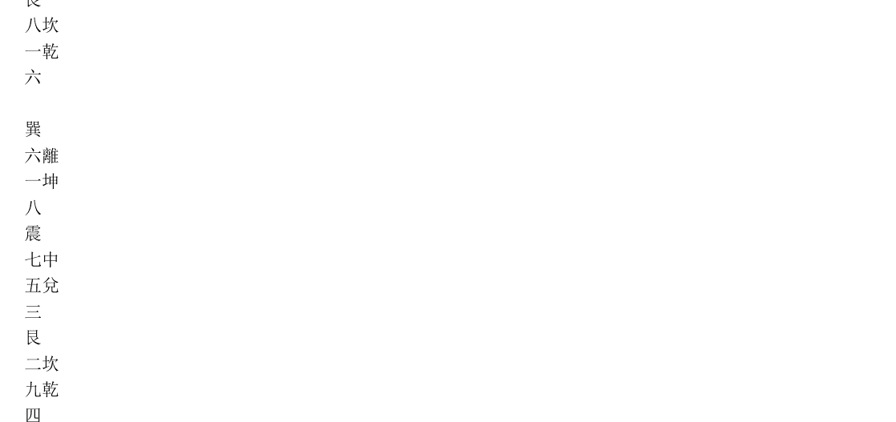

## 關鳳翔風水筆記--正神零神之辯

地學中，論理氣的，有所謂「正神」與「零神」的名稱。這是出於天玉經：【陰陽二字看零正，坐向須知病，若遇正神正位裝，撥水入零堂。零堂正向須知好，認取來山腦。水上排龍點位裝，積粟萬餘倉。】

蔣大鴻云：「青囊，天玉，蓋以卦內生旺之位為正神，以出卦衰敗之位為零神。故陰陽交媾，全在零正二字，零正不明，生旺必有病矣。若知其故，而以正神裝在向上為生入，以零神裝在水上為剋入，則零堂正向，豈不兼收其妙乎？向水既妙，而來山之腦，未必與坐向相合，又當認取。果來山又與坐向同在卦內，則來脈又合，非但一向之旺氣而已，惟水亦然，蓋山有來山之腦，水亦有來水之源，水龍即是山龍，亦須節節排去，點位裝成，果能步步零神，則水之來脈，與水之入口同一氣，山之坐向，與山之來脈同一氣，斯零正二途，別無間雜，而為大地無疑矣。」

榮錫勳地理辨正翼云：「此以下多論零神正神，以辨山水衰旺，如圖之內卦為正神，則外卦即為零神。若外卦為正神，則內卦又為零神矣。天運推遷不窮，零正亦與為無終極，所以善觀陰陽者，每遇正神氣足，則藉向首一星，以招攝山龍生旺之氣，又以水之來去有情者，撥入零堂，以成既濟之功。然向水合矣，而來山屈曲，又當審其起頂出脈，純收本卦生旺，則龍向水三者均吉，斯為山龍全美之局。至於水龍浩蕩，有從一卦來者，有兼兩卦來者，亦須按定源流，點位裝排，果能節節夫婦同行，血脈不亂，則水主財祿，千倉萬箱之慶，可操而獲矣。」

章仲山地理辨正直解云：「零正即陰陽消長之道，陽長即零轉而為正，陽消則正轉而為零。消長不一，陰陽無定，苟能考究消長之精微，方曉坐山朝向之病不病矣。坐向謂坐之得則坐，向之得則向，重在得與弗得，不重坐與向也。」

溫明遠地理辨正續解云：「零正即陰陽，正神即當元之旺神，零神即衰星。如上元一運，以一為正神，九為零神。二運以二為正神，八為零神。下元之九為正神，一為零神。八為正神，二為零神。以陰陽對待為零正耳，餘運倣此。坐向須知病者，山上排龍，要旺星到實地高山，即謂之正神正位裝也。向上排龍，要旺星到水裏低處，即謂之撥水入零堂矣。認取來山主腦者，以明零正二途，高低旺衰，山水各得，豈非富有積粟，而甚言萬餘倉之鉅富矣。」

沈竹初地理辨正抉要云：「零神在向，零神所居曰零堂。正神在山，正神所居曰正位。然零正兩神，亦有陰陽之分，一運以離為零神，坎為正神。二運以艮為零神，坤為正神。三運以兌為零神，震為正神。四運以乾為零神，巽為正神。六運以巽為零神，乾為正神。七運以震為零神，兌為正神。八運以坤為零神，艮為正神。九運以坎為零神，離為正神。五運前十年零神寄艮，後十年零神寄坤。凡天盤五字所到之處，即為零神所居之零堂。都天寶照經云：「前頭走到五里山，遇著賓主相交接。」即指零神而言。然零神亦有陰陽之別，凡天盤五字到向，陰則為零神，陽則為伏吟，故一運五到離，午丁方有水為零神，丙方則為伏吟。二運五到艮，丑方有水為零神，艮寅方為伏吟。三運五到兌，酉辛方有水為零神，庚方為伏吟。四運五到乾，戌方有水為零神，乾亥方為伏吟。四運五到乾，戌方有水為零神，乾亥方為伏吟。餘類推。玄空之法，到山到向為最吉，若到山到向，又遇零神，則發福尤速。故曰：積粟萬餘倉，以形容其富不可言也。至於到山到向之地，又遇零神者，在二運係未丑，三運係卯酉乙辛，五運前十年係未丑，後十年係丑未，七運係酉卯辛乙，八運係丑未，惟此數局而已。正神是指山，到山到向之地，而零正得宜者，僅丑未與未丑耳。蔣註章解，均覺恍惚，溫解略露一線。」

地理人須知論四龍分卦之謬云：「四龍分卦之術，出於天玉經，大要不過分四方四龍，正神零神，前兼後兼而已。其四方江東八卦，曰：寅甲卯乙辰巽巳丙，江西八卦，曰：申庚酉辛戌乾亥壬，南曰：午丁未坤，北曰：子癸丑艮是也。四龍者，寅辰丙乙，一龍加子乾，二龍甲午坤，三龍加卯艮，四龍加酉巽，又為三才六建焉。正神者十二支，零神者八干四維也。前兼山者，如子癸丑艮是也。後兼山者，如壬子癸丑是也。

夫四方之分，不過曰：「山向水流一路行，富貴有聲名，龍行卦外無官職，不用勞心力。」蓋欲子癸丑艮之山，仍以子癸丑艮之水，午丁未坤之水，必於午丁未坤之山，謂之南卦闢地，北卦闢天，江東江西亦各不出其八卦之外也。四龍之分，以一龍為長男，二龍為次男，三龍為三男，四龍為四男，一龍金，二龍木，三龍水，四龍火，其三才六建者，不過曰：「三陽六秀二神當，主人入廟堂，子寅辰逢乾丙乙，一龍真奇特。」蓋欲子山寅山辰山各見乾丙乙之水也。他三龍而九才十八建者並做此。正零二神，不過欲正神為山，零神為水，山過峽合正神為吉，取以定向，向則以零，故曰：「無龍不作向。」水不問來去，合零神則吉。其曰：「山上龍神不下水，水裏龍神不上山。」若遇「正神正向裝，撥水入零堂。」其大意也。

前後二兼，不過欲雙山雙水，單山單水。其曰：「前兼上下前兼水，後兼仍取後兼裝。」其止歸也。今按四龍，不過以乾坤艮巽，丙壬庚甲，乙辛丁癸，子午卯酉，寅申巳亥，戌丑未各四析之，因其次序，類屬而成四龍，其取義粗淺矣。且四方不知東西何以皆多，南北何以皆少，巳丙何以屬東而不為南，亥壬何以屬西而不為北？況欲山水各不出卦，乃通篇之要說，則如子午寅申四山，則右邊無幾，不知右邊復有何字可以放水？又如巳亥丑未四山，左邊亦惟一字而已，不幸水從左來，尚可以放水使入於懷乎？何其不思之甚哉！由此言之，則其所謂「亥山若見水流東，代代出三公」者真誣矣。其於五行，一龍何以受金，金何以不於申庚酉辛受乎，二龍何以受木，木何以不於寅甲卯乙愛？三龍四龍之於水火，與其所謂本身屬土者，皆無義可推，且其支神與水火土亦不相關而相反也。其曰：「金位一龍家富貴，百子千孫位，二龍行來到木鄉，外保置田莊。」等說，可謂誕矣。

其三才六建之說，不知午與申戌何以不納東來之水，西與亥未何以不納南來之朝乎？此三陽六秀所以為於一龍言之，而二三四龍之九才十八建者，卒亦不必究竟也。其曰：「六建分明號六龍，名姓達天聰。」者可謂妄矣。既以丑卯山放子辰水為兄剋弟，子辰山放丑卯水為弟剋兄，午山放子水為父剋子，子山放午水為子剋父，則四龍之分，申戌不宜在前，丑未不宜在後，地支既隔一位，干維不宜遠近之不齊也。

## 關鳳翔風水筆記一論相宅相墓之常規與變法

相宅相墓術，有常規與變法之分。俗眼只能觀其常，法眼可以察其變。至若變中之變，非道眼莫能知，朱子語類有云：「常可類求，變非例測，神而明之，存乎其人。」

> 「巧拙萬金歌」云：「天機好處從來秘，莫教粗眼識真機，踏得真龍難尋穴，把作茅叢容易撇，欹斜折缺不須論，但於局面從中決，自是蒹葭成野穗，由來芍藥結苞深，梧桐葉上偏生子，楊柳枝頭出正心，杞子叉枒難見實，要從變裏識精金，蘆花裊水東西點，未必條條著地尋，一點露華垂草尾，十分香味在花心，岸上樓臺沉水影，山中木植墮田陰，龍頭必向雲中出，蛇影難從山上擒，此義仙人不傳授，高明通曉在胸襟，固知龍祖傳來好，更有前砂識伴心。西岸月升東岸白，上方雲起下方陰。若還只問好頭面，假穴常常真乳見，開枝依舊有遮攔，過形只是無針線，談水談山世俗多，用拙不能爭奈何，誤葬每因求正面，不扞渾是棄偏頗，豈識真玄奇妙處，仙人多是下偏坡。」

> 「靈城精義」形氣章有云：「氣有虛實，法當以實投虛，以虛投實，氣有先後，法當先到先收，後到後收。」又云：「法葬之葬，法在形裏，會意之葬，意在形表。」又云：「認氣難於脈，葬脈豈如葬氣。」

## 關鳳翔風水筆記一研習堪輿術之三個境界

研習堪輿術，有三個境界，此三個境界亦即三種眼界，第一個境界是俗眼，第二個境界是法眼，第三個境界是道眼。

第一境界最難突破，曾見看山三四十年，依然停留在第一個境界之內者，類皆有三種弊病，其一是不肯虛心求明師指點，稍為涉獵，僅知皮毛，自以為得訣；其二是不能磨以歲月，窮搜極討於山水之間。其三是自恃有幾分聰明，每見一山，即以私意臆度其是非，意之所向，認為理之所在。

何謂俗眼？簡言之，即吾粵明代大師李默齋先生闡述之「五俗」是也。

第一種俗眼是喜歡盡龍，認為龍盡氣鍾，穴必在此，不知龍盡則局勢多散漫，龍虎不包裹，明堂必曠蕩，水口不關攔。

第二種俗眼是最愛龍虎鉗口，不問氣脈是否融聚於此，不知砂水順逆，見有開鉗之地，即於當中點穴。

第三種俗眼是喜歡在兩水合襟之處搜求，以為穴在是矣。不知往往合襟於前，則山嘴必尖，去水必直，龍虎必長，真氣必蕩。所以，不論來脈及穴星，而以兩水合襟為先務，則枝腳撓棹，三條五條，亦有合水者，皆可作穴乎？

第四種俗眼是作穴一定要後枕主峰正頂，不知龍從左來，穴須右裁，龍從右來，穴須左裁之理，不明釜虛不可中心下，土實偏宜角上裁之法，不識匾大臨弦出，粗雄向側尋之道。

第五種俗眼是喜歡闊大明堂，不知內堂要緊，外堂宜寬之理，不知明堂曠蕩，生氣散於飄風之忌。

何謂法眼？

第一：於群山繚亂之中，眾脈攤出之處，審其大會之情，知其正脈結作，高出雲霄而不失於孤寒，低近泥塗而不淪於卑下。或結穴在至斜至側至隱之處，而不失於險疑。雖餘氣或左或右，或前或後，數里奔逸而不為嫌，雖穴前無水無田，無朝對，一臂掏轉，不見外堂，而不以為異，如所謂順騎龍，鬥斧下，斬關下，皆了然於心目中，而安然有把握。

第二：看來龍過峽而知結穴之遠，近，高，低，大，小，穴星之形狀如何，穴中之土色如何。

第三：能知結穴之地，葬後速發，遲發，暫發，久發，或先敗後發，或先發後敗，敗而又發，或發後即敗，敗後不復發等等。

何謂道眼：

乃望氣而預知盛衰，察形而預知興替。如清代曾國藩觀天象五星連珠，即上表預期太平軍之亂即可平。又如南宋傅伯通觀臨安（即今之杭州），上表有云：「金匱凌雲，雖少府有積年之聚，廉貞□主，必大臣多持柄之虞，昂日星虧，武臣多咎，鬼金位起，閹寺施權，文曲多山，俗尚虛浮而詐，少微積水，人多文飾而貪，雖云自昔稱雄，實乃形局兩弱，只宜為一方之巨鎮，不宜作百祀之京畿，駐蹕暫足偏安，建都難奄九有。」其後果如傅公之言。又如吾師張一峰，看袁世凱祖墓，指出穴前其下三丈，有伏流龍泉，掘地三尺，果然有泉水噴出。又算出是八二之數。其後洪憲稱帝，只八十二日而結束。又如霍鑑清在一九三六年發表「賜談香港地運興替之道理」一篇文章中，指出香港旺於上元二運，困於三運，敗於四運，凡此者，道眼是也。

三國時，管輅有言：「物不精不為神，數不妙不為術，得數者妙，得神者靈。」及其卒也，弟子發其篋書，皆世所常有，嘆曰：「世患無才，不由無書，諒哉！」由此可知。所謂：「取法乎上，僅得乎中，取法乎中，僅得乎下。」者亦非盡然，祇要學者不斷尋求突破，則由技而進乎道，可期也，楊曾廖賴蔣沈云乎哉，彼人也，我亦人也，彼能是；我何不能是？

## 關鳳翔風水筆記一論四十八局闡釋之分歧

青囊序云：「二十四山分順逆，共成四十有八局，五行即在此中分，祖宗郤從陰陽出。」

蔣大鴻註：「此一節，申言上文未盡之旨也。子母公孫，如何取用，蓋二十四山，止應二十四局，而一山之局，又有順逆不同，如用順子一局，即有逆子一局，一山兩局，豈非四十八局乎？」

章仲山地理辨正直解：「分者，即分兩片也。兩片者，一顛一倒，一往一來，一順一逆也。分得順道顛倒，自然共成四十八局。」

溫明遠地理辨正續解：「分順逆，即天心正運之一卦入中，流動九宮，玄空顛倒，流行二十四山之陰陽分順逆，此陰陽，即前節註明乾坤艮巽為陰陽，子午卯酉為陰之陰陽也。如上元一運，立子山午向，先以天心正運之坎一入中，順數子山是乾六，乾陽，以乾六入中，順行九宮。午向是五，五屬陰，逆行九宮。而六之陽，五之陰，交媾於中五，順逆顛倒，由此而排，天心正運之一卦，豈非陰陽順逆五行之根原宗祖乎？」（鷹：此即挨星分陰陽順逆而行之謂也。）

子．既濟交未濟而生六子，恆交益而生六子，損交咸而生六子．其父母卦即邵康節天地定位，否泰反類，合極圖之六十四卦也．其各生六子，即朱子解蒙三十二全圖，每對待兩卦，可推六十四卦，循環無端，生生不已，地理特易理之一端，故只取十六父母卦之各生六子，順推逆推，而四十八局．

沈竹初地理辨正抉要：「四十八局，明初 本地學心傳作四十八演現虛實．似共成四十有八局，係蔣氏所竄改，心傳本是也．蔣氏以二十四山，一順一逆，一山兩局，成四十八局，其說妄也．四十八局，玄空有之，後人不察，誤以為順子一局，逆子一局，湊成四十八局．一運四十八，則九運當有四百三十二局矣．

故蔣註章解，均非的論．凡順者無局，逆者成局，一順一逆者，亦不成局，故一運與九運均無成局者．其二八，三七，四六各運，各得六局，為三十六局，五運成局最多，得十二局，合之為四十八局．故一九兩運，用北斗打劫法，最多合用，心傳作演，演者，演卦也．」

榮錫勳地理辨正翼：「此即龍分兩片，陰陽相見之義也．元空大卦，原分順逆兩途，如陽用左旋，分布二十四局，則陰從右轉，亦分布二十四局，反覆推 ，共成四十八局．要其指歸，不出陰陽大五行交媾妙理，蓋陰陽為五行之祖，而五行又為八卦之宗，探本溯源，瞭如指掌，其根原從先天無聲無臭處討消息，故坎雖為水，而不可以有形之水，言離雖為火，而不可以有形之火言．苟明此理，則楊曾心法，可以不言而喻．欽定四庫全書，謂青囊序內，二十四山分順逆一條，本說卦陽順陰逆之例，為地學理氣之權輿，誠定論也．

抱璞齋主曰：「諸家持論，聚訟紛紜，學者惑焉，愚以為張心言以六十四卦分佈二十四山，而以，乾，坤，坎，離，震，巽，艮，兌八卦為大父母（應：一運父母卦，統領六，七，八運江東卦），否，泰，既濟，未濟，恆，益，損，咸為小父母（應：九運父母卦統領二，三，四運江西卦），翻卦變爻而成四十八卦．以乾兌離震巽坎艮坤為一運之父母，而統六，七，八運諸卦，又以泰損既益恆未濟咸否為九運之父母，而統二三四運諸卦，但五運之卦缺焉，謂兩水對待，運歸中五．其排列整齊，可謂絲絲入扣，沈竹初亦無以難之．然而雖條理分明，無裨實用．獨怪沈氏謂章註亦非的論，沈氏之術，固上承章氏者也，可知沈氏治學，十分嚴謹，絲毫不肯苟從，學者倘能本此治學精神，積以歲月，當可由技而進乎道矣！

## 關鳳翔風水筆記一天地卦五鬼運財定局

「五鬼運財」之局，據傳說自楊筠松．楊氏有「救貧」之號，而有朝貧暮富之術者，實由於此．賴布衣能傳其術，故賴氏繼曾文辿，廖金精之後，為堪輿四大家之一．相傳楊公在浙江處州（故城在麗水縣東南）山中，為一貧家孝子改陽宅，課云：「辛龍甲向坤門路，只管用現財，自有五鬼運將來．」辛龍即巽之納甲，甲向即乾之納甲，用對宮起貪狼之法，巽之貪狼在坎，巨門在坤，廉貞五鬼在乾．巽辛龍立乾甲向，是五鬼臨門，坤乙巨門掌財帛，謂之「五鬼運財」．但陽宅要有進氣之門路，陰宅要有特朝之旺水，尤須合三元九運之旺山旺向，又要宅主命與宅命配合；亡命及祀子命與山運配合，方能產生效應．

余在一九三六年至三七年間，曾看過西樵山內之「狐狸拉麗鴨」名墓，乃李氏葬其祖，據謂寅時葬，卯時發者，乃乾龍而立巽向，卯水特朝．又在肇慶星湖文慶塱，看過翟氏祖墓，在塱中突起圓丘結穴，丁龍癸向，寅水滙聚澄凝炤面，葬後數月，獲意外大財而致巨富．又於一九六六年看過香港跑馬地毓秀街十四號的唐樓式住宅，離龍丙向，倒騎龍坐空朝滿，丁方門路，先發梁氏，與澳門傅氏合作投機致巨富，繼發陳氏連中三次頭獎馬票．宅主均屬艮命，巧合有如此者．

乾六天五禍絕延生
坎五天生延絕禍六
艮六絕禍生延天五
震延生禍絕五天六
巽天五六禍生絕延
離六五絕延禍生天
坤天延絕生禍五六
兌生禍延絕六五天

而以貪狼，巨門，武曲為三吉方，破軍，祿存，文曲，廉貞為四凶方，輔弼不言吉凶。正門，主房，房均要在三吉方，又，乾，坤，艮，兌，為西四宅，震，巽，坎，離，為東四宅。西四命人住西四宅為吉，東四命人住東四宅為吉。是以

乾坤互遇，艮兌互遇，坎離互遇，震巽互遇，均為生氣。
乾艮互遇，坤兌互遇，坎震互遇，巽離互遇，均為天醫。
乾坎互遇，艮震互遇，巽兌互遇，離坤互遇，均為六煞。
坎艮互遇，乾震互遇，巽坤互遇，離兌互遇，均為五鬼。
坎坤互遇，離乾互遇，震兌互遇，巽艮互遇，均為絕命。
乾巽互遇，兌坎互遇，震坤互遇，離艮互遇，均為禍害。

總之，卦例一門，變化很大，如果「膠柱鼓瑟」，則呆板八卦，呆板六十四卦，呆板三合，呆板玄空，有以異乎？無以異也。神而明之，存乎其人可矣！

## 關鳳翔風水筆記一論收山出煞為堪輿學中之第一義

堪輿術中，「有收山出煞」之訣，原於天玉經，末章云：「更有收山出訣，亦兼為汝說。」但諸家註解，均未詳言，致令後之學者，妄自猜度，未得其當。斯理未明，為一大障礙。

其實「收山出煞」，亦即是都天寶照經中所說：「天機妙訣本不同，八卦只有一卦通。」之理。蔣大鴻註云：「一部寶照經，不下數千言，皆半吞半吐，至此忽然漏洩。蓋陰陽大卦，不過八卦之理，而篇中乃云，八卦不是真妙訣者，正為不得真傳，不明用卦之法故也。而其所以不明用卦之法者，皆因泛言八卦，而不知八卦之中，止有一卦可用故也。大五行秘訣，不過能用此一卦，即從此一卦流轉九星，便知乾坤艮巽諸卦落在何宮，二十四干支落在何宮，而或吉或凶，指掌瞭然矣。俗師不得此訣，妄立五行，有從四墓起天罡，以為放水出煞之用，如何合得八卦之理，夫收得山來，乃得煞去，不知一卦作用，山既無從收，一卦不收，諸卦干支又何從流轉九星，求純棄駁，而消水出煞乎？今人但知二十四山，處處可出官貴，處處可旺田莊，處處可出神童，而不知二十四位水路交馳，果下何卦，收何山？乃消得此水，出得煞去？夫既不能收山出煞，則其談八卦，論干支，皆胡言妄說而已。何以契合天心，而造化在手也？天心即天運，非善人合天之家，不能遇也。大五行所謂一卦，即指天心正運之一卦也。篇中露此二字，其間玄妙，難以名言，楊公雖指出天心一卦之端，而其下卦起星之訣，究未嘗顯言，則天機秘密，須待口傳，不敢筆之於書也。」

章仲山地理辨正直解云：「一卦者，一元一卦，即天心正運之一卦也。能用此一卦，則知乾坤艮巽落在何宮，二十四干支曜在何地，或陰或陽，或順或逆，或左或右，指掌瞭然矣。不識此卦，誤認五行，八長生，四墓庫，左旋右轉，以為放水出煞之用，不亦謬乎？知此一卦，即知收得山來，出得煞去。不知此一卦，則談八卦，論干支，皆胡言妄語而已，豈能契合天心，挽回造化哉！」

溫明遠地理辨正續解云：「天機妙訣，則有一卦可通，此一卦，乃天心正運之一卦。如一運，坎為一卦，立極中五，即為天心，順數坤二到乾，逆數離九到乾，順逆顛倒，依數排去，即知乾坤艮巽曜於何位，乙辛丁癸落於何宮，甲庚丙壬來於何地。玄空之星辰既以流轉，再以應用山向，所得星辰之陰陽，交媾於中五，順逆挨排，八卦二十四位干支，何位得旺，何位值衰，何方應要有山，何方應要有水，山水旺衰既明，而收山出煞，亦在其中矣。

收山者，即收生旺到水；出煞者，即出衰星到山，此以排向而言。若排坐山，即收生旺到山，謂之收山，出衰星到水，謂之出煞。若八方之山水旺衰各得，亦謂之收山煞也。

如立乾坤艮巽之山向，乃卦之中氣，力量較大，所以可出官貴。
乙辛丁癸，卦之爻神，力量稍遜，尚與父母陰陽一氣，所以能致田莊之富。
甲庚丙壬，雖亦爻神，與父母陰陽之氣不一，氣局更窄，且未色稍雜，所以則能為榮而已。此辨立向，卦之中氣爻神，力量大小耳。」

> 葉九升亦有云：「今之談地理者，誰不曰收山出煞，使彼誠能山收而煞出，則地理已無餘事矣。雖然，談收山出煞者多，精收山出煞者寡，試問其所以收，所以出，彼又夢夢也。夫收山出煞，為地理第一義，豈容作空談，不求其實用乎？
所謂收山者，龍得其向是也，龍得天配合之向，為山收。出煞者，水得其方是也，水去於死絕之方，為煞出。山不收，則雖樓殿屏嶂之龍，總歸虛設；煞不出，則雖之玄澄聚之水，俱屬無用。」

綜上所論，可知收山出煞，實在是消納控制之最高法則及運，宗玄空者，與空三合者，法雖不同，其理則一。蔣氏一派宗玄空，葉氏一派宗三合，理同法異，亦其宜也。

## 關鳳翔風水筆記一論星卦融會貫通之理及其例證

現代研習玄空術者，不是宗章仲山，便是宗張心言。章仲山一派用九星，張心言一派主六十四卦，各立門戶，分庭抗禮。求其能融會貫通者，實無幾人。

沈竹初謂：先天出於自然，體也；後天出於人為，用也。因山向飛星已得其用，故只用其體可矣。至張心言，言卦理，絲絲入扣，措未將用法表明，今人不明其理，反詆其法之偽，而先天六十四卦之分金法，不明於世。

沈氏之言，是也。然沈氏亦只將一，二兩運之子山午向，排列二圖以明之，究亦詳其用。（見沈氏玄空學卷二論分金）

余於章仲山與張心言兩派之異同，研之已久，卒之能融會貫通，茲特舉例證明之。

一九六六年丙午秋，余為友人黃桂林兄弟點穴於元朗髻山之西南麓，乃回龍顧祖之穴也。
子龍入首，坐艮向坤，中元六運，財星到向，丁星到坐，水口在午，合城門一訣，堂局緊湊，六運之內，勃然興發，亦其宜也。
再以六十四卦表明之，復卦龍入首，坐無妄卦五爻，向升卦五爻，姤卦水口。

| 龍 | 山向 | 水換山 | 換向 |
|---|---|---|---|
| 1 | 9 1 | 9 | 3 7 |
| | | 復 妄 | 升 姤 噬 井 |
| 8 | 2 | 2 | 8 6 6 |

一：來龍與坐山之星數，與洛書數一，九合十；復卦左輔之星數屬八，無妄局門之星數屬二，亦合十。
二：向首之星數為一，水口之星數為九，亦合十。
三：來龍與向首之星數俱屬一，比和為旺。
四：來龍之星數為一，水口之星數為九，亦合十。
五：坐山之星數為九，水口之星數亦為九，比和為旺。
六：坐山無妄卦五爻，變為噬嗑卦，外卦離三屬火，內卦震八屬木，三八合生成數，又合木火通明，且內卦生外卦，為來龍生坐山，是生入。主招財進寶，出文人秀士。向首升卦五爻，變為井卦，外卦之坎七屬水，內卦之巽二屬木，二七同道，合生成之數，又合水木清華，且外卦生內卦，是生入；主五子崢嶸，財產豐盛，男聰女秀，子孝孫賢。

六：分金卦爻變為噬嗑坐山，井卦向首，中元六運當旺。

由此顯示，星與卦融會貫通，其理明矣。先師嘗言：識星不識卦，漫說虛閒話，識卦不識星，枉費用功精。誠確論也。

## 關鳳翔風水筆記一巨門催財與壓絕迎生枕白催丁秘法

相宅術中，有巨門催財之法，有壓絕迎生枕白催丁之法。此二者，為秘中之秘。先師擅此術，生平不苟授人，嘗云：傳之非人，而其術施之非人，定遭天譴。余少受現代教育，不信因果之說，然師訓宜遵守。四十年來，憐摯友之半生勤，宅心仁厚者，施以巨門催財之術；又憐一摯友結婚十年不育，醫生檢驗證明生理正常者，施以壓絕迎生枕白催丁之術，俱驗如符契，益信師傅自有真也。今以老之將至，恐失其傳，爰筆錄之。

### 巨門催財之法

- 第一：住宅要合天心正運。（鷹：零正合當元運？）
- 第二：宅主命要與宅命配合。（鷹：年命卦變爻要成吉卦，即伏，生，醫，延等）
- 第三：命宮要與宅門聯成巨門卦。（鷹：即卦變爻至天醫＝巨門）
- 第四：在宅主命宮之絕命方位作口，燒火門口（灶口）向命宮。（鷹：即變中爻至絕命位作灶而灶口向命宮）

### 舉例言之：

- ——天心正運。（鷹：不明）
- ——巽命人住坎宅（鷹：合第二：巽變上爻為坎＝生氣）；
- ——開離門，先合水火既濟之象（鷹：宅與門的卦象）；
- ——宅門又與命宮聯成火風鼎卦，巨門催財。（鷹：門離火，命宮為巽木，故卦象為火風鼎；巽變中，下爻為天醫巨門催財）
- ——作灶於艮位，為命宮之絕位，燒火門向巽為命宮之伏位。元運合則發甚速。（鷹：巽木變中爻成艮卦，絕命位，灶向巽伏位）

年命卦宅＝生氣門＝天醫宅與門＝延年灶＝絕命灶向＝伏位

| 年命卦 | 宅 | 生氣門 | 天醫宅與門 | 延年灶 | 絕命灶向 | 伏位 |
| :--- | :--- | :--- | :--- | :--- | :--- | :--- |
| 乾 | 兌 | 艮 | 4 澤山咸 | 9 離 | 乾 | |
| 兌 | 乾 | 坤 | 9 天地否 | 9 震 | 兌 | |
| 離 | 震 | 巽 | 8 雷風恆 | 9 乾 | 離 | |
| 震 | 離 | 坎 | 3 火水未濟 | 9 兌 | 震 | |
| 巽 | 坎 | 離 | 7 水火既濟 | 9 艮 | 巽 | |
| 坎 | 巽 | 震 | 2 風雷益 | 9 坤 | 坎 | |
| 艮 | 坤 | 乾 | 1 地天泰 | 9 巽 | 艮 | |
| 坤 | 艮 | 兌 | 6 山澤損 | 9 坎 | 坤 | |

（鷹：此法主要是以宅主年命配八宅之四吉方於宅，門和灶向，再將灶位安於絕命位。）

### 絕迎生枕白催丁之法

- 第一：宅主命要與宅命配合。
- 第二：宅門要與宅主命配合。（鷹：生氣或吉位）
- 第三：夫婦睡房要在宅門之生氣方，命宮又與宅門聯成生氣。（鷹：床位是宅門的生氣位）
- 第四：床位與睡房門聯成延年。
- 第五：作口於宅主命宮之絕位，燒火門向宅主命宮之生氣，謂之壓絕迎生。
- 第六：年星及月星三白吉星排到方能應驗。（三白吉星到睡房和睡房門）

### 舉例言之：

- ——乾命人居震宅，開兌門，卦氣為澤天夬之生氣。（鷹：乾命居震宅為五鬼，不合第一條件；兌為乾之生氣，合第二條件；）
- ——睡房在乾位，房門開坤方，與命宮聯成地天泰延年卦。（鷹：合第四條件）
- ——作灶於本宅離方，為宅主命宮之絕位，燒火門向兌，為宅主命宮之生氣方，是為壓絕迎生。（鷹：合第五條件，乾命以離為絕位，灶口向兌為生氣方）
- ——七赤入中之年，八白飛到乾方，三月之一白飛到乾方，六白飛到坤方。再選擇宅主夫婦之年庚所宜之日時，則移床而置駕枕，如響斯應矣。

| 年命卦 | 宅 | 生氣宅門 | 生氣床位 | 宅門生氣 | 床位與睡房門 | 延年灶 | 年命絕命灶向 | 年命生氣 | 年月飛星三白吉星 |
| :--- | :--- | :--- | :--- | :--- | :--- | :--- | :--- | :--- | :--- |
| 乾 | 兌 | 兌 | 乾 | 坤 | 離 | 兌 | | | |
| 兌 | 乾 | 乾 | 坤 | 乾 | 震 | 乾 | | | |
| 離 | 震 | 震 | 巽 | 震 | 乾 | 震 | | | |
| 震 | 離 | 離 | 坎 | 離 | 兌 | 離 | | | |
| 巽 | 坎 | 坎 | 離 | 坎 | 艮 | 坎 | | | |
| 坎 | 巽 | 巽 | 震 | 巽 | 坤 | 巽 | | | |
| 艮 | 坤 | 坤 | 乾 | 坤 | 巽 | 坤 | | | |
| 坤 | 艮 | 艮 | 兌 | 艮 | 坎 | 艮 | | | |

（鷹：此法有疑問，如上例：乾年合居震宅為五鬼，是年命與宅不合。若選年命之生氣為宅，則門便不能是生氣了。）

清初蔣大鴻闢三合，黜八宅，謂九星獨得其正。不知三合者，察盛衰之變化，九星者，明氣運之轉移，八宅者，通六十四卦損益盈虛之理。

堪輿學術導源於易經，易經是變化哲學，但陰陽無常位，寒暑無常時。地理人子須知作者徐氏有云：地理之竅妙，無出五行，五行之變，不可勝窮，而要之或以氣言，或以質言，是其概也。

宋儒亦有云：質雖以氣而成，然其體一定不易；氣雖行乎質之，內而其用則循環不窮。今必混而一之，則天地間不過輪一定局，而無變化錯綜之妙，斯造化亦小矣！是故至人識其妙而洩造化之機。

總之，三合，九星，八宅並行而不相悖，明乎此，才是通術，否則失之偏，失之蔽矣！齋主附誌。

## 關鳳翔風水筆記一論玄空學中之兩大派別

近世治玄空學的人，分為兩大派別，一派主九宮八卦，一派主六十四卦。

主九宮八卦的一派，以章仲山為宗師，亦即沈氏玄空學中所稱的無常派。主六十四卦的一派，以張心言為宗師，亦即沈氏玄空學中所稱的上虞派。

本來沈氏玄空學中，論諸家得失的一篇說：近世習玄空者，分六大派：曰滇南派，無常派，蘇州派，上虞派，湘楚派，廣東派。滇南派宗范宜賓，無常派宗章甫（仲山），蘇州派宗朱小鶴，上虞派宗徐迪惠，湘楚派宗尹有本，廣州派宗蔡岷山。

原因之一，主九宮八卦一大派得力於沈竹礽獲章仲山所著的傳家本【陰陽二宅錄驗】，進一步而發明之。沈公精於易學，著有【自得齋地理叢說】，【沈氏地理辨正抉要】等書。沈公歿後，其子瓞民及後學江志伊等，彙輯而成【沈氏玄空學】巨帙，於是九宫八卦這一大派學術，昌明於世。

原因之二，主六十四卦的一大派得力於張心言的【地理辨正疏】，由於張心言的卦理絲絲入扣，研究堪輿學術理氣，喜歡深文奧義的人，既愛地理辨正疏的圖說，尤其卷首的第四圖把六十四卦配二十四方位的，製成羅經，謂之【卦盤】，可以炫人以精深博大，勝於一般通稱為楊盤的【三合盤】。

原因之三，無常派及上虞派以外的六個門派，既沒有像無常派學術的深入淺出，令人明白易曉，且又可作實驗，又沒有像上虞派學術的深文奧義，可以嚇淺學的人。所以，這六個門派逐漸退出堪輿學術範圍。

說到這裏，可以把章仲山與張心言不同之處，加以論列。青囊奧語：【坤壬乙，巨門從頭出，艮丙辛，位位是破軍，巽辰亥，盡是武曲位，甲癸申，貪狼一路行。】這一段，章仲山和張心言的解釋，各有不同。

章仲山地理辨正直解：【挨星五行，即九星五行，貪巨祿文廉武破輔弼，一一挨去，故曰挨星，此五行，原本洛書九氣，而上應北斗，主宰天地化育之道，其氣無形可見者也。無形之氣，為天所行也，有形之質，為地所行也。一，二，三，四，五，六，七，八，九，即大五行，為天行氣，為地行形之次序，非水，火，木，金之在天成象，又非方圓直銳之在地成形，又非東木西金之方位，又非坎水離火之卦，故名之曰：大玄空，此五行，隨氣變遷，隨運轉移，天心一動，九宮便更，名非有定，氣隨星分，故曰非巨門而與巨門為一例，非破軍而與破軍為一例，如是則下卦起星之訣，定卦分星之奧，曉然矣。若拘拘於字義，則與玄空二字之意不合】。

溫明遠【地理辨正續解】：坤壬乙，乃卦數之二，一，三；艮丙辛，卦數之八，九，七；巽辰亥，卦數之四，四，六；甲癸申，卦數之三，一，二。此節二十四山之卦爻，雖書其半，而天地人三元之卦與數已備，惟數獨隱秘其五，不肯明言，中五為八卦九星玄空流行，陰陽順逆，五行顛倒，變化錯綜，下卦起星之法，悉由中五為入用之樞，方能旋轉九星，所以謂此中隱然有挨星口訣。天心即尺運，如上元二運，坤二巨門居中立極，即為天心之動，依數順逆挨去，豈非九宮便更，亦隨時而更變乎？似巨門，非巨門者，坤為巨門之正位，壬乙是貪狼之爻神，卦數即是一三之貪祿。而非巨門，可與巨門為一例者，如六運之用壬向，以六入中，順數坎卦貪狼壬上是二，以玄空之二巨門為用，豈非壬非巨門，而可與巨門為一例也。四運之乙向亦然。艮丙辛，巽辰亥，甲癸申，非盡破軍武曲貪狼，而與破軍，武曲，貪狼為一例者，亦即此也。以玄空之九星一一挨去，發此一節，以明作用，故曰挨星大卦之條例。

玄空大卦五行，不論定位之八卦九星五行，而要用玄空流行之九星五行也。中五者，太極之象，其數寶藏於四六兩運之內，為陰陽兩片之分，天行氣，地行形，皆以洛書一，二，三，四，五，六，七，八，九之數，陰陽奇偶，順逆顛倒，依數挨去，故曰挨星。天地之氣皆數也，大五行亦洛書九氣之星卦所屬五行也。

玄空者，流行之氣也。下卦起星者，如上元一運，坎卦入中，即為所下之坎卦也。起星者，即隨所下之卦，玄空流行，至應用山向之星，再對待交媾於中五，陰陽順逆，流行八卦二十四山為起星也，餘運做此。

張心言地理辨正疏：坤中之升，壬中之觀，二運巨門也，乙中之節，八運輔星也，二與八通，取八運以補二運之偏。丙中之大有，七運破軍也，若艮中之明夷，辛中之小過，三運祿存也，若巽中之大畜，亥中之萃，四運文曲也，六與四通，取六運以補四運之偏。甲中之離，一運貪狼也，癸中之益，申中之未濟，九運弼星也，一與九通，取弼星以綿貪狼之澤。

按：張心言三運八卦圖，有需而無坎，沈氏之一運子山午向定卦圖，八方有坎而無需，因五寄坎，將中宮一卦移入離位，而將需卦入中宮，兩相比較，則異同之處，昭然明矣。

張心言口訣下云：二，三，四運，九為父母，六，七，八運，一為父母，兩水對待，運歸中五。何以一運遇五黃仍為坎？因為一運之天盤，五黃附麗於離，乾坤合二七，兌震合三八，艮巽合四九，八方獨缺一，似乎離坎不能合一六，雖然離方之體為五，而其用仍為一，所謂萬物土中生，萬物土中死，因天地間，無非一元之氣流行於上下四方，明乎此，則一運坎，二運坤，三運震，四運巽，六運乾，七運兌，八運，艮九運離，其理自可明瞭。至若山向飛星二盤，遇五黃在坎，運仍屬坎之氣也。五運寄坎離，則指納甲也，坎納戊，離納己。寄艮坤，則因中元之五流行之氣無定，前十年可附坤，後十年可附。艮其實坤艮對待，坤即是艮，艮即是坤，所謂二八易位是也。

## 關鳳翔風水筆記一三合與玄空不可強分為二

近代稱相墓相宅理氣，取生旺墓左右旋者，謂之三合。取九宮八卦順逆挨飛者，謂之玄空。業術者亦以此而自分派別，可謂強分之以為二，何其不思之甚也！

余嘗考術數之所由出，所謂生旺墓者，其義首見於西漢劉安淮南子天文訓：
【木生於亥，壯於卯，死於未，三辰皆木也。火生於寅，壯於午，死於戌，三辰皆火也。金生於巳，壯於酉，死於丑，三辰皆金也。水生於申，壯於子，死於辰，三辰皆水也。】

所謂九宮八卦者，其義首先於大戴禮明堂說，以二九四，七五三，六一八分為三排橫列，由右至左，上排二九四，中排七五三，下排六一八，列式如下：

四九二
三五七
八一六

此節中五立極，控馭八方，立洛書戴九履一，左三右七，二四為肩，六八為足，五居中央之數也。

有人提出疑問，謂三合與玄空，何以不能強分為二？蔣大鴻著地理辨正，其辨偽總論開頭說：【地理多偽書，平砂玉尺者，偽之尤者也。】其意以平砂玉尺經非元朝初劉秉忠所撰，其註亦非出自明初劉伯溫之手，而謂【世之通人，不知地理者，以意為之，而附會其說，託之乎二公者也。】

平砂玉尺，三合家之經典也，蔣大鴻以【其辭近是，其理則非。】此亦蔣大鴻是己之非，非人之是而已。夫地理辨正，輯錄偽本青囊經，謂黃石公傳，赤松子述義。是誠自欺欺人者也。又輯錄青囊序，青囊奧語，天玉經，都天寶照經，是否為楊，曾之作，亦莫可究詰。余以為任何堪輿書，祇要求其有無價值，而不應以該書乃某人所作則為真，否則為偽。

世人將三合與玄空強分為二，是割裂也。蕭萱序玄空古義四種通釋，其中有云：【蔣氏因闢三合，致習玄空者，群疑三合，於是三合與玄空裂。】余以平砂玉尺既為三合家之經典，玉尺經中有云：【乃若天關開財祿之源，地軸濬化生之寶，法顯玄空，神功莫測。】是知玄空之名，及其為用，非僅九宮八卦，順逆挨飛者也，三合術中亦有之。

青囊序中：【二十四山分順逆，成四十有八局。】四庫全書總目提要謂以甲，乙，辰，午，坤，申，戌，乾，壬，子，癸，寅十二位為陽，卯，巽，巳，丙，丁，庚，酉，辛，亥，丑，艮，未十二位為陰，陽用左旋，陰從右轉，衍成四十八局。

二局矣，故蔣注章解，均非的論。

凡順者無局，逆者成局，一順一逆者亦不成局，故一運與九運均無成局者。其二八，三七，四六各運，各得六局，為三十六局。五運成局最多，得十二局，合之為四十八局。

余以為沈氏雖言之成理，究亦不免【是己之非，非人之是。】沈氏既力闢三合，而謂彼之三合，乃運合，山向合，城門合，而非所謂亥卯未，寅午戌，申子辰，巳酉丑之生旺墓三合也。沈氏雖為通儒，亦不免固步自封之嫌耳。

張心言地理辨正疏叢說，論三合源流有云：【蔣子辨玉尺諸偽，理固難誣，筆亦能達。顧或開卷深知三合之非，而掩卷又若三合為是，其故何歟？一緣的派真傳，未經明白指示，則既無所折衷，一緣三合有可節取之數端，未能曲為原諒，或又嫌矯枉過正。余既將秘旨盡情道破，則三合源流，不得不遂一分疏。蓋創是說者，當有高人，既得真傳，不肯輕洩浪示，而以呆板死格，傳中智以下之徒，俾之覓小就，給衣食耳，其流散至今，遂不可勝言。】

張心言之論，是也。余以師傳，及五十餘年經驗告學者，相墓之術，三合與玄空並用可矣。蕭萱謂：三合之有偽法，不善學者之咎，誠哉！是言也。

### 三合偽法的概念

三合既然是精粹簡要，有心研究風水理氣的人，應該先學三合，繼學八宅。因為三合是用於陰宅的理氣，雖然陽宅也有用三合的，但平心而論，陽宅理氣，三合不如八宅，正如醫學的內科，外科，各有專藥，豈能執一而不變，所以，學三合，就是入門法。

有人這樣問：學風水，能否無師自通？答曰：歷代相傳的風水書，實在指不勝屈，如果沒有明師指點，等於在黑夜之中，摸索而行。即以三合而言，亦有靈活三合和呆板三合。蕭萱嘗說：【三合之有偽法，不善學者之咎，智者過之，愚者不及，過與不及，實生偽法，玄空之有偽法，亦猶是也】。

究竟那些是三合偽法呢？舉例來說，地理直指元真和地理五訣這兩本書，就是偽法了。本人攜羅經到各地測驗發富貴及開族的舊墳，都與直指元真和地理五訣的水法不合，然後確定這是三合偽法。

### 三合水法歌訣

三合水法，專取生旺方來朝，病死墓絕方流去。有三合水法歌，易於記誦。

- 養生：第一養生水到堂，貪狼星照顯文章，長位兒孫多富貴，人丁昌熾性忠良，水曲特朝官爵重，水小彎環福壽長，養生流破終須絕，少年寡婦守空房。
- 沐浴：沐浴水來犯桃花，婦女淫亂不由他，投河自縊隨人走，血病目災破敗家，子午方來田業盡，卯酉流來好賭奢，若還沖破生神位，胎墮淫聲帶鎖枷。
- 冠帶：冠帶水來人聰慧，也愛風流好賭奢，七歲兒童能作賦，文章博士萬人誇，水神流去最為凶，髫齡兒童死不休，更損深閨嬌態女，此方停蓄乃為佳。
- 臨官：臨官位上水趨墳，祿馬朝元喜氣新，少年早入青雲路，賢相綢繆佐聖君，最忌此方出水去，成材之子早歸陰，家中寡婦常啼哭，財穀空虛徹骨貧。
- 帝旺：帝旺水來聚面前，一團旺氣發莊田，官高爵重威名顯，財庫豐盈多稅錢，最怕休囚來擊散，石崇富貴不多時，旺方流去根基薄，家道貧寒怨上天。

#### 衰弱

衰方管局巨門星，學堂水到發聰明，少年及第文章貴，長壽星高金穀盈，出入起居乘駟馬，宴游歌舞玉壺傾，旺極總宜來去吉，也須彎曲更留情。

#### 病死

病死二方水莫來，天門地戶不為開，縱有科名官爵重，水若斜飛起大災，損妻毒藥刀兵禍，血症風癱女墮胎，必主其家生此禍，瘠癆枯死瘦形骸。

#### 墓庫

墓庫之方水怕臨，破軍流去反為禎，陣上揚兵文武貴，池中停蓄富春申，蕩然直去家資散，久債終年不了人，水來充軍千里外，三男二女總凋零。

#### 絕胎

絕胎水到不生兒，無孕無胎絕後枝，縱使有胎難養育，夫妻父子各分離，水大婦人淫亂走，水小私情暗會期，此方只宜為水口，祿存流盡佩金魚。

### 三合家對廿十四山之分陰分陽

三合家對廿十四山之分陰分陽，其說不一。如明代李默齋闡徑集，謂卯，巽，巳，丙，丁，亥，庚，酉，辛，艮，丑，未此十二位為陰。甲，乙，辰，午，坤，申，戌，乾，壬，子，癸，寅，此十二位為陽。

地理人子須知把洛書配先天卦位以定淨陰淨陽，而輔以納甲三合，乾甲居戴九之位而為陽，坤乙居履一之位而為陽，此奇數也。離壬寅戌居左三之位而為陽，坎癸申辰居右七之位而為陽，亦奇數也。巽辛與兌丁巳丑居二四為肩之位而為陰，此偶數也。艮丙與震庚亥未居六八為足之位而為陰，亦偶數也。陽數為奇，陰數為偶。

> 但玉尺經云：【乙丙交而趨戌，辛壬會而聚辰，斗牛納丁庚之氣，金羊收癸甲之靈。故有乙辛丁癸之婦，宜配甲庚丙壬之夫，夫夫婦婦，雌雌牝牡。】
則又以乙辛丁癸為陰，甲庚丙壬為陽。

三合家以左旋陽龍配右旋陰水，右旋陰龍配左旋陽水，這是本於易經說卦傳，陽順陰逆之理。但又有謂生，旺，墓左右旋，而專取生旺水朝迎，墓庫流去為呆板的，如張九儀鉛彈子一書，則取義於納音之法，同類娶妻，隔八生子，律呂相生之理，以坐山生來水，來水生去水，去水生坐山，循環相生，不以墓來旺去，旺來生去為嫌，但天干合九九循環之數宜坐天干，地支合九九循環之數則坐地支，方為合格，否則干支駁雜，不但無益，反為有損，這又應該注意的。

### 三合之四十八局

三合，重在左右旋，以木，火，金，水為四局，反覆衍之，得四十八局。四書全書總目提要曾經說明其義理，並不是蔣大鴻註解青囊序所云：【二十四山，止應二十四局，而一山之局，又有順逆不同，如有順子一局，即有逆子一局，豈非四十八局乎。】即如沈竹初地理辨正抉要所謂：【凡順者無局，逆者成局，一順一逆者亦不成局，故一運與九運均無成局者，其二八，三七，四六各運，各得六局，為三十六局，五運成局最多，得十二局，合之為四十八局。】亦與四庫全書總目提要所說者不同。

張心言地理辨正疏謂：【六十四卦分佈二十四山，而後四十八局可推。】也非正論。事實上，青囊序乃曾文迪所作，這是傳楊筠松之術，故以三合為正宗，後世發明的玄空九宮挨星，飛星，六十四卦配二十四山，都是別傳而已。所以，學習理氣，應該先向正宗入手，然後進一步研究別傳之術，若非如此，何異捨正路而弗由。

究竟怎樣演成四十八局呢？例如申子辰水局，
- 坐申，左旋由申到辰，右旋由申到子；（鷹：申左旋至辰八位，右旋至子八位。）
- 坐子，左旋由子到申，右旋由子到辰；（子左旋至申八位，右旋至辰八位。）
- 坐辰，左旋由辰到子，右旋由辰到申。（辰左旋至子八位，右旋至申八位。）

坤壬乙與申子辰二字同宮，左右旋亦是如此。推之寅午戌與艮丙辛，巳酉丑與巽庚癸，亥卯未與乾甲丁，莫不皆然。

### 堪輿學中五行之義理與運用

- 正五行
- 雙山三合五行
- 八卦納甲五行
- 洪範五行
- 玄空五行

中國五術，醫，卜，星，相，風水，術數的運用，離不開五行，但是醫，卜，星，相，這四術所運用的，不外金，木，水，火，土。這基本五行的生剋制化，惟獨堪輿這一門術數所運用的，除了基本之外，還有很多種五行的名稱，可謂集五行之大成，堪稱博大精宏。

五行這一個名詞，最先見於六經【詩經，尚書，周易，禮記，周官儀禮樂經，春秋】之一的尚書洪範篇：初一曰五行（鄭康成註解：行者，言順天行氣也）尚書洪範篇所說的五行，是指五種基本元素，故此說：五行，一曰水，二曰火，三曰木，四曰金，五曰土。又說：水曰潤下，火曰炎上，木曰曲直，金曰從革，土爰稼穡。這是說明五種不同的性質，潤下的意思，是指水性就下以潤物；炎上的意思，是指火性炎盛而向上；曲直的意思，是指木可以屈曲又可以伸直，從革的意思，是指金屬可以隨人之應用以變成為器皿，雖然屢次改變而沒有消失；稼穡的意思，是指土地可以用於農作，稼就是播種，穡就是收成。

協紀辨方書論五行，謂其源則起於河圖洛書之數，一六水，二七火，三八木，四九金，五十土，在河圖則左旋而相生，在洛書則右轉而相剋。

堪輿學術中，分為五家五行。

（一）正五行，訣云：亥壬子癸北方水，寅甲卯乙巽木東，巳丙午丁南方火，申庚酉辛乾金逢，戌丑未坤艮土，此是五行老祖宗。正五行乃方位五行之一，堪輿家用以論氣。

（二）雙山三合五行，訣云：

- 亥卯未，乾甲丁，貪狼一路行（會木局）。
- 寅午戌，艮丙辛，位位是廉貞（會火局）。
- 巳酉丑，巽庚癸，盡在武曲位（會金局）。
- 申子辰，坤壬乙，文曲從頭出（會水局）。

取生，旺，墓而類成一氣，故名三合，以物理學來分析，謂之【三角光線】，每宮兼兩位，例如壬子同宮，癸丑同宮，故名雙山。堪輿家取雙山論龍，取三合向上收水及放水。又取左旋陽龍配右旋陰水，右旋陰龍配左旋陽水。二十四山分陰分陽，各起長生，甲陽乙陰，丙陽丁陰，庚陽辛陰，壬陽癸陰，子陽丑陰，寅陽卯陰，辰陽巳陰，午陽未陰，申陽酉陰，戌陽亥陰，乾坤為陽，艮巽為陰。例如甲木是陽木，長生在亥，帝旺在卯，墓庫在未；乙木是陰木，長生在午，帝旺在寅，墓庫在戌。

（三）八卦納甲五行，訣云：震庚亥未巽辛木，乾甲兌丁巳丑金，坎癸申辰皆屬水，離壬寅戌火為真，坤乙艮丙同屬土，八卦五行仔細尋。堪輿家用以配向，如乾龍作甲向，甲龍作乾向之類，謂之淨陰淨陽，得一氣之清。

又用之以納水納砂，例如坎水特朝，坎砂高聳，以癸收之，庚水特朝，庚砂高聳，以震收之之類。他若先天對待之局，如乾甲之見坤乙；後天合十之局，坎癸之見離壬。先後天相見之義，如乾甲見離壬為先天，乾甲見艮丙為後天。河圖生成之理，如甲見乙，丙見丁，亦如八卦之對待。洛書生成之用，如乾見坎，艮見震。是以八卦納甲五行，為審脈定向，收砂納水之宗。

（四）洪範五行，訣云：甲寅辰巽大江水，戌坎申辛水亦同，震艮巳山原屬木，離壬丙乙火為宗，兌丁乾亥金。生處，丑癸坤庚未土中。宗廟五行之理，則是將八卦變通，演而伸之，為二十四位五行變化之情。八卦之變，例如：

甲：本來屬木，納於乾宮而與坤交，以坤之上下二爻，交換乾之上下二爻，化成坎卦，甲隨坎化，故屬水。

乙：本來屬木，納於坤宮而與乾交，以乾之上下二爻，交換坤之上下二爻，化成離卦，乙隨離化，故屬火。

丙：本來屬火，納於艮宮而與兌交，以艮之下爻交換兌之下爻，化成離卦，丙隨離化，故屬火。

丁：本來屬火，納於兌宮，兌與艮交，以艮之上爻交換兌之上爻，化成乾卦，丁受乾化，故屬金。

庚：本來屬金，納於震宮，震與巽交，以巽之下爻交換震之下爻，化成坤卦，庚受坤化，故屬土。

辛：本來屬金，納於巽宮，巽與震交，以震之上爻交換巽之上爻，化成坎卦，辛受坎化，故屬水。

壬：本來屬水，納於離宮，離與坎交，以離之中爻交換坎之中爻，化成乾卦，壬受乾化，本當屬金，納於離火，火焰金銷，不能自立，退而附於離，故屬火。

癸：本來屬水，納於坎宮，坎與離交，以離之中爻交換坎之中爻，化成坤卦，癸受坤化，故屬土。

此入於納甲之變，如乾坤以上下二爻交者，取象於否泰之義，故名為大地定位；艮震以巽兌交者，取象於咸恆損益之義，故名為雷風相博，山澤通氣。坎離以中爻交換於乾坤，乾坤以下爻交換於坎離者，取象於既濟之義，故名為水火不相射。乾坤本來金土而不變者，乃陰陽之祖宗，眾卦之父母也。坎離震兌立於四正水火木金之位而不變者，以子午卯酉正位各尊四旺之地，宣布四時之令，而氣行之，故不變也。

艮巽用變者，艮土易位於坎震東北之界，處身於衰丑病寅之間，思欲更相代立，自然成山而化木也。巽木易位於震離東南之界，處身於衰辰病巳之間，不能自立，反歸於水辰為墓地，並與辰皆水也。亥，本來屬水，因金以生，乘金代立，故亥變金也。寅，本來屬木，因水以生，乘水代立，故寅變水也。巳，本來屬火，因木以生，乘木代立，故巳變木也。申，本來屬金，乃水之長生地，金反生水，故申變水也。辰戌丑未，五土之神，分為四季作造化甄陶之主，為厚載之質，本不可變，因木附於土，奪土一半為水以生木，水動土靜，辰戌陽之動也，故化為水，丑未陰之靜也，故仍為土，此化氣五行所由取也。

> （齋主謹案：或謂洪範五行，顛倒五行，上述解釋，未免牽強附會。殊不知納音亦顛倒也，如甲乙本屬木，子本屬水而丑本屬土，但納音以甲子乙丑為海中金。三合五行亦顛倒也，正五行以寅為木，戌為土，而寅午戌合成火局也。但洪範五行，專論山運，擇日家用之而準驗。雪心賦云：【宗廟（即洪範五行）之水法誤人，五行之山運有準】。誠經驗之說也，宗廟五行水法，失傳久矣）

（五）玄空五行，訣合：丙丁乙酉原屬火，乾坤卯午金同坐，亥癸艮甲是木神，戊庚丑未土為真，子寅辰巽申兼巳，辛與壬方盡水論。見於古本青囊序，又名小玄空五行，有別於大玄空五行以二十四山分為三卦，配成二父母，江東一卦：寅甲卯乙辰巽巳丙八神，江西一卦：申庚酉辛戌乾亥壬八神；江南江北一卦，江北子癸丑艮四神，江南午丁未坤四神。三卦分配為二父母，東西一父母，南北一父母。小玄空五行，並無確義。專用於向上論水，生入剋入為進神，生出剋出退神，究亦無甚準驗。

怎樣才能夠精通堪輿術？

看風水需要長時間的經驗，要年輕時便開始接受訓練，這是絕對正確的。事實上，學風水沒有速成的道理。一位成功的堪輿師，何祗要有三十年經驗，還有目巧心靈，洞悉形局的千變萬化，因為祗知其正而不知其變，等於紙上談兵，按圖索驥，刻舟求劍。

唐朝的大名師張白雲說得好：學術十年，不識龍脈，行地十多，不識曜訣；扦墳十年，不定穴法。積三十年之智而後得師，更十年從學而後盡術。以白雲先生的聰明才智，猶謂積四十年的經驗然後能夠精通。我們廣東明代大名師李默齋先生在闡徑集中指：出余嘗以身親經歷者語人曰：地理非讀一櫃書，非覆二三千穴古墳，非二十年窮搜極討於山水間，斷斷不知其妙。這也是衷心之言，可以為知者道。

一行僧紀載：上在東宮日，與白雲先生張約獵於溫泉之野，御駕疾馳約二十餘里，上偶過一山，見新墳，白雲先生與上觀諦久之，曰：葬失其穴。上曰：何也？ 對曰：安龍頭，枕龍耳，不出三年便消鑠。適遇樵人，問曰：何人葬？ 樵者曰：山之南，崔異死而葬焉。上欲救之，令樵者引道至異門，其子斬衰迎，蓋不知東宮也。上曰：山前新墳誤葬矣！曰：父遺言葬此。上曰：何言？ 對曰：安龍頭，枕龍耳，不出三年萬乘至。上驚，約曰：臣學未精。

又據劉氏祖談謂：白雲先生張約，斷崔氏墳，有龍角龍耳之差。獵歸，東宮問曰：龍耳龍角孰是？ 約曰：臣之說非。東宮曰：以義言之，謂之消鑠，何也？ 約曰：臣不惟失穴法，於曜法亦有未精，其前山曜，臣以為車輪帶鬼掃，故謂消鑠當在三年之間，今其父萬乘之占既驗，殿下果幸其家，則前山之曜，乃車輪帶鬼尾，非是掃也，九原可作，所願學焉。

近年台灣風水書很多，初學的人，讀不勝讀。以齋主經驗而言，應該先讀張九儀增釋地理琢玉斧巒頭歌括，葬書，撼龍經，疑龍經，雪心賦，地理人須知，張九儀地理四彈子，李默齋地理闡徑集等，都要精讀。切勿囫圇吞棗。明白巒頭大概之後，才可讀理氣書。但理氣書的門派很多，有三合，卦例，玄空等等。平砂玉尺經宗三合，葉九升理氣四訣亦宗三合。蔣大鴻地理辨正及歸厚錄，章仲山地理正直解，溫明遠地理辨正續解，張心言地理辨正疏，榮錫勳地理辨正翼，于蘭林地理辨正錄要，沈竹礽地理辨正抉要，增廣沈氏玄空學等，宗玄空的。齋主著堪輿學原理，是集大成而又把科學方法闡明堪輿學的義理。至於增廣形氣一得全書，增釋地理冰海，則又闡明玄空大卦的真義。總之，堪輿書籍很多，卷帙浩繁的，例如地理天機會元，地理大成等，內容駁雜，祗可擇其精要者而讀之可矣。

但齋主剴切言之，風水學術，不會無師自通的，須要明師指點，又要不恥下問，古人所謂：尋師不如訪友，又謂集思廣益。要知道，形局千變萬化，朱子嘗言：常可類求，變非例測。神而明之，存乎其人而已。關鳳翔老師是三合名家，小弟有幸得存老師剪報，敲成電子文書，本應早日分享同好，惜早年人心險詐，現有感網主絡山兄對術數的熱誠，小弟在工餘之時，陸續上傳，以娛同好，同共參考先賢賢心得。一鷹飛甲申年乙卯月上

本人（關鳳翔）現在介紹的，就是學三合的入門基本法，相信三個月後，就可以 羅經看山。

三合，就是雙山和生，旺，墓的架構。雙山，以壬子，癸丑，艮寅，甲卯，乙辰，巽巳，丙午，丁未，坤申，庚酉，辛戌，乾亥同宮。

青囊序云：【二十四山雙雙起，少有時師通此義，五行分布二十四，時師此訣何曾起？】這就是壬子以至乾亥，雙雙起的義理，知道義理，進而作深入研究，得明師指點，方能得訣。如果不得訣，讀熟指元真和地理五訣（鷹：偽書）亦沒有用處。

首先明白雙山，就可以明白生，旺，墓三合的義理。口訣云：

> 【申子辰，坤壬乙，巨門從頭出。 巳酉丑，巽庚癸，盡是武曲位。 寅午戌，艮丙辛，位位是破軍。 亥卯未，乾甲丁，貪狼一路行。】

申子辰，坤壬乙，會水局。 巳酉丑，巽庚癸，會金局。寅午戌，艮丙辛，會火局。 亥卯未，乾甲丁，會木局。

每一局，先由長生起，跟著就是沐浴，冠帶，臨官，帝旺，衰弱，病符，死地，墓庫，絕境，胞胎，養育。

雙山二字同宮，例如水局，水的長生在坤申，庚酉沐浴，辛戌冠帶，乾亥臨官，壬子帝旺，癸丑衰弱，艮寅病符，甲卯死地，乙辰墓庫，巽巳絕境，丙午胞胎，丁未養育。 這是順行的。

先要記熟，甲木長生在乾亥，丙火長生在艮寅，庚金長生在癸巳，壬水長生在坤申。

## 關鳳翔風水筆記－天元連山卦釋義

天元連山六十四卦，除乾坤坎離四正之卦為天地綱，日月紀，陰陽對待，五行沐浴敗地，為坐向所忌。故但將六十卦分配六十甲子，推步周天三百六十五度，復卦起於虛，剝卦終於危，陽自復始，六變而乾陽備，陰自姤始，六變而坤陰成。蓋一陽生於子中，六陽極於午中，故以復卦起於冬至之初，是為天根，五六陽卦相次列於左，而乾盡午中。一陰生於午中，六陰極於子中，故以姤卦起於夏至之初，是為月窟。五六陰卦相次列於右，而坤盡子中，週而復始。

> 邵子曰：「乾遇巽時為月窟，地逢雷處是天根，天根月窟閒來往，三十六宮總是春。」正指復姤二卦而言。

三十六宮者，以八卦相加，畫數總得三十有六也。其上卦加臨之次，自子中至午中，則以坤八，艮七，坎六，巽五，震四，離三，兌二，乾一為序，即易數往者順，知來者逆之義。

按先天之艮，原在後天之乾宮，今以六十卦配以六十甲子，自比卦行至乾宮庚戌，是純艮，二艮相連，故曰連山。

其分隸六甲，則甲子比卦，丙子剝卦，戊子復卦，以次行至癸亥，而觀卦終焉。重之為百二十，以配分金，每一陰卦對一陽卦，每一陰爻對一陽爻，凡上卦還艮，震，巽，兌而成卦者，則陰陽沖和，配以丙，丁，庚，辛，是為旺相。

（鷹：此法跟玄空大卦甲子配卦有別，玄空大卦甲子配復卦，丙子配頤卦…）凡上卦遇乾，坤，坎，離而成卦者，則陰陽純一不交配，以甲，乙，壬，癸，戊，己，是為孤虛龜甲。旺相者主富貴吉祥，孤虛龜甲必至人財耗散。

若大地煞重，則取龜甲以洩制之，乃作用之神機也。此卦專論九六沖和，為後天之裏，生成始終，一氣循環，堪輿家用之坐穴推氣朔之會協，剛柔之運用，氣以應候，用陽以相陰，用孤以制煞，用相以迎生，所取亦廣矣，其三百六十爻推排爻象吉凶，審其有用之爻而坐之，大約一準之易卦爻占，如謙卦六爻皆吉之類，吉者用白圈，凶者用黑點，以便取捨焉。

## 關鳳翔風水筆記－地元歸藏卦釋義

黃鐘三分損一，下生林鐘，林鐘三分益一，上生太簇，故復卦 以一陽下生二陰之遯卦 ，遯卦以一陰上生三陽之泰卦。三陽生四陰，四陰生五陽，五陽生六陰，六陰生一陰，皆自復卦下生而得也。又如蕤賓三分益一，上生大呂，大呂三分損一，下生夷則，故姤卦 以一陰上生二陽之臨卦 ，臨卦以二陽下生三陰之否 卦。三陰生四陽，四陽生五陰，五陰生六陽，六陽生一，皆自姤卦上生而得也，此即旋相為宮之義，故十二月卦，統一月之候，為一歲之綱，號曰辟卦，每月五卦，每卦管六日七分，三百六十五日另五時，以合天運周歲之常，其法不易，藏於地盤，周而復始，故曰歸藏。其說原於易緯，與後天位次符合，乃漢代京房「著有京氏易傳」卦氣值日之法，以甲子配頤，丙子配中孚，戊子配復，行至癸亥而終焉，專備選擇乘氣之用。

齋主按：天元連山卦，地元歸藏卦，人元周易卦，三盤卦例合用之法，例如格得辛亥龍入首，扦作壬山丙向，用正針辛亥分金，天元連山得雷地豫 ，豫卦坤宮所統，與辛亥龍納音比和，是二天不犯沖剋，而豫卦之上爻九六沖和，尤為美也。地元歸藏卦穿癸亥，水山蹇卦，八用內三爻丙辰土，丙午火，丙申金；外三爻戊申金，戊戌土，戊子水。其丙午係日卦鬼爻不用（應：午火為兌宮之官鬼爻故不用也），餘皆可備選擇，若用得持世爻，尤為有力。又壬宮坎為卦宰，旺在冬至小寒之節，若作於十一月之後，為乘得旺氣，十一月令復卦 主事，初爻庚子水，持世與日卦丙辰，戊戌爻相剋，世爻故不美也。惟世爻戊申與庚子生合，又坎卦四爻值冬至，亦是戊申，比和甚妙，丙申，戊子亦吉，但非持世爻，力量稍輕耳。

## 關鳳翔風水筆記－辟卦候卦及律呂之義

每年冬至及夏至，就是一年中晝夜偏長與偏短的交替點，邱瓊山（邱濬，廣東海南島瓊山縣人，明朝景泰年間進士，授翰林院編修，孝宗時，官至禮部尚書兼文淵閣大學士。弘治八年卒，諡文莊，世稱邱文莊公。）所作的成語考，有云：「夏至一陰生，是以天時漸短，冬至一陽生，是以日晷初長。」

冬至是中國農曆二十四節氣之一，二十四節氣就是冬至，小寒，大寒，立春，雨水，驚蟄，春分，清明，穀雨，立夏，小滿，芒種，夏至，小暑，大暑，立秋，處暑，白露，秋分，寒露，霜降，立冬，小雪，大雪。這二十四節是古代中國人經過長期觀察，認為太陽運行一周天（其實是地球環繞太陽運行一周，但中國古人以地球為中心座標，認為太陽及五星環繞地球而行。）分為三百六十度，運行一度則需時一天略多，運行一周天約三百六十五日。漢書律曆志引述尚書堯典云：「歲三百有六旬有六日，以閏月定四時成歲。」尚書是戰國至秦朝之間的作品，可見漢朝以前，中國人已經懂得太陽曆，將太陽運行若干度，分為段落，以定四時的節氣。但曆法屢經修改，平年十二個月，月大三十日，月小二十九日，全年三百五十四日或三百五十五日，與地球環繞太陽一周三百六十五日五時四十八分四十六秒比較，相差十日二十一時有多，故每三年一閏月，五年兩閏月，十九年七閏月，有節氣無中氣是閏月。

中國農曆以五日為一候，每月六候，一年二十四節氣共七十二候，例如冬至「蚯蚓結」，「麋角解」，「水泉動」，查通書可知。又以一年十二個月配以十二辟卦，將十二辟卦的次序陰陽消長，來表明節氣的晝夜長短。所謂先天卦氣，乾盡午中，陰盡子中，陽極陰生，陰極陽生的易理。十月建亥，其卦為坤 ，坤卦六爻皆陰，是由霜降而至小雪，為晝愈短而夜愈長。十一月建子，其卦為地雷復 ，六陰之下而生一陽，是由小雪而至冬至，為晝最短而夜最長。十二月建丑，其卦地澤臨，下生二陽，是由冬至而至大寒，晝初長而夜初短。正月建寅，其卦為地天泰 ，下生三陽，是由大寒而至水，晝漸長而夜漸短。二月建卯，其卦為雷天大壯 ，則生四陽，是由雨水而至春分，漸變為晝夜平均。三月建辰，其卦為澤天夬，則五陽生，是由春分而至穀雨，晝已長而夜已短。四月建巳，其卦為乾為天 ，則六陽俱足，是由穀雨而至小滿，晝愈長而愈短。五月建午，其卦為天風姤 ，乾盡午中，則一陰生，是由小滿而至夏至，晝最長而夜最短。六月建未，其卦為天山遯，則二陰生，是由夏至而至大暑，晝初短而夜初長。七月建申，其卦為天地否 ，則三陰生，是由大暑而至處暑，晝漸短而夜漸長。八月建酉，其卦為風地觀 ，則四陰生，是由處暑而至秋分，漸變為晝夜平均。九月建戌，其卦為山地剝 ，則五陰生，是由秋分而至降，晝更短而夜更長。

| 月 | 亥 | 子 | 丑 | 寅 | 卯 | 辰 |
| :--- | :--- | :--- | :--- | :--- | :--- | :--- |
| 節氣 | 坤 | 復 | 臨 | 泰 | 大壯 | 夬 |
| 消息卦 | | | | | | |
| 月 | 巳 | 午 | 未 | 申 | 酉 | 戌 |
| 節氣 | 乾 | 姤 | 遯 | 否 | 觀 | 剝 |
| 消息卦 | | | | | | |

若以現代天文學言之，

冬至：每年公曆十二月廿二日或廿三日，即太陽經過冬至點之日也，是日北半球晝最短，夜最長，南半球則相反。春分：每年公曆三月廿一日或廿二日，即太陽經過春分點之日也，是日日光正射赤道，上南北半球晝夜均分。夏至：年公曆六月廿一日或廿二日，即太陽經過夏至點之日也，是日北半球晝最長，夜最短，南半球則相反。秋分：每年公曆九月廿三日至廿四日，即太陽經過秋分點之日也。 是日日光正射赤道上，南北兩半球晝夜均分。

中國古代曆術家又有把蒹葭灰填入竹管中，用以測驗節氣的變化，謂氣至則灰去。 唐朝杜甫詩：「天時人事日相催，冬至陽生春又來，刺繡五紋添弱線，吹葭六管動飛灰；岸容待臘將舒柳，山意將寒欲放梅，雲物不殊鄉國異，教兒且覆手中杯。」其實所謂律管動則葭灰飛，是很無聊而沒準驗的。 但漢書律曆志有謂：「律有十二，陽六為律，陰六為呂，律以統氣類物，呂以旅陽宣氣。」

陽律六，就是黃鐘，太簇，姑洗，蕤賓，夷則，無射；陰律六，就是林鐘，南呂，應鐘，大呂，夾鐘，仲呂。

通書把十二律分配十二月，正月建寅律中太簇，下生南呂；二月建卯律中夾鐘，上生無射；三月建辰律中姑洗，下生應鐘；四月建巳律中仲呂，上生黃鐘；五月建午，律中蕤賓，下生大呂；六月建未，律中林鐘，上生太簇；七月建申，律中夷則，下生夾鐘；八月建酉，律中南呂，上生姑洗；九月建戌，律中無射，下生仲呂；十月建亥，律中應鐘，上生蕤賓；十一月建子，律中黃鐘，下生林鐘；十二月建丑，律中大呂，上生夷則。

而以黃鐘為十二律之首，故黃鐘生林鐘，林鐘生太簇，太簇生南呂，南呂生姑洗，姑洗生應鐘，此黃鐘所由生也。其相生之數，一陽生二陰，二陰生三陽，三陽生四陰，四陰生五陽，五陽生六陰，六陰復生一陰。 一陰生二陽，二陽生三陰，三陰生四陽，四陽生五陰，五陰生六陽，六陽復生一陽，故蕤賓生大呂，大呂生夷則，夷則生夾鐘，夾鐘生無射，無射生仲呂，仲呂復生黃鐘，此蕤賓之所自生也。隔八相生之義如此。

## 關鳳翔風水筆記－人元周易卦釋義

後天人元六十四卦，即流行之易，八用之卦也。法以雷，風，火，地，澤，天，水，山，加於後天卦位之上，而成六十四卦。

除，乾，坤，坎，離，四卦老亢不交，而居無為之天，而以六十卦分配六十甲子，推排爻象，運於周天，以驗流神砂位之吉凶，相生者取之，剋墓者避之，凡爻剋本山者為曜，本山剋爻為煞，本山之墓爻為黃泉，陰陽二宅切宜審慎，開門，立向，撥砂，收水之要務也。

人元周易卦，又名對宮伏藏卦，亦配在六十分金之下，用以格圓量明堂，察山水生旺休囚，黃泉曜氣劫煞之位，以定坐向，皆於本卦六爻中取得。

例如坎龍用丙子，先以雷字加甲子坐宮坎上，成雷水解卦，以風字加丙字坐宮坎上，成風水渙卦。渙卦之六爻中，有戊辰土，辛未土，剋墓坎龍之水，則辰為黃泉方，未為曜方，又有戊午，辛巳二火爻，被坎龍之水所剋，故巳午二方為煞方。若坎山丙子分金之穴，巳午辰未四方水射山飛者，主損丁破財，兄弟不和，閨房不潔，必得五吉星體居於數方，庶不為禍。

風水渙
\ 辛卯木
\ 辛巳火 巳火受坎水剋為煞方。
\ \ 辛未土 未土剋水為曜方。
\ \ 戊午火 午火受坎水剋為煞。
\ 戊辰土 辰土剋水為黃泉方。
\ \ 戊寅木

更須寅卯庚辛四位，山水聳秀朝拱，主人文鼎盛，福澤綿延，以其得生生不息之功也，凡坐穴與穿山分金卦例既合，獨此盤之黃泉煞曜方位，有粗砂惡水朝見者，縱是真龍正穴，亦主減福，若不能轉移趨避，宜速改其外向之分金，蓋此非穴中所定之分金，乃造墳後開墓門安碑立向之分金也，可以人力挽回者。陽宅開門取向亦如是。地理書所載昔者何巡司為費氏烏石山祖墳改亥巳山向而為壬丙山向，又如商輅祖墳改乾巽山向作壬丙山向之類，此楊公一生所用救世之法，所謂朝貧暮富之術也。清代徐世彥謂此術傳自幻雲僧師云。

茲將八卦黃泉煞曜方位例下：

| 山 | 乾山屬金 | 坎山屬水 | 艮山屬土 | 震山屬木 | 巽山屬木 | 離山屬火 | 坤山屬土 | 兌山屬金 |
| :--- | :--- | :--- | :--- | :--- | :--- | :--- | :--- | :--- |
| | 壬戌土煞 | 戊子水煞 | 丙寅木 | 庚戌土曜 | 辛卯木煞 | 己巳火曜 | 癸酉金曜 | 丁未土墓 |
| | 壬申金曜 | 戊戌土曜 | 丙子水曜 | 庚申金曜 | 辛巳火曜 | 己未土煞 | 癸亥水煞 | 丁酉金曜 |
| | 壬午火曜 | 戊申金曜 | 丙戌土墓 | 庚午火煞 | 辛未土曜 | 己酉金曜 | 癸丑土曜 | 丁亥水曜 |
| | 甲辰土煞 | 戊午火煞 | 丙申金煞 | 庚辰土煞 | 辛酉金煞 | 己亥水曜 | 乙卯木曜 | 丁丑土曜 |
| | 甲寅木曜 | 戊辰土墓 | 丙午火曜 | 庚寅木曜 | 辛亥水曜 | 己丑土煞 | 乙巳火煞 | 丁卯木曜 |
| | 甲子水曜 | 戊寅木曜 | 丙辰土墓 | 庚子水煞 | 辛丑土煞 | 己卯木煞 | 乙未土曜 | 丁巳火曜 |

上列八山之黃泉煞曜，在內三爻者，皆一定不易，在外三爻者，則視外卦之加臨而有變換，如坎山固以辰為黃泉，戊為曜，戊辰係內爻，是常定者，戊戌係外爻，則變換不常矣。故甲子夕卦是震，以庚戊為坎之曜氣，丙子外卦是巽，以辛未為坎之曜氣也，餘準此推之。又墓神為黃泉者，死而入墓，必及於黃泉也，義取於此。玉尺經所謂：「坎龍坤兔震山猴，巽 乾馬兌蛇頭，艮虎離豬為煞曜，犯之墓宅一齊休。」亦本此而已。

## 關鳳翔風水筆記一三合之正學及四十八局

抱璞齋主

青囊序中有云：[ 二十四山分順逆，共成四十有八局，五行即在此中分，祖宗卻從陰陽出。陽從左邊團團轉，陰從右路轉相通，有人識得陰陽者，何愁大地不相逢。]

四庫全書總目提要云：[ 序內二十四山分順逆一條，則大旨以木火金水，分屬甲丙庚壬乙丁辛癸，互起長生，如甲木生於亥，庫於未，乙木生於午，庫於戌之類，因以亥卯未，寅午戌，巳酉丑，申子辰為四局，反覆衍之，得四十八局。陽用左旋，陰從右轉，蓋本之說卦陽順陰逆之例，為地學理氣家之權輿。明人偽造之吳公教子書，劉秉忠玉尺經，蓋即竊其緒餘，衍為圖局，清僧徹瑩作直指元真，專以三元水口，隨地可以定向，於是談地學者，舍形法而言理氣，剽竊傅會，俱以是編為口實，然不以流派多岐，併咎其創法之始也。]

蕭萱序沈瓞民玄空古義四種通釋中有云：[ 三合用十二支十干，其源亦出於易。三合之本法，果有偽乎？三合之有偽法，不善學者之咎。智者過之，愚者不及，過與不及，實生偽法。]

世間事物，有真必有偽，有正必有邪。清康熙時，四明僧徹瑩，倡三合偽法，不問形局，專以向上起長生，借庫消水。其後則有江西淦陽（清江縣）趙廷棟承其偽，著地理五訣，其向向發微篇，有所謂正生向正旺向自生向自旺向養向墓向等，加以斷訣，淺學寡識者信之，三合偽法，流弊滋大矣。

余少時，初研地學，未有師承，購坊間之地理五訣讀之，喜其文義淺近，又惑於書中所言：「楊公之堂可升，楊公之室可入。」於是又取直指元真合而精讀之，自以為得訣矣。及至羅盤登山，勘發福名墓，其水法與直指元真及地理五訣合者不過十之一二，其不合者十之八九。幸天假之緣，遇江西西南康明師張一先生，鑒余愚誠，受而教之，誡余曰：「三合之本法，乃龍向水相配，分而求之，合而用之，庶能有濟。」乃盡棄偽法，重新學起，又數年，再勘察省內及省外歷代發福名墓，及衰敗之家祖墳，無不驗如符契，如響斯應，乃知三合之法自有真價。

### 司馬頭陀玄關同竅歌

知妙道玄關一竅，為子至要識真情，玄上天機竅上分，漫說天星並納甲，且將左右問原因，先觀水倒向何流，玄關造化此中求，內外玄關同一竅，綿綿富貴水無休，一竅通關作大謀，玄關交媾亦堪求，若是玄關俱不媾，局堪圖書沒來由，重重生氣入關中，連逢二五位三公，轉關一節逢生旺，便知世代出豪雄，不論陰陽純與雜，猶嫌墓氣暗相攻，其間造化真玄奧，時師淺術那知道，吾今數語吐真情，金針度與世間人。

齋主謹按：玄關同竅者，是指龍向水口相配也。玄者，指向也；關者，指來龍入首也；竅者，指水口也。玉尺經云：「乙丙交而趨戌，辛壬會而聚辰，斗牛納丁庚之氣，金羊收癸甲之靈。」則以戌辰丑未為四大水口。乙是陰木，丙是陽火，乙木與丙火交而同竅於戌；辛乃陰金，壬乃陽水，辛金與壬水相交而同竅於辰；丁為陰火，庚為陽金，丁火與庚金交而同竅於丑；癸為陰水，甲屬陽木，癸水與甲木同竅於未。但二十四山各有水口，非僅限於戌辰丑未也。看地之訣，先觀水口，可定來龍入首。青囊序云：「龍分二片陰陽取，水對三叉細認蹤。」所謂龍分二片者，乃陰一片，陽一片也；所謂水對三叉細認蹤者，乃二水交會後合襟出口，成三叉狀也，以羅盤格定三叉口在何位，然後知來龍入首在何方，信不誣也。

### 四十八局

四十八局者合四維八干二十四局，地支二十四局而言也。乃陽由左旋，陰從右轉之法，同一山向，有左兼右兼之分，亦即左陽右陰之別也。知此訣，則龍向水口相配，乘氣納局，收山出煞無誤矣。

#### 四維八干二十四局

- 坐艮兼丑：左旋陽龍，辛水來，丙水去。
- 坐艮兼寅：右旋陰龍，丙水來，辛水去。
- 坐丙兼巳：左旋陽龍，艮水來，辛水去。
- 坐丙兼午：右旋陰龍，辛水來，艮水去。
- 坐辛兼酉：左旋陽龍，丙水來，艮水去。
- 坐辛兼戌：右旋陰龍，艮水來，丙水去。
- 坐甲兼寅：左旋陽龍，乾水來，丁水去。
- 坐甲兼卯：右旋陰龍，丁水來，乾水去。
- 坐丁兼午：左旋陽龍，甲水來，乾水去。
- 坐丁兼未：右旋陰龍，乾水來，甲水去。
- 坐乾兼戌：左旋陽龍，丁水來，甲水去。
- 坐乾兼亥：右旋陰龍，甲水來，丁水去。
- 坐乙兼卯：左旋陽龍，壬水來，坤水去。
- 坐乙兼辰：右旋陰龍，坤水來，壬水去。
- 坐坤兼未：左旋陽龍，乙水來，壬水去。
- 坐坤兼申：右旋陰龍，壬水來，乙水去。
- 坐壬兼亥：左旋陽龍，坤水來，乙水去。
- 坐壬兼子：右旋陰龍，乙水來，坤水去。
- 坐巽兼辰：左旋陽龍，癸水來，庚水去。
- 坐巽兼巳：右旋陰龍，庚水來，癸水去。
- 坐庚兼申：左旋陽龍，巽水來，癸水去。
- 坐庚兼酉：右旋陰龍，癸水來，巽水去。
- 坐癸兼子：左旋陽龍，庚水來，巽水去。
- 坐癸兼丑：右旋陰龍，巽水來，庚水去。

#### 地支二十四局

- 坐子兼壬：左旋陽龍，申水來，辰水去。
- 坐子兼癸：右旋陰龍，辰水來，申水去。
- 坐辰兼乙：左旋陽龍，子水來，申水去。
- 坐辰兼巽：右旋陰龍，申水來，子水去。
- 坐申兼坤：左旋陽龍，辰水來，子水去。
- 坐申兼庚：右旋陰龍，子水來，辰水去。
- 坐丑兼癸：左旋陽龍，酉水來，巳水去。
- 坐丑兼艮：右旋陰龍，巳水來，酉水去。
- 坐巳兼巽：左旋陽龍，丑水來，酉水去。
- 坐巳兼丙：右旋陰龍，酉水來，丑水去。
- 坐酉兼庚：左旋陽龍，巳水來，丑水去。
- 坐酉兼辛：右旋陰龍，丑水來，巳水去。
- 坐寅兼艮：左旋陽龍，戌水來，午水去。
- 坐寅兼甲：右旋陰龍，午水來，戌水去。
- 坐午兼丙：左旋陽龍，寅水來，戌水去。
- 坐午兼丁：右旋陰龍，戌水來，寅水去。
- 坐戌兼辛：左旋陽龍，午水來，寅水去。
- 坐戌兼乾：右旋陰龍，寅水來，午水去。
- 坐卯兼甲：左旋陽龍，亥水來，未水去。
- 坐卯兼乙：右旋陰龍，未水來，亥水去。
- 坐未兼丁：左旋陽龍，卯水來，亥水去。
- 坐未兼坤：右旋陰龍，亥水來，卯水去。
- 坐亥兼乾：左旋陽龍，未水來，卯水去。
- 坐亥兼壬：右旋陰龍，卯水來，未水去。

以上四十八局，其法原於先天卦位，乾一兌二離三震四巽五坎六艮七坤八。乾坤相對為一八，兌艮相對為二七，離坎相對為三六，震巽相對為四五，合之皆為九數，而得九九相生之數。例如巳生丑，丑生酉，酉生巳，巳又生丑，九九循環，此乃三合聯珠貴無價之訣。總以坐山生來水，來水生去水，去水生坐山為主。坐亥則喜未來卯去，坐戌則喜午來寅去之類，不以墓來旺去，旺來生去為嫌。但天干合三九之數則宜坐天干，地支合三九之數則宜坐地支，方為合格，切要，切要。

## 關鳳翔風水筆記一論四十八局闡釋之分歧

> 青囊序云：「二十四山分順逆，共成四十有八局，五行即在此中分，祖宗郤從陰陽出。」

> 蔣大鴻註：「此一節，申言上文未盡之旨也。子母公孫，如何取用，蓋二十四山，止應二十四局，而一山之局，又有順逆不同，如用順子一局，即有逆子一局，一山兩局，豈非四十八局乎？」

> 章仲山地理辨正直解：「分者，即分兩片也。兩片者，一顛一倒，一往一來，一順一逆也。分得順道顛倒，自然共成四十八局。」

> 溫明遠地理辨正續解：「分順逆，即天心正運之一卦入中，流動九宮，玄空顛倒，流行二十四山之陰陽分順逆，此陰陽，即前節註明乾坤艮巽為陰陽，子午卯酉為陰之陰陽也。如上元一運，立子山午向，先以天心正運之坎一入中，順數子山是乾六，乾陽，以乾六入中，順行九宮。午向是五，五屬陰，逆行九宮。而六之陽，五之陰，交媾於中五，順逆顛倒，由此而排，天心正運之一卦，豈非陰陽順逆五行之根源宗祖乎？」（鷹：此即挨星分陰陽順逆而行之謂也。）

> 張心言地理辨正疏：「將六十四卦分佈二十四山，而後四十八局可推也。」張氏謂四十八局，分順子局與逆息局。順子局以乾交坤而生六子，坎交離而生六子，震交巽而生六子，艮交兌而生六子。逆息局以否交泰而生六子，既濟交未濟而生六子，恆交益而生六子，損交咸而生六子。其父母卦即邵康節天地定位，否泰反類，合極圖之六十四卦也。其各生六子，即朱子解蒙三十二全圖，每對待兩卦，可推六十四卦，循環無端，生生不已，地理特易理之一端，故只取十六父母卦之各生六子，順推逆推，而四十八局。

> 沈竹初地理辨正抉要：「四十八局，明初本地學心傳作四十八演現虛實。似共成四十有八局，係蔣氏所竄改，心傳本是也。蔣氏以二十四山，一順一逆，一山兩局，成四十八局，其說妄也。四十八局，玄空有之，後人不察，誤以為順子一局，逆子一局，湊成四十八局。一運四十八，則九運當有四百三十二局矣。故蔣註章解，均非的論。凡順者無局，逆者成局，一順一逆者，亦不成局，故一運與九運均無成局者。其二八，三七，四六各運，各得六局，為三十六局，五運成局最多，得十二局，合之為四十八局。故一九兩運，用北斗打劫法，最多合用，心傳作演，演者，演卦也。」

> 榮錫勳地理辨正翼：「此即龍分兩片，陰陽相見之義也。元空大卦，原分順逆兩途，如陽用左旋，分布二十四局，則陰從右轉，亦分布二十四局，反覆推，共成四十八局。要其指歸，不出陰陽大五行交媾妙理，蓋陰陽為五行之祖，而五行又為八卦之宗，探本溯源，瞭如指掌，其根源從先天無聲無臭處討消息，故坎雖為水，而不可以有形之水，言離雖為火，而不可以有形之火言。苟明此理，則楊曾心法，可以不言而喻。欽定四庫全書，謂青囊序內，二十四山分順逆一條，本說卦陽順陰逆之例，為地學理氣之權輿，誠定論也。」

> 抱璞齋主曰：「諸家持論，聚訟紛紜，學者惑焉，愚以為張心言以六十四卦分佈二十四山，而以，乾，坤，坎，離，震，巽，艮，兌八卦為大父母（應：一運父母卦，統領六，七，八運江東東卦），否，泰，既濟，未濟，恆，益，損，咸為小父母（應：九運父母卦統領二，三，四運江西西卦），翻卦變爻而成四十八卦。以乾兌離震巽坎艮坤為一運之父母，而統六，七，八運諸卦，又以泰損既益恆未濟咸否為九運之父母，而統二三四運諸卦，但五運之卦缺焉，謂兩水對待，運歸中五。其排列整齊，可謂絲絲入扣，沈竹初亦無以難之。然而雖條理分明，無裨實用。獨怪沈氏謂章註亦非的論，沈氏之術，固上承章氏者也，可知沈氏治學，十分嚴謹，絲毫不肯苟從，學者倘能本此治學精神，積以歲月，當可由技而進乎道矣！」

## 關鳳翔風水筆記一堪輿學術中之九星問答

客有問於齋主，曰：撼龍經論山巒，有九星之名，是否為楊公所創始？

答：余考之清代丁芮樸風水祛惑（此書載在月河精舍叢鈔內）云：風水之術，大抵不出形勢，方位兩家，言形勢者，今謂之巒體，言方位者，今謂之理氣。唐宋時人，各有宗派授受，自立門戶，不相通用。今考楊筠松書，不免有疑竇，撼龍經專言形勢，分貪狼，巨門，祿存，文曲，廉貞，武曲，破軍，左輔，右弼九星。疑龍經亦然，其所謂九星者，特取譬之假象耳。漢書翼奉傳，有貪狼，廉貞之文，而非星名，王逸注楚辭，有九魁，謂北斗九星之語，而不詳其名，惟道書所有，與此俱同，蓋龍經所本也。明乎此，則知楊公九星之名，出自道書。

客又問：撼龍經云，九星人言有三吉，三吉之餘有輔弼。後世言巒頭理氣者，以貪狼，巨門，武曲為三吉，破軍，祿存，文曲，廉貞為四凶，輔弼不言吉凶，已聞命矣。但何以貪狼之名不雅純，反以為吉，文曲，廉貞名既雅純，反以為凶，究有何解釋？

答：三吉四凶之義，後世習堪輿術者，多因循之，漢書翼奉傳，孟康注：北方之水，水生於申，盛於子，水性觸地而行，觸物而制，多所好故，多好則貪而無厭，故為貪狼也。但張文虎謂：狼乃狠之誤，翼說申子主貪狼，亥卯主陰賊，辰未主姦邪，寅午主廉貞，巳酉主寬大，戌丑主公正，謂之六情；蓋以貪狼對廉貞，陰賊對寬大，姦邪對公正，皆取其對衝之辰也。以貪狼為吉，廉貞為凶之說，義不可通，以祿存，文曲為凶，名義亦欠解，想必為後世不學之術士，硬生生竄入此兩句（其下又有不知星曜定鑰匙，禍福之門教君識二句。）已覺其牽強，試觀撼龍經貪狼星第一章，所云：貪狼若非簾作祖，為官也不到三公。撼龍經論巒體，以九星之名而擬之，初未嘗以貪狼為吉，廉貞為凶也。文曲星，乃星宿之主文運者，即文昌也。祿存，顧名思義，乃福祿之在也。術家以文曲，祿存為凶，於義亦不合，智者明辨之可矣。

客又問：方位，謂之挨星，又謂之玄空。言理氣者，以一白，二黑，三碧，四綠，五黃，六白，七赤，八白，九紫而配九星之名，一白配貪狼，二黑配巨門，三碧配祿存，四綠配文曲，五黃配廉貞，六白配武曲，七赤配破軍，八白配左輔，九紫配右弼，於理確當否？還祈明示。

鷹飛制表

| 一白 | 二黑 | 三碧 | 四綠 | 五黃 | 六白 | 七赤 | 八白 | 九紫 |
| :---: | :---: | :---: | :---: | :---: | :---: | :---: | :---: | :---: |
| 貪狼 | 巨門 | 祿存 | 文曲 | 廉貞 | 武曲 | 破軍 | 左輔 | 右弼 |

答：善哉！問也。紫白者，九氣之分也，貪，巨者，九星之名也，以九氣配九星，已擬於不倫，此乃術士之好事者，強將九氣配九星，自相矛盾，二黑，凶氣也，巨門，吉星也，豈可相混為一，正猶涇渭不分，薰蕕同器，其可得乎？

客又問：九星配九氣之不合理，亦聞命矣，顧何以沈氏空學中，沈公又將一白配貪狼，稱為一白貪狼水；四綠配文曲，稱為四綠文曲木，豈非貪狼木變貪狼水，文曲水變為文曲木乎？請詳言之，以釋疑團。

答：撼龍經一書中，主要論山巒之形體，如貪狼如文曲，並未有言其形體屬木或是屬水，祇有論廉貞，稱為火星及獨火而已。沈公將一白配貪狼，不稱貪狼木而稱貪狼水，蓋根據漢書翼奉傳，孟康注也。將四綠配文曲，不稱文曲水而稱文曲木，蓋木之形有文而屈曲也，且按諸五行之方位，北方屬水，東方屬木，洛書數八方配八卦，一白坎居正北，坎屬水，四綠巽居東南，巽屬木。須知先哲立，言必有所本，非若江湖術士輩，竊白翻黑，謗張為幻也。

客又問：九氣之中，一白，六白，八白之色，究竟有何分別？

答：一白屬水，水淺則無色而近白，所謂淡白是也。六白屬金，中國古代以白銀統之，銀色白而耀目，所謂亮白是也。八白屬土，別於二黑與五黃之土，稱為白土。亦即瓷土，色白而甜潤者也，氣流行，本無色，無聲，無味，所謂形以目觀，氣須理察。然而分別之，擬於九種色澤而已。

鷹飛敲於庚辰年寅月

## 關鳳翔風水筆記一論山體九星與五星之爭辯

堪輿學術中，巒頭為體，理氣為用。但清代名家張九儀謂巒頭中理氣，理氣中有巒頭。大旨以巒頭有生剋制化之理存焉。

論巒頭，有五星與九星之分。五星為金木水火土，分為立體及眠體二格。金星正體形圓，木星正體形直，水星正體形曲，火星正體形尖，土星正體形方。所以，圓，直，曲，尖，方，就是山巒之五種正體。

但正體之外，又有變體，變體更多。所以，又有九星之名，九星又有楊公九星與廖星九星之別，楊公九星為貪狼，巨門，祿存，文曲，廉貞，武曲，破軍，左輔，右弼。見於撼龍經。廖公九星為太陽，太陰，金水，天財，紫氣，天罡，孤曜，燥火，掃蕩。見於洩天機入式歌。

| 楊公九星 | 貪狼 | 巨門 | 祿存 | 文曲 | 廉貞 | 武曲 | 破軍 | 左輔 | 右弼 |
| :--- | :---: | :---: | :---: | :---: | :---: | :---: | :---: | :---: | :---: |
| 廖公九星 | 太陽 | 太陰 | 金水 | 天財 | 紫氣 | 天罡 | 孤曜 | 燥火 | 掃蕩 |

撼龍經論九星之形體，有正體與變體之分，但其中最令人無所適從者，則清代高其倬；寇夢川注之撼龍經，巨門星第二：「巨門星峰覆鐘釜，鐘釜之分有何故，鐘高釜矮事不同，高即為巨矮為輔。」高其倬云：「此篇原本是巨門，後世俗師妄改為武曲，名目既亂，次序亦移，祇欲謬合張楊廖之五星九星為一耳。無知妄作，貽誤後人，今以古本正之。」

為平頭土，為棋盤土，高而大者為巨門土，御屏土。」足見明朝時代，以方者為巨門星矣。若寇夢川，榮錫動輩，震於高其倬之名而附和耳。

至於巨門，武曲以外之其他七個星體，以筍峰頓起，頭尖而身不斜，頂不側者，為貪狼星之正體。上如頓鼓，下有腳如瓜瓠者，為祿存星之正體。如驚蛇，如鵝頸，如撒網者，為文曲星之正體。巒頭尖而粗大，惡石岐嶠者，為廉星之正體。頭圓如破傘，腳多斜飛而帶破石，如走旗者，為破軍星之正體。前高後低，如大小駝峰者，為左輔星之正體。平地如鋪，如展席者，為右弼星，但無正形者也。

天機會元以九星分配五行，謂貪狼屬木，巨門屬土，祿存屬土，文曲屬水，廉貞屬火，武曲屬金，破軍屬金，左輔屬金，右弼屬水，此以正體而言也，若是變星，例如貪狼變文曲，貪狼變破軍，貪狼變廉貞，廉貞變破軍，祿存變武曲之類，則又謂之兼體矣，更有兼三體者，變中之變。

洩天機九星入式歌云：「圓，直，曲，尖，方五形，分配五星名。圓形部又有四樣，湊成九星象。九星圓者號太陽，太陰圓帶方。圓而曲者名金水，木星直如矢。方是天財腦分，凹腦土金身。雙腦合形木金水，平腦土星是。此名五吉最為高，辨別在分毫。頭圓兩腳拖尖尾，便是天罡體。頭圓腳直孤曜當，燥火尖似鎗。掃蕩一身渾似曲，四者為凶局。」

九星正變龍格歌云：「太陽一星即左輔，高圓覆鐘釜。太陰本是右弼傳，形跡方更圓。金水原來名武曲，三腦如金宿。紫氣惟號曰貪狼，一尖直且長。天財誰識巨門體，三般頭腦異。天罡正與破軍同，腳下出尖峰。孤曜祿存同一類，撚拳最相似。燥火廉貞實一名，尖斜芒帚形。掃蕩屬水配文曲，斜拖吊一幅。此是巒頭正九星，體認要分明。」

後代堪輿家又以楊公九星用於辨行龍，稱為龍上九星。而以廖公九星用於辨穴星，稱為穴山九星，使並行而不相悖。然榮錫動在高批寇注撼龍經校補有云：「近世所傳廖氏九星，以紫氣配貪狼，以天罡配破軍，究與撼龍疑龍相刺謬。此外談形勢者，大抵專主五星，以圓為金，以方為土。穴法則論窩，鉗，乳，突。不知乳頭八種大象，甚或捉影捕風，巧立名色，務為駭異驚奇，即或間引撼龍疑龍經語，以實其辭，亦皆勦襲敷衍，與二經精義無涉，且有顯相背馳者，若葉九升之注二經，高文良公所謂求明反晦者是也。至寇氏所采古圖，係從二徐所著人子須知摹形會意，依樣畫成。二徐編驗古今墓宅，閱歷最多，但師承原本張白雲五星，及廖氏九星各書推求辨認，故其繪圖立說，與撼疑星體多有不合。」足見成見甚深，牢不可破。

要知撼龍經論九星，言變化，固為後世研習堪輿術，看巒頭之法度，但山體之形狀，亦非九星所該括者，李默齋之言是也：「山有五星，有九星，變化無窮，皆以五星為主。」

孫子兵法勢篇有云：「聲不過五，五聲之變，不可勝聽也，色不過五，五色之變，不可勝觀也；味不過五，五味之變，不可勝嘗也。」

其實九星由五星變化得來，今之習堪輿術者，必欲山體強合九星，即如已故之潮州籍地師吳師青，在其所著之香港山脈形勢論中，竟謂香港島之主峰為祿存帶祿星體，殊不知乃土金兼體。

所以發福力量，大於廣州。」亦可顯示以五星辨巒頭，較九星為可靠也。

## 關鳳翔風水筆記一論台灣慈湖蔣公厝堂兼論浙江奉化雪竇蔣母墓

台灣省台北桃源縣，地名慈湖者，中華民國故總統蔣介石厝於此，非葬墓也。其脈來自玉山，層巒嶂，千峰磊落，萬嶺巍峨，如屯軍，如驅馬，旗鼓旌節，高在雲端。將入局，大帳撐天，勢如雲擁，帳中星峰雄昂，葬書所謂：「勢如萬馬，自天而下，其葬王者。」庶幾近焉。

過峽後，數節串珠龍，正脈中抽，天乙太乙雙峰夾峙，又復聳武曲金星少祖，穴結金星開口，青龍砂掬抱穴前為近案，內堂緊爽，藏風聚氣。右邊小湖融瀦，下手砂收束有力，御屏關鎖水口。案外群峰羅列，登穴如坐堂奧。出局視之，由少祖分出之護山，重重包裹，外面大溪環繞，誠至貴之地也。

厝坐壬向丙，艮龍天雷無妄卦入首，坐風地觀卦二爻，變風水渙，外卦巽二屬木，內卦坎七屬水，既合二七同道，又合水木清華，向雷天大壯二爻，變為雷火豐，外卦震八木，內卦離三火，合三八為朋之生成數，又合木火通明。中元六運安厝於此。

相傳蔣公遊山至，此愛其形局之美，流連不忍去。侍從者知其意，商諸養鴨之地主，以大量土地及巨款易之，為蔣公築別墅於此。蔣公覽其地形，與浙江奉化溪口其慈親墓廬相似，乃命名慈湖。蔣公既□，其靈柩厝於堂中，範以黑色雲石，依蔣公遺意也。

浙江奉化雪竇山麓，蔣母墓在焉。余於一九三六年及一九四六年曾兩度到此，乃四明山之正脈也。墓下約二十丈，有雪竇寺，蔣母墓地為正結，雪竇寺則為餘氣也。其脈雄偉異常，九節串珠落脈，御屏夾耳，結騎龍催官之穴，墓前四水歸堂，朝山拜伏當前，形局端嚴，殊為罕見。

墓立戌山辰向，甲位文筆高聳。民國七年上元三運，葬蔣母於此，相傳湖北均縣之名地師蕭萱點穴，葬後數年，蔣介石追隨孫中山先生，在廣東任粵軍參謀長，繼而為黃埔軍校校長，孫中山逝世後，蔣介石繼其遺志，領軍北伐，任北伐軍總司令，及至北伐成功，國民政府定都南京，蔣氏曾任國府主席，對日抗戰，前任軍事委員會委員長，抗戰軍興，國府遷都南京，一九四八年蔣氏為國民政總統，一九四九年國共戰爭，國政失去中國大陸，退守台灣。然稽諸中國歷史，失國仍能退守，而保有根據地者，惟蔣氏一人，亦云異矣。

小弟之玄空大卦乃啟蒙於陳倍生老師，現將老師風水筆記貼文以娛同好。

## 第六章 雌雄與零正

地理辨正疏有云：「楊公養老看雌雄，天下諸書對不同」。可見楊公重雌雄，不重神煞，與一般地理書不同。雌雄即陰陽而已，前面已清楚講述陰陽，但雌雄正如楊公說得重要，我們不妨重溫一下，因為雌雄與零正有很大關係焉。

楊公又說「關天關地定雌雄，富貴此中逢。」指示我們在天地中能求得真雌真雄，對於富貴就很容易達到的。又說：「共路兩神為夫婦，認取真神路」「仙人秘密定陰陽，便是正龍岡」。就是我們分雌雄的方法，也就是真陰真陽，真夫婦的方法。

具體而實用的名詞就叫做「零正」，所以楊公要分真陰陽真夫婦，必須從陰陽著手，要分「陰陽，必須從「陰陽二字看零正，坐向須知病」，知道那方是零神，那方是正神，我們看的陰墳或陽宅就知有病或無病，其原則是：「若遇正神正位裝（坐正），撥水入零堂（向零），零堂正向須知好，認取來山腦，水上排龍點位裝，積谷萬餘倉。」這條符合零正原則，則發達無疑義矣。

### 第二節 零正與元運

所謂零神者乃是失運，衰運，死運的神稱為零神。正神者就是當令的運得時的運，俗說「當紅炸子雞」是也。這句話譬如有不當（原諺），如上元是一二三四運，下元是六七八九運。若是上元，三運當令，則一二與四運均明光均行好運，如美國卡達做總統，他的老弟比利亦明光，給利比亞利用，比利也行運一樣，就是正神，下元六七八九運就是零神了，現在是下元七運（許多人稱六運尾），六八與九運亦蒙光榮與福蔭，所以叫正神，而一二三四運就是零神了。

但零正的分法如此，大家公認的，但是在具體上就不同了，如分上中下三元地理，把一二三運為上元，四五六運為中元，七八九運為下元，其零神範圍擴大，正神範圍縮小了，只有兩個老弟受沐恩，其他就列入零神方面了，如七運則屬下元，而上中二元就變零神了，即正神少零神多了。

況且一般分零正方法亦不同，有以地盤之洛書數作分零神與正神，如
一運是坎一正北方為正神，離九方為零神；
二運以坤二東南方為正神，艮八方為零神；
三運以震三正東方為正神，兌七方為零神；
四運以巽四東南方為正神，乾六方為零神；
五運居中無方，以前十年屬巽四為正神，後十年乾六為正神，其對向乾六或巽四零神；
六運以乾六西北方為正神，巽四方為零神；
七運以兌七正西方為正神，震三方為零神；
八運以艮八東北方為正神，坤二方為零神；
九運以離九正南方為正神，坎一方為零神。
固定以方位分零正，以地盤決定零正，這是不符玄空學的，將來大家就會佑道，就會明白，不用我囉嗦吧！

按玄空學應四隅氣運佈，即二四六八四運應佈，一三七九運應順佈，中五是公共的主席，既不是你的專，有亦不是我專有，必須由一二三四，六七八九等八個兄弟共有，每運輪流一個入中當主席，依大小有序循環輪流當主席很公平很合理的，所以就沒有五運，如果無五運強逼分多十年給老四阿巽做主席和分多十年給老六阿乾當主席，那就不公道了。

## 關鳳翔論一仙人大形與金龜出洞形兩穴比較

元朗髻山，有鄧氏名墓，名為「仙人大座形」，就是鄧氏遠祖符協公之墓，許多堪輿師皆以為髻山落胍之正穴也。其實不然，正穴乃「金龜出洞」形，穴結低處。

試申言之，髻山巨門土星，「仙人大座」形鄧氏墓之胍，似正實偏，且貫項落胍。周景一「山洋指迷」書中所謂急牽線，亦即硬胍是也。雖然，穴上化氣，結「靈芽穴」，尚有可取，但登穴視之，明堂曠蕩，生氣散於飄風，非正穴也。

正胍由髻山巨門土星中抽，其勢軟，由下領而降，「山洋指迷」所謂寬牽線是也。其勢趨右，連開口字分金，所謂「無口字不成龍，無分金不出胍」，起伏跌頓，到頭為武曲金星，下結水泡之穴，穴在低處，但左右無龍虎砂，又無近案，穴情隱拙，非俗眼所能識。然真龍無假穴之理，且穴前既吐餘，穴後又拖鬼尾，穴前二三十丈有大溪水橫過，左右二山拱於前，遠朝秀列，四勢和平，真的穴也。墓立申山向，墓碑一九七八年重修，鍾起鵬針，乃梁氏祖墓。

觀此二穴，孰為正結，孰為副結，瞭然矣。疑龍經云：「龍已識真無可疑，尚有疑穴費心思，大抵真龍臨落穴，先為虛穴貼身隨。」殆即此也。

#### 4.5 上水打鼓嶺之蜈蚣吐珠形結穴辯證

古人云：「尋龍容易點穴難」，其實應該說：「尋龍非易，點穴更難。」才是確切之論。

唐代張白雲嘗言：「學術十年，不識龍胍，行地十年，不識曜訣，安墳十年，不定穴法，積三十年之智而後得師，十年從學而後盡術。」誠如白雲先生的聰慧明敏，猶謂研究三十年仍自知術未精，不敢謂盡。及至得師而敬恭學習，又十年而盡術，不亦難乎？今人剽竊遺文，涉獵古斷，粗能諳曉，便謂盡術，欺世乎？欺天乎？不然，白雲先生豈復為謙辭哉！

唐初的高僧一行禪師曾記載：「上（按指唐玄宗）在東宮日，與白雲先生張約獵於溫泉之野，御駕疾馳，約二十里，上偶過一山，見新墳，白雲先生與上觀諦久之，曰：『葬失其穴。』上曰：『何也？』對曰：『安龍頭，枕龍角，不出三年自消鑠。』適遇樵人，問曰：『何人葬？』樵者曰：『山之南，崔異死而葬焉。』上欲救之，令樵者引道至異門，其子斬衰迎，蓋不知東宮也。上曰：『山前新墳誤葬矣！』曰：『父遺言，葬此。』上曰：『何言？』對曰：『安龍頭，枕龍耳，不出三年萬乘至。』上驚，約曰：『臣學未精。』」

劉氏俎談載：「白雲先生張約，斷崔氏墳，有龍角龍耳之差，獵歸，東宮問曰：『龍耳龍角孰是孰非？』約曰：『臣之說非。』東宮曰：『以義言之，謂之消鑠何也？』約曰：『臣不惟失穴法，於曜法亦有未精，其前山曜，臣以為車輪帶鬼帚，故謂之消鑠，當在三年之間。今其父萬乘之占既驗，殿下果幸其家，則前山之曜，乃車輪帶鬼尾，非是帚也。九原可作，所願學焉。』觀此，白雲先生之說，信有徵矣。

試舉新界上水打鼓嶺平陽村後山，有穴取名蜈蚣吐珠形的，共有三墳墓，但孰為正穴？應該細心體認。

未到平陽村，遙望山勢，但見星峰特起，望勢尋龍者，已知有大地融結矣。及抵山腳，則星體為木星聳立。登山而步後龍，為蜈蚣節，穴星是蜈蚣形，其勢卸下，有稍緩處，化陽成微臖，但隱隱隆隆，非法眼莫能辨。稍下則一片牛皮，再下，隆起小阜，喝作蜈蚣吐珠形，維肖維妙。

然而，無貼身龍虎砂，惟是後龍開大帳處，右邊抽出一枝，如玉帶橫過穴前，遮卻客山不露腳，只見羅城周密，堂局寬暢，陽和翕張，玉帶砂捲案，小溪乃右水倒左，與左邊隨龍水合襟於左。遠峰前朝秀列，其中卓立一峰，正對穴場，雪心云：「無友不如己者，當求特異之朝山。」如此形勢，須有確切的憑證，方能決定結穴之所在。

本人經過縝密審視後，作出四個辯證：
「一」穴星為紫氣木，突起節泡處，乃結穴在稍緩稍平處。
「二」堂局寬暢，玉帶砂作案而彎抱甚長，應以朝山證穴，卓立之前峰，立而諦視之，最有情而專注之處，則為正穴矣。
「三」穴星之大勢稍為推左，則左為生氣，右為死氣，顯示結穴在紫氣木星偏左之處。
「四」玉帶砂前案不高，琢玉斧撥砂歌謂：「高低穴法取朝鋮，高應齊眉低應心。」此應心案也。

上述四項辯證，可以獲得如下結論：
【甲】穴星突起節泡而略開微臖處，有陳氏祖墓，碑立坐寅向申，位置適中，朝山有情專注，兩水合襟，水口在丁位，正穴也。雪山賦云：「蜈蚣鉗裏，眠犬懷中，凡此惡形，扞之有法。」陳氏祖墓正是蜈蚣鉗裏。
【乙】右邊稍低約數丈，有一穴舊墳，其墓碑刻有「蜈蚣吐珠形」字樣。淺學之輩，睹此碑字，往往捉錯用神，以為正穴。殊不知立墓前，但覺面前卓立之峰開面顧左，堂局不甚正，玉帶砂又偏側，且右肩稍露受風，非正穴也。
【丙】下面一穴，結作宏偉的，乃陳氏墓，墓頂乃一個小圓丘，似珠形，其實為正穴蜈蚣形之吐珠，墓地近田邊，脫氣矣，更無可取。墓立甲山庚向，中元六運葬陳萬昌銀號老主人陳炳南翁於此，雖無譽，亦無咎。

#### 4.6 飛龍在天（馮一正）

讀者付來「風水漫談」一則，有問及乾卦動爻之吉凶。據原作者謂：「乾卦動三爻為履，動上爻為夬卦，此動用乾卦三上兩爻為最吉。」

根據易卦，乾卦最凶動上爻，「上九亢龍有悔，窮之災也。」其次是三爻，易傳有說：「三與五同功而異位，三多凶，五多功。」履卦三爻「履虎尾，咥人凶。」夬卦上爻「無號終有凶。」

所有讀過易經，也會知其對不對。

我們深知：乾卦最吉是五，二兩爻，最凶是上，三兩爻。不妨說明其二五兩爻的內容：「乾九五飛龍在天，乾九二見龍在田。乾卦用五爻為火天大有，動二爻為天火同人，大有與同人，任誰皆知吉兆。」

上列分析，不列舉乾卦最吉之爻，而以最凶說為最吉，這位作者是否師傳「秘傳」，或自己發明而為得意之作也說不定。

但既用到陽宅定位，恐怕未見其利，先見其害，俗語有話：「風水可以殺人」！不是無因的，單以上述這位明師所動爻之吉凶來判，搬到住宅去判陽宅風水，豈非死得人多？

一般來謂，陽宅風水，縱然犯煞方，仍不致於死人，但誤動凶卦，錯用卦氣，則後果實難想像。

齋主按上文：
分金卦之抽爻換象，乾變三爻為天澤履，內卦之兌四屬金，外卦之乾九屬金，二金比和，且合四九為友之生成數，主財產進益，子孫聰明，婦女美麗，多庶出之子，長房及三房較盛。男命乾卦，女命兌卦遇之，逢巳酉丑，申子辰年受蔭。

乾變上爻為澤天夬，內卦之乾九屬金，外卦之兌四屬金，二金比和，四九又合生成之數，主家道和睦，人財兩興，且出文人秀士，定生四子而成名。但寵妾當家，偏愛少婦，次吉。

若以易經論之，九三，君子終日乾乾，夕惕若，厲，无咎。爻變卦之履，下卦變兌，為健而悅，故无咎。上九，亢龍有悔，盈不可久也。爻變卦之夬，上卦變兌，陽當居五，今乃居上，故曰盈，亢極失位，故不可久。中元六運當興，下元七運則替矣。

馮一正謂，乾卦最吉是五，二兩爻，最凶是上，三兩爻。只知其正，而不知其變者也，以之卜易，尚且不可，用於堪輿學術中之分金卦乎？

乾卦變二爻為天火同人，內卦為火，外卦為金，火來剋金，內卦剋外卦，主懼內，不利老翁，中女防有產難，長房子孫不利。

乾卦變五爻為火天大有，內卦為金，外卦為火，金被火剋，主先傷老翁，次損中女，火盜官非，眼疾而又有血症，懼內而又破財。

明乎此，就知道堪輿學術中之用分金卦，主要是內卦與外卦喜相生，其次為比和，忌相剋，更忌伏吟不化氣。尤要合生成之數及合十之數。但卦象之夫婦正配者，相剋不忌，如水火既濟，火水未濟，為中男中女正配，又為合十之數，只是年久則有剋妻之患耳。

「尖」。擬於五星的正形抑或兼體，九星的剝換傳變。

## 5.0 論三合盤與卦盤之運用

堪輿家看陰陽二宅的工具，叫做羅經，解釋是：「羅，就是包羅萬象，經，就是經緯天地。」

但業堪輿術的人，知解羅經而又善用羅經的，可說千中無一。

學者欲明羅經的運用，要先明羅經的構造。羅經的盤面是圓的，徑一而匝三，例如直徑十吋，周徑則三十吋。這是由等邊三角形變化而成。

一個圓周的面積，為四個等邊三角。每一個三角直徑，九十度，四個九十度為三百六十度，這就是由南北點至東西點各九十度。堪輿家用的羅經，八方配八卦，一卦管三個方位，配以四維，八干，十二支。北方為壬子癸，東北為丑艮寅，東方為甲卯乙，東南為辰巽巳，南方為丙午丁，西南方為未坤申，西方為庚酉辛，西北為戌乾亥。置磁針於羅經盤面的中央，針之所指，子午卯酉為四正，乾坤艮巽為四隅。

堪輿家通常用的羅經，有三合盤與卦盤之分。三合盤又稱楊盤，卦盤又稱蔣盤，但宗蔣氏理氣的堪輿家，不肯把三合盤稱為「楊盤」，因為蔣大鴻奉楊筠松為宗師，力闢三合為偽術。其實清代以前，堪輿家用的羅經，就是三合盤，我在五十年前，（鷹：若1930年左右）曾買得一個明朝製造的羅盤，只有正針和縫針兩盤。可知現在一般所稱的中針人盤，是清初的人加入的，所謂三針三盤，亦即是地盤正針，天盤縫針，人盤中針。

三合家看山，有所謂地盤立向，天盤納水，人盤消砂，說是三盤兼用。這是強加遷就，有類柱鼓瑟，簡直不識運用。其實，人盤大可刪去不用，無論立向及消砂納水，正向用地盤正針，兼向用天盤縫針。以玄空學而言，正向是下卦，兼向是起星，如是而已。

三合盤二十四位分陰分陽，與卦盤不同。三合家分陰分陽，出於納甲三合，
這就是乾納甲，坤納乙，坎納癸申辰，離納壬寅戌，十二位為陽。
艮納丙，巽納辛，震納庚亥未，兌納丁巳丑，十二位為陰。
陽龍陽向放陽水，陰龍陰向放陰水，謂之淨陰淨陽。

卦盤二十四位分陰分陽，以天元，人元，地元分統之。
乾坤艮巽為陽，子午卯酉為陰，屬天元。
乙辛丁癸為陰，寅申巳亥為陽，屬人元。
甲庚丙壬為陽，辰戌丑未為陰，屬地元。

三合盤的創作，早於卦盤，已是不爭的事實。三合就是三角光線，如木生於亥，旺於卯，墓於未，其義出西漢劉安的淮南子天文訓。亦即是隔八生子，律呂相生之法。沈括夢溪筆談云：「納音之法，同類娶妻，隔八生子，此律呂相生之法也。五行先仲而後孟，孟而後季。」
例如黃鐘「子」娶同類大呂「丑」為妻，隔八生夷則「申」為子。夷則「申」娶同類南呂「酉」為妻，隔八生姑洗「辰」為子。故洗辰娶同類仲呂「巳」為妻，隔八生黃鐘「子」為子。

與先天八卦方位次序，乾一，兌二，離三，震四，巽五，坎六，艮七，坤八有共通之理，乾坤相對而得一八，
兌艮相對而得二七，坎離相對而得三六，震巽相對而得四五，合之而成九數，是九九相生之義。
例如巳生丑，丑生酉，酉生巳，巳又生丑，九九循環。亦即青囊序所云：「三合聯珠貴無價」，用之於水法消納，不以墓來旺去，旺來生去為嫌。但天干合三九之數宜坐天干，地支合三九之數則坐地支，方為合格，否則干支駁雜。

分陽，逆飛與順飛為飛星，才是靈活運用，通造化之權，極陰陽之變。

三合家是沒有所謂元運的。大抵元運之法，出自明初浙江寧波的幕講僧。四庫全書總目提要，子部術數類，靈城精義提要云：「靈城精義二卷，舊本題南唐何溥撰。溥字令通，履貫未詳。是編上卷論形氣，主於山川形勢，辨龍辨穴。下卷論理氣，主於天星卦例，生剋吉凶。自宋以來，諸家書目皆不著錄。觀其言，宇宙有大關合，氣運為主。又言地運有推移，而天氣從之，天運有旋轉，而地氣應之。蓋主元運之說者。考元運之說，以甲子六十年為一元，配以洛書九宮，凡歷上中下三元為一周，更歷三周五百四十年為一運，凡為甲子者九，每元六十年為大運，一元之中，二十年為小運，以卜地氣之旺相休囚。」提要又云：「大抵因皇極經世而推演之，其法出自明初寧波幕講僧，五代時安有是說？」

查幕講僧嘗著玉鏡正經，九星八卦五行歌云：「一白貪狼號水神，二黑坤土起巨門，三碧震木祿存是，四祿文昌巽木親，五黃廉貞中宮土，六白武曲乾屬金，七赤破軍金管兌，八白艮土左輔星，九紫右弼離火焰，九宮八卦此中。」分三元龍運訣云：「三元龍運理宜通，上元一白二三同，中元四綠中乾位，下元七赤艮離中。」

清初蔣大鴻憫於三合家之蕪雜，取玉鏡經元運之理，復取青囊序及青囊奧語，天玉經，都天寶照經玄空挨星之說，著地理辨正，力闢三合為偽術，殊不知宗蔣氏一派理氣者，雖有數十家之多，類皆穿鑿附會，有妄自擬議而自以為得訣者，有浮詞蕪語而閃爍模糊者，於是三元亦有偽術，非獨三合為然也。

及至清末，浙江錢塘沈紹勳竹初以治易之餘，闡明三元九運挨星之理，成玄空之學。其論羅經云：「或問靈城精義未云，有已傳之三盤，有不傳之三盤，此何解？曰，已傳之三盤，即五運洛書之盤，不傳之三盤，乃每運令星入中之盤，隨運而易，所謂玄空是也。蔣大鴻盤中所列之九星，即五運之盤，乾卦三字皆武，五黃在中順挨也，巽卦三字亦武，挨逆也。」至是三元九運，挨星飛星之術數，始彰明而較著。

雖然，習堪輿術，非一蹴而致，要洞明山川形勢變化之理，河洛易數三元九運變化之用，書藝文志有云：「形與氣相首尾，然有有其形而無其氣，有有其氣而無其形，此精微之獨異也。」旨哉！言乎？

### 5.1 習堪輿術無捷徑之理

今日研習堪輿術者，多捨難而就易，忽略形勢而侈談方位，認為有捷徑可尋。殊不知學問之道，無捷徑可走，倘若不基本功夫做起，終生陷於迷途之中，誤己誤人，莫此為甚。

吾粵大師李默齋先生，闢徑集中論「任己」一則有云：「地理之術，揣造化於有形之外，計禍福於無形之中，毫釐千里，咫尺雲泥，自惜難之，術之至精至微，信無踰此。世人知其大旨者，千中無一，乃確確自信，莫不皆然，而斯理難深造，職此故也。余嘗以身親經歷者語人曰，地理非讀一櫃書，非覆二三千穴古墳，非二十年窮搜極討於山水間，斷斷不知其妙，世人果不辭煩苦，磨以歲月，即任己何妨，惟涉獵於萬一，剝掠於皮膚，遽以自聖自神，以為斯理無難在吾掌握中，輒自恃曰，必合吾意然後取之，吾意不合，即楊曾無用也。」誠鄭重乎其言之也，對一知半解而自信過甚者，何異當頭棒喝。

地理人子須知作者，在凡例中有云：「不佞嘗謂地學須致力三多，而究心地書不與焉。何謂三多？多參明師則傳授真而所聞博，多觀古格則所見廣而是非明，多經寔穴則歷鍊精而真見定。地書固多覽，然紙上陳言，又在三多之外矣。」此乃示學者須身體而力行之，惟陳言之務去，求突破創新之道。

張九儀增釋地理琢玉斧巒頭歌括，尋龍卷末，袁玉書按語云：「世之堪輿家，開口便說幹龍，便說盡龍，予初聞之，亦喜其言，而登臨間，每見發福古塚，多不在老龍與水盡處。及聞師訓曰，看龍之竅，老龍跌出嫩枝柯，大地多從腰裏落二語，乃尋龍正訣。予因恍然有悟云，龍之有幹有枝，譬如開花生果之樹然。龍之起祖，龍樓鳳閣，侵漢沖霄，猶樹之有根本也，中抽老幹，向前直奔，猶樹之有中幹也，左右分枝，纏繞護從，猶樹之有樞枝也，水窮山盡，四散分飛，猶樹之有梢杪也，曾見有根幹梢杪，開花結果之樹乎？非但中幹梢杪，無花無果，即開樞分枝處，亦必離幹幾許，方有花果。是地之嫩枝腰結，正猶樹之樞枝纏護處花醲果碩也。雖起祖老山，山水盡處，未始無地，然發福不大，大亦不久，詎若花醲果碩處之為益大哉！吾師以為然否？師曰，子之喻，言進乎技矣。」

點穴卷末，東湖主（按即張九儀別號）云：「點穴歌自四落講起，一路講來，歸束到四真三法，看地果四真，果盡三法，則地不求發而自發矣。若果四真困盡三法，不獨四落以下，皆為贅語，即倒杖，星暈，穴賦等語，亦是繁言。」或曰，形勢之學，巒頭之法，千條萬緒。古人所謂一年尋龍，三年點穴，窮年累月，徒自苦耳！況且今日之習堪輿術，以陽宅為重，陰宅為輕，此乃社會進步之轉變。雖然，相宅之術，千變萬化，不下於陰宅也。今之習玄空者，喜旺星到山到向，忌上山下水，尤忌反吟伏吟。但玄機賦有云：「值難不傷，蓋因難歸閒地；逢恩不發，祇緣恩落仇宮。」則又何也？

所謂難星者，即山上飛星遇反吟伏吟是也。凡山向飛星，五入中者，順排字字與地盤相同，謂之伏吟。逆排字字與地盤合十，不作反吟論。是以本運旺星遇反吟不為害，例如七運酉山卯向，向星五入中，八宮字字反吟，何害之有。

所謂恩星者，指當元之令星，例如二運立乾山巽向，是到山到向之局。若令星到山而坐後無山，令星到向而向上無水，則作上山下水論，此乃恩落仇宮之義也。又如二運乾山巽向，兼左兼右三度，山上天盤三，三替巨門，不以三入中，而以二入中，是本運丁星入囚，雖富貴而無子，此乃恩仇宮也。

### 5.2 論數學與術數之異同

數學是計算數與量的科學，包括算術幾何學解析法三大部分。術數是把陰陽五行生剋制化之理，推測人事之吉凶。兩者之間，似乎風馬牛不相及，但清康熙時編撰的數理精蘊，上編五卷以立綱明體，分為數理本原河圖，洛書，周髀算經解，幾何原本；下編四十卷以分條致用，分為首部，線部，面部，體部，末部；又有表八卷，為八線表，數數闡微表，對數表，八線對數表。這是貫通中西之異同。

> 「數理精蘊」引述朱熹說：「河洛以五生數統五成數，而同處其方，蓋揭其全以示人，而道其常，數之體也。」考其數，始於一，中於五，終於十。陽奇陰偶，而數之加減，由是生焉。自一而二，自二而三，自三而四，自四而五，皆遞加以相生。自五復加一而成六，六加一而成七，七加一而成八，八加一而成九，九加一而成十，十則仍歸於一，故至十而天地之數全矣。天數陽也，地數陰也，言天地，即所以言陰陽也。

五位相得而各有合，以五行之序而定位也。邵子曰：「天之陽在南而陰在北，地之陰在南而陽在北，故河圖之數，一陽值於北，二陰位於南，其即五行質具於地而言之歟？」今以陰陽相生之數論之，一為陽，天一生水而位北，一加一得二為陰，地二生火而位南，二加一得三為陽，天三生木而位東。三加一得四為陰，地四生金而位西。四加一得五為陽，天五生土而位中。至五而五行之數已周，此生數之極也。

自一至五，則五又為一體矣，於是是以五為中數，而復加一則為六，六陰也，因五中數與一相加，故與一同位而之水焉。六加一為七，以中數五計之，實加二，故與二同位而之火焉。七加一為八，以中數五計之，實加三，故與三同位而屬之木焉。八加一為九，以中數五計之，實加四，故與四同位而屬之金焉。九加一為十，以中收五計之，實加五，故與五同位而之土焉。至十而五行之數再周，而天地之數已備，此成數之極也。以陰陽運行之序論之，以五生數統五成數位居於中，而奇數則始於北一，次東三，次南七，次西九；偶數則始於南二，次西四，次北六，次東八，此數之陰與陰，陽與陽，各從其類者也。以奇偶相得之數論之，一與六合，二與七合，三與八合，四與九合，五與十合，此又奇相得而各有合者也。邵子謂「河圖之數」，又曰「歷紀之數」，其肇於此。然則所謂數者，即一陰一陽，一奇一偶，循環無間，表裏相維，百千萬億，總由此推之以成其變化，河圖者，豈非天地自然生成之數也哉？」

居中者，立其體也。二五相合而為十，十仍歸一，洛書不用者，藏其用也。是故三始於東方發生之地，而位於左，自東而南，三而三是為九，故戴九。自南而西，九而三為二十七，去成數餘七，故右七。自西而北，七而三為二十一，去成數餘一，故履一。奇數左旋，以三參之，即天道左行之說也。如轉而右行，以三除之，仍復其原數焉。二立於西南二陰始生之地，而位於右肩。自西南而東南，二而二是為四，位於左肩。自東南而東北，四而二是為八，位於左足。自東北而西北，八而二是為十六，去十餘六，位於右足。偶數右旋，以二兩之，即地道右行之說也，如轉而左行，以二除之，仍復其原數焉。此乘除之數，見於運行者如此。

若以對待者觀之，
一與九對，一為數之始，九為數之終，互乘互除，其數不變也。
二與八對，二八互乘，俱得十六，二除十六得八，八除十六仍得二，此二與八之相倚也。
三與七對，三七互乘，皆二十一，三除二十一得七，七除二十一仍得三，此三與七相倚也。
四與六對，四六互乘，皆二十四，四除二十四得六，六除二十四仍得四，此四與六之相倚也。
至五而二三之合，天地之交，陰陽之會，位於洛書之中，以建人極，配上下而為三才，故斜直四圍，皆得十五，合之得四十有五，為九五之數，要之，運行者，其序也，對待者，其位也，進退循環，縱橫交錯，總不外於乘除，故曰，乘除之本原，自洛書生也。」

由此觀之，則中國之術數，與西方之數學，同一本原。若謂中國之陰陽五行生剋制化之理，並非科學，此乃膚淺之見，知其法而未究其理，明其用而未窮其源。中國近代研習術數者，得讀康熙「數理精蘊」者有幾人？無怪中國之術數，為習西學之輩所嗤，惜哉！

### 5.3 論地理中之陰陽要訣

地理書中千百卷，總括來說，不外陰陽二字。琢玉斧陰陽歌云：「古傳地理千百卷，義括陰陽兩字間，識透陰陽奇妙處，無愧人間行地仙。水本陽兮山本陰，動流靜峙兩般尋。陽譬如夫陰如婦，夫主施兮婦主承，婦不承兮終不育，山無水界氣不住，夫婦交兮孕始生，山水交時真氣聚，蓋緣動靜互為根，陰中有陽陽有陰，若然山飛再水走，二氣不交地不成。」

高山為陰，平地為陽，所以高山以一凹而化陽為貴，平洋以一凸化陰為奇。勢如仰掌為陽，勢如覆掌為陰，形以窩鉗為陽，乳突為陰，所以，坦緩之脈，莫不窩鉗，劍脊之龍，休扦乳突。

古人辨穴歌云：「金宿開窩扦取水，無窩掛角水泡取，若然窩角不分明，硬面禍來侵。木星有節節中取，無節鋭皮軟處扦，直木開口郤為奇，真穴定無疑。火星結穴須取土，入穴原來要土乳，無土難扦尖盡處，剪法方為是。水宿不宜下水穴，下了人丁漸消滅，好從金頂問根源，應產子孫賢。陰土不宜重見陰，作穴須尋腹裏金，忽如閃歸角裏落，流金方可作。」

結穴之形體，不外窩，鉗，乳，突四格。陰陽交度，方能融結。是故窩穴有突，鉗穴有泡，乳穴有凹，突穴有唇。高山尋窟，平地尋堆。羅紋土宿歌云：「入穴星辰似覆鍋，覆鍋開口便生窩，莫非陽極陰生處，所以紋如指面羅。結穴星辰有口開，口開唇裏要生堆，莫非陰極陽生處，土宿中間似覆杯。」

捉脈賦云：「陰中有陽，陽中有陰，看穴內生成而奚若。突中有窟，窟中有突，審星體眠坐之何如。」無非陰陽化氣，方為真結。倘若孤陽孤陰而剛柔不分，或非陰非陽而形勢雜亂，葬如有一少差，禍不旋踵而至。古人所謂「純陰葬了純陰絕，純陽葬了純陽絕。」又謂「木星怕下當頭穴，鬥煞人丁絕，或黏或倚穴為奇，閃脫君要知。」又謂「槍頭莫下，鼠尾休扦。」即此義也。

李默齋闢徑集中，「平」字訣有云：「山既作動，或窩鉗，或乳突，俱宜於平處求之。動而平者，穴乃天成，動而不平者，終難取穴，此亦陰陽之義也。凡山之硬而直者，皆謂之陰，有寬緩平坦處，乃謂之陽。平洋之地，若鋪氈然，此純陽也，故以突起為貴，葬於純陽者，固無不絕，至於山谷之地，多硬直粗頑，陰常有餘，陽常不足，點穴者不患其無陰，而患其無陽，必得六分陽，四分陰，乃為合式。陰多陽少，突兀不平，即為鬥煞，定主傷人，久之必絕，此一定不易之理也。」言之尤為確切。

中國堪輿學術，導源於易經。繫辭傳有云：「闔戶謂之坤，闢戶謂之乾，一闔一闢謂之變。」

### 5.4 論風水聚散之真義

今日談風水者，只知風水之名，而不知風水之義者多矣，遑論明風水之法！

> 葬書云：「氣乘風則散，界水則止，古人聚之使不散，行之使有止，故謂之風水。風水之法，得水為上，藏風次之。」

但怎樣「聚之使不散，行之使有止」呢？相信現在香港很多所謂地師，甚至教人學風水術的，也是不明其真諦。蔡牧堂發微論（四庫全書總目提要謂蔡元定所作）聚散篇有云：「山之所交，水之所會，風氣之隈藏也；山之所去，水之所離，風氣之澆漓也。今之言地理，往往多論地形之巧拙，而不知聚散，大勢若聚，則奇形怪穴而愈真正，大勢若散，則巧穴天然而反虛假。」又云：「然有大勢之聚散，有穴中之聚散，大勢聚散見乎遠，穴中之聚散見乎近。」

脈以氣止，非亂聚也，故諸峰散漫休留意，水以氣全，非亂蓄也，故群流返去莫勞觀。氣有上聚，中聚，下聚之分，以易經「近取諸身，遠取諸物」譬之，如人形之頂門百會穴，沖霄鳳形之冠上穴，飛天龍形之耳穴，俱為氣之上聚者，人形之奶乳穴，臍穴，俱氣之中聚者。人形之下陰穴，獸形之尾門穴，雁落平沙形之嘴穴，俱為氣之下聚也。

是故上聚之穴，多為初落之脈，最緊要就是穴前有腮角蕩開，穴腳有微茫合水，中聚之穴，多數是穴星端正，或開口，或垂乳，所謂「砂局均勻中正作」，上有分水，下有合水，前吐毯唇，最易辨認。下聚之穴，就是落脈峻急，所謂急來緩受，陰來陽受的結穴，最要四畔平和，有蝦鬚蟹眼之水，其重心愈低而其基底亦愈闊，其穩定程度也愈大。故無論上聚，中聚，下聚之穴，其重心都有一定，並不是可上可下，可左可右，隨意轉移的。

試舉荃灣西約的高山，乃鄧氏祖墓半月照潭形穴的後龍降勢之處，有三穴墳墓為例，黃氏一穴，取名「孩兒坐椅」形，重心既不穩定，朝山又復無情，勢來而形未止，氣未聚而情不鍾，無可取。上面一穴，乃溫氏祖墓，乃上聚之穴，在來脈起圓頭的金星，動而平處取穴，既有蕩開之腮角，復有微茫之合水，更有圓廣的毯唇，朝山有情，穴在高處，亦藏風聚氣。右邊較低一穴，為何氏墓，穴前傾瀉，砂水無情，生氣散於飄風，形不止而氣不鍾者也。

所以，無論上聚，中聚，下聚，必須以形，體，情，意，四般測度，切勿掉以輕心，最忌主觀偏見，務必求取旁證。地理千金賦所謂：「寧從是處求非，莫向無中作有。」即此意也。

### 5.5 滕王閣序中之天文地理名稱闡釋

古文評註中，有滕王閣序一首，乃唐朝王勃所作。原本題目為「秋日登滕王閣餞別序」。序中有很多天文地理的名詞，如「星分翼軫，地接衡廬。」「襟三江而帶五湖，控蠻荊而引甌越。」「龍光射牛斗之墟」，「雁陣驚寒，聲斷衡陽之浦。」「地勢極而南溟深，天柱高而北辰遠。」等等。相信從前很多教師先生不會有詳細解釋。

「翼宿和軫宿」，屬於二十八宿的朱雀七宿之二，以二十八宿分野論之，在南偏東南丙、巳、巽之位。這是說江西南昌的位置，乃翼軫二宿分野之分。

「衡山」在湖南省境，乃五嶺山脈的支脈，起於衡山縣西北，西南延展於湘水和資水之間，而盡於為山，稱為衡山山脈，主峰在衡陽縣北，為五嶽中南嶽。

「廬山」在江西省九江縣南，又名匡山，總稱匡廬，相傳古代有姓匡的高士，結廬於此，因以得名。此山北、東、南三面臨水，西面臨陸地，瀑布最有名，為避暑勝地。

「三江」，其說不一。滕王閣序中所指的三江，大抵是指湖北武昌的南江，江西九江的中江，江蘇鎮江的北江。

「五湖」之說亦多，滕王閣序中所指的五湖，大抵是指彭蠡、洞庭、巢湖、太湖、鑑湖。

古文評註謂太湖，鄱陽，青草，洞庭，丹陽，似乎與原意不合。雖然，鄱陽湖又名彭湖，即禹貢的彭蠡，漢書的彭澤，隋朝以來改稱鄱陽，但序中所云：「漁舟唱晚，響窮彭蠡之濱」，似覺貼切，應根據地理通釋十道山川考為是。

「蠻荊甌越」，古文評註謂荊楚本南蠻之地，此則控扼之；閩越連東甌之境，此則接引之。如此註解，未免含糊不清。按甌越乃現在浙江省永嘉縣一帶的地方，地瀕甌江，古代越俗所居，因以得名。似不應連及福建。

「牛斗」，是把斗牛的次序顛倒，乃玄武七宿之二宿，中國古代以吳地（現在江蘇省）為斗牛的分野。

「雁陣驚寒」，聲斷衡陽之浦，古文評註謂衡山之南有一峰曰：回雁峰，雁不過此。按回雁峰乃衡山七十二峰之首，峰勢好像飛雁的迴旋，因以為名。世俗相傳，雁飛至此，不會越過此峰而向南，遇春天而回，這是以訛傳訛而已。回雁峰與衡陽相隔很遠，王勃不察其理，說是聲斷衡陽之浦，未免誇大。

「天柱」，乃紫微垣中十五星的五粒星，近東垣。「北辰」就是北極星。朱熹說：「北辰是中間無星處，些子不動，北辰無星，緣人要取此為極，不可無記認，所以就其旁取一小星謂之極星。」按北極星屬於小熊星座，乃地軸北極所指向的，但它不是正臨北極的上空，乃在各星之間其位置最近北極，故選之為北極方向的指針，稱之為北極星而已。地球本身既有自轉，北極所指的方向並非永遠不變，是則所選的北極星亦非永遠不變。例如距今三千年前的周朝，以帝星為北極星，現在則以勾陳一為北極星。

### 5.6 論陰陽五行氣與質之義

中國堪輿學術中，就研究的範圍，分巒頭與理氣兩大類別。但巒頭與理氣，其實是相合為一的，亦即是巒頭中有理氣，理氣中有巒頭。

堪輿家所謂陰陽五行，就是陰陽以氣言，五行以質言。宋朝的理學大家朱熹認為理的全體就是太極，太極中有動靜之理，氣因此理而有實際的動靜。氣之動者，即流行而為陽氣，氣之靜者，即凝結而為陰氣，氣不凝聚，則理無所附著，即理不能表現為具體的物。具體的物中之秩序條理，即理在氣中的發現處。

五行，就是物質的五種基本元素，金、木、水、火、土是也。但亦有抽象的，例如把山的形體而擬於五行。山體大致分為方、圓、曲、直、尖，於是堪輿家把方形的山體稱為土星，圓形的山體稱為金星，曲折的山體稱為水星，直聳的山體稱為木星，尖銳的山體稱為火星。但山體有高大與低小之分，例如金星高大者稱為獻天金，木星高大者稱為衝天木，水星高大者稱為漲天水，火星高大者稱為燄天火，土星高大者稱為湊天土。山體低小者，金星則有釵環金，木星則有眠弓木，水星則有串珠水，火星則有燭焰火，土星則有棋盤土之類。

李默齋闢徑集，論五星五行之說有云：「山有五星，有九星，變化無窮，皆以五星為主，五星金木水火土俱有穴，惟火星少作穴，間亦有之，如旗形令字穴，火尾剪焰穴，麒麟章光穴，皆火星穴也。火星雖少作穴，惟祖龍必用火星，所謂大地若無廉作祖，為官終不到三公。

剪火，大開水穴扦之，則金生水，水剋火，其尖者反為貴曜（齋主按：新界元朗鄧氏祖墓之金鐘覆火穴，是其類也）。

如兩邊俱出火腳，中有鉗口，宜揭高下之，不見火嘴為妙。如中間火嘴太長太硬，絕無停處，則不可下。大凡火嘴之地，穴上俱宜平，穴下宜砌起兜金，盡遮火嘴，登穴不見火腳，乃為吉地。

如金星木乳，本為不吉，然有法以扦之，古人曰，金頭木腳，葬下銷鑠。又曰：木腳金頭，葬上封侯，何也？葬於木上，則金剋木，銷鑠何疑！惟金之下，木之上，大開水穴葬之，則金生水，水生木，又何害乎？

又有陰金葬角者，有側金葬旁者，有三腳金葬頂者，皆古法也，顧人之取用何如耳。木星則有直木，倒地木，交枝木，摺口木，彈弓木，皆主清貴，多出文士。聳直之木，有開鉗成窩者，有中間少停如紗帽級者，天然貴穴也。

又有聳直而下，至於盡處方平者，則下粘穴拋穴，如人形下陰穴，鳳形下尾穴之類。又有自頂而下，山脊稜稜，略無平處，則中間不宜下穴，惟在龍虎臂上動處平處求之，如鳳之翼阿，人之曲腕，亦正穴也。

非此類者，亦當棄之，所謂有峰勢崢嶸而不結穴者也。交枝木星即倒地金釵形也，有窩鉗則於窩鉗中高處下之，不宜見腳太直。亦有一邊者，如側金釵，宜近穴有山環抱，不見水直。俗云：釵形以梳盒為案，即此意也。

倒地木尤為奇異，一木必出顯貴數人，所謂倒地木星長百丈，不問橫直皆可葬也，但要來落分明，夾輔緊拱，峻峭伶俐，乃可下之，多有大龍曜氣官鬼，亦長二三十丈，形似倒地木者，此則來無特意，穴無正情，不可下也。

黑囊經曰：大凡官曜及禽鬼，皆是貪狼眠地底，此語可細玩也。作穴處名目多端，有中間略起水泡者，宜泡下求之，有開平窩者，宜窩中求之，有中間小枝者，為靈芽穴，宜於開處求之，有盡頭略開小小平坦者，宜於平坦處扦之。諸樣皆太直太峻的，然為倒地木不可棄者，或於旁邊處葬之，為斂皮穴。或方木，則於橫面肥處，大大打開葬之，為琴形徽穴，劍形把穴，無不可者，皆宜依古法，以目力心神參之。

土星作穴，尤難營度，小而方者為平頭土，為棋盤土，高而大者為巨門土，御屏土；聳而直者為冕旒土；清細倒地如梭如月者為輔弼土。龍之肥厚平滿者，多出巨富。至於來龍峻拔奇峭，出身高大如御屏之類，出身清巧如輔弼之類，皆出大貴。

平頭土，棋盤土多葬正面，輔弼二土，多葬兩角。在貪巨山下而平少，宜貫頂下之，如盤形葬心，鑼形葬響之類。所謂貪巨若無輔弼下，高嶺如何住得龍是也。巨門、御屏與冕旒，作用不一，有土角垂金者，有土腹藏金者，有土出金唇者，有土角平整即扦角者，有土星蕩角即扦其蕩者，有出水乳火乳而動處即扦者。或謂土不宜葬水穴，寸金穴法曰，土星角好角上扦，兩角齊好就窩弦。楊公變星篇曰：巨門不變窩中求，此非窩穴乎？宜多覆古墳，活法而取之。

至於水星，結穴尤妙，蓋水性至動，行龍未止，故穴難成，然有雙金扛水穴，有平田帶蓮穴，有曲池穴，有截蕩穴，有木泛穴，有連珠穴，有水泡穴。水星多是行龍，宜巧法取之，只要來龍真的，砂水盤桓。水星喜金星相伴，為金水相涵；喜木星間錯，為水木相生；見火星土星者，多難取穴。如扛水帶蓮，曲池泛木，力量尤重，可出清貴。

宋儒有言，質雖以氣而成，然其體一定不易；氣雖行乎質之內，而其用則循環無窮，但與學術中所謂氣，不明其理的人，認為是空虛神秘的，其實乃是一比較實際的觀念，與物質的觀念相接近。

總之，質與氣，俱以理統之。蓋理寓於形，氣囿於形，數存乎形，捨形則無以為理與氣數之體，是則理與氣數皆為形之用，氣固寓於陰陽之內，質亦存乎陰陽之中，凡此必多其見聞，積以歲月，然後豁然而悟，恍然有得，學者毋時急躁之心，毋求便捷之徑，毋自作聰明以亂真，毋妄自擬議自以為得訣，庶可語此。

### 5.7 墓地與宅基取用之分別

墓地與宅基，究竟有什麼明顯分別取用？當然非初習堪輿術的人所能知，亦非自命為堪輿家的人分析得很清楚。

現在日常見，耳常聞的，就是自命為風水專家的人，竟把墳墓與住宅的形氣，籠統地稱為風水。其實風水這一個名詞，祇可適用於相墓，不可用於相宅。

風水二字，首見於葬書，但葬書亦不過籠統地說明：「氣，乘風則散，界水則止，古人聚之使不散，行之使有止，故謂之風水。風水之法，得水為上，藏風次之。」及至清朝康熙時，浙江富春張九儀著「鉛彈子地學正義」，對於劉基所輯三彈子之後，名為四彈子。原葬法之始云：「易曰，古之葬者，厚衣之以薪，葬之中野，不封不樹，喪期無數，後世聖人，易之以棺槨，蓋取諸大過之卦。」張九儀解釋：「葬，陰事也，放大過之兌巽皆陰，而二卦重之，中四爻皆陽，上下二爻皆陰。故葬者，上下係土，人藏其中，以陰抱陽之義也。然葬以得水為上，故取澤以塞坎之下流，而氣乘風則散，惟水可以渙之，故澤上風下，所謂水來則風去也。君子觀大過之卦，而得水為上，藏風次之，其義深切著明矣。」

葬的義理，出於周易繫辭下傳。同時亦說明住宅的義理：「上古穴居而野處，後世聖人易之以宮室，上棟下宇，以待風雨，蓋取諸大壯。」

大壯之卦，震乾皆陽，二卦重之，上二爻為陰，下四爻為陽，所謂上棟下宇，以待風雨，爾雅釋名釋宮室：「棟，中也，居室之中也。」若照現在解釋，棟，就是屋的正梁。屋頂架棟梁，鋪以瓦，用以抵禦風雨。宇，就是屋的四邊，即是上下四方的空間，這是中國古代聖人建造宮室的架構。

說到這裡，可以把墓地和宅基的區別，加以分析。相傳明朝江西豫章（即今南昌）來廣東順德做縣官時，曾留下二卷陽宅指要，其中有云：「龍虎彎彎是陰地，龍虎張開是陽基。」又有歌訣云：「龍若來時手腳開，陽基應向此中裁，平原一片含真氣，莫道後頭穴有災。」嚴格來說，墓地選擇，要有六分陽，四分陰，才算合格。宅基選擇，必得八分陽，二分陰，才算合格。明白這個道理，就可了然，適合作墓地的，不可移用作宅基，適合作宅基的，不可移用作墓地。

### 5.8 元朗黃氏祖墓之回龍顧祖穴

地在元朗屏山，土名竹坑尾。其脈來自大旗嶺，逶迤而下，奔騰二三里，抵通衢大道之青山公路處過峽，起屏山，崗阜繁繁，大護正脈，復卸下平田，藏龜閃跡，若隱若現，又復崛起高崗，勢成石骨，屈折如生蛇。將入局，聳起天馬，正脈跌頓，自離趨坤入兌至坎，迨入局，脈分二枝，其一枝走向艮，成太陽金星，左骨落脈，而結金星重乳之穴，為回頭顧祖格，前吐餘毯，後拖鬼尾，左右二砂掏抱如牛角，餘氣去二三里，蟠於左左為回山，另一枝分脈後，跌頓數節，聳起督束，峙立穴後為樂山。書云：「x 龍結穴必有鬼，樂山宜後峙。」此穴有之。

按：此穴龍虎事樂，不假外求，俱由本脈隨帶，所以為美。穴結上聚，龍帶天池，所以為貴，脈行曲折，石骨入相，不怕用次，所以為奇，局面團聚，雖在高處，如堂奧深藏，所以為異。石山土穴，周圍約六呎，開穴有紅雲太極圖量，所以為巧。

子龍入首，墓立坐艮向坤，以來龍之天馬中凹為近案，案外青山尖峰為天峰。右水倒左出午，有石梁交耳為水口關鎖。復卦入首，姤卦水口，無妄卦坐山，升卦向首，來與坐山之星，洛書數一九合十，此其一。向首與水口之星，洛書數亦合十，此其二。來龍與水口，洛書數亦合十，此其三。來龍與向首，洛書數俱為一，坐山與水口，洛書數俱為九，比和屬旺，此其四。（河圖數一屬水，九屬金），乃金水雙清之氣，以先天之坤龍，作後天之坤向，乃先後天相見，此其五。坐山無妄卦五爻，向首升卦五爻，為龍生坐，水生向之生入數，此其六。

入首坐坐變向向變水口
1 9 3 1 7 9
八二六二六八
復妄噬嗑升井姤

（鷹：向首天星合十生成，若單以理氣而論，不若動四爻變父母如下圖）
入首坐坐變向向變水口
1 9 2 1 8 9
八二九二九八
復妄益升恆姤

一九六六年丙午歲次日，戊戌月，丙午，日戊戌時安葬黃氏祖考妣，是年數月天旱，及至葬山完畢，祭祀時，突然狂風暴雨大作，衣紙冥鑑卷起如柱，高二三丈，亦奇數也。葬後，黃氏子侄十餘人，俱大學畢業於加拿大，孫七八人俱英挺俊秀，發財逾億元，殆地靈感應乎？

> 墓門題聯：「天市鬱峰環玉關，
地連旗嶺抱青山。」

按：一九六六年丙午歲，當中元六白運，是年年星七赤入中宮，一白臨山（艮），六白臨於城門（巽），一九七二年壬子歲，年星一白入中宮，六白臨入脈（坎）。一九七四年甲寅，年星八白入中宮，三碧臨城門（離），俱為生成之數，故壬子，甲寅，連添二男孫，通符地靈感應。

（鷹：這也是穿鑿附會之說）

#### 五行之使用 （關鳳翔老師之文稿）

五行分九種，運用於龍、穴、砂、水、向，各有所用：
（一）正五行，為諸家五行之綱領，凡用諸家五行，以正五行參之，方為無弊，如巽龍與兌向，以雙山三合論，乃是逢珠貴格，不知正五行，巽木兌金，為向剋龍，犯八曜煞，必須龍真穴的，且屬極貴之地，方能化煞生權；
（二）八卦五行，龍家用以配向，坐山用之以納水納砂；
（三）雙山三合五行，配左旋陽龍而配右旋陰水，右旋陰龍配左旋陽水，宜用於山巒之次，玄空之前；蓋山巒體也，玄空用也，雙山三合亦體亦用，介於其間者也；
（四）洪範五行，用於坐山起墓通運；
（五）渾天星度五行，上合天運之流行，下通地脈之剝換，三合家立向分金，避其黑點與交叉之度，而用其不書之空者及紅圈為吉度；
（六）納音五行，穿山七十二龍，透地六十龍，皆取納音五行與本宮互論生剋，獨此天紀盈縮龍納音五行，則與渾天星度五行相合取配，宜生和，忌剋洩；
（七）玄空五行，用於向與水，而論生入剋入，與生出剋出，謂為十四進神十退神；
（八）九星五行，取九氣流行而定三元九運，山與水之旺衰；
（九）化氣五行，五運六氣，以本山之生氣，推歲支之客氣，趨其旺相，避其剋洩；十干合而成化者，陰陽相配，遇六則合，遇三則化，參之物理，驗之人情，精義確當。

## 6.0 論逆龍之局與翻身迴結之局

尋山點穴之法，有謂：「水不上堂休點穴，下砂不轉莫尋龍。」又謂：「有地無地，先看下臂，有山無山，先看下關。」又云：「下手無砂，枉說當年富貴。」下砂之關係，有如此者。

但葉九升「地理大成」山法全書，論下砂有云：「下砂有兩種，有收水之下砂，有收氣之下砂。收水之下砂，水口砂是也。收氣之下砂，則左旋之龍，必有右旋之砂應之，右旋之龍，必有左旋之砂應之。砂與龍逆，始能夾水上堂，與龍交會，所謂雌雄相配，牝牡相交而融結是也。

然收氣之下砂又有兩種，既有順水者，亦有逆水者。大凡結穴之形局有四：一曰順局，二曰斜局，三曰橫局，四曰回局。

順水之局，收水逆來之下砂便是逆龍收氣之下砂。若斜、橫、回三局，則收氣之下砂必順水蓋來，因龍既旋來而逆轉，則砂必順來，逆龍而收其氣也。惟有順水收氣之下砂，則內水上堂，此下砂轉而水上堂也。若只有逆水收水之下砂，而無順水收氣之下砂，則水入堂而反跳，此下砂不轉，而水上堂，無融結矣。故曰：水不上堂休點穴，下砂不轉莫尋龍也。夫逆水收水之下砂，人人共知，而逆龍收氣之下砂，千萬人中無知者，抑知穴之結與不結，不在收水之下砂，而在收氣之砂乎？」

余初年看山，見逆龍輒有上手砂及順流案，心滋不悅，及讀葉九升之論下砂，然後知逆龍之有上手砂及順流案，乃收氣之下砂也。

張九儀增釋地理琢玉斧點穴歌之增釋有云：「坐忌空，下忌短，特論常理，豈所執於翻身迴結之局，山直來，穴橫受，多犯眾忌，彼烏知乎脫龍就局之權？」此與葉九升之論相為表裏，故引申而發明之。

茲舉新界元朗鄧氏祖墓「玉女拜堂」穴，及港島環摩星嶺何氏祖墓之回龍顧穴作為印證。玉女拜堂穴右邊之砂，乃收氣下砂也。何氏回龍顧祖穴，坐後是海，下手砂甚短，此蓋翻身迴結之局，應如是也。

前代哲師，又：「有西岸月升東岸白，水邊花發水中紅。」用以喻倒影者，此乃光學中之折射也。例如觀看養魚池中之魚，看得甚為清楚，亦為折射現象之一，當我們垂直觀看水中物體，物體顯得接近水面，此亦光線折射之一例也。余曾著「堪輿學原理」論堪輿學與物理學的關係一章中，第三節與光學關係，言之綦詳。

### 6.1 論相宅相墓之常規與變法

相宅相墓術，有常規與變法之分。俗眼只能觀其常，法眼可以察其變。至若變中之變，非道眼莫能知，朱子語類有云：「常可類求，變非例測，神而明之，存乎其人。」

> 「巧拙萬金歌」云：「天機好處從來秘，莫教粗眼識真機，踏得真龍難尋穴，把作茅叢容易撇，欹斜折缺不須論，但於局面從中抉，自是蒹葭成野穗，由來芍藥結苞深，梧桐葉上偏生子，楊柳枝頭出正心，杞子又梓難見實，要從變裏識精金，蘆花裊水東西點，未必條條著地尋，一點露華垂草尾，十分香味在花心，岸上樓臺沉水影，山中木植墮田陰，龍頭必向雲中出，蛇影難從山上擒，此義仙人不傳授，高明通曉在胸襟，固知龍祖傳來好，更有前砂識伴心。西岸月升東岸白，上方雲起下方陰。若還只問好頭面，假穴常常真乳見，開枝依舊有遮攔，過形只是無針線，談水談山世俗多，用拙不能爭奈何，誤葬每因求正面，不扞渾是棄偏頗，豈識真玄奇妙處，仙人多是下偏坡。」

> 「靈城精義」形氣章有云：「氣有虛實，法當以實投虛，以虛投實，氣有先後，法當先到先收，後到後收。」又云：「法葬之葬，法在形裏，會意之葬，意在形表。」又云：「認氣難於脈，葬脈豈如葬氣。」

### 6.2 李默齋所宗理數探討

李默齋先生廣東第一地理師，自明迄清，享譽之隆，莫之與京，尤以珠江三角州，婦孺皆知。其所著闡徑集，似詳於形氣而略於理數。或曰：傳世之闡徑集，乃道光十四年，原版藏於中山小欖其祖祠李世德堂，祇行二卷，在目錄後云，尚有二卷，篇多殘缺，俟搜集校正，即行付梓。惟是一直未見行，意者迭經世亂，已遺失乎？

究竟李默齋先生之理數何所宗，宗三合乎？宗玄空乎？為廣東後學所欲探悉。闡徑集卷二，論天星地曜，則力闢天星，謂不必太泥，只以淨陰淨陽為主可也。蓋卯巽巳丙丁亥庚酉辛艮丑未，此十二位為陰。甲乙辰午坤申戌乾壬子癸寅十二位為陽。據此，李默齋先生似宗三合矣。

然而論理法有云：「洪範元空之度數何如，某年為禍為福，某房當興當衰，事事依乎古法，在在藉諸準繩，雖聰明不甚超卓，義理不甚精明，亦可自成一家。」又李默齋先生常言，「寧與人家尋千墳，不與人家立一向。」則又與玄空學之論三元九運相表裏。觀乎此，李默齋先生可謂通學矣，豈若後世術士輩之執甲非乙，互相攻訐，以偏概全者乎？

### 6.3 天根月窟談

「天根」、「月窟」這兩個名詞，於典籍中見之，其說不一。爾雅釋天：「天根，氐也。」注：「角亢下繫於氐，若木之有根。」星經：「氐四宿為天根宮，一名天根，二名天府，木星。」續高僧傳玄奘傳：「至劫比他國，俗事自在天，其精舍高百餘尺，中有天根，形極偉大，謂諸有趣由之而生，王民同敬不為鄙，諸國天祠率置此形。」這是對「天根」不同的取法和解釋。

「月窟」，亦各異其說。晉書摯虞傳：「攬兔兔於月窟兮，詰姮娥于薈收。」梁簡文帝大法頌：「西踰月窟，東漸扶桑。」劉禹錫送工部張侍郎入蕃弔祭詩：「月窟賓諸夏，雲官降九天。」這是文學家所指。

若照道教中之修煉功夫而言，謂「天根」為尾閭穴，月窟為「泥丸宮」，以意運氣於二者之間，治氣極充滿，任督二脈打通，則真氣運行於周身矣。

綜上所述，「天根」、「月窟」，或以天星及月宮而言，或以西方之遠處而言，或以人身之部位而言。眾說紛紜，莫衷一是。

邵康節詩云：「耳目聰明男子身，洪鈞賦予不為貧，須探月窟方知物，未蹴天根豈識人，乾遇巽時觀月窟，地逢雷處見天根，天根月窟閒來往，三十六宮都是春。」

邵子所謂「天根」、「月窟」、「三十六宮」，究竟是指什麼？後代的易學者變異其說，如明代胡居仁的「易象鈔」，謂六十四卦之中，其兩卦相綜者（如屯卦、蒙卦之屬），只作一卦算，其不相綜者，一卦作一卦算，合之上經十八卦，下經亦十八卦，共三十六卦，是名三十六宮。

胡氏又云：「人心復姤之真機，純善無惡，地逢雷，太極動而生陽，凡一動便是天根。乾遇巽，太極靜而生陰，凡一靜便是月窟。閒來往，動而無動，靜而無靜，此豈言語思慮之所能及哉！」後人亦有詩贊之云：「三六宮分重六宮，乾坤頤過坎離通，更分四四還重二，小過中孚十八同，上下經全三十六，往來爻合八初終，其餘反覆雙雙列，都是春尋一一中，孔聖卦從周易序，邵賢圖發伏羲功，偶拈神策推詩意，月窟天根問此翁。」

又有謂明未來知德周易集註，八卦所屬自相錯圖，乾一與坤八相錯，兌二與艮七相錯，離三與坎六相錯，震四與巽五相錯，則其屬所然相錯。如乾變其初爻為巽，為天風姤，所謂「乾遇巽時為月窟」是也。坤變其初爻為震，為地雷復，所謂「地逢雷處見天根」是也。乾一加坤八而得九，兌二加艮七而得九，離三加坎六而得九，震四加巽五而得九，四乘九為三十六，豈非三十六宮乎。所謂「春」者，象徵春天萬物孳生之義也。

「天根」、「月窟」在堪輿書籍中，首見之於「玉尺經」，「天根呈眾妙之門，月窟啟玄機之戶。」這是形容山之與水，猶陰之與陽，陰陽交度謂之玄竅相通，亦即巒頭理氣，互相配合之意。

地則巒頭不佳也，形局不真也。住宅則外形與內氣不調也，用事方位錯誤也。吾不謂其不然也。若詢之以坐實朝虛與坐空朝滿之理氣有以異乎？則知之而又能用之者實鮮。

沈竹礽地理辨正抉要，自序有云：「凡坐實朝虛之宅，必取到山到向者，以其得地氣故也。若坐空朝滿，可取上山下水者，因空已得天氣，正與有坐有朝之局相反，玄空之理，亦因之而異。」

雖然，沈氏以得地氣與得天氣而大別之，尚屬語焉而未詳。試申言之，坐實朝虛則後納地氣，前收天氣，宜取旺星到山到向。坐空朝滿則前納地氣，後收天氣，宜取旺星上山下水。蓋緣虛實相反，故坐實朝虛之形局，必取向盤旺星臨向首，山盤旺星臨坐山。坐空朝滿之形局，必取向盤旺星臨坐山，山盤旺星臨向首，如是而已。

地理合璧蘭林于楷曰，「地理作法，本屬活變，而陽宅尤甚。蓋都邑市鎮，其大形大勢，已成結氣之地，其中方平一片，氣厚則地大，氣薄則地小。千門萬戶，安所得家家近水，而倚之以立宅哉？故全藉門風路氣等，以上接天氣，下收地氣，層層引進，隨時分應，以定吉凶。然而並非死板之法，斷不可拘泥形，即如同一門也，開離門為受地之離氣，下元吉，此就離方無水則然，若遇離方有水，近水開離門，則又收水之旺氣，上元吉矣。

同一牆也，如朝南當面有牆，太近而高逼，則受坎風，若遠而舒坦，則坎風漸變離氣矣，此迴風返氣之不同也。

同一路也，曲折而來朝，則為來氣，若橫過者又為界氣矣。

同一嶠也，逼近而太高者，無論吉凶之方，俱為煞氣，若自遠疊疊而整齊者，又為來氣矣。

同一隅空也，方整平坦者為來氣，若牆尖屋角歪斜漏風，無論吉凶之方，俱受凹風煞氣矣。

總之，千變萬化，無一定之成，惟在心目靈巧，有以迎受趨避之而已。」于氏之論，與坐空朝滿之形局相表裏，故特引述之，以互相印證。

### 6.5 論反吟伏吟之義

玄空術中，除了忌上山下水之外，尤忌反吟伏吟。都天寶照經云：「本山來龍立本向，反吟伏吟禍難當」溫明遠地理辨正續解：「如一運立壬山丙向，以一入中順排，九到向，一到山，為反吟伏吟。」

其實反吟自反吟，伏吟自伏吟，八方飛星與地盤（即每運入中順挨者）字字相同為伏吟。如一運之壬山丙向，二運之坤山艮向，申山寅向，三運之甲山庚向，四運之乾山巽向，亥山巳向，六運之巽山乾向，巳山亥向，七運之庚山甲向，八運之艮山坤向，寅山申向，九運之丙山壬向，均為伏吟。

本來五入中逆飛，八方字字與地盤相反，謂之反吟，如一運之子山午向，午山子向，癸山丁向，丁山癸向都是，惟章仲山，溫明遠，沈竹礽不以反吟名之者，以其為七星打劫，變凶為吉也。

又有一種伏吟，如向盤飛星一入中逆飛，三到震。二入中逆飛，八到艮。三入中逆飛，四到巽。六入中逆飛，一到坎。七入中逆飛，六到乾。八入中逆飛，二到坤。九入中逆飛，七到兌。若飛到之方，氣不通而又不當令亦凶，只是為禍不及向首之烈耳。

但二五八運之坤山艮向，申山寅向，艮山坤向，寅山申向，雖為反吟伏吟，然中宮及八方合成三般卦，故不忌。

三運及七運之卯山西向，酉山卯向，乙山辛向，辛山乙向，不言反吟伏吟者，以其本運旺星到山到向，且向上一盤，五入中逆飛，八方字字與地盤合十，術家名之曰五里山，發福速也。

### 6.6 論玄空五行之生剋

玄空五行所謂「生入剋入，生出剋出。」之說，聚訟紛紜。青囊奧語云：「天心既辨穴難，但把向中放水看，從外生入名進，定知財寶積如山，從內生出名為退，家內錢財皆廢盡，生入剋入名為旺，千孫高官盡富貴。」

余嘗詳考五行生剋之理，因知順生之理出於河圖，逆剋之理出於洛書，張九儀以之論巒頭配合理氣，謂順生者來脈一路生到穴山，如火生土，土生金，金生水之類，定是大地。逆剋者由穴山一路去剋後龍，如金剋木，木剋土，土剋水，水剋火之類，亦為大地，其說甚當。

「沈氏玄空學」卷四之挨星圖，其飛星之生剋比和，錄自華氏天心正運，此為江志伊加入者也。如三運子山午向云：「向，比和吉；山，剋出凶」

五運子山午向云：「向，生出凶；山，剋入吉。」

五運午山子向云：「向，剋入吉，山，生出凶。」

但王則先按語謂：「五行生剋，山向為重。青囊奧語之所謂從外生入，從內生出者，係指穴內所向之氣為對象，乃從具體立論，非僅就山向兩星互辨生剋也。

然欲論山向之生剋，必先辨賓主之誰屬，論山當以山盤為主，向盤為賓，論向則以向盤為主，山盤為賓。此地理精纂生剋篇之所言為不謬也。

江氏原版，純以山為主，向為客，以定生剋，是山合而向背矣。顧江氏於賓主之義，殆泥於後先之說，似猶未深思而明辨也。今亦為之一一更正，幸閱者察之，然生剋之說，不僅止此，有以山向飛星與天盤相比量者，是在閱者之實印證而已。

以吉凶論，世固以生入、剋入、比和為吉，而以生出、剋出為凶，然剋出亦不一其詞，有以向首剋出為吉者，其說基於我剋者為財，似亦言之成理也。

總之，宅兆以向星為吉，五行生剋之蘊釀休咎，其力遠遜於向星之衰旺，則不移之理也。」

亦有以八方宮位飛星生剋而斷吉凶者，例如「二宅實驗」論顧茂下襄榮姓墓云：「田隴，一運壬丙兼子午山向，震水流兌，橫過巽離，在坤與離水會合，向坎出消，經兌乾二宮，二黑運內，丁財俱利，因山上龍神二黑到向首水裏，向上龍神二黑在坤宮三叉。兌巽二宮七四，四七金木相剋，致殤少年及小口多人，以其可追考者，約記於下，以供研究。

長房長子，上元庚子生，一白水命，民國十二年癸亥年亡。
小房長子，上元丁酉生，四綠木命，民國六年丁巳亡。
次子庚子生，一白水命，民國十年庚申亡。

水口星辰關係如此，為人營葬者，可不慎哉！巽、離、坤、兌七四，九二陰神重疊，故其家有好淫邪者，世之關心風化之士，能於此中注意，自能挽頹於無形也。

按：兌宮飛星七赤金剋四綠木，巽宮飛星四綠木被七赤金所剋，四綠木命人受損，明矣。何以一白命人亦遭不幸？則是雙一臨坐，犯伏吟，一為坎，為中男。艮宮及震宮八三及三八土木相剋，不利長男。

至於玄空五行配二十四山向，則是青囊序所云：「五行分布二十四，時師此訣何曾記。」此乃二十四山分陰分陽，一順一逆，三元互配之理。

玄空心法之師門口訣云：「能改天命，可奪神工，微妙玄空，吉在其中。」蔣大鴻註青囊序，對二十四山分布五行，則解釋為各自為五行，不相假借。雖煞如此，其中實有奧義，惟得祕訣者，乃能通之，時師但從書卷中搜索，必不得之數也，於此可見二十四山成格有定，執指南者，人人能言之，而微之機，不可測識矣！

### 6.7 論紀大奎地理未學及釋疑

沈氏玄空學一書中，在卷二論諸家得失之有云：「蓋玄空之學，乾嘉盛行，自紀大奎「地理未學出，學者從而和之，而玄空遂絕跡。」又云：「胡煦，江慎修，張惠言，紀大奎，端木國湖皆精於易，胡、江二氏雖未著地理專書，其所引者，皆卑卑不足道，張、紀與端木皆有著述，其書無一句可讀，蓋方技之學，無書可供參孜，未得其訣，終日在故書中搜求，人愈聰明，讀蔣大鴻之書，愈覺沉悶，一入岐途，便不可救藥矣。

讀者疑沈氏之言乎？其一則曰：「自紀大奎地理未學出，學者從而和之，而玄空遂絕跡。」其二則曰：「張、紀與端木皆有著述，其書無一句可讀。」何以紀大奎之地理未學一書，既壓倒嘉慶後之玄空學，而使之絕跡，又何以紀氏之書，無一句可讀。

細繹紀大奎地理未學一書，殊無深意，其論四正四隅之向，無非膠柱鼓瑟，以三合家之生旺墓左右旋，而輔以九星。其論水法，則剿襲玉尺經「乙丙交而趨戌，辛壬會而聚辰，斗牛納丁庚之氣，金羊收癸甲之靈」陳言而已。其論穴法，所謂左落右落，氣分斜正者，尤為可笑，豈山脈之行止，可以羅經約束之？其論砂法，則剿襲張九儀之挨星撥砂。卷末附錄輔星水法便讀歌，可知矣。總之，受其壓倒者，是玄空偽法，玄空真法仍傳於世也。

### 6.9 論地學中之奇門遁甲

堪輿術中之有奇門，所謂「奇」，是指乙、丙、丁三奇；所謂「門」，是指休、開、生三門。亦即紫白訣中之一白、六白、八白也。坎為一白，休門附之，艮為八白，生門附之，震為三碧，傷門附之，巽為四綠，杜門附之，離為九紫，景門附之，坤為二黑，死門附之，兌為七赤，驚門附之，乾為六白，開門附之。

陽宅闢門，以休門、生門、開門為三吉，傷門、杜門、景門、死門、驚門為五凶。太凡五黃入中宮之數，則八方皆不動，謂之伏吟。其他入中宮之數，則八方必虛其一，例如坎（休）入中宮，則離方必虛其一，虛者，門也，亦即是五黃加臨之方。乾（開）入中宮，則巽方必虛其一，亦即五黃加臨之方。

奇者，單數也，而獨貴乙、丙、丁之三奇者何也？以甲為十干之首，主東方生物之功，統領諸干，至尊至貴，逢庚金肅殺之氣，則甲木受剋，故遁六甲於六儀之中，不使甲木受庚金之剋。因之，
甲子遁於戊，
甲戌遁於己，
甲申遁於庚，
甲午遁於辛，
甲辰遁於壬，
甲寅遁於癸。
獨餘乙丙丁無與同者，此三奇之義也。

然庚為白虎七宿之首，猶慮其難制。甲與乙為同類，其義為妹，丙丁乃甲子所生，其義為子。故甲以乙妹配庚，使其情直所牽，復用丙丁之子以制之，使其勢不得肆，則有以化剛庚不仁之氣，以就鎔冶。而甲木始有栽培育茂之象，根牢幹固，而不致於剪伐矣。

是以日家剋擇，以乙為日奇，丙為月奇，丁為星奇。得奇不得門不吉，得門不得奇亦不吉，門奇俱得，方為上吉。用之陰宅，所謂撥四吉之砂，三奇之水。四吉者，金水日月是也。用之陽宅，則奇門之方，宜有門路。

夏至以後用之。

六十甲子之排列，乙宮內無六甲，丙宮內無六乙，丁宮內無六丙。六儀則戊己庚辛壬癸六像，以甲統之。

| 宮位 | 甲子 | 甲戌 | 甲申 | 甲午 | 甲辰 | 甲寅 |
| :--- | :--- | :--- | :--- | :--- | :--- | :--- |
| **巽四** | | | | 甲午辛 | | 甲寅癸 |
| **離九** | | | | | | |
| **坤二** | | 甲戌己 | | | 甲辰壬 | 甲子戊 |
| **震三** | | | 甲申庚 | | | |
| **中五** | | | | | | |
| **兌七** | | | | | | |
| **艮八** | | | | | | |
| **坎一** | 甲子 | | | | | |
| **乾六** | | | | | | |

上圖順佈甲子，坎宮得甲子，癸酉，壬午，辛卯，庚子，己酉，戊午，而戊午為之儀。坤宮之二甲得甲戌，而己未為之儀；坤宮之五，得甲辰，而壬戌為之儀。震宮之三甲得甲申，而庚申為之儀。巽宮之四甲得甲午，而辛酉為之儀。乾宮之六甲得甲寅，而癸亥為之儀。

如此挨法，則兌艮離三宮無儀，所謂儀者，如坎宮以甲子為首，而癸酉，壬午，辛卯，庚子，己酉，戊午有六數，與甲子相耦。此儀字，即易之兩儀是也，因有六時以配甲，故謂之儀而已。坎、坤、震、巽、中、乾宮，每宮七時，共得四十二時，兌、艮、離三宮每宮六時，六得十八時。兌宮始庚午，終乙卯，艮宮始辛未，終丙辰，離宮始壬申，終丁巳，總數乙丙丁三字，為三奇。

其實，此法起於易緯乾鑿度太乙行九宮法，即宋儒演之為洛書者，亦即是一運至九運每運入中之挨法，明乎此，則奇門與挨星，二而一耳，沈公竹礽曾申明之。世人認為奇門之術，高深莫測，究竟還是挨星之法，玄空大卦二八易位之法，切於實用，用而準驗。

## 7.0 河圖洛書之理及其運用

世人祇知解河圖，洛書，而不知用河圖，洛書者，以未識十天干藏於河圖，十二地支藏於洛書也。

按：天干藏於河圖者，天一生壬水，地六癸成之。天三生甲木，地八乙成之，地二生丁火，天七丙成之。天九生庚金，地四辛成之。天五生戊土，地十己成之。河圖以五生數，故之禮也。考其數，始於一，中於五，終於十。陽數奇，陰數偶，而數之加減，由是生焉。

自一而二，自二而三，自三而四，自四而五，皆遞加一以相生。自五復加一而成六，六加一而成七，七加一而成八，八加一而成九，九加一而成十，十則仍歸於一，故至十而天地之數全矣。

天數陽也，地數陰也，言天地，即所以言陰陽也。天之陽在南而陰在北，地之陰在南而陽在北，故河圖之數，一陽位於北，二陰位於南。以陰陽相生之數論之，一為陽，天一生水位於北，一加一得二為陰，地二生火位於南。二加一得三為陽，天三生木位於東。三加一得四為陰，地四生金位於西。四加一得五為陽，天五生土位於中。至五而五行之數已周，此生數之極也。

自一至五，則五又為一體矣，於是是以五為中數，而復加一得六，六陰數也，因五中數與一相加，故一與六同位而水。六加一得七，以中數計之，實加二，故二與七同位而屬火。七加一得八，以中數計之，實加三，故三與八同位而木。八加一得九，以中數計之，實加四，故四與九同位而金。九加一得十，以中數計之，實加五，故五與十同位而屬土。至十而五行之數再周，天地之數已備，此成數之極也。河圖之數，以順生為主，一六水生三八木，三八木生二七火，二七火生五十土，五十土生四九金，循環相生，所謂生生不息，萬物孳生之理也。

地支藏於洛書者，子午卯酉得天陽之數而居四正之位，寅申巳亥辰戌丑未得地陰之數而居四隅之位。陽數奇，故各主其一，陰數偶，故各主其二，辰戌丑未無定位，故寄居四隅。洛書之數，戴九履一，左三右七，二四為肩，六八為足，五居中央，以五奇數，統四偶數，而各居其所，數之用也。

邵康節曰，數學雖多，乘除盡矣。洛書者，數之源也，乘除之所以生也，易說卦傳曰，參天兩地而倚數。三，天數也，二，地數也，天地相合而萬物育焉。一者太極之體，其數不行，故數行於二、三，起於三以參之，則三、九、七、一之數生焉。起於二以兩之，則二、四、八、六之數生焉。其序列之位，則天居四正，取以陽統陰之義。地居四維，所以陰從陽之義。

其三、九、七、一，乘數則旋而左，除數則返而右。
其二、四、八、六，乘數則旋而右，除數則返而左。

二，三相合而為五，五則無對，居中者，立其體也。二，五相合而為十，十仍歸一，洛書不用者，藏其用也。

是故三始於東方發生之地，而位於左，自東而南，三乘三是為九，故戴九。自南而西，九乘三為二十七，去成數餘七，故右七。自西而北，七乘三為二十一，去成數餘一，故履一。

奇數左旋，以三參之，即天道左行之說也。如轉而右行，以三除之，仍復其原數。二立於西南二陰始生之地，而位於右肩。自西南而東南，二乘二為四，位於左肩。自東南而東北，四乘二為八，位於左足。自東北而西北，八乘二為十六，去十餘六，位於右足。

偶數右旋，以二兩之，即地道右行之說也。如轉而左行，以二除之，仍復其原數。此乘除之數，見於運行者如。若以對待者觀之，
一與九對：一為數之始，九為數之終，互乘互除，其數不變也。
二與八對：二，八互乘俱得十六，十六除二得八，十六除八仍得二，此二與八之相倚也。
三與七對：三，七互乘俱二十一，二十一除三得七，二十一除七仍得三，此三與七之相倚也。
四與六對：四，六互乘俱二十四，二十四除四得六，二十四除六仍得四，此四與六之相倚也。
至五為二，三之合，天地之交，陰陽之會，位於洛書之中，以建人極，配上下而三才，故斜直四圍，皆得十五，合之四十有五，為九五之數，要之運行者，其序也，對待者，其位也。進退循環，縱橫交錯，總不外乘除，故曰乘除之本原，自洛書生也。

洛書之數，以逆剋為主，自北而西，一六水剋二七火，二七火剋四九金，四九金剋三八木，三八木剋中五土，中五土又剋一六水，是循環相剋，因為萬物之理，有生必有剋，有順必有逆，有進必有退，有益必有損。所謂生入剋出為進神，生出剋入為退神者，河洛之數是也。

五運出於河圖，六氣出於洛書。
五運者，甲己為土運，一六共宗也；
乙庚為金運，二七同道也；
丙辛為水運，三八為朋也；
丁壬為木運，四九為友也；
戊癸為火運，五十同途也。
六氣者，子與丑合化土，午與未合化日月；戴九履一之位也；
卯與戌合化火，辰與酉合化金，左三右七之位也；
巳與申合化水，二四為肩之位也；
寅與亥合化木，六八為足之位也。

河圖為體，洛書為用，然圖可參書，書可參圖，此互參也。九宮八卦之位，河圖在其中矣。配之以四維，八干，十二支，而為二十四山向，堪輿家相地羅經之用也。玄空術所謂四十八局者，下卦（正向）二十四，起星（兼向二十四）。四十八局而配九運，成四百三十二局，而在四百三十二局之中，八方變，中宮不變，以八乘之，共三千四百五十六變化，基本運用盡之矣。

雖然，宇宙者，上下四方也；往來古今也。所謂宇，亦即空間也；所謂宙，亦即時間也。質言之，一陰一陽也，一奇一偶也，一正一負也。孫子兵法有云：「奇正之變，不可勝窮也，奇正相生，如循環之無端，孰能窮之哉！」朱子語類云：「常可類求，變非例測，神而明之，存乎其人耳。」斯言也，悟道者也。

### 7.1 霍鑑清闡述香港地運興替

現在首先引述的，為一九三六年九月十二日霍鑑清先師「暢談香港地運興替之道理」這一篇文章，其中有云：
「香港之主山為太平山，乃土金兼體，端聳卓立，試以中環開面處佈針格之，原係坐坤向艮，攬有汪洋豬聚。夫土高水深，財源雄厚，所以發財力量，較大於廣州。今既得大水迎面特朝，作主山貴賓之酬酢，借賓定主，則地運之生旺休囚，立可具體表現。

依玄空大卦，水觀對面，風察來方之訣，是則香港形局，當為二黑主運，二黑屬上元，挨元訣曰：「乘著旺龍當代發，乘著平龍發跡遲，乘著困龍憂破敗。」
平：指來去接近之候，困：指過去漸遠之程，凡此乃理氣提要元之論據也。

試依此考證史跡，查香港開埠於下元九運（清朝道光廿二年即公元一八四二年割讓於英國，一八四四年開埠。）當時篳路藍縷，墾闢山林，猶是樹藝伊始，自同治三年甲子起（一八六四）至光緒九年癸未止（一八八三）為上元一白運，對此言平，建設就緒，貿易雲興，正係芳島之花，含苞待放。

又自光緒十年甲申（一八八四），至光緒廿九年癸卯止（一九零三），為上元二黑運，對此言旺，元龍主運，市場發達，生意滔滔，正是芳島之花，羯鼓初催，嫣紅吐豔，賞心樂事，利路亨通，固其所也。

自光緒卅年甲辰（一九零四）至民國十二年癸亥（一九二三），為三碧運，對此言平。然上元告畢，□花風雨，漸肆猖狂，香韻散逸殆盡矣。比及甲子（一九二四）罷工潮起，業轉中元四綠運，即前言困龍，好比開透牡丹，那得不憔悴飄零，空餘綠葉點綴也耶？

自今四運過半，秋氣已深，鳥得再睹桃紅柳綠，共慶章臺走馬之樂趣也！氣數循環，理該如此，盡文不諱，大方指正！」

霍師鴻文發表後五年，一九四一年辛巳十二月，日軍侵略香港，十二月廿四日香港淪陷矣，時為中元四綠運尾，經過三年另八個月，迄一九四四年甲申，已交中元五黃運，因五運旺於艮坤，故在五運之內，香港不但復興，且創出得未曾有之偉跡，由轉口商埠蛻變為世界知名之工業城市，舉凡一切重要建設，如衛星城市之開闢，水塘及交通工程之窺設，大廈及屋之興建，皆在中元五運之內實施。

自一九六四年甲辰至一九八三年癸亥，為中元六白運，發生四件大事。
- 其一：是一九六五年乙巳，發生銀行風潮。
- 其二：是一九六七年丁未發生暴動事件。
- 其三：是一九七三年癸丑發生股市崩瀉。
- 其四：是一九八二年壬戌，中英談判結果，決定由一九九七年丁丑六月，香港交回中國。

一九八四年甲子至二零零三癸未，為下元七赤運，此二十年內，香港變化之大，自不待言，以易數推之，下元八白運（二零零四年開始），香港之地運消歇矣！是否有當，願就教於高明。

### 7.2 二八易位

讀者陳君來信詢問，玄空大卦「二八易位」之用，齋主雖明言之，但未闡釋其理，可否詳加剖釋，嘉惠未學？

「二八易位」，亦即連山、歸藏之變易而已，連山以艮為始，歸藏以坤為始，其理不過「二八易位」之一種變化。洛書數，五入中，一順一逆，以圖表明之。

上圖五入中，順發則坤為二，艮為八，逆飛則坤為八，艮為二。所謂艮坤為生死之門，即此是也。

以連山、歸藏、周易而配天、地、人三元，則連山為天元卦，歸藏為地元卦，周易為人元卦。

三元九運，挨星運盤中五立極，周易也，向盤及山盤順飛，連山也。向盤及山盤逆飛者，歸藏也。

### 7.4 論蔣大鴻與張九儀

清朝初葉，弘揚地學者，有二人焉，其一則蔣大鴻，其二則張九儀也。

蔣氏闡發明初寧波幕講僧玉鏡經三元九運之真理，張氏闡發宋代賴布衣撥砂及輔星水法要訣。其術流傳至今，雖然各立門戶，但對於地學理氣影響之大，則無分軒輊。顧蔣氏語多詭秘，自謂其術得自無極子真傳。無極子何許人？料修道之隱士者也。張氏則謂其術得自其師方又承，又承得自焦仁山，傳賴布衣之術，而作和盤托出，視蔣大鴻，光明磊落多矣。

蔣氏之術，上溯易經六十四卦，又取河圖洛書生成，合十之數，輔之以道書貪狼，巨門等九星，順逆挨排，謂之挨星，又謂之玄空。

張氏之術，亦上溯易經，然不用卦爻，而取天地定位，山澤通氣，雷風相薄，水火不相射，八卦相錯，又取河圖洛書順生逆剋之數，納甲三合之理，輔之以挨星砂法，輔星水法。其術蔣氏所傳者分庭抗禮。

然而清朝嘉慶年間，有紀大奎者，著地理未學，其敘論云：「羅經之法，歷代紛紛傳，愈沿愈誤，流弊之極。至於蔣大鴻作地理辨正，自稱秘傳口授不敢輕洩。范氏遂作乾坤法竅，造羅經一圖，謂得蔣氏不傳之秘，一時尊而用之，命之曰「蔣盤」，以世所傳之盤為「楊盤」，「楊盤」雖非筠松之舊，而半可考。「蔣盤」之陋，則不大悖於陰陽，而亦並非蔣氏之所以為說。今盛製此盤，流行江浙豫章之間，術士爭購之，以為道在於是，甚可歎也。

愚謂范氏之書殆不足置辨，雖其流毒方甚，然識者宜有以知之，不患其久傳，未若蔣氏之文甚優，語甚辯，辭甚強。故是書所論闢，於蔣氏之說尤多。書成後數年，得桐城章氏地理全書解，謂凡蔣氏所葬之地，及後人用蔣氏法所葬之地，均未有不速敗者，語其害，至比之洪水猛獸，益足以證余言之不謬。因記諸卷首，誤宗蔣氏者，庶有所考云。」

地理未學敘論又云：「張氏鉛彈子書中，亦有空圈二字，云係秘密不敢輕洩者，人多惑之。張氏所學雖不及蔣氏，然其詭曲以欺則一，又皆誤人以必立正向，此二氏之害，較之世傳羅經解及理氣諸書為尤烈也。」

紀大奎地理未學一書，論向法則支離破碎，砂法與水法則剿襲張九儀鉛彈子砂水要訣，全書皆無創意。大抵乾嘉之世，玄空之術，雜出多岐，學者厭之，紀大奎地理未學出，重張三合之術說，學者從而和之，玄空之術幾乎絕跡，然非謂三合之法又壓倒玄空也，摧枯拉朽者易為力耳。

### 7.3 三合之真法與偽法

相墓而用三合之法，由來已久，清朝以前，蔣大鴻未出來，一般看墳地的，多數宗三合，及至蔣大鴻出，揭橥玄空，闡揚卦理，於是習地學的人，於三合之法，陳陳相因，毫無新意，棄三合而改學玄空。惟是三合並未因蔣大鴻地理辨正一書，平沙玉尺辨而力闢三合為偽術，而使三合之法從此絕跡於世，有如「宗廟水法」，因雪心賦力斥：「宗廟之水法誤人」而絕跡於後世也。

我們廣東人研習地學的，五十年前大多數宗三合，中山縣小欖李默齋先生，明朝的大名鼎鼎地師，著闡徑集，乃係宗三合的。

之有偽法，亦猶是也。

三合家重四大水口，四大水口者，辰戌丑未是也。

蔣大鴻辨四大水口云：「四大水口，有至理存焉。楊公書中，未嘗發露，惟陳布夷先生，圖闢水法，倡明八卦之理，而四大水口之義，寓於其中，此乃黃石公三字青囊所固有，楊公特秘而不宣，即希夷猶引而不發也。今人不知天元八卦之妙用，妄以凡俗淺見測之，遂以為辰戌丑未為五行墓庫之方，輒以三合雙山傳會之曰，乙丙交而趨戌，辛壬會而聚辰，斗牛納丁庚之氣，金羊收癸甲之靈，嗚呼！謬矣！以三合五行起長生墓庫之非穴龍上五行，左旋為陽，右旋為陰，而同歸一庫，穿鑿不通之論，前篇皆已辨之，獨此四大水口，原屬卦氣之妙用，青囊之正訣，而亦為此輩牽合錯解，以偽亂真。」

余每開卷至此，不勝扼腕，故又特舉而出之，夫圖南先生八大局，皆從洛書八卦中來，一卦有一卦之水口，四隅之卦而言，則有四，若兼四正之卦而言，其實有八，然括其要旨，即一水口而諸卦之理已具，學者苟明乎此，山河大地，布滿黃金矣。

或者有人這樣問：「蔣大鴻辨四大水口，乃關三合者也，三合家亦有辨四大水口者乎？」余曰有。

近代江西張一峰先生，三合大師也。有歌訣云：
- 吾將八卦歸元理，一一講來為君剖，
- 乾龍入首甲砂高，巽龍到頭辛砂秀，
- 坤龍乙水當面朝，艮山丙上砂水湊，
- 坎龍得癸兌得丁，震龍得庚離壬照，
- 八母喜見八兒砂，無砂見水福亦召，
- 通書納甲號帝星，地理兼取帝母守，
- 辛龍到穴巽辛親，乙龍東出坤砂透，
- 丙龍艮地砂水迎，甲龍到頭乾水湊，
- 癸申辰龍得子峰，壬寅戌山見午阜，
- 庚亥未龍見卯山，丁巳丑龍酉砂構，
- 是為眾兒仗母恩，較母得兒力更厚，
- 其間又有本卦水，庫方喜來不喜走，
- 卯龍喜見未來水，子龍喜見辰水湊，
- 午龍喜見戌朝堂，酉龍水來寅喜丑，
- 來主富豪去即敗，催官篇內天機漏，
- 曾見入首是寅龍，戌水流向午馳驟，
- 曾見亥龍入穴場，丁未水出甲卯寶，
- 曾見子龍辰出申，午龍戌水入寅轂，
- 到穴非生即旺龍，水來之方皆富有，
- 雖然生水誕人丁，雖然沖旺富貴久，
- 既非生水貫天罡，亦非旺神向庫投，
- 人丁富貴發非常，流破庫方貧少壽，
- 歷來古蹟可登臨，四大水口真欺謬。

有疑吾師之言者乎？舉例證明之：

其一則東南海縣河清鄉潘氏二世祖有盛公之墓，在高明縣和平鄉楊梅墟西南約十餘里山中，土名雞籠遶，三台落脈，腰結，垂頭紫氣，卯龍西向，青龍捲案，現面官星，龍身帶曜，取名「鐵板闖城門」，左水倒右出亥方水口，石梁棋起而闌攔，自清朝乾隆四年潘士釗中進士入翰林院為庶吉士之後，潘氏世代以膏丹丸散成藥起家，歷三百餘年迄今，富盛不替。

其二是蔣介石母王氏太夫人墓，在江奉化縣溪口鎮，位於白岩山魚鱗凹之中壟，其脈由坤轉離入首，而結土腹藏金之穴，墓坐立午向子兼丙壬，丙午丙子分金，左水倒右橫龍穴前，由戌方來水流向寅方為水口，左右捍門，獅象夾峙。

三合之有偽術，其一為明朝中葉後，有術士能文者，偽造平砂玉尺經，託名元初劉秉忠撰，明初劉基註。及至清康熙時，浙江四明山僧澈瑩，作直指元真，所謂「借庫消水」，以向上起長生，不問形局，隨地可以立向；其後又有河北趙廷棟著地理五訣，所謂「向向發微」，自謂宗玉尺經而師澈瑩之法，於是淺人遂假以利其私，讀其書，習其法，不一月，手抉羅盤而可以廁身於地師行列溷食騙財矣，此所以流毒至今未止，可慨也矣！

### 7.5 論從前香港名流張某葬父墓地

五十年代後期，香港之地產建築業，正在發軔，當是時，地產建築業中，擁巨資而負盛名者，計有陳氏，屈氏，張氏，吳氏等，而張某人，尤最著者也。張某人為了增高社會地位，曾任東華三院主席，蓋躋身香港社會名流之必經階段，可望香港總督提名，而獲英王頒贈勳銜，為縉紳之列。

誰料張某經過數年風光，踏入六十年代，事業突告中落，復經一九六五年銀行風潮，張某一敗塗地，其產業被英商銀行接管。一九六七年後，英商銀行已將接管張某之產業而透過某英資洋行出售，至是張某之家產蕩，然並且寂寂無聞矣。

張某之事業，由盛而衰，由衰而敗，以至凌替，論者謂，盛衰之理，雖曰天命，豈非人事？誰使為之，孰令致之？乃張某誤信風水庸術，葬其父於風吹水劫之凶地，致貽災禍也。

三十年前，香港有一老地師某氏，鼓其如簧之舌，當是時，社會名流多信任之，而不知其不學無術，替人立宅安墳，竟致敗亡踵接，此誠李默齋先生闢徑集中所云：「主人有福，明師入屋；主人當衰，庸師進來。」若老地師氏者，庸師之尤者也。

張父葬在九龍新界西貢東北，土名蛇頭。墓地在左右高山中之平田，培土成小墩阜，其墓座北向南，墓後坐空，數里外雖有高山，但護托無力，只覺北風掃穴，一片陰寒。穴前曠蕩，左邊小澗水不抱穴而斜飛，左右高山似緊夾而實無情，登墓前瞻，只見龍虎砂直竄。前朝圓山遠而無力。坐下全無氣脈，犯冷退之病。

> 古人云：「坐下若無真氣脈，面前空有萬重山。」蕭客云：「龍無脈不成，脈現則成龍；穴無氣不成，氣現則成穴。細軟活動者為脈，脈受其清，露肉露唇者為氣，氣受其肥，認脈可以觀龍，識氣可以點穴。山似體，脈似筋，在皮膚之內，或隆隆有脊，或隱隱露形，此為靜中之動，要得流動為真，軟薄為佳，甜肥為旺。氣之現，亦不一，有穴後見者，有穴中見者，有穴下見者，有左右見者，穴後見者破毯，穴中見者湊毯，穴下見者就氣，左右見者挨生。上觀其脈之予，下觀其氣之受，旁觀其界之員，陽來取毯，陰來取窩，葬頂休傷腦，葬窩莫破唇。」

因蕭客葬經，論氣脈情狀甚詳，故引述之。琢玉斧巒頭歌訣云：「第六忌，忌低缺，低缺風來斷天折。」張九儀曰：「缺凹之病，人所易知，犯者猶少。空遠低陷病，俗術無知，人家暗受其害而不覺，播毒最深。空者，全無護砂也。遠者，雖有護砂，而離穴遠也。低陷者，砂雖云近穴，郤低三四尺也；低至丈餘者，為害更慘。凡見舊地，無不消敗，述不勝述。」

余細察張父墓，犯四大病。
- 第一大病無脈無氣，在低田中培土成墳，犯冷退。
- 第二大病坐後空，雖有高山而離穴甚遠。風掃穴背，必有橫禍而損人口。
- 第三大病是左右二山，山腳竄走，琢玉斧巒頭歌訣所云：「第三忌，腳竄走，田園蕩盡難餬口。」
- 第四大病是穴前之水斜飛，書云：「古人曾有說，斜飛起大災。」是也。

張某誤信庸師，葬其父於四大病之凶地，竟致葬後即家遭凶禍，破家蕩產，甚可哀也。余嘗聞人言，張某葬父後僅三閱月，其弟駕車至港島中環金鐘道，不慎而撞燈柱，致喪生。張某失去有力助手，事業頓走下坡，其後數年，一敗而不可收拾矣。

再察此墓，葬於一九六一年辛丑歲，墓立坐癸向丁兼子午，坐女宿九度，坐山卦為水雷屯初爻，爻變而為水地比，內卦坤一屬土，外卦坎七水屬水，一與七之數固不合，且內卦剋外卦，主傷中男。向首卦為火風鼎初爻，爻變而火天大有，外卦離三屬火，內卦乾九金，三與九之數固不合，且外卦剋內卦，不利家長。若以玄空飛星論之，中元五運末，癸山丁向兼三線為起星，雖無替卦，但遇吉地亦旺氣減半，因為出卦也。況犯巒頭形局四大病之凶地乎？此所謂「有病無藥」者也。若以三合論之，所謂「水短而居絕位」，不克善終者也。

| 元運 | 坐 | 坐變 | 向 | 向變 |
| :--- | :--- | :--- | :--- | :--- |
| 6 | 7 | 7 | 3 | 3 |
| 艮卦 | 四七 | 四七 | | |
| 乾方 | 屯 | 比 | 鼎 | 大有 |

余嘗見香港某大文化機構，大廈建於一九五一年辛卯歲，坐丁向癸，中元五運旺，故在五十年代，曾執業中之牛耳，財源廣進。及至一九六二年壬寅歲，大廈擴建，余睹老師某氏，手捧羅經，在大廈前測度，治擴建完成，正門在右上角寅方，犯交劍殺，總司理辦公室在二樓，居乾亥方，向盤飛星九紫火剋運盤六白金。樓梯由卯乙位而上，犯鬥牛殺，故大廈擴建後，業務漸走下坡，兄弟暗鬥，如今已呈奄奄一息，如百足之蟲，死而不僵耳。即以大遊年卦論之，正門在禍害方，樓下營業部居絕位，二樓總司理辦公室亦在絕位之方，能有不逐漸銷鑠者乎？庸術誤人，可慨也矣！

| 五運丁山癸向 | | | | |
| :--- | :--- | :--- | :--- | :--- |
| | | | | |

堪輿學術，博大精宏，非有大智慧，大學問者，不能洞識造化之幾微，審山川之變化。唐國師白雲先生張約云：「學術十年，不識龍脈，行地十年，不識曜訣，扦墳十年，不定穴法，積三十年之智而後得師，更十年從學而後盡術。」夫以張公之明鑑，猶至三十年後自知術未精，不敢謂盡，及得師而敬學焉，又十年而盡術，以四十年之久，而僅明地理，不亦難乎？今人剽竊遺文，涉獵古斷，粗能諳曉，便謂盡術，欺世乎？不然白雲先生豈復為謙詞哉！地理人須知所記如此，故附錄之。

鷹註：張振漢

### 7.7 龍穴砂水的相互相關係淺釋

徐試可琢玉斧巒頭歌括，撥砂歌云：「龍行原有眾山隨，穴結自有水來會，水會亦也要砂關，所以撥砂難云緩。」這四句歌訣，張九儀常朗誦之，因為這四句實在是巒頭工夫的提綱挈領，有如精金美玉，勝讀很多堪輿頭書。

「龍行原有眾山隨」，「原」字很有深意。因為「原」字是原來的解釋，亦即是說本來已經有眾多的山跟隨正脈行走，不必假借外來的山護衛，因為本身帶來的隨從，最為密切。所以明白這一句精義之所在，則尋山定穴，頭頭是道，否則不但以傍枝為正脈，誤把枝葉作正幹，貽誤實甚。

疑龍經說：「尋龍何處最堪疑，尋得星峰卻是枝，關峽從行並護托，矗矗旗槍左右隨。」又說：「尋龍何處使人疑，尋得星峰卻是枝，枝葉亂來無正穴，真龍到處是疑非，祇緣不識兩邊護，卻愛飛峰到腳隨。」關徑集千金四字訣，縮字訣云：「此尋山之秘旨也，識此則易，昧此則難，每見一洞，峰巒稠密，砂水盤鬱，四山秀麗中必有山，然富貴大地，必結於群山輻轤之間，斷不在近水平田，曠野平疇之外，故宜縮後三，五節求之，何也？縮後則龍虎纏護，俱覺齊全而納氣必深，若是太出太露，則山岡不繞，四無遮護，納氣必淺。」大貴人出入，兩邊必有隨從，斷無單身獨行，可知「龍行原有眾山隨」的真義。

第二句謂：「穴結自有水來會」，「自有」就是自然而有，並非勉強湊合。「水來會」，來字應該著眼，切勿糊塗看過，因為「來」與「去」是相對的。「水來會」就是指「隨龍水」亦即是「捍脈」水，兩水合襟於左或右，葬書謂：「界水則止」，就是指合襟水。穴前無水，斷不結地，但並非指明水，而是指微茫的界水，也就是術家所謂「蝦鬚」「蟹眼」水。看地的人，務必細心留意，有這憑據，才是真結穴。

第三句謂：「水會亦也要砂關」。要知道，龍無山隨則其勢孤單，穴無山護則其局露，水無山關則其局散。古人所謂：「龍怕孤單穴怕寒」。結穴處即使有水聚，但亦須要有山關欄，否則水勢散蕩，生氣散於飄風。這指山龍而言，平洋龍則以水繞為主。是以山結穴，最緊要是下關，訣云：「有地無地，先看下臂，有山無山，先看下關」。又曰：「不問後龍來不來，先看下砂回不回。」亦即言道理。所以古人又戒慎而言：「凡是墓地，先敗於下砂不包之處，難存於風吹無蔽之所。」

第四句謂：「所以撥砂難云緩」。砂是山體，撥是調動。廖金精消砂入式歌「真龍落處四山聚，亦自有名義，昔賢何以喚為砂，自理自呼差，楊曾教人原有格，只從砂上撥，因茲名作撥砂圖，次序以砂悟，大凡尋龍與點穴，細把前砂別，龍若住時砂有情，不住亂縱橫，穴若正時砂效用，不正自飛動，真龍藏倖穴難尋，惟砂識倖心，砂有朝迎與侍衛，四者君須記，當面推來名曰朝，不怕遠迢迢，若是真時方出現，假時難見面，迎是隨龍先出來，見穴郤回頭，或隨朝迎來聚集，遠望低如揖，侍在穴前分兩邊，端拱默無言，遮郤客山不許入，森嚴如侍立，衛是護龍左右隨，生怕凹風吹，本身枝腳為龍虎，皆在衛中數，只將四者撥前砂，括盡更無加。…… 大抵砂形不須泥，有情便為貴，縱饒秀麗更尖圓，無意亦徒然，此是撥砂真妙訣，莫與時師說，時師將信又將疑，枉自洩天機。」

張九儀對於撥砂，又自有說：「昔人云，砂為龍穴之用神，貴賤不能自主，為此言者，是不大曉看地的話，正以其不知撥砂法，所以不知砂力之大，砂力之巧，故言貴賤非砂自主。若知撥砂法，非但說砂為龍穴之用神，貴賤唯砂自主，且要說砂為龍穴之用神，貴賤唯人是撥，何以言之。

譬如同一亥龍丙向地，此異砂高起，兄弟翰林，彼地異砂低平，僅僅丁財，同此龍向，有異砂則發，無異砂則否，詎非龍與穴之貴賤，龍與穴不能自主，而唯砂是主乎？非但此也。

又譬如同一亥龍異砂地，人撥壬丙局，則兄弟翰林，人撥亥巳局，則寒儒蕩子，人撥癸丁局則盜賊、人命、貧絕，並不拘何龍。總此異砂，撥吉則吉，撥凶則凶，且分三等，豈非龍與穴之貴賤，非但龍與穴不能自主，並砂亦不能自主，而惟撥砂之人主之乎？撥貴撥賤，由我提調，世人何為輕視吾道也。」

齋主謹案：張九儀論地，以砂為重，其撥砂之法，據說傳自賴布衣，
- 乾坤艮巽為四木，
- 甲庚丙壬，子午卯酉為八火，
- 寅申巳亥為四水，
- 乙辛丁癸為四土，
- 辰戌丑未為四金。

例如壬山丙向，異砂高起謂之生神砂，主發貴。
若子山午向，異砂高起亦為生神砂，主出貴。
若乾山巽向，異砂高起謂之旺神砂，主發富。
若癸山丁向，異砂高起謂之殺砂，主出盜賊，及非命敗絕。
若丑山未向，異砂高起謂之洩砂，主貧窮壽夭。
若辛山乙向，異砂高起謂之奴砂，主出人猥瑣吝嗇。

但撥砂之法，以最接近墳墓之山巒為主，雪心賦所謂：「尖峰秀出，只須一峰兩峰。」因為峰多則雜。玉尺經謂：「最喜恩見於昭昭，大忌藏奸於隱隱。」因為生砂，旺砂，夾雜煞砂、洩砂是大忌的，所以，張九儀強調：「煞砂一丈，勝生十丈。」最宜詳審。

### 7.8 陳宏謀曾祖母地及陽宅

此廣西臨桂橫山陳文恭公葬曾祖母周太夫人地也。龍從義寧來，遠不詳述，將入局頓起玉枕，土星跌斷起折中，

## 地理龙穴厄要卷九

三台左台，下坪横穿田过，特起双脑主星落平地，生三连珠，尽突结穴，穴形圆净小巧，仅容一口，上下左右，毫不能易，主峰居子，左边翎子文笔山居卯武曲金水，状元旗居辰，面前南方天马为朝，兼贵人端美，万笏朝天，右边土山团团绕水随龙来，如玉带，九曲而出，左有黄岭，右有镆铘为捍门。

向立壬山丙向辛巳辛亥分金，内局田水卯来未去，真吉地也。顺治乙酉年葬至康熙丙子生文恭公讳宏谋，雍正癸卯发元连捷进士，官至东阁大学士。（文恭公丙子生者，丙向应丙马朝也，癸卯连捷者翎子卯峰木宫应也，入阁者主山土屏独耸也）。乾隆辛亥生三元公名继昌号连史是辛巳生蕉雪孝廉之三公子也。至嘉庆癸酉发元庚辰会状，现任山东太守。………丙子丁丑入翰林为太仆寺卿兆熙公由丁酉举人为太守钟璐公为司马由荫生守增公为司马由戊午举人兰秉公为司马由进士至于孝廉二十余秀监贡，不计其数，真有第一家，焉引后龙不凡发福犹未艾也，岂非美之至哉。

古云地理以三十年为一代，代数之应，一代明堂，二代穴上，三代峦头。先文恭公发于八十年恰符，三代之数也。又三台山在三节主五六代，发今莲史公发于一百七十余年亦恰符六代之数也。代数之应毫发无差，谁谓地理不足信耶。

己丑春蒙陈修撰叔侄延愚卜吉游山有暇即共联吟仅录。

斋主谨案：地师廖聚垣评述陈宏谋曾祖母墓地，未有说明是何龙入首，何以立壬山丙向，辛亥辛巳分金？祇是勉强凑合，说此地顺治乙酉年葬，丙子年陈宏谋出生，为丙向及丙马朝之应，癸卯年连捷，则翎子文笔居卯位之应，入阁则为主山土屏独耸之应。

陈继昌辛亥年生，癸酉解元，庚辰会元及状元。辛亥年生者，分金应也，癸酉科解元者，翎子卯峰应也，庚辰登榜首者，状元旗居辰应也。连中三元者，三台山之应也。想必廖聚垣地师，祇是粗识三合，理气未精，故此发为粗浅之词耳。

此地既然是玉枕龙，起三台，左台落脉，必是亥龙，作壬山丙向兼亥巳，辛亥辛巳分金，依赖布衣催官篇之作法也。

但以玄空论之，葬时为顺治二年，下元八运，用替卦起星法，旺星临于卯位，卯方文笔高耸，震纳癸亥未，陈宏谋康熙三十五年丙子年出生，是其曾祖母葬后五十二年才诞生陈宏谋，时为上元一运，因葬时未合天心正运，故发福较迟，雍正元年癸卯科进士，则为卯方翎子峰文笔之应。官至东阁大学士者，三台及御屏之应也。三台居坎位，坎纳癸申辰，所以陈宏谋发科于癸卯。

## 八运壬山丙向兼亥巳

陈继昌生于乾隆五十六年辛亥岁，则为亥龙及辛亥分金之应。及至嘉庆十八年癸酉科解元，嘉庆廿五年庚辰岁连捷会元及状元，则应于震峰文笔纳卦于庚，坎位三台纳卦于辰。

再查其坐山及向首分金卦，坐山为风地观卦四爻，爻变为天地否，内卦坤一属土，外卦乾九属金，内卦生外卦，谓之龙生坐，且为一九合十之书数，向首为雷天大壮四爻，爻变为地天泰，外卦坤一土，内卦乾九属金，外卦生内卦，谓之水生向，亦为一九合十之洛书数。

| 元运 | 入首 | 坐 | 坐变 | 向 | 向变 | 水口 |
| :--- | :--- | :--- | :--- | :--- | :--- | :--- |
| 下元八运 | 亥龙 | 2 | 9 | 8 | 1 | |
| | | 二 | 九 | 二 | 九 | |

原来，李德贞传授堪舆学给董德彰，有秘旨四十段。其中的一段谓：「看地有一大窍，识得破时，头头是道，否则说玄说妙，都是无据。」其结论更郑重地说：「总之，有一大窍，行止于此辨，真假于此辨，美恶于此辨，富之大小、贵之轻重于此辨。人人识得，人人不识得，可惜可恨！世人要识得，请于书中察之，于山上看之，仍不若于人中察之。此关一破，则地之大小，了然在目矣。吾姑微言之，以醒世之梦中说梦者。」

抱璞斋主案：究竟这一大窍是什么？明白说，就是「天根月窟」这四个字。玉尺经中有云：「天根呈众妙之门，月窟启玄机之户。」考证学者都认定玉尺经系明朝初的人伪托元初国师刘秉忠著，而为明初国师刘伯温注解，都是没有根据的。所以，清初蒋大鸿所著地理辨正，在玉尺辨伪的辨伪总论开头说：「地理多伪书，平砂玉尺者，伪之尤者也。」但辨伪总论的结论谓：「盖亦世之通人而不知地理者，以意为之，而傅会其说，托之乎二公（刘秉忠、刘伯温）者也。」但我们研究某一种学术，不必拘泥于某一本书确系某人所作才是真，才有价值，否则便是假，就没有价值。因为这一本书是否某人所作，与书的内容无关，尽管该书并非某人所作，惟是有学术价值。如平砂玉尺经，乃出于明初高人之手。蒋大鸿说是通人而不知地理者，未免过于武断。须知南拳北腿，各有所长，三合玄空，各有专擅，即如玉尺经中所说「天根」「月窟」，岂等闲之辈所能道哉？

现在一些自谓精堪舆术的人，多数讲假话，讲大话，讲空话；就是「假」、「大」、「空」三个字包括其一切。我们对于时下的地师，不必查根问柢，只是把「天根」、「月窟」这四个字向他请教，如果答得出，应该改容而谢，如果不知所谓，则多谈无益。

「天根」、「月窟」这名词，源出于邵康节诗：「耳目聪明男子身，洪钧赋予不为贫，须探月窟方知物，未蹑天根岂识人，乾遇巽时观月窟，地逢雷处见天根，天根月窟闲来往，三十六宫都是春。」

三十六宫的解释不一，有谓六十四卦而有反对卦的，只三十六，没有反对卦的占二十。亦有谓乾一坤八合而为九，兑二艮七合而为九，离三坎六合而为九，震四巽五合而九，则四乘九为三十六。又有谓六十四卦横列六宫，纵列六宫，合一方图，总成三十六。

清朝的易学家胡煦明说：「人心复姤之真机，地逢雷，太极动而生阳，凡一动便是天根。乾遇巽，太极静而生阴，凡一静便是月窟。」这是从理学来解释。如果从道家修炼的工夫来讲，则天根为尾闾穴，月窟泥丸宫，现在习气功，以意运气于两者之间，及至气盛而充满，任督二脉打通，则三十六宫都是生机盎然。

如果从堪舆家峦头理气来讲，「天根」、「月窟」就是化气交媾，阳来阴受与阴来阳受。玉尺经中所说：「阴交于阳，阳下济而施生；阳交于阴，阴仰承而翕受」。琢玉斧峦头歌括云：「第五化气名交度，阴阳交度方无误，若然失度穴难安，断取生凶消福祚。」我的老师张一峰先生也曾说：「三元九运，可验盛衰之气数；天根月窟，能佑富贵之速迟。」

可笑的，张心言说卦理，竟不明白复姤两卦的真机，只知把六十四卦配二十四山，而不知阳尽午中，阴尽子中，复姤两卦为阴阳大分界之理。所谓呆板六十四卦者，此之谓乎？

要知道，乾坤就是易的门户，六十二卦都是由乾坤二卦变出来。而遯、临、复、姤、泰、否、也就是乾坤交成之卦。故又有的易学家认为由此而演成六十四卦。

张心言地理辨正疏中，只知乾坤为大父母，复姤为小父母。而不知大父母，小父母，是邵伯温（邵康节之子）述其父之意，这是见于江西信州石刻的。邵伯温说：「先君云，乾坤大父母也，故能生八卦。复姤小父母也，故能生六十四卦。」他所谓八卦，就是乾一变为姤，二变为遯，三变否，四变观，五变剥。

| | | | | | | | |
| :--- | :--- | :--- | :--- | :--- | :--- | :--- | :--- |
| 乾 | 姤 | 遯 | 否 | 观 | 剥 | 晋 | 大有 |
| 一 | 八 | 四 | 九 | 二 | 六 | 三 | 七 |

但物不可以终剥，剥穷上反下，故受之以复。坤一变复，二变临，三变泰，四变大壮，五变夬。夬必有所遇，故受之以姤。除去复姤，即为八卦，或者谓这八卦，即先天八卦了。

| | | | | | | | |
| :--- | :--- | :--- | :--- | :--- | :--- | :--- | :--- |
| 坤 | 复 | 临 | 泰 | 大壮 | 夬 | 需 | 比 |
| 一 | 八 | 四 | 九 | 二 | 六 | 三 | 七 |

按阴阳消息之理，复为一阳，临为二阳，泰为三阳，大壮四阳，夬为五阳，至乾则六阳已足。阳极则一阴生，姤为一阴，遯为二阴，否为三阴，观为四阴，剥为五阴，至坤则六阴已足。阴极则一阳生，于是周而复始，循环无端，运行不息。

从前有诗赞赏三十六宫云：「三六宫分重六宫，乾坤颐过坎离通，更分四四还重二，小过中孚十八同，上下经全三十六，往来爻合八初终，其余反覆双双列，都是春寻一一中，孔圣卦从周易序，邵贤图发伏羲功，偶拈神策推诗意，月窟天根问此翁。」

所谓「乾坤颐过坎离通」之理，张心言地理辨正疏中所列的手盘图式，以及口诀上，虽有把六十四卦配二十四方位，以及把六十四卦分属一、二、三、四、六、七、八、九运，但未有加以详细说明，使研究堪舆学中卦理的人，茫然不解。

在这里，斋主把它详细解释，就是乾尽午中，坤尽子中，离尽卯中，坎尽酉中的哲理。中国古代的天文学家，说天根亦即是二十八宿的氐宿。尔雅释天云：「天根，氐也。」注解谓「角亢下系于氐，若木之有根。」星经云：「氐四星为天宿宫，一名天根，二名天府，木星也。」查氐宿在卯位，月窟在酉位，亦即离东坎西之位也。

现在的三合家不明天根月窟之理，研究六十四卦或是九宫飞泊的，对于天根月窟亦茫无所知。这样，试问又怎能获看地的大窍呢？

沈竹初先生说得好：「不知易理，即不知盘理。」可笑今日的时师，手持罗盘，能知盘理的实在少之又少。斋主有诗讥之云：「理数由来本一宗，缘何水火不相容，天根月窟通玄窍，笑时师在梦中。」

## 80 嵩山少林寺与嵩阳书院

自古有云：「天下名山僧占多」。中国有四大名山，其一是河南少室山，其二是浙江普陀山，其三是山西五台山，其四是四川峨嵋山。

少室山因少林寺而著名，河南登封县，有嵩山，称为中岳。少林寺在少室山麓五乳峰下，建于后魏，距今一千五百多年。有七重寺院，周围古林参天，碑石林立，为中原一所气魄宏大之著名丛林。寺北甘露台上有达摩洞，相传是达摩祖师面壁之处。

中岳嵩山，有三大尖峰，中曰峻极，东曰太室，西曰少室。少室山山势峭拔，峰峦如一托莲花，层层向上高耸，少室山绝顶自古就有「九鼎莲花」之称。

达摩，亦作达磨，是印度之高僧。为佛教禅宗东土之初祖。具名菩提达摩，译意为觉法或道法。乃天竺香至王之第三子。梁朝大通元年，泛海至广州，梁武帝遣使者迎至建业（即今之南京），语不投契，遂渡江至河南北魏之领域，即后世所传达摩一苇渡江之神话。居于嵩山少林寺，终日面壁，凡九年。其后付法于慧可，及传以袈裟，旋即圆寂，今少林寺对面山之塔林，仍有达摩祖师之骨灰高塔遗迹。但据历史记载，达摩圆寂于梁大同元年（公元五三五年），或谓大通二年（公元五二八年），但莫考其实。梁武帝闻之，亲撰碑文刻石于钟山。唐代宗时，谥曰圆觉大师。

小说家曾描述少林寺传授拳术，极为严格，谓设有木人巷，能够击木人而走出木人巷，方算满师。但此传说是不确者。今所见，只有僧徒练武之塑像，分为八段锦拳式及罗汉拳式。

斋主用罗经测少林寺之坐向，乃坐未向丑，前对之朝山，尖峰欹斜，乃知此地只适宜建佛寺。大凡丑未或未丑之山向，只宜寺观或道院。辰戌或戌辰之山向则适宜神坛。至于嵩岳太室山南麓之嵩阳书院，乃坐癸向丁兼子午。宋代理学家程颢、程颐、朱熹、曾讲学于此，面前有大溪，形势亦甚佳。

嵩阳书院是中国从前四大书院之一（其他三大书院，则是江西庐山有白鹿书院，湖南长沙有岳麓书院，衡阳有石鼓书院）。书院是从前讲学之所，邀集文学之士，讲学于其中。当然以儒家学说为主流，但亦旁及道家、法家等学说。二程及朱熹是理学家，理学又称为道学。东汉以来，儒士治经，专重诂训，宋朝儒士以义理为主，故有理学之称，又以其兼谈性命（易经乾卦：乾道变化，各正性命。疏云：性者，天生之质，若刚柔迟速之别；命者，人所受，若贵贱寿夭之属。）

斋主谨案：理学，亦即哲学也。其实中国文化之发展，儒、释、道三种学说，各有影响。西汉注重儒学；魏、晋注重玄学；隋、唐注重佛学；宋、明注重理学。分别注入中国文化之血液里，到明、清之际，已成大流，此时之典型士大夫，多是三学合于一身，骨干是儒学，但兼及玄学与佛学。即以一部易经而言，本为儒家经典，东汉魏伯阳著参同契，宋朝朱熹作参同契考异一卷。唐朝高僧石头和尚（俗姓陈，闻曹溪南华寺六祖之道风，往而师事之。）亦曾作参同契，发明禅理。即如堪舆学，导源于易经，但儒家、释家、道家亦代出堪舆名家。可知三学合流，文学如此，艺术亦然。

## 82 旺星到向及专临发福极速

玄空学中，大家都知道，无论阴宅与阳宅，都要合天心正运，财星到向，丁星到坐，又要虚实相符合，方能当元兴发。所谓虚实相符合，就是财星到向而向上有水，丁星到坐而坐下有实地高山。

但仍有秘中之秘，就是虚实相符合，虽然当元兴发，而所谓当元，是指本元的二十年内，并非一年至三年之内应验。

因为旺星到向到坐，只是统临。所谓统临，就是指统运的旺星临于向首及临于坐山。研习玄空的人，都知道一、九两运没有当旺的山向，壬丙两向没有当旺的元运（仅有中元六运而兼三线至四线的，才到山到向。）所以上元二运旺星到山到向的，计有
上元二运的乾巽，巽乾，亥巳，巳亥，丑未，未丑山向；
三运的卯酉，酉卯，乙辛，辛乙，辰戌，戌辰山向；
中元四运的艮坤，坤艮，寅申，申寅，甲庚，庚甲山向；
五运的子午，午子，癸丁，丁癸，丑未，未丑，辰戌，戌辰，卯酉，酉卯山向；六运的艮坤，坤艮，寅申，申寅，甲庚，庚甲山向；
下元七运的卯酉，酉卯，乙辛，辛乙，辰戌，戌辰山向；
八运的乾巽，巽乾，亥巳，巳亥，丑未，未丑山向。
为什么一、九两运没有旺的山向呢？因为九宫飞星是洛书数，一为数之始，九为数之终。又何以壬丙两山向（正向）无当旺的元运呢？因为逆飞则到山到向，顺飞则上山下水，壬山丙向及丙山壬向在二运至八运，山向飞星并没有完全逆飞的，不是山逆向顺，便是山顺向逆。

究竟怎样才是专临？首先要解释零神及正神的真义。零神宜在向，正神宜在山。但零神和正神亦有阴阳之分，
一运以离为零神，坎为正神。
二运以艮为零神，坤为正神。
三运以兑为零神，震为正神。
四运以乾为零神，巽为正神。
五运前十年寄艮，后十年寄坤。
六运以巽为零神，乾为正神。
七运以震为零神，兑为正神。
八运以坤为零神，艮为正神。
九运以坎为零神，离为正神。
凡运五字挨到的宫位，就是零神所临。

所以旺星到向，又遇零神专临，发福极速，有水则如响斯应，因为玄空术重向大于重山。
二运则为未山丑向，
三运则为卯山西向及乙山辛向，
五运前十年则为未山丑向，后十年则为丑山未向，
七运则为酉山卯向及辛山乙向，
八运则为丑山未向。

以斋主经验言之：
家乡祖居邻居之北儒里，全村坐未向丑，村前有池塘，清朝乾隆中元五运时，该村极为兴发，村人在广西经商致巨富。

该村有祖山在本乡南方之月岗中腰，是洛樵公之墓，坐卯向酉，清朝嘉庆十二年丁卯，发出一名武举人关凤鸣，本为秀才，诚奇迹也，时为下元七运。
族叔祖益邦公，民国七年戊午葬于月岗金挂肉形附穴，亦为卯山西向，西江水特朝，时为上元三运，其子钜桥公骤发巨富，富甲一方。

## 76 评荃湾油柑头杨氏祖墓（开金取水穴）

地理作法，极为活变，古人所谓：「望势寻龙易，登山点穴难。」又谓：「三年寻龙，十年点穴。」这是说明寻山工夫，三年已足，点穴工夫，非十年不能。为什么点穴工夫，那么困难？是否古人过甚其词，大言欺人？

我认为先哲之言，千真万确。吾粤明代大师李默斋先生辟径集中，论补山的一段说：「天非人不平，地非人不成。地理之有人力，孰能废之？发微论曰：「其始也，目力之巧，心力之具，其终也，夺神功，改天命，与自然者不殊。」又曰：「土有余，当辟则辟，山不足，当培则培。」皆此意也。然有穴上作用之功，有砂水剪裁之义。砂水剪裁，犹粗一著，穴上作用，则精妙入神，非素精地理，不能脱手取山，何敢妄议分毫也。此乃以心力之余智，补造化之不足。能寻山者，未必能通其奥妙，况未知山者，可妄议其纤悉乎？

如开金取水，如挨金剪火，如斩木之芽，锻木之皮，如开孤截荡，又如坐下平坦，嫌于无阴，则培起坟茔，以少补阴气，坐下硬直，嫌于无阳，则打开一二级以翕受阳和；或穴前倾泻，则高砌一级，作一拦水以拦阻之。或朱雀嘴长，则作一兜金以尽遮长嘴掩护之。或于此开穴，而吐葬吞葬不同；或于此定穴，而挨左挨右不一。此皆点穴作用之功夫也。非神妙不测，不能措手。」

上引李默斋先生之论，是否做抄书匠，为赘言者乎？余以李默斋先生既然详细阐明其理，自当先引述之，而加以实地证明，才是理论与实践。

地理书中，有所谓：「金头木脚，葬下销铄；木脚金头，葬上封侯。」究竟「葬下销铄」与「葬上封侯」应该怎样分辨？我们到过荃湾区油柑头，看杨氏发巨富的祖墓，就可以证明了。

能点正穴而又能施以剪裁工夫，而作「夺神功，改天命」之巧妙。

其巧妙之作法，就是在太阳金星右肩落脉；隐隐隆隆之处，挨左而培土成圆形水泡，其法度则是龙势推左，则左为生气，此乃以「挨生弃死」而定穴之奥妙也。

大开水穴而葬之，一变而为金生水；水生木，而非「金头木脚」，金来克木矣。所谓「葬上封侯」，就是葬于「木脚」之上，其理明矣。点穴之地师，除了用「开金取水」定穴之外，又下穴下筑圆金，于圆金之下，凿一个蛾眉月形水池蓄水，作为养荫水，水池下再砌圆兜金，使穴下全无泻之状。穴后及穴左穴树遮却粗顽之石。墓碑稍带方形，碑缩入墓门约二寸，墓门顶上作水波纹，后面作一重护岭以分水，流注于坟堂而放于右。如此造墓，乃就水局之法，雪心赋所谓「就禄」是也。登穴但觉一局三堂，水聚天心，下关紧镇，阳和翕聚。

收山出煞，尤合矩度，墓立坐壬向丙兼亥巳，坐山分金卦为风地观二爻，爻变为风水涣，内卦坎七属水，外卦巽二属木，内卦生外卦为来龙生坐山，且合二七同道河图生成数。向雷天大壮二爻，爻变为雷火丰，外卦震八属木，内卦离三属火，外卦生内卦为朝水生向首，且合三八为朋河图生成数。

| 元运 | 坐 | 坐变 | 向 | 向变 |
| :--- | :--- | :--- | :--- | :--- |
| 六运 | 2 | 2 | 8 | 8 |
| | 二 | 六 | 二 | 六 |
| | 观 | 涣 | 大壮 | 丰 |

若以玄空起星论之，葬于中元六运，财星到向，向上得水，速发巨富，丁星到坐，坐下得气，旺人丁而英才。其来龙由乾转壬入首，穴挨右而受亥气贯右耳，赖布衣催官篇谓：「催官第一天辅（壬）穴，天皇（亥）气从右耳接，穴宜挨左微加乾，紫绶金章在前列。」三合盘以辛亥辛巳分金，亦合法度也。

壬山丙向兼亥巳
157.5 丙 172.5
巳 3 五 17 一 65 三 8 未
巽生死廷关绝生坤
辰气年命申
乙 4 四 92 六 29 八 4 庚
卯天煞坎一祸泄西
甲医宅白害辛
寅 8 九 56 二 71 七 3 戌
艮五泄伏生六煞乾
丑鬼位煞亥
22.5 壬 37.5

或问「开金取水」与「挨金剪火」之裁成穴法，有何分别？斋主曰，「开金取水」，已如上述，乃破杀乘生之法也。「挨金剪火」，乃金头火脚，与金头木脚不同者，金头木脚之穴星为金克木，金头火脚之穴星为火克金。所以，金头木脚之穴星定穴宜大开水穴而为金生水；水生木。金头火脚之穴星定穴挨金剪火，在金星微开窝唇之处定穴，穴下砌成方土形之层级，剪去火嘴，变为火生土；土生金。新界元朗邓氏祖墓之金钟覆火穴，是其例证也。

至于斩木之芽，锄木之皮之点金作法又如何？斋主曰，斩木之芽则为弃硬就软，亦即弃老取嫩之法也，如见穴星为直木之形体，既非开口，又无节泡，则以黏法取穴。锄木之皮则是木星无节泡可取穴，则用锄皮之法，去硬取软，但要来龙真，堂局正方可。

开孤截荡取穴之法又如何？斋主曰，孤曜之星体，似金钲，宜在顶上开穴，所谓金视银槽是也。扫荡之星体，是穴星垂乳太长，怪穴辨惑歌云：「也有怪穴乳直长，左右没当。」因为中乳独长，两边龙虎抱卫不过，宜龙虎砂抱卫之处，开窝作穴，截去余气，是为截荡之法，但要堂局端正，朝对分明，方能取穴。所以，怪穴辨惑歌有云：「假龙无穴不堪扞，莫作怪穴看，若将藉口乱安坟，误尽世间人。」诚郑重而言之也。

## 81 二十四山及六十四卦之反吟伏吟

玄空学中，论山向飞星，喜到山到向，忌反吟伏吟。沈氏玄空学已详言之。

大凡山向之运星五入中，逆飞则谓之令星到山到向，顺飞则谓之反吟、伏吟。反吟、伏吟之义，不化气是也。

沈氏自得斋地理丛说（沈氏玄空学卷二），论反吟伏吟云：「或问反吟、伏吟之卦若何？
答曰：「反吟、伏吟，有十二山向，如：
一、九运之壬丙，丙壬（双一双九到山到向）。
二、八运之艮坤，坤艮，寅申，申寅（山之二八到向，向之二八到山）。
三、七运之甲庚，庚甲（山之三七到向，向之三七到山）。
四、六运之巽乾，乾巽；巳亥，亥巳（双四双六到山到向）。
五运之艮坤，坤艮，寅申，申寅（仅犯反吟，但兼犯上山下水）是也。
其祸害较上山下水为尤甚，犯此主家破人亡。
如一运壬山丙向，一白入中，五到离，再以五入中，顺行，九到向，一到山，与二十四山地盘字字相同，即谓之反吟伏吟，余类推。」

韩昆源问：人言五黄入中，为祸最烈万不可卜宅，而执事前言，五黄运得十二局，未免相反，何也？
答曰：五黄入中，指每运之山向飞星，非五黄运之五黄也。因立极之星，一遇五黄入中，八国飞星凡属顺行者，无一不丛犯本宫，即为反吟伏吟，如乾仍遇六，兑仍遇七，艮仍遇八，离仍遇九，坎仍遇一，坤仍遇二，震仍遇三，巽遇四，逆行则否。其所谓祸，实反吟伏吟之祸耳。」
又问：执事前注宅断有言伏吟者，其例若何？
答曰：凡卦气丛于本宫，即为伏吟，如乾山巽，巽山乾，亥山巳，巳山亥，巽宫飞星逢四。壬山丙，丙山壬，坎宫飞星逢一皆也。然查此星落在何宫，按零正、空实而用之，亦可化凶为吉。」

斋主谨案：沈公之言，诚金针度世之法也。查一九四三年癸未，避倭寇之祸，寓居鹤山县金岗墟，遇同族兄关杜杞，尝粮食生意，邀余看其妻墓，在金岗之岭，横龙格也，乾山巽向，逆水朝堂，注于墓前，水光照面，以盘针测之，坐乾向巽，询之，乃一九三九年己卯葬其亡妻于此，其妻死时，尚是贫无立锥之地，但一年后竟致小康。余曰，此墓得水，且合零正虚实之用法，速发富，但到一九四五年宜迁移，否则一败如灰。可惜不信余言，未肯迁徙，及至一九四七年，余重返香港，遇其弟，询之，乃悉其不懂保值之道，致受恶性通货膨胀，货币不断贬值之害，生意失败矣。

又有六十四卦分金反吟伏吟，习玄空者多不知之。试举例言之，从前广东第一集团军总司令陈济棠，于中元四运乙亥年（公元一九三五年）葬其母于花县芙蓉嶂，术士为其母墓立壬山丙向，坐壬中之剥卦三爻，爻变为艮；向丙中之夬卦三爻，爻变为兑，既犯纯阳纯阴无变化生息，又犯伏吟，故翌年丙子，年星五黄到向，六月，陈氏策动西南事变，以致众叛亲离，旋即下野，还政于中央。
自得斋地理丛说，论分金云：「问分金时，何以不用后天卦？」
答曰：文王后天六十四卦，非明体也，乃人用之位，故不用后天方位，盖大体已，立分金细微事耳。」
或问：分金时所用甲子、甲戌、甲申、甲辰、甲寅五位用法若何？
答曰：此纳音也，每爻藏金、木、水、火、土五行，取不足宜补，有余宜泄而已。与先天六十四卦当互相对照，求无反对可矣。
又云：「张心言谓六十四卦，蒋氏不露只字，岂知挨星盘盘皆六十四卦，惟张氏所言之六十四卦，只可于葬时分金用之，所谓交不交是也。
总之，分金正法，宜将六十四卦中与运星无反吟、伏吟者用之，斯尽善矣。

齋主謹案：先天六十四卦而配二十四方位，用於葬時分金，沈氏言之詳矣，但只詳言其理，未明言其法。其實是定針定線以坐山及向首之卦，抽爻換象是也，既要外卦生內卦，又要合生成及合十之數。是卦氣也，張心言說是卦運，誤矣。

## 6 8 論旺山旺向及其變法

玄空術中，最喜旺山旺。但在三元九運之中，一九兩運無當旺之山向，因一為數之始，九為數之終也。故在二運至八運，屬於旺山旺向者：
二運有乾巽及巽乾，亥巳及巳亥，丑未及未丑。
三運有卯酉及酉卯；乙辛及辛乙；辰戌及戌辰。
四運有艮坤及坤艮，寅申及申寅；甲庚及庚甲。
五運有子午及午子；癸丁及丁癸；卯酉及酉卯；乙辛及辛乙；丑未及未丑；辰戌及戌辰。
六運有艮坤及坤艮，寅申及申寅；甲庚及庚甲。
七運有卯酉及酉卯，乙辛及辛乙；辰戌及戌辰。
八運有乾巽及巽乾，亥巳及巳亥；丑未及未丑。
至若壬丙及丙壬兩山向，無當旺之運。但在起星替卦中，則以六運為旺山旺向，視為挨星中之珠寶是也。抑又言之，用起星替卦而得旺山旺向者，除六運壬丙及丙壬之外，尚有癸丁及丁癸。

下卦（正向或兼線一度至二度）為正法，起星（兼線三度至四度）為變法。又有雙星到向及城門一吉，若形局佳者用之，當運即發，運過即敗（只得二十年內常旺）。

又有七星打劫法，乃劫取未來之氣，是指元而言，非指運而言（元是三元，運是九運，即是在上元劫取中元之氣，中元劫取下元之氣，並非一運劫取二運之類。）

## 4 8 李德真論夢中說夢

> 張九儀曰：「尋龍看帳峽，理之正也，不拘帳峽，而知地之真假，行止大小，造化之妙也。不知地之正，則無規矩之可守，不知造化之妙處，則不能精義而入神。」

善哉！董德彰之業師李德貞，秘旨四十段，其中之一云：「看地有一大竅，識得破時，頭頭是道，否則說玄說妙，都是無據。」前賢著書立言，已自說破，世上懵懂漢，草草看過，致使一粒金丹，竟為千古不傳之秘，可笑可恨！

今試執人而問之曰：「好地何處好？」
曰：「砂之秀麗也，水之有情也。」而重龍者則曰：「龍之聳拔也，龍之活動也，龍美而砂水有疵，不妨結地，龍差雖有好砂水無益也。」
此重本之論也，吾不謂其不然也，然龍之美惡何以辨？龍之真假何以辨？龍之行止何以辨？則人人皆能言之，而人人不能知之也。

又試執人而問之曰：「龍何者為美？」
曰：「峰巒之磊落也，星辰之端正也，有字飛鵝也，有蓋幛也，此貴龍也。」
然也，然吾嘗見有美星峰而結地不佳者，有星峰不佳而反結美地者，有蓋幛飛鵝而出貴者，無蓋幛飛鵝而亦出貴者，且有字而未必貴，無字而來必賤者，則又何說也？而談地之貴者，則又曰穿心，夫穿心之龍，百不得一，而極貴之地，未必穿心，則又何說也？

今又執人而問之曰：「龍何者為真？」
曰：「有頓跌也，有曲折也，一脈之清，一星之正也。」
然吾嘗見有頓跌曲折，脈清星正而不結者，則又何說也？

今又執人而問之曰：「龍何以止？」
曰：「有蜂腰鶴膝也，山來水聚也，細嫩之極也，山水之盡也。」
然也，然吾嘗見龍無蜂腰鶴膝而止者，有砂飛水走而亦止者，有極細極嫩而龍不止者，有不細不嫩而龍反止者，有不止於山水盡處而腰結閃結者，則又何說也？

總之，有一大竅在，行止於此辨，真假於此辨，美惡於此辨，富之大小，貴之輕重於此辨，人人識得，人人不識得，可惜可恨。世人要識得，請於書中察之，於山上看之，仍不若於人中察之。此關一破，則地之有無大小，瞭然在目矣。吾姑微言之，以世之夢中說夢者。」

抱璞齋主按：張九儀謂理之正與造化之妙，是指正與變之分。李德貞所謂夢中說夢，是指知其正而不知其變者，此乃時下愛談風水之通病也。儘管熟讀巒頭理氣之書，而不遇真師，地上指點，口傳心授，人雖似醒，而實朦朧無確。甚矣！至道之難遇也。

## 8 4 發生兇殺案的住宅研究

相宅之法，務須準古酌今，把宅形，宅運；宅主互相配合。亦即是空間；時間；人間的相互關係。

空間三度，就是地理環境及其位置，結構及其形狀，方向及用事方位。
時間一度，就是住宅的建築完成年代。
人間一度，就是宅主的年命及入住的年代。

最近有人買得一個住宅單位，延齋主到看，準備裝修及入伙。地點在香港銅鑼灣琉璃街三號，名叫向南樓，係十樓 A 座。這是高層大廈式，分為三個單位，前面是 A 座和 B 座，後面是 C 座。看的是 A 座單位，在右邊，為三面單邊，後面是天井及樓梯。地理環境，屬於普通。坐子向午兼壬丙一分，宅門在艮位，主人房在坤位，廚房在乾位，客廳在巽位及震位，飯廳在兌位。大廈興建完成是中元六運，齋主說，最初入住的人，是發財後遷出的，建議新宅主裝修，將廚房縮向右下角，使入門處較多迴旋餘地，如此則納氣較佳，財情有助。

齋主又說，左邊 B 座，現在重門深鎖，似無人居住，但宅門在坎位，凶宅也。A 座新宅主謂，這一個單位去年舊曆十二月曾經發生兇殺案。齋主詢問他，B 座單位原來居住者是否姓關？余氏謂不錯。齋主說，此人係齋主的同族兄弟，名叫楊枝，一九五四年與其兄登枝由越南回港，其父遺產甚豐，兄弟分家後，在香港及九龍購置不少物業收租。去年舊曆十二月某日下午四時，其八歲兒子放學回家，不得其門而入，於是往附近同學家中，撥電話黃竹坑外婆家詢問，外婆謂他的母親未有來，著其次女來接姨甥，帶姨甥到其姨的住宅拍門，久無應聲，心知有異，攜同姨甥落樓下管理處，請管理員往附近找開門鎖的工匠，管理員表示須找得警察到來，方能開門鎖。及至開門鎖後，赫然見有兩屍體，其一為女性，穿紅色睡衣褲，另一為男性，穿恤衫西褲，乃關楊枝夫婦二人，身被數刀，血流遍客廳中，客廳茶几上還有兩杯茶，顯然是相熟的人，到來探訪，不知如何，頓起殺機，致令關楊枝夫婦遭兇殺，但屋內物件沒有凌亂，並非劫匪所為，翌日各報章均有詳細報導，但迄今仍未破案，石沉大海。

齋主看過十樓 A 座用事方位之後，再測發生兇殺案之 B 座用事方位，因為 B 座在左邊，宅門在子位，主人房在巽位。雖然重門深鎖，但看過 A 座的用事方位，可以知道 B 座的宅內用事方位了，這是從建築結構描測。上面兩圖所示，A 座雖未合天心正運，但宅門進氣，雙星到向，合七星打劫之法，震離乾三方為三六九，離方開朗，乾方為廚房，震方之氣雖不通，但原日居住的人，在震方客廳裝玻璃鏡，故能協吉。

B 座宅門在五黃大殺之位，主人房在二黑病符之位，廚房在「57 九」之位，金火相戰。去年舊曆丙寅年災煞臨宅門，十二月五黃大煞又復到門，凶禍不免。為什麼夫婦二人同遭兇殺？因為宅門「75 二」，乾與兌是後天夫婦，因為主婦是續娶的。且有兇手二人入宅的卦象。宅主係一九二六年丙寅歲出生，屬中元坤命，居坎宅，乃係西命人居東宅，且又三煞五黃交攻，致遭凶禍，惜哉！

## 8 5 余東旋祖墓風吹羅帶理氣談

偶翻閱吳師青「天體曆彙編」，述及香港鉅商余東旋之十六世祖鶴松公，葬其十四世祖有鳳公之墓於廣州市郊附近，土名風吹帶，坐乾向巽兼亥巳分金，子癸來龍，時光緒六年庚辰七月初十日申時中刻，即陽曆一八八零年八月十五也。以其葬後顯達，人多樂道之。」云云。

吳氏所述者，固未及其形局也。嘗聞施憲夫吉，其墓在南海縣沙貝鄉泌涌，風吹羅帶，則此墓之喝形也。余鶴松本為江西省興國縣人，徙居廣東省佛山鎮。余氏精堪輿術，覓得吉地葬其祖父，其孫東旋，在馬來西亞營商致富。但其發達過程，具有傳奇性。先是余東旋年僅弱冠，其父攜之赴馬來亞傭工，當時有一客家人，開藥材鋪，老而無子，藥材鋪名仁生堂，喜余東旋年少聰慧，認作義子，其後，余東旋繼其業，改為余仁生，迨至成鉅富，又設余仁和，於是余仁生與余仁和之分號，遍馬來亞群島各埠。

余未履風吹羅帶墓地，其形局如何，恕難臆測。然就其坐向分金論之，固三合家所定也。若夫以玄空論之，都天寶照經有云：「子癸午丁天元宮，卯乙酉辛一路同，若有山水一同到，半穴乾坤艮巽宮，取得輔星成五吉，山中有此是真龍。」沈氏地理辨正解正解釋云：「如子字與癸字一同出脈，半穴者，言天元兼人元，非正向，山水既雜，當用兼向，如乾兼亥是也，蓋兼向用坤壬乙一訣。」張心言地理辨正疏解釋，反覺支離破碎，岐路之中更有岐。

余試以理推之，發鉅富之墓地，必定形局佳，理氣全。形局佳，固無論矣，若以形局推之，諒必嫩枝龍而作平岡結穴，蘆花裊脈而為風吹羅帶形者也。穴前明堂團聚如鍋底，方能發鉅富。子癸入首而作乾山巽向兼亥巳，葬於光緒六年庚辰歲，時為上元一運，玄空訣云：「一九兩運，無當旺之山。」取補救之法，所謂「七星打劫是也。

齋主案：上元一運而作乾山巽向，雖兼亥巳，亦不用替。子癸龍，得中元四運之進氣。雙一到向，與坎、兌二宮合一四七，且中宮與八方全局合十，若見午水來，或滙聚澄凝，必定離鄉而向南洋發展。放卯水，合輔星五吉。以定卦論之，中孚來龍，頤卦坐山，坎卦向首，需卦來水，明夷消水，三運大發。若二運修山，可發一百六十年。

（鷹：此處坎卦向首或有誤，若頤卦坐山則大運向首；若坤卦坐山則艮卦向首；依吾推論，應是坤卦坐山而艮卦向首矣。）

## 8 7 三合與玄空互通之理

三合家與玄空家相墓相宅之理氣運用，常立於反對地位，應使兩者之間，取長補短而調和之，為吾人之責任也。

近代堪輿家蕭萱在沈瓞民所著之玄空古義四種通釋序中有云：「三合之有偽法，不善學者之咎。智者過之，愚者不及，過與不及，實生偽法。玄空之有偽法，亦猶是也。」又云：「莊生有言，後世之學者，不幸不見天地之純，古人之大體，道術將為天下裂。蔣氏因闢三合，致習玄空者，群疑三合，於是三合與玄空裂。」又云：「異日余與瓞民，揭三合之理，供之於世，使學者知類通達，庶幾眾轍一軌，入於該備之域矣。」

余嘗考證群書，知三合之法，清朝以前之古法也。蕭萱謂：「嘗聞楊筠松當時，人遊山，所授理氣，實為三合。」其言確有可信。

明朝時，吾粵明師李默齋著闢徑集，論天星地曜有云：「論天星者，不必太泥，只以淨陰淨陽為主可也。蓋卯巽巳丙丁亥庚酉辛艮丑未，此十二位為陰，甲乙辰午坤申戌乾壬子癸寅，此十二位為陽。凡三吉六秀，四垣吉星，俱隸陰龍，惟丑未劣耳。今得來龍是陰，向與水口俱陰，則為淨陰。來龍是陽，向與水口俱陽，則為淨陽。」由此顯示，李默齋相墓之理氣，亦三合法也。

三合盤二十四位之分陰陽，乃納甲三合也。
巽納辛，艮納丙，震納庚亥未，兌納丁巳丑，此十二位為陰。
乾納甲，坤納乙，坎納癸申辰，離納壬寅戌，此十二位為陽。

有別於玄空卦之二十四位，以子午卯酉乙辛丁癸辰戌丑未為陰；乾坤艮巽甲庚丙壬寅申巳亥為陽。

蓋玄空之法，明朝以後之新法也。雖然明朝初年，寧波幕講僧著玉鏡經，首揭三元地訣，三元旺氣訣，三元龍運訣，但此術尚未明於世。及至清初蔣大鴻創為玄空之法，著地理辨正，姜堯等傳其術，其後又有章仲山，溫明遠等紹其緒。惟是蔣氏於玄空之法，隱約言之，致令異端迭起，如張心言，榮錫勳，尹有本，范宜賓，鄧夢覺，朱小鶴，徐迪惠，華湛恩，蔡岷山輩，喙喙爭鳴，各是其所是，各非其所非，於是玄空之術，分門愈多，而道理彌晦矣。清朝末葉，沈竹初紹章仲山之緒，對玄空之法，多所發明，然沈氏亦闡三合者也。

蕭萱雖欲將三合與玄空之法，融會而貫通之，使之合轍，乎遭時變亂，有懷未逮。余何幸生於成法大備之後，敢繼蕭萱之志，揭其理而公於有心研究者。

平沙玉尺經，乃明朝時人偽託元初劉秉忠所作，然此書內容，雖然駁雜，亦有可取處。其中所云：「眾水趨歸東北，而坤申之氣施生，群流來向震辰，而乾亥之龍育秀。」實為大都會之地脈與水口鑑定法。例如：

- 一）北京位置在渤海之西北，渤海汪洋大水照耀於東南巽方，乃知北京地脈自西北乾方來。
- 二）上海黃埔江與蘇州河合襟於吳淞江口，為艮方，乃知上海地脈自坤方來。
- 三）廣州之北江、西江、東江合流於白鵝潭，為坤方，乃知廣州地脈自艮方來。
- 四）香港之水口在鯉魚門巽方，乃知香港地脈自乾方來。

玉尺經又云：「乙丙交而趨戌，辛壬會而聚辰，斗牛納丁庚之氣，金羊收癸甲之靈。」乃山與水必左右旋，左旋陽龍配右旋陰水，右旋陰龍配左旋陽水，陰陽相交，二氣感應以相與之理。

又云：「地理家貴陰龍而取旺相，雖丑未已猶為所棄，賤陽龍而避孤虛，縱寅甲申亦見難容。」其貴陰賤陽之說，為歷來理氣家所抨擊。余嘗見葬丑未龍者，雖龍真穴的，砂水亦佳，但一發即敗。惟是宅運新案一書，論中元四運坐丑向未，未上有秀峰，丙方有水照面，辰上係祖山，甲上有崇樓傑閣，丑方有水特朝，戌上有照山，居恒出入走後路。據謂如有此，中下兩元，飛黃騰達無疑，且九宮均得到三般卦巧數，發福宏大而悠久，為人間希有之發宅。如此形局理氣，余未之見，立此，照以待高明。

總之，三合之法，重在山與水左右旋。玄空之法，重在乘旺運而造葬。兩者合而用之，方臻其妙。若只知三元九運，挨星飛星，旺山旺向之法，而不知收山出煞之妙用，不知陰陽相見之至理，亦猶沈竹初譏張心言，養其一指而失其全臂。若只知三合生旺墓左右旋，隨地可以立向，而不知氣運之盛衰，亦猶務農者不問天時，有是理乎？是以不明三元九運盛衰之理，則興者可以使替。洞察三元九運盛衰之理，則弱者可以圖強。

昔者張師一峰謂余曰：「子亦知三合與三元互通之理乎？」余曰：「願聆師教。」張師曰：「三合之亥卯未（乾甲丁同），寅午戌（艮丙辛同），巳酉丑（巽庚癸同），申子辰（坤壬乙同），其實包含三元在內也。

例如亥，人元也；卯，天元也；未，地元也。沈括夢溪筆談云：「同類娶妻，隔八生子，此律呂相生之法也。五行先仲而後孟，孟而後季。」例如黃鐘【子】娶同類大呂【丑】為妻，隔八生夷則【申】為子，夷則【申】娶同類南呂【酉】為妻，隔八生姑洗【辰】為子，姑洗【辰】娶同類仲呂【巳】為妻，隔八生黃鐘【子】為子。其法取循環相生，不以墓庫水來，長生水去；或帝旺水來，長生水去；長生水來，帝旺水去為嫌。

張師又授余以歌訣云：「曾見入首是寅龍，戌水流向午馳驟。曾見亥龍入穴場，丁未水出甲卯賓。曾見子龍辰出申，午龍戌水入寅藏。到穴非生即旺龍，水來之方皆富有，縱使生出誕人丁，縱使沖旺富貴久，既非生水貫天罡，亦非旺神向庫投，人丁富貴發非常，流破庫方貧少壽，歷來仙跡可登臨，四大水口真欺誣。」

不必盡然者，始知術貴變通，理難執著。」

沈竹礽自得齋地理叢說，論城門有云：
或問玉尺經之四大水口，蔣氏已闢其謬矣，頃見吾師斷某氏墓，重言四大水口之妙，豈蔣氏亦有誤歟？
答：蔣氏不誤，予更不誤。今日三合家所云辰戌丑未四大水口，只要用於五運，即不誤矣。因五運此四字均屬陰，以城門一訣斷之，字字當令，豈非全美？予昨斷之墓，即五運所扦，故云四大水口處處當令，若他運則不合用矣。
又云：今日三合家所謂申（人元）子（天元）辰（地元），巳（人元）酉（天元）丑（地元），寅（人元）午（天元）戌（地元），亥（人元）卯（天元）未（地元）會局者，實能明城門之理，特未諳城門之用耳。

如子山午，向以巽坤二卦為城門，於是誤以支龍（世以子為支龍，因子屬地支。）必須收申辰之支水，又從而進之脈自子轉申，而墓於辰；水自申止子，而墓於辰。豈知子山午向，一見申辰之水，即犯駁雜，而龍氣不純矣，此予所謂明其理而未諳其用也。能諳其用，必曰，午向以巽坤為城門，丙向以未辰為城門，丁向以申巳為城門矣。
巳酉丑者，酉山卯向以巽艮二卦為城門。
寅午戌者，午山子向以乾艮二卦為城門。
亥卯未者，卯山西向以乾坤二卦為城門也。
而後人更加入坤壬乙等，更大謬。昔徽瑩（清康熙時，浙江四明山僧人，著直指元真。）專用此水局，浙東所葬各地，莫不敗絕。

沈氏之論，可謂衷於至理而合於實用者也。四庫全書總目提要，評青囊序與青囊奧語有云：「序內二十四山分順逆一條，則大旨以木火金水，分屬甲丙庚壬乙丁辛癸起長生，如甲木生於亥，庫於未，乙木生於午，庫於戌之。因以亥卯未，寅午戌，巳酉丑，申子辰為四局，反覆衍之，得四十八局。陽用左旋，陰從右轉，蓋本之說卦陽順陰逆之例，為地學理氣之權輿。明人偽造之吳公教子書，劉秉忠玉尺經，蓋即竊其餘緒，衍為圖局。逮僧徽瑩作直指元真，專以三合水口，隨地可以定向。」若徽瑩者，三合偽術之尤，誠狗彘不屑食其肉者也。

## 8 9 論愛幸昭昭與藏奸隱隱

明朝人偽託元朝之開國元勳劉秉忠著之玉尺經，三合家奉為圭臬者也。清朝趙廷棟著地理五訣，有云：「元太師趙國公劉秉忠能神其術，著平砂玉尺，某旨遠，其文明，其法備，實地理之宗師，楊公之功臣也。」云云。

中華書局編印之辭海，所載劉秉忠之資歷云：「元而邢州人，博學精於易，初為僧，從世祖平定中原，奏請國號曰元。典章制度，皆出其手，拜光祿大夫，位太保，參預中書省事，始還俗易服，卒諡文正，著有藏春集，玉尺經。」相信辭海之資料，取自中國人名大辭典，但中國人名大辭典其中收集之資料是有些不可靠。如謂劉秉忠著玉尺經，楊筠松著撼龍經、疑龍經、立錐賦、黑囊經等書之類。

四庫全書總目提要云：「秉忠精於陰陽術數，世祖稱其占事知來，若合符契。嘗相地建上都於龍岡，又建大都城。其規制皆秉忠所定。顧史不載其著有是書，永樂大典備收元以前地書之書，亦無是編。明嘉隆以前語地學者皆未嘗引及，知其晚出，特依託於秉忠者也。題劉基註，註中有貴州北界之語。貴州在元季為順元宣慰司，明初改貴州宣慰司，永樂間始置貴州布政司。基當太祖時，何由與廣東雲南並稱。是註之偽託，亦不問可知。」

吾人研究術數，首先要明辨某書是否某人之著作，其次則明辨該書之內容是否有價值。因為傳世之地理書，多是偽託前代名家之名。清朝考據學大家戴東原說得好：「譬猶子孫未睹其祖父之貌者，誤圖他人之貌而事之，所事者固己之祖父也，貌則非矣。實得而貌不得，亦何傷。嗚呼！誤圖他人之者，未有不化為他人之實者也。」辨明某書確非某人所作，並非謂確係某人所作則此書為真，方有價值，否則便無價值。因為書之價值是另一問題，儘有書為真而無甚價值者。例如道家之老子，兵家之孫子，醫家之內經，雖然撰人不明，但並無損害其價值。

玉尺經，偽書也，其中矛盾之處甚多。例如：「年少蜚聲魁第，必是水來寅甲。」又說：「寅甲水來，那堪癲疾纏身。」但其中亦有至理名言，如：「只喜愛幸於昭昭，大忌藏奸於隱隱。」秀砂秀水，人多易見，但秀砂秀水之中，隱藏凶砂惡水，所謂「君子中小人，蓬生麻內」，人多忽略。張九儀所云：「生神旺神之中，隱藏洩神煞神。」又如沈氏玄空輯錄之章仲山宅斷，亦歷歷言之。

張九儀砂法要訣云：「相厥山川，毓秀鍾靈。水法仁山旨最難，至於砂法更當明。砂數別來有五種，奴旺煞兮洩與生。彼剋我兮是為煞，我生彼也是洩名，旺神即是我見我，彼來生我號食神。食神科甲誕人丁，旺同財祿多子孫，生不正向止及旺，兩旺高明過一生，煞砂高聳則禍絕，洩砂出現漸消伶，我剋奴砂為財帛，居官得祿而和平。此乃砂法之大綱，其中巧變則由人。」

註解謂：
食神，即子平所云印綬也。
旺神，即子平所云比肩也。
彼以劫財為忌，以扶助為喜也。洩氣盜氣，即子平所云傷官也。
煞砂，即子平所云剋我者也。
奴砂，我去剋他，則他受制為我之奴，即子平所云妻財是也。
食神發甲，旺神發科及丁財，若在龍身，莊嚴明健亦發甲，食神單弱欹斜，亦止發科，旺神砂體秀穎，精光閃鑠，則財丁大旺，官祿豐美，故得一無力之食神，又不如得一豐厚之旺砂者，此又訣中之訣者也。
張九儀又云：「煞砂高一丈，勝於生砂十丈。」是故生砂之側，隱藏煞砂，殊可畏也。

章仲山宅斷中，引述馬姓祖墓，辰山戌向，七運扦葬。沈竹初註解云：「葬後初運順利，旺星到向，向上又有水也。然形勢巔巖，故吉不抵凶，且運又甚短，壬申年太歲八白入中，九到向，山上之九移於向上，故損丁。況案外朝山斜飛不靜，一交八運，向星入中，己未年官訟者，太歲三碧入中，七到離，離方巔巖，故主訟。丁酉年太歲一白入中，七到坤，坤亦巔巖，故又訟也。」

註 1：太歲八白入中，九到向，山上之九移於向上，故損丁：9／5之會合也。
註 2：一交八運，向星入中者：八運天心居中，九紫到乾之謂也。

## 8 9 玄空與三合互通之例證

玄空與三合共通之理及其作法甚多，精於術數者，自可靈活運用，而收「如臂使指」之效。

研究玄空學者，皆知旺星到山到向為最吉，上山下水及反吟伏吟為最凶。然亦有變通之法，寧犯下水，莫犯上山。反吟伏吟亦有暫時發福者，舉例言之，坐巳向亥，中元六運，既犯下水，又犯伏吟者。如香港北角英皇道健威花園二樓之富都酒樓，係坐巳向亥，一九七五年乙卯年開張，是年年星七赤入中宮，八白到向，六白到坐，裝修時，開離門及震門，面前為小公園，向上見海水。 此乃七星打劫之法也。66 旺星臨於向首，離方與震方有門，通三六九之氣，為三般卦。許其在中元六運之內發財，但下元七運，向星入囚，難免業務漸不如前而終於失敗矣。果然，由一九七五年乙卯年開張之五年內，已經賺大錢，其東主李松壽跟著又開一間富都酒樓在紅磡，規模更大，惜年年虧損，直至一九八六年底，突告倒閉，欠帳一千五百多萬元，雖然北角之富都酒樓與紅磡之富都酒樓不同組織，心水清之人亦已料到北角之富都酒樓不久亦將關門矣。

今年一九八七年八月六日，即丁卯年閏六月十二日，北角富都酒樓倒閉了。以術數論之，丁卯年五黃到乾，六月（閏六月立秋前仍是六月用事）二黑到坐。丁卯年丁未月丁亥日癸卯時，三丁沖一癸，又會木局，該酒樓每日上午六點鐘啟市做早茶生意，是日上午六點鐘仍未開門，及至中午，已傳出關門消息，店伴將毛筆字寫在白布橫幅，掛於樓下門口，大書「東主李松壽走佬（應該說走路），沒有糧，出慘！慘！慘！」

由此啟示，北角富都酒樓乙卯年開張，丁卯年丁未月丁亥日癸卯時倒閉，竟符亥卯未三合之數，亦云巧合矣。

世故深者，益信成功之條件，不僅才幹超人而已。以今日商業社會言之，第一，要有本領，第二，要有本錢，第三要有機會。有本領而無本錢固不可，有本錢而無本領亦不可，有本領亦有本錢，但無機會亦難成功。此即所謂空間、時間、人間、互相配合者也。

清朝雍正、乾隆、嘉慶（公元1716~1797）時期，浙江錢塘人袁枚，年十二，舉茂才，二十一歲在廣西巡撫金鉷署，為銅鼓賦，援筆立成，不加點竄。鉷愛其才，會開博學鴻詞科，鉷上表薦之，枚乃應詔入京，大主考官出題目，為大學之朱子註，枚雖熟讀四書，但朱子註解未嘗熟誦也，乃勉強自為註解，主考官覽其卷，笑曰：「才則鴻矣，學猶未博也。」迨乾隆三年，應順天鄉試，中舉人，翌年己未科成進士，選庶吉士，清制翰林須習滿州文，掌院史詔直，奇其才，命擬奏疏一通，曰：「通達政體，賈生流也。」散館以未嫻清字，改發知縣。所謂翰林失運為知縣，袁枚是也。

且勿徵諸遠，現在香港巨商首富，有潮籍人李嘉誠者，幼年失學，十七歲來香港，為小廝於其舅父莊靜庵之商店中，及後時來運至，躋身於香港富豪之列。則又空間、時間、人間、配合得宜，亦即古人所謂天時、地利、人和、互相配合有以致之。

古人有言：「善作者不必善成，善始者不必善終。」又云：「功高震主者身危，名高天下者不賞。」徵諸中國歷史，春秋時代，伍子胥為雪父兄之仇，佐吳王闔閭，破楚入郢，鞭屍藉館，其後吳王夫差立，子胥諫謀越不成，不能去，卒受戮。張良韓信佐漢高平項羽，張良功成身退，韓信戀名位，竟受戮於漢。徵諸近者，則彭懷劉少奇林彪之被殺，亦古今一轍耳。吾獨佩服曾國藩，佐滿清，滅太平天國之後，還兵權於清室，故能高朗令終，此亦曾氏之學養才識超人也。

地理人子須知卷首瑣言十條，其中有戒人不可專意圖大地，亦深哲理。吾故曰：「為學所以培本，非急於致用也。」

## 8 三合與三元之正宗及別傳

堪輿家相墓之理氣，源出於青囊序及青囊奧語。清朝乾隆時，編纂之四庫全書，子部四，術數類，青囊奧語一卷，青囊序一卷。總目提要云：舊本題楊筠松撰，其序則題筠松弟子曾文辿所作。

相傳文辿贛水人，其父求己，先奔江南，節制李司空辟行南康軍事。文辿因得筠松之術，後傳於陳搏，是書即其所授師說也。

案趙希弁讀書後志，有青囊本旨一卷，云不記撰人，演郭璞相墓經。陳氏書錄解題，有楊公遺訣曜金歌，井三十六圖象一卷。注云，楊即筠松也。今是書以陰陽順逆九星化曜，辨山水之貴賤吉凶，未審與曜金歌一為二？惟鄭樵通志藝文略別載有曾氏青囊子歌一卷，又楊曾二家青囊經一卷，或即是書之原名歟？其中多引而不發之語，如坤壬乙巨門頭出一節，歷來注家罕能詳其起例。

至序內二十四山分順逆一條，則大旨以木火金水，分甲丙庚壬乙丁辛癸起長生，如甲木生於亥，庫於未；乙木生於午，庫於戌之類，因以亥卯未，寅午戌，巳酉丑，申子辰為四局，反覆衍之，得四十八局，陽用左旋，陰從右轉，蓋本之說卦，陽順陰逆之例，為地學理氣家之權輿。

世所疵病矣。

清初蔣大鴻憫三合偽術之惑世也，著地理辨正，其辨偽總論云：「地理多偽書，平沙玉尺，偽之尤者也。」但蔣氏之所謂辨偽，只是辨明此書非元朝初年劉秉忠撰，明朝初年劉伯溫注而已。雖然蔣氏亦質言：「凡理之取驗者真，無所取驗者為偽，而此書不驗之尤者也，故敢斷其偽也。」

準此而論，地理辨正輯錄之青囊經，固偽書也，而青囊奧語是否楊筠松撰，青囊序是否曾文辿所作？亦存疑也。清代丁芮樸風水祛惑（在月河精舍叢鈔）則謂其依託楊曾之名，青囊奧語云：「顛顛倒，二十四山有珠寶，順逆行，二十四山有火坑。」此乃元朝陳致虛之語，丹家修煉之術也。

又云：「太極分明必有圖」，此亦宋以後人之說。所以，研究學術，其重點在其術之驗與不驗，不應論其書作者之名真與不真，例如醫學之內經，非黃帝所作也，然中國醫家奉為經典。是則青囊奧語與青囊序雖非楊曾所作，堪輿家亦奉為經典久矣。

夫學術有正宗，亦有別傳。例如佛學，以法相宗、天台宗、華嚴宗稱教下三宗，禪宗稱教外別傳。若堪輿學之理氣，稱三合為正宗，稱三元為別傳，亦無不可。

或曰，信如先生言，三合固為理氣之正宗矣，何以蔣大鴻詆三合為偽術於先，沈竹初闢三合為偽術於後？蔣大鴻立論偏激，自不待言，沈竹初達於易學，獨不知三合之術，源流甚遠，出於西漢劉安撰之淮南子天文訓。

四庫全書總目提要既以青囊序「二十四山分順逆，共成四十有八局。」解釋為木火金水，分屬甲丙庚壬乙丁辛癸起長生，如甲木生於亥，庫於未；乙木生於午，庫於戌之類，因以亥卯未，寅午戌，巳酉丑，申子辰為四局，反覆衍之，得四十八局。是則三合之法為正宗也，明矣。

但蔣大鴻注解云：「二十四山，正應二十四局，而一山之乎局，又有順逆不同，如有順子一局，即有逆子一局。一山兩局，豈非四十八局乎？」

章仲山直解云：「分得順逆顛顛倒，自然共成四十有八局。然分作四十八局何益，蓋九星流轉，氣運循環，八卦九宮，即從此而轉，順者順，逆者逆，故曰此中分。但五行之根源宗祖，非取有形可見，有跡可尋。二十四山所分之五行，也要從大玄空卦中求天心之一卦，流動九宮，則甲癸申非盡貪狼，而與貪狼為一例；艮丙辛非盡破軍，而與破軍為一例。此即所謂星辰流轉要相逢，順逆在此中分也。知此則在有之陰陽，可求而得，豈非定陰陽，辨順逆，元空下卦起星之根源宗祖耶？」

溫明遠續解云：「分順逆，即天心正運之一卦入中，流動九宮，從玄空顛倒，流行二十四山之陰陽分順逆。此陰陽，即前節注明，乾坤艮巽為陽，子午卯酉為陰之陰陽也，如上元一運，立子山午向，先以天心正運之坎一入中，順數子山是乾六，乾屬陽，以乾六入中，順行九宮，午向是五，五屬陰，逆行九宮，而六之陽，五之陰，交媾於中五，順逆顛倒，由此而排，天心正運之一卦，豈非陰陽順逆五行之根源宗祖乎？」

張心言郤持異議，不取九宮流行之氣，而謂：「將六十四卦分布二十四山，後四十八局可推。」

榮錫勳地理辨正翼云：「元空大卦，原分順逆兩途，如陽用左旋，分布二十四局，則陰從右轉，亦分布二十四局，反覆推行，共成四十八局。要其指歸，不出陰陽大五行交媾妙理。」榮錫勳又謂：「二十四山，路路有陰，路路有陽，如陽從左轉，則陰必從右旋，亦可云東西，亦可云前後，隨地變通，初無定局，若拘拘於干支生墓，三合品配，遂謂陰陽順逆，一定不移，則是無窮之理氣，轉限於有定之方隅，立說愈紛，去道愈遠矣。」

沈竹初，宗章仲山者也，然沈氏地理辨正抉要云：「明初刊本地學心傳，作四十八演現虛實。似共成四十有八局，係蔣氏所竄改。心傳本是也。蔣氏以二十四山，一順一逆，一山兩局，成四十八局，其說妄也。四十八局，玄空有之，後人不察，誤以為順子一局，逆子一局，湊成四十八局。一運四十八，則九運當有四百三十二局矣。

故蔣註章解，均非的論。

凡順者無局，逆者成局，一順一逆者，亦不成局，故一運與九運均無成局者，共二八、三七、四六各運，各得六局，為三十六局。五運成局最多，得十二局，合之為四十八局。故一九兩運，用北斗打劫法，最多合用。心傳所演者，演卦也。」

抱璞齋主曰：「堪輿術中，理氣流派甚多，各是其所是，非其所非，所謂：「術愈秘而詭愈多，數愈繁而驗愈寡。」羅經之有楊盤與蔣盤，從前之業術者所夙諳。楊盤即三合盤也，相傳久矣，楊筠松相墓之理氣，生、旺、墓、陽順陰逆，龍水相配之法也。是以以四庫全總目提要，謂二十四山分順逆一條，以亥卯未、寅午戌、巳酉丑、申子辰為四局而反覆衍之，得四十八局，其言是也。

蔣盤者，卦盤也，創自蔣大鴻，明矣。然蔣氏一派，不稱三合盤為楊盤，則以相墓之理氣，傳自楊筠松，若力詆楊盤，何異斥楊筠松，故諱言楊盤為三合盤耳。蔣氏獨創卦盤，實超越前代，惟蔣氏不敢謂發明，是以蔣氏之傳人，一則曰蔣氏之術傳自無極子，再則曰蔣氏之術得自魏柏鄉之藏書，其實託言而已。

中國人研究藝術者，即使有突破前人之心得，亦不謂自己所創，總是依託古人，其意則非此無以取信於人耳。西方人則不同，以發明為光榮，以超越前人為目的，是以西方人發明甚多，中國人則依樣畫葫蘆而已。最可笑者，動輒曰秘笈，夫世間事物，何秘之可言，核子，如太空競賽，既非美國獨得之秘，亦非蘇聯獨得之秘，若中國之堪輿術數，謂有獨得之秘者，欺人自欺耳。吾故曰，術數之三合，固正宗也，舊法也，吾粵明師李默齋亦宗之，然李默齋明人，當時尚未有三元之法，及至清初蔣大鴻創為玄空大卦，取明初寧波幕講僧玉鏡經而加以發明之，若蔣氏者，誠超越前代者也，章仲山沈竹乃繼起者耳。

究竟正宗與別傳孰為優勝？一般人之見解，當然崇尚正宗之學術，認為別傳是外道也。例如唐朝大文學家韓愈，排佛學與老子哲學，拒楊朱墨翟之思想，獨尊孔孟，以為祇此一家，定於一尊，其思想之狹隘，吾人今日視之，可笑之至。殊不知教外別傳，真理更大，佛教之禪宗，其光芒遠超於下三宗，可證也。

地理人子須知作者徐氏兄弟猶謂理學家朱晦菴蔡西山，雖酷好風水，而教外別傳，恐亦未究。吾人生當今日，一切學術思想，應超越前代，以堪輿理氣而言，宜按時世以立言，惟陳言之務去，若只鑽研故紙堆中而望獲得秘傳，何異操冬舟於斷港絕潢，而望抵於大海也。梁啟超先生嘗云：「中國學者，皓首而不能窮一經。」可憐亦復可笑。

所以，今日而研習堪輿術，應該具有科學頭腦，不能單從三合三元，二十四方位，六十四卦，三百八十四爻而作為金科玉律，應該明白空間、時間、人間之觀念。又如堪輿書籍中，論山巒之形體，有所謂貴龍行帶旗鼓劍印，是陳言也，故應論其清秀抑或粗頑，若還食古不化，簡直以今日之社會而作為數百年前之社會。即以今日之城市樓宇結構與一百年前比較，已經大不相同，吾敢謂學術思想，今人勝於古人，非虛語也。

猶憶二十年前，有地師吳某，自稱古天文學家，嘗著天體曆象編，弁言云：「以日、月、木、火、土、金、水、天王、海王、冥王十大行星之運行，配合良佳角度，而占其福應。」須知天文學，古不如今，以日月而作為行星，可笑孰甚。日為恆星，月為地球衛星，雖小學生亦知之，豈有自命古天文學家，竟有如「四十老娘倒孩兒」之理。吾嘗見該古天文學家為人葬墓，多取海濱之地，認為得水，不知「大水滔滔撲而來，案山無有勢難摧，祇因主弱強賓勝，一敗如灰實可哀！」又嘗見其為金門麵包公司東主鄧氏葬其母於九龍清水灣附近，龍虎推車，明堂簸采，下手空虛而不知懼，致令鄧氏破家敗案，可憫也。

齋主之所以諄諄而言，深憫今日研究堪輿術者，動輒曰，我之術，正宗也，我之師傳，秘笈也。然試詢之，何者為正宗，何者為秘笈？非顧左右而言他，則為孔竅之詞，此江湖術士，混食騙財之行徑耳。余等表而出之，揭蘗三合原為正宗，三元於別傳之真義。須知一切藝術，始作也簡，其成也巨。三元之勝於三合，精於堪輿術者多知之，但固守門戶，不能創新，則呆板三元與呆板三合何以異乎？無以異也。余於十八年前，獨闢科學堪輿之新蹊徑，使後之學者，循此求研，不使延續二千多年之中國堪輿學術，不足以取信於科學時代之智識份子，而被逐出思想界之外，此余之所望於後學者也。

## 8 6 張心言呆板六十四卦之誤人

張心言著地理辨正疏，載六十四卦方圖化圓圖，此乃輯自朱熹周易本義者也。以二十四山配六十四卦之圓圖有云：「一六四九雙雙起，夬姤剝復顛顛倒，往來闔闢團團轉，卦象順逆爻爻到。」又有上下口訣，口訣上以

- 乾、兌、離、震、巽、坎、艮、坤為一；
- 壯、睽、革、無妄、升、蒙、蹇、觀為二；
- 需、中孚、明夷、頤、大過、訟、小過、晉為三；
- 大畜、臨、家人、屯、鼎、解、遯、萃為四；
- 夬、履、豐、噬、井、渙、謙、剝為六；
- 大有，歸妹、同人、隨、蠱、師、漸、比為七；
- 小畜、節、賁、復、姤、困、旅、豫為八，
- 泰、損、既濟、益、恆、未濟、咸、否、為九。

口訣下云：
「二三四運九為父母，六七八運一為父母。兩水對待，運歸中五，本運合十，是名曰輔。名異實同，貪狼父母，順逆可推，九星挨數，更有挨法，亥壬比普。七運收亥，三運收壬，客水權宜，莫誤正神。左演到復，龍宜收坤，右演到坤，復卦龍身，兩宮交界，雜亂禍侵。右演到豫，龍自觀生，左演到觀，豫卦龍身。兩儀分界，差錯莫揆，從此細推，每卦可尋。卦莫亂挨，地貴生成，巒頭理氣，印證雙清。我因蔣說，補此口訣，神而明之，九星可闕。」
信如其言，不必用九星矣。

其在青囊序：「識得陰陽玄妙理，知其衰旺生與死。」補註云：

- 一白坤 卦龍旺，乾 卦水旺，為天地定位。
- 二黑觀 卦龍旺，大壯 卦水旺，為雷風相薄。
- 三碧晉 卦龍旺，需 卦水旺，為水火不相射。
- 四綠萃 卦龍旺，大畜 卦水旺，為山澤通氣。
- 五黃或龍與水相對，或有兩水夾對，合五合十是也。
- 六白剝 卦龍旺，夬 卦水旺，為四六對。
- 七赤比 卦龍旺，大有 卦水旺，為三七對。
- 八白豫 卦龍旺，小畜 卦水旺，為二八對。
- 九紫否 卦龍旺，泰 卦水旺，為一九對。

此初學入門之法，神而明之，更有進焉，當與二十四圖參看。

抱璞齋主案：立論必有所本，方能準於今而傳於後。沈竹初嘗云：「張心言之法，用於下卦起星、城門則偽，用於避反吟、伏吟則不偽。」又云：「張心言言卦理，絲絲入扣，惜未將用法表明。今人不明其理，反詆其法之偽，而先天六十四卦之分金法，不明於世矣。」近世之業堪輿者，以張心言之卦理，可以高談闊論，淺人莫測高深，其實羊負虎皮，英雄欺人耳。

師張心言之法而誤人者，試舉例言之，昔日廣東之第一集團軍總司令陳濟棠，信術士之言，在花縣芙蓉嶂，於中元四運乙亥年（民國廿四年，公曆一九三五。）葬其母，立壬山丙向，坐山分金為剝卦三爻，向首為夬卦三爻。該地師認為四運兌卦主運（依張心言地理辨正疏卷首圖說第四圓圖），爻度又變成兌卦，必然當元大旺，發國家元首，致令陳濟棠發動西南事變，翌年丙子（鷹：是年一白入中）年星五黃臨向首，西南事變竟成泡影，眾叛親離，黯然下野，還政中央。此其一。

余以身受其害者言之，一九三五年乙亥四月，先父在美國病重，旅美之堂兄為先父安排返港，誰料輪船啟行一星期，竟在船身故，在船上入殮，輪船負責人拍電三藩市通知余之堂兄，再由堂兄拍電返港通知余之世伯關良深，世伯馳函廣州告余，但諱言謂先父病重，趁船回港，正在途中，當時余肄業於廣州，得訊立即向校長請假，來港準備接船，及至船將抵港，世伯始告知真相，於是由世伯協助，船抵港後，運柩回鄉安葬，族中伯父輩以余之家族墓地尚多，但以鎮崗倒地木星橫龍貼脊之墓地較佳，於是決定安葬在此，延請鄉間之青年地師麥某定線，作申山寅向，坐未濟五爻。

後一年，家業大損耗，至是余決心研習堪輿術，及至一九三七年春，余已購得吉地，準備遷葬先父骸骨，是年七月七日，蘆溝橋事變，日寇入侵，翌年九月，廣州淪陷，常是時余避居香港，潛心習堪輿術，治至一九四一年十二月廿四日，日寇攻佔香港，余於翌年二月返內地，避居於自由區，往來西江一帶，挾經售術餬口，直至一九四五年乙酉歲八月，日寇投降，余返家鄉，翌年重來香港，重理先父之遺產，又一年返鄉，遷葬父墳於前購之吉壤芙蓉崗，自定寅山申向，時為中元五運，然余當時猶未諳玄空術也，所用之羅經為三合盤，以縫針立向，取丙寅丙申分金，二十八宿坐度為尾火十三度。此墓地形局甚佳，來龍開帳穿心，癸龍入首，作正來斜插，枕忠良崗為後樂，面前西江水特朝，文筆遠插雲霄，下砂鳳崗在丁位關鎖水口。

後一年，余在香港，赴長洲，得遇沈延國先生，晤談之下，知余巒頭甚精，乃授余玄空術，但余尚未知沈延國先生乃沈公竹礽之文孫也。

余以從前先父所葬之墓地坐，向及遷葬吉壤之坐向求教於延國先生，經其詳細解釋，前先父葬地申山寅向兼坤艮二，分雖合元運，惟是分金大錯，坐山分金為未濟卦五爻，變天水訟，外卦生內卦為洩氣，外卦乾九屬金，內卦坎七屬水，九七之數不合，且純陽不化。向首為既濟卦五爻，變地火明夷，內卦生外卦為洩氣，外卦坤一屬土，內卦離三屬火，一三之數不合，且純陰不化。此墳地若不遷徙，破家絕嗣。

但坐寅向申之墓地，中元五運雖不合天心正運，幸而城門一訣，中宮八方又合成三般卦，補救之向也。且坐山分金卦家人三爻，變風雷益，外卦巽二屬木，內卦震八木，夫婦正配，二木成林為旺，人財兩發，六年內應驗。又二八合十為吉也。余未諳玄空而能立此吉向，又合分金，若非先父在天之靈，曷克臻此。抑言之，或謂用張心言六十四卦而立向，令人敗絕，此術士未精通之過也，未可誣於張心言之偽法。雖然，余猶有說焉，張心言地理辨正疏中，一則曰：「八運如收豫卦八白正運之龍，收小畜二黑輔運之水，復卦坐山，姤卦出向，是為一卦純清。

夫豫卦外三爻為震，為八白，豈非生旺之氣乎？復卦外三爻是坤，為一白，用作坐山，豈非我居敗乎？一屬水，八屬木，山能生龍，龍即生穴也。

再則曰：「仍如上四卦，收小畜水，立姤卦向，夫小畜外三爻是巽，為二黑，屬火，豈水又在衰敗之方乎？姤卦外三爻是，乾九紫，屬金，豈非剋我即所以生我乎？」

再則曰：「如八運而收豫卦之水，謂之煞水，亥巳生命遇亥巳年必凶，亥支三合年亦應。倘在二運裁剪合宜，自有吉應。」信如也，豈非「膠柱鼓瑟，按圖索驥」？何不思之甚也！

世之庸師，讀書不多，閱歷又少，以張心言六十四卦而配二十四山之圓圖，作為來龍、坐山、向首、收水之用，謬矣！殊不知六十四卦由方圖變成圓圖，只不過取先天八卦而配洛書，乾居戴九之位，左旋內卦乾加外卦兌為夬卦，為四數，內卦乾加外卦離為大有卦，為三數，內卦乾加外卦震為大壯卦，為八數。右旋內卦巽加外卦乾為姤卦，為九數，內卦巽加外卦兌為大過卦，為四數，內卦巽加外卦離為鼎卦，為三數，內卦巽加外卦震為恆卦，為八數。

換言之，左旋三十二卦先將乾兌離震作內卦，而按乾兌離震巽坎艮坤作外卦而加成。右旋三十二卦先將巽坎艮坤作內卦，而按乾兌離震巽坎艮坤作外卦而加成。

所謂「一六四九隻隻起，夬姤剝復顛顛倒。」如是而已。

六十四卦不外由乾兌離震巽坎艮坤八卦互加而成。自乾至復四宮，其外三爻以乾兌離震巽坎艮坤順加，所謂陽從左邊團團轉是也。自姤至坤四宮，其外三爻以乾兌離震巽坎艮坤逆加，所謂陰從右路轉相通是也。昧者不察，誤認一六、二七、三八、四九之先天數為卦運，所謂一運坤，二運巽，三運離，四運兌，六運艮，七運坎，八運震，九運乾，硬以洛書戴九履一，左三右七，二四為肩，六八為足而配八卦，作為卦運，推之六十四卦，莫不皆然。不知先天為體，後天為用，直是圓鑿而方其枘也，不亦慎乎？

夫先天八卦，乾南坤北，離東坎西，兌居東南，震居東北，巽居西南，艮居西北者，古人用以表明陽極陰生，陰極陽生，陰陽消長之理而已。

後天八卦，老陰老陽退居西南、西北之位，而以長男、長女用事，致用之道也。沈公竹礽屢言，不知易理則不知盤理。若張心言其人者，正所謂閉門造車，出門不能合轍，轍非不合，合彼所謂轍，而非天下之轍也。

## 9 1 相墓相宅用羅經之革新建議

三十年前，余見有老堪輿師，自詡早年得異人傳授，洞察天文地理。所用羅經，多至七十二層，具備三針、三易、三元七甲子。羅經之周徑三十六寸，據云賴布衣之舊物也。

余審視之，所謂三針者，地盤正針，天盤縫針，人盤中針也。所謂三易，三元者，天元連山卦，地元歸藏卦，人元周易卦也。所謂七甲子者，其一是先天卦氣，甲子配比卦；其二是後天卦氣，甲子配解卦，其三是候卦，甲子配頤卦；其四是穿山卦氣，甲子配屯卦；其五是透地卦氣，甲子配坎卦；其六是一百二十分金；其七是盈縮納音。

大抵製造羅經者，類皆標奇立異。其實架床疊屋，層數雖多，無益也。清朝乾隆六年制定之協紀辨方書，羅經圖式，取十二層。解釋云：

- 一層天池，以受指南針者也。
- 二層八卦三方隅也。
- 三層二十四山，一卦三山也。
- 四層坐山九星，變卦也。
- 五層淨陰淨陽，配龍向也。
- 六層穿山七十二龍，正針分金也。
- 七層中針二十四山。
- 八層二十四天星。
- 九層六十龍，皆屬中針，所以格龍者也。
- 十層縫針二十四山。
- 十一層六十龍。
- 十二層一百二十分金，皆屬縫針，所以消砂納水者也。
- 其餘配卦配宿，皆由此推，故約舉之，而其義已備也。

協紀辨方之羅經圖式，三合盤也。以正針立向，中針格龍，縫針消砂納水，三合家之用法也。

余藏有卦盤，蔣大鴻之舊制也。共十六層。

- 一層天池。
- 二層先天八卦。
- 三層洛書九疇。
- 四層後天八卦。
- 五層九星。
- 六層先天八卦。
- 七層正針二十四山。
- 八層河圖數。
- 九層六十四卦內卦。
- 十層父母卦及天地人三元。
- 十一層八卦左右旋而統六十四卦。

### 新羅經分層式

第一層：指南針，天池。
第二層：先天八卦。
第三層：洛書九疇。
第四層：以英文字母表明八方。
第五層：二十四方位。
第六層：十二星次：
子丑寅卯辰巳午未申酉戌亥
寶瓶摩羯人馬天蠍天秤室女獅子巨蟹雙子金牛白羊雙魚
第七層：兼線替卦。
第八層：六十四卦方位。
第九層：山向飛星六爻分金。
第十層：三百六十度。

賴布衣古羅盤蔣盤沈竹初簡盤羅經解定盤妙派玄空大卦盤

天池天池天池天池天池

一層八卦三方隅先天八卦洛書九疇先天八卦黃泉八煞
二層二十四山。一卦三山洛書九疇先天八卦後天八卦先天八卦
三層坐山九星，變卦後天八卦二十四山先天變位洛書大數
四層淨陰淨陽，配龍向九星兼向替卦九星天星廿四天星
五層穿山七十二龍，正針分金神煞先天六十四卦正針二十四山向陰陽劫煞
六層中針二十四山正針二十四山十二次舍二百四十分金廿四山
七層二十四天星河圖數二十四節氣五家五行廿四山挨星
八層六十龍，皆屬中針，格龍六十四卦內卦山向飛星六爻分金穿山虎後天方圖六十四卦
九層縫針二十四山父母卦及天地人三元六十甲子納音分金平分透地龍內卦玄空五行
十層六十龍八卦左右旋統六十四卦二十四節氣先天方圖六十四卦
十一層一百二十分金，縫針，消砂納水六十四卦分隸九星穿透卦玄空五行
十二層六十四卦外卦三管局持世宿卦名
十三層卦運平分六十分金大卦挨星
十四層二十四節氣太陽到山連山卦并爻吉凶卦運
十五層二十八宿度數周易卦玄空大卦天人地三元龍及父母卦
十五層周易卦爻
十六層歸藏卦先天卦卦爻
十六層辟卦爻
十七層運氣太陽廿四節氣過宮圖
十八層正針一百二十分金廿四節氣分線
十九層正針分金連山用易卦廿八宿經緯圖
二十層縫針二十四龍
二十一層縫針一百二十四分金廿八宿圖
二十二層盈縮透地龍
二十二層二十八宿界限
二十二層星度五行
二十二層星度吉凶
二十三層宮次
二十四層分解

## 9 3 論研習堪輿術之正確途徑

近十年來，台灣及香港兩地，堪輿術數，一時稱盛。堪輿書籍，則以台灣出版最多，不下百數十種，既有前人著作，亦有時人輯錄，令人有讀不完，看不盡之概。而開設「風水講習班」者，亦如雨後春筍，然類多淺學寡識之輩，正如李默齋先師所言：「目不睹星書而輒自立說，足不履印壐而擅談龍家，固為有識者所竊笑。

研習此術者，又皆急功近利，希望一蹴即至，邀福如探囊取物。顧世間事物，有若是之易易乎？直是愚夫愚婦之見，不免為巫瞽所欺也。

下略

明史藝文志附篇，國史經籍志所著錄之地書如此其多，但大部分已經失傳。尚有不少未被搜錄者，可見地理書卷帙之繁，何可卒讀。

清史稿藝文志所錄有清一代之地書，亦不過其中一部分而已，尚有頗多遺珠，未被輯入。余常謂歷代流傳之相宅及相墓書，其有價值者，自宋迄今，流傳未失，若誕不經者，經不起時代考驗，失傳久矣。

又言之，明史藝文志附編籍志，所輯錄之相宅及相墓書，其不著撰人者固多，即題有撰人者，亦多依託前人之名。雖然，習此術者，祇要明辨該書是否有價值，不必拘泥是否確為某人所著。例如撼龍經、疑龍經、雪心賦，皆不著撰人，後來強加楊筠松及卜則巍之名而已，但均為有價值之書也。

## 9 4 命學與堪輿學都以運最重要

研究子平命學的人，都知道「命好不如運好」的真理。因為四柱八字即使配合得宜，應該是富貴的命，可是既非富，亦非貴。就是有好命而沒有好運。譬如依照這一個八字來看，運走西方是大發的，可惜偏偏是運走東南，試問怎能大發呢？

不但命理學最注重運氣，堪輿學對元運也是十分重視。大家都知道，堪輿學術中，分為巒頭和理氣兩大部門，巒頭與理氣須要配合。但巒頭這一門工夫，問題在乎精與不精，理氣這一門工夫，實在是相當複雜的，如果拜錯師，摸錯門路，則自誤而又誤人。所以，我們廣東的大名家，明朝時代李默齋曾經說：「傳書不傳訣」。事關歷代堪輿家著作的書籍，可以流傳給後人來學習，但其中要訣，若非明師指點，耳提面命不為功，還要接受的人，天資聰穎，讀書明理，方能意領神會，所謂：「運用之妙，存乎一心。」

講到理氣，不外三合、卦例、元空，這三大流派。齋主不說其遠，且說其近。例如香港西環尾摩星嶺的何家山，是回龍顧祖，大金包小金形，坐庚向甲，穿山庚申，透地癸面，這是江西堪輿師陳朝熙替何氏點穴安葬其母的，一般人但知陳朝熙是精於三合，殊不知陳朝熙是三合與元空融會貫通的。因為下葬時是上元二運，坐空朝滿的格局，雙二旺星加臨於坐後，而有海水拱背，葬後速發巨富，三運更盛，中元四運，附葬兼修山，何氏的聲名更加顯赫了。

67.5 甲 82.5
寅 1 五 36 九 75 一 8 辰
艮廷洩絕關六旺巽
丑年命煞巳
癸 8 七 54 二 99 六 4 丙
子禍死兌七五生午
壬害宅亦鬼丁

亥 3 三 12 四 27 八 6 未
乾生伏煞天死坤
戊氣位醫申
237.5 庚 262.5

李默齋也是三合與元空參合運用的，他曾經鄭重地說：「寧許人家尋千墳，不許人家立一向。」本來，立向並不難，既參砂水之向背，復顧來龍之情意，更看堂局之端正。但最扼要就是合旺運，否則福未來而禍先至。因為李默齋對於乘旺立向的要訣，沒有在其著作的闡徑集中透露隻字，所以，後人只知李默齋是三合家而已。

學習地理五訣、陽宅三要、直指元真這些淺術的人，屢試屢敗，可以證明不懂元空之過。所謂：「一個山頭葬十墳，十墳葬下九墳貧，只有一墳能發福，去水來砂盡合情。」要知道，盡合情，就是運合，山向合，城門合，如是而已矣。

清朝咸豐同治時期的曾國藩，是有大學，大功業的人，他自撰墓志銘，最後兩句：「不信書，信運氣，公之言，告萬世。」實在是經驗之言。因為曾國藩一生際遇，運氣居多，而太平天國所以覆沒，原因雖，但「天國」二字，實在改壞名，所謂「天國近了」。

## 9 5 從澳洲五行說到澳洲經緯

齋主案：不但在澳洲出生的人，排八字算命不能和在中國出生的人相同，甚至拿羅經在澳洲看風水，與拿羅盤在中國看風水相反，因為南北經緯完全不同。如果拿羅經在歐洲和美洲看風水，則南北經緯一般無異，因為亞洲和歐洲在東半球，美洲在西半球。這是研究風水應該了解的。

## 9 6 玄空大卦之九氣流行秘法

玄空大卦，「九氣流行」之法，乃秘中之秘，從前之明師不肯輕傳。因一運至九運，每運入中。例如現在是下元兌七運，兌七入中宮，順挨八白丑艮寅到乾宮，九紫丙午丁到兌宮，一白壬子癸到艮宮，二黑未坤申到離宮，三碧甲卯乙到坎宮，四綠辰巽巳到坤宮，五黃戊己已到震宮，六白戊乾亥到巽宮，一宮三位（即一卦三山）分陰分陽，以九宮流行之氣摩盪。

蔣大鴻在青囊序「龍分二片陰陽取」解釋，隱約其詞，章仲山直解謂：「山一片，水一片，空一片，實一片，來一片，往一片。」較為明白。溫明遠續解謂：「兩片者，乃洛書之九數分為兩片也。順數一二三四為一片，逆數九八七六為一片。天行氣，地行形，陰陽交媾，均以兩片之數入中，順逆顛倒之用。中五者，為陰陽對待交媾之所，入用之法，皆在中五，一九、二八、三七、四六對待交媾於中五，所立山向，亦即對待，依數順逆行去，八卦二十四山，九氣流行以象天，中五立極以象地，地之形，皆天之氣所註，有形之地，其氣必本乎天之所自來。」沈竹初抉要謂：「空一片，以流行之氣言之，即天一片是也。實一片，即地一片是也。以致用言之，空一片即水一片也，實一片即山一片也。」

今之談玄空者，動輒喜旺星到山到向，忌上山下水。而不知到山到向未必吉，上山下水未必凶之秘訣，亦即是未明白進氣與退氣之關鍵。茲特進一步，深一層說之，二黑，五黃，今之談玄空者所忌也，一白，六白，八白，今之談玄空者所喜也。其實，二黑，五黃，有時而凶，亦有時而吉，有時而凶者，退氣是也，例如三運逢二黑，六運遇五黃，凶矣。但一運逢二黑，四運遇五黃，則又為進氣而吉矣。推之一白，六白，八白之有時而吉，有時而凶，亦以進氣與退氣分別權衡而已。擅此術者，能趨其進氣，避其退氣，則無論陰宅或陽宅，感應之速，有如桴鼓相應。從前之明師，有謂朝貧暮富之術，如此而已。楊公號稱救貧仙，豈有他哉！

## 9 2 怎樣擷取精華而揚棄糟粕

蔣大鴻著地理辨正，辨偽文中有云：「古書充棟，半屬偽造，故有辨正一書，昌言救世，後復自言所得，作天元五歌，然皆莊蒙所謂糟粕，必求其精微，則亦不在此也。」

莊蒙，就是莊子，莊子名叫做周，係距今二千多年的戰國時代，宋國蒙縣人，故又稱蒙莊。

莊子一書，天道篇中說：「齊桓公在堂上讀書，輪扁（按：造車輪的工匠名叫亞扁）在堂下斫車輪，突然放下椎和鑿，問齊桓公說：「請問你讀的是甚麼書？」齊桓公說：「是聖人講的話。」輪扁又問：「聖人還活著嗎？」齊桓公回答：「已經死了。」輪扁說：「那麼，你所讀的，不過是古人的糟粕罷了！」所謂糟，就是蒸了酒的酒糟，所謂粕，就是榨了油的籽粕。換句話說，糟粕已經不是精華。

現代人研究的新事物，當然不再是「古」的東西。莊子的寓言，並不是否定古書的精華，而是針對那些抱殘守缺，墨守成規的人，缺乏分析的態度，只有仿古和泥古的心理。大家知道，現代人所「仿」所「泥」的，實在不知「古」為何物，所泥的都是一些不自覺的「落後意識」。即如今日香港研究中醫、風水、命相的人，十之八九都是古人的糟粕。

我大膽說，你們有沒有在不斷的實踐經驗中，能夠體悟真理，力求創新？那麼一來，鑽入牛角尖而不能自拔，忽略了交感互通的實際經驗了！

大匠能予人以規矩，而不能使人巧。所謂巧，乃存乎一心。朱熹說得好：「常可類求，變非例測，神而明之，存乎其人。」

我曾見有一位植物學博士，很懂得甚麼理論架構的知識，說來口沫橫飛，十分動聽。但他自己在家裏栽種的花卉盆栽，竟然頹敗萎頓，不堪入目。就是因為用死的知識，來代替經驗與實際體悟。可惜的是，很多人追求的，就是死的知識。

「事莫明於有效，驗莫大於有證。」我一向不盲目崇拜古人，而信真理。梁任公先生說得好，說得妙：「吾愛吾師，吾尤愛真理。」所以，楊曾廖賴云乎哉？今日讀偽託他們之名而傳世的風水書，糟粕而已！

總之，沒有繼續不斷的實踐經驗和體悟，所謂甚麼「秘訣」，甚麼「先哲之言」，都是死的知識。就算怎樣溯流窮源，把易經，易緯，撼龍經、疑龍經、青囊序和青囊奧語、天玉經、都天寶照經等等所謂「古書」，讀得滾瓜爛熟，背誦如流，只屬皮殼。莊子言外之意，具有訊息與感情，才不是糟粕。正是「得之於心而應之於手，口雖不能言，有數存焉於其間。」

## 5 9 相宅之要訣及秘旨

住宅與人生關係，至為重要。蔣大鴻天元八宅序有云：「生人食息之場，隨呼吸而立應。」可謂要言。

但住宅之構造，數百年來，已有極大改進，從前之住宅其建造材料，主要是磚瓦木石，其結構則是上棟下宇，高屋建築（音賽），現代之住宅建造材料，主要是鋼筋水泥，輔以沙石磚木，其結構多為平頂天台。

且現代住宅，既有平排唐樓型式，與高層大廈型式之分，又有複式與單式之別。相宅者，首先要測定正確之坐向，但一座高層大廈之中，每一層幾個單位，以至十餘二十單位者，亦所常見，每一個單位之坐向不同，相宅者，要定形度勢，切勿掉以輕心，否則將乾作坤，誤震作坎，未有不償事者也。

大廈住宅單位之內，電氣較多，電氣影響磁針之所指北。相宅者，要清除電氣差，方能取得正確方向。宜大廈之門首，近路邊處，執定羅經，先測定該大廈之坐向，然後在樓上定分層單位之坐向，可保無誤。

首，五六相承，七赤下元，艮離衰旺。春榮秋落，莫尋出運之龍，陽往陰來，須遇本宮之水，正偏曲直，惟貴格清，廣狹淺深，只求位的。形局之模糊猶可，方隅之雜亂難言。」又云：「更有宅神，尤多妙應，權衡內外，變化吉凶。蓋內氣是宅內之方隅，外氣之宅外之風水，內外俱凶成廢宅，內外俱吉是佳居，外凶內吉，僅許小康，外吉內凶，難除瑕玷。」又云：「大體先論宅形，機括更看門路。四方正宜，備有八宮，區闊直長，偏居二卦。一曲須論首尾，三灣亦取兩頭。長短消除，廣狹轉變。均齊方正，有左衰右旺之時，缺曲偏斜，辨此濁彼清之界。卦有定理，格不一方。假如震兌橫若幾樣，二卦適均，艮坤折若磬形，兩宮並至，試問門開何地，乃知氣入之源，嚴搜內室何方，始定歸根之路。若門通前後，則卦不一家，更臥室居中，則氣收兩舍。向兼寅甲，坐雜亥壬，東房富則西房必貧，南枝榮則北枝定。」又云：「或彼宅吉而此宅凶，或裏日興而今日替，其機可畏，其理難明，歟肉食之終迷，遇真詮而罔覺。有宅於此，吾所共疑。何祖父顯而未祚中微，何舊主傾而更姓驟起？亦有弟肥兄瘦，豈無主弱奴強？愚人不識氣機，輒議全無宅法。不見芳春綠蓐，隕秋霜而自凋，譬諸大旱赤苗，沛甘霖而立起。吉人趨其景運，薄祚遭其衰時，實有天心，適符地脈。此理捷於影響，至人秘而不傳。」又云：「欲求朝瘁暮榮之術，須識移宮換宿之奇，歷試不渝，吾言若契。」

齋主按：一間住宅，無永盛永衰之理，天元八宅序所云：「欲求朝瘁暮榮之術，須識移宮換宿之奇」此二語，為蔣氏不傳之秘，即明達如沈公竹艿，亦未詳言之。余得自異人傳授，生平不肯示人，今以老之將至，恐失其傳，始洩其秘。此乃乘旺運而裝修，在衰運而改門房，如此而已。智者可舉一隅而及三隅，觸一類而長萬，戒之慎之！

## 9 7 青囊奧語中倒杖之爭論及平議

堪輿書籍中，傳世者有楊筠松撰之青囊奧語，其中有云：「明倒杖，卦坐陰陽何必想。」後人申明之為十二倒杖法。分為順杖，逆杖，開杖，截杖，縮杖，綴杖，沒杖，離杖，穿杖，對杖，頓杖，犯杖。各有口訣。所謂倒杖，是解釋謂，楊公晚年登山，替人點穴安葬，不用羅經，是將所攜手杖放在穴場，著工人依照其手杖所指，開穴放棺乘氣。後人傳說楊公有十二倒杖歌訣。

順杖訣：「微微一脈曲如蛇，此穴宜從順杖加，半紀之年 xxx，兒孫興旺富豪家。」
逆杖訣：「山雄劫急莫當饒，減能會氣自通，逆受放斜倒杖，剛柔相濟福豐隆。」
開杖訣：「直中雄悍不堪言，堂聚分明在一邊，隨脈直離三兩尺，是名倚杖不嫌偏。」
截杖訣：「上雄直洩下陵，勢落中間有氣停，直截山腰騎脊下，此為截杖有其因。」
縮杖訣：「勢短徐來上聚高，氣鍾頂腦產英豪，放棺直審正中脈，縮杖扦之妙理饒。」
綴杖訣：「硬直平來仔細論，到頭緩急劫難分，放棺斬硬詳裁截，綴杖真機世罕聞。」
沒杖訣：「乳大山肥何處詳，草蛇灰線脊微茫，穴從正乳中間結，沒杖宜開大塚堂。」
離杖訣：「勢雄氣猛若無停，下有鋪茵展席坪，放棺就中離杖倒，員金端正疊墳塋。」
穿杖訣：「上剛下急勢難離，好撞中停枕樂星，十字放棺棋受脈，神仙穿杖有誰精。」
對杖訣：「山頭脈直仍平下，上聳中低穴穩安，緩急未分尋對杖，有成有敗此中著。」
頓杖訣：「穴脈崎嶇勢昂崇，頓杖扦之不讓鋒，葬此但令屍不壞，人丁少旺只平庸。」
犯杖訣：「山高玄武嘴尖峰，扦穴其中太直沖，葬此必令

言理氣者，蔣大鴻一派，亦各自有說。
姜堯解釋謂：「專指山龍穴法，與平地無涉，因世人拘執淨陰淨陽之說，故一語破之。倒杖，非必如俗傳十二倒杖法，此後人偽造也。只接脈二字，是盡倒杖之真訣，既知接脈，便知其穴，既得真穴，便有真向，自然之陰陽已得，又何必淨陰淨陽之拘拘哉？」
章仲山直解謂：「在未立穴以前，先看山之來脈，從何起頂，從何入首，細細看準，某干上是來脈，某干上是入首，辨清干支夫婦，再看水之來去，某處是來源，某處是去口，某處是三叉，一一看到，然後再辨孰陰孰陽，誰得誰失，方可剪裁趨避。如卦坐倒杖等語，總言乘氣收水之法：「何必想」三字，是言楊公不勉強而中，不思而得之故。」
溫明遠續解謂：「倒杖之法，後人偽造，註中已明，卦坐陰陽，即坐山朝向對待之陰陽，所以要在未立穴以前，看準地體如何，究竟用何山向為合，玄空中是何干支，對待是何陰陽，順逆挨排，即知應立何山何向，兼何干支。山龍先要看準，來脈之起頂入首，平洋先要看準水口三叉在何干支字位，再用玄空挨星之法，形氣配合，其間裁穴定向，自然何必想也。」
榮錫勳地理辨正翼謂：「一則從落脈處，辨清陰陽毯簷，以接真氣。一則從結穴處，辨清界水圓量，以取生機。皆點穴時所當仔細審察者也。姜註接脈二字，足盡倒杖真訣，卦坐陰陽，指俗傳淨陰淨陽法，言既識接脈正理，則淨陰淨陽法，可不必想矣。」

沈竹礽地理辨正抉要謂：「姜註未能盡善，章溫兩解亦不倫，皆背原義。章解附筆又云：「楊公當時攜杖登山，隨機指點，後人神其說，為有十二種倒杖法，傳訛之至。」章說亦非。明倒杖三字，係救貧自謂，則倒杖乃名詞，惟啞謎爾。蓋杖非攜杖登山之杖，說：「杖，持也。」

漢書西南夷傳註：「杖，猶倚也。」

又李尋傳：「近臣已不足杖矣。」註：「杖謂倚任也。」

又高帝本紀：「杖義而西。」註：「杖亦倚任之意。」是其例。倒即天玉經「翻天倒地對不同」之倒也。此三字，承上文第一義至第十真而言也，能知倒字，並倚任上文之十事，即謂之「明倒杖」，能「明倒杖」，則某干為陽，某支為陰，其所坐陰陽，自然一目瞭然，故曰「何必想。」

齋主謹案：「十二倒杖法，為後人申其義而發明之，不必謂其法出自楊公始為真，出自後人則偽也。宋代蔡牧堂，儒家也，亦有倒杖訣云：「軟來勁去分離縮，正落斜飛順逆安，偃仰沒穿潛腹裏，縱橫鬥截湊腰間，更詳犯綴分強弱，頓對低昂兩相關。」其十二杖名，與上述稍異者，則為鬥杖。

青囊奧語中「倒杖」二字，既衍為點穴、葬法，但理氣家邵持異議，以十二倒杖法為後人偽造，信如其言，例如古代以木為舟，而謂近代西方發明之輪船為偽造，古代燃燭照明，而謂近代西方發明之電燈為偽造，其可得乎？余獨怪沈竹礽，固通人也，竟將「倒杖」二字，曲為解說，何不思之甚也！余謂沈竹礽認為青囊奧語每一句都是言理氣，非言巒頭，殊不知巒頭、理氣，並非分割，張九儀嘗謂：「巒頭中有理氣，理氣中有巒頭。」是則沈竹之見解，不及張九儀多矣。至於原初之十二倒杖法，以頓杖及犯杖為凶者，其理久通，果為凶杖，又何必列為末法謝詩方合情理。

## 9 9 再記白雲山姑嫂墳及外海陳氏始祖墓地

覆驗前代發福舊墳，祇看一次，未能盡其妙，必須要兩次三次，詳察熟睹，方能了然於胸際。地理人子須知一書，歷舉各地發福舊墳，旁微博引，其中有謂嘗三至其地而詳觀者，信不誣也。

廣州北郊白雲山，有十大名墓，皆元明以來，粵中各大氏開族發富貴之祖墓也。李默齋先生闢徑集中，論龍之大勢各有不同一篇有云：「自小北門至白雲山腳，此上路也，路以北，為白雲初發之龍，公卿祖墳大地，鱗次櫛密。」又云：「自知府窿而北，至景泰金鐘，又自金鐘樓臺而西，三五里，皆白雲山所發龍也，其旺氣甚盛，故此中富貴之龍，不可枚舉。

今所紀者，乃廣東番禺沙灣何氏始祖墓，地名姑嫂墳；及姑嫂墳左腳下，新會外海陳氏始祖墓，為橫騎龍結穴也。發微論云：「橫擔橫路，無龍卻葬有龍。」者即此格也。

廖金精洩天機落局入式歌云：「橫龍出穴必要鬼，樂山宜後峙，官星本是出前山，曜氣龍虎間。」沙灣何氏與外海陳氏之始祖墓，乃橫騎龍，白雲山三枝並出，中枝橫龍而取穴，右出一枝在穴後聳起高大圓山為後樂，穴後二砂彎抱如牛角，名為孝順鬼，穴前一字文星近案，稍左卓立現面官星，隨龍二水合襟於穴右約半里，有圓山塞水口。

然此地既為橫龍結穴，五十年前余初履其地，此時初學奧，祇是慕名而至，所謂：「觀書了了，到地糊塗。」者也。今年五月，再履其地而詳察焉，積五十餘年之經驗，已洞悉其妙。六月中旬，第三次登穴而印證之，更覺其美。

從前此地共四穴，

1）其左貼脊處正中一穴葬沙灣何氏始祖，（已毀）
2）左邊一穴為姑嫂合墓，（已毀但重修）
3）右邊一穴葬何氏二世祖，即嫂之夫婿，姑之兄長也。（未有破壞）
4）姑嫂合墓之左腳，則為陳氏始祖莘隱公之墓。（已毀但重修）

但在二十年前，何氏始祖墓及姑嫂合墓已被暴徒所毁，碑石無存，其二世祖墓幸未破壞，陳氏始祖墓雖被毀，惟在數年前重修，尚能保全原狀。現在姑嫂墳及外海陳氏始祖墓上下及右邊已經被各姓人氏墳侵葬殆遍矣！

大凡橫龍作穴，可葬數穴，均能納氣，然孰為正結，孰為副結，須以前官後樂最有情者決定之。其法則登穴向前諦視，官星開面，親切有情；及在穴後凝視樂山，正峙有力者，乃正結也。

何氏始祖墓，前官後樂，最為親切有力，此證佐也。

> 雪心賦有云：「追尋仙蹟，看格尤勝看書，奉勸世人，信耳不如信眼。學者宜三復斯言。」

關鳳翔寫於公元一九八八年六月二十日

## 100 怎樣才是得水

風水這名詞，出於葬書。葬書說：「氣乘風則散，界水則止。古人聚之使之不散，行之使有止，故謂之風水。風水之法，得水為上，藏風次之。」

我現在提出一個很簡單的問題，究竟怎樣才是「得水」？如果照清朝欽定四庫全書內輯錄葬書的註解：「支二者，俱欲得水。高 之地，或從腰落，雖無大江攔截，亦必池塘以止內氣。不則去水稍遠，而隨身金魚，不可無也。倘金魚不界，則謂之雌雄失經，雖藏風亦不可用。平支之地，雖若無蔽，但得橫水攔截，何嫌寬曠。故二者，皆以得水為上也。」

這樣的解釋「得水」，只可說是見水，或是有水，尚未談到「得」字。所以，問題看似很簡單，其實很深奧。若果不是有高深的學識和經驗，不能解答這一個問題。我並非大言欺人，而是實事求是，全不欺詐。在這裡，我可以分兩種解答。

第一種解答，是從形勢方面。地理琢玉斧鑿水歌云：「三鑿水，看局面，大小高低須細辨，山小水大不須觀，山大水小休眷戀，穴高水低不入喉，水高穴低名仰面，論水不向局中評，走遍山川空自眩。第四鑿，鑿情意，彎曲沉凝方得，利不拘江澗及池塘，水在有情為真地。」所以，無論水之大小，既要與穴場相稱，而穴場之高低，尤須與水配合，還要細察水之有情無情，真情意抑或假情意。前人有歌訣云：「大水滔滔撲面來，案山無有勢難摧，祇因主弱強賓勝，胎墮淫聲實可哀！」又云：「古人曾有說，斜飛起大災。」是知水之形狀及情意，亦不可不細辨也。

第二種解答，是從理氣方面。大凡得水與不得水，全憑立向以收之，先哲云：「收得一宮砂水正，自然富貴不須疑。」

舉例而言，南洋及香港富商余東旋祖父余鶴松，於咸豐十一年辛酉歲（西曆一八六一年）由江西南康遷其祖父有鳳公及祖母賴氏安人而葬於廣州西郊南海縣沙貝鄉土名泌涌，湧峰降勢，木星開口而結靈芽穴，取名風吹羅帶穴。墓碑刻「巽巳雙向永遠勿改」。時為下元九運。再於光緒六年庚辰歲（西歲一八八零年）重修。為上元一運。余以羅盤測度其墓碑，坐山為萃卦三爻，爻變為咸卦，向首為大畜卦三爻，爻變為損卦，卦氣九運當旺。且收卯方臨卦水，納向首大畜卦聚面水，為卦反爻反之局。

上元一運修山，取雙星臨向首，全局合十。

若以三合論之，則為亥卯未、乾甲丁木局，坐乾亥之生氣，收甲卯之旺水，亦為「得水為」者也。倘非通術高手，何以致此？

## 101 漫談堪輿術理氣之分歧

研究中國堪輿學術，清朝以前，分為兩大派系，就是儒家一派，術家一派。李默齋在闢徑集中，雜著十段，論理法這一段說：「地理有理有法，理生乎法，法生乎理。儒者持理，術者任法，往往相軋而不相下，惟彼至人，合而求之，以臻其極，斯為萬世宗旨也。」

李默齋先生認為，祇有高人才能夠把理與法融匯，而達到最高境。清朝丁芮樸著風水祛惑，指出：「風水之術，大抵不出形勢與方位兩家，言形勢者，今謂之巒頭，言方位者，今謂之理氣。唐宋時人，各有宗派授受，自立門戶，不相通。」明朝初年，浙江義烏縣王祿，著青巖叢錄，其中指出：「後世言地理之術者，分為二宗，一曰宗廟之法，始於閩中，其源甚遠，至宋，王伋乃大行。其說主於星卦，陽山陽向，陰山陰向，不相乖錯，純取五星八卦，以定生剋之理，其術閭間傳之，而今用之者甚鮮。一曰江西之法，肇於贛人楊筠松，曾文迪及賴大有，謝子逸輩，尤精其學。其為說主於形勢，原其所起，即其所止，以定位向，專注龍穴砂水之相配，其他拘忌，在所不論，其學盛行於今，大江南北無不遵之。」由此可見，從前研究堪輿學術的人，多數是門戶對立，壁壘分明，不相統屬的。

後來研究堪輿學術的人，認為專主巒頭，和專主理氣，各有所長，亦各有所短，於是把巒頭和理氣，融合來研究。可是理氣這一門術數，十分複雜。清朝以前，玄空這一門術數尚未流行的時期，大抵分為星卦一家，三合一家。明朝嘉靖年間，江西德興徐善繼、善述兄弟合著地理人子須知資孝書，陰陽妙用這一卷，水法詳定的一節中說：「水出長生、旺、墓、之方，只論穴場所見者是，其不見者，在所不問其所出沒，只不要在生、旺、墓、方上流。且如水山頭，則忌子申辰三方流出者是也，他準此。其他卦例多端，難於憑信，勿論是也。惟輔星卦與陰陽相符，可以遵用。廖公云：「惟有輔星最玄玄，用卦此為先。」予兄弟歷觀仙跡，合輔星者頗多，然亦在人目巧心□，趨吉避凶。范公云：「山之生剋制化，水之來去出洩，又在臨時斟酌。」如此而已。」

齋主謹案，地理人子須知資孝書的作者徐善繼、善述兄弟，與李默齋同一時期的人（關徑集完成於明朝嘉靖戊申年，地理人子須知資孝書完成於明朝嘉靖甲子年。李氏之作早於徐氏之作十六年。）關徑集中，論天星地曜這一段說：「要之，論天星者，不必太泥，只以淨陰淨陽為主可也。蓋卯巽巳丙丁亥庚酉辛艮丑，未此十二位為陰；甲乙辰午坤申戌乾壬子癸寅十二位為陽。」這是三合之分陰分陽而論方位。與玄空這一派以子午卯酉乙辛丁癸辰戌丑未為陰，乾坤艮巽寅巳亥甲庚丙壬為陽，截然不同。

清朝初年（順治年間），蔣大鴻著地理辨正，力闢平沙玉尺經為偽作，三合術為偽術。取明朝初年寧波幕講僧的玉鏡經三元九運而配九氣流行之法，以洛書九疇順逆挨飛，而將二十四位分配紫白，以定山水的旺衰。但其術直至康熙年間，尚未流行於江浙，我們讀康熙年間浙江金華縣葉九升編著的地理大成；浙江桐□縣張九儀增釋地理琢玉斧巒頭歌訣，以及其所著鉛彈子砂水要訣，還未有說玄空九宮挨星飛星法。祇有葉九升地理大成平陽全書已輯入玉鏡經全書，如玉鏡經中陽宅訣：「生逢三白福祿崇，開門井灶六事通，死絕或遇赤碧黑，凶禍亦與沖關同。」註解謂：「凡本局長生帝旺方，更得三白吉星加臨，開門六事大吉。若死絕之方，更遇凶星，亦如五黃之不吉也。」

砂訣：「一陽坎山起巽峰，坤龍坎位疊重重，卯酉離山乾艮伏，子孫昌盛福興隆。二陰坤山起午峰，巽為魁曜卯為龍，乾兌艮方低拱伏，子孫福祿位三公。」之類。又如坎山之八方水訣：「坎山坎水武星星，此龍洋流值萬金，三子位中家業盛，田財倍進稱人心。」坤山之八方水訣：「坤山坎水是元龍，水路朝迎山頓逢，只許下元人富貴，上元中甲主貧窮。」

坎局九星圖如下：

|  |  |  |
|---|---|---|
| 九紫 | 死氣 | 五黃 |
| 殺氣 | 七赤 | 生氣 |
| 一白 | 死氣 | 六白 |
| 退氣 | 八白 | 旺氣 |

坤局九星圖如下：

|  |  |  |
|---|---|---|
| 八白 | 殺氣 | 中一白 |
| 三碧 | 退氣 | 九紫 |
| 生氣 | 中二黑 | 四綠 |
| 殺氣 | 四綠 | 退氣 |
| 六白 | 生氣 | 二黑 |
| 殺氣 | 五黃 | 沖關 |
| 七赤 | 退氣 | 三碧 |
| 殺氣 |  |  |

（應：此即生旺法，又名關煞法。）

齋主案：坎局九星順佈，二黑到乾，剋中宮一白為殺氣方。三碧到兌，中宮生出為退氣方。四綠到，艮中宮生出為退氣。五黃到離，剋中宮為殺氣方。六白到坎，生入中宮為生氣方。七赤到坤，生入中宮為生氣方。八白到震，剋中宮為殺氣方。九紫到巽，中宮剋出為死氣方。則又以中宮與八方生剋而論吉凶，而不是一白六白八白為三吉。

乾隆年間，湖北荊門縣魏青江著宅譜指要，獵取玉鏡經之法，自謂得力柏鄉魏相國家藏之古宅書，又謂其相宅之法，得自彭山蓬窻子口授。其實師蔣大鴻的故智而已。

蔣大鴻陽宅指南曾經說：「陽宅之旨，予研求數年，丙戊歲，以王事入閩，迂道武陵，偶遇無極子，始得其奧。」蔣大鴻的門徒姜堯從師隨筆中說：「我師在魏相國（魏裔介，清朝柏鄉人，字石生，順治進士，累官至大學士，著有兼濟堂集等書。）家中得秘笈諸法，皆能了了，獨於北斗打劫未載，故注天玉經，不敢明白載明。一日告余，北斗打劫，即坎離二卦是也。」由此可見蔣大鴻在魏裔介家中得秘笈諸法，實在是寧波幕講僧的玉鏡經。但蔣大鴻易學深邃，悟性極高，能夠將玉鏡經之理與法參以己意，故能青出於藍而勝於藍，魏青江得玉鏡經於葉九升地理大成平陽全書中。謂見於柏鄉家藏之書，未免自欺欺人，經不起考驗的。

乾隆四十七年完成的四庫全書，子部七，術數類三，青囊序、青囊奧語提要中說：「序內二十四山分順逆一條，則大旨以木火金水，分屬甲丙庚壬乙丁辛癸，互起長生，如甲木生於亥，庫於未；乙木生於午，庫於戌之類。因以亥卯未、寅午戌、巳酉丑、申子辰為四局，反覆衍之，得四十八局，陽用左旋，陰從右轉。蓋本之說卦陽順陰逆之例，為地學理氣家之權輿。明人偽造之吳公教子書；劉秉忠玉尺經，蓋即竊其緒餘，衍為圖局。」

乾隆四年敕撰的協紀辨方書，亦引地理大成之論。又說：「地理大成之論，世所共宗。」可知清乾隆年代，相墓理氣，仍然多數用三合之法，但在當時，三合這一派已經與輔星納甲合流，其勢力遠非玄空一派所能比擬。雖然，沈竹乃自得齋叢說，論諸家得失這一段中說：「玄空之學，乾嘉盛行，自紀大奎地理未學出，學者從而和之，而玄空遂絕跡。」沈氏謂玄空之學，乾嘉盛行，其實只不過盛行於江浙而已。湖北湖南江西廣東福建流行行三合之術。即以廣東而論，距今五十年前，論相墓、相宅理氣的，仍以三合、輔星、納甲為主，未聞有人談玄空的。雖然當時亦有人論三元九運，但每運入中宮，順行飛佈八方，以及山向順逆飛加之法，還未詳其用。所以，現在香港居民，來自廣東內地而年逾古稀，如果五十年前曾經學過風水術的，所學多是三合、輔星、納甲，其所用羅盤多是三合盤，亦即所謂楊盤。懂得使用卦盤的人很少。

蔣大鴻闢為偽書，四庫全書總目提要證明是明朝人偽造之玉尺經，有人說玉尺經為北宋初年陳希夷所作，元朝初年國師劉秉忠註解，明朝初年國師劉伯溫加批及增釋。這亦像從前有人說，家藏有宋版康熙字典之笑話而已。

玄空與三合這兩派理氣，在清朝一代，曾經此興彼替，此替彼興，相間迭乘。乾隆嘉慶時期曾經在江浙地區很流行的玄空術數，到了咸豐末年，紀大奎地理未學一書面世，學習堪輿理氣的人皆趨之，玄空術遂告沒落。紀大奎相墓理氣，乃係三合輔星納甲之法，獵取玉尺經四大水口，生旺墓左右旋，又據拾張九儀砂水要訣之所謂賴公撥砂法，及輔星砂水歌訣。

大抵人情厭故喜新，玄空術流行近百年，由盛而衰，三合、輔星、納甲、繼之而興，不足為異，非謂其優於玄空術也。雖然嘉慶末年，章仲山、溫明遠、闡明蔣大鴻的玄空術，著地理辨正直解續解，但異端並起，使學者無所適從。道光初年，張心言著地理辨正疏，倡六十四卦在地學中的義理，補註及增釋蔣大鴻輯錄之偽本青囊經相傳曾文辿作的青囊序、楊筠松青囊奧語、天玉經、都天寶照經，義理深邃，淺學者難明，故習之者甚少。光緒初年，浙江錢塘沈紹勳宗章仲山之法，進一步闡明以三元九運每運入中宮順佈，向首及坐山陰逆陽順飛加，上溯易理，而又參以己意，著有自得齋地理叢說，再經其子沈祖 及江志伊、王則先等輯成沈氏增廣玄空學，民國十四年乙丑歲成書，刊行發售，玄空之術復明於世。公元一九七零年後重印更多，流行於台灣香港，研究理氣的人，才知道玄空術。

時至今日，研究堪輿術，本來比較從前方便。第一，印刷術進步，一切古本堪輿書籍，都可影印，容易流通。第二，交通便利，不必像從前跋涉困難。第三攝影術進步，山脈河流可藉照片而睹。惟是現在學習堪輿的人，希望速成，多不肯攀山越嶺，穿州過省，作實地學習和考證。且傳授堪輿的人，多數讀書無多，學問膚淺，既不明易理，何以明盤理？加以近年台灣出版商為了賺錢，盡量搜尋古今堪輿書翻印，不論精粗，無分真偽，大量出售，所以，今日學習堪輿術的人，若非明師指點，虛心研究，積以歲月，難望有成。否則傍徨岐路，終生入於迷途而已。

抑又言之，堪輿理氣中，三合與玄空是各立門戶，不能融和。這是歸咎於研習堪輿術的人，大半不知易理，致令學三合的，其所得只是呆板三合，學九星的，其所得只是呆板九星，學六十四卦的，其所得只是呆板六十四卦。守其常不明其變固不可，明其變而不知變中之變亦不可。一言以蔽之，研習堪輿術，知其法易，得其竅難。善哉！邵康節先生有詩云：「耳目聰明男子身，洪鈞賦予不為貧，須探月窟方知物，未躡天根豈識人，乾遇巽時觀月窟，地逢雷處見天根，天根月窟閒來往，三十六宮都是春。」後人有詩讚之云：「三六宮分重六宮，乾坤頤遇坎離通，更分四還逆重二，小過中孚十八同。上下經全三十六，往來爻合八初終，其餘反覆雙雙列，都是春尋一一中。孔聖卦從周易序，邵賢圖發伏羲功，偶拈神策推詩意，月窟天根問此翁。」

三合之生旺墓，有生生不息之理，這是取義於律呂隔八相生，是以精於三合術的明師，論水之來去，不以生來旺去，旺來生去，墓來旺去，墓來生去為忌。玄空九星，有九氣流行，一進一退之法，不以一白六白八白為全吉，二黑五黃七赤為全凶，因運制宜，一白六白八白有時而吉，有時而凶，二黑五黃七赤有時而凶，有時而吉。六十四卦，有卦反爻反之法，所謂剝極必復，否極泰來。精於此道者，弱者可以使其變為強，昧於此理者，興者何以使其變為替。故不患術之不靈，而患術之不精。信哉！

## 98 再論三合與八宅之精義及其真理

堪輿相墓理氣，創始於楊公筠。曾公文辿、廖公金精、賴公文俊傳其術，號稱四大名家。

楊公用三合，傳世之羅盤，二十四山壬子同宮，癸丑同宮，艮寅同宮，甲卯同宮，乙辰同宮，巽巳同宮，丙午同宮，丁未同宮，坤申同宮，庚酉同宮，辛戌同宮，乾亥同宮，謂之雙山。生旺墓三方吊照，謂之三合，故稱楊盤。

青囊序中有云：「二十四山分順逆，共成四十有八局，五行即在此中分，祖宗郤從陰陽出。陽從左邊團團轉，陰從右路轉相通，有人識得陰陽者，何從大地不相逢。」

清朝乾隆四十六年敕令各大臣編纂之欽定四庫全書，子部七，術數三之青囊序，青囊奧語。提要云：「臣等謹案，青囊序一卷，青囊奧語一卷，青囊奧語，舊本題唐楊筠松撰，其序則題筠松弟子曾文辿所作。」提要又云：「序內二十四山分順逆一條，則大旨以木火金水，分屬甲丙庚壬乙丁辛癸，互起長生，如甲木生於亥，連於未，乙木生於午，庫於戌之類。因以亥卯未，寅午戌，巳酉丑，申子辰，為四局，反覆衍之，得四十八局。陽用左旋，陰從右轉，蓋本之說卦，陽順陰逆之例，為地學理氣之權輿，楊曾二公相墓理氣用三合之法，此有力之證明也。

元朝開國元勳劉秉忠，著平砂玉尺經，明初國師劉伯溫注解，賴從謙發揮，為歷代三合家之經，玉尺經中最扼要之訣為：「乙丙交而趨戌，辛壬會而聚辰，斗牛納丁庚之氣，金羊收癸甲之靈。」四句。所謂辰戌丑未四大水口，乃出於此。

張心言蔣大鴻一派，而宗六十四卦者也，但其所著地理辨正疏，卷末叢說，論三合源流有云：「三合盤，即易盤之隱謎，天盤上前半字，人盤退後半字，其上前退後之中線，將地盤子午卯酉，乾坤艮巽八宮交界之地，劈破中分，教人避兩宮雜亂耳。而陽儀陰儀，地盤自己分清，固無藉天人兩盤也。為創是盤者，不肯說明原故，後世遂謂地盤立向，人盤格龍，天盤收水，紛紛註解，我不知何所據也？」張心言之論，可謂一語中的，尤其是指出三合盤即易盤之隱謎，可謂洞中肯綮。

其實蔣大鴻將六十四卦配二十四山，乃三合盤之註腳而已，三合盤創自楊公，為歷來堪輿家所共知，張心言雖用六十四卦，其實亦與三合互為表裏。觀其所說：「如亥卯未，收卯中同人來，龍亥中晉卦來水，未中巽卦消水，是為取合十貪狼，或收臨卦來龍，亥中萃卦來水，坤未中升卦尚消去，是為取卦反爻。推之巳酉丑，寅午戌，申子辰，以及乾甲丁四局，仿此類推。」何其明暢？

沈竹礽謂張心言以六十四卦配二十四山，用於分金則不謬，此沈氏早年所說耳。及至晚年，謂章氏一派，以用卦為非，指為張心言所偽造，陋矣！」則沈氏得道之言也。今人讀沈氏玄空學，不能一一細察，沈氏所喻「養其一指而失其肩背」之類而已。

玉尺經中有云：「戴九履一，而天地之中數居尊，鳳舞龍飛，而乾巽之陰陽交泰，余得善本而細繹之，乃知玉尺經之作者劉公，不僅精於三合，並且精於三元九運之法，可惜後世之習三合者，以偏概全而失之耳。其謂乾巽陰陽交泰者，則以乾為天門，巽為地戶，亦即邵康節所：「乾遇巽時為月窟」而已。

蔣大鴻一派，既詆三合，復詆八宅，沈竹礽更明白說大遊年（即八宅周書）為一行僧偽法，何其偏蔽？須知大遊年卦，乃翻卦變爻也。相宅之術，以坐山而配開門，分東四宅與西四宅，洛書而配先天八卦之理，乾與坤，天地定位也，艮與兌，山澤通氣也。震與巽，雷風相薄也。坎與離，水火不相射也。至若乾之與兌，則兌變乾之上爻也。坤與艮，則艮變坤之上爻也。震與離，則互變上上爻也。坎與巽，亦互變上爻也。沈氏謂為一行僧偽法，實為不智。余特表明之，亦正而已。

嘗見有美地，亥中萃卦來龍，收卯中臨卦來水，消未中升卦水口，乃亥卯未局也，但錯立亥山巳向兼乾，以葬後不發。

余教其改為坐壬向丙兼亥巳，觀卦坐山，大壯卦向首，四爻分金，坐山卦爻變而為天地否，內卦屬土，外卦屬金，為內卦生外卦，且為先天一九合十。向首卦爻變而為地天泰，外卦屬土，內卦屬金，為外卦生內卦，亦為一九合十，謂之來龍生坐山，來水生向首。且去水消於升卦，內卦之 與坐山觀卦外卦之 相應，豈非顧我復留之意？亦為律呂隔八相生也。

（鷹：此關之演釋也，玄空大卦乎？）

## 13 地理雪心賦新解

雪心賦，相傳為唐朝昭文館學士章貢卜則巍著。唐書百官志注：神龍（武后年號）元年改弘文館曰昭文館。掌管四庫圖書修寫校對之事。但遍查舊唐書及新唐書，均無卜則巍其人。所謂章貢，乃江西之章水與貢水，贛江之上遊也，以章貢稱其籍貫，義不可通。明史藝文志附篇國史經籍志子類有雪心賦一卷，不著撰人。

雪心賦駢乃駢體文體裁，工整而典麗。其開頭說理與氣，純粹是南宋理學家之口吻。其中有云：葬氣生氣，乃套用葬書之言，不知葬書至宋始出，倘若雪心賦作者是唐朝人，豈能及見？又云：前者呼，後者應。是套用北宋歐陽修醉翁亭記之句。其偽託之跡，昭然若揭矣。

地理辨正錄要，引述鄭熊蕉窗問答：自昔紫陽作賦，命曰雪心。紫陽是指朱熹，因朱熹之父朱松，嘗讀書於安徽歙縣城南之紫陽山，其後朱熹居福建崇安縣，仍勝其廳事曰紫陽書室，以示不忘之意。後人又在歙縣設紫陽書院，紀念朱熹。鄭熊謂雪心賦為朱熹所作，是鑑於其說理與氣，頗似朱子語類及其答問之言。朱熹嘗著參同契考異一卷，託名空同道士鄒訢，亦敢人寶耳。

雪心賦文字雅醇，乃通儒而精於地學者著作，但後人竄入一部分浮文，以致醇疵錯雜矣。例如論官品之高下一段，浮夸而不切實際，今刪之。抱璞齋主誌。

蓋聞天開地闢，山峙川流，二氣妙運於其間，一理並行而不悖，氣當觀其融結，理必達於精微。

朱子語類中說：天地初開，只是陰陽之氣，這一個氣運，磨來磨去，磨得急了，便拶去許多渣滓，裡面無處出，便結成地在中央。又云：天地始初，混沌未分時，想只有水火二者，水之渣滓便成地，今登高望，群山皆為波浪之狀，便水泛如此。只不佑因甚麼時凝了，初時極軟，後來方凝得硬。

朱熹生於西曆壹壹三零年，卒於一二零零年，他對於地球之創造揣測，與歐西學者之星雲說有些近似。但是地球究竟如何誕生及形成？西方天文學家亦各有不同見解。

理之全體是太極，朱子之形上學，係以周濂溪之太極圖說為骨幹，而以邵康節所講之數，張橫渠所說之氣，及程明道伊川兄弟所說形上形下及理氣之分，而融合之。

文集中答楊志仁有云：有此理後，方有此氣，既有此氣，然後此理有安頓處。

語類云：自其本而之末，則一理之實而萬物分之為體，故萬物各有一太極。

文集中又答黃道夫書云：天地之間，有理有氣。

理也者，形而上之道也，生物之本也；

氣也者，形而下之器也，生物之具也，是以人物之生，必稟此氣,然後有形。

語類云：疑此氣是依傍這理行，及此氣之聚，則理亦在焉。蓋氣則能凝結造作；理卻無情意，無計度，無造作。只此氣凝聚處，理便在其中。且如天地間人物草木鳥獸，其生也莫不有種，定不會無種子白地生出一個物事。這個都是氣，若理則只是個淨潔空 的世界，無形 ，他卻不會造作。氣則能醞釀凝聚生物也。但有此氣，則理便在其中。

所扦祖墳及自營壽藏，則皆名地，其孫蔡抗拜相，謚文肅公，屢代貴顯。以視歷代相傳四大名家之楊、曾、廖、賴，其子孫寂寂無聞者，相去為何如耶？若夫下愚者迷信術數，不講求真理，致令術愈秘而詭愈多，數愈繁而驗愈寡。

體賦於人者，有百骸九竅；形著於地者，有萬水千山。自本自根，或隱或顯。

此乃借人身之構造，以喻大地之形。人身有九個孔竅，體內有百餘骨骼，亦猶大地之上，千山萬水，總言其多。山脈之或起或伏，河流之或放或收，雖然顯者易見，隱者難尋，但亦猶樹木之有根與本，可以溯其原而其委。

胎息孕育，神變化之無窮；生旺休囚，機運行而不息。

上二句指山，下二句指水。因來龍而至結穴，猶婦人懷胎，有一定之過程，故追尋山脈，原其起，即其止，由發脈而過峽；而入首結穴，極盡剝換變化。至於隨龍之水，如葬書所云：源於生氣，派於未盛，朝於太旺，澤於將衰，流於囚謝。歷來諸家註解，各持己見。從巒頭解釋者，則謂水之來，如生氣之發源，及至聚於穴前，則旺氣凝蓄矣；其去也則有餘而未盡，至於出口，則水口之山交牙關鎖。所以水之來去，如機器運行，晝夜不停息。

地靈人傑，氣化形生。孰云微妙而難明，誰謂茫昧而不信。

人傑地靈，借用唐朝王勃秋日登滕王閣餞別序中之句。大凡一個英雄豪傑之誕生，必稟受山川之靈氣。在今日科學時代言之，亦不排除地靈感應之理。又在具體之世界中，每類生物之生，皆先由氣化，而後由形生。朱子語類云：天地之初，如何討個人種。自是氣蒸結成兩個人... 那個個人便如今人身上蝨，自然變化出來。又云：氣化是當初一個人無種，後自生出來底。形生卻是有此一個人，後乃生生不窮底。人之來源如此，其他生物之來源，當亦如此。山川對人類感應之理，從前德國之哲學家黑革爾已言之：水性使人通，山性使人塞，水勢使人合，山勢使人離。

試看中國與印度兩大民族，地本相鄰，而種族，政教，風俗，語言，文字，竟無一相同，此無他，喜馬拉雅山脈橫貫其間，為主要影響。靈城精義形氣章云：山谷異氣，平原一氣。例如中國吳、越、閩、廣，語言習尚，各不相同，乃異氣使然。長江北岸，四望廣漠，其語言習尚，雖數百里多為通同，乃一氣使然。

嘗見山水廣大之地方，出人多度量寬宏，山水逼窄之地方，出人多胸襟狹隘。山端正而水清平，出人平易正大，山峻嶒而水沖激，出人兇狠乖戾。山條看而條變其形，出人多詭詐。山渾然而壑愈深，出人多深沉。山動而勢斜，水多而流亂，出人多淫蕩。峰尖水秀則人文盛，山高水長則福澤大。山明水秀則人貌美，山粗水濁則人貌寢。甚至富貴貧賤賢愚壽夭，皆隨其氣化而形生者也。是故因形以察氣，因氣以究理，亦而有徵。

古人卜宅，有其義而無其辭，後哲著書，傳於家而行於世。

卜宅，謂擇墓穴也。禮記雜記云：大夫卜宅與葬日。但上古時代，雖有卜宅之義，而未詳細記載。史記樗里子言：後世當有天子之宮夾我墓。漢書劉向傳：奏王氏墳在濟南者，樹皆交柯連葉，上高出屋，有立石起柳之象。袁安傳：書生指某地曰，葬後世出三公。孫堅之父孫鍾，遇三少年乞瓜，為指葬地。三國志：管輅過毌邱儉墳曰，白虎銜尸，朱雀悲哭。孫堅祖墳，有五色雲蔓延數里。此言陰宅風水之始也。自來言葬經者，不始於郭璞。舊題郭璞撰，真偽不可考，書至宋始出，蔡元定，吳澄各有刪本，今傳世者，即吳澄所定者也。

查葬經及葬書等名稱，正史有記載可稽者，首見舊唐書經籍志五行類，內列葬經八卷又十卷，無撰者姓名。又有蕭吉撰之葬經二卷，又有葬書地脈經一卷，不著撰文。新唐書藝文志五行類，內列葬經二，又葬經十卷，又葬書地脈經一卷，皆無撰者姓名，又有由吾公裕撰葬經三卷，依此以觀，大抵葬經與葬書，只是當時之泛稱，亦猶今日所通稱之相書及食經之類。

及至宋史藝文五行類，始列郭璞葬書一卷。至於隋書經籍志歷數類，內列相宅圖八卷，五姓墓圖一卷，又云梁有家書四卷，黃帝葬山圖四卷，五音相墓書五卷，五音圖墓書九十一卷，五姓圖山龍及科墓葬不傳各一卷，雜相墓書四十五卷已失。

明史藝文志附編國史經籍志，子類所列相宅相墓之書更多，計有宅吉凶論三卷，相宅圖八卷，保生一宅經一卷，王澄撰二宅髓脈經一卷，陰陽二神歌一卷，寶鑑訣一卷，修造法一卷，宣聖宮道書一卷。張盱撰囊金二宅一卷，一行僧撰諸經要術宅經一卷，二宅黃黑道秘訣一卷；魁罡庫樓修造法一卷。李淳風撰應上象修造妙訣一卷，呂才陰陽遷造實主經一卷，王澄陰陽二宅集要一卷，北斗行年修造一卷，龍子經一卷，天遷圖一卷，九星行年修造法一卷，活曜修造定吉凶法一卷，黃道修造法一卷，聽龍經一卷，天星歌一卷，相宅訣一卷，陰陽二宅圖經一卷，上象陰陽星圖一卷，天上九星修造吉凶歌一卷，通天照砂斗輪經一卷，相宅通天竅十卷，陰陽二宅相占一卷，陰陽二宅歌一卷，淮南王見機八宅經一卷，蕭吉撰五姓宅經一卷，牛欄經一卷，簡文帝 經十四卷，祠經一卷。

以上是宅經。

庚季才地形志八十七卷，地理三寶經九卷，地理新書三十卷，地理指南三卷，地理斗中記一卷，地理八山神將圖一卷，地理六壬六甲八山經八卷，五姓合諸家地理一卷，家書四卷，黃帝葬山圖四卷，五音相墓經五卷，五音圖墓書九十一卷，五姓圖山龍一卷，青烏子三卷，葬經八卷又十卷，葬書地脈經一卷，墓書五陰一卷，雜墓圖一卷，墓圖立成一卷，六甲家名雜忌要訣二卷，郭氏五姓墓圖要訣五卷，壇中伏尸一卷，胡君玄女彈指五音法相家經一卷，由吾公裕葬經三卷，孫季巒葬範三卷，歷代山形圖一卷，撥砂碎山形一卷，山形總載圖一卷，寶星圖一卷，五音山岡訣一卷，昭幽記一卷，周易枯骨經一卷，郭璞撰周易括地林一卷，郭璞撰葬書一卷，邱延翰玉函經一卷，邱延翰曜氣細斷一卷，邱延翰銅函經一卷，邱延翰撥砂經論詩一卷，騰靈正訣一卷，郭璞撰撥砂成明經一卷，呂才撥砂經六卷，一行相山取地訣一卷，一行吉墓圖一卷，呂才靈山秀水經一卷，秦皇青囊經三卷，曾氏青囊子歌一卷，郭璞青囊經二卷，曾楊二仙青囊經一卷，地理要訣八卷，元堂內範二卷，胡文翊地理脈要三卷，八山圖局一卷，地理通元秘訣一卷，地理解經秘訣一卷，天地鑿八山一卷，寶鑑經一卷，郭璞錦囊經一卷，連山鬼運正經一卷，搜元歌一卷，山卦放水訣一卷，雪心正經一卷，曾山人識山經一卷，李望嶺識山經一卷，翎毛經一卷，騰雲八曜歌圖一卷，天卦放水訣一卷，黃囊氣曜一卷，邱延翰黃囊大卦訣一卷，真微正訣經一卷，楊筠松鼓角沙經一卷，響福集三卷，毛漸五龍秘法真訣一卷，真機寶鑑治曜經一卷，枯骨枕中見經一卷，天華六龍經一卷，郭璞元堂品訣三卷，曾楊二仙亡魂冢經頌一卷，范起鳳洞林別訣一卷，孫季巒會元經二十四卷，地理燈心訣訣一卷，地理撥砂搜坐論一卷，臨山寶鑑斷風訣一卷，八分歌一卷，透天神煞百二十一卷，寶曜騰雲訣一卷，地理秘要九星訣一卷，文星上山法一卷，天定六秀經二十卷，黃禪師星水工經一卷，五虎圖一卷，玉囊經一卷，叢金訣一卷，黃泉收水吉凶一卷，撥砂正龍天形十三卷，八仙微妙法一卷，斷墓法一卷，赤松子明鑑碎金六卷，地龍發水經一卷，金河流水訣一卷，司馬頭陀名壁記一卷，山頭步水經一卷，撥砂山經一卷，九仙經二卷，駐馬經二卷，碎寶經一卷，天輪十二帝一卷，夾竹桃花正經一卷，六壬龍首經一卷，龍子觀珠經三卷，九龍經一卷，鑑龍脈訣二卷，陰陽金車論一卷，玉鑑論一卷，地理走馬穿山通元論一卷，五家通天局一卷，天曜博龍換骨經一卷，尋龍八式歌一卷，郭璞周易穿地林一卷，狐首經一卷，郭璞地理碎金一卷，郭璞等撰八仙山水經一卷，諸葛武侯相山缺三卷，諸葛武侯大堂金鑑一卷，白鶴十宅骨記一卷，司馬頭陀地理括一卷，司馬頭陀六神回水訣一卷，司馬頭陀括地記一卷，青烏子相地骨一卷，赤松子訣一卷，楊烏子星水地理訣一卷，李淳風星水地理訣一卷，李淳風馬上尋山訣一卷，李淳風步穴要訣一卷，李筌金華覆墳經一卷，稽古經一卷，龍髓經一卷，疑龍經一卷，辨龍經一卷，撼龍經一卷，九星祖局圖一卷，五星龍祖一卷，朱桃仙地理賦詩論三卷，玄女碎山經一卷，二十八禽星圖一卷，楊公曜金歌並三十六圖一卷，塋穴經一卷，金匱正經一卷，金鎖正要一卷，元談經一卷，錦囊遺錄一卷，五行統例一卷，地理手鑑一卷，鄭宏農骨髓經一卷，五行統例一卷，地理手鑑一卷，地骨經一卷，蔡牧堂發微論一卷，張子微玉髓經四十卷，塋穴神驗經一卷，元胎葬經一卷，一寸金穴法一卷，陰陽定論六卷，玉尺經二卷，廖瑀地理正鵠四卷，祝氏選擇神樞經一卷，青囊玄女指訣一卷，枯骨林秘訣一卷，劉伯溫披肝露膽一卷，一粒粟一卷，堪輿管見一卷。

抱璞齋主按：明史藝文志附編國史經籍志著錄之宅經三十九種，葬書一百七十八種，流傳至現在者，不過十餘種而已。

清史藝文志術數類，有吳元音撰葬經箋注一卷，榮錫勳撰撼龍經校補十二卷，疑龍經校補三卷，李文田撰撼龍經注二卷，蔣平階撰秘傳水龍經五卷，黃越撰天玉經注七卷，天玉經說七卷，張惠言撰青囊天玉通義五卷，端木國瑚撰楊氏地理元文注四卷附周易葬說一卷，葉泰撰地理大成三十六卷，山法全書十九卷，平陽全書十五卷，蔣平階撰地理辨正五卷，地理附真一卷，地理古鏡歌一卷，歸厚一卷，紀大奎撰地理未學六卷，水法要訣五卷，趙榆森撰羅盤解一卷，胡國楨撰羅經解定七卷，尹有本撰徵圖考一卷，汪沅撰青囊解惑四卷，陳詵撰地理述要八卷，江志伊刪定地學簡明十七卷，洪枰撰地理言一卷，徐迪惠撰地理辨正圖說一卷，程永芳撰地理水法宗旨二卷，黃錫綬撰地理真蹟一卷，尹有本撰地理精語四卷，陸應毅撰地理或問二卷，熊起璠撰堪輿洩秘六卷，箬冠老人撰八宅明鏡二卷，魏青江撰宅譜指要四卷，宅譜邇言二卷，選時造命四卷，宅譜修方五卷，吳鼐撰陽宅撮要二卷，姚文田撰陽宅闢謬一卷，陽宅玉髓真經一卷不著撰人，甘時望撰五種秘竅全書十七卷，梅自實撰定穴立向開門放水墳宅便覽要訣四卷，余棟撰靈城秘旨一卷，陳確撰葬書二卷，張瀠撰地理驪珠一卷，戴鴻撰翻卦挨星圖訣考一卷，邵嗣宗撰葬考一卷，端木國瑚撰周易葬說一卷，丁芮樸撰風水祛惑一卷，王載宜撰慎終錄要一卷，寇宗撰菊逸山房山法備考一卷，許楹撰岡極錄二卷，范鯤撰蜀山葬書二卷，張朝晉撰喪葬雜說一卷，李德輝撰神珠真經一卷，水盤八針法一卷不著撰人。

抱璞齋主按：明清兩代，流傳至今而不收入藝文志之堪輿名著亦不少，例如明代徐善繼、善述兄弟合著之地理人須知，徐試可著之琢玉斧鑿頭歌括，羅經頂門針，重編地理天機會元，清代張九儀編之四彈子及砂水要訣，張仲山著之地理辨正宜解，溫明遠著之地理辨正續解，于楷著之地理辨正錄要，蔡岷山著之地理辨正求真，榮錫勳著之地理辨正翼，朱尊著之地理辨正補，張心言著之地理辨正疏，范宜賓著之乾坤法竅，鄧恭撰之地理知本金，華湛恩著之地理天心正運，吳頤慶著之地理大用，林士恭著之地理全體，周梅梁著之地理仁考必讀等，皆其最著者也，至若較為晚出之沈氏玄空及地理辨正抉要，更無論矣。

葬乘生氣，脈認來龍；穴總三停，山分八卦。

此是引葬書所云：葬者，乘生氣也之義理。

易經繫辭傳云：古之葬者，厚衣之以薪，葬之中野，不卦不樹，喪期無數，後世聖人易之以棺槨，蓋取諸大過。

大過之卦，內卦為巽，外卦為兌，澤上風下，乃風水之名詞所由出，葬書所謂得水為上，藏風次之之義也。兌巽二卦皆陰卦，是故所謂：葬，陰事也。世俗稱墳墓為陰宅，其義亦本此。二卦重之，則中四爻皆陽（應：初九至初五爻皆為陽爻），上下二爻皆陰（應：初六上六皆為陰爻），葬者，上下皆土（應：上六納甲未土，初六納甲丑土），人藏其中，負陰抱陽之義也。所謂乘生氣，乘之一字，譬喻人之乘車及乘馬，蓋氣從上升，葬書謂反氣納骨。但乘氣與納氣截然不同，陰宅為乘氣，陽宅為納氣。

納氣指氣由外來，在內納之，故宅重門路，人居其中，納之也。

脈認來龍，則是說明有好山脈方能結美穴，但須要認識來龍之真假，方能決定生氣抑或死氣。大凡龍勢推，生氣死氣：

- 左則左為生氣右為死氣
- 右為死氣粗硬者為死氣
- 脈來勢強則薄處為生氣厚處為死氣
- 脈來勢急則緩為生氣急處為死氣
- 脈來勢緩則急處為生氣，緩處為死氣

靈城精義云：立穴無尺寸之移，受氣有耳腰之異，分金有轉移之巧，氣線無毫髮之差。其慎重言之如此。

穴總三停之意，並非指每個結穴之山體，有上停，中停，下停，亦即所謂天地人三才穴，世俗庸師，藉此欺人自欺。須知一個山體而結上，中，下停三才之穴者，不是沒有，而是很少。余曾在廣州市郊白雲山見之，其中停之穴，大詩人黃晦聞祖墓也。又曾在佛山附近見倫文祖墓乃中停之穴也。上停之穴乃鄭氏祖墓，發出一個少將師長，其下停之穴乃陳氏祖墓，發富者。

山分八卦，定穴立向之基本法，左旋陽龍須配右旋陰水，右旋陰龍須配左旋陽水，八卦既分，陰陽乃定。葬者，葬於陰陽相交之中和者也。今之業堪輿者，每每人主出奴，不知左右旋者，三合之理，亦即葬書所謂：源於生氣，派於未盛，朝於大旺，澤於將衰，流於囚謝之義。此亦二氣感應以相與之明徵。蓋山巒者，體也。玄空者，用也。三合者，亦體亦用也。定向在挨星前，挨星在定向後，此乃明師三合與挨星合用之法，若能說出其理，當改容謝之。

存乎人者，莫良於眸子；昧於理者，孰造於玄微。

堪輿家又稱為形家，以其為人選擇住宅及佳墓，主要是相度形勢。形以目觀，須要目力精巧，否則模糊看過，似乎門面可觀，但仔細參詳，卻非真形正結，則誤己誤人，莫此為甚。

余常謂研習斯術者，分為三種眼界，其一是俗眼，亦即李默齋先哲闢徑集所言之五俗是也。一愛盡龍，二愛龍虎鉗口，三愛兩水合襟，四愛主峰正頂，五愛大明堂。

其二是法眼，亦如闢徑集中所云：倘於山蹤亂之中，眾龍攢出之處，審其大會之情，而知其正脈結作。高出雲霄而不失於孤寒，低近泥塗而不淪於卑下，或結於至斜至側至隱之處，而不失於險誕。雖餘氣或左或右，或前或後，數里奔逸而不為嫌。雖穴前無水無田，無朝無對，一臂拘轉，而不以為異。如所謂順騎龍，斧下，斬關下，皆了然於心目中而安然有主，則有八九分先生矣。若能如此，已達法眼界矣。

布八方之八卦，審四勢之四維。有去有來，有動有靜。

此言巒頭中有理氣，理氣中有巒頭。二者相輔相成，不能偏廢。大凡看地，首先審形度勢，跟著把羅盤測定方位，將形局分佈八個基本方位，然後細分為二十四位，看來脈從那一方位入首，穴前上堂之水那一個方位來，那一個方位去，那一個方位出口，取陰陽相配，決定坐向。再按三元九運，順逆飛布，察生旺休囚。

所謂四勢，則是指前後左右之大勢，即術家所謂左為青龍，右為白虎，前為朱雀，後為玄武。如左水倒右則左為天門，右為地戶，左砂宜低，右砂宜高，天門宜開，地門宜閉。右水倒左則反是。

四維就是乾坤艮巽，例如子午卯酉四正之勢，則四維之山水宜相配，方為天元一氣，若人元一氣及地元一氣，亦依此類推。其一來一去，一動一靜，亦以此而推排。

迢迢山發跡，由祖宗而生子生孫，汩汩水長流，自本根而分支分派。

迢迢指其遠，汩汩指其長。若論中國崑崙山脈而言，起於帕米爾高原東面之嶺，沿著西藏，中崑崙，西崑崙，亦即堪輿家所稱之北幹，中幹，南幹。

北幹起於帕米爾山結，沿西藏新疆邊界為崑崙之主脈；出青海，北走甘肅，折而東北，經綏遠，察哈爾，熱河，黑龍江，吉林，遼寧各省，復向南延展，入河北山東，正脈盡於運河南岸。山脈隨地異名，有祁連山，賀蘭山，陰山，興安嶺，完達嶺，元寶山，勞山，管涔山，太行山，恆山，泰山等。支脈為長白山，入朝鮮半島為大白山脈，越朝鮮海峽入日本之九州，四國及本州而盡。

中幹起於巴顏喀喇山，斜貫青海，向東伸展經甘肅，四川，陝西，河南，安徽各省，盡於洪澤湖畔，其山脈有岷山，秦嶺，伏牛山，大別山，皖山，霍山等。

南幹自唐古喇山起，南下入西康雲南二省，合雪山，高黎，貢山等而為橫斷山脈。但本脈東南行，經廣西，廣東，湖南，江西，福建，浙江，江蘇等省，而盡於東海之濱。其山脈隨地異名，有雲嶺，五嶺，衡山，廬山，括蒼山，九連山，天目山，仙霞嶺，武夷山等。

地學家綜其本支各脈，稱為崑崙山系。中國之江河，發源於西北部高原地帶，注於太平洋。在東北部則有黑龍江，全長約四千七百公里，流至蘇聯之韃靼海峽入海。在北部有黃河，全長約四千四百公里，至天津附近流入渤海。在中部有長江，全長約五千九百公里，至江蘇流入東海。在南部有粵江，全長約三千四百公里，至廣州附近流入南海。此為中國之四大河流，其流域廣大，乃中國主要大川。茲作簡要分述之：

（一）黑龍江之上源有二，其一出自蒙古之肯特山麓，稱敖嫩河；另一出自蘇聯之倬功士山北，稱因戈達河。二源分向東北流，至黑龍江省之漠河縣西會合，始名黑龍江，流域包括黑龍江省，吉林省，遼寧省。

（二）黃河為漢族文化之起源，歷代建都多數在黃河流域。黃河之導源，古來傳說不一。但在公曆一九五二年，組成黃河探測隊，由開封出發，前往青海作實地探查，溯本追源，查悉在噶達素齊老峰之北，地名雅合拉達合澤者，其中有約古宗列渠，乃黃河之真正源頭。黃河流域包括青海，甘肅，寧夏，綏遠，陝西，山西，河南，河北，山東九省。

（三）長江為中國最大河流，亦為亞洲第一大名川。源出青海西南部之唐古喇山脈與巴顏喀喇山脈之間，入江蘇省而流至江都縣南，鎮江縣北，此一小段，特稱之揚子江，因為該處古時有揚子津，揚子橋，揚子縣等而得名，西方人不察，竟以揚子江之名而總稱長江，其實長江可以包括揚子江，而揚子江則不能包括長江。長江流域包括青海，西康，四川，雲南，貴州，湖南，湖北，河南，陝西，江西，安徽，江蘇，浙江十三省。

（四）粵江為南嶺山脈以南諸水所注，上源有三，為西江，北江，東江。故此粵江亦即是三江之總稱。粵江流域包括廣西及廣東兩省。

入山尋水口，登穴看明堂。

從前俗諺謂風水先生分為三等，上等先生觀星斗，中等先生尋水口，下等先生隨山走。所謂觀星斗，並非指觀天上之星辰，而是形容觀察巒體成若何星體，是否成垣局之狀，就可決定結穴之大小。但入山尋水口，乃看地之捷訣，若見每一個地，方水口之山，關鎖週密，更有華表，捍門居水口，禽星獸星守水口，曜星塞水口，其內必有大地。若水口空闊，全無關欄，斷無吉地，即有小結，發福亦甚短暫。

至於登穴看明堂，乃辨認結穴之真假及葬墓之興敗主要關鍵。洩天機明堂入式歌云：尋得真龍與正穴，須把明堂別。明堂氣聚始為奇，不聚即非宜。凡是穴前坦夷處，便是明堂位。大抵明堂原有三，取用必相參。小明堂在圓暈下，立穴辨真假。龍虎裏是中明堂，交會要消詳。大明堂在案山內，必須四水會。李默齋先生闢徑集論明堂有云：明堂於風水關係甚大，所以聚後龍之氣，界穴前之水，皆須此也。

夫將士，聽令於大將之前，叱可生風雲，運動可驅山海，凡取營度，何不底於成功也。此皆應於影響，非臆見也。

又常見大家之山，千崗萬嶺，必擁於前，雖不見水與田，而氣象軒昂，驟發顯貴。以閩大明堂論之，彼何有也？若有閩大明堂，除非得一砂緊拱，自成家務，乃可當之。所謂汪汪千頃明堂外，內局週圍如轉環也。

若無內局，水口十分交鎖完固，亦可無礙，但發福差池，不若內局尤善，所謂明堂能容萬馬，水口不容一舟是也。非此二者，即後有清真龍脈，前有秀異朝山，亦主貧窮孤寡，五六代方能發福。然亦暫貴而不富，有官無祿，或霎時富貴，而不能長久。蓋真氣既散，力量自減，定主有頭無尾，得一失三也。若龍穴不真，明堂又蕩，又無內局水口，則一敗塗地無疑矣。今之俗師與庸劣主人，見明堂闊大，則視之如寶，極力圖謀，即敗亡踵至，猶然不省，殊可悼也。言之極為痛切。

嶽瀆鍾星宿之靈，賓主盡東南之美。

嶽指五嶽，即東嶽泰山，南嶽衡山，西嶽華山，北嶽恆山，中嶽嵩山。

瀆指四瀆，爾雅釋水篇云：江，淮，河，濟為四瀆，發源注海者也。雪山賦作者認為天象與地形，兩相參合，大抵取義於繫辭傳所謂：在天成象，在地成形，變化見矣之觀念。是中國古代堪輿家認為上有五星，下則有五嶽，上有天河天漢，下則有長江大河。如玉尺經云：天分星宿，地列山川。足見中國古代堪輿家之天文地理常識貧乏。其實易繫辭所云：在天成象，在地成形，變化見矣。只是表明古人作易經，因天象與地形之實體，為卦爻之法象，以明其變化而已，並非謂天有此象，則地有此形也。

賓主盡東南之美，引唐代王勃秋日登滕王閣餞別序中之句，形容結穴之地，主山與客山，如賓主相對，互相揖讓，無反背側身，才為佳穴與美砂，否則，無情無意。如祝觀物所云：無情無意漫輕遊，萬嶂山千不轉頭，縱似天然真正穴，須知此地是虛邱。

立向貴迎官而就祿，作穴須趨吉而避凶。

闢徑集中，論點穴葬法有云：地理有兩截工夫，尋山居半，點穴葬法居半。尋好山，而向坐不宜，高下淺深不中，亦不發福。李默齋先生常言：寧與人家尋千墳，不與人家立一向。可見立向之慎重如此。但所謂迎官就祿，歷代堪輿家有許多爭論，主變體者，如琢玉斧所云：山水兩佳局罕有，官祿兩就法須知，倘山不如水之有情，祿當就則就之也，如水不若山之秀拱，官當迎則迎之焉。但有貪峰失向者，例如地理人子須知所引述江西樂平縣徐駙馬祖地，以及元朝末年之陳友諒部將劉漢四祖地，在樂平縣土名軍山，呼為將軍大座形。

又如張九儀在琢玉斧鑿頭歌括中之增釋云：淳安方臘（南宋人）祖墳，巽龍入首，酉水特朝，正是假殺為權，地之極大者，殊誤用玉尺經，巽見辛，辛見巽，兩承妙用之說，竟坐乙向辛。夫巽龍乙山，撥龍為殺，穴既受剋，面前辛向酉水流動，向又受傷。惟龍真穴的，氣旺脈清，所以勃焉興起，佔據數州；而穴被龍剋，既違本山結穴之意，酉水殺辛，又少化煞為權之方，所以不數年而撲滅。設使當日遇著真師，扦立卯山酉向，則穴與向皆得生氣，便去逆效順，而為吳越錢王，汪越國公，似亦不難。此則以理氣言之也。雖然，諸家持論各異，但以經驗言之，既要細察面前砂水之情意，又要參合三元九運生旺之宜，才不致錯向。

至於作穴趨吉避凶之法，闢徑集言之甚詳：嘗譬之煉丹，得山是藥材，葬法是火候，火候分毫差厘，亦不成丹，所謂傳藥不傳火之說。古人口：山吉葬凶與棄屍局同。又曰：多少真龍並正穴，墓中虛葬幾千秋。又曰：只象一隻木馬兒，不得明師翻了，皆指葬法言也。尋山與葬法難易淺深，自是不同，尋山雖四五分地理，皆可有得，點穴葬法，非有六七分地理，莫臻其妙。所謂望勢尋龍易，登山點穴難。又曰：一年尋龍，三年點穴。此語可深思也。今人以粗心浮氣乘之，或以私智小術參之，但見一山來，未諗其全體性情，即謬為點穴，十常差其八九，竟何異於隔靴搔癢乎？

大抵點穴有二，其一在葬上方向，其二在穴之高下左右，與葬之或淺或深。方向無他，既參砂水之向背，復顧來龍之陰陽，又睇朝山之喜忌，有天然不可易而正向者，有龍虎圓淨，緊兜逆水，而對龍虎中腰，若近案然，謂之駕折向。

下手邊龍虎嘴長，或田級墊，在下手兜轉墳前，則當其嘴角向之，謂之剪向。或龍虎與向不相宜，則內作一向以受生氣，外作一局以聚堂氣，亦是古法。或近案低，遠朝高，則棺葬低處以受內局，穴立高處以控遠朝，亦甚相宜，皆定穴工夫也。

至於開塚放棺尤精細，古人口：吞吐浮沉，務依葬法。心目不明，如何措手？

吞者，入墳塋一位放棺，龍穴寬者宜下。

吐者，出墳塋一位放棺，龍穴峻急者宜下。

浮者，淺葬之謂，四尺五尺不等，或平洋低，或山平脈露，宜此法。

沉者，深葬之謂，八尺九尺至丈餘不等，凡山高土厚，脈峻而粗者，宜此法。

又有以朝對論淺深者，四應高則淺葬以乘其氣，四應低則深葬以避其風，此亦一理，但尺以龍脈為主。又曰：陰脈沉潛深處取，陽脈浮露淺中藏。又曰：穴形大小，亦各有宜，山大局寬，大開墳塋，以收堂氣，山小局小，則惜土如寸，玉墳大則氣洩無歸矣。又曰：後天雨水，分毫不宜流入墳塋，宜略鋤分開兩邊去。至於點穴尤難，千變萬化，不離高低左右之中，深淺出入之宜，不外陰陽二字而已，於陰陽之中，能識其少陰少陽，則玄之又玄也。

予於四字訣，平之下已悉言之。凡見一山雖峻，然高峻之下，有窩如仰掌，坦如平地，有一二丈寬處，則雖後極其峻，前極其低，宜於此處作穴，即千仞不嫌其高，更於四應審之，無少久缺，乃高穴之盡善者也。

若後山來得太粗太急，出乳太長，於乳之盡頭處平散處下之，即陰來陽受也。

若乳之初出粗大，到盡頭處若斷若無，只些兒乳起，此之謂紫氣脈，初雖硬直，到中間處，似飛似擺，只此宜斜下，此之謂仙帶脈，尤乳穴之難得者也。

若閃左閃右，則有神技存焉，非法眼不識，有一穴之中，而金井偏右偏左者，有一峰之主，而墳塋偏左偏右者，有中峰無穴情，顧兩邊而取穴於龍處臂上者，有刑煞在左，則穴居於右者，刑煞在右，則穴居於左者，有穴星匾大，則臨弦而出者，有星體粗雄，則向側而安者。所謂仙人多是下坡，正謂此也。

乳窩之穴，又有真假，當以穴後陰流之水分之，後水平平坦坦而來，謂之陽會水，宜略鋤挖，分開兩邊。

若穴後水傾瀉直急而來，或一槽合注而來，謂之陰流水，謂之水破天心，謂之漏槽貫頂，至毒至毒。

今人點穴，多以山之直臂為乳，所以穴後之水，有傾瀉直急之患。多以山罅為窩，以山之下為窩，所以穴後之水，有漏槽破天心之患，此皆穴後之嫌者，故並及之。

總之，作穴趨吉避凶之法，非有相當功力不可，否則紙上談兵，所謂觀書雖了了，到地則糊塗是也。

更多资料

↓↓↓

--------------------------------------------------

【中华古籍库】

↓ 点击链接 ↓

https://www.fozhu920.com/list/

珍版刻印 / 海外流传 / 家传手抄 / 民间失传

【易】【医】【道】【武】【文】【奇】【画】【书】

1000000+高清古书籍

打包下载

微信：mbook86

中华古籍库

1000000 册 高清影印古籍
珍版刻印 / 海外流传 / 家传手抄 / 民间失传

古籍善本、经史子集、史料笔记、古人文集、
民间收藏、传世家谱、各地方志、中医典籍、
四库全书、古禁毁书、内阁文库、图书集成、
丛书集成、四部丛刊、万有文库、四部备要、
二十四史、三国六朝文、明清和民国古籍史料
……

