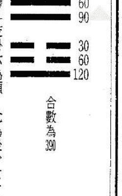

# 鐵版神數入門訣竅秘笈

原著／開天祖．增訂／赤道老人
資料原著／鐵版神數函授講義

- 正宗鐵版神數的演變 ………… 一
- 鐵版神數的奧秘 ………… 二
- 正宗鐵版神數的心法 ………… 三
- 實際應用：八刻分法、八刻天干數 ………… 四
- 乾宮甲流度、坤宮甲流度 ………… 六
- 鐵版神數推算程序秘訣 ………… 七
- 四柱排法：年柱排法、月柱排法、日柱排法、時柱排法 ………… 一
- 大運排法、大運起法 ………… 二
- 介紹鐵版神數《乾坤集》 ………… 三七
- 鐵版神數起例口訣《詳說》 ………… 三八
- 〈八卦加則〉逐句解說 ………… 四四
- 〈天干配卦例〉解說 ………… 四四
- 〈地支配卦例〉解說 ………… 四五

## 六十甲子斷流年

- 考時分刻
- 卦與天干斷六親
- 值年卦
- 考時定刻的方法及運用
- 坤集的運用
- 乾集的運用
- 條文增訂
- 《日主配卦例》解說
- 《河洛配數例》解說
- 《地支取數例》解說
- 《天干配卦、日主配卦、地支配卦、洛書數、卦爻》總表
- 卦與天干秘解
- 天干數、卦義
- 鐵版神數的應用法
- 八卦加則及起例

四五
四六
四六
四七
四八
四八
五三
五三
五七
五九
六一
六四
六五
七一
七三
七五

## 鐵版神數的實際應用

- 條文取數
- 定刻取數
- 四柱天干取數
- 大運取數
- 舉例說明〈八卦加則、變卦取數、大運取數、四柱天干數〉
- 批命書的處理
- 九十六刻天干數
- 關於八卦加則起例的估價
- 八卦加則起例的詮解
- 六種變卦取數
- 日主變卦取數
- 八數取式矛盾嗎？
- 前後變卦取數
- 如何考定刻中之分？

八三
八四
八四
八六
八六
九三
一〇〇
一〇三
一〇六
一〇七
一〇七
一〇八
一一一
一一二

#### 考六親的實際運用

- 乾、坤宮甲流度考六親
- 日月並明卦考六親
- 坤集各卦考六親
- 兄弟姐妹的推考方法
- 年支可驗六親．日支可推大運嗎？
- 先考、後考、直接考的方法
- 著者特別叮嚀的結語

一三
一四
一六
一七
二〇
二一
二二
二三

# 鐵版神數入門訣竅秘笈

原著／關天相
增訂／恭鑑老人

## 本傳授講義的說明

推命術的最高形式是：「鐵版神數」和「子平八字」合參。蓋因推命問題是一個數理問題，鐵版神數擅長數的推算，子平八字勝任理的演繹，數、理結合，才能準確地解釋人生運程。此次傳授旨在使鐵版神數為更多的命理學家所運用，茲作如下幾點說明：

- 甲．本講義是正宗鐵版神數秘笈公開。
- 乙．本傳授重點在於鐵版神數的起例方法和運用原則。學員完成課程之後，一般都能將鐵版神數運用到具體的推命實踐中。因此，有關鐵版神數的原理，若與使用無密切關係者，概不深究。
- 丙．為了便於學員理解，本講義採用白話詮釋。
- 丁．所附條文以本人一九四八年的校訂本為據，並經本人多年印證，學員學會運用之後，可根據實際命例作必要校對調整。
- 戊．鐵版神數只是一種演算公式，因此，即使你能運用自如，也絲毫不能忽視子平命學的重要性，因為唯子平命學能夠彌補鐵版神數的不足，使鐵版批命更趨完美。

## 正宗鐵版神數的演變

鐵版神數的原作者是：宋朝的邵康節，這一點已經很少有人懷疑，由於長達一千多年的輾轉傳抄，原文難免有一些殘缺失漏。到了清朝中葉，道長鐵卜子對其進行整理、校訂。而此後，邵子數即改稱鐵版神數。也就在這個時間，鐵版神數更為流行，由於它推算六親十分靈驗，每為人們津津樂道。

除了起例的法訣之外，為了配合當時的事物，鐵卜子在條文中加進了清代的官場稱謂。起例方面又配合了當時的時憲曆。從很多跡象來看，除了鐵卜子之外，整理鐵版神數者，清代還另有其人，結果就造成鐵版神數的多個版本。

由於有上述具體情況存在，人們喜歡把每一個版本當成一派，即為河洛派、西山派、江南派、洛陽派……。這實在是一種誤解，從學術的角度而言，你要形成自己的一派，就得有自己的學術體系、風格、原則與人迥異，此外，還得有自己的組織體系，而這三個體系，不論是洛陽派、江南派，還是其他的甚麼派都沒有的。

載至現在為止，不同的鐵版神數版本，本人一共見過七個，但除了條文之多寡有異之外，起例原則和應用方法一律相同。

而從本人所接觸的命相學家中，有的人是幾個版本兼而有之。

愚意以為：從鐵版神數本身的演變來看，人為的分派是不夠科學的。如條文的多寡可以分派，則天下之派也多矣！

## 鐵版神數的奧秘

從縱的方面來看，鐵版神數共分前後兩大部份，前半部份是乾坤集，談的是鐵版神數起例法訣，但由於編著者對口訣未加詳細說明，且天干的代表數也是空白，運用方法又一語不提，如此種種，造成鐵版神數不經師承即無法使用。後半部份是條文，原書錯漏以至顛倒者不少，且嫌文辭隱晦，其義難明。

橫的方面，鐵版神數包括了易卦、河圖洛書綱甲、子平八字、紫微斗數以至七政四餘幾方面的知識。紫微斗數和七政四餘主要是條文的構成，編著者用簡潔的術語概括了很多複雜的人生遭遇，由於這原因，要自如運用鐵版神數，就得具備上述各方面的知識基礎。

## 正宗鐵版神數的心法

鐵版神數的最大極限，是推斷財運流年不夠精確，並不像推六親那樣幾乎一無遺漏，究其原因，乃是一個先天之命和後天之運的問題，因為鐵版神數的這個「數」是先天之數，推六親自然靈驗非常，但流年財運包括了一個後天的改造在內，加上還有趨避的作用在，福禍吉凶並非一成不變，結果，以先天之數來推後天之運便見不足。

例如「納月屯卦」甲甲己甲丁（11817）條文：「幼年而亡方合此刻」，就不一定應驗。因為鐵卜子成書時代人類的物質生活和醫療條件極差，幼年而亡者大不乏人，以此批斷當無不可。現在時移勢易，幼年而亡者少之又少，如以原文照批，不錯的機會甚微。

這是一個時代性的問題，而生活和醫療條件的改變即是後天之運不同，鐵版神數的極限也在諸如此類的條文中明顯地表露出來。

具體的解決方法，就是鐵版神數和子平命學合參：既要看到「變」的一方面，但也要承認有此條文的人，雖不一定幼年而亡，但幼年多病，且壽命不永卻是事實。然後，利用子平八字認真進行推算，以確定其人的壽命問題——是「四十而亡」？還是「命止知非」？

以鐵版神數驗其六親，再以鐵版神數和子平八字互相印證審其運勢，這是推命過程中必須時刻記住的！

## 實際應用：八刻分法

鐵版神數開頭即說：「蓋聞人稟天地、命屬陰陽，即旦夕吉凶，各有定數，況終身禍福，豈無以定之？然命之理微，變化無窮，若差毫釐，必謬千里，往往有八字相同，而貧富各異，皆因未識真刻分矣。唯前賢諸夫子，秘傳理數，從本人八字，配合五音八卦，每一時推八刻，每一刻又須推十五分，推到的準時刻，自然全數悉合，禍福吉凶，絲毫不爽。」

這裏，鐵卜子強調了一個八刻推命的重要性，揭出人所以命同而運不同，是因出生的刻數不同。這也是鐵版神數有別於子平命學的地方。

### 八刻天干數

| 時辰 | 一刻 | 二刻 | 三刻 | 四刻 | 五刻 | 六刻 | 七刻 | 八刻 |
|---|---|---|---|---|---|---|---|---|
| 子時 | 戊壬庚戊 | 辛壬己壬 | 丁壬庚壬 | 戊乙丁壬 | 丁乙壬乙 | 甲甲月丁 | 丁月己乙 | 甲月月己 |
| 丑時 | 壬戊乙壬 | 庚月月戊 | 壬辛辛戊 | 乙戊丁庚 | 乙丁丁丁 | 辛乙己甲 | 乙辛己壬 | 丁月乙己 |
| 寅時 | 乙戊庚辛 | 乙壬丁壬 | 壬月月戊 | 庚己乙丁 | 戊戊戊乙 | 壬月月庚 | 戊乙壬丙 | 庚乙戊己 |
| 卯時 | 丙甲丁丙 | 丙戊丁壬 | 戊己丁丁 | 乙壬日乙 | 乙丁壬己 | 戊丁乙己 | 戊壬乙己 | 丙壬月乙 |
| 辰時 | 戊丁辛己 | 丁辛戊丁 | 甲月月壬 | 乙丁月丁 | 丁月壬乙 | 丁壬壬乙 | 辛壬乙壬 | 戊乙乙乙 |
| 巳時 | 庚庚戊壬 | 丁庚乙丁 | 乙甲己乙 | 甲己壬丁 | 乙辛己甲 | 戊月丁乙 | 丙甲乙丁 | 辛丙月壬 |

究竟這些天干數代表甚麼數字，又應如何代入運用，我們在「天干秘解」和「應用原則」的章節中再講。這裏所以予先作一交代，乃是讓學員對鐵版神數有一個基本的認識。當然，考查時定刻還關係到一個乾宮甲流度和坤宮甲流度的問題，我們都留在後面講清楚。乾、坤宮甲流度中之「月」是「癸」的代稱。

### 乾宮甲流度

| 地支 | 天干 | 月 | 日 | 時 |
|---|---|---|---|---|
| 子 | 辛 | 9 | 0 | 0 |
| 丑 | 辛 | 9 | 0 | 5 |
| 寅 | 辛 | 9 | 1 | 0 |
| 卯 | 辛 | 9 | 1 | 5 |
| 辰 | 辛 | 9 | 2 | 0 |
| 巳 | 辛 | 9 | 2 | 5 |
| 午 | 辛 | 9 | 3 | 0 |
| 未 | 辛 | 9 | 3 | 5 |
| 申 | 辛 | 9 | 4 | 0 |
| 酉 | 辛 | 9 | 4 | 5 |
| 戌 | 辛 | 9 | 5 | 0 |
| 亥 | 辛 | 9 | 5 | 5 |

### 坤宮甲流度

| 地支 | 天干 | 月 | 日 | 時 |
|---|---|---|---|---|
| 子 | 辛 | 9 | 6 | 0 |
| 丑 | 辛 | 9 | 6 | 5 |
| 寅 | 辛 | 9 | 7 | 0 |
| 卯 | 辛 | 9 | 7 | 5 |
| 辰 | 辛 | 9 | 8 | 0 |
| 巳 | 辛 | 9 | 8 | 5 |
| 午 | 辛 | 9 | 9 | 0 |
| 未 | 辛 | 9 | 9 | 5 |
| 申 | 甲 | 1 | 0 | 0 |
| 酉 | 甲 | 1 | 0 | 5 |
| 戌 | 甲 | 1 | 1 | 0 |
| 亥 | 甲 | 1 | 1 | 5 |

### 推算程序秘訣

鐵版神數的推算程序主要有六步，即：

- 一 ● 排八字 ↓
- 二 ● 起大運 ↓
- 三 ● 八字轉八卦加則及起例 ↓
- 四 ● 考時刻 ↓
- 五 ● 卦與天干看六親 ↓
- 六 ● 六十甲子推流年。

所有這六個程序，除了排八字和起大運之外，其餘均納入應用原則中闡述。學員可以圍繞這六個程序，隨著課程的逐步深入，進行有機思維。

從某種意義上說，鐵版神數只是一種演算公式，知道了卦與天干的意思以及使用方法以後，即可翻看條文，完全無須像子平命學一樣通過五行的相生相剋去推理。難怪有些人將鐵版神數當成字典。然而，是不是每一個學會鐵版神數的人，他們推算的準確度都能夠達到相同的水平呢？

我的看法是：視人而定的！

為甚麼？

一是 ● 屬於領悟力方面的，如所週知，鐵版神數的條文不但文雅、含蓄，而且委婉、晦澀，如此，便因各人領悟力不同，解釋也不相同。

二是 ● 屬於知識方面的，由於書中條文頻頻引用紫微斗數、子平八字的術語，結果，如果你這方面的知識較差，解釋條文必難完滿。

三是 ● 屬於條文校對方面的，鐵版神數的時代感和區域性極強，由於歷史極限，條文中很多職稱都採用了清代的稱謂，也有一些稱謂以外的東西，雖然適合一百年以前的中國社會，但已明顯不適用於高度商業化的香港、台灣，所有這些，都要求每個讀者有必要對條文進行等質修改，誰將條文校對得好，他所批命書也必更為精彩。

### 陰陽五行

在陰陽五行推命術中，「命」是出生的年月日所形成的五行生剋關係，可用天干地支來表示。「運」是根據命推出的，也可用天干地支來表示。天干、地支均含陰陽五行屬性。經書云：「人稟天地，命屬陰陽，生居覆載之內，盡在五行之中」就是這個含意。

- 一、五行：金、木、水、火、土
  - 相生：金→水→木→火→土→金
  - 相剋：金→木→土→水→火→金

- 二、十天干：甲、乙、丙、丁、戊、己、庚、辛、壬、癸
  - 陽干：甲、丙、戊、庚、壬
  - 陰干：乙、丁、己、辛、癸

### 三、十二地支：子、丑、寅、卯、辰、巳、午、未、申、酉、戌、亥

- 陽支：子、寅、辰、午、申、戌
- 陰支：丑、卯、巳、未、酉、亥

### 四季方位干支五行歌訣

東方甲乙寅卯木春，南方丙丁巳午火夏，西方庚辛申酉金秋，
北方壬癸亥子水冬，中央戊己辰戌丑未土。

### 六十甲子

所謂「干支」，就是「天干」和「地支」兩種數序的合稱。
把天干中的一個字擺在前面，後面配上地支中的一個字，就構成一對干支。
例如天干中的第一個字「甲」同地支中的第一個字「子」配合，成為「甲子」，下面依次組合
為「乙丑」、「丙寅」……等等。
由於天干只有十個字，而地支則有十二個字，所以配合到第十對，即「癸酉」時，接著，就
必須再次使用天干的第一個字「甲」，同地支的第十一個字「戌」配合。接著，由第二個字「乙」
同「亥」配合。而到「丙」時，則與地支的第一字「子」配合。
依次類推，一共可以得到六十種配合，然後才重新回到「甲子」，週而復始，循環不息。

### 干支配合组成甲子

1. 六十甲子
所谓「六十甲子」是由十天干及十二地支依序循环配合而成，即甲配子，乙配丑，丙配寅，直到癸配亥为止，共计六十组，是为六十甲子。其序如下：

- 甲子、乙丑、丙寅、丁卯、戊辰、己巳、庚午、辛未、壬申、癸酉——称：甲子旬。
- 甲戌、乙亥、丙子、丁丑、戊寅、己卯、庚辰、辛巳、壬午、癸未——称：甲戌旬。
- 甲申、乙酉、丙戌、丁亥、戊子、己丑、庚寅、辛卯、壬辰、癸巳——称：甲申旬。
- 甲午、乙未、丙申、丁酉、戊戌、己亥、庚子、辛丑、壬寅、癸卯——称：甲午旬。
- 甲辰、乙巳、丙午、丁未、戊申、己酉、庚戌、辛亥、壬子、癸丑——称：甲辰旬。
- 甲寅、乙卯、丙辰、丁巳、戊午、己未、庚申、辛酉、壬戌、癸亥——称：甲寅旬。

2. 六十花甲子纳音歌

- ● 甲子乙丑海中金，丙寅丁卯炉中火，戊辰己巳大林木，庚午辛未路傍土，壬申癸酉剑锋金。
- ● 甲戌乙亥山头火，丙子丁丑涧下水，戊寅己卯城头土，庚辰辛巳白蜡金，壬午癸未杨柳木。
- ● 甲申乙酉泉中水，丙戌丁亥屋上土，戊子己丑霹雳火，庚寅辛卯松柏木，壬辰癸巳长流水。
- ● 甲午乙未沙中金，丙申丁酉山下火，戊戌己亥平地木，庚子辛丑壁上土，壬寅癸卯金箔金。
- ● 甲辰乙巳覆灯火，丙午丁未天河水，戊申己酉大泽土，庚戌辛亥钗钏金，壬子癸丑桑柘木。
- ● 甲寅乙卯大溪水，丙辰丁巳沙中土，戊午己未天上火，庚申辛酉石榴木，壬戌癸亥大海水。

### 四柱排法

一、年柱的排法：

年柱排法可查照萬年曆，但應注意以立春為換算點。其區別有四：

- (1)．如在當年正月立春後生者，即以當年之干支為主。
  例如：民國五年正月初二日立春，為立春節後生。其人所生之年干支，即以當年之干支（年柱丙辰年）為主。

- (2)．如在當年正月立春前生者，即以上一年之干支為主。
  例如：民國六年正月十日出生，其年干支如下：
  查萬年曆得民國六年（干支為丁巳）正月十三日立春，為立春節前生。其人所生之年干支，即以上一年之干支（年柱丙辰年）為主。

- (3)．如在當年十二月立春後生者，即以下一年干支為主。
  例如：民國十六年正月二日生人，其年干支如下：
  查萬年曆得民國十六年（干支為丁卯）正月四日立春。正月二日生人，生於當年立春之前，要用前一年的太歲干支，為其生年干支。故正月二日生人，其年柱為「丙寅」。

- 例如：民國三年十二月廿七日生人，其年干支如下：
  查萬年曆得民國三年（干支為甲寅）十二月廿二日立春。十二月廿七日生人，為立春節後生。其人所生之年干支，即以下一年之干支（年柱乙卯年）為主。

又例：民國八年十二月十八日生人，其年干支如下：

查萬年曆得知民國八年（干支為己未）十二月十六日立春。十二月十八日生人，即生於當年十二月立春後，要用次年的太歲干支，為生年干支。故十二月十八日生人，其年干支為「庚申」。

(4)．除上述特別的情形外，其餘均用當年的太歲干支，為生年干支。

二、月柱的排法：

月柱地支是一月寅起到十二月丑止，但要注意以節氣為起止。

命理的月份是以節氣中的「節」為每月的第一天，故——

- 正月：由立春後至驚蟄前為正月，月支為寅。
- 二月：由驚蟄後至清明前為二月，月支為卯。
- 三月：由清明後至立夏前為三月，月支為辰。
- 四月：由立夏後至芒種前為四月，月支為巳。
- 五月：由芒種後至小暑前為五月，月支為午。
- 六月：由小暑後至立秋前為六月，月支為未。
- 七月：由立秋後至白露前為七月，月支為申。
- 八月：由白露後至寒露前為八月，月支為酉。
- 九月：由寒露後至立冬前為九月，月支為戌。
- 十月：由立冬後至大雪前為十月，月支為亥。
- 十一月：由大雪後至小寒前為十一月，月支為子。
- 十二月：由小寒後至立春前為十二月，月支為丑。

⊙生於當年元月立春前，用上年的十二月份干支（丑）。

⊙生於當年十二月立春後，用下一年的正月份干支（寅）。

● 月天干的排法

月天干的求法，是依據年干與月支來推定的，可由下面歌訣來推。

> 歌訣：「甲己之年丙作首，乙庚之歲戊為頭，
> 丙辛歲首尋庚起，丁壬生位順行流，
> 若言戊癸何方發，甲寅之上好追求。」

這歌訣的意思是：凡甲或己之年干，正月起「丙」。乙或庚之年干，正月起戊。丙或辛之年干，正月起庚。丁或壬之年干，正月起壬。戊或癸之年干，正月起甲。然後向後順推，一月一位，看月支為那一月，就順推幾位，看順推的一位天干是那一位，即為所求月干。茲左列表，以便查對。

又：月柱的天干歌訣是「五虎遁月」：

甲己起丙寅，乙庚起戊寅，丙辛起庚寅，丁壬起壬寅，戊癸起甲寅，餘按六十甲子順推。

年上起月表——

說明：月柱排法，由人生年通月之干支為主。查萬年曆，以節令為綱。其區別有三：

(1)．如在本月節令後生者。即以本月所通干支為主。

例如：民國五年三月十三日生。

查萬年曆得知民國五年三月三日清明節，為清明節後生，其人所生之年干支為丙辰。查「年

| 農曆 | 節氣 | 月支 | 年干 | 甲己 | 乙庚 | 丙辛 | 丁壬 | 戊癸 |
|---|---|---|---|---|---|---|---|---|
| 正月 | 立春 | 寅 | | 丙寅 | 戊寅 | 庚寅 | 壬寅 | 甲寅 |
| 二月 | 驚蟄 | 卯 | | 丁卯 | 己卯 | 辛卯 | 癸卯 | 乙卯 |
| 三月 | 清明 | 辰 | | 戊辰 | 庚辰 | 壬辰 | 甲辰 | 丙辰 |
| 四月 | 立夏 | 巳 | | 己巳 | 辛巳 | 癸巳 | 乙巳 | 丁巳 |
| 五月 | 芒種 | 午 | | 庚午 | 壬午 | 甲午 | 丙午 | 戊午 |
| 六月 | 小暑 | 未 | | 辛未 | 癸未 | 乙未 | 丁未 | 己未 |
| 七月 | 立秋 | 申 | | 壬申 | 甲申 | 丙申 | 戊申 | 庚申 |
| 八月 | 白露 | 酉 | | 癸酉 | 乙酉 | 丁酉 | 己酉 | 辛酉 |
| 九月 | 寒露 | 戌 | | 甲戌 | 丙戌 | 戊戌 | 庚戌 | 壬戌 |
| 十月 | 立冬 | 亥 | | 乙亥 | 丁亥 | 己亥 | 辛亥 | 癸亥 |
| 十一月 | 大雪 | 子 | | 丙子 | 戊子 | 庚子 | 壬子 | 甲子 |
| 十二月 | 小寒 | 丑 | | 丁丑 | 己丑 | 辛丑 | 癸丑 | 乙丑 |

上起月表」丙辛欄、及節氣清明欄得知為壬辰月所生。

年柱 丙辰年
月柱 壬辰月

(2)．如在本月節令前生者。即以上月所屬干支為主。

例如：民國五年四月三日生。查萬年曆得知民國五年四月五日立夏節，為立夏節前生，其人所生之年干支為丙辰。查「年上起月表」丙辛欄、及節氣清明欄得知為壬辰月所生。(因為：未交立夏節不以四月論，應以三月論。)

年柱 丙辰年
月柱 壬辰月

例如：某君民國三十五年 (丙戌) 五月初五日生。

查萬年曆得知民國三十五年五月初七日申時芒種前生，所以月支仍為「巳」月，至於月干查表，年干是丙，月支是巳，則月干是癸。排列如下：

年柱 丙戌年
月柱 癸巳月

(3)．如在本月下一節令生者。即以下月所屬干支為主。

例如：民國四年三月廿五日生。

查萬年曆得知民國四年三月廿四日立夏節後生。其人所生之年干支為乙卯。查「年上起月表」乙庚欄、及節氣立夏欄得知為辛巳月所生。(因為：已交立夏節不以三月論，應以四月論)。

年柱 乙卯年
月柱 辛巳月

注意：遇閏月依照節氣推論。

#### 三、日柱的排法：

可參照萬年曆所載氣節日干支，依六十甲子順推至生日即可。

萬年曆書每月所載→干
↓
支→初一日之干支
支→十一日之干支
支→二十一日之干支

說明：推日方法，由人之生日，定其干支。查萬年曆之記載，某月初一日某干支，十一日某干支，以次順數，則某月某日某干支，可屈指而得知。

(1)、如在民國元年正月初九日生人。
查萬年曆得知民國元年為壬子年。正月為壬寅月，初一日甲子，以次順數，初二乙丑，初三丙寅，初四丁卯，初五戊辰，初六己巳，初七庚午，初八辛未，初九日為壬申。

年柱 壬子年
月柱 壬寅月
日柱 壬申日

鐵版神數入門訣竅秘笈

(2)．如在民國元年十二月二十三日生人。
查萬年曆得知民國元年為壬子年。十二月為癸丑月，初一日為戊子，十一日為戊戌，二十一日為戊申，以次順數，二十二日己酉，二十三日為庚戌日。
年柱 壬子年
月柱 癸丑月
日柱 庚戌日

(3)．日柱干支的排法，亦可直接查萬年曆每日的干支，一查便得。
例如：民國三十二年四月五日出生。
年柱 癸未年
月柱 丁巳月
日柱 丙寅日（查萬年曆）
又例：民國四十一年五月十七日出生。
年柱 壬辰年
月柱 丙午月
日柱 丙戌日（查萬年曆）

#### 四、時柱的排法：

一天有二十四個小時，每二個小時為一個時辰，故每天有十二個時辰，以十二個地支來表示，

〇一七

#### 日上起時表

從當晚十一點至零晨一點子時開始，類推至晚九至十一點亥時止。

| 日干\時支 | 時刻 |
|---|---|
| 甲己 | 子 自下午11時至上午1時 |
| 乙庚 | 丑 自上午1時至上午3時 |
| 丙辛 | 寅 自上午3時至上午5時 |
| 丁壬 | 卯 自上午5時至上午7時 |
| 戊癸 | 辰 自上午7時至上午9時 |
| 甲己 | 巳 自上午9時至上午11時 |
| 乙庚 | 午 自上午11時至下午1時 |
| 丙辛 | 未 自下午1時至下午3時 |
| 丁壬 | 申 自下午3時至下午5時 |
| 戊癸 | 酉 自下午5時至下午7時 |
| 甲己 | 戌 自下午7時至下午9時 |
| 乙庚 | 亥 自下午9時至下午11時 |

時柱的排法是根據日干與時支來推定的，也就是：由人生日之天干，通得生時之支為主。

可由「五鼠遁日起時訣」求出：

歌訣：「甲己還加甲，乙庚丙作初，
丙辛從戊起，丁壬庚子居，
戊癸何方發，壬子是真途。」

這歌訣的意思是：凡甲或己之日干，子時起甲。乙或庚之日干，子時起丙。丙或辛之日干，子時起戊。丁或壬之日干，子時起庚。戊或癸之日干，子時起壬。向後順推，一時一位，如

右表：

時柱的天干另一歌訣是「五鼠遁日」：

甲己起甲子，乙庚起丙子，丙辛起戊子，丁壬起庚子，戊癸起壬子。

1．例如：某女士生於一九六三年農曆三月初五上午六時，查萬年曆一九六三年為癸卯年，因該年清明為三月十二日，三月初五出生作二月建卯，依「五虎遁月」歌訣，一月為甲寅，則二月為乙卯，初五為辛未日，丙辛之日子時戊子，則卯時為辛卯，由此推得該女士的四柱

為：

年柱 癸卯年
月柱 乙卯月
日柱 辛未日
時柱 辛卯時

2．例如：某君民國十六年（丁卯）二月十四日上午五時十六分出生。其四柱如下：

3．例如：在壬子年壬寅月壬申日辰時生人。查「日上起時表」日干丁壬欄、時支辰欄，得
知是：甲辰時。

年柱 丁卯年
月柱 癸卯月
日柱 庚戌日
時柱 己卯時

4．例如：在壬子年癸丑月庚戌日卯時生人。查「日上起時表」日干乙庚欄、時支卯欄，得
知是：己卯時。

年柱 壬子年
月柱 癸丑月
日柱 庚戌日
時柱 己卯時

補註：(1) 一個時辰分做八刻，一刻十五分。前四刻為初，後四刻為正。查萬年曆，務必小心
查看。(2) 台灣夏令時間表。

鐵版神數入門：新教秘笈

鐵版神數的大運排法也和子平八字相同，均有順推與逆推之別。

#### 大運排法

起四柱時，務必小心查看。

| 民國 | 陽曆起訖日期 |
|---|---|
| 26年至34年 | 10月1日至9月30日止 |
| 34年至40年 | 5月1日至9月30日止 |
| 41年 | 3月1日至10月31日止 |
| 42年至43年 | 4月1日至10月31日止 |
| 44年至48年 | 4月1日至9月30日止 |
| 49年至50年 | 6月1日至10月31日止 |
| 51年至62年 | 停止實施 |
| 63年至64年 | 4月1日至9月30日止 |
| 65年至67年 | 停止實施 |
| 68年 | 7月1日至9月30日止 |
| 69年至今 | 停止實施 |

日光節約時間，又叫做夏令時，其辦法，為將標準時撥快一小時，分秒不變。恢復時再撥慢一小時。我國歷年實施「日光節約時間」之情形如下：

甲、丙、戊、庚、壬年份出生者為陽命，

http://www.ccqmq.com/ 数千册易书交流 QQ822309222 电话：1338309222

25

#### 更多资料

↓↓↓

#### 【中华古籍库】

↓ 点击链接 ↓

https://www.fozhu920.com/list/

珍版刻印 / 海外流传 / 家传手抄 / 民间失传

【易】【医】【道】【武】【文】【奇】【画】【书】

1000000+高清古书籍

#### 打包下载

微信：mbook86

乙、丁、己、辛、癸年份出生者為陰命。
陽命男、陰命女順推，陰命男、陽命女逆推。
大運的排法，是根據生年天干的陰陽，及生月干支所需之節令排出的。
- 陽年生男（簡稱陽男）與陰年生女（簡稱陰女），均用月令干支順推。
- 陰年生男（簡稱陰男）與陽年生女（簡稱陽女），均用月令干支逆推。

1．例如：某君民國五十一年農曆五月十四日生。
（年柱）壬寅
（月柱）丙午
（日柱）甲申
（時柱）○○
大運（順推）：丁未、戊申、己酉、庚戌

2．例如：某女士民國四十四年農曆八月十日生。
（年柱）乙未
（月柱）乙酉
（日柱）己丑
（時柱）○○
大運（順推）：丙戌、丁亥、戊子、己丑

3．例如：某君民國四十四年農曆八月十日生。
（年柱）乙未
（月柱）乙酉
（日柱）己丑
（時柱）○○
大運（逆推）：甲申、癸未

(日柱) 己丑
(時柱) ○○

壬午
辛巳

#### 大運起法

4．例如：某女士生於一九六三年農曆三月五日上午六時，年柱為癸卯，月柱為乙卯，屬陰命女，順推，第一步大運為丙辰，第二步大運為丁巳……。若改為男命，排八字的方法相同。由於陰命男，逆推大運，第一步大運為甲寅，第二步大運癸丑……逆六十甲子順序推算。

凡推大運，始行之歲數，俱從所生之日時起。

- (1) 陽年生男、陰年生女，則順推，數至未來節日時。
- (2) 陰年生男、陽年生女，則逆推，數至過去節日時。

《推起運歲數》兩者皆遇節日而止，共計若干數目，（以三日折一歲），然後除三日（即用3除之）。若所得之餘數為二日，可假增一日，借足一歲，則加一歲。若餘數為一日，可假減一日，則一日除去不計。（即「三添一棄」也）。倘若生日生時巧逢交節，則不論男女及陰陽年干，一概作一歲起大運。

- 1．例如：前例女士，三月初五生，三月十二日為清明節，相距七天，除以三得二又三分之一，即二歲零四個月起運，或虛歲三歲零四個月起運。陰命男、陽年生女逆推，由出生日數至出生月建的第一個節氣，除以三便得。
- 2．例如：前例陰命女，如改為男，則為陰命男逆推，三月初五逆推至二月十一日驚蟄有二

鐵版神數入門訣竅秘笈

○一三

十三日，除以三得七又三分之二，即七歲零八個月起運。每一步大運天干地支管十年之吉凶。如前例女士，虛歲三歲至十二歲交丙辰運，十三歲至二十二歲交丁巳運……。其起大運之干支，當以所生之月令干支為主。順行者以次順推，逆行者以次逆推，上下干支，共為一運，管十年吉凶。

書云：一運管十年，榮枯有準，五行配四柱，休戚相連。

◎陽男：甲、丙、戊、庚、壬、五陽年所生之男。

3．例如：民國元年正月初九日辰時生陽男，陽年男命順推，由正月初九日數至十八日卯時驚蟄節，實歷有九天，以三日為一歲折之，是為三歲起運。從生月干支壬寅順推，始行癸卯。

壬子年
壬寅月
壬申日
甲辰時

三歲癸卯
十三歲甲辰
二十三歲乙巳
三十三歲丙午
四十三歲丁未
五十三歲戊申
六十三歲己酉
七十三歲庚戌

◎陰女：乙、丁、己、辛、癸、五陰年所生之女。

4．例如：民國元年十二月二十九日戌時生陰女。

已過立春節，作癸丑年論，陰年順推，由壬子年十二月二十九日戌時，數至癸丑年正月二十九日午時驚蟄節，實歷有三十天，以三日為一歲折之，是為十歲起運。從生月干支甲寅順推，始行乙卯。

癸丑年
甲寅月
丙辰日
戊戌時

十歲乙卯
二十歲丙辰
三十歲丁巳
四十歲戊午
五十歲己未
六十歲庚申
七十歲辛酉
八十歲壬戌

⊙陰男：乙、丁、己、辛、癸、五陰年所生之男。

5．例如：民國元年十二月二十九日戌時生陰男。

已過立春節，作癸丑年論，陰年逆數，由是日戌時數至二十九日酉時立春節，實歷有一時。以三日為一歲折之。是為一歲起運，從生月干支甲寅逆推，始行癸丑。

癸丑年
甲寅月
丙辰日

一歲癸丑
十一歲壬子
二十一歲辛亥

戊戌時

三十一歲庚戌

四十一歲己酉

五十一歲戊申

六十一歲丁未

七十一歲丙午

⊙陽女：甲、丙、戊、庚、壬、五陽年所生之女。

6．例如：民國元年正月初九日辰時生陽女。

由壬子年正月初九日辰時，逆行數至辛亥年十二月十八日午時立春節，實歷二十天，以三日為一歲折之，是為七歲起運。從生月干支壬寅逆推，始行辛丑。

壬子年

壬寅月

壬申日

甲辰時

七歲辛丑

十七歲庚子

二十七歲己亥

三十七歲戊戌

四十七歲丁酉

五十七歲丙申

六十七歲乙未

七十七歲甲午

7．例如：某君民國五十一年農曆五月十四日午時生：

陽年生男順數，自五月十四日午時起（午時不算）至下月節氣（查萬年曆，小暑為六月初六日夜子時）共計二十二日又六個時辰。

依三日為一歲，二十二日又六個時辰，為七歲又一日餘，一日餘除去不計，即從七歲起運。

從生月干支丙午順推，始行丁未。

壬寅年
丙午月
甲申日
庚午時

七歲丁未
十七歲戊申
二十七歲己酉
三十七歲庚戌
四十七歲辛亥
五十七歲壬子
六十七歲癸丑
七十七歲甲寅

8．例如：某女士民國四十一年二月初四日酉時生：

陽年生女逆數，自二月初四日酉時起（酉時不算）至上月節氣（查萬年曆，立春為正月初十寅時）共計二十三日又七個時辰。

依三日為一歲，二十三日又七個時辰，為七歲又二日餘。餘數二日，則加一歲，故從八歲起行運。從生月干支壬寅逆推，始行辛丑。

二歲年
八歲辛丑

#### 河圖洛書

相傳伏羲氏時，黃河出龍馬，背有圖，是為河圖，相傳夏禹治水時，有神龜自洛水出，背有圖，是為洛書。

- ● 河圖數及方位（附圖一）
一六共宗→為水居北
二七同道→為火居南
三八為朋→為木居東
四九作友→為金居西
五十居中→為土居中

- ● 洛書數的分佈（附圖二）
戴九履一，左三右七，二四為肩，八六為足

- ● 洛書數的相配

| 壬寅月 | 甲辰日 | 癸酉時 |
| :--- | :--- | :--- |
| 十八歲庚子 | 二十八歲己亥 | 三十八歲戊戌 |
| 四十八歲丁酉 | 五十八歲丙申 | 六十八歲乙未 |

一九合十，二八合十，三七合十，四六合十

- ● 洛書的方位
- ● 一北、九南、三東、七西
- ● 先天八卦（附圖三）
- ● 乾、兌、離、震、巽、坎、艮、坤
- ● 先天八卦之數：
- ● 乾一、兌二、離三、震四、巽五、坎六、艮七、坤八
- ● 後天八卦（附圖四）
- ● 坎、坤、震、巽、乾、兌、艮、離
- ● 後天八卦之數：
- ● 坎一、坤二、震三、巽四、中五、乾六、兌七、艮八、離九
- ● 納甲卦之天卦配卦（附圖五）
- ● 一坎戊、二坤乙癸、三震庚、四巽辛、六乾甲壬、七兌丁、八艮丙、九離己
- ● 周易六十四卦（附圖六）

http://www.ccqmq.com/ 数千册易书交流 QQ822309222 电话：1338309222

34

http://www.ccqmq.com/ 数千册易书交流 QQ822309222 电话：1338309222

36

鐵版神數入門訣竅秘笈

後天八卦（圖四）

http://www.ccqmq.com/ 數千冊易書交流 QQ822309222 電話：1338309222

37

http://www.ccqmq.com/ 数千册易书交流 QQ822309222 电话：1338309222

38

鐵版神數入門訣竅秘笈

| | 地坤 | 山艮 | 水坎 | 風巽 | 雷震 | 火離 | 澤兌 | 天乾 |
|---|---|---|---|---|---|---|---|---|
| 天乾 | ☷☷ | ☶☶ | ☵☵ | ☴☴ | ☳☳ | ☲☲ | ☱☱ | ☰☰ |
| 澤兌 | ☷☷ | ☶☶ | ☵☵ | ☴☴ | ☳☳ | ☲☲ | ☱☱ | ☰☰ |
| 火離 | ☷☷ | ☶☶ | ☵☵ | ☴☴ | ☳☳ | ☲☲ | ☱☱ | ☰☰ |
| 雷震 | ☷☷ | ☶☶ | ☵☵ | ☴☴ | ☳☳ | ☲☲ | ☱☱ | ☰☰ |
| 風巽 | ☷☷ | ☶☶ | ☵☵ | ☴☴ | ☳☳ | ☲☲ | ☱☱ | ☰☰ |
| 水坎 | ☷☷ | ☶☶ | ☵☵ | ☴☴ | ☳☳ | ☲☲ | ☱☱ | ☰☰ |
| 山艮 | ☷☷ | ☶☶ | ☵☵ | ☴☴ | ☳☳ | ☲☲ | ☱☱ | ☰☰ |
| 地坤 | ☷☷ | ☶☶ | ☵☵ | ☴☴ | ☳☳ | ☲☲ | ☱☱ | ☰☰ |

#### 六十四卦（圖六）

〇三五

http://www.ccqmq.com/ 数千册易书交流 QQ822309222 电话：1338309222

40

鐵版神數入門訣竅秘笈

#### 乾坤集

乾集乃起例及有關用數介紹，行文雖然簡單，意義卻至為重要，學者必須熟記，否則無法應用。

坤集可以分成二部分：

- 上半部分：主要提供人生的重要經歷及六親狀況。
- 下半部分：從「小過卦用事」開始，說的是一歲至九十八歲每歲所發生之事，也即流年運程。

乾為天、天澤履、天火同人、天雷無妄、天風姤、天水訟、天山遯、天地否。
澤天夬、兌為澤、澤火革、澤雷隨、澤風大過、澤水困、澤山咸、澤地萃。
火天大有、火澤睽、離為火、火雷噬嗑、火風鼎、火水未濟、火山旅、火地晉。
雷天大壯、雷澤歸妹、雷火豐、震為雷、雷水解、雷山小過、雷地豫。
風天小畜、風澤中孚、風火家人、風雷益、巽為風、風水渙、風山漸、風地觀。
水天需、水澤節、水火既濟、水雷屯、水風井、坎為水、水山蹇、水地比。
山天大畜、山澤損、山火賁、山雷頤、山風蠱、山水蒙、艮為山、山地剝。
地天泰、地澤臨、地火明夷、地雷復、地風升、地水師、地山謙、坤為地。

上面所講均為鐵版神數入門基本知識，學員均應於第一單元的傳授中熟記。由於本人年高體弱，精力有限，凡與起例和應用關係無關者概予省略。下面，我們將重點講授鐵版神數的起例和應用。

如果短命便查不到了，查到何歲而不能再查則壽終。相反，如其人活過九十八歲，則九十八歲之後也無以翻查。

#### 八卦加則

《歌訣》
爻從三十起，乾卦六為頭，兌為後少女，集中一網收。
變知六八止，世應兩同儔，遇十不須用，玄玄妙法周，當看多寡數，及止悉因由。

《說明》
鐵版神數算命時，首先要將他的年月日時及時刻記下，然後先將年月日時排成四柱（即子平法），所謂「八卦加則」，即是：將被算命者的四柱的天干地支轉為八卦，一上一下便成為六個爻，再將爻所屬之數加起來，便可翻看條文，這便是八卦加則的程序。

《原文》：爻從三十起
《解釋》：是將天干地支化成卦後的上爻之數從三十起，亦是上爻從子起。陽爻：子、寅、辰、午、申、戌。陰爻：丑、卯、巳、未、酉、亥，而所代表的數分別是：
子丑代表三十，寅卯六十，辰巳九十，午未一二〇，申酉一五〇，戌亥一八〇。

《原文》：乾卦六為頭
《解釋》：乾六是洛書之數，但不是加在卦數之內，而是加在卦數之前頭，所以是乾卦六為頭，震卦三為頭，巽卦四為頭，離卦九為頭，坎卦一為頭，艮卦

八為頭，兌卦七為頭。

#### 《原文》：兌為後少女

《解釋》：兌是少陰即少女之意，但為甚麼叫兌為後少女呢？這是和上句有關的，意思是上卦是乾的話便要加六在前頭，如下卦是兌的話便要減兌之洛書數七。如下卦是離便減九數，依此類推。

#### 《學例》：

| 30 | 60 | 90 | 30 | 120 | 150 |
|---|---|---|---|---|---|
| 子 | 寅 | 辰 | 丑 | 午 | 申 |

子寅辰丑午申加起之數是四八〇，因上卦是乾（乾卦六為頭），加六為六四八〇，又因下卦是兌（兌為後少女），要減七，即得六四七三，如翻查條文便是：立之堅固，未可動搖。

這裏所舉的只是上卦是乾，下卦是兌的加減情況，如上、下卦不同，又應如何加減，學者可參照此法領會，觸類旁通。（本文後面將再詳細學例說明）。

#### 《原文》：集中一網收

| 陰爻的是：三爻；因此，陰爻排法，只列：丑 |
|---|
| 陽爻的是：上爻→五爻→四爻→二爻→初爻 |
| 因此排列：子→寅→辰→午→申 |
| 陰爻：丑→卯→巳→未→酉→亥 |
| 陽爻：子→寅→辰→午→申→戌 |
| 支數：30→60→90→120→150→180 |

《解釋》：此語和起例無關。古人為了行文完整，有時難免加入一些虛字虛詞虛句。從字義上解，「集」為「集合」之意，「網」作全部解，而「收」者乃結束、收束也。它綜合了以上全部三句的意思，認為至此告一段落，單獨憑上面三句即可開始起數。從這一點而言，八卦加則歌訣，即以此語分為前後二部份。

#### 《原文》：變知六八止

《解釋》：這是承上半部份的意思而言的：除了上述所取之卦數外，尚有四十八種變化之取數——在八卦加則中，將上卦及下卦變做六八（四十八）種干支，然後取數。茲將四十八種干支開列如下：

| 上卦之三爻 | 下卦之三爻 |
| :--- | :--- |
| 乾卦：壬戌、壬申、壬午。 | 甲辰、甲寅、甲子。 |
| 兌卦：丁未、丁酉、丁亥。 | 丁丑、丁卯、丁巳。 |
| 離卦：己巳、己未、己酉。 | 己亥、己丑、己卯。 |
| 震卦：庚戌、庚申、庚午。 | 庚辰、庚寅、庚子。 |
| 巽卦：辛卯、辛巳、辛未。 | 辛酉、辛亥、辛丑。 |
| 坎卦：戊子、戊戌、戊申。 | 戊午、戊辰、戊寅。 |
| 艮卦：丙寅、丙子、丙戌。 | 丙申、丙午、丙辰。 |
| 坤卦：癸酉、癸亥、癸丑。 | 乙卯、乙巳、乙未。 |

#### 巽卦

##### 《上卦》
辛卯7+6=13
辛巳7+4=11
辛未7+8=15
39

##### 《下卦》
辛酉7+6=13
辛亥7+4=11
辛丑7+8=15
39

#### 震卦

##### 《上卦》
庚戌8+5=13
庚申8+7=15
庚午8+9=17
45

##### 《下卦》
庚辰8+5=13
庚寅8+7=15
庚子8+9=17
45

#### 離卦

##### 《上卦》
己巳9+4=13
己未9+8=17
己酉9+6=15
45

##### 《下卦》
己亥9+4=13
己丑9+8=17
己卯9+6=15
45

#### 兌卦

##### 《上卦》
丁未6+8=14
丁酉6+6=12
丁亥6+4=10
26

##### 《下卦》
丁丑6+8=14
丁卯6+6=12
丁巳6+4=10
26

#### 乾卦

##### 《上卦》
壬戌6+5=11
壬申6+7=13
壬午6+9=15
39

##### 《下卦》
甲辰9+5=14
甲寅9+7=16
甲子9+9=18
48

#### 坎卦

##### 《上卦》
戊子5+9=14
戊戌5+5=10
戊申5+7=12
26

##### 《下卦》
戊午5+9=14
戊辰5+5=10
戊寅5+7=12
26

#### 艮卦

##### 《上卦》
丙寅7+7=14
丙子7+9=16
丙戌7+5=12
42

##### 《下卦》
丙申7+7=14
丙午7+9=16
丙辰7+5=12
42

#### 坤卦

##### 《上卦》
癸酉5+6=11
癸亥5+4=9
癸丑5+8=13
33

##### 《下卦》
乙卯8+6=14
乙巳8+4=12
乙未8+8=16
42

#### 《原文》：世應兩同儔

《解釋》：世是世爻，應是應爻，「儔」作「數」解，全句話的意思是：世爻和應爻的數字相同。

《舉例》：世爻↓

- 辛酉
- 辛亥
- 辛丑

應爻↓

按照「河洛配數例」（見本書第四十六頁）。應爻庚（八）戌（五）總數十三，相等於世爻辛（七）酉（六）之總和。讀者或許要問，這句歌訣的提出在鐵版神數的排算中有什麼作用呢？本人認為它是配合上一句「變知六八止」而言的。即是所變的四十八種干支配卦上，只有卦轉干支而世爻和應爻的數字相同，才算是正確的。情形一如前例所述。

#### 《原文》：遇十不須用

《解釋》：引上兩句，如果將卦化四十八干支後分上卦數及下卦數，但如果其中一爻相加是十便不用此數。

《舉例》：

上卦爻合數不用十，即是十四加十二等於二十六。下卦爻十四加十二加十六等於四十二，即

- 戊子(14)
- 戊戌(10)
- 戊申(12)
- 乙卯(14)
- 乙巳(12)
- 乙未(16)

總數為二六四二。列為算式則為：26 + 42 = 2642

對於鐵版神數的獨特加法讀者要十分注意，如搞成二十六加四十二等於六十八，則就大錯特錯了。

#### 《原文》：玄玄妙法周，當看多寡數，及止悉因由。

《解釋》：最後三句和起例並沒關係。它除了達到行文的完整之外，意在加強鐵版神數「玄」的渲染，鐵版神數是這樣的玄妙而又周到，其靈驗之處全表現在數的多少，至此也明白了它的來龍去脈了！

#### 天干配卦例

所謂「天干配卦例」，即是將四柱的天干轉為八卦，方法是用納甲卦式去轉變。

> 《歌訣》↓
乙癸向坤求，壬甲從乾數。庚來震上立，辛在巽方留。
己以離門起，戊用坎為頭。丙須艮處出，丁向兌家收。

十天干所屬八卦及數位如左：

| 天干 | 卦 | 洛書數 | 天干配卦例 |
| :--- | :--- | :--- | :--- |
| 甲壬 | 乾 | 六 | 壬甲從乾數 |
| 乙癸 | 坤 | 二 | 乙癸向坤求 |
| 庚 | 震 | 三 | 庚來震上立 |
| 辛 | 巽 | 四 | 辛在巽方留 |
| 己 | 離 | 九 | 己以離門起 |
| 戊 | 坎 | 一 | 戊用坎為頭 |
| 丙 | 艮 | 八 | 丙須艮處出 |
| 丁 | 兌 | 七 | 丁向兌家收 |

#### 地支配卦例

所謂「地支配卦例」，係指將四柱的地支化成八卦，協助八卦加則起例。

> 《歌訣》↓
一數坎兮二數坤，
三震四巽数中分。
五寄中宫六是乾，
七兌八艮九離門。

> 《說明》：此節最為明白，即：坎一、坤二、震三、巽四、中五、乾六、兌七、艮八、離九。

#### 日主配卦例

所謂「日主配卦例」，實則為地支配卦，它和天干配卦以及地支配卦目的相同，都是為了協助八卦加則起例。

> 《歌訣》↓
亥子坎宮寅震木，
巳午離門丑在坤。
卯酉乾金辰是兌，
未申艮木戌巽直。

#### 河洛配數例

《解釋》：
子亥為坎卦，寅為震卦，巳午為離卦，丑為坤卦，
卯酉為乾卦，辰為兌卦，未申為艮卦，戌為巽卦。

> 《歌訣》↓
甲己子午九，乙庚丑未八，丙辛寅申七，
丁壬卯酉六，戊癸辰戌五，巳亥單四數。

《解釋》：河洛配數即為干支配數，具體如下：
《天干》：甲九、乙八、丙七、丁六、戊五、
己九、庚八、辛七、壬六、癸五。
《地支》：子九、丑八、寅七、卯六、辰五、巳四、
午九、未八、申七、酉六、戌五、亥四。

#### 地支取數例

> 《歌訣》↓
亥子一六水，寅卯三八真，巳午二七火，
申酉四九金，中宮辰戌是，丑未五同歸。

《解釋》：
亥子一六水 → 亥和子都代表一與六，寅卯三八真 → 寅和卯都代表三與八，
巳午二七火 → 巳和午都代表二與七，申酉四九金 → 申和酉都代表四與九，
中宮辰戌是 → 辰和戌都代表五與十，丑未五同歸 → 丑和未都代表五與十。

| 天干配卦 | 甲壬 | 乙癸 | 丙 | 丁 |
| :--- | :--- | :--- | :--- | :--- |
| 日主配卦 | 卯酉 | 丑 | 未申 | 辰 |
| 地支配卦 | 乾 | 坤 | 艮 | 兌 |
| 洛書數 | 六 | 二 | 八 | 七 |
| 卦爻 | ☰ | ☷ | ☶ | ☱ |
| 天干配卦 | 戊 | 己 | 庚 | 辛 |
| 日主配卦 | 子亥 | 巳午 | 寅 | 戌 |
| 地支配卦 | 坎 | 離 | 震 | 巽 |
| 洛書數 | 一 | 九 | 三 | 四 |
| 卦爻 | ☵ | ☲ | ☳ | ☴ |

至此，鐵版神數的起例已全部解釋清楚。
有一點仍需說明的是：在鐵版神數的某些版本中，有紫微斗數的起例。這只不過是秘本的作者或傳抄者，為了混淆人眼，令學者不知其然而故意加入的。編列的人又因為不明所以，而致有此誤。

其實，鐵版神數起例並不需要斗數命盤，而只有在條文中才有紫微的神殺星的名稱。此亦所以鐵版神數要口傳親授的一個原因。

至於如何運用起例去為人算命，我們在「應用篇」一章再加說明。

#### 卦與天干秘解

在鐵版神數「乾坤集」裏，卦與天干約有一百頁之篇幅，原文又未加解釋說明，實令人費解。相信有些讀者會以為這些卦是「連山易」和「歸藏易」的卦名，其實不是。

鐵版神數中的卦與天干是有特別的意思，「卦」是代表一種事實的名稱，「天干」是代表一定之數字，明白這些「卦」的意思，又索引到「天干」的數字，便可以翻看條文，這便是卦與天干的用法。

以下我們便來討論卦與天干，希望各位能下些苦功，因為在乾坤集中卦與天干，是需要各位自己花時間去整理及調校的，就好像照相機一樣，需要你自己去操縱，攝影拍得好不好便要靠你自己，我只能講解用法，經驗是自己創造出來的。

#### 天干數

甲一、乙六、丙二、丁七、戊三、己八、庚四、辛九、壬五、月（癸）○。

此天干數和河洛配數不同，是作為翻查乾坤集條文之用。

#### 卦義

坤集中的卦，有的代表六親，有的代表人生際遇，有的代表妻財子孫。這裏只能重點說明卦的意義，如要全部介紹恐篇幅花費過多。（讀者如要知道全部卦的意義，可參閱「中國絕學」第三集第三五二頁起至第三六六頁止；以及「中國絕學」第四集第126→131頁、第四集第46→52頁上，均分別有詳解。）因此所有卦義，讀者通常可以自己查閱印證明白的。

【納乾坤屯卦】，乾為父，坤為母，是指父母死亡之年的意思。例如：
庚丁庚乙，四七四六→父母同死於水年及火年方合。
庚壬戊乙，四五三六→父死於水年、母死於火年，方合此卦。
丙月辛辛，二〇九九→父母生於木，終於金年合納意。

【納甲土屯卦】是指父亡之年的代表意思，例如：
乙壬丁庚→六五七四→父故於水年方合。
甲辛壬己→一九五八→此刻生人，父先亡於木年，方合此數。

【日月並明卦】是指父母尚在人間，例如：
戊己月辛，三八〇九→此刻生人，雙親俱全。
壬己壬乙→五八五六→此刻生人，堂前雙親並茂。
壬戊乙甲→五三六一→招得父有壽，在堂是也。

【納月屯卦】是指被算命者的壽終之意，例如：
甲甲己甲丁→一一八一七→數注幼年而亡，方合此刻。
戊丙甲丙→三三二二→此卦值重陽三朝七日命不堅。
丁戊丁己→七三七八→中年而亡，方合先天定數。
甲辛甲丁→一九一七→此刻主人必死矣。

【納后天乾坤卦】本身命後天過繼或後母所生，例如：
戊丙丙壬→三三二五→命當過房繼育成人，方合此卦。
己己丁丙→八八七二→幼年承繼，數該兩處雙親。
己乙己辛→八六八九→分有前生我後母。
壬乙庚丁→五六四七→此命出於偏房，合此刻數。

【納木卦】代表妻命所屬之五行，例如：
庚戊乙丁→四三六七→妻命屬金，方合此卦。
戊丙乙甲→三二六一→妻命本屬木。
甲月己丁庚→一〇八七四→此刻生人，妻命屬水木。
戊庚庚月→三四四〇→妻命屬火方合。
戊戊庚庚→三三三四四→妻命本屬土，方合此刻。

【匹木卦】代表妻之命屬五行及娶妻之年，例如：
丙己甲庚→二八一四→妻命屬火年，娶妻之年屬土。
乙己甲辛→六八一九→水土之命宜配妻，方合此卦。
戊戊辛甲→三三九一→妻命納音水，娶妻之年納音金。

【納釜升卦】是代表學問與得職之意：例如：
甲月丁壬丙→一○七五二→水火之年國學，水土之年出貢方合此卦。
甲月丙甲乙→一○二一六→木火之年以監而選知州，方合此卦。
乙庚己丙→六四八二→金土之年國學，木火之年得貢方合。
乙丙乙己→六二六八→金水之年國學，方合此卦。

卦與天干是個組織特別的密碼書，內容差不多是將一萬二千條文的大部份安排入內。

現再舉例說明其中之代號：斗、血、牛，這些字後面的天干是甚麼意思。

「斗」從原文取出其中的例子：

「支戊庚正卦」中的「斗」是戊戊戊辛：
三三三九→十三歲、十四歲→升騰之象，近貴而喜榜中人。

「支丁正卦」中的「斗」是庚己乙辛：
四八六九→十五歲、十六歲→幼年登科。

「戊支甲丙正卦」中的「斗」是丙丁丙戊：
二七二三→二十一歲、二十二歲→大吉星高照，一舉冠群英。

「戊支壬乙正卦」中的「斗」是甲己月辛：
一八○九→三十五歲→丹桂一枝開，秋風得意同。

「庚支甲丙正卦」中的「斗」是甲己乙戊：
一八六三→四十一歲、四十二歲→龍起飛騰上九天。

相信大家都明白「斗」是代表甚麼意思，至於「支戊庚正卦」、「支丁乙正卦」又是代表甚麼呢？那是年歲範圍內所發生之事的總括代表，如「支戊庚正卦」裏所有的天干數都是在十三、十四歲所發生的事。而「支丁乙正卦」裏所有的天干數序都是在十五、十六歲所發生的事，

例如：

「支戊庚正卦」中的「血」是：
庚甲月甲→四一○一→十三、十四歲→辟雍成名祖宗之蔭。

「戊支戊庚正卦」中的「血」是：
甲乙辛乙→一六九六→三十三、三十四歲→若問功名國學翱翔。

「戊辛庚支正卦」中的「血」是：
庚戊丁庚→四三七四→三十九、四十歲→辟雍成名。

「壬支壬乙正卦」中的「血」是：
庚乙月甲→四六○一→五十五、五十六歲→辟雍成名。

以上便是「血」的代表意思，因「正卦」不同而歲數不同。

「支戊庚正卦」中的「牛」是：
壬甲丙丁→五一二七→十三、十四歲→幼年人沖人生大幸。

「支丁乙正卦」中的「牛」是：
丙丙甲丙→二二二二→二十歲→骨肉凋殘人事難，淚痕灑竹染成斑。

「丙甲丙丁卦」中的「牛」是：
甲甲己甲庚→二一八一四→二十一歲→名登庠序。

「壬支丁己正卦」中的「牛」是：
甲丙甲丁庚→二二一七四→五十七歲→數該入泮。

以上便是「牛」的代表意思，但因「正卦」不同而歲數亦不同。我們已討論了很多關於卦與天干，現在從原文其中之一段將其轉化為數字，大家有時間也要將所有卦與天干轉做數字。

#### 鐵版神數的應用法

這裏要指出的是，大家在使用鐵版神數為人算命之前，最好先將坤集中的卦與天干全部化做數序，然後翻看條文，以便對鐵版神數本身有個深刻了解，避免使用時束手束腳，而事實上算得準與不準，也有賴於你們自己花時間去調校和熟悉那些卦與天干。

鐵版神數的應用問題，除了上面已經講過的排四柱、起大運之外，還包括了八卦加則、考時定刻、推流年、驗六親的問題，現在逐點加以說明。

#### 八卦加則及起例

所謂「八卦加則」即是將四柱轉為數序，如果說排八字是第一步，起大運是第二步，那麼，利用八卦加則的原則將四柱轉為數序便是第三步。

要記住的是：上卦用天干配卦，下卦用日主配卦，數用洛書數，也即地支配卦例。現舉例如下：

男命四柱：丁酉、甲辰、庚戌、丁丑。

一、將四柱轉為上下卦之後，再用八卦加則將其化成數序，情形如左：

七→兌→丁
酉→乾→六

六→乾→甲
辰→兌→七

三→震→庚
戌→巽→四

七、兌→丁
丑→坤→二

二、根據「爻從三十起」、「乾卦六為頭、兌為後少女」的原則，將上列四個合數作如下加減：

乾為頭 6 + 480 - 6480 減 6 - 7474
兌為頭 7 + 480 - 7480 減 7 - 7474
震為頭 3 + 360 - 3360 減 4 - 3356
巽為頭 3 + 360 - 3360 減 4 - 3356
兌為頭 7 + 390 - 7390 減 2 - 7388
坤為後 7390 減 2 - 7388

三、除了這四條之外，我們還要用上下卦轉做另外的四條數序，而「變知六八止，世應兩同備」這兩句歌訣便是指導原則：

（一）
兌
丁未
丁酉
丁亥
甲辰
甲寅
甲子
乾

丁未 6 + 8 = 14
丁酉 6 + 6 = 12
丁亥 6 - 4 = 10
26

甲辰 9 + 5 = 14
甲寅 9 + 7 = 16
甲子 9 + 9 = 18
48

（丁亥的10不加）

上爻 丑
五爻 子
四爻 寅
三爻 卯
二爻 巳
初爻 未

《說明》
此卦的陽爻是：五爻→四爻，
因此陽爻排列：子→寅。
此卦的陰爻是：上爻→三爻→二爻→初爻，
因此陰爻排列：丑→卯→巳→未。

丑 30
子 30
寅 60
卯 60
巳 90
未 120
合數390

以上之干支是取之「變知六八止」的四十八種天干。然後運用「河洛配數例」中的數轉成數序。但切應記住「遇十不須用」。即是：

一、丁未↓一四、丁酉↓一二、丁亥↓一○，甲辰↓一四、甲寅↓一六、甲子↓一八：上卦相加「不加一○」等於二六，下卦相加等於四八，因此上下卦合為數序↓二六四八。

二、壬戌↓一一、壬申↓一三、壬午↓一五，丁丑↓一四、丁卯↓一四、丁巳↓一○：上卦三九，下卦二六，合數三九二六。

三、庚戌↓一三、庚申↓一五、庚午↓一七，辛卯↓一三、辛巳↓一一、辛未↓一五：上卦四五，下卦三九，合數四五三九。

四、丁未↓一十四、丁酉↓一十二、丁亥↓一○，乙卯↓一四、乙巳↓一二、乙未↓一六：上卦二六，下卦四二，合數二六四二。

至此，大家已經取出合共八條數序，這八條數序指示的都是人生的主要經歷。

#### 六十甲子看流年

上面已說過：怎樣排出其人一生之要事，但至於每年所發生的事則沒有詳細的說明，所以今同所說的是怎樣查出每年所發生的事，看法有兩種：

第一種是「值年卦」，用坤集的卦與天干，再轉為數序翻看條文（另有詳文說明在後）。

第二種就是六十甲子看流年，現說明如下：再以上面的八字為例，根據：「甲四、乙四、丙六、丁三、戊三、己四、庚四、辛六、壬三、癸三」列式如下：

3 丁 丑
4 庚 戌
4 甲 辰
3 丁 酉（4、9）

大運：癸卯 壬寅 辛丑 庚子 己亥 戊戌 丁酉

又根據「地支取數例」：「亥子一六水，寅卯三八真，巳午二七火，申酉四九金，中宮辰戌是，丑未五同歸」的歌訣，先將天干配以數，再在年支配以數，然後順「月日時年」的天干數排合起來即是 4 4 3 3，加上年支的數：4 4 3 3 ÷ 4 + 9，所得四四四六便是流年數序可翻看條文。這是一般排法，其他八字也可依此類推。但要注意的是：當入大運時，排法便有不同，如：

+   3 丁酉（4、9）
4 甲辰
4 庚戌
3 丁丑
3 癸卯
大運：
壬寅
辛丑
庚子

以上八字一歲起癸卯大運，癸是 3 數，加上月干的 4 是「7」，其數序加式便是：7 4 3 3 + 4 + 9 = 7 4 4 6，這個七四四六的數序便是入大運排法，其他大運如壬寅、辛丑、庚子……其排法與此相同。但仍須注意的是：每當天干合化時，其用數便不相同，情形如左：

甲己合土：甲己皆作一數，乙庚合金：乙庚皆作二數，
丁壬合木：丁壬皆作三數，戊癸合火：戊癸皆作四數，
丙辛合水：丙辛皆作五數。

如：
1 合
4 己亥（1、6）（流年三歲） 大運 3 癸卯
4 甲辰
4 庚戌
3 丁丑

以上的八字三歲流年數，但已入大運癸卯，加上又甲己合所以排法應順「月日時年」，月原本是「4」但甲己合作一，另有入癸卯，癸是三數，那月數便是一加三即「四」，日「4」，時「3」，年因甲己合一所以是一數，排數 4 4 3 1 + 1 + 6 = 4 4 3 8，四四三八便是三歲流年的運了，相信大家都明白及運用流年數法了。

#### 考時分刻

以上涉及排列的數序均不需要知道被問者的出生時刻，但如欲知道六親及運用卦與天干的值年卦，便需要知道出生時刻了。

鐵版神數將每一時辰分為八刻，但一般人都不知道自己確實出生時刻，所以鐵版神數就有一套考時分刻的方法，在起例中有八刻的分法，有八刻的天干及「乾宮甲流度」及「坤宮甲流度」，用法就是先用八刻的天干去考，如子時出生，我們可依那天干表中的一刻的天干化數翻

#### 卦與天干看六親

經過考時分刻之後，便可在坤集中取得二種數序：

第一種是「值年卦數序」，即是被算者在每一歲所發生的事。

第二種便是可以在坤集的卦與天干看六親。

在「卦與天干秘解篇」（見本書第四八頁）中已向各位介紹清楚，卦的代表及天干數的代表，

有術數基礎的朋友，在領悟卦與天干的基礎上，假若又已將整篇坤集的天干轉變為數序，相

信必有所獲。

首先我們先談一談坤集開始的第一頁，有「納乾坤屯卦」「日月並明卦」「納后天乾坤卦」等

等卦名，這些卦的意思大家已清楚，這裏談談用那一條天干才適合？但坤集的卦中並不是每

一個人的命都可以查，設計鐵版神數的人不是能知道所有人的命運，所以並不是每一個個人的

命都可以查到，如查不到的人就只可查其流年運程。

上篇亦曾說過，鐵版神數關鍵排法是「月日時年」，「六十甲子看流年篇」已詳細說過，所以

「納乾坤屯卦」中的第一條天干是「庚丁庚乙」，我們以被算者的八字天干排列「月日」，如

果有多過二條天干的「月日」相同，我們便要看「時」的天干，如「庚丁庚乙」即是「庚」

為月、「丁」為日，被算者就是這樣選擇「卦」中的那條天干為適合，但天干常常是有些小字

一時，子時加卯州一分即十一時州一分，每刻十五分，州一至四十分「卯」即三刻，也即子

時三刻出生。大家運用上述方法定可考時定刻矣。

「水」、「火」等字，這些字作什麼用呢？目的是用來考證那條天干是否適合？如水庚丁庚乙金，火是坤父亡之年，下面的火是坤母，如父先死便是死於金年，母後死於火年。希望大家先將坤集的天干化為數序再轉為條文，這固然很花時間，但對領會鐵版神數卻十分重要。

如果天干查不到，那便是沒有了。如此類推，但到幾頁之後，就在「納木離卦」之後有辛月丙庚（子）、辛月庚庚（丑）等天干，但下面有子、丑、寅、卯等地支，其實上面仍是用「月」日」天干，但下面的「子」便是時的分別用，上面已說過子是一至十分鐘，如被算者的「月」天干是「辛」，日天干是癸（即是月）而出生又是一刻，那條天干便是「辛月丙庚（子）」，然後翻查數序便可。大家要花些心機細心領會這段文字，才會豁然開朗。因為鐵版神數的排列是以「月」為頭，而「天干」下的「地支」是時刻的暗示。照此方法已可以查出應要查的天干及數序。

後面的「乾屯艮生」乃是「父之生子」之意，但天干又出現新排列，在天干上有小字寫著「己甲」、「酉甲」，這些小字也就是出生「月日」天干的排列，如第一條的「己甲辛丁乙辛」即是被算者的月天干「己」，日天干「甲」便用以下的天干數序，如此類推也是一樣查法。

再後面的「月屯姤卦」，大家須留意的是天干尾有「支」的出現，這個「支」的出現，這個「支」字代表數是「○」，天干的代表數「月」和「支」都是代表「○」，但是「月」通常都是排在天干之中，而「支」就一定排在天干之尾。所以在「月屯姤卦」中出現的「甲丙甲丁支」的支是代表「○」數，大家切要緊記。

鐵版神數所以令人迷惑，就因為坤集是一般人所不明白及不懂得如何運用。學員如要徹底懂得運用——再說一遍：就要將整部坤集的天干化為數序，再翻查條文逐一化解，否則必學而不精。

坤集中的「全歲流度」中的天干「甲甲甲甲戊甲」尾的「甲」不是代表數，因為數序中最多仍是五位數，是沒有六位數的，這個「甲」乃是代表「生月的天干」，而在天干下的地支乃是出生的分刻代表。有時大家在坤集中看到有些天干雖然是五個位，但是第一個數是大過「二」數的，那五個位天干其實即是四位天干，因為在數序中只有一萬二千條，怎可能有五位數而頭一個數又超過「二」呢？如其中坤集中有一篇「斗宮」乃登科舉之年的意思，而天干第一條是「庚甲辛丙甲」，末尾的「甲」字是代表被算者的八字中「月」的天干，而右邊所寫的「子」、「午」仍是時刻的代表數，這一點我們已作過說明。

前面已經說過，坤集大致可分為上半集及下半集，上半集主要說的是人生的重要經歷及六親之事，如：

- 「日月全屯」是雙親全亡之意，「坤木全屯」乃母妻亡之意，「木艮全屯」妻死子亡，
- 「艮生木屯」是子生妻亡，「日屯姤卦」女性之父死年，「月屯姤卦」乃女性母死之年，
- 「木宮甲乙度」乃妻配生肖命，「庚木甲流度」乃再娶妻之命，「戊木甲度」乃第三妻之生肖，
- 「金宮甲流度」乃是夫命年，「重立甲流度」乃刑夫再嫁，「戊金流度」乃三嫁夫之命。

這些都是個人之要事及六親狀況。

#### 值年卦

由於年代久遠加上印刷失誤，其中天干之錯誤在所難免，是應該調正的，例如「重立甲流度」是刑夫再嫁，但將其天干化為數序翻查條文時，卻發現意思不同，那便是錯誤的了。大家可以按這天干數序看看是否有刑夫再嫁之意便能明白。總之，希望大家化一點功夫，對坤集的內容作一番認真溫習調整，而後才可以付諸實踐。

坤集的下半部所揭示的是：每一個年齡所能發生的事，也即流年運程。「小過卦用事」說的便是一歲的際遇。如第一條天干：

- 「壬庚戊庚」即數序五四三四條：一歲，山川之毓秀，瑩潤掌中珠。
- 「戊丙丁庚」三二七四條：二歲，重年一二歲葵花向日開
- 「壬丁辛辛」五七九九條：一、二歲，澤萼桃初蓮春風草欲青
- 「甲乙甲乙」一六一六條：一二週年應有災霽色片雲迷

值年卦的查法，同樣是按「月日時年」的排列進行。

坤集末尾有「支甲丙正卦」講的是幼年之事，如：

- 「乙庚戊辛」是六四三九條：十一、十二歲，江村三月景處處綠蔭濃
- 「庚千甲戊」是四五三三條：廿二歲，庭前芳草春日融融
- 「壬己月庚」是五八〇四條：十一、十二歲，幼年行樂無日不悠
- 「庚己甲辛」是四八一九條：十三、十四歲，中天物色照耀光華
- 「丁庚丁己」是七四七八條：十三、十四歲，少年行樂根基賴有前人
- 「庚乙丁丁」是四六七七條：十三、十四歲，喜事禎祥天意來陰陽和合百花開
- 「丁壬庚庚」是七五四四條：十五、十六歲，災消禍除喜事頻至
- 「庚壬丙乙」是四五二六條：十五、十六歲，整頓琴聲不負良辰美景
- 「乙丙甲支」是六二一〇條：十五、十六歲，桃紅柳綠略稱心懷
- 「乙丁庚己」是六七四八條：十五、十六歲，初陽出林表曙色照堂前
- 「丙己月庚」是二八〇四條：十七、十八歲，如醉初醒人事開展
- 「戊丁甲甲」是三七一一條：十七、十八歲，春色有腳還未去鶴報東君喜信來

其他還有「支辛丙支正卦」、「丙甲丙丙卦」，直至最後的「辛乙壬正卦」、「辛丁己正卦」，全部都是每一兩歲所發生之事，大家只要花些時間便可一清二楚。

#### 一、考時定刻的方法及其運用

考時定刻的方法有三：①八刻天干數，②乾宮甲流度和坤宮甲流度，③十二地支刻。

有關「八刻天干數」和「乾、坤宮甲流度」的使用在上面已有所說明。前者係根據被算者出生時辰，按「八刻天干數」依次翻查條文，問被算者是否有這種遭遇或是否發生過這等事情，如回答是肯定的，則該天干所註明的刻數就是被算者之出生刻數。例如卯時生人，我們可以先用第一刻的天干數「丙甲丁丙」——二一七二條加以驗證，這一條的條文為「金年母先終方合此刻」，如被算者承認這種事實，則該人係卯時一刻生人。如被算者的回答是否定的，則

可以繼續依次進行考證，看其是否承認，如第八刻「丙壬月乙」——二五○六，該條條文為：「犬年得虎子方合此刻」，如被算者認為該條文正確，則就是卯時八刻生人。

「乾宮甲流度」和「坤宮甲流度」的驗證方法與此類同，因為前面已講得比較清楚，不再累贅，必須指出的是：

- ①「八刻天干數」主要利用人生的遭遇來確定生辰時刻：如——
辰時四刻的「乙丁月丁」——六七○七：中年失妻方合此刻；
巳時七刻的「丙甲乙丁」——二一六七：幼年家破人亡方合此刻；
午時二刻的「壬丙月乙」——五二○六：兄弟九人數有五貴方合此刻；
午時五刻的「戊己辛丁」——三八九七：母先故於金而後父沒於水方合此刻。

以上等等，全部九十六條條文，無一講的不是人生遭遇。

而「乾宮甲流度」和「坤宮甲流度」用以檢定時刻的是被算者父母生年，學員將天干化成條文即知。

- ②學員可將「八刻天干數」和「乾、坤宮甲流度」的條文另本列表記載出來，以便隨時翻閱應用，據本人所知，民國後的鐵版神數書刊，一般都欠缺「八刻天干數」和「乾、坤宮甲流度」天干數之條文，這並非是著作者不知——他們知而不講，讓你即使知其用法也查不到條文。

- ③「八刻天干數」和「乾、坤宮甲流度」可以考六親，但也只是考六親而已。結果雖然知道被算者生於何時何刻，但依然無法套入坤集而加以運用。並且如果僅僅依靠這二個方法來

定刻，是一定無法解決所有被算者的定刻問題的。因為並不是每個人都有「八刻天干數」九十六條文所示明的遭遇，從而與「乾、坤宮甲流度」的父母生年相印證。為了完滿地解決這個問題，古人於是發明了一個十二地支定刻法，俗稱：「地支數」，分法我們在前面已經講過：即依照十二地支的排列，將一個時辰分為子、丑、寅、卯、辰、巳、午、未、申、酉、戌、亥十二刻。如以子時而論，即有子時子刻、子時丑刻、子時寅刻……子時亥刻。每刻十五分鐘。索引的線索即是坤集中的「斗宮」、「甲宮」、「乙宮」。其天干排列分別為：

##### 斗宮：

子刻
庚甲辛丙（甲），4 4 1 0 9 9 2 2
庚戊己丙（丙），7 2 8 2
丁庚月月（戊），7 7 4 4 1 0 1 0
丁戊壬戊（庚），7 3 5 3
丁甲甲丙（壬）。7 1 1 2

卯刻
丁丙己己（乙），7 7 2 2 2 8 2
庚乙戊乙（丁），4 6 3 6
丁己壬甲（己），7 8 5 1

午刻
庚丙乙丙（甲），4 2 6 2
丁丙辛己（丙），7 2 9 8
丁丁庚辛（戊），7 7 4 9
丁壬戊甲（庚），7 5 3 1
庚庚辛甲（壬）。4 4 9 1

酉刻
丁甲戊甲（乙），7 1 3 1
庚己辛丙（丁），4 8 9 2
庚庚甲庚（己），4 4 1 4

##### 甲宫：

庚丁壬支（辛），
庚己己壬（癸）。
4 44
8 -7
8 55
5 -0

辰刻
壬乙壬庚（甲），
己甲壬戊（丙），
己戊月丙（戊），
己甲壬戊（庚），
壬乙辛庚（壬）。
55 666
23 33
8 1 33
5 10
3 22 244

丑刻
己月辛戊（壬）。
78 55
10 06
99 59
33 74

壬辛己月（乙），
己甲乙辛（丁），
己庚辛甲（己），
壬辛壬己（辛），
己戊辛庚（癸）。
82 5
11 9
68 8
99 0

##### 乙宫：

寅刻
己戊辛庚（癸）。
8 3 9 4
3 9 5 8
9 5 8 1
4 8 1 9

##### 戊刻

丁壬壬支（辛），
庚己丁乙（癸）。
4 77
8 65
7 65
6 40

壬丁戊庚（甲），
丙甲丁乙（丙），
壬乙戊辛（戊），
己丁乙庚（庚），
己甲戊戊（壬）。
5 7
2 1
5 6
7 3
3 4

##### 未刻

己庚甲月（乙），
己己己辛（丁），
己己月丁（己），
己壬戊丙（辛），
己庚己丁（癸）。
5 28
8 44
8 11
9 60

##### 申刻

己庚己丁（癸）。
8 4 8 7
4 5 3 2
8 3 1 0
7 2 7 7

甲壬庚壬（甲），1 5 4 5
丙壬丙庚（丙），2 5 2 4
戊辛戊己（戊），3 9 3 8
丙月甲乙（庚），2 0 1 6
己壬壬壬（壬），8 5 5 5

##### 已刻

壬戊戊辛（乙），5 3 3 9
乙月庚甲（丁），6 0 4 1
乙丁丁戊（己），6 7 7 3
丁戊乙乙（辛），7 3 6 6
丁乙壬辛（癸），7 6 5 9

戊寅月己（甲），3 4 6 6 8
甲月壬戊（丙），1 0 5 3
丙庚乙甲（戊），2 4 6 1
甲壬辛辛（庚），1 5 9 9
壬己戊辛（壬），5 8 3 9

##### 亥刻

丙庚壬丁（乙），2 4 5 7
戊丙己辛（丁），3 2 8 9
庚庚月辛（己），4 4 0 9
壬戊庚乙（辛），5 3 4 6
乙庚丁庚（癸），6 4 7 4

這裏要特別注意的是：各宮所標明的「子」、「丑」、「寅」、「卯」……「亥」所指不是時辰，而是刻數，即子刻、丑刻、寅刻、卯刻、辰刻、巳刻、午刻、未刻、申刻、酉刻、戌刻、亥刻。

考刻的方法是：將十二地支天干數化成條文，逐條檢驗被算者的六親情況和遭遇是否與條文所指的相同，每刻有五條天干，但只要和其中一條相同則就是該刻生人。

例如：子時生人，如果我們查到寅刻的「丙壬丙庚」與他的遭遇情況相同，則這人就是子時寅刻出生，也即是說該人生於十一點三十至四十五分鐘之間，如以八刻計算即是子時三刻出生。

十二地支數的好處是可以套入坤集中應用。所有坤集的天干數，只要其排列的首或尾注有細字十二地支者則都有待你去翻查。有時頭首可以同見天干與地支排列，則也作此論：要特別記住的是：並非子時出生的就查「子」，丑時出生的就查「丑」。而是，一定要子刻出生的才查「子」，丑刻出生的才查「丑」。如剛才所說的子時寅（三）刻出生的人，所有天干排列見「寅」者皆係其人所有，可以篩選而納入其人之命書。

鐵版神數是一張組織嚴密的網，所謂「神」網恢恢，疏而不漏。為了完滿地推知其人之六親以及人生際遇，作者採用了四面設伏的求證方法，考刻中有推理，而推理之中又有考刻，反覆印證，這種情況充分表現在考刻的應用問題上。

考刻的應用問題除了剛才所說的十二地支套入法之外，主要就是一個「卦爻示象」問題。坤集中的卦與爻是表示著許多事象的，一卦一象，一爻一事。如何應用呢？方法就是從坤集中找出和被算者「月日年」的天干相同的天干排列，然後將其化成條文而納入命書。

例如四柱：壬辰、己酉、丁丑、壬戌，依照「月日時年」的次序它的天干排列就是：「己丁壬壬」，如此我們可以翻查坤集，看是否有相同者，則一一將其摘出化成條文，要注意的是：坤集中的天干排列一般都是四位或五位，這只是為了條文不同，多方求證而設的，我們只要查得首三位天干相同就可以了，第四、第五天干只作為翻查條文之用，如遇有六位天干或雖然只有五位天干但數序大於一萬三千者，則末尾一或二位天干可以捨棄不用。

「卦爻示象」是推理的進一步擴闊，也是對前二種考刻法的補充，但並非所有的命造都可以

從坤集找到相同的天干排列，然而，有部份命造卻可以找到多條相同排列，舉凡父母、兄弟、師友、自身、運程都可以一一查到。

綜上所述，乃是鐵版批命的上半程序，而「八刻天干數」和「乾、坤宮甲流度」只是序幕而已，只有當「地支數」套入運用以及進行「卦爻示象」的推理之後，你才進入認真的思考階段。序幕部份你要和客人接觸，依照條文和客人的印證檢定出生時刻，而接下來的工作，則全部須要你自己去做，而功夫深淺也在於此。

#### 坤集的運用

鐵版批命的類別有二：一是屬於問事的，一是屬於問命的。

屬於問事的比較簡單，據問而答，一問一答；

如問兄弟的可查納比卦、納壬卦，問自身的可查納後天乾坤卦。

問姻緣的可查木宮甲流度、庚木甲流度、戊木甲流度。

問前途的可查納益升卦、納金星卦等。

方法如前所述，即以「月日時」為序在有關卦爻中查找相同的天干排列。這裏有二點要注意：

- ① 在鐵版神數書中，條文多而坤集所羅列的卦爻少。根據一卦一象、一爻一事的道理，既有一萬二千則條文，就應有一萬二千則卦爻天干。但實際上，坤集中的卦爻才得條文數量之一半，無法和一萬二千則條文相呼應，如此便造致卦爻天干不夠應用，無法在坤集中找到應有的相同天干排列。因此也不知那則條文適合被算者所問情況。這是鐵版神數編著方面最

為甚麼同樣學習鐵版神數，有的人學得好、批得準，有的人學得不好、批得也整扭？
問題就在於此，大凡能夠自如使用鐵版神數的人，都知道該書的短處而加以彌補：化時間、化精力將條文化成天干。然後分門別類地納入有關坤集各卦。這種人所擁有的「鐵版神數」
既有一萬二千則條文，也有與之呼應的一萬二千則天干排列。因為卦多，所能顯示的「事象」
也比較週到。

有些學員至此還不大明白坤集的應用，不知一萬二千則條文何條可用？如何入手？
就因為他不明白「卦爻示象」的道理，也即不明白八字（月日時）——卦爻（天干）——條文（事實）的關係，無從入手解決被算者所詢各事。

本人在傳授開始已要求學員將條文化成天干，凡是作過此一程序者相信對鐵版神數的過用已有較深切的了解。未做的學員要抓緊時間去做，這是令人厭惡煩躁的工作，但卻非做不行。
有些學習鐵版神數的人，因為不明白八字、卦爻、條文的關係，無法將一萬二千則條文套入運用，除八卦加則外，反懷疑八卦加則之外，還有其他數式可作為條文索引之用，傍徨而不知所之。

- ② 從本人的經驗看來，原書作者對坤集的編排是存有很多缺點的，一是天干排列顛倒，二是卦爻混亂龐雜。
人生事無非妻、財、子、祿四大方面，但原書卻用了不下百卦，結果必然使很多卦，名不同而質相同，徒增使用麻煩。

學員可以將全部卦爻分成父母出身、兄弟姐妹、妻宮六星、兒女子媳、品格情操、事業前途、流年運程、師友關係，八個方面加以分類。

清末祈黃氏以日月並明卦、納比肩屯卦、乾坤同明卦、乾同坤卦、命宮水火卦、納益升卦、太歲流度卦、師友雙輝卦名之。是否恰當學員可以參酌。

「卦名」並不是很重要的東西，要緊的是索引方便。從實用價值觀來看，如果效果相同，則以「價廉」為佳。

總之，將條文化成天干，然後分別納入坤集各卦，是勢所必然之舉。

而條文的增修，除了各種版本的參照以外，還可以通過實際命例去進行檢證。

鐵版神數條文有一類「十一」的規律可摸。也即每集之中，差數為十的條文內容性質相同。此種情況在十二集條文中比比皆是，可供我們作為增修條文的參考。

當然，增修條文必以實際命例為依據方妥。

#### 乾集的運用

問命的程序遠比問事複雜，大的分野有三個環節：

- 一、排八字和起大運，這是子平命理的運用；
- 二、考時定刻，主要是坤集的運用；
- 三、八卦加則，也即乾集的運用。

定刻問題是一個以已知求未知的過程。先依據「八刻天干數」、「乾坤宮甲流度」、「十二地支

# 鐵版神數入門訣竅秘笈

在被算者的協助下去印證他的父母生年、配偶生肖、兄弟子女或自身遭遇的情況。只要其中有一則為被算者所承認的，則彼便是該刻生人。但被算者所願意主動提供給你的，也只是其中之一或其中之二。其餘有關六親的情況，均須你自己去求知。途徑有二：一是本教材之一所講的「十二地支刻」套入坤集的啟示；一是坤集「卦爻示象」的事實羅列。方法前面已經講過，如要知父母的，可在和父母出身有關的卦爻中，查引和命造「月日時」相同的天干排列。其他如兄弟、兒女、子媳，其方法也與此相同。問題在於你是否已將一萬二千則條文化成一萬二千則天干，並依據各卦的意思加以整理排列。

乾集的運用目的主要是為了查明被算者的品格情操、人生大事、財運概況、流年吉凶。程序和方法我們已在八卦加則中講過，為了便於各位領會，這裏我們再作如下幾點說明：

- ① 排八字，然後將八字轉卦。上卦用的是「天干配卦」，下卦是用「日主配卦」。卦之代表數字用「洛書數」，也即「地支配卦例」。
- ② 再將四柱轉為上下卦之後，用「八卦加則」將其化做數序（參照本書第五十三～五十六頁）。
- ③ 每卦的數字要依據「八卦加則」的原則再予處理，才變成真正的數序而可以翻查條文（參照本書第五十六～五十七頁）。
- ④ 再根據「變知六八止」、「世應兩同儕」，將上下卦轉做另外四條數序（參照本書第五十六頁之「河洛配數例」）。其根據是本書第四十頁和第四十二頁之下卦三爻，取數原則是本書第四十六頁之「河洛配數例」。要記住的是「遇十不須用」。
- ⑤ 六十甲子看流年，不論大運或流年，其天干數是：「甲四、乙四、丙六、丁三、戊三、己四、庚四、辛六、壬三、癸三」。地支用數採用「地支取數例」。鐵版神數和其他術數一樣，並非會了就精了。經驗要靠自己摸索，讀者要在實踐中不斷熟練使用技巧，並吸收各家所長。由於在整個鐵版推命中，年干永遠是一個固定的模式，主要用的只是「月日時」的相同天干索引，因此推財運和流年吉凶常有不準或前後矛盾的現象出現，如本講義所舉之命造即是。遇有此等情況，可以利用子平命理進行印證，以子平命理所提示的趨勢作為判斷依歸。

#### 條文增訂

- 一六五五 ↓ 一年三遷，春風得意。
- 二〇一五 ↓ 文章得意，名列榜首。
- 二〇五八 ↓ 四十八，失臂之痛。
- 二〇七三 ↓ 山阻水重，仕途無路。
- 二〇七九 ↓ 久居芝蘭之室，而不知其香。
- 二一〇五 ↓ 銀漢相隔，閨房少樂。
- 二一七三 ↓ 初任百總。
- 二二八三 ↓ 春風送暖，除舊更新。
- 二三九七 ↓ 一宵風雨梧桐凋。
- 二四〇七 → 雖執鞭之士，我猶為之。
- 二四二一 → 三十八得近帝王之身。
- 二四六一 → 一天風雨任黃昏。
- 二五四〇 → 魚躍於淵。
- 二六六〇 → 言慎行微，未可傲物。
- 二六七二 → 花開五朵，吹落一支。
- 二八〇五 → 秋風蕭煞，滿地黃花。
- 二八二一 → 雪擁藍關，猶疑不前。
- 二九三二 → 四十八塞外風物總關情。
- 三〇〇〇 → 敘於奮內，玉在櫝中。
- 三〇一三 → 獨子標青。
- 三〇二一 → 雀巢鳩佔，愁緒無邊。
- 三〇二六 → 得意時東下齊城七十二。
- 三〇二八 → 嘆明月，舉案齊眉知何時。
- 三〇三三 → 祖蔭隆厚，化險為夷。
- 三〇五〇 → 一枕黃粱萬事空。
- 三〇五三 → 四十八風景獨好，已近黃昏。
- 三〇八〇 → 五十一左右逢源，隨心所欲。
- 三一〇九 ↓ 一樹之鳳，生財有路。
- 三一一〇 ↓ 三春之暉，遊子歸梓。
- 三一一一 ↓ 得名於廟，得利於市。
- 三一一二 ↓ 收之桑榆。
- 三一一三 ↓ 離鄉背井，隨風逐萍。
- 三一一四 ↓ 一人得意，九族昇天。
- 三一一五 ↓ 禍從天降，桃源避秦。
- 三一一六 ↓ 猴年得子。
- 三一一七 ↓ 再得金命之妻。
- 三一一八 ↓ 遇伯樂且得明主。
- 三一一九 ↓ 四十一官至布政使。
- 三一二〇 ↓ 後庭一曲，酸淚千行。
- 三二一 ↓ 出淤泥而玉潔冰清。
- 三二二 ↓ 父龍母羊，妻命屬虎。
- 三二三 ↓ 攀龍附鳳，身居二品。
- 三二四 ↓ 老馬伏櫪，一朝得志。
- 三二五 ↓ 二十三燕爾新婚，蘭房笑語聲喧。
- 三二六 ↓ 子已亡，唯女送終。
- 三四九七 ↓ 母命屬水。
- 三五二四 ↓ 兄弟五人我居中。
- 三五八一 ↓ 二十七有千日之災。
- 三五九六 ↓ 久旱逢雨，大澤騰龍。
- 三六〇一 ↓ 捨釜沉舟，可以反敗為勝。
- 三六二一 ↓ 馬至山嶺，風光無涯。
- 三九三七 ↓ 有春風二度之喜。
- 四一二八 ↓ 龍年得子。
- 五六一一 ↓ 馮驥未老，買信有期。
- 五六六三 ↓ 三十五娶妻之年。
- 五六六八 ↓ 其人之亡，不過知非。
- 五七七〇 ↓ 百尺竿頭，如日中天。
- 五八一〇 ↓ 常伴青山白雲眠。
- 五八二一 ↓ 牡丹吐秀，有女如男。
- 五八六一 ↓ 心力交瘁，空嘆奈何。
- 五八九五 ↓ 滕王閣上說盡千古英雄。
- 六〇〇〇 ↓ 三年一飛任所之。
- 六〇一八 ↓ 慶父已死，雲開見日。
- 六一四四 ↓ 夢盡更殘，白髮如霜。
- 六三四〇 ↓ 激流勇退，晚景逍遙。
- 六三八〇 ↓ 一生好問君平。
- 六三九三 ↓ 雖是庶出，兄弟最長。
- 六四六一 ↓ 兄弟雖眾，助力卻寡。
- 六四八〇 ↓ 難逃七七之數。
- 六五〇〇 ↓ 積善之家，千般吉祥。
- 六五六〇 ↓ 紅顏薄命，好事多磨。
- 六五九二 ↓ 母逝於鶴年方合。
- 六六五〇 ↓ 斯人庶母所生。
- 六六五七 ↓ 父死骨肉相爭。
- 六七五〇 ↓ 春風入戶，喜事重來。
- 六七六八 ↓ 三十一此年有喬遷之喜。
- 六八一五 ↓ 生父屬牛，繼父屬羊。
- 六八三一 ↓ 財隨人走，父亡幽幽。
- 六八五九 ↓ 人生坎坷，謹慎為是。
- 六八六一 ↓ 人到中年運亨通。
- 六九一七 ↓ 坐釣渭濱，財官就手。
- 六九三五 ↓ 四十八過良醫，大病不死。
- 六九三九 ↓ 否極泰來，萬物更新。
- 六九七二 ↓ 解甲歸田，文君當壚。
- 七〇〇九 ↓ 命帶魁罡，蘭房花謝。
- 七〇四〇 ↓ 兄羊弟狗。
- 七一六〇 ↓ 好為他人作嫁衣裳。
- 七二七〇 ↓ 創業難守業更難。
- 七二七六 ↓ 行惡運一落千丈。
- 七四二一 ↓ 一字當記曰睹。
- 七四五五 ↓ 去淫即可延壽。
- 七五八〇 ↓ 父命屬蛇。
- 七六八〇 ↓ 一字須記卜之日刑。
- 七六九八 ↓ 五十五揚眉吐氣是斯年。
- 七七〇一 ↓ 命中少福，興家要儉。
- 七七九六 ↓ 八歲喪父方合。
- 七八〇一 ↓ 落花有意，流水無情。
- 七八〇七 ↓ 蛟龍入海，可風雲濟會。
- 七八二四 ↓ 七十二長安雎樂宜歸故梓。
- 七八二六 → 二十八力可回天。
- 七八四一 → 三十二此後財運漸佳。
- 七九五五 → 三十二一波未平，一波又起。
- 七九六〇 → 人死桃花樹下。
- 七九七五 → 五十一小心奸佞。
- 八〇〇〇 → 四十七衰之尾，旺之頭。
- 八〇三八 → 形影相吊，晚景堪憐。
- 八一〇〇 → 二十九流年不利，禍起蕭牆。
- 八三二〇 → 三折臂而後知醫。
- 八四九九 → 不惑之年，漸入佳景。
- 八五三六 → 星落月斜，金風襲人。
- 八五六四 → 三人同行，一人昇天。
- 八六五八 → 五十九人死而名長在。
- 八九七二 → 四十六遊子歸鄉。
- 一〇〇〇二 → 將軍功成，耀祖揚宗。
- 一〇〇〇五 → 母命猴年生方合。
- 一〇〇一五 → 妻大二歲。
- 一〇〇三五 → 二十一秦營之歡。
- 一〇三六 ↓ 十八是年有遠遊。
- 一〇五五 ↓ 母命雞年方合。
- 一〇七二 ↓ 妻死子亡，晚年孤苦。
- 一〇一〇五 ↓ 母命犬年生方合。
- 一〇一二二 ↓ 二十二定婚未娶。
- 一〇一二五 ↓ 刑妻剋子。
- 一〇一四六 ↓ 中年失妻，晚年失子。
- 一〇一五五 ↓ 母命豬年生方合。
- 一〇一七五 ↓ 兄弟三人，唯我長壽。
- 一〇一九二 ↓ 三十八謹防破財之災。
- 一〇二二二 ↓ 一生衣食難週。
- 一〇二九二 ↓ 再娶可得賢妻。
- 一一二二四 ↓ 臨淵羨魚不如退而結網。
- 一一六五五 ↓ 姻緣前定，妻命屬牛。
- 一一六九三 ↓ 三十五伊人遠去。
- 一一六九四 ↓ 四十九入秋之後，恐病魔纏身。
- 一一七五四 ↓ 無火災則有舟車之厄。
- 一二八七八 ↓ 三十三高科有望，躊躇滿志。

## 鐵版神數的實際應用

鐵版神數的應用技巧主要包括兩個方面：一、考時定刻；二、條文取數。考時定刻在先，條文取數在後。為了便於學員理解，我們先講條文取數，然後再回過頭講考時定刻。

- 一二八八三 ↓ 二十九府縣揚名。
- 一二八八八 ↓ 逢花甲還有三秋。
- 一二八九八 ↓ 二十八遠行而遇嬋娟。
- 一二九〇八 ↓ 四十二斯年財色兼收。
- 一二九一三 ↓ 母死父猴方合。
- 一二九三〇 ↓ 一女三夫數定。
- 一二九五〇 ↓ 夫死再嫁。
- 一二九五三 ↓ 名標榜首，天之驕兒。
- 一二九六三 ↓ 三十九脫牢獄之災。
- 一二九六八 ↓ 貴人相扶持，化險為安。
- 一二九七五 ↓ 三十一庶母見背。
- 一三〇〇〇 ↓ 萬象更新，周而復始。

有些研究鐵版神數的人不明白鐵版神數何以不多不少一萬二千則條文，原因來自「九十六刻」，而一萬二千除九十六剛好是一個整數。也因此，這個「命分八刻」和「九十六」就是鐵版神數的關鍵，不明乎此，或不考定該人刻數，實不能運用鐵版神數。

所謂：「定刻取數」就是運用「八刻天干數」和「乾、坤宮甲流度」考定其人之生辰刻數，比方男命用「乾宮甲流度」去考是丑（二）刻生人，則丑刻的天干數辛月壬戌（九○五三）就是定刻取數的基數，方法就是先將九○五三化卦。九○是上卦，五三是下卦。相加大於八，則要減八。按照這個原則，九加○→九，九減八→一，一為坎（☵）卦。五加三→八，八為艮（☶）卦。上下卦相合為水山蹇 ☵☶，這個水山蹇即是評命的基本卦。

我們可以將它蓋印在鐵版所批的命書之首，以作論命之憑。

知道了基本命卦之後，我們又應如何取數呢？根據就是「爻從三十起，乾卦六為頭，兌為後少女」。以水山蹇為例，即是：

| 卦爻 | 數 |
|---|---|
| ☵ (坎) | 30 |
| ☵ (坎) | 30 |
| ☵ (坎) | 60 |
| ☶ (艮) | 60 |
| ☶ (艮) | 90 |
| ☶ (艮) | 120 |
| **合數** | **390** |

上卦為坎加一，下卦為艮減八，數式為一三八二，即可翻查條文。並照加九十六，一直查到條文示意該人數盡為止。

這裏要說明的是：如上下數字相加減八為五者，則應棄而不用，而改為四柱天干取數。此即「遇十不須用」而五與十意同。

#### 二、四柱天干取數

四柱天干取數的辦法較為簡單，由於易行，本人也多用此法。要記住的是四柱天干的用數和定刻取數不同。天干數，即是：
甲一、乙六、丙二、丁七、戊三、己八、庚四、辛九、壬五、癸○。

然後，即可依照「月日時年」的次序，將天干化數，加九十六照查條文。

#### 三、大運取數

此法同樣以月支為主，將月支之天干數加大運之天干數再全式加大運之地支數。

流年取數與大運取數相同。

而天干數，即是：甲四、乙四、丙六、丁三、戊三、己四、庚四、辛六、壬三、癸三。

為了使學員對取數有更深刻的認識，我們以下面八字為例：

男命，一九三八年農曆四月初六戌時生（五刻五分）

四柱：
3 戊寅
6 丙辰
3 丁酉
4 庚戌

大運：一丁巳、十一戊午、二二己未、三一庚申、四一辛酉、五一壬戌、六一癸亥、七一甲子。

六親
出身望族祖蔭隆，
鸞容似父，性慈如母。
父屬羊。
母屬雞。
卅五之年失慈親。
令尊猶健在。

妻命屬豬。
妻帶疾病，數由前定。
取用有餘，閨中快樂。
妻賢慰平生。
共剪西窗燭。
雞年得子。

兄弟二人。
弟屬猴。

手足少助力，各掃門前霜。

#### 性情

為人仁慈，埋蛇取義。

心地忠厚，抱柱有信。

患得患失，君子眉低。

處事隨和，異性悅之。

一字須記曰忍，得意之時忍驕，失意之時忍憤，挫折之時忍躁，美色之前忍慾，名利之前忍貪。

五忍常記。

情泰心怡。

#### 事業

身在公門尋活計。

雖然不入賢門客，也成鄉閭一富翁。

為官可長縣府，經商腰纏百萬。

#### 運程

早運遲遲後運美，梅花只到雪時奇。

春色皇州，次第花開直到秋。

- 一、五
葉新林換綠，花落地生香。

- 六、十
旭日東升，有病毋恐。

- 十一—十五 → 莘莘學子，春風得意。

- 十六—二十 → 月轉西邊五更天，子規啼處不堪聞。

- 廿一—廿五 → 勞心勞力，蠅頭小利。

- 廿六—三十 → 三十前有厄，退為上。

- 卅一—卅五 → 際會榮景昌，寅天之福。

洞房之喜。

數該生子，弄璋弄瓦。

得子失母，一喜一憂。

- 卅六—四十 → 半吉半凶。一若求珠滄海上，縱不虛求也是難。

- 四一—四五 → 只可守株待兔，不可緣木求魚。

未駕有力提防災侵。

- 四六—五十 → 君子日更新，相逢大貴人。

得官又得財，名利雙收。

- 五一—五五 → 否極終成泰，蹇後運還通。

- 五六—六十 → 腰橫金作帶，符劍玉為鄰。

迂迴曲折，已上峰嶺，極矣。

- 六一—六五 → 福壽咸臻，退隱林下。

- 六六—七十 → 情陳種有年，疾風莫相催。

在該批命書中，本人除了進行必要的考時定刻，以檢定他是戊時五刻出生之外，取數方面，我運用了八卦加則取數、變卦取數、大運取數、四柱天干取數。而所涉及的內容則包括了鐵版神數本身和八字、掌相三個方面。現在，我們先分類如下：

#### 一、屬於鐵版神數方面的

- 父屬羊。
- 母屬雞。
- 卅五之年失慈親。
- 妻命屬豬。妻帶疾病，數由前定。
- 取用有餘，閨中快樂。
- 命奪癆健在。
- 雞年得子。
- 兄弟二人。
- 弟屬猴。

縱然不入贅門，也成鄉間富翁。
早運遲遲後運美，梅花只到雪時奇。
得名於廟，得利於市。
葉新林換綠，花落地生香。
莘莘學子，春風得意。
月轉西邊五更天，子規啼處不堪聞。
有吉有凶，嶺頭走馬謹慎無虞。
三十歲前有厄，退為上。
際會榮景昌，寅天之福。
數該生子。
得子失母，一喜一憂。
君子日更新，相逢大貴人。
情疎種有年，疾風莫相催。七十數盡。

#### 二、屬於子平八字的

出身望族祖蔭隆。
性慈如母。
為人仁慈，埋蛇取義。
心地忠厚，抱柱有信。
患得患失，君子眉低。
處事隨和，異性悅之。

一字須記曰忍，得意之時忍驕，失意之時忍懦，
挫折之時忍躁，美色之前忍慾，名利之前忍貪。
為官可長縣府。
經商腰纏百萬。
旭日東升，有病毋恐。
勞心努力，蠅頭小利。
洞房之喜。
弄璋弄瓦。
未弩有力，提防災侵。
得官又得財，名利雙收。
百尺竿頭，再進一尺。
迂迴曲折，已上頂峰，極矣。
福壽咸臻，退隱林下。

#### 三、屬於掌相學方面的

尊容似父。
一字忌之曰煙。
其病在肺。

上述三類，實際只是一種大體的劃分。原因就是即使是全部鐵版神數三十二則條文，其中也有相當部份在釐定下批時，參考了子平八字命理。現在，我們將話題回到鐵版神數之上，看上面這些條文是如何取得的。

#### 一、八卦加則四條取三

一、坎→戊→寅→震→三

八、艮→丙→辰→兌→七

七、兌→丁→酉→乾→六

三、震→庚→戌→巽→四

根據「爻從三十起」、「乾卦六為頭、兌為後少女」的原則，將上列四個合數作如下加減：

| 卦象 | 數值 | 卦象 | 數值 | 卦象 | 數值 | 卦象 | 數值 |
|---|---|---|---|---|---|---|---|
| 丑 | 30 | 丑 | 30 | 子 | 30 | 丑 | 30 |
| 卯 | 60 | 子 | 30 | 丑 | 30 | 子 | 30 |
| 子 | 30 | 寅 | 60 | 卯 | 60 | 卯 | 60 |
| 寅 | 60 | 辰 | 90 | 巳 | 90 | 巳 | 90 |
| 辰 | 90 | 午 | 120 | 寅 | 60 | 未 | 120 |
| 巳 | 90 | 申 | 150 | 辰 | 90 | 寅 | 60 |
| **合數** | **360** | **合數** | **480** | **合數** | **360** | **合數** | **390** |

#### 二、變卦取數四條全取

用上下卦轉做另外四條數序，而「變知六八止，世應兩同儔」這兩句歌訣便是指導原則。以上之干支是取之「變知六八止」的四十八種干支。然後，運用「河洛記數例」中的數轉成數序，但應記住「遇十不須用」。即是：

坎為頭 1 + 3 9 0 → 1 3 9 0
艮為頭 8 + 3 6 0 → 8 3 6 0
兌為頭 7 + 4 8 0 → 7 4 8 0
震為頭 3 + 3 6 0 → 3 3 6 0

1 3 8 7 → 18 歲 → 月轉西邊五更天，子規啼處不堪聞。
7 4 7 4 → 54 歲 → 否極終成泰，蹇後運還通。
3 3 5 6 → 27、28 歲 → 顛頭走馬，謹慎無虞。

震為後 1 3 9 0 減 3 → 1 3 8 7
兌為後 8 3 6 0 減 7 → 8 3 5 3
乾為後 7 4 8 0 減 6 → 7 4 7 4
巽為後 3 3 6 0 減 4 → 3 3 5 6

（一）
坎

戊子
戊戌
戊申

庚辰
庚寅
庚子

震

戊子 14
戊戌 10
戊申 12
上卦 26

庚辰 13
庚寅 15
庚子 17
下卦 45

上下卦合數為2645

#### 三、大運取數八條取四

以月支為主，將月支之天干數加大運之天干數，再全式加大運之地支數，而天干數即根據：

4 5 3 9 → 5、6 歲→葉新林換線，花落地生香。

4 2 2 6 → 39、40 歲→一若求珠滄海上，縱不虛求也是難。

2 6 4 8 → 45、46 歲→災晦相侵，流年不寧。

2 6 4 5 → 以監而遷知縣，數由前定。

| 四 震 | 三 兌 | 二 艮 |
|---|---|---|
| 庚戌 | 丁未 | 丙寅 |
| 庚申 | 丁酉 | 丙子 |
| 庚午 | 丁亥 | 丙戌 |
| 辛酉 | 甲辰 | 丁丑 |
| 辛亥 | 甲寅 | 丁卯 |
| 辛丑 | 甲子 | 丁巳 |

| 巽 | 乾 | 兑 |
|---|---|---|
| 庚戌 13 | 丁未 14 | 丙寅 14 |
| 庚申 15 | 丁酉 12 | 丙子 16 |
| 庚午 17 | 丁亥 10 | 丙戌 12 |
| 上卦 45 | 上卦 26 | 上卦 42 |
| 辛酉 13 | 甲辰 14 | 丁丑 14 |
| 辛亥 11 | 甲寅 16 | 丁卯 12 |
| 辛丑 15 | 甲子 18 | 丁巳 10 |
| 下卦 39 | 下卦 48 | 下卦 26 |

上下卦合數為4539 上下卦合數為2648 上下卦合數為4226

甲四、乙四、丙六、丁三、戊三、己四、庚四、辛六、壬三、癸三。而地支數則根據「地支取數例」：「亥子一六水，寅卯三八真，巳午二七火，申酉四九金，中宮辰戌是，丑未五同歸。」先將天干配以數，然後順「月日時年」的天干數排合起來，再將月支之天干數加大運之天干數，而後再加大運之地支數。

3 戊寅（年柱）
6 丙辰（月柱）
3 丁酉（日柱）
4 庚戌（時柱）

#### 大運：

3 丁巳（2、7）一歲，3 戊午（2、7）十一歲，4 己未（5、10）二十一歲，4 庚申（4、9）三十一歲，6 辛酉（4、9）四十一歲，3 壬戌（5、10）五十一歲，3 癸亥（1、6）六十一歲，4 甲子（1、6）七十一歲。

- 以上八字一歲起丁巳大運，按「月日時年」之數序為6343，大運的丁是3，加上月天干的6是「9」，則是9343，再加大運的地支數2，9343＋2＝9345即是。
- 以上八字十一歲起戊午大運，按「月日時年」之數序為6343，大運的戊是3，加上月天干的6是「9」，則是9343，再加大運的地支數7，9343＋7＝9350即是。
- 以上八字二十一歲起己未大運，按「月日時年」之數序為6343，大運的己是4，加上月

鐵版神數入門訣竅秘笈

天干的6是「10」，則是10343，再加大運的地支數10，10343+10→10353
即是。

●以上八字三一歲起庚申大運，按「月日時年」之數序為6343，大運的庚是4，加上月天干的6是「10」，則是10343，再加大運的地支數4，10343+4→10347
即是。

●以上八字四一歲起辛酉大運，按「月日時年」之數序為6343，大運的辛是6，加上月天干的6是「12」，則是12343，再加大運的地支數9，12343+9→12352
即是。

●以上八字五一歲起壬戌大運，按「月日時年」之數序為6343，大運的壬是3，加上月天干的6是「9」，則是9343，再加大運的地支數10，9343+10→9353
即是。

●以上八字六一歲起癸亥大運，按「月日時年」之數序為6343，大運的癸是3，加上月天干的6是「9」，則是9343，再加大運的地支數1，9343+1→9344
即是。

●以上八字七一歲起甲子大運，按「月日時年」之數序為6343，大運的甲是4，加上月天干的6是「10」，則是10343，再加大運的地支數6，10343+6→10349
即是。

9350→24歲→取用有餘，閨中快樂。
9353→父羊母雞，先天注定。

○九七

10347→妻命辛亥生，姻缘注定。
10349→母死生子，一忧一喜。

#### 四、四柱天干数查至七十岁数尽共十四条：

四柱天干数，即是：甲一、乙六、丙二、丁七、戊三、己八、庚四、辛九、壬五、月（癸）○。然后，即可依照「月日时年」的次序，将天干化数，而后再分别加九十六即可。

+   3 戊寅（年柱）
2 丙辰（月柱）
7 丁酉（日柱）
4 庚戌（时柱）

+   2743→30岁→前有厄，退之为得。
2935→57岁、58岁→腰横金作带，符剑玉为邻。
3031→44岁→只可守株待兔，不宜缘木求鱼。
3223→虽然不入黉门客，也是乡闾一富翁。
3607→妻当带疾病，数由天注定。
3799→34岁→春色皇州，次第花开直到秋。
3895→65、66岁→福寿咸臻，退隐林下。
3991→早运迟迟后运美，梅花只到雪时奇。

4 2 7 9 → 35 歲 → 數該生子。
4 3 7 5 → 22 歲 → 勞心努力，總成畫餅。
4 4 7 1 → 47、48 歲 → 辟雍成名。
4 7 5 9 → 33、34 歲 → 際會榮景昌，寅天之福。
5 0 4 7 → 43、44 歲，君子日更新，相逢大吉人。
5 1 4 3 → 70 歲 → 情疎種有年，疾風莫相催。

至此，我要說明者有三：

一、讀者如若用子平命學加以分析，就會發現我在下批之時是參照了八字命理的。例如從翻出的條文來看，雖然大抵都符合命主之情況，但個別地方卻明顯有矛盾：如三〇三一條的「四四歲只可守株待兔，不宜緣木求魚」和四六六三條的「四一歲流年順遂，謀事有功」，因為本批命書只批大運不批流年（批流年又當別論），結合命主四十一歲行辛運，合而化水，形勢一轉，當非如意，因此，我選擇三〇三一條文作為辛運批語。再如八卦加則取數的四則條文中，被我捨去的「八三五三→22 歲，如花開五色，挺秀在園中」。從反應來看，這樣批法是正確的。

二、從其人之八字來看，我不批他 22 歲時，如花開五色，挺秀在園中。從反應來看，這樣批法是正確的。

三、鐵版神數將時分八刻，用九十六數作為全篇佈局的想法的也高明。但因各命主的基本卦不同，基數不同，反覆交叉，全部一萬二千則條文之中，即有無數個「九十六」之大小佈局存在。十天干和十二地支可以組成大約二十五萬個八字。鐵版神數為了將命與運分類得更精密、更準確些，一個時辰分八刻，十二個時辰共九十六刻，也即說，他的分類比子平命學多了九十六倍。

在子平命學的理論上講，八字相同則命運相同，但鐵版神數不同，每刻一卦，而每一卦又代表一個命運曲線。如此龐大複雜的工作，並非鐵卜子一人所能完成，要幾代人，甚至幾十代人的努力始能編排完滿。

而實際上，五行術數是一種總和，世界上沒有絕對正確的真理，也沒有絕對正確的術數。一切能夠成功運用鐵版神數的人，據我所知，一無例外地都將命理掌相學融匯其中，將面相上看到的，八字上算到的，都寫了進去。為甚麼一般人總會認為鐵版神數考六親準，批財運不準，原因就在這裏了：六親你可依據對方的提供去考，但財運得靠你自己去批。如果你不能有效地選擇條文，「照批不誤」，則想準確是非常困難的。

下面，我們來談一下考時定刻的技巧。

#### 批命書的處理

批命書的處理有二種情況：一是頭批，二是全批。

顧名思義，所謂「頭批」就是只給他批了個頭，客人來了之後，先給他考定六親，然後請他回去，過一段時間之後再來取回命書。（恭鑑老人註：此是二流鐵版神數的作法，真正高段的鐵版神數大師均是一次即為客人批完，亦即當場一次批完，以示對來客負責。）而「頭批」乃是方便客人走後，再請人代勞抄寫一些根本與命運不相干的條文搪塞了事。

「全批」的做法是考六親之後，又給他翻查條文看運程。並且，由他自己翻查。

還有一個情況，凡是善於運用鐵版神數的人，都不在批命書上註明條文數碼，因為他對鐵版神數有了深刻的了解，既知它的長處，又知它的短處，所以不註明數碼，為的是將自己在八字中算到的，在掌相中看到的，都寫了進去。

對術數要能活學活用，不能學了掌相就忘記命理，學了鐵版又忘記八字。

再說一句：批命，須有綜合知識，揚各家所長，避各家所短。程咬金放下斧頭不會使槍，吃虧的是自己。

現在和過去一樣，很多學鐵版的人，都對「六親」問題有一種誤解。他們嘴裏也說「考六親」，但在實際學習過程中，卻忘記了這個「考」字的意思。把「考」字當成「查」、當成「算」。以為有那麼一條數式，或一個卦，一經演繹，即可知其人的六親情況。這實在是一種一知半解。六親是要你去考的，而不是要你去「查」的。

有以下正反面二個理由，可以支持我的論點：

正面的是●五行術數的意義在於趨吉避凶，知道何年財運較佳可攻，何年運勢惡劣該守。而不是單純為了知道父親母親肖甚麼？兄弟又有幾人？有的人學鐵版神數將立足點拘泥於此，認為鐵版神數認真頂用是六親，而推財運吉凶不足取。實在是看輕了鐵版神數之作用。

將「趨吉避凶」作為運作目的，所有術數都莫不如是。

鐵版神數的作者鐵卜子自己不也是這樣說嗎？——「即旦夕吉凶，各有定數，況終身禍福，豈無以定之？」

這裏，鐵卜子所強調的是一個「旦夕吉凶」，一個「終身禍福」。而對「六親定數」卻一字不提。原因就是六親要你去考，且考六親只是一種手段——一種為了定刻取數的手段。反面的是●歷來江湖之士，或許由於自己無知，或許為了賣弄玄虛，他們不願意還鐵版神數的本來面目，明明六親是「考」來的，卻對此忌諱莫深，使人無法入門。在考時定刻一事上，有人將四柱中的年、月柱當成前卦以取六親，日、時柱當成後卦以推運程，此法欠驗，且很多時都不能化卦。實不能據以推算。當然，鐵版神數本身定刻取數、四柱天干取數、大運取數、流年取數、八卦加則取數、變卦取數中，條文所列明的六親情況，既有錯誤的，也有正確的。但一切都要訴諸實踐檢驗。例如上舉命例，考刻時我已知其父屬羊。在取大運數時九三五三條也列明父羊母雞先天注定，但九三四四條卻又言「父馬母猴」，結果，我當然以考刻得來的資料為依據，並將九三五三化成基本命卦。總之，鐵版神數一書雖然架構上與子平命學迥然不同，但其思想仍是陰陽五行。作者試圖以易卦的形式，將子平八字用條文固定下來，但由於上述各種原因，失漏與錯誤在所難免。用者必得以子平八字以至掌相學加以補充，才能更趨完善，且隨心所欲。千萬不能忘記：六親是一定要考的，誰說不用考。你可以用一份出生證上列明時分的八字試試。考時要注意反覆去考，如考兄弟，先以一人考之，如不是，可以三人、四人考之。再不然，可以暫時先考別的。而在另一個過程中，兄弟情況將迎刃而解，細節上的經驗很多，希望學員能在使用中豐富自己的技巧。中國人有一句話：熟能生巧，說的就是這個意思。

鐵版神數由於其用法歷來沒有公開，使用十分無亂，有的甚至捨易卦而不用，而僅憑對方隨意報一個字來取數，這又未免貽笑大方。此次傳授，其意也在於將鐵版神數的用法公開，使能有更多的人來研究整理，在研究整理中進一步完善。但由於本人年老體衰，每感力不從心，講義編排上也缺少貫穿性，這是要各位多多包涵的。

#### 九十六刻天干數

本天干數為先師所授，只可僅供參考，因為它只是感性的，而不是理性的。其以六親、遭遇的情況考刻和鐵版神數的佈局吻合。但諸書不載，即使是嘉慶版本這九十六條文也以空白見世。據聞，鐵版神數從第一次印刷發行就將乾、坤甲流度以及九十六刻天干數的條文刪去，因此，學鐵版神數的人就必得有此條文才能進行運算。

子時（一→八刻）
杏林春秀，其祖懸壺為生。
因作東床婿，富貴一朝來。
甲寅拜師，方合此刻。
丹桂先結子，來年荷花香。
雁行有序，非出一巢。
辛丑險象橫生，大難不死。
一父一母，兄弟二人。

丑時（一→八刻）
戰功彪炳，三代有餘威。
紅花綠葉，才子佳人樂堯天。
甲辰拜師，方合此刻。
喜得雙胞，男英女賢。
兄弟如陌路，楚河漢界邊。
甲子年有官非，得貴人解救。
一父一母，兄弟三人。

乙亥金榜題名，方合此刻。
寅時（一→八刻）
打樵郎清白家風。
分別七八載，破鏡又重圓。
戊寅拜師，方合此刻。
莫道香燈無繼，獨子足可興家。
姊妹同侍一夫。
癸未年水火相刑，落水復生。
一父一母，兄弟四人。
丁戊金榜題名，方合此刻。
辰時（一→八刻）
詩禮傳家，一門書香。
東窗望月年復年，遊人薄倖無歸期。
壬丑拜師，方合此刻。
招得冥俗子，隔秋又開花。
姊妹三人，婚姻奇配。
戊午禍起蕭牆燕分飛。
一父二母，我為嫡出。

乙卯金榜題名，方合此刻。
卯時（一→八刻）
信知潮有信，又作弄潮兒。
舉案齊眉以相待，琵琶已別調。
己卯拜師，方合此刻。
我無親生子，淑女釣金龜。
兄弟二人，一富一貴。
癸巳失妻得妻，一憂一喜。
一父一母，兄弟五人。
己申金榜題名。
巳時（一→八刻）
魯班門中喜得麟兒。
同床人貌合神離。
戊申拜師，方合此刻。
七星伴月有奇格，一女如珠掌上擎。
兄妹同胎，其性相近。
戊辰得功名父子同慶。
一父二母，我為庶出。

丁未金榜題名，方合此刻。
午時（一→八刻）
小家碧玉值千金。
一聲猿啼三千里，萬里尋夫不見君。
丙午拜師，方合此刻。
真假三子，二女親生。
兄為弟謀反，弟為兄落石。
丙子加官進祿，又喜喬遷。
一父三母，獨繼香燈。
辛酉金榜題名，方合此刻。

申時（一→八刻）
父詩文為生，方合此刻。
茫茫風塵路，紅拂敬知音。
己酉拜師，方合此刻。
有子還無子，天譴討債兒。
姐作商人婦，妹入侯門。
乙酉財星照命繫成巨富。
父已逝，隨母改姓。

壬午金榜題名。
未時（一→八刻）
殷殷賈人家，佳兒復淑女。
娶得相如婦，方合此刻。
癸未拜師，方合此刻。
生就愚人福，同日得妻又得子。
姐為慈母，亦合此刻。
丙午命犯桃花，名利兩失。
少年失怙，母子相依憑。
庚辰金榜題名，方合此刻。

酉時（一→八刻）
鄉閭老翁喜得男兒。
只為伊人薄倖，長伴木魚青燈。
乙酉拜師，方合此刻。
梧桐結三枝，秋來雙落地。
父死玄武有變。
壬辰得妻得子得名得利。
少年失慈親，嚴父是親娘。

一〇五

#### 一、關於八卦加則起例的估價

涉及到鐵版神數的起例，原書計有河洛配數、天干配卦、地支配卦、日主配卦、八卦加則起例、天干變卦、地支變卦、周易卦數，主要全部八個原則。其中八卦加則為主，八卦加則是綱，其它都是為八卦加則起例服務，或由此引伸而來。因此，正確弄通八卦加則起例的內涵，

這裏要說明的是九十六刻天干數，各人所持的條文內容是頗有不同的，例如卯時之一刻和八刻，我就看過載明「金年母終」與「犬年得虎子」的條文。但此次傳授，則仍以師傅的九十六刻天干數為主。而從編排上來說，也以上述之條文內容為佳。

庚申金榜題名，方合此刻。
戊時（一→八刻）
生於占卜之家，方合此刻。
好事多磨，有情終成眷屬。
戊子拜師，方合此刻。
終生無子，方合此刻。
此刻生人兄弟有疾。
壬年大病有救，枯木逢春。
落地喊三聲，三聲未喊父已逝。
丁酉金榜題名，方合此刻。

辛卯金榜題名，方合此刻。
亥時（一→八刻）
積善人家當有餘慶。
有賢淑婦，又作入幕之賓。
癸亥拜師，方合此刻。
兒女三人俱為側室所生。
豕前牛後弟先終。
庚申兒女有喜，滿門熾昌。
父母離異，方合此刻。
己丑金榜題名，方合此刻。

乃是徹底解開鐵版運作的關鍵。

#### 二、八卦加則起例的詮釋

有關八卦加則的意義，我們在前面已經作過詳細的演繹，這裏要加以補充的是「變知六八止」。所謂「變知六八止」者，乃是要你將八字變成四十八個卦，從中提取四十八則條文，做到了這一步，鐵版批命也就可以結束了。

+   《六種變卦取數》↓
①．八卦加則取數（八條），
②．定刻取數（八條），
③．四柱天干取數（八條），
④．大運取數（八條），
⑤．四柱變卦取數（八條），
⑥．前後卦取數（八條）。

由於取數的方法有六種，而每一種又各取八數，因此有「變知六八止」之謂。由於原書作者有這樣的規定，因此鐵版神數的一般批法均要取足四十八則條文為宜，但其中有少數不宜採用要棄捨，加上運用者又加入了一些命相學的判斷，再加上考時定刻所取得的條文，因此，實際批命書無法囿於四十八數。學員如能細心研究鐵版所批命書，就會發現規格的鐵版所批命書一般是五十條左右。只批二、三十條，或一批七、八十條的做法都是不恰當的，該因未

鐵版神數入門訣竅秘笈

104

#### 三、日主變卦取數

前面我們已講過八卦加則取數、大運取數、日柱天干取數、定刻取數。現在，我們再來講解日主變卦取數和前後卦取數。

日主變卦取數的立意來自子平學說，鐵版神數的作者也知道日主在四柱中的重要性，特別將它作為一種單獨的取數式來驗其吉凶。而依據是這樣兩首歌訣：

> 天干——→壬甲從乾數，乙癸向坤求，庚來震上立，辛在巽方留，
地支——→亥子坎宮寅震木，巳午離門丑在坤，
己以離門起，戊用坎為頭，丙須艮處出，丁向兌家收。

卯酉乾金辰是兌，未申艮木戌巽直。

例如：四柱→壬午
（日元）壬寅
壬寅
戊申

壬為乾卦，寅為震卦，化成數式即為：

#### 四、八數取式矛盾嗎？

鐵版神數以「九十六」佈局，又以八數取式，這種安排是巧妙的，它遙應了八刻分命的立意，八條一組，每一條都表示了一種命運的意義。若用子平學說加以檢驗，八條的意思基本統一。

例一：上述六三八七，加減各四次即得八個數式：六四八三、六五七九、六六七五、六七七一、六二九一、六一九五、六〇九九、六〇〇三。

由此可翻得如下八則條文，它們依次為——

+   六四八三→日破其財，耗神接踵來。
六五七九→四九→五十歲→房考之年。
六六七五→恐爾之壽，未滿三旬。

根據「乾卦六為頭、兌為後少女」的原則，上卦為乾加六，下卦為震減三，即得六三八七。

此法我們在八卦加則已經講過，所不同者，根據「變知六八止」的意思要從中取出八條數式，方法就是正負各取四條，將六三八七加四次九十六，又減四次九十六，前後共得八則數式，即可翻看條文。

六七七一→四三一四四歲→有子當及第。
六二九一→七五一七六歲→一隙之光可借明，隙光難比月華明。
六一九五→蔭受知州，數由前定。
六〇九九→五五一五六歲→涼風至暑氣除，心事安舒喜自如。
六〇〇三→四一一四二歲→幾點芭蕉雨，一聲愁悶不堪聞。

究竟這八則條文會不會矛盾呢？

表面上看是矛盾的，但實質不會，其之所以說他表面矛盾，是因為六六七五之條則為——恐爾之壽未滿三旬，而六二一九和六〇九九條卻說明其人可以活到七旬以上。但如能作深一步想，則是統一的，其理由有二：

第一，六六七五條並沒有肯定其人一定會死於三旬之內，作者用了一個「恐」字，便含有擔憂之意——擔心他會死，但很可能不會死。由於這個緣故，才有以後四一、四二、四三、四四……七六的流年可查。往時，我遇到此則條文一般都改批為：「三旬之內有生命之憂，善自趨避可以延年」，則恰當多了。

第二，這八則條文的基調是一個「官」字，如六五七九→四九、五十歲→房考之年，六一九五→蔭受知州數由前定，再加上基數六三八七→文昌祠畔有猿啼，一領青衫換布衣，「文昌」一詞也包含了「進學」與「宦途」之意。因此，我們說這八則條文基本上是統一的。

本講義我所以要向各位再三提出鐵版神數的矛盾統一性，一方面鑑於術數理論和術數實踐是兩回事，有些人——甚至是那些讀了一肚子術數理論的人，往往臨場不知如何處理。幾十則

條文就擺在前面，你就是不曉得如何安排取捨。在一個拙劣的裁縫師面前，再好的布料也等於零。另一方面，也由於鐵版神數雖然佈局合理，但條文頭倒寫錯之處不少，倘不善取捨，則雖通使用方法，其所批命書也難免百孔千瘡。普通一個年齡問題，鐵版神數中令人啼笑皆非的生搬硬套甚多，例如「五十七歲夫人入泮宮」之類。所謂「泮」者乃古時學宮前的水池，引申為學宮，入泮宮也即入學宮。試想，如果其婦年齡五十七，則她丈夫可能也要六十上下，但你見過六十歲的老人還進小學讀書嗎？希望學員能舉一反三，從這些例子中意悟到條文實有待進一步調整、校對和完善的必要性。

#### 五、前後變卦取數

即是將年、月柱合而為前卦，日、時柱合而為後卦。

《例如》：前例四柱→壬午、壬寅、壬寅、戊申。

+   前卦
壬午
壬寅

後卦
壬寅
戊申

方法是將年柱化為前卦的上爻，月柱化為前卦的下爻，日柱化成後卦的上爻，時柱化成後卦的下爻。天干地支數（河洛配數例）是：甲己子午九，乙庚丑未八，丙辛寅申七，丁壬卯酉六，戊癸辰戌五巳亥單四數。

前卦上爻：壬六午九，六加九——→十五，十五減八為七——→兌卦；
前卦下爻：壬六寅七，六加七——→十三，十三減八為五，五與十本來無法化卦，但因八卦加則已註明「遇十不須用」，因此，壬寅相加為十三無須減八，直接捨十剩三得震卦則可。後卦的演變方式相同。

後卦上爻：壬六寅七，六加七——→十三，十三減八為五，五與十本來無法化卦，但因八卦加則已註明「遇十不須用」，因此，壬寅相加為十三無須減八，直接捨十剩三得震卦則可，
後卦下爻：戊五申七，五加七——→十二，十二減八為四——→巽卦。

然後根據「爻從三十起、乾卦六為頭、兌為後少女」，將前後卦化成數序。這裏要注意的是：
①．前卦加九十六，後卦減九十六，一樣各運作四次。
②．各人對前後卦的運作方法頗有不同，主要表現在卦與天干數的差異，但根據本人的檢驗，則以是法為上。

綜上所述，我們已將鐵版神數的六種主要取數方式講完，也就是說「變知六八止」的意思講解明白。為了運算正確，學員應將各式所採用的干支數牢牢記住。

#### 六、如何考定刻中之分？

#### 考六親的實際運用

六親問題，基本上是一個以已知求未知的問題。坤集各卦屬已知部分，一萬二千則條文屬未

鐵版神數命分八刻，由於每個時辰各得十五分鐘，而偏偏它是以十二地支子、丑、寅、卯、辰、巳、午、未、申、酉、戌、亥來作定刻的依據，如此，便存在著一個不夠科學的問題，也即以八刻而論，最初的十五分鐘為一刻，但以十二地支刻而論，則最初的十分鐘為子刻，相差五分鐘。為了解決這個偏差，因此，鐵版神數有甲、乙、斗宮之設。作者之用心也不可謂不苦。

甲、乙、斗宮載在坤集之中，子到亥十二地支之下各列有五條天干，這五條天干就是用來檢驗「幾分」生人的。例如命主是子刻（一刻）生人，我們可用「子」的五條天干來考，如考得命主的情況和第二條天干相同，則命主便是一刻二分生人。由於全部才有六十條天干，所以並不是所有的命主均可以通過甲、乙、斗宮來檢定其刻分。然而，若能檢定，則所取八則條文的準確性更高。由於這個原因，甚至有人將甲、乙、斗宮所檢得的天干化成基本命卦而標於所批命書之首。

至於甲、乙、斗宮的取數方法，則和八卦加則相同，然後將基數用九十六各加減四次，便可翻查條文。此外，作為和命主情況相同的某一條天干，其條文應記得寫進所批的命書之中。也由於甲、乙、斗宮是用來作考定刻分之用，因此，它和考時定刻所取得的條文一樣，不被接納列入「變知六八止」之列。

知部分。

雖然，坤集各卦的天干數也包含在一萬二千則條文之中，但它是作為線索提供給你考刻之用的，因此為已知之數。而條文中的其它六親情況是通過已知之數套出來的，因此，屬未知之數。

#### 一、乾、坤宮甲流度考六親

客人言知八字之後，首先可以用「乾、坤宮甲流度」考之，男命用「乾宮甲流度」，女命用「坤宮甲流度」，或交替考之。假設男命用「乾宮甲流度」考得其人為酉刻生人，則酉刻辛庚壬戊之天干數九四五三（父命鷄年生方合）為基本數，用算盤加九十六得四式為：

九五四九、九六四五、九七四一、九八三七。

翻查條文依次為：

- 九五四九→六一→六二歲→喜氣人增彩，財源日日昌。
- 九六四五→八十一歲→欲想八十二，誰知欠一春。
- 九七四一→卅三→卅四歲→洛陽花發春光豔（可得功名），玉井蓮開夏景濃。
- 九八三七→妻命己丑生，姻緣注定。

這四則條文內容各別，九五四九說的是流年運程，九六四五說的是壽命，九七四一說的是功名（人生重要遭遇），九八三七說的是妻命之年。所有乾坤宮之條文大抵都包含了這四方面的內容。壽元屬未來之事，可以不考，只供稍後寫進所批命書。

另如其人未滿三十四歲或未滿六十二歲，則九七四一條和九五四九條也可不考。如年齡已經屆滿則應驗之，看他二十三、四歲和六十一、二歲是否有如此之經歷？但妻命己丑生（九八三七）卻一定要加以檢驗，不管結果如何，接著都要以「坤宮甲流度」考其母之生年。假設考得命主與「坤宮甲流度」之寅刻吻合（母屬虎），則寅刻辛丁月壬之天干數九七○五為基數，照加九十六得四式為：

- 九八○一、九八九七、九九九三、一○○八九。

翻查條文依次為：

- 九八○一→妻大五年。
- 九八九七→妻命庚寅生，數由前定。
- 九九九三→兄弟十四人，一門之盛。
- 一○○八九→48歲→父亡生子，一憂一喜。

有這樣兩個問題應該注意：

- ①．如果剛才用「乾宮甲流度」考得妻命己丑生沒錯，則此處無須再用（妻命庚寅生）考之。如前面己丑生不對，則應用庚寅生重新考過。然後再考其兄弟和一○○八九條之父亡生子，一憂一喜，如考定正確，則包括已知父母生年在內，全部考出六親五條。
- ②．因為我們已經通過考刻知道其人父母（酉）母虎（寅），即這個酉和寅便可為用，而得以再索條文，即先將酉寅化卦，父為陽作上爻，母為陰作下爻，然後根據八卦加則的原理取數。

如條文中有六親暗示，則可用之再考，如無六親，則可作為所批命書另外內容之用。

#### 二、日月並明卦考六親

既然我們已確定其人父酉母寅，跟著就必得以專講父母生肖之「日月並明卦」來繼續考其六親。父雞母虎的天干數為甲月甲戊庚（一○一三四→父屬雞，母屬虎，一定之數），將一○一三四照加九十六得四式為：

- 一○一三○、一○三一六、一○四二二、一○五一八。

翻查條文依次為：

- 一○一三○→心性多悟，位稱僧綱（侍讀）。
- 一○三一六→木火之年中舉，方合此刻。
- 一○四二二→廿一歲，數該生子。
- 一○五一八→李靖忠而質化，成百載之規模（忠肝義膽，百載楷模）。

其中，一○四二二條之二十一歲生子又是六親之一，由於已指明是二十一歲生子，我們也可以據之而推知其子之生肖。至於命主木火之年中舉和位至侍讀之條則，如已屬過往之事，也可以一併驗之。

至此，我們已經得知有關命主六親的六則條文：父、母生肖，妻命年，兄弟，父亡年，兒子生肖。由於一○○八九及一○四二二都只提到兒子，據此可推知命主有兒子而沒女兒，且只有一個兒子。推六親就此告一段落，再完成其他取數運作之後，即可著手進行所批命書。

#### 三、坤集各卦考六親

由於「一乾、坤宮甲流度」和「日月並明卦」，僅僅是依據父母之生肖來推算六親，其演繹方式是廣義的，情形有如僅以其人之生肖來推知他的際遇運程一樣，所以有對也有不對。如上面的推考已被否定，則接著就運用坤集各卦來考。

男命用男卦，如：木宮甲流度、庚木甲流度、戊木甲度、庚木甲流度（辛未）、金宮甲流度、乾屯艮生、日月同屯、坤木同屯、木艮同屯、艮生木屯、納乾坤屯、納甲土屯、納後天、納比卦、納艮卦……等。

女命則用女卦，如：月屯姤卦、金宮甲流度、（辛未）金宮甲流度、重立甲流度、戊金流度、同庚藏流度、日月同屯、坤木同屯……等等。

在鐵版神數的運作上，男女命之不同：

一是：表現在大運排列之不同，由於有陽男陰女之別，大運排列不同，則取數也不同。

一是：表現在取卦之不同，但由於條文交織錯綜複雜，且一般的八卦加則和變卦取數相同，因此，男女條文或有兼用之現象，此有待智者取捨。

上面已經說過：所有坤集各卦都可以當成是已知之數，只有明白各卦之意義始能對號入座，因此，我們一定要明白坤集各卦的意義。如：

納乾坤屯卦代表父母亡年、納甲土屯卦代表父亡之年、納比卦代表兄弟人數、納艮卦代表生子之年、納益升卦代表得職之年、日屯姤卦代表父亡年、月屯姙卦代表母亡年、金宮甲流度代表父亡年、（辛未）金宮甲流度代表夫妻同年、重立甲流度和戊金流度代表多夫命、甲木甲度代表多妻命……

不但這些卦的意思我們要知道，其他坤集各卦的意思也一定要知道，因為唯明確知道各卦之意思才能迅速根據已具有之資料（已知數）進行六親運算。坤集各卦是狹義的，準確度也較高。

有時通過上面的運作後，仍無法確定父母生尚以外的六親情況，但卻以確知其人的重大經歷，如得職、得功名之年，如此，我們便可以將納金升卦作為線索進行推算，從中確定某一種六親情況之後，再據以套出其他的未知之數。

考六親是一個非常繁瑣且沉重的工作，須反覆進行，費時極多。如不熟悉坤集各卦的意義，實無法進行運算。

以六親套六親的形式，是鐵版神數比較多用的組合。但有不少命局的六親，是安排在六親以外的卦爻之中，不將這個有關的卦爻迅速找出來，你的頭批就得停止，客人也只好一走了之。

因此，學通鐵版神數的法訣，只是運用的開始，知道它的翻查方法並不完全意味著他能夠運用。要能夠自如運用，就得知道全部卦義，且要有足夠的天干排列。

最普通莫如一個金宮甲流度，夫命年和夫妻同年共有二百多則條文，但坤集之中卻只得二十左右卦。這實在是不夠用的。

本人一再強調：學員在學習期間應抓緊時間將坤集各卦重新排列過，意即令學員一經弄通法訣之後即會使用，如已做過這一工作的，講授至此也已初步能夠使用了。

對於坤集各卦如何推算六親，本人實無法一一舉例加以說明，那樣多卦，要一一說明費時極多。我所能做到的只是解釋清楚它的用法，並用較典型之卦爻加以闡釋之，希望讀者能夠舉一反三。

又應說明的是：從酉到亥的三集條文基本都是用來考查六親的，酉、戌、亥三集共得條文三千則，由於三千除以九十六是餘數，為了使三千則條文得以完滿編排，作者又穿插入三百捌拾肆爻六親之條文，也即變六十四卦為三八四爻。遇有此等情況可以六取數，也即相加九十六取三式考之。

現以金宮甲流度為例，假設考得命主之夫年為辛丑，即其天干數一○四四三（甲月庚庚戊→夫命辛丑生，姻緣注定）為基本數，照加九十六共得四式：

- 一○五三九、一○六三五、一○七三一、一○八二七。

翻查條文依次為：

- 一○五三九→四十八歲→可哀者母亡，可喜者生子。
- 一○六三五→愁眠楊柳梢頭月，雨濕桃花夢裡雲。
- 一○七三一→五十九歲→孫當入泮矣。
- 一○八二七→六十歲→夫當入泮。

又如考得命主夫年壬寅，則其天干數一○五○三（甲月壬月戊→夫命壬寅生，姻緣定數）為基本數，照加九十六得四式如下：

- 一○五九九、一○六九五、一○七九一、一○八八七。

翻查條文依次為：

- 一○五九九→五十歲→母亡生子，定於此年。
- 一○六九五→兄弟進士，前生注定。
- 一○七九一→六十五歲→孫當入泮池。
- 一○八八七→子招金水妻配火土，方合此刻。

從上述二例，我們可以得出如下三個現象：

- ①．條文所言內容皆屬女命所有，而男女命的不同考法也在於此。
- ②．四條一組的內容是極具規律性的，是互相協調統一的。
- ③．一○八二七條年齡有錯，應改正或捨棄不用。學員如能依據此法將「金宮甲流度」等卦多加演算，則可觸類旁通，並深刻領會鐵版編排的規律性。

#### 四、兄弟姐妹的推考方法

鐵版神數演算六親，並無固定之卦可言，它必得以已知之六親數來套出未知之六親數。因此考六親要反覆地考，只要你反覆地考，幾乎所有的六親都可以套到。

有些問題要學員在演習中熟悉它：先了解各卦的意義，然後又根據本人所介紹的方法反覆進行運算，便可水到渠成進入使用。

鐵版神數「六八」取數乃不易之理，全部一萬二千則條文是一部「機器」，根據九十六和「六八」取數的原理，可以拆開來，又可以裝上去。而取數也以此為規範。

#### 五．年支可驗六親、日支可推大運嗎？

如前所述，六親情況藏於各卦之中，所以，用已知之六親數（坤集天干）推未知之六親數則有之，單憑一卦而專推父母、兄弟、姐妹、兒女則無之。即以前後卦而言，世間以為年支看出身，可因之而驗六親，日支管自身，可因之而推大運，此乃想當然耳。

鐵版宜有子平的義理在，但編排的根據是易數。所以，坤集各卦，也包括變卦各卦可有六親在，也可無六親在。

#### 六．生態破壞考劃定六親：

既然鐵版神數的演繹原理是易數，其對象即係自然生態。現在中國社會，很多人為的惡作劇已造成了五行混亂、生態失却平衡，因之，驗六親也容有偏差之處，如書中條文兄弟動輒八、九，雁行十幾人也比比皆是，但現代人控制生育，生態受到破壞，無形中給考劃定六親帶來了很大的麻煩。

#### 七．先考、後考、直接考的方法：

考六親一定要一追到底，反覆查證，環環相扣，旁敲側擊。如以「乾坤宮甲流度」考知其人父母生肖之後，即接之再考妻年、功名、兄弟。如條則受到否定，則改用坤集各卦考之。「九十六刻天干」考法和「乾、坤宮甲流度」相同，但因六親的集中性不夠強，我在使用上每直接以坤集各卦考之，再以甲、乙、斗宮定分。讀者一定要先從「乾、坤宮甲流度」，而後「九十六刻天干」考起，而至坤集各卦，熟能生巧是今後之事。

#### 結語

編一部完整的鐵版神數講義乃是史無前例的事，須時費力，余年邁力衰，加上部份資料在淪陷期間散失，有些東西要靠回憶，邊想邊寫。因此，講義的連貫性受到損害乃必然中事。即如一個推命程序，雖然都已經講了，但不是一氣呵成撰就，讀者必得用心領悟才能夠明白整個推命過程。

大抵來說，學習鐵版神數，運用之前一定要熟習坤集各卦，包括卦義和數序，一些常用之考六親卦，一定要先化成數序，再翻查出條文備用；此點要加以特別注意才好。

臨命的第一步是排八字、起大運，第二步是依據乾、坤宮甲流度、日月並明卦、九十六刻天干、甲、乙、斗宮，坤集各有關卦來查考六親。能一考即對最好，倘不能就應反覆地考。從這一個角度考過之後，再從另一角度去考，直到正確為止。通常一次考刻大約要一、二小時左右。最後，就是運用條文取數的六種方法去釐定所批命書。

講義到此結束，余深感疲勞，若有錯漏之處，是要請各位多多包涵的。

| 上\下 | 甲壬 | 丁 | 己 | 庚 | 辛 | 戊 | 丙 | 乙癸 |
|---|---|---|---|---|---|---|---|---|
| 卦 | ☰ | ☱ | ☲ | ☳ | ☴ | ☵ | ☶ | ☷ |
| | 乾 | 兑 | 离 | 震 | 巽 | 坎 | 艮 | 坤 |
| 卯酉 ☰ 乾 | 6624 3948 | 7474 2648 | 9474 4548 | 3384 4548 | 4474 3948 | 1384 2648 | 8384 4248 | 2354 3348 |
| 辰 ☱ 兑 | 6473 3926 | 7383 2626 | 9383 4526 | 3353 4526 | 4383 3926 | 1353 2626 | 8353 4226 | 2383 3326 |
| 巳午 ☲ 离 | 6471 3945 | 7381 2645 | 9381 4545 | 3351 4545 | 4381 3945 | 1351 2645 | 8351 4245 | 2381 3345 |
| 寅 ☳ 震 | 6387 3945 | 7357 2645 | 9357 4545 | 3387 4545 | 4357 3945 | 1387 2645 | 8387 4245 | 2477 3345 |
| 戌 ☴ 巽 | 6476 3939 | 7386 2639 | 9386 4539 | 3356 4539 | 4386 3939 | 1356 2639 | 8356 4239 | 2386 3339 |
| 亥子 ☵ 坎 | 6389 3926 | 7359 2626 | 9359 4526 | 3389 4526 | 4359 3926 | 1389 2626 | 8389 4226 | 2479 3326 |
| 未申 ☶ 艮 | 6382 3942 | 7352 2642 | 9352 4542 | 3382 4542 | 4352 3942 | 1382 2642 | 8382 4242 | 2472 3342 |
| 丑 ☷ 坤 | 6358 3942 | 7388 2642 | 9388 4542 | 3478 4542 | 4388 3942 | 1478 2642 | 8478 4242 | 2628 3342 |

請者們：你們是否都已做了這份作業？ A：是【中國絕學·第四集】第 54 頁的取數法。
B：是【中國絕學·第四集】第 40 頁的取數法。

| 上卦\下卦 | 坎 ☵ 1 (水) | 坤 ☷ 2 (地) | 震 ☳ 3 (雷) | 巽 ☴ 4 (風) |
| :--- | :--- | :--- | :--- | :--- |
| **坎 ☵ 1 (水)** | **坎為水** ☵ 120 ☵ 60 ☵ 90 **390** ☵ 60 ☵ 30 ☵ 30 **1390-1=1389** | **地水師** ☷ 150 ☷ 120 ☷ 90 **480** ☷ 60 ☷ 30 ☷ 30 **2480-1=2479** | **雷水解** ☳ 120 ☳ 90 ☳ 60 **390** ☳ 60 ☳ 30 ☳ 30 **3390-1=3389** | **風水渙** ☴ 90 ☴ 60 ☴ 90 **360** ☴ 60 ☴ 30 ☴ 30 **4360-1=4359** |
| **坤 ☷ 2 (地)** | **水地比** ☵ 150 ☵ 30 ☵ 120 **480** ☵ 90 ☵ 60 ☵ 30 **1480-2=1478** | **坤為地** ☷ 180 ☷ 150 ☷ 120 **630** ☷ 90 ☷ 60 ☷ 30 **2630-2=2628** | **雷地豫** ☳ 150 ☳ 120 ☳ 30 **480** ☳ 90 ☳ 60 ☳ 30 **3480-2=3478** | **風地觀** ☴ 60 ☴ 30 ☴ 120 **390** ☴ 90 ☴ 60 ☴ 30 **4390-2=4388** |
| **震 ☳ 3 (雷)** | **水雷屯** ☵ 120 ☵ 60 ☵ 90 **390** ☵ 60 ☵ 30 ☵ 30 **1390-3=1387** | **地雷復** ☷ 150 ☷ 120 ☷ 90 **480** ☷ 60 ☷ 30 ☷ 30 **2480-3=2477** | **震為雷** ☳ 120 ☳ 90 ☳ 60 **390** ☳ 60 ☳ 30 ☳ 30 **3390-3=3387** | **風雷益** ☴ 90 ☴ 60 ☴ 90 **360** ☴ 60 ☴ 30 ☴ 30 **4360-3=4357** |
| **巽 ☴ 4 (風)** | **水風井** ☵ 90 ☵ 90 ☵ 60 **360** ☵ 60 ☵ 30 ☵ 30 **1360-4=1356** | **地風升** ☷ 120 ☷ 90 ☷ 60 **390** ☷ 60 ☷ 30 ☷ 30 **2390-4=2386** | **雷風恆** ☳ 90 ☳ 60 ☳ 90 **360** ☳ 60 ☳ 30 ☳ 30 **3360-4=3356** | **巽為風** ☴ 120 ☴ 90 ☴ 60 **390** ☴ 60 ☴ 30 ☴ 30 **4390-4=4386** |

http://www.ccqmq.com/ 数千册易书交流 QQ822309222 电话：1338309222

| 下卦 \ 上卦 | 乾 ☰ 6 (天) | 兑 ☱ 7 (泽) | 艮 ☶ 8 (山) | 离 ☲ 9 (火) |
| :--- | :--- | :--- | :--- | :--- |
| **坎 ☵ 1 (水)** | **天水讼** --- 6 ☰ 120 6 ☰ 90 6 ☰ 60 390 --- 1 ☵ 60 1 ☵ 30 1 ☵ 30 --- 6390 - 1 = 6389 | **泽水困** --- 7 ☱ 90 7 ☱ 90 7 ☱ 60 360 --- 1 ☵ 60 1 ☵ 30 1 ☵ 30 --- 7360 - 1 = 7359 | **山水蒙** --- 8 ☶ 60 8 ☶ 120 8 ☶ 90 390 --- 1 ☵ 60 1 ☵ 30 1 ☵ 30 --- 8390 - 1 = 8389 | **火水未济** --- 9 ☲ 90 9 ☲ 90 9 ☲ 60 360 --- 1 ☵ 60 1 ☵ 30 1 ☵ 30 --- 9360 - 1 = 9359 |
| **坤 ☷ 2 (地)** | **天地否** --- 6 ☰ 90 6 ☰ 60 6 ☰ 30 360 --- 2 ☷ 90 2 ☷ 60 2 ☷ 30 --- 6360 - 2 = 6358 | **泽地萃** --- 7 ☱ 120 7 ☱ 60 7 ☱ 30 390 --- 2 ☷ 90 2 ☷ 60 2 ☷ 30 --- 7390 - 2 = 7388 | **山地剥** --- 8 ☶ 30 8 ☶ 150 8 ☶ 120 480 --- 2 ☷ 90 2 ☷ 60 2 ☷ 30 --- 8480 - 2 = 8478 | **火地晋** --- 9 ☲ 60 9 ☲ 120 9 ☲ 30 390 --- 2 ☷ 90 2 ☷ 60 2 ☷ 30 --- 9390 - 2 = 9388 |
| **震 ☳ 3 (雷)** | **天雷无妄** --- 6 ☰ 120 6 ☰ 90 6 ☰ 60 390 --- 3 ☳ 60 3 ☳ 30 3 ☳ 30 --- 6390 - 3 = 6387 | **泽雷随** --- 7 ☱ 90 7 ☱ 90 7 ☱ 60 360 --- 3 ☳ 60 3 ☳ 30 3 ☳ 30 --- 7360 - 3 = 7357 | **山雷颐** --- 8 ☶ 60 8 ☶ 120 8 ☶ 90 390 --- 3 ☳ 60 3 ☳ 30 3 ☳ 30 --- 8390 - 3 = 8387 | **火雷噬嗑** --- 9 ☲ 90 9 ☲ 90 9 ☲ 60 360 --- 3 ☳ 60 3 ☳ 30 3 ☳ 30 --- 9360 - 3 = 9357 |
| **巽 ☴ 4 (风)** | **天风姤** --- 6 ☰ 150 6 ☰ 120 6 ☰ 90 480 --- 4 ☴ 60 4 ☴ 30 4 ☴ 30 --- 6480 - 4 = 6476 | **泽风大过** --- 7 ☱ 60 7 ☱ 120 7 ☱ 90 390 --- 4 ☴ 60 4 ☴ 30 4 ☴ 30 --- 7390 - 4 = 7386 | **山风蛊** --- 8 ☶ 90 8 ☶ 90 8 ☶ 60 360 --- 4 ☴ 60 4 ☴ 30 4 ☴ 30 --- 8360 - 4 = 8356 | **火风鼎** --- 9 ☲ 120 9 ☲ 60 9 ☲ 90 390 --- 4 ☴ 60 4 ☴ 30 4 ☴ 30 --- 9390 - 4 = 9386 |

http://www.ccqmq.com/ 数千册易书交流 QQ822309222 电话：1338309222

| 下卦 \ 上卦 | 坎 ☵ 1 (水) | 坤 ☷ 2 (地) | 震 ☳ 3 (雷) | 巽 ☴ 4 (風) |
| :--- | :--- | :--- | :--- | :--- |
| **乾 ☰ 6 (天)** | **水天需** --- 1 ☵ 6 ☰ 1390-6=1384 | **地天泰** --- 2 ☷ 6 ☰ 2360-6=2354 | **雷天大壯** --- 3 ☳ 6 ☰ 3390-6=3384 | **風天小畜** --- 4 ☴ 6 ☰ 4480-6=4474 |
| **兌 ☱ 7 (澤)** | **水澤節** --- 1 ☵ 7 ☱ 1360-7=1353 | **地澤臨** --- 2 ☷ 7 ☱ 2390-7=2383 | **雷澤歸妹** --- 3 ☳ 7 ☱ 3360-7=3353 | **風澤中孚** --- 4 ☴ 7 ☱ 4390-7=4383 |
| **艮 ☶ 8 (山)** | **水山蹇** --- 1 ☵ 8 ☶ 1390-8=1382 | **地山謙** --- 2 ☷ 8 ☶ 2480-8=2472 | **雷山小過** --- 3 ☳ 8 ☶ 3390-8=3382 | **風山漸** --- 4 ☴ 8 ☶ 4360-8=4352 |
| **離 ☲ 9 (火)** | **水火既濟** --- 1 ☵ 9 ☲ 1360-9=1351 | **地火明夷** --- 2 ☷ 9 ☲ 2390-9=2381 | **雷火豐** --- 3 ☳ 9 ☲ 3360-9=3351 | **風火家人** --- 4 ☴ 9 ☲ 4390-9=4381 |

| 上卦\下卦 | 乾 三 6 (天) | 兑 三 7 (泽) | 艮 三 8 (山) | 离 三 9 (火) |
|---|---|---|---|---|
| 坎 (水) 三 1 | 天水讼 --- 120 --- 90 --- 60 --- 60 --- 30 --- 30 390 6390-1=6389 | 泽水困 --- 90 --- 90 --- 60 --- 60 --- 30 --- 30 360 7360-1=7359 | 山水蒙 --- 60 --- 120 --- 90 --- 60 --- 30 --- 30 390 8390-1=8389 | 火水未济 --- 90 --- 90 --- 60 --- 60 --- 30 --- 30 360 9360-1=9359 |
| 坤 (地) 三 2 | 天地否 --- 90 --- 60 --- 30 --- 90 --- 60 --- 30 360 6360-2=6358 | 泽地萃 --- 120 --- 60 --- 30 --- 90 --- 60 --- 30 390 7390-2=7388 | 山地剥 --- 30 --- 150 --- 120 --- 90 --- 60 --- 30 480 8480-2=8478 | 火地晋 --- 60 --- 120 --- 30 --- 90 --- 60 --- 30 390 9390-2=9388 |
| 震 (雷) 三 3 | 天雷无妄 --- 120 --- 90 --- 60 --- 60 --- 30 --- 30 390 6390-3=6387 | 泽雷随 --- 90 --- 90 --- 60 --- 60 --- 30 --- 30 360 7360-3=7357 | 山雷颐 --- 60 --- 120 --- 90 --- 60 --- 30 --- 30 390 8390-3=8387 | 火雷噬嗑 --- 90 --- 90 --- 60 --- 60 --- 30 --- 30 360 9360-3=9357 |
| 巽 (风) 三 4 | 天风姤 --- 150 --- 120 --- 90 --- 60 --- 30 --- 30 480 6480-4=6476 | 泽风大过 --- 60 --- 120 --- 90 --- 60 --- 30 --- 30 390 7390-4=7386 | 山风蛊 --- 90 --- 90 --- 60 --- 60 --- 30 --- 30 360 8360-4=8356 | 火风鼎 --- 120 --- 60 --- 90 --- 60 --- 30 --- 30 390 9390-4=9386 |

http://www.ccqmq.com/ 数千册易书交流 QQ822309222 电话：1338309222

| 下卦 \ 上卦 | 乾 三 6 (天) | 兑 三 7 (泽) | 艮 三 8 (山) | 离 三 9 (火) |
| :--- | :--- | :--- | :--- | :--- |
| **乾 (天) 三 6** | **乾为天** --- 180 --- 150 --- 120 --- 90 --- 60 --- 30 **630** 6630 - 6 = 6624 | **泽天夬** --- 30 --- 150 --- 120 --- 90 --- 60 --- 30 **480** 7480 - 6 = 7474 | **山天大畜** --- 120 --- 60 --- 30 --- 90 --- 60 --- 30 **390** 8390 - 6 = 8384 | **火天大有** --- 150 --- 30 --- 120 --- 90 --- 60 --- 30 **480** 9480 - 6 = 9474 |
| **兑 (泽) 三 7** | **天泽履** --- 150 --- 120 --- 90 --- 30 --- 60 --- 30 **480** 6480 - 7 = 6473 | **兑为泽** --- 60 --- 120 --- 90 --- 30 --- 60 --- 30 **390** 7390 - 7 = 7383 | **山泽损** --- 90 --- 90 --- 60 --- 30 --- 60 --- 30 **360** 8360 - 7 = 8353 | **火泽睽** --- 120 --- 60 --- 90 --- 30 --- 60 --- 30 **390** 9390 - 7 = 9383 |
| **艮 (山) 三 8** | **天山遁** --- 120 --- 90 --- 60 --- 30 --- 60 --- 30 **390** 6390 - 8 = 6382 | **泽山咸** --- 90 --- 90 --- 60 --- 30 --- 60 --- 30 **360** 7360 - 8 = 7352 | **艮为山** --- 60 --- 120 --- 90 --- 30 --- 60 --- 30 **390** 8390 - 8 = 8382 | **火山旅** --- 90 --- 90 --- 60 --- 30 --- 60 --- 30 **360** 9360 - 8 = 9352 |
| **离 (火) 三 9** | **天火同人** --- 150 --- 120 --- 90 --- 60 --- 30 --- 30 **480** 6480 - 9 = 6471 | **泽火革** --- 60 --- 120 --- 90 --- 60 --- 30 --- 30 **390** 7390 - 9 = 7381 | **山火贲** --- 90 --- 90 --- 60 --- 60 --- 30 --- 30 **360** 8360 - 9 = 8351 | **离为火** --- 120 --- 60 --- 90 --- 60 --- 30 --- 30 **390** 9390 - 9 = 9381 |

#### 中华古籍库

1000000 册 高清影印古籍
珍版刻印 / 海外流传 / 家传手抄 / 民间失传

古籍善本、经史子集、史料笔记、古人文集、
民间收藏、传世家谱、各地方志、中医典籍、
四库全书、古禁毁书、内阁文库、图书集成、
丛书集成、四部丛刊、万有文库、四部备要、
二十四史、三国六朝文、明清和民国古籍史料
……

